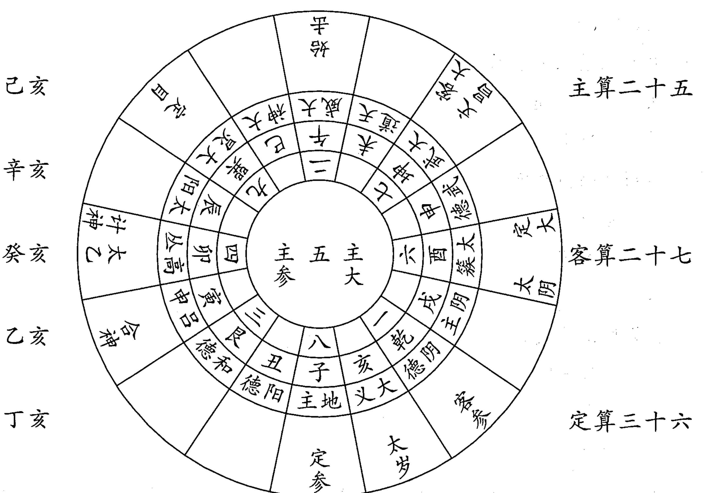
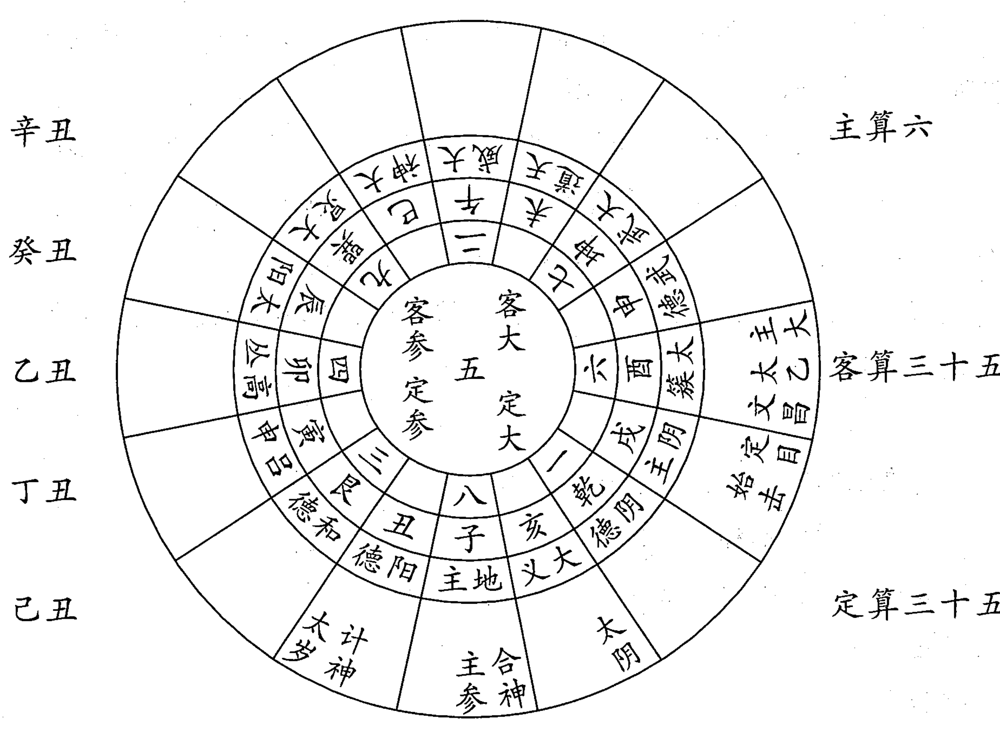
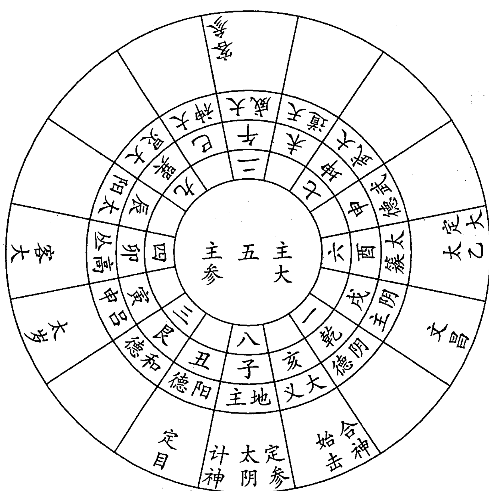
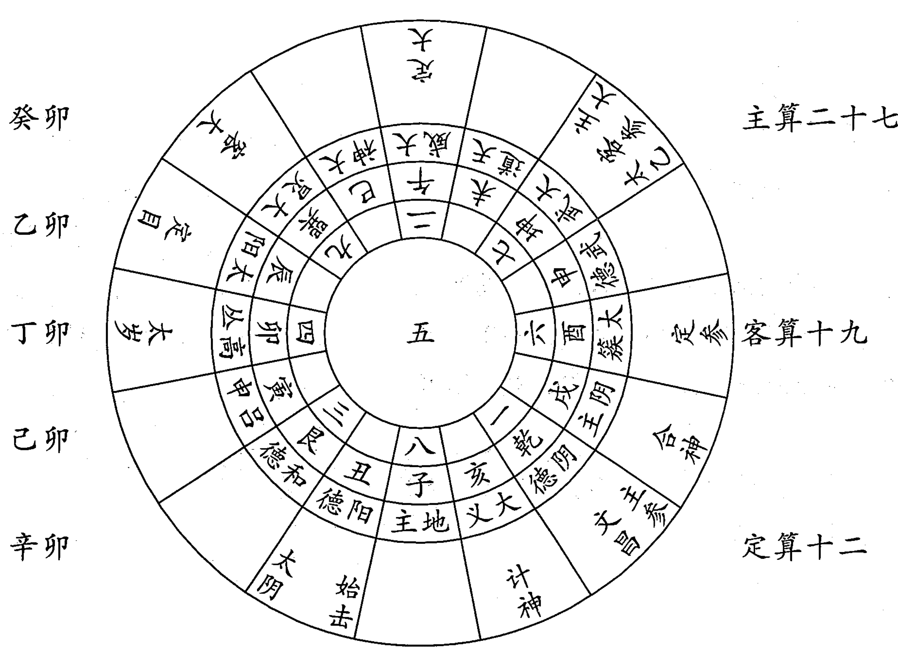
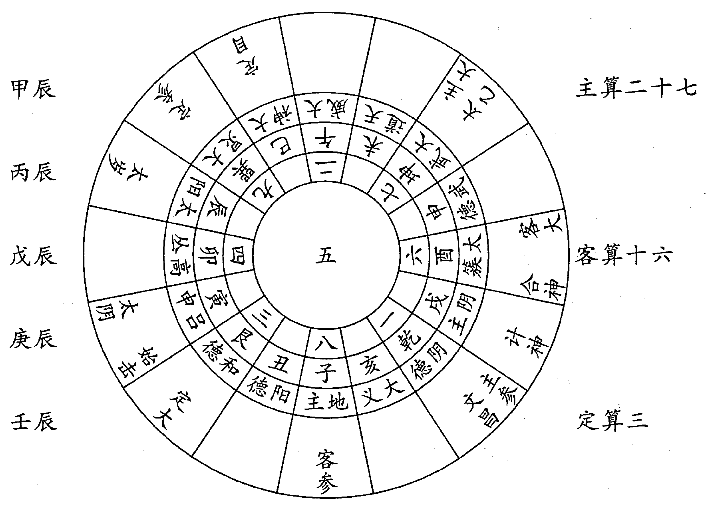
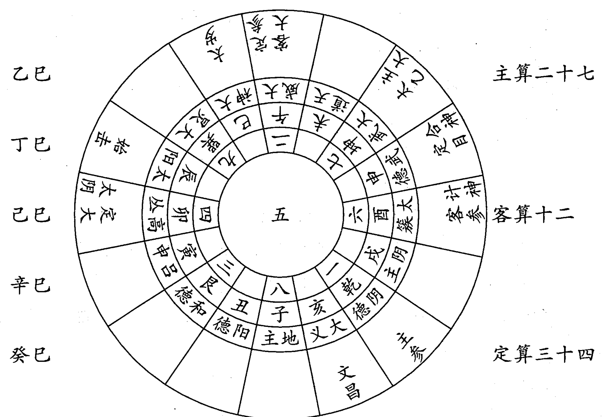
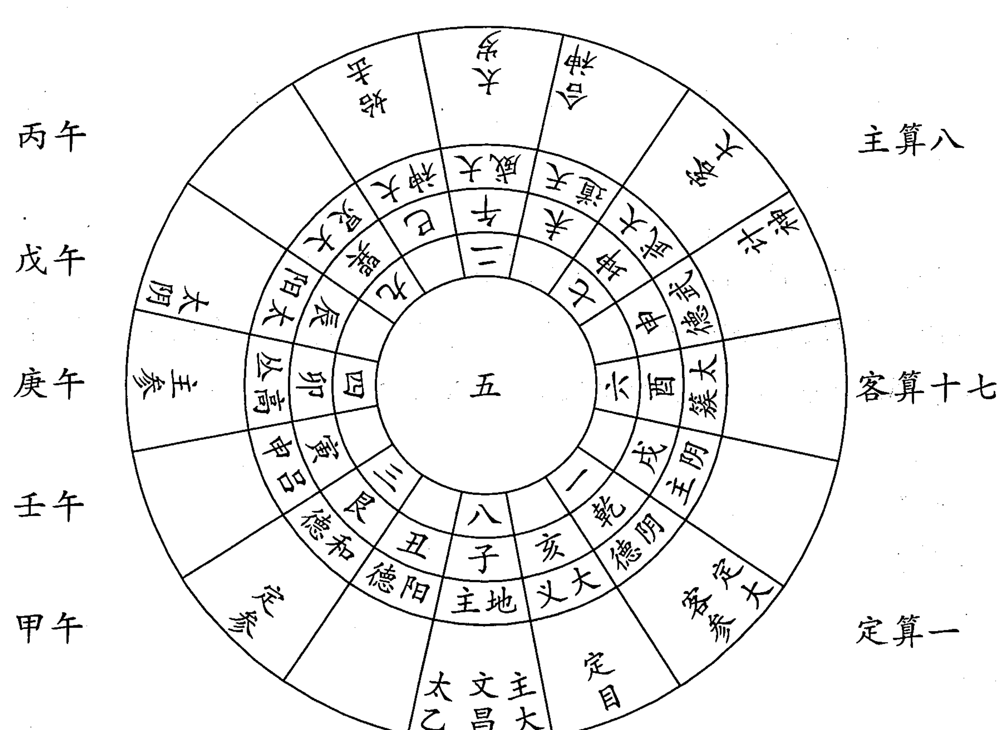
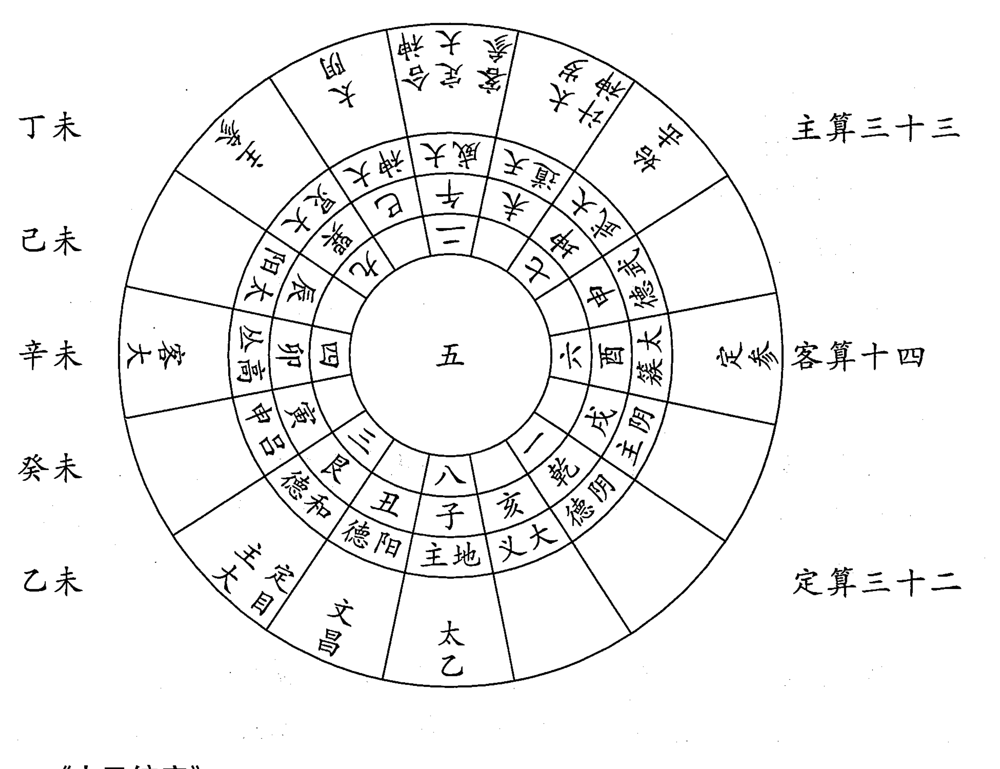

易数精华

## 太乙局图

## 释义汇编

杨景磐 编校

中国国际广播音像出版社

## 太乙局图释义汇编

杨景磐 编校

中国国际广播音像出版社

## 图书在版编目(CIP)数据

易数精华：太乙局图释义汇编 杨景磐 编校
北京：中国国际广播音像出版社，2006，5，
ISBN 7-89994-276-4/C51.09
Ⅰ、易... Ⅱ、杨... Ⅲ、社...

## 易数精华：太乙局图释义汇编

杨景磐 编校

责任编辑：村 言 监 制：高延赛
封面设计：文 德 版式设计：文 德
出品发行：中国国际广播音像出版社
地 址：北京复兴门外大街2号(国家广电总局内)
邮 编：100866
印 刷：三河市南阳印刷厂
开 本：710×1000mm 1/16
印 张：23.5
字 数：340千字
印 数：1000
版 次：2009年6月北京第2版
印 次：2009年6月北京第1次

ISBN7-89994-276-4/C51.09 全套定价：650.00元

版权所有 盗版必究 印制有问题请与印厂调换

## 目 录

编校者说明

- 太乙阳遁七十二局图释义
  - 第一局
  - 第二局
  - 第三局
  - 第四局
  - 第五局
  - 第六局
  - 第七局
  - 第八局
  - 第九局
  - 第十局
  - 第十一局
  - 第十二局
  - 第十三局
  - 第十四局
  - 第十五局
  - 第十六局
  - 第十七局
  - 第十八局
  - 第十九局
  - 第二十局
  - 第二十一局
  - 第二十二局
  - 第二十三局
  - 第二十四局
  - 第二十五局
  - 第二十六局
  - 第二十七局
  - 第二十八局
  - 第二十九局
  - 第三十局
  - 第三十一局
  - 第三十二局
  - 第三十三局
  - 第三十四局
  - 第三十五局
  - 第三十六局
  - 第三十七局
  - 第三十八局
  - 第三十九局
  - 第四十局
  - 第四十一局
  - 第四十二局
  - 第四十三局
  - 第四十四局
  - 第四十五局
  - 第四十六局
  - 第四十七局
  - 第四十八局
  - 第四十九局
  - 第五十局
  - 第五十一局
  - 第五十二局
  - 第五十三局
  - 第五十四局
  - 第五十五局
  - 第五十六局
  - 第五十七局
  - 第五十八局
  - 第五十九局
  - 第六十局
  - 第六十一局
  - 第六十二局
  - 第六十三局
  - 第六十四局
  - 第六十五局
  - 第六十六局
  - 第六十七局
  - 第六十八局
  - 第六十九局
  - 第七十局
  - 第七十一局
  - 第七十二局

## 太乙阴遁七十二局图释义

- 第一局
- 第二局
- 第三局
- 第四局
- 第五局
- 第六局
- 第七局
- 第八局
- 第九局
- 第十局
- 第十一局
- 第十二局
- 第十三局
- 第十四局
- 第十五局
- 第十六局
- 第十七局
- 第十八局
- 第十九局
- 第二十局
- 第二十一局
- 第二十二局
- 第二十三局
- 第二十四局
- 第二十五局
- 第二十六局
- 第二十七局
- 第二十八局
- 第二十九局
- 第三十局
- 第三十一局
- 第三十二局
- 第三十三局
- 第三十四局
- 第三十五局
- 第三十六局
- 第三十七局
- 第三十八局
- 第三十九局
- 第四十局
- 第四十一局
- 第四十二局
- 第四十三局
- 第四十四局
- 第四十五局
- 第四十六局
- 第四十七局
- 第四十八局
- 第四十九局
- 第五十局
- 第五十一局
- 第五十二局
- 第五十三局
- 第五十四局
- 第五十五局
- 第五十六局
- 第五十七局
- 第五十八局
- 第五十九局
- 第六十局
- 第六十一局
- 第六十二局
- 第六十三局
- 第六十四局
- 第六十五局
- 第六十六局
- 第六十七局
- 第六十八局
- 第六十九局
- 第七十局
- 第七十一局
- 第七十二局

## 编校者说明

明人王鹤鸣《登坛必究》中的《说太乙》、《太乙数统宗大全》和《古今图书集成》中的《太乙局》，这些典籍中对太乙局图都有解释，笔者将其汇总在一起，组成《太乙局图释义汇编》一书，便于读者研读。

古代典籍中往往错字较多，笔者对这些错字皆作了校改，并加上标点符号。但各书对太乙局图内容的解释，不尽一致，甚至有相互矛盾之处。对于这些内容方面存在的问题，一仍其旧，保持原文。笔者认为，现在能见到的古代太乙典籍太少，或者古人往往有不同的见解，我们只有参考更多资料才能分辨。保留古籍原文，应当是一个重要的原则问题。

太乙局图中，有些内容属于推演错误或数值计算错误，尤其《太乙数统宗大全》中错误更多，这部分内容均作了校改，《太乙局图释义汇编》中的局图基本上没有错误了。但是，由于笔者水平所限，恐怕还是有未能校改的错误，敬请读者指正。

杨景磐甲午年5月25日写于文新墨旧斋

## 太乙阳遁七十二局图释义

太乙阳遁七十二局图式是按照太乙运式方法推演而成，太乙年局、月局、日局取用阳遁七十二局图式，不取用阴局。太乙时局冬至后至夏至前取用阳遁局图式，夏至后至冬至前取用阴遁局图式。一说日局冬至后至夏至前也取用阳局图式，夏至后至冬至前取用阴局图式。

### 第一局

《登坛必究》：
太乙在一宫，天目武德。
主算七。主大将七宫客目掩。主参将一宫囚。始击将大武，掩主大将。
客算十三和。客大将三宫发。客参将九宫格。计神寅。
此局客算长和，门具将发，利为客。见阵利先动，出军宜东北方，攻西南方；利直阵，举青旗；云气从北来，客胜；闻贼备西南，奇兵西南，伏兵利戌亥时。
太乙虽助主，主大将为客目掩之，算短不和，不利为主，闻贼备西南。

《太乙统宗》：
太乙 一 绝阳
天目 武德 地目 内击 主算 七 单阳无天 主大将 七 主参将 一
计神 寅
始击 大武 掩主大将 内击天目 客算 十三 客大将 三 客参将 九 格太乙
绝气

《太乙局》：
太乙阳遁一局
太乙在一宫理天
计神在吕申
主目文昌将武德
    主算单七
    主大将七宫
    主参将一宫
客目始击将大武
    客算十三
    客大将三宫
    客参将九宫

甲子 一局 丙子 七十三局 戊子 一百四十五局 庚子 二百一十七局 壬子 二百八十九局

此局算得太乙在一宫理天，天内助主，天有变异。此时贼从西南来，敌使不可信，奸细不入。贼人乘休气，可击，去乘旺气，不可犯。

文昌在外地，可攻内地。
主算单七，单阳无天，有兵无将，太乙虽助，不宜大举征伐。
主大将七宫，客目掩，乘囚气、宜整兵固守，不可展阵交锋，必死败。
主参将一宫囚，乘休气，不宜出兵交锋，妄动必受拘执，宜固守。
出兵举白旗，列方阵，出向西南；战向东北。奇兵安申地，伏兵利戌亥时。战备西南，风云飞鸟从东南来，冲向太乙宫，急备大战。风云飞鸟自我阵后，冲入敌阵去，为之天助，宜顺而击之，大胜。
主将行兵，车骑在先，步兵次之，大将居中，急躁而出向西南，战向东北。伺敌先举，然后应之。此为主后应之道。

始击在七宫，掩主大。
客算十三，重阳。
客大将三宫发，乘相气，宜举征伐，深入缓攻取胜。
客参将九宫，格太乙。凡事格易，乘休气，不利有为，宜固守。
出兵举青旗，列直阵，出向东北，战向西南，战备西北。奇兵安坤地，伏兵利戌亥时。飞鸟风云从东南来冲向太乙宫，急备大战。飞鸟风云自我阵后来，冲入敌阵去，为之天助，宜顺而击之，大胜。
客将行兵，步兵在前，车骑次之，大将居中，静出向东北行，遇敌提兵向西南。先举击之，乃为客先举之道也。

### 第二局

《登坛必究》：
太乙在一宫，天目太簇。
主算六，不和。主大将六宫内迫。主参将八宫，外迫。始击将阴主，击。计神丑。客算一，不和。客大将一宫囚，主挟。客参将三宫。
此局主大小将挟客，客大将囚，主客俱不利，各宜固守。主闻贼备正西，客闻贼备西北。

《太乙统宗》：
太乙 一
天目 太簇 内宫迫 绝气 主算 六 孤阴 无天 不和 主大将 六 主参将 八 外宫迫
计神 丑
始击 阴主 内辰击 客算 一 无天地 单阳不和 客大将 一 四 客参将
三 与太乙挟主参将

《太乙局》：
太乙阳遁二局
太乙在一宫理地
计神在丑
主目文昌将大簇
    主算单六
    主大将六宫
    主参将八宫
客目始击将阴主
    客算单一
    客大将一宫
    客参将三宫

乙丑 二局 丁丑 七十四局 己丑 一百四十六局 辛丑 二百一十八局 癸丑 二百九十局

此局算得太乙在一宫理地，天内助主。
此时声息，有敌人自西北方入寇，闻事吉虚凶实，敌使不可信。贼来休气，可击；去乘相气，不可追击。

文昌在太簇，内宫迫，在外地可攻内，大臣逆命。
主算单六，重阴不和，短而无将，不宜举兵征伐。
主大将六宫迫，主目关，不利有为，乘死气，不宜出兵攻战，固守不失。
主参将八宫迫，乘相气，客挟，不利有为，亦当固守。

### 第三局

《登坛必究》：
太乙在一宫，天目阴主，辰迫。
主算单一不和，主大将一宫囚，主参将三宫发。始击将大义，辰迫。客算四十，不和。客大将四宫发，客参将二宫发。计神子。

此局客算长，门具将发，利为客。见阵利先动，出军宜正东，战利正西，利锐阵，举赤旗。云气从东来，客胜，闻贼备西北。奇兵西北，伏兵利戌亥时。

主目辰迫，不和，算短，大将囚，不利为主。宜固守，闻贼备正东。

《太乙统宗》：
太乙 一
天目 阴主 内辰迫 主算 一 天无地 单阳不和 主大将 一 囚 绝阳 主参将 三
计神 子
始击 大义 外辰击 客算 四十 客大将 四 绝气 客参将 二 易气

《太乙局》：
太乙阳遁三局
太乙在一宫理人
计神在地主
主目文昌将阴主
主算一
主大将一宫
主参将三宫
客目始击将大义
客算四十
客大将四宫
客参将二宫

丙寅 三局 戊寅 七十五局 庚寅 一百四十七局 壬寅 二百一十九局 甲寅 二百九十一局

此局算得太乙在一宫，理人，天内助主。
此时声息有贼入寇，逼迫，自西北方来，将吏全。敌使言可信，贼人乘休气，去乘囚气，皆可击。

文昌在戌，外地可攻内地，内辰迫，大臣逆命。
主算单一，单阳无地，短而无将吏。太乙虽助，不利为主，不宜大举征伐。

主大将一宫囚，乘休气，不利有为，不宜举兵征伐。轻动，有拘执之咎。
主参将三宫发，乘相气，可以伏兵拒敌，浅进攻战，取胜。
出兵举黑旗，列曲阵，出向西北，战向东南，战备西北。奇兵安戌地，伏兵利戌亥时。风云飞鸟自东南来，冲向太乙宫，急备大战。风云飞鸟自我阵后来，冲入敌阵去，为之天助，宜顺而击之，大胜。
主将行兵，步卒在前，车骑在后，大将居中，静出向西北，遇敌提兵向东南，伺敌先举，然后应之。

始击在亥，文章兴，兵火发。
客算四十，孤阴，将吏全，太乙不助，可以举兵征伐。
客大将四宫发，乘旺气，宜率兵深入敌境，缓攻取胜立功。
客参将二宫发，乘囚气，可以陈兵拒敌，不宜远出深入。
出兵举赤旗，列锐阵，出向正东，战向正西，战备西北。奇兵安亥地，伏兵利戌亥时。风云飞鸟自东南来，冲向太乙宫，急备大战。风云飞鸟自我阵后来，冲入敌人阵去，为之天助，宜顺而击之，大胜。
客将行兵，车骑在前，步卒次之，大将居中，急躁而出向正东，遇敌提兵向西，先举击之，乃为客先起之道。

### 第四局

《登坛必究》：
太乙在二宫，天目阴德。
主算二十五，八门杜。主大、主参不出中宫。始击将阳德。客算十七，不和。客大将七宫，内迫。客参将一宫发。计神亥。
此局主人杜塞无门，客算不和，大将迫，主客俱不利。主闻贼备西北，客闻贼备东北。

《太乙统宗》：
太乙 二
天目 阴德 绝阳 主算 二十五 杜
计神 亥
始击 阳德 客算 十七 重阳 客大将 七 外宫迫 客参将 一 与主目关 绝阳

《太乙局》：
太乙阳遁四局
太乙在二宫理天
计神在亥
主目文昌将阴德
主算二十五
主大将中宫
主参将中宫
客目始击将阳德
客算十七
客大将七宫
客参将一宫
丁卯 四局 己卯 七十六局 辛卯 一百四十八局 癸卯 二百二十局 乙卯 二百九十二局

此局算得太乙在二宫，理天，天外助客。
此时声息有警，贼入东北方，敌使言虚，奸细不入，贼人乘囚气，可击，去乘休气，亦可追。

文昌在乾，内地可攻外。
主算二十五，杜塞无门。
主二将固守不出。

始击在阳德，并太阴，臣失爵禄，关梁闭塞，后妃怀二。
客算十七，重阳，厄火，不宜大举征伐，而防火灾。
客大将七宫，外迫，大臣逆命，举事攻内，乘囚气，不利有为。惟宜坚壁固守，不宜出兵攻战。
客参将一宫关，乘休气，自相谋并，不利有为，不宜出兵征伐。
出兵举白旗，列方阵，出向西南，战向东北，战备东北。奇兵安丑地，伏兵利巳午未时。风云飞鸟从正北来冲向太乙宫，急备大战。风云飞鸟从我阵后来，冲向敌人阵去，为之天助，宜顺而击之，大胜。
客将行兵，车骑在前，步卒次之，大将居中，急躁而出向西南，遇敌，提兵向东北，先举兵击之，乃为客先起之道。

### 第五局

《登坛必究》：
太乙在二宫，天目阴德。
主算二十五，八门杜。主大将、参将不出中宫。始击将吕申。客算十四，不和。客大将四宫发。客参将囚。计神戌。
此局太乙助客。客算不和。大将发，利为客。见阵利先动。出军宜正东，战利正西，利锐阵，举赤旗。云气从东来，客胜。闻贼备东北。奇兵东北，伏兵利巳午未时。
主人杜塞无门，不利，宜固守，闻贼备西北、正东。

《太乙统宗》：
太乙 二
天目 阴德 主算 二十五 杜
计神 戌
始击 吕申 客算 十四 客大将 四 绝气 客参将 二 易气 囚

《太乙局》：
太乙阳遁五局
太乙在二宫理地
计神在阴主
主目文昌将阴德
主算二十五
主大将中宫
主参将中宫
客目始击将吕申
客算十四
客大将四宫
客参将二宫
戊辰 五局 庚辰 七十七局 壬辰 一百四十九局 甲辰 二百二十一局 丙辰 二百九十三局

此局算得太乙在二宫，理地，天外助客，上将连谋。
此时声息有，贼从东北方来，闻事吉实凶虚。敌使不可信，奸细不入，贼有将，兵和，来乘囚气，去乘死气，皆可追击。

文昌在乾，内地可攻外地。
主算二十五，杜塞无门。
主二将固守不出。

始击在寅，后妃怀二，士卒流亡。
客算十四，上和，无地，宜举兵征伐。
客大将四宫发，乘旺气，宜举兵深入敌境，缓攻取胜，建立大功。
客参将二宫囚，又乘囚气，不利有为，惟宜固守，妄动则主拘执。
出兵举赤旗，列锐阵，出向正东，战向正西，战备东北，奇兵安寅地，伏兵利巳午未时。风云飞鸟从正北来，冲向太乙宫，急备大战。风云飞鸟自我阵后来，冲向正西去，此为天助，宜顺而击之，大胜。
客将行兵，步卒在前，车骑在后，大将居中，静默而出向正东，遇敌，旋兵向正西，先举击之，为客之道。

### 第六局

《登坛必究》：
太乙在二宫，天目大义。
主算二十五，八门杜，主大、主参不出中宫。始击将太阳，客算十，孤阳。客大将一宫发，客参将三宫发。计神酉。
此局太乙助客，客大小将发，利为客，见阵利先动，出军宜西北，战利东南，利曲阵。举黑旗。云气从西北来，客胜。闻贼备东南，奇兵东南，伏兵利巳午未时。

主人杜塞无门，不利，宜固守，闻贼备西北。为客，赤云至，疾战胜。

《太乙统宗》：
太乙 二
天目 大义 主算 二十五 杜
计神 酉
始击 太阳 客算 十 孤阳不和 客大将 一 绝气 内迫主目 客参将 三

《太乙局》：
太乙阳遁六局
太乙在二宫理人
计神在大簇
主目文昌将大义
主算二十五
主大将中宫
主参将中宫
客目始击将太阳
客算单十
客大将一宫
客参将三宫

己巳 六局 辛巳 七十八局 癸巳 一百五十局 乙巳 二百二十二局 丁巳 二百九十四局

此局算得太乙在二宫理人，天外助客。
此时声息有警，有将兵，不和，从东南方来，敌使不可信，贼之细作不入，贼来乘囚气，去乘旺气，来可截击，去不可追犯。

文昌在亥，在内可攻外。
主算二十五，杜塞无门。
主大小将固守不出。

始击在辰，民多病。
客算单十，孤阳无人。
客大将一宫发，举兵攻战，获胜。但乘休气，而数不和不宜深入久攻。
客参将三宫发，乘相气，宜率兵攻击，取胜即止。
出兵举黑旗，列曲阵，出向西北，战向东南，战备东南，奇兵安辰地，伏兵利巳午未时。风云飞鸟从正北来，冲向太乙宫，急备大战。风云飞鸟从我阵后来，冲向东南方去，乃为天助，宜顺而击之，大胜。
客将行兵，步卒在前，车骑次之，大将居中，静默而出向西北，遇敌，提兵向东南，先举击之，大胜。

### 第七局

《登坛必究》：
太乙在三宫，天目地主。
主算八，不和。主大将八宫，内迫。主参将四宫，外迫。始击将大神，客算二十五，八门杜。
客大将、参将不出中宫。计神申。
此局主人大小将迫，客杜塞无门，主客俱不利，各宜固守。主闻贼备正北，客闻贼备东南。

《太乙统宗》：
太乙 三
天目 地主 内宫迫 易气 主算 八 主大将 八 关 主参将 四 绝气
计神 申
始击 大神 客算 二十五 杜

《太乙局》：
太乙阳遁七局
太乙在三宫理天
计神在武德
主目文昌将地主
主算单八
主大将八宫
主参将四宫
客目始击将大神
客算二十五
客大将中宫
客参将中宫

庚午 七局 壬午 七十九局 甲午 一百五十一局 丙午 二百二十二局 戊午 二百九十五局

此局算得太乙在三宫，理天，天内助主，天有变异。
此时声息无，贼奸细不入。

文昌在子，内地可攻外地，迫太乙，大臣逆命。关主大将，同类相谋，不利有为。
主算单八，单阴无天，短而无将，不宜大举征伐。
主大将八宫，迫太乙，关主目，同类相谋，不利有为，乘相气，宜拒守要害，伏兵邀击，取胜即止。
主参将四宫迫，乘旺气，可以伏兵，击其首尾，取胜即止。
出兵举黑旗，列曲阵，出向正北，战向正南，战备正北。奇兵安子地，伏兵利丑寅时。风云飞鸟从西南来，冲向太乙宫，急备大战。风云飞鸟自我阵后来，冲入敌阵去，为之天助，宜顺而击之，大胜。

主将行兵，车骑在前，步卒次之，大将居中，鼓噪而出向正北行，遇敌提兵向正南，伺敌先举，然后应之，大胜。

始击在巳，阴阳失序，多雨水。
客算二十五，杜塞无门。
客大小将不出中五，不宜妄举。

### 第八局

《登坛必究》：
太乙在三宫，天目阳德，辰迫。
主算单一，短。主大将一宫发，主参将三宫囚。始击将临大武，客算二十二，长和。客大将二宫发，客参将六宫发。计神未。

此局客算长和，门具将发，利为客。见阵利先动，出军宜正南，战利正北，用圆阵，举黄旗。云气从正南来，客胜。闻贼备西南，奇兵西南，伏兵利丑寅时。

主目迫，算短，参将囚，主人不利，宜固守。闻贼备西北。

《太乙统宗》：
太乙 三
天目 阳德 主算 一 无天地 主大将 一 绝阳 主参将 三 囚
计神 未
始击 大武 客算 二十二 重与室位并 客大将 二 易绝 客参将 六 绝气

《太乙局》：
太乙阳遁八局
太乙在三宫理地
计神在天道
主目文昌将阳德
主算单一
主大将一宫
主参将三宫
客目始击将大武
客算二十二
客大将二宫
客参将六宫

辛未 八局 癸未 八十局 乙未 一百五十二局 丁未 二百二十四局 己未 二百九十六局

此局算得太乙在三宫，理地，天内助主，地有变异，水旱不均。
此时声息，贼自西南方来，来乘相气，去亦乘相气，皆不可犯，敌使言虚，奸细不入。

文昌在丑，内地可攻外地，内辰迫，大臣逆命，举事攻外。
主算单一，单阳无地，不宜大举征伐。
主大将一宫发，乘休气，不可出兵攻击，算中无将吏，不利有为，可以伏兵截击。
主参将三宫囚，轻动则有拘执奔败事，乘相气，固守不失。
出兵举黑旗，列曲阵，出向西北，战向东南，战备东北，奇兵安丑地，伏兵利丑寅时。风云飞鸟从西南来，冲向太乙宫，急备大战。风云飞鸟自我阵后来，冲入敌人阵去，为之天助，宜顺而击之大胜。
主将行兵，步卒在前，车骑次之，大将居中，出向西北，遇敌提兵向东南，静默后应，乃为主之道。

始击在坤，格太乙。盗侮其君，牛马急走。
客算二十二，重阴而长，可以举兵征伐。
客大将二宫发，乘囚气，宜按兵伏击取胜，不宜大举深入。
客参将六宫发，可以陈兵拒敌，策应，乘死气，不宜大举。
出兵举黄旗，列圆阵，出向正南，战向正北，战备西南，奇兵安坤地，伏兵利丑寅时。风云飞鸟自西南来，冲向太乙宫急备大战。风云飞鸟自我阵后来，冲入敌人阵去，为之天助，宜顺而击之，大胜。
客将行兵，步卒在前，车骑次之，大将居中，静出向正南，遇敌旋兵向正西，举兵击之，乃为客之道也。

### 第九局

《登坛必究》：
太乙在三宫，天目和德，囚。
主算三，不和。主大将三宫囚，主参将九宫发。始击将大簇，客算十五，八门杜。客大将、参将不出中宫。计神午。
此局主目、主大将囚。客杜塞无门。主客俱不利，宜固守。
主闻贼备东北，客闻贼备正西。

《太乙统宗》：
太乙 三
天目 和德 囚 主算 三 无天地 孤阳 主大将 三 囚 主参将 九 绝阴
计神 午
始击 太簇 关 客算 十五 杜

《太乙局》：
太乙阳遁九局
太乙在三宫理人
计神在大威
主目文昌将和德
主算单三
主大将三宫
主参将九宫
客目始击将大簇
客算十五
客大将中宫
客参将中宫

壬申 九局 甲申 八十一局 丙申 一百五十三局 戊申 二百二十五局 庚申 二百九十七局

此局算得太乙在三宫理人，天内助主，太岁格，主有奔败事。
此时声息无，贼敌使奸细皆不来。

文昌在三宫，在内可攻外地，囚太乙宫，有拘执奔败事。
主算三，单阳不和，无地无将吏，不宜大举征伐。
主大将三宫囚、关，为争明自败，不利有为，乘相，固守，无拘执之事。

主参将九宫发，乘休气，可以出兵拒守要害，伏兵攻击。
出兵举青旗，列直阵，出向东北，战向西南，战备东北，奇兵安艮地，伏兵利丑寅时。风云飞鸟自西南来，冲向太乙宫，急备大战。风云飞鸟自我阵后来，冲入敌阵去，为之天助，宜顺而击之，大胜。

主将行兵，步卒在前，车骑次之，大将居中，静出向东北，遇敌提兵向西南，伺敌先举，然后应之。

始击在酉，嬖宠进宫。
客算十五，杜塞无门。
客大小将固守不出。

### 第十局

《登坛必究》：
太乙在四宫，天目吕申，辰迫。
主算一，和。主大将一宫发。主参三宫，内迫。始击将阴德。客算十二，长和。客大将二宫发，客参将六宫格。计神巳。

此局客算长和，大将发，利为客。见阵利先动，出军宜正南，战利正北，用圆阵，举黄旗。云气从南来，客胜。闻贼备西北，奇兵西北，伏兵寅卯辰时。

主目参将迫，太乙虽助主，主人算短，不利，宜固守，闻贼备东北。

《太乙统宗》：
太乙 四 绝气
天目 吕申 内宫迫 主算 一 无天地 单阳 主大将 一 绝气 主参将 三 内宫迫
计神 巳
始击 阴德 掩主大将 客算 十二 和 无地 客大将 二 易气 客参将 六 对太乙 绝气

《太乙局》：
太乙阳遁十局
太乙在四宫理天
计神在大神
主目文昌将吕申
主算单一
主大将一宫
主参将三宫
客目始击将阴德
客算十二
客大将二宫
客参将六宫

癸酉 十局 乙酉 八十一局 丁酉 一百五十四局 己酉 二百二十六局 辛酉 二百九十八局

此局算得太乙在四宫，理天。天内助主，天有变異，四序不和。
此时声息有，贼自西北方来，敌使不可信，奸细不入，贼来乘旺气，去乘旺气，皆不可犯。

文昌在吕申，内地可攻外地，内辰迫，大臣逆命，举事攻外。
主算一，单阳无地，短而无将吏，不宜举兵征伐。
主大将一宫，始击掩，又乘休气，不宜举兵，战必死败。主参将三宫迫，乘相气，不宜举兵，固守不失。
出兵举黑旗，列曲阵，出向西北，战向东南，战备东北，奇兵安寅地，伏兵利寅卯辰时，风云飞鸟自正西来，冲向太乙宫，急备大战。风云飞鸟自我阵后，冲入敌阵去，为天助，宜顺而击之，大胜。
主将行兵，步卒在前，车骑次之，大将居中，静出向西北行，遇敌，旋兵向东南，伺敌先举，然后应之，乃为主之道。

始击在一宫，掩主大将。
客算十二，无地，宜举兵征伐，算中在囚气宫，不可久战，取胜即止。
客参将六宫，格太乙，乘死气，凡事格易，敌人侵掠，不利有为，严加固守。
出兵举黄旗，列圆阵，出向正南，战向正北，战备西北，奇兵安乾地，伏兵利寅卯辰时。风云飞鸟自正西来，冲向太乙宫，急备大战。风云飞鸟自我阵后来，冲入敌阵去，为之天助，宜顺而击之，大胜。
客将行兵，步卒在前，车骑在后，大将居中，静出向正南行，遇敌旋兵向正北。先举兵击之，乃为客之道。

### 第十一局

《登坛必究》：
太乙在四宫，天目高丛，囚。
主算四，不和。主大将四宫囚，主参将二宫发。始击将阳德。客算四，不和。客大将四宫囚，客参将二宫发。计神辰。
此局主客大将囚、关，主客俱不利，各宜固守。
主闻贼备正东，客闻贼备东北。

《太乙统宗》：
太乙 四
天目 高丛 关 主算 四 无天地 孤阴 主大将 四 绝气 主参将 二 易气
计神 辰
始击 阳德 客算 四 无天地 孤阴 客大将 四 囚关 主目、主大将俱在绝气
客参将 二 易气

《太乙局》：
太乙阳遁十一局
太乙在四宫理地
计神在太阳
主目文昌将高丛
主算单四
主大将四宫
主参将二宫
客目始击将阳德
客算单四
客大将四宫
客参将二宫

甲戌 十一局 丙戌 八十三局 戊戌 一百五十五局 庚戌 二百二十七局 壬戌 二百九十九局

此局算得太乙在四宫，理地，天内助主，地有变巽，水旱为厄，牺牲多死，五谷不登。
此时声息贼入寇，闻事凶实吉虚，奸细人，有私通于外者。敌使言不可信，贼来乘休气，可击。

文昌将在四宫，内地，囚太乙宫，关客大将，为四郭固，有拘执之事，奔败之祸，大凶。
主算四，单阴，无地，无将吏，不利有为。
主大将四宫，囚太乙宫，关主目客大，虽乘旺气，不利有为，同类相谋。

### 第十二局

乙亥
丁亥
己亥
辛亥
癸亥

主算三十七

客算一

定算四

#### 《登坛必究》：

太乙在四宫，天目太阳，辰迫。
主算三十七，长和。主大将七宫发，主参将一宫发。始击将吕申，辰击。客算一，客大将一宫发，客参将三宫内迫。计神卯。
此局太乙助主，主算长和，大小将门具将发，利为主。见阵利后动，出军宜西南，战利东北，用方阵，举白旗。云气从西南来，主胜。闻贼备东南，奇兵东南，伏兵利寅卯辰时。
客算短，不和。客目辰击，参将内迫，不利为客，宜固守，闻贼备东北。

#### 《太乙统宗》：

太乙 四
天目 太阳 外辰迫 主算 三十七 重阳 主大将 七 主参将 一 绝阳
计神 卯
始击 吕申 内辰击 客算 一 单阳 无天地 客大将 一 客参将 三 内迫

#### 《太乙局》：

太乙阳遁十二局
太乙在四宫理人
计神在高丛
主目文昌将太阳
主算三十七
主大将七宫
主参将一宫
客目始击将吕申
客算单一
客大将一宫
客参将三宫

乙亥 十二局 丁亥 八十四局 己亥 一百五十六局 辛亥 一百二十八局 癸亥 三百局

此局算得太乙在四宫理人，天内助主，上凌下僭。
此时声息，有贼入寇，逼迫，无将吏，兵少。敌使不可信，奸细不入，贼从东北方来，来乘旺气，去乘囚气，来不可触犯，去不可掩击。

文昌在太阳，内地可攻外，外辰迫，大臣逆命，举事攻内。
主算三十七，算长，将吏全，可以举兵征伐。
主大将七宫发，宜出征战，深入缓攻，乘囚气，取胜即止。
主参将一宫，关客大，乘休气，不利有为，宜固守。
出兵举白旗，列方阵，出向西南，战向东北，战备东南，奇兵安辰地，伏兵利寅卯辰时。风云飞鸟从正西来，冲向太乙宫，急备大战。风云飞鸟自我阵后来，冲入敌阵去，为天助，宜顺而击之，大胜。
主将行兵，车骑在前，步卒次之，大将居中，急躁而出向西南，遇敌，旋兵向东北，伺敌先举，然后应之，乃为主之道。

始击在寅。
客算一，单阳无地，无将吏，兵少，不宜举兵征伐。
客大将一宫，关主参，乘休气，不利有为，宜固守。
客参将三宫，内宫迫，不宜大举，乘相气，可以拒守要害，击其首尾，取胜，不可久敌。
出兵举黑旗，列曲阵，出向西北，战向东南，战备东北，奇兵安寅地，伏兵利寅卯辰时。风云飞鸟从正西来，冲向太乙宫，急备大战。风云飞鸟自我阵后来，冲入敌阵去，为之天助，宜顺而击之，大胜。
客将行兵，步卒在前，车骑次之，大将居中，静出向西北行，遇敌，提兵向东南，先举兵击之，乃为客之道。

### 第十三局

#### 《登坛必究》：

太乙在六宫，天目大炅。
主算十八，长和。主大将八宫发，主参将四宫格。始击将太阳，客算十九，长和。客大将九宫发，客参将七宫发。计神寅。
此局太乙助客，大小将利。主见阵利后动，出军宜正北，战利正南，战用曲阵，举黑旗。云气从北来，主胜，闻贼备东南，奇兵东南，伏兵利申酉戌时。
客见阵利先行动，出军宜东南，战利西北，利锐阵，举赤旗。云气从东来，客胜。闻贼备东南，奇兵东南，伏兵利申酉戌时。

#### 《太乙统宗》：

太乙 六
天目 大炅 绝阴 主算 十八 和 主大将 八 主参将 四 对太乙 绝气
计神 寅
始击 太阳 内击主目 客算 十九 重阳 客大将 九与主目关 客参将 七
内宫迫

#### 《太乙局》：

太乙阳遁十三局
太乙在六宫理天
计神在吕申
主目文昌将大炅
    主算十八
    主大将八宫
    主参将四宫
客目始击将太阳
    客算十九
    客大将九宫
    客参将七宫
丙子 十三局 戊子 八十五局 庚子 一百五十七局 壬子 二百二十九局 甲子 三百一局

此局算得太乙在六宫，理天，外助客。
此时声息有贼人，从东南方来，敌使言实，奸细入觇，有私通于外之人，贼人乘死气，可伏兵截击，去乘相气，不可追犯。

文昌在大炅，内地可攻外地，关客大，主有私通于外之人。
主算十八，上和，将吏全，宜大举征伐。
主大将八宫发，乘相气，宜率兵深入敌境，缓攻取胜，建立大功。
主参将四宫，格太乙，凡事格易，不宜大举，可以陈兵策应，按兵伏击，取胜。

出兵举黑旗，列曲阵，出向正北，战向正南，战备东南，奇兵安巽地，伏兵利申酉戌时。风云飞鸟自正东来，冲向太乙宫，急备大战。风云飞鸟自我阵后来，冲入敌阵去，为天助，宜顺而击之，大胜。

主将行兵，车骑在前，步卒次之，大将居中，急躁出向正北，遇敌旋兵向正南，伺敌先发，然后应之，乃为主之道。

始击在辰，大人有忧。
客算十九，重阳，厄火，不宜征发，军中防火灾。
客大将九宫，关文昌，乘休气，不利有为，宜固守。

出兵举赤旗，列锐阵，出向东南，战向西北，战备东南，奇兵安辰地，伏兵利申酉戌时。风云飞鸟自我阵后来，冲入敌阵去，为天助，宜顺而击之，大胜。

客将行兵，车骑在前，步卒次之，大将居中，急躁而出向东南行，遇敌，旋兵向西北，先举兵击之。

### 第十四局

> 《登坛必究》：
太乙在六宫，天目大神。
主算十，孤阳。主大将一宫，外迫。主参将三宫发。客算九，和。客大将九宫发，客参将七宫内迫。计神丑。
此局太乙助客，客算长和，大将发，利为客。见阵利先动，出军宜东南，战利西北，利锐阵，举赤旗。云气从东南来，客胜。闻贼备正南，奇兵正南，伏兵利申酉戌时。
主大将迫，不利为主，宜固守，闻贼备东南。

#### 《太乙统宗》：

太乙 六

天目 大神 主算 十 无地人 孤阳 主大将 一 外宫迫 主参将 三

计神 丑

始击 大威 易气 外击主目 客算 九 孤阳 客大将 九 绝阴 客参将 七

内宫迫

#### 《太乙局》：

太乙阳遁十四局

太乙在六宫理地

计神在阳德

主目文昌将大神

主算单十
主大将一宫
主参将三宫
客目始击将大威
客算单九
客大将九宫
客参将七宫

丁丑 十四局 己丑 八十六局 辛丑 一百五十八局 癸丑 二百三十局 乙丑 三百二局

此局算得太乙在六宫理地，天外助客，上凌下僭。
此时声息，贼自正南方来，有兵无将，敌使言实，奸细不入，贼来乘死气，可击，去乘相气，不可犯。

文昌在巳，外地可攻内地。
主算十，孤阳无人，不利有为。
主大将一宫，外宫迫，大臣举事攻内，乘休气，不利有为，不宜出兵攻战。

主参将三宫发，乘相气，可以率兵攻战，取胜即止。
出兵举黑旗，列曲阵，出向西北，战向东南，战备东南，奇兵安巳地，伏兵利申酉戌时。风云飞鸟自正东来，冲向太乙宫，急备大战。风云飞鸟自我阵后来，冲入敌人阵去，为天助，宜顺而击之，大胜。
主将行兵，车骑在前，步卒次之，大将居中，急躁而出向西北行，遇敌旋兵向东南，伺敌先举，然后应之。

始击在午，主火灾。
客算九，单阳无天，有兵无将，不宜大举。
客大将九宫发，乘休气，宜举兵征伐，取胜即止，不宜深入远举。
客参将七宫迫，乘囚气，不利有为，宜固守。

出兵举赤旗，列锐阵，出向东南，战向西北，战备正南，奇兵安午地，伏兵利酉戌时。风云飞鸟自正东来，冲向太乙宫，急备大战。风云飞鸟自我阵后来，冲入敌人阵去，乃为天助，宜顺而击之，大胜。

客将行兵，车骑在前，步卒次之，大将居中，急躁而出向东南行，遇敌旋兵向西北，先举兵击之，乃为客之道。

### 第十五局

#### 《登坛必究》：

太乙在六宫，天目大威。

主算九，和。主太将九宫发，主参将七宫内迫。始击将大武，击。客算七，不和。客大将七宫内迫，客参将一宫，外迫。计神子。

此局主人门具将发，利为主，见阵利后动，出军宜东南，战利西北，利锐阵，举赤旗。云气从东南来，主胜。闻贼备正南，奇兵正南，伏兵利申酉戌时。

客目击太乙，主目挟客大将，客大小将迫，不利为客，宜固守，闻贼备正南。

#### 《太乙统宗》：

太乙 六
天目 大威 易气 主算 九 无天 孤阳 主大将 九 绝阴 主参将 七 内宫迫
计神 子
始击 大武 内宫击 客算 七 孤阳 客大将 内宫迫 与主参关 客参将 一

#### 《太乙局》：

太乙阳遁十五局
太乙在六宫理人
计神在地主
主目文昌将大威
    主算单九
    主大将九宫
    主参将七宫
客目始击将大武
    客算单七
    客大将七宫
    客参将一宫

戊寅 十五局 庚寅 八十七局 壬寅 一百五十九局 甲寅 二百三十一局 丙寅 三百三局

此局算得太乙在六宫理人，天外助客。
此时声息，贼自西南方来，损我偏将，宜慎。贼有兵无将，敌使言不可信，奸细不入，来乘死气，去乘囚气，皆可追击。

文昌在大威，外地可攻内。
主算九，单阳，无将，太乙不助，不宜大举深入。
主大将九宫乘休气，将发，宜用谋击截取胜，不可大举久敌。
主参将七宫，迫击掩，关客大、乘囚气，宜固守，轻动则凶。
出兵举赤旗，列锐阵，出向东南，战向西北，战备正南，奇兵安午地，伏兵利申酉戌时。风云飞鸟自正东来，冲向太乙宫，急备大战。风云飞鸟自我阵后来，冲入敌阵去，为天助，宜顺而击之，大胜。
主将行兵，车骑在前，步卒次之，大将居中，急躁而出向东南行，遇敌提兵向西北，伺敌先举，然后应之，乃为主之道。

始击在坤，内击，大臣逆命。
客算七，单阳无将，不宜大举征伐。
客大将七宫掩，关主参，乘囚气，不利有为，宜坚壁固守，有相谋执献之凶。
客参将一宫，迫太乙，乘休气，宜严防固守。
出兵举白旗，列方阵，出向西南，战向东北，战备西南，奇兵安坤地，伏兵利申酉戌时。风云飞鸟从正东来，冲向太乙宫，急备大战。风云飞鸟自我阵后来，冲入敌阵去，为天助，宜顺而击之，大胜。
客将行兵，车骑在前，步卒次之，大将居中，躁出向西南行，遇敌旋兵向东北，先举兵击之，乃为客之道。

### 第十六局

#### 《登坛必究》：

太乙在七宫，天目天道，辰迫。
主算一，和。主大将一宫发。主参将三宫格。始击将太簇。客算三十三，长和。客大将三宫格。客参将九宫发。计神亥。
此局太乙助客，虽大将格，参将发，客算长和，利为客，见阵利先动，出军宜东北，战利西南，利直阵，举青旗。云气从东北来，客胜，闻贼备正西，奇兵正西，伏兵利未申时。
主目辰迫，算短，参将格，不利为主，宜固守，闻贼备西南、东北。

#### 《太乙统宗》：

太乙 七
天目 天道 内击 主算 一 无天 单阳 主大将 一 绝阳 主参将 三 对太乙

计神 亥

始击 太簇 外宫击 客算 三十三 重阳 客大将 三 对太乙 与主参将关 客参将 九 绝阴

#### 《太乙局》：

太乙阳遁十六局
太乙在七宫理天
计神在大义
主目文昌将天道
主算单一
主大将一宫
主参将三宫
客目始击将太簇
客算三十三
客大将三宫
客参将九宫

己卯 十六局 辛卯 八十八局 癸卯 一百六十局 丁卯 三百四局

此局算得太乙在七宫理天，天外助客，天有变异，五行错乱，二曜亏蚀，霜雹为殄。

此时声息有庆，贼自正西方来，有兵有将，敌使言虚，奸细不入，贼来乘囚气，去乘休气，皆可击。

文昌在未，在外地可攻内，内臣迫，大臣逆，举事攻外。
主算一，单阳无地，不利有为，不宜大举征伐。
主大将一宫发，乘休气，算短太乙助，不宜出兵，宜拒守要害，伏兵击其首尾，取胜即止。

主参将三宫，格太乙，关客大，不利有为，上下格易，同类相谋，宜固守。

出兵举黑旗，列曲阵，出向西北，战向东南，战备西南，奇兵安未地，伏兵利未申时。风云飞鸟自东北来，冲向太乙宫，急备大战。风云飞鸟自我阵后来，冲入敌阵去，为天助，宜击之，大胜。

主将行兵，步卒在前，车骑次之，大将居中，静出向西北行，遇敌提兵向东南，伺敌先举，然后应之，乃为主之道。

始击在酉，岁不登。

客算三十三，长，重阳，厄火乏水，不利有为，不宜大举。

客大将三宫，格太乙，关主参，上下格易，同类相谋，乘相气，宜遣小将，伏兵拒守要害，截其首尾，自宜固守。

客参将九宫发，乘休气，宜拒敌，不宜大举征战，兵威不振故也。

出兵举青旗，列直阵，出向东北，战向西南，战备正西，奇兵安酉地，伏兵利未申时。风云飞鸟自东来，冲向太乙宫，急备大战。风云飞鸟自我阵后来，冲入敌阵，客将行兵，步卒在前，车骑次之，大将居中，静出向东去，为天助，宜顺而击之，大胜。

北行遇敌，旋兵向西南，先举兵击之，乃为客之道。

### 第十七局

#### 《登坛必究》：

太乙在七宫，天目大武，囚。

主算七，不和。主大将七宫囚。主参将一宫发。始击将大义，客算二十七，和。客大将七宫囚，客参将一宫发。计神戌。

此局文昌将囚，主客大将相关囚，客关主，中关客，主客俱不利，各宜固守。主闻贼备西南，客闻贼备正西。

#### 《太乙统宗》：

太乙 七

天目 大武 太乙关 主算 七 孤阳 主大将 七 囚 主参将 一 绝阴

计神 戌

始击 大义 客算 二十七 和 客大将 七 囚 与主大将关 客参将 一 与主参将关

#### 《太乙局》：

太乙阳遁十七局

太乙在七宫理地

计神在阴主

主目文昌将大武

主算单七
主大将七宫
主参将一宫
客目始击将大义
客算二十七
客大将七宫
客参将一宫

庚辰 十七局 壬辰 八十九局 甲辰 一百六十一局 丙辰 二百三十二局 戊辰 三百五局

此局算得太乙在七宫理地，天外助客，主地震。
此时声息，贼从西北来，敌使不实，奸细入觇，有私通于外者，贼出入皆乘休囚之气，可掩击。

文昌在坤，囚太乙宫，关主客大将，为四郭固，有拘执奔败事，大凶。
主算七，单阳不和，无将，太乙不助，不宜大举征伐。
主大将七宫囚，关客大，乘囚气，同类相谋不利有为。
主参将一宫，关客参，乘休气，不利有为。

始击在亥，文章兴，兵火发。
客算二十七，在四郭固时，不宜征伐。
客大七宫囚，关主大将，乘囚气，有同类相谋杀害之事，宜固守。
客参将一宫，关主参，乘休气，不利有为。

此局算得主目、主客大将囚关，主客小将又关，乃四郭固之时，皆主不利。以算数言，客算长，太乙助，而生克不能胜主。以二目宫神论之，文昌土，始击水，土制水当主胜。以二将言，皆居坤土之位，客大水受土制，主大金得土生，当主胜，然数短而太乙不助，此时主客皆宜固守。

### 第十八局

#### 《登坛必究》：

太乙在七宫，天目大武，囚。
主算七，不和。主大将宫囚。主参将一宫发，客挟。始击将地主。客算二十六，不和。客大将六宫，外迫。客参将八宫发。计神酉。
此局主人大小将挟客大，客大小将又挟主参将，主客俱不利，各宜固守，主闻贼备正西，客闻贼备西北南。

#### 《太乙统宗》：

太乙 七
天目 大武 囚 主算 七 孤阳 主大将 七 囚 主参将 一
计神 酉
始击 地主 易气 客算 二十六 重阴 三才俱 客大将 六 外宫迫 绝气 客参将 八 易气

#### 《太乙局》：

太乙阳遁十八局
太乙在七宫理人
计神在太簇
主目文昌将大武
主算单七
主大将七宫
主参将一宫
客目始击将地主
客算二十六
客大将六宫
客参将八宫

辛巳 十八局 癸巳 九十局 乙巳 一百六十二局 丁巳 二百三十四局 己巳 三百六局

此局算得太乙在七宫理人，天外助客，岁多疾病，士兵生逆。
此时声息有警，贼从正北来，敌使不可信，奸细不入，贼来乘囚气，可击，去乘旺气，不可犯。

文昌在坤，外地可攻内地，囚太乙，关主大，不利有为。
主算七，单阳，短而无将，不宜大举征伐。
主大将七宫囚、关，乘囚气，同类相谋，不利有为，宜固守，不宜妄举。
主参将一宫客挟，乘休气，不宜妄举，宜固守。
出兵举白旗，列方阵，出向西南，战向东北，战备西南，奇兵安坤地，伏兵利未申时。风云飞鸟自东北来，冲向太乙宫，急备大战。风云飞鸟自我阵后来，冲入敌人阵去，为天助，宜顺而击之，大胜。

主将行兵，车骑在前，步卒次之，大将居中，急躁而出向西南，遇敌旋兵向东，伺敌先举，然后应之。

始击在子。

客算二十六，重阴，厄水，防水灾。

客大将六宫迫，大臣逆命，乘死气，不利有为，宜振兵固守。

客参将八宫掩，虽乘相气，不利有为，宜固守。

出兵举白旗，列方阵，出向正西，战向正东，战备正北，奇兵安子地，伏兵利未申时。风云飞鸟从正东来，冲向太乙宫，急备大战。风云飞鸟自我阵后来，冲入敌阵去，为天助，宜顺而击之，大胜。

客将行兵，车骑在前，步卒次之，大将居中，急躁而出向正西，遇敌提兵向正东，先举击之，大胜。

### 第十九局

#### 《登坛必究》：

太乙在八宫，天目武德，客挟。

主算八，不和。主大将八宫，囚。主参将四宫，发。始击将和德。客算三十二，长和。客大将二宫，格。客参将六宫，发。计神申。

此局客大将虽格，算长和，大小将挟文昌，利客，见阵利先动，出军宜正南，战利正北，利圆阵，举黄旗。云气从南来，客胜，闻贼备东北，奇兵东北，伏兵利亥子丑时。

主人算短，主目为客挟之，大将囚，太乙虽助主，不利为主，宜固守，闻贼备西南。

#### 《太乙统宗》：

太乙 八
天目 武德 主算 八 孤阴 无天 主大将 八 囚 主参将 四 绝气
计神 申
始击 和德 外宫迫 客算 三十二 和 客大将 二 对太乙 易气 客参将 六 绝气

#### 《太乙局》：

太乙阳遁十九局
太乙在八宫理天
计神在武德
主目文昌将武德
主算单八
主大将八宫
主参将四宫
客目始击将和德
客算三十二
客大将二宫
客参将六宫

壬午 十九局 甲午 九十一局 丙午 一百六十三局 戊午 二百三十五局 庚午 三百七局

此局算得太乙在八宫理天，天内助主，太岁格，天有变异，彗孛飞流，霜雹为殄。

此时贼从东北方来，有将兵多，敌使言实，奸细不入，贼来去皆乘相气，不可轻犯。

文昌在申，外地可攻内地。

主算八，单阴不和，有兵无将，太乙虽助，不宜大举征伐。

主大将八宫囚，有拘执奔败事，乘相气，固守无失。主参将四宫发，乘旺气，宜率兵大举策应大将，取胜即止。

出兵举黑旗，列曲阵，出向正北，战备正南，战备西南，奇兵安申地，伏兵利亥子丑时。风云飞鸟自正南来，冲向太乙宫，急备大战。风云飞鸟自我阵后来，冲入敌阵去，乃为天助，宜顺而击之，大胜。

主将行兵，车骑在前，步卒次之，大将居中，躁出向正北，遇敌旋兵向正南，伺敌先举，然后应之。

始击在艮，外击。

客算三十二，长和，将吏全，兵和，可以举兵征伐。

客大将二宫格，乘囚气，算长而和，可以陈兵拒敌取胜。

客参将六宫，挟主目，乘死气，虽发不可大举，止可陈策应，伏击取胜。

出兵举黄旗，列圆阵，出向正南，战向正北，战备东北，奇兵安艮地，伏兵利亥子丑时。风云飞鸟自正南来，冲向太乙宫，急备大战。风云飞鸟自我阵后来，冲入敌阵去，为之天助，宜顺击之大胜。
客将行兵，步卒在前，车骑次之，大将居中，静出向正南行，遇敌旋兵向正北，先举击之。

### 第二十局

《登坛必究》：
太乙在八宫，天目太簇。
主算七，不和。主大将七宫，发。主参将一宫，内迫。始击将太阳。客算二十六。客大将六宫，主挟。客参将八宫，囚。计神未。
此局太乙助主，主大小将挟客，主算（不）和，大将发，利为主。见阵利后动，出军宜西南，战利方阵，举白旗。云气从西南方来，主胜，闻贼备正西，奇兵正西，伏兵利亥子丑时。
客大将为主人大小将挟之，不利为客，宜固守，闻贼备西南。

#### 《太乙统宗》：

太乙 八
天目 太簇 绝气 主算 七 孤阳 主大将 七 主参将 一 内宫迫
计神 未
始击 太阳 客算 二十六 重阴 三才俱 客大将 六 绝气 与主目关 客参将 八 易气 囚

#### 《太乙局》：

太乙阳遁二十局
太乙在八宫理地
计神在天道
主目文昌将太簇
主算单七
主大将七宫
主参将一宫
客目始击将太阳
客算二十六
客大将六宫
客参将八宫

癸未 二十局 乙未 九十二局 丁未 一百六十四局 己未 二百三十六局 辛未 三百八局

此局算得太乙在八宫理地，天内助主，太岁格，民多疾病。
此时声息，贼自东南方来，敌使不可信，有私通于外者，奸细入觇，贼退去，乃乘囚气，可击。来乘相气，不可犯。

文昌在酉，外地可攻内地。

主算七，单阳不和，短而无将，不宜大举征伐。

主大将七宫发，乘囚气，宜伏兵攻击取胜，不宜大举深入。

主参将一宫迫，大臣逆命，举事攻外，乘休气，不得有为。

出兵举白旗，列方阵，出向西南，战向东北，战备正西，奇兵安酉地，伏兵利亥子丑时。风云飞鸟自正南来，冲向太乙宫，急备大战。风云飞鸟自我阵后来，冲入敌人阵去，为天助，宜顺而击之，大胜。

主将行兵，车骑在前，步卒次之，大将居中，急躁而出向西南行，遇敌提兵向东北，伺敌先举，然后应之。

始击在辰。

客算二十六，三才具，将吏全，纯（重）阴，厄水，防水灾，可出轻兵袭击。

客大将六宫，受制于文昌，乘死气，不利有为，宜坚壁固守。

客参将八宫囚，有拘执奔败事，乘相气，固守不失。

出兵举白旗，列方阵，出向正西，战向正东，战备东南，奇兵安辰地，伏兵利亥子丑时。风云飞鸟从正南来，冲向太乙宫，急备大战。风云飞鸟自我阵后来，冲入敌阵去，为天助，宜顺而击之，大胜。

客将行兵，车骑在前，步卒次之，大将居中，躁出向正西行，遇敌提兵向正东，先举击之。

### 第二十一局

《登坛必究》：
太乙在八宫，天目阴主。
主算二，算短。主大将二宫格。主参将六宫发。始击大神。客算十七，长和。客大将七宫发。客参将一宫，内迫。计神午。
此局主人大小将挟客大将，客不利。主大将格，算短，主客势均，各宜固守。主人闻贼备西南，客闻贼备正南。

《太乙统宗》：
太乙 八
天目 阴主 主算 二 无天地 主大将 二 对太乙 易气 主参将 六 绝气
计神 午
始击 大神 外（内）击主大将 客算 十七 重阳 客大将 七 客参将 一
内宫迫

#### 《太乙局》：

太乙阳遁二十一局
太乙在八宫理人
计神在大威
主目文昌将阴主
    主算单二
    主大将二宫
    主参将六宫
客目始击将大神
    客算十七
    客大将七宫
    客参将一宫

甲申 二十一局 丙申 九十三局 戊申 一百六十五局 庚申 二百三十七局
壬申 三百九局

此局算得太乙在八宫理人，天内助主，大旱火災。
此时声息，有贼从东方来，将吏全，敌使不可信，奸细不入，贼来乘相气，不可犯，贼去乘死气，可追击。

文昌在戌，外地可攻内地。
主算二，单阴无地，将吏不全，不利有为，不宜大举征伐。
主大将二宫，对太乙，不利有为，上下格易，乘囚气，不可展阵交锋。
主参将六宫，客挟，乘死气，不利征伐，宜固守。
出兵举黄旗，列圆阵，出向正南，战向正北，战备西北，奇兵安戌地，伏兵利亥子丑时。风云飞鸟从正南来，冲向太乙宫，急备大战。风云飞鸟从我阵后来，冲入敌阵去，为天助，宜顺而击之，大胜。
主将行兵，步卒在前，车骑次之，大将居中，静出向正南行，遇敌旋兵向正南，伺敌先举，然后应之。

始击在巳，主旱。
客算十七，重阳，厄火。
客大将七宫，主挟，乘囚气，不宜大举征伐，算长，亦可奇伏取胜。
客参将内迫，乘休气，不宜大举，亦可陈兵击截。
出兵举白旗，列方阵，出向西南，战向东北，战备东南，奇兵安巳地，伏兵利亥子丑时。风云飞鸟自正南来，冲向太乙宫，急备大战。风云飞鸟自我阵后，冲入敌人阵去，为天助，宜顺而击之，大胜。
客将行兵，车骑在前，步卒次之，大将居中，急躁而出向西南行，遇敌提兵向东北，先举击之，乃为客之道。

### 第二十二局

《登坛必究》：
太乙在九宫，天目阴德。
主算十六，和。主大将六宫发。主参将八宫发。始击将天道。客算三十，孤阳不和。客大将三宫发。客参将九宫囚。计神巳。
此局主人大小将门具将发，利为主，见阵利后动，出军主宜正西，战利正东，利方阵，举白旗，云气从西来，主人胜，闻贼备西北，奇兵西北，伏兵利辰巳时。
客算孤阳不和，参将囚，不利为客，宜固守，闻贼备西南北。

《太乙统宗》：
太乙 九
天目 阴德 对太乙 主算 十六 和 三才俱 主大将 六 绝气 主参将 八 易气
计神 巳
始击 天道 客算 三十 孤阳 客大将 三 客参将 九 囚

《太乙局》：
太乙阳遁二十二局
太乙在九宫理天
计神在大神
主目文昌将阴德
主算十六
主大将六宫
主参将八宫
客目始击将天道
客算三十
客大将三宫
客参将九宫

乙酉 二十二局 丁酉 九十四局 己酉 一百六十六局 辛酉 二百三十八局
癸酉 三百一十局

此局算得太乙在九宫理天，天内助客，始击并太阴。
文昌对太乙，后妃怀二，大臣闭塞贤路。
此特声息，贼自西南方来，敌使言实，奸细不入，贼来乘休气，去乘旺气，去不可犯，来可截击。

文昌在乾，内地可攻外地，臣下失礼，闭贤用贿。
主算十六，下和，将吏全，宜大举征伐。
主大将六宫发，乘死气，不可亲征，当运遣将攻击取胜。
主参将八宫发，乘相气，宜大举征伐，深入敌境，缓攻取胜。
出兵举白旗，列方阵，出向正西，战向正东，战备西北，奇兵安乾地，伏兵利辰巳时。风云飞鸟从西北来，冲向太乙宫，急备大战。风云飞鸟自我阵后来，冲入敌阵去，为天助，宜顺而击之，大胜。
主将行兵，车骑在前，步卒次之，大将居中，躁出向正西，遇敌提兵向正东，伺敌先举，然后应之。

始击在未，川渎满溢，并太阴，内外连谋。
客算三十，孤阳不和，宜举征伐。
客大将三宫发，乘相气，宜展阵交锋，取胜即止，不宜深入，算不和也。
客参将九宫囚，乘休气，有拘执奔败事，宜固守不出，出兵举青旗，列直阵，出向东北，战向西南，战备西南，奇兵安未地，伏兵利辰巳时。风云飞鸟自西北来，冲向太乙宫，急备大战。风云飞鸟自我阵后来，冲入敌阵去，为天助，宜顺而击之，大胜。

### 第二十三局

《登坛必究》：
太乙在九宫，天目阴德。
主算十六，和。主大将六宫发。主参将八宫发。始击将武德。客算二十三，长和。客大将三宫发。客参将九宫囚。计神辰。
此局主客俱利。主人算和，门具将发，利为主，见阵利后动，出军宜正西，战利正东，利方阵，举白旗。云气从西来，主胜，闻贼备西北，奇兵西北，伏兵利辰巳时。
客算长，太乙助客，参将虽囚，大将发，依然利客，见阵利先动，出军宜东北，战利西南，利直阵，举青旗，云气从东北来，客胜，闻贼备西南，奇兵西南，伏兵利辰巳时。

#### 《太乙统宗》：

太乙 九
天目 阴德 对太乙 主算 十六 和 三才俱 主大将 六 绝气 主参将 九 易气
计神 辰
始击 武德 击主大将 客算 二十三 和 客大将 三 客参将 九 囚

#### 《太乙局》：

太乙阳遁二十三局
太乙在九宫理地
计神在太阳
主目文昌将阴德
    主算十六
    主大将六宫
    主参将八宫
客目始击将武德
    客算二十三
    客大将三宫
    客参将九宫
丙戌 二十三局 戊戌 九十五局 庚戌 一百六十七局 壬戌 二百三十九局
甲戌 三百一十一局

此局算得太乙在九宫理地，天外助客，客目併太阴，内外连谋。主目对太乙，臣下失礼。
此时声息，有贼从西方来，有将兵多，敌使言实，奸细不入，贼来乘休气，可击，去乘旺气，不可犯。

文昌在乾，对太乙，上下格易。
主算十六，将吏全，宜举征伐。
主大将六宫发，乘死气，宜运谋遣发征战，不宜自举。
主参将八宫发，乘相气，宜大举深入，缓攻取胜。
出兵举白旗，列方阵，出向正西，战向正东，战备西北，奇兵安乾地，伏兵利辰巳时。风云飞鸟自西北来，冲向太乙宫，急备大战。风云飞鸟自我阵后来，冲入敌阵去，为天助，宜顺而击之，大胜。
主将行兵，车骑在前，步卒次之，大将居中，躁出向正西行，遇敌提兵向正东，伺敌先举，然后应之。

始击在申，併太阴，牛马急行。
客算二十三，长和，太乙助，将吏全，兵多，宜大举征伐。
客大将三宫发，乘相气，宜率兵亲出，深入敌境，缓攻取胜。
客参将九宫囚，乘休气，不宜出征，宜固守。
出兵举青旗，列直阵，出向东北，战向西南，战备西南，奇兵安申地，伏兵利辰巳时。风云飞鸟自西北来，冲向太乙宫，急备大战。风云飞鸟自我阵后来，冲入敌阵去，乃为天助，宜顺而击之，大胜。
客将行兵，步卒在前，车骑次之，大将居中，静出向东北，遇敌提兵向西南，先举击之。

### 第二十四局

《登坛必究》：
太乙在九宫，天目大义。
主算十六，和。主大将六宫发，主参将八宫发。始击将阴主。客算十七，长和。客大将七宫发。客将一宫格。计神卯。
此局客大小将挟主大将，太乙助客算长和利为客，见阵利先动，出军宜西南，战利东北，利方阵，举白旗，云气从西南来，客胜，闻贼备西北，奇兵西北，伏兵利辰巳时。

主人算短，客大小将挟主，不利为主，宜固守，闻贼备西北。

《太乙统宗》：

太乙 九

天目 大义 主算 十六 和 三才俱 主大将 六宫 绝气 主参将 九 易气

计神 卯

始击 阴主 外宫击主大将 客算 十七 重阳 客大将 七 与客目挟主大将

客参将 一 格太乙

《太乙局》：

太乙阳遁二十四局

太乙在九宫理人

计神在高丛

主目文昌将大义
主算十六
主大将六宫
主参将八宫
客目始击将阴主
客算十七
客大将七宫
客参将一宫

丁亥 二十四局 己亥 九十六局 辛亥 一百六十八局 癸亥 二百四十局
乙亥 三百一十二局

此局算得太乙在九宫，理人，天外助客。
此时声息自西北来，将吏全，敌使言实，奸细不入，贼来乘休气可击，贼去乘旺气，不可犯。

文昌在亥，内地可攻外地。
主算十六，下和，将吏全，太乙不助，不宜大举征伐。
主大将六宫，客挟，乘死气，不利有为，宜固守。
主参将八宫发，乘相气，宜率兵深入，缓攻取胜。
出兵举白旗列方阵，出向正西，战向正东，战备西北，奇兵安亥地，伏兵利辰巳时。风云飞鸟自西北来，冲向太乙宫，急备大战。风云飞鸟自我阵后来，冲入敌阵去，为天助，宜顺而击之，大胜。
主将行兵，车骑在前，步卒次之，大将居中，急躁而出向正西行，遇敌旋兵向正东，伺敌先举，然后应之。

始击在戌，山林有盗，道路不通。
客算十七，太乙助，宜举征伐。
客大将七宫发，乘囚气，兵威不振，可以拒伏要害，截击首尾取胜。
客参将一宫格，乘休气，不可大举，可以陈兵策应，出兵举白旗，列方阵，出向西南，战向东北，战备西北，奇兵安戌地，伏兵利辰巳时。风云飞鸟自西北来，冲向太乙宫，急备大战。风云飞鸟自我阵后来，冲入敌阵去，为天助，宜顺而击之，大胜。

客将行兵，车骑在前，步卒次之，大将居中，急躁而出向西南，遇敌提兵向东北，先举兵击之，乃为客之道。

### 第二十五局

《登坛必究》：

太乙在一宫，天目地主。

主算三十九，主大将九宫格，客挟。主参将七宫发。始击将大义，辰击。客算四十，孤阴。客大将四宫发，客参将三宫发。计神寅。

此局客算长，大小将门具将发，利为客，见阵利先动，出军宜正东，战利正西，利锐阵，举赤旗。云气从东来，客胜，闻贼备西北，奇兵西北，伏兵利戌亥时。

主人大小将格，太乙虽助，主大将为客大小将挟之，主人不利，宜固守，闻贼备东北。

#### 《太乙统宗》：

太乙 一 绝气
天目 地主 外宫迫 易气 主算 三十九 重阳 主大将 九 对太乙 主参将 七
计神 寅
始击 大义 外辰击 客算 四十 孤阴 客大将 四 绝气 客参将 二 易气

#### 《太乙局》：

太乙阳遁二十五局
太乙在一宫理天
计神在吕申
主目文昌将地主
    主算三十九
    主大将九宫
    主参将七宫
客目始击将大义
    客算四十
    客大将四宫
    客参将二宫

戊子 二十五局 庚子 九十七局 壬子 一百六十九局 甲子 二百四十一局
丙子 三百一十三局

此局算得太乙在一宫理天，天内助主。
此时声息，贼入寇逼迫，自西北方来，敌使言实，奸细不入，贼来去皆乘休囚之气，可击截。

文昌在子，在内地可攻外地，外宫迫，大臣举事攻内。
主算三十九，重阳厄火，不和，将吏虽全，不宜大举。
主大将九宫格，上下格易，乘休气，客挟，不利有为，宜固守。
主参将七宫发，乘囚气，兵势不振，宜按兵伏击取胜，不宜大举深入。
出兵举赤旗，列锐阵，出向南，战西北，战备正北，奇兵安子地，伏兵利戌亥时。风云飞鸟自东南来，冲向太乙宫，急备大战。风云飞鸟自我阵后来，冲入敌人阵去，为天助，宜顺而击之，大胜。
主将行兵，车骑在前，步卒次之，大将居中，躁出向东南行，遇敌提兵向西北，伺敌先举，然后应之。

始击在亥，外击，外国侵凌，上将逆命。
客算四十，孤阴，不宜大举。
客大将四宫发，乘旺气，宜大举深入，缓攻取胜。
客参将二宫，主挟，乘囚气，不利有为，宜固守。
出兵举赤旗，列锐阵，出向正东，战向正西，战备西北，奇兵安亥地，伏兵利戌亥时，风云飞鸟自东来，冲向太乙宫，急备大战。风云飞鸟自我阵后，冲入敌阵去，乃为天助，宜顺而击之，大胜。
客将行兵，步卒在前，车骑次之，大将居中，静出向正东，遇敌提兵向正西，先举兵击之。

### 第二十六局

《登坛必究》：
太乙在一宫，天目阳德。
主算三十二，长。主大将二宫发，主参将六宫内迫。始击将和德。客算三十一，长。客大将一宫囚，参将三宫发。计神丑。
此局主算长，大将发，太乙助主，利为主，见阵利后动，出军宜正南，战利正北，利圆阵，举黄旗。云气从正南来，主人胜。贼备东北，奇兵东北，伏兵利戌亥时。
客大将囚，算短，不利为客，宜固守，闻贼备东北。

《太乙统宗》：
太乙 一
天目 阳德 主算 三十二 和 主大将 二 易气 主参将 六 绝气
计神 丑
始击 和德 外击主目 客算 三十一 重阳 客大将 一 囚 客参将 三

#### 《太乙局》：

太乙阳遁二十六局
太乙在一宫理地
计神在阳德
主目文昌将阳德
    主算三十二
    主大将二宫
    主参将六宫
客目始击将和德
    客算三十一
    客大将一宫
    客参将三宫

己丑 二十六局 辛丑 九十八局 癸丑 一百七十局 乙丑 二百四十二局 丁丑 三百一十四局

此局算得太乙在一宫理地，天内助主，地有变异，寒暑失时，水旱不均。
此时声息，贼自东方来，敌使言虚，奸细不入，贼来乘休气可击，去乘相气，不可犯。

文昌在丑，在内地可攻外地。
主算三十二，数和，可以大举征伐。
主大将二宫发，宜整兵大举，缓攻深入，乘囚气，取胜即止。
主参将六宫迫，乘死气，不利有为，宜固守。
出兵举黄旗，列圆阵，出向正南，战向正北，战备东北，奇兵安丑地，伏兵利戌亥时。风云飞鸟自东南来，冲向太乙宫，急备大战。风云飞鸟自我阵后来，冲入敌阵去，乃为天助，宜顺而击之，大胜。

主将行兵，步卒在前，车骑次之，大将居中，静出向正南，遇敌旋兵向正北，伺敌先举，然后应之。

始击在艮。

客算三十一，杂重阳，不和，不宜大举征伐。

客大将一宫囚，乘休气，不利有为，妄动则有拘执奔败事，宜固守。

客参将三宫击、掩，自相谋并，不利有为，乘相气，宜固守不失。

出兵举黑旗，列曲阵，出向西北，战向东南，战备东北，奇兵安艮地，伏兵利戌亥时。风云飞鸟自东南来，冲向太乙宫，急备大战。风云飞鸟自我阵后来，冲入敌阵去，为天助，宜顺而击之，大胜。

客将行兵，步卒在前，车骑次之，大将居中，静出向西北行，遇敌旋兵向东南，先举击之。

### 第二十七局

《登坛必究》：

太乙在一宫，天目和德。

主算三十一，主大将一宫囚，主参将三宫与天目囚。始击将高丛。客算二十八，和。客大将八宫，主挟。客参将四宫发。计神子。

此局太乙虽助主，主人大将囚，参将又与天目囚，主大小将挟客大将，客大小将挟主参将，主客俱不利，各宜固守。

主闻贼备东北，

客闻贼备正东。

《太乙统宗》：
太乙 一
天目 和德 主算 三十一 重阳 主大将 一 囚 与主目、客大将互相挟 主参将 三
计神 子
始击 高丛 外击主参将 客算 二十八 重阴 客大将 八 外宫迫挟 客参将 四 绝气

《太乙局》：
太乙阳遁二十七局
太乙在一宫理人
计神在地主
主目文昌将和德
主算三十一
主大将一宫
主参将三宫
客目始击将高丛
客算二十八
客大将八宫
客参将四宫

庚寅 二十七局 壬寅 九十九局 甲寅 一百七十一局 丙寅 二百四十三局
戊寅 一百一十五局

此局算得太乙在一宫理人，天内助主，岁旱火災。
此时声息，贼自正东方来，有自相执杀者，敌使言诈，奸细不入，贼来去皆乘休死之气，可掩击。

文昌在艮，内地可攻外地。
主算三十一，重阳，不和，不利有为，不宜征伐。
主大将一宫囚，乘休气，有拘执奔败事，宜坚壁固守。
主参将三宫客挟，文昌关，乘相气，固守不失。
此局主目与大小将囚、关，不利，太乙虽助，算长不和，不可轻举妄动，宜固守。

始击在卯。
客算二十八，重阴，不和，不利有为。
客大将八宫，外宫迫，主挟，不利有为，乘相气，宜固守不失。
客参将四宫掩，防自相执杀，不利轻举，乘王气，固守不失。
此局客亦不利大举，客参受击、掩，客大又受迫挟，太乙不助，算不和，虽客目宫制主目，大小将乘气王相，止可陈兵伏击，不可妄举征伐。

### 第二十八局

《登坛必究》：
太乙在二宫，天目吕申。
主算十四，长。主大将四宫发，主参将二宫囚。始击将大炅。客算九。
客大将九宫，内迫。计神亥。
此局大乙虽助客，主人大小将与太乙俱挟客大将。客大小将挟太乙。主客俱不利，各宜固守，主闻贼备东北，客闻贼备东南。

《太乙统宗》：
太乙 二
天目 吕申 主算 十四 和 无地 主大将 四 绝气 主参将 二 囚 易气
计神 亥
始击 大炅 内宫迫 客算 九 孤阳 客大将 九 内宫迫 客参将 七 外宫迫

#### 《太乙局》：

太乙阳遁二十八局
太乙在二宫理天
计神在大义
主目文昌将吕申
主算十四
主大将四宫
主参将二宫
客目始击将大炅
客算单九
客大将九宫
客参将七宫

辛卯 二十八局 癸卯 一百局 乙卯 一百七十二局 丁卯 二百四十四局 己卯 三百一十六局

此局算得太乙在二宫理天，天外助客。
此时声息，贼有自相执杀者，从东南方来，攻围逼迫，兵将不和，敌使言不可信，奸细不入。贼来去乘囚死之气，皆可击截。

文昌在寅，内地可攻外地。
主算十四，上和，宜大举征伐。
主大将四宫发，乘王气，宜率兵大举，深入敌境，缓攻取胜，建立大功。
主参将二宫囚，客挟，乘囚气，不利有为，轻动则有拘执，宜固守。
出兵举赤旗，列锐阵，出向正东，战向正西，战备东北，奇兵安寅地，伏兵利巳午未时。风云飞鸟自正北来，冲向太乙宫，急备大战。风云飞鸟自我阵后来，冲入敌阵去，为天助，宜顺而击之，大胜。

主将行兵，步卒在前，车骑次之，大将居中，躁出向正东行，遇敌旋兵向正西，伺敌先举，然后应之。

始击在巽。

客算九，单阳不和，有兵无将，不利大举征伐。

客大将九宫掩，主挟，乘休气，有自相谋执之凶，严加固守。

客参将七宫迫，乘囚气，不利有为，宜固守。

出兵举赤旗，列锐阵，出向东南，战向西北，战备南，奇兵安巽地，伏兵利巳午未时。风云飞鸟自北来，冲向太乙宫，急备大战。风云飞鸟自我阵后来，冲入敌阵去，乃为天助，宜顺而击之，大胜。

客将行兵，车骑在前，步卒次之，大将居中，急躁而出向东南行，遇敌旋兵向西北，先举击之。

### 第二十九局

《登坛必究》：

太乙在二宫，天目高丛。

主算十三，主大将三宫发。主参将九宫，内迫。始击将天道，击。客算三十九，客大将九宫，内迫。客参将七宫，外迫。计神戌。

此局主算和，大将发，利为主。见阵利后动，出军宜东北，战利西南，利直阵，举青旗。云气从东北来，主胜，闻贼备正东，奇兵正东，伏兵利巳午未时。

客目击，大小将迫，太乙虽助客，击，客不利，宜固守，闻贼备西南。

《太乙统宗》：
太乙 二
天目 高丛 绝气 主算 十三 无地 重阳 主大将 三 主参将 九 内宫迫
计神 戌
始击 天道 外辰击 客算 三十九 重阳 客大将 九 内宫迫 与主参将关
客参将 七 外宫迫

《太乙局》：
太乙阳遁二十九局
太乙在二宫理地
计神在阴主
主目文昌将高丛
主算十三
主大将三宫
主参将九宫
客目始击将天道
客算三十九
客大将九宫
客参将七宫

壬辰 二十九局 甲辰 一百一局 丙辰 一百七十三局 戊辰 二百四十五局
庚辰 三百一十七局

此局算得太乙在二宫理地，天外助客，地有变异，地震，民多病。
此时声息，有贼入寇，攻围逼迫，从西南方来，将吏全，兵多，敌使言诈，奸细不入，贼来去乘囚死气，皆可掩击。

文昌在卯，内地可攻外地。
主算十三，重阳厄火，无地，不宜大举。
主大将三宫发，乘相气，宜率兵深入，缓攻取胜即同。
主参将九宫，迫太乙，关客大，乘休气，不利有为，宜固守。
出兵举青旗，列直阵，出向东北，战向西南，战备正东，奇兵安卯地，伏兵利巳午未时。风云飞鸟从正北来，冲向太乙宫，急备大战。风云飞鸟自我阵后来，冲向敌阵去，为天助，宜顺而击之，大胜。
主将行兵，步卒在前，车骑次之，大将居中，静出向东北行，遇敌旋兵向西南，伺敌先举，然后应之。

始击在未，外击太乙。
客算三十九，重阳厄火，不利大举。
客大将九宫，迫太乙，关主参，乘休气，不利有为，宜固守。
客参将七宫，迫太乙，乘囚气，不宜征伐，宜固守。
出兵举赤旗，列锐阵，出向东南，战向西北，战备西南，奇兵安未地，伏兵利巳午未时。风云飞鸟自正北来，冲向太乙宫，急备大战。风云飞鸟自我阵后来，冲入敌阵去，为天助，宜顺而击之，大胜。
客将行兵，车骑在前，步卒次之，大将居中，急躁而出向东南行，遇敌旋兵向西北，先举击之。

### 第三十局

《登坛必究》：
太乙在二宫，天目太阳。
主算十，孤阳，主大将一宫发，主参将三宫发。始击将武德。客算三十二，客大将二宫囚，客参将六宫发。计神酉。
此局主人门具将发，利为主，见阵利后动，出军宜西北，战利东南，利曲阵，举黑旗。云气从西北来，主胜，闻贼备东南，奇兵东南，伏兵利巳午未时。

太乙虽助客，大将囚，不利，宜固守，闻贼备西南。

#### 《太乙统宗》：

太乙 二
天目 太阳 主算 十 无人 孤阳 主大将 一 主参将 三
计神 酉
始击 武德 客算 三十二 和 客大将 二 囚 易气 客参将 六 绝气

#### 《太乙局》：

太乙阳遁三十局
太乙在二宫理人
计神在大簇
主目文昌将太阳
主算单十
主大将一宫
主参将三宫
客目始击将武德
客算三十二
客大将二宫
客参将六宫
癸巳 三十局 乙巳 一百一局 丁巳 一百七十四局 己巳 二百四十六局
辛巳 一百一十八局

此局算得太乙在二宫理人，天外助客，人有变易，口舌谣言，相为残害。
此时声息，有贼从西南方来，敌使不可信，奸细不来，贼来去乘囚气，皆可掩击。

文昌在辰，内地可攻外地。

主算十，孤阳无人，不宜远举深人。

主大将一宫发，乘休气，宜率兵攻击，取胜即止，算短气休，兵威不振。

主参将三宫发，乘相气，宜大举深人，取胜建功即止。

出兵举黑旗，列曲阵，出向西北，战向东南，战备东南，奇兵安辰地，伏兵利巳午未时。风云飞鸟自正北来，冲向太乙宫，急备大战。风云飞鸟自我阵后来，冲人敌阵去，为天助，宜顺而击之，大胜。

主将行兵，步卒在前，车骑次之，大将居中，静出向西北行，遇敌旋兵向东南，伺敌先举，然后应之。

始击在申。

客算三十二，算长於主，可以征伐。

客大将二宫囚，乘囚气，不利有为，止可遣发截击，不可自举妄动，有拘执之凶。

客参将六宫发。乘死气，不宜大举，可以拒守要害，伏截取胜。

出兵举黄旗，列圆阵，出向正南，战向正北，战备西南，奇兵安申地，伏兵利巳午未时。风云飞鸟自正北来，冲向太乙宫，急备大战。风云飞鸟自我阵后来，冲人敌阵去，乃为天助，宜顺而击之，大胜。

客将行兵，步卒在前，车骑次之，大将居中，静出向正南行，遇敌提兵向正北，先举击之。

### 第三十一局

《登坛必究》：
太乙在三宫，天目大炅。
主算三十三，主大将三宫囚。主参将九宫，与主目囚。始击将阴主。客算十，和，孤阳。客大将一宫发，客参将三宫囚。计神申。
此局客算和，大将发，利为客，见阵利先动，出军宜向西北，战利东南，用曲阵，举黑旗。云气从西北来，客胜。闻贼备西北，奇兵西北，伏兵利丑寅时。太乙虽助主，主算不和，大将囚，参将与主目囚，不利，宜固守，闻贼备东南。

《太乙统宗》：
太乙 三
天目 大炅 绝气 主算 三十三 重阳 主大将 三 囚 主参将 九
计神 申
始击 阴主 客算 十 孤阳 客大将 一 客参将 三 囚

#### 《太乙局》：

太乙阳遁三十一局
太乙在三宫理天
计神在武德
主目文昌将大炅
主算三十三
主大将三宫
主参将九宫
客目始击将阴主
客算单十
客大将一宫
客参将三宫

甲午 一十一局 丙午 一百三局 戊午 一百七十五局 庚午 二百四十七局
壬午 三百一十九局

此局算得太乙在三宫理天，天内助主。
此时声息，贼自西北方来，敌使言不实，奸细不入，贼来乘相气，不可犯，去乘囚气，可追击。

文昌在巽，在外地可攻内地。
主算三十三，重阳，不宜大举征伐，虽长而不和。
主大将三宫，囚太乙宫，关客参，不利为作，同类相谋，有拘执事，乘相气，宜固守不失。
主参将九宫，受制於文昌，乘休气，不可展阵交锋。

出兵举青旗，列直阵，出向东北，战向西南，战备东南，奇兵安巽地，伏兵利丑寅时。风云飞鸟自西南来，冲向太乙宫，急备大战。风云飞鸟自我阵后来，冲入敌阵去，乃为天助，宜顺而击之，大胜。

主将行兵，步卒在前，车骑次之，大将居中，静出向东北行，遇敌提兵向西南，伺敌先举，然后应之。

始击在戌，下臣为孽，山林有盗。
客算十，孤阳，不宜大举征伐。
客大将一宫发，乘休气，宣按兵伏击首尾取胜，不可大举。
客参将三宫囚，主大关，不宜妄举，乘相气，固守不失。

出兵举黑旗，列曲阵，出向西北，战向东南，战备西北，奇兵安戌地，伏兵利丑寅时。风云飞鸟自西南来，冲向太乙宫，急备大战。风云飞鸟自我阵后来，冲向敌人阵去，为天助，宜顺而击之，大胜。

客将行兵，步卒在前，车骑次之，大将居中，静出向西北行，遇敌旋兵向东南，先举兵击之。

### 第三十二局

《登坛必究》：
太乙在三宫，天目大神。
主算二十五，八门杜，主大将、参将不出中宫。始击将地主，宫击。客算八，短。客大将八宫，内迫。客参将四宫，外迫。计神未。
此局主人杜塞无门，不利。客大小将迫，算短，主客俱不利，各宜固守。主闻贼备东南，客闻贼备正北。

《太乙统宗》：
太乙 三
天目 大神 主算 二十五 杜
计神 未
始击 地主 内宫迫 客算 八 孤阴 客大将 八 内宫迫 客参将 四 外宫迫

乙未
丁未
己未
辛未
癸未

主算二十五
客算八
定算二十四

《太乙局》：
太乙阳遁三十二局
太乙在三宫理地
计神在天道
主目文昌将大神
主算二十五
主大将中宫
主参将中宫
客目始击将地主
客算单八
客大将八宫
客参将四宫

乙未 二十二局 丁未 一百四局 己未 一百七十六局 辛未 二百四十八局
癸未 三百二十局

此局算得太乙在三宫理地，天内助主，太岁格，文昌併太阴，臣下连谋，有兵役之事。

此时声息，贼围逼迫，贼亦有自相执杀者，敌使言可信，奸细不入，贼来乘相气，不可犯，去乘休气，可追截。

文昌在巳，外地可攻内地。
主算二十五，杜塞无门。
主大小将皆不出中五宫，不可妄举，宜固守。

始击在子，诸侯有忧，改政令，行赦宥。
客算八，单阴，和，有兵无将，不宜大举征伐。
客大将八宫，内迫，击掩，不慎，恐有拘执，乘相气，固守不失。
客参将四宫，外迫，不利大举，乘王气，宜按兵伏击首尾，取胜即止。
出兵举黑旗，列曲阵，出向正北，战向正南，战备正北，奇兵安子地，伏兵利丑寅时。风云飞鸟自西南来，冲向太乙宫，急备大战。风云飞鸟自我阵后来，冲入敌人阵去，乃为天助，宜顺而击之，大胜。
客将行兵，车骑在前，步卒次之，大将居中，躁出向正北行，遇敌旋兵向正南，先举兵击之。

### 第三十三局

《登坛必究》：
太乙在三宫，天目大威。
主算二十四，长。主大将四宫，外迫、客挟。主参将二宫发。始击将和德，掩击。客算短，客大将三宫囚。客参将九宫主挟。计神午。
此局太乙虽助主，主算不和，主大将迫，客大将囚，客大小将挟主大将，主大小将挟客参将，主客俱不利，各宜固守。主间贼备正南，客闻贼备东北。

《太乙统宗》：
太乙 三
天目 大威 易气 主算 二十四 重阴 主大将 四 外宫迫 绝气 主参将 二 易气
计神 午
始击 和德 掩太乙 客算 三 孤阳 客大将 三 囚 客参将 九 绝阴

#### 《太乙局》：

太乙阳遁三十三局
太乙在三宫理人
计神在大威
主目文昌将大威
主算二十四
主大将四宫
主参将二宫
客目始击将和德
客算单三
客大将三宫
客参将九宫

丙申 三十三局 戊申 一百五局 庚申 一百七十七局 壬申 二百四十九局
甲申 三百二十一局

此局算得太乙在三宫理人，天内助主，太乙击掩，太阴并天目，内外连谋，有兵戈事。客大三宫囚。主地震。
此时声息，有贼自东北方来，攻围逼迫，亦有自相谋执者，敌使言虚，奸细不入，贼来乘相气，不可犯，去乘死气，伏去击截。

文昌在午并太阴，主有连谋，外地举事攻内。
主算二十四，重阴不和，重阴厄水，不利有为，不宜大举征伐。
主大将四宫，外迫，受客挟，不宜征伐，乘旺气，宜拒敌不失。
主参将二宫，受制於文昌，乘囚气，不利有为，宜固守。

出兵举赤旗，列锐阵，出向正东，战向正西，战备正南，奇兵安午地，伏兵利丑寅时。风云飞鸟自我阵后来，冲入敌阵去，为天助，宜顺而击之，大胜。

主将行兵，步卒在前，车骑次之，大将居中，静出向正东行，遇敌提兵向正西，伺敌先举，然后应之。

始击在艮，掩太乙，上凌下僭。
客算三，单阳不和，无将吏，不宜大举征伐。
客大将三宫囚掩，不利有为，自相谋并拘执，乘相气，固守不失。
客参将九宫，主挟，乘休气，不利有为，宜固守。
出兵举青旗，列直阵，出向东北，战向西南，战备东北，奇兵安艮地，伏兵利丑寅时。风云飞鸟自西南来，冲向太乙宫，急备大战。风云飞鸟自我阵后来，冲入敌阵去，为天助，宜顺而击之，大胜。
客将行兵，车骑在前，步卒次之，大将居中，静出向东北行，遇敌提兵向西南，先举击之。

### 第三十四局

《登坛必究》：
太乙在四宫，天目天道。
主算二十六，长和。主大将六宫格，主参将八宫发。始击将高丛，掩。
客算四，客大将四宫囚，客参将二宫发。计神巳。
此局太乙助主，大将虽格，算长和，参将发，依然利主，见阵利后动，出军宜正西，战利正东，利方阵，举白旗，云气从正西来，主胜，闻贼备西南，伏兵利戌亥时。
客大将囚，不利为客，宜固守，闻贼备正东。

《太乙统宗》：
太乙 四
天目 天道 绝气 主算 二十六 重阴 和 三才俱 主大将 六 对太乙 绝气
主参将 八 易气
计神 巳
始击 高丛 掩太乙 客算 四 客大将 四 囚 客参将 二 易气

《太乙局》：
太乙阳遁三十四局
太乙在四宫理天
计神在大神
主目文昌将天道
主算二十六
主大将六宫
主参将八
客目始击将高丛
客算单四
客大将四宫
客参将二宫

丁酉 三十四局 己酉 一百六局 辛酉 一百七十八局 癸酉 二百五十局 乙酉 三百二十二局

此局算得太乙在四宫理天，天内助主，太岁格，客目掩太乙，客大囚，文昌併太阴，内外连谋，上凌下僭，此局不美。

此时声息，寇来逼迫，兵不和，无将。从正东方来，敌使不可信，奸细不入，贼来乘旺气，不可犯，去乘休气，可击。

文昌在未併太阴，在外地连谋攻内。

主算二十六，三才具，将吏全，太乙助，可以举兵征伐。

主大将六宫对太乙，乘死气，不利有为，宜固守，遣击。

主参将八宫发，乘相气，宜大举深入，缓攻取胜，建立大功。

出兵举白旗，列方阵，出向正西，战向正东，战备西南，奇兵安未地，伏兵利寅卯辰时。风云飞鸟自我阵后来，冲入敌人阵去，为天助，宜顺而击之，大胜。

主将行兵，车骑在前，步卒次之，大将居中，急躁而出向正西行，遇敌提兵向正东，伺敌先举，然后应之。

始击卯，掩太乙，客大上将慢侮，同类谋併。

客算四，单阴无将吏，太乙不助，不宜大举征伐。

客大将四宫囚、掩，不利有为，有拘执奔败事，乘王气，固守不失。

客参将二宫发，乘囚气，不可应敌展阵交锋，止可按兵伏截首尾。

出兵举赤旗，列锐阵，出向正东，战向正西，战备正东，奇兵安卯地，伏兵利寅卯辰时。风云飞鸟自正西来，冲向太乙宫，急备大战。风云飞鸟自我阵后来，冲入敌人阵去，为天助，宜顺而击之，大胜。
客将行兵，步卒在前，车骑次之，大将居中，静出向正东，遇敌旋兵向正西，先举击之。

### 第三十五局

《登坛必究》：
太乙在四宫，天目大武。
主算二十五，八门杜。主大将、参将不出中宫。始击将大神。客算二十八，长。客大将八宫发。客参将四宫囚。计神辰。
此局客算长，大将发，利为客。见阵利先动，出军宜正北，战利正南，用曲阵举黑旗。云气从正北来，客胜，闻贼备东南，奇兵东南，伏兵利寅卯辰时。

主人杜塞无门，不利，宜固守，闻贼备西南。

#### 《太乙统宗》：

太乙 四
天目 大武 主算 二十五 杜
计神 辰
始击 大神 客算 二十八 重阴 客大将 八 易气 客参将 四 囚

#### 《太乙局》：

太乙阳遁三十五局
太乙在四宫理地
计神在太阳
主目文昌将大武
主算二十五
主大将中宫
主参将中宫
客目始击将大神
客算二十八
客大将八宫
客参将四宫

戊戌 三十五局 庚戌 一百七局 壬戌 一百七十九局 甲戌 二百五十一局
丙戌 三百二十三局

此局算得太乙在四宫理地，天内助主。
此时声息，有贼从东南方来，使言虚，奸细不入，贼来乘王气，不可犯，去乘囚气，可击。

文昌在坤，外地可攻内地。
主算二十五，杜塞无门。
主大小二将不出中宫，宜固守。

始击在巳多雨水。
客算二十八，重阴，将吏全，可以征伐。
客大将八宫发，乘相气，宜率兵深入敌境，缓攻取胜即止，算长而不和也。
客参将四宫囚，乘王气，有拘执奔败事，不可轻举妄动，宜固守。
出兵举黑旗，列曲阵，出向正北，战向正南，战备东南，奇兵安巳地，伏兵利寅卯辰时。风云飞鸟从正西来，冲向太乙宫，急备大战。风云飞鸟自我阵后来，冲入敌阵去，为天助，宜顺而击之，大胜。
客将行兵，车骑在前，步卒次之，大将居中，躁出向正北行，遇敌旋兵向正南，先举击之。

### 第三十六局

《登坛必究》：
太乙在四宫，天目大武。
主算二十五，八门杜。主大将、参将不出中宫。始击将大威。客算二十七，长和。客大将七宫发，客参将一宫发。计神卯。
此局客算长和，大小将发，利为客，见阵利先动，出军宜西南，战利东北，用方阵，举白旗。云气从西南来，客胜，闻贼备正南，奇兵正南，伏兵利寅卯辰时。
主人杜塞无门，不利，宜固守，闻贼备西南。

《太乙统宗》：
太乙 四
天目 大武 主算 二十五 杜
计神 卯
始击 大威 易气 客算 二十七 和 客大将 七 与主目囚 客参将 一

《太乙局》：
太乙阳遁三十六局
太乙在四宫理人
计神在高丛
主目文昌将大武
主算二十五
主大将中宫
主参将中宫

#### 客目始击将大威

客算二十七
客大将七宫
客参将一宫

已亥 三十六局 辛亥 一百八局 癸亥 一百八十局 乙亥 二百五十二局 丁亥 三百二十四局

此局算得太乙在四宫理人，天内助主。
此时声息，奸细人觇，有私通於外之人，敌使言实，贼正南方来，来乘王气，不可犯，去乘相气，不可击。

文昌在坤，外地可攻内地。
主算二十五，杜塞无门。
主大小二将皆不出中五宫，宜固守。
始击在午，礼义多变。
客算二十七，长和，兵多，将吏全，宜大举征伐。
客大将七宫受文昌制，不宜远举深入，又乘囚气，止可遣兵攻伐。
客参将一宫发，宜展阵交锋取胜，乘休气，取胜即止，不可久敌。
出兵举白旗，列方阵，出向西南，战向东北，战备正南，奇兵安午地，伏兵利寅卯辰时。风云飞鸟自正西来，冲向太乙宫，急备大战。风云飞鸟自我阵后来，冲入敌人阵去，为天助，宜顺而击之，大胜。
客将行兵，车骑在前，步卒次之，大将居中，躁出向西南行，遇敌提兵向东北，先举兵击之，乃为客之道。

### 第三十七局

《登坛必究》：
太乙在六宫，客挟。天目武德，辰迫。
主算一，主大将一宫，外迫。主参将三宫发。始击将大武，击。
客算七，客大将七宫内迫。客参将一宫，外迫。计神寅。
此局主大将迫，与客参将并，主客俱不利，各宜固守。主闻贼备西南，客闻贼备西南。

《太乙统宗》：
太乙 六
天目 武德 内迫 主算 一 单阳 无天地 主大将 一 外宫迫 主参将 三
计神 寅
始击 大武 内宫击 与太乙挟 客算 七 客大将 七 内宫迫 客参将 一
外宫迫 关主大将

#### 《太乙局》：

太乙阳遁三十七局
太乙在六宫理天
计神在吕申
主目文昌将武德
    主算一
    主大将一宫
    主参将三宫
客目始击将大武
    客算七宫
    客大将七宫
    客参将一宫

庚子 三十七局 壬子 一百九局 甲子 一百八十一局 丙子 二百五十三局
戊子 三百二十五局

此局算得太乙六宫理天，天有变異，彗孛飞流，霜雹为害，二曜亏食，五星失度，地震，天外助客。

此时声息，有贼入寇，损将，宜慎，有兵无将，有仇杀者，从西南来，闻事凶实吉虚，敌使不可信，贼出入皆乘囚死之气，可按兵攻击。

文昌申，在外地可攻内，内辰迫，宗室大臣攻外。

主算一，单阳无天，不和，短而无将吏，太乙不助，不利为主，不宜大举征伐。

主大将一宫，外迫，大臣逆命，举事攻内，关客参，不利有为，乘休气，不宜展阵交锋，宜运谋发兵，按伏击其首尾。

主参将三宫发，乘相气，宜率兵浅近拒守要害，八面伏兵，截其归路，待敌而发，可以取胜即回，算短不和耳。

出兵举黑旗，列曲阵，出向西北，战向东南，奇兵安申地，战备西南，伏兵利申酉戌时。风云飞鸟从东来，冲向太乙宫，急备大战。风云飞鸟从我阵后来，冲入敌阵去，为天助，宜顺而击之，大胜。

主将行兵，步卒在前，车骑次之，大将居中，静出向西北行，遇敌提兵向东南，伺敌先举，然后击之。

始击在七宫，内击，盗贼兵围逼迫。

客算七，单阳不和，无将，太乙助，不宜举兵征伐。

客大将七宫，内迫，宗室近臣攻外，受制，不利有为，又乘囚气，不宜出兵攻战，宜固守。

客参将一宫，外迫，关主大将，而同类相谋，不利有为，乘休气，宜发兵於浅近，按伏截击，不宜交战。

出兵举白旗，列方阵，出向西南，战向东北，奇兵安坤地，战备西南，伏兵利申酉戌时。飞鸟风云从正东来，冲太乙宫，急备大战。风云飞鸟从西南来，冲向东北方去，为天助，宜顺击之，大胜。

客将行兵，车骑在前，步兵次之，大将居中，鼓噪急出向西南行，遇敌旋兵向东北，先举兵击之，为客人先起。

### 第三十八局

《登坛必究》：

太乙在六宫，天目大簇，囚。主算六，主大将六宫、囚。主参将八客发。始击将阴主。客算三十五，八门杜。客大将、参将不出中宫。计神丑。

此局主目、主大将囚，客杜塞无门，主客俱不利，各宜固守。主闻备正西，客闻贼备西北。

#### 《太乙统宗》：

太乙 六

天目 大簇 关 主算 六 孤阴 主大将 六 囚 主参将 八 易气

计神 丑

始击 阴主 外辰击 客算 二十五 杜

#### 《太乙局》：

太乙阳遁三十八局

太乙在六宫理地

计神在阳德

主目文昌将大簇

主算六

主大将六宫

主参将八宫

客目始击将阴主
客算三十五
客大将中宫
客参将中宫

辛丑 三十八局 癸丑 一百一十局 乙丑 一百八十二局 丁丑 二百五十四局
己丑 三百二十六局

此局算得太乙六宫理地，天外助客。
此时声息，有外夷入贡，奸细人觇，从西北来，闻事凶实吉虚，贼不入寇。

文昌酉，在外地可攻内，囚太乙宫，有崩亡拘执奔败事，绝气。
主算六，单阴不和，短而无将，不宜举兵征伐。
主大将六宫，直囚关，为争明自败，不利有为，乘死气，不宜出兵攻战。

主参将八宫发，乘相气，可以率兵攻战，兼可伏兵待敌而发，取胜。
出兵举白旗，列方阵，出向正西，战向正东，奇兵酉地，战备西方，伏兵利申酉戌时，风云飞鸟从正东冲太乙而来，急备大战。风云飞鸟从正西来，冲向东方去，为天助，宜顺而击之，大胜。
主将行兵，车骑在前，步兵在后，大将居中，鼓躁急出向西行，遇敌旋兵向东，伺敌先举，然后举兵攻击。

始击在戌，外击，诸侯侵凌，臣子生逆，外国侵侮，山林有盗，内苑有兵。
客算二十五，杜塞无门。
客二将固守不出。

### 第三十九局

《登坛必究》：
太乙在六宫，天目阴主，辰迫。
主算三十五，八门杜，主大将、参将不出中宫。始击将大义。客算三十四，长和。客大将四宫格。客参将二宫发。计神子。
此局客大将虽格，客算和，太乙助客，利为客。见阵利先动，出军宜向正东，战利正西，利锐阵，举赤旗，云气从东来客胜，闻贼备西北，伏兵利申酉戌时。
主人杜塞无门，不利为主，宜固守，闻贼备西北。

《太乙统宗》：
太乙 六
天目 阴主 外辰迫 主算 三十五

#### 《太乙局》:

太乙阳遁三十九局
太乙在六宫理人
计神在地主
主目文昌将阴主
    主算三十五
    主大将中宫
    主参将中宫
客目始击将大义
    客算三十四
    客大将四宫
    客参将二宫

壬寅 三十九局 甲寅 一百十一局 寅寅 一百八十三局 戊寅 二百五十五局
庚寅 三百二十七局

此局算得太乙六宫理人，天外助客。
此时声息有庆，四夷人贡，有将兵多，从西北来，闻事吉实凶虚，敌使
言实，奸细人觇，贼初人可击，贼去不可追击。

文昌戌，在外地可攻内，外辰迫，大臣逆命，举事攻内。
主算二十五，杜塞无门。
主二将固守不出。

始击在亥，文章举兵火发。
客算三十四，长和，将吏全，太乙助，可以大举兵卒，深人敌境，缓攻
克胜，建立大功。

客大将四宫，直格太乙，主上下格易，盗侮其君，蛮夷侵掠，不利有为，然乘王气，虽有格易之事，亦可帅兵深入攻战，然事多阻。
客参将二宫发，乘囚气，可以陈兵拒敌，不宜远出攻战。
出兵举赤旗，列锐阵，出向正东，战向正西，奇兵安亥地，战备西北，伏兵利申酉戌时。有风云飞鸟从正东冲太乙而来，急备大战。风云飞鸟从正东冲向西方去，为天助，急宜顺而击之，大胜。
客将行兵，步卒在前，车骑次之，大将居中，静默缓出，向东行，遇敌勒兵向西，先举兵击之，乃为客先起之道。

### 第四十局

> 《登坛必究》：
太乙在七宫，天目阴德。
主算二十七，不和。主大将七宫囚。主参将一宫发。始击将临阳德。客算十九。长和。客大将九宫发。客参将七宫囚。计神亥。

此局太乙助客，算长和，大将发，依然利为客。见阵利先动，出军宜东南，战利西北，利锐阵，举赤旗，云气从正东南来，客胜。闻贼备东北，奇兵东北，伏兵利未申时。

主人算不和，大将囚，不利为主，闻贼备西北。

#### 《太乙统宗》：

太乙 七
天目 阴德 绝阳 主算 二十七 和 主大将 七 主参将 一
计神 大义
始击 阳德 客算 十九 重阳 客大将 九 客参将 七 囚

#### 《太乙局》：

太乙阳遁四十局
太乙在七宫理天
计神在大义
主目文昌将阴德
主算二十七
主大将七宫
主参将一宫
客目始击将阳德
客算十九
客大将九宫
客参将七宫

癸卯 四十局 乙卯 一日一十一局 丁卯 一百八十四局 己卯 二百五十六局
辛卯 三日二十八局

此局算得太乙七宫理天，天外助客，梁冀兵起，北狄犯并冀。
此时声息急，贼大人寇，有将兵多，不和，从东北来，闻事凶实吉虚，敌使不可信，贼兵出入皆乘囚死，可按伏邀击。

文昌一宫，在内地可攻外，囚主参，有自谋同类者，臣迫君上。
主算二十七，长和，可以大举征伐，当年宜有筑坛拜大将者。
主大将七宫直囚气，有拘执奔败事，不利有为，不宜举兵征伐，宜发兵据要害，伏兵邀击。
主参将一宫，受制於文昌，乘休气，出兵而军威不振，惟宜陈兵拒敌，按伏截击，不宜交战。
出兵举白旗，列方阵，出向西南，战向东北，奇兵安乾地，战备西北方，伏兵利未申时。有飞鸟风云从东北冲太乙宫而来，急备大战。风云飞鸟从西南来，冲向东北去，为天助，急宜顺而击之，大胜。
主将行兵，车骑在前，步兵次之，大将居中，鼓噪急出西南行，遇敌旋兵向东北，伺彼先举，然后举兵攻击。

始击在丑併太阴，臣失爵禄，关梁闭塞。
客算十九长而不和，重阳厄火，不宜大举征伐，军中防火灾而乏水。
客大将九宫发，乘休气，可以出兵，指挥将吏攻战，不宜躬自交锋。
客参将七宫直囚关，同类自相猜忌攻压，又乘囚气，宜固守，不宜出战。
出兵举赤旗，列锐阵，出向东南，战向西北，奇兵安丑地，战备东北，伏兵利未申时。风云飞鸟从东北来，冲太乙宫，急备大战。风云飞鸟从我军上来，冲向敌阵上去，为天助，宜顺而击之，必大胜。
客将行兵，车骑在前，步兵次之，大将居中，登高鼓噪急出向东南，行遇敌旋兵向西北，先举兵攻击。

### 第四十一局

《登坛必究》：
太乙在七宫，天目阴德，客挟。
主算二十七，长和。主大将七宫囚。主参将一宫，客挟。始击将吕申。
客算十六，长和。客大将六宫外迫、主挟。客参八宫发。计神戊。
此局主大将囚，主人大小将挟客大将，客大小将又挟主目及参将。主客俱不利，各宜固守。主闻贼备西北，客闻贼备东北。

《太乙统宗》：
太乙 七
天目 阴德 主算 二十七 和 主大将 七 囚 主参将 一
计神 戊
始击 吕申 客算 十六 和 三才俱 客大将 六 外宫迫 客参将 八 易气

#### 《太乙局》：

太乙阳遁四十一局
太乙在七宫理地
计神在阴主
主目文昌将阴德
主算二十七
主大将七宫
主参将一宫
客目始击将吕申
客算十六
客大将六宫
客参将八宫

甲辰 四十一局 丙辰 一百一十三局 戊辰 一百八十五局 庚辰 二百五十七局 壬辰 三百二十九局

此局算得太乙七宫理地，天外助客。
此时声息有庆，四夷来贡，酋长受羁，有将兵多，从东北来，闻事吉实凶虚，敌使不可信，贼人乘囚气，可击，贼去乘王气，不可追。

文昌一宫，在内地可攻外，臣迫君上。
主算二十七，长和，可以大举征伐，当年宜筑坛而拜大将。
主大将七宫直囚，有拘执崩亡奔败事，不利有为，乘囚气，不宜出兵交战，宜设策按伏，暗攻可胜。
主参将一宫，受制於文昌，不利有为，乘休气，宜发兵截击，不宜交战。
出兵举白旗，列方阵，出向西南，战向东北，奇兵安乾上，战备西北，
伏兵利未申时。飞鸟风云从东北冲太乙来，急备大战。风云飞鸟从西南来，冲东北去，为天助，宜顺而击之，大胜。

主将行兵，车骑在前，步兵次之，大将居中，鼓噪急出向西南行，遇敌旋兵向东北，伺彼先举，然后举兵攻击，为主人后起。

始击在寅併太阴，臣失爵禄。民饥畜死。

客算十六长和，太乙助，可以举兵征伐。

客大将六宫外迫，大臣逆命，举事攻内，不利有为，又受挟，乘死气，惟宜坚壁固守，不宜出兵攻战，战必受擒於人。

客参将八宫发，乘相气，可以大总兵率，深入敌境，缓攻取胜，以立大功。

出兵举白旗，列方阵，出向正东，奇兵安寅地，战备东北，伏兵利未申时。风云飞鸟从东北冲太乙而来，必有大战，急宜准备。飞鸟风云从我军上，冲向敌人军上，急宜顺而击之，大胜。

客将行兵，车骑在前，步兵次之，大将居中，鼓噪急出向西行，遇敌提兵向东，先举兵击之。

### 第四十二局

> 《登坛必究》：
太乙在七宫，客挟。天目大义。
主算二十七，主大将在七宫，囚，客挟。主参将一宫发。始击将太阳，客算十二。客大将二宫，内迫。客参将六宫，外迫，主挟。计神酉。
此局客大小将挟太乙，主大将囚，客大小将挟主大将。客大小将迫。主客俱不利，各宜固守。主闻贼备西北，客闻贼备东南。

#### 《太乙统宗》:

太乙 七

天目 大义 主算 二十七 和 主大将 七 囚 主参将 一

计神 酉

始击 太阳 客算 十二 和 无地 客大将 二 内宫迫 客参将 六

#### 《太乙局》:

太乙阳遁四十二局

太乙在七宫理人

计神在大簇

主目文昌将大义

主算二十七

主大将七宫

主参将一宫

客目始击将太阳
客算十二
客大将二宫
客参将六宫

乙巳 四十二局 丁巳 一百一十四局 己巳 一百八十六局 辛巳 二百五十八局 癸巳 三百三十局

此局算得太乙七宫理人，天外助客。
此时声息有庆，四夷来贡，有将兵多，从东南来，闻事凶实吉虚，敌使不可信，贼出入俱乘囚气，可以攻击。小将被擒。

文昌亥，在内地可攻外。
主算二十七，长和，可以大举征伐，是年拜大将。
主大将七宫直囚，有拘击奔败崩亡事，又乘囚气，不得有为，不宜出兵运筹遣将。
主参将一宫发，乘休气，宜发兵守隘，按兵埋伏，出其不意，待敌而发，可获小胜。
出兵举白旗，列方阵，出向西南，战向东北，奇兵安亥地，战备西北，伏兵利未申时。有风云飞鸟从东北来，冲太乙宫，急备大战。风云飞鸟从我军上冲敌上去，为天助，急顺击之，大胜。
主将行兵，车骑在前，步兵次之，大将居中，鼓躁急出，向西南行，遇敌旋兵向东北，伺彼先举，而后应之。

始击在辰，民多病。
客算十二，和。太乙助，可以举兵征伐。
客大将二宫，内迫。宗室后戚近臣攻外，不利有为，乘囚气。
客参将六宫外迫，大臣逆命，举事攻内，内外连谋，不得有为，乘死气，又受挟于主二将，出战恐受擒于人，宜固守不出。

### 第四十三局

《登坛必究》：
太乙在八宫，天目地主，囚。
主算八，不和。主大将八宫囚。主参将四宫发。始击将大神。客算十七，长和。客大将七宫发。客参将一宫内迫。计神申。
此局客算长和，客大将发，利为客。见阵利先动，出军宜西南，战利东北，利方阵，举白旗。云气从西南来，客胜。闻贼备东南，奇兵东南，伏兵利亥子丑时。
主人算短，主目大将囚，不利为主，宜固守，闻贼备正北。

《太乙统宗》：
太乙 八 易气
天目 地主 易气 关 主算 八 孤阴 主大将 八 囚 主参将 四 绝气
计神 申
始击 大神 客算 十七 重阳 客大将 七 客参将 一 内宫迫

#### 《太乙局》：

太乙阳遁四十三局
太乙在八宫理天
计神在武德
主目文昌将地主
    主算八
    主大将八宫
    主参将四宫
客目始击将大神
    客算十七
    客大将七宫
    客参将一宫

丙午 四十三局 戊午 一百一十五局 庚午 一百八十七局 壬午 二百五十九局 甲午 三百三十一局

此局算得太乙八宫理天，天有变异，日月多昏，阴雾害物，雨水连绵，地震，太岁格，天内助主。
此时声息有警，贼不入寇，有火灾，有将兵多，不和。从东南来，闻事吉实凶虚，敌使言不实，贼来乘相气，不可攻，贼去乘囚气，可追击。

文昌八宫，在内地可攻外，囚太乙宫，关主大，有同类相谋。
主算八，单阴不和，短而无将，不宜大举征伐。
主大将八宫囚、关，易气，有崩败拘执，不利有为，乘相气，宜出兵拒险守隘，伏兵邀击，可胜。

主参将四宫发，乘王气，可以率兵近境攻击，胜。

出兵举黑旗，列曲阵，出向正北，来冲正南，奇兵安子地，战备正北，伏兵利亥子丑时。风云飞鸟从正南冲太乙而来，急备大战。风云飞鸟从正北来冲正南去，为天助，宜顺而击之大胜。

主将行兵，车骑在前，步兵次之，大将居中，鼓噪急出向北行，遇敌勒兵向南，伺彼先举，然后举兵攻击。

始击在巳，阴阳失序，兖州分大旱火灾。

客算十七，重阳不和，不宜大举征伐。

客大将七宫发，乘囚气，可以出兵，指挥将士攻击，不宜举战。

客参将一宫，内迫，大臣专政，宗室近臣攻外，不利有为，乘休气，可以发兵按伏掩击，不宜交战。

出兵举白旗，列方阵，出向西南，战向东北，奇兵安巳上，战备东南，伏兵利亥子丑时。风云飞鸟从正南冲太乙而来，急备大战。风云飞鸟从西南冲东北去，为天助宜顺而击之，大胜。

### 第四十四局

> 《登坛必究》：
太乙在八宫，天目阳德，外迫。天顺五年十一月十一日局四十四。
主算三十三，长。主大将三宫，外迫。主参将九宫，客挟。始击将大武。客算十四，客大将四宫发，主挟。客参将二宫，格。
计神未。此局主目大将迫，参将为客挟，不利为主。客大将为主大小将挟，参将格，不利为客。主客俱不利，各宜固守。主闻贼备东北，客闻贼备西南。

《太乙统宗》：
太乙 八
天目 阳德 外辰迫 主算 三十三 重阳 主大将 三 外宫迫 主参将 九
计神 未
始击 大武 客算 十四 和 无地 客大将 四 绝气 客参将 二 对大乙 易气

《太乙局》：
太乙阳遁四十四局
太乙在八宫理地
计神在天道
主目文昌将阳德
主算三十三
主大将三宫
主参将九宫
客目始击将大武
客算十四
客大将四宫
客参将二宫

丁未 四十四局 己未 一百一十六局 辛未 一百八十八局 癸未 二百六十局
乙未 三百三十二局

此局算得太乙八宫理地，宗庙灾，天内助主，天下旱。
此时声息有庆，外夷入贡，有将兵多，从西南来，闻事吉实凶虚，敌使不实，贼出入皆乘王气，不可触犯。

文昌丑，在内地可攻外，外辰迫，大臣逆命，举事攻内。主算三十三，长而不和，重阳，厄火，不宜大举征伐。有惊，可以据敌，防火攻、火灾，而乏水。

主大将三宫，外迫，不利有为，乘相气，可以出兵，指挥将士攻击，宜速不宜缓。

主参将九宫发，乘休气，可以出兵，拒守要害，伏兵攻击。

出兵举青旗，列直阵，出战东北，战向西南，奇兵安丑地，战备东北，伏兵利亥子丑时。风云飞鸟从正南来，冲太乙宫，急备大战。风云飞鸟从东北来，冲西南去，为天助，宜顺击之大胜。

主将行兵，步卒在前，车骑次之，大将居中，静出向东北行，遇敌提兵向西南，伺彼先动，然后举之。

始击在坤。
客算十四，上和，可以大举师旅，深入缓攻，吊伐。
客大将四宫发，乘王气，宜帅三军深入敌境，缓攻克胜，以成大功。
客参将二宫，直迫，又格太乙，主政事格易，盗侮其主，蛮夷侵掠，不利有为，乘死气，宜固守，不宜出战。

利有为，又乘囚气，不宜出兵攻战，惟宜固守。

出兵举赤旗，列锐阵，出向正东，战向正西，奇兵安坤地，战备西南，伏兵利亥子丑时。风云飞鸟从正南来，冲太乙宫，必有大战，急宜准备。风云飞鸟从我军上来，冲敌兵去，急宜顺而击之，天助也，必大获大胜。

客将行兵，步卒在前，车骑次之，大将居中，静默而出向东行，遇敌旋兵向西，先举兵击之。

### 第四十五局

《登坛必究》：

太乙在八宫，天目和德，宫迫。

主算三十二，长和。主大将二宫，格。主参将六宫，发。始击将临大簇。客算七，短。客大将七宫，主挟。客参将一宫，内迫。计神午。

此局主大将虽格，参将发，主算长和，依然利，太乙助主。见阵利后动，出军宜正南，战利正北，利圆阵，举黄旗。云气从正南来，主人胜，闻贼备东北，奇兵东北，伏兵利亥子丑时。
客大将为主大小将挟之，参将内迫，算短，不利为客，宜固守，闻贼备正西。

《太乙统宗》：
太乙 八
天目 和德 外宫迫 主算 三十二 和 主大将 二 对太乙 易气 主参将 六
计神 午
始击 太簇 绝气 关主参将 客算 七 单阳 客大将 七 客参将 一 内宫迫

《太乙局》：
太乙阳遁四十五局
太乙在八宫理人
计神在大威
主目文昌将和德
    主算三十二
    主大将二宫
    主参将六宫
客目始击将大簇
    客算七
    客大将七宫
    客参将一宫
戊申 四十五局 庚申 一百一十七局 壬申 一百八十九局 甲申 二百六十一局 丙申 三百三十三局

此局算得太乙八宫理人，天内助主，地震。

此时声息，有贼人即寇，损，利副将，有兵无将，不和，从正西来，闻事凶实吉虚，敌使不可信，贼初入乘相气，不可犯，贼去值死气，可截击。

文昌三宫，在内地可攻外，外宫迫，大臣逆命，举事攻内。
主算三十二，长和，将吏全，太乙助，可以大举深入，缓攻取胜，以成大功。

主大将二宫，格太乙，在死地易气之宫，乘囚气，有僭臣抗衡，更易政事，败而伏诛，不利用兵，将相慎之。
主参将六宫，直始击掩，又乘死气，不宜出兵交战，战必败死。
此局主算虽长和，太乙助主，二将皆直掩格囚死之气，不宜为主，不可出兵，惟固守可也。

始击六宫，掩主参，边兵征讨，旱蝗。
客算七，单阳不和，短而无将，不宜大举征伐。
客大将七宫发，乘囚气，算中无将，不利为客，惟宜固守，不宜出兵。
客参将一宫，内迫，宗室近臣攻外，不利有为，乘休气，不宜出兵攻战，宜发兵按伏掩击，可获小捷，不宜再战。
此局主客俱不利用兵，宜固守，待时可也。凡举兵皆败辱，宜慎之。

### 第四十六局

《登坛必究》：
太乙在九宫，天目吕申。
主算五，八门杜。主大将、参将不出中宫。始击将阴德。客算十六，长和。客大将六宫发。客参将八宫发。计神巳。
此局客算长和，大小将门具将发，利为客，见阵利先动，出军宜正西，战利正东，利方阵，举白旗。云气从西来，客胜，闻贼备西北，奇兵西北，伏兵利辰巳时。

主人杜塞无门，不利，宜固守，闻贼备东北。

《太乙统宗》：

太乙 九

天目 吕申 主算 五 杜

计神 巳

始击 阴德 格太乙 客算 十六 和 三才俱 客大将 六 绝气 客参将 八

易气

《太乙局》：

太乙阳遁四十六局

太乙在九宫理天

计神在大神

主目文昌将吕申
主算五
主大将中宫
主参将中宫
客目始击将阴德
客算十六
客大将六宫
客参将八宫

己酉 四十六局 辛酉 一百一十八局 癸酉 一百九十局 乙酉 二百六十二局
丁酉 三百三十四局

此局算得太乙九宫理天，天外助客，徐州南楚兵起。此时声息有庆，四夷入贡，奸细人，有将兵多，从西北来，闻事吉实凶虚，敌使不可信，贼初入乘休气，可攻，贼去乘相气，不可追击。

文昌在寅，内地可攻外。
主算五，杜塞无门。
主二将固守不出。

始击在一宫格，大臣奸欺闭贤，夷狄侵掠。
客算十六长和，将吏全，太乙助，可以大举征伐而成功。
客大将六宫发，乘死气，宜运谋遣将，不宜出兵交战。
客参将八宫发，乘相气，可以率兵深入敌境，缓攻取胜，以成大功。
出兵举白旗，列方阵，出向正西，战向正东，奇兵安乾地，战备西北，伏兵利辰巳时。有风云飞鸟从西北来，冲太乙宫，急备大战。风云飞鸟从我营上冲向敌去，急宜顺而击之，必获大胜。
客将行兵，车骑在前，步兵次之，大将居中，鼓噪急出向西行，遇敌掣兵向东，先举之，乃为客兵先起也。

### 第四十七局

《登坛必究》：
太乙在九宫，主挟。天目在高丛，宫迫。
主算四，不和。主大将四宫，内迫。主参将二宫，外迫。
始击将阳德。客算八，不和，算长。客大将八宫，发。客参将四宫，内迫。计神辰。
此局客算长，大将发，太乙助客，利为客。见阵利先动，出军宜正北，战利正南，利曲阵，举黑旗。云气从北来，客胜。闻贼备东北，伏兵利辰巳时。
主人大小将迫挟太乙，算短，不和，不利为主，宜固守，闻贼备正东。

《太乙统宗》：

太乙 九
天目 高丛 内宫迫 绝气 主算 四 孤阴 主大将 四 内宫迫 主参将 二
外宫迫 易气
计神 辰
始击 阳德 客算 八 孤阴 客大将 八 易气 客参将 四 内宫迫 与主大将
关

《太乙局》：

太乙阳遁四十七局
太乙在九宫理地
计神在太阳
主目文昌将高丛
    主算四
    主大将四宫
    主参将二宫
客目始击将阳德
    客算八
    客大将八宫
    客参将四宫
庚戌 四十七局 壬戌 一百一十九局 甲戌 一百九十一局 丙戌 二百六十三
局 戊戌 三百三十五局

此局算得太乙九宫理地，无地，洪水横流，山崩地陷，地震非常，地生
妖怪，岁歉民流。天外助客。
此时声息虚惊，贼人不寇而觇，无将，有兵而不多，从东北来，闻事凶
实吉虚，敌使不可信，贼出入乘囚气，可以按兵掩击。

文昌四宫，在内地可攻外，内迫，宗室近臣攻外，囚主大、客参，有同类猜忌相谋。

主算四，单四单阴不和，短而无将吏，太乙不助，不宜大举征伐。

主大将四宫内迫，受文昌制，不利有为，乘王气，可以运谋设策，发兵拒守要害，伏兵掩击，可获小胜。

主参将二宫外迫，大臣逆命，举事攻内，在易气宫，不利有为，而乘囚气，不可出兵攻战，迫时用兵，主客俱败，宜固守。

出兵举赤旗，列锐阵，出向正东，战向正西，奇兵安卯地，战备东方，伏兵利辰巳时。风云飞鸟从西北方来，冲太乙宫，急备大战。风云飞鸟从我阵上向敌阵上去，为天助，急宜顺而击之，大胜。

主将行兵，步卒在前，车骑次之，大将居中，静出向东行，遇敌提兵向西，伺彼先动，然后举兵攻击。

始击在三宫，阉寺乱政。

客算八单阴不和，短而无将，不宜大举征伐，军中防水灾。

客大将八宫发，乘相气，可举兵于浅近，四面望伏，又遣大军于贼后，且攻且逐，候伏起，夹攻取胜。

客参将四宫直关而内迫，不利有为，乘王气，可以陈兵策应大将，不宜交战

出兵举黑旗，列曲阵，出向正北，战向正南，奇兵安艮地，战时备东北，伏兵利辰巳时。飞鸟风云从西北来，冲太乙宫，急备大战。风云飞鸟从正北方来，冲向正南方去，为天助，顺击之大胜。

客将行兵，车骑在前，步兵次之，大将居中，鼓噪急出向北行，遇敌旋兵向南，先举兵击之。

### 第四十八局

《登坛必究》：
太乙在九宫，天目太阳，辰迫。
主算一。主大将一宫，格。主参将三宫，发。始击将吕申。客算五，八门杜，客大将参将不出中宫。计神卯。
此局主目迫，大将格。客大小将杜塞无门。主客俱不利，各宜固守。
主闻贼备东南，客闻贼备东北。

《太乙统宗》：
太乙 九
天目 太阳 内辰迫 主算 一 单阳 主大将 一 对太乙 主参将 三
计神 卯
始击 吕申 客算 五 杜

《太乙局》：

太乙阳遁四十八局
太乙在九宫理人
计神在高丛
主目文昌将太阳
主算一
主大将一宫
主参将三宫
客目始击将吕申
客算五
客大将中宫
客参将中宫

辛亥 四十八局 癸亥 一百二十局 乙亥 一百九十二局 丁亥 二百六十四局
己亥 三百三十六局

此局算得太乙九宫理人，太岁格，天外助客。此时声息，无奸细入，敌人不来，倘若来时，乘囚气，可掩击，从东北来，闻事吉实凶虚。

文昌辰在内地可攻外，内辰迫，大臣逆命，举事攻外。
主算一单阳不和，短而无将吏，不宜举兵征伐。
主大将一宫，直格太乙，主上下格易，盗侮其君，夷狄侵掠。乘休气，不利有为，不宜出兵攻战。
主参将三宫发，乘相气，可举兵浅近攻击，按兵截杀取胜。
出兵举黑旗，列曲阵，出向西北，战向东南，奇兵安辰地，战备东南，伏兵利辰巳时。风云飞鸟从西北来，冲太乙宫，急备大战。风云飞鸟从我军后来，冲入敌阵去，为天助，宜顺而急击之，大胜。

主将行兵，步卒在前，车骑次之，大将居中，静缓而出向西北行，遇敌提兵向东南，伺敌先举，然后举兵攻击之。

始击在寅，兵起士卒流亡。
客算五，杜塞无门。
客二将固守不出。

### 第四十九局

《登坛必究》：
太乙在一宫，天目大炅。
主算二十四，长和。主大将四宫发，主参将二宫发。始击将太阳。客算二十五，八门杜。客大将参将不出中宫。计神寅。

此局太乙助主，算长和，主大小将门具将发，利为主，见阵利后动，出兵宜正东，战利正西，利锐阵，举赤旗。云气从东来，主胜。闻贼备东南，奇兵东南，伏利戌亥时。
客杜塞无门，不利，宜固守。闻贼备东南。

《太乙统宗》：

太乙 一 绝阳
天目 大炅 对太乙 主算 二十四 重阴 主大将 四 绝阳 与天目挟客目 主
参将 二 易气
计神 寅
始击 太阳 内击主目
客算 二十五 杜

《太乙局》：

太乙阳遁四十九局
太乙在一宫理天
计神在吕申
主目文昌将大炅
    主算二十四
    主大将四宫
    主参将二宫
客目始击将太阳
    客算二十五
    客大将中宫
    客参将中宫

壬子 四十九局 甲子 一百二十一局 丙子 一百九十三局 戊子 二百六十五局 庚子 三百三十七局

此局算得太乙一宫理天，天内助主，其年水灾。此时声息虚惊，敌人不来，奸细入觇，从东南来，敌使不可信，闻事吉实凶虚，贼来乘休气可击。

文昌九宫，在外地可攻内，对太乙，大臣奸不忠，妨贤用贿，臣下失礼。

主算二十四，长而不和，将吏全，太乙助，可以出兵，深入缓攻，亦不宜大举，军中防水灾，重阴故也。

主参将二宫发，乘囚气，可以陈兵策应大将，不宜展阵交锋。

出兵举赤旗，列锐阵，出向正东，战向正西，奇兵安巽地，战备东南，伏兵利亥子丑时。风云飞鸟从东南冲太乙而来，急备大战。风云飞鸟从我军阵后来，冲入敌阵去，为天助兵威，急宜顺而击之，大胜。

主将行兵，步卒在前，车骑次之，大将居中，静缓而出向东行，遇敌掣兵向西，伺彼先举兵，击之，此为主人后起。

始击在辰，大人忧兵起。
客算二十五，杜塞无门。
客二将固守不出。

### 第五十局

《登坛必究》：
太乙在一宫，天目大神。
主算、十六，长和。主大将六宫，内迫。主参将八宫，外迫。始击将大威。客算十五，八门杜，客大将、参将不出中宫。计神丑。
此局太乙虽助主，主大小将迫，客杜塞无门，主客俱不利，各宜固守。
主闻贼备东南，客闻贼备西南。

《太乙统宗》：
太乙 一
天目 大神 主算 十六 和 三才俱 主大将 六 内宫迫 绝气 主参将 八
外宫迫
计神 丑
始击 大威 易气 客算 十五 杜

《太乙局》：
太乙阳遁五十局
太乙在一宫理地
计神在阳德
主目文昌将太神
主算十六
主大将六宫
主参将八宫
客目始击将大威
客算十五
客大将中宫
客参将中宫

癸丑 五十局 乙丑 一百二十二局 丁丑 一百九十四局 己丑 二百六十六局 辛丑 三百三十八局

此局算得太乙一宫理地，天内助主，有大旱、水灾，荆冀二州为甚。
此时声息无，敌国人不来，奸细人觇，从正南来，闻事吉实凶虚。

文昌巳，在外地可攻内，对太乙，大臣奸欺闭贤，政事格易。
主算十六，长和，将吏全，太乙助，可以大举征伐。
主大将六宫，内迫，宗室近臣攻外，不利有为，乘死气，不利出兵，宜固守。

主参将八宫，外迫，大臣逆命，内外连谋，举事攻内，不利有为，乘相气，宜陈兵拒敌，不宜展阵交锋。经云：逼迫之时，用兵主客俱败，惟宜守待时，不宜用兵。

始击在午，有火旱，荆冀井之分火旱。
客算十五，杜塞无门。
客二将宜守不出。

### 第五十一局

《登坛必究》：
太乙在一宫，天目大威。
主算十五，八门杜。主大将、参将不出中宫。始击将大武。客算十三，和。客大将三宫发。客参将九宫格。计神子。
此局客算长和，大将发，利为客，见阵利先动，出军宜东北，战利西南，利直阵，举青旗。云气从东北来，客胜。闻贼备西南，奇兵西南，伏兵利戌亥时。
主人杜塞无门，不利，宜固守，闻贼备正南。

《太乙统宗》：
太乙 一
天目 大威 易气 主算 十五 杜
计神 子
始击 大武 客算 十三 重阳 客大将 三 客参将 九 对太乙

《太乙局》：

太乙阳遁五十一局
太乙在一宫理人
计神在地主
主目文昌将大威
    主算十五
    主大将中宫
    主参将中宫
客目始击将大武
    客算十三
    客大将三宫
    客参将九宫

甲寅 五十一局 丙寅 一百二十三局 戊寅 一百九十五局 庚寅 二百六十七局 壬寅 三百三十九局

此局算得太乙一宫理人，天内助主。
此时声息有警，贼人寇，有兵有将，鼠窃从西南来，闻事吉实凶虚，敌使不实，贼来乘休气，可击，贼去乘王气，不可犯。

文昌午，在外地可攻内。
主算十五，杜塞无门。主二将不出中宫。

始击在七宫。
客算十三重阳，不和，不宜大举征伐，军中防火乏水。

客大将三宫发，乘相气，可以率兵还境迎敌，先举克胜，即胜即止，不宜再进，算不和也。

客参将九宫，内值迫，又格太乙宫，不利有为，又乘休气，止可以出兵策应大将，不宜攻战。

出兵举青旗，列直阵，出向东北，战向西南，奇兵安坤地，战备西南，伏兵利戌亥时，有风云飞鸟从东南来，冲太乙宫，急宜准备，必有大战。风云飞鸟从我阵后来，冲敌兵而去，此为天助，宜顺而急击之，大胜。

客将行兵，步卒在前，车骑次之，大将居中，静缓而出向东北行，遇敌击，兵向西南，先举兵击之，为客先起。

### 第五十二局

乙卯

丁卯

己卯

辛卯

癸卯

主算三十九

客算三十一

定算二十四

《登坛必究》：

太乙在二宫，主挟。天目天道，辰迫。
主算三十九，主大将九宫内迫。主参将七宫外迫。始击将大簇。客算三十一，和。客大将一宫发。客参将三宫发。计神亥。
此局太乙助客，算和，门具将发，利为客，见阵利先动，出军宜西北，战利东南，利曲阵，举黑旗。云气从西北来，客胜。闻贼备正西，伏兵利巳午未时。
主人大小将迫，不利主，宜固守，闻贼备西南。

《太乙统宗》：

太乙 二
文昌 天道 外辰迫 主算 三十九 重阳 主大将 九 内宫迫 主参将 七 外宫迫
计神 亥
始击 太簇 绝气 客算 三十一 重阳 客大将 一 客参将 三

《太乙局》：

太乙阳遁五十二局
太乙在二宫理天
计神在大义
主目文昌将天道
    主算三十九
    主大将九宫
    主参将七宫
客目始击将大簇
    客算三十一
    客大将一宫
    客参将三宫

乙卯 五十二局 丁卯 一百二十四局 己卯 一百九十六局 辛卯 二百六十八局 癸卯 三百四十一局

此局算得太乙二宫理天，大旱，天外助客，南蛮兵起，扬州分多。
此时声息虚，夷狄人不寇，有将，兵多不和，从正西来，闻事吉实凶虚，敌使言实，贼初人乘囚气，可掩击，贼去乘王气，不可触犯。

文昌未，在外地可攻内。外迫，大臣逆命，举事攻内。
主算三十九，重阳，长而不和，天下旱，多火灾，出兵举事，宜速、不宜缓，军中防火攻，火灾无水。
主大将九宫内迫，宗室近臣攻外，不利有为，乘休气，宜运谋发兵，拒险截击，不宜出战。
主参将七宫外迫，大臣逆命，内外连谋，不利有为，乘囚气，宜固守，不宜出兵。
出兵举赤旗，列锐阵，出向东南，战向西北，有飞鸟风云从我军后来，冲人敌阵去，为天助，急宜顺而击之，必胜。
主将行兵，车骑在前，步卒次之，大将居中，登高鼓躁急出，东南而行，遇敌旋兵向西北，伺敌先举，然后我举兵攻击，乃主人后起也。

始击在酉，岁不登，有兵。
客算三十一，长而不和，重阳厄火，略宜出兵拒敌，不宜大举征伐，乏水。
客大将一宫发，乘休气，宜出兵拒守要害，发兵按伏，截其首尾。
客参将三宫发，乘相气，可率锐兵深人边方，遇敌挑战攻击，可以获胜。
出兵举黑旗，列曲阵，出向西北，战向东南，奇兵安酉地，战备正西，伏兵利巳午时。飞鸟风云从正北来，冲太乙宫，急备大战。飞鸟风云从西北来，冲向东南去，为天助，宜顺而击之，大胜。

客将行兵，步卒在前，车骑次之，大将居中，静缓而出向西地行，遇敌勒兵向东南，先举兵击之，为客先起。

### 第五十三局

《登坛必究》：
太乙在二宫，天目大武，宫迫。
主算三十八，长。主大将八宫格，主参将四宫发。始击将大义。客算二十五，八门杜。客大将、参将不出中宫。计神戌。
此局主算长，大将虽格，参将发，依利主，见阵利后动，出军宜正北，战利正南，利曲阵，举黑旗。云气从北来，主胜。闻贼备西南，奇兵西南，伏兵巳午未时。
客杜塞无门，不利，宜固守，闻贼备西北。

《太乙统宗》：

太乙 二
天目 大武 外宫迫 主算 三十八 和 主大将 八 对太乙 易气 主参将 四
绝气
计神 戊
始击 大义 客算 二十五 杜

《太乙局》：

太乙阳遁五十三局
太乙在二宫理地
计神在阴主
主目文昌将大武
    主算三十八
    主大将八宫
    主参将四宫
客目始击将大义
    客算二十五
    客大将中宫
    客参将中宫
丙辰 五十三局 戊辰 一百二十五局 庚辰 一百九十七局 壬辰 二百六十九局 甲辰 三百四十一局

此局算得太乙二宫理地，岁不登，天外助客，天子坐明堂，而诛不道。
此时声息虚，敌人不入，奸细入境，从西北来，闻事吉实凶虚，贼人乘囚气，可攻。

文昌七宫，在外地可攻内，又外迫，大臣逆命，举事攻内。
主算三十八长和，可以大举，深入缓攻。

### 第五十四局

《登坛必究》：
太乙在二宫，天目大武，宫迫。
主算三十八，主大将八宫格，主参将四宫发。始击将地主。客算二十四，和。客大将四宫发，客参将二宫囚。计神酉。
此局太乙助客，大将发，利为客，见阵利先动，出军宜正东，战利正西，利锐阵，举赤旗，云气从东来，客胜，闻贼备正北，奇兵正北，伏兵利巳午未时。
主人大将格，主目迫，不利为主，宜固守，闻贼备西南。

《太乙统宗》：
太乙 二
天目 大武 外宫迫 主算 三十八 和 主大将 八 对太乙 易气 主参将 四 绝气
计神 酉
始击 地主 易气 掩主大将 客算 二十四 重阴 客大将 四 关主参将 客参将 二 囚

《太乙局》：
太乙阳遁五十四局
太乙在二宫理人
计神在大簇
主目文昌将大武
主算三十八
主大将八宫
主参将四宫
客目始击将地主
客算二十四
客大将四宫
客参将二宫

丁巳 五十四局 己巳 一百二十六局 辛巳 一百九十八局 癸巳 二百七十局
乙巳 三百四十二局

此局算得太乙二宫理人，天外助客。

文昌七宫，在外地可攻内，外迫，大臣逆命，举事攻内。
主算三十八长和，可以大举征伐。
主大将八宫，格太乙，政事格易，盗侮其君，夷狄侵掠，为始击掩，不利有为，乘相气。
主参将四宫，关客大，自猜忌攻凌，在易气，不利有为，乘王气。

始击八宫格，囚主大，主民病兵起。
客算二十四，重阴不和，不宜大举，不利有为，乘王气。
客参将二宫囚，有拘执奔败事，不利有为，乘囚气。
主客四将俱有关囚，较与四郭固少差耳。皆不利有为，虽乘王相之气，出兵交战，两皆败伤，智者莫如固守待时，若两家交锋，则主人被伤，客人败北，此不必再较门具将发，而胜负可见也。

### 第五十五局

《登坛必究》：
太乙在三宫，天目武德。
主算十六，长和。主大将六宫发，主参将八宫内迫。始击将和德，掩击。客算三不和。客大将三宫囚。客参将九宫发。计神申。

此局太乙助主，主算长和，大将发，利为主。见阵利后动，出军宜正西，战利正东，利方阵，举白旗。云气从西来，主胜。闻贼备西南，奇兵西南，伏兵西南，利寅卯辰时。

客目掩击，大将囚，不利为客，宜固守，闻贼备东北。

《太乙统宗》：
太乙 三
天目 武德 主算 十六 和 三才俱 主大将 六 绝气 主参将 八 内宫迫 易气
计神 申
始击 和德 掩太乙 客算 三 单阳 客大将 三 囚 客参将 九

《太乙局》：
太乙阳遁五十五局
太乙在三宫理天
计神在武德
主目文昌将武德
主算十六
主大将六宫
主参将八宫
客目始击将和德
客算三
客大将三宫
客参将九宫

戊午 五十五局 庚午 一百二十七局 壬午 一百九十九局 甲午 二百七十一局 丙午 三百四十三局

此局算得太乙三宫理天，地震，天内助主，嬖宠入宫，兵起。
此时声息有凶，贼入寇，攻围逼迫，有兵无将，从东北来，闻事凶实，贼使不实，贼人乘相气，不可迎击，贼去乘死气，可追勦。

文昌申，在外地可攻内。
主算十六长和，将吏全，太乙助，可以大举三军，深入缓攻剋胜。
主大将六宫发，乘死气，不宜统兵出战，宜运谋，发兵按截其尾，可胜。

主参将八宫内迫，宗室近臣攻外，不利有为，乘相气，可以拒守要害，遣兵伏守贼人归路，邀击。

出兵举白旗，列方阵，出向正西，战向正东，奇兵安申地，战备西南，伏兵利丑寅时。飞鸟风云从西南冲太乙而来，急备大战。风云飞鸟从我军后来冲入敌兵去，为天助，急顺而击之，大胜。

主将行兵，车骑在前，步兵次之，大将居中，鼓噪急出向西行，遇敌旋兵向东，伺彼先举，然后举兵攻击，此为主人后起。

始击三宫掩，有掩袭劫夺事，又同类相谋。
客算三，单阳不和，短而无将吏，虽太乙助，不宜大举征伐。
客大将三宫直囚，有拘执奔败事，不利有为，乘相气，犹可发兵按伏截杀。

客参将九宫发，乘休气，宜陈兵拒敌，不宜交战，兵威不振故也。
出兵举青旗，列直阵，出向东北，战向西南，奇兵安艮地，战备东北，伏兵利丑寅时。风云飞鸟从西南冲太乙而来，急备大战。风云飞鸟从东北来，冲向西南去，为天助，急顺击之，大胜。
客将行兵，步兵在前，车骑次之，大将居中，静缓而出向东北行，遇敌击兵向西南，先举兵击之。

### 第五十六局

《登坛必究》：
太乙在三宫，天目大簇。
主算十五，八门杜，主大将、参将不出中宫。始击将太阳。客算三十四，长。客大将四宫，外迫。客参将二宫发。计神未。
此局主人杜塞无门，客大将迫，主客俱不利，各宜固守。
主闻贼备正东
客闻贼备东南

《太乙统宗》：
太乙 三
天目 太簇 绝气 主算 十五 杜
计神 未
始击 太阳 客算 三十四 和 客大将 四 外宫迫 绝气 客参将 二 易气

己未
辛未
癸未
乙未
丁未

主算十五
客算三十四
定算十

《太乙局》：
太乙阳遁五十六局
太乙在三宫理地
计神在天道
主目文昌将大簇
主算十五
主大将中宫
主参将中宫
客目始击将太阳
客算三十四
客大将四宫
客参将二宫

己未 五十六局 辛未 一百二十八局 癸未 二百局 乙未 二百七十二局 丁未 三百四十四局

此局算得太乙三宫理地，天内助主。
此时声息有庆，四夷来贡，有将兵多，奸细人，从东南来，闻事吉实凶虚，敌使不可信，贼出入俱王相，不可触犯。

文昌六宫，在外地可攻内。
主算十五，杜塞无门。
主二将固守不出。
始击在辰，民疫。
客算三十四，长和，将吏全，三才具，可以出师深入贼境，缓攻大胜。
客大将四宫外迫，大臣逆命，举事攻内，不利有为，乘王气，可以拒守要害，发兵按伏，邀击而胜。
客参将二宫发，乘囚气，不宜出兵攻战，宜陈兵保城拒贼。
出兵举赤旗，列锐阵，出向正东，战向正西，奇兵安辰地，战备东南，伏兵利丑寅时。风云飞鸟从西南来，冲太乙宫，急宜准备，必有大战。风云飞鸟从我阵后来，冲向敌兵去，此为天助我威，宜顺击之，大胜。
客将行兵，步卒在前，车骑次之，大将居中。静缓而出向东行，遇敌提兵向西，先举兵击，此为两军相对，为客先起之义。

### 第五十七局

《登坛必究》：
太乙在三宫，天目阴主。
主算十，孤阳，和。主大将一宫发，主参将三宫囚。始击将大神。客算二十五，八门杜。客大将、参将不出中宫。计神午。

此局太乙助主，主算和，大将发，利为主，见阵利后动，出军宜西北，战利东南，利曲阵，举黑旗。云气从西北来，主胜。闻贼备西北，奇兵西北，伏兵利丑寅时。

客杜塞无门，不利，宜固守，闻贼备东南。

《太乙统宗》：
太乙 三
天目 阴主 主算 十 孤阳 无地 主大将 一 主参将 三 囚
计神 午
始击 大神 客算 二十五 杜

《太乙局》：
太乙阳遁五十七局
太乙在三宫理人
计神在大威
主目文昌将阴主
主算十
主大将一宫
主参将三宫
客目始击将大神
客算二十五
客大将中宫
客参将中宫

庚申 五十七局 壬申 一百二十九局 甲申 二百一局 丙申 二百七十三局
戊申 三百四十五局

此局算得太乙三宫理人，无人，人有变异，口舌妖言，互相残害，人生妖怪，天内助主，青荆二州大旱火灾。
此时声息无奸细人，四夷来贡，有将兵多，从东南来，闻事吉实凶虚，贼来乘王气，不可攻。

文昌戌，在外地可攻内。
主算十，孤阳不和，不利为主，不宜大举征伐。
主大将一宫发，乘休气，宜出兵，指挥将吏攻战。
主参将三宫直囚，有拘击奔败事，不利有为，可以拒守要害，发兵按伏截击。

出兵举黑旗，列曲阵，出向西北，战向东南，奇兵安戌地，战备西北，伏兵利丑寅时。有风云飞鸟从西南来，冲太乙宫，急备大战。飞鸟风云从西北方来，冲东南去，为天助，宜顺击之，大胜。
主将行兵，步卒在前，车骑次之，大将居中，静缓出门向西北行，遇敌旋兵向东南，伺敌先举，然后举兵击之。

始击在巳，有大旱火灾。
客算二十五，杜塞无门。
客二将不出。

### 第五十八局

《登坛必究》：
太乙在四宫，天目阴德。
主算十二，和。主大将二宫发。主参将六宫格，与客大将关。始击将天道。客算二十六，客大将六宫格，与主参将关。客参将八宫发。计神巳。
此局太乙助主，主算和，大将发，利为主，见阵利后动，出军宜正南，战利正北，利员阵，举黄旗。云气从南来，主胜。闻贼备西北，奇兵西北，伏兵利寅卯辰时。

客大将格，不利，宜固守，闻贼备西南。

《太乙统宗》：
太乙 四
天目 阴德 主算 十二 和 无地 主大将 二 易气 主参将 六 对太乙 绝气
计神 巳
始击 天道 客算 二十六 重阴 客大将 六 对太乙 绝气 客参将 八 易气

《太乙局》：
太乙阳遁五十八局
太乙在四宫理天
计神在大神
主目文昌将阴德
主算十二
主大将二宫
主参将六宫
客目始击将天道
客算二十六
客大将六宫
客参将八宫

辛酉 五十八局 癸酉 一百三十局 乙酉 二百二局 丁酉 二百七十四局 己酉 三百四十六局

此局算得太乙四宫理天，太岁格，天内助主，徐州南楚兵起。
此时声息有警，敌来不寇而觇，有将兵多，从西南来，闻事吉实凶虚，敌使不可信，贼来乘王气，不可犯，贼去乘死气，可截击。

文昌一宫，在内地可攻外，臣迫上。
主算十二，下和，太乙助，可以出兵征伐。
主大将二宫发，乘囚气，可以出兵阵前，指挥将士攻击，或按伏兵截击，不宜交战。
主参将六宫，关客大，格太乙，政事格易，改朔变服，不利有为，乘死气，有同类攻谋，不宜用兵，宜固守。
出兵举黄旗，列圆阵，出向正南，战向正北，奇兵安乾地，战备西北，伏兵利寅卯辰时。飞鸟风云从正西来，冲太乙宫，急备大战。风云飞鸟从我阵后来，冲入敌阵，为天助，宜顺击之，大胜。
主将行兵，步卒在前，车骑次之，大将居中，默缓而出向南行，遇敌提兵向北，伺彼先举，然后攻击之。

始击在未，併太阴。
客算二十六，长而不和，不可大举，惟出轻兵深入，袭击便回，军中可防水灾。
客大将六宫，关格，有僭臣抗衡，不利有为，又乘死气，不宜用兵举事，宜固守可也。
客参将八宫发，乘相气，可率精兵深入缓攻，取胜得利即回，不宜再举，算不和也。
出兵举白旗，列方阵，出向正西，战向正东，奇兵安未地，战备西南，伏兵利寅卯辰时。有风云飞鸟从正西来，冲向正东去，为天助，宜顺击大胜。
客将行兵，车骑在前，步兵次之，大将居中，鼓噪急出向西行，遇敌旋兵向东，先举攻之。

### 第五十九局

《登坛必究》：
太乙在四宫，天目阴德。
主算十二，和。主大将二宫，客挟。主参将六宫，格。始击将武德。客算十九，长和。客大将九宫，外迫。客参将七宫，主挟。计神辰。
此局太乙虽助主，主人大将为客大小将挟之，客大将迫，主大小将挟客参将，主客俱不利，各宜固守。
主闻贼备东南北，客闻贼备西南。

《太乙统宗》：
太乙 四
天目 阴德 主算 十二 和 无地 主大将 二 易气 主参将 六 对太乙 绝气
计神 辰
始击 武德 客算 十九 重阳 客大将 九 外宫迫 客参将 七

《太乙局》：
太乙阳遁五十九局
太乙在四宫理地
计神在太阳
主目文昌将阴德
主算十二
主大将二宫
主参将六宫
客目始击将武德
客算十九
客大将九宫
客参将七宫

壬戌 五十九局 甲戌 一百三十一局 丙戌 二百三局 戊戌 二百七十五局
庚戌 三百四十七局

此局算得太乙四宫理地，天内助主，北狄犯其冀。
此时声息虚惊，贼来不寇而觇，有将兵多，从西南来，闻事吉实凶虚，敌使不实，贼来乘王气，不可攻，贼去直休气，可追击。

文昌一宫，在内地可攻外，臣下迫上。
主算十二，下和，太乙助，可以大举兵征伐。
主大将二宫发，乘囚气，宜运谋，发兵按伏，截其归路，可胜，不宜交战。
主参将六宫直格，大臣专政，凡事格，不利有为，又乘死气，宜固守，不宜出兵。

出兵举黄旗，列圆阵，出向正南，战向正北，奇兵安乾地，战备西北，伏兵利寅卯辰时。风云飞鸟从正西来，冲太乙宫，急备大战。风云飞鸟从正南来，冲向正北去，为天助，宜顺击之，大胜。

主将行兵，步卒在前，车骑次之，大将居中，静缓而出向南行，遇敌旋兵向北，伺彼先举，而后攻之。

始击在申，併太阴，移宫室，将叛畜死。
客算十九，重阳不和，不可举兵征伐。
客大将九宫，外迫，大臣逆命，举事攻内，不利有为，又乘休气，可以拒守要害，发兵按伏截击，不宜交战。
客参将七宫发，乘囚气，不宜出兵攻战，宜陈兵固守，出兵举赤旗，列锐阵，出向东南，战向西北，奇兵安申地，战备西南，伏兵利寅卯辰时。风云飞鸟从正西来，冲太乙宫，急备大战。风云飞鸟从我军后来，冲入彼阵去，为天助我威，急顺击之，大胜。
客将行兵，车骑在前，步兵次之，大将居中，登高躁急出向东南行，遇敌提兵向西北，急先击之。

### 第六十局

《登坛必究》：
太乙在四宫，客挟。天目大义。
主算十二，和。主大将二宫发。主参将六宫格。始击将阴主。客算十三，不和。客大将三宫，内迫。客参将九宫，外迫。计神卯。
此局太乙助主，主人算和，大将发，利为主，见阵利后动，出军宜正南，战利正北，利员阵，举黄旗。云气从南来，主胜。闻贼备西北，伏兵利寅卯辰时。
客算不和，大小将迫，不利，宜固守，闻贼备西北。

《太乙统宗》：
太乙 四
天目 大义 主算 十二 和 无地 主大将 二 易气 主参将 六 对大乙 绝气
计神 卯
始击 阴主 客算 十三 重阳 客大将 三 内宫迫 客参将 九 外宫迫

《太乙局》：
太乙阳遁六十局
太乙在四宫理人
计神在高丛
主目文昌将大义
主算十二
主大将二宫
主参将六宫
客目始击将阴主
客算十三
客大将三宫
客参将九宫

癸亥 六十局 乙亥 一百三十二局 丁亥 二百四局 己亥 二百七十六局 辛亥 三百四十八局

此局算得太乙四宫理人，天内助主，地震。

文昌亥，在内地可攻外。
主算十二，上和，太乙助，可以举兵征伐。
主大将二宫发，乘囚气。
主参将六宫格，政事格易，不利有为，乘死气。
此局主算和，主大将发，乘囚气，出兵即败。主参将格，乘死气，尤不宜用兵，固守可矣。

始击在戌，山林有盗贼，路不通。
客算十三，重阳不和，不宜大举征伐，军中防火灾。
客大将三宫内迫，宗室近臣攻外，不利有为，乘相气。
客参将九宫外迫，大臣逆命，举事攻内，不利有为，乘休气。
客算不和，客二将皆迫，不利有为，迫时用兵，主客俱败，虽乘王相之气，亦不可用兵，慎之。

### 第六十一局

《登坛必究》：
太乙在六宫，天目地主。
主算三十三，长和。主大将三宫发。主参将九宫，挟。始击将大义。客算三十四，客大将四宫，主挟。客参将二宫，发。计神寅。

此局主算和，主参将虽为客挟之，主大小将挟客大将，利为主，主见阵利后动，出军宜东北，战利西南，利直阵，举青旗，云气从东北来，主胜。闻贼备正北，奇兵正北，伏兵利申酉戌时。

客大将格，太乙虽助客，客不利，闻贼备西北。

《太乙统宗》：
太乙 六
天目 地主 易气 主算 三十三 重阳 主大将 三 主参将 九
计神 寅
始击 大义 内辰击主目 客算 三十四 和 客大将 四 对太乙 绝气 客参将 二 易气

《太乙局》：
太乙阳遁六十一局
太乙在六宫理天
计神在吕申
主目文昌将地主
主算三十三
主大将三宫
主参将九宫
客目始击将大义
客算三十四
客大将四宫
客参将二宫

甲子 六十一局 丙子 一百三十三局 戊子 二百五局 庚子 二百七十七局
壬子 三百四十九局

此局算得太乙六宫理天，天外助客，岁不稔。
此时声息有庆，四夷来贡，奸细入，有将兵多，从西北来，闻事吉实凶虚，敌使言实可信，贼来乘死气，可掩击，贼去乘王气，不可犯。

文昌八宫，在内地。
主算三十三，长而不和，宜举兵征伐，重阳防火乏水，主大将三宫发，乘相气，可以大帅兵士，深入敌境，缓攻，士卒勇锐，所向克捷而成大功。
主参将九宫发，乘休气，兵威不振，不宜交战，宜整兵策应。
出兵举青旗，列直阵，出向东北，战向西北，奇兵安坎地，战备正北，伏兵利申酉戌时。风云飞鸟从东来，冲太乙宫，急备大战。风云飞鸟从我阵后来，冲入敌阵去，为天助，宜顺而急击之，大胜。
主将行兵，步卒在前，车骑次之，大将居中，静出向东北行，遇敌旋兵向西南，伺敌先举，然后我兵击之。

始击在亥，大人匿谋。
客算三十四，长和，太乙助，可以大举征伐。
客大将四宫，直格，政事格易，蛮夷侵掠，不利有为，乘王气，可以出兵，指挥将士攻击，不宜亲战。
客参将二宫发，乘囚气，可以率兵拒守险隘，伏兵安亥地，战备西北，伏兵利申酉戌时。风云飞鸟从东来，冲太乙宫，必有大战，宜准备。风云飞鸟从东来，冲向西方去，为天助，宜顺击之，大胜。
客将行兵，步卒在前，车骑次之，大将居中，静出向东行，遇敌勒兵向西，先举兵攻击之。

### 第六十二局

《登坛必究》：
太乙在六宫，天目阳德。
主算二十六，主大将六宫囚。主参将八宫发。始击将和德。客算二十五，八门杜。客大将、参将不出中宫。计神丑。
此局主大将囚，客杜塞无门，主客俱不利，各宜固守。主闻贼备东北，客闻贼备正北。

《太乙统宗》：
太乙 六
天目 阳德 主算 二十六 重阴 三才俱 主大将 六 囚 绝气 主参将 八 易气
计神 丑
始击 和德 外宫击主目 客算 三十五 杜

《太乙局》：
太乙阳遁六十二局
太乙在六宫理地
计神在阳德
主目文昌将阳德
主算二十六
主大将六宫
主参将八宫
客目始击将和德
客算二十五
客大将中宫
客参将中宫

乙丑 六十二局 丁丑 一百三十四局 己丑 二百六局 辛丑 二百七十八局
癸丑 三百五十局

### 第六十三局

此局算得太乙六宫理地，天外助客，嬖宠入宫，兵起。
此时声息无，夷狄不来，寇贡，贼人乘死气，可掩击，奸细不入，闻事吉实凶虚。

文昌丑，在内地可攻外。
主算二十六，长而不和，重阴厄水，不宜大举征伐，军中防水灾。
主大将六宫囚，有拘执奔败，不利有为，乘死气，宜固守，不宜用兵。
主参将八宫发，乘相气，宜率兵深入缓攻，即胜即回，不宜再举，算不和故也。

出兵举白旗，列方阵，出向正西，战向正东，奇兵安丑地，战备东北，伏兵利申酉戌时。有风云飞鸟从东冲太乙宫，急备大战。风云飞鸟从我阵后来，冲入敌阵去，为天助，顺而击之，大胜。
主将行兵，车骑在前，步兵次之，大将居中，鼓噪急出向西行，遇敌旋兵向东，伺彼先举，然后举兵攻击，此为主人后起。

始击在三宫。
客算杜塞无门。
客二将固守不出。

《登坛必究》：
太乙在六宫，天目和德。
主算二十五，八门杜。主大将、参将不出中宫。始击将高丛。客算二十二，客大将二宫发，客参将六宫囚。计神子
北局太乙助客，客大将发，见阵利先动，出军宜正南，战利正北，利圆阵，举黄旗，云气从南来，客胜。闻贼备正东，奇兵正东，伏兵利申酉戌时。

主人杜塞无门，不利为主，宜固守，闻贼备东北。

《太乙统宗》：
太乙 六
天目 和德 主算 二十五 杜
计神 子
始击 高丛 绝气 外击主目 客算 二十二 重阴 客大将 二 易气 客参将
六 囚

《太乙局》：
太乙阳遁六十三局
太乙在六宫理人
计神在地主
主目文昌将和德
主算二十五
主大将中宫
主参将中宫
客目始击将高丛
客算二十二
客大将二宫
客参将六宫

丙寅 六十三局 戊寅 一百三十五局 庚寅 二百七局 壬寅 二百七十九局
甲寅 三百五十一局

此局算得太乙六宫理人，天外助客，西戎兵起。
此时声息，有贼人寇，有将兵多，从东来，闻事凶实吉虚，敌使不可信，贼出人俱乘死气，可以攻击。

文昌三宫，在内地可攻外。
主算二十五，杜塞无门。
主二将固守不出。

始击四宫格，政事格易，蛮夷侵掠，格对太乙，诸王忧。客算二十二，长而不和，不宜大举征伐，军中防水灾或雨阴，厄水故也。
客大将二宫发，乘囚气，可以拒险发兵按伏，邀其首尾，得利即回，算不和也
客参将六宫囚，有拘执，乘死气，不宜出兵，固守。
出兵举黄旗，列圆阵，出向正南，战向正北，奇兵安卯地，战备东方，伏兵利申酉戌时。风云飞鸟从正东冲太乙宫，急备大战。风云飞鸟从我阵后来，冲人敌兵去，为天助，急宜顺击之，大胜。
客将行兵，步卒在前，车骑次之，大将居中，静出向南行，遇敌提兵向北，先举兵击之。

### 第六十四局

《登坛必究》：
太乙在七宫，天目吕中。
主算十六，不和。主大将六宫，外迫。主参将八宫发。始击将大炅。客算十一。客大将一宫，主挟。客参将三宫格。计神亥。
此局主人大小将挟客大将，主算不和，大将迫，主客俱不利，各宜固守。
主闻贼备东北，客闻贼备东南。

《太乙统宗》：
太乙 七
天目 吕申 主算 十六 和 三才俱 主大将 六 外宫迫 绝气 主参将 八 易气
计神 亥
始击 大炅 客算 十 单阳 客大将 一 与客目挟主大将 客参将 三 对太乙

《太乙局》：
太乙阳遁六十四局
太乙在七宫理天
计神在大义
主目文昌将吕申
主算十六
主大将六宫
主参将八宫
客目始击将大炅
客算十一
客大将一宫
客参将三宫

丁卯 六十四局 己卯 一百三十六局 辛卯 二百八局 癸卯 二百八十局 乙卯 三百五十二局

此局算得太乙七宫理天，天外助客。
此时声息有惊，贼不入寇，有兵无将，从东南来，闻事吉实凶虚，敌使不实，贼人乘囚气，可攻，贼去乘王气，不可犯。

文昌寅，在内地可攻外。
主算十六，长和。宜大举征伐。
主大将六宫，外迫，大臣逆命，举事攻内，不利有为，乘死气，不宜出兵攻战，宜坚固守。
主参将八宫发，乘相气，可以率兵深入敌境，缓攻取胜，必获克捷而成功。

出兵举白旗，列方阵，出向正西，战向正东，奇兵安寅地，战时备东北，伏兵利未申时。有风云飞鸟从东北来，冲太乙宫，急备大战。风云飞鸟从我阵后来，冲入敌阵去，为天助，急顺击之，大胜。

主将行兵，车骑在前，步兵次之，大将居中，鼓噪急出向西行，遇敌提兵向东，伺彼先举，然后我兵攻之，为主人后起。

始击九宫。

客算十一重阳不和，太乙助，不宜大举征伐。

客大将一宫发，乘休气，不宜展阵交锋，宜拒守要害，发兵邀击首尾。

客参将三宫值格，上下格易，夷狄侵斥，不利有为，乘相气，可以出兵，按伏待敌而发，可以获捷。

出兵举黑旗，列曲阵，出向西北，战向东南，奇兵安巽地，战备东南，伏兵利申未时。风云飞鸟从东北冲太乙而来，急备大战。风云飞鸟从西北来，冲向东南去，为天助，顺击之大胜。

客将行兵，步卒在前，车骑次之，大将居中，静出向西行，遇敌旋兵向东南，先举兵击之，为客先起。

### 第六十五局

《登坛必究》：
太乙在七宫，天目高丛。
主算十五，八门杜，主大将、参将不出中宫。始击将天道，辰击。客算一，客大将一宫，发。客参将三宫格。计神戌。
此局虽客目击，太乙助客，大将发，依利客，见阵利先动，出军宜西北，战利东南，利方阵，举白旗，云气从东西北来，客胜，闻贼备西南，奇兵西南，伏兵利未申时。
主人杜塞无门，不利，宜固守，闻贼备正东。

《太乙统宗》：
太乙 七
天目 高丛 绝气 主算 十五 杜
计神 戌
始击 天道 内辰击 客算 一 单阳 客大将 一 客参将 三 对太乙

《太乙局》：
太乙阳遁六十五局
太乙在七宫理地
计神在阴主
主目文昌将高丛
主算十五
主大将中宫
主参将中宫
客目始击将天道
客算一
客大将一宫
客参将三宫

戊辰 六十五局 庚辰 一百三十七局 壬辰 二百九局 甲辰 二百八十一局
丙辰 三百五十三局

此局算得太乙七宫理地，天外助客。
此时声息虚惊，奸细入觇，贼不寇，有兵无将，鼠窃从西南来，闻事凶实吉虚，敌使不实，贼初人可攻，贼去不可犯。

文昌卯，在内地可攻外。
主算十五，杜塞无门。
主二将不出。
始击在未，外攻击，有兵围逼迫事。
客算一，单阳不和，短而无将吏，不宜举兵征伐。
客大将一宫发，休气，兵威不振，不宜展阵交锋，宜拒守要害，伏兵邀击。
客参将三宫值格，上下格易，蛮夷侵，不利有为，乘相气，可以率兵按伏，截击首尾。
出兵举黑旗，列曲阵，出向西北，战向东南，奇兵安申地，战备西南，伏兵利未申时。风云飞鸟从东北冲太乙而来，急备大战。风云飞鸟从我阵后来，冲入敌阵去，此为天助，宜顺而击之，大胜。
客将行兵，步卒在前，车骑次之，大将居中，静出向西北行，遇敌提兵向东南，先举兵击之，此为客人先起。

### 第六十六局

己巳
主算十二
辛巳
癸巳
客算三十四
乙巳
丁巳
定算十八

《登坛必究》：
太乙在七宫，主挟。天目太阳。
主算十二。主大将二宫，内迫。主参将六宫，外迫。始击将武德，辰击。客算三十四，长和。客大将四，发。客参将二宫，内迫。计神酉。
此局太乙助客，客算长，大将发，利为客，见阵利先动，出军宜正东，战利正西，利锐阵，举青旗，云气从东来，客胜。闻贼德西南，奇兵西南，伏兵利未申时。
主人大小将迫，不利，宜固守，闻贼备东南。

《太乙统宗》：
太乙 七
天目 太阳 主算 十二 和 无地 主大将 二 内宫迫 绝气 主参将 六 外宫迫 绝气
计神 酉
始击 武德 外辰去 客算 三十四 和 客大将 四 绝气 客参将 二易气 内宫迫 与主大将关

《太乙局》：
太乙阳遁六十六局
太乙在七宫理人
计神在大簇
主目文昌将太阳
主算十二
主大将二宫
主参将六宫
客目始击将武德
客算三十四
客大将四宫
客参将二宫

己巳 六十六局 辛巳 一百三十八局 癸巳 二百一十局 乙巳 二百八十二局 丁巳 三百五十四局

此局算得太乙七宫理人，天外助客。
此时声息有庆，四夷来贡，奸细人，有将兵多，从西南来，闻事吉实凶虚，敌使不可信，贼来乘囚气，出入皆可掩击。

文昌辰，在内地攻外。
主算十二，下和，宜大举征伐。
主大将二宫，内迫，宗室近臣攻外，又关客参，不利有为，乘囚气。
主参将六宫，外迫，大臣逆命，举事攻内，不利有为，乘死气。经曰：迫时用兵，主客俱败。又乘囚气，慎之。

始击在申，外击，臣子生逆，外国侵侮，移宫室。
客算三十四，长和，将吏全，太乙助，宜举兵征伐。
客大将四宫发，乘王气，宜人，举三军深入敌境，缓攻取胜，士卒勇锐效力，所向无敌。
客参将二宫，内迫，不利有为，又关，同类相谋，乘囚气，宜陈兵策应主将，不宜出战。
出兵举赤旗，列锐阵，出向正东，战向正西，奇兵安申地，战备西南，伏兵利未申时。风云飞鸟从东北方冲太乙宫，宜准备，必有大战。风云飞鸟从我军阵后来冲向敌阵上去，为天助我威，宜顺而击之，大胜。
客将行兵，步卒在前，车骑次之，大将居中，静出向东行，遇敌掣兵向西，先举兵击之。

### 第六十七局

《登坛必究》：
太乙在八宫，天目大炅。
主算二十五，八门杜。主大将、参将不出中宫。始击将阴主。客算二，和。客大将二宫，宫格。客参六宫发。计神申。
此局太乙助客，算和，大将虽格，参将发，利为客。见阵利先动，出军宜正南，战利正北，利圆阵，举黄旗。云气从南来，客胜。闻贼备西南，奇兵西南，伏兵利亥子时。
主人杜塞无门，不利，宜固守，闻贼备东南。

《太乙统宗》：
太乙 八
天目 大炅 主算 二十五 杜
计神 申
始击 阴主 客算 二 单阴 客大将 二 对太乙 易气 客参将 六 绝气

《太乙局》：
太乙阳遁六十七局
太乙在八宫理天
计神在武德
主目文昌将大炅
主算二十五
主大将中宫
主参将中宫
客目始击将阴主
客算二
客大将二宫
客参将六宫

庚午 六十七局 壬午 一百三十九局 甲午 二百一十一局 丙午 二百八十三局 戊午 三百五十五局

此局算得太乙八宫理天，天内助主。
此时声息有虚惊，贼人不寇而觇，有兵无将，鼠窃，从西北来，闻事吉实凶虚，敌使言实，贼人乘王气，不可攻击。

文昌九宫，在外地可攻内。
主算二十五，杜塞无门。
主二将固守不出。
始击在戌，臣下为孽，内苑有兵。
客算二，单阴不和，短而无将吏，不利为客，不宜举兵用事。
客大将二宫，值格，政事格易，蛮夷侵掠，不利有为，又乘囚气，不宜出兵攻战。
客参将六宫发，乘死气，亦不宜用事。
此局主将杜塞，客大将格而乘囚气，客参发而乘死气，俱不宜用兵，宜固守待时。

### 第六十八局

《登坛必究》：
太乙在八宫，天目大神。
主算十七，长和，主大将七宫发。主参将一宫，内迫。始击将地主，掩。客算八，不和，客大将八宫，囚。客参将四宫，发。计神未。

此局太乙助主，主人算长和，大将发，参将虽迫，利为主。见阵利后动，出军宜西南，战利东北，利方阵，举白旗。云气从西南来，主胜，闻贼备东南，奇兵东南，伏兵利亥子丑时。

客目掩，算短不和，大将囚，不利，宜固守，闻贼备正北。

《太乙统宗》：
太乙 八
天目 大神 主算 十七 重阳 主大将 七 主参将 一 内宫迫
计神 未
始击 地主 掩太乙 客算 八 孤阴 客大将 八 囚 客参将 四 绝气

《太乙局》：
太乙阳遁六十八局
太乙在八宫理地
计神在天道
主目文昌将大神
主算十七
主大将七宫
主参将一宫
客目始击将地主
客算八
客大将八宫
客参将四宫

辛未 六十八局 癸未 一百四十局 乙未 二百一十二局 丁未 二百八十四局
己未 三百五十六局

此局算得太乙八宫理地，天内助主，有大水，兖州甚。此时声息有惊，贼人近境，寇有兵无将，不和，从北来。闻事凶实吉虚，敌使不可信，贼人乘相气，不可击，贼去乘休气，可追击。

文昌已在外地可攻内，并太阴。
主算十七，重阳不和，不宜大举征伐，军中防火，乏水，主大将七宫发，乘囚气，宜陈兵固守。
主参将一宫，内迫，宗室近臣攻外，不利有为，乘休气，宜固守。二将俱不可用兵。

始击八宫，有盗贼兵起，霜雹为沴，民疫，糴贵，畜死，牛贵。
客算八，单阴不和而无将，不宜举兵征伐。
客大将八宫，值囚，有拘执奔败事，不利有为，乘相气，不宜出兵，算中无将也。宜发兵按伏截攻可胜。
客参将发，乘王气，宜率兵战斗，即得胜即回，不宜再举，算短不和故也。

出兵举黑旗，列曲阵，出向正北，战向正南，奇兵安子地，战备正北，伏兵利亥子丑时。风云飞鸟从南来，冲太乙宫，急宜准备，必有大战。风云飞鸟从我军阵后来，冲向敌阵去，为天助，宜顺击之，大胜。

客将行兵，车骑在前，步卒次之，大将居中，鼓噪急出向北行，遇敌旋兵向南，先举兵击之。

### 第六十九局

《登坛必究》：
太乙在八宫，天目大威。
主算十六，和。主大将六宫发。主参将八宫囚。始击将和德，宫击。客算三十二。客大将二宫，格。客参将六宫，发。计神午。

此局太乙助主，主大将发，依然利主，见阵利后动，出军宜正西，战利正东，利方阵，举白旗，云气从西来，主胜，闻贼备正南，奇兵正南，伏兵利亥子丑时。

客目击，大将格，不利为客，宜固守，闻贼备东北。

《太乙统宗》：
太乙 八
天目 大威 对太乙 易气 主算 十六 和 三才俱 主大将 六 绝气 主参将 八 囚
计神 午
始击 和德 客算 三十二 和 客大将 二 客参将 六 绝气

《太乙局》：
太乙阳遁六十九局
太乙在八宫理人
计神在大威
主目文昌将大威
主算十六
主大将六宫
主参将八宫
客目始击将和德
客算三十二
客大将二宫
客参将六宫

壬申 六十九局 甲申 一百四十一局 丙申 二百一十三局 戊申 二百八十五局 庚申 三百五十七局

此局算得太乙八宫理人，天内助主，有私通外国不轨事。

文昌午，在外地可攻内，併太阴，群醜对太乙，大臣怀奸闭贤，自谋同类。

主算十六，长和，可以举兵征伐。
主大将六宫，关客参，不利有为，乘死气。
主参将八宫囚，有拘执奔败事，不利有为，乘相气。

始击三宫，外击，盗兵攻围侵侮，嬖宠入宫，兵起。客算三十二，长和，可以举兵征伐。
客大将二宫格，上下格易，蛮夷侵斥，不利有为，乘囚气。
客参将六宫，关主大，有同类相谋，不利有为，乘死气。
此局名四郭杜，谓四门杜塞，关梁不通也。主客四将并二目，俱各关囚对击，将乘囚死之气，不利有为，不宜妄动，宜坚壁固守可也。

### 第七十局

《登坛必究》：
太乙在九宫，天目天道。
主算三十，长。主大将三宫发。主参将九宫囚。始击将高丛。客算四，不和。客大将四宫，内迫、主挟。客参将二宫，外迫。计神巳。
此局主大将发，算长，大小将挟客目大将，利为主，见阵利后动，出军宜东北，战利西南，利直阵，举青旗。云气从东北来，主胜。闻贼备西南，奇兵西南，伏兵利辰巳时。
客目击，大小将迫，主挟客大将，不利为客，宜固守，闻贼备正东。

《太乙统宗》：
太乙 九
天目 天道 主算 三十 孤阴 主大 三 主参将 九 囚
计神 巳
始击 高丛 内宫击 绝气 客算 四 孤阴 客大将 四 内宫迫 客参将 二 外宫迫 易气

《太乙局》：
太乙阳遁七十局
太乙在九宫理天
计神在大神
主目文昌将天道
主算三十
主大将三宫
主参将九宫
客目始击将高丛
客算四
客大将四宫
客参将二宫

癸酉 七十局 乙酉 一百四十二局 丁酉 二百一十四局 己酉 二百八十六局
辛酉 三百五十八局

此局算得太乙九宫理天，天外助客，西戎兵起。
此时声息有凶，贼入寇，有兵无将，从东来，闻事凶实吉虚，敌使不可信，贼出入乘休囚气，可以攻击。

文昌未，在外地可攻内，併太阴。
主算三十，孤阳不和，不宜举兵征伐，宜近境相机。
主大将三宫发，乘相气，可以出兵攻战，既得胜即宜收兵，不宜深入，算不和故也。
主参将九宫，值囚击，内有兵围事在宗室近臣，又囚客大，有叛臣，宫中火灾，不利有为，又乘休气，不宜出兵战斗，宜固守。
出兵举青旗，列直阵，出向东北，战向西南，奇兵卯地，战备东方，伏兵利辰巳时。风云飞鸟从西北冲太乙而来，急备大战。风云飞鸟从我阵后来，冲入敌阵去，为天助，宜顺而击之，大胜。
主将行兵，步卒在前，车骑次之，大将居中，静出向东北行，遇敌提兵向西南，伺彼先举，然后击之。

始击在高丛。
客算四，单阴不和，不利为客，又无将吏，不利出兵举事。
客大将四宫，内迫，又受制于客目，不利有为，乘王气。
客参将二宫，外迫，大臣逆命，举事攻内，乘囚气，不利有为。

### 第七十一局

《登坛必究》：
太乙在九宫，天目大武。
主算二十九，主大将九宫囚。主参将七宫，客挟。始击将大神，辰击。
客算三十二。客大将二宫，外迫太乙，天目主挟。客参将六宫发。计神辰。
此局太乙天目，主人大小将挟客大，客大小将挟主参将，主人大将囚，客大将迫，主客俱不利，各宜固守。
主闻贼备西南。
客闻贼备东南。

《太乙统宗》：
太乙 九
天目 大武 与太乙挟客目 主算 二十九 和 主大将 九 囚 主参将 七
计神 辰
始击 大神 外宫击 易气 客算 三十二 客大将 二 客参将 六

《太乙局》：
太乙阳遁七十一局
太乙在九宫理地
计神在太阳
主目文昌将大武
主算二十九
主大将九宫
主参将七宫
客目始击将大神
客算三十二
客大将二宫
客参将六宫

甲戌 七十一局 丙戌 一百四十三局 戊戌 二百一十五局 庚戌 二百八十七局 壬戌 三百五十九局

此局算得太乙九宫理地，太岁格，天外助客，扬州分大旱，火灾。
此时声息有庆，四夷来贡，奸细入，有将兵多，从东南来，闻事凶实吉虚，敌使不可信，贼出入俱乘休气，可以攻击。

文昌七宫，在外地可攻内，囚主参；有同类相谋，将相忌之。
主算二十九，长和，可以举兵征伐。
主大将九宫，值囚，有拘执奔败事，不利有为，乘休气，不宜大举攻战，宜陈兵固守。
主参将七宫，受制于文昌，不利有为，乘囚气，宜发兵邀其首尾，不宜

### 第七十二局

《登坛必究》：

太乙在九宫，天目大武。

主算二十九，主大将九宫囚。主参将七宫，与主目囚。始击将大威，宫击。客算三十一，客大将一宫格。客参将三宫发。计神卯。

此局太乙助客，客算长和，大将虽格，参将发，依然利客，见阵利先动，出军宜西北，战利东南，利曲阵，举黑旗，云气从西北来，客胜，闻贼备正南，奇兵正南，伏兵利辰巳时。

主目、主大小将囚，不利为主，宜固守，闻贼备西南。

《太乙统宗》：

太乙 九

天目 大武 主算 二十九 主大将 九 囚 主参将 七

计神 卯

始击 大威 客算 三十一 客大将 一 对太乙 客参将 三

《太乙局》：

太乙阳遁七十二局

太乙在九宫理人

计神在高丛

主目文昌将大武

主算二十九

主大将九宫

主参将七宫

客目始击将大威

客算三十一

客大将一宫

客参将三宫

乙亥 七十二局 丁亥 一百四十四局 己亥 二百一十六局 辛亥 二百八十八局 癸亥 三百六十局

此局算得太乙九宫理人，天外助客，扬荆二州大旱，火灾。
此时声息有凶，贼入大寇，有将兵多，从南来，闻事凶实吉虚，敌使不可信，贼来乘囚气，可攻，贼去乘相气，不可攻。

文昌七宫，在外地可攻内，囚主参，近将自谋同类。
主算二十九，长和，将吏全，可以举兵征伐。
主大将九宫，值囚，有拘执奔亡事，乘休气，不利有为，不宜用兵，宜固守。
主参将七宫，受制于文昌，乘囚气，不利有为，不宜用兵。二将休囚，一值囚，一受制，算虽和，孰敢许其交战乎?兵家胜负，一欲算和，二欲气胜，而取胜必矣。

始击二宫外击，有兵围逼迫事，在易气凶。
客算三十一，长而不和，太乙助，亦可出兵攻战，宜深入而速攻，军中防火灾，乏水。
客大将一宫值格，上下格易，不利有为，乘休气，可以运谋设策，发兵布置，不宜出战。
客参将三宫发，乘相气，可以大举士卒，深入速攻取胜，获捷即宜收兵，不宜再进，算不和故也。
出兵举黑旗，列曲阵，出向西北，战向东南，奇兵安午地，战备正南，伏兵利辰巳时。风云飞鸟从西北冲太乙而来，急备大战。风云飞鸟从我军后来，冲入彼阵去，为天助，急宜顺而击之，大胜。
客将行兵，步卒在前，车骑次之，大将居中，静默而出向西北行，遇敌旋兵向东南，先举兵击之。

## 太乙阴遁七十二局图释义

太乙阴遁七十二局图式是按照太乙运式方法推演而成。太乙时局夏至后至冬至前取用阴遁局图式。
一说日局夏至后至冬至前也取用阴局图式。

### 第一局

《登坛必究》：

太乙在九宫，天目文昌将临吕申。
主算五，八门杜。主大将、参将不出中宫。始击将大武。计神申。
此局主人杜塞无门，客大将囚，主客俱不利，各宜固守。主闻贼备东北，客闻贼备西南。

#### 《太乙统宗》：

太乙 九
天目 吕申 主算 五 杜
计神 申
始击 大武 客算 二十九 和 客大将 九 客参将 七

#### 《太乙局》：

太乙阴遁一局
太乙在九宫理天
计神在武德
主目文昌将吕申
    主算五
    主大将中宫
    主参将中宫
客目始击将大武
    客算二十九
    客大将九宫
    客参将七宫

甲子 一局 丙子 七十三局 戊子 一百四十五局 庚子 二十一十七局 壬子 二百八十九局

此局算得太乙九宫理天，天外助客。

此时声息，有贼人即寇，有自相执杀者，有将兵多，从西南来，闻事吉虚凶实，敌使不可信，奸细入觇，贼出入俱临休囚气，可以伏兵攻击。

文昌寅，在内地可攻外。
主算单五，杜塞不通，且无门，主三将固守不出。

始击七宫，关客参。有同类相谋、侵凌之祸。
客算二十九，长和，将吏全，太乙助，可以举兵征伐。
客大将九宫值囚，有拘执奔败之祸。不利有为，又乘休气，不宜出兵攻战，宜运策遣将，伏兵攻击。
客参将七宫，受制于始击，不利有为，乘囚气。
出兵举赤旗，列锐阵，此称神之术也。出向南地，向算而出也。战向北，乃背算之道也。奇兵安坤地，此始击大杀之方也。战备西南，避大杀之气。辰巳方可伏兵，乘掩迫之气也。风云飞鸟从西北来，有大战者，太乙之杀气也。风云飞鸟从算而来。背算而冲者，得天助，宜顺击之也。
客将行兵，车骑在前，步兵在后，大将居中，鼓躁登高而出向东南行，遇敌勒兵向西北，先举兵攻击，此为客先起之义。

### 第二局

《登坛必究》：
太乙在九宫，天目高丛。
主算四，不和。主大将四宫，内迫。主参将二宫，外迫。始击将临阴主。客算十七，长和。客大将七宫发。客参将一宫格。计神未。
此局太乙助客，客算长和，大将发，利为客。见阵利先动，出军宜向西南，战利东北，利方阵举白旗，云气从西南来，客胜。闻贼备西北，奇兵西北，伏兵利辰巳时。

主人大小将迫，算短不和，不利为主，宜固守，闻贼备正东。

《太乙统宗》：
太乙 九
天目 高丛 内宫迫 绝气 主算 四 孤阴 主大将 四 内宫迫 主参将 二
外宫迫 易气
计神 未
始击 阴主 客算 十七 重阳 客大将 七 与太乙挟主参将 客参将 一 对
太乙

《太乙局》：
太乙阴遁二局
太乙在九宫理地
计神在天道

主目文昌将高丛
主算四
主大将四宫
主参将二宫
客目始击将阴主
客算十七
客大将七宫
客参将一宫

乙丑 二局 丁丑 七十四局 己丑 一百四十六局 辛丑 二百一十八局 癸丑 二百九十局

此局算得太乙九宫理地，地有倾陷，山有崩颓，水有泛涨，天外助客。
此时声息有惊，贼人不寇而窥觊，有将兵多，从西北来，闻事吉虚凶实，敌使言实，奸细入觇。

文昌四宫，在内地可攻外，又内迫，有近臣外戚攻外，囚主大，有同类相谋。

主算四，单阴不和，短而无将吏，又不得地利，不宜举兵深入攻战。

主大将四宫，值内迫，文昌囚，不利有为，乘王气，不宜出兵攻战，宜固守。

主参将二宫，值外迫，大臣内外连谋，举事攻内，乘囚气，不利有为，宜固守，不宜用兵。逼迫之时用兵，主客具败。

出兵举赤旗，列锐阵，出向正东，战向正西，奇兵安卯地，战备东方，辰巳方可伏兵。风云飞鸟从西北冲太乙方来，急大战。风云飞鸟从正东方来，冲向正西去，此得天助，急宜顺而击之，大胜。

主将行兵，步卒在前，车骑在后，大将居中，静默而出向正东行，遇敌勒兵向西，伺彼先举，然后举兵攻击，此为主人后起之义。

始击在戌。

客算十七，重阳，长而不和，太乙虽助，不宜大举征伐，宜浅近攻击，军中防火。

客大将七宫发，乘囚气，不宜举兵战斗攻伐，然军中防火灾，缺水浆。

客参将一宫值格，凡事格易，夷狄侵掠，不利有为，乘休气。

出兵举白旗，列方阵，出向西南，战向东北，奇兵安戌地，战备西北，辰巳方可伏兵，有风云飞鸟从西北冲太乙方来，急宜准备，有战。风云飞鸟从西南来，向东北去，为天助，宜顺急击之，大胜。

客将行兵，车骑在前，步兵在后，大将居中，鼓躁急出向西南行，遇敌旋兵向东北，先举兵攻之，为客人先起。

### 第三局

《登坛必究》：

太乙在九宫，天目太阳，辰迫。
主算一，主大将一宫格，主参将三宫发。始击将大义。计神午。
此局客算长和，大小将发，利为客，见阵利先动，出军宜正西，战利正东，利方阵，举白旗，云气从西来，客胜，闻贼备西北，奇兵西北，伏兵利辰巳时。
主目辰迫，虽太乙助主，大将格，不利为主，宜固守，闻贼备东南。

#### 《太乙统宗》：

太乙 九
天目 太阳 内辰迫 主算 一 主大将 一 对太乙 主参将 三 主客四将互相挟
计神 午
始击 大义 客算 十六 和 三才俱 客大将 六 绝气 客参将 八 易气

#### 《太乙局》：

太乙阴遁三局
太乙在九宫理人
计神在大威
主目文昌将太阳
主算一
主大将一宫
主参将三宫
客目始击将大义
客算十六
客大将六宫
客参将八宫
丙寅 三局 戊寅 七十五局 庚寅 一百四十七局 壬寅 二百一十九局 甲寅 二百九十一局

此局算得太乙九宫理人，天外助客。
此时声息有庆，夷人入贡或降，有将兵多，从西北来，闻事吉实凶虚，敌使不可信，奸细不入，贼初入临休气，可击，贼去临相气，不可攻。

文昌辰，在内地可以攻外，内辰迫，近臣内戚攻外。
主算一，单阳不和，短而无将吏，不宜深入大举征伐。
主大将一宫值格，主上下欺，因自败，乘休气，不利有为，不宜出兵攻战，止宜固守。
主参将三宫发，乘相气，可率锐兵浅近攻击，亦可捷胜，不宜深入，算短故也。

出兵举黑旗，列曲阵，出向西北，战向东南，奇兵安辰地，战备东南，辰巳方可伏兵。风云飞鸟从西北冲太乙方来，急备大战。风云飞鸟从西北方来，向东南方去，为天助，宜顺击之，大胜。
主将行兵，步卒在前，车骑次之，大将居中，静出向西北行，遇敌旋兵向东南，伺彼先举，而后举兵攻击。

始击在亥。
客算十六，长和，得太乙助，将吏全，可以大举深入，缓攻克胜。
客大将六宫发，乘死气，不宜出兵攻击。
客参将八宫发，乘相气，可率锐兵先驱攻战，必获捷胜树功。

出兵举白旗，列方阵，出向正西，战向正东，奇兵安亥地，战备西北，辰巳方可伏。有风云飞鸟从西北方冲太乙宫，急备大战。风云飞鸟从正西方来冲向正东方去，为天助，急顺击之，大胜。
客将行兵，车骑在前，步兵次之，大将居中，鼓噪急出向西行，遇敌提兵向东，先举兵攻击，此为客人先起。

### 第四局

《登坛必究》：
太乙在八宫，天目大炅。
主算二十五，八门杜，主大将、参将不出中宫。始击将阳德，辰击。客算三十三，客大将三宫，外迫。客参将九宫，发。计神巳。
此局主人杜塞无门，客目击，大将外迫，主客俱不利，各宜固守。主闻贼备东南。客闻贼备东北。

《太乙统宗》：
太乙 八
天目 大炅 绝阴 主算 二十五 杜
计神 巳
始击 阳德 外辰击 客算 三十三 重阳 客大将 三 外宫迫 客参将 九 与主目关

#### 《太乙局》：

太乙阴遁四局
太乙在八宫理天
计神在大神
主目文昌将大炅
主算二十五
主大将中宫
主参将中宫
客目始击将阳德
客算三十三
客大将三宫
客参将九宫

丁卯 四局 己卯 七十六局 辛卯 一百四十八局 癸卯 二百二十局 乙卯 二百九十二局

此局算得太乙八宫理天，天有变异，天内助主。
此时声息，贼人寇，有将兵多，不和，从东北来，闻事吉虚凶实，敌使不可信，奸细入觇，有私通外夷者，贼来临相气，不可犯，贼去临死气，可以掩击。

文昌九宫，在外地可攻内，囚客参将，有同类相谋。
主算二十五，杜塞无门，二将不出。

始击在丑。
客算三十三，重阳，长而不和，虽可以深入速攻，不能成功，军中慎火灾，乏水。

客大将三宫，值外迫，大臣举事攻内，不利有为，乘相气犹可出兵指挥将士攻击，不宜亲自出战。

客参将九宫，受文昌制，不利有为，乘休气。

出兵举青旗，列直阵，出向东北，战向西南，奇兵安丑地，战备东北，亥子丑方可伏兵。飞鸟风云从南冲太乙宫，急备大战。风云飞鸟从东北来，冲西南去，顺击之，大胜，得天助之道也。

客将行兵，步卒在前，车骑在后，大将居中，静出向东北行，遇敌制兵向西南，先举兵击之，此客人先起之义也。

### 第五局

《登坛必究》：

太乙在八宫，天目太灵。
主算二十五，八门杜。主大将、参将不出中宫。始击将吕申。客算三十，孤阳不和。客大将三宫，外迫。客参将九宫发，计神辰。
此局主人杜塞无门，不利。客算孤阳，不利，大将迫。主客俱不利，各宜固守。主闻贼备东南。客闻贼备东北。

#### 《太乙统宗》：

太乙 八
天目 太灵 主算 二十五 杜
计神 辰
始击 吕申 客算 三十 孤阳 客大将 三 外宫迫 客参将 九 与主目关

#### 《太乙局》：

太乙阴遁五局
太乙在八宫理地
计神在太阳
主目文昌将太灵
    主算二十五
    主大将中宫
    主参将中宫
客目始击将吕申
    客算三十
    客大将三宫
    客参将九宫

戊辰 五局 庚辰 七十七局 壬辰 一百四十九局 甲辰 二百一十一局 丙辰 二百九十三局

此局算得太乙八宫理地，天内助主。
此时声息，有贼，有奸细来觇，有将兵多而不和，从东北来，闻事吉实凶虚，敌使不可信，贼兵出入乘王相气，不可触犯，有私通外夷者。

文昌九宫，在外地可攻内，囚客参将，有同类相谋。
主算二十五，杜塞无门不通，主二将不出。

始击在寅。
客算三十，孤阳长而不和。不宜举兵深入，宜浅近截击。
客大将三宫，值外迫，大臣举事攻内，不利有为，乘相气，可运策发兵按伏攻击。
客参将九宫，受制文昌，不利有为，乘休气，犹可出兵浅近邀击，以获小捷。
出兵举青旗，列直阵，出东北，战向西南，奇兵安寅地，战备东北，亥子丑方可伏兵。有风云飞鸟从正南冲太乙方来，急备大战。风云飞鸟从东北来，冲向西南方去，为天助，宜急顺击之，大胜。
客将行兵，步卒在前，车骑在后，大将居中，静出向东北行，遇敌勒兵向西南，先举兵攻击，为客先起。

### 第六局

《登坛必究》：
太乙在八宫，天目大神。
主算十七，和。主大将七宫发。主参将一宫，客挟。始击将太阳。客算二十六，长和。客大将六宫，主挟。客参将八宫囚。计神卯。
此局太乙助主，算长和，大小将，挟客大将，利为主，见阵利后动，出军宜西南，战利东北，利方阵，举白旗，云气从西南来，主胜，闻贼备东南，奇兵东南，伏兵利亥子丑时。
客算虽长和，大将为主人大小将挟之，参将囚，不利为客，宜固守，闻贼备东南。

《太乙统宗》：
太乙 八
天目 大神 主算 十七 重阳 主大将 七 主参将 一 内宫迫
计神 卯
始击 太阳 客算 二十六 重阴 和 三才俱 客大将 六 绝气 客参将 八 囚

《太乙局》：
太乙阴遁六局
太乙在八宫理人
计神在高丛

主目文昌将大神
主算十七
主大将七宫
主参将一宫
客目始击将太阳
客算二十六
客大将六宫
客参将八宫

己巳 六局 辛巳 七十八局 癸巳 一百五十局 乙巳 二百二十二局 丁巳 二百九十四局

此局算得太乙在八宫理人，天内助主。
此时声息，有敌人入寇，有将兵多，不和，从东南来，闻事吉虚凶实，敌使不可信，奸细不入，贼初入临王气，不可攻，贼去临囚气，无备，可追击。

文昌巳，在外地可攻内。
主算十七，重阳，长而不和，太乙虽助，不宜大举深入。
主大将七宫发，乘囚气，不宜出兵攻战，宜发兵按伏截击。
主参将一宫，值囚迫，有近臣外戚攻外，乘休气，宜陈兵固守，不宜出兵攻战。

出兵举白旗，列方阵，出向西南，战向东北，奇兵安巳地，战备东南，亥子丑方宜伏兵，有飞鸟风云从正南方来，急备战。有风云飞鸟从西南来，冲东北方去，为天助，宜顺击之，大胜。

主将行兵，车骑在前，步兵在后，大将居中，鼓噪急出向西南行，遇敌旋向东北，伺彼先举，而后举兵攻之。

始击在辰。

客算二十六，重阴，长而不和，不宜大举征伐，又以重阴，军中防水厄。

客大将六宫发，乘死气，宜固守，不宜出兵攻战。

客参将八宫，值囚，有拘执奔败事，不利有为，乘相气，不宜出兵攻战，宜陈兵固守。

出兵举白旗，列方阵，出向正西，战向正东，奇兵安辰地，战备东南，亥子丑方伏兵。风云飞鸟从正南冲太乙方来，急备有战。风云飞鸟从正西方来，冲正东方去，为天助，宜急顺击之，大胜。

客将行兵，车骑在前，步卒在后，大将居中，鼓噪急出向正西行，遇敌兵向正东，先举兵攻击。

### 第七局

《登坛必究》：

太乙在七宫，主将天目大威。
主算二，不和。主大将二宫，内迫。主参将六宫，外迫。始击将大神。
客算三。客大将三宫，格。客参将九宫，发。计神寅。
此局太乙助客，大将虽格，参将发，依然利客。见阵利先动，出军宜东北，战利西南，利直阵，举青旗，云气从东来，客胜。闻贼备东南，奇兵东南，伏兵利申未时。
主人算短不和，大小将迫挟太乙，不利为主，宜固守，闻贼闻正南。

#### 《太乙统宗》：

太乙 七
天目 大威 内宫迫 易气 主算 二 单阴 主大将 二 内宫迫 主参将 六 外宫迫
计神 寅
始击 大神 外击主目 客算 三 单阳 客大将 三 对太乙 客参将 九

#### 《太乙局》：

太乙阴遁七局
太乙在七宫理天
计神在吕申
主目文昌将大威
主算二
主大将二宫
主参将六宫
客目始击将大神
客算三
客大将三宫
客参将九宫
庚午 七局 壬午 七十九局 甲午 一百五十一局 丙午 二百二十三局 戊午 二百九十五局

此局算得太乙七宫理天，天有变异，天内助主。
此时声息虚惊，贼来不寇而觇，兵少无将，从东南来，敌使不可信，奸细不入，贼出入皆乘休囚之气，可以攻击。

文昌午，宫迫，近臣贵戚在内地攻外，上下相谋，易大将。
主算二，单阴不和，短而将吏不全，不利为主，太乙虽助，亦不宜深入交战。
主大将二宫，值内迫而无气，不宜举兵深入交战，惟可勒兵拒敌，不利有为，乘囚气故尔。
主参将六宫外迫，大臣举事攻内，乘死气，不宜攻战。
出兵举黄旗，列圆阵，出向正南，战向正北，奇兵安正南方，战斗备南方，未申方可伏兵。风云飞鸟从东北方来，急备有战。风云飞鸟从正南方来，向正北方去，此得天助，宜顺而击之，大胜。
主将行兵，步卒在前，车骑在后，大将居中，静默而出向正南行，遇敌旋兵向正北而驻，候其先举而后应之，此得主人之义。

始击在巳。
客算三，单阳，短而不和，又缺将吏，不利为客，太乙不助，不宜举兵深入，恐兵中乏水。
客大将三宫格，盗来侮，事格易，乘相气，不利有为，可以按伏窃发取胜，不宜明攻。
客参将九宫，虽发而乘休气，宜扬兵拒敌，不宜交战，出兵举青旗，列直阵，向东北，战向西南。云鸟风从东北方来，急宜准备有战。云鸟风从东北方来，向西南去，此为天助，宜顺击之，大胜。
客将行兵，步卒在前，车骑在后，大将居中，静默而出向东北方行，遇敌旋兵向西南，先举击之，以应为客之义。

### 第八局

《登坛必究》：
太乙在七宫，天目天道，辰迫。
主算一，短不利。主大将一宫，与客参将关。主参将三宫格。始击将大武，囚掩。客算七，不和。客大将七宫囚。客参将一宫与主大将关。计神丑。
此局主人算短，不利，主目辰迫，主大将与客参将相关，客目掩，算不和，主客俱不利，各宜固守。主闻贼备西南，客闻贼备西南。

《太乙统宗》：
太乙 七
天目 天道 内辰迫 主算 一 单阳 主大将 一 主参将 三 对太乙
计神 丑
始击 大武 掩太乙 客算 七 单阳 客大将 七 囚 客参将 一 与主大将关

#### 《太乙局》：

太乙阴遁八局
太乙在七宫理地
计神在阳德
主目文昌将天道
主算一
主大将一宫
主参将三宫
客目始击将大武
客算七
客大将七宫
客参将一宫

辛未 八局 癸未 八十局 乙未 一百五十二局 丁未 二百二十四局 己未 二百九十六局

此局算得太乙七宫理地，天外助客。
此时声息有贼，贼来入寇，宜防慎，兵少无将，而勇锐鼠窃，从西南方来，敌使言虚，不可信，奸细不入，贼初至临囚气，可出其不意而掩击，贼去临休气无备，亦可伏兵邀击。

文昌未，在外地可攻内，内辰迫，近臣贵戚攻外。
主算一，单阳，短而不和，无将吏，不利为主，不宜出兵深入攻战。
主大将一宫，关客参而不发，有同类相攻，不利有为，乘休气，可以驻兵拒敌，不利深入，宜遣兵按伏，窃发截击。
主参将三宫格，凡事格易，虽乘相气，不利有为，或扬兵拒贼，或按伏截击，不宜明战头。

出兵举黑旗，列曲阵，出向西北，战向东南，奇兵安未地，战备西南，未申方可伏兵。云鸟风从东北方来，急备有战。云鸟风从西北方来，向东南方去，为天助，宜顺击之，大胜。

始击七宫，掩太乙，有盗起掩袭劫夺事。
客算七，单阳短而不和，无将吏，不利为客，不宜举兵征伐。
客大将七宫，值太乙、始击囚，有拘执奔败事，不利有为，乘囚气。
客参将一宫，关主大，不利有为，乘休气。

### 第九局

《登坛必究》：
太乙在七宫，天目大武，囚。
主算七，短，不和。主大将七宫囚。主参一宫发。始击将大簇。计神子。客算三十三，长。客大将三宫格。客参将九宫发。
此局太乙助客，算长，参将发，利为客，见阵利先动。出军宜正东，战利正西，利锐阵，举赤旗，云气从东来，客胜。闻贼备正西，奇兵正西，伏兵利未申时。
主目大将囚，算短不和，参将虽发，不利为主，宜固守，闻贼闻西南。

#### 《太乙统宗》：

太乙 七
天目 大武 主算 七 单阳 主大将 七 囚 主参将 一
计神 子
始击 太簇 内宫迫 客算 三十三 重阳 客大将 三 对太乙 客参将 九

#### 《太乙局》：

太乙阴遁九局
太乙在七宫理人
计神在地主
主目文昌将大武
主算七
主大将七宫
主参将一宫
客目始击将大簇
客算三十三
客大将三宫
客参将九宫
壬申 九局 甲申 八十一局 丙申 一百五十三局 戊申 二百二十五局 庚申 二百九十七局

此局算得太乙七宫理人，天外助客。
此时闻声息有贼，贼来，远寇不得利，贼兵有将无谋，从西方来，敌使不可信，奸细不入，贼初至临囚气，宜出奇急击之可胜，贼去临休气，可从兵邀击。

文昌七宫，在外地可攻内，囚太乙宫，有拘击奔败之事。
主算七，单阳，短而不和，无将吏，三门不具，不利为主，不宜大将自出，只宜参副出兵，不宜深入，近出速攻。
主大将七宫囚，近将自谋同类，又乘囚气，不利为主，宜固守营塞，不宜出兵战斗。
主参将一宫发，乘休气，可出兵近便邀截，不宜远追。
出兵举白旗，列方阵，出向西南，战向东北，奇兵安西南方，战斗备西南，未申方可伏兵。云鸟风从东北冲太乙而来，急备有战。云鸟风从西南方来，向东北方去，此天助，宜顺而击之，大胜。
主将出兵，车骑在前，步兵次之，大将居中，鼓噪出门急向西南行，遇敌驻兵，俟彼先动而后应之，此为主算之义。

始击六宫，外击，有盗贼兵围逼迫事。
客算三十三，重阳不和，不宜出兵，止宜深入急攻，不宜迟缓，又军中乏水，防火灾。
客大将三宫格，凡事格易，不利有为，乘相气，出兵恐有僭臣相抗，虽获胜，而无功，可以扬兵拒敌，固守。
客参将九宫发，而乘休气，不利有为，不宜出兵，固守可免难。
出兵举青旗，列直阵，出向东北，战向西南，奇兵安正西方，战斗备西方，未申方可伏兵。云鸟风从东北冲太乙方来，急备大战。云鸟风从东北方来，向西南去，为天助，宜顺而击之，大胜。

客将出兵，步卒在前，车骑在后，大将居中，静默而出向东北行，遇敌旋兵向西南，先击，此应为客先举之义。

### 第十局

《登坛必究》：
太乙在六宫，天目武德，辰迫。
主算一，短。主大将一宫，外迫。主参将三宫，发。始击将阴德，宫击。宫算三十四，长和。客大将四宫格。客参将二宫发。计神亥。
此局太乙助客，客算长和，大将虽格，参将发，依然利客，见阵利先动，出军宜正东，战利正西，利锐阵，举赤旗。云气从东来，客胜。闻贼备西北，奇兵西北，伏兵利申酉戌时。
主算短，主目大将迫，参将虽发，不利为主，宜固守，间贼备西南。

#### 《太乙统宗》：

太乙 六 绝气
天目 武德 内辰迫 主算 一 举阳 主大将 一 外宫迫 主参将 三
计神 亥
始击 阴德 外宫击 客算 三十四 和 客大将 四 对太乙 绝气 客参将 二 易气

#### 《太乙局》：

太乙阴遁十局
太乙在六宫理天
计神在大义
主目文昌将武德
主算一
主大将一宫
主参将三宫
客目始击将阴德
客算三十四
客大将四宫
客参将二宫
癸酉 十局 乙酉 八十二局 丁酉 一百五十四局 己酉 二百二十六局 辛酉 二百九十八局

此局算得太乙六宫理天，天有变异，天外助客。
此时闻声息有贼，贼入寇，有杀将之祸，贼兵众，奸细不入，贼兵那至下营临死气，宜出其不意，有将来远从西北，敌使言实，可信，掩击可胜，贼去有备，有伏兵，宜防慎。

文昌申，在外地可攻内，内辰迫，有贵戚内臣攻外。
主算一，单阳短而不和，无将吏，不利有为，不宜大举征伐，宜近攻，不宜深入。
主大将一宫，为始击掩，乘休气，不宜出战，战必败死。
主参将三宫发，乘相气，不宜出兵交战。
出兵举黑旗，列曲阵，出向西北，战向东南，奇兵安申地，战斗备西南，申酉戌方可伏兵，云鸟风从正东来，急备有战。云鸟从西北来，向东南方去，为天助，宜顺而急击之，大胜。
主将出兵，步卒在前，车骑在后，大将居中，静默而出向西北行，遇敌驻兵，伺彼先动，勒向东南交战，此应为主之义。

始击一宫，掩主大。
客算三十四，长和，宜出兵征伐。
客大将四宫格，主上下格易，不利有为，乘王气，可扬兵拒敌，不宜交锋斗战。
客参将二宫发，而乘囚气。
出兵宜举赤旗，列锐阵，出向正东，战向正西、奇兵安乾地，战斗备西北方，申酉戌地可伏兵。云鸟风从正东来，急宜准备有战。云鸟风从正东来，向正西方去，此为天助，宜顺而急击之，大获大胜。
客将出兵，步卒在前，车骑在后，大将居中，静默而出向东行，遇敌旋兵向西，先举兵击之，勿后，此应为客先举之义。

### 第十一局

《登坛必究》：
太乙在六宫。天目大簇，囚。
主算六，主大将六宫囚。主参将八宫，与客参将关。始击将阳德。客算二十六，不和。客大将六宫囚。客参将八宫，与主参将关。计神戌。
此局主目囚，主客参将相关，主客俱不利，各宜固守。主闻贼备正西南，客闻贼备正东北。

《太乙统宗》：
太乙 六
天目 太簇 绝气 与太乙关 主算 六 单阴 主大将 六 囚 主参将 八 易气
计神 戌
始击 阳德 客算 二十六 重阴 客大将 六 与主大将关 客参将 八 与主参将关

《太乙局》：
太乙阴遁十一局
太乙在六宫理地
计神在阴主
主目文昌将大簇
主算六
主大将六宫
主参将八宫
客目始击将阳德
客算二十六
客大将六宫
客参将八宫

甲戌 十一局 丙戌 八十三局 戊戌 一百五十五局 庚戌 二百二十七局 壬戌 二百九十九局

此局算得太乙六宫理地，天外助客。

文昌酉在外地可攻内，囚太乙宫，关主客大将，为四郭固之时，有拘击之事，奔败之祸，大凶。
主算六，单阴，短而不和，无将吏，不利为主，不宜出兵，主大将六宫囚，关客大，有同类相谋，乘死气，在绝气大凶。
主参将八宫，关客参，不利有为，乘相气。

始击在丑。
客算二十六，长而不和，在四郭固之时，不宜出兵。
客大将六宫囚关，有杀害奔败之事，在绝气大凶，乘死气。
客参将八宫，关主参，乘相气。

经云：囚者，拘击执正之义。诸将与太乙同宫，或近将自谋同类。乐产云：文昌与太乙同宫，不利为主。宋琨云：主客二将犯文昌宫为关，如一林二虎，一泉二蛟，势不两立，则以二目所临之神五行决之，盛衰可见，死生可知。淳风云：四计大小将同宫为关，多算胜少算不胜，算和者胜，不和者负。然算齐为关。如单九、十九、二十九，又有长短、和不和之分。

是局也，以主客相关，当客胜。以算论之，主算短，客算长，亦客胜。以气数论之，主客皆乘死气，无胜负。以主客所临宫神论之，主大将属金，宫神亦属金，为主客大将属水为相，亦无胜负。以二目宫神五行决之，则文昌宫属金，始击宫属土，土生金，则又当和解，亦难以此决之。愚谓主将金，客将水，当以气数於四季休旺决之，胜负定。以春三月属木，主大金克木为囚，则主大将气衰矣，当败。客大水生木为休，则客大将气亦衰矣，亦当败。俱无偏胜。夏三月属火，主大金乘死气，金又败在午，则主将之败无所逃矣。客大水克为乘囚气，则客将之败，亦难逃外矣。秋三月属金，主大金乘王气，当胜。客大水受金之生，又乘相气，亦当胜。二将胜负亦未可决。冬三月属水，客大将水为相气，主大金将为休气，则当客胜而主负明矣。出兵遇此，先候风云助与不助，不须论八门吉凶，惟以四季气数决定。在春则主将败，客将庶可逃遁。在夏则主客俱败，无可逃者。在秋主将胜，而客将亦难逃也。何以然?秋令金，主将金见金为王，秋尤王，则将吏同心，士卒勇锐，有进死之荣，无退生之辱，虽算短，必可胜而难解矣。客将属水，藉金之生为相，如两将相关，胜负一林二虎，岂有相让者?然客将必须得拔能脱难，以此论之，主客胜负明矣。冬令水王，客将之胜必矣。主将气休，其负可知。握兵机者，遇此四固之时，岂可不熟思决之，一或有谬，三军之命何如哉!

### 第十二局

《登坛必究》：
太乙在六宫，天目阴主，辰迫。
主算三十五，八门杜。主大将、参将不出中宫。始击将吕申。客算二十三，长和。客大将三宫发，客参将九宫发。计神酉。
此局太乙助客，客算长和，大小将门具将发，利为客，见阵利先动，出军宜东北，战利西南，利直阵，举此旗，云气从东北来，客胜。闻贼备东北，奇兵东北，伏兵利申酉戌时。
主人杜塞无门，不利，宜固守，闻贼备东北。

《太乙统宗》：
太乙 六
天目 阴主 主算 三十五 杜
计神 酉
始击 吕申 客算 二十三 和 客大将 三 客参将 九

《太乙局》：
太乙阴遁十一局
太乙在六宫理人
计神在大簇
主目文昌将阴主
主算三十五
主大将中宫
主参将中宫
客目始击将吕申
客算二十三
客大将三宫
客参将九宫
乙亥 十二局 丁亥 八十四局 己亥 一百五十六局 辛亥 二百二十八局 癸亥 三百局

此局算得太乙六宫理人，天外助客。
此时声息有庆，外夷人贡，有将兵和来远，从东北方来，使臣言实，奸细不入，夷人初至临死无备，夷兵去亦无备。

文昌戌，在外地可攻内，外辰迫，有大臣举事攻内。
主算三十五，杜塞不通，又无门，主二将不出，不宜出兵，宜坚壁固守待时。
主二将不出。

始击在寅，乘王气。
客算二十三，长和，宜举兵征伐。
客大将三宫发，而乘相气，宜大振兵威，以防敌人，不可出战。
客参将九宫发，而乘休气，宜守不宜战。
出兵举青旗，列直阵，出向东北，战向西南，奇兵安寅地，战斗备东北，申酉戌地可伏兵。云鸟风从正东来，急备大战。云鸟风从东北方来，向西南方去，此为天助，宜顺而击之，必获大胜。

客将出兵，步卒在前，车骑在后，大将居中，静默而出向东北行，遇敌旋兵向西南，先击不可后也，此应客兵先起之义。

### 第十三局

《登坛必究》：
太乙在四宫，天目阴德。
主算十二，短。主大将二宫发。主参将六宫，客挟。始击将太阳。客算三十七，长和。客大将七宫，主挟。客参将一宫发。计神申。
此局主人算短，大将虽发，参将为客挟之。客目击，参将虽发，大将为主挟之。主客俱不利，各宜固守。
主闻贼备西南。
客闻贼备东北。

#### 《太乙统宗》:

太乙 四
天目 阴德 主算 十二 和 无地 主大将 二 易气 与主参将挟客大将 主参将 六
计神 申
始击 太阳 外辰击 客算 三十七 重阳 客大将 七 客参将 一 与客大将挟主参

#### 《太乙局》:

太乙阴遁十三局
太乙在四宫理天
计神在武德
主目文昌将阴德
主算十二
主大将二宫
主参将六宫
客目始击将太阳
客算三十七
客大将七宫
客参将一宫

丙子 十三局 戊子 八十五局 庚子 一百五十七局 壬子 二百二十九局 甲子 三百一局

此局算得太乙四宫理天，天内助主。
此时声息有贼，贼来入寇，有将兵多，从东南方来，使臣言实，奸细来觇，有私通外夷者。贼初至临王气，不可遽攻，贼去临相气。有伏兵后备，不可邀截。

文昌一宫，在内地可攻外，囚客参，近将谋同类。
主算十二，上和，宜举兵征伐或吊伐。
主大将二宫发，乘囚气。
主参将六宫格，凡事格易，不利有为，乘死气，不可出兵攻击，宜固守。

出兵举黄旗，列圆阵，出向正南，战向正北，奇兵安乾地，战斗备西北方，寅卯辰方可伏兵。云鸟风从正西来，急备有战。云鸟风从正南方来，向正北方去，此为天助，可顺而击之，大胜。

主将出兵，步卒在前，车骑在后，大将居中，静默而出向正南行，遇敌旋兵向北驻劄。伺彼先动，然后击之，乃应主人之算。

始击在辰，外辰击，有贼兵攻围逼迫，事急。
客算三十七，重阳，长而不和，不宜大举征伐，军中乏水，防火厄火攻。

客大将七宫发，乘囚气，不宜出兵征伐。
客参将一宫，受制於文昌为囚，不利有为，休气，可持主守营，不宜轻挑出战。

出兵举白旗，列方阵，出向西南，战向东北，奇兵安辰地，战斗备东南，寅卯辰方伏兵。云鸟风从正西来，急宜准备，有战。云鸟风从西南方来，向东北方去，为得天助，可顺而击之，大胜。客将出兵，车骑在前，步卒在后，大将居中，鼓噪急出门向西南行，遇敌旋兵向东北，先击，不宜后也。先则为客，后则为主矣。

### 第十四局

《登坛必究》：
太乙在四宫，天目大义。
主算十二，算短和。主大将二宫发。主参将六宫，客挟，格。始击将大威。客算 二十七，长和。客大将七宫，主挟。客参将一宫发。计神未。
此局主算短，主人大小将挟客大将，客大小将挟主参将，主客俱不利，各宜固守。
主闻贼备西南。
客闻贼备正南。

《太乙统宗》：
太乙 四
天目 大义 主算 十二 和 无地 主大将 二 易气 主参将 六 对太乙 绝气
计神 未
始击 大威 易气 关主大将 客算 二十七 和 客大将 七 客参将 一 与客大挟主参

《太乙局》：
太乙阴遁十四局
太乙在四宫理地
计神申在天道
主目文昌将大义
主算十二
主大将二宫
主参将六宫
客目始击将大威
客算二十七
客大将七宫
客参将一宫

丁丑 十四局 己丑 八十六局 辛丑 一百五十八局 癸丑 二百三十局 乙丑 三百二局

此局算得太乙四宫理地，天内助主。
此时声息有庆，夷人入境不寇，大将宜慎之，有将兵多，从南方来，使臣言实，奸细不来，贼初入临囚气，无备，贼去有伏兵以备。

文昌亥，在内地可攻外。
主算十二，上和，太乙文昌内助，可以举兵征伐。
主大将二宫为始击所掩，宜整兵守营，不宜交战，乘休气。
主参将六宫格，凡事格易，不利有为，乘死囚气。

出兵举黄旗，列圆阵，出向正南，战向正北，奇兵安亥地，战斗备西北，寅卯辰地可以伏兵。云鸟风从正西来，急备大战。云鸟风从正南来，向正北方去，此得天助，宜顺而击之，大胜。

主将行兵，步卒在前，车骑在后，大将居中，静默而行向正南出门，遇敌向正北勒兵，以伺彼先举而后应之，此以为主人侯敌应之义

始击二宫，掩主大。
客算二十七，长和，可以举兵征伐。
客大将七宫，为主二将所挟，又乘囚气，不利有为，宜固守。
客参将一宫发，乘休气。
出兵举白旗，列方阵，出向西南、战向东北，奇兵安午地，战斗备南方，寅卯辰方可以伏兵。云鸟风从西南方来，急宜准备大战。云鸟风从西南方来，向东北方去，此为天助，宜击之大胜。

客将出兵，车骑在前，步卒在后，大将居中，鼓噪出门向西南急行，遇敌旋兵向东北，急攻先举。

### 第十五局

《登坛必究》：
太乙在四宫，天目地主。
主算十一，主大将一宫发。主参将三宫，内迫。始击将大武。客算二十五，八门杜。客大将、参将不出中宫。计神午。
此局主参将虽迫，大将发，利为主，见阵利后动，出军宜西北，战利东南，利曲阵，举黑旗。云气从西北来，主胜。闻贼备正北，奇兵正北，伏兵利寅卯辰时。
客杜塞无门，不利，宜固守，闻贼备西南。

《太乙统宗》：
太乙 四
天目 地主 易气 主算 十一 重阳 无地 主大将 一 主参将 三
计神 午
始击 大武 客算 二十五 杜

《太乙局》：
太乙阴遁十五局
太乙在四宫理人
计神在大威
主目文昌将地主
主算十一
主大将一宫
主参将三宫
客目始击将大武
客算二十五
客大将中宫
客参将中宫

戊寅 十五局 庚寅 八十七局 壬寅 一百五十九局 甲寅 二百三十一局 丙寅 三百三局

此局算得太乙四宫理人，天内助主。
此时声息无事，敌人不来，敌使不入，奸细不入。

文昌八宫，在内地可以攻外。
主算十一，重阳不和，不宜出兵征伐。
主大将一宫发，乘休气，宜守不宜战，宜静不宜动。
主参将三宫，值内迫，有贵戚大臣攻外，虽不利有为，然乘相气，犹可近境攻击。

出兵举黑旗，列曲阵，出向西北，战向东南，奇兵安子地，战斗备北方。寅卯辰地可以伏兵。风云鸟从西来，急准备有战。风云鸟从西北方来，向东南方去，此得天助，急击之大胜。

主将出兵，步卒在前，车骑在后，大将居中，静默缓行而出向西北行，遇敌按兵向西北行，伺彼先举兵攻击。

始击七宫。
客算二十五，杜塞无门，不通，客二将不出，宜坚壁固守待时，不宜妄动。

### 第十六局

《登坛必究》：
太乙在三宫，天目阳德，辰迫。
主算一，主大将一宫发，主参将三宫囚。始击将大簇。客算十五，八门杜塞。客大将、参将不出中宫。计神巳。
此局主参将虽囚，大将发，太乙助主，依然利主，见阵利后动，出军宜西北，战利东南，利曲阵，举黑旗，云气从西北来，主胜。闻贼备东北，奇兵东北，伏兵利丑寅时。
客杜塞无门，不利，宜固守，闻贼备正西。

《太乙统宗》：
太乙 三
文昌 阳德 内辰迫 主算 一 单阳 无地 主大将 一 主参将 三 囚
计神 巳
始击 大簇 绝气 客算 十五 杜

#### 《太乙局》：

太乙阴遁十六局
太乙在三宫理天
计神在大神
主目文昌将阳德
    主算一
    主大将一宫
    主参将三宫
客目始击将大簇
    客算十五
    客大将中宫
    客参将中宫

己卯 十六局 辛卯 八十八局 癸卯 一百六十局 乙卯 二百三十二局 丁卯 三百四局

此局算得太乙三宫理天，天有变異，天内助主。
此时闻声息无事，贼兵不来，奸细不入。

文昌丑，在内地可攻外，内辰迫，有内臣贵宦有事攻外。
主算一，单阳不和而短，无将吏，不宜举兵征伐。
主大将一宫发，乘休气，可以整兵拒敌，不宜攻战。
主参将三宫乘相气，值囚，有拘执奔败事，不利有为。
出兵举黑旗，列曲阵，出向西北，战向东南，奇兵安丑地，战斗备东北方，丑寅地可以伏兵。风云鸟从西南方来，急宜准备有战。风云鸟从西北方来，向东南方去，宜顺而击之，必胜。

主将出兵，步卒在前，车骑在后、大将居中，静默而出向西北方行，遇敌按兵，伺彼先动而后应之，不可先举。

始击在酉。
客算二十五，杜塞无门不通，客二将不出，宜坚壁固守。

### 第十七局

《登坛必究》：
太乙在三宫，天目和德，囚。
主算三，短。主大将三宫，囚。主参九宫，与客大将关。始击将大义。
客算九，和。客大将九宫，与主参将关。客参将七宫格。计神辰。
此局主参将与客大将关，主大将囚，主人关客，客算不和，主客俱不利，各宜固守。

主闻贼备东北。客闻贼备西北。

#### 《太乙统宗》：

太乙 三

天目 和德 囚 主算 三 单阳 无天地 主大将 三 囚 主参将 九

计神 辰

始击 大义 客算 九 孤阳 客大将 九 与主参将关 客参将 七

#### 《太乙局》：

太乙阴遁十七局

太乙在三宫理地

计神在太阳

主目文昌将和德

主算三

主大将三宫

主参将九宫

客目始击将大义

客算九

客大将九宫

客参将七宫

庚辰 十七局 壬辰 八十九局 甲辰 一百六十一局 丙辰 二百二十三局 戊辰 三百五局

此局算得太乙三宫理地，天内助主。

此时声息，有贼入寇觇，有兵无将鼠窃，临相气，初入有备，不可战，敌使不可信，奸细不来。此局主客用兵俱败，守之为可。

文昌三宫，在内地可攻外，囚太乙宫，有拘执奔败事。
主算三，单阳不和，短而无将吏，又不得地利，不宜出兵征伐。
主大将三宫囚，近将自谋同类，乘相气，宜守不宜用兵。
主参将九宫，关客大，有猜忌攻击侵夺，不利有为，又乘休气，不宜妄动取败，俱宜固守。

出兵举青旗，列直陈，出向东北，战向西南，奇兵安艮地，战斗备东北，丑寅方可以伏兵。风云鸟从西南方来，急备有战。风云鸟从东北来，向西南去，为天助，顺而击之，必可大胜。

主将出兵，步卒在前，车骑在后，大将居中，静默徐行而出向东北行，遇敌勒兵向西南驻劄，伺彼先举，然后应之。

始击在亥。
客算九，单阳不和而短，缺将，不利，不宜出兵征伐。
客大将九宫，关主参，又乘休气，不宜深入，宜整兵拒敌，不利有为。
客参将七宫格，而乘囚气，凡事格易，不利有为。

出兵举赤旗，列锐阵，出向东南，战向西北，奇兵安亥地，战斗备西北方，丑寅地可伏兵。云鸟风从西南来，冲太乙宫，急备大战。云鸟风从东南方来，向西北方去，此为天助，宜急击大胜。

客将出兵，车骑在前，步卒在后，大将居中，鼓噪急行出门向东南行，遇敌旋兵向西北，先举而攻之，不可缓也。

### 第十八局

《登坛必究》：
太乙在三宫，天目和德，囚。
主算三。主大将三宫，客挟，囚。主参将九宫发。始击将地主，宫击。
客算八，不和。客大将八宫，内迫。客参将四宫，外迫，主挟。计神卯。
此局主目大将囚，客挟之。客目迫，大将击，参将主挟迫。主客俱不利，各宜固守。
主闻贼备正北。
客闻贼备东北。

《太乙统宗》：
太乙 三
天目 和德 与太乙关 主算 三 单阳 无天地 主大将 三 囚 主参将 九
计神 卯
始击 地主 易气 内宫迫 客算 八 孤阴 客大将 八 易气 客参将 四 外宫迫 绝气

#### 《太乙局》：

太乙阴遁十八局
太乙在三宫理人
计神在高丛
主目文昌将和德
主算三
主大将三宫
主参将九宫
客目始击将地主
客算八
客大将八宫
客参将四宫

辛巳 十八局 癸巳 九十局 乙巳 一百六十二局 丁巳 二百三十四局 己巳 三百六局

此局算得太乙三宫理人，天内助主。
此时声息有贼，贼人寇，兵少无将，鼠窃，从北方来，敌使言实，奸细不入，贼初人乘相气，其营不可攻，贼去无伏兵，无备，可以截击。

文昌在艮，内地可以攻外，囚太乙宫，有拘击奔败事。主算三，单阳不和，无将吏，不利将副，不宜出兵征伐，宜遣小校相援，伏击。
主大将三宫值囚，不利有为，乘相气，可以整兵拒敌，不利攻战。
主参将九宫发，乘休气。
出兵举青旗，列直阵，出向东北，战向西南，奇兵安艮地，战斗备东北，丑宫地可以伏兵，有风云飞鸟从西南来，急备大战。风云飞鸟从东北方来，向西南去，宜顺击之大胜。
主参将出兵，步卒在前，车骑在后，大将居中，静默而出向东北行，遇敌勒兵驻劄，伺彼先举，然后旋兵向西南应之。

始击八宫，内击，有盗贼，兵围逼迫事，在易气宫。
客算八，单阴不和，无将，不利为客，不宜举兵征伐。

客大将八宫，值内宫迫，有近臣贵戚攻外，不利有为，乘相气，亦有相谋之者，不宜出兵，宜整兵固守。

客参将四宫，值外迫，有僭臣攻内，不利有为，虽乘王气，宜伏兵窃发邀击，不利明攻。

出兵举黑旗，列曲阵，出向正北，战向正南，奇兵安子地，战斗备北方，丑寅方可伏兵。有风云飞鸟从西南来，必有大战。云鸟风从正北来，向正南方去，为天助，顺而击之大胜。

客将出兵，车骑在前，步卒在后，大将居中，鼓噪出门急向北行，遇敌旋兵向南，先击，不可后也，必应为客先举之义也。

### 第十九局

《登坛必究》：

太乙在二宫，天目吕申。
主算十四，短和。主大将四宫发。主参二宫囚。妨击将和德。客算十六，长和。客大将六宫发。客参将八宫格。计神寅。
此局主客俱利，太乙助客，客算长和，大将发，利为客。见阵利先动，出军宜正西，战利正东，利方阵，举白旗，云气从西来，客胜，闻贼备东北，奇兵东北，伏兵利巳午未时。
主算和，参将虽囚，大将发，利主，见阵利后动，出军宜正东，战利正西，利锐阵，举赤旗，云气从东来，主胜，闻贼备东北，奇兵东北，伏兵利巳午未时。

#### 《太乙统综》：

太乙 二 易气
天目 吕申 主算 十四 和 主大将 四 绝气 主参将 二 囚
计神 寅
始击 和德 客算 十六 客大将 六 绝气 客参将 八 对太乙 易气

#### 《太乙局》：

太乙阴遁十九局
太乙在二宫理天
计神在吕申
主目文昌将吕申
主算十四
主大将四宫
主参将二宫
客目始击将和德
客算十六
客大将六宫
客参将八宫

壬午 十九局 甲午 九十一局 丙午 一百六十三局 戊午 二百三十五局 庚午 三百七局

此局算得太乙二宫理天，天外助客。
此时声息有庆，夷狄入贡，兵多而有将，从东北方来，夷初入临囚气，无备，可攻，敌使言不可信，奸细不入，贼去临王气，不可邀击。

文昌寅，在内地可以攻。
主算十四，上和而长，宜兴师吊伐。
主大将四宫发，而乘王气，可以大举兵卒，深入贼境，徐缓攻击，必获大胜立功。
主参将二宫囚，有拘执奔败事，又乘囚气，不利有为，不宜出兵用事，如或妄动，必有伏兵拘执之事。
出兵举赤旗，列锐阵，出向正东，战向正西，奇兵安寅地，斗战备东北，巳午未地可以伏兵。有风云飞鸟从正北来，急备大战。云鸟风从我军后冲敌方去，为天助，顺而击之，大胜。
主将行兵，步卒在前，车骑在后，大将居中，静默缓行出门向正东，遇敌勒兵驻劄，伺敌先举，而后应之，乃为主人之义也。

始击三宫。
客算十六，长和，太乙助，宜兴师征战。
客大将六宫发，乘死气。
客参将八宫值格，凡事格易，夷狄兵侵，不利有为，不宜出兵用事，乘相气。
出兵举白旗，列方阵，出向正西，战向正东，奇兵安艮地，战斗备东北方，巳午未方可以伏兵。有风云飞鸟正北来，急宜准备，必有大战。风云鸟从正西来，向正东方去，此为天助，急宜顺击之，大胜。
客将出兵，车骑在前，步卒在后，大将居中，鼓噪出门向正西疾行，遇敌疾旋兵向东，先举，不宜后也，此应客人之算。

### 第二十局

《登坛必究》：
太乙在二宫，天目高丛，关客。主算十三，长和。主大将三宫，与客参将关。主参将九宫，内迫。始击将太阳。客算十，孤阳。客大将一宫发，客参将三宫，与主大将关。计神丑。
此局主算长和，主大将与客参将相关，主人关客，客败，主人胜。见阵后动，出军宜正北，战利西南，利直阵，举青旗，云气从东北来，主胜，闻贼备正东，奇兵正东，伏兵利巳午未时。
客算短，参将与主大将相关，主人关客，客不利，宜固守，闻贼备东南。

#### 《太乙统宗》:

太乙 二
天目 高丛 绝气 主算 十三 无天地 重阳 主大将 三 主参将 九 内宫迫
计神 丑
始击 太阳 外迫主目 客算 十 孤阳 客大将 一 客参将 三 与主大将关

#### 《太乙局》:

太乙阴遁二十局
太乙在二宫理地
计神在阳德
主目文昌将高丛
    主算十三
    主大将三宫
    主参将九宫
客目始击将太阳
    客算十
    客大将一宫
    客参将三宫
癸未 二十局 乙未 九十二局 丁未 一百六十四局 己未 二百二十六局 辛未 三百八局

此局算得太乙二宫理地，天外助客。
此时声息有庆，贼来入贡，有兵无将，从东南来，敌使言不可信，奸细不入，贼初入无备，可攻，出境有伏兵备后，不可攻。

文昌四宫，在内地可以攻外。
主算十三，重阳不和，不利出兵征伐，军中防火乏水。
主大将三宫，值关客参，主同类自相攻，不利有为，乘相气，不宜出兵征伐，战宜扬兵拒敌。

主参将九宫值内迫，有近臣贵宦攻外，不利有为，又乘休气，不宜出兵，妄举必败，宜固守待时。

出兵举青旗，列直阵，出向东北，战向西南，奇兵安卯地，战斗备正东方，巳午未方可以伏兵。风云飞鸟从正北方来，急备大战。风云飞鸟从东北来，向西南方去，为天助，急顺击之必胜。

主将行兵，步卒在前，车骑在后，大将居中，静默而出向东北行，遇敌勒兵向西南驻劄，伺彼先举，然后攻之，此为主之义也。

始击在辰。

客算十，孤阳不和，不利大举征伐。

客大将一宫发，乘休气，宜出兵近邀，不宜深入。

客参将三宫，值关主大，不利有为，乘相气，宜出兵。

出兵举黑旗，列曲阵，出向西北，战向东南，奇兵安辰地，战备东南，巳午未地可以伏兵。风云飞鸟从正北方来，急备有战。风云飞鸟从西北方来，向东南方去，为天助，可顺而击之大胜。

客将行兵，步卒在前，车骑在后，大将居中，静默而出向西北而行，遇敌旋兵向东南，先举不可后也，此应为客。

### 第二十一局

《登坛必究》：

太乙在二宫。天目太阳。

主算十，孤阳。主大将一宫，与客大将关。主参将三宫，与客参将关。

始击将大神。

客算一。客大将一宫与主大将关。客参将三宫，与主参将关。计神子。

此局主客俱不利，各宜固守，主闻贼备东南，客闻贼备东北。

《太乙统宗》：
太乙 二
天目 太阳 主算 十 孤阳 主大将 一 主参将 三
计神 子
始击 大神 客算 一 单阳 客大将 一 与主参将关 客参将 三

#### 《太乙局》：

太乙阴遁二十一局
太乙在二宫理人
计神在地主
主目文昌将太阳
主算十
主大将一宫
主参将三宫

#### 客目始击将大神

客算一
客大将一宫
客参将三宫

甲申 二十一局 丙申 九十三局 戊申 一百六十五局 庚申 二百三十七局
壬申 三百九局

此局算得太乙二宫理人，人有变异，多妖言残毁，天外助客。
此局为四郭固之时，如一林二虎，互相力拒，在春夏时，主客俱败，在秋时，主人胜客人败，在冬时，客胜主败。虽乘王气，亦无如之何也。惟坚守不妄动为上策。凡举动则败在目前也。

文昌辰，在内地可以攻外。
主算十，孤阳不和，无卒，不利为主，为四郭杜固之时，不宜出兵。
主大将一宫，关客大，同类猜忌攻击，不利有为，乘休气。
主参将三宫，关客参，乘相气，不利有为。

始击在巳，内辰击，有盗贼，兵起攻围逼迫事，不利有为。
客算一，单阳不和，又无将吏，不利为客，宜坚壁固守待时。
客大将一宫，关主大，不利有为，乘休气。
客参将三宫，关主参，不利有为，有边兵为乱，乘相气。

### 第二十二局

《登坛必究》：
太乙在一宫，天目大炅，关客。
主算二十四，长。主大将四宫，与客大将关，主参将二宫，与客参将关。始击将天道。

客算十四，客大将四宫，与主大将关。计神亥。

此局太乙助主，主人关客，客败主胜，利为主，见阵利后动，出军宜正东，战利正西，利锐阵，举赤旗，云气从东来，主胜，闻贼备东南，奇兵东南，伏兵利戌亥时。

客为主人关，不利，宜固守，闻贼备西南。

《太乙统宗》：

太乙 一

天目 大炅 主算 二十四 重阴 主大将 四 绝气 主参将 二 易气

计神 亥

始击 天道 客算 十四 和 客大将 四 与主大将关 绝气 客参将 二 与主参将关

#### 《太乙局》：

太乙阴遁二十二局
太乙在一宫理天
计神在大义
主目文昌将大炅
主算二十四
主大将四宫
主参将二宫
客目始击将天道
客算十四
客大将四宫
客参将二宫

乙酉 二十二局 丁酉 九十四局 己酉 一百六十六局 辛酉 二百二十八局
癸酉 三百一十局

此局算得太乙一宫理天，天内助主。
此局较算，主长客短，为利主，客算和，主算不和，又为客胜，不可以算为据也。又以二目宫神五行决之，文昌在九宫属木，始击在天道属土，木克土，为主人胜。又主算长，客算短，虽和，一不及二，和不及长，主必可胜，客必难逃其咎也，确矣。

文昌九宫，在外地可以攻内，对太乙，大臣怀奸，下人欺诞，不利有为。

主算二十四，长而不和，二将关，四郭固闭，宜坚壁固守待时，不宜躁动。

主大将四宫，关客大，如一林二虎，势不两立，不利有为，乘王气，不宜妄动。

主参将二宫，关客参，如一泉二蛟，势不两立，不利有为，乘囚气，不宜出兵。

始击在未。
客算十四，上和，宜守不宜动。
客大将四宫，关主大，乘王气，不利有为。
客参将二宫，关主参，乘囚气，不利有为。

### 第二十三局

《登坛必究》：
太乙在一宫，天目大灵。
主算二十四，长。主大将四宫发。主参将二宫发。始击将武德。客算七，短。客大将七客发。客参将一宫囚。计神戌。
此局太乙助主，算长，大小将门具将发，利为主，见阵利后动，出军宜正东，战利正西，利锐阵，举赤旗，云气从东来，主胜，闻贼备东南，奇兵东南，伏兵利戌亥时。

客算短，参将囚，不利为客，宜固守，闻贼备正南。

#### 《太乙统宗》：

太乙 一
天目 大炅 对太乙 主算 二十四 重阴 主大将 四 绝气 主参将 二 易气
计神 戌
始击 武德 客算 七 孤阳 客大将 七 客参将 一 囚

#### 《太乙局》：

太乙阴遁二十三局
太乙在一宫理地
计神在阴主
主目文昌将大炅
主算二十四
主大将四宫
主参将二宫
客目始击将武德
客算七
客大将七宫
客参将一宫

丙戌 二十三局 戊戌 九十五局 庚戌 一百六十七局 壬戌 二百三十九局
甲戌 三百一十一局

此局算得太乙一宫理地，天内助主。

此时声息，有贼入寇，宜防慎不得利，贼少无将，鼠窃，从西南来，闻事吉虚凶实，敌使言不可信，奸细不入，贼初至无备可攻，贼去有伏兵备。

文昌九宫，对太乙一宫，闭贤，下人欺罔，在外地可以攻内。
主算二十四，重阴，长而不和，不宜大举征伐，军中防水灾。
主大将四宫发，乘王气，可以出兵，微得利即可回兵。主参将二宫发，乘囚气，出兵不可贪战，速宜收兵。
出兵举赤旗，列锐阵，出向正东，战向正西，奇兵安巽地，战备东南，戌亥方可伏兵对敌。有风云飞鸟从东南来，急备交战。风云飞鸟从正东来，向正西去，此为天助，急顺击之大胜。
主将行兵，步卒在前，车骑在后，大将居中，静默而出向正东行，遇敌即旋兵向正西驻劄，候彼先举，然后攻之。

始击在申。
客算七，单阳不和，短而无将，不利为客，不宜出兵征伐。
客大将七宫发，乘囚气，出兵算中无将，不利大将，惟宜运谋发兵拒敌，不宜攻战。
客参将一宫，值囚，有拘执奔败事，不利有为，惟可卒兵为之，又乘休气，亦不宜交战。
出兵举白旗，列方阵，出向西南，战向东北，奇兵安申地，战备西南，戌亥方可伏兵。有风云飞鸟从东南来，急备大战。风云飞鸟从西南方来，向东北方去，为天助，急顺击之大胜。
客将行兵，车骑在前，步卒在后，大将居中，鼓噪急向西南行，遇敌旋兵向东北，先举，击勿后，以应为客先举。

### 第二十四局

《登坛必究》：
太乙在一宫，天目大神。
主算十六，长和。主大将六宫，内迫。主参将八宫发。计神酉。
此局太乙虽助主，算长和，大将迫，参将为客挟之，主人不利。
客算短，大将迫，主挟之，参将虽发，不利为客，主客俱不利，各宜固守。主闻贼备东南，客闻贼备西北。

《太乙统宗》：
太乙 一
天目 大神 主算 十六 和 三才俱 主大将 六 内宫迫 绝气 主参将 八
外宫迫 易气
计神 酉
始击 阴主 内辰迫 客算 一 单阳 客大将 一 囚 客参将 三

#### 《太乙局》：

太乙阴遁二十四局
太乙在一宫理人
计神在大簇
主目文昌将大神
    主算十六
    主大将六宫
    主参将八宫
客目始击将阴主
    客算一
    客大将一宫
    客参将三宫

丁亥 二十四局 己亥 九十六局 辛亥 一百六十八局 癸亥 二百四十局 乙亥 三百一十二局

此局算得太乙一宫理人，天内助主。
此时声息，有贼寇近机而惨，兵多无将鼠窃，从西北来，敌使不可信，奸细不入，贼初人无备，可击，贼去有伏兵备，不可攻，闻事吉虚凶实。

文昌巳，在外地可以攻内。
主算十六，长和，将吏全，可以大举征伐，深入缓攻。
主大将六宫，内值迫，有近臣贵戚攻外，不利有为，又乘死气，虽算和太乙内助，可以扬兵拒敌，不宜交战。
主参将八宫，外值迫，有大臣举事攻内，不利有为，虽乘相气，不宜交战，惟可遣人邀击。
出兵举白旗，列方阵，出向正西，战向正东，奇兵安巳地，战备东南，戊亥方可以伏兵。风云飞鸟从东南方来，急备交战。云鸟风从正西来，向正东去，为天助，宜顺而急击大胜。

主将行兵，车骑在前，步卒在后，大将居中，鼓噪急出门向正西行，遇敌驻兵，伺彼先举，即旋兵向正东击之。

始击在戊，内击，有盗兵攻围逼迫事。
客算一，单阳不和，短而无将吏，不宜举兵征伐。
客大将一宫，值囚迫，有拘执奔败事，不利有为，虽乘休气，可以陈兵待敌，不宜交战。
客参将三宫发，而乘相气，可以出兵浅近邀击，不宜深入迟缓。
出兵举黑旗，列曲阵，出向西北，战向东南，奇兵安戊地，战备西北，戊亥方可伏兵。云鸟风从东南来，急备有战。风云飞鸟从西北方来，向东南去，得天助，急顺击之大胜。
客将行兵，步卒在前，车骑在后，大将居中，静缓而出向西北行，遇敌即旋兵向东南，先击之，乃是客兵先起。

### 第二十五局

《登坛必究》：
太乙在九宫，天目大威，宫迫。
主算三十一，长和。主大将一宫，客挟，格。主参将三宫发。始击将大义。客算十六。客大将六宫发。客参将八宫，主挟。计神申。
此局太乙助客，大将发，大小将挟主，主败客胜，见阵利先动，出军宜正西，战利正东，利方阵，举白旗，云气从西来，客胜。闻贼备四北，奇兵西北，伏兵利辰巳时。
主大将为客挟之，天目迫，大将格，不利为主，宜固守，闻贼备正南。

#### 《太乙统宗》：

太乙 九 绝气

天目 大威 外宫迫 易气 主算 三十一 主大将 一 对太乙 主参将 三

计神 申

始击 大义 客算 十六 和 三才俱 客大将 六 客参将 八

#### 《太乙局》：

太乙阴遁二十五局

太乙在九宫理天

计神在武德

主目文昌将大威

主算三十一

主大将一宫

主参将三宫

客目始击将大义

客算十六
客大将六宫
客参将八宫

戊子 二十五局 庚子 九十七局 壬子 一百六十九局 甲子 二百四十一局
丙子 三百一十三局

此局算得太乙九宫理天，天外助客。
此时声息有庆，闻事吉实凶虚，夷人入贡，不为寇，夷兵多而有将，客挟主大，有惊无害，敌使有谲诈，从西北来，奸细不入，贼初临乘休气，无备可攻，贼去有伏兵防备，不可邀击。

文昌午，在外地可以攻内，外辰迫，有大臣举事攻内。
主算三十一，重阳，长而不和，不利征伐，军中防火乏水。
主大将一宫值格，不利有为，又受挟，乘休气，宜陈兵待敌，不宜出兵攻战。
主参将三宫发，而乘相气，可以帅兵深入，疾攻助胜而速向回兵，算不和也。

出兵举黑旗，列曲阵，出向西北，战向东南，奇兵安正南，战备正南，辰巳地可以伏兵。有风云飞鸟从正北方来，急备大战。风云飞鸟从西北方来，向东南方去，宜顺而急击之，大胜。
主将行兵，步卒在前，车骑在后，大将居中，静出向西北方行，遇敌旋兵向东南驻劄，伺彼先举，然后应之。

始击在亥。
客算十六，长和，将吏全，可以大举吊伐。
客大将六宫发，而乘死气，不宜出兵攻战。
客参将八宫发，乘相气，可以大帅兵卒深入，缓攻取胜。

出兵举白旗，列方阵，出向正西，战向正东，奇兵安亥地，战备西北方，辰巳地可伏兵。有风云飞鸟从西北方来，急备大战。风云飞鸟从正西方来，冲向正东方去，宜顺而击之，大胜。
客将出兵，车骑在前，步卒在后，大将居中，鼓噪急行出门向西行，遇敌旋兵向东先击，乃客兵先举之义，不可后也。

### 第二十六局

《登坛必究》：
太乙在九宫，天目天道。
主算三十，孤阳不和。主大将三宫，客目掩之。主参将九宫囚。始击将和德，掩主大将。客算七，和。客大将七宫发。客参将一宫格。计神未。
此局太乙助客，大将发，客目掩主大将，利为客，见阵利先动，出军宜西南，战利东北，利方阵，举白旗，云气从西南来，客胜。闻贼备东北，奇兵东北，伏兵利辰巳时。

主算孤阳不和，主大将为客目掩之，不利为主，宜固守，闻贼备西南。

#### 《太乙统宗》：

太乙 九

天目 天道 主算 三十 孤阳 主大将 三 主参将 九 囚

计神 未

始击 和德 客算 七 单阳 客大将 七 客参将 一

#### 《太乙局》：

太乙阴遁二十六局

太乙在九宫理地

计神在天道

主目文昌将天道

主算三十

主大将三宫

主参将九宫

客目始击将和德

客算七

客大将七宫

客参将一宫

己丑 二十六局 辛丑 九十八局 癸丑 一百七十局 乙丑 二百四十二局 丁丑 三百一十四局

此局算得太乙九宫理地，天外助客。

此时声息，有贼来远寇，损主大将，兵少无将鼠窃，从东北来，闻事吉实凶虚，奸细不入，贼来无备，可掩击，贼去有伏兵备后，勿攻。

文昌未，在外地可以攻内。

主算三十，孤阳，长而不和，缺将，不利为主，太乙又不助，不宜出兵斗战，惟宜固守，军中防火。

主大将三宫，受掩始击，不利有为，乘相气，宜运筹帷幄，不可出战，交锋妄动，必战败而死。

主参将九宫值囚，有拘执奔败事，不利有为，乘休气，惟陈兵拒敌，不宜攻战，有拘执之祸。

出兵举青旗，列直阵，出向东北，战向西南，奇兵安未地，战备西南方，辰巳地可伏兵。风云飞鸟从西北冲太乙而来，急备大战。风云飞鸟从东北来，冲向西南去，为天助，宜顺而急击，大胜。

主将行兵，步卒在前，车骑在后，大将居中，鼓噪急行出向东北方，遇敌勒兵向西南驻劄，伺彼先动，而后应之。

始击三宫，掩主大。

客算七，单阳不和，短而无将，不利为客，虽有太乙内助，不利出兵攻战。

客大将七宫发，乘囚气，算中无大将，不利有为，惟可运谋选将，不宜攻战。

客参将一宫值格，上下格易，夷狄兵侵，不利有为，乘休气，不宜出兵攻战，宜於近地扬兵拒盗，若出战，必先胜后败。

出兵举白旗，列方阵，出向西南，战向东北，奇兵安辰地，战备东北，辰巳地可伏兵。有风云鸟从西南冲太乙方来，急备大战。风云鸟从西南方来，向东北去，宜顺而急击必胜。

客将行兵，车骑在前，步卒在后，大将居中，鼓噪急行而出兵向西南行，遇敌旋兵向东北，先击，此为客先举之义。

### 第二十七局

庚寅

主算二十九

壬寅

甲寅

客算四

丙寅

戊寅

定算十六

《登坛必究》：

太乙在九宫，天目大武。

主算二十九，长和。主大将九宫囚，客挟。主参将七宫发。始击将高丛，掩大将。客算四，客大将四宫，客目掩击。客参将二宫，主挟。计神午。

此局大乙助客，客目大将掩，参将为主挟。客大小将挟，主大将囚，主客俱不利，各宜固守。

主闻贼备西南

客闻贼备正东

#### 《太乙统宗》：

太乙 九 主算 二十九 和 主大将 九 囚 主参将 七

计神 午
始击 高丛 内宫迫 绝气 客算 四 客大将 四 内宫迫 客参将 二 外宫迫

#### 《太乙局》：

太乙阴遁二十七局
太乙在九宫理人
计神在大威
主目文昌将大武
主算二十九
主大将九宫
主参将七宫
客目始击将高丛
客算四
客大将四宫
客参将二宫

庚寅 二十七局 壬寅 九十九局 甲寅 一百七十一局 丙寅 二百四十三局
戊寅 三百一十五局

此局算得太乙九宫理人，天外助客。
此时声息，有贼入寇，有自相仇杀者，兵少无将，不得利，从正东来，敌使言诈，不可信，奸细不入，贼入无备，可以掩击，贼去临囚气，亦无伏兵防备，可以攻截。

文昌坤，在外地可以攻内，囚主参，有近将自谋同类。
主算二十九，长和，太乙不助，可以举兵深入缓攻。
主大将九宫，为太乙所囚，乘休气，有拘击之事，不利有为，不宜深入远举，宜据险隘以扼敌，值挟，或客小将可擒。
主参将七宫，文昌制，乘囚气，不利有为。

出兵举赤旗，列锐阵，出向东南，战向西北，奇兵安巽地，战备西南，辰巳方可伏兵。风云飞鸟从西北方来，急备有战。风云飞鸟从东南方来，冲向西北方去，此得天助，顺而击之大胜。

主将行兵，车骑在前，步卒在后，大将居中，鼓噪从高地而出向东南行，遇敌旋兵向西北驻劄，伺彼先举，然后应之。

始击四宫外击，有盗贼兵围逼迫事，关客大。
客算四，单阴不和，短而无将，不宜举兵征伐。
客大将四宫值迫，而受制於始击，乘王气，不利有为，宜坚壁固守待时，若妄动必败，且有谋易之事。
客参将二宫值迫，有内臣贵宦攻外，乘囚气，受主将挟，不利有为，宜忍耻固守，若妄动恐受擒於人。

出兵举赤旗，列锐阵，出向正东，战向正西，奇兵安卯地，战备东方，辰巳方可伏兵。有风云飞鸟从西北太乙方来，急备大战。风云飞鸟从正东方，冲向正西去，为天助，宜顺击之大胜。

客将行兵，步卒在前，车骑在后，大将居中，静出向正东行，遇敌旋兵向正西，先击之勿后也。

### 第二十八局

《登坛必究》：
太乙在八宫，天目武德。
主算八，不和。主大将八宫囚。主参将四宫发。始击将大灵。客算二十五，八门杜。客大将、参将不出中宫。计神巳。
此局主大将囚，客杜塞无门，主客俱不利，各宜固守。

太乙局图释义汇编

《太乙统宗》：

太乙 八 易气

天目 武德 主算 八 单阴 主大将 八 易气 主参将 四 绝气

计神 巳

始击 大灵 客算二十五 杜

#### 《太乙局》：

太乙阴遁二十八局

太乙在八宫理天

计神在大神

主目文昌将武德

主算八

主大将八宫

主参将四宫

客目始击将大炅
客算二十五
客大将中宫
客参将中宫

辛卯 二十八局 癸卯 一百局 乙卯 一百七十二局 丁卯 二百四十四局 己卯 三百一十六局

此局算得太乙八宫理天，天外助客。
此时声息无，闻事吉实凶虚，敌人不来，奸细不入。

文昌申，在外地可以攻内。
主算八，单阴不和，短而无将，不利举兵征伐。
主大将八宫，值囚，有拘执奔败，不利有为，乘相气，算中无将，不宜出兵攻战，宜运筹遣将。
主参将四宫发，得太乙助，乘王气，宜率奇兵浅攻近击，据险邀尾，可以助胜。

出兵举黑旗，列曲阵，出向正北，战向正南，奇兵安申地，战备西南，亥子丑方可伏兵。风云飞鸟从正南方来，急备有战。风云飞鸟从正北方来，冲向正南方去，为天助，宜顺而击之，大胜。

主将行兵，车骑在前，步卒在后，大将居中，登高鼓噪出门向正北方行，遇敌旋兵向南驻劄，伺彼先动，而后击之。

始击九宫
客算杜塞无门，二将不出，宜坚壁固守待时，不宜妄动。

### 第二十九局

《登坛必究》：
太乙在八宫。天目大簇。
主算七，和。主大将七宫发。主参将一宫，内迫。始击将天道。客算十五，八门杜。客大将、参将不出中宫。计神 辰。
此局太乙助主，主算和，参将虽迫，大将发，利为主，见阵利后动，出军宜西南，战利东北，利方阵，举白旗，云气从西南来，主胜，闻贼备正西，奇兵正西，伏兵利亥子丑时。
客杜塞无门，不利，宜固守，闻贼备西南。

#### 《太乙统宗》：
太乙 八

天目 大簇 绝气 主算 七 单阳 主大将 七 主参将 一 内宫迫
计神 辰
始击 天道 客算 十五 杜

#### 《太乙局》：

太乙阴遁二十九局
太乙在八宫理地
计神在太阳
主目文昌将大簇
    主算七
    主大将七宫
    主参将一宫
客目始击将天道
    客算十五
    客大将中宫
    客参将中宫

壬辰 二十九局 甲辰 一百一局 丙辰 一百七十三局 戊辰 二百四十五局
庚辰 三百一十七局

此局算得太乙八宫理地，天内助主。
此时声息无，闻事吉实凶虚，贼人不来，奸细不入。

文昌酉，在外地可以攻内。
主算七，单阳不和，短而无将，不宜举兵征伐。
主大将七宫发，乘囚气，及算中无将，不利有为，宜设策遣将，不宜出兵攻战。
主参将一宫，内值迫，有贵戚近臣攻外，又乘休气，不利有为，宜固守可也。

出兵举白旗，列方阵，出向西南，战向东北，奇兵安酉地，战备西南，亥子丑方可以伏兵。云鸟风从南方冲太乙而来，急备有战。云鸟风从西南方来，冲东北方去，此为天助，急顺击之。

主将行兵，车骑在前，步卒在后，大将居中，鼓躁急行，出门向西南行，遇敌旋兵向东北驻劄，伺彼先举，而后击之。

始击在未。

客算杜塞无门，客二将不出，宜固守待时，不宜妄动。

### 第三十局

《登坛必究》：

太乙在八宫，天目阴主。

主算二。主大将二宫，格。主参将六宫，发。始击将武德。
客算八。宫大将八宫，囚。客参将四宫发。计神卯。
此局太乙助主，大将虽格，参将发，依然利主，见阵利后动，出军宜向正南，战利正北，利圆阵，举黄旗，云气从南来，主胜，闻贼备西北，奇兵西北，伏兵利亥子丑时。
客大将囚，参将虽发，不利，宜固守，闻贼备西南。

#### 《太乙统宗》：

太乙 八
天目 阴主 主算 二 无天地 单阴 主大将 二 对太乙 易气 主参将 六 绝气
计神 卯
始击 武德 内击主目并主参将 客算 八 单阴 客大将 八 客参将 四 绝气

#### 《太乙局》：

太乙阴遁三十局
太乙在八宫理人
计神在高丛
主目文昌将阴主
主算二
主大将二宫
主参将六宫
客目始击将武德
客算八
客大将八宫
客参将四宫

癸巳 三十局 乙巳 一百二局 丁巳 一百七十四局 己巳 二百四十六局 辛巳 三百一十八局

此局算得太乙八宫理人，天内助主。
此时声息有，闻事吉虚凶实，贼寇近境，有兵无将，鼠窃从西南方来，奸细不入，贼人临相气，不可攻战，去临休气，无伏兵备，可击。

文昌戌，在外地可以攻内。
主算二，单阴不和，短而无将吏，不利有为，不宜举兵征伐。
主大将二宫，值格，不利有为，上下失和，乘囚气，算中无将，惟宜运谋设策，伏兵邀击，不宜出兵攻战。
主参将六宫发，乘死气，算中无偏将，亦不宜出兵攻战。
出兵举黄旗，列圆阵，出向正南，战向正北，奇兵安戌地，战备西北，亥子丑地可伏兵。风云飞鸟从正南方冲太乙方去，急宜准备大战。风云飞鸟从正南方来，冲向正北方去，为天助，宜顺而急击之，大胜。
主将行兵，步卒在前，车骑在后，大将居中，静出向正南而行，遇敌旋兵向北驻劄，伺彼先举，而后应之，为主人后起之义。

始击在申。
客算八，单阴不和，短而无将，大将不宜举兵征伐。
客大将八宫值囚，有拘执奔败，乘相气，算中无将，不宜出兵，宜发兵按伏邀击。
客参将四宫发，乘王气，宜率兵近境，东声西击，或冲其中，或击其尾，可以取胜。
出兵举黑旗，列曲阵，出向正北，战向正南，奇兵安申地，战备西南，亥子丑方可伏兵。有风云飞鸟从正北方来，向正南去，宜顺击之大胜。
客将出兵，车骑在前，步卒在后，大将居中，鼓噪登高而出，向北方行，遇敌旋兵向南，先举击之，不可后，也此应客兵先起之义。

### 第三十一局

《登坛必究》：
太乙在七宫，天目阴德。
主算二十七。主大将七宫囚。主参将一宫，与主目囚。始击将阴主。客算二十八，长和。客大将八宫发。客参将四宫发。计神寅。
此局太乙助客，客算长和，大小将门具将发，利为客，见阵利先动，出军宜正北，战利正南，利曲阵，举黑旗。云气从北来，客胜。闻备西北，奇兵西北，伏兵利未申时。
主大将囚，参将与主目囚，不利为主，宜固守，闻贼备西北。

#### 《太乙统宗》：
太乙 七

天目 阴德 主算 二十七 主大将 七 囚 主参将 一
计神 寅
始击 阴主 内击主目并主参将 客算 二十八 和 客大将 八 易气 客参将
四 绝气

#### 《太乙局》：

太乙阴遁三十一局
太乙在七宫理天
计神在吕申
主目文昌将阴德
    主算二十七
    主大将七宫
    主参将一宫
客目始击将阴主
    客算二十八
    客大将八宫
    客参将四宫

甲午 三十一局 丙午 一百三局 戊午 一百七十五局 庚午 二百四十七局
壬午 三百一十九局

此局算得太乙七宫理天，天外助客。
此时声息无，闻事吉实凶虚，夷狄来贡，兵多有将不和，从西来，敌使
言实，奸细不入，贼初至临休气，可掩击，去临相气，有伏兵、防备，不可
犯。

文昌一宫，在内地可以攻外，关主参，近将自谋同类。
主算二十七，长和，将吏全，太乙虽不助，亦可举兵深入贼境，缓攻取
胜。

主大将七宫值囚，有拘执奔败事，乘囚气，不利有为，宜守城运策，遣兵追击，可获胜。

主参将一宫，受制於文昌，乘休气，不利有为，不宜出兵攻战。

出兵举白旗，列方阵，出向西南，战向东北，奇兵安乾地，战备西北，未申方可伏兵。风云飞鸟从东北方冲太乙而来，急备大战。风云飞鸟从西南冲向东北方去，为天助，宜顺而急击之，大胜。

主将行兵，车骑在前，步卒在后，大将居中，鼓噪急行，出门向西南行，遇敌勒兵向东北，伺彼先动，我后应之，为主人后起也。

始击在戌。

客算二十八，长而不和，将吏全，太乙助，可以深入缓攻取胜。

客大将八宫发，乘相气，可以兴师大举深入贼境，徐缓攻击取胜，然军中防水灾。

客参将四宫发，乘王气，可以举兵深入缓攻，既胜即宜收兵，算不和也。

出兵举黑旗，列曲阵，出向正北，战向正南，奇兵安戌地，战备西北，未申方可伏兵。风云飞鸟从东北来，急备大战。风云飞鸟从我军后来，冲向敌军去，为天助，宜急顺而击之，大胜。

客将行兵，车骑在前，步卒在后，大将居中，鼓噪急出门向正北行，遇敌旋兵向正南，先击以应客兵先起之义。

### 第三十二局

《登坛必究》：

太乙在七宫，天目大义。

主算二十七，和。主大将七宫囚。主参将一宫，客挟。始击将地主。客算二十六，不和。客大将六宫，外迫，主挟。客参将八宫，客目掩。计神丑。

此局太乙助客，客大将迫，主挟之，客目掩，不利为客。主将囚，主参将挟之。主客俱不利，各宜固守。
主闻贼备西北。
客闻贼备正北。

《太乙统宗》：
太乙 七
天目 大义 主算 二十七 和 主大将 七 囚 主参将 一
计神 丑
始击 地主 易气 外击主目、主参将 客算 二十六 三才俱 客大将 六 外宫
迫 客参将 八 太乙与四将 互相挟

#### 《太乙局》：
太乙阴遁三十二局

太乙在七宫理地
计神在阳德
主目文昌将大义
主算二十七
主大将七宫
主参将一宫
客目始击将地主
客算二十六
客大将六宫
客参将八宫

乙未 三十二局 丁未 一百四局 己未 一百七十六局 辛未 二百四十八局
癸未 三百二十局

此局算得太乙七宫理地，天外助客。
此时声息有庆，狄兵入贡，有将兵多不和，从正北来，敌使不可信，闻事吉实凶虚，奸细不入，贼初入临囚气，可击，贼去有伏兵备，不可攻。

文昌亥，在内地可以攻外。
主算二十七，长和，三才将吏全，可以举兵深入缓攻。
主大将七宫值囚，有拘执奔败事，乘囚气，不利有为，宜设策遣伏待敌而发，可以小胜，不宜出兵攻战。
主参将一宫发，乘休气，不利有为，宜整兵守城，不宜出战。风云飞鸟从东北方来，冲太乙宫，急备大战。
出兵举白旗，列方阵，出向西南战向东北，奇兵安亥地，战备西北，未申方可伏兵。风云飞鸟从西南方来，向东北方去，为天助，宜顺而击之，大胜。
主将行兵，车骑在前，步卒在后，大将居中，鼓噪急行，出门向西南行，遇敌提兵向东北驻劄，伺彼先举，然后应之，为主人后应。

### 第三十三局

始击八宫，关客参，同类自谋。不宜举事。
客算二十六，长而不和，将吏全，亦可深入缓攻，重阴之算，军中防水厄。

客太将六宫发，值迫，不利有为，乘死气，不宜出兵攻战，宜固守。
客参将八宫，受始击制，不利有为，乘相气，宜扬兵拒守，不宜出战。

出兵举白旗，列方阵，出向正南，战向正东，奇兵安正北，战备北方，未申方可伏兵。风云飞鸟从东北来，急备大战。风云飞鸟从正西来，向正东去，为天助，急顺击之，大胜。

客将行兵，车骑在前，步卒在后，大将居中，鼓躁急行，出门向正西，待遇敌旋兵向东，先率兵攻击，此为客先举也。

#### 《登坛必究》：

太乙在七宫，天目地主。

主算二十六，不和。主大将六宫，外迫。主参将八宫，与客大将关。始击将和德。客算十八，和。客大将八宫，与主参将关。客参将四宫发。计神子。

此局太乙助客，客大将、主参将相关，主大将外迫，主客俱不利，各宜固守。

主闻贼备正北。

客闻贼备东北。

#### 《太乙统宗》：

太乙 七

天目 地主 易气 主算 二十六 重阴 和 三才俱 主大将 六 外宫迫 主参将 八 易气

计神 子

始击 和德 格太乙 外击主目 客算 十八 和 客大将 八 易气 客参将 四 绝气

#### 《太乙局》：

太乙阴遁三十三局

太乙在七宫理人

计神在地主

主目文昌将地主

主算二十六

主大将六宫

主参将八宫

客目始击将和德

客算十八

客大将八宫

客参将四宫

丙申 三十三局 戊申 一百五局 庚申 一百七十七局 壬申 二百四十九局
甲申 三百二十一局

此局算得太乙七宫理人，天外助客。
此时声息，有贼来人寇，有将兵多，从东北来，敌使言实，奸细入觇，有私通外夷者，闻事吉实凶虚，贼初人临囚气，可掩击，贼去临王气，有伏兵，不可攻。

文昌子，在内地可以攻外，关主参将、客大，有近将自谋同类。
主算二十六重阴，长而不和，将吏全，亦可举兵攻伐，重阴军中防水厄。
主大将六宫值迫，必有大臣攻内，乘死气，不利有为，惟可扬兵拒敌，不宜出兵攻战。
主参将八宫，受制於文昌，有同类忌，乘相气，不利有为，犹可出奇兵按伏窃而取小利，不宜大举征伐。
出兵举白旗，列方阵，出向正西，战向正东，奇兵安正北地，战备北方，未申地可以伏兵。风云飞鸟从正东北来。急备大战，风云飞鸟从正西方来，冲向正东方去，为天助，急宜顺而击之，大胜。
主将行兵，车骑在前，步卒在后，大将居中，鼓噪急行，出门向正西行，遇敌提兵向正东，伺彼先动，然后应之。

始击三宫格，有蛮夷侵掠，先胜后败。
客算十八长和，将吏全，太乙助，可出兵吊伐。
客大将八宫，值关主参，不利有为，乘相气，可以出兵指挥攻击取胜。
客参将四宫发，乘王气，可率奇兵深入缓攻取胜。
出兵举黑旗，列曲阵，出向正北，战向正南，奇兵安艮上，战备东北方，未申方可伏兵。风云飞鸟从东北向太乙而来，急备大战。风云飞鸟从正北方来，向正南方去，急宜顺击之大胜。

客将行兵，车骑在前，步卒在后，大将居中，鼓噪急行，出门向北行，遇敌旋兵向南，先举兵击之，此为客之义。

### 第三十四局

《登坛必究》：

太乙在六宫，天目阳德。

主算二十六，不和。主大将六宫，囚，与客参将关。主参将八宫发。始击将高丛。客算二十二，和。客大将二宫发。客参将六宫，与主大将关。计神亥。

此局太乙助客，客参与主大将相关，客大将发，利为客，见阵利先动，出军宜正南，战利正北，利圆阵，举黄旗，云气从南来，客胜，闻贼备正东，奇兵正东，伏兵利申酉戌时。
主大将囚，客关主人，不利为主，宜固守，闻贼备东北。

#### 《太乙统宗》：

太乙 六
天目 阳德 主算 二十六 重阴 主大将 六 囚 主参将 八 易气
计神 亥
始击 高丛 格太乙 绝气 客算 二十二 重阴 客大将 二 易气 客参将 六 囚

#### 《太乙局》：

太乙阴遁三十四局
太乙在六宫理天
计神在大义
主目文昌将阳德
    主算二十六
    主大将六宫
    主参将八宫
客目始击将高丛
    客算二十二
    客大将二宫
    客参将六宫
丁酉 三十四局 己酉 一百六局 辛酉 一百七十八局 癸酉 二百五十局 乙酉 三百二十二局

此局算得太乙六宫理天，天外助客。
此时声息，有贼入寇，有将兵多，从东来，奸细不入，闻事吉实凶虚，敌使不可信，贼来临死气，可掩击，贼去乘囚气，可追击。

文昌丑，在内地可攻外。
主算二十六，重阴，长而不和，亦可出兵攻伐，军中防水厄，重阴故也。

主大将六宫值囚、关，有执奔败事，乘死气，不利有为，不宜展阵交锋，宜固守。

主参将八宫发，乘相气，可乘大将之权，率兵深入杀攻，得胜即宜收兵，算不和也，

出兵举白旗，列方阵，出向正西，战向正东，奇兵安丑地，战备东北，申酉戌方可伏兵。风云飞鸟来正东方，从冲向正西方去，急备大战。风云飞鸟从正西方来，冲向正东去，此为天助，宜顺而击之，大胜。

主将行兵，车骑在前，步卒在后，大将居中，鼓噪急出，向正西行，遇敌勒兵向正东，伺彼先举，而后应之。

始击四宫格，政事格易，盗侮其主，蛮夷侵掠。
客算二十二，重阴不和，得太乙助，可以出兵攻战。

客大将二宫发，乘囚气，不利有为，宜用策遣兵邀击，可获小胜，不宜交战。

客参将六宫，值囚、关，有同类相谋，不利有为，又乘死气，不宜出兵攻击，宜固守。

出兵举黄旗，列圆阵，出向正南，战向正北，奇兵安卯地，战备东方，申酉戌地可伏兵。有风云飞鸟从正东冲太乙而来，急备大战。风云飞鸟从北方来，冲向南方去，为天助，顺而击之大胜。

客将行兵，车骑在前，步卒在后，大将居中，鼓噪而出向正南行，遇敌旋兵向北，先击为应客人用兵之义。

### 第三十五局

《登坛必究》：
太乙在六宫，天目和德。
主算二十五，八门杜。主大将、参将不出中宫。始击将大神。客算十，孤阳。客大将一宫，外迫。客参将三宫发。计神戌。
此局主算杜塞无门，客算孤阳，参将虽发，大将外迫，主客俱不利，各宜固守，主闻贼备东北，客闻贼备东南。

#### 《太乙统宗》：
太乙 六
天目 和德 主算 二十五 杜
计神 戌
始击 大神 客算 十 无地 孤阳 客大将 一 外宫迫 客参将 三 与主目关

#### 《太乙局》：

太乙阴遁三十五局
太乙在六宫理地
计神在阴主
主目文昌将和德
    主算二十五
    主大将中宫
    主参将中宫
客目始击将大将
    客算十
    客大将一宫
    客参将三宫

戊戌 三十五局 庚戌 一百十局 壬戌 一百七十九局 甲戌 二百五十一局
丙戌 三百二十三局

此局算得太乙六宫理地，天外助客。
此时声息，有贼贡而觇，无将兵少，从东南来，闻事吉虚凶实，敌使言不可信，奸细不入窥觇，有私通夷人者，贼初至临死气，可伏兵掩击，贼去临休气，无伏兵防备，可截击。

文昌艮，在内地可以攻外，囚客参，近将自谋同类。
主算二十五，杜塞无门，二将不出。

始击在巳。
客算十，孤阳不和而短，不宜举兵征伐。
客大将一宫，外值迫，有大臣举事攻内，不利有为，乘休气，可以整兵固守，不宜出兵攻战。

客参将三宫，受制於文昌，不利有为，乘相气。

出兵举黑旗，列曲阵，出向西北，战向东南，奇兵安巳地，战备东南，申酉戌方可伏兵。风云飞鸟从正东冲太乙而来，急备大战。风云飞鸟从西北来，冲向东南方去，为天助，宜顺击之大胜。

客将行兵，步卒在前，车骑在后，大将居中，静出向西北方行，遇敌旋兵向东南，先举击之，此应客兵先起之义。

### 第三十六局

《登坛必究》：

太乙在六宫，天目和德。

主算二十五，八门杜。主大将、参将不出中宫。始击将大威。客算九，客大将九宫发。客参将七宫内迫。计神酉。

此局太乙助客，大将发，利为客，见阵利先动，出军宜东南，战利西北，利锐阵，举赤旗。云气从东南来，客胜。闻贼备正南，奇兵正南，伏兵利申酉戌时。

主人杜塞无门，不利，宜固守，闻贼备东北。

#### 《太乙统宗》：

太乙 六

天目 和德 主算 二十五 杜

计神 酉

始击 大威 易气 客算 九 单阳 客大将 九 客参将 七

#### 《太乙局》：

太乙阴遁三十六局

太乙在六宫理人

计神在大簇

主目文昌将和德

主算二十五

主大将中宫

主参将中宫

客目始击将大武

客算九

客大将九宫

客参将七宫

己亥 三十六局 辛亥 一百八局 癸亥 一百八十局 乙亥 二百五十二局 丁亥 三百二十四局

此局算得太乙六宫理人，天外助客。

此时声息，有夷狄入贡，兵少无将，从正南来，闻事吉虚凶实，敌使言实，奸细不入，贼初至临死气，可攻击，贼去临相气，有伏兵，不可攻。

文昌艮，在内地可攻外。
主算二十五杜塞无门，主二将不出，壁壁固守。

始击在午。
客算九，单阳不和，短而无将，不宜出兵征伐，惟运谋伏兵邀击，有小胜。

客大将九宫发，乘休气，算中无将，不宜出兵，惟运伏兵，有小胜。
客参将七宫值迫，有近臣贵宦攻外，不利有为，乘囚气。

出兵举赤旗，列锐阵，出向东南，战向西北，奇兵安午地，战备正南，申酉戌地可伏兵。有风云鸟从正东方来，冲向正西方去，急备大战。风云鸟从西南方来，冲向东北方去，为天助，宜顺击之大胜。

客将行兵，车骑在前，步卒在后，大将居中，从高地鼓噪出门向西南行，遇敌旋兵向东北，先举攻击，以应为客先起之义。

### 第三十七局

《登坛必究》：
太乙在四宫，天目吕申，辰迫。
主算一，主大将一宫发，主参将三宫内迫。始击将大武。客算二十五，八门杜。客大将、参将不出中宫。计神申。

此局太乙助主，主大将发，参将虽迫，依然利主，见阵利后动，出军宜西北，战利东南，利曲阵，举黑旗，云气从西北来，主胜，闻贼备东北，奇兵东北，伏兵利寅卯辰时。

客杜塞无门，不利，宜固守，闻贼备西南。

#### 《太乙统宗》：

太乙 四 绝气
天目 吕申 内辰迫 主算 一 主大将 一 主参将 三
计神 申
始击 大武 客算 二十五 杜

#### 《太乙局》：

太乙阴遁三十七局
太乙在四宫理天
计神在武德
主目文昌将吕申
主算一
主大将一宫
主参将三宫

客目始击将大武

客算二十五
客大将五宫
客参将五宫

庚子 三十七局 壬子 一百九局 甲子 一百八十一局 丙子 二百五十三局
戊子 三百二十五局

此局算得太乙四宫理天，天有变异，天内助主。
此时声息无事，贼人不来，闻事吉实凶虚，奸细不入。

文昌寅，在内地可攻外，内辰迫，有近臣贵戚攻外。
主算一，单阳不和，短而无将吏，不宜举兵征伐。
主大将一宫发，乘休气，算中无将，不利有为，不宜出兵攻战，宜扬兵拒敌。

主参将三宫，内值迫，虽乘相气，算中缺将吏，不利有为，不宜征伐。
出兵举黑旗，列曲阵，出向西北，战向东南，奇兵安寅地，战备东北方，寅卯方可伏兵。风云飞鸟从正西来，冲太乙宫，急备有战。风云飞鸟从西北方来，向东北方去，此为天助，急宜顺而击之大胜。

主将行兵，步卒在前，车骑在后，大将居中，静默而出向西北方行，遇贼旋兵向东南，伺彼先举，然后攻之，此为主人后起。

始击在七宫。
客算二十五，杜塞无门，客二将俱不出，宜固守。

### 第三十八局

《登坛必究》：
太乙在四宫，天目高丛，囚。
主算四，主大将四宫，客挟，囚。主参将二宫发。始击将阴主。客算十三，客大将三宫，内迫。客参将九宫，主挟。计神未。
此局太乙助主，主大将囚，为客挟主目。客大迫，参将为主挟。主客俱不利，各宜固守。
主闻贼备正东北。
客闻贼备西北。

#### 《太乙统宗》：
太乙 四
天目 高丛 绝气 囚 主算 四 单阴 主大将 四 囚 主参将 二 易气
计神 未
始击 阴主 客算 十三 重阳 客大将 三 内宫迫 客参将 九 外宫迫

#### 《太乙局》：

太乙阴遁三十八局
太乙在四宫理地
计神在天道
主目文昌将高丛
    主算四
    主大将四宫
    主参将二宫
客目始击将阴主
    客算十三
    客大将三宫
    客参将九宫

辛丑 三十八局 癸丑 一百十局 乙丑 一百八十二局 丁丑 二百五十四局
己丑 三百二十六局

此局算得太乙四宫理地，地有变异，天内助主。
此时声息，有贼来贡而觇，有兵有将，从西北方来，闻事吉虚凶实，敌使言实，贼出入有伏兵防备，不可攻击，奸细不入。

文昌四宫，在内地可攻外，囚，有崩亡拘执之事。
主算四，单阴不和，短而缺将吏，不利为主，不宜出兵征伐。
主大将四宫发，值囚关，乘囚气，又云工气，查。
主参将二宫发，乘囚气。
出兵举赤旗，列锐阵，出向正东，战向正西，奇兵安卯地，战备正东，寅卯辰方可以伏兵。有风云飞鸟从正西冲太乙而来，急备有战。风云飞鸟从正东方来，向正西方去，为天助，顺击之大胜。

主将行兵，步卒在前，车骑在后，大将居中，静出向正东方行，遇敌旋兵向西，伺彼先举，然后为主后起。

始击在戌。
客算十三，重阳不和，不宜举兵征伐，军中防火。
客大将三宫值迫，乘休气，宜陈兵拒守，不宜交战。
客参将九宫。

出兵举青旗，列直阵，出向东北，战向西南，奇兵安戌地，战备西北，寅卯辰方可伏兵。风云飞鸟从正西冲太乙而来，急备有战。风云飞鸟从东北方向西南方去，为天助，顺而击之大胜。

客将行兵，步卒在前，车骑在后，大将居中，静默而出向东北行，遇敌勒兵向西南，先举攻击，以应客兵先举之兆。

### 第三十九局

《登坛必究》：
太乙在四宫，天目太阳。
主算三十七，长和。主大将七宫发，客挟。主参将一宫发。始击将大义。客算十二，短，和。客大将二宫，主挟。客参将六宫，挟主大将。计神午。
此局太乙虽助主，大将为客挟，客大将为主挟，主客俱不利，各宜固守。
主闻贼备东北。
客闻贼备西北。

#### 《太乙统宗》：
太乙 四
天目 太阳 外辰迫 主算 三十七 重阳 主大将 七 主参将 一 与主大将
挟客 参将
计神 午
始击 大义 外击主参将 客算 十二 和 客大将 二 易气 客参将 六 绝气

#### 《太乙局》：
太乙阴遁三十九局
太乙在四宫理人
计神在大威
主目文昌将太阳
主算三十七
主大将七宫
主参将一宫
客目始击将大义
客算十二
客大将二宫
客参将六宫

壬寅 三十九局 甲寅 一百十一局 丙寅 一百八十三局 戊寅 二百五十五局
庚寅 三百二十七局

此局算得太乙四宫理人，天内助主。
此时声息，有贼来寇，有将兵多，从西北方来，闻事吉虚凶实，敌使不可信，奸细不来，贼初至临王气，不可攻战，去有伏兵防备，不可掩迫。

文昌辰，在内地可攻外，辰迫，大臣举事于内。
主算三十七，长和，宜大举师旅，可以出兵征伐。
主大将七宫发，乘囚气，宜运谋发兵，按伏邀击，不宜对敌攻战。
主参将一宫发，乘休气，宜固守拒敌，不宜出兵攻战。
出兵举白旗，列方阵，出向西南，战向东北，奇兵安辰地，战备东南方，寅辰方可伏兵。风云飞鸟从正西方来，急备有战。风云飞鸟从西南方来。向东北方去，为天助，顺击之大胜。
主将行兵，车骑在前，步卒在后，大将居中，鼓噪急行，出门向西南方行，遇敌旋兵向东北，伺彼先举，而后应之。

始击在亥。
客算十二，上和，宜举兵征伐，深入缓攻。
客大将二宫发，乘囚气，不宜举兵深入，缓攻，宜近便邀击，可以获胜建功。
客参将六宫格，乘死气，宜整兵守城，不宜出兵攻战，宜固守。
出兵举黄旗，列圆阵，出向正南，战向正北，奇兵安亥地，战备西北，寅卯地可伏兵。风云飞鸟从正西方来，急备有战。风云飞鸟从正南来，向正北方去，为天助，顺击之大胜。

客将行兵，步卒在前，车骑在后，大将居中，静出向正南行，遇敌旋兵向正北，先举击攻，以应客兵先起，不可后也。

### 第四十局

《登坛必究》：
太乙在三宫，天目大炅。
主算三十三，长，不和。主大将三宫囚。主参将九宫发。始击将阳德。
客算一。客大将一宫发。客参将三宫囚。计神巳。
此局太乙助主，主算不和，参将虽发，大将囚。客目辰击，算短，参将囚，主客俱不利，各宜固守。
主闻贼备东南。
客闻贼备东北。

#### 《太乙统宗》:

太乙 三
天目 大炅 主算 三十三 重阳 主大将 三 囚 主参将 九
计神 巳
始击 阳德 客算 一 单阳 客大将 一 客参将 三 囚

#### 《太乙局》:

太乙阴遁四十局
太乙在三宫理天
计神在大神
主目文昌将大炅
    主算三十三
    主大将三宫
    主参将九宫
客目始击将阳德
    客算一
    客大将一宫
    客参将三宫

癸卯 四十局 乙卯 一百十二局 丁卯 一百八十四局 己卯 二百五十六局
辛卯 三百二十八局

此局算得太乙三宫理天，天内助主。
此时声息，有贼寇近境，兵少无将，从东北方来，闻事吉虚凶实，敌使不可信，奸细不入，贼出入俱有伏兵防备，不可攻。

文昌九宫，在外地可攻内，囚主参，有同类相谋。
主算三十三长，重阳不和，不宜举兵征伐，军中防火乏水。
主大将三宫值囚、关，有拘执奔败事，不利有为，乘相气，不宜出兵攻战，可以发兵按伏邀击。
主参将九宫，受制文昌，又乘休气，不利有为，宜拥兵固守寨，不宜用兵举事。
出兵举青旗，列直阵，出向东北，战向西南，奇兵安巽地，战备东南，丑寅方可伏兵。风云飞鸟从西南来，冲太乙宫，急备大战。风云飞鸟从东北来，冲向西南方去，为天助，顺而急击之，大胜。
主将行兵，步卒在前，车骑在后，大将居中，静出向东北行，遇敌旋兵向西南，伺彼先动，而后应之。

始击丑，内辰击，有盗贼兵围逼迫事。
客算一单阳，短而不和，又无将吏，不宜大举深入。
客大将一宫发，乘休气，不利有为，可以遣兵巡哨固守，不宜用兵征伐。
客参将三宫值囚、关，乘相气，不利有为，不宜出兵，固守而已。
出兵举黑旗，列曲阵，出向西北，战向东南，奇兵安丑地，战备东北，丑寅方可伏兵。风云飞鸟从西北方来，向东南方去，为天助，宜顺击之大胜。
客将行兵，步卒在前，车骑在后，大将居中，静出向西北行，遇敌旋兵向东南，先举击之，以应客兵先起。

### 第四十一局

《登坛必究》：
太乙在三宫，天目大炅。
主算三十三。主大将三宫，客挟，囚。主参将九宫。始击将吕申。客算三十八。客大将八宫，内迫。客参将四宫，主挟。计神辰。
此局主大将囚，客挟之。客大将迫，参将为主挟之。主客俱不利，各宜固守。
主闻贼备东南。
客闻贼备东北。

#### 《太乙统宗》：
太乙 三

#### 《太乙局》：

太乙阴遁四十一局
太乙在三宫理地
计神在太阳
主目文昌将大炅
    主算三十三
    主大将三宫
    主参将九宫
客目始击将吕申
    客算三十八
    客大将八宫
    客参将四宫

甲辰 四十一局 丙辰 一百一十三局 戊辰 一百八十五局 庚辰 二百五十七局 壬辰 三百二十九局

此局算得太乙三宫理地，天内助主。
此时声息，有贼来贡而觇，宜备，有将兵多，从东北方来，闻事吉虚凶实，敌使言实，奸细不入，贼兵来则有备，不可攻，去则无备，可截击。

文昌九宫，在外地可攻内，囚主参，有同类猜忌攻夺。
主算三十三重阳，长而不和，不宜大举征伐，军中防火，重阳算耳。
主大将三宫值囚，有拘执奔败事，不利有为，乘相气，宜运筹决胜，发兵邀击，不宜出兵攻战。
主参将九宫，受制于文昌，乘休气，有猜忌事，宜整兵固守，不宜攻战。

出兵举青旗，列直阵，出向东北；战向西南，奇兵安巽地，战备东南，丑寅方可伏兵。风云飞鸟从西南来，冲太乙宫，急备大战。风云飞鸟从东北方来，冲西南方去，为天助，顺而击之大胜。

主将行兵，步卒在前，车骑在后，大将居中，静出向东北行，遇敌旋兵向西南，伺彼先举，然后应之。

始击在寅，外辰击，有盗贼兵围逼迫事。

客算三十八长和，将吏全，可以举兵征伐。

客大将八宫内值迫，近臣内戚攻外，不利有为，乘相气，宜设策按伏邀击，不宜出阵攻战。

客参将四宫外值迫，大臣举事攻内，不利有为，乘王气，不宜攻战，指挥士卒暗邀近击。

出兵举黑旗，列曲阵，出向正北，战向正南，奇兵安寅地，战备东北，丑寅方可伏兵。风云飞鸟从西南方来，冲太乙宫，急备大战。风云飞鸟从正北方来，冲向正南方去，顺而击之大胜。

客将行兵，车骑在前，步卒在后，大将居中，鼓噪急出向正北方行，遇敌旋兵向正南，先举兵攻击。

### 第四十二局

《登坛必究》：

太乙在三宫，天目大神。

主算二十五，八门杜。主大将、参将不出中宫。始击将大阳。客算三十四。客大将四宫，外迫。客参将二宫发。计神卯。

此局主算杜塞无门，客大将迫，主客俱不利，各宜固守。

主闻贼备东南。

客闻贼备东南北。

《太乙统宗》：

太乙 三

天目 大神 主算 二十五 杜

计神 卯

始击 太阳 客算 三十四 和 客大将 四 外宫迫 绝气 客参将 二 易气

《太乙局》：

太乙阴遁四十二局

太乙在三宫理人

计神在高丛

主目文昌将大神

主算二十五

主大将五宫
主参将五宫
客目始击将太阳
客算三十四
客大将四宫
客参将二宫

乙巳 四十二局 丁巳 一百一十四局 己巳 一百八十六局 辛巳 二百五十八局 癸巳 三百三十局

此局算得太乙三宫理人，天内助主。
此时声息有庆，敌来有贡，兵众有将，从东南方来，闻事吉虚凶实，敌使不可信，奸细入觇，贼出入俱临相气，有伏兵备，不可攻击。
主算二十五，杜塞无门，主二将不出。

始击在辰。
客算三十四，长和，将吏全，可以大举征伐。
客大将四宫，外值迫，大臣举事攻内，乘王气，可以出兵攻击，得利即还，不可再举，有前胜后败之辞。
客参将二宫发，乘囚气，不宜出兵攻战，宜固守。
出兵举赤旗，列锐阵，出向正东，战向正西，奇兵安巳地，战备东南，丑寅方可以伏兵。有风云飞鸟从西南方来，冲太乙宫，急备大战。风云飞鸟从东方来，冲向正西方去，宜顺而击之大胜。
客将行兵，步卒在前，车骑在后，大将居中，静默而出向东行，遇敌旋兵向正西，先举兵攻击，应为客先举，不可后也。

### 第四十三局

《登坛必究》：
太乙在二宫，天目大威，囚。主算二，不和。主大将二宫囚。主参将六宫发。始击将大神。客算一。客大将一宫发。客参将三宫发。计神寅。
此局太乙助客，客大小将门具将发，利为客，见阵利先动，出军宜西北，战利东南，利曲阵，举黑旗，云气从西北来，客胜，闻贼备东北，奇兵东北，伏兵利巳午未时。
主目、主大将囚，不利为主，宜固守，闻贼备正南。

《太乙统宗》：
太乙 二 易气
天目 大威 太乙关 主算 二 单阴 主大将 二 囚 主参将 六 绝气
计神 寅
始击 大神 内辰击 客算 一 客大将 一 客参将 三

#### 《太乙局》：

太乙阴遁四十三局
太乙在二宫理天
计神在吕申
主目文昌将大威
    主算二
    主大将二宫
    主参将六宫
客目始击将大神
    客算一
    客大将一宫
    客参将三宫

丙午 四十三局 戊午 一百一十五局 庚午 一百八十七局 壬午 二百五十九局 甲午 三百十一局

此局算得太乙二宫理天，天外助客。
此时声息，有盗贼入寇，兵少无将，从东南方来，闻事吉实凶虚，敌使可信，奸细不入，贼初入临囚气，无备，可击，贼出临王气，有伏兵，不可攻。

文昌午，在外地可攻内，囚、关，近将自谋同类。
主算二，单阴不和，短而无将吏，不宜大举征伐。
主大将二宫值囚关，有拘击奔败事，不利有为，乘囚气，不宜出兵攻战，宜运谋遣将，浅近邀击，必获小利。
主参将六宫发，乘死气，宜固守，不宜出兵攻战。

出兵举黄旗，列圆阵，出向正南，战向正北，奇兵安午地，战备南方，巳午未方可伏兵。风云飞鸟从正北方冲太乙宫，急备大战。风云飞鸟从正南来向北去，宜顺击之大胜。

主将行兵。步卒在前，车骑在后，大将居中，静出向正南行，遇敌旋兵向正北，伺彼先举，然后应之，为主人后起。

始击巳，内击，有盗兵围逼迫事。
客算一，单阳短而不和，无将吏，不宜大举深攻，只宜浅近截击。
客大将一宫发，乘休气，宜整兵守寨，不宜出兵攻战。
客参将三宫发，乘相气，宜出兵攻战，得胜即止，不宜再举，算短不和故也。

出兵举黑旗，列曲阵，出向西北，战向东南，奇兵安巳地，战备东南，巳午未方可伏兵。风云飞鸟从正北方冲太乙而来，急备大战。风云飞鸟从西北来，击东南去，宜顺击之大胜。

客将行兵，步卒在前，车骑在后，大将居中，静出向西北行，遇敌旋兵向东南，先击之，此应为客先举之义。

此局主客俱无将吏，用兵主客俱伤。

### 第四十四局

《登坛必究》：
太乙在二宫，天目天道，辰迫。
主算三十九。主大将九宫，内迫。主参将七宫，外迫。始击将大武。客算三十八。客大将八宫，格。客参将四宫发。计神丑。
此局太乙助客，客大将虽格，参将发，依然利客，见阵利先动，出军宜正北，战利正南，利曲阵，举黑旗，云气从北来，客胜，闻贼备西南，伏兵利午未时。

主目大小将迫，不利，宜固守，闻贼备西南。

《太乙统宗》：

太乙 二

天目 天道 外辰迫 主算 三十九 重阳 主大将 九 内宫迫 主参将 七 外宫迫

计神 丑

始击 大武 外宫击 客算 三十八 和 客大将 八 对太乙 易气 客参将 四

《太乙局》：

太乙阴遁四十四局

太乙在二宫理地

计神在阳德

主目文昌将天道

主算三十九
主大将九宫
主参将七宫
客目始击将大武
客算三十八
客大将八宫
客参将四宫

丁未 四十四局 己未 一百一十六局 辛未 一百八十八局 癸未 二百六十局
乙未 三百三十二局

此局算得太乙二宫理地，天外助客。
此时声息，有贼人寇不得，有将兵多，从西南来，闻事吉实凶虚，敌言不可信，奸细不入，贼初至临囚气，可掩击，贼去临相气有伏兵，不可攻。

主算三十九重阳，长而不和，可以出兵攻伐，防慎火灾。
主大将九宫，内值迫，近臣贵戚攻外，不利有为，乘休气，可以运谋发兵邀击，宜速不宜迟缓。
主参将七宫，外值迫，受掩，不利有为，乘囚气，可以陈兵自守，不宜出战，战必败死。

出兵举赤旗，列锐阵，出向东南，战向西北，奇兵安未地，战备南西，巳午未方伏兵。风云飞鸟从正北来，急备有战。风云飞鸟从东南方来，冲西北方去，为天助，宜顺击之大胜。

主将行兵，车骑在前，步卒在后，大将居中，鼓噪登高地出行向东南，遇敌勒兵向西北，伺彼军先举，我后应之，为主后起也。

始击七宫，掩主参，外击，有盗兵围迫。
客算三十八，长和，可以大举征战。
客大将八宫，值格，不利有为，乘相气，宜定策发兵攻击，不宜出兵攻战。

客参将四宫发，可以举兵深入，缓攻得胜即回，不宜再举，算中乘死气，有先胜后负之辞。

出兵举黑旗，列曲阵，出向正北，战向正南，奇兵安坤地，战备西南，巳午未地可伏兵。风云飞鸟从正北来，急备大战。风云飞鸟从正北来，冲正南去，为天助，宜顺而击之大胜。

客将行兵，车骑在前，步卒在后，大将居中，鼓噪急出向正北而行，遇敌旋兵向正南，先举兵击之，以应为客先起。

### 第四十五局

《登坛必究》：
太乙在二宫，天目大武，宫迫。

主算三十八。主大将八宫，格，客挟。主参将四宫发。始击将大簇。客算三十一。客大将一宫发。客参将三宫，主挟。计神子。

此局太乙助客，客大将发，小将挟，主败客胜，见阵利先动，出军宜西北，战利东南，利曲阵，举黑旗。云气从北来，客胜。闻贼备正西，奇兵正西，伏兵利巳午未时。

主目迫，大将格，客挟之，不利为主，宜固守，闻贼备西南。

#### 《太乙统宗》：

太乙 二
天目 大武 外宫迫 主算 三十八 和 主大将 八 对太乙 易气 主参将 四 易气
计神 子
始击 太簇 绝气 外击主目 客算 三十一 重阳 客大将 一 客参将 三

#### 《太乙局》：

太乙阴遁四十五局
太乙在二宫理人
计神在地主
主目文昌将大武
    主算三十八
    主大将八宫
    主参将四宫
客目始击将太簇
    客算三十一
    客大将一宫
    客参将三宫

戊申 四十五局 庚申 一百一十七局 壬申 一百八十九局 甲申 二百六十一局 丙申 三百三十三局

此局算得太乙二宫理人，天外助客。

此时声息有庆，贼来人贡或降，兵外有将而不和，从正西来，闻事吉实凶虚，敌使言实，奸细不入，贼初至乘囚气，可击，贼去乘王气有备，不可攻。

文昌七宫，在外地可攻内，外宫迫，有大臣举事攻内。

主算三十八，长和，可以大举征伐。

主大将八宫值格，上下欺诞，夷狄侵掠，不利有为，乘相气，可以运谋设策，遣兵攻击，不宜出兵攻战。

主参将四宫发，乘王气，可以举兵深入，缓攻得胜。出兵举黑旗，列曲阵，出向正北，战向正南，奇兵安坤地，战备西南方，巳午未方可伏兵。有风云飞鸟从正北来，急备大战。风云飞鸟从北方来，冲向南方去，为天助，宜顺击之大胜。

主将行兵，车骑在前，步卒在后，大将居中，鼓噪急出向北行，遇敌旋兵向南，伺彼先举而后攻，击为主人后应。

始击在六宫。

客算三十一，重阳，长而不和，太乙助，亦可以举兵潜人征伐。

客大将一宫发，乘休气，不宜举兵深入，宜伏兵截杀。

客参将三宫，主挟，乘相气，不可出兵攻战，宜陈兵固守。

出兵举黑旗，列曲阵，出向西北，战向东南，奇兵安酉地，战备西方，巳午未方可伏兵。有风云飞鸟从正北方来，急备大战。风云飞鸟从西北方来，向东南方去，为天助，宜顺击之大胜。

客将行兵，步卒在前，车骑在后，大将居中，鼓噪急出向西北方行，遇敌旋兵向东南行，先举兵击之。

### 第四十六局

《登坛必究》：
太乙在一宫，天目武德。主算七。主大将七宫发，主参将一宫囚。始击将阴德。
客算一。客大将一宫囚。客参将三宫发。计神亥。
此局太乙助主，大将发，利为主，见阵利后动，出军宜西南，战利东北，利方阵，举白旗，云气从西南来，主胜，闻贼备西南，奇兵西南，伏兵利戌亥时。
客参将虽发，客大将囚，不利为客，宜固守，闻贼备西北。

《太乙统宗》：
太乙 一
天目 武德 主算 七 单阳 主大将 七 主参将 一
计神 亥
始击 阴德 掩太乙 客算 一 半阳 客大将 一 与主参关 客参将 三

#### 《太乙局》：

太乙阴遁四十六局
太乙在一宫理天
计神在大义
主目文昌将武德
    主算七
    主大将七宫
    主参将一宫
客目始击将阴德
    客算一
    客大将一宫
    客参将三宫

己酉 四十六局 辛酉 一百一十八局 癸酉 一百九十局 乙酉 二百六十二局
丁酉 三百三十四局

此局算得太乙一宫理天，天有变巽，天内助主。
此时声息，有贼人大寇，主参将宜将之，贼兵少无将而锐，从西北来，闻事吉虚凶实，敌使不可信，奸细不入，贼初人临休气，可击，贼去临相气，有伏兵，不可击。

文昌申，在外地可攻内。
主算七，单阳不和，短而无将，不宜出兵攻伐。
主大将七宫发，乘囚气，算中无将，不利有为，宜运谋邀兵按伏待贼邀击，不宜对战。

主参将一宫值囚，始击掩，乘休气，有拘击奔败事，惟宜陈兵守寨，不宜出兵，战必败死。

出兵举白旗，列方阵，出向西南，战向东北，奇兵安申地，战备西南，戌亥方可伏兵。风云飞鸟从东南方来，急备大战。风云飞鸟从西南来，向东北去，宜顺击之大胜。

主将行兵，车骑在前，步卒在后，大将居中，鼓噪急出向西南行，遇敌勒兵向东北行，伺彼先举，然后攻而击之。

始击一宫掩，有盗贼兵起掩袭劫杀事。

客算一，单阳不和，短而无将吏，不宜举兵征伐。

客大将一宫囚关，不利有为，乘休气，不宜出兵攻击，宜伏兵暗截。

客参将三宫发，乘相气，可率强兵浅近邀击，算中无将吏，不宜深入攻战。

出兵举黑旗，列曲阵，出向西北，战向东南，奇兵安乾地，戌亥方可伏兵。风云飞鸟从西北来，冲向东南去，为天助，宜顺击之大胜。

客将行兵，步卒在前，车骑在后，大将居中，静出向西北行，遇敌旋兵向东南，先举兵攻击，此客兵先起之义。

### 第四十七局

《登坛必究》：

太乙在一宫，天目大簇，宫迫。

主算六。主大将六宫，内迫。主参八宫，外迫。始击将阳德。客算三十二，长。客大将二宫发，客参将六宫，内迫。计神戌。

此局客算长，大将发，利为客，见阵利先动，出军宜正西南，战利北，利圆阵，举黄旗，云气从南来，客胜，闻贼备东北，奇兵东北，伏兵利戌亥时。

主目大小将迫，太乙虽助主，不利，宜固守，闻贼备正西。

《太乙统宗》：
太乙 一
天目 太簇 内宫迫 绝气 主算 六 单阴 主大将 六 内宫迫 主参将 八
外宫迫 易气
计神 戌
始击 阳德 客算 三十二 和 客大将 二 易气 客参将 六 与主目并主大将关

《太乙局》：
太乙阴遁四十七局
太乙在一宫理地
计神在阴主
主目文昌将大簇
主算六
主大将六宫
主参将八宫
客目始击将阳德
客算三十二
客大将二宫
客参将六宫

庚戌 四十七局 壬戌 一百一十九局 甲戌 一百九十一局 丙戌 二百六十三局 戊戌 三百三十五局

此局算得太乙一宫理地，天内助主。
此时声息，有贼欲入贡欲寇，主参慎之，有将兵多，从东北来，闻事吉实凶虚，敌使不可信，奸细入境窥探，有私通者，贼出入俱临休气，可伏兵邀击。

文昌六宫，在外地可攻内，内迫，囚主大、客参，有近将自谋同类。
主算六，单阴不和，短而无将，不宜举兵征伐。
主大将六宫，内值囚迫，近臣内戚攻外，内外连谋，文昌囚，不利有为，乘死气，宜遇兵伏击，不利出兵攻战。
主参将八宫值迫，大臣举事攻内，不利有为，乘相气，宜率兵守隘，邀击首尾获胜。
出兵举白旗，列方阵，出向正西，战向正东，奇兵安正西，战备正西方，戌亥方可伏兵。风云飞鸟从东南方来，急备大战。风云飞鸟，从正西方来，冲向正东方去，为天助，顺击之大胜。
主将行兵，车骑在前，步卒在后，大将居中，鼓噪急出向正西行，遇敌勒兵向正东，伺彼先举，我后击之。

始击在丑。
客算三十二，长和，可以大举征伐，深入缓攻。
客大将二宫发，乘囚气，不宜出兵攻战，宜按伏邀击。
客参将六宫，内值囚迫，乘死气，宜运筹设策，发兵按伏暗击。
出兵举黄旗，列圆阵，出向正南，战向正北，奇兵安丑地，战备东北，戌亥方可伏兵。风云飞鸟从东南方来，急备大战。风云飞鸟从正南来，冲向正北方去，为天助，顺而击之大胜。
客将行兵，步卒在前，车骑在后，大将居中，静出向正南行，遇敌旋兵向正北，先举兵击之。

### 第四十八局

《登坛必究》：

太乙在一宫，天目阴主，辰迫。
主算一。主大将一宫，囚。主参将三宫，发。始击将吕申。客算二十九，长和。客大将九宫，格。客参将七宫发。计神酉。
此局太乙助客，客算长和，客大将虽格，参将发，然依利为客，见阵利先动，出军宜东南，战利西北，利锐阵，举赤旗，云气从东南来，客胜，闻贼备东北，奇兵东北，伏兵利戌亥时。
主大将囚，算短，不利为主，宜固守，闻贼备西北。

#### 《太乙统宗》：

太乙 一
天目 阴主 内辰迫 主算 一 单阳 主大将 一 囚 主参将 三
计神 酉
始击 吕申 客算 二十九 和 客大将 九 对太乙 客参将 七

#### 《太乙局》：

太乙阴遁四十八局
太乙在一宫理人
计神在大簇
主目文昌将阴主
    主算一
    主大将一宫
    主参将三宫
客目始击将吕申
    客算二十九
    客大将九宫
    客参将七宫

辛亥 四十八局 癸亥 一百二十局 乙亥 一百九十二局 丁亥 二百六十四局
己亥 三百三十六局

此局算得太乙一宫理人，天内助主。
此时声息，有贼近境窥觇不寇，兵多有将，从东北来，闻事吉实凶虚，敌使言实，奸细入境，有私遇者，贼人临休气，贼去临囚气，无伏兵，可以攻击。

文昌戌，在外地可以攻内，内辰迫，近臣贵戚攻外。
主算一，单阳不和，短而无将吏，不宜举兵征伐。
主大将一宫值囚，有拘执奔败事，不利有为，乘休气，算中无将，宜运谋遣将攻击，不宜攻战。
主参将三宫发，乘相气，可率锐兵浅近邀击，不宜出对战，算中无将吏故也。
出兵举黑旗，列曲阵，出向西北，战向东南，奇兵安戌地，战备西南，戌亥方可伏兵。风云飞鸟从东南方来，急备大战。风云飞鸟从西北来，冲向东南去，乃天助，宜顺而击之大胜。
主将行兵，车骑在后，步卒在前，大将居中，静默而出向西北行，遇敌勒兵向东南，伺彼先举然后攻击，以应为主后起之义。

始击在寅。
客算二十九，长和，将吏全，可以举兵深入，缓攻取胜。
客大将九宫值格，凡事格易，不利有为，乘休气，不利出兵，宜运筹遣将，亦可助胜。
客参将七宫发，乘囚气，不利出兵攻击，宜伏兵邀击。
出兵举赤旗，列锐阵，出向东南，战向西北，奇兵安寅地，战备东北，戌亥方可伏兵。风云飞鸟从东方来，急备大战。风云飞鸟从东南方来，向西北方去，得天助，宜顺而击之大胜。
客将出兵，车骑在前，步卒在后，大将居中，鼓噪急出向东南行，遇敌旋兵向西北，先举兵击之。

旋兵向西北，先举兵攻击，此为客人先举。

### 第四十九局

《登坛必究》：
太乙在九宫，天目阴德。
主算十六，长和。主大将六宫发。主参将八宫，客挟。始击将太阳。客算一。客大将一宫，主挟，格。客参将三宫发。计神申。
此局主算长和，大将发，参将虽为客挟，利主，见阵利后动，出军宜正西战，利正东，利方阵，举白旗，云气从西来，主胜，闻贼备西北，奇兵西北，伏兵利辰巳时。
客算短，客大将格，为主挟，不利为客，宜固守，闻贼备东南。

#### 《太乙统宗》：

太乙 九
天目 阴德 主算 十六 和 三才俱 主大将 六 绝气 主参将 八 易气
计神 申
始击 太阳 内辰击 客算 一 单阳 客大将 一 对太乙 与主目关 客参将 三

#### 《太乙局》：

太乙阴遁四十九局
太乙在九宫理天
计神在武德
主目文昌将阴德
    主算十六
    主大将六宫
    主参将八宫
客目始击将太阳
    客算一
    客大将一宫
    客参将三宫

壬子 四十九局 甲子 一百二十一局 丙子 一百九十三局 戊子 一百六十五局 庚子 二百三十七局

此局得太乙九宫理天，天外助客。
此时声息，有贼人寇，来疾去速，无将兵少，从南方来，闻事吉虚凶实，敌使不可信，奸细入境窥，有私通者，贼人无备可攻，贼去有伏兵，不可击。

文昌乾，在内地可攻外，对太乙，上下欺罔，关客大。

主算十六，长和，将吏全，可以举兵征伐。

主大将六宫发，乘死气，可以遣将出征，不宜出阵交锋，乘死气故也。

主参将八宫发，乘相气，宜出兵攻战及邀击取胜，出兵举白旗，列方阵，出向正西，战向正东，奇兵安乾地，战备西北方，辰巳方可伏兵。风云飞鸟从西向太乙而来，急备大战。风云飞鸟从正西方来，向正东方去，为天助，宜顺击之大胜。

主将行兵，车骑在前，步卒在后，大将居中，鼓噪急出向正西方，遇敌旋兵向正东，伺彼先举，然后应而攻之。

始击辰，内辰击，内有盗兵困逼事。

客算一，单阳，短而不和，又无将吏，不宜深入，浅近攻截。

客大将一宫值格，上下格易，夷狄侵掠，不利有为，乘休气，宜设策发兵邀截，不宜出兵攻战。

客参将三宫发，乘相气，宜帅奇兵往来邀击，可以克胜，亦不宜深入，算短故也。

出兵举黑旗，列曲阵，出向西北，战向东南，奇兵安辰地，战备东南，辰巳方可伏兵。风云飞鸟从西北向太乙而来，急备大战。风云飞鸟从西北方来，向东南方去，为天助，宜顺急击之大胜。

客将行兵，步卒在前，车骑在后，大将居中，静出向西北行。遇敌旋兵向东南，先举击之。

### 第五十局

《登坛必究》：

太乙在九宫，天目大义。

主算十六，长和。主大将六宫发。主参将八宫，客挟。始击将大威。客算三十一。客大将一宫，主挟，格。客参将三宫发。计神未。

此局主算长和，大小将门具将发，挟客大将，客败主胜，利为主，见阵利后动，出军宜正西，战利正东，利方阵，举白旗，云气从西来。主胜，闻贼备正西北，奇兵正西北，伏兵利辰巳时。
客目击，参将虽发，大将为主挟，不利为客，宜固守，闻贼备正南。

《太乙统宗》：
太乙 九
天目 大义 主算 十六 和 三才俱 主大将 六 绝气 主参将 八 易气
计神 未
始击 大威 外宫迫 易气 客算 三十一 重阳 客大将 一 对太乙 客参将

《太乙局》：
太乙阴遁五十局
太乙在九宫理地
计神在天道
主目文昌将大义
主算十六
主大将六宫
主参将八宫
客目始击将大威
客算三十一
客大将一宫
客参将三宫

癸丑 五十局 乙丑 一百二十二局 丁丑 一百九十四局 己丑 二百六十六局
辛丑 三百三十八局

此局算得太乙九宫理地，天外助客。
此时声息，有贼人寇，受挟可擒，兵有将而不和，从正南方来，闻事吉虚凶实，敌使不可信，奸细不入，贼初人乘休气，无备，可攻，贼出乘相气，有伏兵，不可攻。

文昌亥，在内地可攻外。
主算十六，长和，将吏全。可以举兵征伐。
主大将六宫发，宜出兵遣将攻击，不宜出阵交锋，乘死气故也。
主参将八宫发，乘相气，主挟，宜帅奇兵深入，缓攻取胜而成大功。
出兵举白旗，列方阵，出向正西，战向正东，奇兵安亥地，战备西北方，辰巳方可伏兵。风云飞鸟从西北向太乙而来，急备大战。风云飞鸟从正西来，冲向正东方去，为天助，顺而击之大胜。
主将行兵，车骑在前，步卒在后，大将居中，鼓噪急出向正西行，遇敌勒兵向正东，伺彼先举，而后击之。

始击在午，外宫击，有盗贼兵逼迫事。
客算三十一，重阳，长而不和，不可攻伐，又言亦可再攻。
客大将一宫值格，上下格易，夷狄侵侮，不利有为，乘休气，宜遣将攻击，不宜出阵交锋。
客参将三宫发，乘相气，宜率锐卒深入疾攻，可以取胜。
出兵举黑旗，列曲阵，出向西北，战向东南，奇兵安亥地，辰巳方可以伏兵。风云飞鸟从西北而来，急备大战。风云飞鸟从西北来，向东南去，为天助，宜顺击之大胜。
客将行兵，步卒在前，车骑在后，大将居中，静出向西北行，遇敌旋兵向东南，先举兵击之。

### 第五十一局

《登坛必究》：

太乙在九宫，天目地主。
主算十五，八门杜。主大将、参将不出中宫。始击将大武。客算二十九。客大将九宫囚。客参将七宫发。计神午。
此局主算杜塞无门，客大将囚，主客俱不利。各宜固守。主闻贼备正北。客闻贼备西南。

#### 《太乙统宗》：

太乙 九
天目 地主 易气 主算 十五 杜
计神 午
始击 大武 客算 二十九 和 客大将 九 囚 客参将 七

#### 《太乙局》：

太乙阴遁五十一局
太乙在九宫理人
计神在大威
主目文昌将地主
    主算十五
    主大将五宫
    主参将五宫
客目始击将大武
    客算二十九
    客大将九宫
客参将七宫
甲寅 五十一局 丙寅 一百二十三局 戊寅 一百九十五局 庚寅 二百六十七局 壬寅 三百三十九局

此局算得太乙九宫理人，天外助客。
此时声息，有贼入寇，有仇杀者，兵多有将，从西南来，闻事吉虚凶实，敌使不可信，奸细不入，贼入临休气，出临囚气，可以掩击。

文昌子，在内地可攻外。
主算十五，杜塞不通，主二将不出。

始击七宫。
客算二十九，长和，将吏全，可以出兵征伐。
客大将九宫值囚，有拘执奔败事，不利有为，乘休气，可以运谋发兵按伏邀击，不宜出阵对战。
客参将七宫关，受始击制，乘囚气，不利有为，宜用兵，不宜自出。
出兵举赤旗，列锐阵，出向东南，战向西北，奇兵坤地，战备西南，辰巳方可伏兵。有风云飞鸟从西北方来，急备大战。风云飞鸟从东南方来，冲向西北方去，为天助，宜顺而击之大胜。
客将行兵，车骑在前，步卒在后，大将居中，鼓噪急出向东南行，遇敌旋兵向西北，先举兵攻击。

### 第五十二局

《登坛必究》：
太乙在八宫，天目阳德，辰击。
主算三十三，长，不和。主大将三宫，内迫。主参将九宫，发。始击将大簇。
客算七。客大将七宫发。客参将一宫，内迫。计神巳。
此局主目辰迫，大将迫，客算短，不和，主客俱不利，各宜固守。主闻贼备东南。客闻贼备正西南。

《太乙统宗》：
太乙 八
天目 阳德 外辰迫 主算 三十三 重阳 主大将 三 主参将 九
计神 巳
始击 太簇 绝气 客算 七 单阳 客大将 七 客参将 一 内宫迫

《太乙局》：
太乙阴遁五十二局
太乙在八宫理天
计神在大神
主目文昌将阳德
主算三十三
主大将三宫
主参将九宫
客目始击将大簇
客算七
客大将七宫
客参将一宫

乙卯 五十二局 丁卯 一百二十四局 己卯 一百九十六局 辛卯 二百六十八局 癸卯 三百四十局

此局算得太乙八宫理天；天外助客。
此时声息，有贼人贡欲寇，宜备，有兵无将，从正西方来，闻事吉虚凶实，敌使不可信，奸细入觇，贼人临相气，不可攻，贼去临死气，可伏击。

文昌丑，在内地可攻外，外辰迫，大臣举事攻内。
主算三十三，重阳，长而不和，不宜大举征伐，军中防火厄。
主大将三宫值迫，不利有为，乘相气，逼迫之时，不宜用兵，宜固守。
主参将九宫发，乘休气，可帅锐骑按伏待敌而发，击之大胜。
出兵举青旗，列直阵，出向东北，战向西南，奇兵安丑地，战备东北，亥子丑方可伏兵。风云飞鸟从正南向正北而来，急备大战。风云飞鸟从东北方来，冲向西南方去，为天助，宜顺击之大胜。
主将行兵，步卒在前，车骑在后，大将居中，静出向东北行，遇敌旋兵向西南，伺彼先举，然后攻之。

始击在酉。
客算七，单阳不和，短而无将，不宜深入攻击。
客大将七宫发，乘囚气，不利有为，不宜出兵攻战，宜伏兵邀击。
客参将一宫，内值迫，近臣内戚攻外，不利有为，乘休气，宜固守。
出兵举白旗，列方阵，出向西南，战向东北，奇兵安酉地，战备正南，亥子丑方可伏兵。风云飞鸟从正南来，急备大战。风云飞鸟从西南方来，向东北方去，为天助，宜顺击之大胜。

客将行兵，车骑在前，步卒在后，大将居中，鼓噪急出向西南行，遇敌旋兵向东北，先举兵击之，为客先起。

### 第五十三局

《登坛必究》：
太乙在八宫，天目和德，宫迫。
主算三十二，长。主大将二宫，格。主参将六宫发。始击将大义，辰击。客算一。客大将一宫内迫。客参将三宫发。计神辰。
此局太乙助主，主算长，大将虽格，参将发，依然利主，见阵利后动，出军宜正南，战利正北，利圆阵，举黄旗，云气从南来，主胜，闻贼备东北，奇兵东北，伏兵利亥子丑时。
客算短，大将迫，不利为客，宜固守，闻贼备西北。

#### 《太乙统宗》：

太乙 八

天目 和德 外宫迫 主算 三十二 和 主大将 二 对太乙 主参将 六 绝气

计神 辰

始击 大义 内辰击 客算 一 单阳 客大将 一 内宫迫 客参将 三 外宫迫

#### 《太乙局》：

太乙阴遁五十三局

太乙在八宫理地

计神在太阳

主目文昌将和德

主算三十二

主大将二宫

主参将六宫

客目始击将大义

客算一

客大将一宫

客参将三宫

丙辰 五十三局 戊辰 一百二十五局 庚辰 一百九十七局 壬辰 二百六十九局 甲辰 三百四十一局

此局算得太乙八宫理地，天内助主。

此时声息，有贼寇近境而躁去速，兵少无将，从西北来，闻事吉虚凶实，敌使不可信，奸细入觇，有私通外夷者，贼人临王气，不可攻，贼去临囚气，可截击。

文昌三宫，在内地可攻外，外宫迫。

主算三十二长和，将吏全，太乙助，可以大举师旅征伐。

主大将二宫值格，上下格易，不利有为，乘囚气，不宜出兵攻战，宜固守。

主参将六宫发，乘死气，不宜出兵攻战，宜固守。

出兵举黄旗，列圆阵，出向正南，战向正北，奇兵安艮地，战备东北，亥子丑方可伏兵。有风云飞鸟从南方来，急备大战。风云飞鸟若从正南方来，向正北方去，此天助，顺击之大胜。

主将行兵，步卒在前。车骑在后。大将居中，静出向南行，遇敌勒兵向北，伺彼先举，然后举兵击之，此为主人后起。

始击亥，内辰击，有盗贼兵围逼迫事。

客算一，单阳不和，短而无将吏，不宜举兵征伐。

客大将一宫，内值迫，近臣内戚内外连谋攻外，不利有为，乘休气，逼迫之时用兵，主客俱败。

客参将三宫，外宫值迫，大臣举事于内，不利有为，乘相气。

### 第五十四局

《登坛必究》：

太乙八宫，天目和德，辰迫。主算三十二，长。主大将二宫格。主参将六宫发。始击将地主，掩。客算八。客大将八宫囚。客参将四宫发。计神卯。

此局太乙助主，主算长，大将虽格，参将发，依然利主。见阵利后动，出军宜正南，战利正北，利圆阵，举黄旗，云气从南来，主胜，闻贼备东北，奇兵东北，伏兵利亥子丑时。

客目掩，大将囚，不利为客，宜固守，闻贼备正北。

《太乙统宗》

太乙 八
天目 和德 外宫迫 主算 三十二 和 主大将 二 对大乙 易气 主参将 六 绝气
计神 卯
始击 地主 掩太乙 客算 八 单阴 客大将 八 囚 客参将 四 绝气

#### 《太乙局》:

太乙阴遁五十四局
太乙在八宫理人
计神在高丛
主目文昌将和德
主算三十二
主大将二宫
主参将六宫
客目始击将地主
客算八
客大将八宫
客参将四宫

丁巳 五十四局 己巳 一百二十六局 辛巳 一百九十八局 癸巳 二百七十局
乙巳 三百四十二局

此局算得太乙八宫理人，天内助主。
此时声息，有贼入寇，有木水自败，兵少无将，从正北方来，闻事吉虚凶实，敌使不可信，奸细不入，贼来临相气，不可击，贼去临休气，可邀击。

文昌三宫，在内地可攻外，外迫，大臣举事攻内。
主算三十二，长和，将吏全，太乙助，可以大举征伐。
主大将二宫值格，凡事格易，不利有为，乘囚气，不宜出阵交锋，宜运谋遣兵邀击可胜。
主参将六宫发，亦乘死气，可以指挥士卒出兵，不宜攻战。
出兵举黄旗，列圆阵，出向正南，战向正北，奇兵安艮地，战备东北，亥子丑方可伏兵。有风云飞鸟从正南方来，急备大战。风云飞鸟从正南来，冲向正北去，此为天助，宜顺击之大胜。
主将行兵，步卒在前，车骑在后，大将居中，静出向南行，遇敌旋兵向北，伺彼先举，然后击之。

始击八宫，掩太乙，囚，主盗贼兵掩袭劫掠，又近将自谋同类。
客算八，单阴不和，短而无将，不可举兵攻伐。
客大将八宫值囚，有拘执奔败事，乘相气，不利出兵，宜遣兵浅近截击。

客参将四宫发，乘王气，宜率锐兵往来截击，可以克胜，算短不宜深入，缓攻也。

出兵举黑旗，列曲阵，出向正北，战向正南，奇兵安正北，战备北方，亥子丑方可伏兵。有风云飞鸟从南来，急备大战，风云飞鸟从北方来，冲入南方去，为天助，宜顺击之大胜。

客将行兵，车骑在前，步卒在后，大将居中，鼓噪急出向北方行，遇敌旋兵向南，先击之。

### 第五十五局

《登坛必究》：

太乙在七宫，天目吕申。

主算十六。主大将六宫，外迫。主参将八宫，与客大将关。始击将和德。客算十八。客大将八宫，与主参将关。客参将四宫发。计神寅。
此局主大将迫，参将与客大将关。主人关。主客俱不利，各宜固守。主闻贼备东北。客闻贼备东南北。

#### 《太乙统宗》：

太乙 七
天目 吕申 主算 十六 和 三才俱 主大将 六 外宫迫 主参将 八 易气
计神 寅
始击 和德 格太乙 击主目 客算 十八 和 客大将 八 易气 与主目挟客目
客参将 四

#### 《太乙局》：

太乙阴遁五十五局
太乙在七宫理天
计神在吕申
主目文昌将吕申
主算十六
主大将六宫
主参将八宫
客目始击将和德
客算十八
客大将八宫
客参将四宫

戊午 五十五局 庚午 一百二十七局 壬午 一百九十九局 甲午 二百七十一局 丙午 三百四十三局

此局算得太乙七宫理天，天外助客。
此时声息，有贼人大寇，兵多有将，从东北来，闻事吉虚凶实，敌使言实，奸细不入。

文昌寅，在内地可攻外。

主算十六，长和，将吏全，可大举兵卒，深入吊伐。

主大将六宫，外值迫，大臣举事攻内，不利有为，乘死气，不宜出兵对战，宜运谋遣将截击。

主参将八宫值格，关客大，有同类相谋，乘相气，可以发兵按伏邀击，不宜出阵攻战。

出兵举白旗，列方阵，出向正西，战向正东，奇兵安寅地，战备东北方，未申方可伏兵。风云飞鸟从东北方来，急备大战。风云飞鸟从正西来，冲入正东方去，为天助，宜顺击之大胜。

主将行兵，车骑在前，步卒在后，大将居中，鼓噪急出向正西行，遇敌旋兵向正东，伺彼先动，然后攻之，为主后起之义。

始击三宫格，政事格易，夷狄侵攻。

客算十八，长和，将吏全，得太乙助之，可举兵深入，缓攻取胜。

客大将八宫，关主参，不利有为，乘相气，亦宜出兵指挥士卒攻击，不宜出阵斗战。

客参将四宫发，乘王气，可以出兵攻战及按兵四面埋伏，齐发，可获大胜。

出兵举黑旗，列曲阵，出向正北，战向正南，奇兵安艮地，战备东北，未申方可伏兵。风云飞鸟从东北来，急宜准备大战。风云飞鸟从正北方来，向正南方去，为天助，顺而击之大胜。

客将行兵，车骑在前，步卒在后，大将居中，鼓噪急出向正北行，遇敌勒兵向正南，先举兵击之。

### 第五十六局

《登坛必究》：
太乙在七宫，天目高丛。
主算十五，八门杜。主大、小将不出中宫。始击将太阳。
客算十二。客大将二宫，内迫。客参将六宫，外迫。计神丑。
此局主算，杜塞无门，客大小将内外迫，主客俱不利，各宜固守。
主闻贼备正北。
客闻贼备东北。

《太乙统宗》：
太乙 七
天目 高丛 绝气 主算 十五 杜
计神 丑
始击 太阳 外击主目 客算 十二 和 客大将 二 内宫迫 易气 客参将 六 外宫迫

#### 《太乙局》:

太乙阴遁五十六局
太乙在七宫理地
计神在阳德
主目文昌将高丛
    主算十五
    主大将五宫
    主参将五宫
客目始击将太阳
    客算十二
    客大将二宫
    客参将六宫

己未 五十六局 辛未 一百二十八局 癸未 二百局 乙未 二百七十二局 丁未 三百四十四局

此局算得太乙七宫理地，天外助客。
此时声息有庆，贼初人临囚气，贼去临死气，俱可按兵攻击，闻事吉实凶虚，贼人贡而觇，有兵有将而和，从东南方来，敌使言难信，奸细来觇。

文昌卯，在内地可攻外。
主算十五，杜塞无门。
主二将壁固守。

始击在辰。

客算十二，上和，宜出兵攻伐。
客大将二宫内迫，大臣举事攻内，乘囚气，不利有为，宜陈兵固守。
客参将六宫外迫，大臣举事攻内，乘死气，不利有为，不宜出阵交战，
逼迫之时，用兵主客俱败。

### 第五十七局

《登坛必究》：
太乙在七宫，天目太阳。
主算十二，不和。主大将二宫，内迫。主参将六宫，外迫。始击将大神。客算三，和。客大将三宫格。客参将九宫发。计神子。
此局客算和，太乙助客，大将虽格，参将发，依利为客，见阵利先动，
出军宜东南，战利西南，利直阵，举青旗，云气从东北来，客胜，闻贼备东南，奇兵东南，伏兵利未申时。
主算不和，大小将迫，不利为主，宜固守，闻贼备东南。

#### 《太乙统宗》：

太乙 七
天目 太阳 主算 十二 和 主大将 二 内宫迫 易气 主参将 六 外宫迫 易气
计神 子
始击 大神 客算 三 单阳 客大将 三 对太乙 客参将 九

#### 《太乙局》：

太乙阴遁五十七局
太乙在七宫理人
计神在地主
主目文昌将太阳
主算十二
主大将二宫
主参将六宫
客目始击将大神
客算三
客大将三宫
客参将九宫

庚申 五十七局 壬申 一百二十九局 甲申 二百零一局 丙申 二百七十三局
戊申 三百四十五局

此局算得太乙七宫理人，天外助客。
此时声息有庆，贼人贡而觇，兵寡无将，从东南方来，闻事吉虚凶实，
敌使不可信，奸细不入，贼初人乘囚气，可击，贼出乘休气，可攻。

### 第五十八局

《登坛必究》：

太乙在六宫，天目大炅。

主算十八。主大将八宫，与客大将关。主参将四宫，与客参将关。始击将天道。客算八。客大将八宫，与主大将关。客参将四宫，与主参将关。计神亥。

此局主人关客，客败主人胜。利为主，见阵利后动，出军宜正北，战利正南，利曲阵，举黑旗。云气从北来，主胜。闻贼备东南，奇兵东南，伏兵利申酉戌时。

客大将为主人关，不利为客，宜固守，闻贼备西南。

《太乙统宗》：

太乙 六
天目 大炅 主算 十八 和 主大将 八 易气 主参将 四 对太乙 绝气
计神 亥
始击 天道 客算 八 单阴 客大将 八 易气 与主大将关 客参将 四 与主参将关

《太乙局》：

太乙阴遁五十八局
太乙在六宫理天
计神在大义
主目文昌将大炅
主算十八
主大将八宫
主参将四宫
客目始击将天道
客算八
客大将八宫
客参将四宫

辛酉 五十八局 癸酉 一百三十局 乙酉 二百二局 丁酉 二百七十四局 己酉 三百四十六局

此局算得太乙六宫理天，天外助客。
此局主客气俱齐，不分胜负。以算论之，上算长而和，而将吏全，客算单阴不和，短而无将吏，宜主人胜、客人负。以二目宫神论之，文昌属木，始击属土，亦主人胜而客人负。然在春三月，主将克木为囚，客将生木为休，主客俱不利。夏三月主将金败在午，夏月金气衰，又我克为死，主人乘死气。客将水，水克火为囚，客人亦乘囚气；亦无胜负。秋三月主将金王，客将水相，相不如王，其客败主胜必矣。冬三月主将金生水为休，主人乘休气，客将水，水见为王，客人乘王气，客人必胜而主将必败也。又三月四月木长王，主目木能克土，金主将，金亦生在巳，此两月以二目之气较之，则主人必胜，客人必败，更不须究三门具不具，出入凶不凶，如此以理论之，则胜负可定矣。

文昌九宫，在外地可攻内。

主算十八，长和，将吏全，可以出兵攻击。
主客相关，为四郭固闭，不利有为。
主大将八宫关客大，将相自猜忌侵攻，乘相气。
主参将四宫关客参，乘相气。

始击在未。
客算八，单阴不和，无将，不利出兵举事。
客大将八宫，关主大将，八宫乘相气。
客参将四宫关主参，乘王气，又主边兵作乱，不利有为。

### 第五十九局

《登坛必究》：

太乙在六宫，天目大炅。
主算十八，主大将八宫，客挟。主参将四宫格。始击将武德。客算一。
客大将一宫，外迫。客参将三宫，主挟。计神戊。
此局主客大小将相关，主人败。客大将迫，参将主挟之，客亦不利。各宜固守。
主闻贼备东南。
客闻贼备西南。

《太乙统宗》：

太乙 六
天目 大炅 主算 十八 和 主大将 八 易气 主参将 四 对太乙 绝气
计神 戊
始击 武德 内辰击 客算 一 单阳 客大将 一 外宫迫 客参将 三

《太乙局》：

太乙阴遁五十九局
太乙在六宫理地
计神在阴主
主目文昌将大炅
主算十八
主大将八宫
主参将四宫
客目始击将武德
客算一
客大将一宫
客参将三宫
壬戌 五十九局 甲戌 一百三十一局 丙戌 二百三局 戊戌 二百七十五局
庚戌 三百四十七局

此局算得太乙六宫理地，天外助客。
此时声息，有贼人寇不得利，兵少无将，从西南方来，闻事吉虚凶实，敌使不可信，奸细不入，贼人临死气，可掩击，贼去临休气，亦可击。

文昌九宫，在外地可攻内。
主算十八，长和，将吏全，可以大举兴兵征伐。
主大将八宫发，乘相气，宜率劲兵深入贼境，缓击徐攻，所向无敌，可获全胜，建树奇功。
主参将四宫值格，上下格易，不利有为，然乘王气，可以按兵策应大将，亦助威振兵声，闻事外国。
出兵举黑旗，列曲阵，出向正北，战向正南，奇兵安巽地，战备东南，申酉戌方可伏兵，风云飞鸟从正东来，急宜准备大战。飞鸟风云从正北方来，冲向正南方去，为得天助，宜顺而击之大胜。
主将行兵，车骑在前，步卒在后，大将居中，鼓躁急出向正北行，遇敌旋兵向正南，伺彼先举，然后攻击，以应主人后起。

始击申，辰击，内有盗贼兵围逼迫事。
客算一，单阳不和，短而无将吏，不宜举兵征伐。
客大将一宫值迫，大臣举事攻内，乘休气，宜陈兵拒敌而已，不宜出阵斗战。
客参将三宫发，乘相气，宜出兵攻战，得捷即宜收兵，算短不和也。
出兵举黑旗，列曲阵，出向西北，战向东南，奇兵安申地，战备西南，申酉戌亥方可伏兵。风云飞鸟从东方冲太乙而来，急备有战。风云飞鸟从西北方来，向东南方去，为天助，顺击之大胜。
客将行兵，步卒在前，车骑在后，大将居中，静默而出向西北行，遇敌旋兵向东南，先举兵攻击之，以应为客先起。

### 第六十局

《登坛必究》：
太乙在六宫，天目大神。
主算十。主大将一宫，外迫。主参将三宫发。计神酉。客算三十五，八门杜。客大将、参将不出中宫。始击将阴主。
此局主大将迫，客杜塞无门，主客俱不利，各宜固守。
主闻贼备东南。
客闻贼备西北。

《太乙统宗》：
太乙 六
天目 大神 主算 十 孤阳 主大将 一 外宫迫 主参将 三
计神 酉
始击 阴主 客算 三十五 杜

《太乙局》：

太乙阴遁六十局
太乙在六宫理人
计神在大簇
主目文昌将大神
主算十
主大将一宫
主参将三宫
客目始击将阴主
客算三十五
客大将五官
客参将五官

癸亥 六十局 乙亥 一百三十二局 丁亥 二百四局 己亥 二百七十六局 辛亥 三百四十八局

此局算得太乙六宫理人，人多口舌。
此时声息有虚惊，贼有警不入，奸细不入，闻事吉虚凶实。

文昌巳，在外地可攻内。
主算十，孤阳不和，不宜大举征伐。
主大将一宫值迫，大臣举事攻内，乘休气，不宜出兵攻战，宜固守。
主参将二宫发，乘相气，可出兵攻战，宜设策应兵四野，遇敌俱发兵，可胜。

出兵举黑旗，列曲阵，出向西北，战向东南，奇兵安巳地，战备东南，申酉戌地可伏兵。有风云飞鸟从正东方来，急备有战。风云飞鸟从西北方来，向东南方去，为天助，宜顺而击之大胜。
主将行兵，步卒在前，车骑在后，大将居中，静出向西北行，遇敌旋兵向东南，伺彼先举，而后应之。

始击在戌，辰击，有盗贼兵围逼迫事急。
客算三十五，杜塞无门。
客二将不出，坚壁固守。

### 第六十一局

《登坛必究》：
太乙在四宫，天目大威。
主算二十七。主大将七宫，客挟。主参将一宫发。始击将大义。客算十二。客大将二宫，击主目。客参将六宫，主挟。计神申。
此局主大将为客挟之，客大将为主目掩，主客俱不利，各宜固守。主闻贼备正南。客闻贼备西北。

《太乙统宗》：

太乙 四
天目 大威 易气 主算 二十七 和 主大将 七 主参将 一
计神 申
始击 大义 客算 十二 和 无地 客大将 二 易气 与主目关 客参将 六 对太乙 绝气

《太乙局》：

太乙阴遁六十一局
太乙在四宫理天
计神在武德
主目文昌将大威
主算二十七
主大将七宫
主参将一宫
客目始击将大义
客算十二
客大将二宫
客参将六宫

甲子 六十一局 丙子 一百三十三局 戊子 二百五局 庚子 二百七十七局
壬子 三百四十九局

此局算得太乙四宫理天，天内助主。
此时声息，有贼人贡宜备，有兵有将，从西北来，闻事吉虚凶实，敌使不可信，奸细入觇，有私通外夷者，贼人临囚气，可攻，贼去临王气，不可追。

文昌二宫，在外地可攻内，关客大，有私通外国。
主算二十七，长和，将吏全，太乙助，可以举兵征伐。
主大将七宫发，乘休气，不宜出兵攻战，宜遣兵按伏助胜。
主参将一宫发，乘休气，宜出兵指挥士卒攻击，不宜出战。
出兵举白旗，列方阵，出向西南，战向东北，奇兵安午地，战备正南，寅卯方可伏兵。风云飞鸟从正西来，可急备大战。风云飞鸟从正西来，向东北去，顺而击之大胜。
主将行兵车骑在前，步卒在后，大将居中，鼓躁急出向西北行，遇敌旋兵向东北，伺彼先举，我后击之。

始击在亥。
客算十二，上和，可以举兵攻伐。
客大将二宫，受制于文昌，同类相谋，不利有为，乘囚气，不宜出兵攻战，宜固守。
客参将六宫值格，上下格易，夷狄侵掠，乘死气，不宜用兵举事，宜固守待时。
出兵举黄旗，列圆阵，出向正南，战向正西，奇兵安亥地，战备西北，巳午未方可伏兵。风云飞鸟从正西来，急备有战。风云飞鸟从正南来，冲向正北去，为天助，急顺击之大胜。
客将行兵，步卒在前，车骑在后，大将居中，静出向正南行，遇敌旋兵向北，先举兵攻击，以应为客先起。

### 第六十二局

《登坛必究》：
太乙在四宫，天目天道。
主算二十六。主大将六宫格。主参将八宫发。计神未。客算三。客大将三宫，内迫。客参将九宫，外迫。始击将和德，宫击。
此局太乙助主，大将虽格，参将发，依然利主，见阵利后动，出军宜正西，战利正东，利方阵，举白旗。云气从西来，主胜，闻贼备西南，奇兵西南，伏兵利寅卯辰时。
客大小将迫，客目击，不利为客，宜固守，闻贼备东北。

《太乙统宗》：
太乙 四
天目 天道 主算 二十六 重阴 三才俱 主大将 六 对太乙 主参将 八 易气
计神 未
始击 和德 内宫迫 客算 三 单阳 客大将 三 内宫迫 客参将 九 外宫迫

《太乙局》：

太乙阴遁六十二局
太乙在四宫理地
计神在天道
主目文昌将天道
主算二十六
主大将六宫
主参将八宫
客目始击将和德
客算三
客大将三宫
客参将九宫

乙丑 六十二局 丁丑 一百三十四局 己丑 二百六局 辛丑 二百七十八局
癸丑 三百五十局

此局算得太乙四宫理地，天内助主。
此时声息，有贼无害，贼入寇挟主，慎之，兵少无将，从东北方来，闻事吉虚凶实，敌使言实可信，奸细不入，贼出入皆临王相气，不可攻击。

文昌未，在外地可攻内。
主算二十六，重阴，长而不和，将吏全，太乙助，可以出兵攻伐，军中宜慎水患。
主大将六宫，值格，大臣抗衡，凡事格易，不利有为，乘死气，不宜出兵攻伐，宜固守。
主参将八宫发，乘相气，宜出兵战，及按伏夹攻取胜。
出兵举白旗，列方阵，出向正西，战向正东，奇兵安未地，战备西南，寅卯辰地可伏兵。有风云飞鸟从正西来，冲向正东去，为天助，顺击之大胜。
主将出兵，车骑在前，步卒在后，大将居中，鼓噪急行向正西行，遇敌掣兵向正东，伺彼先动，我后举兵攻击，此为主后起之义。

始击在艮，掩客大。
客算三，单阳不和，短无将吏，不利有为，不可举兵深入。
客大将三宫，外值迫，乘相气，可以遣兵按伏，出其不意而暗击之，不宜明出攻战。
客参将九宫，内值迫，乘休气，宜陈兵固守，不宜出战，逼迫之时，用兵必败。
出兵举青旗，列直阵，出向西北，战向西南，奇兵安艮地，战备东北，寅卯辰地可伏兵。风云飞鸟从正南来，急准备大战。风云飞鸟从东北方来，向东南方去，为天助，宜顺击之大胜。
客将行兵，步卒在前，车骑在后，大将居中，静出向东北行，遇敌旋兵向西南，先举兵攻击。以应为客先起。

### 第六十三局

《登坛必究》：

太乙在四宫，天目大武。
主算二十五，八门杜，主大将、参将不出中宫。始击将临高丛，掩。客算四，客大将四宫，击。客参将二宫发。计神午。
此局主算杜塞无门，客目掩，大将击，主客俱不利，各宜固守。
主闻贼备西南。
客闻贼备正东。

《太乙统宗》：
太乙 四
天目 大武 主算 二十五 杜
计神 午
始击 高丛 掩太乙 客算 四 单阴 客大将 四 囚 客参将 二

《太乙局》：
太乙阴遁六十三局
太乙在四宫理人
计神在大威
主目文昌将大武
主算二十五
主大将五宫
主参将五宫
客目始击将高丛
客算四
客大将四宫
客参将二宫

丙寅 六十三局 戊寅 一百三十五局 庚寅 二百七局 壬寅 二百七十九局
甲寅 三百五十一局

此局算得太乙四宫理人，天内助主。
此时声息，有贼大寇入境，有兵无将，从正东来，闻事吉虚凶实，敌使不可信，奸细不入，贼初入乘王气，不可攻，贼去临休气无备，可掩兵攻击。

文昌七宫，在外地可以攻内。
主算二十五杜塞不通，无门。
主二将不出。

始击四宫，掩，有掩袭之事，盗贼兵起，在绝气。
客算四，单阴不和，短而无将吏，太乙不助，不宜举兵征伐。
客大将四宫值囚，有拘执奔败事，不利有为，乘王气，不宜出兵攻战，宜陈兵固守，及按伏截杀。
客参将二宫发，乘囚气，可以出兵按伏兵卒，待敌而发，可以助胜，不宜明攻。

出兵举赤旗，列锐阵，出向正东，战向正西，奇兵安卯地，战备正东，寅卯方可伏兵。有风云飞鸟从正西来，急备有战。云风鸟从正东来，冲向正西去，为天助，击之大胜。
客将行兵，步卒在前，车骑在后，大将居中，静默而出向正东行，遇敌旋兵向正西，先举兵击之。

### 第六十四局

《登坛必究》：
太乙在三宫，天目武德。
主算十六，和。主大将六宫发。主参将八宫，内迫。始击将大炅。客算三十三，不和，客大将三宫囚。客参将九宫发。计神巳。
此局太乙助主，大将发，算和，利为主，见阵利后动，出军宜正西，战利正东，利方阵，举白旗。云气从西来，主胜。闻贼备西南，奇兵西南，伏兵利丑寅时。
客算不和，大将囚，不利为客，宜固守，闻贼备东南北。

《太乙统宗》：

太乙 三
天目 武德 主算 十六 和 三才俱 主大将 六 绝 主参将 八
计神 巳
始击 大灵 客算 三十三 重阳 客大将 三 囚 客参将 九

《太乙局》：

太乙阴遁六十四局
太乙在三宫理天
计神在大神
主目文昌将武德
主算十六
主大将六宫
主参将八宫
客目始击将大灵
客算三十三
客大将三宫
客参将九宫

丁卯 六十四局 己卯 一百三十六局 辛卯 二百八局 癸卯 二百八十局 乙卯 三百五十二局

此局算得太乙三宫理天，天内助主。
此时声息有庆，贼入寇，有自相仇杀者，有兵将多不和，从东南来，闻事吉虚凶实，敌事不可信，奸细不入，贼初人乘相气，不可攻，贼去乘死气，无备，可邀击。

文昌申，在外地可攻内。
主算十六，长和，将吏全，太乙助，可以大举攻伐。
主大将六宫发，乘死气，不宜出阵交锋，宜固守。
主参将八宫，内值迫，近臣内戚攻外，不利有为，可率兵按伏邀击取胜。

出兵举白旗，列方阵，出向正西，战向正东，奇兵安申地，战备西南，丑寅方可伏兵。风云飞鸟从西南来，急备有战。风云飞鸟从正西来，冲向东方去，为天助，宜顺击之大胜。

主将行兵，车骑在前，步卒在后，大将居中，鼓噪急出向正西行，遇敌旋兵向正东，举兵击之。

始击九宫，掩客参。主同类相谋。
客算三十三，重阳，长而不和，可以出兵。
客大将三宫值囚，有拘执奔败事，不利有为，可以发兵邀击，不宜出兵攻战。
客参将九宫，受制于始击，不利有为，乘休气，可以发兵截击，不宜攻战。

出兵举青旗，列直阵，出向东北，战向西南，奇兵安巽地，战备东南，丑寅方可伏兵。风云飞鸟从西南来，急备大战。风云飞鸟从东北方来，向西南方去，为天助，急顺击之大胜。

客将行兵，步卒在前，车骑在后，大将居中，静出向东北行，遇敌旋兵向西南，先举兵击之。

### 第六十五局

《登坛必究》：
太乙在三宫，天目太簇。
主算十五，八门杜，主大将、参将不出中宫。始击将天道。客算二十三，和。客大将三宫，囚。客参将九宫发。计神辰。主闻贼备正西，客闻贼备西南。

《太乙统宗》：

太乙 三
天目 太簇 绝气 主算 十五 杜
计神 辰
始击 天道 客算 二十三 和 客大将 三 囚 客参将 九

《太乙局》：

太乙阴遁六十五局
太乙在三宫理地
计神在太阳
主目文昌将大簇
主算十五
主大将五宫
主参将五宫
客目始击将天道
客算二十三
客大将三宫
客参将九宫

戊辰 六十五局 庚辰 一百三十七局 壬辰 二百九局 甲辰 二百八十一局
丙辰 三百五十三局

此局算得太乙三宫理地，天内助主。
此时声息，有贼入寇，又有贡者，兵多有将，首受死，闻事吉虚凶实，敌言不可信，奸细不入，贼从西南方来，贼人临相气，不可攻，贼去临死气，可击。

文昌六宫，在外地可攻内。
主算十五，杜塞无门。
主二将不出，宜固守。

始击在未。
客算二十三，长，将吏全，宜举兵深入，以图大胜。
客大将三宫，值囚，有拘执奔败事，不利有为，虽乘相气，不可举兵，运谋遣将攻击。
客参将九宫发，乘休气，只可列兵，不可与战。
出兵举青旗，列直阵，出向东北，战向西南，奇兵安未地，战备西南，丑寅方可伏兵。风云飞鸟从西南来，急准备大战。风云飞鸟从东北方来，向西南方去，为天助，宜顺击之大胜。
客将行兵，车骑在前，步卒在后，大将居中，鼓噪急出向东北行，遇敌旋兵向西南，先举兵攻击。

### 第六十六局

《登坛必究》：
太乙在三宫，天目阴主。
主算十，孤阳。主大将一宫，客挟。主参将三宫囚。始击将临武德。客算十六，长和。客大将六宫发。客参将八宫，主挟。计神卯。
此局客算长，利为客，见阵利先动，出军宜正西，战利正东，利方阵，举白旗，云气从西来，客胜，闻贼备西南，奇兵西南伏，兵利丑寅时。
主大将为客挟，主参将囚，不利为主，宜固守，闻贼备西北。

《太乙统宗》：
太乙 三
天目 阴主 主算 十 绝阳 主大将 一

#### 《太乙局》：

太乙阴遁六十六局
太乙在三宫理人
计神在高丛
主目文昌将阴主
主算十
主大将一宫
主参将三宫
客目始击将武德
客算十六
客大将六宫
客参将八宫

己巳 六十六局 辛巳 一百三十八局 癸巳 二百十局 乙巳 二百八十二局
丁巳 三百五十四局

此局算得太乙三宫理人，人有妖言，互相残害，天内助主。
此时声息有庆，四夷人贡，兵多有将，小将受拘或死，从西南来，闻事吉虚凶实，敌使不可信，奸细不入，敌人乘相气，不可攻，贼出乘囚气，可击。

文昌戌，在外地可攻内。
主算十，孤阳不和，太乙助之，宜列兵御寇，不宜攻战。
主大将一宫发，客挟，乘休气，不宜攻战，宜设兵按伏可利。
主参将三宫囚，有拘执奔败事，不利有为，乘相气，止宜固守。
出兵举黑旗，列曲阵，出向西北，战向东南，奇兵安戌地，战备西北，丑寅方可伏兵。风云飞鸟从西南来冲太乙，急备大战。

主将行兵，步卒在前，车骑在后，大将居中，静出向西北行，遇敌旋兵向东南，伺彼先举，然后举兵攻击。

始击在申。

客算十六，长和，可以深入，缓攻取胜。

客大将六宫发，挟主大，乘死气，可以运谋遣将，深入其境，缓攻取胜，宜斗战。

客参将八宫，外值迫，被挟，乘相气，可以陈兵固守，不宜出战。

出兵举白旗，列方阵，出向正西，战向正东，奇兵安申地，战备西南，丑寅方可伏兵。风云飞鸟从西南来，急备大战。风云飞鸟从正西来，冲正东方去，为天助，宜顺而击之大胜。

客将行兵，车骑在前，步卒在后，大将居中，鼓噪急出向正西行，遇敌旋兵向正东，先举兵击之。

### 第六十七局

《登坛必究》：

太乙在二宫，天目阴德，客日掩。主算二十五，八门杜，主大将、参将不出中宫。始击将阴主，掩主目。

客算二十六，客大将六客发，客参将八宫格。计神寅。

此局太乙助客，客目掩主目，参将虽格，大将发，利为客，见阵利先动，出军宜正西，战利正东，利方阵，举白旗，云气从西来，客胜，闻贼备西北，奇兵西北，伏兵利巳午未时。

主算杜塞无门。主目为客目掩，不利为主，宜固守，闻贼备西北。

《太乙统宗》：

太乙 二
天目 阴德 主算 二十五 杜
计神 寅
始击 阴主 客算 二十六 重阴 三才俱 客大将 六 绝气 客参将 八 对
太乙 易气

《太乙局》：

太乙阴遁六十七局
太乙在二宫理天
计神在吕申
主目文昌将阴德
主算二十五
主大将五宫
主参将五宫
客目始击将阴主
客算二十六
客大将六宫
客参将八宫

庚午 六十七局 壬午 一百三十九局 甲午 二百十一局 丙午 二百八十三局
戊午 三百五十五局

此局算得太乙二宫理天，天外助客。
此时声息，有贼入寇，无利，伤文臣，有兵有将，从西北方来，闻事吉虚凶实，敌使言实，奸细不入，贼初入临囚气，可掩击，贼去临王气，不可攻。

文昌一宫，在内地可攻外。
主算二十五，杜塞无门，主二将固守不出。

始击在戌。
客算二十六，重阴不和，将吏全，太乙助，可以举兵征伐，军中防水患。

客大将六宫发，乘死气，不宜举兵攻，战宜运谋遣将截击。
客参将八宫，值格，凡事格易，乘相气，不利有为，宜发兵按伏暗击。
出兵举白旗，列方阵，出向正西，战向东南，奇兵安戌地，战备西北，巳午未方可伏兵。有风云飞鸟从正北来，急备有战。风云飞鸟从正西来，冲向正东去，为天助，宜顺击之大胜。
客将行兵，车骑在前，步卒在后，大将居中，鼓噪急出向正西行，遇敌旋兵向正东，先举兵攻击，此为客先举之义。

### 第六十八局

《登坛必究》：
太乙在二宫，天目大义。
主算二十五，八门杜，主大将、参将不出中宫。始击将临地主。客算二十四，和。客大将四宫发。客参将二宫囚。计神丑。
此局客算和，参将虽囚，大将发，利为客，见阵利先动，出军宜正东，战利正西，利锐阵，举赤旗，云气从东北来，客胜，闻贼备正东，奇兵正东。伏兵利巳午未时。
主算杜塞无门，不利为主，宜固守，闻贼备西北。

《太乙统宗》：
太乙 二
天目 大义 主算 二十五 杜
计神 丑
始击 地主 客算 二十四 重阴 客大将 四 绝气 客参将 二 囚

《太乙局》：

太乙阴遁六十八局
太乙在二宫理地
计神在阳德
主目文昌将大义
主算二十五
主大将五宫
主参将五宫
客目始击将地主
客算二十四
客大将四宫
客参将二宫

辛未 六十八局 癸未 一百四十局 乙未 二百一十二局 丁未 二百八十四局
己未 三百五十六局

此局算得太乙二宫理地，天外助客。
此时声息，有贼入寇，又有降者，兵多有将而不和，从正北来，闻事吉虚凶实，敌使不可信，奸细入窥，有私通外夷者，贼出入俱乘囚死之气，可以攻击。

文昌亥，在内地可攻外。
主算二十五，杜塞无门。
主二将固守不出。

始击八宫格，凡事格易，夷狄侵掠，不利有为。

客算二十四，重阴，长而不和，将吏全，太乙助，可以举兵征伐，防水患。

客大将四宫发，又乘王气，可以帅兵深入敌境，徐缓攻击，得胜即回，不宜贪攻，算不和故也。

客参将二宫值囚，有拘执奔败事，又乘囚气，不宜出兵攻战，宜陈兵固守。

出兵举赤旗，列锐阵，出向正东，战向正西，奇兵安子地，战备正北，巳午未方可伏兵。风云飞鸟从正北来，急备大战。风云飞鸟从东方来，冲正西方去，此为天助，宜顺而击之大胜。

客将行兵，步卒在前，车骑在后，大将居中，静默而出向正东行，遇敌旋兵向正西，先举兵攻击，应为客先举之义。

### 第六十九局

《登坛必究》：

太乙在二宫，天目地主。
主算二十四，长，主大将四宫发，主参将二宫囚。始击将临和德。客算十六，长和。客大将六宫发，客参将八宫格。计神子。
此局主算长和，大将发，利为主，见阵利后动，出军宜正东，战利正西，利锐阵，举赤旗，云气从正东来，主胜，闻贼备正北，奇兵正北，伏兵利巳午未时。
客算短，不和，参将格，不利为客，宜固守，闻贼备东北。

《太乙统宗》：

太乙 二
天目 地主 对太乙 绝气 主算 二十四 重阴 主大将 四 绝气 主参将 二 囚
计神 子
始击 和德 客算 十六 和 三才俱 客大将 六 绝气 客参将 八 对太乙 绝气

《太乙局》：

太乙阴遁六十九局
太乙在二宫理人
计神在地主
主目文昌将地主
主算二十四
主大将四宫
主参将二宫
客目始击将和德
客算十六
客大将六宫
客参将八宫

壬申 六十九局 甲申 一百四十一局 丙申 二百一十三局 戊申 二百八十五局 庚申 三百五十七局

此局算得太乙二宫理人，天外助客。
此时声息有庆，外夷人贡，先有警，兵多有将，从东北方来，闻事吉虚凶实，敌使不可信，奸细人，有私通外夷者。

文昌八宫，在内地可攻外，将吏扶奸，同类相谋。
主算二十四，长而不和，将吏全，亦可举兵攻伐，防水灾，重阴故也。
主大将四宫发，乘王气，可以帅兵深入敌境，缓攻取胜，得利即回，不可久驻，算不和故也。
主参将二宫值囚，有拘执奔败事，不利有为，又乘囚气，不可出兵攻战，宜固守。
出兵举赤旗，列锐阵，出向正东，战向正西，奇兵安坎地，战备北方，巳午未方可伏兵。有风云飞鸟从正北来，急备大战。风云飞鸟从正东来，冲向正西去，为天助，急宜顺击之大胜。
主将行兵，步卒在前，车骑在后，大将居中，静出向正东行，遇敌勒兵向正西去，伺彼先举，然后动兵击攻，此为主人后起。

始击在三宫。
客算十六，长和，将吏全，太乙助，可以大举吊伐。
客大将六宫发，乘死气，不宜出兵，宜设策按伏，发兵邀击，亦可取胜。
客参将八宫值格，凡事格易，夷狄侵掠，又受制文昌，虽乘相气，犹不可出兵攻战，宜固守。
出兵举白旗，列方阵，出向正西，战向正东，奇兵安艮地，战备东北，巳午未方可伏兵。风云飞鸟从正北来，急备有战。风云飞鸟从正西来，冲向正东去，为天助，急顺击之大胜。
客将行兵，车骑在前，步卒在后，大将居中，鼓躁急出向正西行，遇敌提兵向正东，先举兵击之，此为客兵先起。

### 第七十局

《登坛必究》：
太乙在一宫，天目阳德。
主算三十二，主大将二宫发，主参将六宫，外迫。始击将临高丛。客算二十八，算短。客大将八宫，外迫。客参将四客发。计神亥。
此局主算长和，大将发，利为主，见阵利后动，出军宜正，南战利正北，利员阵，举黄旗，云气从正南来，主胜，闻贼备东北，奇兵东北，伏兵利戌亥时。

客算短，大将外迫，不利为客，宜固守，闻贼备正东。

《太乙统宗》：

太乙 一
天目 阳德 主算 三十二 和 主大将 二 主参将 六 内宫迫 绝气
计神 亥
始击 高丛 客算 二十八 重阴 客大将 八 易气 客参将 四

《太乙局》：

太乙阴遁七十局
太乙在一宫理天
计神在大义
主目文昌将阳德
主算三十二
主大将二宫
主参将六宫
客目始击将高丛
客算二十八
客大将八宫
客参将四宫

癸酉 七十局 乙酉 一百四十二局 丁酉 二百一十四局 己酉 二百八十六局
辛酉 三百五十八局

此局算得太乙一宫理天，天内助主。
此时声息，有夷狄入贡，有兵自仇杀者，多有将不和，从正东来，闻事吉虚凶实，敌使不可信，奸细不入。

文昌丑在内地可攻外，

主算三十二长和，将吏全，太乙助，宜事征伐。

主大将二宫发，乘囚气，不宜出兵攻战，宜运谋设策，发兵按伏邀击，可以取小胜。

主参将六宫，内值迫，近臣内戚攻外，乘休气，不利有为，宜固守。

出兵举黄旗，列圆阵，出向正南，战向正北，奇兵安丑地，战备东北，戌亥方可伏兵。有风云飞鸟从东南来，急备大战。风云飞鸟从正南来，冲正北方去，为天助，急顺击之大胜。

主将行兵，步卒在前，车骑在后，大将居中，静出向正南行，遇敌旋兵向正北，伺彼先举，而后举兵攻击。

始击四宫，掩客参将，有同类相谋。

客算二十八，重阴，长而不和，将吏全，亦可深入缓攻，军中防水患。

客大将八宫，外值迫，大臣逆命，内外连谋攻内，不利有为，乘相气，可以设策指挥军士暗击，不宜出兵攻战。

客参将四宫，受始击制，不利有为，乘王气，可陈兵固守待时。

出兵举黑旗，列曲阵，出向正北，战向正南，奇兵安卯地，战备正东，戌亥方可伏兵。风云飞鸟从东南方来，急备有战。风云飞鸟从正北方来，冲向正南方去，为天助，急顺击之大胜。

客将行兵，车骑在前，步卒在后，大将居中，鼓噪急出向正南行，遇敌旋兵向正南，先举兵击之。

### 第七十一局

《登坛必究》：
太乙在一宫，天目和德。主算三十一。主大将一宫，客挟，囚。主参将三宫发。始击将临大神。客算十六。客大将六宫，内迫。客参将八宫，主挟。计神戌。

此局主大将客挟之，客大将外迫，参将主挟之，主客俱不利，各宜固守。主闻贼备东北。客闻贼备东南。

《太乙统宗》：
太乙 一
天目 和德 主算 三十一 重阳 主大将 一 囚 主参将 三
计神 戌
始击 大神 客算 十六 和 三才俱 客大将 六 内宫迫 客参将 八 易气

《太乙局》：
太乙阴遁七十一局
太乙在一宫理地
计神在阴主
主目文昌将和德
主算三十一
主大将一宫
主参将三宫
客目始击将大神
客算十六
客大将六宫
客参将八宫

甲戌 七十一局 丙戌 一百四十三局 戊戌 二百一十五局 庚戌 二百八十七局 壬戌 三百五十九局

此局算得太乙一宫理地，天内助主。
此时声息有庆，夷人入贡而欲寇，宜备，兵多有将，小将受擒，闻事吉虚凶实，敌使不可信，奸细不入。

文昌三宫，在内地可以攻外，囚主参，有同类相谋。
主算三十一，长而不和，将吏全，太乙、文昌内助，可以深入速攻，算重阳，军慎火灾。
主大将一宫值囚，有拘执奔败事，不利有为，又乘休气，不宜出兵攻战，宜运筹遣兵邀击，有小胜。
主参将三宫，受制于文昌，不利有为，乘相气，可率兵守隘游击，亦有小捷。
出兵举黑旗，列曲阵，出向西北，战向东南，奇兵安艮地，战备东北，戌亥方可伏兵。风云飞鸟从东南方来，急备有战。风云飞鸟从西北方来，冲向东南方去，顺而击之大胜。

始击在巳。
客算十六，长和，将吏全，可以深入缓攻克胜。
客大将六宫，内值迫，有近臣外戚连澡攻外，不利有为，乘死气。

客参将八宫值迫，不利有为，乘相气，逼迫之时，用兵主客俱败。
此局客算虽长和，将则不利，只宜固守，不宜出兵攻战，战必败。

### 第七十二局

《登坛必究》：
太乙在一宫，天目和德。主算三十一。主大将一宫囚。主参将三宫发。
始击将临大威。客算十五，八门杜。客大将、参将不出中宫。计神酉。
此局主大将囚，客杜塞无门，主客俱不利，各宜固守。
主闻贼备东北
客闻贼备正南

《太乙统宗》：

太乙 一
天目 和德 主算 三十一 重阳 主大将 一 囚 主参将 三
计神 酉
始击 大威 客算 十五 杜

《太乙局》：

太乙阴遁七十二局
太乙在一宫理人
计神在大簇
主目文昌将和德
主算三十一
主大将一宫
主参将三宫
客目始击将大威
客算十五
客大将五宫
客参将五宫
乙亥 七十二局 丁亥 一百四十四局 己亥 二百一十六局 辛亥 二百八十八局 癸亥 三百六十局

此局算得太乙一宫理人，天内助主。
此时声息，有贼潜人寇，兵少将柔，闻事吉虚凶实，奸细不人，贼出入乘休气可攻。

文昌三宫，在内地可攻外，囚主参。
主算三十一，重阳不和，不宜出兵，防火有水。
主大将一宫值囚，有拘执之事，乘休气，出兵不振，宜固守。

主参将三宫，值文昌制，乘相气，主同类相攻，出兵不成功。

出兵举白旗，列方阵，出向西北，战向东南，奇兵安东北地，战备东北，戌亥方可伏兵。风云飞鸟从东南方来，急备大战。风云飞鸟从西北方来，冲向东南方去，为天助，宜顺击之大胜。

主将出兵，车骑在前，步卒在后，大将居中，鼓噪急出向西北行，遇敌旋兵向东南，先举兵攻之风云飞鸟从西北方来，有战，宜固守。

客算十五，杜塞无门。

客二将不出。

始击在午。

此局为七十二局之终，亥为十二支之终，亦为五穷数也。七十二为一元之终，一百四十四为太岁、十二支之终，二百一十六为乾策之终，二百八十八为大游八卦之终，三百六十为五元六纪之终。

凡上官、出兵，以及冠婚、丧祭、经商等百事，皆无所利，而况兵家大事乎！