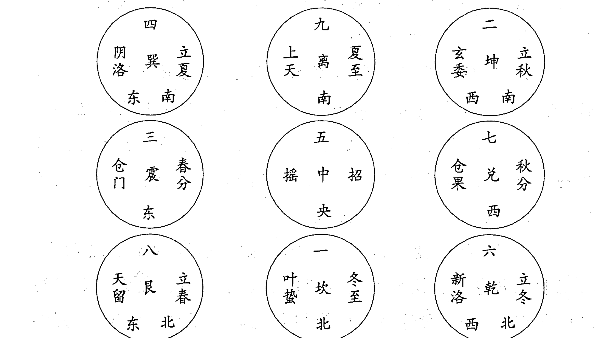
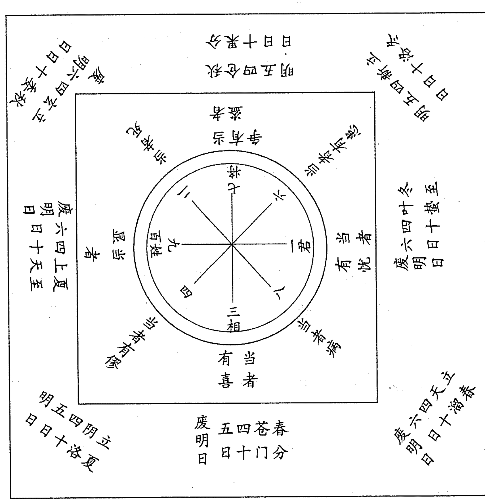
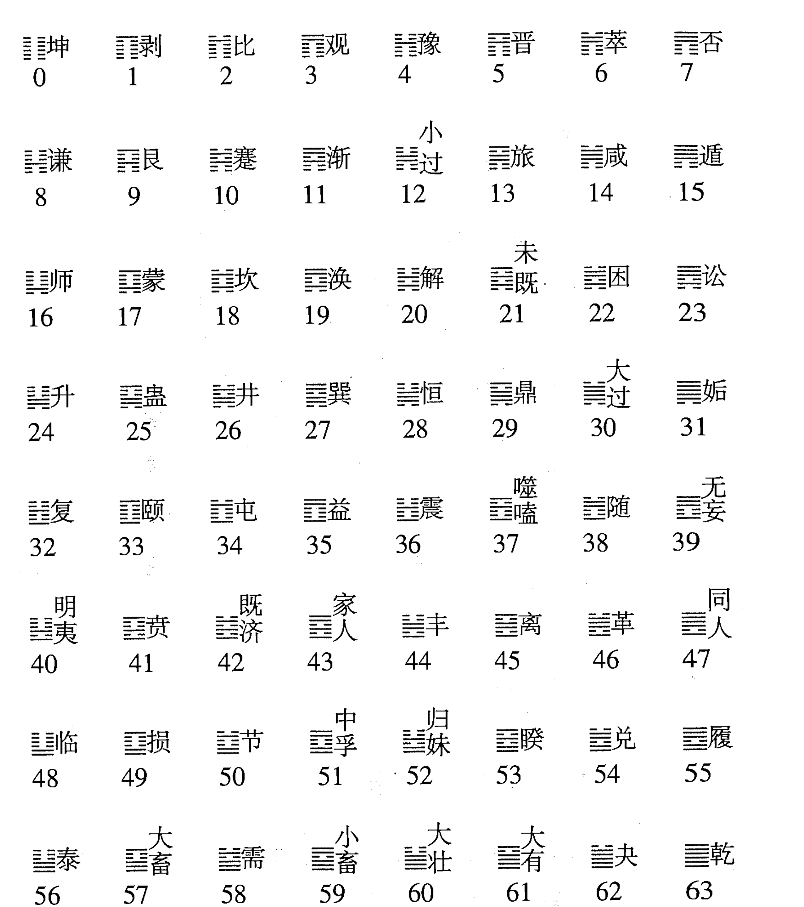
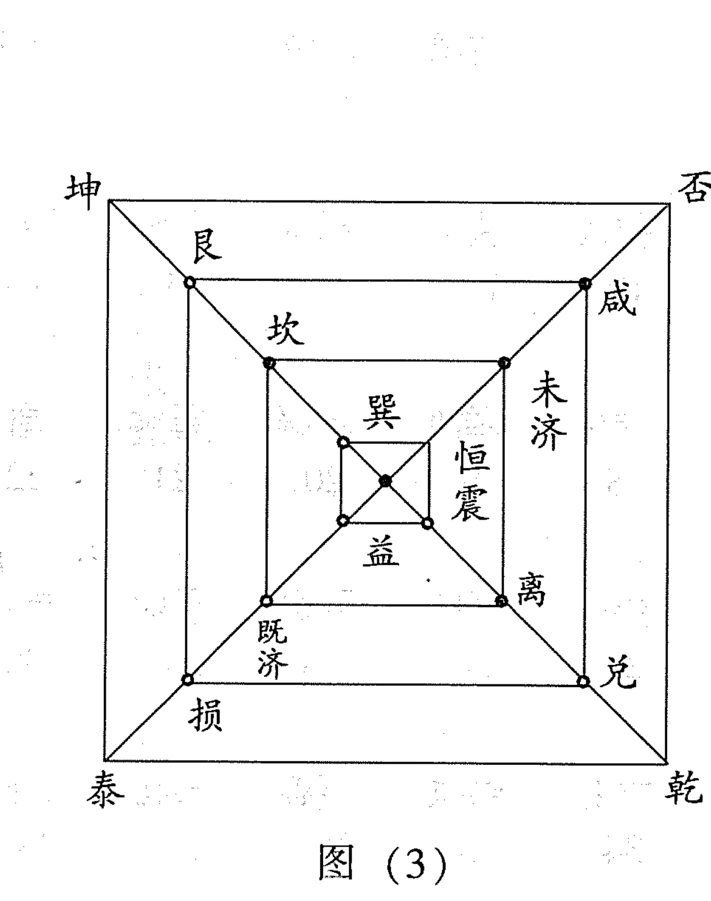
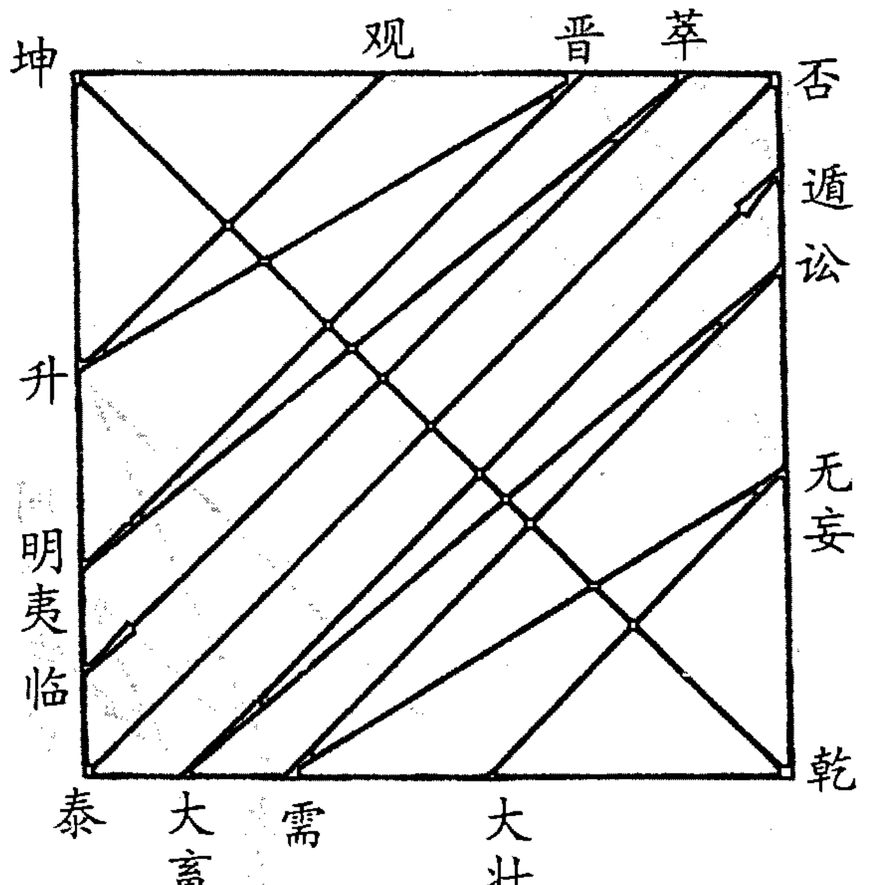
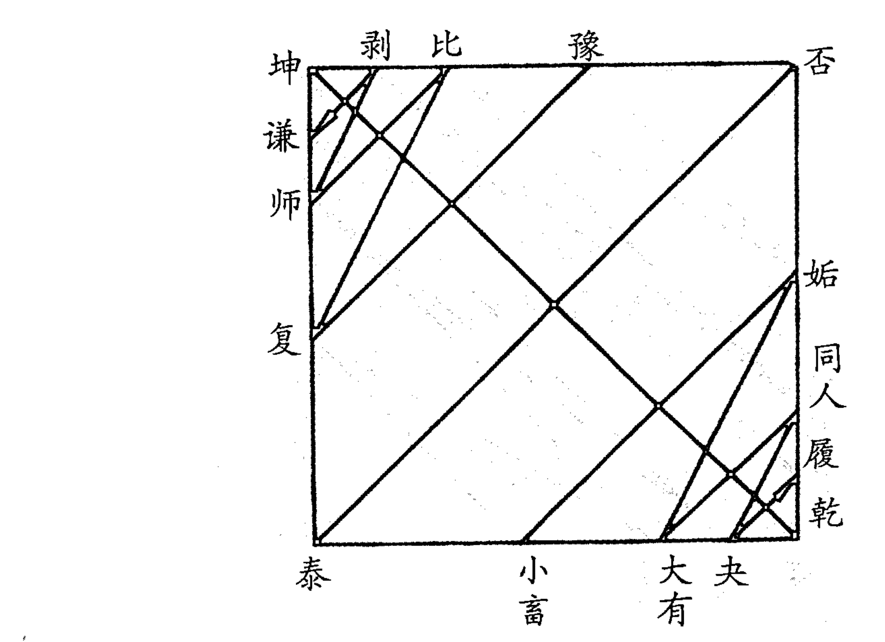
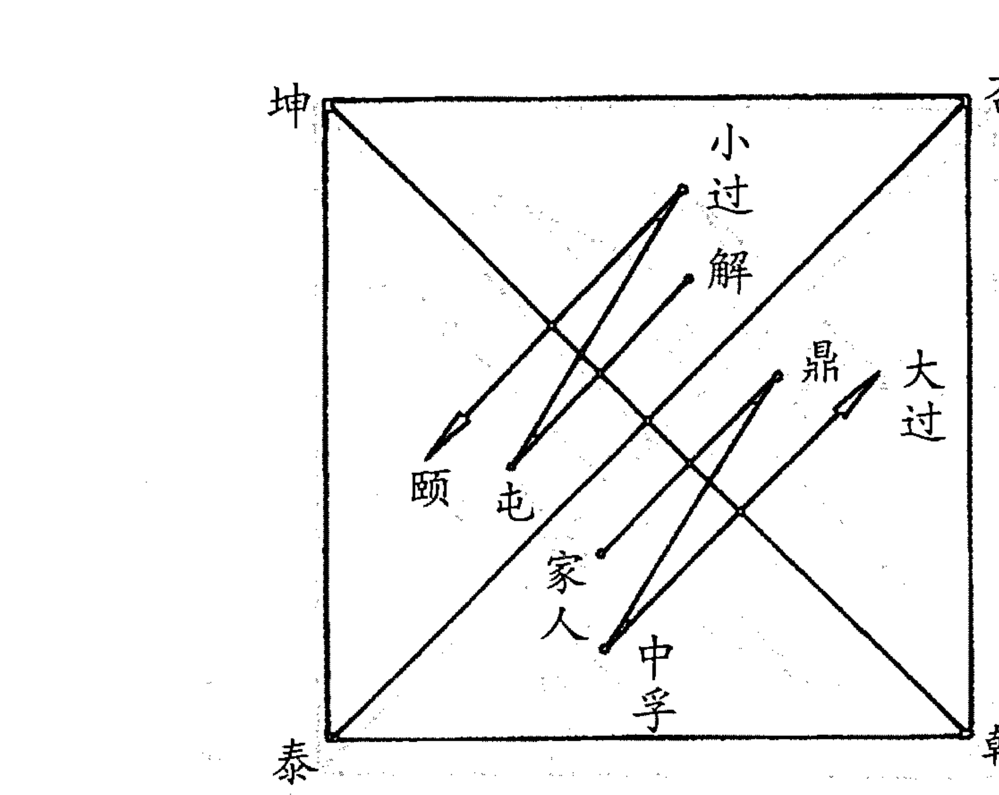

# 易数精华(3)

# 太乙数术穷天地
预测精义贯古今

杨景磐 著

中国国际广播音像出版社

# 易数精华③

# 太乙通解

杨景磐 著

中国国际广播音像出版社

# 图书在版编目(CIP)数据

易数精华：太乙通解 杨景磐 著
北京：中国国际广播音像出版社，2006，5，
ISBN 7-89994-276-4/C51.03
Ⅰ、易… Ⅱ、杨… Ⅲ、社…

# 易数精华：太乙通解

杨景磐 著

责任编辑：村 言 监 制：高延赛
封面设计：流 野 版式设计：文 德
出品发行：中国国际广播音像出版社
地 址：北京复兴门外大街2号国家广电总局
邮 编：100866
印 刷：广东科普印刷厂
开 本：880×1230mm 1/32
印 张：11.25
字 数：230千字
印 数：5000
版 次：2006年6月广东第1版
印 次：2006年6月广东第1次

ISBN7-89994-276-4/C51.03 全套定价：220.00元

版权所有 盗版必究 印制有问题请与印厂调换

## 目 录

- 再版前言 …………………………………………………………… (1)
- 序(张志春) …………………………………………………………… (2)
- 绪论 …………………………………………………………… (1)

## 第一章 太乙卦序

- 一 太乙六十四卦的排列次序 …………………………… (1)
- 二 太乙卦序与“伏羲六十四卦方图” ………………… (6)
- 三 太乙卦序与邵雍“十六事卦” …………………… (14)
- 四 太乙卦序与帛《易》卦序 …………………………… (17)

## 第二章 阳九、百六

- 一 阳九、百六的由来 ………………………………… (22)
- 二 阳九、百六的推演方法 …………………………… (22)
- 三 《太乙金镜式经》阳九、百六推例 …………… (24)

### 第三章 太乙式盘

- 一 天盘、地盘、人盘 ………………………………… (26)
- 二 太乙总图式 ………………………………………… (27)
- 三 西汉汝阴侯墓出土的太乙式盘 ………………… (28)

### 第四章 太乙行宫

- 一 太乙宫位与《洛书》宫位 ……………………………… (30)
- 二 太乙运行八宫，不入中五官 ………………………… (32)
- 三 太乙三年一宫，理天理地理人 ……………………… (33)
    - (一)第一年理天 ……………………………………… (34)
    - (二)第二年理地 ……………………………………… (35)
    - (三)第三年理人 ……………………………………… (35)

## 第五章 太乙九宫

- 一 乾宫 …………………………………………………… (37)
- 二 离宫 …………………………………………………… (38)
- 三 艮宫 …………………………………………………… (38)
- 四 震宫 …………………………………………………… (39)
- 五 中宫 …………………………………………………… (40)
- 六 兑宫 …………………………………………………… (40)
- 七 坤宫 …………………………………………………… (40)
- 八 坎宫 …………………………………………………… (41)
- 九 巽宫 …………………………………………………… (41)

## 第六章 太乙积年

- 一 太乙积年与天象 …………………………………… (43)
- 二 五元六纪 …………………………………………… (44)
- 三 太乙积年法的取用 ………………………………… (46)

## 第七章 太乙十六神

- 一 地主 …………………………………………………… (50)
- 二 阳德 …………………………………………………… (51)
- 三 和德 …………………………………………………… (51)
- 四 吕申 …………………………………………………… (51)
- 五 高丛 …………………………………………………… (51)
- 六 太阳 …………………………………………………… (52)
- 七 大炅 …………………………………………………… (52)
- 八 大神 …………………………………………………… (52)
- 九 大威 …………………………………………………… (52)
- 十 天道 …………………………………………………… (53)
- 十一 大武 …………………………………………………… (53)
- 十二 武德 …………………………………………………… (53)
- 十三 太簇 …………………………………………………… (53)
- 十四 阴主 …………………………………………………… (54)
- 十五 阴德 …………………………………………………… (54)
- 十六 大义 …………………………………………………… (54)

## 第八章 太乙运式

- 一 太岁、合神、计神 ……………………………………… (55)
- 二 太乙监将 ………………………………………………… (57)
- 三 文昌 …………………………………………………… (58)
- 四 始击 …………………………………………………… (59)
- 五 主目、主算、主大将、主参将 …………………………… (59)
- 六 客目、客算、客大将、客参将 …………………………… (60)
- 七 定目、定算、定大将、定参将 …………………………… (61)

## 第九章 太乙四计

- 一 岁计(年局) ………………………………………………… (64)
- 二 月计(月局) ………………………………………………… (66)
- 三 日计(日局) ………………………………………………… (71)
- 四 时计(时局) ………………………………………………… (75)

## 第十章 太乙五将

- 一 太乙监将 ………………………………………………… (81)
- 二 主目上将 ………………………………………………… (81)
- 三 客目上将 ………………………………………………… (82)
- 四 主大将(包括主参将) ……………………………………… (83)
- 五 客大将(包括客参将) ……………………………………… (84)

## 第十一章 太乙八门

- 一 八门值事 ………………………………………………… (85)
- 二 岁计八门用法 ……………………………………………… (87)
- 三 时计八门用法 ……………………………………………… (88)

## 第十二章 太乙格局

- 一 掩 ………………………………………………………… (89)
- 二 迫 ………………………………………………………… (90)
- 三 关 …………………………………………………… (90)
- 四 囚 …………………………………………………… (91)
- 五 击 …………………………………………………… (91)
- 六 格 …………………………………………………… (91)
- 七 对 …………………………………………………… (92)
- 八 挟 …………………………………………………… (92)
- 九 四郭固 ……………………………………………… (93)
- 十 四郭杜 ……………………………………………… (93)
- 十一 三门具不具 ……………………………………… (93)
- 十二 五将发不发 ……………………………………… (94)

## 第十三章 太乙阴阳数

- 一 重阳数 ……………………………………………… (95)
- 二 重阴数 ……………………………………………… (96)
- 三 阴中重阳数 ………………………………………… (96)
- 四 阳中重阴数 ………………………………………… (96)
- 五 上和数 ……………………………………………… (97)
- 六 次和数 ……………………………………………… (97)
- 七 下和数 ……………………………………………… (97)
- 八 三才数 ……………………………………………… (97)
- 九 长短数 ……………………………………………… (98)
- 十 不和数 ……………………………………………… (98)

## 第十四章 太乙应用

- 一 天变灾异 ………………………………………… (100)
- 二 治乱兴替 ………………………………………… (101)
- 三 主客胜负 ………………………………………… (102)
    - (一)太乙助主、助客 ……………………………… (102)
    - (二)多算胜、少算负 ……………………………… (103)
    - (三)单阳、孤阴所主胜负 ………………………… (103)
    - (四)十、五、一所主吉凶 ………………………… (103)
- 四 将相贤否 ………………………………………… (104)
- 五 敌国动静 ………………………………………… (104)
- 六 使言虚实 ………………………………………… (105)
- 七 敌来多寡 ………………………………………… (105)
- 八 闻见虚实 ………………………………………… (105)
- 九 推测(验证)实例分析 ……………………………… (106)

## 第十五章 太乙年卦月卦日卦时卦

- 一 今本六十四卦卦序 ……………………………… (115)
- 二 太乙年卦、月卦取法 ……………………………… (117)
    - (一)年卦取法 …………………………………… (117)
    - (二)年卦值事动爻取法 …………………………… (117)
- 三 太乙日卦、时卦取法 ……………………………… (120)

## 第十六章 太乙命法

- 一 太乙身命十二宫 ………………………………… (123)
    - (一)命宫 ………………………………………… (124)
        - 1.安命宫法 ………………………………………………… (125)
        - 2.安身宫法 ………………………………………………… (130)
        - 3.安日宫法 ………………………………………………… (131)
        - 4.安时宫法 ………………………………………………… (131)
        - 5.命宫所临吉凶 …………………………………………… (132)
        - 6.身宫、日宫、时宫所临吉凶 …………………………… (133)
    - (二)兄弟宫 ………………………………………………… (134)
    - (三)妻妾宫 ………………………………………………… (134)
    - (四)子孙宫 ………………………………………………… (134)
    - (五)财帛宫 ………………………………………………… (135)
    - (六)田宅宫 ………………………………………………… (135)
    - (七)官禄宫 ………………………………………………… (135)
    - (八)奴仆宫 ………………………………………………… (135)
    - (九)疾厄宫 ………………………………………………… (135)
    - (十)福德宫 ………………………………………………… (135)
    - (十一)相貌宫 ……………………………………………… (136)
    - (十二)父母宫 ……………………………………………… (136)
- 二 太乙阴阳数
    - (一)上和、中和、下和数 ……………………………… (138)
    - (二)重阳数 ………………………………………………… (139)
    - (三)重阴数 ………………………………………………… (139)
    - (四)杂重阳数 ……………………………………………… (139)
    - (五)杂重阴数 ……………………………………………… (139)
    - (六)阴中重阳数 …………………………………………… (140)
    - (七)三才无算数 ……………………………… (140)
- 三 太乙十六星临宫吉凶
    - (一)五福 ……………………………… (141)
    - (二)君基 ……………………………… (141)
    - (三)小游 ……………………………… (141)
    - (四)文昌 ……………………………… (141)
    - (五)主大将 ……………………………… (142)
    - (六)计神 ……………………………… (142)
    - (七)始击 ……………………………… (142)
    - (八)客大将 ……………………………… (143)
    - (九)臣基 ……………………………… (143)
    - (十)民基 ……………………………… (144)
    - (十一)四神 ……………………………… (144)
    - (十二)天乙 ……………………………… (144)
    - (十三)飞符 ……………………………… (144)
    - (十四)地乙 ……………………………… (144)
    - (十五)主参将 ……………………………… (144)
    - (十六)客参将 ……………………………… (145)
- 四 太乙命法格局
    - (一)掩 ……………………………… (145)
    - (二)迫 ……………………………… (145)
    - (三)关 ……………………………… (146)
    - (四)囚 ……………………………… (146)
    - (五)击 ……………………………… (146)
    - (六)格 ………………………………………………… (146)
    - (七)对 ………………………………………………… (147)
- 五 太乙阳九灾限
    - (一)阳九行限起法 ………………………………… (148)
    - (二)阳九入初、中、末限所主灾祥 ………… (152)
- 六 太乙百六灾限
    - (一)百六行限起法 ………………………………… (156)
    - (二)百六临宫所主灾祥 ………………………… (159)
- 七、身命宫主星上、中、下三等
    - (一)五福上、中、下三等所主 ………………… (162)
    - (二)君基上、中、下三等所主 ………………… (162)
    - (三)臣基上、中、下三等所主 ………………… (162)
    - (四)民基上、中、下三等所主 ………………… (162)
    - (五)小游上、中、下三等所主 ………………… (163)
    - (六)文昌上、中、下三等所主 ………………… (163)
    - (七)主大将上、中、下三等所主 …………… (163)
    - (八)主参将上、中、下三等所主 …………… (163)
    - (九)计神上、中、下三等所主 ………………… (163)
    - (十)始击上、中、下三等所主 ………………… (163)
    - (十一)客大将上、中、下三等所主 ………… (163)
    - (十二)客参将上、中、下三等所主 ………… (164)
    - (十三)四神上、中、下三等所主 ……………… (164)
    - (十四)天乙上、中、下三等所主 ……………… (164)
    - (十五)地乙上、中、下三等所主 ……………… (164)
    - (十六)飞符上、中、下三等所主 ………… (164)
- 八 出身卦立业卦年卦 月卦日卦时卦
    - (一)出身卦、立业卦取法
        - 1.出身卦 …………………………………… (166)
        - 2.出身卦值事动爻 ……………………… (167)
        - 3.立业卦 …………………………………… (167)
        - 4.出身立业之期 ………………………… (168)
    - (二)年卦 …………………………………… (172)
    - (三)月卦 …………………………………… (174)
    - (四)日卦 …………………………………… (176)
    - (五)时卦 …………………………………… (177)

## 第十七章 太乙十提金赋

## 第十八章 太乙阳遁七十二局图

## 第十九章 太乙阴遁七十二局图

### 附录一：

清·《四库全书·太乙金镜式经·提要》

### 附录二：

清·罗集福《太乙数大全·纲领序》

## 再版前言

本书对我国古代高层次预测术——“三式”中的太乙式，进行了全面系统地阐述。

本书对太乙的起源、太乙卦序、阳九百六灾法、太乙式盘的推演方法、太乙数的计算方法、太乙积年法、年月日时入局法、太乙诸格所主吉凶祸福、太乙五将主客胜负、太乙命法、太乙阴阳遁各七十二局所主吉凶祸福、太乙式的具体应用，均作了详细地、深入浅出地介绍。

本书各章中均有预测和推演实例，并加以具体剖析和论述，使读者易学，易懂，便于掌握运用。

作者秉承家学和几代人的研究成果，又经过自己几十年的探讨和验证，才撰成此书，将这种过去只有朝廷的太史令、太史局、钦天监才能推演和运用的太乙秘术，将这种海内外《周易》专家、学者曾经慨叹“早已失传”的太乙秘术公诸于世。毫无疑问，本书的问世，对于拓宽《周易》象数的研究渠道，进一步开展对我国古代高层次预测术的研究和探讨，必将起到积极地推动作用。

此书曾于1993年10月由甘肃人民出版社出版。这次由作者修改后重新出版，以与《太乙考证》成为合璧，相信读者是会欢迎的。

## 序

河北省周易研究会理事、清河县卫生局局长杨景磐先生，出身于中医世家，不仅通晓岐黄之术，而且对“医易同源”的古代术数学也颇有研究。

一九九一年，他拿着刚刚写好“绪论”的研究奇门遁甲的书稿计划来找我。我告知他，有人已经写出《奇门预测学》书稿，我正在审读；建议他写一部研究大六壬的著作。一年过后，他把写好的《大六壬新编》（又名《大六壬预测学》）寄给了我。我推荐他参加了在安阳召开的第四届周易与现代化国际学术讨论会。他在书稿基础上浓缩写成的论文《六壬预测初探》，在大会上一经宣读，立即引起与会者的重视和赞赏。

中国地震出版社编审、著名易经研究专家李树菁先生，在同他交谈中，获悉他不仅通晓奇门式、六壬式，而且对“三大秘术”之首的太乙式也有研究时，立即建议他写一部书，将濒临失传的太乙秘术公诸于世。

杨景磐先生不负老专家的嘱托，一年以后，一部《太乙通解》的书稿不仅写出来了，而且已经甘肃人民出版社终审、排版，摆上我案头的已是杨景磐先生校对过的书稿清样了。

我望着这部散发着油墨清香的新作校样，一方面为杨景磐先生利用业余时间，呕心沥血，为弘扬民族文化、研究整理古代文化遗产的刻苦精神所感动；一方面也为易学研究的深入、拓宽，党的百花齐放、百家争鸣方针所带来的大好形势所鼓舞。

杨景磐先生在书稿中写道：

> 太乙来源于古代天文，主要用于预测天运变异，即大自然的变异和灾害。《三命通会》中曾说：“古今高人达士，稽考天数，推察阴阳，以太乙数而推天运吉凶，以六壬而推人事吉凶，以奇门而推地方吉凶，以年月日时而推人一生吉凶。”我们研究太乙，应着重对发生自然灾害年份的推测和验证，以求达到防患于未然的目的，为人民造福。

这种态度，我认为是正确的，是实事求是的。杨景磐先生在该书中，不仅仅是阐述解说太乙式的原理和推导方法，而且结合实例进行剖析和验证，既不简单肯定，也不简单否定，而是力图用现代科学观点进行评判和探讨。这种严谨的治学作风是值得提倡的。

我认为，今天我们研究周易，研究象数，研究古代术数学，绝不是为了复古、为了使古代各种预测术死灰复燃，而是站在现代科学的高度，对传统文化重新进行审视（这种重新审视，随着历史的发展和科技文化的进步，人类会不断重复），进行分析批判，剔除其糟粕，发掘其精华，不仅从思维科学和认识论角度促进现代科技的发展，而且将古代文化遗产中的精华加以改造、发展、完善，使它作为现代哲学、未来学、预测学等学科的一个组成部分或补充，为人类服务，为社会造福。

从近代以来，传统中医由受西医排斥、诋毁，到得到尊重、保护，进而提倡中、西医结合，共同发展的艰难历程，向我们昭示：

源远流长、有着顽强生命力的古代预测学，在经过科学界、学术界越来越多的有识之士反复进行研究、鉴定、验证、分析、批判之后，一定能逐步洗脱它身上的污垢和五脏六腑内的糟粕，以古老又崭新的面目出现在世人面前，与现在预测科学互相补充、交流渗透，进而走向相互结合、共同发展的明天。

承蒙景磐先生信赖，略诌上述片言，以作该书之序。

河北省周易研究会会长 张志春

一九九三年八月十八日

## 绪论

太乙式，又称太乙数，简称太乙，它是我国古代术数学中的三大秘术之一。太乙式、奇门式、六壬式同称“三式”，被今人视为我国古代高层次预测学，而太乙式又为“三式”之首。

相传太乙式产生于黄帝战蚩尤时，但至今仍找不到真凭实据，所以这种说法是不大可靠的。屈原《九歌》中有“东皇太乙”，证明太乙的名称在战国时就有了，但这与太乙术数是否一回事，现在还是个问号。

《史记·日者列传》所载术数七家，太乙家居其一。《汉书·艺文志》载有《太一阴阳》二十三卷，当为太乙家之书。在西汉时，太乙已列为术数学，并且已有成书，这是确凿无疑的。所以，《四库全书·太乙金镜式经·提要》说，太乙“其术为三式之一，所传尚古”。

《易纬·乾凿度》云：“一阴一阳，合而为十五之谓道。阳变七之九息也，阴变八之六消也。合于十五，故太一取其数以行九宫。”这一段论述，可能与太乙数有联系，由于《易纬·乾凿度》对此语焉不详，没有说清楚太一行九宫的具体方法，我们无法断定“太一取其数以行九宫”，是否就是我们现在能见到的太乙数。有人指出：“九宫各数的排列，恰如古代奇书《洛书》之形，可知九宫说所起甚早，后人因‘太一取其数以行九宫’，故世称此术为太乙数或太乙九宫。”（见《中国古代占卜术》，中州古籍出版社出版）太乙数确与《洛书》有联系，但太乙数是否即太乙九宫，是否即“太一取其数以行九宫”，还有待进一步考证。

萧吉《五行大义》引《九宫经》云：“天一之行始于离宫，太一之行始于坎宫，天一主丰穰，太一主水旱兵饥，合十二神游行九宫十二位，从少之多。”据此论述太一行宫次序，即指太乙数，然而，仅从太一行宫次序来看，与我们今天能见到的太乙数也不相同，或许在历史上太乙数也有不同的推演方法。

《灵枢经·九宫八风图》是否与太乙数有传承关系呢？我们先看《九宫八风图》：



“太一以冬至之日居一宫四十六日。明日居八宫四十六日。明日居三宫四十六日。明日居四宫四十五日。明日居九宫四十六日，明日居二宫四十六日。明日居七宫四十六日。明日居六宫四十五日。明日复居一宫。曰：冬至矣。九日反复于一，终而复始。”（《灵枢》）

此图的卦位和数字与《后天八卦图》、《洛书》的方位、数字完全一致。这说明《九宫八风图》与《洛书》有传承关系。太乙数的图局与《洛书》也有传承关系。虽然二者都与《洛书》有传承关系，但从《灵枢经·九宫八风图》的内容来看，与太乙数并无联系。



1977年春，在安徽阜阳县双古堆发掘的西汉汝阴侯墓的出土文物中，有一具占盘，如上图。

此占盘内圈的数字、方位与《洛书》一致，与《灵枢经·九宫八风图》的节气、名称大致相同。有的学者肯定这就是太乙式盘。太乙与六壬、奇门称为古代的“三式”，六壬有式盘，奇门有式盘，太乙也应有式盘（现在推演六壬一般不用式盘，推演奇门还用式盘），那么，西汉汝阴侯墓出土的占盘是否就是太乙式盘？这还是有争议的。因为从上面这具占盘来看，它的内容还简单得多，它不能适应太乙数的推演，也许在西汉初期太乙数式盘就是这个样子，后来又复杂化了，这只能是有待考证的一个问题，现在还不能作结论。现在能看到的最早的太乙古籍是唐朝王希明著作的《太乙金镜式经》，这具占盘的内容与《太乙金镜式经》中的内容并无相同之处，所以说这具占盘就是太乙式盘是缺少依据的。

太乙式局的数字、方位与《后天八卦图》、《洛书》的数字、方位有相似之处，但也有不同之处。太乙数是以乾宫为一，坎宫为八，艮宫为三，震宫为四，巽宫为九，离宫为二，坤宫为七，兑宫为六。正好与《后天八卦图》、《洛书》向右差一位。为什么要差一位呢？古人的说法也是不一致的。王希明说：“太乙知未来，故圣人为之蹉一位，以示先知之义。”郭璞说：“地缺东南，故蹉九以填之。”乐产说：“太乙之理，后王得之以统天下，故蹉一以就乾。”《奇门五总龟》：“昔黄帝命风后作太乙、雷公或九宫法，以灵龟洛书之数，而错一位，以一居乾，以八居坎，以三居艮，以四居震，以九居巽，以二居离，以七居坤，以六居兑。以八、三、四、九为阳宫，故蓬、任、冲、辅配此四宫而属阳地；以二、七、六、一为阴位，故英、芮、柱、心配此四宫而属阴也。盖以艮燥、坤湿、巽暑、乾寒、震阳、兑阴、离火、坎水而分阴阳也。”显然，这些说法都非常牵强，都没有讲清“乃特右旋，以乾、巽为一、九”的原因。这是我们应该探讨的一个问题。太乙数由《洛书》的坎、离为一、九而变为乾、巽为一、九，是故弄玄虚，增加其神秘性，还是确有所本？

中国古代术数学都千方百计从内容到形式与《周易》挂起钩来，太乙数也是如此。《四库全书·太乙金镜式经·提要》中说：“核其大旨，乃仿《易》、《历》而作，其以一为太极，因之生二目，二目生四辅，犹《易》之两仪、四象也。又有计神与太乙，合之为八将，犹《易》之八卦也。其以岁、月、日、时为纲，而以八将为纬，三基、五福，十精之类为经，亦犹夫《历》也。”太乙与《易》的关系自不待言。而太乙“亦犹夫《历》也”，就是说太乙也是古代的一种历法。这一观点是正确的。我国历史上有近百种历法，历注内容五花八门，除包括年、月大小，朔闰节气，日期干支等基本内容外，还包括建除十二直、丛辰、神煞、阴阳五行、吉日凶辰、各种宜忌等，每日历注多者长达数百言，少者也有数十字。太乙的历注内容，只是项目更多、内容更为复杂罢了。《南齐书·高帝纪》就曾以太乙行宫记述自汉高祖五年至宋祯明元年近五百年的治乱兴替的历史，说明太乙这种历法在我国历史上曾经使用过。

我国古代的历法和术数学是紧密相联的，而且二者与古代天文学有渊源关系，现代学者企图从古代天文学角度破译《河图》和《洛书》，并已取得可喜的进展。太乙式采用《洛书》九宫排列图形，二者之间的渊源关系是十分明显的。再从太乙式盘图看，很似北天极顶紫微垣星图，而太乙、计神、文昌、始击、天乙以及十六神的名称，也与北天极顶的星象名称和位置颇为一致。太乙与古天文学的关系，也应当是我们探讨的一个重要课题。

太乙式历来被称为“王佐之要道”，汉魏以后，“其术遂大显于世”。北宋时期的西夏王元昊“通蕃汉文字，尝推《太乙金鉴》，其书且行于四裔矣”。（参见《四库全书·太乙金镜式经·提要》）。太乙式在我国历史上影响之大，由此可见一斑。

为什么称太乙式为“王佐之要道”呢？明代王鸣鹤《辑太乙说》是此论的最好注脚。原文如下：

> 王鸣鹤曰：世传三式书，谓太乙、六壬、奇门，而三式之中，独尊太乙，盖阴阳占候家之言也。太乙占十二辰宫，如有灾祥祸福，主客胜负，乃详见各宫，历历如指诸掌。先看太乙诸星，若主客大将，主客参（将），主客算，及文昌、始击、四神、五福之类。诸局中参看多寡，并掩击、格、迫，审其轻重，察其浅深，而预备之，可以偃息干戈，而坐致太平矣。
>
> 大抵太乙之法尽于《淘金歌》，次以岁差法，算五子元，自大挠甲子日月合璧，五星联珠为始，以至今年，算该若干局，复以年、月、日、时推之，即可定第几局，而内外胜负，可得前知。此其大略也。
>
> 若夫洞通涵会，剖析穷穿，贯通乎阴阳之化，是在才智兼全者，以心运之而已矣。彼泥法，而或至于矫诬者，亦奚足云哉！

从王鸣鹤《辑太乙说》，我们不难看出太乙称为“王佐之要道”，“自古帝王钦天、授时、治化、降平，惠利天下，尊而用焉”的原因。（参见《太乙数统宗大全·序》）。至于太乙式能否有那么大的神通，“人君用之，可使民为尧舜之民；人民用之，可致君为尧舜之君”，那则是另外一回事了。（参见《太乙数统宗大全·序》）。

早在北宋时期，就出现了对太乙式持否定的观点。《宋史·刘敞传》：“敞疏言：佞者谓太乙所临分野则有福。近岁自吴移蜀，信如其说，坤维安堵可也。今五六十州，安全者不能十数，福何在也。”清儒黄宗羲至诋太乙“经纬混淆，行度无稽”（参见《易学象数论》）。太乙式同其他古代术数学一样，历来就有人虔信，有人非之，两种对立的观点并存至今，这种现象并非罕见。

我们现在研究太乙式，就是为了用现代科学的理论和方法，揭开其神秘的面纱，还它以本来的面目。我想，当它的真相大白于天下之日，就是我们对它作出正确结论之时。我们期待这一天的到来！

## 第一章 太乙卦序

易卦的排列次序，集中体现了易的思想精华，反映社会意识形态，伦理道德观念；也反映卦序作者的历史观、宇宙观，具有重要的哲学、思维意义。因此，卦序问题，引起历代易学者的重视。

通常认为，六十四卦卦序有：先天六十四卦卦序，后天六十四卦卦序，今本《周易》六十四卦卦序，帛本《周易》六十四卦卦序，元包六十四卦卦序，京房八宫六十四卦卦序，《连山》六十四卦卦序，《归藏》六十四卦卦序。而太乙六十四卦卦序，大概因为太乙是术数学的缘故，有失大雅，所以一直没有引起重视。

我们今天研究太乙六十四卦卦序，并把它同其他卦序作一比较，是可以有所发现，有所启示的。

### 一、太乙六十四卦的排列次序

太乙六十四卦的排列次序，是由太乙行十二运卦而来。

《太乙数大全》中，有这样一段话：

> 经曰：《易》太极而生两仪。乾天之体也，而运乎上。坤地之质也，而止乎下。天地既判，其气未交而为否，天地之气既交而为泰，此四卦为天地否泰之运。天地交泰之后而男女生焉。乾一索而得男，曰震，震为长男。坤一索而得女，曰巽，巽为长女。长男、长女而夫妇成，而为恒，夫妇既交而为益。乾再索而得男，曰坎，坎为中男。坤再索而得女，曰离，离为中女。中男、中女而夫妇成，为既济，夫妇既交为未济。乾三索而得男，曰艮，艮为少男。坤三索而得女，曰兑，兑为少女。少男、少女而夫妇成，为损，夫妇既交为咸。此十二卦为男女交亲之运也。天地判，而男女生，夫妇交而万物成，男治世于先，女理事于后。男之治也，从父之道，为阳晶守政之运，大壮至遁六卦次焉。女之理也，从母之道，为阴毳权衡之运，自观至临六卦次焉。坤阴也，得阳育而生男。乾阳也，得阴化而生女。男归于母，为资育还原之运，自豫至谦六卦行焉。女应其父，为造化行天之运，小畜至履六卦属焉。乾坤，父母之道，既应，必有继父母者。继父者，长男也，从长男者，中男、少男也，内外以阳刚为治，故为刚中健至之运，自解至颐四卦通焉。代母者，长女也，从长女者，中女、少女也，内外以阴柔为治，故为群愚位贤之运，自家人至大过四卦随焉。阴随于阳，君道顺而天道畅，故为德义顺命之运，自丰至困六卦统焉。阳随于阴，君道逆而天道惑，故为姤惑留天之运，自涣至贲六卦迁焉。长男既息，为男之困也，长女既息，为女之终也，中男、少女以相搏，故为寡阳相搏之运，自蹇至蒙二卦历焉。寡阳相搏已终，中女、少女相会，故为物极元终之运，自睽至革二卦命焉。始于天地，终于物极，一十二运，历一万一千五百二十年。

根据上面这段话，太乙行十二运，十二运统六十四卦，这就产生了太乙六十四卦的排列次序。据今人按二进制赋予各卦的数字，就可以列出如下太乙十二运、六十四卦次序表：

### 太乙十二运六十四卦次序（表）

| 运次 | 卦名 | 卦象 | 数字 | 卦名 | 卦象 | 数字 | 和 |
|---|---|---|---|---|---|---|---|
| 天地否泰（第一运） | 乾 | ☰ | 63 | 坤 | ☷ | 0 | 63 |
| | 否 | ☰☷ | 7 | 泰 | ☷☰ | 56 | 63 |
| 男女交亲（第二运） | 震 | ☳ | 32 | 巽 | ☴ | 27 | 63 |
| | 恒 | ☳☴ | 28 | 益 | ☴☳ | 35 | 63 |
| | 坎 | ☵ | 18 | 离 | ☲ | 45 | 63 |
| | 既济 | ☵☲ | 42 | 未济 | ☲☵ | 21 | 63 |
| | 艮 | ☶ | 9 | 兑 | ☱ | 54 | 63 |
| | 损 | ☶☱ | 49 | 咸 | ☱☶ | 14 | 63 |
| 阳晶守政（第三运） | 大壮 | ☳☰ | 60 | 无妄 | ☰☳ | 39 | 63 |
| | 需 | ☵☰ | 58 | 讼 | ☰☵ | 23 | 63 |
| | 大畜 | ☶☰ | 57 | 遁 | ☰☶ | 15 | 63 |
| 阴蠢权衡（第四运） | 观 | ☷☴ | 3 | 升 | ☵☷ | 24 | 63 |
| | 晋 | ☷☲ | 5 | 明夷 | ☲☷ | 40 | 63 |
| | 萃 | ☱☷ | 6 | 临 | ☷☳ | 48 | 63 |
| 资育还本（第五运） | 豫 | ☷☳ | 4 | 复 | ☷☷ | 32 | 63 |
| | 师 | ☷☵ | 16 | 比 | ☵☷ | 2 | 63 |
| | 剥 | ☷☶ | 1 | 谦 | ☶☷ | 8 | 63 |
| 造化行天（第六运） | 小畜 | ☴☰ | 59 | 姤 | ☰☴ | 31 | 63 |
| | 同人 | ☰☲ | 47 | 大有 | ☲☰ | 61 | 63 |
| | 夬 | ☱☰ | 62 | 履 | ☰☱ | 55 | 63 |
| 刚中健至（第七运） | 解 | ☳☵ | 20 | 屯 | ☵☳ | 34 | 63 |
| | 小过 | ☶☳ | 12 | 颐 | ☶☳ | 33 | 63 |
| 群愚位贤（第八运） | 家人 | ☴☲ | 43 | 鼎 | ☲☴ | 29 | 63 |
| | 中孚 | ☴☱ | 51 | 大过 | ☱☴ | 30 | 63 |
| 德义顺命（第九运） | 丰 | ☲☳ | 44 | 噬嗑 | ☳☲ | 37 | 63 |
| | 归妹 | ☳☱ | 52 | 随 | ☱☳ | 38 | 63 |
| | 节 | ☵☱ | 50 | 困 | ☱☵ | 22 | 63 |
| 姤惑留天（第十运） | 涣 | ☴☵ | 19 | 井 | ☵☴ | 26 | 63 |
| | 渐 | ☶☴ | 11 | 蛊 | ☴☶ | 25 | 63 |
| | 旅 | ☲☶ | 13 | 贲 | ☶☲ | 41 | 63 |
| 寡阳相搏（第十一运） | 蹇 | ☶☵ | 10 | 蒙 | ☵☶ | 17 | 63 |
| 物极元终（第十二运） | 睽 | ☲☱ | 53 | 革 | ☱☲ | 46 | 63 |

从上面太乙十二运卦的排列次序，我们可以看出，六十四卦在这里也是井然有序地按照一定的规律进行排列的。

第一，太乙十二运，可分作六组，每组二运，除“天地否泰运”（第一运）包括四卦，“男女交亲运”（第二运）包括十二卦外，其余每相邻二运为一组，每运所含卦数相等。如“阳晶守政运”（第三运）与“阴蠢权衡运”（第四运）为一组，“阳晶守政运”含六卦（大壮、无妄、需、讼、大畜、遁）“阴蠢权衡运”亦含六卦（观、升、晋、明夷、萃、临）；“寡阳相搏运”（第十一运）与“物极元终运”（第十二运）为一组，“寡阳相搏运”含二卦（蹇、蒙），“物极元终运”亦含二卦（睽、革）。

第二，每运中都以相邻两卦为一组进行排列，每组卦的卦画不是以“复”的方式排列而成，就是以“变”的方式排列而成。如乾、坤两卦为一组，乾卦（☰）与坤卦（☷），可称之为“变”。否、泰两卦为一组，否卦（☷☰）与泰卦（☰☷），可称之为“复”。这种排列方式，正符合“二二相耦，非复即变”的规律。“二二相耦，非复即变”这句话是唐人孔颖达对今本《周易》六十四卦排列规律的概括。太乙运卦卦序除打头的乾坤两卦以外，其余各卦卦序与今本《周易》六十四卦卦序无一相同，而其排列规律居然暗合。

第三，按照今人以二进位制赋予各卦的数字来看，太乙十二运卦的卦序也有其特点。

第一运和第二运共含十六卦，每二卦为一组，共分八组，每组二卦的数字之和皆为 63。如乾、坤为一组，乾卦(☰)63，坤卦(☷)0，和为 63。否、泰为一组，否卦(☷☰)7，泰卦(☰☷)56，7+56=63。其余震与巽，恒与益，坎与离，既济与未济，艮与兑，损与咸，二卦之和皆为 63。

第三运至第十二运，每二运为一组，上运与下运相应的二卦之和也皆为 63。如第三运的第一卦为大壮，第四运的第一卦为观，大壮卦(☳☰)60，观卦(☷☴)3，60+3=63。第三运第六卦为遁，第四运的第六卦为临，遁卦(☰☶)15，临卦(☷☳)48，15+48=63。

### 二、太乙卦序与“伏羲六十四卦方图”

“伏羲六十四卦方圆图”首载于朱熹《周易本义》。经今人研究，认为此图是按自然数的顺序排列的，是研究六十四卦的基础。我们取“伏羲六十四卦方圆图”中的“方图”，再赋予现代二进制数字，就构成下面这张图表。

## 第一章 太乙卦序



无论从卦象排列，或从自然数排列来看，“方图”确是整然有序（“圆图”与“方图”同样整然有序，只是排列方式不同，二者的卦序是相同的）。我们取“方图”与太乙卦序作一比较。为了便于比较，可将太乙相对应的运卦，分别置入“方图”，就可构成下面六个图形：



第一运  乾☰→坤☷→否☰→泰☷

第二运  震☳→巽☴→恒☳→益☴

坎☵→离☲→既济☵→未济☲

艮☶→兑☱→损☶→咸☱



图 (4)

第三运 大壮☰→无妄☰→需☰→讼☰→大畜☰→遁☰

第四运 观☷→升☷→晋☷→明夷☷→萃☷→临☷



图（5）

第五运 豫☷☷☷→复☷☷☷→比☷☷☷→师☷☷☷→剥☷☷☷→谦☷☷☷

第六运 小畜☷☷☷→姤☷☷☷→大有☷☷☷→同人☷☷☷→夬☷☷☷→履☷☷☷



图 (6)

第七运 解☳☳☳ → 屯☳☳☳ → 小过☳☳☳ → 颐☳☳☳

第八运 家人☳☳☳ → 鼎☳☳☳ → 中孚☳☳☳ → 大过☳☳☳

### 三、太乙卦序与邵雍“十六事卦”

北宋邵雍有一首著名的《大易吟》：

> 天地定位，
否泰反类；
山泽通气，
损咸见义；
雷风相薄，
恒益起意；
水火相射，
既济未济；
四象相交，
成十六事；
八卦相荡，
为六十四。

由《大易吟》引发出后世的“十六事卦”之说，引起易学界的争论。争论的焦点是“十六事卦”的来历，以及“十六事卦”到底是指哪十六卦。

一种观点认为，“十六事卦”即“十六互卦”，由太阳(==)、少阳(=-)、太阴(==)、少阴(=-)四象相交而来，为六十四互体所得之卦，每卦皆由四爻组成，共有十六卦。请看下图：

| | |
|---|---|
| 互成乾☰太阳交太阳<br>互成夬☱太阳交少阴<br>互成睽☲太阳交少阳<br>互成归妹☳太阳交太阴 | = |
| 互成家人☴少阴交太阳<br>互成既济☵少阴交少阴<br>互成颐☶少阴交少阳<br>互成复☷少阴交太阴 | = |
| 互成姤☰少阳交太阳<br>互成大过☱少阳交少阴<br>互成未济☲少阳交少阳<br>互成解☳少阳交太阴 | = |
| 互成渐☴太阴交太阳<br>互成蹇☵太阴交少阴<br>互成剥☶太阴交少阳<br>互成坤☷太阴交太阴 | = |

持这种观点的代表人物，有南宋朱熹、蔡元定，清代李光地等。

另一种观点则认为邵雍“十六事卦”指乾、坤、否、泰、艮、兑、损、咸、震、巽、恒、益、坎、离，未济、既济十六卦，非指“十六互卦”。持此观点者为清人江永。江永认为，邵雍《大易吟》本为“伏羲六十四卦方图而作，天地为一象，山泽为一象，雷风为一象，水火为一象”，“此四象犹云四类尔”，“四隅斜对相交”，而成八经卦及否、泰等十六卦。（江永《河洛精蕴》）

上述两种不同的观点，孰是孰非呢？我认为，“十六互卦”是一回事，邵雍的“十六事卦”又是另一回事，二者不可混为一谈。

我的依据是，邵雍《大易吟》明确指出了“十六事卦”的名称，“天地”（乾坤）“否泰”“山泽”（艮兑）“损咸”“雷风”（震巽）“恒益”“水火（坎离）“既济未济”，并以“四象相交，为十六事”作小结。而这“十六事卦”也正好分布在“方图”的两条对角线上。

我们再看太乙十二运卦卦序。第一运“天地否泰”所含四卦，正是《大易吟》第一、二句“天地定位，否泰反类”所含的四卦。太乙第二运“男女交亲”所含十二卦，也正是《大易吟》第三句至第八句所含的十二卦。太乙第一运和第二运共含有十六卦，与《大易吟》“四象相交，为十六事”的十六卦完全相符。

《大易吟》结尾二句“八卦相荡，为六十四”是就整个“方图”来说的。这一点从前面太乙十二运卦分别在“方图”所布的位置图中也可得到证明。

由此可知，《大易吟》是讲“方图”的，“本为方图而作”，清人江永的考证是确凿的。

还应提及的是，邵雍《大易吟》中有“水火相射”一句话，而《周易·说卦》则为“水火不相射”。近年出土的帛《易·系辞》也是“水火相射”，从而也可见“水火相射”一句并非邵雍杜撰，而是古已有之。

从太乙十二运卦卦序与“方图”的关系来看，从太乙第一、二运卦与邵雍《大易吟》中的“十六事卦”相暗合的关系来看，它们都与帛《易》有密切联系，后面还要谈这个问题。

### 四、太乙卦序与帛《易》六十四卦

七十年代，长沙马王堆汉墓出土了帛书《周易》，据有关资料介绍，帛《易》六十四卦卦序与今本《周易》不同，从而使易学界受到新的启示。

太乙六十四卦排列次序与帛《易》卦序有没有关系呢?为了弄清这个问题，先请看“帛《易》六十四卦圆图”。

图 (9)

(摘引自刘大钧《周易概论·帛易初探》)

可以看出，帛《易》六十四卦卦序排成的圆图中，对角相连的共十六卦，每对角相连的两卦，皆为互“变”的关系，而帛《易》圆图中对角相连的十六卦，正是太乙第一运的《乾》《坤》《否》《泰》四卦和第二运的《震》《巽》《恒》《益》《坎》《离》《既济》《未济》《艮》《兑》《损》《咸》十二卦。从太乙第三运开始，每相互对应的两卦，在帛《易》六十四卦圆图上皆相差三十三位。如太乙第三运的《大壮》《无妄》《需》《讼》《大畜》《遁》分别与第四运的《观》《升》《晋》《明夷》《萃》《临》相对应，在帛《易》六十四卦圆图中，《大壮》为第二十六卦，而《观》为第五十九卦，《无妄》为第七卦，而《升》为第四十卦，等等。这种情况表明，帛《易》六十四卦卦序与太乙六十四卦卦序之间，是有传承关系的。从而也可证明，“伏羲六十四卦方圆图”并非宋人臆造，它与太乙卦序，很可能都源于帛《易》卦序。

刘大钧先生在《周易概论·帛易初探》中说：“我们估计，春秋乃至百家争鸣的战国时代，可能有几种不同系统的《周易》本子在社会上流传，这些本子由八卦排列到六十四卦顺序都有不同，其占筮的方法，可能也不相同。今本只是其中之一。”又说：“至秦，《周易》未焚，故各种本子传之不绝。后来，今本《周易》被田何传入西汉，成为主要流传的本子，但帛书《六十四卦》的出土，说明汉初仍有其它本子流传。估计至汉武帝独尊儒术之后，今本《周易》凭借孔子作‘十翼’的传说，变成了正统，并被尊为‘六经之首’。其它不合于‘圣人’之传的本子，则被淘汰。至京房时，已是只能见于‘隐土之说’了——恐怕这就是帛本《六十四卦》后来失传的原因。”从太乙卦序和“伏羲六十四卦方圆图”与帛《易》六十四卦排列的关系来看，也可证明刘大钧这种认识的正确性。从而，我们也可以肯定，太乙学说并非无源之水，只是因为这种学说属于术数学的缘故，一直没有引起人们的注意罢了。

还有一点也值得我们重视。《周易·说卦》有一段话：“乾天也，故称乎父。坤地也，故称乎母。震一索而得男，故谓之长男，巽一索而得女，故谓之长女。坎再索而得男，故谓之中男，离再索而得女，故谓之中女。艮三索而得男，故谓之少男，兑三索而得女，故谓之少女。”而《太乙数大全》中是“乾一索而得男”“坤一索而得女”“乾再索而得男”“坤再索而得女”“乾三索而得男”“坤三索而得女”。这种差别不象是文字上的错简，这也是太乙原于不同于今本《周易》而另有所本的证据之一。

## 第二章 阳九、百六

### 一、阳九、百六的由来

《易经》六十四卦、三百八十四爻，阳爻称为九，阴爻称为六。太乙中的阳九、百六，即易卦阳九、阴六的意思。但易卦中的九、六与太乙阳九、百六又有所不同。

《四库全书·太乙金镜式经·提要》中说：“汉书已载有阳九、百六之语”。可见，阳九、百六在汉代或汉以前就产生了。

古人认为，一、三、五、七、九为阳数，二、四、六、八、十为阴数，阳数穷于九，阴数困于六，九、六为阳阴之极数，极则有变。

《周易》对极则有变的认识是，极则变，变则通，通则久。就是说变化是永恒的，而变就可以通达，通达才可以长久。

太乙对极则有变的认识是，极则变，灾祸兴。因而，太乙中的阳九、百六是灾厄的意思，并规定了阳九、百六的推演方法，若逢阳九、百六灾厄之年，必有天灾人祸。

太乙阳九、百六又源于历法。《四分历》大约施行于战国至西汉中期，此后使用《太初历》。《四分历》一元为 4560 年，《太初历》一元为 4617 年，比《四分历》多灾岁 57。每 80 年有一个灾岁。

为什么 80 年有一个灾岁呢?这是因为天正 (十一月) 冬至日为甲子日，再经过 80 年天正冬至日仍为甲子日，称为阳九一境之数，境终之年，则生灾异，所以每 80 年就产生一个灾岁。

太乙书认为，十九年为一章，四章为一部，五部为一管，四管为一统，三统为一元，即：

19×4×5×4×3=4560

阳九一元大数为 4560 年，每 80 年有一个灾岁 (4560÷80=57)，57 个灾岁潜伏于阳九大数 4560 年之中，分为三九 (3×9) 之厄、二七 (2×7) 之厄、二五 (2×5) 之厄、二三 (2×3) 之厄，共有 (3×9) + (2×7) + (2×5) + (2×3) =57 个灾岁。

> 《太乙数大全》说：“阳九初入元一百六年为阳九灾变之期，而有九年之旱者，此百六之厄也。百六之厄乃元数之余分，灾变之余气，若积而成闰，非正数也。”

《四分历》和《太初历》皆以一年为 365 1/4 日，而《周易·大传》以三百六十为当期 (一年) 之日，所以 365 1/4 -360=5 1/4 (日)，360 为正数，5 1/4 为闰数。百六为元数之余分，灾变之余气，即为闰数。闰数为不正之数，所以为灾厄。

> 宋代张行成著《易通变》卷三十一说：“一年余分六十三辰 (5 1/4 ×12=63)，积四年进二十一日 (5 1/4 ×4=21)，二十年进一百五日 (5 1/4 ×20=105)。自甲子年冬至起甲子日者，积二十年至甲申（年）冬至当起己酉（日），又二十年至甲辰（年）冬至当起甲午（日），又二十年复得甲子（年）冬至当起己卯，又二十年复得甲申（年）当再起甲子（日）矣。总八十年得余分四百二十日（$5\frac{1}{4} \times 80 = 420$）复授甲申（年）则八十一年矣。年以甲冠申、子、辰而转，日以甲、己冠子、午、卯、酉而转，二十年得余分百五日，故有百六之会，四十年得二百十日，故有三七之厄，阴阳各一，凡八十年而四百二十日冬至月、日、辰皆得甲子，余分皆尽，而有灾岁一焉，则九九八十一之数也。”

张行成对百六的解释与太乙书中也有区别。

> 《太乙数大全》说：“阳九、百六乃阳九、阴六之君也，《易》之为象，在上为天道，君也，而为阳，《乾》元用九，故曰阳九，大游行外卦主之。在下臣道也，而为阴，《坤》元用六，故曰百六。百六

《太乙金镜式经》推阳九灾法说：“阳九灾者，若入元之始及元之末，或与太岁冲并于分野，亡国弑君事也。该四千五百六十为一元，四百五十六岁为一阳九也，十三年移一邦，The request was rejected because it was considered high risk

太乙阴阳二遁运行八宫，俱不入中五官。对此，太乙古籍的解释是，太乙行宫是根据天文观测而来，太乙取象北极星，北极为体，北斗为用，北斗围绕北极而旋转，北斗为北极帝星所乘之车，北极帝星乘车临御八方（八宫方位），便能预知风雨水旱，兵灾饥馑，治乱兴亡，所以太乙考治八宫，而不入中五官。

### 三、太乙三年一宫，理天理地理人

太乙三年住一宫，理天，理地，理人。为什么太乙三年住一宫？《太乙神数》解释说：“圣人画卦观象，乾德三者，天道主覆盖于上，地道主裁画于下，人道成辅相尽于中，天不以高大胜于地，地不以广厚胜于人，人不以小而小于天地，故天、地、人三画等焉。太乙引一函三，以乾为之始也，故太乙三年一宫，自乾为首之义也。”从这里我们可知，太乙三年一宫，也是有理由的。《易经》乾卦有三个卦画（☰），这三个卦画是相等的，上面的一画代表天，下面一画代表地，中间一画代表人，因为天、地、人是同等的，所以乾卦三个卦画也是相等的。太乙象乾卦。太乙于数为一，这就象是乾卦的一个卦画，由一又引伸出三来，就象是乾卦的三个卦画，所以太乙象乾卦。因为乾卦有三个同等的卦画，所以太乙三年居一宫，第一年理天，第二年理地，第三年理人。太乙三年一宫，二十四年游遍八宫（不入中五宫）为一周，三周七十二年为一元之数。

#### （一）第一年理天

太乙第一年理天，都是管些什么事呢？《太乙数统宗大全》说：“使日月星辰七曜无差其度，以明天道。所临之分，承天道而行，君治以道，臣辅克终，天气顺序，万物咸通，则二曜光明，循度五纬，径行不差，则得治天下者也。其若君违其道，小人在位，治化失常，乖戾之气随感而应，则二曜薄蚀，五纬错行，彗孛飞流，虹霓气露，光怪变异生焉，此皆由治政之乱，而太乙考治，行其赏罚。经曰：有德者昌，无德者殃。是以圣人克谨天威，似修其身。宋仁宗命曰：人君奉天在于修德，夙夜竟竟，武谨于未行，上虑不致，必俟天有谴告，然后修德，此岂畏天之道哉？”太乙理天之岁，是要明天道。天道是很厉害的，按照天道行事，日月就光明，风调雨顺，安泰昌盛。反之，违背天道，太乙之神就能察觉，就会施行处罚，日月无光，出现日蚀月蚀，天象发生变异，人间就会遭殃。违天道与不违天道，主要在于人君，在于人君的治政是否符合天道。

我们可以看出，太乙是告诫人君要行天道，修德治政，不然就要遭殃。古代总是要把日、月、星、辰的运行，天象变异，与人间的吉凶祸福联系起来，由于也可见一斑。

#### （二）第二年理地

太乙第二年理地。《太乙数统宗大全》阐述说：“第二年理地，调四气八节，使风雨霜雪不愆其候以明地道。若所临之分，承地道而行，勿兴土木之工，使其人民勿妨稼穑，则天地之气所以合，四时之气所以交，风雨之气所以会，阴阳之气所以和，则获治地之考也。其若妄兴土木之工，驱使人民，时妨稼穑，则阴阳不调，寒暑失节，水旱蝗蝻，风雷电火，霜雪不时，道非其常，天意民心符合响明，凡诸事谋始，可不慎哉！”同天道一样，地道也是不可违背的。太乙考察所临之方，人君不修德爱民，就会受到各种自然灾害的惩罚。这种观点，在我们今天看来，当然是无稽之谈。

#### （三）第三年理人

太乙第三年理人。太乙理人之岁，人君要“正君臣父子，使长幼无失其序，以明人道。”“若所临之地，进忠良，远奸佞，察狱讼，恤孤寡，所以获治人之道者也。夫天下清平，四方通泰，国治而民安，又何患乎武之不备，而文之不昭著者也。其若退忠良，任小人，而大祸致，不可胜之也。”太乙理人之岁，若人君近忠良，远奸佞，爱抚人民，就算是获治人之道了，就可以国泰民安。反之，就会大祸来临，这是没有别的办法能够克服的。

太乙三年一移位，理天，理地，理人，考治八宫，巡察八方，以天道、地道、人道为标准，考察人君的政治德行，以行赏罚。并谆谆告诫人君要克己修德，“安民守道，罢兵禁暴”，只有这样，才能使“七曜不差其度，四民不失其业”。天道、地道、人道相互感应，天、地、人三位一体，这仍然是古代“天人感应”观点。至于太乙数中谆谆奉劝人君行天道，行地道，行人道，只不过是在君主专制时代，人们的一种美好愿望，到头来也只能是一记桃源梦而已。

## 第五章 太乙九宫

太乙三年行一宫，阳局（阳遁）从乾宫开始，顺行至巽宫为一周；阴局（阴遁）从巽宫开始，逆行至乾宫为一周。太乙亦继承《易经》扶阳抑阴的思想，所以以阳局为主导，从乾宫开始运行，并将乾宫定为第一宫，一为数字的第一位，这里也是有一定含意在内的。而太乙临御八卦、九宫（不入五官）也各有所主，分述如下。

### 一、乾宫

> “太乙初判，引一函三，乾为天道，太乙之数行焉。乾为天门，主冀州、并州。经曰：文昌关囚，必有迫挟君父之道。乾为君父之位。文昌者，辅相上将也。太乙居于君位，而文昌至此，以关囚之，为相位迫挟君父之象也。”

乾为天首，又称天门，为君父之位。太乙为天帝之神，下临八宫，太乙居于乾宫君位，为当位；文昌为辅相、上将，是辅佐君主的，文昌居于乾宫君位，为不当位，是以相代君之象，对君王构成威协，所以称“迫挟君父”。这种迫挟君父的现象主应在冀州、并州。这里运用了取象类比的方法，这种方法是《周易》和古代各种术数学皆取的惯伎。

### 二、离宫

“二宫离次之以乾。乾，天也，人君为天子，代天而治世者。离，丽也。圣人南面而治天下，故次之于乾，主豫州。经曰：太乙临之，人君诸相而离者，文明之卦，明堂之位，太乙住之，象人君而居明堂，重审逆顺，察奸邪而诛不忠，离者，主有兵戈、治狱之象焉。”离为南方，卦象文明，太乙居离位，象人君南面而治理天下，重审顺逆，明察奸邪，诛伐不义不忠之徒，所以太乙居离宫，主有兵戈、治狱之象，其应在豫州。

### 三、艮宫

“三宫艮，三阳交泰，万物咸始，大德施生，次之于离者，主青州，主后妃。经曰：始击临之，嬖宠进宫，兵革兴也。艮为门阙，为寺，其位属土，与中宫坤卦并属相连。坤为母仪神，阴知之，后妃入坤，属土，治中宫。始击乃客目之神，主兵，有是以有嬖宠进中宫，兵起之象。又曰：始击属客，其应所冲；文昌属主，其应所临。乾为君父，坤为妃母，取此象也。”

三宫为艮宫，主立春节气，所以三阳开泰，万物始生。艮属土，中宫亦属土，坤亦属土，所以称艮“与中宫、坤卦并属相连”。始击临艮宫，其应在冲位坤宫，坤、艮俱为土，同气相求，坤为母仪神，为后妃，有嬖宠进中宫之象，始击为客目，主兵，所以又主有兵起之象，所以称“始击临之，嬖宠进宫，兵革兴也”。

嬖宠进宫，君主荒淫，反乱之道，兵革四起，这是很危险的，其应在青州之地。

### 四、震宫

“四宫震，阳气壮盛，初常动值，长男主气，好施以仁，次之以艮，主徐州。经曰：始击临之，西戎兵侵，始击属客，其应所冲，兑属雍州之郊，西戎侵焉。故曰：西戎兵临境也。”

《易经》八卦，乾为父，坤为母，震为长男，坎为中男，艮为少男，巽为长女，离为中女，兑为少女。

始击临震宫，其应在震的冲位，震与兑为冲，兑主雍州之郊，西戎之地，所以称西戎兵侵。

### 五、中宫

“五宫中天之枢纽，斡旋八方，太乙行其考治而不居焉。”

中五宫为北极星所居之位，北斗星围绕北极斡旋八方，太乙为天帝之神，乘北斗之车考治八方，所以称中五宫为天之枢纽，太乙不居中五官，即不考治中五官。

### 六、兑宫

> “天地盈虚，过中则亏，气当肃杀，而毁折。兑宫，中之后，主雍州。经曰：客大将临之，南楚侵。客大将所临，其应在冲震，主徐州，其徐州之郊，而为南楚焉。故曰：南楚侵也。”

九宫以五为中，兑六宫，已过半数，所以说“兑宫，中之后”。

“天地盈虚，过中则亏”，这是《周易》中基本的思想。

客大将临兑六宫，其应在冲方，震与兑相冲，故其应在震。

震主徐州，徐州为南楚之地，所以称“南楚侵”。

### 七、坤宫

> “七宫坤，一变至七，阳化纯阴，阳温舒，阴寒凝。坤为地户，次之以兑，主梁州、益州也。经曰：主大将临之，梁、益兵起。主大将所在，其应所临。坤，梁、益是也。”

坤七宫，宫次由一至七，阳化纯阴，这是什么意思呢？以数而论，奇数一、三、五、七、九为阳，偶数二、四、六、八为阴，以宫次而论，一、二、三、四宫为阳，六、七、八、九宫为阴，五中宫为半阴半阳。一说八、三、四、九宫为阳，二、六、七、一宫为阴。“七宫坤，一变至七，阳化纯阴”，是指一、二、三、四宫为阳，六、七、八、九宫为阴。

坤主梁州、益州，主大将临坤宫，其应在所临之宫，所以称“梁、益兵起”。

### 八、坎宫

> “坐坎朝离，南面位北，坎、离之宫，南北之正，为之端门，次之地户，以主兖州。经云：太乙临之，大臣伏诛。坎乃北方之正位，上应紫微宫，太乙响明而至也。考其法坎之卦，为窃，为隐伏，为血，若二目囚、对，大臣伏诛之象。太乙行宫考治，惟坎、离二位有诛大臣之兆也。”

坎八宫在坤七宫之后，坎位正北方，坐坎位面朝离位，就是坐北方正位，面朝正南，以此形容天子坐北面南以统治天下。若太乙加临坎八宫，主目和客目关、囚（主目文昌与太乙同宫为关，主客大小将与太乙同宫为囚），为诛杀大臣之象，其应在兖州。

### 九、巽宫

> “天倾西北，太乙出乾而为始焉。地缺东南，太乙入巽而为终焉。乾者，天也，健也；巽者，入也，主扬州。经曰：客大将临之，北狄侵。客大将所临，其应在冲。乾主冀州、并州，其并州之郊，北狄系焉，故北狄侵也。”

太乙行宫始于乾，终于巽，自乾至巽为一周（此指阳遁太乙而言）巽主扬州。客大将居巽宫，其应在冲位，巽宫冲位为乾宫，乾主冀州、并州，并州为北狄之地，所以主北狄来侵犯。

凡太乙九宫所主，《太乙数统宗大全》说，若在关、囚、掩、迫、格、击、对、挟、杜固之年，必然应验。若三才算和，而无关、囚、迫、击，所主为轻。此义详解，请参看本书后面有关章节。

## 第六章 太乙积年

太乙积年是指自上元甲子开始，至所要推求的年份总共累计的年数。太乙年局、月局、日局、时局的推演，皆以太乙积年为基础，所以太乙积年是推演太乙式的最基本的要素。

### 一、太乙积年与天象

太乙积年是怎样得来的呢?太乙诸书所论虽不完全一致，但大旨相同。

《太乙金镜式经》认为，太乙积年的由来，是以“上元混沌甲子之岁”为始，由此推来之数。

《登坛必究》说，太乙之法“自大挠甲子，日月合璧，五星联珠为始，以至今年，算该若干局，复以年月日时推之，即定第几局”。

《太乙数统宗大全》说：“太乙累积年之算，乃演纪上元甲子，七曜齐元之法也。其法自上古甲子年甲子月甲子日甲子时天正冬至，日月合璧，五星联珠，皆合于子，是为上元，由此推来之数也。若以帝尧上元甲子造历到今，上下止三千六百余年，此七曜齐元之非术也。故太乙岁月日时四计之数，皆从上古齐元甲子为上元第一纪之初也。”

从上述三家之说可知，太乙积年之数与“混沌”、“日月合璧，五星联珠”、“七曜齐元”等天象有关。

对于“混沌”的解释，现在尚无定论。“日月合璧，五星联珠”，是指太阳和月亮象是重合的玉壁，金、木、水、火、土五颗行星排列成一条线，如同贯珠。这种罕见的天象也称为“七曜齐元”。古人认为这是一种吉祥的征候，就把这个吉祥的时间定为甲子年甲子月甲子日甲子时，即十一月冬至日时。古人把这个“七曜齐元”的甲子年甲子月甲子日甲子时定为太乙行宫的开始，这就是太乙积年法。由此可知，太乙积年法与天象和历法紧密相连。

### 二、五元六纪

我国古代采用十天干和十二地支相配合计年、计月、计日、计时。十天干和十二地支的最小公倍数是六十，这就是六十甲子，六十甲子是按一定的规则和次序进行排列的，请看下表：六十甲子次序表

| 1.甲子 | 11.甲戌 | 21.甲申 | 31.甲午 | 41.甲辰 | 51.甲寅 |
| 2.乙丑 | 12.乙亥 | 22.乙酉 | 32.乙未 | 42.乙巳 | 52.乙卯 |
| 3.丙寅 | 13.丙子 | 23.丙戌 | 33.丙申 | 43.丙午 | 53.丙辰 |
| 4.丁卯 | 14.丁丑 | 24.丁亥 | 34.丁酉 | 44.丁未 | 54.丁巳 |
| 5.戊辰 | 15.戊寅 | 25.戊子 | 35.戊戌 | 45.戊申 | 55.戊午 |
| 6.己巳 | 16.己卯 | 26.己丑 | 36.己亥 | 46.己酉 | 56.己未 |
| 7.庚午 | 17.庚辰 | 27.庚寅 | 37.庚子 | 47.庚戌 | 57.庚申 |
| 8.辛未 | 18.辛巳 | 28.辛卯 | 38.辛丑 | 48.辛亥 | 58.辛酉 |
| 9.壬申 | 19.壬午 | 29.壬辰 | 39.壬寅 | 49.壬子 | 59.壬戌 |
| 10.癸酉 | 20.癸未 | 30.癸巳 | 40.癸卯 | 50.癸丑 | 60.癸亥 |

从《六十甲子次序表》中可以看出，天干和地支相配计年，从甲子年开始至癸亥年，每六十年一个轮回，因此甲子年至癸亥年这六十年称为一纪。六纪共三百六十年为一周纪。

五元是指甲子元、丙子元、戊子元、庚子元、壬子元。一元为七十二年，五元共三百六十年，与周纪数相等。

一元七十二年，一纪六十年，五元与六纪的年数相等，都是三百六十年。

以元而论，七十二年为一小周（一元），三百六十年为一大周（五元）；以纪而论，六十年为一小周（一纪），三百六十年为一大周（六纪）。这些数字也各有来由。古人认为，七曜齐元（即日月合璧，五星联珠）定为甲子年、甲子月、甲子日、甲子时，十一月天正冬至的开始，经过五元六纪，即三百六十年又可出现七曜齐元的奇异天象。所以元和纪都以三百六十年为一大周。当然，这是古人的认识。是否每三百六十年就要出现七曜齐元的天象，还有待于天文学方面的验证。

另外，我国古代还有上元、中元、下元的三元之说，第一个六十年为上元，第二个六十年为中元，第三个六十年为下元，上、中、下三元共一百八十年为一周。此说为太乙式所不取，另当别论。

### 三、太乙积年法的取用

太乙积年法是以上古“七曜齐元”的甲子年、甲子月、甲子日、甲子时为开始的，但历来取法不一。

《太乙金镜式经》：唐开元十二年甲子岁（公元 724 年）积年 1937281。

《登坛必究》：明万历戊子岁（公元 1588 年）积年 10155505。

《太乙数统宗大全》：元大德癸卯岁（公元 1303 年）积年 10155220。

太乙积年是为了计算的需要，各书取法虽然不一致，但计算所得结局还是一致的。

今按推演太乙数的习惯用法，推出——汉武帝元狩六年至公元 2044 年各甲子年的元、纪和积年。

汉武帝元狩六年（公元前 117 年）甲子岁入上元第一纪积 10153801 年。

汉宣帝五凤元年（公元前 57 年）甲子岁入中元第二纪积 10153861 年。

汉平帝元始四年（公元 4 年）甲子岁入下元第三纪积 10153921 年。

汉明帝水平七年（公元 64 年）甲子岁入上元第四纪 10153981 年。

汉安帝延光三年（公元 124 年）甲子岁入中元第五纪积 10154041 年。

汉灵帝中平元年（公元 184 年）甲子岁入下元第六纪积 10154101 年。

魏齐王正始五年（公元 244 年）甲子岁入上元第一纪积 10154161 年。

晋惠帝永安元年（公元 304 年）甲子岁入中元第二纪积 10154221 年。

晋哀帝兴宁二年（公元 364 年）甲子岁入下元第三纪积 10154281 年。

宋文帝元嘉元年（公元 424 年）甲子岁入上元第四纪积 10154341 年。

宋武帝永明二年（公元 484 年）甲子岁入中元第五纪积 10154401 年。

梁武帝大同十年（公元 544 年）甲子岁入下元第六纪积 10154461 年。

隋文帝仁寿四年（公元 604 年）甲子岁入上元第一纪积 10154521 年。

唐高宗麟德元年（公元 664 年）甲子岁入中元第二纪积 10154581 年。

唐玄宗开元十二年（公元 724 年）甲子岁入下元第三纪积 10154641 年。

唐德宗兴元元年（公元 784 年）甲子岁入上元第四纪积 10154701 年。

唐武宗会昌四年（公元 844 年）甲子岁入中元第五纪积 10154761 年。

唐昭宗天佑元年（公元 904 年）甲子岁入下元第六纪积 10154821 年。

宋太祖乾德二年（公元 964 年）甲子岁入上元第一纪积 10154881 年。

宋仁宗天圣二年（公元 1024 年）甲子岁入中元第二纪积 10154941 年。

宋神宗元丰七年（公元 1084 年）甲子岁入下元第三纪积 10155001 年。

宋高宗绍兴十四年（公元 1144 年）甲子岁入上元第四纪积 10155061 年。

宋宁宗嘉泰四年（公元 1204 年）甲子岁入中元第五纪积 10155121 年。

宋理宗景定五年（公元 1264 年）甲子岁入下元第六纪积 10155181 年。

元泰定元年（公元 1324 年）甲子岁入上元第一纪积 10155241 年。

明太祖洪武十七年（公元 1384 年）甲子岁入中元第二纪积 10155301 年。

明英宗正统九年（公元 1444 年）甲子岁入下元第三纪积 10155361 年。

明孝宗弘治十七年（公元 1504 年）甲子岁入上元第四纪积 10155421 年。

明世宗嘉靖四十三年（公元 1564 年）甲子岁入中元第五纪积 10155481 年。

明熹宗天启四年（公元 1624 年）甲子岁入下元第六纪积 10155541 年。

清康熙二十三年（公元 1684 年）甲子岁入上元第一纪积 10155601 年。

清乾隆九年（公元 1744 年）甲子岁入中元第二纪积 10155661 年。

清嘉庆九年（公元 1804 年）甲子岁入下元第三纪积 10155721 年。

清同治三年（公元 1864 年）甲子岁入上元第四纪积 10155781 年。

中华民国十三年（公元 1924 年）甲子岁入中元第五纪积 10155841 年。

公元 1984 年甲子岁入下元第六纪积 10155901 年。

公元 2044 年甲子岁入上元第一纪积 10155961 年。

## 第七章 太乙十六神

太乙局盘第二层为十六宫间神，第三层为十六神，与第二层的十六宫间神一一对应。

十六宫间神是十二地支依次排列，丑与寅之间加艮，辰与巳之间加巽，未与申之间加坤，戌与亥之间加乾。这样，十二地支再加上艮、巽、坤、乾，就是太乙十六宫间之神。

十六宫间神，子、卯、午、酉、艮、巽、坤、乾为正宫，属阳；丑、寅、辰、巳、未、申、戌、亥为间神（间神又称间辰），属阴。

与十六宫间神相对应的是十六神。十六神的名称和意义也各有来由，它们都与阴阳、五行、方位、气候联系起来，因而也就与人间的吉凶祸福联系起来。

### 一、地主

子神曰地主。位居北方，五行属水，水性润下，物受滋润，建子之月，阳气始生，万物在下，故名地主。主动摇言语事。

### 二、阳德

丑神曰阳德。建丑之月，阳气渐生，见龙在田，二阳用事，布育万物，故名阳德。主施恩育物事。

### 三、和德

艮神曰和德。冬尽春来，冬春将交，寒往和生，时当温舒，万物方生，故曰和德。主和集成就事。

### 四、吕申

寅神曰吕申。建寅之月，天气始温，万物生长，阳气大伸，故名吕申。主运用主宰事。

### 五、高丛

卯神曰高丛。建卯之月，阳气旺盛，万物丛生，故名高丛。主发挥事。

### 六、太阳

辰神曰太阳。建辰之月，雷行方威，五阳得位，故名太阳。主厄会兵戈事。

### 七、大炅

巽神曰大炅。春夏相交，光明发挥，六阳盛极，万物结齐，故名大炅。主申命号令事。

### 八、大神

巳神曰大神。建巳之月，阳德已极，火神震威，万物盛茂，故名大神。主毁折破废事。

### 九、大威

午神曰大威。建午之月，火炎任事，阴遇阳神，威德乃行，政令明新，故名大威。主光明威烈事。

### 十、天道

未神曰天道。建未之月，二阴用事，阴气渐长，天道不逆，地道施履，故名天道。主阴私事。

### 十一、大武

坤神曰大武。夏秋气交，炎火退避，金神司权，阴气施扬，杀伤万物，故名大武。主刑罚事。

### 十二、武德

申神曰武德。建申之月，金气盛旺，万物欲死，荠麦将生，故名武德。主传送迁徙事。

### 十三、太簇

酉神曰太簇。建酉之月，万物成熟，大有品簇，故名太簇。主更易肃杀事。

### 十四、阴主

戌神曰阴主。建成之月，五阴得位，万物凋零，故名阴主。主厄期兵丧事。

### 十五、阴德

乾神曰阴德。秋冬气交，阴气退避，阳气将生，以乾为始，故名阴德。主命令事。

### 十六、大义

亥神曰大义。建亥之月，天地气周，万物资始，故名大义。主计谋废弃事。

从上述十六神所表示的意义来看，艮、巽、坤、乾四神，分别为冬春之交、春夏之交、夏秋之交、秋冬之交，其余各神也与四时节气相合，又杂以木、火、土、金、水五行旺相休囚之气，这与汉代易家创立的卦气学说颇多相似之处。

## 第八章 太乙运式

推演太乙式，当用式盘。式盘分为地盘和天盘，地盘是固定不动的，天盘则是可以旋转的。我们可以把太乙局图中的中五官、八宫、十六宫间神、十六神视为地盘，它们在式盘上的位置都是固定的。可以把太乙局图第四层中的太岁、合神、计神、太乙，文昌、始击、主大将、主参将、客大将、客参将、定大将、定参将等视为天盘，它们的位置是移动的，只有按规定推演，才可以求得。

### 一、太岁 合神 计神

太岁就是年支。如甲子年子为太岁，乙丑年丑为太岁，其他仿此类推。
合神，是指太岁的合神。按地支的六合取合神，如太岁在子，丑为合神；太岁在丑，子为合神。地支的六合是：
- 子与丑合；
- 寅与亥合；
- 卯与戌合；
- 辰与酉合；
- 巳与申合；
- 午与未合。

计神，计度之神，司管幽冥之事，度量天地人间万物。计神属火，为太乙的烛笼，既使幽暗的地方，也能照亮，把是非分清。阳局太乙，计神起寅，逆行十二支，十二年一周；阴局太乙，计神起申，亦逆行十二支，十二年一周。其具体推演方法，是以太岁为标准来确定计神的辰次。

#### 阳局太乙

- 太岁在子，计神在寅；
- 太岁在丑，计神在丑；
- 太岁在寅，计神在子；
- 太岁在卯，计神在亥；
- 太岁在辰，计神在戌；
- 太岁在巳，计神在酉；
- 太岁在午，计神在申；
- 太岁在未，计神在未；
- 太岁在申，计神在午；
- 太岁在酉，计神在巳；
- 太岁在戌，计神在辰；
- 太岁在亥，计神在卯。

#### 阴局太乙

- 太岁在子，计神在申；
- 太岁在丑，计神在未；
- 太岁在寅，计神在午；
- 太岁在卯，计神在巳；
- 太岁在辰，计神在辰；
- 太岁在巳，计神在卯；
- 太岁在午，计神在寅；
- 太岁在未，计神在丑；
- 太岁在申，计神在子；
- 太岁在酉，计神在亥；
- 太岁在戌，计神在戌；
- 太岁在亥，计神在酉。

### 二、太乙监将

太乙法人君，在安居之时，端坐九五，统治天下；若在征战之时，天子巡幸亲征，监察以战，统率全军，所以又称太乙为监将。

《太乙金镜式经·推太乙运式法》说：“详太乙所在宫，以立监将”。其实就是要推出太乙所在的宫位。

太乙起乾一宫，三年一移宫，不入中五官，顺行八宫，二十四年运行一周。可列成下式：

①太乙积年数÷24=得数……余数
②余数（第一余数）÷3=得数……余数

由①式或②式的得数和余数便可知太乙所在宫次。举例如下：

例一，中华民国十三年甲子岁（公元1924年）太乙积年数为10155841。求太乙所在宫次。
10155841÷24=423160…………1
答：太乙在乾一宫第一年。

例二：唐太宗贞观八年甲午岁（公元634年）太乙积年数为10154551。求太乙所在宫次。
10154551÷24=423106…………7
7÷3=2……1
答：太乙在艮三宫第一年。

上述为阳局太乙的推算方法，阴局太乙逆行八宫，亦可仿上式类推。

### 三、文昌

文昌，又称天目，与地目始击，同为上将，为朝廷的左辅右弼，所以又称天、地二目为辅相。文昌属主人之计，百官之首，日理万机，辅佐君主，统治天下，若临征战之世，则运筹于帷幄之中，决胜于千里之外，所以又称为上将。

文昌起于武德，顺行十六神，遇阴德、大武重留一算，十八年为一周。文昌的推法，可列成下式：
太乙积年数÷18=得数……余数
取余数按文昌顺行十六神次序数之，遇阴德、大武，各重留一算（即数二次），即可找出文昌所在宫次。

例一：唐昭宗天佑二年乙丑岁（公元905年）太乙积年数为10154822。求其年文昌所在宫次。
10154822÷18=564156……14
答：文昌在大神（巳）。

例二：1984年甲子岁，太乙积年数为10155901。求文昌所在宫次。
10155901÷18=564216……13
答：文昌在大炅（巽）。

### 四、始击

始击又称地目，属客人之计，与文昌同为辅相。

始击所在宫次，以计神为基准。按顺时针方向移计神加临和德，文昌亦随计神的移位而相应移位，则文昌所临宫次，即为始击之位，所以太乙典籍中说：“计神既加和德之宫，视天上文昌所临之下，而为始击之神也。”

如太乙阳遁第一局，计神本位在吕申宫，文昌本位在武德宫。若按顺时针方向移计神于和德宫，文昌相应移于大武宫，则文昌所临之大武为始击之位。余仿此类推。

### 五、主目 主算 主大将 主参将

主目即文昌，为主人之计。由主目产生主算，由主算产生主大将，由主大将产生主参将。

主算。主算和客算都用数字表示，为庙堂运筹之算，数字分长短、多少、阴阳、和与不和。古人认为，数与理相为表里，理寓于数之中，数显于理之外，由数可分就成败胜负。所以数是很重要的。主算之数从文昌所在宫次起，顺行至太乙后一宫而止。文昌在正宫，以原宫数起算；文昌在间辰，则加一数起算，均数至太乙后一宫而止。如文昌在正宫乾位，太乙在二宫午位，从乾一宫起算，顺行，越八、三、四、九宫至太乙所在宫次，所以主算为 (1+8+3+4+9=25) 二十五。如文昌在离二宫间神巳位，太乙在兑六宫太簇，主算从离二宫起算，因文昌在间神，则加一数，所以主算为 (2+1+7=10) 十。

主大将。主算数从单一至九，十一至十九，二十一至二十九，三十一至三十九，皆去掉十位上数，余下的个位数为主大将所居之宫次。若主算数为十，二十，三十，四十，则用九去除，整余数则为主大将所居之宫次。

主参将。主大将所在之宫次，用三乘之，然后去掉十位数 (小于十者用本数)，其余数为主参将所在宫次。

### 六、客目 客算 客大将 客参将

客目即始击。由始击产生客算；由客算产生客大将，由客大将产生客参将。

客算。以始击起客算。始击在正宫，从宫起算。顺行至太乙后一宫而止；始击在间辰，则加一数起算，亦顺行至太乙后一宫而止。如始击在乾一宫正位，太乙在震四宫卯位，则从乾一宫起算，越八、三宫而止，所以客算为 (1+8+3=12) 十二。

如始击在震四宫间辰巳位，太乙在艮三宫，则从巽四宫加一数起算，顺行经七、六、一、八宫而止，所以客算为(4+1+7+6+1+8=27)二十七。

客大将。客算从单一至九，十一至十九，二十一至二十九，三十一至三十九，皆去掉十位数字，余下个位数为客大将所居之宫次。客算为十，二十，三十，四十，则用九去整除，整余数为客大将所居之宫次。

客参将。客大将所居之宫次，用三乘之，然后减去十位数，余数则为客参将所在之宫次。

### 七、定目 定算 定大将 定参将

定目又称定计目。定计目是“太乙为客重审之法”。张子房说：“用兵之道，为客尤难。”在一般情况下，先举兵或主动进攻者称为客。运筹既定，为什么还要重审呢？这是因为用兵为客最难，为了慎重起见，保证战争的胜利，所以要进行重审。用现代的话说，就是为了增加保险系数。由此可见古人用心的良苦了，这样做到底能否增加保险系数，那是另外一回事。

定目。以合神加临太岁，文昌则相应移位，文昌所临之辰则为定目所在之宫，如阳遁第一局，太岁在子，合神在丑，文昌在武德（申），若合神加太岁，则文昌移位于大武（坤），所以大武（坤）为定目所在之宫。

定算。定算之数从定目所在之宫次起算。定目在正宫，则以本宫数起算，顺行至太乙后一宫而止。定目在间辰，则从定目所在之宫次加一数起算，顺至太乙后一宫而止。如定目在大武坤七宫正位，太乙在乾一宫，从坤七宫起算，顺行经兑六宫（太乙后一宫）止，所以定算为（7+6=13）十三。如定目在巽九宫辰位，辰为间辰，太乙在兑六宫，则定算为（9+1+2+7=19）十九。

定大将。定算数去掉十位数，取个位数为定大将所在之宫。如定算为十、二十、三十、四十，则用九去除，整余数为定大将所在之宫。

定参将。取定大将所在宫位数，用三乘之，取其个位数为定参将所在之宫。如定大将居离二宫，则定参将居（2×3=6）兑七宫；定大将居震四宫，则定参将居（4×3=12）离二宫。余下可仿此类推。

上述主大将、客大将、定大将所在宫次，用三因之（即乘以三），则分别为主参将、客参将、定参将所在宫次。用三因之（即乘以三）是何意义呢？《太乙数统宗大全》阐述说，这如同大将军下达命令，三令五申，要参将不折不扣地去执行他的命令，同时这个“三”字有前、有中、有后，要参将全方位地去执行。当然，这样讲法是很牵强的。

本章是论述太乙式的推演方法，即运式方法，有古歌诀一首，名曰《太乙金镜小淘金歌》，是对太乙运式方法的概括，极利于读者记忆，今录于下：

## 太乙金镜小淘金歌

太乙廿四除积数，
一宫迟留在三辰；
阳从一上行随顺，
阴向九宫逆去轮；
十八除之起武德，
乾坤重算天目神；
寅奇申偶皆行逆，
此是计神所在辰；
计加和德文昌下，
客目至此可容身；
主客之算从宫数，
太乙宫后数其真；
正宫还依宫数算，
间辰一数就宫神；
合神加支文昌下，
定计还须从此论；
就从定计起计算，
逾过太乙宫一陈；
三将就随零数立，
参将再还因三因；
七十二局皆从此，
说与师家仔细寻。

## 第九章 太乙四计

太乙式分为岁计、月计、日计、时计，亦即年局、月局、日局、时局。岁计、月计、日计用阳局，时计夏至后用阴局，冬至后用阳局。

古代认为，人有尊卑贵贱之分，用式也应有所区别。岁有春夏秋冬四季，一岁有十二个月，三百六十日，四千三百二十时，象君王拥有天下，统治万民一样，所以王者用岁计；一岁有十二个月，每月各有一个名称，象公卿大夫各有分管，所以公卿大夫用月计；卿士以下的师尹，权力更小了，所以用日计；庶民们是最低的一等，所以用时计。但是时通上下，所以上至君王，下至普通百姓皆可以用。这里反映了古代的等级观念。

又一说，王者用岁计，卿大夫用月计，庶民用日计。凡有所见闻，外国动静，主客战争，天变灾异用时计。

现将岁、月、日、时四计入局之法分述如下。

### 一、岁计 (年局)

太乙岁计 (年局) 入局法须先求积年数，再以大周法求入纪元数，以纪法求入纪数，以元法求入元数，最后求局数。

积年数÷360=得数……余数

其余数则为入纪元数。

入纪元数÷60=得数……余数

其得数为已入纪数。

入纪元数÷72=得数……余数

其得数为已入元数，其余数为局数。

例一：唐昭宗天佑二年乙丑岁（公元905年）太乙积年为10154822。求纪、元、局数。

10154822÷360=28207……302

由上式可知唐昭宗天佑二年乙丑岁的入纪元数为302。

302÷60=5……2

由上式可知唐昭宗天佑二年乙丑岁已入第五纪，尚余二年，实为第六纪的第二年。

302÷72=4……14

由上式可知唐昭宗天佑二年乙丑岁已入第四元（甲子元为第一元，丙子元为第二元，戊子元为第三元，庚子元为第四元，壬子元为第五元），尚余十四年，实为壬子元第十四局。

所以，唐昭宗天佑二年乙丑岁岁计（年局）为第六纪壬子元第十四局。

例二：中华民国十三年甲子岁（公元1924年）太乙积年为10155841。求纪、元、局数。

10155841÷360=28210……241

由上式可知中华民国十三年甲子岁入纪元数为241。

241÷60=4……1

由上式可知中华民国十三年甲子岁已入第四纪，尚余一年，实为第五纪的第一年。

241÷72=3……25

由上式可知中华民国十三年甲子岁已入第三元（戊子元），尚余二十五年，实为庚子元（第四元）第二十五局。

所以，中华民国十三年甲子岁（公元1924年）入第五纪庚子元第二十五局。

### 二、月计（月局）

太乙积年是从上古日月合璧、五星联珠的甲子年、甲子月、甲子日、甲子时天正冬至日时开始的。天正是建子为正月，地正是建丑为正月，人正是建寅为正月。我们现在的农历是用人正建寅为正月，太乙古籍是以天正建子为正月，所以推算太乙月计（月局）是以天正建子月，即十一月为首。其推演法可先求某年的实积月，由实积月再求纪、元、局。

实积月=积年×12

因为一年有十二个月，所以（积年×12）就求出实积月。我国农历十九年有七个闰月，因为闰月仍以本月干支命名，不另设干支，所以对闰月可不去管它，就是说闰月不影响太乙月计（月局）的推演。

实积月÷360=得数……余数

上式的余数为太乙月计（月局）入纪元数。

入纪元数÷60=得数……余数

由上式得数和余数确定太乙月计（月局）入纪之数。

入纪元数÷72=得数……余数

由上式得数和余数确定太乙月计（月局）入元之数，（余数+1）为太乙月计（月局）入局之数。

例如：中华民国十三年甲子岁（公元1924年）太乙积年为10155841，求其年十一月（丙子月）入太乙纪、元、局数。

10155841×12=121870092（实积月）
121870092÷360=338528……12（入纪元数）

入纪元数为12。因为此数小于纪数和元数，不必再进行计算，可确定中华民国十三年甲子岁（公元1924年）十一月（丙子月）入太乙第一纪甲子元（12+1）第十三局。

我国古代是以十天干和十二地支排列成六十甲子（见《六十甲子次序》表）来纪月的。月支的排列是固定不变的，即正月寅、二月卯、三月辰、四月巳、五月午、六月未、七月申、八月酉、九月戌、十月亥、十一月子、十二月丑。月天干的排列就不是固定的，以建寅为岁首（即寅月为正月）就可按下面这首古诀推出各月的天干：

> 甲己之年丙作首，
乙庚之岁戊为头，
丙辛便从庚寅起，
丁壬壬寅顺行流，
更有戊癸何方觅，
甲寅之上好追求。

这就是说，甲、己年正月为丙寅，乙、庚年正月为戊寅，丙、辛年正月为庚寅，丁、壬年正月为壬寅，戊、癸年正月为甲寅，由每年正月的干支，按六十甲子的次序可推出各月的干支，也就是由年干支就决定了月干支。

太乙式的月计（月局）是每月一局，六十个月为一纪，七十二个月为一元。一年有十二个月，五年共有六十个月为一纪，六年共有七十二个月为一元。三十年共有三百六十个月，正合六纪五元之数，所以从甲子年至癸亥年这六十甲子年中，共七百二十个月，相当于十二纪、十元之数。由此可以推出太乙月局（以建子为正月计算）有如下规律：

- 甲子、乙丑、丙寅、丁卯、戊辰 — (五年六十个月) 第一纪
- 己巳、庚午、辛未、壬申、癸酉 — (五年六十个月) 第二纪
- 甲戌、乙亥、丙子、丁丑、戊寅 — (五年六十个月) 第三纪
- 己卯、庚辰、辛巳、壬午、癸未 — (五年六十个月) 第四纪
- 甲申、乙酉、丙戌、丁亥、戊子 — (五年六十个月) 第五纪
- 己丑、庚寅、辛卯、壬辰、癸巳 — (五年六十个月) 第六纪
- 甲午、乙未、丙申、丁酉、戊戌 — (五年六十个月) 第一纪
- 己亥、庚子、辛丑、壬寅、癸卯 — (五年六十个月) 第二纪
- 甲辰、乙巳、丙午、丁未、戊申 — (五年六十个月) 第三纪
- 己酉、庚戌、辛亥、壬子、癸丑 — (五年六十个月) 第四纪
- 甲寅、乙卯、丙辰、丁巳、戊午 — (五年六十个月) 第五纪
- 己未、庚申、辛酉、壬戌、癸亥 — (五年六十个月) 第六纪
- 甲子、乙丑、丙寅、丁卯、戊辰、己巳 — (六年七十二个月) 甲子元
- 庚午、辛未、壬申、癸酉、甲戌、乙亥 — (六年七十二个月) 丙子元
- 丙子、丁丑、戊寅、己卯、庚辰、辛巳 — (六年七十二个月) 戊子元
- 壬午、癸未、甲申、乙酉、丙戌、丁亥 — (六年七十二个月) 庚子元
- 戊子、己丑、庚寅、辛卯、壬辰、癸巳 — (六年七十二个月) 壬子元
- 甲午、乙未、丙申、丁酉、戊戌、己亥 — (六年七十二个月) 甲子元
- 庚子、辛丑、壬寅、癸卯、甲辰、乙巳 — (六年七十二个月) 丙子元
- 丙午、丁未、戊申、己酉、庚戌、辛亥 — (六年七十二个月) 戊子元

在推求太乙月计（月局）时，可减省计算的麻烦，按上述规律，直接从太乙阳遁七十二局图中查出。
太乙式使用的是我国古代的建子月为岁首的农历，每十九年中有七个闰月，因闰月无名，其月干支仍用前月干支，所以推算太乙月局可以不用去管它。

### 三、日计（日局）

太乙是以上古甲子年、甲子月、甲子日、甲子时天正（十一月为岁首）冬至为起点的，因此，太乙日计应首先定准每年的冬至日所在何局，并以冬至日所在之局为标准，依次推定日局所在。
按太乙历，元首甲子日冬至为太乙阳遁第一局，乙丑日为第二局……六十甲子日依顺序排列，则至癸亥日为太乙阳遁第六十局。第一个六十甲子日按顺序排完后，从太乙阳遁第六十一局开始排列第二个六十甲子日，至乙亥日为太乙阳遁第七十二局。
第一个六十甲子日为第一纪，第二个六十甲子日为第二纪，第三个六十甲子日为第三纪，第四个六十甲子日为第四纪，第五个六十甲子日为第五纪，第六个六十甲子日为第六纪。六纪共三百六十日为一周，称为周纪。

太乙阳遁共七十二局，第一个六十甲子日从太乙阳遁第一局开始，至第二个六十甲子日的乙亥日入太乙阳遁第七十二局结束，为太乙阳遁甲子元。从第二个六十甲子日的丙子日入太乙阳遁第一局开始，至第三个六十甲子日的丁亥日入太乙阳遁第七十二局结束，为太乙阳遁丙子元。从第三个六十甲子日的戊子日入太乙阳遁第一局开始，至第四个六十甲子日的己亥日入太乙阳遁第七十二局结束，为太乙阳遁戊子元。从第四个六十甲子日的庚子日入太乙阳遁第一局开始，至第五个六十甲子日的辛亥日入太乙阳遁第七十二局结束，为太乙阳遁庚子元。从第五个六十甲子日的壬子日入太乙阳遁第一局开始，至第六个六十甲子日的癸亥日入太乙阳遁第七十二局结束，为太乙阳遁的壬子元。太乙阳遁甲子元七十二局，丙子元七十二局，戊子元七十二局，庚子元七十二局，壬子元七十二局，五元（每元七十二局）共三百六十局。

六纪（每纪六十日）为三百六十日，五元（每元七十二局）为三百六十局，每日为一局。

由上述可知，太乙六纪、五元就是按照上述次序每日一局，如此循环往复，以至无穷（可查阅太乙阳遁七十二局图，便可一目了然）。

我们求取太乙日局，可先求出冬至日距元首冬至日的累积日数，并要求出冬至日干支，与万年历相比较，以验证冬至日干支、累积日数是否正确，然后再求出冬至日入太乙第几纪、第几元、第几局。再依据冬至日的纪、元、局数，依次推出至下一年冬至日前各日入太乙的纪、元、局数。

冬至积日数，可以下二式求得：

- ①距历元积年数×岁实
- ②距历元积年数×\frac{235}{19}×朔实

上二式分别取整数部分除以 60，所得整数舍去，余数（小于 60，即不再去除）加 1，则为冬至日的干支在六十甲子表中的序数。

距历元积年数，以《太乙金镜式》唐玄宗开元十二年（公元 724 年）甲子岁距历元积年 30001 为准。

岁实取 365.2425（日）
朔实取 29.54（日）

如唐玄宗开元十二年甲子岁积年为 30001，其年冬至积日则为

30001 ×365.2425 =10957640（舍去小数点后的数字，只取整数）

其年冬至干支则为

10957640÷60=182627 余 20
20+1=21（甲申）

查《三千五百年历日天象》（河南教育出版社出版），唐开元十二年甲子岁十一月二十八甲申日冬至。这证明所求冬至积日和冬至干支都是正确的。

再如中华民国十三年（公元 1924 年）甲子岁积年为 31201，其年冬至积日则为

31201×365.2425=11395931（只取整数）

其年冬至干支则为

11395931÷60=189932 余 11
11+1=12 (乙亥)
查《新编万年历》中华民国十三年甲子岁十一月二十六乙亥日冬至。这证明所求冬至积日和冬至干支都是正确的。

冬至日入太乙纪、元、局数，可使用下式求得：

- ①冬至积日÷360=得数……余数 (周纪余数)
- ②周纪余数÷60=得数……余数
  ②中的得数加 1 为入纪数，余数为入纪年数。
- ③周纪余数÷72=得数……余数
  ③中的得数加 1 为入元数，余数加 1 为入元局数。

如中华民国十三年甲子岁十一月二十六冬至积日为 11395931，其入太乙纪、元、局数则分别为
11395931÷360=31655 余 131
131÷60=2 余 11
131÷72=1 余 59
可知中华民国十三年冬至日（乙亥）入太乙第 3 纪第 11 年，入太乙阳遁丙子元第六十局。

太乙五子元的序数分别为：

- 甲子元 1
- 丙子元 2
- 戊子元 3
- 庚子元 4
- 壬子元 5。

### 四、时计 (时局)

太乙时局的推演方法，与月局基本相同。但也有两点不同之处。推演月局是以建子之月为始，这是因为太乙使用的是建子月为岁首的夏历，若换算成以建寅月为岁首的夏历，必须将岁前十一月、十二月这二个月份也计算在内，所以推算太乙月局时，需加上二，即我们现在的一月（正月）就相当于建子月为岁首的三月了，我们现在的二月就相当于建子月为岁首的四月了，其他月份可依此类推。而推演太乙时局，就没有这个差别了，这是第一点不同之处。第二点不同之处，就是太乙月局取用阳遁七十二局，而太乙时局冬至后取用阳遁七十二局，夏至后则取用阴遁七十二局。这在推演时是应该注意的，否则，就一错皆错了。

冬至到夏至相距 $182\frac{5}{8}$ 日，虽然不是整数，也不十分精确，我们可以不去管它，因为我国古代是用干支纪日、纪时，日干支和时干支是固定的，推演太乙时局也是以日和时的干支为依据的。

日干支和时干支的关系，可按下列古诀推算，即：

> 甲己还生甲，
乙庚丙作初，
丙辛生戊子，
丁壬庚子居，
戊癸何方觅，
壬子是真途。

这就是说，甲日、己日的子时为甲子时；乙日，庚日的子时为丙子时；丙日、辛日的子时为戊子时；丁日、壬日的子时为庚子时；戊日、癸日的子时为壬子时。子时的天干确定后，其他时辰的天干就可按十天干的顺序排列推出。

只要掌握了冬至日的干支，以及冬至日子时的干支，就可仿照月局的规定推演时局了。

- 甲子
- 乙丑
- 丙寅
- 丁卯
- 戊辰
- — (五日六十时) 第一纪

- 己巳
- 庚午
- 辛未
- 壬申
- 癸酉
- — (五日六十时) 第二纪

- 甲戌
- 乙亥
- 丙子
- 丁丑
- 戊寅
- — (五日六十时) 第三纪

- 己卯
- 庚辰
- 辛巳
- 壬午
- 癸未
- — (五日六十时) 第四纪

- 甲申
- 乙酉
- 丙戌
- 丁亥
- 戊子
- — (五日六十时) 第五纪

- 己丑
- 庚寅
- 辛卯
- 壬辰
- 癸巳
- — (五日六十时) 第六纪

## 第九章 太乙四计

- 甲午
- 乙未
- 丙申
- 丁酉
- 戊戌
- — (五日六十时) 第一纪

- 己亥
- 庚子
- 辛丑
- 壬寅
- 癸卯
- — (五日六十时) 第二纪

- 甲辰
- 乙巳
- 丙午
- 丁未
- 戊申
- — (五日六十时) 第三纪

- 己酉
- 庚戌
- 辛亥
- 壬子
- 癸丑
- — (五日六十时) 第四纪

- 甲寅
- 乙卯
- 丙辰
- 丁巳
- 戊午
- — (五日六十时) 第五纪

- 己未
- 庚申
- 辛酉
- 壬戌
- 癸亥
- — (五日六十时) 第六纪

- 甲子
- 乙丑
- 丙寅
- 丁卯
- 戊辰
- 己巳
- — (六日七十二时) 甲子元

- 庚午
- 辛未
- 壬申
- 癸酉
- 甲戌
- 乙亥
- — (六日七十二时) 丙子元

- 丙子
- 丁丑
- 戊寅
- 己卯
- 庚辰
- 辛巳
- — (六日七十二时) 戊子元

- 壬午
- 癸未
- 甲申
- 乙酉
- 丙戌
- 丁亥
- — (六日七十二时) 庚子元

- 戊子
- 己丑
- 庚寅
- 辛卯
- 壬辰
- 癸巳
- — (六日七十二时) 壬子元

- 甲午
- 乙未
- 丙申
- 丁酉
- 戊戌
- 己亥
- — (六日七十二时) 甲子元

- 庚子
- 辛丑
- 壬寅
- 癸卯
- 甲辰
- 乙巳
- — (六日七十二时) 丙子元

- 丙午
- 丁未
- 戊申
- 己酉
- 庚戌
- 辛亥
- — (六日七十二时) 戊子元

六十甲子按顺序排列成五元六纪，视冬至日所在元、纪，即知冬至日子时所在元、纪，以此为开始，即可推出冬至后各时所在元、纪。

例如：中华民国十三年冬至日为乙亥日，其冬至日子时则为丙子时。乙亥日在第三纪，乙亥日的丙子时则在第三纪丙子元第六十一局。

夏至后取用阴局，可仿照冬至后取用阳局类推。

## 第十章 太乙五将

太乙五将是指太乙监将、主目上将、客目上将、主大将 (包括主参将)、客大将 (包括客参将)。

古人认为，太乙主客之算，变化于天地之间，行列而为五将，上应五星 (水、火、木、金、土)，下应五方 (东、西、南、北、中)，行于岁月日时四计，禀赋于人而为五常 (仁、义、礼、智、信)，其精气本于五行 (金、木、水、火、土)。凡天地事物，不论大小，巨细，皆本于五行，而受之于主客。太乙古经云：“主者之有天下，顺太乙而治，政得其道，取不过度，则天下顺成，万物茂盛，民以安乐；治失其道，则万物夭折，民被其害，天降其灾。是以帝德配天地，通契阴阳，发号施令，动关幽显、休咎之征，随感而应。故太乙运筹主客，以先明知之义，是以算和者，祥符之兆，以德而示；不和者，有诋讹之象，以罚而征，此天之阴阳不测，欲人与事而迁善改过焉。”古人把太乙看作“王佐之道”，其目的在于要帝王“迁善改过”，只有这样，天下才会太平，人民才会不被其害。把这种愿望赋于太乙术数，我们现在看来，这当然是可笑的。

### 一、太乙监将

太乙为星名，在天乙星之南，主使十六神，而能预知风雨、水旱、兵革、饥馑、疫疾等灾害。唐朝王希明说：“太乙在璇玑玉衡以齐七政，神明有次，逾数有常，从一积三，随天转行，三五得节，八九主功，五帝应期，故能驭四方、明五将之正气，辨九宫之灾祥，皆管属于五星也”。太乙为星辰名，这是显然的，它是否有那么大的作用，则是另外一回事。

太乙又为木神，为东方岁星之精，受木德之正气，号曰监将，主于帝，旺在春三月。

### 二、主目上将

文昌为主目上将。文昌六星在斗魁之前，近内阶（星名），为天之六府，集讨天下，号曰文昌，属主人之目，为中宫镇星之精，受土德之正气，属土，旺于四季（辰、戌、丑、未月），为太乙之辅相上将，掌管天地人三才吉凶之事。

文昌犯太乙宫（与太乙同宫）为囚，不利为主，若在易绝（易气、绝气）之地，君上有灾。

文昌在太乙前一宫为外宫迫，主臣不外谋；文昌在太乙后一宫为内宫迫，主臣下内乱；文昌与太乙宫相冲为格（亦称为对，或称格对），主臣下失礼，有僭拒之兆。

太乙在一宫，文昌在九宫，有变相辅之灾；太乙在二宫，文昌在八宫，有变君王之灾；太乙在六宫，文昌在四宫，有变大将之灾；太乙在七宫，文昌在三宫，有变君主之灾。太乙在旺相之宫，文昌在休囚之宫，主君诛臣下；太乙在休囚之宫，文昌在旺相之宫，主臣下欺君。

文昌与始击同宫为关。若在一、八、三、七宫，主胜客败；若在四、九、二、六宫，主败客胜。

### 三、客目上将

始击为客目上将。始击为南方荧惑之精，受火德之正气，故属火，旺于夏三月。始击亦为上将辅相，总领战法，掌兵机之运动。

始击犯太乙宫（与太乙同宫）为掩，为兵戈篡废之兆。始击在太乙宫左右为击，与太乙宫相冲为对。

甲乙岁 木为始击，东夷兵起，舟车通行，其岁丰稔；火为始击，南蛮兵动，夏旱民疾，火灾兵暴；金为始击，西戎兵起，东国败，人民受困；水为始击，北狄兵起，大水泛涨，年岁仍丰；土为始击，中宫兵动，大动土工。

丙丁岁 木为始击，东夷国来人，春冬有和亲之事；火为始击，南蛮兵动，大旱兵饥，疫疾兵革；金为始击，西戎兵起，臣民受诛；水为始击，北狄兵动，夏火流亡；土为始击，中宫有变，兵在东方，夷人起之。

戊己岁 木为始击，东夷兵起；火为始击，南方有兵，夏蝗为灾，天旱，五谷贵；金为始击，西戎兵起，北夷交争；水为始击，主征伐，胡兵起，大臣受害，夏旱，冬多雨雪；土为始击，中宫有灾，土木兴，山崩地裂。

庚辛岁 木为始击，东夷兵起，人民流徙，西戎兵革；火为始击，南戎兵动，国中火灾，兵劳岁旱；金为始击，西戎兵起；水为始击，北狄兵起；土为始击，人民丰乐，夏天大水。

壬癸岁 木为始击，东国兵起，民疾；火为始击，南戎多灾，夏旱，赤地千里，秋天大水，冬多雪冰；金为始击，西北兵侵，冬雪，严霜折物；水为始击，西戎兵进，各郡年丰民乐；土为始击，国中有灾。

### 四、主大将（包括主参将）

主大将属金，为太白星之精，受金德之正气，西方秋令之神，主兵戈战争，旺于秋三月。

主大将与太乙同宫为囚，若在绝阳之地，君主有灾；若在四、九、一、七宫，辅相有灾；若在死、杜、伤、惊门下，大将必死；若与始击、客大小将关，更遇凶星、凶门，主大将必死。

主大将与太乙宫相对为格，君不礼臣，臣不忠君，君臣背离之象。

主大将在太乙宫左右为迫，主臣下迫于上。

主参将亦即主副将，又称主小将，在主大将之前，是主大将的助手。主大将属金，金生水，故主参将属水。

主参将若与客大小将同宫为关，乘旺相气者胜，若主参将乘死囚气，出兵必损副将。

主参将与太乙同宫为囚，在太乙宫左右为迫。

### 五、客大将（包括客参将）

客大将属水，北方辰星之精，受水德之正气，旺于冬三月，主兵戈征伐。

客大将与太乙同宫为囚。若客大将同太乙在三、七宫，其地有震动，其年大水。

客大将在太乙宫左右为迫，下逼上，人君有灾，亦主外国入觇。

- 甲乙岁东国兵侵；
- 丙丁岁南国兵侵；
- 庚辛岁西国兵侵；
- 壬癸岁北国兵侵；
- 戊己岁本国自起之兵。

客大将与文昌同宫为提，主臣下外国有谋。

客大将与主大将、主参将同宫为关，若在太乙理天、助主之岁，主胜；在太乙理地、助客之岁，客胜。

客大将与计神同宫为谋王，主臣下有篡弑之象，君主有患。

客参将亦即客副将，又称客小将，在客大将之前，是辅助客大将的。客大将属水，水生木，故客参将属木，旺于春。

## 第十一章 太乙八门

太乙八门为开、休、生、伤、杜、景、死、惊，八门的名称和宫位与奇门、六壬相同，但太乙八门的用法和意义与奇门、六壬均不相同。《玄女经》云；“天有八门，以通八风，地有八方，以应八卦，纲纪四时，主于万物者也。”开门值乾，位在西北，主开向通达；休门值坎，位在正北，主休息安居；生门值艮，位在东北，主生育万物；伤门值震，位在正东，主疾病灾殃；杜门值巽，位在东南，主闭塞不通；景门值离，位在正南，主鬼怪亡遗；死门值坤，位在西南，主死丧埋葬；惊门值兑，位在正西，主惊恐奔走。开、休、生三门大吉，景门小吉，惊门小凶，死、伤、杜三门大凶。八门应八节，各主旺四十五日。

### 一、八门值事

值事又称直使，就是值理管事的意思。太乙式规定，八门轮流值事，以开门为始，每三十年一换，二百四十年轮流一周，周而复始。据此，可按太乙积年求出值事之门。所求积年，除以二百四十，余数再除以三十，最后视得数和余数可确定值事之门。亦可据此推出八门值事略例，如下：

- 宋太祖乾德二年甲子岁 (公元 964 年) 开门值事；
- 宋太宗淳化五年甲午岁 (公元 994 年) 休门值事；
- 宋仁宗天圣二年甲子岁 (公元 1024 年) 生门值事；
- 宋仁宗皇祐六年甲午岁 (公元 1054 年) 伤门值事；
- 宋神宗元丰七年甲子岁 (公元 1084 年) 杜门值事；
- 宋徽宗政和四年甲午岁 (公元 1114 年) 景门值事；
- 宋高宗绍兴十四年甲子岁 (公元 1144 年) 死门值事；
- 宋孝宗淳熙元年甲午岁 (公元 1174 年) 惊门值事；
- 宋宁宗嘉泰四年甲子岁 (公元 1204 年) 开门值事；
- 宋理宗端平元年甲午岁 (公元 1234 年) 休门值事；
- 元世祖至元元年甲子岁 (公元 1264 年) 生门值事；
- 元世祖至元三十一年甲午岁 (公元 1294 年) 伤门值事；
- 元泰定元年甲子岁 (公元 1324 年) 杜门值事；
- 元至正十四年甲午岁 (公元 1354 年) 景门值事；
- 明洪武十七年甲子岁 (公元 1384 年) 死门值事；
- 明永乐十二年甲午岁 (公元 1414 年) 惊门值事；
- 明正统九年甲子岁 (公元 1444 年) 开门值事；
- 明成化十年甲午岁 (公元 1474 年) 休门值事；
- 明弘治十七年甲子岁 (公元 1504 年) 生门值事；
- 明嘉靖十三年甲午岁 (公元 1534 年) 伤门值事；
- 明嘉靖四十三年甲子岁 (公元 1564 年) 杜门值事；
- 明万历二十二年甲午岁 (公元 1594 年) 景门值事；
- 明天启四年甲子岁 (公元 1624 年) 死门值事；
- 清顺治十一年甲午岁 (公元 1654 年) 惊门值事；
- 清康熙二十三年甲子岁 (公元 1684 年) 开门值事；
- 清康熙五十三年甲午岁 (公元 1714 年) 休门值事；
- 清乾隆九年甲子岁 (公元 1744 年) 生门值事；
- 清乾隆三十九年甲午岁 (公元 1774 年) 伤门值事；
- 清嘉庆九年甲子岁 (公元 1804 年) 杜门值事；
- 清道光十四年甲午岁 (公元 1834 年) 景门值事；
- 清同治三年甲子岁 (公元 1864 年) 死门值事；
- 清光绪二十年甲午岁 (公元 1894 年) 惊门值事；
- 中华民国十三年甲子岁 (公元 1924 年) 开门值事；
- 公元 1954 年甲午岁休门值事；
- 公元 1984 年甲子岁生门值事；
- 公元 2014 年甲午岁伤门值事；
- 公元 2044 年甲子岁杜门值事。

### 二、岁计八门用法

岁计 (年局) 视太乙在何宫，即以值事之门加临其宫，按顺时针方向依次排列开、休、生、伤、杜、景、死、惊八门，按各宫分野，以定灾祥。开、休、生三门下为大吉，景门下为小吉，惊门下小凶，杜、死、伤门下大凶。若吉门临旺相有气之宫，福祥加倍；若吉门临受制 (受克) 无气之宫，福祥减半；若凶门临旺相有气之宫，凶灾更大；若凶门临受制无气之宫，凶灾减半。

值事门加临太乙所在之宫，若天目在开、休、生门下，为太乙之门不具；若天目不在开、休、生门下，为太乙门具（门具与不具解见后）。

值事门加临主大将所在之宫，若文昌不在开、休、生门下，为主门具，若文昌在开、休、生门下，为主门不具。

值事门加临客大将所在之宫，若始击不在开、休、生门下，为客门具；若始击在开、休、生门下，为客门不具。

### 三、时计八门用法

时计（时局）冬至后用阳遁局，夏至后用阴遁局。阴阳二遁局的八门用法也不相同。

阳遁局冬至后甲日，从夜半子时起以开门为值事；丙日从日中午时起以生门为值事；己日从夜半子时起以惊门为值事；辛日从中午时起以休门为值事，皆三十时一换门。

阴遁局夏至后甲日，从夜半子时起以杜门为值事；丙日从日中午时起以死门为值事；己日从夜半子时起以伤门为值事；辛日从日中午时起以景门为值事，皆三十时一换门。

阳遁局值事门为开、生、惊、休四门。

阴遁局值事门为杜、死、伤、景四门。

## 第十二章 太乙格局

太乙式有若干格局。格局是固定的式局，用这些固定的式局来进行预测判断，以确定天变灾异，内外祸福，治乱兴衰。这些格局是古已有之的固定成式，如二目与太乙同宫为掩，主客大小将与太乙同宫为囚，主客大小将在太乙左右为挟，文昌在太乙左右为迫，始击在太乙左右为击，等等。至于这些格局能否起到预测作用，能否应验，那是另外一回事。

### 一、掩

文昌加临太乙宫，或始击加临太乙宫为掩。掩表示阴盛阳衰，阳被阴掩，象日蚀，太阳被蚀去半边，这是不吉之兆。
掩又有掩袭劫杀之义，主王纲失序，君弱臣强。若太乙在阳绝之地，君主有凶；太乙在阴绝之地，大臣受诛。若主算和，大将可免灾；主算不和，凶。
岁计遇掩，人君宜修德谨身，任忠良，远小人，薄赋税，安人民。

### 二、迫

文昌在太乙前一辰为外辰迫，在太乙前一宫为外宫迫；文昌在太乙后一辰为内辰迫，在太乙后一宫为内宫迫。辰迫灾缓而轻，宫迫灾重而疾。

李淳风说，外迫为明迫，主外寇攻内；内迫为暗迫，主权臣窃柄。若遇迫之岁，太岁在太乙前，阳年灾深，阴年灾浅；太岁在太乙后，阳年灾浅，阴年灾深。

岁计遇迫，不宜用兵，主兵、客兵俱败。

### 三、关

主大将、主参将、客大将、客参将，主客四将同宫为关。关为关防守备警惕之义。

主客大小将同宫，似一林有二虎，一泉有二蛟，相持争锋，势不两立之象，宜练精兵，据险隘，加强防备，不可懈怠。

岁计逢关，主将相有攻伐之危。

时计逢关，宜先举兵以应客（变主为客）；若后起兵，为主，则凶。

岁、月、日、时四计之数，如主客四将同宫为关，多算者胜，少算者负，算和者胜，算不和者负。

### 四、囚

主客大小将与太乙同宫为囚。因为拘击、篡戮之义。主以下犯上。

岁计遇囚，若太乙在易气、绝气之地，君主有奔败崩篡之厄，大凶；若太乙在绝阳、绝阴之地，阴谋自败，大臣有被诛之灾。

主客四将与太乙同宫，若近天目，谋在同类；若近地目，谋在内部。主客二目，算和者谋可成，算不和者，谋不可成。平安之世，遇囚格，不宜先举兵，只宜固守。

### 五、击

始击在太乙宫左右为击。始击在太乙前一辰为外辰击，在太乙后一辰为内辰击；始击在太乙前一宫为外宫击，在太乙后一宫为内宫击。击为纵夺搏击，上下相凌之义。主臣凌君，卑欺尊，下僭上。君相互忌，不利有为。

外击为诸侯侵凌，臣下生逆心；内击为亲附后妃之属，凌上为患。

### 六、格

始击、客大将、客参将与太乙宫相对为格。格是变革的意思，又有僭凌抗衡，政事上下相隔之象。
岁计逢格，太乙在易绝之地，不利有为，主算不和者败。

### 七、对

文昌与太乙所在宫相冲为对。
对为对冲之义。岁计遇对，大臣欺君，塞贤路，逐忠良，将吏挟奸欺迫之象。
若主客四将与太乙宫对，皆为将吏挟奸，臣下欺君。
岁计遇对，人君宜用忠良，抑奸佞，安孤抚民，以免倾危之变。

### 八、挟

文昌、始击同在太乙左右为挟。主大将与主参将同在客目左右，客大将与客参将同在主目左右，主客四将同在太乙左右，均为挟。
挟有挟持之义。
二目以四将挟太乙，为大臣专权。客大小将挟主，主败；主大小将挟客，客败。
一、八、三、四宫为内，九、二、七、六宫为外。
主目值挟，若在内宜战；客目值挟，若在内亦宜战。

### 九、四郭固

文昌囚太乙宫（文昌与太乙同宫），主大将、主参将关，为四郭固。始击囚太乙宫，客大将、客参将关，亦为四郭固。
四郭固是指天子之都邑，四面皆有城墙，宜坚壁固守，谨防灾变。

### 十、四郭杜

文昌与客参将相并，客大将与主参将相并，又逢掩、迫、关、格，为四郭杜。
四郭杜为关梁闭塞不通之象，谋事不成。

### 十一、三门具不具

三门是指开、休、生三吉门。若太乙、天目在开、休、生三吉门之下，为三门不具。若太乙、天目不在开、休、生三吉门之下，为三门具。
三门不具，不利兴兵；三门具，大利。
开门面对杜门，休门面对景门，生门面对死门。太乙、天目在三吉门之下，若兴兵，为弃吉门向凶门，所以不吉。太乙、天目不在三吉门之下，若兴兵，就是避凶趋吉，弃死就生，所以吉。

### 十二、五将发不发

文昌、始击、主大将、主参将、客大将、客参将为五将。
文昌无囚、迫，始击无掩、击，主客大小将无关囚，为五将发，否则为不发。
发为兵强将勇，发必中，举必成，战必胜。
三门不具不可出兵，五将不发不可临阵。

## 第十三章 太乙阴阳数

数有奇偶，奇数为阳，偶数为阴。故一、三、五、七、九为阳数，二、四、六、八、十为阴数。

太乙八宫（太乙不入中五官，所以中五官除外，故称八宫），以八、三、四、九宫为阳宫，二、七、六、一宫为阴宫，这是按八卦方位分阴阳，北方、东方为阳，南方、西方为阴，不以宫数分阴阳。

太乙式中，奇偶之数与八宫相配，又产生重阳、重阴、阳中重阴、阴中重阳、杂重阳、杂重阴之数，进而又产生数和、不和、上和、中和、下和之数。

### 一、重阳数

三、九为奇数，奇数为阳数，而三、九又配在阳宫，是为纯阳，三、九自临（自相重叠）为重阳。所以三十三、三十九为重阳之数。

### 二、重阴数

二、六为偶数，偶数为阴数，而二、六又配在阴宫，是为纯阴，二、六自临，为重阴，所以二十二、二十六为重阴之数。

### 三、阴中重阳数

一、七为奇数，奇数为阳数，而一、七又配在阴宫，是为杂阳，一、七自临，为阴中重阳，所以，十一、十七（十同于一）为阴中重阳之数。若再与阳奇之数相并，为杂重阳，所以十三、十五、十九、三十一、三十三、三十五、三十九为杂重阳之数。

### 四、阳中重阴数

四、八为偶数，而四、八又配在阳宫，是为杂阴，四、八自临，为阳中重阴，所以四十四、四十八为阳中重阴之数。若再与偶阴之数相并，则为杂重阴，所以二十四、二十八为杂重阴之数。

### 五、上和数

一为奇数而配在阴宫，四、八为偶数而配在阳宫，一与四、八相配，为奇数与偶数，阴宫与阳宫相配，奇偶阴阳相互为用，是为上和之数。所以十四（十相当于一）、十八为上和之数。

### 六、次和数

二、六为偶数配在阴宫，三、九为奇数配在阳宫，此为阴、阳独立之数，二者相配为次和，所以二十三、二十九、三十二、三十六为次和之数。

### 七、下和数

阳独立之数与阳自和之数，配阴独立之数与阴自和之数，这种阴阳互配为下和，所以十二、十六、二十一、二十七、三十四、三十八为下和之数。

### 八、三才数

天、地、人为三才。数中无十，为无天，主天有变异，日月亏蚀，五纬失度，彗孛飞流，霜雹为害。一、二、三、四、五、六、七、八、九为无天之算。

数中无五，为无地。无地之算，主地有变异，山崩地震，河涌川流，蝗蝻为灾。一、二、三、四、十一、十二、十三、十四、二十一、二十二、二十三、二十四、三十一、三十二、三十三、三十四为无地之算。

数中无一，为无人。无人之算，主人有变异，口舌妖言，疾疫流行，迁徙流亡。算得十、二十、三十、四十为无人之算。

> 《金镜》云：“若得十六、二十六、三十六、十七、二十七、三十七、十八、二十八、三十八、十九、二十九、三十九，为天、地、人三才具足之算。”又说：“无十者，主将不利；无五者，参将不利；无一者，兵士不利，主算、客算皆依此断。”

### 九、长短数

主算、客算十一以上为长，单九以下为短。长宜缓利深入，短宜疾利浅入，算长为胜，算短为负。

### 十、不和数

太乙在阳宫，算得一、三、五、七、九奇数，或太乙在阴宫，算得二、四、六、八偶数，皆为不和之数。

二目在正宫为阳宫，二目在间辰为阴宫。二目在阳宫，算得奇数，或二目在阴宫，算得偶数，皆为不和之数。

二目算得十一、十三、十五、十七、十九、三十一、三十三、三十五、三十七、三十九为阳数，复临正宫，为不和之算。

二目算得二十二、二十四、二十六、二十八为阴数，复临阴宫，为不和之算。

算和之时，天地气交，阴阳气和，为顺为吉祥；算不和之时，天地之气不交，阴阳不和，为逆为灾咎。

## 第十四章 太乙应用

古人创太乙式，其最终目的在于应用。具体地说，就是要用这种方法来预测天灾人祸，以求得趋吉避凶。古人的这种良好的愿望，当然是无可非议的。

太乙式又被称为“王佐之道”。就是说这种方法是辅佐君主治理天下的，所以这种方法又引起历代帝王的重视。我国古代战争频繁，而战争总是同政权相联系在一起的，所以这种方法应用于战争又是一个主要目的。

古代把太乙式应用于战争、自然灾害、人事吉凶的预测，这就为太乙式涂上了一层神秘的色彩。这种推演方法流传下来了，我们通过解析，并不难窥见其“神秘”之处，原来也是按照一些固定的程序和格式，进行机械地推演而已。那么，太乙式到底有什么“奥秘”，我们也就可想而知了。

### 一、天变灾异

太乙在理天之岁，主算之数无十，主天变灾异；太乙在理地之岁，主算之数中无五，主地有变异；太乙在理人之岁，主算之数无一，主人有变异。

唐昭宗景福二年癸丑岁（公元 893 年）积 10154810 年，太乙入五纪壬子元第二局，太乙在一宫乾，文昌在太簇，主算单六，为无天之算，主天有变异。是年春阴雨四十余日，四月十七日云开，见彗星长十余丈，起上台、中台、乘门入太微垣（见《太乙数统宗大全》）。

唐太宗贞观八年甲午岁（公元 634 年）积 10154551 年，太乙入第一纪甲子元第三十一局。太乙在三宫艮，文昌在大炅，主算二十三，为无地之算，主地有变异。是年陇西石崩，大蛇累现长十余丈，淮南大水（见《太乙数统宗大全》）。

唐昭宗天佑二年乙丑岁（公元 905 年）积 10154823 年，太乙入第六纪壬子元第四十六局。太乙在六宫兑，文昌在大神，主算单十，为无人之算。主人有灾异，是年梁王朱全忠杀宰相三省官，血流成川，人民饥困，死者不计其数。（见《太乙数统宗大全》）。

主算为庙堂（朝廷）之算。太乙在理天之岁、理地之岁、理人之岁，主算分别无十、无五、无一，更遇关、囚、掩、迫、击格，则有天、地变异，人民饥困等灾异。若人君谨身修德，无兴土木，无营宫室，不劳人民，近忠良，远谗佞，察讼狱，恤孤寡，偃兵息民，则天气和平，五谷丰稔，日月无亏，四序和顺，八风刚应，雨雪适时，则可消天之异，地之变，人之灾，天降福佑，民安年丰。

### 二、治乱兴替

我国历史上“分久必合，合久必分”，政权的治乱兴替也反映到数术学中来，太乙式就为此设有专章。太乙式认为，政治失道，致使天怒于上，人怨于下，就必然要改朝换代，这是上天对君主的惩罚。

秦二世三年甲午岁（公元前 207 年）积 10152703 年，太乙入五纪庚子元第五十五局。太乙在三宫艮，始击在和德，与太乙同宫，为掩击，君弱臣强，为掩击劫杀之象。其年八月中郎令赵高杀李斯及二世胡亥，立子婴为王，子婴既立，杀赵高，夷赵高三族。

陈后主三年己酉岁（公元 589 年）积 10154506 年，太乙入六纪壬子元第五十八局。太乙在卯四宫，始击在天道未。客大将在六宫格太乙，客大将又与太岁相并，格太乙，此为革变之征。此年贺君弼兴兵灭陈。

### 三、主客胜负

凡言主客，军从外来者为客，居本地者为主；陈兵原野，两军对峙，先举兵者为客，后应者为主；两人相击，先举者为客，启应者为主；安平之世，先举兵者为主，后应者为客。在战争进行的过程中，随着形势的发展变化，主与客也随之而变化。

#### （一）太乙助主、助客

太乙在一、八、三、四宫为在天内，助主；太乙在九、二、七、六宫为在天外，助客。

太乙助主，不可出兵攻伐。如遇敌，只宜后进，不可先起。
太乙助客，利兴兵攻伐。如遇敌，宜先举兵，不可后进。

太乙古经云：欲为客，待太乙天外之时；欲为主，待太乙天内之时。又须门具将发，方可收万全之功。

李淳风说：太乙在天内，三门具，为主胜；太乙在天外，三门具，为客胜。太乙在天内，三门不具，为主负；太乙在天外，三门不具，为客负。

#### (二) 多算胜，少算负

太乙古经云：算得多少，以明胜负。

太乙古经又云：夫人知用兵之有机，而不知用兵之有数，今本之数，而出入之机者也。数先定于内而后机应之于外，故于未战之先，而决之于算，可以知其胜负之所在矣。古人有运筹帷幄，折冲樽俎者，诚先定主客之算也。

在这里，算就是数。数与机到底有什么关系，我们现在还讲不清楚，而古人早已在数与机的关系上大做文章，这是我们今天仍需要继续探讨的一个问题。

太乙式认为，客算数多，主算数少，客算以多临少，在战争中客胜主负。反之，客算数少，主算数多，客算以少临多，则客负主胜。所以，古人认为，庙堂运筹需先定主客之算，而可预知胜负。

#### (三) 单阳、孤阴所主胜负

算得一、三、七、九为单阳，二、四、六、八为单阴；算得一十、三十为孤阳，二十、四十为孤阴。

单阳、孤阴不利于主，单阴孤阳不利于客；单阳与孤阳相并为重阳，重阳不利于主；单阴与孤阴相并为重阴，重阴不利于客。

#### (四) 十、五、一所主吉凶

十为将军，五为吏士，一为兵卒。算得十六以上，为将、吏、卒三者兼备，利兴师，百事皆吉，单九以下为缺将，单五以下，既缺将又缺吏，皆为不吉。

算中无十，兴师主将不利；算中无五，兴师主副将不利；算中无一，兴师主兵卒不利。

### 四、将相贤否

以吕申加太岁，如文昌临旺相之地，主辅相忠良，有王佐之略。如文昌临休囚之乡，主辅臣奸佞。

以吕申加太岁，主大将如临旺相之方，为将师智勇，战必胜；主大将如临休囚之方，为将师懦弱无谋，战必败。

### 五、敌国动静

忽闻敌国消息，而不知虚实，当用时计（时局）决之。若客算杜塞无门，则敌不来；敌在北方，客算数转而南行者，为敌来；客算数转而北行者，敌不来；客门具将发，不掩迫、关、格，主、客俱会太乙前，为敌来投降。

如夏至后用阴局，太乙在第一纪甲子元第五十二局乙卯时，太乙在八宫，主目在阳德，主算三十三，客目在太簇，客算单七和，客大将在七宫发，客参将在一宫，此为主客俱会太乙宫前，客目算和将发，如此则为敌人来降。

凡言主、客俱会太乙宫前者，是指上下二目，主客大小将或有一目，或有一将在太乙宫左右。

### 六、使言虚实

敌派使前来，所言虚实，当用时计决之。太乙所在宫克客目、客大将所在宫，敌使所言为实，可信；客目、客大将所在宫，克制太乙所在宫，敌使所言虚诈，不可信。

如太乙在二宫离，属火，客目临武德届金，火制金，为敌使所言为实，可信。

### 七、敌来多寡

忽见尘埃蜂起，敌来进犯，而未知敌兵多寡，有无将帅，当取时计以决之。若客算在十六以上，阴阳相和，为敌有将帅，兵卒众多；若客算在十五以下，阴阳不和，其兵卒少，无将师。

### 八、闻见虚实

忽有见闻之事，未知是虚是实，当用时计决之。如天目掩击太乙，所闻善事为虚，所闻不善之事为实；若天目门具将发，所闻吉事为吉，凶事不凶；如天目门不具将不发，所闻吉事不吉，凶事则凶；如主挟客，闻吉则吉，闻凶不凶。

### 九、推测 (验证) 实例分析

《太乙金镜式经》曰：“三才者，天地人也。若算中无十者，无天，天变则二曜亏蚀，五纬失度，彗孛飞流，霜雹为害也，此为算得一、二、三、四、五、六、七、八、九为无天者也。经曰：算中无五者，为无地，地有变，山崩地震，川竭蝗蝻之象，此算得一、二、三、四、十一、十二、十三、十四、二十一、二十二、二十三、二十四、三十一、三十二、三十三、三十四，此无地也。经曰：若算得一十、二十、三十、四十为无人，人有变，口舌妖言，更相残贼，疾疫、迁移、流亡也。”

太乙来源于古代天文，主要用于预测天运变异，即大自然的变异和灾害的。《三命通会》中曾说：“古今高人达士，考天数，推察阴阳，以太乙数而推天运吉凶，以六壬而推人事吉凶，以奇门而推地方吉凶，以年月日时而推人一生吉凶。”我们研究太乙，应着重对发生自然灾害年分的推测和验证，以求达到防患于未然的目的，为人民造福。

依据太乙经典所述，主算、客算数得无天、无地、无人之算 (数)，均为天、地、人三才不全之算，或得五、十五、二十五、三十五，为杜塞无门之算，就会有大的自然灾害发生。

今以我国历史上和建国后8级地震和造成人员伤亡的大震发生的年分为例，用太乙进行推演和分析。

《周易与自然科学研究》（中州古籍出版社·1992年9月出版）载有《周易与太极序列》（作者为徐道一、黄建发、王湘南）一文。文中对中国大陆8级地震之间的时间间隔有序值进行了探讨。该文提供了自元朝大德7年至1951年六百多年间中国大陆8级地震发生的时间资料，为验证太乙对自然灾害的预测提供了便利条件。为了讲清问题，现摘录《周易与太极序列》的有关部分原文如下：

最近，我们研究了中国大陆8级大震之间的时间间隔（□），多数□是无序的，但少数□有明显有序性，最明显的是□≈256年（见表）。由于256=4×64，可见64卦的64这一数在有序性中存在。不同□值有时在部分时间片段是重叠的，故称为有序性。例如1303年（山西洪洞）与1556年（陕西华县）两个8级地震之间□=253年，1411年（西藏当雄）与1668年（山东郯城）两次的□为257年，其中1411——1556是重叠的。又如从1303——1556的□为253年，与1556——1813的□为256年，则没有时间片段的重叠，可称为周期。因此，有序性是比周期性更为广泛的一个概念。

## 中国大陆八级大震之间时间间隔（匚）有序值表

| 前导 8 级地震 | 后导 8 级地震 | |
| :--- | :--- | :--- |
| 活跃期 | 地震发生年分 | 活跃期 | 地震发生年分 | 匚 (年) |
| A | 1303 | B | 1556 | 253 |
| | 1411 | | 1668 | 257 |
| B | 1556 | C | 1812 | 256 |
| | 1654 | | 1906 | 252 |
| | 1668 | | 1920 | 252 |
| | 1679 | | 1931 | 252 |
| | 1695 | | 1951 | 256 |

根据上述资料，可查出我国历史上自 1303 年至 1951 年发生 8 级地震的具体年分，还有 1966 年邢台地震、1976 年唐山地震也造成人民的伤亡。现以历史上十二次 8 级地震和邢台、唐山地震共十四例，分别推出每次地震的太乙年局，视每局的主算、客算数，作出分析和判断。

[例一]：公元 1303 年山西洪洞发生 8 级地震，为元大德七年癸卯年，太乙积年为 10155220。

```
10155220÷360=28208 余 340
340÷60=5 余 40
340÷72=4 余 52
```

该年入太乙第六纪庚子元第五十二局。太乙在二宫，主目文昌与主大将挟迫太乙；主算三十九，三才俱全；客算三十一，为无地之算，主地有变异，这一年山西洪洞县发生 8 级地震。

[例二]：公元 1411 年为明朝永乐九年辛卯岁，这一年西藏当雄发生 8 级地震。这一年的太乙积年为 10155328。

```
10155328÷360=28209 余 88
88÷60=1 余 28
88÷72=1 余 16
```

该年入太乙第二纪丙子元第十六局。太乙在七宫，文昌在天道，迫太乙；始击在太簇，迫太乙；主算一，无地、无天之算；客算三十三，为无地之算。主算和客算均为无地之算，主地有变异，这一年西藏当雄发生 8 级地震。

[例三]：公元 1556 年为明朝嘉靖三十五年丙辰岁，这一年陕西华县发生 8 级地震。这一年的太乙积年为 10155473。

```
10155473÷360=28209 余 233
233÷60=3 余 53
233÷72=3 余 17
```

该年入太乙第四纪庚子元第十七局。太乙在七宫，主算七，为无天之算。逢主算无天之数，天地不交，主天有变异（气候不正常），或地有变异，这一年陕西华县发生 8 级地震。

[例四]：公元 1654 年为清朝顺治十一年甲午岁。这一年的太乙积年为 10155571。

```
10155571÷360=28209 余 331
331÷60=5 余 31
331÷72=4 余 43
```

该年入太乙第六纪壬子元第四十三局。太乙在八宫，文昌在地主，与太乙同宫为囚。主算八，为无天之算，主天地不交，气候不正常，地有变异，这一年也发生了8级大震。

[例五]：公元1668年为清朝康熙七年戊申岁，这一年山东郯城发生8级地震。这一年太乙积年为10155585。

```
10155585÷360=28209 余 345
345÷60=5 余 45
345÷72=4 余 57
```

该年入太乙第六纪壬子元第五十七局。太乙在三宫。主算十，十为孤阳；客算二十五，杜塞无门。这一年山东郯城发生8级地震。

[例六] 公元1679年为清朝康熙十八年己未岁，太乙积年为10155596。

```
10155596÷360=28209 余 356
356÷60=5 余 56
356÷72=4 余 68
```

该年入太乙第六纪壬子元第六十八局。太乙在八宫。主算十七。客目始击在地主，掩太乙。客算八，无天。这一年曾发生8级地震。

[例七]：公元1695年为清朝康熙三十四年乙亥岁，太乙积年为10155612。

```
10155612÷360=28210 余 12
```

该年入太乙第一纪甲子元第十二局。太乙在四宫。主算三十七。客算一，无地、无天。始击在吕申，迫太乙。这一年曾发生8级地震。

[例八]：公元1812年为清朝嘉庆十七年壬申岁，太乙积年为10155729。

```
10155729÷360=28210 余 129
129÷60=2 余 9
129÷72=1 余 57
```

该年入太乙第三纪丙子元第五十七局，年局与公元 1668 年 (康熙七年戊申岁) 同。这一年曾发生 8 级地震。

[例九]：公元 1906 年为清朝光绪三十二年丙午岁，太乙积年为 10155823。

```
10155823÷360=28210 余 223
223÷60=3 余 43
223÷72=3 余 7
```

该年入太乙第四纪庚子元第七局。太乙在三宫。主算八，无天。客算二十五，杜塞无门。这一年曾发生 8 级地震。

[例十] 公元 1920 年庚申岁，太乙积年为 10155837。

```
10155837÷360=28210 余 237
237÷60=3 余 57
237÷72=3 余 21
```

该年入太乙第四纪庚子元第二十一局。太乙在六宫。主算十八，客算十九。这一年曾发生 8 级地震。

[例十一] 公元 1931 年辛未岁，太乙积年为 10155848。

```
10155848÷360=28210 余 248
248÷60=4 余 8
248÷72=3 余 32
```

该年入太乙第五纪庚子元第三十二局。太乙在三宫。主算二十五，杜塞无门。客算八，无天。客目击太乙。这一年曾发生 8 级地震。

[例十二]：公元 1951 年辛卯岁，太乙积年为 10155868。

10155868÷360=28210 余 268
268÷60=4 余 28
268÷72=3 余 52

该年入太乙第五纪庚子元第五十二局。太乙在二宫，主挟太乙。主算三十九，客算三十一。这一年曾发生8级地震。

[例十三]：公元 1966 年丙午岁，太乙积年为 10155883。

10155883÷360=28210 余 283
283÷60=4 余 43
283÷72=3 余 67

该年入太乙第五纪庚子元第六十七局。太乙在八宫。主算二十五，杜塞无门。客算二，无地、无天。这一年河北邢台发生大震。

[例十四]：公元 1976 年丙辰岁，太乙积年为 10155893。

10155893÷360=28210 余 293
293÷60=4 余 53
293÷72=4 余 5

该年入太乙第五纪壬子元第五局。太乙在二宫。主算二十五，杜塞无门。客算十四。这一年唐山发生大震。

上述十四例，可依太乙局列成下表：

| 年分 | 震极 | 太乙积年 | 太乙局 | 主客算数 | 格局 | 说明 |
|---|---|---|---|---|---|---|
| 1303 | 8 | 10155220 | 阳 52 | 主算 39 | | 应验 |
| | | | | 客算 31 | 无地 | |
| 1411 | 8 | 101553228 | 阳 16 | 主算 1 | 无地、无天 | 应验 |
| | | | | 客算 33 | 无地 | |
| 1556 | 8 | 10155473 | 阳 17 | 主算 7 | 无天 | |
| | | | | 客算 37 | | |
| 1654 | 8 | 10155571 | 阳 43 | 主算 8 | 无天 | |
| | | | | 客算 17 | | |
| 1668 | 8 | 10155585 | 阳 57 | 主算 10 | | 应验 |
| | | | | 客算 25 | 杜塞 | |
| 1679 | 8 | 10155596 | 阳 68 | 主算 17 | | |
| | | | | 客算 8 | 无天 | |
| 1695 | 8 | 10155612 | 阳 12 | 主算 37 | | 应验 |
| | | | | 客算 1 | 无地、无天 | |
| 1812 | 8 | 10155729 | 阳 57 | 主算 10 | | 应验 |
| | | | | 客算 25 | 杜塞 | |
| 1906 | 8 | 10155823 | 阳 7 | 主算 8 | 无天 | 应验 |
| | | | | 客算 25 | 杜塞 | |
| 1920 | 8 | 10155837 | 阳 21 | 主算 18 | | |
| | | | | 客算 19 | | |
| 1931 | 8 | 10155848 | 阳 32 | 主算 25 | 杜塞 | 应验 |
| | | | | 客算 8 | 无天 | |
| 1951 | 8 | 10155868 | 阳 52 | 主算 39 | | 应验 |
| | | | | 客算 31 | 无地 | |
| 1966 | 8 | 10155883 | 阳 67 | 主算 25 | 杜塞 | 应验 |
| | | | | 客算 2 | 无地、无天 | |
| 1976 | 8 | 10155893 | 阳 5 | 主算 25 | 杜塞 | 应验 |
| | | | | 客算 14 | | |

按太乙典籍中所说，主算为无地之算，或客算为无地之算，主地震。主算杜塞无门，或客算杜塞无门，也主地震。依此规律推求，从 1303 年至 1976 年共 673 年中 14 次大震来看，有 10 次应验，4 次不应验，应验率为 71.4%。

## 第十五章 太乙年卦月卦日卦时卦

魏人王弼说：“卦者时也，爻者适时之变者也。”今人金景芳对此解释说，《周易》六十四卦，三百八十四爻，一卦代表一个历史时期，一卦为六爻，一爻代表这个历史时期中的一个发展阶段。但是，魏人王弼和今人金景芳对卦和时的关系，爻和适时之变的关系，都没有具体讲，而在《皇极经世》和《太乙》中，对卦和时、爻和适时之变的关系都具体化了。

太乙据太乙积年法，遵循今本六十四卦卦序，可以推出太乙年卦、月卦、日卦和时卦，还可以推出年、月、日、时卦的值事动爻。

### 一、今本六十四卦卦序

今本（又称通行本）《周易》六十四卦排列次序以乾卦为首，未济卦为终，上经三十卦，下经三十四卦，明天地之道，述人伦之理，有着深刻的思想内含。

今本六十四卦的排列次序

1. 乾 2. 坤 3. 屯 4. 蒙 5. 需 6. 讼 7. 师 8. 比
9. 小畜 10. 履 11. 泰 12. 否 13. 同人 14. 大有 15. 谦 16. 豫
17. 随 18. 蛊 19. 临 20. 观 21. 噬嗑 22. 贲 23. 剥 24. 复
25. 无妄 26. 大畜 27. 颐 28. 大过 29. 坎 30. 离 31. 咸 32. 恒
33. 遁 34. 大壮 35. 晋 36. 明夷 37. 家人 38. 睽 39. 蹇 40. 解
41. 损 42. 益 43. 夬 44. 姤 45. 萃 46. 升 47. 困 48. 井
49. 革 50. 鼎 51. 震 52. 艮 53. 渐 54. 归妹 55. 丰 56. 旅
57. 巽 58. 兑 59. 涣 60. 节 61. 中孚 62. 小过 63. 既济 64. 未济

南宋朱熹《周易本义》作“上下经卦名次序歌”，便于读者记忆。歌曰：

> 乾坤屯蒙需讼师，
比小畜兮履泰否，
同人大有谦豫随，
蛊临观兮噬嗑贲，
剥复无妄大畜颐，
大过坎离三十备；
咸恒遁兮及大壮，
晋与明夷家人睽，
蹇解损益夬姤萃，
升困井革鼎震继，
艮渐归妹丰旅巽，
兑涣节兮中孚至，
小过既济兼未济，
是为下经三十四。

### 二、太乙年卦、月卦取法

#### (一) 年卦取法

置太乙积年数，以卦周六十四除之，余数即为年卦序数，以序数取年卦。
如民国十三年（公元 1924 年）甲子岁，太乙积年为 10155841，其年卦则为：
10155841÷64=158685 余 1（乾卦）

#### (二) 年卦值事动爻取法

阳年（年支为子、寅、辰、午、申、戌为阳年）年卦阳爻自下而上数（不数阴爻），周而复始；阴年（年支为丑、卯、巳、未、酉、亥为阴年）年卦阴爻自上而下数（不数阳爻），周而复始，数至岁爻支而止。
如丙午年年卦为咸卦，丙午属阳年，阳年数阳爻自下而升，咸卦(☶☱)自下而上，九三爻为始起子，九四爻起丑，九五爻起寅，又回至九三爻为卯，九四爻为辰，九五爻为巳，又回至九三爻为午，丙午年岁支为午，午应九三爻，则九三爻为值事动爻。参看下图式：

咸卦(☶☱)九三爻由阳爻变为阴爻 (向反而变)，则变成萃卦(☷☱)，称为咸之萃，咸卦(☶☱)称为本卦，萃卦(☷☱)称为之卦 (变卦)。

咸卦 (☶☱) 主丙午年的一至六月，萃卦主丙午年的七至十二月。

咸卦(☶☱)从动爻 (变爻) 开始，依次自下而上：

- 九三爻主正月
- 九四爻主二月
- 九五爻主三月
- 上六爻主四月
- 初六爻主五月
- 六二爻主六月

萃卦(䷬)亦从动爻 (变来之爻) 开始，依次自下而上：
六三爻主七月，
九四爻主八月，
九五爻主九月，
上六爻主十月，
初六爻主十一月，
六二爻主十二月。

判断岁月休咎，多以卦辞、爻辞为准。一般以二爻、五爻得中为上吉，初爻、四爻为次吉，三爻、上爻分别为内卦极爻和外封极爻，极爻为凶咎之爻。

### 三、太乙日卦、时卦取法

太乙日卦和时卦的取法，其意义与太乙年卦和月卦的取法相同。只是太乙日卦要以冬至日为标准。冬至积日的计算又以《太乙金镜式经》积年数乘以岁实 365.2425 日为准。在实际运算时只取冬至积日的整日数，舍去小数点后面的数字。
如民国十三年（公元 1924 年）十一月二十六日乙亥日冬至，冬至积日为：
31201×365.2425=11395931.2425
取整日数再除以卦周 64：
11395931÷64=178061 余 27（颐卦）
可知民国十三年（公元 1924 年）十一月二十六日乙亥日（冬至）日卦为颐卦（䷚）。
乙亥日属阴日，阴日数阴爻（不数阳爻）自上而下，数至日支为止，即为值事动爻。颐卦（䷚）六五爻为始起子，六四爻起丑，六三爻起寅，六二爻起卯，又复至六五爻起辰，六四爻起巳，六三爻起午，六二爻起未，又复至六五爻起申，六四爻起酉，六三爻起戌，六二爻起亥，日支为亥，应六二爻为值事动爻。颐卦(䷚)六二爻变为阳爻，则颐卦(䷚)变为损卦(䷨)，称为颐之损，颐为本卦，损为之卦 (变卦)。

乙亥日日卦为颐，之卦为损，颐主乙亥日前六时 (子时至巳时)，损主乙亥日后六时 (午时至亥时)。

颐卦 (䷚)六爻与时辰的对应关系，是以六二动爻起子时开始，分别是：

- 六二爻主子时，
- 六三爻主丑时，
- 六四爻主寅时，
- 六五爻主卯时，
- 上九爻主辰时，
- 初九爻主巳时。

损卦 (䷨) 六爻与时辰的对应关系，从九二变来之爻起午时开始，分别是：

- 九二爻主午时，
- 六三爻主未时，
- 六四爻主申时，
- 六五爻主酉时，
- 上九爻主戌时，
- 初九爻主亥时。

二爻、五爻得中为上吉，初爻、四爻为次吉，三爻、上爻为内极、外极之限，极则有变主凶咎。

## 第十六章 太乙命法

太乙命法是太乙术的一个组成部分，太乙命理命法集中收录在《太乙命法指挥》一书中。

《太乙命法指挥》属于太乙古籍，是以太乙的推演方法为基础的命理著作，它是推演一个人一生命运穷通，吉凶祸福的，并以此与太乙推演天变灾异、古今治乱相区别。

太乙命法的推演方法，是以太乙式盘、阳遁七十二局图式、阴遁七十二局图式作为推演道具，把天干、地支、五行、年、月、日、时皆赋予数字，并以数字的组合推吉凶祸福，还以数字取《易》卦，推阳九、百六灾限之期，等等。仅从其推演方法上来看，它与我国古代多种形式的“四柱算命法”是有截然不同之处的。虽然太乙命法与“四柱算命法”殊途而同归，都是推演一个人一生命运的，但其推演的道具和方法是大相径庭的。

我们研究太乙命法，应首先懂得我国古代十天干、十二地支、六十花甲子及纳音阴阳、五行生克制化等基本知识，本书随各章节内容，对这些基本知识只作概略说明。

研究太乙命法，还应掌握《易经》六十四卦的基本常识。太乙命法中有取年卦、月卦、日卦、时卦的方法，就涉及到《易经》六十四卦。本书限于篇幅，对六十四卦内容，不作详解，读者可参阅《白话易经》、《周易入门》等书。

推演太乙命法还要涉及到古代历法知识。本书只取唐代王希明著的《太乙金镜式经》的积年数（正文中有详细说明），岁实（一回归年长度）取宋代《景祐历》365.2425日。虽然岁实数字与现代测定数值略有差距，但对冬至日、夏至日干支的计算，还是精确的。

在二十世纪的九十年代，在现代科学技术和现代精神文明都已高度发展了的今天，我们还再研究探讨太乙命理命法，到底有什么价值呢？如果至今仍然有人相信命运、相信古代算命术的话，对于现代的中国人来说这无疑是个天大的笑话！也是一个莫大的讽刺！中国人民相信命运的时代早已一去不复返了。我们今天研究太乙命理命法的目的，在于探讨我国古代的民俗文化和民族心态，探讨《周易》象数与太乙等术数的关系，以拓宽《周易》研究的途径，从而有所发现，有所前进。如果仅仅从算命的角度来看问题，那就大错特错了。

### 一、太乙身命十二宫

古代的命理著作在推演一个人一生的命运时，一般都把人一生的命运分成十二个方面，即：命宫、兄弟宫、妻妾宫、子孙宫、财帛宫、田宅宫、官禄宫、奴仆宫、疾厄宫、福德宫、相貌宫、父母宫。这十二个方面（十二宫）就组成一个人一生的命运。命宫为首，也是最重要、最关键的一宫，由命宫可看一个人一生的概略命运，由其他各宫细推各个方面的情况。如：兄弟宫可推出有兄弟几人，兄弟们的尊贵贫富，财帛宫可推出一生中财运，或富或贫，或先贫后富，或先富后贫，等等。十二宫又统称为身命十二宫。

为什么一定要分为十二宫呢?这是因为古人认为天有十二次 (十二天将，又称月将)，地有十二辰 (十二地支)，人有十二宫，天地人三位一体，相互感应，三者是一致的。用现在的话说，就是天地自然界与人是紧密联系在一起的，自然界的变化必然会影响到人，天地自然界的变化、变异，人间相应地产 生祸福灾异，一个人的命运穷通也与天地自然界紧密相连。这 就是古代有名的“天人观”，或称“天人感应观”。这种观点， 几乎统治了我国古代意识形态的各个领域。上述观点，就是身 命十二宫的理论基础。

天地自然界的变化，尤其气候的变化，对人的身体状况， 疾病状况以及生产、生活会带来影响，这一点谁都可以理解。 如果认为天地自然界的变化，与人一生的命运穷通、吉凶祸 福相关，我们就感到大惑不解了，这正是我们现在从理论上 和实践上应探讨的一个问题，以解此千古不解之迷，但本书 作者还不能回答这个问题，这也是本书所要探讨的一个问题。

现在再回过头来讲身命十二宫。古代的四柱算命法一般都 采用身命十二宫进行推演，太乙算命术也基本如此。但太乙命 法中除身命十二宫之外，又多出身宫、日宫和时宫，实际成了 身命十五宫，在称法上还是统称身命十二宫。

太乙命法比四柱命法为什么要多出身宫、日宫和时宫这 三宫呢?这是由太乙独特的推演道具和方法所决定的。也就 是为了适应太乙推演方式和方法的需要，才又增加了身宫、日 宫和时宫，实际采用身命十五宫。这一点并不足为奇。

下面，对身命十二宫 (实际十五宫) 具体地推演方法和 内容分别作一详细介绍。

#### (一) 命 宫

命宫决定一个人一生的命运，至关重要。命宫为十二宫的首宫。十二宫的排列顺序是：一、命宫；二、兄弟宫；三、妻妾宫；四、子孙宫；五、财帛宫；六、田宅宫；七、官禄宫，八、奴仆宫，九、疾厄宫；十、福德宫；十一、相貌宫；十二、父母宫。十二宫与十二地支相配，先确定命宫的位置，其他各宫依次顺排或逆排。

##### 1. 安命宫法

命宫的起法是以所生之月支加临所生之年支，依次排列十二支，以所生之时支定命宫。阳年生的男命和阴年生的女命顺行，阴年生的男命和阳年生的女命逆行。

什么是年支、月支、日支、时支呢？

我国古代是以十天干（甲、乙、丙、丁、戊、己、庚、辛、壬、癸）和十二地支（子、丑、寅、卯、辰、巳、午、未、申、酉、戌、亥）的相互配合以纪年、纪月、纪日、纪时。十天干和十二地支的最小公倍是六十，因此，十天干和十二地支的配合就出现六十个单位，叫做六十甲子。六十甲子的排列顺序如下；

###### 六十甲子顺序表

| 1.甲子 | 11.甲戌 | 21.甲申 | 31.甲午 | 41.甲辰 | 51.甲寅 |
| 2.乙丑 | 12.乙亥 | 22.乙酉 | 32.乙未 | 42.乙巳 | 52.乙卯 |
| 3.丙寅 | 13.丙子 | 23.丙戌 | 33.丙申 | 43.丙午 | 53.丙辰 |
| 4.丁卯 | 14.丁丑 | 24.丁亥 | 34.丁酉 | 44.丁未 | 54.丁巳 |
| 5.戊辰 | 15.戊寅 | 25.戊子 | 35.戊戌 | 45.戊申 | 55.戊午 |
| 6.己巳 | 16.己卯 | 26.己丑 | 36.己亥 | 46.己酉 | 56.己未 |
| 7.庚午 | 17.庚辰 | 27.庚寅 | 37.庚子 | 47.庚戌 | 57.庚申 |
| 8.辛未 | 18.辛巳 | 28.辛卯 | 38.辛丑 | 48.辛亥 | 58.辛酉 |
| 9.壬申 | 19.壬午 | 29.壬辰 | 39.壬寅 | 49.壬子 | 59.壬戌 |
| 10.癸酉 | 20.癸未 | 30.癸巳 | 40.癸卯 | 50.癸丑 | 60.癸亥 |

用六十甲子纪年、纪月、纪日、纪时，从甲子起，至癸亥止，周而复始，往复循环。以纪年而论，甲子年，甲为年干，子为年支，乙丑年则乙为年干，丑为年支，纪月、纪日、纪时也是如此。对一般读者来说，取年干支、月干支、日干支、时干支，只要查看《万年历》也就可以了。

还须说明的是，月支又称为月建，一年十二个月，各月的月支是固定的，它们是：

- 正月寅；
- 二月卯；
- 三月辰；
- 四月巳；
- 五月午；
- 六月未；
- 七月申；
- 八月酉；
- 九月戌；
- 十月亥；
- 十一月子；
- 十二月丑。

我国古代的十天干和十二地支有阴和阳的属性，还有金、木、水、火、土的五行属性。

- 甲、丙、戊、庚、壬属阳，为阳干；
- 乙、丁、己、辛、癸属阴，为阴干；
- 子、寅、辰、午、申、戌属阳，为阳支；
- 丑、卯、巳、未、酉、亥属阴，为阴支。

甲乙寅卯属木；
丙丁巳午属火；
庚辛申酉属金；
壬癸亥子属水；
戊己辰戌丑未属土。

方位的五行属性是：

北方属水；
东方属木；
南方属火；
西方属金；
中央属土。

十二地支按方位分，子为北，午为南，卯为东，酉为西，丑寅为东北，辰巳为东南，未申为西南，戌亥为西北。排列如下图：

我国古代术数学中，按方位排列十二地支，取顺时针方向，如下图：

巳 午 未 申
辰     酉
卯     戌
寅 丑 子 亥

在十二地支中，寅申巳亥为四孟，子午卯酉为四仲，辰戌丑未为四季。四季又称为四墓。春三个月中，正月为寅月，又称为孟春；二月为卯月，又称为仲春；三月为辰月，又称为季春。夏、秋、冬各月仿此类推。

知道了上述基本知识之后，现在我们再谈命宫的起法。阳年生的男性称为阳男，阴年生的男性称为阴男，阳年生的女性称为阳女，阴年生的女性称为阴女。命宫的起法，不论男性和女性，都是以生月的月支加临生年的年支位上，阳男和阴女依次顺排十二支，阴男和阳女依次逆排十二支，皆以生时的时支定为命宫。定准命宫以后，阳男阴女依次顺排兄弟、妻妾、子孙、财帛、田宅、官禄、奴仆、疾厄、福德、相貌、父母等宫，阴男阳女依次逆排兄弟、妻妾、子孙、财帛、田宅、官禄、奴仆，疾厄、福德、相貌、父母等宫。

[例一]：阳男生于甲子年、丙寅月、乙丑日、甲申时，求其命宫所在位置。

以月支寅加临年支子位上，依次顺排十二支，就可以排成如下图形：

未 申 酉 戌
午       亥
巳       子
辰 卯 寅 丑

此人生时为申，上图中申加临午位，所以命宫在午。
此人十二宫的排列次序则是：

(1) 命宫午；
(2) 兄弟宫未；
(3) 妻妾宫申；
(4) 子孙宫酉；
(5) 财帛宫戌；
(6) 田宅宫亥；
(7) 官禄宫子；
(8) 奴仆宫丑；
(9) 疾厄宫寅；
(10) 福德宫卯；
(11) 相貌宫辰；
(12) 父母宫巳。

[例二]：阴男生于乙丑年、戊寅月、丙午日、丙申时，求其命宫所在位置。
以月支寅加临年支丑上，依次逆排十二支，就可以排成如下图形：戌 酉 申 未
亥       午
子       巳
丑 寅 卯 辰

此人生时为申，申加未位，所以命宫在未。
此人十二宫的排列次序则是：

- (1) 命宫未；
- (2) 兄弟宫午；
- (3) 妻妾宫巳；
- (4) 子孙宫辰；
- (5) 财帛宫卯；
- (6) 田宅宫寅；
- (7) 官禄宫丑；
- (8) 奴仆宫子；
- (9) 疾厄宫亥；
- (10) 福德宫戌；
- (11) 相貌宫酉；
- (12) 父母宫申。

##### 2. 安身宫法

身宫与命宫的意义大略相同，也是总括一个人一生的命运的，可作为命宫的补充和参考。
身宫的起法是以所生月的月支加临所生年的年支，阳男阴女顺行，阴男阳女逆行，日支所临之处即为身宫。

[例一]：甲子年、丙寅月、乙丑日、甲申时生的男性（阳男），求其身宫所在位置。

先以所生月的月支加临所生年的年支位上，依次顺排十二支。即以丙寅月的寅支加临甲子年的年支子位上，依次顺排十二支，所生日乙丑日的日支丑所临之亥位为身宫。请看下图：

未 申 酉 戌
午　　　亥
巳　　　子
辰 卯 寅 丑 (身宫)

此人生于乙丑日，丑临亥位，所以身宫为亥 (此指地盘亥位)。

[例二]：乙丑年、戊寅月、丙午日、丙申时生的男性 (阴男)，求其身宫所在位置。

以月支寅加临年支丑上，依次逆排十二支，图式如下：

戌 酉 申 未
亥　　　午 (身宫)
子　　　巳
丑 寅 卯 辰

此人生于丙午日，上图中午临地盘酉位，所以地盘酉位为身宫。

##### 3. 安日宫法

日宫的起法很简单，不论阳男阴女，阴男阳女，取地盘所生日的日支即为日宫，如甲子日生人，地盘子位即为日宫；乙丑日生人，地盘丑位为日宫；丙寅日生人，地盘寅位为日宫，等等。

##### 4. 安时宫法

时宫的起法与日宫起法相同。不论阳男阴女，阴男阳女，取地盘所生时的时支即为时宫。如甲子时生人，地盘子位为时宫；乙丑时生人，地盘丑位为时宫；丙寅时生人，地盘寅位为时宫，等等。

##### 5. 命宫所临吉凶

命宫加临吉星主吉，加临凶星主凶。命宫同时加临吉星和凶星，若吉星胜凶星，则吉，若凶星胜吉星则凶。若同是吉星，或同是凶星，其吉和凶的程度也有区别。

命宫落空为凶兆。

什么是命宫落空呢？

命宫落空，是指命宫加临在空亡位上。这需了解“六甲空亡”的内容。

“六甲”是指“六甲旬”。六十甲子日中，分为甲子旬、甲戌旬、甲申旬、甲午旬、甲辰旬、甲寅旬，称为六甲旬。每旬十日。而天干有十位，地支有十二位，天干与地支相配合，则余下二位地支，十二地支中无天干相配的二支为空亡。

- 甲子旬中戌、亥空亡；
- 甲戌旬中申、酉空亡；
- 甲申旬中午、未空亡；
- 甲午旬中辰、巳空亡；
- 甲辰旬中寅、卯空亡；
- 甲寅旬中子、丑空亡。

命宫若加临在空亡位上，为命宫落空。

命宫落空是以日干支为依据的。如生日在甲子旬中，若命宫加临戌、亥位上，即为落空。

甲子旬含甲子、乙丑、丙寅、丁卯、戊辰、己巳、庚午、辛未、壬申、癸酉十日；

甲戌旬含甲戌、乙亥、丙子、丁丑、戊寅、己卯、庚辰、辛巳、壬午、癸未十日；

甲申旬含甲申、乙酉、丙戌、丁亥、戊子、己丑、庚寅、辛卯、壬辰、癸巳十日；

甲午旬含甲午、乙未、丙申、丁酉、戊戌、己亥、庚子、辛丑、壬寅、癸卯十日；

甲辰旬含甲辰、乙巳、丙午、丁未、戊申、己酉、庚戌、辛亥、壬子、癸丑十日；

甲寅旬含甲寅、乙卯、丙辰、丁巳、戊午、己未、庚申、辛酉、壬戌、癸亥十日；

太乙命书中共有十六星，其加临命宫各有所主。

君基、臣基、五福、小游、文昌、计神加临命宫，主清显之贵；

民基加临命宫，主临民之所任（为民父母官）并财帛钱谷之富；

主大将、主参将加临命宫，主武员兵权之贵，任在近侍；

客大将、客参将加临命宫，主武职兵权之贵，任在边关。

命宫落空，主虚假诈伪，闲懒磨陀，浮泛恍惚，无倚无心。

##### 6. 身宫、日宫、时宫所临吉凶

君基、臣基与始击加临身宫、日宫、时宫，主心病、疮毒、脓血之疾；小游与飞符加临身宫日宫时宫，主血疫疮症及心病；

始击、太乙、飞符加临身宫、日宫、时宫，主目疾、气急、肺气之病；

太乙、飞符加临身宫、日宫、时宫，主肺痨嗽病、腹疼之疾；

身宫落空，主离乡别井，依草附木，狂荡飘蓬，轻浮怠慢，行止无定，宿食寺观，传书达信，歌妓杂戏；

年月落空，主幼年无依，父母刑伤，不能自立，祖居无依；

生日落空，主伤妻损子，碌碌匆匆，进退皆败，多忧多虑；

生时落空，主鳏寡孤独，烦躁忧思，痨疲疯疸，无寿苦终。

#### (二) 兄弟宫

兄弟宫落空，主刑害妒吝，酒友花朋，游荡流徙，克剥不义。

#### (三) 妻妾宫

妻妾宫逢吉星，夫妇无妨克，逢凶星有刑损，不然迟娶。

妻妾宫落空，主刑克鳏寡，休离悭吝，狡诈争诉，欺隐瞒昧。

#### (四) 子孙宫

子孙宫逢吉星，主生贵子，逢凶星主先生女后生男，或主损伤，庶出方可保延；

子孙宫逢小游、五福、君基、臣基，主三男；

子孙宫逢计神、客大将、民基，主二男；

子孙宫逢客参将，主一男；

子孙宫逢主参将，主六男；

子孙宫逢文昌、天乙，主四男；

子孙宫逢主大将，主五男；

子孙宫逢始击、飞符，主三女；

子孙宫逢四神、地乙，主二女。

子孙宫落空，主子孙伤殃，庶出过房，残疾疯狂，不肖不仁。

#### (五) 财帛宫

财帛宫逢吉星，财帛富足，逢凶星财散少聚。

财帛宫落空，主家计萧索，财帛失丧，盗贼劫掠，走关拐带，非横败伤，六畜损害。

#### (六) 田宅宫

田宅宫逢吉星，多承祖业，逢凶星无祖业，或败祖业，自创业于他乡。

田宅宫落空，主借贷赁居，店舍旅邸，蓬门草舍，篱穿壁倒，火烧水溺，争夺废弃。

#### (七) 官禄宫

官禄宫逢吉星，禄位显贵，逢凶星进退皆败。

官禄宫落空，主狐假虎威，羊质豹皮，巧言歇灭，除减远关。

#### (八) 奴仆宫

奴仆宫逢吉星，主得奴仆力助，逢凶星不得奴仆之助。

奴仆宫落空，主病亡伤败，奸诈欺凌，出灾入祸，颠倒非为。

#### (九) 疾厄宫

疾厄宫逢吉星，主一生少病，逢凶星主常患疾厄。

疾厄宫落空，主虚弱磨难，口眼歪斜，手足麻木，疤痣多风，痴哑聋癫，六指唇缺。

#### (十) 福德宫

福德宫逢吉星，一生享福，逢凶星劳苦少福。

福德宫落空，主僧尼道士，医术游谒，隐居闲散，逍遥清虚，倚贵托富。

#### (十一) 相貌宫

相貌宫逢吉星，主相貌威严，雍容和雅，资质秀美，逢凶星形容丑陋，痿疲劳碌。

相貌宫落空，主谈空说虚，形容破丑，尪羸短小，多忧多屈，偃蹇平生。

#### (十二) 父母宫

父母宫逢吉星双亲全，不致早逝，逢凶星主幼失父母，或落胎时母亲气绝；

父母宫逢四神、天乙、地乙、飞符，必主父母早终，或主离别过房，及有异母；

父母宫逢小游、文昌、计神、三基、五福，主得父资，以次显达；

父母宫逢四神凶星及始击者，主破损祖产，一生孤困。

父母宫落空，主父母早逝，不利六亲，过寄异姓，抛弃异乡，奸诈邪伪，隐昧不明。

### 二、太乙阴阳数

太乙命书很重视数的概念，认为数与理是紧密联系在一起的。理包含在数之中，数显现于理之外，数中有理，理中有数，数为表，理为里，数与理为表里关系，因此，数可以代表吉凶祸福。

《周易》六十四卦、三百八十四爻皆可以用数字表示。我国近代的考古发现中，挖掘出土了殷墟甲骨文中的数字卦，或者这些数字卦更早于《易》卦（目前尚不属定论）。《周易》占筮也是用数进行推演，而求取卦、爻。仅从数的角度来看，殷墟甲骨上的数字卦（数卜）与《易》卦也有密切的关系。《易》的卦、爻是讲吉凶祸福的，虽然我们目前对甲骨上的数字卦还较陌生，还搞不清数字卦的卦和爻的具体的推演方法，无疑数字卦的卦、爻也是讲吉凶祸福的。既然卦、爻可以表示吉凶祸福，卦和爻皆由数的推演而来，那么，我们对古人认为数也可表示吉凶祸福的观点，就不会感到奇怪了。

一百多年前，德国的莱布尼茨从我国的《易》图中发现了二进制数字，此后的西方人由二进制又发明了计算机。这一事实使中国学者大吃一惊：原来中国古代的卦和数竟如此神奇！

虽然卦与数的出现孰先孰后的问题尚无定论，但是我国的卦和数起源甚早，这是肯定的。卦和数都可表示吉凶祸福，是我国历史上的传统观点，这种观点一直延续下来，直至今天。当然，这种观点的正确性还有待探讨。1992年，中央电视台播发的一则消息说，某些大企业对电话号码展开了竞争，有一家大企业出高资打败了对手，竟不惜以十万重金购买下一组号码。这个例证有力地说明了上述问题。

古代把数字分成若干类型，把天、地、人三才，金、木、水、火、土五行，十天干和十二地支，等等，皆赋予数的概念，皆可用数来代表。古代把占卜预测之类称为术数、数术、数学，虽然形式和方法多种多样，但都离不开数字的推演。在这类学说中，数是格外受到重视的。

太乙式又称为太乙数，是古代预测术中集中使用数来进行推演的。

太乙命法源于太乙式，其对数的讲究和运用就更为细致了。大致说来，需先明确以下数的几种概念：

一、三、五、七、九为单数、奇数、阳数；
二、四、六、八、十为双数、偶数、阴数；
一、二、三、四、五为生数；
六、七、八、九、十为成数；
一、三、五、七、九又为天数；
天数之和 (1+3+5+7+9=25) 为二十五；
二、四、六、八、十又为地数；
地数之和 (2+4+6+8+10=30) 为三十；
天地数之和 (25+30=55) 为五十五。

在太乙书中 (仅限于太乙书，其他数术不以此为准) 又规定：

- 一为人；
- 五为地；
- 十为天。

阴数与阳数，单数与双数，奇数与偶数，天数与地数，生数与成数，相互配合，即阴阳相配，奇偶交速为吉，反之，不吉。这同我们现在讲的“同性相斥，异性相吸”的道理是一致的。

#### (一) 上和、中和、下和数

太乙运行八宫，不入中五宫。八、三、四、九宫为阳宫，二、七、六、一宫为阴宫。太乙在阳宫，算得偶数，或太乙在阴宫，算得奇数，为阴阳相配，为算和之数；太乙在阳宫，算得奇数，或太乙在阴宫，算得偶数，为阴阳相亢，为不和之数。算和为吉，不和为凶。太乙命法取主算之数。

主算得十四数为上和数。算得上和数，主天地庆会，阴阳交通，士人高第，宦者显官，庶民则财富丰足，田产广益。

主算得二十三、二十九、三十二、三十六为中和数。算得中和数，主福禄迁荣，灾咎不作。

主算得十二、十六、二十一、二十七、三十四、三十八为下和之数。算得下和之数，主一生幽雅，财禄藩实而少灾。

若得三和之算，虽遇阳九、百六凶灾之限，亦可变凶为吉。

#### (二) 重阳数

文昌在八、三、四、九宫，算得三十三、三十九数，为重阳数。

算得重阳之数，为人太刚，乃阳之过也。若值运穷数极，阳九、百六灾限之年，主有横祸，轻则悲哀，重则灭绝。

#### (三) 重阴数

文昌在二、七、六、一宫，算得二十二、二十六数，为重阴数。

算得重阴之数，为人太柔，乃阴中之过也。若值运穷数极，阳九、百六灾限之年，主有刑囚徒配夭殇之祸，女人得之，为不正，或遭盗贼之害。

#### (四) 杂重阳数

文昌在地主、和德、大炅、高丛之宫，算得十三、十九、三十为杂重阳之数。

算得杂重阳之数，为穷寒驳杂之人。若值运穷数极，阳九、百六灾限之年，主有囚困刑狱瘟疫之厄，或卒中风邪暴亡。

#### (五) 杂重阴数

文昌在大威、太簇、阴德之宫，算得二十四、二十八为杂重阴之数。

算得杂重阴之数，为漂流驳杂之人。若值运穷数极，阳九、百六灾限之年，主人离财散，有非横阴贿不明之祸，甚则亏损致命。

#### (六) 阴中重阳数

文昌在二、七、六、一宫，算得十一、十七为阴中重阳之数。

算得阴中重阳之数，为波浪驳杂之人，主多经验险阻。若更带囚、迫，乃疯狂之辈，有刑狱之灾。女人逢之，主产厄血崩。若值阳九、百六灾限之年，其凶祸不可逃也。

#### (七) 三才无算数

天、地、人为三才。

算中无十为无天之算 (单一至九为无天)。无天数者，主少年丧父，破家失业，幼不立礼，长不守正之人。

算中无五，为无地之算。单一至单四，十一至十四，皆为无地之算。无地数者，主少年丧母，破产废四宅，损妻丧女。算中无一，为无人之算。二十二至二十四，三十二至三十四，皆为无人之算。无人数者，主有家不立，有官不正，失人所望，讼狱刑责，金宝荡散，衣禄常不足也。

若主算之数，三才中缺二位者，命宫虽在高强之位，而有福星照临，亦不免刑囚之灾，或常患疮毒，瘟痢之疾。

主算得一数又带囚，为三才无算数，灾凶更甚。

三才无算数，更逢主目掩、格、关、囚所临之地，或逢阳九、百六灾限之年，或君基与始击同宫，又与太岁相并，逢刑克者，定遭刑陷血光灾患。贵人逢之，宜修德积善，弃名隐遁以解之，若不知回避，必至亡厄。

### 三、太乙十六星临宫吉凶

#### (一) 五福

五福属土，为上天助福之神。此星若临身命日时宫，主有五种福禄：一曰寿；二曰富；三曰保安康；四曰修好德；五曰考终命。有此五福，主人聪明，负不世之才，立非常之业。

五福临丑为禄库，临申为科名，临辰为入庙。

五福临寅、卯二宫，为陷。

#### (二) 君基

君基属土。此星在紫微宫，侍天皇二帝，执圭较量天地人间之事。

君基临身命宫，主一世富贵荣华。

君基与主大将同宫，主掌兵权之贵。

君基与文昌、计神同宫，纵不入庙堂，亦主馆阁之贵。

君基与始击、飞符同宫，则福变为灾。若与其他凶星相逢，亦主忙中有失，不然亦须作遁世之人。

#### (三) 小游

小游属木，旺于东方，亥为科名，未为禄库，卯为入庙。

小游临身命宫，主人聪敏高强。若与文昌、三基相合，主功业昭著；若与天乙同宫，无吉宿相合照，乃刀笔之吏，为文而不秀格。

#### (四) 文昌

文昌为天目吉神，属土。文昌加临身命宫，居旺地，主文明俊达，识性宏远，学问深博，历清显之任。亥为入庙。

文昌与五福同宫，必有三公之位；与君基同宫，主少年显达；与臣基同宫，主温柔显赫；与民基同宫，主财富双全；与计神同宫，主馆阁之贵，富贵荣华；与主大将同宫，为文武师臣；与客大将同宫，多历边任。

文昌与始击同宫，主文而不秀，与四神同宫，则秀而不显。

文昌与小游同宫，虽有开世文章，不免名落孙山，纵得科名，终恐旺中剥落。

#### (五) 主大将

主大将属金，巳为科名，酉为入庙，丑为入侍。

主大将乘大将之威，有生杀之权，掌禁密侍卫之职。

主大将临身命宫，更居旺地，文主高科，武主将臣。

主大将与君基同宫，主王候之贵。与臣基同宫，师臣之位。与民基同宫，武将之位。

主大将与文昌、计神同宫，主文武全才，英杰之命。

主大将能克制始击之凶，若在巳、午宫则不能克制始击。

主大将与天乙、地乙、飞符同宫，主少年贫困而后贵。

主大将若与始击、飞符同在午宫，主战争杀伤，身不全尸。

#### (六) 计神

计神属土，能量天地人间万事，在朝为度支郎，在野为转运官，在人为财帛星。

计神临身命宫，居旺地，不克陷，无凶星，或与君基同宫，主朝职之贵，与小游同宫，主执法之贵，与主大将同宫，主帅帅之贵，与客大将同宫，主边官之贵。

计神忌与始击、飞符、天乙、地乙同宫，主文而不秀，财物失散，计较思虑，至老劳而无成。

#### (七) 始击

始击属火，凶神。在寅为科名，午为入庙，戌为库，未为入侍，巳为兴旺。

始击临身命宫，主男荡女淫，必遭血光，男遭杀戮，女主产厄。运数逢之，主暴亡，更值刑克，主刑伤，或疮疽脓血之厄。

始击与君基同临身命宫，主人好僭伪，无制必遭刑亡；与臣基同宫，主因财而死；与民基同宫，多招公府之挠，亦主牢狱之厄；与客大将同宫，主焦渴而死；与小游同宫，主悖逆而亡，不得全尸；与文昌同宫，主被人杀害而亡；与计神同宫，主被人杀伤，或遭盗贼之害；与主参将同宫，主为奴仆所害；与客参将同宫，主被阴人谋害；数运同飞符并，会限星克战，定当寿夭，其年暴亡。

戊癸年生人，若遇上述各项不为祸反为福。戊癸年生人遇始击于寅宫，为科名清贵；于午宫为内府之贵；于戌宫为财广禄厚之贵。

#### (八) 客大将

客大将属水，吉星，在申为科名，子为入庙，辰为入侍。

客大将临身命宫，四方之人得之，主商贾之人，性刚烈多暴失，若丙辛年生人值之，主功业昭著，势位显荣。客大将与小游同宫，主深谋远虑，知识不凡，有羽翼圣人之德，削除祸乱之功；与计神同宫，主重将谋臣，或掌禁密之任；与始击同宫，主破祖业身孤，或招官府之挠；与四神、天乙、地乙、飞符同宫，主男孤女寡，不利六亲，平生偃蹇，少成多败；与君基同宫，为将帅侍君之人；与臣基同宫，为镇守边关之人；与民基同宫，为因商贾发福巨富。

#### (九) 臣基

臣基属土，吉星。臣基临身命宫，不克陷，无凶星同宫，主贵极人臣，常亲帝座，性淳谨，持权衡之柄，掌造化之机。

臣基忌与四神、太乙、天乙、地乙同宫，主文而不秀。

#### (十) 民基

民基属土，吉星。民基临身命宫，主金玉满堂，财禄俱盛。

#### (十一) 四神

四神属水，凶星。四神临身命宫主财物散失，多招官府之害，或遭水厄，主孤独。

四神与地乙、文昌同宫，主凶厄横灾。若在旺乡，或身命宫见三基，亦主财帛官爵，但不能久长。

#### (十二) 天乙

天乙属金，凶星。天乙临身命宫，主败祖身孤，一生滞塞，更遇飞符、始击同宫，主悖逆僭伪，死不全尸。若遇三基、五福同宫，居旺乡，或因商贾成富，或因兵革发福，但不能长久。

#### (十三) 飞符

飞符属火，凶星。飞符临身命宫，主破祖身孤，克妻损子。若与四神、太乙、客大将同宫，主有焦渴之疾，更会凶神，主死不全尸，纵有五福、三基为助，亦难免困苦。若富贵，亦不能长久。

#### (十四) 地乙

地乙属土，凶星。地乙临身命宫，主刑妻克子，男孤女寡，若与小游计神同宫，主生平身染重病，衣不盖体，食不充口，或遭刀刑，恶疽，见血而亡。若与君基、五福同宫，可因贵人成名，但终难长久。

#### (十五) 主参将

主参将属水，吉星。主参将临身命宫，主遇贵成名，财发福茂。忌与太乙、飞符、始击同宫，主下等轻浮仆隶。

#### (十六) 客参将

客参将属木，吉星。客参将临身命宫，主游艺发福，与吉星同宫，则因贵人提携为朝吏，成名掌财而获福，若与太乙、天乙、地乙、始击、飞符同宫，主漂蓬不能自主。

### 四、太乙命法格局

#### (一) 掩

小游与始击同宫为掩。
太岁逢之，主父子离别，有奸私哭泣之事；
阳九逢之，主家宅有惊怪、瘟疫、死丧之事；
百六逢之，主盗贼侵凌，或身遭刑狱；
少者逢之，主酒色猖狂，道悖理逆；
老者逢之，主疾病丧亡；
中年人逢之，主颠邪破荡；
小儿逢之，主痢症疮毒；
阴人逢之，主伤胎哭子，血崩气症。

#### (二) 迫

小游遇文昌在左右宫辰为迫。文昌在小游左边宫辰为外迫，在右边宫辰为内迫。
太岁逢之，主灾祸并废；
阳九、百六逢之，主财帛破散，六亲丧离；
少者逢之，主淫邪败家；
老者逢之，主气弱之厄；
官吏逢之，主失权丢官，或犯囚禁刑罚；
阴人逢之，主恶疾。

#### (三) 关

文昌遇客大、小将同宫为客关主；始击遇主大、小将同宫为主关客；主大、小将自相同宫或客大小将自相同宫，亦为关。

- 太岁逢之，六亲不睦，恩义隔绝；
- 阳九、百六限数逢之，命人黄泉；
- 父母宫逢之，则长上有灾；
- 田宅宫逢之，主惊怪损伤；
- 妻妾宫逢之，主眷属不安；
- 奴仆宫逢之，主损伤；
- 官禄宫逢之，主失职。

#### (四) 囚

小游遇文昌、主客大小将有一同宫为囚。

- 阳九数逢之，并在大炅，主颠邪失志；
- 百六数逢之，又兼三才无算数，主丧妻害子，及病瘟疫，或宅舍惊怪，官匪相挠；
- 阴人逢之，主产厄血光，或疮疾脓血之灾。

#### (五) 击

小游左右宫辰遇始击为击，左为外击，右为内击。

- 太岁逢之，主宅舍惊怪，风疾，盗贼，及淫乱不正之事，若更兼三才无算数，此年必卒中风疾而亡；
- 阳九、百六限数逢之，主居官退职，吏失其权，僧道还修，庶人病厄。

#### (六) 格

小游对宫见始击或客大小将为格。

- 太岁逢之，主多难；
- 身命宫逢之，主灾；

## 九、百六限数逢之，主刑祸并至；
日局逢格，主妻有灾殃；
时局逢格，主子嗣损伤。

#### (七) 对

小游对宫见文昌或主大小将为对。
太岁逢之，主事宜动，不宜静；
百六逢之，更兼三才无算数，主岁中卒死，不然则病颠危，宜戒酒色以免荒迷狂荡之祸；
阳九逢之，主牢狱之灾，阴人、小儿有溺缢之惊。

### 五、太乙阳九灾限

阳九和百六往往相提并论，称为阳九之灾，百六之厄。阳九、百六是灾厄的交会之期。《四库全书·太乙金镜式经·提要》中说：“汉书已有阳九、百六之语”。可见阳九、百六在汉代就产生了。

《周易》以九为老阳之数，六为老阴之数，九为阳之极数，六为阴之极数。《周易》的观点，“极则变，变则通，通则久”，“阳极阴生，阴极阳生”，而太乙的观点是“极则变，灾祸生”。所以，太乙认为阳至九而极，极则有灾，阴至六而极，亦极则有灾，因而，在太乙中阳九、百六皆为灾厄之期。

太乙书又认为阳九、百六俱为“闰余之气”。这与我国古代历法紧密相连。

西汉以前的四分历一元为四千五百六十年，西汉以后的太初历一元为四千六百十七年。太初历比四分历多了五十七个灾岁 (4617-4560=57)。就是说每八十年就多出一个灾岁。

为什么每八十年就有一个灾岁呢?宋代张行成著的《易通变》说：

> 一年余分六十三辰，积四年进二十一日，二十年进一百五日，自甲子年冬至起甲子日者，积二十年至甲申，冬至当起己酉，又二十年至甲辰冬至当起甲午，又二十年复得甲子，冬至当起己卯，又二十年复得甲申，当于起甲子矣。总八十年得余分四百二十日，复授甲申，则八十一年矣。年以甲冠申、子、辰而转，日以甲、己冠子、午、卯、酉而转。二十年得余分百五日，故有百六之会，四十年得二百十日，故有三七之厄，阴阳各一，凡八十年而四百二十日，冬至月、日、辰皆得甲子，余分皆尽，而有灾岁一焉，则九九八十一之数也。

张行成这段话的意思是说，一年的“当期之日”（《周易》以三百六十日为“当期之日”，即一年）为三百六十日，而实际一年的日数为 $365\frac{1}{4}$ 日，所以减去 360 日，还余 $5\frac{1}{4}$ 日为一年的余分。因为 ($5\frac{1}{4} \times 12=63$)，所以称一年余分六十三辰 (时)。从天正冬至日 (十一月冬至日甲子为岁首) 算起，每二十年得余分一百零五日 ($63 \times 20 \div 12 = 105$)，称为“百六之会”，每八十年得余分四百二十日，又复得甲子日冬至就多出一个灾岁，此为阳九之灾。

总之，阳九和百六皆为灾厄交会之期。太乙命法中有阳九、百六灾限的推演方法，人行运至阳九、百六灾限之年，就要倒霉了。当然，这是迷信，不可以认为有什么科学道理。

#### (一) 阳九行限起法

要掌握阳九行限起法，首先要了解五行、天干化合以及五行、天干化合与数的对应关系。

古人把自然界的各种物质，归纳为水、火、木、金、土五大类，称为五行。

五行的生克制化关系是：

- 水生木；
- 木生火；
- 火生土；
- 土生金；
- 金生水。
- 水克火；
- 火克金；
- 金克木；
- 木克土；
- 土克水。

水、火、木、金、土五行与数字的对应关系：

- 水为一数；
- 火为二数；
- 木为三数；
- 金为四数；
- 土为五数。

十天干和十二地支分别与水、火、木、金、土五行相对应，本书第一章已经介绍。十天干和十二地支分别两两相合。十天干两两相合共有五对，称为天干五合，它们是：

- 甲与己合；
- 乙与庚合；
- 丙与辛合；
- 丁与壬合；
- 戊与癸合。

天干五合又称为化合，分别又化出一个五行来，即：

- 甲己合化土；
- 乙庚合化金；
- 丙辛合化水；
- 丁壬合化木；
- 戊癸合化火。

有一首古诀是说十天干化合的，可以帮助记忆。摘录于下：

> 甲己化土乙庚金，
> 丁壬化木尽成林，
> 丙辛化水滔滔去，
> 戊癸南方火焰侵。

为什么一定要甲己合而化土，乙庚合而化金，丙辛合而化水，丁壬合而化木，戊癸合而化火?古人对此也讲了一番道理，这里就不作介绍了。

另外，还有五行寄生十二宫。十二宫的名称是：长生宫、沐浴宫、冠带宫、临官宫、帝旺宫、衰宫、病宫、死宫、墓宫、绝宫、胎宫、养宫。五行分寄十二宫，即：

水长生在申，沐浴在酉，冠带在戌，临官在亥，帝旺在子，衰在丑，病在寅，死在卯，墓在辰，绝在巳，胎在午，养在未；

火长生在寅，沐浴在卯，冠带在辰，临官在巳，帝旺在午，衰在未，病在申，死在酉，墓在戌，绝在亥，胎在子，养在丑；

木长生在亥，沐浴在子，冠带在丑，临官在寅，帝旺在卯，衰在辰，病在巳，死在午，墓在未，绝在申，胎在酉，养在戌；

金长生在巳，沐浴在午，冠带在未，临官在申，帝旺在酉，衰在戌，病在亥，死在子，墓在丑，绝在寅，胎在卯，养在辰。

太乙认为，火生土，火为母，土为子，子从母生，故土长生在午。

明确了上述基本知识，下面再谈阳九行限起法。

阳九灾限的起法，需先确定某人所生之月的月干，以月干化气五行从生方起，男顺行，女逆行。

甲己化土，土为五数，土生于午，从午上起五岁，男顺行女逆行，每十岁一限；

乙庚化金，金为四数，金生于巳，从巳上起四岁，男顺行女逆行，每十岁一限；

丙辛化水，水为一数，水生于申，从申上起一岁，男顺行女逆行，每十岁一限；

丁壬化木，木为三数，木生于亥，从亥上起三岁，男顺行女逆行，每十岁一限；

戊癸化火，火为二数，火生于寅，自寅上起二岁，男顺行女逆行，每十岁一限。

[例一]：某男生于甲子月，求其阳九运限。

甲己化土，土为五数，土生于午，则此男从一岁至五岁阳九运限在午宫；

六岁至十五岁阳九运限在未宫；

十六岁至二十五岁阳九运限在申宫；

二十六岁至三十五岁阳九运限在酉宫；

三十六岁至四十五岁阳九运限在戌宫；

四十六岁至五十五岁阳九运限在亥宫；

五十六岁至六十五岁阳九运限在子宫；

六十六岁至七十五岁阳九运限在丑宫；

七十六岁至八十五岁阳九运限在寅宫；

八十六岁至九十五岁阳九运限在卯宫；

九十六岁至一百零五岁阳九运限在辰宫；

一百零六岁至一百十五岁阳九运限在巳宫。

[例二]：某女生于乙丑月，求其阳九运限。

乙庚化金，金为四数，金生于巳，则此女从一岁至四岁阳九运限在巳宫；

五岁至十四岁阳九运限在辰宫；

十五岁至二十四岁阳九运限在卯宫；

二十五岁至三十四岁阳九运限在寅宫；

三十五岁至四十四岁阳九运限在丑宫；

四十五岁至五十四岁阳九运限在子宫；

五十五岁至六十四岁阳九运限在亥宫；

六十五岁至七十四岁阳九运限在戌宫；

七十五岁至八十四岁阳九运限在酉宫；

八十五岁至九十四岁阳九运限在申宫；

九十五岁至一百零四岁阳九运限在未宫；

一百零五岁至一百十四岁阳九运限在午宫。

#### (二) 阳九入初、中、末限所主灾祥

阳九虽是阳数的极限，为灾厄之限，但也要视它行运的具体情况而定，既可为灾，也可为福，并不是固定不变的。

太乙命书中还规定：
自一岁至二十五岁为初限；
自二十六岁至五十岁为中限；
自五十一岁至七十五岁为末限。

阳九入初限之岁，若临吉星之宫，不为灾而为福，主早年富贵显达。若临在关、囚、掩、击之宫，更会凶星，则主幼年破祖业，孤身漂荡。若系身命二宫，更逢凶星，主幼年遭徒责刑罚之事。

阳九入中限之岁，在吉星之宫，不为灾而为福，主中年富贵荣华显名。若入格、对、迫、击之宫，更会凶星，主中年损伤婚嗣，破荡颠狂。如人身命二宫，更逢凶星，则有徒刑伤破之祸。

阳九入末限之岁，若在吉星之宫，不为灾而为福，主晚年富贵享福。若遇关、迫、掩、击、易绝之宫，更会凶星，则主晚年刑婚破祖身孤。如临身命二宫，又逢凶星恶曜，主身遭灭绝，不能善终。

### 六、太乙百六灾限

百六同阳九一样，为灾厄之期，前面已作详述。太乙命书中对百六的推法，有具体规定。为弄通这部分内容，须先了解有关基本知识。

> 《周易·系辞》在“大衍之数五十”一段中说：
> 天一、地二；天三、地四；天五、地六；天七、地八；天九、地十。天数五，地数五，五位相得而各有合。天数二十有五，地数三十。凡天地之数五十有五，此所以成变化而行鬼神也。

> 《易学启蒙》：“天一生水，地六成之；地二生火，天七成之；天三生木，地八成之；地四生金，天九成之；天五生土，地十成之。”

由上述可归纳为：

- 一、二、三、四、五为生数；
- 六、七、八、九、十为成数；
- 一、三、五、七、九为天数，天数之和为二十五 (1+3+5+7+9=25)；
- 二、四、六、八、十为地数，地数之和为三十 (2+4+6+8+10=30)；
- 天数与地数之和为五十五 (25+30=55)。

天一生水，地六成之，生成并之得七数，壬、癸、亥、子、纳音水为七数；

地二生火，天七成之，生成并之得九数，丙、丁、巳、午、纳音火为九数；

天三生木，地八成之，生成并之得十一数，甲、乙、寅、卯、纳音木为十一数；

地四生金，天九成之，生成并之得十三数，庚、辛、申、酉、纳音金为十三数；

天五生土，地十成之，生成并之为十五数，戊、己、辰、戌、丑、未、纳音土为十五数。

十天干与十二地支相配合，就组成六十甲子。古代有六十甲子纳音，太乙命书以纳音取数，所以对纳音也是应掌握的。

## 六十甲子纳音歌

甲子、乙丑海中金，
壬寅、癸卯金泊金，
庚辰、辛巳白蜡金，
甲午、乙未砂中金，
壬申、癸酉剑锋金，
庚戌、辛亥钗钏金；

戊子、己丑霹雳火，
丙寅、丁卯炉中火，
甲辰、乙巳复灯火，
戊午、己未天上火，
丙申、丁酉山下火，
甲戌、乙亥山头火；

壬子、癸丑桑柘木，
庚寅、辛卯松柏木，
戊辰、己巳大林木，
壬午、癸未杨柳木，
庚申、辛酉石榴木，
戊戌、己亥平地木；

庚子、辛丑壁上土，
戊寅、己卯城头土，
丙辰、丁巳砂冲土，
庚午、辛未路傍土，
戊申、己酉大驿土，
丙戌、丁亥屋上土；

丙子、丁丑涧下水，
甲寅、乙卯大溪水，
壬辰、癸巳长流水，
丙午、丁未天河水，
甲申、乙酉井泉水，
壬戌、癸亥大海水。

#### (一) 百六行限起法

掌握了上述基本知识，就可推演百六了。可分五步。

第一步：推受气之数。

生日天干、地支、纳音的生成数，加上生时天干、地支、纳音的生成数，再加天地数五十五，所得之和除以六十（商数取整数），余数为受气之数。

如甲子日，丙寅时生人。受气之数计算如下：

甲子日天干甲属木，生成数为 11；
地支子属水，生成数为 7；
甲子纳音为金（海中金），生成数为 13。
甲子日天干、地支、纳音生成数之和为：
(11+7+13=31) 31。

丙寅时天干丙属火，生成数为 9；
地支寅属木，生成数为 11；
丙寅纳音为火，生成数为9。

丙寅时天干、地支、纳音生成数之和为：

(9+11+9=29) 29。

天地数为55。

31+29+55=115

115÷60=1 余 55

所以，受气之数为55。

第二步：推受气之宫。

从生日开始，以六十甲子为次，逆数受气之数，数尽为受气之宫。

如甲子日、丙寅时生人，已推出受气之数为55，从甲子日开始，逆数六十甲子次序表，第55位为庚午。则庚午为受气之宫。

第三步：推百六行限之宫。

受气之宫天干的化气五行，取其长生之地为百六行限之宫。

如甲子日、丙寅时生人，已推出受气之宫为庚午。天干庚与乙合，乙庚合而化金。按五行寄生十二宫，金长生在巳，则十二地支地盘巳位为百六行限之宫。

第四步：推百六大限所在之宫。

百六大限十年移一宫，男命顺行，女命逆行。

如甲子日、丙寅时生人，已推出百六行限之宫在地盘巳宫。乙庚合而化金，五行生数金为四数（水一、火二、木三、金四、土五），金生于巳，巳宫为百六行限之宫，即从巳宫开始定一岁至四岁。

男命顺推如下：

- 巳宫 一岁至四岁；
- 午宫 五岁至十四岁；
- 未宫 十五岁至二十四岁；
- 申宫 二十五岁至三十四岁；
- 酉宫 三十五岁至四十四岁；
- 戌宫 四十五岁至五十四岁；
- 亥宫 五十五岁至六十四岁；
- 子宫 六十五岁至七十四岁；
- 丑宫 七十五岁至八十四岁；
- 寅宫 八十五岁至九十四岁；
- 卯宫 九十五岁至一百四岁；
- 辰宫 一百五岁至一百十四岁。

女命逆推如下：

- 巳宫 一岁至四岁；
- 辰宫 五岁至十四岁；
- 卯宫 十五岁至二十四岁；
- 寅宫 二十五岁至三十四岁；
- 丑宫 三十五岁至四十四岁；
- 子宫 四十五岁至五十四岁；
- 亥宫 五十五岁至六十四岁；
- 戌宫 六十五岁至七十四岁；
- 酉宫 七十五岁至八十四岁；
- 申宫 八十五岁至九十四岁；
- 未宫 九十五岁至一百四岁；
- 午宫 一百五岁至一百十四岁。

第五步：推百六小限所在之宫。百六小限一年移一宫，男命逆行，女命顺行。

如甲子日、丙寅时生人，巳宫为百六行限之宫。（乙庚化金，金生于巳宫，金五行生数为四，故巳宫主一岁至四岁）。

百六小限男命逆推如下：

巳宫，一岁至四岁；辰宫，五岁；卯宫，六岁；寅宫，七岁；丑宫，八岁；子宫，九岁；亥宫，十岁；戌宫，十一岁；酉宫，十二岁；申宫，十三岁；未宫，十四岁；午宫，十五岁。复至巳宫，十六岁，周而复始。

百六小限女命顺推如下：

巳宫，一岁至四岁；午宫，五岁；未宫，六岁；申宫，七岁；酉宫，八岁；戌宫，九岁；亥宫，十岁；子宫，十一岁；丑宫，十二岁；寅宫，十三岁；卯宫，十四岁；辰宫，十五岁。复至巳宫，十六岁，周而复始。

#### (二) 百六临宫所主灾祥

百六为“元数之余分，灾变之余气”，为“闰余之气”（《太乙数大全》），即为不正之气，灾厄之期，所以运逢百六主灾厄。

百六“大数之终灾深，小数之终灾浅”（《太乙数大全》）。在太乙命法中，大数指大限，小数指小限。百六大限十年移一宫，小限一年移一宫。大限首尾之年灾重，即大限第一年和最后一年灾重；小限第一个月和最末一个月灾重。大限之末灾深，小限之末灾浅，这是仅就大限和小限相比较而言，实指大限首尾之年有灾，小限首尾之月有灾。

但世上并无绝对的东西，百六也是如此。百六大限临宫逢吉星，可化凶为吉，转灾为福，若逢凶星就难免其灾祸了。百六小限也是这样。

因为百六为“闰余之气”，即不正之气，所以百六灾厄的应期往往在出入大限、小限的首尾年、月。

### 七、身命宫主星上、中、下三等

一个人的命运如何，主要在于身命二宫，而身宫和命宫，又以命宫最重要。而命宫的吉凶咎吝，又要看所临的主星。如命宫中无主星，可取对宫中星为主星。对宫无星，可取三合中之星为主星。如命宫在亥，亥宫无星，则取对宫巳宫中之星为主星，若巳宫中无星，可取三合宫中之星，亥卯未为三合，则取卯宫中之星为主星，卯宫中无星，则取未宫中之星为主星。

主星所临宫次，有强有弱，可分上、中、下三等，列表如下：

| 十六星 | 上等 | 中等 | 下等 |
| --- | --- | --- | --- |
| 五福 | 丑辰申亥 | 子巳午酉未戌 | 寅卯 |
| 君基 | 丑辰午未戌 | 子巳申亥 | 寅卯酉 |
| 臣基 | 丑辰未戌 | 子巳申午亥 | 寅卯酉 |
| 民基 | 子辰申亥 | 丑巳午未戌 | 寅卯酉 |
| 小游 | 寅卯未亥 | 子丑辰戌 | 巳午申酉 |
| 文昌 | 丑辰申亥 | 巳午未酉戌 | 子寅卯 |
| 主大将 | 巳酉丑申 | 子卯辰未亥 | 寅午戌 |
| 主参将 | 申子辰亥 | 寅巳酉午 | 卯丑未戌 |
| 计神 | 辰戌丑未 | 子巳午申酉亥 | 寅卯 |
| 始击 | 寅午戌巳 | 辰未丑子 | 卯申酉戌 |
| 客大将 | 申子辰亥 | 丑寅未酉 | 卯巳午戌 |
| 客参将 | 亥卯未寅 | 丑申子辰 | 巳午酉戌 |
| 四神 | 申子辰亥 | 丑戌午 | 寅卯巳未酉 |
| 天乙 | 丑申酉 | 子辰未戌亥 | 寅巳午 |
| 地乙 | 辰戌丑未 | 子巳午申 | 寅卯戌亥 |
| 飞符 | 寅午戌巳 | 子卯酉亥 | 丑辰未申 |

#### (一) 五福上、中、下三等所主

上等 九星三吏，明文晓武，公卿将相，贤良讲师，孝廉正直。

中等 富厚充实，福寿康健，文明俊雅，雍容和缓，为民父母。

下等 医术僧道，修合炼丹，吞雾服气，蓬迹山林，亦文亦武。

#### (二) 君基上、中、下三等所主

上等 公候伯子，辅佐天子，治理邦国，执掌权谋。

中等 銮仪光禄，内侍翰林，冢宰巨室，金玉富厚，州郡司权，率师兵符。

下等 穿珠碾玉，烧金炼银，饰制公堂，造作琉璃，珊瑚玛瑙。

#### (三) 臣基上、中、下三等所主

上等 冢宰公卿，皇亲帝室，讲读师范，武人将衙。

中等 侍中常侍，员郎卿监，起居给事，编修讲读。

下等 讲演经义，翰林书写，僧画圣像，道院符咒，司章禅林，修律法佛，卜筮巫师。

#### (四) 民基上、中、下三等所主

上等 理运财计，司农总漕，掌领户口，田租赋徒。

中等 计度版漕，掌管屋宅，典富豪商，采帛金珠。

下等 开张设店，饮食蒸煎，经纪邪谋，园圃洗濯。

#### (五) 小游上、中、下三等所主

上等 司马元帅，镇国武臣，守疆统领。

中等 将军吏士，侍卫巡尉。

下等 兵漕小校，总管统辖。

#### (六) 文昌上、中、下三等所主

上等 宏词广文，贯通古今，当世杰士，为国重器，位秉钧衡，出将入相。

中等 言成规范，气秉中和，执掌经纶，管崇翰苑，修史申文。

下等 刀笔吏士，执掌试廷，未达寒儒，僧道法文。

#### (七) 主大将上、中、下三等所主

上等 枢辅将臣，三卫统率，玉带金甲，武权之任。

中等 府衙参辅，公门吏士。

下等 军校奴仆。

#### (八) 主参将上、中、下三等所主

上等 签书提点，参副兵戎。

中等 传发管办，当差走使。

下等 编舟罔钓，仆隶佣工，乐坊妓女。

#### (九) 计神上、中、下三等所主

上等 总漕转运，掌理财谷，贡赋土地，管领储蓄。

中等 仓库提调，医人儒士，官室司计。

下等 仓库吏司，掌财出入，依富豪贵，干运营造，公判游艺。

#### (十) 始击上、中、下三等所主

上等 钺国任节，金吾统师，神机智勇，刚决果断，文居台翰，武镇疆界。

中等 统兵将佐，参副军谋，财丰禄厚，文武兼资。

下等 四方奔驰，舟水波路，巫卜江湖。

#### (十一) 客大将上、中、下三等所主

上等 权掌生杀，镇抚边夷，定乱锄奸，为时贤师。

中等 巡尉兵职，六漕吏士。

下等 四方游艺，九流僧道，歌舞女流。

#### (十二) 客参将上、中、下三等所主

上等 侍贵受名，监押干办，当差吏士。

中等 九流术士，医卜经商。

下等 佣卒奴隶，碌碌贫困。

#### (十三) 四神上、中、下三等所主

上等 聪明谨悟，爵禄丰厚，茶盐网利。

中等 酒坊税场，舟船河渡，禾麦兴贩，周旋盘利。

下等 伶伦下流，修船补漏。

#### (十四) 天乙上、中、下三等所主

上等 征伐荣身，五金兴利，经商屠户。

中等 九流巫士，术艺剪裁，熔铸陶冶。

下等 无相残疾，男盗为贼，劳苦奔波。

#### (十五) 地乙上、中、下三等所主

上等 功高将士，镇守边城。

中等 丸散方脉，僧尼道俗，装塑砖瓦。

下等 猖狂游逸，抱疾缧线，风尘妓女。

#### (十六) 飞符上、中、下三等所主

上等 制垣宣抚，督辅戎师，施武播勇，边振声名。

中等 军班小校，掌杀屠户，溶铸铁匠，刀斧锯凿。

下等 离祖背乡，飘零孤独，碌碌区区，多受刑克。

### 八、出身卦立业卦年卦月卦日卦时卦

太乙命书将人平生以及各个阶段，依四柱干支生成、纳音、天地诸数组合成卦，还以值事动爻取出变卦，按卦辞和爻辞来判断祸福吉凶。

这部分涉及《周易》和六十四卦的一些基本知识。现仅将《周易》六十四卦卦画之象作一介绍。

乾☰、坎☵、艮☶、震☳、巽☴、离☲、坤☷、兑☱八卦称为八经卦，八经卦卦画自相重叠与互相重叠，就组成六十四卦。八经卦为三画卦，六十四重卦为六画卦。—为阳爻，称九；--为阴爻，称六。六画卦最下一爻为初爻，依次为二爻、三爻、四爻、五爻、最上一爻为上爻。

八经卦中乾代表天，坎代表水，艮代表山，震代表雷，巽代表风，离代表火，坤代表地，兑代表泽。

八经卦每卦三个卦画，组成一个图形。南宋朱熹有《八卦取象歌》，便于读者记忆，今录于下：

- 乾(☰)三连，
- 坤(☷)六断，
- 震(☳)仰盂，
- 艮(☶)覆碗，
- 离(☲)中虚，
- 坎(☵)中满，
- 兑(☱)上缺，
- 巽(☴)下断。

当然，《周易》内容深刻，涉及面很广，上面只谈到有关《周易》的初步知识，其他方面的知识，请参看《周易》有关书籍。

#### （一）出身卦、立业卦取法

出身卦又叫平生卦，是综合卦象、卦辞和爻辞的内容，对一个人一生命运的总的评价。太乙命书记述了出身卦的推演方法，可分三步。

##### 1. 出身卦

以人生年、月、日、时四柱干支生成数、纳音数以及天地数（55）之和，以卦周六十四除之（商数取整数），余数为入卦数。

以乾卦为首，依六十四卦次序数入卦之数，数尽所得之卦，即为出身卦。

如一人生于甲戌年辛未月甲子日丙寅时，则年柱为甲戌，月柱为辛未，日柱为甲子，时柱为丙寅，排列次序如下：

甲 戌
辛 未
甲 子
丙 寅

年柱天干甲，属木，生成数为 11；年柱地支戌，属土，生成数为 15；年柱甲戌纳音火，生成数为 9。年柱天干、地支、纳音生成数之和（11+15+9=35）为 35；

月柱天干辛，属金，生成数为 13；月柱地支未，属土，生成数为 15；月柱辛未纳音土，生成数为 15。月柱天干、地支、纳音生成数之和（13+15+15=43）为 43；

日柱天干甲，属木，生成数为 11；日柱地支子，属水，生成数为 7；日柱甲子纳音金，生成数为 13。日柱天干、地支、纳音生成数之和（11+7+13=31）为 31；

时柱天干丙，属火，生成数为 9；时柱地支寅，属木，生成数为 11；时柱丙寅纳音火，生成数为 9。时柱天干、地支、纳音生成数之和 (9+11+9=29) 为 29；

天地数为 55。

35+43+31+29+55=193

193÷64=3 余 1

余数为入卦数。入卦数为 1，查六十四卦卦序，1 为乾卦。

此人出身卦即为乾卦。

##### 2. 出身卦值事动爻

取值事动爻，当先依日柱、时柱推出受气之宫 (受气之宫的推法，详见《太乙百六灾限》章)。若受气之宫为阳辰 (支) 则从出身卦的阳爻 (阴爻不论) 自下而上分数十二支，数至受气宫辰即为值事动爻。若受气之宫为阴辰 (支)，则从出身卦的阴爻 (阳爻不论) 自上而下，分数十二支，数至受气宫辰，即为值事动爻。

如一人四柱为：

甲 戌
辛 未
甲 子
丙 寅

已求出其出身卦为乾卦 (☰)，受气宫为庚午，午为阳辰，阳辰自下而上，则乾卦 (☰) 初九爻为子，九二爻为丑，九三爻为寅，九四爻为卯，九五爻为辰，上九爻为巳，复数初九爻为午。初九爻即为值事动爻。

##### 3. 立业卦

由出身卦的值事动爻 (《周易》中动爻又称为变爻，可变之爻。变爻相反而变，即原为阳爻则变为阴爻，原为阴爻则变为阳爻) 变来之卦，即为立业卦。

仍以前例加以说明。一人四柱为：

甲 戌
辛 未
甲 子
丙 寅

其出身卦为乾卦 (☰)，乾卦初九爻为值事动爻，乾卦 (☰)初九爻为阳爻，变后为阴爻，则乾卦 (☰)初九爻由阳爻变阴爻，就变成另外一卦——姤卦(☴)。象这种情况，乾卦(☰)为本卦，姤卦(☴)为之卦 (之卦即变来之卦)。

姤卦(☴)为立业卦。

##### 4. 出身立业之期

出身卦、值事动爻、立业卦变出后，就可推出身、立业之期了。

从出身卦值事动爻开始，值事动爻为阳爻，自下而上，逢阳爻为九年之期；逢阴爻为六年之期 (阳九、阴六之意)，布满出身卦六爻后，复入立业卦变来之爻，仍自下而上，逢阳爻为九年之期，逢阴爻为六年之期，直至满立业卦爻而止。

若值事动爻为阴爻，阴爻自上而下，逢阳爻为九年之期，逢阴爻为六年之期，满出身卦六爻后，复入立业卦变来之爻，仍自上而下，逢阳爻为九年之期，逢阴爻为六年之期直至满立业卦六爻而止。

仍以前例说明。一人生于甲戌年辛未月甲子日丙寅时，四柱排列如下：

甲 戌
辛 未
甲 子
丙 寅

此例出身卦为乾卦(☰)，值事动爻为乾卦(☰)初九爻，立业卦为姤卦(☴)。

其定出身、立业之期，则从乾卦(☰)初九爻开始：

至 54 岁已满乾卦 (☰) 六爻之数，从 55 岁入立业卦——姤卦 (☴) 变来之爻，即姤卦 (☴) 初六爻。

综观此例出身卦、值事动爻、立业卦，以及从出身卦的值事动爻开始分配的出身、立业之期（年），可知此人55岁之前行出身卦运，55岁之后行立业卦运。

具体地说，就是此人55岁之前行乾卦（☰）的出身卦运，55岁之后行姤卦（☴）的立业卦运。

出身卦为乾卦（☰），乾卦（☰）六爻皆为阳爻，主此人平生阳刚之气有余，阴柔之气不足，身魄刚健、粗壮，性格刚强，长于克服困难，敢创敢干，遇事果断。再细分，可按年龄阶段排列如下：

- 九岁以前为“潜龙，勿用”阶段；
- 十六岁以前，可在学业上崭露头角，受到师长的器重；
- 二十七岁以前应戒骄戒躁，严肃谨慎，防止出风头；
- 三十六岁以前可以施展才华，有所作为，但不会有大的收效；
- 四十五岁以前可以大显身手，大展才华，会得到上级领导的重用；
- 五十四岁以前还会有一段曲折，对于自己来说，要防止骄傲，不可固执己见，注意平衡各方面的关系，注意周围环境的协调。虽有曲折，甚至惹些麻烦，带来苦恼，但并没有大的凶险。而真正成就事业要在五十四岁以后。

上面所论是依据《周易》乾卦（☰）卦辞、爻辞，以及《周易·系辞》中有关乾卦（☰）的论述。

乾卦（☰）初九爻为值事动爻，应九岁以前。这说明幼年时期即可打下平生和立业的基础，主此人幼年家庭环境较好，父辈们为自己的一生事业会留下根基；幼年聪明好学，亦为平生事业打下基础。

立业卦为姤卦 (☴)。初六爻为变来之爻，应五十五岁至六十岁。姤卦(☴)为遇，亦可解为机遇。说明此人大的转机，好的机遇在五十五岁以后的一个阶段。

乾卦 (☰)六画皆为阳，阳刚太盛，虽不为凶，但亦不为吉，而运行立业姤卦(☴)，初六爻即逢阴爻。按照《周易》的观点，孤阳不长，孤阴不生，阳得阴育而长，阴得阳化而生，阴阳交遂才能合成事业。这同我们现代讲的“同性相斥、异性相吸”的道理是一样的。

以卦象而论，此人行运一交姤卦 (☴) (初六爻为变来之爻)，阳刚即逢一阴，阴阳相配，刚柔互济，事业可立，成就显赫。

上述出身卦限和立业卦限，亦要参考身命十二宫、阳九、百六灾限之期、太乙格局、十六神临宫吉凶进行综合分析判断，灵活掌握运用。否则，各种条件之间会出现相互矛盾的现象，只拘泥于一式一法，不能灵活掌握，相互参考，就不可能得出正确的判断。

#### （二）年卦

年卦又称为流年卦、行年卦，即按人的岁数一年一卦。如一人今年三十岁，三十岁称为流年，又叫行年，三十岁应那一卦，则此卦称为年卦。一岁一卦，三十一岁则应另外一卦了，三十二岁则又换一卦，等等。

年卦的推演方法很容易掌握。先以四柱推出出身卦，出身卦数加行年数（岁数），除以卦周六十四（商数取整数），余数即为年卦之数，以六十四卦次序表，即可查出年卦。公式如下：

（出身卦数+行年数）÷64=商数……余数
余数即为年卦序数。

若出身卦数加行年数之和，仍小于六十四，即视出身卦数与行年数之和为余数。

如一人行年三十岁，已知其出身卦为乾卦（☰），其行年卦则为：

(1+30) =31

查今本《周易》六十四卦次序表，第 31 卦为咸卦（☱☶），则此人三十岁的年卦为咸卦（☱☶）。

年卦的值事动爻，以百六大限所到之宫，阳辰（支）用阳爻自下而升，以十二地支子、丑、寅、卯、辰、巳、午、未、申、酉、戌、亥为序，数至百六大限所在宫辰为止，即为值事动爻。若百六大限所到之宫为阴辰（支），则取年卦阴爻（不取阳爻）自上而降，仍以十二地支子、丑、寅、卯、辰、巳、午、未、申、酉、戌、亥为序，数至百六大限所在宫辰为止，即为值事动爻。

如年卦为咸卦（☱☶），百六大限行至申宫，申为阳辰(支)，则以咸卦（☱☶）六爻中阳爻（不取阴爻）自下而上数至申所在之爻，即为值事动爻。参看下图式：

以九三爻为子开始，九四爻为丑，九五爻为寅；复至九三爻为卯，九四爻为辰，九五爻为巳；又复至九三爻为午，九四爻为未，九五爻为申。则九五爻为值事动爻。

此例年卦的吉凶休咎，以咸卦(☱☶)九五爻辞进行判断。

#### （三）月卦

月卦是用来判断一月的吉凶祸福。推月卦的方法，是以年卦数加天正（十一月为岁首，称为天正）、地正（十二月为岁首，称为地正）二数为基数，然后再加月数，满卦周（大于六十四）即用六十四除之（商数只取整数），余数则为月卦数。如年卦为咸卦(☱☶)（咸卦为31），求月卦法举例如下：

31+2=33 (基数)

33+1=34 (大壮卦☳☷) 正月卦

33+2=35 (晋卦☲☷) 二月卦

33+3=36 (明夷卦☷☲) 三月卦

33+4=37 (家人卦☴☲) 四月卦

33+5=38 (睽卦☲☱) 五月卦

33+6=39 (蹇卦☵☶) 六月卦

33+7=40 (解卦☳☵) 七月卦

33+8=41 (损卦☶☱) 八月卦

33+9=42 (益卦☴☳) 九月卦

33+10=43 (夬卦☱☰) 十月卦

33+11=44 (姤卦☰☴) 十一月卦

33+12=45 (萃卦☱☷) 十二月卦

月卦的值事动爻，阳月（正月、三月、五月、七月、九月、十一月为阳月）取月卦阳爻自下而上，从正月为首数至本月所应之爻，即为值事动爻。阴月（二月、四月、六月、八月、十月、十二月为阴月）取月卦阴爻自上而下，从正月为首数至本月所应之爻，即为值事动爻。

如六月月卦为蹇卦 (☵☶)，六月为阴月，则取蹇卦(☵☶)阴爻，自上而下数至六月所应之爻，则为值事动爻。

见下图式：

蹇卦(䷦)上六爻为正月，六四爻为二月，六二爻为三月，初六爻为四月；复至上六爻为五月，六四爻为六月。

蹇卦(䷦)六四爻为值事动爻。

一月之内的吉凶休咎，以月卦的值事动爻进行判断。

#### （四）日卦

日卦主一日之事。推求日卦，需先明确六十甲子次序数。月卦数加干支的六十甲子次序数 (甲子日为 1，甲戌日为 11，甲申日为 21，等等)，满卦周则用六十四除之 (商数取整数)，余数则为日卦数。

如月卦为既济卦(䷾)，既济卦(䷾)序数为 63，求乙酉日的日卦。

63+22 (乙酉日为 22) = 85
85 ÷ 64 = 1 余 21

21 为噬嗑卦(䷔)，则乙酉日的日卦为噬嗑卦(䷔)。

日卦的值事动爻，则阳日 (子、寅、辰、午、申、戌日为阳日）取日卦的阳爻自下而上，数至日支所到之爻，即为值事动爻。阴日（丑、卯、巳、未、酉、亥日为阴日）取日卦的阴爻自上而下，数至日支所到之爻，即为值事动爻。

如乙酉日的日卦为噬嗑卦（䷔），乙酉日为阴日，则取噬嗑卦（䷔）的阴爻，自上而下数至酉所到之爻，即为值事动爻。参见下图式。

噬嗑卦（䷔）的六五爻为子，六三爻为丑，六二爻为寅，复至六五爻为卯，六三爻为辰，六二爻为巳；复至六五爻为午，六三爻为未，六二爻为申；复至六五爻为酉。

噬嗑卦（䷔）六五爻则为乙酉日的值事动爻。

乙酉日的吉凶休咎，则以噬嗑卦（䷔）的卦辞和六五爻辞进行判断。

#### （五）时卦

时卦的推演方法，是以日卦数加时辰数，满卦周六十四，则以六十四除之（商数只取整数），余数则为时卦数。

##### 时辰次序数

| 序数 | 1 | 2 | 3 | 4 | 5 | 6 | 7 | 8 | 9 | 10 | 11 | 12 |
| :--- | :--- | :--- | :--- | :--- | :--- | :--- | :--- | :--- | :--- | :--- | :--- | :--- |
| 时辰 | 子 | 丑 | 寅 | 卯 | 辰 | 巳 | 午 | 未 | 申 | 酉 | 戌 | 亥 |

如日卦为小过卦(䷽)，求时卦。小过卦(䷽)序数为 62，则时卦如下：

62+1=63 (既济) 子时为既济卦 (䷾)
62+2=64 (未济) 丑时为未济卦 (䷿)
(62+3)/64=1 余 1 (乾) 寅时为乾卦 (䷀)
(62+4)/64=1 余 2 (坤) 卯时为坤卦 (䷁)
(62+5)/64=1 余 3 (屯) 辰时为屯卦 (䷂)
(62+6)/64=1 余 4 (蒙) 巳时为蒙卦 (䷃)
(62+7)/64=1 余 5 (需) 午时为需卦 (䷄)
(62+8)/64=1 余 6 (讼) 未时为讼卦 (䷅)
(62+9)/64=1 余 7 (师) 申时为师卦 (䷆)
(62+10)/64=1 余 8 (比) 酉时为比卦 (䷇)
(62+11)/64=1 余 9 (小畜) 戌时为小畜卦 (䷈)
(62+12)/64=1 余 10 (履) 亥时为履卦 (䷉)

时卦取值事动爻之法，看时支为阳支，则取时卦阳爻自下而上，数至时支所到之爻，即为值事动爻；时支为阴支，则取时卦阴爻自上而下，数至时支所到之爻，即为值事动爻。

如寅时时卦为丰卦 (☳☲)，求值事动爻。寅时为阳支，则取丰卦(☳☲)阳爻自下而上，数至寅即为值事动爻。参见下图式。

丰卦 (☳☲) 有三个阳爻，初九、九三、九四。初九为子，九三为丑，九四为寅。则九四爻为值事动爻。

时卦主一时之事。一时之内的吉凶祸福，则以时卦的卦辞以及时卦值事爻的爻辞进行判断。

## 第十七章 太乙十提金赋

《太乙十提金赋》，是对太乙十六星的总论。原赋采用韵文体，言简意赅，为便于读者掌握，现抄录原文，并加以解说。

> 三基五福，化成土功。辰戌兮官居极品，丑未兮位列三公。临于申亥兮，神悟学术，幼而精通。寅卯兮终年蹇滞，巳午兮为商巨富，值文昌、主大兮，位必公卿。

三基是指君基、臣基和民基。三基属土，五福也属土。由十二地支组成的十二宫，辰、戌、丑、未四宫属土。同类为旺，所以三基、五福若加临辰、戌、丑、未四宫为入旺地，主吉。辰、戌为阳土，若三基、五福加临辰、戌宫，主官居极品，宰相之位。丑、未为阴土，若三基、五福加临丑、未宫，主位列三公，次于宰相之位。

《周易》和古代术数学中，认为阳为尊，阴为卑，扶阳抑阴，所以辰、戌、丑、未虽都属土，但辰、戌阳土要胜于丑、未阴土，因此三基、五福加临阳土宫极贵，加临阴土宫就次一等。

三基、五福加临辰、戌、丑、未土宫为吉，但同时加临身、命二宫为准。

申为土长生之位，亥为临官位（临官又为禄位），所以三基、五福若加临申宫或亥宫，主人聪明，学识过人。

寅、卯属木，五行中木克土，三基、五福若加临寅卯宫，土被木克，这就不吉了，主一生穷困。

巳、午属火，火生土，三基、五福加临巳、午宫，土受火生，所以这是吉象，虽不可为官，但可为商，成为巨富之人。

文昌、主大将若与三基、五福同宫，又加临旺地，也是吉象，主有公卿之贵。

小游属木，聪敏高强。寅卯兮功业昭著，申酉兮偃蹇疏狂。学术登科，亥子当为第一。身遭横害，皆因飞、始相当。文、福兮天资清爽，君、臣兮禄奉庙堂。临旺相多为豪士，居易绝恶逆刑伤。

身宫或命宫与小游同宫为吉象。小游五行属木。寅卯属木，同气相应为旺，所以小游加临寅、卯宫主功成业就，事业昭著。

申酉属金，金克木，小游加临申酉宫，木被金克，主一生偃蹇疏狂之人。

木长生在亥，又亥子属水，水生木，所以小游加临亥子宫为吉，主学术登科，金榜题名。

小游与飞符、始击同宫，大凶之兆，主身遭横害。

小游与文昌、五福同宫，主天资聪颖，为人清高。

小游与君基、臣基同宫，主食朝廷俸禄，居庙堂之职。
小游临旺相之宫，为豪杰之士，临衰败之宫，主一生艰险，或遭刑伤。

文昌星临，处世为映，富贵高明。相逢丑未，若同天地，或作缁黄。君基兮才猷纲目，二大兮威镇边城，超群俊杰，旺富相福。奸谋处诈刑患，而隐在始、飞。

身、命二宫若有文昌加临为吉象。
文昌临丑未宫，富贵高明之人。
文昌同天乙、地乙同宫，主穿黑色或黄色的衣服，指为官之人。
文昌同君基同宫，才高可为文官。
文昌与主大将、客大将同宫，主武职，威震边关的将才。
文昌临旺相之宫，为越众超群的俊杰，既富又有福。
文昌与飞符、始击同宫，主为官不正之人。

凶神始击，火宿之光。寅午兮独缠为贵，亥子兮妨贤刑伤。忽值君基，僭伪为霸，破败成家。计神兮官遭囹圄。主参兮非横身亡。若会于臣、小，悖逆凶狠。克妻损子，飞、始同方。
始击为凶神，属火。身、命宫逢始击，加临寅、午宫为贵人，加临亥、子宫为妒贤嫉能的小人。
君基与始击同宫，为僭伪霸道不正之人。
计神与始击同宫，为官遭囚。
主参与始击同宫，主非命横亡。
臣基、小游与始击同宫，悖逆凶狠之人。
飞符与始击同宫，主克妻损子。

主大主参，威镇边庭。申酉兮高官显位，亥子兮万里扬名。盖世英雄，乃得君基之力。臣基会合，忠良执政公卿。民基兮早年发职，始击兮凡事成蹇，贫贱妖夭。

主大将属金，主参将属水。此二将与身、命同宫，主威镇边庭之贵。若加临申、酉、亥、子位，皆主高官厚禄。若与君基、臣基、民基同宫，均主公卿之贵。唯不宜与始击同宫，主凡事梗塞，贫贱不正之人。

客大客参，水木为体。旺相兮代贵而立，衰弱兮一世孤穷。得遇文昌，文而不秀；相逢始击，当对月以栖凤。五福兮权豪提携，右基兮军旅题名。何故当年贫基困蓬，天地假饶。臣民救济，百免无凶。

客大将属水，客参将属木。客大将、客参将加临旺相宫主贵，加临衰弱宫主一生孤穷。若与文昌同宫，虽读书而终不得官，若与始击同宫，主读书有成，可得官。

客大将、客参将若与五福同宫，主逢豪富权贵提拔重用。若与君基同宫，主武官之职。

客大将、客参将与天乙、地乙同宫，主幼年贫穷，中年后富足。若与臣基、民基同宫，一生顺遂，百凶皆免。

四神属水，喜逢猴年。亥子兮清闲富贵，申辰兮职位高远。四季相逢，决定离乡失主。凶星转值，妨宗克下孤单。

午兮忠良佐主，卯巳兮家产难全。命佐临于始击，男淫女荡。身位逢于客大，骨肉伤残。

四神为水星凶神，若同身命同宫，加临亥子水位，主清闲富贵。申子辰为三合水局，所以加临申、辰位，亦可为官显达。因五行土克水，四神若加临戌、丑、未土位，主克战，为离乡背井之人。若与始击、客大同宫，皆为凶兆。

天乙金相，孤独凶神。丑辰兮名为将帅，申酉兮早散功勋。飞地同宫，克妻害子破祖，倘临客将，过房作赘成亲。五福兮商贾或富，巳午兮渗淡经纶。若相逢于始击，定然刑克杀戮，如遇于主大威镇边庭。

天乙为金星凶神。若加临丑辰申酉宫，可为将帅，但不可长久。若与飞符、地乙同宫，主克妻害子破败祖业。若与客大将同宫，主过房入赘女家。若与五福同宫，为商而富，但不长久。若加临巳午位上，主惨淡经营，一生艰辛。若与始击同宫，为好杀戮凶恶之人。若与主大将同宫，为威震边廷之官。

人逢地乙，鳏寡池洲。辰戌兮身荣富足，寅卯兮蹇滞淹留。主客同宫，决定为军为旅。飞始相会，家贫衣食难求。君福兮依贵致富。二参兮识看秦楼，诸事豪华。文小凭风从滥，乃若阴人值此，美貌伎流。

地乙为土星凶神。身命宫逢地乙，多为鳏寡孤独之人。加临辰戌位上，主荣华富足。加临寅卯位上，主一生穷困潦倒。

若与主大将、客大将同宫，为军旅从戎之人。若与飞符、始击同宫，主一生贫困不堪。若与五福、君基同宫，可依贵致富。若与主参将、客参将、文昌、小游同宫，男为侈奢好赌之徒，女为娼妓之辈。

飞符属火，旺在寅方。逢午兮当权坐庙，逢戌兮禄厚高强。亥子虽然克妻而子不害。游忽至，必败祖产以离乡。四神同宫，多生焦渴。君基同宫，类值刑伤。当宫见于天乙，为军为旅。相逢于主大，必定颠狂。

飞符属火，寅午戌为三合火局，所以飞符加临寅午戌宫为吉。

水火相克，亥子属水，飞符加临亥子宫主克妻。

飞符与君基、四神、小游、天乙、主大将同宫，均为不吉。

## 第十八章 太乙阳遁七十二局图

太乙阳遁七十二局图式是按照太乙运式方法推演而成，太乙年局、月局、日局取用阳遁七十二局图式，太乙时局冬至后至夏至前也取用阳遁局图式。

主大将七宫客目掩，主参将一宫囚；始击掩主大将，客大将三宫发，客参将九宫格。

### 第一局

此局客算长和，门具将发，利为客。见阵利先动，出军宜东北方，攻西南方；利直阵，举青旗；闻贼备西南，奇兵西南，伏兵利戌亥时。

太乙虽助主，主大将为客目掩之，算短不和，不利为主，闻贼备西南。

### 第二局

主算六不和，主大将六宫内迫，主参将八宫外迫；始击后辰击，客算一不和，客大将一宫囚，客参将三宫发。

此局主客俱不利。主大、小将挟客，客大将囚，各宜固守。主闻贼备正西，客闻贼备西北。

### 第三局

主算不和，主目内辰迫，主大将一宫囚，主参将三宫发；客算不和，客目外辰迫，客大将四宫发，客参将二宫发。

此局客算长，门具将发，利为客，见阵利先动，出军宜正东攻向正西，利锐阵，举赤旗，云气从东来，客胜。闻贼备西北，奇兵西北，伏兵利戌、亥时。

主算短，不和，辰迫，大将囚，不利为主。宜固守，闻贼备正东。

### 第四局

主算二十五，八门杜，主大将、主参将不出中宫；客算十七不和，客大将七宫外迫，客参将一宫发。

此局主人杜塞无门，客算不和，客大将外迫，主客俱不利。主闻贼备西北，客闻贼备东北。

### 第五局

主算二十五，八门杜，主大将、主参将不出中宫；客算十四不和，客大将四宫发，客参将二宫囚。

此局太乙助客，客大将发，利为客，见阵利先动，出军宜正东攻向正西，利锐阵，举赤旗。云气从东来，客胜。闻贼备东北，奇兵东北，伏兵利巳、午、未时。

主人杜塞无门，不利。宜固守，闻贼备西北，正东。

### 第六局

主算二十五，八门杜，主大将、主参将不出中宫；客算孤阳，客大将一宫发，客参将三宫发。

此局太乙助客，客大小将发，利为客，见阵利先动，出军宜西北攻向东南，利曲阵，举黑旗，云气从西北来客胜，赤云至，疾战可胜。闻贼备东南，奇兵东南，伏兵利巳、午、未时。

主人杜塞无门，不利。宜固守，闻贼备西、南、北。

### 第七局

主算八，不和，主大将八宫内迫，主参将四宫外迫；客算二十五，八门杜，客大将、客参将不出中宫。

此局主大小将迫，客杜塞无门，主客俱不利。各宜固守。
主闻贼备正北，客闻贼备东南。

### 第八局

主算短，主日内迫，主大将一宫发，主参将三宫囚；客算长和，客大将二宫发，客参将六宫发。

此局客算长和，门具将发，利为客，见阵利先动，出军宜正南攻向正北，用圆阵，举黄旗，云气从正南来，客胜。闻贼备西南，奇兵西南，伏兵利丑、寅时。

主算短，主日内迫，参将囚，主人不利，宜固守，闻贼备西北。

### 第九局

主算三不和，主目三宫囚，主大将三宫囚，主参将九宫发；客算十五，八门杜，客大将、客参将不出中宫。

此局主目、主大将囚，客杜塞无门，主客俱不利，各宜固守。主闻贼备东北，客闻贼备正西。

### 第十局

主算短，主目内辰迫，主大将一宫客目掩，主参将三宫内迫；客算长和，客大将二宫发，客参将六宫格。

此局客算长和，大将发，利为客。见阵利先动，出军宜正南攻向正北，用圆阵，举黄旗。云气从南来，客胜。闻贼备西北，奇兵西北，伏兵利寅、卯、辰时。

主算短，主目、参将迫，太乙虽助主，主人算短不利，宜固守，闻贼备东北。

### 第十一局

主算不和，主目囚，主大将四宫囚，主参将二宫发；客算不和，客大将四宫囚，客参将二宫发。

此局主、客大将皆囚，主客俱不利，各宜固守。主闻贼备正东，客闻贼备东北。

### 第十二局

主算长和，主目外迫，主大将七宫发，主参将一宫发；客算短，不和，客目辰击，客大将一宫发，客参将三宫内迫。

此局太乙助主，主算长和，门具将发，利为主。见阵利后动，出军宜西南攻向东北，用方阵，举白旗，云气从西南来，胜。闻贼备东南，奇兵东南，伏兵利寅、卯、辰时。

客算短不和，客目辰击，参将内迫，不利为客，宜固守，闻贼备东北。

### 第十三局

主算长和，主大将八宫发，主参将四宫格；客算长和，客大将九宫发，客参将七宫发。

此局太乙助客，大小将利主。主见阵宜后动，出军宜正北攻向正南，用曲阵，举黑旗，云气从北来，主胜，闻贼备东南，奇兵东南，伏兵利申、酉、戌时。

客见阵利先动，出军宜东南，攻向西北，利锐阵，举赤旗，云气从东来，客胜。闻贼备东南，奇兵东南，伏兵利申、酉、戌时。

### 第十四局

主算十，孤阳，主大将一宫外迫，主参将三宫发；客算短，和，客大将九宫发，客参将七宫内迫。

此局太乙助客，客算和，大将发，利为客，见阵利先动，出军宜东南攻向西北，利锐阵，举赤旗，云气从东南来。客胜。闻贼备正南，奇兵正南，伏兵利申、酉、戌时。

主大将迫，不利为主，宜固守，闻贼备东南。

### 第十五局

主算短，和，主大将九宫发，主参将七宫内迫；客算不和，始击将大武，击。客大将七宫内迫，客参将七宫外迫。

此局主人门具将发，利为主，见阵利后动，出军宜东南攻向西北，利锐阵，举赤旗，云气从东南来，主胜。闻贼备正南，奇兵正南，伏兵利申、酉、戌时。
客目击太乙，主目挟客大将，客大小将迫，不利为客，宜固守，闻贼备正南。

### 第十六局

主算短，和，主大将一宫发，主参将三宫格；客算长和，客大将三宫格，客参将九宫发。

此局太乙助客，虽客大将格，但客算长和，利为客。见阵宜先动，出军宜东北攻向西南，利直阵，举青旗，云气从东北来，客胜。闻贼备正西，奇兵正西，伏兵利申、未时。

主目辰迫，主算短，参将格，不利为主。宜固守，闻贼备西南、东北。

### 第十七局

主算七不和，主目囚，主大将七宫囚，主参将一宫发；客算不和，客大将七宫囚，客参将一宫发。

此局文昌将囚，主、客大将相关、囚，客关主，中关客，主客俱不利。各宜固守，主闻贼备西南，客闻贼备正西。

### 第十八局

文昌将囚，主算不和，主大将七宫囚，主参将一宫发，客挟；客算不和，客大将六宫外迫，客参将八宫发。

此局主大、小将挟客大将，客大、小将又挟主参将，主、客算俱不和，所以主、客俱不利。各宜固守，主闻贼备正西，客闻贼西、北、南。

### 第十九局

主目客挟，主算不和，主大将八宫囚，主参将四宫发；客算长和，客大将二宫格，客参将六宫发。

此局客大将虽格，但客算长和，大、小将挟文昌将，所以利客。见阵利先动，出军宜正南攻向正北，利圆阵，举黄旗，云气从南来，客胜。闻贼备东北，奇兵东北，伏兵利亥、子、丑时。

主人算短不和，主目被客挟，大将囚，虽太乙助主，但不利为主，宜固守，闻贼备西南。

### 第二十局

主算和，主大将七宫发，主参将一宫内迫；客算不和，客大将六宫为主挟，客参将八宫囚。

此局太乙助主，主算和、大小将挟客，大将发，利为主。见阵利后动，出军宜西南，利方阵，举白旗，云气从西南方来，主胜。闻贼备西南，奇兵西南，伏兵利亥、子、丑时。

客大将为主大小将挟之，不利为客，宜固守，闻贼备西南。

### 第二十一局

主算短，主大将二宫格，主参将六宫发；客算长和，客大将七宫发，客参将一宫内迫。

此局主大、小将挟客大将，客不利；主大将格，主算短，主不利。主、客势均，各宜固守。主闻贼备西南，客闻贼备正南。

### 第二十二局

主算长和，主大将六宫发，主参将八宫发；客算不和，客大将三宫发，客参将九宫囚。

此局主人门具将发，利为主，见阵利后动，出军宜正西攻向正东，利方阵，举白旗，云气从西来，主胜。闻贼备西北，奇兵西北，伏兵利辰、巳时。

客算孤阳不和，参将囚，不利为客，宜固守，闻贼备西、南、北。

### 第二十三局

主算长和，主大将六宫发，主参将八宫发；客算长和，客大将三宫发，客参将发宫囚。

此局主、客俱利。主人算和，门具将发，利为主，见阵利后动，出军宜正西攻向正东，利方阵，举白旗，云气从西来，主胜，闻贼备西北，奇兵西北，伏兵利辰、巳时。

客算长和，太乙助客，参将虽囚，大将发，仍利客。见阵宜先动，出军宜东北攻向西南，利直阵，举青旗，云气从东北来，客胜。闻贼备西南，奇兵西南，伏兵利辰、巳时。

### 第二十四局

主算十六，主大将六宫发，主参将八宫发；客算长和，客大将七宫发，客参将一宫格。

此局客大小将挟主大将，太乙助客，客算长和，所以利客。见阵利先动，出军宜西南攻向东北，利方阵，举白旗，云气从西南来，客胜。闻贼备西北，奇兵西北，伏兵利辰、巳时。

主人算短，主大将被客大小将挟之，不利为主，宜固守，闻贼备西北。

### 第二十五局

主算三十九，主大将九宫格、客挟，主参将七宫发；客算四十，孤阴，客大将四宫发，客参将三宫发。

此局客算长，大小将门别年发，利为客。见阵利先动，出军宜正东攻向正西，利锐阵，举赤旗，云气从东来，客胜。闻贼备西北，奇兵西北，伏兵利戌、亥时。

主人大小将格，太乙虽助主，但主大将为客挟之，不利为主，宜固守，闻贼备东北。

### 第二十六局

主算长，主大将二宫发，主参将六宫内迫；客算短，客大将囚，客参将三宫发。

此局主算长，大将发，太乙助主，利为主。见阵利后动，出军利正南攻向正北，利圆阵，举黄旗，云气从正南来，主人胜。闻贼备东北，奇兵东北，伏兵利戌、亥时。

客大将囚，算短，不利为客，宜固守，闻贼备东北。

### 第二十七局

主算三十一，主大将一宫囚，主参将三宫与天目囚；客算和，客大将八宫，主大小将挟，客参将四宫发。

此局太乙虽助主，主大小将囚；主大小将挟客大将；客大小将又挟主参将，主客俱不利，各宜固守。主闻贼备东北，客闻贼备正东。

### 第二十八局

主算长，主大将四宫发，主参将二宫囚；客算短，客大将九宫内迫，客参将七宫发。

此局太乙虽助客，但主大小将挟客大将，客大小将挟太乙，主客俱不利，各宜固守。主闻贼备东北，客闻贼备东南。

### 第二十九局

主算和，主大将三宫发，主参将九宫内迫；客目击，客大将九宫内迫，客参将七宫外迫。

此局主算和，大将发，利为主。见阵宜后动，出军宜东北攻向西南，利直阵，举青旗，云气从东北来，主胜。闻贼备正东，奇兵正东，伏兵利巳、午、未时。

客目击，大小将迫，太乙虽助客，但击客不利，宜固守，闻贼备西南。

### 第三十局

主算十为孤阳，主大将一宫发，主参将三宫发；客大将二宫囚，客参将六宫发。

此局主人门具将发，利为主，见阵利后动，出军宜西北攻向东南，利曲阵，举黑旗，云气从西北来，主胜。闻贼备东，奇兵东南，伏兵利巳、午、未时。

太乙虽助客，但客大将囚，不利，宜固守，闻贼备西南。

### 第三十一局

主算不和，主大将三宫囚，主参将九宫与主目囚；客算和，客大将一宫发，客参将三宫囚。

此局客算和，大将发，利为客。见阵利先动，出军宜西北攻向东南，用曲阵，举黑旗，云气从西北来，客胜。闻贼备西北，奇兵西北，伏兵利丑、寅时。

太乙虽助主，主算不和，大将囚，参将与主目囚，主人不利，宜固守，闻贼备东南。

### 第三十二局

主算二十五，八门杜。主大将、主参将不出中宫；客算短，客目击，客大将八宫内迫，客参将四宫外迫。

此局主人杜塞无门，不利；客算短，大小将迫，主客俱不利，各宜固守。主闻贼备东南，客闻贼备正北。

### 第三十三局

主算长，不和，主大将四宫外迫，主参将与天目囚；客算短，客目掩击，客大将三宫囚，客参将九宫挟。

此局太乙虽助主，主算不和，大将迫。客大将囚，客大小将挟主大将，主大小将挟客参将，主客俱不利，各宜固守。主闻贼备正南，客闻贼备东北。

### 第三十四局

主算长和，主大将六宫格，主参将八宫发；客算短，客目掩，客大将四宫囚，客参将二宫发。

此局太乙助主，大将虽格，但算长和，参将发，所以利主。见阵利后动，出军宜正西攻向正东，利方阵，举白旗，云气从正西来，主胜。闻贼备西南，奇兵西南，伏兵利戌、亥时。

客目掩，大将囚，不利为客。宜固守，闻贼备正东。

### 第三十五局

主算二十五，八门杜，主大将、主参将不出中宫；客算长，客大将八宫发，客参将四宫囚。

此局客算长，大将发，利为客。见阵利先动，出军宜正北攻向正南，用曲阵，举黑旗，云气从正北来，客胜。闻贼备东南，奇兵东南，伏兵利寅、卯、辰时。

主人杜塞无门，不利为主。宜固守，闻贼备西南。

### 第三十六局

主算二十五，八门杜，主大将，主参将不出中宫；客算长和，客大将七宫发，客参将一宫发。

此局客算长和，大小将发，利为客。见阵利先动，出军宜西南攻向东北，用方阵，举白旗，云气从西南来，客胜。闻贼备正南，奇兵正南，伏兵利寅、卯、辰时。

主人杜塞无门，不利为主，宜固守，闻贼备西南。

### 第三十七局

太乙在六宫，客挟；文昌在武德，内辰迫。主大将一宫，外迫；主参将三宫发。始击内击太乙，客大将七宫，内迫；客参将七宫，外迫。

此局主客俱不利，各宜固守。主闻贼备西南，客闻贼备西南。

### 第三十八局

主目与太乙同宫，囚。主大将六宫囚，主参将八宫发。客算三十五，八门杜，客大将、客参将不出中宫。

此局主目、主大将囚，客杜塞无门，主客俱不利，各宜固守。主闻贼备正西，客闻贼备西北。

### 第三十九局

主目辰迫，主算三十五，八门杜，主大将、主参将不出中宫；客算长和，客大将四宫格，客参将二宫发。

此局客大将虽格，客算和，太乙助客，利为客。见阵利先动，出军宜正东攻向正西，利锐阵，举赤旗，云气从东来，客胜。闻贼备西北，奇兵西北，伏兵利申、酉、戌时。

主人杜塞无门，不利为主，宜固守，闻贼备西北。

### 第四十局

主算不和，主大将七宫囚，主参将一宫发；客算长和，客大将九宫发，客参将七宫囚。

此局太乙助客，客算长和，大将发，利为客。见阵利先动，出军宜东南攻向西北，利锐阵，举赤旗，云气从东南来，客胜。闻贼备东北，奇兵东北，伏兵利未、申时。

主人算不和，大将囚，不利为主，闻贼备西北。

### 第四十一局

主算二十七不和，主目客挟，主大将七宫囚，主参将囚；客算十六不和，客大将六宫外迫，主挟，客参将八宫发。

此局主大将囚，主大小将挟客大将，客大小将又挟主目及主参将，主客俱不利，各宜固守。

主闻贼备西北。

客闻贼备东北。

### 第四十二局

主大将七宫囚，客挟，主参将一宫发；客大将二宫内迫，客参将六宫外迫，主挟。

此局客大小将挟太乙，主大将囚，客大小将挟主大将，客大小将迫，主客俱不利，各宜固守。

主闻贼备西北。

客闻贼备东南。

### 第四十三局

主目八宫囚，主算不和，主大将八宫囚，主参将四宫发；客算长和，客大将七宫发，客参将一宫内迫。

此局客算长和，大将发，利为客。见阵利先动，出军宜西南攻向东北，利方阵，举白旗。云气从西南来，客胜。闻贼备东南，奇兵东南，伏兵利亥、子、丑时。

主人算短，主目、主大将囚，不利为主，宜固守，闻贼备正北。

### 第四十四局

主日外迫，主算长，主大将三宫外迫，主参将九宫客挟；客大将四宫发，主挟，客参将二宫格。

此局主日、主大将迫，参将为客挟，不利为主。客大将为主大小将挟之，客参将格，不利为客。主客俱不利，各宜固守。

主闻贼备东北。
客闻贼备西南。

### 第四十五局

主目外迫，主算长和，主大将二宫格，主参将六宫发；客算短，客大将为主所挟，客参将一宫内迫。

此局虽主目外迫，主大将格，但主算长和，参将发，太乙助主，所以利为主。见阵利后动，出军宜正南攻向正北，利园阵举黄旗。云气从正南来，主胜。闻贼备东北，奇兵东北，伏兵利亥、子、丑时。

客大将为主大小将挟之，参将内迫，算短，不利为客，宜固守，闻贼备正西。

### 第四十六局

主算五，八门杜，主大将、主参将不出中宫；客算长和，客大将六宫发，客参将八宫发。

此局客算长和，门具将发，利为客。见阵利先动，出军宜正西攻向正东，利方阵，举白旗。云气从西来，客胜。闻贼备西北，奇兵西北，伏兵利辰、巳时。

主人杜塞无门，不利为主，宜固守，闻贼备东北。

### 第四十七局

主算不和，主大将四宫内迫，主参将二宫外迫；客算不和，算长，客大将八宫发，客参将四宫内迫。

此局客算长，大将发，太乙助客，利为客。见阵利先动，出军宜正北攻向正南，利曲阵，举黑旗。云气从北来，客胜。闻贼备东北，奇兵东北，伏兵利辰、巳时。

主大小将迫挟太乙，算短不和，不利为主，宜固守，闻贼备正东。

### 第四十八局

主目辰迫，主算单一不和，主大将一宫格，主参将三宫发；客算五，八门杜，客大将、客参将不出中宫。

此局主目迫，主大将格，客大小将杜塞无门，主客俱不利，各宜固守。

主闻贼备东南。

客闻贼备东北。

### 第四十九局

主算长和，主大将四宫发，主参将二宫发；客算二十五，八门杜，客大将、客参将不出中宫。

此局太乙助主，主算长和，门具将发，利为主。见阵利后动，出军宜正东攻向正西，利锐阵，举赤旗，云气从东来，主胜。

闻贼备东南，奇兵东南，伏兵利戌、亥时。

客杜塞无门，不利为客，宜固守，闻贼备东南。

### 第五十局

主算长和，主大将六宫内迫，主参将八宫外迫；客算十五，八门杜，客大将、客参将不出中宫。

此局太乙虽助主，主大小将迫，不利；客杜塞无门。主客俱不利，各宜固守。

主闻贼备东南。

客闻贼备西南。

### 第五十一局

主算十五，八门杜，主大将、主参将不出中宫；客算和，客大将三宫发，客参将九宫格。

此局客算和，客大将发，利为客。见阵利先动，出军宜东北攻向西南，利直阵，举青旗。云气从东北来，客胜。闻贼备西南，奇兵西南，伏兵利戌、亥时。

主人杜塞无门，不利主人，宜固守，闻贼备正南。

### 第五十二局

主大小将挟太乙，主目辰迫；客算和，客大将一宫发，客参将三宫发。

此局太乙助客，客算和，门具将发，利为客。见阵利先动，出军宜西北攻向东南，利曲阵，举黑旗。云气从西北来，客胜。

闻贼备正西，奇兵正西，伏兵利巳、午、未时。

主人大小将迫，不利主，宜固守，闻贼备西南。

### 第五十三局

主目宫迫，主算长，主大将八宫格，主参将四宫发；客算二十五，八门杜，客大将、客参将不出中宫。

此局主算长，主大将虽格，主参将发，依然利主。见阵利后动，出军宜正北攻向正南，利曲阵，举黑旗。云气从北来，主胜。闻贼备西南，奇兵西南，伏兵巳、午、未时。

客杜塞无门，不利为客，宜固守，闻贼备西北。

### 第五十四局

主目宫迫，主大将八宫格，主参将四宫发；客算和，客大将四宫发，客参将三宫囚。

此局太乙助客，客大将发，利为客。见阵利先动，出军宜正东攻向正西，利锐阵，举赤旗。云气从东来，客胜。闻贼备正北，奇兵正北，伏兵利巳、午、未时。

主大将格，主目迫，不利为主，宜固守，闻贼备西南。

### 第五十五局

主算长和，主大将六宫发，主参将八宫内迫；客目掩，客算不和，客大将三宫囚，客参将九宫发。

此局太乙助主，主算长和，主大将发，利为主。见阵利后动，出军宜正西攻向正东，利方阵，举白旗。云气从西来，主胜。闻贼备西南，奇兵西南，伏兵利寅、卯、辰时。

客目掩，客算不和，客大将囚，不利为客，宜固守，闻贼备东北。

### 第五十六局

主算十五，八门杜，主大将、主参将不出中宫；客算长，客大将四宫外迫，客参将二宫发。

此局主人杜塞无门，客大将迫，主客俱不利，各宜固守。

主闻贼备正东。

客闻贼备东南。

### 第五十七局

主算十，孤阳，主大将一宫发，主参将三宫囚；客算二十五，八门杜，客大将、客参将不出中宫。

此局太乙助主，主大将发，利为主。见阵利后动，出军宜西北攻向东南，利曲阵，举黑旗。云气从西北来，主胜。闻贼备西北，奇兵西北，伏兵利丑、寅时。

客杜塞无门，不利为客，宜固守，闻贼备东南。

### 第五十八局

主算和，主大将二宫发，主参将六宫格，主参将与客大将关；客大将六宫格，与主参将关，客参将八宫发。

此局太乙助主，主算和，主大将发，利为主。见阵利后动，出军宜正南攻向正北，利园阵，举黄旗。云气从南来，主胜。闻贼备西北，奇兵西北，伏兵利寅、卯、辰时。

客大将格，不利为客，宜固守，闻贼备西南。

### 第五十九局

主算短，主大将二宫为客所挟，主参将六宫格；客算长和，客大将九宫外迫，客参将七宫为主大小将所挟。

此局太乙虽助主，主大将为客挟；客大将迫，客参将又为主大小将所挟，因此，主客俱不利，各宜固守。

主闻贼备东南。

客闻贼备西南。

### 第六十局

主算和，主大将二宫发，主参将六宫格；客算不和，客大小将挟太乙。

此局太乙助主，主人算和，主大将发，利为主。见阵利后动，出军宜正南攻向正北，利园阵，举黄旗。云气从南来，主胜。闻贼备西北，伏兵利寅、卯、辰时。

客算不和，客大小将迫，不利为客，宜固守，闻贼备西北。

### 第六十一局

主算长和，主大将三宫发，主参将九宫为客大小将挟之；客算不和，客大将四宫为主大小将挟之，客参将二宫发。

此局主算长和，主大将发，利为主。见阵利后动，出军宜东北攻向西南，利直阵，举青旗。云气从东北来，主胜。闻贼备正北，奇兵正北，伏兵利申、酉、戌时。

客大将格，太乙虽助客，但不利为客，宜固守，闻贼备西北。

### 第六十二局

主大将六宫囚，主参将八宫发；客算二十五，八门杜，客大将、客参将不出中宫。

此局主大将囚，客杜塞无门，主客俱不利，各宜固守。

主闻贼备东北。

客闻贼备正北。

### 第六十三局

主算二十五，八门杜，主大将、主参将不出中宫；客大将二宫发，客参将六宫囚。

此局太乙助客，客大将发，利为客。见阵利先动，出军宜正南攻向正北，利园阵，举黄旗。云气从南来，客胜。闻贼备正东，奇兵正东，伏兵利申、酉、戌时。

主人杜塞无门，不利为主，宜固守，闻贼备东北。

### 第六十四局

主算不和，主大将外迫，主参将八宫发；客算不和，客大将一宫为主挟，客参将三宫格。

此局主大小将挟客大将，主算不和，主大将迫，主客俱不利，各宜固守。

主闻贼备东北。

客闻贼备东南。

### 第六十五局

主算十五，八门杜，主大将、主参将不出中宫；客大将一宫发，客参将三宫格。客目击。

此局太乙助客，虽客目辰击，但客大将发，依然利客，见阵利先动，出军宜西北攻向东南，利方阵，举白旗。云气从西北来，客胜。闻贼备西南，奇兵西南，伏兵利未、申时。

主人杜塞无门，宜固守，闻贼备正东。

### 第六十六局

太乙在七宫，为主所挟。

主大将二宫内迫，主参将六宫外迫。

始击辰击。客算长和，客大将四宫发，客参将二宫内迫。

此局太乙助客，客算长和，客大将发，利为客。见阵利先动，出军宜正东攻向正西，利锐阵，举赤旗。云气从东来，客胜。闻贼备西南，奇兵西南，伏兵利未、申时。

主人大小将迫，不利主，宜固守，闻贼备东南。

### 第六十七局

主算二十五，八门杜，主大将、主参将不出中宫；客算和，客大将二宫格，客参将六宫发。

此局太乙助客，客算和，客大将虽格，但参将发，依然利客。见阵利先动，出军宜正南攻向正北，利园阵，举黄旗。云气从南来，客胜。闻贼备西南，奇兵西南，伏兵利亥、子时。

主人杜塞无门，主不利，宜固守，闻贼备东南。

### 第六十八局

主算长和，主大将七宫发，主参将一宫内迫；客目掩，客算不和，客大将八宫囚，客参将四宫发。

此局太乙助主，主算长和，主大将发，主参将虽迫，依然利主。见阵利后动，出军宜西南攻东北，利方阵，举白旗。云气从西南来，主胜。闻贼备东南，奇兵东南，伏兵利亥、子、丑时。

客目掩，客算短，不和，客大将囚，不利为客，宜固守，闻贼备正北。

### 第六十九局

主算和，主大将六宫发，主参将八宫囚；客目击，客大将二宫格，客参将六宫发。

此局太乙助主，主大将发，主算和，利为主。见阵利后动，出军宜正西攻向正东，利方阵，举白旗。云气从西来，主胜。闻贼备正南，奇兵正南，伏兵利亥、子、丑时。

客目掩，客大将格，不利为客，宜固守，闻贼备东北。

### 第七十局

主算长，主大将三宫发，主参将九宫囚；客算不和，客大将四宫内迫，客参将二宫外迫。

此局主算长，主大将发，主大小将挟客目，利为主。见阵利后动，出军宜东北攻向西南，利直阵，举青旗。云气从东北来，主胜。闻贼备西南，奇兵西南，伏兵利辰、巳时。

客目击，客大小将迫，主大小将挟客大将，不利为客，宜固守，闻贼备正东。

### 第七十一局

主大将九宫囚，主参将七宫为客大小将挟之；客目辰击，客大将二宫外迫，客参将六宫发。

此局主大小将挟客大将，客大小将挟主参将，主大将囚，客大将迫，主客俱不利，各宜固守。

主闻贼备西南。

客闻贼备东南。

### 第七十二局

主大将九宫囚，主参将七宫与主目囚；客目宫击，客大将一宫格，客参将三宫发。

此局太乙助客，客算长和，客大将虽格，参将发，依然利客。见阵利先动，出军宜西北攻向东南，利曲阵，举黑旗。云气从西北来，客胜。闻贼备正南，奇兵正南，伏兵利辰、巳时。

主大小将囚，不利为主，宜固守，闻贼备西南。

## 第十九章 太乙阴遁七十二局图

太乙阴遁七十二局图式是按照太乙运式方法推演而成，太乙时局夏至后至冬至前取用阴遁局图式。

### 第一局

主算五，八门杜，主大将、主参将不出中宫；客大将囚。

此局主人杜塞无门，客大将囚，主客俱不利，各宜固守。

主闻贼备东北。

客闻贼备西南。

### 第二局

主算不和，主大将四宫内迫，主参将二宫外迫；客算长和，客大将七宫发，客参将一宫格。

此局太乙助客，客算长和，客大将发，利为客。见阵宜先动，出军宜西南攻向东北，利方阵，举白旗。云气从西南来，客胜。闻贼备西北，奇兵西北，伏兵利辰、巳时。

主人大小将迫，主算短不和，不利为主，宜固守，闻贼备正东。

### 第三局

主目辰迫。主大将一宫格，主参将三宫发；客算长和，客大将六宫发，客参将八宫发。

此局客算长和，客大小将发，利为客。见阵利先动，出军宜正西攻向正东，利方阵举白旗。云气从西来，客胜。闻贼备西北，奇兵西北，伏兵利辰、巳时。

主目辰迫，主大将格，不利为主，宜固守，闻贼备东南。

### 第四局

主算二十五，八门杜，主大将、主参将不出中宫；客大将三宫外迫，客参将九宫发。

此局主人杜塞无门，客目辰击，客大将外迫，主客俱不利，各宜固守。

主闻贼备东南。

客闻贼备东北。

### 第五局

主算二十五，八门杜，主大将、主参将不出中宫；客算三十，孤阳不和，客大将三宫外迫，客参将九宫发。

此局主人杜塞无门，不利为主；客算孤阳不和，客大将迫，主客俱不利，各宜固守。

主闻贼备东南。

客闻贼备东北。

### 第六局

主算长和，主大将七宫发，主参将一宫为客大小将挟之；客算二十六长和，客大将六宫主挟，客参将八宫囚。

此局太乙助主，主算长和，主大小将挟客大将，利为主。

阵利后动，出军宜西南攻向东北，利方阵，举白旗。云气从西南来，主胜。闻贼备东南，奇兵东南，伏兵利亥、子、丑时。

客算虽长和，但客大将为主挟，客参将囚，不利为客，宜固守，闻贼备东南。

### 第七局

主算不和，主大将二宫内迫，主参将六宫外迫；客算和，客大将三宫格，客参将九宫发。

此局太乙助客，客算和，客大虽格，但客参将发，依然利客。见阵利先动，出军宜东北攻向西南，利直阵举青旗。云气从东北来，客胜。闻贼备东南，奇兵东南，伏兵利申、未时。

主人算短不和，主大小将迫挟太乙，不利为主，宜固守，闻贼备正南。

### 第八局

主算短，不和，主大将一宫与客参将相关，主参将三宫格，客算不和，客大将七宫囚，客参将一宫与主大将相关。

此局主客俱不利，各宜固守。

主闻贼备西南。

客闻贼备西南。

### 第九局

主算短，不和，主大将七宫囚，主参将一宫发，主目囚；客算长，客大将三宫格，客参将九宫发。

此局太乙助客，客算长，参将发，利为客。见阵利先动，军宜正东攻向正西，利锐阵，举赤旗。云气从东来，客胜。闻贼备正西，奇兵正西，伏兵利未、申时。

主目囚，主大将囚，主算短不和，参将虽发，不利为主，固守，闻贼备西南。

### 第十局

主算短，主大将一宫外迫，主参将三宫发，主目辰迫；客算长和，客大将四宫格，客参将二宫发，客目外宫击。

此局太乙助客，客算长和，利为客。见阵利先动，出军宜正东攻向正西，利锐阵，举赤旗。云气从东来，客胜。闻贼备西北，奇兵西北，伏兵利申、酉、戌时。

主算短，主目、主大将迫，参将虽发，不利为主，宜固守，闻贼备西南。

### 第十一局

主目囚，主大将囚，主参将与客参将关；客算不和，客大将囚，客参将与主参将关。

此局主客俱不利，各宜固守。

主闻贼备正西。

客闻贼备东北。

### 第十二局

主目辰迫，主算三十五，八门杜，主大将、主参将不出中宫；客算长和，客大将三宫发，客参将九宫发。

此局太乙助客，客算长和，门具将发，利为客。见阵利先动，出军宜东北攻向西南，利直阵，举青旗。云气从东北来，胜。闻贼备东北，奇兵东北，伏兵利申、酉、戌时。

主人杜塞无门，不利为主，宜固守，闻贼备东北。

### 第十三局

主算短，主大将二宫发，主参将六宫客挟；客算长和，客大将七宫主挟，客参将一宫发，客目辰击。

此局主客俱不利，各宜固守。

主闻贼备西南。

客闻贼备东北。

### 第十四局

主算短，主大将二宫发，主参将六宫客挟；客算长和，客大将七宫主挟，客参将一宫发。

此局主大小将挟客大将，客大小将挟主参将，主客俱不利，各宜固守。

主闻贼备西南。

客闻贼备正南。

### 第十五局

主大将一宫发，主参将三宫内迫；客算二十五，八门杜，客大将、客参将不出中宫。

此局主参将虽迫，但主大将发，利为主。见阵利后动，出军宜西北攻向东南，利曲阵，举黑旗。云气从西北来，主胜。闻贼备正北，奇兵正北，伏兵利寅、卯、辰时。

客杜塞无门，不利为客，宜固守，闻贼备西南。

### 第十六局

主目辰迫，主大将一宫发，主参将三宫囚；客算十五，八门杜塞，客大将、客参将不出中宫。

此局主参将虽囚，主大将发，太乙助主，依然利主。见阵利后动，出军宜西北攻向东南，利曲阵，举黑旗。云气从西北来，主胜。闻贼备东北，奇兵东北，伏兵利丑、寅时。

客杜塞无门，不利，宜固守，闻贼备正西。

### 第十七局

主目囚，主算短，主大将囚，主参将与客大将关；客算不和，客参将七宫格。

此局主客俱不利，各宜固守。

主闻贼备东北。

客闻贼备西北。

### 第十八局

主目囚，主大将三宫囚，客大小将挟；客目宫击，客算不和，客大将八宫内迫，客参将四宫外迫。

此局主客俱不利，各宜固守。

主闻贼备正北。

客闻贼备东北。

### 第十九局

主算短，和，主大将四宫发，主参将二宫囚；客算长，不和，客大将六宫发，客参将八宫格。

此局主客俱利。

太乙助客，客算长，大将发，利为客。见阵利先动，出军宜正西攻向正东，利方阵，举白旗。云气从西来，客胜。闻贼备东北，奇兵东北，伏兵利巳、午、未时。

主算和，大将发，利为主。见阵利后动，出军宜正东攻向正西，利锐阵，举赤旗。云气从东来，主胜。闻贼备东北，奇兵东北，伏兵利巳、午、未时。

### 第二十局

主目关客，主算长和，主大将三宫与客参将关，主参将九宫内迫；客算十，孤阳，客大将一宫发，客参将与主大将关。

此局主人关客，主人胜，利为主。见阵利后动，出军宜正北攻向正南，利直阵，举青旗。云气从北来，主胜。闻贼备正东；奇兵正东，伏兵利巳、午、未时。

客算短，主人关客，客不利，宜固守，闻贼备东南。

### 第二十一局

主算十，孤阳，主大将一宫与客大将关，主参将三宫与客参将关。

此局主客俱不利，各宜固守。

主闻贼备东南。

客闻贼备东北。

### 第二十二局

主算长，主大将与客大将关，主参将与客参将关。

此局太乙助主，主人关客，利为主。见阵利后动，出军宜正东攻向正西，利锐阵，举赤旗。云气从西来，主胜。闻贼备东南，奇兵东南，伏兵利戌、亥时。

客为主人关，客不利，宜固守，闻贼备西南。

### 第二十三局

主算长，主大将四宫发，主参将二宫发；客算短，客大将七宫发，客参将一宫囚。

此局太乙助主，主算长，门具将发，利为主。见阵利后动，出军宜正东攻向正西，利锐阵，举赤旗。云气从东来，主胜。闻贼备东南，奇兵东南，伏兵利戌、亥时。

客算短，客参将囚，不利为客，宜固守，闻贼备正南。

### 第二十四局

主算长和，主大将六宫内迫，主参将三宫发；客算短，客大将迫，主大小将挟客大将，客参将发。

此局主客俱不利，各宜固守。

主闻贼备东南。

客闻贼备西北。

### 第二十五局

主算长和，主大将一宫格，客挟，主参将三宫发；客大将六宫发，客参将八宫主挟。

此局太乙助客，客大将发，利为客。见阵利先动，出军宜正西攻向正东，利方阵，举白旗。云气从西来，客胜。闻贼备西北，奇兵西北，伏兵利辰、巳时。

主大将为客挟之，主目客迫，不利为主，宜固守，闻贼备正南。

### 第二十六局

主算三十，孤阳，不和，主大将三宫客目掩，主参将九宫囚；客算和，客大将七宫发，客参将一宫格。

此局太乙助客，利为客。见阵利先动，出军宜西南攻向东北，利方阵，举白旗。云气从西南来，客胜。闻贼备东北，奇兵东北，伏兵利辰、巳时。

主算孤阳不和，主大将为客目掩，不利为主，宜固守，闻贼备西南。

### 第二十七局

主算长和，主大将囚，客大小将挟主大将，主参将与文昌囚；客算短，客大将四宫客目掩，客目击，客参将二宫为主大将挟。

此局主客俱不利，各宜固守。

主闻贼备西南。

客闻贼备正东。

### 第二十八局

主算短，不和，主大将八宫囚，主参将四宫发；客算二十五，八门杜，客大将、客参将不出中宫。

此局主客俱不利，各宜固守。

### 第二十九局

主算和，主大将七宫发，主参将一宫内迫；客算十五，八门杜，客大将、客参将不出中宫。

此局太乙助主，主算和，主大将发，利为主。见阵利后动，出军宜西南攻向东北，利方阵，举白旗。云气从西南来，主胜。闻贼备正西，奇兵正西，伏兵利亥、子、丑时。

客杜塞无门，不利，宜固守，闻贼备西南。

### 第三十局

主大将二宫格，主参将六宫发；客大将八宫囚，客参将四宫发。

此局太乙助主，主大将虽格，参将发，利为主。见阵利后动，出军宜正南攻向正北，利园阵，举黄旗。云气从南来，主胜。闻贼备西北，奇兵西北，伏兵利亥、子、丑时。

客大将囚，参将虽发，不利为客，宜固守，闻贼备西南。

### 第三十一局

主大将七宫囚，主参将一宫与主目囚；客算长和，客大将八宫发，客参将四宫发。

此局太乙助客，客算长和，门具将发，利为客。见阵利先动，出军宜正北攻向正南，利曲阵，举黑旗。云气从北来，客胜。闻贼备西北，奇兵西北，伏兵利未、申时。

主大将囚，主参将与主目囚，不利为主，宜固守，闻贼备西北。

### 第三十二局

主算不和，主大将七宫囚，主参将一宫客挟；客算不和，客大将六宫外迫，主挟，客参将八宫客目掩。

此局主客俱不利，各宜固守。

主闻贼备西北。

客闻贼备正北。

### 第三十三局

主算不和，主大将六宫外迫，主参将八宫与客大将关；客算和，客大将八宫与主参将关，客参将四宫发。

此局主客俱不利，各宜固守。

主闻贼备正北。

客闻贼备东北。

### 第三十四局

主算不和，主大将六宫囚，并与客参将关，主参将八宫发；客算和，客大将二宫发。

此局太乙助客，客大将发，客参关主大将，利为客。见阵利先动，出军宜正南攻向正北，利园阵，举黄旗。云气从南来，客胜。闻贼备正东，奇兵正东，伏兵利申、酉、戌时。

主大将囚，客关主人，不利为主，宜固守，闻贼备东北。

### 第三十五局

主算二十五，八门杜，主大将、主参将不出中宫；客算十，孤阳，客大将一宫外迫，客参将三宫发。

此局主客俱不利，各宜固守。

主闻贼备东北。

客闻贼备东南。

### 第三十六局

主算二十五，八门杜，主大将、主参将不出中宫；客大将九宫发，客参将七宫内迫。

此局太乙助客，客大将发，利为客。见阵利先动，出军宜东南攻向西北，利锐阵，举赤旗。云气从东南来，客胜。闻贼备正南，奇兵正南，伏兵利申、酉、戌时。

主人杜塞无门，不利为主，宜固守，闻贼备东北。

### 第三十七局

主目辰迫，主大将一宫发，主参将三宫内迫；客算二十五、八门杜，客大将、客参将不出中宫。

此局太乙助主，主大将发，虽主参将内迫，依然利主。见阵利后动，出军宜西北攻向东南，利曲阵，举黑旗，云气从西北来，主胜。闻贼备东北，奇兵东北，伏兵利寅、卯、辰时。

客杜塞无门，不利，宜固守，闻贼备西南。

### 第三十八局

主目囚，主大将囚，客挟，主参将二宫发；客大将三宫内迫，客参将九宫主挟。

此局主客俱不利，各宜固守。

主闻贼备东北。

客闻贼备西北。

### 第三十九局

主算长和，主大将七宫客挟，主参将一宫发；客算短，和，客大将二宫主挟，客参将六宫挟主大将。

此局主客俱不利，各宜固守。

主闻贼备东北。

客闻贼备西北。

### 第四十局

主算长，不和，主大将三宫囚，主参将九宫发；客算短，客大将一宫发，客参将三宫囚。

此局主客俱不利，各宜固守。

主闻贼备东南。

客闻贼备东北。

### 第四十一局

主大将三宫囚，主参将九宫主目囚；客大将八宫内迫，客参将四宫主挟。

此局主客俱不利，各宜固守。

主闻贼备东南。

客闻贼备东北。

### 第四十二局

主算二十五，八门杜，主大将、主参将不出中宫；客大将四宫外迫，客参将二宫发。

此局主人杜塞无门，客大将迫，主客俱不利，各宜固守。

主闻贼备东南。

客闻贼备东北。

### 第四十三局

主目囚，主算短，不和，主大将囚，主参将六宫发；客大将一宫发，客参将三宫发。

此局太乙助客，客大小将门具将发，利为客。见阵利先动，出军宜西北攻向东南，利曲阵，举黑旗。云气从西北来，客胜。闻贼备东北，奇兵东北，伏兵利巳、午、未时。

主目大将囚，不利为主，宜固守，闻贼备正南。

### 第四十四局

主目辰迫，主大将九宫内迫，主参将六宫外迫；客大将八宫格，客参将四宫发。

此局太乙助客，客大将虽格，参将发，依然利客。见阵利先动，出军宜正北攻向正南，利曲阵，举黑旗。云气从北来，客胜。闻贼备西南，奇兵西南，伏兵利午、未时。

主目、大小将迫，不利为主，宜固守，闻贼备西南。

### 第四十五局

主目宫迫，主大将八宫格，客挟，主参将四宫发；客大将一宫发，客参将三宫主挟。

此局太乙助客，客大将发，小将挟主，利为客。见阵利先动，出军宜西北攻向东南，利曲阵，举黑旗。云气从北来，客胜。闻贼备正西，奇兵正西，伏兵利巳、午、未时。

主目迫，大将格，客挟，不利为主，宜固守，闻贼备西南。

### 第四十六局

主大将七宫发，主参将一宫囚；客大将一宫囚，客参将三宫发。

此局太乙助主，主大将发，利为主。见阵利后动，出军宜西南攻向东北，利方阵，举白旗。云气从西南来，主胜。闻贼备西南，奇兵西南，伏兵利戌、亥时。

客参将虽发，但客大将囚，不利为客，宜固守，闻贼备西北。

### 第四十七局

主目宫迫，主大将六宫内迫，主参将八宫外迫；客算长，客大将二宫发，客参将六宫内迫。

此局客算长，大将发，利为客。见阵利先动，出军宜正南攻向正北，利园阵，举黄旗。云气从南来，客胜。闻贼备东北，奇兵东北，伏兵利戌、亥时。

主目大小将迫，太乙虽助主，不利为主，宜固守，闻贼备正西。

### 第四十八局

天目辰迫，主大将一宫囚，主参将三宫发；客算长和，客大将九宫格，客参将七宫发。

此局太乙助客，客算长和，客大将虽囚，参将发，仍然利客。见阵利先动，出军宜东南攻向西北，利锐阵，举赤旗。云气从东南来，客胜。闻贼备东北，奇兵东北，伏兵利戌、亥时。

主算短，大将囚，不利为主，宜固守，闻贼备西北。

### 第四十九局

主算长和，主大将六宫发，主参将八宫客挟；客大将一宫主挟，格太乙，客参将三宫发。

此局主算长和，大将发，参将虽为客挟，利为主。见阵利后动，出军宜正西攻向正东。利方阵，举白旗。云气从西来，主胜。闻贼备西北，奇兵西北，伏兵利辰、巳时。

客算短，大将格，为主所挟，不利为客，宜固守，闻贼备东南。

### 第五十局

主算长和，主大将六宫发，主参将八宫客挟；客大将一宫主挟，格太乙，客参将三宫发。

此局主算长和，门具将发，挟客大将，利为主。见阵利后动，出军宜正西攻向正东，利方阵，举白旗。云气从西来，主胜。闻贼备正西，奇兵正西，伏兵利辰、巳时。

客目击，参将虽发，大将为主挟，不利为客，宜固守，闻备正南。

### 第五十一局

主算十五，八门杜。主大将、主参将不出中宫，客大将九宫囚，客参将七宫发。

此局主人杜塞无门，客大将囚，主客俱不利。各宜固守。

主闻贼备正北。

客闻贼备西南。

### 第五十二局

主目辰迫，主算长，不和，主大将三宫内迫，主参将九宫发；客算短，不和，客大将七宫发，客参将一宫内迫。

此局主客俱不利，各宜固守。

主闻贼备东南。

客闻贼备西南。

### 第五十三局

主目宫迫，主算长，主大将二宫格，主参将六宫发；客目辰击，客大将一宫内迫，客参将三宫发。

此局太乙助主，主算长，大将虽格，参将发，依然利主。见阵利后动，出军宜正南攻向正北，利园阵，举黄旗。云气从南来，主胜。闻贼备东北，奇兵东北，伏兵利亥、子、丑时。

客算短，大将迫，不利为客，宜固守，闻贼备西北。

### 第五十四局

主目辰迫，主算长，主大将二宫格，主参将六宫发；客算短，客大将八宫囚，客参将四宫发。

此局太乙助主，主算长，大将虽格，参将发，依然利主。见阵利后动，出军宜正南攻向正北，利园阵，举黄旗。云气从南来，主胜。闻贼备东北，奇兵东北，伏兵利亥、子、丑时。

客目掩，大将囚，不利为客，宜固守，闻贼备正北。

### 第五十五局

主大将六宫外迫，主参将八宫与客大将关；客大将八宫与主参将关，客参将四宫发。

此局主大将迫、主参将与客大将关，为主人关客，主客俱不利，各宜固守。

主闻贼备东北。

客闻贼备东南。

### 第五十六局

主算十五，八门杜，主大将、主参将不出中宫；客大将二宫内迫，客参将六宫外迫。

此局主客俱不利，各宜固守。

主闻贼备正北。

客闻贼备东北。

### 第五十七局

主算不和，主大将二宫内迫，主参将六宫外迫；客算短，和，客大将三宫格，客参将九宫发。

此局太乙助客，客算和，大将虽格，参将发，依然利客。见阵宜先动，出军宜东南攻向西北，利直阵，举青旗。云气从东北来，客胜。闻贼备东南，奇兵东南，伏兵利未、申时。

主算不和，大小将迫，不利为主。宜固守，闻贼备东南。

### 第五十八局

主大将八宫与客大将关，主参将四宫与客参将关。

此局主人关客，主胜客败，利为主。见阵利后动，出军宜正北攻向正东，利曲阵，举黑旗。云气从北来，主胜。闻贼备东南，奇兵东南，伏兵利申、酉、戌时。

客大将为主人关，不利为客，宜固守，闻贼备西南。

### 第五十九局

主大将八宫客挟，主参将四宫格；客大将一宫外迫，客参将三宫主挟。

此局主客俱不利，各宜固守。

主闻贼备东南。

客闻贼备西南。

### 第六十局

主大将一宫外迫，主参将三宫发；客算三十五，八门杜。

此局主客俱不利，各宜固守。

主闻贼备东南。

客闻贼备西北。

### 第六十一局

主大将七宫为客挟之，主参将一宫发；客大将二宫击主目，客参将六宫主挟。

此局主客俱不利，各宜固守。

主闻贼备正南。

客闻贼备西北。

### 第六十二局

主大将六宫格，主参将八宫发；客大将三宫内迫，客参将九宫外迫。

此局太乙助主，大将虽格，参将发，依然利主。见阵利后动，出军宜正西攻向正东，利方阵，举白旗。云气从西来，主胜。闻贼备西南，奇兵西南，伏兵利寅、卯、辰时。

客大小将迫，客目击，不利为客，宜固守，闻贼备东北。

### 第六十三局

主算二十五，八门杜。

客目掩，客大将囚，客参将二宫发。

此局主客俱不利，各宜固守。

主闻贼备西南。

客闻贼备正东。

### 第六十四局

主算和，主大将一宫发，主参将三宫囚；客算三十五，八门杜。

此局太乙助主，主算和，大将发，利为主。见阵利后动，出军宜正西攻向正东，利方阵，举白旗。云气从西来，主胜。闻贼备西南，奇兵西南，伏兵利丑、寅时。

客杜塞无门，不利，宜固守，闻贼备东、南、北。

### 第六十五局

主算十五，八门杜，主大将、主参将不出中宫；客算不和，客大将三宫囚，客参将九宫发。

此局主客俱不利，各宜固守。

主闻贼备正西。

客闻贼备西南。

### 第六十六局

主算十，孤阳，主大将一宫客挟，主参将三宫囚；客算长和，客大将六宫发，客参将八宫主挟。

此局客算长和，参将虽为主挟，大将发，利为客。见阵利先动，出军宜正西攻向正东，利方阵，举白旗。云气从西来，客胜。闻贼备西南，奇兵西南，伏兵利丑、寅时。

主大将为客大小将挟，主参将囚，不利为主。宜固守，闻贼备西北。

### 第六十七局

主算二十五，八门杜，主大将、主参将不出中宫；客大将六宫发，客参将八宫格。

此局太乙助客，参将虽格，大将发，利为客。见阵利先动，出军宜正西攻向正东，利方阵，举白旗。云气从西来，客胜。闻贼备西北，奇兵西北，伏兵利巳、午、未时。

主人杜塞无门，不利为主，宜固守，闻贼备西北。

### 第六十八局

主算二十五，八门杜，主大将、主参将不出中宫；客算和，客大将四宫发，客参将二宫囚。

此局太乙助客，参将虽囚，客大将发，利为客。见阵利先动，出军宜正东攻向正西，利锐阵，举赤旗。云气从东北来，客胜。闻贼备正东，伏兵利巳、午、未时。

主人杜塞无门，不利为主，宜固守，闻贼备西北。

### 第六十九局

主算长和，主大将四宫发，主参将二宫囚；客算短，不和，客大将六宫发，客参将八宫格。

此局主算长和，大将发，利为主。见阵利后动，出军宜正东攻向正西，利锐阵，举赤旗。云气从正东来，主胜。闻贼备正北，奇兵正北，伏兵利巳、午、未时。

客算短不和，参将格，不利客，宜固守，闻贼备东北。

### 第七十局

主算长和，主大将二宫发，主参将六宫外迫；客算短，客大将八宫外迫，客参将四宫发。

此局主算长和，大将发，利为主。见阵利后动，出军宜正南攻向正北，利园阵，举黄旗。云气从正南来，主胜。闻贼备东北，奇兵东北，伏兵利戌、亥时。

客算短，大将外迫，不利为客，宜固守，闻贼备正东。

### 第七十一局

主大将一宫客挟，囚，主参将三宫发；客大将六宫外迫，客参将八宫主挟。

此局主大将客挟，客大将外迫，主客俱不利，各宜固守。

主闻贼备东北。

客闻贼备东南。

### 第七十二局

主大将一宫囚，主参将三宫发；客算十五，八门杜，客大将、客参将不出中宫。

此局主客俱不利，各宜固守。

主闻贼备东北。

客闻贼备正南。

## 附录一

### 清·《四库全书·太乙金镜式经·提要》

臣等谨案：《太乙金镜式经》十卷，唐王希明撰。希明，不详其里贯，开元时以方技为内供奉待诏翰林，是书乃其奉敕所编，见于《新唐书·艺文志》，故书中多自称臣。而其间推太乙积年，有至宋景佑元年者，则后人已有所增入，非尽希明之旧也。

《史记·日者传》术数七家，太乙家居其一。《史记·天官书》：“中宫天极星，其一明者为太乙常居”。而《封禅书》毫人缪忌奏祠：太乙方名，天神贵者太乙。郑康成以为北辰神名，又或以为木神。而屈原《九歌》亦称“东皇太乙”，则自战国有此名。《汉志》五行家有《太乙阴阳》二十三卷，当即太乙家之书，然已佚不传。唯《周易·乾凿度》有太乙行九宫法，而今所传次序，乃特右旋，以《乾》《巽》为一九。希明谓“太乙知未来，故圣人为之蹉一位，以示先知之义”。郭璞则谓“地缺东南，故蹉九以填之”。乐产又谓“太乙之理，后王得之以统天下，故蹉一以就乾”。其说颇参差，而皆近于附会，故黄宗羲至诋为经纬混淆，行度无稽，盖术家又有所汨乱矣。

核其大旨，乃仿《易历》而作，其以一为太极，因之生二目，二目生四辅，犹《易》之两仪、四象也。又有计神与太乙，合之为八将，犹《易》之八卦也。其以岁、月、日、时为纲，而以八将为纬，三基、五福、十精之类为经，亦犹夫《历》也。

其法以八将推其掩、迫、囚、击、关、格之类，占内外灾福，又推四神所临分野，占水旱兵丧，饥馑疾疫，又推三基、五福、大小游二限、易卦大运，占古今治乱。术士传习，其来甚久，故《汉书》已载有阳九、百六之语，《南齐书·高帝纪赞》所引太乙九宫占，自汉高祖五年推至宋祯明元年，几数百年，而其术遂大显于世，至希明承诏纂次，参校众法，益为详备。观李焘《续通鉴长编》称夏主元昊，通蕃汉文字，尝推《太乙金鉴》，则其书且行于四裔矣。

然其所论征应，实多错谬。如东周逢阳九而不及于夏癸，商辛、少昊、帝舜皆以灵神首出，周之成、宣，唐之太宗，其时亦可称治安，乃谓与秦始皇同逢百六，其说殊不可通。且凶神吉星所会，皆以分野为凭，而割裂牵配，尤为渺茫无据。故宋时刘敞亦尝极议其非。《宋史·刘敞传》：“敞疏言佞谓太乙所临分野则有福，近岁自吴移蜀，信如其说，坤维安堵可也。今五六十州安全者，不能十数，福何在也？”

盖术数之学，如星平壬遁之类，所推止及于一身一时，匹夫之精神志气，不能与造化相通，故韩苏箕斗，蠡种龙蛇，亦间为数所操，而不能遁，然已为圣人所罕言，至历代之治忽兴亡，则以为克享天心者，实在主德，以为凝承之本。故圣王御世，而八荒宾服，九谷顺成，时有和甘，物无疵疠。其太和洋溢，自有敛畴锡福之所以然，夫岂演纪寻元之可得而推测！

是书所列，乃秦汉间纬书之遗，祀祥小数之曲说，不衷于正，宜为圣人所必斥。特以其术为三式之一，所传尚古，其书亦出自唐人，故附著于录，而详加辨正，以祛千古之惑焉。乾隆四十六年十月恭校上。

## 附录二

### 清·罗集福《太乙数大全·纲领序》

夫太乙之法，山家之宗主，命位房分之所关，故曰：得算者昌，失算者殃。倘太乙关、囚、掩、迫、对击、提挟极凶；客目、飞符在山方命位，则此人受灾殃，损财丁；若君基太乙同申酉，克妻损子；太乙始击并巳午，思灾横祸；计神始击，刑亲坏体；客大飞符并集，男荡女淫；客目四神，叫化行乞；天乙、地乙同寅申，出入聋瞽；主参始击同，摇钱赌博；三基、五福入庙化土，功成富贵双全，近君食禄；文昌、主大同宫，文成武师；主大、臣基共垣，宰职公候；客大、民基，为商巨富；君基御驾，象笏朝廷；吉神临莅山命，逢之则吉；凶神致处山命，遇之为凶；所以内属二目，此吉而彼凶，亦在乎山命相亲耳。

至于选择之法，为天地斗星之总，八卦互变以无穷，五行推移而不尽，大可以治国安邦，小可以获福救贫，用之建州府，则民安物泰，用之立宗室，则福集人康，用之作庙宇，则神灵境安，用之出行避难，则人起敬畏，用之制煞，则诸煞化消，用之则行，舍诸则藏。《总要》发明十二法，则祸福于掌上。

### 太乙十二要

- 一要计十六正间神
- 二要计十六宫名
- 三要识五元、六纪
- 四要推太乙行宫
- 五要推主目文昌
- 六要推求计神
- 七要推求客目始击
- 八要推主客二算
- 九要推主客大、小将
- 十要推关囚格击与掩迫
- 十一要详五福、三基
- 十二要推四神之星

各宜详细吉凶、气候值宫，以便趋避。

乾隆庚子蒲月之吉粤稽罗集福重订