# 太极米浆粥

# 見證者的感謝

大人、小孩的許多病痛，用太極米漿粥有解！

> 「不要輕易嘗試！我的小孩吃好一陣子了！食慾變超好的！早餐、幼兒園的三餐，下課點心。晚餐一碗飯！睡前還要一碗粥！不煮不行啊！」

> 「紫林老師您好，我吃了兩個半月的米漿粥，發現身體有以下改變：一、經血從褐色轉至紅色。二、之前非常容易脹氣，現在幾乎不會，也不大容易口渴。三、原本十個手指頭都沒有半月，現在左右大拇指以及右手食指開始出現清楚的半月。四、在其他飲食不變的情況下，大概瘦了快兩公斤。感覺自己的身體似乎在往好的方向前進，真是謝謝老師。」

> 「老師，我家喝米漿粥一個月多，最大的感受是改善了脹氣，而且很神奇的，最近被兩個人說我的氣色變得比以前好。哈！還有，晚上變得比較好睡，每天一早喝下這熱粥，胃都暖了起來，接下來吃東西不像以前那麼容易脹氣了。

現在一天若沒喝，還真是不習慣！只能說，這米漿粥實在改善了我的胃，讓胃變溫柔了！

「太興奮了！所以想分享米漿粥的好。我是因為小孩患有異位性皮膚炎才開始接觸米漿粥的，這碗平凡無奇的粥不僅改善了我家老大的異位性皮膚炎跟氣喘，還有我的胃食道逆流、長期的膝蓋疼痛（西醫所謂的膝關節退化）、冬季癢。以前小孩發燒都要燒個三、五天，現在靠這粥，可以一天退燒！說出來沒人信、認為我誇大，但他*的好我知道！」

「因為老師的無私分享，三個月來，已經養成每天一早就喝米漿粥的習慣，身體真的很舒服，鼻子過敏症狀改善超過八成。這麼方便又天然的好食物，當然持續服用囉！感恩老師的分享文。」

「今天早、午餐各食一碗米漿粥，意外的並不會容易餓，晚餐就跟著家人補冬，放開吃了，晚上的大便紮實的一長條，非常臭！跟喝了三星期的薑湯（睡前三百毫升左右）效果比較下，感覺米漿粥確實對了我的胃。謝謝老師無私

*／ 本書所有的第三人稱皆作「他」。作者認為，人之所以能夠借萬物為本草，養正祛邪，是因為大家都有正氣，可以彼此引借。動物植物可以作藥，礦石流水當然也可以作藥。因此，對作者來說，無論會動不會動的，都是平等的「他」。

的分享，也期許自己認真吃！改善現在容易頭暈疲累、皮膚癢、血壓高的身體狀況。」

「我也受惠於神奇的米漿粥，約從十月中開始熬煮，我沒太頻繁喝，這兩個月生理期竟然正常，這是有生理期以來從沒發生的現象。」

「女兒從出生開始，腸胃一直處於不穩定狀態（常便秘或糊便）。大約在今年一月底開始每天讓女兒（現在一歲半）早餐第一口喝米漿粥，喝完再吃我準備的餐食。很神奇的是，第一天喝完，隔天便便的酸味居然降低許多！再隔天，酸味幾乎快消失了！便秘的情形也極少出現了！實在讓我非常開心！很感謝老師這個不用靠吃藥解決的方法！」

「我吃了大約一個月，結果就是我的右膝蓋的痠痛居然好了九成，挺神奇的！然後跟台南的同學分享，發現其他人也有類似的經驗。而且我還不是每餐吃喔！」

（以上回饋節選自紫林中醫全球論壇）

## 米漿粥提養胃氣——治病、兼具養生之功

張翔／國立清華大學電機系榮譽退休教授、通識中心兼任教授

中醫理論基礎源於《黃帝內經》。其內容始於攝生，繼之以臟腑經絡、病因病機、病證診法而終於論治。由此可見，中醫以養生先於治療，故有「飲食有節，起居有常，不妄作勞」，必可使人「形與神俱，而終其天年，度百歲乃去」之說。但對於外受七情或內受六淫所擾、而偶染疾苦之人，亦可藉針灸之力回天。《黃帝內經》之治法是以針灸為主，而《傷寒卒病論》則是在《黃帝內經》理論基礎上，參照《湯液經法》而完成之方書。這部中醫巨著中有許多藥方，基於藥食同源之故，不但可以治病亦可兼具養生之功。

林祥榮先生（紫林老師）從求學至就業，多年以來飲食無節、起居無常、而虛勞有餘。十三年前，體力終於不堪負荷。於休養期中讀《傷寒卒病論》而悟道，遂專志研修之。十多年前，由仲景條文之中悟得自癒苦疾良方，便於網路上與網友交流《傷寒卒病論》心得、開設「中醫生活講座」、期望發揚並應用仲景方劑於日常生活之中。本書即為其研究成果。作者首先透過身受其患者之見證，其次說明如何因病而結緣於醫聖仲景，第一章闡述何謂胃氣、如何評斷及其與身體機能之關係。第二章為本書重點，作者於文內道出多年心得：太極米漿粥能提升胃氣！此一心得表面看似稀鬆平常，卻暗涵深義。眾所周知，《傷寒卒病論》方劑中多用粳米於治病之中，而作者以其粳米煮粥更可養胃氣，真可謂毫不藏私之義舉。

須知，近世西醫始於組織學及解剖學，以還原論為其本質，透過屍體解剖對其骨骼、肌肉、神經、血管、分別研究。而死人與活人最大差別乃在於前者之骨骼、肌肉雖在，但其神經、血管之作用已停！而中醫之經絡系統正是神經血管叢（neurovascular bundles）及其分支之網狀系統，他「內屬臟腑，外絡肢節」，並用以描述活人之所以能「行氣血、調陰陽！」故以現代表述而言，經絡系統之所以可行「氣」，此「氣」應與神經血管叢之神經功能高度相關，而經絡系統之所以可行「血」，則與神經血管叢之血管、血液功能高度相關！更重要的是：就中醫而言，氣、血必須視為一體，氣不離血，血不離氣，如此方能參透中醫之奧秘。因此，《黃帝內經》中所謂的「胃氣」應指後天脾胃消化系統之氣、血生理功能。故經中所言「有胃氣則生，無胃氣則死」，當指的是若消化系統失其氣血功能，不能攝食，就會喪命。

其實英國學者 Henry Gray (1821 — 1865) 在其 Anatomy of the Human Body 早期版本中，亦認為脾 (spleen) 主要功能是管食物的運化，他在做了狗的動物實驗之後認為："...The size of the spleen is increased during and after digestion, and varies according to the state of nutrition of the body..." 而中醫很早就認識到脾胃之功能。暫且不論先天，若能把後天的脾胃功能做到正氣不傷，則能禦病抗邪。這也是中醫自古以來之另一特點：正氣足即可以抗病毒、細菌，而無須隨菌毒起舞。其原因在於肉必自腐而後蟲生，而非蟲生而後肉腐，蓋菌毒恆在，祇須正氣足則菌毒必在致病範圍及標準之下，何懼之有？

作者在書中又將太極米漿粥之煮法及飲食起居養生法於書內詳細道出，可謂道器兼備，其發揚中華醫學瑰寶所付出之心血，令人敬佩，故樂為之序。

二〇一六年十二月三日

## 讚紫林中醫

歐陽禎人／武漢大學中國傳統文化研究中心教授

從一六年的三月開始，我獲邀在武漢大學國學院的網路論壇「珞珈山—空中杏壇」發表了七次的網路講座，以中醫藥為主講內容。

雖然我與歐陽教授僅有神交，未曾謀面，但是歐陽教授家中祖父也是中醫，一世行醫救人，本身基於國學、哲學的基礎，對於中醫也有相當的熱愛。所以在歐陽教授聽聞我對於中醫藥的見解頗得東漢仲景精神之餘，就邀請我在網路論壇與其他兩岸國學、哲學相關領域的學人（如臺灣大學哲學系的杜保瑞教授），一同發表系列專題講座傳世。

特別感謝歐陽教授首肯，贈予我兩首詩作代替推薦序文，刊登在書裡。

### 之一：

#### 千秋大業

丙申五月廿四夜，紫林先生拳拳服膺，志在天下蒼生，在我們珞珈山——空中杏壇再次開講，深荷謝忱。有道是：

> 傷寒雜病說紛繆
醫食同源慰我心
懸壺岐黃千秋業
空中杏壇贊紫林

——丙申五月廿四黃昏
於蝶化無竟齋

### 之二：

#### 鹧鸪天 · 苍生志

冬夜紫林说养生，音声圆润绕中庭。悬壶济世苍生志，救死扶伤万里程。
张仲景，本草经，渊博深厚动幽冥。承前启后通今古，诚挚精微天地情。

——丙申年冬月初一，夜
於珞珈山麓

欧阳祯人，哲学博士，武汉大学中国传统文化研究中心教授，兼任武汉大学国学院教授，博士生导师。主要从事中国哲学史、新近出土简帛文献思想、先秦诸子以及中国传统文化的现代转型研究。现任中国哲学史学会理事，中华孔子学会常务理事。武汉大学阳明学研究中心主任，《阳明学研究》杂志执行主编。湖北省孔子学术研究会副会长，湖北省《周易》研究学会副会长，湖北省国学研究会理事，湖北省哲学史学会理事。

## 大道至簡

王友志／執業牙醫師、國立陽明大學牙醫系臨床講師

我是一個平凡的牙醫師，每天幫患者治療牙疾，希望最終可以幫患者保留生病的自然牙。這樣的工作，不要說讓人起死回生，就算談到恢復患者健康，似乎也只是小小的輔助角色。那為什麼這篇推薦文得以在紫林先生這本助人養身長全的書中佔上小小篇幅呢？請君耐心觀來，應該就可理解。

從小到大，身邊至親的親人，或緩或急，被各式的疾病，心臟病、糖尿病、血癌、氣喘、猝死、肺癌……奪走了生命。在病榻邊，親屬的焦急、無助、企盼、悔恨、失望與悲傷等情緒，我應該比很多人都熟悉。生者事後追溯起整個病程，往往只能相信「藥醫不死病」，把親人的離去歸咎於天命。

在教學醫院實習及擔任住院醫師的期間，接觸了病房裡的患者。各個患者帶著入院前的痼疾與此次住院的主病因，二者相互交纏，表現出複雜棘手的不適反應。看著資深醫師根據許多檢查呈現的數據或影像，開出複雜又可能會交互作用的藥物，再根據下一次的數據來調整用藥，或是會診其他專科求救。天啊，我醫科的同學們都是神！到底要花多少不眠不休的夜晚，才能把那麼多的症狀、數據、藥物、病名，全部塞進腦袋裡，還能用出來？

從那時起，我心底就有個深藏至今的感想。患者似乎是個大燒杯，醫師則像是具備豐富知識的化學家般，不斷從燒杯裡抽去或加入各種化學藥物，希望燒杯在自己負責觀察的杯底、中間或頂端，可以呈現出自己想要的顏色、溫度或狀態。達到理想狀態後，醫師會宣告治療成功，患者和家屬滿懷感謝，也許還附帶各式後遺症出院。在日益強大的現代儀器與檢驗方法中，醫師要學著操作或解讀各種數據，自然很難專心地把患者當成一個整體，最後只能把數據正常當成健康的標準。

有很長一段時間，我和多數人一樣，面對日新月異的各種養生方法、食療、營養品，挑選看得順眼的去嘗試。相信著想辦法照專家建議的比例攝食，再補充某些營養品，就可抵銷其他濫用身體的副作用，減少掛病號的機會。但生病到極不舒服時，也只好上醫院診所看病拿藥，等著解除症狀後故態復萌。就這樣，似乎也可以過著不常生病（但一生病就很想死）的凡人生活。

凡人生活止於當時三歲多的小兒不斷感冒生病的那段時間。本來小兒一感冒，看醫師吃退燒藥是 SOP，只是感冒的間隔時間越來越短，終至怎麼吃藥都沒效的窘境。不斷的夜咳、發燒、嘔吐、哭鬧，是讓父母長掛著黑眼圈的煉獄。加上步入中年，似乎健康也開始漸漸走下坡。至此，我開始想要尋求其他的解決之道。

此時，我來到紫林先生的門下。經由先生逐條解說東漢醫聖張仲景著作的《傷寒雜病論》，蘊藏在條文背後的中醫醫理，逐漸在我眼前展開。傳統中醫依據患者表現出來的各種證，推論出眼前的這個人的問題所在，再根據環環相扣的臟腑機制，找出將整體推回正常的方式。這不就是之前我對現代醫療的種種疑惑的正解嗎？先生在透徹領悟仲景精微後，歸納出「千端萬般，均在胃氣」，標舉胃為五臟六腑通調裡外的樞紐。先生為強化穩固胃氣提倡的「太極米漿粥」、「炙草薑茶」等食飲，將一般家庭廚房或市場中即可輕易獲得的食材，轉化為現代幾乎人人都可用來天天吃喝的養身之物，更是深得仲景用藥不求珍稀，只求最多人可方便取得的仁心，令人折服！更重要的是，經由親身實踐，我和全家人的健康狀態確實提升了！小兒也終於在那之後脫離面黃肌瘦的病懨懨狀態，逐步正常抽高長肉。身邊願意嘗試實踐的朋友，健康狀態也確實改善了。

您可以懷疑我對現代醫學的種種疑惑是因為所學不精。但身為與古代人有著相同的五臟六腑的「人」，經由實踐紫林先生看似平凡無奇卻有著正確中醫醫理作為堅實後盾的方法，我確實對找回真正的健康重新有了信心。而且材料如此簡單，加水和您持續實踐的決心，上爐火煮出來就好。假以時日，您一定也可以看到正向的改變。

大道至簡，斯所謂矣！

## 一場美麗的邂逅——與紫林中醫的結緣

舒紅凌／重慶交通大學副教授、澳洲格里菲斯旅遊孔子學院教師

沒想到與紫林中醫有這一場美麗的邂逅，這次結緣從此豐富了我的人生！

兩年前一個秋天的下午，我在梧桐老師的中醫課上，漫不經心而若聽若游離的狀態中，發現老師的分析居然這麼淺顯易懂。課堂中主要聽一位台灣先生的錄音講座，語音渾厚而極具親和力，關鍵是他那些看似平淡無奇的家常方法，據說可以解決很多身體健康方面的問題。當時的我正面臨著秋冬極度怕冷、手腳冰涼、三餐不知餓、臉色蠟黃黯淡，以及皮膚經常過敏等一系列問題。雖然跑過無數次醫院，從來都無功而返，狀況依舊。於是，因為梧桐那自信洋溢的眼神、對台灣先生的好奇和對溫暖冬天的憧憬，我踏上了學習中醫的漫漫西行之路。

後來得知台灣先生就是紫林老師，他對大陸學員來說一直是個神一樣的存在啊！梧桐、茶香和月明等諸位老師引領紫林學員學習的，都是紫林老師開創出的中醫理論內容。而紫林老師的博文和講座更是成為紫林中醫學員學習的必修教材。看似平淡的太極米漿粥、炙草薑茶，成為我和家人日常飲食的一部分。漸漸的，我發現自己竟然可以吃芒果、瓜子而不上火，泛紅的兩側鼻翼恢復正常，蠟黃黯淡的臉色開始白皙並泛出自然的光澤！兒子也在喝粥、喝炙草薑茶兩個月之後，困擾他十年的鼻炎在無形中消失了！如今正經歷青春期的兒子臉上光滑潤澤，也沒有痘痘滿面的慘狀。

我和家人經歷的這些身體改善，以及紫林老師的博客和講座思想內容讓我逐漸相信紫林中醫是希望之道，是正確之道！然而身體累積了幾十年的沉舊疾，又豈能在朝夕之間換新顏！漫漫西行路，充滿了淚與痛的交融，希望與進步的互動，真正是場練心悟性的修行！

這兩年在身體修復的過程中，我先後經歷了咳嗽不止、因皮膚過敏嚴重而導致急性紅斑狼瘡。臉部皮膚過敏是我學中醫之前就有的問題，為此我跑過無數次醫院，用盡無數的藥膏，導致皮膚極度敏感，問題依舊。後來，我依照老師的方法思路調理身體，我感覺到身體各方面都明顯好轉。在調養的過程中，皮膚過敏症狀再次發生，反反覆覆三四個月，過敏從臉上輾轉至脖子，先是左邊再是右邊，大片紅腫、奇癢無比，最嚴重的時候，每天晚上睡時總被自己撓醒。儘管反反覆覆三四個月，但是經過一年多不斷學習和實踐，已經讓我對紫林中醫的醫理和思路非常認可，我相信紫林的老師們可以幫我度過這一難關。我在老師們的指導下運用太極米漿粥、玉露飲調理中和，夜晚抹過紫林膏後繼續安睡，沒有吃過一粒西藥、抹過一點紫林膏以外的藥膏。那種直抵內心深處的、對紫林老師和紫林整個體系的認同和信任，以及老師們的指導調理，在難熬的日子裡成為支柱，也成為我戰勝這場過敏的武器。就這麼幾個月，我的身體逐漸戰勝病邪。數年來的過敏困擾，消失殆盡；如今光潔的皮膚、健康的身體，給我的生活帶來無盡的活力！

相識是緣，而紫林中醫的壯大發展卻是必然。家人朋友在身體力行中口口相傳，道出了太極米漿粥的神奇。如今大陸學員已經從重慶現場班蔓延至全國各地！真是米漿粥神奇，緣絡天下人！

## 古有張仲景，今有林祥榮

李瑞峰／大陸執業中醫師

林祥榮是我的中醫老師，網名紫林。二〇〇六年，透過網路我與紫林老師結緣，交流之下，發現其對《傷寒雜病論》有著透徹、一以貫之之解讀，頓時驚為天人，自此，拜服于紫林門下，至今十餘年矣。

吾自幼因母病立志學醫，弱冠入某醫科大學學習中醫五年，本科畢業又讀三年中西醫結合臨床專業研究。求學期間，努力求索，大三即為鄉親治病，有效有不效。效不知為何，不效亦不知為何。

寤寐思之，仍不得門徑。學醫十餘載，遍覽《黃帝內經》、《神農本草經》、《難經》、《傷寒雜病論》、《千金方》、《外台秘要》諸典籍；後世金元四大家、明清醫家等上百種著作，及近代中醫研究雜誌，網路書籍，像《思考中醫》等，從古至今所有醫書，幾乎讀遍。但這些醫書讀起來如骨梗在喉，始終無法形成完整的認知。

我與紫林老師結緣之後，不斷拋棄舊知，獲得新知，對仲聖《傷寒雜病論》中所蘊含之內在邏輯豁然開朗，知其然且知其所以然，久之則舉一反三、知類通達，處理疾病遊刃有餘，漸有登堂入室、窺見中華古中醫術之無比精妙之感。始知吾十幾年之探索，尚未入中醫之門。無怪乎於臨床，深感種種彆扭，竟於一小小感冒亦難治癒，所用之藥，亦停乎桑菊飲、銀翹散、杏蘇散之極低級階段。依紫林老師之醫理，回顧以前所學所讀，歷代醫家之錯訛不足亦皆清晰可辨。始知仲聖沒後，何以兩千年來，後世醫家無數，中華醫術卻愈發隱微不彰。其因即後世醫家皆未通達醫理，議論紛歧，各逞家技，即非人云亦云，亦如盲人摸象，乃至以訛傳訛，世人難以分辨。此等醫家的醫理不能貫通，甚至相互矛盾，比之紫林老師之醫理，可謂如燈燭之與烈日矣。

紫林老師生於中藥盤商世家，頗有家學淵源。然非科班出身，亦無閃亮頭銜，僅為治療一己之膽結石症而研讀《傷寒雜病論》。於《傷寒雜病論》，紫林老師唯崇桂本。現代諸多醫家人云亦云地認為桂本是偽本，紫林老師研究認定桂本一理通貫，前後邏輯一致。餘十多年的臨床經驗，亦多次驗證桂本有載而宋本無者，皆一副奏效，效如桴鼓。例如桂本所載「柴胡枳實芍藥甘草湯」，與宋本所載「四逆散」組方相同，但條文不同。以桂本條文用之，則有力起沉屙之效，而以宋本條文用之，其效晦暗不明。在對桂本《傷寒雜病論》研究的基礎上，紫林老師進一步回參《黃帝內經》、《神農本草經》，則一目了然，其中因錯簡造成的脫訛處，歷歷分明。可謂「傷寒」一通，內經本經皆通。《傷寒雜病論》、《黃帝內經》及《神農本草經》，此三種為紫林老師所著力探研者焉。

紫林老師研讀《傷寒雜病論》等三書，本乎獨特之科學探研方法，尋繹《傷寒雜病論》等文本後所深藏之理路。其所達之醫學高度，實令吾人仰望高山一般。其多年探究所闡發之醫理，皆上下通貫，圓融自洽。以五運六氣、陰陽為統緒，綱舉目張，理上通達，事上無礙，對症下藥，效驗神速，非真知道者，不能也。此種境界，足稱近兩千年來正確解讀張仲景《傷寒雜病論》之第一人！穿越兩千年之晦暗不明，獨得仲聖心傳，甚至在某些方面超乎仲景而有所發明，蓋隨時損益也。本乎紫林老師之解讀思路，仲聖思想清晰可辨，法理嚴密，絲絲入扣。更為難得者，乃紫林老師擅用通俗易懂之語言、俯拾皆是之妙例，釋深入淺出之道理，俾《傷寒雜病論》此等專業古中醫書籍，人人可讀、可玩，一旦習得其推究之法，即時受用，且掌握中國真正獨特之哲學，以醫入道，信不誣也。紫林老師之醫理，已臻乎一以貫之之化境，運用之妙存乎一心。正如《學記》所言善譬喻者能為師，非明師焉能如此。

未遇紫林老師時，不知有「物性」。結緣吾師之後，始知物性。「物性」一詞雖非紫林老師發明，然辨識中草藥之物性，且將其用於解讀《傷寒雜病論》之內在邏輯，卻為紫林老師超卓乎前代之獨有發明。人以萬物為養，不識物性，如何養生？醫生不識物性，如何用藥？西醫輒以碳水化合物，維生素論之，識得分子，卻遮蔽全體，此碳水化合物與彼碳水化合物，豈相同哉？如甘草一味，有言調和諸藥，有言清熱解毒，有言補氣，莫衷一是。曾有某國醫大師開藥，很多藥方都加3至6克甘草，謂調和諸藥，此不知甘草之真正作用也。設若於甘草亦不知作用為何，中藥方如何開立？紫林老師格甘草之物性，言其為豆科植物，生在西北沙漠，具有從最乾旱之地吸收水分之能力，色黃屬土，進而推究其藥性為作用於人體中焦脾胃，保濕中焦。只此一節，即超越乎以往諸家，且為最透徹、最究竟、直達根柢之認識。以此邏輯，再檢視推求驗于諸方，則甘草作用，簡單明瞭。

設若無此種最根本見識，則苦於諸說紛紜，盲醫瞽患，豈不殆哉？

紫林老師關於藥味之體驗論述，開物性認識之先河，掌握紫林老師對中草藥物性之認識，再讀天書一般之《神農本草經》，即能明白有所領會。老師于每味藥均能以一句簡單之話概括其根本性質，令使用者有門徑可循，令常人習古中醫之難度大大簡化。

家常惟真正的大方之家能化。今紫林老師做此重要嘗試—經方化家常，試圖將藥方之原理以家庭常用之食材配伍達到養生護生、防病治病之功。紫林老師已研製開發出多種實用之食譜、茶飲。一款太極米漿粥，已有無數人受益。其背後隱含的醫理全部源於對醫聖之《傷寒雜病論》之正確解讀。

正法難求，難在不能去除障礙；醫道難覓，難於明師不遇。放眼天下，扁鵲、華佗安在？歷史上曾經神乎其技之古中醫，何時變得如此羸弱不振？以教科書所載方藥，驗之臨床，大抵難以取效，而醫師也只有語病人以中醫療效慢，慢慢調理一途矣。吾曾在醫院實習，親歷某「中醫大家」根據化驗單開中藥處方，如白細胞高則大青葉、梔子、連翹、黃連之類；尿檢有紅細胞則大薊、小薊、車前草、澤瀉之類；若有結石則金錢草、海金沙、石葦之類。如此大處方出臺，不見整體辨證，醫道全失。而尋常之醫，見舌苔厚膩即用白朮茯苓；見舌有瘀斑即用四物湯活血化瘀；氣短無力則四君子湯；見小便發黃則利尿通淋；見腹脹即枳實、厚樸；見便秘即大黃、芒硝，如此種種。接下來，便是大處方出臺矣。此實辨症論治，而非辨證論治。

而紫林老師所破解之醫理，讓人眼前一片空明。驗之臨床，無有不效，隨手起方，即可治癒各種疑難雜症。一碗羊肉湯治好蕁麻疹；幾碗米漿粥，治好「海鮮過敏」。如此種種，不一而足。故而閒居恆念，紫林老師的中醫思想，必須儘早照見世人，拯病患於水火，此為吾一直以來之願望。故與一批跟隨實踐紫林老師醫理之同道，整理老師多年之學術思想，進而有本書之出版，以後還將有系列書籍之出版。

世間緣分千千萬，諸種緣分之中，師徒學緣世間罕有。身為大陸多年臨床一線執業中醫師，吾有幸成為大陸最早與紫林老師結緣之人，多年來，在老師點拔下，取得些許成績。用藥愈為簡單，而治療效果愈佳。此等皆源於紫林老師精湛通達之醫理。感恩老師！也替吾之病患感恩老師！倘無老師無私之奉獻，何有病人身體之快速康復哉？

眾生芸芸，有緣者自能破除遮蔽，洞見自心，於眾說紛紜中，識得珍寶般之明師。自助者恆助之，自救者終得救。

今書籍即將付梓，僅為之序。

中國河北省石家莊市新華區李瑞峰中醫診所
二〇一六年十二月十日

# 第一章

因病學醫，與醫聖仲景的相遇

談到我與中醫的緣分，其實我並沒有特別能吸引外人目光的焦點：我不姓張所以不能自稱是「仲景後人」（不過我的外公姓張）、沒有祖傳八代御醫之家學淵源（但是我的外公的老家也是祖傳的中藥大盤商世家，據說宅院大到在一九四九年後還被當做市政廳來用過）、沒有遇到橋上的黃石公、沒有挖出什麼藏在石洞不世出的秘籍、學經歷三無（無博士學位、無海外留學背景、無專業頭銜）……。真的很難滿足大家對於「解譯古書」幕後花絮的好奇心。

不過或許大家可以反過來這麼好奇：一本在網路上可以隨意免費下載，以大家都看得懂的中文字所寫成，在一千八百年前已經寫作完成、百年前就公開獻出的活人聖經，為什麼直到今天，卻還是得不到普遍性的研究與看重？

## 不定時炸裂的膽結石腹痛，難道無藥可醫？

二十五、六歲的時候，我與大部分年紀相仿的臺灣人差不多，每天被超時的工作壓得飲食起居不正常。我原是科技業，老闆很愛開會，一開就是六、七個小時，佔用用餐時間更是常有的事，桌上就算擺了便當，大家肚裡餓，但大家不吃。老闆很敢對著全體員工大喊「單身的不要交男女朋友！交往中的不要結婚！結了婚的不要生小孩！」（不要問我這位大老闆戶籍上的孩子是誰和誰生的）。在這種工作環境的壓力之下，我感覺到身體一天比一天沉重，疲憊與日俱增，心情很難徹底放鬆，一放假就只想抱頭睡大覺。大家都說為了身體好，你應該要多吃蔬菜、水果，少吃白米飯、少油少鹽，但是當我確實很認真的吞了不少生菜，把白米都換掉了，吃了一陣子，卻也不覺得真的有發生什麼好處。坊間各種「養生菜單」、「排毒食材首選」，說起內容來，我也都耳熟能詳，但是我還真的沒吃出什麼感覺來過。綜合生力養精蔬果高纖鮮榨汁，這類的每天我都來一大杯啊！坦白說，唯一的感覺就是：難喝！真難喝！

從大學時代熬夜進工廠、趕作業，最高紀錄一百個小時連續工作沒睡覺，度過幾年號稱一天三餐是「下午茶、宵夜、早餐」的時期，再加上進入職場之後的種種操勞，除了平常很單純的覺得身體總有那麼些「不是很舒服」、「不是很有活力」的感覺之外，終於，毛病來了：急性的腹痛。

這種腹痛，很麻煩。他是不定時發作的，沒有明顯的前兆或是誘發的原因，就像地震一樣抓不到長期的預警或是規律，但是一來就會直要人命。大約在發痛的前一分鐘之內，腹部有一陣悶悶的感覺，我完全沒有反應以及迴避的機會，很快的，腹痛就乘著排山倒海之勢來了。不是向外漲開，也不是向內糾緊，只覺腸子像要被扯斷開來一般。我唯一能做的處理，就是倒在床上，等他高興了，自己退去。床上？如果身邊沒有床的時候該怎麼辦？有一次發作就是在下班時間，我正開著車卡在塞滿車潮的高架道路上。我都不太確定如果再來一次，我要怎麼樣在整個人只能蜷曲得像隻蝦米般的狀況下，緩慢的駛離車陣，開回家裡，把車停好，爬樓上階，倒臥床上，還能夠不發生意外。

這種不定時炸裂的腹痛，讓平常很能夠忍耐的我無法再忍，一次發作下，終於我進了急診室打了一劑嗎啡止痛。只是打了嗎啡之後，算是拿另一種不舒服來替換當下的不舒服：我的腦袋嚴重暈眩，頭重腳輕，步伐踉蹌到無法獨自行走，五官感受與腦子的距離似乎變得十分遙遠，身旁的人說話，都好像是從十里外傳來的那麼模糊，感受變得十分虛玄、不真實，自然也就管不著肚子在這個當下究竟還有什麼感覺了。最後在二○○三年的年中，我終於受不了，想要完全離開工作好好的休養，弄清楚我的身體狀況這是怎麼一回事。上班族生涯只過了四年，就這麼把身體的忍耐力給打死了。

去醫院看腸胃科，喝了一小杯難喝到瞬間覺得這會讓我因此生出另一種怪病的奇妙藥劑，吞下粗大、漫長又不能咬斷的內視鏡之後，醫生看著螢幕，淡淡的宣布：「你有膽結石。」最後拿了一包藥，醫生告訴我：「如果你吞了藥之後，膽結石沒消失，那麼就得要開刀把膽拿掉，才能一勞永逸。」

把膽拿掉？這是什麼意思？要我在肚子上開個洞，把一個內臟拿出來，永遠和他說再見？沒有膽了，我的膽也就不會痛了，當然嘛！沒有頭的人，自然也不會再有頭痛了（不過我後來知道，沒有手的人還是會有幻肢痛）……但是，少了一個內臟之後，難道其他的內臟就不會因此產生額外的問題嗎？老天造人的時候，怎麼會在人的肚子裡造一個拿掉了卻不會再長、出了毛病又不能修的零件哩？如果能拿掉，怎麼不先給個開口？是因為現代醫學發展得太先進，所以發現老天造人設計有誤、規格開錯，以致於跟不上醫生的高超奇妙手法嗎？

即使不安，醫生開的藥，我仍照吃，當然坊間盛傳的什麼果汁配什麼油再配什麼漿的「排石療程」，我也是照做。死馬當活馬醫嘛！碰到病痛的時候，誰不是這樣病急亂投醫！不管聽到什麼辦法，管他有沒有道理，誰不是都先試一輪再說呢？

「正規」也好，「流行」也罷，如果這些方法確實有效，這則故事到這邊，自然就寫不下去了，整個醫療產業、養生資訊也不會像今天一樣如此的蓬勃發展了。

## 初識中醫：一口中藥下肚，秒現轉機

離職休養期間，我總是乖乖吞下處方藥，然後又做足讓我拉了好一陣肚子，卻什麼石頭也沒排出來只有腹痛照樣來的療程之後，我去拜訪了一位舊識。

這位朋友一見了我就說道：「唉呀！你的氣色看起來怎麼這麼差啊！」一見我苦笑，他接著說：「我最近在和我的老師學中醫耶！我來幫你看看吧。」他摸了摸我的脈，五臟六腑說了一圈，但聽起來沒一塊是好的。一一細數起來，各有各的爛法。但是，當下的我是個中醫素人，除了對於「木火土金水」、「肝心脾肺腎」這些名詞還算有些雜學等級的概念之外，什麼脈沉細緩芤遲結，通通聽不懂。

「不然這麼吧！反正你的身體也爛透了，醫生看了，偏方吃了，腹痛也沒好轉的跡象，你就來陪我，跟著我的老師學中醫。老師給我們這群學生的中醫資料，我就『不小心』、『恰好』讓你給瞥見、讀一讀，看看裡頭會不會剛好有什麼辦法可以救一救你。」又是一次死馬當活馬醫的機會，我當然立馬連聲說好，心想，就來個自我求生北風北的大逆轉挑戰吧。

我像一個看著一群幸福的學生坐在私塾裡聽著先生親炙講課，但是自己卻只能踮腳站在窗外偷聽隻字片語的小放牛一般，透過朋友，我開始讀了一些這位臺灣大學蔡璧名教授研究中醫的資料、筆記，甚至是論文。雖然一時不能全懂，但是至少總算是真正開始對於中醫啟蒙了。

我認識了《黃帝內經》對於生理、身體與自然的看法，也知道《神農本草經》對於藥味的描述。至於《傷寒論》之中談到的，就是臨床實戰，對於身體病痛的直接處理辦法。

就在某個午後，腹痛又來了！

朋友見狀告訴我：「我的老師說，『芍藥甘草湯』對於不管什麼原因造成的各種腹痛，吃了都能有緩解的效果，要不要試試？」我在碰到這種「幾秒鐘後腹痛就要來」的警報又響起時，似乎也沒有其他的選擇，於是立馬挖了兩口科學中藥的芍藥甘草湯下肚，隨即找個能平躺下來的地方，靜待腹痛來肆虐。

咦？這次不一樣！

本來感覺又開始要扭扯開來的腸子，不像過去一樣持續的加劇。雖然不到完全沒有感覺到疼痛的程度，但是這絕對與原本全身無力站不起身的強烈痛感截然不同。縱使我知道這不是真的把膽結石給「治療」好了，但這卻是遠勝過西藥止痛藥能夠產生的強大鎮痛威力，陪我挺過這次的劇烈腹痛，但又不帶任何的副作用。

「中藥，生效的速度是以秒計算的。」不管你信不信，總之我是信了。中藥威能銳不可擋，與西藥比較，高下立判。我本來也不是什麼虔誠的中醫狂信者，雖然不愛西藥的噁心氣味，但要是真能把我治好，我也勉強能妥協一下，忍著把它吞下去。起先我還覺得反正只要能把我治好，中、西醫何必分得那麼清楚？但是有了這回的體驗後，從那一刻起，什麼開刀拿膽之類的荒唐事，我是鐵了心再也不考慮了。我決定我非得從《傷寒論》的中藥方裡頭，找到真正能夠治療我的膽結石的辦法為止！

## 尋習散落民間二千年的養生寶典

開始認真讀《傷寒論》一陣子之後，雖然多認識了不少的方劑，像是桂枝湯、麻黃湯、葛根湯……，方劑本身若是照著條文來用，的確也是秒解病痛，處理感冒都是幾分鐘之間瞬殺完封。但是，如果把視野拉高到觀照整本書的位置時，我卻覺得：不通。整本書前後條文的邏輯，解釋生病的理由與解決辦法的設計，要不就是不一致，要不就是感覺少了些串連順接的過程。參考幾位古人嘗試做的解釋，我認為也是同樣缺乏自我圓通的一貫性。我雖然認識了方劑，卻對於裡頭的「道理」一直無法感到接納與信服。這種「方子有效，卻找不到方子為何如此組成、如此使用、如何生效的合理解釋」的不協調狀態，讓我非常的不滿意，我覺得我沒辦法就這樣讓自己將就著死記條文下去。

中學時的歷史課本上也寫著「張機，字仲景，生於東漢末年，時任長沙太守，著《傷寒雜病論》，世人尊為『醫聖』。」只不過這本《傷寒雜病論》後來卻因為戰亂而紛失。當他重新出土、再次面世已經是宋代了。而且，斷章錯簡嚴重，後人補補貼貼，雖然沒能把《兒歌三百首》給轉貼成了《大日如來真經》，但是《傷寒雜病論》卻因此被分解成兩本書：《傷寒論》和《金匱要略》。

原來我這些日子在讀的條文，是屬於宋代或者清代、已經被後人拼湊過、不同於原文，而是各種再製版本的《傷寒論》。難怪啊，方劑的組成與使用時機的說明是完整的，但是條文與條文之間卻不見得是連貫的。

看我滿頭問號，不得其解，朋友告訴我：「其實還有一版，這版號稱是張家後人代代傳抄不世出、最接近完整版的《傷寒雜病論》。只是很多德高望重的中醫界人士知道後，多半認為這是假貨，不肯研究。」我本來就不是「中醫界人士」，這種「正統」的問題困擾不了我啦！我立即上網搜尋，把人家「中醫整合研究小組」已經好心整理好，放上網路供人免費下載的「桂林古本」《傷寒雜病論》給下載了下來。

本《傷寒雜病論》電子檔案抓下，印出來看。

就是他！

快速看過一輪，我馬上認定，這就是我想看的《傷寒雜病論》！從診斷、自然與身體的影響、疾病概述、傷寒治療法，雜病治療法，不但從理論到應用，垂直整合，而且方劑的使用辦法以及對於疾病的理解，通本邏輯完全一致，沒有任何的模糊。其推演過程清楚、合理，真可說是學理之中最完美的表現：具有高度的自洽性（Self-consistent）*。

我也看過有的意見認為桂林古本《傷寒雜病論》的一些寫作手法，可能透露出這本書並非張仲景本人所做的線索，但是我認為，就算這本書真的並非由仲景本人所親做，而是後人所補作、改編，但是此改編者的中醫功力，必定也不在仲景之下。若是如此，能有仲景之後的高人在原有基礎上做進一步的提升與強化，我們讀了這本書，中醫功力必定同樣會有大幅躍進吧。那麼，我又何必在乎這本書究竟原作者是誰？版本的考據、鑑定，就留給這方面的專家學者去傷腦筋吧！

*／自洽性：指將問題、理論按照自己的邏輯推演，自己可以證明自己不是矛盾或錯誤的，答案才是成立的。科學研究都須遵循自洽性並建立在客觀基礎上。反之，則屬於不可證。

## 自解《傷寒雜病論》1：與高人的初次對話

原先，我只想找到一個我認為的「完美版本」來徹底的學習《傷寒雜病論》，好救救我的膽結石，而非透過一本已經被拆解、倒裝之後的《傷寒雜病論》。但是我沒想到，從這一刻起，我卻踏上了一條可以說是非常少的人在走的路，從一個與絕大多數人完全不同的角度，來認識《傷寒雜病論》的方劑、醫理。

怎麼理解呢？其實很簡單，也很平常，但是應該很少人在讀中醫的時候這麼做。

舉例來說：

> 〈6．14〉
> 太陽病，頭痛，發熱，汗出，惡風，桂枝湯主之。

### 【桂枝湯方】

桂枝三兩（去皮） 芍藥三兩 甘草二兩（炙） 生薑三兩（切） 大棗十二枚（劈）

〈6．15〉

太陽病，項背強几几，及汗出、惡風者，桂枝加葛根湯主之。

### 【桂枝加葛根湯方】

桂枝二兩（去皮） 甘草二兩（炙） 生薑三兩（切） 大棗十二枚（劈） 葛根四兩 芍藥二兩

將這兩則條文相較：病證描述之中，〈6．15〉多了一句「項背強几几」（脖子、背後感覺緊緊的）。再看方劑的組成：【桂枝湯】與【桂枝加葛根湯】的組方之中，差了一味「葛根」。把這兩條條文當成是未知方程式，聯立來求解。兩式相減，得到「葛根」治療「項背強几几」這個毛病的結論。那麼，只要我們知道葛根是什麼樣的一種植物，我們就可以明白葛根是如何在身體裡面發生作用。

葛根，是一種叫「葛」的植物的根。這種植物屬於豆科，能在山地裡頭，比較不是那麼肥沃的地方生長。但是他所長出來的莖，會攀爬樹幹，還會在樹林之間蔓延生長，上下交錯縱橫，十分複雜，常常是見藤不見根，得要是有經驗的掘葛老手才知道怎麼尋到多年生長的老根。所以，中文會說「糾葛」，日本人也有一個叫「葛藤」的詞，同樣是用來形容一件事情的情節複雜糾結。可見得這個「葛」，他很會爬、很會纏，能繞得整棵樹都是藤。

在《神農本草經》裡面，對於葛根的描述則是：

> 主消渴，身大熱，嘔吐，諸痺，起陰氣，解諸毒。

也就是說，如果你覺得身體因為缺乏津液潤澤，所以口渴得不得了，身體一直燥得發熱，那麼葛根就可以把身體的「陰氣」，透過像是把養分送到遙遠的葛藤末梢一般，讓你的身體內有一種同樣長得像葛藤的組織，也得到一樣的變化效果。而你身體裡面這個「像是葛藤一樣會爬滿、纏繞全身裡外」的組織，能夠控制這些不舒服的反應；而葛根又可以透過本身與這種組織的相似性，吃到體內之後，產生影響。所以，這就是葛根可以幫到你的作用。甚至，在古代的中國，還會把葛根進一步的精煉成「葛粉」，能夠入菜，或是單獨調製成飲品，特別適合照顧久病初癒的病家或是腸胃較虛弱的老人、孩童。在日本也同樣有食用葛根的歷史記載，甚至還可以追溯到至今約一千六百年前。當然，這又是另外一則故事了。

如果我說這叫「以形補形」，或許有人會嘲笑這樣的說法很不「科學」。但如果我用仲景在《傷寒雜病論》序裡的說法來解釋：「夫天布五行，以運萬類，人稟五常，以有五臟，經絡腑俞，陰陽會通，玄冥幽微，變化難極。」我們就知道，所謂的「以形補形」，骨子裡其實就是本於「陰陽五行」的邏輯嘛！中醫的理論來自於陰陽五行，而陰陽五行就是一套運用「類比」的方法去推演事物的性質、變化的思維。把同樣在形態、功能上具有高度相似的東西，透過從體外吃進來，而去影響到體內的狀況，這樣的動作就叫「吃藥」。所以將中藥吃下肚的重點，不是在「化學分子」、「營養成分」。中藥，吃的是「物以類聚，人以群分」的「性質」。

我再換個方法說明：我親自聽過臺灣清華大學的張翔教授* 解說由他首創的「分形連續體混沌波動論」（Chaotic wave theory of fractal continuum），以我的理解，這麼一項很「自然科學」的理論，卻也能夠適切的說明中醫用陰陽五行來架構醫理，以及為何能夠產生療效的原理。像這一種「以形補形」的古典說法，我們可以用數學的「分形（Fractal）」：「一個粗糙或零碎的幾何形狀，可以分成數個部分，且每一部分都（至少近似地）是整體縮小後的形狀。」來看，仍然會得到一樣的看法。我們稱之為：事物之間具有形態上的「自相似（Self-similarity）」性。而在陰陽五行的想法當中，就可以憑著這種自相似性來串接跨越物種，甚至跨接有形、無形的事物，而成為了一套「他們其實都有一個很重要的共通相似性」的系統，一種完全不同於西醫觀點的人體組織分類法；而剛好，這樣各具特色的系統，有五套，也就是我們常聽到的「木、火、土、金、水」的五種互異特質的系統。他們可以涵括幾乎全身上下下的組織與功能，並且在自然環境之中也恰恰幾乎能夠把所有的事物與現象都包含進來。如果是指我們的人體，像是血管、神經、淋巴，這種「外形或功能看起來都有很高度相似模樣」的身體組織，就會抓在一起，一同歸類與研究。

* ／ 張翔教授，專長物理、數學、核工等西方自然科學的學術領域。（http://www.ee.nthu.edu.tw/schang/）

雖然現代似乎很少人是這麼研究中醫藥的，但我用的其實也是很古典的、來自於《黃帝內經》對於陰陽五行的描述與邏輯。如此這般，先把葛根從《神農本草經》裡頭的「描述」，對照到《傷寒雜病論》中的「用法」，再以植物原本的所屬科目以及生長特徵來參照，一味、一味藥材來做，我開始逐步弄懂了：原來每一味藥材都具有一個獨特的、不與其他藥材重複的功能，可以在我們的體內啟動一些機能做特定的方向的轉變，就好比開啟了一道開關一般。如果我們把五味藥材視為開啟五道不同機能的開關，那麼我們就可以像是串接了一條通路一般，讓身體的一組機能，呈現出我們所需要的狀態。這讓我想起過去玩過的一種遊戲：有五個燈泡，五個開關，我們扳動一個開關，會讓某些燈亮，某些燈不亮。最後我們的目的，是要讓五個燈泡全亮，所以我們必須依序讓某些開關是啟動，但某些開關是關閉的，才能達到這樣的綜效。

因為基於《傷寒雜病論》的高度自治性，所以我有足夠的信心可以確認：在書裡所有的條文之中，只要是同樣的藥材，無論是應用在哪一個章節中，組合在哪一首藥方裡，該藥材都是擔任一致的角色。光是這點，對照於我看到許多其他古人寫的《傷寒論》的注疏的經驗，就已經有極大的區別了：我認為我看不懂注疏，就是因為同樣一味藥材在某些方子裡是這麼說明效果，但是在某些方子裡似乎又有不同的說法。治療某個病症的邏輯是如此這般，但是換個病症似乎又有不同的解釋，彼此之間所應用的生理機能看起來有不小的差異。我不能接受像這樣只能憑死記來吸收的知識系統。

從描述身體不舒服狀況的「證」，到與「藥」的性質的對應，再到由數種藥材所組成的「方劑」的綜效，而回推到「身體出了什麼狀況時，會發生什麼不舒服的感受；在透過身體對固定的幾種機能做調節的動作後，身體就可以恢復正常。」整個醫藥的「理」、「法」，就像一個大圓，不停的周而復始，卻又能在環繞的過程之中，連通到其他未知的區域，能夠讓我「藉既知得未知，依有窮應無窮」。

## 自解《傷寒雜病論》2：一法通，萬法通

南宋的陸游先生說：「紙上得來終覺淺，絕知此事要躬行。」仲景在《傷寒雜病論》裡也提到：「言巧似是，其理實違。」只是嘴上說得漂亮，聽來覺得精彩，這樣還不夠。文章人人會做，但真的要能把人治好，才是硬道理。重點來了：我的膽結石造成的腹痛，還有待我親身來實驗。

靠著這套讀解法，我先順利拆解出這三大問題點：

- 為什麼會有膽結石？
- 怎麼消除膽結石？
- 怎麼啟動身體的機制來除去膽結石？

只吃了一次藥，我就從膽結石引起的劇烈腹痛之中立刻復元，並非是芍藥甘草湯那樣的輕減而已，也不是一般誤認為的「中藥只能慢慢調身體，緩不濟急」。我的實驗成功啦！

這首藥方，當然也是明文刊載在《傷寒雜病論》裡頭，原方照用，我沒有加上任何的加減藥味。只不過，這首藥方在條文中的描述，當然也不會是寫著如同「這首方可以治好膽結石」般這麼直白啦！原本我們從《傷寒雜病論》的條文之中就可以看到：有幾種不同的病況，都能使用一樣的藥方來治療。我認為這是因為這些病況的起因，都是源自於身體「同樣部位」的機能失調，是一種具有高度概括性質的總結；而能夠恢復這個機能的藥方，自然就可以治療看似不同的疾病。相反的，同樣的一種病況，很少有超過一種的藥方來處理，通常都是「唯一解」。依我的想法，這是因為如果確定身體需要調節的是什麼機能之後，能夠最快速、有效啟動該種機能的辦法，就是透過操作固定的幾種開關而已，所以，「最佳解」通常也只會有一種而已。那麼，為什麼我們後來的中藥方會變得這麼複雜呢？我的想法是：因為有的藥方其實不能很準確的把所有應該觸發的開關都啟動，只能產生出七成效、六成效，所以，病人若是馬馬虎虎的覺得不痛了，也就算成立了。這些「部分啟動」的狀態，有的只可以解決一定程度的問題，有的可能會產生一些我們不想要的後遺症。一首在《傷寒雜病論》裡面被高度總結成為數種病證的解法的方劑，後來可能就被「劣化替代」成為十數首藥方。後人要學的方子越來越多，每一首方子又說不清楚究竟在身體裡面產生了什麼作用，所以造成中醫藥的「術」越來越龐雜，「道」、「理」卻反而越來越模糊，能夠將中醫在做什麼事情「白話一句就說清楚、講明白」的人，越來越少。於是在《傷寒雜病論》成書的一千八百年後，反而變成華人文化圈也不能完全認同的「偽科學」、「不科學」；通過自先秦兩漢時期起算超過兩千年的時間所積累下來的智慧以及實戰成績，反而教人羞於啟齒。而透過我自己的實驗，我更加的確信：許多現代人所認為的「必須要開刀」、「只能達成控制效果」、「需要長期調養而不能痊癒」的疾病，在《傷寒雜病論》的方劑中，應該有機會找到完美的解答！

我的膽結石腹痛痊癒至今，十多年來從不再犯；聽過我在講座中，說明怎麼讀通《傷寒雜病論》的學員們，他們領悟到條文藏身何處之後，也都獲得一樣的結果。不用「打石頭」，不用「把膽割掉」，不必「排毒」、「排石」，當然也不是單純只靠「身體的自癒能力」。甚至，我把這套思維應用在我其他的疾病上，甚至是應用在貓、狗、鳥、兔、花、樹、草身上，一樣管用。甚至我拿這套思維，應用《傷寒雜病論》之中提到的辦法，來幫我太太做月子、煮我太太的月子餐，或者是應用在幫助我的孩子從胎位不正與前置胎盤的狀況，在破水之後還可以大逆轉而能自然順產，以及我育兒的過程中，依然好用。雖然我用的是一套很平常、很自然的邏輯想法，卻是與當前對於學習中醫的人來說，一套完全不同的切入與理解的思考模式。我想，只憑「常識」，沒有「傳承」的包袱，或許更能夠把當今醫療思考下所認為不能解決的問題，以穿透盲點的手法，找到最佳解答。說是我的辦法標新立異，但其實我卻又是最貼合於中醫原本的立論根基——陰陽五行，來從頭認識中醫藥的理論。不用讀有機化學、生物解剖，也不看分子結構、毒物反應，只要讀得了大約高中程度的國文，能知道國中程度的物理、化學、地球科學、生物的基礎常識，夠了。當然，如果會做點菜，再懂一些日文，更好。

醫學能夠左右一個人在危急之下的生死，他的角色的確重要。但是，當醫學被形塑出了「極度深奧，無法輕易理解」的艱深專業面貌之後，我們卻也同時忘了：「正確」的使用自己的身體，是我們每個人與生俱來所肩負的一項責無旁貸的工作。仲景在《傷寒雜病論》的序文裡，同樣提出了「留神醫藥，精究方術，上以療君親之疾，下以救貧賤之厄，中以保身長全，以養其生。」這樣的深切呼籲啊！

對於各種古籍經典的文字描述，比我研究得更深入、更廣泛，中醫領域相關的知識、學養比我更深厚的人，多如過江之鯽。但是，這些「知識」在最後所產生的結論，我認為，與我從《傷寒雜病論》之中所讀到的，又有那麼一點不同，原因在於：我用「常識」把知識做了整合。能夠解釋日升月降、春夏秋冬、花開花落的道理，必定也要能夠妥善解析人體為什麼會生病、怎麼恢復健康。這種能夠在看似紛雜的萬事萬物之中，提取出單純一致原理的想法，大概就像文天祥先生說的「天地有正氣，雖然賦流形」的道理一般吧。我就用這套「類比於物理、化學、地球科學、生物基礎常識」的原則，以陰陽五行的邏輯，重新白話說開了我所認識的中醫，像是「水往底處流」、「打到頂，收到底」、「大質量分散能量」、「氣行血止」等，一些可以幫助我來融匯貫通條文描述的解讀方法。在這幾年來，我將這套方法講授給其他的學員朋友，或是寫成文章在社群網站上分享我的中醫讀書心得。跟著這麼理解的有緣朋友們，也都很快的看懂了《傷寒雜病論》的寫作邏輯，甚至還可以把《黃帝內經》讀出趣味來，培養出了一套能夠自我學習、自我成長、自我進化的「紫林式」的中醫思維，也就是我所謂的「紫林中醫」。

因為有了如此解讀的推測，加上透過實際的驗證，加深了我大膽往下鑽研的信心與興致。整本書的方劑、藥材的使用原理，既然道理一以貫之，我也一法通、萬法通，很快的就把整本《傷寒雜病論》給拆解完了。

這個過程未免來得太突然，想必不少人也會認為，人家從小到大一路都是班上最頂尖的資優生競爭上來，進了成績要求最高的醫學院，念了七、八年的書再加上好幾年的臨床實戰，學富五車，才高八斗，最後才有能力成為獨當一面的醫生。醫生都沒能解決的問題，你一個只念了非本科系的大學，靠著自學幾年，只讀了《傷寒雜病論》、《黃帝內經》、《神農本草經》這三本書幾遍的人，怎麼辦得到？

今天假設一個醫生從早到晚在大型醫院看診，最保守只計一百人次，一年看診算三百天，一年大概就看了三萬人次。假設當了四十年的醫生，就大概會看到一百二十萬診次。但是在東漢末年的時候，張仲景一個人花了一輩子的時間，依照當時的人口與環境條件，他也看不了那麼多人吧？更何況，現代醫生專業分科，看眼科的不看腸胃，看心臟的不看骨科，走泌尿科的不談新陳代謝科，看婦科的不管感冒，外科的不同於內科，但是張仲景卻是一人全包。就算只分十科，他至少得要有合於現代約一千兩百萬診次以上的臨床經驗。就算不眠不休，他又怎麼可能在有限的經驗裡面，從學習到致用之餘，還能寫下流傳約一千八百年來，百試百驗，包含各種醫科分科的綜合醫療大全？現代醫療的架構體系，器材、設備、技術、物資、經費一應具全，分科仔細，考核嚴格，培育耗時，團隊分工精微，定期不定期的還有許多學會、研討會、進修時數，醫療器材廠商、藥商的新產品發表說明會，但怎麼就算合上十位當代頂尖現代醫學的權威來合作，卻再也出不了一個張仲景、一本《傷寒雜病論》？新藥的發明似乎越來越跟不上新疾病被發明的速度，那麼《傷寒雜病論》裡所提供的「道」、「理」、「術」，難道真的就是過時了、不堪用？

古代一天不是七十二小時，張仲景也沒有活得特別久。我認為中醫藥（甚至應該說，東方古典的知識體系）其學習與研究成果的完備，雖然不是來自於什麼外星人的超文明，卻也從來不是如西方醫學所認為的，需要來自於「線性」的積累，而是大跨步、跳躍式的一步到位。就像是我前面曾提到過的：一法通，萬法通。它不是現代流行的「大數據」，而是見微知著，一葉知秋。《莊子》也提到了「若夫乘天地之正，而御六氣之辯」這樣的觀念。這世上的變化如此之多，但法、理畢竟就那麼幾樣。因事設法，計畫總是跟不上變化。我們不如抓緊了天地之間那個「對」的道理，那麼，當我們面對對於因為各種不同因素所迎面而來的變化，就可以讓我們能善於剖析與解決。遇見問題時，就不會那麼的讓人手足無措了。

願各位有緣的朋友，身體健康。

## 1-1 禁得起時代考驗的本源養生法：吃白米固胃氣

仲景寫《傷寒雜病論》，是因為深深覺得人人必須要知道怎麼「保身長全，以養其生。」我們習醫不必要志在行醫，不宜把醫學視為是某種專業技術，只能由經過挑選的專業人士學習而已。醫學，是常識。習醫，是為了自保，讓我們的肉身可以正常的供我們使用、保養至使用年限為止。葉問先生精於拳術，能夠一個打十個，而我們的資質不夠，雖然此生到不了同樣的境界，但也應至少可以兩個打一個，卻總不能夠因此放棄不練，只想等師父來救急而已。父母兩人都學好中醫，用來照顧一個小孩的日常狀況，我想應該也夠了。我們直接解讀《傷寒雜病論》，不單只是為了有病時才要治病，而是裡頭還有更多「怎麼透過正確的飲食來保養身體」的實例與觀念在裡面，可供我們在日常生活之中來應用。

我讀《傷寒雜病論》，看到的一個可以應用在日常生活調理身體的觀念就是：

> 「胃氣」很重要。

我發現，在拆解藥方之後，有幾味常見的藥材：甘草、生薑、大棗等，主要的功能都在調理「胃氣」。胃氣不只是處理腸胃問題而已，就連治感冒，甚至婦科問題，也都緊緊扣住這個環節。人體的機能多樣而複雜，一個局部的功能失調或是改善，都要觀照身體更多相關聯的機能，做整體的考量。就像我在前面所舉例的：扳動一個生理機能的開關，就會觸發幾種身體機能或亢進或壓抑的變動。膽結石的處理，其實也是透過對於胃氣的調理來著手。若是把膽結石的問題局限在肝、膽的機能裡頭來設想，見樹不見林，就難免會出現「只能把膽割掉」的結論，甚至會被認為是「別無他法了」。

胃氣的調理對於全身性的問題都有很好的處理效果，就像前面提到過的「分形連續體混沌波動論」的理論一樣，我認為的中醫理論裡頭，人體在肉體上的各種機能調節，都可以把胃氣視為是能夠產生「宏觀調控」的主要關鍵，像是許多來自四面八方的波動，能夠在胃氣這個機能之下做到綜合的調理。好比說，我太太在懷孕的時候，她曾對我提過：「吃到一些好吃的東西，像是喝了雞湯、吃了肉，食物一下到胃裡，我感覺到胎兒的胎動就會特別明顯。」如果我們的體內真的是要靠什麼「血液成分濃度」、「藥物代謝動力」來達到所謂的「有效治療濃度」，或是刺激身體特定的內分泌、分子的增加或減少，才能改變生理功能或結構，像這一下肚就有反應，間隔只有幾秒鐘的變化，是要作何解釋？很明顯這種以分子尺度來進行醫藥研究的路線，所得到的成果並不能滿足我們對於現實變化的客觀觀察。反而像是《傷寒雜病論》之中對於藥方的效力所描述的「下咽即癒」，更合乎我對於藥方力道的實際體驗與期望。這樣的反應與速度，若是用「波動」的特質來理解，反而更為合乎對於現象的觀察。

不要說西醫肯定很難接受這樣的觀點，就連其他同是研習中醫的人士，我也聽過有人反對：「你這又是什麼想要通治百病的『神奇子彈』？」直接想把我打成一個隨處可見、自己胡亂發明一些「養生秘招」就想要出來弄些名或利的人。不過也正如我前面所說的，我自己讀解《傷寒雜病論》的模式與邏輯，與絕大部分醫學、中醫的「正統」理解角度不同，卻又與一般日常生活中的經驗、常識，以及最重要的，是與陰陽五行的理論若合符節，相互映證。

有人問我：「你覺得以你這套自所謂的『紫林中醫』的中醫理解學習系統，到底與其他人的見解之間有什麼不同？」我大概只能回答：「『紫林中醫』透過我自己進一步的將對於藥材的理解，擴大至對於食材的認識，不看「營養成分」、「分子結構」，只看材料本身在陰陽五行的原則下所分析出來的「物性」是什麼，我甚至可以這麼形容：若是我們可以確知，我們所需要產生的身體的一連串的反應是什麼，那麼，透過藥材可以組合達成，透過食材的組合，也同樣可以達成。就好比一種應用光影的藝術創作，我們看到塑像創作的本體，可能是錯雜且沒有條理的一堆零件，但是當透過固定光源的照射，卻能夠在牆上投影出我們熟悉的花、鳥等有意義的形體輪廓。「藥食同源」是我們傳統文化之中原本就具有的重要觀念，食材與藥材的分界其實是如此的模糊，甚至根本應該視為一體。除了有一部分的的確需要透過精準的操作之下才適合使用的藥材，也就是像《神農本草經》之中所列為「下品」的藥材之外，在通常的使用條件下，多半都不容易產生立即致命的後果。甚至我認為許多食材或藥材只要不經過「濃縮」、「粹取」，也不經過口腔以外的方式攝取，更不要天天、大量的當飯吃，都可以稱得上是相對足夠安全的。所以，「是藥三分毒」的觀念是完全與「藥食同源」的觀念相互抵觸。就算有人刻意過量攝取白米飯而把腸胃給撐壞了，也不足以因此就把「飯」給定義成為「有毒性」的食材，因為他的使用狀況完全就是「非常識」、「非正常」。

我在前面提過，仲景調理胃氣的重要的藥材：甘草、生薑、大棗，其實也同樣是完完全全的食材級的材料。這也是我在研究《傷寒雜病論》之後，所得的一個重要的感想，就是「化家常」。真正完善的道理，必須要能夠在家常之中適切的融入。廚房灶頭上的糖米油鹽，都是養生必需，更是應急良藥。

以我的想法：如果老天爺的確需要我們去攝取那些非得經過「濃縮」、「粹取」才能夠吃得到的營養，那麼我們的牙齒和胃長得肯定不是現在的這個樣子。老天爺要鳥會飛，所以給牠翅膀；老天爺要嬰兒專心喝母奶，所以他們沒有牙，不需要他們吃「得靠機器先打得稀巴爛」才能吞下肚的任何其他食物。等到孩子長了多少牙，自然就能吃下多複雜的食物。當牙夠多到可以咬碎更多、更複雜的食物後，咬了媽媽的乳頭，媽媽感到疼痛，自然就會因為疼痛而知道是時候該離乳了。

就像我剛才提到的「當飯吃」，家常必備的「白米」，正是超過兩千年，近乎全球公認『可以當飯吃』的數種食材之一。白米，不只是一種能夠『當飯吃』，可以填飽肚子的粗淺食物，或是含有很多『澱粉』、『碳水化合物』只教人發胖的可憎東西而已。我之所以將精白米選為本書的主角，就是要透過這一點來告訴各位有緣朋友：白米，是如何的受到仲景的重用，穿梭於《傷寒雜病論》的多首方劑、解證條文之間，既能救人於傾危，又能養身於日常，展現出它所深藏其中，卻又顯現平淡於外的神奇力量。

## 1-2 在養生之前：檢視身體是否健康的 8 大指標

- 1. 手腳心經常保持溫熱。不冰冷，也不高溫燥熱。臉部的溫度低於四肢。
- 2. 每日早起後、早餐前能大便一次，整條結實成形，沉水不化，顏色為深褐色或咖啡色。寬度約有自己的二指寬以上，長度最少有身高的十分之一以上。如果早起後沒有便意，可以先喝一大杯太極米漿粥。
- 3. 小便的顏色亮黃透明，每日平均約有八至十次。剛排出時無氣味，尿液入水後少有起泡或是不起泡。
- 4. 口中經常能保持有唾液微濕的感覺。舌頭本體為粉紅色，舌面潤澤，無齒痕，最好無苔，只有一層透明光亮的薄液。
- 5. 一起床就精神好，心情穩定。就寢後約十分鐘以內就能沉睡，睡眠過程安穩，作夢醒後沒有印象，不夜尿，約六小時就能睡飽。
- 6. 出汗時，全身均勻微量出汗。全身皮膚沒有特別乾燥、粗糙、乾裂的部位。
- 7. 指甲光面無痕，質堅有韌性，紅潤透明，十指的根部都有白色半月痕。半月痕的大小代表由脾胃通往該經絡的水精充足程度。
- 8. 胃氣三力常在：容得下、化得消、睡得沉。

# 第二章

保身長全，胃氣很重要。

## 2-1 什麼是胃？什麼是胃氣？

### 以《內經》的生理觀點看胃氣

我們的身體原本就有一套自己求取平衡的機制。但是，如果確實感覺到不適，就表示單純依靠原有的機制已經不能恢復，必須用更有效的辦法來對應：虛則補之，實則瀉之。至於「放著等他自己好起來」的想法就可以省省了。就像廣告裡頭說的：「有病千萬不能拖」，如果我們不主動做些什麼，健康是不進則退的。

身體每天藉由消耗養分以及能量，供應我們一日之所需。就像我們花錢消費一般，就算日子過得儉樸，仍有食衣住行等基本開銷。如果帳面上入不敷出，除了節流，當然就需要開源；所謂的開源，在中醫之中，就是「補」。

《內經》提到：「脾者，土也。治中央，常以四時長四臟*。」《傷寒雜病論》的序文裡則有所謂「夫天布五行，以運萬類；人稟五常，以有五臟。」身體的各種內臟可以概分為五個系統*，並各推舉一個內臟為總帥。本於五行生剋，各有自己的特質，彼此之間緊密合作。其中，脾系統的特質就像是土：可能堅若磐石，又或細如散沙，但是在涵養高度的養分時，則質地黏稠而色褐黑。土能夠承接雨水，甚至天打雷劈，一方面還可以生長萬物。廢棄物經過土的掩埋更可以變成無害，甚至化消成養分。大量的土能夠隆起成為高山，又可以把養分或是濃縮的能量深埋在層層岩盤之下。脾系統的「臟」自然就是「脾」，次一級的「腑」就是「胃」。剩下來更次級的組織則是架構我們身體的「肌肉」，像是全身表層遍布的「骨骼肌」，以及構成內臟的「平滑肌」等等。脾胃位居五臟系統的中央，能夠對其餘四臟系統根據時節的規律，做雙向調節的動態平衡，以供應組織在新陳代謝上的需求。因此脾胃在日常飲食之中就能「進補」，所以《內經》說：「胃為倉廩之官，五味出焉。」有香有味的天然、新鮮的好食物進入胃中，可以根據不同氣、味對於不同內臟系統的親和效果，補養全身五臟的虛勞。

*／四臟為心、肝、肺、腎。
*／五個系統指肝、心、脾、肺、腎。

但是考量到實際相對位置的關係後，其實我們的五臟系統可能更像是：

大家常看到單純的五行系統的概念是：

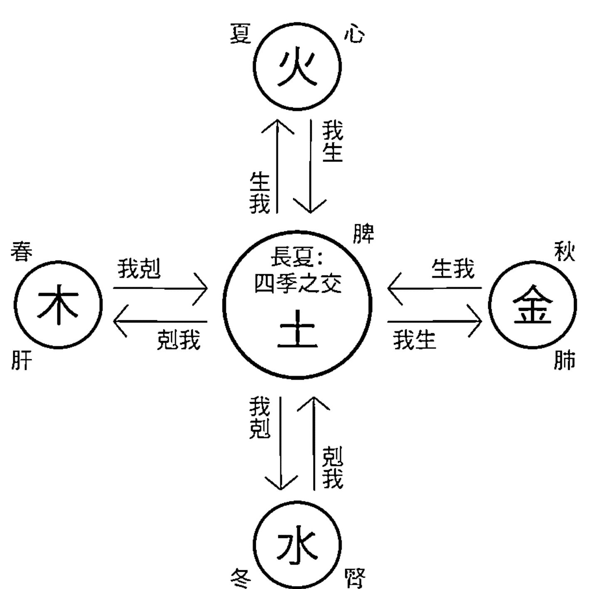

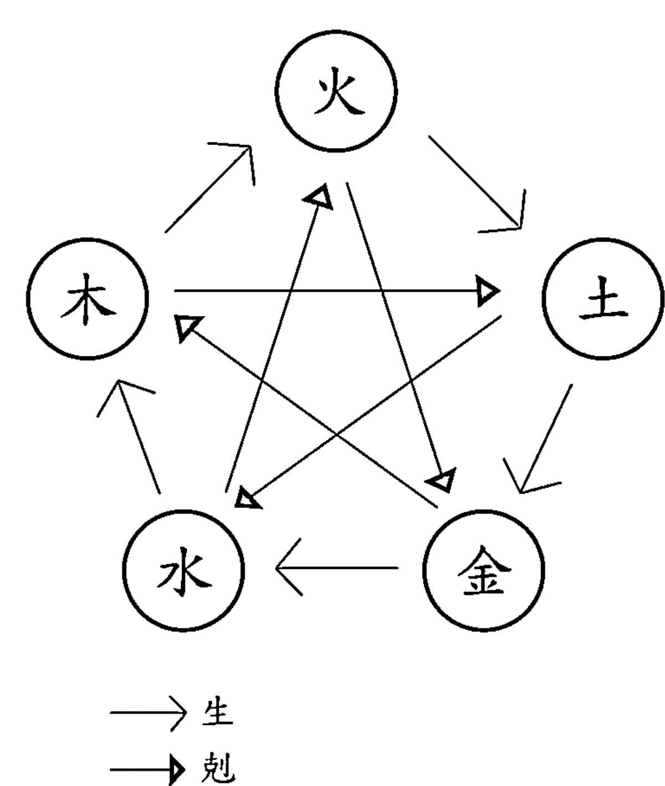

一般西醫學的觀念認為，代謝全身的血液的力道，主要是由心臟單獨提供。以中醫的概念來看，人體在代謝的基礎上，雖然有許多器官以不同的合作方式，藉由「波動」的形式來針對各種日常與非日常的需求，進行多種不同模式的、雙向的調節，串聯出各種循環的機制。並且認為在這麼多樣化且複雜的生理波動的改變之上，必定有一個能夠加以統籌並且調和的生理功能。我們觀察到：「胃」的強健與否，會直接關係到各種代謝機能的順暢與效果，這包括了把養分向外輸送，也包括了將廢棄物回收後排出體外。

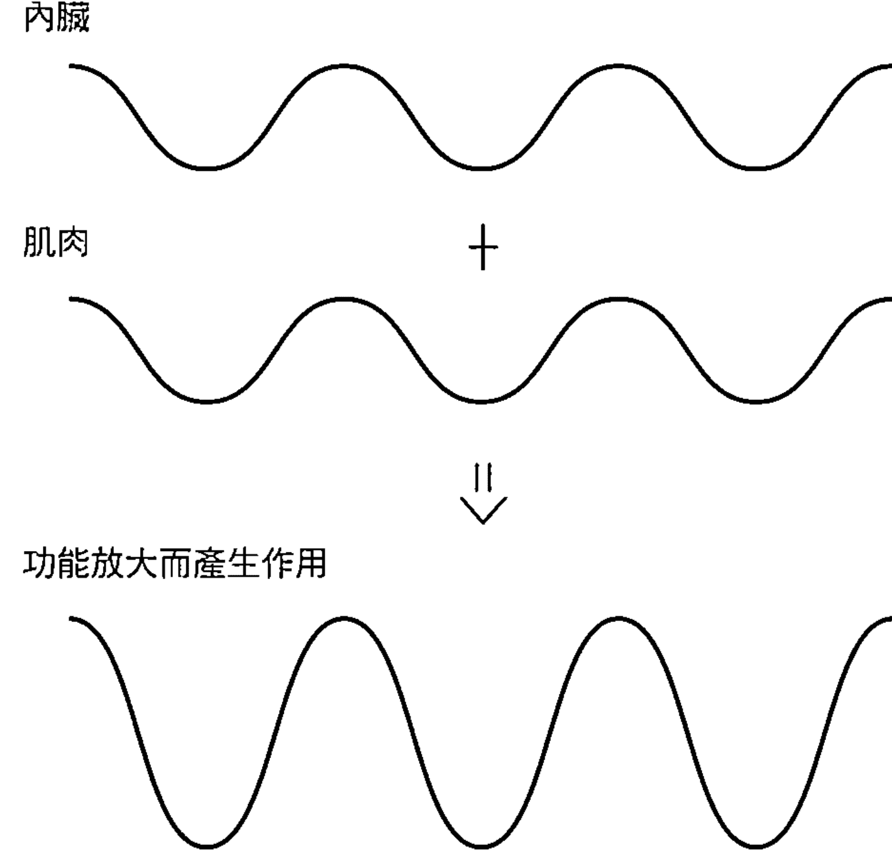

不同部位的內臟功能、肌肉以相同頻率相結合收縮波動，產生「共振」，許多小出力合作增幅成大功率。像是：排尿、搬重物、血液或淋巴的代謝循環、在火場中搬出金庫的神力……等。

#### 1. 內臟組織結構上能看到的胃

就像《內經》所言，胃是「水穀之海」一般，胃承裝可供應全身的養分，同樣的，身體的各種廢棄物也會透過胃倒抽回收、集中的力道，再度由四肢末端回送往軀體中央的位置匯集，這樣才能啟動往下排除的後續動作。《內經》在談到「胃」以及胃的功能「胃氣」的時候，並不是在談論單一內臟組織的胃而已，而是同時包含：

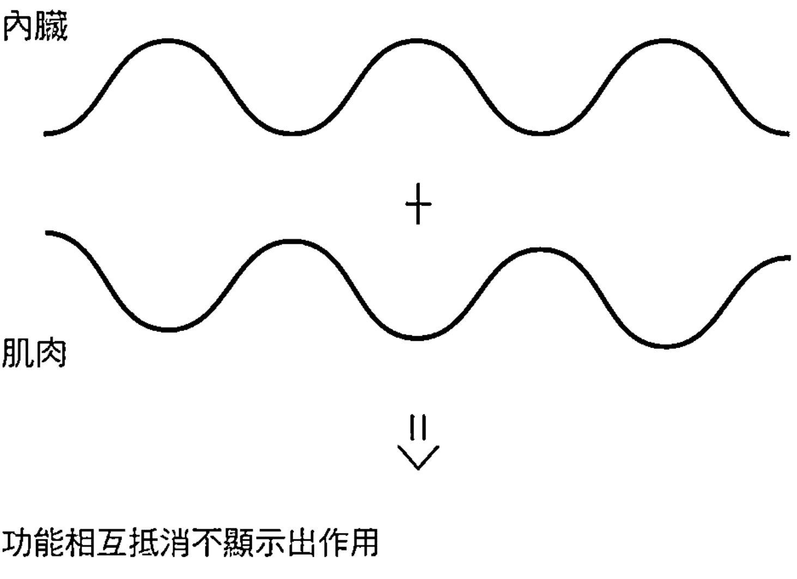

不同部位的內臟功能、肌肉以剛好相對的頻率接觸彼此的收縮波動，形成「駐波」，因此產生「沒有作用」的功能現象。像是放鬆、沈靜、休息、睡眠、不思考、喜悅……等。

#### 2. 胃的消化功能

#### 3. 以胃為主所直接引導的其他身體功能

因此，整本《傷寒雜病論》的論述才會以「建中」、「理中」的角度來貫穿每項條文。「中」所指的就是以脾胃為主，加上位在這個體腔區塊的空腔，亦即是中醫所謂「三焦」的「中焦」，並且包含各種組織，甚至是心臟。透過這個「中」的概念，來串連整個具有高度關聯功能，成為一個跨越個別內臟、功能的系統化學問。

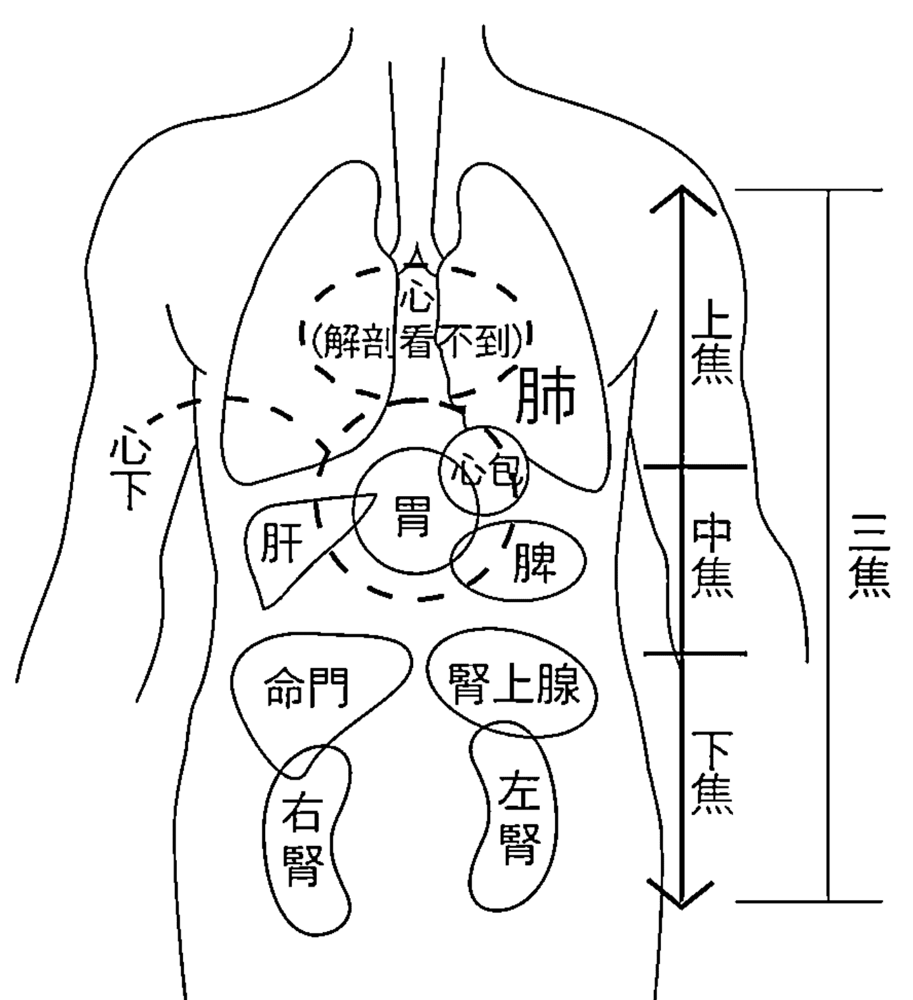

「三焦」是中醫特有的對身體的認知概念之一。同樣的，「心下」也是。

《內經》提到「五臟四時之脈，皆以胃氣為本。概五臟之氣，生於胃；而胃腑之氣，生於水穀也。」又說，「平人受穀以生，故平人之藏氣秉於胃。胃者，即平人之藏氣也。」以及「五臟之脈，滋生於胃。胃為中土，氣通四旁。」「太陰為之，行氣於三陰，陽明者，表也。五臟六腑之海也。意為之行氣於三陽。」可見身體所有臟器的功能都要以胃「氣」為本，所以我們說，胃氣是掌握平時養生、病時治療的一切關鍵。我也常常提到西方的一句諺語「You are what you eat.」在我們日常的三餐當中，透過吃進肚子裡的各種飲食所含有的營養來讓我們的胃得以產生各種生理的功能，也就是所謂的胃氣。胃氣能夠通達全身，與脾結合，走遍三陰三陽*，也就是人體全身上下所有不同層次的陰與陽的構成，所以能夠化氣、生血。那麼，我們在日常生活當中談到保健，甚至談到醫療的療效的時候，又怎麼可以不重視每一餐吃下的食物呢？

*／三陰三陽：陰與陽意指萬物中始終相互對立、互相化生的兩個概念，用來解釋人體組織結構、生理病理以及指導臨床診斷與治療，是中國醫學的重要基礎。三陰為太陰、少陰、厥陰，三陽為太陽、陽明、少陽。

## 第二章：保身長全，胃氣很重要

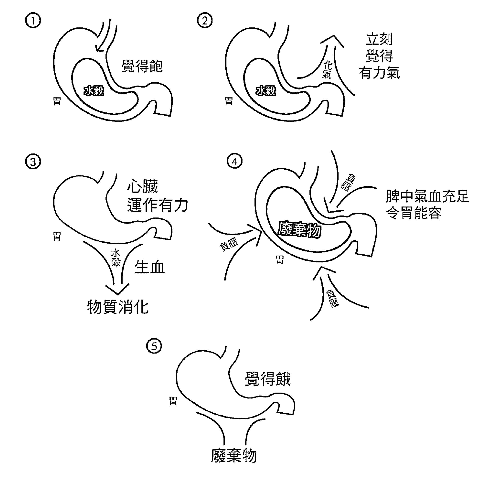

胃氣的產生大致上可以分成五個行程。不妨想像成這是一具擁有五個行程的轉子引擎。

在《內經》中有著如下的記載：「毒藥攻邪，五穀為養，五果為助，五畜為益，五菜為充，氣味合而服之，以補精益氣。此五者，有辛酸甘苦鹹，各有所利，或散或收，或緩或急，或堅或哭，四時五藏，病隨五味所宜也。」很明顯的，在人們一天的飲食之中，各種做為主食的穀類最為重要，因為穀類能養足我們的身體；至於蔬菜、水果在身體機能在運行之中，就像左手一樣，僅是輔助；五種家畜、家禽的肉類對於身體的機能與結構，則有明顯的增益效果。大致來說，主食穀類的攝取是一定不可欠缺的，接著需要重視的是肉類的攝取，然後才是水果、青菜，約略的做為從旁的輔佐。若是錯置比例，甚至如「蔬果五七九」、「不吃主食」這樣明顯的偏去，雖然人不會因此就立即喪命，但是若依《內經》的觀點，人體的功能必定因此失常。

我們現在所謂的營養學或是現代對於疾病的認知中，往往都會強調人體因攝取某一種營養素過量或者是不足，而導致疾病。當然，特定的營養成分與身體的特定功能之間的確有某個程度的相關。但是我們也知道，假使把物質畫分到極限，也就是所謂的碳、氫、氧、氮等等的原子尺度以下時，便失去了我在陰陽五行數術中所稱的「一個整體」的特質（見P.44）：各種食物成分將都變得一個樣——無色無味，人體的感官難以區辨。沒有了「五味」引導，人體無法將其妥善的「出焉（代謝與利用）」，健康就會出問題。我們要再次強調的是：採取合理而且適切的尺度來認識事物，非常重要。

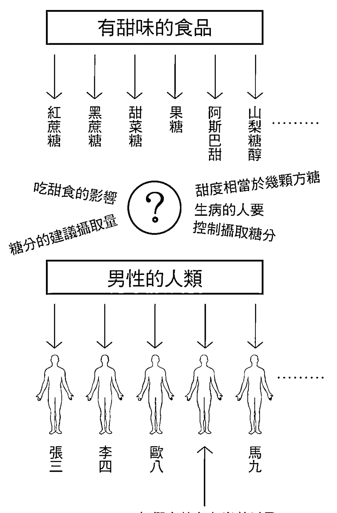

除了都具有甜味與相似的分子式結構，由其他的成分所構成的特徵也一樣重要。這些特徵決定了：不同的糖吃進胃裡之後會對身體有什麼不同的影響。

綜合前述可以知道：只要我們以胃氣為本，對外能治療入侵的風寒感冒，對內能調理內臟的功能與結構，平時加強營養的吸收與代謝的調理，都會達到很好的效果。其中的道理就是：我們的身體被設計成能夠透過脾胃的系統，調控我們全身上下裡外的肌肉組織，進而達成氣血調和的目的。若是要善養脾胃，必要多吃主食五穀。

### 《傷寒雜病論》關於胃與胃氣的描述

在《傷寒雜病論》中，也有許多與「胃氣」相關的描述。在這裡，我們從中選出幾則，做一些簡單的解讀，讓各位朋友有初步的了解。胃氣的概念不是天外飛來一筆，而是實際證實了古經方中醫的醫術是有系統的知識，是科學。但還是容我在此提醒一聲：本節是單純就古籍經典進行學術上的研究與心得分享，並不能代替正式的診斷，更不可以貿然自行抓藥來服，以免自誤。

其一：

> 「趺陽脈浮，浮則為虛，浮虛相搏，故令氣餉，言胃氣虛竭也。此為醫咎，責虛取實，守空迫血。脈滑則為噦，脈浮、鼻中燥者，必衄也。」（《平脈法第二・二・三四》）

「趺陽脈」是漢代古經方的脈法，主要是在腳背上取脈，了解人的胃氣是否健全。若是胃氣虛竭，人就會出現喉頭堵住的感覺（即「餔」。音同「噎」。）而這個問題很顯然是因為醫生把病家的胃氣耗盡，才會發生的狀況。在《傷寒雜病論》提到，人體的功能與主觀感受之間，是一個常規的邏輯可循的。書中甚至告訴你：這是因為被醫生下錯藥，胃氣虛竭，才造成的問題，並不是自然會發生的疾病狀況。

如果病家的胃裡有食物，則會因為胃氣耗盡而無法化消、代謝，病家就會想把這些食物給嘔出來。如果病家的胃裡頭缺乏津、血的問題嚴重，入不敷出，而鼻腔裡頭又乾燥的時候，病家就一定會流鼻血。有的人，特別是孩童，常會有不明原因自己流鼻血的狀況，除了關心鼻腔裡微血管的問題之外，可能我們更需要留意病家的胃氣是否有類似這樣的問題發生。

像我小時候，身材瘦小，食量很小，常常一吃東西就吐，也很常動不動就流鼻血，特別是在開了空調、空氣乾燥的環境裡。結果家人認為我是「火氣大」、「體質燥熱」，常常給我吃一堆「退火」、「涼補」的東西，像是綠豆湯、仙草茶，因此傷了胃氣，連帶影響了肝、心臟，結果身體代謝的機能變得很弱，變得虛寒，體重直線上升。一直到我開始自學中醫之後，才認清問題的嚴重性，以及當年究竟是造成了什麼樣的錯誤，開始自力想辦法慢慢的補救回來。我一面摸索解決問題的方案，同時也一面感嘆：當年我的身邊沒有人懂這些啊！而且「退火」、「涼補」又是坊間很常流傳的說法，大家人云亦云，靠著對於「寒熱」、「虛實」等中醫術語的一知半解的認識，妄下論斷，亂吃亂補一通。殊不知多數人其實根本沒有那麼多「火」可退，通常所謂「降火氣」的辦法，結果往往都是傷了胃氣居多。而孩子在小時候怎麼吃、怎麼調養，其實會嚴重影響他往後一輩子體質的變化，有很多問題，像是近視，更是成人之後難以挽救的。在此我還是要奉勸各位有緣的朋友一句：為人父母者，千萬要把中醫給學好啊！

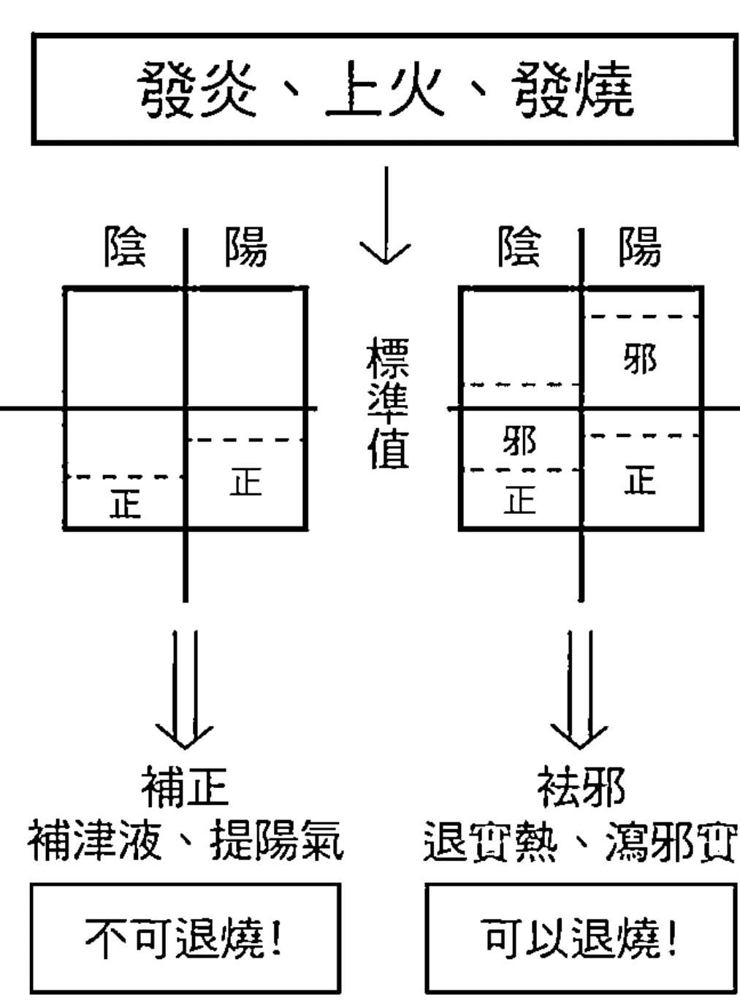

陰陽不調和可能會引起發熱、上火的現象。在不對的時機退火，會讓人致病！

#### 其二：

太陽病，發汗後，大汗出，胃中乾，煩躁不得眠，欲得飲水，少少與之，令胃氣和則愈。若脈浮，小便不利，微熱，消渴者，五苓散主之。（〈辨太陽病脈證並治中・七・四二〉）

胃氣「和」，是很重要的事情。而胃氣要能夠「和」，就是要胃在具有足夠的津液的狀況之下，可以產生身體功能，與胃裡頭的飲食得以「緩降*」的狀況。胃氣不和，可能會流大汗不止、胃裡面乾燥而少津液、思緒覺得浮動而不能入睡、很想喝水。一般來說，只要我們喝一點很熱的開水，就能夠止住胃氣不和的狀況。當然，有的時候並不能夠這麼容易就控制住狀況，因為問題可能已經變得較為嚴重，超出了熱水可以處理的範圍，所以我們就要動用更積極而有效的辦法來處理。特別是在孩子身上，我們可以看到病家會有胡言亂語、囈語不清等等的狀況，這種《傷寒雜病論》之中所謂的「讝語」並不是什麼「中邪」或被「沖煞到」的問題，而是胃氣不和的因素所導致，屬於醫學的問題。只要胃氣能和，讓消化道裡頭堵塞住的食物或是大便給排掉，就沒事了。

*／該升則升，該降則降，叫做「和」。若食糜從胃裡頭下降得太快，就會造成人體來不及吸收養分等毛病；若是下降得太慢，可能會增加胃的負擔與不適感，甚至會形成糞石。理想的下降速度不能太快，所以稱「緩」。

#### 其三：

陽明病，脅下鞕滿，不大便而嘔，舌上白苔者，可與小柴胡湯，上焦得通，津液得下，胃氣因和，身濈然汗出而解也。（《辨陽明病脈證並治．九．五四》）

太陰病，脈弱，其人續自便利，設當行大黃、芍藥者，宜減之，以其人胃氣弱，易動故也。（《辨太陰病脈證並治．一〇．一八》）

胃氣如果不能緩降，病家就會想吐。但是如果下降的力道過猛，就會出現腹瀉的情形。如何知道一個人的胃氣偏弱呢？我們會看到病家可能經常性的出現腹瀉、大便帶水氣多而不成形的情況。一有緊張等情緒上的變化，或是出國等環境改變的情形，甚至是多吃了點食物，就會容易腹瀉。在這種情況下，性質寒涼的食材或藥材，像是大黃，或者會讓胃裡頭的津液大幅增加的食材或藥材，像是芍藥，就得要謹慎使用了。話說回來，現代人的手腳心經常都是難以保持溫暖，實在沒有什麼本錢可以吃冰、喝冷飲啊！

#### 其四：

> 「問曰：何緣得陽明病？答曰：太陽病若發汗，若下，若利小便，此亡津液，胃中乾燥，因轉屬陽明，不更衣，內實，大便難者，此名陽明也。」（《辨陽明病脈證並治・九・三》）

身體有六層抵抗疾病的能力，陽面、陰面各有三層。陽面具有抵抗疾病的能力，而陰面則是主要負責收藏養分的作用，對於抵抗疾病的能力不但較弱，而且因為陰面的三個層次都關係到身體內臟的重要功能，所以，遭受疾病入侵而「難治」、「不治」、「死」的可能性也會大幅提高。

陽面的第一層，是我們主要用來抵抗疾病的能力，叫做「太陽」。《傷寒雜病論》定義，太陽與人體的足太陽膀胱經關聯，而足太陽膀胱經又與足少陰腎經，表裡陰陽成對。我們在處理疾病的時候，希望在最外層、陽氣最強的太陽經就能解決。這就是我們紫林中醫所謂的「決戰太陽經」的概念。

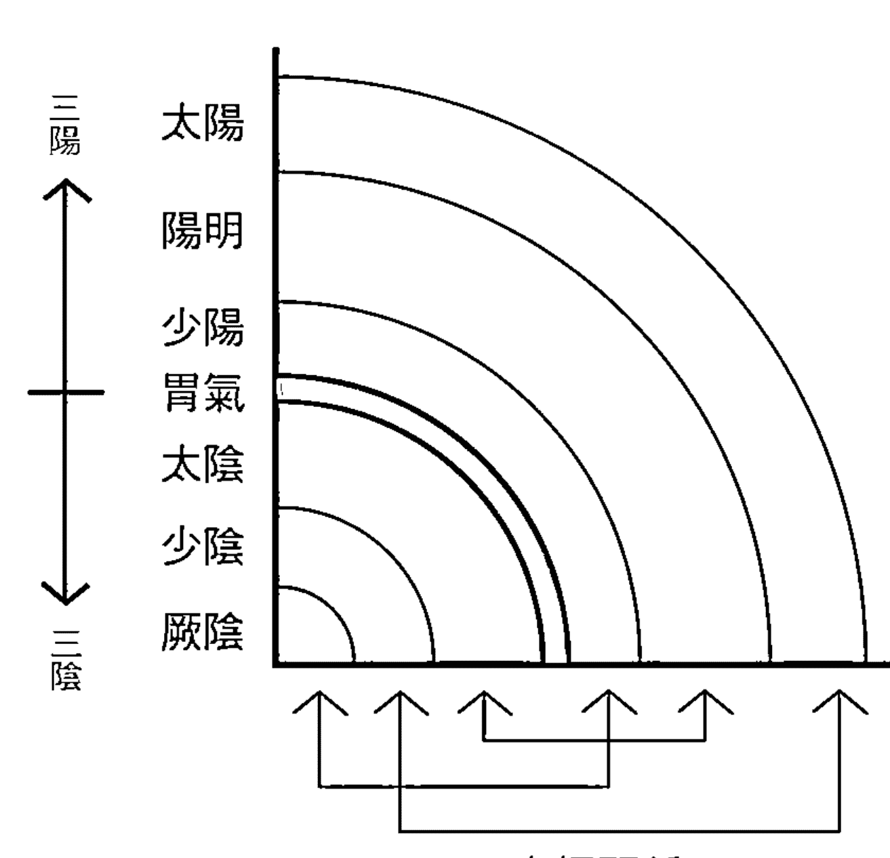

「不發燒了」有可能是因為邪氣進入到後三陰，不見得都是好事。「退燒」如果用錯了方法，反而更危險！

太陽經對抗疾病的候，若是人體陽氣不足或是經過誤治，邪氣就會進一步入侵陽面的第二層，也就是「陽明」。陽明與足陽明胃經相關聯，胃的狀況是否穩定、強健，決定了感冒變好或者變壞的走向。為什麼感冒由太陽惡化為陽明？《傷寒雜病論》直言：「亡津液，胃中乾燥」，才會「轉屬陽明」。因為不正確的發汗，或是吃了瀉藥，或者小便過多，讓胃中的津液耗竭造成了胃中的乾燥，引發惡化。胃氣的強弱，胃裡頭的津液多寡，不只是在日常生活中作為我們保養的指標，更是用來與疾病作戰的重要能力。

> 「傷寒三日，三陽為盡，三陰當受邪，其人反能食而不嘔者，此為三陰不受邪也。」（《辨少陽病脈證並治．一○．九》）

條文說到：當身體的陽面的三個層次都失去抵抗力了，疾病原本應該會開始入侵到陰面的三個層次裡去。但是在這個時候，病家卻還有足夠的胃氣可以「容得下」食物，還能夠「化得消」，不會把食物給嘔出來。在這個狀況下，就可以確知陰面的三個層次將不會被疾病入侵。

也就是说，在三阳之末、三阴之初的交界，身体还有一线防御的指标，也就是「胃气」。此处不言胃气，但胃气的重要性昭然若揭。

#### 其五：

趺阳脉浮而涩，浮则胃气强，涩则小便数。浮涩相搏，大便则硬，其脾为约，麻子仁丸主之。（《辨阳明病脉证并治·九·七一》）

伤寒，始发热六日、厥反九日而利。凡厥利者，当不能食，今反能食者，恐为除中。食以素饼，不发热者，知胃气尚在，必愈。恐暴热来出而复去也，后日脉之，其热续在者，期之旦日夜半愈。所以然者，本发热六日、厥反九日，复发热三日，并前六日，亦为九日，与厥相应，故期之旦日夜半愈。后三日脉之，而脉数，其热不罢者，此为热气有余，必发痈脓也。（《辨厥阴病脉证并治·一一·五三》）

胃气浮散在外，功能只有亢进而不能平缓，就会造成小便的次数、量都偏多。

小便的量一多，大便的质地就会偏硬，而脾对于养分的吸收、运化的功能就会衰退。当身体出现小便多、吃得多、人却日渐消瘦的状况的时候，我们不妨好好的分析一下：是不是因为胃里面的津液太少，让胃气大量的外泄，所以产生这样的问题？

当胃气缺乏津液涵养，则出现「胃气生热」的问题，反之，胃气与胃中的津液可以调和，那么，恭喜病家，「必愈（痊愈）」。因为「胃气尚在」，人就有机会可以好起来。但是如果胃气与胃中的津液无法调和，胃气浮散到身体的表层来，让身体发热，这样的热会逼迫身体的皮肤、肌肉，出现发炎、化脓的「痈脓」问题。程度轻微一点，可能全身容易出现皮肤发炎、毛孔被皮脂阻塞的状况。程度再轻微一点的，红肿发炎等问题可能会集中在出现在胃的状况的监控区——面部。虽然有热并不好，但是这里的热却是来自于我们的胃气，所以不可以退掉。前面才说到：「胃气尚在，必愈。」胃气就是我们当下赖以活命的最后根据。朋友们，《伤寒杂病论》都这样子告诉我们了，我们还能够轻率的「退火」、「消炎」吗？

#### 其六：

> 「师曰：寸口脉迟而涩，迟则为寒，涩为血不足；趺阳脉微而迟，微则为气，迟则为寒。胃气不足，则手足逆冷；荣卫不利，则腹满肠鸣相逐，气转膀胱，荣卫俱劳。阳气不通即身冷，阴气不通即骨疼。阳前通则恶寒，阴前通则痹不仁。阴阳相得，其气乃行。大气一转，寒气乃散。实则失气，虚则遗溺，名曰气分。」（《辨咳嗽水饮黄汗历节病脉证并治·一四·七四》）

胃气不足，手脚就会发冷，还会导致肌肉僵硬而无法柔软的自由屈伸，怎么穿衣穿袜也无法回暖，这表示身体的阴气与阳气已经不通，荣卫不利了。

有个朋友曾说他去看西医，医生告诉他「手脚发冷很正常啊！我自己也会手脚发冷哩！」那么，我来说个小故事：日本的「帝京大学医学部副教授」新见正则教授，毕业于日本庆应大学、英国牛津大学，专长于血管外科、移植免疫学、东洋医学、运动医学等。他接受电视节目的邀约*，发表医学见解时，就正面提出：西医对于手脚发冷、畏寒这件事，因为教科书上完全没有提及，所以西医的态度就是「不会治，不关心，不知道（治せない、興味がない、分からない）」。连对于西医学颇有造诣的新见教授也无法单纯就西医的知识范围，对于「手脚发冷、畏寒」提出正确的见解与回答。我们常听到西医很常说所谓的「没有科学实验可以证明」，其实很可能只不过是「不会治，不关心，不知道」的另一种说法，所以我先一步的希望：各位只了解西医理论的朋友，请不要拿西医的理论来评论我的文章内容。因为西医对于中医有研究、有见解的问题，像是「胃气」、「阳气」，有太多的「不会治，不关心，不知道」，请不必勉强对于自己不了解的问题发表看法吧。

#### 其七：

> 「胃气下泄，阴吹而喧，如失气者，此谷道实也，猪膏发煎主之。」（《辨妇人各病脉证并治·一六·三九》）

如果就西医的解剖角度来看：胃与子宫等女性内生殖器官之间，除去血管或神经等的联系之外，根本没有任何直接连通的通道。但是对于古经方中医来说，人体不同组织之间的功能，能够交互作用，调控彼此之间的节律，并非解剖可以认识。像是这则条文所言，胃气的异常将导致妇女阴道有排气的现象。如果我们只知道从内生殖器的系统去找原因，一定难有肯定、明确的结论。但是《伤寒杂病论》明文指出，这是因为「谷道实」，也就是因为整个消化道之中有明显的不通畅所导致的问题。中医普遍会告诉大家，不要吃冰、喝冷饮，特别是女性朋友吃冰会导致妇科方面的问题，这是有所本的。

## 2-2 健康，成败之间，全在「胃气」

### 从五运六气谈脾胃系统

中医以阴阳五行来综合性的归纳、分析身体的各种组织和功能。五行的运转是特质方面变化的规则，而三阴三阳则是深浅、里外等层次上的描述，并各自搭配六气，综合描述三种「两极成对」的状态。我们把五运对应到五脏系统，而六气对应到身体运行的六个层次，划分为所谓的「六经」，从中找到彼此相互联系、支援，还有相互循行的规则。若是把身体分成循行内脏而出的手部，以及贯行全身上下足部，最后会得到各六经，一共是「十二正经」。这与天上黄道十二宫，一日十二时辰，一年十二月分，十二节与十二中气合并为二十四节气，不分东西方的观察与思想，在理则上的关系都是一致的。

《内经》提到：「朝则人气始升，病气衰，故曰慧。」类似这样，《内经》经常提示我们，无论是一日或者是在一年之中，人的「阳」与「阴」都随着日夜、季节变换，与天日（即太阳）关系密切。《伤寒杂病论》亦提及：「君子春夏养阳，秋冬养阴，顺天地之刚柔也。」君子应当顺从天地循行的特征，来进行自己作息的调养。

在《伤寒杂病论》里面划分了六个时段，对应到刚刚提到身体所谓的六经，也就是六个层次的抵抗疾病的能力，怎么样与一天之中的日出日落的时辰进行搭配。我根据这样的文字做了一张图表，定名为「六经流转时辰图」。

- 三至八时 —— 少阳
- 九至十四时 —— 太阳
- 十五至二十时 —— 阳明
- 二十一至二时 —— 太阴
- 二十三至四时 —— 少阴
- 一至六时 —— 厥阴

从此图我们可以看到，一天分为阴和阳、夜晚和白天。白天的定义，是从东方泛起鱼肚白的时间点开始。阳气初始，称为「少阳」。三个阳的时段，中间约略有一个小时不互相重叠。这代表身体的阳气可以依循阴阳表里而生，或者能以情志或身体的意志进行引导，允许来自不同的源头进行发动，呈现放射状的构成。三阴彼此有很明显的重叠的时段。这示身体的养分累积，具有前后秩序的线性关系。先后秩序的关系，不可忽视。

在《伤寒杂病论》里面提到过「荣为根，卫为叶」（《平脉法第二·二·二一》）。我们可以把「荣」视为是身体的「养分在作用」的现象，把「卫」视为身体的「功能在作用」的现象。如果人体经常在养分不够充分的情况下操劳，阴与阳失去节律，阳气单独依靠消耗其对应的阴气而生，身体会渐渐的从内脏开始虚弱，支持不住身体系统的各种功能需求。内脏的津液因此不足、虚弱而产生疾病，以及各种不舒服的身体感，甚至可能是很多现代医学检查不出毛病。

所谓的「五运六气」，就是在每一年都会有一个天地之间万事万物整体趋势上的特征，这里头当然也会跟每一年的流行疾病与天候的特征、保养身体的方式，甚至是人类社会的走势，产生相互的对应。人之所以在天地之间的某个特定时间点出生，以至于对应到身体与个性的特征，都会有相当的对应关系有理可循。所以《伤寒杂病论》会提到「五运六气」，标明每年对应到的风、暑、湿、燥、寒、热等六种能量，把天地循行的节律与人体循行的节律，做了很紧密的描述，成为疾病流行趋势预测技术的先驱。但是现代流行的说法则是在宋代才开始出现的「子午流注」，将子时（二十三至一点）关联到胆经，丑时（一至三点）关联到肝经。这与我们对于天地循行的观察经验有很大的违背，也无法从中预测身体与环境交互影响的可能发展。我想从这里说明：宋代较之于《伤寒杂病论》成书的东汉末年以前，很多医学的论述其实已经与原本的阴阳五行、对天地的认识，有相当大的差异。

我们从五运六气之中可以知道：阳明是身体将能量转回为养分收藏之际，「由阳入阴」的交界关键节点。在《伤寒杂病论》也提到，阳明这个层次对应到身体的胃，身体正是经过由胃至脾，通过阳明由阳入阴之后，依序补养三阴层次的内脏。

### 胃气「致中和」的重要性

在《内经》与《伤寒杂病论》之中，我们看到：

- 一、胃气能够调控全身重要的机能，又可以引导养分进入内脏收藏。
- 二、胃居于身体阴阳之间的「中」，也是躯干上下之间的「中」。
- 三、胃中要有足量的津液才能保全胃气。胃中的津液主要来自于水谷饮食。
- 四、胃气能升能降，又以缓降为顺。强烈的沉降或是升散，同样都不是好现象。

如果胃里的津液不足，胃气不停的外泄，将会「胃气生热，其阳则绝。」（《辨阳明病脉证并治·九·七〇》）虽然胃气以缓降为顺，但是也得注意到「微和胃气，勿令大泄下*」（《辨阳明病脉证并治·九·三一》）。所以我们需要的是「上焦得通，津液得下，胃气因和。*」（《辨阳明病脉证并治·九·五四》）这样子一种动态的平衡。这样位居要冲的身体脏器以及核心功能，自然就更需要「居中不乱」、「折冲」的性质。所以，我们会看到胃属于脾系统之下，而脾系统的属性又在五行之中属「土」。土的性质之一即是「折冲」。

> *／胃的运作温度太高，津液在高温下被快速的、大量的耗去，身体突然没津液可用，所以生不出阳气。
> *／意指胃气需要透过微和来「缓降」，不可以快速、大量的下行，这样会把气、津液、血都往下泄出体外。
> *／上焦接受胃从中焦升上来的气，就能让通道、功能畅行。而下焦又需要承接胃从中焦降下的津液，启动肠道、肾等的机能。该升则升，该降则降，所以说，这样就是胃气「和」了。

传说商朝时，伊尹本为厨师，做《汤液经法》，为后世汤剂药方开基，后来更成为治世之能臣。可见药食同源，医药之理只在家常饮食之中。《道德经》曰：「治大国，若烹小鲜。」善用万物各有其正，不必多加「控制」、「抑止」，身体自有相互扶持、相互节制的动态平衡。文天祥做《正气歌》：「天地有正气，杂然赋流形。」若是身体的原始功能不足以应变，尚且还有来自于天地之间，应运正气而生的万物，可以借用来帮助我们的生命维持恒定。得识物性其正，也就是其本来的面目之后，更知道这「变」与「不变」之间的宏观智慧，从烹小鲜、庖丁解牛，从医药之理来看，实为一致。

所谓「以偏治偏」。物性的偏性越强，效能越凸显，就越需要讲究正确的配伍和使用时机。胃气能够正常进行生理功能的调节，即所谓的疾病抵抗力，虽然不言「增强」，但却会日益健壮。许多身体的不适，虽然不言「治疗」，但却会逐渐缓解。

用平凡的食材组合出神奇的效果并非神话，只是需要对于医、药、物性其法度、理则，有更清楚的认知，更严格的遵循而已。并非如坊间传说之中常见的：将几种食材做了罕见的搭配，或是网罗了各种含有高质量养分的药材于一体，就能够有神奇的效果。我们甚至要反过来说：偏性越重，越是要谨慎使用，以免破坏了身体自己「致中和」的天生功能。《神农本草经》将药材分为上、中、下品，而所谓的「下品」的定义，也就是「以偏治偏」的力道最大，同时也可能在不恰当的使用之下，剧烈的破坏我们身体原本「致中和」的功能。

《内经》告诉我们：「胃者，水谷之海，六腑之大源。」胃中承装着各种我们所咽下的饮食，有如海纳百川。而在地球科学之中，我们知道「海」能够调节陆地的温度与湿度，达到动态的平衡。同样的，对于身体来说，胃部在盛装了温暖的、富含津液的食物之后，就有利于与其他五个腑：胆、小肠、大肠、膀胱，以及统称包含所有内脏之间的空腔与淋巴系统的「三焦」，进行养分的供给，以及废弃物的排出。

### 胃气与腠理

作为常用的主食之一，我们会看到小麦在磨粉制面之后，加水揉和，成为面团，略经发酵、就会产生筋性而能够延展，拉出薄膜。在我们的人体当中，其实也有像这样子的一个薄膜状的结构，同样可以达到像我们在《内经》里头所读见，经络的性质一般：「内属脏腑，外络肢节。」这个结构就是在解剖上所看到的一种叫「筋膜」的组织。筋膜就像是为我们每个人量身订做的一套紧身衣。这件衣服可以包覆我们的身体从里到外的内脏、血管、神经、肌肉，还有皮下组织等身体的结构，范围非常的广泛，全身上下几乎是无所不在。因为筋膜在我们的体内贯穿里外，所以当我们把血管、神经、肌肉、内脏等身体结构，甚至是骨头全部都拿开之后，你会看到整个筋膜在原地留下，就像我们自己肉身的形状一样。甚至当人体还只是胚胎状态的时候，就已经先有筋膜的发展了，并且透过筋膜这样结缔组织的联结，才开始发展出肝、心脏等重要脏器，符合数术*之中认为「天一生水*」，由水而生木的发展秩序。近来的研究甚至认为「间质干细胞*」含量最丰富的部位之一就在筋膜里。虽然我们似乎很难在古书里面找到「筋膜」这两个字，但是在同样的概念当中可以对照到一个名词，就是《伤寒杂病论》里头同样强调的一个治病的关键字，叫做「腠理」。

> *／阴阳五行的生克制化的理论，认为数字在功能上都有其独具代表的一连串意义，并依此来论断事物所含有的数字，进行分析。
> *／数术中以数字「一」表述万物的起点，从天而来。而这个起点的属性是「水」。中医认为的「水」不只是化学分子式的H2O而已，还包含了各种液态、有形体而可流动的物质，并进一步默许其中含有高度的养分，或是可以变化的性质。
> *／间质干细胞：Mesenchymal Stem Cell, MSC，是干细胞的一种，具有干细胞的共性，即自我更新及多向分化的能力。研究证明其在体外分化成为硬骨骼及脂肪细胞，更可以分化成为肝脏、软骨、肌肉等组织细胞，以及神经系统的细胞。

筋膜牵一发而动全身，头能影响脚，四肢能影响内脏。现代医学仍然参不透箇中玄妙，中医的针灸却常常可以扎肩治膝、扎手治头，代表中医早在一千八百年前已经深谙此理。

什么是腠理呢？《伤寒杂病论》定义：「腠者，是三焦通会元真之处，为血气所注；理者，是皮肤脏腑之文理也。」（《杂病例第五·三·七七》）「腠」指的是三焦可以贯通我们身体最精纯的能量的部位，同时也可以接受血液功能所带来的效果。「理」指的是我们在皮肤、脏、腑上头所可以发现到的纹路、理络。总合起来说，「腠理」是身体在功能与养分代谢循环上面，达到一种极致状态之下所能够贯通、交融的部位，而且呈现出有纹理的，类似通路形态的结构，从最外层的皮肤一直到里层的内脏组织上都看得到。在腠理之中，包含了能量、津液、血液三个层次的循环代谢的主体，也包含了全身上下广义的肌肉层次的组织。《伤寒杂病论》不但说明了腠理的形态，更把功能和其重要性都认识清楚了，是一项非常先进的医学研究论述，领先当代至少一千八百年。

如果单纯只读《伤寒杂病论》这段文字，我们可能会觉得有点模糊，不知道这是我们身上的什么东西。但是如果加上解剖里头所谈到的「筋膜」的概念，似乎就能看出道理了。像是这样「解剖上的筋膜」与「中医名词的腠理」的对照，在目前已经公开发表的医学研究、报告，或者是一些常见的实验的设计当中，似乎做出这般直接的对应与论述的例子还不普遍，或是少有人从这个方面去设计实验、去证明。但是我认为中医之中所谓的「腠理」的作用，可以从「筋膜」上的功能表现来观察得知。

《伤寒杂病论》对腠理有非常清楚的说明，像是「桂枝汤本为解肌」（《辨太阳病脉证并治上·六·一八》）表示桂枝汤具有放松肌肉，甚至有解开肌肉之间沾黏的效果。也就是说，肌肉适度的放松，对于筋膜功能的提升，会产生连带的效果。甚至在桂枝汤相关的另外一段描述有提到，所谓「病人常自汗出者，此为荣气和，卫气不谐也。所以然者，荣行脉中，卫行脉外，卫气不共荣气谐和故也。复发其汗则愈，宜桂枝汤。」（《辨太阳病脉证并治中·七·二二》）进一步的说明了桂枝汤可以调和人的卫气以及荣气。当卫气与荣气相互调和之后，腠理温暖、通畅，人就会自然透发出微汗，而反过来说，能够让身体产生微汗的手段，也都可以视为是成功达成腠理温暖、通畅的办法。如果我们能够藉由气血调和、畅旺，让筋膜达到非常良好的舒展、活络、放松，那么对于全身由里至外，由上至下的影响力，可想而知，效果会是非常深入的。

筋膜的确可以影响淋巴以及血液。而透过正确的控制肌肉，就能够改善筋膜的状态，进而调节全身所有的组织状态和功能，也就是「调气血」的终极目的。

《伤寒杂病论》里提到：「时气不和，便当早言，寻其邪由，及在腠理，以时治之，罕有不愈者。」（《伤寒例第四·三·三〇》）以及「血弱气虚，腠理开，邪气因入，与正气相搏。」（《辨太阳病脉证并治中·七·六九》）身体在接受到外界入侵的邪气时，邪气会先留滞在身体的腠理。而当腠理有所不调和、虚弱的时候，外来的邪气就容易入侵，影响身体的机能，甚至破坏。腠理的保健与疾病的罹患、治疗之间，关系实在密不可分。《内经》中又提到了「脾主肌肉」，结合来看，可以知道：我们全身上下所有的肌肉都是统整于脾系统之中。全身里外大量的肌肉直接与腠理联通，而腠理能够同时交流能量、津液、血液这三个层次的循环代谢的主体。当腠理的状态是温暖的、畅通的，身体的气、血就能自我调和，身体的气、血循环产生的功能，也就是卫、荣，效能就能够彰显。全身所有的内脏机能以及身体所需要的养分，就能够得到充分的循环以及提升，达到所谓的「保身长全」。

所谓的「微汗」，配合上「解肌」等描述，我们可以知道全身上下不只是肌肉可以获得适当的放松，更可以让气的功能表现，也就是「卫」气；以及血的功能表现，也就是「荣」气，产生高度的谐和。最后，将连带的让筋膜也可以达到非常好的温暖、通畅的舒展效果，即是我所谓的「温通腠理」。所以，纵使身体出现如发炎之类的问题时，只要透过像桂枝汤这样子作用的汤方的应用、加减，一样可以对发炎的部分产生很好的治疗效果。虽然有些人认为发炎的时候，不应该再使用诸如生姜、桂枝之类的温热性质的药材，而应该使用比较凉性的材料，来进行所谓的「辛凉解表」、消炎、退火的效果。但是，实际上从医理、效果当中可以看到，只要令胃气舒展开来，也就是透过生姜、桂枝等类的温热的药材，并且配伍足量可以提供津液的药材，就可以达到「温通腠理」的终极目的。这也是在解决发炎的时候，我们所最需要的完美手段。

同时重视结构与功能，「调气血」就是中医有病治病、无病强身的精微奥义。

### 脾系统：土

「治百病」不是梦！我们只需要正确的操作方法。

至於全身腠理的調整與功能的促進，可以透過對於特定的骨骼肌，進行有意識的緊繃與放鬆的規律收放，來達到「以肌肉調節腠理」的效果。同樣的，在使藥、食的時候，也是透過「胃」，以至「肌肉」，再達「腠理」的秩序，來達成同樣的目的，像是剛才我們提到過的「桂枝湯」的設計。仲景既然認為「四肢才覺重滯，即導引、吐納、針灸、膏摩，勿令九竅閉塞。」（《雜病例第五．三．七七》），這表示養生、保健的手段不只一種。在現代自然科學之中已經證明了針灸能治百病*，而養足了胃氣，讓四肢肌肉能夠與腠理有良好的調節與配合，一樣符合了科學邏輯的「治百病」的概念。

依我的研究認為：整個中醫的治療操作上，不分導引、吐納、針灸、膏摩，也不分飲食、方劑，其實都是透過「胃氣」控制「肌肉」來影響「腠理」而已。我們透過飲食來加強胃氣，健全肌肉，通調腠理，這種手法就是「用藥」。直接透過意識，以神經傳導至骨骼肌做有特定規律的運動來牽引腠理的手法，就叫做「導引」。若是有意識的運動所引導的是內臟平滑肌為主的活動，這種手法就叫「吐納」。直接用外來的微量創傷刺激特定部位的腠理，引發神經血管叢的傳導狀態改變來調理身體，這就叫做「針灸」。藉由他人施術並加上藥材，來被動地引導病家的肌肉與腠理進行調適，則可稱之為「膏摩」。這些中醫治療辦法的設計與操作，皆本於「溫通腠理」之宗，並兼顧了各種病家與病況的需求，貼合人性，更站在有效治療的最前端，照顧各種不同階段人類對於保健的考量。

以托爾斯泰於《藝術論》的觀點來看，我們可以說：中醫合乎科學，善待人性，符合良善，堪為藝術！《後漢書》記載：「醫之為言意也。腠理至微，隨氣用巧；針石之間，毫芒即乖。神存於心手之際，可得解而不可得言也。」誠然也！

*／可參考資料：張翔教授，《The meridian system and mechanism of acupuncture: A comparative review. Part 3: Mechanisms of acupuncture therapies》

## 2-3 如何評斷胃氣盛衰

### 手腳心溫暖為陽氣指標

無論是成人或幼兒，後天的陽氣在身體運行的中心點都是在「胃」，而手心、腳心，就是觀察胃氣是否在正常運行的最佳「監控區」。《傷寒雜病論》中提到：「胃氣不足，則手足逆冷。」（《辨咳嗽水飲黃汗歷節病脈證並治·一四·七四》）手腳心不能經常保持溫暖，就是胃氣不足，也就是陽氣不足，這就是有寒、就是身體機能不足、就是虛弱。我們的手心和腳心，在一年四季，無時無刻，都應該要很容易的保持溫暖。那表示我們身體的陽氣確實能夠到達我們肢體的最末端，並且這股陽氣還能夠有足夠的津液、血液來配合，把他涵養在裡頭。就像我們的手心、腳心有一鍋小小的沸騰的高湯，在好比陽氣的爐火適度加熱之下，不斷的在冒著溫暖的蒸氣；而在我們的胃裡，要有「胃氣」這樣的功能運作，其基本架構也是這樣的一鍋能夠維持不停的適度沸騰的高湯。

從這邊我們可以由不同的「術」，來看看是否能夠合於這個道理。例如，在現代西方的營養攝取的觀念當中，認為每天應該要吃下大量的蔬菜和水果，而且有時候還鼓勵要吃生的、沒有煮熟的青菜，甚至還有每天一定要大量的喝水。如果有朋友號稱長期大量的食用生菜、水果、喝下開水，那麼我們可以問問這些朋友的手腳心在一年四季當中，都能夠隨時保持溫暖的狀態嗎？又或者，有人感冒了，就常常上醫院去輸液、注射或是打疫苗。還有，在生病的時候常常退燒、消炎。甚至對於比較嚴重的病灶，會進行手術、割除。又如癌症，還會進行所謂的放療、化療。病家在生病過程中這麼痛苦，也投入了這麼複雜的藥物，甚至也經歷了各種看起來十分複雜的儀器的檢驗和治療，但是我們又要請問，究竟在病家之中能有幾人，手腳心可以在治療中還能夠經常保持溫暖呢？

又或者，我們在坊間的廣告中，看到一些西藥廠所推出的維他命藥丸和營養素補給藥品，這些所謂的「健康食品」都號稱讓身體的疾病抵抗力增強，能夠讓身體強壯，避免感染其他疾病。無論是針對大人或是小孩，這樣子的產品種類五花八門。我們相信，老老實實、經年累月去服用的朋友，應該也不少。但是，我們又要請教，長期服用這些所謂的營養素、補給品的朋友，你們在寒冷的冬天裡，究竟有幾個人還是可以持續保持手腳的溫暖，而且越來越溫暖呢？

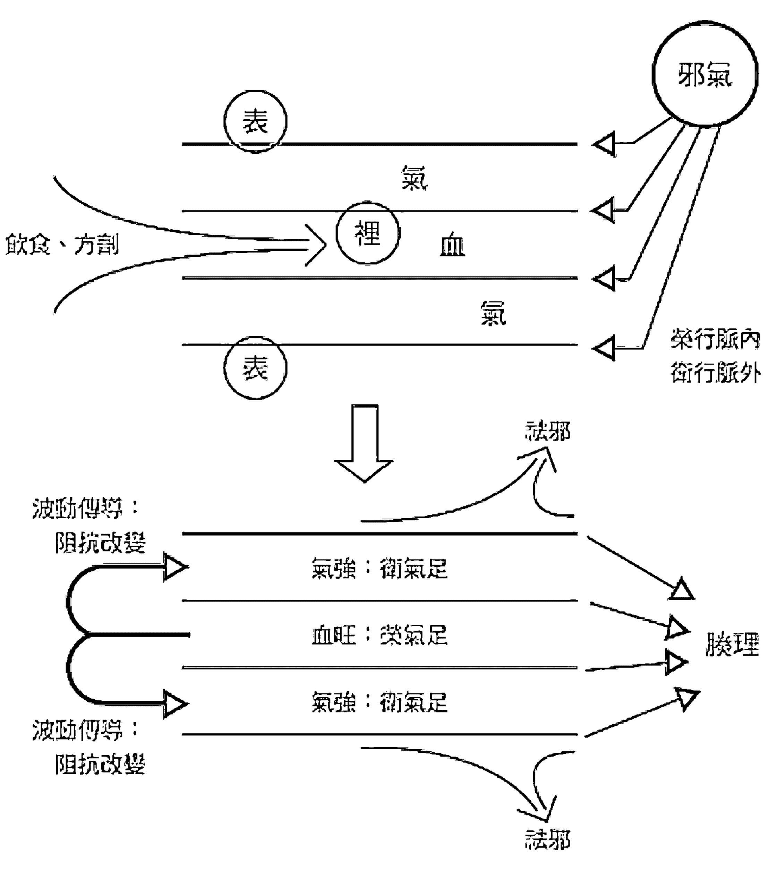

榮為根，衛為葉。大質量分散能量，水穀之海涵養胃氣。先救裡，再解表，扶正祛邪。

上述都是我們在現代的生活當中，常聽聞的疾病治療或是維持健康的方法。但是，當每年有千千萬萬的人投入這樣子的產品或是醫療行為當中，究竟有幾個能夠符合我們越吃（或者是越治療）手腳心越來越溫暖的標準呢？恐怕在千萬人當中也找不到一個人。既然手腳心不能夠經常保持溫暖，就表示這個人的陽氣並不充足。當人的陽氣不足的時候，他的胃氣勢必也不足。如果這個人的胃氣不夠，胃怎麼能夠勝任「水穀之海」的角色呢？五臟之脈又怎麼能夠被滋養呢？什麼樣的方法、什麼樣的手段，能夠真正在日常生活具有保健效果？生病的時候，能夠真正幫助我們恢復健康？相信各位都能夠一目了然，把心中的疑問一掃而空了。

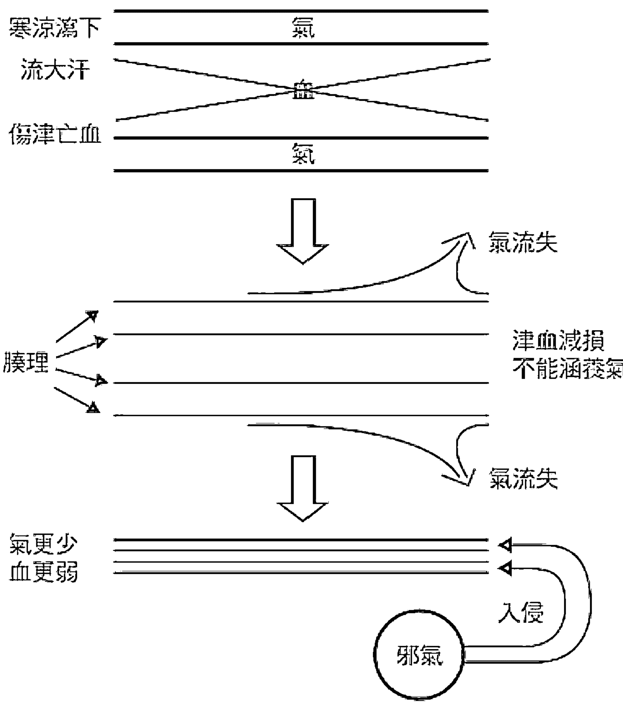

瀉去血、津液能夠暫時逼迫陽氣外洩，讓衛氣提升。但是津血流失造成後續陽氣產生更加困難，內臟虛弱，邪氣入侵的機會大增，祛邪也更加困難，因此陷入惡性循環。

### 胃氣三力：容得下、化得消、睡得沉

對於我們「紫林中醫」觀察人體來說，手心、腳心的溫暖是一個很重要的指標。在陽氣強健的前提之下，胃氣的強弱與否，又直接大幅度的影響了陽氣的狀態。是否能夠達到理想的狀態，胃氣的表現有三大指標，就是「容得下、化得消、睡得沉」。

「容得下」其中的一個意義是指平常胃的納受能力好不好，也就是我們口語說的「胃口好不好」。那麼，常人的胃口要怎麼樣叫做好？我先聊一件事：中國大概在唐代開始，甚至延用至元、明、清之後，度量衡定義的一斤大約是現在公制的六百公克上下。有人認為六百公克這個數字跟現代的公制度量衡接軌轉換非常的不便。民國初年時，西風東漸，方興未艾，很多人失去國學的薰陶，或者對於國學的底蘊沒有足夠的信心，所以在那個時候跑出一個度量單位「市斤（五百公克）」。但是根據我的心得，一斤六百公克剛好就是平常成年人一餐所能容下食物的重量平均數值。也就是說，一個成年人假使一餐能夠吃下大約六百公克重的食物，那麼這個成年人的胃的納受能力即算是在正常的範圍之內。如果你是開餐館的，你就知道所賣的一份餐應該要有多少重量的食材，客人才不會覺得吃不飽。假使長年以來胃的納受能力過小，遠遠不及六百公克，那麼我們就會說，這個人的胃的納受能力不足。若是我們的胃，三餐都能容納足夠多的食物，身體吸收到足量的養分，能夠帶動身體產生足夠強度功能的循環，這是一個非常重要的原點。

再來是「化得消」，其中的一個意義就是說口語說的「消化能力」。我們常看到有的人暴飲暴食，可能一餐就吃了非常多的食物，超過一公斤，但是在接下來的三、四個小時，整個胃部、腹部都處於非常飽脹不舒服的狀態。或者是他並沒有特別大量的進食，但是腹部或胃部也經常飽脹甚至疼痛，感覺到消化不良的情形。食物方面談到的「化消」，一方面是要使食物能夠化解、消去，一方面則是還要把化消之後的產物給運行開來，輸佈到身體各處，如同《內經》所提到的「五臟之脈，滋生於胃。」飲食的份量以及進食的間隔失去節律，就會傷害胃氣，身體在消化、輸佈、同化、吸收這些食材的機能上就會出現障礙。

綜合前面兩點，以「容得下」、「化得消」這兩件事情來看胃氣強弱與否，是非常顯而易見的，也是直觀上比較容易理解的。如果我們要維持正常的生理機能，或是在疾病狀態之下讓身體產生好轉的力量，這兩個要點便格外的關鍵。

最後，「睡得沉」這個指標，或許大家比較少聽到過。但是在我們「紫林中醫」的研究裡面發現，人體晚上容易入眠，入眠之後睡得沈穩，甚至不容易起夜小便，或是能夠維持穩定的睡眠，不容易被驚醒，或者是做了睡醒後不會清楚記得的夢，其實都跟胃氣的穩定有非常重大的關係。

現代人常有食量過小或是消化不良的狀況，另外還有一個很嚴重的、普遍的問題就是晚上的睡眠品質不好。很多人會求助於所謂的睡眠中心、精神科、腦神經內科之類的西醫科目，但是就「紫林中醫」的觀點，這其實是腸胃的問題，起因於胃氣的功能不良。無論你是要追求身體的放鬆或是避免精神緊繃，想讓情緒平靜，其實只要透過胃氣的運作，通達到全身的腠理之後，由全身的筋膜與我們的神經、血管的功能進行雙向的調節，就能夠讓身體轉入一個累了容易入睡，醒來精神清爽的良性循環之下。所以在這個指標之下，我們能夠讓胃氣平順，晚上就寢在短時間之內就能夠「開始入眠」，並且一覺到天亮，不起夜小便，不做特別有印象的夢。那麼可以說胃氣是處在良好的狀態之下。

改善睡眠品質的關鍵，就在胃氣。

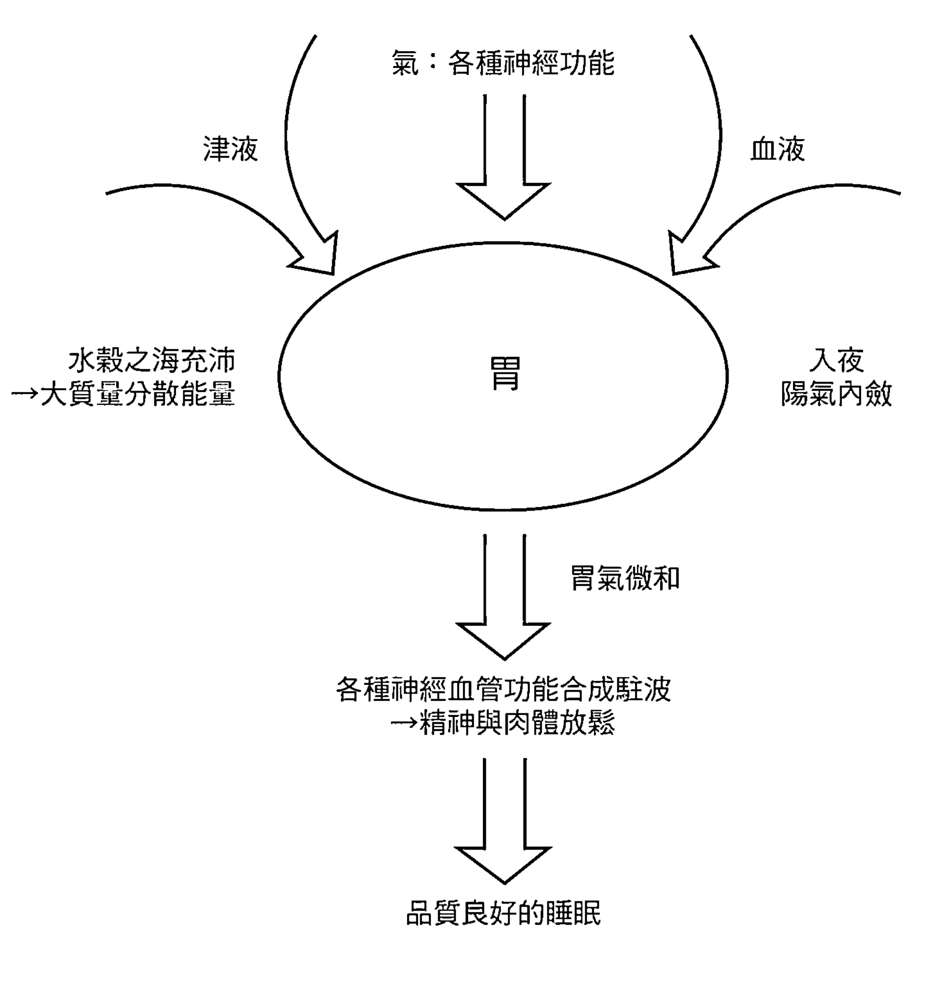

我們吃下的食物必須要經過消化、吸收的淬煉。雖然機制是一樣的，但是這個淬煉的過程在每個人的腸道之中，所謂益菌的種類以及分佈的數量卻有一些微妙的不同。這些微妙的不同，也來自於我們在日常生活中接觸到的環境與飲食所帶來的刺激，而引起各種的變化，所以人與環境之間還是有密不可分的關聯性存在。如果我們直接想從體外「補充」體內的益菌，這些外來菌種要不就是不適應體內的環境而很快滅絕，不然就是體內環境被外來菌種改變之後，卻不適應我們在地的飲食與外在環境的特質。諸如此類的問題在農業上也可以看到：對於農地施用化學肥料，或者是現成的有機肥料，只要不是使用當地的素材進行堆肥，就可能會有類似的狀況出現。發生這些所謂「水土不服」的問題，勢在難免。所以用外來的因素直接強烈刺激腸胃消化的運作，或者盲目追求一些具有強烈地方性特徵的飲食，非屬在地特質的飲食習慣的內容，將會是邯鄲學步，並不是一個合於邏輯的好主意。

## 2-4 胃氣與身體各機能的關係

### 一、健脾與補腦

以中醫的角度來說，「脾主思」，所以「思考」這件事是放在「脾」系統來運作的，也就是在「心下」這個部位。「思考」是對於無形的事理做分解，而「消化」則是對於有形的食物做分解。兩者的作用力道是類同的，所以被化歸在一樣的系統來認識與理解。至於大腦則被視為只是一個訊息交換的中心，把感受、刺激與行為反應在大腦做聯結、轉換與交流。

當大腦在快速交換資訊，例如進行重度思考或做出大量情緒反應、接受大量感官刺激的活動的時候，就像手機在通話時會發熱一般，耗去大量的養分，並且產生許多廢熱。按照中醫對身體的理解來說，「大腦」被視為腎系統之中的一環，而腎系統又是一個主要功能在收藏養分和能量，不喜歡發熱與發散的系統。這類的「重度思考」、「情緒反應」、「感官刺激」的活動，甚至是任何會強度刺激大腦運作或產生內分泌的活動，像是吸食興奮劑或是長跑，自然對於腎系統，特別是大腦，會較為不利。大腦經常性、長時間的接受強刺激之下，對於一般性的外界刺激便越來越無感，身體就會越來越偏好能夠引起重度感官興奮與刺激的活動，情緒反應表現會越來越強烈，許多在現代被歸類為性、暴力的衝動行為表現，以及行為無法自主控制的問題，就會越來越常見。

我經常提到「大質量分散能量」的原則。勞心的工作、重度的思考，一樣需要大量的米、麵主食來補充脾胃的津液，潤滑內臟在津液耗竭之後產生的枯燥，吸收內臟過度運作所造成的廢熱，平復過度刺激、興奮的大腦運作狀態。適度的四肢活動，解肌而溫通腠理，同樣有助於身體把廢熱透過背後的太陽經以出微汗的方式排除。否則，廢熱最後會集中至胃裡，不能散去。如果「胃氣生熱」的問題最後是透過頭頂冒出，頭髮先是會變得細軟、易斷，髮根容易脫落，皮容易出油，最後就是養分缺乏，落髮速度大過生髮速度。或者雖然廢熱的產生量還不算大，但是血中的養分已經無法透過津液來補充，血中的養分不足也會造成頭髮快速變白的狀況。

以我所見聞過的例子來說：有位朋友腦中風，前後共發生過兩回。第一回在某個週六的早晨發生，當下半邊的顏面麻痺，幾乎無法說話。但是隨即使用正確的中藥方來處理，週一就能夠正常上班，同事之間甚至沒有人發現異狀。幾年後，第二次中風，但家人馬上叫了救護車，打著點滴送進醫院。在醫院做了一堆檢查，醫生判斷是腦幹中風，同時還有糖尿病問題，所以一口氣開了好幾種藥，並且再加上靜脈注射。但是西藥的治療一進到體內沒多久，馬上發生腦幹積水，嚴重暈眩，只能躺平而無法起身。在西藥不斷持續干擾病情的狀況下，病家不顧醫生和所有家屬的反對，同時用了大量的健脾、補胃的中藥方，在一週後就把積水清理完畢，病家能夠起身自己扶著牆走出醫院搭車回家。護士雖然承認，他有生以來從沒看過腦幹中風積水的人不是在床上躺了半年之後才開始復健，而是可以在一週後就自己起身走路回家，不過，他還是不相信中藥的治療是有效的。這就是我所說的，胃氣只要能夠正常運作，在剛發生突發（雖然我認為很多病情都不能算突發，而是自己長年忽視養生不節所造成）狀況的時候，所謂的出血、積水，其實都可以有很好的機會藉由胃氣的運作而立即排除，不需要幾個月的治療再加上數個月的復健，更不會留下什麼無法康復的後遺症，這是的確可以辦得到的事情。

雖然都是些健脾助胃的功夫，但是對於平肝、補腦來說，同時也有很好的輔助。

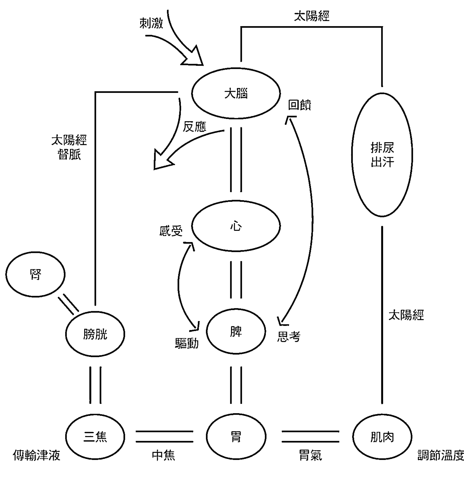

思考過度造成胃的溫度上升，肌肉提高機能調節溫度而緊張，持續的高熱影響胃氣不能微和，形成消化不良或是睡眠障礙等問題。

### 二、脾氣衰則驚溏，胃氣衰則身腫

《傷寒雜病論》裡提到：「寸口脈沉而遲，沉則為水，遲則為寒。寒水相搏，脾氣衰則驚溏，胃氣衰則身腫，名曰水分。」（《辨咳嗽水飲黃汗歷節病脈證並治・一四・五五》）也就是說，在水氣無法代謝的情形下，若是脾的機能不足，則會出現大便不成形的問題，若是胃的機能不足，身體就容易浮腫，這都是因為身體對於水的代謝機轉中，無法順利排出水氣的現象。

大便不成形和身體容易浮腫這兩種現象是現代人常見的問題。雖然從西醫的觀點來說，或許會有很多不同的解釋和各種數據變化的考量，但是在中醫學，問題變得集中、簡單，但是卻也因為一句話就把問題說透，而被認為是說得「玄」了，甚至認為這麼肯定的歸納是強辭奪理。既然談到中醫的觀點，就必須要談一下被認為主要功能在「疏泄」的肝系統。

中醫所提到的「肝」和「胃」，彼此之間有一種很微妙的關係：當胃的機能強盛而外行的時候，肝的機能就會傾向沈靜，主要的功能是收藏血液，但是當胃的機能虛弱、有寒的時候，肝的機能就會轉為積極外行，消耗養分的速度加快，來補足胃氣不能正常外行所缺少的陽氣的能量。因此，對於年紀較輕的人來說，肝中的津液還算充足，往往較不在乎大口吃冰、喝冷飲，也較不在乎連續一陣子的飲食不正常。但就像俗話說的『不是不報，時候未到』，這些『債』在年紀稍長，陽氣開始轉弱的時候就會形成：血液無法被肝機能正常的推送與涵養，過去大量耗竭的津液所形成的空缺，就容易引風邪入裡，形成頭痛。而腎系統為了加強支持肝系統的機能提振，就需要加倍耗能，人則會衰老得非常快，於是到了老年時期，便很不容易維持健康。

雖然有的看法認為這可能要歸結到腎代謝水的問題、心臟搏動力道的問題、小便不利的問題等等，但是我認為問題的根源其實並不是在腎，因為腎也是受害者。真正造成排便經常不成形，或者身體容易水腫的狀況，還是源自於脾胃功能的不足。

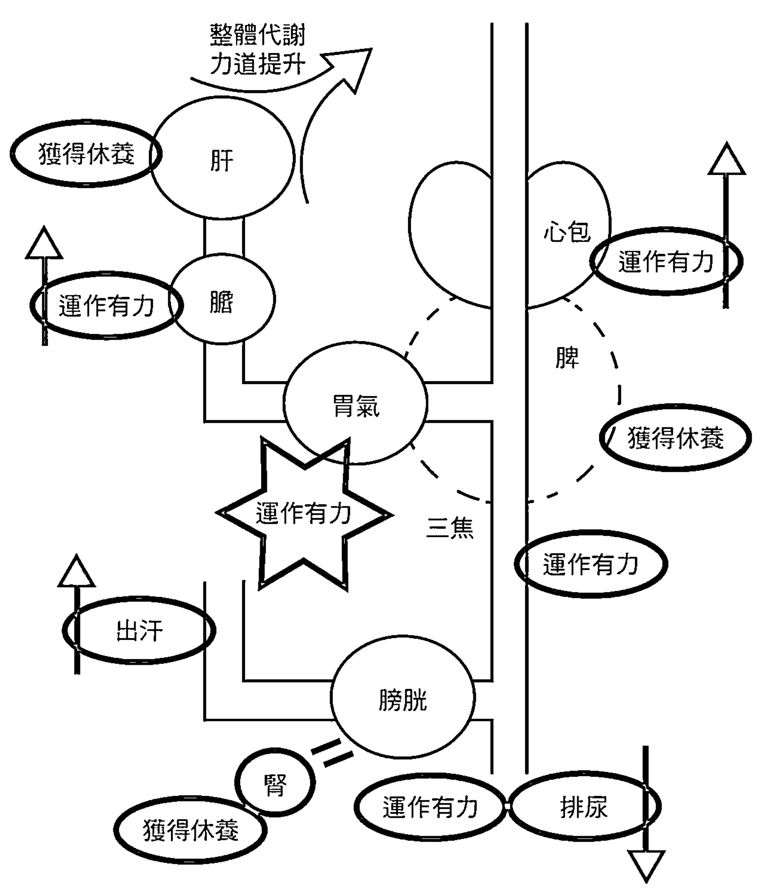

胃氣足以提振陽氣，肝、腎、脾等內臟就能夠充分休養。胃氣不足，就必須消耗內臟來補全陽氣的不足。若是內臟已虛，則百病叢生。

這就是在《傷寒雜病論》中提到的「問曰：病者苦水，面目身體皆腫，四肢亦腫，小便不利，脈之，不言水，反言胸中痛，氣上衝咽，狀如炙肉，當微咳喘，審如師言，其脈何類？師曰：寸口脈沉而緊，沉為水，緊為寒，沉緊相搏，結在關元。始時尚微，年盛不覺。陽衰之後，榮衛相干，陽損陰盛，結寒微動，腎氣上衝，咽喉塞噎，下急痛，醫以為留飲而大下之，沉緊不去，其病不除；復重吐之，胃家虛煩，咽燥欲飲水，小便不利，水穀不化，面目手足浮腫；又與葶藶下水，當時如小差，食飲過度，腫復如前，胸苦痛，象若奔豚，其水揚溢，則咳喘逆。當先攻其衝氣令止，乃治其咳，咳止，喘自差。先治新病，水當在後。」（〈辨咳嗽水飲黃汗歷節病脈證並治・一四・五九〉）對於經常把「去濕」、「利水」掛在嘴邊，或是煽惑大眾「吃冰、喝冷飲與呼吸道疾病、婦科疾病沒關係」的說法，以及常常用寒涼泄下的辦法處理身體問題的諸多現代醫療現象來說，實在是暮鼓晨鐘。

### 三、胃是心臟的門關

一位擔任牙醫師的朋友曾提到：在臨床上有一個常見的現象，當病家有心臟病的問題，可能在病發前，病家的牙齦會經常性感到發痠、發炎或出血。但是病家在這個時候卻會先跑牙科就診，因此錯失立刻正確治療的先機。這種狀況對於西醫的研究來說，因為要橫跨心臟外科與牙科，幾乎是很難達成共同治療的合作。但是中醫不分科，病家全身的狀況都是由中醫師一人獨立來完成照顧。中醫能夠完美統合關照全身各部位的不適與疾病的優勢，就在這個地方展現出來。

在現代醫學的認知中，心臟非常的重要。但是在《傷寒雜病論》通篇完全沒提到任何「心臟」的描述，甚至對於一般認為等同於心臟的「心包」，也從未提及。就像中醫認為人不是用腦來思考、記憶一樣，這是一個很有趣的對比現象。除了像前面提到的，也常聽到有人說「我容易水腫」，而被認為是心臟方面的問題所影響，又或者我們也常常聽到現代的醫療案例之中提到：當心臟出現病變，往往可能是「上腹部」或是「口腔」出現不適的反應。其實，依照《傷寒雜病論》關於「胃氣」的各種觀念以及對於「心下」的諸條文，我們可以知道《傷寒雜病論》提到的「心下」，包含了解剖上的：脾臟、胃、心臟。並且中醫所談的「心」並不等同於解剖上所認識到的「心臟」。若是我們可以透過「心下」這個區塊的概念，認知到脾臟、胃、心臟彼此之間在功能上的緊密關聯性，以及牙齦也是胃的監控區這件事，那麼，要從牙齦的變化提前一步知道心臟可能有的問題，就一點也不困難了。

把脾與胃照顧好，這實在就是我們保健心臟的第一道關卡，而這也是我在文章和講座中經常提到的說法：「胃是心臟的門關」這句話的來由。

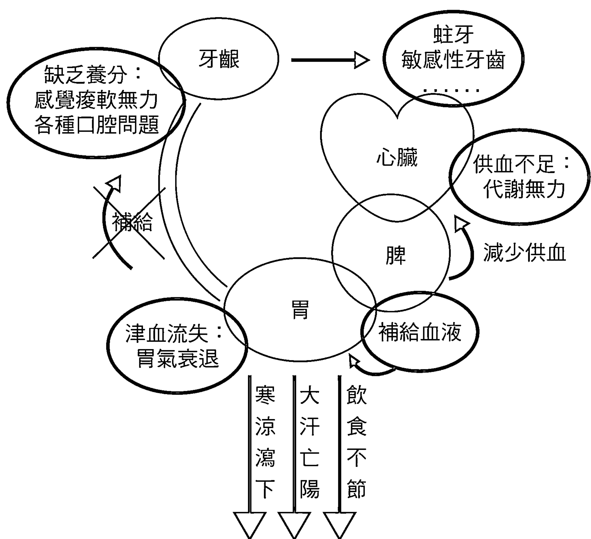

中醫本於「整體論」（Holism），串連身體多種臟器以及功能，大幅超越解剖所能夠理解的範圍。因此可以見微知著，有系統的調理全身所有健康問題。

# 第三章 神奇的太極米漿粥

## 3-1 為什麼吃太極米漿粥能提升胃氣

「太極米漿粥」是我高度概括自《傷寒雜病論》的條文內容之後，所設計的一項飲食調理的養生辦法。他不是「特效藥」，因為他根本不是藥方。他也不應該被視為是「奇術」、「偏方」之類說不清理由與機轉、不成體系的非科學。太極米漿粥的作用機制合於古經方中醫對於生理、醫理、藥理、病理的表述，具有普遍性，可重複驗證。所以我才能夠與各位朋友聊聊他的好，讓各位不但得以「知其然」和「知其所以然」，在多如過江之鯽的「養生秘方」之中，找到一條無論是在平時、在病時，我們一生都可以倚靠的終極之道。

> 粳米煮粥養胃，古人多用，
《傷寒雜病論》亦多用

《禮記》〈月令〉：「仲秋之月……是月也，養衰老，授几杖，行糜粥飲食。」在悠久的中華文化之中，飲食的內容博大精深，而食粥養生的記載更是源遠流長。「先天下之憂而憂，後天下之樂而樂」的宋朝名相范仲淹，應是古代文人中數一數二有名的「愛粥人」。范先生在年少的時候，寒窗苦讀，斷齏畫粥，三餐以粥果腹，養得一息胃氣，他日果然成為「不為良相，願為良醫」的一國棟樑。南宋的陸游先生則是另一位知名的愛粥人，據傳，他在七十四歲時寫下了《食粥》一詩：「世人個個學長年，不悟長年在目前。我得宛丘平易法，只將食粥致神仙。」其中所提及「宛丘」者，為宋代詩人張耒*。張耒在《粥記贈邠老》一文中說道：「每晨起，食粥一大碗，空腹胃虛，穀氣便作，所補不細，又極柔膩，與腸胃相得，最為飲食之妙訣。」文中又提到：「今勸人每日食粥，以為養生之要，必大笑。大抵養性命，求安樂，亦無深遠難知之事，正在寢食之間耳。」平易之法，雖然至關重要，但是自古以來，想要能夠「平凡中見偉大」，果然還是多有寂寞的。

仲景在「桂林古本」《傷寒雜病論》之中，不止一次的提及用粥，也不止一次的使用「粳米」來做為藥材，或是將粥品做為治療過程之中的輔助。例如，他在「桂枝湯」的用法中提到「服已須臾，啜熱稀粥一升餘，以助藥力。（喝一碗熱粥，以助藥力運行）」（《辨太陽病脈證並治上·六·一三》）由此可知仲景不只在藥方上的進退有其用心，在日常飲食對於身體功能的影響力，特別是在身有疾患的時候，更是格外留意。

此外，《傷寒雜病論》中「十棗湯」的用法提及「得快下利後，糜粥自養。」（《辨太陽病脈證並治下·八·三一》）即若是胃氣較弱之人，藥方雖然可以達成「胃氣順降」，但是也可能因此造成動輒腹瀉的狀況。（《辨太陰病脈證並治·一〇·一八》）顧慮需要調和胃氣，又不令太過，仲景特別請病家在病證解後，需要「糜粥自養」。而「糜」一字，本意指的就是「煮米使糜爛也」*，與前述桂枝湯所提及的「熱稀粥」應為一致，更言明了這不只是「用大量的清水煮米飯」而已，更需要達到「令米粒化開不成形」、「產生足量泔糜」的標準。

中華飲食文化博大精深，「泔糜」、「粥」、「稀飯」，原本就是不同的料理形態。水或多或少、米粒有完整、有化消，若是不加以明確定義在「養生」、「中醫醫療」範疇之中所使用的糜粥為何，反將五花八門的烹調法盡收為一物，混為一談，確實令人困惑，徒增「這隨便煮一煮就行了嘛」的錯誤認識。若不加以詳細、明白的定義，就有如藥材炮製不得法，品種不講究，則效果必定不盡理想。所以我透過對於煮法的定義、材料的選用，做出詳細的論述，不是在鼓吹什麼新奇的養生偏方，其實是「恢復古經方中醫原本的面貌」而已。

*／張耒，字文潛，著有《宛丘集》。
*／出自《釋名》〈釋飲食〉。亦有「粥之稠者曰糜」（《爾雅》〈釋言〉）

### 胃氣的維持有賴於主食的食用量

自古以來，人人每天三餐都在大量吃「主食」，非但沒有因此把其他的食材與料理消滅了，反倒因此提供人體更強大的「容得下」、「化得消」、「睡得沉」的胃氣三力，讓人們可以在每一餐之中，攝取、「包容」得下更多不同物性的食材，讓飲食的文化得以更加深邃而多樣。

天生萬物皆有溫、涼、寒、熱等屬性，許多食材和藥材的物性都有偏向，但是唯獨粳米可以算是我們常見的主食之中，最沒有明顯偏向的素材。正因為粳米能平順的發揮補正而不偏的作用，故能作為人們的主食經年累月食用。這種屬性影響上的「零」，並非沒有作用，而是粳米有如《道德經》所說的「上善若水」一般，粳米在我們的體內以最平緩的方式，大量的增加胃中的津液，促進胃氣恢復本身應有的功能。而這種「居中」的特質，對於禾本科的植物來說可以算是相當普遍。同屬於此科的種子，我們常食用的還有秈米、糯米、小麥、小米、薏仁等，它們在身體的作用點通常同樣在胃，氣味較甘，雖然並非每一種的屬性都為「居中」，但是對於補益脾胃也都有幫助。

而同樣屬於禾本科，像是甘蔗，用的雖然是莖，但在經過取汁、熬煮，適正其物性之後，結成紅糖，也能成為益助脾胃、中焦非常好的調味食材，適合我們常用、多用。至於竹，亦屬於禾本科，雖然物性偏性較強，不堪做為主食，但其局部仍然是《傷寒雜病論》之中選為救急、補虛的藥材之一。

*／物性即物體的性質。在不經提煉、萃取的前提下，以外觀、生長形態、取用部位、炮製等角度，來描述其本質主要對於人體會產生何種效用。

### 粳米究竟是什麼米？

在《傷寒雜病論》中，「白虎湯*」、「桃花湯*」、「竹葉石膏湯*」等藥方都使用了「粳米」這種藥材。像是在白虎湯之中，藉此結合，即是我所謂「正合清、涼、利、甘四性」。下面就是我對於「粳米究竟是什麼米？」的研究結論。

### 稻米品種的講究

粳米佔全球總稻米生產量不過兩成而已，而且栽種的地區主要集中在日本、韓國，中國的東北、華北為主，而受到東亞米食文化西傳的影響，在美國西部加州以日本的「越光米」品種為主，也有一定規模的粳米栽種。至於在全球的其餘地區的稻米生產則幾乎有近八成的比例都是秈米，遍及了東南亞、歐洲等處諸國。在中華文化之中，粳米不僅做為民生主食食用，甚至於醫學之中選做藥材以及日常養生保健之用。這個觀念以及應用手法，的確可謂之十分具有獨步的文化特色。

我自行研究秈米、粳米以及臺灣獨有的「蓬萊米」，以同樣的手法熬煮太極米漿粥，發現只有日本品種的粳米可以令米粒徹底化出汨糜，米粒化消臻至無形。蓬萊米雖然能夠化出汨糜，但總是無法完全。至於一般產自泰國、越南、義大利、西班牙等地的秈米，能夠產出的汨糜量實在有限，黏稠度亦明顯不足。

可見品種的講究是絕對有必要的。

在統稱「稻米」或是「大米」的物種之中，還有許多其他的分類，主要可以分出粳米、秈米以及糯米，但並不只限於此。現今的稻米品種，許多都已經受過人工的品種育種改良，理論上應該是極難找到與漢朝時候完全相同的品種。但是，若以現今的物種的物性來對照，在上述的三類之中，我認為，當今世上所謂米粒較為圓、短的「粳米」，仍然與《傷寒雜病論》中所提及的「粳米」相差不大。

古人說「粳乃稻之總名」並不正確，那是華中地區人士的看法。臺灣位於粳、秈產地分布的交界線上，才能一窺稻米品種的全貌。

從前面的簡圖之中可以理解到：統稱為「稻米」的物種，先是主要畫分出「粳米」與「秈米」的兩大品種，然後，才是在其下附帶了一種亞種的「糯米」。而糯米之下，仍然可以用米粒的長或短，圓或瘦等外觀形態，來加以畫分出「粳糯米」（圓糯米）以及「秈糯米」（長糯米）。像是名列在《傷寒雜病論》之中做為藥材使用的「飴糖」（或稱「膠飴」），也就是今日所稱之「麥芽糖」，其主要的製作材料之一就是「粳糯米」。

至於所謂的「水稻」或「旱稻」之別，就生物學的分野來說，認為兩者應該在於生長環境有別之後，對於環境適應的變化使然，並非原生物種就有不同的性質。一般認為，水稻在歷史上被人類開始栽種的時間比旱稻要來得更早，甚至認為旱稻可能是由水稻馴化而來。「水稻」的原生品種本來就是一種可以生長在濕地之中的作物，不怕水淹。像是在《傷寒雜病論》之中常用的「澤瀉」，《神農本草經》謂之「養五臟……消水」、「能行水上」。他的生長環境也同樣是在濕氣較重的沼澤地區。水稻天生不畏濕氣，還能夠從其中抽出陽氣，令養分上行而生長，具有「除濕」、「排濕」、「化濕」，存津液而不畏濕氣的力道。

因此「水稻」與「旱稻」之差異最多就是稻米在排水化濕的力道上略有增減。若是僅根據「水稻」或是「旱稻」來辨斷漢代的粳米為何，意義不大。簡單說來：粳米來自於水田或是旱作，其實並不重要。

查《本草備要》〈粳米〉條，曰：「粳米（粳，硬也；糯，懦也）甘涼，得天中和之氣，和胃補中，色白入肺。除煩清熱，煮汁止渴。粳乃稻之總名，有早、中、晚三收，晚者得金氣多，性涼，尤能清熱。陳廩米 淡可以養胃，煮汁煎藥，亦取其調腸胃、利小便、去濕熱、除煩渴之功。」《本草備要》成書已經在清初，為安徽人士「汪昂」所編著，因此，從這段記載之中，大約可以代表了：當時的華中地方對於稻米的名稱，其意指為何。

「粳」所謂的「硬」，應該是來自於與「糯」之間進行比較而做成的結論，並非與「秈」相比。對照於我們前面所整理的簡圖可知：華中以北地區的古人只知道粳米，不識秈米，所以才說「粳乃稻之總名」。晚近「稻」這個名詞到了中國的南方，開始碰到了北方並不常見的長瘦米粒的品種，才進一步的認識了「粳米」（Japonica rice）之外的「秈米」（Indica rice），也才知道：蒸煮成飯之後，米粒不會濡軟的「粳米」，其實有個比糯米血緣更近的近親「秈米」。

在研究中一般認為，秈稻起源於亞熱帶，種植於熱帶和亞熱帶地區。而粳稻種植於溫帶和寒帶地區。因此，這個推論對照於前面所提到的，有關全世界米種的產地分佈，以及中原流域的文化傳播時間秩序來說，應該是不謀而合。像是中國華南地區的雲南等地，就常見粳稻與秈稻混合栽種的情形。

雖然稻米的品種如此繁多，但是大範圍之下的生態相同，所以概觀而言，物性仍然算是一致，其間的細微差異，就不在我們對於「效力」的討論之列了。否則全天下米種太多，光是日本一地可以數得出來的常見品種，就接近四十種，總數更是高達約三百種。若是再加上泰國、美國、歐洲、澳洲、東南亞等地都種米，經過育種或異地栽種之後，長、短、硬、軟各有或大或小的不同，這恐怕就不是以中醫藥為主題的書籍可以概括討論的範圍了。

日本的米種如此多樣，臺灣的米種也不少。粗分之下，臺灣經常吃到的「蓬萊米」為日治時代日本人在臺灣改良出來的米種。主要的原因也是因為在緯度較高地區生活的日本人，自古以來的主食就是食用粳米。但是開始治臺之後，在亞熱帶與熱帶氣候的臺灣，才認識到了此地常吃的秈米，名之為「在來米」。為了同時追求熟悉的粳米的口感，又要符合臺灣在地的種植環境，融合兩種米種，育種而成蓬萊米。附帶一提：「在來」二字是日語常用語，大約有「向來、一直以來」之意，意謂原來的、舊有的。在來米與蓬萊米皆為日人命名，顧名思義，緣由即如字面之意：「原生於臺灣」以及「新生於蓬萊寶島」的實況。

大抵而言，包含中國古代各種天然米種以及後世的人工育種，東北亞仍然以粳米為大宗。不過近世以來，稻米品種更加繁多，交互混種之下，在日本、韓國、中國東北與華北以外的地區，可能就不容易有純粹的「粳米」可言。若是真要講求米種，以蓬萊米再進一步育種而成的「臺粳」系列，顧名思義，應該是在現況之下，臺灣本地較為可用的米種。若要指出何種才是《傷寒雜病論》入藥的品種？所有的日本米會是第一首選，粳米與秈米混種而成的「臺粳」系列品種蓬萊米勉可暫代，而在來米和來自東南亞的秈米，不適合入藥。

*／【白虎湯方】知母六兩，石膏一斤（碎），甘草二兩（炙），粳米六合。
*／【桃花湯方】赤石脂一斤（一半全用，一半篩末），乾薑一兩，粳米一升。
*／【竹葉石膏湯方】竹葉兩把，粳米半升，半夏半升（洗），石膏一斤，人參三兩，麥門冬一升，甘草二兩（炙）。

## 3-2 對食用「太極米漿粥」的誤解

「正確做」是非常重要的一件事。基於世人對於太極米漿粥的誤解甚多，而其誤解的結果又可能會危害到健康，所以本節對於一些常見的誤解做出說明。

### 太極米漿粥並非醫療，是「家常飲食」

「太極米漿粥」的組成很簡單，很家常，只是「粳米」與「清水」兩樣而已，也因此我從來就不曾宣稱「太極米漿粥」是「有療效」的「方劑」。但是太極米漿粥能夠對人體有什麼樣的幫助，我們卻可以從《傷寒雜病論》為主的古經方中醫學術之中，得到很完整的說明。

雖然說太極米漿粥是料理，卻也必須要遵守的一些條件。如果想要吃下它的好處、美味，那就更得要先講究方法是否正確。就像一道料理如果做得不正確，調理不得法，也是會導致成品失敗。雖然說他有好處，但是太極米漿粥畢竟只是料理。就像我們常聽到賣胡蘿蔔的人說「多吃胡蘿蔔對眼睛有好處」，我們也不會糊塗到因此真把賣胡蘿蔔的人當成賣藥的人，說他是「宣稱商品具有療效」而抓起來處罰，是吧？

### 常見對於「食用精白米」的迷思

主食通常多為「穀類的種子」，而且又必須要透過去殼、去胚芽的精製過程才算完整。因為在以「物性」的理解之中，種子的力道能夠下行；越完整的種子模樣，下行的力道也就越強。在《傷寒雜病論》使用大棗之方劑一律使用紅棗，並且破開、去籽，就是意欲強化大棗「補中」的性質。在概念上，這等於就是大棗的「精白米」化了。

古時候不時興吃「胚芽米」，主要是因為這種在製造時能刻意留下胚芽的加工技術，要到了近世才較為成熟，沒有人會想到要吃帶有胚以及胚乳的米。一般認為，中國在春秋末期開始能夠碾製穀類，才開始吃精白米、小麥粉。而約是東漢時期，大量碾製精米的工藝與器具就已經發展得相當成熟了。我推測，其實仲景所處的東漢末年，多數的人民應該都能吃精白米了。老實說，吃著老祖先在千百年前就這麼一路吃下來的精白米，大口的吃，最好。

帶胚芽、甚至帶殼的種子，性偏「下行*」，也就不合於我們講求主食要能夠「居中」的特質。即使帶胚芽、帶殼的種子營養成分相對較高，但也表示其所含有的養分越不容易保留在脾胃之中。所以，若以中藥炮製的觀點來說，現在強調「粗食」、「要把整個果實都吃下去，營養才完整」的飲食概念，實在稱不上一則「完全對」的說法，也就無法通用於一般家常飲食之中了。

*／下行，即物體帶有「由上往下、由外向內」的力道。種子生於枝頭而終將離枝落土，所以被認為帶有「將氣、血功能向下引導」的力道。

### 常見對於「喝粥」的迷思

還記得初學中醫之時，便曾經用一碗熱清粥，讓從日本來臺灣訪問卻患了重感冒的漫畫家老師迅速恢復元氣。而在持續以來的時間中，我一次又一次的深深體會到太極米漿粥對於人的身體的補養有多麼的重要。

有的人說孩子在吃了粥之後，產生「沒胃口」、「肚子脹大」、「夜晚驚醒」的問題。有的人說生病的時候才適合喝粥，有的人說喝粥對胃不好、有胃潰瘍或胃食道逆流的人不適合喝粥，甚至是喝粥會引發血糖不平衡。究竟何者為是？答案其實只有一種。不過，無論是外頭館子吃的，或是看到朋友分享自己煮的，我發現那經常都是「開水泡飯」等級的「稀飯」而已。以我實踐「經常食用太極米漿粥」這件事情在我自己的身上，以及孩子身上的經驗。至少我的孩子這一路吃下來，現年四歲，胃口很好，小腹平坦，齒列平整，牙齦不露，能吃能睡。比起一般習慣吃許多複雜副食品與配方奶的「米其林寶寶」孩子，肌肉有彈性，骨質紮實，目光有神。而在網友的分享中，有更多的孩子因為堅持吃太極米漿粥，把腸胃的問題調理好了，患感冒的機會也少了許多。甚至，也有許多長年胃不舒服、血糖血壓不對勁的朋友們反映，在「堅持喝太極米漿粥一段時間之後，問題改善了。」

我曾經故意在標準的太極米漿粥之中，加入一些清水，拌勻，直接喝下，結果立刻感覺到口中微微泛有酸味。如果有人喝了粥會覺得泛胃酸、消化不良，那麽，請先看看喝下去的是粥，還是「開水泡飯」？

### 常見對於「食用澱粉」的迷思

這個問題也是許多朋友經常問到的問題，但是我認為，這也是一項單純的「營養成分」的分析所不能理解的變化，食用澱粉與食用主食當然是不能畫上等號的。

有一些常聽到的疾病，非但不是因為「主食吃太多」而造成，更是因為「主食吃得不夠」才導致的。

舉個例子：古代認為「糖尿病」是一種富貴人家才會出現的疾病，恐怕也不過就是因為所謂的富貴人家長期忽視了白米飯對身體的重要性，因為覺得白米飯不珍稀，於是少吃，因此長期在少吃白米飯的偏向之下，造成飲食不均衡，影響脾胃把養分保留在內臟之間的能力，這並非單純是現代營養觀念所認為的「營養過剩」而已。換句話說，再怎麼好的營養食材若是沒有足量的主食來搭配食用，將無法調和各種食材的偏性，讓食材的物性能夠因為主食的作用，更利於與脾胃親和，達到容易消化與吸收的效果。長期下來，很有可能反而會造成身體吸收、代謝上的負擔。與其討論是否應該要限制澱粉質的攝取，倒不如深入的了解為什麼我們的身體不能把營養給收藏到內臟裡頭，反而出現外流至血液之中的問題。順道一提，我認為其他許多類似的「血液中的某某成分過高」的生理變化，像是膽固醇，與其用「身體產生過剩」來解釋，倒不如用「身體雖然適量的產生，但是卻未被適當的收藏於組織之中，而外流至血液裡」來看待，可能更符合於事實。

這可以說明：以「物性」來理解，不同的食材況且都會對於身體有不同的效應，在不同的物性之間，就更難單純用「澱粉類的食物」來把對身體的效應歸為一類。多吃來自於稻穀種子的糙米，或者同樣富含澱粉質的馬鈴薯、地瓜，就物性來說，一者是種子，能由上而下，一者是根莖，能由下而上，對於身體的影響肯定更是截然不同。甚至我們可以說：憑空捏造出來的一顆綜合維他命丸，不屬於自然界裡的物種，他既不是種子，又不是根莖，你說他應該要往上走，還是要往下行呢？

透過對於「物性」的體會與運用，以陰陽五行之中所認為的「以形補形」、「同氣相求」原理，更能夠觀察出：同樣是一口「帶有大量澱粉的主食」，米飯與麵條、太白粉、地瓜、馬鈴薯或是葛粉之間，究竟有多大的不同。

*／以形補形即俗稱「吃什麼補什麼」。物體在透過觀察而歸結出物性之後，被認為可以與人體的相似部位或功能產生類同的影響。具有同樣功能的物體，往往在外觀上或是生長形態上與人體的局部相仿，所以稱為「以形補形」。如同前文所舉「葛根」的例子說明。

### 保健與多吃白米的關聯

從前面仲景使用「白虎湯」來解決煩熱不止的狀況，提示了我們：胃中津液不足，才會造成胃氣無法涵養，只上不下；只要回填足量津液，並不需要對胃施用寒涼藥材來壓抑機能。而藉由「甘草小麥大棗湯」，透過使用小麥甚至能解決精神上不穩定的狀態。由此我們可以知道：穀類主食對於脾胃的津液補充有功，更能夠擴展到讓心神安寧的作用，達到全面性的「穩定生理功能」的效果。再結合上前面我提到的「大質量分散能量」的原則，以及胃氣三力「容得下」、「化得消」、「睡得沉」的結論，我們就可以知道：無論是精神上或是肉體上的身體問題，胃氣的穩定，是非常重要的。多數世人所自以為的「上火」情形，其實際的內容，其實多為「胃中津液」不足如此而已。

因此，我們可以反過來推論：不吃穀類，不吃米飯，不吃主食，這不只是對於

## 3-3 為身體帶來好的改變，太極米漿粥救了我
（來自紫林中醫全球論壇的實例分享）

### 一、讓體質虛弱的人變得強健
危難時刻顯身手的米漿粥

肉體層面上的健康有負面影響，更會因為脾中虛熱，導致脾氣浮散，而會容易心神不寧，白天健忘，晚上多夢，易怒，暴躁。在情緒上，也可能會導致許多很嚴重的不良後果。而這些對於身、心的影響，其實更超越了單純的營養成分分析，所能夠理解的。

現代飲食單獨聽信一般西方學說定義的「澱粉」、「碳水化合物」之類的說法，視米、麵等，含有大量澱粉為主體的主食為蛇蠍猛獸，搞得現代東方人的餐桌上，隨著經濟開發程度越高，離開老祖先的飲食文化越遠，白米飯吃得越少。

現今世上各種罕見疾病層出不窮，越來越多的難病、重症接踵而來，而媒體上常傳播的所謂預防和治療的辦法，卻一點也沒效。關鍵之一就是因為現代的飲食習慣「美國化」，丟棄了我們應當常吃、多吃的「主食」，卻瘋狂、理盲的追求所謂的「蔬果五七九」。甚至因為在營養學之中所計算的「每日建議攝取量」過於龐大，更捨棄了天然的飲食，轉而專注於各種人造營養劑的服用，造成「吃藥比吃飯多」的逆天行為。

像是我們經常看到各大媒體會報導許多減肥奇招，有喝咖啡的，有不吃油的，有不吃肉的，有更多，是不吃飯的。另外也能看到各種新式營養產品的宣傳，推崇各種奇果異蔬以及琳瑯滿目的名貴中藥材，有的來自什麼古老民族，有的來自什麼特殊地域。在絕大多數不知道該怎麼去辨別正確與否的閱聽大眾之間，這些爆炸紛雜而至的訊息，恐怕是禍不是福。我認為，許多罕病、難病在近年轉為大量發生，主要的原因之一，是因為我們忘掉了像是在《傷寒雜病論》等古經方中醫裡頭所側重的「建中」、「理中」的精神。只有以脾胃為後天之氣根本的觀點，才能夠恢復脾胃中土「致中和」的包容力道。

世上的物種實在多如繁星，各有其性質，我們無法一一介紹。但是，在我們身邊隨手可及的，家常之中俯拾可得的，其實就足以應付我們每日作息所需。未及重症之前，經過適當的配伍，酌量用之，就能取其利，綜其效，避其害。而這一切，應該就從多用精白米開始，才最為穩當。

親友看到我發的文〈極品米漿粥〉，紛紛回饋感受，其中一位的親身經歷令我印象特別深刻，原文如下：

> 「米漿粥關鍵時刻可以救人，信不信由你，反正我信！我舉個親眼見證的實例吧。一個八十六歲老人，平常胃口還行，一餐最少一碗飯，吃什麼都香，卻在11月19日因痰堵和氣喘加重入院治療。
>
> 20日晚上我值班看護老人，半夜後他有煩燥。
>
> 21日藥物開始出現副作用，老人肚痛難忍，連喝一湯匙水都吐得一塌糊塗。醫生換藥，要求他禁吃食物並進ICU，被家屬拒絕。
>
> 22日中午，家人拿尿壺幫病人盛尿時，可能是弄痛病人，被踢了一腳。
>
> 23日晚上又輪到我值夜，我帶上太極米漿粥去了。到病房一看，老人家整條舌頭上有一層厚厚的白苔，口乾得似要炸開，卻拒絕喝水。11時40分我硬是給他喝了一匙太極米漿粥，每半個小時我就給他一匙太極米漿粥，直到凌晨3點40分他自己要求喝開水，我趁機給他喝了一碗太極米漿粥，還不夠，又喝了半碗開水。早上6點多家人又送來太極米漿粥繼續喝，中午我又帶太極米漿粥看他，病人整個活過來了，白舌苔全跑了，胃口好轉。
>
> 我分享案例，是希望能幫助到有緣人、有愛心有孝心的人，用行動好好地愛自己愛家人，非常感謝親友的分享！耳聞那位老人家住院、收到幾次病危通知、無恙出院的事情，不禁為親友的智慧和膽識所感動。這就是因為他在日常飲食中真切感受到太極米漿粥的好，關鍵的時候才敢無視醫生說病人不能進食的醫囑，大膽對病危病人使用太極米漿粥。而太極米漿粥沒有令他失望，病人喝了之後轉危為安，真是救命的太極米漿粥啊！感恩親人這麼多年來相信我的推薦，長期食用太極米漿粥，在照顧好自己的同時，還救了親人一命，這就是緣分，就是福報呀！」

【紫林先生曰】大家是否也曾聽聞過，親友只是有點不舒服，去醫院做個檢查，結果馬上被安排住院、投藥、開刀，然後病情突然急轉直下，送入加護病房，沒多久就轉變成或是終生癱瘓或是離世的例子呢？明明原來人還好好的，能吃能睡，怎麼一下子就被「治療」成性命垂危，甚至死亡了呢？這不是要大家忌諱求醫，而是我們要知道：身體怎麼樣的變化才叫做是「好轉」。我們談到的胃氣，若是能夠強健起來，人的手腳一定會是溫暖的（〈辨咳嗽水飲黃汗歷節病脈證並治．一四．七四〉）。而胃氣三力所說的「容得下」、「化得消」、「睡得沉」，更是無論我們在用任何方式治療或保健，都應該會逐漸獲得改善的「絕對」標準。如果這幾個關鍵要點沒有好轉，我敢說，這樣的治療或是保健必定會帶來更大的健康隱憂。因為，胃氣就是人在當下能夠接得上一口氣的首要關鍵。

#### 替補割除盲腸後所喪失的身體機制

努力吃粥已一個月，身體進步的感覺真的很明顯！我的母親七十歲，十年前因為割除盲腸後導致的腹部過硬問題，也因為堅持服食而有明顯的軟化跡象。很感謝老師無私分享寶貴的資訊，才有緣結識這等好物。

> 紫林先生：在進行任何的身體調養或是治療之前，我會很強烈的建議一定要從「每天喝太極米漿粥」來入手，特別是用於「晨起的第一口食物」。這是一道絕對不可省略的基本功，也是嚴重關係到調養或治療是否能夠確實生效的必要條件。不可能有任何一種生病的體質病況，會因為喝了太極米漿粥而發生負面的效果。這就好比說，斷然不會有一種是必須要「把胃氣消滅掉」才有辦法治得好的疾病一樣，這是在根本上違背了「人要有胃氣才活得下去」的基本中醫養生邏輯，這也是應用於《傷寒雜病論》之中所謂的「榮為根，衛為葉」的重要觀念。雖然我認為人的內臟絕對不可以因為疾病的治療而割除，這是一種不可逆的永久性傷害；割除內臟之後，身體必定只有更壞而不可能更好。但是，對於身體受到割除內臟這麼嚴重的傷害之後，我會建議我們仍然是要從調養胃氣開始，把身體的狀況盡可能的控制下來。維持胃氣的穩定，無論碰到什麼樣的問題與變化，都是同樣的重要。

#### 溫和無負擔，米漿粥也是育兒好物

之一：

我跟一歲寶寶一早起來喝米漿粥為一天的飲食打底，小寶寶一天吃四餐，該吃就吃該睡就睡，頭好壯壯，米漿粥功不可沒。

> 紫林先生曰：在育兒上面，我看到許多媽媽很焦慮，老是在想「再多做什麼會不會對孩子更好」。我會說，你把這樣最單純、基本的食方給老老實實的做好，堅持每天正確的做下去，你心裡面許許多多的疑惑、身體上大大小小的煩惱，自然就沒了。若是媽媽在產後的幾個小時，甚至幾天內，還無法立即、穩定的提供母乳，但是嬰兒已經有了進食的需求的時候，不妨就讓小朋友試著啜飲太極米漿粥。這對於才剛剛開始自己進食，而消化系統還不是非常成熟的小朋友來說，會是一個對消化道最溫和，最無負擔，也最能夠讓小朋友開始適應心火與脾胃相互結合、運作機轉的良好食物，如果不用一般世間的營養價值的觀念來看待的話，在母乳之外，對於新生兒嬌弱的胃氣來說，米漿粥可以說是最佳的候補食物之一。而在胃氣到了能夠開始促進乳牙生長的階段之後，若要更持續的讓胃氣在穩定中成長，太極米漿粥同樣也是非常適合的食品。幼兒的胃氣穩定，身體該有的功能就可以穩定發揮。只要不亂吃亂喝什麼營養品、副食品，甚至藥物，自然就不容易發生什麼大問題。很多媽媽對於何時該吃什麼副食品感到焦慮，我會說：善用太極米漿粥，我家的孩子從來不吃「副食品」。

非常非常感恩紫林老師，之前我家孩子剛上幼稚園時經常生病，頭髮都枯黃了，後來看到老師分享的米漿粥，就靠著這每天早上的一碗米漿粥，慢慢的，孩子的頭髮又變回了烏黑。

紫林先生曰：若是單獨就營養成分來說，「太極米漿粥」絕對不是什麼了不起的東西，甚至比起蘋果之類的水果來說，根本就是小巫見大巫，不值得一提。我從小開始，也是被狂餵了一大堆蘋果之類的食物泥，實在是身不由己。但是，對於胃腸的運作即將進入更複雜的狀態的嬰幼兒來說，太極米漿粥是一種具有維持各種生理狀態「穩定」的食物。只要胃腸的運作狀態穩定，就算是少量的養分也能以高效率吸收進體內；反之，任何看起來營養價值超高的食物，若是根本不適合人體吸收，再多的份量、再高度的粹取濃縮，再怎麼打成泥、熬成膏，也是穿腸而過，點滴不留。成年人的身體是如此，嬰幼兒的身體更是如此。

中醫的觀念認為：髮是「血之餘」，又說腎「其華在髮」，太極米漿粥雖然與正式的「補血」、「補腎」的功效，還有一小段距離，稱不上具有什麼直接的影響。但是如果人的胃氣不佳，可能連再補的藥方都無法吸收。不管是哪一種調理身體的方式，都必須強化胃氣，才能算是真正的有效。

### 二、讓胃、腸消化道的問題好轉

#### 飲米漿粥，二便暢通

大約有十年的時間我的排尿量都很少，就算喝大量的水也排不多，只會讓身體腫脹不舒服，後來，我從11月16日起開始喝粥，當天就發現自己的尿量變多了，之後每次喝過粥都連續排尿兩次以上。

除此之外，我的排便狀況也改善了。在我半百的歲月有記憶以來，排便總是濕軟不成形，總要三、四天才排便一次，而且還要依靠喝咖啡刺激才能排，但總是排不乾淨，最久一星期以上還排不出。數十年來，我學習各種身心的療法，吃過無數的中西藥，都無法改善排便的功能。直到這幾年我常到大陸，觀察到自己一到大陸二便就順暢，大便也成形排得乾淨，這才警覺到身體的問題很有可能是不適應臺灣濕熱的環境。因此在喝太極米漿粥之前，已打算為了身體的健康今年就到大陸長住了。

剛喝粥時，每次喝完粥就自然想排便，即便還是排軟便，我已經雀躍萬分了。約半個月後慢慢成形，一個月後就不再排軟便了，馬桶也不必刷洗了。現在，早晨喝完粥就自然有便意，便便像香蕉一樣哪，我每天都感恩自己的排泄系統。喝粥的第一個月，口中瀰漫著酸味，每次喝完粥，口中酸得像喝醋，大拇指指的月牙出現了，我都忘記手指會有月牙這檔事了，呵呵呵。第二個月起喝完粥口中覺得澀，皮膚變得很乾燥，手指的指甲邊開始脫皮，喝粥的過程伴隨著種種的反應，我一概耐心的陪伴自己，我相信太極米漿粥是天然無添加的食品，我願意給自己的身體一個機會，讓自己得到療癒。

【紫林先生曰】排尿、排大便，是人體非常重要而複雜的兩種代謝機制。這不只是局部括約肌的作用而已，就中醫的觀點來看，更代表了全身上下多種系統裡頭的氣與血的機能，可以達到一定程度的調和。而這麼複雜的多種機能得以調和，自然就屬胃氣的功勞最大。

許多人深信得有「特殊的撇步」，才能健身體。但是太極米漿粥只用到人人，家裡幾乎都有的白米啊！這是要怎麼包裝成「救苦救難玄天下凡普渡眾生絕世無上神器」呢？太家常了！反倒大家都在說「蔬果五七九」，又是助消化，又是助排便，又是一大堆膳食纖維（其實白米裡面就很多）以及營養素（白米裡面也有），到底「蔬果五七九」有沒有這些「專業人士」宣稱的「療效」呢？我聽過的肯定的回饋趨近於零，除了報導之中宣稱從實驗室裡面不知道怎麼來的數據，幾乎沒有任何真實的效果出現在我的親友們身上。有些「健康食品」買起來也花了不少錢，一開始吃的時候，腸胃的確有些刺激，有的朋友可能會認為「腹瀉總比便秘好吧？」所以就不以為意。當然，再吃一陣子，效果就越來越不明顯或者引發其他的問題，身體逐漸惡化而不自知。有些「食品」或「保健秘方」在效果上屬於強刺激的「食品」，讓人吃了必定腹瀉。在中醫的觀念，腹瀉不只是消化有問題，而且嚴重傷害到身體內臟的機能，甚至能危及生命。我在過去的文章中談到這個觀念，結果被一個「合法上市」的飲料品牌要求撤下文章，否則他們強大的律師團要把我告上法庭。我當然是把文章撤了，但是這種「合法食品」必然要傷人的事實能夠改變嗎？你的「商譽」、「商機」會比大眾的生命與健康還要重要嗎？整個腸道的運作機制，關係到體內的功能很多，很複雜。用強刺激的走法來解決問題，風險就很高了。

#### 脹氣、胃食道逆流不再犯

之一：

我是長年慢性胃炎，消化不良和胃食道逆流患者。空腹時經常會連續打嗝，肚子餓時，感覺煩躁不安。在服用近三個月的米漿粥（幾乎餐餐作為主食）之後，近年每逢空腹就打嗝的症狀竟消失了！胃食道逆流幾乎不再犯了！肚子餓的感覺也變成平和而期待美食的心情。喝了溫熱的米漿粥，就如老師所說的會有幸福滿足的感覺。連帶的，我的落髮狀況明顯減輕、白髮變少、抬頭紋撫平不少、皮膚彈性變好（比膠原蛋白還神）、髮際間經常反覆發作的脂漏性皮膚炎也不藥而癒！下肢經常性的水腫消解（平日本來就有日行萬步的運動習慣還是如此），連經期前的水腫也不再出現，大便開始成條，小便顏色正常（以前喝水量充足但小便顏色很淡）。現在我每天都煮好一大鍋米漿粥，餐間若是提早餓了，就熱一小碗粥喝，很方便又沒負擔。

之二：

女兒靠米漿粥調理腸胃，臭屁、口臭都沒了，原本一年之中反覆發作的霰粒腫，已經九個月沒再出現了，只要見她身體有些小狀況，第一件事情一定要她多吃粥，這個冬天比去年少生病。米漿粥真的是無敵好啊！

【紫林先生曰】經常打嗝、脹氣、腸胃消化不良，是現代許多人的問題，通常想要治療，卻又千端萬般怎麼弄都弄不好。平常消耗胃裡頭的津液太多，但是填補回來的量又太少，一加一減，結果是負的，這就叫「虛」。吃太極米漿粥就是請大家把「你原本就該吃那麼多的食物」，用「比較有效率的辦法讓你的身體吸收」如此而已。至於霰粒腫，大家會認為這是要眼科才能解決的問題。不過我認為，眼皮的狀況通常都可以靠調理胃氣來處理好，與眼科一點關係也沒有。曾經有位朋友突然長了另外一種眼皮上的毛病「麥粒腫」，就是一般俗稱的針眼，晚上有約會，很煩惱，不知道該怎麼辦。我請他到廚房裡找了些隨手可以得到的材料調成一杯飲料喝下，解掉胃中的濕熱。半天之後，麥粒腫就退掉了，晚上見客當然也沒問題。這是用同樣的解決思路，沒什麼不同，但是走快速見效的路線的例子，必須見好就收，否則長期、大量的吃，也無法改善好發的體質。就算是這麼有效的配方，用的也不過就是廚房裡可以找得到的食材，一項藥材都沒有。長期保養，改善體質，著重的當然就是我們的老話「養正祛邪」了。

#### 調理嬰幼兒厭奶問題

孩子喝米漿粥，奇效！小女快要四個月，厭奶已經一個禮拜，就算餓了五六個小時，也只喝幾口奶就不喝。這兩天給她喝些米漿粥湯汁，分次慢慢餵，一天約一百毫升。第一次喝下去，溢了一大口出來。後來胃口不錯，我持續給她喝一些。今天幾乎快恢復正常食量了。我也嚇了一跳啊！

紫林中醫：幼兒的胃氣還很不穩定，所以常會無預警的出現突發性的問題，這是最讓新手媽媽們驚慌的狀況。重點其實也就在調理胃氣，讓胃氣順了，就能夠盡量減少突發狀況的發生。太極米漿粥並沒有刻意去治療什麼身體問題，只是讓身體在把原來應有功能的銜接上，恢復原有的效果而已。而這一切功能的連貫與調和的作用，就是依賴胃氣的強健，胃中津液的充足。

### 三、讓手腳溫暖，加強代謝

#### 太極米漿粥是最安全的退火方

老師您好，昨天看了您的許多文章，晚上我也煮了一鍋米漿粥來喝，我是用WMF普通的中型湯鍋，米洗好後就用生水煮米，大火煮開，再轉中火煮一陣子。等米粒都飽滿漲開後，便轉小火保持輕度沸騰，過程中視情況添入少量水，使粥體不致過稠，順時鐘攪拌（利用廣告時間去執行這些動作），大約煮了將近兩個小時，也差不多到老師照片中的程度，我就先吃了。吃了這粥後，微微發汗，也很清楚的感到口水生津的速效，手掌腳掌是暖和的，而且很自然的有睡意（我是不太容易入睡的體質），不曉得是不是因為脾的津液補足後，緩解了肝熱症狀，整個人感到很放鬆就自然想睡了。這太極米漿粥如此簡單好操作，我總算明白原來粥要這麼細作慢燉，才能真正滋養到身體。相信只要好好照顧到體內津液，也就不需要動輒喝涼茶吃中藥退火了。

#### 紫林養生曰

我們不言太極米漿粥有療效，但是吃了之後所帶來的好處，更勝於吃藥、打針所帶來的效果。《針灸大成》裡頭說到：「拯救之法，妙用者針。劫病之功，莫捷於針灸……又語云：一針二灸三服藥……」但是以我的經驗，高明的針灸手法與服用正確的中藥方同樣有效，生效速度也都是以秒來計，沒什麼值得兄弟闘牆來比較高下的。唯有不同的就是適時隨所的應用場合差別而已。但是，我更想講的是「不針不灸不服藥」，我們不要等到突發重病才慌張找辦法來治療，而是平常就盡量以正確的作息與飲食的方式來使用身體。稍感不適的時候，也馬上採取行動來解決，切勿拖延。也請各位朋友密切關注自己的身體：手腳心是否經常能夠保持溫暖？若非，那也請盡快找到對的方法，把身體的胃氣給提升上來，千萬別親手把病給「養」大了。

### 四、睡眠、內分泌的問題

失眠不用藥，一覺到天亮的秘密武器

之一：

昨天吃了約二碗半的清心滑蛋粥後，我只能說「老師！這真是太神奇了！」我終於可以一覺到天明了，開心開心！只是覺得這幾天蛋吃了幾次，米漿粥也吃過一次，但好像不這樣配在一起，就完全沒有神力的感覺？？會不會差太多了……疑惑！今天要繼續吃神力粥。

之二：

肯老實花時間煮米漿粥，才能感受到那簡單又強大的威力。我才喝一碗就讓身為新手媽媽隨時警醒但又非常疲累的我強迫關機，隨即呼呼大睡，心中覺得米漿粥真是「好東西」，推薦給我姊，她的三個孩子把太極米漿粥吃成太極發燒粥（孩子一發燒，就持續喝粥、休息），好的事物讓肯好好體會的人欣賞即可，不用太強求呀！

紫林先生曰：如果我們把「胃氣三力」之中的「睡得沉」放進來時，應該有不少朋友會覺得「這太扯了！」、「撈過界了！」、「睡眠怎麼會與胃有關係？」，不過再仔細想想，好多專家號稱研究睡眠、研究內分泌、研究大腦，怎麼就沒辦法清楚解釋出睡眠上的障礙究竟要怎麼排除、避免發生呢？其實，睡眠的機制的啟動，就是心火的能量要能夠透過胃氣的作用，往下沉降，人體才能容易進入到熟睡的狀態。胃氣與胃中津液的調養與四肢肌肉相關聯，與腠理進行調節，自然也可以很好的達到所謂的「放鬆身體」的效果。失眠的朋友可能是因為精神緊張、時差、容易胡思亂想，都沒關係。太極米漿粥能夠調和胃氣，這些生理功能就可以藉此進行恢復。若是想要再強力一點的「寧神」的作用，不妨試「清心滑蛋粥」。蛋黃的攝取是否足夠，會是生理功能是否正常的重要關鍵。

### 五、婦科、不孕的問題

持續喝，熟齡女性的婦科問題有解

老師好，我喝米漿粥一個多月了，發現月經量變正常了。我年輕時經期約是四、五天，但這一年來，大概兩天就結束了，而且血色變淡。喝了米漿粥近兩個月，月經來了兩回，量都明顯變多。量變正常，這是米漿粥發生功用嗎？另外，以前我一早醒來總會有眼屎，這近兩個月也沒了。我會繼續喝。特寫此訊息，感謝你的介紹。

> 紫林先生曰：一位學員聊到之所以會來找我的原因：當年他和他太太一直為了不孕的問題而困擾。市面上流傳的各種養生法、飲料、健康食品，全都試過了，但就是一直沒有效果。有一回，他無意間看到我的文章，與太太抱著姑且一試的心態，試上幾個月，沒想到就一舉得子。現在不但已經生了兩個孩子，也都活潑、健康。調理胃氣還能夠與婦科，甚至不孕牽連上關係，我想應該很多朋友友要抗議「這也管得太寬了吧！」雖然生育一事總有不可抗力的部分，但是就可以盡人事的部分來說，調理胃氣絕對是能否順利受孕、孕程平穩、產程安泰的至關重要的條件。現代影響生育能力的因素有很多，作息、飲食，問題又多又雜。除去負面的影響因素之後，堅持喝太極米漿粥，由胃氣的調養開始做起，重新恢復身體應有的功能，我認為是一個很好的開始。

#### 月事不調長達十年，喝三個月米漿粥，準了！

老師好。我在2月26日開始嘗試太極米漿粥。因為當時煮的成品還不夠稠，所以正式正確的飲用已是二〇一六年的三月初。我從〇六、〇七年開始，月經來的時候不太會有感覺，量超級少，顏色接近深褐色。後來到婦產科抽血檢驗後，醫生說我是多囊性卵巢症候群，以後不容易懷孕，中年後會急速發胖。哇！上網查了一堆資料，沒想到許多人都有相同的症狀。那段時間是吃黃體素之類的西藥做治療，有吃的時候量會很多，色紅，也會經痛，但沒吃藥就是一點點深褐色的經血，因此我非常依賴藥物。

有一天醫師良心發現，跟我說：「你還年輕，還不急著懷孕，長期吃西藥不是辦法，可以試試中藥調理，等要生的時候再回婦產科用西藥調整也不遲。」於是○八年，我每週都到中醫診所，雖然已經不記得那時候吃的藥方，但是醫生每次都說我運動不夠啊、課業太操勞啊之類的，所以調不出一次漂亮的月經（我指的是需要用衛生棉的來經量，因為那時都只用護墊就行。）每次快調好了，就又因為作息而打亂了。直到○九、一○年我仍持續到中醫求診報到，甚至還去過一、兩次說能把我的身體給調理好的神壇。反正後來也是都沒見效，漸漸的，無論是中醫診所或是那座神壇，我都沒再去了。有一段時間我是完全懶得治療的，反正也樂得輕鬆。

一二年的時候，機緣巧合認識了一位新竹的中醫婦科名醫。開始治療後，第一次發現原來自己的月經是鮮紅色的，感覺這醫師厲害多了，我開始出現需要用到衛生棉的月經量，但是，經血量變多之後，伴隨而來的是下腹悶痛。治療直到一五年，藥方用過少腹逐瘀湯、溫經湯，或是桃紅四物湯加減山藥、蒲公英、菟絲子等等，但因為平常壓力大，仍然很少有需要用到衛生棉的來經，而且都是深褐色的，滴滴答答十多天，只有在寒假暑假會來個幾次紅色的經血，比較像是季經。在一六年初，我還試了一陣子的蜂王乳。一六年三月，我開始喝太極米漿粥。本來要三、四個月才有一次紅色的經血，在六月、七月、八月時幾乎每個月都來，這麼大幅的改變讓我驚訝。而且來經時下腹悶痛的狀況也比之前吃中藥時不適的程度要輕，月經變得比較順，大概一週內就可以乾淨。同時我也感覺腸胃吸收變好了。感謝老師的太極米漿粥，我的身體真的慢慢得到改善。

【紫林先生曰】一碗太極米漿粥就可以勝過一堆中、西藥方，這不是誇大，也不是捏造，不過我還是要強調：太極米漿粥不是藥方，也沒有療效，他就只是一道料理而已。話說回來，西醫的診斷與所謂的治療法，如果只是這樣子的操作內容，那麼我真的要請各位朋友多考慮一下，是不是先認真喝上一段時間的太極米漿粥再說？畢竟，就連西醫自己都不建議一直吃西藥啊！婦女來經一般認知都是內生殖系統分泌上的問題，或就一般中醫的角度，也是會覺得要調理肝、腎之類的。但是《傷寒雜病論》明文開示，調理脾胃讓胃氣健全，太陰得養，就是處理婦科所有的問題的關鍵。胃裡的津液足，就能夠涵養脾，產生統血的功能，那麼全身上下需要重用血來進行的生理功能（包含生殖系統），就會開始正常啟動。上述例子之中的這位朋友很年輕，還在念書，學習的成績很好，但是壓力也大，這的確是許多現代女性所共同面對的生活型態與問題。甚至就業後，許多女性一個月有一半以上的時間都在做長距離的差旅，作息混亂，這更是不利於婦科調理。一個年輕人得要每個月靠吃西藥來催經，連西醫都看不下去，畢竟西藥吃了效果也很差，根本算是無效。至於中醫的治療，因為沒有正確的認識整個生殖內分泌的機轉，也沒有抓到正確的病灶，只是硬把肚子裡存量不多的血給推出來，效果也無法持續，不算完整。不是根據「以新代陳」而是把血硬推出來，導致體內存血不足，就會有悶痛感，這就是用方不對證的最好證明。至於號稱靠哪一尊又哪一尊賜下的神力來治病，那就完全不必提了。假的！業障重啊！如果那個叫神力，像我這樣的凡夫俗子，讀過了《傷寒雜病論》，知道只靠白米與清水煮出泔糜來，就能夠讓任何不特定對象的不特定問題都獲得緩解，這種效果可以叫做「洪荒之力」嗎？

談身體的運作為什麼要重視「養正祛邪」？因為我們身體運作的原理基本上都是「以新代陳」為基礎。要先有充足的、良好的養分進來，陳舊的物質與廢棄物才能夠完全的被排出體外。這位年輕朋友因為胃氣不夠強健，造成脾裡面津血不易養足，再加上學習、思考要勞動到脾系統，更容易壓抑脾系統在統血方面的功能。我認為，經常勞思勞心的婦女朋友，承擔較大的生活壓力，情志思緒起伏比較大，作息的混亂破壞生理的節律，胃氣常常受損，甚至可能會比經常從事重勞動的人還不容易懷孕。

附帶一提，生病是有病證可依循的，而確診有病之後就是要根據醫理來治療。老天爺在人間留下醫術，就是不要你三天兩頭只因為咳個兩聲就跑去煩他啊！

至於《傷寒雜病論》也提到：「師曰：人、脈皆無病，暴發重病、不省人事者，為厲鬼。治之以祝由，能言者可治，不言者死。」（《平脈法第二・二・五九》）仲景對於生病還是觸犯厲鬼，也是有一套邏輯標準來驗證的，並非胡說。沒學好醫術，辨不出是否人有病證、脈有病象，就不要隨口說這是什麼「冤親債主病」還是「煞到」、「沖到」之類的神鬼現象，快去找醫生就診吧！

### 六、各種亞健康狀態的人，都應該用

終於看到孩子完整的皮膚，戰勝異位性皮膚炎

患有異位性皮膚炎的兒子，奮鬥六年了，仍然全身搔癢夜不能眠，期間不間斷的吃中藥調理，但效果不明顯。自從開始吃米漿粥，不到一週，搔癢狀況非常明顯的減少，持續吃到現在大約三個月了，幾乎不抓了！米漿粥真的很讚，推！

吃米漿粥前，異位性皮膚炎已經折騰我的孩子六年了，這六年來孩子很少一覺睡到天亮，睡醒後褲子不在身上，原來半夜他都癢到把褲子脫掉，屁股上滿是狠抓的抓痕，傷口好又馬上抓破，關節處也很少看到完好的皮膚。但吃米漿粥後的這三個月，他天天都睡得安穩！最重要的是，幾乎沒看到他在抓了，現在除了四肢關節摸起來粗粗的，其他部位的皮膚幾乎都正常了！好欣慰，電鍋每天工作真是超值得了！

#### 紫林先生曰

遇到皮膚的問題，一般西醫就會要人去看皮膚科。坊間的中醫則會說你這是肝不好有毒素，要排毒。我們來看《傷寒雜病論》：「風氣相搏，必成癮疹」、「癮者名曰洩風」（《平脈法第二・二・一八》）、「風強則為癮疹，身體為癢，癢者為洩風，久為痂癩；氣強則為水，難以俯仰，身體洪腫，汗出乃愈。」（《辨咳嗽水飲歷節病脈證並治・一四・四六》）也就是說，身體裡面缺血，引了邪風到體內。而體內的氣也弱，與邪風的強度不相上下。外來的刺激會觸發神經反應，體內的功能也會觸發神經反應，這兩種不同來源、不同作用的刺激，讓身體的神經無法做出單一、正確的反應，所以兩股能量糾纏在一起，身體就會發癢、出疹子。整體來說，這是一種內臟裡頭的津液、血液已經虛弱、缺乏的問題。要把邪風給趕出到體外，則必定得透過「發微汗」的生理作用，才有辦法徹底除去。這是一套完整的對於「發癢」、「發疹」、「水腫」等問題的完整病因與治療對策的論述，而且，的確十分有效！對於愛吃冰、喝冷飲、吹冷氣的現代人來說，要想不加重這類皮膚的問題，實在很難做得到。有的人會說不吹冷氣就會又熱又癢，更加難受啊！我會說這是因為胃裡極度缺乏津液，導致胃氣無法正常的驅動體表的骨骼肌與腠理合作產生功能，所以沒辦法「發微汗」的問題，這是胃氣不調和的現象。

#### 米漿粥簡單自然，改善小兒氣喘

無論是什麼原因造成發癢，說是細菌或黴菌感染也好，或說是自體免疫混亂也好，依據《傷寒雜病論》所告訴我們的原理，一律不管，因為最後你一定可以看到「風氣相搏」的病因在裡面。而要把邪風除掉，只要能夠持續發微汗，讓肌肉可以引導腠理讓神經恢復正常功能，壓過不正常的外來刺激，就能夠徹底治療痊癒。

老師好，小兒有氣喘，脖子有良性腫瘤，長期在榮總追蹤，即使加重藥量，狀況依舊。在好友的介紹下，我們全家一起每天早晚喝米漿粥，兩天喝一次炙草薑茶，喝了四個月，期間禁生冷冰涼及水果。昨天孩子自己摸脖子，很高興的跟我說：「媽媽，腫瘤不見了！」

不僅如此，孩子早上鼻塞流鼻水的狀況減輕了，氣喘也已經半年沒有大喘發作，另一個一歲四個月的寶寶開始喝粥後，也解決了長期便秘的困擾。

我真心覺得，實行簡單自然的方式就可以擁有健康的身體，是極大的祝福，感謝紫林老師的分享，造福大家。

#### 米漿粥搭炙草薑茶，鼻過敏好七成

我是早期老師的奇摩網站的忠實讀者，因此從那時起就開始嘗試每天早上喝一碗米漿粥。說來也有好幾年了吧，全家長期食用下，個人腸子蠕動改善許多，解大便的情況從過去蹲個老半天又解不乾淨的狀況，變得快速且成形，甚至偶發的鼻過敏也改善了。我先生的蕁麻疹狀況好轉許多，發癢的次數大大減少。兒子則是本來大便乾硬也轉為正常，但他鼻過敏也許太嚴重了，改善較為緩慢，直到得知老師分享「炙草薑茶」，嘗試讓他持續喝了近二個星期後看到了效果，過敏情形至少改善七成呀！手腳也溫暖許多，未來會持續喝下去。女兒比哥哥幸運的是從未服用過西藥，到目前為止連中藥也很少碰，其中原因也是年紀尚小抗拒吃藥，感冒也是喝喝粥而已，恢復得很快，甚至被哥哥傳染感冒時，女兒的症狀也較輕。希望他能克服薑辣，也能喝喝炙草薑茶。老師願無私分享自己的智慧，真的讓不少人受惠，期望有更多人能得到這便利且不昂貴的保養良方，在此也向老師說聲感謝！

#### 血壓、血糖下降，愈活愈年輕

紫林老師您好：想和您分享我家喝米漿粥約兩個月的感想。家母七十多歲，本身有高血壓（有在吃藥）和輕微糖尿病（沒有吃藥），而且在喝米漿粥之前她的身體都會散發出怪味道。開始每天早上喝米漿粥約半個月後，發現身體的怪味不見了，而一個多月後去做血糖檢查發現有下降，最近去量血壓也發現降至一百二十多，整體都在改善。而我一直都有排便不順的狀況。一開始只有早上喝米漿粥，排便沒有改善，但是晚上睡前再多喝一碗，隔天就能排便。雖然品質時好時壞，但是已經連續一個多月每天都有排便，算是很大的進步了。真是謝謝您提供這麼好的方式來養生。

#### 紫林先生

有的朋友會覺得，年紀大了，身體必定會出現所謂的「老化」、「慢性疾病」，所以自覺得年紀差不多了，就自動去醫院報到，開始看一堆高血壓、高膽固醇、高血糖等等的毛病，然後拿了一堆「控制」的藥物回家，過著每天不一定會準時吃飯，但是必定要準時吃藥的日子。每天嚴格控制吃飯、吃蛋、吃肉的量，大口吞下實在不怎麼美味的生菜，但藥量卻是一點也不敢輕忽，必定要足量服下，就怕遺漏。不覺得很奇怪嗎？究竟是吃飯能養活人，還是靠吃藥在養活人？我也見聞過七十多歲的婦人每餐能吃得下兩個便當，每天自己一個人騎著機車，到處遊山玩水，玩到開心了才回家休息，天天如此。日本的三浦雄一郎*先生，六十幾歲的時候，被診斷有超重、狹心症、糖尿病等問題，更因為心律不整而動過幾次心臟的手術，可說是百病纏身，他曾親口說，當時他連自家二樓的階梯都上不了一階。但是他卻從這時候開始大吃紅肉，每天進行重量訓練，分別在七十、七十五、八十歲的時候，登上聖母峰頂，成為世界最高齡登上聖母峰頂的紀錄保持人。現年（二〇一六年）八十四歲的他，還計畫在八十五歲的時候要先登上喜馬拉雅山，再從標高八千多公尺的地方以滑雪的方式滑降下來。我們不是要羨慕人家，只是要告訴各位朋友：人的活力，就算是在七十歲這個年紀，也一樣可以有這樣的表現。把胃氣養起來，大碗吃飯，

*／三浦雄一郎，青森大學工學院生物工學教授，也是著名的登山家，三度成功登上聖母峰。
1970 年，三浦雄一郎從聖母峰 8000 公尺處成功滑雪下山、此經歷亦被拍攝成電影《從聖母峰滑雪下山的男人》（The Man Who Skied Down Everest）。

# 第三章：神奇的太極米漿粥

大口吃肉，經常活動四肢的骨骼肌，讓胃氣帶動肌肉把腠理舒展開來，氣血一通調，陰陽能順接，人的活力就會跟著來，自然能大事化小，小事化了。這才是讓人能夠享受老年生活，而不是只能依靠藥物控制，再來就是數著日子等著嘆氣的真正關鍵。朋友們，就從這一刻起，你自己就可以為你自己的未來做出決定！

# 第四章

## 太極米漿粥的製作方法

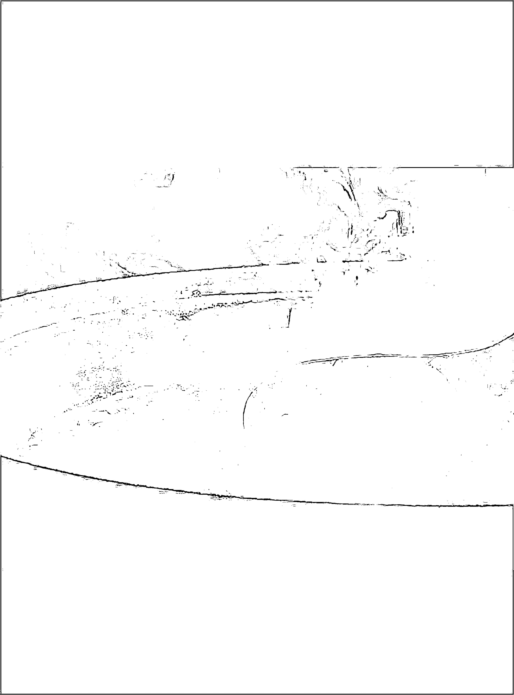

## 4-1
太極米漿粥的五種煮法

根據前述的定義，太極米漿粥的精要，就在「泔糜」。能直接自整粒的生的粳米粒與清水，熬出足夠濃稠的泔糜，在根本上，就已經距離我所謂的「太極米漿粥」不遠了。因此，這邊所分享的幾種煮法，乃是根據每個人所可能擁有的鍋具、爐具的不同，來想定的烹調流程。也因為每個人的烹煮環境的不同，最終的太極米漿粥成與不成的判定，仍然應該要以「泔糜」的產生狀態為標準才好。

### 標準煮法（一）

#### 材料

- 一、粳米：一杯（約二百毫升）
- 二、水：四千毫升（一般的清水即可）。好的水質，可以確保成品的完美，但是當今一般的民生用水品質參差不齊，水源環境的保護工夫好壞不一。我個人會將飲用水至少再經過一組物理方式過濾的淨水設備之後，才予以使用，目的在於去除水中各種農藥等化學物質、氯、重金屬物質等。附帶一提：因為會讓水的物性發生重大改變的關係，所以我個人不使用市面上常見的逆滲透（RO）式濾水，或是經過蒸餾、電解、離子化等等，各種影響天然水質組成以及結構方式所處理過的過濾水來飲用。

#### 步驟

- 一、將粳米洗淨後，水與米同時入鍋。
- 二、將水煮至大滾之後，轉中小火，在維持連續沸騰的狀態下，持續加熱二小時。期間需要不停的攪拌，以免米粒沉底焦鍋。
- 三、約經過兩個半小時，此時鍋中的米粒應該已經化得幾乎沒有完整的米粒模樣了。最後整鍋米漿粥的體積約有三千毫升左右。粥成。

#### 說明

- 一、水請一次放足。如果要煮更大量的粥，就請用足夠大的鍋。熬煮過程之中不宜額外添水，特別是不可以添加冷水，這會導致沸騰的狀態中斷，會影響米粒化開的效果。如果萬不得已要中途加水，請務必加入沸騰狀態的水。
- 二、「一杯」通常是指兩百毫升，屬於料理中比較方便的計算法。但是嚴格來說，以「日本制」的量米杯來計量的話，更精確一點的「一杯」應該是一百六十毫升。而米杯的「一杯」，也非常接近中國漢朝的「一升」的容量。
《傷寒雜病論》成書於東漢末年，如果要求精確，漢朝時候的「一升」的確較接近日本米杯的「一杯」。不過現在為了方便操作，我會建議大家直接用「兩百毫升」來計算「一杯」，也無不可。基本上，只要整鍋湯品的材料都是以同單位、等比例的前提下來計量，我認為差距的影響很微小。

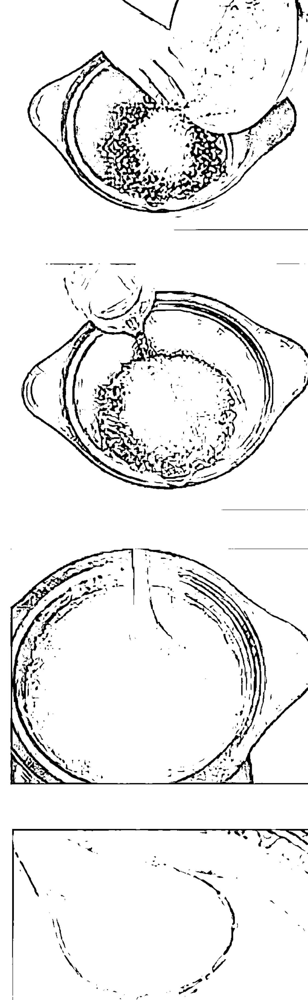

### 標準煮法（二）

若是家裡有大約六千毫升左右容量的大型湯鍋，不妨參考一下這樣的「太極米漿粥」的煮法。

- 材料
  - 一、粳米：九十毫升（約半杯）
  - 二、水：四千毫升
- 步驟
  - 一、將粳米洗淨，瀝乾備用。
  - 二、六千毫升的湯鍋中放入四千毫升的清水，大火先煮至沸騰。
  - 三、湯鍋中放入白米，轉至中大火，維持中度沸騰的狀態。重點在於：保持湯液呈現「由中央被推高，往兩側聚集」的動態。
  - 四、大約持續一個半小時，米粒幾乎平均已經開花、化消，可以視情況決定收湯的程度，至此粥成。

#### 說明

- 一、這種煮法比較不需要照顧鍋子，也不太需要持續攪拌，主要是因為：藉由沸騰之後較強勁的鍋內對流，帶動米粒不至於沉底燒焦，也因為如此，所以需要多預留一些鍋內的空間，讓湯液與米粒可以順暢的翻動而不致於溢出。不過，大約在熬煮一個半小時之後，因為整體上汨糜已經形成大半了，黏稠度大幅提高，對流翻動的效果轉弱。若是還想要再繼續熬煮，就需要稍微注意一下湯液的狀態了。此法最後煮成的粥液較少，約在兩千毫升上下。
- 二、粥成之後，可以轉放入有熬粥功能的電子鍋中進行保溫，不但能加強熬煮的效果，也方便接下來隨時取用。
- 三、四千毫升的水與九十毫升的粳米，採用這種方式熬煮後，最後大約剩下兩千毫升的成品。各家的爐具、鍋具的加熱能力不同，甚至每一種米種的汙糜產生速度都有差別，在熬煮的時候所用到的火力描述，以及所需時間的長短，這個部分，各位朋友在實做的時候，應該會與我的描述之間略有一些出入，請自行斟酌。
- 四、在熬煮的過程之中，湯液對流於鍋子中央被推起的程度，並不是要越高越好，只需要達到能夠順暢翻轉的程度就可以，所以這個火力應當可以隨狀況，進行略大或略小的程度的控制，這是因為還要顧及：當熬煮時間加長，水分變少，較少的物質吸收同樣的火力時，升溫速度會更快的關係。放入電鍋中保溫，適合隨時飲用，對於經常需要在早起的時候做為進食的第一口食物的場合來說，特別是在冬季的時候，格外方便。

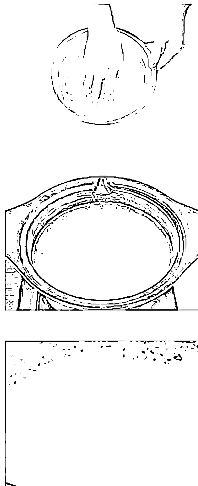

### 使用快鍋的煮法

此處我採用的是「WMF」六千五百毫升容積的快鍋為例。

- 材料
  - 一、粳米：一百五十毫升
  - 二、水：三千毫升
- 步驟
  - 一、鍋內放入水與洗淨的粳米。
  - 二、上蓋加鎖，開火加熱到開始加壓的狀態。
  - 三、用最小的火力讓壓力在二線的位置維持約三十分鐘。
  - 四、關火，自然洩壓。之後開蓋，令內容物攪拌均勻之後，開火加熱到微沸的狀態。
  - 五、重複二至三的步驟，再加壓一次。
  - 六、第二次開蓋加熱，以中大火稍微收一下湯液，則泔糜的濃稠效果會更好。

#### 說明

- 一、因為加壓原理的限制，粳米加水的總體積不能超過鍋體容量的二分之一。
- 二、水大約是粳米的二十倍。因為加壓的過程之中，液體不會因為蒸散而減少，也缺乏攪拌的混合力道，所以需要在最後額外進行收湯、攪勻的手續。例如：若是用六千五百毫升容積的鍋體，粳米加水最好不要超過三千兩百五十毫升的程度。就像前述的範例一般，如果放入一百五十毫升的粳米，以及三千毫升的水，所有食材的體積總合就在限制以下，比較安全。

### 使用大同電鍋的煮法

#### 材料

- 一、粳米：半杯
- 二、水：四杯

#### 步驟

- 一、外鍋放二杯水，開始加熱。
- 二、開關跳起後，外鍋再放兩杯水。
- 三、一至二的步驟反覆進行總共四次。

#### 說明

這個辦法我比較不推薦，原因是因為大同電鍋的火力有限，對於把整鍋米與水做充分加熱以及化消的效果，實在不太理想。但是因為很多朋友反應自己的住處不方便開伙，只能用大同電鍋勉強煮食，所以我根據朋友實際操作過的經驗做參考，寫出這個煮法。

### 使用燜燒鍋的煮法

因為每一家的燜燒鍋的氣密、隔熱效果不大相同，所以還請朋友們根據自己的操作環境做適度的調整。

- 材料
  - 一、粳米：三百毫升
  - 二、水：四千毫升
- 步驟
  - 一、粳米與水放入內鍋，在爐火上煮至沸騰。
  - 二、放入燜燒鍋中燜煮四小時。
  - 三、將內鍋取出，再於爐火上加熱至沸騰，並且同時攪拌均勻。
  - 四、反覆步驟一至三，總共最少兩次以上。粥成。

#### 說明

根據朋友們的分享，基於大量、節能、省工的因素，雖然耗時較長，但也可以考慮採用燜煮的方式來操作。如果是用燜燒鍋熬煮，在每次燜煮，以及最後取用之前，建議還是於爐火上再稍微加熱一下，順道攪拌一番，會比較理想。以燜燒鍋的煮法，不妨以燜四小時為一回。至於總共所需的燜煮的時間，就看各家燜燒鍋的保溫效果而定了。超過兩回以上的反覆燜煮，次數越多，所熬煮出來的米粒應該會化消得更徹底。有的朋友是將米與水在爐火上，熬煮米粒進入到開始膨脹、化開的階段之後，再連米帶湯將整個粥液移入燜燒鍋中持續熬煮。這樣可以說是兼有煮法一的好處，少一些顧爐火的時間，多一些節能，算是好的折衷辦法。

## 4-2 「達標」的太極米漿粥

有朋友問我：為什麼老師最近會提起「太極米漿粥煮好之後再過濾」這件事呢？

我說：因為我發現很多人煮的粥「不達標」。

濃度夠的粥，過濾之後，放入冰箱，隔夜取出，會形成像是果凍般的膠狀質感。

如果濃度不夠，化得不夠開，進冰箱之後，上層會有很多水被推出來，或者是流動度太高，根本無法形成「米漿凍」。你會發現，其實你喝的還是我常說的「開水泡飯」，並不是「太極米漿粥」。

古人范仲淹先生「斷齏畫粥」，我猜他煮的就是達標的太極米漿粥。因為在天寒地凍下，粥會是像果凍狀一般，能夠畫開，個別取用，但卻不會變冰塊。成了冰塊之後，根本是硬到得要用鑿子來敲，而不是「畫」開吧？我曾經嘗試將較含有水氣的米渣放在冰箱冷藏室中較低溫的角落，結果米渣結成冰塊，敲也敲不碎，自然是「畫」不開啦。

要說這質感像葛湯放涼了之後也行，當然也絕不像一般加了工業添加物的食品

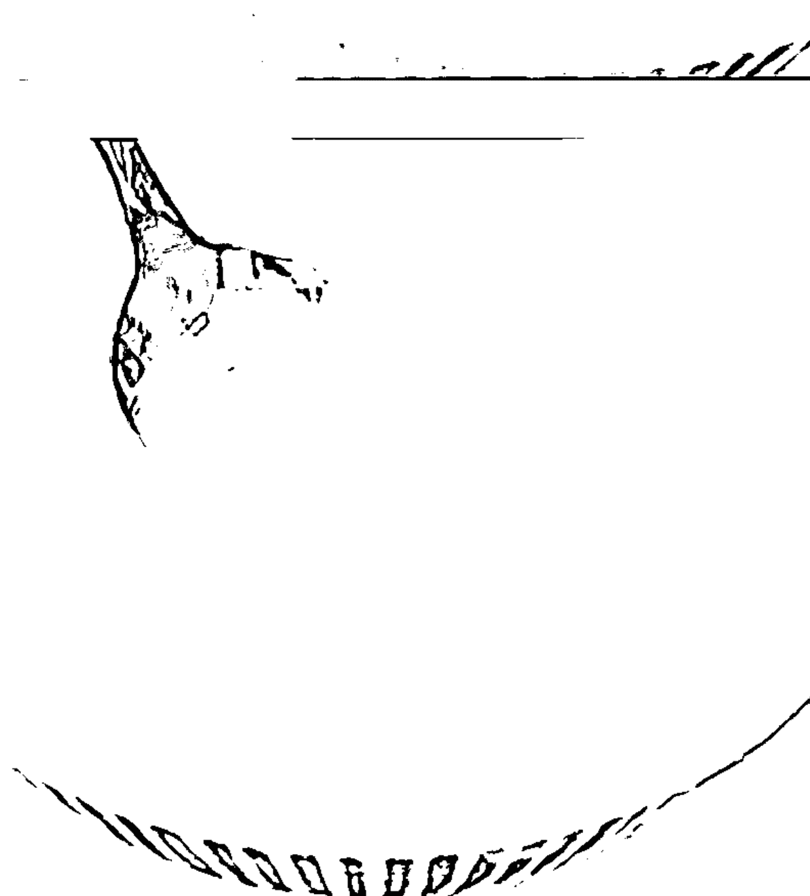

（上）不夠濃稠的粥冰鎮後反而會出水。
（下）夠濃稠的粥，冰鎮後會像果凍般 Q 彈。

一般，那麼的「Q彈」，或是在室溫底下久放也不會化成水的「假」愛玉；只是，當他一回到室溫，就會再度化成流體。所以仲景在《傷寒雜病論》裡提到，在服了某首方後：「不利進熱粥一杯，利不止進冷粥一杯」（《辨太陽病脈證並治下·八·二〇》）。熱粥能夠幫助人促進機能代謝，冷粥卻又能幫人解除虛燥亢進。一般人對《傷寒雜病論》沒有精讀到這個程度，沒辦法看得出一碗米粥怎麼可以這麼神奇的雙向調控全身的健康變化，真的是「下士聞道必大笑之，不笑不足以為道」。

很多人只會看到「我煮的粥也是糊糊的啊！」但是其實米粒還沒有化開到一定的程度，漿未成，所以就「自以為」已經吃了好一陣的太極米漿粥，但什麼感覺也沒有。有人會覺得這不是很容煮嗎？你說難，他也不難，但就是要做得「正確」，下的功夫要「老實」。難，不是難在技術，或是材料要多珍奇、昂貴，這違反我「經方化家常」的原則。但是「老實」、「正確」這件事，卻意外的成為許多人在實踐時，眼前最大的障礙。

我認為：熬起一碗粥，甚至可以看清自己的心性。

### ○ 熬煮要點 ○

我常說「開始做」、「正確做」、「持續做」。如果做得不正確，甚至南轅北轍，就算馬上開始做了，持續不斷，卻也只是距離目標越來越遠啊！

#### 一、煮法的關鍵

一、熬製之後的米粒並非只有米心熟透、膨脹，而是要能夠化開，讓米粒不成完整的模樣，甚至到達幾乎沒有米粒的狀態。

二、水與米粒充分混和至有「筋」的形成，對應於此，在做法上一要足夠的火力，包括加熱時間要夠長，二要經過充分的攪拌，或者以中小火來維持米漿粥液翻滾不止的狀態。

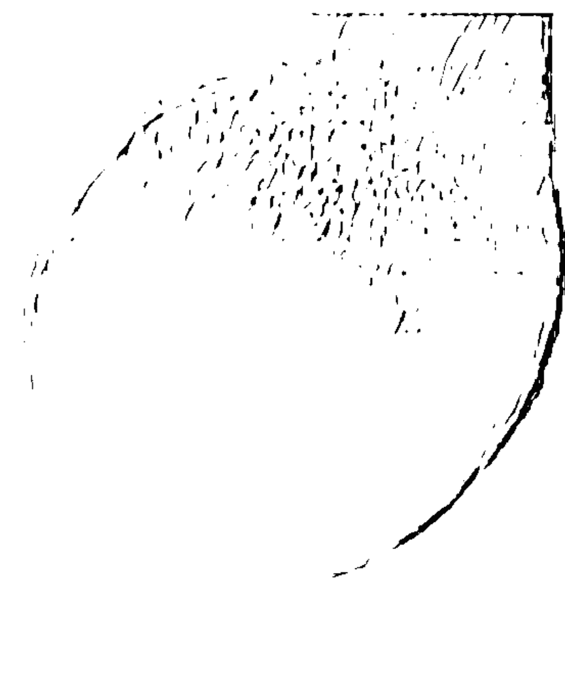

「筋」的狀態。這代表米漿粥夠濃，會巴附在鍋邊或湯匙上。

#### 二、宜用生米

使用一般的鍋具、電鍋、電子鍋，將生米煮成米飯的時候，在絕大多數的場合下，會流失掉大量的蒸汽。這些蒸汽不是單純的水分而已，同時還包含了大量的米粒的津液在其中。再用已熟的飯粒來煮粥，極為寶貴的津液的蒸汽再次流失，粳米的氣也所剩無幾了。已經煮熟的食物不宜重複再加熱，也是同樣的原理。

#### 三、不宜用外力擊碎米粒

無論是在熬煮的過程之前或是之中，都要避免使用外力，像是調理機、電動攪拌機、果汁機、豆漿機等來擊碎米粒。除了擊碎法，還有把米粒放入冰箱的冷凍室裡，藉此把米粒用其內部所含有的水分，因為結冰後的體積膨脹而把米粒給脹破的冷凍法，都不可用。理由是「米」、「水」、「能量」三者之間並沒有充分的融合。

我常舉的一個例子，我們不停的拿刀子剁肉，把肉給剁爛了也不會熟透；但是熟透的肉塊可以是形狀完整的。通常煮熟的食物才適合下肚，即使在鍋中省去煮熟的能量，到頭來還是要由胃的消化能量來付出。若是直接生食下肚，身體在消化上的負擔必定要大幅加重。再者，切碎之後的食材，食物的養分與「氣」流失的狀況，會比不切碎的食材要來得嚴重。

#### 四、水量、米量與泔糜量的關係

根據我自己的實驗，我使用一組新科技的電子鍋具，高度氣密，能夠電子控溫，自動攪拌，不需要人手操作，也能夠回收蒸汽，不會因為開鍋蓋而流失蒸汽與水分，幾乎可以不考慮水分流失的各種可能。在幾種比例的調整下，比較了成品之後，我建議水量的體積還是在米量的二十倍左右較佳。水量在低於十五倍以下的時候，就會顯得過於濃稠，燒焦的可能性也會大增。但是在高於二十倍以上的時候，泔糜又會顯得偏於稀薄，喝了有可能因為水氣太重而傷胃。

#### 五、「攪拌」與「濃度」的控制

「筋」是水和米粒的成分充分混合之後，所產生的一種混合物。不同於澱粉的糊化作用，筋度通常是來自於蛋白質的變化。而出現筋度，意義就是米中的養分能讓身體更容易吸收。米粒是否夠爛的標準，就是生米消失至沒有米粒，或是幾乎沒有米粒模樣的狀態。至於要有筋的話，食用前還是要在爐火上再稍微攪拌一下比較好。我認為攪拌的工夫和火力，兩者都很重要。

煮粥的時候，一旦鍋中出現湯液顏色變黃，或是嘗起來有一絲焦味，那就得要整鍋作廢，重頭來過。什麼時候是起鍋的時機呢？要煮到鍋裡的水在鍋邊產生的水漬是白稠狀，不會垂流下來，而是用要勺子才能輕刮下來的，這才算是大功告成——這代表已有米粒開始被煮化開來，交融於水了。

耐心的將粥煮到鍋邊的水漬成為白稠狀態。

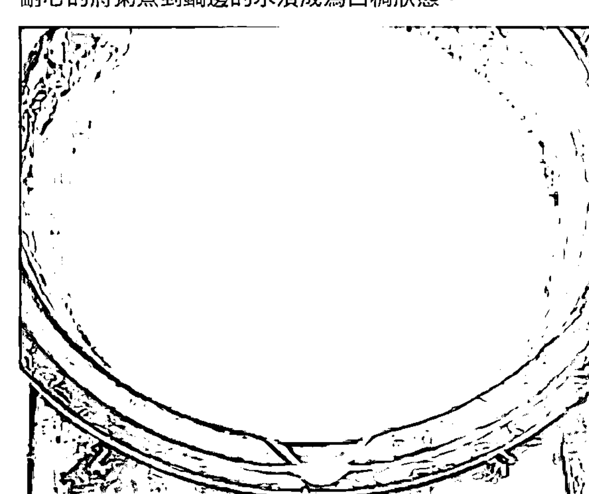

#### 六、保存

食用太極米漿粥最好的方式就是每天煮、新鮮吃。冷藏至多隔天，冷凍也不要超過一週。這是因為粳米有一種「吸氣」的物性，放在冰箱裡容易吸附冰箱之中的濁氣、雜氣、濕氣等等，吃了對身體不好。冷凍雖然能減緩食物腐敗的速度，但是不能減緩食物物性之中「氣」的流失速度。食物的氣流失了，津液也就因為不帶有氣而失去物性，吃了對身體沒有好處。任何食物應都避免長期冷凍為宜。

#### 七、吃法

太極米漿粥適合作為晨起的第一口食物，也適合作為一日三餐的主食。如同上述，我最建議的是每日熬粥，因為現喝最好。提醒各位，將米漿粥當作晨起的第一口食物時，份量約為三百毫升、不要加任何調味料，直接喝下，入口有淡淡的甘甜味，你的身體將會感受到那股溫和的力量。

### ○ 番外編之一 ○
「純。太極米漿粥」

# 第四章：太極米漿粥的製作方法

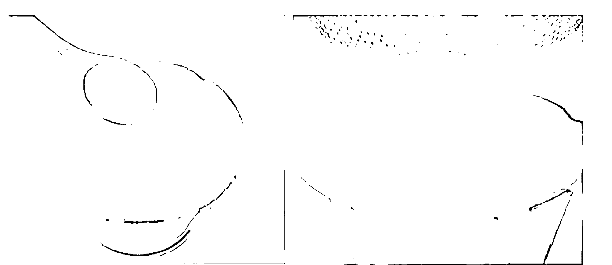

（左）過濾後，純粹的太極米漿粥。／（右）煮到白米化消開花後，可再多一個過篩步驟。

在熬製太極米漿粥的時候，就算是花了長時間的功夫，通常在最後還是或多或少會剩下一些米渣。米渣通常是我們不需要吃下的部分，對於胃的狀況還算可以的人來說，如果不過濾掉，一起吃下，暫時也不會有什麼大問題。但是對於胃的狀況已經很不好的人來說，吃下來渣就會有很大的刺激反應，很不舒服。把「米渣」當「藥渣」來看的話就知道：熬製完成之後，把米渣濾掉，是較為理想的處理法。

剩下來的米渣，家裡有養小貓的就餵小貓，有小狗的就餵小狗，有小花、小樹的，就餵小花、小樹。全家大小，從人到動物、植物，大家都能吃，通通有好處。夏日，覺得煩渴難止的時候，喝下一杯放涼了的太極米漿粥，會有意想不到的奇效。不管是什麼腸病毒還是什麼感冒，多喝些熱熱的太極米漿粥，多休息，通常病人都會感覺較為舒緩。

家中若能常備個一千毫升左右的純太極米漿粥，四季闔家平安。

### ○ 番外編之二 ○
【變化版：清心滑蛋粥】

有的朋友有所謂的「上虛火」的問題，可能一吃「補」就容易有生口瘡、便秘、口乾、長青春痘、痔瘡、流鼻血、失眠等等的問題。其實「上虛火」的根本原因之一在於胃裡的津液太少。當身體處在長期缺乏津液的狀態下，越是「高濃度」的津液便會越少，這樣高濃度的津液是得以雙向平衡身體功能亢進與收斂兩種作用的重要物質，所以，人體在物質與功能的兩個層面都虛弱的狀態下，就是一般常聽到的所謂「陰陽兩虛」。只要「陽氣」這種正面的能量提高了一點點，馬上就帶動體內的溫度上升。能量缺乏物質附麗，再加上高溫消耗了養分，因此形成「上火」。而對於人體來說，要避免如此的惡性循環，便要將「提高能量」與「溫度上升」兩件事情予以分離、脫勾。而在平常的生活之中，能夠做到有效的「滋陰」效果的食材之一，便是「黃」而「油潤」的，「不完全熟固」的「雞蛋黃」。

將雞蛋黃搭配太極米漿粥以及適量的好的天然食鹽，在身體能量上升的同時，又能夠把溫度控制在不致於大幅上升的狀態。並且能透過排尿的機制，讓餘熱排出，更有利於養分下達至腎系統。對於容易上虛火的朋友們來說，「太極米漿粥裡加入滑蛋與天然食鹽」的組合，不妨多嘗試看看，特別是推薦在睡前使用。

這樣的組合，我稱之為「清心滑蛋粥」。

詳細的操作方式請見下頁。

#### 材料

- 一、太極米漿粥（約五百毫升）
- 二、全雞蛋（約一至兩顆）
- 三、天然食鹽、紅砂糖（適量）

#### 步驟

- 一、雞蛋取蛋黃，打散、攪勻成蛋液，備用。
- 二、將太極米漿粥在鍋裡加熱至沸騰大滾。
- 三、關火，立刻將蛋液倒入鍋裡，同時順著同樣的方向畫圓，把蛋液在鍋裡攪拌散開。
- 四、隨喜加入天然食鹽、紅砂糖，完成。

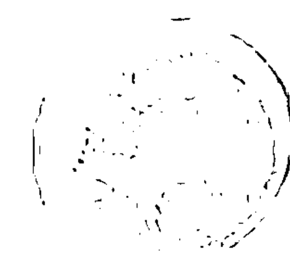

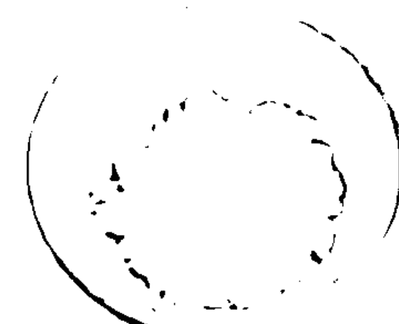

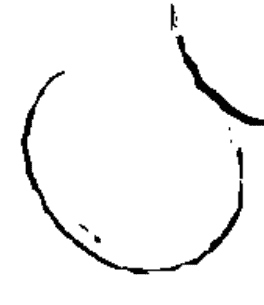

#### 說明

一、這類「關火後馬上倒入蛋液」，以鍋內食材的餘熱來加熱蛋液的「滑蛋」的作法，也可以應用在其他的料理之中。注意需保持滑蛋在半固狀的滑嫩狀態，才有效果。熟固的蛋黃則無此功能。

二、不妨在睡前一小時左右適量飲用，能協助改善因煩躁、時差等問題而不易入睡的狀況。

三、比較能夠「滋陰」的食材，通常都比較會有藥物或重金屬殘留的可能性，像是雞蛋或是豬大骨。還請小心挑選所採用的食材，注意來源是否安全。

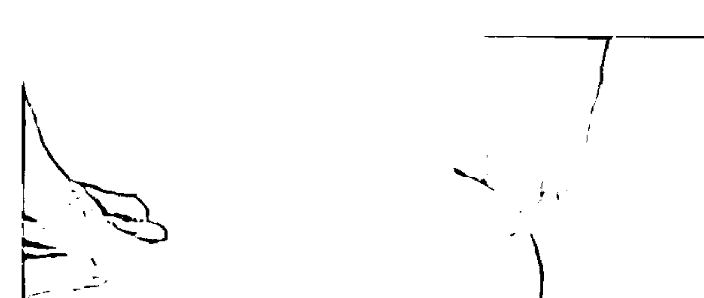

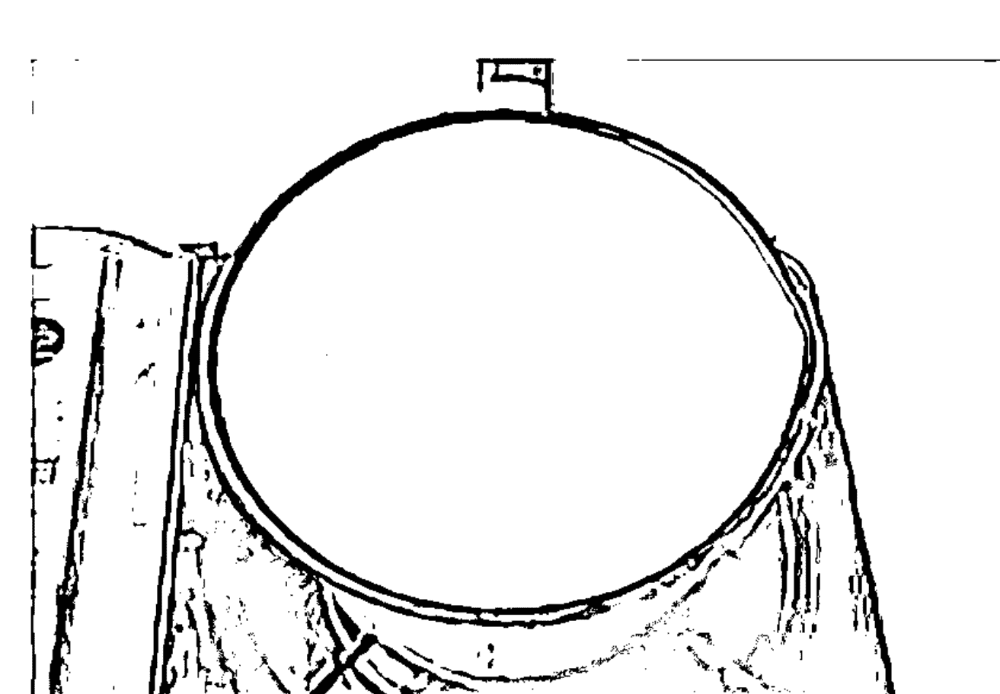

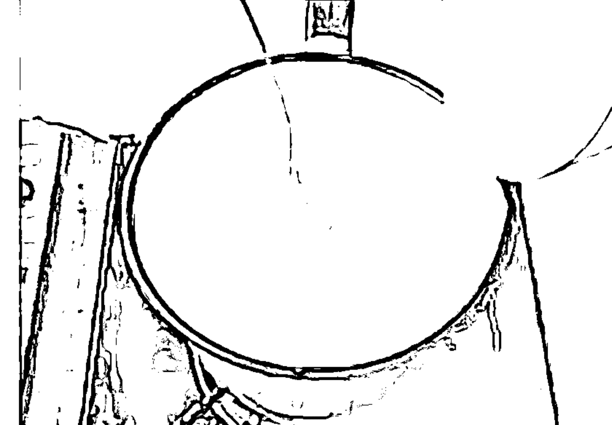

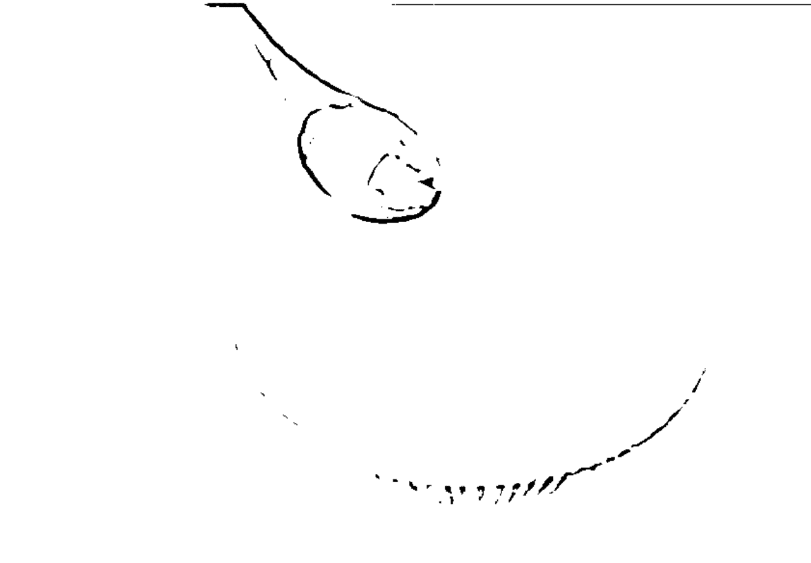

## 4-3
太極米漿粥答客問 Q & A

Q1：進口日本白米和臺灣本土白米會有差別嗎？

A1：有。有的朋友反映，用臺灣本產品種的粳米所以煮出來的粥，無論再怎麼下功夫熬煮，液體的部分看來就是不夠「濃稠」，也始終有一部分的米粒不能完全化消。附帶一提，根據一些朋友分享的經驗指出：少數臺灣在地的小農自已耕作的米種，或許會有不錯的表現，像是「花蓮富里米」。這個就建議朋友們多去直接向小農們了解、直接購買，多多用實際行動來鼓勵臺灣在地認真耕作的好農家！

Q2：米漿粥的材料可以用糙米、黑米、紫米、紅米取代一部分嗎？

A2：不可以。只有單純以精白粳米、清水一同熬煮，米粒化消、富含泔糜的，才是我所謂的「太極米漿粥」。任何成分的變化，都不是「太極米漿粥」，也不會擁有這麼多樣、強大的益處。無論是進行部分或是全部的取代，都不建議。

Q3：請問紫林老師，如果在米漿粥裡面加一點料，像是肉類或一些中藥一起煮，會有更好的效果嗎？

A3：不會「更好」，只會「不同」。所謂的「配伍」，絕非直觀的把所有「看起來很好」的材料加在一起，就會越來越厲害。有的人把幾味常見「看起來很好」的藥材湊在一起，當茶飲天天喝，事實上卻並沒有想像中的那麼好用。這就好比說，不同的色料個別來看，五顏六色的都好漂亮，但是當所有的色料加在一塊，卻只會變成一攤齷齪水。

Q4：米漿粥是否比白飯適合當主食？

A4：兩者一樣適合。但若是常有一些小毛病小困擾，像是晚上不是很好睡、手腳容易發涼、夏天好怕熱但是冬天又好怕冷、月經來得不大順、感冒之後不大容易好、常常時不時就發水腫、皮膚狀況似乎差了點……，卻又覺得似乎老抓不到原因在哪裡。不妨，就從三餐持續喝粥開始調養起吧！

Q5：喝白米粥時可以加海鹽吃嗎？

A5：如果是做為一般的餐點食用，是可以的。不過，若是要做為「晨起的第一口食物」的話，建議務必要先吃上一碗，大約三百毫升完全不調味的米漿粥。在這之前，什麼都不吃，連水都不可以喝。

我聽過有的朋友會喜歡在早起之後喝大量的水。但是我認為，水性本寒，再溫熱的水，也至多屬於「稍微比較不寒」的程度而已。一大早剛起床，胃氣尚弱，

就用大量寒涼洩下的東西來搞破壞，對胃的傷害很是嚴重，恰恰與古經方中醫對於胃氣的理解與養護辦法背道而馳。

Q6：請問孕婦適合天天吃米漿粥嗎？

A6：當然是適合的。特別是因為孕婦同時還要兼顧養胎的需求。如何養胎？《傷寒雜病論》之中，仲景明文開示：「當養太陰」是也（《辨婦人各病脈證並治．一六．一一》）。也就是說，全天下沒有一個孕婦是可以不需要、不重視「養太陰」這回事的。現代孕婦常會關心的各種問題，如怎麼樣容易受孕、怎麼安胎、怎麼養胎、怎麼長胎不長胖、怎麼避免妊娠高血壓糖尿病毒血症、怎麼避免水腫便秘，答案通通就在「養太陰」這三個字裡頭。我的太太懷老大和老二的時候天天吃太極米漿粥，照著《傷寒雜病論》養太陰的辦法來做。不但直到臨盆都沒額外增重，生產結束就直接恢復到孕前的體重。扣去胎兒以及其

他生產之後本來就會排出體外的部分的重量（如：胎盤、羊水），半公斤都沒多長，甚至還更輕了些。

Q7：請問老師，若有糖尿病適合吃粥嗎？

A7：我認為適合。我聽過不止一位朋友說過，家裡頭有血糖、血壓偏高的家人，堅持連續吃了一、兩個月的太極米漿粥，當做早上起床後的第一口食物，再回到醫院裡頭做例行檢查，結果發現不但血糖值完全正常，連血壓都降下來了。主治醫師索性就把控制血壓、血糖的藥全給停了，一面還拚命問說：你這段時間到底是吃了什麼仙丹，怎麼這麼有效？

Q8：如果喝完太極米漿粥後特別想小便，次數也多，是證明體內濕氣很多嗎？

A8：應該是體內有一些過去無力排出的濕氣，透過太極米漿粥調和胃氣之後，身體有力氣把它代謝出來了。

Q9：昨晚、今早以及中午，總計吃約半杯米量的米漿粥，每回吃都很快放屁，請問這是什麼問題？

A9：這表示你的腸胃真的開始在正常運作囉！根據《傷寒雜病論》，放屁就是腸胃活動的時候，碰到腸胃內有乾燥的大便而導致的（〈辨陽明病脈證並治．一四．七四〉）。平常好油、好鹽吃得不夠，肉吃得太少、蔬果吃太多，甚至天天蔬果五七九，不愛吃米、麵主食，造成津液缺乏，身體內臟又燥又寒，腸胃就會容易乾澀，排便就有問題，甚至還可能引起婦科問題（〈辨陽明病脈證並治．九．八八〉）（〈辨婦人各病脈證並治．一六．三九〉）。堅持繼續吃下去，讓腸胃用自己正常的力道來新陳代謝吧！

# 第五章

紫林式飲食
起居養生法

「對於環境、飲食的變化沒有感覺」不一定代表身體「很好」或「很壞」，對自己的身體變化能夠隨時清楚的感知，關心自己，通常就是掌握自己健康的第一步。在本章我綜合各種「身體是否正常」的指標（見P.62），提出個人認為對身體有益的日常生活習慣。

這些是我個人的觀點和體驗，基本上和各位朋友一般所接觸的養生法（以現代醫學為主流的觀念），幾乎不同。謹做為大家一個觀念上的參考，也可以視為是一個新方向的開端。

如果你沒有在服中藥，不妨試試看。

如果你正在服中藥，或是有打算開始服中藥，建議可以盡量完全做到。

由於這些原則和方法與吃西藥時醫生會告訴你的很不同，所以選擇吃西藥的朋友就請自行斟酌了。

除了飲食、起居外，每日的心情絕對會影響身體健康的好壞。就像飯不能由別人幫我們吃，自己本分內的事情也需要自己幫自己做好。心情上累積下來的不滿或是無奈等等，藥物也無力解決。

在醫生告訴你的健康狀況之前，你自己一定是幫健康把關的第一線。如果你對照本書 P.62 的健康指標後，發現有幾項不符合，除了飲用太極米漿粥，不妨也試試以下的養生法。

## 5-1 飲食養生要點

### 飲食之道

請各位朋友一定要有一個觀念：當下身體的健康與否，絕對是自己歷來飲食作息的總和。

一、蘋果、黑豆、白蘿蔔，這三樣食物需要完全禁絕。

任何與這三種食物同煮的食品也不能食用。這三種食材的物性，對於身體的影響，實在是負面遠大於正面。一般我們接觸得到的調理方法都無法避其害，所以我會建議乾脆別吃。

蘋果會削弱人體的心火，造成氣血根本上的虛弱。根據日本政府「農林水產省」的官方統計報告指出：自從二○○四年以來，日本全國水果消費量最大的水果其實一直都是香蕉。此外，也是「厚生勞動省」的官方統計，長久以來盛產蘋果的青森縣則是全日本平均壽命等各種壽命統計表現最差的地方。臺灣除了在高海拔地帶的濫墾濫伐之外，在一般的農地上應該是種不出蘋果的。就算從自然的觀點來看，我們也實在不應該再吃這種根本不會在臺灣自然出現的作物。

黑豆會劫去體內腎與三焦的津液，破壞力度很深、很大。白蘿蔔大量瀉去人體元氣，造成氣機衰微，胃氣、肺氣都會發生大量虛損。這些食材造成的破壞幾乎都是不可逆的，也幾乎無法靠著其他事後的辦法補修回來，容不得絲毫的心存僥倖偷吃一口。養生不易，摧毀多年的長城，卻只需要一口蘋果、黑豆，或是白蘿蔔。

#### 二、多吃主食，尤其是白米飯。

以一餐六百公克為例，每餐建議食用約兩百公克。不用害怕精白米，也不需要迷信五穀米、糙米等比精白米好。每天早起後的第一口食物，能吃一碗約三百毫升的「太極米漿粥」，最好。

#### 三、盡可能少吃蔬菜、水果等植物性的食物。

多數的水果都屬寒涼，最好都不吃。以一餐六百公克為例，蔬果不吃也行，但如果要吃，建議每餐的食用上限是總計在一百公克以下，而且需要以經過豬油高溫熱炒以及食鹽「殺青」過的深綠色葉菜為主，不可生食。不過蔥、薑、蒜等辛香料不在此限，而且可以多用，生、熟不拘。植物之中當然也有比較溫熱性質的食材，但是畢竟屬於少數。有適合生吃的，那就更稀少了。

#### 四、多吃肉。紅肉比白肉好。

除了牛肉與鵝肉之外，豬、羊、雞、魚肉可以多吃。牛肉非常不易消化，有傷胃的可能，最好減少食用。以一餐六百公克為例，每餐建議食用約兩百公克，相當於一隻大號的全雞腿。在選擇食用的時候，整塊的肉排是首選，由肉泥再製成肉丸之類的精製品，次之。

#### 五、避免吃低溫的食物，尤其是飲水，底限是「不低於體溫」。

正確的飲水方法是：含一口不至於燙傷人的熱水在口中，分多次而小量的漸次嚥下。日常中稍有渴感，就要立即飲水。我聽過養賽鴿的人說：他們絕不餵賽鴿喝涼水，只餵熱水。因為喝涼水的鴿子明顯體力會變差，比賽的時候常常回不了家。鴿子都不喝涼水了，你呢？

#### 每餐建議食材比例

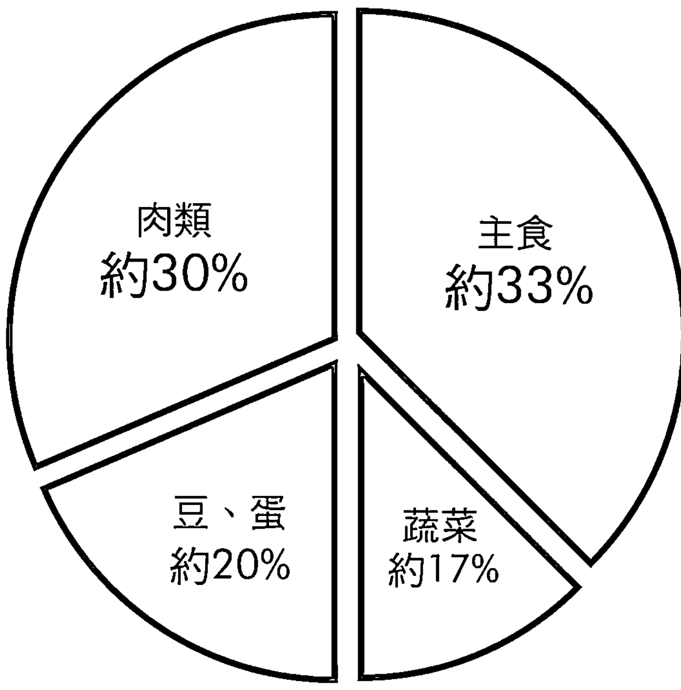

六、可以多吃豆類、蛋類。
以一餐六百公克為例，每餐建議食用一百公克以上。蛋黃的料理以熟而不硬固為準。每餐吃一至兩顆雞蛋，都是很好的。

幾餐不吃蔬菜也沒關係，水果大概以「月」為單位吃一、兩次就很夠了。

#### 七、不喝咖啡，避免喝牛奶，優酪乳等酸敗的乳類也不可食用。

最好的茶是無發酵的綠茶。最好將乳製品的食用量也減到最低。咖啡很多人喝，靠咖啡賺錢的人也很多，咖啡更是全球產值最大的期貨，而且產值還在持續大幅上升中。說這話我會擋到很多人的財路，不過可能會救到不少許多腸胃消化系統出毛病卻一直弄不好的人。如果你的身體現在有些小毛病一直調理不好，我誠心的建議不妨先把咖啡、牛奶這些食品停掉一陣子之後，再觀察看看吧！

#### 八、人工食品添加物最好全部不要食用。

例如：阿斯巴甜等人工甘味料、俗稱味精的麩胺酸鈉、可能名為氫化脂肪、酥油等的反式脂肪、人造或再製油品、磷酸鹽類的添加物。市售的麵包、糕點、西式料理、奶精，往往都使用到反式脂肪或是人造油脂，十分廣泛。這些東西該不該吃，正反兩邊的說法與研究都有。支持可吃的朋友，甚至是本身在販賣、製造這些東西的朋友，請不必來找我辯論，或是非得要把我告上法院不可。這世上會吃的人還是很多，真的不差我們這一小群人。不過，我的不少朋友都表示，只要有意識的閃掉這些添加物一陣子，如果再吃到，馬上就發生各種身體的不適感。很多東西因為「單獨吃的時候得要吃非常多才會到達立即致死量」，所以被判斷為「合法添加」。但是許多研究都沒有做到「如果一天之中吃了好多種添加物之後會產生什麼交乘反應」，也不談「雖然不致死，但是長期食用會造成什麼疾病好發的可能性」。總之我建議只要你知道某樣食品可能有添加，就要閃掉，不吃。

### 料理之法

善養水穀之海，正確的料理同時是美味以及健康的重要基礎。

一、料理食物務必使用天然海鹽、豬油、未精製的蔗糖。

許多食鹽會添加「抗凝結劑」，要避免食用；也就是說，放在空氣中不會受潮的食鹽，最好不要用。已經調整過成分的食鹽，例如低鈉、加碘，亦不可食用。如果沒有以自然的天日曬製的海鹽，使用岩鹽也可以。食用油請用自己製作的豬油。除了未精製的紅蔗糖之外，純正蜂蜜也是不錯的甘味調味料。蜂蜜以「入冬後會自然結晶」者為上品。

油、鹽、糖，其實都是維持身體許多重要功能的必需物質，而且幾乎是天天、餐餐不可缺，所以更需要注意是否為天然的方式所製成。因為在「物性」這件事上，一旦成分經過人工調整，食材天然的物性就淡薄，甚至會消失。進入到人體之後，人體的功能也會需要花費相對更大的力氣來處理。這些都是會造成身體的負擔，甚至是失去平衡的重要因素。

#### 二、料理食物過程的三要件：高溫、多油、動作快。

用足夠的火力，快速的把食材弄熟，幾乎是絕大多數食材的共通需求。這會讓食材在起鍋的時候是最「香」的狀態，也是我們認為食材的「氣」最足的狀態。古書上說「香者，氣之正也。」就這個標準來看，我認為符合這三要件所做出來的料理，最香，也就是擁有最多「正氣」的狀態。我認識到的中醫的觀念又認為「芳香」能「運脾」。料理香噴，引人食慾，自然就是好消化、好吸收的狀態了。

# 第五章：紫林式飲食起居養生法

## 5-2 多吃有益的三道茶湯

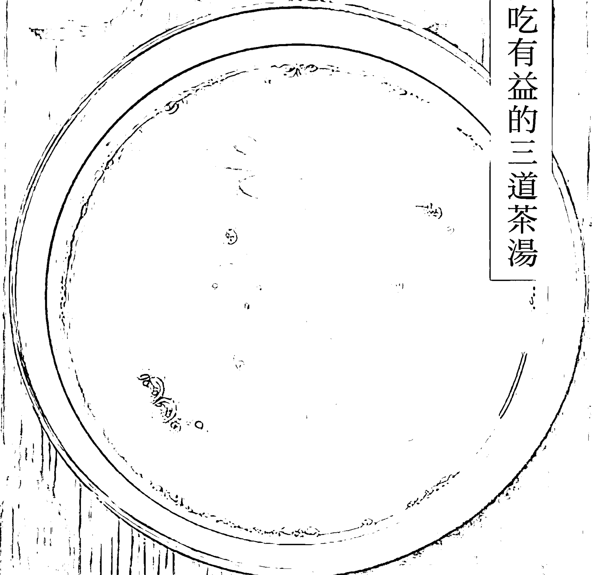

### 炙草薑茶

身體內若是虛燥熱嚴重的人，會特別喜歡食用冷飲、冰品，而不愛溫熱的飲食，這是因為寒涼的飲食能夠把虛熱、邪氣快速冷凝成液態，減輕肝木輔助心火去除這些負面能量的負擔。而邪氣在轉變成液態的邪濕之後，則可以交給脾土去吸收、壓縮，做暫時的存放。吃下冰涼的飲食後，會得到暫時的快感，把身體因為吃下人工化合物後，因此流失的津液，以及囤積的廢棄物，兩者所產生的虛熱給冷凝、壓抑下來。但是，邪氣冷凝而成的畢竟還是邪濕，原本的問題只是換了個型態，在根本上卻毫無解決。只有讓脾胃在擁有好的津液下所發揮的津液「夠濕」與胃氣「夠熱」的力道，產生正氣，才能把虛燥熱置換出體內。

這道簡單的茶飲「炙草薑茶」，能幫助快速的溫暖肺系統，強壯我們的陽氣，去除肺中邪濕寒氣。

#### 材料

炙甘草四錢（約十五公克）
老乾薑二錢（約七點五公克）

#### 做法

- 一、將所有材料放入四百毫升清水中。
- 二、開大火煮滾，之後用中小火慢燉，煎至兩百毫升。
- 三、關火，去藥渣，待茶湯自然降至適合的溫度，即可飲用。

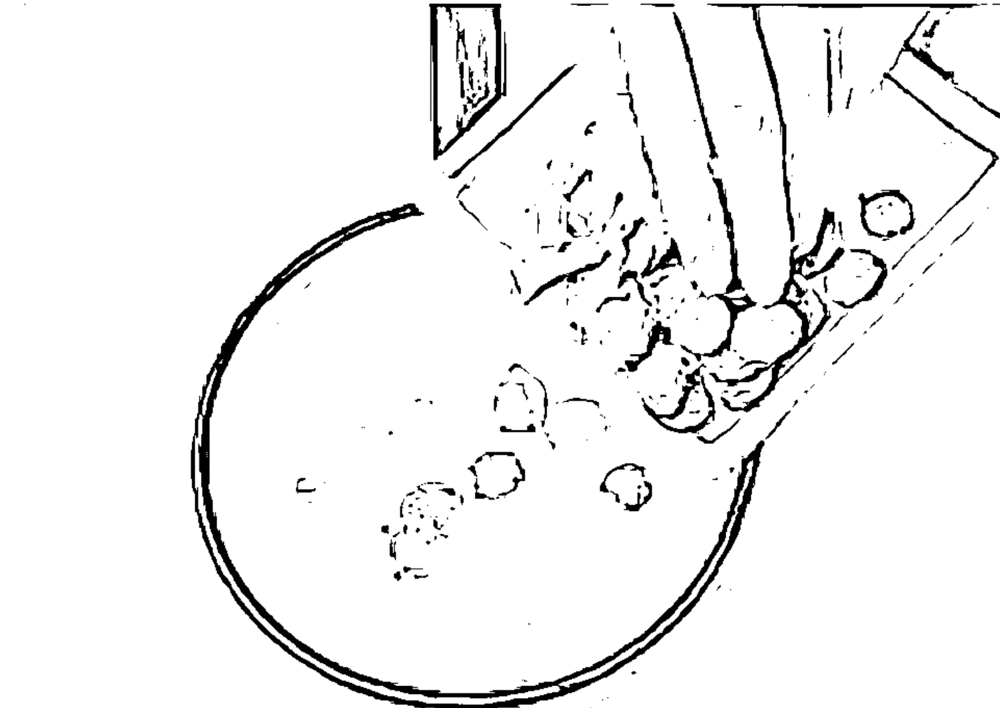

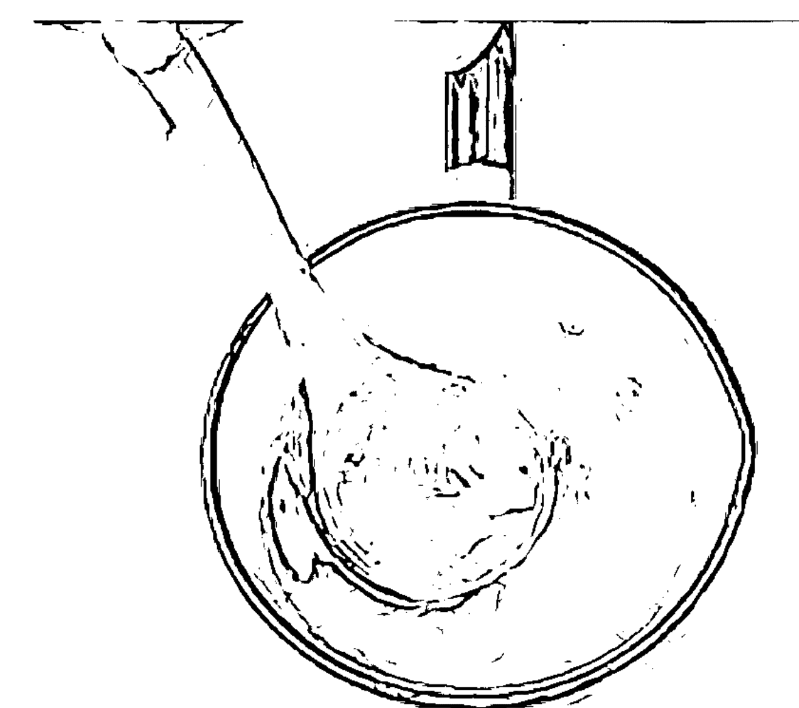

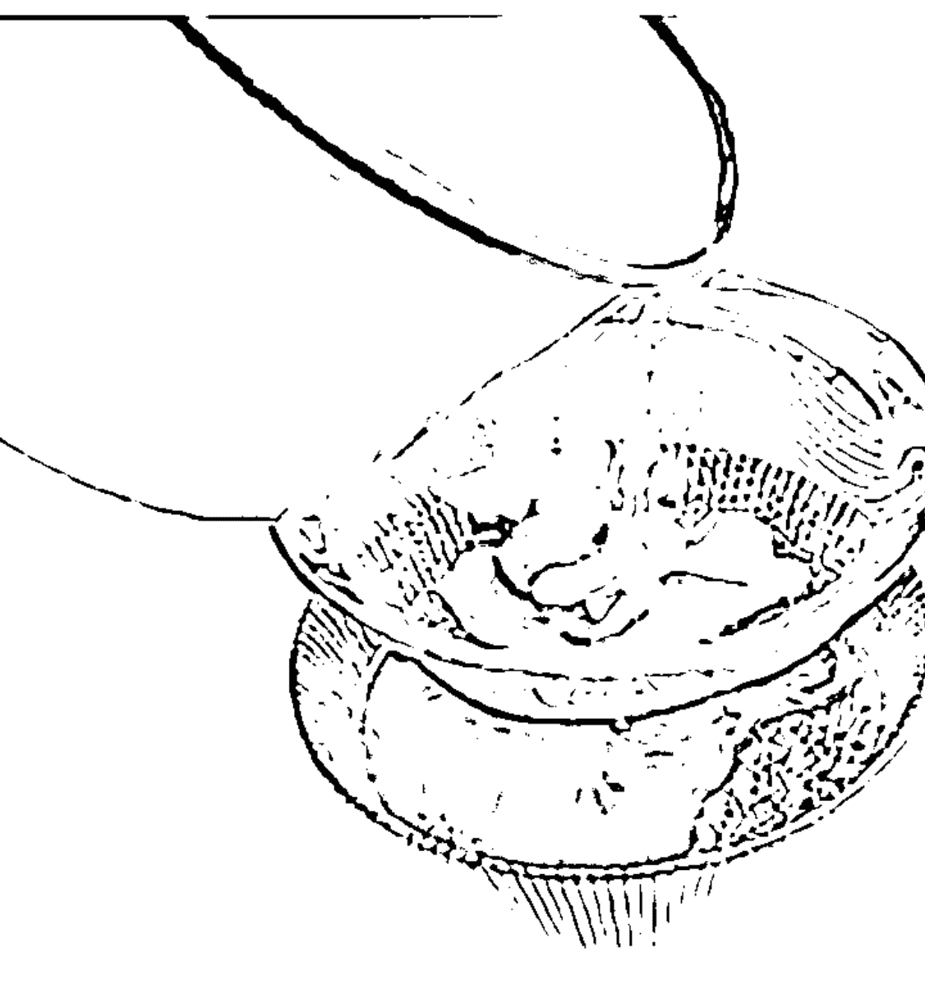

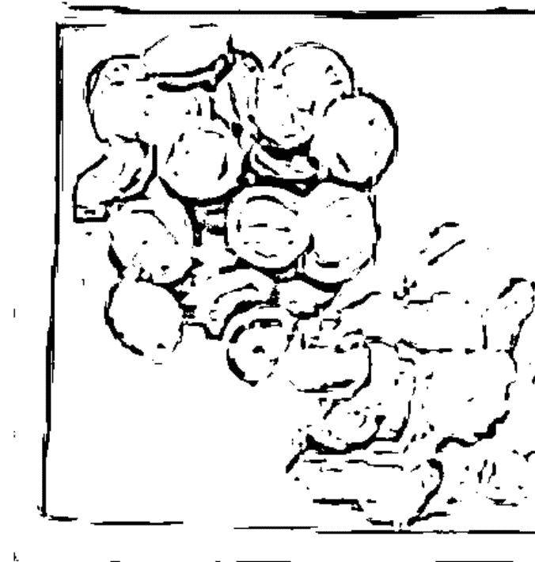

#### 要訣

- 一、早晚各用一百毫升，大人、小孩都可以用。
- 二、非常抗拒喝熱飲者，可以放涼至接近體溫再用。
- 三、晨起常有鼻塞，痰多，鼻水、噴嚏不停者，特別適合。
- 四、這畢竟只是輔助的茶飲，根本的改善，還是得要切記：戒吃生冷飲食和人工化合物，否則沒有效果。
- 五、炙甘草的品象：不可焦，質地不可以脆，嘗起來不可以有苦味。外表不可以黏手，蜜製過的甘味必須要透達到最裡層。否則不具效力。

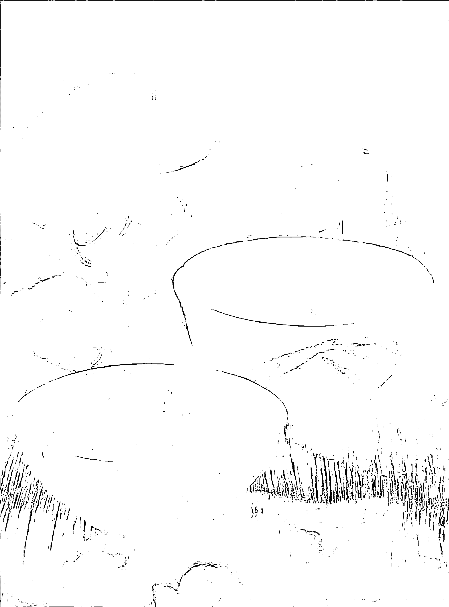

### 桂圓薑棗茶

平時對於身體來說，維持內臟的溫暖以及津液的充足，是有必要的。我所謂要胃氣經常能夠呈現「夠濕」、「夠熱」的狀態，讓脾胃的津液溫暖與潤澤，好讓身體可以維持生血的活力，以及產生氣的功能。

#### 材料

去籽紅棗三兩（約一百一十二點五公克）、生薑一兩（約三十七點五公克）、龍眼乾一兩（約三十七點五公克）、紅砂糖或黑糖（隨喜好適量）

#### 做法

- 一、生薑洗淨、切片，將紅棗、生薑、龍眼乾放入四千毫升清水中。
- 二、開大火煮滾，收湯至一千五百毫升。
- 三、隨喜好加入適量紅砂糖或是黑糖調味。每五百毫升的茶湯可以加入三大匙的紅砂糖，實際用量則視食材的甜度以及個人偏好加減即可。

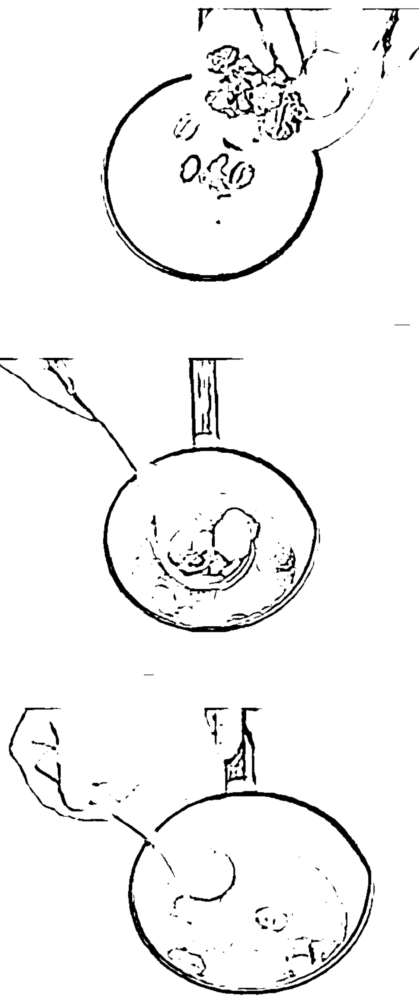

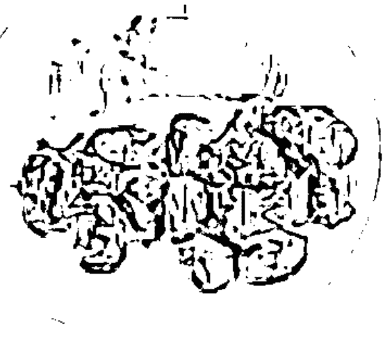

#### 要訣

- 一、薑切片之後，茶湯的辣味會較為明顯，可以用這個方式來適度的調整自己喜好的辣度。
- 二、必定只用紅棗，不用黑棗。紅棗必要去籽、剖開才用。（下圖）
- 三、推薦女性經期前後持續飲用。
- 四、天熱在戶外活動時，容易流大汗，這種時候也推薦飲用，能舒緩因為大汗或是高溫所帶來的不適。

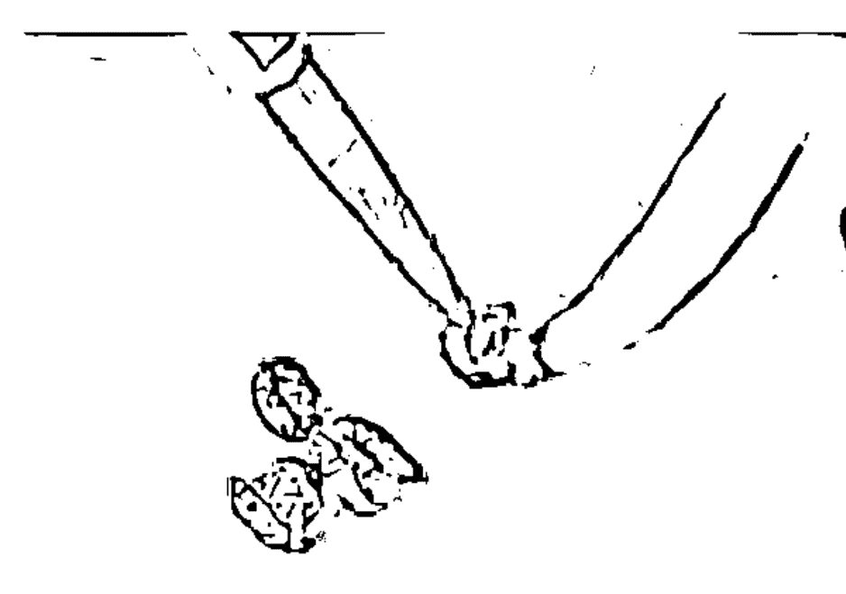

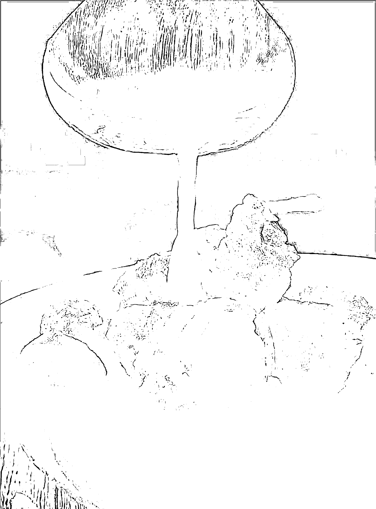

### 當歸生薑羊肉湯

這是完全依照《傷寒雜病論》中的記載比例配方所寫成的食譜。這道當歸生薑羊肉湯，不分男女老幼都可以飲用。湯品的性質溫暖，不帶羊羶味，清甜不辣口，喝完之後全身溫暖。每週喝上一帖，可以強健、祛寒。我們都知道，要大量生血，最好的食物，就是紅色的肉類，這是幫助我們造血的最佳材料來源。這其中，又以屬火性的「羊肉」的效果，特別卓越。中藥之中的「當歸」，最主要的作用在於輔助「引導津液轉化成血液」的機制。人體透過羊肉吸收到津液之後，當歸才能開始發生「輔佐」生血的作用。而生薑則是一向以來我們所認為能幫助脾胃溫暖，加強四肢溫暖以及氣的行走力道的最佳食材。脾胃的氣能行，血就能夠留存在其中，也就是我們所謂的「氣行血止」的人體公式的原理。而集結了這三種重要的食材於一處所調和而成的湯品，就是《傷寒雜病論》中所記載的「當歸生薑羊肉湯」。就是這麼簡單的三味食材，能夠幫助平常寒涼的身體機能快速提升，溫中補虛，讓血液充滿後三陰內臟。對於胃氣虛微的人，很好，對於虛寒體質的人，很好，對於產婦在產後調理，也很好。

#### 材料

當歸三兩（約一百一十二點五公克）、生薑五兩（約一百八十七點五公克）、帶骨帶皮羊肉塊一斤（約六百公克）

#### 做法

- 一、材料洗淨，放入四千毫升的清水中。
- 二、開大火煮滾，隨時撈去湯上浮沫。
- 三、煮滾之後轉中火，維持滾沸狀態，不加蓋。
- 四、收湯至一千五百毫升。約一小時四十分之後，湯成。

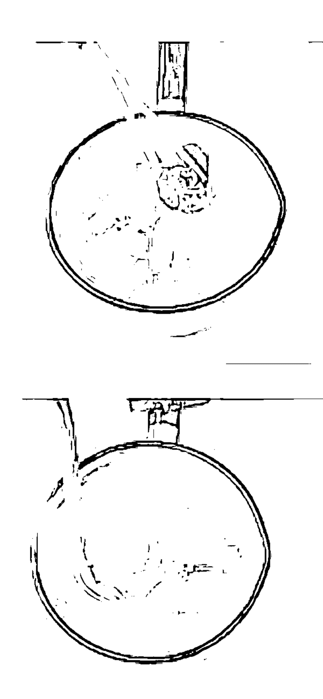

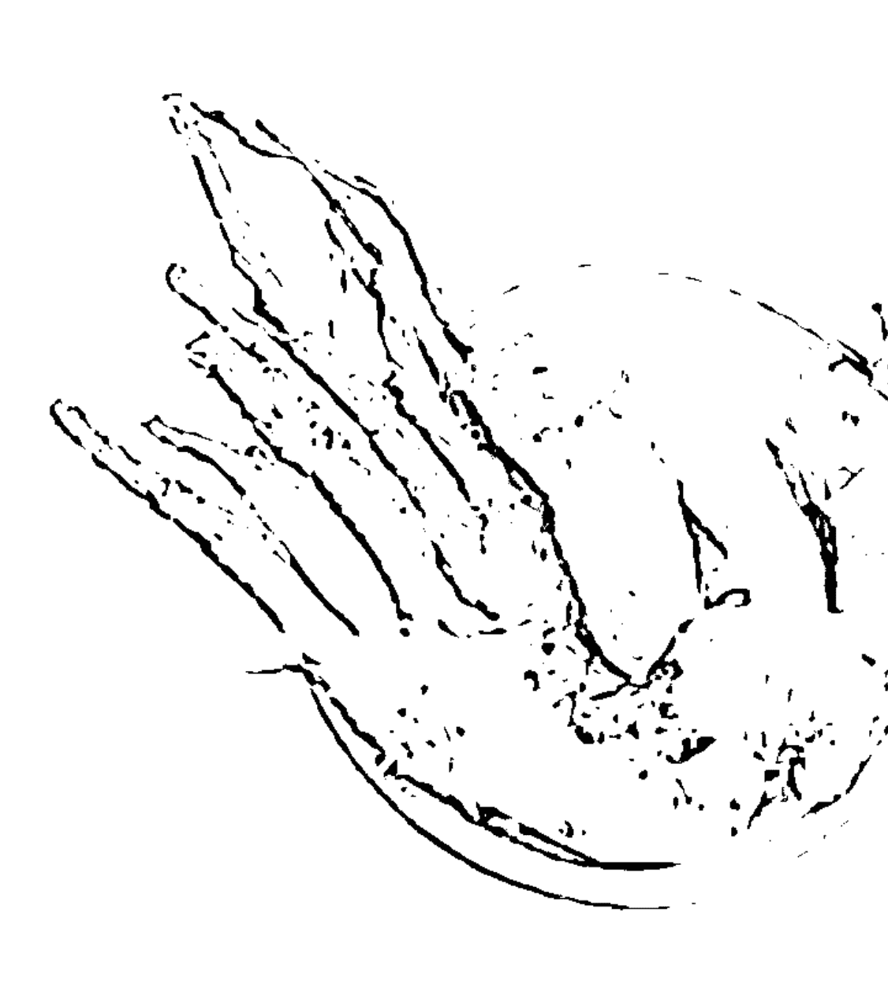

#### 要訣

- 一、羊肉盡量用「本土產現宰」，冷凍進口的肉品因為鮮度不夠，效力不及。
- 二、生薑可以不必切片，但建議從分歧處用手大塊剝開，以刀背拍鬆。（下圖）
- 三、請找有信賴的中藥行或南北貨行，購買「藥用」的良質全當歸。
- 四、以上的重量、容積，可以視飲用的人數，依「等比例」增減。
- 五、每餐建議可以喝上兩百毫升左右。
- 六、羊肉可吃可不吃，也可以另外做成其他料理食用。但是當歸與生薑於湯成之後請立刻撈出、丟棄，切勿再用。

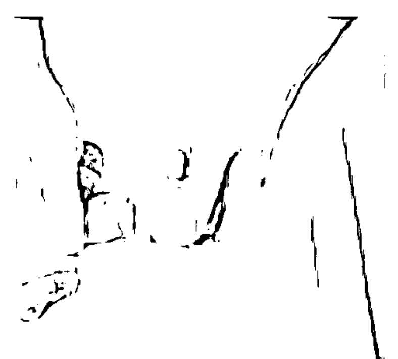

## 5-3 起居養生要點

雖然「人在江湖」，但不妨「盡力而為」。

- 1. 每餐飯後最好能有三十分鐘的散步。
以全身能夠持續均勻微汗，散步中還能輕鬆交談不喘氣為標準。餐後不適宜劇烈的運動，但是適度的散步是很好的。運動幫助骨骼肌放鬆，可以減少胃氣的負擔，就能更專注於好好的消化食物。常有各種消化道毛病的朋友們，不妨試試看！

- 2. 除非是冬天或入夜後，最好不要長時間的吹冷氣。

春夏為陽，秋冬為陰；日為陽，夜為陰。正常的地球氣候，通常也是入夜的氣溫低於日間，冬季的氣溫低於夏天。日間開冷氣空調這實在很違反人體在白天提升陽氣的需求，夏天常吹冷氣當然就更不利於養陽了。如果使用冷氣空調不可免，至少也可以找個比較合於自然的狀態下來使用。

#### 3. 盡量減少弄濕頭的機會，最好是避免洗頭，或者洗頭時只用清水。

人體的陽氣，在頭頂與面部是高度匯聚的狀態。我又說，水性本寒，寒性的物質大量澆淋在頭上、臉上，身體很難承受得住。女性朋友，特別是在經期中以及坐月子的時候，更應該要嚴格禁止洗頭。有不少朋友因為開始不洗頭、不用洗頭的清潔劑，所以頭皮的問題大幅改善了。有這方面困擾的朋友們，我特別推薦！

#### 4. 晚上適宜的就寢時間在少陰時段之前，也就是大約十至十一時左右。早晨適宜的起床時間在少陰時段之後，少陽時段之中，也就是大約五至八時之間。

我根據《傷寒雜病論》所製成的《六經流轉時辰圖》（見P.92），再配合身體對於陰陽的特性與功能的轉換，建議這可以做為每天規律作息的一個參考標準。人，還是要白天活動，晚上休息，維持一定的節律，對於身體的活動負擔，才會最小。

#### 5. 不可做會讓心跳加速或是呼吸變喘的運動。

以一邊運動還能聊天為心肺負擔的上限。「全身黎黎微似汗*」是個不錯的衡量標準。意指身體理想的發汗狀態，應該是要全身出汗均勻，不可只有局部出汗，而且汗量必須只有達到皮膚上讓人微微感到潮濕的程度而已，不可以看到汗滴，更不可以汗如雨下。所以說，『步行』是最好的運動。當四肢骨骼肌透過適度的運動而放鬆，達到『解肌』的狀態時，就能夠『溫通腠理』。提倡適度運動不是要練什麼心肺功能，但是腠理的功能提高之後，氣血通暢，心肺功能自然也會改善。

*／「腠」音同直。語出自《傷寒雜病論》。

#### 散步的姿勢

從頸椎到下腰部，脊椎要能保持在一條直線上。眼睛直視前方，收下巴，雙肩不施力，兩手自然微幅擺動。胸部微微含起，不挺出，縮小腹，收臀部。跨出步伐時，腳自然往前踢出，膝蓋放鬆但是要打直。重心永遠只放在一隻腳上，不拖泥帶水，也不要雙腳騰空。所以步伐一開始不要貪快、貪大，但是一一定要穩，不要讓重心離開身體的中線，只要跨出一隻至一隻半腳掌的步長就可以了。盡量以腳掌的前半著地、施力。腳趾盡量伸展開來，有一點「好像用腳趾抓住地面」的感覺，特別是身體重心的感覺要放在「湧泉」穴上，也就是在足底面，大約從第二與三趾之間的趾縫往足踵延伸，趾根到足踵後端連線的前三分之一處。

常聽人說「走姿是站姿的延續動作」。我們要把路走得好，其實先要能夠「站好」是更重要的。站好、走好，這對於鍛鍊我們的膝、腰之力，很有幫助。中醫認為，膝、腰之力來自於腎，這等於是一種用「外功」來提升腎氣的日常鍛鍊辦法。最近常常在街上看到一些年輕女孩不大會穿高跟鞋，所以穿了高跟鞋之後走起路來，常常是彎腰駝背又曲膝，這表示他們身體的腎氣不太夠，穿上了美美的鞋子，但體態卻反而變得很不好看啊！雖然就中醫的角度來說，不建議大家常穿這些「流行」、「很好看」的高跟、尖頭的鞋子，但是如果我們能把「緣督以為經」、「尾閭中正」、「天之生是使獨也」等的站好、走好的要領給抓住，就算穿上有一點跟的鞋子、走起路來，儀態也會特別好看！

## 5-4 乾毛巾按摩法

長久不正確的使用身體，陰和陽的層面都虛弱的狀況下，所謂的「上火」的問題就變得相當的難解。當身體的正氣弱，內臟是虛寒的，但是因為津、血太少，身體動不動就會受到外來的影響而大量發出虛熱（俗稱的「上火」）。當虛熱很盛，正氣卻很弱的時候，涼一點的食材很容易傷到胃氣，但是補一點的食材又可能會加重虛熱的問題。這也是我們一直在強調「不可輕易退火」的最主要的理由之一。

我們的背面、頭頂、面部是身體的陽氣在輸出過程之中，很重要的部位，即所謂的人體的「陽面」，也就是陽氣較強的部位。朋友們不妨觀察一下，這些陽面部份的肌肉反而是較少的，而這些部位在理想之中，也應該要呈現較為柔軟、有彈性、緊緻的狀態。其中，尤其是頭頂和面部可以說是「諸陽匯聚」的部位，穴位很多。只要適當、均勻的按摩，不必特別講究穴位，都能夠將陽氣刺激、引導上來。

此外，我認為髮質其實能忠實反應身體的狀況，特別是陽氣的狀況。而平常髮絲、頭皮若是「習慣」了所謂的「保養品」的「滋潤」效果，本身自我修復的能力就會日漸低落，變成不依賴外來藥品就活不下去了。我平常每天晨起後都會用乾毛巾按摩頭皮，發現：在開始持續按摩幾天之後，頭皮分泌油脂的能力就會漸漸調整回正常的狀態，脫離依賴化學藥品，頭皮不容易過油或是發癢，自然也就不需要再使用任何清潔、保養用品。現代人的身體和環境一樣，都被化學藥品控制得太深了，生理機制普遍縮退，不能正常運作。剛開始停用的時候，又會覺得很痛苦，馬上就讓人想要放棄。結果變成被化學藥品控制了一輩子，始終跨不出回歸「正常」的第一步。

我推薦我的「乾毛巾按摩法」。取法自「膏摩」，借用乾毛巾的輕微刺激，簡便代替膏劑的輔助行氣效果。有興趣的朋友不妨花點時間持續嘗試幾天看看。

### 一、降火氣、退邪熱的按摩法

適合頭皮或是面部經常有油脂分泌過多，或容易產生皮屑的問題，甚至是眼部會有容易發熱、流眼油的問題的朋友。

#### 方法

- 1. 早上起床後，用一條柔軟的、全乾的、純棉製的毛巾，全面重複的摩擦頭皮和臉部。在這之前，不要用水洗臉，也不要洗頭。
- 2. 摩擦的動作就像是在抓癢一般，用指腹的力道讓乾燥的毛巾纖維摩擦到整個頭皮和臉部，持續按摩動作到有微微發熱的感覺就好。這樣可以協助引導身體的正的能量往身體陽的部位移動，透過加強正氣來避免邪熱上竄。

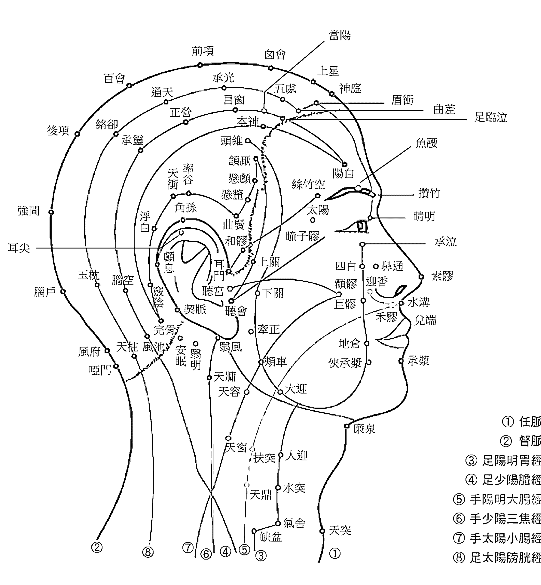

- ① 任脉
- ② 督脉
- ③ 足阳明胃经
- ④ 足少阳胆经
- ⑤ 手阳明大肠经
- ⑥ 手少阳三焦经
- ⑦ 手太阳小肠经
- ⑧ 足太阳膀胱经

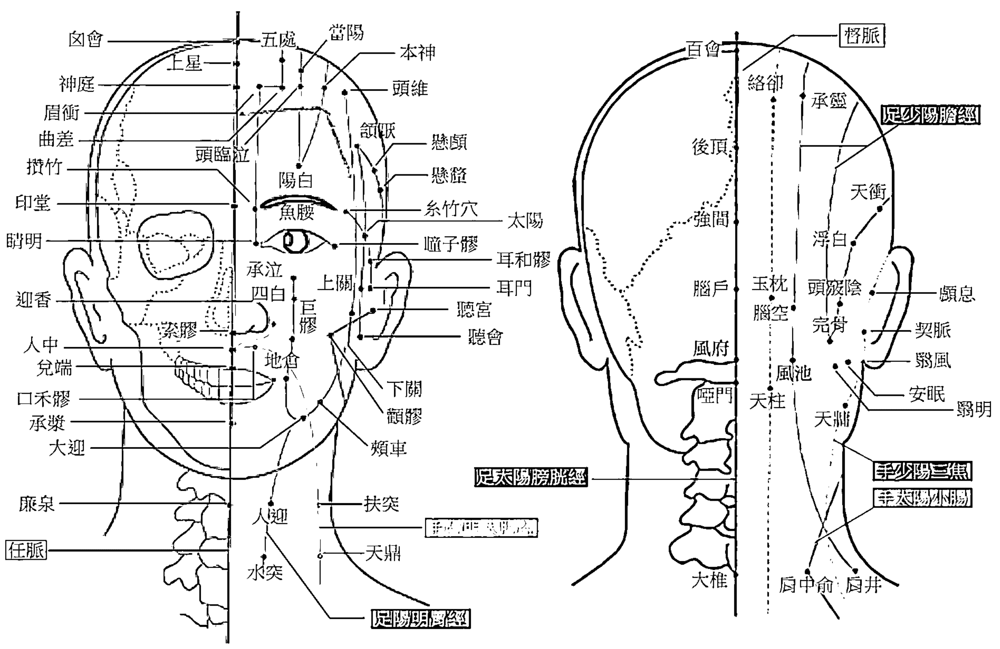

頭、面滿佈重要穴位，族繁不及備載。因為肌肉薄，神經多，如果是扎針，難度很高。自行按摩，簡便，也較安全。不必特別記憶穴位，地毯式全部按摩一遍，就對了！眼周請只在有骨頭的部位按摩，以免誤傷眼球。

### 二、改善感冒、倦怠的按摩法

另外一個可以嘗試「乾毛巾按摩」的時機是在感冒初起，病家有些發熱、精神倦怠的時候。

#### 方法

- 1. 在四肢末端，像是小腿肚、腳底，以及後背部的脊椎兩側，還有後腦的「風池」、「風府」部位（見P.256），沿著「足太陽膀胱經」（見P.258），多做摩擦，讓身體可以到達發出微汗的程度。
- 2. 再配合適量的飲用太極米漿粥，同時避免再次受風、受寒，並且禁絕其他飲食。
- 3. 這個方式特別可以幫助小兒在發燒的時候，第一時間先穩定病情，讓家長有足夠的時間做出正確的判斷、穩定軍心，而不要匆促退燒，造成病家將來難以恢復的身體功能損傷。
- 4. 晚間就寢之前，也可以循著同樣的方法按摩，幫助全身放鬆、助眠。

#### 足太陽膀胱經圖

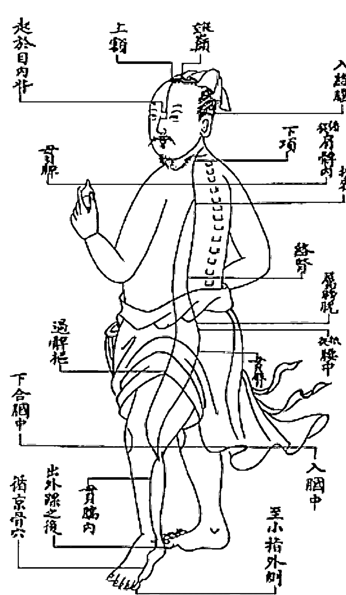

# 第五章：紫林式饮食起居养生法

# 附錄 五運六氣健康流年預測

世間萬物流轉，老祖先認為，自古以來，即有一「序中有變，變中有序」的大勢所趨，像是所謂「天下大勢，分久必合，合久必分」之云。人體的健康起伏對於每日飲食起居的變化，很敏感，對於天地之間的氣候與環境特性的變化，也很敏感。吹風受寒，一不留神，就會受到邪氣外感入侵身體。「養生」是要讓我們變得更有實力可以抬頭挺胸的面對不測風雲，而不是讓我們反倒變得畏首畏尾的深怕動輒得咎。依照古經方中醫所推得的「五運六氣」的運氣理論，在陰陽五行之下，針對每一年，以及其中的上半年與下半年，自有一套對於天候氣象、社會財經、人文活動等的趨勢解讀與觀察法。如果我們可以在維持正常的飲食、起居之餘，同時也多留意每個半年在天地之間會有的：風、暑、濕、燥、寒、熱等環境特質的變化，那麼我們不只是能鑑往，還能夠知來。提前做好重點式的預防，縱使天有不測風雲，但是我們仍然能夠御六氣之辯，以悠遊於天地之間。

運氣學說認為：一年依照二十四個節氣，可以等分成六個時段，每個時段都會有一個「不變」的天氣特徵，叫做「主氣」。此外，每年又會依據紀年的地支，輪替著一套固定的規則，在一年中的六個時段都會有不同的「變動」的因素來影響主氣，這就叫「客氣」。在一年的六個客氣之中，有兩個客氣的影響力度最大：每一年整年度會有一個位置的客氣具有全年的代表，叫做「司天」；每一年下半年的特徵，又由另一個較次之的客氣位置「在泉」來影響。司天與在泉客氣的影響力，可以在橫跨數個主、客氣的位置上發生。最後，再加上每一年有一個對於整年度變化特徵的加減力道的額外因子，依據紀年的天干來輪替，叫做「五運」。知道了紀年的天干、地支，就可以得知該年度的五運六氣，然後就可以合理的推算出全年六個時段在天氣與人體健康上，所可能發生的影響。我在自學中醫，並悟得這套推算法之後，便嘗試將這套規則應用在長期天氣預報、疾病流行趨勢等等上頭做檢驗，結果連續數年，百應百驗。

## 二〇一七年

歲在丁酉。行木運，陽明司天，其氣為燥金，少陰在泉。
起於大寒二〇一七年一月二十七日。

全年總論：燥金逢木運，金剋木，木運較弱，全年以及上半年仍以金氣為主，木運不足。金氣為燥，人體為肺、大腸。需多留意肺部、大腸功能，像是喘、咳等病證。喉頭容易不利，有氣上衝，上身覺得發熱。病證加重時，容易出鼻血，或是化成膿血。四氣之後，下半年氣轉少陰在泉。少陰君火，主心，容易出現心神不寧，上身發熱出汗不止，胸中痛或是發熱。心氣不足，則容易四肢發冷。上半年客氣燥金，降雨之後，水氣不容易回到大氣之中，傾向留存在地面。風氣受剋，季風、鋒面帶來的雨水有限，季節變化不明顯，農業的春季作物容易發生耕作、生長不順利的情形，而用水較多的民生、工業活動，對於春雨的供應不要期望太大，應當預先提防。身體保健應更加注意津液的涵養，適度的進行四肢活動，以出微汗為準，盡量避免令人大汗的活動，更要避免在大汗之後飲用冷飲，否則容易多生痰飲、喘咳不止。下半年客氣君火屬熱，入秋之後高溫不易降下，若有秋颱，強度普遍不容小覷，應做好防範。入冬之後，氣溫下降體感仍然不明顯，除非有強烈氣團或是降雨，否則不容易明顯感到變冷。因為氣溫下降不明顯，身體保健可搭配適時使用冷氣空調，避免過熱、過汗導致亡陽、傷津，但仍應避免貪杯而使用冷飲解熱，將容易誤傷陽氣。多吃肉類，像是物性屬水的豬肉，並且調味多用天然海鹽，以大質量分散能量，有助於身體回收陽氣入裡。

初氣主氣厥陰風木，客氣太陰濕土
起於大寒二〇一七年一月二十七日。

初氣概論：金剋木，土生金。初氣開始的天氣變化會稍微延續自前一年末，但是受到金剋木的影響，入春降雨的狀況會先多後少，氣溫在入春後容易受到降雨的影響而隨著起伏。地表濕氣較重，山上容易有大霧，一些過敏、呼吸道等的老毛病容易再發。人體的陽氣不容易開展，需要當心受寒等狀況會容易引發喉頭的不適。

### 二氣主氣少陰君火，客氣少陽相火

起於春分二〇一七年三月二十日。

二氣概論：君火、相火剋金。二氣開始氣溫就會明顯回升，天氣濕熱交雜，發炎則容易化膿。氣溫雖然開始上升，但是身體的陽氣還沒有完全升高至理想強度，不宜太快換成夏裝，或是下水遊玩，否則容易受風寒而引起發燒、發炎等狀況。

### 三氣主氣少陽相火，客氣陽明燥金

起於小滿二〇一七年五月二十日。

三氣概論：火剋金，客不勝主。天氣開始轉入正式的夏季形態，突發的高溫經常可見，天候環境偏向乾熱。一出汗就容易大汗，而大汗時人體的陽氣會更加衰弱，身體機能的調適能力更差。使用冷氣空調的時候應當小心，要多穿衣服保暖。燥氣容易傷及肺與大腸，氣逆上咳等的問題會變得較為明顯，應當多加注意津液的攝取，幫內臟保濕。

四氣主氣太陰濕土，客氣太陽寒水
起於大暑二〇一七年七月二十二日。

四氣概論：火生土，水剋火。下半年的影響以在泉客氣為主，再來為延續上半年、全年的司天客氣特徵。四氣時濕氣較重，立秋前後也是身體老毛病的好發期。碰到天氣系統變化時，冷熱交錯，容易發生降雨而使地表濕氣加大。

平常呼吸道與腸胃不好的人需要特別避免冷飲、冰品等寒涼泄下的飲食，留心身體內有濕氣、痰飲的發生，或者汗水瘀積在肌肉之間，引發肌肉痠痛。

五氣主氣陽明燥金，客氣厥陰風木
起於秋分二〇一七年九月二十二日。

五氣概論：火剋金，木生火。五氣之中的氣溫很難感受到明顯的下降，但又因為客氣為風，所以要特別當心在不經意的出汗後受到風邪而感冒。人體在秋分之後，陽氣開始漸漸低於陰氣，對於環境變化的抵抗能力較差，就算天熱也不宜再下水玩樂或是貪杯冷飲，也要留意因為內臟血虛生風而發高熱。

### 終氣主氣太陽寒水，客氣少陰君火

起於小雪二〇一七年十一月二十二日。

終氣概論：水剋火。終氣之後，環境氣溫變化開始回歸穩定下降的走勢，但下降仍然不會太快、太明顯。之前如果因為飲食起居不調而讓內臟有虛的人，可能會特別畏寒，甚至因為受寒而發高熱。這個時候如果從事出大汗的活動，人體的陽氣流失的速度會特別快，應當特別留意。

## 二〇一八年——二〇二〇年。

### 健康流年總論

年度

二〇一八年

歲在戊戌。行火運，太陽司天，其氣為寒水，太陰在泉。

起於大寒二〇一八年一月二十日。

全年總論

寒水逢火運，水剋火，火運較弱。氣溫在入春以後可能仍未明顯上升，但在三氣，即五月底之後可能會突然竄升，應當留意溫差落差。水性本寒，上半年時應當特別留意突然受寒、猝不及防的情形，使用冷氣時應多加小心受寒的問題發生。下半年太陰在泉，屬濕，冬季容易持續不斷的綿綿細雨，濕氣較重加上體感溫度可能偏低，容易令人脾胃不適、漲滿，下半身水腫以及腹泄的狀況，也應多加留意

## 二〇一九年

歲在己亥。行土運，厥陰司天，其氣為風木，少陽在泉。

起於大寒二〇一九年一月二十日。

風木逢土運，木剋土，土運較弱。上半年風氣強，春季風強，外感可能有好發、流行的傾向，但環境有利於農作物、花卉生長。季風、鋒面作強明顯，梅雨季應留意降雨情形。夏、秋季的颱風強度不一，但降雨量可能都較大。風強容易令氣上衝，有發生頭眩以及心血管、腦血管病史的人，應當多加留意。下半年少陽相火屬暑，身體淋巴代謝、內分泌容易混亂，二便不調，腹、腰部都容易發生疼痛，應注意起居需規律，也需多留意會導致腹瀉的疾病流行。

## 二〇二〇年

歲在庚子。行金運，少陰司天，其氣為君火，陽明在泉。
起於大寒二〇二〇年一月二十日。

君火逢金運，火剋金，金運較弱。上半年君火屬熱，身體容易出現煩躁、發熱、頭項肩頸僵痛等狀況，還有上身發熱、胸口不利，甚至容易出血。行事應有所節制，切勿過飲過食，虛勞無度。下半年陽明屬燥，雨量偏少，入冬之後的體感溫度雖然較不容易感到寒冷，但是需留心因為燥氣較盛，津液不足，腰、腹缺乏承受來自脾胃的津液，腸道、大便失調的狀況可能較多。

# 太極米漿粥

來自桂林古本傷寒雜病論，第白米就能重拾健康的本源療法

作 者 — 紫林齋主
責任編輯 — 楊淑媚
美術設計 — 張嚴
攝 影 — 林永銘
校 對 — 紫林齋主、楊淑媚
行銷企劃 — 許文燕
董事長、總經理 — 趙政岷
第五編輯部總監 — 梁芳春

出 版 者 — 時報文化出版企業股份有限公司
10803 台北市和平西路三段二四〇號七樓
發行專線 — (〇二)二三〇六—六八四二
讀者服務專線 — 〇八〇〇—二三二一—七〇五
(〇二)二三〇四—七一〇三
讀者服務傳真 — (〇二)二三〇四—六八五八
郵 撥 — 一九三四四七二四 時報文化出版公司
信 箱 — 台北郵政七九～九九信箱
時報悅讀網 — http://www.readingtimes.com.tw
電子信箱信箱 — yoho@readingtimes.com.tw
法律顧問 — 理律法律事務所 陳長文律師、李念祖律師
印 刷 — 詠豐印刷有限公司
初版一刷 — 二〇一七年一月十三日
定 價 — 新台幣三五〇元
（缺頁或破損的書，請寄回更換）

時報文化出版公司成立於一九七五年，並於一九九九年股票上櫃公開發行，於二〇〇八年脫離中時集團非屬旺中，以「尊重智慧與創意的文化事業」為信念。

國家圖書館出版品預行編目 (CIP) 資料

太極米漿粥 / 紫林齋主作. -- 初版. -- 臺北市 : 時報文化, 2017.01 面 ; 公分
ISBN 978-957-13-6879-5(平裝)
1. 食療 2. 養生 3. 飯粥
413.98 105024866

## 隱藏在經典中，
一道能夠維持胃氣穩定的飲食「太極米漿粥」

胃氣衰弱是退化和疾病的原因，所以想辦法讓胃氣強化、活潑，是身體保健的第一門關。
《傷寒雜病論》的許多方劑常會加入一味藥材「白米」，用來增強藥力或強化胃機能以達治癒效果！

- 晨起的第一口食物
現代人大多起床後胃氣很弱，不要只想著吃什麼營養，要想到的是「你的胃根本無法吸收」。
先吃米漿粥，胃氣上來了，半個小時之後會覺得餓，胃才真正有力氣消化，你吃進來的食物才有辦法被身體吸收。

- 方法簡單無禁忌，不受體質限制
太極米漿粥因為性質平和，所以沒有食用禁忌，尤其適合孩童、老人、病人、體弱者，且材料、製作方法簡單，
只要一杯白米兌二十杯水，將米粒煮到完全化開即完成。

- 效果顯著，體驗者遍布的飲食奇蹟
過敏、胃潰瘍、氣喘、扭傷、亂經、失眠、不孕、小兒疾病……終於有解！太極米漿粥經過多年多人實證有效，
在各大大小小論壇中被廣傳分享。本書收錄多篇真實案例，皆因米漿粥改善胃氣虛弱而造成的各種不適和頑疾。

- 還有3道茶湯和紫林式飲食起居養生法，和太極米漿粥配伍使用，保身長全更有效。

## 傳承經典

本書是以千年前東漢的桂林古本《傷寒雜病論》為宗的發生大法。作者紫林病後浪學，解釋桂本傷寒雜病論，
貫通古經方中醫，透過自身的實驗調養，精研多年醫易而成的發生心得。進一步以世間未見之觀點，
將從條文之中悟得的自癒苦疾良方，轉換成能用現代家常手法實踐的紫林式養生法。