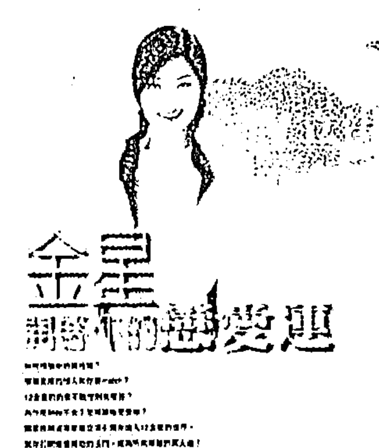
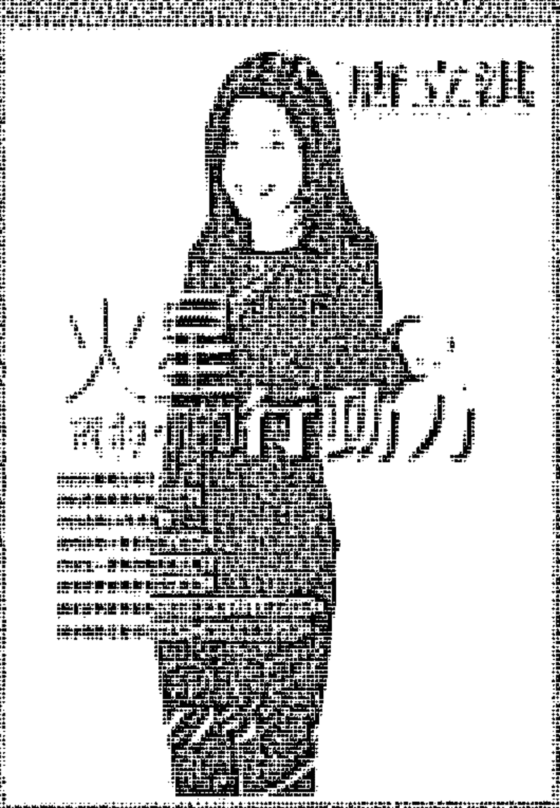
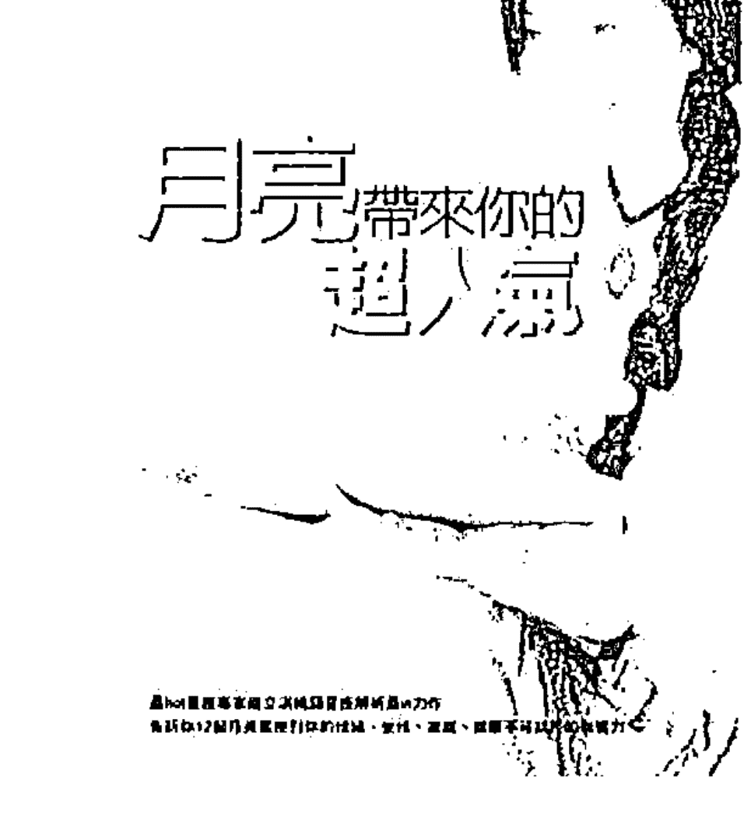
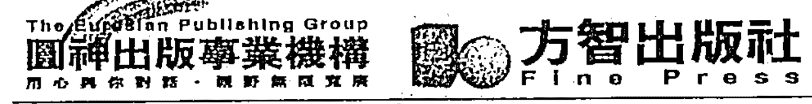

# 太陽 vs. 上昇

唐立淇

# 職場全占星

- 最SMART好用的職場幸運書！
- 用星座，前進工作！
- 充分發揮個人特質，讓你躍升成職場大贏家！
- 隨書附贈立淇老師研發《上昇星座轉盤》

# 太阳 VS. 月亮

唐汶濮

# 职场合作之道

坊間有很多與星座有關的書籍與資訊，但是當我面對許多人的問題時，發現太虛幻的星座敘述，有時並不能帶來實質的幫助，所以我萌生了這樣的一個念頭，要讓所有的人藉由更簡單的方法，來理解在他的求職生涯或規畫當中，如何為自己找到最恰當的位置。

非常有趣的是，我發現從太陽星座和上升星座這樣的分類當中，可以找到一個模式，因為太陽星座代表了我們的性格、做事的特色，及不知不覺中選擇的方式。太陽星座在占星當中，意指地球上的人類所能感應到的磁場方式，凸顯了我們做事的風格和性格，這也是為什麼星座之說能夠廣泛的被接受，因為人們的確發現有一套行為模式可尋。

而上升星座則是非常玄妙的揭示了我們在面對各種議題時所會遇到的、不可自控的生涯模式，和不自覺的作風的反射。上升星座往往和命運有關係，一個渴望安定的人，不見得會有安定的命運模式，這就是太陽星座和上升星座所組合出來的千變萬化。在當中，我又將它大略的分為基本星座、固定星座、變動星座。

基本星座本身含有建設、累積的特質，它是牡羊座、巨蟹座、天秤座、魔羯座，這些星座的太陽都傾向於有合作的意願，以及學習符合社會期待，而基本星座的上升則生性較為保守，比較不會作亂，但也比較因循舊規或在舊有的模式中尋求成功。

固定星座我們通常會感受到的是他們的固執，包含有金牛座、獅子座、天蠍座、水瓶座。他們的性格特質都是有強烈的自我，會傾向獨立自主，以自己的能力為存在點，創造不可或缺的優勢（也就是讓別人到最後不得不用他，這樣他就不用跟你交際）。固定星座的上升會帶來有軌跡可循的人生際遇，他的人生可能被很肯定的侷限住，比方說他可能一定要人家尊重他，他才能夠跨出第一步；他一定要看到實質，才有執行的衝動，倘若他所處的環境，能看到的規模就會很小，他的成就必然也很小。

變動星座則有雙子座、處女座、射手座、雙魚座。這些星座的太陽星座，性格上一定都渴望學習，不反對變化，人生就是不斷的嘗試和在變化中求發展。無聊和單調通常是他們最不能接受的，除非他們能在其中找到精神上的意義和目的。變動星座的上升則是在命運的藍圖上顯現出不可抗拒的潮流的衝擊。一個人有了變動的上升，他的人生往往是無法自控、被迫學習、適應，這也沒什麼不好的，因為我們常說危機就是轉機，也就是天賜給他們的機會。

所以，當什麼樣性格的太陽，遇到什麼樣性格的上升，會產生什麼樣的火花，成了個很有趣的話題，這也是我這本書的結構和精神所在。除了把三大模式的太陽星座與上升星座結合構成九大模式之外，我也會詳細的把這九大模式之下的每一個組合，也就是一四四種星座組合，作一個詳細的說明。我很希望能夠讓所有莘莘學子在邁入職場前，先翻到你的那個欄目，看看屬於你那一類的人是怎麼樣尋求成功、怎麼樣經營自己，以及你可能有哪些優勢、缺點。把所有力氣用在最對的地方，相信你可以更快的達到目的，得到成功。

我也很希望這本書能夠幫助不知道如何與員工相處的老闆，提供一個觀察員工的方式，如果所有的員工都能夠在你的明白與理解當中，工作得更愉快的話，相信他們就是你最好的資產，也可以幫助你更快速的達到你要的目標。

除此之外，書裡有很多性格上的描述，你也可以透過這樣的描述，更理解自己，不要常常在不對的領域裡做錯了，而覺得自己是個沒有存在價值的人。每一個人都有他的使命和存在價值，倘若你沒有辦法得到你要的成功，或是沒辦法有所發揮，並不是你沒有用，而是你用錯地方了。這也是我這本書希望告訴大家的。

說了這麼多，還是希望大家好好翻閱這本書，希望他可以成為你辦公室很重要的一本職場聖經，也可以是你夜深人靜，獨自面對自己的時候，放在床頭上的一本勵志書。如果可以做到這樣子的話，我就沒有什麼遺憾了。

# 002 自序

# Part 1 切入職場的最佳工具

# Part 2 職場達人九大類 + 不可不知的職場忠告

# 022 model1 太陽基本宮＋上昇基本宮

性格特質・尋找金飯碗・工作方法・工作期望・激發自己的110分・人際關係金三角
誰是貴人？嚴師？・該跳槽了嗎？・給父母的悄悄話

## 【攻略篇】不可不知的職場忠告

- 034 太陽在命宮
  太陽牡羊＋上昇牡羊／太陽巨蟹＋上昇巨蟹／太陽天秤＋上昇天秤／太陽魔羯＋上昇魔羯
- 039 太陽在第4宮
  太陽牡羊＋上昇魔羯／太陽巨蟹＋上昇牡羊／太陽天秤＋上昇巨蟹／太陽魔羯＋上昇天秤
- 044 太陽在第7宮
  太陽牡羊＋上昇天秤／太陽巨蟹＋上昇魔羯／太陽天秤＋上昇牡羊／太陽魔羯＋上昇巨蟹
- 049 太陽在第10宮
  太陽牡羊＋上昇巨蟹／太陽巨蟹＋上昇天秤／太陽天秤＋上昇魔羯／太陽魔羯＋上昇牡羊

# 054 model2 太陽基本宮＋上昇固定宮

性格特質・尋找金飯碗・工作方法・工作期望・激發自己的110分・人際關係金三角
誰是貴人？嚴師？・該跳槽了嗎？・給父母的悄悄話

## 【攻略篇】不可不知的職場忠告

- 066 太陽在第3宮
  太陽牡羊＋上昇水瓶／太陽巨蟹＋上昇金牛／太陽天秤＋上昇獅子／太陽魔羯＋上昇天蠍
- 071 太陽在第6宮
  太陽牡羊＋上昇天蠍／太陽巨蟹＋上昇水瓶／太陽天秤＋上昇金牛／太陽魔羯＋上昇獅子
- 076 太陽在第9宮
  太陽牡羊＋上昇獅子／太陽巨蟹＋上昇天蠍／太陽天秤＋上昇水瓶／太陽魔羯＋上昇金牛

# NEXT

- 081 太陽在第12宮
  太陽牡羊＋上昇金牛 / 太陽巨蟹＋上昇獅子 / 太陽天秤＋上昇天蠍 / 太陽魔羯＋上昇水瓶

# model3 太陽基本宮＋上昇變動宮

性格特質・尋找金飯碗・工作方法・工作期望・激發自己的110分・人際關係金三角
誰是貴人？嚴師？・該跳槽了嗎？・給父母的悄悄話

## 【攻略篇】不可不知的職場忠告

- 097 太陽在第2宮
  太陽牡羊＋上昇雙魚 / 太陽巨蟹＋上昇雙子 / 太陽天秤＋上昇處女 / 太陽魔羯＋上昇射手
- 102 太陽在第5宮
  太陽牡羊＋上昇射手 / 太陽巨蟹＋上昇雙魚 / 太陽天秤＋上昇雙子 / 太陽魔羯＋上昇處女
- 107 太陽在第8宮
  太陽牡羊＋上昇處女 / 太陽巨蟹＋上昇射手 / 太陽天秤＋上昇雙魚 / 太陽魔羯＋上昇雙子
- 112 太陽在第11宮
  太陽牡羊＋上昇雙子 / 太陽巨蟹＋上昇處女 / 太陽天秤＋上昇射手 / 太陽魔羯＋上昇雙魚

# model4 太陽固定宮＋上昇基本宮

性格特質・尋找金飯碗・工作方法・工作期望・激發自己的110分・人際關係金三角
誰是貴人？嚴師？・該跳槽了嗎？・給父母的悄悄話

## 【攻略篇】不可不知的職場忠告

- 129 太陽在第2宮
  太陽金牛＋上昇牡羊 / 太陽獅子＋上昇巨蟹 / 太陽天蠍＋上昇天秤 / 太陽水瓶＋上昇魔羯
- 134 太陽在第5宮
  太陽金牛＋上昇魔羯 / 太陽獅子＋上昇牡羊 / 太陽天蠍＋上昇巨蟹 / 太陽水瓶＋上昇天秤
- 139 太陽在第8宮
  太陽金牛＋上昇天秤 / 太陽獅子＋上昇魔羯 / 太陽天蠍＋上昇牡羊 / 太陽水瓶＋上昇巨蟹
- 144 太陽在第11宮
  太陽金牛＋上昇巨蟹 / 太陽獅子＋上昇天秤 / 太陽天蠍＋上昇魔羯 / 太陽水瓶＋上昇牡羊

# 150 model5 太陽固定宮＋上昇固定宮

性格特質・尋找金飯碗・工作方法・工作期望・激發自己的110分・人際關係金三角
誰是貴人？嚴師？・該跳槽了嗎？・給父母的悄悄話

## 【攻略篇】不可不知的職場忠告

- 163 太陽在命宮
  太陽金牛＋上昇金牛／太陽獅子＋上昇獅子／太陽天蠍＋上昇天蠍／太陽水瓶＋上昇水瓶
- 168 太陽在第4宮
  太陽金牛＋上昇水瓶／太陽獅子＋上昇金牛／太陽天蠍＋上昇獅子／太陽水瓶＋上昇天蠍
- 173 太陽在第7宮
  太陽金牛＋上昇天蠍／太陽獅子＋上昇水瓶／太陽天蠍＋上昇金牛／太陽水瓶＋上昇獅子
- 178 太陽在第10宮
  太陽金牛＋上昇獅子／太陽獅子＋上昇天蠍／太陽天蠍＋上昇水瓶／太陽水瓶＋上昇金牛

# 184 model6 太陽固定宮＋上昇變動宮

性格特質・尋找金飯碗・工作方法・工作期望・激發自己的110分・人際關係金三角
誰是貴人？嚴師？・該跳槽了嗎？・給父母的悄悄話

## 【攻略篇】不可不知的職場忠告

- 195 太陽在第3宮
  太陽金牛＋上昇雙魚／太陽獅子＋上昇雙子／太陽天蠍＋上昇處女／太陽水瓶＋上昇射手
- 200 太陽在第6宮
  太陽金牛＋上昇射手／太陽獅子＋上昇雙魚／太陽天蠍＋上昇雙子／太陽水瓶＋上昇處女
- 205 太陽在第9宮
  太陽金牛＋上昇處女／太陽獅子＋上昇射手／太陽天蠍＋上昇雙魚／太陽水瓶＋上昇雙子
- 210 太陽在第12宮
  太陽金牛＋上昇雙子／太陽獅子＋上昇處女／太陽天蠍＋上昇射手／太陽水瓶＋上昇雙魚

# 216 model7 太陽變動宮＋上升基本宮

性格特質・尋找金飯碗・工作方法・工作期望・激發自己的110分・人際關係金三角
誰是貴人？嚴師？・該跳槽了嗎？・給父母的悄悄話

## 【攻略篇】不可不知的職場忠告

- 224 太陽在第3宮
  太陽雙子＋上升牡羊／太陽處女＋上升巨蟹／太陽射手＋上升天秤／太陽雙魚＋上升魔羯
- 229 太陽在第6宮
  太陽雙子＋上升魔羯／太陽處女＋上升牡羊／太陽射手＋上升巨蟹／太陽雙魚＋上升天秤
- 234 太陽在第9宮
  太陽雙子＋上升天秤／太陽處女＋上升魔羯／太陽射手＋上升牡羊／太陽雙魚＋上升巨蟹
- 239 太陽在第12宮
  太陽雙子＋上升巨蟹／太陽處女＋上升天秤／太陽射手＋上升魔羯／太陽雙魚＋上升牡羊

# 244 model8 太陽變動宮＋上升固定宮

性格特質・尋找金飯碗・工作方法・工作期望・激發自己的110分・人際關係金三角
誰是貴人？嚴師？・該跳槽了嗎？・給父母的悄悄話

## 【攻略篇】不可不知的職場忠告

- 253 太陽在第2宮
  太陽雙子＋上升金牛／太陽處女＋上升獅子／太陽射手＋上升天蠍／太陽雙魚＋上升水瓶
- 258 太陽在第5宮
  太陽雙子＋上升水瓶／太陽處女＋上升金牛／太陽射手＋上升獅子／太陽雙魚＋上升天蠍
- 263 太陽在第8宮
  太陽雙子＋上升天蠍／太陽處女＋上升水瓶／太陽射手＋上升金牛／太陽雙魚＋上升獅子
- 268 太陽在第11宮
  太陽雙子＋上升獅子／太陽處女＋上升天蠍／太陽射手＋上升水瓶／太陽雙魚＋上升金牛

# 274 model9 太陽變動宮＋上昇變動宮

性格特質・尋找金飯碗・工作方法・工作期望・激發自己的110分・人際關係金三角
誰是貴人？嚴師？・該跳槽了嗎？・給父母的悄悄話

## 【攻略篇】不可不知的職場忠告

- 284 太陽在命宮
  太陽雙子＋上昇雙子／太陽處女＋上昇處女／太陽射手＋上昇射手／太陽雙魚＋上昇雙魚
- 289 太陽在第4宮
  太陽雙子＋上昇雙魚／太陽處女＋上昇雙子／太陽射手＋上昇處女／太陽雙魚＋上昇射手
- 294 太陽在第7宮
  太陽雙子＋上昇射手／太陽處女＋上昇雙魚／太陽射手＋上昇雙子／太陽雙魚＋上昇處女
- 299 太陽在第10宮
  太陽雙子＋上昇處女／太陽處女＋上昇射手／太陽射手＋上昇雙魚／太陽雙魚＋上昇雙子

- model 1 太陽基本宮＋上昇基本宮：端視身處何種大環境之下
- model 2 太陽基本宮＋上昇固定宮：活到老，工作到老
- model 3 太陽基本宮＋上昇變動宮：自己決定高低潮
- model 4 太陽固定宮＋上昇基本宮：顧忌太多發揮受限
- model 5 太陽固定宮＋上昇固定宮：維持鬥志必成器
- model 6 太陽固定宮＋上昇變動宮：隨興無謂反精采
- model 7 太陽變動宮＋上昇基本宮：勤於耕耘，數度起落
- model 8 太陽變動宮＋上昇固定宮：端看命運安排與懷才有遇
- model 9 太陽變動宮＋上昇變動宮：隨外在律動轉變就對了

# PART 1

## 以人際場的星位立

在占星學中，除了地水火風的概念之外，還有基本宮、固定宮、變動宮這三種自我觀照方式。地水火風的概念，攸關一個人的本質；而基本宮、固定宮、變動宮則代表面對外界狀況時，會選擇哪一種因應態度，攸關一個人的學習、成長模式，以及如何在職場上發揮自我。

舉例來說，當企業在草創時期，基本宮是最佳員工；企業守成時期，固定宮最令人放心；企業需要變革時，變動宮可以幫大家找到驚喜。一個完美的社會，可以由基本宮來架構，由固定宮來鞏固每個領域的本質和精華，由變動宮來包裝、開創新局。如果每個人都可以發現自己的本質，讓自己做最完美的發揮，每個人都能成為快樂的工作者，這個社會也可以更加順暢。

### 基本宮：努力再努力

位於第一、四、七、十的宮位，在命盤裡代表著重要的軸線。基本宮大都可以成為社會裡的中堅份子，注重學歷，在意家庭的價值，希望符合社會期待，渴望成功，不希望自己讓人失望。為了成功，願意不斷努力、學習，當他發現必須改變自我去適應社會才能得到成功，他就願意犧牲自我。在演藝界中，他們是很適應當偶像明星的一群，願意為了掌聲與成就，過著經營出來的、不是自我的人生。

基本宮喜歡經營，分得出一件事情的空泛或務實，與其告訴他一門投機事業，不如給他一份企畫案。只要看到了未來的藍圖，有了安全感，他絕對願意共存共榮，相信同舟共濟，即使要先委屈都可以，因為眼前的辛苦都將是值得的。

在這世界上，他需要一個可以貢獻自己的位置。如果沒有老伴一起度過老年，他會非常寂寞；如果沒有買個房子，他會覺得自己的人生是一場空，找不到自己該盡的責任，自己彷彿不存在。只是享受的人生，會讓他茫然不知何去何從，無法享受樂趣。在一個不斷運作的機制裡做點什麼，證明自己的存在，他會活得熱情又有動力。

這個社會若是缺少了基本宮，也許就沒有了政治和合約，他們是社會秩序的維護者，而社會秩序若必須花一些代價來維護，他們是願意站出來扛責任的人。長幼有序、位階清楚、井然有序的世界，讓他們感覺非常神清氣爽。

認命及高配合度，為他贏得好人緣。基本宮擁有政治性格，在必要時候，是不介意用政治手段、權謀或利益交換來應對，有時會令人感到現實。他是有所為而為，絕不做白費的事情，在理性的背後，是對成功人生的渴望；在成功的背後，是對美好生活的嚮往。

#### 火象的牡羊座

會主動積極爭取成功！他會主動促成一些事情，也許藉由創業來創造格局，看著一手創出的成績，於是證明了自己的存在。牡羊喜歡保護別人，像個大哥、大姐一樣照顧大家，常常因為熱心與責任感驅使，而成就了一個團隊，即使耗掉時間精力也在所不惜。

#### 土象的魔羯座

以土象的辛勤耕耘，去符合別人的期待，刻苦耐勞的他像個辛勤的工蟻。當周邊資源還無法做最好的統合與發揮時，寧可先去念書進修，或從基層做起，累積自己的能力，等時機成熟，自然一鳴驚人，一定可以成功，即使上了年紀才能到達，也不在意。

#### 水象的巨蟹座

重感情的巨蟹非常珍惜家庭價值，生命中的所有一切，都是為了未來所成就的家庭做打算。性格低調，寧願默默盡好自己的本分，靜待事情的發生，再思考因應之道。不喜歡打擾或麻煩別人，但當別人請求他幫忙，會溫暖親切地提供協助。相信功成名就的重要性，從不放棄追求成功，算是比較懂得守成與善用機會的人，通常很年輕就找到自己所要的位置。

#### 風象的天秤座

天秤座和人際有關，相信成功者在社會上有優先權，唯有多與成功者配合，才有機會往上爬，如果他願意拉拔一個新人，也必定是因為對方具有成功的潛質。天秤長袖善舞，能在群眾中扮演溝通、配合的角色，不介意先付出，因而獲致他要的位置，從而成功。在他心中，所有的打屁哈啦，最後都必須共同創造出一個計畫或事業。

### 固定宮：我本來就很棒！

人生信念：如何成為矚目焦點
包含：金牛座、獅子座、天蠍座、水瓶座

固定宮活在自己的世界裡，不受外界影響。只做自己感興趣的事情，就算別人不斷請託，沒興趣就是沒興趣，絲毫不願勉強自己，如果無法從中得到樂趣，他們頂多依本能將事情做到一定成績，但絕不可能登峰造極。

對於喜歡的事物非常執著、深入、專業，雖然終其一生，知道自己只會在某些特定領域發揮，也明白自我意識太強別人未必能接受。但社會歷練讓他了解，如果想繼續在社會生存，就必須表現得隨和些、正常些，努力讓自己不要太奇怪，但是骨子裡，他們的所有努力都是為了可以繼續保有自我的一種「演出」。有些固執到近乎怪胎的固定宮，會顯得非常尖銳，想說什麼就說什麼，不管旁人如何看待；而不想引起衝突的固定宮，則顯得相當低調，寧可封緊嘴巴，也不想引起側目或被糾正的可能。

他們有自己的臭脾氣和堅持，以及強烈的自尊心和自信心。吃軟不吃硬，當別人傷了他的心，就會把殼包得更緊更硬，打開心門的唯一方法就是讚美與同理心；當彼此氣味不合，簡直就是把對方當作空氣；如果氣味相投，才會把心門敞開。這種固執與堅持若能控制在一個最好的狀態，就可以成爲一個專業、傑出的工作者。

擁有非凡的個人魅力，可以爲自己贏得好人氣。此生最大的痛苦在於承認自己只是個nobody。骨子裡他非常驕傲，覺得自己是最特別的。深知自己的獨特未必能被社會接受，所以努力讓自己更優秀、更不可或缺。他盡量凸顯個人的魅力和特色，往往自成一格。有成就的固定宮的存在令人無法忽視，足以影響別人。渴望被尊敬，唯有成爲不同凡俗的人才能有這個機會。

#### 土象的金牛座

他的判斷和價值觀非常清晰，從不模糊，面對層出不窮的新花樣，寧可按兵不動，也不隨之起舞，別人的提議只是一句空洞的話，唯有他真的想通了、有感覺了，才會有所決定。除非有具體的實際事項，例如金錢或事實，才能加快他的速度。務實的他，常被人誤以爲現實，事實上辛苦努力就是爲了得到成果，他只是對實際的事物比較有反應罷了。一切與美好事物有關係的實際事物，都會讓他很有感覺，並驅動他。

#### 風象的水瓶座

這是一個詭異的星座，因爲風本該很難被固定的，不容易和人事物產生連結，看起來很不進入狀況，顯得自成一格。一生都在辛苦摸索自己，雖然空有一身好創意，卻很難真正融入團體，且不像其他固定宮善於凸顯自我，由於莫名的矛盾，寧可銷聲匿跡，當個二線工作者或幕僚，以便有更多時間專注在自己不爲人接受的怪異領域又不打擾別人。對於世俗的成功，他不介意搭搭便車，疏離的本性原本就很難對世俗的事物燃起熱情，他心知肚明。

#### 火象的獅子座

有時獅子像是患有強迫症般，不斷表露自我以及需要掌聲，而使人備感壓迫，在成長過程中，必然會招致挫折，漸漸地，才開始學會收斂火氣，學著低調卻仍受注目才是真成功，但是在一些重要時刻，好面子的性格，還是會忍不住竄出來表現一番。獅子往往因出色的才華表現而獲得成功，個性則使他失敗。因此，如何發揮才華又壓制霸氣，是人生一大課題。

#### 水象的天蠍座

水象特有的敏銳與感受性，使他懂得為自己進行包裝，盡量隱藏討人厭的尖銳面，觀察如何得到別人的重視，以忍耐、緩慢的方式得到期望中的成功。雖能盡量包容，卻完全不能接受誤解，誤解往往會將天蠍的尖銳面全面引爆，使天蠍氣急敗壞而破功。另外，正義感的他們也不能忍受虛偽，總是會想撕下別人的面具而得罪人，這種潔癖往往是追求成功的一大考驗。

### 變動宮：追求個人特色

機會主義者，每個機會都令他熱血沸騰。若不得已處於一個制式環境裡，就會不斷創造改變，也許成了一個麻煩製造者，也許可以創造一番新局成爲最佳改革家，就像衝浪高手，身在詭譎的海象中隨時變換姿勢以因應。變動宮是亂世的英雄，抓住機會大大發揮，也是太平盛世的麻煩製造者，爲別人或自己製造麻煩，因爲如果不試試看，怎麼知道事情可以有轉機？

喜歡證明自己能讓死氣沉沉變成活潑豐富，心思多變，興趣廣泛，有時處處是機會，有時又處處不順眼而轉身離去，令人傻眼。變動星座最大的價值在於創造力，並能注意許多細節，爲事情做最有效的發揮，往往在他加入創意和花稍之後，使整體增色不少。

變動宮的生涯很難規畫，每四年就會不得不產生變動，當行星遷移時，他像著了魔般似的，人生也要轉個彎。他們是最難被預測的一群，因爲每一次變化都會展開新局，也很難被掌控，因爲心念一轉，馬上就興致勃勃去嘗試，別人擋也擋不住。

危機就是轉機，但轉機也很可能會造成危機。他太喜歡轉變了，加上天性樂觀，新世界讓他興奮，因此容易忽略背後的危機，尤其是〔太陽變動宮＋上昇基本宮〕的組合必須更加小心，否則一個改變就可能就摧毀他辛苦建立的小小規模，會讓他非常痛苦；相反的，對〔太陽變動宮＋上昇變動宮〕的組合來說卻覺得這樣正好，反正他常常想要重新再開始；至於〔太陽變動宮＋上升固定宮〕的組合來說，則是對自己深具自信，認為一顆寶石不論走到哪裡都是璀璨的寶石。

開放態度可以為他帶來活水源頭，他不應該拒絕任何機會，卻也不能貪心什麼都想要。嘗試從機會中找到火花為事業加分，也要克制因無趣而放棄或走短線的不負責任。願意為理念奉獻熱情，也要體認理念是需要經營的。

#### 風象的雙子座

他的變化就在腦子裡與嘴巴裡，雙子可以很快進入狀況，也可以很快就漠不關心，感覺來去就像是一陣風，連他都控制不住。有攪動磁場的能力，製造快樂與和諧，或製造痛苦與分裂，一切在他一念之間，這個特質讓人覺得他非常不穩定。發揮天賦時能見人說人話，見鬼說鬼話；被質疑時，也會無辜地自我辯護：「一切都是為了實現理想的非常手段。」雙子無所不在又無所不能，只要是意識接觸到的事物，都可以成為素材。他最擅長串聯事物，在傳播界裡尤其如魚得水，並可以得勢得利；也可以是意興闌珊的雜學家，博學多聞、人生精采，卻一事無成。

#### 水象的雙魚座

魚特有的滑溜使他善於觀察，很會看人、看狀況，不像雙子的躁進和容易放棄，更實際地聚焦在觀察出誰對自己有利或不利。將資源做最有效的串聯，為自己留下層面廣泛的實質成果。本能地見風轉舵，適應環境，不跟潮流對抗，反而採取妥協，也能巧妙地全身而退。他是變色龍中的變色龍，可以隱身，可以低調，可以以退為進；相反地，該拿、該用、該他出頭的時候一到，也毫不客氣。如果他弄擰了自己的人生，都會是因為他太喜歡實驗，不過轉換一下色彩，他又是活魚一條。經歷了世事，雙魚像個人生的智者，拿自己當正反面的教材。

#### 土象的處女座

得天獨厚的組合，同時具備變動宮的可變性，以及土象星座的實際能力，在俗世的領域非常吃香，可以適應環境，並且從中找到自己的強項。擁有吃苦耐勞的特質，性格務實，該出頭時就出頭，該聽話時就聽話。在職場中，執行工作的能力無庸置疑。缺點則是會給自己找太多麻煩，追求完美的特質，把事情複雜化或瑣碎化而絆倒自己。

#### 火象的射手座

射手是一股強而有力卻不穩定的能量，常常令人覺得難以理解，也難以掌控。最吃虧之處在於不懂得自我包裝，會說大白話。射手天資聰穎，心思比別人變得快又多，令對方措手不及、難以接招。可惜心緒不太穩定，骨子裡又心高氣傲，願意留下與否，全都是出於他對事物的認同度，一旦無法認同，就一刻也無法停留地離開或動手改變。其實他很清楚自己必須要被栓子固定住一角才能飛得又美又好，否則只是像個流浪者四處晃來盪去，很難有鮮明的作為。射手往往必須找到奉獻的對象才能發揮作用，也許是家人、理想或夢想。想成功就必須選擇在一個固定的點上變化自己，好發揮最大值，也才不會被空虛襲擊。

# PART 2

## 職場達人九大類

- 1. 太陽基本宮＋上升基本宮：遵守世俗規則的乖乖牌
- 2. 太陽基本宮＋上升固定宮：憂慮體貼的工作狂
- 3. 太陽基本宮＋上升變動宮：非黑即中的冒險家
- 4. 太陽固定宮＋上升基本宮：又謙虛又驕傲
- 5. 太陽固定宮＋上升固定宮：意志堅定
- 6. 太陽固定宮＋上升變動宮：追求人生意義的生活藝術家
- 7. 太陽變動宮＋上升基本宮：擁有絕佳機會的平凡人
- 8. 太陽變動宮＋上升固定宮：挑剔的完美主義
- 9. 太陽變動宮＋上升變動宮：身兼數職的變色龍

### 太陽基本宮＋上升基本宮

#### 性格特質——遵守世俗規則的乖小孩

他所認定的規矩，不一定是世俗認定的一步步往上爬的常規，而是他所認定、依循的圈子裡的規矩，例如若想成爲藝術家，就會讓自己按部就班，有意識地培養自己的藝術氣息，讓自己看起來像個藝術家，絕不特立獨行。

#### 做哪行，就要像哪行

形象是他的一切。相信做哪行，就要像哪行，如果沒有遵守規則，他會覺得自己很不敬業，如果不自重，別人又如何能尊重你？在茫茫的職場生涯中他需要依循準則，即使準則是別人提供的也非常好，這是他的安全感。他禮貌、保持該有的距離、隨時衡量輕重、遵守一切安全規則。

「在其位謀其政」，只說該說的話，絕不犯上逾矩。倘若有大局著想必須越級發表看法，也一定會先加個前言：「對不起，我知道自己越級了，先向大家抱歉，但我還是很想說……」他的規矩讓人容易接受，不過他的重禮數有時也讓人不免覺得過度：「這個人會不會太世故了呀？」

他很在意階層，如果已貴爲總經理，還要自己當第一線，他會覺得自己實在太不像話。有了一定的地位，就算非常享受自己開車的樂趣，也會學著請個司機，把瑣事交給屬下處理。他很在意是否表現得像在該有的位置，不希望自己過低，但不介意高一點點好顯得更尊貴些。

一不小心就被自己排得滿滿的時間表拉著走，忙到必須在時間表中安排家庭日，家庭日是他的義務，往往是另一半發出最後通牒：「再不回來，還要這個家幹嘛……」或告訴他：「再不陪我，我就要和你離婚。」這時才會認命盡點義務，把工作帶回家，一邊陪家人一邊打開公事包，繼續工作。

#### ✝ 了解彼此的位置

和他互動，一定要先釐清彼此的位階關係和相對位置，只要抓住這個準則，相處起來會舒服許多。如果他是長官，你是下屬，你卻因為朋友關係而以平輩的角度和他說話，他會覺得難以接受，不是架子問題，而是這個情況本身就不對，討論出來的東西怎會對呢？

他接受圈子的運作模式，跳出來踢爆內幕在他看來就是不上道，不能接受就趁早離開，沒必要搞破壞。他同意成為利益共同體中的一員，如果環境裡有所謂賄賂行為，也能接受，這和人格清高與否沒關係，這只是這個環境的狀態，沒必要當個抵觸者。他會強迫自己接受圈子裡的文化，並扮演好自己的角色。

他討厭不懂規矩的人，與他共事一定要找對彼此在哪個位置，否則會覺得他很冷淡。規章對他而言，有其存在必要，並不容破壞，否則一切會亂了。他誓死維護，並剔除異己。也許會思考下屬越級呈報的好意見，但也會對這不懂規矩的傢伙做出越級該得的懲處。

#### ✝ 懂得做人的道理

欣賞懂得做人道理的同道中人，傳統讓他有安全感。在三節或生日時的禮物或紅包拿得心安理得，但若突如其來送他東西，就會讓他覺得你必然別有所圖而提高警覺或放在心上。

如果他求人，一定願擺低姿態，就算對方拿翹，也覺得這是理所當然的，對方明明可以拿翹卻對他這麼好，反而讓他陷入五里霧：「怎麼辦？這人是不是要得更多？」

#### 政治動物

〔太陽基本宮＋上昇基本宮〕是標準的政治動物，樂於結交五湖四海的朋友，因為這是在社會立足的資源。他也聽得懂別人的官方語言，因為他自己的言詞就很政治，每句話都很圓融，卻又有所保留。對於真性情的人來說，這種政治語言多少有些虛偽，但唯有在這種半虛假的面具下，他才能感到安心。

探究他的內在，會發現他的現實面。如果希望永遠只看到他的謙恭友善面，你最好一直在他之上。他有一張殘酷的評分表，分量輕重他內心了然，他願意花多少時間和對方互動，就表示對方具有多少分量；他願意多禮貌，就表示他有多看重。對於這樣的政治動物來說，絕不會拿自己的職業生涯開玩笑，所有的努力都會回歸到最終極的所在：「一定要往上爬！」為了成功，他會盡心盡力完成自己該盡的義務。

很在意形象，當他費盡千辛萬苦到了一個位階，一定絕口不提自己的低學歷或不光彩的過去，能漂白就漂白，能進修就進修，要他買學歷或證書也都行。談公事他斯文有禮；私下和客戶划拳拼酒時，又可以很盡興，令人覺得有些深不可測，好像時時帶著面具。其實他只是把自己隱身在當下的場合裡，做他該做的，不希望讓任何人不舒服。

#### 尋找金飯碗——找個有階梯的地方待下來

有優異的企畫、規畫、行政能力，善於處理和人有關的事務，他學習、拷貝這個領域的成功模式，並進行拆解以求進化。如果他是一個電視工作者，平常看電視時不是在看劇情，而是在觀察電視的操作手法，很難單純融入劇情而感動。

擅長處理基礎工程，很清楚如何建構事情的骨架。天生擁有一雙透視眼，找出別人話語裡的重點，當旁人都被漂亮的政治語言所迷惑時，他卻聽得出別人的陰謀和陽謀。不會流露自己真實的情緒，同時又能聽懂對方要的是什麼，職場如果少了這種爾虞我詐的遊戲，他心裡反而會覺得有些悵然若失。

他不做白日夢，找他聊夢想只會令人掃興，因為他馬上會檢視這個夢能否成真？能賺多少錢？不論待在哪一個行業他都有自己的盤算。如果他想開店，也許會去當服務生了解第一線的工作內容，再去接觸吧台、會計等工作，更清楚內部運作，待時機成熟，就可以執行夢想，自己開一家店了。

在有安全感的工作環境裡，他會努力，利用空間充實自己，或是參加「有用」的PARTY，結交權貴或有力人士。私底下的他也許討厭應酬，但卻願意為了工作而勉強自己。

#### 工作方法——正在工作，或者正要出門去工作

他是個工作狂，習於忙碌狀態，不是忙著開會，就是忙著做事。每一件工作都攸關他的個人信譽，當然要盡心盡力做好。剛結束一個會，又忙著開下一個會。他不喜歡沒事做的感覺，那會讓他覺得自己和上進脫節了。

他深藏不露、盡量保持低調，有時會裝點傻，競爭對手往往到最後才知道原來他是這麼有計畫。越是深入了解他，越覺得他是個「可敬的對手」。他沙盤推演，步步為營，互動的所有可能性都列入考慮；他不喜歡意外，意外只會毀了他的佈局。沒有應變能力的他往往一心只想逃避。他的人生是需要彩排的，如果明天要開會，今晚他就會在家裡先想好開會流程、備妥講稿。他拒絕被人突擊檢查，謝絕臨時拜訪，只有當自己準備好時，才能面對大家。

他不怕溝通，「我們來談一談！」這句話是他的口頭禪。他相信唯有藉著溝通，才知道自己該如何與對方互動。他習慣先聽別人的說法，態度認真，有時就連聊天都像是開會一樣。

和他共事其實讓人很有安全感，因為有模式可循，只要你不是試圖入侵他的私人領域，他其實並不難相處。

做事方法按部就班，可以想盡辦法加緊速度，卻不能省略中間的步驟。他的肢體語言會流露出幾近殘酷的誠實，如果他鞠躬哈腰，表示認同這個人的分量，有點巴結，也發自內心尊敬對方的優秀。誠實面對自己和別人的卑微，能力不及他的人若是向他挑戰，他可能理都不理或嗤之以鼻，最後，只落得自取其辱的下場。

#### ✖ 轉彎前，先列一張損益平衡表

他的人生不允許暴落急轉彎。每次轉彎前，就要列張生涯規劃和損益平衡表來評估所帶來的效益，唯有確定好處多於壞處，他才同意轉彎。

他絕不是個短視近利的人，但也不想好高騖遠。他的考量含括了歷時數十年的職場藍圖，如果這次轉彎兩年內雖無法帶來收益，但是十年後會大有可為，他願意放手投入。

轉彎非關程度大小，而是他一定謹慎面對。不喜歡浪費時間，進度表和截止日期很重要，就算面對一個不喜歡的工作，只要讓他知道這是能帶來具體成果的有期徒刑，他是可以接受的。寧可先耗上一大筆時間來評估與企畫，也不願貿然進行卻可能失手。

他的優點是甘於為人作嫁，缺點是不夠大膽、氣魄。不容易得到大成功，往往是一個中小企業的老闆。他也有很強的「班底」、「敵我」概念，自己人永遠和外人不同。和自己人他絕對共存共榮，分享成功與金錢，對外人當然要實際且不假辭色。

他喜歡以高來高去的方式來談判，彼此最好要聽得懂話裡蘊含的意思，直接用大白話實在太傷感情、也太不禮貌了。唯有和他非常親密的人，才可以這樣跟他說話。唯有用漂亮的語言來包裝自己的優勢，才能真正贏得他的尊敬，千萬不要用情緒化的字眼和他對話，除非你是他想拉攏的對象，否則搏感情只是你一廂情願的一頭熱而已。

他有精準的判斷能力，如果公司已經沒有前景，為維護不敗紀錄，他會巧妙告退，只是走之前分內的事一定也處理得漂漂亮亮。總之，提到他的職場紀錄，一定都是好的名聲多於壞的。

#### 工作期望——安定與累積

他需要安全感，如果公司提供明確的方向和願景，讓他知如何讓年收入節節高升，那就可以安心地賣力。一旦他覺得沒有安全感、或很多事都用情緒處理，一下對他好，一下待他不好，發展好壞完全沒有規則可循，怎能放心把自己交出去？一家有規章但薪水低的公司，跟一家有高額獎金但動盪變化大的公司，他寧可選擇前者。

他不喜歡給自己找麻煩，在他的人生當中，一定是因為發生了重大的事件，或有強大的力量拉他，否則他往往選擇待在原來的位置，像個公務員，一路從經辦到主辦到科長到處長一路爬上來，然後等著領退休金。有了一定的年資和收入，熟悉的工作模式，他是不會輕言捨棄的。

他希望可以得到一份明確的路徑圖，而不是一個遙不可及的模糊地圖。絕不會在工作上感情用事，期望工作可以在安全模式下再越做越大，有時規模又比收入更能讓他感受成功的滋味。當公司員工從十人、五十人增加到一百人，他會覺得自己非常成功，荷包裡的錢從一百萬增加到三百萬倒不是那麼有感覺，當一切變成實質，好比員工越來越多，開的車越來越好，房子越住越大，他會覺得自己真的成功了。

#### 激發自己的110分——人脈=金脈

他的潛能和人際關係息息相關，人脈就是供他馳騁的沙場。當他到了一個新的圈子，如果發現值得經營的人脈，就會毫不猶豫地跨入，從學習到深入，慢慢越探越多。他做任何的移動都很謹慎並有效，而一切都靠經營。

凡事先做一番佈局，讓潛能有所發揮，但是一切都必須在他認同的自然進度下進行，不能給他太大壓力。有效的人脈都是加分，不論雪中送炭或是錦上添花。人脈也使他重新洗牌，且把重新學習的痛苦不適減到最低，免除了怨天尤人的性格缺點帶來的負面效應。

#### 人際關係金三角——一步一腳印

一個不表態的人會令他陷入茫然無措之中，猜不出對方要做什麼，不知道該如何和對方互動。他的性格本質是低調謙虛，無厘頭的讚美只會讓他心生戒備而起了防禦心，但有意義的指正，即使令他難堪，他也會試著接受。

#### 如果他是上司

他不是忘恩負義的人，也不是糟糕的老闆，只是他會為自己在架構中的位置而汲汲營營，但他很有成本概念，不會打腫臉充胖子。他最大方的地方是給予員工精神支援，工作熱情使他與員工同在，懂得用方法激勵人，也許為了控制成本沒辦法幫員工加薪，但可以請大家吃飯喝酒；在情感方面，往往和員工越來越像一家人；在金錢方面，願意自掏腰包來感謝員工為公司的付出，但加薪是攸關公司規章的大問題，這不是他可以隨意決定的。

員工倘若犯錯，那就要看犯的是什麼錯，若是粗心大意，可以透過學習而改進的話，一定會再給機會；但若是危及公司的生存與對規章制度的冒犯，那就絕不原諒。

尊重自愛自重的人，和這樣的主管面試，一定要把自己打理得正式、專業，並盡量表達出自己的優勢所在，表現出理解，千萬不要空口白話。秀出自己的能力、成績，讓他看到自己的可能性和未來價值。他是公私分明又恩威並施的主管，和他相處時，上班就是上班，下班後你可以自由表態、不受拘束。

願意用高薪留住一個有效能的員工，寧願選擇一個樣樣都比及格多一點、但不會把事情搞砸的普通人，也不希望表現優秀但風格強烈的麻煩人，太有稜有角的明星員工會製造公司的不安。他也喜歡和員工一起就事論事討論，就算彼此爭得臉紅脖子粗，他反而高興，會把對工作有想法的員工視為知己。

單打獨鬥並不有趣，最好大家一起分工合作，一起分憂解勞。但他凡事喜歡知道得鉅細靡遺，當他可以很放心地把大事分派給屬下，就表示非常信賴對方，甚至期待彼此可以合作到老。

##### ✝ 讓他看見自己的進步

他不期待員工是個飛躍的羚羊，只要員工能表現出該有的進步，他會把這些一點一滴看在眼裡。當他看見這個員工願意改變自己，將會大大提昇對他的好感度。他很高興員工看到了他的苦心、理解他的辛苦，這可以解除他在工作上的疲勞。

#### 如果他是員工

想留住他，就必須攻心為上。不是和他搏感情，而是讓他對未來有安全感：「我視你為業界黑馬，是重點栽培的幹部，現在這樣放棄年資會不會太可惜？」這足以勸住他，因為你喚起他內心最大的恐懼。

當他有了離職的念頭，他希望可以漂漂亮亮、不拖泥帶水的下台一鞠躬，如果讓他明白他的離職讓公司很難做事，造成很大的不方便，他會被這種狀況困住，而難以瀟灑離開。或者，讓他升官、入股、與公司建立更深的聯結，他覺得自己對公司擔付了更大的責任，無法一走了之；或者，讓他負責一個長遠的大案子，沒完沒了地陷在這個責任裡。

責任和前途可以綁住他。他不相信那種情緒化說說而已的情感，但是他會非常感念別人的提攜之情，當他有困難的時候，對方真的伸出了援手，例如，他父親生病的時候，公司讓他請假兩個月也沒有半句怨言，他會覺得自己不可以辜負這家公司。想留住他，就要給他相對的地位以及薪水，只要公司能給，他就會在這樣的享受和光環裡，繼續賣命。

##### ✖ 辭掉他的方法

如果公司直接告訴他不適合這個單位，會認命接受這個說法。他很清楚政治角力之中的遊戲規則，如果因為自己的運作手腕不如人而被迫離開，他不會怨天尤人。「因為我是你的主管，我不喜歡你，我要fire掉你」，他可以接受這個理由，因為這決定和他的工作能力無關，是對方個人喜好的問題，既然如此，也不需再待在這裡。他可以無止盡地改進自己的工作表現，但是主管對他的喜好，並不是他可以決定的，與其繼續做無謂的努力，他會選擇離開。

他同意這是個弱肉強食的社會，把此刻的所有感謝與仇恨放在心底，暫且按兵不動，當他有一天攀上了高峰，一定會對恩人與仇人有所「回報」。

#### 別人眼中的他

優點：認真負責，有條不紊，不輕易轉行，識時務者為俊傑，觀察情勢適時表現自己，不會過度搶風頭又能在別人心中留下好印象。

缺點：有點虛榮，深不可測，太有手段。在人群中永遠不拿出自己的真實情緒，有時會讓人懷疑：「真像個假人！」

#### 誰是貴人？嚴師？——敵人就是貴人

挫折使他成長，失敗使他覺悟，如果小時候家境貧困，長大後，會用盡所有努力，證明自己是個有錢人。努力改變，讓自己最受挫折的地方，蛻變為他的優點之一，用一生的時間來證明自己做得到！

懂得善用他、懷抱遠大理想的人，就是他的貴人。他是一個螺絲釘，基本上是由別人來決定他的世界。學習型的他可以慢慢學有專精，但如果跟隨的主管或公司格局不大，就會影響他的發展。有遠見的主管可以放寬他的視野，如果讓他自己決定，他絕不敢對自己抱有這種妄想。

他不容易相信人，顯得有些防備，也有點死腦筋，當他被命令時，他會帶著排斥心來執行指令，無法有深刻的體會和成長。而生性溫和的他將會被敵人激發出拼命三郎的本性與政治性格，進而努力往上爬，回首想想，忍不住要感激起敵人帶來的啟發呢，真是塞翁失馬，焉知非福。

#### 該跳槽了嗎？——寧為雞首，不為牛後

很少出現跳槽的念頭，盡量會嘗試用各種方法修補、調整，除非這家公司已經沒希望了，才會棄船求生。有兩種原因會讓他動了跳槽的念頭：人生發生了很大的轉折點、遭逢變故而不得不做一些改變；別人用很大的誘因來吸引他，好比高薪或抬頭亮眼躍升一級。

有時苦苦待這麼久，期待的就是一個肯定，如果別人以兩倍薪水來挖角，他會覺得這就是一種肯定。如果一個新環境只是多給他一些薪水，他會考慮值不值得冒險。舊環境的固定模式所帶來的安全感，有時會讓他猶豫不敢跳出，但讓自己的分量向上升級就又不一樣了，因為他寧為雞首，不為牛後，而且一旦到了一定位階，他很難容許自己降級，這是面子，也是自我認定。

即使有個很大的機會向他招手，也未必敢貿然前進，這時，一定要有夥伴的鼓勵，甚至是威脅：「再不決定我就生氣了」，他會為了怕惹麻煩而縮短思考期。脅迫與利多要同時存在，才能促使他產生跳槽的行動，光是單獨一個因素是不夠的。

#### 給父母的悄悄話——讓責任磨練他

希望和別人享有一樣的待遇，當他看到別人都去補習了，會覺得自己也應該學點什麼，才能和別人競爭。他的學習動機未必是出於對那門才藝的喜愛，而是不希望喪失競爭力，當半數以上的同學都去上才藝課，他就算很有才華，也會開始為自己擔心了。

習慣在群體裡挑起責任，如果他已在團體裡擔任股長之類的職務，父母就不用擔心了，因為融入團體他就會自動開啟學習機制，像海綿般吸收。父母可以請老師讓他多負點責任，或是讓他當個小隊長幫大家服務……這類機會可以磨練他，否則他會進步緩慢，在團體裡像個隱形人。

他很早熟，總是想很多，知道大人和小孩都各有自己的盲點，即使別人再怎麼嚴厲管教他，他也會覺得：「你自己也是半斤八兩吧。」責任感會讓他像個大人，如果丟給他一件事情或責任，他會被這個狀況激發出成熟的思考，進步空間更大。

#### 太陽在命宮

對自己充滿信心，但不會刻意把自信彰顯出來，不願意表露任何攻擊性，他對自己胸有成竹，只要打定主意要做的事情，沒有人阻擋得了。

內心有股謙虛的特質，很期待和別人一起合作。除非他遇上了理念相合、對未來有相同期待的合作對象，否則他一旦在合作過程中發現彼此的想法有歧異，就開始想打退堂鼓，合作關係往往不太長久，最後，夥伴在他眼中都顯得能力不足，雙方很容易落入不歡而散的結局。

他具有樂觀、敢衝的特質，如果從事一個人獨自完成的工作類型，將很容易成功。很有經營概念，如果能好好培養自己的品牌，將能在職場大放異彩。除了鑽營本業之外，如果能多打理自己的口才、外型，對於自己的形象或品牌將是更大的加分。

有自信，有特色，他喜歡表現自己，具備明星特質，別人也無法對他視而不見。他的表現性很強，走到哪裡都有搶眼突出的表現。憑著堅強的意志和信念，期望自己做出一番成績，無法忍受自己是個小人物。

隨年紀不同也不斷調整工作目標。年輕時顯得少年老成，一開始就全心投入工作，有個夢幻的大目標，漸漸地，他也自動修正不切實際的部分，深信無處不是商機，只要拿出經營概念，再結合周遭的資源，便能創造自己的事業。

他認為，唯有在彼此互相尊重的環境中，才能創造出最好的工作品質。無法忍受別人的不尊重，如果總是對他頤指氣使，他會寧願選擇求去。

不過他也是個重視生活品質的人，經過黃金工作期之後，常常說退休就退休，畢竟他要的是建構事業而非變成事業的奴隸，把工作傳承給別人，回歸自己的生活。

#### 太陽進事業宮：靠直覺與自信向前走

性格活潑，具有旺盛的主控欲望，樂於扛下重責大任。男性有大男人主義，女性則有隱性的大女人主義，她希望別人看到自己可愛的那一面，平常盡量表現得小女人，但是在工作中，會不自覺強勢起來。

他相信丟掉過去，就有機會重新證明自己。如果過去曾有風光歲月，現在則會用另一個角色來顛覆自己，營造新的形象。他不是走專家路線，無法一招走天下，他希望自己是全能的，可以不斷地證明自己，在每個階段適當地卡住一個位置，代表他每一階段的成長。

他可以全心投入工作戰場，全心攘外，開疆闢土，他擅長在一定範圍內按部就班地前進，建構出事業規模來，這是他的強項。但是他的弱點則是事業體系的內部問題，一旦輕忽，這類問題很可能會導致他的事業挫敗，尤其是會計、行政等工作人員的狀況，更是禍起蕭牆的主因。

- 優點：是個火力超強的戰車，工作目標也很明確，擁有超強的工作能力，不會怠忽職守，也不願意剝削員工。
- 缺點：常輕忽小問題導致大麻煩，且容易因為過度膨脹的自信得罪人而不自知。他習慣用自己的方式與人互動，即使他沒那個意思，但態度依然強硬。事業成功時也許可以掩蓋人際關係的弱點，事業一旦下滑，平日得罪的人可是會搶著打落水狗的。切忌因好大喜功而不勝負荷。
- 成功一點訣：隨時充實自我，學習各個環節，並注意體制內部的人事問題。

#### 太陽在固定宮的自信與自閉的兩端

雖然性格害羞，有時顯得過度敏感，但是因為才華好、外形突出、幽默活潑，觀察力和感受力都很強，再加上擁有特殊才藝，很容易引人注目。

他常常在愛現與不現之間徘徊，有時有自信，有時又不。他不隨便對人表露自我懷疑，別人自然對他內心的不安感到不解，他寧可放在心底，也不想讓人擔心。

新環境或是新同事多少都會令他惴惴不安，也許因此舉止變得特別誇張，好掩飾自己的不安，直到相處久了，摸清環境才自在起來。在熟稔的環境裡，不僅工作表現更好，更能展現幽默、才藝等等很好的個人特質。

他適合擔任凸顯個人特質的工作，最好是能發揮他細膩的特質，與文學才華，每次出手都希望引起讚嘆。

他永遠在為五斗米折腰或才藝表現間徘徊，要他委屈也行，那就要有相當的禮遇與高薪。他永遠在期待一個更有表現、更能點燃熱情的工作環境。只要別人能提供他一個更大的舞台，讓他看見更多的觀眾，就可以激起他的冒險心，把沒安全感的他挖走。

- 優點：具有長袖善舞的特質，只要他願意，可以像個明星般閃亮活躍。細膩的心思，與出色的才華表現是他的職場利器。
- 缺點：對現在的工作總有一些不滿意，覺得自己窩著會無法發揮，可是卻也沒膽說走就走呢。
- 成功一點訣：多思量自己的現實需求，不要太率性而為。

#### 太陽天蠍+上升天秤：堅持自己的路

環境決定了他的腳程，當他處於高壓環境裡，他會拚命加快步伐；當他尚未看到明顯的願景和市場需求，會顯得非常保守。

在意個人形象，並一路維繫良好的人際關係，爲了避免任何失敗的可能，力求穩扎穩打，因爲一旦跌倒就要花許多時間才能再站起來，更別說自信心的重建了，一旦有了障礙，膽子就越變越小，更難拓展規模吧。

秉持低調的原則，他的工作方式謹慎保守，寧可維持現狀，再慢慢往上加碼。如果缺乏自信，會盡量把自己隱形起來，寧可當一個沒有聲音的工作者。直到成功時，才會讓大家知道他是誰，過程中不會像花蝴蝶般四處交際或積極拓展。

能成爲公司裡的老前輩，甚至一待數十年，只要年資一到，老闆爲他加點薪水或升官，就願意留在公司。重視革命情感，相處越久越能得到他的信任，至於剛認識的人，一律採取客氣的互動方式，人緣一向不錯。

與人互動時有點迂迴，也許是希望能保留轉圜的餘地，卻常因而造成許多誤會，甚至可能會將對方惹得惱羞成怒。

- 優點：認真有耐性，也會小心翼翼檢視自己，希望能以實力取勝，得到真正的肯定，而不是虛浮的讚美。
- 缺點：明明具備很好的開創力，卻因爲太欠缺安全感，覺得唯有天時地利人和都對了、確定不會失敗，或現實壓力逼迫不得已才願意主動吧。
- 成功一點訣：明確地表達接受或拒絕，不要顧忌太多，給人模棱兩可的回答。

#### 太陽落在土星宮位 吃苦的勇者

性格低調，但是內在擁有強烈的成功意志，會積極努力爭取每一個能成功的機會。擁有不怕苦不怕難的強韌特質，比一般魔羯座更活躍，努力進取，表現非常亮麗，儼然像是魔羯座中的獅子座。

喜怒哀樂全寫在臉上，他的情緒問題常會讓周遭的人感到尷尬。平時，他非常願意吃苦耐勞，但是當他一意識到自己實在太辛苦了，或是覺得自己被辜負了，忍不住擴大情緒，不曾見過他失控的人，很容易便被他的情緒表現給嚇住了。

一切順手時深具自信，且才華洋溢、架勢十足，擁有很好的親和力和社交能力。活得真實勇敢，深信唯有耕耘才有收穫。不過他的積極是對事不對人，所以找到屬於自己的事業舞台是很重要的。

樂於冒險，甚至願意接受未知，好比願被公司外派到異國去開創市場，他不怕苦，只要能讓他看見自己成為明日之星的希望，再苦都不怕。不過也要小心因幻想而開啟欲望，過分高估了自己，而引發不必要的挫敗。

- 優點：性格坦率，能定期清除心裡的垃圾，和別人分享他的挫敗經驗，不會壓抑自己，把情緒悶在心裡，人格成熟健康。
- 缺點：不論快樂和失敗，都以誇張的方式來表達，這會讓自己受到不必要的痛苦。必須提醒自己，當自覺表現滿分時，身邊其實還有更厲害的人；當他覺得自己什麼都做不好時，他要告訴自己其實是很有才華的。
- 成功一點訣：找到中間值，維持平穩情緒。

#### 太陽在第4宮

年輕時期，只要稍稍運用本身的才華就足以發光，好比企業到學校延攬人才，成績優異的他是很容易被注意到的一群。但這時期的他還不懂得經營自己，即使被注意也有股不踏實感，不斷自問這真的是自己想要的嗎？

小時了了的他，一旦開始職場生涯便很謹慎，也很渴望成功，他會從每一階段萃取成功元素，然後繼續在下一階段經營。不過很奇特的是，過去他無所為而為時成功輕而易舉，當真的用力經營作為時，反而會覺得成功是一條漫長的路，而且曾有的風光反而像過眼雲煙，有種怎樣都抓不住的漂浮感。

他一直希望能建立自己的團體，就算不能當老闆，如果能找到三五知己彼此相處愉快，也可以很快樂。他渴望歸屬感，希望創造出有人情味的環境，精神層面得到了滿足會使他更專注工作，有更佳表現。他追求安全感更甚於追求所謂的成功。

不輕易喪志，不斷尋求突破，他願在任何一個可能的點上嘗試，中晚年時期才是他的黃金收割期。必須等累積足夠的安全感、人脈、自我認知，才能夠好好發揮。若在謹慎和大膽間拿捏失當了，成功規模可能會小很多。

工作生涯屬於慢熱型，即便很晚才發光，才漸入佳境，對工作依然有所堅持，也許年過七十仍不準備退休。他對工作有持續的專注力，累積了數十年的經驗和作品之後，必然會在業界佔有一席之地。

#### 太陽牡羊+上升魔羯 努力維持線上

成功意志強烈，衝勁十足，希望能在工作環境中凸顯個人特質。但他有個矛盾點：既想聽別人的意見，又無法臣服別人的想法。他明明很想做自己最想做的事情，腦子裡卻老是記著別人的勸告，別人給他的任何聲音都會影響他的判斷，在職場生涯中，很容易因雜音過多而失去方向感。

他不喜歡失敗的感覺，常碰到挫敗就氣餒，倘若這樣就轉戰，不斷嘗試只會不斷浪費時間。失意時的他會覺得不論處於什麼位置都只是混口飯吃，這時他的消沉必然很難有真正成績。

既然渴望被肯定、恐懼自己會默默無聞一輩子，就更應該把握時間，好好經營自己。女性尤其不可擅離職場，只有家庭的她除非經營的是個大家族，否則久了只會意志消沉，或覺得自己無用而更難找回個人特色。

忍耐力夠高，但容易一時衝動就想放棄。如果很多事願意多忍耐兩年，狀況將大為不同。應該用力體會工作的樂趣，即便碰到狀況，也要耐心排除，別因為出現更好的誘因就放棄努力，要記住花時間打下來的地基永遠是最寶貴的。

- 優點：有很好的工作運，機會比同儕更多，苦幹實幹的話一定會有所獲。
- 缺點：性格易衝動，很容易對正在經營的事情失去耐性，也許沒有頻換工作，但心境會顯得搖擺不定，別人的一句話就足以動搖他的意志。
- 成功一點訣：集中注意力，對手邊的事情多一點耐性。

#### 太陽基本宮＋上升基本宮：偶發的夢幻是大忌

性格謹慎，對工作投入大量的心思和時間，渴望賺大錢。投身工作便無法停下腳步，因為無時無刻在思考如何賺錢。不希望自己只領有限的固定薪水，心裡有個很大的野心，希望能建立一個為自己賺錢的模式。

腦筋動得很快，幾乎可以不睡覺，成天思考，他的想法比一般人多了兩、三倍，想法多，選擇性多，可執行的方式就多，能為他賺錢的機會也就更多了。他希望能夠名利雙收，唯有實實在在的利益能帶給他安全感，但是這也讓他的慾望像滾雪球般越滾越大。

必須學會自我管理和風險評估，千萬不要貿然嘗試，否則他無法掌控的那幾件事，會成為壓垮駱駝的最後一根稻草，甚至會壓垮他的工作現狀。

行動敏捷，見到有效資源會立刻採取行動。他是閒不下來的陀螺，願意兼差額外拓展領域、伸展觸角。毅力堅強，鬥志旺盛，就算被壓垮了也誓言要東山再起，在哪裡跌倒就從哪裡站起來。

認真經營人脈關係，隨機散播友誼的種子，他的行為不會令人感到現實，因為他覺得這些人際關係在未來都是一個個的可能性。

- 優點：很有長輩緣，在別人眼中是勤懇努力的好青年，認真踏實、積極、有想法，嗅覺敏銳，幾乎可以不用休息長時間投入工作。
- 缺點：他希望不斷挑戰自己，如果他在接受挑戰前先給自己攬了一個現實壓力，例如先買了豪宅，很容易造成反效果。
- 成功一點訣：控制自己，避免慾望無限發酵。

#### 太陽天秤上升巨蟹 人生就是事業

就像鴨子划水，外表顯得安然自在，但私底下其實非常努力地前進。小心翼翼地拓展自己，他謹慎觀察市場，評估自己的能力，打點好所有周邊事情，花許多時間來決定一件事，一旦決定，他便認真投入，絕不輕言放棄。他只碰安全的局面，每次出發幾乎都是立於不敗之地。

工作方式採取低調、安全的路線，不做讓人為難的事，也不把自己陷於膨脹過多的險境中。工作初期寧可接觸多個領域，給自己多一點選擇。每個領域都有各自的資源，他都不會放棄，除非其中一方出現阻礙，他才會放棄最麻煩、最沒有效益的那一個。

重感情，也有點懶，所以不隨便跳槽。挑選工作時會以安全感為主，最好可以兼顧自己最多需求，好比可以兼顧興趣或生活，盡量避開無法控制工時的行業，好保留時間做其他想做的事情。

工作態度很努力，但是他只為自己賣命，該休息就休息，積極爭取應有的福利和待遇，他會付出到自認為該付出的程度。

在意形象，是個盡責的員工，就算要跳槽，也會先完成手邊的工作，把一切都交接完畢，絕不希望離職後讓別人說閒話、留下不好的印象。

- 優點：與人為善，面面俱到，相處起來如沐春風。
- 缺點：即使和他合作已久，也無法知道他心裡的真正想法。為人處事面面俱到，令人以為他和自己互動良好，因此當他突然提出辭呈時，會令人非常錯愕。
- 成功一點訣：行動更果決，縮短搖擺不定的考慮時間。

#### 太陽魔羯＋上升天秤（刻苦苦幹別想太多）

堅持以自己的方式做事，就算別人給各種意見，仍然先照自己規畫的方式進行才放心。常做些吃力不討好的事情，也許換個方法會更快，但他還是不妥協，也許這就是他的必經之路吧。

當他在自覺最安心、也最恰當的位置上時，才有火力全開的揮灑，動用所有資源維持在高峰。等到實力更充沛了，才有心情欣然接受別人意見或拔擢。他並不是全然拒絕好運，但如果心裡不踏實，即便是個高點也毫不戀棧。希望大家把焦點放在他的工作表現，不要把注意力放在他個人身上。

他是一個有家訓的人，很多時候他的考量往往是基於家族傳統，或父親的訓誡等，成家之後，家人的需求也往往被列入考慮之列，如果要談到理想，最大的理想應該就是文化的傳承啊，因為會對下一代影響深遠，也唯有這麼偉大的目標可以使他有勇氣面對未知。

如果放任他隨自己的步調前進，會非常緩慢，若能搭配較有冒險性格，或敢於放寬視野的夥伴，將會發揮得更好。他對外人絲毫不會妥協，但是配偶、事業夥伴卻影響深遠，就算他無法接受夥伴的全部理念，至少也會妥協一半。夥伴可以成為一個緩衝的人，幫他與外界討論，對他的事業拓展產生很大的助益。

- 優點：他一輩子都和工作密不可分，讚美他的成果就等於讚美他。由於心思都擺在工作，常常連私生活都沒了，無法想像退休生活。
- 缺點：只服膺自己的理念，不喜歡受到別人的規範，無法被別人訂做。
- 成功一點訣：需要有人緩頰，或強而有力的夥伴來經營他。

#### 太陽在第7宮

很在意別人對他的評價，別人的意見非常重要，他無法活在自己的世界裡。人生總是有一個缺口需要找到別人來補滿它，才能成為完滿的圓。相信這個世界必須群策群力，處在一群志同道合的夥伴中，會讓他覺得一切都有了前景，也有建設性。他傾向找一個互補型的工作夥伴，例如，性格衝動的他會尋找一個個性穩定的人。選擇配偶或夥伴時，不只是因為愛情或人情而結合，會有實際的考量，以彌補自己的不足。

合作關係在他的職場生涯中，佔有絕對性的影響。即使對方在工作中，只是佔了小小的位置，影響力依然不可小覷。如果他選擇了對的工作夥伴或是人生伴侶，他的事業將會飛黃騰達，否則，他將會出現急轉直下的情形。

矛盾的是，他其實不那麼懂得珍惜好夥伴，總是在合作關係中居主導地位，且有點自私地以自己為主。相反的，若他的合作夥伴是難搞、態度強硬、或工作能力不夠出色，他反而唯唯諾諾，或願意承擔較多責任。所以囉，若無法在這樣的合作中慎選或好好對待，說不定會在事業上跌跤。

性格主觀，他必須學會跳出自我的意識，客觀地來看待事情，這對他來說是一門很大的功課。當他把決定權和選擇權交由別人的時候，反而是得到成功之時，因為他未必適合當老闆或創業，反而在被指揮或受保護的狀態下，可以好好發揮，成為好的執行者。

#### 太陽基本宮＋上升基本宮 朋友是成敗關鍵

重視合作關係，渴望得到好的工作夥伴。當他自認找到這樣的夥伴時，興奮之情會掩蓋他的個人堅持，願意配合對方的所有想法。但當雙方進入實際合作階段時，卻突然會拿出各種想法和要求，要對方全力配合，總是令對方非常錯愕。

合作結盟的過程容易遭遇挫敗，甚至不斷出現拆夥的情形，問題出在哪裡自己也摸不著頭緒，只覺得問題全出在對方身上。他的工作表現也有同樣的問題，剛開始總是認真投入，後來卻又冒出不平不滿，對事滿腹牢騷。也許唯有在自己要的領域中或狀況裡才較容易找到平衡。

他比較適合待在小型的工作環境，同事不多，大家價值觀相近，都能理解彼此的想法，他不需要特別思考該如何清楚解釋自己的想法。如果他只需要對一個主管負責、只有一個應對窗口，工作狀態會簡單許多，他的心情也輕鬆多了。

建議他先找到一個互補型的工作夥伴，可以協助他溝通，讓他的工作更安穩。工作夥伴足以影響他的事業格局，彼此能共同創造出不同流俗的大格局，否則他就只是一個小小的個體戶，他的性格很難擠進主流，也無法做出亮眼的成績。

- 優點：一旦找到目標和理想，他會非常堅持，好好經營，有機會開創全新的模式，經營出有質感的東西，而不是因循舊有模式的商業路線。
- 缺點：性格特立獨行、我行我素，朋友不多，喜歡和了解自己的人一起工作，漸漸地，也許會有些非主流。
- 成功一點訣：找到個性互補型的工作夥伴最好。

#### 太陽巨蟹上升摩羯：務實的上班族

他對很多事情的決定和選擇，都和婚姻生活有關，傾向先成家後立業，結婚代表人生有了全新的開始。婚前，他的所有努力都是為了結婚做準備，讓自己成為一個適合結婚的人，挑選工作時會避免選擇太奔波的工作，以免影響日後的婚姻生活。

開竅之前工作對他是可有可無、找不到重心和個人定位，好像努力與否都無所謂；別人眼中他顯得浮動、沒有深厚的根基。結了婚，他覺得人生終於有了努力的目標，任何事情都有了指標，他開始思考自己該負擔多少家計、該賺多少錢、該找哪一類型的工作，他開始認真思考日後的落腳處，態度明顯轉變。多了另一半可以商量，人生因此圓滿許多，他對工作有了想法和企圖心，進步更快。

事業成敗端看他所挑選的結婚對象，只要對方有野心和鬥志，就能激發他對工作的熱誠，他會發現自己突然對工作野心勃勃。配偶就像是他的一面鏡子，可以映照出他的工作態度。如果光靠他自己規畫人生，他的成功步伐會明顯慢了許多。

婚前的他感覺比較不穩定，只知道往前跑，卻不知道正確方向在哪裡。婚後就像找到了方向感，經過兩人的討論和共識，會跑得更有效率和效果。貴人運很好，容易得到別人的提拔，抱著報答的心情將會有突出的工作表現。

- 優點：勤奮認真，配合度高，不強出頭，也不容許自己辜負別人的期待。
- 缺點：還沒找到目標時，顯得飄飄蕩蕩，別人強勢點就能把他拉走了。
- 成功一點訣：增加自信，訓練自己的判斷力。

046 | 基本宮：牡羊座・巨蟹座・天秤座・摩羯座 變動宮：雙子座・處女座・射手座・雙魚座 固定宮：金牛座・獅子座・天蠍座・水瓶座

#### 太陽天秤上升摩羯 被別人決定的人生

活在別人的期待中，旁人的聲音與期待決定了他現在的模樣。他也許顯得能幹、有野心，但是當別人問起他的企圖心，他很可能只是一臉茫然。

初出社會時會嘗試各類工作領域，直到終於找到環境對、同事對、感覺也對又順手的地方，藉由一連串親身體驗，發掘自己的才能，最後選擇的也許不是做得最順手的地方，而是各方面平均值都較高分之處。當他和這個圈子產生聯結，建立了人脈，當然就留在這裡累積資歷。他對這行未必抱有雄心壯志，只是沒有預設立場，一切是順手推舟。

夥伴對他具有決定性的影響力，他的夥伴明顯分成兩種：一端是朋友，一端是配偶，兩者一樣重要，影響力一樣大，配偶影響他的自我價值，夥伴影響他的事業。沒有配偶的他，就像一台工作機器，只為老闆和工作服務；有了另一半，他才有了真正的生活品質，找到努力的真諦，也能讓他的事業發展更有方向感，有助於讓事業永續經營。

- 優點：可塑性很大，別人的意見就像是一種魔力，他不知不覺調整自己的腳步，試圖完成別人的期望。只要給他一張未來藍圖，他會盡心盡力表現高度忠誠。
- 缺點：如果無法在工作和生活間求取平衡，很可能突然覺得這一切努力都只是一場空，選擇全盤放棄工作，令人非常錯愕。
- 成功一點訣：為自己的未來找到明確的方向，學會當自己的主人。

#### 太陽落在土星星座 認命能力好

他很認命，相信周遭人對他的看法才是自己唯一的出口，要他追尋自我只會將他腳步拖得更慢，工作態度非常認真，很珍惜工作機會，只要有需要，不休假投入工作也可以。

缺乏主見，又在意別人對他的評價，長久以來就像是為別人而活，別人的價值觀和要求都凌駕於他自己，彷彿自己的要求和想法並不重要。

婚後，只要配偶對他的工作提出任何想法，他幾乎一律照做，就算要他一同遠赴外地工作，他也覺得不是難事。有時，他心底會發出自己的小小渴望，但是他仍然怯於表達自己，覺得自己的想法和需求並不重要。

責任感很重，他不能忍受自己傷害了別人。當別人懇求他不要離開，表現出非常需要他的樣子，他就走不掉了，非常擔心自己一旦離開了就會造成別人的麻煩。

他需要一個類似經紀人的角色來協助自己，對方必須了解他的工作能力，可以幫他談判、為他爭取；或者，如果身邊能有一個仗義直言的同事、志同道合的夥伴，對方出於公平的心態，將對他的事業大有助益。

- ♪ 優點：工作能力很好，配合度極高，不喜歡被人家批評，他希望自己的工作表現無可挑剔，讓大家沒話說。
- ♪ 缺點：容易受到人情世故的牽絆，當他獨自面對外界時，很容易吃虧，甚至會受到別人的剝削。
- ☼ 成功一點訣：站穩立場，學會為自己發聲。

#### 太陽在第10宮

很愛面子，不能忍受任何的負面消息或是誤解他的事情，他不希望自己被認為不夠優秀，終其一生，都在修補自己不夠完美的地方。如果曾經年少輕狂，之後就會花更多時間營造，終其一生都會以建立權威為目標。

年紀還小就能嶄露頭角，因某領域表現的突出而受矚目，不過別人認為的成功未必代表他個人也覺得成功，也許該領域並非他最喜歡的，他一路都在不斷思考自己要的究竟為何？怎樣他才會滿意？

抱持著嚴肅的工作目標，希望自己能受到業界肯定。工作態度謹慎小心，很能吃苦，堅守步伐，步步為營，不奢求一步登天，非常在意面子，也很有目標與方針。走安全路線，絕不希望留下任何不良紀錄，或因為失敗而動搖了好不容易建立起來的根基，即使大家都非常看好他的能力，他仍然保守行事。

很有生意頭腦，善於經營，在工作中，慢慢建立周邊事業。懂得用外在包裝來營造自己的形象，做哪一行就像哪一行，他努力充實自己，可以很快地建立自己的專業形象。就連在私生活裡，他也會隨著自己的工作領域而調整自己的出入場所，不再去那些和自己的形象不相符的地方。

以成為一號人物為目標，自己鞭策自己，不喜歡受人指揮，凡事親力親為不假手他人，一定要搞清楚才安心。態度嚴肅，嚴以律人、嚴以律己，難免給人壓力沉重、難以放鬆的感覺。

#### 太陽牡羊上升巨蟹 一板一眼實在來

個性低調，專注於自己感興趣的事，期望能以專業形象出現。不喜歡凸顯自己個人特質，希望別人對他的印象是：「工作表現多好」而不是「私生活如何如何」，一旦太被注目會渾身不舒服，畢竟他要的不是注目而是尊敬，當發現自己似乎太高調了些，寧可進行調整。

喜歡靠自己的力量一步一步往上走，就算有捷徑出現在面前，他也不會接受，這種人格潔癖，也許很容易會讓他錯失了某些大好機會。

有牡羊座式的固執性格，在某些領域裡無法聽別人的勸，為了不讓別人操心，他願意稍微調整腳步和速度，但對於自己的路線，有絕對的堅持。

他認為全方位發展會分散了自己的注意力，希望可以專心經營一門領域。直到他發現自己的選擇真的會通往死胡同，他才會宣告放棄，重新試另一個方向，這一來一往之間也許就多耗費幾年的時間。

實力好也被看好，本是大家眼中的明日之星，只是太容易有不安全感，因此有種種堅持，導致只能成為中量級而非重量級，他認為太快得到就會太快失去，寧可扎實經營得到別人真正的尊重。由於有一定品質，所以不容易被市場淘汰，但也因謹慎較難發揚光大，總是評估再評估，缺乏大膽的執行力以及大刀闊斧的魄力。

- 優點：他的表現穩扎穩打，走務實路線，不做無謂的浪費，是職場裡的安全牌，在每個階段都可以得到該有的成就和名聲。
- 缺點：步伐若太慢，別人會漸漸放棄對他的期待，成為可有可無的存在。
- 成功一點訣：發揮自己的多才多藝，嘗試朝多元化發展。

#### 太陽基本宮＋上升基本宮：不反對搭乘便梯

職場中的聰明角色，精明判斷每個機會，年紀輕輕就能闖出一番局面，很清楚唯有與別人合作，才能更快成功。懂得察言觀色，隨時為自己盤算一個最佳的位置。在長官眼中，永遠是個好員工，他只讓別人看到他想表現的光明面，為了日後工作起來更順遂，他希望可以贏得大家的好感。

能夠因為工作的需要而被量身訂做，願意投資自己、改變自己，讓他的成功機會大增。他利用外在打扮，以及添購相關行頭配備，讓自己顯得更具專業形象，懂得利用小細節，為自己得到更多加分。

容易成功，但成功往往是藉著好機會而來，需要花時間來補足自己，會選擇看工具書來迅速充實相關知識，而不是光讀能夠充實內涵的書。

他是一個長袖善舞型的厲害老闆，雇用的員工都是真材實料。他的觀察力很好，懂得切入市場，懂得如何吸引人，他願意交際，不會有太多無謂的堅持，可以得到好名聲與實質的進帳。

愛面子是他最大的罩門。如果眼前有個能讓他獅子大開口的機會，但是對方硬是點明了他的企圖，他會深感沒面子，而自動把價碼打折扣。

善於為自己塑造良好形象，但是他需要時時注意內在充實是否有跟上他外在擴張的速度，否則別人一旦揭發了他的內、外在形象竟然有這麼大的落差，牛皮吹大了，會造成很大的危機。

- 優點：是個很好的生意人，性格更加成熟、圓滑，懂得應對進退。
- 缺點：常常感嘆高處不勝寒，越來越難交朋友了，最後，他只能相信那些沒有利益關係的學生時代朋友。
- 成功一點訣：隨時充實自己，做什麼就要像什麼。

#### 太陽星座在摩羯座：強勢的戰將

希望自己能得到面子、裡子和尊嚴。渴望聽見讚美，當他自認實力和名聲都已達到一個程度，他寧可不前進，也要等別人拿轎子來抬。

外表被動，內心其實對自己的工作生涯抱著積極的期待。他喜歡維持自己的身段，就算機會主動來敲門，他仍維持一派無所謂的模樣，不願意面對自己非常需要這份工作的事實。有打腫臉充優雅的傾向，就算落難也絕不承認。他的過度謹慎會讓事業出現停頓，考慮的往往不是工作的本質，而是周邊的事情，只要對方的態度不好，他就會放棄大好的機會。

他必須要學會商場技巧，或是請工作夥伴代勞。工作夥伴對他的事業有很大的幫助，如果有人可擔任中間者角色，便可放心告訴對方自己的需求，做最好的安排、爭取權益，因為姿態高，所以也希望能酬勞高或地位高，接受較低酬勞形同承認自己身價就是這麼低，無論如何是難以接受。

可接受辛苦但不能不被尊重，往往會成為職場中的特立獨行者，就算事情非常緊急，他仍然有自己的堅持，於是難以和人打成一片。

公私分明，下了班就不願應酬，寧可跟朋友相聚或多留點時間給自己。他尊敬有品味、有能力的強者，也只和這樣的人真心交往。他內心也自詡為職場中的貴族，只是這種無形的高傲態度，容易給自己樹立小人。

- 優點：珍惜羽毛，嚴格管控自己的工作表現，他希望每一次的表現都令人人滿意。
- 缺點：自尊心很強，當他發現別人可能要辭掉他，他會選擇率先辭職。他擔心過度的積極會讓自己失面子，有時寧可採取被動姿態。
- 成功一點訣：爭取自己的同盟，別把自己封鎖起來。

052 | 基本宮：牡羊座・巨蟹座・天秤座・魔羯座
變動宮：雙子座・處女座・射手座・雙魚座
固定宮：金牛座・獅子座・天蠍座・水瓶座

#### 太陽摩羯座上升摩羯座：不必要的自卑

營造出「誠懇、認真、不怕吃苦」的好形象，就算生病了也會強迫自己工作，覺得自己不能示弱，如果因為失戀、生病等私人原因而造成工作不力的印象，會比誰都不能原諒自己。

不好意思拒絕別人，只要別人提出要求就盡量答應。只是，他的默默努力，卻很容易讓老闆忽略了他本身的需要。不斷透支自己直到覺得真的受夠了，才會發脾氣，面對工作越久越不快樂的事實。他總是勉強自己盡量做好該盡的責任，給自己套上沉重枷鎖。

如果能平衡自己的情緒，他就能在工作中發揮最大值。他以自己的被需要為快樂，很容易成為一顆被別人需要的螺絲釘。他不適合半工半讀，否則他很可能會直接去工讀，而荒廢了學業。

總是強調自己的堅固耐用，像一匹千里馬，如果伯樂不願意開發他的潛能，反而會疑惑上好的機會？寧可窩在中等的機會裡，把一步登天的大好機會往外推。

在自信的外表下其實對自己有點自卑，被自己打敗。聊到豐功偉業可以眉飛色舞，但聊到未來卻又開始低調，擔心自己不值得被期待，很需要別人不斷給他鼓勵，應該試著多給自己機會。

- ♪ 優點：他獨自吞下所有的苦，別人要求他做什麼他都照做，任勞任怨又認命，是個非常好用的員工。
- ☹ 缺點：情緒化，野心不大，自信心不足，容易自貶身價。
- ☼ 成功一點訣：對於主動送上門來的好機會，建議他採取開放的態度。

### 太陽基本宮＋上升固定宮

#### 性格特質——憂慮驅使他成為工作狂

##### ✝ 人生以工作為目的

抱著「Keep working !」的人生信念，〔太陽基本宮＋上升固定宮〕一直站在工作線上，簡直像個工作狂。職場中他有強大的生存意志，不挑剔工作，一邊從基層做起，一邊尋找更好的空間。

能屈能伸，把每個工作視為跳板，也閒不下來。即使等級不同也無妨，只要一直有事做、一直有進帳、一直認識人，讓自己一直維持工作的動態，這樣才沒時間憂慮發愁。如果有長假，寧願安排學習或隔天去擺路邊攤，也不要把時間浪費在遊山玩水。

運氣不好時，他願意拼命努力；而一旦打開了門路，更是不敢鬆懈，把二十四小時運用得淋漓盡致，連休息時間也不能享受。倘若他需要運動，應該不會選擇去跑步機獨自揮汗，而會選擇順便和人建立關係的運動項目，可一舉兩得。對他來說，事情不該只有一種功能，最好可以同時兼顧多種目的。在他眼中，沒有純娛樂這回事，即使是下班後的休閒娛樂，也想順便約同事看能不能聊出些什麼。

和工作有關的事最能吸引他，只要有進展或找到更有效的方法，都會讓他非常開心。他對工作要求務實，秉持認真的態度，沿著順利、精準的正軌前進。他不會對工作成果抱有過度的高標準，嚴以律己、寬以待人，是隻認真划水的鴨子，務求自己做到最好，絕沒有半調子這回事。

有幾分實力說幾分話，對工作下了很深的功夫，並常常提醒自己不可以驕傲，表現得很謙虛。

##### ✝ 努力維持恐怖平衡

只要投入職場就沒有停下來的一天，直到死亡。聽起來很恐怖吧？他未必是典型的工作狂，但職場生涯卻像在有浮木的池子裡跳躍一般，一個跳過一個，好像不持續動，就會從浮木上摔下來似的，用不斷跳躍來維持在水上佇立的常態，這是停不下來的原因。

他內心不認為自己是工作狂，雖汲汲營營投入工作，嘴裡卻唸著：「人生無常，一切終究成空」，努力讓自己保持平常心。即使常自問：「何苦把自己搞得這麼辛苦？」但就是無法停下腳步，停下就是跌落，不安全感讓他不由自主深陷忙碌的運轉中。

有很多小聰明，卻欠缺看破人生的大智慧，很容易被現實生活中的小狀況所影響而失去平靜，「誰曉得以後會發生什麼事呢？」還不如先繼續運轉眼前的常態。

他喜歡讓自己同時投身許多事情。不過要提醒一點，不貪心只專心做一、兩件事的話，說不定會比同時兼顧過多更能有聲有色；如果忘了自己的極限，反而只能表現平平，很難有大成功。

擁有享樂的條件，只是不敢鬆懈，〔太陽基本宮＋上昇固定宮〕是用大量的加班，和活在對未來的不確定，換取眼前的生活水準。他不是野心家，驅使他前進的力量不是欲望，而是憂慮。若能看透生命的無常，也許他會發現停下腳步，並不等於窮途末路。

##### ✝ 好伴侶讓工作事半功倍

細心體貼的生活或工作伴侶對他助益良多，不只可以搞定瑣事，更是可爲他分擔壓力的知音，使他無後顧之憂。這樣一來，就不需要把心力一分爲二，可以全心打拚事業了。他的伴侶必須忍人所不能忍，既忍受他的工作狂，也要忍受他心情因挫折而波動。事業夥伴也扮演舉足輕重的角色，若能確實分工合作，他可以更心無旁騖，不用分心。雖然擁有獨當一面的戰將特質，但更喜歡打團體戰。爲了更大的成就，願意淡化自己。他很喜歡大家一起共同努力、共同分享的感覺。

##### ✝ 人生如四季更迭

他的生命就像一曲四季交響，春種、夏耕、秋收、冬藏輪迴交替，有些波瀾起伏，並非一路順遂，也不是凡努力就有收穫。總是在攀爬到一個階段，卻又遭遇挫折，也許有人在鉅富之後慟失愛妻、貌美的人出了車禍、財務狀況穩定下來卻遭詐騙……人生課題充斥著考驗。面臨困難波折，他通常選擇靜靜冬眠，但可預期的是，冬眠後他的春天應該也不遠了。

休養生息是重新尋回往前衝刺勇氣的開始，一切又回復循環的狀態從春耕開始，所以每當衝過了頭，命運自然會再安排一個冬眠給他。想讓波折少一點的唯一方法，就是放慢腳步吧，唯有把節奏拉慢，挫折頻率自然就減少了。

生命中的顛仆，往往是爲了讓他休息，如果他不明白休養生息的意義，老天說不定就會以災難這種殘忍的方式強迫他停下腳步。

#### 尋找金飯碗——任何行業都做得有模有樣

他的成功全憑努力，絕非出於奇蹟，貴人因爲看到他的努力和過人之處而提拔他，一點也不是僥倖或好運之故。即便他有出色的本錢，依然想以實力闖出一片天。

他也是才華洋溢的，但因為過度謙虛和自卑，而強迫自己多學習技藝。缺乏自信，除非別人給他持久的掌聲和鼓勵，否則總擔心自己不見得被需要，也憂鬱哪天失去舞台，要面對可怕的未知。

其實他幾乎沒有不適合的工作，為了學習成長什麼都願意嘗試，不得已的話，內向的人也會強迫自己去學行銷，即使比別人多花三倍時間也不怕，只擔心自己做得不好連累別人。

除非要求他做能力以外的事情，例如，他不懂法律，再怎麼努力也沒辦法當律師，那就無需在這領域給自己找麻煩。他喜歡達成別人對他的期待，相信每一條線就代表一個機會，接觸各方領域，也藉此經營人脈。

#### 工作方法——用全副心力埋頭工作

希望把事情做好，既然要做，就要做出特色！雖然不像孔雀般懂得自我炫耀，但低調的他懂得經營自己的某項特色，好成為一個不可或缺的存在。也許工作時間特長也是一種特色，或走精品路線，量少質精。他事必躬親，在意背後的風格與意義，也努力經營自己這塊品牌的特色。

對工作盡心盡力，不是朝九晚五的工作心態。工作是他的靈魂和軀體，很難看出有什麼上下班的分別，就算嘴巴不談工作，心裡念茲在茲的還是工作，一天工作十五小時都不足為奇。

#### 工作期望——永遠在第一線上盡量努力

最大的期望是每一個成品都令客戶滿意。他的個人生活幾乎和工作融在一起，不走旁門左道，因為做壞事就表示自己是壞人。否定他的工作，會讓他覺得就是在否定自己，有自卑傾向。

並非期待賺大錢，而是希望自己可以一直站在线上，不要沉下去。所謂池子裡的浮木，其實就是一個個肯定、肯定、再肯定，即使這一小步成功了，他也不敢自滿，擔心著不知下一步會如何。

若問到工作期望，他的願望總是很少：「不要讓人擔心。」其實，他內心當然渴望成功及立業，但一切都是人在做天在看，端看緣分無法強求，走「盡量努力路線」。若非逼不得已，也未必有出來自己創業的野心。

#### 激發自己的110分——無垠的恐懼，激發無限的潛能

其實，失敗的恐懼最能激發他的潛能。每一天過的都是十八銅人陣的第一關，解決一個問題意味著有更多問題待處理，為了將來的未知，他必須有十八般武藝以因應，強迫自己保持最佳狀態：一天是拳擊手，就每天練拳不懈，一天是明星，就一天不敢讓自己發胖；是餐飲業者，一定常常更新菜色；如果他是會計師，會不由自主一直去考證照……想盡辦法讓自己維持優勢，立於一個不敗的安全位置。

##### ✖ 潛能開發課程太空洞

潛能就是一種未知，他寧可相信檯面上已經有的東西，討論能力比討論潛能務實多了。

深知自己的煩惱和缺陷，因此會不斷學習有用的事物，潛能開發課程太空洞了，與其開發心靈，更想參加三分鐘說服客戶法、電腦速成班、三天美容養成、瑜珈課等等，這種學了就有的課程才能解除焦慮。需要實際的、有用的、條列化的建議，專家的實戰經驗越多越好，若能讓他深感佩服，那他會乖乖照做。

雖不相信什麼潛能開發，但當被迫面臨沉潛時，潛能全被激發出來了。掉入水中的瞬間才發現自己其實會閉氣；往往在苦難中發現其他的生存能力而重獲新生。沉潛是老天精心安排的設計，讓他好好調整自己。當他陷在工作的高速旋轉中，甚至忘了自己究竟要去哪裡，只記得要不斷地跳著，連休息都是一種奢侈。命運會提醒他：「必須學會愛護自己，學會休息，學會不再過多恐懼。」

建議他保有修行的心情，明白人生本來就是一片未知。就優雅、緩慢、穩健地把事情做好吧，在緩慢的過程中，有餘裕思考，而不是匆忙讓自己急著往前，卻搞不清楚這一切都是為了什麼。

#### 人際關係金三角——用力經營人際關係

相信人際關係就是日後的基礎，攸關職場未來，努力經營人際關係，但是人際互動並不是他的專長。因為他太著痕跡了。

他喜歡同時做兩、三件事，邀別人吃飯時習慣問一聲：「要不要順便聊點什麼？」使別人覺得他的邀約真是一份難以承受之重，但不談工作的人，還真是約不到他的時間。

朋友想約他時，不免擔心：「不好吧，他那麼忙，如果只是純吃飯，他應該不方便。」聚會時總是不斷接電話討論公事，幾次下來，朋友們都不敢隨便打擾他。漸漸地，他的人際關係都和工作息息相關，話題繞著工作打轉，身邊也都是工作夥伴，少有純友誼。

具有高度的熱誠，樂於對朋友伸出援手，但是嚴肅與用力，無形中會帶給別人壓力。

#### 如何說服他？

說服他並不難，他願意接受別人的建議，只要一句：「你試試這個方法一定會更好」，就足以說服他了。問題是，他不見得有時間立刻執行。

如果情況允許，他真希望通吃每個機會。如果手上有許多案子，對於別人的提議又很心動，他會滿腹熱誠地回答：「我真的很想去，是不是可以三個月後再接手呢？」缺乏安全感的他，一直覺得自己不夠好，只要這些建議聽起來還不錯、似乎可行，他就怦然心動，覺得何樂而不為。從他的不安全感下手，找出原先工作的不安定處提醒他，就可以說服他了。

#### 如果他是上司

他是個好上司，腦子裡無時無刻都想著工作，就算和朋友在一起，也不自覺聊起工作。他和員工的話題自然而然繞著工作打轉，就算下班後相約吃飯喝酒，他的話題，仍然是工作。面對這樣的上司，員工實在感到壓力重重。

他是好的楷模，以身作則，和大家同甘共苦，不會比部屬早下班，把全副心力聚焦在工作，是個負責任、值得學習的好主管，可以刺激部屬努力。他不來鼓勵或教導那套，而是直接做給員工看，或鼓勵員工發揮自我。

如果員工適時送他一張卡片謝謝他，他會被這種溫情路線所感動。做好基本功夫，再加上一點溫情攻勢，他會感動到掉眼淚，和員工建立麻吉的情感。他會因為工作夥伴的一點理解和進步，而非常感動，也許他對家人都沒有這麼大的包容心。

##### ✖ 論功行賞型的老闆

要他加薪並不難，他很體諒別人的辛苦，只要是金錢可以搞定的事，都不是難事，問題在於員工肯不肯努力。

只要員工表現好、努力打拚，他對薪水都非常大方。他接受抽成、合股、低底薪高獎金的薪水制度，只要員工表現好、工作能力佳，他樂於讓員工抽很高的獎金，「薪水靠自己的表現爭取」。他不認為薪水和年資、工作時數有絕對的關係，每天加班卻沒有什麼成績，又有何用？他會用溫文的態度提醒員工：「要不要調整一下工作方式？」

過程不重要，他在意的是成果，所有辛苦過程都是為了這個成果，他願意給高獎金，但不願意給加班費。

#### 如果他是員工

他是個拼命三郎，所有的努力都是為了：希望用好的工作表現來爭取優渥的薪水，並藉此建立人脈。他自知是一顆寶石，只要屢創佳績就可以得到別人的欣賞，取得更多工作機會。

永遠在思考：「我的下一個浮板在哪裡？」與外界的任何接觸，都盡量保留資源，盡心盡力表現出自己的一百分。要求他做做不到的事情，或是處理一個沒有人情味的任務，例如讓他去辭掉員工或去拒絕別人，都會讓他為難。他討厭當壞人，尤其當他為公司完成這樣的任務之後，會很想一走了之，唯有這樣他才能說服自己：「我也很痛苦啊，我一點都不想當壞人」，當完壞人之後若還留在原來的公司，甚至還升了官，會讓他自己覺得很糟糕。

當公司政策來了一個大轉彎，變得唯利是圖，不再有質感，自己在這家公司將不會有加分，也會覺得不如歸去，何必互相勉強。

##### ※ 思路清晰者令他心服口服

他希望把所有事情和機會都留在身邊，不免顯得拉拉雜雜，所以非常欣賞有邏輯、處理事情漂漂亮亮、有條不紊的人。保持不疾不徐的優雅姿態，跳浮板就像散步一樣。

對方不需要多成功、多有錢，即使你只是員工，如果能把事情處理得有條有理、從不出錯，又顯得氣定神閒，足以令他心服口服。就算此人是個遊手好閒者，只要很會安排自己的生活和時間，也會覺得非常羨慕。

如果一個成功者卻常常顯得很猶豫不安，他也會對此人起疑：「他應該是僥倖好運得來的吧？」

##### ✝ 用遠程夢想激勵他

激勵也只能提供一剎那的安全感，在高倍速的忙碌之中，他很需要提昇心靈、穩定內在，如果能抬頭一望就看到遠方的燈塔，想起自己的目標，確認這個方向是對的，就可以讓他放心了。

一盞明燈、一個中心思想可以激勵他前進。若是告訴他兩年買車、五年買房、八年換大房子……太世俗反而無法喚起他的感覺；終極目標可以激發他的動力，一想到還有十年、二十年的漫長時間來完成這些事情，就非常放心。三年之後見真章的反而會讓他著急：「怎麼辦，快來不及了，我會不會做不到？」

##### ✝ 用堆積如山的工作留住他

他對自己的工作抱著很高的責任感，只要不斷丟工作給他，叮囑他：「這個沒做完，不能走」，手邊的案子做到一半，再丟個新案子給他，工作銜接著工作，他不知不覺就被公司留住了。或者，讓他入股。讓他覺得自己是公司裡的一份子，一想到牽一髮動全身，就更走不掉了。

##### ※ 無法忍受被否定

工作狂的外表下，其實是敏感脆弱的心，只要有一絲絲感覺到不被尊重、表現出嫌棄他的樣子，就能讓他自責。他無法死皮賴臉待在一個否定他的環境裡，咬著牙告訴自己：「算了，我不做就是了」。

工作最好一件接一件，若前面都完成了還不派工作給他，這種莫名其妙的悠閒會讓他神經緊張，感覺沒有進步、尸位素餐，寧可選擇離職或跳槽，尋找下一塊浮板。

#### 別人眼中的他

優點：認真、負責又敬業的工作狂，爲人和善好相處，做事情不浪費時間，爲了工作可以調整自己。

缺點：ㄍㄧㄥ到最高點，常把自己搞得非常疲憊。人沒有重要與否的分別，事情沒有輕重緩急的差異，幾乎沒有私生活可言。看著他過度地消耗自己，家人實在非常心疼，總希望他輕鬆些快樂些、不要全天候處於緊繃狀態。不夠熟的朋友，覺得他無事不登三寶殿，好像有些現實。其實，全都是因爲太忙，行程表裡滿滿都是待辦事項，與其坐在那裡喝咖啡閒扯淡，不如先忙手邊的事情。而且，倘若是因談合作案而認識，交往之後，討論是否有合作的機會也很正常吧！

#### 誰是貴人？嚴師？——嚴師正是自己

為人和善，總是為人著想，不容易樹立小人。嚴師正是他自己，他很容易把自己封鎖起來。不會硬碰硬，當他覺得自己在這裡無法發揮，沒有容身之處，就會選擇離開，別人傷不了他。他希望自己是一個螺絲釘，找到一個地方就好好卡進這裡，如果卡不進去，他會毫不戀棧；如果這裡有很多小人，他只會選擇離開，到一個自己會受歡迎的地方，所以在職場上不容易樹立小人。

#### 該跳槽了嗎？——把工作自然地交接

他並不是先辭掉手上的工作再找工作，他會認命地做著舊工作，直到命運安排讓新、舊工作自然地交接。也許同時做兩、三種工作，然後漸漸發現A工作的收入多一些、比較有趣，也比較需要他，慢慢重心便轉移到那裡。他的選擇不見得是出於高薪，而是能得到踏實感，可以清楚知道自己的下一步，不用再擔心：「待會要做什麼事情？」沒事做令他害怕，他也討厭裝忙。不預設立場什麼時候要換工作，因為他永遠在找一個讓他忙得既充實又開心的地方。

#### 給父母的悄悄話——以身作則，言行如一

他的人格養成和父母的貢獻多寡其實沒有直接關連，父母不需太有錢，或讓他學才藝，這些東西都可以自修，而是身教重於言教，與其提供昂貴的物質，更應該注意本身的言行舉止，以及平常多和孩子交談。

他的雙眼清楚旁觀，接收的是人們在實際生活裡所表現出來的樣子，如果父母本身言行不一致，卻道貌岸然地訓誡小孩，他會採取自立自強的態度，表現得很不需要父母的樣子。以身作則的父母，才能為他樹立一個好的典範，為未來的成功鋪路。

#### 太陽在第3宮

能力不錯，也渴望成功，但潛意識又害怕成功後生活將有更多壓力，一猶豫便與成功擦肩而過。期待能得到一個狠撈一票的好機會，最好是能短時間賺飽，然後又可以回到原來的生活，那就再好不過啦。

不過生性還是不夠大膽的他，每回只要小撈一些就迫不及待收手回頭，這許多次的小小嘗試雖然也是有所累積，但他卻未必善用這些資源，不免讓人覺得相當可惜。

工作只是他生活中的一部分，絕非全部，懂得經營生活，甚至是朋友群中的生活家，但那又跟職業生涯無關。而且一旦工作和生活發生了抵觸，他傾向過自己最想要的生活為主，好比升官必須冒犧牲婚姻的風險來交換時，他可能會選擇以穩定婚姻為主。但當機會離開了他又靜極思動，職場生涯就這麼一路走走看看逛逛，卻又弄不出名堂。

對工作的野心不大，不覺得自己非做到什麼程度不可。他的成功，必須搭配好運氣。中晚年時期，一來累積相當資源形勢已經可以自己運作，二來他的膽子與安全感也比較充足了，也開始覺得成功是件有趣的事，搞不好更能認真投入工作，而得到不錯的成績。

大紅大紫的耀眼成功要用冒險換取，或安安穩穩當業界的一株長青樹，他常常在兩者之間抉擇徘徊。若走後者路線，非常適合擔任老師、演講、公關、溝通之類的工作。他是可以和大家同甘共苦的主管，也不太有架子，有夥伴一起打拚時他會覺得工作是有趣的事情；一旦居高位覺得高處不勝寒時，這種寂寥感反而會讓他覺得無趣而很想改變。

#### 太陽基本宮＋上昇水瓶：強者身邊的忠實大將

職場發展和工作環境密不可分。一旦面臨挫敗，尤其如果在中年時跌了一大跤，很可能導致他整個人跌個倒栽蔥，自信心嚴重受挫，從此失去一個獨秀的大好機會，必須靠著別人的幫忙才能度過。他沒勇氣再獨攬大局，必須和別人一起合作、共同上台發表成功、和別人分享利益，失去了當主角的機會。

走過那段驚險路，他腦海裡都是那些曾經跌倒的畫面，好在有人適時插手幫忙，他覺得自己不過是個還沒被打敗的人而已。如果他曾經獨立完成工作，將能帶來莫大的成功感和自信心。

他所依附的人或團體非常重要，在強者身邊他會覺得自己也充滿了能量，他可以藉著團體的強大來健壯自己。氣勢隨著工作環境而起伏，可以狐假虎威，也可以越來越虛，倘若覺得自己只能這樣，不需要想法和野心了，工作表現也不自覺就越來越下滑。

滿腦子都是鬼點子，卻沒膽量去嘗試，看到人家做生意賺大錢，也想跳出來撈一票，仍然鼓不起勇氣，轉念告訴自己不要做夢、想太多，還不如幫老闆多賺一點讓自己調高薪水較實在。在一個有安全感的環境裡，他覺得自己有責任照顧、指導新同事，適合從事人力訓練工作。

- 優點：專心，對工作非常投入，腦子裡有許多的想法和策略，具有良好的溝通能力。當他得到拔擢時，會是一員忠心耿耿、創意十足的大將。
- 缺點：有時耐性不足也沉不住氣，禁不起別人的激將，有時別人套一下話，就把私藏妙計全吐出來了。
- 成功一點訣：多一點耐性與膽識，就達到完美了！

#### 太陽白羊上升金牛：在規畫表裡，緩和前進

「不要把福氣一次用完」，是他常有的念頭。他想過平穩的生活，深諳潮起潮落的職場藝術，潮起時，他便趕快佈局。他了解以人和為貴的道理，因此即使大環境出現低潮，他仍能夠維持平盤。

喜歡預先規畫自己的人生，職場生涯的線條起伏緩和，善於自我掌控，不會被虛名所迷失。他告訴自己凡事要抱著平常心，好運壞運都不會持續太久，有好機會就善加把握，機會消失也不必太難過。他也知道若太出風頭，搞不好還會被修理扯後腿，所以一切還是平常心面對，隨緣即可。

期望切實建立自己的重要性，而不是徒有虛名，他的知名度也許不是業界最高的，但是將能成為業界的長青樹。與其四處交際迎合大家，寧可良禽擇木而棲息，或主攻某重點人物的信任感，可能還比自己辛苦來得結實累累呢。高薪是他跳槽理由，與其享有虛名，不如好好掌握實實在在的薪水。不過若是高到離譜又另當別論，他知道自己的行情，所以能冷眼旁觀（雖然也難免心動）。

中年時，有機會遇上第二波事業浪潮，不過他仍然表現得中規中矩，表現頗具水準與沉穩。

- 優點：很惜福，也隨遇而安，只要工作環境不錯，同事相處融洽，就會好好待著。他喜歡緩和的工作方式，可以把工作狀況控制得很好。
- 缺點：前進速度太過緩慢，有時機會不待，不免為他感到可惜。但野心太過卻又一次用完所有資源，兩者間的拿捏學問很多。
- 成功一點訣：繼續堅持，平穩路線是最好的選擇。

#### 太陽基本宮＋上升固定宮：風雨過後，登上黃金寶座

小時了了的他，自認沒什麼事情辦不到。出了社會才驚覺這是一個非常現實的社會，漸漸地，怕受傷的他轉為不屑別人的幫忙，這樣的不平衡使青年時期的他顯得有些黯淡，和學校時期的風光截然不同，無論做什麼都很難成功，不是遇上嚴苛老闆、就是覺得同事無情，常常花很多時間療傷。

唯有學會放下身段，才是真正成功機會的來臨。耍孤僻到壯年時，終於了解唯有一步一腳印才是最重要的，拿在手裡的成就才是真成就，也了解到人脈的重要性而開始認真關懷別人，並從真正關心他的人身上重新認識自我、建立自信，這個聯結網有多大，再次得到成功的機會就有多大。

他人生真正的高潮是在第三波，當周邊的力量都成形時，事業浪潮才會順勢而起。經歷了年輕時代的風風雨雨，之後的他便能低調謙虛而務實，事業也終於能修成正果。

當他調整自己心境，抱著感恩的心認真打拚、吃苦耐勞，不辜負給他機會的人。他的苦幹實幹可以很令人刮目相看。他的成績是由扎實的努力所換來，有努力就有收穫，切切實實的登上台階就不會再跌下來。

- 優點：貴人多是他的一大優勢，往往有取之不盡的資源。而且外表尊貴的他長相討喜，也沒什麼小人，很適合擔任公關或是談判代表。
- 缺點：他的不成功，和不夠務實與虛榮有關，一旦沉迷虛榮之中，很容易跌一大跤，過分的野心或驕傲只會將自己推向萬丈深淵。
- 成功一點訣：虛榮與自卑是最大的敵人。

#### 太陽摩羯座與天蠍座：隨時觀察只做有把握的事

聰明有才華，不常發表意見，但一開口就能成爲大家的意見領袖。他不會被虛名沖昏頭，小小年紀就懂得收斂光芒。

他喜歡實實在在的事物，一生都在追求落實與具體，不要別人只是覺得他很優秀，而是最好能落實成學生會長或團隊領導之類，讓他清楚自己的分量，安心地執行該執行的，確保不是自己自戀愛出頭，這樣才有意義。

他有本事、有機會，而且常是衆望所歸，他會先觀察別人的操作方法，再找出屬於自己的一套規則，加上不會強出頭，失敗率自然大減。只做有把握的事，有機會賺大錢，他一定賺得臉不紅氣不喘。

以人和爲貴，隨時觀察機會，尋找能幫助自己的人。雖然有點悶騷，但不會刻意強求，有機會躍上台面反而更加低調，營造出自己是被拱上來的感覺，謙虛的態度又使他更獲好評。就算實力再好，也不做險中求勝的事，他的低調謹慎確保了成功必然會來臨。

他最大的優點就是不那麼在乎門面，而是實在的業績，如果要跳槽，一定也是確認過此舉對他只有加分。善於挑選，也會做好準備工夫，一旦決定自行創業，也必然是已經掌握了基本客源，絕不冒險。

- 優點：沉著，具備良好的判斷能力與自我定位，可以成功駕馭浪潮，掌握實質的機會。
- 缺點：凡有風險或冒險性質的都不碰，要的是實質跟名聲都穩賺不賠，但合夥人或同事難免就要有當炮灰、壞人、或挨罵的心理準備。
- 成功一點訣：偶爾試試高調一點、多打理外在或門面，幫自己加分！

#### 太陽在第6宮

他是運氣不好的苦情式勞碌命，性格非常老實，絕不走旁門左道。他非常認命，做好自己的本分，其餘的只能聽天由命，有沒有貴人運他都一樣辛苦。他是個好員工，做事認真、不喜歡傷害別人，只要還是責任就會把全副心力放在眼前的工作上，沒有多餘的心思去管其他，或巴結攀附之類。

環境決定了他的成就，如果學商的他剛好在證券熱時入行，恭逢其時便大賺一筆，而非因鑽營而大賺，一切都是命運使然，他只是做分內該做的事罷了，職場生涯一旦遇到瓶頸，往往無法想像如何有突破性的改變，想到的盡是些奇思怪想，對細節有辦法，對大局卻反而無能為力。

許多限制都是自己搞出來的，常常在周邊事情上想太多，分散了能量，無法把累積變成對自己有利的資源，其實他為人正派，很多人都願意給他額外的優惠，但他卻因為原則上無法通過而使自己總停留在苦幹實幹，且報酬常與收穫不成正比。有點欠缺自信，即使在不適合的位置上也先認了再說。

期望自己把工作做到最完美的境界，讓人對他沒得挑剔，為此他將付出過勞當代價。苦幹實幹型，在別人眼中他是好用的員工，適合做小而美的精緻型工作，也會客觀評估能力，不會貪心地把所有機會往手上抓，這也是他很難大躍升的原因。

在工作中，他總是忙忙碌碌，別人丟給他勞心勞力的工作也不懂得拒絕。他總是嚴苛地要求自己，甚至到鑽牛角尖的地步，神經經常處於緊繃狀態，雖然平常是有求必應的好好先生小姐，但當不耐與痛苦累積到了一個程度，就會來個大爆發甚至求去。別逼迫他的話，處於一個和樂的環境中，他會願意貢獻全部心力在工作中。

#### 太陽在第六宮（忠心耿耿的拼命三郎）

士為知己者死，他是個感念別人賞識，也會為此知遇之恩拼命的人，出征時一定想盡辦法完美地完成任務，以經營事業的態度來面對工作。他有衝衝衝的特質，在資源豐富的環境裡會衝得很有效果、成果斐然。

雖然勞心，卻累得很有效果，為人做事，可以表現他的最大值。當他擔任一人之下、萬人之上的超級戰將時，他可以心無旁騖發揮自己的能力。

辛苦多年，留下的是業績悍將的名聲，他追求步步高昇，領過年薪五百萬，就很難再回去從事一百萬的工作，那不等於走回頭路？人生到此關卡，他也許會選擇自己跳出來開創，最怕高不成低不就，寧可冒險。不過要特別注意的是，若思考不夠周全，太陽在第六宮的他可能缺乏掌控大局的能量，把自己搞得比員工還像奴隸，甚至更累。當員工時還有固定薪水可領，當了老闆反而血本無歸，日子過得更辛苦。

別人常搞不懂他為何把自己累成這樣，忙忙碌碌為的是什麼？對他最深的印象是「他很忙」，而不是「他忙著賺錢」。他也喜歡大場面，常常把賺到的又轉投資回去，若是白手起家借錢創業，說不定會公司越開越大，債務也越滾越多，真的要停下來思考一下自己到底要的是什麼呀。

其實以他不畏艱苦的特質，不用自己開業也會有廣闊的一片天，他的優秀表現甚至可以激勵出老闆的熱情。越有挑戰性，越能激發他的鬥志。

- 優點：對工作很有想法，效率高，不喜人事鬥爭，是實在的戰將。
- 缺點：不喜歡耍暗招，會用正大光明的方式打倒敵人，在爾虞我詐的商場，顯得有些死腦筋，甚至遭人陷害有苦難言。
- 成功一點訣：不要自己當老闆，容易落入吃力不討好的悲劇。

#### 太陽巨蟹+上升水瓶：審盡思量，用力經營事業

工作態度積極，看到「有用」的人事物與資源會積極留電話、保持聯絡、或趨前表達想法，甚至毛遂自薦。不過好面子的他為維持良好形象，也很會假裝不在意，即使別人都已經看出什麼，他寧可依然一副不在乎的模樣，不讓人有說長道短的材料。

扮演好人卻沒能讓自己因而站上高峰，也許是積極拉攏機會讓人覺得太著痕跡，或太懂得經營而顯得油滑，反而失去機會也不一定。也許別人寧可和耿直一點的人交惡，也不願與他的若有似無交手，使他的勞心只得到反效果。

擅長以迂迴的方法去爭取機會，是個談判高手，也是打持久戰時能耐住性子的大將，表現相當沉穩。小機會還不致有後遺症，當面臨到真正的大機會，由於等待已久，說不定反而會昏頭而錯估情勢。

他需要依附一個穩健的工作單位，以專業能力來確保自己的不可取代性。如果能虛心合作結盟，將更能安全達到成功，雙方因利益而結合最好，各取所需，也不需套交情，合作模式越清楚越沒風險。

- 優點：摸透人性，擅長觀察人物，且喜歡當好人，性格圓熟穩重。別人對他的負面評價也會成為激勵他持續的能量，告訴自己一定要成功。
- 缺點：只和覺得值得說話的人說話，有時現實得令人不舒服。不介意巴結，成為國王人馬而擁有特權更好，鬥爭狀態中往往虛與委蛇到高深莫測的境界，得到上位時也失去了同輩的評價和奧援，也算是成功的代價吧。
- 成功一點訣：別想太多，不要忙著計較得失損益。

#### 太陽天秤上升金牛：執著努力的爛好人

態度誠懇，努力付出，卻得不到好機會，職場運氣不佳，容易被吃定。當別人專把困難棘手的工作丟給他，他卻沒有反抗的勇氣，只能隱忍。

耳根子軟，又不會想太多，想法太單純天真，突然出現好機會時，一定要特別提高警覺。遇上的機會大多略帶缺陷，也許是高風險或是很有爭議，容易帶來意想不到的後遺症。

當他為五斗米折腰時，心裡其實有滿腹辛酸，他在工作過程中流露的負面情緒，會招致一些不好的狀況，到最後受傷最重的正是他自己。必須學會相信自己的直覺，如果在第一時間覺得不對勁，一定要委婉拒絕。容易成為代罪羔羊，做得好，不會得到什麼讚美；做不好，卻立刻招來責罵。

他所做的一切努力，包括去接受一些層次不夠好的機會，都是因為心中的恐懼：害怕失去重要性，害怕沒有工作，害怕自己不被需要，更害怕背影不夠美而被議論。

職場領域正確的選擇，決定了他的層次，他必須有所堅持，學會拒絕被剝削，學會和三教九流保持距離。他是個性情中人，千萬不要因為一時的不好意思，或因別人的需要與看得起與否，而忘了自己根本不需太委屈。

- 優點：態度敬業，只要答應了別人，必定盡力做到最好。
- 缺點：他無法堅持身段，常常被要求就做，反而讓剝削者很高興地吃定他，而關心他的人卻被迫站遠一點，搞得自己疲憊，甚至被連累出一身腥。
- 成功一點訣：拒當爛好人，選擇權握回自己手中，學會保護自己。

#### 太陽固定宮＋上升固定宮：身段的擁護者

工作能力不錯，卻未必符合市場所需。他堅持正派經營，當所有行業都朝市場化經營的時候，他卻仍然堅持老字號，不願意改變作法，他的堅持，把自己導向更辛苦的路。

認真努力累積自己的價值，期待有一天被人家發現。別人找他，就得配合他的方式。憑他的能力，相信終有發光發熱的一天，雖然得熬上很長一段時間，但他願意的。他願以大量的時間來換取認同，就算身處於開放的環境裡，他仍然堅持自己的原則，你可以說他相當有身段，但這些架子難免也成爲囚困自己的牢籠。

他覺得人際關係是飄散在空氣中的無用東西，真的有實力，別人就會來三顧茅廬，何需放下身段低聲下氣？這也是他不思流俗的原因。

不過只要受倚重，生性不想爲轉換奔忙的他會願意當個乖乖牌。如果老闆讓他自覺重要、給予適當的地位，他可以接受日復一日的制式工作。

若身爲老闆便顯得有些食古不化，性格很主觀也很保守，堅持舊體制，創意不用在體制上，寧可遵循傳統，不太搭理時代潮流。若要更快達陣，最好多累積資源、放軟身段以爭取利多。

- 優點：盡心盡力、不吵不鬧，是沒有聲音的好員工。
- 缺點：判斷能力不夠精準，遇到的機會往往和他的個性有很大的差距，一想太多就因而錯失了良機。
- 成功一點訣：不要窩在自己的象牙塔裡，試著丟掉過多的堅持。

#### 太陽在第9宮

若要他對工作有所期待，就要有具體的目標，不能只希望得到一份足以溫飽的工作，而是工作之餘應該四處遊玩。因為隨和所以不會刻意爭取工作，但是他非常害怕自己沒有工作。

他希望有工作就做，不要太累就好，不會奢求飛黃騰達，他做好自己份內的工作，認為自己領多少薪水就做多少事，但當他發現自己快失去工作了，就會開始有危機意識，突然對工作熱誠起來。

如果他選擇創業，會把興趣和休閒結合起來，希望工作中仍帶有一些悠閒。他其實相當有才華，現實環境可以把他的才華刺激出來。

職場生涯不乏貴人，大家都認為：「你看起來可以，這個交給你做」，他的機會遠比他所預期的還要多。外表顯得作風大膽積極，但是他的性格其實相當保守。他會勉強自己配合別人的要求，他沒有鮮明的個人原則，願意順應別人的期許，努力模仿那個形象，勉強自己去達成別人交給他的任務。

他的世界公私分明，在工作上盡力符合別人的期待；在私生活裡，他堅持做自己想做的事情，他無法時時刻刻活在假面具裡，很可能會把嗜好經營成副業，他徜徉其間盡情展現自我。

#### 太陽基本宮＋上升固定宮：過度樂觀的火戰車

性格熱情、態度積極，具有高度的熱情和服從性，他願意依循別人的期待，非常希望自己能討人喜歡。當他的熱情過度了，就會顯得衝動、欠缺思考，他甚至容易把別人的玩笑話當真。

如果身邊有損友不斷慫恿他，就可以燃起他的興奮，讓他摩拳擦掌，躍躍欲試。他有一身的雄心壯志，卻不太清楚自己究竟要做什麼，他也不想有表現，不希望漫無目標隨便浪費力氣。

他的工作能力比外在表現得還要保守些，未必能做到別人所期待的高標準。發展格局有限，如果他願意把期望值稍稍往下調整，他會快樂一些。

出社會之後，他常感到困惑：為什麼別人眼中的我，和我想像的自己差這麼多？他開始工作常抱著浪人心態：「非不得已，絕不低頭」，他會先做自己，四處晃晃打零工，直到看上了一個尚可接受的工作，才停下腳步。但是，他仍然不覺得這個工作就是他要的。

終其一生，他都在尋找歸屬感，總覺得自己真正想要的和所做的都不一樣。當他心裡冒出：「我為什麼要過這種生活」的念頭，他就想告老還鄉當個閒雲野鶴。

- 優點：學習能力很強，待在任何一個領域都可以上手，甚至表現得非常專業，如果能撇開個人喜好，他將可以大大拓展領域。
- 缺點：容易犯了「過度」的錯誤：過度興奮、過度樂觀、過度高估自己的能力，接受新任務時，一定要進行各方面的評估，否則會落入雷聲大雨點小的窘境，就算勉強進行，也難有出色表現。
- 成功一點訣：做大決定前，先深呼吸三次，多徵詢家人的意見。

#### 太陽巨蟹與天蠍座：感性低調易受傷

性格敏感，情感豐沛，工作表現不錯。他可以重新包裝自己的感性世界，加以包裝行為，他的個人特質甚至能成為一種賣點，也許是成為很好的諮商師、藝術家，或是一個很會說故事的行銷人，對他來說，每一段戀愛都可以讓他粹鍊出智慧結晶。

不能忍受呆板制式的工作，他覺得情感交流是職場生涯中的重要一環，同樣是從事銀行工作，比較適合擔任可以和客戶面對面互動的櫃檯人員。

當他發現別人對他的期許和他的自我期許不同，他願意慢慢修正。他不喜歡在工作中出風頭，期許自己每一次的工作成果都更有深度。他喜歡觀察，躲在角落裡做自己的事。經過幾年歷練後，他會朝向個人工作室的工作模式。如果他是一般上班族，他會在期限內把工作做好，不需要主管操心，但是別人會覺得他見首不見尾，他獨來獨往，不特別和誰打交道。

同時擁有個人特質和市場敏銳度，頗得好評。他知道自己並不是一台運作良好的工作機器，情緒波動以及周遭的事情都會影響他的工作產能，所以他會和大家保持一點距離。

- 優點：以專業著稱，不喜歡交際應酬。他期待自己非主流，但是他一定能晉升主流。在理想和現實之間，他會顧及現實層面，同樣是設計商品，他會設計好賣的商品，他深知唯有如此，自己才能保有孤僻的空間。
- 缺點：只對才華洋溢的人感興趣，他對人情世故有獨特的見解，他不會特地經營，而是維持一個基本的禮貌。別人會覺得他冷淡、不好相處，除非是至親好友或是曾經共患難的朋友，否則他和別人始終維持一道薄膜。
- 成功一點訣：穩定情緒，讓工作維持平穩的水準。

078 | 基本宮：牡羊座・巨蟹座・天秤座・魔羯座
變動宮：雙子座・處女座・射手座・雙魚座
固定宮：金牛座・獅子座・天蠍座・水瓶座

#### 太陽天秤+上升水瓶 融入別人期待的角色

第九宮裡，他是最如魚得水的。風向星座的特質與人相關，願意配合別人，他可以即時反應、即時捕捉、即時呈現，當他發現別人對他的想像和他的自我認知有差距，他願意修正。

樂於調整自己，融入別人期待的角色，很容易被環境潛移默化，願意迎合父母師長的期待去選擇自己的職業，漸漸地，他也覺得越做越得心應手，開始覺得自己就該以這門職業為職志。

職場生涯穩定，工作表現越來越好，當他發現這裡就是自己的理想時，他就會留下來扎根。他很難解釋自己的理想究竟是什麼，覺得現在做的就是自己要的，很可能在一家公司待到退休。

需要有主見的工作夥伴，只要有個強勢的聲音期望他，他就會以那個聲音為方向。如果身邊有個強而有力的工作夥伴，他才會選擇出來開業。

在感情和婚姻上，他往往會遇到強勢的對象，由對方來決定他倆的未來。對方雖然強勢，但是如果感覺有些怪怪不踏實的地方，就要趕快踩煞車，否則一旦跟錯了人，他就會開始步步錯。

- 優點：配合度高，學習力強，只要選定一個領域，就可以好好深耕，是個令人放心的工作執行者。
- 缺點：意志不堅，只要遇上另一個更強勢的夥伴，很容易就冒出跳槽的念頭，他被挖角的原因不見得是對方開的條件更好，而是因為對方的強烈要求令他對自己的現況動搖。
- 成功一點訣：直覺能力不錯，可以多聽聽自己心裡的聲音。

#### 太陽落在金牛座：勤懇努力的乖乖牌

性格務實，他是大家眼中的完美員工，他對公司心存感激。總是積極、專業地執行別人的要求。當他領了一只確定的指令，他就會擬好策略、依步驟執行，可以完美達成使命，不混雜自己的私人情緒。

是公司裡的乖乖牌，也許常嚷著隨時都可以離開，但事實上，只要在這裡做出了成績，離開反而是一個更大的挑戰，陌生環境會讓他覺得沒安全感。當他在一個地方待久了，他其實也不知道自己還能去哪裡。

具有某種理想性，隨著他的資歷越來越深，當他看到一些不公平的地方，他會跳出來大聲疾呼改革，為大家聲援謀福利。

渴望成就感，希望得到讚美，不能忍受被剝削，如果他的名聲能夠步步高昇或是得到加薪，他就願意留下來。當他覺得自己的付出和收穫無法達到平衡、得不到老闆的肯定，他會認真考慮離職這件事，再去尋找一個有安全感的地方，讓自己長久待下來。

- 優點：工作表現備受肯定，他非常照顧新人，是職場中的大哥哥、大姐姐，會指導新進，很受同事愛戴。
- 缺點：他非常希望自己是個工作狂，永遠保持忙碌狀態。不懂得享受休閒生活，一得閒就開始越想越多，反而想出了煩惱，甚至覺得自己究竟是為誰辛苦為誰忙，反而萌生退意想去雲遊四海。
- 成功一點訣：培養溝通能力，與人群良好的互動。

#### 太陽在第12宮

當生活出現了威脅，也許是經濟或是生老病死的現實壓力，反而能激發出他的能力。他的人生常出現峰迴路轉，哪裡跌倒，就在哪裡站起來，甚至站得比過去更好。

苦難使他成長，生命中容易遇上巨大創傷，令他無語問蒼天，他覺得這就像是一個懲罰。其實，這是命運給他的一份禮物，讓他痛定思痛，只要他能通過這個考驗，用建設性的思維來面對，將可以得到不一樣的人生風貌。

他活在自己的世界，直到發現現實生活和自己所想像的，其實有很大的落差，才會好好振作起來。這時，他終於打破自己的固執，願意傾聽別人的意見，也認為賺錢其實並不是一件髒事。當他願意接受這份苦難，轉換心情面對工作時，工作態度變得踏實，凡事親力親為，不再輕易相信別人，這個時期的他，將很容易得到成功，並且得到實質的金錢。

性格決定了他的事業曲折起伏程度，他最任性、自我的地方，就是他最容易跌倒的地方。當他了解上天要給他的意義，以及自己在職場中的角色，將會有很恢宏的氣勢。他對自己有份期待，常擔憂是因為自己做得還不夠好。他不會強勢對付別人，而會嚴格要求自己。具有個人魅力，可以結合周邊力量，將大家凝聚在一起，創造事業佳績。

只在乎曾經擁有，不在乎天長地久，當他選擇離開此地時，他的心境都毫無眷戀，因此他可以創造夢幻，能不斷地再造佳績，創造大而壯觀的奇蹟，不會被事情絆住，大家也都樂於幫助他。

他的事業沒有失敗，但是會因為一個時間點而出現崩潰。他們各有自己的罩門，就像一個六十歲的人會因為時間的底限，而再也無法創造可愛奇蹟。這並非人為所能控制，而是一種不可抗拒的宿命。

#### 太陽牡羊+上升金牛 帶點傻氣的怪怪牌

具有做大事的氣魄，他往往能做到那個質感，但是卻無法做到期待中的規模。他應該朝精緻化前進，而不是貪圖擴大事業體或影響力。第十二宮常受到某一種考驗，他所受的考驗在於他和伴侶之間的相處。

工作幾年後，開始感嘆時不我與，渴望平靜淡泊的生活，覺得工作真是太累、太無趣了。女性會很想回歸家庭、退出職場，男性則希望存夠一筆錢回家做自己的事。渴望好一點的物質生活，這種渴望是他工作時的一大驅動力。他認為金錢代表某種安全感，淡泊名利的前提是先存夠錢。

小時候得到讚美的地方，都不是他自認為最厲害的地方，他覺得那不過是一種本能而已，出了社會，當他開始走入自己最在意的項目時卻得不到迴響，這令他非常挫敗，覺得命運真是對他開了一個大玩笑。

強勢地和別人硬碰硬，只會虛耗力氣，讓自己更挫敗。建議他要更順命，選擇一門大家都讚美他的行業，也許那個領域不是他最喜歡的，但是卻能讓他發現一片桃花源，初期，他良好的工作表現只是純粹出於無意識，但是他可以漸漸琢磨自己，開始有意識地讓自己表現優異。

- 優點：認真負責，可以處理好交辦事情，願意忍受制式工作，適合接管家業。只要習慣了公司的文化，除非公司發生危機，不會隨便跳槽。
- 缺點：若是不順命，他就會白白浪費了自己的才華。執行速度略慢，沒有明顯的志向，工作表現平平，令他感嘆小時了了、大未必佳，當他對前景不安時，工作表現也顯得平庸，別人對他的職場印象幾乎是一片空白。
- 成功一點訣：前輩的意見永遠比他的想法更適合自己。

082 | 基本宮：牡羊座・巨蟹座・天秤座・魔羯座
變動宮：雙子座・處女座・射手座・雙魚座
固定宮：金牛座・獅子座・天蠍座・水瓶座

#### 太陽巨蟹宮+上升金牛宮：硬巨人形象

把悲傷留給自己，堅持只讓別人看到他好的那一面。這是他最累的一點。

他常常透支自己的生命，在工作上非常逞強，喜歡表現出獨立、掌控一切的模樣，不喜歡被同情，拒絕被幫助，永遠讓人覺得他一切都OK，他覺得這麼做就是認命、順命。但是，這個特質會讓他在工作中非常辛苦。

他保持低調，雖然很想得到老闆注意，卻不敢主動爭取，深怕自己承擔不起。習慣悶著頭工作，不想暴露自己的自我，不知不覺流露出孤獨一匹狼的感覺，適合當個體戶。人緣不錯，他熱心幫助別人，但是別人卻覺得無法幫上他的忙、無法走進他的內心，人際關係很難熱絡起來。

工作中的他，神經繃到最高點；下了班，他只想享受家庭生活，良好的夫妻關係和溫馨的家庭氣氛，可以平衡他在工作中的緊繃感。除非有經濟壓力，否則他不想把自己賣給公司，沒日沒夜的工作會讓他覺得空虛。

他最大的人生考驗，是究竟要不要承認自己的脆弱無能。求助，一點都不可恥，他應該要勇於表達。當別人都已看出他的不順遂，他卻還裝作一副無所謂的快樂模樣，其實是非常可笑的。

- 優點：強迫自己當一個強者，扮演久了，自己果真成了一個強者。緊抓每一個表現機會，當他硬著頭皮接下工作，他的實力也會隨之大增。
- 缺點：自尊心非常強，強迫自己完美執行工作，就算做不熟悉的事情，也會要求把事情做到好，他緊繃神經，造成很大的身心壓力。
- 成功一點訣：看破自尊心的迷障，試著向別人求助。

#### 太陽在基本宮與天秤座（全副生命力投入工作）

非常恐懼自己有一天會一無所有。他為大家而活，總是告訴自己要認命、要順命，他考慮了每一點，就是沒考慮到自己。只要讓他知道做這些事情是為了一個使命或是為了家人、朋友，他一定滿口答應。如果他是個老闆，為了照顧員工，他會加倍努力，他的負擔只會越來越重。

他被內心的聲音所驅使，要求自己不斷付出，有時也覺得自己真是莫名其妙。旁人很難勸阻他，另一半甚至會被他拉著走，一起捲入工作漩渦，令人大嘆不可思議。犧牲自己，照亮大家，只要別人開口，他一定有求必應。

他非常順命，希望自己永遠都能無愧於別人，活得很有意義和存在感。他的生活非常緊湊，不給自己任何喘息時間，要求自己多體驗、不斷成長。不被別人需要的時候，就是他最痛苦的時候，覺得自己簡直就是個沒用的人，如果有人表示下次不找他合作，他覺得這就是世界末日了。

工作時，他用全副生命力來完成事情，就算對這門工作沒什麼天分，他也可以因極度的認真而贏過別人。表現出色，將能佔有一席之地。

如果只窩在自己的世界裡自足自滿，他將永遠無法放大格局，甚至會經歷挫敗。他應該放下過度的焦慮擔憂，學習和別人分享資源，他給得越多，新的能量才會源源不絕進來，否則只會讓自己走向盛極而衰的命運。

- 優點：他是個拼命三郎，對工作非常積極，不畏困難，很敬業。
- 缺點：他的霸氣，很容易讓人覺得太過強勢。
- 成功一點訣：懂得回饋社會，將能得到綿長的福報。

#### 太陽摩羯+上升水瓶（用一生來證明自己）

平時性格低調，但當他堅持某件事情時，便顯得非常強勢，他有滿腔的毅力和能力，會用一生的時間來證明自己做得到。

他的尊嚴常常受到考驗，他想往左走，命運卻偏讓他向右行，即使得到了別人眼中的成功，他仍然怏怏不樂。欲望越大，想做的事情越大，命運給他的考驗就越大。

他的職場生涯就像是置之死地而後生，當他開始願意放下身段，對現況甘之如飴，他會發現自己終於找回了尊嚴。他必須了解職業不分貴賤，名聲不是光靠一時而來，而是用一生的時間來累積。他的好態度、對事情的堅持和執著，可以為他贏得好名聲，當他越謙虛低調，別人會越覺得他偉大，因而尊敬他。別人記住的往往是他溫文儒雅的態度。

他是職場中的長青樹，不會被潮流沖刷下來，不與人相爭強奪，願意長期退居幕後或是當個稱職的老二，他不邀功，不在意功勞歸於他人，只希望自己在過程中有學習有收穫，他用時間和努力，在市場上得到一席之地。

- 優點：不斷充實自己，工作表現有中上程度的水準，檯面上，他永遠從容自在有大將之風，別人以為他不費吹灰之力，其實他早已默默耕耘了許久。他不會過度承諾，如果覺得有困難做不到，他會誠懇婉拒。
- 缺點：太講究姿態和原則，顯得有些死腦筋。如果能更活絡些，就可以成為很好的談判代表。習慣直線思考，不會耍詐，不太能夠判斷人心。
- 成功一點訣：放寬心胸，讓自己更加靈活。

### 太陽基本宮＋上升變動宮

#### 性格特質——乖乖牌中的賭徒

他是一個等待被發掘的參賽選手。他擁有基本宮的特質：努力、學習、知所進退，是願意奉獻的基層人員；他清楚事情是需要累積與配合，安分不喊苦，可以耐著性子慢慢累積。

變動上升星座會讓他常陷入幻想之中，想像自己能遇見伯樂，想像有朝一日一步登天。一路慢慢爬實在太龜速了，所以若有機會一定爭取，每次聽到有意思的提議就如同可以改變他一生的轉捩點，讓他雀躍有新鮮感。

他對變化的期待，會造成兩種結果：也許，他真的押對寶了，遇見伯樂在大草原上奔馳；也許，一切全出於他的幻想，好不容易搶搭上列車，卻無法把他載到目的地，下車後只覺得一片茫然。變化不一定代表好事，變錯了，他就成了上岸的魚——死路一條。他不是萬能選手，應變能力若無法跟上他的際遇變化將是悲劇。所以最好常常自問：「我的目的地在哪裡？這是我想要的東西嗎？」

上升變動宮讓每個機運持續三年時間，他有三年時間好好努力。太陽基本宮具有深謀遠慮的一面，誤差值不會太大，但是他的適應能力，必須藉著不斷學習而調整，從頭建立價值觀、人脈、技能，重新定位自己，耗費時間好不容易熟悉了新環境，也許又想要改變了。建議不要因為好奇心而貿然嘗試，才不會虛耗了寶貴的職場生涯。也許熬到三十歲以上，得到了不錯的發揮；但太多轉變與嘗試使別人覺得非常可惜：「若能更安定自己，也許會更早成功，或成功更久。」

有距離看他，會覺得他四平八穩，活潑可愛、討人喜歡又能冒險，而且心態年輕。但親近的朋友則會對他生氣，因為他對親人的忠告常充耳不聞，不反駁也不聽勸，老用假裝沒聽到或以避開鋒頭這招來規避，有時難免給人沒誠意的感覺。

貼身觀察他的許多決定，也許會覺得他的決定好像沒啥危機意識，且太任性自我了，常常因任性而一腳踏進爛泥巴裡。雖然聽起來有利的他都願接受，雖然朋友的限制是為了保護他，但是太干涉只會讓他埋怨對方限制了自己。

#### 尋找金飯碗——靈活的小公司才是道場

他沒有特定標準，他的標準和表現都是相對環境而來，像變色龍隨環境而變化，他的穩重或輕浮是因環境比較出來的。在制式的大公司裡，他顯得較浮躁、漂蕩、天真，如果心情受影響，感到排斥或不想繼續的話，不管是端出個人原則，還是開始遲到早退等等，反正不想繼續的理由可是很多的。

不想受到限制，所以靈活的小公司或私人企業反而可以給他廣闊的空間，可以把不穩定的事物穩住，別人不規定他，他反而開始規定自己，他不會是有一餐沒一餐的自由工作者，當個體戶反而能有穩定的工作方式和工作量。

工作方式雖然可以創新，待的行業別卻不適合太創新，最好是傳統產業，如老師、醫師、攝影師、文字工作，或有頭銜的經理之類，太奇怪特殊或創新讓他缺乏安全感，難以揮去「奇怪的行業能做多久」的疑慮。他的工作必須能和社會需求搭上邊，簡略說一下別人便知道工作內容為何，不用多費唇舌。他喜歡在傳統的行業裡保留一點作怪的本錢。

他也是個整理、歸納高手，可以當很好的設計師，擅長化繁為簡，或把東西精緻化。這個世界的雜亂需要〔太陽基本宮＋上升變動宮〕來整理歸納。

適合有自主性的服務業，而不是任人呼之則來揮之即去的服務業，工作必須因他的熱情而來，例如，因為熱愛麵包而開麵包店，是為自己所愛的事物來服務人，為推廣喜歡的東西來服務。具有夢幻特質，尤其太陽和上升星座的組合越前面，例如〔太陽牡羊＋上升雙子〕，夢幻特質越強，越不實際，只要我喜歡沒什麼不可以。組合越後面者，例如〔太陽魔羯＋上升射手〕，就比較不敢放任自己去做白日夢，反而會實際一點，會先乖乖待在「惹人厭」的公司裡，等賺到最多的錢就可以自由了。

如果得自己開公司反而會分散他的時間和注意力，因為不得不去學習會計、行政等讓他沒興趣、也沒基礎的事，力量和能力都被稀釋了，表現當然不佳。

#### 工作方法——step by step

雖有開放的胸襟，但工作的方式卻顯得保守，講究工作方法無法自由揮灑，只會step by step，「沒有基礎，如何做下一步呢？」如果沒人催促，他的動作自然就慢了下來，或把自己困在漫長的過程中。

#### 情緒影響速度

工作效率落差很大，興致來或心情好，工作效率極高；心情不好或狀況不對，效率就變差了，「我到底該如何進行下一步？」只要挑起興趣先熱機，他就可以開始快跑，一旦稍事休息停下來，一停頓就是很久、很久，再起跑時又得再熱機一次。記住一鼓作氣效率才會高，他不適合曠日費時。的大計畫，和他預約兩年後合作是無意義的，因為連他也不確定自己兩年後想做什麼。

對他來說，其實越膽小越容易成功，只要偏離的幅度不大，是可以很快回到主軸的。愛面子的他就算不隨便表白自己的夢想，並不代表他就此放棄，所以永遠都有不顧現實的風險存在。因此他越是膽小，越能看清自己的限制，如果願意放棄虛幻，在一個做得不錯的領域裡乖乖耕耘，反而更有保障，除非他有能力分辨夢想是否實際。

雖然喜歡嘗試特殊機會，但建議不能偏離，或差距太多的跨界，好比認識了幾個畫家就想著可以開畫廊，或很會搭配衣服就準備開服裝店，那是不行的，因為經營需要的不只是才華。何況他的夢實在太像夢了，可行性不高，這個組合裡比較成功的，大都是願意跟現實妥協的那群。

他圓夢的方式也有很大的問題，不是太迂迴沒打到重點，不然就是沒有足夠勇氣放手一搏以致成了半調子。有時會試圖在平穩中偷一點時間給自己的理想，反正就是不能放棄他的夢吧。

和夢想相較下來，現實是如此殘酷，他的內心永不停止地掙扎，小心控制自己吧，並衡量自己的能力。別人看他總是散發理想色彩或有為青年的氣質，如果因為別人不負責任的鼓吹而弄出一個局面，卻不顧現實，最後只會落得難看的下場吧。

#### 工作期望——盡量單純化，走直線

因為高度理想化，所以永遠都覺得自己還沒有準備好，因此更要多方嘗試好培養各方面的能力，但看來就是老在做毫不相干的事情，不禁想問他的邏輯在哪裡？〔太陽基本宮＋上升變動宮〕走彎來彎去的小路，有時明明直走就到了，卻經過這麼多複雜的拐彎，到不了彼岸的風險還滿大的，但他們就是……任性。

他任性地以為可以負責一切，以為自己運氣可以一直那麼好，雖然中等場面沒問題，但當夢想越來越大，有時需要的是天時地利人和的運氣，才會有驚無險。也許他可以先去算個命，看自己是否正在走大運，否則以這個組合的任性特質，就算困窘也要奮力一搏，那就有點莫名其妙了。為了圓夢，最後卻被周邊事物淹沒，這就太令人沮喪了。最理想的工作狀態是自己盡量單純化，就讓大家各司其職，他不需涉身其他雜事，分工通力完成最好。

#### ✝ 易受煽動的追夢人

越是美麗不著邊際的夢想，越能牽動他的心。即使別人覺得不切實際，他仍然覺得可行性很高；即使第六感告訴他可能得耗上多年也不會放棄。

他是人生旅程的追夢人，畢竟夢對他是如此有吸引力，而他又欠缺判斷，讓人不禁為他捏一把冷汗。他常以為這些機會就是捷徑，捷徑引發他的賭徒性格，試試看能不能一步登天。事實上若總是分散自己的力量，大夢想也有機會如泡影般被經營到消失的。通常需等年過三十才終於體悟：「早知道就如何如何……」體認前半生的蜿蜒也許有滿多白費，成功也反而比別人晚。要一個夢想家不再作夢，唯有等他夢碎吧？只是但願這一碎不會把老本碎光，保留再起的機會，也要引第一次的失敗為殷鑑。

他的性格裡有種自負，要做就做最好的。寧為雞首，不為牛後，這也是他們對自己的期許，所以紛紛勇敢自行創業，當小螺絲釘讓他沮喪，但自己當老闆也不好受，常常無法率性做自己，左右為難，難怪想起夢想他的力氣就大了起來。

#### 激發自己的110分——白手起家

奉勸他以實力打局面，記住先花大錢的通常只會失敗，要決心以賺錢為目的，成功機率才會高。所以白手起家或後無退路更能刺激他發揮潛能，而且錢一定要實實在在地存起來，否則萬一時興起又突發奇想，又是一場空也不一定。

不過他也是好運的人，總是有貴人相助，但挑三揀四的結果卻反而浪費了好運，反觀沒貴人的，走乖乖牌路線，最後更快圓夢吧。變動上昇星座要記得一切都在他一念之間，如果追求的是「玩」，那請把成就放下；如果想的是金錢，那就不要還想著要清名，貪心的話會兩面落空。既然渴望成功，就該專心點，切忌像一盤散沙。

#### ※ 送他一塊大餅

只要順著他的夢想，說他想聽的話，就可以激勵他，進而引導他。重視心靈容易受啟發，聽成功者的演講，或傾聽小人物奮鬥史使他感動，若再搭上悲劇英雄式的配樂簡直就是一劑強心針，「這個世界，夢畢竟是存在的。」有為者亦若是，感動使他活在希望無窮的粉紅色世界，以積極的步伐向前邁進。

他身在現實社會，精神卻渴望超脫凡俗，如果和他分享一些靈性思維，聊聊修行或遙遠的形上思想，「對呀，我要的就是這些！」而受騙都有可能。

#### 人際關係金三角——四海之內皆兄弟的複雜

因為四海之內皆兄弟，交友圈難免複雜，常來往些奇特的朋友。他不主動也不拒絕，抱著友善的想法，頗為和善隨和。

在聚會中總擔任沒意見的路人甲乙的角色，正式場合令他緊張，也不喜歡太被注意，他希望看到大家都開心，只要他不是聚會的主角就更自在了，樂於協助大家賓主盡歡，如果太把焦點放在他身上反而會有點尷尬。

> 「我都沒有意見呀！」
> 「我也很開心呀，問題是，你們快不快樂？」

他只關心別人好不好，別人眼中他是很好的朋友，但也是個無聊的朋友，因為不論問什麼，總是張著無辜的眼笑答：「什麼都好……」他沒有意見，甚至沒有個性，沒有喜歡，也沒有討厭……

他是人際場合裡無害的角色，更不會惹人厭，是別人心目中的大好人，唯一的例外是萬一事業出了紕漏，往往也會牽連到幫他的友人，難免就讓人有所微詞。

與人互動時相當被動，別人主動他會非常開心。他也是好奇寶寶，不排斥任何人，又喜歡旁觀一切，能觀察入微，誰對誰有意思、誰又在追求誰、誰剛剛才被拒絕等等……雖然腦中流過許多訊息念頭，也很想雞婆，不過想歸想，常常最後仍沒有付諸行動，依然是個被動者。

#### 如果他是上司

這位夢想家除非有賢內助幫忙打理制衡，否則不切實際很容易就散盡家財或把機會掐死。而且他深信先有投資才有收穫，只要提出一個六十分的方案，再加上八十分的興奮表情，常常就害他勾勒出九十分的前景。

先從小工作室的老闆當起吧，從駕馭一個助理慢慢學習，這過程對他是挑戰，要當老闆，就先聚焦在學習管理，切忌又被其他事情拉走。

他是一個好相處的上司，卻不會讓自己吃虧，懂得如何和大家打成一片，又不讓部屬搶走風采和功勞，也會讓大家知道長幼有序。如果這是個勾心鬥角的環境，只要他願意，是絕不會鬥輸的。部屬應該要搞清楚主管要什麼，只要沒抵觸最終極目標，彼此就沒有相處上的問題。例如，在一個只想賺錢的〔太陽基本宮＋上升變動宮〕老闆面前做白日夢，擋了他的發財之路，當然就等著被剷除吧！

個性圓滑的一面會被環境激發，身為主管，他可以指揮若定、方法靈活，見招拆招，可以很有手腕的！

##### ✝ 當一個建議者

不介意別人給他意見，他喜歡聽別人側面的看法，好藉此修正路線，讓每樣決策都貼近成功。千萬不要說他做錯，並最好給新的做法做為參考，你就可以成為他的最佳軍師。他依賴讓他從不同角度觀察事情的人，並因此對你產生敬佩之心，這樣彼此相處就沒問題了。他不是沒有權謀，而是他的權謀只用來對付不熟悉、利益相衝突的人，自己人就例外了。

拍他馬屁是沒用的，奉承只會引起他的戒心：「這馬屁精到底想幹什麼？」畫大餅雖可以暫時騙他的時間和金錢，但只能騙一時，他的直覺可是相當強的呢。

還有他臉皮很薄，也禁不起別人說他虧待人，趁著立下汗馬功勞時提出加薪的請求，應該會有所斬獲。但切記不可過度，過度只會引他戒心。

#### 如果他是員工

其實他常常握不穩方向，明明想靠左，開著開著卻變成右偏，所以主管的指令一定要很清楚，並盯緊每一步驟，注意有無偏離，他學習能力相當強，只要主管能清楚過程裡的每一個步驟，專業上也很有自信，若事情結果又正如預料，他會因驚訝而死心追隨對方的真知灼見，希望有朝一日像主管一樣的優秀。

靠近好的磁場，對他有極大的益處，他對典範心嚮往之，也很願意仿效，接近成功者可讓自己進步神速。相反地，到腐敗處，也很可能腐敗得特別快。

##### ✝ 無法忍受一成不變

他對自己的才藝頗有自信，讓他發揮才華是吸引他留下來的因素。一成不變的工作環境，讓他很快就被無聊的感覺圍困，除非那是他最愛的事。他不希望什麼都被規定，需要保留一點活水源頭、一些自主權、一點意見抒發權。他喜歡在工作中加入自己的意見，或保留彈性，有時僅僅是上班時間很自由，也會深深吸引他。

他無法忍受公司不著眼工作表現和成績，反而跟他計較瑣事，例如「遲到五分鐘是怎麼回事」或「為什麼提早離開」等等，他會很難服氣，若沒有表現只是上班準時，這又算什麼呢？矛盾是會逼走他的。

工作也是他證明自己很優秀的舞台，如果以無所期待的口吻說：「這很簡單，誰都可以做好的。」他會覺得深受侮辱而失去動力。

#### 別人眼中的他

優點：好相處，願意付出，有天分，專業能力不錯，保持好奇心，永遠不老。

缺點：看起來很務實，也常勸人做事要實際，但自己做的決定往往非常夢幻。

#### 誰是貴人？嚴師？——自動搜尋貴人黏住不放

貴人是能被他影響的人，例如員工。他是自我成就型，需要有人來幫他處理周邊瑣事，好讓他無後顧之憂專注於想做的事，而且成功榮耀最好是歸於他。給他機會的人未必是他的貴人，機會不代表什麼，他機會多得是，更重要的是，他無法光靠自己獨立完成，是需要其他人輔佐的。這些在他身後做事，默默付出的員工們才是他最大的貴人。

而利益相衝突的人是他的嚴師，因為位階差不多又有相似的擅長領域，競爭讓他感覺後有追兵，迫使他集中注意力反而進步快速又確實，當然也會認分多了。

#### 該跳槽了嗎？——轉型之必要

他常常一時興起生出換工作的念頭，如果他在一個行業裡沒待滿三年就想轉行，就表示他尚未領略這行的精髓，還沒體會收穫的跳槽應該是任性和情緒化居多，未必是建設性的判斷。如果發現自己總是在換工作，就表示他處於飄蕩期或飄蕩運中，未來兩年恐怕也很難安定下來。

應該盡量拉長每個行業的參與時間，別以為處處是轉機、時時是機會，對於一個有作夢特質的〔太陽基本宮＋上升變動宮〕來說，一定要學會冷靜，不要看到轉彎就興奮，想要轉轉看。

想像一個風扇，一旦推動它轉了，就要轉到停為止，一旦動了想改變的念頭，總是怎樣也忍不住，如果嘗試之後發現不合適，想再重回舊跑道，一來未必回得來，二來因為中斷過，變得不上不下的機率很大。而且這種說再見卻又回籠的事，被評為沒原則不說，也多少讓自己有點糗，有點懊惱吧。

#### 給父母的悄悄話——一個最起碼的起跑點

父母親要記住能給的最低的資源，一個OK的學歷，一個基礎起跳的人生即可。千萬別放任他、寵他，更不要掏錢給他，如果他要做生意父母就給資金，太順心如意又沒吃苦的經驗，只會使他冒險冒得更理所當然，甚至不懂珍惜。如果他從來都不懂得賺錢的辛苦，又如何培養理性運用金錢的能力？

父母必須狠下心來，不要太保護他，讓他有獨立的機會，當被迫面對狀況時，能力就出來了。如果一直處在安逸受保護的環境，他會更加隨性、更沒有危機意識。

再想多幫一點，就提供他周邊援助吧，例如訓練他如何存錢，幫他介紹長輩，而不是直接給他一筆自己辛苦存的錢去砸的話，他會小心使用，學習讓錢滾錢。不斷幫助他或為他善後，只會讓他跌得更多，讓他越來越缺乏面對現實的能力。

父母與他之間是一種此消彼長的關係，如果家裡經濟情況不好，他就會凡事更小心，強迫自己強壯起來，扛起責任；當他父母親可以撐起這個家，或強勢精明，他就允許自己散漫也無所謂。

#### 太陽在第2宮

性格樸實，對工作抱著務實的態度，會在有限的時間內把握機會創造最大值。賣力地工作，在其位謀其政，雖然願意按部就班以正規的方式慢慢往上爬，但卻總是遇到些高難度挑戰的大機會，也許可以一飛沖天，也許超過他的夢想，可是不那麼愛冒險的他比較覺得是措手不及，以致有點怕怕，甚至想拒絕，或乾脆隱身避開複雜，看來過於保守的性格也許會讓自己莫名其妙和成功擦肩而過。

比起衝刺事業，他更期待擁有和樂的家庭生活，但在這夢想實現前，他可以把心思投入工作中，也可能創造出飛黃騰達的事業佳績，人家還錯以為他很熱愛工作呢。殊不知只要有成就幸福的機會向他招手，就算停下手邊的工作也可以。他的職場生涯，有可能因為一些特殊狀況而中斷，放棄別人眼中的好機會也未可知。

其實他只希望過一個平凡的人生，畢竟不平凡的人生往往必須面臨很多令人為難的選擇，這會讓他非常痛苦。對他而言，機會都是自然而然，又沒有刻意去爭取或製造，這樣的他自然不能忍受別人因嫉妒而誣指他耍心機、使手段。討厭捲入複雜與人事鬥爭，寧可表態甚至放棄這個好機會，以表明自己的清白，甚至選擇自行創業也可能是為了遠離言語紛爭，圖個耳根清靜。

不過也因為如此，反而真正開啟他生涯中的輝煌時代，自行創業的他反而能在不複雜的環境下發揮自己的商業嗅覺，且能專心尋找屬於自己的舞台，自負盈虧，反而能激發潛能，且往往會「一不小心」就變成大老闆也未可知，但這一切，也不過是他認真依天道而行罷了，有運氣，也有認真，缺一不可。

#### 太陽牡羊座是變動務實的機會主義者

他是機會主義者，對人生沒有過多的野心。隨和創造了他的商機，不管任何機會，他都願意接受，他隨遇而安、也不擺身段。

他喜歡當一個能夠運用金錢的人，認為錢賺了就是要花出去的，這股力量驅使他努力工作。只要走入順境，他就能讓工作繼續順轉，不太會往下滑落。他喜歡用勞力和能力去賺錢，如果開了公司，目標就是為了賺錢，絕不是為了面子。因為目標明確務實，只要決定開業通常也不會輕易被打敗。

金錢運不錯，在職場上也有好運氣，可以得到亮麗的成績。廣結善緣，大家都覺得他是努力勤奮的夥伴。他是牡羊座中最務實的一群，如果他是自由工作者，一定會多接案子，確實累積收入，很有生意頭腦和市場敏銳度，深知自己的利多。

他總能抓住最重要的機會，好比抓住大客戶而業績穩定，懂得衡量誰能幫他創造利多，成功機率大增，也容易接到大客戶，或得到貴人的幫助。

他嚮往更單純不受制於人的世界，因此若原公司沒有更足夠的吸引力，若他處有更自由的條件，也樂於跳槽。

- ♪ 優點：在其位謀其政，他盡心盡力輔助公司，表現非常優異，他覺得每一份工作都攸關自己的名聲，一旦這次沒做好，下次就得不到好機會了。
- ♪ 缺點：永遠在等待好的機會，不把話說死，難免令人覺得立場曖昧、搞不清楚他的意願。特別愛買新奇的科技產品，一擲千金毫不手軟。
- ☀ 成功一點訣：立場更明確，否則會因為態度曖昧而破壞了人和。

098 | 基本宮：牡羊座・巨蟹座・天秤座・摩羯座
變動宮：雙子座・處女座・射手座・雙魚座
固定宮：金牛座・獅子座・天蠍座・水瓶座

#### 太陽巨蟹上升雙子：現實與夢想間總是想太多

得失心太重，面對一池子的魚，自認手中只有紙片的他只覺越撈越灰心、越撈越膽怯，所以當然要趁黃金歲月努力累積，機會是不等人的，失去良機也不會有人同情，所以盡力表現自是必然。

有時腦海中都是失去的畫面，新的東西出現時，也覺得如果不適合就算了。機會來時非常敬業和努力，不喊苦也不叫累，因為好事未必會發生第二次。他會感謝給他機會的人，把自己所有的能力都濃縮在這一次。

大家眼中的他總是努力又早熟。他的早熟，來自於每次失去所帶來的失落感，他比一般人更珍惜機會。如果機會不再，他會考慮轉行，甘願做一個沒有個人表現和特色的小螺絲釘工作，安安穩穩過日子。

不過當他確實掌握某些資源，或對自己相當有自信時，基於對人生無常的不安全感，也許會全神貫注狠撈一筆。天外飛來的運氣如果沒有充分運用，可是會覺得對不起自己的，有機會因此累積一筆令人稱羨的財富。

貪心與平淡只在一念之間，不安全感會累積，過度自信也是，一旦受誘惑而進入金錢遊戲之中，往往會忘記自己的停損點何在，反而會一夕間失去所有，也許沒有豪賭人生的機會反而是這些人的好運氣。

- 優點：因為覺得人世無常，有機會就好好把握，發揮得淋漓盡致。
- 缺點：個性敏感，與人互動時習慣貶低自己，影響別人對他的觀感。
- 成功一點訣：與其想著失去了什麼，不如想想自己還擁有許多東西。

#### 太陽天秤上升處女對朋友俯首稱臣

朋友對他有絕對的影響力，他甚至願為朋友而拋下堅持，由此可知所處環境的重要，三教九流會帶領他四處伸探觸角，有了許多奇怪的經驗。

學生時代的朋友對他影響甚鉅，在耳濡目染之下，甚至為了奇怪的理由，好比和大家較有話題之類，而不自覺地決定了自己未來的路。不論選擇為何，他都會認真努力，但原始動力來自於朋友倒是無庸至疑。

朋友的讚美是他最大的成就感，如果朋友說：「我不覺得你做得好」，就夠令他憂慮。友伴的價值觀決定了他的價值觀，他在意小眾朋友的評價遠甚於普羅大眾的評價，甚至家人都沒有那麼大的影響力。

配偶對他也有很大的影響力，如果要挖角，可以從他的配偶下手，只要旁人天天洗腦，他就會不知不覺認同而乖乖報到。容易受到人情壓力，想留住他，先和他做朋友準沒錯；如果彼此之間是維持距離，那就公事公辦；是朋友，則工作量再大都無妨。

雖然工作能力很強，但對工作則採隨緣態度，任何人想和他長期合作也一派隨和。也許大家都覺得他可以得到比現在好一倍的機會，但他總是不好意思去爭取，且老是過分貶低自己。

- 優點：被朋友所用或是運用朋友當資源，僅在一線之間。人情關係正是貴人來源，只要懂得放下堅持和顧慮，彼此交換利益，將能得到更多。
- 缺點：膽子小，很容易被嚇走，只要沒派工作給他讓他沒事做，或是對他減薪，他就會開始準備另謀他途。
- 成功一點訣：自信些！勇敢為自己爭取，將能得到更多或找到捷徑。

100 | 基本宮：牡羊座・巨蟹座・天秤座・魔羯座 變動宮：雙子座・處女座・射手座・雙魚座 固定宮：金牛座・獅子座・天蠍座・水瓶座

#### 太陽座上昇座：屢敗屢起的勇者

樂觀看待人生，失敗沒關係，下次不要再犯就好了，很容易原諒自己。他的欲望大小伸縮自如，可以因為經驗而調整自己，也可以安於現狀，不論情況變得好或壞，都可以保持心境平衡。

他也善於管理自己，把自己安置在適當的位置，如果轉行失利，心態仍然可以非常正面，不會因為擔心失面子而絆住了自己。從經驗裡找到最適合自己，也是別人最看好的領域，更重要的是能屈能伸。

在任何環境中，都能夠安閒自在、舒服面對，調整好自己的能力和步伐。他很清楚自己的身價，希望得到相對的薪水，也適合論件計酬的工作，做多少，就領到應得的薪水。只要有合理薪水就可以留住他，如果別人用高價挖角，他也會先打聽是不是個陷阱再決定是否要心動。

努力投入事業，如果他是企業第二代，會把這個產業的利多擺在最前面，期待做些調整。毅力極強，可以隨時調整步伐，爭取自己該得的利益，絕不讓自己吃虧。若是虧待他，他就準備跳槽。

他因夢想而偉大，不會把夢弄得很虛幻。如果有適當的機會和經濟資源，他會跳出來當老闆。工作心態很務實，絕不會只玩花稍的表面工夫。

- 優點：做任何事，都有自己的計畫和盤算，不需要父母擔心，他懂得凸顯自己的優勢，一定可以找到安身立命的位置，讓自己創造更好的價值。
- 缺點：幾乎是個零缺點的工作者，就是有時太安於現狀。
- 成功一點訣：勇敢作夢吧，有立於不敗之地的好運氣，只要他願意。

#### 太陽在第5宮

鬼點子特多，也很有創造力，他是陽光型的工作者，懶得理會複雜繁瑣的事情，也不參與人事鬥爭，只想做自己開心的事。基本宮喜歡建構規畫，儘管腦子裡有藍圖也知道步驟，但當愛情突如其來，他馬上被打亂步調，許多事重新洗牌。對愛情他束手無策，尤其深愛對方的話，更是情不自禁改變自己去配合別人，而不是讓別人遷就他。

戀愛事件往往對他的工作造成震盪，也許是愛情太甜蜜，以致重心偏移；也許是介入了不倫戀，而困擾不堪，甚至影響工作表現或被移出核心。由於他們愛情至上，心思自然被愛情而左右，就算擁有良好的工作能力，但別人對他的印象往往停留在他的愛情故事。

他的能力屬於爆發性的，臨危授命突然接到一個案子時，往往會有令人刮目相看的成績，突然發生的反而可以使他集中精神，而有優秀表現。

他也容易給人一種只是開心果、傻大姐的錯覺，缺乏穩重感，有點心不在焉似的，而不敢把重責大任交給他。

適合從事行銷、公關、溝通等等活潑性質的工作，也很適合以魅力取勝的工作。他可以很快和大家打成一片，贏得客戶好感。從事行政等制式工作時，有點迷糊的性格比較令人不放心，但是也會努力求表現。人緣絕佳，但受限外在形象，事業格局端看所處領域是否合適。

如果能發掘自己的才華才藝，也能將之發揮在工作中，成就可以非常耀眼，他也是士為知己者死型，若摔過跤還有人願給他機會，可說絕對效忠，且行為將更謹慎。

#### 太陽基本宮+上升變動宮：為了戀愛而加強工作效率

戀愛是他的人生重心，不管他自己覺得多麼甜美，感情的確對他的事業有破壞性。一戀愛就對情人繳械，態度又相當高調，一切以愛情為主，心想愛情只有一回，工作卻到處都有，大不了以後再把工作銜接回來。只要一談戀愛就失去理性，情人的態度決定了他對工作的態度，除非情人欣賞他繼續衝刺，否則他會因為怕工作使相處時間變少而愧疚呢。

他以創意取勝，也是辦公室裡的開心果，會主動體貼同事，並幫助新進，希望大家每天快樂，吃喝玩樂找他就對了。如果公司有鬥爭，最好可以不表態，如果一定要選邊站，理智上就算知道應該西瓜偎大邊，但情感上會忍不住選擇對他友善的那一方。

不希望自己做事拖拖拉拉，能有效率、集中注意力地達到目標。對他來說，越慢處理完成，就越痛苦，他無法長期專心投入。為了有時間去戀愛，他會增加工作效率，覺得與其到時再回頭修改錯誤，不如一次做好。

個性善良單純，沒啥心眼，工作態度仔細又有效率，不過注意力容易轉移，較適合週期性的工作，一段時間集中忙碌，忙完了再好好休假，長期處於緊繃狀態使他更緊張失常，而且會有被剝削的感覺，反而表現不佳。

- 優點：工作穩定度很高，當他熟悉了某個模式，就不想隨便換工作，對他來說，重新創造和適應另一個工作週期是很麻煩的事。
- 缺點：大家都看好他，但他對工作沒太大的野心，令人相當惋惜。
- 成功一點訣：慎選戀愛對象，一旦所託非人，影響還滿大的。

#### 太陽巨蟹上升雙魚：在事業與愛情間求取平衡

戀愛對他影響甚鉅，他雖有事業心，但隨著感情的進展，他開始慢慢地調整工作與愛情的比重。未婚、未有固定戀愛對象時，工作是他的重心，每當失戀就成了工作狂，把所有的心思和創造力都投注工作中，藉工作療傷。

為了避免感情的衝擊太大，他即便動心卻未必行動，不容易談戀愛。感情衝擊不來則已，一來就是個大風暴，畢竟他戀愛都是以結婚為前提。

適婚年齡時，他比較在意公司是否有福利，會特別注意產假、房屋補助等相關規定，或是找公司離家近、不需要常出差的工作，在他看來，人生的規畫若沒做好，職場的表現也不會好，兩者可是息息相關。

希望朝專業路線發展，相信只要有一身好本領就不愁沒工作。他是先思考再行動的類型，雖然想得慢，但是工作進度不慢。為了保留利多和身價，也會盡量去考證照，好為未來做準備。一路上不斷調整自己，免得期待和現實不符時，自己會有失落感。不善表達想法，無法明確說出心裡的決定。會把心事藏好，萬一失戀則會紅腫著眼，依然努力把工作做好。

一旦過了受感情影響的年紀或階段，專心衝刺工作的話，絕對可以成為職場強人。

- 優點：一旦仔細評估，就會切實執行，當他表達自己可以在公司待很久，就表示他已經經過仔細評估了，老闆大可以對他放心。
- 缺點：情緒問題影響人際互動，也許因為他的表情臭，也幽默不起來。
- 成功一點訣：試著說出想法，減少別人對他的誤會。

#### 太陽天秤座+上升雙子：戀愛的冒險家

上升雙子擁有很強的可塑性，沒有什麼非要不可的堅持，也沒有什麼萬萬不接受的工作。太陽天秤很在意另一半的想法，工作態度不知不覺受夥伴影響，心甘情願調整自己的步伐。配偶明顯決定了他在工作上的發展。

如此一來慎選對象便至關重要，建議可從同行或相近行業裡尋找，至少較無隔閡，或較能夠理解他的工作或辦公室文化，即便必須應酬，對方也能理解最好，否則配偶只要抱怨一句，就會令他非常懊惱，陷入必須在事業和配偶之間做選擇的困擾中。

沒有感情對象、戀情不穩，或者他是感情中的強勢一方，便能把注意力轉移到工作上，並從工作中建立自己的存在感。在這個時期，他就是職場裡的狠角色，把所有精力和創造力投注工作裡，希望從工作中建立影響力，他會不惜參與鬥爭。不做則已，只要投入，就務必站上高峰成為第一名，是個鬥性十足的工作者，不容競爭者小覷。

- 優點：獎金和競爭制度對他很有效，他會想出許多鬼點子，讓自己成為最優秀的一員，情緒不再容易波動，儼然成為很有競爭力的人。
- 缺點：他對人生和事業的規畫容易被影響，如果他是戀愛至上的人，會覺得有工作就好，不希望因為表現出色，而被注意。希望準時上下班，在公司裡當個隱形人，老闆在就裝忙，老闆不在就摸魚。
- 成功一點訣：慎選感情對象，避免情緒出現大伏波動。

#### 太陽落在上升星座：希望同時擁有愛情和事業

希望可以同時抓穩愛情和事業，不想為了感情而丟了飯碗，想兩者兼顧卻又兩頭落空。愛情甜蜜時，他暗地裡希望能減少工作量；愛情不如意時，又希望藉工作療情傷，只是帶著淚眼來工作，工作表現實在也不會多好吧？

較適合單純的環境與方式，越是制式越能給他安全感與兼顧完美，忙碌過後的假期是最好的獎勵品，讓他可以徹底放鬆身心好好享受而無罪惡感。其實他是很在意生活情趣的，想到美好的假期即將到來就會更賣力，創意也源源不絕冒出來，創造有效率的工作方式。

喜歡制度規章明確的公司，好比明確的上下班時間，明確的賞罰，明確的責任範圍。不過即便如此敬業，若是戀愛了還是會一有時間就想跟情人在一起，只是一怠惰就忍不住產生罪惡感，還不如有人兇他、管束他，對他反而是一種助益。

太在意感情反而容易搞砸，常會因此有過多的嫉妒和猜忌，或太想和對方黏在一起，唯有兩人的態度一致，才能接受這樣緊迫盯人的愛情模式。

- 優點：工作表現不差，一受責備會立刻道歉，力求改進，很虛心受教。對工作有適度的野心，工作態度愉悅，注重倫理，不會因受倚重而越級。
- 缺點：比預期更易受感情影響，一熱戀就很想重新安排工作時間，明顯昏了頭，因為太在意，情緒也會大受影響時好時壞。
- 成功一點訣：做好情緒管理，讓工作表現維持一定的水準。

#### 太陽在第8宮

他追求一個強烈的人生，絕不做小人物，他覺得人世走一遭，就應該留下一些足跡讓大家印象深刻，他抓住機會，盡己所能經營。太陽星座基本宮讓他深具經營的概念，上升星座變動宮，就得看他是否有適當的機會：這個機會是否值得經營、他是否有能力經營……如果他夠聰明夠有技巧，將有魚躍龍門的運勢，從此登上不同的人生風景。在這些機會中，他努力做到令人印象深刻。

一生中，他有機會得到精采的事業發展。當他看到眼前出現一個能夠一步登天的機會，會想緊緊抓住。但也許他必須更謹慎評估，秤秤自己的斤兩，免得最後摔了一大跤。

年輕時，他自以為性格隨遇而安，像個藝術家性格，但是他應該先想清楚自己想要的是什麼，如果希望賺到金錢，就用實實在在的方式去獲利，而不是去創造虛名。他往往在虛與實兩者之間徘徊，一下非常虛幻，一下又十分務實，這種錯亂其實常讓他人生起伏，精采有之，但莫名所以的頓挫也常出現。

也許他應該先追求合理的利益，而不是貪圖名聲，否則，名實不副只會傷了自己的根底。事業最大的危機在於，大機會激發了他的野心後，野心卻朦騙了自己的雙眼，把自己丟到一個莫名所以的地方，然後因為覺得自己不對勁然後戛然而止，這種急轉彎或大煞車也許會傷人或傷己啊。只要不貪心、不打腫臉充胖子，他將會有傑出的表現。

#### 太陽座落在第八宮：神經質又愛冒險

工作態度非常努力，不輕易被打敗，對任何小機會都全力以赴，不會因為機會小而輕忽。不論是在學校或是工作，他的表現都令人印象深刻，他也許不是最優秀、最強悍或是工作表現最好的一員，但是他的執著令人印象深刻。當他得到了成功，他開始對事情有所選擇，事有輕重緩急。

只要看見機會之門，他就準備躍進去，他的進步幅度就像是兩格兩格地跳樓梯，每次都讓自己再向上爬升一些些。在職場生涯裡，他的戲劇性沒那麼強烈，經過許多次變身之後，他才達到了麻雀變鳳凰的效果。

努力經營每一段過程，他的努力可以為自己贏得口碑，讓自己得到更多機會，甚至可以得到大貴人的賞識，拔擢到一人之下、萬人之上的地位。別人對他的印象是「認真」，他無法真正獨當一面。

他是第八宮裡的膽小鬼，不敢大刀闊斧，如果別人挖角，他會考慮各個層面，甚至會擔心現在的老闆覺得自己忘恩負義。只要在職場得到合理的對待，就會好好待下來，不會恃寵而驕、認為自己表現很好就該得到加薪。他是變動宮裡較安定的組合，如果不是遇上了可以大翻身的好機會，他絕不輕易移動，只是，在他的審慎評估之下，這樣的機會實在不多。

- 優點：為了工作，他永遠盡心盡力。他採用刪去法，也許不知道哪一個機會最好，但是他很清楚哪些機會不好。
- 缺點：膽子太小，不夠有自信，常埋首於瑣事，不擅篩選機會，他總是先看見自己的缺點，容易自我譴責，多慮。
- 成功一點訣：既然要做，就不要太多慮。

108 | 基本宮：牡羊座・巨蟹座・天秤座・魔羯座
變動宮：雙子座・處女座・射手座・雙魚座
固定宮：金牛座・獅子座・天蠍座・水瓶座

#### 太陽三星座上升雙子（我行我素，自我要求）

不認為工作是人生唯一的選擇，他相信成功的人生包含了婚姻和家庭。他有比一般人更好的機會，剛踏入社會時，當大家只能期待一份基本薪水時，他卻已經得到比別人更優渥的起薪，躍入一道小龍門。

只要他自己不搞破壞，幸運之神會一路眷顧他。對工作很有想法，得失心很重，態度認真，不敢怠慢，同時會繼續搜尋是否有更好的機會。

職場生涯有幾次關鍵性的跳躍，在這段路程裡，他一半靠運氣，一半靠努力，一路上貴人不斷，小心經營自己，只要掌握到機會，必定努力表現。

他擅長經營自己，大家都認為他手中的資源，是因為努力所換來，每個工作至少會待個三、五年，不會動不動就嚷著跳槽，在這段期間裡，他展現極高的忠誠度，深知唯有現在做好，日後才能換來更多、更好的機會。

別人很難看出他在過程中做了多少努力，他希望以優異的結果讓人印象深刻，而不是靠工作過程取勝，這種隨緣的態度反而讓他更容易得到成果。他不允許自己出大差錯，平常看來閒散的他，在關鍵時刻是非常精明的。他很了解自己的實力和優缺點，是第八宮裡的佼佼者。

- 優點：目標遠大，不在意過程中的小事，抱著不和人計較的心情，而贏得好人緣，和他工作是一件愉快的事。
- 缺點：別人會為他大嘆可惜，覺得他這麼有生意頭腦，只當一個朝九晚五的上班族實在可惜。
- 成功一點訣：堅持現有的步伐和方向，繼續前進！

#### 太陽天秤八宮：隨性的人生玩家

他的職場生涯顯得雷聲大雨點小，縱使看來有許多機會，卻讓人搞不清楚究竟在忙些什麼，甚至會為他大嘆可惜。總是以別人的需求為目標，就算機會來了，他仍猶豫不決，頻頻詢問別人的意見，而錯失了良機。

當他得不到別人的支持，就會陷入多慮的狀況裡，既在意自己的姿態，又擔心別人認為他吃相難看，結果竟是選擇留在原地。多年以後，他也許會指著一個炙手可熱的位置，對朋友感嘆當年那個機會其實是先來找他的，多慮使他失去改變的機會，停留在平凡中畢竟令人頗為唏噓。

他希望自己能平常心面對，永遠保持溫和的姿態，即使面對機會，也不要流露出明顯的意圖。漸漸地，他對事情不再有明顯的情緒波動，也失去了第八宮特有的戲劇張力和存在感，很難有出色的表現，容易被人忽略。

職業生涯往往被自己的性格所侷限，雖有滿腔抱負，但一路走來，卻只能有持平的表現，偶爾的小火花都是出於別人的強力慫恿。

他的理性常和感性拔河，建議他不要太相信感情，要理性評估各個選擇的優缺點。他很想專心下來，但是當身邊冒出雜音時，他不禁開始懷疑自己到底適不適合？身在障礙重重的環境裡，他的表現只會每下愈況。

- 優點：工作能力不錯，配合度很高。容易對未來感到心慌，是公司裡的乖乖牌。除非飽受同事欺負，否則不會輕舉妄動，會好好待在公司。
- 缺點：他很可能會誤判情況，乍看之下以為是龍門，直到縱身一跳，他才發現根本是個陷阱。
- 成功一點訣：以理性判斷，好好抓住機會！

#### 太陽摩羯座與雙子座：不是清淡就是濃重

是第八宮裡的狠角色，只要抓到機會，會評估自己的能力和優勢，緊抓機會，努力發揮。如果有人因為他的誠懇而提拔他，他會表現得更誠懇、更優秀，這一切不是偶然，而是他知道自己優勢何在，拼命發散之故。

他的優勢在於擁有清純的外表，以理想抱負、無私奉獻當包裝，但卻有顆老謀深算的腦袋，由於有著討人喜歡的形象，別人都願意幫助他，而他也擅長運用優勢得到奧援和機會，穿著清純的外衣步步邁向成功。

步上權力核心後，他慢慢看到機會與享受到權力，也就樂於將這些當成事業來經營，於是開始表裡不一，做得好名利雙收，誰又會跟他計較形象真假？但做不好或小動作過多被戳破，反會被自己營造的美好形象所反噬。

也許可以從他失調的地方看出神秘之處，正常時他通常是低調的，如果忽然高調地強調自己很正面，也許反而意味他正有著負面的情事。

他以成功為職志，充滿各項策略計畫，即使要他長時間扮演他根本不喜歡的角色，或是投效一個不認同的理念，也覺得無妨。別人很難看出他的真假，必須長時間聽其言觀其行，才能了解真正的他。

工作表現有一定水準，也會自動搜尋貴人，他耐心十足，不短視，表現確實具有那個分量和能力，也希望多賺點錢，才有淡泊度日的資格。

- 優點：觀察力敏銳、面面俱到，難搞定的客戶交給他就對了，幾乎是無往不利。
- 缺點：和他合作，好處幾乎都在他身上，出了事壞事卻未必由他擔。
- 成功一點訣：凡事適度即可，秉持專業認真的形象就可以成功。

#### 太陽在第11宮

性格合群隨和，相信團結力量大，喜歡共享利益，共存共榮，樂於照顧別人，即使他已貴為大老闆還是會喜歡和同伴攪和在一起。希望能待在一個輕鬆、樸素、充滿情感交情，彷彿大家庭般的公司環境。當他在公司得到了歸屬感，更能源源不絕地貢獻自己的創意和工作能力。

為了能夠享受人生，他願意認真工作，在工作中賺到實實在在的錢，再來當自由自在的人，他努力工作不是為了存錢，而是為了滿足享受。工作目標也不是為了尊嚴、或向別人證明什麼，他一定會有一群認同他的朋友，這樣就好了，可以住想住的房子，穿想穿的衣服，過想過的生活最重要。

秉持「我不犯人，人不犯我」的精神。受不了人事鬥爭，如果有人想和他爭，那他寧可退出，那樣的日子就一點樂趣都沒了啊。由於是這樣隨和的心態，以致即使不主動要求，機會仍常不請自來，反而運氣旺到不行。人緣佳，能散發穩重架勢，即便面臨大場面也能贏得信賴。

這個組合有兩種極端，一是能洞悉環境變化抓取機會的投機客、成功者，擅長觀察市場，點石成金把抽象的東西變得有價值。其二是夢想家，若不能化虛為實不免就變成空談，端看他能掌握多少元素，畢竟一點漏洞就可以讓機制垮掉，無法成功。

就算機會當前，也要先衡量自己的能力，否則不上台時還可以當個安全的觀眾，一上台表現不好，只會留給人家一個嘲弄的機會。他需要忠實的夥伴，讓別人來幫他判斷。

#### 太陽基本宮＋上升變動宮：不食人間煙火

他是夢想家中的夢想家，他是一部夢想製造機，生活在夢想之中，他在人群當中永遠火花不斷，想像力豐富，所見所聽所生活的種種事情，都讓他覺得商機無窮。只是，他未必會付諸執行。

如果少一點貴人、家裡不提供經濟援助，對他反而是件好消息，可以讓他體認到自己是一個勞動者。如果把夢想用來為自己的工作服務、為他所服務的人而服務，他可以很成功；如果用來為自己服務，就很容易失敗。

個性隨和，喜歡幫助別人，他的心態非常無私。他不適合掌管公司，如果經濟無虞開了一家公司，卻像個孟嘗君養了許多食客，如果他在這段時間沒有建造一套工作體系，讓大家在平台裡築夢，隨時會一哄而散。

因為有專業能力，加上不抱怨盡量配合，可以是個老闆夢寐以求的員工。要當個好員工或失敗者端看他自己，只當個配合別人的工作者時，有足夠能力吸引人一再上門，因為他好脾氣、工作態度佳、又有優秀能力，更別說很會照顧人了。但這樣的他要自己當老闆時，卻只會引來許多食客，敗光家產也不自知。

- 優點：當他將夢想和細膩的觀察力融入工作中，可以為工作加分，表現已遠遠超過工作本身所要求的質感，別人只要和他合作，就會上了癮。
- 缺點：放任想像奔馳，想得不夠周延，把計畫越玩越大，不斷追加預算，日後為了完成計畫，只好借錢圓夢，很容易導致失敗。
- 成功一點訣：務實，是通往成功的第一要素。

#### 太陽白羊座與水瓶女 使命感使人越陳越香

他在別人的期待和自己的夢想之間緩步前進，為了讓兩者達到平衡，他盡量掏空自己、壓抑自己的情緒，不躁進，性格善良，他認為絕不能因為賺取獲利，而傷害了別人。

身邊有許多機會，但他仍希望採取細水長流的路線，穩穩當當地緩步往上爬，沒有浮誇矯飾，他寧可放慢速度，也不要因為跨大腳步而失足。

他想走百年老店路線，不走花稍路線，在事業進步的同時，他的人格也越來越成熟，可以為自己贏得料好實在的口碑。他穩健經營，不會放棄什麼機會。他在意事業的本質，而不是虛無的行銷、包裝。

善於判斷機會，對於浮誇矯飾的虛榮，只會斷然拒絕。他在工作上有為有守，腳步踏實，非常負責，很在意自己的表現，會在工作過程中不斷詢問相關問題，留意各種小細節。他的性格低調，不會拿出強勢態度，在一個小團體裡，聲勢甚至會壓過老闆，很容易成為意見領袖，頗得人緣。

- 優點：他是越沉越香的工作者，善於管理自己，能從混亂的局面中找到最佳的切入點，他不疾不徐堅持正宗路線，能夠得到最佳的工作效果，經過一段長期經營，可以為他累積出獨樹一幟的風格。
- 缺點：不夠膽大，太過謹慎小心。百年老店不一定代表墨守成規，不妨讓自己更活潑更多元，試試外界使用的方法，將能為他激發出更多點子。
- 成功一點訣：試著接受一些新機會，不要太食古不化。

#### 太陽天秤＋上升射手：先努力賺錢再說

第十一宮的身邊充斥著許多聲音，容易受到身邊人的影響。他有機會參與各式領域，其中，天秤座的觸角更是廣泛，不會自我設限，非常樂意和各領域異業結盟。

他是奔放型的天秤座，當他願意被塑造時，他可以在這個環境裡越做越有趣、越做表現越好。身邊的人就是他的資源和材料，端看他要選擇被材料塑造，或是由他去塑造材料。如果他把自己交由環境來決定，他必定可以符合別人對他的期待和需要。

當他看到不好的機會，他可以毫不眷戀地自動退出。他通常只願意相信經過自己鑑定的人。如果他能學會放掉自己，將能大大拓展事業，可以逢兇化吉、表現亮眼，令人眼睛一亮，就算資源不多，成績依然優異。

當他處於運作良好的公司、友善的工作氣氛裡，他很願意從善如流，把握各種機會，不斷開發自我潛能，他會發現自己原來可以越做越好，一路往上攀升。他千萬不能犯私欲，更要避免驕矜自大、把一切功勞歸在自己身上，失去感恩的心，否則會失去一切周邊資源。

- 優點：如果他能保持謙虛、順從和學習的心情，兢兢業業面對工作，他就是一個一路上揚，不斷突破自我的好員工，只要他願意保持在這個狀態裡，工作表現勢必可圈可點。
- 缺點：如果他落入一個迷思，想要硬碰硬、試著掌控狀況，覺得自己可以帶動潮流，把事情編織成對自己有利的局面，就會顯得手忙腳亂。
- 成功一點訣：只要願意試著相信別人，他會發現自己的運氣好了起來。

#### 太陽摩羯上升雙魚 成功的夢想家

他是容易成功的夢想家，因為他由兩個極致所組成：極務實的太陽魔羯和極幻想的上昇雙魚。

他善於管理自己，會適時提醒自己不要想太多，可以篩選夢想，只挑選可以執行實踐的部分，他衡量自己的能力，踏實前進，成功機率很高。他以市場及現實的角度來建構、分析、條理化，一旦發現不可行，他可以就此喊停、自己拉住自己，不會放任自己無限制地奔馳。

貴人運很好，別人不僅看見了他的工作能力，更因為賞識他的個人特質，樂於給他機會。他應該多接受命運帶給他的機會，而不是一味強求、試圖控制命運，例如，當他在公司裡慢慢擢升到一個位階，他覺得自己的未來很有發揮，如果此時家裡呼喚他回來繼承家業；面對這種宿命的機會，他應該接受，而不是急著抗拒。

當他放手，接受命運安排的機會，他的心更寬，前景越美好，當他無所謂而為，他會發現另一片更值得經營的領域。

在一群員工中，他就是能夠提出令老闆刮目相看的好意見，他的自信凸顯出他的好格調和好能力。他的建議都很中肯，帶有前瞻性的觀察，即使話少，也顯得字字珠璣。一路平步青雲，他必須在關鍵時刻來臨時，放掉手中死守的計畫表，只要他願意傾聽老天爺的安排，他就贏了。

- 優點：行事低調，但自然散發出王者氣勢，常是團體裡的意見領袖。
- 缺點：命運一再考驗他的安全感，面對眼前的種種機會，他忍不住想要克服萬難、力挽狂瀾，但是這其實是螳臂擋車，反而壓垮了自己。
- 成功一點訣：克服不安全感，聽從大環境的聲音。

### 太陽固定宮＋上升基本宮

#### 性格特質——歷經生命淬鍊，變得又謙虛又驕傲

終其一生他都在努力經營、維護些什麼。隨著年齡增長，他開始明白很多事不是硬ㄍㄧㄥ就可以、也不是努力就能得到。他開始了解到生命無常，最終一切都得看運與命，他變得越來越低調，甚至越來越謙虛。

他努力當個好人，職場中總是小心翼翼，卻發現無論自己多麼小心努力，也許還是會被人誤會、還是會得罪小人。無法率性放下地說：「不了解就算了，那是你家的事……」讓自己非常苦惱。

他總是不斷調整自己，漸漸地，便發現自己比周遭人更懂得如何適應，當同輩還不懂人情世故的時候，他已經知道如何扮演好人，甚至委屈自己。相信有時也會忍不住在心裡偷偷讚佩自己：「真沒想到我這麼有韌性和耐力啊！」

他的生命故事一定會有高低潮、戲劇張力十足，一個高潮然後嘎然而止，也許是最在意的東西被奪走，也許遭遇離婚、破產、死亡、被好友欺騙、愛人背叛、家人過世、家庭破碎、真愛難圓、或父債子還等等。坎坷經歷讓他越來越不想用硬碰硬的方式面對生命的挑戰，而是不斷琢磨自己，讓自己更強壯以因應一切試煉。

他表面謙虛但內心依然驕傲。他既自憐又為學會了這麼多的能力而驕傲。謙虛來自於擔心失去一切的謙遜態度，誰知道是否又會面臨一個大災難？但沒什麼事情可以難倒他，他的韌性十足，在哪裡跌倒就加緊練功，務求不再讓挫敗有機會再傷害他一次。其實上天不會給他承受不起的磨練，也不會讓他一無所有，只是某部分就是會殘缺，而他必須學著用方法去補足。

他從不求救，壓力全在自己身上，只有他知道這一切有多苦，別人只覺得他狀況還好，所以他常常苦笑，苦笑是他最常見的表情。有時他忍不住覺得生命就像無形的牢籠，總覺得所有事情都是他責無旁貸要扛起的責任，都不是別人可以分擔的，於是愈發沈重，甚至活得像個陰影。家裡倘若負債，他會先體諒兄弟姐妹們，把自己的需求放在最後一位，一肩扛起也理所當然。沒有任性的權利，平常可以裝開心，但壓力大一點就讓他更悶悶不樂一點，或更憔悴一點。

他認為可以獨自解決困擾，只要關上門用力想一想，一定可以想出一條路。朋友的詢問關心只會造成干擾，因為他得多花時間去思考如何回答。對他最好的幫助是陪伴，分擔他的日常生活所需，解決實質的事情，接小孩、整理房子、分攤支出等等。如果已經知道他的苦惱源，也可以給他實用的建議。

他是非要掌控人生方向盤不可的人，連上天都未必信得過，他不喜歡人生出現不可掌控的意外，卻往往一定碰上。除了斷崖和坑洞的驚奇，人生沒有驚喜或驚豔。他能做的只是開慢點，備好安全氣囊，在這條人生航道上，但願某個坑洞也許是引他跌進桃花源，這種驚奇也算是一種祝福吧。

#### 尋找金飯碗——認命的螺絲釘

找一個對的工作，對他實在太重要了。他有很好的才華，對的領域讓他發光發熱，這對他就是上天掉下來的禮物了。工作能在糊口之外有所發揮，他會非常開心和珍惜，他絕少忘恩負義，抱著公務員的心態規規矩矩地盡忠職守，除非生命又給他其他課題。

他甘於當一枚螺絲釘，因為不甘願又如何？而長期面對制式工作，甚至可以從制式工作中得到安全感，不用費太多心思就是一種放鬆，生命的課題已經很緊繃，他不想再製造更多麻煩。〔太陽固定宮＋上升基本宮〕可以放鬆心情：「雖然不知道我是誰，但我知道自己可以做好這個，這很重要。」

「我是誰？」這哲學課題實在太大了，足以令他手足無措，他發自內心想：「我可以不需要特別呵護對待，只求不要踐踏我……」遇到磨難就算能把事情處理好，他仍然要自己不可自滿，「我只是生命力很強，運氣又不差。」

他的職場生涯並不那麼變化多端，除非碰上了意外狀況，否則他自己不會故意找碴惹麻煩。做決定習慣先以家人為第一考量，工作地點則會考慮家庭或離小孩的學區近的地方為主，自己的需求降到50％以下，還過得去就好。

對工作的要求不多，安穩第一，如果可以有所發揮當然更好，壓力不要太大，他很怕自己做不好會讓人失望。他用最低標準來找工作：「只要是這個領域就可以了」，不期望有什麼奇蹟，如果有人提拔還會客氣地說：「如果做不好，請盡量指正。」雖然覺得自己一定可以做好，但是他想先提出最壞的狀況，免得最後讓對方失望了。

#### 工作方法——務實認命地堅守崗位

做事方法謹守「務實」的原則，不管眼前有什麼困難都可以想辦法克服，斷了右手就想辦法訓練左手，「不然還能怎樣？就算有人同情，也沒有辦法真正幫助我」，他認命地獨自面對生命中所有的考驗。

不僭越位置，沒有非分之想，如果還輪不到他升官或是加薪，「總會輪到我的。」與其要求別人，不如先問自己做得夠不夠好，沒有好處只是小事，最怕的是能力被否定，或對他說：「我真是看走眼……」這才是致命的傷痛。

在一個強迫進步的環境裡，就算剛開始會埋怨或是擔心，但是最後一定考得比誰都好。

但他傾向用卑微些的態度處理自己的人生，好比對公司有什麼不平不滿，多半選擇默默離開，即使多年後回想這一段，仍然覺得：「人家對我不好也是應該的，誰叫我做得不夠好。」他最大的缺點是，就算懷才不遇，也不會為自己爭取什麼或是多表現一點。

除了工作所帶來的責任與無所求，生活中他會參加社團或經營自己的嗜好，在一個沒有利害關係的世界裡，他自在快樂多了，大夥不談責任、目標、壓力，在這個超越現實世界裡，他得以享受樂趣並眉飛色舞。

#### 工作期望——壓抑自己，完成社會責任

他最大的工作期望是做到「讓大家都沒話說」。工作就像麻藥，忙碌之中他漸漸淡忘自己是誰、失去什麼、想要什麼？人世走一遭就是來做工、服務別人，自己則被擺在最後，只有完成這些社會責任，才有休息這回事，把工作做好，責任盡了，他才安心。

骨子裡，他並不是個工作狂，也想好好談場戀愛或放鬆玩樂，但玩樂畢竟不是正規的事，在瘋狂的當下，他真心誠意感覺到快樂，但也不會因此昏頭，那個剎那過後，他還是會回到生活的責任裡。就算碰到一見鍾情的對象，評估現實衡量狀況，覺得就算鼓起勇氣表白也不能夠天長地久，那不如不動算了吧。

只是夜深人靜面對自己時，心中常湧出有志難伸的慨嘆。他總是把自己的慾望擺到最後，不斷不斷壓抑，又怎會快樂呢？

他胸懷志向，只是不敢抒發。別人問他志向時，回答總是：「我說了你不要笑喔，其實我很想做……」緊接著他會立刻試圖將氣氛淡化，「哈哈，剛剛只是說著玩而已，我應該做不到吧？」這句備註是說給自己聽的，好讓自己死了這條心也不會失望。

#### 激發自己的110分——丟給他一個緊急狀況

對他來說，突發的狀況，也許是一件最好的禮物。

因為他是很好的救火隊，擔任救火隊可以使他的潛能完全被激發出來。平常，他的工作表現只使用到兩成實力，做得不錯，但不算很突出，是慢火細工型，有水準但不出色。但當他臨危受命、受到環境刺激時，就會拿出另外八成潛力，工作表現這才使大家眼睛為之一亮。

突發狀況逼迫出他的能力與活性，他突然知道該如何解決這些棘手事件，也驚覺原來自己是有能力的，這意外往往使他人生往前跨出一大步，而非只做安全範圍的事。例如，要他立刻到美國出差，處於人生地不熟的地方，他突然敢講本來就會但不敢開口的英文；為了捍衛公司利益，他搖身一變從濫好人變得強硬，就像吃了菠菜的大力水手，展現十足的爆發力，越來越堅強自信。

若不是用商量的口吻或是來拜託他，他只會一貫低調甚至拒絕：「為什麼找我？你覺得我可以嗎？」他其實也想試試看，只是擔心沒做好對不起別人。潛能被激發，看著自己的改變才恍然大悟：「原來我也可以這樣厲害呀！」門一旦開啟，他就進入新的境界，而日後也必然對伯樂心存感激、誓死效忠。

如果命運對他「太好」，不給他任何磨難，那表現就永遠只能維持一般水準吧？當他激發潛能，通過了考驗，心裡又不禁五味雜陳：他謙虛，因為面對生命的無常；他又驕傲，因為既心疼也高興自己竟然通過了考驗！

以前的他也許猶豫不定、拖泥帶水，此後卻可以果斷明智地採取行動，也不再自怨自艾啦！

##### ✖ 用家人的需求來激發他的鬥志

職場上能讓他興奮的事情並不多。人生最重要的莫過於生活幸福快樂，工作上的美好不過只是曇花一現。「業績衝上多少，就升你的官」是無法激勵他的鬥志。

唯有家人的需求才能激勵他。如果賺大錢能夠讓家人開心，他就努力賺，家人的需要就是他的需要。他對自己沒什麼特殊想法，錢也不代表什麼，但如果錢可以換來一台鋼琴讓女兒開心，他就覺得非常值得。如果家人說：「我們什麼都不需要，你想怎麼樣都行！」反而令他悵然若失、毫無動力。

所以囉，這奇特的命運構造，使他的成功與家族的苦難有著神秘的連結，似乎麻煩多、要求多的家人，才能使他活動起來，沒時間想太多，先滿足家人的需求要緊而加倍努力。

#### 人際關係金三角——笑迎大家，心事藏肚內

他是一個好人，從不拿自己的要求為難別人。「嘿，有件事情想請你幫忙」，他馬上精神抖擻，希望能幫上別人的忙。配合度很高，互動起來一點都不難。別人的態度在他眼中都是合理的：別人的態度不好，他會覺得對方是來磨鍊他的；別人的態度好，他會覺得真好，這次遇到了好人。

有耐心、溫和而禮貌，大家都覺得他好相處，不吐苦水、不造成別人的麻煩，他習慣把自己裝成一切都好的樣子，免得別人問他怎麼了他答不出來。他雖不想搞神秘，卻因此越來越神秘似的，少有人真正知道他在想什麼。

就算有困難他覺得講了也沒用吧？對自己的事他不知道如何表達，總覺得應該沒有人可以幫上他，如果有人關心，會立刻報以微笑讓對方放心。他不想被同情，盡量讓自己穿上樂觀進取開朗的外衣，讓你覺得他過得很好。只是，別人會在他獨處時，看到他臉上的憂鬱不開心。

長期以來他輕看自己，也默許別人忽視他。多鼓勵他，告訴他「你真的很棒！」讓他心裡湧起暖流：「只有你看得到我的好，看得懂我受的苦就好了。」便能稍稍安慰一直自苦的自己。

不要給他過多的壓力、也不要責難他，在他內心深處，是很渴望被尊重的，他知道自己其實是特殊的人，也渴望被好好對待。

#### 如果他是上司

他是個溫和的好主管，會不遺餘力拉拔盡忠職守的下屬，不會找員工麻煩。他很感謝員工的協助，有人願意來分擔，已經是值得感謝的事了，只要員工不惹麻煩，他與員工間幾乎不會有什麼摩擦。他甚至覺得，讓員工做無聊的工作才真是太抱歉，而允許員工自發式的花稍構想或創新表現，只要無傷大雅，他會是大度能容，給員工沙場的好主管。

就算有人犯了錯，他也會並肩解決問題。一定都是自己沒把團隊帶好，才會導致問題發生。但別以為他傻喔，他不會頭腦不清地一再容忍過錯，他深信人都有學習能力，做不好沒有關係，重點在於是是不是每一次都有進步。他知道自己也是一步步慢慢進步而來，也期待員工能在工作裡得到成長。

如果是執行程序上的過錯，他還覺得比較無妨，只要找到錯誤，下次有進步就可以了。最不能接受的是本性上的瑕疵，例如員工賄賂，即使賄賂的是他這個上司，他也不能接受，人格有污點的員工，他絕不寬貸。

##### ※ 他接受論功行賞

他是論功行賞的主管，會以實際的方式鼓勵員工，所以當他的員工一定可以得到應得的。想加薪還可以利用他的罪惡感，好比昏天暗地的加班後向他提工作辛苦錢太少等，他心裡會思量要如何彌補佔用員工如此多的私人時間，一陣非人道的忙碌之後提加薪，很少有不成功的喔！

##### ※ 用實質努力來感動他

他將心比心，願意提拔有才華的人。他不被花稍的矯飾迷惑，以實質表現為主。雖然謙虛低調，但他可是一切都看在眼裡，他看得到員工默默咬牙努力，因為他自己就是一個悶著頭苦幹的人，尊重自己工作的人會贏得他的尊重；相反的，一個成天裝忙的孔雀型員工，反而會惹他反感，這種事是騙不過他的。

#### 如果他是員工

〔太陽固定宮＋上昇基本宮〕是工作上的苦情花，就算他不服氣這個主管，也會認真做好事情，好好盡自己的責任。

如果主管也是一個肯拚、對自己很負責的人，他會心服口服，更加賣力，如果主管能留下來和大家同甘共苦，他會忙得更甘心。倘若是說一套做一套的人，要求員工加班自己卻回家休息，他就算會把眼前的工作當責任做好，但是心裡從此瞧不起這個主管，日後對方說的每一句話他都覺得是屁。

不要責難他：「我看你根本就不認真」，這一句話就足以把他打入地獄。沒把事情做好，已經夠令他內疚了，表面上也許強顏歡笑，但暗中他會躲在角落垂淚，整個人灰暗下來，覺得自己真是非常糟糕。對他必須用鼓勵的方式，並很清楚表明是對事不對人，減少他不必要的挫折。

##### ✖ 用革命情感留住他

留住他，並不難。當他窩在一個工作，就抱著待一輩子的心理準備，只要是同甘苦共患難的人，不會輕言捨棄情誼，他很在意革命情感。

辭掉他，也不難。只要告訴他「公司面臨危機必須要裁員，你是名單之一。」被裁不會怨別人，一定是自己不夠好，才會不被別人需要。他以大局為重，不責怪任何人，也不會對主管或公司心生怨恨。如果空降部隊取代了他，他也不會意外，畢竟人家是含著金湯匙出生，他又能如何呢？只有更加把勁努力創造自己的價值呀。

#### 別人眼中的他

優點：吃苦耐勞的大好人，可以因應別人的要求拼命往前衝，也懂感激別人的知遇之恩。不貪心，不會被威脅利誘。對權勢不畏懼，有自己風格。

缺點：他的過分謙卑反而造成疏離，而這份疏離令人覺得難以靠近。他的悲觀，也讓人覺得像是遇到了黑洞，能量都快被吸光了。固執、堅持用自己的方式步向成功才心安理得，不免失之古板。

#### 誰是貴人？嚴師？——伯樂是貴人

長輩和賞識他的人就是貴人，貴人因他的自信而來，所以一定要保持自信。如果只會忿恨不平，只有更顯黯淡吧？他擁有相當突出的才華，讓長輩覺得：「這個年輕人，有見地，又有才華，不錯！」而給他機會。越早遇到貴人，職業生涯就會早點穩下來。

因為才華突出，要特別注意同年齡的競爭者，或因為他而失寵的人，別人容易產生嫉妒。當他進入一個軌道，便可因優異表現而爭取到別人的目光；被賞識時，機會總是又多又好，還會被獵人頭公司盯上呢！

#### 該跳槽了嗎？——被迫才會離開

當他被迫離開，就是該換工作的時機到了。

缺乏安全感的他，如果沒有好機會絕不敢輕舉妄動。平常，他對薪水沒什麼意見，但是如果家人急需金錢，他會為了家人而為五斗米折腰，做錢多但未必開心的工作，不得已離開。

他很少因為自己的因素而換工作，領域不對的話早就待不住了吧？有沒有成長也是看自己，怎會怪公司呢？所以鮮少為這些理由而離開。實際的條件和現實的狀況，才會使他去思考由安穩步向變化究竟划不划得來。

#### 給父母的悄悄話——是個天生的好孩子

兄弟姐妹之中，他應是最懂事體貼的一個，想很多，不惹麻煩，也不需要父母操心。他會一肩扛起責任，不只會照顧自己，還會照顧其他兄弟姐妹。如果父母講粗話或暴力相向，他會勸父母冷靜下來，讓人分不清他是小孩還是大人。他不受影響，但也希望父母不要影響其他小孩的心智，畢竟不是每個人都跟他一樣早熟。

就算生長在優渥環境，也不會養尊處優，覺得自己要感謝上天，並要求自己變得更好。他很少提出個人要求：「買這個、學那個。」除非是他真的很愛很愛的，才會向父母要求，不然他會覺得自己不懂事。

父母不需要特別教養他，只是不要給他太多壓力，不要因為他早熟就把他當成垃圾筒、傾吐大人的心事。父母的快樂與否，家庭的和樂與否，都會影響他的心智發展，他已經夠憂鬱了，若是再讓他承受生命中不可承受的重量，他會更加灰暗。

只要讓他好好上學，就不會出什麼狀況，他會努力念書，沒考好，只要輕輕唸一句：「怎麼沒考好呢，你讓媽媽好傷心」，這句話就足以讓他自責，他不能忍受自己竟然讓父母傷心，從此他一定會加倍努力。

看似憂鬱的他，只要告訴他「傷害自己讓父母傷心、讓家族蒙羞」，就可以喝止他的衝動。他永遠不希望成為別人的負擔。他深信助人為快樂之本，賺大錢不足以讓他開心，如果賺錢能讓別人開心，他才會真正的開心。

#### 太陽在第2宮

步步為營，善於經營自己的信用。年少輕狂時也許會有幾次失敗，但是隨著年紀增長，他絕不允許自己失敗，他會看準成功的機會，穩健地往上爬。他是人生的成功者，只對自己胸有成竹的領域全心投入，如果在某些新領域裡，自己並不是主事者或是投資者，願意參與一下，試試水溫多個經驗知識也好。

他是個走安全路線的攀岩者，會先觀察地形，看看哪條路是對的，做好前置作業才開始攀爬。耐力毅力驚人，一旦行動就毫不猶豫，一路往上攀爬，他討厭過程中任何的不確定因素，也不相信船到橋頭自然直，一切都應該在自己的掌控之中。

他一輩子最怕的就是出糗，夢想自己身手矯健到令人讚嘆的地步，要是出糗，搞不好別人會認為他是靠運氣才成功，那怎麼成！期待被讚美、被尊敬，為了這個目標願意不計代價努力，寧可事前多花點時間評估，也要保留完美的成功記錄，任何一次失敗都是他永生難忘的苦痛。

也許是把自己繃得太緊，或怕失面子，如果有人提到他過往的失敗，即便看來不在意，但其實都是強忍痛苦。個性好強的他隨成功而來的往往是孤單寂寞，事業越成功，越討厭別人碰觸過往，也顯得越難相處。

他也明白成功運氣加累積，他能努力累積，卻未必能有好運氣，所以認命也是他的特色。不過認命只是一種過度，還可以累積實力，絕非一輩子準備在此碌碌，他們往往是這樣帶點無奈地磨出一身好功夫。很會賺錢，可惜因未能整合自己能力之故，只能靠著勤奮努力多賺點錢，而無法輕鬆。

機會是給準備好的人，時刻不要忘記自己也是候選人之一，別太綁手綁腳。

#### 太陽金牛+上升牡羊 務實把夢想實現

他不喜歡壓抑自己，當他在興趣和商機之間做選擇時，如果兩者差距太大，他寧可放棄看來有商機但是卻不夠有趣的機會。不做則已，一出手就有驚人的表現。他以自己的興趣為出發點，積極研發，希望可以做到不一樣的程度、打入別人無法做到的領域，發掘這件事情的最深層意義，建立自己的影響力。

不希望一輩子庸庸碌碌，期待能和別人不一樣，既然決定參加這場挑戰，寧可選擇高難度的挑戰，讓自己表現得最好。秉持精明的工作精神，以自己的優勢來取勝。很有商業頭腦，懂得抬高價碼為自己拉抬聲勢。

他就像自己的經紀人，不斷思考該如何才能為自己的生涯創造最大的價值，以維持好的工作品質為目標而非工作量，會深耕某領域的客戶，而不是四處搜尋客戶。他對工作非常執著，為此不眠不休。即使當了老闆依然親力親為，有時工作也是興趣的所在，不介意把自己搞得累得要死。

品味超群的他同時也可以是好玩玩家，感興趣的領域往往會有出色表現，絕非不懂情趣的呆子，甚至還凌駕正職成為他的新標籤。

- 優點：他希望自己是永遠的第一名，藉由一次次的比賽，感覺自己是最優秀的，榮譽感可以鞭策他不斷前進。
- 缺點：會一直介意沒完成的夢想而幾乎忘記自己還擁有什麼。一旦開始執著痛苦便會放大，甚至偏執。若非擁有某件東西不可，可能也會任性地散盡金錢也未可知。
- 成功一點訣：保持理智，不要被欲望沖昏頭，也要拒絕被不快樂奴役。

#### 太陽獅子上升巨蟹：愛情面子但別受傷

臉皮薄，很愛面子。踏入職場時，他會先仔細觀察，希望選擇一個既能讓他維持優雅形象，又可以慢慢往上攀爬的機會。他堅持走安全路線，在意給人的形象如何，隨時都想確認自己是受歡迎的、姿態是優雅的，絕不能忍受自己有任何出糗。

美好的姿態是他的堅持，甚至不介意有名無實，就算不幸窮苦潦倒也要撐出場面。面子是他唯一的罩門，只要能給他面子，就一切好談。

值得警告的是，如果老是端一個架子，搞不好會落得面子裡子盡失。也許直到發現現實世界已不同於以往，才願稍稍放下矜持和堅持，換個方式表達請求，換得穩定的生活。

其實工作表現不錯，因為在意別人如何評價，他甚至可能為了一個虛名、位置，而損失實質的金錢收益，或不惜重金砸錢爭取虛華的事物，只為如此才自覺存在，就算得到了機會也會落得元氣大傷。

若必須費盡氣力才能追求到一樣事物時，也表示他其實還不到那個能力。

- 優點：如果能放下個人狹隘的價值判斷，他將是個最富競爭力的人，懂得自我要求，工作表現相當好。
- 缺點：年紀越大，世俗綑綁越多，常為了不傷尊嚴而受限，而且只要想到過去種種不愉快就更在意別人眼光，也更不敢輕易嘗試。
- 成功一點訣：放下身段和虛名，戰勝自己的虛榮心！

#### 太陽天秤上升天蠍：活得很經營很

工作表現固然重要，經營自己卻又更重要，廣結善緣，心裡比誰都清楚敵我分明的原則，也明白每個善緣都不是無意義的，就算不喜歡也會強迫自己笑臉以對，他也許不是攀得最快的一個，卻是最好的一個。

在他的世界裡，東西都是交換來的，成功也許是委屈換來的，影響力是賠上享受換來的，財富是努力換來的，一切都無僥倖。只要值得就認真經營，先付出，再要求對方提供資源，人情練達，他覺得自己取之有道。

經營資源並安排資源，他是團體裡的公平支配者，只要跟他相關，就會主動料理大家手上的資源，並善用來幫助自己，也許是多套份交情，也許是讓別人對他更有好感，他很清楚用什麼方式對自己更有利。

別人的重要性，可以從他和對方交往的密度透視出來，分到他較多注意力的一定身處要職，不重要的則漸行漸遠。如此機關算盡，也因此把自己活在一個過度緊繃的世界裡，就算如願攀上高峰，也很容易搞成高處不勝寒吧？需要競爭性和成就感，對制式重複的工作沒有耐性。他喜歡當那個「最」字，也許是做事最棒、速度最快、最有人緣，或是最常被讚美等等。

- 優點：善於經營自己的形象，懂得抓住每個往上爬的機會。求勝意志很強，一旦決定投入，必定做到讓大家沒話說。
- 缺點：是個隱形的鬥爭者，忍不住想擠掉對手爭第一。不過他採取的是間接手段，利用自己的人脈和影響力，往往只要輕描淡寫，便可以刷掉對手又不會惹人懷疑。久而久之，也許負面宣傳也有蔓延的一天。
- 成功一點訣：放下價值判斷，試著輕鬆看人世。

#### 太陽水瓶座＋上升魔羯座：不是靠人緣就是靠專業

工作成績相當亮眼，他可以成爲業界的長青樹，甚至常被尊爲專家。

如果把第二宮比喻爲攀岩者，〔太陽水瓶座＋上升魔羯座〕看了老半天，也無法決定自己的路線，他比較喜歡從善如流，樂於接納別人的意見來更新改善自己，他是第二宮裡的謙遜者。

即使失敗，也願意虛心承認，不驕矜自滿，他謹慎踏穩每一步，不搞華麗的姿勢和派頭默默往上爬，雖然步伐略慢，雖然沿路沒有太多的掌聲，但是他失敗機率最小。在大家眼中，他總是如此專心又步步扎實，終能走到他期望的目的地。

他擁有的不是一個隨時間沖刷掉的虛名，而是實實在在的累積實力。當在一個領域裡待久了，他們就是個經驗老道的前輩，越是堅持，越能實踐自己的理想，以及世俗的成功定義。

爲了增加收入，他想到的唯一方法就是努力再努力，多接一點案子，以量來取勝。其實，他可以試著更大膽、自信些，只要能提昇自己的質感，將能大幅提昇收入。甚至可以將創意與務實做結合，開啟自己的「錢途」，只要敢於突破，很多事都會變得可能。

- 優點：性格低調、願意學習，正是他的職場競爭力。賺了錢就惦惦吃三碗公，不張揚招搖。不強出頭，肯吃苦、可以減損失敗的機會，也能避免受到小人攻擊。
- 缺點：缺乏個性，動作有點慢，喜歡窩在安全的地方，不敢嘗試冒險。
- 成功一點訣：提高質感，提昇自己的價值。

#### 太陽在第5宮

第五宮的人生課題，在於如何處理感情。為愛往前飛的他，戀愛實在太有影響力了，也許讓他對工作更充滿動力，也許讓他難以集中精神，愛情既是迷藥也像毒藥，緋聞事件常常比他的工作成績更引人注目。

雖然才華洋溢，他還是會以保守的方式兢兢業業經營，不會過度自以為是。為了內心更有安全感，他有絕佳的學習精神，努力充實周邊領域，精進實力。在職場上待得越久能力越強，是出色、耐用的員工。

在他心中，工作和感情具有同等的重要性，如果可以，他兩者都想兼顧。儘管重視感情還是會公私分明，他明白若不努力在兩者之間得到平衡，一定會兩敗俱傷吧？所以他的職場成就高低也和他平衡兩者的能力有關，端看他關鍵時刻如何處理。儘管他會努力控制不放任愛情對工作造成結構性的影響，但是巨大震盪依然對他性格有決定性的改變，也許因此變得更冷酷、或更熱誠等等。

外表看來強勢，但其實在職場態度寧可低調，盡量人和為貴，相信退一步海闊天空。不過他們是好惡分明、有仇必報的性情中人，若被人欺負，不反擊則已，一旦出手絕對是讓人訝異的誇張強悍。

自尊心強，不能容忍被誤解或批評，做事很有性格，唯有吃過虧才學會用外界眼光看自己，而願意漸漸收斂強勢，年輕時會因為過於強硬而吃不少虧，等到到了圓融的年紀，事業有成，愛情也有結論了，會變得更有包容力也更成熟，具備老大哥老大姐的風範。

#### 太陽金牛+上升魔羯 危機便是轉機

雖然看似清醒實際，但容易被愛情沖昏頭，而影響對工作的抉擇，還會自我催眠其實自己也想這樣做。已有一定的分量和年資便不會因為私情而影響工作。當得到了成就感和自信，會希望情人能夠配合他的工作和時間，一起同行。

只要確定情人值得長期經營，他會希望能好好兼顧愛情和事業。他期待穩定的生活，妥善安排時間，很清楚愛情只是一時的，工作才是長久的。如果他選擇離開這份工作，絕不是因為情人的要求，而是自己的決定。

他是危機處理高手，累積許多經驗之後，工作表現會更卓越，粹鍊出自己的工作心得。樂於指導晚輩，他可以運用這些智慧結晶來提攜後進，很適合從事與溝通、協調有關的工作，他可以全心處理，不帶入個人想法。

工作中的他創意十足，只要和工作有關的事情，他都顯得身段靈活、願意調整、不會死腦筋，學得快，做得好。他是個很好的主管，有為有守，該配合的就配合，不該配合的就會為部屬堅持。但是在私人和感情領域，他卻會擺出許多個人堅持，每一道原則都是一個地雷，不容情人逾矩。

- 優點：性格穩重，但是工作表現相當活潑，喜歡變化性強、具挑戰性的工作。應變能力很強，工作能力備受肯定。
- 缺點：願意接受一些小變化，但顧慮太多，工作上不夠大膽，他總是先想到失敗的部分。過度小心，希望做好萬全準備才去執行，因而喪失了先機。
- 成功一點訣：多點勇氣和創意，有時，大變化就是最好的轉機。

#### 太陽獅子+上升牡羊：努力發揮才華

才華洋溢，在擅長的領域裡，表現得非常優異出色。只是，他的專長未必能成爲賺錢工具。缺乏自我行銷的能力，很需要別人的提攜，或是幫他進行包裝，因爲他只顧生產，無法把創意量產爲一份被市場需要的商品。

當他遇上了伯樂，事業生涯就能一躍而起，他熱愛自己的工作，把工作當興趣。但是努力與創意卻因爲不夠實際而未必得到等值回收，好比中間需要經過轉介，那麼實際得到的酬勞就沒想像多了。當他把才華和興趣直接轉化爲工作，發揮自己的強項，少掉中間的轉化機制，他就可以賺得多，好比發揮本領成爲特色，或用好人緣留住客源，甚至往創作或娛樂圈發展，都可以幫他朝更富裕生活邁進，活潑性格總是能讓他吃得開。

常常合作的對象對金錢態度大方與否直接影響他的收入，如果對方不計較，他自然賺得多，所以他必須慎選工作類型和合作對象。尚未受到伯樂賞識時，他就像個工蟻，上班時就當個乖乖牌，下班後才是他的快樂時光，他想藉著戀愛來改變生活，或是想做點投資。

工作提供了穩定的環境，讓他有錢賺、有事做，他對的工作認真負責，但對職場未來不會想太多，對升遷不抱想法，很容易導致中年不得志。

- 優點：樂在工作，工作敬業。當他把才華當作工作時，他覺得自己很幸運，既能賺到錢，又能在工作中發揮自己也願意爲伯樂一路奔馳到最後。
- 缺點：格局不大，不夠現實。只要別人對他提出要求，他必定滿口答應，赴湯蹈火在所不惜，撐到最後，他是最累的一個，卻未必賺得最多。
- 成功一點訣：就事論事挑選工作，不要把事情想得太簡單了。

136 | 基本宮：牡羊座・巨蟹座・天秤座・魔羯座 變動宮：雙子座・處女座・射手座・雙魚座 固定宮：金牛座・獅子座・天蠍座・水瓶座

#### 太陽天蠍上升巨蟹：聰慧的強者

他有強烈的不安全感，擔心不再被人需要，又擔心失去立足的根本，在不安全感下的他是非常敬業的，會努力維持工作表現，讓自己穩居高位。

個性低調、穩重，但是該出風頭、該爭取的時候，會強迫自己出聲，好讓別人注意到他。他不想失去人和，不會以嗆聲或是使小手段的方式，他會用正大光明的方式，讓自己在團體中佔有一定的分量。

戀愛使他的心情出現了搖擺。他希望好好兼顧愛情與工作，會先理性地評估和判斷，不想失去了工作的穩定表現，更不想失去感情的甜蜜。他巧妙安排，先讓感情地下化，絕不讓愛情影響到工作。他努力尋找平衡的方法，逐步讓周遭人和工作領域都認同這段戀情。

工作運很好，容易受高層賞識，有好同事和好工作。他對工作有一定的期許，當他在工作中累積到一個程度，穩定了地位，得到了安全感，心境反而淡泊，也許會安於現狀，不求非得到什麼頭銜不可。

他並不享受當一個發號施令的掌權者，得到了一定的位置，他會開始做自己有興趣的事，也許是為大家辦團康活動，讓大家聯絡感情。心境柔軟，性格敏感，當他的情感被觸動時，就能激發他想出好創意。

- 優點：感情豐富，適合從事和創意有關的工作。
- 缺點：他自以為已經把感情和工作安排得很好了，但是他其實可以減少感情對工作的影響。
- 成功一點訣：把創意付諸實踐，對工作多一點野心。

#### 太陽水瓶座與天秤座 一切請大家率成

沉醉於和樂融融的人際關係，他認為，愉悅的人際關係對於工作和人生都是非常重要的。在這段似遠若近的距離中，他顯得親和力十足，表現得恰如其分。即使對方此刻對他的工作並沒有直接的影響，他也希望能得到別人的好感。

愛情，是忙碌工作中的一帖調劑品，他不急著挑選誰來建立固定的親密關係，每個人都是入幕之賓，他心裡很清楚，絕對不希望讓感情操控了工作。他的情感就像是一個水龍頭，當他覺得現階段工作才是最重要的，他可以把自己關起來，控制自己不談感情，和所有人維持不近不遠的關係。

事業成功與否，必需由周遭環境而定。他很有長輩緣，可以好好經營人脈。他是一塊黏土，需要被人塑造成形，否則他就無法成形。不適合靠個人魅力來當個體戶，或是開工作室，他會因為自己沒有表現出競爭力、沒有積極進取，而喪失了案子。

當他投入公司時，可以好好發揮自己的能力。他不善於為自己爭取，如果遇上願意提攜後進的主管，願意給他機會，他就能好好發揮才能。

- 優點：認真經營人際關係，只要他露臉，很容易打動掌權者，得到他們的好感與指導，有了這樣的根基，他便能夠步步高昇。
- 缺點：一旦遇上了令他無法自拔的感情對象，他很難再以理性控制，當他起了執著的念頭，就會完全以對方為焦點，甚至成天都想著跟著情人。這種情況很少見，但是一旦發生，將會有很大的影響。
- 成功一點訣：對工作更專注，培養自己的專業能力。

#### 太陽在第8宮

他只想過自己想要的生活，比別人想像中的更加頑固。如果他期待一份平實人生，即使擁有成名、賺大錢的機會，即使別人三顧茅廬，他仍然不為所動。欲望決定了他的人生，個人意志堅強，在某種程度上，他不願意理會別人的想法，覺得過自己的生活最重要。

如果他期望得到成功，他必定能得到。別人對他充滿想像，覺得他應該不如外表所顯現的單純，當他做出特別的決定時，大家都誤以為他一定是另有目的。

不奢望夢幻型的人生，他的每個選擇都會稍稍考量到務實環境。他的性格很強，選擇角度和一般人不同，有時候明知不可為卻仍然堅持己見，他的個性越強，人生的人生起落越大，戲劇張力越強。

個性自我，不受委屈，只要對一些事情看不順眼，他就會選擇離開。只要一個公司環境能讓他堅持做自己，滿足他的生活所需，工作不忙不累，有人幫他扛責任，他就可以數十年如一日待在公司，看起來像是沒有任何企圖心。因為不希望自己是別人眼中的異類，於是願意在公餘之暇再發展自己的興趣領域，越平常心越能凸顯才華與優勢，反而副業比主業強也不一定呢。

#### 太陽金牛+土星天秤：不鳥別人做自己

多數時他是好相處的人，很好商量，是個無害的乖寶寶，不會瞎搞也沒有特殊想法要求。個性低調、敬業、溫和，當他不拿出自我個性的時候，別人很難對他深入了解，完全感受不到第八宮人的強悍性格。

但是，當彼此價值觀出現抵觸的時刻，或他很明確知道自己要的是什麼的時候，你就會感受到他的強烈個性。在他最介意的領域裡，別人是影響不了他的，根本勸不動也說不聽，如果他很在意婚姻，儘管周遭的人全部投下反對票，儘管婚姻會影響他如日中天的聲勢，一樣會堅持前行。在這種特殊時刻，他顯得難以溝通。

工作表現不錯，他認為既然要做，就要把事情做到最好，如果不做，也會明白告訴對方做不來。如果別人拜託及施予人情壓力，他會勉強自己去完成。適合發展自己的個人特色，個性低調，不愛炫耀，他會花時間培養自己的實力，讓自己更好。因覺得再怎麼積極也沒用，所以很少主動出擊。

有點活在自己世界裡，有著過人才華與奇怪的性格，不過因為隨和又無害，所以職場中頗受同伴支持，人緣很好。

- 優點：他是一個好用的員工，敬業樂群，認真做好主管交辦的工作。
- 缺點：心裡有個定時裝置，和一顆不容觸碰的地雷，當鬧鐘的定時裝置響了，也許是他想結婚了，或是他和同事在某件事情有了明顯的價值差異，他要離開的時候，會表現出強烈的個性，拒絕妥協和被利用。
- 成功一點訣：真正地平易近人些，不要太有個性。

140 | 基本宮：牡羊座・巨蟹座・天秤座・魔羯座 變動宮：雙子座・處女座・射手座・雙魚座 固定宮：金牛座・獅子座・天蠍座・水瓶座

#### 太陽固定宮+上升基本宮：成功的自我成長者

剛出社會時，他堅持用自己的方式表現自己，顯得非常誇張、搞怪，性格濃烈。經過了幾年的歷練，他開始學會透過別人的眼光來審視自己，覺得以前的自己實在俗氣、可笑，願意修正自己，讓自己越來越有質感。別人看到現在的他，紛紛讚美他的變化，對於他的年少輕狂都能一笑置之。

他是一個很成功的自我成長者，一切的改造都是自然而然地發生。如果他覺得好相處是好質感的條件之一，他會要求自己不能難相處，一定要和大家打成一片。隨著年紀增長，雖然朋友仍然很多，但是他不再那麼愛熱鬧了，心裡偶爾會湧出一股孤單感，慨嘆別人都不了解自己。

他把自己經營得很有質感，年輕時也許有風光的經歷和轟轟烈烈的戀愛，上了年紀只想要過平穩的生活，任何事情都清淡如水，希望自己的工作表現能朝精緻化的方向前進。

年輕時參與很多領域，往往只能藉由聳動的題材來炒作話題；年長後，他的領域慢慢濃縮精緻，甚至可以成為那個領域的專家，呈現出成熟、內斂雋永的作品。他從絢爛歸於平淡，風格差異很大，這種大轉變令人印象深刻，有些人會覺得他少了一些霸氣和搶眼。

- 優點：懂得反省和修正，讓自己往好的方向前進。一路走來，他的表現越來越得體，令人覺得他更具價值了。
- 缺點：當他內心湧起孤單感，會讓他變得脆弱，甚至會讓情緒幾近崩潰。漸漸地，他更加小心保護自己，膽子越縮越小，不敢碰觸陌生領域。
- 成功一點訣：深耕一個領域，朝精緻化前進。

#### 太陽天蠍座是誰？人生得意的玩家

他是工作狂，認為唯有發揮自己的最大值，才算是成功的人生。他不會單以自己的喜好為選擇，會在自己的喜好和別人的認同之間找到一個中間值。只要選定了目標，他會熱愛工作，愛他所選擇的生活方式。想法單純，不搞鬥爭，他運用自己的優勢、做最好的發揮。

渴望得到世俗人眼中的成功，不希望自己的個性干擾了工作表現，願意順著潮流走，表現出別人所期待的樣子。他把「第八宮的有味道人生」表現在他努力發揮自己的最大值，所做所為讓人沒話說。

他認為工作表現就是一場表演，周遭所有人都是自己的評審，他做別人認同的事情，表現出別人期待中的樣子。

把自己管控在一個範圍內，絕不以身試法，不會貿然從事一些不被允許的事，大家覺得他的人生像是一場不錯的表演，只是，少了一些真實性。

如果工作表現好，他就可以得到影響力，擁有不錯的名聲和薪水。當他表現平平的時候，一點特色都沒有，當新生代輩出，或是他的表現出了狀況，他很可能就被沖刷掉了。

- 優點：他是天蠍座裡的乖乖牌，了解自己的能力，絕對不會硬碰硬，從善如流，走最安全路線，不會堅持做一件他很可能做不好的事情。
- 缺點：過度保護自己，很難嘗到過程中的真正況味和真諦。在他得到許多掌聲和讚美的同時，他也失去了個性，錯失了塑造自己品牌的機會。
- 成功一點訣：適度展現個性，不要老是躲在安全網裡。

#### 太陽水瓶座+上升巨蟹 工作與生活都要盡性

喜歡窩在安全的世界裡，也許是窩在家裡，或是待在一個熟悉的工作環境中，做自己想做的事情，不想理會別人的評價，顯得有些逃避現實。

個性很強，平常幾乎看不出來。改變令他恐懼，不希望人生出現大波折。他和別人維持若即若離的關係，別人永遠不知道他究竟想什麼。他覺得一旦和外界接觸，就會增加磨擦和衝突，他必定會流露出自己的個性，會讓別人發現他原來是個怪人。

平日非常低調，默默觀察市場和別人的做事方法，是個可敬的對手。只打重點仗，一旦決定行動，他拿出平日觀察所得的能力和常識，只要抓到機會，他就成功了。

平常，像是個無害、敬業的公務員，一旦到了利害衝突的時刻，他搖身一變，瞬間精明起來，不排斥使點奸詐小手段。他是天生的生意人，很能掌握報價的秘訣，可以剝削他就一定會去剝削，可以報高價他就絕不手軟，起了貪念的他，和平日簡直判若兩人。

當他抱著普通、平凡的工作心態時，他還能得到快樂。對他來說，成功就像是個詛咒，他顯得高處不勝寒，爬得越高，疑心越重，更加孤單。

- 優點：一旦遇到好機會，他一定抓住，拿出實力和個性大大表現一番。
- 缺點：當他決定大舉進攻時，他會流露出貪婪的慾望，尤其當他得到甜頭的時候，更是無法控制自己了。
- 成功一點訣：保持警醒，保持客觀，保持溫厚形象。

#### 太陽在第11宮

第十一宮和公眾事務有關，如果他能夠放大格局，擁有胸襟、大膽的想像力和執行力，他就可以躍上檯面。他希望自己從事的工作符合社會期待，對公眾利益有幫助。

無法搞孤僻，他必須將自己投身於公司、人群之中，命運會安排他接觸許多人。即使他是個創作者，最後很可能也會接到邀約，請他演講、與人群交流。

他的夢想和自己後來真正從事的事業，往往會有很大的落差。當他待在公司裡，往往忍不住就有種眾人皆醉我獨醒的感嘆，看著大家忙忙碌碌，忽然驚覺自己本來只是期望開家小麵攤、當個農夫，但現在竟然擠身成為大公司的一員。

因為沒有特別要什麼，所以就順著潮流任由被帶往一個所在，當他順應時勢的時候，將能夠激發出自己的潛能。他願意認命，認為上天既然有了這樣的安排，他就好好接受這一切，認真執行工作，可以走出自己的一片天。

緣分帶來了成功的機會，他擁有自己的風格，不抗拒命運的安排，願意嘗試，不自我設限。他的可塑性很強，可以因適應良好而獲得成功。

#### 太陽金牛上升巨蟹 安分的才子才女

期望自己是個「有意義」的人，他並非什麼工作都願意做，只想待在一個有理想的地方，希望自己對社會、對人類有貢獻。

他覺得對公眾事物最有益的方法，除了要求自己做個好人，就是多把歡樂和知識帶給大家。他不藏私，只要別人需要他，他必定和對方分享一切。當他成為公司裡的老前輩，他覺得自己有義務把知識傳承給新進同仁；如果他是具有某項特殊技能的師傅，他願意教導大家，不會藉此獲取暴利。

他沒有辦法量產，必須像工蟻一樣，做一個案子就是一份薪水，賺得都是辛苦錢。工作態度認真賣力，年輕時，他對工作很有野心，會在職場認真耕耘，是個循規蹈矩的工作者。隨著年紀增長，他發現自己的欲望和膽量其實並不大，他會放緩步調，只做能力範圍內可以做的事情。他發揮自己的最大值，願意待在一個他被需要，而且也是自己做得來的事情。

他清楚自己的能力界限，求職時，可以放下自我，從客觀角度挑選工作。他最在意的並不是薪水，而是工作遠景，如果他當老師，不是因為工作穩定又有寒暑假，而是因為他覺得這是一門百年樹人、很有意義的工作。如果這個行業無法說服他的內心，例如當他發現公司只是假扮清高，背底裡危害公共利益，他會覺得這真是個俗氣的地方，只想快快走人。

- 優點：他對自己非常引以為傲，很清楚自己正在從事一件有意義的事。
- 缺點：難從工作中得到長久的快樂，一份有理想的工作，可以讓他更有動力，但是不見得可以讓他得到好心情，他常常覺得鬱鬱不得志。
- 成功一點訣：務實些，不要和金錢過不去。

#### 太陽獅子座與工作 有點傻氣慎交友

樂於把自己交給別人投票表決，別人希望他做什麼，他就乖乖照做，完全不敢違抗，尤其是長輩的命令。

當他處於一個友善的工作環境，他就能充分發揮自己的最大效益。找工作時，他最在意的是這個環境的友善程度、自己在公司是否受到歡迎、公司是否能提供家一般的親切感覺。他相信只要環境對了，自己就可以配合環境而調整自己，對於自己要做什麼，他並沒有任何預設立場。

他迫切需要知道別人是否喜歡自己做的這個決定，他竭盡所能討大家開心，非常擔心別人對他的觀感，職業生涯總是在碰運氣。

太陽獅子座具有很好的扮演能力，做哪一行像哪一行，他就像活在一個為大家創造的角色裡。只要大家都喜歡這個角色，他就喜歡這個角色。也許，他在別人眼中是一個絕佳的公關，但是只有他內心知道自己其實非常害羞，每次和客戶溝通前都必須草擬一張對談草圖，如果有一天，他告訴大家自己的真實個性是什麼，大家都會覺得不可思議。

優點：心地善良，很適合從事慈善事業，或是陽光、正面、積極的行業，處於這樣的環境裡，他可以得到正面能量，發自內心感覺喜悅。

缺點：面對這種內外差異，必須妥善調整落差，他可以繼續完美處理工作，但是內心會越來越鬱悶，工作職位攀得越高，情緒問題就越大，很難從工作得到快樂和成就感。

成功一點訣：捫心自問到底想要什麼，別把事業生涯交由別人決定。

#### 太陽固定宮＋上升基本宮：待得越久領得越多

擁有強大的成功意志，希望自己能成爲一個令人難以忘懷的人物。關於職業方向這回事，他保持開放態度，選擇從善如流的方式。希望能從事自己喜歡、別人也認同，並且可以從中得到地位的工作。

渴望得到別人的尊崇，只要給他一片發展空間，他會表現得非常耀眼。別人對他的期待，他並不會照單全收，他可以理性地自我評估，只要認同這份工作，他就甘心埋首於工作。

年輕時期對工作顯得三心二意，藉由頻繁接觸許多工作來尋找自己的方向。他期待變化，希望可以伸出觸角四處探險，不能忍受待在一個無聊、無趣的環境裡，只要聽到別人的工作更有趣，就很想趕快親身試一試。

把工作視爲鍛鍊自己的機會，如果每份工作都只能磨鍊一種技能，他終其一生就會不斷嘗試各類型的工作，行有餘力會去觀察、測試別的行業，很容易因爲試出興趣而離開這裡。

如果眼前這份工作充滿許多元素，讓他必須不斷充實學習，他會越忙越開心，想要好好挑戰這份工作。每份工作都是他的最佳跳板，他全力以赴面對工作，等待別人來挖角。

- ♪ 優點：以「經營」的角度看待職業生涯，會培養自己擁有這一行該有的氣度。
- ♫ 缺點：每當他覺得自己沒有受到尊重，他就不開心、對工作失去熱誠，親密的工作夥伴會覺得他有些情緒化。
- ☼ 成功一點訣：不要對別人抱有過度的期待。

#### 太陽水瓶上升牡羊 很努力想出風頭

精力旺盛，樂於服務大家。他就算只是一般上班族，也會帶動公司氣氛，但是他內心仍然抱著嚴謹的工作心情。

工作表現穩定，成績不俗，擁有廣泛的人脈，樂於穿針引線，而且不會邀功或是特別凸顯自己的價值。藉由串聯別人和工作，他可以從兩方得到很好的利益回饋，是一個很好的仲介者、貿易商或是經紀人。

熱心公眾事物，如果從商，他很可能會成為扶輪社社長，或是某個社團的領導者。他平常努力經營的人際關係，乍看之下似乎都無意義，但是其實都影響深遠，甚至可以化平凡為不平凡。

對工作只有兩種要求：有趣，或者，有用。他願意為了有趣或是有用的事情投入大量的時間，像個工作狂般瘋狂投入，可以成就出很好的事業景象。格局大者，可以成為優秀的仲介角色；格局小者，雖然坐擁這麼多人脈，卻沒有什麼施展空間，他只是不斷花時間參加應酬場合。

興趣廣泛，有時會分散太多時間與力量。

優點：工作態度積極，很有責任感，喜歡在工作中加入一些創意和搞怪的點子，每每令人激賞，不至於出現離經叛道的行徑。

缺點：主觀意識極強，一旦決定投身公眾事物就很容易忽略周遭人的建言，假使政客鼓吹從商的他去投資，最後卻對他翻臉不認人，他將會因此蒙受鉅大損失。

成功一點訣：要分散風險，不要把全部放在一處。

148 | 基本宮：牡羊座・巨蟹座・天秤座・魔羯座 變動宮：雙子座・處女座・射手座・雙魚座 固定宮：金牛座・獅子座・天蠍座・水瓶座

### 太陽固定宮＋上升固定宮

#### 性格特質——理念超強

他理念超強，吾道一以貫之，自信滿滿，工作上永遠有自己看事情的角度，那就是——「我爽不爽」。

這個類型的人發展前提是要先認同，思考事情總是先以「我能不能接受？」為觀點，他唯一的老闆是自己，最大的考驗也是自己，能不能通過自己這關最重要。好比大家都覺得賺錢最重要，但如果他心裡想的是：「如果委屈又不開心，賺錢有何意義」的話，就很難心甘情願，更別說提起勁了。

對他們來說心裡不開心就是不開心，即使所有架構已經建立，還是無法將其視為所要的成就，他需要找到自己能認同的理由，打心裡期許自己在此得到成就感，才能釋放對工作的熱情。

##### ✝ 什麼事情，令自己癡狂？

在職場生涯裡，如果想避免迷失自我，就要看他如何聚焦，什麼事情能夠讓他開心或是難過？他應該要好好想一想：「什麼才能燃起熱情？」找到興奮點才能全心投入。

也許當不可或缺的要角讓他興奮，也許比賽得獎讓他興奮，倘若他愛上的是睥睨群雄的成就感，就可能會為了可以在此一直當常勝軍而繼續待著，有時跟領域為何，是否真心熱愛等等又未必一定有關聯。

他必須覺得自己是重要的，寧可路走遠一點也要有所發揮，他只想成為「有用」的人。問題是他自覺有用和有發揮，和他是否真的有用跟有發揮，又未必是等號，必須從心態與環境配合程度來判斷成敗。

他是性格特殊，風格獨具、別出新裁的人，總喜歡和別人有點不一樣，活在自己的世界裡。發展得順利，別人會覺得他怪得有特色、很特別、有點戲劇性、也有魅力，和一般庸庸碌碌的人不同，他們有魄力和想法，如果待對領域所用正好有所發揮，那麼，心滿意足的他的確有機會成為some-body，成為一個被仰望的人。

但若一直覺得懷才不遇，心理不平衡，又因為驕傲無法低聲下氣以爭取機會，那麼被自己困住的他，在失衡中必然無法表現，惡性循環下將更沒有表現，就算勉強擠進某個體系，也會是令人不舒服的角色吧？因為過度的自我不但無法發揮魅力，反而成為群體中冥頑不靈又說不聽的自我份子，別人想接納他也難。

請一定要修身養性吧，學習沉澱，與自己的內心對話，了解缺點進而放下我執，放軟身段，才能發揮特殊魅力，並為自己爭取更多機會。

#### 尋找金飯碗——為自己找一個舞台

他需要展現能力的地方作為舞台。專業的光環是他的最愛，因為專業，可以無需配合又繼續被需要，這簡直是完美的生存方式，全心沉浸在自己快樂的世界裡，又因為專心致志而成為佼佼者或長青樹，那真是再棒也不過了。

他擁有兩項職場競爭的法寶，一是超強的耐力，成功永不嫌遲；二是不服輸，有征服失敗的意志。只是，在找到一個對的領域待上一輩子之前，他更可能先歷經波折，總覺得不管待在哪裡都不對，際遇好壞相當極端。

想找到一個符合自己的性格、特色，又可以發揮專長的地方，需要的除了運氣，最重要的是遇到伯樂。他們需要別人的認同，被認同才能激發他的鬥志，至於不認同他的，對他而言就是閒雜人等，不但意見不值得參考，最好都不要來打擾他。

##### ✝ 保有自我特色

他們不愛應酬，覺得這是浪費時間。但工作職場的人際關係是非常綿密的，對他們來說實在困擾，由於好惡分明，實在沒辦法對討厭的人「降貴紆尊」，所以囉，想要超脫就必須非常出類拔萃，才能只憑本事而成為閃亮之星。如果有獨門特色，即便不善交際也還不至於被淘汰。

發掘特色，展現自己最大賣點，並勇敢執行它，只要敢秀就能吸引別人目光，就能加分不少。清一色的制服或招牌，淹沒他個人特質的工作，搞不好連出頭的機會都沒有。很明顯地，若要經營公司，也會是自創品牌而非加盟。

他們擁有很強的直覺力，由點點滴滴的觀察與經驗所構成，直接又敏銳，並且自信滿滿，可以說是先見之明的一種，端看他是否願意發揮。雖然他未必好管閒事，不過請記住，畢竟說服別人也是他成就感的一種，若別人主動要求，他會非常樂意伸出援手。

倘若從事的是制式化的工作，必然只是視其為一份工作而非目標在此。這時工作跟舞台就沒啥關係了，能準時上下班，有固定的薪水，工作輕鬆就好。

#### 工作方法——一定用自己的一套

他喜歡用自己的方式做事，而且步驟、環境越簡單越好，最好也不必和別人協調。即使接受別人的建議，也只是先試試看是否合用，如果不合適，很快就會回到自己的方法。

幸好到了中年便有新的轉折，一來是較成熟的年齡，二來人生歷練會帶來想法上的改變：「為了方便也該適時妥協。」嘗夠了因自尊自大受的苦，開始了解繼續特異獨行只是在跟自己過不去，何必呢？於是退一步海闊天空，自我與堅持保留在內在就好，學習與別人合作吧，人生因而有了另一番風景。

喜歡詢問別人：「你覺得我做得怎樣？」除了聽讚美，也想聽聽諍言。若人家提醒他：「這樣做反而會麻煩」，講求效率的他，就會認真思考怎樣才能滿足對方又保留自己，畢竟修正能幫助他快些融入環境。

即使學會修正，還是無法把不喜歡硬拗成喜歡，一切努力和改變，說穿了也是為了保留自我可以存在，所以改變也會因而有限，這是優點也是缺點，優點是他的特色不會消失，缺點是他的問題也很難真的消除吧？好比不喜歡應酬的恐怕還是寧可選擇留守後方也不要周旋賓客，於是強項更強，弱項就需要好的伙伴來補強與擔待。

當他在對的領域有所發揮，就如同沙漠中找到甘泉，那種興奮簡直如同重生，不需要催促就會自動自發學習。歷練出一套專屬自己的理念和創見，奠定生存的利基，有獨家的優勢。

##### ✝ 敢於拒絕，是另一種氣勢

他也有社會化的一面，並非永遠那麼率性，他願意有計畫地為提昇階層而放低身段；他清楚：「拒絕也是氣勢的一種」，拒絕了等級低的A案，等於告訴別人他身價不止於此，這是他認同的往上提昇的方法，但也多少留給人心高氣傲又難搞的印象。

他無法接受別人強加給他的價值觀，所以不是善用他就是包容他，但絕非說服他改變。就算他願配合原先所認為的不合理，也可能只是為了證明你是錯的，有時還真的是讓主管傷透腦筋。

別人的要求會造成兩種結果：如果這個要求無傷大雅，索性裝聾作啞當個乖小孩讓你開心就好；如果要求抵觸到理念問題，意識形態大過天的他會讓你見識什麼叫死硬派，你只能嘆：多說無益。

他好爲人師，樂於傳授智慧、經驗和長期累積的觀察，但有兩個前提：一是你要表現出願意聆聽，二是話題必須與他有關。若話題是他不感興趣的話，可一點勁都提不起來，一副人在心不在的樣子，表現得頗爲差勁。

因爲樂於展現自己，有舞台一定一躍而上，還沒準備好上台才會乖乖躲著。他們也許低調也許高調，骨子裡卻渴望扭轉成敗的奇蹟出自己手，最好是戲劇性地成爲閃亮之星，有這樣的機會他會血脈賁張，動力增加三倍呢！

#### 工作期望——找出自己的存在感

他希望成爲這行首屈一指的佼佼者，對他而言，公司大或賺得多和他並不直接相干，那是老闆的光環，不是他的。他的重點在如何從工作中找出自己的重要性，這才是他在意的重點。

沒有牽絆的自由奔馳最令他開心，倘若目標不同，與其和別人格格不入，乾脆千山我獨行，寧可爲自己累一點算了。

特別提醒，這些人不適合太早創業，不是少年得志而更自以爲是失去修正自己的機會，就是過於獨斷而失敗。最好一步步按部就班，先專心把分內事做好，再來談以後。他適合在分工成熟的環境，慢慢地培養能力及修正性格棱角之處。如果沒有團隊支持只靠自己的一廂情願，成功率只有10%吧，只想到美好結果而把過程想得太簡單，不夠謙卑，就是失敗的開始。

寧為雞首，不為牛後，因此能力多大，他的世界就有多大。

#### 激發自己的110分——不要忘記自我審視

「我要趕快成功！」他心裡永遠這樣呼喊。他若不是有伯樂的千里馬，就是大器晚成的隱士。兩者都需要時間，倘若時機未到沒有好機遇，也要學習而非哀嘆自己懷才不遇。

他想成功需要兩個元素：第一，時間與等待。第二，要有自覺，且自覺？非自以為是。永遠自問：「我是誰？我真的有這個能力嗎？我很棒，但對別人而言，我真的很棒嗎？我能做這個，或我是否只能做這個？」

請捫心自問：三年後我想成為怎樣的人？我開心嗎？是否得到想要的？我要的究竟是名還是利？

請務必常常這樣自我檢查，才不會迷失自己。

#### 人際關係金三角——學會關心別人

##### ※ 人際互動

太陽上昇都在固定宮的人本質相當自我，往往第一時間很難站在別人的立場思考，而且他不喜歡打擾別人，當然也不希望別人打擾他，不開心時更覺得世界陷入陰霾，那時還管什麼社不社交。忍不住就擺出臭臉。他未必自私，只是常常被自己給絆住，他的意念不自覺受感覺支配，自然無法體會別人的感受。

當焦點在他，不論是稱讚或批評，都會激起好奇，才能讓他產生興趣。他喜歡證明自己的優秀，一來可以得到滿足；二來會很高興別人看出他優秀之處。而他自己也要學習的是多對別人關心，主動熱情一些，其實很多人都樂於與他為友，只是之前都因他的無心而不得其門啊！

##### ✖ 給他適時適度的讚美

讚美雖令他開心，但他討厭拍馬屁的傢伙，適度的、有建設性的讚美才值得重視。想吸引他就要有見解，稱讚誰都會，即使高帽戴得很爽，但逢迎拍馬的人只是普通觀眾，提出想法的才叫慧眼獨具。友直友諒友多聞，敢於批評重要性立刻向上躍升，一開始雖會不爽，但真心永遠會贏得他的尊敬與真正的交心。

他需要直接、誠實的朋友，不喜迂迴的，內心深處最希望的是：因為自己優秀，所以別人來找自己。而且閒雜人等最好都不要打擾他。

##### ✖ 讓他站在聚光燈下

請把焦點放在他身上。

對於不投緣的人，就是無法勉強互動。先打聽好他需要什麼，否則一切都是白搭。唯有對方先跨進來，才能在自己的世界裡招待你，否則只是局外人的話，又何必花太多時間理你呢？

讓他服氣的人會得到全部的信任，他在意中心主旨，只要中心思想對，其他事應該不會離譜，就算有時錯了，也會護短地認定可以接受。遇到伯樂也會變成千里馬，而且絕對不忘栽培提拔之恩為你做牛做馬。因為知恩圖報也是他的中心主旨呀！

由於知道自己毛病不少，他會明白告訴別人身旁有哪些地雷，只要不亂踩，就不至於惹惱他，給他建議語調一定要溫和：「這樣的結果不是很可惜嗎？」而非酸溜溜地：「早知道你會搞成這樣。」如此一來，不管你多想培植他，他也只會讓你更生氣而已。一定要明白一件事，他同意自己有缺點需要改進，但絕不是被看扁，尤其他脾氣硬得很，可不想委屈自己。

#### 如果他是上司

他需要配合度高的部屬。但是，配合不等於完全聽話。面對太聽話的部屬，就表示他必須不斷下命令，實在太麻煩。他可以搞定自己，卻未必有耐心教人該怎麼做，最好是會自動處理細節又服從命令的幫手，減輕他的負擔而非增加，以他為中心最好。

他是自我意識型的主管，因此很希望能有細心周延的人當他的部下、時時給他提醒，一旦產生信任，他將會十分依賴對方，而依賴慣了的他絕對會盡力挽留部下。

跟他說話，方式也是很重要的一環，讓他覺得沒被尊重是不行的，如果員工說：「對方說再不去就免談，我們最好還是去一趟。」只會讓他情緒揚起：「我就是不去又如何……」若員工已經幫老闆擺過姿態：「他們說非我們不可，要不要考慮答應呢？」不知怎地這說法就是特別中聽，讓他高興了，很多事都好說。

人情世故也是他的弱項，倘若部屬願意體諒他不夠圓融，甚至能補他之不足，幫他打點好人情世故，不但深得他心，更能建立自己不可或缺的位置。

##### ※ 自問是否不可或缺？

只要能幫他加分，儘管身價再高他也願意掏錢。試過這麼多鞋就這一雙合腳，只要價碼合理，他是不會小氣的。倘若不是，過多的要求只會惹來反感，覺得你很不上道。

##### ※ 無怨無悔長期付出

員工的付出他會看在眼裡，倘若員工已經先付出，本質上不喜歡虧欠人的他是會把這事放在心上，他也許不會主動調薪，但只消聊天時小小輕鬆提一下，就會讓他坐立難安，而檢討是否該加薪了喔。而且說話要有藝術，千萬別刺傷他的自尊心，一副他很小氣的樣子，就算達成加薪的目的，也會傷害你們的感情，長期來看是很不聰明的。

千萬不要在正式場合、會議中，或當著大家的面和他談，畢竟上班時談事情會有上下之序。但跟他做麻吉的朋友就能攻進他的心防，只要語帶感性：「能跟你學習是我的福氣，真希望有一天能到達你的成就呀！」自然會視你為接班人而用力提拔哦！

記住絕不可諂媚，一定要拿出真心。只是拍馬屁的人，反而會讓他後退，他怕複雜，更討厭不循正道，最好一切循規蹈矩，越單純越好。而且記住，喜歡單純化，絕不代表他是頭腦簡單的笨蛋，一切他都看在眼裡，一旦覺得有心機，從此必然忌憚三分。唯有性格純真的人才能讓他放心。如果靠鬥爭爬上來，或心術不正，第一個鬥你走的就是他。

他欣賞優秀的人，但忠誠是必須的，而且務必記住，聰明的話，光芒最好不要蓋過他喔！

##### 愛戴高帽子

如果高帽子戴得得體，主觀如他也會漸漸淪陷，畢竟他就是喜歡被稱讚。他的另一個缺點就是太過主觀，常常聽到「有人對他不滿」就先動氣而信了三分，可是會讓有心人有機可乘喔！

固定宮裡唯有水瓶座會不厭其煩、旁敲側擊找真相；天蠍最缺乏這種耐性；金牛的反應慢了些，而且覺得討厭他就算了，無所謂；獅子的反應最激烈，臉皮薄的他說不定從此帶著有色眼鏡看待別人。

別人的事，他看得一清二楚；但和自己的形象、價值觀有關的事情，便因太在意而亂了手腳了！

#### 如果他是部屬

###### ✝ 用頭銜留住他

渴望成就的他，最怕兩件事：沒有舞台，與不受尊重。
他需要舞台。如果給他一個可發揮的舞台，那麼他會竭盡所能，不怕辛苦；而一旦舞台燈光黯淡，無法再繼續發揮之時，就是他離開的時刻。
金錢未必能勾引他，如果告訴他，他薪水的等級是員工中數一數二的，這超前的優越感才會讓他動心。如果不理解他而隨便地說：「好啦，加你錢」，以為這樣就可以留住他，只會讓他深覺侮辱：「你以為我是為了這點錢嗎？」最好是充分溝通並態度真誠，更重要的是你必須理解他的價值何在。
一旦缺少成就感，〔上昇固定宮＋太陽固定宮〕的人就枯萎了。如果能在一家公司一待二十年而無表現，想必他的成就感應該不是來自工作，而是家庭或其他。

###### ✝ 遭忽視，令他想離職

辭掉他，並不難。如果可有可無，或對他視若無睹，語氣敷衍，就足以讓他萌生離意。
除非這舞台實在迷人，也許會稍稍忍耐，但長期都得忍受這種氛圍的話，他絕對受不了。

###### ✝ 讓他心服口服的方法

讓他心服口服並不容易，因為他非常自我，骨子裡也非常驕傲。工作能力強過他，他會佩服，但未必心服。心服的關鍵在於你的心與人品是否值得肯定，做事公允而無私心者，才能讓他打心眼兒裡感到服氣。

#### 別人眼中的他

很優秀、也很努力！但態度有點驕傲。
具備能力、質感、決斷力與勇氣的潛質，用對地方火力全開的話，將是一流人才。但人際關係方面則很兩極，合則很合，不合就很不合。有些人會覺得他難搞，其實是他覺得也沒必要配合你，工作是一回事，友誼是另一回事，他分得很清楚。除非他有意識地提醒自己：「從今天起，我要每天說好話。」否則他一定很快就忘記這回事，繼續讓別人覺得高傲難懂吧。

#### 誰是貴人？嚴師？——小人也是貴人

能給他正確觀念的人就是貴人，也許是願意批評他的諍友，也許是嚴格但公正的老闆。由於他常散發一種「別人多說無益」的氣質，有時讓人覺得氣餒：算了，你愛怎樣就怎樣。只有還願苦口婆心，當他的鏡子為他修正的人，才是真貴人。
他的身邊有許多小人，由於個人特色濃厚、有原則，且活在自己的世界裡，不想浪費力氣處理人際關係，所以，很容易在無形之中得罪別人，也許是一句無心的話，別人就把他恨上了，雖然會受小人之害，但也在一次次的傷害中，讓自己明白外界是如何運作世事，而慢慢成長明白、繼而融入，可以說，小人是他從不被理解的怪胎蛻變成有為青年的關鍵，也可算是貴人喔！

#### 該跳槽了嗎？——沒有熱一切免談

當他對這份工作不再有想法、不再有熱誠時，就是換工作的時候。

由於很在乎工作的核心價值和理念，當他覺得和周遭同事格格不入、失去共識時，例如他想好好做事情，別人想的卻是快速獲利。面對這種觀念上的差距，與其花時間去適應別人的意識型態，還不如另覓他真正想做的事情。

還有，渴望被看重的他若覺得已經難有發揮，不論怎麼努力都自覺很遜，恐怕也就待不久吧？多少薪水也抵不過自尊被傷害的卑微感。

某些〔太陽固定宮＋上昇固定宮〕自視甚高，常常覺得懷才不遇，這種型可能會不斷換工作，什麼都不滿意，也許也要自問是否太任性，挫折忍受度太低？如果失去反省能力又無法放下身段，恐怕再有才能也是枉然吧！

想控制他，就要讓他知道你是伯樂，那麼士為知己者死，他將會是懶得變動的死忠好伙伴。面子固然重要，未來的目標也要一致，那麼樂於更快更簡單便成功的他，配合度將會超高。

#### 給父母的悄悄話——強迫他是沒用的

干預和強迫只會引起他的反感，那他寧可父母不要注意他，讓他自在用自己的方式活就好。記得尊重他，即使只是個孩子，你也要耐心聽聽他的意見。

他是很少提出要求的孩子，因為他自己壓力比誰都大，而且一旦提出，那也必然是思考過覺得自己能負荷。父母可以趁機鼓勵他，為他加把勁。千萬不要板起臉孔：「已經幫你排了這些課，為什麼非要學那個呢？」這是你安排又不是他要的，為這理由斥責他的話，心中的不服氣可想而知。

#### 因材施教

硬是要求他學一門根本沒興趣的東西等於是在傷害他，何苦讓他看見自己的缺憾、承認自己的不足？那絕對是一種打擊。

父母可以用鼓勵的方式詢問他：「你的發音這麼好，學英文一定可以很棒！」舉出具體事實的讚美令他覺得：「如果我有這方面的才華，當然不反對開發囉。」

由於〔太陽固定宮＋上升固定宮〕大多走才藝和個人風格路線，有時很難用世俗眼光去衡量，我只能說，成績好固然值得慶幸，成績不好家長也無須緊張，若一味用成績高低來衡量的話，那很多擔憂還真的是白擔心了一場呢！

#### 【攻略篇】

#### 太陽在命宮

固定宮的人習慣活在自己的世界，習慣用自己的方法處理事情。剛到一個環境時，他會先展現隨和好相處的風範，不設門檻，非常有親和力。

和他做朋友或是討論周邊時，都很好相處，但是如果更靠近他核心一點，固執就出現了。他的自尊心或某種堅持會讓事情進行到一個階段時突然卡住，即使對方的提案很好，也可能因為他不喜歡或覺得自己受到委屈，而計畫生變。

他最大的缺點就是，忘記別人也會痛苦。當他表現出自以為是的那一面時，態度很不客氣，非常直接，甚至充滿戲劇性，隔一段距離來看會覺得他的誇張很有趣，但是首當其衝的人可一點也不覺得好玩。尤其當他損人時，別人是覺得很好笑啦，但被他損的人，肯定會恨得牙癢癢。

他忙著發揚自己的優點，於是無暇反省自己的缺點，這麼自我自然容易因過度的言語而樹立敵人。雖然才華洋溢又懂得表現，也會娛樂大家，但名聲往往是毀譽參半。

他也無法忍受別人提出反對，因為自以為已經很面面俱到了。自尊心凌駕一切，更常因自卑而自大，反而會有脫序演出，如過度剛愎自用，便會因而失去了廣納雅言的機會。

#### 太陽金牛上升金牛 自視甚高有本事

自視甚高，他依自己的位階而調整自己的外在，錢是用來享受的，當他賺了很多錢，就該有那個等級的消費，外在的享受的確可以驅動他更賣力追求成功。他在自己專精的領域，有著不可動搖的自信。

他覺得自己擁有無限的可能性，一路走來都是別人為他改變，他從來不會為別人改變；如果發現某事不能被改變只能配合，他寧可不要。唯有自己或親人經歷了生老病死，才可能改變他堅硬的態度，學習謙虛面對人生，挫敗之於他也許就像經歷了一次重生。

有創意，有說服力，懂得溝通和說服的技巧，他就像金牛座裡的獅子王，具有很好的表達能力，有些愛現，更富幽默感。擅長激發自己的潛能，事不關己的時候，他的工作效率明顯慢下來。被要求時卻可以，投注功力來完成任務。但是這種高壓不能天天發生，太過度他可是會翻臉的。

充滿自信，無所畏懼，別人的方法都沒有他的好，還沒想到如何處理時就先放下，想通了再去做。他尊重自己的才華，不想賤賣，也不隨便表現。

他也是個極具魅力的領導者，員工們都覺得只要跟隨他，就能看到成功。他認同為五斗米折腰的道理，但是只對值得的事情妥協。努力經營事業，希望自己能得到好事業、好生活，並且贏得尊敬。

- 優點：他是職場裡的耀眼明星，表現出色、性格務實，提出的方案都能兼顧產能和質感，可以為公司賺到錢。
- 缺點：自以為是，不太聽勸，直到出了錯，他才願意接受別人的建議。
- 成功一點訣：謙虛，能拉近他與成功的距離。

164 | 基本宮：牡羊座・巨蟹座・天秤座・摩羯座 變動宮：雙子座・處女座・射手座・雙魚座 固定宮：金牛座・獅子座・天蠍座・水瓶座

#### 太陽固定宮+上升固定宮：有點嚴肅有點

態度謙虛，配合度很高，幾乎沒主見，是個苦幹實幹的好員工，會盡量吞下工作中的所有不愉快，堅持下去，不斷檢視自己是否哪裡做得不夠好。私人領域裡，他卻有非常多的個人堅持，也不能忍受被干預。

淡泊名利，對事業沒那麼野心，金錢夠用就好，能開開心心過生活才是最重要的。期待一個簡單，又能讓自己開心的工作，不喜歡扛工作壓力，過多的責任會讓他表現失常。

了解盛極而衰的道理，盡量避免一下就跳上火線或制高點，免得一下就玩完，但又希望別人記得他的重要性，會努力維持中間值的表現水準。當他的狀況變差了，自我保護機制便啟動，對機會反而抱著可有可無的心態。自尊心很強，沒落時嚴肅難親近，意興風發時，反而心情愉悅好相處且更謙虛。

他是需要去規畫人生的人，不可以太隨遇而安，如果他能繃緊神經照著規畫前進，會更容易成功。公司若要裁員他很容易會被裁掉，因為他看起來太不積極甚至有些老油條，也缺乏警覺心。其實能屈能伸的他是願意接受減薪也好過要重起爐灶（畢竟獅子是懶得改變的）；當現金越來越短缺、條件籌碼更薄時，面子也就不重要了，畢竟生存下去才是當務之急。

- 優點：他認為工作表現攸關個人自尊，他是個很好的員工，懂得自我要求，做好分內的工作，工作表現有一定的水準，不會讓人操心。
- 缺點：在很有安全感的情況之下，很容易就卸下戒心，變得玩心太重。
- 成功一點訣：自信一些、勇敢一點，人生局面就會大有不同！

#### 太陽天蠍與天蠍 太過閃亮的性情中人

敬業、肯吃苦，擁有堅強的意志與非凡的魅力，懂得適時表現才華，成功意志旺盛到願意無償爭取合作案子，他知道只要自己的表現令人驚豔，對方日後就非找他合作不可。

孤芳自賞型，對自己深具信心，適合當個體戶或是以個人魅力取勝的工作。爭取機會時，懂得以退為進的技巧，他的外表也許顯得很謙虛，但是心裡從來沒有停止驕傲和自大。只要感受到別人不尊重他，他會立刻豎起防衛心，在職場上很容易被孤立。在團體中顯得相當突出，他和大家合作只是為了凸顯自己的能力，大家都看得出他的企圖。

意志力堅強，表現欲很強，在人群中相當耀眼，但是人際關係會是一個問題。欠缺協調性、不夠關心人，有點說不出的傲氣要說他難相處也行。他不願意承認自己失敗的人際關係，只想用堅強的意志力與別人對抗，當別人要求他配合大家時，他的態度雖然溫和，但是答案仍然是拒絕。

他的世界敵我分明，不是朋友，就是敵人，但也許受得了的朋友並不多。對於欣賞的對象，他會火力全開，用自己的方式一廂情願地全心對待，也許對方不一定能接受他的炙熱表現，他的好意，令人備覺壓力。

- 優點：他以投資的眼光，看待這種偶爾的低姿態。為了爭取表現機會，他願意在一開始時盡量謙虛些。他也是溫和善良的，人不犯我我不犯人。
- 缺點：不懂得修飾自己，企圖心又很強烈，倘若平步青雲時，身邊一定也同時樹立很多小人。一心一意只想得到機會，甚至願意毛遂自薦，眼裡只有他要找的人，對其他人視而不見。
- 成功一點訣：真心關懷別人，維持良好的人際關係。

#### 太陽水瓶＋上升水瓶：旁觀是他的最佳位置

很容易成爲羣衆中的特異份子，不抗拒命運，也不會特別費力氣去追求成功。成功與否不是他追尋的重點，往往爲了好玩而投入卻成功，無怪乎別人向他請益秘訣時，搞不好還會一臉茫然，說不出個所以然。

一旦飄到適合的地方，他往往大展身手表現傑出，成爲業界的傳奇。幸運兒與無名小卒之間，也許全交由命運來決定。

不主動創造人生舞臺，把自己交給命運，甘願像個平凡的普通人。看到別人表現優秀，他會鼓掌讚嘆，但旁觀的他不覺得跟自己有關或自覺他也可以達到那個境界。基於保護自己的原則，他不隨便和環境對抗，很清楚對抗的結果可能就是傷痕累累，假使別人爲他抱憾，覺得他沒有充分發揮，也無太大所謂，總是把自己放在很低的位置，不覺得自己多有優勢。

實在無法靠自己激發潛能，別人的要求反而才能激勵他往前進，讓他有機會表現出色，若無法達成別人的期許，心裡會相當沮喪。

建議他可以利用餘暇多學習才藝，既能與人發生連結，也能增長見聞，過得更踏實。結婚前後，他的人生態度也會改變許多，藉由這些親密的人際互動，於是是可以找到屬於自己的根，讓自己安穩下來，不再那麼飄蕩。

- 優點：如果能在正確的位置發揮，他將有機會，有很大的影響力。就算身處爾虞我詐的商場，仍然雲淡風輕、無招勝有招，讓人倍覺推崇吧。
- 缺點：抱著宿命觀，對工作沒有企圖心，有時每天飄飄蕩蕩，連他都不知道自己究竟在做什麼。
- 成功一點訣：不要侷限在自己的小小世界裡。

#### 太陽在第4宮

大器晚成型，他擁有謀定而後動的特質，願意先忍耐、慢慢等待機會，堅信自己的未來不是夢。資歷尚淺時，他很容易因為自視甚高而嚥不下這口氣，覺得自己真是歷經滄桑。

他對自己的能力和才華深具信心，但是卻不會去爭強好勝，因為肯定不是靠爭來的，怎麼爭都是無意義的吧？你也可以说他膽子較小，儘管內心有些自以為是，但遇事卻不太敢正面對抗，也很怕傷害到他人。他會先觀察當時狀況，再決定是否要發言，總是是要為彼此留條後路，畢竟他要是好惡分明起來，很多領域可能就這樣再也不願接觸，豈不是也等於跟自己過不去嗎？

不過依然忍不住需要偶爾吐吐苦水，只是抱怨歸抱怨，他仍然會乖順地把該做的做好，畢竟不想做的話走就是了，又抱怨又不認真未免太可笑。只要環境有利於他的終極目標就可以接受蟄伏，就算是長時間的懷才不遇也能忍受。別人常以為他準備在這裡安身立命了，其實他只是挑個安全的地方，先待下來再說。

他表現出隨和的好態度，盡量不在工作中惹麻煩，在無害的範圍內保有自己的個性。凡事以和為貴，覺得如果自己都願意做到這個程度了，還有人欺負他的話，就沒啥好戀棧了。雖然受不了不公平待遇，但卻又無法在實際環境中反擊，只好在內心抱著一個夢，告訴自己等羽翼漸豐就可以不再受氣來激勵自己加倍努力，早日達到成功。

有時會躲在自己的世界裡，等想通才會往前躍進，就程序上來說，旁人急也沒用，所以智慧對這型的人而言更形重要。

#### 太陽金牛上升水瓶 千萬別搞自閉

學生時代就是個風雲人物，外型亮麗或風度翩翩，很有個人魅力，頗得人緣。不過一路順遂卻也可能使他抗壓性過低，出社會之後，社會現實面常讓他有種從高高在上的位置跌下來的挫敗感。

一再的挫折，讓他大為受傷，甚至自信心慢慢消褪，驚覺原來個人魅力在現實生活中未必有效用，而產生了退縮的念頭。他需要被理解，需要一個強而有力的夥伴支持，就算自己無能，那聽別人的意見也好。他開始常用最低限度來思考，不輕易表露自己的內心，在陌生環境中寧可低調。

適合團隊工作，很需要朋友和工作夥伴們不斷丟給他一些觸媒來激發他。在團體裡雖然有更多機會感到自卑，但也唯有多與人發生聯結，才能刺激他的成長。

他會虛心接受別人的意見和方案，努力保有自己又融入大家，他不想當被隔離的怪胎，會積極參與好得到同儕認同。拿捏不當還會被視為依賴性太重呢。一個他能信任的夥伴將是僅存的依賴與慰藉，受到鼓勵的他才有勇氣邁步向前，好的朋友可陪伴他度過人生中灰暗的階段而東山再起。

相較於學生時代的一路順遂，他的職場生涯是先苦後甘、再甘、更甘的良性循環裡，屬於大器晚成型。

- 優點：謙虛，且相當有禮貌，並且甘於老二哲學不會強出頭。
- 缺點：有時過度謙讓，有時又態度強硬。絕不能讓他封閉自己，不然他的世界會越來越小、能量也越來越弱。
- 成功一點訣：打開心門，不搞自閉才會成功。

#### 太陽落在金牛座：人生有自己步伐

希望自己能和別人有所不同，雖有滿腦袋的創意，但不太願意聽別人的勸，有時也會剛愎自用，活在自己的世界裡。唯有在實際付諸執行失敗後，才願意承認也許計畫出了問題，這種結果論英雄為事業憑添無謂的風險。所幸他的野心不大，不會貿然做過大的嘗試，所以也不致大敗。

他有敏銳的觀察力，可以嗅到市場的趨勢，只可惜欠缺精確執行的能力。他希望能兼顧工作與興趣，如果不能在工作中充分發揮自己的興趣，也會在公餘花時間鑽研，導致工作時常常心不在焉。他的個人嗜好會影響工作態度，他需要被主管盯著工作進度。當他安安穩穩坐在辦公桌前，一顆心卻記掛著別的事情，工作效率不彰。

可能因主觀意識而誤判大局，金錢的用度更是他的罩門，認為錢是辛苦賺來的，所以對小錢較為計較，卻又因理想性格而一下子花掉大錢。規劃事情時，很容易顧此失彼，忘了提醒自己站在不同立場來思考事情。

經過前半生的各種嘗試，當一切絢爛歸於平淡，才恍然明白走乖乖牌的安全路線就對了，也許沒創意，卻最能讓他穩當賺取財富。

- 優點：不畏挫敗，保有高度的自信，是風險也是優點，只要謹記不要過度膨脹自信。
- 缺點：有時太自以為是，顯得一廂情願，不太為別人著想，因而讓他的計畫出現零零落落的結局。唯有經歷多次的小失敗，他才能記取教訓。
- 成功一點訣：謹慎投資，不要向別人伸手拿錢。

#### 太陽天秤上升獅子：愛面子又有傻氣

職業生涯有兩大蛻變，在第一階段，他期待別人能先認識自己；在第二階段，則希望得到別人的認同。

他的職場生涯屬於大器晚成型，也許會經過許多次的蛻變。年輕時代經歷的工作，都是為了磨鍊他的意志與能力，雖然備嘗艱辛，但是一路走來，他也會覺得成就感十足。他不會在一個無意義的工作環境待太久，在每一個階段裡，他都很清楚自己要做什麼。

在他心中，有朝一日自己會躍上舞台，成為這一行的明星。當他正式出場的那一天，一定會呈現最完整、自信的模樣。累積多年的工作經驗後，開始尋求另一種發揮管道，會朝行銷路線，或朝精緻化發展，為事業創造更大轉機。

只要工作上了軌道，他會努力修練自己的獨門神功，絕不會對工作輕易放手。當他表現不佳時，內心會非常挫折，甚至會讓他萌生離意。他希望自己一路上的表現都能越來越好，不想待在一個令他覺得自己非常糟糕的地方。年輕時，他很容易因為一時的挫折，而選擇放棄。他非常需要身邊人從旁協助，給他鼓勵和讚美，指點他，而不是一味的指責。

- 優點：個性看似脆弱其實堅強，為了尊嚴會非常努力。只要鼓勵他：「我對你有信心」，一定拼命做出最佳成績，好向大家證明他的能力。
- 缺點：必須很有安全感才能發揮實力，所以有無被期待差別很大。記住多做少說以免自取其辱，也要避免因擔心受傷害而有不必要的自我保護。
- 成功一點訣：走質感路線，奠定事業穩定度。

#### 太陽水瓶+上升天蠍 有點自戀有點花

在別人眼中，他是謎樣的人，就算他總是活潑友善對你微笑，還是給人一股距離感，不過他依然保持似遠忽近的姿態，就算被誤解也不會反駁。

專長是判斷利害關係，甚至可以從中得利，務實而世故，鬥爭時會本能地選人多的地方站，即便有派系鬥爭也傷不到他。

具有犀利的眼光和洞察力，平時隱身在被需要的狀況下，但若給他條件具全的安全感的話，也不反對獨當一面來一展身手。不過也許真的獨立後，繞了一大圈才發現自己根本不適合當主秀，其實更適合隱身在大公司裡，更能運用周遭資源，也更能做客觀判斷。

較適合打團體戰，在有規模的公司環境他只要專心做好專業即可，可將人事、業務和其他不擅長的領域交由他人處理，公司的背景若更雄厚，則資源更多，也更能讓他得到好機會，讓這些資源將他拱起。

只要能好好深耕，成功勢必是指日可待。倘若動了貪念，想獨享利益的話，最後搞不好反而都得不到，或者眾叛親離。

- 優點：嗅覺敏銳，能洞察市場趨勢。如果他願意深入了解自己從事的行業，他的判斷和分析都非常有價值，簡直就像個預言家。
- 缺點：和別人合夥時，滿容易發生金錢糾紛，或留下爛攤，合作前應該白紙黑字把合作模式的細節溝通清楚。還有如果太過夢想，日後很可能因承擔過多而撕破臉，合作計畫破局。
- 成功一點訣：千萬不要自作聰明，以為自己可以一手抓。

#### 太陽在第7宮

他有強烈的自我主張，別人很難影響他，不論站在什麼地方，他依然是他，特色依舊鮮明。配偶或是工作夥伴只能潛移默化他的觀念，無法改變他。

在一些人眼中他也許像個怪人，只相信自己所信任的人，一定要打中了他性格中的某個點才會對這人全面開放，或願意臣服。而一旦信任了，就算在世俗規範裡，對方有很大的問題，他仍然會選擇相信這個人。

近朱者赤近墨者黑，會因為身邊的人而產生質變，成功之路異於常人。他欣賞具有某種特殊性格，他對乖乖牌沒有興趣，對於性格怪異的人則覺得氣味相投。由於行事作風常有爭議，也因此成功模式本來就迥異他人。

適合從事藝術性質的工作。怪，在藝術工作裡是個加分；在其他類型的工作裡則是個減分。在職場中，他很容易出現暴紅或暴落的兩極化結果。

他渴望在工作和人生中，得到過癮、暢快的感覺。性格單純，很容易相信別人，最後卻遇上了想欺騙、利用他的人，因此給自己惹上了麻煩，如果他太容易輕信別人，將會對事業造成衝擊性的影響。一旦遇上了有心機的壞同事，他很容易被別人利用去打前鋒，成了犧牲者。

如果他曾經被朋友傷害過，會更排斥開始畏懼交新朋友，非常擔心對方是抱著什麼居心。

#### 太陽金牛上升天蠍（成熟穩定的人生）

很有公眾魅力，對工作非常執著，就算是個家庭主婦也會闖出一番名氣，絕不會隱身幕後，也許別人認識他，都勝過於認識她先生。在群體中，他的表現極亮眼，具有鮮明的個人魅力和特色，很容易出名。

他不會獨享功勞，樂於把榮耀和大家一起分享，可以為自己營造出美好的人際關係，大家都願意幫助他。當他有機會躍上台面時，他一定客客氣氣，表示這些成果都是大家一起規畫出來。他的臉上帶著自信驕傲的光芒，但是在言語上，他會把榮耀均分給大家。

如果他一路走來平步青雲，很容易出現得意忘形的狀況。堅決態度再加上過度評估，他必須更精準地評估自己，否則一旦失去了人和，將對事業造成很大的影響。

他在婚姻生活中展現了強烈的執著與不畏辛苦，就算配偶狀況不好，他會是對方的推手，有絕對的自信和能力，可以把對方改造到好。他是很好的督促者和嚴師，但不是以打罵的方式，而是不斷表態「我相信你，你怎麼可以不相信自己」，讓對方感受到這股關愛的壓力，同時也看到了希望。

- 優點：他不是默默工作的小工蟻，他覺得自己做了多少，就應該得到應有的獎勵，該升官時就要升官，該加薪就要加薪，否則他會想要離開。他很有自知之明，心裡自有一套衡量標準。
- 缺點：當他覺得自己沒有得到應有的報償，他會頭也不回，堅決選擇離開。
- 成功一點訣：以人和為貴，切莫得意忘形。

#### 太陽獅子+上升水瓶：別看走眼跌一跤

合夥關係為他的職場生涯帶來了危機。從表面看來似乎非常有主見，但其實骨子裡非常容易被配偶或是夥伴影響，對方的堅持決定了他的所思所想，因為願意對另一半全心依賴，心甘情願把自己賣給了對方。

在職場上，容易有誇大其辭的狀況。在爭取合作的過程中，他會不斷畫大餅、膨脹自己的能力，最終卻往往落得雷聲大雨點小的結局。他很容易被別人的三言兩語勾起興趣，直到實際執行時，才發現這整件事似乎並沒有原來想的那麼簡單，工作表現也會受到影響，無法做到當初承諾的程度。

適合擔任打前鋒的窗口角色，他的舌燦蓮花可以為別人帶來更大的希望，善於擴大計畫、鼓舞別人。當他擔任執行者的角色，表現卻容易出現一路下滑的情形。

他應該多聽長輩的勸告，如果把他圈在一個畫定清楚的範圍內，他將能表現得更好。具有專業能力、累積多年歷練的前輩，能給予他最好的意見和生涯規畫。他很容易被別人的虛幻言語給朦騙，造成人生脫序；他也很容易被外表朦騙，看得順眼的人也許外型亮眼，但是肚子裡卻是個草包。

- 優點：堅忍不拔，可以屢敗屢起。他的熱情很容易被點燃，在當下，他就像個拼命三郎，認真拼命又沒有架子，什麼都願意做。但是他一旦忘了為自己點燃熱情，就開始心生鬆懈，感嘆自己為何要辛苦做這些。
- 缺點：耳根子軟，容易被煽動。常把話說得太快、太滿，欠缺內斂。
- 成功一點訣：忠言逆耳，寧可聽聽讓人不舒服的話。

#### 太陽天蠍上升金牛：低調的工作者

個性謹慎小心，態度低調，常被誤解為缺乏事業心。他對工作抱著最低期望，覺得只要能溫飽就好了。對他來說，約會永遠比加班重要，如果工作量突然增加，他會繃緊神經、拼命趕工，一切努力就為了可以準時下班，讓自己美美地赴約。只有一個原因能說服他加班——缺錢。

珍惜親密關係和家庭生活，絕不希望工作影響了自己的私生活。如果配偶的工作能力強，薪水足夠兩人花用，他可以無條件捨棄工作。如果經濟不允許，他會抱著「認分」的心情來工作。

對工作沒有特別的期許，他不希望太忙碌，如果主管讚美他的工作能力時，他反而會擔心自己會累翻了。賞識他的人會為他感到非常遺憾，明明有不錯的工作能力，卻對工作不積極，工作狀態常顯得有一搭沒一搭。

他必須累積良好的工作基礎、拿出穩定的工作態度，否則會擔心他只要簽了結婚證書就想遞出辭呈。就算他婚後願意二度就業，他的工作態度很可能也是隨隨便便。

- 優點：單身時，他對工作非常認真，只要對他有期許，他便全力以赴，絕不辜負別人。與其說他忠誠度高，不如說他懶得跳槽，懶得搞派系、參與鬥爭。他覺得自己既然未必久留此地，何必淌這些渾水。
- 缺點：一旦有了愛情，心情就開始鬆懈。願意為了高薪而努力，但他這樣一派無所謂的工作態度，實在很難為自己累積身價、爭取高價碼。
- 成功一點訣：多為自己想，若婚姻破裂，就會落入兩頭空的窘境。

#### 太陽水瓶上升獅子：活躍直率又精明

擁有旺盛的事業企圖心，樂於交際應酬、和別人建立良好的關係。不論是配偶或是工作夥伴，必定都經由他的精挑細選，希望可以搭乘夥伴的翅膀往上高飛，就算只是多飛一些些也好。他相信，只要打點好人際關係，日後一定會更順利。

下班後的他，活躍於各種聚會場合，希望能結識有力人士。他認為人生充滿各種可能性，就算這些人際網路目前派不上用場，日後也可以開花結果。他不著痕跡地經營人際關係，不像土象星座會明白說出意圖。他主動創造彼此再見面的機會，漸漸地，大家建立起哥兒們的朋友關係，當他得知對方手上握有一筆預算，他會以開玩笑的語氣，希望對方多照顧一下朋友，一個輕鬆的態度便為自己贏得一個好機會。

他的人際關係是有趣、無害，而且又非常有效。他不會令人感覺市儈，但是他絕不是無意義地交朋友，每一個朋友都經過他的精明篩選。

主動爭取表現空間和舞台，不覺得推薦自己是一件難為情的事情。藉由許多的周邊聯結，他的能量和影響力越擴越大，不論市場如何沖刷、世代如何更迭，可以確定的是，他幾乎不會被環境所埋沒，他的成功指日可待。

- 優點：努力工作，幹勁十足，工作時的他，總是顯得熱情大方。除了建立人脈網路，他也會讓自己的工作能力精益求精。
- 缺點：交際能力太優秀，可能會出現工作實力追不上交際能力的情形。當不費吹灰之力爭取到一個大舞台，必須衡量自己是否真的做得到。
- 成功一點訣：多花點時間琢磨實力，為自己找到優秀的工作夥伴。

#### 太陽在第10宮

第十宮愛面子，他尤其是其中的佼佼者。終其一生，他都在追求代表作，也許是作品、也許是封號。擁有金錢或好生活並不足以代表成功，他希望自己能夠好到令人羨慕，即使只是擁有虛名也好，他期待成功，期許自己成爲不可或缺的人物。

隨時隨地尋找機會累積能力，他努力追求更具影響力，唯有擁有影響力才叫成功。他把這個作爲目標，但是不會隨便對別人提起。他努力工作，當心生倦意，會告誡自己一旦休息，搞不好就會被後浪追上，當然不能懈怠。他容易成爲業界的長青樹，甚至是元老，只要坐上高位，就只能更高不能更低。

雖然嘴裡總是抱怨很辛苦、不想幹了，但挑戰一來還是忍不住就做了起來，絕不輕易離開職場，事實上根本無法想像只有休假的生活吧？一旦退休應該就會閒到發慌，比在職場辛苦更辛苦。

身邊往往充斥著酒色財氣、奇奇怪怪的事情，別人會不斷誘惑他，要他一起來試試。如果他抱有很大的事業野心，將很難抗拒這種誘惑。他的最大罩門就是權力，對權力的貪念將造成嚴重的後患，甚至製造出導致人生大崩毀的陷阱，不可不慎。順遂時的他禁不起別人一而再的讚美，必須自持地不斷提醒自己要步步踏實才行，不然飛上青天固然可喜，但也增加粉身碎骨的危機。

喜歡表現自己，不能忍受自己會失去舞台、不再有光芒。一旦光芒黯淡了，他寧可換一個圈子，讓自己繼續成爲圈子裡的明星。

#### 太陽金牛上升獅子 因為驕傲所以用心

職業生涯分為兩部分，在前半段的默默耕耘期，他非常謙虛，很清楚別人都在觀察這個階段的他，他想營造吃苦耐勞的形象。願意聽聽別人的意見來修正自己，以得到分量和影響力。

當累積到一個程度，便以專業形象聞名，他喜歡受人尊敬，也知道自己有料，很享受這份光環。不太在意別人眼光，有時太嚴肅認真讓人覺得欠缺幽默感，或讓人覺得愛端架子。不想浪費時間在不必要處，以篩選的方式進行人際關係，他覺得自己是實際，而不是現實。

性格果敢，敢說、敢做、敢要，有企圖心。他不會扭扭捏捏，也沒啥人情世故的包袱，雖在意別人的觀感，但對別人的批評無感。大部分時候會把別人意見聽進去，也願意改進，但在他有自信的領域是絕不聽人勸的。

尤其是擁有影響力後，自然會變得更固執，覺得自己就是靠這方式成功，怎能因你的意見而動搖？態度堅持，幾乎沒有商量的餘地。

必須在受尊重的狀態下才有發揮，以風格取勝，寧可固定模式也不要隨風飄蕩，累積能量，用自己的方式配合大環境，因為自我中心所以調整較緩慢，卻也是讓他以不變應萬變的靈藥，也許反而不會被潮流沖刷。

- 優點：他有一定的水準，別具風格，可以交出很有質感的東西。
- 缺點：剛愎自用，別人很難說服他。他只有在自覺需要改變時才願意改變，顯得很強勢。
- 成功一點訣：多與人互動，多聽聽別人的意見。

#### 太陽獅子上升天蠍：平凡的野心家

風格鮮明又有魅力，他很有主見和想法，雖然沒有特別展現什麼，但是他一出場就很有王者氣勢，往往會成為團體中的地下霸主。

好面子，有時會出現有苦說不出的窘境。工作態度努力認真，希望在工作裡發揮影響力，得到別人的尊敬和崇拜，不只希望得到別人的讚美，更渴望成為業界的里程碑。看似無心，但是他其實很有企圖心，隨時爭取往上爬的機會，隨時隨地耕耘機會。

他的心懸在兩個極端之間，常處於拔河狀態，當他隱身幕後時，又想出來秀秀自己；當他有機會表現時，又萌生躲起來的欲望。他應該好好享受當下的光環，不要老是一臉自憐，覺得自己無法過想要的生活，犧牲了他很在意的個人隱私和家庭生活。

青壯年時，他很有企圖心，一心追求成就感，不希望自己的才華被埋沒。中年時期是他的職場黃金階段，能經營出一個局面，但開始覺得成功的代價實在太大，健康容易出狀況。他以十足的耐力面對繁忙的事業，生活非常緊繃，青壯年時期的過度操勞會讓他在中晚年時多病，他的職場傷害都是慢性累積而來。

- 優點：他很有自信，但是不至於到達自戀的程度，他知道自己可以做得很好。他有成功的特質，可以受到別人的注目，他全心努力投入工作。
- 缺點：動不動就嚷著退休、放棄，讓人聽了生氣。當他抱著夢想時，會像個夢想家散盡千金孤注一擲，一旦缺乏警覺心，無法立刻嗅出外界變換，就會成了賭徒。
- 成功一點訣：穩健經營，評估夢想時應該多聽聽基本宮的意見。

180 | 基本宮：牡羊座・巨蟹座・天秤座・摩羯座 變動宮：雙子座・處女座・射手座・雙魚座 固定宮：金牛座・獅子座・天蠍座・水瓶座

#### 太陽天蠍上升獅子：超過預期的精彩人生

他的愛面子使他極度重視自己的尊嚴，別人很難看到真實的他。失態，是他一輩子最大的恐懼。如果他自認不夠兇悍，就會用隱藏和假裝的方式，讓別人無法傷害自己。

工作表現很好，同事們可以從他眼中看到孤獨，覺得他總是一臉苦悶。默默尋找機會，在遇到伯樂前，只是一個按表操課的小員工；當他知道有人欣賞他，或有在注意他的表現，他會奮力一躍，突然表現地非常出色。

當他找到了自己的成功要素，就是他打開金庫的時候，他終於找到了可以展現能力和魅力的地方。年輕時雖然自信滿滿，但是非常擔心這一切只是自己的一廂情願，擔心得不到別人的認同。青壯年時，他終於找到了對的領域，工作經歷讓他逐漸建立了自信。

重視形象，把自己打理得很好，展現出這一行該有的樣子。喜歡為自己營造既專業卻又從容不迫的形象，不想表現出汲汲營營的樣子。希望以實力贏得別人的尊敬，終其一生，他都在爭取一個證明自己的機會。

他很感謝伯樂，在伯樂面前永遠謙虛，永遠為對方徵召，絕不背棄。喜歡保持低調，認為高調是種干擾，會擾亂自己的判斷力、折損職場壽命。

- 優點：他很難被打倒，可以沉寂隱藏，隔段時間再站起來。謹慎小心，做好完整的規畫，絕不讓人有傷害他的機會，表現得很《一ㄋ。
- 缺點：內心常有灰色思想，容易產生隨緣的心態，在找到金鑰匙前，也許容易遲到早退，或沒有幹勁，或態度不佳，削減了自己被發掘的機會。
- 成功一點訣：不要輕易被自己打敗了。

#### 太陽水瓶+上升金牛：謎樣的好員工

他是謎中之謎，別人很難穿過層層銅牆鐵壁，看出他心底真正的想法和欲望。他只讓人看出他想被看出的那一面，對於還沒想清楚的事情，他絕口不提。他常幻想把自己隱形起來，希望別人不要太注意他，彷彿那注目是一個干擾，讓他無法好好思考。

很有企圖心，希望當自己站在舞台上，可以備受萬眾矚目；離開時，可以悄悄遁去，不被人發現。與人互動時顯得熱情，尤其對於想討好的對象，他必定主動親近對方。工作態度非常敬業，要求自己務必把事情做好，但是不會表現出太有特色的個人行為，維持乖乖牌的形象，少說多做、不八卦、不攪局，他也許不會在業界大紅大紫，但是可以維持安全的平穩狀態。

公私分明，極度保護私人生活，他不希望別人討論他的個性，更不希望別人因為看出他的真實個性而認為他是個怪胎。永遠顯得恰如其分，以「不引起注意」為最高的行為準則。只要公司有發合理的加班費，他不排斥加班，他可以穩穩地在公司一路做到退休，一步步慢慢爬升。

- 優點：善盡職責，也許無法把事情做得極好，但是不會做壞，會維持一定水準，是個讓人放心的好員工。
- 缺點：篤信盛極而衰的道理，覺得表現太好，就是走下坡的開始，他寧可慢慢來。如果工作環境要求拿出九十分的高標準，他會非常緊張焦慮。
- 成功一點訣：拉高自己的標準，其實他可以做得更好！

### 太陽固定宮＋上昇變動宮

#### 性格特質——追求人生意義的生活藝術家

過著藝術家般的率性生活，喜歡探索心靈層次的問題，話語間透露出禪味，彷彿什麼也不在意，讓別人對他的生活摸不著邊。

他的世界很簡單，想過有意義的人生，不想把時間浪費在無意義的事情。聽起來很抽象，不論是成天忙於工作，或是遊手好閒的人都可以抱著這樣的想法，他只想把日子過得簡單點。最後，他會用兩種方法來面對生活和人生：什麼都「隨便」，或順應別人的要求，一個口令一個動作，成為乖乖牌。

他對事業不太積極，因此才華決定了他的成就大小，如果遇到貴人願意挖掘他、給他機會，他也對那份工作駕輕就熟，才會有所表現吧。如果要求他做前所未有的事、或超過他才分，機會再好他也寧願不要，幹嘛跟自己過不去呢？

他願意為了別人而接受機會，然後，為了自己而表現得很好，他也是愛面子的，也想證明：「雖然可以無所謂，但絕對不是因為做不到。」只要上手，就可以把事情做得很好，而且越做越好，如果辛苦不能取得分量，又何苦來走這一遭、何苦來適應環境、何苦來經營無謂的人際關係？

他的工作效率很高，一旦無可避免已經投入工作和職場，他會要求自己迅速確實在自己的專長和可發揮之處，好好表現一番。固定宮無法捨棄自己的才華，只要別人有需要，他非常願意付出和奉獻，其實未必是追求什麼，只不過盡一個人該盡的義務而已。他想爭取更多的時間空間來做自己喜歡做的事情，也許不過是遠離塵囂，過自己想過的生活。最理想的境界是當一個自由人，興之所至就接一些喜歡的案子，其他時間最好不要來煩擾他，這是最棒的狀況。

他淡泊名利，很容易感到滿足，當他達到自己設定的目標，好比存款累積到一個數字，可以在別人的驚訝聲中說停就停，毫不戀棧。職場生涯對他沒有特別的吸引力，別人覺得工作是良藥，他覺得那只是一種干擾，他服膺心裡的聲音和呼喚，可以放下五光十色的工作和成就，說念書就念書，或者追求自己想要的生活，管你怎麼想。

變化，就是他的活水源頭，在同樣的環境裡待太久，會讓他覺得自己一點進步都沒有，並非追求什麼遠大的進步，而是心靈成長。當他自己沒有變化，看外界的方式也會沒有變化，唯有不斷成長、轉變心智，他才能從萬象世界裡讀出不一樣的訊息。

從冷到熱，有些人希望慢慢來，溫度一度度慢調升，讓身體可以適應，他卻可以像泡溫泉一樣立刻從溫泉到冷泉。他比一般人更堅韌，面對自己選擇的新世界不會叫苦，也不需要慢慢才能調整，他具有冒險性，只要心念動了，可以直接跳到一個全新的環境裡。

#### 尋找金飯碗——以自由為前提

才華洋溢、性格特殊，擁有迷人的魅力，適合從事和人有關、能夠發揮個人魅力和才華的工作。同樣的工作、同樣的角色，他就是能顯得獨具魅力。

他最想當才華型的自由工作者，可以藉著無所謂與高價碼來挑選客戶，可以把工作當娛樂，不在意是否門庭若市，等案子上門了再工作。閒暇時過自己想過的生活，雲遊四海也許太累了，隨興地喝下午茶、做SPA、爬爬山、從事自己的興趣就好了。如果開了一家店，也會強調限量供應，賣完就收工，常常拉下店門，掛個「老闆外出」的牌子，何必被工作綁住？

深知自己並非汲汲營營於名利，最後不是窩在一個無關痛癢但時間不多的制式工作裡，就是乾脆自己當老闆愛怎樣就怎樣，反正越不費力越好，他的力氣是用在生活上，不是工作上。

他常常換工作，但這些工作只有一個共同特色——都很自由。

#### 工作方法——不做則已，一做驚人

工作不做則已，既然要做一定全力以赴，非常認真。他就像一把好刀，不會因為很久沒使用而鈍掉了，任何時候拿出來一樣鋒利精準。只要他願意，絕對可以做到量少質精效果佳。認命又淡泊的他，會因精緻表現而受拔擢。

他很尊重自己的工作，他用力一下就可以成為專業領域裡的頂尖好手，搞不好沒幾年就存到一筆錢。只是他不愛受束縛，不喜歡單調無味枯燥的生活方式，自由是他的第一要求，隨時可以說不做就不做，他不在乎頭銜，也不在乎成就與否，這種無欲則剛反而讓想留住人才的老闆傷透腦筋。

無欲的人一旦生出「欲望」那才是大事，好比他真的想要賺大錢就會全力以赴，也一定賺得到；想雲遊四海其實家人也攔不住。而若繼續無欲，則老闆希望他留下，就不會異動，對這份工作的真實感覺已經不是重點了，無欲的他會因為別人的期望而決定自己。他順應生命的變化，一切改變都是宇宙運行的結果，骨子裡雖性格，但不至於叛逆到樣樣說「不」！但問他想要什麼，他又未必答得出來。

抱著一切隨緣的想法，如果別人不主動，他也不會和對方聯絡。直到對方再次主動，彼此才又取得連繫。

同樣一份工作，別人會屈服於不安全感而願意放低身段，汲汲營營。他大的勝算就在於他的自信與無欲。敢說不要的人，往往就是老大。

#### 工作期望——宣揚理念，發揮影響力

他嚮往無所事事的閒散人生以及緩慢的人生步調，追求精神層次：「不影響別人的前提下，我自己高興就好！」「不過就是一份工作，想這麼多幹嘛。」在他身上很難嗅出對工作的熱情。如果他現在是公司裡的高階職位，也輕描淡寫：「頭銜看看就好」，他覺得自己隨時可能說離開就離開，眼前的一切都不代表永恆。

最令他念念不忘的，不是頭銜，而是他自認最有表現的地方。倘若發揮了自己的理念和想法，得到真正的快樂，那遠比他賺到大錢讓他來得開心。

他不愛權力，而是要影響力。權力對他來說反而是負擔，他要的是能宣揚自己的想法。如果一篇文章或演講就能辦到，這豈不太帥了？一旦有了影響力，就不必用時間換取成果，有能力也不代表必須做牛做馬。

〔太陽固定宮＋上昇變動宮〕可以營造出特別的人生軌跡，他的瀟灑與無所謂，只要膩了、煩了，就可以走了，單身的他就算沒有存款也無所謂。他夠瀟灑，也夠勇敢，想待就待，想走就走，想轉換就轉換，想移民就移民，不會過分憂慮未來。

雖然常換工作，但未必換領域，因為換領域等於給自己找麻煩，一切又得重頭再學習，違反越單純越好的原則。

量少而質精是目標，拉長時間以賺更多，與提昇質感與價值以換取更多休閒，他寧願選後者。正確朝這理想邁進的固定變動人，甚至能悠遊於職場與生活間，收入也始終維持一個平盤，不會暴富，因為他寧可休息也不想太累。

自由時間的多寡，與他工作能力成正比；如果只是忙碌不得閒，也許表示他表現得不夠好，才得投入這麼多時間。

#### 激發自己的110分——危機即轉機

人生若突然面臨災難，反而能夠激發他的潛能。

家人重病，或忽然負債……面對責無旁貸，於是開始絞盡腦汁，也許，賣車輪餅的老闆為了多賺點錢，於是開發更多口味加強競爭力。這些狀況就像人生忽然多了一個缺口，不是跳過去就好了；還要想方法填補才行，沒有退路使他工作效率近乎完美，也令大家大嘆不可思議。

生老與病死，也深遠地影響了他的人生觀。也許，如果一位很尊敬的前輩，晚年卻得面對生活困境，這足以引他深思，也會啟發他思考自己的任性是否需要調整。

別人的批評、讚美、抱怨、建議他都毫無感覺，只有災難足以撼動人心。生命遭遇一、兩次的災難對他而言反而是另類祝福，幫助他發揮最大值與調整工作價值觀。

#### 人際關係金三角——一切隨緣

他樂於助人，也喜歡接觸人群，但是他腦子裡並沒有「經營」兩個字，有緣相聚時，他盡心盡力；當失去聯繫時，也不會刻意維持，他覺得勉強規定多久寫一次信、吃一次飯實在太無聊了。友誼他隨緣，而跟友誼無關的，與其談信任和交情，不如就事論事好。

188 | 基本宮：牡羊座・巨蟹座・天秤座・魔羯座 變動宮：雙子座・處女座・射手座・雙魚座 固定宮：金牛座・獅子座・天蠍座・水瓶座

只要有一個真正的知音就夠了，就算別人覺得他很怪也無所謂。他和其他人禮貌應對，卻難掩淡淡的疏離，但是當他在身邊時，又覺得他非常好，需要幫忙時熱心得不得了。其實怕麻煩的他為了避免多一個牽掛，寧可選在第一時間幫人解決問題，效率反而高了呢。

##### ✝ 唯有恩人能影響他

有恩於他，在最困難時伸手扶了他一把，他永遠感佩在心。也許當時是面無表情、一臉無謂地接受對方的幫助，但在他心底，一輩子都會記得對方的恩情。

唯有恩人對他提出的要求，他會百依百順，而對方需要協助的話，他一定義無反顧。恩人提出的忠告，他也一定會參考；相反地，一個路人甲乙丙，即使是高官權貴，也未必能影響他，因為自己不需要和任何人攀關係，又何必為別人而改變自己？

##### ✝ 團體中的隱形人

接受合理的互動方式，好好講道理他都可以接受。他很怕麻煩，所以在團隊裡工作的他就像個隱形人，他樣樣都好，不會太堅持凸顯自己、或提出特殊要求，因為要求就會形成特殊性，而特殊性就必須靠更多的力氣去維護。當他是大明星時，與其要獨立的化妝間或是不一樣的便當，他寧可和大家一樣就行了，絕不麻煩別人，因為這樣最不麻煩。他覺得一旦提出特殊要求就欠下一個人情，給自己找麻煩。

#### 如果他是上司

他是一個榮譽制的主管，採取自我管理的方式，講穿了也可說他不是傳統所謂會帶員工的老闆。釐清大方向之後，細節員工最好自己搞定，不必時時向他報告進度。他在意工作結果，而非每一個過程細節，細節有問題他會願意教導你，但滿口沒問題最後卻出包可就無法原諒。如果工作結果質量不好，總是隨便敷衍了事，那麼這是本質出了問題，本質出問題就不是他能接受的了。

希望員工和他一樣都能夠自我負責，搞砸就是辜負了他的信任。他認為這代表員工無法管理自己、不尊重自己，既然如此，他也不會尊重一個不尊重自己的人，也許不會立刻判死刑，而是先聽員工的說法，給第二次機會。如果第二次表現仍然不好，他覺得也許是不夠熟練；但若第三次依舊毫無起色，他會變得非常冷漠，至此員工將不再有翻身餘地。

千萬別拿淺薄招數來對付他，撒嬌或求救都只能使用一次，否則會惹他怒火中燒：「搞半天，你以為撒嬌或求救，我就沒輒嗎？」這種沒成長的方式最能惹惱他。但如果員工表達：「我可不可以和你討論？你願意聽聽我的想法嗎？」他會非常樂於討論。和他相處的最佳方式，就是誠懇地就事論事，請他指正錯誤，讓他明白你有在思考，做不好是因為經驗不足，而非不負責任。

他不會懶到不和員工討論，也不會把員工抓過來狠訓一頓就算。不過他也習慣與人保持淡淡的距離，員工必須主動跟他求教。

##### 直接表達加薪的念頭

他不喜歡擋人財路，如果拿跳槽來威脅他，只會得到反效果。他討厭爾虞我詐、拐彎抹角，懶得拆解別人的話中含意，你說什麼就是什麼，複雜的心思令他全身發癢，有什麼要求，儘管攤開來講明白。表達自己很希望爭取加薪，他也會明白回應：「好，我來向公司爭取」或「你不覺得自己表現還有待加強嗎？」

他很愛才惜才，當員工因為家裡狀況而缺錢，如果他真的無法幫員工加薪，他會真心誠意勸員工到外面兼差，甚至還會幫忙介紹外快。對於人才，他只會善良過度。

##### ✖ 主動報告進度

主動報告進度，讓他隨時掌握，你就會是他最能信任放心的人。看起來好像心不在焉，只回答一句：「喔，好。」但久而久之，他會對你印象深刻。

工作中的他比較有距離感，不會談心聊天。唯一卸下心防的就是休息時間，員工可以主動和他保持一定的聯誼，也許下班後一起去喝點小酒，在談笑間更了解彼此，放鬆的他說不定還會語出驚人地表達他的個人看法：「其實，我覺得你太積極了」「你平常應該注意……」他一直都在觀察，並不是默不關心。他很保護私生活，當發現有人想巴結他，他會離得遠遠的，避之唯恐不及。接近他要從日常休閒中不經意切入，也許是發現一家有名的餐廳所以約他一起品嘗，也許是大家一起同樂他不好推拒，總之不能太正式。如果你恭謹地說：「老闆，我請你吃飯」，會讓他不自覺聯想「是不是要套交情」而委婉拒絕。

千萬不要拿世俗的交際應酬手腕來應對他，他不會為了成為令人尊敬的主管，而花時間巴結員工。

#### 如果他是部屬

如果主管曾經給他機會，在他有難時施予援助，他會感念在心，為了報恩而留在主管身邊，別人很難挖走他。

他對生活、對自己都沒有太高的要求，他很怕麻煩，只要公司給他一定的自由度、發揮空間，以及一份合理的報酬，他就願意留下來。他喜歡在工作之餘，擁有最大的自由，但是並不希望成天換工作。

辭掉他，不是件難事。不需要拐彎抹角，直接告訴他：「公司最近有人事異動，你的位置被縮編了」，他聽了，也就接受了。身旁親友紛紛為他擔心，但他覺得這就是命運的安排，他甚至會覺得老天爺待他真好，因為他也受夠了這份工作。如果沒有遣散費，他也懶得搖旗吶喊去爭取。

#### 別人眼中的他

優點：他自有定見，不搞人事鬥爭，不同流合污，不搞派系，是公司裡的一股清流，別人很難拉攏他，為了不加入任何一個派系，他寧願選擇離職。努力盡好自己的工作義務，其餘的瑣事，都不在他的思考範圍內。

缺點：別人很難看懂他的人生，通常只要經歷了一場災難或是困境，就會從過程中獲得智慧和經驗，但他卻對這一切感到無所謂。他嚮往閒散，但是別人覺得那不是閒散，而是懶散。當他認真工作時，表現非常優異，實在令人感嘆：「他明明是一個人才，為什麼要浪費自己的才華？明明有大好前程，為什麼不繼續努力？」就算把自己身上的絕世才華，放到爛掉了，他也覺得無妨。

#### 誰是貴人？嚴師？——心疼看不下去的人

他要特別小心，小人多半是身邊想佔他便宜的人。深知他的性格弱點而想利用他，他懶得處理一些瑣事，在某方面有些隨便，他那種無所謂的態度會吸引想佔他便宜的人，也許是知道他不會檢查帳單所以就以少報多；也許是懶得跑銀行，就把印章和存摺都交給別人，讓人有機可乘。很多事情是懶不得的，只要他修正性格、慎選朋友，就可以避免小人出現。

貴人是心疼他的人，覺得他努力了這麼久怎麼只是做到這樣？或是覺得他怎麼放著好日子不過，要過這種生活？當別人動了這樣的念頭，就會給他機會、願意幫助他，身邊有許多貴人。

#### 該跳槽了嗎？——心靈不再成長

當工作越來越重，當他覺得自己在這裡無法成長心靈，當派系鬥爭令他煩擾，當同事暗戀他令他苦惱……這些廣泛無邊的理由，都很有可能成為壓死駱駝的最後一根稻草，讓他萌生去意。

如果讓他得到明星式的重用提拔，讓他在一片大舞台上發揮，他會非常開心。但是如果提拔他，是為了更進一步的圈住他，要他常加班、負責人事和行政問題、和各部門周旋，那簡直就是十大酷刑，他絕不想把自己的能力耗在這裡。

##### ※ 閃躲人事紛爭

權力鬥爭令他厭倦，在派系爭奪的環境裡，都有種種玄而又玄的遊戲規則，他不善面對這種狀況，他懶得釐清別人的弦外之音。他雖無意參與，問題是別人不相信他無所謂，而認定必然有所圖吧？為了避免惹上麻煩，他讓自己低調再低調。如果情況允許，當個個體戶也是不錯的選擇。

#### 給父母的悄悄話——給他真誠關懷即可

他需要的是真誠關懷，及家人的親密互動。內心深處不相信外人，也不想和無謂的人交流。如果從小和家人互動就很良好，會讓他對人群多一點信心。

他的能力往往不因栽培而來，如果注定成為鋼琴家，就算只是在一般的學習也可以達到一個程度。他是有自知之明的孩子，假使學習一陣子之後想要放棄，先不要責怪他沒耐性，也許是他發現自己真的不適合。他們對心靈層次的事物很感興趣，也很喜歡嘗試新的事物，因為不試不知合不合，父母應以從旁協助開闊視野為主，只要奠下良好的教養基礎，日後自然會發展良好的脈絡。

194 | 基本宮：牡羊座・巨蟹座・天秤座・魔羯座
變動宮：雙子座・處女座・射手座・雙魚座
固定宮：金牛座・獅子座・天蠍座・水瓶座

#### 太陽在第3宮

職業生涯高潮迭起，一生中面臨許多浪潮，每一次的潮起潮落都非常突然，但面對每一次的波動不知怎地一點也不害怕，甚至還覺得有趣，也欣然接受變化。

不論在任何環境，都不會失去個人特色。命運所帶給他的挑戰在於，以他這樣的質地在不同的領域裡究竟可以散發出什麼樣的光芒呢？他不會隨便冒險，但如果旁人都一致鼓吹，也不排斥順從民意，嘗試略帶實驗性的事情。且願賭服輸，失敗了會很有風度；但若成功了，也別太驚訝他的某些改變，畢竟一個新領域會有什麼變化，一切也是願賭服輸的一種不是嗎？

不適合從事基礎工作或是建構，較適合「發揮型」的工作，例如公關、對外發言，為公司錦上添花、加分。他們通常人脈廣，人緣好，深具個人魅力與感染力，不費吹灰之力就是意見領袖。

職場生涯不可預料，當他驀然回首，很可能才發現這一切根本都不是他所想要的，話說回來，也可以說他自己沒那麼明確知道自己究竟要什麼，何必想這麼多？就讓生命帶著他不就好了嗎？

當然他也渴望自我定位，和被肯定，怕就怕開始鑽牛角尖，一不小心而陷入憂鬱之中，這種情況雖不是常態，卻是有可能的，即使每份工作都表現傑出，仍可能會憂鬱或否定自己。如果能以遠距離觀察工作對自己的意義，也許更能了解生命之流將教導他什麼，而不會再覺得這些工作毫無關聯。

#### 太陽金牛月亮雙魚 喜歡挑戰自己

事業心並不大，他生性平淡、物欲不重。不為錢拼命，但怪的是他一向都比同輩人更容易賺到錢，也因此金錢的誘惑不是重點。他堅持用自己的方式面對變遷，就算只要願意稍加迎合就可以穩操勝算，他仍然堅持己見，甚至不識時務，畢竟這是他的人生，他沒法做跟自己過不去的決定。

越是得不到，越覺得是個有趣的挑戰。他在自己的價值觀裡不斷鑽牛角尖，對這個夢想窮追不捨，明明可以在事業或是其他領域攀上高峰，卻為了某一件執著，而去挑戰某個深不可測的東西，實在很可惜。

具備優異的專業能力，若把鑽牛角尖的力氣用來觀察市場，適時轉換角色，把重心放在工作、賺錢、在商場上和別人拚鬥，他大有成功的機會。

但真讓他去順應別人而得到世俗成功，相信喜歡當自己的他內心仍不會快樂。除非天時地利人和，除非整個環境都為他量身訂做，才能順心吧？所以何必要用這種標準為難自己呢？真的不必怨嘆或自覺委屈。

- 優點：擁有很好的條件和工作能力，直覺能力也一流，若能排開情感困擾會更好。才華出眾，如果從事跟藝術相關的工作會有出色表現。
- 缺點：他的堅持在外人眼裡顯得有些無厘頭，常常別人越勸他越堅持，他用自己的價值觀來勇闖天涯，難免讓人覺得難搞，成功的關鍵在於是否願意暫時當別人的棋子。
- 成功一點訣：別被自己打敗了。

#### 太陽獅子座+上升變動宮：好的夥伴最重要

懂得反省，願意蟄伏，可以放下身段向別人求機會，工作表現良好，將能一再得到機會。別人的鼓舞讓他重拾勇氣，心態非常健康，覺得只要多試幾次，自己一定能掌控全場，創造一次次的成功。

容易受到人群鼓噪，事業起伏很大，必須謹慎面對人生中的每一個選擇。乘波浪而起固然可以贏得喝采，但是一旦玩過頭、失去戒心也很容易重重跌下。一定要常常自我提醒，只要覺得也許做不來，就該委婉拒絕。

他個性活潑自信，樂觀與天真常會讓他冒不必要的險，所謂近朱者赤近墨者黑，他會成為什麼樣的人看他周遭朋友就知道。正因為如此受同儕影響，倘若關卡之中又面臨同伴的鼓動，一時迷惑可想而知。

新鮮感永遠會讓他摩拳擦掌，機會來臨時，他會熱情地耍盡招數。其實，他只需要更務實些，先仔細想想自己能做多少，就接受多少，否則一個花招沒耍好，就足以讓他重重摔下。如果他因為對方出高薪挖角而跳槽，這是可以接受的；但是如果只是因為一時的虛榮、別人的央求或是承諾給他一個好頭銜而冒險，就非常不值得。

- 優點：一旦激發了動力，工作表現可以非常亮眼。適合打前鋒，雖然上戰場前會有點怕怕，但一受鼓舞馬上變成驍勇戰士。制式其實是無聊的，除非動彈不得，否則會欣然接受新領域的挑戰。
- 缺點：處於高峰時，更要提防危機發生，人生中難得一次的虛榮心作祟，可能導致他接受了不切實際的狀況，因為得意忘形而再次摔下來。
- 成功一點訣：切忌得意忘形，也別被甜言蜜語所迷惑。

#### 太陽天秤土星處女：努力爭取位置

在職場如魚得水，總是漂亮地乘浪而起，有本事把每一個浪都變得只有往上翻，不往下跌。他的事業版圖呈梯田狀，一步步往上攀。他寧可以退休的方式來維持制高點，維持自己的身價，或等待下一次的高潮。

他是能控制人生方向盤的人，地位很少下滑，他深知如何得到別人的尊敬、成為別人心目中的成功者。愛面子，堅持做任何事都要維持漂亮的姿勢。好比刻意彰顯無所謂金錢來表彰風骨，或塑造他要的某種形象，難免出現名實不副的情形，也許現實生活裡的他，也想要汲汲營營。

為了名譽，為了證明自己的存在，只要給他戰場、給他信念或好理由，他就會用力向前衝，用心經營每一個環節，自然會帶來財富。

他認為每件作品都代表自己，所以為了自己的信譽而打拚當然要盡心力。他喜歡以忠誠來彰顯自己是有格調的。個性嚴肅，說話的語氣也嚴肅，不熟的人自然會感到害怕。未必善於經營人際關係，但很講義氣，只要朋友需要，一定熱心相助，相處久了，大家都知道他面惡心善。

如果他是長官，部屬就要繃緊神經了，除了完美主義，他也會為了自己的理念而不眠不休，常令大家膽顫心驚。

- 優點：工作態度嚴謹，事必躬親，嚴以律己嚴以待人，沒有事情可以逃得過他的法眼，表現穩定令人沒話說。
- 缺點：身為主管時，部屬無法了解他的用意，只會不斷感覺到他的嚴厲，甚至有些專斷，只能任用他看得順眼的人，導致人緣越來越差。
- 成功一點訣：放輕鬆，別老是繃著一張臉。

#### 太陽固定宮是天兵，樂觀是優勢

缺乏分辨機會的能力，不覺得有什麼機會是非要爭取的，也不懂得表現自己。心思簡單，有時只因參與感而不知不覺便介入其中，覺得既然大家都說可以，那就來試看看，有點不知事情的危險性、看不出機會的大小。乍看之下有些無厘頭，幸好天生有好運氣，就算傻也有傻福。

學習能力很強，有初生之犢的勇氣，也願意接受新的挑戰，常常一頭栽下才發現自己什麼都不懂，不過他有很好的貴人運與好人緣，只要求救就能得到幫助。他常常驚險無比地闖過一關又一關，即使受了點傷、闖了些禍，仍有機會全身而退，不太受到苛責。他也許不是表現最好的一個，卻常常賺到好人緣，別人總是寬容看他，好比覺得以新人之姿能表現到這程度，算是不錯了之類。經歷驚險也足以讓他學乖，得到了寶貴的經驗和人脈，面對下一個全新的狀況，他依然勇氣十足，也會謹慎得多。

只要還有人給他機會就還有希望，畢竟一次次莫名其妙的闖關經驗其實並不能為他累積什麼。傻傻一關又過一關不代表未來可以永遠這麼任性，若總是把事情想得太簡單，沒做好準備還丟三落四，讓大家捏把冷汗的驚險場面就還有機會再次出現吧？

- 優點：性格樂觀，創意出眾，常常是懷抱夢想的天兵型人物，但也因為敢於做夢使夢想有機會實現。不輕易被擊倒，適合從事服務業。
- 缺點：性格不夠嚴謹，不適合從事規畫型的工作。
- 成功一點訣：不論面對人或事，都要多發揮自己的耐性。

#### 太陽在第6宮

喜歡打組織戰，會用很有效率的方式來投入工作，採用分工合作的方式，或是換個更有效率的工作手法。他認為人固然要工作，但是如果花這麼多時間卻只做出這一點點成績就實在太傻了。

他對自己的工作效率頗為自豪，會發明一些很好的工作方法，是個懂得用撇步的聰明工作狂。他有鮮明的價值觀，一定為他的職場生涯找到意義，用意義激勵自己堅持下去。即使退休或放下，也會找事情給自己忙，也許是當義工，也許是栽培後進，甚至家庭主婦因為照顧子女而萌生開托兒所的念頭……不論在何處，依舊忙得像工作狂。

他是辛勤的工作者，擁有自己的能力和魅力，除非自我設限，突破和大刀闊斧，當然建議他鼓足勇氣，唯有在盡情快意的俠氣之中，能量全開於是魅力盡現，不埋沒在忙碌之中。

但習慣安逸後，有點懶散的他容易欠缺野心、怕麻煩，別人都覺得他可以試試大機會，但他卻會被工作中的小狀況絆住，給自己許多理由不去接受挑戰，反把格局變小了，若是長期甘於平凡，漸漸地將原本可以大展身手的資質經營成可有可無，實在有點可惜，也許他在等天時地利人和都俱全時才不會藉口一大堆，而勉強去衝刺吧。

其實具有很好的市場敏銳度，不會被時代潮流所淘汰。即便因個人因素沒能發光發熱，也一定能成為業界不可小覷的人，或是長青樹。

#### 太陽落在固定宮，累了就躲起來當自己

他是職場裡的怪傑，只要願意投入，一定能在最短時間內賺到最多的財富。他認同商業手法，工作態度認真仔細，和同事相處愉快，形象清新，別人很難看到他的負面形象。他認為做每件事情都需要一個意義，只要有個明確的目的，他會做得很開心。

渴望擁有單純的生活，若名利會惹來麻煩，寧可推掉名利，工作就是工作而已，不該對生活造成困擾。他未必認同別人服膺的價值，對他而言，工作賺錢為的是過更好的生活，這點絕不能本末錯置，一旦產生倦意就想退休，即使受愛戴推舉，也會謙讓推辭。

他是「好用的員工」，但是別人未必知道他究竟想要什麼，一旦決定離開就當真立刻收拾東西，再多高薪、再多的人情都未必留得住他。反正他對工作沒有特別的堅持，也許過一陣子他閒得發慌，就又重回職場了。

淡泊名利，女性會以家庭為重，很可能因為家庭需求，而自願淡出職場，或是轉行。男性會做好心理準備，他認為現在努力多賺錢，是為了日後可以過自己想過的生活。他並非勞碌命，也許只是希望每天可以睡到自然醒，享受悠閒生活，可以充實安排自己的生活。

優點：很有長輩緣，他喜歡追求自己的工作表現，而不是追逐名利，只要別人不虧待他，絕不會計較小節。

缺點：對工作抱著隨緣的心情，當他從事的行業突然暴紅，身價水漲船高，自己只覺得這一切來得莫名其妙，甚至會對接踵而來的狀況感到厭惡。令親友看了大嘆可惜。

成功一點訣：多發揮自己，有很大的成長空間。

#### 太陽獅子上升雙魚：永遠忙碌的人生

擁有獨到的眼光和生意頭腦。不甘寂寞的他，很想成為職場的明星，只可惜他缺乏執行能力。如果能以合作的方式，由他出點子，由別人來執行，將能發揮最大的效果。

他必須慎選行業，適合在變化多端的行業裡從事活潑的工作，將能展現自己的良好特質，制式的工作會讓他開始胡思亂想，也許待久了就想吹牛，以為自己懂很多，將會釀下不好的結果。

在職場上有好運氣，得到許多貴人相助，他的機會是由一個一個的良好表現所累積出來。建議他抓穩每個機會表現最絢爛的演出，見好就收，趕快再找下一個引爆點，這種工作方式，才能讓他維持身價，否則他會變得毫無建樹。

很需要被規畫和要求，如果身邊有個嚴謹的工作夥伴或配偶，不斷提醒他，可以讓他提高警覺、收斂性格。他是個無可救藥的樂觀主義者，很容易因為一時不仔細而簽錯合約，造成莫大的後患。太容易相信別人，很可能會遭人利用，眼前出現了陷阱，他卻毫不自知。

應該多為自己留記錄，去爭取獎項或一些實在的肯定，整理歷年來的豐功偉業。否則他雖然創造了許多小小火花，到最後卻很可能船過水無痕。

- 優點：如果能在工作中發揮才華，他不只可以得到成功，更能帶動下一個好機會。
- 缺點：工作能力不錯，但是一旦在公司待久了，很容易原形畢露，開始顯得散漫、目中無人，他從公司的開心果變成了搗亂者。
- 成功一點訣：掌握機會，發揮真實的能力！

#### 太陽固定宮＋上升變動宮：想輕鬆卻反而勞煩

一生都在尋找一個好機會，點燃自己的能量。希望自己的一切努力能換來好效果，既然要做，就希望能成為某種第一名：如果無法成為業績第一名，就想成為單筆金額最大。他畢生在職場上追求那個「最」字，渴望得到一個響亮的成績，讓自己成為傑出的工作者。

他願意先委屈自己，努力學習，吃苦耐勞，態度謙虛，恭敬求教，努力搜羅所有的成功元素。累積一定程度之後，他會躍出來一展身手，也許是自立門戶自己開公司或是自我挑戰，要求自己獨立完成某個案子。

當他已成為第一名，就會安穩下來，只呈現小幅度的進步，甚至出現了停頓。如果職場上有了強勁對手，反而是件好事，當他產生競爭心時，會對工作形成良性循環。他不使小手段，既然要贏，就要贏的正大光明。

他是深耕型的工作者，絕不輕言離開，他很清楚唯有深入了解這一行，才能擁有真正的影響力。就算跳槽，也不會選擇差距太遠的行業，他希望可以保留多年來所累積的資源和能力。

中老年時雖然對工作抱著無所謂的心態，個性變得圓融，不會掌控所有事情，但是事業發展卻如倒吃甘蔗般，越做越旺，事業前景相當好。

-   優點：一生不乏各種機會，年紀輕輕就已佔有一席之地。散發領袖特質，但不會過度強勢，不會獨攬所有利益，藉由分享，他可以累積更多。

-   缺點：如果他能更大膽些，多發揮上升雙子座的變化特質，試著做跳躍性的選擇，將會從工作中發現巧妙的連結。

-   成功一點訣：邁開大步，多看看其他的領域。

#### 太陽水瓶座與月亮星座：工作狂中的偏執狂

當工作送上門來，他顯得不太在意；失業時，才會發現原來自己如此在意。工作是他的重擔，他快被累垮了，事必躬親，得失心很重。常把問題想得太嚴重，如果能將這些奇想拿來開發創意，將對工作大有助益。

運氣好時，他會端架子，令人覺得他驕傲難搞。失去工作時，他充滿罪惡感，不斷鑽牛角尖，讓身心飽受煎熬，他突然願意放下身段，覺得只要有工作就好，不再作任何挑選，令人大為錯愕。他深怕自己沒有立足之地，很容易恐慌，狀況的好與壞會嚴重影響他的作為和態度。

他最大的敵人是自己。必須建立自信，調整腳步，平衡內在，才能平步青雲，否則就算好運來到，也不見得能夠好好面對。老是緊張兮兮、深怕失去，思考方式異於常人，甚至會為了讓事情盡快落幕，承認根本不是他犯錯的事。

不適合管事，一旦缺乏頻繁的人際互動，他就犯了多慮的毛病。他很適合從事奉獻、服務性質的工作，可以拓寬自己的格局，在這種沒有道德爭議的行業裡，他得到了別人的感謝、尊重，以及自己的成就感。

-   優點：充滿能量的他，是個熱心助人的好同事，他會指引、照顧大家，適合擔任輔助別人的角色。可以擔任管理、教育者的角色，一忙碌起來就不會想東想西、陷在自己的悲觀泥淖裡。

-   缺點：得失心太重，他常常自滅威風，自己把自己打得落花流水，這是他在職場上最大的障礙，他很需要精神支持。

-   成功一點訣：克服心理障礙，學會從容不迫。

#### 【攻略篇】

#### 太陽在第9宮

工作能力的強大程度，決定了他的成績和事業規模。他用自己的特色和市場抗衡，堅持以自己的方法做事情，不在意市場的接受度，顯得相當有自信。

希望成爲自己的主人，不願向命運低頭，深信此處不留人自有留人處，願意再到下個地方闖蕩。如果得不到別人的支持和認同，他會選擇自己來創造一個流行，讓別人不得不接受他。如果他的能量不足，不足以創造流行或是滿足別人的需要，他就會被市場吞沒。

不論做什麼工作，他心裡都有種無所謂的感覺。他覺得大家都非常庸俗、沒有人能夠理解他的夢想，他認爲自己只是在這間公司裡匍匐前進、勉強維持溫飽。

內心驕傲，但是平常仍然懂得苦幹實幹，像個乖巧的小職員；當他覺得自己挨罵、受到了委屈，他就會把真實的情緒攤在大家面前。受到老闆指責時，他會回敬老闆一個不屑的態度，他自認在這裡工作已經是一種莫大的委屈，他會選擇離開。如果受到了老闆的禮遇，他就願意在這裡待久一些。

才華洋溢，性格有些任性，很可能說退休就退休了。年輕時，他就像是職場中的遊牧民族，只要和同事或主管相處不如意，他就選擇離開。在他無法真正認清職場現實面之前，他的工作狀態會顯得飄蕩、不順利，覺得沒什麼工作值得積極面對。直到他開始感受到現實壓力，他才終於安定下來，願意吃苦，態度出現一百八十度的急轉彎。

他的工作鬥志，來自於他不可抗拒的，或是他自找的壓力和責任。

#### 太過在乎面子，太以至於出差錯

有自己的想法，但是不會張牙舞爪的提出自己的想法。很擔心會惹別人討厭，不敢拿出個人特色和想法。不希望自己一看到不合理狀況就開口痛罵，他深知一旦如此，就別想待在這一行了。他勉強自己完成別人的期待，長期壓抑自己，在職場待了多久，就代表他壓抑自己有多久。

當他順應別人的要求扮演一個角色，可以真的賺到錢。他也能夠把事情做得又快又好，切實達到目標，他覺得既然要做，就必須做出好效果。

當他實踐理想時，會一心一意想達到完美品質，但是會把自己搞得又累又賺不到錢。對工作全心付出，卻又找不到快樂，因為他想做、能做的事情，和別人希望他做的事情差距太大了。漸漸地，他在市場期待和個人理想之間來來去去，每隔一陣子他就會退回自己的殼，過自己想要的生活；過一陣子，當他發現自己又要坐吃山空了，會跑向市場導向的那一端。

常常感到苦悶憂鬱，感嘆找不到兩全其美的工作，很遺憾為何自己只能扮演別人給予的角色。如果他為目前的工作設定一個年限，做滿了就換到自己喜歡的行業，他可以在兩類工作之間輪替。他很需要一個可以訴苦的好朋友，給他一些建議，聽他發牢騷，稍稍減輕工作所帶來的痛苦。

-   優點：工作能力很強，品質、效率和完成度都很高，態度很踏實、絕不偷懶，擁有穩定的工作成績。

-   缺點：他無法認同自己的成就，別人會覺得他不好相處。他唯一的快樂就是數鈔票，他比較想做自己，但是一旦全神投入，又覺得恐慌。

-   成功一點訣：在其位謀其政，做什麼就要像什麼，別讓自己不快樂。

#### 太陽獅子座+上升雙子：小心夢想太大

擁有強大的能量和自信，認為只要能找到成功的方法，這個世界上就沒有失敗。拒絕承認失敗，一旦發現快失敗了，他會趕快轉戰他處。當他抱著以賺錢為目的的工作心態，能嗅出市場商機，得到真正的成功。

希望得到別人的肯定，需要被吹捧，假使他的公司沒有大賺錢，也會做許多花稍的周邊，好凸顯自己是深具個人魅力的人，雖未必擁有成功，但一定可以營造出明星氣勢。

不論從事什麼行業，他不會覺得是在為人作嫁。公司資源為他提供了絕佳舞台，可以襯托自己的價值。他深諳創造自我價值的方式，但是也許他並不如外表所呈現地那麼深具產能。

聲勢可以凌駕在實力之上，強勢而有魅力、說服力，甚至老闆有時還會不得不被他的想法洗腦呢。當他覺得自己不受尊重，就會說走就走。如果公司現在以賺錢為前提，他就不大適合了，很可能在尚未替公司創造效益之前，就花掉了一大筆的錢。對於一個夢想型的員工，老闆必須比他更清楚每件案子的預算限制。

-   優點：他是個創意人才，有鮮明的個人特色，有明星氣質，擔任公關或形象大使的角色是絕佳人選，只要他站在公司裡，就可以吸引眾人的目光，也能為公司吸收更多的光環。他自己非常喜歡這個光環。

-   缺點：很適合從事夢幻型的工作，如演藝、創意圈。如果待在一個需要穩扎穩打的行業，別人只會覺得他是空有知名度。

-   成功一點訣：運用自己的陽性能量，充分發揮創意。

#### 太陽天蠍上升雙魚：看似隨性卻成功

擁有強烈的魅力和能量，不論做什麼都能成爲佼佼者。很有生意頭腦，懂得結合個人特色和商業需求。有很強的直覺，可以把商業行爲轉化成不具銅臭、不像經過清楚計算的成品，而像不小心做出來的率真表現。

善於經營形象，讓自己成爲別人不可或缺的某種角色。他不會自顧自耍任性，如果他表現得很有個性，這任性也可能是因需要而存在。好比髮型設計師，即使私底下喜歡輕鬆樸素的打扮，但爲了工作需要，一定會用個性化的穿著來經營自己的形象，加強別人認知。

懂得經營，可以好好運用人性，充分運用自己的個人魅力。他以個人魅力來帶領部屬，員工不光是爲了薪水而留下來，而是想留在他身邊學習。

深具敏銳的觀察力，可以洞察人心，但是缺乏完整執行的能力。成功的關鍵，在於他是否擁有嚴格的夥伴，幫他補足實際操作的務實層面。他以某種形象爲號召，並且一以貫之，營造出單一的角色。

他不任人使喚，只想由內心的聲音來決定自己的方向。如果主管交派他一個不是他風格的任務，他會想辦法推辭或找別人來替換。老闆不會感覺到他的逃避，只覺得他長袖善舞非常厲害，總是能爲公司想出解決辦法。

-   優點：在職場上，他的個人魅力無庸置疑，可以步步高昇。

-   缺點：性格太隨興，不適合當老闆，否則他很可能仍然是每天下午三點才進公司，無法以身作則。

-   成功一點訣：尋找適合的合作對象，讓彼此互補。

#### 太陽水瓶上升雙子 平常心反而順利

他是個創意人才，即使處於非主流環境，也能找到最具市場性的領域，打造出特色商品或是獨門商品，把一個領域從冷門位置引導到被需要的地位，可以創造風潮，得到一群忠實粉絲的擁護。具有精準獨到的眼光，當大家一窩蜂地追隨流行風向球時，他已經嗅出市場上的另一種需求，得到一群同樣很有個性的消費者的需要。

在職場上的發展程度，端看他的個人欲望。如果沒有家計負擔，他會顯得雲淡風輕，一臉無所謂。上昇雙子座的特色是不夠務實，風象星座組合尤其如此，他覺得何必賺那麼多，錢夠用就好了。

他的力量必須來自於自己的欲望，他的欲望則來自於肩上的負擔，有了壓力，他才會開始動腦筋，思考該如何突破事業。當他開始努力時，招招都能夠切中要害，量少質精，品質可以掛保證，可以樹立一個商標品牌。

個人欲望不強，是個很難被規定的員工。他的動力來自於不得不的責任，老闆必須把責任義務交代清楚，對他直接發出要求，若是採取配股方式，可以讓他建立連結感，讓他對公司更有責任感。

-   優點：具有源源不絕的能量，他很需要新鮮感。當他被擺對位置時，將有源源不絕的動力、活力和創意力，可以不斷研發，甚至引領潮流。

-   缺點：看起來有些閒散、懶惰，尤其當他對公司失去歸屬感時，他會常常哀嘆不如歸去，很想回家吃老本。

-   成功一點訣：賦予他許多責任，可以激發他的潛能。

#### 太陽在第12宮

無法靈活地順應天命，面對人生的眾多變化球，他總是採取以不變應萬變的態度。他以強硬的姿態來對付命運的考驗，如果要他妥協自己、從事一份他不喜歡的角色和工作，他很可能會選擇全盤放棄。

不太能調整自己，當天大的好運降臨在他面前，如果覺得自己未必能承受，很可能會拒絕，讓人不解他為何要如此。雖然沒機會承接好運，卻也是個打不敗的勇者，意外的打擊反可磨練他的意志、能力與潛能。他容易遭受命運的捉弄，一生中常有一些特殊遭遇。

性格內斂，對職場有野心但欠缺手段，搞到最後好像只求糊口似的，看不到他的企圖還在否？不過至少依然積極苦幹，不讓自己坐吃山空。如果工作本身帶有些功利色彩但可有較高收入，可能會選擇拒絕吧？

其實擁有很好的工作能力和品質，工作態度很賣力，但是他希望工作和私人生活都能平衡發展，只要是悠閒、步調緩慢、可以養活自己的工作，他什麼都願意做。

和別人互動時，初期他顯得很隨和、好商量；當他在這裡待久了，別人才漸漸見識到他的堅持。公私分明，他非常捍衛自己的私人領域，別人覺得他帶有神秘感。

外表也許顯得很精明，但是他並不是個市僧的人，不適合投資、做生意。他比較適合在公司裡當個執行者，不擅長管理部屬。

#### 太陽金牛＋上升雙子：務實地實現夢想

如果別人因為了解他的能力和特質而雇用他，他就像千里馬遇上了伯樂，一定會好好回報這份知遇之恩，他只為對方而奔馳。

他很少主動積極爭取，常表現出放棄的那一面，因為他覺得一旦被別人注意，只會惹上麻煩。當他開始缺乏熱情，就很難把事情做好，甚至根本就不想做這件事。

不愛出風頭，當別人看到他的優異表現，會很想推派他出來當代表，但是他卻只想退縮，他可不希望日後都得裝成乖乖牌。他不喜歡接觸複雜的事情，只對自己負責，只要自己問心無愧，他不需要別人地讚美他。

當他對工作不抱願景時，就抱著餬口飯吃的心情，可以忍受每天重複做枯燥無味的事情，就算機會送上門來，他也可能會拒絕。輕鬆面對工作，不喜歡競爭，拒絕被磨鍊、被注意，只把工作做到剛剛好的狀態。

年輕時，他對工作抱著叛逆、無所謂的態度；中年時期，他漸漸琢磨出優良的工作技術，同時也願意稍稍放下自我。他開始相信在其位謀其政，願意磨鍊自己，基於現實考量，他願意和別人妥協，求一份安定的生活。

很有才華，他在某個領域頗有天分，雖然看起來總是一副愛做不做的模樣，但是都可以命中目標，達到極佳的工作成果，很適合當個體戶。別人總覺得他相當可惜，有種恨鐵不成鋼的遺憾。

-   優點：生性平和，不會參與複雜的人事鬥爭，是公司裡的一股清流。

-   缺點：年輕時，他完全不想搭理別人的價值觀，單純用自己的才華和本能來面對工作，工作狀態顯得飄飄蕩蕩。

-   成功一點訣：更努力積極些，多為自己累積工作資源！

#### 太陽獅子宮月亮摩羯 大膽的冒險人生

有很高的自我期許，他非常認真地為自己訂下高標準，希望自己能在某個領域拔得頭籌，他追求一個「最」字，也許是最有特色、工作力最強。

勇敢面對生命中的種種困境，認為只要肯付出努力，也足以對抗命運。他積極改變，費盡各種方法爭取自己的地位和能見度，只要眼前出現了機會，他必定自信滿滿爭取機會，深信自己絕對能做這件事。

不能忍受被忽略，非常渴望得到別人的尊重。努力營造自己的影響力，不想委屈自己和泛泛之輩一起。無論如何，他都要成為人群中的突出份子，如果不能在職務中成為佼佼者，他就要在某個地方營造自己的特色。

善於評估自己，懂得判斷機會。極富個人魅力，作風大膽，願意去做一些實際效應不大，但是宣傳效果絕佳的事情。別人往往會注意他的個人特色，覺得他真是個有趣的人，而不是注意他的工作表現。

在必要時候，他願意向外求救，不會放不下身段。他的內心保守、脆弱，只要別人稍稍碰觸到他的地雷，才會發現他並非那麼強悍。

堅持用自己的方法做事，在公司裡顯得鶴立雞群。對主管來說，他就像是一帖猛藥，只要掌握了他的個人特色，就可以為公司創造很好的效益。他相信人往高處爬，如果公司無法提供遼闊的草原，他就無法久居此地。

-   優點：做事穩當，只打安全牌，懂得拿捏分寸，絕不會做任何可能傷害自己名譽的事。特色鮮明的他，在職場中具有無可取代的地位。

-   缺點：外表看起來似乎很有架勢，喜歡耀武揚威，令初識者覺得他難以接近，相處之後才能感受到他的真誠面。

-   成功一點訣：撥一點心思營造人際關係，對自己有更大的加分。

#### 太陽天蠍上升射手：不多想開心就好

只要出現了機會，他就躍躍欲試。只是嘗試之後，又會想放棄。這種半調子心態，會讓他非常痛苦，而且會影響他的職場發展。希望可以用快速的方式得到成果，且最好不需要太痛苦，但偏偏沒有一蹴可幾的機會。

在老闆眼中是個令人沒安全感的員工，表面看起來似乎留住了他，但是似乎會有很多理由讓他隨時都可能跑掉。倒不是被別人挖角，而是因為情緒，當他無法完成工作時覺得太對不起公司，也會想請辭，若不是自我要求過高，就是容易沮喪。此舉常會令老闆非常錯愕，覺得他大可不必因此而辭職。

容易受到人情壓力的牽絆。當別人向他提出邀約時，他會強迫自己接受，他覺得既然獲得了對方賞識就不應該拒絕。別人看著他勉強答應的表情，也會於心不忍，覺得他其實可以乾脆地拒絕，何必為別人而活呢？

工作完成度很高，他覺得如果沒有一次把事情做好，一旦出了問題，再重做反而會造成更大的麻煩。他是一個前途無量的未來明星，但對工作生涯漫不經心，對於工作發展不抱想法和期待，很可能若干年後，他仍然在原地踏步。如果他對工作更專注，他的表現將是不可同日而語。

-   優點：一路走來，他的工作表現都相當出色，顯得很有競爭力。

-   缺點：不能忍受一整天都被別人限制，很想給自己安排一段休息時間。對他來說，自由和事業是兩條平行線，他只能從中擇一，結果他在工作時想著度假，度假時想著責任未了，顯得既不優秀也不率性。

-   成功一點訣：更專心，一次只做一件事情。

#### 太陽水瓶座上升雙魚：踏實就能呼風喚雨

專注力很強，具有敏銳的商業頭腦，可以從千千萬萬的想法中判斷出一、兩個最有商機的機會，他不像別人想到什麼就做什麼，反而白白分散了自己的注意力。

在職場中，他懂得掌握潮流，帶動趨勢，只要他能善加利用這樣的本能，將能夠開啟一股強大的能量，創造出人人都需要的商品，甚至能夠引發市場旋風。

太陽水瓶座是個點子王，腦子裡總是源源不絕的新奇點子；上昇雙魚座具有很好的經營能力，就算自己做不來，也能以精準的眼光，找到合適的夥伴來共同經營，彼此互補長短分工合作。

工作態度很務實，因此他的事業成功率很大，短時間內就可以讓事業成就出一番局面。他有很好的市場嗅覺，但是未必具有手腕和執行力，如果他能找到務實型的合作夥伴來執行，就能讓腦子裡的能量順利成型。當他起了貪念，想要自己一手獨攬大局，往往只會失敗。

-   優點：他的事業運勢有如神助，可以呼風喚雨。具有開創的格局，他不需要長袖善舞四處交際，只要切對了正確的市場方向，即使他只是在成品中融入一個小小的改變，就足以颳起風潮。

-   缺點：相較於工作上的優秀成績，他在感情方面卻屢屢跌跤，他顯得無能、找不到正確的方向。在感情、婚姻等私生活中，他必須更加順命。

-   成功一點訣：多和夥伴分享，不能起貪念。

### 太陽變動宮＋上升基本宮

#### 性格特質——擁有絕佳機會的平凡人

他們是擁有絕佳機運的平凡人，常常能有讓大家出乎意料的驚嘆人生演出，也許默默地好幾年沒人注意，有朝一日卻爆紅或做出驚人之舉，才引起別人注意這號人物，而他們也會珍惜機會，努力不搞砸這天上掉下來的禮物。

在看似淡漠的外表包裝之下，隱藏著積極、熱誠的靈魂，他喜歡觀察，不畏麻煩、也喜歡融入人群。

「力爭上游，成為大家心中的重要角色」是他的畢生目標。他渴望擁有明確的角色定位，唯有被需要他才能心安。一旦離開職場，成天賦閒在家，搞不好不自覺會給自己找麻煩。

他是假性的離經叛道者，雖然滿嘴灑脫隨興，體內其實流著世俗的血液；很在意別人的觀感，卻會裝作滿不在乎。他的成就感來自於：融入群體得到認同，帶領風潮，親眼目睹自己的影響力能激起強烈效應，若有這機會，他會全力以赴來證明自己的能力。

總是處於戰戰兢兢的氛圍中，不僅隨時給自己打分數，更想知道別人給他什麼分數，一旦發現有所差異，就會努力修正自己。

身段柔軟、極富彈性，他因時、因地、因位階，而準確調整自己的態度。階級意識濃厚，為了穩健攀登職場之路，他費盡千辛萬苦努力工作。深諳包裝術，當他為自己定下某個形象，便會永續經營這個形象，如果發現傻大姐形象比較容易生存，他會持續扮演傻大姐的角色，這個形象就像

基本宮：牡羊座・巨蟹座・天秤座・魔羯座 變動宮：雙子座・處女座・射手座・雙魚座 固定宮：金牛座・獅子座・天蠍座・水瓶座

一套專屬制服，他只要穿上，別人就能立刻認出他。

心情落差極大，但是他會避免讓自己的情緒起伏打擾了別人，只有特定範圍內的人，如家人、密友、位階比他低的人，才能看見他的真實情緒。

不相信情分，不容易信任人，在他眼中，職場本來就是個「以物易物、互相交換」的現實場所，只信任自己的身分、地位和收入，如果別人對他表現恭敬殷勤，他會知道自己「應該很重要」。他早已備好多重的心理準備，就算突發的人事更動也沒什麼好驚訝的，因為一切他早有準備。

#### 尋找金飯碗——發揮長袖善舞

同時擁有企畫和執行的特質，可以客觀、務實的觀察狀況，並且對症下藥，他提出的企畫案都是切實可行，絕非天馬行空。

無法忍受單調無聊的工作，如果要求他乖乖地執行命令，只會把他逼走，若覺得頗有發揮，要他一待二十年也不是不可能。

具有高度敏銳的感知，也善於觀察別人，不論是擔任人事主管，或與管理有關的事情都算適合，因為他們擅長與人相處（雖然其實也很害羞）。相較於別人只能就事論事，他的觀察力讓他看見更多細節，可以成為稱職的公關。擁有精準的判斷力和應對技巧，隨著人生閱歷更加豐富更能掌握溝通方式，甚至可以一眼看穿對方喜歡哪一種人際互動方式。

可以發揮長袖善舞的特質，開拓主體之外的新領域，在既有的局面裡創造新事物，或是在既有的職位裡做一番改革，當公司決定開設新部門時，他很適合去當開路先鋒；但如果是開一間全新的分公司，他就不適任。

職場中的他，就像個包羅萬象的入口網站，具備廣泛的技能和知識，但是每一樣都只是略懂皮毛，若要更深入就需要專業的幫助。

他不會強出頭，當他位於一人之下、萬人之上的位置，反而能展現出王者的霸氣，這是因為安全感被滿足之故。一旦當了老闆，便忍不住事必躬親、管東管西，反而無法展現該有的氣魄。以工作型態來說，他需要和同事們共事，與別人連結力量才大，不適合成為自由工作者，那會令他過度沒安全感。

在創意、業務、傳播媒體等性質活潑的工作領域裡，他顯得如魚得水。

#### 工作方法——以自信面對未知

不畏挑戰，渴望突飛猛進。只要眼前出現了千載難逢、人人想爭取的好機會，他即使沒有十足的把握，照樣敢嘗試。不需要別人的叮嚀或威嚇，他在職場中自動自發成了一個拼命三郎。他認為每份工作、每件案子都攸關自己的尊嚴，他必定表現出最敬業的態度，全力以赴，務必把事情做好。大膽、努力，再加上「適當」的企圖心，讓他在職場中步步高昇。

細看他手上每件案子的成績，也許不是業界最頂尖的，但是他的整體表現卻是最穩定的，令人印象深刻。

秉持永不放棄的工作信念，他的適應力強、學習力旺盛，散發出強烈的自信，樂於嘗試不同的工作方式，再加上他善於維持良好的人際關係，很有機會創造工作奇蹟，甚至能引領風潮。具備很好的改革能力，只要能抓牢一樣東西、好好發揮改革能力，這將是他事業起飛的時刻。

一個不斷對他提出要求的主管，就是他的貴人，能幫助他開啟創意泉源。他的工作方式和型態，都能被別人量身訂做，他會試著開發自己、滿足對方。

相信「不進則退」，他拼命拓展自己的重要性，隨時充實相關的智慧和技術，隨著工作資歷漸漸累積，他幾乎學會了這一行的各項技能，努力創造各種往上爬的機會。

看起來十八般武藝樣樣俱全，每樣都扮演得有模有樣，他把大量的時間和心力投注工作，對工作很有想法，可以針對每件案子提出三種以上的方案，侃侃而談分析各項優缺點。

只要是覺得有價值的事情，要他犧牲假期都可以，他不怕苦，只怕沒有成績。

#### 工作期望——名利雙收

期望自己能夠步步高昇、被人認同，當然若能名利雙收是再好不過。若有機會認識重要人士，日後必定努力維繫，若有機會登上一階，絕不讓自己再次下來。每一段際遇，每一個有力人士都代表許多可能，他對上謙恭、對下不花時間，時日一久，點滴所累積的差別，也足夠他成為團體中的重要人物。他的成功機率很高，不會被長久埋沒，除非功力不足，或是經營方向錯誤。

適合統籌性質的工作，但是他會把最後的功勞攬在自己身上。他在工作上絕不做白工，也不做無謂的付出，不想在部屬身上浪費太多時間，但是很願意花時間罵員工或是挑剔部屬；他沒興趣參加同業聚會，但很願意多出席異業聚會，希望多認識各領域的傑出菁英，以增加人脈。

#### 激發自己的110分——自我開發高手

他是自我開發的高手，膽子夠大，敢挑戰自己極限，機會來了先答應再說，不會再惡補也不遲。深信自己的未來有無限的成長空間，他的眼光好，並且有自知之明，不會挑一個自己做不來的機會，選的都是些剛剛好的挑戰，然後再慢慢增加挑戰難度。

不喜歡老是承襲舊有的慣例，希望在舊有模式裡開發新的運作方式，找到新的觀點，工作有樂趣畢竟是很重要的。

他也喜歡賺錢，錢是永不嫌多，懂得了賺錢滋味的他會更加喜歡錢在存款簿上累積的感覺，若在古代應該是很喜歡把裝錢的甕放在床下天天數的那種人吧？加上他也知道有了錢可以買豪宅開好車，更能得到社會大眾的認同與尊敬，當然要拼命賺囉。所以用賺錢數字與速度來激勵自己努力再努力，也是可行的方法喔。

#### 人際關係金三角——往來無白丁

人際關係其實是被他區分得清清楚楚的，雙方若因工作關係往來，可不代表彼此有私交；若有私交要他幫忙，則會視你的重要性而決定親疏遠近，標準在他自己的價值觀，彼此的距離也是由他決定，他也可以因為某人具備某種重要性，而邀對方私下聚會，努力當個好朋友。

公私分明，談工作時也許很熱絡，但是私底下的他，卻是有點冷淡與疏離的。吸引他注意的唯一方式，就是秀出自己的重要性囉。

#### 如果他是上司

##### ✖ 用體制來說服他加薪

身為老闆，一切以精簡成本為原則，他只願付市場行情價，一旦員工提出加薪要求，他心裡會忍不住覺得此人真是太不識相了，不僅不會答應，甚至會暗地裡找別人來取代這個員工。

除非你表現非常傑出，具有業務能力，能幫公司增加產值，或做到他無法做到的，才可趁此良機向他要求。只是，這類機會非常難得，因為當了老闆當然是要盡量省開支，先把功勞獨攬再說，未必會因功行賞。

##### ※ 用無止盡的加班，喚起他的注意

他從不準時下班，隨時隨地處於待命狀態，因此他認為員工也應該付出同樣的心力，「準時下班」是他的大忌之一。員工對於工作投入多少時間，比做了多少事情更重要。

他不擅長觀察員工，員工必須採取主動出擊的方式，多發言、多表現、多向他請教問題，才能贏得他的好感，他不覺得那些只是拍馬屁的表現。如果員工總是默默在崗位忙碌，很難得到他的注意。當他準備為員工調薪或是拔擢部屬時，他會在記憶裡搜尋，尋找那個老是在加班的背影，但如果員工刻意送禮，他會知道對方是在巴結，讓他起了戒心。

他和屬下維持著淡淡的距離，不會打成一片，因為不希望寵壞了部屬。一旦公司面臨危急存亡之秋，他才會邀大家聚會，和部屬維持良好關係。

#### 如果他是部屬

他深具自信，很難真正對誰真正心服，他此刻的順從是因地位使然，絕不是覺得自己比你差。若有朝一日情勢逆轉，他會明白表現內心的好惡，不會委屈自己一直演戲。

他只欣賞同類型的人：要明事理、還要和他一樣聰明、努力，當然更要懂得人情世故……什麼都跟他一樣，而且位置又比他高的話，才會得到他真正的佩服吧？若覺得對方是成功典範，則會願意向對方學習。

##### ※ 用高薪留住他

他渴望名利雙收，名利若只能擇其一，他會選擇高薪、選擇更好的福利，或者，有機會接觸高層或是認識有力人士，也可以暫收離職念頭。

如果是待在無聊的單位，或讓他有志難伸、無法發揮，就會讓他釀釀辭意。對他來說，沒有發展性的工作，等於沒有意義。他會給自己數月時間備好安全氣囊，騎驢找馬，或認真存錢好讓自己不至喝西北風，然後離開。

#### 別人眼中的他

優點：前輩覺得他認真勤奮；平輩覺得他好相處又樂於互相幫助；晚輩覺得他有冒險精神，而且不像一般主管畏首畏尾。
缺點：受不了一成不變，有時他的改變能創造出很好的效果，但是當他只是為變化而變化時，會搞得人仰馬翻。

#### 誰是貴人？嚴師？——貴人製造機

頭腦靈活，容易吸引別人的注意，他可以找到真正有解決能力的人，他的貴人不是天上掉下來的禮物，而是靠他自己尋覓得來。
他是貴人製造機，也是小人製造機，他只要看到機會，一定毫不客氣爭取。甚至以打壓對方的方式來獲得機會，別人會覺得他把君子之爭搞成小動作不斷，因而對他心生怨恨。凡是被他傷害過、排擠過的人，往往就會成為他的小人。

#### 該跳槽了嗎？——跳槽換身價

他每隔三年就需要來點新刺激，當他在公司打下了穩定的局面，他會覺得自己很難再有突破，無法再忍受這種一成不變的生活。如果不得不繼續留在這裡，他會在私生活裡來點變化，也許是生小孩、談新戀情、學習才藝、留職停薪去旅行。

如果他覺得自己受到委屈，會開始考慮是否要轉型或轉行。這時，他顯得不太敬業，儘管仍然維持一定的工作表現，但是他不再有衝勁和熱情，態度丕變，他覺得自己無法再繼續扮演好人，就快要露出真面目了。

當他不斷嚷著要跳槽時，其實是希望藉此加薪。當他真的抱定了離職的念頭，必定會採取秘密進行的方式，找到了新工作，才會真正遞辭呈。

#### 給父母的悄悄話——孟母三遷

環境足以影響他，他非常需要父母有孟母三遷的智慧。父母應該提供他一個良好的環境，讓他學習一個好典範，他就會在好環境裡力爭上游。

他渴望做一件有影響力的事情，來奠定自己的重要性，如果當不成好學生，古靈精怪的他就會帶動同學搗亂，成為一個有影響力的壞學生。

威脅式的言語無法嚇阻他，如果父母給他太多設限，只會讓他想逃。適度地管教，讓他自己被家人深深關心著，唯有真情能感動他，為了不讓家人操心，他會適度收斂自己，否則他就會成為一隻四處闖禍的野鳥。

#### 太陽在第3宮

大部分時間他不會表現出對事業的野心，可以長時間安穩地窩在一份工作裡，也很認真勤奮，希望能被老闆賞識，循正規管道升官加薪。

但當機會降臨似乎可以運作看看，事業雄心便冒了出來，能試就儘量試，圓夢在此一朝，甚至願意扭曲自己，只為測試看看能否發光發熱、開發自我潛能，給自己挑戰試著衝到最高。雖未必能每戰皆捷，但他志在參加，就算增加點能見度都好。

他是擅長掌握機會的機會主義者，他很清楚若不出擊就要等著被埋沒。他願意主動自我推銷，讓別人看到他的存在，如果具有足夠的實力，他往往因此一戰成名脫穎而出。

不過倘若沒有抓緊機會，他也可以回到那個認命的自己，兢兢業業繼續認分地努力，然後繼續挑戰或毛遂自薦。由於他勇於開發自我潛能，職業生涯常常有奇妙的改變，或忽然快速地更換領域，讓大家驚呼。

為了成功他很能吃苦，也受得了冒險，沒有什麼受不了的、受得了的苦。人生若是一場賭局，他屬於願賭服輸型，不會抱怨別人也不會怪時機不佳，錯了就誠心道歉。但若賭對了呢？搏到大的人生就從此不同，他當然樂於一再豪賭囉。

不過幸好，他也是知道保留老本的賭徒，不會把自己的人生輸到虧，頂多回到原點再重新再來，所以儘管看到他的成功令人羨慕，但也要掌握這個原則，學習他們的保本精神。

#### 太陽變動宮＋上昇基本宮 也要工作也要玩

努力經營事業，小心翼翼抓住每個機會，即使是最小的比賽也不輕忽。若找到值得耕耘的地方就會好好待著，若發現無論怎麼努力也只是一個不高不低的位置的話，寧可轉換沙場，試試另一個往上爬的機會。

他追求更大的發揮空間，能否發揮決定吸引力大小，他的求職生涯裡很可能屢屢變換跑道、轉換角色，原因都來自於此。不過他並不是出於任性或是無厘頭為換而換，每一次他都會先審慎評估。

只要轉戰他就不會戀棧舊環境，因為他知道繼續卡著只會被刷下來，為了維持自己的競爭力，他寧可選擇向前奔跑。不過因為太有實驗精神，以致轉換得很不相關或無厘頭而大大讓人跌破眼鏡，佩服他勇氣十足。

他喜歡自己是全方位的工作者，跨足諸多領域，不受限制地悠遊其中，行有餘力還可以融會貫通，創造出全新的角色也未可知。適合從事人力整合、仲介或是串聯者，因為手上握有各領域的眾多資源，只要能掌握技巧，就可以淋漓盡致運用出一番局面，成為很好的資源整合者。

理想色彩濃厚，且不太在意他人眼光，有機會狠撈一筆，也有機會就這樣不食人間煙火地自爽而已。

- 優點：職場生命力堅強，不論轉戰何方都可以生存，就算他想回到過去待的舊領域也沒問題，也不會受人情束縛或拉不下臉，創造精采人生。
- 缺點：很可能在各領域間轉來轉去，卻只能做到某個程度。每當發現自己沒有獨領風騷就會萌生退意。
- 成功一點訣：試著深耕以建立影響力。

#### 太陽沒在上升宮 乖乖把性格藏起

保守的他容易緊張兮兮，一想到改變就有點頭痛，既怕失敗又擔心出醜。尤其自覺尚未準備好，寧可態度低調些，準備周全才願意登場。

做好萬全準備，確保姿態優雅，免得被人在背後說東道西。任何機會他都會反覆地評估，經過一整套的全面評估確定可行，才願接受新的改變。

除了害怕不周到外，他也是情緒性的，很可能純粹因為心情不好便拒絕也未可知。謹守安全路線，希望安穩，如果跟到好老闆便認命一路追隨，至少大樹之下好乘涼，確保不會亂陣腳。不過大樹若倒了，也不排斥找別的大樹棲身，這時也休想他表現什麼忠誠，畢竟安身立命是他最低限度的期待，連安身立命都沒有的話忠誠未免太虛無。

只參加穩贏的比賽，不會自找麻煩，安穩時他寧可避免冒險，保守心態使然事業成就於是有限。唯一的罩門是激將法，個性中有好強的成分，一旦被挑起便無法吞忍，這時才能看到他動如脫兔的一面。

職場生涯平緩，他選擇緩慢地一步步來。他需要被鞭策，或家人一再鼓勵他才加快腳步，否則也許因太謹慎，使機會就這樣溜走。

- 優點：肯幹實幹，忠心耿耿，態度謙遜，努力和大家保持良好關係，是個不逾越分寸的規矩人。
- 缺點：膽子太小，只會發發牢騷卻沒敢有太大動作，需要別人壯膽與溫和的性格，在某些關鍵時刻反而是拖慢腳步的敗筆。
- 成功一點訣：丟掉不安全感，放膽成就會更高。

#### 本質對手是天敵，當配角反而突出

職場上可以得到比別人更好的機會，因為他有絕佳貴人運適時出現。他很有膽量，倘若機會出現，他甚至願意先唬弄也要把握這黃金時機，先讓自己身價高漲再說；不過若是唬弄來的機會，日後自然會表現不佳，也會面臨聲勢下滑讓別人質疑他的能力。就算因人情而得到好機會，但若沒努力經營，漫不經心的話，就算勉強保住位置，也會使貴人不再青睞。

他們是絕頂聰明的人，只要肯努力，一定能有穩健的累積，重點在必須時時自我反省，才不會被投機誘惑，聰明反被聰明誤。也要切忌怨天尤人，一旦陷入埋怨中便會惡性循環，會更無奧援，也更怨天尤人。

貴人運有時反而會害到他，輕易得到的東西總是比較輕忽或難有進步，運氣反過來變成他進步的障礙。不靠貴人反而可以赤裸裸地看見自己的優缺點，提醒自己要更努力、更惜福。

進步是靠挑戰而來，靠自己穩健往上，就能維持踏實的心境，也更容易獲得掌聲；靠著別人的保護躍升，乍看非常亮眼，實際上卻是相當空虛。

- 優點：能屈能伸，能以務實態度執行別人交代的事情，不會太異想天開。有夢想但不至於天馬行空。
- 缺點：有時不免受限格局，眼界不敢大，只敢挑戰最初階。如果他不願意突破這一層自我保護，一直處在成果平平中，久了難免失去了鬥志。
- 成功一點訣：探索自己的能力，放棄保護，放棄好高騖遠。

#### 太陽雙子上升摩羯：推陳出新自我挑戰

他充分掌握資訊，不打沒把握的仗，成功機率很大，不但把自己準備好，更會打探對手的實力和評審的口味，他會投其所好量身打造，參加篤定可以得第一名的比賽。每一次出擊，都可以創造一番成果。

他的成功必須靠著不斷的自我挑戰，他擅長判斷機會，確認每一次出擊都可以為自己得到佳績，也能創造一些局面。一次次累積出資源和知名度，每一次的優異表現都能為自己創造下一個好機會。

市場敏銳度很高，不做小變化，也不做冒險的事情，只針對市場需求而提出大調整。他可以推陳出新，迎合市場的改變，創造出大家都需要的東西。他能將現有資源再重新創造，搭上新的流行話題，或是換個包裝，讓商品再創巔峰。性格樸實，但是他創造的產品必定都很時髦，他是很好的行銷企畫，深知唯有藉著創造話題的方式，才能促進消費。

積極工作，擁有絕佳的好運氣，懂得經營自己，可以成為業界的當紅炸子雞。當他踏入一個領域，往往是這個環境最需要轉型的時刻，讓他握有很大的發揮空間，可以順勢把自己拱上台面。

- 優點：很有主管緣，大家都對他很有耐心，也願意給他機會。他不需要以出色的表現來贏得主管注意，只要乖乖把事情做好，就可以得到認同。
- 缺點：當他成功了，就開始對工作消極起來。職場生涯一路走來都平步青雲，沒受什麼苦，反而覺得無聊，也許年紀輕輕就嚷著退休，開始對工作抱著無所謂的態度。其實他可以拿出自己的能量來提攜後進。
- 成功一點訣：分享資源，開放自己的可能性。

#### 太陽在第6宮

懂得累積和經營，他會主動搜尋資源，系統性地運用、串聯資源。他是個有效率的工作者，會累積所有的有利元素，懂宣傳、懂爭取機會，常常成爲職場的萬能者。既能爲別人找資源以便累積人情，又能同時創造自己被需要的價值。也因此，最怕的就是不再被需要，會有很大的失落感。

既然要做，就要做得徹底，也因此，需要鬥爭會學習鬥爭，需要包裝就包裝個徹底，不只做好自己分內的工作，也會安排周邊的事情，讓事情對他更有利，努力讓自己有出頭天。某個狀態創造久了，也許連自己的性格也變了，變好變壞當然也就存乎一心。

他希望能發揮自己的最大值，也不那麼相信別人，試圖面面俱到的他忍不住事必躬親，忙碌太多瑣事反而削弱了戰力。也許反把格局做小了，本來應該能達到更大的成就吧。

格局端看是否會被性格限制。他身邊永遠不乏機會，不過他卻非常挑剔，往往挑到自己心儀但未必適合的。也許有一天驀然回首，才發現如何會更好也未可知。也許是太有自信，也許是總覺得沒啥格調，於是寧可他等待下一個會更好，不願意降格以求。切記，姿態過高反會錯失步步攀爬的大好江山，且若因過於挑剔而導致日後必需向現實低頭時，也許他的時機也已不在了，這時後悔就真的來不及了。

不能忍受被看輕，其實若根基已經打得不錯，他是可以輕易在職場累積出分量與知名度。

#### 太陽與金星同時落在成功與圓滿擇一

他是職場裡的狠角色，夠聰明，以政治心態來經營事業，絕不會隨便冒犯人。企圖心強，容易成為意見領袖，很會帶動公司氣氛。

在風趣、雲淡風輕的外表之下，對工作抱有旺盛的企圖心，工作不只是用來賺錢餬口，還是累積影響力的工具。他很清楚自己的能力極限，知道怎麼做對自己最有利，即便出賣原則也無不可，如果稍微睜隻眼、閉隻眼可以讓事情更順遂，那他非常願意。

運用每件事情的影響力，絕不無謂浪費串聯的機會。一旦達到了目的，他的原則才會出現，不再如此迎合，正因為可以如此鐵腕，所以必然可以達成要風有風、要雨有雨的境界，讓人不禁讚嘆他手腕高明。

工作表現很好，手上永遠不缺工作，他的作品每每令人驚嘆，也會創造屬於自己的風格。深具感染他人的能力，如果能將這股力量運用在正途，將可創造佳績，如果用在人事鬥爭，也一定不會嘗到敗績。

成功與人緣，他會選擇成功，其實他真正的朋友不多，所謂朋友就是沒有利害關係的人，這種人在他生命中少之又少，大部分都是因為事業需要而存在的人際互動，那些人不是資源提供者，就是敵人。

- 優點：善於串聯和整合資源，能從中得到實質好處，也能得到別人信賴。
- 缺點：好勝好鬥，他的為人有些爭議性，雖然人格特質不會影響到他的工作成果，但是他的旺盛企圖心會讓他失去人和。
- 成功一點訣：在正確的領域，善用自己的影響力。

#### 太陽處女上升摩羯 身不由己的工作狂

他是個身不由己的工作狂，他的努力不是為了因應老闆的要求，而是因為堅信「今日事，今日畢」。唯有完成了工作，他才能鬆一口氣。

他是模範員工，常主動提一些提案。工作態度非常盡責、有效率。他尊重專業，善於運用周邊資源，當他覺得手邊的工作實在太多了，或者已超過他的專業能力，他會建議老闆再多加人手，不是為了減輕自己的工作量，而是為大局著想，希望讓事情更有效率。

如果他是老闆，員工就得繃緊神經了，他永遠最早上班、最晚下班，非常盡心努力。為了工作，他幾乎可以沒有私生活，只要想到點子，他隨時撥電話和員工討論工作。他備受矚目，運用智慧讓事情做得更好，腦子裡沒有「偷懶」二個字。他很想出人頭地，但是他不會使小手段。希望把事情做到最精緻的狀態，不把金錢視為唯一的目標，令旁人大嘆可惜。

他其實很需要工作夥伴，彼此討論激勵，可以對他產生制衡的效果，否則他會一直陷在工作中，不斷自我要求，很可能每天非常忙碌，卻忙得沒什麼效果。他不善於處理人際互動，但是他很需要在人群中，試著從彼此價值觀的落差來調整自己。

- 優點：工作表現很好，他能維持一定的工作水平，得到好口碑，令大家深感佩服。雇用到這樣的員工，是老闆的好福氣。
- 缺點：人際關係不太和諧，他嚴以律己，嚴以待人，顯得非常強勢，大家會在私底下對他怨聲載道。
- 成功一點訣：放寬標準，從人性點出發，多為自己著想。

#### 太陽上升巨蟹座：其實是小男人小女人

機會來臨時，他用力抓住，小心翼翼使用，不敢大刀闊斧、乘勝追擊，因為他始終擔心一旦這個好運消失了，自己該怎麼辦。性格悲觀，腦子非常忙碌，但是他並不是規畫未來，而是不斷反省自己。他累積了許多資源，都是為了先給自己做好最壞的打算。

當他被賞識時，壓力反而更大，擔心自己一旦做不好，會讓對方非常失望。他在職場中，就像一個膽小的巨人、溫和的猛獸，空有好機會和優秀的能力，卻不會好好運用這些資源。

他是自己職場生涯裡最大的一顆絆腳石，很需要別人的推動和鼓勵。有許多機會讓他一躍成為業界的巨人，但是他太缺乏自信，有種不安全感。當夥伴願意推動他，他就能產生源源不絕的力量。如果單靠自己的力量，他完全不敢奢望自己的人生有什麼好發展。

他把自己活得很辛苦，無法掌握機會，漸漸縮小了自己的格局。個性老實，不敢造次，只要老闆多鼓勵一點，就可以得到他的忠誠。其實每個好機會只要加上他能大膽一些、自信一些，就能表現得比現在好一倍。

- 優點：青年時期討人喜歡，中年時期保守踏實，老年時期非常低調。他永保純樸之心，戰戰兢兢，務求把事情做好，工作表現好、態度又實在。
- 缺點：常煩惱如果沒把事情做好該怎麼辦，就算已是個主管，也很容易被員工欺負，因為他常顯得一臉心虛，缺乏當主管的氣勢。
- 成功一點訣：更相信自己，不要老想著退路。

#### 太陽變動宮＋上升基本宮：社團或政治很出色

他看準方向才動手，不會操之過急。腦子裡有詳細的企畫案，不需要費多少心力就可以達到目的，懂得用方法讓自己成為一號角色，不做沒效果的事。懂經營又懂做人，善於營造好形象，讓人對他充滿期待和想像。

面對主動上門的機會，會立刻思考如何好好運用，把情勢轉化為對自己最有利，最好同時還兼顧了人情世故，他不疾不徐，姿態也相當優雅。不過擁有溫和形象的他，做起事來卻頗為要求細節，且相當堅持原則，甚至板起臉孔來，相當嚇人。

由於具備優秀的觀察力和組織力，所以很容易在組織中出線。而且他擅長改變自己讓大家發揮團體戰的最大值，是職場中很成功的遞補者兼不可或缺者，看似溫和無害，卻佔據住重要位置。由於他仔細計算，因此不會讓不必要的偶然發生，職場自然能立於不敗。必要時也不排斥暗盤，若做吃力不討好的事，也勢必是大勢可圖絕非因為受騙。

他有很好的直覺，可以藉由觀察環境氛圍，而判斷這個環境的走向。他是職場風向球，可以嗅出大潮流的走向，老闆若是詢問他對市場的看法，他的答案絕對不是出於討好老闆，而會提出一針見血的觀察。

- 優點：懂得運用資源，工作表現好，為自己贏得優渥的成績和收入。
- 缺點：和他共事時，隱約會察覺他的自私，每當資訊經過他手中，他都會先經過一道處理，把事情轉化為對自己最有利的狀況。
- 成功一點訣：和別人一起分享資源，建立扎實的人脈網路。

#### 太陽在第9宮

他以為自己對工作很有野心，其實並不然。其實頗安於安穩生活，有一份固定的工作，只要生活水平達到了六十分的及格分數，就開心地一邊維持水平一邊玩點安全的花樣。

對他來說，工作是為了維持家庭幸福的和諧，並不需要搞得太麻煩，一定要有什麼突破、創造高峰之類。他比較在意自己是否得到快樂、生活是否更輕鬆舒適這類精神層面的部分。是職場中的安全牌，會乖乖把事情做好。

當他待在一個不自在的環境裡，就會冒出性格中難搞的那一面，他開始不斷自問「為什麼？」工作賣力，非常負責任，但是主管若是把別人該做的事情，丟給他處理，他心裡會非常不平衡，也許會想頂嘴，很可能會因為這類小事情而和別人鬧翻。

個性有些古怪，他不是為了工作本質而憤怒，而是因為對方的態度或是感覺，當他動了氣，別人就會體會到他的難纏性格。

在沒有麻煩事的狀況之下，他是個能力相當好的工作者。他不會爭第一名，而會和別人爭執理念。如果他願意隨和一些，他的表現將不僅僅於此。

#### 太陽變動宮＋上升基本宮：玩笑與陰謀一線之隔

四處尋求發揮空間，不希望被限制了，希望自己能夠同時扮演更多的角色，如果別人好心建議他好好待在一個角色裡發展，他反而會覺得自己受到了迫害，會懷疑對方為什麼只要他做這個，是不是怕他做了這個，就會搶走對方的位置？面對別人的勸告，他很容易採取陰謀論的心態。

看起來很單純，其實性格很自我，是個深藏不露的聰明人，不容易對別人心服口服。有時，他會帶著試探和鬥爭的意味去爭取機會，未必是出於真誠的心，可能只是想試試看，對方究竟會不會答應自己。他是變臉高手，可以勉強自己露出笑臉應酬別人，但是回到自己的世界時會大發脾氣，覺得自己竟然只能做這些，真是太受委屈了。

天資聰明，很有創意、工作能量十足，他的意見很可能會為公司帶來很生動的變化。很有企圖心，不希望只做到這個程度，總是想多做一些改變。他非常盼望能獨自完成一份企畫案，讓人驚豔。公司會感到有些為難，覺得小廟難以容下他這個大和尚。

他像個反對黨，永遠都能找出一大堆的反對理由。但是當他必須為別人負責任時，他必定能扛起所有責任。他適合領導別人，當他成為公司裡的執政黨，有足夠的空間發揮，就不再任性了，他相信身教重於言教，絕不會在部屬面前拿出自己的臭脾氣。

- 優點：即使心裡不爽快，仍可以敬業、有風度的把事情做完。
- 缺點：不容易信任別人，不聽話、愛唱反調，有強烈的主觀意識。
- 成功一點訣：理性抒發自己的想法。

#### 太陽座女生上升星座：努力賺錢其餘免談

隨時隨地觀察市場，腦子裡永遠有許多賺錢的點子。他永遠都在尋找機會，也許客戶的一席話，就能夠觸發他的想法。他常常同時進行許多副業，而且都經營得很不錯，可以慢慢把副業變成主業，他會從自己的本業裡尋找商機。

他不會突然轉行，而會緩慢地轉型。他勤奮努力工作，花許多時間培訓自己。他只是在做已經看到的商機，並不希望影響到正業。老闆唯一要注意的是，當他從事副業時，多少會挪用一點上班時間。

老闆可以用邀他入股、分紅的方式來控制這個員工，當他把公司當作自己的人生事業，會投入百分百的心力，拿出自己的創意，變得很有想法，是一個吃苦耐勞、力求仔細的滿分員工，對公司有很大的幫助。

他是停不下來的齒輪，除非工作已經讓他忙到沒時間多想，否則他只要一有時間就想跳出來試試看。他不斷以副業來滿足自己的不安全感，總覺得公司畢竟不是自己的事業，也許老闆哪天把公司收了，他就沒工作了。他仔細評估機會，如果公司給的高薪足以高過他從副業賺來的錢，他會放棄不賺錢的副業，認真從事正業。

- 優點：他覺得賺錢是一種樂趣，只要有錢賺，就能激他的創意。
- 缺點：太沒有安全感了，他沒日沒夜充分利用私人時間來從事副業，搞得沒有生活品質，也不見得有什麼賺頭。
- 成功一點訣：看準了再做，不要妄想嘗試每一個機會。

#### 太陽變動宮＋上升基本宮：超乎想像的乖毛

在職場裡穩定地向上發展，懂得為自己加分。在其位謀其職，他是個忠心的好員工，把所有的想法和個人特色都運用在工作裡，他不會暗藏創意，或是自己跳出來開公司賺大錢。

他是很好的戰將，適合待在研發創意部門，或是待在一個需要投入熱情的職位裡。他努力往前衝，是一個賣力的員工，一切以公司著想，像個夢幻型的優良員工。

當他是老闆時，一切都為員工著想，不會私自暗藏好處。如果公司賺錢了，他樂於和員工們一起分享，願意拿出高額的獎金，他認為公司能有今天，全來自於這群並肩作戰的夥伴們。最後，身為老闆的他，存款也許不是全公司最多的，房子也不是最大的，他看著員工們滿足認真的工作模樣，感到非常欣慰。

工作態度非常仔細，只是有時候想法過於單純，需要嚴謹看待合約問題。當一切仍停留在口頭交涉的階段，理想性格的他，很容易誤判情勢，很可能因為太照顧員工，而想出一些不切實際的方案，讓自己成了個大方的散財童子。他需要一個理性的，甚至是小氣自私型的工作夥伴，隨時在他身邊提醒多為自己和公司著想。

- 優點：工作能力很好，不輕易被擊倒。
- 缺點：有時顯得粗枝大葉，思考事情不夠周延。
- 成功一點訣：開公司前，一定要找到思路清晰的合作夥伴。

#### 太陽落在金牛座：有市場概念的長青樹

這是一個不錯的格局，他一切以市場為考量，不會強求自己同時扮演很多角色。當他發現自己只要做好這個角色就能夠吃香喝辣，他已覺得心滿意足，自己也樂得輕鬆。他的彈性很大，願意收斂，也願意改變自己，只要別人分派角色給他，必定認真完成。

工作態度非常敬業，敬業到可以把生活也變成事業的一部分。做哪一行就像哪一行，甚至願意把工作形象帶入私人生活中。行業決定了他的生活型式，他可以放棄自己原有的裝扮、興趣、飲食習慣、話題，完全以工作為考量，徹徹底底融入這個角色裡。只要他覺得這一行有發展，他不反對改變自己，扮演到最後，連他也發自內心愛上了這個角色。

他是個好員工，敬業樂群，讓別人沒有一絲可以挑剔的地方。當他成為主管時，採取嚴以律己、嚴以待人的管理原則，他覺得既然自己都可以這麼敬業，員工也應該做到這個程度。對於一個不夠敬業的員工，他無法原諒，他認為這樣的員工根本就不懂得尊重自己。

- 優點：只要選定行業，他就願意待下來，好好深耕，是個好用的員工。
- 缺點：當他停留在一個位置時，會開始建立一個標準化的模式，漸漸失去了創意力和改革能力，也許他的工作方式將會數十年如一日。性格被動，當別人提出要求或是刺激到他的自尊，他才會從壓箱寶裡拿出創意。
- 成功一點訣：充實自己，保持活水源頭。

#### 太陽在第12宮

他的人生常常出現波濤洶湧的戲劇化轉折，職場生涯可以用莫名其妙四個字來形容。十二宮和前世記憶有關，這些戲劇化有時會令他啼笑皆非，令他相當茫然。

他現在所站的位置，是由一連串的巧合組織而成。當身邊出現一些突發狀況時，他會以自己的本能去回應，因而導致戲劇性的結果，他覺得自己莫名其妙就成為公司最重要、最有趣，或是最糟糕的員工。

他的所有工作表現都是為了因應身邊所發生的狀況。職場是他眾多萬花筒中的其中一個舞台，不是他的所有。他最初預期的工作，和最後的結局，往往會有很大的落差。才華出眾，他一路都在開發自己的潛能，試探所有的可能性。遇到任何改變，他都願意投入嘗試。

有機會成為重要人物，當他有一天回首自己的工作生涯，會覺得非常不可思議。儘管成功了，他也會有種不確定感，他覺得自己根本沒有這些期待，這一切都是自然而然發生的。

他是一個不甘寂寞的人，當人生太過平靜無波時，他會感到無聊，忍不住想製造一點事情，顯得有些自找麻煩，很適合待在研發部門，或是為公司進行改革。如果他正忙著應付周遭的狀況，他就能夠激發出自己所有的潛力。

#### 太陽雙子上升巨蟹 看似強勢卻又平凡

他是職場中的厲害角色，擁有勤懇的好形象，形象總是無辜又老實。但很有事業心，且做事有分寸，充滿競爭力。人際關係是他的拿手項目，懂得應對進退，對上恭敬，對下有方法，懂得用體貼的小方法來收買人心，大家都覺得他是個懂事的工作者。

視時務者為俊傑，他很有長輩緣，在職場裡一路順遂，大家都願意幫助他。他不斷找機會、找貴人，遇上了貴人，他會主動親近對方。他把企圖心藏在心底，在大家的支援之下，一路往上爬。

抗壓性強，不會一遇困難就退縮，他希望能在工作中追尋自我價值，證明自己的能力，很懂得職場文化倫理，深知如何凸顯自己，工作非常賣力，他以自己的實力取勝，可以成為這一行的佼佼者。他為自己設定一個理想的工作境界，很容易得到期望中的成功。

他很容易對平淡生活感到不耐煩，會在平順的職場中，自己找顆變化球，也許突然嚷著要離職了，這個選擇不是為了薪水或是個人發展，也許只是為了換工作而換工作。面對人生考驗，唯有懂得忍和藏的技巧，才能擁有一帆風順的職場生涯。

當他背負家計負擔的時候，會變得安分守己，把所有的能力、魅力都放在應該投入的地方，小心翼翼面對工作，不敢得罪任何人。

- 優點：做事認真負責，苦幹實幹，深得別人的信任，懂得分辨貴人。
- 缺點：當他成功了，很可能會自己搞出一個變化球，而出差錯。
- 成功一點訣：一切照規矩來，堅守安全路線，不要自作聰明。

#### 太陽變動宮＋上升基本宮 努力尋求出色

堅持保守路線，深怕出醜。變化球令他困擾，每當變化來臨，他會廣徵大家的意見，做得好，他覺得都是自己的功勞；做不好，就會責怪別人。

年紀輕輕就老謀深算，懂得規避衝突。別人很難看到他跌倒，頂多覺得他進步緩慢。異軍突起，可以辨識出一個能讓自己一鳴驚人的機會，他非常敬業和努力，必定能一飛沖天。別人覺得他簡直就像傳奇人物。

他是自己的老闆，只為自己奔馳。他準時上下班、交出一定水準的成績，如果給他好機會，他會非常努力，效果驚人。當他從事制式工作時，會顯得有些散漫，他希望保留更多時間精力去投入一個更感興趣的事情。

他很難永遠停留在那個高峰。他應該更努力積極，多尋找機會、累積資源，或者把個人興趣磨鍊為一門才藝。他一直希望可以趕快達到一個程度，然後就可以急流勇退。

負債，是刺激他工作動力的方法之一，如果出身貧苦或是家道中落，他會非常努力，把聰明用在創造商機。他是大家眼中的好青年，當他的人生從逆境出發，他比較能發揮人生的光明面；當他的人生路順遂，他可能因為對平凡感到不耐煩，而忍不住小小搞怪。

- 優點：他懂得藏，不會嗆聲，在老闆眼裡，他一直是個乖乖牌。
- 缺點：如果他的生命齒輪一路順轉，他也許會變得越來越狡猾。私底下的他會搞小團體，如果往壞的發展，就會成為公司裡的蠹蟲。他從不出面當壞人，懂得做表面功夫。
- 成功一點訣：多發揮自己的強項，不要讓自己停頓了。

#### 太陽射手上升魔羯：戲劇張力十足的一生

事業際遇不太順遂，他容易把全副心思耗在鑽牛角尖，把自己搞得神經緊繃。射手座的樂觀與魔羯座的悲觀，如果結合得當，就可以互相抵消不好之處；反之，他很可能會因為過度樂觀而樂極生悲，也因為過度悲觀時而錯失良機，他的心情常處於低潮。

他的負面思想足以影響事業，即使工作表現很優異，他卻覺得從來沒快樂過。他把全副心思拿來折磨自己，常覺得生命是一件綁手綁腳的東西。

生命常常對他開玩笑，當他好不容易得到了好機會，卻被迫面對一些私人狀況，令他非常慨嘆，覺得自己老是和機會擦肩而過。他需要誠實面對真實自我，踏實地一步步做起，不要過度嚴苛看待自己，當他小有成績時，要更相信自己的能力，不要總是自責，覺得只做到一點點成績而已。

凡事只要照規矩走就對了，上升魔羯座擁有不錯的工作能力，就算不是科班出身，也能累積出很好的專業本領。多給自己一點掌聲，不要老是滅自己威風，多相信自己所經歷的每一步，將能做得更好。在職場上，應該學會以成果來決勝，不要太在意學歷不如人，甚至自卑地懷疑自己。

- 優點：吃苦耐勞，嚴謹仔細，幾乎到了龜毛的程度。他的能力可以讓他立足職場，如果能發自內心增進自信，他的表現將會更突出。
- 缺點：他在職場上最大的敵人，正是他自己。常常把自己逼到神經緊繃，總覺得自己太命苦。
- 成功一點訣：不要再怨天尤人、妄自菲薄。

#### 太陽變動宮＋上升基本宮（愛玩的工作狂）

他渴望闖出自己的名號，建立重要性，他的人生非常精采，深諳如何掌握優勢、擺脫負面狀況。在職場上，逢機會就鑽，拼命爭取，告訴自己一定要成功。

可以同時跨足許多領域，當他發現哪個領域很有斬獲，他就乘勝追擊；當他從這裡嗅到了破敗的氛圍，他會立刻抽手。直覺力很強，市場嗅覺敏銳，具有旺盛的企圖心，每個想法和做法都非常精準，老闆覺得他不容小覷，非常欣賞他的眼光和能力，甚至會詢問他是否要一起合夥。

賣力工作，一切努力都是為了累積自己的實力、人脈和資源。一刻也閒不下來，就算有一個難得的休假，他仍然四處勞動、打探業界消息，儼然是個工作狂。工作能力非常俐落，不喜歡久居人下，他廣結善緣，累積日後獨當一面的資源。當他決定自立門戶時，更會不眠不休投入工作。

他懂得拿捏角色，善於營造一個弱者的形象，別人很難將矛頭指向他，指責他的人就像個威脅者。其實，他才是真正的強者，他剛柔並濟，絕不硬碰硬，更不讓別人吃定他。

- 優點：善於處理檯面上的事情，可以技巧性地應付生命中的變化球，就算大難來襲，他也能面面俱到、化險為夷，並且兼顧了人情世故。
- 缺點：事業危機發生在一些秘密角落，不是因為工作本質出了錯，而是因為桃色糾紛、暗盤交易或是非法勾當等檯面下的事情。
- 成功一點訣：保持警覺心，避免過度自信狂妄。

### 太陽變動宮＋上升固定宮

#### 性格特質——挑剔的完美主義

「尊嚴地成功」是最重要的，若為現實必須向人低頭，他會感到非常委屈。年輕時代常常處於不敢表現內心的驕傲，又不敢太有個性的尷尬狀況，不上不下。

性格挑剔，是內斂的完美主義者。相處上習慣和別人保持一段距離，不希望被人看出他心底的野心和驕傲，權宜之計就是為自己營造一種神秘感，讓別人猜想：他的能力也許不僅於此。

他們還有一個特色就是長袖善舞，讓大家公認看來前途不可限量，但事實卻非如此。他顯得按部就班又有點保守，進度遠比他所描述得要慢一些。在他心中，「成功」就是滿足自己的欲望，就算被拔擢也不見得快樂，唯有獲得他要的東西，也許是利益或是如雷掌聲，他才能真正快樂。

其實他還滿清楚自己的優勢，也了解自己的能力和價值，深知如何表現自己，不願意為不喜歡的事情浪費時間，小牌時還算敬業，大牌時就挑剔了。一旦局面穩定上揚，就開始不能忍受單調的工作模式而想要「玩點別的」，靜極思動，而且太有自信就會玩得太大，難免又讓人捏把冷汗，過與不及，是他職場生涯的一大變數。

重視朋友，很重義氣，近朱者赤近墨者黑，容易受同儕影響，因為他期待被朋友認同，難免耳濡目染。

通常他的考驗都來自於金錢的誘惑，處理不慎往往是因貪心而失敗。而愛情也是罩門，常常因愛而不顧一切，卻又眼光不準，導致人生軌道大大偏離。

#### 尋找金飯碗——恬恬吃三碗公

他會是個很好的生意人，生意場上他能觀察入微也能放下身段，而且他的理念是不做則已，要搞就搞大的，他喜歡大，這種想要大場面的欲望可以使他完成不可能的夢幻場面。

他也在意事情的「效應」如何，以這標準來判斷事情是否值得他投注時間，能獲利才需要更加投入、可成為有影響力的人那就再拼一點也沒關係。他不虛耗力氣在「興趣」這種沒效果的事上，夢想就必須和實際結合，否則完成夢想有何意義呢？所以在實際的規畫下，通常年輕時就能頭角崢嶸。

相較於別人的成功是光鮮亮麗、黃袍加身，他則是恬恬吃三碗公，低調反而坐享實質好處。擁有成熟圓融的處事原則，懂得藏鋒、隱形，一感覺到敵意，他寧可扮小丑、裝可憐或屈居老二，避免被排擠。

他也能調整自己把情緒放在一旁，努力在各種環境中求取平衡，工作中的各種不愉快就當作是命中註定吧，要就要承受不是嗎？

當價值被他認同時，他會表現高度的配合性與可塑性，即使面對不喜歡的部分，也可以比別人多撐幾個月，不輕言放棄，山不轉路轉，但他願意試到發現山不轉的那一天，在那之前他會想先用自己的方式試試看。

他不會任意轉行，既然耕耘了這個領域，便會盡量深耕，試著去找到訣竅，甚至轉換其中不同的角色都好，也願身兼數職。成為該領域全方位的工作者都比轉行好，他認為轉行一點都不有趣，簡直就是把腦袋和思維都搬了家，這就不只是累而已了吧？

擁有鮮明的個人特色，他不甘寂寞，閒不下來，即使休息了幾年，有朝一日感覺來了仍然會跳出來一展拳腳。他也是人生的哲學家，多年歷練之後，足夠他反思出屬於自己的哲思，更樂於和人分享。

#### 工作方法——公私絕不混淆、實力取勝

公私分明，在把自己賣給公司的八個小時裡他盡心盡力，努力達到別人的需求，也和同事相處熱絡。但下班後是他自己的世界，並不喜歡別人太過靠近。別人一問到他的私生活，他就開始打哈哈，採取模稜兩可的態度，所以不同領域所接觸的人對他都抱著不同的看法，好比鄰居是一種，同事是一種，長官是一種，部屬又是一種。

善於適應環境，但是骨子裡很有堅持的他，一旦大方向有所抵觸，也不會硬碰硬，而是態度曖昧的柔性堅持，常常他一再採模糊態度時，別人才終於了解他的意思是拒絕。

擁有自己的堅持和人生方向，為自己所相信的事情而努力。他只服膺自己的價值觀，這份價值隨時在改變，外人總是對他一頭霧水。他是人生的賭徒，用一生來賭自己的信仰，他會在最在意的領域備受考驗，如果他對金錢執著，便會在金錢世界受到磨難。他在事業上有許多成功的機會，但是卻很容易因為個人的堅持而跌跤。

他是機會主義者，也有強烈的成功欲望，越是高難度的挑戰，越能激起他的熱誠，若這機會正是能讓有所發揮的，會放手一搏，採取行動。但若機會消失，他又退回原來的位置，繼續低調、隱形，但他的低調反而引起了主管的注意，很容易受到長輩提拔。

工作品質不錯，會在工作過程中不斷和別人討論工作細節，且希望彼此不只是就事論事，更希望能認同對方的人格，培養交情。

#### 工作期望——願以時間換位置

心裡有一張評分表，一旦接下工作，就事必躬親、全心投入，不能忍受自己表現不佳。這個評價標準完全在他心底，也許別人覺得夠好了，但他覺得還差一大截，也很可能是相反的情形。當他自覺做得不夠好，憂慮的表情顯而易見。

擁有驚人的意志力和執著力，願意以時間來換取工作成果，就算花比別人多兩倍的時間投入工作也行，只為做到最仔細。平常一派閒散模樣，但面對在意的工作內容便會爆發行動力，甚至開始鑽牛角尖，如果事情發展不如預期，極大的精神壓力下甚至出現躁鬱的情形。

如果有件事情可以激起他的熱情和火花，他就瞬間清醒、蓄勢待發。他從日常生活和工作現狀裡彈開，把所有籌碼全押下去，像個豪賭的賭客，此時就算老闆加薪都未必留得住他，他渴望體驗生命的快感（或靠自己賭到更大的金錢），當然也招致高度風險。

若他開了不合理的高價，可能表示他是抱著無所謂的態度，賭嘛，你願意的話那也不錯啊，不願意的話正好就沒有。成就不上不下時的他特別令人難以理解，因沒有讓他熱情的契機，也沒有他能期盼的未來的話，那就無所謂地得過且過吧，至少可以維持平穩生活，思考價值和志向都是不實際，這時他樂得隨和，窩在不傷腦筋、不痛不癢的工作裡也沒啥不好。

#### 激發自己的110分——重賞之下有勇夫

自我性格很強，唯有金錢或影響力能夠吸引他、激發他的潛能，讓他萌生拼命的念頭。重賞之下必有勇夫，金錢可以改變他的無所謂態度。欲望可以勾起他的鬥志，但是榮譽感是由他自己來認定，「可以得第一名」也許很難刺激他去練鋼琴，還不如以「得第一名就可以多打三個小時的電動」來交換，也許更能打動他。

骨子裡是務實派，所以給自己設定世俗的目標很重要，好比把法拉利的圖案貼在牆壁上，激勵自己以擁有它為目標；或告訴自己幾歲前要達成怎樣的心願，或買房子給自己房貸壓力等等，這些都可以刺激他產生欲望，在職場上來個大躍進。

#### 人際關係金三角——可以深沉可以單純

歷經多年的社會歷練，他也脫去天真，學會穿套盔甲來保護自己，更高階的甚至能成為深沉的大內高手。

當他選擇穿上盔甲，就會和別人維持有似無的疏離感，和他利益無關的人會覺得他特別難以親近，但一旦搏起感情來，就變得半買半相送，實在不是個好生意人。他只對自己人打開心門，別人必須以真誠的態度才能打入他的心房，他會觀察對方是否氣味相投。想和他做朋友，就必須主動配合走入他的世界。他不喜歡被威脅，如果採取強硬進攻的方式，只會讓他緊緊關上心門。

當他選擇做一個大內高手，會靈活運用四兩撥千斤的方式，能拿就拿，能合作就合作，他不怕失敗，因為他知道有朝一日必定可以再東山再起，他拋棄自我，想要好好利用每個當下大撈一筆，顯得更加貪婪。他是經營人生的高手，為了滿足渴望，他無所畏懼。經歷了大起大落，他已練就一副金剛不壞之身，深刻了解只有尊嚴並不代表什麼，唯有名利皆具，才能活得光彩。

他讓願者上鉤，能把任何事情變成自己的利多。如果對方是生意往來的人，他會公事公辦，把事情講得明明白白，務求自保，希望雙方先簽合約再說，對方只能看見客客氣氣的他，永遠聽不到他的真心話。如果對方展現了重要性，提供他最想要的事物，他願意投資時間和對方互動。

#### 如果他是上司

當他的員工可累了，他閒不下來，總是事必躬親，挑剔且容易鑽牛角尖，再小的細節都會謹慎要求，永遠放心不下，給自己和員工帶來莫大壓力，他一邊感嘆時間不夠用，一邊被自己的疑慮搞得團團轉，若他為人是隨和型也就罷了，員工會盡力達成任務一邊佩服長官那麼投入；若他是機車型，員工恐怕會叫苦連天覺得這份薪水可以不用賺得那麼辛苦吧？

事不分大小都會評估再三，他希望找到價錢最對、工作方法最對的合作對象，更希望對方能了解他的工作理念，理念不同合作細節就會處處摩擦，無形之中，為自己的工作帶來許多額外的麻煩。

和他相處的最好方法，就是對自己的工作負責，不出差錯，更重要是要能搞定這主管陰晴不定的情緒風暴，若員工能保持風度，維持溫和有禮的互動方式，久而久之養成習慣的他就會非你這員工不用；一旦被他列為重點拔擢的人，你會發現他實在是全世界最有耐心的主管。

##### ✝ 用才華來要求加薪

他尊重專業，欣賞表現傑出的員工，但他也是精明的老闆，除非你具備不可取代的部分，才能開口向他要求更不一樣的待遇，若你不可或缺，為了維持品質他會願意加薪留人。若他本性表現大方，這「大方」應該也會成為公司很好的宣傳吧。

不過他也是怕麻煩的人，更深諳某些員工用久了心態動力都會老化的道理，如果可以的話，身邊有一、兩個核心幹員，其他工作都採外包也沒關係，因為可以更換不同的人員團隊與才華，讓自己保有更多彈性。

#### 如果他是部屬

他認為工作表現攸關自己的信用，不會因為對老闆或公司的好惡，而影響自己的工作表現。他會為了對自己交代而盡心盡力，仔細完成工作。

潛意識不準備久居任何一處吧，只要有更好的機會必定毫不眷戀地離開，不喜歡被束縛，保留想走就走的自由，就算公司用：「願意簽約，就可以加薪」，也未必能說服他。

不過基於對自己負責的想法，他可以不眠不休，自己對自己挑剔，若能對他充分授權，他的表現會更傑出，當然前提是他正樂在其中，若他處於這種狀態，能請到他是老闆的福氣。且因為對工作力求完美，所以過程會有些難搞。

他很在意人格和公司形象，一旦對他提出不合理的要求，或是公司方針突然變調，他寧願選擇離開，也要和沒感覺的地方畫清界線。

#### 別人眼中的他

優點：是個超敬業的完美工作者，工作品質掛保證，把事情交給他，便能高枕無憂了。

缺點：他的想法會讓工作多了幾道手續，增加一些麻煩。

#### 誰是貴人？嚴師？——包容的朋友是貴人

他的朋友就是他的貴人，他需要朋友不斷包容他、溫暖他、鼓勵他，提供精神支援，分享智慧，在他情緒低落時陪陪他，不出惡言傷他自尊，讓他對人生充滿希望。

他是自己最大的嚴師，想太多、憂慮大增，就等於親手把自己推向灰暗迷宮。

#### 該跳槽了嗎？——一動不如一靜吧！

他知道自己很難搞，不容易再找到安身立命的地方，因此會選擇一動不如一靜，抱著無所謂的心態面對同事和工作，只對自己的工作表現負責。但是當現在的工作、薪水和影響力都遠遠低於市場行情，會讓他覺得尊嚴掃地，心裡動了跳槽的念頭。或者，他夢寐以求的機會終於出現了，他的熱情立刻被燃起，他願意拋下一切去追求新契機。

#### 給父母的悄悄話——讓他自己決定

他是一個溫柔的革命者，有自己的個性和堅持，但是並不會叛逆地違抗父母的意見，對於沒興趣的事情顯得無精打采，對於愛好的事物則神采飛揚，讓父母立刻明白他的好惡。

他適合開放式的教育，父母可以單刀直入與他討論，走進他的內心，包容他，體諒他，培養他正確觀念。父母的信任，會讓他心存感激、表現得更好。如果父母強迫他做沒興趣的事情，他會開始論斤秤兩談條件。

不容易被周遭環境所影響，因為他很小就懂得用護城河來保護自己。但是父母必須特別注意和他交心的那兩、三個好朋友，性格如何？人生觀如何？

他努力管好自己，唯一的例外是，當他身邊突然冒出一個他非常在意的機會，他會變得一意孤行，不聽勸。

252 | 基本宮：牡羊座・巨蟹座・天秤座・魔羯座
變動宮：雙子座・處女座・射手座・雙魚座 固定宮：金牛座・獅子座・天蠍座・水瓶座

#### 太陽在第2宮

他很在乎自己擁有了什麼，渴望得到更多。只要有机会，他一定出馬爭取，以有效率、有計畫的方式來爭取機會，可以重點栽培自己的某個領域。他通常都能得到成功的職場生涯。

善於尋找機會，為了成功甚至願意放棄自己的喜好，逼自己做改變。在這個高度競爭的社會裡，為了得到尊重，裝腔作勢也沒關係。

他是職場裡的狠角色，「可變」是他最大的優勢，光憑這一點就已經贏過許多競爭者，相對於別人的原則和脾氣，他的配合度就顯得非常高。

他是願意投資自己的夢想家，具有完成不可能任務的能力，只要他想要，沒有達不到的目標。因為非常在意別人的看法，也介意自己是否有身分地位，是否被看重，為了證明自己的存在價值，他傾全力完成、非贏不可。

隨著年紀增長，每完成一項挑戰，他的膽子和夢想就越來越大。這種越玩越大的性格，必須提醒他在一路順遂時更要小心，否則很容易就忘記自己的籌碼有限，而迷失自我，釀成大大的失敗。他必須學會每一階段逼自己停下腳步，回顧過去，自問是否有出現任何的「過度」：好比過度信任某個人、過度貪心、過度樂觀之類……否則，很容易樂極生悲。

在工作中會努力找突破，不會坐以待斃，怕只怕變化太過多端，太會屢出奇招而讓人眼花撩亂。不能忍受被指責，最恨別人拿他過往的失敗取笑他，對他來說這是不可承受之重，寧可和過去畫清界線，再也不要想起。

#### 【大眾事業型金牛】特色是致勝關鍵

唯有踏過荊棘，他的職場生涯才會出現真正的桃花源。年輕氣盛時，堅持用自己的方式做事與過日子，什麼都不重要，只想好好表現自己。他會先拿自己現有的特色跟環境來搏一搏，初生之犢的他相信自己必能脫穎而出。

也許試了兩、三次之後，終於發現自己不適合用這種方式或走這條路，才會願意轉個彎。嘗過苦頭才顯得較為圓融，不再和別人的看法過不去。

年輕時期的他心高氣傲，驕傲就像兩面刃，既可以對付別人，也可能反過來傷了自己，很可能因為太有個性，與客戶拍桌對罵也是有的。不過這些都會隨著歲月而慢慢修正，甚至越變越慈眉善目也不一定。

願意妥協的他是可以為市場需求而量身打造自己，體認到這點自然可以立於不敗，生活也會穩定許多。所以他的態度決定自己職場生涯的局面，前後可說判若兩人，換職業不如換腦袋，放棄自以為是，反而得到更多，這點也是他始料未及的收穫吧。

還是要強調：特色畢竟是他勝出的關鍵，所以妥協歸妥協，還是別失去自己的特質，該修正的是待人處世，只要能掌握這個原則，他可以是職場長青樹，永不退流行，永遠有屬於自己的位置，這時的他就可以越來越輕鬆自在了。

- 優點：富有才華，很有個人特色，穩定度很高，不會遇到挫敗就退出。
- 缺點：太貪財會壞事。
- 成功一點訣：及早磨平自己的稜角吧。

#### 太陽處女上升獅子 自尊超強當第一

他有優秀的能力或眼光，不論從事哪個行業，很容易便有成果和表現。眼光頗高，也有身段，若可以，他不想和大家齊頭競爭。他喜歡被特別對待，比人特別使他充滿鬥志。平時會按兵不動，直到眼前出現了一個如夢一般的大誘因，若這機會值得放下身段，他會願意改變自己。

如果有人懂得欣賞他的才華，對方也給他無上的尊榮感，他會變得很有義氣，願意為對方賣命，就算有人祭出高薪也不見得能挖走他。當他覺得自己被怠慢了，被質疑或是被侮辱，或竟然對一個不如他的員工更好，一旦他產生不如歸去之念，寧可突然離職好讓老闆明白自己的重要性，也不願自己變得可有可無。

公司若有評比可以刺激他表現得更好，他喜歡競爭，更喜歡贏。如果主管是以個人喜好來評比，他又不是主流派的話，不被重視又何苦留在這裡。

一旦得到重用，他會拿出最敬業的工作態度。如果自己是老闆，更是全力以赴、事必躬親，有時反會讓員工備感壓力，好像被他的眼睛緊盯後腦勺似的，講難聽點，好像隨時在觀察自己薪水是否付得值得。

- 優點：工作態度仔細，完成度很高，把事情交辦給他，能讓人放心。沒把工作做好，他難以心安，他願意犧牲私人時間，熬夜加班都不是問題。
- 缺點：很容易被影響，別人互動時只要稍稍出現一些落差，就會讓他內心暗潮洶湧。必須學著相信，只要自己的能力恆在，就能夠繼續往上走。
- 成功一點訣：放・輕・鬆！沒人天天注意你啦！

#### 太陽刑土星天賦：寧可以實力慢慢來

這個組合的人生境遇落差很大，也許是苦命一條，也許是富貴命一族。機會來臨時，他不斷評估，很容易多慮。他希望保有自己的個性，就算他知道只要自己稍微變一下，就能得到這個大好機會，卻仍按兵不動。如果必須犧牲自我才能換取成功，他明白不是做不到，但自己是不會因此更快樂的。如果努力無法換得成功，別人也會對他努力付出的形象印象深刻，但無論如何還是無法脫穎而出，除非他幸運地打中了市場焦點，這時就能從苦命的打工仔搖身一變成為令人稱羨的貴命人，隨心所欲想做什麼就做什麼。

他常流於主觀意識，以為靠著如何如何，便能怎樣怎樣，旁人很難改變他的某些觀念。他需要更有雅量接受旁人意見，去除自己根深柢固的被迫害妄想，一步一腳印才是重點。

有時太給自己壓力，好像事情沒做好都是自己的責任，比老闆對他的期望更嚴格，因為一旦妥協等於宣告自己無能，所以不是給自己壓力就是給別人壓力，機車挑剔，可以確定的是，他們絕非混日子就滿足的一群，做不出什麼或自己不滿意寧可走人，什麼都不幹都好過做不出名堂。

要注意的是一旦成功，有可能貪婪心大起，發現自己不可或缺就會開始擺出高姿態，然後更加挑剔別人，有時還真是令人恨得牙癢癢。

- 優點：工作敬業，在意自己的表現。是老闆心目中最經濟實惠的好員工。
- 缺點：不想失去自我，他的堅持幾乎成了一種執念，就算現實狀況不佳，他仍然不想改變自己，可能因此耽誤了成功之路。
- 成功一點訣：變一下，海闊天空。

#### 太陽變動宮＋上昇固定宮：配合就會有好運

他在工作職場上有好運氣，可以得到不錯的成績。謙虛是他一大競爭力，他很容易討長輩喜歡，很有貴人運，而且他很願意配合，更能因此平步青雲。別人給他的機會，都能夠讓他好好發揮能力，建立好的基礎。

相信以人和為貴，人際互動良好，就算是和同輩、部屬之間也能夠相處融洽。他沒有敵意和個人成見，沒有鬥性，甘於位居老二，願意配合大家，並不覺得自己需要特別堅持什麼。

他喜歡大家一起共事、分享的感覺。團體作戰的心態讓他得到更多助益，結交許多志同道合的朋友。很少在職場上樹立敵人，也許沒機會升大官發大財，卻可以穩居第二名的位置，恬恬吃三碗公，不用背負沉重壓力，也不需因鋒芒太露而被人視為眼中釘，還有比這更聰明的作法嗎？

他有很好的工作能力，但是無心再開發其他副業。他不會先設定自己要什麼，而是邊走邊創造屬於自己的世界。他對工作看似不抱野心，任何一份工作都是為了讓日子能過得更好。

- 優點：高配合度讓他擁有不錯的職場發展，又有時間享受生活，心情愜意，令許多人羨慕，即使前進也不讓人有不舒服之感，是賺於無形的大內高手喔。
- 缺點：努力推掉當第一名的機會、用力維持第二名的位置，甚至把機會推薦給別人，只因他認為第二名比較低調和無害，也許別人會為他感到可惜吧。
- 成功一點訣：試著開發潛能，將會有不同凡響的結果。

#### 太陽在第5宮

性格浪漫，工作態度也浪漫，他們是敢於做大夢的夢想家，對工作懷抱著偉大的理想，即使別人看來不切實際，但他可是一點也不準備投降，當夢想太龐大時，他必須為此付出代價。

愛情至上，愛情為他的工作帶來強烈的刺激，如果他的情人個性活潑、有創造力，會使他變得更有創造性、更有生產力。對愛情非常執著，他希望能好好結合工作和愛情，當私生活不順遂時，會嚴重影響他的工作情緒，變得寡言、表情壞、人際互動差。

他活在自己的世界裡，不在意別人的看法，認為只要我喜歡有什麼不可以。他就事論事，面對諸多選擇時，他客觀理性地下判斷，不受人情世故所牽絆，不覺得有何尷尬之處。

冷靜看待工作，他擁有能屈能伸的特質，願意隨著環境的狀況，而隨機調整自己的價碼。他覺得既然自己站在人力市場上，就不需要拿出什麼特別的堅持，或是受不了的地方。

不畏強權、不在意外界的流言，他以自我意志，來面對職場上的諸多選擇。如果這是一門他不喜歡的行業，就算旁人不斷讚美、鼓吹，他仍然不為所動。有些人會覺得他離經叛道，就算別人質疑他的職業，他也覺得無所謂，自己開心、有薪水拿，才是最重要的事。

擁有新穎的思維，就算來到了一個沉舊僵化的公司體制，他也能為公司注入活水。他像是一帖猛藥，只要將他運用得當，他就能活化公司。

#### 太陽變動宮＋上昇水瓶：努力脫穎而出

易受矚目，從同儕中脫穎而出。他是創意型的員工，擅長解決問題，他不會主動從工作中發現問題，但是如果問題已經浮現，他解決困難的速度和效率都很好，很適合擔任這一行的救火隊。

就算告訴他年資多久可以換得配股、多久又可以領多少股利、或幾年後可以有怎樣的躍昇……對於這種遙遠的規畫，他還是沒太大的感覺。他喜歡簡單明白的換算，明確告訴他月薪調漲的幅度，給他明白的感覺，他喜歡短時間內得到自己的最高效益。

看似獨立自主，其實愛情對他的思想、精神層面都有極大影響，而且偏向兩極化，不是極好就是極壞。好時歡樂的情緒讓他的工作表現更加積極，他享受愛情世界裡的一切甜蜜；壞時情緒可能抓狂到連自己都擋不住消沉。

他傾向尋找一個性格較強勢的情人，當他漸漸對情人產生依賴心，他就成為愛情關係裡的弱勢者，愛情佔滿他整個腦子，讓他不顧現實狀況，甚至會讓他對職場豎白旗。他很難強迫自己強顏歡笑，工作表現很可能會急轉直下，他只想關上門，解決自己腦袋裡的問題。

- 優點：工作表現不錯，在大家眼中他是個很有發展性、潛力無窮的明日之星。任何困難狀況都可以迎刃而解，對各方面都很有天分。
- 缺點：他的耐心和野心是有限度的，如果要求他做一件需要曠日費時的複雜、長計畫案子，他會心生厭煩，拖得越久，會令他越痛苦。
- 成功一點訣：別讓失戀挫敗了自己的職場生涯。

#### 太陽處女土象年 機會平順

職場生涯相當平順，土象組合只賭贏面很高的事物，在感情世界裡更是如此。他鎖定勝算較高的戀愛對象，好比各方面的條件都好，對事業或實質上有幫助。他希望情人聰明靈活，可以幫他指引方向，擁有穩定的性格，不會給自己帶來困擾。他挑選情人絕對不是基於虛無飄渺的理由。

他以長期投資的心態來面對人生，而不是採用豪賭的方式，非常有耐性，很容易感動人，得到的愛情和工作都比較持久。

愛情喚醒了他的生命力，當他的感情穩定度高，就可以帶來良好的情緒，他也能發揮更高的工作效率，甚至可以為自己的形象加分。沒有戀愛生活時，他顯得奄奄一息沒有光采，工作方面也缺乏精采的表現。

他對工作很有責任感，只要說出口的承諾，他必定辦到。他不是單打獨鬥型的職場人，一個良好的合作夥伴可以與他截長補短，使他的工作表現更加突出。他非常重視工作和感情，會以大局為重，試著兼顧兩者，甚至狀況允許的話，會讓情人陪著一起加班呢。

- 優點：樂在工作，具有很高的工作產能，對老闆交辦的工作幾乎是來者不拒，他相信好好完成工作，不只是為公司好，更是為自己好。
- 缺點：動作稍嫌慢，主管如果盯緊他，他會做得很實在；但做得不錯後精神有點鬆懈就開始有點混，最好能搭配一個嚴厲型的工作夥伴。
- 成功一點訣：學會與人分享的藝術。

#### 太陽變動宮＋上升固定宮（成也愛情敗也愛情）

很有創造力，當他從事創意型行業時，可以在工作中發揮最大的潛能。只是，他通常都是從事制式重複的工作，很難把工作和才藝結合起來，這時，他會成爲公司裡的康樂股長，私底下培養許多才藝。

他不允許自己的工作表現被感情生活影響，愛情不順時，工作進度會略微受到耽誤，但是他盡量不讓這種狀況持續太久，很快地，他又能夠回復常態。他很清楚如果這個情人需要他如此費神又不快樂，就表示他選錯對象了。如果他能避免太快投入一段感情，將能讓工作表現更加平穩。

他的腦袋非常務實，就算必須爲五斗米折腰也無怨言，倘若感情會影響工作表現和生活方式，他寧可忍痛喊卡。

嚮往穩定的工作、生活和感情，對人友善體貼，很想從異性眼中看到肯定，他享受被欣賞的感覺，不但是莫大的樂趣，這種意氣風發也會讓他備感自信，他因此變得更引人注目，工作更有表現，並且可以帶動公司內的熱絡氣氛。但是他絕不希望把每個欣賞之情都變成愛情，那只會帶來更多的困擾。

- 優點：很強烈的責任感，不會讓情緒影響工作表現，就算他心情跌落谷底，只要答應了工作，仍然可以面不改色執行完畢，工作表現很穩定。
- 缺點：一旦心裡有了「認定」的感覺，他會把全副心力投注這項人事務，日後回想起來，他不禁慨嘆那真是一段無聊的過程。
- 成功一點訣：慎選感情對象，切莫衝動決定。

#### 太陽雙魚座與天蠍座：精力無限的夢想家

水象組合的他是多情種子和藝術家的綜合體，天生情感豐富多情，運用在工作中，靈感簡直是源源不絕。

藉由戀愛，他迸發出更多能量。他會為了暗戀對象，加倍努力投入工作，希望得到讚美以及對方的注意。當他擁有一個感情的投射對象，就能激發他的工作動力，他的表現絕佳，可以創造出源源不絕的奇蹟。

把愛情放在人生的第一順位，一旦感情不順，他的心靈只覺得空虛茫然，幾乎無法好好工作。他需要趕快找到下一個感情投射對象，儘管只是暗戀也可以。愛情是他不可或缺的一件必備品。

愛情甜蜜時，可以加強他的工作質感，但是會影響他的量產。愛情不順遂時，他會盡量維持產量穩定，但是質感最多只能維持平盤，他很難好好集中注意力，如果他的工作內容需要在短時間集中注意力，他可以稍稍應付，如果需要長期抗戰保持高度專注，他很容易犯小錯誤。

他的性格太過衝動魯莽，適合和別人合作共事，很需要一個精明務實的工作夥伴，對方可以站在實際面的角度，幫他盤算清楚。當他還不了解這個行業的規矩和獲利模式時，很容易因為和別人相談甚歡，而一時衝動決定了合作。他不應該隨便更換工作領域，除非遇上了金主。

- 優點：工作表現很好，衝勁十足，他可以帶領工作夥伴一起衝衝衝。
- 缺點：很容易做出衝動的決定，會有大好大壞兩極化的結果。
- 成功一點訣：不要輕易跨界領域。

#### 太陽在第8宮

當他有能力挑選工作時，他希望能挑一個自己真正喜歡的事情。當他的能力未達到那個程度時，他顯得非常從善如流，刻苦耐勞，甚至也願意逢迎拍馬。他的工作態度會隨著自己的角色，而有很大的差別，幾乎是判若兩人。

擁有成功的意志，渴望成為大人物。當他覺得自己因工作而受屈辱時，心裡只有一個念頭：希望有一天自己可以是那個被巴結的人。會主動爭取機會、積極表現，付出程度遠超出大家所能想像。

會嚴格要求自己，由於可塑性很強，在什麼位置都能扮演得恰如其分，過去是謙恭的員工，未來是威嚴老闆，任何角色都能謹守分寸。自尊心很強，不能忍受被別人瞧不起，被輕忽時，他的動力反而被激發了，內心告訴自己，總有一天要把對方踩在腳下。

通常能有讓人羨慕的成績，別人非常佩服他能在有限的資源裡，創造出這麼多的成果。長袖善舞，善於找到自己的定位，他可以抓到一個竅門，越做越有心得，雖然不見得走正規路線，但是他一定可以得到一個精采人生。

#### 太陽與上升星座：屢仆屢起的奇蹟

職場生涯分為兩個階段，年輕時有顆愛玩的心，是公司裡的點子王和搞怪者，永遠表現出往前衝的蠻勁，當他抓到這一行的訣竅，他就開始自信滿滿，覺得自己可以解決任何問題。

他很享受工作帶來的所有甘苦，不論別人交給他什麼難題，他都可以用自己的方式解決，是大家眼中的鬼才。只是，當他回到家面對孤獨的自己，心裡卻感到有些空虛，覺得自己都只是靠小聰明才能得來這些。渴望得到分量，希望自己的一言一行都是擲地有聲，得到大家的敬畏。

累積了幾年的經歷，他的職場生涯將進入第二階段，他除了有小聰明，更有應變能力，可以在業界成為一號傳奇人物，得到期待中的分量，別人紛紛對他讚美。此時，他會拿業界的楷模和最高標準來要求自己，心裡備感壓力，雖然得到了成就，卻難以得到快樂。

面對自己創下的豐功偉業，他心裡卻常有股遺憾，覺得自己是不是只能用這種方式得到成功。他擔心自己不夠扎實、工作方法不夠正規，他期盼得到贏得業界的一致尊崇，而不只是得到大家的好感。

- 優點：在第一階段時，他的的職場表現非常積極，可以克服萬難，大膽創新，創造一次次令人瞠目結舌的優異成果。
- 缺點：當事業穩定下來時，他一方面會害怕面對新狀況，一方面又擔心自己重操舊業、拿過去的老方法來應付工作。其實，他不太認同自己的作法，他會變得越來越怕冒險，更加保守簡單。
- 成功一點訣：不要想太多，別後悔過往經歷，把那些當作必經過程。

#### 太陽變動宮+上昇固定宮 永遠自持的專家

採取安全、保守的職場路線，他反覆練習，務必做好所有的準備工夫。為了不在大家面前丟臉，他會不斷請教這一行的行家和資深工作者，做好萬無一失的周全準備。

在這番安排和計畫之下，他不容易出錯，很少有做不到的事。不躁進，不強出頭，他會等到所有狀況都對了才一次出擊。成功意志很堅強，愛惜羽毛，肯拚肯學習，隨時串聯周邊資源。他預先排除所有的不確定因素，不允許出現任何變數，寧可低調沉潛，職場生涯顯得四平八穩。

與其說他在尋找機會，不如說他在努力尋找一個能為自己創造更多加分的工作夥伴。習慣和夥伴共同討論，他認為工作夥伴可以為自己帶來很好的助益。平時，他顯得非常平凡，當他獨自奮戰時會像個無頭蒼蠅，但是他會因為合作關係而創造出亮麗佳績。

他的工作方式很值得別人學習，他能夠在既有範圍內，突破自己的限制和瓶頸，屢創佳績，而且他絕不會在工作過程中使花招傷害別人。

- 優點：善於抓到工作重點，懂得虛心求教，能為自己找到一個強而有力的好夥伴，闖蕩事業幾乎是無往不利。
- 缺點：別人覺得他有太多的原則，顯得很難商量。他對夥伴比較有耐心，對部屬和其他人則顯得不講理，會表現出自己的堅持和高貴，把自己維持在完美狀態，好像別人是一隻隻的細菌。
- 成功一點訣：個性圓滑些，讓自己平易近人，不要處處顯得與眾不同。

#### 太陽射手月亮金牛：敬業樂群努力

在職場中，他常覺得苦悶。才華洋溢的他，卻老是待在一個毫無發揮空間的地方。當他願意做些犧牲退讓，從自己擅長的眾多本領之中，只挑選幾樣能力，多做基礎建設。他一定能把事情做好，但是他不容易得到快樂。

成功與失敗，端看自己的心境轉變，操之在他的一念之間。當他決定當個好孩子，做任何事情都規規矩矩，絕不搞怪，不做特別的事情。當他決定追求自己的快樂，會很耍個性：對於自己在意的事情，他可以專心致志，全力以赴；如果他不把這件事情放在眼裡，會覺得做這些雕蟲小技的事情根本就是在侮辱自己。

擁有鮮明的性格，態度可以亦正亦邪，正邪僅在一念之間。如果他希望年少輕狂，他會顯得隨興，以無所謂的態度看待工作，也許浪跡天涯，也許放棄高薪，可以不在乎社會地位、別人的看法，也不在意自己所累積的資源。

這種念頭像個不定時炸彈，不知何時爆發，一旦發生會令人非常錯愕。性格有些極端，這些念頭也很可能在一念之間突然變好。工作能力很好，但是如果他長期的龍困淺灘，他會深覺委屈。

- 優點：工作表現有一定的成績。當他決定投入這份工作，他會非常敬業，好好思考整件事情的細節，態度有了很大的轉變。
- 缺點：當他從年輕時代的循規蹈矩，突然做了一個驚天動地的改變，將會對自己造成很大的殺傷力，也許會親手摧毀過去所累積的成功資源。
- 成功一點訣：平衡自己的心境，不要太壓抑自己。

#### 太陽雙魚上升獅子：自戀是基調

努力迎合別人對他的期待，要求自己完成任務，更要求自己把事情做到完美，很有機會創造成功局面。他覺得找別人幫忙實在太丟臉了，寧可多花時間反覆練習，用時間來換取能力，他一定會抓到這一行的眉角。

看起來似乎非常謙虛，但事實上相當強勢，不過若在位階低處能不動聲色，不輕易張揚自己的能力，甚至顯得不太起眼，當實際上場必定能表現得可圈可點，忽然一口氣贏得大家的鼓勵和讚賞，得到更多好機會。很懂事，不該居功時非常低調；該表現時，又會力全力求表現，且能見度高，總是能被主管注意，因而獲得提拔呢。

工作態度非常努力，可以得到好人緣，也能掌握這一行的訣竅。當他的表現越來越好，將能得到一定的分量，讓他更有衝勁，會在職場形成一股良性循環。

貴人運很旺，大家都願意主動幫助他，他的努力會換來別人的主動指點，在職場上越來越亮眼。他可以成功地提昇自己的境界，讓自己從一個平凡人變成一個優秀的工作者。

- 優點：很快就在職場上闖出一片天，他的表現傑出可以得到特殊待遇。
- 缺點：自尊心太強，絕不輕易認輸，很可能會折損了自己，其實他可以試著主動對外求援。他平時是個尊敬長輩的有為青年，當他覺得別人的幫忙是一種干涉時，他會變得不太識相，顯得太過自我偏執，將會在他的職場造成一道障礙。
- 成功一點訣：互助合作，可以為自己創造更大的利多。

#### 太陽在第11宮

他對生命開放各種可能性，不會封閉自我。只要他信得過的朋友向他提出建議，他一定會認真考慮，即使那是一門他想都沒有想過的領域，他也不會排斥。這些機會將帶領他通往成功，也許是更有影響力，或是賺到實質的金錢。

面對新機會時，他的態度很明快，覺得先答應了再說。當他接受了挑戰，會非常堅持，嘗試各種方法，絕不打退堂鼓，除非這個環境不要自己了。他會從小狀況開始嘗試，把範圍限定在自己輸得起的範圍內，不會因為一次失敗而退卻。身邊有許多好朋友，會適時給予他好建議，讓他興起一股繼續嘗試的勇氣。

近朱者赤近墨者黑，他必須慎選機會，如果周遭都是一些豬朋狗友，他會陷入越戰越敗的惡性漩渦裡；如果他和朋友們是由一個正面的力量所連繫起來，朋友所帶來的機會就是正面的、有實質意義的。耳根子軟，只要別人鼓動他，他就會被煽動。

希望能好好發揮自己的最大值，他認為倘若不嘗試，又怎麼知道自己的能力。他很需要被鼓勵，幫他開發潛能，只要老闆一句「我覺得你可以做這個」，就可以挑起他的信心和動力。

不會過度勉強自己，如果他覺得自己真的做不來，就會坦白承認。越挫越勇，理性面對人生際遇，不會被負面情緒困擾太久。他認為與其把自己卡在一個僵局裡，不如在有限的空間裡玩出新花樣。

夠圓滑，夠眼尖，夠能屈能伸，於是可當職場蛟龍，跌下又能爬起讓人驚訝不已。不過在他們身上優秀與狡猾也只差一瞬之間，端看他們自己的選擇。

#### 太陽變動宮＋上昇固定宮：不知道嚴重性的孩子

對人生採取開放態度，只要這個工作是自己做得來，能被別人羨慕、被大家期待、值得經營，那就值得爭取，也會開心地好好表現。

在職業生涯裡，只要別人拱他，他就會朝那個方向前進。在意別人看法，眾人的意見可以牽動他的腳步，只要告訴他一個清楚實在的前景，具體地表示那是他適合的，不知不覺就會動心踏上那條眾人所期待的路。

他在人群裡非常顯眼，走路有風，十分有型，永遠顯得自信滿滿，說起話來很有主見。其實，他的內在自我並不如他的外表這麼有主見。大家都願意提供他相關訊息，他樂於聽別人的意見，以多數人的想法為決定。

工作上他適應力很強，個性好相處，不會一堆原則，或一大堆禁忌。很懂得自我調整，如果不能改變對方，至少懂得改變自己看待這事情的角度。他從不停止學習的腳步，也不會被環境打敗，懂得運用眾人的力量。

只要一站出去就有說服力、看來專業，簡直就像是這一行的代表性人物，很適合擔任公關、形象代言人。他的實際表現也許是八十分，但是他的架勢看起來像是有九十分的高水準。

- 優點：做哪一行就像哪一行，剛開始也許做得不夠好，但是漸漸地，他開始具備這一行的能力。他認真負責，廣結善緣，對事情抱持正確的認知。
- 缺點：交友圈很廣泛，亮眼的他很容易被各領域網羅，如果無法控制自己的好奇心，他很容易涉身三教九流，人際關係將會成為他的一大困擾。一旦他的人際互動方式出現了落差，將會給自己招來小人。
- 成功一點訣：充實自我，工作表現維持一定的水平。

#### 太陽座女生天生：拚命就會賺大錢

只要踏入了職場，幾乎就能確保他將會在職場上步步高昇。用力經營有價值的事情，很清楚實力和人脈的重要性，他一邊培養自己的實力，讓自己不會出醜；一邊培養人脈，隨時觀察誰對自己最有幫助。

他經營人脈靠得是創造自己的被利用價值。他不端架子，懂得判斷機會，願意接受報酬少，但可以帶來很多周邊資源的工作機會。他是一個天生的生意人，絕不是傻傻地悶著頭做這些苦差事。

他四處鋪路，思考關於副業與第二專長的問題。常探詢別人的意見、觀察市場動態，非常關心別人的創業故事，把這類訊息視為備胎。擅長分析市場，他樂於和別人分享各行業的漲跌起伏。

他把時間區分為工作、經營人脈、私人時間三大等份，他認為工作可以汰換，但是人脈是無價的。不做短線經營的事情，如果跳槽，必定是經過一番仔細觀察，確認這是一個穩當的機會，能同時擁有好薪水和好地位。

他缺乏安全感，總是想到處嘗試機會，只是這樣一來，他就分散了自己的力量，很難有出色的表現。他必須更有自信些，維持一項特色，好好往前進。當他身邊充滿各種聲音時，他卻獨獨注意那個最微弱的負面意見，只要想到失敗這兩個字就足以讓他神經緊張。

- 優點：工作能力很強，在需要集中火力、全速衝刺的工作裡，可以激發他優異的工作表現。
- 缺點：雖然熱愛工作，但是他永遠堅持保留自己的私人時間。
- 成功一點訣：勤奮是他最大的工作資產，他可以更積極些。

#### 太陽變動宮＋上升水象：能省力便不想用力

不論別人給他什麼機會，他都接受，但是他未必打從心眼裡認同這件事。他儘管努力，卻未必全心投入。

選擇工作時，採取消去法的方式，不太清楚自己究竟想做什麼。他對工作欠缺熱情，看起來就像是在盡義務。他對事業沒什麼企圖心，不介意自己只是個小人物。他最理想的工作境界是，有一天自己有錢有閒了，就能到公益團體盡一份心力，在一個很有意義的工作裡當一枚小小的螺絲釘。

剛踏入職場時，他會順應主流的聲音，依自己的科系去選擇職業，純粹抱著賺錢餬口的心情來上班。當工作和個人信仰無法相結合的時候，他在職場裡就會掛著一張無所謂的表情，力求維持自己的低調，工作表現尚可，沒有特色，只求及格過關，不辜負老闆給的薪水。

如果老闆能找到一個抽象崇高的目標，讓他產生認同感，就能點燃他的熱情。當他決定在最短時間賺到最多錢，日後就能去過不食人間煙火的生活，他可以拿出許多方法，觀察市場需求，既然要做，他會做一門大有利潤的工作，希望在最短時間內得到最大的矚目和效果。

- 優點：當他決定在短時間內狠撈一筆，會展現出極高的配合度，願意四處行銷宣傳，想盡辦法往上爬，將能爭取到大客戶。
- 缺點：別人總為他感到遺憾，覺得他太浪費自己、不夠積極。
- 成功一點訣：腳踏實地，不要心猿意馬。

#### 太陽雙魚座上班族：膽子大點會更好

在職場裡，他是一個很容易被模糊的角色。膽子不夠大，堅持從小地方做起，就算大機會主動來敲門，他也覺得慢慢來無妨。事業心不大，認為只要這份薪水足以養家就好了，別人很難找到他的定位。

他希望能找到自己衷心喜歡的工作，或者，這份工作的時間很穩定，能讓他有餘暇從事自己的嗜好。性格務實保守，不想冒險，不想要尖銳強硬的態度來面對工作。從善如流，願意跟隨別人的腳步而改變自己的方向。

他需要更有計畫，一旦擬定方針，就不要再輕易更改。善用自己易變的性格，來因應眼前的計畫，而不是一碰到障礙就想轉彎。適合當員工，不適合當制定方針的老闆。當他感覺心安時，就可以展現出雙魚座的優點，顯得悠遊自在，配合度很高，樂於照顧別人。他像個小太陽，可以贏得同事的欽佩，這股正面特質可以在他的職場中形成良性循環。

這個環境讓他有不安全感，他會表現出雙魚座的負面特質，懦弱膽怯、逃避現實、自我催眠，也許連家庭生活都失去了和諧。當他不得志時，他的性格也顯得不夠積極。

- 優點：對工作非常認真，服從性很高，是個聽話的好員工。
- 缺點：他的從善如流有時反而會誤了事，要小心聰明反被聰明誤，避免太快做決定。
- 成功一點訣：在一個固定的領域裡好好發揮。

### 太陽變動宮＋上昇變動宮

#### 性格特質——身兼數職的變色龍

他是絕佳的變色龍，能適應各種人事物和狀況，人生前景充滿無限的可能。他深信：成長是為了成為符合社會期待的人！他克服自己的缺點，努力調整自己，把種種改變自己的方法，當作人生的重要過程。

對流行亦步亦趨，絕不想被貼上「老化」的標籤，並向主流意識靠攏，期待認識當今最尖端的人事物，深知與流行同步或順應時勢所趨的力量。

用許多符號來彰顯自己的與眾不同，樂於分享他的奇怪收藏和僻好，「怪胎、變態」反而是最酷的讚美，他唯恐別人覺得他太正常，怪得有特色反而是好事。

渴望得到大家的認同，樂於四處交際發掘新機運。希望成為焦點，忽略他就是吸引他注意的最好方法，好奇心會馬上被挑起，好比在他面前交頭接耳講小聲話而排除了他，便會開始無所不用其極去吸引對方注意。他熱情滿滿不斷耍寶，以委曲求全或是軟硬兼施的方法，希望別人能注意到他的存在。

他活得又忙碌又高能量，似乎從不留丁點喘息的時間。在他高速旋轉的背後，其實是一種略帶迷惘的空虛吧。

他可以身兼數職，可以同時兼顧兩件事情，運作兩種身分，建立兩種面貌，著迷於多角化經營，每天忙著鬥智鬥力、佈局規畫、資源整合，這些像好玩的遊戲般讓他每天都充滿期待。如果外界事物太無聊，搞不好他會開始在私生活裡搞些什麼好彌補空虛，也許故意找家人碴，也許把生活搞

#### 熱力四射的人氣王

他深懂察言觀色，積極與人互動，也是大家的百寶箱，只要把需求告訴他，必定努力達成。他是人群裡的閃亮一顆星，並不是因爲他很有特色，而是他很努力取悅每一個人，努力搶鏡頭，輕易搶下人氣王的寶座。

不厭其煩甚至不惜動用自己的資源，是想營造「好人」形象，深諳人情世故，若他發現別人對自己有所忌憚，也能忍氣吞聲主動澄清，好消除別人的顧慮。

他很難停下腳步，無法不去取悅別人，像個過動兒一樣靜不下來。但多變就是他的優勢。若是拒絕他馬上就削價競爭，需要他馬上乘勝追擊、應聲喊漲。他是個機會主義者，目的絕非只是當人見人愛的小丑，而是成爲一個重要人物。別人可以說他有心機，也可以說他非常努力。

#### 尋找金飯碗——抓住流行最前線

創意十足，花招百出，只可惜，若要落實成就事業則執行力稍嫌不足。

具備敏銳的流行嗅覺，適合走創意、企畫、業務類型，從事和人或流行有關、變化性高的行業，天馬行空是他的專長，在他眼裡，任何困難都不是問題。在變化萬千的工作環境裡，他顯得如魚得水，可以爲流行產業創造最新鮮有趣的事物，吸引衆人的目光。

只要能抓住流行的最前線，他就抓住了別人的目光，搶到了一席之地。他抱著「能玩多久，就做多久」的工作心態，缺乏深耕的耐心和執行力，在成熟穩定的行業裡，當大家開始比質感、比執行力的時候，他很容易輸給基本宮和固定宮的人。

適合短線操作，機會來臨時，他努力賣命，忍人所不能忍，連卑躬屈膝都能忍受。他覺得只要能到達目的地，整個世界都是自己的，現在忍一時也無妨。樂意討好每一個人，不端架子，不提出堅持或要求。除了太陽和上昇同星座者之外。

#### 工作方法——身段柔軟，勇闖江湖

他的工作方法就像試水溫，先用自己的方法試試看，一旦發現此路不通立刻改弦易轍。隨時可以因時因地因人而調整自己，這是他的一大強項。

天生的業務、行銷高手，如果這項商品的款式不能吸引客戶，他就以限量作為號召，最後會採取折扣戰術。他的做事方法有各種可能性，可以卑躬屈膝、改變自己的立場，身段非常柔軟，沒有特別的堅持，也沒有身段問題，竭盡所能壓榨出自己和產品的殘存價值，他覺得自己才是這場遊戲的最大贏家，除了太陽和上昇同星座者之外。

太陽和上昇同一星座者，屬於太陽命宮的組合，自尊心很強，雖然也能放軟身段，但是無法接受沒有尊嚴的事情，他的卑躬屈膝是有限度的。

抱著「歡喜就好」的心情，當他開始感到無聊，或是發現更好玩的地方，立刻選擇掉頭離開，他的來去就像一陣旋風。他必須時時自我提醒，一個沒有明確做事方法的人，很容易會成為不負責任的工作者。

工作心態比較功利，相信金錢萬能，找工作時以高薪為著眼點，為了薪水，他可以把無趣的地方變為有趣。

#### 隨時跨界的工作玩家

適合跨界工作，只要他願意，可以把雙重，甚至是三重的身分扮演絕佳。他是職場裡的長青樹，善於吸取養分，懂得自我伸展。

他是生命力強韌的拓荒者，可以獨自闖江湖，相較於其他人身上總是滿佈著原則、定位、綑綁、這個不行那個不要，他則是什麼都行，少掉了許多障礙。如果轉型失敗，也能夠一派輕鬆地重回老本行，不覺得有什麼不妥或是失面子。

他積極、常態又系統性地做一些能幫自己加分的事情：廣結善緣、參加比賽、在媒體曝光、累積名氣，以提昇自己的重要性和個人形象，似乎作品好不好已經不那麼重要了。

#### 工作期望——成為萬能的八爪魚

對未來沒有明確的概念，他對工作最大的期望是能在最短的時間賺到最多錢！

他可以為錢做事，只要是能賺大錢的工作，他一定全力以赴。隨著年紀增長，他的欲望也許愈加貪婪。除了太陽和上昇同星座之外，這個組合希望可以在工作中得到尊嚴，期望自己成為業界翹楚。

「學習」是另一項誘因。他喜歡學習東西，如果這份工作能讓他學到日後賺大錢的本領，他就願意接受。他抱著上課的心情來上班，是一個認真付出的好學徒，但是他絕不是全心奉獻毫無所求，當他學成時，就毫不眷戀到其他更值得學習的地方，他努力鍛鍊自己，為日後的成長轉型做最好的準備。

他希望自己成為萬能的八爪魚，努力證明自己在每個領域都可以很優秀，他常常多軌經營，每塊領域都做得剛剛好及格，不會被搞垮。他勇於嘗試，永不放棄，就算這一次失敗了，至少他學到了寶貴的經驗，他會立志東山再起，很快就走到成功的彼岸。

別人常搞不清楚他的形象和角色為何？專長為何？他的工作表現是貴多不貴精，乍看之下是樣樣齊備，卻是樣樣通，樣樣不精，經不起別人的仔細推敲。他的花招百出，令人目不暇給，在這番千手千腳的熱鬧表演之下，別人很難看出他的破綻。

他拼命努力學習，覺得唯有自己變得萬能，才會被大家需要、不會被別人淘汰，他擁有強烈成功意志。

#### 激發自己的110分——迎接改變與貴人打交道

冒險，可以激發出他的潛能；勇於嘗試是他的成功之鑰！越是膽小，他就離成功越遙遠。不管他如何抗拒，人生之路仍然會將他帶往冒險的洞口，與其拒絕改變，不如張開雙臂歡迎各種冒險。

年輕時，他通常必須被迫接受改變，隨著人生歷練的增加，他開始發現危機就是轉機，自己的表現會因為改變而更加亮麗。當他嘗到這種甜頭之後，便會主動尋找改變機會。他把自己的人生當成一間實驗室，他常常改弦易轍、添加許多色彩，他沒有一定的航道，常常會做一些風馬牛不相及的工作。

他能看到難得一見的職場景色，得到一般人得不到的機會，但是相對地，他也容易遇上風險。這些經驗讓他學到了一種消去法：再也不要試這種機會！他的人生面臨一次又一次的驚濤駭浪，但又總是能夠化險為夷，學會許多的人生智慧和工作技巧，簡直就像練就十八般武藝。

#### 職場心情三年一變

每隔三年，他的人生就面臨一次轉機，他不得不認真思考關於「改變」這件事。

「改變」未必代表大動作的跳槽或是換領域，而是自己和自己比較。對他而言，改變心境就足以改變許多事，也許是調整態度，或是改變一些價值觀，就可以贏得別人的讚美。驅動他的力量是：「這件事有趣嗎？好玩嗎？冒這個險是否可以得到別人的好評？」

他不是任性的改變者，而是努力改變自己去符合別人的期待，成爲一個廣結善緣的人，或是萬能博士，或是成爲朋友的電話簿。他擔心一旦拒絕別人的要求，就會在別人的心裡聲勢下跌。他隨時隨地出招，此路不通就立刻轉彎換別條路，沒有餘暇停下來欣賞風景，他自己就是一片最繽紛的風景。

很有貴人運，前輩們覺得他很受教。他深懂從善如流、察言觀色，不做無意義的改變，會把前輩的勸告銘記在心。只要善用貴人運，將有助於他在職場生涯裡步步高昇。

一旦機會降臨，他就伸手抓住，缺乏分辨機會好壞的能力。他只能以薪水高低、公司大小等實際角度來判斷，很難好好分析這些機會是否具有質感，他非常需要別人來爲他規畫。

#### 人際關係金三角——隨對手改變角色

他可以幻化爲各種模樣，如果老闆很強勢，他願意扮演弱勢角色。他希望掌控局面，他的色彩不鮮明，極富彈性，穿著一身無辜的外衣，躲在安全的陰影，除非必要絕不出手，演什麼像什麼，若想和他硬碰硬，沒有人會是他的對手。

人際關係是簡單的二分法，一旦發現競爭者，就使出各種招數來對付對方。和他互動的最好方法，就是主動釋放善意，當他的朋友、跟隨者，甚至是他的信徒，將能獲益良多，他樂於和大家分享，因爲他覺得幫了別人就是幫助自己。

喜歡當個講道理的好人，如果和他同領域，可以態度友善地向他坦白，把話講明，表明自己無心和他惡意競爭，這樣一來就能夠化解一場鬥爭角力。

他很享受掏錢請客的感覺，這會讓他覺得大家都是和他同一國的人。當他發起一件計畫，千萬不能持反對態度，否則他會把全副注意力放在這個特殊異議份子身上。當他覺得自己受到威脅，他會很有耐性地進行剷除計畫，每次換一種姿態，以無辜、成熟、理智等形象來慢慢討伐敵人。

#### 如果他是上司

他是一個嚴厲的上司，會不斷要求員工。他自己是一個二十四小時不停旋轉的陀螺，因此他覺得員工也要和他一樣全心全意投入工作，他無法體會員工有權利要求合理的上班時間，他只覺得這是員工偷懶的藉口。

他也是講情分的，員工在公司待久了，他會對員工越來越好，令人覺得苦盡甘來。員工可以用時間來換取他的信任，如果員工曾讓他覺得是個不眠不休的7-11苦力，他很願意讓員工休息。

##### 如何要求加薪：證明自己的不可或缺

他不善於獎勵，擔心一旦開了加薪的先例，日後就會沒完沒了。唯有長久跟隨著他，他才願意付出稍高的薪水。一旦成為他不可或缺的人，在他心中建立了重要性，才有資格和他談加薪。員工可以用兩個方法說服他：向他要求加班費，他覺得這是合情合理的。或者，讓他看見員工的努力和貢獻，如果他不給高薪，就會分股份，但若是入了股，員工就註定要做牛做馬了。

他不喜歡被人家套住，但是深懂套住別人的方法。他深諳和員工相處之處，相信帶人要先帶心，很懂得抓住別人的需要和心理弱點。他不可能用高薪帶領員工，寧可對員工付出關心，他會以聚餐、辦活動等等施予小惠的方式來收買人心。

#### 如果他是員工

不到最後，謎底永遠不會揭曉。他總是顯得心服口服，但是別人永遠不知道他是不是真的心服口服。直到最後，當他在外面佈好局準備高飛，老闆才知道原來他多年來也許根本心不服，只有口服而已。

他很會為自己打算，雖然常常變換領域，但絕不是興之所至胡亂改變，每一步都經過深入計算規畫，算準了這一步是有利可圖，又不會傷害到自己的形象。

##### 如何留住他：讓他看到前景或是錢景

當他自認是千里馬，他需要一個馳騁的沙場，老闆必須讓他看到前景，讓他自己能得到別的地方所沒有的實質東西。

他相信金錢是衡量自己有用與否的方法之一，可以用高薪來說服他。如果老闆或主管是這一行的有力人士，他就願意留下來緊緊跟隨。或者，這件工作是他夢寐以求的、這裡提供了很好的發揮平台，讓他覺得留在這裡很有價值。他不受柔情攻勢的誘惑。

他是近朱者赤、近墨者黑的員工，當他處於爾虞我詐、角力鬥爭的環境，他的鬥爭語言比誰都高明，會漸漸失去判斷能力，內心充滿了仇恨。若是處於友善的環境，他會開始期許自己變得更好。

##### 如何辭掉他：讓他聽到降職減薪的字眼

一聽到「降職」、「減薪」的字眼，他就準備遞辭職信了。減薪會直接折損他的生活品質，他無法接受，會很快另謀他途。

但是，公司這時必須提防他可能會進行報復。他覺得既然公司虧待他，他就要反將一軍，也許是拿公司情報給同行，以彌補他自認為在公司所受到的損失。聰明的他，可以察言觀色了解公司的意圖，公司必須先注意他的一舉一動，速戰速決立刻把他發派邊疆，讓他無法接觸到公司核心。

#### 別人眼中的他：活躍過動的人

優點：盡心盡力當個好人，盡心盡力滿足別人需求，努力修正自己，讓自己成為大家心目中的重要角色。

缺點：他是一隻驚弓之鳥，長期處於備戰狀態之下，小事情就足以讓他豎起神經，每一句謠言都會引起他的焦慮，隨時注意是否有人正在鬥他，且完美主義也常讓別人深感吃不消。

#### 誰是貴人？嚴師？——同事和樂是貴人

他樂於施予小惠幫助別人，總是討大家喜歡，永遠掛一張溫和的笑臉，能為自己贏得許多貴人，只要他費心經營，貴人更是源源不絕。

別人沒有存心害他，但是他的輕忽卻會為自己引來質疑，別人開始竊竊私語：「他憑什麼當空降部隊？為什麼運氣這麼好？」這些細小的聲音就足以傷害他。他必須隨時廣結善緣，而且對象不分大小貴賤，他越謙虛，小人就越少；眼前的機會越好，他更要拿出低姿態；錢賺得越多，就要更常請大家吃飯。

#### 該跳槽了嗎？——無法自控地三年一變

腦子裡就像有個鬧鐘，時間到了，他就開始對這一行感到膩了，很想換換工作、換換角色。即使仍然待在原來的行業，他也會試著改變自己的角色，嘗試不一樣的內容，吸收不一樣的資訊，讓自己朝全方位前進。

如果不能換工作，至少他需要換間辦公室，或是換個座位。如果工作不允許他做任何的改變，他會想搬個家，換一條公車路線，讓自己的生活世界出現一點改變，在某個地方嚐到新鮮感。

工作一個階段之後，他會有進修的念頭。建議他可以為學習而學習，把進修的計畫擺在心上，每當內心感覺匱乏時，就為自己注入一點活水，就算是學習不同領域的事物，也會帶來很大的收穫，能平衡他多變的心情，這樣他就不會在生活和工作中善變了。

#### 給父母的悄悄話——一視同仁很重要

他是一個聰明的小孩，和他講道理，把他當大人一樣地對待。愛的教育能讓他卸下心防，主動對父母坦白心事。他對自己求好心切，很有上進心，期許自己成為優秀的人物。多鼓勵他，幫他補足缺點，當他有難時，一定要伸出援手。打罵式的教育只會收到反效果，他會開始絞盡腦汁對父母陽奉陰違。

父母必須一視同仁對待每個孩子，當他覺得自己被偏心、忽略了，他會想要報復，他覺得自己明明很優秀，為什麼父母卻沒有看到他的好，既然如此，他就會讓父母看到他的壞。好小孩和壞小孩只有一線之間。

#### 【攻略篇】

#### 太陽在命宮

變動宮很有個人特色，也很有鬥志，尤其太陽落在命宮，風格更鮮明，也更特立獨行、我行我素、不按牌理出牌。他很有自我堅持，對某些事情一旦鑽牛角尖放不下，就會更加用力去搞個過癮，這種執念的特質使他言談或表現都異於常人。也許有些人會覺得他過於急躁，常搞不懂他為什麼這樣做，乍看之下好像很合理，但在某些環節卻又顯得很怪異。

沒啥耐性，像基本宮那種先慢慢鋪陳、再表達、再行動的風格，在他看來是很不可思議的，他是那種寧可有話直說大鳴大放，想怎麼就怎樣，人生不就圖個痛快罷了。沒有舞台母寧死。他外放的性格常讓人措手不及，想當然耳也很容易受到挫敗或孤立，年輕時必然要跌上個幾跤，或是經過歷練之後，才會反思也許乖一點比較容易達到目的，或更有自信點的會決定，來個更大的怪好壓過反對聲浪，當不當怪胎顯然只是一念之間。

不論身處何狀況，對自己都充滿自信，有時甚至自信到目中無人或變成笑柄，當然無可諱言這也是他的特色之一，因為如此有自信，反而能讓夢想成真，只是他眼中的世界，肯定與他人不同，這點可以在與他溝通時充分感覺到。對自己過度沒自信者，說不定可以從他身上找到值得效法的方式過人生，不失為一種貢獻呀。

若能學會用別人的眼光看事情，這組合的人將能更融入社會，而非總是不解為何事情跟他想的不一樣？甚至做出讓人咋舌的決定，反而延緩成功的腳步。不過若抱著人生就是要瀟灑走一回的心態的話，他們會是看起來過得很過癮的一群，頗值得喝采！

#### 太陽變動宮＋上昇變動宮 才華洋溢迷人

他才華洋溢又風趣迷人，常常是群眾中耀眼的明星，但他過人的藝術才能和明星氣質卻可能反而阻礙了腳踏實地的可能性，因為被捧習慣或被鼓勵盡量追逐夢想，反而變得不切實際。藝術家性格很重，若能自由發揮有機會憑才華一炮而紅而平步青雲，果然夢想就這樣實現也不一定。

若待在一個制式色彩很重的領域，很快便成了團體中的怪異份子，因為就算不故意作怪，制式本身就是會凸顯他的與眾不同。他不喜歡被賦予過多的壓力，如果告訴他多久之內要做出多少成績，這種壓力會讓他立刻就不想玩了。

面對事業和人生，他只聽從自己心裡的聲音，甚至忽然就放棄辛苦建立起來的規模，只因為他覺得試過就好，否則高潮之後一定是每下愈況。循著他自己創造出來的成功模式，每天做重複的事情，別人覺得這是省力，他卻覺得是無聊的負擔。只要動了想走的念頭，誰都很難留住他吧？也許會成為打工一族，沒錢就打工，賺了一筆就過自己逍遙的生活。

他很適合參與流行尖端的行業，能量大到一個程度時，反而能創造新事物甚至帶動流行。風格是他珍貴的資產，值得營造自己的世界。

- 優點：以玩樂的心面對工作，可以同時擁有快樂、創意和成就感。
- 缺點：對任何工作都抱著未必久留的心態，但這樣一來就算伯樂想幫他也會覺得束手無策吧？有時就像藝術品般可以裝飾，但卻毫不實用。
- 成功一點訣：試著去享受一件事情的完成度和精緻度。

#### 太陽處女月亮水瓶：悶騷專家

從外表看起來，他是個再正常不過的乖乖牌，性格謙和，學生時代的他努力念書，盡量拿高學歷；進入職場之後，能拿薪水，就絕不自己掏錢出來創業，他的所做所為都很合乎一般的社會期望。只是，在他的精神世界裡，只有他知道其實自己是個怪胎，有著奇思妙想，無時無刻不想著如何吸引別人注意、想做點不一樣的事，是悶騷型的怪胎。

他會在安全狀況裡搞點小怪、玩些花樣，好讓自己不枯竭，但真的要他做突破時卻又綁手綁腳，顧慮一大堆不說，精神也常陷入焦慮。難免給人說得很炫卻做得很碎的感覺。處女座某些堅硬作風使他常徘徊於兩極之間，有時某個狀態太久後，連他也不知道自己是什麼樣的人了。

他比別人想像中更具有野心，也很有商業嗅覺，常因為接觸一門技術，而開啟背後無限商機，這時他一定毫不客氣地展現企圖一躍而起。他無法久居人下，也不想總是為人作嫁，獨當一面就算只是個小老闆也好，也寧為雞首不為牛後。基於愛現、受面子的心理一定會做得很好！主管必須明白他是有旺盛的事業企圖心，只要把他放對位置，就可以運用他的野心來拓展事業版圖。

- 優點：眼觀四面耳聽八方，他在職場上富有創意，也願意拼命工作，只要老闆偶爾記得把他拉回現實面，他就是一名理想的戰將。
- 缺點：對外交涉時，他顯得很有人緣，但是在公司內部，他容易因為剛愎自用或是太過尖銳、太急躁又標新立異，讓人覺得難以溝通。
- 成功一點訣：與人為善，多注意溝通品質。

#### 太陽變動宮＋上升變動宮：用力的認真者

外表看似粗枝大葉、容易受騙，其實他比一般射手座更謹慎、更有規劃。他外表和善，但不輕易答應別人的要求，也不像外表那麼容易被慫恿。他的特立獨行表現在對某些事情的堅持，也許是為了賺取金錢，也許是為了一個非常遙遠的夢想打地基，別人總搞不懂他在堅持什麼。

面對事業採取且戰且走的態度，恐懼失敗的他隨時都在分析評估，有時評估得太久，搞不好花十年才得到一個小結論，實在頗為龜毛。在實踐理想的時機到來之前，他願意先做一些無大所謂的工作，只要不會忙到沒私人生活，或和討厭的人一起工作就好，什麼都可以接受，因為不管待在哪裡都一樣吧？看起來一臉無所謂，別人搞不好會認為他不夠積極。

他喜歡別人決定方向，他只要負責執行即可，因為可以省掉很多麻煩，否則他又要耗時間考慮再三。有時他終於鼓起勇氣要大跨步了，卻不幸又是跌跤，一次一次的後悔經驗累積起來，會讓他更不敢隨便改變，很可能在一個不好不壞的環境裡待到退休，工作表現也平平，一想到必須先說服別人才能執行他的想法，就覺得累，不知不覺就有著公務員的心態。

也許需要強力的刺激，或冒著逼走他的危險強硬地要求，或給他一個目標，才能激發他吧。

- 優點：他的直覺力很強，可以從各種變化和狀況之中得到潛意識的結論，連職場老手都未必如他這般精準。
- 缺點：動作稍慢且龜毛。不問他意見就算了，若一問他可是對每件事都很挑剔，令人覺得還是和他保持距離比較好。
- 成功一點訣：大膽些，邁開腳步改革，人生風景將大大不同。

#### 太陽雙魚上升雙魚：活在自己世界的人

彷彿是個大怪胎，他是極度現實與極度夢幻的綜合體，不是成功到可以創造奇蹟，就是失敗到可以鋃鐺入獄，他的人生可說既極端又不平凡。

他不能隨便動心起念，一旦起了某個大膽念頭，就會不顧一切衝鋒陷陣。他的大膽全因夢想而來，也許是對某件事感到不平，也許是為了表現自己的存在價值，看似不切實際的行為中，卻又隱藏著他內在頗實際的念頭，也許是大撈一筆，或是功成名就，總之也不那麼全然只會作夢，常徘徊在兩個極端之間，時而精明、時而夢幻。

他也有種易受騙的特質，尤其情緒高漲時，最可能被附和他的人騙得迷迷糊糊。其實冷靜下來的他可是非常清楚的，若知道自己被耍，還會回過頭來展開報復以牙還牙。頭腦精明又幹練的他很適合商場的角力，跟錢有關的事絕不吃虧，甚至還能把敵人耍得團團轉。唯一的罩門是感情，這是他無法控制的領域，再精明也派不上用場，不知為何就是一再吃虧。

擁有比一般人更多的好機會，聰明才智也很快就會凸顯，只要靜觀其變命運必然不虧待他，千萬不要因一時的任性或情緒化而破壞順遂的一切。

- 優點：有敏感纖細的心靈，亦正亦邪，可以裝可愛也可以兇狠。在別人還不進入狀況前便可嗅出商機，是天生的商人。
- 缺點：最大的敗筆是愛現，有可能因高調而被破解，尤其一成名，很可能就開始作怪，或是花費太多的資源卻無法得到相對收益。
- 成功一點訣：收斂些，增加穩定度更好。

#### 【攻略篇】

#### 太陽在第4宮

少年得志，年紀輕輕就很有表現，但是又必須等到年紀較長，他才能得到成功。在中間那段時間，他苦於無法突破、無法追尋自我，他對自己的現狀不滿。他到處闖蕩，卻更無法累積自己的實力和影響力。

人生當中，有一段時期，也許會有茫然，也許不得志，建議他應藉此機會充實相關知識，去進修或多考證照。他不會欠缺工作，但是他這時卻只能在職場上灰撲撲的存在著。他若能多一點冒險性會更好，搞不好面對機會又臨陣膽怯，顧慮一大堆，即使接受了機會也常常後悔，擔憂自己做了錯誤決定。唯有吃了豹子膽鐵了心，突破灰色地帶，才能將他的潛能開發。

擁有變色龍的特質，他不會對自己或是環境過不去，有機會表演時，他就積極演出，盡量發揮自己的最大值；沒有機會時也不會強求。他的成就大小，一半看機會和環境，一半看自己的努力和企圖心。他是一匹等待伯樂的千里馬，如果天時地利機會全部俱全，他就可以成大局。不會對命運環境做無謂的對抗，他可以隨時調整自己的心境，抱著隨遇而安的工作態度。

他必須找到一個主軸，不管他如何跳躍，都必須讓每份工作產生聯結性，這樣他才不會白耗了這些年的努力，否則他會更分散力氣，更大器晚成。他在每個環境建立不一樣的東西，分別得到了人脈、資歷、能力，多年後，當他把這些所有的能力串接起來，他就成了一顆光芒的寶石。

他非常受不了自己的懦弱，心裡知道自己應該多嘗試，但是機會來時，他又直覺地想拒絕，事後他會不斷地譴責自己。

#### 太陽雙子座上升雙魚座：心急反會搞砸

比較無法平心靜氣，一旦發現這裡難以再發揮，他便急著想知道自己還可以到哪裡尋求發展。他的內心充滿不安全感，無法停下腳步，總覺得自己應該保持某種戰鬥力和價值，就算到一個次要的地方做點什麼也好。

這其實是個不智之舉，他萬萬沒想到，這種殺時間的次要工作，最後卻成了自己的事業主調，副業反而成了主業，會讓身價下跌。如果他能放下太陽雙子座的不安全感，拿出上升雙魚座的自信，可以更穩定自己，增加判斷能力，觀察眼前的機會是否值得投入。

散發高度的能量，但匆忙間很容易犯些小錯，雖然能夠及時發現錯誤，但會憑白多了一道拐彎。他藉由同時承攬許多工作，來滿足內心的不安全感，過度從事周邊工作，會影響別人對他的觀感，甚至懷疑他的誠意。

他在職場上有很好的運氣，可以得到貴人幫助，只是他的貴人常常一個換過一個，每個都呈現點狀分佈。如果他能把貴人組織起來成為一個網狀分佈，他將更能夠累積自己的經歷和資源。

在這變化多端的職場環境裡，他有機會創造、抓住一些好機會，但是要避免想法轉動得太快、或是太頻繁地更換領域，否則會對事業造成危機。

優點：把基礎穩固下來，將能好好發揮自己的優點和特色。配合度很高、做事很有效率，這些優點，可以為他帶來源源不絕的機會。

缺點：有時，他很可能會努力過了頭，自動加了許多東西，別人忍不住質疑他到底想要什麼？到底擅長什麼？

成功一點訣：定下心來，別擔憂太多了。

#### 太陽變動宮＋上升變動宮：我行我素慣了難馴服

臉上常掛著無所謂的表情，認為任何機會都不優，任何工作都是在配合別人、或迎合父母期待、或為賺取生活所需。他不清楚自己究竟想要什麼，也無法從例行公事、或別人交辦給他的事情中得到真正的快樂。

成功的喜悅只是一剎那，當他把一件事情做得非常完善，他會在工作過程中得到樂趣。但是，事情的結果以及別人的稱讚無法帶給他快樂。內心永遠有股灰色思想，他把別人的讚美分為有效和無效，他希望別人讚美他把事情處理得很好；不希望別人給他空洞的讚美。

他對環境總有不滿意之處，常常覺得難道工作就是這樣，別人認為他的工作心態有些消極。他覺得名聲地位都是一件虛無飄渺的事，很可能在一夕之間發生改變。他不期待結果，只希望能在過程中盡心盡力。

結婚生子之後，他的人生有了實實在在的大改變，心裡終於有了安定感。他突然成了工作狂，願意為了家庭而加倍努力工作。

壓力和責任感能使他成長，當他對這件事產生認同感，工作態度就會大為不同。為了不成爲團隊裡的害群之馬，他會使勁全力工作。對工作抱著完美的傾向，一旦缺少時間壓力，他會不斷地修改作品，在最在意的領域裡交不出一件作品，最後只能靠周邊的商業案子維生，讓他更加痛苦。

- 優點：不努力則已，當他願意投入工作時，會非常認命、工作態度很精細、執行度很高，即使心裡不情不願，工作成果絕對保持良好的水準。
- 缺點：當他沒有家累和經濟負擔時，只要心裡冒出茫然感，他又想放棄這個工作了。
- 成功一點訣：多給自己一點時間壓力。

#### 太陽在土象處女：嚴謹又龜毛

他是職場中的工蟻，抱著「認命」的工作原則，告誡自己絕對不可以辜負別人，更不可以不負責任。他願意為了伯樂而拼命工作，當他一想到這個社會有這麼多人失業，自己至少還有一份工作，他會更加努力。

每當夜深人靜，他想起自己內心深遠的工作夢想，他會潑自己冷水，告訴自己別想太多、不要好高騖遠、千萬不要說出來，才不會被別人訕笑。職場表現非常傑出，在這個時期裡，他容易過度低估自己，過多的委曲求全，會寵壞了別人，讓別人予取予求，讓自己蒙受不必要的挫折。

肯拼命、肯付出，不會太堅持自我，不耍性格，願意好好在自己的領域裡精益求精，因此他一輩子都不愁沒有工作。他在工作中不斷累積，實實在在地磨鍊自己的才華和溝通方式。不知不覺之間，他表現得越來越好，可以成為職場中的長青樹。

當他漸漸累積了能力和資源，他很有機會成功。之後，他開始拿出自己的崇高理想，以難纏和龜毛的性格來對付部屬，可能會變成一個難以溝通的獨裁者。這時，他像個推不倒的不倒翁，逐漸邁向成功，絕少失敗。他在第一階段越是謙卑，他在第二階段就會更加霸道自我，改變甚鉅。

- 優點：適應力絕佳，也許不是公司裡最出色的員工，但絕對是最值得信賴的。他做得又快又好，不會強出頭，也不搶功勞。
- 缺點：成功以後，才是他最該謹慎的時候。很容易導致眾叛親離，或是被人發現原來他是這樣的人，他終於露出了狐狸尾巴了。
- 成功一點訣：秉持一以貫之的態度，千萬不要落差太大。

#### 【太陽變動宮＋上升變動宮】隨便都優秀

他是〔太陽變動宮＋上升變動宮〕第四宮的組合裡最聰明的一群，他不介意做白工，但是絕不會做一些只會寵壞別人、任別人予取予求的白工。

他希望做每件事情都能讓自己得到收穫，認為唯有先付出，才能為自己累積更多的資源。他做的每一件事都有目的和意義，如果他想要營造謙虛的形象，一定會讓大家看出他非常的謙虛，讓這個形象深深烙印在別人心裡，並且為自己加分，他絕對不是默默的謙虛，然後遭人遺忘。

在職場中，他的身段柔軟，擁有許多工作手腕，懂得經營自己。他非常識時務，可以成為職場俊傑。他有一副天生的雷達，知道在什麼環境該怎麼表現，很清楚如何拿捏分寸，他有自知之明，不急著承攬所有事情，他知道自己未必能處理得好。

以變動星座來說，他每一步的做法都巧妙至極，招招見效。在整個過程中，他不會浪費絲毫氣力，面面俱到，不會強求什麼。多年以後，他的腦子會有一大籮筐的成功秘訣，很值得大家觀察學習。

- 優點：認真努力投入工作，但是他絕不貪心，懂得放手，也懂得分享。
- 缺點：大家印象中的他，是個精明幹練的工作者，除了對他感到敬佩，偶爾也會感到敬畏。他應該多注意與部屬或下游之間的互動，將能為自己創造更多的利多。
- 成功一點訣：維持良好的人際互動。

#### 太陽在第7宮

第七宮很重視別人對他的觀感，他活在當下，盡量滿足別人對他的期待，並且從滿足別人對他的期待之中，找到一些樂趣。面對每一種改變機會，他抱著一種遊戲冒險的心態，覺得想做就做，如果做不好，大不了再換。

平常心和處之泰然的性格，以及無所畏懼的豪氣，是他在職場中的一大優勢，即便外表看來很有主見，其實性格相當隨和。即使已貴為高階主管，仍然非常親切、敬業，相處過的人應該都會喜歡他，即使他很嚴厲，也會讓人知道是為自己好。

很有義氣，隨遇而安，從來不覺得非要什麼不可。為了挺朋友，他願意改變自己的想法，甚至可以更動自己的計畫，以投入雙方的合作規畫。

工作中的他顯得有股傻勁。他的工作和「人」有很深厚的關係，別人也許很難理解他為何會接受這份工作，他自己覺得接受朋友的邀約並不是件壞事，他的選擇往往會和人情世故有關係。只要和他搏交情，就可以把他留在公司裡。

工作能力很強，只是不常為自己打算。他覺得工作和生活都同樣重要，即使在工作中像個工作狂，但是絕不希望過度犧牲了自己的生活品質和家庭生活。為了過更好的生活，他願意努力工作。一旦他發現工作竟然讓自己的生活品質節節後退，他會大力調整工作內容。

#### 太陽雙子上升射手：只想要開心

秉持仔細、認真的工作態度，會從工作中獲益良多。他心態輕鬆，不求升官，也不參與任何鬥爭，從不堅持非要得到什麼不可，頂多拿自己和旁人比較，他覺得只要沒有比別人差就好了。

他不想扛重責大任，一旦工作讓他備感壓力，會讓他有了逃的念頭。要他熬夜加班不是問題，但是如果要他負責一件足以影響事情成敗的談判，他會壓力倍增，覺得自己快承受不住。婚後，他很可能只想过安逸的家庭生活，男性若娶了能幹的妻子，也不介意回家當家庭煮夫。

他是職場裡的乖乖牌，樂觀自足，和全公司上上下下的同事相處融洽，人緣很好，善於為別人著想。他是公司裡的萬事通、情報站，只要是經驗過的事情，他都樂於和同事分享資訊。

雖然對工作抱著可有可無的心情，他幾乎永遠都不會離開職場，就算婚後讓他如願以償休息一陣子，他仍然會去學習才藝，日後就會出來當才藝老師或成為專家。

職場生涯變化多端，沒有特意經營或改變什麼，他樣樣都能做得順手。深具潛力，只要能再多一些警覺心和野心，他的表現將會令人大大驚豔。

- 優點：只要接了工作，他就賣力投入，不會加入太多個人意見。只要能給他適當的薪水，偶爾讓他可以休息度假，他就不會對工作提出異議。
- 缺點：事業成功與否，端看他的機運以及感情狀況。配偶會對他的工作造成間接影響，會影響他的注意力以及對工作的期許。
- 成功一點訣：多一點企圖心，會更有事業格局。

#### 太陽在土象摩羯與無為另一半奮鬥

他對工作很有想法，但是更希望能趕快找到自己人生的另一半。只是，婚後沒多久，他發現自己其實比配偶更能幹、更有判斷力，他只好一肩扛起家事與工作，自立自強，變得越來越萬能。

如果與人合夥開公司，他往往是兩人之中最具有遠見和能力的那一方，應該將公司登記在他自己名下，由他親自管理。他嗅覺敏銳，具有很好的市場判斷力，本身就已經具備了很好的經營能力。

他對自己的人生沒有特別的想法，不覺得有什麼非做不可的工作境界，當他碰上了軟弱的另一方，反而能夠激發出他的能力。如果合作對象具有優秀的能力，他覺得自己都無所謂，就算埋沒了自己的才能，他也不覺得有何可惜。

很有機會成功，良好的判斷力是他的致勝關鍵。他就像是亂世中的英雄，局面越是混亂，他越能抓住好機會。他是個值得信賴的戰將，在一片荒亂的草創時期中，反而能夠得到一展身手的良機，從此一飛沖天。當他處於一個穩定的環境中，他的進步速度會慢了許多。

- 優點：有遠見，執行力很強，膽子夠大，夢想幾乎都能成真。
- 缺點：他常幻想可以找個人來依賴，很想放棄一切，懶懶地任人照顧自己。只是，他常看錯了人。如果能看破這一點，盡早相信自己的能力，將會有更上一層樓的表現。
- 成功一點訣：與其奢望別人，不如多靠自己。

#### 太陽變動宮+上升變動宮：當悠哉的自己

他的野心並不在工作上，他就像個夢想家，很難具體說出自己的理想，因為他的理想實在太遙不可及了。

不能忍受一個太制式化、會絆住自己的工作，如果這份工作只能給他最低價值的滿足感，他會非常失望。他對工作抱著很高的理想性，希望能在工作中得到成就感、完成自我價值，同時也很在意加薪升遷等務實問題。

他不會只有一份單一的工作角色，常常身兼數職，或至少擁有兩個角色，其中一個是務實工作，只賺錢不問理想；另一個工作則帶有崇高的理想性質。當他滿足了精神世界，才有辦法說服自己去做那些枯燥無聊的工作。

待在一家公司的時間長短，和他在公司裡的人際關係有關，如果他和大家相處愉快，儘管報酬低了些，他仍然可以勉強接受。他很在意同事們的人格，如果能和一群志同道合的朋友一起工作，會讓他的心靈非常滿足，可以振奮自己的工作熱誠，全神投入工作，不再胡思亂想。

如果他在這家公司無法燃起熱情，他就會拿出許多的個人意見，不論別人談什麼，他都找得到抱怨的地方。

- 優點：如果觸動了他的熱情和理想，會親和十足，工作認真負責又仔細，願意犧牲自己的私人時間，絕不強出頭，與工作融為一體。
- 缺點：他很容易被煽動，甚至是被別人利用了也不自知。他要學會更務實些，在合作時，先把所有談定的事情白紙黑字寫下來。
- 成功一點訣：說清楚講明白，注意合約問題。

#### 天秤與事業上的態度：強勢又專業

性格強悍，有很深的自我期許，對工作抱著強烈的要求和執著，絕不讓自己坐以待斃，他有明確的目標，會將事情導入自己想要的方向。

他是公司裡的積極份子，當他對某件事情感到不滿，不會只是在私人聚會裡小聲抱怨，而會廣邀大家一起去爭取權益，爭取員工的福利。他是改革者，不斷地推動革新，只要看到事情的不公不義，或是發現了問題癥結點，他就會插手管理，務必讓公司環境更健全。任何不合理的事情都逃不過他的法眼，面對這樣的積極員工，老闆真不知該喜或怒。

但是當他自己成了老闆，態度卻有了兩極化的轉變，他善於安撫員工，必定把員工教育到不會出聲抗議。

工作態度非常仔細，近乎一種苛求。工作運勢很好，雖然他有時很令人頭痛，但還是會被人提拔。他有股小聰明，如果他想欺上瞞下，通常也能做到天衣無縫。

無法忍受久居人下，他會顯露出獨當一面的特質。但是，他其實比較適合當一人之下、萬人之上的公司第一副手，他可以維持一貫的品管能力，讓事情朝美好的結果前進，同時也可以促進公司發展得更完善。

- 優點：很有影響力，總是為大家著想，可以迅速擄獲人心。
- 缺點：性格裡有雞婆的一面，沒辦法對問題視而不見，很容易成為辦公室裡的大哥大，同時也是主管心中的小麻煩。
- 成功一點訣：成為公司裡最正面的反對黨。

#### 太陽在第10宮

他可以在職場生涯中佔有一個重要位置，對事業有企圖心，更願意努力工作，可以為了公司需求而改變自己。做哪一行就像哪一行，為了工作，他願意做最大的犧牲，甚至是犧牲形象。

他也是職場怪傑，幾乎可以適應各種環境，也能創造奇蹟。每一次的嘗試都是一個可能，為了鍛鍊他願意做任何嘗試。他永遠在尋找最能發揮自己的舞台，如此積極焉有找不到之理？於是步步高昇、在業界佔有一定的位置、成為業界的長青樹也就不足為奇了。

積極主動面對每一個困難，憑著這種良好的工作態度，他為自己爭取到更多好的機會。什麼年紀就做什麼事，他沒有包袱，不會在意姿態，不會被自己設限，因此他眼前會充滿更多機會。就算從主流退下，他也會選定某個領域好好待下來，經營自己的可能性。

善於觀察情勢，懂得隨機調整自己的腳步和角色，他認為山不轉路轉，能夠輕易地在職場中殺出一條路。愛面子，非常渴望成功，不介意用任何方式作為自己的形象，他沒有特定的堅持。職場表現很好，可以為自己贏得不錯的貴人運，長輩們都覺得他是個值得栽培的有為青年。

希望能在工作中賺到大錢，也往往是家族中的重要支柱，具備一定分量，能成為家族中有出息的人。吃苦耐勞，只要能朝目標邁進，他沒有受不了的地方，能屈能伸，也能忍受委屈。如果今日的卑微能換來明日的尊嚴，此刻當然願意表現得更謙卑。

#### 太陽雙子上升處女 萬能又百變

擁有聰明才智，工作令他快樂，只要派給他工作，他就停不下來，生產力非常高。永遠忙碌不得閒，工作之餘，他會忙著交際應酬，在各個社交場合裡活躍穿梭，無形之中為自己創造了更多的機會。他不怕忙，只怕沒工作可做，只要有工作，他一定都能搞定，就算要求他犧牲睡眠都可以。

他相信條條大路通羅馬，可以因應環境需求而變換自己的形象，甚至能夠接受一些看起來毫不相干的工作內容，令人覺得非常不可思議。

很愛面子，希望能營造萬能的形象，期許自己可以在職場上佔領越來越多的領土，他從不畫地自限。

適合待在一個以量取勝、不特別要求質感的行業裡。當他設定了一個目標，他會完全不端姿態，只要能得到成功，並且佔領更多的領域，就代表自己有面子了；在工作過程中對別人低聲下氣，並不等於沒面子。他是一個很好的救火隊，可以又漂亮又迅速地完成這個突然出現的任務，贏得別人的感激，以及更多的機會。

當他學會了一些事物之後，可以試著停下來開始深耕研究，針對某些領域好好重點開發，如果老是忙著開發新領域，就會過度耗損自己的力氣。

優點：能屈能伸，不介意奴顏婢膝，他認為如果能因此達到目標，路徑如何不會造成障礙。

缺點：樣樣通卻也可能樣樣不精。藉由佔領更多的版面和領土取得了一定的分量，但是卻未必能保衛這片領土。

成功一點訣：試著朝精緻化路線發展。

#### 太陽變動宮＋上升變動宮：找到位置的長青樹

無法拒絕別人，只要別人開口要求，他就願意接下任務，旁人會覺得他把自己搞得太辛苦了。

有完美主義的傾向，儘管別人沒有提出要求，但是他希望自己做得更好、更仔細，無法對細節視而不見。當他做出高水準的表現卻依然拿到一般薪資時，他會慨嘆自己何苦來哉。

每完成一件案子，他就想懶洋洋地沉寂一陣子。但是隔段時間，他又開始擔心自己是否不被別人需要？他在忙碌與休息之間不斷地反反覆覆。

他不喜歡被誤會，如果有人誤以為他不夠努力工作，他會非常傷心。對小細節非常仔細，但對於大地方則有些粗心大意。他希望事情越單純越好，他能夠一次進行一件任務，無法承受太複雜、有太多環節的事情。

唯有快速成功、快速有錢這兩件事可以讓他委屈求全。平時，他像個隱形人，樂於在人群間晃蕩，挑選一些做得來的事情。他只想對自己負責，如果這份工作太過複雜、需要常交際應酬、容易和別人產生利害衝突、必須層層負責，他會盡量不碰這類工作，但是也不會從職場中消失。

- 優點：他的成就和家庭環境有很大的關係，如果家境不錯，他就對工作更加隨意；如果他必須負擔家計，就可以激發他的潛能。他會為了工作而工作，以快速賺到大錢為唯一的目標，不在意自己是否有興趣。
- 缺點：為了避免自己有任何失面子的可能性，他寧可避掉眼前的機會，只做手邊的事情，令人大嘆可惜。
- 成功一點訣：別怕麻煩，試著開發自己的其他潛能。

#### 太陽射手上升雙魚：謙虛與出塵

他的工作表現非常誠懇、踏實，有一定的水準，可以認真顧全每一個細節。他說到做到，絕不說漂亮的表面話。只是，在他內心深處，他其實是有些好高騖遠、永遠對現狀感到不滿意。

面對職場生涯，他給自己訂了一個非常崇高的理想目標，一邊要求自己忍耐手邊這些枯燥乏味的工作內容，一邊哀嘆必須為了五斗米而折腰。

擁有泥鰍般的柔軟身段，很願意學習。心裡常常會有不安全感，因此他會選擇身兼數職，同時維持三、四個身分，涉足多種領域，他就像狡兔三窟，在自己的工作職場中同時擁有許多安全備胎。

當他得到了安全感，很可能會開始端姿態。面對別人的詢問，他會回覆一個不確定的答案，態度變得無所謂起來，對眼前毫不在意，他認為反正自己有三個選擇呢，這個做不好就放著不管，再試下一個。直到他又只剩下僅僅一個選擇，他才會緊張起來、全神貫注投入工作。

很適合從事自由工作者，向別人承接一個個的案子，而不是洽談長期性的合作。不喜歡受到束縛，不適合扛起需要長期耕耘的重責大任。

- 優點：儘管老闆並沒有對他提出要求，他仍然會主動開發自我潛能。在他嫻熟的領域裡，他表現非常傑出、吃苦耐勞，可以成為業界的佼佼者。
- 缺點：內心情緒起伏很大，抗壓性不夠好，當他自覺受到委屈，就會停頓下來，甚至想拋開一切遠走高飛。
- 成功一點訣：不要因為人情壓力而輕易做出承諾。

#### 太陽變動宮+上昇變動宮 影響力來自執行多少夢想

他非常愛面子，永遠宣揚正面的人生觀，若是遭遇不順遂，仍然會強顏歡笑。他認為既然無法改變現狀，那就改變別人看待他這些事情的角度。

工作態度非常仔細、清楚，能把事情處理得很好，但是當他一談起理念和想法，卻會讓別人覺得他的邏輯很怪異。擁有強烈的個人特質，很有個性，但是他能夠因為現實環境改變，滿足市場的期望和需求。

不反對任何可能性，會想盡各種辦法，把事情做到最好。只要別人對他下達指令，就會扮演好這個角色，一旦換了主管，他又能夠重新調整自己。

內心有種宿命觀，他不會抗拒命運，就算老闆要把公司收了，他也不會去抗爭，只是默默接受這一切。如果有人要挖角，他也不會特別動心，只是客觀地考慮自己是否一定要過去。他有些被動，對工作沒有特別的目標，唯有當現實環境先發生了改變，他才會配合狀況而調整自己。

只要這些工作並不難以忍受，他會抱著養家餬口的心情，認分地做下去。工作之餘，他希望保有私人時間，讓自己能放空腦袋，做點白日夢，他不能忍受一個必須長時間集中注意力的工作。

- 優點：他把工作處理得非常好，而且會在裡面添加一些創意的小變化。他是個有能力的選手，但要被別人施予壓力，才會展現出自己的能力，他爆發力十足，是個天才型的選手。
- 缺點：常常被視為怪胎，雖然永遠擺出一副笑嘻嘻的表情，別人卻很難知道他真正的想法，和他對話就像是和高手過招，他顯得難以溝通。
- 成功一點訣：讓自己更平民化。

# PART 3

## 阳宅进阶九大路

1. 太阳基本宫 + 上星基本宫
2. 太阳基本宫 + 上星固定宫
3. 太阳基本宫 + 上星变动宫
4. 太阳固定宫 + 上星基本宫
5. 太阳固定宫 + 上星固定宫
6. 太阳固定宫 + 上星变动宫
7. 太阳变动宫 + 上星基本宫
8. 太阳变动宫 + 上星固定宫
9. 太阳变动宫 + 上星变动宫

### model 1 太陽基本宮＋上升基本宮

#### 端視身處何種大環境之下

奉行規矩路線，希望先成家再立業。他的人生不會遠離社會規範，除非有特殊狀況，否則他不會在自己的人生搞革命。性格安定，如果家庭環境許可，他會認真考慮創業，否則他會乖乖上班先養活自己再說。

他的職業生涯以十年為階段，剛入職場的前十年，是他的辛苦探測期。他不斷測試自己、了解工作環境，在挑選工作的過程中耗費許多時間心力，一旦選定了行業，他會掌握往上攀爬的機會。他的職業生涯完全是自己一步一腳印辛苦踏出來的軌道，得來全無僥倖。

進入職場的第十一～二十年，是他的忙碌扎根期。他慎重考慮創業，如果各方面都齊備，他會揚棄為人作嫁的工作生涯，自己當老闆。如果缺乏信心，他會保留原來的正職工作，以合夥或入股的方式開啟另一份事業。

在職場的第三階段裡，他會延續上階段的模式，回歸最適合自己的工作型態，如果他之前都是採獨自經營的方式，此時不應該考慮擴張或是找合夥人，否則會把自己壓垮了。

事業高峰由環境、能力、努力而決定，和運氣、機緣沒有太大關連。合作夥伴對他的事業有舉足輕重的地位。

上升天秤座對事業影響很大，容易做出錯誤的決定，常常陷入猶豫不決，面對許多事情，都需要再三思慮周詳，甚至拖延到別人都不耐煩了，把自己的好機會變差了，人生進度也隨之延緩。如果吉星走入軸線宮位，他就是萬中選一的幸運兒，貴人運非常旺，人生進度會比別人快一些。

### model 2 太陽基本宮＋上升固定宮

#### 活到老，工作到老

如果他在青年時期已展現了堅強的實力，將能在職場上卡到好位置，他才華洋溢並且懂得經營自己，該謙虛的時候表現得非常謙虛，該表達意見時他可以振振有辭，他就像一顆鑽石，越琢磨越璀璨。

隨著人生的不同階段，他會略微修正自己的人生目標：年輕時，他加足馬力一路向前直衝；中年時，他開始自我省思，思考未來的方向以及這一切忙碌的意義，他滿意目前的生活品質，希望維持這樣的生活水平和工作狀態，不再像年輕時無時無刻都投入工作中。

他希望用自己的誠懇態度來打動別人，如果彼此能夠建立信賴感，這些人際關係將對他有很大的幫助。他最適合的職業生涯模式，是由老客戶來為他建立好口碑，而不是沿街叫賣自己的特色。

他可以接受被公司派駐外地，但如果是自己創業的話，比較適合區域性、家鄉化、本土性的發展模式。他的人脈和經濟資源都在當地，可以如魚得水，得到最好的發揮。

中晚年時期，他將能嚐到人生高峰的甜美果實，他以實力取勝，不是走運氣路線。他的事業有成，可以如願以償擁有夢想中的事物，也許是一個完整的家、美好的生活品味，或是事業王國。

他的一生都離不開職場，即使坐擁事業高峰，他仍然會站在工作崗位上，源源不絕地付出自己。

### model 3 太陽基本宮＋上昇變動宮

#### 自己決定高低潮

這個組合裡，有人小時了了，有人卻是小小年紀就摔了一大跤。就像是隨機丟入一個狀況裡，他的職場狀況往往憑運氣、憑能力。如果命格裡有天生的好運氣，也許在自己還一頭霧水時，就已表現得相當不錯。

學習力很好，他不斷從經驗中學習，讓自己保有一定的優勢。第一次成功也許是靠好運氣，日後，他必須觀察出屬於自己的成功模式，培養自己成爲實力派，爲自己找到一個賣點，不斷琢磨，不讓自己能力滑落。

他的職業生涯線條慢慢地一路上揚，創造許多的高潮。他很聰明，懂得利用時機和機會。事業風光時，他的能見度很高，樂於四處亮相；事業停滯時，他非常低調，別人無從知道他的生活，他不認爲自己過得不好，覺得只是換了一種生活方式。

小時了了者，可以不斷創造出高潮；如果第一次求職就遭逢挫敗，殘酷的社會面會削褪他的自信心，讓他顯得毫不起眼，很難吸引別人，也會因此喪失機會，讓他更加沒有自信。這股惡性循環會讓他陷在谷底無力攀爬，他的事業生涯每下愈況。

自信，是他的職場致勝關鍵點，當他卡在低谷時，如果能回想自己過去的雄心壯志以及人生規畫，開始放下身段，回歸原點從這一行的基礎做起，他就能重拾成功機會。失去信心的他，就像一路下滑的溜滑梯，不斷探底，他必須重新抓住自信和時間點。

### model 4 太陽固定宮＋上升基本宮

#### 顧忌太多發揮受限

崇尚簡單的人生境界，只要能滿足自己的小小欲望，他就開心了。不渴望高峰、不想被工作牽著走，希望能將工作控制在一個局面裡。

當他建立了一個事業規模，就能為他帶來成就感，當別人一致認為以他的才華可以再創造另一高峰，他仍會表示已對現狀心滿意足。他希望有更多時間好好過生活，不會趁著好時機而乘勝追擊、狠撈一票。

生活品質在他的人生佔有最重要的位置，他不認為事業有高潮或低潮，他相信只有肯定與不肯定的差別，當他得到了大家的肯定，在業界佔有一席之地，這就是他眼中的事業高峰，中年時，他能在職場卡到這樣的位置。

青年時，他明確鎖定自己的目標，努力耕耘，等待知音出現。他明白金錢的重要性，但是他更期待得到別人的欣賞。當他得到了知音，就能跨入事業的第二階段，在職場卡到好位置，得到好口碑。

他穩健地走在人生道路上，一旦遇上不可預料的命運變化，如家道中落、家人出意外，他會手足無措，甚至感到忿忿不平。他覺得自己從沒做錯任何事，為何卻會遇上這種事情，會將他推向人生低潮。

陷入低潮時，他必須好好調適心情，雖然不致於影響自己的工作表現，但是會鑽牛角尖、把自己困在負面情緒裡。他必須更加謙卑，唯有接受命運，才能讓自己海闊天空。他的實力仍在，只要他決定東山再起，必能得到成功機會。

### model 5 太陽固定宮＋上升固定宮

#### 維持鬥志必勝器

事業高潮來自於兩種狀況，其一，靠自己的經營贏來佳績；其二，隱藏不住的才華使他熠熠發亮。

如果他靠自己的努力，經營出一番成功局面，就表示他已經抓到這一行的眉角，他可以越經營，越創事業高峰。他的事業高峰沒有停止的一天，只要他繼續留在這個領域，依循這個模式，就可以一路攀升。

他是人生的最佳攀岩者，可以創造出許多事業高峰，甚至可以把低潮想像為下一波高潮的後座力。他相信失敗為成功之母，懷抱著堅強的信念，認為沒有失敗，又哪來的成功呢。他的心態永遠積極向上，連失敗都無法擊倒他，是一個真正的職場鬥士。

如果他因為自己的先天條件，而輕易地得到成功，只會讓他覺得成功來得莫名其妙。即使他渾身都充滿了樂觀和自信，卻無法得到成功的技巧，不知道如何維持天上掉下來的這份成功果實。這時，他的職場會出現兩種狀況，也許，他出現了停滯；也許，他的事業因而滑落，很快面臨瓶頸和低潮。從未經驗失敗的他，很難在低潮中自處，會不知如何自處和應變。

面對事業低潮，他不願意低頭。這時，唯一讓他離開低潮的方法就是離開泥沼，重新尋找下一波熱氣流，讓自己抓住另一個機會。

### model 6 太陽固定宮＋上升變動宮

#### 隨興無謂反精彩

事業沒有真正的高峰或低潮，總是處於好一點、差一點的狀況。

上升變動星座使他的命格出現不穩定，常常讓自己處於不確定的工作環境裡，也許只因為換了一批工作夥伴，彼此相處不融洽，就直接影響到他的工作表現水準。他堅持使用自己慣用的方式，當別人想調整他的工作方式時，他打從心裡感到厭惡，會使自己的工作表現大打折扣。

職場風光時，他沒有特別的喜悅，認為一分耕耘一分收穫，既然自己這麼努力，得到這番成績也是理所當然。事業滑落時，他沒有太大的傷悲。淡泊名利，認為世間萬物本就是風水輪流轉，他不會強求。

他對事業起落沒有太多的情緒起伏，除非已經對現實生活造成了困擾，才會尋求解決之道。習慣控制自己的欲望，把物欲縮減到最低程度，避免增添自己的煩惱和風險。

如果性格保守事業起落幅度會比較小；如果抱著很大的事業野心，或是性格特立獨行，事業漲落會相當明顯。性格決定他的事業好壞，他必須學會接受現況，而不是四處抱怨、大放厥詞。

### model 7 太陽變動宮＋上昇基本宮

#### 勤於耕耘，數度起落

一步一腳印努力往上爬，事業高峰與低潮的波度非常明顯。他的人生有一定的軌跡，希望能先成家再立業。對工作很有企圖心，壓力能刺激更多的動力，他懂得運用技巧來營造事業規模、改善自己的缺點，懂得尋求解決之道，很有機會成功。

事業進度很快，他善於調整自己的腳步，樂於挑戰自己的極限。他的事業以八年為基準值，甚至會以六年為標準，可以更快嘗到成功滋味。他不畏苦，年輕時要他熬夜苦拼都不成問題。只要能讓他早點成功，什麼苦都願意吃。

他的成功和勤奮程度息息相關，事業的第一個階段是辛苦耕耘期；第二個階段是穩定拓展期，他可以多方嘗試；第三階段裡，他可以再次拓展事業，創造第二高峰。擁有靈活、機動的特質，可以又深入、又廣泛地扎根事業。為了成功，他用盡全力，投注身邊所有的資源，會盡自己的一切努力，攬下自己有把握的所有領域。

第三階段是他的事業關鍵期，他必須更加專注，如果他還想搞怪做一些新奇事物，很可能會導致慘烈結局，輸光了他之前所累積的成果。在這個時期，他必須走簡單、保守路線，不要硬碰硬，才不會浪費了自己的時間和資源。懂得收，就能為自己創造漂亮優雅的背影，為事業再創另一番機會。他是個閒不下來的工作者，很難真正從職場退休，但是如果他堅持不走，或是留下一個不漂亮的背影，只會惹人閒話。

### model 8 太陽變動宮＋上升固定宮

#### 端看命運安排與懷才有遇

機會不是由自己創造，他的事業生涯必須觀察行星變化所帶來的影響。當行星進駐，他的機會來了，就可以創造事業高峰。

職場生涯是否能夠懷才有遇，端看命運的安排，建議他多參考自己的運勢，將對事業規畫有相當大的幫助。時機未到時，他常覺得苦悶，慨嘆命運捉弄人，自己總是懷才不遇，明明做得好卻得不到肯定。這時，他必須學會沉潛，以平常心面對，不必過分地力求表現。投入更多，只會讓自己更忿忿不平。

每年的行星進駐，都會帶給他不同的機會，也許是錢財、工作或是人際關係上的好運，一旦判斷錯誤，他反而會把自己打入了冷宮。運氣好壞深深影響他的表現落差。他必須拿出自己的智慧，以及判斷時機的能力，只要掌握因時制宜的訣竅，他將能創造事業高峰。

運氣好時，即使能力平庸，只要再加把勁，就能突圍而出，令人眼睛一亮。運氣不好時，如果他一再搖擺，試圖力求表現，只會讓自己鑽入死胡同，甚至會陷入低潮。

好機會加上良好的判斷能力，就等於事業高峰。當好運降臨時，如果他得意忘形，會給自己種下敗因；如果他把這個機運誤判為壞運氣，只會讓機會擦肩而過。隨時充實自我，掌握技巧，就可以讓每個機會贏得漂漂亮亮！

### model 9 太陽變動宮＋上昇變動宮

#### 隨外在律動轉變就對了

擁有機會主義者與勤奮工作者的雙重特質，他不會走投機路線，或是採取逢迎巴結的態度。懂得運用自己的優勢，樂於廣結善緣，機會來臨時，他可以放下身段，虛心接受。

身邊不乏各種機會，這個案子剛結束，另一個機會又開花結果了。他的判斷能力和勤奮程度，決定了事業的高低潮，只要在正確的地方散播種子，就不會白費力氣。

當他處於忙碌不堪、應接不暇的工作狀況裡，時間表都排到滿檔了，這就是他的事業高潮。相對於其他組合，是由聲勢來決定自己的事業高峰與否，〔太陽變動宮＋上昇變動宮〕是由忙碌程度，來判斷自己是否達到了高峰。

當他突然有段時間出現真空期，就必須重新修正自己的腳步，從中學習寶貴的經驗。只要一踏進職場，就會漸漸像個大忙人。

他以務實的角度來規畫事業，有錢就賺，看到機會就撒網。當大環境突然出現變化，他很容易措手不及，因而陷入事業低潮。平時，他全心投入工作，廣結善緣，很可能忽略了大潮流的方向，會因此讓機會流失。

秉持著親力親為的工作態度，很難把事情交待給別人處理。一旦命運開了他一個玩笑，如家庭因素、自己的健康狀況等不可抗拒的因素，將會嚴重耽誤工作進度，讓他無法立即追隨潮流，事業會因此出現停滯期。

# 唐立淇作品

## 金星開啟你的戀愛運

定價190元

- ☆如何增強異性緣？
- ☆哪個星座的情人和你最match？
- ☆12金星的約會不敗守則有哪些？

讓星座專家唐立淇引領你進入12金星的世界，幫你打開戀愛成功的法門，成為所向無敵的萬人迷！

## 火星點燃你的行動力

定價190元

- ☆你的行動力如何？
- ☆你的個性適合哪些運動？
- ☆如何善用火星的能量？
- ☆火星在哪些星座最旺？
- ☆誰是你最佳與最差的運動夥伴？

讓星座專家唐立淇引領你進入12火星的世界，幫你打開行動成功的法門，成為所向無敵的行動派！

by 唐立淇

## 月亮帶來你的超人氣

定價200元

最hot星座專家唐立淇精闢星座解析最in力作！告訴你12個月亮星座對你的情緒、愛情、家庭、健康不可抗拒的影響力。

隨書附贈唐立淇獨家設計的魔幻星座轉盤，馬上測出你的月亮星座，占星迷最想擁有神奇工具，擁有本書才能完全擁有！

## 上升星座

定價260元

- 如何用上升星座看流年運勢
- 如何簡易快速的推算你的上升星座
- 上升星座如何影響你
- 行星落在上升星座
- 12星座人生課題
- 12星座星座配對

如果你不確定先天的上升星座，這本書絕對可以讓你找到上升星座的最好方法！

## 唐立淇星座巫師

定價270元

唐老師展開一連串的新計畫，讓你從星，出發

- 唐老師的西洋魔法親身體驗，教你逢凶化吉
- 進入12星座人生困境現場，為你撥雲見日，開啟幸福門道
- 深層修護12星座的心，幫助你釋放壓力
- 揭發12星座不為人知的隱疾，就是看透你

http://www.booklife.com.tw inquiries@mail.eurasian.com.tw

唐立淇作品 007

## 太陽vs.上昇 職場全占星

作 者／唐立淇
文字協力／蕭士美
發 行 人／簡志忠
出 版 者／方智出版社股份有限公司
地 址／台北市南京東路四段50號6F之1
電 話／（02）2579-6600・2579-8800・2570-3939
傳 真／（02）2579-0338・2577-3220・2570-3636
郵撥帳號／13633081 方智出版社股份有限公司
副總編輯／陳秋月
主 編／賴良珠
責任編輯／鍾孟育
美術編輯／劉嘉慧
行銷企畫／吳幸芳・陳羽珊
印務統籌／林永潔
監 印／高榮祥
校 對／唐立淇・謝 晴・鍾孟育
排 版／杜易蓉
總 經 銷／叩應有限公司
法律顧問／圓神出版事業機構法律顧問 蕭雄淋律師
印 刷／祥峰印刷廠
2006年7月 初版

定價 299元 ISBN 957-679-990-2 版權所有・翻印必究
◎本書如有缺頁、破損、裝訂錯誤，請寄回本公司調換 Printed in Taiwan

## 國家圖書館出版品預行編目資料

太陽vs.上昇 職場全占星／唐立淇著. -- 初版.
-- 臺北市 : 方智, 2006〔民95〕
320面 ; 15×21公分. -- (唐立淇作品集 ; 7)

ISBN 957-679-990-2 (平裝)

1.占星術

292.22 94019973