## SOLAR RETURN

Interpreting direction in life

## 太陽回歸

解讀生命方向

宋偉祥、繆沛倫 著

韓良露

## SOLAR RETURN

Interpreting direction in life

## 太陽回歸

朱傳棋、吳淑倫 著

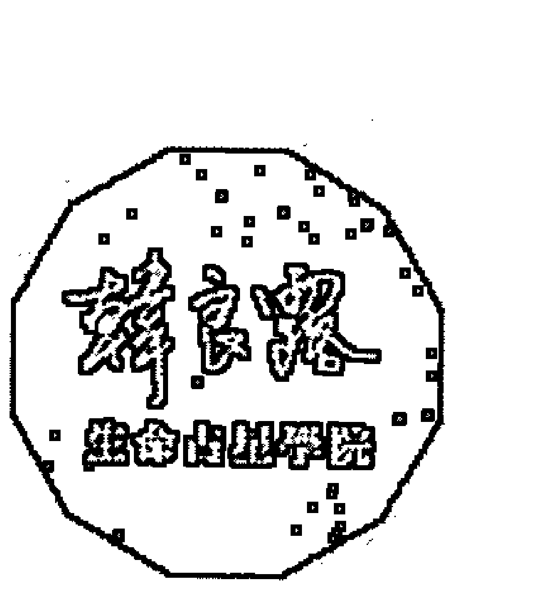

## 序

## 敲開占星大門的太陽回歸盤

我在年紀很小的時候就開始研究命理，起初是以中國的八字，易經為主。直到二十出頭的時候，才開始接觸西洋占星。當時國內深入研究占星的學習者並不多，所以在一開始，對於西洋占星我還懷有相當成見，認為西洋占星學只是用太陽星座來分類性格的心理分析工具，直到不久之後，我透過網路連結，遇見了來自美國的西洋占星研究者，向我展示了太陽回歸盤這個工具的神奇有趣性。我才開始真正一頭鑽入西洋占星學的研究之中。

所以太陽回歸算是引領我敲開占星大門的工具，同時，由於它強大易懂的預測功能，加上具有幫我們了解大範圍生命演化方向的特質，它也在日常生活中，成為幫助我年復一年的生命反省與前瞻未來的重要指標。

長時間以來，我書桌案頭上一定會擺放的，除了當年的天文曆之外，就是當年的太陽回歸盤了，每次碰到重要生命決定或生活變動時，我就將它拿起來，看一看，想一想，往往也因此減少了許多困惑的時間。

從我開始研究占星到現在，至今已接近三十年了，但我發現太陽回歸盤的重要性與深度，在台灣仍處於某種沙漠化的狀態，身邊很難找到喜歡研究太陽回歸盤的同好，市場上不容易找到相關參考書籍，很多學生也跟我反映，由於他們對於太陽回歸盤的一知半解，也會因此低估這個工具可能帶給我們的幫助。

很榮幸在南瓜出版社的支持之下，藉著與繆沛倫共同合作的機會，將這門嘉惠我多年的占星知識進一步介紹給台灣占星熱愛者。也希望因此敲開台灣大眾對於占星學習的興趣之門。

宋偉祥

## 寫在前面與如何閱讀本書

在「命運」一詞中，命與運一定是相連不分的。所謂「運」；也就是一般人口中所說的流年大運——是在人生不同時期中，對我們生命造成的不同干擾與影響作用。同時，「命」是我們的本質與潛力，「運」是我們的歷練與試驗。在連年戰爭與乾旱的影響下，即使本質肥沃的土地，也不可能產出豐盛的稻米。所以俗語會說：「命好不如運好」。由此我們也可以看出，「命」雖然走在「運」的前面，但，「運」會我們造成的影響，有時更遠甚於「命」。

本書藉由「太陽回歸盤」這門好用易懂的推運工具，來幫助占星愛好者學習如何解讀「年度命運」，以及「了解不同時期生命走向」。書中除了基本的理論說明之外，也附上大量案例，藉此幫助各位讀者了解，在同樣或類似影響力的作用之下，不同的生命，會演出哪種不同的戲碼。

同時，建議各位讀者在閱讀本書之前，最好已經具有星座、行星、宮位、相位的知識基礎，這樣在閱讀過程中，可以感到比較輕鬆易懂。但，本書的系統性整合說明方式，即使是剛入門的占星讀者，應該也可以從書中獲得不少知識與收穫。

強烈建議各位讀者在閱讀本書時，先將自己直至今年為止的太陽回歸盤一列印出來，根據書中理論，與自己的太陽回歸盤逐年進行系統性比較參考，並試著書寫練習書中所提出的問題。

熟悉了太陽回歸盤的解盤方法，除了可以讓我們對於這輩子在不同時期，會碰上什麼不同的「運」有基本概念之外，進一步，也可以幫助我們進行未來人生規劃與生命準備。甚至，藉由對於「運」的經驗與認識，我們可以因此更深刻的體會人生，更清楚的省思生命，也更能明白內觀生命變化循環的道理。

祈願每位讀者都能在本書之中各得其益！

## 目錄

- 序 敲開占星大門的太陽回歸盤
- 寫在前面與如何閱讀本書
- PART 1 / 太陽回歸盤是什麼
- PART 2 / 製作太陽回歸盤
- PART 3 / 解析太陽回歸盤
- Chapter / 1 行星落入火土風水象星座
- Chapter / 2 行星落入本位、固定、變動星座
- Chapter / 3 行星落入宮位
- Chapter / 4 上昇與天頂
- Chapter / 5 最高點行星
- Chapter / 6 上昇星座的主管星——命主星
- Chapter / 7 接近四軸點的行星
- Chapter / 8 行星逆行
- Chapter / 9 太陽回歸盤中的太陽
- Chapter / 10 太陽回歸盤中的月亮
- Chapter / 11 太陽回歸盤中的水星
- Chapter / 12 太陽回歸盤中的金星
- Chapter / 13 太陽回歸盤中的火星
- Chapter / 14 太陽回歸盤中的木星土星
- Chapter / 15 太陽回歸盤中的天海冥
- Chapter / 16 太陽回歸盤中的莉莉絲與南北月交
- PART 4 / 綜合解盤案例
- 後記
- 附錄1 占星參考書籍
- 附錄2 行星符號與星座符號
- 附錄3 宮位簡介

# 1 太陽回歸盤是什麼

## 1 太陽回歸盤的起止時刻

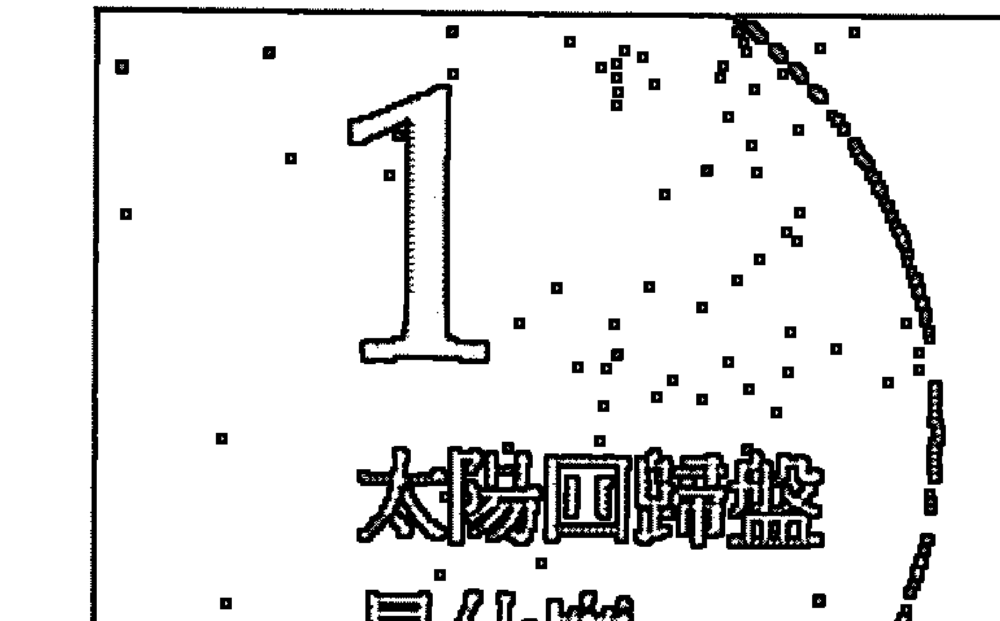

太陽回歸盤是一種很好用的占星技巧，廣受許多占星師的喜愛。

但為什麼要使用太陽回歸盤——大家平常使用的行運星圖（transit）不是很方便嗎？為什麼還需要多學一個「太陽回歸盤」？它的好處在哪裡？要如何繪製一張太陽回歸盤？有哪些需要注意的小細節？

此外，很多現代人有可能會離開出生地，長時間在外地讀書、工作，而地域差異會造成經緯度的差異。對於有出國經驗，或甚至長期居住在國外的讀者來說，應該會很關切經緯度的差異，對我們的命運會帶來什麼樣的改變與影響。

而太陽回歸盤的影響力，有其時間的有效期限，通常大約都以一年為期，但起始時期與結束時期要怎麼看？

### ▽ 什麼是回歸盤

在談太陽回歸盤之前，我們先為大家介紹何謂「回歸盤」。

只要對占星學有興趣的人，一定經常聽到「回歸」這個詞，例如「土星回歸」。

當我們出生時，天上諸行星，太陽在什麼星座幾度、月亮在什麼星座幾度、土星在什麼星座幾度等等，這些就是我們本命星圖中群星的位置。而天上的群星會繼續往前走，每顆星行進的速度都不同，例如太陽每三百六十五又四分之一天走一圈，也就是說，當你出生之後，大約三百六十五又四分之一天，太陽會回到跟你出生時的同樣星座與度數。又如土星每隔二十九年半走一圈，所以我們每個人大約會在二十九、三十歲時，行運土星會走回原來的位置，這就是我們經常聽到的「土星回歸」。假設一個人的土星，在本命星圖中位於寶瓶座十九度，而當他出生之後，行運土星就以逆時針方向開始慢慢往前走，走了快三十年，來到了寶瓶座兩度，也就是說，當天上的行運土星，跟本命土星重疊，兩者會在相同的星座與度數，這就是土星回歸的時刻。當行運土星與本命土星在相同的星座與度數重合，此時再畫出一張星圖，就是一張土星回歸盤。土星有逆行的可能性，行運土星有可能會在星盤的同一位置上來回三次。因此當土星回歸現象發生時，可能會出現三次精準合相時間，但在實踐上，我們通常採用的是行運土星最後一次經過本命盤土星的精確時間，來繪製出「土星回歸圖」。

每一顆星都會繞一圈回到原位。但天王星、海王星、冥王星的回歸盤意義不大，原因是天王星繞一圈需時八十四年，海王星繞一圈需時一百五十六年，冥王星繞一圈需時兩百四十八年。海王星與冥王星的回歸超過了人類的壽命，天王星回歸時期即使還在人類壽命範圍內，但也因為人類頂多遇到一次天王星回歸，所以運用價值也不大。

也因此，回歸盤中，最被普遍重視的是太陽回歸盤（年度生命目標與方向）、土星回歸盤（以三十年為單位的社會發展目標），以及月亮回歸盤（看二十幾天的一次朔望的短期心境）。

一般來說，我們一年可以排出十二次的月亮回歸盤，但也因為實際上行運月亮走一圈的時間並不滿一個月，所以每隔兩三年，我們會遇到一年可以排出十三次月亮回歸盤的機會。也就是我們每個月，大致上都會出現一個月亮回歸盤，所以很多占星師喜歡使用月亮回歸盤，做為一個人的月運勢參考。

既然每個月我們都可以得到一張月亮回歸盤，並且依據月亮回歸盤來推斷月運勢。同樣的道理，太陽一年繞一圈，每一年我們可以得到一張太陽回歸盤，所以可以運用太陽回歸盤來推算一年的運勢。

同理可證，前面提到，每二十九年到三十年，可以得到一張土星回歸盤，而土星回歸盤，就是用來判讀一個二十九到三十年的更大輪迴週期的運勢盤。由此可見，各個行星都可以做成回歸盤，而回歸盤推估運勢的期限，會隨著這顆星運轉一圈的速度而有所差異。

但除了時間上的差異之外，太陽回歸盤、月亮回歸盤跟土星回歸盤，它們又各自用來判斷哪些不同類型的運勢？

月亮本身代表的是內在心境、情緒的穩定度與安全感，當我們排出自己的月亮回歸盤，就可以看出一些外在事件引動內在情緒互動的反應，可以看出在這個月中，自己是處於內在焦慮還是人際關係良好的狀態。

由此可見，月亮回歸盤要看的，都會是跟月亮的內在情緒、內在感受相關的事情。

也因為內在情緒、內在感受都是瞬息萬變，所以一年我們可以得到十二到十三張的月亮回歸盤，每個月都可以看出內在情緒的變化。相較之下，土星代表的是社會責任、社會壓力與社會地位的追求，它往往需要長時間來經營，不管是社會責任、社會地位，或對自我的紀律訓練，這些也都需要二十九年到三十年，才有辦法達到完整的成效，一個人也才能成熟。也因此，土星回歸盤需要二十九到三十年才會得到一張。而土星回歸盤要看的，也是在這個三十年週期中，上一個週期在土星的社會現實中要學的功課，以及下一個週期要前進的方向。從土星回歸盤中，可以判讀出我們在社會現實、社會壓力上，要扮演怎樣的社會角色的議題。不過也因為土星走一圈的時間非常的長，所以土星回歸盤其實並不好用。因此雖然大家經常聽到「土星回歸」這個詞，但真正使用「土星回歸盤」的人不多。基於重要性，也基於行進速度，「太陽回歸盤」與「月亮回歸盤」廣被占星界使用，其他行星的回歸盤比較少見。

前面提到，從月亮回歸盤中，我們可以看出當事人在一個月內的心境變化與靈魂穩定程度。而想知道太陽回歸盤的主要功能，則必須先對太陽有所了解。

### ▽什麼是太陽回歸盤

太陽雖然是大家學習占星的第一步，大部分對占星有興趣的人，都知道自己的太陽星座，也大致說得出一些太陽星座相關的知識，但「太陽」到底是什麼？

太陽是太陽系的所有星體中唯一的發光體，所以它在星盤中，具有無可取代的重要性。我們大家以前在沒有學占星時，受到大眾傳播媒體影響，我們只知道太陽星座，於是把太陽看得太大，不管什麼都以為是太陽帶來的影響。但也有很多人在學了占星之後，由於知道了其他各式各樣的星，又太過不把太陽當一回事，這樣也不對。

太陽是我們生命中最重要的陽性力量，它有可能會投射在生命中的重要男性身上。太陽是我們這輩子的人生目標，所以它代表了一個人的自我意識與自我發展。太陽也是一個人之尊嚴所在，它會顯現在一個人如何覺得自己會有面子這件事情上。而如果從哲學層面來探討，如果人的一生是一場英雄之旅，太陽就會是這場旅程中的英雄。

也就是說，一個人的太陽，就是要讓當事人在這一生命中綻放光芒、照耀四方。太陽本身就是光與熱，一個發展良好的太陽，它在照耀四方時，不求回饋，也不會感到委屈──這跟講求犧牲奉獻的海王星有很大的差異，太陽在付出時，通常都是出於真心的歡喜，藉由心智的理性，帶來人生的方向。

此外，太陽也是我們每個人的精力、活力與生命力之所在，如果一個人本命星圖太陽有剋相的話，可能生命中就會遇到想做一些事，心裡卻提不起勁的處境。

太陽是一個人的理性，月亮是一個人的感性。太陽回歸盤會是當事人一整年，在面對外在世界的理性活動的起點。而這個起點，會主導了當事人在接下來的一整年發展。

儘管所謂的太陽回歸盤，就是天上的太陽在每一年的生日附近，回到與本命星圖太陽同樣的黃道座標點時，所繪製出的星盤。但去年的太陽回歸盤、今年的太陽回歸盤跟明年的太陽回歸盤，很可能會有許多相位差異，而太陽所進入的宮位領域，也會有所不同。舉例來說，去年我的太陽回歸盤中的太陽也許在二宮，二宮是金錢宮，代表去年我的太陽的主要活動，都會在金錢領域。而如果今年我的太陽回歸盤中的太陽進入了十一宮，十一宮是社交生活之宮，在這一年，朋友忽然就變得很重要了，因而會花很多時間去參加社交活動，甚至有機會去接觸社運團體。

也因為太陽在太陽回歸盤中，每一點都會進入不同宮位，這也顯示出我們每個人，在太陽的理性意識中，每一點都會有想要發展的不同重點。也就是說，在長長的人生英雄之旅中，每一點我們都會想要在不同的領域當英雄——這也是太陽回歸盤要教我們的重要課題。

此外，本命星圖中的太陽，可說是生命的火車頭，其他的行星，各自提供不同的功能，有的是提供了不同的燃料，有的是在車身加上不同的彩繪，它們都在這場旅途中，跟著太陽的火車頭前進。

決定這部車要往哪裡走的是太陽，決定這部車可以走多遠的，也是太陽。也因為太陽是我們星盤中的眾星之尊，因而太陽回歸盤最適合做為年度運勢預測、規畫的一種占星技巧。

太陽是一種成長動能，從太陽回歸盤中，我們可以看出太陽會如何在外在世界中建功立業、打造自我，也可以看出太陽會如何在這一年中自我成長的方向。

太陽回歸盤可以看出一個人這一年中，跟太陽有關的運勢。它跟很多人常用的「行運」盤也不太一樣。太陽回歸盤可以說是一種大範圍的氣象預報——它是以「年度」為預報範圍。相較之下，「行運」盤會比較像是每日氣象預報。從每日氣象預報中，我們可以看出今天出門要不要帶傘，它的確對我們的生活很有幫助。但如果我們可以在今年生日到來之前，能夠先瞭解接下來整年度的氣象預測，知道今年是一個多雨之年還是乾旱之年，就能預先做好規画與準備。

例如在一年來臨之前，如果一個漁夫知道今年會遇到五次颶風，儘管還不知道什麼時候會來，但可以先在颶風季來臨之前，先將魚塭先修補好，這會比天天看氣象報告，忽然發現明天會有颶風來，這個時候才手忙腳亂，才想要補強時，也來不及了。

也因為太陽回歸盤要看的是一個比較大的格局，所以它也可以來幫助我們找出生命大方向的前進路徑。舉例來說，如果從太陽行運盤中，看出今年的寒冬問題不算嚴重，明年寒冬會比較嚴重，而後年更嚴重的話，就可以看出，這個人這幾年都會遇到越來越嚴重的寒冬議題，如果當事人有機會買冷氣時，就應該要考慮買冷暖氣，而且還得要考慮節電功能，因為從這幾年的趨勢來看，只會一年比一年冷，使用暖氣的機率，只會越來越高，不會越來越低。

太陽回歸盤可說是一種為人生大方向畫重點的推運技巧，大家如果讀過一些工程學就知道，它就像是我們在實驗室裡做資料統計分析時，可能會得到許多散亂的落點，一開始，我們通常看不出這些散亂落點有什麼共通概念，但隨著每一天做的實驗越來越多，得到的數據也越來越多，就會從原本散亂的「點」，看出一個「線」的趨向。如果套用回「行運」與「太陽回歸」的概念，「行運」會比較像是散落的點狀數據，而「太陽回歸」則因為將時間拉長，透過長時間的觀察落點趨向，因而比較容易看出生命曲線的走向。由此可見，太陽回歸會是一種將零散行運系統化的方法。

# PART 2 製作太陽回歸盤

## 總覽

由於太陽回歸盤是一種進階技巧，所以無法在一些比較基本的網站中查出。本書介紹兩個可以查詢太陽回歸盤的網站：「astro-seek」與「astro.com」。

「astro-seek」的功能很齊全，而且有一些太陽回歸盤的獨有功能，但唯一的缺點，是沒有中文化。如果讀者對英文介面很難上手的話，則可以使用「astro.com」。若是對於英文與行星符號都不熟悉的朋友，也可以在手機上下載安裝「愛星盤」APP。開啟後進入「推運盤」選項，填入相關資料，選擇「太陽返照盤」，即可得到「太陽回歸盤」。

### ▼ astro-seek網站

先為大家介紹「astro-seek」。

請先進入「astro-seek」網站 www.astro-seek.com

先從上方選單，選擇「Free Horoscope」選項，下拉之後，選擇「Secondary Progressions, Solar Return」。

在「Returns (Revolutions)」的第一行，就是本書會用到的「太陽回歸盤」：Solar Return Chart (Solar revolution)。

進入頁面之後，會有一個輸入出生資訊的地方：「Solar Return Chart Calculator - Solar revolution calculation」。

填好自己的出生年月日、幾點幾分。出生地可以直接輸入英文，例如台北出生的人，可以直接輸入「Taipei」，就會有相關資料可選擇。

下一個選項是「Solar return - Year」，請在這邊選擇要看哪一年的太陽回歸。

接下來還有一個「City for Solar return」，如果你這一年所在的位置跟出生地不同的話，請在這邊填入位置，但如果相同的話，此處就不須填寫了。

接著點選「Calculate solar return」按鈕，就可以得到太陽回歸盤。

請見下頁圖，我們會用畫面為大家介紹網頁應該點選的地方。

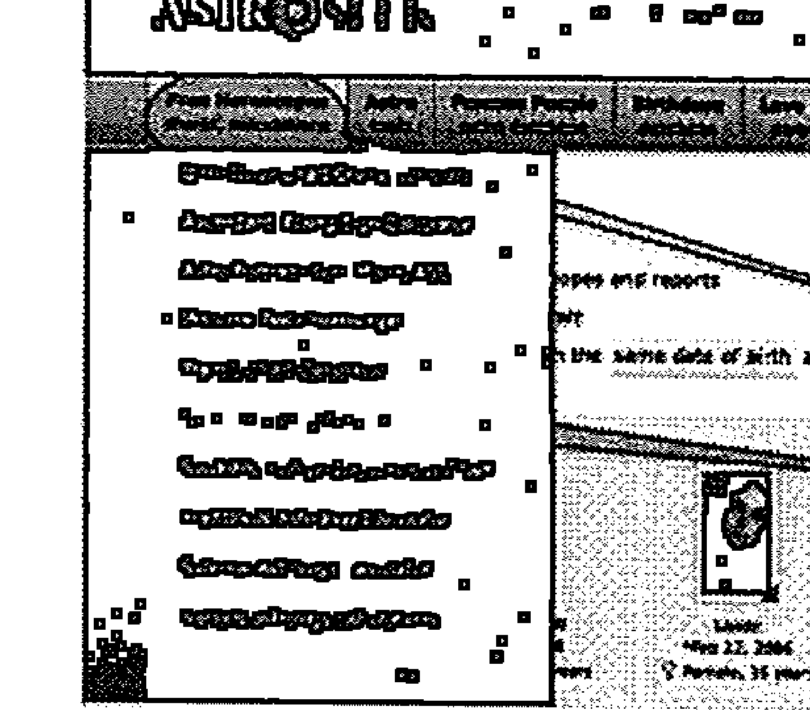

1. 請先進入「astro-seek」網站 www.astro-seek.com
2. 從上方選單，選擇「Free Horoscope」選項，下拉之後
3. 選擇「Secondary Progressions, Solar Return」

在「Returns (Revolutions)」的第一行，就是本書會用到的「太陽回歸盤」：Solar Return Chart (Solar revolution)

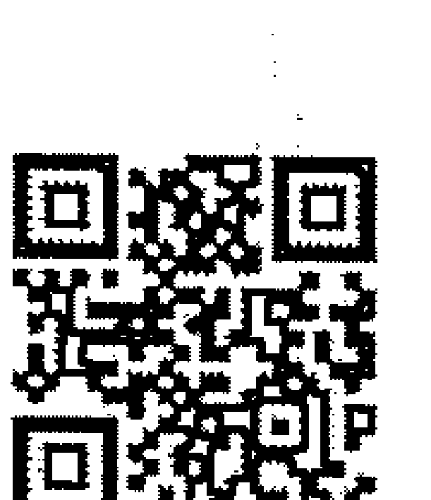

◇ 也可掃 QRCode，直接參考影片 ◇

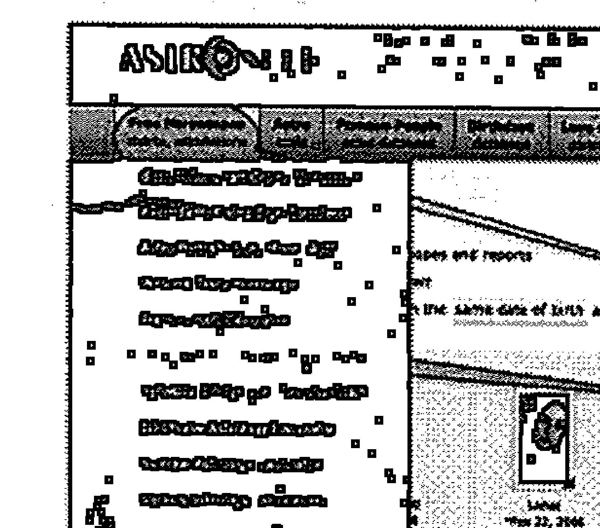

1. 請先進入「astro-seek」網站 www.astro-seek.com
2. 從上方選單，選擇「Free Horoscope」選項，下拉之後
3. 選擇「Secondary Progressions, Solar Return」

在「Returns (Revolutions)」的第一行，就是本書會用到的「太陽回歸盤」：Solar Return Chart (Solar revolution)

#### Prognoses

- Transit Chart (Planetary transits)
- Secondary Progressions (Secondary Directions)
- Transits and Progressions (Combined forecast)
- Solar Arc Directions (Solar Arc Progression)
- Profections (12th part 1 year cycle/forecast)

#### Returns (Revolutions)

- Solar Return Chart (Solar revolution)
- Lunar Return Chart (Lunar revolution)
- Lunar Returns & Minor Progressions
- Saturn Return Chart (Saturn revolution)
- Any Planet Return Calculator

#### Various Events in Natal chart

- Full & New Moons as Transits in Natal chart
- Eclipses as Transits in Natal chart

◇ 也可掃 QRCode * 直接參考影片 *

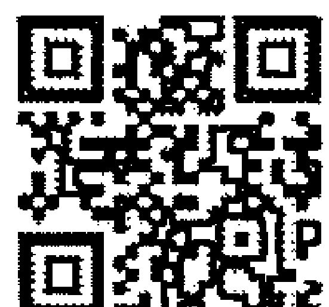

在這個頁面中，我們可以看到五個選項：

Solar（某一年）X Birth ch.：這是太陽回歸盤與本命星圖的對照盤，外圈是太陽回歸盤，內圈是本命星圖。

Alt. Graphics：這同樣是太陽回歸盤與本命星圖的對照盤，只是為了方便比較，將星座度數移到最外圈。

Solar only：此為根據排盤年分太陽運行至與本命太陽同一黃道位置點的時間，所繪製出的當下天象盤，也就是該年度的太陽回歸盤，此盤亦為本書講解分析使用的星盤模式。

Solar shape：表現出太陽回歸盤上的群星落點與範圍。

Aspect tables：相位列表。

本书最主要使用的是『Solar only』，也就是太陽回歸盤的單盤。因為這個盤最像是一種單純的氣象預報，它會告訴你今年是乾旱還是雨量豐沛。

本書最主要使用的是「Solar only」。這個盤最像是一種單純的氣象預報，它會告訴你今年是乾旱還是雨量豐沛。至於下大雨會不會下到讓你家淹大水，則要觀察「Solar（某一年）× Birth ch.」，藉由太陽回歸與本命星圖的互動，來觀察實際的影響，看看這一年的太陽回歸會不會到本命造成很大的壓力。

占星不能脫離生活的基本常識，一個人越了解生活，學起占星就會越輕鬆。

如果單看太陽回歸單盤（Solar only），今年如果遇到的是超級大颱風，不管當事人本命星圖再堅強，都一定會受到超級大颱風的影響——更別提如果本命星圖本身有問題了。所以在太陽回歸盤的解讀中，並不是說太陽回歸與本命的比較盤不重要，但觀察太陽回歸單盤的天氣預報的影響會更重要。在太陽回歸的天氣預報中，我們要先能解答出到底是晴天、下雨，還是下雪，這才是太陽回歸的首要任務。

此外，其實太陽回歸盤與本命星圖的對照盤，它的作用原理跟行運比較盤完全相同，只要懂得看行運盤，就懂得解讀太陽回歸比較盤。如果對這個部分有興趣的話，不妨參考本公司之前出的《太陽行運全書》與《行運宮位全書》，就可以學到詳細解盤方法，在此就不多贅述。

大家也可以看一下「 Solar shape ( 太陽星體影響 ) 」選項。在這個選項中可發現，最內圈會有許多藍色的小圓形。它的目的，是藉由這些藍色小圓形，讓大家快速的辨識出，在這一張太陽回歸單盤中，行星大致上是散落在哪個區間。

最後一個選項是「 Aspect tables ( 相位列表 ) 」，在這個列表中，我們可以看到太陽回歸盤與本命星圖之間的相位。其實這個相位列表，跟一般的行運相位列表相同，也因為每一年的太陽回歸，都代表行運太陽回到本命太陽的星座度數，所以你會發現，在這個列表上，行運太陽與本命太陽之間，必然會出現一個合相的符號。此外，大家有可能會發現，有一些相位欄位被粗框標示，這代表這個相位特別精準，力量也特別強，它代表這個相位會在這一年中，對當事人發揮很顯著的影響力。所以大家不妨在解讀完太陽回歸單盤之後，再瀏覽一下「相位列表」選項，看看這一年中，哪些相位的影響力會特別嚴重，再跟太陽回歸單盤互相比較，就可以得到更為全面性的預測結果。而解析的方式，也跟行運解析完全相同，例如太陽回歸盤的火星與本命太陽形成九十度相位，就去查詢《太陽行運全書》中，行運火星與本命太陽的九十度相位，就可以得知會出現哪些狀況。

看完了上述幾個選項之後，不妨將網頁往下拉，你會發現，下面還有「主要相位 ( Main aspects ) 」與「其他相位 ( Other aspects ) 」的列表。「主要相位」是太陽回歸盤與本命星圖的主要行星之間的相位，而「其他相位」則是除了太陽行運盤的主要行星與本命星圖的非主要行星 ( 例如南北月交點、幸運點、小行星等等 ) 之間的相位，以及太陽行運盤的非主要行星 ( 例如南北月交點、幸運點、小行星等等 ) 與本命星圖的主要行星形成的相位。而大家在「主要相位」中，看到「太陽回歸（Solar planet）」的太陽，必然會跟「本命行星（Birth planet）」在「Aspect（相位）」欄中顯示「Conjunction（合相）」，並且「Orb（誤差度數）」為零。

## ∇ astro.com

首先輸入網址「astro.com」，進入網頁。

如果想要中文化的話，可以在網頁右上方，找到「EN」（代表英語），往下拉，點選「中文」，就可以使用中文化網頁。

接下來，在「占星的藝術」中，點選「更多的占星圖選擇」。

如果是初次進入astro.com的話，此時會有一個網頁，詢問是否加入會員。你可以選擇不加入會員，直接輸入自己的生日資料來畫星圖，也可以選擇加入會員，登錄會員資料，再進一步繪製星圖。

進去之後，在「用戶首選項」中，選取「參考地點」。點進去之後，先將「用出生地」打勾，按「繼續」，就會回到前一個頁面，也就是「更多占星圖選擇」。

找到「圓形占星圖」選項，在這裡的預設為「出生圖」，請在旁邊點選下拉，點選「太陽公轉圖」，並且在「以*標記的占星圖的開始日期」中，填入你想要打的年份。

- 請注意以下四點：
- 太陽回歸日期，只需要修改太陽回歸的「年」即可，後面的月日不必改，因為不管月日填什麼日子，打出來都一樣。
- 如果選中文化，「太陽回歸盤」在此網站中被中譯為「太陽公轉圖」，在選取時請留意。
- 分宮制請選擇「default」
- 除了主要行星之外，可展開頁面下方的「其他選項」，並複選凱龍星、南北月交、莉莉絲這幾個小行星與交點，因為他們常常有可能會發生一些關鍵影響。

選完之後，請在網頁右側，點下「點擊這裡將顯示所選圖表」，就可以得到一張太陽回歸盤了。

## The Art of Astrology

首先輸入網址「astro.com」，進入網頁。

如果想要中文化的話，可以在網頁右上方，找到「EN」（代表英語），往下拉，點選「中文」，就可以使用中文化網頁。

在「占星的藝術」中，點選「更多的占星圖選擇」。

◇ 也可掃 QRCode，直接參考影片。

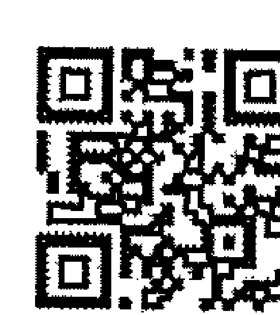

## The Art of Astrology

首先輸入網址「astro.com」，進入網頁。

如果想要中文化的話，可以在網頁右上方，找到「EN」（代表英語），往下拉，點選「中文」，就可以使用中文化網頁。

在「占星的藝術」中，點選「更多的占星圖選擇」。

◇ 也可掃 QRCode，直接參考影片。

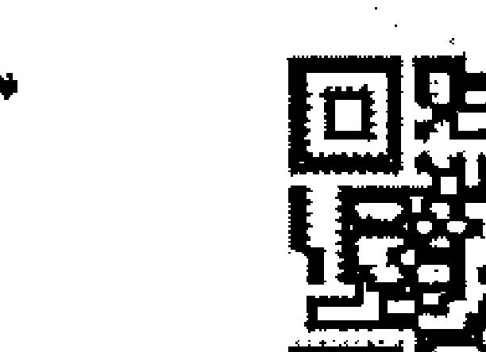

## 出生资料输入

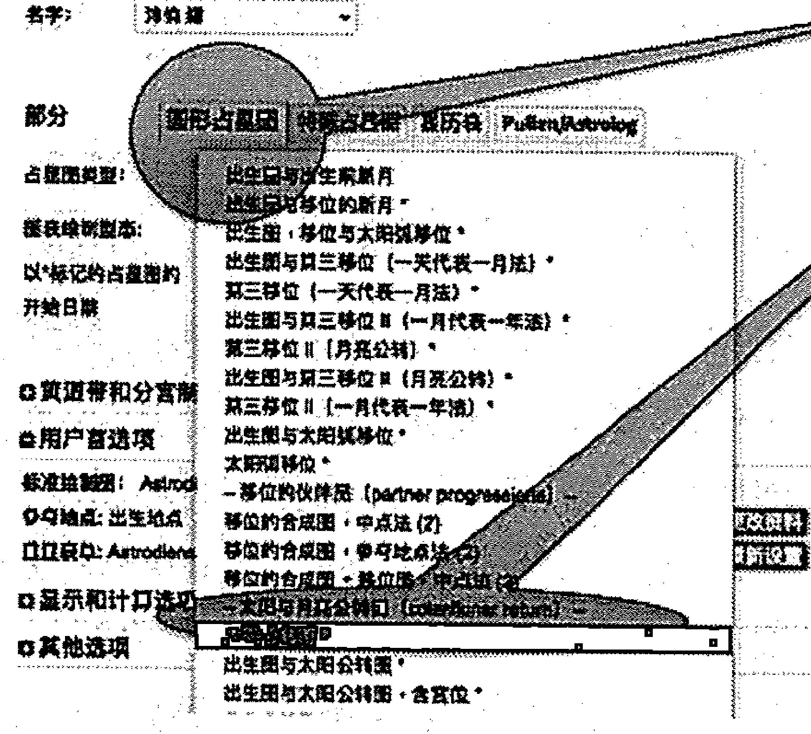

找到「图形占星图」选项，在这里的预设为「出生图」，请在旁边点选下拉，点选「太阳公转图」，并且在「以*标记的占星图的开始日期」中，填入你想要打的年份。

◇如果选中文化，它将「太阳回归」中译成「太阳公转图」，在选取时请注意。

选完之后，请在网页右侧，点下「点击这里将显示所选图表」，就可以得到一张太阳回归盘了。

## 出生资料输入

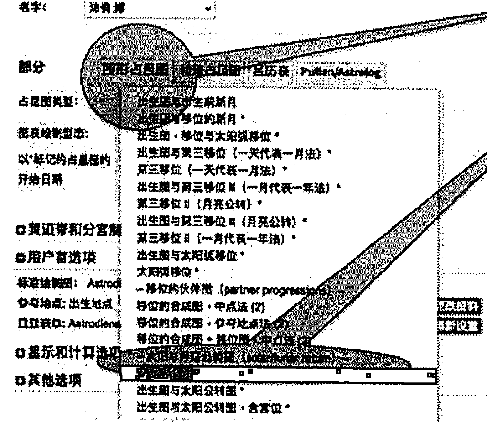

找到「图形占星图」选项，在这里的预设为「出生图」，请在旁边点选下拉，点选「太阳公转图」，并且在「以*标记的占星图的开始日期」中，填入你想要打的年份。

◇如果选中文化，它将「太阳回归」中译成「太阳公转图」，在选取时请注意。

选完之后，请在网页右侧，点下「点击这里将显示所选图表」，就可以得到一张太阳回归盘了。

### ▽太阳回歸盤上的居住地設定

現代人往往不見得都會在出生地居住，如果遇到這種情況，「astro-seek」網站中也有「City for Solar return」（太陽回歸盤所在城市）選項，大家不妨將當下所在城市與出生地這兩張盤都打出來，兩相比較一下。先以當下居住地這張盤為主，再來比對出生地的盤，看看兩者有什麼差異。

雖然很多人都很注重遷移到不同地方，因為經緯度改變而產生的新星盤，但人的生命其實就像洋蔥一樣，它本來就會有很多層次。當我們離開出生地，搬移到別的國家、別的城市，就像是原本的基本形式中又多加了一層外皮。我們不妨將自己視為一顆洋蔥，或許我們十歲時搬到日本，十一歲搬到美國，十二歲搬到德國，每個地方的經緯度都不同，每到一個新的地方，就會多了一張不同的星圖。就像是原本我是一顆洋蔥，搬到日本時就長出一張黃色的洋蔥皮，搬到美國時長出一張紫色的洋蔥皮，搬到德國時又長出一張紅色的洋蔥皮，但不管外皮披上了怎樣的洋蔥皮，裡面最核心的本質依然不變。也就是說，儘管外人看到的是黃色或紫色或紅色的洋蔥皮，但對當事人來說，他永遠會很清楚，自己的內心白色的部分是不會改變的。

所以如果有時間的話，固然排出居住地與出生地這兩張太陽回歸盤，兩相比較會最好。但如果時間沒有那麼多的話，也可以只排出居住地的太陽回歸盤。此外，在觀測十年的太陽回歸運勢走向時，每一年都使用出生地的太陽回歸盤也是可行的。因為不管今年你人在何方，你依然是你。

此外，也有一些占星師會宣稱太陽回歸的改運法。也就是在每年太陽回歸之前，如果先算出來太陽的落點不太好，例如太陽進入了十二宮，太陽的光芒，將會因為十二宮的幽閉屬性而隱沒，這個時候就可以選擇一個經緯度不同的遙遠國度，去那邊旅行、慶生，等慶完生再回台灣，就可以改運。這原本只是一個網路謠言，但因為這個傳言被傳得甚囂塵上，所以有占星師真的針對他的客戶群，做了一些調查，結果發現，生日時旅行其實改不了運，所以大家以後看到這則網路傳言時，一笑置之就好，不需要太認真看待。

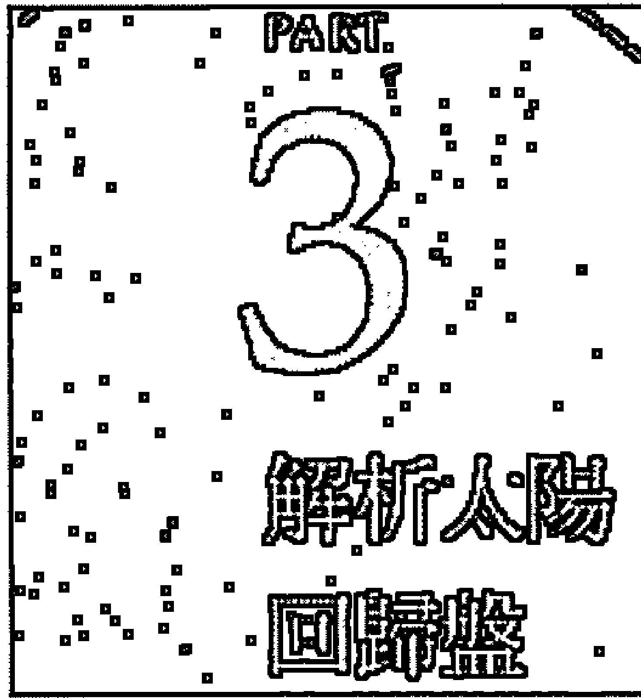

## # PART 3 解析太阳系

我曾經看到一個攝影師，他在每年的同一天，都會拍一張自己跟兒子的合照，持續了三十幾年。如果他是每天都拍，這樣的照片就會太多、太亂，但連續三十幾年，每年一張，將這三十幾張照片連續排出來，你就會很清楚這對父子在這三十幾年的明顯變化。

此外，大家也很可能都用手機中的「縮時攝影」功能。縮時攝影就是鏡頭固定，每隔一段時間就拍一張照片，將這些連續照片播放出來，就可以看出一件事物在結構上的緩慢變化。

縮時攝影與錄影是不一樣的，同樣以拍攝一條河流來論，攝影會讓人看到河水不斷的流動，而縮時攝影則會透過長期的一格一格的定格照片，讓人看出河道的變化，以及漲潮退潮的起落。而縮時攝影與錄影的差別，其實也就是太陽回歸盤與行運盤的差別，太陽回歸盤是一種長時間重疊的切片，而行運盤則是不斷的往前移動。

雖然縮時攝影不像錄影這麼能呈現動態細節，但也因為省略掉了動態細節，反而可以站在一個更大的視角上，看出生命成長改變的大方向。

這也就是太陽回歸盤與行運盤的差別——太陽回歸盤就像是縮時攝影，而行運盤則是動態的錄影。

太陽回歸盤跟行運可以結合起來，一起運用。我自己使用的方式，是使用一些日記軟體，先列出每年的四個季度，再就不同季度下，劃分出每月、每週、某日。而我通常會在年度目標上，列出本年度中，我的太陽回歸盤中的年度重點，在太陽回歸盤顯示的狀態，太陽在什麼宮位，太陽有什麼相位，並且稍微描述一下可能會有的情況。這麼一來，我每次在填寫這個日記時，都會先看到太陽回歸盤中的年度重點，我在規畫行程時，就會依據我的太陽回歸盤的年度重點，去做出更符合今年走向的行程，也可以依據太陽回歸盤的相位，在某些領域更加謹言慎行。也就是說，我會把太陽回歸盤當成這一年生活的總綱，在劃分月記事與週記事時，再藉由占星軟體，顯示出這個月份或這一週的行運各行星位置，就會有年度重點（太陽回歸盤），加上即時的天氣報告（即時行運）。這麼一來，我在規畫行程時，就可以有總綱與細節上的參考。這就是太陽回歸盤結合行運，在日常生活上的運用方法。

# 2021太陽回歸盤

| 行星 | 星座 | 宮位 | 相位 | 備註 |
|------|------|------|------|------|
| 太陽 | 03   | 3H   | 日90火<br>日180月 | 三思而後行<br>注意無意識的過度思考，放輕鬆 |
|      |      |      |      |      |
|      |      |      |      |      |
|      |      |      |      |      |

# 2021太陽回歸盤

| 行星 | 星座 | 宮位 | 相位 | 備註 |
|------|------|------|------|------|
| 太陽 | 03   | 3H   | 日90火<br>日180月 | 三思而後行<br>注意無意識的過度思考，放輕鬆 |
|      |      |      |      |      |
|      |      |      |      |      |
|      |      |      |      |      |

## ▽太陽回歸的有效時期

很多人會認為太陽回歸盤的有效時期，是從過生日這一天開始，一直作用到下次生日前為止。雖然這種說法也不算錯，但生命其實並沒有這麼絕對的截斷點。

我們看一下下頁圖，在這個頁面上，可以看到三個弧，這三個弧，說明了太陽回歸盤的能量起伏。三個弧之間有兩個分界線，分別為「去年生日」、「今年生日」。我們來看「今年生日」這條線，從這條線中，可以看到去年舊的能量消褪到一定程度，而今年新的能量也上揚到一定程度。也就是說，今年的新能量並不是從「今年生日」才忽然冒起來，它往往在今年生日前的三個月，能量就開始出現，它同時交疊了上一個年度的能量慢慢結束。今年的太陽行運能量，往往從今年生日前三個月，就開始萌芽，等到今年生日時鑽出土壞，讓我們真正看到這件事情的存在，也開始轉變了今年的注意力，讓我們將目光從去年關注的主題，轉移到今年的關注主題。

也就是說，當我們拿到了今年的太陽回歸盤時，不要以為它的力量是從今年生日這一天，才忽然冒了出來，其實它的力量在生日前三個月，就已經開始萌芽了。

### 太陽回歸盤影響時期　目標與注意力的轉移
新方向，新機會與新問題，新心境

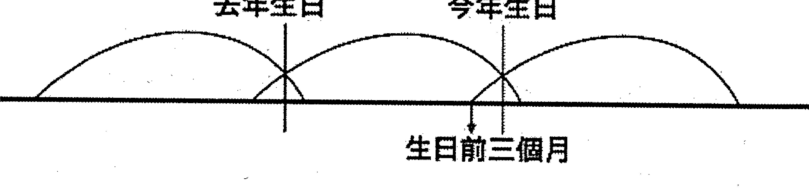

### 太陽回歸盤影響時期　目標與注意力的轉移
新方向，新機會與新問題，新心境

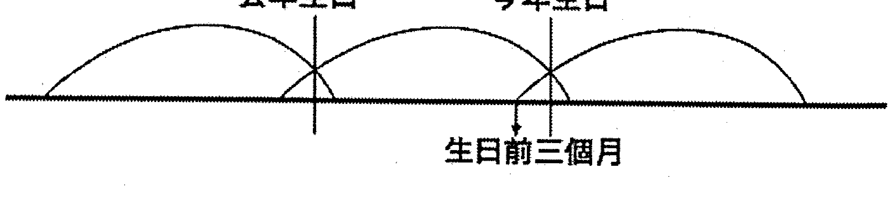

我們來看一些名人的例子，就會感覺到「生日前三個月」理論的準確性。

#### ex.小甜甜布蘭妮財產監管官司

小甜甜布蘭妮（Britney Spears）在深陷十多年財產監管風波後，從二〇一九年年起，開始提起訴訟，一直到二〇二一年九月七日，她的父親放棄財產監管權，也才終於終結了長達十三年的監管糾紛。這件事對她來說，實屬人生重大變動。她的生日是十二月二日，而九月七日，剛好就大約是她生日前三個月。而最後法庭判決監管令完全解除的日子，就是同年十一月十二日，也就是在她生日後的一個多禮拜。由此可見，在她生日前三個月，這件重大事件開始萌芽，而到了太陽回歸的日子，也就是生日前後，這件事情開始冒出出土，成為一個正式事件。

#### ex.拜登阿富汗撤軍風暴

美國總統拜登（Joe Biden）的生日是十一月二十日，他在二〇二〇年贏得總統大選後，原本聲望一直都還算可以，但美軍從阿富汗快速撤軍這件事，造成拜登聲望大幅下跌。尤其二〇二一年八月二十六日，阿富汗首都喀布爾機場外發生大爆炸，造成十幾名美軍喪生，更令拜登名譽嚴重受損。前面說過，太陽跟面子、聲望有關，而這件事情發生的時間點，剛好也是拜登生日前大約三個月。

##### ex.芭黎絲希爾頓結婚

富家女芭黎絲希爾頓（Paris Hilton）在二〇二一年十一月十二日結婚，而她的生日是二月十七日，兩者相隔也差不多是三個月。芭黎絲希爾頓向來以浪蕩不羈的形象為世人所知，結婚對她來說，當然是件很重要的人生大事，她甚至還為了要熟悉嫁為人婦的日子，因而在Netflix開了一個節目，可惜一季做收，不再續訂。

#### ex. 強尼戴普的夫婦互訟

每年太陽回歸盤的種子能量，往往自該年生日前三個月就已經開始埋下伏筆，悄悄成長。從全球影迷關注的強尼戴普（Johnny Depp）與安柏赫德（Amber Heard）的夫妻互訟案中，也可以看到這個規律。強尼戴普的生日是六月九日，在二〇二二年的強尼戴普控告安柏赫德的誹謗官司中，強尼戴普的私人醫師、護士提出證供，指出二〇一五年三月八日（也就是強尼戴普生日前三個月），兩人在澳洲度假時發生激烈爭執，安柏赫德像強尼戴普連丟兩個酒瓶，並削斷了強尼戴普中指指頭的三分之一，此事件也成為了這件誹謗案法院攻防戰的重點之一。

為什麼會是三個月？原因很簡單。前面提到，太陽每一年走一圈，一圈是三百六十度，而一年有三百六十五又四分之一天，也就是說，大致上每一天太陽走一度，一個月太陽大約走三十度。生日前三個月，大約是太陽走了兩百七十度，走了四分之三圈的日子，也就是走了三季，即將進入最後一季的日子。以四季而論，最後一季就是準備過冬，準備迎接新年的日子——從一個人的一年四季來看，也是相同的道理。我們每個人在自己的四季中，最後一季都會是舊的課題即將結束，而新的課題開始萌芽的時分。而這些新課題，一開始時都像是種子一樣，被埋在地下，要等到三個月之後，春天來臨時，才會冒出地面。

既然這個理論成立，大家不妨現在就來想一下自己的生日是幾月幾日，並且往前三個月前後，是不是發生什麼事。太陽回歸是一種年度預測，所以往前三個月時，大家不需要算到很精準的九十天，大致上是三個月，往前往後推兩個禮拜，都在它的適用範圍。這些重大事件，有可能是一些決定，也有可能當下看起來未必很大，但事後證明，它開啟了後續事件的序幕。

以國家來論，如果可以確定國家的生日，也可以看出這種「三個月前」的規律。舉例來說，美國的國慶日是七月四日，而美國的新冠肺炎第一波疫情來襲是在二〇二〇年四月，也就是七月四日前三個月，而過了三個月，也就是七月美國國慶時，疫情變得更為顯著，更為嚴重，接下來在二〇二一年一月時達到了最高峰。

## Chapter / 1

## 行星落入火土风水象星座

十二個星座並不是十二個不相干的東西，它們各自都有不同的連帶關係。從第一個星座牡羊走到第十二個星座雙魚，牡羊是火象星座，金牛是土象星座，雙子是風象星座，巨蟹是水象星座，獅子是火象星座，處女是土象星座，天秤是風象星座，天蠍是水象星座，人馬是火象星座，摩羯是土象星座，寶瓶是水象星座，雙魚是水象星座。十二個星座以火、土、風、水的順序形成了四個不同族群，這就是占星研究所說的「星座元素」。也就是說，同屬火象星座的牡羊、獅子、人馬，同屬土象星座的金牛、處女、摩羯，同屬風象星座的雙子、天秤、寶瓶，同屬水象星座的巨蟹、天蠍、雙魚，這些星座彼此之間，都具有一定程度的相同屬性。

在火、土、風、水這四象星座中，火象與風象星座都比較輕快、活潑，而土象與水象星座則比較沈重、憂鬱，原因在於土象與水象都具有較強的物質性。土象的物質性不難想像，而水象的物質性，在於水不總是清澈透明，例如熔融的金屬也是一種液態，但它並不清澈透明。凡是流動的物質均屬水象，固定的物質均屬土象，這兩種都是物質世界的顯像，所以它們都具有較強的物質性，因而比較沈重，也比較內斂、消極。相較之下，火象與風象則不具物質性。如果說水象是物質性的流動，風象就是非物質性的流動。

而火象本身是一種能量，它也不具有物質性特質。也因為火象與風象都比較明亮、活潑，所以它們都具有一定程度的陽性屬性，而土象與水象都比較內斂、被動，所以它們都具有一定程度的陰性屬性。

## ▽ 火象星座——牡羊、獅子、人馬

如果一個人的星圖中火象元素過強（有許多行星落在火象星座），他們很有可能會是動能很強，產能卻未必很強的人。他們很可能會偏向急功近利，可能導致生產效率很差。「火」代表了生命力與注意力，雖然他們面對事情時比較熱情，也很快的就會對事物產生注意力，但也可能來得快去得快。從身體方面來論，火象元素過強的人，他們很有可能會經常感到口乾舌燥，也有可能容易失眠、長痘子、生瘡、腫脹，也容易因為不小心而有外傷。如果相反，一個人的星圖中如果缺乏火象元素——其中又分兩種，一種是有行星落在火象元素，但數量很少，一種是完全沒有行星落在火象元素。如果是火象元素很少的這種人，他們很有可能會有動力卻沒有執行力的人，他們對事情很有想法，但執行力不強，行為跟不上想法。但如果完全沒有火象，由於「火」會照明前方道路，完全沒有火象的人，他們很有可能會陷入「無事忙」狀態，他們在生活中會欠缺目標性，就會看不清願景與目標，很難做出明確的決定，無法做出長程規劃，也容易因為沒有方向感而感到沮喪。

## ▽ 土象星座——金牛、處女、摩羯

如果一個人星圖中土象元素很重（有很多行星落在土象星座），他們就會比較固執，考量事情時也比較實際，甚至有可能會比較古板。

如果缺乏土象元素，他們就會比較不穩定，也比較不踏實，也容易會有擔心自己做不到，卻缺乏腳踏實地的能力。其中包含了對財務的擔心，也包含了對事業的擔憂，這些都是生活中的現實問題。

適當的土象元素，可以幫我們建立物質世界上的安全感，可以讓我們在事業上、生活上有所精進，有助於讓我們將心力固定在日常生活，尤其是可以將心力放在日常生活中那些不得不為的無聊事務中。不過如果土象過強，當事人就有可能會陷入過度僵化、過度實際的問題。

土象的問題是容易僵化、慣性過強，一個土象過強的人，在健康上就容易有筋骨痠痛、過度僵硬，也容易有皮膚敏感問題。此外，僵直性脊椎炎也是一種跟土象有關的疾病。一個人如果土象太強，有可能會肢體過度僵硬，但如果土象太弱，就有可能筋骨不夠結實。

當我們出生時，本命星圖的火土風水就已經固定下來，但每一年太陽回歸時的火土風水是各自不同的，看看每一年太陽回歸時火土風水的變化，就可以觀測出，每年需要注意的大方向與個人問題。好比說，我們可能會在太陽回歸盤土象元素較重的年份，出現固執僵化乃至出現現實壓力與打擊，因此，在這年生活中，一定要提醒自己必須保持靈活，不要把現實看得太重。

我們在解盤時，最重要的是必須先抓出大方向，一開始就一頭鑽進細節，很容易就會暈頭轉向，而觀察星圖的火土風水配置，就是一種大方向。我們常說「抓大放小」，用這個態度去面對星圖、面對人生，人生才會有餘裕去做真正重要的事，而不會被枝微末節的小擔憂給綁死。

## ▽ 風象星座—雙子、天秤、寶瓶

如果一個人的風象能量很強，這個人就會有理性很強的優點，但也有可能會有欠缺情感的問題——這並不是說風象星座強的人無情，而是說當一個人過度理性時，他們的情感就有可能會受到壓抑。所以如果今年你的太陽回歸盤的風象傾向很強，如果還不致於強到完全排擠掉其他能量地步的話，風象能量較強的一年，都會很適合讓人好好組織、規劃未來的良好時期。

此外，風象能量也會讓人用客觀的方式來看待世界，比較不會因為過度主觀，而陷入了自我的執著中。不過如果風象能量太強而完全壓制了火的熱情與水的感性，這一年就有可能會陷入規劃得很好，但是過得很單調乏味的困境。很多人在大考前或趕畢業論文時，都曾經歷過每天在圖書館裡頭像機器人般唸書的日子，這就是風象能量完全蓋過火、水時，它會出現的狀態。此外，風象能量也跟神經傳導有關，當風象能量過強的一年，也有可能會造成神經系統不穩定的問題。

如果風象能量不足，當事人做決定時，就有可能不夠客觀，缺乏理性思維，而且缺乏規劃的視野與能力。如果風象欠缺、火象過度，就會先做再說；如果水象過度，就會純粹憑著感覺做事；如果土象過度，就會陷入僵化。

當一個人缺乏風象能量，遇到問題時，就會感到自己欠缺相關知識，因而毫無想法。也因為必須要從零開始，從頭學起，很容易就會感覺到頭腦不堪負荷，力不從心。此外，風象能量也跟溝通有關，在風象能量缺乏時，很容易就會社交退縮，逃避溝通，或是出現溝通問題。

### ▽ 神隐的拜登

現任美國總統拜登，他在二〇二〇年參加美國總統大選時，他的兒子杭特拜登（Hunter Biden）的性醜聞也被公諸於世。面對這樣的風波，拜登採用神隱策略，在媒體上消失了好一陣子。即使後來終於出現在鏡頭上，他還是對此事件不作評論。拜登在二〇二〇年的太陽回歸盤，就是一個很缺風象能量的盤。照理來說，選總統時，應該是一個人這輩子跟媒體溝通最頻繁的時候，應該要透過大量的媒體曝光，去跟選民闡述自己對國家的規畫與願景，但他多次被媒體捕捉到在選戰中打瞌睡的鏡頭，也經常因為引用錯誤或口誤，而被對手質疑他是不是有失智問題。不過隨著他當選以後，二〇二一年他的太陽回歸盤就比較沒有缺乏風象能量的問題，所以雖然民調依然經常起伏不定，但也比較不像二〇二〇年這麼跟媒體之間溝通不良了。

## ▽ 水象星座——巨蟹、天蠍、雙魚

水象能量都跟情感有關。

如果一個人水象能量很弱，他們就很難共感他人的情緒，過度理性，缺乏同理心，而且不易表達感情。如果一個人星圖中水象能量很弱，甚至完全沒有水象元素的話，他們並不會無法表達情緒，事實上，他們也跟其他人一樣，表達自己的情緒，只不過他們表達的，會是他們自己的主觀情緒，他們會將這種主觀情緒解釋為「別人都對我不好」、「別人都不了解我」。他們沒有能力去同理別人，卻很容易主觀的發洩自己的情緒，這也是一種很典型的缺乏水象能量的狀態。

而如果一個人水象能量過強，他們就會比較感情豐富、比較情緒化，也比較容易憂鬱。我身邊有一些水象過強的朋友，我發現他們常常在面臨必須要用理智判斷時感情用事，都是用感覺來做決定。水象力量過強，就有可能會強化無意識的衝動與情緒反應，他們很容易會恐懼、依賴、癡迷，也容易會有一些或輕或重的強迫症。但強烈的水象能量，也會讓人更有靈感，更有藝術性、直覺性。

所有水象能量重的人，他們都關心人際關係中的情感層面。風象重的人也注重人際關係，但他們關心的是人際關係中的溝通層面。相較之下，火象與土象就比較自我。

水象重的人對情緒比較敏感，他們具有一定程度的藝術家氣息，喜歡用心來感受外在世界，不過他們也可能現實感比較弱，甚至排斥邏輯。

如果你今年的太陽回歸碰到的水象很強，加上原本你就有一些情緒議題的話，應該要事先規劃，讓自己可以多安排一些藝術文化體驗或可以讓內在情緒放鬆的活動，多安排一些藝術文化體驗或可以讓內在情緒放鬆的活動，乃至於接受心理諮商的協助。而如果當事人本來就具有相關長才，則不妨利用這段期間去接受一些訓練，讓自己可以成為諮商輔導者。同理心與共感能力，本來就是諮商輔導者的必要能力，善用水象元素很強的一年，可以讓自己獲得相關能量。但對原本就水象能量過強的人來說，情緒的過度起伏，有可能會造成荷爾蒙的過度刺激，進而引發相關的健康議題。

而如果這一年的太陽回歸盤的水象較弱，這一年當事人就很難好好的表達自己的情緒，也很難跟他人的情緒產生互動。前面提到，水象較弱的人，他們不見得不能表達自己的情緒，但經常都會是他們自己主觀認定的「我好可憐」、「都是別人在欺負我」，他們就有可能會成為被霸凌的受害者，也有可能會成為去霸凌別人的人。

此外，當一個人年度的太陽回歸盤缺乏水象元素，自己的內在感受與跟他人之間的情感溝通，就不會是當事人這一年的生活重點，他們的年度重點，就比較可能會放在世俗成就的追求，或是社交生活的經營。這一年因為缺乏水象元素，當事人都會感覺到自己的情感缺乏出口，也容易因為情感上的壓抑而感到孤獨、悲傷，因此要特別注意免疫力下降與失眠問題。

### 作業

算出自己的今年與去年的火土風水，表列出來，並且寫出這兩年的火土風水有什麼相應事件。

列表方式為：

- 2022
  - 火象星座（牡羊、獅子、人馬）——
  - 土象星座（金牛、處女、摩羯）——
  - 風象星座（雙子、天秤、寶瓶）——
  - 水象星座（巨蟹、天蠍、雙魚）——

- 2021
  - 火象星座（牡羊、獅子、人馬）——
  - 土象星座（金牛、處女、摩羯）——
  - 風象星座（雙子、天秤、寶瓶）——
  - 水象星座（巨蟹、天蠍、雙魚）——

## Chapter / 2

## 行星落入本位、固定、變動星座

十二個星座除了火土風水的分類之外，還可以分成「本位 (cardinal) 星座」、「固定 (fixed) 星座」與「變動 (mutable) 星座」。本位星座指的是牡羊、巨蟹、天秤、摩羯這四個星座，固定星座指的是金牛、獅子、天蠍、寶瓶這四個星座，變動星座指的是雙子、處女、人馬與雙魚這四個星座。

十二個星座，要講述的是春夏秋冬的四季遞嬗。牡羊、金牛、雙子是春天；巨蟹、獅子、處女是夏天；天秤、天蠍、人馬是秋天；摩羯、寶瓶、雙魚是冬天。每一個季節又分成三個星座，牡羊、巨蟹、天秤、摩羯是初春、初夏、初秋、初冬；金牛、獅子、天蠍、寶瓶是仲春、仲夏、中秋與隆冬；雙子、處女、人馬、雙魚，則是季節即將轉換的晚春、晚夏、晚秋與晚冬。一個季節分成「早、中、晚」的三階段，就是所謂的「本位、固定、變動」的概念。

關於本位、固定、變動的三階段演進，我們不妨想像一棵樹的成長。它先是一顆種子，後來萌芽、長高成一棵樹，進而開花、結果，果子掉落下，果子裡的種子又長出來。

### ▽ 本位星座——季節初起

本位星座就像是剛冒出土地的小樹，開始舒筋長葉的成長期，所以他們會強烈的表達星座自我特質的能量，這個族群就像是青少年，一切都在打基礎——學習是為了未來的成就打基礎，運動是為了未來的健康打基礎，既然是在奠定基礎，就需要努力奮鬥，並且需要多元性的發展，才會知道什麼方向真正適合自己，也就是說，本位星座的能量動能很強。如果以佛法的「成住壞空」來看，本位星座可說是「成」的階段。在這個正在萌芽、成長的時期，當事人都會很注重於如何做自己，不管是人際關係或事業發展，如何成就自我，為了自己而奮鬥，這些都會是本位星座最注重的概念。

當一個人的太陽回歸盤欠缺本位星座，這一年就會有缺乏衝勁、缺乏動能的議題。舉個例子來說，我認識一個人，她某一年的太陽回歸盤的元素如下：她的太陽、月亮、水星、火星、土星、天王星、海王星落在固定星座，金星、木星、冥王星、凱龍與上昇點落在變動星座，沒有任何行星落在本位星座。本位星座的目的，在於幫人打造出一個新的開始，奠定新的基礎，而她這一年完全沒有這樣的力量，大部分的力量都放在固定星座的守成，以及變動星座的醞釀改變。所以這一年她發生了三件大事：首先是丈夫外遇，所以她跟老公離婚，而且父親因為癌症病逝，也因為她在一年中經歷了離婚與喪父，所以辭去了原本的建築師工作。

既然辭去工作，就去學一些新的東西，沒想到才剛開始學沒多久，就胎死腹中，因為才開課沒多久，就發現她的老師控制欲很強，學生的作業都得要照著要求，否則老師就會當場抓狂，甚至當場摔東西，甚至當她想要退出時，老師還想了各種方法去逼她不准退出，反而讓她嚇得要命，總算想盡辦法才脫離了這個老師。由此可見，她這一年都在處理的是變動星座帶來的崩壞，其中包含了婚姻的結束，父親的離世。缺乏本位星座，讓她想要新起的計畫還沒有真正開始，就無疾而終，不但無法讓她長出一個新的自我，反而讓她再度經歷了一場人際關係中的困難議題。她在這一年中，缺乏讓她足以展開新人生的想法、計畫與動能，也因為缺乏動能，她這一年幾乎大部分的時間都蝸居在家，或在醫院中照顧父親，少了一種為自己奮鬥的心態。

### ▽ 固定星座——季節中期

本位星座能幫助我們促進人生新事物的成長，而固定星座能幫我們守成。本位星座奠定了我們這棵植物的樣貌之後，就進入固定星座的開花結果，這會是一般人常說的「五子登科」階段。不過如果一個星圖中固定星座過強，一個人就會過度的想要守住之前打下的基礎，而不願意放手，結果變成了僵化。也就是說，固定星座過強，就會造成過度執著、固執與僵化，金牛座往往執著於自己的擁有物；天蝎座往往執著於情感上與欲望上的追求；獅子座可能會執著於自己的面子，為了想要維持著聲量而不肯放手；寶瓶座執著於進步與創新，會不惜反抗或突然破壞原有安全架構，所以寶瓶最具有革命意識，寶瓶總是會帶來很大的刺激與改變。

其中又以天蝎座的執著最廣為人知。天蝎座具有從死亡轉化而重生的力量，所以它不但代表了開花結果，甚至還包含了開花結果之後，花果落地的過程。但也只有果實落地、死亡，才有辦法創造出新的生命。由此可見，固定星座的範圍，包含了花開最盛的鼎盛點，以及由盛而衰而死亡的過程。所以固定星座代表的，不會是全然的全盛時期，它也代表全盛時代後的急轉彎。所以在「成住壞空」中，固定星座同時具備了「住」與「壞」的特質。

固定星座代表了我們基於慣性、物極必反、資源得失，以及榮譽、理想擁有的相關議題。如果星圖中缺少固定星座，當事人就會無法讓自己安住在某一個狀態中求取發展。如果一個人只有本位星座、變動星座，就會覺得這個人似乎忙個不停，卻缺乏了固定目標。本位星座雖然講求開創，但它的目標設定，可能會隨著計畫的不同而不同，不像固定星座的目標性這麼明確。金牛的目標是資產的擁有，獅子的目標是個人的榮譽，天蠍的目標是情感的佔有，寶瓶的目標是理想的展現。也就是說，本位星座提供了一種可能性，讓固定星座為之奮鬥。

### ▽ 變動星座——季節尾聲

所有的變動星座，由於都處於季節轉換的關鍵點，所以它們都會具備一定程度的二元性，因為它們代表了舊的季節即將結束，新的季節即將到來。

在固定星座階段，果實落在地面，果實死去，種子撒了出來，而種子開始在土地中萌芽、生根，開始吸收養分的階段，就是變動星座時期。也就是說，變動星座雖然名為「變動」，事實上它很可能外表看起來是停留在土裡面的靜態，它的變動，是反映在它大量的吸收土壤中的養分，靜待機會冒出地面。雖然在努力吸收養分，但其實並沒有明顯的大動作。在變動星座的議題中，我們可能會遇到許多生活上枝微末節的小小煩惱，但這些煩惱加總起來會很多。

此外，互為一百八十度會形成一條軸線，在這個軸線中，都會具有內在議題相近，但外在表現南轅北轍的一體兩面。我們觀察處女與雙魚這條軸線，它要探討的是身心健康與修行，這些都是比較靜態，但需要日復一日的慢慢成長的領域。而雙子與人馬這條軸線的主題在於學習，學習也是每一天只能收穫一點點，但日積月累之下，就能累積出很大的能量。

不過也因為變動星座在過程中會像是埋在土中的種子，很難看到大方向，所以變動星座很有可能會陷入一種瞎忙的狀態，也容易因為瞎忙而缺乏效率、徒勞無功。因為變動星座就像種子埋在地下，所以可能做了十件事情中，只有五件是有效的，其他五件都是在試誤，做白工。

在「成住壞空」中，變動星座最能反映出「空」的特質。

如果這一年的太陽回歸盤的變動星座能量很強，它可以幫助我們學習「看空」、「看淡」的功課。我們在生命中遇到的很多議題，關鍵都在心裡過不去，而變動星座，就是讓我們來看空、看淡，放下那些過不去的事，轉而將注意力拿去經營其他值得經營的事。

不過如果這一年的太陽回歸盤缺乏變動星座，這一年就有可能會缺乏看空、看淡的應變能力，就有可能會因為過度執著，因而痛苦指數飆高。

判讀太陽回歸盤的第一步驟，就是先研判火土風水的屬性，與本位、固定、變動的影響。

如果不想盯著圓盤一個一個慢慢數，其實也可以輕鬆的從「astro.com」網站中得到列表。

請大家練習一下，分別利用ASTRO.COM列表法，與直接觀察星盤的手算法，排出自己去年與今年的太陽回歸盤中的火、土、風、水與本位、固定、變動星座比例。

這個網站是占星界大家很常用的網站，大家不妨加入免費會員，登入以後，就可以使用許多會員功能，也可以直接存取自己以及身邊的親朋好友資料，要叫出或推算命盤時，就會很方便。而在「astro.com」中打出任何一張盤的右下角，都會附上一個表格，列出火土風水及本位、固定、變動的比例，其中也包含了太陽回歸盤。

不過如果大家對占星基礎夠熟稔的話，其實迅速的用眼睛掃過、心算一下，也可以用紙筆統計一下，就可以得出火土風水與本位、固定、變動比例，倒不見得一定得要特地登入astro.com來計算出星圖比例。

從這個表中，可以看出這一火、土、風、水的比例，以及本位、固定、變動星座的比例。

+   其中：
- F= 火
- A= 風
- E= 土
- W= 水

- C= 本位
- F= 固定
- M= 變動

從這個表中，可以看出這一火、土、風、水的比例，以及本位、固定、變動星座的比例。

+   其中：
- F= 火
- A= 風
- E= 土
- W= 水

- C= 本位
- F= 固定
- M= 變動

在上一頁的表格中，大家可以直接寫下什麼星落在本位、固定、變動及火土風水，也可以在表格中打勾或畫正字，這樣就可以很快看出這一年的太陽回歸盤基本屬性。

在這個作業中，大家經常會遇到的問題，是上昇、天頂、天底、下降與南北月交、福點、莉莉絲等等，它們到底應該是否列入其中？答案是不必。原因在於不管是上昇、天頂、天底、下降與南北月交，它們都是虛點而不是星體，它們會反映出一些情境，但無法主動發光發熱，所以大家在計算星座比例時，只需要算行星即可，不需要將這些虛點列入。

此外，雖然小行星（例如凱龍星、穀神星、智神星等等）也是行星，但如同前面提到，在預測年度運勢時，「抓大放小」很重要。小行星的力量本來就不如主要行星這麼大，再加上小行星比較容易在人際關係中產生影響，所以不需要因為小行星而陷入混亂。

### 作業

請大家練習一下，不要透過astro.com的列表，讓自己從基本的太陽回歸圓盤中，看看自己是否有能力算出自己今年與去年的火土風水與本位、固定、變動元素的比例。

|   | C | F | M |
|---|---|---|---|
| F |   |   |   |
| A |   |   |   |
| E |   |   |   |
| W |   |   |   |

|   | C | F | M |
|---|---|---|---|
| F |   |   |   |
| A |   |   |   |
| E |   |   |   |
| W |   |   |   |

看完太陽回歸盤中行星落入的星座取向（火土風水象與本位、固定、變動星座）之後，接下來就要觀察這一張盤中，群星落入的宮位比例。

但如果一開始就討論什麼行星進入哪一個宮位會太過繁瑣。宮位的解析，也同樣應該秉持「由大而小」的原則，所以我們要先學會如何觀察宮位的大結構。

## Chapter / 3

## 行星落入宮位

### ▽ 行星進入的象限

第一個大結構是「象限」。

當我們要畫出一張星圖，首先得要畫出一個圓，然後畫出一條水平線，這就是星圖的地平線，再加上天頂與天底的垂直線，這個圓就會被切出四個象限。

由左下角開始為第一象限，逆時針依序為第二、三、四象限。也就是一二三宮為第一象限，四五六宮為第二象限，七八九宮為第三象限，十、十一、十二宮為第四象限。

很有可能我們今年的第二象限擠了很多星，到了明年變成第一象限跟第三象限很多星，而第二象限沒有星。這種哪個象限有很多星、哪個象限沒有星，也會是判讀太陽回歸盤的重要方式。

大多數有占星知識的人，拿到一張星圖，都會直接去看什麼星落入什麼宮，但其實更直觀的方式，是先判斷哪個象限的星多，哪個象限的星少。將我們的星圖切成四個象限，從天頂、天底切成左右兩半，左半邊都跟個人領域有關，主觀意識比較強，而右半邊都會跟他人發生關連，右半邊就跟他人領域與客觀意識有關。乍聽之下客觀彷彿很好，但如果一個人的客觀意識太強，就會欠缺自我主張。

如果一個人今年的太陽回歸盤有很多星進入左半邊，當事人就會太有自己的想法，很難聽從別人的勸戒。而一個人如果太陽回歸盤有很多星進入右半邊，他就會欠缺自我主張，或在今年會有較多人情世故議題出現。舉例來說，如果一個人太陽回歸盤有很多星進入右半邊，假如他的爸爸要他去工作，媽媽要他繼續念書，他就會不知道自己應該怎麼辦了，因為他沒有自己的主張。在這段期間，當事人很可能既不想得罪爸爸，又不想得罪媽媽，結果把自己搞得很辛苦。更麻煩的是兩個人都不想得罪，結果往往會把兩個人都得罪了。

我們也可以用地平線將星圖切成上下兩塊。如果一個人群星聚集在上半部，當事人就會比較關注自己跟外在世界之間的關係，這個時候會比較關注外部世界、人際關係，會比較希望被認可，會比較有事業心，也會比較具有領導管理能量。如果一個人的群星聚集在下半部，當事人就會比較內省，比較自力更生，他們會比較脫離公眾視線，關注比較私人的議題，會比較注重居家生活，也比較重視私密領域的活動。

- ex. 為情所困的學生

我在大學教書，有個學生有一年因為感情問題，在下課的時候來請我指點迷津，但下課十分鐘又怎麼可能講盡愛情生活中的困擾？於是我就用了宮位四象限法，在最快的時間，讓他理解四象限的生命重點。

我看了他男朋友的太陽回歸盤，發現他的男朋友這一年大多數的行星都落在左半圓，表示這一年他男朋友的注意力都在自己身上，難怪他會覺得男朋友對他不夠好，很不體貼。從本命星圖來看，他的男朋友本命星圖中，原本就缺乏水象星座元素，所以比較不重視情感的交流。加上這一年的太陽回歸盤的運，都集中在左半邊，更增強了自我意識，變得更主觀。

第四象限

第三象限

我
公領域

關係
公領域

我
私領域

關係
私領域

第一象限

第二象限

第四象限

第三象限

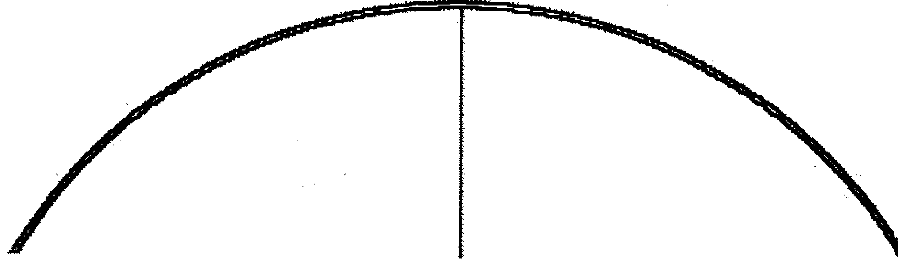

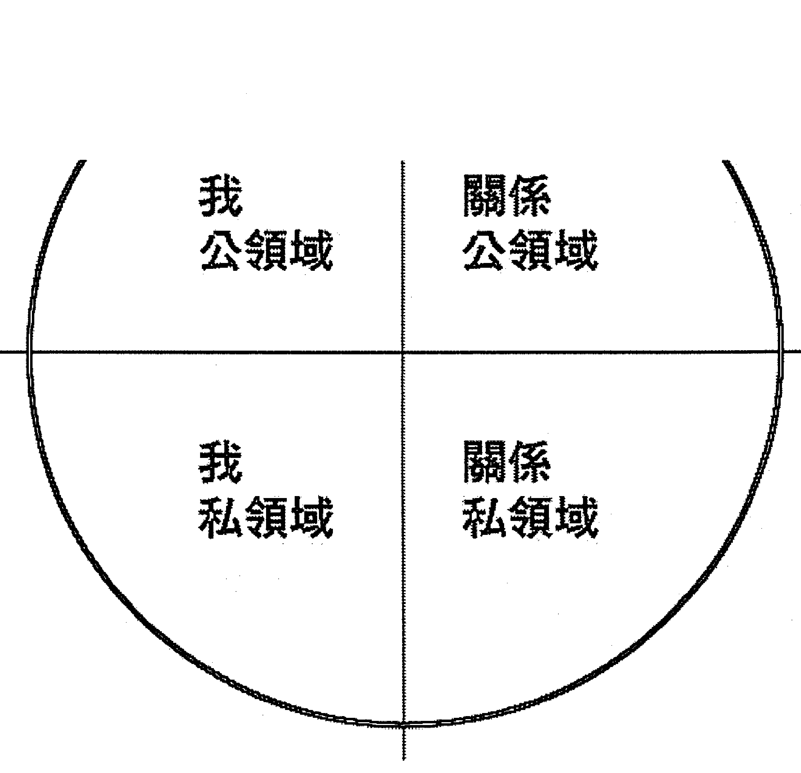

## 第一象限

## 第二象限

從上頁圖來看，如果這一年的太陽回歸盤的群星聚集在第一象限，當事人不但會將注意力放在私領域，而且自我意識會很強。我有幾年有個朋友的太陽回歸盤就是這樣，而我也差點跟她鬧翻。第一年時，她的群星集中於下半部，以前我們經常會約出來吃飯、喝咖啡、看展覽，但這個時候她因為許多個人因素，越來越難約出門。我們來看這張圖，下半圓包含了「我的私領域」與「關係的私領域」。我跟她的交情很好，所以我們的關係屬於第二象限的「關係的私領域」。在這段期間，雖然她沒有辦法經常出門，但是透過手機簡訊、網路電話等等，我們還是有很多機會聊聊心事。

可是一年後她的群星集中於第一象限，變成了「我的私領域」，我在這一年特別受不了她。因為她不但難約、難找，而且即使有空跟我傳簡訊、通電話，她也變得滿腦子都只有自己，關注力全部都在她身上，以致於我們之間的互動等於沒有互動，都只是我在單方向的聽她在講她的理想與她的困境，每當我想要發言回應，不是很快就被她打斷，不然就是我講出去的話就像空氣，她完全沒在聽。剛好這一年我的群星也都落在比較自我的位置，我們就一言不合，不再往來。但也因為太陽回歸盤的力量只有一年，而我跟她的生日都在春天，所以等到隔年一入春，忽然我們又變得很談得來，雙方也就和好了。

### ▽ 行星落入宮位

看完群星落在的象限之後，如果行有餘力，也可以觀察一下太陽回歸盤中行星落入的宮位。十二個宮位對應著十二星座，它們具有共通的邏輯，差別在於十二個星座要講的是能量的特質，而十二個宮位則顯示出十二個不同的生活情境。宮位是我們生活上的舞台與場景，而這種舞台與場景，是被相對應的星座所投射出來的。如果忘記這個宮位要討論什麼，只要稍微回憶一下相對應的星座是什麼，就很容易聯想到宮位的意義。

此外，也可以由宮位本身的屬性來做分析。如果多數行星進入一、四、七、十宮，因為這些都是本位星座投射出去的宮位，所以都會具有比較強烈的開創性的行動力；如果多數行星進入二、五、八、十一宮，因為這些都是固定星座投射出去的宮位，所以都會具有保守、固執、咬著牙緊握不放的特質；如果多數行星進入三、六、九、十二宮，因為這些都是變動星座投射出去的宮位，所以都會具有善變的特質。

關於十二個宮位的意義，簡述如下：

第一宮是由牡羊的自我意識投射出去的實際情境，它代表的是一個人的外在特質。

第二宮是由金牛的資產意識投射出去的實際情境，它代表了一個人的金錢緣分。

第三宮是由雙子的溝通意識投射出去的實際情境，它代表了一個人的近距離溝通與基礎教育的緣分。

第四宮是由巨蟹的家族意識投射出去的實際情境，它代表了一個人跟家庭與內心之家的緣分。

第五宮是由獅子的自我創造投射出去的實際情境，它代表一個人在戀愛、子女等創造領域中的緣分。

第六宮是由處女的規律運作投射出去的實境情境，它代表一個人在工作、健康領域中的緣分。

第七宮是由天秤的和諧共處投射出去的實際情境，它代表一個人在一對一平等關係中的緣分。

第八宮是由天蠍的資產共有投射出去的實際情境，它代表一個人在面對他人資產，其中包含了性、金錢、權力相關領域的緣分。

第九宮是由人馬的高等心智投射出去的實際情境，它代表一個人在高等教育、異國與宗教、政治等高等心智方面的緣分。

第十宮是由摩羯的社會功成名就投射出去的實際情境，它代表一個人在社會舞台上的跟事業有關的緣分。

第十一宮是由寶瓶的公益價值觀投射出去的實際情境，它代表一個人在公益、同好、社交舞台上的緣分。

第十二宮是由雙魚的同情投射出去的實際情境，它代表一個人前世未了的因緣，在這輩子的影響，它顯示出一個人可能會有的身心症狀。

### ▼ Solar shape

在這裡為大家介紹astro-seek網站中的「Solar shape」功能。

請大家進入astro-seek網站，依照二十三頁到三十頁中的介紹，打出一張太陽回歸盤之後，選擇「Solar shape」，就會出現一張藍白相間，裡面有許多藍色圓點的圖，這就是所謂的solar shape。

從「Solar shape」中，我們可以用最直觀的方式，一眼就看出這個人這一年的群星落在哪個象限。而且也可以看出如果有哪一顆星單獨落入象限，這就是所謂的「孤狼效應」，這一顆不合群的「孤狼效應」行星，就會讓當事人需要格外花心力去處理它。

- ex. 梅根馬可的多事之秋

英國哈利王子的太太梅根馬可（Meghan Markle）在二〇二〇年的太陽回歸盤。她的生日是在八月，而她過完生日不久，在十月時就流產了。而她在二〇二一年三月接受歐普拉專訪，引發關注，不久後，四月時哈利王子的祖父，也就是菲利普親王過世，而同年六月，梅根在美國加州生下一女，取名為莉莉白。

從「Solar shape」中，我們可以很快的看出，梅根馬可在二〇二〇年時，行星聚集在下半球（也就是私領域）較多，而右半球（關係領域）又比左半球（自我領域）要多。其中有四顆星落在第一象限，她會有一些個人的私領域問題要處理，第二象限有兩顆星，她會有一些跟家人、子女有關的議題，第三象限也有三顆星，代表她會有一些伴侶與財產問題需要去處理。第一二三象限的問題，都會是她這一年的重點。此外，在這張盤中，第四象限有一顆孤零零的星。當我們看盤時，發現這種孤零零的星，都會具有某一些特殊意義，它會產生出一種「孤狼效應」。以梅根馬可的二〇二〇年來看，形成孤狼效應的是婚神星，婚神星跟婚姻與伴侶關係有關。也的確，她在二〇二〇年，不管是跟哈利王子脫離皇室，或是流產之後又懷孕生女，或是接受歐普拉訪問而成為媒體關注的焦點，這些事情都是哈利王子跟她形影不離、全程作伴。也說明了這一年的婚姻關係，對她有很重要的影響。

### ▽ 綜合案例

關於宮位與星座性質分佈，我們舉一個例子，讓大家用實例來看看如何解析案例。

- ex. 離家出走的求道少年

我認識一個修行人，他在一九九九年時還是個小孩，他在那年十二月時，因為跟家人吵架，於是離開家，到廟裡面修行。

在這一年的太陽回歸盤中，象限分佈非常混亂，每個象限都有星。不過可以看到他的本位星座與變動星座都有不少星，而變動星座中，只有月亮與冥王星進入人馬，其他都沒有行星。也因為他這一年有很多星落在本位星座，本位星座互為九十度與一百八十度，再加上有許多行星落入固定星座，固定星座之間也互為九十度與一百八十度。所以這一年他不但有許多本位星座的暴衝行為，也有很多固定星座「成住壞空」中的「壞」的面向。這代表他離開原本習慣的家庭生活，去追求不熟悉的修行生活。

而且他去修行的地方，並不是離家很近的廟，他離家千里，去了一個很遠的地方修行。這需要很大的本位星座動能，而且是用大十字的能量彼此衝撞，才有辦法讓他做成這件事。

這就是分散型的太陽回歸圖，可能會有的狀況。

從下頁的Solar Shape圖中，我們可以看見當事人在離家那一年，分布在十二到四宮與分布在六宮到十宮的群星之間出現對立。所以當事人的自我價值與他人價值也因此產生衝突。進一步引發天頂天底軸線的離家行為。

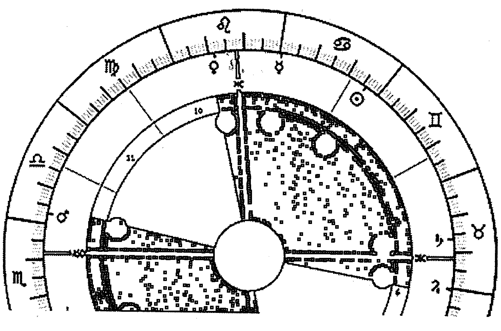

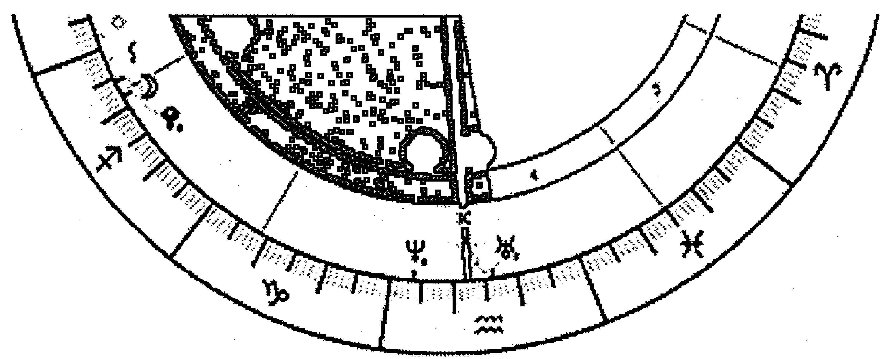

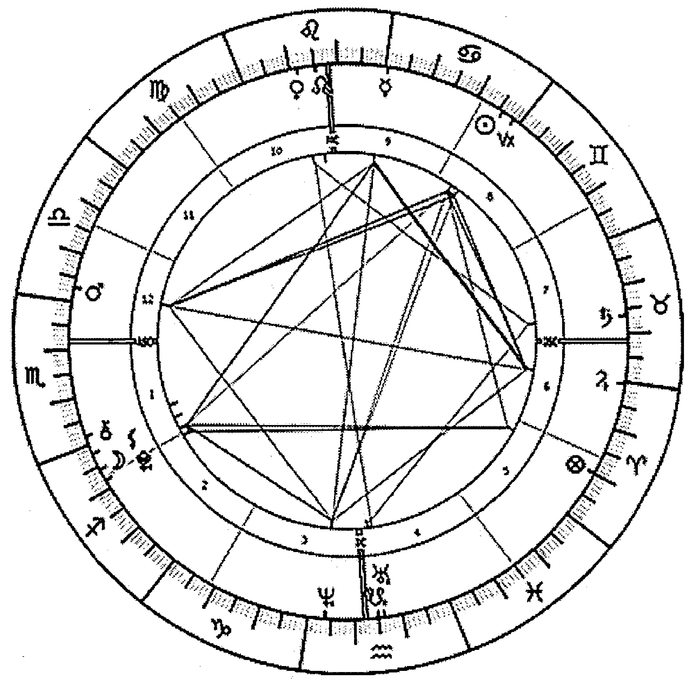

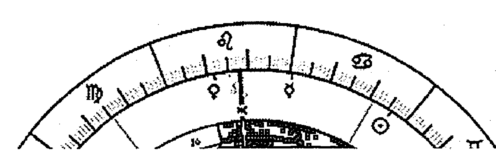

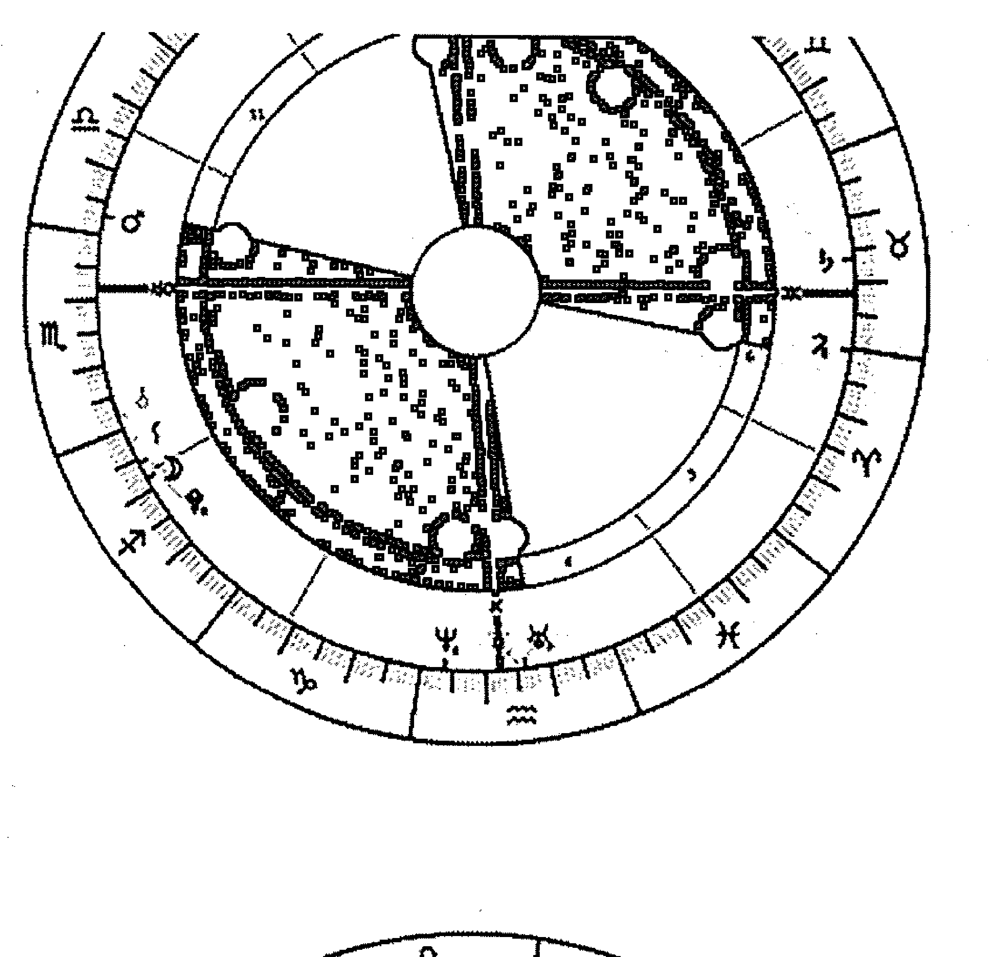

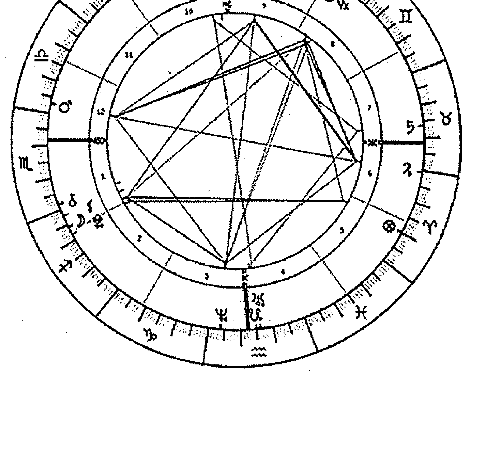

## Chapter / 4
上升與天頂

所謂的天頂星座，指的是星圖中「MC」（天頂）座落的星座，而天底星座，則是「IC」（天底）座落的星座。

天頂星座是我們的社會身分，而上升星座是我們的人格面具，兩者都是我們的外在樣貌，只是天頂比較社會性，而上升比較自我。

大家請觀察一下至少三年——甚至大家會發現，很可能不只三年，甚至連續很多年，大家的上升 / 天頂，會落在相同性質的星座。這就顯示你連續在這幾年，都會用本位 / 固定 / 變動的社會面具或人格面具來面對世界、表達自我。

大家把連續十年的太陽回歸盤打出來，就會發現，如果連續很多年，上升 / 天頂都在本位星座，你這幾年一定都會在努力奮鬥，都在朝著人生目標奔馳，都在努力實踐自我。

如果連續好幾年都在固定星座，你會發現，這些年你都會在努力保有自己所有擁有的某些東西。本位星座的動能比較強，變動星座的位能比較強，所以本位星座的那幾年會有很多開創的可能性。

如果連續好幾年都在固定星座，那幾年就會傾向守成，但也會比較僵化。不過既然是固定星座，意謂著你已經擁有了某些資源，因而比較容易引發勾心鬥角、名譽榮辱的各種議題。

如果連續好幾年都在變動星座，那就代表你會在生活中，遇到許多舊的已經結束，新的還在土壤中或子宮中，還沒長出來的議題。這時候你的生活經常會感到曖昧不清，還在慢慢的生根、成長，也都還不知道長出來之後，會成為一棵什麼樣的樹。因此會比較沒有方向，也容易感到迷失。也因為它通常會延續很多年，所以當事人會發現，有很多年的時間，他們都在尋找人生的方向，也很可能會連續很多年，都在想辦法根絕過去僵化的習性。

### ▽ 觀察上升——天頂星座的移動軌跡

當我們年復一年，將連續很多年的太陽回歸盤放在一起做比較，我們會發現它的軌跡。首先，我們要觀察的是上升／天頂星座的星座屬性。

舉例來說，如果一個人前年、去年、今年太陽回歸盤的上升星座依序為處女、人馬、雙魚，這個人的天頂星座，就會依序為雙子、處女、人馬。也就是說，今年的上升星座，通常就會變成明年的天頂星座。

這也就說明了一個人今年自我的人格面具（上升星座），經過一年時間，到了明年，就會變成他的社會身分（天頂星座），會成為這個人的社會奮鬥情境。今年大家經過了上升星座的自我的、小我的練習，隔年就會把這個力量轉到天頂，進一步的成為社會上的、大我的訓練。

不過這種情形有時會出現例外。有的時候一個人可能連續好幾年，上升／天頂都是固定星座，但忽然有一年跳到本位星座。也就是在一種既定的節奏中，有時候會出現一些意外、脫序。所以大家如果發現自己有哪一年，出現了原本應該是在本位／固定／變動大節奏之外的意外，這時就必須要特別注意這脫序的一兩年，看看這一兩年是否發生了一些與前後年分不同的事件。

下一頁的數據，是某位當事人連續十二年度太陽回歸盤的上升星座與天頂星座變動表格。為了保護當事人的隱私，因而姑隱當事人的出生日期，僅列出編號與數據。

下表中的「上升順序」與「天頂順序」欄位內的數字，分別代表的是當年太陽回歸盤中的上升星座與天頂星座在黃道十二星座中的排序。很多對占星基礎不夠深的人，可能會在這個過程中手忙腳亂。其實很簡單，我們先將每個星座的順序依序記好：一牡羊、二金牛、三雙子、四巨蟹、五獅子、六處女、七天秤、八天蠍、九人馬、十摩羯、十一寶瓶、十二雙魚。然後就可以分出：一、四、七、十的本位星座族群，二、五、八、十一的固定星座族群，以及三、六、九、十二的變動星座族群。有了這個概念，再去觀察十年到十五年的上升星座與天頂星座，就很容易可以抓出本位、固定、變動星座改變的年份。

| 年份 | 上升順序 | 天頂順序 |
|------|----------|----------|
| 01   | 6        | 3        |
| 02   | 9        | →6       |
| 03   | 12       | →9       |
| 04   | 3        | →12      |
| 05   | 6*       | →3*      |
| 06   | 8*       | 5*       |
| 07   | 11*      | →8       |
| 08   | 3*       | →11      |
| 09   | 5*       | 2        |
| 10   | 8        | →5       |
| 11   | 11       | →8       |
| 12   | 2        | →11      |

"*" 代表星座元素或星座性質轉換時期

先注意「上升順序」一欄，由列表中我們可以發現，第一到第四年，當事人太陽回歸盤的上升星座是位在三、六、九、十二的變動星座族群。第五年開始到第九年，此變動星座族群慣性開始逐漸被固定星座族群打破。在第九年及之後，當事人的上升星座完全變為二、五、八、十一的固定星座族群表現。同時，我們可以在第五年到第九年的「上升順序」數字後方看到「*」標示，這也代表在這幾年之中，上升星座處於星座性質轉換的變動階段，所以上升所代表的個人形象作為與人格面具，也會在這幾年因為某些外來環境影響或事件，造成人格面具或個人作為的轉變。

同理，我們也可依序檢查「天頂順序」，「天頂順序」在第五與第六年的太陽回歸盤天頂出現星座性質的轉變，這代表當事人的社會或家庭的安全感，將會在此期間出現挑戰或變動，接下來也會進一步改變了當事人的社會責任與社會面具。

此外，前面提到，在正常狀況下，前一年的上升星座會變成後一年的天頂星座。以上表為例，我們可以發現第一年到第四年的「上升排序」分別是「處女（六）、人馬（九）、雙魚（十二）、雙子（三）」，而第二年到第五年的「天頂排序」也出現了同樣的「處女（六）、人馬（九）、雙魚（十二）、雙子（三）」組合序列。

但在這個規律中，有時候也會出現一些例外。雖然一般來說，今年的上升會成為明年的天頂，但如果今年的上升沒有成為明年的天頂，這代表什麼意義？又需要留心哪些事情？

今年的上升會成為明年的天頂，它的意義，在於今年如果你能好好的練習上升的自我表現，練習了一年之後，隔年就會成為一個人在天頂的社會舞台展現自我的能量。但有時候也會有例外，如果遇到例外，這代表了這一年的天頂星座，少了前一年的練習，這一年的天頂相關的社會成就、社會表現方面的能力，就有可能就會因為欠缺熟練度，因而使用得不太順手。

不過這也會跟本命星圖本身的配置有關。如果你的本命星圖中，本來就對這個星座的能量很熟悉（比如有行星落在這個星座），那麼即使前一年的上升不落在這個星座，隔年你還是可以順暢地展現出這個天頂星座的能量。不過如果本命星圖中本來就欠缺這個星座的能量，忽然略過了上升就跑去天頂，你就得要多花一點時間來適應。

此外，本位、固定、變動星座族群，分別代表了「成」（本位）、「住壞」（固定）、「空」（變動），其中最容易帶來痛苦與衝擊的，往往會是固定星座。所以當你發現自己的太陽回歸盤，有好幾年的上升、天頂都落在固定星座，這一段期間，一定會是人生中比較具有戲劇張力的時期。你可能會發現，你有很多人生大事，都是在這段時期發生的。

觀察上升星座與天頂星座的變化，會是太陽回歸盤的重要指標。

大家應該至少印出十年到十五年的太陽回歸盤，找出上升星座、天頂星座在本位、固定、變動星座中發生變化的一年，並從中發掘這個轉折是怎麼影響到我們的人生。

#### ◇ 本位星座——我想要成為怎樣的人，我的自我定位是什麼，發展自我意識，找出自我定位。

如果在持續數年的時間，上升與天頂星座都落在本位星座，就代表這在段期間，當事人的生命主題，都會與生命的探索有關。不管是生命上的新經驗，或者是生命中出現的人際關係，這些生命事件，都是幫助我們認清楚，到底我們想要成為怎樣的人，進而發展出自我意識。

所謂的「自我意識」，並不是說要唯我獨尊，甚至也不見得是以自我為中心。如果遇到的是上升在牡羊，牡羊的確會比較以自我為中心，但如果遇到了上升落在巨蟹，當事人在這一年就會發展出以「我的家庭」為中心的自我意識。如果落在天秤，他就會發展出以「我的伴侶」為中心的自我意識。如果落在摩羯，他就可能會以「我的事業」，當成自我的延伸。也就是说，牡羊是一种单纯的自我，而巨蟹、天秤、摩羯，同样也都是一种自我的延伸。而在长达数年的上升、天顶落在本位星座的历练，当事人就会很清楚的明白自己的定位是什么。

#### ◇固定星座——我的存在价值是什么，经营存在目的，丰盛、加固vs.断舍离、超越。

如果在持续数年时间，上升与天顶星座都落在固定星座，我们就会面临许多跟存在价值有关的议题。而它又与当事人的年纪有关。原因在于固定星座都与物质世界中的资源有关，而一个人年纪很小时，能够握有的资源都有限，遇到的勾心斗角也都有限。就算是狮子座会遇到想出风头的议题，如果年纪很轻，会惹出来的麻烦也相较之下没有那么大。从另一个角度来说，如果一个人在年纪很轻的时候，遇到了上升、天顶星座落在固定星座，往往会显现在他们的父母或家庭经历了资产变动议题，也有可能会反映在家人之间的离散聚合。

但随着年纪成长，一方面自己已经拥有了赚钱能力，另一方面也开始会有一些自己的情感关系上的议题，当一个人在成年以后遇到上升、天顶落在固定星座，就会进入了一段认识自己具有什么样的价值的时期——其中包括了我有没有足够的金钱、我有没有足够的个人魅力、我在人际关系中有没有足够的信任度，以及我在面对生命中的理想时，有没有足够的自信。

也因为上升、天顶落在固定星座的时间，往往长达很多年，因而我们可以藉由多年的时间，来经历固定星座要探讨的自我价值的各种面向。举例来说，一开始时，我们有可能会认为我的价值是基于金钱的拥有，所以会在前几年努力累积金钱资产，但累积了三四年之后，可能我们会发现，自我价值并不全然是靠着金钱就可以得到，于是我们会转而寻找自我价值的其他面向。但无论如何，当上升、天顶落在固定星座时期，我们都会着眼、着手，想办法让自己的生命，变得更加丰盛，会想办法让自己更具有存在感，让自己更具有价值。

不过虽然固定星座代表了拥有与丰盛，但它也必须面对消亡的转折，我们很可能会在这段期间，经历人生中巨大的断舍离。这些断舍离事件，都是要让我们在保有自我价值之外，还要能够学习如何超越这些拥有物，要如何能够断舍离已经成为生命累赘的事物。

而固定星座时期面临的资产拥有与断舍离的议题，并不仅于自身，它也会反映在人际关系。我们有可能会在亲密关系中，一开始不断地追逐拥有，想要把亲密关系紧抓在手上，接下来可能两人感情如胶似漆、浓情蜜意，而一段感情走到了最后，不是生离，就是死别。在十二个星座中，最跟死亡有关的，就是天蝎座。而死亡也分为两种：一种是身体的自然消亡，另一种是意外身故。而意外死亡，则属于宝瓶的议题。不管是生离或死别，都是天蝎、宝瓶常见的议题，而天蝎、宝瓶也都是固定星座。由此可见，固定星座讲求的，未必都是资本的拥有，它也进一步探讨，我们如何在已经拥有之后，去分辨什么是值得留下的，什么是不该留下的。而到了最后一步，也就是无可选择地进入死别之境，固定星座的议题也就结束，开始进入变动星座的议题，我们开始学习要用灵活通变的方式来面对无常。

#### ◇变动星座——认识世界、灵活通变。时勤擦拭，勿使惹尘埃vs.本来无一物，何处惹尘埃。

第一个变动星座是双子座，它代表藉由海绵般知识吸收的能力，让我们更了解这个世界。也因为我们更好奇，更了解这个世界，所以得以脱离固定星座的执着，也因为具有灵活通变的能力，而得以面对世界的无常。

而同属变动星座的人马座，则透过高于尘世的价值观，其中包含了社会伦理、异国旅行与宗教，它反映出当我们遇到了天蝎的生离死别之痛，到了人马时，眼界一开、天地一宽。在天蝎的阶段，我们可能面临亲密关系中的背叛，遇到死亡议题，遇到金钱方面的大起大落，当这些事情告一段落，我们会不由得深思，到底人活着是为了什么。

而处女跟双鱼这两个变动星座，则跟修行有关。处女的态度是时勤擦拭，勿使惹尘埃，而双鱼的态度是本来无一物，何处惹尘埃，两者各有其重要性。

所有的变动星座都具有二元性—承先与启后。变动星座之后，承接的是本位星座，变动星座都代表种子在土里扎根，在土里面吸收养分，静待时机冒出芽。在变动星座时期，我们会努力生根，抓紧土壤，之后进入本位星座时期时，才能全力开枝散叶。变动星座的精益求精，都是为了进入本位星座的奋斗而预作准备。

而变动星座也承接了固定星座，意谓着变动星座让我们理解何谓活着的目的。它让我们学习，在固定星座的得失成败之后，能够以一种更加灵活通变的方式，来面对我们的生命。变动星座的二元性，也会反映在它既可以用一种豁达的心态来面对世界，本来无一物，何处惹尘埃，但它也有务实的一面，它会用一种很勤劳的方式，帮助我们奠定良好的基础。

如果是在年纪很轻时，上升与天顶经历到变动星座时期，这会是一段利于学习、吸收、探索方向的时期。也许会经验到时勤擦拭勿使惹尘埃的历练，也许会感到充满迷惘或怀抱浪漫梦想。如果我们是在年纪较大时，上升与天顶经历变动星座时期，在这段期间，可能我们要学习的，就是如何面对身体的老化，面对事业上的退休，面对人际关系上的改变，而我们会在这段期间，学会淡然处之。至于如果在中年遇到上升与天顶进入变动星座，通常都会带来中年迷惘。原因在于变动星座时期，要不然就是还没冒出土壤，因而看不到未来的方向，要不然就是身体已死，但灵魂并没有消亡，仿佛进入了“中阴身”状态。也因为这个时候未来的方向不明确，所以会有一种潜藏而伺机待动的状态，如果人在中年遇到变动星座时期，都会感到迷惘。

不过我身边也认识很多修行人，他们都是在上升、天顶进入变动星座时期，开始认真地面对修行的功课。也有一些人在这个时期去参加许多课程，更进一步地去探索未知领域。不过当然，也有一些人在这段时期，必须要经验自己身体健康带来的种种问题，或是必须要扛起照顾身边人健康的责任。

以上的观点，可以帮助大家理解，当我们长达数年的上升、天顶，进入本位、固定、变动星座时，可以抱持着怎样的态度来面对。

我在进入韩良露生命占星学院前，做的是跟建筑相关的工作，一方面自己开公司做建筑顾问，一方面在学校教书。在这段期间，我的上升与天顶，都一直停留在固定星座。自己开公司就必须要处理很多的资产往来，而这些金钱金额都不会太小——由此可见，固定星座都会具有一定程度的盛大特质，但也因为往来金额都很巨大，只要在过程中，一不小心犯了一点小小的文书错误，就有可能得要付出高额的代价。

后来随着韩良露占星学院的创立，我加入编辑群之后，原先的工作加上占星学院的工作，一时之间难以负荷。但有趣的是，在我加入占星学院编辑群的第二年后，我的上升与天顶都进入了本位星座，而我也在这个时间点，意识到之前做了好多年的建筑顾问工作，似乎已经到了应该要收尾的时候了。因为建筑顾问工作中，涉及了太多利益考量，不再是当初我喜欢的建筑、设计、美学，而都变成了各式各样的金钱角力。从这里也可看出，在长达数年的固定星座时期，我并不介意生活过得这么复杂，可是当我逐渐由固定星座时期转往本位星座，我忽然对这种复杂的、大起大落的生活方式，感到很厌倦。也因为我常年研究太阳回归盘，我知道我已经从固定星座时期，转向了本位星座时期，这个认知，让我可以很迅速地做下决断，既然生命的重心已经改变，不如见好就收，把之前的工作结束，转而专注于占星的研究，以及书本的编写。从刚刚的描述可知，之前固定星座时期的生活，跟现在本位星座时期的生活，差异非常大。在现在的本位星座生活时期，可以很清楚地感受到，付出多少力量，写多少稿子，教多少课，就能拿到多少收入。一方面比较踏实，另一方面也不再那么提心吊胆，不再会因为我一不小心看错金额，一个签名签下去，就得要负担起整间公司的成败。

从我的例子，大家可以发现，从上升、天顶星座落入的不同星座族群，可以用来说明你在长达数年期间的生活模式，也因此，大家可以藉由上升、天顶星座族群的转移，来帮自己抓紧生涯状态转移，做长时期的阶段性规划。我遇到过很多人，他们在遇到很明显应该要生涯转换时，总是很舍不得之前也许努力打拼了十年而打下的基础。最后却因为该放手而不肯放手，结果变成了一场冗长的、歹戏拖棚的闹剧，说是一种凌迟般的生命经验也不为过。

当我们学会太阳回归盘，主要不是要看今年会不会升官发财，而应该进一步透过太阳回归盘来预先规划，看看自己的人生在什么样的阶段应该前进，在什么时候应该要休息。

就算不是上看十年的上升、天顶星座族群的转移，一些短期的太阳回归盘技巧，也可以提供大家很明确的一年之计。

举例来说，我今年的上升星座是牡羊，去年上升星座是摩羯，前年的上升星座是天秤，大前年的上升星座是巨蟹。我在上升落在巨蟹那一年，由于食物成为了我的安全感来源，所以我在那一年吃得很胖，看起来非常圆润。隔年上升轮到了天秤，天秤最注重优美，所以我努力瘦了下来。前一年上升落在巨蟹时，那一年我不太注意我的身材，但隔年上升变成天秤时，我看着自己身材，心想一定要找出一些方法来制止自己贪吃的问题。不过，也因为天秤的主管星是金星，金星并不是一颗很勤奋的星，所以虽然那一年我变得比较爱美，但还是不太能严厉地执行减肥计划。不过我也知道再隔一年，我的上升会跑到摩羯，再隔一年会走到牡羊。显然我在上升落在摩羯时，会过得很勤奋，甚至会有一点艰苦。

当我们将占星学到一定程度，就会知道，当我们遇到各式各样的负面运势时（也包含太阳回归盘中的艰困状态），如果愿意吃苦，负面运势就有可能因为你自己愿意主动吃苦，而被消化掉。但如果运势走到负面阶段，你还是打算每天过着醉生梦死的生活，这个运势就会以一种酷刑的方式，来逼迫你去面对负面运势。我当然不想要等到负面运势来了才被动迎击，所以就提前主动应对，开始报名了不少瑜伽课程，也趁着上升星座落在天秤的这一年，稍微打下了一些瑜伽基础。到了隔年，由于之前我已经开始接触瑜伽，也开始知道有哪些瑜伽名师，随着上升星座进入摩羯，我也开始有能力挑战更高难度的课程。此时，我发现了瑜伽教练证照的网络课程，这堂课的要求非常严格，在受训时期，每天得要花三个小时，上各式各样的课程，包含哲学、解剖学，以及各式各样的瑜伽体位法。我看了课程简介之后，就决定用这个严格的教练课，来反映我这一年的上升摩羯。也因为这一年的上升在摩羯，回归盘中的火星、土星、冥王星也在摩羯，落在一宫，一宫跟个人形象有关，火星代表肉体活力与脾气，而土星与冥王星都跟锻炼有关，这些征兆，也都很符合我去接受严格的瑜伽教练训练的情境。

但其实那一年对全世界最大的考验，就是各国都因为疫情而封城。本来每一年，我都会有一段期间要出国，但随着各国疫情延烧，我的火、土、冥一宫，就显现在我每天在家里忙得不亦乐乎，随着不同的瑜伽体位，每天在家折骨头。虽然每天都很酸痛、疲累，但一整年下来，我藉由太阳回归盘中上升在摩羯的这一年，换来了一张高阶的瑜伽教练证照。虽然这张证照对我而言应该没什么用，但摩羯本来就跟“社会认证”有关，藉由这一张证照，来反映出上升进入摩羯的这一年，也是一种很有意思的体验。

也就是说，在上升进入摩羯，又逢火星、土星、冥王星也在摩羯的这一年，我不但没有遇到人事之间的纷扰，反而身体还因此变得更好了。也因为我在这一年，过着比较有纪律的生活，通过高强度的训练，不管是身体的健康度与情绪的稳定度，都反而比以前更加长进许多。

这也是我一再强调的，当我们在解析太阳回归盘时，不要只关注今年。这就像在学开车——当年我父亲教我开车，他告诉我，开车时，眼睛不能只盯着前面一辆车，而应该至少盯着前面三辆车的动态。这样一来就算临时遇到什么意外，才会有足够的时间来因应、转圜。同样的道理，当我们在解读太阳回归盘时，不要只看接下来这一年会发生什么事，我们应该要调出接下来的两三年，先找出一个可能会演变的趋势概况。虽然我们常说“人算不如天算”，但通过主动的参与，我们还是具备影响命运运作的能力，大家千万不要浪费了这种能力。

## 作业

请大家打出前年、去年、今年的太阳回归盘。

列出这三年上升星座与天顶星座的变化，并且以数字来表示。（也就是说，牡羊记为“1”、金牛记为“2”、双子记为“3”，依此类推。）

大家会发现，它们通常会是相同属性的星座。也就是同属本位星座（1-4-7-10）或同属固定星座（2-5-8-11）或同属变动星座（3-6-9-12）。

举例来说，我手边有一个例子，他前年、去年、今年的太阳回归盘的上升星座依序为“1-4-7”，而天顶星座则依序为“10-1-4”。又如有一个案例，他前年、去年、今年太阳回归盘的上升星座依序为“6-9-12”，天顶星座则依序为“3-6-9”。

# Chapter / 5

## 最高点行星

从太阳回归盘中，行星落的位置与相位，可以帮我们进一步解析这一年的生命重点。

我们在解读太阳回归盘的行星时，首先要观察的，就是最高点的行星。在我们的星图中，九宫与十宫都会位于星图的最上方。在太阳回归图中，我们要先观察九宫与十宫中有没有行星，如果有的话，选择最接近天顶的那颗星，它就会是这张星图中的“最高点行星”。

最高的行星，就像是一个房间中，放在最高点的一桶热水泼下来，整个房间都会受到影响，它会因为位在制高点，因而具有影响全局的影响力。

除此之外，如果在这一年中，有任何行星接近太阳回归盘的上升、下降、天底的话，它们也都具有很大的意义。但其中影响力最大的，会是最高点行星。

在太阳回归盘中，星图最高点的行星，往往会显现在今年发生的一件大事，而这件大事足以影响这一年，成为这一年的主题。不过有时候我们会发现，自己这一年似乎没有真的发生什么大事，这个时候最高点行星，就会以氛围的方式来发挥影响力。尤其如果这颗最高点行星“不够高”，也就是不够接近天顶的话，它的力道就不会太显著。

甚至有可能我们可能会遇到九宫跟十宫都没有行星，最高点行星是落在八宫或十一宫，甚至更低。那要怎么看待呢？

前面提到，最高点行星，就像是一盆热水放在房间最高处，一泼下来，整个房间都受影响。而如果九宫、十宫都没有行星，是第八宫、十一宫或更低的宫位，虽然它依然是最高点行星，但这盆热水泼下来，下面的行星都会受到这颗星的影响，但这颗星上方还有很多空间不会受到影响。它还是有影响，但影响力会比一般在九宫或十宫的最高点行星要弱。

### ex.离家千里修行的小孩

前面提到，我认识一个修道人，他在十四岁时因为跟家人产生剧烈冲突，因而离家千里，跑去另一个国度求道。

他在那一年以原居住地排出的太阳回归盘中，最高点行星为水星，落在九宫，几乎与天顶合相。水星代表学习，而且是一颗变动之星。由最高点行星来看，他这一年的重点，的确是去遥远的异国，求取高深的学问。

### ex.维基解密发言人的性丑闻

维基解密的发言人朱利安亚桑杰（Julian Assange），由于他涉及揭露很多国家机密，因而一直不受许多国家欢迎。但真正让他触法被捕的，是一桩性丑闻，而他这一年太阳回归盘中，最高点行星，正是跟性罪有关的火星。

二〇一〇年十一月十八日，朱利安亚桑杰因为性行为不检，而被瑞典警方发布红色通报级别的通缉令，后来也因此被捕，对他的名誉造成很大的影响。而这一年的太阳回归盘中，星图的最高点是跟性有关的火星，几乎与天顶合相。而这颗火星落在处女座，处女座跟健康、卫生有关。而这个丑闻发生的原因，就是因为他去瑞典参加活动时，跟两名女子发生性关系，结果惹出了不戴套纠纷。虽然亚桑杰说是两厢情愿，但两名女子说她们并没有同意，并提出要验爱滋病毒医检的要求，这一切都跟火星的性，与处女的健康、卫生有关。

### ex. 艾美怀丝获国际大奖

英国女歌手艾美怀丝（Amy Winehouse）二〇〇八年多项入围、赢得多项葛莱美奖，甚至因此还入围了金氏世界纪录“获得最多葛莱美奖的英国女性”。这一年她的太阳回归盘中，星图最高点的行星是位于十宫的木星。木星代表了社会资源、社会能见度，也代表得奖，加上落在人马，人马与异国事物有关，所以这一年让身为英国歌手的她，在美国拿到很多大奖。

### ex. 老虎伍兹离婚赡养费创天价

高球名将老虎伍兹（Tiger Woods）在二〇一〇年离婚，离婚的赡养费创下天价。而他这一年太阳回归盘的最高点行星是土星，而且落在天秤，土星代表现实的压力，而天秤跟伴侣关系有关。由此可见，藉由太阳回归盘最高点的行星，我们可以很容易的解释出这一年中，最显著为人所知的重大事件。

## ▽ 最高点行星的意义

如果最高点行星是太阳，这一年的大多数时间都会比较有活力、比较健康，也比较有动力去完成自己的工作目标。

如果最高点行星是月亮，这一年的生活重点，往往会摆在家务生活、内在情绪上。也因为月有阴晴圆缺，所以这一年很容易会有心情上的起伏变化。

如果最高点行星是水星，这一年最重大的事，就很有可能会跟水星的心智交流、心智活动有关。如果是学生，可能这一年会遇到重要的大考，如果是作家，可能这一年会出一本重要的著作。

如果最高点行星是金星，这一年的生活重点，就有可能会放在跟金钱、情感、享乐、社交有关的事情上。

如果最高点行星是火星，这一年就有可能会遇到一些跟性、身体、奋斗、行动、灾难有关的重大事件。如果火星相位不好，有可能会遇到性丑闻，如果火星相位很好，就有可能会订立下一个健康计划，好好的去实践。如果当事人是从事体育相关的工作，如果火星相位好，这一年往往会有绝佳的表现。

如果最高点行星是木星，这一年都会自然拥有许多社会资源，赚钱比较容易，也比较容易遇到贵人。

如果最高点行星是土星，几乎很少例外，就算土星相位不错，这一年都会是压力很大的一年。

如果最高点行星是天王星，这一年都会遇到一些天外飞来的巨大变故，让人必须要努力应对，如果天王星相位不好，就会让人有疲于奔命之叹。

如果最高点行星是海王星，这一年很可能就会有一些跟灵性、艺术有关的事件，成为生活中的重点。但如果海王星相位不好，这一年就可能会被骗，或者遇到一些丑闻。

如果最高点行星是冥王星，冥王星是一颗跟死亡、重生有关的行星，所以这一年可能会遇到身边重要人物的死亡，也有可能会是抽象的事业上或生活上的死亡与重生。此外，冥王星也是一颗权力之星，很多人会在冥王星进入最高点的这一年，感到大权在握。

北月交点合相天顶时，这一年很容易取得事业上的发展，或是获得某种社会面向的新机会。

南月交点合相天顶时，这一年在事业的发展上，就很容易遇到很多阻碍，因而感受到很大的压力。

在解析最高点行星时，应该先将这颗行星本身具有的意义优先解释，如果行有余裕，则可以看一下这颗行星落在什么星座，可以进一步从这颗行星落入的星座，来解析会发生什么样的情境。

但也因为一年其实是一段不长也不短的时间，自然不可能每天都过着最高点行星的生活，而最高点行星也有可能会有少数的例外状况。不过正常来说，当这一年过去，事后再来回顾这一年，往往会发现，这一年的最高点行星，的确点出了这一年的主题。

也就是说，尽管解析太阳回归盘的方法很多，但如果你想要在最短的时间内点出年度主题，最高点行星会是一个好方法。

最高点行星的概念，其实跟物理上的“位能”概念很类似。当这颗星的位置越高，越接近天顶，位能就越大，影响力也越大。如果距离天顶越远，虽然还是有影响力，但力道就不会那么强。这个原理，就跟水力发电相同。今天如果我们的最高点行星的位置不够高，虽然还是可以发电，位能不足，它能产生的电力就没有那么强。也因为最高点行星越高，位能越强，力道越大，所以如果这一年的最高点行星不够高，甚至九宫与十宫中都没有行星，最高点行星的力道就会比较弱，解析最高点行星时，就会让当事人觉得好像没那么准。

## 作业

- 请大家找一下这两年的太阳回归盘，找出落在第九宫或第十宫，而且最接近上升点的行星。并且思考，这一年中，有没有哪些活动跟这一颗最高点行星相关。
- 2022年最高点行星是哪一颗，落在什么星座、什么宫位？
- 它对你这一年造成怎样的影响？
- 2021年最高点行星是哪一颗，落在什么星座、什么宫位？
- 它对你这一年造成怎样的影响？

# Chapter 6 上升星座的主管星——命主星

观察太阳回归盘一宫中的行星，可以观测出当事人在这一年中，重要的人我关系的变化。

由于一宫中的行星，很可能会跟四宫（家庭宫）、七宫（伴侣宫）、十宫（事业宫）中的行星形成负面相位，从中可以解读出，当事人会在四宫的家庭议题、七宫的伴侣议题、十宫的事业议题中，跟当事人想要做自己这件事产生拉扯。

而一宫的起点星座，就是上升星座，上升星座的主管星，也就是命主星。观察一张太阳回归盘的命主星稳不稳定，就可以看出当事人在这一年做人做事稳不稳定。

主管星在占星学中，又分为传统与现代两派，传统占星以古典七星（日月水金火木土）来分配十二个星座，现代占星则以日月水金火木土天海冥来分配十二个星座。其他也有更新的流派，提出以小行星来主管处女、天秤这两个星座，不过也因为新理论尚须经由更多实证来验证，而既有的主管星理论，已经通过了过往占星学界的验证，所以本书会同时以古典七星与现代十星为主管星，为大家解析上升星座的主管星，在太阳回归盘中的运用方式。

简单来说，十二个星座与主管星之间，必然具有相同属性。例如狮子座的星座能量特质是温暖、自信，而最为温暖、自信的太阳，就是狮子座的主管星。又如巨蟹座讲求的是家人般的情感，而主管家人、情绪的月亮，就是巨蟹座的主管星。

记诵十二个星座与主管星的方式其实很简单，如图所示，分别以狮子座（太阳）与巨蟹座（月亮）为界，分别以逆时针与顺时针方向排下去即可。从狮子座（太阳）逆时针方向起算，依序为狮子（太阳）、处女（水星）、天秤（金星）、天蝎（火星与冥王星）、人马（木星）、摩羯（土星）。从巨蟹座（月亮）顺时针起算，依序为巨蟹（月亮）、双子（水星）、金牛（金星）、牡羊（火星）、双鱼（木星与海王星）、宝瓶（土星与天王星）。

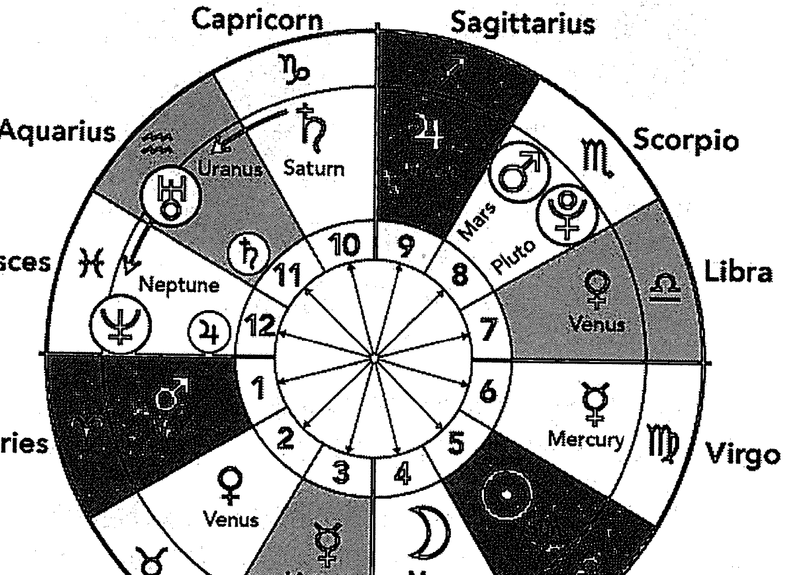

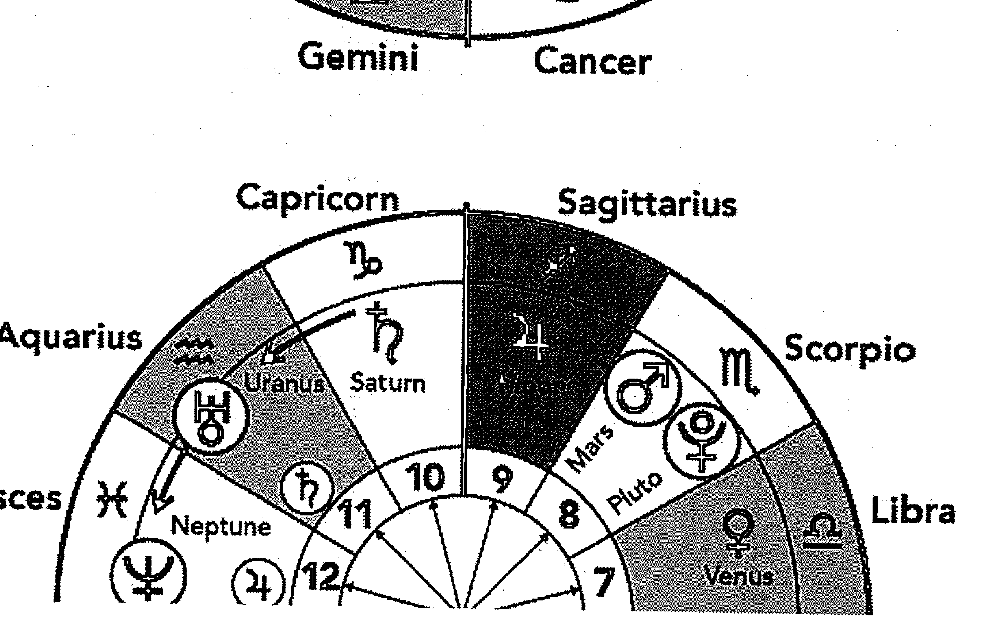

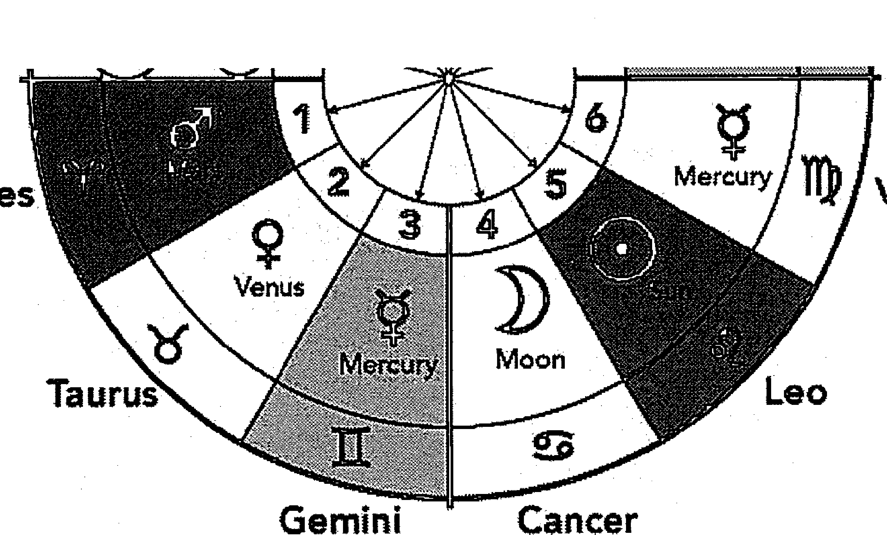

在太阳回归盘中的解读，要请大家看一下这一年上升点落在什么星座，并找出这个星座的主管星。

举例来说，如果今年你的太阳回归盘的上升点落在摩羯，摩羯的主管星是土星，找出星盘中的土星，土星会是你今年的生命主题。如果上升点落在天蝎，由于天蝎的主管星，在传统占星与现代占星中，分别被火星与冥王星所主管，所以今年的太阳回归盘中的火星与冥王星，都会是这一年的生活重心。又如今年如果太阳回归盘的上升点落在双鱼，双鱼的主管星是木星与海王星，就去观察这一年太阳回归盘中的木星与海王星的状态，就可以大致描述出这一年会出现哪些重大议题。

## ▽ 命主星的主要意蕴

在星图中，上升星座的主管星被称为「命主星」，由此可见它的重要性。

尤其在太阳回归盘中，每一年的上升都会落在不同星座，因而每一年都可能会有不同的命主星，所以观察太阳回归盘中的命主星，会是一个解盘的重要指标。

以下列出各个不同的命主星，以及这些命主星主要要呈现出来的生命处境：

- 太阳（上升落在狮子）：当太阳为太阳回归盘的命主星时，自信、创造力、荣誉面子、事业、玩乐或重要男性关系议题将成为今年主要动能。请注意太阳所落的星座宫位与相位，太阳所在之处将有无私给与、领导力、创造性与展现自信的重大发展潜力。
- 月亮（上升落在巨蟹）：当月亮为太阳回归盘命主星时，情感、家庭生活、内在感受、安全感、灵性连结或重要女性关系议题将成为今年主要重点。请注意月亮所落的星座宫位与相位，落点所在之处会带来内在进化与灵魂净化的可能。
- 水星（上升落在双子或处女）：当水星为太阳回归盘命主星时，人际沟通、教育学习、旅行交通、商业活动、谋略策划、兄弟姊妹等议题将成为今年主要重点。请注意水星所落的星座宫位与相位，落点所在之处将帮助我们在该领域练习人际沟通与知识吸收思考。
- 金星（上升落在金牛或天秤）：当金星为太阳回归盘命主星时，人际关系、公平正义、自我价值、舒适享受，生活中的美好与爱情，金钱赚取与开销等议题将成为今年主要重点，请注意金星所落的星座宫位与相位，落点所在之处有助于建立成熟的个人价值观、个人品味与资产。
- 火星（上升落在牡羊或天蝎）：当火星为太阳回归盘命主星时，专注力、反应力、行动力、竞争、面对敌人、冒险、运动、性意识、意外、受伤、自我等议题将成为今年主要重点，同时也容易出现主观、愤怒、焦虑、烦躁、身心发炎、血压上升等现象，请注意火星所落的星座宫位与相位，落点所在之处有助于目标确立与反应力培养。
- 木星（上升落在人马或双鱼）：当木星为太阳回归盘命主星时，宗教哲学、高等教育、道德意识、人生观与社会观思索、社会荣誉、社会资源、开心宽心或粗心、遇到贵人等议题，将成为今年主要重点，请注意木星所落的星座宫位与相位，落点所在之处将有利于建立培养成熟的价值观。
- 土星（上升落在摩羯或宝瓶）：当土星为太阳回归盘命主星时，权力、责任、社会环境压力或阻力、管理阶层、事业或家中长辈等议题，将成为今年主要重点。请注意土星所落的星座宫位与相位，落点所在之处将有利于为未来成功打下基础，培养责任心与管理能力。
- 天王星（上升落在宝瓶）：当天王星为太阳回归盘命主星时，埋在潜意识内的独立自主能量会在这一年活跃起来，并藉由与众不同的想法、较高视角观点、自成一格的行为模式，或经由群体相处、经由独处或意外事件来经验磨练此能量形式，请注意天王星所落的星座宫位与相位，会是今年经验新知、突变、挣脱、放手的快速转变区。
- 海王星（上升落在双鱼）：当海王星为太阳回归盘命主星时，埋在潜意识内的敏感性、与众生同体的能量意识，会在这一年活跃起来，并藉由慈悲心、同理他人、渴求拯救或拯救他人的行为模式，或经由宗教艺术文化活动，或经由逃避退缩成瘾行为，或是生命中的无奈无助经验来经验磨练此能量，请注意海王星所落的星座宫位与相位，会是今年慈悲心培养或灵性成熟之处。
- 冥王星（上升落在天蝎）：当冥王星为太阳回归盘命主星时，长期累积并埋在肉身或潜意识内的毒素，会在这一年浮出表面。过程中会出现秘密、控制、欲望、隐藏情感、情绪勒索、身体疾病、专注于特定目标的狂热、关系的毁灭与重生、毁灭性事件、探索玄秘世界或深沉潜意识等议题。请注意冥王星所落的星座宫位与相位，冥王星所在区域，将可以帮助我们深度自我觉察，也有利于身体、生命或关系的除旧布新。

大家会发现，如果上升落在天蝎，命主星就是火星与冥王星；如果上升落在宝瓶，命主星就会是土星与天王星；如果上升落在双鱼，命主星就会是木星与海王星。

本书引用的是现代占星的命主星定义为主。虽然古典占星与现代占星对主管星有不同的定义，但这并不妨碍解读的准确性，因为就占星界的研究来看，两者在解析时都成立，而且同时解读两颗星的情境，来做一个综合研判，可以得到更精确的结果。

## ▽ 太阳回归盘中的命主星

由于太阳回归盘的上升星座通常会跟本命盘的上升星座不同，所以解析命主星（上升星座的主管星）时，有时候大家解盘时，就会感到困惑，到底为什么会跟本命星图的命主星不同。

原因在于解析太阳回归盘，就像在解读当事人这一年的人生气象预报。所以我们会将太阳回归盘的上升点，视为当事人这一年外在表现的自我面具，而这一年太阳回归盘上升星座的主管星，就会是当事人这一年自我面具的延伸，它代表的是当事人这一年的自我。

相比之下，本命星图中的上升星座主管星，意义就不太一样。之前我们说过，星图就像洋葱，不管是每一年的太阳回归盘，或者是当你搬到别的地方会有的移位盘，这些都是洋葱的外在结构，而本命星图，就是洋葱最里面的核心。而每一年我们都长出一层新的外皮，而这层新的外皮，就是每一都不同的太阳回归盘，而这层外皮往往长得跟核心不同。比如核心可能是白色的，但外皮可能是红色或紫色。如果这一年间只看外皮，很有可能会认为你是一颗红色的洋葱或紫色的洋葱，但剥掉这一年的外皮，其实这个人的核心，依然是白色。所以应该这么说，本命星图是我们的生命核心，它不管在什么年份、什么地点，它都会从核心出发，影响到我们生命的各个层面。

举例来说，如果今年你的太阳回归盘中上升落在天蝎，命主星就会是冥王星。冥王星会带来毁灭与重生，但不意谓这一年会特别不顺。在这一年中，你会具备冥王星的低调、隐藏特质，但也会意志力集中，很有主见。也因为太阳回归盘的有效期限只有一年，而冥王星的毁灭重生需要较长时间的酝酿，所以未必会反映在毁灭与重生上。尤其如果冥王星的相位不错，代表这一年很可能会得到庞大的隐藏的资源，很可能会在别人不知不觉中，当事人就得到了许多好处。

再举一个例子，如果这一年太阳回归盘的命主星是金星，虽然金星是吉星，但也未必代表这一年一定都很顺利。还是要观察这颗金星有没有受到逆行或其他负面相位的影响，这些都会影响到金星的自我表达与情感方面是否会遇到问题。命主星是金星的一年，当事人都会比较重视金星相关的社交活动与情感生活，会让当事人喜欢用金星的和气生财方式，来跟别人相处。但如果有逆行或负面相位，就有可能因为想要和气生财或想要追求享乐，反而被修理一顿。

### ex. 菲利普亲王过世

英国女王的先生菲利普亲王（Philip Mountbatten）于二〇二一年四月过世。

在这一年的太阳回归盘中，他的最高点行星是冥王星，冥王星与死亡有关。而他这一年的上升点落在牡羊，牡羊的主管星是火星，而他这一年太阳回归盘中的火星刚好跟冥王星出现一百八十度对立。也因为冥王星位于星图最高点，它的位能最大，当火星与位能最大的冥王星对立，火星代表的肉体，自然很难承受冥王星带来的能量。

# Chapter 7 接近四轴点的行星

前面提到要观察最高点行星（天顶相关议题），以及命主星（上升相关议题）。

其实在太阳回归盘中，四个轴点（上升、下降、天顶、天底）如果有行星接近，都会是很值得关注的议题。接近上升点的行星，会带来这个人在个人形象上的议题；接近下降点的行星，会带来合伙关系中的议题；接近天顶的行星，会带来社会舞台上的见光度；接近天底的行星，则会带来家庭议题，引动深层的内心骚动。天底代表的是我们这一年的内在安全感与稳定度，如果有行星很接近天底，这颗行星就会对我们的内在安全感，造成很大的影响。

关于四轴点行星，加上命主星（也就是上升星座的主管星）、最高点行星等前面学过的理论一起来解读，就会很生动的解读出这一年的生命概况。

各位读者在解读太阳回归盘时，最好能够以连续好几年的长远角度，来观察自己人生结构的变化。大家就能从好几年下来的上升、天顶变化，以及四轴点行星的变化，看到自己生命演变的轨迹。

### ex. 菲利普亲王过世的四轴点

前面提到，英国女王的先生菲利普亲王（Philip Mountbatten）于二〇二一年四月过世。

首先我们会看到他当年的太阳回归盘中，最高点行星（天顶行星）是跟死亡有关的冥王星，代表这一年中，他最被世人看到的是冥王星。而他的天底则有火星合相。天底代表一个人的内心之家，当火星与天底合相，就会显示在由于他的过世，不只是他自己的内心动荡，而原本已经脱离皇室的哈利王子，也因为要返回英国奔丧，因而惹出一些骚动。

此外，在这一年的太阳回归盘中，代表伤痛的凯龙星非常接近上升点。凯龙星进入牡羊，牡羊本身就是生命力的展现，而凯龙星进入牡羊又合上升点，有可能暗示着生命力消失造成的哀痛，在这一年中，成为菲利普亲王上升点的形象。

### ex. 美国九一一恐攻

从国家的角度，也可以解读太阳回归盘。很多占星师会将国家视为一个人，藉由太阳回归盘来推断这一年的国运。

美国的生日是一七七六年七月四日，这件事毋庸置疑，但美国星盘的明确出生时间，一向有许多争议，本书引用之美国立国时间，根据的是世上第一位绘制出美国星盘的占星师，十八世纪英国占星家西比里（Sibly）的资料，并经由许多其他史学家与占星师的考据、查证，订为费城时间下午五点十分出生。

出现九一一恐攻事件的美国太阳回归盘中，最高点行星为海王星，落在宝瓶。海王星是一颗非现实之星，它往往会呈现出一种糊里糊涂、搞不清楚状况的情境。尤其宝瓶座代表的是意外、断裂与突如其来的改变，当海王星落在宝瓶，就可能会出现一些因为搞不清楚状况，因而产生的巨变。

当飞机撞到双子星大楼时，很多人都还以为只是单纯的飞机失事，直到第三架飞机冲向五角大厦，大家才意识到是恐怖攻击。

九一一恐怖攻击的主因是宗教冲突，而飞机撞击双子星世贸大楼，造成大楼整个崩塌。

这一年美国的太阳回归盘的上升在双子，它正好呈现出双子星大楼的「双子」意象。

观察完上升星座，接下来我们来观察一下上升星座的主管星，也就是这张图的「命主星」。双子座的主管星是水星，在这张图中，水星落在双子座二十三度。一张图的命主星可说是这张盘自我的延伸，所以这颗星最好不要有太多克相，并且最好能落在这颗星能量发挥适合的星座。

而从美国这一年的太阳回归盘来看，上升星座的主管星水星，跟凯龙星形成了一百八十度克相，而且是误差度数只有一度的紧密克相。此外，火星也在七宫，也对冲了位在双子座的水星。七宫虽然一般代表的是一对一的平等伴侣关系，但它还有一个重要的意涵，就是它代表「公开的敌人」。

而美国这一年的太阳回归盘中，在七宫中出现了火星与凯龙星，这两颗星以一百八十度克相来攻击位在一宫的命主星水星。尤其在看比较大的国运时，水星往往会跟各式各样沟通有关的议题有关，其中包含了交通事故，也包含了各种商业贸易。双子星世贸大楼除了本身的双子意象之外，九一一恐怖攻击是一个跟交通有关的恐攻事件，而世贸大楼本来就是一栋商业大楼，受到九一一恐攻之后，美国的经济也的确在这一年受到很大的影响。

但这一年的水星也不是全然克相，也有一些好相位。水星与在十宫的天王星（逆行）有一百二十度和谐相。不过在太阳回归盘中，凡是遇到逆行的行星，即使是好相位，也不能很单纯地以好相位视之。

一百二十度的和谐相，原本应该是一条又宽又深的河道，也因为它又宽又深，所以不太会因为遇到飓风下雨就溪水暴涨，或因为河道溢流而淹水。和谐相的好处，就在于它能造成两颗星体中间的顺畅沟通。但如果今天其中一颗星体逆行，就代表这颗星的能量，本身就是一个有问题的能量。逆行的天王星就有点像是极端天候带来的疯狂降雨，即使河道本身又宽又深，还是会因为瞬间雨势而造成淹水。

在这张盘中，水星跟天王星之间，虽然有着一百二十度和谐相，但天王星本身逆行，而且落在跟意外、革命、决裂有关的宝瓶座。这颗天王星的能量，本来已经够猛烈，再加上它与代表疯狂的莉莉丝，形成了误差度数不到一度的紧密合相，它会使天王星的能量更不稳定，也更疯狂。

关于太阳回归盘中的逆行行星，我们会在下一章中为大家进一步解析。

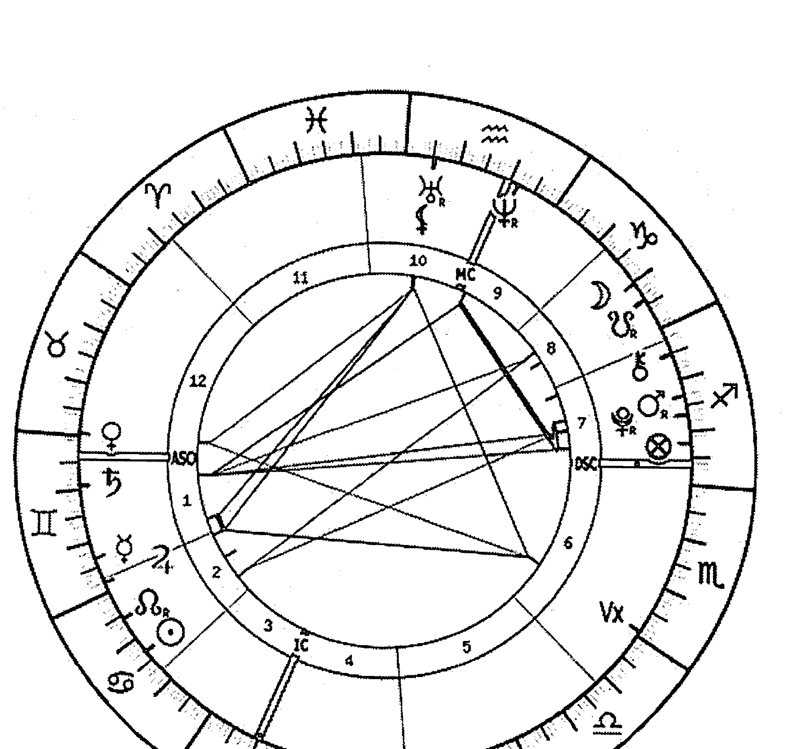

#### 九一一恐攻事件的美国太阳回归盘

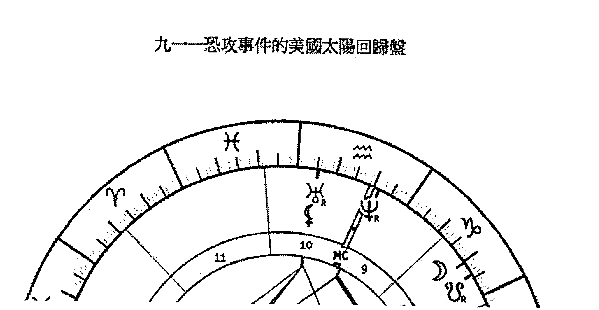

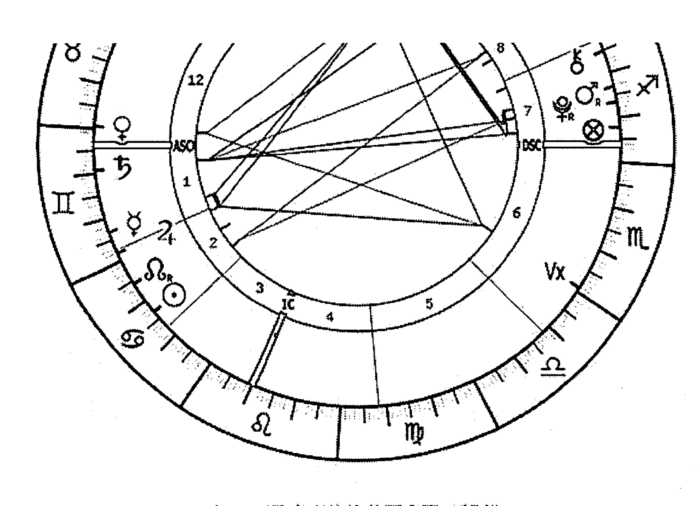

#### 九一一恐攻事件的美国太阳回归盘

# Chapter 8 行星逆行

如果想要了解太阳回归盘中的逆行，不妨拿出天文历，一年一年的依序找出水星、金星、火星、木星、土星、天王星、海王星、冥王星逆行在什么星座、度数，检查它们对你的太阳是否造成影响。方法是进入天文历网站，再找出今年生日、去年生日、前年生日……并找出这一天中，有哪些行星是逆行的。

想要查询天文历，可以进入astro.com，点选左上方「all about astrology」，并选择「9000 Years Ephemeris」，就可以找到天文历。

也可以进入以下网页：

```
`https://www.astro.com/swisseph/swepha_e.htm`
```

当然也可以直接依序打出每一年的太阳回归盘，回归盘中，如果行星旁边有一个小小的「R」，就代表这一颗行星在这一年的回归盘中，处于逆行状态。

## ▽ 逆行的哲学意涵

行星逆行是一种天文现象。原本天上的行星，都应该要往前走，但由于受到视差的影响，所以水星、金星、火星、木星、土星、天王星、海王星、冥王星，有的时候会看起来像是往后退。

而这件事在占星学中，有其哲学意涵。我们的人生，就像是不断涨潮、退潮的海滩。当我们的人生处于行星顺行阶段时，这个海滩就如同涨潮，乍看之下很美丽，但是当海水退潮之后，之前被丢进海水里面的垃圾，就会一一现形。原先漂亮的海滩，在退潮之后，变成了垃圾海滩。行星的顺行与逆行，可以类比成海水的涨潮与退潮。当海水涨潮时，垃圾隐藏在潮浪底下，没有人看到。也因为没有人看到这些垃圾，所以垃圾有可能越积越多，根本就没有人发现。但当我们遇到行星逆行的退潮期，能量的浪潮开始往后退，这个时候，之前不管是几个月、几天或几小时之前，我们为了人生往前走而堆积出来的垃圾，在逆行时，会一个接着一个的将它们吐出来，就会充满了垃圾而很脏乱，也会让我们感到问题丛生。这也就是大家经常会感觉到行星逆行时，容易出问题的主因。但问题本身并不在于逆行，而在于过去我们做了很多事情，累积出了一些业力，这些业力一直被顺行的浪潮所掩盖。随着逆行带来的退潮，业力造成的垃圾也就裸露了出来。既然垃圾裸露了出来，我们就应该趁此机会，好好的净滩，好好把业力的垃圾清一清。

也因为趁着逆行来清垃圾，原本就属理所当然，宇宙才会不时的让我们遇到逆行。所以我们不应该一遇到逆行就害怕，也不该把逆行当成坏事。逆行是让我们在人生中净滩、清仓库的时机，因为如果不净滩、不清仓库，无止境的吸纳涨潮期的垃圾，我们终有一天会因为积满了垃圾而无法动弹。也因此，逆行对我们生命的净化很重要。如果我们不趁着逆行，一方面对内在做净化的处理，一方面对外在做清理的动作，而只是一味的哀声叹气，一味的抱怨自己怎么会这么倒霉，那就错失了藉由逆行来调整人生的契机了。

举例来说，我们可能会在金星逆行期间，遇到旧情人来电。也可能会在水星逆行期间，遇到老朋友或找到旧日记。这些都是逆行时期会吐出的旧物，来让我们好好的将它们整理干净，也让我们有机会找出新的空间来安置。

既然逆行本身不是什么坏事，我们就可以好好的找出每一年太阳回归盘中的逆行，进而好好的跟这些逆行的行星对话。

逆行的基础概念，就是清理退潮后的垃圾。大家有了这个基础概念之后，就可以将它套用于每一颗行星中，就会很容易的记住每一颗行星逆行的意义，而不会被逆行搞得晕头转向。

## ▽ 行星逆行的基本意义

在十颗主要行星中，由于地球绕着太阳转，而月亮绕着地球转，因为不会产生视差，所以不会发生逆行现象。

就神秘学的角度来看，这件事也很合理，原因在于不管是太阳的显意识，或月亮的内在情绪，这两者都是我们最为现世的能量，它们都一直往前走，不会往回走。

接下来我们为大家简述一下各个行星逆行的基本意义。

水星逆行：水星主掌一个人的思考、沟通能力，当水星逆行，当事人在思考、沟通能力上，就容易过度僵化。它有可能有時是想法跳得特別快（例如水星落在雙子），也有可能是想法與溝通過於退縮（例如水星落在雙魚），但不管是過於快速或過度退縮，水星逆行帶來的思考僵化，都會造成一定程度的溝通困難。

金星逆行：金星主管一個人的情感與美學，它是一種生之喜悅。當金星逆行，當事人就會過度物質主義，而且很難填補情感上的空洞。也就是說，金星原本應該是讓人感覺到生命的喜悅、滿足，但金星逆行時，當事人容易感到情感怎麼樣都很難滿足，所以有可能會藉由不斷的換情人，或者不斷的購買奢侈品，或者不斷的累積金錢，想要藉此滿足情感上的空虛。

火星逆行：火星代表一個人的性能量，其中包含了性愛、求生存、抵禦外侮。當火星逆行，當事人就會行為與脾氣過度衝動，常常不經大腦，先做了再說。結果經常會惹出麻煩，讓自己後悔不已。

木星逆行：木星代表社會資源與道德價值觀，太陽回歸盤中如果出現木星逆行，就代表這一年當事人會在木星的社會資源與道德價值觀中，顯得一意孤行，覺得自己一定是對的，但往往這種一意孤行的態度，很有可能會讓當事人惹出壞名聲。

土星逆行：土星是現實星，也是業力星，當星圖中出現土星逆行，當事人就很容易會遇到一些無可奈何的事情，讓人感受到命運的無常、業力的壓力。

天王星逆行：天王星代表天外飛來的靈感，已經從宇宙得來的前衛資訊。但當天王星逆行，就會像是火花亂竄，得到的根本不是宇宙的前衛訊息，而是亂七八糟的雜訊，令人變得神經兮兮。

海王星逆行：海王星是一顆靈性之星，它在正常狀態下，會帶領我們超越現實的限制。但當海王星逆行，海王星的靈性就會跟鬼魅一樣，影響到我們的正常生活。這麼一來，也就談不到靈性向上了。

冥王星逆行：冥王星帶來毀滅與重生。冥王星是一顆現實之星，當冥王星逆行，我們就很容易沈溺於現實生活中的貪嗔痴慢疑，因而很難看破一切，所以會很不容易從冥王星的毀滅中得到重生。

關於解析逆行的種種細節，可參考南瓜已經出版的《都是逆行惹的禍：靈魂的星座重修課》（本書探討逆行行星進入不同星座的表現），以及《破除逆行的魔咒：逆行宮位的生命困境》（本書探討逆行行星進入不同宮位的表現）。雖然這兩本書探討的是本命星圖中的逆行，但原理也適用於太陽回歸盤。尤其一個人的本命星圖中的逆行是固定的，但太陽回歸盤中，也許今年你的水星逆行，到了明年卻變成火星逆行，所以不妨參考上列兩書，深入瞭解一下不同行星在不同星座、宮位逆行的意涵。

## ▽ 當太陽回歸盤中的命主星逆行

太陽回歸盤中遇到命主星逆行，即使是跟其他行星形成好相位，但都還是會很難過。原因在於逆行最重要的意義，就是帶來反省、反思。但我們人類若沒有必要，其實最不喜歡反省、反思。雖然我們的靈性，會有一種往內回歸的欲望，但我們的肉身與意識，想要的都是往外擴張。我們在往外擴展時，會覺得比較歡樂，而當我們受限，無法順利的往外擴展時，就容易感到沮喪。

當我們遇到行星逆行，為了要逼迫我們進入內省狀態，所以我們往往會在外在環境遇到發展受阻的處境，讓我們因為行不得也，而開始反省自己。

所以逆行本身不見得會讓我們難過，或一定會讓我們心情不好，但這個時候我們很容易遇到生活上的阻礙，或是不順利的人際關係，進而引發內在情緒上的負面反應，並且感到消極。

但如果一個人內在修為夠好，就算遇到外界事物的狂風暴雨，生活中遇到很多挫折，他還是有可能可以維持內在情緒的穩定。

## Chapter / 9
### 太陽回歸盤中的太陽

既然我們觀察的是「太陽回歸盤」，「太陽」自然會是這個盤的解讀重點。

首先，我們必須要深入認識太陽的屬性。太陽代表了尊嚴、自尊心，它代表了讓我們感到驕傲的事物，但也因為它攸關面子問題，我們也很可能會因為面子受損，因而感到挫折。

此外，太陽代表了創造力。太陽回歸雖然每一年都落在同樣的星座——也就是你的本命星圖太陽原本的星座，但每一年都會落在不同的宮位。觀察每一年太陽落在什麼宮位，代表在這一年中，太陽就可以在這個宮位領域中，來表現出你的創造力。

而太陽也會攸關成就感是否得到滿足，隨著每一年太陽回歸盤中，太陽會進入不同宮位，我們會發現，我們會在這一年中，對這個宮位領域產生熱情，會因為想要從事這個宮位領域的事物，而感到開心。也會在這個領域中，因為能力被證明，或因為進步，而感到有面子。這些都是太陽進入不同宮位會產生的狀況。

太陽所在之處，具有幫助我們展現自信，培養創造力的重要潛能。但它也可能帶來負面因素，也就是面子問題。在太陽所在的宮位，你很容易會跟別人因為自尊、顏面產生衝突。往往這些衝突都不是什麼大事，而是別人隨口講了一句話，你心裡就計較得很，很難放下。這個時候不妨來檢查一下今年的太陽回歸盤中太陽落在哪一宮，可能這個人的隨口一句，就戳中了今年你最重視的領域。

太陽回歸盤中太陽所在之處，是我們這一年會強烈表達我們生命經驗之處，如果這一年的太陽回歸盤中，太陽處於受剋狀態，也就是太陽跟其他行星有形成九十度或一百八十度的相位。它代表你的太陽在這一年之間，在施展生命活力時，有可能會遇到一些問題，有可能是跟工作、生活有關的問題，也可能會是健康上的議題。

要如何觀察太陽回歸盤中的太陽進入宮位，在短時期中的變化——所謂的短時期，指的不是三五個月，而是連續四五年在太陽回歸盤中的變化。

我們不妨拿出四年以上的太陽回歸盤，來觀察這四年（或四年以上）太陽的宮位變化。我手邊有一個人的連續四年太陽回歸盤，第一張圖，太陽在一宮，第二張在十宮，第三張在七宮，第四張在四宮。這個規律，符合了之前請大家背的互為九十度的口訣「一、四、七、十」、「二、五、八、十一」、「三、六、九、十二」，只是它走的是順時針的順序。

十二個宮位，其實都是十二個星座投射出去的現實生活舞台。前面我們已經學過了「本位星座」、「固定星座」與「變動星座」，在宮位領域，其實也可以套用相同的概念，將十二個宮位區分為「本位宮位」（一、四、七、十宮）、「固定宮位」（二、五、八、十一宮）與「變動宮位」（三、六、九、十二宮）。

如果以行運盤來看，太陽必然是由一宮走到二宮，二宮走到三宮，以逆時針行走。但在太陽回歸盤中，太陽落在的宮位，會以順時針方式，順序為「一、十、七、四」、「二、十一、八、五」、「三、十二、九、六」。

從連續四年（或以上）的太陽回歸盤中，太陽走的是本位宮位、固定宮位還是變動宮位？我們可以看出這個人的太陽主觀意識，經歷了怎樣的的變化。

作業

請寫下最近的四、五年，太陽回歸盤中，太陽落在的宮位順序，是本位宮位、固定宮位，還是變動宮位。

但也有可能大家在這樣的規律中，會有一年出現脫序。例如在原本的本位宮位「一、十、七、四」的序列中，忽然有一年脫離了這個順序，變成「一、九、七、四」，就需要特別將脫序的這一年標記出來，來研究一下這一年發生了什麼事。

有時候我們也會遇到四個看不出規律的序列，例如「一、九、六、十」，這個時候不妨往前推兩三年，往往就可以看出到底走的是哪一種序列，以及中間哪一年脫序了。

如果太陽連續幾年都落在固定宮位（二、五、八、十一宮），你會發現，在這些年間，你都會把太陽的活力、創造力的展現、理想的追求，用在固定星座的相關議題，包括資產的處理、情感的信任等等。

此外，我們的太陽本身也會有落在本位星座、固定星座與變動星座的差異。太陽落在的星座，代表太陽會用這個星座的特質，來展現自己的能量，而太陽落在的宮位，則代表太陽會在這個宮位領域中發光發熱。

例如一個人的太陽落在雙子，雙子屬於變動星座，而連續好幾年，在太陽回歸盤中，太陽都落在固定宮位，當事人就會利用雙子的靈活通變，去學習固定宮位的金錢、情感議題。也可能會藉由雙子喜歡的資訊與知識的吸收，來增進自己在固定宮位領域中的能力。但也因為雙子具有變動性質，所以在固定星座的資產與情感領域中，很可能會有財進財出、情聚情散的議題，也容易在固定宮位領域，有很多瑣瑣碎碎的事情得要處理。

從太陽回歸盤中，太陽每一年落入的不同宮位來看。我們不妨觀察太陽從去年走到今年，再從今年走到明年的這三階段。

## ▼ 太陽進入本位宮位

一、四、七、十宮為本位宮位。在一般情況下，今年太陽在一宮的人，去年會在四宮，明年太陽會在十宮。這意謂著在去年中，你的太陽會在四宮的家庭領域中，有很多發光發熱的機會，也因而學會了很多跟家庭、安全感、靈魂目標有關的議題。今年太陽來到一宮，去年的太陽四宮可說是一個沈澱期，讓當事人可以在家庭生活領域中，好好的想清楚自己的生命根源是什麼，到了今年太陽進入一宮時，展開行動的時機終於到來。在太陽進入一宮時，最適合發掘自己的潛能，要學習的是如何為自己過日子，而不是為其他人過日子。在這段期間，應該要能看到自己在做人做事方面的進步。也因為我們知道今年要以學習如何扮演好自己的角色的同時，也要能意識到明年太陽就要走到十宮事業宮。所以如果今年能夠把做好自己當成一個基礎，明年太陽進入十宮，在追求事業上，就會變得比較容易。也就是說，每一年太陽落入的宮位，都會是隔年太陽發展的重要基礎。太陽進四宮時，建立內心之家的安全感，有助於太陽進一宮時做自己。而太陽進一宮時努力做好了自己，就會成為隔年太陽進十宮時，事業發展與社會成就的踏腳石。

每一年都很重要，每一個點都很重要，每一個點決定了未來發展的起始高度。

太陽回歸盤的宮位解讀，跟所有的宮位解讀都相同。如果想要深入研究宮位，不妨參考坊間宮位相關書籍。唯一的差別，只在於一般的行運是逆時針行進，而太陽回歸盤的太陽落點是每年以順時針方向在星宮之間跳躍行進。

### ▽ 太陽進入固定宮位

二、五、八、十一宮為固定宮位。當太陽落在固定宮位，我們就會在生活上遇到很多處境，這些處境讓我們有機會可以去面對、省思自我價值，其中包含了資產的自我價值，也包含了情感的自我價值。

如果一個人今年太陽進入二宮，代表當事人要學習在這一年建立自我價值，讓自己成為被重視的人。但也因為這一年當事人都會對自我價值很重視，所以也會對他人是否輕慢於自己，尤其是跟價值相關的議題特別敏感。也因為二宮跟黑暗之宮八宮互為一百八十度，這也意謂著自我價值與他人資產的檯面下交易的道德挑戰。二宮的價值觀，也包含了各種日常生活中的飲食坐臥的安全感，而它也可以延伸到非物質的人際關係的安全感。也因為這些物質與非物質的安全感的追求，造成二宮本身具有一種想要維持穩定的慣性。

在太陽進入二宮的前一年，一般來說，太陽很可能會落入五宮。太陽進入五宮時，我們會培養出如何表達自我的創造力，在這一年中，我們會用比較歡快、比較熱情的心態來面對生活。

太陽進五宮的那一年都會特別愛玩，我自己曾在回歸盤太陽進入五宮的某年出國玩了七次。

五宮也是子女之宮，對於有小孩的人來說，當太陽進入五宮時，太陽五宮的遊戲特質與創造力，就不會只限於自己愛玩，而會大幅度的投射在子女身上，會在這一年中花很多心力去經營親子關係。經歷了太陽五宮的自我創造力與遊戲的滿足之後，隔年就會進入太陽二宮，轉而追求自我的價值感。

太陽回歸盤中，太陽進入二宮之後，通常會進入十一宮。這也意謂著當我們在二宮建立起穩固的自我價值，就要面臨另一個進程——我們生命的理想在哪裡。

### ▽ 太陽進入變動宮位

再來看變動宮位時期。

三宮與九宮是一條跟知識、學習有關的軸線，三宮帶來資訊的搜集、交換，有了三宮的資訊之後，我們就可以進一步的進入高等心智的整合，建構出自己的人生哲學，這就是九宮。

當太陽行運盤中太陽進入三宮，這都會是一個努力吸收知識的時期，在這段期間內，我們往往會重視思考、重視社交，但也因為我們會把重點放在心智交流上，所以對於感受、情感方面的議題，就會比較輕忽了。在太陽進入三宮的這一年，我們都會花很多時間跟別人溝通，即使平常比較習慣獨處的人，當他們遇到太陽進入三宮這一年，不管心情好壞，他們都會傾向於拿起電話，找別人好好聊一聊。

在這段期間，我們都會重視思考、重視社交，也利於鄰居互動——也有可能會跟鄰居吵架，三宮也代表生活環境中的變動，所以這一年可能會有許多跟通勤的機會。

三宮的心智溝通能力，到了下一年，通常就會轉變成太陽進入十二宮的議題。在太陽進入三宮的這一年，我們建立起了靈活、變通的心智思考，就像佛經所說，「應無所住而生其心」，我們會不拘泥於什麼事情一定要怎樣的開闊想法，而到了隔年，太陽進入十二宮時，我們還必須要加上「內在」也必須要「無所住」。三宮是頭腦上的「無所住」，太陽在三宮這一年，我們會像是一塊不斷吸收知識的海綿。太陽進入十二宮時的「心無所住」，則是跟眾生融合。在太陽三宮時，我們在知識層面打下基礎，到了太陽十二宮時，才能進行靈性層面的深化。

也藉由我們在太陽三宮時，接受到的多元化的知識，到了太陽進十二宮時，才能不拘泥於某一方的觀點與看法，能夠以無住之心來看待世界，內在的同理心就容易升起。

不過以上講的都是發展層次較高的狀態。大部分人在遇到太陽十二宮的那一年，多半只是過著與世疏離，或是花很多時間跟自己相處的一年。在這一年中，也許會因為懶散、失業、生病、需要照顧家人，或是因為疫情隔離等等原因，過著比較脫離外界的生活，也有可能會去接觸閉關之類的活動。

### ∇ 找出規律性

我們如果觀察太陽落入宮位的序列，會發現，除了中間或許會有一兩年例外，否則往往會有長達十年的時間，太陽會一直處於本位宮位、固定宮位或變動宮位中。有的人可能是九年、也有的人是十一年、十二年。

相較於十二宮的精神、靈性，六宮指的是生活上的紀律、工作效能與健康。當一個人太陽進入六宮時，都會比較願意在工作上、生活常規上、健康上付出更多的精力——但這未必代表他們很健康。也有可能是因為他們在這一年中經歷了一些健康上的議題，讓他們不得不好好的認真面對這些事情。但也藉由他們對於生活紀律的重視，身體的強健（六宮）也會有助於心靈上的健康（十二宮）。

這也意謂著在太陽回歸盤中，我們太陽的自我意識，會在同屬本位、固定或變動宮位中接受挑戰、接受磨練，時間大約長達十年。

也因為有的人會在整串序列中，有可能會有一年是例外，隔幾年又有一年是例外，所以如果是這種狀況，就需要往前、往後多拉幾年，以十年到十二年做為基準，這樣就比較容易抓出哪一兩年是例外狀態。但也因為連續十年左右，太陽都會落在同屬本位、固定、變動宮位中，當中只要忽然有一年出現例外，當太陽進入脫序宮位，由於它跟前一年、後一年的屬性差異很大，這一年的太陽活動，在性質上，都會跟前後年有許多差異，值得我們多加關注。

作業

請大家列出從今年起，往前推十五年的太陽回歸盤，並列出太陽位於哪個宮位。

原因在於短短的四五年內，也許中間會有一兩年有例外，打亂了整個序列的規律，讓人分辨不出到底這個序列屬於本位、固定、變動宮位群組。但如果一口氣拉到十五年的距離，就可以清楚的分辨出哪些是正常的序列，而哪些是例外的數據，而如果有整個群組的轉化，例如從本位宮位群組轉到變動宮位群組，透過十五年的長時間觀察，也可以抓出是在哪一年出現轉折。

尤其是遇到整個群組產生轉折時，我們都應該去觀察，從這一年開始，我們的生命出現了哪些重大改變。這並不是說，這一年一定會發生什麼大事件，但它一定代表這一年一定會有一種漸進方式，從生活的改變而逐漸改變了你的心態，讓你關注的領域隨之改變。

找出轉折年，找出這一年發生的相應事件之後，也不妨思考一下，在轉折年之前的那些年中，有哪些事件可以呼應這個宮位群組的生命事件，以及在轉折年之後的那些年間，有哪些事件可以呼應這個宮位群組。

### ▽ 太陽回歸盤中太陽的相位

在太陽回歸盤中，太陽可能每一年都會跟其他行星形成相位。而其中以天王星、海王星、冥王星相位的影響力最大。

從這幾年較重要的行運大勢來看。

首先是冥王星從二〇〇九年進入摩羯，一直到二〇二三、二〇二四年才會進入寶瓶。

海王星從二〇一二年進入雙魚，到二〇二六年才會進入牡羊。

天王星從二〇一八年進入金牛，到二〇二五、二〇二六年才會進入雙子。

而其中在二〇二〇年時，木星、土星、冥王星都在摩羯。

當你的太陽跟這幾顆行星出現相位，都很明顯的會對這一年的生活，造成很大的影響。

舉二〇二〇年為例，由於木星、土星、冥王星都在摩羯，這三顆星很有可能就會因為合相，而對太陽摩羯造成很大的影響，也會因為九十度或一百八十度剋相，對太陽牡羊、太陽巨蟹、太陽天秤造成很大的壓力，但也會因為一百二十度和諧相，對太陽金牛、太陽金牛，造成一定程度的助益。

說到相位，就必須談一下容許度的議題。各家網站都會隨著主掌網站的占星師，而對相位度數誤差值有不同的看法。許多占星師認為是六度，但也有不少網站將誤差值設為十度，甚至更寬一點。以合相為例，我自己對相位的態度，是兩顆行星進入同樣的星座時，就算距離再遠，都會出現一定程度的影響力。如果這兩顆星的距離在十五度以內，影響層級就要在往上加一級，進入十度以內再加一級，五度以內又往上加一級，再來是兩三度，最後是完全零度的緊密合相。也就是說，就我的看法，相位是一個有如光譜般的層級，它會從兩顆星落在同樣星座開始，兩顆星距離越近，彼此的影響力就越大。

另一個容許度議題是當兩顆星在度數上形成相位，但在星座屬性跟標準型相位有所差異，這個時候應該怎麼看？舉例來說，一般所謂的和諧相，就是兩個位在性質相同星座（例如同屬火象、土象、風象、水象星座），彼此之間有著誤差在六度內的一百二十度相位。但我們在解盤時，也經常會遇到，雖然同屬性質相同的星座，但有可能因為度數的緣故，例如一顆星在摩羯二十八度，另一顆星在金牛一度，兩者相差了九十三度，是剋相。遇到這種剋相時，雖然的確兩顆星以角度來看，是形成了剋相的緊張關係，但兩顆星都落在土象星座，所以彼此之間比較可以理解對方想要的是什麼，所以這種剋相的緊張程度，會比一般落在不同屬性的星座，而又形成九十度度數的剋相要來得輕鬆一點。這種相位可以說是在和諧中生剋，而不是一般的純粹剋相。

#### 木星與太陽的相位

木星代表社會資源，它具有擴張的屬性，它也代表社會上的法律、道德、良知，包含社會正義。也因為木星具有擴張性，太陽跟自信、尊嚴有關，當它跟木星合相，太陽的自信、尊嚴，就會受到木星的影響而擴張，這會是一定很容易自滿的時期。

木星為太陽帶來社會資源，木星的相位會讓人在外在的社會環境中，得到一定程度的支持與歡迎，但並不保證最後會有正向結果。原因在於當我們遇到木星相位時，很容易會因為受到大家的歡迎與讚美，而變得自信滿滿，反而容易大意失荊州。

木星合相太陽時在什麼星座很重要。如果是木星摩羯合相太陽摩羯，木星的社會資源，就會有利於太陽摩羯最想要的權勢地位；如果是木星寶瓶合相太陽寶瓶，木星的社會資源，就會有利於太陽寶瓶前衛思考與理想性的價值觀。

木星具有社會正義及道德意識，而寶瓶的視野較高，當木星寶瓶合相太陽寶瓶時，當事人很可能就會去做很多跟環保、平權有關的事物，並為自己貼上正義達人的標籤。但也因為自認是正義的一方，所以有可能會過度的說教，或指責跟自己意見不同的人。

如果是木星雙魚與太陽雙魚合相，就會顯現在雙魚關注的事物，例如文學、藝術、靈性相關領域的蓬勃發展，也容易在這段期間遇到良師。

由此可見，同樣是木星與太陽合相，但隨著落入的星座不同，它會呈現出來的差異，也會很大。

或許對太陽金牛來說，木星合相太陽意謂著賺大錢，這是因為太陽金牛對賺大錢有興趣。但我們不應該直接套用於別的星座，例如太陽雙魚。太陽雙魚本來就對賺大錢的興趣不大，所以當木星來合相太陽時，自然就不太會顯現在賺大錢上。雙魚想要的心靈財、靈性財，所以當木星來與太陽合相時，固然也會得到木星的社會之財，但往往都會是靈性層面的財富——當然也有可能得到的是實際上的金錢資產，但金錢並不是雙魚最想追求的核心議題，所以即使得到的是實際的金錢財富，雙魚也不會特別放在心上。

此外，木星與太陽合相，也會讓當事人站在道德上的制高點，而不知不覺的對他人道德綁架。而雙魚最擅長的道德綁架，就是別人都不夠慈悲，只有我最慈悲，別人沒有同理心，只有我最有同理心。

雖然木星是一顆吉星，但當它跟太陽之間出現負面相位時，大家就必須要特別小心許多跟木星的「膨脹」相關的負面效應。例如因為自信滿滿，以為自己說的都是對的，結果造成名譽受損。或者以為自己一定會賺錢而盲目投資，結果反而虧了大錢。

##### ex.芭黎絲希爾頓結婚

名媛芭黎絲希爾頓一直有著富家千金、不知人間疾苦，甚至有一點放浪形骸的形象。二〇二一年木星進入太陽寶瓶，與她的太陽寶瓶合相，大約也在此時，金星也進入寶瓶，而她跌破大家眼鏡，在此時舉辦了婚禮。

##### ex.買新家的寶瓶女

我認識一個太陽寶瓶女生，她在行運木星加上行運金星合相太陽時，買了新家，也在這段期間完成了裝修。

##### ex.被學生崇拜的寶瓶男

另一個太陽寶瓶的男生，他在行運木星加上行運金星合相太陽時，遇到了對他狂熱崇拜的學生，熱情到每天早晚都會寫簡訊跟他問安。

寶瓶這個星座跟社群有關，它有可能會反映在某一種跟利益無關，卻跟公益有關的「道」上。例如「花道」、「茶道」，又如環保與人道主義，其實也都是一種「道」。所以如果太陽回歸盤中，很多行星落在寶瓶，當事人這一年都會有各式各樣「同道中人」的相關行動。

##### ex.布魯斯威利的木星名望

從影星布魯斯威利（Bruce Willis）的太陽回歸盤中木星與太陽合相的年分，可以看到他在演藝生涯上的幾次高峰。

首先是一九八七年的木星與太陽合相，在這一年中，他與影星黛咪摩爾（Demi Moore）結婚，隔年又隨著《終極警探》上映，布魯斯威利成為影史重要動作明星。

一九九八年他再度遇到木星與太陽合相，在這一年中，他不但陷入跟保姆的官司糾紛，而且也因為跟黛咪摩爾長期忙於工作，聚少離多，所以宣告分居——由此可見，木星代表的知名度與聲量，不見得都是因為好事。像這一年布魯斯威利的聲量很高，但是因為官司纏身與分居，才造成聲量暴增。

二〇一〇年他再度遇到木星與太陽合相，這一年他拍的《波麗士很忙》(Cop out)不但票房慘敗，而且被導演批評有大頭症，所以這次的木星相位帶來的是負面形象。

而在二〇二二年時，木星再度與太陽合相，他在這一年由家屬宣布正式息影，因為他被診斷出失語症，無法繼續從事表演。雖然這是一個負面事件，但引來大批影迷的不捨，因而造成名氣上升。

#### 土星與太陽的相位

土星進入一個星座，平均停留的時間為兩年半。二〇一七年到二〇二〇年土星進入摩羯，而其中最重要的事件，莫過於二〇二〇年土星與冥王星同時進入摩羯時，全球爆發的新冠肺炎。也因為全球疫情肆虐，各國都加強了各式各樣的管制措施，這正是土星與冥王星進入摩羯時會有的情境。而對我們每個人來說，全世界的人們，都在這段期間經歷了大大小小層級不同的封城，也因為各式各樣生活上的設限，實際體認到土星與冥王星進入摩羯，所造成的封閉與對死亡的恐懼。

而對太陽本來就在摩羯的人來說，土星與太陽合相，會讓太陽摩羯更有責任心，想要成就更高的志業，而冥王星也在摩羯，冥王星具有的控制慾與激情，會更加強太陽摩羯更想要功成名就。但也很有可能會是太陽摩羯的人遇到一個老闆，土星與冥王星合相會反映在老闆身上，老闆在龐大的經濟壓力下，威逼利誘，用各種方式想要逼當事人達到更好的績效。在這個時候，受到大環境的影響，當事人也會選擇跟老闆站在同一條陣線，大家都在同一條船上，不得不多努力些，當然也會因此受到更大的壓力，接受更多的考驗。

二〇二〇年到二〇二三年土星走到了寶瓶，它就會強烈影響到太陽寶瓶。但雖然同樣是土星與太陽合相，但寶瓶的本質跟摩羯有很大的不同。摩羯的星座屬性，可說是藉由社會上的成就與制度的穩固，來增進安全感。而寶瓶根本不需要安全感，甚至寶瓶會想要推翻所有的僵固現狀，他們想要的是革命。不過既然遇到的是土星來和太陽合相，太陽寶瓶在這一年都會覺得工作壓力很大，生活中充滿了各式各樣的考驗，不過土星寶瓶帶來的壓力，不同於土星摩羯，它比較不會完全是事業上的想要保持穩定狀態的壓力，它更會傾向於追求世界上公平正義或科技進步的需求，也可能會跟環保或人道相關。不過也因為土星具有按部就班的屬性，所以在推進的過程中，必然急不得、快不得。而寶瓶都會希望建立起一種與眾不同的做人做事的展現方式。但也因為土星進入寶瓶時，既要兼顧土星的實際又要寶瓶的突破既有規則，所以在執行上的難度會更高。

當太陽回歸盤中，土星跟太陽形成了相位，土星的現實，都會為太陽帶來壓力。差別在於如果是合相或一百二十度和諧相，當事人會比較容易接受土星的現實壓力，當事人也會比較感覺到這是自己應該扛負起來的責任。但如果是九十度或一百九十度剋相，當事人就會覺得是環境與權威的打壓，扛下了不該扛的壓力。

##### ex. 王力宏遇到土星之鎚

王力宏在二〇二一年的太陽回歸盤中，出現了土星進寶瓶跟他的太陽金牛的九十度剋相，所以不但婚姻問題浮上檯面。更因為太太李靚蕾的爆料，讓他的「優質偶像」（太陽）的形象破滅，遭到了輿論的撻伐（土星）。

##### ex. 郭台銘的疫苗風暴

郭台銘的太陽在天秤，二〇二〇年起土星進入摩羯，而他在二〇二一年夏季時為了爭取BNT疫苗進口，中間過程備受輿論壓力。

#### 天王星與太陽的相位

天王星代表了超越社會現狀的前衛思考，但也因為天王星會想要打破現狀，所以它很可能會用迅雷不及掩耳的方式，忽然打破了一個人的原有生活。

天王星平均在一個星座停留七年，它從二〇一八年進入金牛以後，會持續待到二〇二六年才會離開金牛，進入雙子。

天王星進入金牛，意謂著只要太陽跟金牛產生相位，不管是太陽金牛的合相、太陽處女與太陽摩羯的一百二十度和諧相、太陽獅子與太陽寶瓶的九十度剋相，或是太陽天蠍的一百八十度剋相，天王星都會帶來巨大的改變。

差別只在於如果形成的是好相位，天王星會用比較和諧的方式來推動太陽改變，如果是負面相位，天王星就會用晴空霹靂的方式來打擊太陽，逼著太陽不得不變。

占星學之所以會設計出一個天王星，意義就在於我們每個人過著日常生活，到了一定階段時，都會覺得生活很無聊，因而渴望改變。它有可能會是內在變動，但也有可能會是外在改變，而這些改變，都能增進當事人的獨立意識。而這些改變，會隨著天王星落入宮位的不同而有所不同。如果落入二宮金錢宮，就有可能會是金錢方面的巨大改變，如果落在六宮，就有可能會是工作上或健康上的重大改變，逼著當事人必須在生活上有很大的改變。

此外，二〇二〇年到二〇二一年最困擾大家的，就是幾乎有大半年的時間，土星寶瓶都跟天王星金牛彼此形成九十度剋相，對於太陽金牛、太陽獅子、太陽天蠍、太陽寶瓶來說，等於是直接形成了雙重剋相。

這個剋相的麻煩之處，在於當我們受到天王星的影響，相位在生活上有所突破時，同時會受到土星的限制，讓我們想改變也不行，不改變也不行，因而引發強烈焦慮。

我認識一個太陽寶瓶的女生，多年來，她一直想要買房，卻一直找不到適合的房子，結果在天王星進金牛又跟太陽形成相位時，她忽然買下了一間房子。天王星形成的不管是好相位或壞相位，它都會讓人打破慣性。我這個朋友過去花了二十幾年的時間來看房都下不了手，但後來受到天王星相位的影響，她一下子就拋開以往的限制，一下子就做出決定。

##### ex.BIGBANG的性犯罪醜聞

南韓偶像團體BIGBANG前團員勝利，他在二〇一八年涉入嚴重的性犯罪醜聞，不但讓他退出了演藝圈，也讓他接受司法調查。而從他這一年的太陽回歸盤來看，這一年太陽落在一宮，又跟天王星形成了一百二十度和諧相，但天王星逆行。任何行星逆行，就代表了這顆行星本身的能量不好，即使是跟太陽形成的是一百二十度和諧相，都不能單純的將它視為好相位。尤其像天王星這種容易暴衝的行星，又遇到逆行，即使是好相位，也容易出事。根據媒體報導，勝利不法經營酒店已經很久了，但在二〇一八年底，忽然酒店中爆發了一起暴力事件，也因為這起暴力事件，警方調出相關的監控錄影，也約談了許多相關人士，這才發現，原來這起案件背後，涉及長達多年的性暴力、偷拍，甚至還包含了警察腐敗等等議題，成為K-pop領域中涉案程度最大的案件。

從這整起事件爆開的引發點，也就是酒店中的意外事件，就是一種很標準的天王星型的事件。尤其這顆天王星在牡羊逆行，而牡羊座跟暴力特別有關，天王星落入牡羊，很可能會因為任性而帶來暴衝，反映在這個事件上，意謂著為所欲為的集體暴力，造成了負面影響。

##### ex.紈褲兒子在美被捕

電視明星狄鶯的兒子孫安佐，在二○一八年三月時，在美國因為涉及恐攻而被捕。這一年狄鶯的太陽回歸盤中，天王星進入金牛，跟狄鶯的太陽金牛合相。

從這個案例我們可以看到，對女性來說，太陽可能反映在生命中的重要男性身上。也就是說，孫安佐的大膽言行，讓身為媽媽的狄鶯，在這段期間飽受擔心受怕之苦。

##### ex.吳亦凡與都美竹事件

中國大陸歌手吳亦凡原本為韓團成員，二○一四年脫團回中國大陸發展之後，星圖可說是一帆風順，受到大批女性歌迷的喜歡。二○二一年七月八日，歌迷都美竹在微博發長文，透露自己在跟吳亦凡交往期間，他還同時跟許多女生有染，甚至還有未成年女性。之後都美竹陸續公布吳亦凡想要花錢讓她封口的證據，導致大量吳亦凡代言的廠商跟他解約，而在七月三十一日，吳亦凡也因為涉嫌強姦而被刑事拘留。

由於我手邊沒有吳亦凡的正確出生時間，只有出生日期，所以宮位部分不需參考，只看相位即可。

吳亦凡在二○二○年到二○二一年的太陽回歸盤中，太陽天蠍的他，遇到了天王星金牛的一百八十度剋相。金牛與天蠍這兩個星座，原本就跟情色與性議題有關，而他在這一年中，接連而來的性醜聞，不但對他本人造成打擊，甚至可說是摧毀了他的事業。

##### ex.意外被名校錄取

天王星的意外不見得都是無妄之災，我也認識一個男生，他在天王星與太陽九十度時期，辦理出國留學申請，原先被所有學校拒收，最後卻被某名校通知備取，開學前一個月拿到入學許可。

#### 海王星與太陽的相位

海王星從二○一一年進入雙魚座，一直要到二○二五、二○二六年，才會離開雙魚，進入牡羊。隨著度數的差異，在海王星進入雙魚的期間，太陽雙魚都會受到程度不一的影響。當海王星接近太陽時，我們的直覺力與敏感度都會增加。好處是靈性與藝術感會提升，會變得比較容易同情別人，但缺點是因為缺乏現實感，會想要逃避各式各樣的世俗責任，也比較容易被騙，比較容易成為受害者。

當太陽回歸盤中，海王星如果跟太陽出現和諧相，當事人就有可能會遇到一些靈性或藝術啟發，得到靈性的提升。但如果海王星跟太陽出現合相或九十度、一百八十度剋相，當事人的太陽理智，就有可能完全被海王星給沖昏了頭，在這個時候生活會變得很混亂，判斷力不佳，要特別留心身體的健康，也要避免被騙。

##### ex.酒後亂性糾紛

我認識一個太陽雙魚的朋友，他在海王星跟太陽合相那年，身處情感關係混亂的困擾中。有一次他在喝醉酒的情況下，跟一個女性友人發生性關係，雖然是雙方合意，事後卻被女方提告性侵。還好透過監視錄影，才還了他清白。也因為遇到海王星帶來的混亂情境，讓他以後對男女關係更加謹慎，也就是說，透遇了海王星與太陽的合相，他改變了太陽的做人做事方法。

##### ex.恆述法師的債務

知名藝人張菲、費玉清的姊姊恆述法師是太陽雙魚。她在太陽回歸盤出現海王星合相太陽的時期，由於幫她的信眾背書，結果負債三千多萬。張菲與費玉清當時想要跟姊姊解除親屬關係，惹得恆述法師一把鼻涕、一把眼淚，上了很多媒體哭訴。而她講的話也非常符合海王星雙魚特質，包含她多麼辛苦出去賺錢，將張菲、費玉清拉拔長大，結果等到她出問題時，兩個弟弟卻不想幫忙——這就是一種雙魚式的自憐。

##### ex.告白對象溺斃

我認識一個才二十幾歲，很年輕的太陽雙魚。他在海王星合相太陽的這一年，有一個女性好友（不是女朋友）游泳時溺斃。值得注意的是，這個女性好友在溺斃前一個月，曾經找這個太陽雙魚出來喝咖啡，並跟他告白，但當時雙魚男一心一意只想專注於工作，於是回絕了女性好友。沒想到不到一個月後，女孩就在游泳時溺斃。雖然兩個人並沒有真的交往，但這件事對他的影響，可說超乎想像的嚴重。因為雙魚男感到強烈愧疚，早知如此，就應該跟她交往才對。也因為強烈的內疚，他決定一輩子照顧女方的父母，一直過了七八個月，才稍微從傷痛中走出來。

##### ex.安潔莉娜裘莉離婚

影星安潔莉娜裘莉（Angelina Jolie）在海王星與太陽九十度期間，因為丈夫（太陽）布萊德彼特（Brad Pitt）酗酒（海王星）與其他問題，提交申請與離婚。

##### ex.韓流的起落

韓國瑜在二〇一八年海王星與太陽九十度期間，忽然平地一聲雷崛起，並在一開始眾人不看好的狀況下當選高雄市長。不過海王星的夢想，也有可能會很快消逝，他在二〇二〇年時競選總統失利，隨後很快的也被罷免，失去了高雄市長的職位。

#### 冥王星與太陽的相位

冥王星距離太陽很遠，它繞行一圈大約需要兩百四十八年，因而進入一個星座的時間非常久。

從二〇〇八年起，冥王星就進入摩羯，因而對太陽摩羯造成很大的影響——差別只在於度數緊密程度，但即使距離很遠——例如你的太陽在摩羯二十一度，而某一年的太陽在摩羯十五度——它還是會造成一定程度的輻射效應，當事人都會感覺得太陽能量被冥王星強化的威力。

冥王星代表的是原欲與潛意識領域，對太陽摩羯的人來說，當它跟太陽形成誤差角度或大或小的合相，對於原本就對身心靈與潛藏智慧有興趣的人來說，就會對內在智慧產生高度興趣，會開始想要探索人性。尤其冥王星越靠近太陽，太陽摩羯就會對冥王星的潛藏智慧越感興趣。我認識很多太陽摩羯，他們都是在冥王星與太陽合相時，開始接觸占星，因為想要藉由占星來更了解人性。占星是一種探討人性的工具，它主要是藉由這種工具，讓我們更客觀的去釐清各種人際之間的糾葛，從各種人際關係中的綁架中解放出來。

冥王星會帶領太陽進入潛意識的世界，幫我們認識各種自我欲望之外，讓我們可以接觸更大、更廣闊的議題。而太陽又跟志業有關，很多人在冥王星與太陽合相時，會感受到比較強的精神上的壓力。這跟土星合相太陽不同。土星會帶來的是實際的責任，冥王星會帶來的是精神上的壓力、精神上的脅迫感，它也可能帶來強大的熱情，讓人不眠不休的想要去完成某一件事——如果是冥王星合相太陽，當事人就會對太陽相關的事物，也就是追求人生夢想，讓自己更有成就感、更有面子的相關事物，變得非常有動力。

由此可見，當冥王星合相太陽，如果這個人想要追求的人生目標，剛好很符合世俗規範，就很有機會運用冥王星合相太陽的力量，在這段時間內，藉由冥王星帶來的強大動力，可以讓當事人獲得想要的目標。

尤其對太陽摩羯遇到冥王星摩羯來說，太陽摩羯的人，他們通常想要的目標，都會比較傾向世俗的功成名就。

也因為冥王星是一種檯面下的隱藏力量，當冥王星與太陽合相時，當事人做人做事就會比較保留，不會想到什麼就說什麼、做什麼，而會先謀定而後動。

以上都是冥王星合相太陽的正面影響。但從另一個角度來說，這段期間，不管是工作、事業上，如果當事人是女性，還需要加上她跟重要男性之間（包含了父親、先生、兒子）的關係，都會因為冥王星的合相，帶來很大的精神壓力，如果嚴重的話，甚至有可能會形成各式各樣的情緒綁架。而這種情緒綁架、情緒勒索，又會因為冥王星的行進速度很慢，很可能會長達兩三年，才有辦法從冥王星的掌控中稍微走出來。對女性來說，由於太陽經常會反映在生命中的重要男性上，當冥王星與太陽合相時，就很容易會顯現在丈夫或男朋友在這段期間，特別容易有一種隱隱然的欲望高張狀態，它有可能會顯現在先生偷偷養小三，或私藏私房錢之類的隱藏事物中。

至於冥王星如果跟太陽形成的是一百二十度和諧相，當事人就會感受到大權在握的自信，和諧相與合相的不同，在於和諧相會用和諧的方式來展現權力欲，而不像合相時給人這麼強烈的壓迫感。而如果是九十度或一百八十度剋相，當事人就會覺得被外界鬥爭，會有一種不反擊就會被鬥垮的壓力。

##### ex. 提領公司的財產爭議

我認識一個太陽摩羯，當他遇到冥王星進入摩羯，跟他的太陽合相時，由於同時又遇到了天王星與太陽九十度，因為同時遇到剋相，所以他的冥王星與太陽合相，就比較容易呈現出負面狀態。這個人是一間禮儀公司的負責人，這間公司平常有在做一些善事，也就是他們會建塔協助安放無處寄放的孤魂野鬼，放在一塊產權不明的土地上。不過幾年後，當他遇到冥王星來合相太陽時，面臨了大建設公司來提告，讓他有一種小蝦米對抗大鯨魚之嘆。也因為他在這段期間，還加上了天王星與太陽九十度剋相，所以後來官司打輸了。

##### ex.香港反送中

我認識一個女性，她本來在香港定居多年，但在二〇一九年遇到了香港反送中運動，因而不得不出清香港的資產，返台定居。這一年她的太陽回歸盤中，土星與冥王星都跟她的太陽九十度。

##### ex.承接大型工程案

另一個太陽巨蟹的朋友，他在冥王星進入摩羯，跟太陽出現一百八十度剋相期間，他接任了政府機關工作的行政主管，與此期間處理大型公共工程案，開始一天到晚要到議院備詢，看盡議員臉色與欲望面目。

#### 南北月交點與太陽的相位

當太陽回歸盤中，出現南北月交點與太陽出現相位時，這一年很容易會遇到生活上的大轉變。也因為涉及太陽，所以往往會跟事業、生命中重要男性，或者是生命的重點方向有關。

我們先來看一看南北月交點與太陽九十度。北月交點往往會反映出社會潮流的向背，當北月交點與代表生命目標的太陽出現九十度剋相，這個時候社會潮流往往會不認同你的太陽想走的方向，因而此時你會感到猶豫與掙扎。

也因為南北月交點互為一百八十度，當北月交點與太陽九十度，也就意謂著南月交點也同時跟太陽九十度，當事人此時的太陽議題，就會有一部分陷入過去慣性造成的苦惱中。尤其對女性來說，太陽很可能會反映在生命中的重要男性，所以在這段期間，很可能會遇到一些生命中來自過去的關係，它也可能會是一段新關係，但即使是新關係，它也可能會重蹈出現過去舊關係中常見的問題。

#### 鎮龍星與太陽的相位

鎮龍星會顯現出傷痛之所在。有時候鎮龍星的創傷可以被世人所理解，但大多數鎮龍星的創痛，可能都只有當事人點滴在心頭，未必能跟別人分享。

當鎮龍星與太陽出現相位，很有可能在這一年中，當事人會經歷跟生命中重要男性有關的創傷。或是事業問題，身體舊疾，重要師生關係，療癒與被療癒經驗等等。

##### ex. 哈維溫斯坦的性醜聞

美國著名電影製片人哈維溫斯坦（Harvey Weinstein），他的二〇一七年的太陽回歸盤上，出現第五宮的太陽與鎮龍星合相雙魚的相位。

該年十月，《紐約時報》記者披露溫斯坦大量性騷擾與性侵行為。溫斯坦在回應該報文章時表示除了要為自己的過去行為真誠致歉之外，也表示要找治療師研究如何「解決眼下的問題」。一個月後，哈維溫斯坦被公司解雇。三年過後，也被法院判刑。

### ▽太陽相位的綜合解析

以上看完太陽回歸盤中，太陽跟其他行星形成的各種相位會有的情境後，我們來舉一個實際案例，讓大家來看一看在實際的太陽回歸盤解析中，怎麼解析太陽相位。

#### ex. 兄妹父喪

在星圖中，太陽除了代表自己之外，也代表了生命中的重要男性，其中包含了父親、先生、兒子。

在同一個家庭中的兄弟姊妹，如果遇到父母過世，雖然都會隨著當事人的本命星圖的不同，而有不同的相位，但也可以從不同的圖中找到不同線索。

我認識一對兄妹，他們在父親過世這一年各自的太陽回歸盤中，都出現了相近的主題。

妹妹這一年中，天王星與太陽合相，在女性的星圖中，太陽經常會反映在生命中的重要男性上，從天王星與太陽的合相來看，可以看出她的父親是在突如其來的狀態下離開，有可能是意外，也有可能是突發的疾病，讓她的父親在很短的時間過世。而事實上也正是如此，他們的父親是在家中跌跤，送到醫院之後原先已經好轉，結果卻因為看護餵食時不慎讓父親嗆到而引發肺炎，結果因為肺炎而離世。妹妹的星圖中，天王星與太陽合相在金牛，而金牛與飲食有關，所以顯現在她的父親是因為飲食相關議題而過世。

再加上這張圖中，月亮跟太陽之間有九十度剋相，月亮又落在十二宮，十二宮原本就跟生死議題有關，而在這一年中，她的十二宮中有土星、月亮、冥王星有關，因此顯現出各式各樣的業力與生死課題。

哥哥這一年的太陽回歸盤中，則是太陽與月亮、土星、冥王星合相，落在四宮家庭宮，又同時跟八宮的天王星出現九十度剋相，八宮本來就跟生死議題有關，所以這又是一張跟生死議題關聯性很高的盤。這對兄妹中，哥哥是摩羯座，妹妹是金牛座，生日並不相同，但在遇到父喪這一年，他們的太陽回歸盤卻都出現了明顯的生死議題。

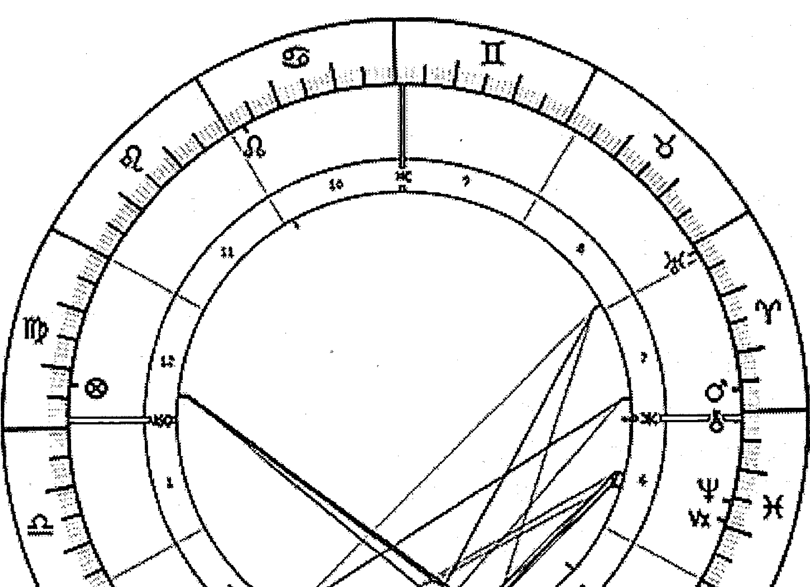

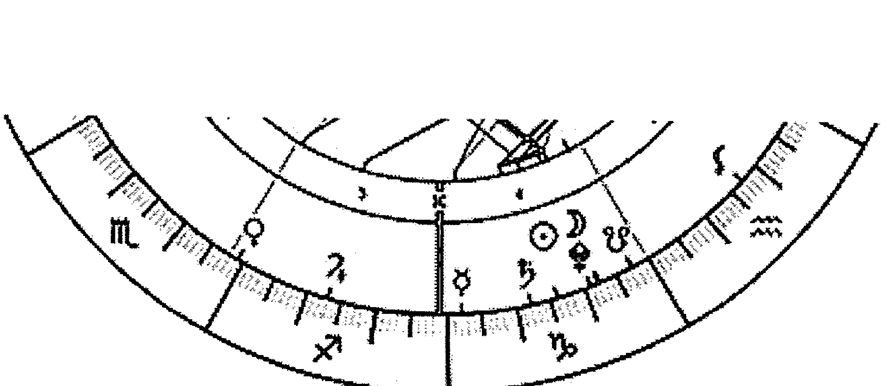

##### 哥哥的太陽回歸盤

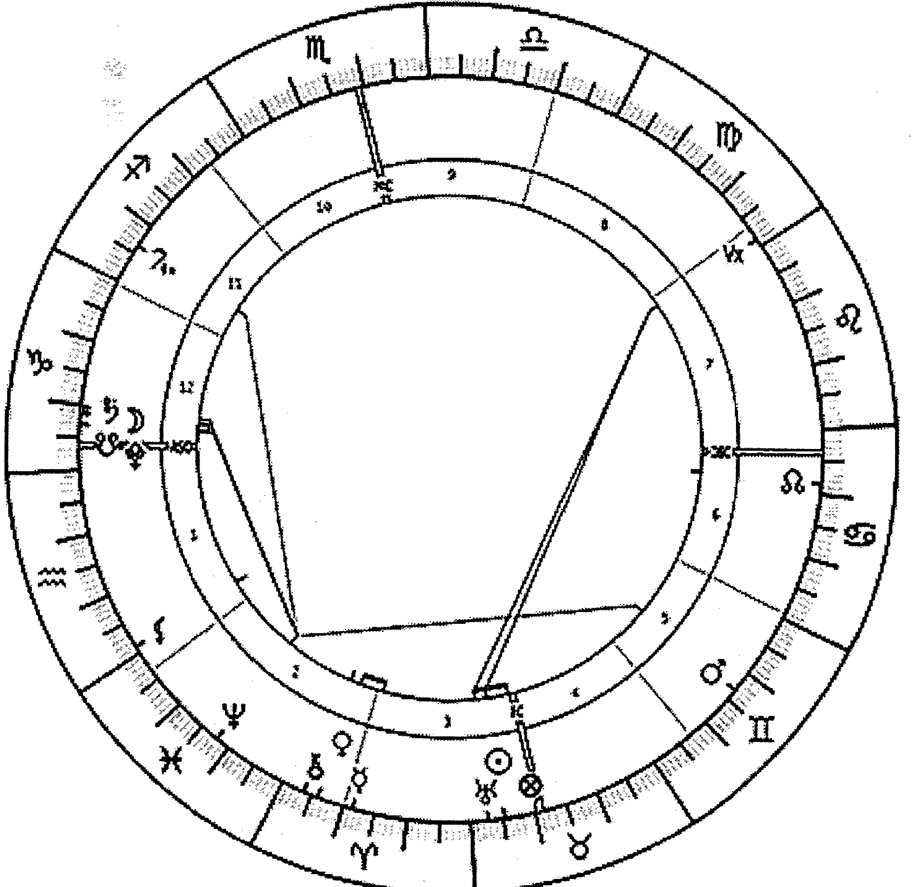

##### 妹妹的太阳回归盘

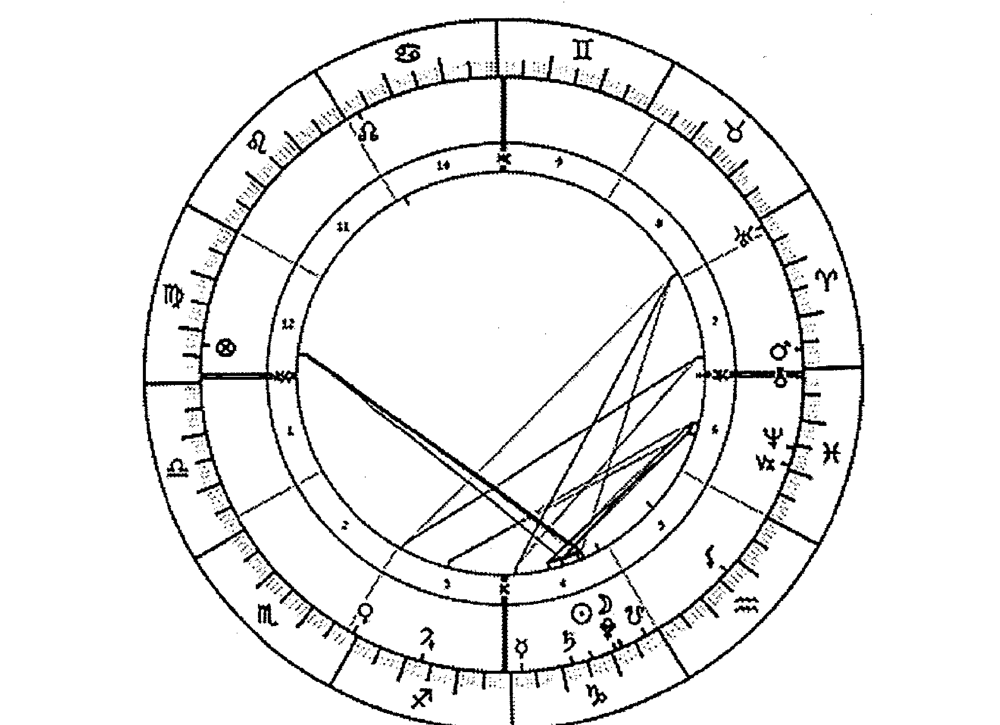

### 哥哥的太阳回归盘

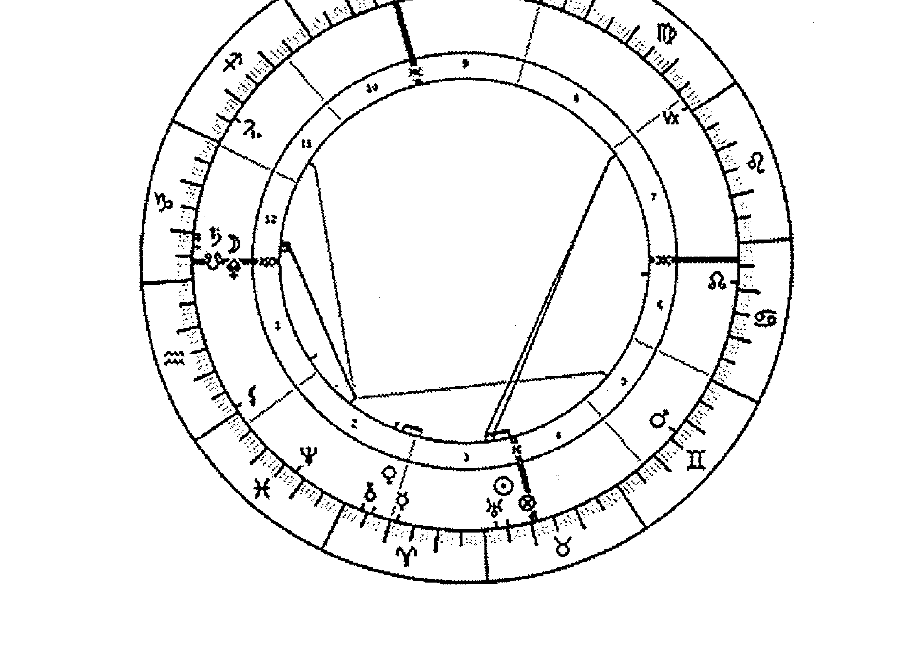

## 妹妹的太陽回歸盤

## Chapter / 10

## 太陽回歸盤中的月亮

我們在解析太陽回歸盤時，首先要觀察連續幾年的上昇與天頂的星座族群變化，然後觀察回歸盤中的太陽位置變化，以及當年度的太陽相位，再加上回歸盤中的月亮解析，這張太陽回歸盤的功能，就可說是發揮得淋漓盡致了。如果行有餘力，再去觀察其他大家感興趣的行星，看看這些行星在這一年落入什麼宮位，又有什麼相位。想要知道這一年的心境是否穩定，是否容易跟別人好好相處，都可以從月亮所在的星座、宮位，以及太陽回歸盤中出現的相位中得知。

從太陽回歸盤中月亮進入的星座、宮位，可以看出這一年的情感與安全感的重點指標。如果我們能確實的做好這一年太陽回歸盤中的月亮星座、宮位功課，就會有助於建立我們的內在穩定度，藉由理解自己的情緒而達成靈魂淨化的可能。

### ▽ 太陽與月亮的相位

太陽回歸盤中的月亮規律，以星座來說，會分別進入火土風水群組，每一到四年體驗不同的星座元素。以宮位來說，則會以逆時鐘方向，每年往前走一到三個宮位。

也因為太陽、月亮以順時鐘、逆時鐘前進，我們會發現會有一些年份太陽跟月亮落在同一個宮位，然後太陽與月亮會漸行漸遠，大約過了第四年，太陽與月亮又近距離接近彼此了。所以太陽回歸盤中的太陽與月亮每年的角度，就會出現變化。

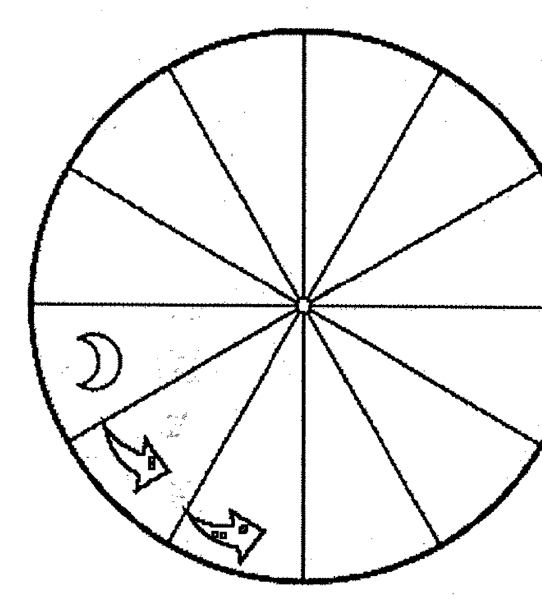

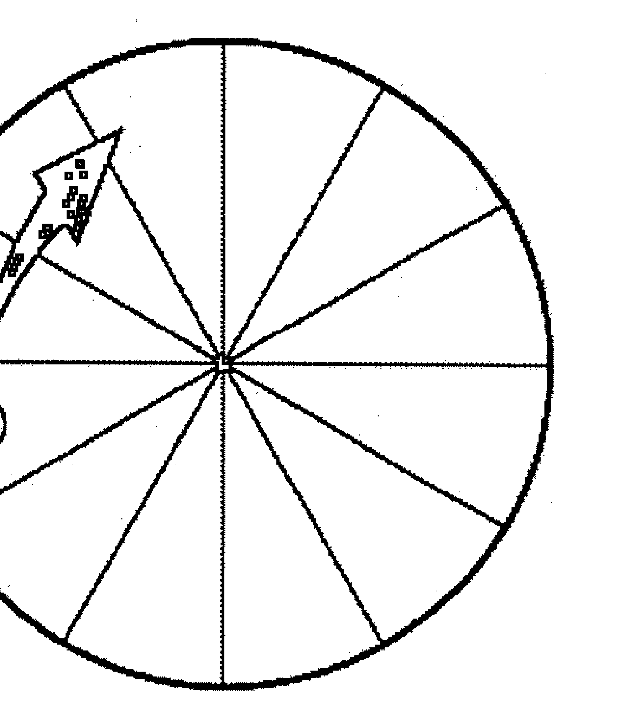

太陽回歸盤中，每一年太陽的宮位沿著順時鐘走，月亮的宮位沿著逆時鐘方向走。

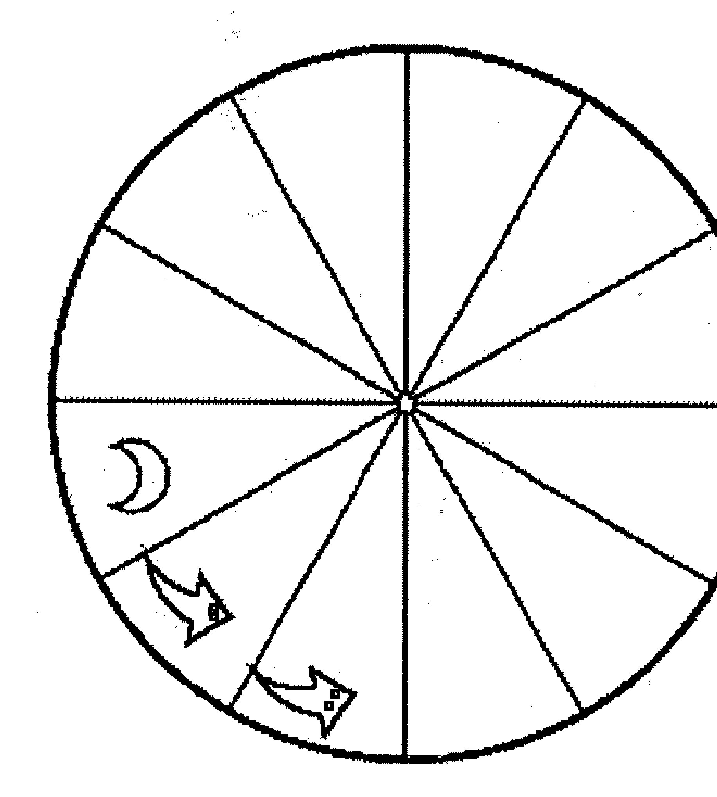

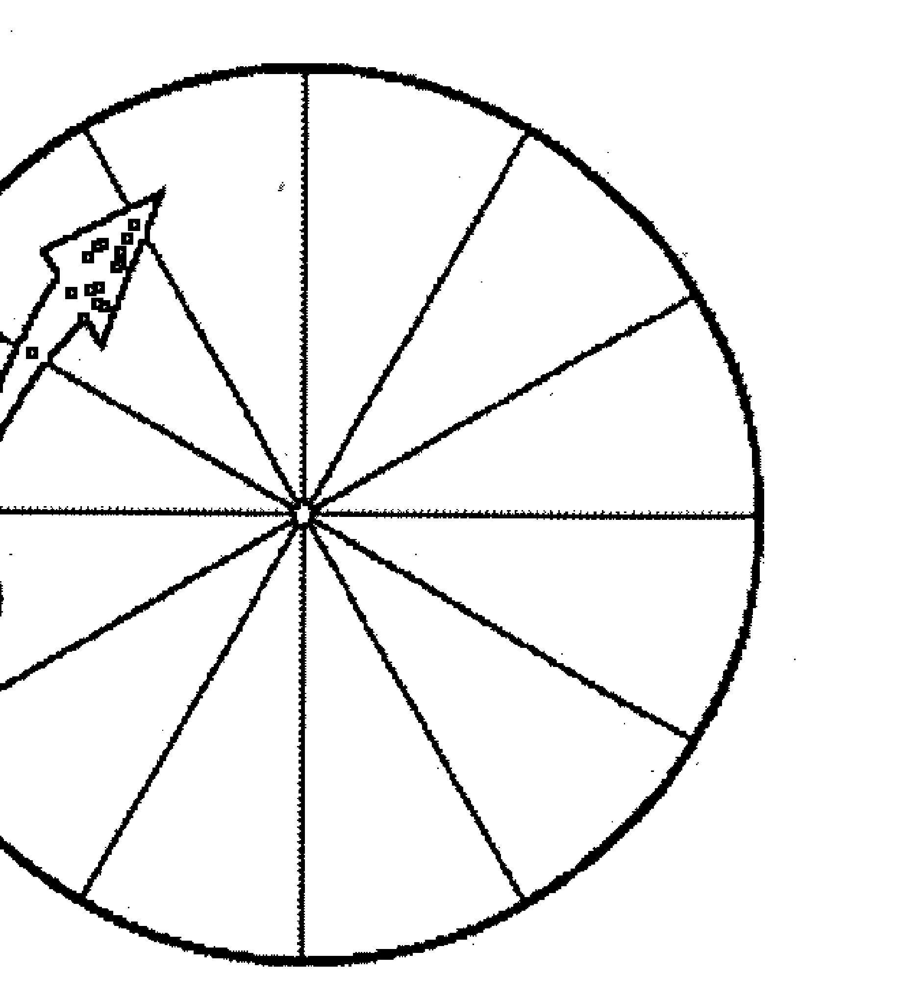

太陽回歸盤中，每一年太陽的宮位沿著順時鐘走，月亮的宮位沿著逆時鐘方向走。

### ▽月亮進入的星座

當月亮進入不同星座，這一年的月亮內在情緒，就會透過這個星座的能量來展現出來。

當月亮進入牡羊：這一年我們的內在情緒表達會比較直接，也比較衝動，很容易會將情緒衝口而出。如果這個時候月亮同時受到一些負面相位的影響，這一年的月亮就更容易躁動。

當月亮進入金牛：金牛是一個土象星座，當月亮進入金牛，當事人的內在情緒就會變得很務實，常常會用物質性的事物來取代情感的交流。

當月亮進入雙子：受到雙子的多元資訊影響，這一年當事人在內在情緒上很容易因為資訊龐雜而顯得不安。

當月亮進入巨蟹：巨蟹是一種內收的能量，這一年容易在情緒上陷入憂鬱，會有一種情緒內捲的情況。

當月亮進入獅子：獅子喜歡被人讚賞與重視，當月亮進入獅子，這一年當事人就有可能會變得比較自大、好大喜功、受人吹捧，在家庭生活中也容易會過度喜歡飲食宴樂。

當月亮進入處女：處女是一個很務實的星座，當月亮進入處女，這一年當事人就很可能會變得很嘮叨，也比較容易計較，很容易在情緒上出現見樹不見林的過度現實。

當月亮進入天秤：天秤想要的是人與人之間的和平，當月亮進入天秤時，當事人就會在情感上希望人與人之間都可以和諧相處，即使是假惺惺也沒關係。就算是假裝，也要維持著表面的和氣。

當月亮進入天蠍：天蠍想要的是深刻的連結與資源的佔有，當月亮進入天蠍，這一年就容易會因為有強烈的資源與情感需求，因而產生深刻的情緒糾結。

當月亮進入人馬：人馬具有樂觀的特質，當月亮進入人馬，當事人就很容易在這一年情緒上很樂觀，但也有可能會因為情緒上過度樂觀，因而貪吃貪玩，也愛亂花錢。

當月亮進入摩羯：摩羯想要的是社會認可的功成名就，當月亮進入摩羯，這一年就有可能會因為過度現實、過度追求權位，造成情感上的冷漠與匱乏。

當月亮進入寶瓶：寶瓶想要的是反傳統，當月亮進入寶瓶，這一年當事人在內在情緒上，就有可能會特別想要獨立自主，不想跟他人太過親近。

當月亮進入雙魚：雙魚缺乏邊界，當月亮進入雙魚，雖然會變得更有同情心，但也容易讓人陷入自怨自艾，甚至經常容易不管遇到什麼挫折，內心都暗自覺得都是別人的錯，自己好倒楣。

在十二個星座中，最辛苦的兩個星座是天蠍與摩羯。原因在於天蠍代表情感上的控制欲，而摩羯則透過物質或情感上的匱乏來激勵當事人的成就動機，所以凡是行星落在這兩個星座都不好過，其中當然也包含月亮。

當月亮進入天蠍，當事人經常會陷入情感與金錢上的糾紛，而且往往兩者互相影響，情感上的不滿，造成金錢方面的事端。像比爾蓋茲離婚的那一年的太陽回歸盤中，月亮就進入天蠍，所以離婚消息一傳出來，大家就盛傳一定是外遇糾紛造成的結果。

當月亮進入摩羯時，當事人經常會覺得自己在外在世界得不到溫暖，也得不到支持，因而特別想要在這一年中自保為上。這種情感上自顧不暇的狀態，會讓他們更無法對外界表達出自己的溫暖，也常會用帶有壓迫、權威的情緒來對待別人。

### ▽ 太陽回歸盤中的月亮相位

在月亮相位的相關議題中，我們要注意以下五個議題：

#### 一、月亮的負面相位

月亮代表的是內在情緒與家庭生活，所以當它跟性質不相合或性質複雜的行星形成合相或剋相（九十度、一百八十度），最明顯的是火星、土星、天王星、海王星、冥王星、莉莉絲，這些行星跟月亮出現負面相位，都會為月亮帶來很大的干擾。原因在於月亮本身有著陰晴圓缺的變化，因而反而是一顆最追求安穩的星，火星、天王星、海王星、莉莉絲都會讓月亮得不到安穩，而土星與冥王星會給月亮帶來很大的壓力，因此這幾顆星與月亮形成相位時，就算是一百二十度和諧相，月亮都會有一點不情願，如果形成的是合相或剋相，月亮就更受不了了。

#### 二、月亮遇到其他行星的逆行

當月亮與其他行星形成相位，即使形成的是正面相位，但如果遇到其他行星逆行，還是會對月亮造成很大的干擾。月亮雖然本身不會逆行，但它很怕遇到其他行星逆行形成的相位，原因在於逆行的行星會帶來內捲效應。所謂的內捲效應，就是當事人會將所有的注意力都集中在自己身上，而月亮最重要的功用，就是藉由情感與潛意識，將自己與他人形成連結。而當月亮遇到了其他行星逆行形成的內捲效應，將所有的注意力集中在自己身上，就會讓月亮無法發揮作用，無法與他人產生連結。

#### 三、月亮落入的星座產生的影響

月亮如果能落入比較樂觀、開朗的星座，會對這一年當事人的內在情緒，發揮正向影響。

#### 四、月亮與吉星形成好相位

月亮如果跟木星、金星形成好相位，當事人在這一年都會感到很愉快，而且很容易得到資源。

月亮跟金星形成合相或一百二十度和諧相時，這一年經常會有人送禮物給你，或者送東西請你吃，這個相位會讓人變得比較喜歡享受，而且容易得到滿足。

月亮跟木星形成合相或一百二十度和諧相時，不管是日常生活中的做人做事，或者在家享受家庭生活，都會過得比較輕鬆。

不過，在占星學中，大家往往也會因為輕鬆而惹出一些麻煩。因為人在輕鬆時，就可能會耽溺於餐飲宴樂，有可能會暴飲暴食，除了容易身材發胖之外，也有可能會因為過度花錢或過度自大而得罪別人，結果在第二年或第三年之後，等到其他剋相出現時，反撲到自己身上。

### 作業

- 先列出過去五年太陽回歸盤中，月亮落入的宮位與星座。
- 找出月亮落入宮位的規律性。（是在本位、固定、變動宮位中的哪一個群組中，如果有例外，回想一下例外那一年發生什麼事。）
- 找出月亮落入星座的規律性。（是在本位、固定、變動星座中的哪一個群組中，如果有例外，回想一下例外那一年發生什麼事。）
- 回想一下月亮落入的星座，並對照前文，找出相對應的生命事件。

#### 五、太陽與月亮之間的相位

太陽回歸盤以太陽代表的生命方向為主，藉由了解太陽與月亮之間的相位，我們可以知道今年我們的內在（月亮）世界如何協助我們的外在（太陽）作為。看看它們是合作愉快，還是雙方互相牽制。

而在一個人的太陽回歸盤中的太陽月亮之間的角度——也就是日月之間的相位，可以看出在這一年中，這個人的內外協調性。太陽是我們的外在目標，月亮是我們內在的舒適圈，太陽是我們的理性意識，月亮是我們非理性的情緒，也涵蓋了潛意識。當我們去檢查太陽回歸盤中的日月相位，就是在檢視這一年在做人做事方面，我們的行事作風，跟我們的內在舒適圈與內在心理是否互相支援，或者互相衝突。平常我們要觀察一個人的太陽與月亮是否協調，最顯而易見的，是去觀察這個人的職業與家庭生活之間是否協調，是否能夠互相支持。也可以從個人議題層面，來看看這個人的內在感受，是否與外在的理性意識是否暢通無礙。也就是說當事人在外面講出來的話，是否能跟內在感覺彼此協調，如果日月相位不好，當事人就有可能會將扭曲、隱瞞的內在狀況表現於外。當這一年太陽回歸盤中日月相位不好時，最常見的狀況有以下幾種：當事人有可能會因為職業的變動而影響到家庭生活，也有可能因為月亮內在情緒或家庭生活的無法協調，因而放棄了太陽原有的雄心壯志，也就是說，因為月亮的不安穩，因而失去了支撐太陽的力量。

相較之下，如果遇到的是太陽與月亮形成了好相位，這一年中，就很有可能家庭生活中有某些改變，能夠跟職業需求相輔相成。也有可能會是小孩上學甚至上大學，家庭生活壓力減輕，剛好又遇到職場上有機會可以大大發揮。或者是這一年搬了家，搬家本來不是一件輕鬆事，沒想到這次搬家卻受到家庭成員的大力支持與歡迎。

以下我們將分別介紹：合相、九十度、一百二十度與六十度、一百五十度、一百八十度這幾種日月相位關係。

##### ◆太陽與月亮合相

當太陽回歸盤中出現太陽與月亮合相，代表這一年中，月亮的情緒與潛意識，都會跟太陽達成協議，不會出現太陽想要往前走，但月亮不甘不願，在扯太陽後腿的情況。

但這個相位的唯一問題，也在於當太陽與月亮合相時，月亮會完全被太陽給掩蓋，結果形成了一種過度「超理性」現象，也就是藉由強大的、冠冕堂皇的理性，來壓制月亮的情緒議題，讓月亮的情緒無從宣洩。

###### ex. 比爾蓋茲離婚

二〇二〇年五月初，微軟創辦人比爾蓋茲（Bill Gates）與結婚二十七年的妻子梅琳達（Melinda Gates）在推特上無預警宣布離婚。

在這一年比爾蓋茲的太陽回歸盤中，太陽跟月亮雖然分別在十宮與十一宮，但是都在天蠍，出現了合相。日月合相就是所謂的新月，而在新月時，月亮的光芒通常會被太陽所掩蓋。雖然日月合相本身並不是不好的相位，但在這個時候，月亮往往都必須要屈就（不見得是違反月亮的意願，日月合相往往意謂著月亮也同意太陽的大方向，所以才會屈就）。在回歸盤中，太陽跟月亮都落在天蠍，而天蠍代表金錢、情感方面的信任與佔有議題，根據兩年後逐漸流出來的消息，我們可以推測，這次的離婚，是基於比爾蓋茲的出軌。

而更貼合離婚主題的，還包含了此時天王星在金牛，跟太陽、月亮天蠍，形成了一百八十度對立。天王星會帶來突如其來的意外，不但衝擊了太陽的外在形象，也影響到月亮的家庭生活與情緒。尤其一百八十度的對立往往會顯現在外在處境上的真實事件，而不像九十度剋相有可能只是內心的掙扎。

##### ◇太陽與月亮九十度

太陽與月亮九十度時，當事人在這一年中，很容易陷入彼此折磨的情境，也容易陷入家庭不睦的處境。這會隨著太陽跟月亮分別落入星座，彼此互相抵觸而顯現出困難處境的本質，而隨著太陽與月亮分別落入的宮位，則可以看出會在哪些領域彼此衝突。

###### ex.離婚困擾

我有個朋友有一年的太陽回歸盤出現太陽月亮九十度剋相，太陽在寶瓶，月亮在金牛，太陽在八宮，月亮在十一宮。此外，太陽還跟天王星合相。而她這一年經歷了離婚的紛擾。

天王星的任何相位都不利於親密關係，因為天王星要的是自由，而親密關係要的是在一起而不是自由。尤其這一年她的太陽進入八宮，太陽進入八宮，這一年的生活重點，就會面臨人性中比較複雜的議題，包含了人性的佔有欲、權力的爭鬥，當事人的太陽本來就在肆無忌憚的寶瓶，加上天王星也在寶瓶與太陽合相，讓她這一年很難平心靜氣的處理伴侶關係。加上這一年遇到了太陽月亮的九十度剋相，讓她這一年為了要不要離婚而掙扎了很久。到了最後，終究是放手了這段婚姻。

###### ex.川普落選

美國前任總統川普（Donald Trump）二〇二〇年競選連任失敗，而這一年他的太陽回歸盤中，也出現了太陽月亮的九十度剋相。這一年的月亮落在雙魚，跟他的太陽雙子九十度，月亮落在雙魚，反映出他在落選之後覺得自己很委屈的心情。而這一年的太陽回歸盤中，太陽跟北月交點合相，這顯現在雖然敗選，但他認為自己沒輸。由此可見，雖然太陽覺得自己沒輸，月亮卻覺得自己很可憐。再加上此時海王星與火星也在雙魚，雖然跟月亮的距離有點遠，但還是會有星座能量上的影響。前面提到，月亮很不適合跟火星、土星、天王星、海王星、冥王星形成相位，而川普這一年月亮跟火星、海王星形成度數較寬的合相，又落在雙魚，難怪覺得自己好可憐。而後來也發生了佔領國會山莊事件，這也是一種跟火星有關的暴力衝突，雖然很可能事件本身跟川普無關，但川普也受到很大的波及。

###### ex.小三進犯

在這張星圖中，月亮進入八宮，月亮又跟土星與冥王星都在同一個星座，而月亮進入摩羯也對月亮帶來很大的壓力，再加上太陽與月亮九十度剋相。顯示出這個人今年會遇到龐大的性、金錢、權力的八宮議題，而引爆點，有可能會是太陽與月亮之間的衝突。

這是一個大老闆的太太，她有一天在家閒坐，忽然接到一通電話，原來對方是先生在外包養的小三，小三跟這個太太說，她已經有了先生的孩子，而且先生已經不愛你了，請你不要戀棧太太寶座，趕快跟先生離婚。

太太當然很快就去找先生對質，本以為先生會安慰她說這不是真的，沒想到先生完全沒有辯駁，讓她十分心灰意冷。在對質過程中，她請先生打電話給小三，開了擴音，沒想到小三在電話另一端不斷的跟先生撒嬌，先生連一句話也不敢回，更是讓她下不了台。

月亮落在摩羯反映在這一年她沒有獲得先生支持，感到現實生活的冷酷。加上月亮本身跟火星（落在牡羊且逆行）九十度。火星落在牡羊本來就會非常大膽妄為，而且逆行會帶來內捲現象，讓這顆火星更只顧自己不顧別人，月亮與火星的九十度剋相，讓她的月亮飽受傷害。

##### ◇太陽與月亮一百二十度或六十度

當太陽與月亮出現一百二十度和諧相或六十度次和諧相，代表太陽的理性跟月亮的情緒可以和諧共處，但太陽的理性又不至於完全壓制月亮的情緒，藉由和諧的方式，讓月亮的情緒可以發揮，攜手朝向目標潛艦。

###### ex.我和我的冠軍女兒

印度知名電影演員、導演、製作人和主持人阿米爾罕（Aamir Khan），他以《三個傻瓜》、《我與我的冠軍女兒》而為台灣觀眾所熟知。

《我與我的冠軍女兒》的劇情是一個前摔跤冠軍，將自己未完成的金牌夢，投注於女兒身上，這部戲票房口碑俱佳，成為印度電影全球票房冠軍。阿米爾罕身兼這電影的監製與男主角，為了演出男主角從運動選手而退休的過程，他本來是帥哥演員，所以得要先把自己吃胖，演完男主角退休後發胖的戲份。然後再做魔鬼訓練，不但得要瘦身，還得要練出一身肌肉，再回頭演電影前半部的運動員戲份。

一個電影明星在某一年如果有特別突出的表現，很容易會在太陽回歸盤中找到符合情境的解釋，尤其這個人演出的電影角色，不管是角色的個性或劇情的推演，都有可能會從太陽回歸盤中看得出來。

電影中，他將幾個女兒都訓練成世界級的摔跤選手，女兒跟月亮有關，我們看到這一年的太陽回歸盤中，月亮落在金牛座跟太陽雙魚形成六十度次和諧相。金牛是一個踏實、努力的土象星座，雖然月亮進入土象星座，都有可能會有過度務實而缺乏情感的問題，但相較之下，月亮進入跟資源有關的金牛，又還算是一個還不錯的位置。

而這一年的月亮，又跟木星、冥王星有著一百二十度和諧相。前面提到，月亮會怕火星、土星、天王星、海王星、冥王星，其中月亮不喜歡跟冥王星形成相位的原因，在於冥王星過度執著、過度激情，但一百二十度的和諧相，會讓月亮不會那麼痛苦。而且大家看過這部電影就會知道，想要訓練出國際級的金牌選手，得要從早到晚逼著女兒取訓練，這真的需要很大的激情才能辦到。而電影中的三個女兒，也沒有對魔鬼般的訓練翻臉，她們都配合這父親的要求，非但沒有搞革命，還努力的配合父親要求，每天接受著艱苦的訓練。從這裡也可以看到，儘管月亮不喜歡冥王星的激情，但一百二十度的好相位會讓月亮比較容易接受。此外，這張盤中，月亮還有木星的一百二十度和諧相。也就是說，月亮在金牛，木星在處女，冥王星在摩羯，剛好形成了一個土象大三角（三顆星都落在土象星座，彼此形成了一百二十度和諧相）。土象大三角是一個最利於練身體、練肌肉的相位。不管是骨骼或肌肉的耐受力，都會因為土象大三角而增強。

在這張盤中，太陽與木星形成了一百八十度剋相，太陽與凱龍星合相於雙魚。從戲裡來看，男主角是一個壯志未酬，因為經費不夠而無緣奪金的前運動員，從運動場上退下來之後，因為發現自己的女兒們很有潛力，所以成為業餘教練。從太陽與凱龍星合相於雙魚，可以看出他在訓練女兒的過程中，因為很缺錢，不但無法請專業教練，訓練的方式也非常克難。

##### ◆太陽與月亮一百五十度

一百五十度雖然是剋相，但它的力道並不如九十度、一百八十度那麼強，它的成因與現象也與九十度、一百八十度不太相同。

當太陽與月亮形成了一百五十度剋相時，當事人容易遇到很多瑣碎的小麻煩。就像是一個女生跟一個男生談戀愛，雖然覺得這個男人有點粗枝大葉，但也還算上進、善良。雖然日常生活中有許多摩擦，但看在經濟基礎穩定的優勢，就還是忍耐一下好了。但也因為是在忍耐，所以在相處時會發現問題層出不窮，以致於得要一直去處理這些層出不窮的問題，但這些層出不窮的問題又沒有大到需要下定決心分手。

也就是說，一百五十度雖然會讓我們不太愉快，也經常會出小問題，但除非同時又遇到更大的剋相（有就是同時還有九十度與一百八十度剋相），否則通常我們不會因為一百五十度而決裂。

###### ex. 母親罹癌

我有個學生有一年母親罹患癌症，我將他那年的太陽回歸盤排了出來。

在這張盤中，月亮與天王星合相，顯示他的母親今年遇到了一個突如其來的大事。

太陽與月亮之間有一百五十度相位，則顯示在他跟母親之間沒有什麼大問題，但日常生活中的小摩擦不斷。例如這個人很重視女朋友，但是他母親希望他可以專心讀書，可以早日畢業並找到穩定的好工作。

在媽媽生病前，兩個人原本就處於一種不吵架，但兒子回家也不會主動跟媽媽講話的狀態，媽媽只有在晚上要吃晚飯時，才會去叫他。敲这个儿子的门。甚至儿子也不跟母亲同桌吃饭，两个人各吃各的，就像是一对只传纸条而不讲话的室友，但真的说要闹家庭革命或大翻脸又不至于。

不过这一年的太阳回归盘中，月亮遇到的比较大的克相，除了天王星来合相之外，月亮还跟水星一百八十度，所以妈妈得的是淋巴癌，可以被归因成一种跟水星有关的传导系统疾病。

##### ◇太阳与月亮一百八十度

九十度与一百八十度克相的差别，在于九十度有可能只是内心的挣扎与焦虑，外界未必会有什么明确的事件。而一百八十度则很有可能会反映在外界情境带来的压力，尤其有可能会是一个长期困扰当事人的问题，但找不到原因也解决不了，就在形成一百八十度时，藉由一件重大的甚至是无可挽回的事件，让当事人了解到真正的原因，产生了决断点。

很多分手的怨偶，那一年的太阳回归盘中，很有可能会有太阳月亮一百八十度克相。例如黛安娜王妃与查理王子离婚这一年，就遇到了这个相位。黛安娜这一年的太阳回归盘中，月亮除了跟太阳一百八十度对立之外，月亮还跟逆行的木星合相。这也说明了只要遇到逆行，就算不是克相，也都会出问题。黛安娜虽然拿到了木星的资产，也就是庞大的赡养费，但她并不快乐，也饱受许多批评。

福原爱与江宏杰离婚这一年，福原爱的太阳回归盘中，也出现了太阳与月亮的一百八十度克相。这件事起因于日本媒体记者拍到福原爱在日本跟别的男人十指紧扣，她的外遇事件才整个爆发出来，而她也在三个月后离婚。

###### ex.罗志祥与周扬青

小猪罗志祥与周扬青彻底闹翻、分手，这一年周扬青的太阳回归盘中，也出现了太阳与月亮的一百八十度对立，虽然度数稍微有点远，但月亮双鱼还是与太阳处女形成了星座属性的对立。

也因为这张盘中月亮落入双鱼，所以在一整件事件中，周扬青处于觉得自己很委屈、很可怜的情境。更何况此时月亮还合相了莉莉丝，莉莉丝代表着人类不受理智掌控的冲动，只要月亮合相了莉莉丝，当事人就会很难压抑住想要报复的冲动。而当一个女性遇到月亮进入双鱼，又与莉莉丝合相，莉莉丝的报复，就会基於觉得自己被欺负了（双鱼）的情绪。也因为周扬青这一年的太阳回归盘中，缺乏风象元素，这也代表她在决定的过程中比较不理性，也缺乏沟通——事实上也是如此。这一年受到新冠肺炎的影响，两人其实早已默默分手了大半年，她才终于大爆发，在网路上发文，将这整件事掀开来。不过也可能因为这是一个情绪性的大爆发，而不是真的想要彻底毁灭罗志祥，所以虽然后续也有很多人想要请她发表意见，她都保持沈默，不再对此多做评论。

此外，这一年的盘中，她有很多行星落在变动星座，所以遇到很多变动，结束了很多旧有事物，不管是感情、工作、生活，但未来都还不确定，也都还没有展开。

太阳与月亮的一百八十度对立，虽然前面举的都是分手的怨偶，但并不见得一定会反映在婚姻的问题上。也有很多人会显现在事业（太阳）与家庭（月亮）之间的不能兼顾。

大家在看月亮相关的相位时，除了一定要注意太阳跟月亮形成的相位（其中包含了一百五十度）之外，还需要特别留意在南北月交回归的时期，太阳回归盘的月亮会很接近本命月亮。其中包括了十九岁、三十八岁、五十七岁、七十六岁（不见得一定是在以上岁数，也可能是前后一岁）。在这几个年份中，我们会遇到太阳与太阳合相（太阳回归盘本来就是以太阳与太阳合相这一天的盘订出来的）、南北月交点与南北月交点合相（这就是所谓的南北月交点回归），又加上月亮与月亮合相。太阳、月亮与南北月交点同时回归，意谓着这会是一个外在环境比较容易呼应我们的内在本心动向的时期。一个人原有的优点，会因此而被加强、放大，但一个人原有的缺点，也会因此被增强。

## Chapter / 11

## 太阳回归盘中的水星

水星代表的是一个人的思考、沟通能力，一个人的头脑怎么想，一个人会在哪些方面勤于沟通，都会随着本命星图中，水星落在什么星座、宫位，以及跟水星的相位，都息息相关。

在太阳回归盘中，在这个年度，水星落入的星座、宫位中，可以看出当事人会在哪些地方，具有较强的联络沟通往来活动；看出今年会让自己感到的伤脑筋、文思泉涌或变动不安与领域；看出今年资讯与知识的吸收整理特性与相关领域；看出生活变动与生活是否便利。此外，手足与亲近朋友的往来，也跟水星有关，从太阳回归盘中水星落入的位置，也可以看出今年的朋友与兄弟姊妹关系。此外，水星落点所在之处，都会利于思考与沟通能力训练。

在太阳回归盘中，如果遇到逆行，都需要多加留意。水星如果逆行，会造成思考与沟通上的僵化或过度，往往会让当事人在这一年虽然努力想要跟人沟通，但经常遇到沟通不良的处境。如果这一年中的太阳回归盘中水星逆行，就要特别需要为日常琐事烦心，也可能会日子过得不稳定。在水星逆行的这一年，也容易遇到交通受阻、排队等待，也容易沟通不良，容易产生误会。也可能会有一些秘密或谎言被人发现，或电子通信设备出状况，也可能会有机会重新联络上旧有关系，会有一些老交情再聚。但水星逆行也未必一定是坏事，藉由水星的逆行，有利於旧资料发现与整理，也利於内省与回顾。不过要注意的，是当该年太阳回归盘的水星若与其他行星出现负面相位时，除了会出现沟通、交通与变动问题之外，也可能出现神经系统相关疾患。

### ex.交通被挡事故

我认识一个被害人，他在回家的路上，被倒车的轿车撞到，导致身体伤残，肇事司机自称黑道关系硬，只愿意理赔基本医疗费用，双方因此闹上法庭。

在这一年中，被害人的太阳回归盘中的水星落在宝瓶，落在五宫，而冥王星落天蝎，落在二宫，同时跟水星出现九十度克相。

前面提到，水星跟交通问题有关，而冥王星则与黑道有关，加上冥王星落在二宫，二宫跟金钱有关，所以这一年会出现金钱纠纷。

### ex.画家梵谷的灵性与疯狂

一八八七年梵谷（Vincent Van Gogh）认识了刚到巴黎的画家高更（Paul Gauguin），两人一见如故，互相倾慕不已。隔年梵谷搬去阿�勒之后，极力鼓吹高更也搬来阿勒同住。但没想到同住之后，两人非常不合，终于导致梵谷在十二月二十三日割掉了自己的左耳，而高更随即返回巴黎，这件事成了艺术界的千古之谜。

在这一年梵谷的太阳回归盘中，水星逆行且落在双鱼，一方面让梵谷的水星，充满了双鱼的浪漫情怀，但逆行也让梵谷过於沈溺於自我幻想，失去了现实感。加上这一年的水星与月亮九十度，带来生活上的变动，所以他搬家搬到阿勒。

隔年梵谷的太阳回归盘中，水星与金星合相同样带来了强烈的艺术情怀。而水星与金星的合相，同时又跟木星九十度。水星与木星的九十度克相，反映在梵谷与高更不断的争执，小从生活沟通，大到作品欣赏，两人每天都吵个不停。

此外，在同一年的太阳回归盘中，位於四宫的水星双鱼也与位在处女座七宫的冥王星，出现九十度相位。冥王星的激情之火与控制欲望，让梵谷躁动不安，就在一次高更说出想要离开梵谷，双方爆发激烈争吵之后，梵谷在高更面前亮出了刀子，之后梵谷走回家，割下了自己的左耳，两位同住好友自此也各自走上了陌路。

## Chapter / 12

## 太阳回归盘中的金星

金星代表的是一个人讨人喜欢的本能，它包含了美感、饮食品味、谈恋爱的喜悦、用于逸乐的金钱，以及社交能力。

太阳回归盘中的金星所落在的星座、宫位，则代表了今年重要的社交与美感表达方式与领域、今年自我价值展现之处、今年金钱收支方式的表现。而在金星落点所在之处，也有助于建立成熟的个人价值观、个人品味与资产。

于此同时，也必须要观察一下金星是否逆行。金星如果逆行，跟金星相关的事物，例如情感、美学，就会变得比较固执，也比较物质化，不像正常的金星会从情感面出发。如果在这一年的太阳回归盘中金星逆行，就必须要特别留意开销与购买、价值展现模式、美感、社交特质、恋爱与喜好相关领域，是否会因为受到金星逆行的影响，而变得很不畅通。

### ex.上班族变街头艺人

我认识一个太阳双鱼的朋友，他在太阳回归盘金星与海王星都进入双鱼，又与太阳合相的这一年，由一个朝九晚五的上班族，转行变成街头艺人。

### ex.大S闪离又闪婚

大S在二〇二一年的太阳回归盘中，金星落在天蝎，与天王星金牛形成九十度克相。所以她在这一年先跟汪小菲离婚，闹得沸沸扬扬。之后又跟韩星具俊晔旧情复燃，并且在一个月内闪电结婚。

### ex.具俊晔求婚大S

具俊晔在大S离婚之后主动示爱，跟大S闪婚。在具俊晔这一年的太阳回归盘中，金星进入讲究一对一平等关系的天秤，且又跟木星一百二十度，这代表了他在这一年中，透过跟大S的情感关系，他又重新得到了社会的瞩目，拥有了木星的知名度。

### ex.古爱凌参加北京冬奥

滑雪选手古爱凌二〇二二年参加北京冬奥，获得两金一银。在这一年度的太阳回归盘中，她的金星落在天秤，又跟木星一百二十度。由此可见，金星代表的并不只是爱情与珠宝，它还包含了优美的体育技巧（当然也包含了随之而来的广告代言）。

### ex.强尼戴普演艺事业被重创

强尼戴普在二〇一八年的太阳回归盘中，金星落在巨蟹，又跟冥王星摩羯、莉莉丝摩羯，形成了一百八十度克相。在这一年中，他的前妻安柏赫德在《华盛顿邮报》（Washing Post）一篇公开信中谈论自己经历家暴侥存的经过，尽管从头到尾没有提到强尼戴普，但也被视为诽谤遭到强尼戴普提告。这件事兼具了金星冥王星一百八十度的毁灭性，以及金星莉莉丝一百八十度的非理性，也因此重创了他的电影事业。

## Chapter / 13

## 太阳回归盘中的火星

火星是我们的热情展现的领域，在太阳回归盘中，这一年火星进入的不同宫位领域，代表这一年你会在这个领域产生很大的热情。但火星也容易造成争执，而且很自我主义，所以如果在太阳回归盘中，火星落在第三象限（七八九宫），也就是「关系象限」中，当事人就会很重视各种人际关系，但一方面重视，一方面又很自我主义的想要干涉，就很容易发生冲突。例如看到另一半不按时吃饭、不按时睡觉，火气就冒上来。又如火星落在第四象限（十、十一、十二宫），就很有可能会因为发言不当而惹出众⼈围剿。

火星所在的宫位，都会是我们这一年的热情之所在，但也可能会因为过度热衷，因而惹祸上身。所以我们在观察太阳回归盘时，看完太阳与月亮之后，我应该要来看一看燃起生命热情的火星。

看完火星落在的宫位之后，再来观察火星跟其他行星形成的相位。首先火星如果跟天王星、海王星、冥王星形成相位，都必须要特别留意。由于天王星、海王星、冥王星这三颗星是宇宙星，它们都会带来巨大的无常，这三颗星的力量本来就很大，再加上火星的火上加油，一方面影响力会比较大，而且常常很容易显现在具体的事件上。

我们在解析太阳回归盘时，一定要观察一下这一年火星所在的星座、宫位、相位。火星虽然会带来活力，让人亢奋，但也可能会引发一些很激烈的事情。当火星遇到天王星、海王星、冥王星都需要格外注意，自我行为，以免因一时冲动酿出祸事。而如果火星遇到凯龙星与莉莉丝，则容易发生失去理智而产生的过度冲动。

## ▽ 火星与天王星相位

天王星与闪电般的巨大改变有关。当火星遇到了天王星相位，当事人在这一年中，就可能会在生活上出现巨大改变，但也因此有机会接触到新的挑战。但天王星也是一颗任性妄为之星，当它遇到了火星的激情，就有可能更为任性妄为，而且不会只是在心中想想，而会实践于真实的行动。

### ex.人民圣殿邪教自杀事件

一九七八年十一月十八日，在圭亚那的琼斯镇，「人民圣殿教」的创教人吉姆琼斯（Jim Jones），以武力威逼九百多名信徒一起集体自杀。
在吉姆琼斯当年的太阳回归盘中可以看到，天王星在天蝎逆行，跟太阳一百八十度对立，又跟火星九十。这件恐怖的憾事，起因於吉姆琼斯在没有预期的意外情况下，接待了美国众议员里奥瑞恩（Leo Joseph Ryan, Jr.），议员在参访快结束时，发现到这个教团有一些非比寻常的异状，於是告知吉姆琼斯，他会在返回美国时，在国会揭露教团中种种犯罪行为，甚至也有一些认清现实的教徒，想要跟着议员一起离开，结果吉姆琼斯就派人枪杀了瑞恩与随行的新闻记者。也因为事情闹得太大，无法收场，於是他就在教团的饮料中放入氰化物与镇静剂，逼使全体教徒陪他一起自杀，而抗拒的人则一律被射杀。

## ▽ 火星与海王星相位

当火星遇到天海冥这三颗星时，由于天海冥的力量远大於火星，所以天海冥的力道会整个笼罩、压过火星。火星的符号上有个箭头，由此可知，火星往往具有很明确的目标，海王星则否。当火星遇到了海王星，火星原本应该会有的目标性，就会整个被散漫、没有边界的海王星给破坏掉，因此而丧失了目标。

如果在太阳回归盘中，遇到火星与海王星出现相位，这一年就会觉得自己的身体懒洋洋，在活力、精力上都提不起劲来，而且在行动上变得没有方向，甚至天马行空。可能今天想要去学跳舞，明天想要去钓鱼，后天想要读一本书，读了几分钟又觉得不耐烦，又跑去发呆。

从二〇一二年到二〇二六年，海王星都在双鱼，对於火星在双子、处女、人马与双鱼的人来说，就会形成宽松程度不一的火星与海王星相位。

对火星在双子的人来说，火星双子的人往往会把火星的精力，用双子的沟通的能量来表达出来，当他们遇到了海王星双鱼带来的欺骗，就有可能会成为言语沟通，甚或言语暴力的受害者。此外，火星是一颗跟性有关的星，当它遇到了海王星，就有可能会因为一些跟性有关的幻想，或者是言语性骚扰，或者陷入跟性有关的诈骗议题。不过尽管是负面相位，如果当事人本身的修为不错，这个相位也有可能会反映在当事人具有一种唐吉軌德式的理想，并付诸行动。不过也因为海王星具有强大的模糊边界的力量，所以即使当事人有唐吉軌德的情怀，但不见得都有能力可以付诸行动，很多时候也可能都只是空想。

也因为火星代表了我们的肉体活动，当海王星影响到火星，当事人就会很容易生病。

### ex. 苏伊士运河塞船事件

二〇二一年长荣海运的「长赐号」在行经苏伊士运河时，因为不明原因船头打横，所以失控搁浅在运河中，造成苏伊士运河完全无法运作，而长赐号也整整搁浅了六天才脱困。当全球吞吐量最大的苏伊士运河被堵塞，就造成了全球货运的大塞港，成为全球很严重的货运灾难。

我们引用尼可拉斯康平（Nicholas Campion）所著的《世界星座之书》(World Horoscopes)，设定出埃及的出生时间，并打出埃及在二〇二〇到二〇二一的太阳回归盘，就会发现，盘中的火星与海王星合相在双鱼座九宫，九宫代表国际贸易与关税，双鱼代表海运，此事衍生出很大的货运危机，后续的影响时间也拖得非常久。

### ex. 俄罗斯反对派领袖纳瓦尼

俄罗斯反对派领袖纳瓦尼（Alexei Navalny），他从二〇〇九年起，就不断的反对普丁，因而疑似遭到普丁下毒，这也引起很大的国际关注，他也因此转送德国治疗。

一般人受到这么大的危险，就算仍然继续当反对派，但也可能会就此流亡海外。但纳瓦尼一等到病情好转，就回到俄罗斯，甚至还公布了普丁奢华生活的影片，来对照俄罗斯一般人民的艰困，也引起了很大的迴响，虽然因此被捕入狱，但也狱中获得欧洲议会的欧盟最高人权奖萨哈罗夫奖。

这一年纳瓦尼的火星十一宫，十一宫是社群活动与革命之宫，它就是我们常说的「道」。而纳瓦尼心中的「道」，就是希望俄罗斯人民可以拥有合理的统治之道。但也因为他的火星与海王星合相在双鱼，让他成为被牺牲的英雄，所以先是遇到中毒就医，后来又遇到牢狱之灾。

### ex. 川普的防疫难题

海王星这几年都落在双鱼，而海王星本身就与我们的免疫系统有关，而海王星落在双鱼，很明显的就反映在这几年的新冠疫情上。

美国前总统川普，在疫情最烈的二〇二〇年的太阳回归盘中，月亮、火星、海王星都落在双鱼，所以不但在大选期间得到了新冠肺炎，还因为疫情的掌控不够理想，因而输掉了总统大选连任。

## ▽ 火星与冥王星相位

火星不管是遇到天王星或冥王星，都有可能会任性妄为，造成严重的负面事件，但两者的出发点不同。

火星是一种简单的外在激情，而冥王星是深沈的内在激情，当火星遇到冥王星时，我们可能会对某个人或某件事、某个议题，出现了强大的激情。如果当事人的能量层次很低，就有可能会引发类似性暴力之类的低等性能量议题，但如果当事人的能量层次很高，透过冥王星的激情，就可以不眠不休的去完成一些大事。不过就像俗语说「暴雨不终朝」，火星与冥王星形成相位时，由于能量太强，就像是豪大雨也只能下两三天就没了。当相位结束，就像是一个人要面对之前亢奋了三天，不吃不睡所引起的身体、心理或人际关系中发生的副作用。

### ex.高嘉瑜家暴事件

民进党立委高嘉瑜在二〇二一年遇到了媒体喧腾一时的家暴事件，她在旅馆内被男友林秉枢施暴，并滞留了三天。在这一年的太阳回归盘中，太阳合相火星在天秤，又同时跟冥王星摩羯九十度。太阳跟火星合相在天秤，意谓着她这一年会遇到强烈的人与人之间的冲突。她的男朋友将她殴打成伤，而且将她关在旅馆中，一开始的导火线，据传是高嘉瑜帮前男友的小孩买了一些东西，但冥王星的失控往往没有这么简单，从案件的后续发展，我们也看到整起事件背后，有着很强烈的操控议题。

而回到前一年，当时她刚跟林秉枢交往，不久后就发现这个男生虽然外表看起来彬彬有礼，但性格有点奇怪。吵架时甚至会逼着高嘉瑜下跪认错，但高嘉瑜可能觉得这个男生只是偶一情绪失控，于是继续跟林秉枢交往。我们看前一年的太阳回归盘，就可以得知为何当时高嘉瑜没有当机立断，马上分手了。在前一年的太阳回归盘中，太阳与月亮合相在天秤，当太阳与月亮合相时，月亮的光芒会被太阳所掩盖，所以月亮没有力量，月亮会成为太阳的追随者。再加上月亮天秤本来不喜欢撕破脸，遇到问题时，只要对方不进一步进逼，就常常会想要息事宁人，假装什么事都没有发生。所以虽然他们一开始交往没多久，高嘉瑜就觉得这个男生似乎有点怪怪的，却没有试图离开他。

但其实前一年的太阳回归盘中，就已经出现了火星与冥王星的九十度克相，而且火星逆行，且火星一百八十度对冲太阳月亮。这也意谓着其实前一年应该就已经有一些暴力行为，只是因为太阳月亮合相，所以被当事人压了下来，没有搬到檯面上。

## Chapter / 14

## 太阳回归盘中的木星土星

木星与土星都是社会星。木星带来社会资源与正向、乐观的态度，在太阳回归盘中，木星不管进入哪个宫位，都会令人感到资源充裕，信心十足。相较之下，在太阳回归盘中，土星所在之处，就是这个人今年会比较郁闷的领域。在这个领域，我们都会感到社会资源欠缺，压力也比较大。

土星落在哪一宫都会让人很不舒服，唯一令人比较可接受的是土星进十宫。

如果太阳回归盘中土星进入十宫事业宫，这一年你就有机会在社会舞台上接受事业上的重责大任。虽然也会因为事业上的重责大任而压力很大，但至少是因为黄袍加身而压力很大，大部分人都会觉得这种压力还算值得去背。至於土星进入其他任何宫位，恐怕大家都很抗拒。

此外，虽然大家很害怕土星进入十二宫，但就很多占星师的观点，土星进十二宫反而是一个很重要的时期。原因在於十二宫这个宫位，原本就是要用来自省，要来帮助我们清理内在。当土星进入十二宫，你在这一年中，就会发现自己特别会有需要反省与清理内在的需求，而且不会只是一种心理上、情绪上的需求，它更会是一种在现实上压力与急迫性。藉由各式各样的压力，反而让你清楚地看到自己灵魂上的问题，也可以认清自己在过去做过很多事情的是非对错。

2021与2022年这两年中，几乎大部分的时间，土星都跟天王星形成或松或紧的九十度克相。大家不妨打出自己在2021年与2022年的太阳回归盘，看看土星与天王星各自落在哪个宫位，并回想一下有没有那些生命事件，可以跟它呼应。

## 土星十二宫的无妄之灾

我有一个朋友，他在某一年的太阳回归盘中，土星进入十二宫，又跟三宫天王星九十度。他在这一年做家事时，因为地上有水而滑了一跤，导致骨折。十二宫原本就是没有现实逻辑的非现实之宫，而土星是业力，当土星进入十二宫时，我们很容易遇到很多莫名其妙的倒霉事，因为这些倒霉事往往都没什么现实逻辑。此外，六宫与十二宫互为一百八十度，这一条轴线，也经常会被我们称为“健康轴线”，当土星进入六宫或十二宫，往往会带来一些生理或心理方面的健康议题。

这个当事人遇到的土星进宝瓶落在十二宫，天王星进金牛落在沟通之宫三宫，反映出这一年他跟他的电玩团队队友之间经常有一些纷争（宝瓶跟非营利组织的同道有关），而且争执的原因，往往跟借钱不还有关（金牛跟金钱议题有关）。

土星与天王星的九十度克相的困难，在于土星想要的是稳固与安全，但天王星想要突破、改变、革命，当这两颗星形成九十度克相，就会令人陷入安稳与放手一搏的两难拉锯中。

# Chapter 15 太阳回归盘中的天海冥

天王星、海王星、冥王星都是行进速度很慢，而且影响力很大的宇宙星。天王星带来前卫的革命，海王星带来非现实的灵性梦想，也可能会带来欺瞒，而冥王星带来毁灭与重生。

观察太阳回归盘中的天王星、海王星、冥王星所坐落的宫位，可以让我们迅速理解，这三颗宇宙级的星体，会对哪些领域造成重大影响。

### ▽ 天王星所在宫位

天王星所在的宫位，往往会是今年经验科技、突变、新知、挣扎、放手、觉醒与突发性改变之所在。但天王星也会破坏掉原有的安全结构，脱离舒适圈的同时，也意味着失去了舒适圈的保护。当天王星落入不同的宫位，代表原本这个宫位中习以为常的运作方式，会出现突发性的破坏。但在破坏性事件出现之前，你会先产生一种想要突破的焦虑，如果你自己做不出突破的举动，外在世界就会藉由一些外来的突如其来的事件，来帮助你挣脱舒适圈——而这些都不会是让你觉得舒适的事件。

也因此，不管有没有出事，在出事前或在出事后，天王星所在宫位，都会在这个宫位领域中引发不安与焦虑。举例来说，当天王星进入二宫金钱宫，在这一年中，金钱离开的速度，就会跟进来的速度一样快，现金流可能会出现很大的震荡。二宫的资产，也包含了自我价值，当天王星进入二宫，除了容易有金钱上的意外，同时也意谓着这一年当事人很急切的想要建立独特的自我价值。尤其天王星从2018年到2026年都在金牛，金牛跟金融、资产有关，就算天王星不落在二宫，也都或多或少会有一些资产议题需要跳出舒适圈。

也就是说，藉由天王星所在位置，可以看出这一年的突破点之所在。

此外，天王星是宝瓶座的主管星，观察完天王星之后，我们也不妨来看一看，这一年的太阳回归盘中，哪一个宫位落在宝瓶，这个宫位领域会出现强大的独立意识，会很想要寻求创新。例如今年的八宫在宝瓶，很可能这一年在八宫中，会有类似但不那么明显的天王星进八宫的情境。很可能会在八宫的性、他人金钱、权力领域中，会有一些突发状况。

### ▼ 海王星所在宫位

海王星是一颗灵性、艺术之星，它也是最脱离现实的一颗星。没事时，海王星会是一个人灵性、梦想、理想发展之处；有事时，海王星会是幻灭、孤单、悲伤、逃避现实之处。观察海王星进入的宫位，往往会发现，它会是我们这一年发愿之所在，也有可能会是我们自欺欺人的地方。

此外，海王星是双鱼座的主管星，观察哪一个宫位进入双鱼，也可以去观察这个宫位有可能会出现梦想与幻灭的相关议题。

### ▽ 冥王星所在宫位

冥王星所在宫位，没事时，具有强大专注力的冥王星，它可以帮助我们掌握资源。

当冥王星进入某个宫位，我们就会对这个宫位领域出现很大的激情，就像我们忽然对练钢琴很感兴趣，每天逼自己练十几个小时，当然就有机会成为一个优秀的钢琴师。

但冥王星的力量如果只是拿来控制自己，自然问题不大，如果拿去操弄别人，冥王星隐藏于台面下，却又藏有巨大激情的力量，就有可能会形成负面的情绪勒索或情感控制，就不见得会是好事。

尤其冥王星进入第七宫、第八宫，这两个跟人与人之间的连结最有关的宫位，往往不是你去控制别人，就有可能是别人利用了冥王星的力量来控制你，都需要当事人特别留意。尤其是当冥王星跟其他行星形成度数紧密的负面相位时，就必须要特别留心，看看冥王星所在宫位，是否会经历死亡与重生的事件。

冥王星是天蝎座的主管星，除了观察冥王星会在哪个地方经历转化之外，也可以检查一下今年的天蝎座坐在哪个宫位。

例如天蝎座进入第三宫，代表了我们今年在跟他人沟通、交流的领域，有可能会遇到想要操弄我们的人，也有可能代表今年我们在面对沟通时，很多话都不想讲开，话都不讲明。也可能因为天蝎座在三宫，所以特别喜欢去搜寻心理学或神秘议题的相关知识。

### ▽ 天海冥的宫位循环性

天王星、海王星、冥王星走得非常慢，尤其是冥王星在近十十几年进入摩羯座以来，每年大约只走两三度。

如果我们只观察五六年内的太阳回归盘，由于天王星、海王星、冥王星走的速度实在太慢，所以它们会跟完全不动的太阳一样，会出现一个约略每次往前跳三个宫位的韵律。

所以不只是冥王星，我们会发现，大部分人的天王星与海王星，也都会约略照着每次往前跳三个宫位的韵律，进入本位、固定、变动宫位。

这也显示出我们在天王星、海王星、冥王星的宇宙级庞大课题中，会连续好几年的时间，去做本位或固定或变动宫位的功课。

也因为冥王星所在之处会颠覆我们的自我认知，如果落在本位宫位，就可能连续超过四年都落在本位宫位（一、四、七、十宫），就等于我们得要连续好多年都在持续做着跟人际关系有关的功课，而冥王星带来的死亡与重生，就可能会让我们在连续好几年的时间，经历了自我意识、事业关系、伴侣关系，家庭关系中的颠覆，也因为颠覆而产生新生。

如果冥王星进入的是固定宫位群组，就会连续很多年在二、五、八、十一宫中，以每年往前跳三宫的方式，敦促我们必须面对资产、资源与人性考验议题。

在本书前面的章节，我曾经跟大家分享，我在2016年上升开始进入本位星座前，之前有很多年的上升都在固定星座，而那几年是我人生中最为大起大落，也最难熬的时期。而我的冥王星，也在那几年都落在固定宫位，所以连续很多年都在处理巨大的资产议题。不但涉及到巨额的金钱、土地的纠葛，也因为牵涉到的金额太大，人性的纠葛也就从中产生。由此可知，当冥王星进入固定宫位，冥王星的死亡与重生与激情，会让你必须面对庞大的资产议题，以及经由资产议题而不得不面对的赤裸人性，也包含了要如何在跟别人共享资源的同时，还能够保有自我的艰难功课。冥王星在这些宫位，有机会去颠覆、重建你的认知。你有机会在这段时期藉由冥王星的力量，找到新的自我价值的定义，或与别人相处的信任模式。

如果冥王星进入的是变动宫位群组，就会连续很多年在三、六、九、十二宫中，以每年往前跳三宫的方式，敦促我们去面对学习方式、沟通模式、工作模式、立身处世的原则、身心健康议题。尤其六宫与十二宫都与健康有关，当冥王星进入这两个宫位，就有机会藉由颠覆你的身体或心理的健康，来改变你对自己身体、心理的认知。

当我们将天海冥进入宫位的韵律也加进来，在综合解盘时，就可以得到更为全面的解释。

接下来海王星与天王星进入宫位，请大家在解盘时也应列入参考，为了避免篇幅太长，我就不再赘述。

# Chapter 16 太阳回归盘中的莉莉丝与南北月交

### ▽ 莉莉丝

莉莉丝与南北月交点，都是astro-seek网站的预设端点，它都会直接显示在太阳回归盘中。但很多人对莉莉丝与南北月交点感到很陌生，接下来我们就来为大家介绍一下它们各自代表什么意义。

在astro-seek排盘软件中，排出来的盘中，我们会看到莉莉丝的符号“（插图-10）”。这个符号的上方是黑色的月亮，月亮下面有一个十字。也因为这个月亮并不是空心的，而是黑色的月亮，它代表的就是“黑月”，它代表了我们内心的黑暗、恐惧。而黑月下方的十字，则带来实际的行动，带来身口意的反应。

莉莉丝说明了内在恐惧，以及内在的强烈欲望，有可能会支配了我们的思想、言语、行动。莉莉丝来自于古老的犹太造人神话，它与一般大家常听到的亚当、夏娃神话略有不同。一开始上帝先用泥土造了一个亚当，然后又用泥土造了一个莉莉丝，并让两人结为夫妻。莉莉丝跟亚当都是上帝从大地造出来，因而双方是平等的，也因此，莉莉丝对自己的权利很坚持，不会对亚当百依百顺。有一次两人起了很大的争执，而且是跟床笫有关的纷争——莉莉丝坚持做爱的时候想要处于上位，亚当不愿意。这件事成为了一条导火线，引爆了双方长期的不和，莉莉丝也因而逃去红海，跟红海当地的蛮夷部落混居，当然也谈了别的恋爱，生了别的小孩。

但亚当一直忘不了莉莉丝，于是上帝请天使当说客，想要劝服莉莉丝回到亚当身边，可是莉莉丝不愿意。天使威胁莉莉丝说，如果不回到亚当身边，就要杀光她跟别人生的小孩，而莉莉丝大怒回嘴，你杀我多少小孩，我就杀你多少小孩，因而发动了瘟疫，杀死了很多小孩。

从莉莉丝的神话中，我们可以看出莉莉丝的能量原型。首先可以看到莉莉丝对于自己的主体性，有着非理性的坚持。这种非理性的力量，甚至可以跟全知全能的上帝互相抗衡。其次，莉莉丝具有强烈愤怒、想要报复的怨气。

也因为莉莉丝跟瘟疫有明显的关联，所以如果在太阳回归盘中，看到莉莉丝处于重要位置的话，都必须要特别小心，以免染疫。首先我们可以观察在太阳回归盘中，莉莉丝是不是进入了跟健康息息相关的六宫或十二宫，此外，一宫也跟一个人的外在形象与日常活力有关，如果莉莉丝进入一宫，也必须小心健康议题。此外，如果莉莉丝跟太阳（代表一个人的整体健康）、水星（代表呼吸系统）、火星（代表肉体能量）出现相位的话，也需要特别留意。以上提到的各个影响因子，叠加的因素越多，莉莉丝的影响就越大。

也因为莉莉丝是个化外之民，如果这一年的太阳回归盘中莉莉丝处于重要位置，当事人就很可能会经常觉得自己不受社会大众的欢迎，甚至有可能会隐隐然受到外面世界排斥。但从另一个角度来看，莉莉丝本来就会激发出非理性的能量，让人用非理性的态度去面对世界，当然会容易被别人排斥。所以当莉莉丝出现在太阳回归盘的重要位置时，与其埋怨被世界排斥，不如多花一点力气去维持自己在做人处事上的理性，保持自觉，不要经常让非理性的情绪蔓延，才能降低莉莉丝的破坏性，这才是解决问题的根本之道。

### 南北月交点

月球绕地球的轨道为白道，太阳绕地球（事实上是地球绕太阳）则是黄道。而黄道与白道之间，有着五度的夹角，因而会形成两个交点，这两个交点就被称为南月交点与北月交点。也因为北月交点是太阳与月亮都在上升时相交的点，所以北月交点也被称为“升交点”，而南月交点则是太阳与月亮都在下降时相交的点，所以也被称为“降交点”。也因为南北月交点等于是结合了太阳与月亮的影响力，所以常常会让人感受到生命中从里到外的贯彻性能量。

南北月交点符号的形状相同，只是一个朝上，一个朝下。大家不妨记住，北月交点就像是一个人戴耳机“插图11”，而南月交点相反“插图11”，这样就不会搞错了。

在太阳回归盘中，北月交点所在的星座、宫位，会揭示你在这一年中，会经由哪一种型态、哪一种领域与哪一种关系，开启我们新的眼界、新的方向，我们也很容易会得到周遭的鼓励（不管是旁人的协助或社会的氛围），鼓励我们朝着这个方向向前进。

我们很容易在北月交点的星座、宫位，感觉到让我们去探索未知，让我们去探险的呼唤。只要观察每年太阳回归盘北月交点所落的位置，就可以很容易的找出自己会在什么地方，找到想要往前探索的热情。

此外，北月交点所在位置，也可能代表被我们引动出的新式集体风潮。如之前提过的哈维温斯坦性侵案，在2017年报社披露后，引发了反性侵与性骚扰的#MeToo运动风潮。这一年哈维温斯坦太阳回归盘上的北月交点，就是落在代表法律道德的九宫，星座是代表明星产业与主权维护的狮子座。同时，这个北月交点也是哈维温斯坦该年度太阳回归盘的“最高点行星”，所以成为了一个举世皆知的丑闻。

相比之下，南月交点就会是我们有一些老旧习惯，在南月交点的星座、宫位中扯我们的后腿，对我们的生活产生干扰。在南月交点的星座、宫位领域中，我们经常会感觉到拖泥带水，很难往前走，经常会原地打转。也因为南月交点会让我们很难得到周遭支持的力量，所以如果今年你在南月交点所在的星座、宫位有一些想做的重大计划，也比较容易遇到阻碍，经常会有失败的感受。不过南月交点也有一个好处，南月交点由于跟过去有关，所以南月交点所在之处，它有可能会让你遇到今生往事或过去世中，曾经有过特殊情谊的关系。而这种过去情缘，会在太阳回归盘南月交点所在的星座、宫位，与你重新相逢，这些事情都会让你有似曾相识的感悟。举例来说，如果这一年你的太阳回归盘中，南月交点落在九宫，九宫是高等心智之宫，你就很有可能会在这一年，遇到大学同学或大学教授或学长学弟、学姊学妹，而这些事情，都会让你有一种似曾相识的前世情缘的感觉。

#### ex. 小甜甜布兰妮的财产官司

小甜甜布兰妮在2021年从父亲身上，把自己的人身、财产支配权赢了回来。

布兰妮的太阳在人马，而这一年的南月交点则进入人马，而她这一年太阳回盘中的月亮在双子，又合相了回归盘的北月交点双子。从这个案例中，我们也可以看到一个很常见的占星理论：星图中的太阳，代表了生命中的重要男性，而星图中的月亮，则代表了生命中的重要女性。以布兰妮的案例来说，跟南月交点合相的太阳，象征了她的父亲，而月亮象征了她自己。

太阳回归盘中的日月对立，正好说明了她跟父亲之间的官司。而由于北月交点代表的是灵魂前进的方向，而北月交点跟月亮都在双子，意谓着她的月亮受到北月交点的支持，让她得到了舆论的支持，因而在官司上取得胜利。

# PART 4 第四部分 案例

大家在看完本书理论之后，想必跃跃欲试，想要大展身手一番。不过也可能理论归理论，实际上手操练还是有点困难。

我在这里经由当事人同意，为大家示范一个实际案例，藉由他从2011年到2017年的太阳回归盘，来看看实际解析太阳回归盘时的步骤。

我们可以发现，当事人在这七年间，冥王星运行的方向，也跟太阳一样，也就是会走本位宫位、固定宫位、变动宫位的周期规律。

接下来是综合解盘。

我们逐年先看一下发生了什么大事，再来回推到太阳回归盘中。

## ▽ 2011年

2011年第二次高考。

从这句话中，我们可以反推2010年是第一次高考。

他们的高考，就等同我们的大学联考。在这一年中，他遇到过大的家庭压力，甚至让他想要跳水自杀。不过家人发现给他过大压力，甚至压力大到他都想自杀时，家人又赶紧回头来安慰他。但到了选科系时，又引发了一场家庭大战。

由此可知，这是压力很大，人际关系不好，加上自尊心很强的一年。

当事人是一个公开的男同志，上了大学之后，一方面享受着大学生的新鲜生活，也想要交男朋友，于是就参加了同志版的“非诚勿扰”，没想到对方只想跟他上床，而没有打算跟他长久交往。

此外，上大学之后这一年的居住状况也很不稳定，一直在换室友。

综合以上描述，我们来看一看太阳回归盘。

首先看太阳。

太阳在这一年中落在星图中的最低点，几乎合相天底。

太阳如果落在上半盘（也就是七到十二宫），会是一颗在天上发光的太阳，太阳如果落在下半盘（也就是一到六宫），就会是一颗夜晚的太阳。如果落在天底附近，就是深沉的深夜中的太阳。

尤其太阳合相了天王星与莉莉丝，更加深了非理性色彩，也难怪这一年他会因为压力大而萌生跳水自杀的念头。也因为他的太阳落在双鱼，跳水自杀也是一个充满了“水”的双鱼意象投射。

冥王星落在一宫，代表这一年的自尊心很强，不会很好相处。

再加上南月交点进入七宫，显现出当事人这一年很渴求伴侣生活，但意谓着过去业力的南月交点落在七宫，因而在伴侣生活方面并不顺遂。

三宫是沟通与媒体之宫，它更是邻居之宫。当事人提到，他在这一年室友换个不停，在居住方面遇到很多纷扰。这一点可从他三宫里面有很多行星进入，尤其不乏容易引发纷扰的火星、天王星与莉莉丝，难怪跟室友关系很不稳定。

## ∇ 2012年

在2012年时，冥王星跑到了天顶，这意谓着冥王星的专注与激情，可以跑到天顶的社会舞台发光发热。所以在这一年中，他找了一份工作来做，而且是一份非常具有天顶特质的工作——他跑到酒吧驻唱。但冥王星也跟台面下的黑暗势力有关，他在酒吧驻唱的期间，也遇到了黑道威胁。

前一年的冥王星一宫代表要的是自尊，而这一年冥王星进入天顶，意谓着在社会大舞台上的竞争心，所以他在这一年参加了许多选秀比赛，既然参加了选秀比赛，就不只是追求自尊（冥王星一宫）了，而会担忧成败。

去年原本是南月交点在七宫，所以很想交男朋友却无法如愿，今年则变成了土星进入七宫。所以今年依然很想交男朋友，甚至已经到了执著的地步，可是因为土星逆行，所以他爱上了一个比他大的学长，也发生了性关系，但对方只想跟他上床。

不过这一年他终于也遇到了一些不错的好朋友，他跟班上一个同学成为了长期的好朋友，这可从三宫中的南月交点来解释。南月交点进三宫，就有机会在邻居或同学关系中，带来一段比较长的情谊，两个人在沟通时，会很感性，因而有利于感情的交流，但未必有利于未来的发展。

此外，他说这一年由于生了一场病，没有人照顾，时间也拖得有点久，所以有一段感到孤寂、无援的时光。这可从太阳进入十二宫看出来，十二宫是一个轮回业力之宫，任何星进入十二宫，就会因为各式各样的原因而无法大放光芒，会变得无精打采。此外，跟肉体活力最有关系的火星进入六宫，而且逆行，这也会造成身体健康上的影响。

## ▽ 2013年

到了2013年，冥王星合相了下降。下降就是第七宫的起点，所以他在这一年对一个男生，产生了极度狂热的单恋。但也因为冥王星是一种潜藏的激情，所以在狂热的同时，又感到很压抑。也为了要见这个男生一面，他去参加一个校园比赛，并且在舞台上做出一番爱的表白，只不过他在表白时，底下的观众都以为他心仪的對象是女生。

而这一年中，火星与天王星进入十宫，也说明了他在社会舞台上的热情与大胆妄为。太阳合相天顶，也显现在这一年他参加很多比赛，有很多机会被世人所看见。

不过这一年他的身体不太好，受到慢性前列腺发炎问题所困扰。我们在观察身体健康时，除了观察六宫、十二宫等跟健康在有關的宮位時，還可以觀察太陽（整體健康）與火星（肉體健康）。這一年的太陽回歸盤中的太陽沒什麼問題，但火星與天王星合相，天王星會帶來強烈的亢奮，當火星與天王星合相，受到天王星的影響，火星就會過度耗損，引起一些奇怪的病症。

2013年的太阳回归盘

# 2013年的太陽回歸盤

## ∇二〇一四年

冥王星在二〇一四年進入四宮，四宮是家庭宮，也是內心之家，當冥王星進入四宮，當事人就會想要在內心之家找到深刻的安全感。

也因為這一年中，他的內心經常感覺到很大的不安，所以他去紋身，而且面積還不小。由此我們可以看到，冥王星帶來的內在焦慮，藉由紋身這件刻骨銘心的事情，永遠留在他的身上。

此外，今年依然處於單戀狀態。今年任性妄為，不受拘束的天王星進入七宮，加上太陽合相了下降，也就是第七宮的宮頭，所以今年他想要跟別人在一起的願望更強烈了。而他也在這一年遇到了一個任性妄為的天王星型對象，也因為太陽也進入七宮，所以他自己在伴侶關係中，也變得比較主動，膽子也變得比較大了一點。

但這次他愛上的是個異性戀男生，所以雖然他三番兩次的暗示、告白，對方也都假裝沒聽懂。所以又讓他回到冥王星四宮的不開心、不快樂的內心狀態。

2014年的太阳回归盘

## ∇二〇一五年

在這一年中，冥王星介於一宮與二宮之間，可以視為進入二宮。

在太陽回歸盤中，當一顆星距離下一宮很近時，都可以將它視為進入下一宮。

也因為冥王星進入二宮，所以他遇到了很大的自我價值轉變——在這一年中，他去考了研究所。但沒考好。還好家中親戚人脈廣，還是幫他找好了研究所，讓他順利入學。但也因為不是靠自己的實力入學，內心深處感到很不是滋味，所以跟家中父母吵了好幾次架。這個部分可以從太陽、火星、天王星進四宮得知，也可以觀察他的月亮（跟內在情緒、家庭有關）。他的月亮落在二宮，又跟八宮逆行的木星一百八十度剋相。二宮代表的是自我價值，月亮落在二宮說明了他的自我價值受到打擊，而月亮跟逆行木星的一百八十度對立，意謂著雖然他有收到別人帶來的社會資源，讓他即使沒有考得很好，依然可以擠進研究所，可是他二宮月亮想要靠著自己，想要自立自強的內在情緒，卻因此而感到很高興。

# 2015年的太阳回归盘

## ▽二〇一六年

这一年冥王星进入十一宫，也就是社交与公益团体之宫。所以在这一年中，他出现许多跟社团有关的生命经验，也因而在这个领域中大破、大立，藉由社团来转化自我。果然他在这一年创建了学校的艺术社团，并且成为了带领者。

也因为他这一年不但当了研究生，也展开了在校实习的生涯。我们不妨来观察九宫，九宫是高等心智之宫，一般人所说的高等教育，指的就是九宫。

这一年他在校实习虽然很累，但也有受到老师重视。在这一年的太阳回归盘中的福点、火星与土星，都恰如其分的说明了他的状况。福点带来的是内心之福，透过工作的忙碌而得到肯定，就是一种外在资源带来的内心安稳。而火星与土星进九宫，火星代表了他的热情之所在，而土星带来责任，也带来压力，这也说明了他在这一年中，九宫的心智研究，成为生活的重心。

今年他又喜欢上一个学长，这个人也是异性恋，而且有女友。虽然这次依然是暗恋，但学长的女朋友很快就发现了，结果就将他对自己男朋友的好感，把他当工具人来用，经常支使他去帮她办事。这显现在七宫的木星逆行又有克相，虽然木星本身是吉星，代表这一年他会在七宫的合作领域中遇到贵人与社会资源，但木星本身逆行又有克相，木星的膨胀，可能带来的就不是资源，而是一些没有意义的忙碌了。根据他的描述，他觉得学长的女友本身并不是坏人，但是是一个很贪心的人，经常会利用当事人的资源或能力，去帮她办一些事情，也在过程中，让当事人感到不舒服。

之所以感到不舒服，也是因为这颗木星对冲了一宫的南月交点，南月交点会带来自我限缩，由此可见，学长女友的自我过度膨胀，造成了当事人的自我限缩，也因而感到很不愉快。也因为南北月交点彼此互为一百八十度，木星与南月交点合相，也就意味着木星与北月交点合相，北月交点会让木星更膨胀，从这里也可以看到当事人的不愉快。

也因为这一年的盘中，火星、福点、土星都在九宫，所以他很努力的准备课业，准备要来台湾当交换生。

2016年的太阳回归盘

2016年的太陽回歸盤

## ▽二○一七年

二○一七年他來到台灣當交換生。

也因為他原本的出生地跟台灣的經緯度相差不少，所以到了台灣以後，依照台灣的經緯度重新打出一張盤，很多星就因而進入了不同宮位。他原先的星圖中，上昇點在巨蟹三度，來到台灣之後，上昇點變成巨蟹十四度，雖然度數有差異，但至少都還在巨蟹。但天頂就不同了，他原本天頂落在雙魚，但到了台灣以後，天頂變成落在牡羊。其實從現實生活來看，就有明顯的差異。他告訴我，雖然多年以來，他一直是一個半公開的男同志，但私生活一直很保守——從前面幾年的描述，我們也可以看出，雖然他每一年都很想脫離單身，都很想要找到另一半，但幾乎都是在單戀。即使一兩次不是愛上異性戀，對方也都只是想跟他上床，並不是真的想要跟他談戀愛。而他來到台灣之後，台灣男同志圈的活潑、開放風氣，讓他大開眼界。才到台灣半年，就逛遍了台灣各式各樣的同志景點。以前他對性的態度很保守，到了台灣之後，也因為大開眼界，對性的態度也開放了不少。也因為認識了我，所以他也從這一年開始學習占星，也在這一年開始交往了一個天蠍座男友。

在這一年中，冥王星進入了七宮，冥王星是天蠍座的主管星，所以很符合有了一個天蠍座男友的現況。

而從天頂由雙魚遷移到牡羊，也可以看出，他原本在社會形象上比較保守，但到了台灣以後大開眼界，不管是在情感生活上，或者是處世態度上，都變得比較大膽、勇敢。

他來台灣之後，因為經緯度的改變，所以除了上述的天頂、天底星座改變之外，他的北月交點也從三宮轉移到二宮。大家可能認為三宮是基礎教育，九宮是高等教育，但其實現代不管是大學或研究所，凡是牽涉到打底的基礎知識，都屬於三宮範疇。他在來台灣之前，為了要承接學業而努力念書，所以北月交點落在三宮。而他到了台灣以後，因為大開眼界，花錢買了許多東西，也刷了很多卡，難怪北月交點移到了二宮。而二宮也不只是賺錢、花錢，它更是自我價值之宮，在他來了台灣之後，雖然花了很多錢，但也從花錢買東西這件事情上，建立了自我價值。

2017年的太阳回归盘

## 後記

我跟宋偉祥從大學就認識，至今已近三十年。雖然大學畢業以後，我們各自進入不同的領域，卻很幸運的在六年前一起進入「韓良露占星學院」，一起成為占星書撰述委員與授課老師。

本書介紹的「太陽回歸盤」，對我來說，也是一個全新的推運方式，我在第一次聽宋偉祥課堂上這門課時，排著我自己的太陽回歸盤，立刻對太陽回歸盤的準確，感到驚嘆。

我前幾年歷經親人過世、事業轉換，也出版了自己的書籍，這些年度大事，都可以從太陽回歸盤中，一眼就清晰解讀。而排出長達十二年的太陽回歸盤後，從中解讀出生命的趨勢與轉折，也讓人對一路走來的自己，有了更深的了解。

此外，「太陽回歸盤」也是一個占星學理論的大複習，包含了行星落入的星座、行星的宮位、行星的相位，甚至逆行與南北月交點等等，這些基礎理論，都在「太陽回歸盤」中活了起來。

我在學習太陽回歸盤的過程中，充分體認到命運的奧妙，也歡迎大家一起，藉由這個學理，發覺命運對你展現的微笑。

繆沛倫

## 附錄1

## 占星參考書籍

「太陽回歸盤」中的所有技巧，包含了星座、宮位、相位、行運、逆行、南北月交點、行運等等，都跟一般的占星邏輯無異。如果想要複習相關技巧，可以參考南瓜國際出版的各項出版品，以上出版品皆有電子書版本。

- 《十二星座：行星與星座互動的生命密碼》：太陽、月亮、水星、金星、火星、木星、土星、天王星、海王星、冥王星落入十二星座，會展現的不同能量。
- 《十二宮位：生命格局的十二個舞台》：太陽、月亮、水星、金星、火星、木星、土星、天王星、海王星、冥王星落入十二宮位時，會有的不同生命情境。
- 《成功做自己：太陽、木星、土星相位中的生命之旅》：太陽、木星、土星相位會展現的生命情節。
- 《情感的合唱：月亮、水星、金星、火星相位中的風景》：月亮、水星、金星、火星相位會展現的生命情節。
- 《都是逆行惹的禍：靈魂的星座重修課》：探討本命星圖行星逆行於不同星座的困境。
- 《破除逆行的魔咒：逆行宫位的生命困境》：探討本命星圖行星逆行於不同宮位的困擾。
- 《靈魂占星》：本書介紹靈魂占星的四個領域：南北月交點藉由過去的習性與未來的潛力，指出了一條靈魂演進的方向；凱龍藉由深刻了解生命的創傷，讓我們從命運的被害者轉化成療癒者；十二宮是一條通往前世記憶的通道，不管是靈魂的發願會業力，都帶來今生的靈性成長；福點藉由生命能量的整合，讓我們見到超越命運的可能。
- 《行運宮位聖經：掌握行運的生命節奏》：當行運太陽、月亮、水星、金星、火星、木星、土星、天王星、海王星、冥王星進入宮位舞台，會演出怎樣的生命故事？每個人出生時的天宮圖，就是本命星圖。天上的行星並不會隨著誕生而停止，當天上的行星繼續行進，就會跟每個人的本命星圖形成互動，這就是所謂的「行運」（transit）。十二個宮位代表了十二個不同生命舞台，當行運進入宮位，跟這個宮位相關的人事物，就會被行運啟動。當宮位舞台被行運點亮，宮位中的人生大戲就會開演。
- 《太陽行運全書》：這是一本講解跟太陽有關行運的專書。行運木星、土星、天王星、海王星、冥王星行進的速度慢，當它們跟本命太陽形成相位時，往往會引發人生重大的成就或難關，根據行運木星、土星、天王星、海王星、冥王星的節奏，可以讓我們做好人生規畫。此外，本書還收錄了行運太陽、月亮、水星、金星、火星與本命太陽的相位，當我們有擇日需求時，藉由這些短期行運，可以幫我們找出相對較好的日子。
- 《月亮金星行運全書：家庭、情感與金錢的命運時刻表》：在本命星圖中，跟情感最有關的兩顆星，就是月亮與金星，但這兩顆星的情感並不相同。月亮的情感其實是一種安全感，它是一種跟家人有關的親情，而金星的情感跟享樂、戀愛有關。學習月亮與金星的行運，就是學習跟自己內在情緒與情感相處之道。當我們遇到行運的正面相位，固然可以得到資產與安全感、情感上的滿足，但即使遇到的是負面相位，我們依然可以從中學到許多資產、親情、安全感的寶貴議題，進而改變靈魂，讓我們在生命之路走得更妥當。

## 附录2

## 行星符號與星座符號

**行星符號**

| 符號 | 名稱 | 解釋 |
| :--- | :--- | :--- |
| ♇ | 冥王星 | 控制欲、執著，宇宙間毀滅與新生的巨大能量。 |
| ♆ | 海王星 | 藝術、慈悲，宇宙間沒有邊際的靈性力量。 |
| ♅ | 天王星 | 無常、變動，宇宙性的巨大改革力量。 |
| ♄ | 土星 | 責任、權威、現實世界的限制。 |
| ♃ | 木星 | 智慧、機會、社會價值帶來的助益。 |
| ♂ | 火星 | 欲望、性衝動、肉體的行動力。 |
| ♀ | 金星 | 情感、價值觀、吸引力。 |
| ☿ | 水星 | 思想、溝通能力、表達能力。 |
| ☽ | 月亮 | 情緒、安全感，以及生命中的重要女性。 |
| ◎ | 太陽 | 意志、人生目標，以及生命中的重要男性。 |

**星座符號**

| 符號 | 名稱 |
| :--- | :--- |
| ♈ | 牡羊座 |
| ♉ | 金牛座 |
| ♊ | 雙子座 |
| ♋ | 巨蟹座 |
| ♌ | 獅子座 |
| ♍ | 處女座 |
| ♎ | 天秤座 |
| ♏ | 天蠍座 |
| ♐ | 人馬座 |
| ♑ | 摩羯座 |
| ♒ | 寶瓶座 |
| ♓ | 雙魚座 |

## 宫位简介

十二個宮位，分別代表以下十二個生命舞台：

- * 一宮：童年環境，以及一個人看起來的感覺。
- * 二宮：靠自己賺取的有形與無形的資產。
- * 三宮：基礎教育、大眾媒體、寫作、兄弟姊妹。
- * 四宮：家庭生活、內心之家。
- * 五宮：戀愛、創作、子女、娛樂與賭博。
- * 六宮：工作、健康，維持生命正常運作的事情。
- * 七宮：伴侶、配偶、一對一的合夥關係。
- * 八宮：權力、潛意識，與他人相關的金錢與性。
- * 九宮：高等教育、哲學、宗教，旅行及外國事務。
- * 十宮：事業、地位、社會形象。
- * 十一宮：志同道合的友誼及社團關係。
- * 十二宮：前世、業報與無意識。

## 版權資訊

韓良露生命占星學院

## 太陽回歸：解讀生命方向

作者/宋偉祥、繆沛倫
特約主編/繆沛倫
美術設計/蔡怡欣、Bear工作室
創辦人/朱全斌
董事長/施俊宇
營運長/李長軒
編輯出版/南瓜國際有限公司
地址：106 台北市大安區忠孝東路四段325號9樓
客服電話：（02）2795-3656
傳真：（02）2795-4100
總經銷/紅螞蟻圖書有限公司
地址：114 台北市內湖區舊宗路二段121巷19號