# TRANSITS OF SUN
# 太陽行運全書

### 全書

韓良露 著

生活書院

> > 每一個人都是一個小太陽系，每個人的小太陽系，時時刻刻都在跟天上的大太陽系互動。

TRANSITS OF SUN

# 太阳行运全书

韩良露 著

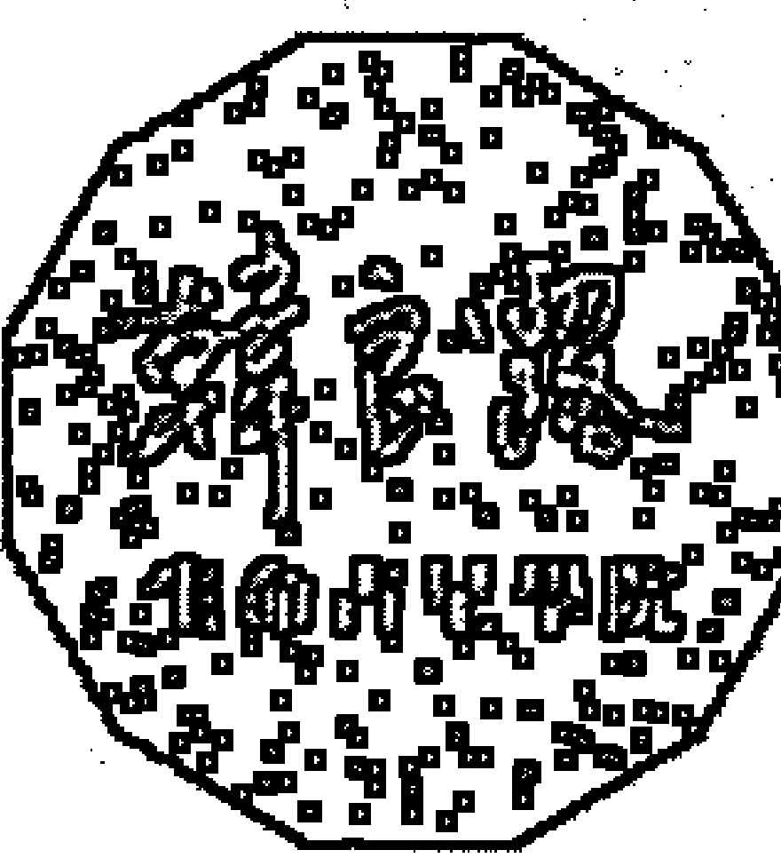

TRANSITS OF SUN

# 太陽行運全書

韓良露 著

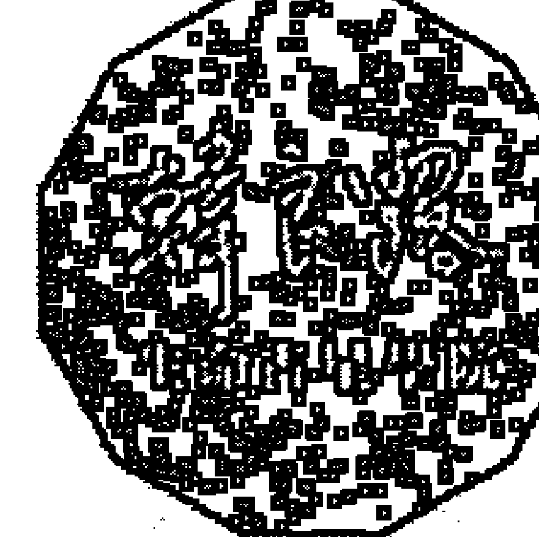

## 出版緣起

興趣廣泛、身分多元的知名文化人韓良露，除了大家熟知的作家、媒體人及文化推動者身分之外，她也是藝文圈中最受重視的占星學大師。

二〇〇三年起她在金石堂金石書院（現龍顏講堂）開設占星課程，由於口耳相傳、好評不斷，課程一直持續到二〇一〇年才劃下休止符。在長達八年的四百多堂課中，她以歷史、哲學、心理學、社會學的角度，將占星的深層智慧化為生動的教學內容，讓大家在學習與命運對話的同時，獲得看待人生的更高視野。

這一系列課程不但架構了宇宙法則的邏輯，也融入她對人性與社會的觀察，但因資料整理工程浩大，成書計劃一直未能完成，為避免這些珍貴課程內容成為絕響，南瓜國際透過多年來數量龐大的上課錄音及相關資料，依據當時課程的規劃邏輯，整理成為系列書籍，期望能藉由文字重現精彩、動人且充滿智慧的上課盛況。

## 目录

序 生命是一條長河

PART1 生命旋律的大結構

### Chapter / 1 ——本命星圖與行運星圖

### Chapter / 2 ——行運週期的大結構

- 兩到三歲：木木九十
- 五到八歲：木木一百八十、土土九十
- 十一到十二歲：木木合相
- 十二到十六歲：土土一百八十
- 十八到二十一歲：木木一百八十、土土九十、天天九十
- 二十三歲到二十四歲：木木合相
- 二十七到三十歲：土土合相、木木一百八十
- 三十五到四十二歲：木木合相、土土九十、海海九十、天天一百八十
- 四十三到四十五歲：土土一百八十
- 五十二到五十四歲：土土九十
- 五十五到六十歲：土土合相
- 六十一到六十四歲：天天九十
- 六十五到七十歲：土土九十
- 七十到八十歲：木木合相

PART2 行運外行星對本命太陽的影響

### Chapter / 1 ——行運木星對本命太陽的影響

### Chapter / 2 ——行運土星對本命太陽的影響

### Chapter / 3 ——行運天王星對本命太陽的影響

### Chapter / 4 ——行運海王星對本命太陽的影響

### Chapter / 5 ——行運冥王星對本命太陽的影響

PART3 行運內行星對本命太陽的影響

### Chapter / 1 ——行運太陽對本命太陽的影響

### Chapter / 2 ——行運月亮對本命太陽的影響

### Chapter / 3 ——行運水星對本命太陽的影響

### Chapter / 4——行運金星對本命太陽的影響

### Chapter / 5——行運火星對本命太陽的影響

### PART4 附錄

- 行星符號與星座符號
- 查詢星圖網站
- 查詢即時行星狀態與天文曆
- 延伸閱讀

## 序

## 生命是一條長河

生命是一條長河，以前你做的事情，都會影響到你的現在，現在你做的事情，都會影響到你的未來。當本命星圖被行運啟動時，常常會為生命帶來誘惑，面對這樣的誘惑，你要怎麼樣去回應它？我們之所以要學習行運，就是要能藉由星圖對人生有長期規劃，包括金錢的規劃，對於這一生想要完成事情的規劃，還有，對於愛的規劃。

很多人以為可以等到六十歲再去愛身邊的人，但誰知道人家可能五十幾歲就離開了人間；也有很多人想等小孩長大了再好好跟小孩相處，誰知道小孩長大了可能根本不同你住在同一個國家。很多人從來沒有考慮到生命會有變化的可能，所以永遠只根據當下一廂情願的想法，這是危險的。

比如有的人很喜歡旅行，像我就是，如果星圖明顯顯示出明後年我會有很重的家庭責任，到時候一定走不開，那我當然應該趁著今年有空時好好出國，否則等到一兩年後忙得走不開時，才埋怨為什麼不趁著去年有空出國，這個時候再怎麼悔不當初也於事無補。當然不見得每個人都喜歡旅行，我只是舉我自己做例子，但我們一定要了解自己內在最在乎的是什麼，以及要知道生命中哪些事情是一定要完成的，並且要替這些事情做好規劃。

生命的規劃也包含要替生命當中不同的階段做好規劃。如果想要除了現在的本業之外，還希望人生能夠完成一些不同事情的話，也必須要提早規劃，及早開始學習，因為任何工作能力都不可能事前不準備，事到臨頭忽然你就會了。

所有生命中想要達成的目標都需要被納入生命的主流當中，為它們做好規劃。這種生命的長程規劃，必須奠基於有能力閱讀生命長河的地圖，同時必須接受生命旅程途中遇到颶風的可能。如果將一棟房子蓋在會發生土石流的地方，颶風來了一定很慘。人生也是一樣，人生的地基不能蓋在會出問題的地方。人生的地基一定要蓋在扎實的地方，而想要蓋在這樣的地方，之前一定需要好好的安排。

藉由占星學，可以讓我們從全程的觀點來看待自己的人生。比如有的疾病原因在於吃太多鹽，有的疾病原因在於吃太多糖。如果知道自己屬於天生不能吃太多糖的人，因而及早做好準備，在還沒出問題之前就儘量少吃糖，就算時間到了還是生了病—畢竟疾病有可能跟基因脫不了關係，可是如果提早調整了生活習慣，即使生了病，嚴重程度也會比較小。

對於能夠理解星圖的人來說，不管自己的本命星圖是好是壞，對自己的人生提早做長期規劃，這並不是不可能做到的事。儘管這件事情遠比保險公司幫你做保險規劃要複雜，而且每個人的狀況都有很大的差異，可是越能提早做規劃，等到事件發生時，就越有餘裕應付人生的變化。例如一個人早早得知自己會在三十七到四十二歲這個人生階段工作運很差，當事人就應該早早在二十多歲踏入社會時，花比較多的時間與精力未雨綢繆，為將來即將遇到的中年危機做好預防。而如果確實的提前做好預防，在三十七到四十二歲工作運最差、泥濘難行的那兩年，你大可以在家修身養性，也不必因為生活壓力而非得逼自己留在職場，如果事前有準備，在最寸步難行的那兩三年，或許寧可在家修身養性，在家讀書寫作，甚至去擺地攤或做義工，也勝過出門上班天天被老闆罵。

行運星圖可以為大家提早点出生命中的幾個關鍵時間點，而我們也應該配合這些時間點，及早為此預作準備，事前做好規劃，並且從中建立起面對生命的邏輯。

每個人星圖當中的好運壞運都不一樣，我常認為最好命的人並不是那些完全照著星圖演出的那種人，即使星圖顯示他們有機緣功成名就，但如果只是照著命運演出而不能主動支配命運，這樣都算不得真正完美的演出了命運的樂章。

有很多被世俗認為是好命的人，在我眼中看來，他們其實算不得好命。我認識不少星圖中具備賺大錢格局的人，他們也的確這輩子賺到了大錢，但是他們好運的時候每天忙著開公司，壞運的時候還是每天忙著開公司，不管好運或壞運，一輩子都做一樣的事情，一輩子過著一樣的生活。於是好運的時候賺很多錢，壞運的時候賠很多錢。他們這輩子除了賺錢之外，什麼事情也沒做，每天忙忙忙，就這樣過了一生。

行運要教導我們的，就是萬物皆有時。每個人遇到什麼樣的行運，都會帶來不同的功課，而有的人好運特別久，有的人低谷特別久。其中一個原因，就是除了太陽、月亮之外，其他的行星都會有逆行現象，如果行運的行星跟你的本命行星形成相位時剛好遇到逆行，行運行星就可能會來回掃三次。如果是行運好相位也就罷了，偏偏有的時候行運帶來的是負面相位，好不容易熬到相位離開，卻又逆行回來掃一次，然後再順行回去又掃一次，結果整整一兩年都處於逆境。

從這個地方，我們也可以看到有時候運氣好或運氣不好，也是上天注定，因為有的人的本命星圖遇到的行運一掃而過，有的人卻因為逆行來來回回，本命星圖不斷的被行運啟動。命運的原理其實很容易理解，可是當它對應在每個人的生命中時，就會有著很大的差異。

本命星圖是一張生命藍圖，在這張生命藍圖中，我們會經歷天時、地利、人和的變化。而在這些變化中，我們所下的每個決定，都有可能會讓生命之路越走越寬，也有可能會讓生命之路越走越窄。當我們看懂行運，懂得提早為人生做好規劃，你會發現，它是一張活圖。

> > 註 本文內容依據二oo六年「行運」相關課程錄音彙整編寫而成。

## PART 1 生命溯源的人結構

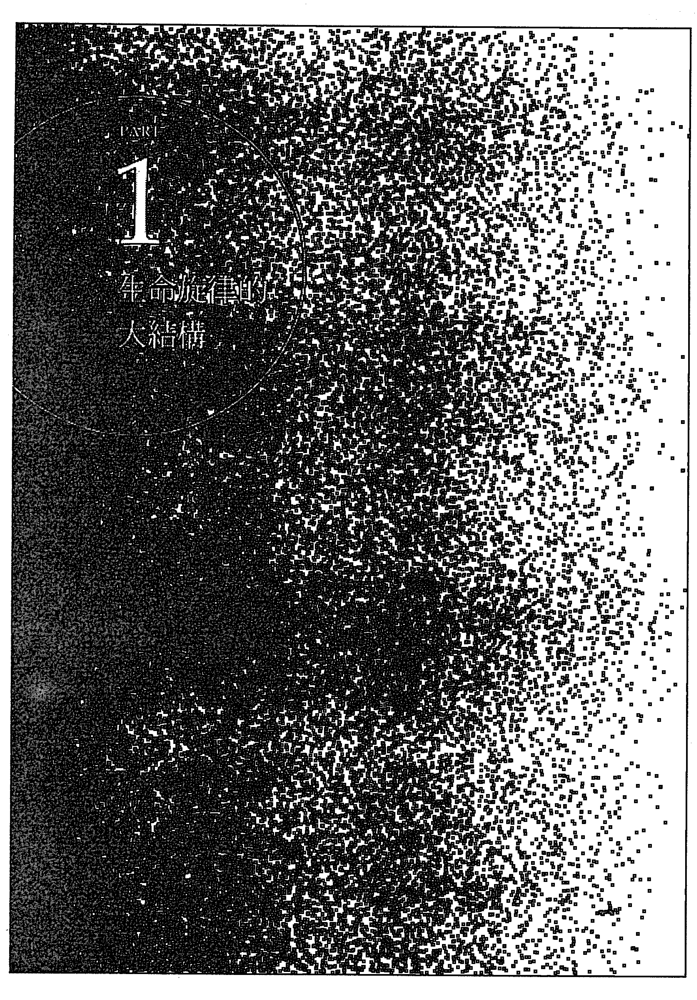

# 1 生命旋律的大諧律

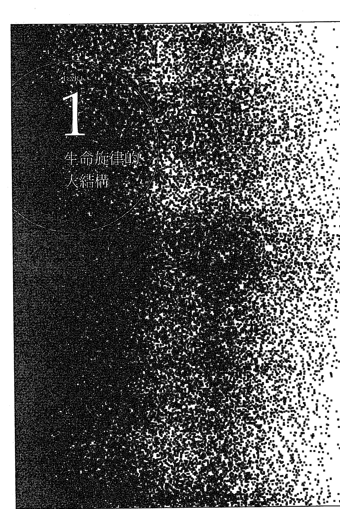

每一個人的星圖都是一個太陽系，每個人的太陽系隨時都會跟別人的太陽系起交互作用，這就是所謂的合盤（synastry），而每個人的小太陽系，也隨時都會跟宇宙的大太陽系互動，這就是所謂的行運（transit）。

本命星圖就是我們出生時天上的星圖，當我們出生在這個世界上，透過出生的時間與經緯度，我們將天上的太陽系帶到人間，藉由這一個小太陽系，讓我們經歷人生中的種種功課。本命星圖裡面行星落在什麼星座，行星落在什麼宮位，行星與行星形成什麼相位，從本命星圖中，我們可以看出一個人的命運格局。但本命星圖需要靠行運啟動，我們一生中有許許多多不同的功課，當行運的行星跟本命星圖的某一顆星形成相位，就會像鬧鐘一樣啟動這顆星，讓這顆行星面臨不同的考驗。

每個人星圖太陽系的核心，就是太陽。我們擁有的這個太陽系，不管是行星落在什麼星座、宮位，各個行星相位帶來的阻力或助力，都是為了要讓我們的太陽得以完成這輩子的人生目標。本書我們要介紹的，就是行運的各個行星，如何在生命中的不同時間點，用不同的方式，來啟動我們的太陽。但也因為行運可說是天上的太陽系跟我們的小太陽系間的互動，初學者可能會在一開始時感到十分混亂，因此本書聚焦於本命太陽，先為大家介紹行運木星、行運土星、行運天王星、行運海王星、行運冥王星這五顆外行星對本命太陽的影響，再介紹行運太陽、行運月亮、行運水星、行運金星、行運火星這五顆內行星對本命太陽的影響。

當行運的行星與本命太陽形成相位，這兩顆星就會產生能量互動，但到底是和諧順暢的互動，還是緊繃、消耗的互動，就會隨著不同相位而有所差異。本書為大家介紹四個主要相位：合相（零度）、九十度、一百二十度、一百八十度。相位的容許誤差各家占星家持有不同的标准，本书的容许度数以三度以内为准，原因是三度内比较容易会有具体的事件发生，也比较不会因为容许度太宽而造成随时都有一大堆行运相位出现，让人头昏眼花。

在此要提醒大家，行运不脱离本命，每个人的本命星图，就像是一张随着出生而附上的功课表，行运只是点出在什么时间点，哪些功课得要交卷。所以同样的行运相位，都会随着当事人的本命而有所差异。举例来说，同样是行运土星来跟本命太阳合相，如果当事人本身就有本命太阳跟本命土星合相，又加上一颗行运土星过来压，那可真是苦不堪言。但如果当事人本命太阳本身就跟本命木星合相，当事人原本过得自由自在，甚至有可能太过于松散度日，当行运土星来合相时，刚好给了当事人适度的压力，让他可以在这段期间内，好好的脚踏实地务实的做出一些成绩。关于本命太阳相关相位，请参考已经出版的《成功做自己：太阳、木星、土星相位中的生命之旅》。

此外，二〇一六年南瓜曾经出版《生命历程全占星新增订版：灵魂之旅的命运行程表》，虽然也是讲解行运，但这次的行运系列（包含了《太阳行运全书》，以及后续整理中的相关书籍）的差异，在于《生命历程全占星新增订版：灵魂之旅的命运行程表》提纲挈领的点出各个行运的核心概念，而《太阳行运全书》则以大量的例证与生活上的应用、灵性上的体悟。更重要的是，由于篇幅所限，《生命历程全占星新增订版：灵魂之旅的命运行程表》内容仅限于行运木星、行运土星、行运天王星、行运海王星、行运冥王星等时间较长、影响力较大的外行星行运，而《太阳行运全书》则更涵盖了行运太阳、行运月亮、行运水星、行运金星、行运火星对本命太阳的影响，这些行运内行星虽然行进速度很快，但它们在择日占星中有其重要性。

## Chapter / 1 —— 本命星圖與行運星圖

對於旅行者來說，地圖很重要。我們在日常生活中的地圖，它是一個理性的地圖，沿著路照著地圖開車，不大可能會忽然開到懸崖或者忽然無路可走。但是占星的地圖並不是純然理性的，在星圖這張地圖中有著無限的可能性，可能你開車開著開著前面忽然是懸崖、前面忽然沒有路，或者可能忽然掉到海裡面，它有可能有成千上萬的合理或不合理的可能性，它很複雜，而且未必符合世間邏輯。

如果說人生也是一場旅行，當我們面對的是一張非理性的地圖時，我們應該要怎麼解讀？其實方法跟看正常地圖差不多——先找出人生的大方向，然後再一點一點的找出應該怎麼走。即使人生的地圖是非理性的，也應該先看一下地圖的整體結構，先看大方向，看完大方向之後再一點一點往下細看，就可以逐漸看懂自己這張生命地圖。

也因為大方向很重要，所以我不太鼓勵大家算時間很短的命，這就像是看地圖不看大方向，只糾結眼前幾百公尺好不好走，卻不知道後面有沒有懸崖，這種事情是行不通的。這也是找人算命的一個大問題，找人算命時，算命師大概頂多給你一小時或一小時半，甚至很多算命師只能給你二、三分鐘，就算他有神通般的能力，有辦法瞬間看穿你的人生，也不可能在這麼短的時間內描述完你整個人生中的重要架構，能夠幫你看出幾個對你很重要的時間點，就已經很了不起。所以求人不如求己，每個人都是自己生命的導遊，每個人都要養成經常看自己星圖的習慣。

學習占星最大的意義就能夠看懂自己的星圖。花越多時間在自己的星圖上越能了解占星學的奧秘與邏輯所在，雖然學習占星也可以幫助別人或者成為工作，但是如果一天到晚都忙著看別人的圖而忽略了自己，這樣其實有一點划不來。

想要學好行運的生命歷程占星課程，必須先了解本命星圖。當我們拿到一個星圖，一定要先看整體的星圖結構——任何行運星圖的好運壞運，都不可能脫離本命星圖的結構而獨立存在。例如，當行運木星跟本命的太陽形成相位時，本命星圖中的太陽本身有什麼樣的結構，會影響行運木星跟太陽形成相位時會發生什麼樣的事件，如果本命太陽本身有很大的問題時，行運木星如果跟太陽合相，木星的本質是膨脹，儘管木星通常被大家視為吉星，但是它這對本命受剋的太陽來說，不見得一定是一件好事。

當所有的行運遇到不同的星圖結構時，就會產生細微而重要的變化，這些變化我在書中會盡量提醒大家，儘管不可能講得到每一個變化，但其中的邏輯是相通的。學行運可說是要將以前學過的所有武功，一起派上用場的時候了。行運的種種變化是占星知識的大整合，學到行運時，大家就要好好的把過去所有學過的占星學邏輯，在這個時候全部都要抓過來用。

舉例來說，當行運冥王星或天王星跟本命太陽合相的時候，有可能會出現一些要命的事，有的人會出一些工作上的問題，有的人會生病，以上這些都不脫行運冥王星或行運天王星跟本命太陽合相的基本邏輯，但是到底真的會演出什麼樣的情境，就必須回到本命星圖太陽本身具備的結構，才能看出到底比較可能會是什麼樣的情節。

想要學好生命歷程的行運，只需要準備好自己的重要時間點的行運天文曆即可，不需要雜七雜八的找很多別人的行運星圖來看。因為最好的占星行運課程，它是一種生命回顧的功課，針對重要的生命事件，將時間點找出來，自己先做一下自己的生命歷程回憶追溯，把自己生命當中的重要事件找出來，對自己的生命邏輯先有一個概念，這樣當你在書中看到相關的內容時，以後就永遠不會忘記了，因為這些都是來自你自己的記憶庫而不是別人的。

我在看行運星圖時，經常會有一種「天地不仁」的感覺，因為星圖當中顯現出來的生命變化實在太多了，而這些變化中有一些真的不是凡人可以忍受。我們在追溯生命歷程時，有些回憶彷彿是遠方的雷聲，但是對著天文曆的時候，回憶一一被召回，這些事情彷彿就在眼前。

在我們的生命中，當愛存在的時候，要好好的珍惜眼前的這份愛，當你失去的時候要面對它、接納它。不管是好事或壞事，當靈魂有所覺醒的時候，靈魂會知道。相反的，如果我們經歷過的生命地圖當中的事件沒有與我們的靈魂結合，事件照它發生，而靈魂照舊渾渾噩噩沒有覺醒，發生的事件就白發生了。

一個人的自省能力，有助於讓人面對所有的生命事件。當我們可以持續好幾年的做好自省的工作時，我們會逐漸擁有應對行運帶來的生命事件的能力，當我們面對外在的行運的挑戰時，我們會有一些不同的做法。因為這個時候我們靠的不是片片斷斷的自我（ego）來反應，而是靠著整個星圖當中的一個整合的、覺醒的、靈魂的「自性」（self）來面對整個生命。

當我們理解到行運的節奏時，就有機會可以因為預作準備而讓命運在某種程度上有所修正。修正跟改運不同，修正是基於這個人的本命架構而做出的調整，但它不可能讓一個本來不會中樂透的人中了樂透，也不可能讓原本七十幾歲的格局活到九十幾歲。可是它可以讓這個人在七十幾歲面對生老病死時的苦少一些，因為當事人在大難來臨前累積業力比較少。

在我開始好好學習占星之後，雖然人生中還是難免會有一些小後悔，可是不再會有大後悔了。以前我的生命當中會有一些大後悔，這些時候我會自責怎麼會這麼無明、這麼愚蠢、怎麼會做出這樣的事情。學了占星之後，雖然遇到的事情還是會遇到，該結束的關係還是會結束，可是做法會有所改變，例如原先許多傷人的話會因為透過占星理解到這些話不該講，因而吞了下去。學習占星不會讓你的人生完全不同，可是它會讓你在很多造業的過程自我調整收斂，因為你不會再只是憑著自我來反應。

### 每個人的命運都是獨特的

天上的星辰排列，每一天都不同，想要重現同樣的星辰排列，根據統計，需要兩萬五千八百年的時間。如果能夠對命運有很開放的態度，我們也可說，在生命中遇到的各式各樣行運，不管它們帶來的是挑戰或是恩寵，都是人生旅程的獨特風景。在兩萬五千八百年的宇宙大年中，你的本命星圖是獨特的，你會遇到的行運，也是獨特的。你在不同的時間會遇到不同的人事物，在不同的時間，你會遇到不同的愛人與敵人，這些在生命不同時間中的每一點，都是獨特的。我在《生命歷程全占星》中提到，我在木星的第三個週期，也就是三十六歲時，獨自到布達佩斯待了大約一個半月的時間，每天照著我多年來的日記，一一比照天文曆，找出我自己最貼身的行運第一手資料。那個時候剛好是行運冥王星與我的本命太陽合相時，這代表在這段期間，我的太陽自我意識，會受到行運冥王星的影響，對人生進行比較深層的探索。我剛好就在這段時間，用占星學做了一次深入的生命回顧。

利用天文曆與日記做生命回顧是一件非常有意思的事情，如果大家這輩子長期在紀錄自己的生命歷程的話，光是找出跟初戀情人墜入情網時是遇到什麼樣的行運，這件事情就非常有意義。我跟我的初戀情人的相遇，就是在行運海王星跟我的本命月亮九十度時，當年我才十五歲。事實上一個人一生中所有重要的感情關係，往往都伴隨著天王星、海王星、冥王星特質。這也意謂著在重要的人際緣分中，在你與對方認識的那一刻，就已經寫下了這段關係具有的本質。這種理論跟「卜卦占星學」（Horary Astrology）很接近。所謂的卜卦占星學，就是以問事當下的時間點起一個盤，以此來解析這件事情的本質。當你在行運天王星跟本命太陽、月亮或金星等行星產生相位那天遇到了一個人，你跟對方可能在一起三天、三年或三十年，但是這個人一定具有天王星特質，而你跟這個人之間的關係，也一定具有天王星的特質。

當占星學可以成為你個人歸納生命事件的索引時，它會產生比較大的力量。儘管聽別人的故事也可以從中學習到占星的知識，可是如果這些故事都實實在在的驗證在你自己身上時，它更顯得意義非凡。

但這也是占星行運書的麻煩之處，大家必然會像看食譜書一般，直接去看行運行星與本命形成的相位，而忽略了我們一再提醒的：先看本命星圖中的缺陷，再去看行運對本命星圖造成的整體影響。

### 藉由行運來解讀內在風景

行運在判定一個人的內心風景非常準確，可是在外在行為上，則會視當事人整體的星圖結構而產生細微變化。研判外在行為是否會發生的準則之一，就是要看當事人本身的星圖對外在行運的能量。是相容、接納的，或是排斥、衝突的。同樣是暗戀別人，有的人會付諸行動，有的人永遠不會付諸行動，但他們的內心狀態是一樣的。

藉由行運星圖去解讀我們的內在靈魂風景，會比解讀外在行為來得準確。行為只不過是我們內在風景露出水面的冰山一角，一個沒有害過人的人，不代表他從來沒有過害人之心；一個沒有殺過人的人，不表示他心中從來沒有起過殺機。我們每一天都會有很多意念，可是能夠真正做出來的事情有限。

我們每個人在生命中，有可能會跟我們產生情感聯繫的人，絕對不只是我們現實生活中，真正跟我們有關的這些人。每天在生活中，我們都會跟外在的人事物產生意識的連結，即使我們未必會因為這些連結而真的做出什麼事，可是在某種程度上，我們在內心深處，都對此心知肚明，只是沒有表達出來罷了。唯一會真的把內心風景表達出來的人，恐怕只有藝術家了。藝術家是世界上最常反覆探討自己與他人內心世界秘密的人，原因在於藝術依靠的是海王星，海王星的能量沒有邊際，對於海王星來說，在現實與虛幻之間並沒有高牆，它能夠跨越現實與虛幻的鴻溝。

而最無法跨越的秘密則跟冥王星有關。冥王星是不為人所知的檯面下的交易，以及強烈的隱藏欲望。最跟冥王星有關的就是政治與商業，在政治圈與商業圈中，沒有人希望秘密被抖出來。即使是最厲害的狗仔隊，能夠抖出來的也只是很表面的一些新聞事件。

從這裡我們也可以看到，雖然藝術在實際生活中並不是一個真正有實用功能的東西，可是它對人類一直有很重大的幫助。表面上我們見到的世界，彷彿是現實的銅牆鐵壁，事實上並非如此。

我們對於這個有如銅牆鐵壁的世界的理解，其實非常狹隘。每個人的內心，都有無限秘密，難怪有人說，每個人的內心世界，都是一部了不起的小說，而這些秘密，就連你身邊最親近的親人都毫無察覺，只有你自己知道。藉由行運與本命星圖的對照，藉此與生命對話，你的星圖恐怕是這個世界上唯一可以跟你一起跟自己的秘密對話的工具，因為別人沒有能力，也沒有機會來跟你深談這些事情。懂得解析自己星圖的人，真的可以從解析星圖中得到很大的樂趣，因為你的秘密，只有星圖能懂。

占星學要教導我們的是「境由心生」，你對生命中許多人的不滿，很有可能都只是在反映你在某一個情境下的狀況，任何事情都不是永遠不變的。你可能在生命的過程中對某個人很不滿，但有可能幾年過去之後，一切都是過眼雲煙。所以我們在評估事情時，都應該用完整的生命全貌去評估。

生命是從自我意識走向完整自我的過程，如果我們只用本能的自我意識去評估事情，這會是一件很危險的事，因為我們會變成自我意識的魁儡。我這幾年來漸漸改掉罵人的習慣。如果有人做錯事，事情終究已經發生了，把人家罵個狗血淋頭又如何？如果對方並不是心存惡念故意做壞事，對方自己也會知道自己做錯了事，再去說他也不過是增加對方的愧疚感，讓對方更快樂。事情已經發生，情境已經過去，這個時候再來罵人是沒有用的，不如不罵。想清楚這一點之後，慢慢的可能你就會越來越少跟同事吵架了，搞不好今天得罪你的人，幾年後有機會成為你的好友也說不定。

在人生中，每天有每天的狀況，每年有每年的變化，占星學是一個讓我們得以跟每天生活發生的大小事客觀化的工具。從占星學中，我們可以冷靜而客觀的將我們從日常生活的情境中拉開，一方面用疏離的態度，對生活中遇到的麻煩不動於心，令一方面又可以很熱情的用看戲的眼光笑看人生。每天這個世界都是很好看的一場戲，可是你不會就此捲入戲中，完全受到這場戲的影響而無法自拔。

## 本命星圖中的眾生相

面對人生的考驗，要怎麼樣為自己的生命做出一個評估？有的人星圖功課很困難。比如我曾經幫一個朋友算命，她本命星圖中有著天王星太陽合相、海王星金星九十度的相位，代表她的感情路上經常會遇到不忠實的對象，包含她現在正在交往的人，也是一個很容易出軌，不相信忠誠的人，但她一直希望可以找到一個不會外遇的對象。我只好老實告訴她，如果真的愛一個人，即使對方外遇，也得要接受這樣的事情，如果不能接受也沒關係，只要不要走進婚姻，都比較容易好聚好散。

人只要一出生，就有了一張本命星圖。在本命星圖中，一定有一些好相位，也有一些壞相位。而這些好相位、壞相位帶來的生命事件，都會隨著行運而被啟動。當一個人出生在這個世界上，所有行運會帶來的好運與壞運，其實一個都躲不掉。可是這並不代表大家就應該兩手一攤，全憑命運擺佈。舉例來說，同樣考運不好的人，如果當事人很努力用功，雖然不見得能考贏天生考運好的人，但他一定會比其他考運差又不準備的人考得好。這就是告訴大家，即使沒有好命運，但是我們願意付出努力去爭取，這件事情不會沒有意義。

每個人在出生的當下，本命星圖就定出了這個人本命的邏輯。假設一個人是注定搭飛機會出事的命，那這個人就算搭瑞航也躲不掉—瑞航二三十年來只在一九九八年摔過一次飛機，但摔了一次飛機就死兩百多人。對於一般人來說，除非一些特殊狀況，否則沒必要經常看擇日。但是對本命星圖中具有特殊缺陷的人來說，擇日相對來說就比較重要。

就大邏輯來說，如果考量到各種因素，選擇失事率極低的瑞航還是出事，這就是命運所不可違抗，這也就認了。但如果本命已經容易遇到凶險，選擇航空公司時還去選擇信譽不佳的小公司，這就是置自己於不必要的風險之中。天底下所有的事情都有一個共同邏輯：一件東西如果要不出事，前提一定是必須好好維修、好好經營、好好訓練。占星學裡面所有的邏輯，都不可能違背這個世界的基本邏輯。也就是說，即使真的懂得閱讀星圖，也不要以為讀懂星圖就等於可以完全控制人生。我們不可能靠著占星的邏輯來繞過世間的基本邏輯。儘管本命不好的人可能連搭瑞航都會出事，但是即使本命很好，也沒有必要拿著自己的本命去跟信譽很差的小航空公司去賭，因為何必要用自己的命夠不夠硬當賭注？

就像有的人買股票的時候完全不管公司的基本面，只賭自己當時的運氣好不好。外在環境有外在環境的邏輯，當你倒楣的時候，你更應該要考慮這個世界外在的邏輯是不是比你自己的格局更強。對股票稍微有點概念的人都知道，績優股固然不可能讓人賺大錢，但是績優股再怎麼賠錢，也不會一夕之間變壁紙。如果想賭手氣買地雷股，要看有沒有這個命，一個人本命星圖中如果木星跟天王星之間有很準確的一百二十度相位，這種人的確在行運好的時候，可以憑著買地雷股賺到大錢。如果沒有這種命，買績優股就算賠錢，熬個三五年搞不好還能扳回一城，但如果買的是地雷股，那就等於是自己跟自己過不去。

同樣的道理，搭飛機的時候怎麼可以去坐地雷飛機？交朋友又怎麼可以去交地雷人？如果一個人平常講話就很狠，常說要別人斷手斷腳這種話，我絕對不會讓這種人有機會成為很親近的朋友。大家有時候會看到潑硫酸的新聞，這種人通常不會事前完全沒有徵兆，忽然某一天就去潑人硫酸。從另一個角度來說，對於星圖本來就有危險相位的人，他們命中都會帶有一定程度的暴戾之氣，但如果他們平常往來的朋友盡量選擇的都是善類，情況會大幅改善。我有個朋友就是這樣，雖然他也曾經跟人大打出手，但是因為這群人全都是善類，所以最多也僅止於打一場架。如果這些人全都不是善類，起了衝突就不是大打出手的程度而已了。

每個人的本命星圖是本命的格局，而本命的格局又會受到行運的影響。但這些都不能超越世界運作的基本邏輯。所以千萬不能光看自己的圖，就以為自己能夠掌控一切，更不能光看行運，而不顧本命與世間的邏輯，閉著眼睛賭上自己的命運。

對於本命星圖中有缺陷的人來說，當事人在選人、選時、選事方面，都必須格外小心。當你不危險的時候，愛去非洲、去哥倫比亞都沒關係，但星圖顯示出國會遇到搶劫時，假設還是非常想要出國玩，如果跑到巴黎還被搶，那也就認了。但是不要在這個時候跑去非洲。去巴黎之類的地方就當成是賭一賭自己的運氣，但是沒有必要把自己的命賭在非洲或哥倫比亞。我們學習占星學的時候不要因此就忘了基本常識的邏輯。當星圖行運顯示出危險的時候，如果真的非常想出國，不要賭在這些平常風險就比較高的地方。

可能很多人都有算命的經驗，甚至很有可能自己就具備了幫別人算命的能力，但是我們常看到很多算命先生自己過著很悲慘的生活。原因在於光是會看命是不夠的，你還需要同時兼顧本命、行運與整個世界的邏輯。

每次提到行運，我都一定要再三提醒大家，就算命而言，一小段一小段只看片段的命運是非常危險的。其實看新聞就知道，別以為這些人沒經過好運，這些人絕對之前都經歷過冥王星、天王星、土星、木星的好運，為什麼之前明明有過好運現在卻這麼慘？關鍵就在於他們在好運到來的時候做了什麼事。比如有人在冥王星與木星相位好的時候做假帳，可是過了一陣子，等到行運土星來剋時，就得付出慘痛的代價。

天上的星辰不斷往前走，沒有人能夠一輩子永遠是一百二十度和諧相好運。老天是非常公平的，不管是木星、土星、天王星、海王星、冥王星，一百二十度相位的好運走完之後，接下來就是一百八十度的對立。給你合相的重大衝擊，接下來一定是九十度剋相的衝突。

當然有的人的本命星圖格局好得不得了，好格局讓他們遇到行運帶來的低潮時會比較容易度過。但這也表示之前因為行運帶來運勢高峰時，他們稍微手下留情，沒有把好運用盡。在生命的變遷當中，一定要學會對自己手下留情。即使遇到了行運帶來的好運，還是很多事情不能做，除非完全不在乎坐牢、不在乎丟臉，或者不在乎被人報復而送了命。

所有的好事背面，跟著來的就是倒楣事。每個人一定都會有輪到好運的時候，關鍵就在於，當你遇到好運的時候，千萬不要造任何好運結束會讓你倒大楣的業。禍兮福所倚，福兮禍所伏，這是大家在學生時期都學過的道理，其實占星的行運，講的就是同樣的邏輯。

## Chapter 2 —— 行運週期的大結構

表面上占星學的行運是千變萬化的，但是其中都有基本架構，尤其當中有許多是很基本的大結構，我們要先對這些大結構有所理解，大結構中又有中結構與小結構，但在細看中結構與小結構前，大家一定要先把這些大結構放在心上，這樣才不會被困在中結構、小結構中，因而迷失方向。

不管是什麼人，由於行星運行的速度是固定的，所以每個人在生命的行運週期上，都會具有相同的大結構，每一個人碰到的行運儘管都會隨著本命星圖而不同，可是每一個人在生命歷程中都一定會在固定的年齡碰到共同的問題。

以行進速度很規律的木星為例，木星每年走一個星座，三年走三個星座，也就是行運木星會走到跟本命木星九十度衝突相。所以大部分的小孩一歲左右以前都算好帶，到了兩三歲以後就不好帶了。因為這個時候小孩會因為行運木星的九十度相位，開始想要發展木星在社會資源上的不同可能性。因此很多媽媽這個時候會覺得小孩開始變得難以控制。

想要找出命運的大結構，就得要從行進速度較慢的木星、土星、天王星、海王星、冥王星著手。在一圈三百六十度中，我們可能會遇到的主要相位包含了合相、九十度、一百二十度與一百八十度。行運的合相會增強原本的行星力量，如果原本這星行星有好相位，行運合相就會帶來加倍的力量，但如果原本這顆星有剋相，行運也會帶來雙倍剋相。行運的九十度與一百八十度會帶來負面能量的拉扯，而行運的一百二十度和諧相則會帶來順境。在星圖中的合相與一百二十度和諧相的不同，在於合相的力量永遠會比一百二十度的和諧相要大。合相就像兩顆行星齊聲同唱，當合相的兩顆行星同時被行運啟動時，當事人一定會衝得比和諧相更高。但老天很公平，衝得高的人摔得也重。合相的人固然遇到好運時會有雙倍的好運，可是遇到行運剋相時會躲都躲不過。合相的人遇到好運時必然帶來高峰，可是高峰也必然會付出代價。如果看圖時看到一個人的本命星圖中有很多合相時，就要特別小心，因為他不管是衝上去或者摔下來的幅度都會很大。而本命星圖中一百二十度和諧相的好處，就在於雖然好運到來時衝上去的衝勁沒那麼大，但是遇到行運剋相時，總有另一顆行星從一百二十度的和諧相來補。

木星、土星、天王星、海王星、冥王星這五顆行星分別代表了社會資源與世代潮流，由於他們行進的速度相對穩定，木星平均每十二年走一圈，土星平均每二十九年半走一圈，天王星平均每八十四年走一圈，海王星平均每一百六十五年走一圈，冥王星平均每兩百四十八年走一圈。除了較不規律的冥王星之外，其他都能很簡單的估算出各個人生關口大致上會出現的年紀，也因為這些時間點大致上是固定的，所以我們會發現，每個人在青春期時都跟社會格格不入（因為遇到了行運土星跟本命土星一百八十度），每個人在三十而立之際都會感到重責大任（因為行運土星此時走了一圈，又回到本命土星的位置，跟本命土星合相）。

### 兩到三歲：木木九十

每個小孩到兩三歲時，行運木星都會開始跟他們的本命木星九十，這是所有人都會遇到的大邏輯，但不同的是有的小孩的本命木星有可能跟本命太陽（或任何其他行星）合相或九十，也有的小孩的本命木星沒有其他負面相位，如果一個小孩的木星本身沒有負面相位的話，當他兩三歲時遇到行運木星來跟本命木星九十度剋相時，這個小孩就不會像本命星圖中木星本來就有負面相位的小孩這麼難帶。

當所有小孩兩三歲時都遇到了行運木星與本命木星九十度的大結構時，我們就要回到本命星圖，看看木星原本在小孩的星圖中，扮演的是什麼角色，如果是很重要的角色時，當行運木星跟本命木星形成相位時，行運木星就會開始影響到這個小孩的命運了。

### 五到八歲：木木一百八十、土土九十

而五歲到八歲時，就是行運木星與本命木星一百八十度對立的時期。在這個年齡層的小孩會開始上學，因此有了很多跟木星社會資源、教育等有關的新生命經驗。此外，由於土星每二十九年半會走一圈，所以五歲到八歲時，剛好也是一個人行運土星與本命土星九十度的時期。

儘管所有人都會在五到八歲時遇到行運木星與本命木星的一百八十度對立，以及行運土星與本命土星的九十度衝突，但如果當事人本身的土星就有嚴重剋相，例如當事人的本命太陽跟本命土星有度數很近的九十度剋相時，在五歲到八歲時，當事人很有可能就會面臨父親過世或父親遇到重大意外的生命事件。相較之下，如果一個人五到八歲時父親沒有發生什麼大事，這個人一定太陽與土星之間沒有嚴重剋相。也就是說，一個人本命星圖的土星相位，會在五到八歲時，行運土星與本命土星首度的九十度剋相而被點亮。如果一個人本命星圖中的土星跟本命太陽有剋相，五到八歲時父親（與太陽有關）會出問題；如果一個人本命星圖中的土星跟本命月亮有剋相，五到八歲時母親（與月亮有關）會出問題。如果土星是跟其他行星有剋相，情形也依此推論。

也就是說，當一個人的本命星圖中有嚴重的土星剋相時，在五到八歲階段，當別的小孩都還無憂無慮時，當事人就開始第一次聽到了命運的哀歌。

不過即使土星完全沒有任何剋相，五到八歲是大部分人開始上學的階段，行運土星與本命土星的剋相，都會讓人第一次面臨到權威的壓制，都會讓人感覺到有一些不舒服、不自由。

又如算考運。考運是一個非常複雜的議題。一個人有可能在考高中時考運很好，但是在考大學時考運很壞。大學聯考雖然每年都是七月一日，但是每年的木星、土星、天王星、海王星、冥王星的行運相位都不同，考試的那一天的日運，有時候對當事人可能很致命。即使本命水星（跟思考能力有關）的相位很好，當事人也會有考運好或考運壞的差異。以前在聯考的年代，對每個十八歲要考大學的人來說，都是壓力很大的共同經驗，但是有的人考運好，有的人考運差。有的人可能那年的七月一日運氣特別好，但也有人那年的七月一日很要命。

### 十一到十二歲：木木合相

每個人到了十一、十二歲時，行運木星都會跟本命木星合相，也就是木星走完了一整圈。這個時候是大家開始發育的時期，木星跟膨脹、擴張有關，很多人都會在行運木星走完一圈跟本命木星合相時，忽然身材抽高。

### 十二到十六歲：土星一百八十

十二到十六歲則是我們常說的青春期。在這個階段，每個人都會遭遇到行運木星與本命木星九十與行運土星與本命土星的一百八十度剋相。如果本命太陽有嚴重剋相時，我身邊有幾個這樣的例子，他們是在青春期時喪父。如果一個人的本命太陽的相位很困難，不管是本命太陽是跟本命土星、本命天王星或本命海王星有嚴重剋相時，他們都很容易在青春期，也就是行運土星與本命土星一百八十度對立時，遇到不管是喪父，或者是父母離婚，這一類跟土星的社會壓力有關的事情。

行運的邏輯是躲不掉的，每個人在十二到十六歲時都必然會遇到行運土星與本命土星的一百八十度相位，凡是跟土星的社會制約有關的生命情境，在這段時期會遇到一些關鍵性的變化。如果當事人的本命土星與本命天王星有剋相，當他們遇到了行運的土星又來一百八十度時，這個時候他們就會跑去當不良少年了。因為本命土星與天王星有剋相的人，他們原本就很有反叛心，當本命土星受到行運土星一百八十度來剋時，他們的反叛心會被激化得特別強。很多保險公司會拒保青少年，原因就在於青少年非常不穩定，這是一個非常容易出意外的年齡層。在人口比例中，一定會有固定的比例的人本命中土星有剋相，當這些人在青春期時，很容易會發生或大或小的災難，就保險公司的立場來說，他們經過人口比例估算出來的結果，是寧可完全不做青春期的客戶，也不願意承擔青春期客戶的損失，由此可見，青春期的確是一個比較容易出問題的年齡層。這也意謂著生命中有許多外在的巨大能量，這些能量是我們躲也躲不過的。

從這裡也可以看到父母的難為。假如你的小孩本身的本命土星有嚴重剋相，例如本命土星又跟本命火星九十，當小孩長到青春期，行運土星又跟本命土星一百八十度時，真的是得要天天提心吊膽的擔心小孩會不會出事情，可是這種事情防不勝防。而且如果因為青春期容易出事，所有的父母都不准小孩出門，這個世界以後就會完全沒有冒險家了—事實上不需要這麼緊張。的確青春期會有一定比例的小孩會出問題，但是如果因此而不准小孩去爬山、游泳，這也太矯枉過正。除非本命火星的問題非常大，否則只要適度的幫小孩篩選掉太過冒險的活動，安度青春期並不是一件難事。站在大人的角度，當然希望小孩最好什麼都不做，乖乖待在家裡最安全，可是小孩不會這麼想。大人越是什麼事情都不准小孩做，小孩總有一天會偷偷的自己跑出去玩，而意外往往就會在這種時候發生。

### 十八到二十一歲：木木一百八十、土土九十、天天九十

十八歲到二十一歲時，每個人都會遇到行運木星與本命木星一百八十度、行運土星與本命土星九十，以及行運天王星與本命天王星的九十度相位。當事人等於要同時面臨三個剋相的挑戰，所以這會是一段很艱苦的時期。

如果一個女生本命中土星或天王星與太陽有剋相，在這個年紀就早婚的話，的確容易出一些問題。因為假設當事人十九歲時結婚，馬上她就會遇到行運天王星與本命天王星的九十度剋相，也就等同於跟太陽有了剋相，天王星走得非常慢，每七年才會走一個星座，一個女生如果本命太陽與本命天王星有不好的相位，躲過了十八歲到二十一歲的行運天王星剋相之後，其實也就躲過了潛伏的婚姻危機。以前很多算命先生會對某些本命太陽受剋的女生說不宜早婚，這是對的。因為如果這個女生是屬於本命天王星與太陽剋相型的人來說，當她躲過二十一歲的這一關之後，儘管不保證她日後結了婚以後絕對不會離婚，但至少不會婚才結了一兩年就遇到大難關。一個人婚結了十年八年以後才離婚，至少也比較划算些。

不是說每個十八歲結婚的人過兩年一定會離婚，關鍵就在於當事人的本命星圖狀況如何了。

不過也因為十八歲到二十一歲行運的天王星與本命的天王星九十，如果當事人本命星圖中的天王星又跟本命金星有相位的話，行運的天王星九十度剋相，等於是啟動了本命星圖的金星天王星相位，因此當事人會在這段期間桃花特別重。而且天王星具有猛烈卻無常的特質，如果一個人在十八歲到二十一歲時桃花很重，而且桃花一下出現，一下就分手，這很可能就是受到行運天王星九十度剋相的影響。行運天王星與本命天王星的九十度剋相，有可能跟相位有關，也有可能跟宮位有關，例如我的天王星本身位於跟性有關的八宮，當行運的天王星在我十九歲二十一歲時走到十一宮，也就是志同道合的朋友宮時，那段時間我的桃花非常的重，還好我在那段時間並沒有遇到什麼壞男人。

如果一個人的本命天王星跟本命太陽有相位的話，當十八歲到二十一歲行運天王星又來剋時，當事人就會特別反叛。這個時候剛好遇到升大學的關卡，如果本命天王星與太陽相位的話，在行運天王星剋本命太陽的時期，他們有可能會因為身體問題、心理問題、經濟條件或其他外在環境因素而不容易繼續求學。

十八歲到二十一歲也是一個人行運土星與本命土星九十度的時期，如果一個人的本命土星跟本命太陽有相位，當行運土星出現九十度剋相時，當事人在這個時候一定會感受到土星的重擔，即使當事人本命土星與太陽本身具有一百二十度的和諧相，當事人也會在這段時間感受到必須要少年老成的壓力。

### 二十三歲到二十四歲：木木合相每個人到二十三、四歲時，都是行運木星與本命木星合相的時期。很多人會在這個時候離開校園進入社會，開始找人生的第一份工作。如果一個人本命星圖中的木星相位不錯，當事人會比同班、同屆一起畢業的人更容易一下子就找到很好的工作。例如當事人如果本命木星跟本命太陽一百二十度，當他在二十三、四歲一畢業遇到了行運木星的一百二十度相位，就等於行運木星同時跟本命的木星、本命的太陽都一百二十度，木星的好運當然會使他在一畢業就找到好工作。

不管本命相位好壞，任何人在二十三、四歲行運木星與本命木星合相時，都會有木星代表的生命經驗開拓的需求，可是如果當事人本身的木星相位不好，這種人最好不要一出社會就去辦信用卡或信用貸款。因為木星本身相位不好的人喜歡亂花錢，但本來還不致於花到這麼多錢。一個木星相位不好的人，他們常常會對自己的財務狀況過分樂觀。如果沒有收入，他們不見得會花掉很多錢，可是他們如果有在賺錢，就很可能反而會花更多的錢，因為對自己過度有自信。這些人到了二十三、四歲行運木星來本命木星合相時，行運木星會帶來資源拓展、膨脹，當事人可能找到了第一份工作，開始有薪水時就跑去辦信用卡、辦信用貸款，結果才上班族當了一年，就欠下一百萬。

### 二十七到三十歲：土土合相、木木一百八十

土星大約每二十九年半繞一圈。二十七歲到三十歲時，每一個人都會在這個階段遇到行運土星與本命土星的合相，再加上行運木星與本命木星的一百八十度對立。

由於這是行運土星與本命土星的第一次合相，因此絕大部分的男男女女會在這個年紀第一次感到自己長大了。儘管很多人才二十四五歲，就常常會將「我覺得我老了」挂在嘴上，其實他們並不是真正覺得自己老了，只不過是嘴上講講罷了。一直要到二十七歲到三十歲行運土星第一次跟本命土星合相時，當事人才真的會發現自己已經不年輕了。所以二十四五歲的人說自己老的人很多，可是三十歲的人說自己老的人很少—因為這個時候真的覺得自己老了。而如果本命土星相位不錯的話，例如一個人本命土星與本命太陽有一百二十度和諧相的話，當事人可能從小就給人少年老成的印象，到了二十七歲到三十歲行運土星跟本命土星合相時，這些人就會在這個時候接到很重要的重責大任，因為在這個年齡階段，他們終於第一次被別人認可他們夠成熟了。不過如果對於本命土星跟天王星有相位的人來說，在這第一次行運土星與本命土星合相的時期，他們一方面開始感到自己變老，一方面也會因此而感覺自己不想要工作了。所以二十七歲到三十歲也是很多人休業或轉業的高峰，很多本命土星與本命天王星有相位的人會無法承受行運天王星合相帶來的沉重壓力，因而在這段時間選擇休息，等到行運土星壓力的高峰期過去，再回到職場舞台。

### 三十五到四十二歲：木木合相、土土九十、海海九十、天天一百八十

三十一歲到三十三歲時每個人會經歷一段小小的行運木星與本命木星九十度的低潮，然後進入了三十五、三十六歲。我們常聽到「中年危機」這個名詞，而每個人中年危機的時間都不太一樣。就占星學來說，中年危機可以分成幾個階段。絕大部分的人中年危機會發生在三十七歲到四十二歲。極少數人會提早至三十五六歲，也有極少數人會拖到四十三歲到四十五歲。以這三個時間點來說，中年危機寧可來得早，也不要晚到。中年危機之所以有的人來得早，有的人來得晚，原因在於海王星與冥王星的行進速度並不那麼規律，尤其冥王星走一個星座有時候只需要十三年，但有的時候需要三十年。所以有的人會到得早一點，有的人會到得晚一些。

在三十五六歲時，所有人都會經歷行運木星與本命木星的合相。木星每十二年走一圈，當行運木星與本命木星每十二年合相一次，其實就是我們常說的「本命年」。有的人本命木星相位非常好，也有的人本命木星相位很爛，所以當本命年遇到行運木星跟本命木星合相時，就會有的人本命年特別好運，有的人本命年運氣特別差。很多人會在本命年高升、發達或生小孩，也有的人在本命年倒大楣。木星是一種膨脹的能量，如果一個人在本命年倒楣的話，它多半不是抑鬱、生病這類的倒楣，它往往都跟當事人的不小心有關。

不過在三十五六歲時不只有行運木星與本命木星合相，這段時間也會遇到行運土星與本命土星的九十度剋相。這個時候我們可以將問題分成四種類型來討論：第一種是當事人本命木星相位很好，土星相位也不錯；第二種是本命木星相位不好，土星相位也不好；第三種是本命木星相位不好，土星相位不錯。

如果一個人本命土星相位不好，例如當事人本命土星與本命太陽有剋相，這個時候又撞上了行運土星的剋相，當事人在這段時間就會感覺壓力很大。

從另一個角度來看，如果一個人本命木星相位不錯，當他在三十五六歲同時遇到行運木星與本命木星合相跟行運土星與本命土星九十剋相時，行運木星會使他很幸運，即使他遇到行運土星與本命土星九十的壓力，行運木星帶來的幸運可以稍微紓解土星的壓力。但如果當事人的本命木星一塌糊塗，他們在三十五六歲的麻煩就很大了。因為如果不是行運木星帶來的過度樂觀，受到行運土星與本命土星九十度的影響，當事人原本應該不敢太大膽的去做什麼冒險，也不會出什麼大紕漏，可是當行運木星跟本命木星合相時，當事人會誤以為可以大張旗鼓，他們就會同時撞上木星與土星的問題。所以如果一個人本命星圖中的木星與土星的相位不好時，三十五六歲會是他們人生中最麻煩的時期。

第三種情況是當事人本命土星相位不錯，木星相位不好，在這段期間，當事人一方面會感受到行運土星的壓力，但是一方面又會受到行運木星的鼓勵，當事人會覺得自己應該在本命年一展宏圖，如果當事人真的去做了跟木星擴張有關的事情，他們就會發現，事情並沒有像想像中的這麼有發展。

有的人會同時在這段期間遇到行運海王星與本命海王星的九十度剋相，這會讓人充滿了不切實際的幻想，如果當事人又在這段期間遇到行運冥王星與本命冥王星的九十度剋相，當事人會在生活中遇到很多衝突。本來三十五六歲就一定會遇到行運木星與本命木星合相與行運土星與本命土星九十，如果再加上行運海王星、行運冥王星的九十度，當事人就會在這兩年經歷非常複雜的中年危機。

三十七到四十二歲大家也會遇到行運天王星跟本命天王星的一百八十度剋相。天王星代表的是巨變與無常，而一百八十度的南轅北轍，會帶來最強烈的打擊，所以在這段期間，很多人會遇到工作上、家庭上、生活上的巨變，這個巨變往往無可挽回，但也藉由這個巨變，一舉清掃了積習已久的沉疴。行運冥王星行走的時間不固定，有的人在此時還同時遇到行運天王星與本命天王星的一百八十度剋相。如果在職場上遇到同事是在三十七歲到四十二歲時跟別人鬥得很厲害的話，很可能這個人就有本命冥王星與太陽的負面相位。

三十七歲到四十二歲的中年危機之所以比三十五六歲的中年危機嚴重，原因就在於三十七歲到四十二歲時，必然會遇到行運木星與本命木星九十、行運土星與本命土星九十、行運天王星與本命天王星一百八十度，以及行運海王星與本命海王星九十，如果在這段期間再加上一個行運冥王星與本命冥王星九十，當事人恐怕會很難承受眾多行運剋相帶來的沉重壓力。

當一個人在這段期間遇到了行運天王星與本命天王星的一百八十度剋相，雖然一定會帶來天王星天翻地覆的挑戰，但是搞不好當事人本命星圖中的天王星並沒有剋相，也許還能順利度過。但如果當事人本命星圖的木土天海冥有好幾顆行星本來就有剋相，又在三十七歲到四十二歲期間同時遇到行運的木土天海冥來剋，當事人這段期間一定會覺得日子簡直過不下去。話雖如此，日子還是得過。如果這個人早早就為此做好了規劃，這個時候就比較有餘裕可以面對行運帶來的磨難。

有些古人有中年避世之說，想要度過中年危機，最簡單的方法就是在這段期間內別做大事。我認識不少大生意人，都在這個時期賠了幾十億。如果他們事先知道會遇到中年危機的問題，這段期間不做大生意、不做大投資，其實也不會賠掉那麼多錢。三十七到四十二歲時不利於現實工作，但人生可以做的事情非常多，例如可以求學、做一段時間的義工，更可以去創作一行運海王星與本命海王星九十時，不利現實，但是非常利於創作。在生命的長河中，一定會有一些路段特別困難，我們要懂得不要在最困難的路段硬是去跟生命對抗。

不要在時機最不好的時候去傷害你愛的人，不要在時機最不好的時候孤注一擲亂投資。生命很長，永遠不要在壓力最大的這段時間去做一些日後會令你後悔的事。所謂的提早規劃，不外乎財務的安全與人身的安全。有做好提早規劃的人依然會在中年危機時遇到問題，但是問題的影響程度會降低很多。

我們學習生命歷程的行運，就是要幫助我們面對星圖這張不理性的生命地圖時，至少可以有一點點概念：例如生命的懸崖是不是一定非走不可？是不是可以繞旁邊的小路就好—即使繞小路可能會讓你多花很多時間，但是至少你不會一不小心就摔下懸崖。如果這段路很顛簸，是不是一定要開這麼快？時速一百公里跟時速四十公里是有差別的。有的行運之路就是躲不過，可是要開時速四十或要開時速一百，決定權還是在你手中。當你時速開到一百時，路上如果遇到了問題，你會很難控制。有的人生性不溫不火，雖然他們的缺點是少了一點衝勁，可是遇到的問題也會比較小。

這些雖然都是老生常談的道理，不過占星學的道理不外乎人生道理，只是更量身訂做。理論上如果我們一直學占星學到老，到時我們就不那麼需要倚靠星圖了，因為到了那個時候，我們應該不只具備識圖的功夫，更應該具備識人的能力—當然這是只有修為的老人。沒有修為的老人到老還是毫無長進，謂之老不修。天底下某些邏輯是共通不變的，一個人如果平常做事就很莽撞、很極端，就算不看星圖，你也知道這種人如果一旦出事，一定會出大事。這種人就是人生之路一路超速的人，平常看他們開康莊大道呼嘯而過，非常帥氣，可是一旦遇到路況有問題，最先翻車的也是他們。職場上也是如此，有的人野心勃勃，完全不留後路，這種人順起來固然爬得很高，但是一倒楣就會倒大楣。

為什麼說三十五六歲時遇到行運海王星與本命海王星九十、行運冥王星與本命冥王星九十，會比三十七歲到四十二歲才遇到要好？因為三十五六歲時當事人的行運木星與本命木星合相，到了三十七歲到四十二歲時，行運木星與本命木星會形成一百八十度剋相，問題會比合相要大。

除此之外，所有人在三十七岁到四十二岁都必然会遇到的是行运天王星与本命天王星的一百八十度对立。这也是很多人会出现婚姻危机的时候，我们会发现这个年龄层是外遇的高峰期，也是离婚的高峰期。一个人或许一辈子都桃花不断，例如假设一个人本命金星跟本命天王星合相，他们从小就会有很多的桃花，到了行运天王星与本命天王星一百八十度时，情形就会更为严重。

行运天王星与本命天王星形成的克相，都很容易带来人际关系的变动，行运天王星与本命天王星会在十九岁到二十一岁时跟本命天王星九十，前面提到本命天王星相位不好的人不宜早婚，就是因为要避开一结婚就遇到行运天王星与本命天王星的九十度克相，这样婚姻至少可以撑到三十七到四十二岁行运天王星与本命天王星的一百八十度对立。不过当然不是每个人都一定会在三十七到四十二岁时会有外遇，而是专指本命天王星相位不好的人，他们会在这个阶段特别容易被挑动。三十七到四十二岁也是当事人工作很容易出现问题的时期，不少人会在三十七岁到四十二岁时失业。

在人的一生中，青春期是一个难度的关卡，而中年危机又是一个难度的关卡。如果一个人的本命天王星跟本命太阳有克相时，当他遇到行运天王星一百八十度来克，情况就会天翻地覆。我们在日常生活中也可以发现，有人的中年危机比较轻微，有人的中年危机很严重，这些都跟本命的天王星相位好坏有关。在中年危机的时候，往往当事人会想要做一些大动作，有的人会离婚、辞职或创业—创业对有的人来说好，对有的人来说不好。如果一个人在三十七到四十二岁时想要有大动作，最好事前先做好星图解析，看看自己是不适合在行运天王星与本命天王星一百八十度时大动作改变。

我遇到过很多三十七到四十二岁的人想离婚，我会先看当事人是不是已经完全不爱对方，以及检视星图，看看他们是不是已经完全沒有緣分。如果只是受到行運帶來的低潮，有的夫妻有可能在三十七歲時先分居，等到四十二歲熬過了行運的話就又可以複合。

行運帶來的困擾，只要不是奪去了生命，再嚴重的疾病、憂鬱症、情感與婚姻問題、財務的損失，它們都會過去。

事件終究會過去，這也是擇日占星的一個基本概念。如果跟某一個同事極度不合，從擇日行運中看出一年中會有三天一定會忍不住跟這個同事大吵架，這時就要先想想為了一年發了三次脾氣，從此多了一個敵人到底值不值得。如果不值得，那幾天寧可請假。

擇日的重要性，就如果從星圖中看到毫無必要的衝突，不如請假躲過—當然這僅限於時間短的擇日行運，如果你跟這個同事一年只有三天會大吵架，請假不難，但如果你跟對方三年都合不來，請三年假大概沒有人可以做到。

### 四十三到四十五歲：土土一百八十

四十三歲到四十五歲行運土星會與本命土星一百八十度，也有可能會在此時遇到行運冥王星與本命冥王星九十。

以我自己為例，我的土星本身並沒有剋相，落在本命星圖的十二宮。這也意謂著當行運土星跟我的本命土星一百八十度時，行運土星落在我的六宮工作／健康宮，這件事情在我身上非常明顯。土星與皮膚、骨骼有關。我們家人有遺傳性的異位性皮膚炎，我父親跟我妹妹的症狀都很嚴重，我算是家人中情況比較不嚴重的人。我在行運土星跟我的本命土星形成一百八十度相位時，因為行運土星進的是六宮健康宮，我在吃東西方面特別小心，所以並沒有出什麼大問題。可是有一天不知道怎麼的特別嘴饞，也可能是之前出了一趟國，吃得很清淡，剛好那一天我先生不在家，我就一個人在炎熱的八月天跑去吃麻辣鍋。結果十幾年來都沒事的異位性皮膚炎發作，全身長滿了風疹塊，結果只好趕快去醫院看醫生，整整花了三個禮拜才總算康復。也因為有了這個教訓，雖然平常我是一個吃辣的人，在行運土星與本命土星剋相的那兩年多時間，我戒掉辣椒，一口辣也不吃，於是平安度過了行運土星的剋相。吃辣本身當然並不是什麼嚴重的事，可是如果我不顧行運土星的剋相而繼續吃辣的話，我的異位性皮膚炎的問題可能就好不了了。

想要避免星圖中會遇到的負面情境，就必須要隔絕一些相關的事物，才有可能減少負面事件發生的機率。這個邏輯就像不是每個人在颱風天跑出門都一定會出問題，但除非你是消防隊員，颱風天因為要執勤而不得不出門，否則颱風天如果沒有必要，大家應該要盡可能的待在家裡別出門。

我認識一個身價幾十億的有錢人，他四十五歲行運土星與本命土星一百八十度時在汐止蓋了一棟豪宅，颱風天時因為擔心房子出問題，冒著大颱風跑去看房子，結果房子倒了，他也當場身亡。舉這個例子是要告訴大家，俗語說「危邦不入，亂邦不居」，很多不必要的險根本不應該去冒，尤其是在行運土星與本命土星出現剋相時，沒必要的險能躲則躲。如果你不是非出勤不可的消防隊員，颱風天你就應該乖乖待在家，哪怕山上蓋掉一半的房子會垮掉—事實上房子垮掉又如何？不值得為了這件事情把命都給送掉。假如今天遇到的是防不勝防的晴天霹靂也就罷了，千萬不要敗在氣象報告早就叫大家別出門的颱風天。

前面提到每個人最嚴重的中年危機是三十七歲到四十二歲的多重剋相，尤其本命星圖中有太陽、月亮剋相的人，那段時間都會感覺壓力很大。既然這是可以預見到的人生大颱風，何必一定要在這段期間又為自己攬上一些更大的壓力？

學習行運帶來的生命歷程，就是要藉此理解生命中的高潮與低潮。高潮與低潮永遠只是潮起潮落，當高潮漸漸退去，我們不應該逆勢而為，非要讓自己留在高潮不可。因為高潮過後必然就會往下走，而過了低潮之後，接下來必然谷底回升，所以大家不需要過度執著於眼前的一小段時間。

在四十三歲到四十五歲的行運土星與本命土星的一百八十度時，也是每個人會開始出現慢性病的時期，如果不好好照顧身體，等到下一個行運土星與本命土星九十度時，這些慢性病就會對健康造成很大的危害。再怎麼放縱的人，在這個時候都應該要對自己的身體狀況有一些自覺，如果這個時候再不做健康規劃，一定會在大約七年半之後，也就是行運土星與本命土星下一次九十度時出大問題。如果本命或行運土星落在跟健康最有關的六宮與十二宮狀況會特別明顯，但即使土星本身落在其他宮位，行運土星與本命土星在四十三歲到四十五歲的一百八十度剋相，都會讓當事人的身體感受到年紀到了的警訊，只是如果本命土星如果不是落在六宮或十二宮的話，當事人身體上年紀到了的感覺，未必一定會反映在生病這件事情上。但行運土星與本命土星帶來的壓力，一定會隱藏在你的身體狀況中。我們對於「生病」的概念，往往來自於「發病」現象，但土星對健康的影響，其實是透過日積月累不斷的累積中。

### 五十二到五十四歲：土土九十

大約在五十二歲到五十四歲時行運土星再度與本命土星九十，不管這個人的太陽本身有什麼樣的相位，到這個年紀，每個人都會真的覺得自己老了，也開始真的服老了。在這個年紀，每個人的土星都走完了一圈，又走了半圈，又走了四分之一圈，再度來到了行運土星與本命土星的九十度相位，因而每個人不管是在身體或心理上，都會覺得像是已經開了五年以上的舊車，不管再怎麼保養得好，都會開始小毛病不斷——當然如果本來就先天不良，或者之前一直不保養的人，這個時候就容易出大毛病。我有兩個拍電影的朋友，他們都在這個年紀好不容易申請到了電影輔導金，可是卻因為嚴重的肝病而不得不把輔導金退掉。對於在台灣拍電影的人來說，能夠拿到幾千萬的輔導金，他們都是很有能力的人，也都是沒日沒夜努力很多年的人，但好不容易努力到了得到肯定的時候，卻在壯年身體出了大問題，而不得不把好不容易等到的大好機會拱手讓人。

並不是每個人到了這個年紀一定都會出大問題。以我認識的這兩個人為例，他們過去的十年都在沒日沒夜的為工作打拼，就是為了希望有朝一日可以大放光芒，但是抵不過經年累月的損耗，在他們好不容易得到了可以突破的資金時，他們的身體卻背叛了他們。

這就是一個值不值得的選擇。如果一個人本命星圖中太陽有剋相，他們這個時期必然會遇到很大的壓力，如果能夠及早預防，就有機會能削減壓力的嚴重程度。同樣都是開了五年的老車，一年開多少里程會對車況的影響很大。五年的老車如果只開了七八萬公里，通常還可以繼續開下去，可是如果已經開了四十萬公里，它一定會不斷的出問題。

人生必須有所取捨。以我為例子，我本身是一個桃花很重的人，但我沒有辦法接受在謊言中過日子。因此當我一旦步入婚姻，我就徹底割捨以前桃花很旺的那一面，選擇對婚姻完全忠實。

對於每個成年人來說，生命中最重要的事情不外乎：財務狀況、身體健康與情感生活。一個人得要先能顧好財務、身體、情感之後，才談得上自我發揮、自我完成與自我滿足，而能夠自我發揮、自我完成、自我滿足的人，就不會覺得自己庸庸碌碌、渾渾噩噩的過了一輩子—這些全都必須仰賴生命的規劃，都不是每天想都不想的窩在家裡看電視，就能彷彿天上掉下來般的讓你達成願望。

一個人如果懂得規劃生命，他的能量會比較集中，也因此比較容易完成這輩子想要完成的自我。我們應該試著跟星圖對話，否則我們容易陷在星圖中的種種陷阱中。每個人在世不過幾十年，這是多麼昂貴的一趟旅程，怎麼能不好好的規劃，好好的過好這一生？

### 五十五到六十歲：土土合相

假如一個人在五十二歲到五十四歲的土土九十時不好好的保養自己，到了五十五到六十歲時就會非常危險，因為這個時候行運土星與本命土星再度合相。行運土星與本命土星在三十歲第一次合相時，當事人會自覺老了，到了六十歲行運土星與本命土星第二次合相時，當事人是真的老了。大部分人在五十五歲到六十歲行運土星與本命土星合相時，都會開始思考跟退休有關的事情。

### 六十一到六十四歲：天天九十

大約在六十一到六十四歲時，行運天王星會與本命天王星九十度。如果一個人本命星圖中土星較強（例如本命土星與本命太陽有相位）的人，這個人到了這個時候就會開始在想退休，開始考慮拿退休金或者規劃老人年金之類的事情，他們會真正接受自己是個老人，他們在這個時候會服老。可是如果本命星圖中天王星很強（例如本命天王星與本命太陽有相位）的人，不管本命天王星相位好壞，這些人在這段時間會特別的不服老。所以同樣是五十五到六十歲，有的人會在這個時候非常服老，準備進入老年生活，另一種人則會在這個時候企圖抓住青春的尾巴，不少男人會在這個時間臨老入花叢。入花叢，甩掉糟糠妻交個小女朋友，以此證明自己寶刀未老。如果一個人本命星圖中有金星跟天王星剋相，他們可能會在三十七歲到四十二歲行運天王星與本命天王星一百八十度時離了第一次婚、結了第二次婚，又在六十出頭行運天王星與本命天王星九十時，又把第二次婚或第三次婚給離掉。不過不服老也是一件好事，一個不服老的人會比較願意去創造一些新的契機。

### 六十五到七十歲：土土九十

六十五歲到七十歲又是另一個人生的關卡。這個時候又再度遇到了行運土星與本命土星的九十度相位，其實這幾個關卡，就算是不了解占星學的人也能明顯的感覺到。在五十五歲到六十歲行運土星與本命土星合相時，即使身體有問題，絕大部分的人都還可以熬得過去，但是如果本命格局比較弱，身體比較不好的人，例如本命星圖中太陽、月亮跟土星有嚴重剋相的人，他們就有可能熬不過六十五歲到七十歲這一關——不過占星的解讀非常複雜，我們可以說六十五歲到七十歲是一個重大關卡，但是不能光憑這麼簡單的算命原則就幫人定生死。

六十五歲到七十歲的人生關卡，多半跟意外不太有關——如果星圖中會出意外的人，早就在其他的關卡中出問題了，不會等到六十五歲。土星是一種業力，每一次本命土星遇到行運土星相位，都代表了當事人又累積了一個土星功課。而每次行運土星相位過去，並不表示土星的功課就此結束。我們的土星就像是水庫一樣，每次颶風結束之後，都會有一些土石在裡面淤積在水庫中。每一輪二十九年半土星輪迴，它都會在我們身體中留下土星的業，所以土星的問題會隨著日積月累而越來越嚴重。土星與天王星完全不同，天王星的意外跟年齡無關，一歲有可能、五歲、十歲都有可能，它說來就來，而且不見得哪一次特別嚴重。相較之下，土星是累進的，當土星出問題時，六十歲時出的問題一定比十歲出的問題要大。

我們一定要了解自己的星圖，如果我們的本命星圖的體質較弱，我們的健康計畫就得比別人更早啟動，遇到跟健康有關的議題時，我們也得要比別人更小心。其中也包括了吃補品吃出問題。很多人對補品有著不切實際的幻想，事實上比起一般人來說，體質很差的人更不能隨便吃補品，身體根本承受不起。

六十五歲到七十歲時行運土星與本命土星九十，當事人過不過得了這一關，從本命的格局大概可以看出一些端倪。我母親就是在六十五歲到七十歲時過不了人生最後一關。固然她本身的本命格局就很不良，在那個時候又遇到了其他問題。不過我不建議大家沒事去幫外人看生死大事，畢竟看錯了就會被批不準，看對了也沒有人高興。

### 七十到八十歲：木木合相

熬過了六十五歲到七十歲這關時，是否能熬過七十歲到八十歲關卡，又是另一種格局。不過一個人活到七八十歲才大限將至是很正常的，在七十歲到八十歲時，又逢行運木星與本命木星合相，如果當事人本命星圖中的木星格局很好，例如當事人的本命木星與月亮一百二十度或木星與太陽一百二十度，這個時候又遇到行運木星來合相的話，就會比較容易度過七十到八十歲這一關。

每個人在七十歲以前，都會遇到行運木星、土星、天王星、海王星的剋相，如果一個人的木星相位真的很好的話，他們就很容易度過這些剋相。從我父親與我母親的實例，就可以看出本命木星相位的影響。就一般人的標準來說，我父親的生活過得極不健康，而我母親非常注重養生。我父親一生飲食毫無節制，一直到他高齡七八十歲時，還會一口氣吃三四個冰淇淋當點心，而且完全不吃任何健康食物——事實上只要任何跟健康沾上邊的食物，他一律拒絕，別說是生菜汁，就算是果汁他也不喝，他這輩子只吃他愛吃的東西。

不是任何人都可以照他這麼做，我父親是因為本命的木星相位非常好，所以可以這麼過了很多年都沒事。木星這顆吉星也跟長壽有關，如果一個人的本命星圖中有木星的好相位，當事人這一生的生命力會很強。

而如果一個人的本命星圖中土星受剋嚴重，當事人就得多多留心，因為他們不會像木星強的人可以放縱卻依然健康。對於本命土星有剋相的人來說，當事人一生都要抱持著過五關斬六將的準備，因為他們人生中會遇到比別人更艱困的挑戰。

除非一個人真的本命星圖很強，否則每個人即使活到了七八十歲，在這個年紀都會顯得病懨懨。尤其一個人如果本命土星、海王星、冥王星有剋相的話，到了七八十歲時即使活著，也不可能像我父親一把年紀了還活力十足。

不過即使是像我父親這麼好的木星，而且甚至他在七十到八十歲的這個階段並沒有遇到凱龍與南月交點剋相，但由於他這七八十年來從來不保養身體，所以也很難度過這一關。

在人的壽命這件事情上，有的關卡是天數，有的關卡是人數。有的人出生還不到十歲就夭折，這就是天數使然，跟這個人有沒有努力無關。而活到了七八十歲以後，不但需要天數，也需要人數，你要有足夠的天數讓你活到七八十歲，但即使再好的天數，如果一輩子都不保養身體，還是會天數用盡。

另外還有一種情況是天數還沒有真的到，但是當事人的靈魂覺得夠了，因而提早離開，可是這種情形還是會大致上符合天數，例如天數的大限應該會出現在五六十歲的人，不會在二三十歲就提前結束，但是有可能會在五六十歲的範圍內提前離場。像我母親就是一個例子，她從發現有癌症到離開世間，總共只有四十天的時間，我認為某一部分是她的靈魂決定不要讓自己再多受一些無謂的苦，所以很快就離開人世。原本照醫師預估，她從發現癌症到過世應該大約還有一年半時間，但是她在四十天之後就走了。我認為這對她來說並不是壞事，因為少了很多的折磨。

這是一個有一點複雜的概念：當醫生宣告了我們絕不可能活過一年半，我們會真的希望活滿一年半嗎？姑且不論安樂死的道德爭議，如果有機會的話，我們的靈魂會不會選擇提早離站？我猜想我母親的靈魂選擇了提早下車，她過世之後，前半年我經常感覺得得到她還在。一直等過了半年多，我才真的感覺到她真的離開了。

木星、土星、天王星、海王星、冥王星這五顆星，在占星學中被稱為外行星，它們代表的是外在世界較大的影響。木星、土星是社會星，木星代表的是社會潮流帶來的社會資源，而土星代表的是社會現實與權威。天王星、海王星、冥王星走的時間較長，它們帶來世代的影響力，天王星代表突如其來的變局與革命，海王星帶來癡迷與幻想，冥王星的執著，帶來毀滅與重生。

由於這五顆星走的速度都比較慢，因此從這五顆星的行運中，我們可以看到命運地圖的大方向。很多人著迷於「每日運勢」而忽視外行星行運，這就像是看地圖時不先去明辨東南西北，卻執意於小巷小弄，這麼一來，就容易迷失於巷弄，很難朝著正確的目標前進。所以在看行運時，我們必須要先看行運木土天海冥，找出大方向之後，再來看看行運日月水金火的巷弄風景。

在木星、土星、天王星、海王星、冥王星中，木星走的速度最快，平均十二年走一圈，冥王星走的速度最慢，走完一圈大約需要兩百四十八年。從這個角度來看，行運木星帶來的可說是一種幸運的小運，來來去去，每幾年就會出現一次。相較之下，行運天星、海王星、冥王星作用的時間長，一輩子也遇不到幾次，它們屬於大家生命中難得遇到的大運。我們的人生，就在大運、中運、小運交錯中，譜出了生命的情節。

有的人的本命星圖非常好，星圖好並意謂著這個人這輩子的人生不需要規劃，有的人的本命星圖非常辛苦，星圖不好也並不意謂著這個人的人生就直接放棄。不管星圖好壞，我們都應該要找出這張星圖的特徵，針對這些特徵來找出適合發展的地方，並且努力去好好發展。每一張星圖都必然有其可以發展之處，想要好好發展自己的星圖，就像打牌一樣，大家首先要知道自己手上掌握的是什麼牌。

我認識不少星圖很好的人，有幾年遇到了冥王星的大運，再加上木星、土星的中小運加持，真的個別攀爬到事業的最高峰。不過有玩股票的人都知道，現在我們看到某一支股票股價很高，並不表示它永遠股價都會這麼高。事實上凡是當過股王的股票，一旦開始走下坡，大概十年內都不太可能重登高峰。因為一旦登上股王，代表它已經將最好的運氣給用掉了。在這個世界上，的確有人的本命星圖的運氣好到極點，但再好的星圖，都一定會受到時間帶來的行運影響而有起伏，散股小戶跟股王的差別，在於股王就算摔了下來，就算貶了百分之三十，還是值很多錢，但是追著股王跑的人，一旦買高賣低，就禁不起價差造成虧損了。

占星學要教我們的，就是世界上我們看到的一切，不外乎是不同的風景，不管風景是長是短，它們終究有過去的一天。我們可以盡情欣賞風景，但是不要陷入風景的迷思中，千萬不能誤以為風景是永遠的。所有的風景都成為過眼雲煙的一天，只不過有長有短罷了。

## Chapter 1 ——— 行運木星對本命太陽的影響

行運木星每十二年走一圈。木星的週期很穩定，它被古人稱為「歲星」，平均每十二年走一圈，平均每一年走一個星座，做個人的生活、事業發展時，木星的週期非常重要，也難怪古時候的東方占星師非常看重木星。

古人論命時，常說「大運」、「中運」、「小運」。一年走完一個星座的木星稱不上大運，可是木星可以在相位來臨的那兩三個禮拜的時間，為當事人帶來好運。本命星圖上不管什麼行星，都會跟行運木星之間產生一個每十二年巡迴一次的邏輯。從木星的週期中，我們可以感受得到，自己哪幾年會有好運。

事實上木星的十二年週期，就是古人常說的「本命年」概念。如果一個人本命星圖中木星本身的相位很好，當他遇到每十二年一次的行運木星跟本命木星合相時，他那一年（尤其行運木星與本命木星度數很接近的那兩三個禮拜）就會特別順利；如果一個人本命星圖木星本身的相位很不好，他在本命年時就會遇到很多麻煩事，讓他覺得疲於奔命。行運木星的其他相位，也會有很精準的每隔固定幾年就會發生的好運，或者每隔幾年就會讓人白忙一場的多事之秋。在每十二年走完一圈的木星週期中，除了會包含了一次合相、兩次一百二十度和諧相、兩次九十度與一次一百八十度剋相之外，還包含了幾次六十度的次要相位。如果剛好又搭上其他的中運、大運，例如木星與土星每二十年會合相一次，在西元兩千年時，木星與土星合相於金牛，很多本命木星在土象星座（金牛、處女、摩羯）的人，在行運木土合相金牛時都形成了行運木星加行運土星都跟本命木星形成了合相或和諧相，如果當事人的本命木星本來就跟土星或天王星有好相位的話，西元兩千年的行運木土合相金牛，就等於是多重的好相位，影響非常大。同理類推，行運木星與行運土星在西元二〇二〇年再度於摩羯的尾巴合相，本命木星位在土象星座後面度數的人，在西元二〇二〇年時會有很大的現實上的成就。

木星的週期在觀察一個人比較大的好運氣勢時，它可以看得很準。以前學個人的本命星圖時，大家應該曾經學過：一個人的本命星圖中，如果木星跟天王星合相或一百二十度時，這個人這輩子的運氣很好。事實上這個規則並不是靜態的教條，把它放入行運的脈絡來看，就可以看出靜態的本命星圖遇上行運時，它會產生動態的力量。

當然並不是每個人的本命星圖中都有很好的木星相位，可是不管一個人木星本身相位如何，我們都可以依據木星每十二年走一圈的規律，做為大家在考量生涯規劃時的重要參考。喜歡登山的人就會知道，一個人想要爬小山、爬中山、爬大山，它們各自需要有不同的行前規劃。如果想要去爬一個三年才爬得完的山，可是你只有一年的時間，很顯然的這座山絕對爬不完，根本一開始就不應該考慮去爬它。

行運的重要性，在於即使一個人的星圖中有很好的相位，當事人的好運還是得要靠行運啟動，才會產生作用。我認識好幾個本命木星與本命冥王星合相的人，他們的童年生活都很困苦。木星跟社會資源有關，冥王星跟世代潮流的集體意識有關，當本命木星與本命冥王星合相時，當事人往往可以擁有非常龐大的社會資源，但是在本命木星與本命冥王星被行運啟動之前，它們並不會產生作用。不過即使沒有真正被大行運啟動，本命星圖中擁有木星天王星、木星海王星或木星冥王星的好相位的人，他們大概在二十幾歲時，都多少可以看得出端倪。原因在於行運木星每十二年就會走完一圈，本命星圖中擁有木星天王星、木星海王星、木星冥王星好相位的人，他們每十二年遇到行運木星與本命木星合相時，就會出現一次小的好運，從這些好運中，其實已經顯現出當事人未來將成大事的可能性。他們一定會在木星的十二年週期中，比別人更容易升遷，更容易賺到錢。儘管行運木星的好運很短暫，他們可能在行運木星的好運結束之後又跌下來，可是加加減減，他們還是會比別人爬得更快。

### ▼行運木星與本命太陽合相

木星是一顆吉星，不管本命星圖中太陽本身具有好相位或壞相位，當行運的木星跟本命太陽合相時，都會為當事人帶來好運。當事人會覺得自己在這個時候身體的狀況比較好，比較健康，比較有活力。尤其如果當事人本命太陽本身就有好相位的話，例如本命太陽跟本命木星、本命天王星或冥王星有好相位的話，在行運木星與本命太陽合相的這段期間好運更強，有的人會在這個時間高升或中獎，當事人很有可能會很實質的在這個時間得到物質或精神資源。如果一個人的太陽本身並沒有好相位，當事人也會在行運木星跟本命太陽合相時比較受到別人矚目。

行運木星每十二年走完一圈，大家不妨回去查一查自己在這每十二年一度的好運中發生什麼事。像我先生就在行運木星與他的本命太陽合相時，拿到了他的博士學位。木星的特質是拓展，很多人會在行運木星合相太陽時得到新的資源，因而得以拓展新的生命經驗。不過大家最需要注意這個相位的地方，在於它的時間實在太短了，它是收穫的時間而非耕耘的時間。如果一個人等到行運木星與本命太陽合相時才開始播種，還等不到收成時，雨季就先到了。

行運木星與本命太陽合相時的歡呼收割，要看的是行運木星合相前你做了什麼。例如你在合相前先寫好一篇稿子，等到行運木星合相時，你因為這份稿子而得了一個獎。它絕對不能等到行運木星已經跟本命太陽合相時才開始寫，這樣一定就來不及了。買股票也是一樣，你一定是合相前先買了股票，在行運木星與本命太陽合相時把股票賣掉，而不能等到行運木星與本命太陽合相時才買股票，因為等到合相才買的話，你一買下去行運木星很快的就會離開太陽，你就會虧錢了。

行運木星與本命太陽合相最大的危機，在於很多人會在這個應該收成的時候跑去播種，因為他們會誤以為木星的好運會永遠存在，可惜這是不可能的事情。大家一定要切記：行運木星移動的速度很快，它帶來的好運也會很快過去。

這個時候就可以看出本命星圖中好相位的重要。假設一個人的太陽分別跟其他兩顆行星形成一百二十度相位，也就是大家所說的「大三角」，一般人的太陽要十二年才會碰得到一次行運木星的好運，但一個本命太陽有大三角的人，這個人的大三角每四年就會被行運木星觸動一次，當事人得到的木星好運當然就會比一般人多得多。即使錯過了這一次的行運木星，四年後還有收成的機會。由此可知，本命星圖格局對人的影響有多大了。

不過對絕大部分的人來說，行運木星的好運都很短暫。好的農夫永遠知道在什麼時候播種，什麼時候收成。一般在外算命，最危險的地方就是算命師永遠只算眼前，顧不得未來。算命師即使很準，往往也只能夠告訴你一年之內即將發生的事情，沒辦法顧及三年五年之後會不會出大紕漏。

我認識一個媒體大亨，前幾年他的公司被人掏空，害他拋售了二十幾億的資產來償還。這個大亨身邊自然不乏各種奇人異士、通靈神婆，怎麼依然會出這麼大的紕漏？問題就出在大家沒有耐心仔仔細細的將前因後果看清楚。絕大部分的算命師都只講一兩年內會發生的事，有時候這種算命比不算還糟。因為很多人會被誤導，因而去做許多在正常狀況下不敢去做的事。或許算命師可以推說這些後來發生的倒楣事是命中註定，但事實上並非如此。命中或許註定三年後要賠錢，可是賠三十萬、三千萬與三億是不同的。命中註定運勢低的那一兩年當然生意不會好，可是這跟在不該投資的時候亂投資是不同的，由此可見，算命真的不能算一節一節的命，光看到眼下的好處而不顧大方向，有可能惹出很多的麻煩。

### ▼ 行運木星與本命太陽九十度

木星是一顆吉星，行運木星即使出現壞相位，也不過是過度樂觀。問題是如果當事人本來就已經是一個過度樂觀的人，例如當事人本來就有本命太陽與本命木星的九十度相位，當他們遇到了行運木星剋相時，就很容易惹出大麻煩。相較之下，如果一個人本命太陽與本命土星如果有剋相，當事人一生都容易感覺到土星帶來的現實壓力，但當他們遇到了行運木星帶來的剋相時，他們受到的影響反而較小。行運木星剋相往往會使人過度大膽，但對於本命太陽與本命土星九十或一百八十度的人來說，他們人生中的問題是過度保守，行運木星剋相的過度大膽，反而可以平衡。

相較之下，如果一個人的本命太陽本來就跟本命木星九十或一百八十度的話，當事人本來就有過度大膽的問題，當他們遇到了行運木星又來剋的時候，他們就有可能大膽到出問題。不過行運木星剋相的大膽都有一個特色：當事人當下都很快樂。雖然最後的結果失敗，但是在過程中，當事人一定覺得很開心。行運木星與本命太陽九十度時，最常遇到的問題，就是當事人常常會由於過度樂觀而過度擴張信用。外國人常說有的人「住在愚人天堂裡」（living in a fool's paradise），這就是行運木星與本命太陽九十度時常有的狀況。

行運木星與本命太陽九十必須要格外留心自己的財務與法律狀況，此外，這也是當事人容易發胖與過度驕傲的期間。如果當事人本命太陽本身有剋相的話，行運木星的剋相就會放大太陽剋相原先的問題。例如當事人本身太陽跟本命冥王星有剋相的話，遇到行運木星九十時，就必須特別小心財務問題；如果當事人本身太陽跟本命天王星有剋相的話，遇到行運木星九十時，就必須要特別小心跟擴張有關的問題；如果當事人本身太陽與本命土星有剋相的話，就必須要小心自己會在這段期間去做一些原先不敢做的事情；如果本命太陽與本命海王星有剋相的話，遇到行運木星九十時，就常會是被詐騙集團騙的時候——會被詐騙集團的人，其實都是覺得自己會發財。海王星也跟宗教有關，所以本命太陽與本命海王星有剋相的人，在遇到行運木星剋相帶來的過度樂觀時，當事人也容易會因為宗教而被騙。

總而言之，行運木星與本命太陽九十時不宜有新計劃，必須等到相位過了以後再展開新計劃會比較好。更重要的是不能在這段期間加碼，舉買股票為例，很多人本來小賺，到了行運木星與本命太陽九十度時，忽然過度樂觀而加碼，投入了更多錢進去，結果錢一丟進去股票就大跌，從小賺變成大賠。

行運木星的相位前前後後二三十天一閃而過，大家面對行運木星最常陷入的迷思，就是誤以為好還會更好，沒有這回事。這就像是釀葡萄酒。在義大利九月下旬是葡萄的採收期，葡萄多留在藤上一天，越晚採收的話，葡萄就越甜，釀出來的酒就會越好喝。可是九月下旬義大利一定會下雨，這是逃不掉的天數，葡萄多留在藤上一天，遇到下雨的機率就多一天，一旦下雨就血本無歸，根本不能拿去釀酒。有的葡萄農為了保險，在九月二十二日就趕快採收完所有的葡萄，有的葡萄農很大膽，一直等到九月二十八日才收。而我聽過一些人告訴我，最聰明的葡萄農會在九月二十二日先收三分之一，九月二十五日收三分之一，等到九月二十八日再收最後三分之一。這麼一來，如果一直到九月二十九日都沒有下雨，果農會有一批日曬天數最多的葡萄，即使九月二十七日下了雨，損失也不過三分之一，不致於完全血本無歸。

這就是一個很標準的，跟天數有關的邏輯。如果對應到每個人的本命星圖來看，如果一個人的本命星圖比較保守，當事人就會是寧可早早採收，也不要冒下雨風險的人；如果一個人本命星圖非常大膽，他們就會是賭賭看等到月底才採收的人，這種人一定有幾年會賭贏，比鄰人都收成到更熟的葡萄，也一定會有幾年賭輸遇到下雨，一顆葡萄都沒採到。這是三種不同的人生觀：有的人寧可賺得少，也絕不肯冒險；有的人寧可大贏大輸，也不願意不上不下；也有的人喜歡分散風險，也許賺得稍微少一點，但也不會血本無歸。

### 行運木星與本命太陽一百二十度

行運木星與本命太陽的一百二十度和諧相比合相對當事人更有利，因為行運木星的一百二十度相位會帶來樂觀，但是不會像合相時這麼令人過度樂觀。即使本命星圖中太陽本身有剋相，這個時候也會是當事人自我感覺良好的時期。通常在這段時間內身體狀況都會比較好，人緣與工作運也會比較好。而從行運木星與本命太陽本身落在什麼樣的星座、宮位，可以看出行運木星是用什麼樣的力量讓本命太陽受益。

不管是合相或和諧相，木星因為行進的速度很快，相位很快就會過去，所以就算和諧相比合相好，依然只能收割而不能播種。

如果缺乏事前規劃，當行運木星與本命太陽一百二十度時，當事人那幾天會覺得特別愉快，身心都很舒暢，但是過了也就過了，不會得到什麼。如果不事前努力的話，即使遇到行運木星與本命太陽的好相位也沒有用。大家一定要在行運木星跟太陽出現好相位之前先決定並開始去做某一件事，並且把這件事情要做多久給規劃進去。例如一個人可能在之前就決定要寫一本書，他就要把寫書、出書的進度規劃好，在行運木星相位來臨之前把書寫好、出好，等到行運木星跟太陽合相或一百二十度時，這本書才有機會能夠得到文學獎。

行運木星的好相位就像是贏了遊戲後獲得的一顆糖，至於這顆糖要放在哪個門後面，這件事必須由你來決定。

### 行運木星與本命太陽一百八十度

當行運木星與本命太陽一百八十度剋相，這會是一個讓人過度樂觀的時期。有的人會想要在這段期間多多旅行，多多拓展自己的生命經驗—不過大部分的人在這個時候都想要發財，因為一百八十度的木星剋相，是容易讓人自大的時期，很多人會在這段期間因為過度自我膨脹，因而跟社會的權威產生衝突。如果你的老闆是權威傾向很重的人，你就得在行運木星跟你的本命太陽一百八十度時格外小心，因為這段期間內，你很容易會在老闆面前不甩他，讓老闆面子掛不住。

當然，並不是每個老闆都一定有權威傾向，很多老闆面對著膨風的員工也無所謂，所以這件事情會視你的老闆是什麼類型而有所差別。

行運木星不管是與本命太陽合相或者一百八十度對立，都會產生很大的力道，兩者的不同，在於當行運木星與本命太陽合相時，當事人的樂觀往往是由內而外的自信，

當事人會覺得身體的狀況不錯，內心的能量很流暢，即使並沒有真的發生什麼好事，可是當事人會感覺到很有自信。也許並不是真的發生了什麼天大的好事，但是那段期間當事人很容易被人稱讚，也容易自我感覺良好。

而行運木星與本命太陽一百八十度時，當事人一定會需要一個外界的事物讓他自我感覺良好。也就是說，當行運木星與本命太陽一百八十度時，我們會傾向於追求外在的成就。

行運木星與本命太陽合相時，當事人很容易自我感覺良好，也有可能天上掉下來什麼好事，讓當事人很開心。

而行運木星與本命太陽一百八十度時，好事不會自己從天上掉下來，一定得要靠當事人主動去索求。也因此，行運木星跟本命太陽一百八十度會比合相更危險，因為當事人在這個時期會更積極的想要信用擴張，因為他們會特別需要藉由信用擴張帶給他們成就感。

## 第二章 行運土星對本命太陽的影響

行運土星平均每二十九年半走一圈。

土星既是業力星，也是現實星，它代表的是社會現實或來自權威的壓力。當行運土星跟本命太陽形成相位，本命太陽代表的生命目標與個人價值，就會承受到土星的壓力。土星的壓力未必是壞事，因為土星會帶來現實的責任感，如果沒有土星，我們很可能一輩子一事無成。

土星是最一分耕耘一分收穫的星，土星帶來的困境，需要當事人一步一步的解決，土星造就的成就，也需要一步一腳印的慢慢爭取，絕對沒有天降好運、一步登天這種事。因此了解行運土星週期很重要，在土星相位來臨前先做好準備，在土星相位降臨時好好努力，並且提醒自己土星的相位總會過去。

用這樣的態度面對行運土星，走完一輩子之後，我們會發現自己學到了很多現實的功課。

### 行運土星與本命太陽合相

不管太陽本身的相位好壞，當行運土星與本命太陽出現相位時，不管相位好壞，都會為太陽帶來壓力。不過如果太陽本身相位不錯，當事人的個性會比較成熟，對他們來說，行運土星帶來的壓力是本來就有的生命起伏，他們比較容易處之泰然。而如果本命星圖的太陽本來就有剋相的話，行運土星就有可能為當事人帶來要命的壓力。

對於太陽本身有好相位的人來說，當行運土星與本命太陽合相時，這個時候當事人一定會因為過去的努力而得到成就。行運土星與行運木星帶來的收穫不同，行運木星的好運往往讓人像是中大獎，如果一個人在行運木星與本命太陽合相時高陞，當事人在高興之餘，很可能心中會暗忖自己似乎並沒有真的那麼努力，很可能是老闆喜歡自己或者是交了好運而高陞。但行運土星並不會讓你中獎，它會讓你覺得之前的辛苦耕耘得到回報，土星的收穫會讓人覺得每一分都是辛苦賺來的。如果一個人在行運土星與本命太陽合相時高陞，當事人會覺得自己實至名歸，總算老闆看到了自己的努力。也可能一個人有本命太陽與本命海王星的好相位，當行運土星來與本命太陽合相時，他們就有可能因為多年來從事與海王星有關的藝術或靈性工作而得到社會肯定。也因為土星是現實的基礎，所以如果一個人的本命太陽與天王星、海王星、冥王星有好相位，當行運土星又來合相時，不但當事人會受到肯定，而且土星的現實性會讓成功得以延續下去。

對於本命太陽相位不錯的人來說，行運土星帶來的成功一定與尊敬有關，一定與世俗的肯定有關。也意謂著即使行運土星相位結束之後，世人還是會記得當事人的成功。行運土星帶來的成功會讓後人記得當事人做過什麼，而行運木星不會。行運木星的好相位，有點像是一個人純粹只是因為受老闆喜歡，所以遇到好相位時被老闆拔擢到一個很高的位子，等到行運的好運結束之後就被調走，事後大家絕對不會覺得他是一個特別有才幹的人，只會覺得這個人的運氣實在很好。

此外，由於土星的行進速度比較慢，行運土星的影響時間也比較長，不像行運木星的影響時間這麼短，因而行運土星也比較有能力可以將成功抓得更牢。

尤其對本命星圖中土星不強的人來說（例如土星沒有重要相位，或者沒有行星落在摩羯），當行運土星與本命太陽合相時，往往是當事人生命中第一次發現責任的重要性的時候。我就是這種人。我的行運土星在我二十五歲時跟我的本命太陽合相，之前我從來沒有認為人生需要工作，我到這個時候才真正的開始做固定的工作。

由於我的本命太陽本身沒有嚴重剋相，所以那個時候我並沒有感覺到沈重的壓力，不過那個時候我開始覺得我也該好好的固定的認真工作，開始固定的擔任電視節目的製作人工作，每天一早就起床上班。不過我的太陽跟我的火星有一個誤差度數稍大的一百八十度剋相，所以我在剛開始當製作人的時候，只要工作上出一點小狀況，我就會開始罵人。直到半年之後，我才發現這個問題很嚴重。因為原來我是一個一遇到壓力就會罵人的人，這也意謂著我在這段期間，雖然我自己沒有特別覺得有什麼不同，但對我來說，這其實是一個壓力比較大的時期。

當行運土星與一個人的太陽合相時，當事人都必須要承擔一些責任，這個時候就必須要搞清楚，自己可以承擔責任到什麼程度。前面說到我遇到壓力時，就很容易生氣亂罵人，如果我不去自我調適的話，很可能就會對自己的心臟不好。一個人如果從二三十歲行運土星與太陽合相每逢壓力就發脾氣，到了四五十歲心臟一定受不了。這就像是一個一天到晚愛按喇叭、愛猛加油又猛踩煞車的駕駛，車子總有一天會被玩壞。行運土星與太陽合相的期間，當事人很容易會被委以重任，因而變得比較有責任感，可是因為很有責任感而過度焚膏繼晷，雖然未必會導致過勞死，但是一定會在你的體內留下負面影響。

凡是土星造成的影響，不管是成就或者是業力，都會長時間累積在當事人的生命與身體中，它在二三十歲時都看不出影響，可是到了四十幾歲以後，一定會產生作用。這些是很多年輕人不懂的事。一個人可能年輕的時候可以熬夜熬個三天三夜也沒事，但別以為身體會忘記，沒這回事。你的身體會一直記到可能五十歲時再一次跟你算總帳。這些說起來都是老生常談，但占星學勝過老生常談的地方，在於老生常談因為被大家視為陳腔濫調，因而忘了之所以會成為陳腔濫調，是因為這些事情其實都很有道理。而占星學可以透過一次又一次行運帶來的教訓，讓大家重新發現這些老生常談發生在我們的生命當中時，會是什麼樣的狀況。

一個人如果本命星圖的太陽跟本命土星有剋相，當事人平常就已經非常的有責任感，非常過勞，遇到行運土星與本命太陽時的黃袍加身，會更變本加厲的讓自己的壓力更大。我認為一個人再怎麼有責任感，一天工作個十小時還算可以接受，但不管為了天下什麼了不起的工作，就算是要把火箭射到太空，天天工作超過十二小時，就是在跟自己的身體開玩笑。這些問題都會經由每一次土星的輪迴，而累積在我們的身體中。

過度勞累容易引發心血管問題，心臟跟太陽有關，而行運土星很容易帶來過度勞累，很多過勞死的人都是死於心臟不堪負荷。也因此，如果一個人本命星圖中本身的太陽受剋，當行運土星與本命太陽合相時，就必須要特別留心血管疾病問題。

此外，在太陽沒有太嚴重剋相的情況下，太陽如果本身落在抗壓性比較強的星座，例如太陽落在牡羊或人馬時，當行運土星來合相時，當事人會比較有辦法承受行運土星帶來的壓力，相較之下，如果太陽落在雙魚，他們就比較無法承受行運土星的壓力。

對於懂得占星的人來說，占星的道理就是一個照顧自己生命的說明書，但對於不懂占星的年輕人來說，他們往往會將這些提醒視為耳邊風，畢竟年輕人還沒有吃過土星的苦頭，而且行運土星會使人有一種責任在身的感覺，對年輕人來說，責任在身會讓他們覺得受到了肯定，因而更容易因此而過度使用自己的太陽，太陽一旦被過度使用，太陽就會受到很大的壓力，因而導致心血管問題。

### 行運土星與本命太陽九十度

行運土星帶來的九十度剋相，會讓當事人感覺到無法承擔。當事人容易在這段期間內感到沮喪，覺得自己失敗，什麼事情都不想做，活力很低。如果本命星圖中太陽本身有好相位，他們會比較容易度過這段期間，如果太陽本身相位不好的話，這段期間就會讓他們覺得天天很累。

在行運土星九十度來剋時，當事人會感覺到自己受到例如父母、老師、長官等等的權威帶來的壓力。此外，太陽跟男性有關，不管當事人本身是男性或女性，當行運土星與本命太陽出現九十度剋相時，他們都會感覺到自己受到男性的壓力。而如果當事人本身是男性的話，問題又會更嚴重。儘管太陽不管對男性或對女性都有影響力，可是太陽對男性的影響力更大。從醫學來看，女性在五十五歲前得心臟病的機率並不高。

而月亮對女性的影響比對男性的影響大，所以女性比男性更容易得憂鬱症。並不是說男性的月亮沒有影響力，但男性在年輕時，受到太陽的影響力會比較大，當男性年紀越高，太陽的力道會隨之逐漸衰弱，因此老年男性得憂鬱症的比例，要比年輕男性得憂鬱症的比例要高得多。

本命星圖中太陽如果有剋相，尤其太陽本身就跟本命土星或本命海王星有度數很近的剋相，又落在某些跟死亡或家人有關的宮位時，當事人可能從年紀很輕的時候就會遭遇到行運土星跟本命太陽剋相的種種困擾，當事人往往從小就會看到父親出意外或遇到其他的重大困擾，甚至死亡的問題，這件事情對男性的當事人來說格外困擾，因為這會嚴重打擊到當事人男性氣概的養成。

當一個人的本命太陽與本命土星有九十度或一百八十度剋相時，尤其對男性的當事人來說，他們很有可能小時候會遇到喪父的困擾，很多人在長大以後會變得格外的努力，格外的刻苦，因為他們從小就失去了父親的形象，所以他們長大以後會格外想要從自己身上找回陽性形象與認同，如果成功的話，他們會是權威導向很重的人。

如果當事人的月亮的星座、宮位、相位的狀況很好，月亮跟財富有關，他們就有可能經由刻苦的努力而累積到可觀的地位與財富。這種人最適合做跟財務有關的工作，財運也不錯。這種人在企業界非常常見，他們的共同特徵，就是父親早逝或童年貧困（顯示出太陽受剋的狀況），母親有如媽祖般非常的堅韌且長壽（顯示出月亮相位良好），月亮的好相位也容易投射在太太身上，所以這些人往往也都會娶到很有幫夫運的女人。不過太陽剋相雖然使他們更有責任感、加倍努力，可是他們自己的身體往往都很不好，可能心導管手術都做了不只一次。這就是占星學中的基因圖譜般的邏輯：一個男人如果小時候父親身體很弱，這個人長大以後身體也好不到哪裡去，因為這就是本命太陽有剋相會遭遇的生命課題。

### 行運土星與本命太陽一百二十度

當行運土星與一個人本命太陽一百二十度和諧相時，這段期間內當事人會感覺到內在能量運作得很好，因而能夠承擔責任，也比較能做一些固定的工作。如果當事人願意在這段期間開始耕耘的話，等到行運土星走到下一個一百二十度相位（大約十年以後），當事人必然會有巨大的收穫。

行運土星與本命太陽一百二十度並不是一個玩樂的時機，這段期間做適合拿來做正事，因為這是一個人肉體能量與精神能量最佳的時候，來來去去大約一年半，說長不長，說短倒也不太短，最適合去接一個為期一年半到兩年左右的工作。這兩年我教占星學，剛好就是遇到了行運土星跟我的本命太陽一百二十度的期間—如果我是在行運土星與本命太陽九十度才開始教占星，我大概會天天都想要躲在家裡，每天都覺得壓力很大，根本就不會想出門上課了。

### 行運土星與本命太陽一百八十度

當行運土星與本命太陽出現了一百八十度對立時，這段期間當事人常常會感覺到想做的事情做不到，或遇到失敗的處境。九十度與一百八十度都是剋相，兩者的差異，在於行運土星與本命太陽九十度時，九十度是一種內耗，而一百八十度往往會向外投射到外在處境。行運土星與本命土星的九十度剋相，當事人往往是自己覺得沮喪或悲觀，而行運土星與本命太陽一百八十度時，一定外界會發生一些事情，而不會只是當事人內心悲觀而已。

當你行運土星與本命太陽一百八十度時，切記千萬不能逞強，這是一個運氣非常不好的時候，切記不要在這個時候跟世界過不去。如果你在做一份工作，工作還過得去，去找別的工作未必比較好的話，當你在公司裡頭受了什麼氣時，就忍忍吧，不要輕易在這個時候賭氣離職。行運土星的剋相會讓人即使很有才華也有志難伸，很可能你會覺得身邊的同事都是三腳貓，可是別人或許恰好這個時候走運，而你這個時候不走運，這個時候如果非要跟別人一較高低，吃虧的還是自己，所以不要因為不服氣而做出一些錯誤的決定。畢竟就算你是一隻靈貓，遇到運勢不好時，你也比不過三腳貓。

如果你要投資的話，不可能在行運土星與本命太陽一百八十度時得到收穫，也不可能在這個時候考試高中或得到升遷。總而言之，這不是一個人可以去爬高樓的時機。很多人會在這個時候野心受挫，不過如果因為野心受挫而痛定思痛的話，其實對人生會有很大的幫助。

太陽有時候也代表生命中的重要男性，對於女性的當事人來說，有可能會顯現在先生身上。當女性的行運土星與太陽一百八十度時，很可能就是先生遇到很多麻煩，過得很不順的時候，所以不要在這段時間火上加油找老公麻煩。人生不過風景一場，不要在颶風的時候去打擊別人。大家努力互相扶持，颶風過後終究會雨過天青。

行運土星與本命太陽一百八十度會是一個人最時運不濟的時候，也是最需要別人雪中送炭的時候。如果這個人真的有實力，你在他時運不濟的時候當他的貴人，伸手拉他一把，等到有一天他的倒楣運過去一展長才的時候，他也可以變成你的貴人。

## 行運天王星對本命太陽的影響

前面提到行運木星會為人帶來許多社會資源，但行運木星終究只是小運，一個人本命星圖即使不錯，他們或許會在行運木星啟動時，拿到一些社會資源的小利，但一定要等到行運的天王星、海王星或冥王星形成相位時，當事人才真的可以算是大運降臨。而行運天王星每八十四年走一圈，行運海王星每一百六十四年走一圈，行運冥王星每兩百四十八年走一圈，也就是說，天王星、海王星、冥王星的重要相位，多數人頂多一輩子只能遇到一次，尤其冥王星走得很慢，需要十三年以上才能走完一個星座，有時候在一個星座停留的時間，甚至長達三十年，因此很多人有可能一輩子未必遇得到行運冥王星的好相位。例如一個人即使本命木星與本命冥王星合相，這個人有生之年未必遇得到行運冥王星與本命木星、本命冥王星的一百二十度和諧相。

大的天王星、海王星、冥王星行運到來的時候，是一個人的十幾二十歲，或是一個人七八十歲時遇到，兩者也有很大的差別。如果一個人在十幾二十歲就遇到了人生最大的大運，比如一個人不到二十歲就當上奧運國手，看在懂命理的人眼中，其實會替他們捏一把冷汗，因為一個人一輩子可以擁有的大運是有限的。大運絕對不是像往樹上摘果子一般，只要想拿就可以拿的東西。大的行運一旦過了就不會再回來，一輩子不可能再來一次，古人說「小時了了，大未必佳」，一個人如果小時候就已經走過了大運，晚年有可能會有些堪慮。

本命天王星如果本身就受剋是一件麻煩事，因為每個人在四十一到四十三歲必然會遇到行運天王星與本命天王星的一百八十度，這個時候當事人天王星本身的剋相必然會被引動，當事人就遇到會比單純的行運天王星與本命天王星一百八十度剋相更棘手的問題。

天王星與高科技有關，金星與美感有關，木星與社會資源有關，例如導演李安與賴聲川，他們都有本命天王星與本命金星、本命木星的好相位。如果一個人的本命星圖有本命冥王星與本命木星的好相位就不同了，當木星的社會資源跟冥王星的大企業、大財團產生關聯，當事人就有可能去做財務投資或開出版公司，例如出版人郝明義、詹宏志的本命冥王星都與木星合相。如果本命海王星與木星有好相位，情況又有不同，海王星與藝術、靈性有關，如果一個人本命海王星與木星有好相位的話，當事人最容易從事的是跟藝術或宗教有關的行業。

天王星的行進速度很固定，它平均每七年走一個星座，如果一個人活得夠久，他會有機會走完一圈八十四年的天王星週期。假如一個人的星圖能量很集中，有四五顆行星都在同一個星座，當他遇到天王星掃過，如果跟這四五顆行星成一百二十度時，會形成多麼大的助力，而如果行運天王星是跟這四五顆行星形成九十度或一百八十度時，當事人遇到的考驗又會有多大？

這些都是命運邏輯中必然的規律，一開始大家可能會很難接受這些事情，但是越是深入研究，越是花時間學習，當我們越能夠接受這些邏輯，就會越有能力接受這些必然會有的考驗。

在這些行運必有的規律中，我們要做的事情，就是選擇不同的對應態度，來面對這些必有的高潮與低潮。

我們的人生都應該要有一些小計畫、中計畫與大計畫。你的計畫必須要將人生會有的變化考量在內。很多人常說「計畫趕不上變化」，原因在於大部分的人在做計畫的時候，都沒有考慮到人生是會有變化的。如果瞞著頭自顧自的希望自己五年後如何、十年後如何，一點都沒有考慮生命會有變化的可能性時，這些計畫絕對做了等於白做。當我們可以找出自己生命會有的高潮、低潮邏輯之後，才能夠有辦法跟生命的邏輯相處。

人老了之後容貌、體力都不如以往，唯一的好處是得到了智慧。儘管很多老人也並沒有智慧，人老了唯一有可能獲得的恩寵，就是智慧。這些智慧可以讓我們再遇到生命中可能出現的變化時，能夠提前開始預備。每個人到了年過四十之後，都會開始漸漸明瞭人生中真正值得重視的事情是什麼，當我們知道了生命的大邏輯之後，我們就可以為生命能量如何分配預作規劃。例如我們應該要拼事業拼到什麼程度？是不是有必要為了拼事業而完全犧牲家庭生活或健康？星圖的邏輯早已經擺在那裡，我們要做的，就是要找出對應我們生命之後會出現的變化。

### 行運天王星與本命太陽合相

當行運天王星與本命太陽形成相位時，如同所有的行運，它都會隨著每個人本命太陽的不同而有不同。天王星的本質是無常，當行運天王星與本命太陽出現相位時，它一定會帶來本命太陽的變化。例如一個人的本命太陽與本命木星合相，如果本命木星沒有其他剋相時，當行運天王星與本命太陽合相時，就等於同時也跟木星合相，行運天王星就會為當事人帶出乎意料之外的很好的發展。假如一個人的本命太陽跟本命土星合相，這個人平常通常非常拘謹、謹慎，而當行運天王星來跟本命太陽形成相位時，這個人就會一反常態，變得不那麼保守、死板，旁人一定會覺得這個人在這段時間性格大變。

如果一個人本命太陽與本命金星合相，當行運天王星跟本命太陽、金星出現相位時，由於金星與情感有關，所以當事人通常會有情感的變化，而同時行運天王星也跟本命太陽合相，所以當事人在這個時候會遇到一個人，這個人會具有天王星特質。

由此可知，看行運時不能脫離本命星圖。同樣的行運天王星，遇到不同的本命太陽時，就會出現很多不同變化，上述只是其中的幾個例子而已。太陽是個人的自我意識，行運天王星與本命太陽合相，意謂著當事人太陽的自我意識會因為行運天王星來合相而打開。

太陽是生命的核心，在實際應用上，對女性的當事人來說，常常會顯現在父親、先生，或當時身邊的重要男性的變動有關。而且太陽本身就與男性有關，不管當事人自己本身是男性或是女性，當行運天王星與本命太陽合相時，他們都會遇到一個為生命帶來變化的男性。

對於太陽落在火象星座（牡羊、獅子、人馬）或風象星座（雙子、天秤、寶瓶），由於這些星座的本質比較可以接受變化，所以當事人會比較容易跟行運天王星能量和諧相處。如果當事人的太陽落在土象星座（金牛、處女、摩羯）或水象星座（巨蟹、天蠍、雙魚）的話，他們就會抗拒行運天王星帶來的變化，這麼一來，天王星的變化，就會使他們因為抗拒而產生壓力。

本命太陽如果反映在健康上，往往會跟心血管疾病有關，如果一個人的本命太陽本身有很多剋相，或者落在保守的星座，當行運天王星跟本命太陽合相時，當事人就容易得到心血管疾病。

我們在生活中常常可以看到，本命星圖中有很多行星落在土象星座的人，表面上看起來好像身體狀況還可以，但是他們本身對變化的承受力較低，所以遇到行運天王星跟本命太陽合相時，他們的本命太陽會特別的無法承受。

由此可以看到，雖然是同樣的行運，可是隨著每個人的承受程度不同，結果就有很大的不同。

相較之下，本命太陽落在風象星座與火象星座的人，他們會比較能夠順應著行運天王星的變動而順勢而行。就占星教科書的邏輯，當行運天王星跟本命太陽合相時，當事人有可能會辭職或離婚，但其實這會隨著本命太陽落的星座以及本身的相位，而有很大的差異。

所謂「境由心生」，行運帶來的能量本身是差不多的，可是對當事人的打擊，會隨著當事人的承受力而不同。

以往的離婚率很低，難道這就意味著以前的人婚姻都很幸福嗎？如果去查老一輩的人的星圖，那些極少數離了婚的人，他們的星圖中，一定有很多非離婚不可的元素。而那些沒有離婚的人，顯然他們都比較保守，但他們的生命中，一定也曾經遇到過讓他們想要離婚的處境，只是他們並沒有真的這麼做。

行運的能量，一定會在每個人身上都造成一定的影響力，在那段時間內，當事人必然會因為行運而騷動，至於是否真的會做出什麼事，這就要看當時的整體種況如何了。

一個成天喊著要辭職的人，如果行運天王星帶來壓力的當下，剛好還在這個人的忍受範圍之內的話，等到壓力的巔峰期過去，這個人也未必會真的去辭職了。

前面提到，當本命太陽遇到行運天王星帶來的變局時，太陽落在土象星座與水象星座的人都會抗拒，而這兩種人對行運天王星的抗拒是不同的。太陽落在水象星座的人遇到變局時，他們會因為有很多的情緒化反應而抗拒去行動；太陽落在土象星座的人遇到變局時，他們往往會採取直接防堵的方式來應對。

### ▼行運天王星與本命太陽九十度

比起行運天王星與本命太陽合相，如果一個人的本命太陽本身有很多不利相位時，行運天王星與本命太陽形成九十度剋相時，當事人更容易遇到跟生命中重要男性有關的意外課題。在我認識的人中，有人在行運天王星與本命太陽九十時父母離婚。也因為太陽代表的是當事人生命中的重要男性，如果一個人在行運天王星與本命太陽九十時父母離婚，我們也可以推斷出這個小孩會跟爸爸還是跟媽媽了。

答案是會跟媽媽。因為行運天王星跟本命太陽的九十度衝突，造成的是太陽的陽性能量出現變動，天王星會把太陽變不見。相較之下，如果行運天王星跟本命月亮九十時父母離婚，代表媽媽會被天王星變不見，這個小孩離婚之後就會跟爸爸一起生活。

但如果當事人的本命星圖中，本命太陽跟本命月亮之間本來就有一百八十度剋相，當行運天王星跟本命太陽九十度時，剛好也會跟本命月亮九十度，對當事人來說，如果在這個時候父母離了婚，到底小孩會跟誰，就要看本命太陽、本命月亮這兩顆星，哪一顆跟其他行星有好相位，小孩就比較傾向於跟誰。另一個解析的角度，是看當事人本身的性別：如果當事人本身是男性，行運天王星九十儘管同時跟本命太陽、本命月亮同時九十，但太陽對男性當事人來說比較重要，所以行運天王星對本命太陽會產生比較強的衝突，所以當事人的爸爸會離開，當事人會跟媽媽在一起；如果當事人是女性，月亮對女性的影響力較大，在同樣行運天王星對本命太陽、本命月亮的剋相中，當事人的母親會受到比較大的衝突，所以當事人的媽媽會離開，當事人最後會跟爸爸在一起。

對本命太陽與本命月亮本身就有九十度或一百八十度的人來說，如果本命星圖本身有其他行星跟太陽有剋相時，就也會同時跟月亮有剋相，當事人就會同時跟父親、母親在相處上有問題。但即使都有問題，當事人總是會跟雙親中的其中一方比較親，而這一點也可以基於上述的邏輯而看得出來。本命太陽或本命月亮中，太陽（代表父親）、月亮（代表母親）哪一顆的本命相位比較好，當事人就會跟父親或母親比較親，而如果本命太陽、本命月亮的旗鼓相當，也可以藉由當事人本身的是男性或女性來研判：不管是本命太陽與本命月亮九十，或者是本命太陽、本命月亮一百八十，又有其他行星同時跟太陽、月亮九十，當事人固然跟父親、母親的關係都不好，可是他們都會跟與自己同性別的那一方更不好，因為同性別的一方（男性當事人的父親跟當事人自己都是太陽，女性當事人的母親跟她自己都是月亮）一旦受剋，就等於是自己剋自己，能量很難協調。相較之下，他們會跟性別不同的那一方比較親。

在日常生活中，一般人常說兒子會跟媽媽比較親，女兒會跟爸爸比較親，其實並不總是如此。事實上如果本命太陽與本命月亮之間沒有剋相的話，尤其是本命太陽與本命月亮之間如果有一百二十度的和諧相位時，其實應該兒子跟爸爸比較親，女兒跟媽媽比較親，因為同性別的雙親會是子女的行為模範，但如果太陽月亮之間有剋相的話，子女就容易跟不同性別的雙親感情比較好。

太陽代表的是生命中的重要男性，對於女性來說，太陽可能會顯現在父親、丈夫身上，對男性來說，太陽可能是父親，也可能是他自己。當本命太陽本身沒有其他剋相時，行運天王星與本命太陽九十度時，行運的天王星倒也還不至於將本命太陽剋到變不見，可是太陽一定會或多或少的出一些意外，太陽這一方往往會經歷生命中的巨大改變。

不管當事人本身是男性或女性，當行運天王星與太陽九十度時，當事人都要特別小心所有跟天王星有關的事物。在這段期間，所有跟天王星有關的能量，都會與當事人的太陽不和諧。如果當事人想要在這段期間換工作，他們就不適合去做具有天王星特質的工作。假如有人想要辭工回家當SOHO族就很不適合，因為不進公司、自己養自己的SOHO族工作，本身就是一種非常具有天王星特質的工作形式。即使當事人在這段期間換的工作是與天王星完全無關的保守工作，還是不會很順遂。因為所有的新事物與變動，都帶有天王星特質，換一份新工作，這件事本身就已經跟天王星有關了。

行運天王星與本命太陽形成九十度剋相，即使加上逆行的三次來回，最久也不會超過兩年時間。有的人會反映在工作上，也有的人會反映在婚姻上。以婚姻問題為例，如果不是因為家暴之類非分不可的原因，而是有點介於可離也可不離之間的話，其實拖過兩年的行運天王星剋相，很可能就會發現問題並沒有這麼嚴重，並不是非離不可。當然如果當事人自己很清楚離婚百分之百是一個正確的決定的話無妨，但如果是被動的基於環境壓力的話，如果能忍，頂多忍個兩年換來不離婚，其實還很值得。

天王星代表無常，所有跟行運天王星有關的事物，往往都不會延續到未來。對於行運天王星的變動，我們也可以讓它只停留在表面，而不需要動搖到根本。行運天王星與本命太陽九十度剋相時，也有可能會為當事人帶來某一些疾病。

天王星型的疾病與海王星或冥王星型的疾病有很大的不同，差別在於天王星型疾病的特徵，在於天王星必然不會是慢性病，跟天王星最相關的疾病為心臟病、中風、痙攣、癲癇，天王星跟體內的電流有關，不少本命天王星有剋相的人會有痙攣、癲癇的問題，例如我的妹妹良雯的天王星落在跟心理疾病有關的十二宮，又有剋相，所以良雯有癲癇的問題。天王星的疾病有可能很嚴重，但未必致命。如果當事人先天、後天體質還不錯的話，行運天王星相位來來去去的時間不過兩年，即使是中風，也有不少人熬過最辛苦的兩年，之後又慢慢的痊癒了。

如果一個女性本身的太陽與月亮之間有九十度剋相，當行運天王星與月亮合相時，就會必然與太陽九十度，這個相位的意義，就會是當事人的重要男性（例如父親、先生、兒子）會出一些事情，導致身為月亮這一方的女性的生活出大問題。尤其月亮與內在情緒有關，當事人在遇到行運天王星九十度太陽的這些意外時，由於行運天王星也同時與本命月亮合相，因此這些外在事件有可能會造成當事人的內在情緒崩潰。

情況如果相反，當一個男性本身的太陽與月亮之間有九十度剋相，當行運天王星與月亮合相時，行運天王星也必然會同時與本命太陽九十，這個時候往往會是當事人自己遇到了一些意外，而導致身邊重要女性（例如母親、妻子、女兒）的崩潰—這是本命太陽與本命月亮之間本來就有剋相會有的獨特現象，否則一般來說，很多人在遇到太陽的意外時，未必會同時導致月亮的崩潰。

對於本命太陽與本命月亮之間有九十度相位的人來說，當他們遇到行運天王星來剋本命太陽時，等於也會同時剋到月亮，等於是外在意外與內在崩潰同時發生，月亮也代表家庭生活、居住的房屋與家庭財務，當月亮受剋時，這些事物也會同時出問題，所以他們在這段期間會比一般人更感到痛苦。

從這裡我們也可以看到本命星圖如果本身有剋相之所以麻煩，在於一旦一顆行星行運受剋時，當事人就得要同時兩顆本命行星都被剋到，必須同時面對兩種不同的受剋情境。有一次我看到一則新聞，說有一個女孩小時候是運動國手，但是才二十幾歲，膝蓋就已經退化到跟六十幾歲的老人一樣，連走路都不能走了。這個女孩很明顯的有土星的問題。女孩長得很苗條，這就是土星很強的一種徵兆：土星很強的人胖不起來。但土星也跟膝蓋、骨骼有關，所以當事人其實不適合做太過度的運動。如果從生活中的邏輯來看，一個從小很瘦的人，骨骼通常都比較纖細。行運土星每二十九年半就會繞一圈，本命星圖中土星本身有問題的人，每七八年就會遇到一次行運土星與本命土星的九十度、一百八十度剋相，如果當事人常做違反自己星圖結構配置的事，他們一定會比較早就會讓問題上身。每個人的本命星圖都多少會有一些無法避免的結構上的問題，這也就是我們必須了解星圖結構的原因：如果每個人都應該從小做身體檢查，那麼每個人也應該要從小做個星圖檢查。星圖就像是一張以神秘學為基礎的基因圖譜，它是針對每一個人獨一無二的命運，顯現出來的獨特生命風景。

很多功成名就的人會上媒體分享自己的成功經驗，成為成功的行為典範。這件事情有一點值得爭議之處：不是每一個成功典範都適用於每個人。每個人的星圖結構都不同，如果一個非常不適合做生意的人，他以紅頂商人為自己的行為典範的話，就很可能會生意虧本，甚至得坐牢了。了解星圖，就是以自己的星圖來做自己行為典範的好方法。

### ▼行運天王星與本命太陽一百二十度

### ▼ 行運天王星與本命太陽一百八十度

九十度與一百八十度都是剋相，九十度是內耗的衝突，而一百八十度往往會更容易顯現在外在環境的對立。當行運天王星與本命太陽一百八十度時，當事人常常會覺得跟外在環境，例如上司或社會之間格格不入。也因此，行運天王星跟本命太陽一百八十度，會比行運天王星跟本命太陽九十度時，更容易在工作上做出很大的改變。

很多人在行運天王星與本命太陽九十度時，內心強烈的想要在工作上有所改變，而如果是一百八十度的剋相，則有可能是外在環境出了什麼變化，逼得當事人不得不變。

行運天王星跟本命太陽一百八十度時，當事人也容易出現健康問題。不過相較於九十度的心臟病、中風、痙攣，一百八十度的健康問題比較常顯現在意外災害上。心臟病、中風固然也是一種意外，可是它們在某個程度上來說，可以說是一種自己跟自己過不去而惹出的麻煩，而一百八十度的意外，就真的是出車禍這類防不勝防的意外。

行運天王星與本命太陽九十度時，當事人會強烈的感受到壓力與衝突，因而非常想要擺脫原有的生活型態，例如當事人長期處於一個很不快樂的工作環境，在這個時候忽然非常想換工作，或者當事人長期處於一個很不快樂的婚姻關係，這個時候決定離婚，也有可能長期身心壓力很大，這個時候忽然健康崩潰。行運天王星與本命太陽九十度是一種積壓已久的壓力，想要藉著改變來宣洩、掙脫，而行運天王星與本命太陽一百八十度時，往往會是社會大環境的改變，或者是完全意料之外的突發狀況，例如被別人開車撞倒或者被炒魷魚，一百八十度與九十度的不同，在於一百八十度時，當事人往往並不會特別想要擺脫原有的生活型態，可是卻因為遇到了意外而不得不改變。行運天王星與本命太陽如果是九十度相位，當事人可能對老闆很不爽，於是在這個時候跟老闆大吵一架而辭職，雖然也是一種天王星的意外，但至少中間有一個吵架的過程，而一百八十度則完全跳過這個過程，讓當事人猝不及防。

也因為一百八十度比九十度更加無法預期，當行運天王星與本命太陽一百八十度時，當事人必須要避免去一些危險的地方，免得招引意外上門，必須盡量避開行運天王星所在宮位的相關事物，藉以降低發生意外的傷害程度。

## Chapter/4：行運海王星對本命太陽的影響

海王星大約每一百六十四年走一圈，在每一個星座大約停留十二年到十四年。從一九九八年到二〇〇三年，天王星與海王星都在寶瓶，寶瓶是風象星座，如果一個人星圖中有很多行星落在風象星座（雙子、天秤、寶瓶），他們在天王星海王星齊聚寶瓶的這幾年，等於是行運天王星與行運海王星這兩大行星跟本命星圖有很多的一百二十度和諧相或合相，所以可說是鴻運當頭。

此外，每個人在大約四十歲前後會遇到行運海王星與本命海王星的九十度剋相，很多人會在這段期間追求宗教的撫慰，藉由宗教找尋靈性的寄託。由此可知，宗教永遠會是一門大生意，因為在所有人口中，一定會有很大比例的人遇到中年危機時，會從海王星來找尋出路。更重要的是每一年都有人遇到行運海王星與本命海王星的九十度剋相，所以每一年都源源不絕的會有人把錢花在跟海王星有關的事物中。

我認識一個太陽金牛的導演，前幾年行運海王星在寶瓶時，行運海王星跟他的本命太陽形成了九十度剋相，他就因為嚴重的肝病，西醫已經無法治療，因而尋求民俗療法，死馬當活馬醫——跟醫藥有關的民俗療法，其實是一種海王星式能量的展現，不過很多人的問題也會出現在這裡——我認識一個女孩，她得了婦女病，原先其實也沒有那麼嚴重，只要靜下心好好治療，也並不是什麼要命的大病。可是那個時候行運海王星跟她的本命太陽九十，於是她去找民俗療法，吃了很多草藥，結果導致得要洗腎的後果。

從這裡可以看出，當行運海王星與本命太陽出現剋相時，當事人一定要切記，這個時候絕對不能冒然相信任何人。海王星一方面是靈性，但它也是不切實際的幻想。前面提到的那個女孩告訴我，她不喜歡化療，所以寧可採用民俗療法吃草藥。可是草藥也是一種藥，民俗療法不一定比化療來得不傷身。化療至少有很多專業人員把關，而誰知道草藥裡面是不是含有很多重金屬？

在我們一生之中，不管是靈魂的學習、藝術的追求，還是物質世界的探索，不管老天爺給我們的是考驗、恩寵是精神上的還是物質上的，與大機會有關的重要相位，其實是數得出來的，錯過也就沒有了。

對於具有藝術或宗教傾向的人來說，當行運海王星與本命太陽合相時，會是一個很重要的人生階段，在這段期間，當事人會擁有更深入探索宗教或藝術的機緣。即使是一個平常對宗教、藝術毫無興趣，非常現實至上的人，在行運海王星與本命太陽合相時，都會是當事人一生中變得較為慈悲為懷的時候。

不管當事人平常就非常喜歡追求靈性，或平常非常現實，他們在這段期間都會受到海王星影響而變得比較柔軟，即使本命太陽有剋相也一樣。但如果當事人本命太陽有很多剋相，又遇到行運海王星來影響，當事人就會因為過於柔軟慈悲而受騙上當。

### ▼行運海王星與本命太陽合相

不管本命太陽相位是好是壞，當行運海王星與本命太陽合相時，當事人都會變得比較想要與人為善，唯一的差別，在於本命太陽如果受剋嚴重，行運海王星來合相時，當事人往往會顯得可憐可悲。當事人還是想要一心為善，只是做不到。

整個現實世界的邏輯，都歸土星與冥王星掌控，土星掌管了物質世界的表面守則，土星是讓世界運作的正統守則，以黑白兩道來分，土星可說是現實世界的白道。相較之下，冥王星就可說是物質世界的黑道，它是這個世界隱而不宣的潛規則。而天王星與海王星則與現實世界對抗，每個人在面對物質世界的現實時，天王星與海王星讓大家理解，這個世界還有一些其他的可能性。

當行運海王星跟本命太陽合相，就算是再現實、再奮發的人，這個時候也會想要過一點慢活的生活。他們一定會比較放鬆，沒有辦法有很強的追求功成名就的動力。這個時候身體的能量自然會放鬆，沒辦法繃緊神經來衝事業。如果年紀也夠大的話，很多人這個時候會很想退休，去當義工，想要去過閒雲野鶴的生活，會想要尋找生命的另一種可能性。

對於一個本命星圖的性格很緊繃的人（例如本命太陽與本命土星或本命冥王星有相位的人）來說，當行運海王星與本命太陽合相時會感到很困擾，因為一般不懂占星學的人很難理解海王星的能量，很可能還以為自己病了。當事人可能會覺得自己以前每天只要睡四個小時，就可以起床拚工作，為什麼現在都變得懶洋洋？為什麼常常覺得不想上班，難道是得了什麼病嗎？很多人不了解這種生命底層需求，聽不懂海王星的呼喚時，就會產生現實與非現實之間的不平衡。

大家如果仔細觀察就會發現，供奉宗教上師的人以政治人物與生意人最多，以藝術家最少。原因在於就做生意這件事情來說，它的本身跟海王星完全無關，所以本命星圖中土星、冥王星很強而海王星很弱的人最適合做生意。但這些人只要遇到了行運海王星相位，不管是跟本命太陽合相或九十度、一百八十度，他們最容易想到的簡便解決之道，就是寄託於宗教。凡宗教必有組織，凡有組織必有土星控管，也就是說，宗教本身是一個受到土星控管的海王星，這對於本命土星很強卻又有海王星需求的人來說，去供養一個宗教組織，對他們來說比較容易。而在各個道場中，反而很少見到藝術家，原因也在於藝術家每天的工作，就是在發展自己的海王星，當他們遇到行運的海王星時，他們並不會對海王星的能量感到陌生，更不需要去倚靠外在的宗教組織力量。這裡我們也可以再度見證，宗教的確是一門好生意—因為上門的很多都是政治人物與大老闆，這些都是有權、有錢的人。

如果當事人的本命太陽本身有剋相，行運的海王星跟本命太陽合相時，就必須要視同剋相。這個時候必須要特別注意各種海王星的負面問題，例如誤用藥物帶來的傷害。很多人在行運海王星與本命太陽出現負面相位時會感到身體疲倦，事實上身體疲倦的原因，是因為海王星想要讓一個人的生活步調慢下來，可是很多人—尤其是本命星圖中特別積極、特別刻苦的人—身體疲倦時就會猛吃補品，這根本就完全違背了生命的節奏。身體累了應該要做的事情是休息、放鬆，在行運海王星跟本命太陽出現相位時，猛吃補藥的話，結果反而更容易吃出問題。

行運海王星不管與本命太陽出現剋相或合相時，當事人的身體都會很敏感，海王星沒有邊界，當行運海王星與本命太陽出現相位時，當事人跟外界的界線都會變得比較模糊，也比較容易吸收外界不管是好的能量或者是負面能量。

根據神秘學的說法，我們的身體並不只是肉體本身，在肉體之外還有星光體等等不同的層次。在行運海王星跟本命太陽出現相位時，我們身體的各個層次，都會在這個時間對外界敞開。而一旦降低了現實的藩籬，當事人就會很容易受外界影響，一方面會有機會接受宇宙的善的力量，另一方面也有可能會吸收到宇宙的惡的力量。

要如何趨善避惡，最簡單的原則，就是「近朱者赤，近墨者黑」，慎選每天會接觸的人，慎選每天要去的場合。跟越負面的人事物接觸，就會吸收越多負面能量。以前古人常常從一個人的氣色來判定運勢好壞，這是有道理的。一個人如果天天過著酒色財氣的生活，整天泡在充滿負面能量的環境中，他一定滿臉烏煙瘴氣。

太陽代表的是生命中的重要男性，如果女性的行運海王星與本命太陽合相，如果本命太陽相位不好的話，當事人這個時期就容易遇到一個欺騙她們的男性，不管是父親、丈夫或是老闆，讓她們在某種程度上成為受害者。而如果當事人本身是男性，他們就有可能讓自己成為受害者。

### ▼行運海王星與本命太陽九十度

不管太陽本身的相位如何，當行運的海王星與本命太陽九十時，當事人都有可能因為身邊男性的影響（父親、丈夫或老闆）而受到牽連。如果當事人本身是男性的話，影響更大，它很有可能會反映在當事人的健康問題上。即使本命太陽沒有剋相，當事人在遇到行運海王星與本命太陽九十度剋相時，能量也會比行運海王星與本命太陽合相時更低。這段期間，當事人一定必須要接受物質性能量減低這件事。如果這個時候硬是要去做現實生活中的事時，由於掌握現實的能量不夠，就很容易會出現誤判的情況。

千萬不要在行運海王星與本命太陽九十時去開公司，因為此時當事人沒有能力掌握現實，很多地方都很容易會出錯。在這段期間，搞搞宗教、搞搞藝術還可以。兩者相較，搞藝術又比搞宗教安全。宗教這件事遠比大家想像得複雜，如果宗教只是在家裡讀讀經也就罷了，可惜的是有人在的地方就有江湖，宗教組織永遠會牽涉到很多複雜的人事糾葛，而這正是行運海王星與本命太陽九十的人搞不定的事。

在這段期間，當事人不管肉體的活力或精神的活力都處於低潮期，很多人會在此時對人生感到特別迷惘，也很容易生病。除了容易被外界感染而生病之外，很多原先潛伏於體內的病根，在此時都會浮上檯面。海王星的疾病都不會是急性病，它一定會隱藏在身體裡面花個好幾年的時間才慢慢嚴重、慢慢發作，它不會像天王星剋相的疾病這麼突如其來，它在中間會有段過程。也因為行運海王星與本命太陽九十度會帶來身心虛弱，所以如果你看到自己明後年即將面臨這個相位，你一定要趕快提前儲備精力，多多養生少熬夜。我們不可能避開行運海王星，可是我們可以先做好保養工作。

很多人也會在這段期間對自己原先很在乎的事情感到失望，會在這個時候對自己的工作不滿，如果當事人是女性的話，她們很可能會在此時對丈夫不滿，覺得丈夫很不負責任，也可能她們的丈夫會在這個時間生病或失業，因而顯現出海王星軟弱、受害的特質。

當行運海王星與本命太陽九十度時，大家最需要注意的，就是不要把自己或別人的低潮與失望視為永遠。以行運海王星的剋相來說，即使加上逆行來回三次，影響的時間最多也不過兩年多。即使在這段期間體力不佳，它也不會是永遠的。

在這段期間，通常當事人都會比較封閉、退縮。這也是大家必須提前規劃的原因，大家必須要在剋相真正到來之前，預先想好當自己封閉、退縮時，會想要做什麼事情。如果不事先打算好，一個人在家封閉、退縮一兩年，這會是一件很悶的事，一定會導致憂鬱、不快樂，所以必須預先為自己退縮、封閉的情緒，找一個正向、積極的出口。

行運海王星的剋相會降低當事人在現實事務上的判斷力，當一個人行運海王星與本命太陽九十度時，一定要切記，不管身邊的人怎麼勸誘你投資，都絕對不能做。

前面提到「境由心生」，從另一個角度來看，也可以說是我們相信的事情未必一定是真的。當我們決定要做一件大事，就算是腦袋裡面想過，覺得一定沒問題，我們也最好先比對一下星圖，看看腦袋想的到底對不對。如果星圖顯示的根本不是這麼一回事的話，寧可信賴星圖，也不要相信自己的腦袋—這個時候你自己的判斷一定是錯的，而且最慘的是當時你一定相信自己是對的，一定得等到事後你才會發現自己是錯的。

不管是宗教或各種靈性修練，它們都一再強調「自我察覺」的重要，問題是人常常缺乏自我察覺的能力。自我察覺當然很重要，問題是我們做不到。一個人如果想要用自我意識（ego）來察覺自我（ego），本身就是不可能的事，只有藉由其他的工具，例如星圖，才有辦法察覺當是的自我意識到底真正在想什麼。

當一個人的行運海王星與本命太陽九十度時，當事人不管想做什麼大事，都應該隨時提醒自己，最好等個兩年再重新評估。海王星本身是空虛的靈性，所以在行運海王星剋相時，做一些不實際的空的事情無妨，例如在這段期間去做慈善最好，或者利用海王星剋相的兩年去寫一篇長篇小說或者拍部電影，就算最後沒有真的寫出來或拍出來，都還是很有價值。行運海王星與本命太陽九十度時最適合做空事，就算做不出來，也還是打了一個基礎，可能幾年以後終究可以做出來。

儘管行運海王星與本命太陽九十度時最適合做慈善，但是這裡說的「慈善」是類似做義工這類的「做白工」式的慈善，而不是指捐錢。因為錢是實際的東西，在海王星剋相期間如果跑去捐錢，恐怕也難逃被騙的問題。

這也是「靈修」這件事麻煩的地方—靈修往往是追隨一個上師來修行，這個上師到底有沒有問題，這件事並不容易辨別，有的上師可能十幾二十年都維持了良好的形象，但後來被揭發行事不正。當行運海王星跟本命太陽九十度時，也意謂著當事人在這段期間遇不到好上師。行運海王星與本命太陽的九十度剋相，本來就代表當事人可能會被一個男人騙，在這段期間跑去找上師，很容易就會找到一個假上師，應了海王星剋相會被騙這件事。就算這個人並不是壞人，本身很善良，但是因為是在這個時間點遇到，他跟你的關係，就會應了行運海王星與太陽九十的負面情境。

結婚也是同樣的道理。在行運海王星與本命太陽合相時去嫁人有點不智，因為等於是應了被男人騙的情境—對方也很可能並不是存心想騙人，但行運海王星的剋相，都會讓對方在這段期間有一些欺瞞，因而終究讓當事人感到失望。所以就算真的想結婚，最好還是等個兩年，等到行運海王星的剋相過去再做決定。如果只是談戀愛則無妨，但也因為這個時間內只能做「空」的事情，所以想要「以結婚為前提」的戀愛也不成，只能以空養空，談一場本來就不預期有結果的戀愛比較好。不能明明在一場不會有結果的戀愛，一邊幻想要有結果—這也是行運海王星剋相時我們必須要特別注意的地方，有的時候並不是別人要騙我們，而是我們自己先入為主的去期待一件根本不可能發生的事，自己先騙了自己。

太陽是人生目標，當行運海王星與本命太陽九十時，一個人很容易會迷失人生方向。我認識一個企業家在行運海王星與本命太陽九十時信誓旦旦的退了休，發誓要回家陪太太過著閒散生活，但兩年以後等到行運海王星的剋相結束之後，他又決定復出，重新回到公司掌管大權—由此也可見，當行運海王星與本命太陽九十時，不管當事人再怎麼信誓旦旦，這件事情都不可信。不過說當事人騙人也不盡然，以這個朋友為例，他在行運海王星剋相時的確沒有心力像以前那樣看財務報表、每天長時間工作，萌生退意也很自然。

海王星的行進速度很慢，每個人一輩子通常只會遇到一次行運海王星與本命太陽的九十度相位，就人生旅程來說，這個相位可說是一生一次讓人放下自我意識、親近靈性的機會，如果善加利用，其實事後也有可能會覺得這是一個很不錯的經驗。

### ▼ 行運海王星與本命太陽一百二十度

對於一個喜歡藝術、靈修、宗教事物的人來說，當事人在這段期間比較能夠接收到宇宙中比較高的藝術與靈性能量，它會是靈性成長很重要的時機。就算是再現實、再世俗的人，在這個時候都會充滿靈性的關懷。

我認識一個大老闆，一輩子都很專心在拚事業，就在前兩年行運海王星跟他的本命太陽一百二十度時開始努力修道，一個禮拜裡面兩三天跑去道場當義工，放下老闆的身段為道場當司機——老實說這是一件滿可惜的事，因為行運海王星的和諧相讓這個人一個禮拜去當兩三天義工，他就覺得這樣就算是靈修，可是如果他拿這兩三天去好好讀經，也許對靈性的幫助可以更大。

如果一個人本身對藝術、音樂與靈性很有天份，在行運海王星與本命太陽一百二十度時，當事人會在此時能夠好好的發展自己的藝術與靈性能量。

海王星與太陽不管是合相或一百二十度，都有利於從事藝術工作，很多藝術家都有本命太陽與本命海王星的合相或一百二十度和諧相。

### ▼ 行運海王星與本命太陽一百八十度

這個時候當事人必須特別小心與海王星有關的外在影響，例如用藥不當。九十度的內耗常常可說是一種自作孽，而一百八十度則往往是因為外在因素而受害。行運海王星與本命太陽如果形成的是九十度剋相，當事人可能是因為身體虛弱亂吃藥，反而身體更不好，也有可能是因為情緒低落而酗酒或藥物濫用，這些都可歸類成是自己造成的問題。而如果是一百八十度剋相，很可能明明是醫師開的處方藥，但還是吃出問題，或者是開錯藥、吃錯藥，總之行運的一百八十度剋相，往往不是當事人自己做了什麼，而是完全沒有料到的外界影響。

我認識一個人，她去醫院看病時，醫生處方箋開錯，導致她身體吃出大問題，後來得要洗腎度日。也就是說，當行運海王星與本命太陽一百八十度時，一定要對醫藥之類的事物十分小心。我有個親戚，他們家吃藥向來很小心，從醫院拿藥回家時，都會稍微查一下藥典，大致上看有沒有開錯，這個做法很值得大家參考，尤其現在上網查詢網路藥典非常方便，就算一般人不需要天天這麼提心吊膽過日子，當你遇到行運海王星與本命太陽一百八十度時，多多小心也不為過。

這也牽涉到本命格局與行運的趨吉避凶。就像開車一樣，本命格局非常好的人可以開一輩子快車都沒事，可是本命格局不好的人，最好永遠別開快車比較保險。而且，就算本命格局很好，遇到行運帶來的剋相時，那兩年也至少要在這段期間多加注意，把車速放慢開兩年，等到安度行運風險之後，再來開快車。

海王星也跟靈性有關，行運海王星如果跟本命太陽形成的是九十度剋相，當事人容易因為自己過度相信靈性、宗教組織而受害，可說是一種自欺欺人；但如果形成的是一百八十度剋相，當事人往往會被外界事物牽累，無法事前預防。例如很多人會被詐騙集團所騙，用提款機把自己的錢轉出去，這就是行運海王星與本命太陽或與本命水星一百八十度常常會出現的情況。

行運海王星九十度與一百八十度都容易讓當事人受騙，差別在於九十度是一種內耗，它常常跟當事人自己有關，行運海王星九十度的被騙，往往會是一種老式的「金光黨」詐騙，也就是騙徒會拋出一個餌，讓人投入更多錢，九十度的內耗往往會跟當事人自己或多或少的貪念有關，它會有當事人參與的過程；一百八十度的被騙則是真正的被騙，它並不包含自欺的成分，它純粹就是被騙。

以健康狀況而論，兩者也有所不同。行運海王星九十度引發的健康問題，多半跟當事人原先的身體狀況有關，而行運海王星一百八十度有可能純粹是被外界感染。行運海王星九十度剋相的人，往往身體本來就有一些問題，例如原本就肝不好或肺不好，在這個時候因為身心虛弱而浮上檯面，而行運海王星一百八十度剋相的人搞不好身體原來根本好好的，忽然得到一個禽流感之類的外來感染，結果就病倒了。行運海王星的一百八十度剋相會帶來人生的低潮，可是因為這個低潮是外界帶來的影響，所以當事人很有可能根本沒有察覺到自己身處於人生的低潮。

行運海王星一百八十度剋相也可能會反映在飲食中毒之類的事情上。對於本命星圖中海王星很強的人（海王星跟很多其他行星有相位，或者本命海王星與本命太陽、月亮有相位）來說，如果相位不好，當事人天生本來就比較容易會有酗酒或藥物成癮的問題，這些人在行運海王星與本命太陽出現剋相時，就會更容易因此而出較大的問題。

九十度跟一百八十度雖然都是剋相，但兩者的意義並不相同，九十度是內耗的掙扎，一百八十度則有可能既是自己的問題，又有可能會是受到他人的牽連。舉例來說，影星伊麗莎白泰勒與李察波頓，這對夫妻結了兩次婚，也離了兩次婚。李察波頓一生都有嚴重的酒癮問題，才五十八歲就英年早逝，而伊麗莎白泰勒一生除了自己有酒癮問題之外，也呈現在她會有一個有嚴重酒癮的先生上——一個本命太陽與本命海王星一百八十度的女人，選了一個本命太陽與本命海王星九十度的人來嫁。由此可見，星圖與星圖之間會有一種互相吸引的互動性。李察波頓與伊麗莎白泰勒從事的都是演藝工作，他們都是很出色的藝人，也就是說，本命星圖中即使有海王星剋相，如果去從事跟藝術有關的工作都沒有問題，因為即使是剋相，海王星還是會帶來靈性的才華，可是他們不能去做生意人。

我們在各種新聞中也常發現，十個藝人跑去做生意，有九個會賠光。因為藝術家靠的是海王星，可是做生意是一件非常世俗的事，海王星對做生意有害無益。一個本命金星與本命海王星九十的人，也可以當上知名藝人；一個本命水星與本命海王星九十的人，也有可能寫得出了不起的小說；一個本命太陽與本命海王星九十的上師，也有可能吸引很多的信眾。藝術與宗教的本質，都是買空賣空。

不管是做生意或者做政治，都是土星與冥王星掌管的領域，藝人中也有少數人可以轉投政治或改做生意很成功，但這也意謂著這些人的海王星並不強，他們並不是完全靠著海王星這顆藝術星來闖蕩演藝圈，所以一旦離開演藝圈，他們也比較不會受到海王星不夠務實的影響。這就是我們一再強調的本命星圖大邏輯，一個人一輩子，不管是行運的變化，或者是人際關係的緣分，不管怎麼變化，都不會脫離當事人本命星圖的大邏輯。

## 行運冥王星對本命太陽的影響

行運冥王星會帶來很大的力量，因為冥王星具有強大的控制欲，當它跟太陽形成任何相位，都會讓當事人的太陽具有強大的意志力與行動力，他們會很想要在這段期間讓自己脫胎換骨、事業有成。

我認識許多本命星圖太陽格局很好的人，他們在行運冥王星跟本命太陽形成一百二十度和諧相時，透過行運冥王星龐大的現實力量，在行運力量最強的那兩三年，他們的事業常常會被推向高峰。但即使冥王星行運速度慢，這樣的好運通常也不會超過兩年半。

如果一個人一開始就知道好運不過兩年多，那麼在這段好運期間，到底應該要做什麼？到底要不要為了賺更多錢而做假帳？到底要不要目空一切到處得罪人？到底要不要為了利潤而眾叛親離？如果本命星圖格局夠好，兩年半的好運或許可以讓你當上有權有勢的大將軍，但值不值得為了兩年半好運讓自己變成劊子手？這些都不是任何報章雜誌能夠告訴你的事，唯有當你對人生有整體的理解，你才會知道，所有的星圖中的好運都會有過去的一天。

我有個朋友在行運冥王星跟本命太陽九十度剋相的時候，他跟公司之間衝突不斷，他把全副的時間、精力都拿來跟公司纏鬥，兩年半的時間下來，他終究還是離開了那間公司。但在這兩年半的時間，他從一個原本沒有高血壓問題的人，變成現在不得不每天服藥控制。行運冥王星跟本命太陽的剋相一定會帶來壓力，當事人在工作上一定會遇到很多麻煩。每天單純的八小時上班時間痛苦跟每天二十四小時全力跟公司搏鬥是不同的，事業低潮當然工作也會不順，常人遇到這種狀況當然會不甘心。但兩年半的低潮終究會結束，如果每天為此生氣，跟每個人做對，等到行運過後，你會留下多少後遺症？

如果是跟海王星有關的行運，問題還不大，因為海王星是藝術星與靈性星，不管是十幾二十歲，乃至七八十歲都可以派上用場，但是跟冥王星有關的行運就不同了。

我們的本命太陽最好能在三十歲到六十歲之間碰上土星、冥王星這類與世俗成就有關的行運。一個人如果在五十歲左右遇上跟冥王星有關的大運，剛好可以讓這個人登上人生的巔峰，大運結束之後，這個人也差不多就可以退休了。如果當事人是一個建築師，在他五六十歲時遇到大運，一定會比二十歲就遇到大運要好。一個建築師如果在二十歲就碰到了行運冥王星或行運土星跟本命太陽形成的大運，他可能是是很年輕就得獎、備受期待的新秀，但是大運走了完了之後，他也可能就開始走下坡。

### ▼ 行運冥王星與本命太陽合相

當事人在這段期間一定會意志力堅強。對於想減肥的人來說，這會是一個非常有幫助的相位。一九九四年當行運冥王星與我的本命太陽合相時，我瘦了十四五公斤。

不過行運冥王星相位一過，我就再也沒有瘦下來的毅力了，冥王星走得非常慢，所以我這輩子不可能再有行運冥王星合相太陽的機會，如果真的想要利用行運冥王星來減肥，大概要等到行運冥王星跟我的上昇點合相，上昇點是一宮的起點，一宮是一個人的外在形象，或許等到行運冥王星跟我的上昇點合相時，我會再度得到減肥的動力。

當行運冥王星與本命太陽合相時，行運冥王星帶來的毅力，會讓太陽想做的事情得以堅持做下去。尤其是特別需要意志力，特別需要自我控制的事情，在這段時間會比較有辦法堅持下去。不管是重塑自己的身體，或者是重塑自己的靈魂，或者是重塑自己的事業，凡是需要能量集中才能成的事物，行運冥王星合相太陽時，都會對這些事情有利。

尤其如果一個人本命太陽的相位不錯，行運冥王星與本命太陽合相，就是會被一般人認為是行大運的時期。在這個階段，當事人都會有一種想要完成什麼事情的欲望，例如我在這段期間獨自跑去布達佩斯，在布達佩斯一頁一頁的翻查天文曆與我多年來的日記，仔細的將我學過的占星知識徹底的統整過一次。

一般來說，一般人在行運冥王星與本命太陽合相時，都會傾向於想要完成一些政治、商業之類世俗的工作。儘管冥王星的終極目標是藉由現實的毀滅與重生而造成靈魂的演進，但大部分人都會利用冥王星來達成現實成就的目的，只有絕少部分的人會拿它去研究人心。行運冥王星本身並沒有暴力傾向，但是當一個人的本命太陽有剋相時，行運冥王星來跟本命太陽合相時，就有可能會引爆冥王星的潛藏暴力。

當行運冥王星與本命太陽合相，意謂著在這段期間，當事人都會經歷比較深層的，跟權力、金錢有關的課題。不過如果太陽本身跟本命土星或本命天王星、海王星有剋相的話，這個時候就要特別小心，有時在這個階段會經歷很深層的跟父親或丈夫有關的情感風暴。冥王星不見得一定會跟死亡有關，不過冥王星的重生意味，有時候會顯現在跟死亡有關的情境中。與其說行運冥王星有時候會造成父親或重要男性的死亡，還不如說父親或重要男性死亡帶來的深層的情緒傷痛，也是行運冥王星與太陽合相時的諸多可能性之一。

不過除非本命太陽本身的剋相嚴重，還得加上落在相關宮位，否則行運冥王星與本命太陽出現剋相時，倒也不會演出喪父或喪夫的情節。

行運天王星與本命太陽合相或剋相也有可能帶來重要男性的死亡，但是天王星型的重要男性死亡，不像冥王星型的死亡會帶給當事人這麼大的創傷。因為天王星本身代表的就是無常，行運天王星雖然會帶來晴天霹靂，但也比較容易走出傷痛。

### ▼行運冥王星與本命太陽九十度

在這段期間，當事人通常會遇到跟性、金錢、權力鬥爭有關的情況。雖然在此期間，當事人可能會覺得都是世界在整他們，但一個銅板響不了，他們其實也在跟世界爭鬥。但行運的經驗會隨著當事人的本命星圖而有所不同，如果當事人的太陽在雙魚，他們看起來會比較被動受敵，如果當事人的太陽在牡羊，他們看起來會比較主動攻擊，但其實當事人都在鬥，只不過如果當事人的太陽如果落在雙魚這類比較被動的星座，他們會用一種被動、柔軟的方式跟世界鬥，只是別人是外鬥，他們是內鬥，他們並不是沒有在鬥——這一點與行運冥王星跟本命太陽的一百八十度相位不同，如果是行運冥王星跟本命太陽的一百八十度剋相，當事人很可能是真的單純的被外人鬥，他們自己並沒有在鬥。

對於致力於求取成就的人來說，他們常常會在行運冥王星與本命太陽九十時感到十分挫折，但從外人眼光中看來，未必會覺得當事人真的過得不好。九十度的剋相會讓當事人感到挫折，可是冥王權力意謂著很大的權力，所以很多人在行運冥王星與本命太陽九十度時期，會處在很不順利、衝突很多的權力高峰。我們不能誤以為行運冥王星與本命太陽九十度就代表這個人正在倒楣，因為行運冥王星九十度剋相之前，很可能當事人被拔擢到一個很高的位置，而當事人一上任之後，做得水深火熱。

行運冥王星必然會帶來大權，一個人先得爬上一個重要位子才會有大權，有了大權才有舞台跟別人鬥得水深火熱。相較之下，行運冥王星與本命太陽一百二十度和諧相的優點，就在於冥王星的一百二十度相位可以讓人站上權力舞台，卻不需要站在舞台上跟人鬥得死去活來。

行運冥王星與本命太陽九十度時，當事人還是可以得到權力，只是九十度的剋相會讓當事人在權力與合作之間無法兼得。在這段期間，當事人一方面會想要擁有絕對的權力，但另一方面，他們也會格外感覺到身邊的人都在跟他們作對。

在人生旅程中，行運冥王星與本命太陽九十度，可說是讓生命得以瞭解權力的貪嗔癡的機會，當一個人遇到了這個相位，他們都會覺得是別人的錯，是世界的錯，他們通常沒想到自己正處於風暴中心，他們就是引起風暴的關鍵人物。這個相位最划不來的，就是很多人在這段期間跟整個世界鬥得死去活來，等到相位過去，做個身體檢查，才發現已經得了高血壓、心臟病——這不是說笑話，我身邊真的有這樣的人。這個朋友在行運冥王星剋相時，由於公司要擴大規模，於是被外派到中國做先鋒部隊，在那段期間內收購了幾十個小企業，但那段時間，他也一直跟總公司的人處得很不好，每天鬥個不停。由於遇到逆行，所以行運冥王星前後三次九十度掃過他的本命太陽，而在第三次冥王星與他的本命太陽九十度時，他終於被總公司給撤換了。他在行運冥王星與本命太陽九十度的那一段時間內，幫總公司打好了整個亞洲的市場，結果相位才一結束，總公司就把他給換掉，換了一個德國人接掌。

也就是說，這個人在行運冥王星與本命太陽九十度時爭取的功成名就，最後終究沒有到手，可是他在追求成功的過程中把健康給搞壞了，靠著控制飲食與作息也無法恢復過來，到了非得要吃藥不可的地步。身體是自己的，公司是別人的，如果本來就會贏，不去鬥也會贏，而當行運冥王星跟本命太陽形成九十度相位時，事實上無論如何也鬥不贏，那又何必拼命去鬥？

面對這個相位的關係，就在於當你看到行運冥王星跟本命太陽九十度時，必須要認清事情：並不是別人在整你，在這團混戰中，你自己也脫不了關係。不能完全怪別人在跟你搶權力，事實上你也在跟別人搶權力。這個相位意謂著你就是這場混戰中的太陽，你越是能夠不堅持一定要讓自己的太陽展露自主性，壓力就會越輕，此時行運冥王星對你本命太陽的壓制力反而會像打到軟墊子一樣，相反的，此時如果你讓自己的本命太陽成為銅牆鐵壁，對方就會非跟你拼個你死我活不可。

如果當事人是個沒上班的家庭主婦，在行運冥王星與本命太陽九十度時，也有可能會跟身邊的重要男性，例如父親、先生或是兒子鬧得不可開交。我看過有的媽媽在這段時間，因為小孩考試沒有考一百分，就公然歇斯底里的責罵小孩，這也是行運冥王星與本命太陽九十度常見的情況。

## 行運冥王星與本命太陽一百二十度

這個相位會使當事人在形成相位的兩三年之間做事很順利，很容易被授與權力。它與行運冥王星與本命太陽九十度時期有很大的不同。行運冥王星與本命太陽九十度時，當事人必須要努力的跟別人鬥，才能得到權力，而行運冥王星與本命太陽一百二十度時，當事人不需要跟別人鬥，權力就會上門，也很容易自然而然的得到外界的資源。

在這段期間，當事人容易站上一個具有權威的位置，做事也會很有效率。這個相位前前後後會有兩三年的好運，因此很適合在此相位來臨之前的幾年，預先做好生涯規劃，預先為這個時間的好運先行鋪路。

太陽每一年的每一天都會在固定的黃道度數上，所以很容易從行運冥王星的行進中看出一群人是否大運降臨。例如從一九九五年到二○○八年冥王星都在人馬座，在這段期間同屬火象星座的太陽牡羊、太陽獅子都會隨著行運冥王星跟本命太陽形成一百二十度和諧相，因而接連開始走大運，而且一定先從度數較前面的太陽牡羊、太陽獅子開始先走運，隨著行運冥王星走到人馬座的中段、後段，依次輪到中段、後段的太陽牡羊、太陽獅子開始走運。對於懂占星的人來說，真的可以清楚的看出，每兩三年就有一批人上場，一批人下台，真的是連台好戲。

一般來說，行運冥王星跟本命太陽形成相位的影響力大約兩三年，但很多人太陽附近還有其他行星，例如本命太陽旁邊還有一顆金星，金星旁邊還有一顆木星，這樣行運冥王星掃完本命太陽兩三年，接著又掃金星兩三年，接下來又掃木星兩三年，這個人的好運就可以一直延續個七八年。此外，如果一個人的本命太陽跟本命金星、本命木星互相有著一百二十度的和諧相，當行運冥王星又來跟本命太陽一百二十度時，就等於同時又跟另外兩個星出現了合相或一百二十度，行運冥王星的力道到時候就會強很多。

外行星行運的能量非常巨大，我們人類身在其中隨波逐流，不太可能置身事外，唯一的差別，在於我們是不是留下了一些建樹。即使是行運冥王星與本命太陽一百二十度這麼好的能量，停留的時間又長達兩三年，如果沒有趁著時機做點好事，過去了也就過去了。冥王星每兩百四十八年才走一圈，我們一生中能夠遇到行運冥王星的合相或一百二十度和諧相，一生頂多一次，如果這麼難得的大運期間，做的事情都只做表面功夫，或者只做一些別人指派的工作敷衍了事，如果在此時期只滿足了自我對權位的虛榮心，等到行運過去，一切都會彷彿一場夢般消失。只有當身處於行運的能量時真的做了些什麼，行運才真的能帶來意義。

每個人在一生中，一定會遇到能量的高峰期，面對能量高峰期，最重要的是，在我們事後回顧時能過得了自己這一關。這個世界的戲實在太多，有時候一個人儘管遇到行運剋相的逆境，他們反而做出了令人佩服的行為。

有的人星圖其實會讓他們在一生中遇到很多困境，但是他們可能做出了一些讓人一輩子都懷念的好事，很多人很可能事過境遷後都還會感激他們。從某種程度來說，這些人正可說是超越了星圖限制，即使行運的相位離開，他們依然能夠被人懷念。

一般算命先生即使算得準，也頂多只能告訴你「三年大運，好好把握」，我相信大家也見過身邊一定有人曾經經歷過三年大運的好運勢，但過後也就過了。這也就是我們占星真正要學的東西：運氣好壞只是潮起潮落的風景，我們要在命運的起伏中怎麼做好自己的功課，這才是真功夫。

## 行運冥王星與本命太陽一百八十度

當事人此時容易遭逢突如其來的強烈權力掙扎。相較於九十度剋相的內耗，一百八十度剋相往往當事人比較無辜，當事人在行運冥王星與本命太陽一百八十度時，容易被捲入外界的鬥爭中，甚至可能完全不明白為什麼自己會涉入其中。

本命星圖中如果一個人的本命太陽與本命冥王星有一百八十度相位，當事人這輩子就有可能會遇到來自身邊男性的控制與虐待。如果是行運的冥王星與本命太陽一百八十度，則代表在這段期間，當事人要小心受到身邊重要男性的壓制，或者變成某個組織或機構權力鬥爭下的受害者。

如果當事人是女性，這會是相當不適合結婚的時機，因為很可能一結婚，就應了被身邊重要男性壓制的情境。行運冥王星的剋相走得雖慢，但頂多兩三年也會過去，如果真的想結婚，等個兩三年過後再決定要不要結，對當事人會比較好些。

# 3 有風有雨有晴 本命太陽升起

## PART 3 行運回歸本命宮 本命太陽的秘訣

太陽、月亮、水星、金星、火星這五顆星在占星學中被稱為內行星，它們都走得很快，當他們跟本命星圖中的行星形成相位，影響力的時間可能就只有一兩天或一兩個禮拜，它們都可說是生命地圖中的巷弄風景。當行運的太陽、月亮、水星、金星、火星跟本命太陽出現相位，就代表當事人在這幾天中，可能會遇到一些外在的人事物，對當事人的本命太陽造成不同的影響。在這種短期的小行運中，本命太陽很有可能簡單反映在「有沒有面子」這件事情上，也就是說，行運太陽、月亮、水星、金星、火星，會用不同的方式來讓當事人的本命太陽覺得有面子，或者覺得很掃興。其中行運太陽常反映在外界的重要男性，行運月亮會反映在外界的重要女性，行運金星會反映在外來的跟享受有關的事物，行運火星會反映在行動力。

行運內行星與本命太陽的相位，跟行運太陽與本命內行星的相位並不相同。我們不妨建立一個觀念，在看行運時，都必須要以本命的行星為核心，而行運的行星是從外界過來啟動本命行星的力量。當行運月亮來與本命太陽合相時，大家應該要把目光聚焦於本命太陽，本命太陽代表了個人的意志力與面子，當行運月亮來與本命太陽合相，代表當天有一個外在的陰性的人事物，過來影響了當事人的本命太陽，讓當事人的太陽意志變得溫柔。而行運太陽與本命月亮合相時，大家應該要把目光聚焦於本命月亮，本命月亮代表的是一個人的情緒，當行運太陽過來與本命月亮合相，當天當事人會因為一些外在的人事物（比如被老闆罵了或被老闆讚賞），因而影響了月亮的內在情緒。

大家可能會好奇，為什麼本書沒有討論行運太陽對本命的木星、土星、天王星、海王星、冥王星會造成什麼影響？原因在於行運太陽的影響只有一兩天，它沒有辦法推動木星、土星的社會資源，更不可能推動天王星、海王星、冥王星的世代風潮，或許少數比較敏銳的人可以感受到這一天自己的本命木土天海冥似乎動了一下，但它很難造成實際上的影響，因此本書不特別描述這個部分。

像擇日這類很短的行運，主要靠的就是太陽、月亮這些走得很快的行星來進行判斷。行運月亮是擇日的重要學問，行運月亮二十幾天就會走完一圈，它是行進速度最快的一顆星。不管是西洋的占星學，或者是東方的占星學（例如七政四餘），行運月亮都是判定擇日吉凶的重要依據之一。

所謂的「擇日」，大家要考慮兩個面向：一個是天地之氣，一個是個人化的相位吉凶。

所謂的天地之氣，就是地球與太陽、月亮、水星、金星等等行星之間的關係，這是所有地球人在這一日共通的天地之氣。具體來說，也就是行運的太陽、月亮、水星……各個行星每天各自形成的不同相位，有的日子本身吉相很多，有的日子本身凶相很多，吉相本身很多的日子本來就會做事比較順，本身凶相很多的日子做起事來就會比較不順。

擇日也就是如何在一段期間之內，挑出一個相對而言比較好的日子來行事。舉例來說，你不可能找個算命先生，問他我這輩子哪一天結婚比較好——這問題沒有人回答得出來，但你可以請算命先生幫你在一年內挑出比較適合結婚的日子。通常擇日是從三五個月中，挑一個比較好的日子，如果拉長到三年，從三年中挑一天，難度就會太高，而且意義也不大。

最簡單也最基本的天地之氣，就是太陽與月亮之間的相位。而大家最常遇到的，就是每個月的農曆初一（新月）與農曆十五（滿月），初一是每個月太陽與月亮合相的日子，而十五是每個月太陽與月亮一百八十度的日子。通常一個月內的擇日選擇中，會先剔除四天：也就是太陽月亮合相（初一）、太陽月亮一百八十度（十五），以及太陽月亮之間九十度——上弦月與下弦月的那兩天。原因在於不管是否衝擊到本命星圖，每個月的這四天的太陽與月亮的能量本身就不和諧，所以最好避開這幾天。

另一種簡單的擇日，是透過行運月亮跟本命星圖比對，找出正面相位與負面相位的日子，這就屬於第二類擇日——個人化的擇日方法。

擇日要先看當天的天地之氣本身是否和諧，其次要看的是天地之氣跟當事人之間如何感應。在第二類擇日，也就是行運行星與本命星圖的互動中，最明顯的就是行運的月亮週期。所有的內行星（太陽、月亮、水星、金星、火星）由於移動速度快，前後差不到幾天就會有相位好或相位不好的差別，但其中更以行進速度最快的行運月亮帶來的差別最大。要從行運的金星、火星選日子比較容易，因為在內行星中，這兩顆行星走得比較慢，比較容易選出應該避開的時間。而行運的月亮每二十幾天就會走完一圈，好日子與不好的日子交替得很快，要從行運月亮的週期中挑出適當的日子，就需要一點點功力。

在行運月亮的擇日挑選中，先剔除了行運太陽月亮合相（新月）、行運太陽月亮一百八十度（滿月）與行運太陽月亮九十度（上弦月與下弦月）這四天天地之氣不協調的日子。然後再剔除行運月亮跟本命太陽九十度或一百八十度的日子。一般來說，行運月亮與本命太陽合相並不算是壞相位，但如果是要擇日開刀時，就不能選擇行運月亮與本命太陽合相的日子去開刀，尤其當事人如果本命太陽本身有剋相的話，行運月亮與本命太陽合相這一天如果開刀，當事人就有可能會出血較多，儘管這種小行運本身並不見得會讓人死亡，但有可能會增加危險的機率。

行運月亮跟本命太陽合相或九十度，理論上都是不宜做手術的日子。也因為行運月亮的週期很規律，所以要挑出不宜的日子也並不難。

前幾年我的妹妹良雯要動一個手術，排定的日子正好就是行運月亮跟本命太陽剋相的日子，用行運不好來更動手術的日子似乎很難說服別人，所以我們另找了一個理由改掉手術日期。雖然無從比較，但的確改了日期之後，手術相當順利。

每次說到這種週期很短的擇日行運，我都要再三提醒大家，行運內行星（行運太陽、月亮、水星、金星、火星）的影響時間短，所以除非是遇到開刀、結婚、開公司這類大事，否則日常生活實在不需要每天捧著天文曆，對著此類短期行運感到憂心忡忡，內行星的短期行運帶來的不過是每天潮起潮落的高低起伏，日子每天要過，每天的生活本來就有高低起伏，沒有必要為了這種生活起伏而過度影響日常作息。如果說今天運勢不好，就躲著不見人，這樣也太矯枉過正了。

除了開刀容易流太多血，也因為太陽跟心臟有關，行運月亮與本命太陽如果形成剋相，最不適合的就是去開跟心血管有關的手術。相對來說，如果行運月亮、行運火星是跟本命月亮出現剋相時，最不適合的就是去動跟月亮有關的手術，月亮主要跟女性器官有關，例如乳房、子宮、卵巢，或者胰臟之類的問題。尤其本命星圖中月亮有剋相時，當你遇到跟女性器官相關問題，開刀前最好先檢查一下行運月亮、行運火星是不是跟本命月亮形成剋相，如果有的話，還是避開為宜。

## 行運太陽對本命太陽的影響

黃道是一個三百六十度的圓形座標，而太陽在黃道座標走完一圈的時間就是一年。由此可見，太陽大約一天走一度。也就是說，如果今天太陽是在牡羊座五度，明天太陽就會在牡羊座六度。也因此，扣除了閏年的影響，太陽每年都會在同樣的日子，大致上走在同樣的度數，並不會有太大的差異。也因此，行運太陽與本命太陽會出現相位的日子，大致上每年都差不多，頂多前後差個一兩天。

行運太陽的行進週期是一年，也就是三百六十五天，所以每一年，你都會遇到行運太陽與本命太陽合相的那一天——也就是你的生日。也因為太陽的行進非常規律，所以每一年你會在固定的日子，遇到太陽跟你本命星圖行星合相、一百二十度和諧相，或者是九十度、一百八十度剋相。

我多年來有一個對學習占星非常有用的習慣，提供大家做個參考。我每年都會隨便的挑一本簡單的桌曆，多半是銀行或保險公司的贈品，簡單的記下每一天發生的事。比如我今天遇到了誰？到哪裡演講？跟誰吃飯——似乎我經常在跟不同的人吃飯，或者跟別人有什麼不愉快，尤其是跟先生吵架的話，我一定會把這種事情記錄下來。

我們的記憶力其實非常不可靠，如果不靠著記錄，幾乎都不可能抽考隨便一個日子，大家都能記得住當天發生什麼。就算是出車禍這類的大事，如果沒有記錄下來，過了一兩年，你就會記不清楚是哪一年發生的了。

我每天都會把這一天主要發生的六七件事記錄下來，就算沒有出門，只是在家看書，或者去看了一部電影，我也會把這些記錄下來，日後在研究比較細節的行運，才有真實的資料作為依據。這種條列式的每日記事與日記不同，日記太像寫作文，難免會隨著心情有時寫，有時候偷懶不寫，很難持之以恆。

大家從現在就養成習慣，過了五年，至少就會有五年最貼近自己的第一手資料，可以做為研究之用。自己寫的記錄往往是最好的資料，因為別人的資料未必可靠，誰知道別人有沒有記錯，我們不可能依賴別人的樣本來學好占星。即使對方是名人，我們也只能看得出大事，就算我們從名人傳記中得知這些大事發生的時間，也不可能知道他們每一天日常生活中的小事——而這些日常生活的小事，正是生活中小行運的基礎。

從日常生活中的小事，我們可以培養出對於行運週期的節奏感。對於本命星圖中太陽有很多相位的人來說，他們常常會在每一年生日那一天遇到很多事，至於大事或小事，則視那一年行運的相位而有所差別。我認識一個知名作家，他的父親甚至是在他的生日那天過世——如果一個人的父親在他生日那一天過世，這個人的太陽一定有滿重要的相位，才會發生這種大事。

## 行運太陽與本命太陽合相

行運太陽與本命太陽合相，意謂著行運的太陽回歸到原來的位置，這個日子就是每個人的生日。

但也因為太陽走得非常快，行運太陽的影響力，只有生日那一天，所以除非一個人的太陽本身有很大的剋相，否則一般人很難感覺到行運太陽的影響力。但如果當事人本命星圖的太陽有很嚴重的剋相，當事人就有可能會在這一天發生大事。

對於本命太陽有相位，但沒有嚴重剋相的人來說，例如我的本命太陽與本命金星合相，每年的行運太陽與我的本命太陽合相時，等於也同時跟我的本命金星合相，所以我每年的生日都過得很好。對於女性而言，太陽常常會顯出身邊重要男性的狀態，所以我每一年的生日，都是我父親或我先生幫我過生日。相較之下，如果一個人的本命星圖中本命太陽與本命土星合相，這個人每年生日時，行運太陽都會跟本命太陽合相，也同時會跟本命土星合相，受到土星的壓抑，這個人這輩子可能就不太有機會可以大肆慶生了。學過本命相位的人會知道，本命太陽與本命土星合相或九十度的人，當事人小時候的環境一定很壓抑或艱困，這種人通常從小就沒有慶生的機會，因而長大以後也就不會有慶生的習慣。相較之下，如果一個人的本命太陽與本命木星有合相或和諧相，當事人從小就會在生日時獲得一些社會資源，長大後也容易在生日時獲得升遷。由此可以看到，行運太陽的回歸，隨著每個人本命太陽本身的好壞，會有很大的差異。因此如果一個人本命太陽相位有很多的剋相，在一些重大決定的擇日上，最好避開生日這一天。

## 行運太陽與本命太陽九十度

每年有兩次行運太陽會與本命太陽出現九十度相位。一次約在生日前三個月，一次約生日後三個月。太陽代表生命中的重要男性，在行運太陽與本命太陽九十度時，當事人會很容易跟身邊的重要男性，例如父親、丈夫、兒子或老闆（如果老闆是男性的話）產生衝突或感到壓力，這些衝突通常與自尊、權威或責任有關。

生不愉快。如果本來太陽就相位不太好，在一年兩回行運太陽與本命太陽九十度的日子，最好稍微避著這些關係一些。

此外，每年中的這兩天因為對太陽不利，所以擇日的話，最好也避開這兩天，不要選在這個日子去做重要決定。所謂的擇日，例如一個人要搬家，或者一個人要開公司，都得選個好日子，首先就應該要排除容易跟人起衝突的行運太陽與本命太陽九十度的日子。

又如結婚，如果選了行運太陽與本命太陽九十度的日子，像這種很容易跟別人吵架的日子，選這天結婚，等於是存心自己幫自己找麻煩。即使本命太陽本身沒有剋相，可以選的日子這麼多，何必非得要選行運太陽與本命太陽九十度的日子結婚？

擇日雖然有其實用價值，但畢竟是個影響期只有一天的小運，行運太陽與本命太陽的剋相，一年不過三天（兩個九十度、一個一百八十度），要避開不難。其實也只有遇到像開公司、搬家或結婚這類大事，讓自己稍微避開擇日中不好的日子即可，不需要天天抱著天文曆煩惱這些影響小的小運。

## 行運太陽與本命太陽一百二十度

每個人每年在生日前四個月與生日後四個月，都會遇到行運太陽與本命太陽一百二十度的日子，這兩天會是當事人在一年中能量最高的兩天。

雖然看起來似乎很不錯，但這種小運相位對一般人的影響其實不大，真正會從中受益的人，可能只有運動員。像運動比賽這件事，除了實力之外，運氣也很重要。能夠打進國際賽事的選手，誰不是頂尖的運動員？但為什麼很多人明明平常練習的時候都很強，但是比賽當天忽然失常，或沒有平常表現得這麼好？這些就跟行運有關。

有關了。不過一個運動員哪有可能去選比賽日子，所以雖然行運可以被算出來，但是事實上並不太可能被操縱。

一個本命太陽或本命火星很弱的人，不太有可能當得上頂尖的運動選手，所以去參加國際賽事的選手們，每個人的太陽或火星都很強。在一片本命太陽、本命火星很強的選手中，如果比賽當日，有人剛好碰上行運太陽與本命太陽九十的話，就算平常是猛虎，當天也當不成猛虎。

除了參加大比賽的運動員，行運太陽與本命太陽的一百二十度相位這兩天，對於工作也很有利。如果一個老闆一年要開一兩次很重要的大會的話，選擇這一天，會讓當事人的表現特別亮眼。

### ▼ 行運太陽與本命太陽一百八十度

每一年在當事人生日後六個月這一天，就是行運太陽與本命太陽一百八十度的日子。如果當事人只是個小職員，當然沒有什麼選擇的餘地，但如果當事人是個大老闆的話，最好這一天別排任何計畫，以免諸事不順。

行運太陽與本命太陽的一百八十度對立，代表了這一天別人看你一定很不順眼。太陽代表了一個人的形象與面子，平常可能別人不這麼覺得，但是行運太陽跟本命太陽對立時，當天別人一定會覺得你這個人怎麼這麼大牌，因此這一天一定會遇到反對你的人。如果要去跟重要客戶提案，千萬別選在這一天去提案，否則一定會非常不順利。

行運太陽與本命太陽一百八十度的這一天，大家一定要謹守低調原則。事實上這一天也是一整年能量最低潮的時候，外在容易諸事不順，就會讓內在能量低潮，大家不如在這天請假在家休息，避開這一年一度的低潮日。

## Chapter / 2 —— 行運月亮對本命太陽的影響

我們在解讀行運盤時的大原則，就是要以本命的行星為核心，再去思考行運會帶來什麼外在的影響。如果不秉持這個原則，兩顆星擺在眼前，到底是誰影響誰，就會十分混亂。

當行運太陽與本命月亮合相時，這一天特別容易影響到當事人的家庭生活、情緒，與身邊的重要女性的關係狀態。月亮跟女性有關，所以如果當事人是女性的話，除了剛剛提到的那些事物之外，還要加上當事人自己本身的狀態，而不只是情緒而已了。所有的行運行星跟本命月亮出現相位時，不管當事人是男性或女性，都會受到影響，但是對女性當事人的影響會比對男性當事人的影響要大。相較之下，當行運月亮與本命太陽合相時，受到行運月亮的柔化，當事人的本命太陽就會在那一天變得特別溫柔、易感。

當行運的外行星與本命月亮形成相位時，對於男性當事人來說，這個時期遇到的事情多半跟女性有關；當行運的外行星與本命太陽形成相位時，對於女性的當事人來說，她們容易在這個時候遇到具有相關行星特質的男性。這是占星行運的基本原則。

所謂的基本原則都是以當事人的本命太陽或月亮沒有相位為前提。不過在研究星圖的過程中，我們也常發現，一個人的本命月亮或太陽如果有重要相位時，他們遇到的重要人際關係，常常會因此相位而來。所有本命星圖上的相位，都意謂著這些相位一定會在你的生命當中，透過某一些情境而實現。而本命星圖中的太陽、月亮相位，都是每個人最重要的人際關係，假設一個人的本命星圖中的太陽或月亮有很重要的相位時，當他們遇到重要的行運時，就一定會啟動當事人的重要人際關係。

有些比較圓滑的占星教科書會把這個部分寫得含糊，例如當一個人有行運的重要行星與本命太陽形成相位時，當事人有可能會遇到重要男性或遇到重要女性。這種把男性女性都涵蓋在內的寫法，當然是最安全的寫法。但如果不嫌囉唆，要寫得更仔細一點的話，應該要這麼說：在本命星圖中，如果太陽或月亮本身沒有重要相位（所謂的重要相位，就是例如本命太陽與本命土星九十，本命月亮與本命冥王星一百八十度），一般來說，女性的當事人會在本命太陽出現重要相位時（例如行運天王星與本命太陽合相時），遇到生命中的重要男性，而男性當事人會在本命月亮出現重要相位時（例如行運海王星與本命月亮九十時），遇到生命中的重要女性。不過如果當事人本身的太陽或月亮本來就有重要相位時，例如男性當事人的太陽本身有重要相位，他就有可能會在行運牽動本命太陽時遇到生命中的重要女性，女性當事人的月亮本身有重要相位的話，她就有可能會在行運啟動本命月亮時遇到生命中的重要男性。

此外，如果一個女性的本命太陽與本命天王星有相位的話，她這輩子會有遇到天王星型的重要男性關係的機會非常高——事實上應該要說，她不可能不碰到，否則她就無法學到她天王星相位應有的功課了。不過如果這個女性的本命太陽沒有重要相位，可是本命月亮有重要相位時，她的重要人際關係就往往會與她的本命月亮有關。

所謂的「重要相位」指的是外行星相位。也就是說，如果一個人的本命太陽跟本命水星、金星、火星有相位，這類內行星相位稱不上是重要相位，必須要是本命太陽與本命土星、天王星、海王星、冥王星這四顆外行星有相位，這才稱得上是重要相位。像我就是本命太陽沒有太重要的相位，可是本命月亮跟本命海王星一百二十度，又跟本命冥王星一百八十度，因此我的本命月亮有重要相位，所以我遇到生命中重要男性的時間，往往是行運帶動我的本命月亮的時候。

像我的初戀，就是在行運海王星與我的本命月亮九十時發生，當行運天王星、行運土星、行運冥王星跟我的本命月亮出現相位時，我都談了重要的戀愛。但行運天海冥跟我的太陽出現相位時，我從來沒有在那些時間談過戀愛。

### ▼ 行運月亮與本命太陽合相

太陽代表的是生命中的重要男性，對男性當事人來說，太陽往往代表的就是他自己，所以行運月亮與本命太陽合相，對男性的影響比較大。

行運月亮與本命太陽合相，以及行運太陽與本命月亮合相，兩者並不相同。大家乍看之下覺得很混亂，事實上將它們各自拉回行運行星與本命太陽合相，以及行運行星與本命月亮合相的邏輯，就不會那麼容易被搞混了。

行運月亮與本命太陽合相，意謂著行運的月亮影響了本命的太陽，本命星圖中的太陽意識，它會因為行運月亮的合相而變得比較情緒化。假設一個人的本命太陽原本非常理性或非常冷靜，他們也會在行運月亮與本命太陽合相的那一天變得比較柔軟、特別情緒化。假設你先生的太陽本身比較古板，例如落在摩羯又有剋相，平常你都會覺得這個人相當不解風情，可是在行運月亮與他的本命太陽合相這一天，他就有可能在這一天變得比較浪漫，可能會送你一束花，或者對你說了一些平常不會講的好聽話。

如果是行運太陽與本命月亮合相，情況就不同了。太陽是顯意識的想法，月亮是內在情緒，當行運太陽與本命月亮合相時，當事人在這一天會特別意識得到自己的內在情緒。

大家不需要被行運太陽與本命月亮合相、行運月亮與本命太陽合相，或者行運太陽與本命金星合相、行運金星與本命太陽合相之類的問題搞得昏頭昏腦。訣竅就是先分出誰是行運、誰是本命，行運一定是一種外來的力量，這股力量影響到本命星圖中的太陽、月亮、水星、金星等等，讓本命的行星，因為行運帶來的影響，而起了微妙的化學作用。

對於擇日來說，行運月亮與本命太陽的合相，這一天最適合去做一些用情緒去說服別人的事情。舉例來說，假設當事人是一個業務員，在行運月亮與本命太陽合相的這一天，他就會用一種比較感性，比較不咄咄逼人的方式去談生意。他在這一天的太陽意識，會被行運月亮柔化，變得不那麼直接，也比較容易讓別人因為產生共鳴而被人接受。

行運月亮與本命太陽合相對男性的當事人影響特別大。儘管不分男女，每個人的本命星圖中都有太陽，也都有月亮，可是太陽一定對男性的影響比較大，而月亮一定對女性的影響比較大。

### ▼ 行運月亮與本命太陽九十度

當行運月亮與本命太陽九十度時，當事人的自我意識（太陽）會遇到一些跟女性、跟家庭有關的挑戰，所以這一天也有可能會是一個男性比較容易跟女性吵架的日子。如果當事人本身是女性的話，這一天也容易跟女性的親人（如跟媽媽或跟姊妹）產生意見不合，而這些齟齬，都會跟情感、情緒上的衝突有關。

我們來比較一下行運月亮、行運太陽跟本命太陽九十時，兩者有什麼不同。當行運太陽與本命太陽九十時，當事人在這一天很容易跟別人生意志上的對抗，而且不管當事人自己是男性或女性，他們都容易跟男性產生衝突。而行運月亮與本命太陽九十度時，則不管當事人自己是男性或女性，他們這一天都容易跟女性產生衝突，而產生的衝突則都會跟情感的摩擦有關。

行運月亮與本命太陽九十度這一天，當事人的情緒會比較不安，因此別人會覺得當事人很難搞。也因為這個緣故，當事人會很容易跟母親、太太或其他的身邊女性產生情緒上的衝突。

行運月亮的行進速度非常固定，如果一個人的本命星圖中太陽本身有相位（例如本命太陽與本命月亮九十，或本命太陽與本命金星合相，或者本命太陽與本命土星一百八十度），這個人的本命太陽在行運月亮每二十九天半的週期中不斷的掃過，他的本命太陽相位的正面能量（正面相位）或負面能量（負面相位），就會日積月累的發揮出正面或負面效應。

這也就是在家庭生活中，不管是父母子女、兄弟姊妹或夫妻關係，都很容易因為日積月累的小矛盾而感情越來越不好的原因。你的太陽本身的問題，會因為行運月亮的引動，而每個月每個月不斷的重複出現。太陽、月亮、水星、金星、火星這五顆星行進速度很快，它們的邏輯與行運木星、土星、天王星、海王星、冥王星不太一樣。行運的木土天海冥對人造成影響時，都會反映在人生的大事上。例如一對夫妻分手，他們一定是基於一些比較大的衝突與不合，不可能沒有任何理由就忽然跑去離婚，但到底哪一天會出現壓死駱駝的最後一根稻草？關鍵很可能就會落在行運內行星造成剋相的日子。每個人都會遇到行運木土天海冥剋相時帶來的巨大負面影響，可是這種外行星的行運剋相，未必會導致夫妻分手或家人反目，我們不能每次看到一個人行運天王星與本命金星九十，或者行運土星與本命金星一百八十度，就斷定這個人一定會跟另一半分手，畢竟只要結婚超過十年以上，怎麼可能不碰到本命金星的剋相？也就是說，在外行星（木土天海冥）中的相位起伏，這些都一定是只要婚結得夠久，就必然會遇到的問題。所以關鍵就在於去除行運外行星剋相的緊繃期之後，在一般的日子裡面，這兩個人到底處不處得來。從這邊也可以看到我一再強調的，在夫妻、家人關係中，月亮相位很重要。如果一對夫妻本身的月亮相位就很和諧，他們在日常生活中的摩擦就會少很多，他們在行運月亮每走一圈的週期中，起爭執的機會，會比相位不好的夫妻要低很多，因而也比較不會累積太多不愉快與小小的新仇舊恨。

這麼一來，即使當事人遇到行運天王星帶來的外在誘惑，或者遇到了行運土星帶來的情感疲憊，由於當事人並沒有太多日積月累的不愉快，在他們遇到行運天王星、行運土星帶來的問題時，往往還是熬得過去。

每個人的星圖都是獨特的，行運占星學中的所有邏輯，並不像教條一樣，一定會產生顯現於外的作用。如果出現了什麼事件，背後一定具有其合理性。

### ▼ 行運月亮與本命太陽一百二十度

在行運月亮每二十幾天走一圈的輪迴中，每個月都會有兩天行運月亮與本命太陽的一百二十度和諧相。在這兩天中，當事人會比較喜歡跟別人聊一些私事。比如你有一個平常很嚴肅的同事，有一天他忽然跟你聊起他家裡的狀況如何，家中貓狗怎樣，跟你聊得很愉快，忽然跟你產生了許多比較內在、比較親密的閒聊時，很可能就是因為這一天的行運月亮跟他的本命太陽一百二十度。

當行運月亮與本命太陽一百二十度時，當事人會比較願意敞開他的理性意識，願意跟別人分享他的隱私，尤其是分享內在情緒、個人生活隱私。也因此，在這個日子，一般人都會覺得跟家人處得比較好。如果大家對平常日子別這麼麻木，稍微回想一下自己的生活，一定會發現，就算你跟你的兄弟姊妹非常合不來，但是一個月中，一定會有幾天跟他們處得其實也還不錯。

日常生活中充滿著各式各樣的節奏，可惜大多數人並不明瞭這些節奏是怎麼樣運作的。每個人一定都會發現，在生活中，有幾天特別有活力，有幾天特別疲倦，有時候健康，有時候特別容易生病。這種日常的小週期，往往都跟行運月亮有關。

行運月亮週期會在短時間內，對一個人的活力與精神狀況影響很大的一顆行運星。儘管大家不太可能像我一樣，擁有十幾年來每一天的生活大事日記，但既然大家已經開始接觸了行運占星，何妨從現在就開始，花個一兩年逐日簡單的記錄每天的大事，這些事情可以讓我們理解行星律動的奧秘所在。事實上所謂的大事，不外乎跟媽媽吵架、跟爸爸回嘴，因為不管日後你幫別人或幫自己算命，如果沒有這些自己親身的第一手經驗，你只能藉由教科書裡面的資料，得到一些浮泛粗淺的教條，你很難了解什麼是月亮行運帶來每天極小的擇日變化。

當行運月亮與本命太陽一百二十度時，當事人的太陽得到月亮陰性力量的協助，所以此時滿適合男性跟女性去示愛——不過話說回來，除非是高中生，否則連示愛這種事情都還得要去算行運月亮的位置，實在也太遜了些。

### ▼ 行運月亮與本命太陽一百八十度

在這個日子裡，當事人會有很強的情緒波動，這樣的情緒波動，容易帶來家庭生活，或者是職場的衝突。

九十度與一百八十度都是剋相，不過行運月亮與本命太陽一百八十度的對立，跟行運月亮與本命太陽九十度的衝突是不同的。九十度剋相會為當事人帶來情緒上的不安，讓別人覺得當事人很難搞，而行運月亮與本命太陽一百八十度時，當事人並不會感覺到情緒（月亮）與意志（太陽）之間產生矛盾，它指的是女性或跟家庭有關的需求（月亮），你會明顯的感覺到這件事情對你造成壓力。例如你媽媽叫你這禮拜六晚上一定要回家陪她吃飯，或者你的女朋友叫你下班以後不許在外頭亂混，一定要直接回家。也就是說，行運月亮與本命太陽的一百八十度對立，通常都不會是當事人自己的情緒跟意識之間的糾葛，它通常意謂著某一個女性、某一種跟私人情感有關、跟家庭或隱私有關的內在需求，這些事物跟你想要對外拋頭露面、意識層面想要去做的事情產生了抵觸。

此外，對很多男性當事人來說，行運月亮與本命太陽一百八十度會讓他對異性產生短暫的興趣。很多太太們一定會覺得很驚嚇——我的先生竟然每二十幾天，就會有一天對異性產生興趣！不過這種興趣畢竟是一種很短暫的，連綺念都不太算得上的一種小小的情緒波動。這又得回到本命星圖來看了，如果一個人本命太陽本身就非常活躍或特別浪漫，面對行運月亮與本命太陽一百八十度對立時的挑動，當事人的感應會比較強。另一個極端，則是當事人從頭到尾都對異性情愫的波動毫無自覺。例如辦公室裡面某個女生在某一天忽然對某個男同事很好，這個男同事如果是比較敏感的人，可能就會察覺到裡面有點兩性之間的能量波動，但如果這個男同事很不敏感，可能就只是停留在覺得這個女生今天人滿好的想法罷了。

也因為太陽跟男性有關，月亮跟女性有關，所以只有男性會在行運月亮與本命太陽一百八十度時，有這種額外的異性緣，如果相反的話，女性就得要等到行運太陽與本命月亮一百八十度，才會遇到這種額外的異性緣——所以仔細想想也滿不公平的，男生每二十幾天的行運月亮週期，就會碰到一天行運月亮與本命太陽一百八十度，而女生得等一年，才遇得到行運太陽與本命月亮的一百八十度相位。

大家可能會感到困惑，行運月亮與本命太陽一百八十度到底是好事還是壞事？事實上既不是好事也不是壞事，嚴格來說，這個日子會特別讓男性當事人感受到異性的存在，它有可能會是來自於跟女性、家人有關的壓力，讓他覺得不太能做自己想做的事，也有可能忽然感受到一股來自於異性的青睞，前者聽起來像是壞事，後者聽起來像是好事，但終究不過是這麼回事罷了。

仔細想想，大家每天上班時，辦公室裡頭有這麼多異性，但是我們根本不會天天察覺到異性的存在。在平常的日子裡面，所謂的異性，不過就是一個空間裡面有男生也有女生。從這裡也可以看出一百八十度相位的重要，因為有了一百八十度，所以有了「異性相吸」這回事，否則異性只是異性，它沒有什麼好相吸。

儘管九十度與一百八十度都是剋相，不過九十度可說純屬折磨，而一百八十度則可以說是正電與負電的兩極對立，卻又異性相吸。在行運月亮與本命太陽的一百八十度對立時，並不是說這個男生一定會對這個女生有興趣，而是說在這一天，當事人會因為對方的某一些跟當事人對立的特質，因而忽然意識到這個女生的存在。

如果一個人的本命太陽與本命月亮一百八十度，當事人從小一定覺得家中的父母相處時有如水深火熱般的衝突，當事人長大以後也很容易遇到人際關係、情感關係上的障礙。如果在一般的日子，當事人根本不太意識到身邊異性的存在時問題還不大，但是當這樣的人又遇到了行運月亮與本命太陽一百八十度，每個月都有一天特別意識到身邊有異性的存在時，他們就會有很強的內在壓力。這也意謂著他們如果跟別人只是當朋友都還沒事，但只要當事人開始跟人談戀愛，他們就不容易跟別人好好的相處。

本命太陽與本命月亮之間有剋相的人的問題，在於只要陷入情感關係中，他們在童年經歷過的情緒掙扎，就會浮上檯面。也由此可以看出，本命太陽與本命月亮有剋相的人，每二十幾天行運月亮繞行一圈時，童年期的情緒掙扎就會浮上檯面一次，他們一生當然會遇到很多情感上的壓力。

## Chapter / 3 —— 行運水星對本命太陽的影響

行運太陽與本命水星合相和行運水星與本命太陽合相是不同的，而兩者在行運擇日上也會有不同的作用。行運太陽碰到本命水星的日子，會比行運水星碰到本命太陽的日子更重要。舉例來說，一個人如果開了一間公司，要選一個好日子來開業的話，由於水星跟商業有關，所以除非本命水星有剋相，否則行運太陽與本命水星合相（或和諧相）時，會是公司開業的好日子。

相較之下，如果是受邀剪綵之類，讓太陽有所發揮的日子，就比較會是行運水星遇到本命太陽會有的狀況。如果一個人要去面試找工作的話，也會是行運水星與本命太陽合相（或和諧相）時比較有利，因為這一天你講出來的話，容易讓別人留下深刻的印象。不過如果是要筆試而非面試的話，行運太陽合相本命水星就會比較有利。

如果好幾個人一起合開一間公司，遇到要提案的日子，此時剛好有人的行運太陽合相本命水星，由他來寫案子，由另一個行運水星合相太陽的人來做提案報告，就會很完美了。因為前者對思想本身有利，而後者可以在陳述時，讓大家留下深刻印象──不過這種日子顯然是可遇而不可求。

不過當一個人的行運水星合相本命太陽時，當事人的確有能力可以將一個原先很爛的案子講得頭頭是道。而如果一個人的行運太陽合相本命水星時，這一天當事人本命水星的能量會被增強，會是一個很好的軍師。所以行運太陽合相本命水星時，最適合處理一些跟商業有關的文件與相關溝通。

當行運太陽碰到了本命水星，它的重點會在水星的活動。所以對一個作家、老師或銷售員等以水星活動為主的人來說，行運的任何行星碰本命水星都會很重要。當我們在幫別人看工作運時，其實很多人的工作都跟拋頭露面的太陽無關，如果這人的工作內容跟水星有關的話，行運行星碰到本命水星的相位，很有可能會比碰到本命太陽的相位更為重要。商業跟水星有關，如果從事這類工作，想要挑一個好日子來簽重要的約時，要挑的就是本命水星遇到的好日子。

相較之下，行運水星跟本命太陽的相位，要描述的就是以本命太陽為主體，當天會受到行運水星外界人事物，讓本命太陽得到提升，或者受到擾亂。

### ▼ 行運水星與本命太陽合相

行運的水星碰到本命太陽，它與行運的太陽碰到本命水星是不同的。如果你是一個作家的話，你會比較喜歡遇到行運太陽與本命水星合相的日子，因為作家寫作必須依靠水星，當行運太陽點亮本命水星時，當事人會比較文思泉湧。同樣的，如果當事人是一個電話銷售員的話，電話銷售員靠的也是他的水星來跟別人溝通，所以行運太陽跟本命水星合相時，當事人談生意也會談得比較好。

如果當事人是靠著拋頭露面過生活，也就是這個人如果平常靠的是太陽而非水星工作，比如當事人是一個政客或明星，他希望這一天拋頭露面時，能夠口齒伶俐的話，這個時候就要靠行運水星跟本命太陽合相了。

從這個例子中，大家也可以掌握到一個訣竅，想要知道行運行星與本命行星怎麼互相影響時，一定是先以本命行星為主體，再看行運行星是怎麼樣對本命行星造成影響。坊間有一些占星書常常把這兩者混為一談，說行運水星與本命太陽合相與行運太陽與本命水星合相是「反之亦然」，這根本就是胡說八道，大家遇到這種占星書時，最好別看為妙。

所有的行運行星與本命行星出現相位時，都代表行運行星的能量會對本命行星原本的能量造成質變，而這種質變依然不出本命行星應有的表現，並不會因為質變，就從原本的本命行星變成了另一顆行星。

太陽跟男性有關，因此行運水星與本命太陽合相時，對男性當事人來說，影響會比較大。如果當事人的本命太陽沒有剋相，當行運水星與本命太陽合相時，當事人會覺得在這一天思路特別清晰，特別警覺，而且腦筋也動得比較快，溝通時也比較容易了解別人的想法而非別人的情緒—水星跟思想有關，月亮跟情緒有關，兩者請勿混淆。

當行運水星與本命太陽合相時，當事人這一天會覺得自己比較忙碌。大家可能每天都去公司上班，但是當行運水星與本命太陽合相這一天，往往你會覺得今天的收到的電子郵件或電話特別多。在這一天以內，不管是你去找上司，或者是上司來找你的量跟平常是不同的。這也意謂著你的本命太陽能量，受到了行運水星合相產生的一些影響。

大家在學行運的時候，一定要有主從觀念。也就是說，我們一定要分清楚「行運水星與本命太陽形成相位」與「行運太陽與本命水星形成相位」。關鍵在於：行運水星與本命太陽形成相位時，受到影響的是太陽，行運太陽與本命水星形成相位時，受到影響的是水星。

前面談完了行運水星與本命太陽合相，現在我們來看看行運太陽與本命水星合相有什麼不同。當行運太陽與本命水星合相時，水星相關的心智活動，例如寫作、商業、溝通等等的能量會增強。一個本來不愛說話的人，雖然不見得就在這一天忽然變得愛說話，但是當事人有可能會透過寫作、傳簡訊、寫信或其他的溝通方式，跟外界有很大的溝通互動。也可能當事人在這一天讀了很多書，查了很多資料，藉由獲取大量資訊的方式，跟外界做了很多溝通。當事人在這一天會比較願意讓外界知道他們心中的想法。

而如果是行運水星與本命太陽合相的話，太陽代表的是當事人本人，會因為行運水星的作用，因而被別人所看到。當事人在這幾天有可能會講很多話，也可能拋頭露面與外界有很多的往來。但重點都會在這是一個讓當事人露臉（太陽）的機會，而講話、溝通（水星），則是讓當事人露臉的手段。

相較之下，行運太陽與本命水星合相的日子，當事人的水星心智會受到很多刺激，但是當事人可能只是在家查資料、寫日記，當事人未必會出門拋頭露面。尤其現在很多人都不出門，在家打電腦或用手機，當行運太陽與本命水星合相時，當事人的心智（水星）會受到行運太陽的刺激，而有很多活動。當事人可能在家查了一整天資料，或者寫了很多社群網路上的貼文，可是並沒有出門拋頭露面。

當一個人行運太陽與本命水星合相時，我們不見得可以了解這個人（太陽），可是我們可以了解這個人的思想（水星）。

如果要利用占星學中的擇日挑一個簽約、做生意開工的好日子的話，首先要觀察當事人的本命水星這一兩年的大的行運有沒有出問題，例如一個人如果剛好遇到行運土星與本命水星一百八十度時，這個時候根本不適合自己開公司，因為會遇來自行運土星的強大社會壓力，壓力太大。在行運的木土天海冥沒有嚴重剋相的情況下，行運太陽與本命水星合相的這幾天，會是一個擇日做生意的好日子。

挑擇日的時候，要看的是行運星對本命星的影響，要以本命星為主。水星與商業行為、簽約有關，所以要開公司、要簽約的擇日，要找的是行運太陽與本命水星合相或一百二十度和諧相的日子，而不是行運水星與本命太陽合相的日子。

此外，訂定計畫與參加考試也與水星有關。可惜考試這件事多半不能由當事人來決定，於是我們會發現，考運對人的影響很大。而考運的好壞有時候也很難說，有人高中考運好，有人大學考運好，有的人研究所考運好，有的人則在考公務員考試時考運好。考運是有好壞差異的，如果一個人在考試那一天水星受剋，那一天就會運氣很差。不管當事人事前準備得多好，那一天就是不容易表現得很好。

像我弟弟高中功課非常好，可是考大學那一天失常，只考上中央；我妹妹高中功課普通，可是考試那一天考運非常好，後來考上了台大外文系。行運的行星每一天都在不同的位置，所以如果一個人這一年考運不好的話，不見得隔年的考運也很差─不過當然得要看第二年是否水星依然被行運所剋，像是行運的天王星、海王星、冥王星行進速度慢，如果是因為行運天海冥造成的剋相，有時候過了一年還是在差不多的位置，這樣的話，隔年的考運也不會好到哪裡。可是我們常看到有的人考高中考運很差，到了考大學時忽然考運還不錯，這就很可能是考高中的時候行運天海冥跟本命水星形成剋相，到考大學時行運天海冥離開，不再剋住水星的關係。

## ▼ 行運水星與本命太陽九十度

這一天對於所有跟簽約、會議、提案有關的事情，都很不適合。如果是小案子也就罷了，如果真的是很重要的大案子，你應該要在擇日的時候優先把這個日子給剔除。不管是你要跟別人簽一個幾百萬的合約，或者是要提案讓別人付給你幾百萬，在行運水星與本命太陽九十度這一天都非常的不適合。對於一般人來說，在行運水星與本命太陽九十度的這一天，通常會感受到的是思路的電流不通，也比較容易緊張。跟別人講話時，也容易覺得講不通，比較容易跟別人產生心智溝通上的阻礙，覺得自己靜不下來，感覺得到自己心智上的焦慮。

尤其是本命太陽本身如果有剋相，例如當事人本身的本命太陽就跟本命冥王星一百八十度，如果又挑了行運水星與本命太陽九十度這天去跟老闆說東說西，或跟廣告客戶提案，就算你說破嘴，案子也絕對過不了。

這個情形跟行運太陽與本命水星九十不同，當行運太陽與本命水星九十時，在這一天當事人容易產生一種自己跟自己的觀念產生衝突的困境，也很容易跟別人產生觀念的摩擦。不管是衝突或摩擦，重點都不在被反對的人，而在被反對的想法。在這一天如果你跟別人產生摩擦，你討厭的不會是這個人的權威（太陽），你討厭的會是這個人的想法（水星）。在這一天會產生的是意見的衝突、想法的差異，而不是意氣之爭。而如果是行運的水星九十度本命太陽，它往往就會跟意氣、面子這類太陽的自我意識有關。

行運太陽與本命水星九十度則稍有不同，水星跟頭腦清不清醒有關，所以在重要的簽約或商業合作上，最好不要選行運太陽與本命水星九十度的時候。水星的溝通，也會反映在地對地的交通問題上。當行運太陽與本命水星九十度時，倒不至於會造成交通上的危險，可是它可能會讓你搭飛機轉機的時候變得很不順，所以如果你有三五天餘裕的話，最好不要選行運太陽與本命水星正九十度的日子去做跟水星相關的事。

行運太陽與本命水星九十度時，也不適合去做重要提案，尤其不適合跟老闆談加薪。因為當事人這一天的想法（水星）很容易受到別人的反對（太陽），也容易跟別人意見不合，產生溝通困難。行運太陽與本命水星九十度跟行運水星與本命太陽九十度是不同的。兩者的差異，在於行運太陽與本命水星九十度時，當事人會感覺到別人在反對的是他的意見（水星），而不是反對他這個人（太陽）。也因此，如果一個人遇到的是行運太陽與本命水星九十度衝突時，比較不會傷和氣。而如果是行運水星與本命太陽九十度時，因為掃了太陽的面子，所以當事人比較會感覺到面子掛不住。不過還好行運太陽與本命水星的衝突比較對事不對人，水星本身是中性的，當事人對這種意見不合比較不會掛在心上。

行運太陽與本命水星九十度，當事人也會有很多點子，可是這些點子或計畫往往未必可以成事。俗語說「三思而後行」，這句話可說是解決行運太陽與本命水星九十度剋相的良方。這當然不是說你在十分鐘之內想了三次就可以做，而是你把一件事放著，想了三四天還是想做的話，這件事才算可做。這是因為行運太陽的影響力只有兩三天，行運太陽與本命水星的九十度衝動，大概三天之後相位就過去了，這個時候如果還想做，表示是真的想做，而不是被相位引動出來的衝動。

不過當然有的人本來就比較衝動，加上可能受到更大的行運影響（如行運木星、行運海王星），很可能就算三思都沒用。

占星學都是一面很好的鏡子，它是一個鑑往知來的好工具。它可以讓我們看到我們的自我意識是不是在欺騙我們，我們狹隘的自我，常常讓我們看不到事實的真相。挖洞讓自己的跳的人很多，而一個人如果了解占星學，當事人就比較可以透過自己的星圖，去自我檢查自己的狀態。

自我檢查是一個好習慣。例如一個本命水星與本命海王星九十度的人，或者當行運海王星跟本命水星九十度時，不管是當別人跟你借錢或者聽說某些投資會賺大錢時，都應該要先懷疑自己，因為再怎麼樣離譜的騙局，這個時候你都會覺得好像沒問題。而如果可以透過星圖，如果知道自己有在金錢上迷糊、過度大方問題的話，他們就不會那麼輕易的把錢借給別人或輕信投資，也就不容易招惹金錢糾紛了。

## ▼行運水星與本命太陽一百二十度

在本命太陽本身沒有剋相的狀況下，若碰上行運水星與本命太陽合相時，本命太陽可以藉由行運水星的好相位，將能量運用得比較輕鬆，腦筋會變得比較清楚。

零度合相與一百二十度和諧相在現實生活中會有不同的狀況：當行運水星與本命太陽合相那一兩天，當事人從早上醒來，就可以意識到自己今天腦筋動得很快。如果是行運水星與本命太陽的一百二十度相位的話，當事人就不會有這麼強的感覺了。

這個邏輯適用於所有的本命相位或行運相位。例如一個人的本命星圖如果本命金星與本命火星合相，它的狀況會跟本命金星與本命火星一百二十度不同。一個人如果本命金星與本命火星合相，這個人一定一天到晚都會流露性感；但如果本命金星與本命火星形成的是一百二十度相位，這個人雖然也會讓人覺得有淡淡的性感，但並不會像合相這麼性感到讓人覺得有侵略性。

也因為行運水星與本命太陽合相時，會讓腦筋動得飛快，所以這一兩天當事人容易失眠，而行運水星與本命太陽一百二十度時不會。

行運水星與本命太陽一百二十度時，會比合相更利於去從事一些集思廣益、團體合作、協商調度的事情。如果你是老闆的話，這一天會是下屬非常聽你的話，大家一起有好表現的一天。也就是說，對於需要協商的事情來說，行運水星與本命太陽的一百二十度相位，會比行運水星與本命太陽合相時更好。相較之下，行運水星與本命太陽合相的日子比較適合做個人秀，而行運水星與本命太陽一百二十度時，會比較容易讓大家覺得是一種團隊合作，而非完全是太陽在主導討論。

這個情況跟行運太陽與本命水星一百二十度不同。當行運太陽與本命水星一百二十度時，本命水星代表的心智活動是主體，而行運太陽則是一種外界的影響力，所以這會是一個非常利於考試的好日子。不過我們不太可能去喬考試的日子，所以這種事情可說是可遇而不可求，這也就是所謂的「考運」。我們常常看到一個班級中，大家功課一樣爛，可是考試一考下來，有的同學忽然考得非常好。

看完行運水星跟本命太陽一百二十度後，我們來看看行運太陽與本命水星一百二十度會有什麼影響。不管是考試、簽約、學習、跟外界溝通，行運太陽與本命水星的一百二十度和諧相，都會是很好的時機。不管是自我心智的表達、意見的表達，或者是跟商業、合約有關的表達，這個時候都會讓當事人表達得很順暢。因此在擇日占星中，行運太陽與本命水星一百二十度的日子很重要。

這個日子會比行運月亮或行運水星與本命水星一百二十度更重要。在擇日時，行運木土天海冥這幾顆外行星的好相位固然重要，可是這些外行星的行運，動輒好幾年、幾十年，甚至這輩子根本遇不到，所以選了也沒用。一個好算命師如果遇到了行運木土天海冥的重要相位時，如果是負面相位的話，算命師可能會建議你公司可能要等兩三年以後再開。但兩三年後的哪一天開比較好？這還是需要靠著行運內行星來挑出一個好日子。一般擇日，通常會用行運太陽或行運月亮，它們的影響力大約只有一兩天，但一年會有機會形成好幾次相位。

尤其如果是跟商業行為有關的擇日，行運太陽與本命水星的好相位最為重要。因為水星跟商業有關，所以挑日子的時候，要挑的是本命水星遇到的好日子，而非本命月亮、本命金星之類跟商業無關的行星。看考運也是一樣，如果一個人在考試這天遇到了行運太陽與本命水星一百二十度和諧相，這就會是考運比較好的一天。

## ▼行運水星與本命太陽一百八十度

九十度與一百八十度都是剋相，行運水星與本命太陽一百八十度時，這一天當事人容易跟本來就意見不合的人更意見不合。

行運水星與本命太陽九十時，當事人在這一天會感到的不安情緒，此時不管跟誰講話，都會有一些不愉快或緊張的感覺，這是一種由內而外的緊張情境；如果是一百八十度剋相，一百八十度相位永遠意謂著外來的挑戰，所以當事人會很明顯的感覺到是外在的某個人在找他麻煩，這一天當事人會受到外界意見（水星）的挑戰，以致於當事人的權威（太陽）受損，或者覺得別人在找他麻煩。

行運水星與本命太陽九十度時，會帶來當事人太陽的內在不安，而行運水星與本命太陽一百八十度時，當事人並沒有內在不安，他們會特別覺得是別人在找碴，這也意謂著在這一天，當事人的太陽特別無法容忍別人的意見。如果有人在修身修心，行運水星與本命太陽一百八十度時期，也是當事人最需要放下自我意識的一天。當事人必須要告訴自己，不是別人在找我麻煩，一切其實都是行運水星惹的禍。

行運水星與本命太陽的一百八十度對立，特別會讓當事人覺得這一天會有來自外界的意見與思考，挑戰自己的自我意識。所以這一天並不適合對這些外界意見出現過度反應，否則很容易造成強烈的意見不合—不過話說回來，如果一個人要選一天去立法院抗議的話，行運水星與本命太陽一百八十度會是最適合的一天，因為你一定會抗議得很認真。從這裡我們也可以看到，行運的一百八十度雖然是剋相，但是善用一百八十度的對立，其實也可以用得很巧妙。這種對抗意識，如果拿來跟別人唱反調，有時候山不轉路轉，或許會種下日後什麼不必要的惡因，但如果是为了社會正義，將這個對抗的能量拿去用於改變社會，這樣也是滿好的一種能量運用方式。

相較之下，行運太陽跟本命水星的一百八十度，就會聚焦於本命水星的意見之爭。這一天會產生一些來自外界比較嚴重的爭執與對立，當事人對外在環境的看法，常常會使當事人在這個時間感到焦慮。當事人往往會因為過度思慮或自我意識過強，結果導致精神焦慮或焦躁，進而導致一些跟水星相關的健康問題，例如失眠、頭痛—不過一天到晚失眠、頭痛的人很多，所以嚴格來說，並不是什麼大問題。

當行運太陽與本命水星一百八十度時，當事人提出的意見，在這一兩天會受到強烈的外界反對。尤其行運太陽的一百八十度對立，意謂著當時可能會有一個外界權威，對當事人的意見強烈反對。一百八十度的力量很大，當行運太陽與本命水星一百八十度時，當事人的水星會明顯的感受到受到行運太陽來自外界的權威的強烈壓抑。

在這個時候，當事人都會處於強烈的精神焦慮狀態，也必須要留心各種跟水星相關的疾病，例如氣喘、支氣管炎，這類跟呼吸、發聲有關的問題，以及跟神經傳導、緊張焦慮有關的問題。

也因此，在行運太陽與本命水星一百八十度時，當事人不適合選這一兩天去做跟商業有關的重要活動。

我認識很多本命星圖中，本命太陽與本命水星合相，而且度數很近的人，都經常有失眠、頭痛、焦慮的問題。他們雖然很聰明，可是他們也常常焦慮、頭痛。對一般沒有本命太陽與本命水星合相的人來說，遇到行運太陽與本命水星一百八十度時，他們根本不會特別感覺到有什麼嚴重。但是對本命太陽與本命水星合相的人來說，他們只要三天兩頭遇到任何行運行星掃過他們的本命太陽水星合相，他們就會感到焦慮，當他們遇到行運太陽與本命水星一百八十度時，等於行運太陽同時也跟本命太陽一百八十度，他們感受到的壓力，就會比一般人大得多。

## 行運金星對本命太陽的影響

金星每走兩百六十三天之後會消失八天，再出現兩百六十天，再消失五十天，它的週期非常特殊。金星繞黃道的週期大約是兩百二十五天，它在每一個星座大約會停留三個多禮拜，但如果遇到了逆行，就有可能會長達兩個月的時間都在同一個星座。

金星代表了美好的事物，它包含了情感的滿足、奢華的享樂、社交的愉悅，如果相位不好，就會反映在亂花錢，用金錢來滿足情感的空虛之類的事情上。

## ▼行運金星與本命太陽合相

行運金星合相本命太陽，與行運太陽合相本命金星，兩者有很大的差別。當行運金星與本命太陽合相，意謂著當事人的本命太陽被行運金星啟動，因此在這一兩天中，當事人（太陽）會很受人喜歡（金星）。

而當行運太陽與本命金星合相時，意謂著當事人這個人的感情（金星），會因為行運太陽的啟動，而有一些情感上的波動。

如果一個人本命星圖中的太陽有相位，例如本命太陽跟本命木星合相，當行運金星又來跟本命太陽合相時，就會強化當事人原有的本命木星與本命太陽合相的作用。不過行運金星的擇日並不容易，常常只能剛好遇到。如果行運金星跟本命太陽合相的這一天，當事人正好在參加選美比賽，就會非常幸運。可是這種幸運也只能說可遇不可求，參加選美的人不太可能有辦法這麼巧的把比賽的日子，剛好排在行運金星與本命太陽合相的這一天。

當然能夠參加選美比賽並且進入決賽，本身一定已經具有一定的條件，而在一大群美人中，如果當中一個人剛好行運金星跟本命太陽合相，就很容易在這一天奪得選美后冠。行運金星的力量本身並沒有了不起，在日常生活中，行運金星與本命太陽的合相，通常只意味著當事人這一天出門的時候，別人看他會特別順眼。但是如果這個人本來本命太陽就很強，而在行運金星與太陽合相的這一天，又遇到了需要被別人喜愛的日子，力量就很大了。比如選美比賽，比如參加影展。從這裡我們也可以看到，如果是匿名的比賽，比如參加文學獎，作品在評選階段都是匿名的，行運金星合相本命太陽就發揮不了作用了。

對於從事公關業的人來說，行運金星合相本命太陽的這一天辦的活動會特別成功—不過公關本來就一天到晚都在辦活動，很難由此看出行運金星的重要，但如果是一個人一生一次的最重要派對，也就是結婚典禮選在行運金星合相太陽的這一天，當事人就能夠在自己的婚禮上受到大家喜愛，被大家認為看起來特別美麗、特別有魅力。當然光靠一個行運金星就想結婚是不可能的，當事人必然是基於一些更大的行運，一定是先有婚姻緣，然後在一個合理的範圍內，挑一個行運金星與本命太陽合相或一百二十度的日子來辦婚禮。在行運金星與本命太陽合相的日子，當事人在這一天都會有好心情，也因為別人看當事人會特別順眼，所以很適合在此時從事一些社交活動。

太陽代表生命中的重要男性，所以對男性的當事人來說，行運金星與本命太陽合相時會特別有利。李安在行運金星與本命太陽合相時，《斷背山》得威尼斯影展，事實上當天評審時，李安的《斷背山》只比喬治克隆尼的《晚安，祝好運》多了一票而勝出，並不是壓倒性的得到評審青睞，從這邊也可以看出，在這種大家的格局都很好的狀態下，如果這一天剛好有人看你比較順眼，這件事情的力量有多大。

一個人的格局，必須要綜觀當事人的本命星圖，才能看出全貌，簡單來說，就是要能解讀本命星圖的行星落在什麼星座、行星落在什麼宮位，以及本命的行星與行星之間形成什麼相位。一個人的本命格局並不會影響行運的性質，但是本命格局會放大大行運的能量。對凡夫俗子如我們來說，行運金星只能讓別人看我們比較順眼，但是對格局強的李安來說，行運金星給他帶來了一座金獅獎。

## ▼行運金星與本命太陽九十度

對於一般本命太陽沒有什麼重要外行星相位的人來說，在行運金星與本命太陽九十度這一天，當事人的太陽意識，也會因為某些外來的金星情感事件而受到影響。對於大多數的人來說，這會是一個讓人懶洋洋、比較貪圖享受的一天。這一天中，當事人的情感也比較容易波動，容易有一些小桃花，至少寫日記時會有一點點事情可記。所以儘管九十度是剋相，除非本命太陽有嚴重的剋相，否則行運金星與本命太陽九十度，不但未必會不愉快，甚至還可能算得上是挺有意思的一天。

但如果一個人的本命太陽有外行星剋相，例如本命太陽跟本命土星九十，或者本命太陽與本命天王星一百八十度，當行運的金星與本命太陽九十度時，那一天可能會有一些外在的情感狀態（金星），造成當事人意識（太陽）的干擾與壓力。這一天就要特別小心，舉例來說，如果一個人的本命太陽與本命海王星九十度的話，每逢行运金星与本命太阳带来桃花时，当事人都要特别小心这一天认识的对象。

大家一定在电视中看过这样的新闻：某一个已婚的大老板在某个日子邂逅了一个美女，以为是天上掉下来的礼物，没想到对方苦苦纠缠，还找上媒体，艳遇变成了噩梦。这就是本命太阳相位很差，又遇到了行运金星与本命太阳九十可能会出现的状况。

对一般人来说，行运金星与本命太阳的九十度相位真的没什么严重。不过本命太阳与本命海王星九十的人天生就比较糊涂，在行运金星与本命太阳九十度的这一天，还是不要太容易动情会比较好。

从行运来看人际关系是有意义的，我们跟他人展开人际关系时，那段时间的行运，其实会揭示这段人际缘分的本质。不管从这个日子以后，你跟这个人交往三个月、三年或三十年，你们刚开始交往时候的行运，就注定了你们这段关系大致上会有的走向，甚至包含了日后分手的根本问题。人际关系的故事可以有千百种，但是人际缘分的本质，其实从星图中可以看出来。

举个例子来说，如果你跟一个人是因为行运天王星相位而认识，这个人本身一定会带有天王星的某些特质，而你跟他也容易在行运天王星与本命星图出现克相时分手。如果你跟一个人在行运土星产生相位时认识，你跟这个人也容易在行运土星克相时跟对方分手。经由天王星特质而在一起的两个人，他们不会在遇到土星克相的议题时分手。

也就是说，两个人即使一直处得不太好，但是他们想要分手，还是得要在相对应的行运行星相位出现时，才会分手，因为尽管两个人在一起，一定会不断遭遇到各种高潮低潮，可是他们最初在一起的时候的行运相位，会是两人关系最基础的本质，而这个本质中的问题，也会是这两个人最无法度过的问题。

大家越了解占星学，就越能察觉到每个人的人生遇合，真的是宇宙超级电脑的设计出来的无比巧妙的一场游戏。

对于本命太阳相位不太好的人来说，当行运金星与本命太阳九十度这一天，除非当事人觉得要来一段没有结果的恋情也没关系，否则最好这一天不要太容易心动。此外，对性格比较容易冲动的人来说，在行运金星与本命太阳九十度这一天，最好都不要带信用卡出门，免得有破财之虞。

## 行运金星与本命太阳一百二十度

在行运金星与本命太阳一百二十度这天，当事人会跟别人相处愉快，可是不会像行运金星与本命太阳合相这么有小桃花感。行运金星的一百二十度和谐相会带来一种社交的愉悦感，当事人会觉得跟别人比较亲密，跟别人相处愉快，可是不会像合相时这么令别人喜欢你。

## 行运金星与本命太阳一百八十度

在这一天容易出现一些跟情感力量有关的事件。前面提到，行运金星与本命太阳九十时，除非本命太阳本身就跟天王星、海王星、冥王星有相位，否则行运金星与本命太阳的九十度克相并不足以带来太大的情感事件。但行运金星与本命太阳如果形成的是一百八十度相位，即使本命太阳跟本命天王星、海王星、冥王星没有相位，它也会带来一些跟情感有关的外在事件。

前面提到，行运月亮一百八十度本命太阳时，男性当事人容易遇到女性，而行运太阳一百八十度本命月亮时，是女性当事人容易遇到男性。在行运金星与本命太阳一百八十度时，不管当事人是男是女，这一天都可能会出现让当事人心动的情感对象，但对于男性当事人来说，作用力会更强一些，这也很符合男性比较喜欢追求美女的常态。当然女性也喜欢美男，可是大部分女性看到漂亮的男人时，并不会将这种喜欢转换成跟性有关的吸引力。固然会有一些女生会这么做，但比例毕竟较低。

金星就是美丽的事物，在日常生活中，我们可以看到，女性喜欢打扮自己，让自己变成美丽的事物，而男性喜欢拥有美丽的女人。花很多钱在买衣服、买化妆品的女生很多，而花很多钱成为大收藏家的女性很少。男生收藏古董，是因为想要拥有，虽然很多女生也花很多钱来收藏珠宝，但是是为了自己戴着好看，是为了要让自己更美。

金星跟金钱有关，在行运金星与本命太阳一百八十度这一天，当事人都会对钱财有一点欲望。不过通常女生比较会显现在想花钱打扮自己，而男性比较容易显现在拥有美好的事物，包含拥有美女及拥有金钱。从这个角度来看，男人其实比女人爱钱，因为男人往往喜欢的是金钱本身，他们喜欢囤积金钱，而女性喜欢的是用钱去买她们喜欢的东西，而不是真的喜欢金钱本身。

也因为月亮跟女性比较有关，所以当行运金星与本命月亮形成相位时，对女性当事人的影响会更大。这就是所谓的“感性消费”。感性消费的最大宗消费群，就是女性。月亮也跟饮食有关，事实上饮食业主要赚的是女性的钱，有不少男生进浪漫的餐厅，如果不是为了追女生，就是硬被太太或女友拉进去。

## 行运火星对本命太阳的影响

太阳、月亮、水星、金星、火星，这五颗行星行进速度都比较快。这种小规模的周期，就会是我前面提到的占星小笔记本最派得上用途的地方，大家很容易从水星、金星这类一年上下的周期中，看出生命的规律。

对于本命星图中火星本身有相位的人来说，火星的周期会很重要，因为它会很明显的展现出一个人的活力状况，甚至肉体意外。尤其是当行运的任何行星启动本命火星时，就等于一起启动了本命火星本身的相位，当事人就会很清楚的感受到自己的肉体活力与脾气的变化。

在观察火星与太阳的行运盘时，我们首先必须要先确认哪一颗是本命，哪一颗是行运，然后以本命那颗星为准，来判断它受到了怎样的行运影响。如果是行运火星碰上本命太阳，就要以本命太阳为准，去研究这个时候会有哪些外在的行动（火星）来让太阳觉得有面子或被扫了面子；如果是行运太阳碰上本命火星，就要以本命火星为准，看看这段时间有哪些行运太阳的外在影响（包括你的老板或你的主观意志），造成你的本命火星的肉体行动力或脾气产生什么变化。

### 行运火星与本命太阳合相

对于想要在事业上跟别人竞争的人来说，行运火星与本命太阳合相这一天会很有帮助。如果当事人的太阳本身没有克相，在行运火星与本命太阳合相的这一两天，当事人会特别的有活力，特别有办法展现当事人的竞争力与领导能力。

行运火星与本命太阳合相时，也利于从事跟肉体有关的活动。尤其对男性来说，如果当事人的本命太阳没有其他克相的话，行运火星与本命太阳合相的这一天，很适合跟别人上床，或者去运动—这两件事情具有同样的本质，很多男人会在想上床却没床可上的时候跑去运动。

在本命太阳没有克相的状况下，行运火星与本命太阳合相时，当事人会有很多肉体活动。肉体活动不见得一定跟性有关，举例来说，当事人可能一两年都没有洗纱窗，忽然在行运火星合相本命太阳这一天，一口气把所有的纱窗拆下来，一口气洗个十二小时—所以其实行运火星带来的肉体活动，常常也意味着过度活动。不管当事人是男是女，这一天都会比平常更多能量，可以做一些类似搬家具、洗纱窗这类事情。这一天你可能会特别觉得自己体力非常好，去健身房跑了一个小时之后，发誓以后要天天来，可惜过了一个礼拜，等到行运火星离开之后，你就再也没有办法持续下去了。

不过如果本命太阳克相时就要小心了，例如本命太阳与本命天王星九十克相，当行运火星与本命太阳合相时，就等同于行运火星也同时与本命天王星出现九十度相位。当事人本命太阳克相具有的某一些自我意识上的缺陷，就会受到行运火星合相的刺激，进而过度发展，甚至有可能因此招致意外。所以这个时候最要小心别跟上司以及身边的人产生冲突，也要小心受伤。

相较于行运金星合相本命太阳时利于选美，行运火星合相本命太阳时，特别利于运动员参加比赛，因为这一天当事人整个人的能量会很高。在本命太阳没有克相的状况下，尤其如果当事人是男性，行运火星合相本命太阳的这一天，当事人会特别具有性爱能量。

行运火星与本命太阳的克相，和行运太阳与本命火星的克相是不同的。行运太阳与本命火星有克相是在外的太阳影响到火星的肉体安危，所以这个时候要小心的是类似切东西的时候别切到手，或者是开车的时候别出车祸，要注意的是行动而产生的意外。而行运火星与本命太阳的克相，代表的是这个人本身的意外，而非行动产生的意外。当行运火星与本命太阳九十度时，当事人还是会发生一些意外，但并不是那种切菜切到手、车祸这类“行动中”的意外，反而是像办公室里头跟人吵架的这类意外。当行运火星跟本命太阳九十度时，会导致当事人的太阳跟别人意见不合，进而引发跟别人吵架，甚至打架。它跟行运太阳与本命火星克相时，会导致“行动中的意外”是不同的。

简单以出车祸这件事来举例，行运火星跟本命太阳九十度或一百八十度时，你比较容易被别人（因为太阳指的是你自己）撞到；而行运太阳与本命火星九十度或一百八十度时，你比较容易撞到别人（因为当天你的火星会比较粗心）。火星永远代表的是“行动中”的影响力—被别人撞，属于“非行动中”，而开车撞了别人，属于“行动中”。

### 行运火星与本命太阳九十度

由于九十度是克相，在行运火星与本命太阳九十度这一天，当事人容易感觉到能量上的不安与混乱。当事人在这一天容易觉得自己内在有一股无名火、怒气或蠢蠢欲动。当事人会在这一天处于意气用事的状态，很不容易妥协与协商。这一天很容易跟别人吵架，

由于太阳代表的是个人意志，在行运火星与本命太阳九十度这一天，代表当事人本身有很多不满与愤怒要发泄，所以会是当事人跟别人吵架，而非别人找当事人吵架。

也因为行运火星与太阳九十度时当事人心中会有很多不满与怨气，所以这一天当事人会特别对权威有很多不满。如果当事人本来就是一个一天到晚跟人吵架的人，大家还不会觉得有什么不同，如果当事人平常是一个很平静的人，大家就会觉得这个人今天怎么特别气呼呼。所以当你的行运火星与本命太阳九十度时要特别小心，如果对同事大吼大叫可能也还罢了，千万不要一时冲动连老板也骂了。

### 行运火星与本命太阳一百二十度

行运火星与本命太阳一百二十度时，当事人也会很有能量，但是不会像合相这么过度。一个人在行运火星与本命太阳合相时，当事人的能量很强，但是有可能会因为过强而无法控制。例如一个人有可能在行运火星与本命太阳合相时，把一两年都没洗的纱窗拆下来洗，而且非洗完不可，结果洗了十二个小时才洗完，因而得了肌腱炎。而如果是行运火星与本命太阳一百二十度和谐相时，当事人也会想要洗纱窗，不过可能洗了四个小时就会适可而止。

即使当事人的太阳本身有外行星克相，例如当事人可能本命太阳跟本命天王星有九十度克相，当行运火星跟本命太阳合相时，就会同时跟本命天王星九十，而如果行运火星跟本命太阳一百二十度时，并不会同时跟本命天王星九十。也因为这个原因，行运火星与本命太阳一百二十度时会为当事人带来活力，但是又不至于过于强悍。

## 行运火星与本命太阳一百八十度

在两性关系中，当行运火星与本命太阳一百二十度时，也会为男性当事人带来比较强的能量。一般来说，如果你发现你的男朋友或丈夫在某一天忽然热情如火，很有可能这一天他的行运火星与本命太阳出现了合相或一百二十度和谐相。

九十度与一百八十度都是克相，行运火星与本命太阳的一百八十度的对立，会比九十度更容易造成当事人与他人的冲突，尤其很多时候冲突来自于外界，是别人对当事人怒火相向，让当事人觉得自己很倒霉。尤其当事人的太阳如果比较软弱（例如太阳落在双鱼），他们就很容易成为别人的出气筒，如果当事人的太阳很强势（例如太阳落在牡羊），当别人把他们当出气筒时，两个人就会杠上了。行运火星与本命太阳九十度时，当事人未必会是别人的出气筒，当事人往往是一把无名火乱发，而行运火星与本命太阳一百八十度时，当事人比较常成为别人的出气筒，他们即使跟别人吵了起来，也是因为对方先对他们乱发火，他们才跟别人吵了起来。

如果看在外人眼中，行运火星与本命太阳一百八十度时吵的架会比较合理，因为是别人先找碴。行运火星与本命太阳九十度时，外人会觉得是一只斗鸡在那里呱呱叫，行运火星与本命太阳一百八十度时，别人至少会觉得是两只斗鸡在互斗，若太阳这一边比较强势，别人会觉得这两只斗鸡，的确一只很凶，但另一只也的确很顽固。一百八十度的对立一定会反映在外在状况，而不会像九十度这么内耗挣扎。

# 第4章

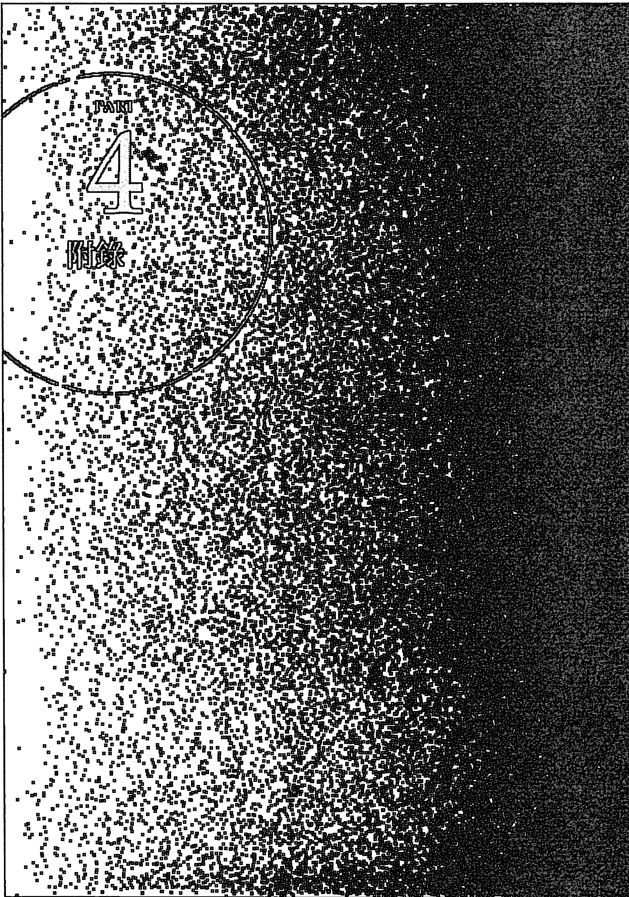

# PART 4 附录

（图片内容无法直接提取，示例占位）此处应为从图片中识别出的文档主体文本内容，例如段落、标题等。由于我无法直接查看和分析您上传的图片文件，无法提取其中的具体文字和结构信息。请确认您已正确上传图片，或使用具备图像识别功能的工具进行处理。若这是一个空白页或仅包含无法识别的图形，则内容列表可能为空。

## 行星符号与星座符号

| 符号 | 名称 |
| :--- | :--- |
| ☉ | 太阳 |
| ☽ | 月亮 |
| ☿ | 水星 |
| ♀ | 金星 |
| ♂ | 火星 |
| ♃ | 木星 |
| ♄ | 土星 |
| ♅ | 天王星 |
| ♆ | 海王星 |
| ♇ | 冥王星 |

| 符号 | 名称 |
| :--- | :--- |
| ♈ | 牡羊座 |
| ♉ | 金牛座 |
| ♊ | 双子座 |
| ♋ | 巨蟹座 |
| ♌ | 狮子座 |
| ♍ | 处女座 |
| ♎ | 天秤座 |
| ♏ | 天蝎座 |
| ♐ | 人马座 |
| ♑ | 摩羯座 |
| ♒ | 水瓶座 |
| ♓ | 双鱼座 |

太阳：意志、人生目标，以及生命中的重要男性。

月亮：情绪、安全感，以及生命中的重要女性。

水星：思想、沟通能力、表达能力。

金星：情感、价值观、吸引力。

火星：欲望、性冲动、肉体的行动力。

木星：智慧、机会、社会价值带来的助益。

土星：责任、权威、现实世界的限制。

天王星：无常、变动，宇宙性的巨大改革力量。

海王星：艺术、慈悲，宇宙间没有边际的灵性力量。

冥王星：控制欲、执着，宇宙间毁灭与新生的巨大能量。

## 附录2 查询星图网站

1.  Astrodienst: Horoscope and Astrology
    网址：http://www.astro.com/
    点选首页右上角的“My Asrto”免费注册，输入出生资料后就可以排出本命星图。若需中文化，还可以点选首页右上角“中文”按钮。

    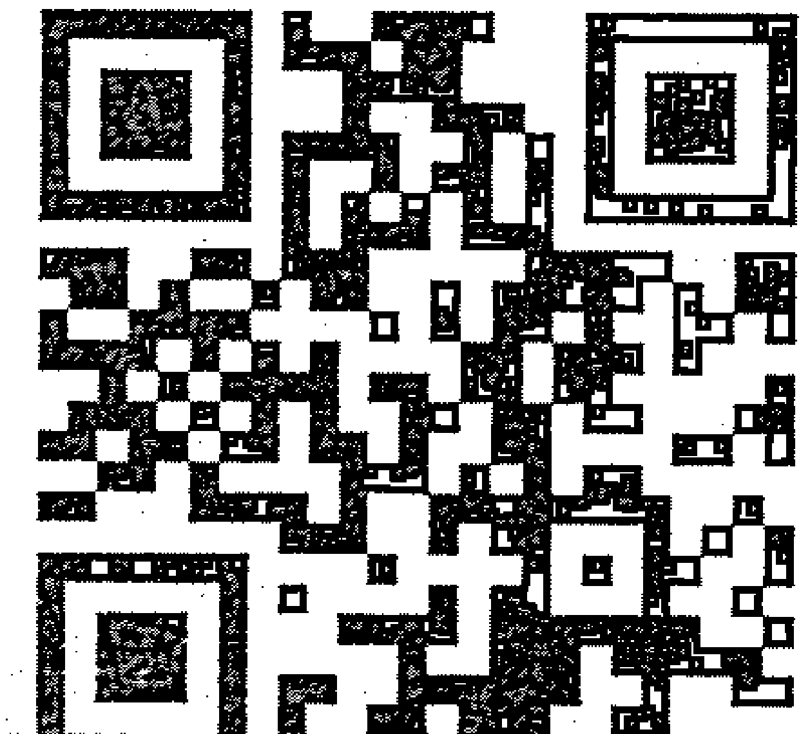

2.  astrotheme.com
    网址：http://www.astrotheme.com/
    在首页左侧的“Free Astrology”点选“Horoscope, Sign, and Ascendant”进入填写出生资料页面，输入资料后点选“next”，确定无误后再次点选“next”，就可以排出一张包含小行星的本命星图。

    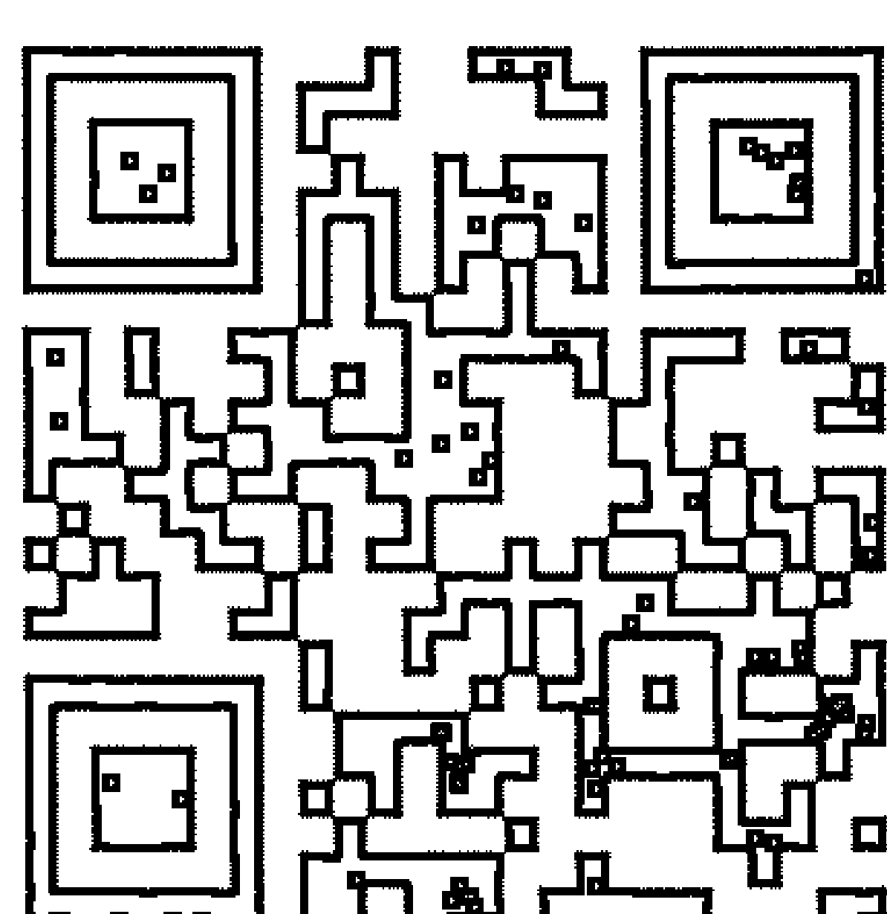

3.  占星之门
    网址：http://astrodoor.cc/
    全中文占星网站，进入首页后直接点选右上角“选单”，并选取“星座命盘”，就可以输入资料排出中文化星图。

    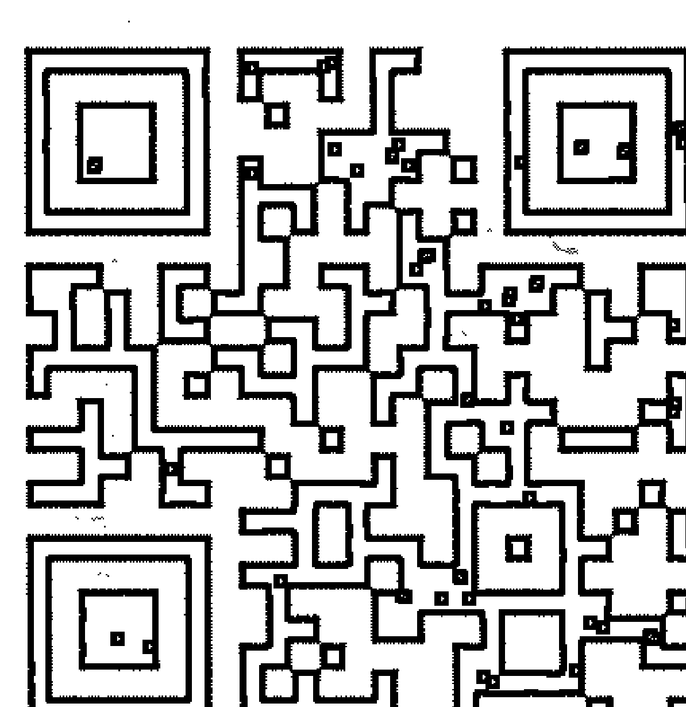

    (1). 请搜寻“占星之门”，或直接以网址“astrodoor.cc”进入首页。
    在首页右上角

    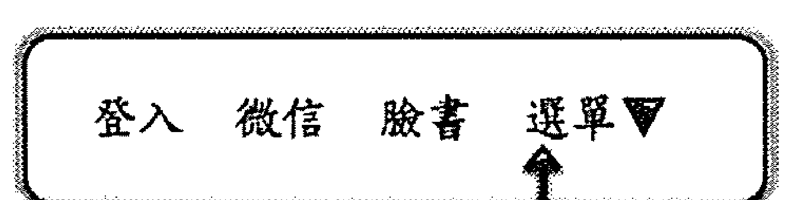

    (2). 进入输入出生资料页面

    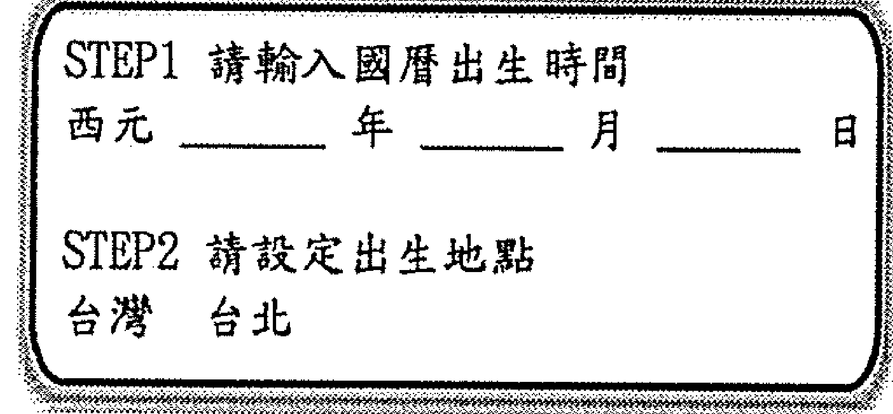

    (3). 将出生资料填妥之后，再点选下方“辛苦了！请按我送出查询”按钮。

    (4). 就会进入本命星图页面选单：

    - 星盘图片
    - 行星位置
    - 上升星座
    - 星座比例

    点开“星盘图片”的蓝色bar，就可以看到包含小行星的本命星图。

    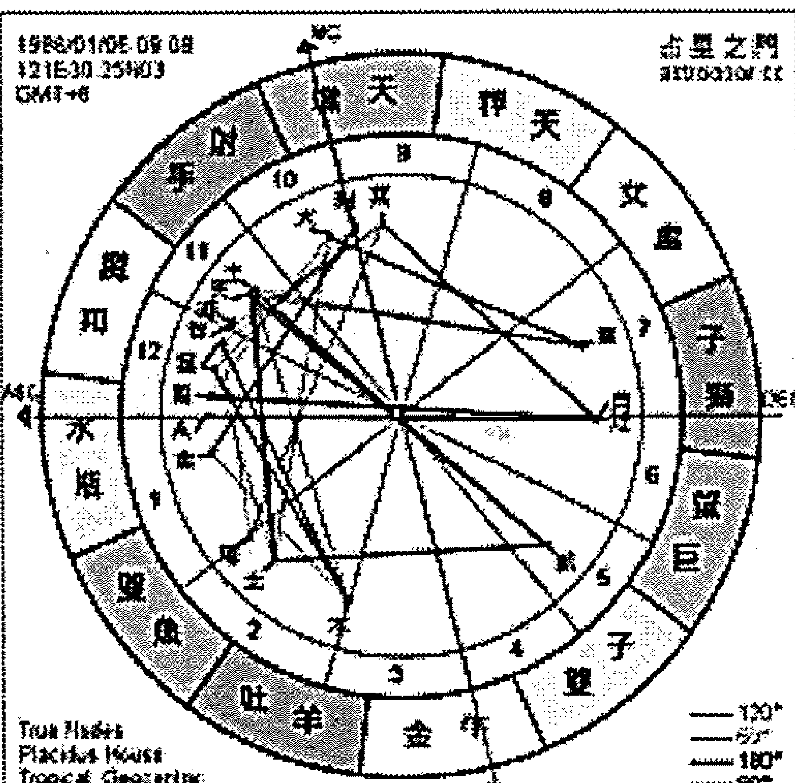

    (5). 如果想看相位清单，请记得将网页下拉，在网页下方，还有四个蓝色选单。
    “法达运势”、“进阶资讯”、“十二宫位”、“相位列表”。
    点开“相位列表”后，就可以看到哪些行星彼此形成了什么相位，以及容许误差度数几度的明细表。

    (6). 如果想查询是否有行星逆行，请将显现星图的网页往下拉，就会看到“若行星旁出现‘R’，则代表逆行”。

    (7). 检查太阳、月亮、水星、金星、火星、土星、天王星、海王星、冥王星旁边是否有“R”（太阳与月亮不会逆行），如果有“R”的话，并且看右栏，看看逆行的行星是落在什么星座、什么宫位。

## 查询即时行星状态与天文历

1.  如果想知道行星的即时位置，可以上“astrotheme”网站。
    可以直接搜寻“astrotheme”，或输入网址：https://www.astrotheme.com/
    进入首页后，网页左方的“Transits and Ephemerides”有现在即时行星位置及即时星图。
    将鼠标移到即时星图点下去，就会进入即时星图的大图页面。
    在星图的行星符号右下角，如果有一个小“R”符号，就代表这颗行星目前正在逆行。
    或者也可以看星图上方的列表，列表的第一排是行星名称 (Sun, Moon, Mercury, Venus, Mars, Jupiter, Saturn, Uranus, Neptune, Pluto等等)，第二排的数字是该行星走到了某个星座的某个度数，第三排的英文 (Aries, Taurus等等) 为牡羊座、金牛座等星座名称，在数字与星座名称之间，如果出现了一个倒转的“R”，就代表这颗行星正在逆行。

2.  如果想要查询特定日期的天文历，可上“astro.com”。
    可以直接搜寻“astro.com”，或输入网址：http://www.astro.com/

3.  进入了astro.com以后，
    在网页上方蓝色底色处，有五个主选项：
    “Home”、“Free Horoscopes”、“Astro Shop”、“All about Astrology”、“Contact”。

    将鼠标移到“All about Astrology”（不要点下去，只要将鼠标移到这个方块上即可），就会出现下拉选单，最右排选单“Ephemeris”中有以下选项：

    - Ephemeris 2018
    - Ephemeris 2019
    - 9000 Years Ephemeris
    - Swiss Ephemeris

4.  你可以直接点选“Ephemeris 2018”查询2018年每一天的行星位置，也可以点选“Swiss Ephemeris”，找到从西元5000年，到西元后3999年的每一天的行星位置。

5.  以查询2018年8月1日为例，
    先点选“Swiss Ephemeris”进入不同世纪的页面之后，再点选“21st century”（二十一世纪），再点选“2018”，就会进入2018年全年从一月一日到十二月三十一日的每日天文历。

6.  将天文历下拉到“AUGUST 2018”，
    就可以找到2018年8月1日的行星位置。

## 延伸阅读

《十二星座：行星与星座互动的生命密码》：最适合占星初学者的第一本占星书。透过太阳、月亮、水星、金星、火星、木星、土星、天王星、海王星、冥王星各自进入十二星座，深入简出为大家讲解十颗主要行星与十二个星座如何产生能量互动。

《十二宫位：生命格局的十二个舞台》：十二个宫位是十二个不同生命领域，它决定了你的人生要演出什么类型的戏剧。

《成功做自己：太阳、木星、土星相位中的生命之旅》：这是一本讨论本命星图相位的书，书中为大家解释，当太阳、木星、土星跟其他行星形成相位时，会有的生命情节。

《情感的合唱：月亮、水星、金星、火星相位中的风景》：探讨本命星图月亮、水星、金星、火星相位，深入理解内在情绪、心智沟通与性爱的逻辑，从容面对亲密关系的课题。

# 版权信息

韩良露生命占星学院 18

# 太阳行运全书

作者/韩良露

撰述委员/宋伟祥、李幸宜、曾睦美、缪沛伦、韩沁林、罗美华

特约主编/缪沛伦

美术设计/蔡怡欣、Bear工作室

创办人/朱全斌

董事长/施俊宇

营运长/李长轩

编辑出版/南瓜国际有限公司

地址：106 台北市大安区忠孝东路四段325号9楼

客服电话：（02）2795-3656

传真：（02）2795-4100

总经销/红蚂蚁图书有限公司

地址：114 台北市内湖区旧宗路二段121巷19号

电话：（02）2795-3656

传真：（02）2795-4100

# 1. 项目概述

本项目旨在开发一个高效、智能的文档处理系统。该系统能够自动识别和解析多种格式的文档，提取其中的关键信息，并将其结构化存储。

# 2. 核心功能

- **格式识别**：支持PDF、Word、图片等多种格式。
- **信息提取**：自动提取标题、正文、表格、列表等元素。
- **结构化输出**：将提取的信息转换为JSON或XML等结构化数据。

# 3. 技术实现

系统核心采用深度学习模型进行文档版面分析，并结合自然语言处理技术理解文本语义。后端使用微服务架构，确保系统的可扩展性和稳定性。

> > “让机器像人一样阅读和理解文档，是人工智能的重要挑战。”

# 4. 预期成果

项目完成后，将大幅提升文档处理的自动化水平，为企业的知识管理和数据分析提供有力支持。