# 奇门星象绝学

# 奇門星相總訣

日月五星情依依，
二九和一數藏神，
芒消怒張人間世，
眾垣無語暗消魂。

# 自 序

謀事在人，成事在天，一句很簡單、很普通的話卻蘊藏著令人莫測的天機。天機的背後是大道，大道至簡至易。由於天機大道不斷的演化展示，使得《奇門星相絕學》提前問世。

一九九八年十一月的流星雨後，在不到半年時間的一九九九年三月，北約空襲了科索沃。飛彈猶如流星一樣傾向科索沃，在夜空中宛如流星雨的再現。占星術講：流星主兵事。易經講：天垂象，見吉凶。天成象的吉凶一般應在三年內。曆朝歷代的天文志、天象志均記載有大量的天垂象見吉凶的史實實例。

如《漢書·天文志》中記載：春秋二百四十二年間，日食三十六，彗星三見，夜常星不見，夜中星隕，如雨者各一，當是時禍亂輒應，周室微弱，上下交怨，殺君三十六，亡國五十二，諸侯奔走不得保其社稷者不可勝數。

《隋書·天文志》中記載：隋煬帝公元617年，十三年五月辛亥，大流星如甕墜入江都。占曰：其下有大兵戰流血，破軍殺將。六月有星孛於太微五帝座色黃赤長三四尺所數日而滅。占曰：有亡國，有殺君。明年三月宇文化及等殺帝也。十一月辛酉熒惑犯太微日光四散如流血。占曰：賊入宮，主以急兵見伐。又曰：臣逆君。明年三月化及等殺帝，諸王及幸臣被戮。

《金史·天文志》中記載：易曰：天垂象見吉凶，聖人象之。故孔子因魯史作春秋，於日星風雨霜電雷霆皆書變不書常，所以明天道，驗人事也。秦漢而下，治日患少，陰陽愆違，天象錯迕，無代無之。金百有十九年，而日食四十二，星辰風雨霜電雷霆之變不知其幾。金九主，莫賢於世宗，二十九年間，猶日食者十有一，日珥虹貫者四五，然終金之世，慶雲環日者三，皆見於世宗之世。

這些史實實例在通過對天象細致的觀察後與天下大事相對照，揭示了星體與人世變化的玄妙。是非均在一幕間，星垂斗轉現乾坤，人生本就天意造，細觀察微陰陽真。

在1946年6月4日爆發大日珥。按占星術講，日珥出現則：兩軍相當，無相奈何。1945年日本投降後，國共和談，隨後國共雙方處於一個微妙的階段。

無論是千年前還是近代或是眼前，類似這種實例事實舉不勝舉。當出現月食則意味著：正王臣之行；當出現日蝕則意味著：正人主之道。當然，任何一門學問，只有入門、掌握一定基礎知識、基本規則、基本要領後才能去欣賞，去品味，加上慧根方可悟出道道來，否則只是內行看門道，外行看熱鬧而已。如同看時裝模特的表演，當模特在台上來回走動搖擺，又有多少人能看出道道來呢？星相學更是如此，美妙的星空只能帶給大多數人無數遐思。對此，奇門星相學按循序漸進的步驟進行編排、編寫。北斗指方向，從北斗入門，從常見的流星、彗星等入手，一步一個腳印的去了解、學習、認識，這樣，當處在美妙的星空下，再也不會望天興（星）嘆。

爲了使讀者對祖先們是怎樣研究觀察星體的情況有所了解，特從正史天文志中摘取部分內容，僅供參考研究欣賞：星月變換人間譜，繁星點點趣常綱。奇門秘術密法訣：萬事應天機，總得人來依。如現代某些超級大國將衛星懸在它國的上空，將其國的建築及軍事設施窺視得似乎是一目了然。這正是星體對人世的遙控的一個翻版。看似人爲的事物，實則是一種天體信息的再現。

星體是符號，她的光亮、色彩是語言，是信息，是詩！星象指路：能看懂、讀懂她的符號，她的語言將會給生活增添無窮的樂趣，領悟宇宙星體的偉大，人生的美好。星動象顯人現，天人星就一體。由此，通過對星體異動的跡象，可以了解人世運動趨勢的變化，推測它國之動靜，再現古人研究星相之輝煌。蒼天有好生之德，宇宙一切都是相互關聯，相互滲透影響。一點帶動萬點波，星海宇天蒼穹河，銀漢遙望天下世，誰解其中味深測。

作者地址：中國湖北省武漢市青山區冶金大道30號5門5號

魯揚才

2000年8月1日

# 第一部 基礎知識

## 第一章 奇門星相學概論

奇門星相學是一門研究星體運動變化或超常運動現象對人事及思維發展影響的學說。自人類有史以來，無論是中國還是外國，人們對宇宙星際的觀測與探索從未間斷過，並在漫長的歲月中積累了豐富的大量的資料，總結出許多寶貴的經驗，並加以整理完善。洋洋二十五史，上下五千年，歷朝歷代都有專門的部門和人員，從事這項觀測、記錄、整理工作。

奇門星相學正是建立在幾千年的星相發展史和文化發展史的基礎上來揭示星體與宇宙，星體與人，人與宇宙的相互內在本質的聯繫，及人在宇宙中的位置。它為人類思維認識上的飛躍增添了一條新的途徑，並與無邊無際的星空相融合一體來探索、詮釋宇宙中的各種現象。

星光無限綴宇空，浩渺煙雲夢幻形，信真無為身形隱，是非明辨象演新。

星體間的運動對人事的影響。既直接又微妙。說他直接是因為每在一次星體異常運動變化後的三年內（少數在五年內），地球上相應的區域就會發生一些較大的事情。如1917年7月9日爆發日珥，接著1918年在俄國爆發了震驚世界的十月革命。1945年出現彗星，1946年6月4日爆發日珥，隨後中國進入了全面內戰。1944年首次爆發獅子座流星雨，1945年日本投降。

從這三個例子可以看出，星體在運動變化時，產生的精微物質和能量輻射在一定時間內傳導至地球。並對地球的某些相應的區域起著潛移默化的作用。這作用力具有相當強的穿透力和滲透力，使處在這個地區的人與物質作出相應的反應。如同一個人走進一間充滿濃郁香味的屋子，既使你屏住氣息，不呼吸其香味，但其香味分子依然會附著你的肌體，使你身體外表沾染上其香味。因為香味散發出的物質對你的作用是全方位的立體式的。它們從身體的各部位對你進行滲透，而且你在房間停留的時間越長，所接受的香味分子就越多，分子的浸透就越徹底。宇宙星體變化運動所產生物質還可以直接參與人類的大腦中樞神經系統的運作，從而使人們在特定的時間下作出判斷、決策，獲得成果等一系列

# * 奇門星相絕學 *

人爲的有作用力的活動。這種影響可以從滲透到接收，或將物質信息以不同的有形方式轉化、表達。而物質信息釋放出來的過程是微妙的，這種細微的轉變不易被人們所察覺。正是這類不被人們所察覺的精微物質始終在影響著人類，使人類的生活處於一種若有若無的約束網中。人們感到神秘莫測，卻又無可奈何，只有聽任其擺佈。然而命運雖是不可捉摸，但追根尋源卻是有規律可尋。

人從宇宙中來，生存在宇宙空間。人可以逃離家園，逃離地球，卻逃離不了宇宙星體對人的影響，在地球與各類星體組成的宇宙空間裏存在著各種星體發射出的能量信息分子，甚至更小的原子、電子等等，精微物質充滿著這個空間。地球作爲宇宙大家族的一員給人類提供了生存空間的同時，也在接受著其它星體對它的調整與校正。同時參與整個體系的有序運轉。各種物質在一起相互產生各類反應，形成千差萬別信息物質群。物質變精神，精神變物質。一個是看得見，一個是看不見，他們都是星體物質的派生與繁衍，一個是感官刺激，一個是心靈再現。這種物質與精神的相互關系在一定程度上是有形與無形的轉變，在轉變的過程中只有結果被人感知並展示於眼前。很多微妙的部分卻是在一種超光速下完成的。所以使人不易覺察得到。然而只有抓住了事物內因變化規律才能真正徹底的去改變。人世間的物質世界是以有形爲主導，若要改變他則必須從物質運動的本源入手。而衆多的星體的變化就是其本源。

衆多的星體中有些能直接作用於人，如太陽、月亮，它們對人們的作用是直接的、可見的。而另外有些星體在完成軌跡運動時間接的作用於人類世界。其實這也是人之所以命運的面前，當有些人知道後很容易改變，而有些人卻很難改變、校正軌跡的運行的原因所在。這種難易的差異是多種星體放射出的物質流的逆轉與順轉的不同造成的。星體物質流的形成就是數的形成和場的相互轉化形式。數到場到，即這種數場形成後，人和房宅等等就形成了特定的信息接收器。那麼，除此之外還有些星體能量級別很低，即物質流所負載的能量分子在一定範圍內不能達到特定能量級別時，只是在邊緣起推波助瀾的作用，來加快或減慢物質信息對人的影響。如同那些碌碌無爲、隨波逐流的人們。這種物質間的相互位置關系及自身運行的快慢的同時亦形成了各種類型的生存環境與空間。那些有才華、有抱負的人若處在與之不相應的不良信息環境空

# * 奇門星相絕學 *

間，最終會被這種物質所左右，從而不能鴻展自身的才華，一生命運坎坷。一江春水向東流，萬古千秋隨風走，了明虛空星景意，可嘆歲月年年有。

人們的生活旅途有順也有不順。順的多榮昌，或升官、發財、多子孫。不順的卻與之相反，甚至遭受種種打擊。在星相中發現星體異常動作時產生物質以不同的輸送方式從而對地球產生進一步的調制。地球上的事物處於特定區域就會接受特定物質信息傳導及精微元素的作用。當人們的思想行為與此種信息一致時，則產生同類共振效應，可借助這種星體的力量去有效的快速的完成事業，在生活、工作、學習上取得成果。那些有創造性的人，是因為他們吸收了大量的精微物質，同時在一定的時空下與他們基因中含有的這種類似精微物質的暗物質通過某種遊離狀態的互化接觸時產生碰撞，在碰撞中產生靈感，其實這就是物質往往在同氣相求，同類共振時會有奇跡產生的一種效應。

在現實中不順則因為在接受這些物質以後，在思想或行為上與這種基因的走向相違背產生的惡果。順天者昌，逆天者亡。順著這些物質流的軌跡去做就順；反之則不順。從某種意義上說就是“天意”。人們對這種力的軌跡運動似乎感到了什麼，但是由於心胸、認識能力上的狹隘及知識面的限制，始終對其產生疑惑困解。這些物質飄忽不定卻又時隱時現來左右著人們的思想行為，這就是《黃帝內經》中說的陰陽不測謂之神。這種現象反應了人類在能力和視野上的局限性。這種局限性是認識理解能力和視野範圍上的狹窄所造成的，而且其中的神只不過是認識過程中的一個階段，並不代表全部與永恆。

在探索宇宙空間時，也在尋找物質世界的本源。星體的動蕩就是萬物生發的源泉。順天者昌，當星體處於恆定軌跡的相對靜止運動時，社會就平穩、祥和、民心穩定。此時如果急功近利、暴躁就會打破平靜的勢局，其結果必然是事與願違。當星體間流星、彗星等頻頻不斷異常運動，則會出現社會動蕩，人心浮躁。這時智者應應勢利導，順其自然，否則亦會被大場帶動，隨波逐流。

在星體產生某種變化，處於某種狀態時，人只有與之相適應，相協調，才會心想事成，吉祥如意。不要用自己的或模式思維去衡量星際間的變化與發展。當瞬息萬變的宇宙產生一個大場時，人是無法與之相抗衡的。如同人在大海上航行，遇到颱風或海嘯的襲擊時，船的惡運人是

## * 奇門星相絕學 *

無法真正控制的。我們應很清楚的看到人類的發展再迅速都離不開宇宙的懷抱，永遠逃脫不了星體對它們的影響和作用。用一種公正的態度去了解他們，接受他們，才會真正的達到天人合一，萬事如意。

星體的能量如同電腦網站一樣有大有小，大的涉及面廣，傳播速度快。如同某大國總統的一個政策或一句話就可以使股票行情隨之漲跌，甚至會波及到全球。現代社會信息傳遞越來越快捷方便，但無論怎麼發展其都是天體運動的翻版。而星際間的物質、信息的傳遞與傳導是在無形無際暗物質中進行的。這種傳遞是無形無象、無邊無際的。這種傳導是無聲無息、無休無止的。

智者自智，愚者自愚。在星相學中由於涉及到切身利益的多寡和所處的位置不同，心靈震動和感覺也不同。如同不炒股的人對股市行情就不會太關注一樣。要真正進入星相學的殿堂，對自身利益的關注與取捨需要轉得過來。隨時注意大場的運動方向，隨時融進又隨時跳出，而不以個人利弊得失、喜好來衡量所見一切，這是最基本的要求。

奇門星相學的目的是為了使人們明白、了解人和宇宙間的相互呼應的程度。在現實中，人們感到迷惘不解的問題，卻可以在星相學中找到答案。例如：1965年出現彗星及1966年的流星雨，隨後發生波及億萬人的文化大革命。1970年出現大彗星，接著階級斗爭不斷，政治運動不停。在1976年的大彗星及吉林隕石雨的出現，是文化大革命的結束，偉人的相繼去世。同年唐山發生大地震。

1978年10月28日出現雙跡流星。1982年中國正式提出一國兩制的構想，實現了香港回歸祖國的願望。1998年11月17日-18日出現獅子座流星雨，1999年春北約空襲了南斯拉夫境內的科索沃地區，導彈、砲彈像流星雨一樣向科索沃境內傾洩。1993年10月17日-18日，出現獵戶座流星雨和雙子座流星雨，它們之中有幾個極大體積的流星與眾不同。隨後在1995年8月24日，具有全新的強大功能的WINDOWS95問世。1946年2月14日第一台電子計算機問世，當時只能每秒運算5千次加法運算，50年後的1994年12月問世的WINDOWS95運算速度猛增到每秒3208億次加法運算，是第一台電子計算機的6600萬倍，相當於一個人晝夜不停計算一萬年。這種驚人的增長速度與1993年的流星雨出現間隔不一年。即使是量子計算機和DNA計算機也是在星體的運動下誕生。

計算機的形成具有著劃時代的意義。它是人類歷史上的一次飛躍。它是人們模擬星體信息傳送方式的研究成果。在流星雨出現不久，計算機如此迅猛的飛躍不是偶然的。天體每時每刻在對人們發射信息物質，每隔一段時空就會再現一次。隨著人類自身完善程度不同，接收的信息量層次也各異，產生的結果自然各不相同。人類社會的發展從古石器時代至今始終處在積極的演變之中。在物質世界形成不同的時代環境裏，即同一種物質信息形成後由於接受者不同就會產生不同的有形的結果。好比同樣的計算公式在科學家手中運用和在小學生手中的作用是不一樣的。這是由於他們體內貯存信息的多少而形成的差異，其運用結果也是不一樣的。計算機在這段時空形成並快速發展是人類進步的有形顯示。它告知人們必須與宇宙同步，順從星體的運動變化規律才會產生快捷方便的傳導方式。在這些星體的變化與人事運動及科學發展的成果相呼應的情況下，人類只有在掌握了物質與非物質間的聯繫與區別，才能完成自己良性意識產生的物質不滅的循環本質所在。

是非過錯忌怨天，接收多寡在於每一個接受信息的個體自身開放的程度。與此同時，天體宇宙在孕育人類的同時也賦予了人們與宇宙自然相聯繫與溝通的途徑與功能，這種途徑存在於無形當中，如同電磁波一樣用肉眼一般難以發現，但於人的心靈深處卻能真實的感受到它的存在。

世界科學文化的發展已經與天體運行程序十分相似，但它似乎又缺少了一種魂的指導。就如同機器人，始終不會象人腦那樣主動的思考，它們只能按照程序的設定去工作。星相學中研究星體間的運動變化是萬事萬物生發的原始動力源。它是自動程序化的基礎，在相對時空裏，影響和控制人的大腦中樞神經，使人在接受此種物質信息後快速作出反應和回答。這種影響分兩種形態，即有形與無形。有形的使人類的物質世界豐富或貧乏。無形的使人們產生喜、怒、哀、樂、憂、思、恐等身心的變化。如果明白這些物質世界與信息世界的內涵及星體與人類之間的聯繫，就可以調動人的主觀能動性，主動去適應星體間的變化，從而使自己的前程呈現光明。反之，人們會感到處處受到排擠，感到徬徨、無奈甚至自暴自棄、喪失自信，走向極端，許多事情想好了又無從下手，造成這種現象的原因是這些人的思想與行為，與在這段時間內影響地球的星體所散發出的物質的運動軌跡不能相互協調，從而產生一種反作用力對人事進程產生阻礙。如果這種物質被人類正確的認識和利用，它可以激發出超常的寫作、謀略、策劃功能。

宇宙天體在孕育萬物同時，也處在不停的運動變化中，人只有在適應這種變化的同時去了解這種變化，隨時調整自己，才能真正與天合而為一。也只有天人合一才有人類更大的思維飛躍與科學長足的進步與發展。

人生存在地球上，生存在宇宙中，作為宇宙總體的一員，天體對人的影響是隨時隨地的。物有所指，每一種現象的產生都是對人事的點化和啟發。人們不放過任何一點物質的變化起始點和終結點，才會在有形世界裏站穩腳步。在大海中生存的生物，它的所有器官與功能都是為了適應海中環境生存進化而來。人類在地球生活了那麼長時間，人體構造是適應地球生活最美好的組合。

人們在不斷的開發與研究中，已經漸漸明白人天對應的全息規律。此後是否應該思考如何將人類的命運與宇宙相聯繫。同呼吸、共命運，既然無法離開宇宙的影響，可以試著與之溝通。在美國、前蘇聯發射登月火箭探索月球以來，人們正在逐步的更加清晰的直接的與地球以外的星球相接觸，觀察研究它們的運動規律和走勢，及它們對地球的影響程度的大小。奇門星相學是從物質的本源去研究事物的本能出發的。

奇門星相學作為奇門文化的發源，借助幾千年的文化底蘊，把星際空間分成：北斗、紫微垣、太微垣、天市垣、二十八宿幾大區域。在每個區域中有一些相對固定的星體，當這些星體在運動時，人事就會產生相應的變動。如紫微垣是與最高權利機關相對應，其星明亮如常就表明天下太平，民心穩定。虛宿在二十八宿中主死喪墓宅之事，其星宿中的星體發生變化則產生相應的事情。中國史書中對這些星體變化與人事變化相對應的記載非常詳盡。這裏暫不多述。

古之賢者、聖者運用其高深的智慧研究總結出了星相對人事物有形及無形的影響途徑。奇門星相學是其中的一朵奇葩。它不僅展示了星體變化對人事的影響，更說明了星體與天體溝通所產生的反應和狀態。當人體主動去溝通某種星宿的能量就打開與之相應的穴道，接受著這種星體能量輻射影響。

平時有些人的穴道會自動與某星體相溝通，自己卻並未有所覺察。比如那些接受危宿星群能量信息多一些的人，就更適宜房屋建築設計這方面的工作。如果這些人費盡心思企圖在寫作方面尋找靈感，找到突破口，當然會感到力不從心，甚至得出文學原來枯燥乏味的謬論，只有當你真正了解了其現象在星相學中的所以然，你就可以做出相應的調整。並結合奇門穴道學來溝通文曲星等的能量信息，從而喚醒激發寫作靈感基因，使你下筆如有神，文思如泉湧，你會領悟到文章本天成，信手可得之，並不是一句空話。

轉變一個人根本的軌跡必須從無形到有形的狀態。要達到這個層次必須是精通星相與人體構造的高手，在特定的時空及條件都具備的情況下可以使人的潛能無限的發揮和拓展。在那些成功人士的背後，除了辛勤的勞作和奮斗外，更是無形的信息與有形信息物質的完美結合、協調統一的結果。如果不明白這種天人對應及有無相關的基本原理，只能是碰運氣，受命運的擺佈。當然在明白掌握這些規律後，人們可以更輕鬆自如的生活學習。

星相學中劃分的不同區域，形成不同層面。當人們在現實中竭盡全力想沖破現狀的重要阻礙時，往往感到力量不夠。如考大學、升官、出國等有許多人在關鍵時差一把力，始終上不去。而星體間相互吸引環繞及流星、彗星、客星等相互冒犯時是人們上升層次，轉變場能的最佳時機，當然這種轉變有其兩面性和互逆性。可由高降低，也可由低升高。生命層次的不斷淨化上升與飛躍帶給人們無限的暇想。星體中變幻多姿的色彩如同一幅幅優美的圖畫；星象是一本懸在天空的天書，只要掌握破譯天書的密碼，則前途光明。

西方奎宿主庫藏兵器。美國正是世界上最大的軍火商。美國的武器裝備始終處於世界領先水平。各種新式的多功能戰斗武器不斷研制出來。這與奎宿的兵庫是否有一定關聯？而奎宿的基本定義至少在一千五百年前就已經定義了。

有些地方的特產，如中國的茅台酒是在特定的區域接受特殊的星體物質產生的物品，在別的地方是無法生產出同樣的酒的。人可以移動物體，卻無法移動星體，只有人去適應星體才會有超越的表現。在天成象，在地成形。星體的無形物質在發射過程中已具備了某種物質形成的因素，人們觀測到的已經是它們產生反應的中間環節了，只是它們通過一定的途徑形成有形轉變的某一階段過程而已。這也是暗物質暗反應帶給人類種種不解之迷的原因之一。

## * 奇門星相絕學 *

2000年太陽形成太陽風暴，影響干擾了地球的郵電通訊，一些地區的傳呼機在相對時間內全部失控。心血管病人病情相對加重。太陽五行爲火，人體心臟也爲火，所以人體的心臟首先接收到這種信息，其它臟器也在同時接收這一信息，但由於不是同類，所以產生的反應較心臟相比則表現的不是那麼明顯。

奇門星相學揭示有形物質對人事的影響分爲兩大步驟。首先是星體變化碰撞，環繞產生的強大的衝擊波直接影響地球及人事發展，其次是一些精微細小分子，微塵以有形無形的形式在從星體到地球這段空間中與其它物質產生種種反應，並隨機的對人類產生著巨大的影響。後者的影響速度相對較長。然時間跨度較前者大。且在化學反應中產生各種神祕複雜的新物質在無形的影響人事，這些新物質變幻莫測，即爲陰陽不測謂之神。這種神就是無形物質對有形世界的影響。它的影響是無形的、無情的、巨大的、長遠的，幾乎伴隨人渡過一生。

目前，科學家發現宇宙黑洞在宇宙星系中的威力。儘管對此黑洞的研究十分有限，但是人們已經開始注重對宇宙暗物質的研究。宇宙黑洞從某方面來說是與發光星體形成一陰一陽的兩種狀態的隱形星體，這種太極式運旋產生了宇宙初始化合力，使宇宙塵埃凝聚、擴展形成各類的宇宙星系。在宇宙星系中星體所發散的物質運動很容易受這種黑洞來控制完成。黑洞的體積質量都很小，但其對物質信息的控制能力卻極強，星體的異常變動每隔一定的時空重複出現一次，如哈雷彗星每76年光顧一回地球。這種重複與歷史事件在一定時間後重演有異曲同工之妙。

學史使人明智，雖然歷史在一段時空內有相似的重演，卻無法避免。人們通過星相與歷史的參比，似乎明白星體是這些事件的創造者，人們猶如接收器在完成宇宙通過星體發射給人們的指令。循循環環相呼應，天地中間星化意，終極你我本一體，知天知地解人謎。

奇門星相學的精髓是天意。這種天意是一種物質組合運轉（有形與無形）的大規律，這個規律的適用範圍是較全面的。由於接受信息物質的接收者自身的消化接收轉化功能的不一，從而產生了不同的表象結果。這種能力在人的本初始源就早已存在了，即本能。這是由於以前星體的不同物質信息早已存在，在接受到不同組成的星體物質後在不同的時空調制下形成了人的差別。

星相學的物質成分在原始的發射階段到影響、滲透人事時已經產生變異。這種變異在作用於人體後，繼續形成並隨著另一種物質影響或同類物質聚集而再次出現，前一種力量逐漸減弱，這就形成了在不同階段人有不同程度上的運變。

人體接受星體物質能力隨著年齡增長而逐漸減退，直至完全的不接受星體物質，使有形轉變成無形，再形成有形生命物質。這樣循環往復運動的產物。而人與宇宙有形物質構成聯繫的通道一旦受阻，超過一定時間極限，從無形轉到有形的功能自動退失，生命機能自動停止。如同人體呼吸離不開氧氣，完全斷氧幾分鐘，正常人就無法存活一樣。

星體間的運動與人類社會如此息息相關，他們之間運動變化對人類生活有著重大的作用和意義。

## 一、作用：

- 1、星體的運動揭示了物質與非物質的聯繫空間與運動變化產生的影響。
- 2、星體的超常運動揭示了人類社會生活發展變化進步的源動力。
- 3、星體的相互作用力的產生揭示了人類相互間的關係與聯繫，同時預示了人類與外星交流發展趨勢。
- 4、星體的物質轉換和同期性使人們對物質世界的一些神秘現象得到圓滿的答案。
- 5、星體的形成與發展作用於同一方區域，揭示了物質形成的條件局限性及區域性。
- 6、星體色彩的變化，可調整物化進程步伐的快慢與進退。
- 7、根據星體與人體的對應關係，可以自主的尋找與星體溝通的時空。並從事相對應的社會工作。
- 8、奇門星相學可根據自身的特點溝通相應的星體，補充自身根基的不足，借助外力平穩發展。
- 9、奇門星相學可以預測人事未來的軌跡。

## 二、意義：

通過對星相學的研究觀測：

- 1、可以形成一種特定的文化體系用於指導人們的生存發展，在天人相應的前提下讓社會更好的前進和發展。
- 2、解釋星際、宇宙的同時探索向上的捷徑與通道，減少盲目性，使短暫的人生與無限的星際相融合，從而增添人生樂趣。
- 3、奇門星相學直觀的把人的天性與功能協調起來參與宇宙的大循環。使人在順天的同時作自身的主人。
- 4、在物質與精神之間找到了轉化點和平衡點，可在有形物質形成改變無形物質使人心想事成。
- 5、可以借助星體的能量，在社會中如魚得水，輕鬆自在的學習、工作。
- 6、揭示了事物背後物質信息能量和運動軌跡。使那些困惑的人能夠及時調整自身的坐標軌跡，從而事隨人意。
- 7、揭示了暗物質世界對有形世界的無形控制，在分析其內部結構與功能的同時，使人在物質與信息之間尋找交點，完成交接，從而能夠快速抓住或捕捉信息，把握機遇。
- 8、揭示宇宙中樞在不斷的通過信息來調控、調節人類的軌跡，使人類始終處在與宇宙相運轉的狀態。

奇門星相學與奇門堪輿學構成奇門文化的天與地。奇門遁甲和奇門穴道學是兩個並列的中間環節。穴道學相對於人體接受信息，奇門遁甲相對時空把宇宙信息立體再現，更便於直觀的進行方位上的調整和指導。這二者在同一層次中針對不同的方面，如此三位一體合成了完整的文化體系，星相作為奇門文化的起源，在此體系中具有舉足輕重的位置。它在與遁甲、堪輿、穴道相結合的基礎上完成了天人合一的過程。

物質信息的生生滅滅是信息物質共同發展的終點。頭即是尾。如果你們從起源入手到過程再到結果你就會對這個世界有一個更新、更全面的認識和理解，從而使人們感到做人的偉大，人生的偉大及生活的美好。

## 第二章 地支與二十八宿

歲星繞天一周的時間約十二年（實爲11.86年），所以古人會根據它的運行情況，創爲十二次，用以紀年。十二次是按由西向東的方向把黃道附近一周天分成十二個等分，每個等分中都有二十八宿中的某些宿作爲標誌，並有一定的名稱。當歲星運行到某次的時候，就稱爲歲在××，用以紀年。

| 地支（由東向西） | 十二次（由西向東） | 二十八宿 |
|---|---|---|
| 丑 | 星紀 | 斗牛女 |
| 子 | 玄枵 | 女虛危 |
| 亥 | 諏訾 | 危室壁奎 |
| 戌 | 降婁 | 奎婁胃 |
| 酉 | 大梁 | 胃昴畢 |
| 申 | 實沈 | 畢觜參井 |
| 未 | 鶉首 | 井鬼柳 |
| 午 | 鶉火 | 柳星張 |
| 巳 | 鶉尾 | 張翼軫 |
| 辰 | 壽星 | 軫角亢氐 |
| 卯 | 大火 | 氐房心尾 |
| 寅 | 析木 | 尾箕斗 |

與十二辰的運行方向相一致，即也是由東向西的歲星稱爲“太歲”，又稱“歲陰”、“太陰”。太歲運行到十二辰的某一辰，就稱太歲在某。

太歲與十二辰相對應，用作紀年時，還有一些專門的名稱。它與歲星的對稱如表：

| 太歲年名 | 太歲所在 | 歲星所在（月將） |
|---|---|---|
| 攝提格 | 寅（析木） | 星紀（丑） |
| 單閼 | 卯（大火） | 玄枵（子） |
| 執徐 | 辰（壽星） | 諏訾（亥） |
| 大荒落 | 巳（鶉尾） | 降婁（戌） |
| 敦牂 | 午（鶉火） | 大梁（酉） |
| 協洽 | 未（鶉首） | 實沈（申） |
| 涒灘 | 申（實沈） | 鶉首（未） |
| 作噩 | 酉（大梁） | 鶉火（午） |
| 閹茂 | 戌（降婁） | 鶉尾（巳） |
| 大淵獻 | 亥（諏訾） | 壽星（辰） |
| 困敦 | 子（玄枵） | 大火（卯） |
| 赤奮若 | 丑（星紀） | 析木（寅） |

## * 奇門星相絕學 *

由於太歲和十二地支相配只能紀十二年，十天干也有別名“歲陽”，依次同“十二”歲陰相配。配出六十個年名，同六十甲子紀年。

| 天干 | 歲陽 |
| :---: | :---: |
| 甲 | 閹逢 |
| 乙 | 旃蒙 |
| 丙 | 柔兆 |
| 丁 | 強圉 |
| 戊 | 著雍 |
| 己 | 屠維 |
| 庚 | 上章 |
| 辛 | 重光 |
| 壬 | 玄黓 |
| 癸 | 昭陽 |

## 第三章 星官與星座

人們為了認識星星，研究天體，於是把星空分成若干區域，中國稱為星官，西方喚之為星座。中國古代把天空分為三垣二十八宿，最早的完整文字記錄見諸於《史記·天官書》中。

三垣者，北極接近的三個區域，為紫微垣、太微垣、天市垣。垣的分劃並不太嚴格明確，紫微垣大致包括：小熊座、天龍座、鹿豹座、仙王座、仙後座、大熊座、牧夫座、獵犬座、御夫座等。太微垣則相當於以下幾個星座的區域：獅子座、後發座、室女座、獵犬座、大熊座、小獅座。天市垣則相對更近夏秋的銀河區域：蛇夫座、巨蛇座、盾牌座、天鷹座、武仙座、北冕座。

二十八宿中最大的為井宿，赤經跨度約有33度左右，而最小的觜宿和鬼宿，僅只2-4度。

我國的恆星命名系大約形成於公元270年，三國時代吳國太史令陳卓編成了一本包含283個星官，共1464顆恆星的星表。其中很多都是以封建皇朝帝王將相的官名來命名的。

西方的星座的起源可以追溯到公元以前大約三千年左右的巴比倫人。到公元二世紀時，古希臘的天文學家大體上已把北天區域的星座確定下來，而南天區域的星座的確定則是在環球航行成功之後，十七世紀的事了。

1603年，根據德國天文學家巴耶的建議，恆星命名按星座分區，即在每個星座內根據亮度順序，以希臘字母表示之。但希臘字母僅24個，星座中的恆星一般遠不止24顆，如大熊星座內肉眼可見的恆星有125顆之多。為了解決這個矛盾，英國的弗蘭斯提德於1712年發表了一個星表，其中的恆星都按星座中的赤經次序編號，因此，目前除星座中24顆亮星已有希臘字母表示之外，都以星表中的號數加上星座名字，與亮度順序是無關的。

為了統一星座的劃分，1928年國際天文學聯合會經過研討，公佈了全天88個星座的名稱及範圍，並且規定星座的界限一律以赤經線和赤緯線來劃分，星座的大小相差十分懸殊，如最大的長蛇座佔據的天區面積達1300平方度，而最小的南十字座卻只有68平方度（全天面積為41253平方度）。各個星座內所包含的肉眼可見的星數也是有多有少，

## * 奇門星相絕學 *

各不相等的。

## 主要星座表

| 略號 | 中文 | 赤經（小時） | 赤緯（度） | 占天區面積 |
|---|---|---|---|---|
| Leo | 獅子 | 11 | 15 | 947 |
| Cnc | 巨蟹 | 9 | 20 | 506 |
| And | 仙女 | 1 | 40 | 722 |
| Cvn | 獵犬 | 13 | 40 | 465 |
| Cas | 仙后 | 1 | 60 | 598 |
| Lmi | 小獅 | 10 | 35 | 232 |
| Gem | 雙子 | 7 | 20 | 366 |
| Oyi | 獵戶 | 5 | 5 | 594 |
| Per | 英仙 | 3 | 45 | 615 |
| Uma | 大熊 | 11 | 50 | 1280 |

## 二十八宿與西方星座的對應關係

| 東方青龍 | | 北方玄武 | | 西方白虎 | | 南方朱雀 | |
|---|---|---|---|---|---|---|---|
| 星宿 | 對應星座 | 星宿 | 對應星座 | 星宿 | 對應星座 | 星宿 | 對應星座 |
| 角 | 室女 | 斗 | 人馬 | 奎 | 仙女雙魚 | 井 | 雙子 |
| 亢 | 室女 | 牛 | 摩羯 | 婁 | 白羊 | 鬼 | 巨蟹 |
| 氐 | 天秤 | 女 | 寶瓶 | 胃 | 白羊 | 柳 | 長蛇 |
| 房 | 天蠍 | 虛 | 寶瓶小馬 | 昴 | 金牛 | 星 | 長蛇 |
| 心 | 天蠍 | 危 | 飛馬寶瓶 | 畢 | 金牛 | 張 | 長蛇 |
| 尾 | 天蠍 | 室 | 飛馬 | 觜 | 獵戶 | 翼 | 巨爵 |
| 箕 | 人馬 | 壁 | 仙女飛馬 | 參 | 獵戶 | 軫 | 烏鴉 |

## 第四章 星色與亮度

### 一、星色與亮度

以顏色和亮度來定正變，是判斷人事吉凶的標準之一。

如《隋書·天文志》中說：“凡五星有色，大小不同，各依其行而順時應節，色變有類。凡青皆比參左肩，赤比心大星，黃比參右肩，白比狼星，黑比奎大星，不失本色，而應其四時者，吉。色害其行凶。”也就是說，凡五星（金、木、水、火、土五大行星）都有顏色、大小不同。根據它們在五行的所屬來觀察其顏色和大小，並順應不同的季節來決定。

所謂青、紫、黃、白、黑是相對於某個參照系而言。

青色以二十八宿中西方白虎中參宿的左肩為參照系。在參宿中，由七星組成，中間三顆大星，正中一星為大將，左右為左右將軍，左肩即左將軍。

黃色以參宿的右肩右將軍為參照系。

赤色以二十八宿東方青龍的心宿中的大星為參照系。心宿由三星組成，中心一星最明，為大星。

白色以狼星即天狼星，在二十八宿南方朱雀井宿的星區內，是全天最亮的星。

黑色以二十八宿西方白虎奎宿的大星為參照系。奎由十六星組成，其大星在西南面。

五星不失其本來的顏色，而且能根據季節改變成相應的顏色則吉利。它們的顏色若與五行相違背則凶。

星的亮度在星相學中至關重要。

星的亮度的正變必須通過長期的觀察才能確定，有的星本來就很亮，如果它在一定時間內變暗，則為不正常。如昴宿主管牢獄之事，若它很明亮就意味著天下獄訟公平；如變暗淡，則有刑罰苛濫的情況出現。相反，有些星則以暗淡為正常，若明亮則為不正常。如紫微垣中的天理四星。此四星明亮，則意味著將有貴人下獄。

參與對照緣由系，順道應天顯人意。

### 二、星的大小與形狀

星的大小形狀也是用來測度正變及預測吉凶的尺度之一。
在正常的情況下，一般的星是比較固定的。這個相對固定的大小叫做正。但有時也因特殊原因，星的大小顯得比原來有差別，這叫做變。
星由小變大或由大變小是吉是凶，要視情況而定。
如南方七宿中軫四星，則以小爲吉，若大而明就會有戰爭。太微垣中的少微四星，則以大而黃潤爲吉，如果小而暗淡，則意味著賢人失志。

星的形狀用肉眼觀察，一般是個小圓點，很難看出其特異之處。在功態下用功能、慧目透視或遙視看則更妙。但有些星的形狀是可以看得出來的。如客星，它是在短時間內突然變大變亮的星。以肉眼觀察它會突然出現，如同不速之客，所以叫客星。它的形狀也有很多種，有的如雲非雲，有的如牙旗，有的如削瓜，有的如雄雞。又如彗星，一般都有一個長長的尾巴或光射如角，也很明亮，是容易看出來的。

也有一些星由幾顆星組成，而幾顆星之間又構成一定的形狀。這種形狀有時是有變化的。它們的變化是吉是凶，也是視情形而定的。如三台星，它是由兩兩一組的六星組成。這種組成以直線爲吉，叫做泰階平，意味著天下太平。如果屈曲而彎，則意味著有各種災變。

### 三、入宿度和去極度

入宿度是指以赤道爲坐標，以二十八宿中的某個宿的距星爲標準，測量某一星體同這個距星之間的赤經差。
測量入宿度要先確定距星，也就是說，在二十八宿中，每一宿當中有一顆作爲測量坐標的星，這顆星叫距星。如東方七宿中的角宿和亢宿都以左角先爲距星，斗宿以魁第四星爲距星，星宿以中央大星爲距星等等。
兩距星之間的赤經差叫做本宿的距度。去極度是指所測星體距北極星的角距離。

入宿度和去宿度的測量說明：
設圖中 A 爲二十八宿某宿的距星，B 爲另一要測量的星體。過 A、B 的赤經圈交於赤道 a、b 兩點，那麼 B 這一星體的入宿度就是 a 到 b 的距離（ab），去極度爲從 P 到 B 的距離（PB）。

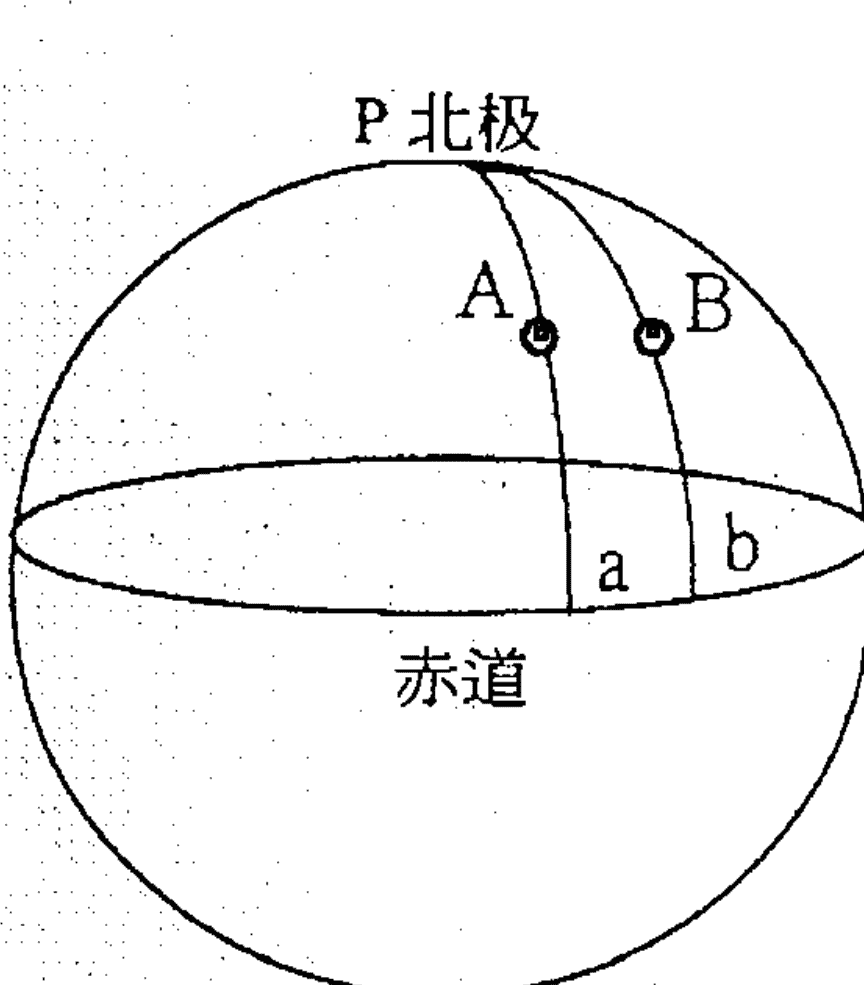

### 四、北斗星與州對應表

| 北斗七星 | 州 |
| :--- | :--- |
| 魁星（天璇） | 雍州 |
| 樞星（天樞） | 冀州 |
| 機星（天機） | 兗州、青州 |
| 權星（天權） | 徐州、揚州 |
| 衡星（玉衡） | 荊州 |
| 開星（開陽） | 梁州 |
| 搖星（搖光） | 豫州 |

### 五、二十八宿與十三個地區對應表

| 二十八宿 | 十三州 |
| :--- | :--- |
| 角亢氐 | 兗州 |
| 房心 | 豫州 |
| 尾箕 | 幽州 |
| 斗 | 江湖 |
| 牛女 | 揚州 |
| 虛危 | 青州 |
| 室壁 | 並州 |
| 奎婁胃 | 徐州 |
| 昴畢 | 冀州 |
| 觜參 | 益州 |
| 井鬼 | 雍州 |
| 柳星張 | 三河 |
| 翼軫 | 荊州 |

### 六、分野劃分簡表

| 二十八宿 | 十二次 | 山 河 |
| :--- | :--- | :--- |
| 須女、虛、危 | 玄枵 | 自濟北東逾濟水，循泰山之北，東南至高密，東盡萊夷之地，濱於碣石。 |
| 營室、東壁 | 娵訾 | 自王屋、太行而東，至北紀之東隅，北負漳、鄴，東及館陶、聊城，又自黃河、清水之交，經滎波，沿濟水而東地屬。 |
| 奎、婁 | 降婁 | 自蛇丘、肥城，南到巨野，東至梁父，循泰山之南，以負東海。又濱泗水，東至於呂梁，東南到淮河，並淮河而東地屬。 |
| 胃、昴、畢 | 大梁 | 自魏郡濁漳之北，東及清河、信都，北據中山、真定，又北逾眾山，直到北方群狄之國。 |
| 觜觿、參伐 | 實沈 | 自漢之河東至上黨、太原、西河之地全部，包括西河戎狄之國。 |
| 東井、輿鬼 | 鶉首 | 自漢三輔及北地、上郡、安定，西自隴坻至河右，西南盡巴、蜀、漢中之地，及西南犍為越嶲、益州，極南河之表，東至牂柯。 |
| 柳、七星、張 | 鶉火 | 北自北自自北自滎澤、滎陽，並京、索，暨山南，至外方東隅，斜至方城，抵桐柏，北自宛、葉，南暨漢東，包括漢南陽廣大地。 |
| 翼、軫 | 鶉尾 | 自房陵、白帝而東，包括漢之南郡、江夏，東至廬江南部，濱彭蠡之西，又逾南紀，包括有鬱林、合浦之地，自沅、湘上流，西達黔安之東，所有楚地都包括在內。 |
| 角、亢 | 壽星 | 自原武、管城，濱河、濟之南，東至封丘、陳留，逾淮源至弋陽，西涉南陽郡至於桐柏。 |
| 氐、房、心 | 大火 | 自雍丘、襄邑、小黃而東，循濟陽，界於齊、魯，西泗水，達於呂梁，東南接太昊之墟，包括漢時濟陰、山陽、楚國、豐、沛之地。 |
| 尾、箕 | 析木 | 自渤海、九河之北，包括漢時河間、涿郡、廣陽及上谷、漁陽、右北平、遼西、遼東、樂浪、玄菟，以及古北燕、孤竹、無終、九夷之國。 |
| 南斗、牽牛 | 星紀 | 自廬江、九江，負淮水南，至於東海，又逾南河，西濱彭蠡，南涉越門，迄蒼梧、南海，逾嶺表，自韶、廣以西，珠崖以東，均為星紀之分。 |

## 第五章 名詞釋義

- 1、動：光體搖動。
譯意：指星體的光動搖不定。
提示：流光舞動穿星空，小人讒言吉轉凶。
- 2、芒：光耀生鋒芒刺。
譯意：指星體的光強烈耀眼。
提示：光五寸以內爲芒，星芒刺眼事緊急。
- 3、角：頭角長大芒。
譯意：星體發光尖銳大如角。
提示：光似銳角，刀兵角；人心各異難猜度。
- 4、喜：光色潤澤。
譯意：星體發出的光柔和潤澤，不刺眼。
提示：光芒柔和美目連，事順喜慶福綿綿。
- 5、怒：光芒威大大潤澤。
譯意：星體發出強盛的隆光，但不刺眼。
提示：色隆氣盛東風強，皇恩君臨天下壯。
- 6、疏：相離失其常體。
譯意：指兩星或數星互相疏離，形體反常。
提示：人心各思異己事，萬物常離分中支。
- 7、就聚：相近而聚，自三星以上。
譯意：幾個星體在天空中互相接近，猶如聚會。
提示：星聚心合力中一，棒打不散業起基。
- 8、存：守常得正。
譯意：星體固定位置不變。
提示：星體本元始中基，物中兩離迷意氣。
- 9、大：大於本體，吉星則吉，凶星則凶。
譯意：指比原有的體積有所增大。
提示：大吉大利則喜，大凶大患則憂。
- 10、小：小於本體，吉星則凶，凶星則吉。
譯意：比原有的體積減少。
提示：吉星小則凶，凶星小則吉。
- 11、亡：失其所在。
譯意：指某些星突然消失，不在原來的位置上。
提示：亡失國將滅，禍起無緣由。
- 12、出：未當去而去。
譯意：指星體不應離開某一位置而離開。
提示：未當去而去饑荒，位置錯換亂常綱。
- 13、入：不應來而來。
譯意：指星體不應到某一位置卻到了某一位置。
提示：不速之客就位尋，客欺主臨憑戰經。
- 14、舍：二星相近同處一宿。
譯意：指兩個星體互相接近，同處於一個星宿的範圍。
提示：同宿眠息共和光，人事合和意非常。
- 15、合：芒角相及而同光。
譯意：兩星光芒相接觸，相距一尺內為合。
提示：合光會芒同力使，大業初成立難撐。
- 16、離：雖同宿共度，南北乖隔，光不相及。
譯意：兩星同在一宿，但一南一北互相隔離，光線互不接觸。
提示：同床共枕心各異，事分兩支自尋源。
- 17、盈：超舍大進，過其所常。
譯意：某星在某一時間內速度較快，越過舍次向前。
提示：超速事因尋根變，數質等量力非常。
- 18、縮：退舍大遲，不及其常。
譯意：某星離開某舍次太遲，情況反常。
提示：遲退自形觀意樂，進前反憂退喜臨。
- 19、舍：經其宿度而行，舍其宿而行遲。
譯意：某星舍去其因行宿位而緩行。
提示：亂事獨身號悠然，置於局外冷眼觀。
- 20、宿：經其舍而過往，去不遲。
譯意：某星經其舍次，逗留不久。
提示：蜻蜓點水芙蓉尖，小荷尖尖喜頭顯。
- 21、居：福德之星在其宿位。光色潤澤而遲。
譯意：福德星在某宿位，其光柔和潤澤，逗留較久。
提示：福德彌佑遠災星，喜報財綿人氣清。
- 22、留：住而不移。
譯意：某星體居於某一位置停留不動。
提示：五星順逆觀未動，房心之宿現賢能。
- 23、中：東西相當，中無過犯。
譯意：某星體正從某一空間中部穿過。
提示：中正性明各自高，禍福兩牽無惹閒。
- 24、曆：依次相及而過。
譯意：按星體順序經過他們的舍次。
提示：次第相連平民安，君臨盆金獲清閒。
- 25、貫：經其中過。
譯意：某星體從另一星體貫穿而過。
提示：貫日虹光霞滿天，吉星則吉凶禍變。
- 26、刺：在旁過，光芒及之。
譯意：一星體從另一星體旁邊經過，光芒相接。
提示：刺芒相牽喜氣邊，福瑞初成化自旋。
- 27、磨：傍過而相切。
譯意：一星體從另一星體旁邊經過，兩星體的邊互相切合。
提示：風塵僕僕意相接，力成未達道交馳。
- 28、逼：旁邊逼迫而有間。
譯意：一星體從另一星體旁經過，兩星體逼近，尚有空間，互不相切。
提示：飛塵紅鶴霜滿天，情意相對兩纏綿。
- 29、掩：蔽而滅之。
譯意：某一星體從另一星體旁經過，遮蔽了另一星體。
提示：蔽覆烏雲天邊現，戰場紛離人悲嘆。
- 30、斗：二體往返而復合同，二星同處，不辨其形。
譯意：兩星體開始互為逆順而行，之後互合，難以區分彼此。
提示：道同志堅力雙行，合中有分圓循真。
- 31、環：星行繞之。
譯意：某一星體圍繞另一星體環行。
提示：左右護持生畏意，事倍功半得厚柱。
- 32、繞：繞星而過，不周爲繞。
譯意：某一星體從另一星體旁繞道而行。
提示：繞道有緣爲半份，中途撤離獨枝冷。
- 33、凌：直往及其體。
譯意：某一星體對另一星體發生直沖的接觸。
提示：氣勢凌人凶難免，禍由武力災易旋。
- 34、勾：一往一返如如鉤。
譯意：指某星體時而順行時而逆行，往返的路線如鉤。
提示：往返勾連禍難纏，人心渙散自紛亂。
- 35、己：往返重複，再勾如己。
譯意：某星體兩度逆順而行，形成的路線如“己”字。
提示：自私自利惹眾怒，倒行逆師違常規。
- 36、犯：在陰在陽，相近七寸光相接。
譯意：某星體在另一星體的北面或南面相切近，也指五星在運行中與某一星體相接觸。
提示：犯合同類相接交，犯爲大殃凶難擋。
- 37、乘：自上而下。
譯意：某星體從上方向下方的另一星體靠攏，發生接觸。
提示：乘風而至春滿園，攀月折桂登高階。
- 38、觸：兩體俱動而直來。
譯意：指兩星體運行到某一位置發生直接接觸。
提示：觸身及體運桃花，合力斷金成大業。
- 39、抵：一動一靜直相至。
譯意：兩星體，一個運行，一個則相對固定，其兩者直接發生接觸。
提示：遊子歸家親母邊，蕩塵除風立志前。
- 40、侵：越理而進，以大迫小，自上而下。
譯意：大星不依常規運行，以迫近小星。
提示：大勢所驅就位侵，君臣擾民國難寧。
- 41、薄：兩體相著。
譯意：兩星體互相接近附著。
提示：兩體互撫胃和順，谷食豐盛民安閒。
- 42、守：居之不去，相近也。
譯意：兩星體相互接近或某星體在某宿範圍內徘徊而不離開。
提示：忠肝義膽精真切，拋灑熱血廝守終。
- 43、食：邊侵掩而不見其體爲食，襲也。
譯意：指兩星體間發生相交重合遮掩現象。
提示：食月食日天昏暉，禍由邊關巧入內。
- 44、遲：不及常度。疾，過常度。
譯意：遲爲星體運行速度緩遲，疾爲運行速度加快。
提示：遲疾有病臟內起，兵心渙散難統征。
- 45、循：依常度與數同。
譯意：星體運行正常。
提示：大小平安歸家園，事逢順緩急生變。
- 46、順逆：順，向東也；逆，西行也。
譯意：順爲天體向東運行，逆爲天體向西運行。
提示：東西順逆各自道，互換凶生順福應。
- 47、從：遲疾次第相及於一處。
譯意：指數星隨一星先後抵達某一宿次。
提示：正度正行先入主，去集響應利仕途。
- 48、會：一逆一順，同臨一宿，光耀相逮。
譯意：數星相互會合同一宿，其星一逆一順，其光呈相追逐之態。
提示：行持有力勢均衡，有聲有色漫途程。

## 第六章 奇門星相學判斷步驟

- 1、了解三垣、二十八宿內諸星的類別、性質、特點。
- 2、了解金、木、水、火、土、日、月七星的運動規律，各自的性質特點及在人事上特定的範圍。
- 3、了解北斗七星的作用和每一顆具體星的代表範圍。
- 4、選擇較高的、空曠點作為觀察點。
- 5、以北斗為中心點將三垣、二十八宿一一在天上對應找出。
- 6、先看紫微垣內諸星的情況如顏色、亮度、遠近、暈圈。
- 7、看太微垣內諸星的情況。
- 8、看天市垣內諸星的情況。
- 9、看二十八宿內諸星的情況。
- 10、看流星、彗星、孛星、客星的動作軌跡及所冒犯的星體。
- 11、根據星體自身的性質特點及對應點推斷人事。
- 12、根據流星等的路線、形狀、大小及停留時間來判斷事物發展的時間跨度。
- 13、根據星體代表的事物類別來判斷屬哪一類的事件。
- 14、根據日、月、金、木、水、火、土七星的運行情況加以輔助觀察推測。
- 15、根據七星與二十八宿的對應運行秩序推斷人事的發展。
- 16、根據北斗七星中七顆星的亮度、色彩等推斷天下事的整體走勢。
- 17、根據天市、太微、紫微三垣各自代表的社會層級來推斷每一個層次的人們的發展趨勢。
- 18、根據東南西北四方的二十八宿的劃分推斷四方的發展情況。
- 19、根據二十八宿的星神的特性與當時整體趨勢的參比，推斷星神代表的方位、時間、分野所發生的事物趨勢。
- 20、根據二十八宿內的諸星的格局來找尋對應的事，如狼星與弧矢，兩星不相對則為有戰事。而五車的五顆星分別代表五穀的豐欠。
- 21、根據時辰與星相的對照參比來推斷事物的發展具體走向。
- 22、根據時辰、五色與星體形成的特定格局來定事物的應期。

## 第二部 北斗

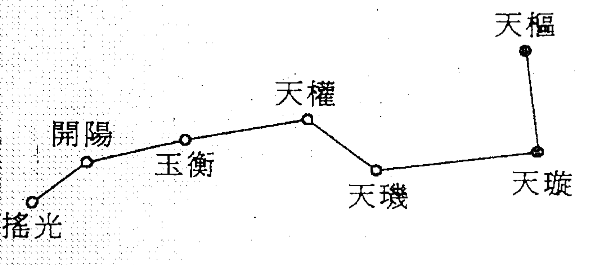

北斗屬紫微垣。

北斗七星明變光則各有所主。天樞以簡慢宗廟；天璇以廣營宮室，鑿山陵；天璣以不愛百姓，暴行征役；天權以號令，不順時，逆天道；玉衡以廢正聲，務淫聲；開陽以峻法濫刑，退賢傷政；搖光以廣眾而不尚德。

北斗星明盛潤澤則國昌，不明則有咎。芒及國凶。月暈及動搖則兵起；其旁及中多小星則天下安；少則國人散。

五星及客星守之皆凶，彗孛尤甚。冒犯爲殺伐。

流星出入爲使出入，又爲遠國來貢，三分有賜。抵則天下大兵。若出其旁明，如炬火，長六尺，形如繒布，則賊臣專政。大流星犯之，大臣有擊。抵納入內，大臣憂。

五彩雲氣直入之，立太子。氣之入，蒼白多大風；赤爲兵；星宮或火災兵起。氣少兵亦多，黑而曆之，民災。入而化群鳥、龍、蛇、豬，刑人、病、亦兵起，大如布席，如鳥獸，三日必雨，不則敵入犯塞。白沖之爲大戰。白雲氣壓之，三日內有雨，若色青，五日內有雨。或明日太熱，殺人。

魁之占，客星出而有赦，赦之大小如星。彗入之出之三日以上，諸侯恣亦民人散。彗孛流星白氣出樞星，則兵相伐，世亂。流星黃白爲赦。大流星入之，臣叛。大流星出則其年兵起。蒼白氣入，大臣不軌。蒼黑則貴臣下獄。輔星欲小而明，臣輔強而恣。明與北斗齊，國兵暴起。暗而遠斗則臣亡，不則奔逐。若近，臣專佞人用兵。芒角近，臣專權。逼近開陽，則下迫上。

彗孛流星冒犯並爲將相誅。客星入之，有善令。色青，相有罪。赤將兵。黃白受賜及有喜。黑則亡或黜。白乃憂，皆占在相。

## 第一章 北斗所主

### 第一节 北斗七星

星宿：北斗七星，辅一星在太微北。

原文：北斗为帝车，运于中央，临制四方，分别阴阳，建于四时，均立五行，移应节度，定诸纪纲，太一之事。配于二十八宿，天所以发其时，地所以成万物，诸侯所属。斗为帝令，出号布政，授度四方，故置辅星，以佐功焉。斗为人君之象而号令之主。北斗，天之受命之使，土官也。北斗名长史小字，大方能便不畏白刃。

提示：
长史：掌握管兵马之官。
白刃：指很锋利的刀。

北斗所代表的一切相对有一定前提范围：若知天下事，北斗主之。若知国家事，北斗主之；若知单位事，北斗主之；若知家庭事，北斗主之。

诀：北斗旋转定诸纲，万物受度临四方。
北斗七星示天意，法无定法通玄机。

### 第二节 北斗正星

星宿：第一名天枢；第二名璇星；第三名玑星，第四名权星；第五名玉衡，第六名开阳，第七名摇光。

又名：第一为破军；第二为武曲；第三为廉贞；第四为文曲；第五为禄存；第六为巨门；第七为贪狼。

第一至四星为魁，第五至七星为杓。合为斗杓。阴布阳，故称北斗开阳重宝。置辅易斗中，曰北斗。

提示：易通“赐”，赐给。
北斗七星的二种名字中，前者用于星象，后者用于预测。

### 第三节 北斗象星

星宿：北斗魁第一星开枢、受枢。受枢至四星属魁，为璇玑。第二

## * 奇門星相絕學 *

星提執序；第三星璣耀緒；第四星權拾取；第五星玉衡拒；第六星開陽紀，輔星紀；第七星搖光吐。

提示：

- 1、搖光主玉衡，屬杓，爲玉繩。玉衡北繩，故直杓叫玉繩。
- 2、璇璣玉衡，以齊七政

齊：齊全。

七政：日、月、木、火、土、金、水星。

## 第二章 北斗的範圍

### 第一節 北斗與政令

北斗第一星名正星，主陽主德。第二星名法星，主陰主刑，女主之位。第三星名令星，主福。第四星名伐星，主天理，伐無道。第五星名殺星，主中央，助四傍，殺有罪。第六星名危星，主天倉五穀。第七星名部星，又名應星，主兵。

### 第二節 北斗與年月

北杓爲小歲，正月建寅，月後左行，行十二辰。咸池爲太歲，二月建卯，月徙右行，四仲終而復始。太歲逆者辱，順者強，左者喪，右者昌。小歲東南即生西北，即煞，不可逆而可順，不可左而可右。北斗之神有雌雄，十一月建於子，月後一辰，雄左行，雌右行，五月合午，五月合午謀刑，十一月合子則謀德。

### 第三節 北斗與月建

以昏候之，左旋於天，月建一辰，晝夜一周，日月相會。孟春，日月會於豕韋（亥）；仲春建卯，會於降婁（戌）；季春建辰，會於大梁（酉）；孟夏建巳，會於實沈（申）；仲夏建午，會於鶉首（未）；季夏建未，會於鶉火（午）；孟秋建申，會於鶉尾（巳）；仲秋建酉，會於壽星（辰）；季秋建戌，會於大火（卯）；孟冬建亥，會於析木（寅）；仲冬建子，會於星紀（丑）；季冬建丑，會於玄枵（子）。

### 第四節 北斗與七政

一星爲天位，二星主地，三星主火，四星主水，五星主土，六星主木，七星主金。北斗七星七政醒，警世齊明道榮興。
七政星不明，各爲其政不行。

### 第五節 北斗與二十八宿

一星正星主營室、東壁、奎、婁。二星法星主胃、昴、畢、觜。三星令星主參、東井、輿鬼、柳。四星伐星主星、張、翼、軫。五星煞星主角、亢、氐、房。六星危星主心、尾、箕、斗。七星部星主牛、須女、虛、危。

> 訣：北斗七星二八燦，悲歡離合不分舍。
若有借居城牆外，天下事非亂起因。

### 第六節 北斗與七曜

北斗一星主日，第二星主月，第三星主熒惑，第四星主辰星，第五星主填星，第六星主歲星，第七星主太白。
北斗杓攜龍角，衡殷南斗，魁近參首。用昏建者，杓爲華山以西南。第七星法太白，杓斗之尾，爲陽位在西方，故主西南。夜半建者，衡以殷中州，河濟之間。平旦建，魁爲海岱以東北。斗魁第一星法於日，主齊。魁斗之首爲陽，又用其在明陽與明德，在東方，故主東北，齊也。

### 第七節 北斗與分野

斗即天樞。天有七紀，故斗有七星。星間相距七度百二十分，曜各百裏，週七千里，分得日月五星。九州之地，自一至四名魁，自五至七名杓。一爲樞星，太白主之。二爲璇星，填星主之，屬冀州。三爲璣星，熒惑主之，屬青州、兗州。四爲權星，辰星主之，屬徐州、楊州。五爲玉衡，歲星主之，屬荊州。六爲開陽，是主之，屬梁州。七爲搖光，月主之，屬豫州。搖光一名杓，或名招搖。

## 第三章 北斗與道

### 第一節 北斗第一星

北斗魁第一星爲天道。魁星建除主建萬物。
六甲主五子，甲子、丙子、戊子、庚子、壬子。五子氣，氣之始。
甲子木，春始，旺所以通達根莖；丙子火，夏始，旺所以通成花葉。戊子土，季夏始，旺主萬物肌膚。庚子金，秋始，旺煞萬物。壬子水，冬始，旺主含凍定根。故魁星爲歲星，其位甲子。故天子不尊鬼神，幼稚多弱，則魁星不明，不明則歲星不光。不光則萬物少稚不昌，天潤不盈。魁星不澤，列地封虛，財而不賞，王道所後及，皆思其下紀。

### 第二節 北斗第二星

北斗第二星爲地道。建除主除閉，物無不除，除陳發新，地道自膺。
六甲主乙丑、乙亥、丁丑、丁亥、己丑、己亥、辛丑、辛亥。故天使萬物皆得盛合寧。第二星爲太白，其位爲後，主諸侯，故天子教令顯，數發土工，發壞沒山林，不受藏，則第二星不明，不明則太白無光，無名則名術士不昌，蕃臣不忠，地澤不藏，大臣多疾。

### 第三節 北斗第三星

北斗第三星爲人道。建除主滿開。
六甲主丙寅、甲戌、戊寅、丙戌、壬寅、庚戌、甲寅、壬戌。天下能承下理物，設上定下，夫婦升進而定家道。第三星主熒惑。百姓不進爲退過，則第三星不明，不明則熒惑無光，無光則百姓避死，役士多避過亡匿，智士退，賢人避。

### 第四節 北斗第四星

北斗第四星爲四時。建除主平四時。
六甲主丁卯、癸酉、己卯、己酉、癸卯、乙酉、乙卯、辛酉。四者即爲萬物之節度數，故第四星爲辰星，其位爲司徒。故天子出令教化，不順四時，春行秋政，夏行冬政，秋行春政，冬行夏政，四時不和。不明則辰星無光，無光則歲凋殺，五穀不盛，萬物不昌，百姓艱難。上下相親。司徒非其人。

### 第五節 北斗第五星

北斗第五星爲音德。建除主定成。
六甲主戊辰、壬申、庚辰、甲申、壬辰、丙申、甲辰、戊申、丙辰、庚申。音者，五氣之和，五宮之政，制樂之節，皆在於此。第五星爲填星，其爲天子中宮，故天數更，日曆損，宗廟曆衣服，遠親離疏，戮辱父兄，蕃臣以兵，上下相欺。

### 第六節 北斗第六星

北斗第六星爲法星。建除主執危。
六甲主己巳、辛未、辛巳、癸未、癸巳、乙未、乙巳、己未。法律者，所以善善而惡惡，故死者不可生，刑者不可息。第六星爲月，其位主天理。天子出令，法苛刻，誅不正，威煞用刑，則第六星不明，不明則月不光，不光則執政不察，盜賊並起。

### 第七節 北斗第七星

北斗第七星爲部星。建除主破收。
六甲主庚午、壬午、丙午、戊午、甲午。主兵，主天四瀆。瀆者，諸神江、河、淮、濟。第七星不明，不明則日無光。海水出流煞百姓。其年有兵，司馬、將軍而行，萬民不昌，司馬與士卒俱凶。

魁星爲歲位甲子，天子之德隱於內，
首星耀目光潤澤，萬物咸昌民生匯。
太白光弱諸侯亂，地道不順民遭厄，
三星宜暗不喜強，熒惑無光避凶災。

訣：四時辰星四時主，順逆應天萬物萌，
北斗五星音德宮，錯位紛雜下反上。
法星公正主天理，法不容疏天下平，
部星七位各瀆兵，日光明耀蒼生運，
色暗兵變海水淹，苦煞百姓人中間。

## 第四章 北斗變異

### 第一節 七星微應

璣四星，紀日蝕微。玉衡三星，紀天倫。
開樞受微，逆天失度；提璇序微，地道失理；璣耀諸微，人民冤結，政乖失常；權拾取微，江河涸竭水失道；玉衡樞微，音節災紀；開陽紀微，律曆鐘呂，昧失理；搖光吐微，星辰政度失序。七政星不明，各爲其政不行。

### 第二節 七星不明應

北斗一星變，色微赤不明，六日而日蝕。君乘土而旺，其政太平。則宮室黃大，其餘六星暉光四起。八政不中部，則旺綱紀，絕失常。衡之拔起，三公後妃恣，君如贅旒。

王者失勢偏任臣下，擅任則衡撥絕斂縮，柳失制。撥爲陽星戾，戾則日蝕消，江河爲害，期九年。天子無威，王者舒濡，臣並爲政，則衡匡移側不停。匡者，陰星進，進則山崩谷滿。極星亡，日不見，期八年。中國無君主，天下大亂，王者貪恣，開利門，賈百姓，朝以貨財爲榮，無仁義之廉，則璣星低，低者，樞機星下移，移則山躍參差，天投石，蝗蟲爲害。奎星息，期九年，主試天下無文法，兵官榮。

王者不用仁義爲政，則佞臣熾，哲人消，群奸爲害。以圓爲方，以欺爲忠，朝廷閉塞，天下蔽雍，則杓仰，仰者，杓星上句移而高則山崩，龍群吟飛，火泉踴。彗入，斗辰守房。天庫虛狼狐張，期八年。五伯起，帝王亡，後堂嬉，讒賊興，群官之政以私害公，則魁星反而抗衡。

王者承度行義，郊天事神不敬，廢禮文，不從經法。則樞星不明，主病目舌，若喉。此類見主以逆天自恣。

爲三公名侯所謀，祭神動土，立州侯，失德逆時，害謀顯惡，問仰左官。隨意己虐符，則璇星不明，主鮮落，若偏枯。

近臣恣，將相謀主，以逆陰失符，德義少，殘百姓，家獄慘，毒吏巧，邪暴設，變害舒，失民命，懷冤抑，則璣星不明，主病心腹，若眩疽。明，主痺蹶。

逆以無禁，誅遠雅頌，若倡優奢，政偽度毀，饞而嬉，則玉衡不明，主痿蹶。

以迷或誅，德弊任過，官多屍祿，爵賞逆符，不修斗度，房表之樞，法令數更，以柯相杓，則開陽星不明，主鬲疽。

以不聰明，誅廢江淮，不省山濱之祠，州土之位，不應天符，斬伐無度，壞山絕渠，威德四弱，外國遠州，則搖光不則，主腫疝等，痛懲失樞。

### 第三節 七星色變應

北斗魁第一星主陽主德。天子之象，萬國之始。即有變，日應之，使其官有憂，或有死亡。正星色赤，有兵，不出月中。色白爲水如揚光。色赤無利，春到夏則馬、牛、金、石、物貴。夏到秋則黍麥貴。秋至冬，粟麥、魚鹽貴。冬至春，薪菜貴，谷賤。

北斗第二星主陰主刑，而生萬物，女主其位。即有變，月應之，無救，期一歲，若二歲，兵敗。色青，三日有兵，期三月或四月。色青不復有暴疾之君。色青白，有白衣之會，期三月中。色黑白，郭壞之，有暴水，若大風，期六月中。

北斗第三星變。色青黑，變更法令，天下不安。赤黃則有兵。其變白，爲一月而兵敗。

北斗第四星色青若赤，大臣有憂。黑則君有喜。

北斗第五星色青則米粟貴，赤則菽貴，赤黑則麥貴，白則禾黍貴，黑則谷賤。

北斗第六星色青則有離國，赤則有兵。

北斗第七星名應星，主兵，即有憂，太白應之，金官有憂，或死。色赤則死或有兵，期一歲，其春也有喜。色青有移徙民。色黃則有君益地。色白則有憂，色黑則有水。

> 訣：天下大勢北斗一，中定四柱支撐坤。
色微赤明政太平，黯淡退位國無尊。
王者施政順道否，七星明暗顯威凛。
天子失德民生怨，順天依時斗極明。

### 第四節 七星變應

北斗一星亡，天下必有大事及有大變。
正星有變，其官有憂，或死；法星有變，女主當之，或死；令星有變，火官有憂，或死；伐星有變，水官有憂，或死；煞星有變，土官有憂，或死；危星有變，木官有憂，或死；部星有變，金官有憂，或死。
衡星分明，則法令從；微細則法令不從。明而相疏則法令緩。相距數則法令急。

北斗自暈，破軍。北斗消，天下君臣相背。北斗星明則王者治。北斗杓爲北高，言急事馳馬兵驚，常以春三月候。北斗魁第一星曰應。星色赤則大赦，色白則有喜。北斗旁多星則國家安。北斗前移，外胡北移，內胡南移。王者逆道則北斗不明。王者孝行溢，則涓，精光不隕也。北斗星盛動搖者，不出百日天下盡以兵革死。北斗中多小星，民怨上，天下多訟法者。無星二十日有赦。北斗亡，不相反害，必有伐主。
王者德至於天，則斗極明。

天子不事祠名山，不敬鬼神，則第一星不明。數起土工，壞決山陵，逆地理，不從諫，則第二星不明。天子不愛百姓，則第三星不明。發號施令，不從四時，則第四星不明。用樂聲淫佚則第五星不明。用文法深刻，則第六星不明。不省江河淮濟之祠，則第七星不明。

南北斗夜見者，天子易後當起。北斗第四星名照。明大動，則天子兵強國安；其微小而色青黑，則軍破國亡。七政星明者，其國昌；不明則其國有殃。

北斗七星欲明大，潤澤相類，不相類者，治亂。
北斗第一星不明則禦史大夫非其人；第二星不明則大司農非其人；第三星不明則少府非其人；第四星不明則光祿非其人；第五星不明，鴻臚非其人；第六星不明則廷尉非其人；第七星不明則執金吾非其人。

### 第五節 北斗七神

北斗七星名爲北斗七神。神各主四宿，而衛太一宮。其星欲明大，潤澤相類，七政齊明則天子吉，大臣昌。其星不明則王者弱，大臣有殃。星若動搖，不出百八十日，天下盡兵，多有死者。

## 第五章 北斗與輔星

輔星匡危。輔星在北斗第六星旁，丞相之象，主旋明，正矯不平。輔星微，公宰弱，無良羽。輔星小，天子佐消。七政毀，輔乃亡。

輔星明則王者狹而輔佐出。輔星遠斗星五六寸，相不死也出走。輔星近斗一寸二寸，臣欲迫脅主。輔星不見則相死。輔星北，則黃瑞降，子孫繁昌。斗星明，輔星不明，主強臣弱。輔星明，斗星不明，則臣強主弱。輔星大而明，主奪政權。輔星不明，相不死則免，輔星欲小明而相明。輔星合斗星，十日兵起。輔星明大與斗星合，兵起臣強主弱。斗輔星去，丞相去。斗輔亡則大夫不信。輔星入斗中，相系，輔臣有誅者。輔星生翌，天子驚大將謀。不出三年，主誅，臣爲王。邪臣挾私，擅國符。若是輔星生翌則九卿阿黨，排擠正直，驕奢移害，則江河潰決。斗輔生角，輔遠陽則大臣無德，邦必立王。北斗七星，稟受輔助，近臣見微意。

## 第三部 三垣

## 第一章 紫微垣

紫微垣居於北天中央的位置。即五宮當中的中宮，又稱紫微宮或紫宮。“紫”是“此”意，“宮”是“中”意。因為天神運動，陰陽開合，都在此宮之內，所以叫“紫宮”。

紫宮象一座皇宮，其中由至高無上的天帝太一神及太子、王后等構成的皇室家族。由各種臣僚組成的藩衛機構，如同一個天國王朝，相應於人間王室朝廷。

星皆欲均明大小常則內輔盛；不明為憂。門開則兵起。勢直則天子親自率將兵。

客星入紫宮，人主憂，大臣逆或死。犯之若喪。入則天子變，兵起。

彗孛冒犯，人主惡之。孛出而抵之，世亂。入有奇令。守則有擾政者。彗孛雲有陰謀。

流星出紫宮，天子之使也。青為憂，赤為兵，黃土工，白喪，黑為水，皆以所出命其地。若入紫宮，兵起水旱，若有奇令，自南門而出入者外國使。出則使出，入則使入。

大流星出入色赤、忽白黑或炸，人君惡之，赦令除咎，雲氣狀如雞雛出，子孫之氣。氣之出，赤起兵。赤黃連兩藩，君有喜。如帚，美女受賜。黃白有自立者。白為喪。黃潤澤，諸侯受賜。氣之入，赤黃潤，天子有喜。黃白如杯碗正，天子有璧玉喜或幸臣有獻女者。如獸，天子以獸賜諸侯。如箕，起紫微宮上，天子大喜，延年益壽。若潤澤如劍，男子喜。如帚，婦女喜。黑入，兩藩國暴兵起。

紫微執斗而佐還，日行一度，以周於天，日冬至駿狼之山，駿狼之山，冬至所止也。日移一度，行百八十二度八分度之五，而夏至牛首之維。牛首之維，夏至之所至，所覆三百六十五度四分度之一，而成一歲。紫宮主出度。

紫宮以戊子日候之，宮亂則荒，其君驕奢不聽諫，奸佞之臣在側。紫宮和而正，則致鳳凰，頌聲作。紫宮之星均皆明，大小有常。紫宮星不盛，即士耗亡妻子。紫宮旗直者，天子出，親自率將兵。紫宮開，兵起。紫宮星盛即吉昌，內輔強。紫微宮中十五星備藩臣。

紫微垣星名：

- 1、北極5
- 2、四輔4
- 3、勾陳6
- 4、天皇大帝1
- 5、華蓋7
- 6、樞6
- 7、五帝內座2
- 8、女禦4
- 9、天柱5
- 10、六甲6
- 11、尚書5
- 12、柱下史1
- 13、女史1
- 14、陰德2
- 15、大理2
- 16、天床6
- 17、天乙1
- 18、太乙1
- 19、內廚2
- 20、內階6
- 21、八穀8
- 22、天廚6
- 23、傳舍9
- 24、閣道6
- 25、策星1
- 26、鉤星9
- 27、扶筐7
- 28、北斗7
- 29、天理4
- 30、三公3
- 31、三師3
- 32、文昌6
- 33、天牢6
- 34、相1
- 35、太陽守1
- 36、勢星4
- 37、天槍3
- 38、天棓5
- 39、玄戈1
- 40、太尊1。

方位：

紫微垣與極相去及入星左驂樞二十七度半入房一度。上宰二十八度入尾一度。少宰二十六度入尾四度。上弼三十三度入箕初度。少弼一十八度入斗十二度。左少衛十五度半入軫五度。上輔十五度半入翼四度半。少輔十六度半入柳。右上衛十九度半入參八度。右少衛一十八度半入昴九度。少上丞二十度入胃初半度。

步天歌：

- 中元北極紫微宮，北極五星在其中。
- 大帝之坐第二珠，第三之星庶子居。
- 第一號曰為太子，四為後宮五天樞。
- 左右四星是四輔，天一太一當門戶。
- 左樞右樞夾南門，兩面營衛一十五。
- 上宰少尉兩相對，少宰上輔次少輔。
- 上衛少衛次上丞，後門東邊大贊府。
- 門東喚作一少丞，以次卻向前門數。
- 陰德門裏兩黃聚，尚書以次其位五。
- 女史柱史各一戶，禦女四星五天柱。
- 大理兩黃陰德邊，勾陳尾指北極巔。
- 勾陳六星六甲前，天皇獨在勾陳裏。
- 五帝內座後門是，華蓋並樞十六星。
- 樞作柄象華蓋形，蓋上連連九個星。
- 名曰傳舍如連丁，垣外左右各六珠。
- 右是內階左天廚，階前八星名八谷。
- 廚下五個天格宿，天床六星左樞右。
- 內廚兩星右樞對，文昌斗上半月形。
- 稀疏分明六個星，文昌之下曰三師。
- 太尊只向三公明，天牢六星太尊邊。
- 太陽之守四勢前，一個宰相太陽側。
- 更有三公相西偏，即是玄戈一星圓。
- 天理四星斗裏暗，輔星近看開陽淡。
- 北斗七宿七星明，第一主帝名樞精。
- 第二第三璇璣星，第四名權第五衡。
- 開陽搖光六七名，搖光左三天槍紅。

釋意：

北極由太子、帝、庶子、後宮、北極（天樞）五星組成。這五星構成以帝為中心的王室。五星中最明亮的就是帝星。北極附近是四輔，帝星的南面有天乙、太乙。北極東西是左右垣。左垣由左樞、上宰、少宰、上弼、少弼、上衛、少丞八星組成。右垣由右樞、少尉、上輔、少輔、上衛、少衛、上丞七星組成，構成兩道屏藩，拱衛王室。

在兩藩之內，有陰德、尚書、女史、柱史、禦女、大理、勾陳（6星）、六甲、天皇大帝、五帝內座、華蓋。兩藩之外，北有傳舍和八谷，南有內階、文昌、北斗、天理、太陽守、太尊、天牢、勢、天槍、玄戈等。構成以王室為中心的朝廷機構，與世間治亂福禍相關最密切。

北斗由天樞、天璇、天璣、天權、玉衡、開陽、搖光七星組成。天樞至天權爲“魁”。玉衡至搖光爲“杓”，可根據北斗來確定季節。

北斗爲帝車之象，運於中央，臨制四方，分陰陽建四時，均五行、節氣、度數的推移，定綱紀。斗星盛明，王道和平；反之，民間大亂。

文昌由上將、次將、貴相、司命、司中、司祿六星組成。司命主管壽數。文昌主集計天下事務，爲天之六府。

天理由四星組成，貴人之牢。四星明且內有小星出現，則意味著將有貴人下獄，故名天理。

天乙又爲天一，太乙又爲太一。天乙又名“陰德”是天帝之神，主戰爭，掌管人的吉凶。若天乙明而有光，則陰陽和諧，萬物成長，君主吉祥；反之，則陰陽失調，萬物衰亡，君主凶危。

太乙也爲天帝之神，主管十六神，並掌管風雨、水旱、戰爭、饑荒、疾病、瘟疫。如果太乙不亮或移動位置，就有災降臨。

太一、天一主王者即位，它不能暗淡無光，否則就會有廢立不當的事情出現，導致君位繼承人的乏絕。

天槍、天格二星同戰爭有關，若它們光芒上射有角，則會發生戰爭。

紫微宮，紫北也，宮中也。又名天營、長垣、日旗、天宮。紫宮者，太一之常座。天一之常舍。天子之常居，土宮也。爲皇極之居。紫宮吐陽合陰。

> 訣：紫微天市市中間，人世兩相牽偶線。
莫道生平富貧賤，按星納源找本間。
洞察紫宮天帝妙，星明民喜君不驕。
弼輔之丞垣上找，後宮宮妃無理鬧。
天乙太乙星移徙，王位更立庶子求。
太乙切莫胡亂遊，否則災禍隨時有。
文昌星主財祿壽，更看陰德積福蔭。
天理之星量貴人，大道深明順人君。
天槍天格軍事警，太乙若動魂滿林。
北斗星群測儀渾，事發始末期可尋。

### 第一節 北極

方位：

北極五星去極十五度入心三度。

北極紐星天之極，以紐爲不動處。北極者，又名天極、北辰。北辰，衆星拱共，謂北極。紫宮，天聖主也，三公也，在北斗前。北極樞星，天之樞也，天運無輟而旋星不移也。北辰者，又名天、西秋。

北極星其一明大者，太一之光含元氣，以斗布常開命運節序神明，流精生一，以立黃帝。道起於元一爲貴，故太一爲北極，天帝位。北極星，其一星太一常居也，旁三星三公，或叫子屬。北辰名曜魄。北極，太一之座也，第一星主月，太子也。謂第一星者，最赤明者也。極星，人君吉昌，不明，人君耗。北極主出度。極星亡，期八年，中國無君主，天下大亂。北極出斗，距地三丈，大星去疏，主不用事。左星不明太子憂；右星不明，庶子有憂。

王者承度行義，效天事神，不敬廢禮，文不從經圖，則樞星不明。德至天，則斗星極明，甘露下。

天樞大端指心，小端指參，故用兵者，順行皆天樞，則左青龍、右白虎、前朱雀、後玄武。青龍、白虎、朱雀、七星、玄武、虛危。

若君得天心則北辰齊列，星明盛則人君昌；不然則耗。星暗則各以其所主爲憂；搖則君出遊無度；青而微者凶；亡則天下有變；客星出之，有德令安天下，又主暴驚、宗室亂。犯之，郊廟大赦則消災；守之，天下憂，國易政；冒犯乘守又爲喪或叛；中犯乘守太子或庶子所至皆凶。

彗孛冒犯，北極皆凶；流星出之地動，或爲有使出及兵起在外敗。抵而過者國政改；觸藩屏，出入不依門隨其方外國使來。氣之入中，蒼白黃則兵起；黑則大人憂；黃白入紫微宮達極星則立諸侯類、鳥獸群爲喜；黃白出之，天子賜諸侯王，赤而近極出紫微宮則兵起；抵北極座左右，諸侯臣死。

提示：北極星爲天之樞，從地球上看，它的位置變動細微，幾乎不易覺察，而且距天球北極很近，差不多正對著地軸，人們在航海旅行時用它來辨別方向。

> 訣：北極星群帝中天，至尊統領三庭界。
光極生耀照萬物，德至動天甘露淋。
對應人間事緣主，切記護佑生靈行。

### 第二節 四輔

方位：
四輔四星各去極四度。
四輔四星抱北極樞。四輔去，君臣失禮，輔臣有誅者。四輔機權，北極樞也。

星明小則君臣同道而吉昌；暗微不明若動則凶；去則君臣失禮或有謀；客彗孛流星冒犯守抵，大臣災；流星出入，宰相出使；若橫貫藩屏，藩屏國使；犯則不迫上；氣之入，黃白相有喜，白乃相凶。

> 訣：四輔小明通昌吉，建功立業輔臣倚。

### 第三節 勾陳

方位：勾陳六星去極六度半入壁五度。
勾陳四星，太一之所，妃也。勾陳星欲其光明耀美，則天子左右強；若細色黑、左右弱。勾陳星盛，天子之輔強；小微即輔弱。勾陳星去不見，女主惡之。主不用諫，佞人在位，則勾陳星不明。北極五星最為尊，勾陳大星配輔臣。
客犯守，後宮有謀；彗孛亦然又為近臣憂；客星黃色出，其旁有獻女者，後宮有喜；流星出貫之，後宮妃有慶。兩點入則防變；氣之出入，青蒼白赤黃入之為，大司馬憂；蒼白又為喪；黑乃大司馬弱；軍中其出蒼白則軍破將憂；赤則大戰，將有功；黃則不戰兵在外敗。
訣：勾陳盛光出賢能，深謀遠慮智無窮。
客彗出入事不成，多有陰人防搬鬧。

### 第四節 天皇大帝

方位：天皇大帝去極八度半入室十一度。
天皇大帝一星在勾陳的口中。天皇大帝名耀魄寶，主天女象，下出命符。以授天子立五禮。大帝紫宮不言不動搖，以斗運度推精，使五帝修名號。帝，大帝之精也。皇，大帝之星。天皇大帝，秉萬神圖。
君聖臣賢則星光大，色度和，同天下升平。光芒動搖為急；青而有光，宜出邪佞；隱而不見，占以為度，客星冒犯，除舊布新之意。守之，宮中有謀；彗孛冒犯，大臣以叛而換之；流星出君使出；入之則君心不安，察奸任賢以赦即吉；抵犯國有憂；雲氣犯掩潤澤吉；黃白氣運東大帝座，臣獻女；出其上，王者惡之。
訣：天皇光大有命詔，推精運度修名號。
氣若潤澤大帝吉，左右逢緣功倍喜。

### 第五、六節 華蓋、槓

方位：華蓋距中央星去極二十六度，入婁四度。
槓距南第一星去極一十四度半入婁一十一度。
正上柱蓋者名叫橫星，次蓋大星者，母也；其中央者，身也。母星下二寸者，妻子也。若此星有災，各有所主災也。母星下有二寸，有小星不當見，見即有急，太子不得代立，若有異姓欲立，近期一年，中期二年，遠期三年而起，天下煩亂，五穀大貴，田宅無價。華蓋張光，掩翳帝船，玄椽周橫，捶敲距跌。
正吉，斜凶，暗從則從，天子失德；客星冒犯，王室有兵起大變；彗孛冒犯同；流星出之，內使發不過三日；冒犯抵之，太子憂，赦即解。黃白氣入之，天子有喜。
訣：華蓋帽似天冕形，正吉斜凶暗從容。
客彗孛犯有災運，黃喜形同富貴榮。

### 第七節 五帝內座

方位：五帝內座距中大星去極十二度半入室一度。
星明正為吉，變動為災。五帝內座五星在華蓋下，內座設席。客星犯守，下犯上為政改臣，臣受誅。彗孛冒犯，民饑宗廟徙，大臣憂，兵起宮門。
流星出，幸臣死，入之為使還。冒犯則兵起臣叛；黃氣入之太子喜。
訣：五帝正吉明授封，下犯上為擺政容。
五帝內座設不動，犯有災星徒侵門。

### 第八節 女禦

方位：女禦距西南星去極十三度半入牛一度。
女禦四星在勾陳星後，禦，妻之象也。女禦，禮儀、威容、步趨。
星明則多寵。客彗孛出入犯之，皆為後有謀自僇。流星出之或抵，後宮有廢出者；入則外國獻美女；氣入蒼白，後宮病。黃白則子孫喜。赤黃則後宮受賜。
訣：女禦舒儀規範出，後妃頻顯芙蓉色。
明寵暗廢彗有謀，多有勾陳事無成。

### 第九節 天柱

方位：天柱距東南星去極十三度半入危初度。
天柱五星在紫微宮中，近東垣。天柱立政，朔望懸書。天柱，立政教，懸圖法之所也。常以朔望施禁令於柱，以示百僚。朔望指初一至十五。星明正則吉，暗及傾側離折凶；客星觸犯則國中防賊；守之，主移宮室，君及大臣有憂；彗孛冒犯，臣叛又爲易政。
流星出，術士、大使出，振武天下。沖入則主憂，大使還之，宗廟不安，又三公當之。氣之入，赤天子喜，封廟陵之事。黑則將相死。
訣：天柱五星朔望令，暗傾側離折爲凶。
術士流出沖入廟，標心立意多廣告。

### 第十節　六甲

方位：六甲距南星去極一十五度入奎四度。
六甲六星在華蓋楨旁。六甲中爲輔，包羅物類爲神戶。六甲所以紀陽，陽而紀時，故在楨旁，以布政授民。六甲中候，出入有須。
明則陰陽和順，暗則寒暑失節。亡則水旱。客星犯，農事廢，寒暑相反或大旱；守之赤旱；白殞黑水。
彗孛觸犯抵則術士凶，水滂不節。
氣之入，黃氣術士興，蒼白雲則大史官受賜。
訣：布政授民神戶行，天意難違巧周旋。
六甲明順陰陽和，客星犯入災滂黜。

### 第十一節　尚書

方位：尚書距西南星去極一十九度入尾十四度。
尚書五星在紫宮門內東西維。尚書納言，夙夜咨謀。
占與四輔同。客星冒犯，僕射災，餘皆占在八座。守之，有下獄及誅。彗星冒犯，有謀叛者或以家坐罪，否則太子病憂。
流星出則喜，入則憂；抵之諫臣出。雲氣入，黃則受賜，赤黃出鎮者，黑則法官生罪。
訣：尚書傳言是信使，直來直去解君愁。
明輔暗守皆有誅，彗星犯入謀者憂。

### 第十二節　柱下史

方位：柱下史去極一十八度入斗十三度。
柱下史一星在北極的東北。柱下史記過，密移東廚。廚，房藏也。
星明則史詞直。客冒犯受賜。守則黜。彗孛冒犯則百官多黜。禦史
刑冒犯，太子憂。
流星出，史官誅黜；入則君自言其咎。氣之入，占在左右史，蒼白
死；黃受賜；白乃可遷。
訣：柱下輔柱支天梯，君帝直登九霄系。

### 第十三節 女史

方位：女史去極十七度半入斗二度。占與柱史同。
女史一星在柱下史北。女史，婦人微者，主傳漏也。
訣：女史傳漏動記時，聲聲叩演四時節。

### 第十四節 陰德

方位：陰德距東星去極一十九度半入房二度。
陰德二星在尚書西。紫微宮前列直斗口，三星隨，北端銳。若見若
不見，名陰德，為天一剛，名為天一。陰德主正經。陰德動，臣主爭伐
相謀。陰德浮，近臣恣，庶雄謀，天子咸，並相謀。陰德滅，聖人即
紀。陰德惟惠，周民賑撫。
星微則吉，明則太子女後專政，人君忌之。客星守，天下發倉廩賑
給。彗孛出之，後宮女及太子連謀。冒犯，太子不軌。
流星抵之，賞罰不行。入則弼臣主錢谷者出。黃雲入，天子喜，諸
侯受賜。青黑出太子憂。
訣：陰德浮動爭相謀，彗孛明犯事有出。
多有近人恣肆行，微吉黃入是天喜。

### 第十五節 大理

方位：大理距東星去極二十三度半入心五度。
大理二星，大理者，平獄之官。星明則法律平，暗則囚冤酷。
客星犯之貴人下獄；黃則赦，赤黃無罪，白衣受僇。守乃刑獄之官
黜。彗孛冒犯，大臣以家坐罪；出則刑獄官出使；抵犯則官憂。氣之入
其官受迁；赤为大赦；黑为灾狱不平，刑官黜诛。
诀：明法黄赦赤无凭，白衣受戮酷守刑。
暗冤彗犯多宰人，平狱之官大理门。

### 第十六節 天床

方位：天床距西南星去极二十二度入氐二度半。
天床六星在紫微宫门外。天床寝舍，寝舍解息燕休。
星明则人君有忧。倾侧则人君不安。客彗孛冒犯，宫中有刺客，又为侍臣忧。彗孛犯则寝禀有灾，天子忧，大臣失位。
流星出之，谋兵起，王者忧。抵则天子易内寝。入则宫中不安，后妃叛，女后强。气入之，天子有女喜；苍白人君不安；青黑主忧疾；白则主恶之；黄气出，后宫有子喜。
诀：天床明则内寝安，犯床失位伤躯干。
黑疾白恶惨不休，流星出入不利男。

### 第十七節 天乙

方位：天乙去极二十度半入亢一度。
天乙一星，又名天一。又名北斗主。其为地道也。其星明，则王者治；不明者，王道逆，则斗主不明。七政之星应而色变。欲其小有光则阴阳和，万物成；天一星大而明盛则水旱不调，五谷不成，天下大饥，人民流亡，去其乡。天一星盛，人君吉昌，天一太乙主承事也。
星亡则天下乱，流星彗孛冒犯，宫门不闭，臣叛白衣会。流星抵之，兵起民流。主承神也。
诀：天乙星明王者应，其光有微顺势承。
彗孛流入多谨慎，万物相附有其因。

### 第十八節 太乙

方位：太乙去极二十一度入亢半度。
太乙一星，太一，赤则天帝神也，主使十六神，知风雨，水旱、兵革、饥荒、疾疫、灾害，所在之国。太一星明吉，不明不吉。
太一离其位，而乘斗后，九十日兵必起。太一星失其位，则天子有
所亡，未反。
星明大爲大吉，微暗爲凶。若離徙，有水旱之疾。
客星守之，兵起民流，水旱饑疾，大臣死或出。
彗孛冒犯占亦然。又爲客星出之，大使官黜。干犯抵，宰相下獄或黜。
氣之入，黃白百姓受賜；赤則旱、兵。蒼白，主疫。
太一之居，左文而右武，後極而前行，四帝方旁，衆神爲輔，文武不明，輔臣不強。
訣：太乙主使十六神，離則水旱暗爲凶。
左右明輔有救助，黃白入之賞賜祿。

### 第十九節 內廚

方位：內廚距大星去極十九度半入軫十一度。
內廚二星在紫微宮西南角外，大宮之內，飲食廚也，內廚優宴，妾侍飲食娛樂。
守常則吉。客彗孛流雲氣冒犯，飲食有毒。
訣：內廚設宴守常吉，美酒佳釀風流倜。
客彗孛流宜中毒，寢食難安婦人憂。

### 第二十節 內階

方位：內階六星在文昌北。
內階星主明堂。階星，內階也。內階朱戶，顯寵念慮。內階六星明堂主，門簷朱戶寵思慮。
訣：內階明堂宅興旺，納寵新貴落亡張。
階星陰暗居不祥，多有晦氣倚身旁。

### 第二十一節 八谷

方位：八谷八星在五車北。
八谷爲稻、黍、稷、大麥、小麥、大豆、小豆、麻子。八谷星主土宮。八谷主侯歲。八谷一星不具，則一谷不成，三星以上不具，以食爲害。八谷平衡，聚集王都。谷粟皆歸集於王都也。
訣：八谷爲糧土宮藏，明豐暗傷各有章。
細觀八星多思量，倉廩之中增吉昌。

### 第二十二節 天廚

方位：天廚六星在紫宮東北維外。
天廚安排所有的食物。宰殺牛羊，採洗蔬菜。
訣：天廚六星紫宮外，天下飲食盡安排。
炊煙繚繞自然象，百畜生死天廚擔。

### 第二十三節 傳舍

方位：傳舍距西第四星去極二十八度半入胃五度。
傳舍九星在華蓋上近河傍舍，賓客之館舍也。傳舍，水官也。有兵起，傳舍止客也。
若移徙於紫宮垣中，則敵人客入中國，或胡兵入侵，彗孛冒犯守之，黑雲入邊夷侵境。
客星出守亦宜備奸使，則又爲邦有憂，天下自河之東爲兵喪。
訣：傳舍之地待來使，黑氣移徙侵入襲。
客星出守事非常，提早防範少傷亡。

### 第二十四節 閤道

方位：閣道距南星去極四十八度入奎四度半。
閣道六星，絕漢抵營室，叫閣道。在王良東北。閣道，水官也。閣道其形如飛閣之狀，從紫微北門出至河上，天子法駕乘其行，神乘也。閣道，王良旗也，又名紫宮。旗在王良旁，而抵紫宮垣，旗動搖，不如其故，旗所拍，若兵所起。
星不見則輦道不通，動搖則宮垣有兵。
客彗孛冒犯之，人君不安，國有喪。人君居正殿，不微行則吉。氣之入，黃黑病，白有急事。
閣道所以扞沖，難滅諸咎。閣道，天子禦道。其星明，行列正直，人主吉，天下安，若星不具，則天子津道不通，有謀臣。閣道是主道星，天子私出入。王者別宮，以侯近出，星明大，則王者聖明，四方大
通。閣道星與紫宮藩星同行，闕漏河梁，若王者宮闕，道有害者。閣道六星神所乘。
訣：六星名大四方通，津道不通星無蹤。
旗在紫垣有動搖，無事生非多困擾。

### 第二十五節 策星

方位：去極三十三度入壁五度。
策星一星，在王良前。策星，天子兵馬金官。主禦者策也，宮車出必策馬，若星番不動，則不出。策星主天子之僕禦。策執禦右，膽騰蛇先驅。
若動搖移徙居王良前，或處馬後是為策馬，皆為兵起，王良、策馬、車騎滿野，又為北人制號。
流星彗星孛冒犯，大兵起，天子將兵。
訣：策馬兵動多戰壘，細辨旁星取時曉。
忽明忽暗有先兆，蘊化良前變後謀。

### 第二十六節 鈞星

方位：距大星去極二十四度入危初度。
鈞星九星如鉤狀在造父北。王者賜命諸侯，皆如其德，則陰陽和，風雨時。其九為鉤曲直，天之九星，主以珍異賜諸侯，亦所以顯異之也。應於主珍之星，故為之曲有直者。鈞星非其故，地動。鈞星戒道則傳路宣輿。
星明則服正。彗孛冒犯，五星守之或直，皆為地動占。
訣：鈞星主賜珍寶物，五星暗動天災舞。

### 第二十七節 扶筐

方位：距大星去極二十四度入危初度。
扶筐七星在天津北。主藏蓋，量入知息耗。扶筐主將作事。扶筐近織女，若不正，皆為天下府藏空，開則扶筐採葉，翊養玄羞。
星明則吉，不明則女工失業。暗及移徙則農蠶不收，絲帛大貴。客彗孛流等冒犯同占。
訣：星明帛絲採桑農，七星齊耀富添榮。
暗移驚損絲帛貴，商人小利多興隆。

### 第二十八節 北斗

方位：北斗並輔北極相距及宿、天樞二十三度入張十度。
天璇二十九度入張十度，天機三十一度入翼十一度。天權二十七度
入軫初度，玉衡二十八度入軫十一度。開陽三十度入角二度半。搖光三
十五度入角九度。輔星三十度入角二度半。
占見第一部北斗。

### 第二十九節 天理

方位：天理距東南去極十二八度半入翼九度。
天理四星在北斗魁口中。天理，貴人之牢也。天理主司三公。北斗
魁中天理，主貴者，水官也。天理敕修糾中情。若天理執平，首先審問
魁頭。
星不欲明，明動及中有星，皆爲貴人下獄。
客星犯之，多獄官治罪。入則有僇，即貴臣系。
彗孛出之三公黜或殺，將相跋扈。
流星入之，大名臣系。犯之，帝王振威，諸侯死。若氣之人，色青
憂；赤有金殺；黃白入之無故，黃白出之則有德令；黑凶且出魁中則系
者出，皆其禍除。
訣：天理若明貴人刑，執法先審斗魁領。
出魁災息黃白喜，犯之有星禍皆起。

### 第三十節 三公

方位：距東星去極三十五度少入角六度。
三公三星在北斗柄南。三公，若今之太尉，叫司徒、司空。
三公星，天子輔臣也。其星欲大明黃潤澤，有德令；其星赤，皆有
兵；蒼白黑有急喪。三公宣德，奉均匡衡。
居常則安，移徙凶。一星去，天下危；二星去，天下不治，客彗孛
流星冒犯，三公憂。
訣：三公定位安常居，治國齊家三星具。
黃潤明澤海陸空，護國衛邊顯崢嶸。

### 第三十一節 三師

方位：三師距西北星去極二十一度入張半度。
占與三公同。

### 第三十二節 文昌

方位：文昌距西北星去極三十四度半入柳二度半。
文昌六星。斗魁戴匡六星叫文昌宮。文昌，六府之宮，在斗魁前，經緯天下，文德之官。六府謂；金木水火土谷。
從斗魁，第一星爲上將，建威武，大將軍也；第二星爲次將，臨左右輔主，尚書也；第三星爲貴相，主文理，太常也；第四星爲司命，主賞功進賢，司隸也；第五星爲司中，主司過詰咎，太吏也；第六星司祿，賞善，佐理揚寶，廷尉也。文昌宮爲六府，以布升廢，明天道。
文昌主六府寇，主集計禍福。天道文者，精所聚；昌者，揚天紀。輔弼並居成天象。
星明澤大小齊，則國瑞至。光色黃潤天下安，萬物善，青黑微細則多所殘害。動搖移徙則三公黜，不然後宮有憂。動而非，故以其所動之名爲不順，天子知而治之。
客星出，天子憂。犯則大臣叛，守之宮中有兵。入乃輔臣殃，亦爲女惑。
彗星出而拂之大亂。犯之三公下獄，大將叛。流星出之貴相出，亦爲三公出鎮，或下有雲則邊將入朝受賜。沖則公卿憂。流星出入之，貴人出入爲使。
奔星出之，宮內亂。入則其地不寧。
氣之入，如色黃，三公受賜；蒼白及赤黃皆爲將相憂。黑氣三公受戳或黜。
文昌宮者，天府離宮也。文昌宮三能屬軒轅，相與爲體，星相大齊同，則王者致太平。星不明，道術隱藏。王者求賢則星明。
司命主滅不祥，其星黃澤有光，萬民安。蒼爲天下多憂。文昌在西
則六府治。
提示：
1、文昌爲天之六府，集計福禍之道，觀其色澤及大小可知國之祥瑞之兆。
2、文昌六星各主不同的職權。
訣：光明黃潤事多喜，上天入地文通理。
暗隱道術明求賢，若動移徙近人殃。

### 第三十三節 天牢

方位：距西北星去極二十八度入張六度。
天牢六星。天牢，貴人之牢也。在北斗魁下，所以禁暴橫。天牢主守將。天牢，天子疾病之憂患。天牢中星衆，貴人多下獄，星稀，天下安，無罪人。
天牢無星，天下安；有星，賢主傷。天牢星明大動搖，闘拘系。一星明，主侯有系者。赤，帝行德，天牢爲空。
占同貫索。客彗孛流冒犯，三公下獄，又爲將相死。流星有德令。流星出。丑未時入皆爲赦。有氣，大圍長三四尺。出之親族有憂。
提示：
1、天牢之獄爲貴人所設。
2、天牢內無星或稀少則天下安，反之社會動盪不安。

### 第三十四節 相

方位：相去極三十二度入軫四度。
相一星。相星，天丞相也，大臣象也，主衣服之章。
相星明則吉，不明則凶。相星亡，相死，或出走。相在斗南則集衆事。相星明大，則天子明，忠臣興。相星亡則輔臣黜，若有誅，星不見或客彗孛冒犯皆爲輔臣有變，法令，民移徙。黃白入，諸侯有喜。
訣：明大有輔忠臣興，斗南之處事衆行。
主管爵服文章色，黃白有入侯相慶。

### 第三十五節 太陽守

方位：太陽守去極五十五度入翼十度。
太陽守一星。太陽守，輔臣象也。所以守衛天主之宮，備守諸門。其星明，則人主威伏四方，天下安，王者致福瑞。
太陽守近北斗，居七星行間以入，名闘煞亡。太陽守星非其常，天下兵起，中國不安，大臣誅。太陽守在西則設武備。星明吉，暗凶。移徙，臣有咎，或爲兵動。
客彗孛流星犯亦如此，或爲改政。氣之入，黃則大臣受賜，三公有喜。黃白氣，將軍戰死，宰相憂。
訣：星明威伏守天宮，非常之星有煞亡。
犯之則宜改政令，黃賜暗凶武備西。

### 第三十六節 勢星

方位：距東北星去極三十一度入翼二度。
勢四星，在太陽守北。勢，不專事，相命稟之。勢者，官也，謂刑殺之人不可專事，助宣王命而已。
星不明爲吉，明則內臣強。
客彗孛流星犯，內侍有憂。氣入，黃白受賜；赤叛；黑憂，占皆中宮。
訣：勢星傳命司君意，不喜明耀內臣虛。

### 第三十七節 天槍

方位：距大星去極三十二度半入氐初度。
天槍三星。天槍又名天鉞，三星鼎足形，在北斗柄端，其狀忽然不明，明大則斧鉞用，一爲有兵，小不明則兵罷，天槍三星主帝伏兵。槍者，以竹爲主，銳，其頭以捶地；鋒外向以槍入。星溫溫而不明則吉，若光明則伏兵行。槍，金宮也。槍三星備非常，若今之機槍也。其星溫而明，則王者吉；其星明大則兵起，斧鉞用。
左槍右棓，天之武備，攻城襲邑，當視槍星。大而明，若有叛而自歸者，其國不可出兵。星小而明，兵可出，城可襲。天槍一星不具，所見而兵起。天槍星動搖，若角則大兵起，天下弑主，害以中發。天槍揚光，天降喪亂。槍棓八星備非常。
星移徙，人君失禦，一星不具其地兵動。
客彗孛流星冒犯守，兵大起，又爲饑。雲氣入之，赤則禦警失位。
蒼白則兵起。
訣：狩獵祭神天槍名，三星鼎足後伏兵。
溫溫不明善者吉，則若明大事有急。

### 第三十八節 天棓

方位：距南星去極四十四度入箕三度。
天棓五星。天棓者，先驅也。天棓五星天之五備。棓者大杖，所以
打賊。所以禁暴橫，備不虞也。
其星不明而靜，則天下無兵，明則斧鉞用。一星不具其地兵起。其
是大動搖，則兵大起，五仗用。
天棓星微細則吉，變明則凶有憂。客彗孛冒犯，爲兵喪。
流星入，諸侯爭地。犯則後妃惡之。
訣：其星不明事有隱，變明有凶事有恐。
五星變動五仗喜，微細則吉備不虞。

### 第三十九節 玄戈

方位：玄戈去極三十九度入亢四度。
玄戈一星，玄戈主北夷。玄戈，招搖雌也。星欲小微，則王者吉，
天下安。明大則胡夷，單於動，兵大起。玄戈主胡兵。星若小動，兵小
動；若大動，兵大動，胡人入境。玄戈，宮也。微則吉，明則兵起；芒
角動搖，外夷兵興或移徙則退。
戊子候之，宮亂則荒，其君驕，不聽諫；佞在側。宮和則致鳳凰，
頌聲作。玄戈小數動後而大動，則兵不起，玄戈星赤則天下有兵。
訣：國境相侵看玄戈，微吉明起芒角興。

### 第四十節 太尊

方位：太尊去極三十九度入張九度。
太尊一星，在中台北。太尊一星，職比聖人。守常則吉，不見爲
憂。客彗孛流冒犯並爲貴戚，將則尤甚。

## * 奇門星相絕學 *

訣：求道賢德通此星，依天傍地處所優。

## 紫微垣圖

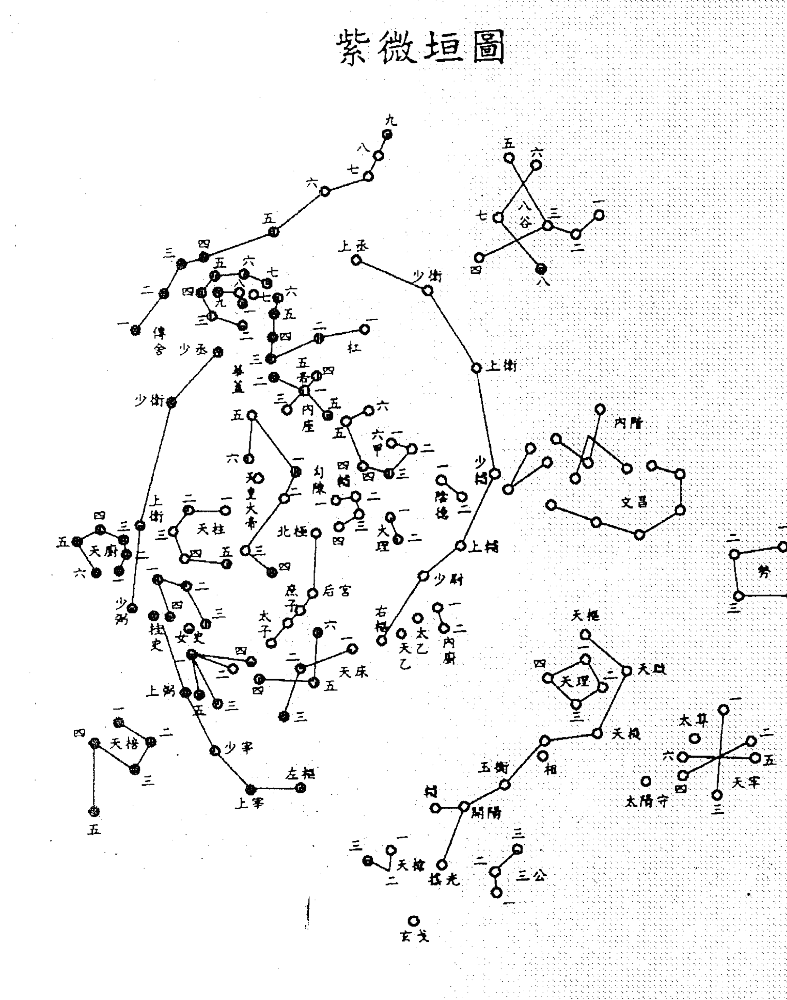

## 第二章 太微垣

太微之變兩藩有芒及動搖，諸侯有謀，執法移刑罰尤急，五星入太微執道吉，其所犯中座成形入犯乘守皆爲天子所誅，若有罪皆以其宮名之，五星留之皆爲大臣有憂，若色潤白入之則有赦。月犯太微中，貴者失勢亦爲反臣強，四夷兵盛有奸人來聽候，天下喜乃未之地，有赦或爲大變。火則有逆賊，宮中不安，歲饑。又爲宮守三旬必有赦。

土入，有德令，大人憂，其下亡地，久留七十日君尤亡。犯則女主執政。金入，大臣相殺，其地有憂，宮庭防兵，邪臣伏誅，主自將兵或遷尉丞相禦史顯。若庚子日順入之，天子所使也，入則凌犯留守亦爲水喪，水星見之，人君當之又爲亂，後宮有災或大水。

客星出，令有奇，一爲兵喪。中犯乘守四輔，君臣失禮，輔臣誅。執法其官誅有罪。

流星出入，臣有外事出，天庭之內天子使也，皆以所之之野命其方入，使復命也，出南門其眾貴人殺。流星出則兵起外國當有急使，縱橫行太微中，臣強、四夷不制。奔者出，王者惡之，入則其地亂。青氣起五帝座出南門者，人君動搖不安，而入之，天子憂。若劍直指則因兵而驚。黃白入者，若起有光，天子有喜，延年益壽。赤黑如蛟蛇又若龍形入之，有叛臣及喪亂，赤黑潤澤入之或狀如帚黃白，如杯碗，如獸，皆同紫宮占又掖門之。占青白蒼白入及黑氣入之尤喪事，赤則內兵起，黑乃大人憂；氣之出，兵起將憂。黃白，有德令。

兩藩兩星東西列，其西星爲右執法，其東星爲左執法、廷尉、尚書之象。兩執法之間，太微，天廷端門也。右執法西間爲右掖門，左執法之東爲左掖門。帝有四部將軍相有十。尊之所尊貴者，爲上將相，不以廷尉尚書爲例。

太微西藩，將執威，誅不順。東蕃，相執美，拒侯王。太微權政所在。太微爲天廷，理法平辭，監升授德，列宿受符，諸神專節，舒情稽疑也。南蕃兩星，東星爲左執法，廷尉之象也；西星爲右執法，禦史大夫之象也。執法所以舉刺奸者，兩星之掖南端門也，左執法之東掖門也。右執法之西右掖門也。

天廷微序，五統三立，法式成章。匡衛星爲蕃臣，西星將位，東星爲相位，中執法，南兩星端門，旁左右掖門，五諸侯王。

## * 奇門星相絕學 *

桓溫入蜀，聞有善星者，後有大志，遂致之，夜獨執其手於星下，問國社之修短。星人曰：太微、紫微、文昌三宮氣候如此。決無憂患，五十年外不論耳。溫不悅，遺絹一匹，錢五千。星人詣習鑿齒曰：受旨自裁，乞命為標揭棺木。鑿齒問其故。星人曰：賜絹令我自絰，一乞錢買棺，故知之耳。鑿齒曰：君幾誤死。君亦知星術有不覆之又乎？絹以戲君，錢供資糧，是聽君去耳。以此言詣溫，溫嘆曰：君三十年看儒書，不如一詣習主簿。

太微垣星名：

- 1、謁者1
- 2、三公內座3
- 3、九卿內座3
- 4、內五諸侯5
- 5、五帝座5
- 6、軒屏4
- 7、太子1
- 8、從官1
- 9、幸臣1
- 10、郎位15
- 11、郎將1
- 12、常陳7
- 13、虎賁1
- 14、三台6
- 15、少微4
- 16、長垣4
- 17、靈台3
- 18、明堂3

方位：

太微垣兩蕃相距入宿，上相六十五度半入十二度，次相七十二度半入三度，上將八十度入四度。次將七十五度入一度。右執法八十四度入十一度半。入皆是翼宿。其東左執法八十六度入半，上相八十七度入一度，次相八十一度半入一十度，次將七十四度半入十二度半，上將六十八度入十四度，皆入軫也。

步天歌：

> 上元天庭太微宮，昭昭列象布蒼穹。
> 端門只是門之中，左右執法門西東。
> 門左皇衣一謁者，依次即是烏三公。
> 三黑九卿公背旁，五黑諸侯卿後行。
> 四個門西主軒屏，五帝內座於中正。
> 幸臣太子並從官，烏列帝後從東定。
> 郎將虎賁居左右，常陳郎位居其後。
> 常陳七星不相誤，郎位陳東一十五。
> 兩面宮垣十星布，左右執法是其數。
> 宮外明堂布政宮，三個靈台侯雲雨。
> 少微四星西南隅，長垣雙雙微西居。
> 北門西外接三台，與垣相對無兵災。

釋意：

太微垣在紫微垣下的東北腳。

五帝座是太微垣的中心。五帝座有五顆星，中爲黃帝樞紐，東爲蒼帝靈威仰，南爲赤帝赤熛怒，西爲白帝白招炬，北爲黑帝葉光紀。

圍繞五帝的有太子、從官、幸臣、五諸侯、九卿、郎將、郎位、謁者等。外國有兩道屏藩，各有五星。東藩、兩藩中的左右執法之間稱爲端門。兩藩外北有常陳三台，西北有少微，西南有長理、靈台、明堂。太微垣爲天帝的南宮，主管法律、武備一類事。

五帝座要明亮有光，則天子得天地之靈心；反之則天子將失位。

五諸侯五星光明潤澤爲上，若某星暗枯無光，則爲某方有災變或誅戮或流亡。若五星動搖不定，則爲地方官專擅，威逼朝廷。

少微由處士、議士、博士、大夫四星組成。四星大而黃潤，就有賢人得以提拔。若暗，反之。如果五星冒犯，則爲處士處於憂患之中，朝中要更換宰相。

三台又名泰階，分上、中、下階，故名三台。每階有二星。上階的上星爲男主，下星爲女主；中階的上星爲諸侯三公，下星爲卿大夫；下階的上星爲士，下星爲庶人。三階平則陰陽調合，風調雨順，天下太平。不平則天下逆反，戰爭頻起。若大興土木、修造樓台苑囿，勞民傷財，天怒人怨，會引起上階兩星坼壞。

太微者，天關也。南門關千裏，分爲左右掖。太微之宮，天子之廷。上帝之治，五帝之座也。太微爲五帝之廷。名保舍，十二諸侯之府。其外蕃，九卿也。軒轅爲權，太微爲衡。

太微者，主朱鳥也。大風之鄉。太微天廷，帝以紀錄出圖，五星並設神靈集謀，故罷將相輔佐、執法、郎位、少微以議疑。太微，天子常侍，土宮也。太微，天子之宮。

西藩四星南北列，南端第一星爲上將，北間爲太陽西門。門北二星爲次將，北間爲中華西門。門北三星爲次相，北間爲太陰西門。北端四星爲上相，此爲四輔也。

東藩四星南北列，南端第一星爲上相，北間爲太陽東門。門北二星爲次相，北間爲中華東門。門北二星爲次將，北間爲太陰東門。北端四星爲上將，亦爲四輔也。

### 第一節 謁者

方位：謁者去極八十三度入軫一度。
謁者一星，在左執法北，主贊謁之官也。
明如常則四夷來進貢，不明無失則外國不來。
提示：星明如常則國際關係較好，互訪互問則禮上往來之象。

### 第二節 三公內座

方位：三公距東星去極八十四度半入軫六度。
三公內座三星在謁者東北，朝會宴私之所也。
占與紫宮三公同，五星抵觸凌守犯之，三公下獄或黜。流星犯之則相憂。
提示：其座為中上層或高層領導聚會飲宴之所。星明奢貪，暗則清廉。

### 第三節 九卿內座

方位：九卿距西南星去極七十五度入軫七度。
九卿內座三星在三公北。此為贊謁者諸侯。占同天紀。流星犯之，內座王者憂亦為病。
提示：星明多有高官厚祿收。

### 第四節 內五諸侯

方位：內五諸侯距西星去極七十度入軫一度。
內五諸侯五星，在九卿西。五諸侯衛國，故列在帝庭。五諸侯主刺奸。闢雍之禮得穆穆，皇皇和服則太微諸侯明也。
星明則吉，暗亡則諸侯出。若禮樂盛明則太微諸侯明。
彗孛冒犯守，諸侯誅，流星入之，宰相入。
提示：將軍、司令、大內侍衛之類的武將對應五諸侯。
訣：明吉兵精武器良，暗亡則有事沮喪。

### 第五節 五帝座

方位：五帝座距中央大星去極七十一度入翼十一度。

五帝座五星。天子出入動止，合天從容，中道則帝座光明。占在人君，明吉暗凶。

五星彗孛流冒犯帝座，皆爲大人憂，若五星入黃帝座，色白有赦。客星犯，臣有誅。至帝座而還，謀不成反受其殃。若蒼白色抵之則爲憂喪事。抵座旁，臣叛。客舍五帝有德者昌，抵之青赤，近臣圖議，氣不明則不成。蒼白赤如劍，天子諸侯以兵驚。黑而止不去則大人憂。

氣之出，氣黃氣出太子入帝座，有子孫喜。赤黑如蛇及龍形入太微垣則有白衣會。氣上赤下白如大井口並從外入者，邪臣之氣，氣直者爲貴臣之氣。赤而出之經南門者人君憂。

提示：

- 1、五帝座王者實權之象，統領四方，臨制中央。
- 2、眾臣相之諫直接與五帝座發生關係，是最高的權力機關。

### 第六節 軒屏

方位：軒屏距西南星去極八十度入翼十度。

軒屏四星。若臣下恭恪，尊嚴君上則屏星光明潤澤乃國法平允。暗則法令不正。

月五星冒犯乘守皆爲上下失禮而輔臣退，及金火守之則有兵在中。彗孛出犯，守衛，臣有罪，執法者當之。流星抵則尚書有憂。

訣：軒屏近身護位行，下臣尊上星奕明。五星冒犯皆無禮，彗孛流抵執法立。

### 第七節 太子

方位：太子去極六十六度半入翼十一度半。

太子一星在帝座北。太子星明澤則太子仁賢。彗孛客流冒犯及星亡，金火冒犯不廢則有謀。雲氣入之黃白喜黑則憂。

訣：帝座輪流觀選名，明澤得賢繼有成。失色冒犯位難衡，雲氣出入觀憂喜。

### 第八節 從官

方位：從官去極六十四半，入翼八度半。
從官一星，在太子西北。從官，侍衛之臣也。從官常陳，五署列居。星不見則帝不安，如常則吉。
訣：不見此星帝有慌，常陳署列外交善。
侍衛之星從官數，出謀劃策星如常。

### 第九節 幸臣

方位：幸臣去極六十四度半入翼十五度危。
幸臣一星，其星在帝座東北。太子幸臣，侍座後聚。
微暗則吉，明盛則幸臣用事。青赤氣出五帝下，入幸臣中，則近臣用謀，氣不明者不成，明則為亂。
提示：幸臣為親近君王的近臣。
訣：侍座後居暗微吉，明盛須防幸臣狂。
觀其氣數看氣入，氣明有亂謀有成。

### 第十節 郎位

方位：郎位距西南星去極六十度入軫初度。
郎位十五星，其星均明光潤常則吉。明盛色怒則大臣為亂。微暗則兵弱，幸臣災。不見則後妃凶，動則天子出行。
客彗孛冒犯，臣失勢。客星入之則憂，大臣有亂。蒼白出之郎官多死。諸彗枉矢出之，郎官謀叛。
流星犯之大臣憂。月氣入皆占其中郎，蒼白為亂。黃白潤受賜，黑為多死。赤氣入之則兵起，出之，多用兵遠出行。
提示：為王者的侍從官，有建議、陪同、顧問之職責。

### 第十一節 郎將

方位：郎將去極四十七度半，入軫十一度。
郎將一星。守常為是，盛大動搖芒角則將恣。
客彗孛冒犯，郎將死。流星則有憂。
提示：為王者的侍從官員的頭領，有參議、陪同、訪問之責。

### 第十二節 常陳

方位：常陳距東星去極五十一度半入軫初度。
常陳七星。星明則武士用，動搖則天子行。客星犯則王者行誅。
提示：常陳爲武官之輔，武警部隊之引申。

### 第十三節 虎賁

方位：虎賁去極六十二度少，入翼二度。
虎賁一星。其星在下台南。虎賁，士以虎皮爲冠，示威猛也。虎賁四騎室。
提示：指爲勇猛善戰的武士之象。

### 第十四節 三台

方位：
三台上台距西北星去極三十九度半入柳二度。
中台距西北星去極四十三度入張二度。
下台距西北星去極五十二度入翼二度。
三台六星。三台又爲泰階，分上、中、下三階爲天子三階也。上階上星爲男主，下星爲女主。中階上星爲諸侯、三公，下星爲卿、大夫。下階上星爲士，下星爲庶民。所以和陰陽而理萬物。
三台大間中相距十六度爲平，過爲太減，爲損。小間中相距半度爲平，過爲奢減，爲迫。
知三能者，使人不病癘。夫妻俱視三能，使人離。三能雖尊，臣之位也。
三台爲天階，太一躡以上下。三能在前，參稽正緒。魁六下星，兩兩而北，爲三能，主德聞宣符也。三能者，三公之位也，諸侯農人也，又名爲天柱，太一之舍道也，文昌之庭也，在下爲天奇。西近文昌二星，名上台，爲司命、太尉，爲孟，主壽。次二星爲中台，爲司仲、司徒，爲仲，主宗室。東二星爲下台，爲司祿、司空，爲季，主兵、爵祿。
上台上星主兗、豫，下星主荊、揚。中台上星主梁、雍，下星主冀州。下台上星主青州，下星主徐州。星非其故，以占其邦。

## * 奇門星相絕學 *

三能，天子六階，爲土宮也；三能主爵，爲天倉也；三能爲三衡，天庭也。司命、司仲、司祿，天子定見安危之府也，萬民壽之主也。司命、司仲、司祿星色青黑，則天下多憂。司仲主宗室，間六尺，主亂政急，骨肉疏遠，宗室不和，人君不安，兵起。

上能不具，春不得耕；中能不具，夏不得芸；不能不具，秋不得獲。

三能橫通，天下嘿嘿，後十二年，山大崩，亡主之符也。中能垂，公輔謀。天能有變，厥爲災，土淪山崩谷溜滿川枯。王者得禮之制，不傷財，不害民，君臣和，草棍蟲各蒙正性，則三台齊明。不闊不狹如其度。（君臣制度，宮室車旗多少各有科品，則應之也。）

殯喪之禮各以其時，變制革禮之差得制之宜，三台平正，有德星出入其間矣。三公擅恣非其人，則山崩，三台移，鼎折足。

三能色齊，君臣和，不齊大乖；三能色亂，天子不賢；三台色明行列，齊等相類，則君臣和吉而治臻；三台色黃，天下謀德；三台色赤謀兵，色黑有憂，色白爲喪，爲疾；三台不直，天下失謀；三能流相抵者，諸侯爲亂，天子不見，有亡王，以其日占其國。司仲星坼搖若合則赦。司祿星其坼者，凶，主者當之。

三能星搖動，皆爲有謀。三能之上星疏者，變從上家起；中星疏者，變從中家起；下星疏者，變從下家起。所謂變起者，反逆之事。司命、司仲、司祿星欲其赤黃，萬民奮壯，所爲數利。

三能一疏一數，宗廟咎責，亡孝悌仁義也。五府不順，此三公之過也。三能不齊等，三公不相信。三能色不齊，君臣奔走，黑爲喪。三能黃澤有光，民安壽。

司命、司仲、司祿欲大淳而澤，天子多推恩。三台六星三公位，其色齊明德洋溢。

上台之占，人君剛烈好兵，天後殺嗣，則上階上星其色赤。循宮廣囿，肆其聲色，則上階下星奢而橫。君道弱而誅，伐不行則迫近，星下而色暗。臣朋比嫡，庶亂則下星色白。後妃任讒言用，則其色白，舍而橫。若恃寵敵政則星高而開，其色赤。若綱紀不正，殘斂而刑，輕則謂之賤縱恣，崇台相奪，農時力侵則謂之奢。

中台之占，若公侯判亂則上星色赤。夷狄侵邊，內外動搖，則下星疏而橫，色白。若卿大夫廢正向邪，作奸營私則下星垂而疏，色赤黃潤。上附下，與眾同位則其星迫而下，色白。若諸侯朝貢有禮，公卿盡忠則謂之比。強盛而僭，專恣而僭，則謂之疏。

下台之占，若民不從令，犯刑爲賊，則上星色黑。棄本就末則下星暗而橫其色白。若從令聽從則星迫下而色白。若庶人順化闔門和睦，賦斂順時謂之密。去本逐末，豪猾相凌謂之闊。其戚比密參者皆相近也。奢疏闊三者皆移徙也。

三階之占，平則陰陽和風雨順，五穀豐，禎祥應，天下太平，不平則反是。星明則潤行列齊等，如其常則若臣和而政令行，變動外齊則君臣不和，治衰。動搖則有逆謀。一星去天下危；二星去天下亂；三星去，天下不治。

月冒犯，君有憂，大臣相攻，公侯多叛。金火守犯兵大起。客星出守，大臣黜，貴人病死。

彗孛出之，陰謀奸宄起，宮中火災。守則三公亡黜。流星入之，有兵，大將憂。若抵上台，人主惡之。中台，氣之入蒼白，三公黜，民多敗傷。赤，將相驚，臣有謀。黃則將相喜。黃白潤澤則民安居。青黑將相死。

提示：

- 1、三台分上階、中階、下階三台，是全社會階層晴雨表，每個階層都有相應之星來對應。
- 2、這種次第的尊卑之分使得其星間距，不能太狹也不能太闊。

### 第十五節 少微

方位：少微距東去極六十五度半，入張十五度。

少微四星，分別爲：處士、博士、義士、大夫也。南端第一星主真人、老子、許由也。第二星處士，孔子也。第三星工士，奚仲、魯班也。第四星術士，定鐘律，師曠也。

少微，士大夫位也。一爲處士，水官也。少微伏戲之廷，天子副主或名博士官，又爲主衛、掖衛。少微主藝能之士，若聞如孔子、巧如魯班，道術之士蕃皆主之。

少微星明而行列，王者任賢良，舉隱逸才用，天下安；其不明，微而不見，賢良不出，術士潛藏，人主不安。大夫專權，則兵陵地坼。少微星非其故，女主有憂。處士明，王命興，輔佐出。少微星近太微，若一星獨前入太微西門，胡主有謀賊關。少微四星逸士位也。
少微星明大而光潤則賢人舉，忠臣用；星微小則賢士退而忠臣廢。
月五星犯守，處士憂，女後憂，宰相史官黜。
月犯之又以所主官爲憂。客彗孛犯，賢能及功臣有咎。流星出入抵賢者進道術與，蒼白入，賢士憂，大臣遭黜。
訣：少微四星逸士名，明大光潤忠臣用。
黃潤有澤王者興，輔佐之臣始有終。

### 第十六節 長垣

方位：長垣距南星去極七十六度，入張十四度。
長垣四星。在少微西南北列。長垣在七星北，南星亦在太微西六七尺。長垣主界域。長垣四星，城邑相包。
長垣動搖夷狄犯邊疆，火冒犯，中國憂。金冒犯，則九卿有謀或邊將叛。
客彗孛則狄人入寇。
流星入之亦然，出則狄出。
訣：觀星以視邊境界，江域城堡觀微妙。

### 第十七節 靈台

方位：靈台距南星去極八十度半，入翼初度。
靈台三星在明堂西，觀侯之所也。靈台考符，居南密微。
五星冒犯，術士、大使官災。
流星出之，賢者用，青黑色，賢者術士死。
訣：靈台通靈術士昌，星微色暗賢術亡。
事遇靈台有佑助，德行廣布安江渡。

### 第十八節 明堂

方位：明堂距西南星去極九十度，入翼四度半。
明堂三星，在太微西南角外。明堂顯化，常盡孝慈。
明吉暗凶。土星、客彗孛冒犯守之，人主不安其宮。
訣：明吉暗凶孝慈星，星若犯守宅內驚。

## 太微垣圖

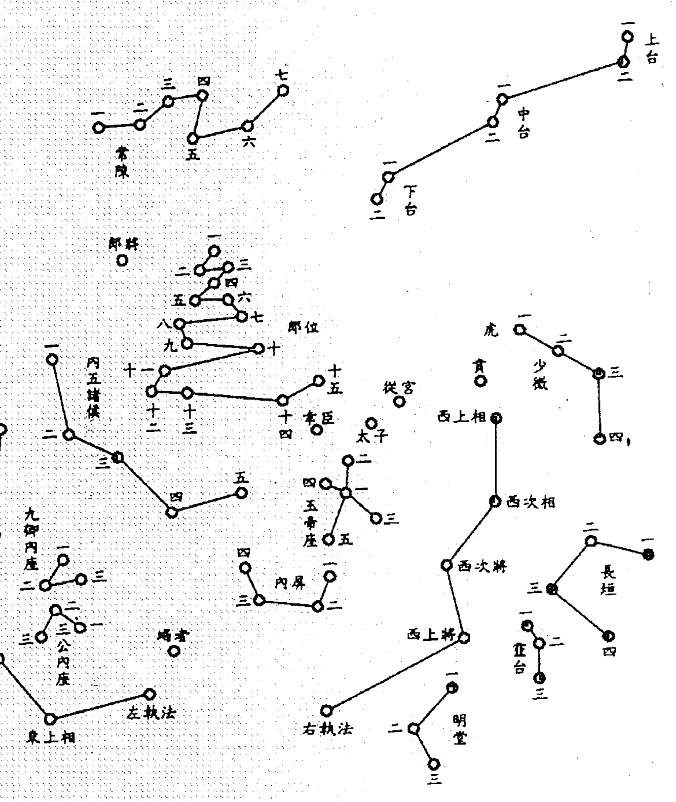

## 第三章 天市垣

天市垣又名天府，長城。天市，五帝之治水宮也。天市主聚眾，主權衡。天市西北大星南方相距三尺所，爲天曹。市者，四方所樂。帝都之邦，主王之座，故帝座在市中，聖主明侯也。天市之垣，天子之旗幟也。

王者於族人有次序，則天市正明。天市星明則市吏逼迫，商人無利。星微小則吏弱，商人多利；天市中星眾而明則歲實。天市中星稀而不明則歲虛，五穀傷，市谷大貴，人民饑；天市中星次，其明潤澤，眾蕃，可以積貯；天市中星稀少而不明可以發出積貯；天市星欲明大則谷賤；天市中多小星，民富足。

月犯乘之，改正有更弊之令，將死，粟貴。入及有變於市中，女後凶，將相憂，近臣有謀；五星入則兵火起，將相憂。入若守之，又爲市驚。赤爲更甚之；木守之米貴或賤；土同火則慘不忠之臣於市；金則兵起；水乃蠻夷居，死。

彗孛冒犯所起者誅。彗孛出之，徙市易都。守之五穀大貴。入則豪傑起。

客星出，有喪。入則，大臣誅。守則度量不平。

流星出而入中天諸座，前列入濁，天欲有赦、賞賜事，倉庫盈溢，五穀豐，君喜。犯之主憂。若入而色蒼白，萬物貴，赤色則有大災。氣之出入。蒼白入，奮夫過，賤人有憂。黑則市壞，奮夫死。蒼黑萬物賤。赤而出之，弓弩貴，入之斧鉞用。若如波者，市有火災；黃白而入則萬物賤，若一如匹繒或匹帛常集天市中，有神奇物入，天子喜。出則有神奇物出。

天市垣星數：

- 1、帝座1
- 2、侯星1
- 3、宦者4
- 4、宗正2
- 5、宗人4
- 6、宗星2
- 7、市樓6
- 8、車肆2
- 9、斛4
- 10、斗5
- 11、列肆2
- 12、帛度2
- 13、屠肆2
- 14、天紀9
- 15、女床3
- 16、貫索9
- 17、七公7。

方位：西垣秦七十六度入十二度半。蜀八十度半入十五度皆氐宿。週七十一度半入初度。巴八十三度入一度。鄭七十一度入三度皆房宿。梁九十三度入初度。晉六十八度半入一度。楚一十一度入一度。河間一十八度入二度。韓九十八度半入五度，皆心宿。河中六十六度半入二度。

東垣宋一百五度半入七度半。魏六十二度半入十二度。南海一百六度入十四度。趙六十三度半入十六度皆入尾宿。九河六十二度半入半度。燕一百度入一度半。中山六十二度入半度。東海九十三度半入七度半皆入箕宿。齊七十度入五度。徐八十七度半入六度。吳越七十八度入九度皆入斗宿。

步天歌：

> 下元一宮名天市，二扇垣牆二十二。
> 當門六個黑市樓，門左兩星是車肆。
> 兩個宗正四宗人，宗星一雙亦依次。
> 帛度兩星屠肆前，侯星還在帝座邊。
> 帝座一星常光明，四個微茫官者星。
> 以次兩星名列肆，斗斛帝前依其次。
> 斗是五星斛是四，垣北九個貫索星，
> 索口橫著七公成，天紀恰似七公形。
> 數著分明多兩星，紀北三星名女床，
> 此座還依織女旁，三元之象無相侵，
> 二十八宿隨其陰，水火土木並與金。

釋意：

天市垣在紫微垣的東南腳。
天市垣的中心是帝座。帝座四周有宦者，侯、宗正、宗人、列肆、車肆、市樓、宗、屠肆、帛度、斗斛等。
宦者是太監。宗正是大夫。大夫，是皇族中執政的成員。宗人是與王同宗的貴族。列肆是出售珍寶玉器的市場。車肆是出售各種物品的集市。市樓是主管市場價格、法規、貨幣流通的場所。帛度即尺度。斗是量酒的量器。斛是量谷米之類的量具。
兩旁是各有十一星組成的屏藩，主四方邊國，其二十二星亦為外臣。門左星宋也，次星衛也，次星燕，次星東海，次星徐，次星太山，次星齊，次星河中，次星九河，次星趙，次星魏，次星中山，次星河間。市門右一星韓，次星楚、次星梁、次星巴、次星蜀、次星秦，次星國，次星鄭，次星晉也。其星光芒，即其國有謀也。若星色微小，其國

## ※ 奇門星相絕學 ※

邑弱，王者修德以扶之。

### 第一節 帝座

方位：帝座去極七十五度入尾十度。
帝座一星。帝座，天庭也，人主象也。帝座，天位也。天之貴神也，執陰陽之銳，秉殺生之府，總萬化之源。保存亡之機，和陰陽之氣，應四時之分。帝座一星尊時行。
帝座星色欲明，光而潤澤，則天子吉，威令行。微小則凶。星亡則王者憂，大人當亡，天下亂，有兵起，期二年。
月犯之則王者憂。五星冒犯，下謀叛，金火尤甚。
客星入留，貴人改，易政令。守之爲大亂。
彗孛冒犯，人民亂，宮廟徙，大臣憂。
流星抵之，諸侯起兵，臣有謀，或貴人更令。
訣：帝座之星據國情，明澤尊時行威令。

### 第二節 侯星

方位：侯星去極七十八度半，入尾十六度。
侯星一星。侯星，土官也。侯星以候陰陽，伺遠國，夷狄以知謀徵。侯星主時變，貨財。安靜吉。侯星明，萬國同風，王道通利，輔臣強也。微小不明，則反之。星移主不安，期不出一年。若星亡，主失位，期不出年。侯星明大，則四夷開；微小則國安。
月犯之則輔臣憂。客星出之有急行。彗孛出守犯，輔臣出又爲大臣叛。
侯在東，司陰陽。
訣：侯主時變應事明，不明則移不安通。
微細居安四鄰張，月犯客出憂有急。

### 第三節 宦者

方位：宦者距西南星去極七十度半，入危九度。
宦者四星。宦者，刑餘人，在座西。宦者星常侍，黃門左右小臣，侍從之官。常侍俸帝座也。宦者，刑人也。有刑於市。
其星微吉，明凶。宦者星非其常，宦官有憂。
明盛動搖及月彗孛流冒犯，皆爲侍臣有憂。
宦者在西侍王旁。
訣：宦者侍星黃門從，明盛動搖皆有憂。
事逢宦者小人纏，陰氣連連災厄掀。

### 第四節 宗正

方位：宗正距北星去極八十五度入尾十六度。
宗正二星。小宗之象。宗政，帝宗也。宗，主也。正，政也。主萬物之名品類於市中。星非其故。帝宗後族多有黜者或多死。宗星失色，宗正有事。宗正星明大，帝宗強大。星不明則帝宗弱也。宗正二星宗大夫也。
星失色彗孛犯守，族人凶。
客流貫之，不睦宗親。客景星守，政令改。
訣：宗主之政正通明，帝宗強大多善令。
客彗流貫不睦親，倚貴傍福順事應。

### 第五節 宗人

方位：距大星去極八十度半入箕五度。
宗人四星在宗正東。宗人主先人以時祠享。宗人主恩享，大宗之象，敦穆親親。族人有序，則宗人倚之正明。
宗人星明如其故，宗室有序，人主吉昌。若動搖不如其常，則宗人不和，王者親屬有變，若宗族貴人多死者。宗人星離絕，有大怪鳥見。光耀門楣族多戶，星時有序恩澤多。客星守之，貴人出。觀此星即可觀其祖業根其。
訣：星明守常族人序，否則族親多有變。
離絕宗人多罕見，客星守之貴人軒。
宗人四星錄辛疏，子孫後福觀其度。

### 第六節 宗星

方位：宗星距北星去極八十度半，入箕五度。
宗星二星。宗星主先人祠享。宗星，宗室之象，主別親疏，皆帝輔血脉之臣也。宗星明而相近，帝相親後族有序。其星不明而相遠，則帝親後族相簡，若有謀者，王者有憂。
客星守之則不和。彗孛冒犯爲黜。
訣：宗星明近貴族親，宗室恩澤各不同。
暗離遠謀宜有變，孛逆子孫篡實權。

### 第七節 市樓

方位：市樓距東南星去極九十八度，入尾十二度。
市樓六星在市中臨箕上。市樓星，珠玉金錢府，主市價，天之市府也。市樓星陽爲金錢，陰爲珠玉。樓星臨市，斗食嗇夫。星有不備者，天子幣大亂。
星明吉，暗亡則市吏不理，乃其兵興於市，或夷兵入。動則市易殊常。欲其忽然不明，明則賦斂眾。市樓亡，天下易政，律度制令遍市樓。
火星守之，天子易弊。客彗孛守之，市門閉多亂。
提示：市樓爲商品信息流通市場。在國主政改，在民主交易買賣。在物主金錢珠寶。
訣：忽明忽暗賦稅繁，彗孛客守必多亂。
若亡不見政令遍，星有不備金融偏。

### 第八節 車肆

方位：車肆距西大星去極一百度，入尾三度。
車肆二星。在天市門左星門，爲百家肆區。車肆者，列車服之價，百品隨類區別。
星明則吉，不見車騎盡行。客彗孛，兵車騎盡廢。
訣：車騎品類車肆羅，百家肆區競相奪。
交通信息觀此星，明吉不見騎車道。
飛車疾速星高照，兩相遙距轉瞬邀。

### 第九節 斛

方位：斛距西南星去極八十六度半，入尾三度。
斛四星，在市中斗南。星明則尺量平而商人不欺，不然則反之。亡則歲饑。
木星守之，則得忠臣，陰陽平。過數不去，王者與天同人，四夷和平，五穀大豐。
提示：斗斛主穀物的稱量器皿。
訣：斛明商人尺量衡，觀星便知商賈情。
過數不距王者同，四夷和平五穀豐。

### 第十節 斗

方位：斗距東大星去極七十九度，入尾六度半。
斗五星，在宦者西南。斗者，主也，署物散也。其星明吉，不明凶。若其星亡，歲饑，覆則歲糧。又斗星不明，谷不成，歲大饑，人相食。仰則不熟。
客彗孛犯，天下大荒。
南有斗星主平量。
訣：斗主穀物收成莊，星明豐盛糧滿倉。
若失民饑暗谷傷，不明歲饑犯大荒。
事遇斗微多思詳，斤斤計較方爲良。

### 第十一節 列肆

方位：列肆距東大星去極八十六度，入心二度半。
列肆二星，在天市中斛的西北。列肆，列店也。販賣金銀珠珍。故在市南。
星明吉，暗凶。移徙則列肆不安，金入爲兵起。
訣：列肆店鋪羅列街，金玉珠寶滿堂添。

### 第十二節 帛度

方位：帛度距北星去極六十九度，少入箕三度。
帛度二星。在宗星東北。星明大則尺量平，商人不欺。不然則反是。客彗孛守之絲貴。
帛度買賣，與平者俱。
訣：帛度星平買賣興，童叟無欺尺量平。

### 第十三節 屠肆

方位：屠肆距西星去極六十八度半，入箕三度。
屠肆二星。在帛度北。屠肆烹煞，盛饌賓娛，斗食，毒夫，屠宰之肆以供待賓客相娛樂。
明大則多宰殺，細微則不利。
提示：屠肆為宰殺之場所，供廚房烹食之用。
訣：屠肆明大腥滿地，細微降禍人不利。

### 第十四節 天紀

方位：天紀距西南第一星去極五十七度，入尾初度。
天紀九星。天紀，天緯也。主正理冤訟。天紀星以表九州，定圖位。天紀星主曆、音、律。
其星齊明，王法正直，無有偏黨，天下綱紀，無冤訟。暗則政亂；天紀星敗絕，山崩、易政、有餓民、君不安，天下大亂，主凶；亡則政理壞；天紀星與女床合，若失政禮，王者妻、姑姨以淫亡，或女謁失位；紀星散絕，不山崩則主死；散則民餓喪，就而明主多憂；紀星弛散，則國綱紀亂；紀星入漢中，人相食。
客星犯之政亂，大臣黜或死。守之民餓，居不安，訟獄不理。彗孛冒犯，相有咎或地震。
訣：天紀九星理冤訟，齊明綱紀政法平。
紀星弛散綱紀亂，彗孛犯者地動驚。
天紀不明人心渙，客守民餓居不安。

### 第十五節 女床

方位：女床距西星去極五十二度半，入尾十四度。
女床三星，在天紀北。女床，後宮禦也，眾妾所居的宮。侍皇后，隨從以時禦見者。女床主女事，行列微靖吉，亂明動不吉；其星欲明，大小相承，如其故，則後妃安，宮人吉。星若微小不明，非其常處，嬪妾不安，其宮有憂；女星舒則更代，女後不久死；女床星無故不見，女子多疾。女床三星持後宮。
客彗孛守之，宮人有謀。氣之占在後宮，黑白皆死喪。青爲病，黃有福善。
訣：女床三星妾居宮，大小相承紅顏弄。
非常居處妾不寧，家居夜噪難安寢。

### 第十六節 貫索

方位：貫索距西南大星去極六十度半，入氐三度半。
貫索九星，在七公前。由九顆星組成，又名連營、天圉、天受。貫索主天牢，禁強暴、賊人之牢也，是管轄賊人的處所。貫索主天下獄律也，爲速獄之法律也。貫索主天子疾疾憂患。
牢口有一星，是爲門。常以四時候天牢，其口星開披，天下赦；不赦爲逆，人主憂。天牢中央大星，牢監也，左右徙倚，不居其處，若不見，則大赦十八日。貫索北開，名爲牢戶，其間闊則戶開，必有赦。若星狹而不開，牢中有憂，貴人當之。貫索直而抵織女，天下有急、布帛之征。貫索星戶開左，若星入牢中，有貴人。自索守者不復，必凶，兵死。天牢直若角，則有赦，以丑未日候之。天牢口所向開門者，兵所往，期六月。貫索入漢中，人相食，兵起。
貫索九星全現，爲國家之刑獄清簡。若星燦動搖，就爲殺僇嚴重。若中部星虛不現而空則爲改元，不行德令，天雨沙石，期三年，赤則帝行德。貫索與國家法令的寬嚴有關，是觀測普通百姓命運的晴雨表。
天牢，日常有繁星三，以甲子、丙子、戊子、庚子、壬子暮視之，其一星去，有善事；二星去，有賜令爵祿之事；三星盡去，人主德令赦天下。甲子期八十一日，丙子期七十二日，戊子期六十日，庚子期八十日，壬子期六十二日而赦。
天牢中多星，則囚多，九星則天下獄煩，八星則奸人入，七星則少赦，六星五星則大赦，無星則天下無罪人，其國安。天牢斧鑢動搖，非其故，斧鑢用。
水星犯有水災米貴。客彗孛冒犯守之爲赦。客星出之亦赦，或其下亡地。入則有枉死者。彗星見，豪傑起，諸侯相殘。
流星出紫微而入之，以赦應之。流星丑未日出，天下赦。氣之入，蒼白，憂，亡地，赤兵，黃白喜，黑則獄多枉死。
提示：貫索為賊人之牢。敗者為賊也。
訣：貫索天牢賊人地，最喜三星相繼去。
君德大恩澤民基，開吉閉凶獄難避。

### 第十七節 七公

方位：七公距西星去極四十四度半，入氐初度。
七公七星，在招搖東。又名，七紀。七公主議疑，天之輔助，七政之象，評議之臣。七政別善惡，左輔、右弼前，主疑。其後則丞之官平議，疑獄斷擇，刑法欲詳審也。其星大而齊明，議人有忠，王者安；其大小無差，微而不明，議者不同，決事不從，人主有憂。
七公，天子相也，三公，廷尉之象。七公為七輔，上星上公，次星次公，下星下公。各以其次第齊明，輔臣居其常職；其星不明，各以其次，輔臣有黜，若有罪，期不出年。
星小而明則國吉，大而明輔臣強，若大而動則朝廷有兵，齊正則法平，若戾則獄多冤，連貫索則天下亂，入河中則民饑。
金火守犯，兵起。彗孛冒犯守，大臣下獄或黜。
流星出之主將黜。
提示：
- 1、七公主持議七政之事，是天子的重要輔臣。
- 2、七公齊明方吉，大小不一為七公政不齊，則國政易亂。
訣：七公七星議政詳，國運昌吉明政向。
星明國吉輔佐強，暗昧暴戾冤獄殃。

## 天市垣圖

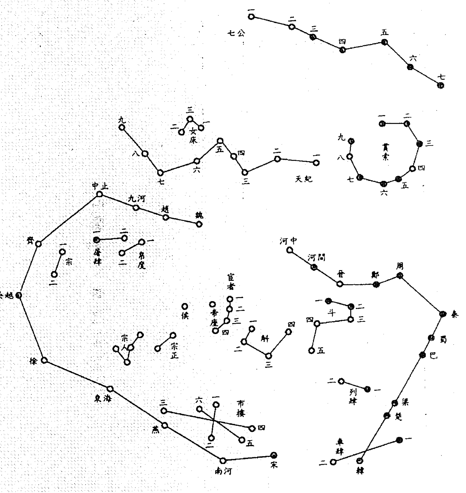

## 第四部 二十八星宿

## 第一章 東方青龍七宿

## 東方青龍圖

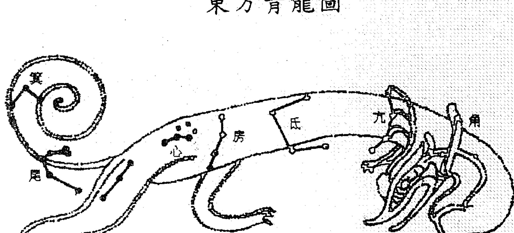

列宿二十八，是日月五星之所由，吉凶之所兆。皆始於角而終於軫。
東方青龍七宿：角、亢、氐、房、心、尾、箕。角爲龍角，亢爲龍頸，氐、房爲胸腹，心爲心臟，尾箕爲龍尾。

## 第一節 角宿

星數：1、角2 2、平道2 3、天田2 4、周鼎3 5、進賢1 6、天門2 7、平星2 8、庫樓10五柱15衡4 9、南門2。
方位：角宿去極九十七度半系南星。
步天歌：
> 角星南北正直著，中有平道上天田，
總是黑星兩相連，別有一鳥名進賢，
平道右畔獨淵然，最上三星周鼎形，
角下天門左平星，雙雙橫於庫樓上，
庫樓十星屈曲明，樓中五柱十五星，
三三相似如鼎形，其中四星別名衡，
南門樓外兩星橫，此爲九天南端門。

釋意：
角由兩星組成，上小下大，如角，主刑法。角間有兩星，名平道，是掃平道路之官。平道西面一星，名進賢，主卿相推舉賢能。角北面二星，名天田，是天子的籍田，當它們晨現於東方時，就開始春耕。天田以北有周鼎。角南面二星，名天門，是朝聘待士的處所。再往南二星，名平，主執法平刑。再往南十星爲庫樓，其中有四星是庫樓的衡。庫樓中有五柱，是樓的支柱。庫樓外有兩星，爲南門。庫樓是藏兵器的處所。

### 一、角

角二星，天關也；其間，天門也；其內，天庭也。故黃道經中日月五星之所行也。角主兵，又名維首、天陳、天相。左角爲天田，爲獄、爲理、主刑。南三度爲太陽道。右角爲尉，爲將，爲兵，北三度名太陰道。右角蓋天之三門，猶房之四表。萬理之所由，禍福之源始也。故三光軌道從之則吉，沖犯、干擾、抵觸則凶。
角，金星，春夏爲木，秋冬爲金。兩角之間是中道。角又名天田，天根也。角者，天之府庭也。天門者，左右角之間，天道之所治也。陽升之所，升也，臣之象也。右角爲天庭，左角爲天田。角亢秋獄，角爲龍角。
角山與亢山相連在韓金門山中，山神常居其上。君臣和同，山星無異。麒麟、鳳皇、芝草、酒泉四時降矣。
視兩角星明，王道大治。其星微小不明，王道失政，輔臣不言。角星左蒼右角。黃正也爲吉，其色白爲凶。王者，大行百八十日，災應遠不出一年二年。
角星明而潤澤，朝臣有次第；兩角微小而不明，天下有兵；錯亂角垂芒則德令不行；角星明大則王道太平；角爲天將之官，兩角之間，三光之道也，出太陽道，多旱；出太陰道，多雨，有陰謀，南三尺，獄理多冤；左角赤明則天下太平。
日月五星，天之三明。皆從角所行，行陽道，道其陽，不從其行，歲入水，有兵。二十八宿皆同。角星明大潤澤，賢者在朝廷，蒼帝德行，天門爲開。角主兵，動內五寸，國中兵起；動外五寸，邊兵起；左右動搖，非其常，人主憂，臣殺君。各以日占。
木星犯之多疫。守則攻急，臣僇，歲饑；火星犯之，有兵及赦，貴人有憂。居而環繞勾已有芒如劍刃行幸守則爲戰，宮中防盜賊，讒臣進，政急帛貴。
土星守，後喜，谷傷。潤澤則爲歲豐。犯之亦爲有不臣，犯守亦爲兵火。金星犯守，天下大戰，道路不通；木星守之，萬物不成，刑急，水災。久守爲大水，芒守之色青憂，赤旱，白喪，黑水。
客星守犯，大旱，有赦，富民貧，獄多；彗孛冒犯兩角間色白有喪起，不戰。色赤則戰，所至有破軍侵城；彗孛出之大亂，王者惡之，後黨恣，亦爲亂，饑。
流星出入兩角間皆爲大使出入。若抵而角不動，臣欲而僇死。氣之青皆憂，疾赤，國驚有戰。黃則貴人親祠，白戰不勝，黑入右角亦然。氣如刀劍出角間，宮禁有陰謀變患。
訣：角星明大王道平，潤澤賢者輔朝廷。
五星犯守惡災跡，禍福之源萬理基。

### 二、平道

方位：平道距西星去極九十一度，入角一度。
平道二星。在左右角間。平道，主治道之宮也。
明正吉，動搖戒不祭。木星守，天下治，隱士升。火守之，天下饑。客彗孛犯守之，車駕行。客守之，又爲賢人退。
平道除道，塗轍宣輸。
提示：平道指主管治理交通的官員。
訣：明吉正道礙途掃，四通八達通州行。
客守賢退木守隱，各有不測起風雲。

### 三、天田

方位：天田距西星去極八十三度半，入角二度。
天田二星，在右角北。天田處界，縣邑正邪。
木星守歲豐，犯則人相食。火則大旱，金守谷傷，兵出。水守有水災。客星出入蝗蟲旱。
訣：天田正邪兩邊界，偏斜出入皆為殃。
此星須靜光柔明，稍有差錯進獄門。
守得雲開見天晴，登堂入室天中門。

### 四、周鼎

方位：周鼎距東北星去極六十四度半。
周鼎三星在攝提西。天鼎主流亡。明則國安，不見動搖就聚則移國。
周鼎，天鼎也；周鼎，酒樽，二具缶壺。周鼎三角如鼎，為盛酒的器皿。

### 五、進賢

方位：進賢去極九十一度，入軫十四度。
進賢一星在平道西。進賢，卿相舉逸命才。進賢鄉里庠序選。明則賢人在朝，不明則不肖者用。
五星冒犯賢者罪死，流星有出入，則夷人來國，用賢。青黑色則文士死。
訣：進賢星明廣納賢，能人賢才競出色。
星暗亡失賢宜隱，出頭險招殺身禍。
流星出入貴人助，合作往來舞翩翩。

### 六、天門

方位：天門距西星去極一百四度半，入軫十六度。
天門二星在左角南。明則萬物歸化。不見及火舍而進退。若犯入而去復還皆兵至，關梁不通。火守遇上失禮。金舍人主慎出入。
天門待客，應對無疑。
訣：天門開明國門昌，高層領導之關要。
事逢天門星齊明，貴人相幫力無痕。

### 七、平星

方位：平星距西星去極一百九度半，入軫十六度。
平星二星，在庫樓北，平星主法。平星欲其明而正直，大小齊同而明則君臣和，政令行。其星不明則差戾不正，君臣不和，政法荒亂。平星欲齊等，廣狹有常，高下不差，則天下治，萬物成。平星差則戾政亂荒，執法正紀綱。平星主天下獄事，若今廷尉之象。
五星犯之皆凶，政令不行，國失紀綱，流星出之，出之臣出之，則執政之臣憂，或有罪。
訣：平星主法平冤獄，齊明大小尊卑和。
訟訴多觀此星色，暗昌難免有身傷。

### 八、庫樓、五柱、衡

方位：庫樓距西北星去極一百二十三度，入軫十五度半。
庫樓十星在左角南。其大六星爲庫，西四星爲樓。旁有五柱，中央小星爲衡。
天庫者即庫樓。天庫，金官也。天庫主陳兵，五車外庫者。芒角明大且星多蕃眾，則兵大起，車騎多用。庫樓所指者，兵所指者，兵所往，人能知庫樓者，使人不忘。庫樓兵動害及胡，又爲戎馬驚。
天庫星眾，則藏善；散若皆去，則兵起。庫樓之官兵所藏，其中欲實，惡虛空。天庫虛，諸侯謀反，一爲中州謀兵四合；庫中星不見則兵車盡出，大兵起；無星則下士臣逆，謀兵乃生；庫星動則王者謀伐四夷；庫星生角則有兵，一柱不具則兵少半出，若全不具則君親自將兵；庫樓五柱皆動，五將盡行；五柱生角若芒，多眾及具，無處車馬。
月入，兵火起；木星犯守，內兵作反，臣謀；火入其下，旱，兵火起；客星乘守入，彗孛守，亦爲兵水；客入之又爲兵饑；流星入之，天下虛，則所當之地受殃；抵則主憂兵起。赤氣入，如千尋槍竿，主者親征，內外不安。
訣：天庫主兵藏備所，星之所指兵所向。
順天承意出納方，常勝披敵勝金火。
庫樓中星示虛實，中空盡出國內耗。
若要擴充國疆土，參看庫柱定地中。
庫樓暗藏心有斜，君子不交小人絕。
庫樓有星火力重，正路邪財有救兵。

### 九、南門

方位：南門距西星去極一百三十七度，入軫十一度。
南門星在庫樓南。角南兩大星名南門。南門，天之外門。南門星欲明，執法吉，人主昌吉。星若不明，非其故，則臣不忠，若有兵起，王者憂。南門中有小星三芒星，則兵車，南門二星主守。
明則遠方來，微則夷狄叛。客星出有兵出。客彗孛守之，則外兵起。
訣：天之外門名南衛，護守森嚴禁亂行。
天地之隔門內外，德功政和出入內。
南門閃耀賢下凡，事遇神和出人真。

## 角宿圖

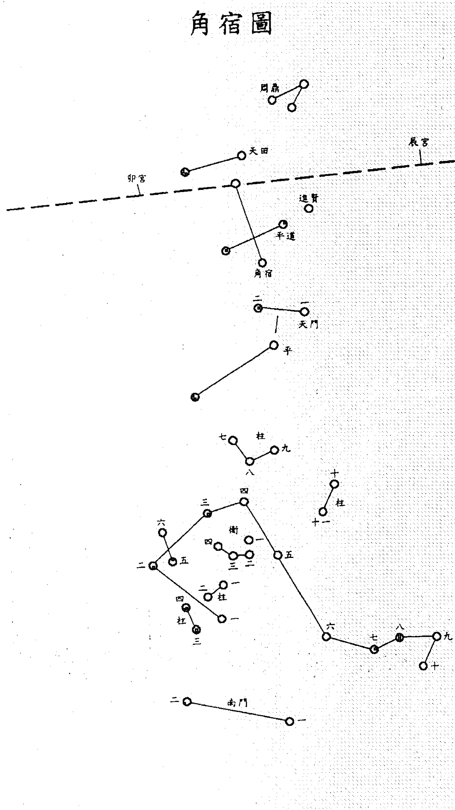

## 第二節 亢宿

星數：1.亢4 2.右攝提3左攝提3 3.大角3 4.玄戈1 5.折威7 6.頓頑2 7.陽門2。
方位：距南第二星去極九十六度。
步天歌：
> 亢四恰如彎弓狀，大角一星直上明。
折威七子亢下橫，大角左右攝提角。
三三相似如鼎形，折威下左頓頑星。
兩個斜安黃色精，頓下二星號陽門。

釋意：
亢由四星組成，總管天下卿大夫之法，又主病。亢上有一星名大角，是天王帝廷。此星若光明黃潤，天下大同。大角兩邊為左右攝提，各由三星組成。因其正當斗柄所指，可定時節，故又名攝提格。攝提是大臣之象，若其色溫淡不明，君主有驚恐。
亢南面有折威，由七星組成，主斬殺，決斷軍獄。折威南有頓頑、陽門各由二星組成。前主考察民情，根據情節審理刑事，後者主執兵器以戍邊。

### 一、亢

方位：亢距南第二星去極九十六度。
亢，火也。春夏為火，秋冬為水。亢北四尺是中道。亢者，廟也，天帝廟宮，也為天府。亢，三光也，三公之事。下者，地也，中央者，丞相也，主享祠。亢，為疏廟，亦為天庭，主火與疾，故亢龍多疾。
亢星齊明，宗廟有敬，朝廷有序；星明大則輔臣納忠，天下平安，民無疾疫；亢星不明，王者內亂，輔臣失次，君令不行；亢星垂芒，為錯亂；亢星離落位則有天子動旗而卒戰於野。亢為疾，國有疾，觀在亢。秋分視亢若不見則五穀盡傷，谷將貴二倍。亢為朝廷，總領四海，故置平星以統理。亢為朝廷布政宮。
月犯之，大人多疾，有兵，將軍亡，旗鼓其分，將死亡。地在其宿有變當省刑。木星犯之，臣為亂，佞臣用，有德令，禾稼熟。火星守之，天子惡之，多旱谷不成，士兵大起；久守則民憂；犯則亂臣，人多病。若有芒角，大人惡之及白衣會，居而勾己環繞，宮室不安。土星冒犯，後喜，谷傷。潤澤則爲歲豐。犯之亦爲有不臣，犯守亦爲兵火。金星犯守，天下大戰，道路不通；木星守之，萬物不成，刑急，水災。久守爲大水，芒守之色青憂，赤旱，白喪，黑水。
客星守犯，大旱，有赦，富民貧，獄多；彗孛冒犯兩角間色白有喪起，不戰。色赤則戰，所至有破軍侵城；彗孛出之大亂，王者惡之，後黨恣，亦爲亂，饑。
流星出入兩角間皆爲大使出入。若抵而角不動，臣欲而僇死。氣之青皆憂，疾赤，國驚有戰。黃則貴人親祠，白戰不勝，黑入右角亦然。氣如刀劍出角間，宮禁有陰謀變患。
訣：角星明大王道平，潤澤賢者輔朝廷。
五星犯守惡災跡，禍福之源萬理基。

### 二、攝提

方位：左攝提距南星去極七十二度，入亢七度。
右攝提距北大星去極六十七度，入角七度。

攝提六星夾大角。又名環樞、天樞、關丘、致法、三老、天鉞、天獄、天楯、天武、天兵。星東西三三而居，形似鼎足。

常東向，天子吉昌，若北向，即大人失位，聖人更制，天下有事。期三十日兵出，復三十日兵罷。若攝提北向，向格而治，十日而令出。其反故位，十日而兵罷。

攝提者，直斗杓所指以建時故名攝提格，攝提三星如鼎足，左右角西南向，主易姓。攝提爲楯，以其夾捧帝席也。攝提主九卿。攝提移則政更權，仁道不行，攝提失衡。師者，所以教人爲君也。長者，所以教人爲長也。大角爲帝席，攝提六星攝紀綱以輔。大角，師長象也，如列者。如鼎足俱東向，攝提斗攝角以接下化而東向，令乖行，則天下更紀，王者滅。代提，天下更紀，世有名師。主德不一，則攝提代移更紀，授有令名，爲天下師表者也。

攝提運度主接靈。攝提色欲黃而潤澤，溫溫不明，天下安。明大者，三公恣，天子弱，斧鉞用。攝提反衡，天下大亂，易姓興。反衡謂不東向也。攝提移向北，王者以過見滅。攝提疏闊，大夫越權。攝提星近大角，若不居其故，近戚有謀賊王者。

月犯，臣專政則王惡之。五星犯守，兵起有謀。火守，則天下亂。客星出入占月，彗出，主惑，群下爭起。孛則主自將兵。流星出，有使出。干犯及沖，九卿改動。入則有外兵入王庭。氣之入，青憂，黃受賜，占在九卿，黑則大臣僇。

攝提六星攜紀綱，建時立節伺機祥。

提示：

- 1、攝提星可定季節。
- 2、攝提星爲師道星，捧大角師長尊則明。
- 3、攝提角方向不一，代表的事情不一。

訣：攝提運度主接靈，紀綱朝法護持儀。
三公盡力輔帝王，太近恐生謀賊心。

### 三、大角

方位：大角去極六十六度半，入亢二度半。

大角一星在攝提間。又名格，漢星。大角爲帝筵成統理。大角爲天棟，以正紀綱。大角爲火，以其赤明。大角爲坐侯，爲帝席。以布神厚德。其星光澤明大，揚芒奮角，強臣伏誅，天下安寧。芒之所指，兵所以往者吉。

大角，天棟也。明則天子威行。棟星亡，不言王失號，罪深重誅。大角不見，蒼帝失勢。角堅剛而居帝前，帝敬，諸父感天，則大角光明以揚應之。赤滅亂，棟星去。棟星亡，主曠乏。大角貴人象也，主帝座。光潤明大則吉，光不明者，若有他色，青憂、赤兵、黑疾、白喪。大角不明，王者失天心，強臣凌主，天下有憂。秦之亡也，攝提不動，而大角亡去。大角星角起揚光，若近天帝左右，有以席薦害主者。大角變色，有芒角大動，不出三月，兵大起。大角數動，人主好遊，不居其宮，馳騁天下。大角動搖，主不安，臣下有惡事劫主者。大角帝席色欲明，光隆潤澤合同。

色黃不動，天下大安。月蝕主惡之，犯凶戰不勝，大人憂。五星犯守，諸侯有兵起。

客星出入謀臣在側而強恣，守則諸侯有謀。彗孛出，主更改。上失仁則彗孛守之，若竿而長六十尺，天下亂，國大變。孛守之同上。

客星出之，王者惡之。刺亦如之，亦爲貴人死，兵起邊庭。抵之將有出者，犯及觸，四方兵起。發而光色耀，貴，大將破。青氣掩，君憂。一道如千裏槍，沖過者殿梁折。黃出國喜，白掩大喪，黑久而散人主惡之。

提示：諸父爲伯、仲季也。

訣：大角星明師長敬，潤澤光亮德政行。
天之棟樑天威凜，布神厚德明中天。
貴人之象近王室，星亡仁失民心亂。
欲觀長者好與差，大角貴形道君法。
大角行事犯彗孛，事有改更多周折。

### 四、玄戈

方位：玄戈去極三十九度，入亢四度。
玄戈一星。主北夷。玄戈，招搖雌也。星欲小微，則王者吉，天下安。明大則胡夷，單於動，兵大起。星若小動，兵小動。星若大動則兵大動。玄戈小數動後而大動，則兵不起。玄戈星赤，則天下有兵。玄戈，宮也。戊子侯亡，宮亂則荒，其君驕，不聽諫，佞在側。宮和則致鳳凰，頌聲作。

訣：胡兵起動玄戈示，喜微厭明國安寧。
玄戈明大人好動，不守規域常犯侵。
事有耗損玄戈動，有備往之占主動。

### 五、折威

方位：折威距西第三星去極一百三度，入亢三度。
折威七星在亢南。折威，獄卒，天子執法之徒。折威星不居積卒間，胡兵大興，中國大傷，邊將死。將威斷獄，棄諸市都。守常則吉，月犯，上無威。五星彗孛守犯，邊將戳。

訣：折威守常執法威，審案理事明事非。
月犯折威威減衰，做事無力折足歪。

### 六、頓頑

方位：頓頑距東南去極一百一十二度半，入亢四度。
頓頑二星在折威東南。頓頑亦獄官也，所以與折威相近。頓頑捕制，察伺獄囚。
暗則刑濫，客彗孛昌犯，並爲貴人下獄，臣僇。

訣：頓頑暗昧刑法亂，平冤昭雪無可盼。
若犯彗孛貴人難，事事常險多糾纏。

### 七、陽門

方位：陽門距西星去極一百一十三度，入角十度。
陽門二星，在庫樓東北。明則無侵掠，暗則寇犯塞。五星客入，五兵藏；彗孛守及赤氣入，邊兵用。

陽門戌遠，劍戟盾矛。

訣：陽門明亮人安閒，暗防賊人來入侵。
五星客入事不詳，遠方禍端惹庭門。

## 亢宿圖

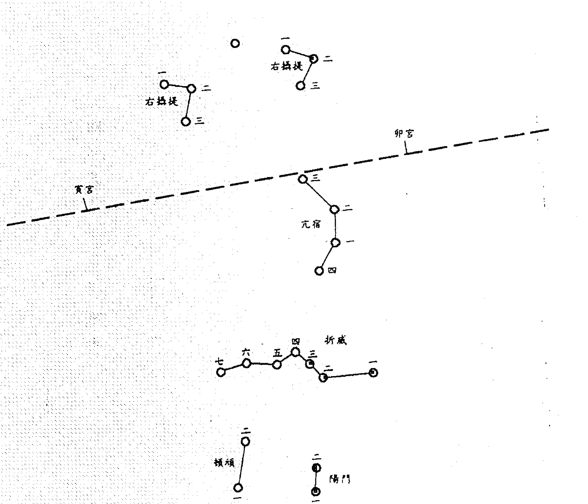

## 第三節 氐宿

星數：1、氐4 2、梗河3 3、招搖1 4、帝席3 5、天乳1 6、亢池6 7、騎官27 8、車騎3 9、陣車3 10、騎陣將軍1 11、天輻2。

方位：氐宿距西南去極一百四度半。

步天歌：

> 氐四似斗測量米，天乳氐上黑一星，
世人不識稱無名，一個招搖梗河上，
梗河橫列三星狀，帝席三黑河之西，
亢池六星近攝提，氐下眾星騎官出，
騎官之眾二十七，三三相連十欠一，
陣車氐下騎官次，騎官下三車騎位，
天輻兩星立陣旁，將軍陣裏振威霜。

釋意：

氐又名天根，因它在角下，就象樹木的根，所以又名天根。氐由四星組成，是後妃之府。也爲路寢，是帝王聽政的地方。若其大而光明，爲臣下尊從法度。

氐的東北方有二星名天乳，主饋贈之事。天乳上六星爲亢池，主舟船濟渡之事。

亢池上三星爲帝席，主帝王的宴樂獻酬之事。帝席北三星名梗河，又名天鋒，天楯。主兵備寇盜，喪事。梗河的西北一星名招搖，主兵寇。氐的南面三星，名爲陣車，又有天輻，主兵革事。再往南分別爲騎官、車騎、騎陣將軍等，大多與軍事騎戰有關。

### 一、氐

方位：氐距西南星去極一百四度半。

氐四星。氐爲木官。氐南二尺是中道。天子行宮又爲天廟，天府。春夏爲金，秋冬爲水。氐四星中，前二星嫡，後二星妾。前星皇后，貴族府。其星欲明，臣奉法度，邦君安寧。當大而小，其位臣失勢；其星動，其臣出。氐，宿宮，後女之貴府，出入路寢之宿。

氐星發主有土功事。氐爲天庭，氐主疫。氐山在鄭白馬山東，氐星神常居其上。氐星主徭役，氐星明則民無出門之徭，馬無汗勞。氐動者，徭役起。氐爲宿宮，路寢所止，休解之房，故置庫樓以捍咎。

月冒犯兵起，將憂。犯而有變則盜賊興。入之兵動。

木星犯之，蝗蟲災萬物不成；入則有赦；環繞而留，其分有兵；守則年豐，立後或有喜。

火星冒犯多水災，若成勾己則大人憂，天子惡之；守之成勾己亦然有赦；久守六十日亦赦。乃入之，宮中慎火，臣有謀。

土星犯守，其地亡；守之，有德令，土工興，太后、皇后、太子喜，歲安；色赤爲疫。四夷不順，在其宿乃光大黃潤，後有喜或米暴貴。

金守犯，徭役興，君憂，無兵兵起，有兵兵敗；守又爲其下餓，將受爵賜；犯又爲郎將誅，若有芒角，兵喪亡地。入則霜不時，春賈進糧食貴，人役。

水星入之，貴人暴法，官入獄，歲旱不收成。守則兵起，多惡風，水旱萬物不成。若乘左星，天子將兵，右則大水，兵起。

客星出之，黃乃有赦；犯乃其分憂；水守有德令，布帛羊貴，谷不登，邊兵起，後宮亂；入之，邊臣獻女，入中而散，中外不通，大臣恣。

彗孛冒犯之，有赦。犯之，爲臣有謀，人主惡之，米貴。入之則後宮暴兵起。

流星出之，使出，宣布德令；犯則藏書，官有憂事；入之，後宮有喜，國相佞，病饑；色赤黑，後宮不安，白而不散，後宮憂。黑爲水災。

> 訣：家室妻妾查此星，大變小妾代妻尊。
氐宿之房星大明，順理成章遵法文。

### 二、梗河

方位：梗河距大星去極九十五度，入氐三度。

梗河三星大角北。梗河爲天矛，天子之兵。也爲天鋒，天之劍戟，主於罰戮。梗河又名天盾、天蟲。梗者，遞也。河者，擔也。士卒更遞擔持天矛以行也。在斗杓頭，主殺，所向無前。也主胡兵。芒角大，則四邊不安寧，邊兵大起，相近相響則大安。

梗河主喪。陰十日不見則國有喪；以初不見日占男女，梗河末男本女。天不陰，梗河之不見，視二十八宿星之盈縮，若在北斗傍，所見之宿，其國若諸侯有喪；梗河亡，三日不見，國有謀兵，或諸侯有死者；七日不見，國有大喪。以其初不見之日以占其國；亡不見，即有所藏，所藏之國宿，有謀兵，不然有喪。求視二十八宿，若斗則是，以見之日知其期。天矛星不欲明，大明則大兵起。

客星出守，陰陽不和，大風。冒犯則匈奴來侵。

彗孛出則敗去；守之如客星占又爲邊兵入寇。

流星冒犯，王者出兵。氣之出，赤大戰，蒼白爲將死。

提示：梗河亦爲偵察巡邏兵。

訣：此星宜明不宜昏，星亡非喪兵起盟。

### 三、招搖

方位：招搖去極三十一度，入亢四度半。

招搖一星。尙羊也，名常陽。尙羊者，懸以匡也。又名爲矛盾，胡星也。與梗河、玄戈列，從北斗柄端，抵大角，近北斗者，玄戈，次爲招搖。招搖爲矛，攝提大盾，相當則兵大起大戰。斗端有兩星，一內爲招搖，一外爲盾天鋒以主兵用，若動則兵大行。招搖，南夷也。兵星，金官也。

招搖欲與梗河、棟星相直，則胡常來受命，獻貢中國。不相直，則胡人叛逆。招搖明而不正，胡不來受命。斗末之星，招搖之間，名爲天庫。招搖離其處名叫開庫。開庫則兵發。招搖星欲明而微小，則王者威令行四夷。

矛盾動，兵四起，臣子謀佞奸通，殺君殺父，九州振。盾動搖若角，大兵起，天下殺主，害禍中發四方並與。矛盾角躍相扞，臣主爭伐相誅，招搖亡去，國兵起，主遇賊。

招搖星赤角，胡兵大起，不來受命。星大亦然。招搖星奮發明動，天子強。招搖色青，軍破國亡。色黑爲弱。矛盾動則近臣恣，庶雄謀。

彗孛冒犯，蠻有喪及兵動。

流星出之所向有兵起；氣之出蒼白則相死，赤白則兵起，黃兵敗，君喜，白乃大人憂。

提示：招搖玄戈主外夷之兵。

訣：其星明動天子強，奮發國強色青亡。
明而不正難附順，微小行令四夷聆。

### 四、帝席

方位：帝席距東星去極六十七度，入氐一度半。
帝席三星。明則吉，動搖微暗凶，亡則爲失臣。
彗孛守，人君憂，又爲兵亂。
提示：帝席爲受君命，坐陣指揮之位。
訣：帝席督戰起兵矛，君王坐陣威名遙。
星黃凡事出意料，賤辱貴喜暗凶消。

### 五、天乳

方位：天乳去極九十一度，入氐十四度半。
天乳一星，在氐北。天乳，甘露，醴酪、充飴。明則甘露降。客彗孛觸犯守，天雨爵賜。
提示：天乳是集自然的精華之濃縮。有滋養、滋補的作用。
訣：天乳甘露明泉賜，初春潤物五穀豐。
萬物需受乳來哺，靈達明綻華池台。

### 六、亢池

方位：亢池距北星去極七十度，入亢三度。
亢池六星在亢北。亢，舟船。池，水也。亢池猶度水也。亢池又名代津、亢星。亢池主水道。
常則吉；微細移徙則凶；不在亢度中則宗廟有怪。主司曰，見則主命終。亢池亡則道不通；五星犯守，百川溢。
客星守之，宗廟有盜，水蟲死。
提示：亢池是水道的代署機構，指揮調度水路的長溢吉凶。
訣：亢池主舟水池口，五星犯之水災禍。
離位宗廟常有異，微細切莫移度圍。
水井司令遇亢池，常吉微險移途迷。

### 七、騎官

方位：距西北星去極一百一十三度，入氐初度。
騎官二十七星。在車騎北。星聚則天下安，稀則騎兵叛。不見則兵起，衛士憂而兵。
客彗流星犯守及流星入之皆爲兵起。蒼白氣入，將死，大臣黜。
訣：不見兵憂聚國安，列陣而兵觀騎官。

### 八、車騎

方位：車騎距東南星去極一百四十度，入氐二度。
車騎三星。在騎官南，車騎，金官也。陣車騎南部行。
星變色動搖則兵行於道路。金火客彗孛冒犯則大兵出，天下亂，客星入西羌降。

> 訣：三星觀色看兵情，動行靜養視分也。

### 九、陣車

方位：陣車距東南星去極一百一十三度，入氐四度。
陣車三星在氐南，陣車猶革車也。
五星守之，變動皆兵。

提示：觀其星可爲軍事提供估算，預計車騎、兵馬的數字及動向。

### 十、騎陣將軍

方位：騎陣將軍去極一百三十三度，入氐三度半。
騎陣將軍一星在騎官中東端。騎陣將軍，將軍騎將之行陣也。

提示：上四星爲騎兵陣營的四個組成部分。由騎陣將官指揮，下設陣車、車騎、騎官三部分用於攻擊敵人。

> 訣：星聚則安稀則叛，騎陣將軍坐陣間。
國安君吉星多聚，若犯客彗演習忙。

### 十一、天輻

方位：天輻距南星去極一百一十六度半，入氐十一度。
天輻二星。在房距西星。天輻，宰乘輿之官也。天輻主言祠事，氣有離合，設蕁樹。離星相遠，合星相近。天輻近尾，吉。遠尾，天下有爲害者。天輻陳驚，被軒驚旗。

星近則天下有福，明潤則車駕安。搖動則車駕行。
五星客彗孛冒犯，輦轂不寧。

提示：輻爲車輪中的輻條。借指駕馭車輛的司機或導向者。

> 訣：天輻祭祠时天福，帝君乘輿放四環。
合星相近祥瑞降，遠尾天下爲害亂。
欲觀望福德光斂，星之大小顯真專。

## 氏宿圖

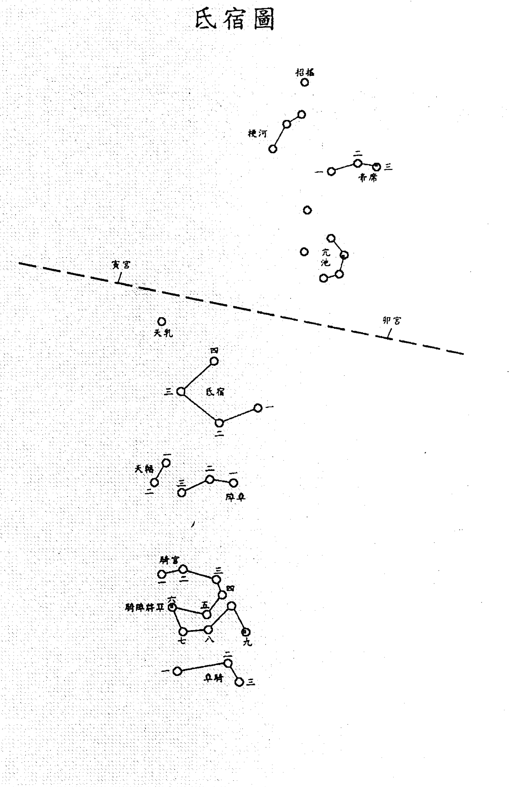

## 第四節 房宿

星數：1、房4 2、鉤鈴2 3、鍵閉1 4、罰星3 5、東咸4西咸4 6、日星1 7、從官2。

方位：房宿距離南第二星去極一百一十四度半。

步天歌：

> 房星直下主明堂，鍵閉一黃斜向上，
鉤鈴兩個近其旁，罰有三星直鍵上，
兩咸夾罰似房狀，房西一星號爲日，
從官兩個日下出，房爲天子明堂處。

釋意：

房由四星組成，又稱天駟、天馬。爲明堂布政之宮。房的北面有兩顆小星叫鉤鈴，是房的鑰匙，主開閉蓄藏。鉤鈴東北一星叫鍵閉，作用與鉤鈴相同。再往北兩旁是東咸、西咸，各由四顆星組成，主防止淫佚之事。東西二咸間有三星叫罰，主懲罰之事。房宿下方有從官，主巫疾病祝禱之事。

### 一、房

方位：房距南第二星去極一百一十四度半。

房四星。土星也。春夏爲水，秋冬爲火。房兩眼之間，是中道。房爲天府、天馬、天駟、天旗、天市、天街、天燕、天倉、天表、天龍。房爲天子明堂，王者歲始布政之堂。主車駕。

房爲四表。表者，築也。天道四表之間，三光之正路，人天之定位。天廟者，房也。房，關也。日月之行，常出其中。不出其中爲不道，不道者，政令不行。房主宿。街南二星，君位也。北二星，夫人之位也。房主財寶。房動外，財寶出。房動內，財寶入。

房山在宋地，與心山相連。房心星神常居其上。房心二宿動搖，則房心之山崩，國有走主。填星色黑，出入七十日以上，房心山崩，下伐上也。其星不明，則山有音聲，萬民相驚，大水，魚鹽、五穀貴，百姓愁。若星色赤，赤地千里，房心不見，帝無教。房星欲明，群臣奉忠。房主開閉，以其蓄藏之所由也。

明大則君明，臣忠，天下太平；暗則臣亂政，王道不行。動外則財寶出，動內則財寶入。七政之占，行中道，主壽長，天下豐年。由角陰陽道爲兵水。

月在箕宿有變，名寶駟馬出，時令不順。

月五星犯守，皆爲將相憂。

木犯之，歲豐民安，有德令，豫州災。守則大赦，天下和平，入則勾己，天子惡之，良馬出。

火金觸犯，將軍亂，王者憂。入占色青喪，赤兵，白芒角爲火，黑將相死，若犯而色怒芒角，兵大起，改正朔秦燕趙代憂。守則更政有德令，臣亂兵起。守而成勾己環繞，則不安其居。

土星犯守有喜或赦。成勾己相凶。犯之，又爲後憂。守之爲地動、兵、旱、立後、土工興、宮室數移。

金星冒犯君有憂。占其色，青及白而芒角皆喪。赤兵，黑將相死。守之，土工起、帛貴、將相失位。久守爲饑。入房十日成勾己，天子憂，以赦解之。

水星冒犯皆殃，犯而留守爲水。入而成勾己占如金，守則大臣乖、憂、滂，遠兵起而散。

客彗孛犯之，國空民饑，彗孛又爲失德，臣有謀兵起、世亂、有德令，馬貴。

流星出之，卹民有德令。犯衝爲水災。抵乃將相出鎮。入則大臣入，賀國昌或爲喪，入而蛇曲，輔臣亡。

氣之入出，將相憂。赤則宮中亂。若如波，宮焚。出之，兵。氣之入，黃諸侯來貢。赤黃潤澤黑貴人其間，諸侯，有使來。黑出之，宮中憂。有雲如人形入，後妃有子。

訣：房主車駕與財寶，天道四表均明行，
其星明大忠臣輔，七政占房天下豐。
尋寶覓珍房心宿，五鬼運財德蔭興。

### 二、鉤鈴

方位：鉤鈴距東星去極一百九度半入房二度半。

鉤鈴二星，天子禁也；鉤鈴相去疏者，天下且赦；相去數者，天子急，多暴令。關閉則鉤鈴去房。不駕則鉤鈴離房。鉤鈴明則法令、王者至效。昆弟有親之恩，則鉤鈴不離房。鉤鈴去房。欲其近也，近則天下同心，遠則天下不和。其間有星及疏折則地動河清。

月火金犯之，王者憂，月又爲車駕行，食則將死。

木守爲餓，相去二寸，王者失政，近臣起亂。
火守有德令，土則失地，水乃地震山崩。
客彗孛冒犯，宮庭失禁。流星入之，兵散。
提示：鉤鈴是中央向百官發佈稟事之機構。
訣：鉤鈴房中明相依，急事常常宜轉機。

### 三、鍵閉

方位：鍵閉去極一百八度，入房四度。
鍵閉一星，在房東北。鍵閉，主鑰匙，關門之官。鍵閉星明，則道大昌。不明則暗亂，宮門不禁，津梁隔絕。
月犯之大小憂及火災。五星犯，戎行幸有匿兵。
客彗孛守之，道路阻。流星入，有口舌中宮，大臣災。
鍵閉司察，心腹口喉。
提示：鍵閉主管各類開閉的鑰官之位。
訣：鍵閉明暗常守規，一張一馳道相推。
流星入之是非起，誅邊貴人入禍堤。

### 四、罰星

方位：罰星距西南星去極一百八十度，入心一度半。
正直而列則法令平。若曲而斜，則刑法不中。
客彗孛守犯，國政多枉。罰星受金，罰贖市租。
提示：罰星是觀其國之刑法適度的標尺。
訣：罰星刑法平爲中，若曲而斜多冤事。

### 五、東咸、西咸

方位：
東咸距西南星去極一百一十度，入心一度。
西咸距西南星去極一百四度半，入氐十五度。
東咸西咸在房東西，各四星，而列熒惑道也，不道輒還之。東西咸又名大明。東咸、西咸八星者，房戶之扇，常爲帝之前屏，以表障後宮，以防奸私也。
東、西咸，日、月之道也。日月五星不以道，必有賊。
東、西咸，房戶也。星明如列表間，天子吉，子孫昌。
東、西咸在房東北，主日行，色明吉，不明凶。

東咸、西咸星明而行列，王者威令行，妃後守其宮。其星微小而不行列，若亡不見，人主威弱，女主自恣，奢淫無度，防守者憂。或宮人有罪，爲貴女有黜者。

東咸上星近鉤鈐十日，則有有讒臣、賊臣入害主者。西咸星星前近，上若有角，搖動、明動十日，有人以知天數，入爲害者。

月犯之，失禮民饑，又爲陰謀。五星犯守，占同。又爲臣下不從。客彗孛冒犯守，流星抵之，後宮恣。宮門不禁，貴女有憂。流星犯沖，大水川溢，出入則鬭。

訣：東咸西咸防淫佚，星明妃安子孫昌。

### 六、日星

方位：日星去極一百一十三度，入氐十四度半。

日一星在房中道前。日詔德令，耀生飛鳥。

明大則君有德。月犯掩，下謀上。木守之，王者與天同心，臣忠，天下昇平。金火守犯，人主惡之，客彗孛則君惡之。

訣：日星明耀照乾坤，日觀家中主男性。

### 七、從官

方位：從官距西星去極一百一十二度，入氐十四度。

從官三星。星明大，五星客彗孛冒犯，並爲巫人構陷亂，氣之入占在巫人。黃受爵，黑有殺。

提示：從官專職疾疫、祝禱、巫人之事。

訣：黃吉以功授爵勳，慎防犯星巫人構。

## 房宿圖

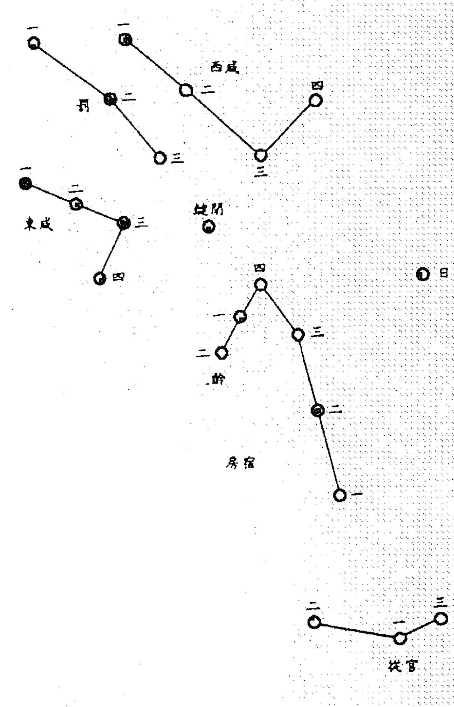

## 第五節 心宿

星數：1、心3 2、積卒12。

方位：心距西星去極一百一十四度半。

步天歌：

> 心三中央色最深，下有積卒共十二，
二三相聚心下是，心星亡則觀兵數。

釋意：

心由三星組成，又名大火，鶉火。當它現於東方時，就是夏季的首月，可依此辨認季節。心星是天王之正位，主賞罰。
它下面十二顆星叫積卒，象征士兵，主掃除不祥。

### 一、心

方位：心距西星去極一百一十四度半。

心三星。心星火也。春夏爲木，秋冬爲水。北四尺是中道。心爲天相。又名天辰、大火、天司空，心者宣氣也。心爲大丞相。心大星，帝座也。大星者，天子也。心者木中火，故其色赤，爲天關梁。心三星，星當曲，天下安，直則天子失計。心爲明堂，中大星天王位前主客，天子以弱亡。

大火謂之太辰，房心尾也。主天下之賞罰，主天下之急。故天下變動，則心星見不詳。明堂旁多小星，天子憂，弱子夭折。天子威令不出閤，天下乖爭，無君伯，則八九心星直。心星變色黑，大人有憂，民血流。心星滅則主泣血，後奔逃，強國起。心星消，江河爲害。其九年，天子滅。心星動，國有急。心星動搖，若角芒者，天下大兵，心星離移，有流民。

心前後星皆光明赤黃者，太子、庶子各有賜賀之事。心三星明大，則天下同慶，響風被澤。心三星，上星太子星，星大明，太子不得代。下星庶子星，星明庶子代，後心動者，國有憂。

大而赤明，德服天下；暗小失色，微弱不明，動搖變黑，大人憂。直則主失勢，角而搖動，兵動。離則人流。

月犯之，大臣憂。犯中火星，人主有憂，太子、庶子星各以其所主爲憂。在宿有變，大將易刑罰失中。木星犯乘守之，歲豐平，久守，臣有謀。火犯守，則地動，王者忌之，若勾己環繞災尤甚。土星冒犯，旱饑、民疾、大赦。守之，太平。大人喜慶，益地又爲土工。若行勾己環繞，其地亂。金星犯守，兵興。曜貴殃在貴人。守則又爲臣叛，其分憂。水星犯守，大水，帛貴，內外亂。明當則大人憂；當之在陽爲燕，在陰爲邊；不明，地動、大雨。又犯則兵旱民流，守乃盜賊賦役興。

客彗孛犯守，大臣有謀，天子憂。客星出之，君使人伐諸侯。犯之，修飾台榭。守之，饑喪火災土工興。彗孛犯守出之，兵喪民流蝗起，大臣相疑，下有謀。流星出之，遣使邊場也。犯抵，大臣相賊。入則王者憂之及外國使來。青色占憂，赤兵。黃喜及土工，白喪，黑凶。

青氣出之，天子使人亡諸侯。赤入之，有立王。黃則子孫喜。前星則太子受賜，庶子亦如之。白入之，亂臣在側，蒼白及黑，各以所主爲憂。

## * 奇門星相絕學 *

提示：欲知天下變動、賞罰及大事之急緩則詳觀此星的動向。

### 二、積卒

方位：積卒距西北大星去極一百二十六度半，入氐十五度。

積卒十二星，在房、心南。積卒又名衛士。芒角動，聚兵事。積卒，兵官、金官也。積卒者，土也，積土也者，所以衛卒暴。

積卒主守衛明堂，其星欲微小而明，則天子吉，其國安昌；若明大動搖，則君臣不寧，朝廷有兵。主守衛，主衛尉。

積卒一星亡，兵少半出；二星亡，兵大半出；三星亡，兵盡出。五星出，金革興，否則近臣謀。積卒不如其故，有兵。其微細若不見，兵車盡出，士卒滿野。

彗孛守之，禁兵大起，天子將兵。青赤色去氣入之正臣欲論，列兵事發。

提示：積卒爲守邊的衛士。

訣：積卒十二掃明堂，護守疆土衛家園。
星數皆爲國中兵，一星二星亡兵喪。

## 心宿圖

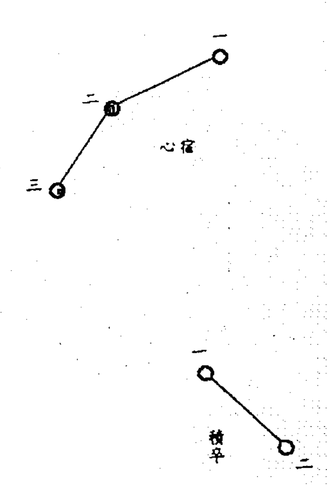

## 第六節 尾宿

星數：1、尾9天江4 2、傳說1 3、魚1 4、龜5。

方位：尾星距第二星去極一百二十七度。

步天歌：

> 尾九如鉤蒼龍尾，下頭五點號龜星。
尾上天江四橫是，尾東一個名傳說。
傳說東畔一魚子，尾西一室是神宮。
所以列在後妃中，星明後宮子嗣隆。

釋意：

尾有九星，又稱九子星，主陰陽風雨的調節。尾東有一星名傳說，主祝禱神靈以時求後嗣。傳說上有一星名魚，主雲雨風氣。尾西有星名神宮，是換衣服用的內室。尾北面有天江，主太陰，南面有五星名龜，主龜卜，定吉凶。

### 一、尾9 神宮1

方位：尾星距第二星去極一百二十度。

神宮去極二十七度半，入尾六度。

尾星共九顆星。爲水星。春夏爲火，秋冬爲水。尾北十尺是中道。尾又名後族、天廁、天狗、天司空、天雞、天矢、九江、尾者，後宮之場，妃後之府。上第一星後，第三星旁一星名神宮，解衣之內室，說虞之堂。尾者，邊臣也，又名通溜宮，尾，市也，天復船也。

尾第二星嫡妃，第三星夫人，次五星嬪妾。欲均明，大小相承，則後宮有序，多子孫。

尾山與箕山相連，在燕九都山西，尾、箕星神常居其上。尾主水，又主君臣。尾動者，君臣不和，必有事。尾，天子之九子也，騰躍坼絕，不居其所，天下大亂，君臣亦不和。尾星明大，皇后有喜；不明微細，皇后有憂及疫，尾星疏遠，皇后失勢。尾明，五穀大熟，民不煩擾。尾不明，五穀大傷。其星就聚，有大水。君臣不和，則占於尾。

月犯之，臣不和，貴戚其地將死。若有變，後宮子孫不安。木星犯之，燕地饑，守之水旱，犯守皆爲米貴。守三十日以上，立後或生太子。守而成勾己，則女後憂之。

土星犯守，占同。妾爲夫人。火久守多妖詳，後妃恐。土守及犯，

## * 奇門星相絕學 *

其色黃，後有喜。守而芒角動搖，易政兵起。
金火冒犯，民憂。留守之，後妃、宮嬪或貴人相憂，又爲兵起，守其水災。
水星犯之，天下水江河缺。守之也爲水。又爲下賤貴民疫，後宮憂。
客星出。大風、水災、後宮惡之，兵革亂散，民饑民死。守犯則女暴貴。
彗孛冒犯，後、相貴，臣有咎，兵起宮門。
流星出入，風雨時，稼穡成。出則又爲使人於諸侯，後宮喜。入則反是。出則有子孫之慶，入則後族進祿。抵之後妃有喪。
氣入之，蒼則舊臣來，赤則諸侯來，青則外國降；白則大臣在遠方欲歸，青氣出爲亂。

提示：
1、尾星群繪制出後宮地位級別圖。
2、尾宿主指後宮府。

> 訣：明大尾府主有喜，天下庶民俱開顏，
動搖不和事有變，相遠微細陰中憂。

### 二、天江

方位：天江距南第二星去極一百一十四度半，入尾十度。
天江四星在尾北。天江星如常微小，則陰陽和，水旱調。其星明大，天下大水，江海溢流，五穀不熟，民以水饑。若星微，參差不齊，馬貴或馬多死。
天江星中河而動，則兵起如流沙。死人如亂麻，以人渡河。如其星不見，則津梁不通。其星不欲明，動搖則大水出，沒城邑，大道不通。天江星不欲明，河中而居河中者，大起兵，車騎滿野，道不通。天江四星主大險，其星明大水不禁。
月五星犯守及流星出入皆大水。月犯爲兵。
客彗孛尤甚。火星犯守，大旱。氣之入，青多水滂，黃兵，白敗。氣之出，赤則車騎滿野。黃白則天子用兵。

提示：天江掌管江河湖海，明大動搖水災常患。其星爲煞星，欲微不欲明。

> 訣：中河居明大兵起，死人如麻集滿河。
農人盼星常微小，陰陽調和五穀登。

### 三、傳說

方位：傳說去極一百二十八度半，入尾十四度。

傳說一星在尾後。主祝章，巫官也。章，清號之聲也。傳說蓋女巫也。傳說星主後宮时神明，保子孫，文章祝說以求福慶。

其星明，後宮子孫昌；王命興、輔佐出。星不明或不見則後宮人多疾，子孫凶，多有死者，繼嗣微。傳說星亡，社稷無主。傳說星入尾，主天下有祝詛人主者或有巫醫之害，以入日占國。

彗孛守之，不享宗廟。赤氣入，祝官凶。

提示：傳說星指那些时雨求福的祝由之師，同時亦指有相當謀略輔佐才能的人，如國師，參將等。

訣：星明福慶子孫興，常有貴人同道行。
最怕星微不見蹤，傳宗接代無佳人。
彗孛犯之罪不輕，謀略之人無德品。

### 四、魚

方位：魚去極一百二十六度，入尾十五度半。

魚一星在尾後河中，又名據星，蒙星。魚星主雲旗，其星忽然不明，如雲常居漢中，微而不明，則陰陽和，風雨時；其星動搖則陰陽不調，雨澤不時，有大水。魚星中河而處，則兵起，兵騎滿野，期七月，常在河東近箕。魚星中河而居且明大，河海水皆出，天下大水，或爲大魚死，津道塞；若微小出河中外，天下大旱，五穀不成。

五星犯守皆凶。火上在陽則旱，陰爲水。

氣之占與天江同。

提示：魚星主宰雨露、江河湖海之水及港口要道。

訣：忽明忽暗預事凶，詳審江河水位情。
明大亦會傷財神，渡口之處無問津。

### 五、龜

方位：龜星距大星去極一百四十度半，入尾八度半。

龜五星在尾南。取名連珠，贊神明。其星明，君臣和，奉祀神明岳瀆。其星不明，則上下乖離，臣逆於君，不事鬼神，其國不安，主有憂。龜星常居漢中，則陰陽和，雨澤時，吉。不居漢中，川溢水，又爲

## * 奇門星相絕學 *

天下水旱，物不成。
火犯大旱，守之火起或爲水。去之赤地千里。流星入之爲小憂。流星出之，赤兵，黃旱，青黑爲水，各占其分。赤氣出之，巫祝者憂。
提示：龜星主神明享預之象。
訣：龜星在東贊神明，其主巫祝運前程。
星明君臣和同心，暗微術算失流真。

## 尾宿圖

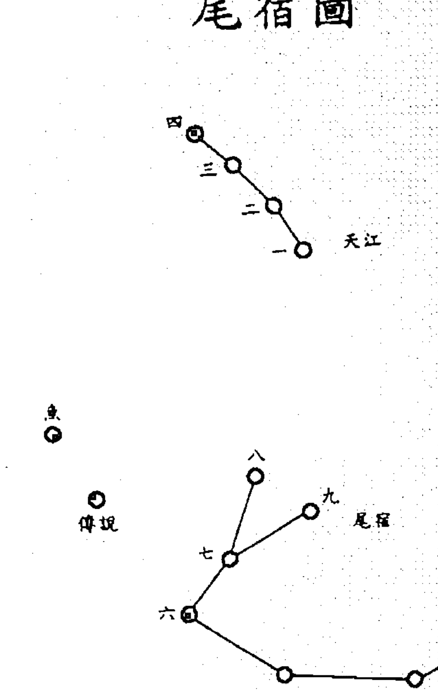

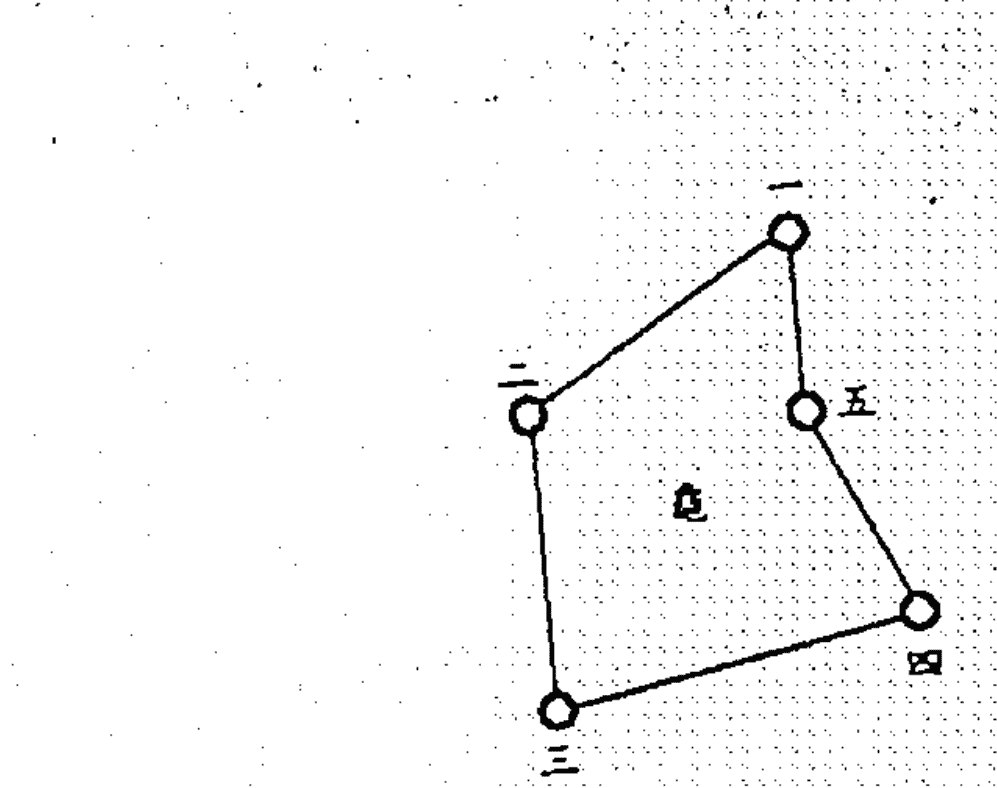

## 第七節 箕宿

星數：1、箕4 2、糠星1 3、杵星3。

方位：箕宿距西北星去極二十一度半。

步天歌：

> 箕四星形狀如簸，箕下三星名爲杵，
其前一黑是糠皮，杵臼系關五穀成。

釋意：

箕宿由四星組成簸箕樣，所以得名。箕星主多風，又主多舌，有讒言。前一面名糠，主豢養。南面有三星名杵，主舂搗糧食，供應廚房。

### 一、箕

方位：箕距西北星去極二十一度半。

箕四星爲金星也。春夏爲金，秋冬爲土。箕北六尺是中道也，箕星爲風，又名風星、天陳、孤星、狐貉、風口、天後、天貉、府廷、大雞、天司空。箕，庫也，爲寄客。箕，王致客。

箕斗，天之冠服也，並後宮別府也。二十七世婦，八十一禦女妾。別宮四者，女相也，故尾箕主百二十妃。尾者，青龍之末也，直寅主八風之始。

析木謂之津，箕斗之間，漢津也。又叫天市，主八風，不出三曰，箕舌動如致，風揚沙。箕者，人之精也，天下安樂，即星眾。不安，即星少，亦爲谷貴。星明大，國無讒賊，谷大熟。星不明，天下五穀傷。箕星離徙，天下大不安，民移徙其處，就聚細微，天下憂食。

月犯之旱風占，軍相死。入中亦然，又爲後憂，後宮干政，法令酷。

在其宿有變，暴風雨作。失行離之則爲風，凡犯箕壁翼軫皆爲風起。

木星犯守，旱饑多惡風，入之中宮口舌。

火星入旱災，人主惡之，守之亦然，又爲改移，地動，燕地君長病。犯則東夷燕人疫死。環繞勾己則大臣誅。

土星犯守，女後憂。守則爲兵喪，黃水，土工興，後貴，大人喜。

金犯之，後喜。守則，兵疫旱風。

水星犯之，河溢。守而動色青臣自戮。犯守之，又爲火，爲旱，物

## * 奇門星相絕學 *

不成。
凡土星犯守，金星若入中，水星犯之，皆爲赦。
客星出之，大饑，大臣有見棄者，官人出。入之，多風雨，宮女不安，外使來，民流，土工興，北方饑，棺木貴。守之，土工興，秋冬多水。

彗孛出犯守，爲夷狄作亂，大旱兵起。
流星出之，宮人有出者交對。抵之，宮人不安。入之有風雨。若色黃爲大臣出使，蠻夷來。
氣之入，蒼白黃，蠻夷入貢及女喜。黃色則宮人多死。
氣之出，蒼白，國災除。青則占其分不爾。四夷來降，黃則使出。

提示：尾箕主後宮妃後府，故置傳說衍子孫。
訣：箕星明大衆安祥，星少衣薄貧逍遙。
星動風起有人擾，事發之由女政驕。

### 二、糠星

方位：糠星去極一百二十七度半。
糠一星在箕舌裏。箕主簸揚，糠給犬豬。
明則歲豐，暗則饑。去則人相食。
提示：糠是五穀類的代稱。
訣：糠星一明簸飛揚，豐谷吉昌慶多祥。
若暗則饑家不旺，漸去衰亡無主慌。

### 三、杵星

方位：杵星距大星去極一百三十八度，入箕三度。
杵三星在箕南。土官也。杵縱則民足食，橫則民饑。天杵臼動，則民失其釜甑，大去其鄉。杵星明則天下安，五穀成，杵臼用，其年豐。不明則歲大惡，五穀不成，杵臼不用。星明動，天下有兵，杵臼用事，軍糧急。其星微小，天下安寧而無兵。移徙亡設皆爲歲荒。
五星守之尤甚，客星彗孛觸犯，天下有急兵。
提示：杵在箕南，主給廚、舂物之類。
訣：明安動惡微小寧，春耕秋收時杵星。
國泰民安觸客星，雲集天下起爭雄。

## 箕宿圖

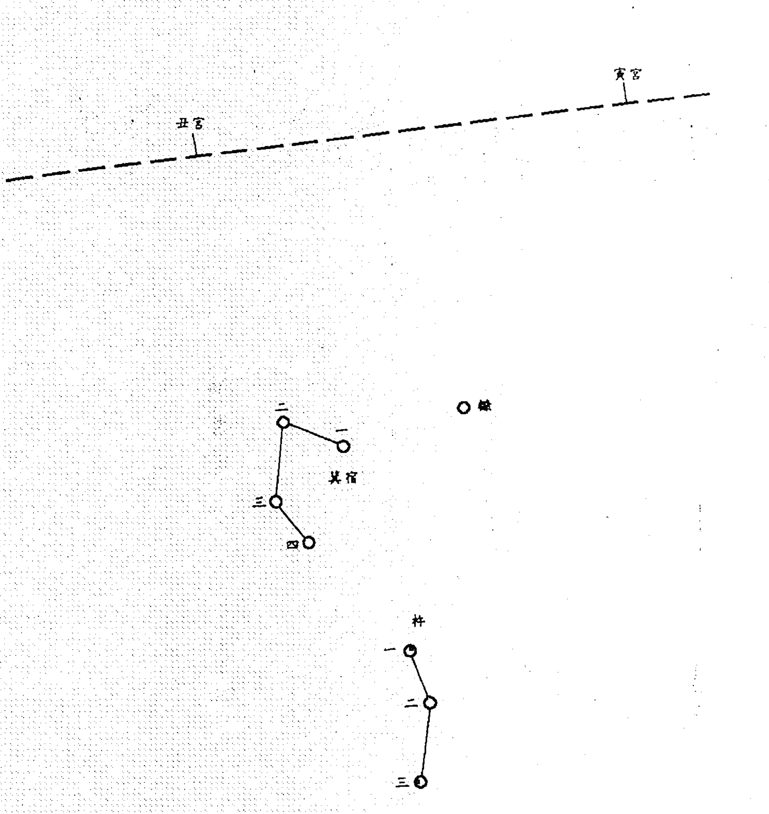

## 第二章 北方玄武七宿

## 北方玄武圖

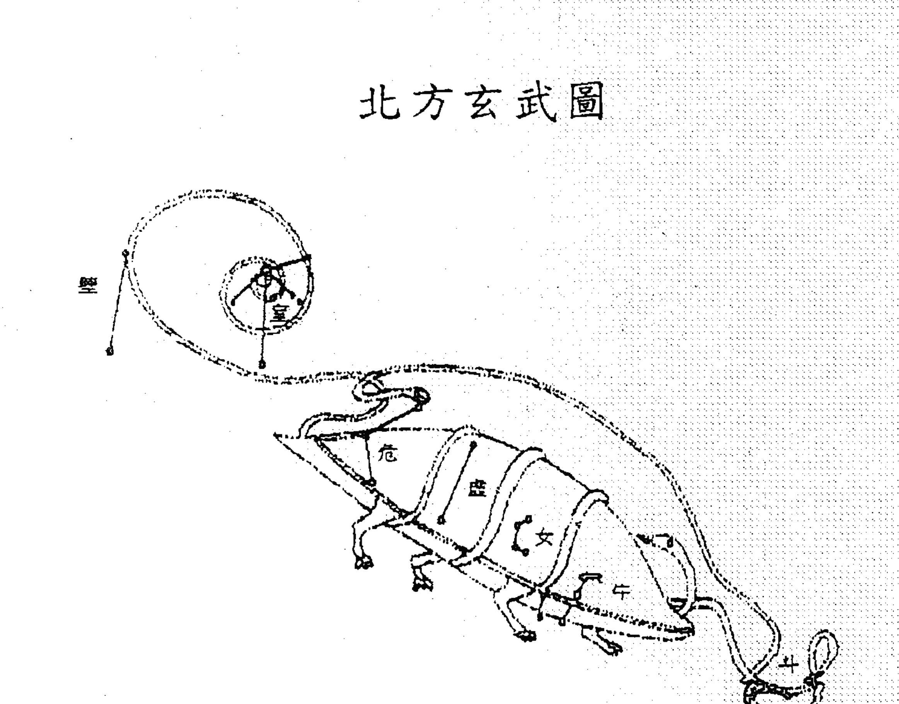

北方玄武七宿：斗、牛、女、虛、危、室、壁。玄武是一種首尾如蛇，身足如龜的傳說中的動物。斗牛爲蛇身，其餘五宿均爲龜身。

## 第一節 斗宿

星數：1、南斗6 2、建星6 3、天弁9 4、農丈人1 5、天籥8 6、天雞2 7、狗星2 8、狗國4 9、鰲星14 10、天淵10。

方位：斗宿距西第三星去極一百十九度。

步天歌：

> 斗六星狀似北斗，魁上建星三相對，
天弁建上三三九，斗下圓安十四星，
雖然名鰲貫索形，天雞建背雙黑星，
天籥柄前八黃精，狗國四方雞下生，
天淵十星鰲東邊，更有兩狗斗魁前，
農家丈人斗下眠，天淵十黃狗色玄。

釋意：

斗由六星組成，是玄武之首，爲天廟，是宰相之位，主獎掖賢人。提拔賢士，授以爵祿。斗的東北面有建星，由六星組成，又稱天旗，是天之都關。此星如動搖不定，則人民勞苦。相反則人民安定。建星之上有天弁，由九星組成，爲武官之長。斗的周圍有天雞、狗、狗國，主侍察節氣，守禦關梁等。下有鰲、天淵，主灌溉水利之事。

### 一、南斗

方位：南斗距西第三星去極一百一十九度。

南斗六星一名爲天庫，知之使人不妄。南斗，木星也。春夏爲水，秋冬爲金。日月五星常貫之，爲中道。南斗主爵祿，神名帙瞻，姓拒終。又名斧鉞、天府、天頭、天機、天同、天子旗。

南斗魁第一星主吳，第二星主會稽，第三星主丹陽，第四星主豫章，第五星主廬江，第六星主九江。斗北二星，天府廷中央二星，相也；南二星，天庫樓也，天梁也。斗西大星，天關也，天子正旗也，土官也。六星欲明，天下安寧。南斗第一星上將，第二星相，第三星妃，第四星太子，第五星第六星天子。南斗，太宰位也。南斗者，天子之廟，主紀天子壽命之期。將有天下之事，占於南斗也。斗山在吳陽羨山，南斗星之神常居其上。南斗主兵，斗動者兵起。

南斗明大，爵祿行，天下安寧，將相同心。其星不明，大小失次，

## * 奇門星相絕學 *

芒角動搖則王者失敗，國失忠良，民多怨，天下多憂。南斗不明，五穀不收。移徙位直，其臣逐，風雨不節，天下病。斗主爵祿，喪賢達士，故多直建星，以成輔。斗亦主功德，祥歲周受，分和陰陽。

月犯風雨不時，臣將出不測而死，女後憂。在其宿有變，臣更主令。又爲易相，近臣死。入魁則大臣太子辱，宮中有賊。一歲三入有赦。

木星入犯守皆爲赦。犯者又爲火，臣逆有憂；守乃占同，而大臣受封。經其宿得度而色光明潤澤，國昌歲豐。若有變，失節其分憂。

火星冒犯，丞相有事，有赦，破軍殺將，道路不通，多火災、暴兵作；守之爲賊亂，爲兵、爲旱、米貴；若久守則其內有災，其外有謀，吳分兵起。

土星犯守，先水後旱，守之則國多義士，大臣有黜；久守其分福或臣動；入中則貴人相死。

金星犯守爲兵。守則慘，其分兵饑，斧鉞用，水災、谷傷。

客彗孛冒犯則王者有病，諸侯不通，下謀上，易政。

客星出則使人之諸侯。色青爲憂，赤兵，黃土工，白喪黑凶；入則外國來降，獄官入疾，五穀不收，民相攻，多盜，諸侯謀，宮廟火及兵憂；犯則其下必亂；守則盜，興五穀。

彗孛出入，臣下謀亂，國議，其分亂。

流星出之則赦，使出也。色赤或如火色炸，皆大臣死；入之則蠻夷來貢，大臣來賀；犯則宰相憂。氣之蒼白則多風，赤旱或兵起，宮廟憂火，白爲雨，黑則廟有憂。若掩則主病宜赦解之，黃白潤澤則諸侯客來朝；出則使諸侯。

訣：南斗六星主爵祿，天子壽命期紀年，
齊明同心臣與主，安寧福樂谷滿倉。
兵起斗動占大事，宰相輔臣南斗經。
芒動失色多憂慮，若知臣運南斗中。

### 二、建星

方位：建星距西星去極一百一十二度入斗四度。

建星在南斗北。建星名天旗、天關、土官、天之都關也，爲謀事，爲天鼓，爲天馬。南二星，天庫也。中央二星，市也，鉄鎖也；上二星，旗也，天府廷也。斗建之間，三光道也。斗建者，陰陽始終之門，

大政升平之所起，律曆之本原也。

箕星與建星之間，日月五星之下道也。建星動則勞未央。建星一星不具，若與斗合則一月亡；二星合則十日亡；三星合則三日亡，病也。建星欲其相對列，則天下安。若不相類，天下亂，人主憂。

建星明大則大臣忠孝，帝承天心；不明，大小不齊則王者失道，忠臣不用。建星六星爲斗承，主國日月行失繩。

月五星冒犯，大臣相謀；木水火守之，諸侯有謀，歲水，民饑，貴人死；五星守，在陽則田宅賤；金守則外國使來。

客彗孛冒犯則上失道，不納忠，賢士逃。客守之則道不通，多盜。流星入之則天下謀。赤色者昌，犯則王道不寧。

訣：建星謀事之都關，五星犯守均有謀，
斗建之間觀光道，大政升平全知曉。
明大整齊忠孝全，國昌民興和順年。

### 三、天弁

方位：天弁距西星去極九十九度半，入斗初度。

天弁九星在建星北。天弁九星在天市垣外，天下市官之長也，主市中列肆諸價，入在市籍者商稅。遠方持物來，皆當責其租稅。其星明大，則市物盛興；其星不明則萬物衰耗。天弁星明大則天下安寧，萬物同隆，珠玉珍物賤；其星不明，天下空虛，萬物衰惡，五穀不成，珍物貴。

弁星，羽也，王子侯之。羽亂則危，其財匱，百姓枯渴爲旱。天弁星主恭儉，明吉，不明凶。天弁星近建星，若明大動搖，天下女樂見，人主爲害者。天弁明則萬物興，犯之米貴。

客彗孛犯守亦如之，若久守則囚徒兵起。

訣：天弁九星知市珍，其星明大市物興。
商稅國庫歸其權，物價羅列行位選。

### 四、農丈人

方位：農丈人去極一百二十四度半，入箕六度半。

農丈人一星在南斗西南。農丈人指老農。主歲豐耗，在箕東則歲大熟。在箕西則饑。在箕南則小旱。在箕北則大穰。先農丈人，執斗與箕。明則歲豐，暗則失產業，移徙及亡皆爲饑。

客彗孛守之與暗移徙同占。
訣：農丈人星主糧產，東南西北多輪轉。
東豐西饑南小旱，移徙暗則民饑難。

### 五、天籥

方位：天籥距西星去極一百一十四度半，入箕初度。
天籥八星在南斗柄西，主關閉。明吉暗凶，不具則關籥無禁。
彗孛守之，關梁塞。天籥又名天鑰，也主王宮鑰也。天鑰祀記，稽問莫疑。
訣：天籥梁道關守處，明吉暗凶不具塞。

### 六、天雞

方位：天雞距西星去極一百一十度入斗十六度半。
天雞二星在狗國北。天雞主候時。天雞非其故則多大水或不通。雞鳴司旦，審夜察時。
星不依常，雞多夜鳴。亡則失於伺候。明則有赦。
金火犯守則兵起。土星犯則民流。客彗孛犯水旱失時。客守之占如常變。
流星觸犯則干戈動。
訣：天雞盡責鳴司旦，五星客守皆有變。
流星觸犯其星顛，多有交戰侵邊占。

### 七、狗星

方位：狗星距東大星去極一百一十八度，入斗一十二度。
狗二星在南斗魁前。狗星不如常，戒禦之臣當之。狗主守內，夾門伏跗。
星不依常則戒守衛。動搖則庶臣爲亂。
火守則天下旱驚。客守則禦臣作亂。
訣：狗星守門觀常檄，時不如常堂內防。

### 八、狗國

方位：狗國距西北去極一百二十度，入斗十八度。
狗國四星在建星東南。狗國星不具則天下有大盜，狗國鮮卑則烏丸沃沮。明則邊寇起，不明則安。
月犯之，烏桓鮮卑之地亂。五星犯則夷憂。火守則東夷兵起。金守

### 九、鰲星

方位：鰲星距東大星去極一百八十度，入斗五度。

鰲十四星常居漢中，微而不明則天下和，雨澤時；其星若不居漢中，則陰陽不和，天下旱。鰲一星去則有白衣之會。二星去則有大喪，以去日占國。鰲星不居漢中，有易川者。鰲星爲水蟲，太陰也。

五星守之則有白衣會。客星守之則有水令。流星犯之則水野殍死，魚大貴。青黑爲水，赤黃旱，視其所沒之處以占地。雲氣出之，占同。若赤黑氣入之，占如五星守。

訣：鰲星主雨陰陽調，水野豐富客守常。
五色五氣星相具，春花時節知好雨。

### 十、天淵

方位：天淵距中北星去極一百二十九度，入斗七度。

天淵十星在鰲東南九坎間，又名天海，主灌溉之官。天淵轅路寢。天淵灌溉盈滿淵區。

若星動搖，不居常則滂。月行其中，臣近主。

五星守，客彗孛犯，皆爲天川決河溢。火入守則大旱。流星入之則魚出。

訣：天淵之水源流長，五星客犯決河洋。

## 斗宿圖

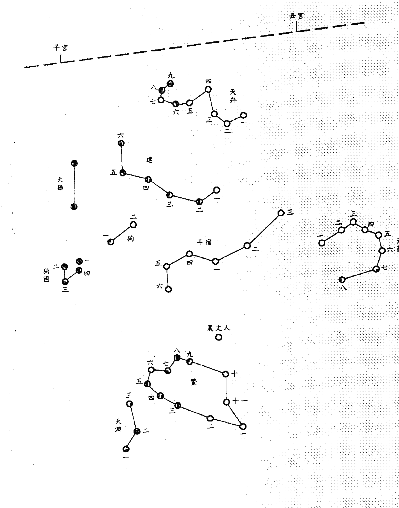

## 第二節 牛宿

星數：1、牽牛6 2、天桴4 3、河鼓3 4、左旗9右旗9 5、漸台4 6、輦道5 7、織女3 8、羅堰3 9、天田9 10、九坎9。

方位：牛宿距中央大星去極一百八度半。

步天歌：

牛六星近在河岸，頭上雖然有兩角，
腹下從來欠一腳，牛下九黑是天田，
田下三三九坎連，牛上直鍵三河鼓，
鼓上三星號織女，左旗右旗各九星，
河鼓兩畔右邊明，更有四黃名天桴，
河鼓直下如連珠，羅堰三烏牛東居，
漸台四星似口形，輦道東足連五丁，
輦道漸台在何許，欲得見時近織女。

釋意：

牛宿有六星組成，為祭祀所用的犧牲。又主關梁，此星大而光明則關口橋梁通暢，對商業發展有利。不明則反之。天下的牛都會遭瘟疫。牛宿上方的河鼓三星，即牽牛星。牛郎織女的傳說與此星有關。牽牛上河鼓三星，為天子的將軍，中央大星為大將軍，左右兩小星為左右將軍，主軍鼓。大而明潤，將軍吉利。動搖不定，有亂兵起。三星成一直線，將軍有功，三星曲折則將軍失策。

河鼓的左右兩側有左旗右旗，是配合三將軍而設置的。與河鼓遙遙相望的是織女，也由三星組成，主天下瓜果絲帛珍寶。若王者孝敬神明，這三星就會明亮。否則暗淡，天下女工就會荒廢。如果大星光芒四射如角，則布帛價格昂貴。不明則有兵亂。牛宿旁有羅堰、天田、九坎，主水利農器。織女旁有漸台，主晷漏律呂，有輦道，是人君嬉遊之路。

### 一、牽牛

方位：牽牛距大星去極一百八度半。

牽牛六星，春夏為木，秋冬為火，為木星也。日月五星常貫牽牛，中道也。牽牛主關梁，神名略緒織，姓益蜀除。牽牛又名天鼓，天關。

牛第一、二星兩星如連李，名即路，又名聚火。牽牛六星，天府也。明七政所王者，即察政視牛星明大，次第相承，王道大昌，天下安寧。牛星不明，其色常，則其歲五穀不成，牛多災凶。

牽牛上二星，主道路，次南星主關梁。次南三星主南越。故動搖變色，從而占之。星怒者則馬貴。牽牛為犧牲，牽牛為牛角，牽牛為冬獄。牛山與女山相連，各法其星形，牽牛須女星神常居其上。

牽牛大星亡，大牛死。小星亡，小牛死疫。中央大星不明而黃者，天下芻大貴十倍。牽牛星直則谷平，曲則谷貴。牛中央大星左右出不明，大將心不正，牛大貴，若後星前近中央大星者則牛貴，遠則牛賤。前星左右出者，前將心不正。後星左右出者，後將心不正。前星者，南星也，後星者，北星也。

牽牛不與織女星者，天下陰陽不和。牽牛遠漢者，天下牛大貴。其入漢中者，天下牛多死。牽牛動，牛災。四方皆然。牽牛明大，關梁通利。牽牛主大豆，始出色黃則豆賤也。赤主豆蟲也。色青則豆貴。牽牛後星前近中央星者，諸侯以四足為弊。色青則道病。色黑則死不至也。牽牛星明則牛貴，細微不明則牛賤。牽牛生於列澤之邑，以主越國為府廷。牽牛主關梁七政，故置九坎，通水道。

災亡及中星移為死，遠漢為貴，入漢中為疫。

月犯其下有憂，將死牛馬及谷貴，畜牲死，災在其宿，有變牲畜之事，四足殃疫，關梁不通，將有農令。

木星犯，吳越來貢。入則貴人及小兒多死，歲多寒，臣有謀，民饑，虎害人。守則陰陽不和，萬物不成，民病人死，六畜賤，牛疫。

火星犯守，諸侯多病，破軍殺將，臣有謀。守又為兵起，牛車用，將死牛貴有祭祀之事，臣謀，谷不成收，大人有疾。入牛中，四月越地，君長凶，米貴。

土星犯守有土工事，守則又為大赦，多雨雪，人民，牛馬疫，其分多忠臣義士，天下有急令。

金星犯守，諸侯不通，妖言無益，將軍失眾其分凶。守則地氣洩，城中多死。入之，天下失車用。

水星犯守，破軍殺，將有謀，人多死，又為谷不收，關梁不通，牛疫、多水，其分憂。

客星犯之，有祭祀之事。守之越地起兵，或為來獻貢，牛馬貴，江淮多盜，歲多水。入之諸侯客來。出則占如斗，又地動，牛馬貴三倍。彗孛出之改元，米貴牛死，天下合謀，人主憂。客彗孛冒犯，越地兵自攻。

流星出之，色赤將出，如星所之以占四方。入之將受命。黑色牛馬疫，黃則昌盛，關梁不通。冒犯則王欲改事及將。

氣之入，黑牛多疫死。黃白繁息。赤爲兵。

訣：牽牛險阻主關梁，中星高下牛多殃。
星明大則王道昌，關梁通利事有雙。
牛近中央暗不明，主將外心謀事運。
若知牛谷貴與賤，星曲星直變換間。
移則難若居列澤，遠觀別國府廷威。

### 二、天桴

方位：天桴距中大星去極九十四度，入斗二十四度半。

天桴四星在河鼓左旗端南北列。天桴者，名奚仲星，在河鼓東。天桴前近河鼓，則鼓用。天桴動，桴鼓用。天桴星明，軍鼓鳴。天桴星不明，度數改，漏刻失時。天桴應度，節漏省時。天桴、鼓槌。謂應漏刻時節也。

不明則漏刻失時，若前近河鼓或相直動搖及金火守之，皆桴鼓用。客星冒犯，占如不明。

訣：天桴鼓槌鳴震天，桴動軍鼓助戰前。

### 三、河鼓星

河鼓三星，旗九星在牽牛北。又名天鼓、三武、三將軍。中央星，大將也；左星，左將軍；右星，右將軍，皆爲天子將。河鼓又名提鼓、天董、天廄、金官。河鼓大星，上將也。河鼓備，關梁設，難距。鼓金聲，無口以音守，聞遠知近，達志意。河鼓星主軍鼓，主斧鉞。主外關州，又主軍喜怒。河鼓怒，黑命成矣。河鼓旗揚而舒，大將出，不可逆，當隨之指而擊之大勝。

河鼓旗星明者，則旗幟出，以日占其國，其星若戾，將軍政亂，士卒強，將相凌。若旗星不正，有兵。河鼓星曲，失計奪勢。河鼓不正或變色，皆爲兵憂，將免。其星動或怒，皆爲兵馬，或將出。又河鼓欲正直而明大黃潤澤，則無兵，大將吉。三武易次，兵起。天鼓之星怒者則馬貴。又名元鼓。

訣：河鼓鼓旗建音聲，設守險阻知謀征，
旗星差戾亂相凌，旗揚而舒指擊勝。

### 四、左旗、右旗

方位：
左旗距西大星去極八十三度，入斗二十二度。
右旗距東大星去極八十八度半，入斗十五度。

河鼓左旗右旗各九星在河鼓兩傍，左旗幽谷，陰險隱逃。右旗伏兵，出奇制勝。

星直而明潤，將軍能應用。曲不明將失計。芒角將軍凶猛。動搖差戾亂兵起。

月犯軍敗亡。火星則大將起兵。五星彗孛冒犯，守之占如右旗。客流星出之，兵出；入之，兵入。

流星冒犯，兵起，諸侯作亂。入之，將亡戰場。氣入之，黃白天子喜。赤則兵起。出則戰勝。青黑入皆占在將，青憂，黑失地。

入則大眾行，氣亡之黑及蒼，憂水，赤旱。黃有德令。

訣：左旗右旗施號令，左隱右出險中勝，
觀其明暗將策謀，勝負在握威名曉。

### 五、漸台

方位：距東南星去極五十八度，入斗十度。

漸台四星屬織女東足。四方高名台，下有水名漸，主晷漏律呂之事。漸台守晷吹灰。

明則陰陽調而律呂和。不明則反是。

客彗孛冒犯守之，陰陽乖戾。流星犯，宮庭火。

訣：漸台近水亭樓閣，立竿定時律呂事。

### 六、輦道

方位：輦道距西北星去極四十七度，入斗一十一度半。

輦道五星屬織女西足，輦道逍遙，優遊私行。明而列則道路通。火星守之則禦路兵起。

流星出犯則天子遊獵。

訣：其星主管出遊行，星明事推道亨通。
流星出犯主有獵，火星守之事轉急。

### 七、織女

方位：織女距東大星去極五十二度，入斗五度。

織女三星在天紀東端。織女又名東橘、天女、天子之女、處女、天子小女。在牽牛西北，鼎足居，星足常向牽牛、扶筐。牽牛扶筐亦常向織女之足，不如其故，布帛倍其價，或有喪。

案織女七夕有渡河之期，似非處女之稱。織女主經緯絲帛之事。大星，皇聖之母。二小星者，太子、庶子位也。三星齊明，天下太平。織女內正紀綱。織女，天水宮也，大長秋也。織女主絲帛五彩之府。織女，天女也，主瓜果，收藏珍寶，以保神明，成衣立紀，故齊制成文繡應天道。

三星齊明，絲帛彩帛賤。星若不明，主後有憂，絲綿繒帛貴，織女大星怒而角者，布帛貴。織女一星亡，則兵起。女子爲侈。織女不居其處，若更天下以女爲憂。織女之道與貫索相直，布帛賤。不相直則天下有急，布帛貴。織女主絲帛之事，與扶筐爲妃，其足常向扶筐，即吉，不則絲制有變。其一足亡也，女病或白兵起。織女星入漢，婦人皆水行，後亦然。

織女晨見東方，赤，精明，女工善；不精明則女工惡。常以十月朔六七日視之。織女星非故，山搖地動，若牛疾。王者至孝，神祇咸喜，則織女三星俱明，天下和平。織女三星保神明，收藏珍寶以奉王。

月犯之，女後憂。火客守之同占，又爲絲帛貴。

客彗孛冒犯，後族亂，人誅。彗出之，女黨行政。有星守之爲女喪。

流星出之，布絹貴。入之，水災或盜。冒犯沖入占如月犯同。

氣之入占在女子。蒼白憂疾，赤兵起，黃有進女，黑病死。

訣：織女之星主絲帛，五彩成文應天道。
明賤暗貴亡多侈，客彗孛流犯女災。

### 八、羅堰

方位：羅堰距北星去極一百九度入斗四度。

羅堰三星在牽牛東。羅堰主起居，羅堰紫壅，激內注渠。暗則吉，明則百川溢，馬被水淹。

客彗孛冒犯，大水暴起。

訣：羅堰三星主起居，開渠築堰理天渠。
客彗孛犯大水起，暗吉明盜畜歸西。
其星欲明事欲急，小錯鑄就大殃梯。

### 九、天田

方位：天田距西北星去極一百一十六度入斗二十三度。

天田九星在右角北。天田處界，縣邑正邪。明則耕農及時，微暗及客彗孛守之，農失業。角與天田同占。

訣：天田主耕主農豐，農盼星明星起盈。

### 十、九坎

方位：九坎距西大星去極一百四十一度半入牛初度。

九坎九星在牽牛南。九坎，水官也。九坎九星主水旱之事，亦主通九泉，星明則陰陽調和，百川通流，皆注於海。星若不明，百泉不通，河海枯竭，天下大旱，人民饑饉，國有憂。微吉，明不吉。九坎九星水通泉。星明盛有大水。微小則吉。五星犯之，江河溢。客星犯，天下憂。流星沖犯，王者憂，後崩。氣入青則旱，黑則百川溢。

訣：九坎九星通九泉，江河入海水官連。
星明通暢達神州，微暗大旱塞河道。

## 牛宿圖

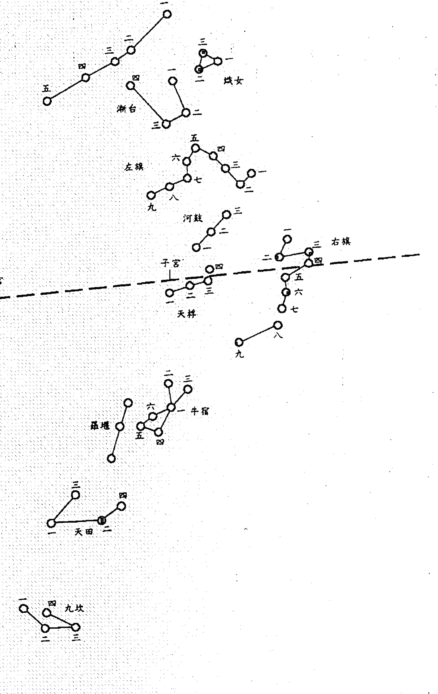

## 第三節 須女

星數：1、須女4 2、離珠5 3、敗瓜5 4、匏瓜5 5、天津9 6、奚仲4 7、扶筐7 8、十二諸國15。

方位：女宿距西南去極一百四度半。

步天歌：

> 女四星箕主嫁娶，十二諸國在下陳，
先從越國向東論，東西兩週次二秦，
雍州南下是齊鄰，齊北兩邑平原君，
欲知鄭在越下存，十六黃星細區分，
五個離珠女上星，敗瓜珠上匏瓜生，
兩個各五匏瓜明，四個奚仲天津上，
七個仲側扶筐星，須女掌府珠寶藏。

釋意：

女又稱婺女，由四星組成，在牛宿的東北面。女宿的形狀有點像箕星。是天的少府。女掌管環佩布帛，為後妃裁制禀服等事，婺女又作務女，即須女，是賤妾之稱，故為後妃之服務人員。

其北部，離珠為後宮之府藏，敗瓜主瓜果，匏瓜天子之果園，又主後妃陰謀之事。天津九星主四瀆，用以度神通四方，奚仲主車正。其南部十六星，以用秦、代、晉、韓、魏、趙、齊、楚、鄭等諸侯國命名，各主一方之事。

### 一、須女

方位：女宿距西南去極一百四度半。

須女四星，水星也。春夏為水，秋冬為火。須女南九尺是中道。須女星，布帛，名色舒，姓終梨時。須女又名天少府，天女、務女、臨官女。須女，主娶婦嫁女也。須女，天女也，天府天市斗也。須女主麻，其色白者，麻為。色黃則不為，色青則麻蟲。

須女星欲明，則士女有緒，國富民殷。須女星明大則女工昌。不明則法令易，詩書滅絕。須女星明則天下大豐，女工有儲，國充富。星不明則天下虛，藏不足。須女動則嫁娶，將有嫁娶，占於須女。須女主布帛裁置之，故置離珠為藏府。

月犯之，女子多疾及女惑。犯而有變，布帛改易貴賤女工令。月變須女有嫁娶事，兵不戰而降。

土犯則美女進，後妃喜，宮中爲賜。守則女喜，歲多水，谷貴，民有大災，其分饑喪，人多凍死。多妖女及土工，入之君有喜。

火星犯，國多妖不祥，大臣當之。守又爲女喪，民病，政急，宮中火災，後妃病，布帛貴。入也如之，又爲天子納女工。

金星犯之，布帛貴，兵起。入之有女謀金帛。出有女多寡。犯守同占，又爲嫁娶事。

水星又爲娶事不爾，外國進美女或爲水災，帛貴。又守之，後夫人憂。

客星冒犯有亂，守則谷貴宮人憂。又犯守美女進，賤暴貴及兵起，出入皆爲嫁娶事。

彗孛出入，王者惡之，其下憂，冒犯則占同客星。

流星出之，女禦爲使。犯入則天子納女。抵之貴女下獄，又出色赤妄死。黑女工死者，若濁澤爲入後。氣之入，黃則女後有慶。黃白有嫁女事。赤兵死。白疾黑疫，皆占婦人。

訣：娶婦嫁女須女主，明豐微虛暗寡婦。

### 二、離珠

方位：離珠距東北大星去極九十五度，入牛六度。

離珠五星在須女北。離珠，女子之星也，禦後宮。離，圭衣也，環佩玉珠，後，夫人之盛飾也，主進王後之衣服也。離珠星明如其常，則宮人妃後安身。其得不明，易其故，則宮人不安。離珠非其故，後宮亂。從危之陽則天旱；危之陰則大水，五穀不登。離珠明大，則後宮昌，失色不明則後勢任子不顯，所近不正。星非其故，則後宮府藏有移。

五星客彗孛犯，後宮爲亂，若宮人有罪。

流星入之宮中兵起。

訣：珠光寶氣貴飾服，星非其故府藏移。
明大女昌暗憂愁，兒女情思幾何休？

### 三、匏瓜

方位：匏瓜距西星去極九十七度，入女初度。

匏瓜五星在離珠北。又名天雞、天鳥、天匏。其四星劍鐔之形，其星明大如其故，則果物皆實，歲熟；星若不明，非其常，果物皆惡，歲不登，有大水，川道不通。匏瓜大則歲熟，星微則歲惡。

匏瓜星主後宮。天雞也，天司中，所以和五味。匏瓜主陰謀。天子果園為獻食者。匏瓜，大瓜也。性內文明而有子，美盡在其內。匏瓜明，則野瓜甘露生匏廚，後宮多子孫；星不明後失勢。又非其故則山搖或山谷多水，天下不通。匏瓜不見或不正動搖，皆為有賊，人主者或以果實為敗。匏瓜五星司謀忠。

訣：明大果實豐熟成，非常不明歲災星。
事遇匏瓜主陰謀，明大利女利小人。

### 四、敗瓜

方位：敗瓜距南星去極八十二度半，入牛六度。

占如匏瓜。

### 五、天津

方位：天津距西稍星去極四十七度，入斗二十三度。

天津九星在須女北河中。天津者，又名天潢、潢中、巨潢、江星、王柱、格星、潢星。其有四星在危之北，居漢。天潢者，天津也。又名天漢。天潢主河梁，所以度神通四方也。天潢一星，天子都船也。

天津有變，水賊稱王，水道不通。天津處，河溢，天津覆水滔天；天津亡，河水為害。天下不通，津道不通。天津張，天下不安。天潢星不具，天下津河關道絕不通。天津九星通厄窮。

一星不具則關梁不通。星明動則兵起，又色微而參差則貴妃疾。
客星守之，入之皆為大小。
流星出之，有使出，隨星出之。

訣：一星不具事有紛，走頭無路講潢星。
守常齊備若其故，渡神四方載運紅。

### 六、奚仲

方位：奚仲距西北星去極三十八度，入斗十八度。

奚仲四星如衡狀在天津北。奚仲彌輪，路鈴優綺。奚仲，車正也。鈴在軾前，優綺，覆者也。

金火守則兵大起。

訣：奚仲四星轉彌輪，金火相守危進程。

### 七、扶筐

方位：扶筐距北第一星去極三十二度，入斗八度。

扶筐七星在天津北。主藏蓋，量入知息耗。扶筐主將作事。扶筐近織女，若不正皆爲天下府藏空開。扶筐採葉，翊養玄羞。

星明則吉，不明則女工失業。暗及移徙，農蠶不收，絲帛大貴。

客彗孛流等星冒犯同占。

訣：扶筐不明府藏空，翊養玄羞在誰人？
暗動移徙桑女惡，絲帛大貴利賈人。

### 八、十二諸國

方位：

- 趙去極一百二十三度入牛四度。
- 越去極一百二十四度入牛四度。
- 周距西星去極一百八度入牛六度。
- 齊去極一百二十八度入牛六度。
- 鄭去極一百三十六度入女二度半。
- 秦去極一百六度入女三度。
- 燕去極一百二十八度入女四度。
- 魏去極一百二十一度入女六度半。
- 代去極一百一十六度入女六度半。
- 晉去極一百二十八度入女八度。
- 韓去極一百二十三度入女八度少。

其星有變及五星客彗冒犯各以國占。

訣：其星各變主諸國，戰史悠悠觀祥吉。

## 女宿圖

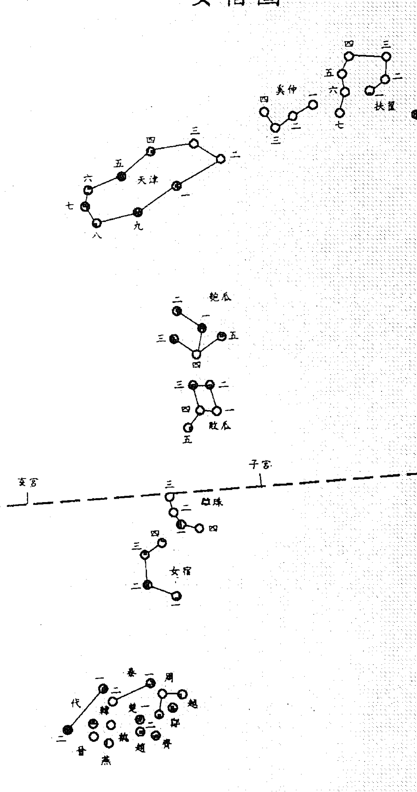

## 第四節 虛宿

星數：1、虛2 2、司命2 3、司祿2 4、司危2 5、司非2 6、哭2 7、泣2 8、天壘城13 9、敗臼4 10、離瑜3。

方位：虛宿距南星去極一百度半。

步天歌：

> 上下各一如連珠，命祿危非虛上呈，
虛危之下哭泣星，哭泣雙雙下壘城，
天壘團圓十三星，敗臼四星城下橫，
臼西三個離瑜明，開陽天蓋主廟堂。

釋意：

虛又名天節，由二星構成。虛宿主死喪哭泣之事，又爲邑居廟堂、祭祀、祝禱之事，是天帝的宰相，主管平治天下，覆藏萬物。若其動搖不定就有死喪哭泣之事與之相應而來。

它的左邊哭、泣二星。右邊有天壘城，主鬼方北夷等少數民族。南有敗臼，主敗亡災咎。北面有司命，主刑罰生死之事。有司祿主增壽、進德、官祿、食料之事。有司命，主誠驕滿以正天下，又主台榭死喪之事。有司非，主伺祭過失。凡虛宿內的星命，多與死喪危亡有關，這是因爲虛宿色黑而虛耗的緣故。

### 一、虛

方位：虛距南星去極一百度半。

虛危爲禮堂，虛神名開陽。虛危，天蓋也。虛府庭也，虛主哭泣諒暗之事，又名爲天軍市、臨官、天府、黃鐘宮、兌宮、申宮。虛者生於牛山之中，以爲齊國府廷。北陸，虛也。又爲天府，主邑居，主廟堂，主祭祀，主祝禱之事。虛二星主墳墓冢宰之官，十一月萬物盡於虛星主之，故虛星主殤客之事。中有六星不欲明也，明見則神龜用事，將有哭泣之事，則占於虛。

虛山危山相連，在齊臣首山中坐，虛星不明，天下大旱。虛危中有六星不欲明見，明見則有大喪，近期一年，中期二年，遠期三年。靜而明，天下安。

月犯兵起有陵廟，事空邑，復起其分憂，將死。其宿有變，土工作，外軍饑。

木星犯圍乘守，宰相凶，有德令。犯又爲王者惡之，天下饑。

火星冒犯，流血滿野。守則將叛，旱災，萬物不成，女子多厄，有土工，兵火起。入而勾己，大人憂，戰不勝。又犯之守，七月齊分，災憂，不則相凶。

土星犯守有赦，德令行，又守則風雨不時，旱風米貴，大臣爲亂，人多不安，妖言。

金星冒犯爲喪，政急。有芒角，臣有謀。又守犯之，有兵不多，孤寡。

水星冒犯，春旱秋水，五穀不成，其分政急，多水災。守爲水物不成，若角動色青，臣欺君，國兵喪。

客星守，其分兵疫。犯之米貴，守犯又爲哭泣之事。出則使人之諸侯，其分有喪，則有井田之法，改制之事，軍離散。又出入，君親率將兵。凌犯環繞勾己，國憂兵亂。

彗孛出犯爲兵喪，亦占其分，彗孛所指其地必亡。流星出之，貴人求醫，重臣出使。入則其下兵聚。出入之於相光潤澤則受賜，黑死黜。

氣之入，白蒼器。赤則大哭。黃蒼喜慶。白則使客來。黑則水爲憂。白以喜祀宗廟，出之爲享祀。

訣：虛星開陽暗泣事，飭客不明事有滯。
五星犯守政制急，相光潤澤地淒迷。

### 二、司命

方位：司命距西星去極九十二度，入虛三度。

司命二星，聽令傳旨刑，東招西侯斬立停。

司命執刑行罰。司命舉過，滅除不詳。司命繼嗣移正朔。司命主百鬼。司命與輿鬼司侯。

訣：百鬼行刑司命聽，傳承接代司侯辰。
多有惡夢前事因，上天傳旨正朔行。

### 三、司祿

方位：司祿距西星去極九十度，入虛四度。

司祿二星在司命北。司祿增年延德，招財進寶天之所昭，行功立德自在回報。

### 四、司危

方位：司危距西星去極八十五度半入女八度。
司危二星在司祿北。司危驕逸亡下歸，戒燥斷橫表賢良。

訣：居安思危莫逸橫，多有司祿吉轉凶。
德高望重仁義用，二星戒燥數距衡。

### 五、司非

方位：司非距西星去極七十九度半，入女九度半。
司非二星在司危北。司非以祛多私。四司續功，桑麻襄陸。
其命、祿、危、非，皆占在天子以下，壽命、爵祿、是非、安危之事。明大為災，居常為吉。

訣：大公無私助道力，暗微常變起是非。
行功立德明是非，四司續功事解紛。

### 六、哭

方位：哭星距西星去極一百一十七度半入女九度。
月五星客彗孛冒犯皆主喪。
流星出入，大臣出去。

訣：人運哭星淒淋淋，不死自己死他人。
星暗失常國有喪，人民無奈各奔亡。

### 七、泣

方位：泣星距北星去極一百四度半入危二度。
占同哭星。

### 八、天壘城

方位：天壘城距西星去極一百二十六度，入虛初度。
天壘城十三星如貫索狀在哭泣南。天壘主北夷、丁零、匈奴。
金火客星守，入夷，人死塞。
赤氣掩，入北夷，驚滅，大疫。

訣：天外壘城卻夷邊，忽明忽暗事不全。
若有星亡視北夷，金火客守必有戰。

# ※ 奇門星相絕學 ※

### 九、敗臼

方位：敗臼距西北星去極一百三十九度半，入虛八度。

敗臼四星在虛危南。敗臼四星主正治之事。敗臼主殃凶，其星微而
不明，溫溫然，則人主吉，人民安。星明而動搖者，人主有憂，疾多災
凶，人民愁苦，天下不安，多死喪。敗臼一星不具，民賣釜甑。

五星入之禍殃作。

客彗孛冒犯，人相食。黑氣入主憂。

訣：敗臼明動禍殃生，民不潦生釜甑空。
四星正治安民心，溫溫爾然吉安平。

### 十、離瑜

方位：離瑜距南星去極一百二十八度，入女九度。

離瑜三星在代東南北列。離，襯衣。瑜，玉飾。此婦女服。離瑜，
玩飾也，並見舅姑。

星微則後宮儉約。明則婦人奢縱。

客彗孛冒犯，後宮無禁。

訣：離瑜明陰奢陽縱，表裏不一暗賂賄。
客彗孛入後門開，玉飾配珠多粉黛。

## 虚宿图

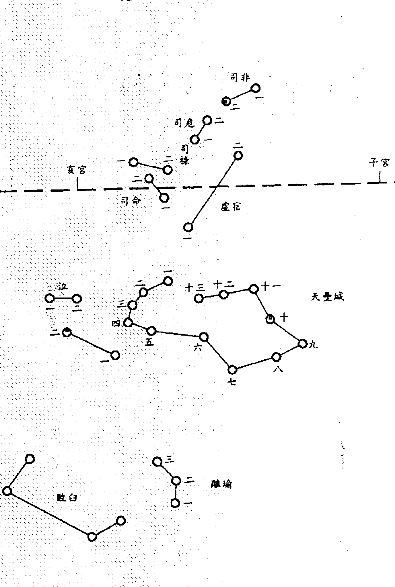

## 第五節 危宿

星數：1、危3墳墓4 2、臼星4 3、杵星3 4、造父5 5、車府7 6、鉤星9 7、人星5 8、蓋屋2 9、天錢10 10、虛梁4。

方位：危宿距南星去極九十六度。

步天歌：

> 危三星曲舊先知，危上五黑號人星，
人畔三四杵臼形，府上天鉤九黃晶，
鉤上五鴉字造父，危下四星號墳墓，
墓下四星斜虛梁，十個天錢梁下黃，
墓旁兩星能蓋屋，身著黑衣危下宿。

釋意：

危由三星組成，上一星高，傍兩星低，形如蓋屋。爲天府，主宗廟宮室。也爲天市，主管造受藏之事。它的左邊有四星名墳墓。主墓地死喪之事。墳墓下有虛梁，主靈廟祀禱之事。危上有五星名人，主萬民。有四星名杵，主春軍糧，杵上有車府、造父諸星，造父主禦馬。

### 一、危 墳墓

#### 1、危

方位：危距南星去極九十六度。

危三星。春夏爲水，秋冬爲火。危，土星也。危南九尺是中道。虛危爲禮堂也。神名推長，姓呂賈王。又名天府、天市。危爲百姓，市爲架構。危主廟堂，上視危星以主室。危星主柱，主蓋屋，以成帝宮，以教天下。其星明，則天下安寧。危主架屋，星動則有驚屋之事。危星動搖移徙，天下謀作不解。其星不明，客有誅者。危動搖不明，天子作宮殿，民有土功。

虛危主廟堂，祀考妣，故置墳墓，識先祖塋域。虛危五星爲祠堂墳墓，四星祠祀享。危爲發屋之事，爲蓋屋。將有蓋屋之事，則占於危。墳墓四星主悲涼也。

星動不明，營宮室土功，兵革興。

月冒犯，大臣將其分有憂，將死。興治樓台、兵喪，來年米貴。

木星冒犯守之，更宮室及土工興，兵喪。守則民勞，多盜，民相惡。

火星犯之，越亡地。守則國憂兵叛、疾疫、宮中火災、春旱秋澇。久守則近臣叛，犯守皆爲大赦。

土星犯守，皇后憂，兵喪並起，土工興。又守爲水旱，民族祠祀不恭。

金星冒犯，無兵兵起，有兵兵敗，谷不成，多水災。守則旱災，民多癰疽之疾，將軍憂。又犯守之，天下多急事，國憂。民流亡兵多。

水星犯守，大臣刑法，官憂，其分災。又守則皇后有疾，米貴，兵喪並起。

客星出犯之，多雨谷不成及哭泣，土木興，營宮室，王侯死，國敗，饑荒。若留守成勾己，君惡之，建宮室，立王侯。

彗孛冒犯，其分有叛者，兵起將出，易政，米貴，大水。

流星入，其下不寧，下有謀。抵則地亡，交則秋有兵。犯則有祭祀之事。

黃濁出入則國安歲豐，土工興，陵廟有水，大臣有災。

氣之入，蒼白若赤皆爲土工與營造之事。白兵。青則憂。蒼則憂，損屋。黑有喪。赤氣出火災。黑下有水若哭泣。黃色出之國有喜。

#### 2、墳墓

方位：墳墓星距中星去極九十六度入危五度。

墳墓四星。其星暗小移徙不見則山陵不安。動搖及五星犯守皆爲喪。

流星出入有喪事。

訣：上有不測危星動，識得祖跡塋域享。
墳塋墓動皆不安，喪事哀怨苦悲涼。

### 二、臼星

方位：臼星距南星去極六十九度半入危二度半。

臼星近人星東南。杵臼七星主給飽。杵臼主軍糧食。天杵臼星不具，民賣其釜甑，去其處。天臼之星眾則歲樂。星疏則歲饑。杵臼離，黎民饑。杵臼星不具，民失杵臼。杵臼充春，主給美廚。

仰則歲豐，覆則儉。若杵臼不相當，軍士饑。餘占與杵同。

訣：杵臼不具民不濟，仰豐覆儉眾則樂。

### 三、杵星

方位：杵星距南星去極六十一度半入危三度。
內杵三星在人星旁，守常則吉，若不具不明、動搖、移徙、離拆與臼星不相當，皆爲大饑。
客彗孛守犯，亦如之。
訣：杵臼七星主糧草，星疏歲饑離民淒。
養廚源以七星備，相當守常三軍喜。

### 四、造父

方位：造父距南星去極三十八度入危十一度。
造父五星在傅舍南河中，造父名西橋、司馬星、輦道僕。造父星移處，兵起，車騎滿野，馬貴。造父亡，馬大貴。造父洗馬，轡勒禦鑣。明則喜。亡及動搖，兵起馬貴。客彗孛冒犯，兵革動，廢馬出。
訣：五星齊列輦道旁，造父移處野荒涼。
亡及動搖是凶兆，中道多有兵馬搖。

### 五、車府

方位：車府距西第一星去極五十六度半入虛四度半。
車府七星在天津東近河傍。車府，主車官也。車府撰禦動則車馬出，火金客彗孛冒犯之，兵車動。
訣：車府之地車官權，明具移動車轅前。
若知戰地兵車況，火金客彗犯其詳。

### 六、鉤星

方位：鉤星距大星去極二十四度入危初度。
鉤星九星。
星明則服正，若非其故，彗孛冒犯，五星守之或直，皆爲地動。
訣：鉤星服正明其道，星犯宜直地動搖。

### 七、人星

方位：人星距西南去極七十度入虛六度半。
人星五星在車府東南。又名臥星，主治萬民。臥星主夜行一度，齊記以防淫。土官也。人星不具，王者有子不成年而死。星盡不見，有人傳詔，相驚以詔事，婦人亂，或有詐僞，或有詐僞詔者。臥星立則天子明，民死。星芒則天下有縱民。

客彗孛觸犯守之，人多疾或民亂。有星入之，天下有詔符傳，相驚。人星優遊，乃爾諸寧。

訣：萬民各事五星治，人星不具夭折離。
星盡不見民傳議，民心浮燥國法嚴。

### 八、蓋屋

方位：蓋屋距西星去極九十七度入虛九度。
蓋屋二星在危南。主蓋治之官也。危害屋室，柱梁侏儒。
星動有板築之事，五星守犯，國兵起，客彗孛尤重。

訣：危樓蓋宇柱梁殊，板築之事有蓋屋。
星動樓基助天梯，五星犯守多執意。

### 九、天錢

方位：天錢距東北星去極一百一十八度入危三度。
天錢十星在北落西北。天錢藏府，聚眾談誇。
明則庫藏盈。暗則虛耗。金火守之，兵盜起。
客彗孛冒犯，庫藏有賤，火。

訣：星明府藏庫藏盈，暗耗虛損重利義。

### 十、虛梁

方位：虛梁距東星去極一百度半入危六度。
虛梁四星在危南。虛梁，國陵，非人所處，故叫虛梁。虛梁宮室，屋室謹禱。

星動搖則陵廟壞或築。金火冒犯，兵起。客彗孛同占，又主大凶。

訣：虛梁宮室國陵棟，寺廟禱祀詳築情。

## 危宿圖

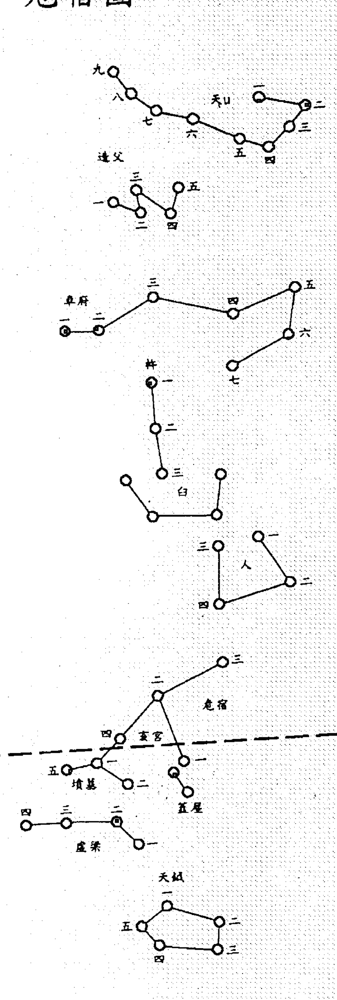

## 第六節 室宿

星數：1、營室2離宮6 2、雷電6 3、騰蛇22 4、土公吏2 5、壘壁陣12 6、羽林軍45 7、斧鉞3 8、北落師門1 9、天綱1 10、八魁9。

方位：室宿距南星去極八十度半。

步天歌：

> 室兩上有離星出，繞室三雙有六星，
下頭六個雷電形，壘壁陣次十二星，
十二兩頭大似井，陣下分布羽林軍，
四十五卒三為群，軍西西下多難論，
仔細曆曆看區分，三粒黃金名斧鉞，
一顆真珠北落門，門東八魁九個子，
門西一宿天綱是，電旁兩星土公吏，
騰蛇室上二十二，營室二星主軍糧。

釋意：

室，又名營室，玄、冥由二星組成。一為玄宮，一為清廟。為軍梁之府，又主土木工程。在室周圍有六星，兩個一組，稱為離宮。營室又名定星，定是“正”的意思，修建官室，以宮室為正。營室北有二十二星，稱為騰蛇，主風雨。南有六星為雷電，主雷電；西有二星名土公吏，為主土之官。雷電南有十二星名壘壁陣，是天軍的營壘。再往南有四十五星，每三個一組，稱羽林軍，是天上的禦林軍。羽林軍附近有八魁，主機關陷阱，網羅禽獸。有斧鉞，主行誅拒敵，斬伐逆謀。有北落師門，主侯兵。有天綱，主武帳。

### 一、營室 離宮

方位：室星距南星去極八十度半。

營室二星，木星也。春夏為水，秋冬為土。室南九尺，是中道。營室主軍市之糧，神名玄耀登，姓婁方。營室又名休宮、玄冥、天官、大人之官、清廟、豕、攝提、宮府廷也。營室為天庫，舌俞角。營室，西壁也。營室謂之定。定，正也。營室主土，天子廟。

營室二星在城山東南與東壁山相連，室壁星神常居其上。營室二星主軍糧，離宮大星主隱藏。營室三軍所立，外有羽林以衛帝。其星欲明，明則國昌，動搖則兵出。營室動，有土工事。離宮一星不具憂子。營室一星小而不明，薦祀不實，鬼神不享，又為國家多疫。將有土工之事，則占於營室。營室二星亡，則輔臣病死。

營室，東壁四星，四輔也，欲其正。中有二星，二舍也。欲其實，正猶方，實且其旁多小星也。四輔不正，則輔臣不忠，越職賣權，二舍不實，則宮女淫，出入不常，嫡媵相逾，君不悉察，後宮女怨，曠去心。離宮者，天子之別宮，主隱藏止息之所。營室主軍糧以廩士，故置羽林，省道理。

月犯之，宗廟毀，宰相憂，土工興，有哭泣，主自將兵。在其宿有變，臣亂兵在外敗。月宿之，君數移寢處。

木星冒犯，兵戰，歲不收。守之則水旱、大疫、宮中不和或病死。若久繞成勾己，大臣陰謀，兵起入宮或天子出幸。

土星冒犯，其下有兵出入，用斧鉞，貴人憂。守之則有爵封，益地，關梁不通，土工興。皇后、夫人有憂。久守則大人惡之以赦除咎。

金星干擾，五寸許，政令不行。守則兵敗國喜，夫人忌之，防察親近，久守，兵革滿野，乘守勾己逆行，往來宮妃或大喪，宮人嘆息。

水星犯守掩閉，其分水災。又守則西北兵動，深亦守備。

客星守之，城郭壞，不利先起兵，君使人於諸侯。赤占兵。白喪。黃土工。青憂黑凶。犯則王者憂之。守則不得出軍，多陰雨。出之為喪。

彗孛出之則大亂，易政，大水。冒犯，先起兵者弱，戰必亡地，將戮。見在其宿中則後宮亂，有德令。

流星冒犯，軍乏糧。出之，有使出。犯之，人使自他邦來。赤占兵，黃白占土工。黑喪青憂。其色潤澤出入則國安歲豐，民欲有廟享、慶賀之事。

營室二星主軍糧，主後宮寢正中央。

訣：營室二星主軍糧，明則國昌動有傷。
欲知輔臣賢與忠，其旁小星多不良。
離宮暗微主隱藏，一星不具防後患。

### 二、雷電

方位：雷電距西南星去極八十七度入危十二度。
雷電六星在營室西南。雷電震音，殷殷動搖。

明動則雷電作。流星出入爲風雨且不出七日。赤則有兵起，爲旱。清白爲雨。

訣：雷鳴電閃示玄機，紅照人心白照妖。
六星明動政事急，百姓災禍隨聲意。

### 三、騰蛇

方位：騰蛇距中大星去極四十四度少入危九度半。
騰蛇二十二星在營室北。騰蛇，天蛇也，主水蟲。騰蛇，蛇之牛地，與龜鰲交，水蟲之長也。水中之蟲，皆屬騰蛇。
騰蛇星明，水蟲茂，魚鹽賤。星不明，則水蟲衰耗，魚鹽貴。騰蛇星移南則軍兵起，移北則大水。若星明不安，微則安。移徙則南旱北水。

客彗孛犯守爲水災，守之天下怨。
流星入之，水旱兵喪，沖之則口舌起，魚鹽貴龍見。

訣：騰蛇星明水產茂，星移南旱北澇多。
流星沖之是非起，暗耗微吉事怪異。

### 四、土公吏

方位：土公吏距南星去極八十五度半。
土公吏二星在營室西南。土公吏主司過度，又爲土公，司屏廄設儲。

動搖有板築之事，金火犯守，兵起。

訣：土公設儲司築造，齊心大力助緣交。

### 五、壘壁陣

方位：壘壁陣距西第一星去極一百一十五度，入虛初度。
明則國安，非其故則兵起，破軍殺將。亡則兵盡出。五星逆守留凌犯變色勾己，客星入之皆爲兵起。火金水尤甚。客星冒犯邊將死。流星入而色青，南則後憂，北則諸侯憂。赤黑，東則後有謀，西則太子有謀。黃白諸侯受賜，壘城在軍位，其十二星爲營壘。

訣：壁陣營壘防敵襲，察星觀色運時機。

### 六、羽林軍

方位：羽林軍距大星去極一百一十七度，入危十五度半。
羽林軍四十五星，又名材官、天南庫、單於軍，又主翌王。危南有眾星，名羽林，爲天軍。羽林軍，水宮也。羽林主軍騎，三三而居，行列相隨，守衛之官也。

其星實而眾明，王者吉，其國安。星稀而不明，若動兵士出。星若亡不見，天下兵盡出。羽林星不欲動，動即有兵，不出六十日，兵車發有所之而起。又爲不出三十日，有兵。星亡又爲大將軍發，若大赦。壘城在軍位，壘城鉞主斬予，陣星備武急。非其故，兵起，有破軍殺將。羽林眾星主翼王。

月五星入犯皆爲兵起。五星若退留變色成勾己者兵革大興。火金尤甚。火星留二十日以上大人當之。若芒角色赤興兵者。

客星守之及戊己日旬始見其中則兵大起。入而色黃白則天子喜，色赤則臣叛。

彗孛出之，大人謀逆。

流星出，其禁兵受賜。犯則兵起，士卒散，軍有出者，其入之與壘壁陣同占。氣之入，蒼白入南則後憂，入北則諸侯憂。黃白則後或太子有所獻。黑則太子諸侯憂。

訣：護法立德行天道，星動不明暗相挑。

### 七、斧鉞

方位：斧鉞距北星去極一百三十度入室二度。

斧鉞三星在八魁西北，又名鉄鉞。鉄鉞主亂行斬，誅枉詐。星欲不明，若明動皆爲斧鑽用。非其故則兵起鉄鉞用，兵將有憂。

月五星彗孛犯守皆爲臣下將死、憂、誅。彗孛尤甚。

鉄鉞拒難，斬伐奸謀。

訣：交戰拒難鉄鉞狂，奸謀陰邪伐其殃。

### 八、北落師門

方位：北落師門去極一百二十六度，入危一度半。

北落一星在羽林西南。爲大赤星，狀如角，天軍之門也。名爲北落又爲師門。北者，宿在北也。落者，天軍之北落。師者眾也。門者，軍門也，北落主非常。北落師門星明大，士卒昌，大將軍強。星微小若亡不見，天下兵，大將出行，其國不寧主有憂。北落角者則兵起，北落亡角則有軍，北落師門主侯兵。大而明則國安。微小芒角，月五星冒犯皆兵起，水火甚之。

客彗孛犯守之，光芒相及覆，軍殺將，邊兵入塞。
流星入抵，皆爲兵候。氣入蒼白疫。赤爲兵，黃白喜及使出。黑則邊將死。

訣：北落星明事非常，暗微通曉師門象。

### 九、天綱

方位：天綱去極一百二十九度，入危五度。

天綱一星在北落西南。天綱，大繩索也，以張帳幔，天子遊犒，野次所須。天綱武帳，宮府置衛。

動搖則兵出入不常，彗孛爲兵起。

訣：天道常綱皆如常，巡遊序見光陰留。

### 十、八魁

方位：八魁去極一百三十九度，入壁四度半。

八魁九星在北落東南。八魁陷阱，棧門揭翅。八魁主張捕陷阱，設機也。棧，覆阱也，揭翅爲毒熾，使人無踐人。

動則禽獸多羅網死；火金客彗犯守皆爲兵起。

訣：八魁做捕網多羅，星動犯守覆阱藏。

## 室宿圖

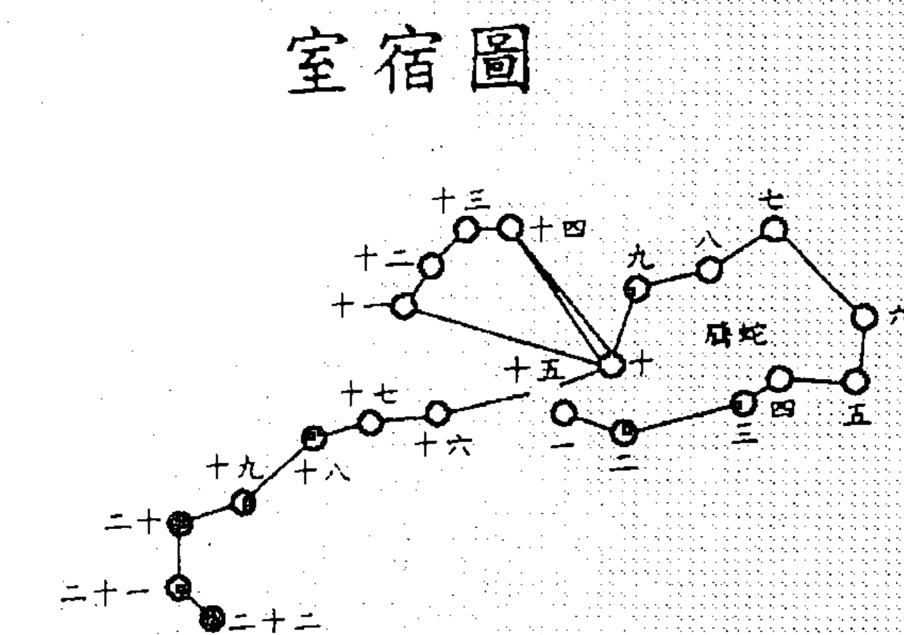

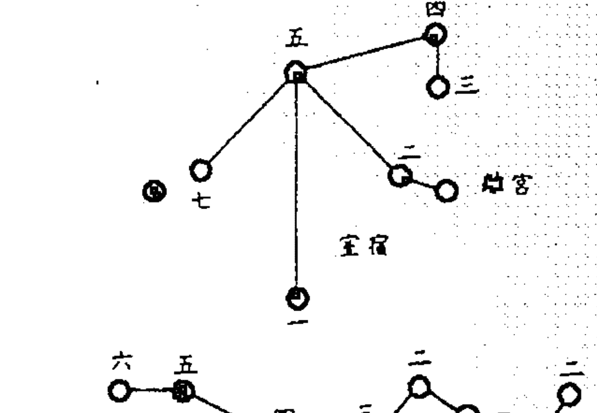

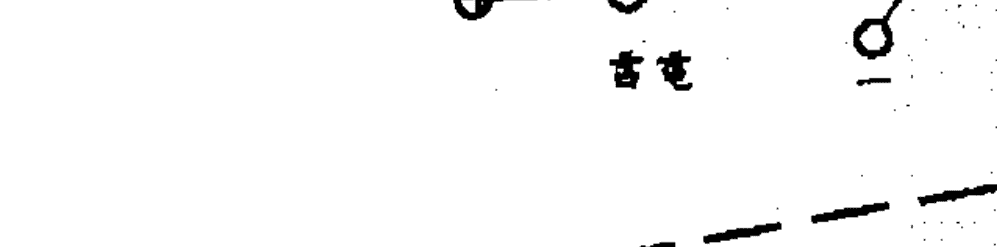

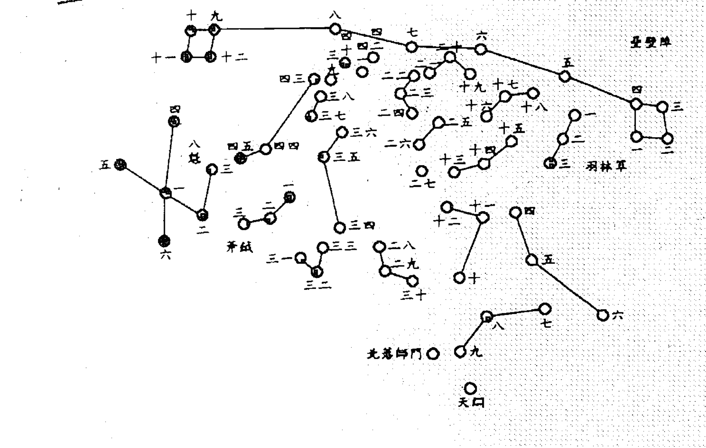

## 第七節 壁宿

星數：1、東壁2 2、天廄10 3、土公2 4、去雨4 5、霹靂5 6、鈇鑕5。

方位：東壁距南星去極八十度半。

步天歌：

> 壁兩下頭是霹靂，霹靂五星橫著行。
雲雨次之口四方，壁上天廄十圓黃。
鈇鑕五星羽林旁，土公兩黑壁下藏。

釋意：

壁又名東壁，由兩星組成。爲圖書之官，主土功。它的附近有霹靂、雲雨，主雷雨。北面十星，名天廄，主馬廄。南端有五星，名鈇鑕。主芟除雜草以便耕種的農具。

### 一、東壁

方位：東壁二星距南星去極八十度半。

東壁二星，土星也。春夏爲金，秋冬爲水。東壁南九尺爲中道。東壁主文章，神名瞻工，姓刑孫王。東壁又名天池，天術、天梁、天市。東壁主土功之事。

東壁失色，大小不同，則王者好武，經士不用，圖書隱藏，天下咸愚。東壁主土，星動則土功事興。東壁星明大，王者明道，術學大興，國有君子。東壁離徙作治田，就聚以田宅爲憂。一爲將有土功之事，占於東壁。東壁主文章，圖書府，故置壘壁以衛後。東壁主文章，萬物犯壁本鄉。

星明則王者吉，國多君子。暗及失色，大小不同，尚武事，經術，圖書廢。

月犯之大亂，民饑多死，其分憂及土工在其宿有變，孕婦多損，近臣憂。月宿之不晦冥而有風雨。守之，其分兵喪，奸臣謀。

木星冒犯，水傷谷。守則有赦，國有賢人，天下安。久守凌犯勾己，夷狄侵擾。冒犯若是火星則衛地憂，不則相凶。守則兵火，土工，歲惡，賢者退之。若守而光明潤澤則凶。

土星守犯，君安國昌，圖畫興，天下豐平。逆行勾己其分土工興。

金星冒犯則火災。守之有軍不戰。大臣鄉正，水旱風雨文武、術土、病。

客星出之，色赤其下大臣憂。犯之，文士死，亦爲喪，津梁不通。守則死，歲多風雨。
流星犯之同占或文章廢。黃白潤澤出入文章賢士用，遠國來。氣之青憂，蒼白喪。黑破亡並占其分，黑之爲水。黃則外國來貢，又名倚五立。赤出入皆爲兵起。若光潤澤則天子言宗廟事。

> 訣：文章圖書列星明，一明一暗晦陰陰。
最喜土星守犯東，天下豐平圖人興。

### 二、天廄

方位：天廄距西星去極四十九度，入壁初度。
天廄十星在東壁北，近王良。天廄宮主傳舍。天廄星非其故，有廟戒之事，入主以馬爲憂，否則馬疾。
天廄置驛，逐漏馳婺。馬廄主馬，如今驛馬，其行急疾，與晷漏競也。
明而動則多郵駟，不明則道路節。非其故人主以馬爲憂，不則馬多死。月犯主馬蹄。
客彗孛冒犯入守，舍驛道路不通。彗入又爲廄焚。移動、流星出入則天下驚，驘馬死路。色赤黃則驘馬進。

> 訣：十星明疾驛馬動，月犯馬蹄客不通。
流星出入驘馬驚，路有屍寒晷漏競。

### 三、土公

方位：土公距西星去極八十五度，入壁初度。
土公二星在東壁南，土公主豫儲。動搖有板築之事。

> 訣：土公明則土工興，豫儲興衰視可聆。

### 四、雲雨

方位：雲雨距西北星去極九十五度，入室五度。
雲雨四星在霹靂南。雲雨興和，休祁茂孳。興發也。和，蓋也。休，亦善也。祁，雨盛貌，孳，草木蕃茂也。
星明則多雨水，動則多陰陽晦。火守，天下旱。水守則大水。流星與霹靂占同。

> 訣：星明雨多人興和，星動氣晦陰陽索。

### 五、霹靂

方位：霹靂距西星去極九十二度，入危十五度。

霹靂五星在土公西南。霹靂奮擊捽，拽拖投也。星明而動搖及五星犯入，皆有霹靂之事。流星明同占雲雨。

訣：霹靂五星助雲雨，多有不測轉事離。

### 六、鈇鑕

方位：鈇鑕距中北星去極一百二十八度，入奎三度半。

鈇鑕五星在天倉西南。鈇鑕銼鉤石有饒。鈇，斧也。鑕，椹也，主斬以飴牛馬。四石爲鉤，言斬銼豐饒，盈鉤石也。明則牛馬肥，動搖微暗不見，則牛馬多，否則牛馬多死。彗孛守爲兵將憂。

訣：明則牛馬肥壯饒，六畜興旺人憂消。鈇鑕形狀如鋒刀，斬草除根看微妙。

## 壁宿圖

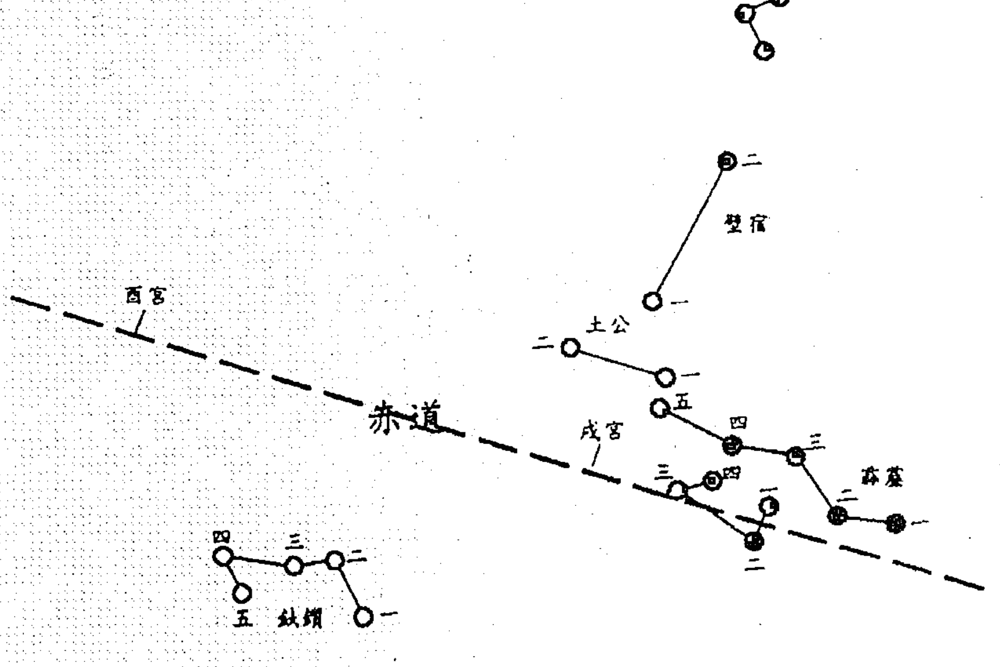

## 第三章 西方白虎七宿

## 西方白虎圖

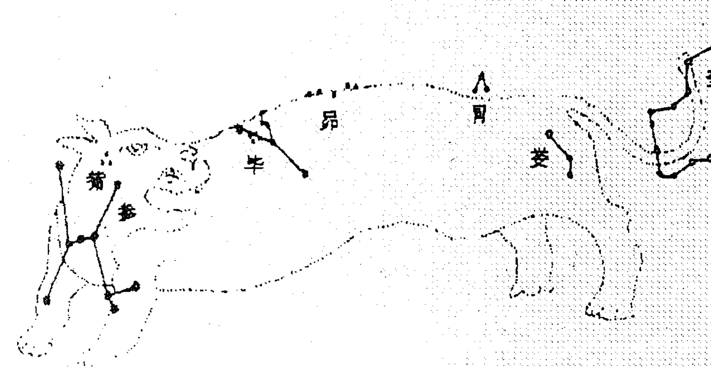

西方白虎七宿：奎、婁、胃、昴、畢、觜、參。觜爲虎頭、虎須，參爲虎前肢，奎爲虎尾，其餘爲虎身。

## 第一節 奎宿

星數：1、奎16 2、附路1 3、軍南門1 4、閣道6 5、策星1 6、王良5 7、外屏7 8、天溷7 9、土司空1。

方位：奎宿距西南大星去極七十二度半。

步天歌：

> 腰細頭尖似破鞋，一十六星繞奎生。
外屏七烏奎下橫，屏下七星天溷明。
司空左畔土之精，奎上一宿軍南門。
河中六個閣道形，附路一星道旁明。
五個吐花王良星，良星近士一策明。

釋意：

奎爲西方白虎的第一星，又名爲降、爲封豕，由十六星組成，樣子像一隻破鞋。奎爲天之軍庫，主兵，以禁橫又主溝瀆。它的北面有一星名爲軍南門，主禁入以防盜詐。是軍營的南門，軍南門上有閣道，又有策、王良，主駕車御馬之事。奎的南面有外屏，主障蔽惡穢，是天溷的遮掩物。天溷在外屏南，由四星組成，是天的廁所。天溷南有土司空，是主水土功利之官。

### 一、奎

方位：奎距西南大星去極七十二度半。

奎十六星，金星也。奎南九尺，是中道。春夏爲金，秋冬爲水。奎主武庫兵，神名列常，姓均劉方。又名天庫，天邊偏將軍、武庫、軍庫、封豕、天豕、女令、溝瀆、府廷也。奎者天之玄冥也。溝瀆陂池江河漢也，其木榆也，其物牛筋革。妻看獄。將有溝瀆之事，則占於奎。其西南大星，所謂天豕目睛也。也叫大將，欲其明也。奎大星，大將軍者，其欲明而行列，兩頭星亡近河以侯水兵。芒角動搖進退，國必用兵，或爲有赦令。

奎山、婁山相連，奎、婁星神常居其上。奎星芒角動搖，國必有兵，不出年中。帝淫汰政不平，則奎有兵。奎星直則有溝瀆之事。奎頭大星色黃，忽然不明者，則有將軍叛王也。非其舊故黃也。奎中星明者，大水出。奎主軍，兵禁不時，故置將軍以領之。奎主庫兵，秉統制政，功以成。

星欲明則吉；星有角則德政虧；動則爲兵。月犯之其分憂，邊兵水災，貴以憂，民不安。木星冒犯，近臣爲逆。守之則大饑，多獄訟，又爲其大道同，臣忠，北人賓服。若潤澤爲大熟。入之則饑兵起。火星犯之，環繞三十日以上，將相凶。其分水災民流。守則農夫不得耕，疾疫，不宜婦人，其分多妖言妖孽。若動搖進退，有赦。入則三日魯分君長死，經旬相死。土星冒犯，女後冒，國喜，遠人來。守之入之則有名者多死，邊兵動。久守，貴女攝政或有女喜。金星冒犯守之則外兵來，有軍不戰，五穀不成，有赦。又守之則傑俊興，國有圖謀。重芒角則天下爭奪。又守之則外兵入國及兵起西方。水星冒犯，奸臣有謀。守之則天下多悲，王者憂。入則水氾。守占亦如之，又大臣下獄，水、旱、兵、火災，五穀不成。客星出之則奸臣僞惑天子。冒犯或入其中則有潰事。又入之爲破軍殺將。守則賊臣在側，王者憂，或兵敗。彗孛冒犯出入皆爲兵喪大饑。占於西北宜備之。流星出入則有溝瀆事，入之則聚貴事及破軍殺將。若冒犯如赤如光火炸，有聲，出入皆爲虛虧努用。氣之入蒼白則婦人憂。黃有珠玉寶喜，宮女災。若潤澤爲天下喜而受命。赤則也爲兵及婦人病。

> 訣：十六金星列禦牆，明吉角虧動有傷。溝瀆決堤流星旁，急來急去水中漾。

### 二、附路

方位：附路去極三十五度半入奎五度。

附路一星在閣道兩旁。又名王濟之太僕、伯樂、就父。附路主掃除，附路主禦風雨。附路以通道，若閣道道壞，當從附路備豫不虞，以俟災害，故叫備路。附路明則天子壽昌，萬民無疫病之殃。附路亡，道途塞。附路星芒則車騎滿野。附路正馬則車騎滿野，天下大亂，期十月。王良，駟馬也。正馬謂移在駟馬之前。芒角動搖則車騎在野。不明則津梁不通。亡則有道路之災。金火冒犯占如芒角，客彗孛犯之，則道路不通。氣之入占在太僕。赤則誅。黃白受賜。蒼白憂。黑爲死。

訣：附路一星備敗傷，閣道不通行此徑。落困入中路道尋，附路自有天健新。

### 三、軍南門

方位：軍南門去極六十六度，入奎十五度。

軍南門一星在天將軍西南，大將軍之南門也。軍門營壘，禁攻禦暴。星不明則夷狄叛。明則遠方來貢。星動搖則兵起，它占同大將軍門。

訣：星明遠貢行此門，察敵禦侵觀此星。

### 四、閣道

方位：閣道距南星去極四十八度入奎四度半。

閣道六星。在王良東北後，六星絕漢抵營室，直紫宮後，爲天子的禦道，名閣道。閣道，水官也。閣道形如飛閣之狀，從紫微北門出，至河上，天子法駕乘其行，神乘也。閣道，王良旗也。又名紫宮，旗在王良旁，而抵紫宮垣，旗動搖，不如其故，旗所拍者，兵所起。又爲宮垣有兵。

閣道所以扞沖，難滅諸咎。閣道星明，行列正直，人主吉，天下安。其星動搖不如其故，若星不具，則天子津道不通，有謀臣。閣道星主道星，天子私出入。王者別宮，以侯近出。星明大則王者聖明，四方大通。閣道星與紫宮蕃星同行，關溺河梁。若王者宮閣道有害者。閣道六神所乘。

客彗孛干犯之則人君不安，國有喪，人君居正殿。不徵，行則吉，氣之入，黃喜黑病，白有急事。

訣：王者禦駕閣道行，六神行馳乘此經。若要尋蹤問究竟，星爲旗時觀宮兵。

### 五、策星

方位：去極三十三度半，入壁五度。

策一星在王良前。策星，天子兵烏金宮。主禦者，策者，宮車出必策馬，若星不動則不出。策星主天子之僕禦。策執禦右，騰蛇先驅。若動搖移徙居王良前，或處馬後是爲策馬，皆爲兵起。王良、策馬、車騎滿野，又爲北制號。流星、彗星孛冒犯，大兵起，天子將兵。

訣：策星馬旁侍禦俸，忽然暗淡兵車頓。行駛張慌路不明，峰迴路轉禦星明。

### 六、王良

方位：王良距西星去極三十七度，入壁初度。

王良五星在奎北。王良又名天津、王濟。天駟四星在漢中，又名天駟，傍一名王良，主天馬。王良主禦風雨水道，主河梁。王良爲天橋，天子道橋之渡水之官。王良爲天子奉車。王良策馬，前與馬等，後與馬等。王良爲西橋，故或占車騎，或占津梁。駟馬參差不行列則天下安。若駟馬齊行，王良舉策，天子自將兵，國不安。王良發者，河水出。王良策馬狐狼張。咄咀害出血將將。咄咀，大星名也。血將將爲兵者死傷衆也。王良與馬齊，天子有疾馬，天下有急。王良向造父，馬賤。王良策馬北夷制號。王良策馬野骨曝，車騎滿野，天下大亂，兵大起，明君出，期不出三年。王良策馬動搖，天子欲出，小動小出，大動大出。駟馬不動，天子宮安。千裏駟馬有芒角，天子兵，期二年，王者必有所在，惟意有所想，未發顏色。天駟星前與閣道相近，有江河之變。王良止則馬疾病。天子乘舟得其所，貴賤不相逾越，則王良、附路星明，常在河中，天子壽昌，萬民無疫疾之殃。

明則馬貴。不具則津梁不通。移向西方則隨其方兵起。金火客彗孛冒犯皆爲兵起。又爲橋梁不通。彗出之，奉車之臣反。流星出入，占與雷電同。冒犯抵入則兵將興。氣之入，白占奉車之臣。青白憂墜車。赤則斧鑽用。黃爲拜賜。

訣：天馬懸空奎星照，不出數日有幸挑。駟馬齊行兵起郊，野地戰跡名不消。

### 七、外屏

方位：外屏距西星去極八十九，入壁八度半。

外屏七星在奎南。外屏所以障天溷也。屏障擁幢，安溷莫睹。星不明移徙則國不安居，其它與天溷同占。

訣：外屏七星序有格，屏障重重暗有遮。

### 八、天溷

方位：天溷距西南星去極九十七度半，入奎二度。

天溷七星在屏南，天溷伏作，杵廁糞兵。天溷，廁也。不明移徙則人不安居。客星守之則下溺眾。

訣：七星明徙多困輪，伏作天溷潰無能。

### 九、土司空

方位：土司空去極一百一十五度少，入奎初度。

土司空一星在奎南，主土城。土司空星大則天下安。色黃明則吉。又爲知禍殃。土司空星明而黃潤則天下安吉，王者吉。其星不明若亡不見則其國有喪，或土工之事，或旱災。

五星冒犯，男女不得耕織。客彗孛則水旱、民流、兵起、土工興。流星冒犯，同五星，又爲荒亂災起。黃氣入之，遷都土工興。

訣：遷都立城土司空，明吉暗亡曉禍殃。

## 奎宿圖

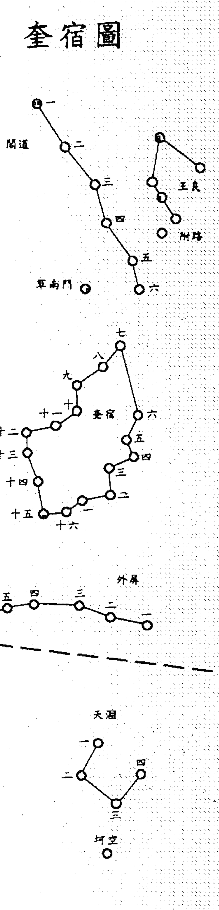

## 第二節 婁宿

星數：1、婁3 2、天大將軍11 3、右更5 4、左更5 5、天倉6 6、天庾3。

方位：婁宿距中星去極七十五度半。

步天歌：

> 婁三星不勻聚頭，左更右更烏夾婁。
天倉六個婁下頭，天庾三星倉東腳。
婁上十一將軍侯，婁主苑牧掩斂藏。

釋意：

婁三星像一個園子，主牧養犧牲以供祭祀，又爲聚眾。如此星動搖則眾兵聚。婁左右有左更、右更，北面是天大將軍。左更右更主仁智禮義，又主陂池林澤，是管獵物的小官。天大將軍是用武之官，婁南面有天倉天庾主積蓄糧食。

### 一、婁

方位：婁距中星去極七十五度半。

婁三星春夏爲水，秋冬爲火，水星也。婁南九尺，是中道。婁主苑牧，神名爲及方，姓台衛。婁主宗廟五祀，又爲天府、郊太牢、密宮、國市、天廟庫、天獄。婁者，天獨祿車也。主聚眾之事。其木椿也，其物鉛、錫、銀、黃金、石。

天子孝則星明大，天下太平，婁星直則有執主命者。就聚則國大不安。又星明大則賦斂時，王者效祀、天享之，天子明，臣子多忠孝，王者多子孫。婁不明，大小失色則不修五祀。婁主苑牧，給享祀，故置天倉以養之。動則有聚眾之事，明靜則天下和。

月犯之有田獵、民流，將死，其分憂。犯及有變則有聚斂事，作兵戰而和，人多冤獄。木星冒犯則有赦，春殘牛多死，苑囿空，守則世治兵敗，有聚斂事，民疫、六畜大貴。火星犯守則旱、谷貴、臣亂政，人多疾，金銀貴，其分君長憂，若逆行成勾己，倉庫火災。土星冒犯或邊境不可將兵。守則天下豐樂。金星犯守將惡之，其鄉吉，天下和平。水星犯守法令急，大臣憂、獄、水災，無兵兵起，有兵兵敗，若芒動而赤黑則臣爭祿。客星出之，邊兵動。冒犯則大兵作。守則社稷不安，王者貴人當之。否則魯地起兵，米貴，狄火死。如入其三日環繞大赦。彗孛出犯水旱、谷傷、畜死兵饑。流星出入爲聚眾，又出則祠官用事或德令清。犯之犧牲蕃畜。黑多死。若抵死貴賤相謀。氣之入，赤黑兵喪起疾疫。黃則貴人受賜。白則民受賜。黑水災。

訣：天府明倉養苑牧，六畜犧牲修五祀。就聚不安事又生，中道兩旁人叢叢。

### 二、天大將軍

方位：天大將軍距南大星去極六十度半，入婁四度。

天將一星在婁北，金官也。天將軍，天所以將率忠正之群士而身衛者。天將軍者，天之大將軍也。中大星，大將、外衛、小吏士也。大將星動搖則大將出，小星動搖不具則兵發。天將軍星欲明則國安，天下無兵，大將安寧。其星不明搖動則天下大兵，大將出行。天將軍星動搖，天子自將兵出。天將軍旗陳直揚者，所指者勝，所背者負。旗，左右星也。天將軍十一星，主武兵。

明則將軍勇，暗則弱。動搖不具兵起其分，左右岐星爲旗，若其旗直揚者，隨所直擊之勝，逆之則負。五星客犯守，大將憂。彗孛出，若冒犯則兵起，大將誅死。流星入之大將軍驚。氣之入，蒼白兵將憂疫。赤則兵出。

訣：軍旗直揚觀勝負，明勇暗弱動爲岐。

### 三、右更

方位：右更距東北星去極七十五度，入奎十三度。

右更五星在婁西。右更，主牧養牛馬之官，也主禮儀。右更星不具，天下道不通。左更不動，右更獨，動則王者私出。左右具動，王者千萬官出。右更僕畜孕，重積駒也。金火犯守，山澤有兵。流星犯之則大更失措。

訣：禮儀之道看右更，五星不具道不通。牧養牛馬僕畜孕，左穩右獨私外出。

### 四、左更

方位：左更距西南去極一百七十五度半，入婁四度半。

左更五星在婁東。左更，山虞之官，主川澤林藪竹林菜蔬之屬。左更主仁之道。左更星不具，天下道不通。左更星不動搖，王者以出必道亡，其動者以出者。左更採薪，菟園採茹。占與右更同。

> 訣：山川澤林草木屬，仁義之道左更主。不具路荊人心異，左更右更看王道。

### 五、天倉

方位：天倉距北第三星去極一百四度半，入奎十度。

天倉六星在婁南，天司農也，主倉府之藏有。天倉中星眾，谷粟聚其中，積儲實其中，星稀少，倉中虛耗，無儲積，粟散出，天下大亂或大饑。天倉戶開，則歲大熟粟聚。倉戶閉，歲谷不登，天下民饑。天下有兵而倉庫之戶俱開，主人勝客，客事不成，期二十日發。天倉星不具，道不通，兩軍相當。天倉不見，其所臨軍分絕倉，人窮而亡。星大而黃或相近及其中星繁皆爲歲實。稀少相疏則歲惡。五星入守冒犯則爲粟帛發同。客彗孛犯守則五穀不成，倉庫皆空。流星出入有賑貸事。氣入，蒼白若黑則不熟，赤旱，倉廩火。黃白歲豐。

> 訣：倉府之藏有天倉，其星不見窮而亡。星眾聚粟儲積豐，民心所向國裕豐。

### 六、天庾

方位：天庾距中央大星去極一百二十五度半，入婁五度。

天庾三星在天倉東南。屋積叫倉，露積叫庾。天庾積谷，草茂身拊。占與困倉同。

## 婁宿圖

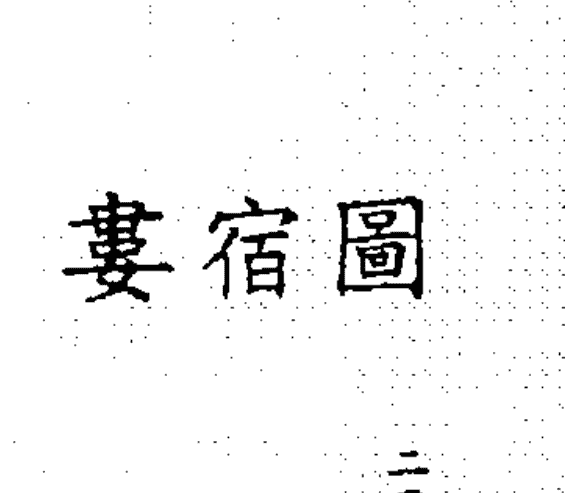

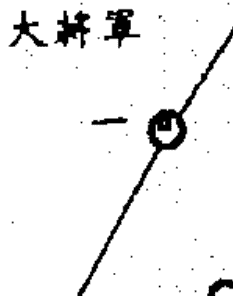

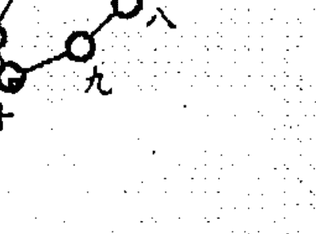

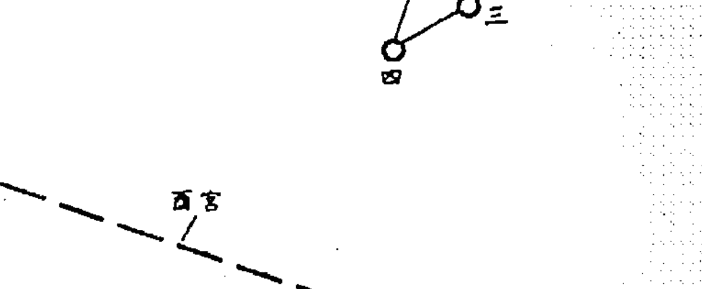

## 第三節 胃宿

星數：1、胃3 2、大陵8 3、積屍1 4、天船9 5、積水1 6、天囷13 7、天廩4。

方位：胃宿距西南星去極六十七度半。

步天歌：

> 胃三星鼎河之坎，天廩胃下斜四星，
天囷十三如乙形，河中八星名大陵，
陵北九個天船名，陵中積屍一個星，
積水船中一黑精，倉囷之事占於胃。

釋意：

胃由三星組成，是儲藏五穀之府。又主討捕誅殺之事。它的北面有八星，名大陵，大陵中有一星，名爲積屍，是主管死喪墳墓的。前面有四星名爲天廩，十三星名爲天囷。都是主收藏五穀的。胃三星若明亮，預示天下和平，五穀豐收。若暗淡無光，就會天下大亂，五穀欠收。

### 一、胃

方位：胃距西南星去極六十七度半。

胃三星，金星也。春夏爲木，秋冬爲水。胃南九尺，是中道。胃主廩倉，神名爲稽覽，姓研骨白。胃又名天中府、密官、兵、喪、倉廩、庫、天庫、天府藏。將有倉囷之事，占於胃。

胃山、昴山東與畢山相連，在趙常山中央，其山最高大。胃、昴、畢之神常居其上。胃動，有輸運之事。胃星明者，王者效天得福，天下和平。星不明，大小失位。星明大則王者須祀，則壽命長，子孫昌，倉廩實。胃星離徙，倉谷不出。其星就聚則谷大貴，民流於道。芒則兵起。胃中星眾者，谷聚；星少則谷散。胃主倉廩五穀基，故置天囷以盛之。胃宿三星主倉廩，陰收積聚知入藏。

月犯之，兵飢及疫，夷狄爲憂爲粟貴。犯而變色，其分有憂，將軍死。木星犯守，谷無實。又守之，王者順天德，國安，歲昌，其分昌。火星守之，旱飢疾疫。犯之，囚獄空，法令改更，主勝客敗，守之又爲貴人有憂。久守進退環繞勾己，倉廩空虛，兵起。金星犯之，歲將大惡，守則民飢，兵亂，又爲大臣執忠，四海安寧。又犯守則將軍爲亂，若逆行守之或勾已，其下兵起流血。水星犯守，谷不實，其分有憂不寧，又守之，兵旱，國立諸侯。王者有忠令。客星出之，其分君長憂。冒犯守之，皆爲饑。彗孛出犯亦然，又爲臣叛兵起。流星出之，以金出賜大臣，有降國，其分五穀豐。抵之倉廩空，出則其宮黜。氣之出之其色青黑爲兵。蒼白及赤爲粟。出入蒼白同占。黃白潤澤，歲豐倉實，黑則倉谷收。

> 訣：五穀廩倉天府藏，陰基暗收明豐長。忽明盛光倉中防，事乖事巧事有傷。

### 二、大陵

方位：大陵距大星去極五十五度，入胃七度。

大陵八星在胃北，又名積京。其星明則蕃國多有大喪，民多疾病，諸侯有喪。大陵中有積屍星，明則大喪，死人如丘山。大陵喪墓，積屍隨居。積京者，卷舌之口也。大陵曲而北向，卷舌曲而南向，相爲牝牡。積京中星衆則粟聚。星少則粟散。大陵八星主崩喪。月五星犯守皆爲兵喪。水星彗孛則有積屍。流星出之亦然而占在其下。守犯沖則冢官憂。蒼白氣爲兵喪，赤則人多戰死。

> 訣：胃北大陵繁星茂，明喪失常事不妙。

### 三、積屍

方位：積屍去極五十五度，入胃四度。

積屍一星在大陵中。大陵中有朽骨，故大陵中有積屍，若其星明大者，有大喪，死人如丘山。大陵喪墓，積屍隨居。暗或不見則吉。月冒犯則有叛臣。五星犯守則天下多喪。客彗孛流星出入皆爲喪。流星則以日占，其分大臣憂。赤白青色則死。氣之入，蒼及黑皆爲人多死。

> 訣：大陵朽骨積屍壘，流星犯入常有悲。

### 四、天船

方位：天船距大星去極四十四度半，入胃十三度。

天船九星又名王船、天更。中有四星欲均明，即天下大安。不明，移處消小不見則天下有兵，或有喪。天船主水旱之事。天船主帝王濟渡之官，常居漢中。天船，天將軍兵船也。天船不在漢中且不明則天下兵起，將以水戰，津河不通，或有沒國水大出，舟船用。天船九星濟不通。五星彗孛流星犯守或入爲大水，氣之入，青則天下有憂，船不可動。黃白氣則行船有喜。

> 訣：海軍艦備審天船，九星不明事急轉。黃白喜氣舟行船，常居漢中津河寬。

### 五、積水

方位：積水去極四十三度，入昴初度。

積水一星在天船中。積水星明，則水大出，船行人道，必有滄邑者，星動搖而行上，舟船摩天。天船布罔，積水侯災。不明則吉，明則水溢。動而止行則舟船崩。火星冒犯，兵起有水災。

> 訣：明溢暗吉守常安，積水行舟護水災。

### 六、天囷

方位：天囷距大星去極九十一度半，入胃六度半。

天囷十三星在胃南主禦糧百庫之藏也。在野名囷，在邑名倉。或圓爲囷，方爲倉。囷星欲明，其中星眾，百庫之藏實滿。其星不明，囷中星簡，庫藏空虛，若多散出則天下不安，其國有憂。天囷星明則吉，微則凶。天囷見即天下囷倉實，不見即虛。天囷十三星給禦糧者。星明則歲豐；暗小不見爲饑。月犯之有五穀事。五星犯守倉庫空。火星又爲錢谷，主者黜。客彗孛則倉庫焚溺。流星出入占如天倉。青白氣入則歲饑見民流。

> 訣：天囷星眾百庫藏，五穀虛實觀天倉。

### 七、天廩

方位：天廩距南星去極八十五度半，入胃十二度。

天廩四星在昴南。主廩倉、天倉、廩藏會計之事，其星齊明，則年豐國饒，人民安，王者吉。其星小而不明者，歲惡藏虛，人民饑。又爲臣受君祿。天廩星欲其明而盈實則歲熟多粟。星黑而殺則歲敗腐也。月犯之谷貴，五星犯之爲饑，倉粟出。

## ※ 奇門星相絕學 ※

彗孛則倉廩空，其官黜。
流星入，青則天下多憂。赤旱火。黃白熟。氣入之占，如流星爲水辰。
訣：其星齊明利民生，盤盤算算記倉粟。
暗小晦色君受賂，歲惡藏虛谷爛腐。

## 胃宿圖

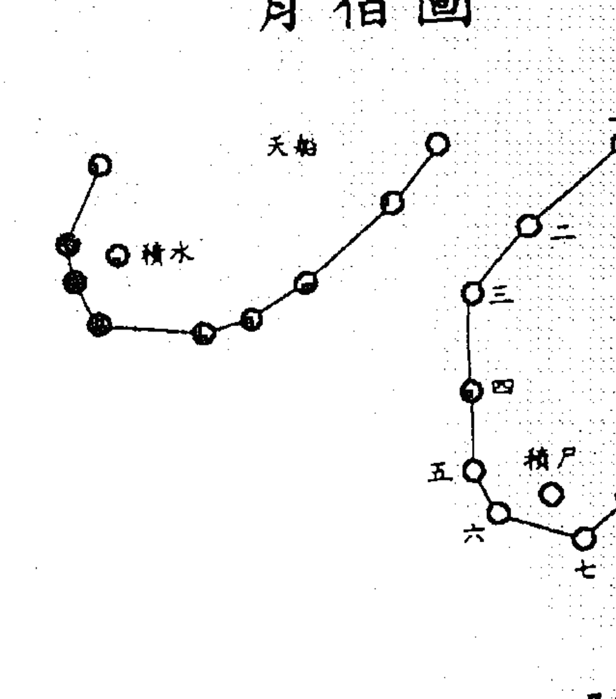

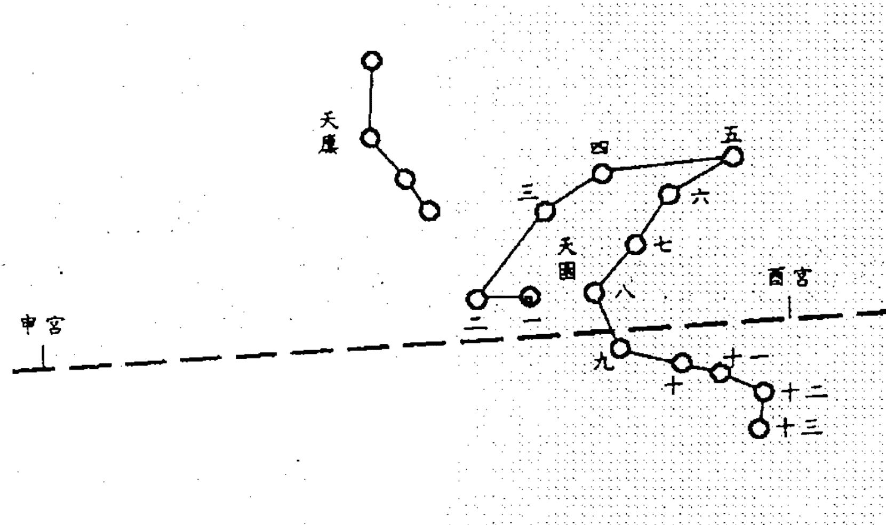

## 第四節 昴宿

星數：1、昴7 2、天阿1 3、卷舌6 4、天讒1 5、礪石4 6、月星1 7、天陰5 8、芻稿6 9、天苑16。

方位：昴宿距西星去極七十度。

步天歌：

> 昴七一聚實不少，阿西月東各一星，
月下五黃天陰名，陰下六烏芻稿營。
營南十六天苑形，河裏六星名卷舌，
舌中黑點天黑點天讒星，礪石舌旁斜四丁。

釋意：

昴由七星組成，即姐妹星團，又名大梁。它於仲秋之月出現，居於西方白虎的中部。昴為髦頭，為胡星，為白衣會。它主匈奴，又主獄事。如明亮，天下獄訟公平。如暗淡，就會出現刑罰苛濫的情況。

昴七星中一大六小，若六小星與大星一樣高，就有大水將至，天下大兵起。如果他們動搖不定象在跳躍，就是匈奴大舉入侵。有一星不現，也有兵災的跡兆。

昴的西北面有一星叫天阿，主察候山林妖變。北面有六星名為卷舌，主言語。其中一星叫天讒，主讒言及醫巫，東南有四星名為礪石，主磨礪鋒刃。南面有十六星名為天苑，是養禽獸的地方，天苑西面有六星名為芻，是供給牛馬草料的地方。

### 一、昴

方位：昴星距西南星去極七十度。

昴七星，火星也。春夏為火，秋冬為金，昴南九尺是中道。昴主獄事，神名敖，姓金宋趙勝。昴又名武、天廚、天路、胡星，主兵主喪，其一星亡則邦有兵。昴，茅也。昴有一大星，名黃星，其星明者天下安，不明者，天下大凶。

昴為髦頭，房衡位，主胡星，陰之象。昴為白衣聚或為胡聚。昴為天耳目，天牢獄，市府廷，西陸。王者承天，以利獄事，以撿淫奢。其星明則牢獄平，暗則法刑濫。將白衣之會，則占於昴。天街者，昴畢之間，陰陽之所分，中國之境界，陰，陰國。陽，陽國。陰，西南纏，河山以國也。陽，河山以南國也。帝位明，即昴星光大。

昴星動搖，必有大臣下獄。昴星大而數動盡跳者，胡兵大起，不出年中，昴一大星跳躍，餘皆不動者，胡欲侵犯邊境，期年中或三年。昴星皆明，與奎星等者，水滿天下。昴七星，黃道起。昴有一星亡者則多兵爲喪。白帝行德，畢昴爲之圍，圍三暮，德乃成。不暮及國不合則德不成。昴主獄事，典治囚，故置卷舌以慎疑。昴主獄事，系凌淫化伐，所犯謀是當。

大星明與火星等，則有大水。七星皆黃又大而動搖皆兵起。一星芒爲兵喪，動搖則大臣下獄。

月犯之將軍死門戶之臣憂，其分兵饑。犯而色變其分民離散。

木星犯守則獄空，北征於狄。棺木貴。守又爲刑急，有兵，水災，禍不成，有德令，臣有獄。死者解。久守之則大臣咎，關津吏憂及民饑。

火星犯守，四夷兵起，旱、火、饑疫。又守之則狄不寧，貴人多死，或赦。守而勾己環繞亦爲赦。入之占同又爲喜令，天下無兵，有兵也敗。

土星犯入守之，皆爲胡王死。犯之，又爲天下有禍，守則女後失勢，夷人死，土工興，谷不成，火災、民疫。

金星守之，四夷夷主憂死，兵動，將軍下獄。犯則兵旱，火。犯守之則易政令，臣有謀。入則大臣憂，獄事，天下擾，趨分有兵大赦，久守則亡夷可伐。

水星入之則兵起，破散，民流亡。犯亦如之，又爲大水決溢。守則民饑，諸侯誅，邊兵起，夷人勝。勾己逆行環繞則主刑，獄，兵大率。

月五星犯皆爲夷王死。客出之則兵車滿野。犯守則兵起臣叛。入乃貴人有急獄，夷兵敗，其分有喪。

彗孛犯之，臣亂兵起。出亦如之又爲赦。

流星出入，貴人下獄，兵起。出則他國使來。大流星出之則有赦。入則夷狄來。氣之出入，青則有兵，大水。蒼赤民疫，青白人多喪，赤則有軍令，白衣將兵，黃則其分喜，黑入抵之夷王死。

訣：獄事典治昴宿張，明平暗濫刑罰嚴。
淫佚奢驕天牢界，黃星明大德承天。

### 二、天阿

方位：天阿去極六十六度，入胃十五度。

天阿一星在昴西，偏高日阿，亦曜侯之處，以察山林之妖也。客彗孛冒犯妖言滿野。

> 訣：天際滿野妖言惑，星在昴日忌星侵。
大道光明業障遮，天阿普察昴西坡。

### 三、卷舌

方位：卷舌距東南星去極十二度，入昴一度。

卷舌六星在昴北。卷舌星又名勝舌、左舌、積京、積薪。主口語、利口，其明大則利口用事。卷舌星欲微小不明，明大多讒言，下多讒，口舌作也。卷舌星曲如即吉，舌直則天下多口舌之害。卷舌動，其中星眾則兵大起，多口舌。卷舌安靜其中星稀則國寧無兵。卷舌星蕃盛則天下多口舌，民多疾死。又說爲兵起，人死如丘山。卷舌星出守不居漢中則天下盡爲口舌妄言。卷舌六星知讒謗。

星曲而近則賢人進。直而動明大及出漢則天下多口舌。月冒犯則人多死，五星流則多讒佞。

客彗孛冒犯守則侍臣有咎。

> 訣：口齒伶俐明大利，廣交親朋敬上級。
若曲即吉巧言語，六星慎審妄言語。

### 四、天讒

方位：天讒去極六十一度半，入昴初度半。

天讒一星在卷舌中。天讒星明大則讒佞害民善，天下二心。諸侯專權誣欺。卷舌唾水，讒主天醫。

暗則吉，明盛則佞臣用。客守之則天下妄言。

> 訣：天讒善辨得交際，暗盛各有利與弊。

### 五、礪石

方位：礪石距南第二星去極六十五度，入昴六度。

礪石四星在五車西，礪石砥刃，百工淬治。

居常爲吉。明及火金冒犯皆爲兵起。

客星守之則百工用，赤爲兵動。

> 訣：礪石明異看刃利，居常爲吉異鋒起。

### 六、月星

方位：月星去極七十一度半，入昴一度。

月一星在昴東主女，大臣之象也。月明刑度，光生蟾蜍。明大則女後專政。星微則吉。

金火客彗孛冒犯則女後大臣有憂。金火守之則大臣走，兵亂。

訣：月星明大女專權，捍女刑度法亦缺。

### 七、天陰

方位：天陰距西星去極七十五度半，入胃七度。

天陰五星在畢柄西。天陰羽獵，附耳密謀。

星不明，明則禁漏洩。

訣：密謀奸計內耳全，五星微微遂心願。

### 八、芻稿

方位：芻稿距中星去極一百八度入婁十一度。

芻稿六星在天苑西。芻稿又名天積，天子之藏府也。天積中星盛則百庫之藏庫。中星無則百庫藏散出。芻稿星見則芻稿賤，反之則貴。天積中星繁則歲豐穰，民及安寧。星稀則貨財散出。芻稿甸服，納經緡輸。

芻禾稈叫稿，百裹賦納總，二百裹納經。刈稿叫總，刈穗叫經。訂甸服入之，以供牛馬之食也。

若其中星盛則庫藏貯而豐，暗則芻稿焚溺。

赤氣入則有火災。黃則天子財豐。赤氣出以火出，貧財。黃則留出。

訣：天積之藏示根底，百庫豐穰不見吉。

### 九、天苑

方位：天苑距東星去極一百七度半，入昴七度半。

天苑十六星，金官也，爲天子之苑。非其故，若星不具，有斬死吏。天苑主苑牧，犧牲牛羊之屬。其星齊明，苑中星衆，則畜牲蕃息，多饒野獸，其星微小不明，若不見或苑中星稀，則畜牧不孳，牛羊野禽死。天苑星非其故或不具則有斬刈之事，天苑十六星主馬牛羊。

五星客彗孛犯守入則兵起，畜獸多死。

流星出之占在牛馬。色赤以兵。黑則以令出。赤多傷。黑則多死，黃則蕃息。氣之入以色占流星。

訣：苑中星衆牛馬豐，非常不具有牲犧。

## 昴宿圖

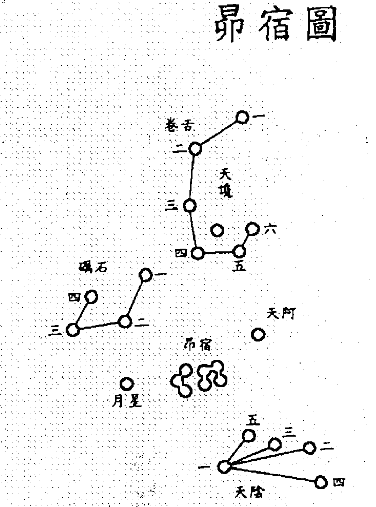

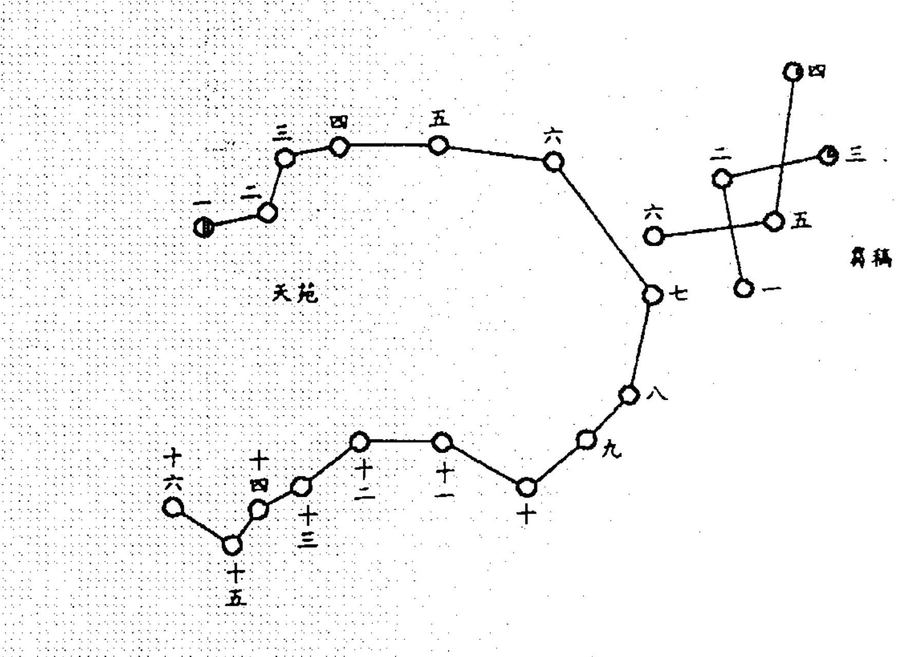

## 第五節 畢宿

星數：1、畢8 2、附耳1 3、天街2 4、諸王6 5、天高4 6、五車5 7、天潢5 8、咸池3 9、天關1 10、天節8 11、九州殊口9 12、天園13 13、參旗9 14、九遊9。

方位：畢宿右股第一星去極七十五度。

步天歌：

> 畢似瓜叉八星出，附耳畢股一星光，
天街兩星畢背旁，天節耳下八烏幢，
畢上橫列六諸王，王下四皂天高星，
節下團圓九州城，畢口斜對五車口，
車有三柱任縱橫，車中五個黃潢精，
精畔咸池三黑星，天關一星車腳邊，
參旗九個參車間，旗下直建九遊連。
遊下十三烏天園，九遊天園參腳邊。

釋意：

畢由八星組成，主弋獵邊兵，以備敵寇。畢旁有一小星，名附耳，主爲君主聽得失，察逾越之過。如此星明亮則意味著中原衰微，邊寇犯境，動搖則君讒臣在側。入畢則國有兵事。又有二星爲天街，街南爲華夏，街北爲絕塞。

南有八星名爲天節，主郎將奉命出使。附耳旁有九星爲參旗，是天子之兵旗，南有九星爲九遊，是天子的號令旗。九遊西面有九州殊口，主遠方通俗傳驛。西南面有九星名天園，主掌蔬菜之官。畢的北面有天高，主望八方雲氣。有天關，是天的門，主關閉，防道路之事。天高之北有諸王，主宗廟，用以藩屏王室，審察諸侯。諸王之兆，有五車，車中有咸池，天潢主河梁津澤，池沼魚鰲之類。

### 一、畢

方位：畢宿右股第一星去極十五度。

畢八星，爲火星。春夏爲金，秋冬爲水。畢北七尺是中道，王者執畢前驅，即其象也，又爲囚車。其大星叫天高，或名邊將，邦外侯也。畢主邊兵，神名扶骨，姓傅兒侯，又名天耳、天目、風口、濁、天罡、都尉、揚兵、清池官、府廷、天獄。畢主制侯四方。畢主河以南中國也。中國於四海內則在東南，為陽，陽則為歲星、熒惑、填星，占於街南。畢罕車，為邊兵，主弋獵。陽微掇，故置附耳大星旁，司天下動搖，讒臣亂主。

畢為邊界，天街，主守備外國，故立附耳以聞不詳。將有田獵之事，則占於畢。畢左股大星邊將也，主邊幫胡狄，候五帝三王壘外城，其國背叛，則其星耀芒。其星欲明，明則遠夷來貢，失其色，大小不如其故，則邊境自亂，中國不寧。

天以畢罪掃奸雄，平通外域。畢為陽國，昴為陰國。日月五星出陽國，即有水。入陰國即有旱，上教不行。畢星光大，色度和同，天下太平，國號未央。畢星動搖有讒臣或邊城有兵起。畢二星雲為喪，或為兵。畢中星出，國內亂或國無主。畢星明大則邊無近遠，夷貢來王廷中。畢離移，天下獄，大亂。其星就聚，法令太酷。其明為太平，不明則天下謀為亂。

月犯之，陰國有憂，刑急，臣叛，將相憂，春多雨，夏多風，天下有變令，邊兵起將刑。失行離之則雨。入則亦如之，又為兵起。

木星冒犯入之，多暴風雨，又為邊兵。守則大赦，王賜，夷狄邊兵急或米貴。

火星犯之則兵戰。入之則兵饑，將相憂。守之則有德令，國有敗獵，男子則爵，夷主死，道路不通。

土星冒犯則有赦，兵起西北不戰。守則兵起，賦役繁，政令不行，邊有降軍，王公受賀。入之則地震、水溢。入畢口則大臣憂。

金星犯之則邊兵敗。若犯大星及左右角皆將戰死。守則大將有功，大臣出使則有急令及兵起，邊境不安，水災，五穀不成，其西國益地。入畢口則車馬貴，將相為亂，國易政及女喪。

水星犯之則水災，兵，刑罰用。

客星出，邊兵車馬急。入之，敗獵事多，貴人下獄。入畢口則大臣憂，無兵兵起，有兵兵敗。犯亦如之，又為歲饑。守乃讒臣蔽主。又犯守則外國有詐來欲叛謀。

彗孛犯則土工人勞，夷為亂，邊軍大戰。守柄則王侯益地。守口則相為亂，易政令。若出入之占其色，蒼則五穀不成，下有破軍。赤乃其分主憂。黃則女為亂。白兵喪，黑為水。

流星入犯之則邊兵大戰，赤色如之蕃。黃白潤澤光出之，赦令行，使出，邊安。入則四夷求和，國有喜慶。雲氣蒼白，歲不收，赤兵旱災。黃白則天子有喜，貴人生。出入則皆受民田。

> 訣：天罡備守震四方，天街之處觀夷邦。
光大府廷貢中央，天耳天目位耀芒。

### 二、附耳

方位：附耳在畢下去極七十七度，入畢三度。

附耳一星水星也。附耳著畢，司街候邪。附耳搖動，有田之事。搖動非其處，有亂臣在側或為主憂愁。附耳角動，讒賊將起。附耳明則賊動，即賊盛也，中國微邊兵驚，外國交斗連年，大將虜，主敗失。

附耳入畢口直一星，期四十日。直二星，期三十日。直三星，期二十日。直四星，期十日。直五星，期七日。直六星，期三日兵起。附耳入畢深大且動則兵大起。邊兵尤甚。附耳縮結，王命興，輔佐出。畢主邊兵，備夷謀，故置天弓以射之。畢為天街，主邊兵守備境界，知暴橫。附耳移動則讒邪行。

月五星犯之，皆為兵起，將有喪，不即免退。

客星守則兵餓多獄訟。

氣之入蒼白純白將憂。赤則內兵起。黃白無兵兵起。黑將死。赤出將出。黃白為兵將。

> 訣：附耳星正解千愁，輔弼其主理事由。
陰謀詭計難使換，若動下有謀田亂。

### 三、天街

方位：天街距南星去極七十一度，入昴十度。

天街二星在昴、畢間，近月東。天街，水官也。天街主侍侯。天街陰陽之所，分中國之境界，昴以西屬外國，畢以東屬中國也。天街，日月五星出入之道，天街保塞孔，途道衢。

明則王道正，月犯道路不通、軍惡。五星犯守，邊兵動，大臣憂。若留上邊行其中赤為兵侯。金守之又為兵起，道路絕。彗孛犯守，邊人入中，國失位。

> 訣：日月出入陰陽所，五星天街代境界。
若視路道通不通，觀天審地九州衢。

### 四、諸王

方位：諸王距西星去極七十度，入畢三度。

諸王六星在五車南。諸王星主存亡，主朝會。王星督察諸侯存亡。
明則附眾，不明則叛。不見則兵起，宗廟憂。
月五星客彗孛冒犯守流星出之，皆爲諸侯宗臣滅。
訣：六星齊明德望高，諸侯宮室觀星妙。

### 五、天高

方位：天高距東北星去極七十四度半，入畢六度。

天高四星在參旗西近畢。天高主齋戒之門。天高星近井鉞，大臣斬，不乃高爲下，下爲高。天高闕遠，九層望樓。守常則吉，微暗則陰陽不調。
月犯之將死臣誅，五星水旱不時。
客彗孛冒犯守之則大旱。蒼白氣入畢、霜、損稼。
訣：陰陽合合守常調，天高闕遠雲氣曉。

### 六、五車

方位：五車距大星去極四十七度半，入畢八度。
西北柱四十九度，入畢五度。
東南柱五十九度半，入畢十五度。
東北柱五十三度半，入畢十六度半。

五車五星，三柱九星，凡十四星在畢東北。五車又名爲天庫、天倉。凡五星在畢、昴北，大陵東，其西北端，第一大星爲天庫。天庫將，畢也，秦也，太白也，神名爲令尉。次東北星，名爲獄，燕趙也，辰星也，神名爲風伯。次東星名爲天倉，衛魯也，神名雨師。次東南星名爲司空，楚也，鎮星也，其神名雷公。次西南星名鄉，鄉爲韓魏也，主熒惑，神名豐隆。

五車中有三柱，三星鼎足居柱，又名休格旗。五車一爲咸池，一爲五潢，一爲重華，居豐隆也。三淵者，五車柱也。五車者爲五帝之座，天子五兵，爲水官。五車，天子大澤也，主輕車。五車，西北大星大豆也，東北星稻也，東南星麻也，正南星粟也，西北麥也。五穀豐儉亦占其星，以五寅日候。五車星其五穀各有所主分野，其星動搖色變，其國有兵，五穀大貴，人民饑亡隨決吉凶。五車三柱星動，期三十日，車騎發。

天子觀天文，察地理，和陰陽，揆星度，原神明之變，獲福禳災。五車主五穀，爲民禳災，得民福，民無飢寒之困，故五車星均明以應之也。五車三柱，象天下之車。一柱不見，三分一車行。二柱不見，三分二車行。三柱不見，天子自將兵。咸池中三柱具不見則兵革起。五車中一柱出或不見則兵少半出。二柱出或不見則兵大半出。三柱盡出或不見則兵盡出。柱入而兵入。柱外出，不與天庫相近者，軍出谷貴，轉谷千里。柱外出一月，谷貴，期一歲。出二月，谷貴六倍，期二歲。出三月，谷不入，谷貴十倍。

五車柱外出，不居兩星之間者，天下大水，米大貴。柱倒立者，戰車行，土大貴，轉土千里。五車星欲其均明，闊狹有常，五車天庫星中河而不見，天下有積屍，人不可渡河，河不通，即有軍。五星靜而吉，五車明大若星繁眾則兵革大起。五車休出庫者，甲兵強，輕騎出。休出倉者則大車出，婦女挽糧，休格所指者車從之。

五車倉星不見，其所臨之軍必絕大窮而亡。五車旗不見，天下大風，發屋折木。五車休旗動，四夷畔。五車休格，反抵大星，兵起天下，先兵者勝。五車星俱明則五穀豐。一星不明則其谷不升。五車星失色，赤地三千里不生，五車星有不見則其國饑，有兵憂。五車三柱欲均明潤狹則五穀豐，君得政。其車若大風寒，折木，發屋，物類大貴，候法如庚寅日，候金車布帛，銅鐵、麻、日風寒其物貴也。

月冒犯入之，兵起，駕道不通。五星犯守旱喪。入則兵起金火尤甚。客星入之，占其色青憂，赤色白黃人主受賀。白喪黑死。犯之所守，物貴三倍，天下大水，地動、海魚出。守之左，軍大發。守之右則爲喪。

彗孛犯之則兵騎滿野，民徙。

流星出入則諸侯入，賀國有喜。犯沖則水旱不調，天子惑，諸侯憂。若光明潤澤遣使四民五穀成，來年物賤。氣入蒼白則民流。赤則兵起。

訣：五車三淵賜帝座，觀天察地陰陽合。

### 七、天潢

方位：天潢距西北星去極五十八度，入畢十一度。

天潢五星在五車中，天潢主河梁，所以渡神人通四方。潢星明，天子壽昌，萬民無疾疫災殃。天潢濟渡，漸池灌高。不見則津梁不通。月五星犯之，入兵起，道不通，天下亂，貴人死。客星入焉赦。守之有水害。氣之入黃白則天子喜安然，無兵兵敗。赤內兵起。若如波兵庫火。氣出之則兵出戰。蒼白皆爲死喪。

訣：濟渡四方天潢高，明吉無殃壽長考。

### 八、咸池

方位：咸池距南星去極五十一度半入畢十一度半。

咸池三星在天潢西北。咸池又名黃龍、五潢、天津、潢池、天井、天淵、豐祭太陰。陰者，蒼龍之舍也，五帝之車也。

咸池、五車，天關也。五車，咸池別名也。咸池，天潢五帝車舍。咸池，水魚之囿，天子名池，主五穀。

咸池星明大，則有龍墮死者。不乃虎狼爲人害，若大兵起。咸池者，五車中星，非其故，國旱。咸池不足，津河道不通。五潢欲其黃澤明也。咸池陂澤，鵾鳥雁鳥。

月入之暴兵起，五星入之，失忠臣爲兵喪，若旱則水道不通，貴人死或爲饑。金星中犯乘守則大兵起。

客星入之則大人憂，天下水。赤旱，黃白太子喜。黃白出，神魚見。黑氣出之皆爲水。

訣：咸池守常河道暢，河潢川澤黃龍現。

### 九、天關星

方位：天關去極七十一度，入觜初度。

天關一星在五車南，參西北。天關，天門也。在黃道中，日月不出其中行，必有一國亡主不朝者。一爲柱不道者，五星不出其中，臣必有不道者。日月五星不出天關中者，必有叛臣不從君命。或主不道者，臣謀君，有兵起。天關星芒角則有兵。天關星不在，或與五車星合，大將披甲，國門閉。黑帝行德，天關之動。天關星欲大明，明大則王道平通。

月犯之亂，臣更法令主津關者有罪。掩則關梁不通，其官及邊臣死。五星干犯守占同。

客彗孛冒犯守占如月。客彗孛犯守出入，兵起多盜，關梁不通。流星抵犯亦然，出入則守關臣憂，黃白氣入，四方來貢。

訣：道路通阻望天門，王道平通關星明。

### 十、天節

方位：天節距北極八十度半，入昴三度。

天節八星，明則節使中正，暗則奉使無違。火星守，持節臣有謀，君死。金剛大將以兵出。

天節八星在畢附耳南。天節小而明，節使忠直。其不明若不見，奉使無威敬。天節奉使，專對無疑。天節以給使命，靈威德於四海。

客彗孛守犯，法令不行，奉使有咎。

訣：奉命出使忠直明，靈威四海遠征勳。

### 十一、九州殊口

方位：九州殊口距西北星去極一百度入昴十度半。

九州殊口九星在天節下。九州殊口一名勾風。凡九星在參間常以十月，十一月候之。若一星不具，其國凶。三星以上不具，兵起，天下亂。九州，外官也。九州殊口主聚議，九州殊口重譯辭。九州殊口能曉方言之官。九州言語不同，要荒蠻夷，重譯乃通。

金火冒犯守，兵起。客星入之則民憂水事。守則直，海國國不安或兵動。

流星出入則夷狄君憂。色赤夷人亂，旱澇民饑。

訣：外交翻譯聯夷邦，九州殊口位殊祥。

### 十二、天園

方位：天園距東北星去極一百二十四度，入畢五度。

天園十三星在天苑南。天園中小勾曲星明，果熟，苑馬牛羊皆善。天苑南，牛馬廐也。其中小星，廐槽也。不見者，牛馬羊多死傷者。天園草生實，菜茹蓄儲。生爲菜，熟爲蓄，茹，儲；卑薪也。

訣：天園之中小勾明，菜蓄儲實豐倉廩。

### 十三、參旗

方位：參旗距南第二星去極八十七度，入畢六度半。

參旗九星在參西，又名天弓，天府。天弓九星不具，天下大赦，爲兵赦，非無故自赦也。參旗在參西，勾曲九星三處，一爲天旗，二爲天苑，三爲九遊，以宣威明開緒。天弓，金宮也。天旗司五星之變，日月之過，熒惑守日蝕星，則天下亂。天弓主司兵弩之事，其星動搖，有以迷惑主者。參旗星不欲明，微小而直則王者安，天下無兵。明而曲，狀

### 十四、九遊

方位：九遊距南星去極一百一十二度，入畢十二度半。

九遊九星在玉井西南。九遊又名苑遊、司曲、天旗。主司五星之過。九遊統九州別邦。九遊光芒盛則兵起。九遊星明大，則其位多大人，微則從臨州。星居常則吉，動搖則兵大起。

金火守犯則兵騎滿野。

客守犯諸侯起，禽獸多疾。

訣：號今天旗色兵盛，主司五星道之中。

## 畢宿圖

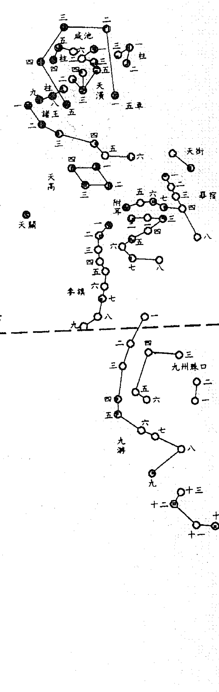

## 第六節 胃宿

星數：1、胃3 2、座旗9 3、司怪4。

方位：胃宿距西南星去極八十二度半。

步天歌：

> 胃三相近作參蕊，胃上座旗直指天，
尊卑之位九相連，司怪曲立座旗邊，
四鴉大近井鉞前，胃爲虎首主葆旅。

釋意：

胃由三星組成，樣子像花蕊。參爲白虎，胃宿爲虎首，主採集野生植物，又主軍旅。胃上方有四星，名司怪，專主怪異災變。司怪的北面有九星名座旗，主旗幟，以表尊卑。

### 一、胃

方位：胃星距西南星去極八十二度半。

胃三星，金星也。春夏爲水，秋冬爲土。胃北三尺，是中道，胃主斬割。又名白虎將、天將、斧鉞、白虎首、主外軍，其外梁，其主魏也，其木楊，其物錢、金器、磬石。

胃參伐天市梁也。其內主梁，外主巴漢。胃者三軍之侯爲寶貨或天貨。小三星隅置胃，爲白虎首，主葆旅（野菜）之事。胃星動，葆旅起。將有葆旅之事則占於胃。胃山與參山相連，在魏天山西南，胃參星神常居其上。

胃三星，行軍府藏也。其星欲明，明則國盈，軍有儲，其星不明則出軍行將，天下軍士無食。王者將出，必察其星。胃大亮，其星明，則盜賊衆。胃星動明則寇戎發，盜群行。移徙則將逐。暗則不可用兵。

胃星近參左股，臣有謀其君者，若主之命，奪主之藏。近右股，大臣謀伐其主，或有大命。胃星明大，將得勢。胃參主葆旅，收斂。故置參伐出相助。

- 月犯之其分兵起有災爲赦，變於其宿刑罰急。
- 火星犯守，其下兵叛，斧鉞用，大旱，米貴。
- 土星犯則土興，守亦如之，或兵侵其土，又爲其分安守。
- 金星冒犯則兵起，斧鉞用，守之亦同。
- 水星犯守，不可動兵，行兵趨地，水災及有叛逆者。

木星犯之則其分兵起，守則後有憂，農夫不得耕或多暴死，其下饑疫，反叛亦爲君臣不和同。

客星冒犯者，暴兵出，其謀亂。若星不明不行深，宜防察西戎侵動。

流星出之則天下無兵，邊使入賀。出之則軍營之事。入之或犯則其分亂。

彗孛冒犯之其分亂，有破軍冒犯則天下動搖。雲氣入之，蒼白則民有盜賊之憂。赤則兵起。黃有神寶。黃白潤澤出入同上占，又爲其分喜。白則邊將慘或邊將戰死。黑則趙地大人憂。

訣：野果滋生破軍糧，星明旅軍有府藏。

### 二、司怪

方位：司怪距南星去極七十一度，入參六度。

司怪四星在鉞前。司怪主占災祥者也。司怪集得失。司怪主人揆變出微。司怪星不行，宮中有怪物。司怪詰咎，國無災殃。

星不成行列，宮中有大怪或天下多怪。占同天高。

訣：八方雲氣示災祥，得失無常自有殃。

### 三、座旗

方位：座旗距西南星去極六十度半，入參八度。

座旗九星在司怪東北。座旗旗表別，異殊居以旗表則君臣之安立也。

星明則國有禮。暗則失禮。

訣：尊卑各異座旗別，禮儀風俗皆有偏。

## 觜宿圖

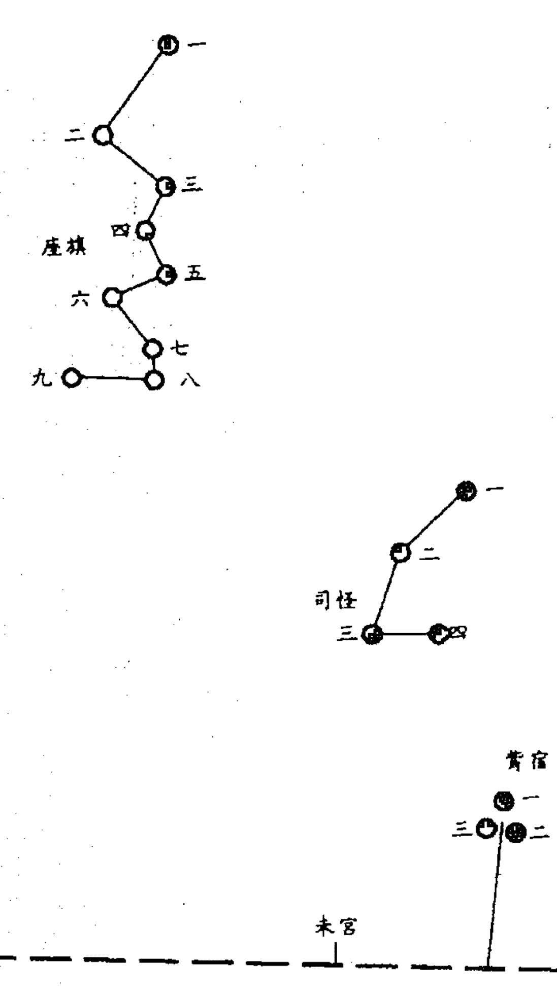

## 第七節 參宿

星數：1、參7伐3 2、玉井4 3、軍井4 4、天屏2 5、天廁4 6、屎星1。

方位：參宿距中心第一星去極九十二度半。

步天歌：

> 參總有七觜相侵，兩肩雙足三為心。
伐有三星足裏深，玉井四星右足陰，
屏星兩扇井南襟，軍井四星屏上吟，
左足下四天下四天廁臨，廁下一物天屎沉。

釋意：

參由七星組成，中央三星名伐，主斬伐之事，又主戎狄之國。右邊四星名玉井主泉水。下有四星名軍井，是專供軍營所用的井。軍井下有四星名廁，是天的廁所。廁南有一星名屎，西南有二星名屏，是廁的圍屏。用以阻隔臭穢池洩。

### 一、參伐

方位：參距中心第一星去極九十二度半。

參七星，金星也。參北十三尺，是中道。昔高辛氏有二子，伯叫閼伯，季叫實沈。不相容，尋干戈以相征伐。後帝不臧，遷閼伯於商丘，主辰。商丘，宋地主祀。辰星，大火也。商人是因，辰為商星。遷實沈於大夏，主參。參伐主斬割，神名虛圖，姓祖及。

參應七將也，中央三小星為伐，天之都尉，主胡，鮮卑戎狄之國，故不欲其明出。參伐為市府廷也，又為天尉，為衡。參伐又名鍾龍。參為白虎，三星直為衡。右下有三星銳為罰（其銳指星邪列）為斬割之事。其外四星，左右肩股也。參又名伐、大辰、天市、鐵鉞、天獄。參者，天之市也。伐者，天之都尉也，天之車騎也。與狼狐同精，天之侯蜀也。主南夷戎之國。

參中央星主命，左星主左司馬，右星主右司馬。左臂主天門，右臂主天獄。參左大星，左將軍；右大星，右將軍也，中央三星，三將軍也。又三小星，小將軍也。參者，白虎宿也，足入井中，名為滔足，虎不得動，天下無兵。足出井外，虎得放逸，縱暴為害，天下兵起。

參主斬割，行罰也。又主權衡，平理也。又主邊城九驛，故不欲其動也。參白虎之體，其星三列，三將也。東北星為左肩，主左將軍。西北星為右肩，主右將軍。東南星為左足，主後將軍。西南星為右足，主偏將軍。

參星，天右將軍。天市石武，金性剛強，斬刈平理。凡七將明大，天下之兵精衛帝。有方茂名，芒角張搖，赤耀橫射，三軍駭動，邊侯有急，帝自躬甲，天下兵起。參為橫衡不正則天下傾。夏三月視參兩足，進前則兵起。若退則兵罷國寧。又視參兩星動搖則兵起天子憂。又為蟲苗。參無頭則國分兵強。參伐者，衣冠衡石，天子之師。參伐滅絕，臣弒君，子殺父。其星不具則其軍亡地。星失其色，則其軍散敗。蹉跌不常，王臣不忠，外其心。參中央星差南則胡人入塞。復正則胡人出。參星移，名為先天，客伐主人。參兩肩外向而大者，兵外強。其內向而大者，兵內強。參左股亡則東方南方不可舉兵。右股亡則西方北方不可舉兵。

參爲天刑主伐，星大則兵起。進退迫居，及客番息，皆爲刑急。參星明者，大將逐。就聚則大將誅戮。參肩細微，天下兵弱。參四足有進者，將出。有退者，無功失勢。進者謂移北，退者謂南移。

伐有角黃芒，天子滅，數世絕，諸侯之寢排門闔。參伐動者，有斬伐之事。伐，水官也。參伐明大則斬刈行。伐三星去疏，則法令緩。數則法令急。伐三星不欲明，明與參等者，天下大臣皆謀去其君，是謂不理。伐星大則兵起。伐星移南則胡出塞，移北則胡入塞。參伐斬割陰氣孽。

木星犯之，水旱饑疫，守之則大疫，王者惡之或憂疾。伐及兵起。月犯之則兵貴臣憂，其分饑。伐則小將死，有兵事競城堡。

火星犯之占同。守之多霜雹旱災、五穀不成、兵動、天下有喪。宿於參伐，田價貴易。

金星犯守之邊兵起，又守之則臣叛，大旱及喪。若犯守伐星，大臣亂，車騎用。

水星犯乘之有水，兵，貴臣出。守則臣叛，水災，五穀不成。伐乃占在遠人，移南出塞也。

客星出之，有暴兵老人多死、馬貴、宮女爭。守則國敗歲饑。又守之則土崩。守伐星，大臣誅邊兵敗。

彗孛出之則兵起。冒犯其下有破軍。

流星出之米賤，冒犯則營中之事。入則先起兵者破或軍圍城。

氣之入，天下起邊城。蒼則邊境火災。蒼白則臣亂。赤則內兵。黃白潤澤，大將受賜。黑大人憂及水戾。出則將死。

訣：天刑主伐星參大，氣入變換看休囚。

### 二、玉井

方位：玉井距西北星去極九十八度少入畢十一度半。

玉井四星在參左足下。玉井，水官也，主軍敵，主粥廚。玉井星微小如其故，則陰陽和，雨澤明，五穀成，天下安。其星明而動搖，有大水、五穀不成、人民大饑、國不寧。玉井動搖則有水，不出二年。玉井四星主水漿。

若差出之，狼虎害人，兵饑，水溢。月五星冒犯守之皆凶。

客星流星出之，國得地或將出。入則失地，多大，又爲喪。青入井，不可食。

訣：山澗清涼甘露水，玉井搖動五穀澤。

### 三、軍井

方位：軍井距西星去極一百五十度半，入畢十四度。

軍井四星在屏東南。天井如輪曲與狼星俱主水旱。軍井給水，師用不竭。

月入芻稿財寶出。火星客星守之軍井，有水憂或多死。

金及彗孛犯守則兵起民流。

訣：軍井給水星守常，不竭之地救民殤。

### 四、天屏

方位：天屏距南星去極一百一十五度，入畢十三度。

屏星二星在玉井南。天屏主上疾。天屏星不具，人多疾。屏星在南爲屏風。星不具，人多病。暗亡則大人疾。

月五星犯之皆爲水災。

客彗孛冒犯，水旱不時。客出占如暗亡犯，人多病。

訣：隔臭防洩天屏主，二星不具則有疾。

### 五、天廁

方位：天廁距西北星去極一百一十一度半，入參三度。

天廁四星在屏東。主觀天下疾病。天廁星欲黃赤，黃赤而明吉，蒼黑凶。廁星不具，貴人多病，名爲夭或名陷廁。廁星青黑，主有腰下之疾，黃吉，白凶，黑死，皆爲貴人。黃澤者歲熟。

廁星欲溫溫然明潤澤，則王者無疾病，出入不時。星若微小不見，人主帶病，腹腸之疾，若人民多疫。

客彗孛犯則歲饑。氣入蒼白陰病。赤白黃爲喜。黑憂皆爲主君也。

廁星在東名自彰。

訣：天廁溫溫明無疾，四星不具貴人疫。

### 六、屎星

方位：去極一百一十五度，入參三度半。

屎星一星，星明黃吉，餘凶。以秋分候之。不見則大饑。

彗孛守，天下弓矢用。流星犯則民多病。

訣：新陳代謝屎星明，流星犯之下有疾。

## 參宿圖

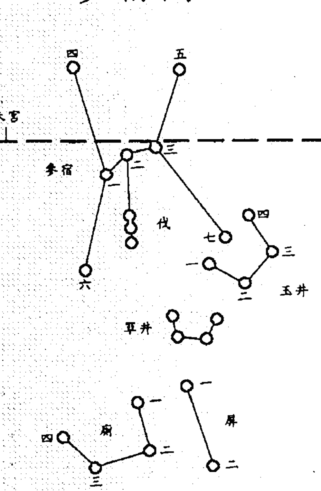

## 第四章 南方朱雀七宿

## 南方朱雀圖

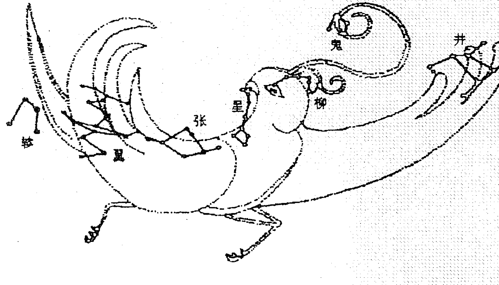

南方朱雀七宿爲：井、鬼、柳、星、張、翼、軫。井爲鳥首，鬼爲鳥目，柳爲鳥喙，星爲鳥頸，張爲鳥嗉，翼爲鳥翼，軫爲鳥尾。

## 第一節 東井宿

星數：1、東井8鉞1 2、天樽3 3、五諸侯5 4、南河4北河4 5、積水1 6、積薪1 7、水府4 8、四瀆4 9、水位4 10、闕丘2 11、野雞1 12、軍市13 13、狼星1 14弧矢9 15、丈人2 16子星2 17、孫星2 18、老人1。

方位：東井距西屑北第一星去極六十九度。

步天歌：

> 井八橫列河中淨，一星名鉞井邊安，
兩河各三南北正，天樽三星井上頭，
樽上橫列五諸侯，侯上北河西積水，
欲覓積薪東畔是，鉞下四星名水府，
水位東邊四星序，四星橫列南河裏，
南河下頭是軍市，軍市團圓十三裏，
中有一個野雞精，孫子丈人市下列，
各立兩星從東說，闕丘二個南河東，
丘下一狼光蒙茸，左畔九個彎弧弓，
一矢擬射頑狼胸，有個老人南極中，
春秋出入壽無窮，井象女主爲天池。

釋意：

井由八星組成，橫列在銀河中，因它位於玉井之東，又名東井，主水。井旁一星名鉞，主伺察、斬伐、淫汏奢侈。此星不能太明亮。如果明亮與井星一樣，或動搖不定，就會有天子誅殺大臣之事。

南有四星名水府。主堤防、溝瀆之事。北面有天樽，是裝水、米、粥、漿的器具，主施給貧苦飢餓之人。夾銀河南北爲南河、北河各三星，主南北通路。如南星不現就南道不通，北星不現則北道不通。兩河之間有一星名積薪，主廚房、烹飪之事，又有四星名水位，主水衡。北河之南有五諸侯，主治理陰陽，考察得失。北有積水，是供應酒漿之所。南河與水府之間有關丘，是兩座宮觀。

闕丘南有天狼，爲野將，主侵掠。若此星位置移動，則人食人。若其色黃白明亮，爲吉利。若變成赤色，光芒四射如角，有兵起。天狼南面有十星名軍市，是軍隊的貿易場所。軍市中有一星名野雞，主野外的變怪之事。軍市的東南有九星如弓弧，最前一星如箭矢。稱爲弧矢，是天的弓箭，主討伐叛逆，懷柔遠方之國，又主備盜賊，知奸邪。弧矢與天狼相對，如向天狼移動則多盜。若大而明亮且色變，或弧矢不正對天狼，也多盜。如弧矢的弓象個拉滿的弓，就天下鬧兵荒。

弧矢西有兩星爲子，兩星爲孫，主孝敬。又有兩星名丈人，主壽考，主哀憐孤獨之人。最南面有星名老人，又稱南極老人。主延年益壽。它常於秋分時出現，如顯現則天下太平，人均壽考，反之兵起。

### 一、東井 鉞

方位：東井距西肩北第一星去極六十九度。

鉞星去極九十六度少入參八度半。

車井八星，鉞一星。東井，水星也。春夏爲火，秋冬爲水。日月五星行貫井，是中道。三光之正道，行不出其中，爲天下無道；三光行經其中，不得留守東井，用法清平如水，東井、天府法令也，天讞也，主水衡以平時，故置，故置鉞星，斬淫奢。井，女主之象也，井者像法水，法水平定，執性不淫，故主衡。用法平，王者心正，則井星明行且位直。左垣四星，四輔也。右垣四星以輔赤帝。

東井又名東陵、天井、天關、天闕、天之南門、天齊、天渠、天池。主於員山，又爲其國市。東井、輿鬼在秦火山南，井、鬼星神常居其上。東井又爲天亭、天侯、井鬼、憂獄、鶉首。東井墜，天下湧水。井鉞去則水滿。

星明而端列，則王者用法平。星暗而不正，國君憂，有風雨。月犯之爲兵爲水，官黜、將死。刑改不平，其分君長憂。宿之不雨則風。若變於其宿以色占之，入則諸侯臣死。

乘若守之，有法令，水衡事，臣亂將死。入則有川瀆事，分饑亂。守之亦然，若成勾己環繞爲赦。

火星冒犯，水旱，群臣有以家坐罪。明乃將死，兵不利先舉。入之，無兵兵起，有兵兵敗，又爲旱，天下不安。守則貴相死，久守其分民多死。守三十日以上成勾己，角動色赤黑則貴人當之，百川溢，兵起。若環繞其事必成，色黃益地，黑則反是。

土星冒犯，六十日大旱，九十日有赦。入則所居有德，利以興兵，又爲兵馬東北。守之，旱災民疫，五穀不熟。犯入守之，皆爲大人憂。

金星入之，大水先起，兵者權。將軍犯罪、政急、民流。守乃憂，火物不成。犯之將有咎。

水星冒犯，刑法平或咸惡，邊兵起。犯而角動色赤黑以水兵起。黃潤有善令。

入之，其下亂，馬暴貴，又主兵之進退。星進則進，退則退。守則以水爲戾。久守之則歲春旱、晚水。

五星乘犯，凌守，芒角，環繞勾己，爲三軍不起，國君出。

客星出水淹，宮中火災，其分叛。入則外使來，五穀不成。犯之大水傷稼，大臣凶，土工興，小兒妖言。守之臣爲亂。

彗孛出之，大使出。冒犯其分兵起，大臣誅。入井大人憂，見四十日內兵將當亡，見五十日相當亡，見七十日君長當亡。

流星出之，其分大水。入之尤甚，又爲有使來言兵事。

黃潤出入國安歲美。黑赤，秦分水災、民流。犯之春夏秦地叛，秋冬宮中憂。

氣之入蒼，人疾，赤叛，黑水皆占其人。黃白潤澤池澤水泉事。白氣出有水滂之命。常以正月朔日暮候，井上有雲歲多水。

井鉞星大而明，斧鉞旦用，兵起。鉞星明，主自通，諸侯亂。鉞星明，則臣多犯罪者。井鉞一星司淫奢，其星不欲明，明則斧鉞用，以斬伏誅之臣。天鉞星不與井齊，則大臣有斬者，以欲然也。斧鑽用，王命興，輔佐出。

客犯鉞，將卒死。彗孛乃易政，秦地受殃。

訣：井中水星權衡法，進退適度方爲平，
星明大水沖地陷，井鉞不齊臣犯法。
一年雨水正月井，雲氣多則是豐年。
女主之象執法度，欲觀強婦井中露。

### 二、天樽

方位：天樽距西星去極六十八度入井十六度。

天樽三星，在東北井。天樽。天樽憫民，憐育幼孤。天樽主盛厚粥給貧、病也。明則稼熟，暗則不熟。

訣：行善好施天樽性，濟苦救難本因由。
提取貴人多相助，天樽星處好作磨。
明熟暗濟行義俠，深明大義多乖張。

### 三、五諸侯

方位：五諸侯距西星去極五十六度半，入井六度半。

五諸侯五星在東井北近北河。五諸侯分別爲：帝師、帝友、三公、博士、太史，此王者爲帝定疑。五諸侯爲土官也。五諸侯五星，在北戌之南，東西列，東端第一星，齊也；西端一星，秦也；其餘星皆爲諸國，五諸侯主刺舉，戒不虞。五諸侯主危傾，此皆諸侯之職也。五諸侯者，使發摘奸謀，司察私伏匿之事。五諸侯理陰陽，舉外害，察得失。九州之外使，五星之變逆出名罰，第一曲歲，其次如位，故以上天禍從中起。

五禮修備，則五諸侯星正行光明，則王吉昌，天下太平，臣皆忠；星若差戾，搖動不明，即天下有憂，王者不安，大臣不忠。五侯星當明，即天下大治安昌；不明若不見者，天下之貴人有謀其主者，不出三年而發；五諸侯生角，禍在中。五諸侯星流四去，外牧傷，天子避宮，公卿逃。五諸侯州，戒見亂相屠。五諸侯星主議疑。

月犯掩將相憂。五星中犯乘守，諸侯兵死。

客彗孛出犯，大臣憂，執法之臣凶。客星犯之，王室亂，諸侯亡地。守則親屬失位，水大，谷貴，秦地尤重。

流星出，諸侯叛。入爲喪，蒼白雲飛亦然，不則臣叛。

流星色黑出入大臣亡與三台、少微同。

訣：五侯佐君明政議，釋疑解危產奸謀。

齊明萬事五柱立，暗失有奸謀位人。

### 四、南河、北河

方位：南河距東大星去極八十三度半，入井二十一度。

北河距東大星去極六十一度半，入井二十度。

南河、北河六星夾東井。井鉞北爲北河，南爲南河。兩河天關門，爲關梁。南河戌又名南藏、天高，北河戌又名北藏、天亭、天門。兩河戌間爲天道。

南河戌名南紀陽門，南宮南高，南關越門。北河戌名北橫陰門，北宮北高，北關胡門。南河戌爲爟，北河戌爲衡，爟不正則天傾。所謂不正者，南河戌南五尺。

南北河戌爲天街，天街流相抵，天下大亂，親離也。南北河戌北門，水官也。天關者，河戌也，主中國之難，此皆天之度以昭示人也。兩河六星知邪逆。

兩河戌與戌俱爲帝闕。兩戌間爲天門，在北方，日月五星常出其門中，經行吉，不得久留守焉，出北旱也。日月五星不出其中者，爲王失道；行其南，以刑法舉措不當失道；行其北，以女及財物金錢失道。近期三年，中期六年，遠期九年。

兩河星欲明，大小如其故，則天下安寧，四夷來朝。其星不明，若動搖不於其常，則邊兵大動，交侵中間，人主有憂。北河戌下多小星，有民不治，將不明，多失職。日月五星行不出天道間，必有不道之臣。又爲必有道不通。

南戌主夷狄，北戌主中國，兩戌之間天關門。南、北河星不具，道不通。

南河星明而得常則中國夷來。暗動搖，邊兵起，四夷侵。月掩，中國憂，兵喪、旱疫。木乘之，夷王死。火犯，兵大興。守則大旱，谷不成。土乘，物不滋，民憂。金犯之，邊臣謀，或兵起，夷狄君憂，或毀亡。客彗孛守流星出入，皆爲旱災。

北河星動則中國兵起，明大則水道不通。月五星犯守北河爲荒敗之災；五星守之，兵起，道不通；客星犯則奸人在中。守之大水或邊暴。彗孛邊兵爲亂，或來侵國。守則邊軍動，犯之爲水災。流星入邊，兵來，關梁不通，或經兩河之間，天下有難。蒼白氣入，邊兵起，疾疫，敵主犯。

> 訣：南北戌河天道通，日月五星貫中行，
若有停阻路閉塞，彗孛流入水殃災，
天道有路任君遊，出入勿犯功德求。

### 五、積水

方位：積水去極五十四度半，入井十八度。

積水一星在北河西星北。積水一星名聚水，積聚美水，以給酒官之旗。積水者，甘泉也，積水之官，擬於醪釀，以待賓客。其星欲明則天下安，饗宴之禮行；其星不明，人主不安，五穀不登，饗宴禮廢，徭役殷煩，人民憂。積水星明大動搖，天下水，河海溢流，津道不通，積水星給酒旗。

居常則吉，不見爲災。五星犯守，其地大水，物不成，魚鹽貴，貴。

### 六、積薪

方位：積薪去極六十五度半，入井二十七度。

積薪一星在積水東南。積薪，聚薪也，以給享祀。積薪所以給庖廚，以燎熟飲食。

積薪與積水相距五尺以內，天下太平，五穀成。若相距一丈以外，天下饑荒，人民流亡，去其鄉。

其星明大，則王者安，人君增庖廚，多嘗察，五穀熟。星不明，君臣不和，百祀不享，庖廚空虛，天下旱，風不登，人民饑，王者憂。

五星犯守，大旱，民流，谷不成。客星守之，有以和稿致罪者。彗孛犯之，有亂臣。流星抵犯以柴草爲憂，若廚官有罪，赤氣入，干草災。

訣：積薪聚薪烹熟食，明大歲豐萬民均。
積薪去水一丈外，天下饑荒去其鄉。

### 七、水府

方位：水府距西星去極七十六度半，入參七度。

水府四星在東井南。水府，水官也。水府堤防，開道激滿。

訣：江流河川堤之護，開渠築道水滿流。
興修水利防水府，利國利民興長久。

### 八、四瀆

方位：四瀆距西南星去極八十六度半，入牛二度。

四瀆四星在東井南轅東。四瀆者，江、河、淮、濟之精也。四瀆受輸，潦源注海。

星明大則百川溢，土守爲吉。

訣：土守其星四海寧，若犯明大百川困。

### 九、水位

方位：水位距西星去極七十三度半，入井十八度。

水位四星在東井東南北列。水位主水官也，其星微小如其故，則陰陽和，雨澤以時，天下安。其星明大，大水橫流，溝渠溢滿，五穀死傷，民以水饑。

水位星主水衡，衡平象水澤，平而後流，澤不壅塞。星明大，則水興。水位星上近北戌，國設爲河，不乃有滔天之水，以日占國。

五星犯守，天下以水爲害。客彗孛出入犯守尤甚。流星入占如五星。出之色青，大水，赤黃，大旱，皆以所之命其色。氣之入，大旱，歲饑。

訣：水位四星微小吉，若犯明昌水有急。
水衡微明水利興，溝渠水澤麥谷豐。

### 十、闕丘

方位：闕丘距大星去極九十一度少，井十五度。

闕丘二星在南河南。闕丘主滅除之官，毀疏明，恩以帝五常。闕丘主關，墜丘之官也。毀疏過於王曆，則遷之於禮，更立近明，恩情所在，諸星也。

闕丘雙塾，外屏風。闕丘，門外象魏也，天子謂之闕，諸侯謂之兩觀。丘，高也。塾，門西高堂也。天子外屏風，在宮門外，諸侯內屏風在宮門內，所以別尊卑也。

守常則吉。金火客彗孛犯守，兵戰宮闕。赤氣入，天子憂，宮火災。

訣：守常之時宮臣乖，五常督君明恩疏。
金火客彗犯闕門，有意無意禍殃成。

### 十一、野雞

方位：野雞去極一百九度半，入井四度。

野雞一星在軍市中，野雞，大將也，野主兵。野雞主屯營軍之號令，警急設備。其星明大，則主將猛，士卒強。其星不明，主將弱，兵士離散。野雞安靜吉，芒角凶，爲兵災。野雞出市，天下有兵，諸侯相攻。

野雞一星主野邦。

訣：野雞野將是禍星，若動有凶芒角攻。
野性難改是非人，昌盛明大勢氣猛。

### 十二、軍市

方位：軍市距北星去極一百七度半，入井初度。

軍市十三星，水官也。軍市中星眾，則軍有餘糧；星少即軍饑。月入犯則兵起，人君不安。客星入之，刺客起，將卒散。流星出之，大將出，若犯沖，大饑。赤氣入，軍亂大饑。

訣：軍市星眾多餘糧，兵強力勝多戰果，
月犯赤入兵饑亂，客星入市刺客起。
軍中之事喜市明，星明且大國防壯。
軍市欲明觀客星，防微杜漸保安寧。

### 十三、狼星

方位：狼星去極一百七度半，入井十度。

狼一星在參東南。狼，金官也。狼星爲秦、南夷也。又名夷將、侯、天紀、天陵。狼星爲野將。爲羊角，狼星主羊、夷將。（狼在於未，未爲羊也。）

狼者，盜賊。弧者，天弓，備盜賊。故弧射狼，矢端直者，狼不敢動搖，則無盜賊，兵不起。若動搖明大，多芒變色，不如常，胡兵大討。其星欲黃白，無芒、不動搖則天下寧，兵不起。

狼星盛，兵弩貴；若小，兵弩賤。狼星變色，盜賊萌。狼星色赤而光明，芒角四張，動搖，天下起兵，將軍有死者，期二年。盜賊起於道路，人主不安，百姓憂苦。

狼星易其處，不如其故。天下饑，兵下饑，士兵滿野，其國凶荒，期不出年。狼星白芒，百徒聚天下。狼星躁走，爲人主不靜，不居其宮，馳騁天下。狼星芒角多，多盜賊；芒角少，少盜賊。狼星非其故，人相食。

月犯有兵不戰，亦爲水居之，外國有謀。五星犯守，兵騎滿野，多盜，狄人犯中國。客星守，物大貴。其色黃潤有喜，色黑有憂。

客彗孛犯守，國多盜，外夷侵。流星出，戎狄將亡。氣之入，有兵革，狄人侵，民驚擾。

訣：狼爲賊盜喜征戰，宜微勿明動將亂，
弧矢箭端直相對，若偏性殘人難安。
月犯有謀外勾內，五星多盜客物貴，
大事出戰常備流，氣入哪堪外財露。

### 十四、弧矢

方位：距西南稍星一百二十三度，入井十二度。

弧九星在狼東南。弧星者，天弓也，以備賊盜。狼星爲奸寇，弧星爲司其非，其矢常欲直，狼則不敢動，天下安寧，無兵起。若矢不直，弧不張，天下多盜賊，兵大起則國無寧。弧星主弓矢之府，以備其常。

其星大而齊明，其色黃潤，則四方安靜，天下無兵；其星色變，不如其常，天下皆兵，弓矢大貴，人主不安。

弧星主武官，有兵若弧張，迎戰者不勝；弧動，先用兵吉，後者凶。狼旗七星屈曲者，夷敵弱，可攻。狼弧張，黑則帝亡，害及胡。又爲四年后，天下久亂。天弓張，天下無兵，主與臣相謀。弧星青黑，有大人憂。

月入，臣逾主。客星出之則兵出。入則兵入或南夷降。守之，亂兵起，外夷大饑。守而弧矢張，先起兵者勝。

流星沖入守犯，狄兵起，屠城殺將。氣之入赤爲民驚，狄人犯中國，黑爲狄人病。

訣：弧矢守狼鎮位響，弧張用兵先取王。
弧狼相張備軍糧，黃潤吉祥恐赤驚。

### 十五、丈人

方位：丈人距西星去極一百二十八度，入參四度。

丈人二星，在軍市西南。若星亡，客星入則人臣不得自通。

訣：丈人星明壽綿綿，多有子孫敬福田。

### 十六、子星

方位：子星距星去極一百二十八度，入參九度。

子二星在丈人東，不見爲災。

訣：子星亦明堂中興，上下相敬貴如賓。
禮儀指教星光冥，不見光明子難鳴。

### 十七、孫星

方位：孫星距西星去極一百二十五度，入井六度。

孫二星在子星東。丈人杖行，子孫扶持。占與丈人、子星同。

訣：其星欲明後代強，旺族子孫敬孝郎。
孫星暗落無金量，多有小人來作崇。

### 十八、老人

方位：老人去極一百四十三度，入井十度。

老人星，木官也。南極星也，又名壽星，南極老人。其色黃而明大，見則主壽昌，王者，老人吉，多賢士，天下安寧。其星微小，不見則主不康，老者不強，有兵起。

立秋，二十五日晨見丙午之間（秋分，見南方，春分而沒。出於丙，入於丁）候老人星。見則平治主壽，亡者君危，若世夭。王政和平、王者承天，則老人星臨其國，故萬民壽。其色青，主有憂，老人疾。色若黑白，主有老人多死，各以五色與吉凶。

若依時見而明大赤則天子壽昌，天下治平，賢士用。不見則兵起，歲荒，君憂。

客星冒犯守之，疾疫、兵興、老者憂。

彗孛則傷秋稼。以時不明，天下兵荒。

流星出之沖犯皆爲國安，天下豐樂。入之又爲老人有病或兵起。白氣掩蔽之，國大凶。

訣：秋分若見國歲延，多有老人百歲綿。
明大賢士俱開顏，有則改之無則罷。
流星喜出財吉昌，黑白入之掩災殃。

## 井宿圖

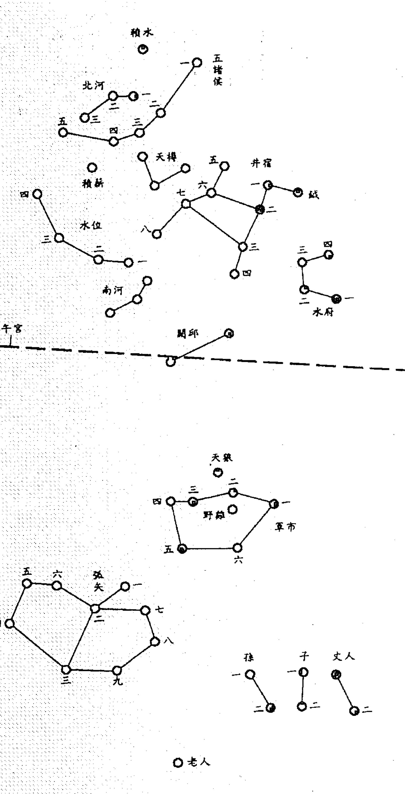

## 第二節 鬼宿

星數：1、輿鬼4積屍氣1 2、爟4 3、天狗7 4、外廚6 5、天記1 6、天社6。

方位：鬼宿距南星去極六十九度半。

步天歌：

> 鬼四冊方似木櫃，中央白者積屍氣。
鬼上四星是爟位，天狗星七鬼下推。
外廚六間柳星次，天神六個弧東倚。
社東一星是天記，輿鬼天目主察奸。

釋意：

鬼由四星組成，又名輿鬼。鬼爲天目，主明察奸謀。東北星主積馬，東南星主積兵，西南星主積帛，西北星主積金玉。鬼中一星爲積屍氣，主死喪祠祀。鬼南面有外廚，主宰殺烹煮之事。再往南有天狗，主守禦。有天社，是社神，爲土地之主，有天記，又作天紀，主管理，醫治禽獸。

### 一、鬼 積屍氣

方位：鬼宿距南星去極六十九度半。積屍氣在其中。

輿鬼四星。積屍氣一星。輿鬼南六尺，是中道。春夏爲火，秋冬爲水。鬼，土星也。弧射狼，誤中參左肩，輿屍於鬼，鬼之言歸也。

輿鬼又名天鉄鎖、天訟，主察奸，爲天目也。輿鬼爲夏獄，又名天金、玉府、大匱、天壙。

鬼東北一星主積馬，東南一星主積兵，西南一星主積布帛，西北一星主積金玉。此四星有變，則占其所主也。中央色白如粉絮者，所謂積屍氣，爲天屍，故主死喪，主祠事也。又爲鉄鎖，故主法，主誅斬。積屍氣，似暗淡不明爲吉，明則有兵起，大臣被誅，下人死亡。

輿鬼、天屍爲朱雀頭。中星如粉絮，鬼爲疫害。輿鬼者，天廟，主神祭祀之事。其國秦也，其木楊也，其物馬牛羊虎也。

輿鬼星明大則歲熟。不明則民大散，其星移徙，民大愁政令急。輿鬼星皆動，其色瞳瞳，望之若有光，上賦斂重數，徭役繁多，萬民悲怨；不出五年，身死家亡。見此災後，連年大水，秦國尤重。輿鬼視明察奸謀，故置五諸侯以刺之。

質星不欲明，明則兵起，大臣誅。

月犯鬼星多刑殺，民疫，大臣憂，將死秦地兵，入則財寶出。月犯質星，賢臣、女後憂及大喪，謀臣糾彈之官誅，秦地君長憂。

木星犯鬼星人饑，人君憂之，大臣災。守則有祭祀事。若犯質星兵喪，王者疾，斧鉞用。

火星犯鬼星大臣憂，後失勢，執法者凶。入之金玉用，疾疫，人赦，賊臣在君側。若勾己環繞則有大喪，天子皇后忌之。

舍鬼中央多霜露，風雨不時，民疫，頭目、小兒多死。守則喪役、物貴或女後病，若入皆爲兵災，旱災。犯屍，兵在西北，軍將死亡，又爲喪。

土星冒犯，女後奢侈，否則有憂，臣亂、旱疫。入之大喪或主其分又爲大臣死。

舍中央爲赦。守則後宮憂，土工，旱災，又犯之若守，皆爲大人憂，其分積屍滿野。入則王者惡之。犯之，積屍或失勢。

金星冒犯，有兵謀，斧鉞用，其分兵興，將誅，多損孕婦，亂臣在內。守已近臣叛，若成勾己環繞，天子惡之。金星犯積屍，大臣誅，有屠城，守則將軍憂，其地兵喪。

水星犯之，谷不登。入則兵起，蠻夷滅。守之蝗蟲水災及喪。貴人憂，秦地災。犯積屍，貴人有罪。入守，法官凶。

客星出入，犯守在南，主君及男夫在北，後及女婦東。太子壯丁酉，貴臣老人及隨所主惡人，又犯之，其分主憂，修德無咎，土工興，男女不得耕織。

若守積屍，人主惡之。

彗孛出之，下有兵喪，棺槨貴，犯之尤盛。

流星出而有光，天使出，國喜。入則，外使來。

流星入之，四夷來貢，祠祭宗廟。犯鎖有戳命者。

氣之入，白疾，赤旱，黃土工，黑後憂。白貴人憂，青病，黑喪，黃其分喜，以占其善惡。

訣：輿鬼五星主視明，從陰視陽不失精。
四角爲寶中積屍，明大爲吉暗災深。

### 二、爟星

方位：爟星距北星去極六十度半，入井二十九度。

爟四星在軒轅尾南柳北。爟，土官也。爟舉烽表，遠期沉浮。爟爲烽火驚急以火相告，日行萬星。

星不明安靜爲吉。明大動搖邊有驚急。赤氣入爟星，火皆動。

訣：爟星明大動烽急，日行萬裏多驚悸。
若有外敵欲侵襲，爟星預示吉凶意。

### 三、天狗

方位：天狗距西星去極一百六度，入井二十二度。

天狗七星在狼東北。天狗主守賊。天狗非其故，天下有大盜。野狗向吠，雌雄威嘷。

動搖則兵饑。移則多盜。土守之，人相食從其鄉。
客彗孛冒犯，群盜起，狼蟲興。

訣：天狗若兵守廚邊，動移多盜多防範。

### 四、外廚

方位：外廚距大星去極九十二度半入柳初度。

外廚六星在柳南，外廚烹飪、雞羊犬豬。
占與天廚同。

訣：外廚天廚昭示同，宰殺牛羊供後宮。
明則廚中多殺戮，牛羊哀鳴盤中餚。

### 五、天記

方位：天記去極一百一度半，入柳五度。

天記一星在外廚南。天記主知禽獸年齒，凡所烹宰，不殺孕，不夭動，以致繁盛。故處外廚之門也。常則所主吉，金火客彗孛守犯，獸畜災，民不安居。

訣：天紀天動有惡號，金火客彗孛獸災。
天紀有網莫違方，誤則不動凶移鄉。

### 六、天社

方位：天社距西南星去極一百三十四度，入井十二度。

天社六星在弧南。勾龍能平水土，其精爲星，故祀以爲社。天公社者，小人。天公祠祀，非私所事也。所祠者，公社主也。老人天社，理落羈祀。

明則社稷安，動搖，天下有謀。金火客彗孛犯守，皆爲社稷不安。

客星出之爲祠祀事。

訣：天社爲公祭祀龍，平水服土歲安豐。
社稷地基穩固定，天社星明金湯城。

## 鬼宿圖

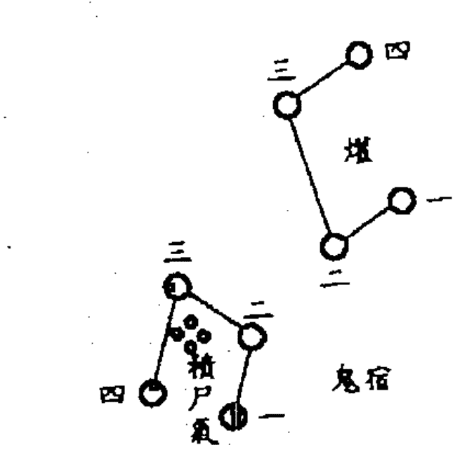

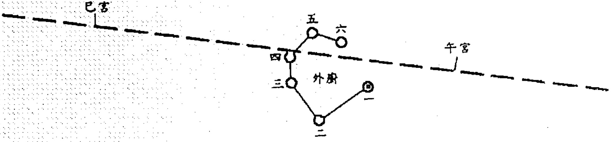

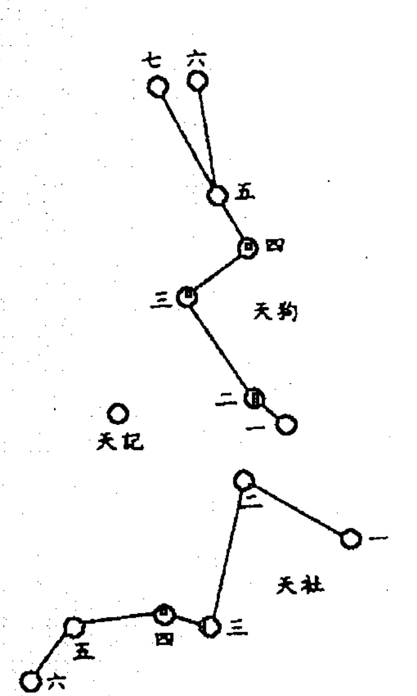

## 第三節 柳宿

星數：1、柳8 2、酒旗3

方位：柳宿距西星去極八十二度半。

步天歌：
柳八曲頭垂似柳，近上三星號爲酒。
享宴大酺五星守，柳主卿臣食味廚。

釋意：
柳由八星組成，其爲朱鳥之口，又名喙。因其八星彎曲似柳，也名柳。主草木，又是天之廚師，主尚食，調和滋味，以明亮爲吉。
它的北面有三星，名酒旗，是酒官之旗幟，又主饗宴酒食之事。

### 一、柳

方位：柳距西星去極八十二度半。

柳八星，土星也。柳北六尺，是中道，春夏爲水，秋冬爲火。柳，天府也，又名天相，天大將軍，天少府，天庫，鶉、味注。注者音相近也。主木工也。柳爲木官，主工匠。柳爲鳥注，主草木。其國，狹也，其木，桑也，其物，羊豕也。將有木工，則占於柳。柳者生於道澤之山，爲其國府庭也。

柳山，七星山，張山皆相連，在周嵩高山東北，柳星、七星、張星神常居其上。柳者，朱雀頸也，主卿，大臣之廚。

凡八星，以防詐僞。其星欲明，明則國安昌，廚具養，大臣重鎮，以防不虞；其不明，德弊離，王者失令，宮室不安。參，注滅絕，臣弒父。柳星位直，天下謀主；其星就聚，兵滿國。注舉首，王命興，輔佐良。

柳主上食，長養形仁，以行恩成其名。亦可和味滋，故置天稷以祭祀。

月犯之土木工興，大臣將相憂。
木星守之，貴臣得地，後有德，犯占同上。
水星惡多獄訟。又入，若天下豐樂。水星冒犯，木被伐，民多餓。守之，有兵逆臣在側或米貴而天下安，諸侯喜。天子以飲食爲戒。
土星守之亦然。冒犯則女後昌，土工興。入之，君有喜。
金星冒犯守之有急兵或強臣。又守之益地。入亦然或貴人用兵。久則邊人不安。若逆行而入成勾己，臣叛民多暴死。

歲星犯馬貴，守則水船相望，入之占同。

客星犯則同分當之，入占同。守若入兵起，布帛魚鹽貴。

彗孛出犯守之皆爲兵喪，大臣賤，臣有謀，大旱，谷不登。庫官出，夷狄爲亂。

流星出之，宗廟喜，木工用，多雨水，其分憂之，主大災，木有伐，木工廢，廚客憂。冒犯其分當之。

氣之出入赤大旱。如波者水災。黃赦，黃白有異果來貢，有喜，君建宮室。黑廚房憂。其出赤旱，黑木腐。

訣：天府八星防詐偽，暗失德衰宮不寧。
就聚兵野天下憂，位直謀主事難休。

### 二、酒旗

方位：酒旗距西北星去極七十七度，入星七度。

酒旗三星在軒轅右角。酒，酒官也；旗，旗官也。酒旗主上尊大帝，運樞陰陽，滿陳列宿，成德五星，布恩神明，和合四節，並宜曆記，齊得諸靈合歡，故設酒旗，以人勸神飲。酒旗不具，天下有燕，大喪以酒亡。

星明則多宴飲而合度。昏暗則過度而非禮。

星不具有喪或有酒食財物，賜爵宗室。

金犯之，公卿謀。客彗孛出犯之，亂。赤氣宜宴飲。察近臣。

提示：酒旗宴會，情意歡娛。

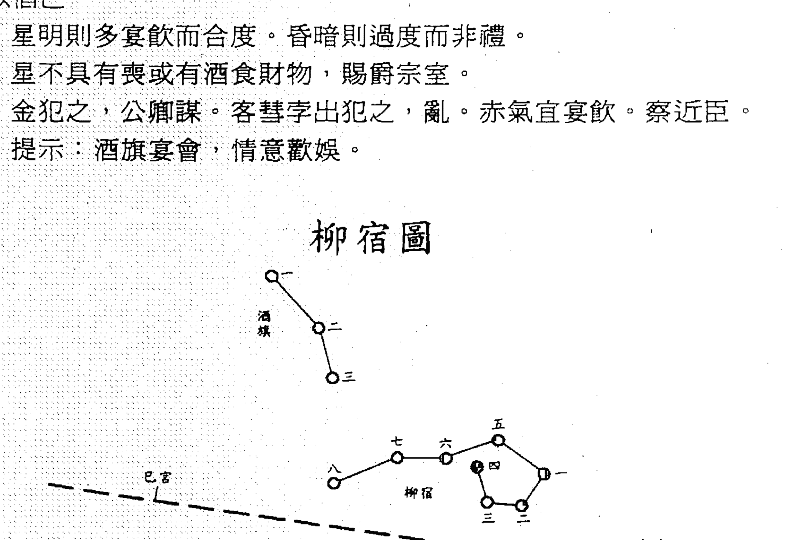

## 第四節 星宿

星數：1、七星7 2、軒轅17 3、內平4 4、天相3 5、天稷5。

方位：星宿距大星去極九十六度。

步天歌：

> 七星如鉤柳下生，星上十七軒轅形，
軒轅東頭四內平，平下三個名天相，
相下稷星橫五靈，七星衣裳德成信。

釋意：

星由七星組成，是朱鳥的頸，又是朱鳥的喉嚨，物在喉嚨不能久留，引伸為緊急的意思，故七星主急事，以光明為吉，暗淡為凶。

星北十七星名軒轅，又名東陵、權，主雷雨之神，風霜雪露，都由軒轅主管。其中較北的星為女主，次北一星次為夫人。女主南一小星名禦女。這些星小而黃明則吉。若非常明亮，則後宮互相競爭。如移動則國人流離失所。軒轅東有四星名內平，是執法官之象。星宿東有三星名天相，天相是大臣之象，也是禦府官。

### 一、七星

方位：星宿距大星去極九十六度。

七星，赤帝也，又名天庫，天禦府，於午火隆入中宮，德於土星，主衣裳、被服、繡之屬。七星又名延頸、天員、天府、天河、員官、津橋、注侯、倍海、賜貸、天延。七星頸為天員官，主急事，主兵。七星為天帝，守諸群盜賊。七星正主陽，朱雀心也。星主衣裳，以覆鳥身。

其星欲明，明則王道大昌，君子家不隱，賢人不逃藏。其星不明，中輔逃亡，賢良不處，天下虛空。王者開四門，則七星光澤，天援綱紀。七星動者，兵起。七星大，則大麻熟成。七星明，執政者平，不明，天子疾。七星離，天下易政，家殊計。七星主衣裳，蓋身軀，故記軒轅裁制之。

月犯之，兵戰廚官憂，臣亂其分饑。入則其分殺，將破軍。

木星犯之，人主憂，兵攻，臣受封，入之，則立太子，谷傷。守之，天下和平，又為盜賊兵起，以德令解之，治宮室，臣背命。

土星犯守之，王道興，後宮喜，其分福。犯之，谷傷，女後先災禍。

喜。

金星守之，其分暴兵、戰勝、益地。犯之亦然，又爲君有德，大臣當之，水災，谷不成。

水星犯之，賊臣在側，以善令則無咎。守之，水傷，萬物民流多疾。其分兵起，貴臣誅，否則法官憂。火土金木之占同水。

客星入之，亦然而有奇令，有客以急使事。出則反。色赤占兵，黃土工，白喪，青憂，黑水。出守犯之又爲河決，民去其野。

彗孛守之，臣亂兵起，貴臣戮。出犯之，其下有叛臣，大臣有潛謀。

流星去之，王者以急而使。出乃庫官以匹帛賜內臣。入則急來使，乃庫官以綿繡進女工用。犯則有兵刃。

星爲天都使者；星出入皆爲財帛事。氣之出入，蒼白入或如飛鳥其嘴啄正對之，貴人憂。蒼白入用急使，赤兵起，如波者火也。黃白若粉絮及潤澤，皆貢獻來。黃白出之，遣使賜諸侯。白占如上。久而不散，有大風，兼有赦令。黑，賢士死。

訣：七星明澤執政平，君子賢人不逃隱。
德歸好性信有成，帝冠服繡屬七星。

### 二、稷星

方位：天稷距大星去極一百三十七度，入柳十三度。

稷五星在七星南。上稷，農正也。稷者，取乎百谷之長以爲長也。稷星主五穀豐耗。其星溫溫而明，歲大熟，五穀成；其星不明，若亡不見，歲不熟，天下飢荒，人民流亡，去其鄉。稷在張南時報功。

客彗孛犯守占，如暗不見，客星出入占同天柱。

訣：稷星溫溫明谷成，抬頭不見飢流民。
天稷守常百谷豐，若犯彗孛客有咎。

### 三、軒轅星

方位：軒轅距大星去極七十五度，入張二度。

軒轅十七星在七星北。黃龍在內，正土職也。軒轅，女主之廷也。又名天柱、陳陵、權星、昏冒官，主雷雨之神。軒轅前大星明，爲天關，主陰關。軒轅，帝妃之舍也。天子後妃之庭，主土官也。

軒轅十七星主後妃，黃龍之體以應。南端明者第一星，女主也，母

## ※ 奇門星相絕學 ※

也，皇后也；次北一星夫人，屏也，上將也；北六尺一星，次夫人，妃也，次將也；又北一星，次妃也，九嬪也；次北一星，二十七世婦；其次北一星八十一御女。西南六尺一星，太后宗也。樂星六尺一星，皇后宗也。後妃星南一尺一星小者，皇子也；次南二尺一星，女史也。其星主雷雨，風霜，霧露，虹霓，背瑀，抱珥，此軒轅之變氣，皆應主之祥。

軒轅星，王後以下所居宮也。一為帝南宮，中央土神，女主之象，女主之位，黃帝之舍也。諸舅有儀，則軒轅東西角大張。軒轅列明，後女爭譽。

軒轅屏星去，無君臣議。軒轅星如其故，色黃而潤澤，則天下和，年大豐。軒轅移外，民流亡，從胡人；移其內，民人大饑，胡人來。軒轅星動有搖，相就皆為後，夫人之宗有死喪，或早伐奪者。女禦星去後星遠，有賊星迫近之，有賞賜事。其東西至，大民小民王者娶不以次，淫佚不用道理，以下賤為正也。

軒轅角振，後族敗。軒轅小而黃明則後宮安靜。微小不見則皇后貴女不安。軒轅星合為百二十妃，大小相次，後宮多子孫。不明有暴憂。軒轅龍體主後妃。

軒轅為大典之內政弱，太微陰陽交合感為雷激，為電、雨、怒風亂，為雨霧凝、霜散、露聚、雲立、虹霓離，背瑀瑀、抱珥。此一十四變軒轅乘主之。

五星冒犯乘守之，盜賊並起火災。又凌犯勾已環守皆為女後憂。火星則後妃惡，以赦除咎。禦女若大，民則大饑，太后宗罪，小民小饑，皇后宗有罪，左右角，大臣當亡。

客彗孛守之，兵起。客星出之，後宮失勢。犯之，美人枉死，親近有謀，以赦除咎。彗孛出之，女後為亂，君後憂，後宮不安。冒犯之，大變亂，以五星占期。流星出之，後遣中使出。入則後有喜，有子孫之慶。

> 訣：軒轅妃舍次第明，雲氣變幻祥主宮。
天柱列明女爭榮，微小黃潤後宮靜。
客彗孛守機可乘，流臨入之後有慶。

### 四、內平

方位：內平距西星去極五十二度入張六度。

內平四星在中台南。內平近，決議罪禮書。內平近執法之官，有疑則準案禮律。

星明則刑罰平，不明反是。

> 訣：內平明亮執法淨，有罪無罪刑罰平。
其星不明昏案理，定罪非禮貴人屈。

### 五、天相

方位：天相距北星去極九十五度，入星六度。

天相三星在七星大星北。天相者，天丞相也，主服彩色。

五星客彗孛守犯，後妃、將相坐法。氣之入占，在大臣。黃喜黑死。

> 訣：五星冒犯將有危，法式轉氣黃祥瑞。
彗星干擾妃有悲，氣入天相黑有喪。
天相爵服衣鮮光，彩裳倪舞燕輕鶩。

# 奇門星相絕學

## 星宿圖

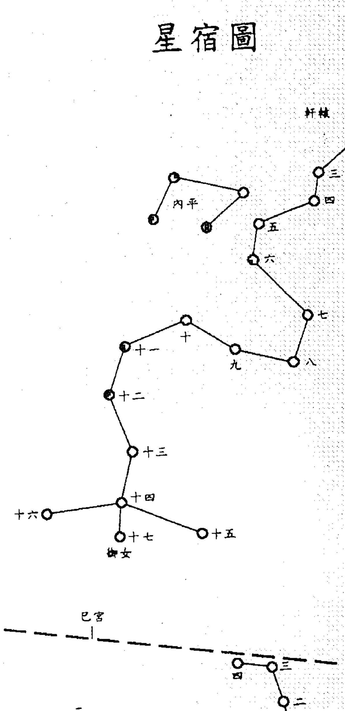

## 第五節 張宿

星數：1、張6 2、太尊1 3、天廟14。

方位：張宿距西第二星去極一百二度半。

步天歌：

> 張六似軫在星旁，張下只是有太廟。
十四之星冊四方，長垣少微雖向上。
星數倚在太微旁，太尊一星直上黃。

釋意：

張星六宿是朱鳥的嗉袋，主廚房飲食，賞賜招待客人。以明亮爲吉，暗淡爲凶。

張南有十四星名天廟，主祭祀天子的廟。

### 一、張

方位：張距西第二星去極一百二度半。

張六星，水星也。張北十三尺，是中道。春夏爲木，秋冬爲水。又名天府、禦府、天倡、天玉、被服，是寶文玉神之藏也。張者，主酒食，爲天相，王者珍寶物，宗廟所用。張者爲廚，主饗客之事。其木梧桐，其物粟、雞、狗、羊皮，其國周也。張主賞與，星動者，有賞與之事。張者生於江水之山，爲天庫；張者生於道釋之山，爲周庫，爲都官。張爲天帝，朱雀嗉也，主帝之珠寶玉，宗廟所用天王內宮衣服。其輔帝中宮，內張外翼，以衛帝宮。

其西四星，四輔也，帝宮內翼外張，以匡帝宮，張星明大，則王者行五禮，得天下之中，廚具養。張星不明，多病者，王者少子孫。移徙者，天下有逆民；就聚者，有兵。張主賜，客賓主嬉，故近少微禮義時。張主養位盛陽，人君向治統綱紀。

月犯之將相叛，其分有憂，飛鳥暴死。

宿張而霧，天子惡之。

水星入若犯光黃潤有慶。守則氣和歲豐。

火星犯之，水災、谷。守則歲豐，明有慶賜，大將驚或天下諸侯叛。又犯守之，功臣封土。入乃兵起。

土星在其宿而光黃潤澤，天下安，君子有慶，犯之，大水氾，魚鼈死，貴臣災，在秋冬仲月土工起。守則天下和平，宮中喜慶，臣有伏法，若土工事或陰陽不和民多疾。入之，兵興。

金星犯之，民不安；守爲大火，五穀不成，水災，兵疫，其分不寧。

客星出，兵起及有賜賞事；守則周楚之分有急事。又犯守之，天子以酒爲憂。

彗孛出入，大旱、谷貴。否則兵水災，民流。

流星出，諸侯受賜。入爲諸侯來獻，近臣憂。抵之，廚房受賜。出入爲國昌及有赦。

氣之入蒼白出則客憂。潤澤賜賞諸侯。赤用兵。客出亦如之。黃白潤澤入則國喜賜客。黑而徘徊。聚散其分水災。出入環繞君防刺客。

> 訣：四輔張星明五禮，張翼內外衛宮帝。
黃潤有澤氣豐和，流星出入讒媚濟。

### 二、太尊

方位：太尊去極三十九度，入張九度。

太尊一星在中台北。太尊一星職比聖人。

守常則吉，不見爲憂。

客彗孛流冒犯並爲貴戚，將則尤甚。

> 訣：聖人之位守常吉，朝供拜上持杖儀。

### 三、天廟

方位：天廟距西北去極一百一十三度半，入柳十三度。

天廟十四星在張南。天子之祖廟。

天廟星均明則吉，微細則凶。星非其故，有凶憂，或白衣之會，有兵，軍食不通。天廟星大色黃潤則吉，蒼白爲憂，青黑憂在宮中。天廟是非其故，有廟殘之事，吏不去則死。天廟祭祀，示民不怠。

客星犯守，其所又爲牛馬多死，祠官憂。

彗孛則當有誅黜。

> 訣：天廟反常凶祖祠，黃潤大色免憂澤。
宗族星盛牛馬豐，彗孛出之恐誅刑。

## 張宿圖

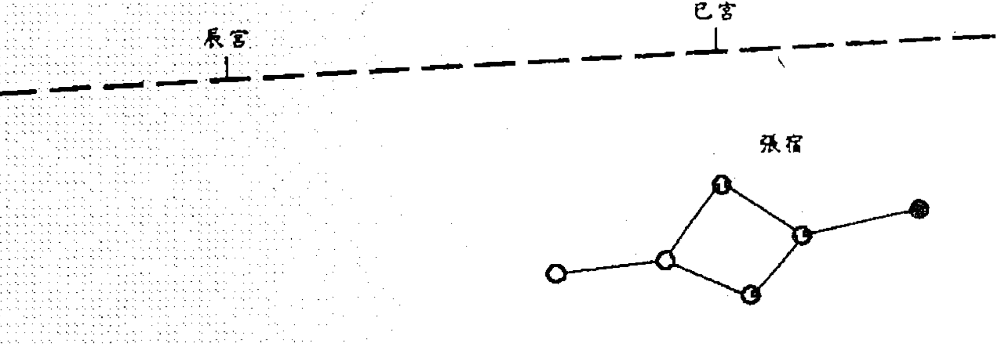

## 第六節 翼宿

星數：1、翼22 2、東甌5。

方位：翼宿距中西第三星去極一百四度。

步天歌：

> 二十二翼星難識，上下下五橫著行。
中心六個恰如張，更有六星在何許？
三三相連張畔附，必若不能分處所。
更請向前看野取，五個星黑翼下頭。
欲知名字是東甌，翼主遠客負海事。

釋意：

翼由二十二星組成，是朱鳥的翅膀。是天的樂府。又主遠客。翼大而明，就禮樂興，四方少數民族賓服。

移動位置，爲天子將舉兵討伐叛亂之人。翼西南有五星名東甌。其在二十八宿之外。

### 一、翼

方位：翼距中西第三星去極一百四度。

翼二十二星，金星也。翼北十二尺，是中道。春夏為金，秋冬為土。翼者，賓客也，市也。翼主天昌，五樂，八佾（指一行八個為佾）。翼又名化宮、天都市、天徐、天倡、倍海、天旗、天都。翼為天樂府也，和五音，調笙律，主輔以衛太微宮，九州之位，入為宰相，將士。繩直有列，內外小星，四十六宮各隨其度，小臣之象也。翼則其國楚，其木茱萸也，其物轅干也，奴婢，毛羽，節器也。翼，天羽翼，又為負海，羽翮主遠客。翼山、軫山相連，在楚門山中央最高，翼，軫星神常居其上。將有負海之事，則占於翼。

翼星明，則帝德明，王者納賢徵聖，有進言之慶，禮樂大興，天下和平，旗用；其星不明，天子有憂，將有負海之客，禮樂不和，律呂不調。翼主蠻夷，其星動則蠻夷來見天子者。翼星光芒，明帝臣、群聖、三王清徹，聖賢有期，集會之慶。翼明大則四夷賓服。翼星徙，天子舉兵征伐。其星就聚，天下相伐。翼主天倡、建旗、秉節，物滿張。

月冒犯，女後惡之，其分兵喪，將死，太常之官災。入中，大臣死。

木星犯之，五穀風傷。守則王道興，六術用。久守為天下歲熟。

火星入之，兵起，其分饑疫疾；臣不聽命。守則臣亂風旱，魚鹽米貴。久守民流亡。

土星守犯，世治、歲豐、後喜。久守則有叛臣。

金星冒犯，兵起民疫。五穀風傷。入乃天下兵起。守則國得地。若守犯勾己凌突，其地大臣擅權。

水星冒犯，其地荒。守之占同，又為權臣在下，大炎或蛇見入。若守中皆兵起。犯守凌抵其下臣以亂誅。

客星出入，君使人於外國，不然海客來貢。入則外國使來，又出入之歲實。犯守為兵起。

彗孛出犯，其下兵喪，芒所指其下有伶人。

流星出之，其下有兵，遣使求賢，不則大臣憂。抵則天子尊，受諸侯。入之，貴臣因四海受賜，南夷來貢。氣之出入，下有暴兵，黃而潤澤諸侯來貢，君賜諸侯。蒼白太常之官憂，黑而圍之三夜不去，其下君長憂。

> 訣：翼宿遠客楚中央，直列有序明律揚。移徙就聚兩俱傷，光芒四射集慶享。

### 二、東甌

方位：東甌距西南星去極一百二十九度，入張七度。

東甌五星在翼南。東甌，東越，今永嘉之永寧縣。東甌星兼主此地也。康居穿骨，越裳東甌。

芒角動搖則夷兵叛，金火守之其地有兵。

> 訣：東甌越翼穿骨居，芒角若動夷兵起。

## 翼宿圖

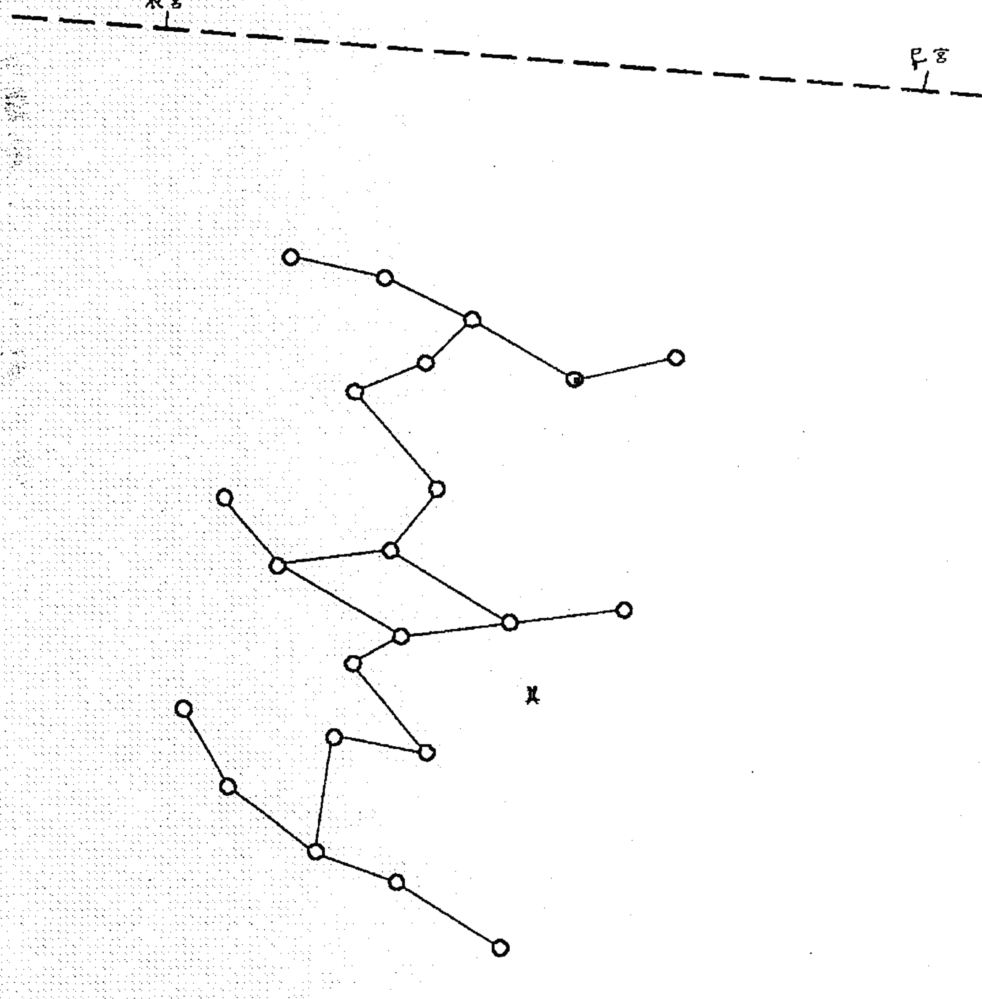

## 第七節 軫宿

星數：1、軫4長沙1左轄1右轄1 2、軍門2 3、土司空4 4、青丘7 5、器府32。

方位：軫宿距西北星去極一百二度半。

步天歌：

> 軫四星似張翼近，中央一個長沙子。
左轄右轄附兩星，軍門兩黃近翼是。
門下四個土司空，門東七烏青丘子。
青丘之下名器府，器府之星三十二。
以上便爲太微宮，黃道向上看取是。

釋意：

軫由四星組環，主宰相輔臣，又主車騎，主風。若明大會有戰爭。太白守軫，學校散壞，文儒失業，兵戈大興，熒惑守軫，南方有不聽天子命令之國出現。應起兵討伐。辰星守軫，徐州、泗水一帶有屠戮之人。

軫旁有一小星名長沙，閃閃爍爍不宜太明。若其與軫宿一樣明亮或進入軫中，就有兵大起。長沙左肩有左轄，右肩有右轄，分別代表同姓和異姓諸侯。

東面有七星名青丘，代表南方蠻族之國。西南有兩星名天門（軍門）是天子的軍門。南四星名土司空，主域界人民之事。

### 一、軫 長沙 左轄 右轄

方位：軫距西北星去極一百二度半。

長沙去極一百八度，入軫初度半。

軫四星，長沙一星，轄二星相距近也。軫，金星也。軫北十三尺是中道。春夏爲木，秋冬爲土。軫名天志，主風，死喪。軫，府廷也。車也，軍事也，爲天庫，楚國星也，會稽也。軫，天員府也，天子政朝也。主察凶災，冢宰之臣，四輔也。軫用以侯王者壽命。故置長沙一星主延期。

軫生於蒙山，長爲楚之國，爲府廷。其木松柏，其物青麻帛也。長沙轄星明則壽命長，天下不亡也。細微則亡。不見七日，其位王侯當之。長沙星明與軫四星等，若五星入軫中，兵大起。軫北小星去軫數寸者，轄也。轄明與四星等，若轄進退，兵大起。軫南小星去軫二尺者，膏也。轄進膏博軫，是謂天亡膏，三日車騎發。轄，膏各反其處，車騎罷。有兵而轄遠軫者，兵罷。軫爲天車，軼轄則傾。軫星明大，則車駕備。軫星與長沙星明，天子內佐親強。軫星移徙，天子憂，謀兵，其星就聚，兵大起。軫星流不正，又無一星，如車無轄，國主憂。將有軍出入，則占於軫。

軫轄舉，南舉，南蠻侵。轄星動，車騎用。轄二星明則車行珂路。網轄欲進，相距七寸，相距一尺以外，皆凶。軫星明，兵大起。轄星動搖三月，車馬大凶。

長沙明則主天子壽長，或下臣逆謀，兵乃生。或王者保慶，子孫昌。長沙，木宮也。長江一星主囚亡。客流星入，天下動搖。

軫星明車駕備，動則車駕用；離移天子憂；就聚兵起。

月犯之，其分憂兵，車騎用。入則多風雨。

水星犯之，民病，火災，庫官有罪。守則君有憂，以赦除咎，亦爲天下太平。若久守之憂，大喪。又犯守，大臣憂。入之兵敗或將死。

火星冒犯，海客來貢。入之妖言，水旱民擾。又守犯入，亂兵民作或大亂大災。

土星犯守，兵起，若土工事。久守失色其分饑。入乃兵發自敗。

金星犯入守，其下兵起。又犯則其分得地。守則犯地及喪。

木星犯之，谷不成，親戚近臣憂。守則水災民疾，執法之官凶。又入守之，車駕貴兵起。

彗孛出犯，王公出，兵喪並起。色赤則分禮義失。

流星出之有使出，犯則兵犯喪，庫藏凶，又出之國昌，臣忠，物賤。若赤或黑或白入之，皆爲大臣起。氣之入蒼白圍國憂以赦除咎。赤內兵起，車庫大用。

黃白潤澤，天子有喜。若諸侯獻車馬；出之，用車賜諸侯，白則戒行幸。黑而四散，其下大小車不用。黑如鼠，大人憂。

軫四星主死喪，建時立節威嚴莊，春旺小終季夏殃。

> 訣：天車欲傾車馬備，就聚引來鋒相對。
長沙星明主壽良，事發利下不得長。

### 二、軍門

方位：軍門距西南星去極一百一十二度半，入翼十三度。

軍門二星在青丘西，天子六軍之門也。軍門非其故，軍道，軍門營侯，虎尾威旗。

守常為吉。若非其故及客星犯之，皆為道不通，占同南門。

> 訣：星門守常威旗揚，侯守號令勢氣昂。
浩蕩青丘西域光，客犯非故道不祥。

### 三、土司空

方位：土司空距南星去極一百二十度，入翼十四度。

土司空四星在軍門南。土司空主土城。土司空四星近青丘。司空為水土察者，星黃潤則吉。土司空主界域，族神，土糞。

星均明則豐，星幽暗則苗稼不成。金犯守，男女不得耕織，客彗孛冒犯，兵大起，民不安居。

> 訣：水土之情察司空，豐潤明澤暗不成。
金若犯之陰陽蹉，司空見貫田產淪。

### 四、青丘

方位：青丘距西北星去極一百二十度半，入軫五度。

青丘七星在軫東南。青丘，南方蠻夷之國號也。青丘星非常動搖，大官有事。南夷蠻貊，大赫青丘。

明則夷兵盛，動搖則反亂。客星守之，上官有事。

> 訣：星搖官憂非常叛，上官有事應不遠。

### 五、器府

方位：器府距西北星去極一百三十七度半，入翼八度半。

器府三十二星在軫南。器府，樂器之府。器府掌故，管弦絲竹。

星均明則喜樂調和，君臣平允。暗及失常則樂工不工，八音不調，正聲廢。星亡則樂崩墜。

客彗孛冒犯，樂宮災。赤氣掩之，樂宮廢。

> 訣：世間萬般器樂類，只待器府中星瑞。
天才樂手人中有，最怕赤氣掩樂口。

### 六、天漢

天漢之占，漢之中星多則水，少則旱。

客星守，津河不通。入亦如之，主貴人溺死。

流星入而不出者，不可渡軍。

天漢，貴人多河渡，鎖江封面漢中王。若絕漢者可涉渡。其入有黑氣獨居如皮度，不過五日有雨，如般，如一匹帛羅，河津開，不出十日大雨。

天漢非星也，以其爲天之末，故附於星末。

## 軫宿圖

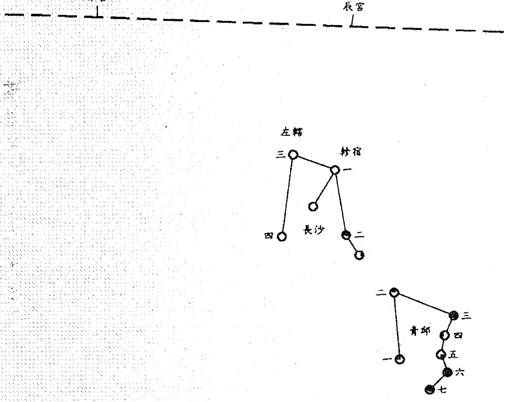

## 第五部 流星、彗星判断基本定义

## 第一章 流星判断

### 第一节 流星形状

诸流星皆钩陈之精，天一禀也。流星大如缶，若瓮，行绝迹，名为飞星。其迹著天名为流星。流星光相连也，大如瓜桃，名为使星。飞星主谋事，流星主兵事，使星主行事，以所出宿占之。

流星如缶瓮，初直后白，其前分为两，是为使星，所亡国受福。流星夜见光，望之有尾，离离如贯珠，名为天狗，从所下，兵大起，王者徙都邑，期三年。流星有光见而坠地，若不坠地望之有足，名为天狗，所往之乡，有战流血，其君失地，期不出三年灾应。大流星坠破，如金散而有声音，野雉尽鸣，亦名为天狗，其所之地，有战流血。流星有声止地，类狗坠，望如火光，炎炎冲天。冲天，其下围照数顷处，上锐有黄色，又名为天狗，见则兵起千里，破军杀将。流星状如大镜，流星夜见，头足如奋火名为天狗，其下必有兵起，心有战，期二年。流星大如瓮，头大尾小，长可三四尺，其后形迹皎皎然，赤白色为天梧，见则其国兵起流血，有将死，期一年，远三年。

飞星大如缶瓮，而行绝迹，色如烟火坠名为天保，此星所往者，其分受福有利，若有吉事，期不出年。流星有光，夜见墙垣而有声音，野雉尽鸣名天保，所止之野，大兵起。流星有光黄白从天坠有音如炬烟下地，雉尽鸣名为天保。所坠国安，有喜若水。流星如缶瓮，其后缦缦白互天，王者吏均封疆，其将军亦均封疆。流星有声如雷，其音止地，野雉尽鸣，名为天鼓。其所止国其兵大起，必有战尸满野，期三年。流星有光青赤，其长二三丈名为天雁，将军之精也，其国起兵，将军当从星所之。流星其色青，名为地雁，其所坠者起兵。

飞星大如缶若瓮，后皎然后，前卑后高，此谓顿顽。其所从者多死亡，削邑而不战。飞星如瓮大而赤，后皎然白，长可一丈。长数丈其星灭化为云，周流天下名为浩滑，或名为大滑、否颠。见则其国必有大战，流血积骨，期一年，远二年。飞星如缶若瓮，后皎然白，前卑后高，此亦爲浩亢。名爲降石搖頭，乍上乍下則人大饑，人相食，糧不足，期三年。飛星大如缶若甕，後皎然白，星滅後白者曲環如車輪名爲解街。其國人相斬，爲爵祿此爲自相齧食。

流星大如甕，其光赤黑有喙者名爲頓頑，見則其國有兵，有失地君，期二年。流星大如缶，其光赤黑有喙者名梁星。其所墜之鄉有兵而君失地，凡出軍擊賊，見大流星所指向者，將之用兵，須之行則勝。流星下入軍營必空，主將無功，避之則吉。

奔星所墜，其下有兵。流星前如缶盆，後皎然白，其欲入時，施施如金散，此謂使星。其所入宿受福，期一年，遠二年。大奔星有聲，望之如火光，見則破軍，四方相射。邊將敗績，多有奔星墜其營中。流星落落如遺大光，其下有戰場。赤流星，其後如一匹帛練，所之國有兵，其將有他意。流星色黃，其後如一匹帛練，所之國有兵，其將有他意，期一百八十日。小星相隨，小將副帥之象也。有聲如雷，忿怒之象也。

流星耀然有光，色白長竟天者，人主之星也。星之所往，人主從之，人主不從，即將軍或相從之。星如甕者，爲發謀起事，大如桃者，爲使事也。流星之尾長二三丈，耀然有光竟天，其色白者，主使也，其色赤者，將軍使也。

流星從敵軍上來，徐至吾軍上而入，有間諜者且來問吾軍。又流星前赤後青黑者，客軍敗死。流星夜見光，尾長如厚布，色蒼白爲使，赤有兵，黑死喪。又流星甚大，其光照地，色青赤流四旁，若有赤光則人饑，五穀不藏。又無風雲，有流星見久食間乃入，爲大風發屋折木。流星出都邑中，王者有憂，欲去都邑，及有叛者，期不出二年。

> 訣：流星皆爲鉤陳精，其形可斷事中明。
聲色墜墮都各異，細觀分斷緣由起。

### 第二節　流星四面交行

陪臣專行，請行，請謁至尊，衆星數流，主命凶。流星紛紛交行耀目，人君自貴，視臣如草土，臣欲有離散之象也，期二年。大流星如月，衆星隨而西行，爲衆人隨大臣之象。此大臣欲行權以安社稷。

流星百數四面行者，庶人移徙之象，即人流之象。大流星出行，衆星紛紛從之而流，期不出三年，三者徙都邑，去其宮殿，天下不安，急使驛之象也。流星紛紛，從四面交行，移時不止則天下大飢，兵起，人民流亡，各去其鄉，期不出三年。流星震散，天官列宿在位之象，眾小星無名者庶人之類，此百官、庶人將流散之象也。凡小流星者，庶人之象，交流者，驚馳之應也。

流星以見時定，至夜半見者，期歲數。夜半至雞鳴見者，期月數，雞鳴至平明見者，期日數。流星見甲子旬，為東方；丙子旬，為南方；庚子旬，為西方；壬子旬，為北方；戊子旬，為中方。流星者，貴使也，星大者使大，星小者使小。聲隆隆者，怒之象。行疾者，期疾行，遲者，期遲也。流星大無光者，眾人之事也；小而光者，貴人之事也。大而光者其貴人且眾；乍明乍滅為奸謀。前大後小者驚恐也；前小後大者喜事也。蛇行為奸事也。往疾者，為往而不反也。長者其長久也。短者其事疾也。

流星名營頭。營頭所之，下流血滂沱，赤地三千里。若過四關，天下道不通，期不出三年。晝有雲氣如壞山墜其軍人，人皆似壓所以為營頭之裹，為兵敗，屍滿野。有星晝行名爭明，其分有兵，國破君亡，期一年，遠三年。星晝行，唯百姓不安。暮若晝見，墜邑都中，有王來入都邑者。流星晝行下都邑中，色赤不出二年，外國相有來者。色白臣謀主不成戮死。殷殷如雷聲，有流星頭大如缶，長十餘丈，皎然赤白色，從日下東南去。四面或如大盆，或如雞子，耀耀如雨下，至昏止。郡國皆言星隕。星隕如雨，王者失勢，諸侯起霸之異也。

> 訣：大為貴臣小應民，流星四面交往經。
多為戰爭民移象，方位時辰地對應。

### 第三節 流星犯日

奔星入日中，有臣欲謀其主，凡流星貫日不中者，臣謀主事不成而戮死也。

### 第四節 流星犯月

天無雲，有流星過月下或月上，其國有喜。流星入月中，不出三年人主憂。流星入月中，星無光，不出其年，亡國。星出，亡國復立。使星入月中，女主疾。流星入月中無光，四夷侵中國，不出十月。又奔星

### 第五節 流星犯五星

流星抵歲星，大臣殺主。又為相戮死。流星抵歲星，歲星沒不見，流星反為歲星，人主死，相出走。使星入歲星，色蒼黑則大農，相國死。

> 訣：流星抵歲主受迫，反客為主難安寧。
> 新來猛將上朝堂，色蒼黑面相危難。

### 第六節 流星犯北斗

大流星入北斗，天下亂大發兵，將軍出期六月或一年。流星如月，從太微出入北斗第六星，色白傍有小量射者千餘枚，滅則有聲如雷，食頃止。有兵戰，滅宗族，屠城之事。流星入北斗魁中失名人。流星夜有光入北斗，大臣有系者。以五色占之，大流星色青入北斗魁中，大臣有系者有憂也。若大流星入北斗魁失明，系者斬死。奔星入北斗中國使匈奴。

大流星入北斗魁中，大臣背叛，貴人則囚，青黑有憂，赤黑為死，赤則兵死。流星入應星，天下有赦。大流星入北斗魁中，貴人入北斗魁中，臣有系者有憂也。星出則系者出。

流星出北斗，人主使於人於諸侯。色黃白有賀事，青黑為有憂事，赤色為有兵，期二年。流星出北斗魁中，人主左右有系死者。流星出北斗魁中，若東西不出，期年兵起。流星出北斗魁中，大將軍出，以星出日占知所之。大流星出北斗，後尾長數丈，將出。流星黃白出北斗魁中，有赦令。大流星出北斗魁中，不出其年，兵起占星所之者。使星出北斗東行，齊趙負兵。出北斗南行，荊、魏負兵。出北斗西行，秦、鄭負兵。出北斗北行，楚、趙負兵，不出三年。流星出部星，天子伐諸侯，天下將太平，期二年。流星於北斗旁，明如炬火，長六七丈如七丈如七丈如繒布，賊臣專制天下，期三年。

流星從南斗至北斗者，赦令，期正月，二月。使星守北斗天下亂。大流星拂北斗廩，不出其年，有戮死臣，期三年。奔星以冬至前後十日之內擊北斗柄，天子當之，期六十日。大流星抵北斗柄破之，大臣有憂，期六月。流星抵北斗，天下大發兵。使星抵北斗東行，不出其年，臣有戳死者。流星不入北斗魁中，居其旁，貴人有避宮者。

流星抵法星，左右其有光者，男君疾。無光者，女主疾。若出法星色青，三月有兵，期不出四月。色青白則九月有兵，期不出十月。而起期以春也，不出月大變，變易國名。

流星抵令星，有兵起，天下不安。若出令星，王者使諸侯行令四方。流星出令星，王者使諸侯，行令四方。或蠻夷以水兵來入國。

流星出伐星，天子出使於出使於蠻夷，蠻夷和。若抵破伐星，人多死，期一年，遠二年。

流星抵殺星，無光，五日君疾；有光十日女主死。

流星抵危星，五穀不成，人君有憂。若出危星，天子出行令。流星多抵危星，其色赤有兵，期一歲。黃色有土工事。白色有喪，期一歲，黑色有分國。危星不明，流星數抵之，五穀不成，國相去，君有憂。

大流星數抵部星，王者忌之。流星抵部星，色赤有人憂。或有土封爵，列侯有令。若兵器有怪，黃有喜。

流星入輔星，相官不洽，天子制之，星出輔星，相免或死。

訣：流星抵斗七不同，各以位星察事因。
五色大小星吉凶，時辰節氣斷赦戰。

### 第七節 流星犯紫宮

#### 流星犯紫微垣諸星

- 1、北極
- 2、太一，天一
- 3、天理
- 4、文昌
- 5、天牢
- 6、相
- 7、太陽守
- 8、天槍
- 9、天梧

流星入紫宮有大喪，大兵起，將軍有戳死者，期三年。流星入紫宮，水旱不調，主憂，天下多死者，臣犯主。又爲使者憂，又爲使者復命，名爲使星。諸侯有來使者。

流星出翼、軫東北，干太微紫宮，始出小，且入大有光，入有聲如雷，三鳴止。天下大凶。

奔星入紫宮，大亂。又爲其國有亂。其出也，國去其君。使星入紫宮，匈奴起兵，或爲天下大亂，或有奇令。

流星出紫宫，人主宫殿空，或有徙王，否则出走，期三年。流星出紫宫奔入天牢中，天子以赦應之。

使星出入紫宫有空國，王徙。流星大如桃，出天津入紫宫，須臾有細流星，或五或三相續。又有一大流星從紫宫出入北斗魁，須臾又有大流星出貫索，中經天市，諸流星並向西北行，至曉不可稱數流星。爲戰中民死大半。庶星憔星星流民散之象。

#### 一、流星犯紫微垣中北極星

使星色白入北極，天下兵聚，一爲國有大變，或有稱兵。流星入北辰，天下道塞。出北辰，天下安。流星入北辰，兵大起。流星出北辰則地動。使星出北極，兵在外者罷，若兵聚外境，期不出年。使星色赤出北極，兵罷於外。當以戊日占，有流星出北辰，天子德令安天下。

流星抵北極，國有大喪，天下兵起，非一國，將軍戰死。或大臣破戳，期不出三年。流星抵北極而止，色前赤後白，有來言兵事者成。前白後黃，人主立太子，有裂地者。色赤而前黃銳，有來吾國而死者。色白而前後皆銳，有來言開關而和者，或兵罷，四方皆然。流星入鉤陳，必有迫劫主者，或臣謀其主，若兵起宮中，期二年。

#### 二、流星犯紫微垣中太一、天一

流星犯抵天一、太一者，五穀成熟，人民安樂，天下太平，鄰國寧。

#### 三、流星犯紫微垣中天理

流星入天理，貴人之牢。爲太僕名臣有系者也。青憂，赤以金殺之。黃白無故，黑凶。流星出魁中，赦系獄者，天理也。

#### 四、流星犯紫微垣中文昌

流星若奔星入文昌宫，其國有亂。流星入文昌，其國失政，宮庭有兵，若內亂，期二年。奔星出文昌，宮內亂，國去其君。

文昌爲上將貴相。流星出文昌白色，火燭地長可四丈，大一圍，動搖如龍蛇形。有頃，長五六丈，屈折委曲，貫紫宫西，北斗西北子亥間。後屈如環，北人不舍，留一刻。爲相遭嫉被譖而免，相死，有流星出入昌，入紫宫，蛇形有尾無首，赤色有光照垣牆，爲司徒升爲中常待，爲他人所害，下獄死。

#### 五、流星犯天牢

流星入天牢，貴人有系者或多下獄。人民多有罪，期不出年。常以丑未日候流星入天牢者，有赦。流星出紫宮，奔走入天牢，天子以赦解之。

天牢中有一使星出者，小赦。二星出則赦在關內。三星出則赦天下。流星入貴人之天牢，太僕名臣有系者。其色黃白無故，青憂，黑凶，赤以金煞亡日出赦，獄中系者出。

#### 六、流星犯相星

流星抵相星，大兵起，大將出，輔相有變。

#### 七、流星犯太陽守

流星犯太陽守，有兵起。將軍出期三年。

#### 八、流星犯天槍

流星入天槍，外夷來侵，防戌有急者，邊境憂。

#### 九、流星犯天梧

流星入天梧，兵大起。五丈長國有兵，王者憂，期二年。或諸侯多訟地者，部分不均平也。出則四夷安。

### 第八節 流星犯太微

奔星入太微中，其國有禮。流星入太微，有兵起，外國當以兵至，及有使來者，不出其年。使星入天宮，留十日，有叛者。

奔星入太微，宮內有亂，近西相也，近東將也。奔星入太微天庭，避之吉，不避者危死。所謂避者，從左來避之右，右來避之左。流星出太微東門，大兵起，大臣為亂，貴人多死者，或有謀，近期一年，中二年，遠三年。

流星出太微，大臣有外事，以所之野命其方。奔星出太微中，有立王，或從王。流星出太微南門，其眾貴臣有死者。流星出太微端門，天子之使出，各以所之野命其國，期不出年。流星出太微天庭之門者，天子使也，以所之野命其東西南北，星來者為使復命。奔星出太微，中國失君，流星出太微天庭，天下兵起，將士大出，王者有憂，期三年災必應或為大將出。

流星大而赤，數出入天宮庭，如浮船狀，有賊臣在傍，人主備，不可出遊。

流星縱橫，經行太微中，主弱臣強，四夷不制，期三月。

流星犯抵左右執法，東相西將，各以所犯皆當誅，以其入日命其國，皆不出三年。

太微爲臣輔位宮，流星出入臣事中。
東爲兵起南爲死，端門出使天庭災。

#### 流星犯太微垣諸星

- 1、內五諸侯
- 2、五帝座
- 3、軒屏
- 4、郎位
- 5、常陳
- 6、三台
- 7、少微

#### 一、流星犯內五諸侯

流星入太微犯內五諸侯，輔臣有誅，執法有憂，貴人多死，期二年。

#### 二、流星犯五帝座

流星入太微犯黃帝座，大人易，其東西犯者皆死亡。流星入太微抵於帝座，天下亂，臣殺主，國易政，期不出三年。

#### 三、流星犯軒屏

流星抵屏者，尚書有憂或有死者，期百八十日，遠一年。

#### 四、流星犯郎位

流星入抵郎位，守衛之臣有誅，或左右爲亂，或戳有死者，期一年，遠二年。

#### 五、流星犯常陳

流星入守常陳，衛人有罪者誅，人主憂，期百八十日，遠一年。

#### 六、流星犯三台

流星入上台，大臣有罪，或有死。流星出之近臣有出者，期二年。流星入中占，司中奸臣來近主者。流星出，中台奸臣，有罪出走，色黑死，皆期二年。流星走三台者，大將出。奔星入三能，天下惑，兵禍聚隅，感爲動也。

#### 七、流星犯少微

流星入抵少微，賢良集道術出，又爲能人多來者。

#### 八、流星犯長垣

流星入長垣中，匈奴起兵來侵中國，人主有憂。使星入長垣，匈奴起兵。

### 第九節 流星犯天市垣

流星入天市，色蒼白，萬物貴。赤色爲大災，民多疾。大臣有罪戮於市者，或市更有憂。流星入天市，亂度量不平，執命者死。或有死罪當戮，入市得免者，不出二年。流星入天市而出，死罪復生。

流星大如斗，起天市樓西南行，光照地，流星爲使，天市爲外兵。西南行爲西南夷。

#### 流星犯天市垣諸星

- 1、帝座
- 2、侯星
- 3、宦者
- 4、宗正
- 5、宗人
- 6、宗星
- 7、斗星
- 8、天紀

##### 1、流星犯帝座

流星抵帝座，諸侯兵起，臣謀主，或貴人變政，期三年。

##### 2、流星犯侯星

流星抵侯星，有兵起近臣相攻，夷狄內侵，王者有憂。

##### 3、流星犯宦者

流星入宦者，左右臣不寧，或有憂。或爲有官被黜者，期一年。

##### 4、流星犯宗正

流星入宗正，左右貴臣多死，或爲帝宗後族有黜者，期百八十日，遠一年。

##### 5、流星犯宗人

流星入宗人，親戚臣爲亂。若宗中有變事，親戚離別，期不出年。

##### 6、流星犯宗星

流星抵宗星，王者宗族不相親，宗室相疑，以親爲疏。

##### 7、流星犯斗星

流星抵斗星，權量不平，市更有憂。或爲五穀貴，斗不用事。

##### 8、流星犯天紀

流星若入天紀，大臣爲亂，兵起宮中，妃後有出者，期二年。

##### 9、流星犯女床

流星入女床，後宮有憂，貴女當暴誅者，期百八十日。

##### 10、流星犯貫索

流星入貫索，天下有獄事，多有死者。或爲臣有入獄者，期一年。
流星入貫索，女主死，或有兵。又爲使星入天牢，有赦。
大流星赤黃出貫索中，怪獲女子死也，其國貴女有死者。流星絕沒貫索，國城屠。

##### 11、流星犯七公

流星入七公，人主信人主信讒佞，誅忠直，諫者凶，人起兵，義人入獄，期一年，流星經七公，當有兵將出。

流星入抵七公有兵起，大將出。或爲輔臣有誅，不出三年。

### 第十節 流星犯東方七宿

#### 一、流星犯角

流星入在角，兵吏有見系者。色赤以兵系，色黃以土工力系，色白以義系，色黑凶死，色青以憂黜。

流星入角爲宮中有事，貴人多死。一爲臣謀主而戳死，不出一年，流星色赤如缶入兩角間而止，有來言兵事者。星前赤星後黑，軍敗將死，以四方知所以來者。流星色黃若白入角。亢間，有貴來見君廟者。流星色白入兩角間，有諸侯客來者，諸侯有口令。

流星從他宿入角，有領邦之使者。流星入角間，關梁不通，有軍邊境不通。流星色青出左角而東，軍憂而兵敗績，黑而光出左角，邦多疾病或死亡。流星出兩角間，天子大使出。流星色黃出右角而東極望，人主有出遊者。

流星抵右角星，後終無子。流星抵角，角不動，臣欲殺主而戳死。流星抵角，角不動而敗，散而複合，不出其年，其國宮中有大事，貴人多死者。流星比於右角流而東，軍無戰功，二國終相和也。

訣：流犯角星爲戰事，察色觀跡辨來敵。

##### 流星犯角宿諸星

- 1、平星
- 2、庫樓
- 3、南門

##### 1、流星犯平星

流星入平星執令臣有憂，或有罪，星若出之，臣有黜者期百八十日。

##### 2、流星犯庫樓

流星入庫樓，庫兵發用事，車騎出。流星出之則兵大起，隨星所之，兵所從往，期三年。

流星出天庫，所之邑受兵，使星出入天庫樓，天空虛，兵盡出。

##### 3、流星犯南門

流星入南門，西夷兵起，關道不通，國有憂。流星入南門甚眾，大臣有外事。

#### 二、流星犯亢

流星入亢主宗廟之事，有使者受命於廟。色赤言兵，黃為土，白為義，青為憂，黑為死。流星入亢中，幸臣有自殺者，期一年。
流星色黃若白入角、亢間，有貴客來見君廟者。流星色黑出亢，憂臣，以口舌事自殺，期一月或一年。流星出亢，使臣出，以五色占之，國多兵。

##### 流星犯亢宿諸星

- 1、攝提
- 2、大角
- 3、玄戈

##### 1、流星犯攝提

流星入攝提，外國當以兵為使者，若有急。流星出之則王以兵出使，名以五色占。

##### 2、流星犯大角

流星抵破大角則兵大起，四塞有急。若刺大角過，王者失位，期三年。流星抵大角，有兵起，大將出，人主憂期百八十日。流星觸破大角，四兵含有急，刺大角，主失位，裂之尤甚。流星發大角，盛光明耀，大將出。破大角則亡，不吉。

##### 3、流星犯玄戈

流星入抵玄戈，夷欲入中國，戰大敗。流星所抵，兵徙來，期不出二年。

#### 三、流星犯氐

流星入氐，兵起，若國有水，國相疾。流星出亢入氐中，人相食，有病從帶以下，主有疾，一為國亡，國多淫女。

##### 流星犯氐宿諸星

- 1、梗河
- 2、招搖
- 3、騎官

##### 1、流星犯梗河

流星犯入梗河，王者誅夷國，不出三年。流星入梗河，王者誅四夷或邊兵起。一為蠻王死，期一年，遠二年。

##### 2、流星犯招搖

流星起招搖，其所向者兵在焉，賊寇大敗，流星入抵招搖，四夷兵來，邊兵大敗，若王敗敵有憂，期一年。

##### 3、流星犯騎官

流星入騎官，有兵起，騎士將出有憂，或馬多死，期一年，遠二年。流星抵騎官，兵起星所止知之。

#### 四、流星犯房

流星入房，不出其年，主國有大喪。王者殺忠臣，輔弼人亡。人主以赦除咎，期二年。流星出左股或右股，君使之諸侯，以馬為幣。
流星蛇曲入房，臣殺主代王，輔臣亡。流星在房，國貴人多死。流星抵房，遠鄉貢異獸班頭馬，其國君亡。流星絕鉤鈴，主有奔馬則敗。

##### 流星犯房宿中的東咸

流星入抵東咸，後出入不得時，淫泆自恣。或為女主亂宮，王者憂，期一年，遠二年。

#### 五、流星犯心

流星犯心，大人憂，臣欲伐主，兵大起宮中，不出一年，遠二年。流星犯乘明堂星，皆為大人憂，為內亂，欲伐君，近期三年。犯乘守太子星，太子憂。犯乘守庶子星，庶子有憂。流星犯乘明堂，若不死則去。

流星入心，不出其年，國有大喪。又為弒主，期不出三年。

使星出房，大如雞，色赤如血入心，人主遇賊，其出心也，行道遠，人主賊人於千里之外。流星入心，不出其年，臣弒其主，不成戳死或大臣相賊。流星入心，有使來者。赤色言兵，黃為土，白為父，青為憂，黑為凶。出心，大臣出使，以五色占之。

流星出入心，遠國使來。星大則大國使。星小則小國使。又流星起心南行，越君死，流星起心至北斗，趙君死。使星入天子宮，留十月有來聘。

##### 流星犯心宿諸星

流星犯入積卒，兵士大行或將死。又爲近臣有誅者，期不出二年。

#### 六、流星犯尾

流星入尾，妃後有憂，或有黜者。一爲賊人，女當有暴貴者。又流星入尾，前青而後白，人主死，從酉至黃昏，期六十日，將軍行從，夕至人定，期九十日，將軍行。流星入尾，色青黑，故臣有敗身者。流星出尾，色青黑，臣有逃者。

##### 流星犯尾宿諸星

- 1、天江
- 2、傳說
- 3、龜星

##### 1、流星犯天江

流星犯天江，有大水，河海溢，人民饑。

##### 2、流星犯傳說

流星抵傳說，王者有子孫之憂。若出之，宮中有子孫之喜，期不出百八十日。

##### 3、流星犯龜星

流星入龜星，天下有水，珠玉貴。流星出之，天下大旱，五穀貴，期不出年。流星出龜星，色青黑，所之國大水。赤黃，所之國大旱。

#### 七、流星犯箕

流星入箕，宮人有來者，及有獻女者，期一年。或爲客有來者。流星出箕，宮人有出者或爲大臣有棄捐者。

##### 流星犯箕宿之杵星

流星入杵星，五穀大貴，其歲杵不有事。

### 第十一節 流星犯北方七宿

#### 一、流星犯南斗

流星入南斗，有使來入國者。色赤爲兵，黃爲土，白爲義，青爲憂，黑爲死。流星入南斗，當有鄰國使來，不出百八十日。流星入斗散絕爲谷貴，四年之中，異姓爲主，人民勞。

流星出南斗，大臣有出使者，以五色占之。流星從南斗入北斗，其國有赦令，期在正月，二月中。

訣：流入南斗有使進，散絕米貴人勞辛。
從南向北斗中行，國有赦令民心寧。

##### 流星犯南斗宿中諸星

- 1、建星
- 2、天弁
- 3、鰲星
- 4、天淵

##### 1、流星犯建星

流星入建星，關道不通，或有使來者。或為兵起四塞，民多盜賊，不出三年。天下謀亂，赤者昌。

##### 2、流星犯天弁

流星入天弁，米谷大貴，人民饑。若抵犯之，有兵起，將士行，期二年。

##### 3、流星犯鰲星

流星入鰲星，國有大水，色赤出鰲，其國大旱。大流星出鰲星，色青黑為大水，赤黃為大旱，視其所之以命邑。

##### 4、流星犯天淵

大流星色青出天淵，所之邑大水，大流星色赤黃出天淵，所之邑大旱。

#### 二、流星犯牽牛

流星冒犯牽牛為大將出，期八十日，流星入牽牛，當有鄰國使者來，不出百八十日。流星入牽牛，客有四足蟲為幣來者。色青，道病；色黑，道死不至。流星色赤入天鼓，將命於主，出天鼓，將出，如星所之以占四方。流星出牽牛，還使出也，期百八十日，遠一年。

流星色赤，眾多西行，經牽牛、虛、危、天津、閣道貫太微、紫宮。星者，庶民類。眾多西行，民將西流之象。經行天子廷，主弱臣強，諸侯不制。

##### 流星犯牛宿諸星

- 1、河鼓
- 2、織女
- 3、九坎

##### 1、流星犯河鼓

流星入河鼓有兵起，大將出。若抵之，有死將，隨其所犯將當之，期一年，遠二年，大星爲將，小星爲小將。或爲大將亡其旗鼓。流星出河鼓則兵出。入河鼓則兵入。流星入河鼓，所入將驚死，出河鼓，所出將廢。

##### 2、流星犯織女

流星入織女，貴女有憂或白衣女有來者，或爲後族當有出者，期不出百八十日，遠則一年。流星入織女，有使從諸侯所來者。出織女，有使之諸侯。流星入織女，有白衣女子會。其出也，賊將出。流星出入織女有大水。流星出織女，有白衣會，爲賊，兵吏凶，淫泆。

##### 3、流星犯九坎

流星入九坎，有水旱之變。從南入則大旱，從北入則大水。

#### 三、流星犯須女

流星入須女，天子有納美女者。若出須女，女稟有使者干須女。貴女下獄，期百八十日。流星抵須女，女主有逆謀於君，有戳死者，期不出一年，遠二年。

##### 流星犯女宿諸星

- 1、離珠
- 2、匏瓜
- 3、天津

##### 1、流星犯離珠

流星入離珠，兵宮中起，其宮人有罪及誅者。

##### 2、流星犯匏瓜

流星入匏瓜，天下有憂，若有獻果者，中有藥，不可食，防備之，期百八十日。流星出匏瓜，食官有憂。或爲魚鹽價千倍。

##### 3、流星犯天津

流星入漢中而不出，士卒不可以涉，星若絕漢，即可涉。三日內雨則不吉。流星入天津，必有大使隨星所之，期一年。流星入天津，水道不通，梁塞若津渡有憂。流星出北斗，人主使於諸侯，流星入漢中不出，軍不可渡水，先渡者不還。使星入河津，有大眾行者。流星入漢中，貴人有戳死者或溺死。

#### 四、流星犯虛

流星入虛，人主大憂，臣下相賊拔邑，或國亡，期三年。流星入虛色青，哭泣事。色黃白則有來受賜者。奔星以乙丑日，流入須女、虛、危之間，爲民流。流星色赤若蒼黑入虛危有拔邑。又流星數從虛危中出者，貴人往求醫藥。流星出虛，臣有出使者。

##### 流星犯虛宿中哭星

出入虛宿哭星，有哭泣之事。

#### 五、流星犯危

流星入危，小人乘君子位。流星入危，天下不安，期一年。流星入危，天下不安，其國有憂，下欲謀上，期百八十日，遠一年。流星入危，蓋屋之事。出危，發屋之事。色赤則火發，色黑則水發，色青則憂發，色黃則以女子發。

流星入危中，若從危出，不聘年，大水，萬民饑，賣畜生財物，不能自食。流星入危，色赤，以人爲幣。之危右，以兵爲幣。之危左，色青以圭爲幣。白以四足蟲爲幣，黃以貝爲幣。流星抵危，色赤爲兵，期一年。黃土功，白喪，期一年，黑死，有分國。流星成對抵危，中國與北狄交兵。

##### 流星犯危宿之臼星

流星入臼，天下有急發米粟之事，杵臼用，期一年。

#### 六、流星犯營室

流星入營室，其君淫泆，宮中有憂，或有變事。奔星以冬至前後三日入營室，中國有急事。流星入營室，有使者來。赤言兵，黃土，白義，青客凶，黑客死。

流星又名奔星，出營室，人主去其國，或有內亂，兵起宮中，王者有憂，或爲有使，以五色占之。大奔星色赤流抵營室，有凶。其國貴，人有死者，上旬見爲老年，來月上旬死；中旬見爲中年，來月中旬死；下旬見爲盛壯，來月下旬死。

##### 流星犯營室內諸星

- 1、騰蛇
- 2、羽林軍
- 3、北落師門

##### 1、流星犯騰蛇

流星入騰蛇，雨水爲害，魚鹽貴，水物不成，期不出年。

##### 2、流星犯羽林軍

# 奇門星相絕學

流星入羽林軍爲兵大起，士卒發用，將有出者，期三年。流星色赤入大牢東，君起兵。入其西，太子起兵。入其北，諸侯起兵。出大牢，兵隨所之。

流星色赤入天軍之南，天子死：入其西則太子死；入其北則諸侯多死；流星色黃白入天軍之西，天子立太子；入其中，天子立侯王。否則受賜。流星色白入天軍之南，後憂疾。入其北，諸侯憂疾。使星出入羽林則兵起。

##### 3、流星犯北落師門

流星抵北落則天下有兵，北夷寇，虜入塞，大將出，鉄鎖用，期百八十日，遠一年或二年。

#### 七、流星犯東壁

流星冒犯東壁，大國分兵。流星犯東壁，能文章者死。流星出入東壁，主文章者有憂。入之，有祭廟之事。使星從西壁出，入東壁，人主用故臣。營室又名西壁。流星抵東壁，有大臣往使四夷。

訣：犯壁文人遭其害，坑儒斬章冤莫伸。
訟詞無人問出處，冤沉大海得日開。

##### 流星犯東壁宿之天廄

使星出入天廄，天下有驚。

### 第十二節 流星犯西方七宿

#### 一、流星犯奎

流星入奎，有破軍死將。流星入奎，有溝瀆之事於國內。出奎，有溝瀆之事於國外。若有使來之國者，使出之他國，不出百八十日，當以沖日爲期。

有流星大如斗魁，色青赤耀地，出奎中，沒奎北。爲民饑，五穀不藏，是月大旱。

##### 流星犯奎宿諸星

- 1、附路
- 2、閣道
- 3、王良
- 4、土司空

##### 1、流星犯附路

遊覽抵附路，太僕有憂。或馬多死，或馬大出，期二年。

##### 2、流星犯閣道

流星入閣道，王者有憂，左右有謀，道中有伏兵。若道不通，期百十日，遠一年。

##### 3、流星犯王良

流星入王良，天下有急，關津不通，有兵起及牛馬多死，或爲天下兵盡起。

##### 4、流星犯土司空

流星抵土司空，其國有兵，土功起。若抵破司空則國有喪，期三年。

#### 二、流星犯婁

流星入婁，有聚眾之事國於內，一爲白衣之會，大人爲亂，期三年。流星入婁，有聚眾之事。流星抵婁，貴賤相謀。

##### 流星犯婁宿內諸星

- 1、天大將軍
- 2、天倉

##### 1、流星犯天大將軍

流星入天大將軍，大將出，士卒用。若抵犯之，則將有憂，星所之，兵所來，期三年。流星入天將軍，大將驚出。

有流星起參長四丈，有光色黃白，有流星起天梧東北行三丈所滅，色青白，流星起天將軍，東北。參為邊兵，天梧為兵，太微為天庭，天津為水，天將軍為將，流星起之為兵。

##### 2、流星犯天倉

流星色赤入天倉中，兵內起。其犯破天倉，旱或火起，以天倉粟，以兵出。流星色黃白入天倉中，歲饑，出入天倉，歲大饑，出谷。流星入天倉，天下大饑，谷散出，或發粟於民，有轉谷之事。

#### 三、流星犯胃

流星入胃，有谷粟之稅入。若出之，則有出粟。流星入胃，保倉之事入於其國內。流星出胃，保倉之事出於國外。

##### 流星犯胃宿內諸星

- 1、大陵
- 2、天船
- 3、天困
- 4、天廩

##### 1、流星犯大陵

流星入大陵，有土功事，墳陵之般，若抵之，國有大喪，大人當之，期不出三年。

##### 2、流星犯天船

流星入天船，天下大水，舟船用。若津道不通，有急事。

##### 3、流星犯天困

流星入天困，有兵起，谷當出，有軍糧之急，期百八十日。

##### 4、流星犯天廩

流星入天廩，其國大饑，五穀不成，人民餓死。米粟當有出廩者，期不出二年。

#### 四、流星犯昴

流星入昴，四夷交兵，白衣之會，若貴人有急下獄，期三年。若出昴，士眾滿野，若他國有使至，期百八十日，遠一年。流星入昴，貴人有系囚者。流星出昴，胡兵起，士眾滿野，若邊國有死王，期一年，遠二年。流星成對抵昴，中國與四夷交兵。

##### 流星犯昴宿內諸星

- 1、卷舌
- 2、天苑

##### 1、流星犯卷舌

流星入卷舌，有讒言亂主者。若有口舌於君，幸臣有憂。

##### 2、流星犯天苑

流星入天苑，有兵起，馬出行或多死。一為禽獸多死。流星色赤入天苑中，牛馬多傷；出天苑中，牛馬多以兵事出者。流星色黃入天苑中，牛馬野禽蕃息。流星色蒼白黑入天苑中，牛馬野禽獸多死。出天苑，牛馬以全出者。流星入天苑，馬之事；出天苑，名馬出幣；入則四足獸有幣者。流星入天苑，名馬有入者，出天苑，名馬有出者。

#### 五、流星犯畢

流星冒犯畢，邊兵大戰。流星入畢中而復不出，其星小，小赦。其星大則大赦。流星入畢，其君有大小憂，先起兵者，兵破亡。或有逐相，以其入日占，期百八十日，遠一年。流星入畢，有兵革之謀；出畢有畋獵之事。流星出畢，邊軍大戰，貴人多系囚者。奔星以己巳日流而之參、畢，其國有流民。

##### 流星犯畢宿內諸星

- 1、五車
- 2、咸池
- 3、天關
- 4、參旗

##### 1、流星犯五車

流星入五車，天下兵車騎發，先起者昌。若抵之，其所主五穀貴，期二年，遠三年。

流星入五車，以甲子日中粟車，期三十日，粟貴。丙午以日中麥車，期二十日麥貴。戊寅日中豆車，期二十七日，豆貴。庚申日中賁車，期二十日賁貴。壬戌日中黍車，期十日黍貴。以月所見流星之處，則縣邑之市為貴矣。流星出五車，色白則諸侯以兵爲憂；色黃受賀；色赤則寇兵，車騎滿野；青黑則多死者，各以其日占。

##### 2、流星犯咸池

流星出咸池中，所之者兵起。流星入咸池則大水，使星舍咸池則有喪。

##### 3、流星犯天關

流星抵天關，其下有急兵，關道不通，或多盜賊，人民憂，期八十日，遠一年。

##### 4、流星犯參旗

流星入參旗，兵大起，弓弩用；流星出之則將軍出，有兵士行，期二年，使星出入天弓，匈奴兵起。

#### 六、流星犯觜

流星冒犯觜，其國兵起，破亡。流星入觜，太子使也。外宿中來，則外也，四十丈至一百丈，將軍使，十丈至三十丈，小使者，皆不出一年。流星入觜中，有師旅之事於國內。

流星入觜中，大臣有倍其主者。流星入觜中，大臣叛主，大兵聚車馬將急行，人主有憂，期百八十日，若一年。流星出觜，有師旅之事，於國外，又爲兵黑。

#### 七、流星犯參

使星色赤或蒼黑於參傍，行人死於中央，縣令死。流星入參，不出其年則兵起，先起者破。又爲客車破。

流星出參，中國之米粟大賤。又爲先起兵者亡，後起兵者昌，期一年。流星入參，國內均衡石之事。色青黑則不出其年兵起。流星出參，有均衡石之事國外。使星守參右則谷貴，參左則五穀賤，流星出南北以刺參，不出十六年，有一國王兼有天下。南門，東井也。奔星以己巳日流而參畢之間，其國有流民。

流星赤之參正星，若之伐正星出右，以兵爲幣，參之左則以人爲幣；參之右則以金帛爲幣；流星出參，象弓矢則兵大起。流星色赤從東方來，至伐而止，此來兵大敗吾軍也。

##### 流星犯參宿內諸星

- 1、玉井
- 2、廁星
- 3、屏星

##### 1、流星犯玉井

流星犯玉井中，皆爲強國失地；出玉井，強國得地。有大流星循伐以下入玉井中，不出其年，水與城等以星小大遲疾占之。

流星入玉井，國以水爲憂，或疾，國失地；若出之則大水溢有溺死者，期不出二年。流星出玉井，將出。

##### 2、流星犯廁星

流星入廁星，天下大饑，人相食，又爲大水，陷廁中，有謀兵。

##### 3、流星犯屏星

流星入屏星，執法臣有戳死者，人民多疾或有死，不出其年。

### 第十三節 流星犯南方七宿

#### 一、流星犯東井

流星冒犯東井，大臣謀其國，有兵，其百八十日也，流星入東井，其國君死或爲有水令從來者，其分國亡。

流星入東井，有水事於國中。流星出柳入東井，人主浮舟。流星出入東井，所之國大水。流星出東井，有水事於國外，又爲水有絕者。

東井水庫切莫犯，流星出入水災旺。
入爲國內出國外，君有難而河難安。

##### 流星犯井宿內諸星

- 1、五諸侯
- 2、北河南河
- 3、積水
- 4、積薪
- 5、水位
- 6、軍市
- 7、野雞
- 8、弧矢
- 9、老人

##### 1、流星犯五諸侯

流星出五諸侯，有大喪，以是所入日占其國。流星入五諸侯輔臣有憂，若有黜者。諸侯有謀主，期不出年。赤流星出，諸侯有叛者，其中星散絕，諸侯坐其殃咎。

##### 2、流星犯北河南河

流星入北河，胡兵起來入人間，若關梁不通。又爲水，爲饑皆期二年。
流星絕兩河戌間，有客抵之則天下大亂，親戚不郵。路不通。
流星犯南河，蠻兵起，防戌有憂，又爲旱，爲兵。

##### 3、流星犯積水

流星入抵積水，有大水，舟船用，民大饑。

##### 4、流星犯積薪

流星抵積薪，天下以薪稿爲憂，或廚房有罪者。

##### 5、流星犯水位

流星入水位，天下有水，河海溢流，五穀不成，流民大饑，期二年。

##### 6、流星犯軍市

流星入軍市爲兵大起，大將出，軍饑，絕糧市散，期二年。

##### 7、流星犯野雞

流星入市抵野雞，將離散，士卒死亡，失起兵者月中。

##### 8、流星犯弧矢星

流星入弧星天下兵起，諸侯相攻，弓弩用，車騎出。又爲弓矢貴，秦負兵，期不出百八十日，遠一年。
流星抵弧矢，人民多疾，或多死，天下饑。流星色黃白，青白多疾，黑多饑。

##### 9、流星犯老人星

使星出入老人星，老人有疾憂。流星抵老人，天下多病，老人不安。又爲兵大起，老者行。

#### 二、流星犯輿鬼

流星犯輿鬼，中國與南蠻通，四夷來貢。一為宗廟祠祀之事。流星入輿鬼，有祠事於國內。流星交抵輿鬼中國與南蠻交兵。

奔星、流星抵輿鬼，貴人有戳死。奔星有光如火散且行輿鬼上，大臣得賜，期六月。

輿鬼宗廟東南邦，犯則相往祠祀事。
抵之貴人多有亡，光如火散得賞賜。

#### 三、流星犯柳

流星冒犯柳，周圍當之，期九十日，流星入柳，名木有來者，若出則名木有出者，流星抵柳，名山林有國受伐者。

#### 四、流星犯七星

流星冒犯七星，國有兵，不出百八十日。流星入七星，客有以急使來者；若出之，王者有吉事出使，期百八十日，或一年。

流星大如斗，出柳北行，尾十餘丈，入紫宮，沒尾後餘光良久乃滅，天下凶兵喪，天子惡之。

##### 流星犯星宿諸星

- 1、軒轅
- 2、天稷

##### 1、流星犯軒轅

流星入軒轅，後妃有亂，女主有逆謀，天子宜防之，期三年。流星散入軒轅間，女主宮多讒亂。流星大如瓔，出東陵西下，必有積血。女主野心奪天權，天下陰盛血痕連。

##### 2、流星犯天稷

流星入天稷，五穀散出，谷不熟，天下饑，人民流亡，去其鄉。

#### 五、流星犯張

流星入張，有使來納幣者。諸侯有謀者，若有人君使人於諸侯。天下有遷徙之民，期三年。流星入張，諸侯有來賜吾君近臣者。出張，君賜諸侯臣。

#### 六、流星犯翼

流星冒犯翼，國君大臣有憂，遠期百八十日。流星入翼，貴人有系者，倍海國有來使者，以神鳥爲貢。色黃無故，青道病死，黑死不至。流星入翼，其國有兵，大臣爲憂。若抵翼，天下奪諸侯。期百八十日，或一年。流星出翼，倍海國受賜，流星抵左翼，天下奪諸侯，光跡相連曰流，絕跡而去叫奔。

#### 七、流星犯軫

流星入軫，兵喪並起，國以車爲幣。王者能以善令則無咎，期三年。流星入軫，有來使者。一爲貴人多系者。流星出軫，臣有出使者，以車爲幣。流星入長沙，天下逃亡無處者。

## 第二章 彗星斷

候彗星之法，當以五寅之日視甖水中，見兩旁氣在日旁，則彗將出矣。其與北斗之星各有所主，乃視氣之五色相象而定之。其彗星之出，以寅日見日旁，有青方氣在日旁，此歲星之精，將欲爲彗。以寅日見赤方氣在日旁，此熒惑之精，將爲彗。各以五色候之，星則五星將欲爲彗之變。先見其氣，後見其彗。彗星見而長，天子死，王都亡，賤人昌，無道之君受其殃，期不出三年。

候彗災應之法，各以十二辰所出之地，各屬相連，沖破之下，當有兵誅。假令彗星出室壁而依戌地，奎本魯分，室壁沖分，沖於寅；尾箕燕分，破於辰；角亢鄭分，明魯有兵誅於此國，他皆仿此。

歲星行東，行南六十日不還，以初去日六月。彗星出東北六十日不還，以初去日六月。棓星出西北六十日不還，以初出日六月。攙星出西南六十日不還，以初去日六月。槍星出，乍東乍西，乍南乍北，天狗出，必有兵革。

辰星出四季彗星。太白與日共合同舍七十日，生彗星。熒惑守箕三月，彗星出。歲星逆行過度宿者，則生彗星。一爲天棓，二爲天槍，三爲天攙，四爲茀星，此四者，皆爲彗。熒惑守心，朝三十日，彗星出。填星守熒惑，期三十日，彗星出。填星出入以舍斗五十日不下，則彗星出。

### 第一節 彗孛名狀

辰星散爲茀。攙、槍、彗、棓皆五星盈縮之所生。彗星者，君臣失政，濁蔽三光，五逆錯變，氣之所生也。彗星者，天地之旗也，彗星者，天之忌也。海精死，彗星出。鯨魚死，彗星合。彗星出，是將有兵相煞之祥也。

臣之恣，地動星孛。君爲禍，則彗星出。彗星主掃除。凡彗星有四名，一名孛星，二名拂星，三名掃星，四名彗星。其狀不同，爲殃如一。其出不過三年，必有破國亂君，伏死其辜，餘殃不盡，當爲饑旱，疾疫之災。其星日行一尺，二十日而入，此彗星之行也。孛彗長三星，其占略同，然其形象小異，孛芒短，其光四出，蓬蓬孛孛也；彗其光芒長，參參如掃。彗長星，其光芒有一直指，或竟天，或十丈，或一二丈，無常也。大法孛彗星多爲除舊布新，改易君上，亦爲火災，長星多爲兵革。

彗星出見本類星，長可二三尺，其炎如氣黃如白孛孛然，名孛星，見則天下兵起，臣謀其主，必有亡國，期不出三年。彗星出見本類星，長可一丈，其炎頭散下垂，狀如毛拂，名叫拂星。見則天下亂兵大起，強臣有謀，有走主，其君失地，近一年，中三年，遠五年。彗星出見可二丈至三丈，形如竹木枝條，名叫掃星。三丈以上至十丈，名爲彗星。彗、掃同形，長短有差，殃災如一。見則掃除凶穢，必有滅國，臣弒其君，大兵起，國易政，無道之君當之。期三年，中五年，遠九年。掃星者，逆氣之所致也，枝條、長短如彗星之形，出居二十八宿及中外官三日七日，或三十日，或五十日，常不滅，彗孛出而即滅，掃除凶穢，除舊布新，故言掃星。孛星者，彗星之屬也。彗芒氣四出，爲孛孛者，孛孛然也。謂之孛得，言其暗昧不明之貌也，一說雲孛即彗也，彗星所蔽爲孛。言星孛者，皆彗蔽也，孛星者，非孛星，惡氣之所生也。不是內有大亂，就是外有大兵。其所以孛孛曖曖者，亂之象也。不明之表，又參然孛焉，兵之類也。故聖人名叫孛，孛者猶有所妨蔽，有所傷害也。

彗星，其象如竹彗，樹木枝條長短無常。彗星出行犯守外舍，當先知逆順，入宿深淺，去之近遠久速則災輕；守之久則災重。各隨所在之宿命，其國以占吉凶。彗孛所干，曆百日以上，期三年；曆百五十日則期五年；曆二百日以上，期七年。彗星出見其國，大人亡。見一旬，期三月十日；見三十日，將當之，期三年；見五十日，相當之，期五年；見七十日，人主當之，期七年。或九年，災必應。

諸彗內官，皆爲內謀，曝骨將將，死屍滿溪，血流千裏；出外宿，不加內官，禍小起。彗星入列宿中外者，各以其所部舍官名爲其事，所之者爲其謀。其下之國，皆受其禍，以所守之舍爲其期，以五氣所相賊者爲其決。

彗長五尺以至一丈，期三月，若十月；一丈以至三丈，期三年；三丈以至五丈，期五年；五丈以至十丈，期七年；十丈以上，期九年。彗星久見，災深大，其短淺，爲災小。彗星者，所以除舊布新，掃滅凶穢，其象若竹彗，樹木枝條長大而見，則災深期遠；短小而見，則災淺，其近，皆爲兵餓，水喪，亡國之殃。

彗星出，野骨捐。彗星出則國樞蹶。彗星東出，長八丈，天下更政。彗星見後曲象棋，則王者伐枉逆。星之孛，臣威奪，兵粉擊，滅國謀。星孛，備強圍，黜臣所欲。星孛，兵變。彗星出而長，名爲白旗，喪氣也，當視旗之所指所掃，沖破之下，必有兵喪，其國滅亡，大人受殃，各以沖互爲期，前互爲近期，沖破爲中期，後互爲遠期，皆不過五七九，災必應。

掃出狀如有鳥赤色，此謂有憂；黑者群臣有賊，掃所在之下主亡國。掃出狀如小木，長三丈，其本有黑二三丈，其本有赤見，居四維，此謂有謀，其歲兵發。掃出狀如直竹，長二三丈，其尾銳，白色，此謂天下喪，天子死，亡國，朝不慶，諸侯亡。掃出狀如直竹，長二三丈，赤色，尾銳，此謂出急令兵戰，以見諸侯不德。掃出諸侯誅，皆在其國受殃，指亦然。蓬掃出見者饑，有兵亡地。四方蓬掃出，其狀如太白，蓬長三丈，指樂掃見，兵起大亂；渠掃見者，禾稼就；蒲掃見，兵起於境上，軍戰不勝；杵掃出，大將起反，人主凶；竹掃見爲兵。彗弗見則女主有用事者，其本爲主人。彗掃，水之精，出則不過一年，天下水，及有饑星所在宿其邦尤甚。彗星春夏出爲饑水，秋冬出爲人主自將兵，或大喪。冬春見爲小凶，夏秋爲大凶。

彗星其枝條長爲兵爲喪，短爲水爲饑，其見一旬，期三月。彗星出爲饑兵，臣下失中和，故出彗掃除之。彗星者，天所以去無道而建有德也。彗星短，爲饑爲兵；向下爲土工；所見之邦當之。彗星昏見，其國受兵。亦爲必亡國滅軍，不然必有死主。彗星出，必有反者，兵大起，其國亂亡。一日不出，一歲天下大水，其邦尤甚。彗星見則敵國兵起，得人者勝。彗星的出現，是謂天地相靡，其分受兵，必有亡國。或有死主，期不出三年。彗星有出者，皆是五星之象，以其所出宿以命五行所屬之象；出於金星，太白之象；出於水宿，辰星之象；出於火宿，熒惑之象；出於土宿，填星之象；出於木宿，歲星之象。見於二十八宿中，外官變色揚芒，怒而與五星合斗，此皆大兵之沖，破國之殃，臣凌其君，下不服上，天下不順，故至此災，審以五色，察之決知存亡之事。

凡彗有色，白黑爲男主，赤黃爲女主，皆爲人君，女主死之殃。蒼彗，主滅不義，少陽之精，司徒之類，蒼龍七宿之域，有起反，若恣虐爲害，主失春政者，以出時沖爲期，皆主君之敗地，大人滅。蒼彗木精，出見而生芒，主逆陽，失天常，則日蝕明消。此星出，期三年，五侯破，天子若兵。蒼彗破神明，黑彗主涿州，太陰之精，玄武七宿之域有謀反，若恣虐為害，主失冬政者，期如上吉，禍應之。入天子之宿，主滅諸侯位，五伯謀。彗水精，賊起，則水決江河，期二年，其出赤，世以水害亡。水害者，以類發難也，近四遠八，以其禍行。

白彗主斬強，少陰之精，大司馬之類，白如上占，禍應之。白彗金精，如鋒刃，長四丈，見則將軍逆，期二年，兵作。白彗主臣權，亦為專權。赤彗主滅五卿，太陽之精也。朱鳥七宿之域，有謀反。若恣虐為害，主失夏政者，期如上占，皆類名之。赤彗火精，如火耀，長七尺，賊起，強圖恣虐，期三年。黃彗主女亂，皆土精，半七星之域，以張四方八卦之內，司空之類，有謀反，若恣虐為害者，期如上占。黃彗如正見，則主女害，妃嬪有以色擢上奪於後妃，期一年，彗星孛見於四方。

彗星出東方，諸侯有起霸者，或有民饑。彗星出東方，河逆決，將相伐主，有與天子並治者。彗星自東方出蒼萌，動土功。彗星出東方，爭明，光見金代蒼北，皆天子之異，大小之類，各應其邦。星孛於東方，言陰奪陽，臣代主，以兵相滅，以勢相乘，天下變易，帝位久空，人人僥幸，布衣縱橫，禍未定息，主滅亂起，陰動爭明之異也。蒼帝亡，君臣爭明，大亂彗東出。星茀於東方，將軍謀主，主兵去，代主治，行天子之權。彗星出東方，其下發兵與天子爭，人主亡。星孛於東，則骨肉欲篡，近北邊國入西，則兵大起，蠻貊戰；經東西方，民病不救之，則致日蝕，即下謀。彗星出北方，將軍有謀欲代其主，或臣行不順而致。彗星自北方出，色黑，動功。彗掃星出北方，諸侯起霸。彗星出北方，長八九丈，名勉功。勉功出，天下更致。掃在北，狀如雞，聖人受兵，強國發兵，諸侯爭權，人主凶。彗掃茀出西方，天下有兵，夷狄大勝，中國大敗。彗星自西方出，白萌，動功。彗星出西方如鉤，長可四丈，名叫天攙。彗星出西方長可二三丈，名叫天槍。受之者，其國內亂，兵起宮中，王者憂之。彗星出東南方，狀茀，長一丈所，受之者，其國有喪內亂。彗掃東，東南，國大人死，七十日主當之，五十日相當之，四十日將當之。彗星出東南，長二丈以上，為其國內亂。彗星出東北，名叫天梧。彗星出東北，其本類星，末類彗。長可四五尺若一丈，名叫天攙。受之者，其國有戳死者，大臣貴人當之。掃星見東北，名叫天梧。受之者，其國君有戳。彗星出西北，本類星，末類彗，長可四五尺至一丈，名叫天梧。受之者，大亂，兵大起，或女主有憂，有大水，其年民饑。彗星出西北，如鉤，長可四五丈，名叫天攙。受之者，

## ※ 奇門星相絕學 ※

國內亂。彗掃出西北，其本類星，末類帚，長三丈以上，其內亂。彗星出西南，本類星，末類彗，長可二三丈，名叫掃星。受之者，其國兵大起，將相有死者，邦易政，人主有憂。掃出西南，有本類星，末類彗，長三丈以上，其國有土功。彗星出中央，長四丈也。命爲天罰。受者國有喪。彗星出中央，正在人上，其本類星，末類彗，星長可五六尺至一丈，名叫天戈。天下兵也，人主亡，受者其國有大喪，人民餓亡。凡五彗出現，皆期三年；中五年，遠九年。彗星見中央，正出人上，長三四丈以上，其國內喪。帚星東去，西南指，海中兵起，欲敗中國也。西去而東指，羌胡入界，煞人災也。南去而北指者，天下人死半邦也。北去而南指，天下水沒城郭，地陷崩也。東行西指，越兵大起，得所出國民排患也。南行西北指者，其國大豐。彗星東北行，西南指者，所出國中大要爲亂也。西行東指者，國塞外兵入國，爲大起兵。北行南指者，其國中禍大起也。西行東指者，國中大惡爲亂。

彗星四出，即橫如十字，而四尾並散也。滿天下，有知之士就高而居之也，無知之士流爲類土，耕於山脊。蒺藜星出，天下大旱，赤地五百裏，無生草也。兩彗俱見，彗有芒角，天子歲再赦。二彗星起南指者，所出國大血流道。三彗俱起，海內少男子。彗星四出，滅六王。又爲竟天，人主亡徵也。五彗並出，聖君起則獲麟，執授紀。五彗俱出，侯稱王，天下大亂，兵起四方，諸侯同謀，人主亡，除舊布新，掃去凶殃，更立明君，天下大昌，期百八十日，遠一年。五彗出東方。人主坐之，聖人起，亦然。五彗俱出，天下兵起，人主亡。彗星五芒，禍之極效之徵也。彗星之芒臨京都，主以賞罰不行偏任見犯。

### 第二節 彗星晝見

彗星晝見，所臨國下當爲河，天地合矣。

### 第三節 彗星犯日

彗在日傍，子欲殺父。四彗在日中，君有德，天下歡，以大豐盛也。彗星守日，候精星也，天下大亂，兵革大起，群臣並謀，天子亡，期不出三年。彗星貫日，臣殺君，子謀父，貫日過事必然，期百日，遠年。

### 第四節 彗星犯月

彗星入月中，必有破軍，死將，兵大起，其國以火災。此三年大饑。彗星入月中，必有亡軍亡將，起以北國。彗星入月中，兵大起，有臣欲弒其君者，十二年大饑。彗星入月中，星無光，不出其年，亡國；星出，亡國復立。彗星角襲月，臣弒主。彗星在月首，必有大兵起者，將軍死，有失地君，不出二年。彗星之行掩月，五星拂而過，兵大起，必有戰，有死將，臣專政逐其主，王者憂，期三年。彗星在月中，臣當坐，君子死憂。彗星貫月，天下大兵，臣殺主，若女主當之，期一年，遠二年。

### 第五節 彗星犯五星

彗星出入太白，長可五六丈，金火之兵大用，大戰流血，天下更政，期三年，遠五年。掃星出守五星，侯稱皇，天下起兵，諸侯並謀，天子亡。

### 第六節 彗孛犯北斗

星茀於北斗中，有雄聖人受命天子。星孛於北斗，璇璣更授，天子起走。孛賊入北斗中者，大國結謀伐天子，運樞行之主號，諸侯爭權，天下皆叛兵，合禍構逆，亂之變也。彗入北斗帝宮空。彗出太微，社稷亡，天下易主。星孛入北斗，兵大起，將有以外制權，以兵爲政者。至德之蔭，黃星孛於北斗，必以戊巳日，其光無芒丈行，無武動事，莫之敢拒者。彗星入北斗，強國亂。周襄王不能事其母，孛入北斗。彗弗流入北斗魁中，得名人；其不入北斗魁，失名人。孛入於北斗，邪亂之臣將弒其君。星孛入北斗則大臣叛。孛星入北斗，中國使匈奴。彗星流入北斗，諸侯戳，春夏期三年，秋冬期一年。彗星出北斗，長可八九尺，天下更政易王，暴兵卒起，期百八十日，若一年。彗星出北斗中，宮中火起。彗星芒出於斗樞，天子亡，諸侯息。彗星出北斗九星中，九卿反，如星所主，其政毀，其人亂。彗星出北斗長可七八尺，天下大亂，國易政，有兵起。或大戰，先起者亡，中起者殃，後起者昌。期三年，中五年，遠九年。彗星出北斗，大臣謀反，兵大起。

彗星入斗魁，大臣誅死，或被誅三日乃占，春夏期三年，秋冬期一年。彗星出於斗中者，宮中失火燒寶。彗星出北斗，長可八九尺，名叫勉功。勉功出則天下更政。彗星出北斗之中反而入北斗，後將得大臣；其出北斗，亡大臣；其一西一東，害於侯公；一南一北，戒在金革；一入一盈，天下不寧。彗星出北斗中，聖人受命。彗星出北斗，必有大戰流血。若入斗中，得名將；不入斗中，失名將，各以其日占知其國，不出其年。孛星出北斗中，大臣諸侯有受地。彗星見於北斗，天下更政。孛星見北斗中，大臣諸侯有受誅者。也叫受兵。彗孛貫北斗下，有傑王，五軍合。彗星守北斗，天帝謀易王。諸侯爭天下，強國發兵，大臣爭權，大人有憂，天下不寧。守之三日以上，大臣當誅，期三年，遠五年。彗星出輔星，庶雄起，陪臣反。

### 第七節 彗孛犯紫宮

星孛於紫宮，將有陰謀反者。星孛於紫宮，有大變，拔兵上殿。或有奇令。彗星入紫微宮，其國謀反。彗星出而抵紫宮，天下大亂，易政。彗星出長垣則邊反。彗星出紫宮入守之則宮中有兵，天下大亂，有亡主，國易政，以五色占其國，期百八十日，中一年，遠三年。彗掃太微、紫宮，人主易位。彗星守天子宮，有亂天子之政者。

#### 彗孛犯紫宮諸星

- 1、北極鉤陳
- 2、天理
- 3、文昌
- 4、天牢
- 5、相星
- 6、天槍
- 7、天梧
- 8、天一 太一

##### 1、彗孛犯北極鉤陳

彗星入樞，名人起，相誅，天下亂。彗星出北辰，臣謀弒主，有自立王。彗耀刺下，爲寇害，期一年。彗星入樞，期八年，五霸起，帝王亡。彗星天樞，五精之類謀。彗星入守北辰，徐舊布新，三王立，五旗生，有端命之應，名人起兵，天下大亂，君臣相誅，其不出百八十日，中一年，遠三年。彗星出鉤陳，臣弒其主，若入守鉤陳，幸臣亂宮，若有誅者，期不出一年，遠三年。

##### 2、彗星犯天理

彗星出天理，大司空斬將逐天子。

##### 3、彗孛犯文昌

彗孛冒犯文昌，則輔臣受殃，近期三年，遠期六年。彗星出文昌上將星，大將軍反；出次將，左右將軍反；出貴相，大司徒反；出司祿，得勢大臣反；出司命，天下有權者俱反，亂尤甚。彗星出而文昌，天下大亂政，以色占。彗星出文昌若守之則天下大亂，大臣受殃，國易政，各以五色占之，近期一年，中二年，遠三年。

##### 4、彗孛犯天牢

彗孛出天牢，諸侯作禍，相賊害。彗星出天牢，豪傑中外俱起。彗星出天牢則又貴人多下獄者，若大臣有戮，其國亡，期百八十日，遠一年。

##### 5、彗孛犯相星

彗孛冒犯相星，輔相憂，不出一年，天下變更其令，民多移徙。

##### 6、彗星犯天槍

彗星出天槍，王者備四夷，防捍邊境，或有驚恐，人民憂。彗星守天槍，鉞鉞大用，誅殺不當，多梟首之民。

##### 7、彗孛犯天梧

彗星出天梧，兵大起，五仗用，國有憂，期二年。彗星守天梧，兵四起。

##### 8、彗孛犯天一、太一

彗孛干曆天一，則宮門不閉，王者內不安，近臣亂，不出三年。

### 第八節 彗孛犯太微

彗星茀干太微，天子亂。彗孛干入太微，帝宗後族爲亂，亡社稷。或所犯者亡。彗星入太微庭中，臣謀主，有兵起，王者災社稷，其國憂，期百八十日，遠一年。赤黃星狀如帚入太微，婦女喜心；出太微，法式滅，帝死於野。彗出而茀太微，天下大亂，不過三五，必易政，以色占期。彗星出太微，帝宗後族爲亂，大臣弑主，謀在親戚禦臣，王者有憂，期三年。彗星出太微，中宮火大起，殺人。彗星出太微天庭中，有立王，若徙王。彗在太微，君害臣。彗星犯太微，天子妃後去宮，人不安，女主有憂。

#### 彗孛犯太微諸星

- 1、黃帝座
- 2、屏星
- 3、郎位
- 4、郎將
- 5、常陳
- 6、三台
- 7、長垣

##### 1、彗孛犯黃帝座

彗孛如粉絮入太微，犯守帝座，國有崩喪，大臣立主。王者以赦除咎。天下大亂兵起；若犯守四帝，輔臣有誅，執政者亡，期三年。彗星如粉絮犯座星，兵喪並起。又大彗弗冒犯座星，王者亡，子孫不昌，王者循教於天，奉宗廟郊祠則災除。彗指帝座四旁，中大亂。星銳如劍，正赤，直抵座星，天子驚兵。爲驚火。星如直帚抵座星旁左右，諸臣兵起內亂。星狀如帚，正赤，抵聖座星，婦女兵。

##### 2、彗孛犯屏星

彗星出屏星，守衛臣有謀，若有罪，執法者當之。

##### 3、彗孛犯郎位

彗孛冒犯郎位，臣失勢。彗出郎位，郎官謀反，天子因官郎位所主之官也。彗星出郎位，左右守衛爲亂或有謀者，人主驚備之。

##### 4、彗孛犯郎將

彗孛出郎將，大將軍誅或有罪，或爲大臣爲亂，有兵起。

##### 5、彗孛犯常陳

彗星出常陳守之，王者出誅左右守衛之臣。或爲防守者，有死，期三年。

##### 6、彗孛犯三台

彗星出上台司命，有兵起，大臣、三公有自出者。若守之，貴臣有誅，上公有憂，期百八十日，遠一年。彗星出中台司中，奸臣有謀，兵大起貴人當。出彗若守之，中公有罪，或憂或誅。彗出下台司祿則近臣有罪，或憂死；或守之，貴人多死，下公當之，將憂，皆不出三年。彗星出三台西，相反出其中，太尉反；出其東，大司馬反。彗在三台，臣害君者也，彗星出三台，有陰謀不軌起。或宮中火起，又爲害君，禍大起。

##### 7、彗星犯長垣

彗星出長垣，大臣謀反，兵起宮中，天下有亂，亡國，人主有憂，期不出二年。彗星出長垣，邊反。

##### 8、彗孛犯少微

彗孛冒犯則白衣聚者凶，術士不顯，智者逃亡，期三年。彗星出少微，多指臣有死者，或上臣有罪。又爲法令，土工起。

### 第九節 彗孛犯天市

彗孛犯天市，所犯者誅。彗星出天市，豪傑內外俱起，執令者死，大臣有誅，期三年。孛星出角間，東北行，入天市中而滅。彗除天市，將徙帝，將易都。

#### 彗孛犯天市諸星

- 1、帝座
- 2、侯
- 3、宦
- 4、宗正
- 5、宗人
- 6、宗星
- 7、斗
- 8、天紀
- 9、女床
- 10、貫索
- 11、七公

##### 1、彗孛犯帝座

彗孛犯帝座，民人大亂，宮朝徙治，大臣不臣，期三年。彗星出帝座，大臣爲亂，守之不去，貴人有變，更政令。

##### 2、彗孛犯侯星

彗孛犯侯星，兵起帝宮，大國易治，期三年；出侯星，天下亂宗，人相敗，或相攻，士卒有急行且不出其年。

##### 3、彗孛犯宦者

彗孛出宦者則左右貴人有罪，若刑於市者，不出二年。宦者在天市，爲中外有兵。

##### 4、彗星犯宗正

彗星出宗正，宗主有事，或左右親族有死，期八十日，遠一年。

##### 5、彗星犯宗人

彗星出宗人，王者同姓臣罪，或親族有謀者，期不出一年。

##### 6、彗星犯宗星

彗星出宗星，主恩薄，以親爲疏，簡宗廟，則出之，族人反。

##### 7、彗孛犯斗星

彗星出斗星，天下亂，民不從市，外不用事，人民饑。

##### 8、彗孛犯紀星

彗星犯紀星，天下國相擊，或地震；若出天紀則大臣相戳，兵起宮中，主後憂，若出走，期二年。

##### 9、彗孛犯女床

彗孛冒犯女床，貴人暴誅，期百八十日。或貴女有罪者，期八十日，遠一年。

##### 10、彗孛犯貫索

彗星出貫索，大臣憂，有反者，必有反臣殺君，或大赦，期百日，遠一年。彗星在天獄，諸侯作禍。

##### 11、彗星犯七公

彗星出七公，忠言者凶，讒人下獄，政令不行，王者信讒，邪臣在側，其國憂敗。

### 第十節 彗孛犯東方七宿

#### 一、彗孛犯角

彗孛冒犯兩角間，白者軍起不戰，邦有大喪；其色赤則有戰，芒所指心有破軍侵城，期七十日，或三年。彗星出角，天下大亂，更政易王暴兵起，必有戰，期三年，中五年，遠九年，或天子起兵王廷，後黨恣，外連禍，谷大貴，大疾疫。彗星出入角，長可七八尺，天下更政，金火之兵大用。

##### 彗孛犯角宿諸星

- 1、天庫樓
- 2、南門
- 3、平星

##### 1、彗孛犯天庫樓

彗孛出庫樓則兵動驚主，泣血，下不聽，車騎滿野，庫兵用，民以饑，期三年。

##### 2、彗孛犯南門

彗星出南門，有兵起，兵器用，或道路不通。

##### 3、彗孛犯平星

彗星出平星，執法臣憂，政令不行，峻法焉過，國失綱紀，海內亂。

#### 二、彗孛犯亢

彗孛星冒犯亢，國有昏亂，釋舊布新，易帝王，近期百八十日，遠一年。彗茀干犯亢，中國不安，兵起政亂，期一年。彗星出亢，天下大饑，其國有兵，人民多疫，人相食，期不出三年。彗星出亢，又爲天子失德，有大水，民喪民疾，五穀不成。

##### 彗孛犯亢宿諸星

- 1、攝提
- 2、大角
- 3、玄戈

##### 1、彗孛犯攝提

彗孛出攝提，主迷惑，群下爭起。天下亂，帝自將兵於野，兵起宮中，王者有憂，其期不出二年。

##### 2、彗孛犯大角

彗孛出大角傍六七丈，天下大亂，兵大起，國易政，期三年，中五年，遠七年。彗守大角則天子失仁。彗星犯守大角則大兵起，國不安，天子失禦，有亡國，更政令。彗星貫坐，亂起。彗星孛大角則人主亡。

##### 3、彗孛犯玄戈

彗孛冒犯玄戈，主戰，單於大敗，期二年。彗星出玄戈則北方兵起，單於大敗，其國破亡，期一年，遠期三年。

#### 三、彗孛犯氐

彗孛冒犯氐，大臣殺其主，兵大起，更政，近期百六十日，遠期一年。或大赦，天子失德，米大貴。彗茀干入氐中，後宮有亂，暴兵，不出百八十日，遠三年。彗星入氐房間，綺綺索索，如冬木無葉，從風而倚。此星出爲兵戎，此歲星之變，見不過一年。彗星出氐，天子不安，有大赦，中宮有亂，暴兵起，不出百八十日，其滅，民大疾惡，米大貴，有兵事。彗星起氐中，天子不安，宮移自徙，必失座。

##### 彗星犯氐宿諸星

- 1、梗河
- 2、招搖
- 3、騎官

##### 1、彗孛犯梗河

彗孛冒犯梗河，天子慎邊防亂中國，北兵爲敗。彗星出梗河則四夷兵爲敗，中國有邊患。若守之則王者誅四夷，期三年。

##### 2、彗孛犯招搖

彗孛冒犯招搖，邊兵大動，期一年。彗星出招搖，突厥入寇，守之勝。黃帝攻胡，星孛招搖。彗星守招搖，犯北主，期出三年。

##### 3、彗孛犯騎官

彗星出騎官，英雄起，天子憂，士卒發用，兵騎出。若守之，將軍若有死者，期三年。

#### 四、彗孛犯房

彗茀干犯房，王國有兵起民饑，骨肉相殘也。茀從房出，天子絀，行爲無道，諸侯舉兵守國。彗星出房，大兵起，水旱不調，人多餓死，去其宅田，又爲人相食，期不出二年。其兵擅興在道旁，予戰在野，戰斗不止，蚩蟲橫下。山崩。星孛房，四邦災。彗孛貫房，王室大亂。彗孛星於房，赤帝之後受命，人主凶，有亡國。彗星如房後百二十日，火。彗星守房，天下有喪，戴麻纍纍，天子亡則不出其年，或大人憂。蒼之亡則彗出房。彗孛冒犯鉤鈐則王宮大亂，不出三年。

##### 彗孛犯氏之東西咸

彗星出東咸，女主淫佞自恣，宮門不禁，或貴女有憂。

#### 五、彗孛犯心

大辰有孛，主謀見煞，必有立王，相射伐。星茀干大辰，國分爲二，大夫制君。有星茀干大辰則受命之君大振兵旅，爭於野。彗星賊起入大辰，天帝謀易王。孛星賊起光入大辰者，將有陰謀，以邪犯正，與天子爭勢居位者，大臣謀主，兩王並立，周分之異也。
彗星守大辰，東方之疫，天子亡，或天子哭。彗星出心則兵起宮中，劍戟交鋒，大臣相疑，有戳死者，近七日，中七十日，遠八十日。孛星守心，主位分，大臣謀上，天子凶。彗星出心若守之，則天子有喪，德令不出，蝗蟲大起，大水，五穀不成，民大饑，流亡去其鄉，期一年，遠二年。彗孛犯守心，宮鐘大鳴，劍戟交橫，大臣相疑，天下兵起。心變則期急，近期七日，中期七十日，遠期百八十日。

##### 彗孛犯心宿之積卒

彗星出積卒爲謀，星去則疾，謀不成。若守之，主將有憂。彗星出積卒又爲士衛並爲亂，禍不成。

#### 六、彗孛犯尾

掃出尾箕間，狀如蓬首掃則臣專權。彗星出尾宿，兵革罷弊，天下大饑，君子賣衣，小人賣妻，歲多大風大雨。彗星出入尾，後相貴臣誅，兵起宮門，宮人走出，國易政，期一年，中二年，遠三年。彗星孛冒犯守尾，後有以珠玉簪珥惑天子者，諸饑大起，後相貴臣誅，宮人出走，兵起宮門，多土功，近期百八十日，遠一年。

##### 彗孛犯尾宿諸星

- 1、天江
- 2、傳說
- 3、魚
- 4、龜

##### 1、彗孛犯天江

彗星出天江則天下大水，舟船用，五穀不登，其歲人相食，期三年。彗孛干曆天江，大兵攻王國，王者以赦除之則國豐平。

##### 2、彗孛犯傳說

彗星出傳說，主以祠非其神失禮，爲內外所謀，巫祝起，天下匿，讒在宮中，王者後宮少子孫。若守之則有絕祀之君。

##### 3、彗孛犯魚星

彗星出魚星則後黨反，天下大水，海魚出，名水溢；若守之，天下大旱，魚行人道，不出其年。

##### 4、彗孛犯龜星

彗星出龜星，珠玉有出者，寶物大貴；若守之，君臣不和，上下乖離。

#### 七、彗孛犯箕

彗星出箕，夷狄爲亂，大兵起，天下大旱，米貴十倍，人多餓死，死者大半，期二年。彗星守箕，東夷下濕與水軍將爲亂。

##### 彗孛犯箕杵星

彗星出杵星，歲大饑，有兵起，民以米粟爲憂，或絕軍糧。

### 第十一節 彗孛犯北方七宿

#### 一、彗孛犯南斗

彗孛冒犯南斗，度其國必亂，兵大起，期一年。彗茀長干犯南斗，王者疾病，臣謀其君，子謀其父，弟謀其兄，是謂無理，諸侯不通，天下易政，大亂兵起，期百八十日，遠不出一年。

彗星出南斗，大臣謀反，兵水並起，天下亂，將軍有戰若流血，星若滅斗，其國主亡；若星明，反臣受殃，近三年，中五年，遠七年。或爲天下有勢皆謀。彗星出南斗中則宮中失火燒寶。彗星茀於斗房，赤帝之後受令，人主凶，有亡國。

##### 彗孛犯斗中諸星

- 1、建星
- 2、天弁
- 3、鰲星

##### 1、彗孛犯建星

彗孛冒犯建星，主失道，忠言者誅，賢士逃亡。彗星出建星則道路不通，多盜賊，子攻父，弟攻兄，守之則有大兵，將軍出行，期一年，遠三年。

##### 2、彗孛犯天弁

彗孛出天弁，寶玉大貴，萬物不興，米貴五倍，其國饑。彗星入若守天弁者，皆爲囚徒起兵。

##### 3、彗孛犯鰲星

彗星出鰲星有大水，白衣之會，若有水令，若守之則其國大旱。

#### 二、彗孛犯牛

彗弗冒犯牽牛，中國起兵。彗入天鼓則有兵。彗星干牽牛，須女之間，狀如彗，其本有四星曡然，此星出爲兵，此辰星變見，不過一年，兵大起，國饑。彗星出牽牛，四夷兵起，邊境爲亂來侵中國，人主有憂，期一年，中二年，遠三年。彗出牽牛之西，指天市，爲多兵，米貴，牛大死。

##### 彗孛犯牛宿諸星

- 1、河鼓
- 2、九坎

##### 1、彗孛犯河鼓

彗星入河鼓，且有兵。彗星出河鼓，天下兵起，大將出謀，鼓鳴，旗鼓立，武士發，天子賦，若守之則有死將；守中星則大將死，守旁兩星則小將死，期一年，中三年，遠五年。

##### 2、彗孛犯九坎

彗星出九坎，有水旱之災，出南則大旱，出北則大水。

##### 3、彗星犯織女

彗孛干犯織女，後族爲亂，貴女有誅者，期三年。彗星出織女，後黨爲亂，貴女有誅者，或有女變，期百八十日。彗星出見織女，有降主。

#### 三、彗孛犯須女

彗弗冒犯須女，鄰國有以奇女來侍者，彗孛干犯須女，其邦兵起，女爲亂，若妄遷爲後，王者無信大亂，期不出三年，退女所親，天下安寧矣。彗星出須女，其國大兵起，女主爲亂，王者惡之，將軍戮死，或以戰亡，期不出三年。彗星出須女之間，辰星之變也。彗星出須女，帝以女亡，有水災，米大貴，鹽貴。

##### 彗孛犯女宿諸星

- 1、離珠
- 2、匏瓜
- 3、天津

##### 1、彗孛犯離珠

彗孛犯離珠，後宮爲亂，或宮人有誅。守之，陽爲大旱，陰爲大水，五穀不登，人民飢。

##### 2、彗孛犯匏瓜

彗孛干犯匏瓜則政亂，近臣相譖，宮有戮死者，王者以赦除咎。彗星出匏瓜，人主因食瓜而亡，或果中有藥，害其君，或食官憂。彗星守匏瓜，魚鹽貴十倍，果物不成。

##### 3、彗孛犯天津

彗星犯天津，賊斷王道。彗星干犯入漢中，有亡國，當其野者變之。彗星出天津，關津不通，若關吏有憂，或守之則天下大亂，津河隔塞，有旱災，期三年。彗星見漢中，亡君之戒。

星孛於貫索及天市、中天津。其時元顯輔政，刑罰不中，故掃貫索，發徭無度，故掃天市；建士失節，故掃天津。天津關通萬川，利關梁也；天市貨財帛，周百姓也；貫索平察刑，獄無枉濫也，而元顯皆反之。天若爲掃除穢惡，令改革也。顯不悛，遂政覆滅。

#### 四、彗孛犯虛

彗星冒犯虛中，有哭泣之事，牆垣無立者，有井田之法，改制之事，宗廟起兵。彗星孛犯虛，其國野戰流血，星芒角所指，兵所積也。彗星孛於虛，則其國亡。彗星出虛、兵大起，天子自將兵於野，大戰流血，其芒炎所指國必亡，期三年，遠五年。

彗星出虛，危間，司空行謀。彗星出虛，大水，期三年。彗星出虛危間又爲其國有叛臣，兵大起，將軍出行。國易政，期三年。

##### 1、彗孛犯虛之敗臼

彗星出敗臼，天下有急兵，當於米粟之事，國有憂，期二年。

#### 五、彗孛犯危

彗孛冒犯危，其國有叛者，兵起，大將軍出。彗星出危則天下亂，司空行誅，有土功之事，兵大起，期二年。或大水，民饑期三年。彗星出孛於危，帝必易，有大水，米大貴。

##### 彗犯危宿諸星

- 1、造父 2、人星

- 1、彗星犯危之造父
彗星入造父或守之，僕禦謀弒主，有斬殺者，兵盡起。

- 2、彗星犯人星
彗星出臥星，尚書反。人星一名臥星。

#### 六、彗孛犯室

彗孛冒犯營室，先起兵者弱，不可以戰，戰必亡地，主將必亡去之，近期百八十日，遠二年。彗星出營室，有大水。天下兵大起。彗星出室壁間則兵大起。或有大喪，有亡國、死王，期不出三年。天下亂，易政。以五色占吉凶。孛見營室中，後宜且有亂，或為有德令。營室為後宮懷妊之宮，彗星加之，將害人性。諸孛氣在營室，民人疾疫死亡。彗起芒臨營室以告咎。彗星干守營室則五校三軍動，兵不戰，牛馬驚，不出七十日。彗星犯守營室，先起兵者不可以戰，必亡地，期三年，遠六年。

##### 彗孛犯室宿諸星

- 1、騰蛇 2、羽林 3、北落

- 1、彗孛犯騰蛇
彗孛冒犯騰蛇，水道不通，天下隔，期二年。彗星出騰蛇以水雨為害，大水出，萬物不成，民人饑。一為水蟲為敗。

- 2、彗孛犯羽林
彗星出羽林，軍人謀反。彗孛出羽林，兵起宮中，臣弒其主，大人被甲，有亡國；若守之，三十日國破主亡，期三年。彗星壘城，校尉以反軍成。

- 3、彗孛犯北落
彗星出北落若守之則兵起大戰，若殺大將，人主自將兵於處，四夷作亂，期三年，遠五年。

#### 七、彗孛犯東壁

彗茀冒犯東壁，其國起兵，火災廟堂四門，流血，天下隔。彗孛冒犯東壁，文章者死。諸孛氣入東壁，人民疾疫，多死亡。彗星出東壁，王者起兵，毀壞宗廟，四門伏兵，流血滂滂，人民徨徨，莫知其殃，大水，民流於道，殃期近一年，中期三年，遠期五年。

##### 彗孛犯壁宿諸星

- 1、鉄鑽 2、天廄

- 1、彗孛犯鉄鑽
彗星出斧，淫兵多，主以妄誅，將鑽之臣反。

- 2、彗孛犯天廄
彗星出天廄守之，則天下名廄有失火者，若移徙，或車馬有怪。彗星出廄，官法令違，法度數起變，臣執主勢。

### 第十二節 彗孛犯西方七宿

#### 一、彗孛犯奎

彗星犯奎，度其國君出戰，大饑，人相食，國無繼嗣，近期一年，遠三年。彗星出西北，舉兵伐中國，其下食石千錢，天下大水。彗星出奎，有大兵起，四夷來伐中國，郡國君出戰，天下大饑，有水災，期三年，遠五年。杵彗出貫奎，庫兵悉出，禍在強侯，外夷相應首謀，期三年，遠九年。

星孛於奎，到軒轅、太微，經三台、大陵。奎為魯，又為庫兵，軒轅為後宮；太微，天子廷；三台為三公，大陵有積屍，死喪之事。

##### 彗孛犯奎宿諸星

- 1、附路 2、閣道 3、王良 4、土司空

- 1、彗孛犯附路
彗孛冒犯附路，道不通，天下半隔，期一年。彗孛出附路，天下大饑，車騎滿野，道中縱橫，人主臨兵，期三年。

- 2、彗孛犯閣道
彗星冒犯閣道，王者居正殿，不私行，則災自消。彗星出閣道，天下道津不通，兵大起，禦道有伏兵，欲謀其主，王者宜備之。

- 3、彗孛犯王良
彗星出王良，好施弛，奉車反。彗星出王良，兵馬大動，車騎行，天下有急，馬多死，爲水道不通，津開塞，期二年，遠三年。五良，天子禦駟，彗星掃之，禪伐之表。除舊布新之象。白色爲喪，王良東壁宿，又並州之分野。

#### 二、彗孛犯婁

彗孛犯婁，國有大兵，四時絕祠，遠一至三年。彗孛干犯婁，臣奪君位，近期一年，遠三年。彗星出婁，國有大兵，有亡國，先旱後水，人民餓死，五穀大貴，米無價，期一年，遠二年。彗星出婁，六畜疫。

#### 三、彗孛犯胃

彗弗冒犯胃，五穀不成，倉庫空虛。彗冒犯胃，其國兵起，不出三年。彗星出胃昴之間，狀如竹竿而細，此星出，爲兵戎，此太白之變，見不過一年，其國兵起或有喪。彗星出胃，大臣爲亂，天下兵起，五穀不升，人民飢餓，京都困倉悉皆空虛，期三年，中五年，遠七年。彗星出胃昴之間，狀如竹彗，爲兵災，若火。彗星出胃昴之間則大國起兵。

##### 彗孛犯胃宿諸星

- 1、大陵 2、天船 3、天困 4、天廩

- 1、彗孛犯大陵
彗星出大陵，國有大喪，有土功壞陵之事。或守之，天子崩。明審期，不出三年，遠五年。彗星出大陵，天子以不慈見犯，復出之，將反。

- 2、彗孛犯天船
彗星出舟星，外夷侵。彗星出天船，天下大水，舟船用事，若外夷來侵，水兵起，期一年。彗星出天船，在胃宿中，天下大水。

- 3、彗孛犯天困
彗星出天困，倉庫虛空，無儲積有出粟，天下大飢，人民流移，期二年。

- 4、彗孛犯天廩
彗星出天廩，其國大飢，倉粟出廩，人餓死，其分兵起，期不出三年。

#### 四、彗孛犯昴

彗星孛冒犯昴，度大臣亂國，兵大驚，期一年。彗星孛出昴畢間，大邦起王。彗星出見昴則有喪。彗星出昴，大臣為亂，君弱臣強，邊兵大起，天子憂之，人民驚恐，國有憂主，期一年，中二年，遠三年。彗星出昴，色赤，邊有大兵，謀反，天子有憂。彗星出昴則有赦。

#### 五、彗孛犯畢

彗孛犯畢，必有死丈夫數萬人。彗孛冒犯畢，邊兵寇，中國亡，近期一年，遠期五年。邊軍大戰，中原流血。彗星畢觜之間，小而長，狀如直竿，上有星，疊疊然，此星出為兵戎，此鎮星之變，見不過一年，兵起宮中，女主有殃。彗星出畢，大兵起，馬貴。其星內指，邊兵勝，其星落地，兵破。彗星出畢，突厥為寇亂中國，邊兵戰，有流血，或有亡主死將，期三年，遠五年。彗孛守畢柄，侯邑益土，守畢口中，邦相為亂，邑易政，邑君、大臣當之。彗星出附耳，庶雄起，陪臣反。

##### 彗孛犯畢宿之諸星

- 1、五車 2、天關 3、參旗 4、諸王 5、天高 6、天潢 7、天街

- 1、彗孛犯五車
彗孛冒犯五車，兵騎滿野，天下半傾，百姓徙居去其土，期三年，彗星出五車，兵大起，車騎行，有攻戰，米大貴，人民饑。彗若守之，先起兵者昌，後起兵者亡，期三年。彗星出五車，谷霜，兵起主賣位，天下賢名起。

- 2、彗孛犯天關
彗星出天關，兵大起，道路不通，民多盜賊，必有關塞之事，人主有憂。彗星出天關而守之，天下道絕，國多盜賊，關梁不通，人主有憂，期一年，遠二年。

- 3、彗孛犯參旗
彗星出天弓，暴骨將死，死屍滿溪，流血千裏。彗星出參旗，天下大亂，兵起，弓弩用，大將出有變。或為弓弩大貴，期三年。

- 4、彗孛犯諸王
彗星出諸王星，諸侯稱王皇，以南吳、楚、北燕、趙、東齊、宋、西秦、晉。

- 5、彗孛犯天高
彗星出天高，廟臣反，名王起，改號。

- 6、彗孛犯天潢
彗星出天潢，但聞之將反。

- 7、彗孛犯天街
彗星出天街，五侯並起，天子自理。彗星出天街，內有賊人。

#### 六、彗孛犯觜

彗星冒犯觜觿，國兵起，天下動擾，期一年，遠三年。彗星冒犯觜，其國兵起破亡。彗星出觜，其國兵起，有失地，死王，天下民流，大臣出戰，下有亡國，期三年，遠五年。又爲谷大貴，大臣出戰，期七月。彗星見觜，必有破國亂君，伏死其辜者。
彗孛犯觜之司怪。彗星出司怪，主多妖祥，僻偽起，大臣、侯王代主位。

#### 七、彗孛犯參

彗孛冒犯參，其國邊兵大敗，其君亡，近期一年，遠期三年。彗星出參主伐，天子更政。彗星出參，大兵蔽地，大臣謀反，後有憂，天子躬甲，斧鉞大用，兵馬馳道，弓弩恆張，期三年，遠五年。
彗出於參、東井之間，上柱煞伐長吏。彗星與熒惑並見於參，天子更政，又叫天子受政。彗星見參，主伐，大國君不吉。彗茀星流入參，若出參，其年兵起。

##### 彗孛犯參宿諸星

- 1、玉井 2、屏星 3、廁星 4、屎星

- 1、彗孛犯玉井
彗星出玉井，兵大起，強國失地。又叫彗守玉井，天下大水，河海溢，流民多沒死。

- 2、彗孛犯屏星
彗星出屏星，大臣有戮，國有憂，又爲彗守屏，人民疾疫，有移國。

- 3、彗孛犯廁星
彗孛出廁，大人有憂，若入廁，有謀兵欲害主，又爲彗星入廁，天下饑，人相食，期二年。

- 4、彗孛犯屎星
彗星出屎星或守之，貴人多患腹而死，若人民多死，以五色占，黃則吉，青白疾，黑死。

### 第十三節 彗孛犯南方七宿

#### 一、彗孛犯東井

彗孛冒犯東井，大使出野，有兩軍相當，不出三年。或爲其國兵起。彗星冒犯東井，則大臣謀，其國用兵，期百八十日。彗星出東井，其國兵大起，車騎滿野，有軍大戰，將軍有死者，或大臣有誅，期三年，中六年，遠九年。掃出東井，上莖煞漸漸長，上白下赤，狀如矛刀，此爲兵災，乃太白之變。彗星出東井，民人讒言，國政崩壞，天下大水。彗在東井則大人死。見三十日，兵將當之；見五十日，相當之；時見七十日，主當之。

##### 彗孛犯井宿諸星

- 1、五諸侯 2、積水 3、積薪 4、水位 5、軍市 6、野雞 7、狼星 8、弧星 9、老人星 10、闕丘

- 1、彗孛犯五諸侯
彗孛冒犯五諸侯，王室大亂，兵起，天子宮廟不祀。彗星出五諸侯，州牧反，九州合謀。彗星出五諸侯，執政臣有謀，若有被戮者，貴人當之，人主有憂，期一年，遠二年。

- 2、彗孛犯積水
彗星冒犯積水，兵起宮門，宗廟毀絕，大臣有憂。

- 3、彗孛犯積薪
彗孛冒犯積薪，有亂臣有宗廟。

- 4、彗孛犯水位
彗孛冒犯水位，水道不通，伏兵在水中，以水爲害。彗孛出水位，天下以水爲憂，有兵起，五穀不成，人民饑。

- 5、彗孛犯軍市
彗孛出軍市，大兵起，軍糧絕，天下大饑，將士離散，兵多死亡，期二年。

- 6、彗孛犯野雞
彗星守野雞，大將死，軍市破，諸侯相攻，有亡國，期三年。

- 7、彗孛犯狼星
彗星出狼星，國有急兵，名將出行，將軍有憂；若守之，必有千里之行，大戰流血，死者半，期三年，中五年，遠七年。彗星出狼弧，主以恣，侵為過，外夷反。

- 8、彗孛犯弧星
彗星出弧星，弓矢大用，大兵起，其國亂驚，人民不寧，多盜賊。

- 9、彗孛犯老人星
彗星出老人，其色黃，王者昌；若守之，赤彗三芒，人主受殃，老者不康。

- 10、彗孛犯闕丘
彗星出闕丘，帝滅。

#### 二、彗孛犯輿鬼

彗孛冒犯輿鬼，大兵橫行，近期一年，遠三年，天子小赦除咎。彗孛出輿鬼名為喪樓，皆以赦角應之，或國有大兵，戰死於野，骸骨滿坑，人民疾病，木貴，死者縱橫，期不出三年。

#### 三、彗孛犯柳

彗孛冒犯柳，國誅大臣，兵喪並發，外臣凌主，天下傾危，期三年。彗星干犯柳又周國當之，期九十日。彗星出張、注之間，狀如吹之火且燃，此星出，有兵災，此熒惑之變，見不過一年，兵起國亡。彗星出柳，國誅大臣，其國大旱，民以饑食，期三年，遠五年。彗守味，南夷將為亂。

彗星犯柳宿之灑旗
彗星出灑旗，主以酒過相所害。

#### 四、彗星犯七星

彗星冒犯七星，邦有亂臣，國主不定，兵起宮殿，貴臣戮，大臣相疑，近期七十日，遠期百八十日。彗孛出七星，天子與聖葉，期三年，聖人出。國有叛臣，人主不安，兵起宮中，大臣戮死，貴人當誅，或有水災，民饑，期不出三年，遠五年。

掃星出七星、張之間，狀如布，從風如靡，此星爲兵戎，熒惑之變也。彗星出七星張之間，狀如歛之火且燃，爲兵，熒惑之變也。

##### 彗孛犯星宿內諸星

- 1、軒轅 2、天稷

- 1、彗孛犯軒轅
彗孛冒犯軒轅，近臣誅滅宗族，王者以赦除咎，天下大亂易主，以五色占期。彗星入軒轅，或守之，則後族亂，天下大亂，易主，宮門當閉，或女主死，期三年，遠五年。

- 2、彗孛犯天稷
彗星出天稷，歲大饑，五穀不成，人民流亡，社稷不安。

#### 五、彗孛犯張

彗孛冒犯張，其國外內用兵，王徙宮，天下半亡。彗星出張，天下大亂有兵，王者徙宮殿，天下半亡，人民惶惶，大旱，谷石三千，粟尤甚，無有聊生。見五十日，期三年；七十日，期五年；百日，期七年；百五十日，期九年。必發。

#### 六、彗孛犯翼

彗星犯翼，國用兵，大臣有憂，遠期百八十日，彗孛冒犯翼，其國有大兵，芒所指降伏，近期三年，遠期七年。天子失禮，則孛於翼。彗星出翼軫之間，天下皆謀，上國有大喪，人主死亡，必有大兵，期不出三年。

彗星出翼，其國有喪似水，爲饑民多流亡，視芒所指，必有降伏，期三年，遠六年。彗茀出翼軫之間，狀如布，從風而靡，爲兵災，熒惑之變也。彗星守翼，大臣謀反，五穀貴。彗孛冒犯軫，兵喪並起，期百八十日，遠一年。

#### 七、彗孛犯軫

彗星出軫，天子崩，兵喪並起，滿宮門，車馬無主，民無定君，期三年，中五年，遠九年，王者以赦除咎，則災消矣。

## 第六部 太陽太陰判斷基本定義

## 第一章 太陽——日判斷一

### 第一節 日的概念

朱明、曜靈、東君、日也。姓張名長生，字子房，一名子明，字長史。能者知便不畏白刃。日以晝明，名爲曜靈。日之爲言，實也、節也、含一、開度、立節，使物咸別，故謂之日。

言陽布散合如一，故其立字四合共一者。爲日望之度，尺以千里立。實者，周圓缺合。一，言其身者。天尊精爲日陽，以一起日，以發紀尊，故滿滿，故施施，故仁仁，故明明，故精精，故外光，故火。日外景，陽精外吐。元開陽爲天，積精爲日，散而分布爲大辰天。一陽成於三，故日中有三足烏。

積陽之熱，氣生火，火氣之精者爲日。日者，陽之主也，故陽燧見日則然而爲水火。日者，天陽之精也。夏則陽盛，故晝長夜短；冬則陰盛，故夜長晝短；春秋則陰陽均，故晝夜等。日者陽精之宗，積而成鳥，象鳥有三趾，陽之類其數奇也。日譬猶火也，月譬猶水也，火則外光，水則含景。故宣明於晝，納明於夜，如有瑕必露其匿，人君者仰則焉。日光旁照十萬二千里，經三十二萬四千里，同一百萬二千里，暉經千里。日經千里，週三千里；日月其當天七百三十分之一。

### 第二節 日行之道

日量爲運曆行也。運，踐也。日行一度以立序，行三百六十五度四分度之一。日月左行，周天二千三萬裏。天元十一月甲子，夜半朔，日月俱起，牽牛初度。推曆考宿，正月在營室，二月在奎，三月在胃，四月在畢，五月在東井，六月在柳，七月在翼，八月在角，九月在房，十月在尾，十一月在斗，十二月在牽牛。

日月五星同道，過牽牛、女、虛、危、室、壁、奎、婁、胃、昴皆行其南之九尺，畢北七尺，觜、參北一丈三尺，貫東井，出鬼南六尺，出柳北六尺，出七星、張北一丈三尺，出翼、軫北一丈三尺，貫角、亢，出氐南一尺，出房左右股間，出心北二尺，出尾北九尺，出箕北一尺，貫南斗，復至牛。此日月五星行常道也。日月五星行曆左角內，行左亢外四尺，行曆左氐外，行房兩股間，行必內六尺，行尾內十八尺，行箕內十二尺，行斗柄中一尺，行牛中，行女外四尺，行虛外六尺，行危外十三尺，行室外十六尺，行壁外十三尺，行奎外十三尺，行婁外九尺，行胃外十尺，行井中，行鬼外十四尺，行柳內九尺，行觜內八尺，行參內十八尺，行七星內十五尺，行張內十八尺，翼內十六尺，行軫內十六尺。在上者爲北，此日月五星之正道。

王者至德之萌，則日月若連珠璧。至德之萌，謂將興之時。連璧謂無朔望之異也。天地開闢，曜滿舒元，曆紀名月首甲子。冬至，日月五緯俱起牽牛，初，日月若懸璧，五星若連珠。太陰元始，建於甲寅，日月俱入營度五度。日月如連璧，五星如貫珠，皆右行。天一以姓建七十六歲，日月復以正月入營室五度，無餘分。名曰一紀。天一凡二十紀，千五百二十歲大終，日月星辰復始甲寅之無。日月行危一度而歲有奇，四分度之一，故四歲而積千四百六十一日而復合，故舍八十歲而復。故曰子午、卯酉爲二繩，丑寅、辰巳、未申、戌亥爲四鉤。東北爲報德之維，西南爲倍陽之維，東南爲常羊之維，西北爲通之維。日冬至則井北中繩，陰氣極，陽氣萌，故曰冬至爲德。日夏至則斗南中繩，陽氣極，陰氣萌，故曰夏至爲刑。陰氣極則北至北極，下至黃泉，故不可鑿地穿井，萬物閉藏，蟄蟲首穴，故曰德在室。陽氣極則南至南極，上至朱天，故不可以夷邱，上屋，萬物蕃息，五穀兆長，故曰德在野。

凡君行急則日行疾，君行緩則日行遲。日行不可指而知也，故以二至二分之星爲候。日東行，星西轉，冬至昏奎八度中，夏至氐十三度中，春分柳一度中，秋分牽牛三度七分中，此其正行七日，行疾則星西轉疾，事勢然也。故過中則疾，君行急之感也。不及中則遲，君行緩之象也。至月行則以晦朔決之。日冬則南，夏則北；冬至於牽牛，夏至於東井。日之所行爲中道，月五星皆隨之。日天子服中禮，從容中則，日月五星不敢縱橫。日行房乘三道，太平上道，升平中道，霸世行下道雲。

### 第三節 日晷影

晷，日景也，規也，如規畫也。以土圭之法，測土深，正日景，以求地中。日南則景短，多暑，日北則景長，多寒；日東則景夕，多風；日西則景朝，多陰。日至之景尺有五寸，謂之地中。天地之所合也，四時之所交也，風雨之所會也，陰陽之所和也。按土圭者，非削土爲其圭象，訓爲度也，置圭度景，謂之土圭。日南則景短，多暑者，謂夏至日躔南方井宿也。日北則景長，多寒，謂冬至日躔北方斗宿也。日東則景夕，多風者，謂秋分日躔東方角宿也，故秋分祭月也。古來天圖，春秋二分並交婁角。諒知夕者，秋分之異名；朝者，春分之別號。景長稱南至，景短稱北至。今日南則景短，日北則景長者，先論日躔宿也，後論日躔景也。

周髀長八尺，其勾之損益，一寸千里懸天之晷，薄地之儀，皆移千里差一寸。土圭之長尺有五寸，以夏至日立八尺表，其景適與圭等，謂之地中。今潁川陽城地爲然。河南陽城縣是謂土中，夏至景尺有五寸，所以爲候也。南景在日之南，五月立表望之，日在表北，景在表南。交州日景較北三寸，林邑九寸一分也。凡日景於地千里而差一寸，景尺有五寸者，南戴日下五千里也。日月之行，則有冬有夏而爲寒暑。若南失節，晷過而長則爲寒，退而晷短則爲燠；人君急則晷進疾而寒，舒則晷退遲而燠，故曰急恆燠若。一曰晷長爲潦，晷短爲旱，奢者爲扶，扶者邪臣進，正臣疏，君子不足，奸人有餘。冬至日南極晷長，南不極則溫爲害。夏至則北極晷短，北不極則寒爲害。故治變於下，日月運於上矣。

日冬至，人主不出宮室，寢兵聽樂，日擊黃鐘之磬，公卿大夫列彝音侍，則陰陽之晷如度，故夏至之禮，如冬至之禮。又曰：冬至之日，樹八尺之表，日中視晷，晷如度者則其歲美，人民和順；晷不如度者則其歲惡，人民多僞言，政令爲之不平。晷進則水，晷退則旱。進一尺二寸則月蝕，退則日蝕。月食則正王臣之行，日蝕則正人主之道。冬至晷長一丈三尺，當至不至，則旱，多溫病；未當至而至，則多病暴逆心痛，應至夏至。小寒晷長一丈二尺四分，當至不至，先小旱，後大水，丈夫多病喉痹；未當至而至，多病身熱，來年麻不熟。大寒晷長一丈一尺八分，當至不至，則先大旱，後大水，麥不成，病厥；未當至而至，多病上氣嗌腫。立春晷長一丈一寸二分，當至不至，兵起麥不成，病肩疾；未當至而至，多病熛疾。雨水晷長九尺一寸六分，當至不至，旱麥不熟，多病心痛；未當至而至，多病亡。驚蟄晷長八尺二寸，當至不至，則霧，稚禾不穗，老人多病疾虐；未當至而至，多病癰疽，脛腫。春分晷長七尺二寸四分，當至不至，先旱後水，歲惡，禾不熟，多病痺；未當至而至，多病疚身瘧。清明晷長六尺二寸八分，當至不至，菽豆不熟，多病疾虐、振寒；未當至而至，多病暴死。谷雨晷長五尺三寸二分，當至不至，水物雜揉，羊不蕃，多病疾虐，振寒、霍亂；未當至而至，老人多病瘟氣腫。當至不至，旱，五穀傷，牛畜病。未當至而至，多病頭痛，腫嗌，喉痺。小滿晷長三尺四寸，當至不至，多凶言，有大喪，先水後旱，多病筋急痺痛；未當至而至，多病熛氣嗌腫。芒種晷長二尺四寸四分。當至不至，多凶，主國有枉令；未當至而至，多病厥頭眩病。

夏至晷長一尺四寸八分，當至不至，國有大殃，旱，陰陽並傷，草木夏落，有大寒；未當至而至，多病肩腫。小暑晷長二尺四寸，當至不至，先小水，後旱，有兵，多病瀉注，腹病；未當至而至，多病膨脹。大暑晷長三尺四寸，當至不至，外兵來，年饑，多病筋痺，胸痛；未當至而至，多病脛痛，惡氣。立秋晷長四尺三寸六分，當至不至，暴風為災，來年歲不穩；未當於而至，多病疾虐，上氣嘆腫。處暑晷長五尺三寸二分，當至不至，國多淫合，兵起，麥不熟；未當至而至，病脹，身熱不汗。白露晷長六尺二寸八分，當至不至，多病疽疽洩；未當至而至，多病水腹閉疝瘕。秋分晷長七尺二寸四分，當至不至，草木復榮，多病溫悲心痛。未當至而至，多病胸脅腹痛；寒露晷長八尺二寸，當至不至，來年谷不成，畜鳥獸被殃，多病疝腰痛；不當至而至，多病熱中。霜降晷長九尺一寸六分，當至不至，百物大耗，來年多大風，人病腰痛；未當至而至，多病胸脅肢腩。立冬晷長一丈一寸二分，當至不至，地氣不藏，立夏寒，早早，晚水，萬物不成；未當至而至，多病臂掌痛。小雪晷長一丈一尺八分，當至不至，來年黍麥不熟，多肘腋病。未當至而至，亦為肘腋痛。大雪晷長一丈二尺四分，當至不至，溫氣洩，夏蝗，生大水，多病少氣，五疸，小腫；未當至而至，多病疥疽，應在芒種。

### 第四節 日光明

日者，昭明之大表，光景之大紀，群陽之精，眾貴之象也，故曰其氣布德而主在地。日德者，生之類也，故日出而天下光明，日入而天下。

### 第五節 日的顏色

日青中黃外，是爲一不可。日者黃中爲主，應行君仁。黃中而青外，君禮；黃中而赤外，君義；黃中而黑外，君智。五色積聚，明照四方矣。今反青中黃外，是位次倒置，黃爲外奪，故爲一不可矣。赤，君喜怒無常，輕殺不辜無罪，不事天地，忽於鬼神，天則雨土。常熱，日蝕無光，地動雷下降。赤者火，火死爲土。禮失其政，天雨土也。南方者火，故常熱也。南方爲離，離爲日，故日蝕無光。火滅灰爲土，故地動。雷者土氣所爲，故雷下降也。下者雷電折擊，下殺人民也。其時不救，兵從外來，爲害戳而不葬。

日赤中黃外，是爲二不可。白，君亂無威，臣獨逆理而不能誅。白者變爲白，白系西方之色也，萬物衰老之處也。故爲君德衰亂，亂臣專其威，無禮，君衰亂於政事，不能誅也。賢者不得爲輔，朝中因女而進者衆。隆山數崩，時大旱，河海不流，虎狼害人，其民好賄賂，吏並爲奸，兵數十起千裏之內。其時不救，及其年中亡。當誅臣逆理進者，以禁絕災害；因女進者時日以救。則災及其年。

日白中黃外，是爲三不可也。黑，賤人爲君，婦人輕賢，佞諂候間得親，將小臣所私，及危其身。色變爲黑者暗，故賤人爲君。黑陰色，故婦人持政，輕誅賢。黑者水流，行無所不及，隨器方員，以喻佞人隨君方圓，故候間得親。私者，竊也，小人將盜其位，及其身。時則常雨不休，水則海潰河溢，民多溺水死，乘舟者多，蛇入都邑，雉從雞宿。女子婦人者，必用其言，欲廢嫡立庶，故蛇入都邑，雉從雞宿。蛇、雉有文章，在野，喻同政賢從欲代其位。斷體不改，號令人行，群下爭利，君弱臣強。選舉失，暴風發展折木爲咎，則有蛇入都邑，雉從雞宿也。婦人多重死月胎，子不就。用婦人言。欲專其政，轉相嫉害也。其時不救，患在門內，當遠婦人，復進賢也。

其日黑中黃外，是爲四不可也。

箕主正月，日色如青赤者，昧螟玄黃，亭亭奪光。旬望以上，七月朔日，日蝕，近侯，輔臣反，其正月地動搖，官兵大擾。

房主二月，日色如正月。旬望以上，八月二日日蝕，南夷北狄侵中國，流星數出，天下旱，三年兵來。二月天雨血，後九十日各水決，災下多訛臣，朝廷女黨悖天子，備玩好之喜，且以此逢害。

角主三月，日色如正月，旬望以上，五月大霧，九月朔日日蝕，十月有兵，倉皇其來。三月彗星如房，後百二十日名山崩災，熒惑守心，其效也。故日者天子之象，君父夫兄之類，中國之應也。夫明主之踐位，群賢履職，天下和平，黎民康寧，則日麗其精明，揚其光耀。有道之國，日月過之即明，人君吉昌，人民安寧。五政不失，日月光明。五政謂四時及季夏之政也。日照四極九光。東曰日中，南曰日永，西曰宵中，北曰日短，光照四十四萬六千里。君乘土而王。其日太平，則日五色無主。包五行之色，不主於一也。君政尊而制命，日月貞明。王者之明，以日為契，日明則道正，暗昧不明則道亂，各以其類占，天子常戒以自勵。日光明，海內樂無怨心，陰陽調，年命長，民人以康。日和五色，君有德。日者眾陽之精，內明玄黃，五色無主，以象人君，光照無主，不以色名也。聖主在上，則日五色備，日大光，天下和平，上下俱昌，延年益壽，世無極。人君不假臣下以柄權，則日月揚光。王者動不失時，日揚光。王者道至於天，則日揚大光。日則帝興亡徵。太子崩，海內失命，哭聲吟吟。天下定異，推在名公萌之出，天子格自正孝度，天心思消之。天子吉。

軫主四月，日色白丹如黃丹，青比梅葉，芄蘭無色。旬朔以上，十一月朔日日蝕，天子誅於強臣。百二十日，五山亡。一為君死不葬，吳楚以東十國稱王，天子繼絕，諸侯多亡，豪傑縱橫。

張主五月，日色如正月。旬望以上，十一月朔晦日日蝕，南夷為亂，後九十日地嘔血，兵禍並起，逆為天上，百二十日，五星從熒惑聚中國，四夷爭起，妻妾哭於宮，天子滅於國。其五月，彗星五芒出於斗極，九虹見交，與日並立。天子亡，諸侯自君上滅，庶雄制命，兵雷令。

東井主六月，日色赤如赬。旬望以上，十月朔日日蝕，四方射，主武將威兵，後九十日國大亂。其六月天鳴、地坼，三公九卿皆反，各自立為君，勝者稱王，非天命也。

氐主七月，日色青赤若昧暝，亭亭奪光。旬望以上，正月朔日日蝕，後七十日山冢絕崩，百川沸騰。大臣皆用，祿在名公。百二十日高峰為谷，深谷為陵，天下昏亂，群小執綱，以方為圓，以欺為忠，帝人失勢，俯從風靡，天子大弱，可防面消。

昴主八月，日色如正月。旬望以上，三月朔日日蝕，妻後殺主，後百二十日地必大動，天下起兵，害誅王。其來八月殞石，五六月天下謀殺其王，易於卿。大雨，壞波流翔，主失伍姓不亡。期百二十日斗星消，易姓起。至期而無徵，天子繕三王之政，五帝之功，以立中興。

奎主九月，日色如正月，青黑不明。旬望以上，來歲天雨蝗，五月殞霜，京師中三月晦日日蝕，天子以色，後妃黨橫。其來九月，虎入邦，雉群翔，巢國中。天子好野遊，主人去，外人昌，吳楚以南滅兵亂以興。

東壁主十月，日色如黑文網網然。四月朔日日蝕，後七十日蛇群入市，雉死廟堂之中，主失國。野鳥咻咻，或致鶴鴒，君王危，天下驚，鄰國入，主出臣，下逐上。其類令天子備，司禍為福。

虛主十一月，日色如綠絺。旬望以上，十日天雨堵。堵為赭，赤色上也。五月朔日日蝕，大臣殺主。七十日大霜，天下無所措，不出，民或藏匿，走入宮。主驚去國，天下瓦解，禮義消爍，中國夷狄。其來七月，出兵大合；屠君誅父，無服之屬，九族之親，君臣易位。

斗主十二月，日色如灰、如塗、如虹、如合瓜。旬望以上，六月朔晦二日日蝕，九十日日魄，大臣專國，代其君為王，天子廢斥，強侯執命，夷狄內侵，中國百年上無天子，下無方伯，眾狼為政。後二百二十日，虎哭地陷，天雨沙，山躍石。其來六月，天子弱，大臣為主。

君嘗於邪，輔宰不納，奢大縱盜，快意所欲，民不聊生，則遊氣蔽日，日青黃白黑。主弱則日包赤如灰，王淪濘則日流血。大臣擅命，妻專盜成黨，女妃虛，賦斂殘賊，則日為青黃。君不聰明無知德，為臣下所侵，則日光青赤。後大旱，地動搖。日青赤黃白黑乍連於氣，茫茫不可以類推、象度。三十日以往，蝕無期，此至亂，故比年日蝕。夷狄並侵，兵將用則日紫。日色赤如灰，主以急見伐。日黃濁布散，必有後黨髮。日和五色，明照四方，黃白失信，赤青奪明，黑多暴害，乖離失信則慢。

日變有五色，蒼色見於百姓也。厥異日赤，其中有黑。日變色青為饑與憂，赤為爭與兵，黃為德與善，白為旱與喪，黑為水，民半死。日赤如赭布如灰，不出其歲，有大將死於野。日有黑光，不出六十日，有大水，傷五穀，空屋，所見之國，米貴十倍。二旬乃止。賢者之言行之而蔽其人，有以其美自揚，厥異日色黃。黃者，中和色，喻美行也。人君內有賢臣，卒得其位，保其社稷。人君自知非其德行所能，設稱揚其人則復矣。人君不學道，無以教下，發號令，動害百姓，日應之而赤。人君聽用仁賢，尊之如賓客，避寢思道則復矣。臣不能進諫其君，怨下見百姓，故日黑。人主當憂勞救賢，罷左右強臣，則黑除矣。人君軟弱，海內咸貧。日白六旬，不可復變；未滿六旬，求任賢臣，抗武揚威，誅罰爲非則復矣。

日暈黃濁黑，動搖爲風雨。其不動搖，憂病暴怨。始出一竿，赤如血，有死王，以宿占國。日赤如血，其國君死。赤始末赭，將軍戰死於野。主不敬天地，犯名山大川，則日色青白黃黑。日或黑青黃，師破喪侯王。日者太陽之精，萌於東，盛於南，其色赤。今乃青，青，東方少陽色也，謂人君微弱，國無賢輔，則致此災。不救，日蝕爲災。其救也，率股肱，正台輔，任忠直，報功能，立將軍，修城郭。人君不聞道德，其亂國背上，則日赤。上微弱無法制，則日白，六十日萬物無霜而死。臣下無智勇，天下自征伐，則日白體動而寒。人君弱而能任其事，謂不亡，則日白。人君公行愆過不自改，則日黑，大風起。日有青光不出二旬大風，米貴，斗米二千。一歲五見，米倍。十見以上，民多疾疫。不出一年。日青，君弱亡，君無知也，黃間若不與也。黑慈闘。臣逆君法，日赤如火，其國必亂。日色赤而三日不復，則霧而昏晝昏。此人君無德故也。日色赤黃，其月旱。有黃光照下國，有土水若流血，名王死之。有白光破國，主憂喪。有青色，國實倉；有赤光，流血滂滂。有黑光，多死兵。以上日色之變。乍赤乍白各十日，臣有伏兵欲謀君。日色如紫，名爲日死，王者惡之。

### 第六節　日戴光

日戴，天下大凶。期不出三年。

### 第七節　日失亮度

君不明，臣不忠，故日無光，月不明。見變不救，殃禍生，臣欲反，主失名。安百姓，用賢人，弱者扶，則無害。凡四時受王之日，日月當清明，五星順度，潤澤有光。凡此君臣和同。或晝不見日，夜不見月，五星失度，陰蔽日光，亂風連日，此國君迷荒不順時令，疾病蟲霜，忠臣受誅，讒言者昌，兵火欲起，民人惶惶，盜賊滿道，死者不葬。沉陰日月俱無光，晝不見日，夜不見月，星皆有雲障之而不雨，此為君臣俱有陰謀，兩敵相圖謀也。若晝陰夜月出，君謀臣。夜陰晝日出，臣謀君，下逆上。日濛濛無光，士卒內亂。日月無光，有亡國死亡。期不出五年。

三失陽事，則日無光。君行內虛，外有肅敬布政修度之名，苟無至誠，為下犯昌，晚晚不驚，則日光冥冥，鬱快不清，其後水數淫雨，霧霜屢臻。日無光，主主勢奪，群臣盜讒蔽行。妻黨翔，群臣恣橫，則日黃無光。翔橫言從盜光也。黃，地色，妻象也。盜奸謀，故先見於天，使日黃至於無澤也。偏任權柄，大臣擅法，則日青黑。日為君，月為臣，月生於水，水色青，母子助，故二氣並見，子黨犯命，權威宮國，則遊氣蔽日，日赤鬱快無色，日色赤，子生於父，父子同氣。今赤氣蔽日，子奸父之象也。

九十日日黃，則日中無影，其時叛作，瑪珥數出，黃雲入國，妻黨翔應。青則寒霜虐雹，偏任氣應；赤則日斗湛陰斗湛陰霧集。霧集，猶霧冥也，子犯命應。日久不明，天子蔽塞。各以其類，自赦以消亡。麒麟斗兮日無光。日光亡，諸侯叛。三十日不光，群禍起。日出一年而無光耀期，有王死，或為有王憂。王驕慢，日月失明。日出東方二竿，亭亭無光，為日病；未入二竿，亭亭無光，為日死。日死君死，日病君病。見一日為十日，見二日為一月，見一月為一歲，不出其年兵起。日下無光，其分主凶，必有兵喪，春則為旱，災在六月。日未入兩竿，而無光耀，其月，必主死。又為主憂。日未入二竿，亭亭無光，所舍國君死。日出三日無光，國乃不昌。日出旦無光，陽見德也。日旦而無明，入而無光，此謂陽見刑也。人君宰相不從四時，行令刑罰不明，大臣奸謀閉賢蔽能，則日月無光。見瑕適不改其行，其國五穀不成，六畜不生，人民上下縱橫，賊盜並起。

日出無光曜者，主者病。又為主有負於臣，雲百姓有冤心。日失色，所臨國不昌。君不明，日不光。天下去盡赤，日不光三十日者，有大兵，王者亡。五十日者兵且作，大饑，民亡。七十日者有大殃，亡主，兵作，大饑。九十日者社稷亡，百二十日者邑墟亡。日月大無光，國無王，民不安，天下有兵。日失光明，主令不行，民饑流亡。日無故久無光。天下不彰，社稷墮亡。日月皆無光，則淵涸山崩，王者惡之。

日無故白無光，其主不死，國乃不昌，青無光，天下人民相食，主去。日赤無光，天下兵起，大旱。日黃無光，天下主失德，名山崩地動。日黑無光，臣下爲政。日光赤氣見，爲賊者皆君左右大臣也。日赤無光，君凶也。

## 第二章 日判斷二

### 第一節 日白晝無光

日者陽之精，曜魄光明，所以察下，夫以照滅，晝晦甚所懼也。後族專權，謀爲國害，則日晝昏。奸臣盛，日晝昏。日晝昏之異，臣爲政莫制特，專權跋扈，陰騙舒。日晝昏，不言擅畔。日晝昏，行人無影，至暮不止，刑急，民不聊生。不出二年，大水，下田不收。日晝昏，鳥群鳴，天下國家分析，臣持政，期不出五年中。日無故，晝昏到暮，則日無光，暗冥不明。

日中見斗，日中星見，明其冥也，故貶之爲暮也，其救也，遠佞諂，近忠直，修經典，閉私道，則日光明。日正晝而冥晦者，陰反爲陽，臣反制君也。子日晝冥者，水溢山崩，水灌涼州，凶在武都，酒泉。丑日晝冥者，鬼山崩，水出灌兗州，凶在濟陰、任城，寅日晝冥者，虎山崩，水灌徐州，凶在下邳、琅琊。卯日晝冥者，水山崩，又爲風山，水灌青州，凶在平原、齊國。辰日晝冥者，風山崩，水出灌揚州，凶在豫章、廬江。巳日晝冥者，龍山冥，又爲水山崩，水灌豫州，凶在淮揚、汝南、會國。又爲凶在淮揚、南昌。午日晝冥者，水山崩，又爲上山，水灌幽州，凶在日南、蒼梧。又爲水灌青州，凶在平原、齊國。未日晝冥者，土山崩，水灌荊州，凶在南陽。申日晝冥者，石山崩，水灌益州，凶在蜀郡、廣漢。酉日晝冥者，鐵山崩，水灌並州，凶在河內、五原。戌日晝冥者，氣山崩，水灌雍州，凶在河內、太原。又爲凶在河內、京兆。亥日晝冥者，岑山崩，水灌冀州，凶在趙國、清河。又爲水灌兗州人民也。

### 第二節 日無雲而不見

天無雲日不見，三日爲大喪，必有滅國。八月朔日日不見，正月酉日日不見，主死。日不出懦下，不出爲日當出不出，君懦畏群下也。則就陰位。沉日不出，則爲天下冥冥俱濁絕。

### 第三節 日中烏見

日中有鳥見，名爲陰德，不出六十日，兵出。從其所向伐之，勝。若有國主死。日中有鳥見，主失明，爲政者亂。日中三足鳥見者，其所居分野有白衣會，大旱赤地。三足鳥出，住日外者，天下大國受其災，戴麻森森，哭聲吟吟。日中鳥見者，君咎。雙鳥見者，將相逆。入斗者，主出走。鳥動者，大饑，水旱不時，人民流在他鄉。救之法，實倉庫，舉賢士，遠佞邪，察後宮，任有道，赦不從，則災消矣。日無量而鳥見，所宿之國亡絕。日中鳥見，其國君死，期三年。常以月十四日，候日中有氣如飛鳥，其地無居者。日月薄赤，見日中鳥，將軍出旌，舉此不祥必亡。

### 第四節　日中雜雲氣

日中有火光氣見者，其國左右大臣欲反。君德鷹揚，君臣和德道慶，則日含王字。日中有王字者，君德象，日光所照，無不及也。日中有立人之象，君慎左右急。日中有人行者，臣害主，而主爭客勝。有三人，天絕主，人必更。青氣入白，如老人黑帽黑衣，杖刀立日中，從日出，至食時不罷，日無精光，夷人爲主，正治失位，河水逆流。祭天不順，茲謂逆，日中有黑子。臣不掩君惡，令下見於百姓，百姓惡君，則日變。中有黑者，陰也，皆日出入時也。偏任權柄，大臣擅法，則有青黑子。日青赤掩月，不有戰，必有亡國。

日中有黑雲若赤、若青、若黃，乍五乍十乍三十，天子崩。日中有黑氣，若一若二至四王者，此陽伏陰，君害臣。上出者臣謀君，旁出者君謀臣，不出者宮女憂。昏見在臣，晨見在君。救之法，輕刑罰，赦無罪，節威權，安百姓，貧不足，則災消矣。日中有黑氣者，一若二至四王者，教令不行，三公爲亂，爵賞不平。不救者，臣君誅子謀父。救之法，任賢直，信道德，退貪邪，輕刑罰，察奏糾，思刑戮，則無害。日中有黑氣見，君有過而臣不掩，故日不明。見變不救者，主有憂。救之法，承順天地，申用明堂，則無害矣。

人君有過，故不循天治，則日黑居側，大如彈丸。日中有黑氣，大如桃李者，臣蔽主明。日有白雲貫，天下有白徒之眾。三年至其黑雲，天下有謀不成。候日無色，其中有赤氣大如瓜踴躍，爲人君絕命。赤雲貫日者，狀如建鼓，此謂守威，有扈下此雲啓之所攻也。赤雲貫日如建鼓，三年不雨。

### 第五節 日齒與日足

夷狄並侵，戰兵將用，則日垂牙舉足，其發必子輔政擅威福。日有齒足，則其國謀反。日足白，有破諸侯王。日有白足，有戰者破罷敗，將軍死。日始見赤足，主坐急見伐，名臣反，輔相奪。日赤足，主顛蹶破殺王使並相伐。日赤足，君赤走，足爲火。有赤足數十，下江下地，則君必出走。日赤足，有興兵者。日白足，殺諸侯王侯。足，動也，喻臣也。日色赤而爲足，是臣下奪主勢而興兵也。白，金氣，故殺大臣也。日兩足，庶雄起。

### 第六節 日有彗芒

日彗者，君有火德，天下大豐。日上芒如烽火，國主失土。日垂芒，戰爭。日有氣而芒，色黃白潤澤，是爲陰光，天子有喜，小有德令，赦。上黃白芒君福昌，不得正色王有憂。

### 第七節 日刺

日刺度，爲有氣刺日中也，謂下賤度上心，知其是非，如豫行之也，一年有殃。臣之犯之也，日大色黃，最近極甚，則衆陰惡氣近傍，則賤度上心爲刺，在左爲欲諫惡，在右爲欲立王，在上爲欲撫主，在下爲欲易君。若此之變，君急責躬自悔，考過執事，慎其是非，以治王治也。日刺甲乙，父子求惡也。日刺丙丁，君臣相疑改政教也。日刺戊己，後妃有意，害君左右。日刺庚辛，將欲闘。日刺壬癸，臣者有傷。

### 第八節 日的大小

日小則奪大。日大於常則無光，君無羽翼也。日小於常則奪威勢也。日大則君獨立勢不出。日小則以漸侵邦。日消小者，所當國弱。日小主於賞賜不當。赤帝之滅，日消小。

### 第九節 日毀散

日分割，君失亡。君蔽臣專，則日出乃毀。日毀則國毀。日分則國分，日中分，不出五年國亡。日中分，天下分爲二。露奪日光，日中，破軍滅國。又爲陰勝陽，臣勝君，兩敵相當。賢人失位，讒進忠退，政煩民擾，則日分爲兩。無救。從王，民叛。日中分爲兩，國主死或爲分爲兩，見有鳥居其爭，主死。日中分爲兩，所舍國亡。日分爲兩以上，有從王。群臣爭則日裂，主偏任則日裂爲五。日毀爲五，帝將煞，漸起偏任。日毀爲五，此謂帝失天下，戳於中也。日割國分。日裂主誅，臣爭。夏桀無道，殺關龍逢，滅皇圖，壞亂曆綱，殘賊天下，賢人逃，日傷。日壞者亡。日無半，則國破亡，兩敵相當。常以正月三日盡八日，觀日光無環者，天下有兵喪。日之穿可貫机。

### 第十節　日夜出

日夜出，是謂陰明割剖，國分。昔三苗大亂，天命殛之，日爲夜出。日夜出者，紀綱滅，大臣專政，無救。大臣賊其主，奪其邦。其救也，親仁賢，退驕佞，填四時，布恩惠，赦天下，則日夜出不爲傷也。日夜出，隱謀合，國雄逃亡，從處易主。日夜出，明臣賊其主，奪其家。又爲兵起，天下饑。再出，三年君死國亡。日夜出，是謂陰反陽，不出二年，天下見大兵，不出一年，有大水在所見處之國，天下不安。日暮而出，是謂陰重，天下見兵。日出於夕，人君不祥，社稷亡。日夜出，是謂陰明，有國者亡，兵起，天下饑，以日命其國。日夜出，照見角宿，妾黨縱橫，四夷侵犯，十二諸侯攻伐，敗亡絕。日夜出，北斗見，天下兵悉起，日夜出，不出二年，天下有兵、水。兵出在所見國。

### 第十一節　日出入不當

日當出不出，當入不入。日當出不出，懦下；當入不入刑急。

### 第十二節　日再出再中

日再出爲滲光，其國君死，有兵起。日復中，支庶起。日再中，帝王窮。

### 第十三節　日出入反復

日出復入，日入復出，主降臣。日出復下，日入復高，日入復見，爲還，天下大亂，期三年。日出又還，不出三年，天下大亂。所謂反者，君不秉其柄，舍法度，用私意，不任官職，而好自治，則日反。日還者，為日出而復下，下而復高。無救，當為大亂，不軌皆叛，不從其赦。正心固……，修古道，守法正，無忒業，則日還不為傷也。主驚懼，則日入復出。日暮入復出，天下亡。日曜則畏後，文景移位，支庶起。躍謂日暮當下入，入更躍，此畏後權。文景者，日反也。躍如則曲從，天下駭擾，無君桀。日已入而光復照，兵起。

### 第十四節 日墜日流

日從天墜，有道之君正天下，天道之君走。日流則提擊。流謂累如赤珠數十，在日下。此則君兵提擊東西也。日流則君王滅，以沉酒並奪。

### 第十五節 日出異方

日出於午，天子失國。日出於巳，天子失明，令不行。日出西方，以母制。

### 第十六節 日並出

主弱，公侯狡猾，起莫能匡，則日並照。日不照，月不消，山吐泉，火燒林。兩日照，天下民饑。兩日並出，地裂，水不流。逆天地，絕人倫，則二日出相爭。兩日並出是謂諸侯有謀，自底滅亡，天下兵興，無道之臣舉兵亡。又曰：兩日並出，天下爭王，夏時兩日並出，桀無道，兩日照，夷山亡，龍逢誅，人民散，效社墟。

兩日並出，是謂並明。假主爭明，天下有兩主。日並出，無道之臣為君，爭功德。先舉兵者昌，後舉兵者亡。兩日並出，以上是謂亂明。亂明出，天下大亂。家有親，親欲同謀，上皆成形。不出三年，五穀大貴，一石值千錢，國大饑。兩日以上出，天下有災。夏以兩日亡。帝之亡，三日並照。三日並出，大臣爭奪王政。又為不出三旬，諸侯爭為王。三日並出，國君必亡其位，有人在前後宮中同人君，即之也。三日並出，其國有滅，諸侯有亡地空邑，河水大出。不則其年大兵，並大喪。又為天子黜。數日並出，兩主爭。二日、三日、四日、五日並出，此謂爭明。天下兵作，亦主三四五六主立。

### 第十七節 日重累

日重累甲乙，皇太子重殃。丙丁，大臣折傷。戊己，後妃失禦爲祟是也。庚辛，將卒軍，奸大行也。壬癸，君政暮露而下不掩救也。變變悉悉見見者，亡滅之事。惟有賢君良臣，除大惡，革偽朝，定尊卑，如此則消，卻變衆害伏也。

### 第十八節 日斗而暈蝕

凡日斗，以日中三足烏見爲正。日斗也，常以日出食時候，若三足烏不見者，不爲斗也。兩日斗，天下爭。三日斗，法如雞斗相搏，當視先滅以決其事。日斗者，人君內無聰明，邪臣爭權。日斗者無精，衆人見烏其中，無救，期六十六日，王者亡其土地。其救，闢四門，來仁賢，授爵分職，循名責躬，則斗不爲傷。

日斗，月蝕，主病脹偏枯口舌嘵喉心腹。日斗常以日出至食時以斗，斗後烏見，六十日王者亡地。若烏不見，不爲斗。凡日斗，不及三年，下有拔城大戰，齊燕多水。日赤黑比斗者，其國分，不出三年中，食人，大小民饑亡。日斗，黃者爲中勝，中國強；青者爲左勝，左國強；白爲右勝，右國強；赤爲前勝，前國強；黑者爲後勝，後國強；不勝者將有殃。日斗或赤或白，或蒼或黃，虎入邦，此謂守邑破亡。數日俱出若斗，天下兵大戰。

白日與黑日斗，其國相攻，天下有兵。不出三年，大饑。赤日蕩血滂滂，君臣無道行縱橫。日斗有變量，日蝕君死，日皆傷兵起。亂國之主，衆莫親，邪氣蓋積，則蝕斗。

### 第十九節 日斗與十二辰

子日日斗，李氏、竇氏欲爲天子。丑日日斗，趙氏欲爲天子。寅日日斗，姚氏、鄧氏、尚氏欲爲天子。卯日日斗，張氏、衛氏欲爲天子。辰日日斗，邊氏、陶氏、但氏欲爲天子。巳日日斗者，步氏欲爲天子。午日日斗，劉氏、馬氏、郭氏欲爲天子。未日日斗者，朱氏、霍氏欲爲天子。申日日斗者，陳氏、侯氏欲爲天子。酉日日斗者，周氏欲爲天子。戌日日斗者，閻氏、孔氏、劉氏欲爲天子。亥日日斗者，秦氏、尹氏欲爲天子。

### 第二十節 日月並出

後妃專，則日與月並照。日月並照，出數月俱行，或小或大，滿不消，其下必有煞君滅邦，女主持政，大夫亂綱，夷狄內侵，天下咸兵。日月並出爲並明，天下有兩主立。君臣爭明。或爲兵在內。日月兩見，是指皆有兵餓。日月並出，相去二寸，臣下作亂，滅其主。或爲天下有國滅亡。日月並見者，君爲臣，臣爲君，其臣亂民相殘。或爲十日不雨，兵在內起及外。日月並見，是謂爭光。大國弱，小國不出三歲兵起，歲惡，風雨不時。日月並出，是謂死喪。吏人會聚，以下凌上。日月並晝見者，君弱臣強，以臣伐君，謀爲天子。

### 第二十一節 日月與大星並見

日月大星並出晝見，是謂爭明。大國弱，小國強，有立侯王者。

### 第二十二節 日月相侵

日入月中，月入日中。君亡失陽事，日月相干。日入月中，並不出，九十日兵大起。日入月中，鐵貴三倍，二旬而止。日入月中，女主病。不則將軍、司馬吉。日在月中，後死。日見月中者，不出三年人主亡。月入日中亦然。月入日中，臣賊其主，奪其家。月入日中，光不滅，後妃持政。

## 第三章 日判斷三

### 第一節 日冠

有氣青赤，立在日上，名爲冠。日冠者，聞也。冠者如半暈也，法當在日上。日氣在日上爲冠。冠者，君有私事在南宮中。日冠者，有喜氣從冠外入，從中出，有喜。喜氣者，謂王相氣潤澤也。日冠，天子立侯王，不出三年。日冠，謂臣權在君上也，不損。至於進所愛，復不損；害忠良，復不損；專主威，復不損；邪行私，復不損；王政衰，復不損；謀爲非。冠也，謂不以禮自治也，上下知也。日上冠者，君與兄弟姐妹私通。日冠甲乙，天子欲養仇。丙丁，君臣相反覆，下逆上，上不能止息也。戊己，妻黨貴寵極也。庚辛，將師僭號，欲爲奸賊也。壬癸，寒賤暴貴。

### 第二節 日戴

氣在日上，名爲戴。戴之色青赤。日戴者，形如直狀，其上微起，在日上爲戴。戴者，德也，國有喜也。氣在日上爲戴。重戴，天子有喜，得地，若有所立。

### 第三節 日珥

日兩傍有氣短小，中赤外青，名爲珥。日珥者，在日兩傍之名也，珥，言似耳在兩傍也。氣在日傍直對爲珥。珥，耳也，近臣也。珥者，親近之人也。珥，朝有耳，純白色爲喪，間赤爲兵，間青爲疾，間黑爲水，間黃爲喜。日朝有珥，國有行進之事，其不行凶能戒。日夕有珥，赤、黑、白有大客。日交速而珥，兵大出。日交珥，象一方，衆兵皆起，軍在外者罷。

日珥，赤兵，白喪，青憂，黑死，黃有喜。不出三年。日珥，人主有喜，爲拜將軍，若有子孫。一爲有風。日珥，人主有喜，兵在外亦有喜。日珥而張者，即人主有憂，欲聽欲外。日珥北方以及三方，必有疾雷。有軍，日有一珥爲喜。在日西，西軍戰勝，東軍戰敗。在日東，東軍勝，西軍敗。南北亦然。無軍而珥爲拜將。日左珥者，君有陰事，與傍妻爲奸，在西宮中欲立。日有赤黑珥，夷人起兵，外降附之。右珥者，君有重宮，婦人陰事私發。日左右有黃白珥，君下赦。日以春有二珥，人君聽事。日珥等，兩軍相當，無相奈何。日有兩珥，無封侯桀，恐還自伐。日兩珥，且有大使。一日兩珥，談談如光，爲人君有喜。日兩珥，中赤外青色，色黃白潤澤，天子喜。珥中有赤雲貫日，有名之人死。日有三珥，人君有女人憂。珥有四，天子大喜。天子拜將，太子立王侯。日四珥，天子有子孫喜，期不出三年。日出五珥，將軍亡。日入四珥，有大兵。日朝五珥，國憂兵起。夕珥臨日兩傍，必有大客來，言北方之事。日有六珥，命爲大提，六十日分有喪。若赤雲掩日，下有亡國。

### 第四節 日抱

氣如半環，向日爲抱。氣見於日傍，內曲向日爲抱。氣青外赤，內曲向日月爲抱。兩軍相當，順抱者勝。氣向日暈，狀而短則爲抱。抱者，苞也，附也，近臣也，和親也。按其色占之，抱黃白潤澤，法有赦。氣向日月爲抱。抱多者，來親附者衆多也。君賢得土地，則有黃抱。氣抱日爲和親，見者其臣欲親。日抱鄰國，臣佐來降。抱氣青赤在日月傍，爲其分，若王者有子孫之喜。黃氣抱日，輔臣納忠。日光潤澤，有抱國昌。日抱黃白潤澤，中赤外青，天子有喜，有和親來降者。軍不戰，敵降，軍敗。色青將喜，赤將兵爭，白將喪，黑將死，抱傍有黃氣如人像，人主有賢佐匡天下。日有兩齊等，以戰，抱先衰者敗。日有兩抱，外欲自親者，人主有喜。日傍有氣抱，戰勝無軍，有欲和親者。日有三抱，天子喜，天下和平。色赤、黃、白皆吉，若有親者。日四傍各有重抱，四方附信也。日四抱，天子有喜，皆將相向主，若有親和親者。日傍抱五重，再戰，順抱者勝也。

### 第五節 日背

日中赤外青曲向外，名爲背。氣見於日傍外曲爲背。背，氣青赤而曲外向，爲叛象，其分臣反。日背，有反臣。若邊將去，善防之。日背，背者，大夫，卿欲爲主。日兩背有反者。日四背，有兵兵敗，無兵兵起。以宿分占之。日四背，見軍在外有反者。日四背，天下駭擾，大將起在中野。日背出，天下分裂，臣子得志，主上弱。諸侯謀反，五背刺日。

### 第六節 日瑀

氣青赤曲向外，中有一橫狀帶鉤，名爲瑀。日刺日爲瑀。瑀，決傷也，瑀者，日將蝕，先有異氣也。日瑀，瑀者，決也。瑀者，臣下走也，或爲臣下急也。形如背，狀微小而鉤則爲瑀。瑀者，譎也，爲乖離也。日傍有青瑀，大臣有去者，不去有德令也。日瑀者，此變最劇，敗傷君者也，致滅上有之征。禍從君不禁下。起在左右，禍從臣詐主。在上，禍從妃後。在下，禍從臣專政，從爲自用，橫爲暴，多有奸臣通。臣謀反，瑀刺日。日旁一瑀，萬人死其下。日四瑀，有兵兵敗，無兵兵起。立政不一。

日九斿，後起之人並出。人主自恣，不修古五道，逆天暴物，妖禍起，地曜、日瑀、日反光。地曜，瑀氣上刺反光，日景見南，又上光盛，無能見其輪體，及至反光午上體，見光微沒時，卻忽時暫明，亦如燈將盡，而光忽暫明熾。自古以來，將亡之國必生暴君，虐主，其君必天蕩其志，使窮極驕盈而神照如來。故以反光深誡之也。

### 第七節 日直

日直色赤丈餘，正立日月之傍，名爲直。其分有自立者。日直，直者，正者。在日上下左右，主直，臣自立也。直在下，光色潤澤，有立侯王者。日有黃直，君立臣。青赤直，臣自立。日傍有一直，色黃白潤澤，有立侯王。有一傍直，一方欲自立侯王。有二傍直，二方欲自立。三傍直，三方欲自立。四傍直，四方皆欲自立侯王。

日傍有一直，蔽在一傍，欲自立，從直所擊者勝。日傍有兩直，其色潤澤，有侯王立。日傍有二直，欲自立者，其色中赤外青，不成。日有二重直在，左右謀欲自立。日四直者，是謂四強。色黃白潤澤，天子有喜，安足無兵，國多幸臣使王。色青，天子有憂。赤，有兵。白，民多喪。黑，主死國分。

### 第八節 日交

日有交，交者，青赤如暈狀，或如合背，或正直交者，偏交者，兩氣相交也。或相貫穿，或相背交，主內亂，軍中不利。日交，人受淫勃之氣。偏交在日傍，從交在日傍，交所擊者勝。常以九月上景候日傍交赤雲，其下有兵。

### 第九節 日提

日傍有赤雲，曲如車蓋映日，名爲扶提。不出其年，有自立者。以日宿占之。日傍有白雲，曲而向日，其一者居東方，其一者居西方，名爲提。不出其年中，有自立者。日有赤雲如車蓋，或二或四，其背向外提，外臣背其主。期六月。一提不出六年，王者亡地。其曲向日，爲內臣背其主。二提期三十日至，四提期六十日至。

日傍有赤雲如車輪，四曲向日，名曰兵提。不出其年，有自立者，以宿占之。日四傍有赤雲，曲而向日，名爲提。提猶耳也，不出其年中，兵起，王者死。一爲亡地，有自立者。日四提，不出二年，有大兵，大將出亡，五穀貴價一倍，三十日至，大雨不止。四提不出二年，有大兵，有大饑。日六提，國君當之宜防。天子亡，布貴，天下亂。五十日當至。殷時有雲居日左右，曲布向日，名爲日提。不出六年，天子不利，必有立者。高宗感之，修德，昌祚數百年，可謂災消而福生。

### 第十節 日格

有青氣橫在日上下者，爲格也。格者，格斗之象也。

### 第十一節 日履紐纓

日下有赤黑青氣，是謂履。氣交日下將纓，或曰紐也。天子有喜，有臣反從外來者。所以然者，日，天子之象也，黑，水之精也。赤臨是謂水火相薄，故言天子喜；水者陷，故言有臣從外來反。

### 第十二節 日承

承者，氣如半暈，在日下，則名爲承，承者，臣承君也。爲君臣相承，有吉。日下有黃氣三重若抱，名爲承福，人主有吉，喜且得地。

### 第十三節 雜冠戴紐珥抱背玦直虹刺

日抱珥重光，以見吉祥，君獲賀，福祿並降。日冠有珥，人主有喜，且有所立。期不出年中。日平曉冠，有兩珥，色黃白潤澤，天子有喜，聽言立王。色青憂，白喪，黑死。所以然，平曉至食時爲王，兩珥有所聽，黃白兩設，爲有喜立。日冠當有兩珥，甚吉。

日冠右珥者，邦東有善人出，得位。日冠左珥者，君爲婦母私相知。日左珥冠者，君東官私婦女之事。日冠右珥者，邦南善人欲爲政位。日冠左右珥者，君與群女姐妹私通。日冠右左珥者，天下有喜。日冠纓上下者，邦南北有善人出爲政。日紐冠者，君兄弟婦女私相知姦淫也。

日戴而冠，不中日者，名爲婦。一名離疏。中赤外蒼，色黃且潤澤，天子有臣暴幸者，色青以音幸，色赤以兵幸。白與黑者，主失用。日爲天子之象，色黃白潤澤是謂附，故言天子有喜；不中日故言附；上有故言有暴幸；陰陽不和，故言失用。日戴珥，人主有喜，天下和平，有所立。日重戴左右珥，天子有喜得地，若有所立。日兩珥，有直出珥中，中赤外青，色皆黃白潤澤，天子有珠寶喜，立王侯。日爲天子之象，珠爲陰之榮也；直者爲輔也，黃白潤澤，故言天子有喜，寶直有立侯。青有憂，赤有兵，白有喪，黑水也。

日出而珥戴，天子有德令，一爲有賀喜。日四傍有四珥，珥外左右有二抱者，子孫昌。日抱且戴，喜。王者德至於天者，日抱戴。日抱…背，爲破走。抱者順氣也；背者，逆氣也，兩軍相當，順抱擊逆者勝，故言破走。日抱有一珥，色皆白潤澤，中赤外青，平晚至食時見，天子有喜。日中至日入，色蒼白，爲憂，爲有人從外來者。有喜事者，不可信也。日抱兩珥，下有黃氣如月，名爲遺德。有，太子喜；無氣，天子喜。

日重抱在左右，人主有喜。日重抱，中有璃，順抱擊者勝。軍中有欲反者。重抱且背，順抱擊者勝，得地，並有罷師。三抱重有兩珥，正方，色皆黃白潤澤，天子有喜，是謂大和抱者，親和之象也。珥方者，兵之象也。人主修名無誠，言外方語，內懷負心，驕蹇自恣，不謁忠稱孝，毀所增，日背璃青赤不明。日背而內璃，色中黑，故言水，主大臣反，故言天子憂。外赤中黑，故言有水火相伐，反臣從中起，天子死。

日背璃，在日之南，及其三方者，其國有反臣。日背璃重累，小人略地，大人爭時。日月皆璃，其國有反者。日背璃，不言，內乖惡。日背、璃並出，顛倒相貫屈，天子滅，下作禍。桀之世，有後通族擅權，背璃刺日，垂其耀光，有此則亡引也。君臣乖錯不和，則日背璃。

日傍有一直，赤氣如鱗在上，近臣欲自立也。日有二背，一直，大臣謀欲自立也。日四璃，是謂大役，軍眾在外有反者。日有四背璃，無軍在外而見天下兵起，軍在外，天下兵盡罷。日四背璃，臣射主或爲人主不安，大國不出一年。大車貫二背，有反臣，三月大雨下。日有四背璃，其國內亂，有兵起，或有背叛。日傍有二直、三抱，有自立者，不成。順抱擊者勝，殺將。

日纓左珥，後宮出位喜。日冠紐左珥者，君與舅母私相通。日冠纓左右珥，天下有吉喜，五逆皆除。日冠纓左珥者，後宮有喜。日冠纓右珥，後宮出位有喜。又爲：日暈冠纓左右珥，天下大喜，除刑。日紐左珥者，爲兄弟私相知。日冠紐者，君與青衣私相愛，欲成立爲妻，已在宮中。

日戴珥，天子有賀喜，抱以爲和親，抱亦親，多抱珥見數，國家欲喜而和。日戴且珥，天子有子孫昌。期不出其年。或爲有令德。日重抱，抱中外有璃而珥，順抱擊者勝，破軍。軍中不和，不相信。日傍有重抱，其一傍有抱，抱後有背、戴，順抱者勝。日有一抱，一直，一珥，人主有喜，且有所立。日背璃，四直交在中，臣欲爲邪。色青中赤外，有芒刺，則爲逆。其色赤中青外無芒刺，爲謀。或數見，則國家凶。向日爲抱，背日爲背，背且抱，有欲爲者，順勝，逆明勝，枯久勝。疾若有白虹，以攻戰從抱擊之者勝。芒外者，中人勝；芒內者，外人勝。皆以象類爲法。

日上有冠三重，日下有虹，下行正直長丈，不出一年，立故貴人絕後者，其年小熟，小賤，歲有兵，一年中天下不安。日抱且兩珥，一虹貫抱中日，順虹擊者勝，二將有相去。日重抱，有三白虹貫抱中日，順虹擊者勝，二將有相去。日重抱有三白虹貫抱中日，順虹擊者破軍將。二虹殺大將，一虹殺偏將。日重抱，左右二珥，有白紅虹貫抱，順虹勝，得二將。有三虹得三將。日一背一直，有赤氣如卷，近臣欲自立。二背一直，大臣欲自立。

日刺冠重累，並出邊見者，是臣弒君，子弒父之變也，不可不審察也。見於東方，父子自爲之。見於南方，君臣爲之。見於西方，親戚、將卒爲之。變在君者，多赤。變在臣者，多青。變在邊夷者，多黑。自天生大賊，五色錯亂。

## 第四章 日判斷四

### 第一節 日暈

日傍有氣，圓而周匝，內赤外青，名爲暈。日暈者，運也。或爲日運也。暈者，屯也，圍也。又爲軍營衛氣也，營衛君也。氣見於日傍四周爲暈。日暈爲疆。疆，曆行也。日弇爲蔽雲。暈氣爲五色覆日者也。暈，卷也。氣在外卷結也。一失陽事，則日暈。

日暈者，軍營之象，周環匝日，無厚薄。敵與軍勢齊等，若無軍在外，天子失禦，民多反叛。兩軍相當，日暈等力均也。日月皆暈，兵春起，不勝。日以正月或五月中有九暈以上，道上有熱死將。又爲多死人。日有朝夕之暈，是謂失地，主人必敗。日三暈，軍分爲三。

日暈潤黃濁黑，搖，爲風雨且惡；不動搖，有憂病，不則有暴惡令。日暈明分，中赤外青，外人勝；中青外赤，中人勝；中黃外青黑，中人勝；外黃中青黑，外人勝；外白內青，外人勝；內白外青，中人勝；中黃外青，外人勝；中青外黃，內人勝。日暈黃白，不斗，兵未解；青黑，和解分地；色黃，土功動，民不安；色黑，有水，陰國盛；色白，有喪；色青，爲疾病；色赤，大旱，流血千里。

日暈，有兵在外者，主人不勝，宜客。日暈始起，前天後匝而後成者，後面勝。日暈周匝東北，偏厚，厚爲福。東軍在東北戰，西南戰敗。日暈而明，天下有兵兵敗，無兵兵起，不戰。日暈明，人主有陰伏之謀。日暈象井垣，像車輪，二國皆兵亡。日有青暈，不出旬有大風，米貴十倍，人民多疾病，凶。

日暈中赤外青，群臣親；外赤中青，群臣內其身，外其心。日有黑暈，災在用事臣。日暈蒼黑。女主有憂。日有黃暈一重，人主有喜。日有青圍之，謂之青暈。不出二旬，大寒，米大貴，外長三錢。一歲五見，米五倍；六見，米六倍，不止。不出一年，民相食，多疾疫。在所見之國。君乘木而王，其政開平，則日黃中而青暈。日有黑圍之，候不出六十日，有大水傷五穀，敗人入室宅，所見之國米貴十倍。三旬止。一歲十見，此者四海有役，窮民不得守其鄉，死不收藏，君乘水而王，其政升平，則日黃中而黑暈。日有白圍之。候一本日白暈。不出九十日有大暴兵，粟大貴三倍，歲多暴風，春雪霜，民多病亡，野犬多狂。所見之國尤多，其君不安。君乘金王，其政象平，則日黃中而白暈。日有赤圍之，候不出終食，必有大雨，雷霹靂殺乎爲人民者。天下不同，獨以所見爲然。必有大暑，道無行人，圍候者。日與辰俱失度，不出旬日，圍候。數如此者，不便貴人。一歲數有，圍候。歲有餘，王者不安，大臣坐事，不出二年中，天子亡，細布貴。後一歲，蠶不爲繰，絮四倍，萬民大寒。見此之戒。君乘火而王，其政煩平，則日黃中而赤暈。日有黃圍之，候風雨，農田治。一歲數見，且大安，所見之國吉。不出三年。日暈亡日，無雨大風，起兵。若土功，各當其星占。凡日月傍有異氣，抱珥，強帶、虹霓、背瑀、纓紐、格履之屬，三日內有大風，二日內有大雨。日暈七日，無風雨，兵大作，不可起眾，大敗。不乃月蝕。

### 第二節 日方暈連環暈

日方暈而上下聚二背，將敗民散。日暈方如井干，天下不和。日暈連如環，爲兩軍兵起，君爭地。日暈環而聚君死。

### 第三節 日暈又珥

日暈而珥，宮中多事，後宮分爭，七日不雨。審察中。日暈而珥，主有謀，軍在外，外軍有侮。日暈而珥，天下有立侯王。日暈而珥於暈上，將軍易。日暈而珥如井干者，國亡以亂，有大兵反。日暈而珥，合在軍中，一珥一國，二珥二國，三珥三國，同攻是國也。日暈而珥聚在傍，貴人有罷者。日暈而珥，主有謀，十日不雨，兵起。日暈而珥，合國有謀反。日暈右珥者，王侯有喜，人君有私事在後宮。兩敵相當，日暈兩珥，平等俱起而色同，軍無相奈何。色厚潤者，賀喜。又爲：日暈兩珥，君有喜。一爲衆在外，有大事。春暈有四珥，人主更令。

### 第四節 日暈而負

日負。負者，青赤如半暈狀以著暈上，則爲負。負者，位也，得地爲喜。日暈重有四負，殃大，國亂。若三日大雨，不占。日暈負且戴，國有喜，戰從戴所擊者勝，得地。

### 第五節 日暈而冠戴珥抱背瑀直提虹霓雲氣

日暈且冠戴，又有反照於日上，有戴赤青，長四五尺，左右上下有氣各一丈許，不出九十日，有立侯王；不出百日，有大赦，米貴十倍，大豆尤甚。日暈且冠且戴，天下有立侯主。若自立者，分必益土。日暈且冠，王者有拜謁，若立諸侯，德令四方，天下大赦。日暈有冠，兩珥，有纓貫珥中，下交日下，天下有名之臣死。不出三十日，有赦。日暈、冠、三珥或紐爲天子有喜，或爲大赦，或拜大將軍，有所立，不出年中。

日暈、戴、抱、珥，其色皆赤，內青外清明，即國家有吉，賀喜。日暈且戴而暈兩，有氣皆如珥形，中赤外青，是謂珙璧。又名霧成，色皆黃白潤澤，有獻壁玉寶瑤器者，天子有喜。所以然者，日，天子象也，壁玉者，陰之榮也，黃白潤澤，故言天子有喜。日暈而珥，外有一抱，所圍城者在外，外人勝。日暈，暈中有珥一抱，所謂圍城者，在中中人勝。日暈、珥、兩抱，天子且有慶，一抱喜至。氣黃白，赤皆吉也。日暈而珥，背，左右如大車輪，兵起，其國亡城，兵滿野而城復歸。日暈有四珥，各四背，瑀，期六十日；群臣有異謀者，有急事，閉關不行，使天下更命。三日雨，不占。四背，白氣干之，其端青赤，是妃與臣下共弒其君。有軍，日暈有一抱，抱爲順貫暈中。在日西，西軍大勝，東軍大敗。中赤外青，若在日東，東軍大勝，西軍大敗。南北亦然。日暈有一抱，抱爲順，在日月之傍，王者有喜，子孫吉昌，政令行。凡占兩軍相當，必謹審日月之暈氣，知其所起止遠近，應與不應，遲疾大小，厚薄長短，抱、背爲多少，有無實虛，久亟、密疏、澤枯相應日等，無相奈何。故曰：近勝遠，疾勝遲，大勝小，厚勝薄，長勝短，抱勝背，多勝少，有勝無，實勝虛，久勝亟，密勝疏，澤勝枯，重抱大勝無抱也，抱爲和親，抱多親者益多。背爲不和，分離相去之相，親疏，赤中外青以和相去，青中外赤以惡相去。日暈抱珥喜氣。日暈黃者，主人有喜。日一暈，一抱，一背，爲不和，信者更逆，不信者順。暈有重抱，後有偕戰，順抱者勝，得地。日暈、兩抱，天子有喜，天下和平。色赤、黃、白皆吉，有和親。日暈抱珥，上將軍易。日暈、背，氣有暈中，此爲不和，分離相去。其色青外中赤，忠臣受命，主有所之，兩國相當，中人軍欲降叛於外也。日暈而背，君臣俱危，主失節。

# 奇門星相絕學

日暈有背，兵起。其分失城。日暈有背，背爲逆。或曰左右欲有走。日暈而背，兵起。其分失城。日暈有背，背爲逆，有降叛，有反城。在日東，東有叛。在日西，西有叛。南北亦如之。日暈，一背，臣弑主。有軍，日暈有一背。背爲逆。在日西，東軍大勝，西軍大敗。若在日東，西軍大勝，東軍敗。南北亦然。日暈，上下有兩背，無兵兵起，有兵兵入。

日暈，四背在暈內，名爲不和。有內亂，離於中。日暈，暈中有兩背，兩瑀，又半暈臨日，反臣起中不成。日暈，外四背、瑀，其背端盡出暈者，反役內起。日暈而背四，如大車者，四提設，其國衆在外，有反臣。日暈一背，麗陣貫之，大臣欲犯其主。日暈有瑀，裂地爲王。日暈，中有瑀氣，瑀爲不順，與背同。人臣不忠，而外其心，君臣乖離，其國兵起，或有逃臣。日暈、直氣貫暈中，白其色，將失。順其氣攻，破軍。日暈清明，一傍值，有立侯王。其色青外赤內潤澤者，上所立也。

日暈有直氣在兩傍，其國有自立者，或立諸侯。又爲王者封賞左右。日暈有二直，欲自立者。明者立，若黑不明者死，日暈有一直、一背或二、三、四直，二、三、四背皆爲欲自立。赤中青外，不成。日暈有直、珥，爲破軍。貫日中，爲殺將。日暈、兩直、一背，有反臣。日暈、四提，必有大將出亡者。日暈而且冠三重，日下有虹行正長數丈，不出其年，有反者。貴人絕後，有兵，饑。

日暈而珥，赤虹貫直，其國分者受其害。日暈有抱、背、珥、直，而有虹貫之者，順虹擊之大勝，得地。日月暈、背、彗孛、虹霓在箕，兵起後宮。日月暈、虹霓、彗孛在尾，兵起於宮，將交走。期百八十日。日月無精光、青赤、暈、霓、背、瑀在心度中，是謂大蕩，兵喪並起，王者以赦降外。

凡日出虹暈，主分地。日入虹暈，諸侯分地。黑者，以兵分地。白者，以喪分地也。日暈而白虹，奸而屬。域之東，東斥地；域之南，南斥地；南北亦同。四方皆紆而四方斥地。是謂人主驕溢。期不出五年。日暈，二白虹貫暈，有客戰勝。日暈有虹貫暈中，順虹擊者勝，殺將。日暈而珥，有雲穿之者，天下名士死。日暈、兩珥而下有黃雲，人主有喜。期百二十日，遠年中。日暈而兩珥在外，有聚雲在中與外，不出三日，城圍出戰。日一暈兩珥，有立雲貫日，出國多妖孽。日暈而有二珥，立雲貫之，國有大疾。日暈有兩珥，黃雲貫之，不出三月，貴人有死者。日月暈，仰視之須臾忽有雲氣從傍入者，急隨雲以攻之，大勝。日暈，有五色雲如杵貫日，從外入，外人歸勝；從內出，內人勝。欲知姓字，白者商，赤者徵，青者角，黑者羽，黃者宮。

日暈有從雲在左右，色黃、白吉，青、白兵行，黑、白內亂，青赤和解，青黑流血，俱明者未解，兵不歸，明者勝。日暈，有聚雲不去者，兵起。日暈，有聚雲外入，不出三日，國城圍。日暈，有雲氣從暈外入者，兵得入。雲氣從中出者，兵從中出。日暈，有青雲三從外貫暈，戰，客勝。貫日以宿占之。日暈，有青氣從中四出，有圍城，城中勝。有直三交，有欲自立，不成。日暈有青雲從外四貫暈，有圍城，外勝中。日暈，下有青雲如死虹屬暈，大將死亡。日暈，合氣如人在暈中偕日者，臣叛不脫；日暈不合，叛者得脫。日有白氣從外向內刺，外人勝，圍城，城拔。日暈，有白氣從內向外刺，中人勝，圍城，城不拔。日暈，有白雲如車蓋臨上，城降，得地。日暈，有赤氣如戟臨之，其國兵起。日暈，傍有赤氣如節如旗狀在外，名爲蚩尤之旗，兵從內起。日暈赤氣貫中屬日，臣賊主。赤甚者，爲用兵；不甚者，爲用藥。陰者不發，人莫知之。日暈有黃氣，承之，得地。不出年中。日暈，有虹貫暈不中日，戰從貫所擊之，勝，得小將。日暈，有白虹貫，從虹所擊，戰勝，破軍殺將。日暈有白虹七貫暈，以圍城，主人勝，城不拔。日暈、有氣如牛入居暈，不出三日，寇，入城。

日暈不合，有雲如牛在暈外，來入暈中，臣不服。日暈，有氣如毛羽臨日不去，國有大兵憂。日暈，有四銳氣如峰四出，國君亡。日暈，有錦文氣潤色從外入者，有文書喜至。從中出者，王使出，喜事也。枯干不明者，舉事憂。日暈、有錦文之氣在暈中，君欲遣使，文書大行。日暈，有錦文之氣在暈外，外文書來。日暈，氣如人在暈中向日，中人受令；在暈外向日，外人受令。一爲使臣還。得其正色有喜；不得王氣有憂。口暈，氣如臥人在暈上，其下破敗。在暈中，君有憂臣暴死。在暈外，臣有憂，憂主死。

### 第六節 日重暈

日重暈，中赤外青，有臣謀邪不成。日重暈，攻城圍邑不拔。重暈，天下有立侯王。不乃拔城。又爲有德之君得天下。日暈再重，其分戰有功。日暈二重，其外青中濁，不散。日有青暈二重者，其災在春內，女親用事。甲乙暈者，所見之國凋殺草木五穀，不出六十日中有兵起。所見之處者，用事弱亂，故日暈青，三年乃止。日有青暈再重，主後親戚在內爲亂，王者有憂。日有黑暈二重，其災在冬月。

## 第五章 日判断五

### 第一節 日蝕

日之将蚀也，五龙先见于日傍。青龙见于日左，以春蚀。赤龙见于日上，以夏蚀。黄龙见于日中央，以六月蚀。白龙见于日右，以秋蚀。黑龙见于日下，以冬蚀。欲候此龙见日蚀法，当以五寅日候之。春以甲寅，夏以丙寅，六月下旬以戊寅，秋以庚寅，冬以壬寅，此所谓五寅也。置盆水庭中，平旦至暮视之，则龙见。欲知何月，孟月以孟，仲月以仲，季月以季。欲知何日蚀，龙以上旬见日以朔蚀，龙以下旬见日以晦蚀，龙以日出见以日出蚀，龙以日中见以日中蚀，龙以晡时见日以晡时蚀，龙以日入见日以日入蚀。

日之将蚀，阳微阴渐，其城君蔽臣恣，下壅塞，九引先出，日乃毁息。阳，日也，君也。阴，月也。渐犹入也。九引先出，卒蚀日也。日将蚀破灭，必先气引出见祥也。常经以效类垂萌，法至尊，阳精魄。常经、垂萌，上十二月所祭者也。故冬至、夏至入阳气阴注布贞，以精明魄权成其尊也。日将蚀，必先青黄不卒至渐消也。日光沉掩，皆月所掩毁伤。雌为政，伐其雄。日失魄者，将蚀。月失魄者，水，所谓失者。日光精移处若有两日也。

北斗第一星率色数赤不明，七日内日蚀。日紫色出二十日以上，则蚀。既祸，必合。日月以二月、八月出房南，过其度其冲，日月以晦蚀。出房北，过其度其冲，日月以朔蚀。辰星受制，不见舆鬼，乃日蚀。岁星、辰星逆乘张左右角，皆为日蚀，国有大变。

诸日变皆旬望以上，旬十日，望十五日，其冲月皆应当蚀，乃灾成。正月日色变，来七月日蚀是也。荧惑南去列星间从四舍以上，期百二十日日蚀。

### 第二節 日夜蚀

日夜蚀者，火中无影，言日当夜蚀。建八尺竹，视其下无影，蚀不可见，故以表候之耳。日所以夜蚀者，人君讳其过，臣下强，君不能制，见臣之恶反以为善，见臣邪辟反以为正直，故日夜蚀。阴过盛，阳道微，日夜蚀者，谋臣诛。

### 第三節 日薄蝕

日月赤黃無光，命爲薄。破毀傷，命爲蝕。日月不交而蝕爲薄。月氣往迫之爲薄。蝕皆於晦朔，有不於晦朔者，名爲薄。此人君誅不以理，賊臣漸舉兵而起，雖非日月同宿，時陰氣盛，猶掩薄日光也。日月虧，日蝕，稍侵虧如蟲食草木也。

日有蝕之吐者，外壞蝕者，內壞闕然不見，其壞有食之者也。彼月而食，則惟其常。此日而食，於何不臧。麟龍斗則明蝕。日蝕者，月往蔽之。君臣反不以道，故蝕。臣子謀，日乃蝕。人主自恣，不循古，逆天暴物，禍起則日蝕。君喜怒無常，輕殺不辜，戮無罪，慢天地，忽鬼神，則日蝕。君失其行，日薄蝕無光。下侵上則日蝕。日蝕，所宿國主疾，貴人死。用兵者從蝕之面，攻城取地。日三蝕，三雄謀。日四蝕，四夷謀。再失陽事，則日蝕，謫見。

日蝕有三法，一爲妃黨恣，邪臣在側，日黃無澤，則日以晦蝕，其發必於眩惑；二爲偏任權，並大臣擅法，則日青黑，以二日蝕，其發必於酷毒。三爲宗黨犯命，威權害國，則日赤鬱快無光色，則日以朔蝕，其發必於嫌隙。天下太平，五星循度。無有逆行者，日不蝕朔，月不蝕望。日蝕必以朔，非朔爲薄蝕。陰盛侵陽，其君凶，不出三年。日蝕皆蝕合朔，不當，不當蝕晦，蝕晦者陽行遲，陰行疾，君舒臣驕之異也。人君謀罰不理，臣下將起，則日蝕不以朔晦。日之蝕，國絕也。君不聰聽，無知德，威令不嚴舒懦，爲臣下所侵，則日光青赤。其後久旱，地動搖宮。陰氣盛，下臣太恣橫；陽精挑奪，日行失度不得，則日月薄於晦。陽爲臣所悅，故以晦日蝕之，失後也。凡二至二分日有蝕之，不爲水災，大旱而已也。

昭明蔽塞，政在臣下，親戚干朝，君不覺悟，即雜氣失，以星奔日蝕爲咎，日蝕則害命，王道傾側，故日蝕，則正人主之過。日蝕君傷。或爲帝消。即君道有虧。凡日蝕之敗，或地嘔血，或天雨蝗，鳥旁蚩龍群斗，長人入宮，虎哭，雉巢，列宿滅，皆禍敗顯然之征也。日蝕之後，必有亡國弑君，奔走，乖離，相誅，專政，擁主滅兵車，天下昏亂，邦多郵。日蝕之，主見賊。日蝕，主行蔽，明壅塞，改身修政，乃黜不法，又爲日蝕治亂。日蝕，皆臣弑君，子弑父，夷狄侵中國之異。六月辛丑朔，日有食之，此正陽純乾之月，陰氣未起而能侵陽，其災最重：

日蝕復生者，日光復故也；從日蝕生地擊敵，破之；日蝕之下有破國，大戰，將軍死，有賊兵；日蝕不祥，善惡各焉其國；日月蝕，當用兵擊之，君安；日月蝕，不可出軍；日蝕之歲，不可出軍；月蝕之月，不可出軍；無道之國，日月過之薄蝕；兵之所攻，國家亡。又以有喪。
日，陽精之明耀魄，寶其氣，布德而至生本，在地焉德；德者生之類也，德傷則亡，故日蝕必有國災；日蝕則失德之國亡；日蝕修德。日薄，色赤黃，其月旱；日蝕，無道之君當之；外交之蝕，蝕且不虧。虧而地猶明，是外謀也；專政之蝕，日明缺至陽，雖侵光猶明，是司馬舉兵欲起；日蝕，諸侯相侵；白、青明，君弱。日蝕，國有兵大戰，從西方來勝；日蝕，王焉君蝕，相焉臣蝕，囚焉罪人蝕，死焉夷狄蝕，休焉民，有兵；其兵從陰所來；日蝕後必通水，在陰所來，在於三年之內，又必有火燒屋。
君道也，父道也，夫道也，君子道也，陽勝陰，陽氣之常。今冰不消，陰氣盛，陰盛者，臣擅主權也，孝道不修也，後宮過度，小人在位也。日之異，莫重於蝕。日蝕者，下凌上，臣侵君之象也。日蝕數者其亂眾，稀者亂亦稀。人君失序，享國不明，臣下務亂，群陰蔽日，則日月薄蝕，沴暗暗昧；若蝕從中起，背、瑀縱橫，則亂交爭，兵革並行。諸侯作亂，日蝕盡時。日蝕，出軍軍折，傷後疾病。日蝕，當其國，君王死。日蝕，兩敵相當，即從蝕所擊之，大勝殺將。

### 第四節 日蝕早晚所主

日出至早食時蝕焉齊，食時至禺中蝕焉楚，禺中至日中蝕焉周，日中至日昳蝕焉秦，日昳至日晡蝕焉魏，晡時至日夕蝕焉燕，日夕至日入蝕焉代。皆焉不出三年，當之者國有喪。日始出而蝕，是謂棄光，齊、楚亡。日中而蝕，荊、魏受兵。又焉亡地，海兵大起。日中蝕，海內兵大起，王公憂。日晡蝕，兵將敗，或兵不起。日將入而蝕，大人出兵，趙、燕當之。近期三月，遠期三年。日入而蝕，是謂勝明。大人出，兵起當之。

### 第五節 日蝕從上起

日以上蝕者，子爲害。凡日蝕則有兵。日蝕從上失於道，君當之。日蝕上者，君爲其僞，佞人而安用之，故尊卑失禮，責於尊者。故天見亡君之象。凡日蝕從上，失臣。日蝕上，皆爲責在君。其色青，則弱於任善，生怨患，赤則君無禮，不好學，黃則君欺下，掩臣美；白則弱於誅惡生仇敵；黑則簡宗廟鬼神。

### 第六節 日蝕從中起

日蝕從中央起，內亂，兵大起，更立太子。日蝕內者。君即朝臨政，厲心爲治，不疑臣下。臣下以邪亂君政，故天見亡臣之象，故臣當之。日蝕從中，中青赤外黃，國亡。又爲中人爲亂。日蝕中，皆爲內有伏謀。青則謀者止，赤則謀其事，黃則謀成者受誅，白則事覺，黑則逆謀成其事。日蝕貫日中央，上下竟而黑，臣弒君。從中成之刑也。凡日蝕從中者，人君有娶於同姓。日蝕從中始，國君遇賊，或爲君受兵，或爲所宿國有兵，或爲臣謀君。日蝕中央空，主死。期三年，應以善事則消災。

### 第七節 日蝕從下起

日蝕從下者，王室女淫自恣，此臣下當有動師衆行軍。又爲失於事，將當之。日蝕從下起，妻害急。日蝕從下起，失民。人君疑於賢者爲不肖，不用其政教，故天見亡民之象也。以人君尊，天將亡君必先喪其民。蝕者，侵削之意也。日蝕從下起，多死。又爲下人爲寇。日蝕下，皆爲責在民，責則民相譖，後有疾疫、蟲災；赤則衆庶上譖，強乘弱，後有旱災；黃則失民，飭官室，爭土疆，後有土功，皆奪主光，減年算；白則民相賊害，後有小兵；黑則小民多怨，後有水災，期三年也。

### 第八節 日蝕後左右起周蝕四傍

日蝕光清無雲，三日乃蝕。蝕已天鳴，蝕左右。此臣與君爭美屍大功。日，君也，所以有功者我也，心生慕意起之，蝕也。後九年臣謀君，六年成。日蝕左爲噬嗑，火燒民。日蝕從傍起者爲兵，從其方起黎庶爲亂。日蝕左皆爲責在臣。青則臣專恩，赤則臣無禮於君，黃則臣侵君上，白則臣專法，黑則欺君失臣。日蝕從右傍者，君親作惑道虎狼之行。日蝕右皆爲責，火燒諸侯，必有異災起。日蝕右，皆爲責在臣。青則佐公作惡，赤則佐公作福，黃則放其君，白則佐公作刑，黑則臣作威。日蝕從右傍者，淫女暴焉。主君當暴治丘冢，傷害人民。百姓怨。日蝕從傍起，失於令，相當之。日青黑以傍蝕之，臣之害。日蝕傍者，臣欲作禍之應，殺君亡國，四夷入侵。遠期二十七年，中期二十九月，近期九月。

日月蝕，皆爲責在妃。青則女疾，衆妾欺君，奪主榮，恣害爭寵，內患。赤則右夫人乘君損主。白則衆妾怨妒。黑則君內消，將絕嗣，卑妾得志，滅君德，失夫人。日蝕四傍缺，諸侯王有死者。期在三年日。

### 第九節 日蝕不盡

諸侯越職征伐，與上分威，則日蝕中分。日蝕中分，五年其國亡。又爲二年亡。日蝕，有亡其國者。少半蝕，少半亡。半蝕半亡。過半必有亡國。期一年。日蝕不盡，有失地。一爲強國有逐相。日蝕不盡，相有出走者，期八十日。諸侯不承天子命，自相侵伐，則日蝕三毀三復。

### 第十節 日蝕既

日蝕盡者，王位也；不盡者，大臣位也，近期三月，遠期三年。日蝕既則破，陰謀黜，豪傑備邊，輔王易號，失天下，外填寇，內填下。君行無常，公輔不德，夷強狄侵，萬事錯則日蝕既。日朔蝕既，天絕；晦蝕既，地絕；先晦蝕既，人絕。日蝕盡，其國大人亡；不盡，相去。亡師茲謂不禦，厥異日蝕，其蝕既也。君臣不通，茲謂亡，厥蝕三既。弒君獲位，茲謂逆，厥蝕既。先風雨折木，日赤。日蝕地坼。前事已大，後事將至者又大，則日蝕既。人君自專祿，不封賜功臣，則日蝕既，而黑光反外照。亂臣賊子欲作逆，弒君竊位，則日蝕既，先風折樹。人君妒賢嫉能，臣下謀上，則日蝕既。先雨雹殺走獸。日蝕盡伐者，謂既也。伐者人君死，子代之，代臣篡殺。不盡者，日虧缺也。日蝕盡，天下大凶，有亡國。又爲必更王，人主死。近期二年。不盡，有失地者。君誅殺失理，臣下有叛心，則日蝕盡而光散。君臣見災不改行，國將亡，則日蝕三盡也。日蝕盡，臣欲殺主。一爲有夷王起，又爲有喪。日蝕盡，無光露者亡其邑。日蝕盡，日官不見直日者，其國有喪。日蝕盡光，此謂帝之殃。三年之間，有國必亡。

### 第十一節 日蝕有色

凡日蝕，其質赤、黃、黑而漸之者，明臣侵君也；日質赤、黃而黑貫其中者，此人君無威勢不行，爲臣下所輕，故臣謀逐其君，居其劇也。黃尚有中和之色也，故其咎也，必覺，謀不行，君誅臣。當誅而不誅，則君必失其位。日蝕赤質而黑漸之者，此人君誅眾失理，民持兵去之。其咎欲殺。日蝕赤質青黑漸之者，爲三公誅眾失理，民亦持兵去，順受命，征無道君。黑而貫其中，臣欲殺其君。不改，期在九年必殺矣。臣有伏兵，將欲殺其君者，日變白。咎十日而去，則日蝕矣。白青者，弱赤者，無知也，強臣所緣上下必由此矣。黃赤者，非臣所緣爲也。日蝕，日光明先青赤白黑而蝕，蝕黑貫白中日明。此聖德之臣行兵誅伐小人，左右不義之臣。擅誅小人，天子所謂無命而征，與弒君國之蝕也。後五年殺。酒無節，茲謂荒。厥蝕乍青乍黑，乍赤乍白。日青並蝕，惟命是爭，誅。日黑並蝕，自殺。諸侯逆叛，更立法度，則蝕失光，曨曨月形見也。

### 第十二節 日蝕而珥有雲沖之

以甲乙有二珥而蝕，東西南北有白雲沖之，天下有兵。日以甲乙有四珥而蝕，有白雲沖出四角，青雲交貫中央，天下有兵。日以丙丁二珥而蝕，有黑雲沖出東南西北，天下有兵。日以丙丁有四珥而蝕，下有黑雲沖出，天下有大水。日以戊己有二珥而蝕，上有青雲沖出東南西北，人主有喪。日以戊己有四珥而蝕，有青雲沖，天下兵行。日以庚辛二珥而蝕，從下始，又有赤雲沖出東南西北，三邑兵作。日以庚辛有四珥而蝕，從上始，有赤雲出西方，天下有亂王。日以壬癸有二珥而蝕，有黃雲沖出，邑有土功事。日以壬癸有四珥而蝕，有黃雲沖出，天子亡。日四珥蝕，從上而下，天子起兵；從下而上，天子有大喪。日以春二珥而蝕，從下始，大半邑有死主。日以春三珥而蝕，從上始，大半天下邑有小兵，重以喪。日以春四珥而蝕，從下始，大半天下凶。

### 第十三節 日蝕與暈珥彗虹霓

日蝕而交量貫日中，兩軍爭，後者勝，將死之。日蝕其所從爲側，日蝕從中起而量，其分必亡國。日以春量三珥而蝕，從上始，天下有兵。日以春量四珥而蝕，從下始，天下有大喪。日蝕下有氣如彗星，諸侯失國，天子有憂，不改，不出十二年。日蝕有如虹在日上者，比近臣謀上，政不明，不能見，不出五年。日蝕轉爲五色而蝕，白虹見日傍，光掩掩，此嫡讓庶之蝕也。後三年，尊坐無處。

### 第十四節 日蝕而有雲氣在日傍

日蝕有雲如坐人於上者，主安居，下臣安。日蝕有黃雲，中有伏龍，周室以興，文王受命。日蝕而傍有白虎守之，大臣謀死其君主。不出三月。一爲三年。日蝕如白虎守日者，人君九族有伏謀，亂君政以自成。不救，不出五年當有謀臣。日蝕有白兔守日者，民當謀舉兵，威亂三州，其先見變。不改，不出其年兵行，日蝕有如兔守日，政令不由君，或君不用賢，澤不下施，則高岸爲谷，深谷爲陵，發於沖。日蝕有兔守之，民爲亂臣逆君。不出其年，分兵起。日蝕有如群鳥。兩鳥夾日，名爲天雞守日。人君妻家謀奪君處，先數視君動靜，欲行其志。天先見變，戒之，日蝕有鳥夾之，君當司謀防之急。

### 第十五節 日蝕與地鳴震裂

內臣外向，茲謂背，厥蝕。蝕己巳且而地中鳴。日蝕盛中時黑乃蝕之從內地中鳴，此京師諸侯叛，群下與外士諸侯交亂法度之蝕，後人君亡國，臣伏其殃。日蝕，先地中鳴乃蝕，蝕左右，居雲中，四方無雲，先大風三日，此幸相專公謀反之蝕也。後三年，邪人謀反。

臣欲居主位，茲謂不和，厥蝕白青，四方赤。已蝕，地震。人君荒酒無節，則日蝕乍青乍黑乍赤。明日大雨發蒙而寒，地震動宮中，有水。日蝕後霧霧不解，地必震，不過旬中。諸侯更制，茲謂叛，厥蝕。三蝕三復，已而風，地動。專制之燭，光散左右冠，三蝕三復，已而風，明日地必動。是謂諸侯專制之變也。後九年殺。日蝕地震，一爲震裂。日白若中分，日黑然見而寒乃蝕，左右發四正。此方伯征誅過職，威權上侵之蝕。二年殺。

### 第十六節 日蝕與寒風雨雹雷

同姓上侵，茲謂誣君，厥蝕。四方有雲，中央無雲，其日大風。親伐之蝕，日體而寒，時明。是不和，自舉兵。日蝕其質黃者，陽覺悟也。寒後九十日必有誅者。日食已而寒，饑，陰疾多喪。日大寒，饑病，非一處。蝕陽下，平旦蝕發於內對蝕從外後，中國大饑，盜賊群居，夷狄動心。後九年諸侯亂爭。日蝕白氣先出，半天乃蝕，五色，至大寒，黑貫日，有旋風起。日食先焱風，三日乃食，蝕左右四方並有雲濁，中央無雲，其日大寒發於風，此同姓諸侯侵蝕也。後九年殺。宰相大臣因專權日蝕，先大風，日食時，日居雲中，四方無雲也蝕。日食焱風雨七日，折木，乃蝕既。此臣剝其君之蝕也。五年，五穀化爲蟲。日蝕爲亂，爲兵。已蝕而風，是謂兵起；已蝕而雨，是爲分殃；已蝕而霧，群豪聚；已蝕而飛鳥，不復其鄉。君疾善，下謀上，茲謂亂，厥蝕既。先雨雹殺走獸，赤質黃貫其中，此君不肯用賢，而任小人政教，君必逐。縱欲茲謂不明，厥蝕。先大雨三日，雨降而寒，既蝕。日蝕而雷，國亡。

### 第十七節 日蝕與星

日蝕而星墜，蝕盡晦而星見。
日蝕星墜復上，此賦斂重數下竭之蝕。九年殺王。人君貪殘重賦，日蝕而星墜，前而下也。

### 第十八節 日與月俱蝕

日月俱蝕，有亡國。月先即陰國當之，日先即陽國當之。蝕陽男主受之，蝕陰女主受之。日月俱蝕，國亡，一月三蝕，主亡。

## 第六章 日判断六

### 第一节 日蚀与四季

二至、二分日有蚀之不为灾。日月之行也，分同道也，至相过也。其他月则为灾，阳不克也，故常为水。日者，人主之象，故王者服道，不道，施德不德，日为之变见；道不明，德薄，日为之无光；无德，日乃尽蚀。春蚀大凶，又为国有女丧；夏蚀，无年，又为诸侯王多死者；秋蚀，有兵战胜，又为主死；冬蚀，有丧，一为相死。春丙丁，夏庚辛，秋壬癸，冬甲乙日蚀者，皆相死。诸蚀三日有雨，解之。春以庚辛，夏壬癸，秋丙丁，冬戊己日蚀，皆臣弑君也。一为以德令除咎。日冬蚀，相死。不即有逐。日夏蚀，阳为南国，阴为北国，是为祸国。

### 第二节 日蚀与十二月

正月日蚀，大臣出走。不然，大臣一人死。正月日蚀不见光，人多疾。正月日蚀，齐大凶，五谷贵。二月日蚀，人主夫人死，不然大旱。二月日蚀不见光，人多丧。二月日蚀，鲁大凶，豆贵，牛死。三月日蚀，有欲反者，近期三月，远期三年。三月日蚀不见光，水大出。三月日蚀，楚大凶，丝绵布帛贵。四月日蚀，人主有过，臣有忧。四月日蚀不见光，天下大旱。四月日蚀，宋大凶，牛食贵，六畜死。五月日蚀，诸侯多死，期三年。若五月日蚀不见光，大旱，民蚀。五月日蚀，梁大凶，稻米谷粟贵。六月日蚀，人主有谋，外国侵，土地分。沛大凶，稻米谷粟贵。不见光为六畜贵。七月日蚀，有反者从内起，期三年。陈大凶，缯大贵。不见光则其岁恶。又为秦国恶之。八月日蚀，大水败城郭，天下更始，期三年。郑大凶，兵起，兵革金贵。不见光则兵大起。九月日蚀，外主欲自立，不成，期一年。韩大凶，衣、盐贵。不见，布帛贵。又为卫国大恶，十月日蚀，奸臣在朝，二人亲一人远陵君，君走。秦大凶，鱼盐贵。不见光六畜贵。十一月日蚀，王者亡地，子弑父。赵国大恶。燕大凶，鱼盐贵。不见光，鱼盐贵。十二月日蚀，天下有兵，大臣欲自立，不成。赵大凶，帛贵。不见光，谷粟贵，又为燕国牛死。日以十二月、正月蚀，破为两以上，王者尽走。

### 第三节 日蚀与六甲

甲乙日蚀，东夷侵。丙丁日蚀，南夷侵。甲子日蚀，有兵，狄强起。北夷欲杀，中臣有谋。不者，大水在东方。乙丑日蚀，大旱，人夫执纲。诸侯之臣欲弑其君，在西北兵行，不胜，后有小兵，五谷颇虫伤。丙寅日蚀，虫，久旱，多水微。司徒欲弑君。后有小旱，在东南。丁卯日蚀，旱，有兵。诸侯欲杀君，在北方。后有蝗虫之殃。戊辰日蚀，地动阴强。同姓、近臣欲杀君。后有地动，变在东南。己巳日蚀，地动，火灾数降。婚嫁欲弑君，后有诸侯谋兵，在西南。庚午日蚀，后火烧后宫，有兵行。司徒欲弑其主，兵必行。后有大旱在南方。辛未日蚀，大水汤汤。司空欲弑君，后有大虫，在东方。壬申日蚀，水盛，阳溃阴欲朔。诸侯相弑，在东北方。后有小兵，寇盗并行。癸酉日蚀，连阴不解，淫雨数出，有兵。上强，天下谋兵不出。其年大兵行，始于西方。

甲戌日蚀，近臣欲弑君，反为戮辱，后有小旱在西南。乙亥日蚀，阳不明，冬无冰。子欲弑父，身获虏。后有阴雨。一为日蚀阴，天下大乱。丙子日蚀，五月大霜。诸侯欲相弑，兵必行。在东，后有大水。丁丑日蚀，诛三公。诸侯近臣欲弑其君。在西北方。后有小兵。戊寅日蚀，天下大风，无园果。异姓近臣欲弑其君，后岁旱，土沸腾。己卯日蚀，地贼起，砂石踊以有壅。东夷欲杀，后有大虫。庚辰日蚀，彗星东出，有寇兵。君易贤以刚，卒以自伤。后有水，在东北。辛巳日蚀，妃谋，王子用兵。诸侯外亲欲弑其君，兵行暴至。期冲兵起西北。壬午日蚀，久雨旬望。三公与诸侯上侵，下臣欲弑其君。在东北，后有小虫。

甲申日蚀，虫，四月大霜。司马、大夫欲弑君。后有小水在晋。乙酉日蚀，仁义不明，贤人消。君弱臣强，司马将兵，反征其主。丙戌日蚀，臣憎主狱不理，多冤讼。同姓近臣欲弑其君。后有大旱，火从天坠。丁亥日蚀，匿谋满王室。君臣无别，司马牧民，司徒将兵。后有虫在西北方。戊子日蚀，宫室内淫，必惑雄。妻欲害夫，九族夷灭。后有大水在东方。己丑日蚀，臣伐其主，天下皆亡。婚家欲弑。后有小兵在西方。庚寅日蚀，臣欲将兵，诛过，只身被刑杀。后有小旱在东南方。辛卯日蚀，臣伐其主。天子微弱，诸侯诛兵欲弑其主，卒反得其殃。后有小虫在东方。壬辰日蚀，河决海溢，久霜连阴。诸侯欲弑其君，当诛，日复蚀之。后有大水在东方。癸巳日蚀，在阳位者权不行。诸侯隔绝，转相伐，兵稍出。

甲午日蚀，南夷欲弑其君。后有大旱：大虫螟蝗兴。主贪暴，民流亡。乙未日蚀，天下多邪气，郁郁苍苍。君责众庶暴虐，黎民背叛。后有地动。丙申日蚀，诸侯相攻，君暴死，臣下横恣，上下相贼，后有大水。丁酉日蚀，侯侵王。诸侯之臣欲弑其主，身反获伤。后有大兵起西北。戊戌日蚀，有殃，主后死，天下谅阴。婚家欲弑。后有旱，马骇运。己亥日蚀，小人用事。主弱，小人持政，欲心成，天应日蚀诚使精。庚子日蚀，君疑其男。庶子欲弑嫡，卒不得。守臣征伐。后有大水。辛丑日蚀，主疑三公。贤者离散，小人盛，常欲弑主。壬寅日蚀，天下苦兵，大臣横。诸侯欲弑主，反亡其国。在东南。后有小旱在东南。癸卯日蚀，群鸟翔禽入国，外伐，内主危亡。诸侯非其天子，不顺司徒，亡国。后有大虫。

甲辰日蚀，四骑齐。王后爵命绝，后有水。乙巳日蚀，东国发兵。诸侯上侵以自益，近臣盗窃以为积，天子不知，日为之蚀。丙午日蚀，民多流亡，亲戚争斗，同姓欲弑其主。后有大旱在南方。丁未日蚀，王者崩，执政欲弑，司徒不肯，后有虫，地震动。戊申日蚀，地动摇宫，外侵兵强。戊申日蚀，臣欲弑君，意在王位。后必有小水。己酉日蚀，妃死，子不葬，以内乱，相怨疑。西夷欲弑君，后有大兵必西行。庚戌日蚀，臣相侵。司马之卿欲弑。有小旱。辛亥日蚀，子为雄。司马大夫欲杀君，反受其殃。后有虫害。壬子日蚀，女谋王。诸侯同姓任政者欲弑其君，大夫害。癸丑日蚀，寇盗行，兵恐，君王目为不明。

甲寅日蚀，雷击杀入，骨肉争功。同姓大臣欲弑其君。后有旱。雷不行，霜不行，杀草，长人入宫，必有专政欲杀。不出三年，身被其诛。后有大虫。丙辰日蚀，山水淫淫。帝命之极，武王乃得。丁巳日蚀，下有聚兵。天乃去恶依圣人。后有小兵。戊午日蚀，久旱，谷不伤。有婚家执政，贼由妻始。后有旱。己未日蚀，失名王。臣不安居，群阴谋欲侵。后地大动。庚申日蚀，夷狄内攘。骨肉相贼，后有水。辛酉日蚀，女谒且兴。昆弟相杀，更有国家。后有兵大行，三年小息。壬戌日蚀，群山崩。壬戌日蚀，诸侯欲杀。在西南。癸亥日蚀，大人崩。天下命终极，圣人更起，不可救止。后大雨水。

### 第四节 日蚀与十二辰

日蚀寅、卯、辰，木域招谋者司徒也。日蚀巳、午、未，火域招谋者司空也。按端谋人卒难别，故以时粗略其官位。南方，阳精也，为君。君城有异，虽子属也。子日日蚀者，燕国王死。期在五月、十一月。丑日日蚀，赵国王死。期在六月、十二月。寅日日蚀者，齐国王死。期在七月、正月。卯日日蚀，鲁国王死，期在八月、二月。辰日日蚀，楚国王死。期在九月、三月。或为越王死。巳日日蚀，宋国王死。期在十月、四月。午日日蚀，梁国王死。期在五月、十一月。未日日蚀，沛国王死。期在六月、十二月。申日日蚀者，陈国王死。期在七月、正月。酉日日蚀者，郑国王死。期在八月、二月。或为吴国王死。戌日日蚀者，韩、卫王死。期在九月、三月。亥日日蚀者，秦、魏王死。期在十月、四月。

### 第五节 日蚀与东方七宿

日入角而蚀，将吏有忧，国门四辟，其邦凶。日在角亢而蚀，戒之在于耕田之臣。日蚀角中，其国不安。一为贵臣有忧，又为主农之官忧。日蚀亢中，其邦君有忧。其谋在朝廷之臣有罪者。日月蚀氐中，天子疾崩，卿相谗谀，人君灭无辜。日在氐、房而蚀，戒之在三公、九卿、大夫，且有相谮误主上，使过刑杀不辜者，日蚀氐中，大官恶之。一为右宫恶之。王者复以赦除之，淫色信谗，日以蚀房、参。日入房在蚀，王者有忧，昏乱，大臣专权，必有忧病。日在房、心而蚀，公卿大夫有黜者。

日在心而蚀，兵丧并起。王者臣下相疑，不相信也。日入心而蚀，政令失仪，礼度失绳，则为变甚。一为君臣不相信，有疑惑。日蚀心度，兵丧并发。王者以赦除咎。日蚀尾、箕中，尊后有忧。日在尾、箕而蚀，将有疾风飞车，发屋，折木，戒之于出入。

### 第六节 日蚀与北方七宿

日蚀入斗，将相有忧，其国饥凶。一为兵大起。日入斗度而蚀，其国反叛兵起。日在牛而蚀，戒之在右夫人侄妇且有祠礼求幸于主者。日蚀须女，邦有女主忧。天下女工不为。日在须女而蚀，戒之宫中且有使巫祝祷祀以求贵幸者。戒之在于巫祝。日蚀虚中，其邦有崩丧，天下改服。期九十日。日在虚、危蚀，戒之在于主市租税及缯帛、刀剑、金玉之臣。日蚀危，必有兵丧。大臣亡，天下改服。日在营室、离宫而蚀，出入无近妃色，趣任辅成功业。日蚀营室，王者自将兵，天下扰动。日在营室、东壁而蚀，则阳消微，男道施而不能泄，阴道坏而不能化，故多有伤者败。日在东壁而蚀，王者不从师友失忠孝，故名亏。文章、图书不用。

### 第七节 日蚀与西方七宿

日蚀奎，南邦不宁，有白衣之会。鲁国凶，邦君不安。日在奎、娄而蚀，慎之在主边境、厩库之臣。一为慎在边境得意之臣。日蚀娄，则王者郊祠不时，天下不和，神灵不享，小臣不忠。责在大臣。戒之在聚敛之臣。日在胃而浊，王者食大绝或亡。主委输（大司农）之臣有黜者。国王奉修宗庙，敬祀神灵，则害消。国有忧，大臣诛。一为主修郊庙，奉皇天，其咎消。日蚀昴，臣厄囹圄者解。王者有疾。日在昴、毕而蚀，戒之在众主狱之臣有乱天子者。日蚀毕，边王死，边军自杀其将，若军校尉诛，远国谋乱。天下主狱之臣有当黜者。日蚀觜，臣杀主。慎之！大将谋议。在觜、参伐而蚀，戒之在将兵之臣。日蚀参，大臣有忧之臣自相戮，以外胜内，远国强。王者修身则日蚀不为灾。日在参、伐而蚀，戒之在将帅之臣。

### 第八节 日蚀与南方七宿

日蚀东井，秦邦不臣。蚀不尽，谋不成。天下大旱，民流千里。日在东井、舆鬼蚀，戒之在供养之臣。日蚀东井，其国内乱苛法。日蚀舆鬼，其国君不宁，臣下易服。一为秦君当之，一为皇后，贵臣。其国君不安。近期一年，远期三年。日蚀柳，王者以疾，不安宫室。群厨官忧。日在柳，七星而蚀，戒之在门户道桥之臣（卫尉）。又为亏正阳，王者不赐衣裳，承天效，退太常，放在狱，则无咎。也为桥门之臣有黜者。日蚀张，王者失礼，宗庙不亲。急退太常，以廷尉代之，不者不安。期在十二月与五月。戒之在主山泽污池之臣。日蚀翼，王者退太常，以法官代之。有德则日蚀不为害，其岁旱。王者失礼，宗庙不亲。忠臣见谮，言正者亡。不出其年。日在翼、轸而蚀，戒之在主车驾之臣。日蚀轸国有丧。以赦除其咎。贵臣亡。一为后不安，期百八十日。王侯寿绝。王者以赦除咎，则安。一为其国有忧，必有丧事。

### 第九节 救日蚀

救日蚀，天子南面，秉图书，察九野萌生者，绝始正本案类，敕下闻异，郡官修政，招贤进士，独绝其萌，所以防塞之者。故日蚀大水，则鼓用牲于社。言社者，阴之主，朱丝萦社，鸣鼓胁之也。鼓用牲于社，非常也。惟正月之朔日有食之，于是乎用币于社，伐鼓于朝。秋，大水，鼓用牲于门，亦非常也。凡天灾，有币无牲。六月辛丑朔，日有蚀之。天子不举，伐鼓于社，诸侯用币于社，伐鼓于朝，以昭事神训，民事君，示有等威，古之道也。

消变之道，案明坛南效。日之将蚀，渐青黑，谨遣大将，三公，如变所感之过，以告天曰：天子臣谋，谨承皇戒退避正居，思行愆误，阳精有币，已政类素，正事去非，释苛禁。不敢直命，遣臣钦喻已绝国害之谴。近以绪尽力宣力宣文思，维表道，愿得修改，以奉宗祖。追往冀今，勉开嘉纪，纵大扬精，以兴日宝。归报天子，三日就宫，遣使诏诸侯问过，举名士，察奸理冤，督教化不宣者，审以敕身务佐为行天子吉。朔日蚀，正臣阴，退后妃以内过省。已蚀二日者，王侯蕃黜州辅以暴恣自改。晦日蚀者，正近臣，退素食。

救日蚀，则诏王鼓。救日月食，王必亲击鼓。男教不修，阳事不得，谪见于天，日为之蚀。是故日蚀则天子素服，修六宫之职，荡天下阳事。谪之言责也。日有食之，鼓用牲于社。鼓礼也。用牲非礼也。天子救日蚀，置五麾，陈五兵，五鼓，诸侯置三麾，陈三兵，三鼓，大夫击门，士击柝。言救日降杀多少之礼也。门取开阖，有阴阳之道。杵舂粢，盛之具，亦有上下阴阳之道也。日者，德。月者，刑。日蚀修德，月蚀修刑。凡日蚀，改行修德，即灾消除。不改应在三年。三年不改，至六年，六年不改，至九年，九年而灾成。君道有亏。为阴所乘。故日蚀者，阳不克也。人君改修德其事，则咎害除。

人君骄溢专明，为阴所侵，则有日蚀之灾。不救之，必有篡臣之萌。其救也，群怀谦虚，下贤受谏，位有德，禄有智，日蚀灾消也。日蚀既，下谋上。救之设七事，正图书，修经术，改恶为化已随贤，则国家安，社稷宁。日蚀者，阴气盛，渐夺君明。治道有失，臣专君政，出入为奸，则治道在上，德不宣下，民常怨。当应析宠臣之势，减玉食之权，无忽谏言，大恶在于任贤，则灾害不生也。日蚀者，邪臣蔽主之治。不有反臣，必有亡国。退臣绝阴，止权平衡，以德消则无害。日蚀，审所始蚀之乡，及星之野，以名之。当者之国，吉凶在焉。是故圣主见变，则改身修行，亲贤问老，与共忧之，则患可止，而福可致。故焉有福将来受之以危，则福为祸；将受之以德，则祸反为福。甄覆祠之，去祸致福也。凡救日蚀者，皆著帻以助阳，日将蚀，天子素服避正殿，内外严警，太史灵台伺日有变，便伐鼓，闻鼓音，侍臣皆赤帻带剑，则灾异消。

## 第七章 太阴——月判断一

### 第一节 月的概念

月者，群阴之宗，光内影。月以宵耀，名为夜光。坎为月。月者，金之精，阴之精，地之理。夜光为月亦为太阴之精，上为月。月者，天地之阴，为水也、阙也，天之使也，水气之精者。瀛洲，水精为月。

月者，众阴之长，妃后，大臣，诸侯之象。月者，阴精之宗，积而成象，兔蛤焉。阴之类数偶也。月又名蟾蜍。月阴之精，其形也圆，其质也清。禀日之光而见其体，日不照则谓之魄，故月望之日，日月相望，人居间尽睹其明，故形圆也。二弦之日，日照其侧，人观其旁，故半照半魄。晦、朔之日，日照其表，人在其里，故不见也。

### 第二节 月行之道

四十分日之七百四十三奇一，则迟疾之一，终而复始矣。月朔而晨见东方，谓之侧匿，行迟也；月晦而夕见西方，谓之朓，行疾也，迟疾相通，谓之平行。一年月十三周天，有闰之年，则十四周天。与日合度，是为月朔。日月相与东行，日行迟而月行疾。日月右行，周天二十三万里。日月五星同道，过牵牛、女、虚、危、室、壁、奎、娄、胃、昴，皆行其南，去之九尺，毕北七尺，觜、参北一丈三尺，贯井出鬼南六尺，出柳北六尺，出七星、张北一丈三尺，出翼、轸北一丈三尺，贯角、亢出氐南二尺，出房左右服间，出心北二尺，尾北十尺，出箕北六尺，贯斗至牛，此日月五星行常道也。日月五星行历左角内，行左亢外四尺，历左右氐外，行房两服间，行心内六尺，行尾内十八尺，行箕内十二尺，行斗柄中一尺，行牛中，行女外四尺，行虚外六尺，行危外十三尺，行室外十六尺，行壁外十三尺，行奎外十三尺，行娄外九尺，行胃外十一尺，行昴外五尺，历毕左角，行觜内六尺，行参内十八尺，行井中、行鬼外十四尺，行柳内九尺，行七星内十五尺，行张内十八尺，行翼内十六尺，行轸内十三尺，在者为北，此日月五星之正道也。

### 第三节 月圆缺

明王在上，月行依道；若主不明，臣执势，则月行失道。大臣用事，背公何私，兵刑失道，则月行乍南乍北。女主、外戚擅权，则或进退朓朒，皆君臣刑德不正之咎也。有不如常，随事占其吉凶。月行疾则君刑缓，行迟则君刑急。月之与日，迟疾势殊，而事势异也，是故人君月有变则省刑，以德恩从，肆赦。有眚灾肆赦。晦而月见西方，谓之朓。朔而月见东方，谓之侧匿。朓则王侯其舒言政缓，则阳行迟、阴行疾也。侧匿则王侯其肃言政急，则阳行疾、阴行迟也。舒者臣骄而执政也，肃者臣下恐惧太甚也。舒者，王侯展意专政，臣下促急，故月行疾也。肃者，王侯缩肭不任事，臣下弛纵，故行迟也。主势集于后族，群妃之党横僭为害，则月盈。月生八日，当中五日、六日，而中有兵，在列大战。月行疾，天下有急事，奸邪起。月行不及度，多留事。入月五日，昏而月中急，兵大起，米大贵。大月八日昏中，小月七日昏中，过度有兵事，不及度有丧事。

### 第四节 月失正道

人君好用佞邪，朝无忠臣，则月失其行。月失节度而妄行出阳道，则旱、风；出阴道，则阴雨。月行南为旱，月行北有水。当道天门驱之间，天下人安，五谷大得，人主延年益寿。月行一岁，不三出昴、毕间，来年有兵。月不道东西咸，必有贼。月入八日，北向，阴国亡地；月不尽八日，北向，阳国亡地。

### 第五节 月明与月暗

臣道修则月明有光。月出如盛，天下且有主治也。五政不失，日月光明。五政谓四时及夏季之政也。君道尊而制命，即日月精明。有道之国，日月过之即明，人君吉昌，人民安乐。人君不假臣下以权，则日月扬光。月经心，清明烈照，天王内明，必有延庆。

### 第六节 月的颜色

月光如张炬火，所宿其国立王，亦立上卿。月变色，青为饥与疫，赤为争与兵，黄为德与喜，白与旱与丧，黑为水，民半死。君幼弱，月青色。胜八日，当玄兔色，上旬米贵；无则上旬米贱。不尽八日色，下旬米贵；无则丰而下旬贱。月赤如血，大将死于野。月赤如血，有死王，以宿占国。胜而色黄，主人受其殃。月二十八日其色黄，攻地入客受殃。月入而黄，主人受殃。出而黄赤，客受其谴。赤三日不复，主人战不胜。胜三日，其中缕缕如丝布状，其野虚，兵在内；尽出在外，主人不胜。

### 第七节 月光盛

月初生盛，女主持政。月之光如张芒，所宿之国立君。三齐所宿之国立将军，上卿。月上弦己后盛，君无哉德，臣执权柄，人背君尊其臣。

### 第八节 月失亮度

君不明，臣不忠，故月无光。月不明见变，变不救，殃祸生，臣欲反，主失名。其救也，安百姓，用贤人，弱者扶，无则害。沉阴，日月俱无光。若昼不见日，夜不见月，星皆有云障之而不雨，此为君臣俱有阴谋，两敌相当，阴相图议也。昼阴夜日出，君谋臣；夜阴昼日出，下逆上也。人君、宰相不从四时行令，刑罚不时，大臣奸谋，离贤蔽能，即日月无光，见瑕谴。不救，其国五谷不成，六畜不生，人民上下不从，盗贼并起。日月无光，有亡国、死王，期不出五年。主骄慢则日月失明。月大无光，国无王，民不安，天下有兵；月昏无光，则渊涸山崩。王者恶之；月大无光，主死，士战不胜，城不降；月小无光城降；月无光，臣下作乱，教令不行，民饥国亡，贵人死；月生无光，下有死王，君子徒凶。

### 第九节 不见月兔

月中无兔、蟾蜍，天下无官。天下失女主，又为宫女不安。蟾蜍去月，天下大乱。月望而月中蟾蜍不见者，月所宿之国山崩，大水、城陷，民流亡，亦为失主，宫中必不安。

### 第十节 月中气影形

有云如杵长七尺冲月，所宿国主君将死。杵柄冲月，王后死。入月中、王后当之：月戴珥，主人来疾；月始出时有云居其中，如禽兽状，其名为綦妻。甲乙见，东方受之；丙丁见，南方受之；戊己见，中央受之；庚辛见，西方受之；壬癸见，北方受之，受者受其害。

月下有气如人相随者，是谓恶戒。侯王有坐之者，有分国。月中有云如人行者，臣害主；两主争，客胜；有三人，天维绝，主人必更。月旁有白云大如杵者三抵月，期六十日外有战，破军死将。月始出，有黑云贯月，名为激云。不出三日，异雨，有害人者，客且至。月旁多赤云如人头，大战多。白为风，黑为雨；有赤云、黑云交临月，当其国亡军。月旁有白云一，黑云二，苍云一，其大如厚布抵贯月，围城拔邑。青云挟月，是谓贼害，王受其殃，岁为五谷不熟。赤云挟月，是谓仇贼。黄云挟月，女主有戳死者，期不出三十日。白云挟月，其国君遇贼；黑云挟月，阴雨逾时。

月中有黑气大如桃若李，臣有蔽主明者。有黑云状如群羊冢，如飞鸟，如鸣鸡，在月及月旁，三日五日不雨，匈奴兵起。赤气覆月如血光，大旱，人民饥千里。常以十四日夜，候月中有气如飞鸟，其野无居者。视不明，耳不聪，则云气五气蔽日月之明。无救，则群臣谋杀，关梁不通；其救，辟四门，求仁贤。诸气之出，皆历日月旁，天子、国君之害也。期如日蚀远近之符。凡诸气日月有变，不出两日，大雨，吉。不雨皆凶，小雨无益。

### 第十一节 月齿与月足

月生齿，主见欺。子杀父，臣刺君，期岁二月有兵患。月，太阴之精也，属水，水生于金。毕，金精也，水齿之臣，子杀逆之象也。毕人为边兵，毕主八月其冲，则二月兵患于此发。

月生齿，人主有贼臣，王者偏左右，妻妾黜。外垂牙，主威歇。诸侯谋叛，国君遇贼，则月生爪牙。月爪所指，四方烦苦，有土功事。陪臣执命，王公望风，其将叛谋，公卿、群下并附，诸侯归心，则月举足垂牙。帝淫泆，政不平，君有过，后族擅权，则月生足、芒，有此类，则亡国也。月生牙齿，天子有贼臣，群下自残害。月生爪牙，主赏罚不行，偏任兵起。招贤明，夺强国，兵势则亡。人主偏，左右遇贼，有刺客，各在中分。

### 第十二節 月的芒角與刺

後族擅權，月生芒。月盈而生芒，後黨成群，且害其主。月垂芒，國亂；憂在公，禍大作，兵敗北。月上有黃芒，君福昌。一爲皇后有喜。月生角，天下兵國將受殃。月生四，日月兩角刺如矛狀，其野有弑其君者，且廢之。其上角大者，君上勝；其下角大者，臣下勝。

月生刺在一日，是謂賊，賊生中國。月二日生刺，是謂隱，其女子卒，有陰疾。月三日生刺，是謂內傷大陽，是謂天芒。月四日生刺，是謂不明，是謂蔽光。月五日生刺，是謂音蕩，當有訛言者。月六日生刺，是謂內虛，是謂去邑。月七日生刺，是謂有剝，其地弱。月八日生刺，是謂割地，有分民，其當者名爲禽獲陽平。月九日生刺，其地民饑，民以食弱，其世以兵行。月十日生刺，陰始盛，主女子執朝政。月十一日生刺，是謂憂土居，老幼穴處。月十二生刺，其地有以陰死者，月十三日生刺，是謂始強得地。月十四日生刺，是謂不利，其女君傷下。月十五日生刺，是謂盛強，其強地多兵。月十六日生刺，是謂內弱，大臣弑其主。月十七日生刺，是謂威法，主有流兵。月十八日生刺，是謂君瘟，死。月十九日生刺，是謂陽衰陰治，女子執事。月二十日生刺，是謂地有土功。月二十一日生刺，是謂千裏外聚其都，有土功。月二十二日生刺，是謂始衰，貴人多死者。月二十三日生刺，是謂陰盛，女子爲王。月二十四日生刺，是謂中有大謀。月二十五日生刺，是謂隱蔽，是謂佚殃。月二十六日生刺，是謂感多憂在內謀。月二十七日生刺，是謂大饑。月二十八日生刺，是謂竟城數政。月二十九日生刺，是謂內亂，是謂自伐。

### 第十三節 月的大小

月初生小而形廣大者，月有水災。月大而體小者，旱。有氣色非常，皆爲皇后陰謀事。

### 第十四節 月毀散與流

月毀爲三四五六，見則天下亂。月分爲兩，國無道，君失天下。地淪月散，必有立王。月自天墜，有道之臣亡。月出地中，庶民爲王公。

### 第十五節 白日見月

月晝見，隱謀，合國雄逃。月晝見，必有亡國。月晝明，奸邪並作，專明擅君之朝。月爲臣，日爲君，臣以明續君，黨當在其時，不可與君用力含穢以舒刑。不救，則失其行而毀矣。其救也，出退強臣，斷奸佞，近直臣，親賢良，則月得其行，不可專明矣。月與大星並出晝見，是謂爭明，大國弱，小國強，有立侯王者。

### 第十六節 盈不當時

月當盈不盈，君侵臣。不則有旱災。

### 第十七節 朔晦不合度

月當朔而不朔，晦不盡，月當朔而不朔，國有大喪。月當晦而不盡，所宿國亡地。

### 第十八節 月弦不當時

月當弦不弦，不當弦而弦，月生六日而弦，大臣爲政，不用主命。月生七日而弦，主人勝，客不勝。主人將死。月未當弦而弦，是謂兵起，臣下多奸。當弦不弦，國有大兵。月生八日而弦，天下大安。八日而不弦，攻人城者不勝。月十日不弦，以戰不勝，主將死。當弦弦也，爲大安。

### 第十九節 月望不當時

月當望不望，未當望而望。月十四而望，主更令，期一年。十五日而望，主安久長，天下和，人民歌樂以行。月十六日而望，主不昌，更立公王，期十年。此謂不依曆數而望，他皆仿此。月未當望而望，是謂趣兵，以攻人城者大昌。當望不望，以攻人城者有殃，所宿之國亡地。

月當滿不滿，君侵臣。當毀不毀，臣欺君。君侵臣，則大旱之災。臣欺君，則有兵水之難。大進月盈，則人君有憂；縮則有臣下之害。月行急，未當中而中，未當望而望，皆爲急兵大戰，軍破將死，大臣執政，逼君，女主將有擅權，天下亂，易宗廟。

### 第二十節 月毀缺不合度

月當毀不毀，未當缺而缺，妻怨成無詆制之者，則月滿不虧，有女妃虐。不虧，不缺也。月當毀不毀，陰事無形。月未當缺而缺，大臣滅，女主黜，諸侯世家絕。

### 第二十一節 月出沒不合時

月當出不出，出而復沒。月當出不出，有陰謀，有死王，天下亂。月生七日見者，天下有兵；十日見者，有大兵；十二日至十六日而後見者，天下有滅國。月出復沒，天下亂。

### 第二十二節 月缺與月復

月再中，帝王窮。月望前西缺，望後東缺，名爲反月。臣下不奉法制度，侵奪主勢。無救，爲湧水，兵起其沖。其救也，正刑罰，誅奸猾，任賢而稽疑，定謀事成，即月變爲復矣。

### 第二十三節 月失行及偃仰

月出非其所，行非其路，皆女主邪行，奸通內外，陰國兵強，中國人饑，下欲僭權。月生正偃，天下有兵合，無兵主人凶。正月有偃，月必有喜。

### 第二十四節 月出異方

月始生見南方而蝕者，米大貴。月始生天中者，上謀下，其事不成。

### 第二十五節 月並出及重累

君弱而婦強，爲陰所乘，則月並出。月並出爲並明，天下有兩王立。相去二寸，臣作亂，滅其主。主勢奪於後族，群妃之黨橫僭爲害，則月盈並，若兩月連出，妃黨交萌若照，同力排滅王公。月並出相重，當有急兵至。三月並見，其分有立諸侯而亡，女主有競。兩月並出，天下治兵，異姓大臣爭朝勢，爲害王者。選能授之。月重出，皆爲異兵殘害，爲天下亂首，將有亡天下之象。君弱婦強，爲陰所乘，則兩月並見。

月兩弦中間，月光盛而眾多，或二三，或四五，及至十月並見，皆爲天下分裂，天子失政。政在諸侯自立。諸月傍氣象皆與曰占大同。十月並出，不必爭，強猶出。月爲大臣，今如是，大臣必多爭，並爲奸稱疾也。東方小月承大月，小國毀。小邑勝。群奸在宮，當此之時，主若贅旒。大月承小月，大國伐之，爲主客，在西方。大邑勝。近臣起，讒人橫，陪臣執命，三公望風。望風者，望陪臣風而事之也。

## 第八章 月判斷二

### 第一節 月冠珥戴

月珥而冠者，天子大喜，或大風。月珥且戴，不出百日，主有喜。月珥，期六十日兵起，或三十日兵起。月不暈而珥，人主有喜，兵在外亦有喜。月昏而珥者，兵半起。夜過半珥者，邊地恐。主排公侯，狡猾起，尊能主，則月珥兩。

月珥青，憂也。赤，兵起。黃，喜也。白，喪也。黑，失國，期皆不出三年。月兩珥，十日雨。三珥，國喜。四珥，女主喪。又爲人主諸侯立。月珥大水。月四提，天子無妻，或國有喪。月六提，天子遊天下。提爲珥爲。月珥且戴，不出百日有大喜。

### 第二節 月背瑀

月背瑀以外圍月者，臣弛縱叛逆，欲相殘賊，不和之氣也。天子偏左右。其國有反者。月背瑀，臣欲爲邪也，其色青中赤外有芒刺，則爲逆。其色赤中青外無芒刺，爲謀。此數見，即國凶。且背且抱，爲不和，有欲爲忠，有欲爲逆者也。

### 第三節 月與五星（一）

月與五星合宿同光芒相陵。月與歲星光明相逮，饑。三年米貴，民流亡。月與歲星同光，以期月蝕，且以饑亡。或國以女樂亡。月陵歲星，年多盜賊，刑獄煩。

月與熒惑會宿，國王死。月與熒惑合，其國太子死，貴人復傷，凶。不可有爲，或有內兵。月與五星、熒惑合光，芒刺相及，其國有內亂，兵三年。或爲其國太子死，期三年。月與熒惑同光，以其月月蝕，內有亂臣，且以饑亡。

月與填星合，芒刺相及，其國饑。月與填星同光，以其月蝕，且有以徭徒之者。

月與太白會宿，太子死，或爲其國立太子，期不出一年。月與太白合，其下兵大起。太白與月同光，其月蝕，且以兵亡。月與太白皆出城守爲賣城，聖主、明王急便守城。月與太白相過，月出其南，陽國受兵，月出其北，陰國受兵。太白出月下，芒相耀，君死民饑。月戴太白，卒兵，期五日。月不盡三日，候太白出東方，在月南，中國勝，在月北，中國不勝。月入月三日，太白出西方，在月南皆海國敗，在月北皆海國勝。若太白失行，而月在北，太白在南，秦戰不勝。秋冬入月三日，太白出西方，居月北者君強，月南君弱。入月三日，月刺太白陽，大邑拔，小邑驅掠。刺太白陰，兵在外者不及入，在內者不及出。南方爲陽，北方爲陰。

辰星與月同光，其月月蝕，且以女樂亡。辰星與月光相逮，其國水。月與辰星相遇，所合宿雨水敗。月與辰星合宿，其國亡地，君王死。所宿之國兵起。

### 第四節 月與五星（二）

月與五星相犯蝕。五星入月中，人主死。不出，臣死，非將即相也，近期一年，遠期三年。月犯五星，粟貴。二犯之，數貴。月貫五星，天子坐之。金火與月相近，其間六寸，天下有兵；間尺，天下憂兵；五尺無害。五星入月中，其野有逐君，大臣賊主。月蝕，五星若薄若舍，皆其分有災。

歲星入月中，其國有逐相，以妃堂之譖去，不出一句，天下有大災。人君不平，天星墜若雨霧，不出一年，米價長八倍；不出二年，天下亡徒爲亂，或有野兵；大臣賊其主。月犯歲星，其國民饑死，一爲主死；期三年。月犯歲星，其國饑，一年二年。乘之主死，月乘歲星，相死。月貫歲星，有流民；不出十二年，國饑亡。月蝕歲星，其宿地饑或亡。月蝕歲星，其鄉大戰，大拔邑；或邦無主，人相食。月吞歲星，其國十二歲而敗。

熒惑入月中，憂在宮中，非賊乃盜也，有亂臣死，相若有戮者；或臣以戰不勝，內臣死；臣賊其主。熒惑其主。熒惑蝕月，讒臣貴，後宮有害女主者。熒惑入月中，及近七寸之內，主人惡之，又爲讒臣在傍，主用邪。熒惑居河若守之，月數出其間，百日兵多移。熒惑犯月，戰，小吏死，國內降貴人，兵死，天下有女主憂，或爲戰勝之國大將斗而死。熒惑貫月，陰國可伐，期不出三年，其國亂，貴人兵死，近期不出五年，其國受兵，遠期不出十年，而以兵亂亡也。熒惑觸月，上角爲相，下角爲將，中央爲主。月蝕熒惑，其宿地亂。有白衣之事。又爲其國內敗，五年大兵。有死相。月蝕火星，天下滅亡，期九年，其國以兵起，饑，又以亂亡；月以旦，相及太子當也，晦以君當之。月蝕熒惑，在角、亢，憂在中宮，非賊而盜也，有內亂；又爲有死相，或戳者，貴人兵死，讒臣在旁。月毀熒惑，急在臣下。月吞火星，賊滅國。月噉熒惑，其師破敗。

填星入月中，臣賊其主，不出四旬，有土功之事；或貴人絕嗣，不出其年，王者當之。填星蝕月，女主凶，當黜者，有喪。月犯填星，爲亡地，期不出十年，其國以饑亡；又爲天下且有大喪。月犯填星，其國貴人兵死，天下亂，又爲主死，先舉事者敗。或天下有大風；女主敗。月乘填星，地動，不乃天裂。填星貫月，國內亂，期不出五年而亡。月蝕填星，其宿地下犯上，民流千裏，國女亂。

月不盡三日，候太白出東方，與月並準之，其間容一指，則八月有破軍死將，主人不勝；容二指，期十三日客軍不破，主人亡地；容三指，期二十日有破軍死將，主人亡地；容四指，期八十日客大敗；容五指，期三十日軍起而不戰。入月三日，候太白與並準之，其間容一指，軍在外，期十日有破軍死將，客勝；容二指，期十五日破軍死將，主人勝；容三指，期十八日有破軍死將，客軍大勝，主人亡地；容四指，期二十五日客軍入境，主人不勝；容五指，期三十日軍陣不戰。太白與月光並，軍大戰。相去一寸有拔城，二寸有憂城，三寸有憂軍。太白與月相去三寸，天子敗相。太白與月相近五寸，天下有憂兵；間五尺，天下無害。太白東方始出爲低，在月南爲得行，在月北爲失行，其與月相過失行。月不盡一日，二月；二日，三月；三日，四月；四日，五月；五日，六月；六日，七月；七日，八月；八日，九月而起兵。

太白入月中，將軍戳死，臣謀不主成，皆不出三年；又爲必有內惡，戰不勝，亡地，有殺，不及九年，國以兵亡。太白入月中不出，客將死；出者，主人將死，無軍，大將當之。太白入月中，國失政，大人爲亂，期三年，大人當之。若無軍，大將當之，兵死，期四十日。又軍出，主人將死。月弦，太白入月中，候多死者，其國有分國立王；西方先起軍者，即太白與月相去三尺，有憂軍；相去二尺有憂城；相去一尺，有拔城。月犯太白，將有兩心，戴太白，有卒兵。強侯作難，國戰不勝，人君死，亡國。《宋書·天文志》青龍二年十一月戊寅，月犯太白，占曰：人君死，爲兵。景初元年七月，公孫淵叛，三年正月，遣司馬懿討之。三年正月，明帝崩；月犯太白，強侯死。國多寇盜。太白與月貫，期不出三年，國大危，戰敗亡地，以女亂亡，期不出六年。月蝕太白，強國以饑亡，不必九年以城亡。又爲強國以戰敗。或其國以戰亡。月蝕太白，其年臣弑主，勝，臣亦死，民靡散。太白蝕月，易大將，刑死。太白居月中無光，名爲月蝕太白，臣弑其主勝，皆期三年。

辰星入月中，賊臣欲殺主，不出三年，必有內惡，戰不勝，亡地；不出三旬，內有匿謀，春夏有大水，秋冬有大雪，牛馬疾疫，谷貴；刑事起。辰星入月中復出，君死；入不出，君臣皆死。月犯辰星，兵大起，上卿死，一爲廷尉有憂；期不出三年。月犯辰星，天下大水，辰星貫月不出，四年有殃，內禍匿謀，國以女子內亂，期六年。辰星與月薄，所舍之宿其主死，其國亡。月蝕辰星，其國以女亂亡，或水饑，期不出三年，又爲兵未起而饑，所當之國起兵，戰不勝；月蝕辰星，其國女以戰，或大水。

## 第九章 月判斷三

### 第一節 月與列星相犯

月宿東壁、營室、奎、婁、胃皆主水。以此星雨者，則沖雨水甚，則水甚，雨澤入地一寸。至其報月，立水七寸，其潰流絕車轍，溪谷溢。月宿觜、參、井、鬼、柳皆主旱。以此星雨者，則沖月旱。雨甚者大旱，雨微者小旱。

月犯列宿，其國有憂。列星貫月，陰國可伐也；期不出五年，其國受兵；不出十年，中國有內亂大危。月蝕列宿，其國憂；星滅，天下有亡國。星復見，亡國復立，兵起大勝。星入月中，將有大兵，其國君有憂，又爲不出三年，臣勝其主，大臣謀伐其主，主令不行，其國有喪，又爲有破軍。

月未中而星入之，有賊人爲攻者，在東方。文者長，武者亡。月過中而星入之，有賊人爲攻者，在西方，武者長，文者亡。星出月陰，負海國有勝。星出月下芒角相曆者，君死人饑。月犯列星，其國憂，或受兵殃。月犯所宿之星，其國有軍將死。星與同月光，臣不作亂，則人民非上。月蝕列星不見者，其國亡，星還復見者，國復立。星蝕月，其國相死。月中有星，天下有賊。星多者賊多。列星居月中，無光，其國以饑亡。

### 第二節 月犯東方青龍七宿

#### 月犯角

月犯左角，大人憂，期六月，或爲大臣憂喪，天下有兵，左將戰死，期不出三年。犯右角，右將戰死。月犯角，其國有憂。月犯左角，大臣誅，天下決水，大獄。犯右角，兵起。月乘左角，法官誅。乘右角，兵起。月出角南，國家多暴獄，治病驕恣。月出左角南三尺，多獄；五尺以上至丈所，天子明威。月乘右角，後族家屬及將相有坐法死者。月乘左角爲旱，右角爲水。月貫左角，三年太子死。月蝕角，大人憂，期三年；又爲有獄事，都尉死；天下大凶。月蝕角，天子憂，牢獄空，用赦當之，期九十日，月蝕角，三年更赦。角星貫月，三年國君死。左角入月中不出，其年強國有喪。右角入月中，其君死。期三年。

#### 月犯亢

月犯亢，兵起，不出二年；將軍亡其鼓，其國將死。亡地，其國有憂，朝臣有事。月乘亢，左星爲水，右星爲大兵。

#### 月犯氐

月入氐，天下兵起，其國有軍將死，爲將當之；其國有軍，其國有憂。月犯氐左星，郎中、左將誅死。犯右星郎中右將誅死，皆期三年。月乘氐右星，天下有大兵，天子自將兵於野。月蝕氐，氐星翳，一將死之，國有誅者。

#### 月犯房

月行中道，是謂安寧，天下和平，舉兵不吉；欲被其刑，逆天之道，辱以無名；又爲月宿天廄中央，一軍敗歸，期不過三十日。月當天門駟之間，五穀大得，人主益壽。月行陽環，多小暴事。月宿天廄左間，將軍論老弱分歸，期不過三十日。月行陽裏，治驕恣，多暴獄及驚駭內亂。月行四表之南，陽人且錯，禍不可克。冬三月月出房南，近小旱，遠大旱，期在沖；去房三尺爲近，五尺爲遠；月宿房南，粟不美，稻不實。正月十九日，候月出房南，有兵，女主喪。月出四表以南，人君有憂。

月行太陽，天下亂，人民啼哭，及天下大荒，禍不可禁，天下有兩心。月行陽間，多陰事小起。月宿天廄右間，將軍伐，期不過三十日。月出陽間，黍稷不爲，菽美。月行陰裏，權衡不得，兵革時作，邊境不休。月行四表之北，陰人將革，禍不可克。冬三月月出房北，近小水，遠大水，期在沖。月行四表之北，水旱不時，民皆流食。月行房北，帝有亂臣。月行太陰，天下兵悉起，及內淫流食。民流亡。月犯房星，四足之蟲多死。期不出一年。

房上第一星上相，次星次相；下第一星上將，次星次將也。月犯房，爲死亡，近之爲辱將相，期三年。月犯上將，上將誅；犯次將，次將誅；犯次相，次相誅；犯上相，上相誅。月犯房、心天下有殃，主有憂。月犯房，有亂臣，期不出三年，臣伐其主。天下有亡國。月犯房，有兵，天下有殃，主憂。月乘房滅左右官，爲有誅伏甲者，陣兵在宗廟中，天子不可出宮下堂。多暴事。月行房、心間，其旁有紅雲一，諸侯一王死。月乘鉤鈴，大人憂火令。

月有中犯陵房星者，國君憂。色青憂喪，赤憂積屍成山，黑有將相誅，白芒角大哭。月有中犯乘守房左驂、左服，皆爲夫人死，所中相誅。月犯乘鉤鈴，大臣有誤，天子不尊事天者，致火災於宗廟，天子崩；王者不宜出宮殿，有謀匿於宗廟中者。犯鉤犯鉤鈴、駟馬，駕將有行；五星犯鉤鈴，皆主王者憂。一爲有火災。月守房，皆爲人君無道。皆爲天下諸侯謀相吞，道不同，又爲胡發兵。

#### 月犯心

月犯心，其國有憂，若有大喪。六月辛酉月犯心，亡君之戒也。犯明常星，大人憂，月犯心中央星，人主惡之，犯其前星，太子惡之，及失位；犯其後星，庶子惡之；皆應以善事。月行出心以南，在外大將易，一爲無兵，太子事。月行宿心而霧，山崩谷塞，一爲水深。月乘心，其國相死。月北出，其國旱，宗廟有焚者。月南出，其將相有起兵。月犯乘心，大人凶，天下大旱，萬民災傷，近期三年，遠九年。月合心星，其君死。犯大星，主遇賊害，國人爲亂，女執行，或太子不立。月犯心星，臣弑君。又爲滅其君，三年有憂賊臣。有亂臣，天下有亡國。蝕心，國內亂，有大賊。月犯心，亂臣在旁伐國，期不出三年，其下有亡國，又民伐其主；應之以善事，已殃除。月犯心中央星，人主敗國，有賊人爲亂。月貫心，其國亂，臣弑君，其國政亂；一年國君死，不則臣伐主，或三年國內亂。

#### 月犯尾

月犯尾，君臣不和。貴戚有誅者。其國有軍將死。月在尾宿有變，後宮不安，妃後爭人君，子孫不吉在宮中矣。

#### 月犯箕

月干犯箕度，君臣不和。月至箕則風揚。月失行，離於箕者風。月入箕中，其國有憂，米大貴，天下大亂，有兵，國君死之，又爲必赦。月在箕踵，期三十日，在口，期六十日。月犯箕，其國有軍將死，女主有憂，有客讒人者。

### 第三節 月犯北方玄武七宿

#### 月犯南斗

月宿南斗，風，又爲雨，月入南斗魁中大人憂，又爲太子殃；宮中有自賊者，期三十日。月入南斗，兵起，有憂，不出三年。月以子丑申入南斗，後百八十二日赦，無餘囚。月犯入南斗魁，天下大赦，又爲兵起。月以十月至四月入南斗中，天下大赦，近期六十日，中期六月，遠期一年。月一歲三入南斗口者，其歲有赦。月犯南斗，大臣及將去；月犯南斗魁，女主當之，不出三年。月犯南斗，將軍死，風雨不時，大臣誅，不出三年。月乘南斗，色惡蒼蒼，丞相死。月變於南斗，亂臣有更天子之法令者；月變於南斗，易相，近臣死。

#### 月犯牽牛

月犯牽牛，將軍奔，天下牛多死，其國有憂，將軍亡旗鼓，一爲有軍將死；道路不通，牛馬暴貴，天下有大誅，邦谷大貴。月犯牽牛，軍亡；犯河鼓，戰。月乘牽牛，天下有大水起。月變於牽牛，犧牲事也。又爲四足之蟲疾。月行犯若暈牽牛，天下馬多疾死。

#### 月犯女

月犯須女，天下多女患；將軍死，其國有憂。月變於須女，有兵不戰而降；有嫁女、娶婦之事。月宿須女霧，大人死；一爲螯蟲死。

#### 月犯虛

月犯虛，空邑復起，天下亂政，天下大虛，其國有憂，軍將死，有哭泣之事。月變於虛，有土功事。又爲在外軍大饑。

#### 月犯危

月行若犯危，有哭泣之事；月犯危，治樓室屋者多，月犯危，其國有憂，有軍將死。月行所宿危而霧，兵起，士卒多死。月有入危者，天下大亂。

#### 月犯室

月犯營室，以亂若亡地及宗廟毀若起室者。月犯營室，其國有憂，有宰相死，兵起。月變於營室，大臣爲亂，兵在外，軍人見棄敗。

#### 月犯壁

月宿東壁，不雨則風。月犯東壁，大亂，人民多死，其國有憂，兵在外，軍將死，一爲有土功事。月變於東壁，兵在外，軍人大驚，近臣去。月蝕東壁，其國有閉門事，月蝕東壁，大臣戮亡，有文章者被執。

### 第四節 月犯西方白虎七宿

#### 月犯奎

月入天庫，天下有兵起。月犯奎，大亂，人多亂者，邊兵不安，或有大水，亂人多死。月犯若暈奎，其國大人憂。月蝕奎星，必有大戰，大將戰死，軍乏食。月變於奎，有溝瀆事；一爲女子事。月宿奎而霧，有妖星見，或曰妖死，一爲十日妖見君車。

#### 月犯婁

月犯婁，多淫獵，國有憂，軍將死，民多移徙，又爲獄多冤死。月犯乘婁，國君好愛婦女，遊獵無度。月變於婁，有兵在外，不戰而和。月行宿婁而霧多，有人死復生者，月蝕婁星，軍不戰，在外罷。

#### 月犯胃

月犯胃，倉庫散，或有令，又爲其國有變，倉粟散，其國有憂；鄰國有暴兵伐中國，一爲有軍將死；以夷爲憂，天下國無實。月犯乘胃，小國起兵，倉庫墟；一爲軍不戰，民多病，傷有令。月宿胃而霧，死於孕，孝婦謀死。

#### 月犯昴

月入昴中，胡王死。月犯昴，天子破匈奴，不出五年中，或有白衣會，以粟爲賤。月行犯昴北，有赤白雲緣月，兵入匈奴地有得；赤白雲不緣月，兵入無得，期不出三年。月乘昴，貴人有憂，天下用法峻；一爲水滿野，五穀不收。月合昴，有赦。月行觸昴，匈奴侵擾。月生於昴，天下有赦。月變於昴，兵在外食絕，國有喪。月蝕昴，貴臣誅，貴女失勢；諸侯黜，門戶臣有事，天下饑。月出昴北，天下有福；一爲胡王死。月犯昴，其國有憂，將軍死；一爲胡不安。

#### 月犯畢

月離於畢，俾滂沱矣，謂大雨也。月失行離於畢，則雨。月離者，所曆也。月入畢，則多雨，其國君大憂；又爲兵起，期一年，先起兵者有破亡。月與畢兩股齊，近期二十日，遠期六十日，有將死。月入畢中，將若相有一家事坐罪者，近期百二十日，遠期十月；一爲國有反臣。月犯畢，兵革起，一爲有女喪；一爲女主當之。月入畢，有拘主。近期百日，中期十月，遠期一歲；又爲小人自立。小人罔上，將相驚，或大赦，期三月。在畢口，期六十日赦；在踵，期三十日；又爲有土功，或有以弋獵事惑其君者。月居畢中，不出其年，女君死。月犯畢，天子用法，以誅罰急，貴人有死者。天下有變令。月犯畢，出其北，陰國有憂。月犯畢南，陽國有憂。或賊臣誅，不然邊有兵。月行犯畢赤星，臣弑主或將死。月犯蝕畢，有小疾。又名合畢，天下有赦。合其陰，水；合其陽，風。月變於畢，邊境有事。月蝕畢，使邊者凶，諸侯相謀。月入畢中而暈，人主生。又爲人主伐。月入畢而聖人生。或人主伐。月蝕畢中，星居月中，不出其年，女主當之。月蝕畢星中，有土功事，一爲女主有憂，大臣系囚者，一爲天下兵起，是謂小人國。月行宿畢而霧，君使有，道死於諸侯者；或諸侯之使有道死者。月犯附耳，兵起，或將相有喪憂，不即免退。

#### 月犯觜

月犯觜觿，小將有死者，小戰，或爲小將，吏多死。月犯觜觿，武將皆叛，道多死人。

#### 月犯參

月宿參，若宿伐，皆爲風雨。月犯參伐，有兵事，競城堡，其國有憂，又爲國有兵事。月犯參，有軍將死。月犯參右肩，右將戰死；犯左肩，左將戰死。月犯右股，大將戰死；犯赤星，將誅。月犯乘參右股，五穀熟。月蝕參，貴臣誅，赤地千裏，其國大饑，人民相食；天下有小兵兵起，戰從蝕所勝。月蝕參伐，兵大起。

### 第五節 月犯南方朱雀七宿

#### 月犯井

月宿東井，雨。不雨則風。月入東井，諸侯貴人多死，有兵。月犯入東井中，其國君有憂，有水事，或水令，軍將死。月蝕東井，大臣有謀，皇后不安，五穀不登。月行宿東井而霧，有水患。月犯鉞大臣誅。月中犯乘鉞，兵起；一爲斧鉞用。或內亂。

#### 月犯鬼

月犯輿鬼，有軍將死，月行宿輿鬼而霧，軍戰，主人敗。月犯乘天屍，亂臣在內。月入鬼者，皆爲財寶出。月犯鬼，大臣有誅，一爲國有憂；月犯鬼、天屍，國君有憂，大亂，大臣誅。月入輿鬼乘者，君貴人憂，金玉用，人民多病。從南入爲男，從北入爲女，從西入爲老。棺木倍貴。月蝕輿鬼，貴臣，皇后有憂，天下不安，近期一年，遠期三年。

#### 月犯柳

月入天庫，天下有起土。月犯柳有木功事；其國有憂；又爲有軍將死。月犯乘柳工匠興。月行宿柳，而霧，民多陰內之病。雞多死。月蝕柳，王者以病，不安宮室，大臣憂。

#### 月犯七星

月犯七星，兵在外戰，輕車戰；掌食臣有誅者，國有憂，將軍死。月行宿七星而霧，民分。月犯七星，臣爲亂。月蝕七星，君後大臣有暴憂，國大饑，國相更政。

#### 月犯張

月犯張，有賓客，將相死，其國有憂。月蝕張，貴臣失勢，皇后有憂，期七十日。月宿張而霧，天子惡之。

#### 月犯翼

月犯翼，飛蟲多死。其國有憂。又爲相傳令，或外夷有兵。月犯翼，有軍將死，或北夷有兵；女主惡之。月蝕翼，忠臣見。譖，言正事者亡，不出其年。月行宿翼而霧，後惡之。

#### 月犯軫

月犯軫，兵車用，近期二年，遠期三年。月宿軫，風。月犯軫，其國有憂，又爲兵車出，近期一年，遠三年中。月入軫，則多風。月蝕軫，貴人亡，皇后不安，期有八十日者。

## 第十章 月判斷四

### 第一節 月犯二級星

月入攝提（亢），聖人受制，一爲謀臣在側。月犯大角（亢），強國亡，戰不勝，一爲大人憂，期三年。大角貫月，天子惡之。月犯大角，天下疾，又爲水災。月蝕大角，天子死，期十三年中。月犯貫索（天市），以獄不平。月犯織女（牛），女主有誅；一爲人主有誅死。月犯東西咸（房），女主因淫致禍，有陰謀，不通，東咸必有賊。月入天市中，大將死，或易政，或有更幣之令，近臣有抵罪者。月行入天市及有變留其中，女主憂，將若相有戮死於市者。月犯乘天市，粟貴。月犯侯星（天市），有憂。月犯帝座、宗星（天市）人主有憂。月犯宦者（天市），侍人誅。月犯天江（尾），大水，關梁塞。月犯建星（南斗），有臣相譖。《宋書·天文志》：魏陳留王景元元年二月，月犯建星。後星。後鍾會，鄧艾破蜀，會譖艾，遂皆夷滅。月變於建星，有亂臣更天子之法令者。易將相，近臣多死。月犯天弁（南斗），粟貴。一犯一貴，數犯數貴。月犯河鼓（牛），左星左將死，右星右將死；一爲所中者誅；又爲有軍敗，亡其大將；有兵起。月乘大陵（胃），天下盡喪星。眾，兵革起，死人如丘山；星稀則無。月犯卷舌（昴），天下多喪。月入五車天庫（畢），兵起，道不通。《宋書·天文志》宋武大明七年十二月，月犯五車。後二年，帝後崩，大臣將相誅滅，皇子被害，皇后崩；四方兵起，遣諸軍鋒外討之。月犯五車，兵起移駕。

月行天淵（南斗），臣逾主。若犯之，貴人死。月犯天關（畢），有亂臣更天子之法，主關津者有罪，王者憂。月出天門中道，百姓安寧，歲美無兵。月乘天高（畢），將死，外臣有誅者。月出天門中道之南，君惡之，大臣不附。月出天門中道之北，胡主死，天下多死。月犯南河戌（井），爲中邦凶。月行南河戌中，四方兵起，有喪，或大旱，百姓數病。月行南河之南，兵旱並起，男子喪乃始。月入南河戌門，民疾疫。月行北河戌（井）之間，冠帶國兵盡起，道不通。月行北河之北，兵、水並起，女子喪乃始。月經南戌之南，刑法峻暴，誅伐不當。經北戌之北，以女金錢奢侈，貪色，失治道，皆近期三年，中期六年，遠期九年而災至。月犯五諸侯（井），諸侯誅。《宋書·天文志》曰：宋孝武大明三年四月，月犯五諸侯。時竟陵王誕反，遣沈慶之領羽林兵戰厲城。月入軒轅（星），有亂臣，期不出三年。月行軒轅中，女主失勢，其所中以官名名之，或五官有不治者；女主當之。月犯軒轅左右角，臣有誅者。月中犯乘軒轅大星，民大饑、大流、太后宗有誅者，或有罪。中犯乘少星，民小饑小流，皇后宗有誅者，或有罪。月乘軒轅端，臣子反，其事成。女主有散死亡去者。月蝕軒轅，女主有憂，以官名名之。月入軒轅，中犯乘守之，有逆賊，有火災。月犯女禦（紫微）星，婦禦有憂，禦僕死。

月入中犯乘少微（太微），處士有憂。女主憂，或宰相易。月犯少微南第一星，諸處士憂。犯第二星，諸儀士憂。犯第三星，諸博士憂。犯第四星，諸大夫憂，易史官黜。月入中犯乘守少微，皆爲五官亂，宰相憂。道太微，爲宮中逆亂，政不行。月行太微中，君弱臣強，四夷兵不制，有奸人來聽伺主之庭者，又爲有喪。月入太微庭中東出，大臣出令如主。入中華西門，出右掖門，必有反臣。月犯太微庭，臣弑其主。月犯南門左右扉，將相有免墮者，期不出三年。左右扉者，執法也。月入太微庭所中犯乘守者，皆爲天子所誅，若有罪者，各以其官名之。入華闕門者，皆爲臣弑君之候也。月入天子宮者，爲大臣者死。月入太微而出端門者，臣不安。月入太微中乘東西門，或左右掖門而南出端門者，皆爲必有反臣。入西門，出東門，皆爲人君不安，欲赦賢佐。入中華西門，出中華東門，皆爲臣出令。入太陰西門，出太陰東門，皆爲天下大亂，有喪，或大水。月入西門而折出右掖門，皆爲大臣假主之威，而不從主命。月入西門，犯天庭，出端門，皆爲大臣代主。月行入及留太微中，爲大臣有憂。月出東掖門，爲將受命東南；出西掖門，爲將受命西南。東南爲德事，西南爲刑事。期以春夏。

月中犯乘守四輔（紫）爲臣失禮，輔臣有誅者。月犯左右執法，皆爲大臣憂。月入太微軌道者，司出門守皆爲天子所誅。月出黃帝座之北，禍之大，出其南，禍之小；若近之，大臣謀亂，禍不成。月犯黃帝座，大小憂；入中則大人易，天下亂。月犯黃帝，天下大亂，存亡半，有亂臣，人主惡之，臣子反，弑其主，事成。月抵黃帝座，有土功之一。月犯四帝座（紫），天下有喪，若乘之，君憂，諸侯凶。月中犯乘守四帝座，天下亡。月中犯乘守屏星者，爲君臣失禮，而輔臣有誅者，或免罷去。月入三台中，君有大憂，患敗在臣下。月入三台，大臣爲天子，公族共弑君。月在天理（紫），臣當欲反者而入獄，一爲君有大憂。

月乘天高（畢），將死，外臣有誅者。月入五潢中者，皆爲兵起，軍道不通，天下大亂，易政，或爲貴人死。月中犯乘守五潢（畢），皆期二十日兵起。月入咸池（畢），暴兵起，期四十日，有迷惑人主者。天下大亂，人君死，易政。以入日占國。月有不從天街（畢）者，皆爲政令不行，不出其年有兵。行天街中，天下寧，百姓願。行天街外百姓凶。

### 第二節 月犯三級星

月乘鍵閉（房）星，大人憂。大臣大誤，天子不尊事天神，致火災於宗廟，天子崩。又爲王者不宜出宮下殿，有偃兵於宗廟者，月犯鉄鑽（壁），有戮臣。入其中，爲大臣誅。月中犯乘守鉄鑽者，爲斧鉞用。爲兵將有憂。月行天廄（壁）星爲兵歸，月行天廄上不安。

### 第三節 月犯四級星

月入庫樓（角），天下兵起，月宿羽林（室）中，兵大起。月犯乘若中北落，皆爲天下大兵大起。天入天倉（婁），主財寶出，憂臣在內，天下有兵，月犯天倉，有移五穀。月行弧（井）宿，臣逾主。月變於狼（井），陣兵不戰，一爲兵級，如小戰。

### 第四節 月暈

月傍有氣，圓而周匝黃白，名爲暈。月之暈者，臣專權之象。月暈，受衝，所在之國安。月暈，戰而兵不合，或軍敗。晝有日暈，夜有月暈，戰兵不合。凡月暈七日，無雨大風，兵作，土功起。月暈，明王自將兵。月暈赤有光，主起兵，城降。月暈，兵春起，不勝。月終歲不暈，天下和親。四孟月之七日，四仲月之八日，四季月之九日，皆當月暈。暈不以其日，不出三日有暴風，大雨。月以正月一日，二日暈，必有土功。月春二暈者，其民好斗，不有從民，歲必大惡，不出一年糧貴。正月上旬一暈，樹木蟲；二暈，禾谷蟲；三暈，震雷。一月五六七八九暈，天下有亡地者。十一暈，天下更政。五月中九暈以上者，道上有熱死者。月暈四仲月之八日，四季月之九日，三日不雨，皆爲月蝕。月暈中赤外青，群臣親內，外赤中青，群臣內其身，外其心。

正月九日，十六日夜月暈者，其五月有令；十日暈者，三月有令，十一日暈者，其月大旱；十二日、十五日暈者，飛蟲多死；二十三日、二十四日日暈者，五穀不成；二十五日、二十六日暈者，女果貴。月以庚戌暈，有救，以遲疾爲期。暈疾亦疾，暈遲亦遲。月正月甲乙日暈者，木貴，民人多病；丙丁日月暈者，赦。壬癸日暈者，多水。月以立春四十六日內暈者，赤有兵；黑多水，蟲爲災，逆賊生，民生子多怪。月以立夏四十六日內暈者，赤少水；白旱，萬物不出者，死，人民流亡。月以夏至四十六日內暈者，赤小水，黃、白萬物化爲白耳。月以立秋四十六日內暈者，赤小白，明日有雨，出黃羽異身傷害五穀之心。月以秋分四十六日內暈者，赤少黃白，大雷，折木殺人。月以立冬四十六日內暈者，赤重如蓋狀，明日有霧，黑，多冰霜，春多風。月以冬至四十六日內暈，赤，大白，春多風，殺人。正月三暈，所宿國小饑；五暈，大饑。

### 第五節 月重暈

月以十二月八日暈再重，大有風，兵起；三重，天下兵大亂。月暈再重，天下大風起。月暈三重其外青，中濁不散，軍會聚。月暈四重，以有亡國、死王者；五重，其國女主死；七重，天下易主；八重，天下有亡國。

月暈三重，赤雲貫之，其國破喪。月五月中暈有九重以上，道路大有熱死者，月暈十重，天下更王。月暈十二重，天下半亡。月暈再重，倍在外私成於外，倍在內私成於內。

### 第六節 月暈二色

月色黃白交，暈一黃一赤，所守之國受兵。月交暈，赤有光，其國不出二年遇兵。月交暈貫月，有事，從貫擊者勝，殺將。有珥有喜。

### 第七節 月暈連環

月暈連如環，爲兩軍兵起，君爭地。月暈一重，下缺不合，上有冠戟，傍有兩珥，白暈連環貫珥接北斗，國有大兵，大戰流血，其地紛紜，不出一年，憂。月暈如連環，重疊北斗魁前第一、第二星，大臣下獄，流移一千里。暈輔星，大臣下獄。月暈如連環，有白虹干暈不及月，女貴人有陰謀亂。

## 第十一章 月暈五星

### 第一節 歲星

月暈歲星，色不明，主人勝客；明，客勝主人；其國主死，米貴石千文，民相食。月暈歲星，其主病。重量，囚死，或大水；五暈，人主有病喪。月暈歲星，三復之，相出走，戰不勝，所宿國飢。或爲人相擊，客不勝，所擊主人勝。五復之，國女主死。月暈四重，華五復之，所宿其國主死；三復之，黜相。又爲客畔之，不合所攻，主人勝。月暈四留歲星，所守之國歲大熟。歲星與月合在氐而暈不出，四十日有德令。

### 第二節 熒惑

月暈熒惑星，女主有憂，或有死亡，其國主亡，有兵在野，大戰歸，其國亡。月暈赤星，熒惑，三月兵起。月暈熒惑，三復之，國貴人憂。相死，五復之，主出走，或主死。月暈回熒惑，所守之國亡，又客兵入境爲寇掠。月暈回熒惑，其色惡不明，客敗；其色明如角，則客勝。月暈胃，熒惑在其中，天下有兵發於魏國。不出一年，大赦。

### 第三節 填星

月暈填星，色不明，主人勝客；明，客勝主人；其國主死，又爲旱。月暈填星，所在之國兵起。戰不勝相死或皇后死，不則亡地。月暈填星，五合五解，所宿國主當之。月暈回填星，所填之國有德。月暈回填星，三復之，相死，天下土盡動，大起邑，屋大壞，女主有憂；五復之，主死。

### 第四節 太白

月暈太白，色不明，主人勝客；明，客勝主人。月暈太白，其國主死。月暈太白，與月合，其主死境外。月暈太白入暈，其色惡不明，則客敗；其色明而有角，客勝。其色如暈與月合，人主憂，從中宮起。月暈太白，五復之，主死，或其國女主死。月暈太白，三復之，所宿國將或相死之，又爲客攻不合，所攻主客。月暈太白，當其野者，國受兵，戰不勝，又爲所守之國兵起。

### 第五節 辰星

月暈辰星，色不明，主人勝客；明，客勝主人。其國主死，其國以水亡。又爲秋兵起。月暈辰星，再合再解，其國敗。不出其年。或爲所宿之國饑敗，期一年。月暈辰星，在春大旱，在夏主死，在秋大水，在冬大喪。月暈辰星，三復之。國以水亡。五復之，其國女主死。月暈圍辰星，所守之國有大水。月暈回辰星，春、夏民疾寒熱，秋兵起及水，冬主死，或有水憂。月暈辰星、角、亢，回二重如連環，不出三年，人臣大謀或誅。

## 第十二章 月暈二十八宿

月以正月、十二月暈角、亢、氐、房、心五星者，大赦；暈四星者，小赦。月暈角、亢、氐，蟲多死，天下士卒死。月暈角、亢，大將軍有憂。月暈回角、亢、蟲多死。月暈氐、亢、心，有德令，其地有役。月暈房、心國有兵廟堂；勾氐宿，大赦；勾三宿，小赦五百裏以下，勾二宿，赦百裏內。月暈房、箕，風、地動。月暈心、尾、亢、胃，蟲爲害，一爲四足蟲，或爲不出其年，易政；山崩，出五十裏外。月以十一月暈心、尾，麥有價。月暈尾、箕，分有疾凶。月暈箕、斗，兵從東方、北方來者勝，從南方來者不勝。正月月暈回箕、斗，五穀不成。月暈圍斗，五穀不成，大將易，月暈牽牛、須女，女子功、絲麻皆貴。或牛多暴死。月暈虛危，有兵謀不成，風起。或有喪。兵革，離動宗廟。月暈營室、東壁，其地有謀不成。或風起或大水且至。寡婦嬰兒多死。有大土功。月功。月暈奎、婁，其地大病。或水蟲多死。月暈胃、昴，民多腹之疾。月暈胃、昴、畢有慶，上賜下者。有德令，無令則有兵起。月暈昴、畢，有反者。月暈昴、畢、參，赦者有善令，期六十日。又爲不出三年，人主憂，或有賜令。月以太歲所在辰星畢與五車及一星，小赦，二星次赦，三星及五星大赦。

月以十一月暈五車及昴、參，其星皆入暈中，有大赦；其不盡入，有小赦。期在來年五月中，以正月上旬月暈昴、畢、參、伐有赦令。月暈回畢、參、觜矢弓弩貴。月暈參、井、冰霜數至。月暈圍井、鬼其年不和。或旱。月旱。月暈翼、軫軍在外戰，亡其偏將。日暈軫、角先起兵者不勝，重開吉。重發兵者兵死。月暈軫、角，赦，期百二十日。以四孟月暈軫、角，皆爲赦。

### 第一節 月暈東方青龍七宿

#### 月暈角

月暈左角，有軍，軍道不通。月暈右角，大將軍有病，歲逼民饑，角、鱗蟲多死。月暈圍兩角，大水，期一年。月角中而暈，王者喜。月暈左右角，大赦；暈一角，小赦。甲乙爲春，丙丁爲夏，庚辛爲秋，壬癸爲冬。月暈角、亢，有角蟲多死；天下士卒死。及角中央，王自將兵，不行，百裹士遁亡，軍道不通。及右角，害大尉；及左角，獄大亂。月暈角、亢，歲民饑。

月暈角，大將有殃。有兵百日敗，無兵後百日起。又爲先起兵者不勝，暈右角，右將軍有殃。暈左角，左將軍有殃。暈右角，臣背主，暈左角，大臣謀。期三年。暈天門，十月、十二月諸侯不有通者。乘若暈角，爲水。又爲多風雨。月暈圍左右角，天下有大兵，天子爲軍自守左右動搖非常，人主憂，臣弒君。

月以正月暈角，公子死。或將軍死，歲饑。以正月十七日暈於角，天下赦；正月戊己暈左角，有喪。月行天門，暈三重，天清淨，關梁不通。應之以善。月入角而暈，大赦；不則日蝕，所蝕之宿，其邦不安。月暈左角，天子爲軍自守。暈兩角，有軍，軍道不通。大龍見。

#### 月暈亢

月暈圍亢，君有兵革之事，期三十日，遠三月，月以秋一日三暈亢，大臣有死者，兵大戰水中，期三十八日，再暈，大雨雪水，月暈亢，有兵八十日敗，無兵後八十日兵起，秋三月再暈亢，民移千裏。三暈亢，有赦令。秋一月再暈亢，必冬雷而水。三暈亢，大臣有死者；或大戰。三冬暈亢。年有所不安。以赦解之。月暈亢，主自將兵，不行百裏。月暈角、亢，歲凶民饑，月暈亢者，角蟲多死。

#### 月暈氐

月暈氐，人多疾。以十一月，十二月暈左，天子有不安，以赦解之。月暈圍氐不出，四十日有治道之事。月暈氐，大將誅。或水蟲多死。

#### 月暈房

月暈房，行三軍而戰。月暈房，太子座之若財寶出。或谷貴。又爲月以三冬暈房，天子有所不安，以赦解之。月暈圍房，四方兵起。野有露骨不葬。月暈圍房、心，其地大疫，水蟲多死。月珥指房，四方煩或以土之功。

#### 月暈心

月暈心，大戰，山崩，谷塞，水出五十裏，或火。月暈圍心，人主有殃，又爲大旱。月暈心，主憂，或將死或軍進，有兵三十日罷，無兵

## 第十三章 月晕及其它

### 第一节 月晕二级星

月晕摄提，大角（亢）在晕中，大下兵横行不禁，诸侯分政，天下大乱，内兴兵与上争立者。以其时赦。月晕大角，人君、侯王、亲戚忧服。国家亡地。月以正月三晕天牢，大赦。天下大败多盗。天牢为贯索。月晕织女（牛），兵满天下。月晕天市，有兵。月晕津星（女），大将死，五谷不成，民流千里，牛马大疫。蛟龙见。月晕津星之口，不出二旬，天下大赦。月晕津星，有乱臣更天子之法令者。天下大乱。月晕河鼓（牛），大将出，将失计。月晕围大陵前足，赦死罪；围后足，赦小罪。

月晕五车，其国女主恶之。围一星赦小罪，围二星、三星、四星赦次罪，围五星赦死罪。并晕毕、昴、大陵，必大赦。月晕五车一柱，兵少；出围二柱，兵半；出围三柱，兵尽出，兵在外。晕一柱兵少败，二柱兵半败，三柱兵尽败。月晕五车，不及狱星，无赦。月以正月晕五车，围五星，有德令。以四月、七月、十月晕五车，有水，阴雨五十日。以十一月晕五车，五谷贵。以十二月晕五车，期四月有德令。月一岁三晕天关（毕），其年赦。不出六月有大丧。以其日占国。民多疾。月晕天高（毕）不出，六月必有大丧，以其日占邦。月晕天街（毕）关梁不通。月晕月星（昴），不出四年有殃，内祸匿谋。

月行宿天门，晕三重，气青，关梁不通。天门（南、北河）。月晕南北河戌，有云贯之。起兵者胜。有土功。月晕轩辕（星），有女丧。不出期，有客来。庚子夜月晕轩辕，后甲子有大赦。月晕围轩辕，不出五十日，天下小赦。月晕天庭，天子以兵自卫。月晕太微庭，天子发军自卫，不入将军之军。又为一、二、三军庭，人主自卫。月三晕紫微，赦。月晕太微宫，天子以兵自守；三晕之，天子自临兵行。月一月三晕，围太微庭，天子座，发军，谋在军中，或天子亡也，以大赦解之。月以庚子夜晕太微，至后甲子有赦令。月晕黄帝座，有赦令。月晕文昌（紫）赦。月以正月三晕天牢，大赦。月晕连环及北斗，天下大乱，国丧，民徙千里。不则有流亡，拔城反地者。不出二年。月晕北斗，有丧，流民千里，米贵，兵聚。甲乙期百二十日，丙丁期八十日，戊己期六十日，庚辛期四十日，壬癸期二十日，皆行矣。兵大起，有盆地者。天下火兵大起。月晕北斗再重如连环状，不出三年，大臣有诛者。晕北斗，有丧赦天下。月晕北斗、太微、大角，各得一星，兵大动，天下乱，不然水入城，伤人民，期三十日。晕如连环，重量北斗魁第一星、第二星，大臣下狱，流移二千里。晕辅星，大臣下狱。月晕一重，下缺不合，上有冠戴，旁有两珥，白晕连环贯珥接北斗，国有大兵，大战流血。其分亡地，不出一年。

### 第二节 月晕三级星

月晕平星(角)凶。月晕鱼星(尾)，凶。月晕九游(毕)，次凶。月以四月、七月、十月晕弧，兵起。月晕狼星(井)，狗多暴死。

### 第三节 月晕与云气

月晕而珥，岁为平安。晕而两珥，先起兵者有喜。月有云晕不合，外有四倍璃外有谋不成。月晕有虹背霓，乱起，期百八十日。月晕霓，云乘之，以战从霓所往者大胜。月晕无精光，青赤晕，虹霓背璃，是谓大荡，兵、丧并起，王者以赦除。

月晕有云加之，兵入境，所宿国主有丧。月晕有去贯晕左右，吏死。不期年所值国有丧。月晕有云横贯之，起兵者胜。月晕有云大如厚布，四贯晕通月，不出其年，主人忧。月晕有云如厚布，若三若四贯晕抵月，以战勿当，当者破。月晕赤云大如杵，有军在外，万人死其下。月晕有白云出其中，东西竟天，万民受赐。月有白云贯晕，其去大如杵，一端抵月，月之所直者，不出年中，国主女丧。月晕多白气从外入，攻城城拔，得大将；多白气从中出，主人胜。月晕有白气广可二三尺而抵月，在东方，名婴儿。攻人地者，亡其师。月晕有云贯晕，约月不出，其年所直国有丧。月晕有白云一，黑云二如布抵晕，有国城拔邑，将死。月晕有青云刺月，是谓贼害，主受其殃，为岁五谷不熟，有赤云刺月，是谓仇贼。有黄云围月，有女主戳死者，期不出四十日。有白云刺月，其国君遇贼。有黑云贯月，乍一乍二乍三，名为冲云。所宿国主死，或将军死。

### 第四节 月晕与流星

月晕有流星出其中，其国贵人有出走者；流星入其中，有大使入者。月晕有流星横贯月度晕中者，诸侯皇后有亡失国者。流星贯晕不中月，出月右如建鼓，右吏死；出月左，左吏死。天下无云，有流星过月下，或月上，其国有喜或兵出。月晕有流星从中出，其色苍，其国忧；若赤，拔城；黄，益地；白，来年谷熟；黑，军败。月晕有星出，中国贵人有出走者。有星从外入晕中，其国有大夫入者。

### 第五节 月晕与客星

月晕客星，所宿之国忧。月晕客星，星在月北北国胜，星在月南南国胜。

## 第十四章 月蚀

月生三日，无光魄，其必蚀。孟月六日而晕，月蚀。仲月七日晕，月蚀。季月八日晕，其月蚀。侯月尽蚀，视水中不见影者，月尽蚀。

### 第一节 月薄蚀

月赤黄无光为薄，毁伤为蚀，皆不祥，善恶各有为其国。日月不交而蚀为薄。日月无光也为薄。日盈则食，则惟其常。此日而食，于何不臧。天下太平，五星循度，无有逆行者。日不蚀朔，月不蚀望。王者有至德之萌，日月无朔望之异。异为蚀也。月与日相冲，分天下之半，循于黄道，乌兔相冲，光盛威重，数盈理极，危亡之灾，一时顿尽。遂使太阳夺其光华，暗虚亏其体质。小潜则小亏，大骄则大灭。此理数之常然之。

日月蚀当用兵击之，或安居。日月蚀不可出军。日蚀之岁，不可出军；月蚀之月，不可出军。无道之国，日月过之薄蚀。兵之所攻，国家坏亡，又以有丧。人君失序，国不明，臣下僭乱，群阴蔽阳，则日月薄蚀，暗昧无光。西方踏起，背璃纵横，贼乱交争，兵革并行。麟龙斗，日月蚀。

月薄，所宿国主疾。臣下大恣横，则日月薄于晦。月蚀，其乡有拔邑大战。师出门而月蚀当其国之野，大败。军死而后生。月蚀三日有雨，事解不占。或七日有雨。月蚀既，不吉。刑法失命。谋臣以直死，月为之数蚀。月蚀，所宿国贵人死。用兵者从月蚀之面攻城取地。日亦然。日月蚀，当其国君王死。当赦不赦，月为之蚀。臣行刑罚，执法不得其中，怨气盛并，滥及良善，则月蚀。月蚀，其乡有拔邑大战。米贵，故月蚀则正臣下之刑。即大臣刑。月蚀者，人君行适过时专受所致也。不赦。则致水害坏城。月蚀，失刑，则失刑之国当之或所宿之国当之。兵常在内而月蚀，其国受殃。兵未起而月蚀，所当之国起兵，战不胜。月当交而蚀，君子道长，小人道消。月蚀，出军军折伤，后有失。月满而蚀，两军相当，必战无军，兵必出，将死于野。

### 第二节 月蚀与方向

月蚀起南方，男子恶之；起北方，女子恶之；起东方，少者恶之；起西方，老者恶之。月未望而蚀，从上始而尽无光，天子坐之。月蚀东方，期中有恶风。月蚀西方，主人为客。月蚀从上始，谓之失道，国君当之；从下始，谓之失法，将军当之，从旁始，谓之失令，相当之。又为从上始为君亲，从下始为赤子蚀，其阴为女蚀。月蚀以晨相及，太子当之，以夕，君当之。

### 第三节 月蚀尽

月蚀尽，女主当之。当其下者君死。或有死相。月蚀尽，军破将死，拔邑亡地。蚀不尽，军破将不死。以十五日蚀而尽，此谓毁亡。其君有丧，或水。月蚀尽，有亡国，大人忧，米贵。豪族灭，势家绝。不尽，有失地。月蚀不尽光耀，散臣之象。月蚀尽光耀，亡君之殃，五刑当轻反重，虐酷。忽月蚀消尽，行失绳墨，大水淫，枯旱。其救之也，惟敬五刑，以成三德。月蚀中分，不出五年，国有忧，兵败军亡。

### 第四节 月蚀与颜色

月蚀青色，人民多死者，五谷有伤，米大贵，望以下贱。皆不出一年，各为其国灾。月蚀赤者，君为客，不出其年。月蚀黄色者，不出其年，有立诸侯为国者。月蚀白色者，不出其年，其国失地或有丧。月蚀尽者，米贵各为国。月已蚀而青者为忧，月已蚀而赤者为兵。月已蚀而黄者为财，月已蚀而白者为丧，月已蚀而黑者为水。

### 第五节 月蚀与晕、云气

月晕蚀殃祥，得其日者吉，得其时者凶。月蚀而晕，其国君主恶之。月晕而蚀，人相食。月斗薄而蚀，有军必战，无兵兵起。两月并蚀，天下大乱。
月蚀有气从外来入月中，主人凶；气从中出，客凶；气南行南军凶，北、东、西亦然。

### 第六节 月蚀与时间

军在外，一月而再蚀，将还兵，其国战不胜。
月生三日而蚀尽，是谓大殃，国有丧。月生十日至十四日而蚀，天下兵起。如望在十四，依垣占。十五日而蚀，国破灭亡。

月春蚀，岁恶，将军死，或有忧；夏蚀，旱，忧谷；秋蚀，恙兵起；冬蚀，其国饥，有女丧。

孟春月蚀，贱人当之，仲春蚀，贵人当之；季春蚀，人主当之。月春蚀东方，王死之；夏蚀南方岁饥，王死之；季夏蚀中央，王死之；秋蚀西方兵起，王死之；冬蚀北方，王死之，国以谋亡。

正月蚀，有灾异虫，为燕受灾。期在七月之后。正月月蚀，贱人病，米石二千。二月月蚀，贵人病，米石二千。三月月蚀，人主当之，米石四千。四月月蚀，人主当之，五月月蚀，年饥。六月月蚀，赤地千里。七月月蚀，有兵。八月月蚀，兵败。九月月蚀，年饥，有战。十月月蚀，藏谷，起军。十一月月蚀，有丧，兵围城，破军杀将。十二月月蚀不尽，是谓当其数，不占。十二月月蚀，吴国受灾，期六月一日，有流民。尽乃以日辰占其野。来年国有大事，小兵起。

月以甲乙日蚀，年多鱼；丙丁日蚀，年饥；戊己日蚀，天耕下田；庚辛日蚀，高田不入，凶；和壬癸蚀，其岁和美。

月蚀甲乙，四海之外不占；丙丁，淮、海岱也；戊己，中州、河、济也；庚辛，华山以南；壬癸，恒山以北。月蚀皆将军当之。

蚀辰巳地，来年麦伤，春虫；蚀午未地。禾稼少实，麦夏伤。

### 第七节 月晕五星与蚀

月行宿岁星而蚀，民相食，米石千文，司农忧。月晕岁星而蚀，天下大战，月行宿荧惑而蚀，天下破亡，有忧。期不出三年。月犯荧惑而蚀，天下破亡失地，大将有忧，期不出三年。蚀尽者，主位也；不尽者，大臣位也，近期三月，远期三年。月行宿填星而蚀，其国以伐，饥亡，其国有土功之事。月行宿太白而蚀，强国战不胜，亡城，大将有两心，不出三年。月宿太白晕而蚀，其国有强兵，或战而亡。月行宿辰星而蚀，其国有女乱而亡国，期三年或五年。

### 第八节 月蚀与东方七宿

月蚀在角、亢，刑法之臣有当黜者。月入角而蚀，将吏有忧，国门四闭，其邦凶，其君死。月在亢中蚀，其君邦有忧。蚀在氐中，天子忧疾，或妃后忧疾；大臣死，王者复礼，以赦除之。在氐、房蚀，主治耕之臣当有黜者，月在房蚀，公卿、大夫有忧，当有黜者。王者有忧，皆乱，大臣专政，必有忧病。天子有丧。月蚀房、心间，人主有兵害。月在心蚀，人主恶之，太子、庶子有忧，三公有死者；臣伐主，内乱；三公诸侯有当黜者。月蚀尾、箕，后族有刑罪，或禀妾有坐者，后有忧。也主禀者及及乐人有当黜者。月蚀于箕，为风。或为车骑发。人相食。

### 第九节 月蚀与北方七宿

月在南斗而蚀，将相有忧，饥、凶。月入牵牛度而蚀，其国叛兵起。月在须女而蚀，邦有女主忧，天下女功废；宫中有巫咒诅祷以求幸，有当黜者。月蚀在虚而蚀，邦有崩丧，天下改服，期九十日；民多去其室，或大战；主刀剑、衣履、金玉之臣有当黜者。月蚀危，不有崩丧，必有大臣亡，天下改服，刀剑之官忧。月在虚、危蚀，戒在衣履、金玉之臣有黜者。必有惊恐之事。月蚀危，不有病主，必有大丧，天下改服。月在营室而蚀，为军族士众之溃；大军绝粮；阴道毁，不能化生，有黜削之罪。月在东壁而蚀，大臣有戳，文章者执。

### 第十节 月蚀与西方七宿

月在奎而蚀，有大臣忧削，凶，期九十日。鲁国凶，邦君不安，白衣之会；主边兵之臣有当黜者；大将军有谋。月在奎、娄而蚀，主聚敛之臣有黜者。月蚀娄，皇后犯危，大臣受诛，其国有王事，人相食。月在胃而蚀，王者相吞食，大邑亡主，大将亡军，委辖之臣有罪，皇后有忧，虐吏忧。人相食。月在昴、毕而蚀，天下聚，主狱之臣有黜者。月蚀在毕，有边使者凶，或边国有臣诛，不出一年。月蚀在毕，天下有小兵，人相食。月在觜、参而蚀，主兵之臣当黜之，主杀臣。月在参而蚀，旱，赤地千里，人民饥；贵臣诛，大饥，人相食；贵臣谋，兵在外，大将死，其国有忧，天下更令。

### 第十一节 月蚀与南方七宿

月在井，鬼而蚀，主人，主五祠之官忧。月在东井而蚀，大臣诛。大臣谋，皇后不安，五谷不登，其国内乱。月在舆鬼而蚀，废贵臣，后有忧，天下不安，期一年，远三年。月在柳而蚀，大臣有黜者，主虞水官有黜者。人相食。月在七星而蚀，主道桥、门户之臣有当黜者。月在张而蚀，贵人失势，皇后有忧，期七十日；人相食，水衡，虞人当有黜者。月在翼而蚀，忠臣谮，言清正者亡，不出其年，主车驾之臣有黜者。月在轸而蚀，贵臣亡，后不安，期百八十日；车骑发。

### 第十二节 月蚀与诸星

月在建而蚀，后妃侄娣有当黜者。月在太微而蚀，有破国易王。月在弧、狼而蚀，主供养之官当黜者，食者亡。

## 第七部 五星判断基本定义

## 第一章 五星判断一

### 第一节 五星诠释

天有五帝，五星为之使。五星者，五行之精也。五帝之子，天之使者，行于列舍，以司无道之国。王者施恩布德，正直清虚，则五星顺度，出入应时，天下安宁，祸乱不生。君无德，善奸佞，退忠良，远君子，近小人，则五星逆行变色，出入不时，扬芒角，怒变为妖星，彗孛帚扫，天狗枉矢，天枪、天棓，搅云格泽，山崩发振，川竭雨血。众妖所出，天下大乱，主死国灭，不可救也。余殃不尽，为饥、旱、疾疫。

五星主兵，太白为主；五星主谷，岁星为主；五星主旱，荧惑为主；五星主土，填星为主；五星主水，辰星为主。五星木，土以逆行，为凶、火，以钩己为凶；金以出入不时，为凶、水，以不效为凶。五凶并见，其年必恶。五星者，五胜也。十二辰二十八宿，舍于刑德。日为朱鸟，月为玄武，房、心为青龙，参为白虎，常每向北斗，太一。审能知此，万事尽毕。五星二十八舍，以王时则王者之事也，以废时则万民之事也，以相时则卿相之事，以囚时则囚徒之事也。

五星各受制而司无道之国，故审五星逆顺、变色、留守，观其喜怒变色所加，宿之左右、前后、远近疏数，害克阴阳，及见五气相贼。王者而救之，转祸为福，宗庙可得而保，社稷可得而有。五星更出司不祥，应节守道不为殃。月满不入其事兴，过时不出阴谋行。以星所守占其方，芒角变动非其常。审察五色别青黄，各以事类知其殃。

### 第二节 五星运行

五星不失行，则年谷丰昌。有道之国，五星过之不失其行，则人君吉昌，万民安宁。出中道，天下太平；出阳道，旱；出阴道。多雨水。五音和则五星如度。五星出阴道，多阴谋。五星分天之中，积于东方，中国大利；积于西方，负海之国用兵者利。五星早出为盈，盈者为客；晚出为缩，缩者为主。人祸发其冲。天失日月，遗其珠玑。珠，五星

## * 奇門星相絕學 *

也。遺囊者，盈縮失度也。五星不出兩河間心，有不道之臣。或必有道不通。君臣有謀，必憤其言，精象動於物，五星錯於官。五星不行天門，天關間，皆爲有喪。五星不道東西咸，皆爲必有賊。五星行住天關，不出其年有兵。五星皆逆行，主且乘法，臣且謀其主。

五星行二十舍星七寸內者及宿者，其國君死。五星舍二十八宿，王者誅，除其國。五星犯合宿中間星，其坐者在國中，犯南爲男，犯北爲女，犯東爲少，犯西爲老。五星逆行去宿，雖非七守內而守之者，其國君被誅刑死。順而留之，疾病死。五星並出皆逆行，不出其年，在下遭五將。期五十日。五星受制而出，司無道之國；變色而逆行，犯度列宿及中官留守二十日以上，皆臣殺；滿六十日以上，王者殺，則彗蕁出所過之鄉，其下有亂兵。故世亂感則天文變，下侵上則五星逆。五星逆守列宿，若已去之還復居之，繞環成勾己，乍大乍小，乍明乍晦，是謂絕紀。其禍愈甚。

五星不當曆列宿，絕列星，有分國，貴人有獄。抵列舍，其國有喪。以五色占其吉凶，黃爲喜，赤爲兵，白爲喪，蒼爲憂，黑爲水，五星失行度者，臣非其人，賢不肯並立，臣亂於下，則星錯於上。進賢，退不肯以救之。五星逆行變色，出入不時，則王者宜變俗更行，起毀宗廟，立無後，賑貧窮，卹孤寡，寬刑罰，賞有功，舉名士，禮賢者，順天道，四時發，藏財物，虛府庫，薄賦斂，則日月五星、妖孽虹彗不爲禍害矣。五星有逆行及變色，若非其常，則以聞於上。各以其事修其政。

### 第三節 五星形色變

凡五星同色，天下偃兵，百姓安寧，歌舞以行，不見疾病，五穀大昌。五星起怒犯凌留守列舍，察其守犯，審其始留之日，觀其時氣，有與五星相賊者，以決其事。視其色變，以知吉凶之情。又別其光芒所指，以知兵起所加之鄉。芒多而短者，謀而未成；芒少而長者，其謀已成。其氣專而上行，芒一至四，是謂道極。芒或指西，或指東，或指其南，或指其北，四芒已具，其下秘有亡國之主。芒過四以上，未可救也。凡五星之起怒，芒角四達，其形未變，是謂誠兵；其星形變而銳上向下大小狀如拔劍，是謂成形，不可救。復急，堅甲厲兵，以待不祥。

五星三表者，兵息；有五角者，則兵行，以角多戰也。五星反羽，其下之國不可久處；反羽者，光芒上大下小，狀如反羽也。五星之常，行刑即乘芒，上銳下大，色如其常。及其逆行而反芒向上，狀如反羽。無道之國，五星過之即斗，狀如故炭，爭流而去熒惑、太白，遠而不離，妖星數見，徘徊不去。如此者，兵之所攻，國家滅芒，又以有喪。

五政俱失，五星色明，年谷不登。熒惑色黑，填星色青，太白色赤，辰星色黃，歲星色白者，必敗。熒惑爲火災，填星爲土功，太白爲兵災，辰星爲大水。五星日月爭光，臣有無道，與其主爭者。吉凶憂患，各比色變言之，將有兵，金星變；將有水，水星變。明主聖王候而司之，轉禍爲福，使災不來，五星變色，進退、逆順、喜怒皆與時氣相應，至其象也。審明金不可以怒火之鄉，水不可以怒土之鄉，火不可以怒水之鄉，土不可以怒木之鄉。逆順進退，左右前後，五星皆同法。五星色白圜喪，旱；赤圜則中不平，爲兵；青圜爲憂水；黑圜爲疾多死；黃圜則吉。五星色赤角，犯我城；黃角，地之爭；白角，哭泣之聲；青角，有兵憂；黑角，則爲水。

二十八舍，各有國分，水旱之災，皆相應。故旱之歲，其國火星赤，水星黑。五星守二十八宿，各以其色占，以其害爲禍敗，歲星守木星，其色白，必敗。熒惑守火星，其以黑，必敗。填星守土星，其色青，必敗。五星變色者，太史公以聞於上，上乃以修其身，平政決獄，寬刑罰，薄賦斂，去關市之稅，廢關津之禁，以利宣天地之氣，則以次行。五星冠珥，臣下逐。

### 第四節 五星與諸星

五星犯列宿，若入其國，官有殃。五星守木星，有水異；守火星，有火異；守土星，有土異；守金星，有金異；守水星，有水異。二十八宿中外官者，各有金木水火土氣，五星守之，禍敗皆不相賊害，爲吉凶，以官名其事。歲星守木星，熒惑守火星，填星守土星，太白守金星，是爲五重守，並氣之象也。並氣者，是謂重施，過節則民疾疫，五穀不成，災害並生。天下旱，萬物不成。歲星守火，熒惑守土，填星守金，太白守水，辰星守木，是謂五星守其子，陽不施之象。陽氣不足，故多水災，五穀不成。歲星守土，熒惑守金，填星守水，太白守木，辰星守火，是謂守所勝下之象也。法說：賦斂眾多，徭役繁數，下民屈竭，莫之能供，故下皆惡其上；則強凌弱，眾暴寡，故盜賊眾多，兵革關起。或爲人民相惡。歲星守金，熒惑守水，填星守木，太白守火，辰星守土，是謂守所不勝上之象也。法說：民臣隆盛，侵凌其上，君弱臣強，故姦臣賊子謀殺其主。歲星守水，熒惑守木，填星守火，太白守土，辰星守金，是謂五星守其母，陰氣不成之象。氣不足故旱，多火災，五穀不成，萬物不成。

## 第二章 五星判斷二

### 第一節 五星相犯

王者有至德之萌，則五星若連珠。謂聚一舍，以德得天下之象也。五星俱見，兵布野，期不出三年。帝有過失，既已命絕於天，則五星聚攝提、反衡，亂不禁。五星聚，天子窮。五星並聚，篡弒成。五緯合，天更紀。五星若合，是謂易行，有德受慶，改立天子，乃掩有四方，子孫蕃昌；無德受罰，離其國家，滅其宗廟，百姓離去滿四方。五星皆大，其事亦大；五星皆小，其事亦小。周將代殷，五星聚於房。齊桓將霸，五星聚於箕。漢高祖入秦，五星聚於東井。齊則永終侯伯，本無更紀之事，是五星之聚，有不易行者矣。五星一合，不言聖起，合有謀。五星聚於宿，天下兵起。五星合於一舍，其國主應縮，有德者昌，無德者亡，受其凶殃。五星皆聚於一舍，填星在其中，天下興兵。五緯聚房。為義者受福，行惡者亡。五星合亢，為五穀頻不成。五星聚於虛，天下之君必有盟者。二星則二國君，五星則五國君，皆相見。帝起受終，五緯合軫。

歲星帥五緯聚房，青帝起。歲星所在，五星皆從而聚於一舍，其下之國可以義致在下。歲星與火土金水五合同舍，相去三尺以外，七尺以內，相守十日以上至四十日，天下兩主爭國，大帝易跡，近期三年，遠期七年。歲星帥五精聚於東方七宿，蒼帝以仁良溫讓起，皆以所舍占國。五精入牛，從歲星聚，用兵遍亂，以義得天下。班固《天文志》曰：漢高元年，有五星聚於東井。曆推之，從歲星也。引高皇帝受命之符。故客謂張耳曰：東井，秦地。漢王入秦，五星從歲星聚，當以義取天下，秦王子嬰降於軹道，漢王以屬吏曰：寶器，婦女任所取。閉宮封門，還軍次於灞上，以候諸侯。與人民約法三章，人無不歸心者，可謂能行義矣。歲星得其正度，其四星隨此常正行，故名從也。歲星先至，先至為主也。

熒惑所在，五星皆從而聚於一舍，其下之國可以禮致天下。熒惑帥五精聚於南方七宿，赤帝以寬明，多智略起。填星與五星俱聚一舍，而填星亡焉，所舍之國亡；填星在焉，大如狼星而黃，天下之兵雖合，其國不亡。填星帥五精聚於中央，黃帝以重厚賢聖起。填星所在，五星皆從而聚於一舍，其下之國可經重德致天下。太白所在，五星皆從而聚於一舍，其下之國可以兵致天下。太白與五星相犯，大戰。出其南，南國敗。出其北，北國敗。行疾，武；不行，文。太白帥五精聚於西方七宿，白帝以勇武，誠信、多節義起。太白帥五緯聚參，白帝起。辰精帥五精聚於北方七宿，黑帝以清平，靜潔通明起。五星從辰星聚北方七宿，黑帝起，以宿占國。辰星所在，五星皆從而聚於一舍，其下之國可以法至天下。四表戒五星薄，天下分爭兵作。五星一相抵觸，軍半破；再相抵觸，軍大破。五精星相薄，天下大戰；相去二三尺，破軍殺將，流血滂滂，天下饑荒。五星錯斗，臣挾兵，上下相持。五星斗，天子去。國昏亂，憂在公侯。

歲星、熒惑、填、太白四星，與辰星斗，皆為戰，兵不在外，皆為在內。五星斗，相貫抵觸，光耀相及，有兵大戰，覆軍殺將。五星合斗，人走馬馳，九州鼎沸，棄其妻兒，五郡無主，夷狄為君。五星與合斗，及列宿乘凌抵觸磨麗，及入貫刺犯守勾己、環繞，所在之國皆有兵喪，滅國這殃。五星主司人君、諸侯，大臣之過。五星合斗者，皆為謀反，大臣當有誅者。

### 第二節 四星相犯

四星若合，是為大湯，湯猶蕩滌也。其君兵喪斗起，君子憂小人流。四星若合於一舍，其國當王。有德者繁昌，保有宗廟，無德者喪。《宋書·天文志》曰：晉孝懷帝永嘉六年七月，熒惑、歲星、填星、太白聚牛女之間，徘徊進退。是後兩郡傾覆。而元帝中興，揚土是其應也。安帝義熙三年二月癸亥，熒惑、填星、太白、辰星聚於奎、婁，從填星也。奎、婁魯分。是時慕容超僭號於齊，侵掠徐、兗，連歲寇掠，至於淮、泗。姚興，譙縱僭號秦、蜀，盧循及魏南北交侵。五年高祖北殄鮮卑。九年，又聚東井，秦分。十三年，高宗定關中，縱，修群凶之徒皆已剪滅。於是天人歸望，建國舊條，元熙二年受終納禪，皆其徵也。漢平帝元始四年，星聚柳、張，各五日。柳、張，三河分。後有王莽、赤眉之亂，而光武興復於洛。晉懷帝永嘉六年四星聚牛、女，後劉聰、石勒之亂，而元帝興復揚土。漢獻帝初平元年，四星聚心，聚箕、尾。心，豫州分。後有董卓、李傕暴亂，黃巾、赤眉之憂，而魏武迎帝都許，遂以兗、豫定京。建安二十二年，四星又聚。二十五年而魏文受禪。

四星合斗，閉其關梁，好運倉，天下半亡。歲星與三星斗，九州謀王。歲星、熒惑，陽也；太白、辰星，陰也。陽主中邦，陰主外邦。陽與陰合，中外邦相連以兵。陽與陽合，兵謀在國。陰與陽，兵謀在外邦。熒惑在未申間，太白亦出酉。其出也，必有令。四星俱出，令大。二星俱出，令小。不然者，必有賞賜之事。

歲星與太白、熒惑、辰星同合，相去三尺以外，留守七日以上至二十日，天下兵起，國主絕嗣，天下三主鼎足，俱用兵，必有滅國，親戚內自相賊，九州謀殺作兵，社稷危亡，宗廟毀滅，期百八十日，殘戮，九年乃更始。其守七寸以內，芒角七日以上，至四十日天下滅亡，人民殄盡，行將易紀，宮殿飛流。火起爲飛，水湧爲流。期一年，災十年。熒惑與歲星、填星、太白會成勾己，光不相及，主以攻者不救亂，三王、九候、二十一名臣爭爲主，更相殘賊。

### 第三節 三星相犯

三星合，其國外有兵喪，人民數改立侯王。班固《天文志》曰：孝文後六年四月乙巳，水、木、火三合於東井，是歲誅反者周殷長安市。其七年六月，文帝崩。孝景元年七月乙丑，金、木、水三合於張，其二年三月，立皇子爲王，淮陽、汝南、河間、臨江、長沙、廣川也。班固《天文志》曰：三星若合，是謂驚位，是謂絕行。有兵喪故名驚位；改立，故名絕行。外有兵與喪，立王。

司馬彪《天文志》曰：“孝獻建安十八年秋，歲星、填星、熒惑俱入太微，逆行，皆守帝座百餘日。占曰：三星入太微，人主改政。二十五年正月，魏文帝受禪。”三星合於一舍，其國可復，修德者強，無德者受殃，三星合斗，天下動。熒惑、填星、辰星近角合斗，好爲天下害，大臣殺主。歲星與熒惑，太白斗，殺大將；近環之貫之，殺邊將。又歲星與熒惑、填星相合，與參會一舍，君子過也，有亂相，爲水，爲旱，爲饑，爲土功。熒惑與歲星若與辰星舍尾，皆爲用事者當之，天下開牢大赦。太白與木星、填星合其國，謀兵起，不戰。歲星與太白、填星同舍，相去三尺以外，國有女喪，有白衣會，用兵不戰；相去七寸以內，名爲交芒，將軍與皇后爲奸，謀殺其君；相守七日以至四十日，必成刑，期百八十日，國主應以善令，則無咎。歲星與熒惑、填星同間，相去三尺以外，各留七日以上至二十日，天下兵起，五穀大貴，人民相食，國分土地。其相去七寸以內，名爲交芒，天下大叛，弒君父，妻去其夫，期百八十日。太白與歲星、填星色赤爲兵，黃爲旱，蒼爲春多死亡。

歲星、熒惑、太白三星合於一舍，其國大亂；若相去一尺至三尺，守之七日以上至二十日，天下皆兵。填星與太白俱入熒惑中，天下且有大謀兵。木、金、火三星合斗，其分國絕嗣，三王鼎足而居，必有亡國內親相賊，九州作亂，社稷滅亡，期百八十日，遠一年。太白與熒惑、辰星春斗，其歲旱；夏斗，不出三年主易；秋斗，不留，其年兵起；冬斗，不出三年有女喪。司馬彪《天文志》曰：填星與太白、辰星合宿，爲國亡地，戰不勝。火、金、木俱在斗，有戮將或死相。熒惑、太白、辰星俱在東井，內外有兵。木、金、水三星合軫，爲白衣會也。

### 第四節 二星相犯

二星合，有小兵，小人愁，人君憂。二星相近者，其殃大；相遠者，其殃小，無傷。二星若合，其國有兵，改立侯王，有德者興，無德者亡。

### 第五節 歲星與熒惑

歲星、熒惑陽也。太白、辰星陰也。陰主外邦，陽主中邦。陽與陰合，中外邦相連以兵；陽與陽合，兵謀在國；陰與陰合，兵謀在外邦。歲星干熒惑，爲地兵。熒惑干木星，螯蟲冬出，動雷，旱行，禾不成。熒惑犯歲星，爲戰。《宋書·天文志》曰：晉太安三年正月，熒惑犯歲星。七月衛將軍陳眕率衆奉帝伐成都，六軍敗績，眕擁兵逼乘輿。九月壬戌，又攻成都於鄴，鄴潰，成都由是喪亡，帝遷洛，張方又脅如長安也。

熒惑犯歲星，冬雷鳴，螯蟲行，人民驚恐。熒惑當出不出，謂之潛，行見而近。歲星出其北，天下有急；出其南，有謀在中。歲星與熒惑接芒於西方，諸侯、君臣有憂，其明年春害農時，與歲星會於東方，日爲之食，不出二年，宰相亂，人主之計不定，乍退乍進，不出三年，大兵起。歲星與熒惑同舍，相去三尺以內，相守七日以上至四十日，其國有反臣，五穀傷，百姓不安，期一年。木火合，爲旱，爲饑。戰，北軍困。歲星與熒惑合柳，歲星色赤兵起，黃、白五穀傷，黑爲憂，青而角亦有兵起。期三十日，遠期三年而發。歲星與熒惑合於宿之陽，母子同鄉，其國寧；合於宿之陰，有兵起。歲星與熒惑合相守，其國凶消，十日以上，大人作亂，期三年。木與火合，大臣匿謀有反者，或主亡地，其國水。

歲星與熒惑合於虛，爲喪。熒惑與攝提再合宿，相不死出走。熒惑與木星合，爲內亂，大臣謀主。熒惑與歲星合，大臣匿謀；行疾，兵從之，戰不勝。熒惑與歲星合同相守，其分走。期三年。熒惑與攝提再合，有走主，謂東行合，西行又合，不出二年。熒惑犯歲星，爲奸臣謀，大將戮。熒惑與歲星合，其國若水。熒惑與歲星聚於一舍，熒惑在歲星之上，名爲子母同光，其國日以大強；留百日，其國且重德致天下。在下亦然。

熒惑，木星斗，有夷狄之害，有殺大將。歲星與火合斗者，大臣弒其君，子弒其父。熒惑與歲星斗，其名爲讒星。不出其年，強國有易相或內亂，夷狄肆害。熒惑、歲星合斗於夏，兵饑並起。其分相凶，不可舉兵，殃大將。或有病君。歲星食熒惑，不出三年國亡。熒惑貫歲星，殺小將。熒惑與歲星相拂，天下有爭言。熒惑與木斗，有病君，民饑歲惡。熒惑守歲星，大赦。

### 第六節 歲星與填星

地侯雄所出之宿國亡地，所入之宿國得地。地侯爲雌，歲星爲雄。填星干木星，野有兵相攻，填星所在，歲星從之，伐者利。歲星所在，填星從之，伐者不利。歲星、土星皆出東方，夕入西方，百九十日皆正中者，兵發，東方國勝；當入不入，反東行九十日正中者，當發兵，主死。人民流亡。

填星與木星合，則變謀更事，主且失勢。地侯與攝提所合之宿，大戰不勝，亡地主死。歲星、土星合則爲內亂。《宋書·天文志》曰：晉光熙元年九月，填星犯歲星，是時司馬越專權，終以無禮。晉簡文帝成安二年正月己酉，歲星犯填星，在須女。七月帝疾甚，詔桓溫曰：少子可輔則輔之，不可輔，君自取之。顧侍中，王坦之毀手詔，改使爲王導輔政故事。溫聞之，大怒，將誅坦之等，內亂之應也。安帝義熙七年丁卯，歲星犯填星，在參邊。時朱齡石克蜀，蜀民人尋反，又討滅之。歲星與填星合於張者，則太陰晝，太陰晝者，天必有變，不傷爲政者，則害於民。井泉高而平原出雲，歲不調和，貴人多內亂，有大水。天下易令，民流千裏，魚驚死於陸道，民憂賊盜。歲星與土星合，不過十日離。十日不離，天禍且降不義者。乃合之，其禍甚久。填星與木合，亂，饑生。勿用戰，必敗。歲星與填星同舍，相去三尺以內，相守二十日以上至百九十二日，其國更主立王，天下大爭，大臣相殘，王者易統，天下存亡半。其守夕逆行而復相守，以所近之宿位當之。相守一年，期三年。歲星填星合，以合日占其國。色蒼爲水，赤爲兵，黃爲旱，白爲喪。歲星與填星合，其國熟，或主吏死。填星與歲星合相犯，爲內亂，不可舉用兵。土在木下，利爲主人；土在木上，利爲客。六十日不下，其國凶，失地。填星與歲星合一舍，歲星在下，填星在上，名爲雌雄間。客軍大破，主人勝。在下六十日不下，必有空邦，徙主。填星爲雌，歲星爲雄。填星與歲星合，有軍在外，戰不勝，失地。

填星與歲星斗，此謂離德，不出三月，必有亡國，或不出其年，王者亡地，將軍死之。歲星逢填星名斗，先作事者敗，兵起，必受其殃。歲星、填星數合斗，使客接道，冠蓋相望，其下國哭泣，期不出六十日。歲星、填星斗，其色青爲喪，赤爲兵，白爲旱，黑爲水潦。填星與歲星合斗，有軍必戰，無軍起兵。土木交行，必有破傷。

### 第七節 歲星與太白

太白犯木星，爲饑，期三年。《宋書·天文志》曰：晉孝武太元十年十二月己丑太白犯歲星。是時河朔禾一，連兵在外，冬大饑之應。太白犯歲星爲旱，爲兵。若環繞與之並光，有兵戰，破軍殺將。有亡主。太白與歲星相犯而有滅者，諸侯相滅。所宿之國受之。歲星干金星，軍再死再生，殺大將。太白入木星次中，君賊死。太白出歲星北，客利；歲星出太白北，主人利。太白與歲星並，太白在南，歲星在北，名爲牝牡相承，五穀成熟。太白在北，歲星在南，年或有或無，歲不熟，饑。歲星陽，太白陰，牝牡也。太白在歲星南，以兵饑；在歲星北，以水饑。有亡國。歲星、太白相去尺若不能，天下有兵，不出四旬中，戰。色青則東方勝，赤則南方勝，黃即中央勝，白則西方勝，黑則北方勝。歲星所在，太白從之，伐者利，有功。太白所在，歲星從之，伐者不利，無功。歲星與太白相遇，有兵兵敗。太白與歲星過木、金也，命為伐，其野戰。入太白中次中，大將必死。太白、歲星俱出東方，若入西方，王者亡地。金、木舍於觜，為白衣之會。

歲星與太白合，為饑，為疾，為內兵。太白與木合光，大戰不勝，兵雖起不成。所合之野謀兵。其相環也，乍居西，乍居東，有逐相，兵起不戰，殺大將。相去一尺，天下治兵。不出四十日。不斗合相毀，野有破城。歲星犯太白，為誅死，外將軍慎之。無將軍，不出四十日拜將軍，期九十日。太白與歲星合於一舍，西方凶，歲星出左有年，出右無年，合之日以知五穀之有無。甲乙為麥，丙丁為黍，戊己為粟，庚辛為稻，壬癸為豆。

歲星與太白合，為喪，為水，有白衣會。歲星與太白同舍，相去三尺以內，七寸以外，金、木不當同舍，七日以上王者誅將軍。其歲星往犯太白，為誅死，國有將軍慎之。乘犯於外官之中，則外將軍慎之，乘犯於內官之中，內將軍慎之。其國無將軍，而犯太白，不出四十日拜相，期九十日，歲星與太白合於東方，名為牝牡。歲星在北，太白在南。陰陽和為年豐。太白、歲星合於西方，木在金位，命為伐，其國凶，為白衣之會。木在金北，年不熟。歲星與太白合，其分兵起，《宋書·天文志》曰：魏明帝太和四年十一月壬戌，太白犯歲星。五年三月，諸葛亮以大眾寇天水。遣大將軍司馬懿拒退之。晉元帝大興元年八月乙未，太白又犯歲星。三年六月丙辰，太白與歲星合。永昌元年三月，王敦率江荊之眾來次京都。大軍拒戰，敗績。於是殺護軍將軍周顗，尚書令刁協，驃騎將軍戴淵，又鎮北將軍劉隗出奔。四月，又殺湘州刺史，譙王承、鎮南將軍甘卓。

太白居歲星南，南國敗；居歲星北，北國敗。歲星出隨太白，於西方相遠，天下無兵。太白與歲星合未至，太白從歲星疾，主人急，憂失城。歲星從太白疾，客急。太白與歲星合，其國有謀兵。金、木合於一舍，其分有蝗。太白與木星會，相去五尺，戰；三尺，有破軍；二尺，拔國。光芒相及，太亂，其分民饑、兵起。司馬彪《天文志》曰：歲星與太白斗，其野有破軍，國有內亂。歲星與太白斗西方，八日兵起。不則八歲兵起；有流血其下。太白與歲星斗，強國易相。所在之國有內亂，將軍殺。若軍在外，破軍殺將，有夷狄害。太白與歲星斗，名雄，無戈兵。或兵在外為亂。太白與歲星斗，相亂，有滅諸侯，人民離其

### 第八節 歲星與辰星

辰星與歲星合而犯之，為隕霜；若合而斗，其國亂。歲星與辰星合，其分有水，兵、饑並起。先起兵者凶，後起兵者吉。歲星與辰星合，相去七寸而交芒相接，七日以上至二十日，天下民流，水泉湧出，期三年。或有女喪。相距三尺，相守七日以上，其國君臣俱和。道德相生，期百八十日，有衣榮。辰星犯歲星，為兵。歲星干辰星，冬洩疾。歲星掩辰星，客將死，期不出其年。歲星與辰星合斗，軍在外則有戰兵，兵不在外，為內亂。歲星辰星斗，滅之殺大將，薄之、貫之殺偏將，或將軍死，期一年。

### 第九節 熒惑與填星

熒惑犯填星，兵大起。《宋書·天文志》曰：晉穆帝升平二年八月戊午，熒惑犯填星。三年十月，諸葛攸舟軍入河，敗績。熒惑與填星合而犯，大將軍為亂；若守之，女主凶，期三年；大人忌。熒惑干填星，大旱。熒惑入填星中，將軍為亂，主喜不失政，則熒惑與填星相扶。熒惑去填星而復歸環繞之，不出六年中國亡主，又為獄事。熒惑與填星會，主走出。熒惑與填星環繞之，不出三年，天子失位。

熒惑與土合，是謂內亂。土與水合為壅沮（水性壅而溺土。壅，填也）不可舉事用兵，又為國亡地。熒惑與填星合，其國爭者坐之，女子坐之。大旱，陽行害；大人惡之，女子為天下害。火土相合，憂，主奪祥。填星與熒惑合，為禍喪。其國不可舉事，用兵，必受其殃。司馬彪《天文志》曰：孝順帝漢安二年六月乙丑，熒惑光芒犯填星。明年八月，孝順帝崩。孝沖即位，明年正月又崩。填星與熒惑合，土在火上，他兵加之，必有克；土在火下，各不動者，名為子母同光，其國得地；猛強若同，上下民有逆心，其分兵起，更王。地侯與熒惑所合宿，戰不勝，國饑。《宋書·天文志》曰：宋武大明五年正月，火、土同在須女。占曰：女主惡之。三月，孝穆皇后崩。此其應也。熒惑從填星聚於一舍，名爲太陽。其下國且有重德致天子，期在十年。

熒惑與土斗，則子弟亂。不出其年有亡國。兵起，近期十五日，中期三十日，遠期六十日。必有叛臣爲亂，有兵起，期不出二年。王者亡地，將軍死之。填星與熒惑合相守，主以孽爲憂，其下國失地，若有圍邑。爲憂喪。熒惑守填星，旱，或兵大起。

### 第十節 熒惑與太白

熒惑與太白相犯，大戰，爲兵喪，爲逆謀。太白在熒惑南，南國敗；在熒惑北，北國敗。熒惑從太白，軍憂離之，軍卻；出太白之陰，有分軍；出陽，有偏將之戰。當其行，太白逮之，破軍殺將。熒惑干太白，草木傷華，妨政。熒惑與太白會，爲鑠。太白、熒惑合，去一尺名鑠。其下之國，不可舉事，用兵，必受其殃。金從火，有兵敗；火從金，兵大起。熒惑入太白，將軍戮。太白與熒惑遇，是謂金入火，有兵兵敗，國安無禍。熒惑、太白合野，有破軍、將軍死。班固《天文志》曰：孝景後元年五月壬午，火、金會合於鬼之東北，不至柳，出輿鬼北可五寸，丙戌，地大動鈴鈴然，民大疫死，棺貴，至秋止。司馬彪《天文志》曰：孝殤延平元年正月丁酉，金火在婁，金、火合，大人憂。是歲八月辛亥，孝殤帝崩。熒惑與太白合，主人兵不勝，又爲所合國野有殃。二旬四五日兵過其野，三旬四五日兵宿其野。三月不去，其國亡。熒惑與太白合、同舍，其分有兵戰；相離則軍離。熒惑秋與太白合，其國不可以舉兵，反受其殃。

熒惑、太白俱入斗不出，其年國亂，有憂。熒惑入東井，太白隨之，兵喪並起，將或相死，或君死；米貴，道上多死人；百川皆溢。熒惑、太白接，皆赤而芒，三十日舍天津，關河不渡，諸侯不通，其君死之。熒惑與太白相隨西行，熒惑舍天門西，太白舍天門中，一爲舍天津，人主無出國門。太白從熒惑聚於一舍，熒惑在上，名爲乘太白，其歲多兵。不用其國將以武致天下；逆行，兵起。熒惑、太白所守之宿在東方，女勝男。熒惑、太白中上出，破軍殺將，客勝。熒惑入太白中，五十日將死。熒惑與太白相入，入而不出，其國亂，有憂。熒惑出太白之左，左軍戰，左將勝；出其右，右軍戰，右將勝。出太白之左，小戰；出太白之右，去之三尺，軍小敗。熒惑出太白之陰，若不有分，軍必有他；急分，大軍也。熒惑所在，太白從之，伐不利，無功。太白所在，熒惑從之，伐者利，有功。

熒惑往從太白，聚於一舍，太白爲失明。熒惑赤色而光環繞太白，所守之國大兵起。太白與熒惑遇，是謂金入火，有兵敗，無徭役。太白在熒惑之上，所聚之國且以義致天下；若在左右，名爲秋兵，其國必大敗。熒惑在太白前後左右，成戰客勝。太白出熒惑之東，不出三月兵起。太白居熒惑之後而相及破軍殺將。太白上居熒惑上，復下居熒惑下，有反者。太白、熒惑一南一北，爲死喪。太白乘熒惑，軍敗；隨熒惑，軍憂。熒惑、太白合，而太白起角芒而光居熒惑之上，其國且有用兵；三十日不去，天下三年兵起；六十日不去，下有空國，死主。太白與熒惑相留，十日如去，有兵大戰；其不滿十日，有兵而不戰，期不出一年中。

熒惑環太白，大將死。熒惑方行太白環之，破軍殺將。熒惑薄太白，亡偏將。熒惑從太白下，上抵太白不入，軍急不戰。熒惑正抵太白不去，客將死。熒惑摩太白下，破軍，主將死；或數萬人戰，軍敗，人主死。太白貫熒惑，亡偏將。熒惑與太白相逢而斗，勝太白，破軍殺將；熒惑破，人主弱，亡偏將。熒惑與太白相逢而斗，陰不制。又爲有戰兵，兵在內不在外。或不出其年兵起。太白與熒惑春斗，歲旱；夏斗，不出其年易相；秋斗，不出其年兵起；冬斗，不出二年有喪。《宋書·天文志》曰：晉惠帝永寧二年十月，熒惑、太白斗於虛、危。十二月熒惑就太白於營室。初，齊王冏定京都，因留輔政，遂專傲無君。是月，成都、河間、長沙王討之。交戰，攻焚宮闕，冏兵敗，夷滅。又殺其兄上將軍寔以下二十餘人也。

熒惑與太白相過而斗，不勝，有憂。大將戰死。諸侯王有喪，或離國，或多口舌，有內疾，人民尚伐好戰，殺大將，歲大饑。不出三年易相。春太白與熒惑斗，亡君之戒也；夏斗，不出三年名山破；冬斗，不出其年有大喪。或女喪。熒惑守太白北，太子終，或皇子終；守其南，嬖人死，或季子死；居東西亦然。或相死，皆期三月。太白與熒惑相守，其間容斧，血滿其野；其間容矛，有血流；久相守，血盈滿。

### 第十一節 熒惑與辰星

火水合於斗，不可舉事，用兵，必受其殃。熒惑與辰星秋合有兵，冬合有喪。星白而火，兵在外，削地爲和。熒惑與辰星合，大水交行其國，不可以先起兵；合於東方，臣謀其主，合於西方，不出九十日，其國宮中有事。熒惑與辰星合於尾、箕，其國大臣凶。春夏爲兵，秋冬爲喪凶。熒惑與辰星在尾、箕相近，天下將大赦。熒惑與辰星處虛化，冬雷，雨水流，忌甲子。

熒惑與辰星合，爲水。必饑，舉事用兵，有內亂。熒惑與辰星相去三尺，大人當之。或天下大赦。冬爲刑，他時爲淬。火入水爲淬。其下之國不可舉事、用兵，必受其殃。兔星干火星，雨雹。上即妨太子，嬰人，下即妨太尉、司馬。辰星與熒惑合而相守，水火亂行，國有兵喪；若不有兵喪，疾疫流行。班固《天文志》曰：孝景五年四月乙巳，水火合於參。其年四月，梁孝王死。兔星與熒惑合，其國大旱，赤地千里。又爲饑，將行舉事，大敗，有覆軍殺將。其國主出走。熒惑所在，辰星從之，伐者利，有功。辰星所在，熒惑從之，伐者不利。熒惑與辰星相過，是謂不祥，不可用兵，命爲自伐。野有兵不戰，兵在外亦敗。辰星抵觸熒惑，輾轉復離而合，河漂山，天雨蛤，國主哭於宮。熒惑薄辰星，抵之，貫之，殺偏將。熒惑與水斗，則以暴敗。火與水合斗，女子爲天下害。熒惑與辰星斗，相毀敗也，則有外兵。不即內亂其國。斗東方，臣伐主。斗西方，期九十日，強國宮中有亂。又曰：熒惑與辰星斗，辰星滅，將死。熒惑與辰星合斗，其國內亂，有兵起，其分凶。

### 第十二節 填星與太白

太白干填星，敗殃，五穀不熟，惟饑之亡。填星與金合，則爲白衣會。爲水。所合之宿國亡地。太白在填星南名爲牝牡，年谷熟。在填星北，歲遍無饑。填星與太白合一舍，太白在上，填星在下，名爲並光逆也。不出三年，有兵，民流。填星與太白合，在金北去之七寸，母子同光，義讓而行，年谷登，人主壽。填星與太白合相守，爲兵、饑、疾疫，不出三年，下有流民。

填星與太白俱入營室中，天下且有謀兵。填星與太白合斗，光芒相接，相爲亂。太白與填星合，爲疾，爲內兵。《宋書·天文志》曰：晉惠帝光熙元年十二月癸未，太白犯填星，是後河間王爲東海王越所殺。明年正月，東海王越殺諸葛玫等。五月，汲桑破馮嵩，殺東燕王騰。八月，荀晞大破汲桑。穆帝永和十二年七月丁卯，太白犯填星，在柳七度。其年八月，桓溫破姚襄於伊水，定周之地。太白與填星合，填星色蒼爲春，多死；赤爲兵，黃爲旱。太白在填星北一尺，女主不用事；在填星南一尺，女主死。太白環繞填星，將治兵，必增土。填星與太白俱出，國得地。填星、太白相近，數十日間不相去，有奸太後者。主任恣，則太白觸填星，發大兵，相殘賊。太白與填星斗，期九十日其君憂，王者亡地。或有兵與喪，更立王公。臣謀主，有兵起，其國失地。

### 第十三節 填星與辰星

填星干辰星，冬虹、雷行、夏寒、雨雹隕霜。水干土，夏寒而雨雪，妨女主。辰星犯填星，夏多寒霜，秋多淫雨，女主見放。或女主有憂。地侯與兔星合於東方，兔星色白而大，天下有兵於外，裂地相賂爲和。土與水合爲壅。斗有覆軍，其國不可舉事。所出宿亡地，所入宿得地。土與水合，則變謀而更事。

兔星與填星合，有敗軍死將。內亂、饑，勿用戰。所當之國不可舉兵用事，必受其殃。若合在虛中，秋水出。齊國地動。有陰謀者。辰星出而與填星會，主令不行。國有土功，田役非法，奸臣所爲，誅之吉。填星所在，辰星從之，伐者不利。辰星所在，填星從之，伐者利，有功。填星與辰星爲雌雄，俱入之宿，其國得地；俱出之宿，其國失地。填星與兔星斗東方，臣伐君；斗西方，期九十日，強國宮中亂事。填星與辰星合斗，軍在外必戰，無軍爲內戰。其國有兵；水、土相從，關梁不通，其分亂。

### 第十四節 太白與辰星

太白干辰星，西方有人，東方大虛，有殃及匹夫。辰星干太白，魚不爲化。太白出東方，辰星出其下，謂在太白東方；太白出西方，辰星出其後，謂在太白西方。太白、辰星以初出爲先後。太白出方，辰星亦出東方，太白先出，辰星後出，辰星上過太白而去，臣倍其主者，不出其年。太白、辰星同日出於東方，東方有兵；同日出於西方，西方有兵。

辰星不出，太白爲客，其出太白，爲主人。太白、辰星更迭出入，以爲主客。太白出而辰星不出，太白爲客；辰星出而太白不出，辰星爲客。而金、水俱不出，熒惑爲客，無主人，有兵，雖盛不合戰。太白與辰星俱出東方，西方國大敗；俱出西方，東方國大敗。若客、主人俱出軍，在東方，東方軍敗，在西方，西方軍敗，言其表面軍也。在表者不善，不獲已，軍堅守可也。辰星與太白俱出西方，皆赤而角，倍海國大敗，中國大勝。其與太白俱出西方，皆赤而角，中國大敗，倍海國大勝（倍海國夷狄也）。皆黑色，水國利。太白、辰星俱出東方，俱出西方，客主相見，有軍必戰，無軍起軍。太白出，辰星右走居太白前，主人小利；逐入之，主大利。太白出，辰星左走居太白前，客小利；逐入之，客大利。留，有兵兵敗。

太白出辰星北，客利；辰星出太白北，主大利。並出東方，利以西伐；並出西方，利以東伐。太白出，辰星居其後，二十日兵起；辰星居其前，十五日兵敗；居其右，去之三尺，有軍必戰，客將死。居其左，兵中一人更死。辰星居太白前則兵敗，居後則兵起，居陽則利客，居陰則利主人。辰星居太白前，旬三日軍敗；出太白後，兵起。太白與辰星遇，太白避之，主人畏客。天下有兵，太白在東方，辰星居其前而不去十五日。若二十日而入，陰兵滅，不大戰。辰星去，兵敗。天下有兵，辰星在西方，居太白之前十五日。若二十日而入，陽兵滅，客去。天下無兵，辰星、太白俱出西方。辰星居太白之前，其間可容一劍。在西北，陰國有兵謀；在西南，陽國有兵謀。其不相近，兵官有滅者。太白、辰星在西北，北國之事也；在西南，南國之事也；正在西，則中國之事也；正在卯，則陽國之事也。

有軍，太白、辰星俱出一方，同面異宿，客主人來會，敵軍雖近，勢未戰。宿乃逐，不同合，各自罷。有軍，太白出東方，辰星出西方；若太白出西方，辰星出東方格，野雖有兵，軍不戰。辰星出而與太白不相從，雖有軍，不戰。辰星與太白合東方，天下兵大起，盛而不戰，裂地相賂爲利。辰星與太白合，爲變謀，爲兵憂。班固《天文志》曰：孝景元年正月癸酉，金、水合於婺女。其三年，吳、楚、膠西、膠東、菑川、濟南、趙七國反，軍敗散走。《宋書·天文志》曰：孝武大明三年四月，金、水合於西方。時竟陵王謀反，遣羽林軍攻戰其應也。

太白與辰星相去二尺，或一尺，破軍殺將；其從前，大病；從旁，小病；與太白相薄，戰，其先起兵凶。辰星與太白不相近三四尺於東方。辰星二十日不入，至三十日東南國有兵，不戰。期至春、夏有兵。辰星與太白不相近於西方，二十日至三十日，辰星不及入西方，北國有兵。辰星與太白相近三尺、四尺於西方，二十日至三十日，軍戰；辰星相遠，不戰，辰星隨太白於西方，天下無兵兵起。期六月，天下有兵，客利。相去間可四尺，客兵愈；相遲，不戰，兵軍未解，辰星退而敗。太白與辰星合，邊有兵。司馬彪《天文志》曰：孝殇元興元年閏七月辛亥，水、金二星合於一舍。其年遼東貊人反，抄六縣。發上谷、漁陽、右北平，遼西馬桓討之。

太白、辰星聚於一舍，天下小旱，其下之國，必以重德致天下。守之三十日不去，其草木皆傷，五穀滅亡。太白與辰星合箕，用事者坐之。金、水合婺女，有變謀，為兵憂。太白、辰星同守昴，不出百日，趙君為人所囚，大臣相戮。太白與辰星合，太白為主人，辰星為客，則有兵戰，客勝。若辰星環繞太白，大戰，主人偏將死。抵太白，主人大將死。太白出，辰星從之急，相去一尺，兵起大戰，光芒相及若摩之，其下有數萬人戰，客勝，主人軍敗。辰星隨太白於西方，環繞居抵太白，居西北則陰國起兵，居西南則陽國起兵。期六月，兵在外則戰，客利。辰星來抵太白不去，將死。正旗所出，破軍殺將，客勝。不出，客亡地也。視旗所指，以命破軍。辰星摩太白，入相傾（摩謂光相及也。傾，壞敗也。）

太白與辰星斗，必有大戰，客勝，主人與吏死。有軍在外，大戰流血。兵在外則有內亂。辰星圍太白，若與斗，大戰；過太白間可容劍，小戰；出太白右，軍急。青角，兵憂；黑角，水流。辰星與太白合斗亢，旱。辰星與太白相逢而斗，辰星不勝，燕、趙、代有憂。辰星與太白斗，其分有反臣，期不出三年。若斗而太白分散，客軍勝，秦國有憂；若辰星分散，主人軍勝，燕、伐有憂。太白環繞辰星，若與太白抵觸，一尺容劍，破軍殺將，主人勝。兔星入太白中，五日而出，反入而上出，破軍殺將，客勝；下出，客亡地三百裏。辰星入太白中復出，人君死。太白守辰星，其國君死。辰星從太白守，其間可劍，有數萬人戰其下。

## 第三章 歲星

### 第一節 歲星的名稱

歲星又名攝提、重華、應星、經星、紀星、廟也。春精靈威仰神為歲星體，東方青龍之宿。歲星，木之精也，位在東方，青帝之子。歲行一次，十二年一周天，與太歲相應，故名歲星。人主之象，主仁，主德，主大司農，主次相。其國吳、齊。主春日甲、乙，其辰寅、卯所在之邦有福。歲星主顏貌、怒喜、意所欲施行。歲星主含德。歲星者，於五常為仁、恩、德、孝、慈。於五事為貌威、儀、舉、動。仁虧貌失，逆春令，則歲星為災。逆春令，傷木氣，則罰見歲星。歲星雖主福德，見惡逆則怒，為殃更重。

東方木也（木入地而生）其神太皞（天神五帝，太皞主東方），其佐勾芒，持規而治春（規為固也），其社為歲星，其獸為青龍，其音角，其日甲乙。歲星主春，農官也。其神上為歲星，主東維。主歲五穀。歲星主司天下諸侯，人君之過。歲星主春，蒼帝之子，為天布德。歲星所在之國不可伐，可以伐人。邦將有福，歲星留居之。歲星之所居，五穀豐昌，其為對沖，歲乃有殃。歲星所居之宿，其國樂；所去宿，其國饑。所從野有慶，所去起兵。歲星居次順常，其國不可以加兵，可以伐無道之國，伐之必克。歲星所留之舍，其國五穀成熟。歲星，君之象也。歲星象主，色欲明潤。

### 第二節 歲星運行

歲星以上元甲子歲，十一月甲子朔旦，冬至夜半甲子時，與日月五星俱起於牛前五度，順二十八宿右行。歲星日行十二分度之一，十二歲而一周天，出東方以晨，入西方以昏。歲星凡十二歲而周，皆三百七十日而夕入於西方，三十日復晨於東方，視其進退，左右以占其妖祥，歲星所居處安靜中度，吉。歲星出，東行十二度，百日而止。反逆行八度，百日復東行。

歲星受制則行柔惠，進群賢，封有功，出財貸，行賑貸，禁開闔，通障塞，無伐木。時五紀，氣在於春紀，可以觀農桑，禁斬伐，以安國家。如是則歲星得度，五穀滋矣。政失於春，星不居其常。角音和調，則歲星常應太歲，月建以見則發明至爲兵備。（發明，金精烏也。金既克木，又兵象也）

歲星居舍，進退如度，其國有福，王者吉，奸邪息。人君治急，歲星行疾，緩者行遲。刻者行陰道，寬者行陽道，和者行中道。行陽道者旱，行陰道者水，行中道者陰陽調和。歲星行正則王者心正，行邪則人主心邪。行正者，行黃道也；行邪者，失黃道也。君行寬則歲星行陽道，多旱，王者外其心，憂在邊臣，封寵無功之人。凡歲星所在不可伐。假令歲星在寅，則其歲不可東北征，利西南。西南無，年有亂民，是爲歲星之沖，常受其凶也。十二歲星皆仿此。歲星歲行一次，居二十八宿，與太歲應，十二歲而周天。太陰居維辰，歲星居維宿二；太陰居仲辰，歲星居仲宿三。太陰在四仲，則歲星守三宿。（太陰謂太歲也。四仲，子午卯酉也）假令歲陰在卯，星守須女、虛、危故爲三宿也。太陰在四鉤，歲星行二宿。（四鉤爲丑寅、辰巳、未申、戌亥）假令歲陰在寅，歲星在斗、牛，故爲二宿也。太陰在四孟、四季，則歲行二宿。二八十六，三四十二，故十二歲而行二十八宿。

太陰在亥，歲星居角、亢。太陰在子，歲星居氐、房、心。太陰在丑，歲星居尾、箕。太陰在寅，歲星居斗、牽牛。太陰在卯，歲星居奎、婁。太陰在午，歲星居胃、昴、畢。太陰在未，歲星居觜、參、伐。太陰在申，歲星居東井、輿鬼。太陰在酉，歲星居柳、星、張。太陰在戌，歲星居翼、軫。運之常也。歲星處一國，是司歲十二，名攝提格之歲。（萬物承陽而起，故爲攝提格。格，起也。）攝提格在寅，歲星在丑，以正月與建斗、牽牛。太陰在入爲雄，歲星在地爲陰。晨出於東方，爲日十二月。夕入於西方，其名爲監德。其狀蒼蒼若有光，其國有德，乃熟黍稷；其國無德，甲兵惻惻。其失次，將有天應見於輿鬼。其歲早水而晚旱，稻疾、蟲、不登、麥昌，民食四升。單閼之歲（日在卯，言陽氣推萬物而起。單爲殫，猶申也，闔壅之物，於此盡申也。）攝提格在卯，歲星在子與虛危。晨出夕入。其狀甚在有光，若有小赤星附於其側，是謂同盟。兩國或昌或亡，死者不在其鄉。其失次，見於張，其名爲降入周，王受其殃。國斯反服，甲兵惻惻，其歲大水。單閼之歲，歲和、菽惡、鶩昌，民食五升。執徐之歲（執，蟄也；徐，舒也。言蟄之物皆啟舒而出，故名執徐）攝提在辰，歲星在亥與營室、東壁。晨出夕入。其名爲搏谷。其國有德，必數其狀，其失次，見於軫。其名爲表彰。其國不利治兵，將在大喪，其歲早早而晚水，小饑，蠶間，麥熟，民食三升。

大荒落之歲（萬物皆熾茂而大出，霍然落落，故名荒落）攝提在巳，星在戌與奎，婁、胃，辰出夕伏，其名爲路嶂。其狀態，色有光。其國兵，其君增地。其失次，見於亢，其名爲清明。其下出賊，死主。是歲不可西北征，利東南，東南無軍有亂民，將有兵作於其旁，執殺其主。大荒落之歲，有小兵，蠶登，麥昌，菽疾，民食二升也。敦牂之歲（萬物茂狀猗移其枝，故名敦牂。敦，茂也；牂，狀也。）攝提在午，歲星在酉，與畢、昴、胃，晨出夕入，其名爲啓明，又名開明、天津、響明。其狀熊熊若有光，天下偃兵，唯利二立王，不利治兵。其失次，見於房，其名爲不祥。孽及殷王，禍及四鄉，其歲早早晚水，蠶登，稻疾，菽麥昌，禾爲，民食二升。協洽之歲（在未爲陰陽欲和，萬物和合，故名協洽。含英秀也）攝提在未，歲星在申，與觜、參、伐，晨出夕入，其名爲張列，其狀昭昭若有光，其色若赤。無有他祥，唯利行兵，征於四方，仇人不敢治民。其失次，見於箕，其名爲不疑。小民有子，持頭相期。協洽之歲，有小兵，蠶登，稻昌，菽麥不爲，民食三升。

涒灘之歲（物吐秀傾岳之貌，萬物皆修其精氣，故名涒灘）攝提在申，歲星在未，與東井、輿鬼，晨出夕入，其名爲大晉，其狀昭昭，白色有光，有國其亡，亦不在其鄉。其失次，見於牽牛，其名爲小章，不利治兵，其國有誅，必害其王，歲小水雨，蠶登，菽麥昌，民食三升。作噩之歲（物落而枝起之貌，在西，言萬物墜落，故名作噩。作，索也。噩，茂也。）攝提在酉，歲星在午，與柳、七星、張，晨出夕入，其名爲長王，其狀作有芒，有國其昌，盡有四方，享獻之祥。其失次，見於虛，其名爲大章。有旱而昌，或爲之殃，必在其鄉，其歲有火，有女喪，民疾。蠶不登，菽麥無穗，民食五升也。

閹茂之歲（霜閹茂物使俱落也，爲萬物皆蔽昌，故名，故名閹茂。閹，蔽也。茂，昌也）攝提在戌，歲星在巳與翼、軫，晨出夕入，其名爲天睢，其狀白色大明，其色若青，國有大疾。其失次，見於東壁，其國士卿相諠，民人各直刺無有仇讎，鬼神書壁，其名爲天移。其歲有小水，有女喪，小熟，有兵，蠶不登，麥不爲，菽昌，民食七升。大淵獻之歲（言萬物落於亥，大小深藏屈近陽，故名，故名淵獻。淵，藏也。獻，近也。）

# 奇門星相絕學

攝提在亥，歲星在辰，與角、亢，晨出夕入，其名爲大皇，其狀色玄青，天下不寧，有歸爲政。星若耀而陰出，是謂正平，利起軍旅，其師必武，有德將，四國海內盡服。其失次，見於婁，名屏營，天下盡驚。大淵獻之歲，有大兵，大熟，蠶蕃，菽麥不蠹賊，民食三升。

困敦之歲（萬物初萌，混沌於黃泉之下。在子，言陽氣皆混，萬物芽孽，故曰困敦）攝提在子，歲星在卯，與氐、房、心，晨出夕入，其名爲天泉，其狀玄色甚明，江池其昌，不利起兵。其失心，見於昴，其名爲赤章。其國有喪，不在其王，有水而昌，困敦之歲，大霧起，大水出，蠶登，稻疾，菽麥昌，民食三升也。赤奮若之歲（物萌色赤奮動，順其性而氣始芽也。言陽氣奮迅，萬物而起不若其性，故名赤奮赤陽也，奮迅也，若順也。）攝提在丑，歲星在寅，與尾、箕，晨出夕入，其名爲天昊，黯然黑色甚明，侯王有慶。其失次，見於參，其名洋。有國其虛，其歲旱水。赤奮若之歲，有小兵，旱水，蠶不出，稻小疾，菽不爲，麥昌，民食三升。

### 第三節　歲星相旺休囚死

歲星之相也，從立冬，冬至盡，其色精明無芒角。歲星之旺也，立春至春之盡，其色比左角大而蒼，有精光而內實，仲春時有芒角。歲星之休也，從立夏至仲夏，無光明而赤黃。歲星之囚也，從仲夏至夏之盡也，及四季旺時，其色當青黑，止而不行。歲星之死也，從立秋至秋之盡，其色黑而細小不明。此歲星之常也，天下大昌。當其相也而有旺色，主弱臣強；有休色，相免；有囚色，相囚；有死色，相死。所留之舍，其國大強。行中度，天下和。其休相有逆謀不成。

當其旺而有相色，主弱臣強；有休色，人主有疾病之憂；有囚色，大赦；有死色，有大喪。其進舍也，有德令；其退舍也，有還令。其所守之舍，其下有逆德。當其休也而有旺色，所居之舍，其國受兵；有相色，其國大臣誅傷；有囚色，草木傷；有死色，禾豆不入，稻芋半傷。當其囚也而有旺色，政令不行，不反其上，主聽不聰。有相色，臣下專政，六月下霜；有休色，所謀不成；有死色，誅故貴公卿。所居之舍，其國有禍喪。當其死也而有旺色，則秋榮華；有相色，枯木復生；有休色，有土功；有囚色，有大喪。歲星旺時，當有芒角，若無芒角者，王者無威，勢在臣下。

### 第四節　歲星變色與芒角

候歲星以春甲乙，此旺氣當如春常，色變則失所也。歲星如左角之狀，其色蒼，十二芒。蒼比伐左肩，赤比心，黃比亢，大角，黑比奎，大星。歲星色青，白如灰，主有憂。期五月，兵獄大起。青多爲獄，白多爲兵。青、白等，兵獄並起。歲星色黃，得地。色黃澤有年，赤而黑無年。歲星色黃赤而沉，所居野大穰。君有德則歲星潤澤光明，君無德則歲星細小不明。歲星黃赤潤澤，立竿見影大熟，人主有喜。歲星始正月受歲，色赤黃潤，所居之野大穰。其色黃白，有爵祿之賞也；色正白，人主死，草野素服，諸侯皆戒，當有兵謀，不成；色白而圓瘁，而不光，期三十日有喪。歲星色青白是其常，色赤則主有憂，色黃有喜，色白爲旱、喪，色黑多疾病，或有水災。歲星色青黑，期六十日有喪。歲星色黃白，歲穰。歲星色青圓爲憂，赤圓、黑圓病。不出三十五日，大喪改服。

歲星在春，其色當蒼黃而光潤澤。其變而白，秋有喪；變而赤者，夏有兵。歲星赤黃而動，期九十日兵或喪；色赤黑，侯王憂。歲星失色而黃，女後持政，期百八十日；失色而青黑，不出百八十日有大喪，歲星在東方之宿，色當青色，白而角有怒，色赤有兵，色黑有喪，色黃白歲大熟。歲星在北方之宿，色當黑色，白而角有兵，色青而憂，色白有怒，色黃白歲大熟。歲星在西方之宿，色當白色，赤而角皆爲有兵，青爲憂，黑爲喪，赤有怒，色黃白歲大熟。歲星在南方之宿，色當赤色。白而有角兵，青有憂，若怒，色黑有喜，色黃白歲大熟。

歲星色赤有角，所居之國昌，人主以武強，戰；無芒角，不勝；色赤黃以反德，豐穰，君臣和合；色青白而赤耀，其國有乖離之謀，大臣發計，主有憂懼。天子先知，則黃龍不見，歲星五角。歲星赤黃角，國有喜。歲星色蒼黃，吉；赤芒澤，有子孫喜，立王；黃得地，白有兵，黑有德令。

歲星東行，前芒短者，欲留之象，不出七日留。正見南方，芒指卯酉子午者，此王者正也；指西維者，不正也。歲星西行，前芒短者，欲留；不出三日，留。歲星失色白耀，耀圓而揚赤芒，王者誅大臣，期九十日。歲星色青而角，有水功事。歲星色赤角，則犯我城。歲星角，人主有怒。歲星一角，七寸外射者，大使大臣出，期九十日；三角，兵誅，期六十日。歲星三角芒，傷近臣，誅內將相；期百八十日。歲星五角，王者自出將兵，期百八十日。歲星留不行而芒角長者，是星欲行，候隨芒角所指，如是從之，其芒南者星入外宿，王者欲遣大使之邊國，期九十日；芒北入中宿者，是王者在外欲還也。不出四十日；芒在東者，欲順行也，不出七日；行是天子欲出，不過五十日則王者出宮；其芒在西者，欲逆行也，不出七十日。逆行，不出四十日，王者誅大臣。歲星芒邪角不正，則王者心不正，外邪以應外臣，內邪以應後、夫人。歲星有芒無角，則王者心平，天下安寧。期百八十日。歲星變色，人主有怒。若有芒角，黑有水，青角有兵，白角死喪，若無芒角，有軍戰不勝。歲星七角又芒者，王者與四方戰。期不出一年。歲星九角又芒者，殺賢人，誅邊將，期一年。歲星色白角，哭泣之聲。歲星木用事，旺東方。無芒角，是王者內弱，威不使臣也。五寸以內名芒，五寸以上至九寸名角。歲星角，迎角而戰者不勝。

### 第五節 歲星行變

歲星超舍而前為盈，退舍而後為縮。盈，其國有兵。縮，其國有憂。歲星超舍而前，過其所當舍而宿，以上一舍，二舍，三舍，謂之盈。侯王不寧，不乃天裂，不乃地動。歲星退舍而後以一舍，二舍，三舍，謂之縮，侯王有戚，其所去宿國有憂，三年有兵，或山崩地動。歲星當居不居，未當去而去，不言主酷暴。歲星無光，進退無常，此仁道失類之應。歲星所居久，其國有德厚，人主有福，不可加以兵。歲星主仁。仁失者，罰出變見於歲星。歲星盈縮，故名罰出，此失政也。言歲星所以盈縮之宿，乃以仁失，逆春氣之所致也。以其宿命其國，聖人觀歲星所盈縮之宿，以知仁失之國也。其國失義，失春政，則歲星盈縮。盈則其下之國有兵；不居復縮，則其下之國有憂，其將死，國傾敗。歲星當居而不居，未當去而去，若居之，又南北東西翔之，搖動不留，名為六排。皆陰驚其陽，臣下勝其主，人主有大憂，三公之禍。相以所之宿，名其官。不舍者，懦。強邦去之者嬖妃。雄動搖者，勢不亡，期在衡。歲星去其舍之他舍，所去失地，所之得地。歲星所居而徒搖前後左右，人主不安。歲星不得其宿，其國必亡君。歲星修仁，順則喜，逆則怒。歲星所處而不處，其國乃亡；既已處之，又東西去之，其國凶，不可舉事，用兵。歲星出入不當其次，有天妖見其沖，所去國凶，所之國昌。歲星當居而不居，越而之他處，主死國亡。歲星當出不出而去其次凶。樂不興，則歲失行。人君不行仁恩，破胎傷孕，春殺無辜，則星失度。不救，則弟殺兄，臣弒君。

政緩則歲不行，急則過分，逆則占。歲星當移不移，民有憂，諸侯四流行。不用其道則凶。歲星當居而不居，其國失地；未當居而居，其國得地。期九十日。歲星當居其國之宿而終宿不居，其野亡。歲星未當居而居之，當去而不去，即已去復還居之，皆爲有福。歲星行不至所當舍之宿，其國凶。或爲：不行其宿，其國必亡君。歲星居之安，國安；居之不安，國不安。歲星一東一西，害侯王，人主不安；一南一北，害於黍稷，侯王憂；移而北，旱；移而南，大水。南北爲貴賤，東西爲妖祥。

佃獵不當，飲食不享，出入不時，及有奸謀，則歲星逆行，變色。好害盛德，則歲星逆行。春政亂者，奪民時，獵野獸，則歲星逆行。歲星順行列宿者，天德喜也，所守、犯中外官皆吉，有暴貴者。星逆行，不欲犯列宿，中外官者皆誅。歲星逆行，其國不可以興兵。星順兵宜進，星逆兵宜退。歲星亂行，五穀不實，草木秋英。歲星逆行不軌，爲殃賊。歲星逆，三月、二月有害，乃行三舍以上則爲害。歲星之行當遲而疾，失一次以上至二次，則人主驚走，社稷危亡，天下兵起，民去其土，死者如丘陵。歲星犯守錯逆，其國殃咎；若守之，滿六十日災必應。歲星變色亂行，主無福。《宋書·天文志》曰：晉簡文咸安二年五月，歲星形色如太白。占曰：進退如度，奸邪息。變色亂行，主無福。歲星自於仲夏當細小而明，此其失常也。又爲臣強。七月，帝疾甚，詔桓溫曰：少子可輔者輔之，如不可輔，君自取之。賴侍中王坦之毀手詔，使如王導輔政事。溫聞之，大怒，將誅坦之等。是月帝崩。

王者不行春令，興土功，作宮室，築城隍，治溝瀆而奪民時，百姓怒嗟，則歲星盈。當縮順而逆，水旱不時；當出不出，變爲妖彗，所見之邦大兵起，國破主亡。王者行義，起宗廟，立無後，賑貧窮，存孤寡，省刑獄，賞有功，舉隱伏，禮賢良，發庫藏，罷徭役，寬賦斂，則星順度無咎矣。人君，宰相之治也，春不勸農民耕種，通溝渠，治城郭而奪民時，百姓怒謗，則歲星盈縮逆行，變色而天雨不時，有大旱與水，其無救，即天棓出。出則殃起，主農官及用事者憂。君行急則歲星行陰道。行陰道多水潦，王者內其心，恩在親戚，功臣不錄。歲星行疾而遲不及其次，至二次，人主暗昏，國絕嗣，女後持政，大夫不服，民賊不禁。歲星逆行變色，其國逐功臣，殺太子，人主以妾為妻，內亂親戚。歲星逆行，不可以戰，凶其所去國，五穀皆貴。君治逆則歲星逆。逆行入陰道者，內事逆；逆行入陽道者，外事逆。君治逆不止，則星逆行不止。主好陰謀，侵凌諸侯，急兵革，則歲星逆行。

歲星主德慶，其神下為太乙之神。歲星下為壯男，止於田野。歲星為四彗，出於奎、婁，則邦豐熟和平。政失於春，歲星滿偃不居其常。歲星德也，人主之象。其角反動，乍大乍小，若色數變，人主有怒。人主有憂。歲星大其常，且賦斂；不常，民饑。歲星小，民且多疾，牛馬疫死。歲星大，即為嘉。歲星始出大而日愈小者，所居之國耗。歲星始出小而日愈大者，所居之國利。歲星行宿大而明內實，天下安寧；小而內虛，其國不安，主有憂。《漢武故事》曰：西王母遣使謂上曰：求仙而先殺戮，吾與帝絕矣。又致三桃，食此可得極壽。使至之日，東方朔死。上疑之，問使者曰：朔是木帝精，為歲星，下游人中，以觀天下，非陛下臣也。上厚葬之。朔死，乘雲飛去，仰望大霧，望之不知所在。朔在漢朝，天上無歲星。

### 第六節 歲星流

歲星流主死失地。歲星沉浮，國亡，有土功爭，或有憂。沉數日不見，國亡。乍見乍不見，國憂喪。歲星出，如浮而沉，其國有土功；如沉而浮，其野亡。浮者見之，沉者伏之。歲星變色，逆行相凌而斗舍合，留舍環守，其國無道。

### 第七節 歲星穰氣

歲星生氣而青穰者，明日大寒、小雨。見此者，貴、魚、鹽貴。不出三旬。皆可再倍貴。不過二十日止，所見之國傷苗少實，天下有一歲十饑見者，不出其年，富民從其故鄉，王者不安。大臣坐事，不出二年，天下無布，絳貴縑絮四倍，萬民大寒。歲星出穰，長三尺，三日雨。若不雨，大霧。歲星自暈，有喪。

## 第四章 熒惑

### 第一節 熒惑的名稱

熒惑，一名赤星、罰星、執法。熒惑居東爲懸，西方爲天理，南方爲熒惑。其行無常。司無道之國。熒惑火之精，其位在南方，赤帝之子，方伯之象也。爲天候，主歲成敗，司察妖孽。東西南北無有常出，則有兵；入則兵散；周旋止息，乃爲死喪。熒惑司實，主侯守。熒惑主禮成天意。禮失，則妾爲妻，支爲嗣。精感類應，則熒惑逆見變怪。熒惑主憂，主南維，主於火日，主丙丁，主禮。禮失者，罰出，熒惑之逆行是也。此失夏政也，以其所守之舍，命其國。熒惑者，天子之禮也，東西南北無有常，五月而出。熒惑主大鴻臚，主死喪。熒惑者，太白之雄也，五星之伯也，其色赤勝太白。熒惑主憂患，過惡禍福所由坐也。

熒惑於五常爲禮，辨上下之節於五事，爲視明察善惡之事也。禮虧視失逆夏令，則熒惑爲旱災，爲饑，爲疾，爲亂，爲死喪，爲賊，爲妖言大怪也。逆夏令，傷火氣，罰見熒惑。南方火也，其帝祝融，其佐朱明，執衡而治夏。（衡，平也。）其神爲熒惑，其獸爲朱雀，其音徵，其日丙丁。又曰：出入無常，辨其變其色，時見時匿。熒惑，天子理也。故曰：雖有明天子，必視熒惑所在。熒惑爲司馬。熒惑火之精，其神上爲熒惑，其國荆楚。又曰：主吳越以南。熒惑天一候者，司萬物之變。上承天一，下主司天下人臣之過，司驕、司奢、司禍、司賊、司饑、司荒、司死、司喪、司正、司直、司兵、司亂、司惑，災殃無不主之。

王者禮義，熒惑不留其國；凶殃，熒惑罰之。熒惑之爲言，熒惑以像讒賊，進退無常，不可爲極。熒惑行之星，其理也，主諸侯。熒惑爲天一，候犯逆留隱，其雷鳴，臣子主，社稷傾，五精並聚，弑成刑，出西反。熒惑修禮，順則喜，逆則怒，明主不熒，受命興起，天下平。變色失行，所留者亡，所抵有兵，熒惑躁急促疾，主南方；從巳至未，南方夏氣所治位也。盛陽在上，微陰在下，尊卑承養物也。封錫逆天，則熒惑有變。熒惑入列宿，其國有殃，熒惑所止，爲其國君死。熒惑法使行無常。

### 第二節 熒惑行度

熒惑以上元甲子，歲十一月甲子朔旦，冬至夜半甲子時與五星俱起於牛前五度，順行二十八宿，右旋，二歲一周天也。

徵音和調則熒惑日行四十二度之一，伏五月得其度，不反明從海則動應致，焦明至則有雨，備以樂和之。熒惑東行急，一日行一度半。其行東西南北疾，兵各聚其下，主以煩穢若自恣招禍。謀用戰順之勝，逆之敗。熒惑行率，變百五十六日而行八十三度。熒惑之東行也，急則一日一夜行七寸半，其益此則疾，疾則兵聚於東方，熒惑之西行疾，則兵聚於西方。其南、其北，爲有死喪。其南，丈夫之喪；其北，女子之喪。熒惑法，東方修緯及常十六舍而止，逆行西運，動以成章，舍一舍半。熒惑休入常不得過五月而出，遠八月而出。受制則舉賢良，賞有功，主封侯，出財貨，行賑貸。

熒惑日行一尺以上，期五月至十五月而廢；五寸以上，期十五月至二十五月而廢，諸廢期月，或皆爲日。熒惑順行而其國有道，又爲熒惑出東方行順，即其國吉。氣在初夏其紀熒惑，是謂發氣之陽，可以毀消金銅。與氣同火，使民備火，皆清室堂，是謂敬天之明，必勿行武，與季夏相輔。初是夏之時，衣赤與季夏同期，如是則熒惑順行，甘雨時矣。

### 第三節 熒惑氣的生克

熒惑之相也，從立春至春之盡，其色則當精明無芒角。熒惑之旺也，從立夏以至夏之盡，其色如赤則當比心大星精明，仲夏之時有芒角。熒惑之休也，從仲夏以至夏之盡及四季旺時，其色則當青白，止不行。熒惑之死也，從立冬以至冬之盡，其色則當細小黃黑而不明。此熒惑色之常，其色和經，天下和平。

當其相也，而有旺色，所居之國受殃；有休色，讒臣誅，國相免；有囚色，國有捕囚及於將相；有死色，大臣誅傷。其留守也，其國兵起，其進舍也，有蟲蝗，五穀傷；其退守也，赤地千里。

當其旺也，而有相色，蔽主聰；有休色，政令不行；有囚色，讒臣用事，王路不通；有死色，則有大喪。其留守也，不可舉事用兵；其進舍也，其國不祥；其退舍也，有旱殃。

當有休色而有旺色，所居之舍，其國受禍。有相色，國亂，百官不從；有囚色，有小兵；有死色，盜賊橫行，訛言，廟堂有火災。所居之舍，其國受殃；其進舍也，災傷；其退舍也，利舌危。

當其囚也，而有旺色，大臣逃亡；有相色，臣下毀傷；有休色，使者冠蓋相望；有死色，白衣成行，丁男從，獨有老公。所守之舍，道路不通；其進舍也，兵殃；其退舍也，談言訟訟。

當其死色而有旺也，宗廟不享。有相色，大臣攝行；有休色，是謂不祥，宗廟失火，邊有侵地；有囚色，丁壯多死以兵。所留舍，其國君遂亡，開其府庫，出其甲兵，四十餘日破亡；其進舍也，數多微風；其退舍也，流水蕩蕩。

### 第四節 熒惑色與芒角

候熒惑以夏丙丁，此旺氣當如其常，色變則失所也。熒惑色變，一見一伏，求之不得，得奎之日，辰之心，參之右肩，龍之左角，畢之右股，此五星也，類此色即熒惑也。熒惑色以畢右星爲正，又說比心中央星。

熒惑一赤一黃，王公有禍，士女降。候星無光，先起兵者必敗。熒惑如炬，火亡人怒，君子誅誅，小人搶搶，不有亂臣則有大喪亡期。其使吏欺其主，使之不殺，哀孤鰥寡，則止。熒惑夏三月出南方，色赤而逆行，乃有害萌，火光之妖且見，觀之有德而降之以福，觀之逆德而降之以禍。凡降禍，流水湯湯，乃爲之祠於祝融及南海之神。春見爲之修德，賞有勞，論有功，遷有善，任有能；夏見爲之寬政令，薄賦斂，賜爵祿，行賞罰，視以佐陽德，大暑乃至，時雨乃行，百姓乃豐，五穀乃登，甘雨和風乃至，草木以時零落，民不夭疾，帝乃延壽，是謂德；秋見爲之修吉初，逐有罪，誅有過；冬見之開閉大赦。此四者，所以應天之明神也。

主亂虛而侵殺，則熒惑光益大。熒惑色赤黃，發疾；黑青，發難；黃若赤，一歲內發；白色，期二年；青色，期三年；黑色，期四年至五年。以星行尺寸深淺爲廣大小期應。熒惑色赤，爲大兵，旱，秋有火災。熒惑出，色赤怒逆行，爲兵；成鉤，以戰凶，有圍軍。熒惑色變爲黃，有德；秋出色黃，兵而和；色黃白，不出其年喪起；色黑圓爲水喪，爲疾。熒惑色大而盛，先起者亡，後起者昌。

熒惑色白，爲饑，爲兵。熒惑春色赤，百姓有憂；冬色白，大臣多辱。熒惑白圜而光，其野病，旱。熒惑色變正白者，冬有喪；色變而赤者，秋有兵。熒惑失色，有兵從之，人主憂。熒惑黃而不明，即變其色，時不昌，春不生，夏不榮，秋不實，冬不藏。四時皆變其色，不出其年，君主有以女樂亡者。熒惑如炬火，有亂臣亡期，使吏欺其主，少勝長，下勝上，婦勝姑，子勝父，君令不行。熒惑色青圜，爲水、爲憂、爲饑、多雨。熒惑色蒼黑，蒼多黑少，有喪；蒼少黑多，有水；蒼黑，喪水並起，皆期六十日或三年。熒惑出而色正黑，所守國有水殃，期六十日。賢者退，小人進而讒言侈，陰賊行而天下昏，熒惑數出於主位。

赤而芒爲火、兵，黑而圜爲水、喪，止舍爲其邦，疾則事急，留則殃重。熒惑主怒而角擾動及繞圜之，若芒前後左右，主令無常，各以其類亂，虛而侵殺則光爲火。熒惑色赤而芒角，其怒也。昭昭然明大，則軍戰，其國亦戰。熒惑芒名正旗。旗所指，破軍殺將。正旗而伐之，大勝。熒惑環繞宿，其長，戮；其同光，死；其光若外附不同光，主出走。赤芒南方國利之，白芒西方國利之，黑芒北方國利之，青芒東方國利之，黃芒中國利之。又占曰：熒惑色正黑，多芒，所居之野有妖惑者。熒惑白角，有哭泣之聲。熒惑色正白無芒，所居多有女喪；色正白而多芒，所居宿有男喪。

熒惑始出蒼多芒，所居宿其國有妖而饑。熒惑始出色赤而多芒，軍在外大戰，無軍起。熒惑出色黃多芒，所居宿其國有憂主，期百二十日。熒惑生芒，主有憂。角則兵起。熒惑成鉤己，繞環有芒如鋒刃，人主無出宮殿，有伏兵。熒惑出而有角，行疾用武，行遲用文。熒惑色青而角，來年之春，草木五穀肅，或有兵憂。

### 第五節 熒惑盈縮

熒惑出列宿之南爲逆，出列宿之北後入爲盈，逆爲縮，如是者，其下必有伏屍腐肉。熒惑政緩則不出，急則不入，違道則占。政失於夏，則熒惑逆行。聖王正律曆，不正則熒惑出入無常，占爲大凶。熒惑主有謀氣。事未施行則見，怡其妖祥，反道二舍以上，居之三月，有淫佚；五月受夷狄之兵，王以讒言致非祥；七月半亡地；九月大半亡地；因與宿俱入俱出，國絕祀。熒惑留其宿陰四旬，太子死；三旬，重臣消。天子失義不德，則白虎不出，熒惑逆行。其國失禮，失夏政，則熒惑逆行。熒惑所留久也，三年而發，亡五百裏；其中也，三百裏；其殺也，四百裏。居其陰，萬家邑拔，千家邑驅掠，居其陽，萬家邑驅掠，千家邑拔，遠去而復還居之，甚憂險。其從陰之陽，亡地三百裏。從陽之陰，亡地二百裏。從前之後，亡地二百裏；從後之前，亡地三百裏。留其前六日不從，主首子死；留其陰旬二日，嬰人死；留其前一月，季子死；留其後二月，不從，王後死；留其後二旬，相死；留其陰五月，上卿死；其前二旬，太子死。

熒惑出東方若西方，留遲者，天崇也。強國之王死之。又爲留一月以上，爲憂，爲喪，爲饑，爲兵。熒惑之行東西南北，名爲失行。主用事，必且失其位。使之不然。殺不孝者以當失行，如此則止。熒惑東行疾名爲狡。狡者止，相且死，西行疾名爲猶，猶者起，且有死將。南行疾名爲讒，讒且有男喪。北行疾名爲賊，賊且有女喪。熒惑靜居不行，名爲營，且有殃。熒惑南去列宿間客三舍，期百二十日倍之，君不治政，在臣下使之然不然遷不治，復冤，止奸詐，如此則止。

君多虛飾，則熒惑失道。主行重賦斂，奪民時，大宮室，高臺榭事，則熒惑逆行，霜露肅殺五穀，民多病，瘟疫擾。熒惑從北往南，是謂持水入於火。不出三年，國有大喪，亂兵起南方。熒惑妄行，一東一西，一南一北，主有吉凶，赤爲兵，白爲喪，黃爲喜，青爲憂，黑爲水。妄爲妻，支爲嗣，精感類應，則熒惑逆行變怪。熒惑逆行變色，人主簡宗廟，去禱祠，廢祭祀，逆天時，變妄爲妻。熒惑逆行變色，爲棄法律，殺太子，逐功臣。熒惑出而逆行變色，以內淫亂犯親戚。熒惑而逆留宿者，所主貨物皆貴。熒惑以庚、辛日留，天下有大喪，有兵。熒惑所守爲亂、賊、喪，兵。守之久，其國絕嗣。

王者不順禮遺德，不求賢舉隱，驕慢自恣，不順五常，耽於女色，妻妾爲政，邪臣在位，殺戮無辜，陵弱暴強。星則爲之逆行，出不以時，變爲妖彗，蚩尤之旗，格澤之氣，起兵大戰，主死將亡，伏屍流血。王者行禮起宗廟，禮山川，存孤卹寡，薄賦輕徭，星順度，可以除咎。熒惑變色失行，所留者亡，所抵者兵。熒惑逆行變色，人君、宰相之治推擇不以德，賢聖隱蔽而不肖者進，遠忠臣近讒諛。一說人君、宰相之治驕恣不從五行，妻不政，賢者伏匿，讒臣亂治，逐功臣，誅無辜，即熒惑逆行變色。

## * 奇門星相絕學 *

熒惑變其常東行，客三舍，名爲縮星。縮星出，有死相。熒惑變其常西行，客三舍名爲舍名爲馳星，馳星出，有死將。熒惑變其常南行，客三舍，名爲讒星，讒星出，有男喪。熒惑變其常北行，客三星名爲賊星，賊星出，賊將起，又爲旱。熒惑逆行色赤而怒，有兵。熒惑逆行，環繞屈曲成鉤已至三舍，名山崩，大川竭。若守之三日不下，其分國亡，有大喪。熒惑逆行至五舍，大臣謀反，諸侯王也。熒惑逆行，必有破軍死將，國君或寄生。又曰：夷將爲王，敢誅者昌，不敢誅者亡。當此之時，趣立九侯，置三王，取與必當，無逆天殃。熒惑當出不出，天下有兵，民流亡；當入不入，所在其國有殃。熒惑往來疾者，期不過九十日；遲者不過三年。熒惑留二十日，乃占。熒惑不動，兵不戰，有誅將。熒惑逆行二舍半，有火災。一曰：女喪。或爲大水。熒惑、太白東西南北行之而復居其處，天下爲四國謀者，其行也，同時馳熒惑出東方，其行順則其國不凶；其逆行一舍，其國有兵，戰破亡地；其色悴小，其國君有憂。熒惑行失度而妄出宿間，天下作兵。熒惑東則兵東，西則兵西，南則兵南，北則兵北。熒惑東西害侯王；一南一北，爲死喪。熒惑失行西北，是謂水利於火，有兵兵敗，天下大旱。存孤老，廢鰥寡，天下親附，則熒惑順度。熒惑春夏而失道南行疾，爲旱，爲兵；在陽國，秋冬而失道北行疾，爲火入水，必有破軍殺將。

熒惑出入進退，以戰背之大勝，迎之大敗。熒惑順宿南行疾，有男喪，爲讒人將起。順宿北行疾，有女喪，賊將起。熒惑正乘列舍，守三十日以上，其分內亂；二十日以上，相走；六十日主死；九十日殃及子孫。熒惑止留三日以上，國則憂，相不死出走；十日以上，主大憂；一月至三月，三月至六月，殃及子孫；去之丈，傷五穀；去之七尺。傷人民；去之四五尺，傷吏；去之二三尺，傷卿相；去之一尺，傷主。熒惑出西方若東方甚疾，至宿留二十日以上，及爲留即去之。若復反其所留之宿，其君當之或國君死。之所宿者，天子惡之。四孟之月，侯王受之；四仲之月，大臣受之；四季之月，小臣受之。熒惑順行留守宿二十日以上，與逆行不滿十日等；順行留守三十日以上，與逆行留守宿十五日等；順行留守宿四十日，與逆行留守宿二十日等；順行留守百日，與逆行五十日等。熒惑所守，其國宰相死。熒惑與宿星守之，其國大人死；守之久，五年而發者，亡地五百裏；期二年而發者，亡地二百裏；期一年而發者，亡地百裏。熒惑所守之分，其國凶。守之速，殃小；守之久，殃大。去而復還守之，或前或後，或左或右，殃殊重，不可救。國破，主死，流血城市，熒惑逆行守星者，爲饑。復還順行黃色而至，米賤。熒惑東西南北疾，謀用戰順之勝，逆之敗。

熒惑順宿東行疾，則兵聚於東方；西行疾，則兵聚於西方，熒惑乍東乍西，受者國大憂。居之久者三歲，中二歲，近一歲，殃時。熒惑逆而西行則不殺，爲王敢誅者昌，不敢誅者亡。當此之時，趣立九侯，置三王，取與必當，無逆天殃。熒惑出於北方，不出其年起兵。熒惑還北方，其兵；不還，有憂。熒惑春出南方，有喪。不然當小旱饑。熒惑春出於南方，群君有憂。熒惑凡行二十八宿，已去復還反，其國君死之。熒惑正乘其國之宿星，留三日，以戰大將死；留五日，君破亡地；留十日，其君死，國無兵；而熒惑正乘其宿星，留十日，內亂起絕。宿從南之北，從北之南，其國貧。所居久者，其野有兵，入其星三日，其野有憂。過三日，其憂大。熒惑常行。其留不行，從宿居入宿又守之，其國當舉兵，戰斗殺將，亂事，家室破殘，父子相扶於流亡。熒惑行絕道，正乘宿留二十日以上至五十日，破軍殺將。熒惑之行無常，東行守宿十日爲留。其環所久宿者，殃其國，宰相死。熒惑東行四十日，行三舍以上，謹守其反日，不行日數之，百八十日女孽出。熒惑逆行一舍、二舍爲不祥。熒惑西行行三舍以上，謹守其反日數之，百八十日兵起，不然天妖出。熒惑逆行而留其國，逆凶；順行而留其國，順凶。熒惑逆行還復故道，名爲燒跡，其災重。

### 第六節 熒惑晝明

熒惑晝見，臣謀主。熒惑出西方而逆行，是爲反明，天下更王，國憂，受者亡。其南若北，爲死喪，南爲丈夫，北爲女子。熒惑反明，邦命更王，相掠所滅，不言紀更、白帝亡。赤帝之世，有過則熒惑出寇守見，萌以淫亂。失時則反明，有此類則亡引也。熒惑反明，主以悖更殘物之過亡天下，更紀，易其主。熒惑反明，主命惡之，怒氣結。熒惑所止舍而數之，七舍而數爲日七月而入於西方；伏行五舍，爲日五日而復出於東方。其反出西方，是謂反明，天下更政，所宿其國伐。熒惑入西方反出爲反明，天下更王。熒惑有三反明、三吐舌，以戚咎殺太子，以妾爲妻。禮經不用，熒惑反明。

### 第七節 熒惑變異

夫熒惑主司非其精，下爲風伯之神。熒惑下爲童男，止於都市。熒惑卒不見，下地爲人，衣章衣若白衣，乃使民多妖言。熒惑作變爲華州人君之禍也。弟於東，骨肉欲暮；近北，邊國謀；入於西，則兵大起，蠻貊戰；入斗，則大臣叛；住東西，萬民病。不救之，則致日食既，下謀上。其救也，設七政，爭正圖書，修經術，改惡爲善，則安矣。

人君政亂，朝多讒臣，則熒惑吐舌。人君無禮，法輕薄，房室外行，慢易遇下，不理賦斂，奪民時，則熒惑失度，吐舌爲變，逆度作怪，以誡人君。不救，則大旱，中火燔宮殿。其救也，追功祿爵位賢德，養幼孤，賜鰥寡，則熒惑還度，天心得矣。熒惑吐舌，狀如星也。其舌上則主憂，下則民愁。陽越度，陰失符，則熒惑生足。陽，君也。陰，臣也。熒惑生足，故主殃，新主易。熒惑大而赤，東西南北行，非常也。一爲有謀兵起。熒惑失其常，吏且棄其法，諸侯亂其政。

熒惑始出大而日愈小者，其國不利；始出小而日愈大者，其國利。熒惑赤角，卒多不出，秋兵起。又爲熒惑赤大昭然而芒。其野有兵。熒惑大而赤角，有兵，兵出有功；戰，客利。背之者大勝，逆之者大敗。熒惑色赤大而角，軍大驚。熒惑小名爲進賊，萬物相暴，從爲賊，不有死王，必有滅國。使之不然，衰老弱，憐孤寡。

熒惑出東方，反行以西，有小星擊之即去，所宿之國受兵。兩敵相當，熒惑當其日而大，以其大之日利；當其日而小，以其小之日不利。上旬爲陽國，中旬爲中國，下旬爲陰國。星大赤則兵出有功，小赤則無功。皆以其日占國。熒惑貫小星，殺小將。熒惑之陰，有小星去四寸以內，諸侯陰謀。熒惑之陽，有小星去四寸以內，諸侯有小兵。熒惑之旁有小星兩，其一在南，一在北，皆四寸以內，諸侯從。熒惑之旁有小星兩，其一在東，一在西，皆四寸以內，諸侯橫。熒惑小而赤角，兵出無功。

### 第八節 熒惑沉浮

熒惑躍而沉浮，主用心悼憤。熒惑守列舍，浮跳不安，人主心邪，無剛政。熒惑有宿星斗，不出三年，臣背其主。熒惑變色，逆行相凌而斗會舍還，其國無道。若與宿同光，國君出走。

### 第九節 熒惑穰氣惑穰氣暈彗

熒惑生氣如爲赤穰者，明日大暑，至夕時而大雨。熒惑出穰氣長一丈，有百日旱。熒惑黑赤氣爲赤穰者，不出五月有賊，有三十日有兵，五十日旱，魚鹽貴，二倍自止。

兩軍相當，而雲掩熒惑，必有覆軍，若將死。其出入進退，以戰背之大勝，迎之大敗。兩軍相當，雲厚掩熒惑，必有逐軍。熒惑白暈，大臣背其主；其角也，兵氣；赤色也，國有憂。熒惑出彗東南維，其下受，亡地。不出三年。

## 第五章 填星

### 第一節 填星的名稱

填星其神雷公決，星名曰卿魄。填星常晨出東方，夕伏西方，其行歲填一宿，故名填星。

填星主季夏，主中央，主土，於日主戊己，是謂黃帝之子。填星主德，女主之象。宜受而不者，為失填。其下之國可伐也。德者不可伐也，其一名地侯。雄黃，填星之精也。

中央土也，其帝黃帝，其佐後土，執繩而制四方，繩直也。其神為填星，其獸黃龍，其音宮。填星主德，以正常德，失則罰出填星，二十四徵以效存亡。德失則宮室高，台榭繁，故填星縮，火燒門；動則水決，江河破凶。填星主正紀綱，主太常，主周梁。周梁，中國也。邦有德，填星當也。

填星之德厚，安危存亡之機，填星所宿者，其國安，大人有喜，增土。填星於五常為信，言行不二；於五事為思，心寬容受諫。若五常，五事皆失，填星為變動，為土功，為女主，為山崩，為地動。填星所居國有德，不可以兵加也。

填星者，信也，思也。仁義禮智以信為主，貌言視聽以心為正，故四星皆失，填星乃為之動。填星主祭祀鬼神宮及太常。

填星土之精，主四季。填星主司天下女主之過，女主邪，填星邪；女主正，填星正。填星正女主，正紀綱。

### 第二節 填星運行

填星以上元甲子歲十一月朔旦，冬至夜半甲子時與日月五星俱起於牛前五度，順行二十八宿右旋，歲一宿二十八宿而周天。

填星以甲寅元始建斗。寅為元始曆起之年也，建斗，填星起於斗也，日行二十八分度之一歲，行十二度百一十二分度之五，二十八歲而周天。填星出百二十日，反逆西行百二十日，東行見三百三十日而入，入三十日復出東方，運之常也。守度持節，為紀綱，順之吉，逆之凶。填星出東方三百三十日而夕伏西方，三十日而復晨見東方。

氣在季夏，其紀填星，是謂大靜。無立兵，立兵命為犯命。奪人一畝，償以千裏；殺人不當，償以長子。不可起土功，是謂犯天之常，滅德之光。可以居正殿安處，舉有道之人，與之慮國，人以順式時利，以布大德，修禮義，不可以行武事，可以赦罪人，與德相應，其禮衣黃，是謂順陰陽，奉天之常也，如是則填星得度，其地無災。

宮音和調，填星如度，不逆則鳳凰至，填星受制，則養老存鰥寡，施恩澤，事賓客。填星用事，務招錄賢聖，擇棄平勸，民耕農，實倉庫，治城郭，通溝渠，奉天祠，修治社稷，數問牢獄，察勉失職，務安百姓。如是則填星不盈縮不逆行變色，填星順行而明，其國有厚德。填星行中道，陰陽和調。所以記星出不同者，以星盈縮在前，各錄後所見也。填星之精，凡六十三變。

### 第三節 填星旺相

填星之相也，從立夏至仲夏時，其色大如精明，無芒角。填星土也，位在中央，旺於四季。其星從孟夏至仲夏時，色當赤而微小，及季夏旺時，其色比北極中央大星赤黃而光明，有芒角。填星之休也，從孟秋至仲秋時，色黑而細小，無精光，季秋時，其色比奎大星黃白而光明，有芒。填星之囚也，從立冬至仲冬，其色青而細小，赤黑不明，止而不行。至季冬旺時，色當比左角青黃而光明，有芒。填星之死，從立春至仲春，其色白而細小不明。至季春時，色比參左肩而黃白光明，有芒。

當其相也，而有旺色，主弱，女主用事；有休色，有土功；有囚色，女主不昌；有死色，貴人多喪。所留守舍，其國有女征；其進舍也，及退舍，皆為土工憂事。當其旺也，而有相色，則女主宗強；有休色，政在公卿；有囚色，女主不昌；有死色，女主族不祥。其所留之舍，有德厚；其進舍也，其國得土；其退舍也，則失土。當其休也，而有旺色，臣下縱橫；有相色，女主請謁行；有囚色，女主宗族有誅傷死。色重，有女喪，所留之舍，其國民流亡；其進舍也，及退舍，其國受殃。當其囚也而有旺色，有政令，四時不和，多風雨災，五穀不成，盜賊起，野多囚人；有相色，臣下為謀，謀及司空；有休色，女主與妾訟；有死色，國有土功。所留之舍，其國是當；其進舍也，絕嗣復興；其退舍也，有哭音。當其死也，而有旺色，下勝上，枯木復生，臣專政；有相色，地洩，其藏從地中出；有休色，五穀暴貴，人臣散亡；有囚色，必有霜雹，所留之舍，尤凶；其進舍也，地動或有蛇怪，其守合也，有徒從澤。

### 第四節 填星芒角

候填星以季夏戊己，此旺氣，色當如其常。色變則失所也。填星色有常黃，比參右肩。填星常色如北極明星，赤比角星，黑比奎明星。填星色白，多爲獄。有素服，天下不安。填星色黃而光輝，輝大更宮室，有土功事。若色黃大無光。女主得意或爲女主年中有忿爭。君乘土而王，其政太平，則填星黃而暉多。填星華此奢侈不節，王政之失。

填星光明，歲熟，其所守國安，大人有喜，增地。填星赤華也，期九十日兵起。填星春色蒼，歲善大熟。填星色黃，其國有憂。填星赤色光而澤也，不出其年兵起。填星色赤，饑，期三年。色青黃有憂；色青白，期不出五月，兵或獄大起。青多爲兵；白多爲獄；青白等，兵獄並起；色青黑，六十六日有喪，皆所在之宿名其國，填色青圓，憂病，憂水。青角有兵憂；色白圓有喪；赤圓有兵；女主凶；黃圓則吉；色黑圓，多疾或水；黑而水，國有死王；黑黃圓，女主吉，有喜。

填星居之分久而光明，人主吉昌。填星色春青，夏赤，秋白，冬黑，色順四時，其國強，女主昌。赤爲兵，白爲喪，黃則吉。填星色黃潤澤，即國有慶；色白芒澤，有子孫喜立王；色赤有芒，有野謀兵若火。填星邪亂失色，女主心不正。填星三黃芒，女主盛，其國強；三黑芒，其國亡；兩黑角，水；青角，憂有兵；白角，哭泣之聲；赤角，犯我城；黃角，地之爭。填星七角又芒，女主專政，妄誅。填星出其角，爲旱。失色而角，青爲憂。赤爲旱，白爲兵，黑有死喪。填星在四方宿，當如其方色吉。填星失色，五角即有戰。若色黃而有九芒，有大水，不乃天裂地動。

### 第五節 填星盈縮

填星失次而上二舍、三舍，是謂大盈。有王命不成，不乃大水；失次而下二舍，是謂縮。女後有戚，其歲不復，不乃天裂或地地動。填星緩則不逮，急當過舍，逆則占。填星盈爲主不寧，縮有軍不復。填星退舍爲縮，所次之國凶。填星見東方，一歲行二舍，吏民相將；至退地，諸侯有失邑者。填星西行一舍以上，吏棄法令，民棄其君，子去其父，離其鄉里，渡於河海，動地而起矣。填星逆行天下更王。填星盈縮，下土逆謀，兵乃生；地動搖，宮有此類則亡引也；九州騷動，四方相賊。陽弱臣逆則填星盈縮。陽者，君也。王者禮義德殺刑盡失，填星乃動而盈。王者以貪擾不寧，大水出。

填星盈動，國門闔。填星南西行，爲敗獵恣。南西者，南多西少也。填星失次，進則亡地，退則有喪。填星所居久者，其國有德厚，有可以軍。如所居易者，易猶輕速也。其國德薄，可侵以土地。填星所居之國吉，未當居而居之，已去而復還居之。其國得地，不乃得女；當居不居，即已居之又東西去之，國失土，不乃失女，不可舉事用兵，不有土事或女子憂，其國可伐。居之久，福祿厚；居之易，福祿薄。

填星盈失次退地，白有喪，角爲爭，大爲得地，小爲失地。填星之居宿國，五歲若六歲，四歲，其君強固安。其所去者，其君憂也。填星亂行，人主且失地，使之不然，無淫亂，於樂不見，諸侯客無出遊，如是則止，填星去宿，天子不立後；去宿南下數十尺，女主不用事，或大水；去其宿北數十尺，女主當之或大旱。主好畋獵，走狗馳馬，出入不時，賜與不當，則填星失宿，民多病，歲多大風，黍稷無實。人君內無仁義，外多華飾則填星失度，東西叛逆。不救，必憂霜雪；其救也，治社稷，明堂近方直，親厚重之人，災消矣。不救，有雷雹，山崩，地訴之災也。人君、宰相簡鬼神，廢禱祀，毀宗廟社稷，即填星逆行變色，地動。填星逆行，有白衣之會，逆行二舍爲水。填星超舍而前，東行一歲二舍，諸侯有歸國者。填星逆行二舍有兵，六十日大赦。填星逆行三舍，爲政者死。以季夏戊子日候填星，其色變，行不如常，行失也。

人君、宰相、大臣治宮室，爲台榭，內淫佚，夫婦無別，淫女用事，襲群神而簡宗廟，則填星逆行變色，殃至地動，無救則枉矢出，民疫饑。女主淫佚者，填星逆行入陰；外淫佚者，逆行入陽。逆行入陰，旱；入陽，水。逆行十五度以上，女方坐亡之。填星逆行不軌爲殃，爲賊。填星盈出，其色蒼白喪。王者德重，填星居之；女主德薄，填星離宿。當居不居，其國以水亡。填星應居之而去，其分饑荒，流滿四方；若居之而不安，不可興土功，不可舉大眾。填星亂行，王者無德，女主不仁，淫放外遊，出入無度，此惡之所致。人君修德以禳之，則可無咎。填星行舍居其南，居其北，若去之疾，其分不可用兵，必受殃；若居之而去，更反守之分，增地。填星離宿一丈之陽，女主不用事；去宿一丈之陰，女主死。填星行順道，陰陽和；若不順道，去舍南北若一丈，女主不治。王者不立後，填星失次，上及二舍，大水出；上三舍，則天裂，地陷。逆一舍以上，吏擊人民，棄妻子，去其邑。星東行二舍，分失地；星若亂行，人主失土。無淫放，無出遊，無興宮室，則可以免。填星行失次，逆一舍至二舍，其國饑荒，人民流亡去其鄉。填星主土，以填四方，其行於列客所干，年不入。填星出北方宿中，舉兵者不利；出東方，利用兵，國強；出南方宿下，有兵者亡地；出西方宿，兵起。填星逆行入陰，內事；逆行入陽，外事。

### 第六節 填星晝見

填星晝見，臣謀君，女主憂，上相死。填星經天而逆行，天下更政，地大動。填星不經天，經天更封。填星起左角，逆行至軫，是經天，其下國當者亡地，戰不勝。

### 第七節 填星變異

填星主得土之慶，其星下為虛星之神。填星下為杜媼，止於空城。初，張良遇神老於路，則脫履，命良取之，良跪而進之。老曰：年少可教。與良三期而後付《三略》焉。良受書，老告之曰：後谷城見有黃石乃是吾也。遂號曰黃石焉。然則黃石，填星之精。黃者填之色也；石者，星之質也。填為土德，漢為火行。子以王事告其母也。神老，杜媼同，故備其說。

填星失色生足，女主退或被罪。填星大如狼星而黃，天下之兵雖會，其國不亡。填星始出大而日愈小，所在國不利；始出小而日愈大，所在國利。填星大，人主將昌，地廣，民心惶惶系心而行，不憂其家，乃憂其王。土令廢，填消食於戊己，以春月。填星小，人主有憂。使之不然，無聽鼓鐘之音，民人有罪者釋之，如是則止。不者，民多死，有土功，失地。填星細微，女主失勢。

填星旁有小星守填星，臣欲弒主；小星入填星中，事立決；小星去，臣利；填星往復小星，主得臣。見東方，東方有之；見西方，西方有之；見南方，南方有之；見北方，北方有之。皆以所在之宿名其國。

### 第八節 填星流動

填星動溢，地侯之災，山崩裂。填星動盛，不吉，天下亂畔。填星動則水決江海，破山，命爲地侯躍。天雨絲絲，偽言呿咀，叫作船，主急去，地吐泉。黃星動，海水浮，三公及左右謀。天水失信，則玄龜不見，填星大動。禮德義刑殺盡失，則填星爲之動。填星動搖離舍，使者交接道路。填星動，女主有怒，或有怨。填星變色，逆行相凌而斗，會客環守，其國無道。填星與列舍斗，不出其年分土地，死將。

### 第九節 填星暈彗

黃帝起，填星珥魚。氣如魚形，在填星旁。填星旁有雲如狗狀，有土功，期一年。填星生氣而爲黃穰者。明日大溫，且霧夕雨，見此者，不出五日，五穀賤，所見之國尤甚，不出三旬中，民多疾病亦死。填星出穰氣長四丈，雨土。填星自暈，有土功，有喪。填星出彗，所居下國受兵，亡地，不出一年。

## 第六章 太白

### 第一節 太白名稱

太白者，大而能白，故名太白。又名殷星、大正、營星、明星、觀星、大衣、大威、太皞、終星、大器、爽星、序星。上公之神，出東方爲明星。太白晨見於東方，爲啓明。明星謂之啓明。東有啓明，西有長庚。日既入謂明星爲長庚。太白出東北爲觀星，出東方或東南爲明星，出西方爲太白也。

太白位在西方，白帝之子，大將之象，又名天相、大臣、太皓。太白主秋，主西維、主金、主兵，於日主庚金，主殺。殺失者，罰出太白，太白之失行，是失秋政者也，以其舍命國。太白主大將，主秦鄭，主兵革，誅伐，正刑法。太白者西方金精也，於五常爲義，舉動得宜；於五事爲言，號令民從。義虧言失，逆秋令則太白爲變，動爲兵、爲殺。逆秋令，傷金氣，罰見太白。太白司兵、喪、姦、凶，不時禁不祥，或出東方，或出西方。太白出東方，色黃而明，旱；黃而不明，此常色也，太白出西方，其高而色正白，旱；若色青白，此其正色也，即變其常，以五色占。

### 第二節 太白運行

太白以上元甲子歲十一月甲子朔旦，冬至夜半甲子時與日月五星俱起於牛前五度，順行二十八宿，右遊一歲而周天。

太白出東方，高三舍命爲明星柔。上又高三舍命爲大囂剛。其出東方也，行星九舍，爲百二十三日而反，反又百二十日，行星九舍入。又伏行百二十三日，行星十二舍，昏出西方也。高三舍命爲太白柔；上又三舍命爲大囂剛。其出西方也，行星九舍，爲百二十三日而反；反又百二十日，行星九舍而入，入又伏行星二舍，爲日十五日晨東方出營室，入角出角，入畢出畢，入箕出箕，入柳出柳。入營室，其出西方也。出營室，入角盡如出東方之數。

太白以攝提格之歲，正月與營室晨出於東方亢、氐，出東方，爲日八歲，二百二十二日而復與營室展出於東方。太白之居左也，其桓，二百三十日；其遲也，二百四十日。其居右也，順行二百四十日，其速二

### 第三節 太白旺相

太白之相也，從季夏至夏盡及四季旺，其色黃白，精明無芒。太白之旺也，從立秋至秋之盡也，其色比狼星而光明，仲秋之時有芒角。太白之休也，從立冬以至冬之盡，其色不精明而無光。太白之囚也，從立春以至春之盡，其色青黃而無光明。太白之死也，從立夏以至夏之盡，其色赤黑，細小而無光明。

當其相而有旺色，主弱將強；有休色，將不兵；有囚色，將誅不成；有死色，將誅傷。所留之舍，其國兵；其進舍也，是趨兵；其退舍也，兵出不成。當其旺而有相色，主弱，將權勢縱橫天下，有謀專行君事；有囚色，所囚者有罷徒之令；有死色，大將死不葬。所留之舍，其國兵起，其進舍也，其下亡國兵歸之；其退舍也，兵弱不用。當其休也而有旺色，野多賊兵；有相色，野多兵入，人民亂未央；有囚色，攻牢墓，囚人勢橫，有死色，從軍死不葬，其所守之舍，有逐將，死王；其進舍也，武吏縱橫，文吏為虎狼，天下大赦。當其囚也而有旺色，大將反成；有相色，下犯其上；有休色，野多暴兵，盜賊並起；有死色，妖言多不祥。所留之舍，不可舉事用兵；其進舍也，歲多雹霜，萬物不成；其退舍也，秋冬無霜雪。當其死也而有旺色，流水湯湯；有相色，野火煌煌；有休色，金幣不行；有囚色，國多虎狼，其留守也，野獸食人；其進舍也，白刃鏘鏘；其退舍也，兵不成行。

### 第四節 太白芒角

秋三月太白出西方，色當白而不白，逆行必有金石之妖，且見隕星墜爲石，石之所下，寇至，其野凶，山崩，地裂，出水，無火而金自燔。天雨血，高台自壓，見此二者，國有大喪，及爲祠薦收西海之神，命及役，命兵令勤事，試車馬，警邊境，修邊地。

候太白以秋庚辛，此旺氣色當如其常，色變則失所也。太白赤比心，黃比參右肩，蒼比參左肩，黑比天豕之右目。太白白比狼星、織女星，黃比左角，黑比奎大星也。太白色猛赤，次白而蒼，若悴而不光，是謂失色。雖得地位擊之必克，其大而圓，黃而澤，可以爲好事；其圓大，怒而赤，天下兵降而不戰。太白色白圓明潤吉；黃圓和黑圓憂；青圓，小憂，有水。太白赤，東西南北行非常色，此有謀國兵起。太白失色，國失兵，將亡。太白光明見影，歲熟，戰勝，將軍增爵，主增壽。太白當效而出色，黃爲土，中央利，有土功事，有軍。或爲有德令，其國利。太白光如張蓋，所在之國有立王；揚光見影，歲大熟。太白色圓而悴，期不出六十日有大喪。太白色黃黑，軍在外者罷，有謀者，以雨厭之。

太白始出色黃，其國吉；赤，有兵而不傷其國；色白，歲熟；色黑，有水。太白始生，未可擊；色隆，未可擊；色衰，未可擊；色死，急擊勿置，不急擊，客將爲主人。太白其狀炎然而上，則有兵大起；下則有天狗，所下其野流血；出無時，則易其政。太白色正蒼，有兵；青，有憂；蒼黑，六十日有水或喪，黑多爲水，黑蒼相等則水兵並起；蒼白而靜則天下厭兵；蒼白，期不出六十日中，有喪或憂。太白始出色白，其國歲熟，又名秦利。太白色黑芒澤，有子孫喜，立王；太白色赤白而潤，有喜。太白始出色黃，其國吉；黃白，和同；色赤，來年有兵，戰勝，又名楚利。太白色赤而淳，得食，得地；白淳，有喜；蒼、黑爲死；青爲憂。

太白色白而無角，將不勝。太白色黃有角，其國疫。又色白，旱；色黑，燕利。太白色白五芒，出早爲月食，晚爲彗星及天矢，將發於無道之國。太白常形，行則垂芒，上銳下大，色如常，止。太白蒼芒，有喪憂。太白獨行，赤則武也，可以戰；白而芒則文也，不可以戰。若行疾者，武也；不行者，文也。太白十二芒鉤，不可以戰。倘書微則太白垂芒。太白見一芒，兵起不用；見二芒，戰攻；見三芒，天下皆兵起；見四芒，諸侯死境；見五芒，天下更制王國。一名立邦，太白十芒皆鉤，不戰而受地。太白所在之鄉，視芒而日增長，如行過維，此大人之氣也，不可不備。

太白青角，有木事；黑角，有水事；白角，有喪；赤角，有戰。太白赤角，用兵敢戰吉，不敢戰凶；順角所擊吉，逆凶。太白大旺，光有角，將暴虐，爲民賊。所往者，民苦之；所去者，民不治。太白赤而有角，將勝；赤而無角，將不勝。太白四角者，赦；五角者，立將帥；六角者，有取國地；七角者伐王。太白過宿，有角長，取地長；角短，取地短。太白過宿，有角外指，其國得地；內指，其國失地，期一年。

太白居實有德，居虛無德。行勝色（太白行得度，勝有色也），色勝位，有位勝無位，有色勝無色，行得盡勝之。（行應天度，雖有色得位，行盡勝之，行重而色位輕。得字作德）出於辰之南，鄭得位。行不失，勝；行失，敗。色黃而赤，大而角，勝；蒼而小，敗。出於辰卯間，宋得位，行不失則勝，行失則敗，色黃而華，大而角則勝；黑小則敗。出於寅之北，趙得位，行不失則勝，行失則敗，色黃而華，大而角則勝；蒼小則敗。出於午未間，吳越得位，行不失則勝，行失則敗，色蒼而赤，大而角則勝；黃小則敗。出於申之南，楚得位，行不失則勝，行失則敗，色赤大而角則勝；赤小則敗。出於申酉間，漢得位，行不失則勝，行失則敗，色大而角則勝；赤小則敗。出於酉戌間，齊得位，行不失則勝，行失則敗，色蒼大而角則勝；白小則敗。出於戌之北，燕得位，行不失則勝，行失則敗，色黑大而角則勝；黃小則敗。

太白所直之辰，其國爲得位，得位者戰勝。所有之辰，順其色白角者勝，其色害者敗。鄭色黃而赤蒼，小敗；宋色黃而赤黑，小敗；楚色赤黑，小敗；燕色黑黃，小敗；皆大角勝。太白之色赤也，將者勝；其白無角，不勝。其剛也，破軍殺將；其柔也，勝，不殺將。太白赤而角者，武也，戰；不戰凶。太白之色赤澤而有角，命爲大旗，旗長取地長，旗短取地短。

太白青角，棺槨貴。太白黃而角，有土功；色白而角，文，不可以戰，又爲哭泣之聲；色黑而角，大水，有兵在外，戰吉；不戰，凶。太白高下，進退應兵，名舒疾。左右角曜，兵官驚，慎武將，斥武臣。

### 第五節　太白盈縮

日方南，太白居其南；日方北，太白居其北，名盈。侯王不寧，用兵進吉退凶。日方南，太白居其北；日方北，太白居其南，名縮。侯王憂，用兵退吉進凶，遲吉疾凶。（日方南謂夏至後，日方北謂冬至後也）。太白盈則將相謀，太白縮則後族患，圓而不行，我侍爲君。

太白出於巳，殺大將；出於未，陽國傷。太白躍沉浮，主代提，天下更紀，世有名師。主德不一，則攝提代移，更紀，授有令名能爲天下師表者也。太白見東方上至巳，皆更政；出西方順行過巳不及午，有霸國；及午，陰國令天下。班固《天文志》：三年秋，太白出西方，有光幾中，乍北乍南，過期乃入。是時項羽爲楚王，而漢已定三秦，與相距滎陽。幾中是秦地，戰將勝而漢國，將興也（幾中近逾未地也）。太白出戌入未，是謂犯地行刑，絕天維，國大小暴，兵將多傷。太白行小失道，其將爲奸；行大失道，其將爲大奸，其國將坐之，逆行尤甚。其國失殺秋政，則太白失行。太白出西方失道，有過八月，不盡九月至，一日期三月。太白失行而南，是謂金入火，有兵兵敗，不出三年，國有男喪；若有兵，又爲：不有破軍，必有屠城，北國當之。太白失行而北，金入水災，大兵起。《宋書·天文志》曰：晉惠帝光熙元年四月，太白失行，自翼入尾箕。占曰：太白失行而北，是謂反生，不有破軍，必有屠城，五月，汲桑攻鄴，魏郡太守馬嵩出戰，大敗。桑遂害東燕王騰，殺萬餘人，焚燒魏，時宮室皆盡也。

太白出，至其國之日而獨不見，其兵弱。若有此，可擊，必能得其將。太白出東方，失行而北，中國敗；失行而南，倍海國敗。太白出西方失行，倍海國敗。太白有不見三日，有亡國，敗師。太白一南一北，九侯皆伏；太白一東一西，害於侯王（免官）。太白在東方，以始出爲位，在月南爲得行，在月北爲失行，不有破軍，必有屠城。與月相過爲失行，月不盡，一日二月，二日三月，三日四月，四日五月，五日六月，六日七月，七日八月，八日九月，九日而兵起。太白出西方，下行一舍。如下北，兵將當有戳者。太白出東方，若西方過營室，強國君有興者。不及營室而反還入，強國有敗者。

主好聽讒，廢直大臣，女子爲政，刑法誅殺不以道理，則太白逆行，天鳴，地坼，歲多暴風，大水，庶民負子而逃，孕多死，麥豆不收。好戰功，輕百姓，飾城郭，侵邊境，是謂不艾厥極，憂時生蟲，則太白變色逆行。太白逆行變色，簡宗廟，廢禱祀，逆天行。太白逆行失常，有兵革，又占曰：王者失於秋政，則太白逆行、變色、揚芒與他星舍斗，環繞犯乘，變爲妖星彗掃。其害庭，國破主死，天下皆兵。王者修德，赦罪，存孤卹寡，薄賦省徭，可得無咎。太白始出逆行，不可以逆戰，大凶，亡。太白出東方逆行，不至巳而返，陽國強，陰國敗，戰不勝，又曰：陽國有興者。太白東方逆行，過巳不至午，有霸國；及午，陽國霸，號令天下。太白出西方，逆行至四正，西方之國吉。出東方，逆行至四正，東方之國吉。太白當出不出，陰匿留，主沉湎，大臣有謀。太白當出不出，當入不入，是謂失舍，不有破軍，必有死王、亡國。《天官書》曰：必有國君之墓。《宋書·天文志》曰：晉武帝咸寧四年九月，太白當見不見。是時羊祜表請伐吳，上許之，五年十一月，兵出，太白始夕見西方。太康元年三月，大破吳軍，孫皓面縛請死，吳國遂亡，應之。

太白未當入而入，天下聚糧。太白當出而不出，當入而不入天下偃兵，兵在外而入。太白不當出而出，主躁臣熾，軍破主死，兵馬滋。太白當出而出，外有急兵。出南方，南方急；出北方，北方急。太白出東方，爲東方入，爲北方；出西方，爲西方入，爲南方。所居久，其國利。居宿如度，其鄉利；易，其鄉凶。（易言疾過是。）太白政緩則不出，急則不入，逆則凶。太白未及其時而出，不及其時而入，天下舉兵，所當國亡。以時出而不出，時未入而入，天下偃兵，野有兵者，所當之國大凶。太白可出不出，國且有謀；可入不入，國有置兵；當入不入，過二十日，天下有兵事，太白出西方，黃昏而出，陰國之兵強。太白暮食而出，小弱；夜半而出，中弱；雞鳴而出，大弱，是陰陷於陽。太白在東方，平旦而出，東方、南方以舉兵，天下不能當；平明而出，東方陽國之兵強；雞鳴而出，其國大弱；黃昏而出，中弱，是謂陽陷於陰。

太白未當出東方而出東方，色黃白，名爲重華。吏民歡譁，事擾不治，民不得耕織，或騷動不得食。使之無然，聽訟得其理。非重華色而重華，人民作爲不祥。太白未可下而下東方，色黃而不明，名爲少歲。少歲亂行，人民驚惶於野，若牧牛羊。使之不然，斷執死罪以下釋之，如此則止。非少歲色而少歲，其歲饑，百鬼不享。太白未可出西方而出西方，色白者，名爲太白，有聚卒。使之不然，止工作，無聚眾，縱市三旬以當有卒聚，如此則止。非太白色而太白，有兵。太白未可出而出，國且有謀，過二十日，天下有兵事。太白未可下而下西方，色青白，名爲白肖，白肖亂行，且有甲兵搶攘，民惶惶，徭役以行，百神不享。使之無然，死人於市者，勿葬，吏民三月帶劍，佩刀，操兵，以當有兵，如此則止。非白肖色而白肖，有喪。太白出不上不下，留桑榆門（行遲而下也），病其下國。（病通兵）。太白上而疾，未盡期日過參天。（參天者，三分天過其一，此戊酉之間也）病其封國。太白出王盈百六十日而上過參天，主尊，令行，民治，無盜賊少徭賦。太白出上百六十日不能參天，主卑，令不行，民亂，多盜賊。又爲：其國亡。太白以其時出陽四十日不動，先起兵者不利。邦將亂謀，太白往守之。太白夕出西方。其旦昏，當午道，無行人，其下之國兵起不利，期六月。太白夕出西方，其昏，正月而還，有失地之君，期九十日。

太白已出三日而復微入，三日乃復盛出，是謂懦而伏，其下之國有軍，其眾敗，其將死。太白入三日而復微出，三日乃復盛入，其下國有憂，其師有糧遺人食，有兵革遺人用之，士卒雖眾，將軍爲人所虜。太白已入三日復出，師憂，將慮，主大遇（大遇如衛卜追敵師，有夫出征而喪其雄，遇獲敵將也。遇或爲愚）。太白已出三日復入，（復微也），入三日而復出（復盛也），是謂逆伏，其下之國有敗軍、死將，不出其年。今日入，明日出，其君死之。太白出西方三日而反入，其將軍虜。太白入七日復出，相死；入十日復出將軍戰死；入又復出，人君死。太白不滿其日數入，入而復出，入一日、十日而兵死，入五日、五十日而兵死，入十日、百日而兵死。當其日以命其國。太白已出，高二三丈，乍入乍見，如此三日、四日，不過五日，必有大戰。太白出三日而復入，入三日乃出，其國有軍軍敗，所謂出國。若是己國，戒勿動，有挑戰勿應之，雖戒勿動，密嚴可也。軍出乃爲動耳。陰卑府，軍相圖，先戰敗，將見誅。又曰：上復下，下復上，將反，天下駭擾。太白不出一年，強國之君當之。不出二年，強國之君死之。

### 第六節 太白晝見

凡太白不經天，若經天，天下革政，民更主，是謂亂紀，人民流亡（謂出東入西，出西入東也。太白陰星，出東當伏東，出西當伏西。過午為經天。日，陽也，日出則星亡。晝上，午上為經天）。太白經天見午上，秦國王，天下大亂，太白晝見於午上，名為經天，是謂亂紀。天下亂，改政易王，人民流亡，棄其子，去其鄉里。《宋書·天文志》曰：宋後廢帝元徽五年五月戊申，太白晝見午上，光明異常。宋順帝昇明元年九月丁亥，太白在翼，晝見經天。占曰：更姓，後一年，齊受禪之驗。

太白夕見過午，亦名經天。有連頭斬死人，陰國兵強，王天下，女主用事，陽國不利。殺失則攻戰，刑故太白經天，屠君父，外夷征。人君薄恩無義，懦弱不勝利，則太白失度經天。變不救則四邊大動，蠻貊侵也。太白經天，主失樞。彗守角，太白經天，金精之國虛，謀殺作兵。陽弱臣逆，則太白經天。（陽弱，君宗弱，不堪為主也。）天子失兵，則太白經天，不日桀侯代政。太白晝見而經天爭明而兵起，天下驚，強國弱，女主有名，或為女主昌，弱國強。

太白當戶，期百八十日蚩尤出，兵且起，大將在野。太白上中天，下有一主之命。太白不當中而中，孟月見之，侯王當之；仲月見之，大將軍當之；季月見之，小民當之。太白不當過中，是謂絕綱，四國兵起。太白赤芒，世有過為大臣三公所乘，則太白經天，有此類則亡引也。太白經天，海內悲泣，九州搖動，奮兵負糧。陪臣行毒，諸謁向尊，則太白經天，主命凶。太白再經天，一入中宮，天下更王，國破主絕，期不出三年。班固《天文志》曰：秦二世即位，太白再經天，因以張楚並興，兵相跆藉，秦遂以亡。太白晨出東方過食時而明，有兵，期四十日。若至日中而明，兵起將行，期三月。太白晨出東方而中乃明，亡地之君在東方，若東北方，期六十日。太白見東方，上至午，將奪君，陽國王，當位者受之。太白見東方，至丙巳之間，小將死；過午，有起霸者。太白出高至巳午之間，士卒勞，有不利軍者，難以得功也。太白出西方，上至未，陰國有霸者；若過未及午，陰國王令天下。至午者，陰國王者當其位者受之。太白從西方若東方上至午，皆為有兵。太白上至午未之間，天下易王，陽國兵強，當其位者受之。太白始出辰巳之間，為荊楚，正巳，殺大將；出午，天下有亡國；出午未間，天下亡，王者昌。

太白晝見與日爭光是謂經天，大亂十年，人民流亡，去其鄉，女主昌，執政。近日，國必有喪，日中而見，事必然。司馬彪《天文志》曰：太白晝見經天為兵喪，在大人。孝安永初元年六月辛丑，太白晝見經天。延光元年三月癸巳，鄧太后崩。

孝順永和五年四月戊午，太白晝見。其六年，大將軍梁商薨。九江、丹陽賊周生、馬勉等起兵，攻沒郡縣。梁氏又專權於漢廷中。孝順漢安二年正月己亥，太白晝見，七月甲申，太白晝見，明年，順帝崩，孝沖即位，明年正月又崩。《宋書·天文志》曰：魏黃初四年六月甲申，太白晝見。五年十月乙卯，太白又晝見，時孫權受魏爵號而稱兵拒守。七年五月，文帝崩。八月，吳圍江夏，寇襄陽。魏江夏太守文聘固守得全，將軍司馬懿救襄陽，斬吳將張霸。晉惠永康元年三月，太白晝見，占曰：為不臣。晉孝武太元七年十一月，太白晝見，在斗中。八年四月甲子，太白又晝見，在參。九年六月，皇太后褚氏崩也）。

太白晝見，名為昭明。強國弱，弱國霸，兵大起，期不出年。太白晝見，是謂陰明，來年強國有喪。太白晝見，為強臣爭。《宋書·天文志》曰：魏明帝青龍三年十月壬申，太白晝見在尾曆二百餘日恆見。占曰：尾為燕，燕臣強，有兵，四年三月己巳，太白與月俱在丙晝見，積二百八十餘日。是時公孫淵自立為燕王，署置百官，發兵距，司馬懿討滅之。

### 第七節 太白變異

太白下為壯公，止於山林。太白為神聖，能興王霸之業，變化無常。太白赤圓，大而光，期不出九十日，大兵起。太白圓大怒而赤，天下有兵，盛而不戰。太白出而大，兵革將興，旌旗相望，兩敵相當，大將行。赤則十五日戰；從芒之所指而擊者，勝。太白大而芒角，色青白若芙蓉，置竿有影，歲大熟，主壽將益祿，以戰勝守固。太白當效而出，色白，西方利；色黑，北方利；色赤為兵不足傷，南方利。太白色白，春有喪。太白始出赤而大，其年有兵；太白色赤，有憂，國失兵，將死。太白始出大而後小，其國兵弱。始出小而後大，其國兵強。太白出小而後大，大兵起，東方為陽國，西方為陰國。始出微細不明，後大而光者，戰兵初弱後勝。太白始出大而後小，出東方為陽國，出西方為陰國。始出大而生光，後小不明，戰，兵初勝後亡。太白出小，有城其

---

百三十日。從左過右也，其又百三十日，其速九十日而見；從右過左也，其又百三十日，其速十日而見。

太白凡見東方二百三十日而伏，不見四十六日名少罰。太白與歲星雄雌，出於東方，西方，高三舍爲太白柔，又高三舍爲太白剛，用兵象也。剛則入地，深吉淺凶；柔則入地，淺吉深凶。太白出百二十日乃極。乃極，退也。未滿此日便至極，疾也。東方以辰巳爲極，西方申未爲極，太白出以辰戌入以丑未出，入必以風，太白當期而出，其國昌。太白出則兵出，入則兵入，戰則有勝。用兵象太白吉，反凶。太白已入而未出，先起兵者國破亡，禍及一世。太白，兵象也，行疾用兵疾吉，遲凶；行遲用兵遲吉，疾凶。太白行疾，前用兵者善；行遲，後用兵者善。太白所居久，其鄉利；所居易，其鄉凶。太白出高，用兵深吉淺凶；出卑淺吉深凶。太白之出西方也，在西南則爲楚，在西北則爲秦、齊、燕。出酉秦勝楚也，申楚勝秦。太白出入西方，其國伐，宋勝韓，韓勝趙，趙勝魏。

太白所抵之國凶。太白不見，不宜出軍，若有客來挑，軍可應，先動破軍殺將，必有積屍。太白出所直之辰，從其色而角勝，其色害者敗。太白所直之辰，其直之者，國爲得位，得位者戰勝。太白出東方爲德，舉事左之、近之吉；右之、背之凶。太白出西方爲刑，舉事右之、背之吉；左之、近之凶。太白入東方，未出西方，其六十五日爲陽，其六十五日爲陰，以此時出兵，雖勝有殃，得地必復歸之。陽爲中國，陰爲負海國。

太白受制則修城郭，繕藩垣，審群禁，節兵甲，敬百官，誅不法。太白入西方，未出東方，其十五日爲陽，其十五日爲陰，名爲行天命。以此時出兵，其國亡。太白出西方，常出申酉之間，失行而北走，是謂反坐，有破軍，有屠城，在北方。

太白出卯南，南方勝北方；出卯北，北方勝南方；正在卯，東國勝；出酉北，北方勝南方；出酉南，南方勝北方，正在酉，西國勝。太白遠日爲兵深，其將強；近日爲兵淺，其將弱。太白伏也，出兵有殃。太白已出高，賊深入人境可擊，必勝；去勿追，雖見其利，必有後害。太白以仲冬出東方，若西方，以伐利。太白始出東南維，在日月之陽，陽國之將傷，在其陰利。始出東北維，在日月之陰，陰國凶，在陽吉。出西南維，在日月之陽，陽國凶，在其陰吉。出西北維，在日月之陰，陰國之將傷，在其陽利。出日北維，匈奴有兵相攻。

太白出西方，上行不至未而反，陰國強，陽國敗，戰不勝。太白出見西方，上至未，將橫行，大強備四方。出西方，上至未，有霸或陰國霸，太白出西方，上不得過申至之地，大臣有憂，將奪君位。南至未丁之地，大將有憂，群臣獄，人主治獄。太白始出東方，西方之國不可以舉兵；始出西方，東方之國不可以舉兵，破軍、殺將，其國大敗。辰星不出，太白獨出東方，有德令；獨出西方正在酉，西方兵起不戰；獨出戌，敵兵起不戰。太白入東方，未出西方，西方、北方以舉兵，身死國亡。太白入西方未出東方，東方、南方以舉兵，雖勝得地，復歸之。主不血食，殃及三世，將死。

凡出軍在外，必視太白。太白西，與之西；東，與之東；短，與之短；長，與之長；陰，與之陰；陽，與之陽；翕，與之翕；張，與之張；善。馴其道以戰，大勝。當前戰者，軍破將死。太白在陽，陽國利。其以陽時出於陽，重利，在行不失，中國勝。太白在陰，陰國利。其以陰時出於陰，重利。

### 第八節 太白流動

太白流，國有兵，將死。太白動搖，進退左右，用兵吉；靜則凶。太白固以靜，用兵靜吉，躁凶。太白大而角搖居不安，東西南北，乍上乍下，如欲驚者。其年有喪，大小必至。太白與宿星斗，不出一年有失國之君，將失位。太白與列星斗，兵弱，為客者利。

### 第九節 太白穰氣

太白生為氣而白穰，明日大風，發屋折木，道上無灰，不出五日，粟大貴五倍。不出年中，有兵；歲多大霧，傷五穀；婦人多災。傷其子者。不過十月而止。太白生穰氣，長三丈若六丈，大風雨，兵起，所指處，天下民主俱驚。（丈或尺）。太白垂冠，天下亂，臣下叛。太白之為雲如林，如杖，如杵，皆兵喪俱起，期二月。太白白暈，天下赦，有喪，有喜，為出二十日，且失國，失兵。太白出彗西南維，中國民受兵，亡地，不出二年。太白出彗西北維，胡狄受兵，不出一年亡地。太白出彗西南維，候中國民為多受兵，亡地，不過一年。

## 第七章 辰星

### 第一節 辰星名稱

辰星又名小武星、天兔、安周、細爽星、能星、鉤星、句星、小霜、音黃、歲咸、吳龍。辰星，北方之位，黑帝之子，宰相之象。辰主德，常行四仲。辰星者，北方水精也，于五常為智，揚擢貪道；于五事為聽，不惑是非。智虧聽失，逆冬令，則辰星為變怪，為水災，為四時不和。逆冬令，傷水氣，則罰見辰星。北方水也，其帝顓頊，其佐玄冥，執權而治冬，其神為辰星，其獸玄武，其音羽，其日壬癸。辰星色太陰之精，黑帝之子，立冬主北維，其國燕趙。于日壬癸，其位卿相。人君之象，天子執政主刑。刑失者，罰出辰星之易是也。星主正常，辰星主調和陰陽，節四時，效其萬物。辰星修順之則喜，逆之則怒。辰星殺伐之氣，斗之象也。辰星為蠻夷。辰星主內謀，天下有急，一時憂出。辰星主刑罰。王者殺無辜，好暴逆，簡宗廟，重徭役，逆天時，則辰星伏而不效。主恩寬，赦有罪，輕徭役。賦斂，賑貧窮，調陰陽，和四時，則星效于四仲，天下和平，災害不生。辰星主刑獄、法官及廷尉。人君、宰相之治，重刑罰，惰法令，殺無罪，戮不辜，棄正法，貨賂上流，則辰星不效度于野，辰星為刑事之象。辰星主德，燕、趙、代以北，宰相之象。辰星效四時，和陰陽。

### 第二節 辰星運行

辰星以上元甲子歲十一月甲子朔旦，冬至夜半甲子時，與日月五星俱起牽牛前五度，右行迅疾，常與日月相隨見于四仲，以正四時。歲一周天。丞相之象，一歲一周，出以四仲，天下和平；不出四仲，災變生，人民大，人民大飢，穀不榮，陰陽錯亂，國家傾；冬溫夏寒，害傷人。春分二日辰星在奎，晨見東方十八日而晨入東方，夏至二日辰星在井，晨見東方，十八日而晨入東方；秋分二日辰星在氐，昏出西方十九日而昏入西方；冬至二日辰星在女，昏出西方十九日而昏入西方。辰星出四仲為初紀，春分夕出，夏至夕出，秋分夕出，冬至晨出，其出常自辰戌入丑未。辰星正四時，常以二月春分效奎婁（效，見也），以五月夏至效東井、輿鬼，以八月秋分效角、亢，以十一月冬至效斗、牛。出以辰戌，入以丑未。出二旬而復入，晨候之東方，夕候之西方。辰星仲春，春分暮出奎胃東五舍，爲齊；仲夏，夏至暮出東井，輿鬼，柳東七舍，爲楚。仲秋，秋分暮出角、亢、氐、房東四舍，爲漢中。仲冬，冬至晨出東方與尾、箕，斗牛，俱出西方，爲中國。

辰星是四正時，春分效婁，夏至效輿鬼，秋分效亢，冬至效率牛。其出東方也，行星四舍，爲日四十八日，其數二十日而反入於東方。其出西方也，行星四舍四十八日，其數二十日而反入於西方。辰星春分立卯之月，夕效於奎婁。（常以二月春分見婁。）夏至立午之月，夕效於東井。秋分立酉之月，夕效於角、亢。冬至立子之月，晨效於斗牛，出以辰戌，入以丑未（二旬入，晨候之東，夕候之西。）其星將出，必先陰風，辰之情也。辰星出四仲，以正四時。出孟，天下大亂，更王。《天文志》曰：漢高之時，辰星出四孟，後二年，漢滅楚也）。出四季，彗星出，有敗國。諸侯不反命，文政失於冬，辰星不效其節。辰星出仲，德和柔。辰星出常不見，山海且有聚卒。辰星受制，則閉門閣無通客，斷罰，殺當罪，節關梁，禁流。太白不出，辰星獨出西方，兵起不戰。辰星入，兵敗。太白不出，辰星獨出東方，天下有兵敗，無兵有德令。

### 第三節 辰星旺相

辰星之相也，從立秋以至秋之盡，其色即當精明無芒角、不搖光。辰星之旺也，從立冬以至冬之盡，其色則當比奎大星而青白有精光，冬至之時有芒角。辰星之休也，從立春以至春之盡也，其色則當無精光，微小而蒼黃。辰星之囚也，從立夏以至夏之盡，其色即當赤黑而不明。辰星之死也，從仲夏以至夏之盡及四季，其色則當赤細小微不明。又辰星之死也，從仲夏以至夏之盡及四季，不行，有囚色，秋不下霜；有死色，禾稼不成，雷電不藏。其留守也，其國破之；其進舍也，與五星舍，其下有殃；其退舍也，五星及之，不可舉事用兵。

當其旺也而有相色，大臣專政，令不行；有休色，冬不水；有囚色，冬無霜雪；有死色，冬有霧，日不明，雷電行。其留守也，其國不祥；其進舍也，與五星合，天下有謀；其退舍也，五星及之，不可舉事用兵。當其休也而有旺色，是謂不祥，人主弊，臣下縱橫；有相色，將相，君臣不和；有囚色，夏不雨，天旱；有死色，六月大疫，傷貴人。有土功。其留守也，其國多小兒喪；其進舍也，五星合，其下有水災；其退舍也，五星及之，不可舉事用兵。當其囚也而有旺色，則夏雨雪霜，蟄蟲生，雷電行；有相色，秋有暴兵；有休色，流水湯湯；有死色，有暴獄，大臣受殃。其進舍也，與五星合，有德令；其退舍也，五星及之，其下之國不可舉事用兵。當其死也而有旺色，貴人疾疫；有相色，臣下疾疫；有休色，庶人疫；有囚色，大旱。其進舍也，與五星合，其年不登，政令重，使者相望，其退舍也，五星及之，其下之國有兵不成。

### 第四節 辰星芒角

候辰星以冬壬癸，此旺氣，色當如其常，色變則失所也。辰星色比織女大星爲正色，青比左角，赤比參右肩，黑比亢，此辰星之常色也。居水而旺，辰星揚光。辰星之效也，其色春青黃；夏赤白若赤黃；秋青白，國有德令；冬黃而不明，皆無傷也。則變厥也，其時不昌。辰星當效而出，色白爲旱；黃爲福，又爲五穀熟；赤爲兵，黑爲水，青爲疫。其國失刑，失冬政，則辰星易色。辰星在東方，其色赤，中國勝；其出西方爲，倍海國勝，天下無兵。於外而赤則兵起。辰星其色黃而小，出而易處，天下之災變而不義美矣。辰星之制也，仲夏五月而出則當赤黑色，今反青黑，其時多水；晚出爲帚星，必有空國。辰星四時皆變其色，不出其年，君以女憂亡。辰星正旗而出，破軍殺將，視旗所指，順而擊之，大勝，辰星芒角爲毀，則君蔽，期九年。奸興，三九二十七年，亂不禁。

### 第五節 辰星盈縮

辰星其時宜效而不效，爲失律。天下有兵不出，兵在外不戰。辰星三時不出，兵甲大起；四時不出，天下更政。刑失則簡宗廟，廢祭祀，故辰星不以時出，當寒反溫，四時錯改。辰星失其時，當寒反溫，當溫反寒；政反，清濁同倫也。政失於冬，辰星不效其鄉。失信則辰星縮，天下大水，歲不豐熟。辰星當出而不出，謂之擊卒，伏而待，兵大起，豪傑發。辰星政緩則不出，急則不入，非時則占。邦將大飢，辰星出不以時。辰星一時不出，其時不和，兵起；二時不出，不和或水大出；三時不出，三時不和，兵甲大起；四時不出，天下大飢，有決水，流殺人民。有孛星出於東方，辰星春不見，期百八十日大風發屋，折木，秋不實。不見妻，長稼傷，乃見彗星。辰星夏不見，期百八十日陰雨，六十日有流民，夏則不長。不見牽牛，民大流。辰星上出四孟，天下亂或天下更王。漢高三年，辰星出四孟，後二年，漢滅楚也。辰星一時而再見，兵起；其行右，兵右行；行左，兵左行，有兵兵敗。辰星一時再出色赤而角，不出其年中而兵起，辰星亂行，流水湯湯，兵革搶搶。使之不殺，治溝渠，通水道，如此則止。辰星出天南，大潦；出北，大旱。辰星出四孟爲月食；出四季，彗星。主好破壞名山。壅塞大川，通谷名水則辰星不出，歲大旱，草木不長，禽獸牛馬不蕃，五穀不滋，民多病體癰疽。辰星逆行一舍，以其時水出。

人君內無仁義，外多華飾則辰星失度。不救必有逆主之謀。其救也，明刑慎罰，審法心中，無縱功治城郭，可以聘士來賢，廣恩行惠則災消矣。辰星出不待其時，當水反旱，當旱反水。辰星不以時效者，用刑罰不中。辰星一時不效，其時不和；二時不效，風雨不適；三時不效，水旱不調；四時不效，王者憂綱紀，天下飢荒，人民流亡去其鄉。辰星不效四仲，則春多苦雨，夏多淒風，當溫反寒，當寒反溫，陰陽不和，五穀不成。辰星出四季，有破軍或敗國。辰星春不見，期百日必有暴風疾雨而傷苗稼。夏不見爲旱，飢，期九十日有流民。秋不見，期六十日大水；冬不見，五穀不藏，人民流亡。四時俱不見，河海決波。仲女爲妖彗，見於二十八宿，各以其舍命其國。辰星縮，天子失，卒臣害作。辰星亂行，甲兵鏘鏘。上見四孟，改政易王；見於四仲，陰陽和，五穀成；下見四季，寇賊相望，政失綱。辰星變色而逆，其國殃；留守環繞不去，其國大凶，無道。水星一南一北，害於禾稷，侯王有憂。辰星行諸列宿，失道乘陽，為水；乘陰，為旱。辰星出孟月，天子尊師，習兵，有殺謀。辰星出西丁未間，天下大旱，赤地千里。

辰星晝見其國，不亡則大亂。辰星經天，凶。

### 第六節 辰星變異

天辰之氣主司災，其精下為先農之神。辰星下為女子，止於都津。辰星之為雲如曲流，水災，其月四月。辰星生足，故主走，新主人。辰星始出東方而大，天下有兵。辰星失其常，賊人且昌，社稷傾亡，事行；修鼓革，男女更治，事不治。

辰星出東方白而大，有兵於外解；色黃，國有福，五穀熟；色赤，旱，爲兵；色黑，爲水；青爲憂；白爲喪。辰星小而失常，主近無益之臣，妾內亂，兵起。辰星黃而小，出而易處，天下之文變而不善矣。辰星小而動，兵小起；大動，兵大起。辰星小而色黃，地大動。辰星始出東方，小而不明，天子有無益事。辰星小而色黃，當雨反旱，當旱反雨。

辰星流，君臣背，有反事，流若明，明信有事。辰星流出。天下有大水，太子、禦史、諸官多死。辰星與宿合東方，臣伐主。辰星與宿合，若斗西方，期六月強國宮中有事。辰星與他星遇而斗（妖星彗孛之屬也）或爲五星，天下大亂，出於房、心間，地動。

### 第七節 辰星穰氣

辰星生氣而爲黑穰，明日大霧，暮時大雨。不出六十日，所在宿獨大水。辰星生氣而爲黑穰者，不出六十日，牛、馬、羊皆貴三倍。辰星出穰氣一丈，大水。

辰星冠珥，帝不明，三月之中正陽減弱，下力強，陰制政，反蔽陽，佞人出，世有兵。辰星冠珥，王失土。辰星白暈，邊有兵；其失色，爲兵，其國凶。辰星白暈，邊有水爲兵患，三年乃止。辰星出彗東北，不出三月，兵聚其下。司馬彪《天文志》曰：光武建武三十年閏月甲午，水在東井二十度，生白氣，東南指，鋒長五尺，爲彗東北行，至紫宮西藩上。白氣爲喪。有鋒作彗，彗所以除穢；紫宮，天子之宮。彗加其藩，除宮之象，後三年，光武崩。

## 第八部 史實史例

## 第一章 史記天官書

（索隱：案天文有五官。官者，星官也，星座有尊卑，若人之官曹列位，故曰天官。正義：張衡云文：曜。麗乎天，其動者有七，日月五星是也。日者，陽精之宗；月者，陰精之宗。五星五行之精，眾星列布，體生於地，精成於天，列居錯峙，各有所屬，在野象物，在朝象官，在人象事，其以神著。有五列焉，是有三十五名，一居中央謂之北斗。四布於方各七，為二十八舍，日月運行曆示吉凶，五緯躔次用告禍福）。

中宮天極星，（索隱：姚氏案春秋元命苞云：宮之為言宣也，宣氣立精為神垣。又文耀鉤曰：中宮大帝其精北極星，含元出氣流精生一也。爾雅云：北極謂之北辰。又春秋合誠圖云：北辰其星五，在紫微中。楊泉物理論云：北極，天之中陽氣之北極也。極南為太陽，極北為太陰，日月五星行太陰則無光，行太陽則能照，故為昏明寒暑之限極也）其一明者太乙常居也。（索隱：案春秋合誠圖云：紫微大帝室太一之精也。正義：泰一，天帝別名也。劉伯莊云：泰一天神之最尊貴者也）旁三星三公或曰：子屬（正義，三公三星在北斗杓東，又三公三星在北斗魁西，並為太尉司徒司空之象，主變出陰陽佐機務占以從為不吉，居常則安，金火守之並為咎也）後句四星末大星正妃，餘三星後宮之屬也（索隱：句音鉤，句曲也，援神契云：辰極橫後妃四星從大妃光明。又按星經以後句四星名為四輔，其句陳六星為六宮亦主六軍，與此不同也），環之匡衛十二星藩臣皆曰：紫宮。（索隱：元命苞曰：“紫”之言“此”也，“宮”之言“中”也，言天神運動，陰陽開閉皆在此中也，宋均又以為十二宮中，外位各定總謂之紫宮也）。

前列直斗口三星墜北端兌，若見若不見曰：陰德。（索隱：劉氏直音如字，直當也，又音直墜，音他果反，北一作比。案漢書天文志，北作比，端作耑，兌作銳，銳謂星形尖邪也。文耀鉤曰：陰德為天下網。宋均以為，陰行德者，道常也。正義星經云：陰德二星在紫微宮內，尚書西主施德惠者，故贊陰德遺惠。周急賑撫，占以不明為宜；明，新君踐極也。又云：陰德星，中宮女主之象，星動輒起宮掖，貴嬪內妾惡之）。或曰：天一。（正義：天一一星，疆閭闔外，天帝之神，主戰斗，知人吉凶，明而有光則陰陽和，萬物成，人主吉，不然反是。太一星次天一南亦天帝之神，主使十六神，知風雨水旱兵革饑饉疾疫。占以不明及移爲災也。星經云：天一、太一二星主王者即位，令諸位赤子而傳國位者，星不欲微，微則廢，立不當，其次宗廟不享食也）。

紫宮左三星曰：天槍，右五星曰：天棓。索隱：槍音七庚反棓，棓音皮章昭音剖。詩緯云：天槍三星，天棓五星在斗杓，左右主槍人，棓人。石氏星贊云：天槍，天棓（星備非常之變也。正義：槍龐掌反，天棓五星在女床東北，天子先驅所以禦兵也，占星不具，國兵起也），後六星絕漢抵營室曰：閣道（索隱：絕，度也；抵，屬也。又案樂汁圖征云：閣道，北斗之輔。石氏云：閣道，六星神所乘也。正義：漢，天河也。直度曰：絕抵至也，營室七星，天子之宮亦爲玄宮，亦爲清廟，主上公亦天子離宮別館也。王者道被草木，營室曆九象而可觀，閣道六星在王良北，飛閣之道，天子欲遊別宮之道。占一星不見則輦路不通，動搖則宮掖之內起兵也。）

北斗七星所謂旋璣玉衡以齊七政（索隱：春秋運斗樞云：斗第一天樞，第二旋，第三璣，第四權，第五衡，第六開陽，第七搖光。第一至第四爲魁，第五至第七爲杓，合爲斗。文耀鉤云：斗者，天之喉舌，玉衡屬杓，魁爲旋璣。徐整長曆云：北斗七星，星間相去九千里，其二陰星不見者，相去八千里也。尚書：旋作璇。馬融云：璇美玉也。璣，渾天儀可轉旋故曰：旋璣。衡，其中橫筒，以璇爲璣，以玉爲衡，蓋貴天象也。鄭玄注：大傳言渾儀其中筒爲璇，璣外規爲玉衡者是也。尚書大傳云：七政謂春秋冬夏，天文地理人道，所以爲政也），人道正而萬事順成。又馬融注尚書云：七政者，北斗七星各有所主。第一曰：主日法天；第二曰：主月法地；第三曰：主命火，謂熒惑也，第四曰：煞土，謂填星也；第五曰：伐水，謂辰星也；第六曰：危木，謂歲星也；第七曰：罰金，謂太白也。日月五星各異，故名曰：七政也），杓攜龍角（集解：孟康曰：杓，北斗杓也。龍角，東方宿也。攜，連也。正義：按角星爲天關，其間爲天門，其內天庭，黃道所經七曜，所行左角爲理主刑，其南爲太陽道，右角爲將主兵，其北爲太陰道也，蓋天之三門，故其星明大則天下太平，賢人在位，不然反是）。

衡殷南斗（集解：晉灼曰：衡，斗之中央。殷，中也。索隱：宋均云：殷，當也），魁枕參首（正義：枕之禁反，衡，斗衡也，魁斗第一星也，言北宮斗，斗衡直北當之。魁枕於參宿之首，北斗之杓，連於龍角，南斗六星爲天廟，丞相太宰之位，主薦賢良授爵祿，又主兵。一曰：天機南二星；天梁，中央一星；天相，北二星；二府庭也。占斗星盛明王道和平爵祿行，不然反是。參主斬刈，又爲天獄，主殺罰，其中三星橫列者三將軍，東北曰：左肩主左將；西北曰：右肩主右將；東南曰：左足主後將軍；西南曰：右足主偏將軍。故軒轅氏占參應七將也。中央三小星曰：伐，天之都尉也，主戎狄之國，不欲明，若明與參等，大臣謀亂兵起，夷狄內戰，七將者皆明主天下兵振，芒角張，五道缺參失色，軍散敗；參芒角動搖，邊侯有急。參左足入玉井及金火守者皆爲兵起），用昏建者杓，杓自華以西南。（集解：孟康曰傳曰：斗第七星注太白主杓斗之尾也，尾爲陰，又其用昏，昏陰位，在西方，故主西南），（索隱：說文云：杓斗柄音匹，搖反即招搖也。正義：杓，東北第七星也。華，華山也。言北斗昏建用斗杓，星指寅也。杓華山西南之地也），夜半建者衡（集解：徐廣曰：第五星），衡殷中州河濟之間（集解：孟康曰：假令杓昏建寅，衡夜半亦建寅。正義：衡，北斗衡也；言北斗夜半建，用斗衡指寅。殷，當也。斗衡，黃河、濟水之間地也。）

平旦建者魁，魁海岱以東北也（集解：孟康曰：傳曰斗星第一星法於日，主齊也。魁斗之首，首陽也。又其用在明陽與明德在東方，故主東北齊分。正義：言北斗旦建用斗魁指寅也，海岱代郡也，言魁星主海岱之東北地也，隨三時所指有三建也），斗爲帝車運於中央，臨制四鄉，分陰陽，建四時，均五行，移節度，定諸紀皆系於斗（索隱：姚氏案宋均云：言是大帝乘車巡狩，故天所不紀也）。斗魁戴匡六星曰：文昌宮（集解：晉灼曰：似戴故曰戴匡，文耀鉤云：文昌宮爲開府，孝經援神契云：文者精所聚，昌者揚天紀輔拂並居以成天象，故曰：文昌宮），一曰：上將，二曰：次將，三曰：貴相，四曰：司命，五曰：司中，六曰：司祿（索隱：春秋元命苞曰：上將建威武，次將正左右，貴相理文緒，司祿賞功進士，司命主災咎，司中主左理也），在斗魁中貴人之牢（集解孟康曰：傳曰：天理四星在斗魁中，貴人牢名曰：天理。索隱樂汁圖征曰：天理貴人牢，宋均曰：以理牢獄也。正義：占明及其中有星，此貴人下獄也），魁下六星兩兩相比者名曰：三能。集解蘇林曰：能音台）三能色齊君臣和不齊爲乖戾（索隱：案漢書東方朔顧陳泰階六符。孟康曰：泰階三台也，台星凡六星六符，六星之符驗也，應劭引黃帝泰階六符經曰：泰階者，天子之三階，上階上星爲男主，下星爲女主，中階上星爲諸侯三公，下星爲卿大夫，下階上星爲士，下星爲庶人，三階平則陰陽和，風雨時，不平則稼穡不成，冬雷夏霜天行暴令，好興甲兵，修宮樹廣苑則上階爲之坼也）。

輔星明近，輔臣親強，斥小疏弱（集解孟康曰：在北斗第六星旁。蘇林曰：斥遠也。正義：大臣象也，占欲其小而明，若大而明則臣奪君政，小而不明則臣不任職，明大與斗合國兵暴起，暗而遠斗臣不死則奪，若近臣專賞排賢用佞，則輔生角近臣擅國符印將謀社稷，則輔生翼，不然則死）。

杓端有兩星，一內爲矛招搖（集解孟康曰：近北斗者招搖，招搖爲天矛。晉灼曰：梗河三星天矛，天鋒招搖一星耳。索隱案詩氾曆樞云梗河中招搖爲胡兵。宋均云：招搖星在梗河內。樂汁圖征云：梗河天矛星。宋均以爲梗河名天矛則梗河是星名也），一外爲盾天鋒（集解晉灼曰：外遠北斗也，在招搖南，一名玄戈。正義：星經云：梗河星爲戟劍之星，若星不見或進退不定，鋒鏑亂起，將爲邊境之患也），有句環十五星屬杓（索隱：句音鉤環音員，其形如連環即貫索星也。正義：屬音燭）曰：賤人之牢其牢中星實則囚多，虛則開出（索隱：詩氾曆樞云：賤人之牢，一曰：天獄。又樂汁圖征云：連營賤人牢。宋均以爲連營貫索星也。正義：貫索九星在七公前，一曰：連索，一曰：連營，一曰：天牢，主法律禁暴強，故爲賤人牢也。牢口一星爲門欲其開也，九星悉見則獄事繁，不見則務簡，動搖則斧鉞用，中虛則改元，口開則有赦，人主憂；若閉口及星入牢中有自系死者常夜候之，一星不見有小喜，二星不見則賜祿，三星不見則人主德令且赦，遠十七日，近十六日，若有客星出，視其大小，大有大赦，小亦如之），天一、槍、棓、矛盾，動搖角大，兵起（集解李奇曰：角芒角）。

東宮蒼龍房、心，心爲明堂（索隱：文耀鉤云：東官蒼帝其精爲龍。爾雅云：大辰房、心、尾也。李巡曰：大辰蒼龍宿體最明也。春秋說題辭云：房、心爲明堂，天王布政之宮。尚書運期授曰：所謂房四表之道。宋均云：四星間有三道，日月五星所出入也），大星天王前後星子屬不欲直，直則天王失計（索隱：鴻範五行傳曰：心之大星天王也，前星太子，後星庶子）房爲府曰：天駟（索隱爾雅云：天駟，房也。詩氾

# 奇門星相絕學

曆樞云：房爲天馬主車駕。宋均云：房即近心爲明堂，又別爲天府及天駟也）。其陰右驂（正義：房星君之位亦主左驂亦主良馬故爲駟，王者恆祠之是馬祖也），旁有兩星曰：鈐（索隱：鈐音其炎反，元命苞曰：鉤鈐兩星以開防神府闈舒爲主，鉤距以備非常也。正義：占明而近房，天下同心，鉤鈐房心之間有客星出及疏拆者皆地動之祥也），北一星曰：轄。正義：說文云：轄，車軸端鍵也，兩相穿背也。星經云：鍵閉一星在房東北，掌管籥也，占不居其所則宮門不禁，居則反是也。）

東北曲十二星曰：旗（正義：兩旗者，左旗九星在河鼓左也，右旗九星在河鼓右也，皆天之鼓旗所以爲旌表，占欲其明大光潤將軍吉，不然爲兵憂，及不居其所則津梁不通，動搖則兵起），旗中四星曰：天市，中六星曰：市樓，市中星眾者，實其利虛則耗（正義：耗貧無也，天市垣二十二星在房、心東北，主國市聚交易之所，一曰：天旗明則市吏急，商人無利，忽然不明反是。市中星眾則歲實，稀則歲虛。熒惑犯戳不忠之臣，彗星出當徙市易都，客星入兵大起，出之有貴喪也），房南眾星曰：騎官，左角李，右角將（索隱：李即理法官也，故元命苞云：左角理物以起，右角將率而動。又石氏云：左角爲天田，右角爲天門也），大角者天王帝廷（索隱：援神契云：大角爲坐侯。宋均云：坐，帝坐也。正義：大角一星在兩攝提間，人君之象也，占其明盛黃潤則天下大同也），其兩旁各有三星鼎足句之曰：攝提，攝提者直斗杓所指以建時節故曰：攝提格（集解晉灼曰：如鼎之句曲。索隱元命苞云：攝提之爲言提攜也，言能提斗攜角以接於下也。正義：攝提六星夾大角大臣之象，恆直斗杓所指，紀八節察萬事者也，占色溫溫不明而大者，人君吉，客星入之主人受制也）。

氐爲天根主疫（索隱星經云：氐四星爲路寢聽朝所居，其占明大則臣下奉度。春秋合誠圖云：氐爲宿宮也。爾雅云：天根氐也。孫炎以爲角亢下系於氐，若木之有根。宋均云：疫疾也，三月榆莢落，故主疾疫也，然此時物雖生而日宿在奎行毒氣，故有疫疾也。正義：氐房心三宿爲火於辰在卯，宋之分野）。尾爲九子曰：君臣斥絕不和（索隱宋均云：屬後宮場故得兼子，子必九者，取尾有九星也。元命苞云：尾九星，箕四星爲後宮之場也。正義：尾、箕，尾爲析木之津，於辰在寅，燕之分野，尾九星爲後宮亦爲九子星，近心第一星爲後，次二星妃，次三星嬪，末二星妾，占均明大小相承則後宮敘而多子，不然則不。金火守之後宮兵起，若明若暗不常，妃嬪乖亂，妾媵失序）。箕爲敖客曰：口舌（索隱宋均云：敖，調弄也。箕以簸揚調弄爲象，箕又受物，有去去來來客之象也。詩云：維南有箕，載翕其舌。又詩緯云：箕爲天口，主出氣是箕有舌象讒言，故詩曰：哆兮侈兮，成是南箕，謂爲敖客，行請謁也。正義：敖音傲，箕主八風亦後妃之府也，移徙入河，國人相食，金火入守天下亂，月宿其野爲風起），火犯守角則有戰，房、心王者惡之也（索隱章昭曰：火，熒惑。正義：熒惑犯守箕、尾、氐星自生芒角則有戰陣之事，若熒惑守房心及房心自生芒角則王者惡之也。）

南宮朱鳥（索隱文耀鈞云：南宮赤帝其精爲朱鳥也。正義：柳八星爲朱鳥喙天之廚宰，主尚食和滋味）熿衡（集解孟康曰：軒轅爲熿，太微爲衡。正義：熿四星在軒轅尾西，主烽火備警急，占以明爲安靜，不明則警急，動搖芒角亦如之。衡，太微之庭也）。衡太微三光之廷（索隱宋均曰：太微天帝南宮也，三光日月五星也），匡衛十二星藩臣（索隱春秋合誠圖曰：太微主法式陳星十二以備武患也。正義：太微宮垣十星在翼。軫地，天子之宮庭，五帝之座，十二諸侯之府也，其外藩九卿也，南藩中二星間爲端門，次東第一星爲左執法廷尉之象，第二星爲上相，第三星爲次相，第四星爲次將，第五星爲上將，端門西第一星爲右執法御史大夫之象也，第二星爲上將，第三星爲次將，第四星爲次相，第五星爲上相，其東垣北左執法上相兩星間名曰：左掖門，上將兩星間名曰：東華門，上相、次相、上將、次將間名曰：太陽門。其西垣右執法上相間名曰：右掖門，上將間名曰：西華門，次將、次相間名曰：中華門，次相兩星間名曰：太陽門，各依其名是其職也，與紫宮垣同也），西將東相南四星執法中端門，門左右掖門，門內六星諸侯（正義：內五諸侯五星列在帝庭，其星並欲光明潤澤，若枯燥則各於其處受其災變，大至誅戮，小至流亡，若動搖則擅命以於主者，審其分以占之則無惑也。又云：五諸侯五星在東井東北，近北河主刺舉戒不虞。又曰：理陰陽，察得失。一曰：帝師，二曰：帝友，三曰：公，四曰：博士，五曰：太史，此王者爲天子定疑議也，占明大潤澤大小齊等則國之福，不然則上下相猜，忠臣不用），其內五星五帝坐（索隱詩含神霧云：五精星坐其東蒼帝坐神名靈威仰精，爲青龍之類也。正義：黃帝坐一星在太微宮中含樞紐之神，四星夾黃帝坐。蒼帝東方，靈威仰之神，赤帝南方，赤熛怒之神，白帝西方，白招炬之神，黑帝北方，葉光紀之神。五帝並沒，神靈集謀者也，占五帝座明而光則天子得天地之心，不然則失位，金火來守入太微，若順入軌道司其出之所守則爲天子所誅也，其逆入若不執道，以所犯命之中坐成形群下從謀也）。

後聚一十五星蔚然（集解徐廣曰：一云哀烏）曰：郎位，（索隱：漢書作哀烏則哀烏蔚然皆星之貌狀，其星昭然，所以象郎位也。正義：郎位十五星，在太微中帝坐東北，周之元士，漢之光祿中散諫議此三署郎中是今之尚書郎，占欲其大小均耀光潤有之吉也）旁一大星將位也。索隱宋均云：爲群郎之將帥也。正義：將子象反郎將一星在郎位東北，所以爲武備，今之左右郎將。占大而明，將恣不叮當也），月五星順入軌道，（索隱韋昭云：謂循軌道不邪逆也，順入從西入也。正議：謂月五星順入軌道入太微庭也），司其出所守天子所誅也（索隱宋均云：司察日月五星所守列宿，若請官屬不去十日者，於是天子命使誅之也），其逆入若不軌道，以所犯命之，中座成形皆群下從謀也（集解晉灼曰：中坐犯帝座也，成形禍福之形見也。索隱宋均云：逆入從東入不軌道，不由康衢而入也，以其所犯命者，亦謂隨所犯之位，天子必命誅討其人也。正義：命名也，謂月五星逆入，不依軌道司察其所犯太微中帝坐，帝坐必成其刑戮，皆是群下相從而謀上也）。

金火尤甚（索隱案火主銷物而金爲兵，故尤急，則水土木爲小變也。正義：若金火逆入不軌道犯帝坐尤甚於月及木土水也）。延藩西有墜星五曰：少微士大夫（墮音他果反。索隱宋均云：南北爲墜，墜謂垂下也。春秋合誠圖云：少微處士位，又天官占云：一名處士星也。正義：廷太微廷藩衛也，少微四星在太微南北列第一星：處士也，第二星：議士也，第三星：博士也，第四星：大夫也，占以明大黃潤則賢士舉，不明反是，月五星犯守處士憂，宰相易也）。

燿軒軒轅，軒轅黃龍體前大星女主象，旁小星稟者後宮屬（集解孟康曰：形如騰龍。索隱援神契曰：軒轅十二星後宮所居。石氏星贊以軒轅龍體主後妃也。正義：軒轅十七星在七星北，黃龍之體主雷雨之神，後宮之象也，陰陽交感雷激爲電，和爲雨，怒爲風，亂爲霧，凝爲霜，散爲露，聚爲雲氣，立爲虹霓，離爲背璚，分爲抱珥，二十四變皆軒轅主之。其大星女主也，次北一星夫人也，次北一星妃也，其次諸星皆次妃之屬，女主南一小星女稟也，左一小星少民後宗也，右一小星大民太后宗也，占欲其小黃而明吉，大明則爲後宮爭競，移徙則國人流迸，東西角大張而振後族敗。水火金守軒轅，女主惡也）。

月五星守犯者如衡占（索隱宋均云：責在後黨，嬉讒賊興，占此祥天子亦當誅之），東井爲水事（索隱元命苞云：東井八星主水衡也），其西曲星曰：鉞（正義：東井八星，鉞一星，輿鬼五星，一星爲質，爲鶉首，於辰在未皆秦之分野，一大星爲黃道所經爲天子之亭候，主水衡事，法令所取平也，王者用法平則井星明而端列，鉞一星附並之前，主伺奢淫而斬之，占不欲明，明與井齊或搖動則天子用鉞於大臣，月宿井有風雨之變）。

鉞北，北河；鉞南，南河（正義：南河三星，北河三星，分夾東井南北置而爲戒，南河南戒，一曰：陽門，亦曰：越門，北河北戒，一曰：陰門，亦爲胡門，兩戒間三光之常道也。又云：動則胡越爲變或連近臣以結之），兩河天闕間爲關梁（索隱宋均云：兩河六星知逆邪言，關梁之限邪僞也。正義：闕丘二星在河南天子之雙闕諸侯之兩觀亦象魏縣書之府，金火守之主兵戰關下也）。

輿鬼鬼祠事中白者爲質（集解晉灼曰：輿鬼五星，其中白者爲質。正義：輿鬼五星主祠事，天目也，主視明察奸謀也。東北星主積馬，東南星主積兵，西南星主積布帛，西北星主積金玉，隨其變占之。中一星爲積屍，一名質主喪死祠祀。占鬼星明大，谷成；不明，百姓散。質欲其忽忽不明，明則兵起，大臣誅，下人死之）。

火守南北河，兵起谷不登，故德成衡，觀成潢（集解晉灼曰：日月五星不軌道也。衡，太微廷也；觀，占也；潢，五帝車舍，傷成鉞（集解晉灼曰：賊傷之占先成形於衡，觀成潢爲帝車舍，言王者遊觀亦先成形於潢也，傷成鉞者傷敗也。言王者敗德亦先成形於鉞，以言有敗亂則有鉞誅之形。按文耀鉤則云：德成潢，敗成鉞，其意異也。又此下文：禍成井，誅成質皆是東井，下議總列於此也），禍成井（集解晉灼曰：東井主水事火入之。一星居其旁，天子且以火敗，故曰：禍也），誅成質（集解晉灼曰：熒惑入輿鬼天質，占曰：大臣有誅），柳爲鳥注主木草（索隱案漢書天文志：注作喙，爾雅云：鳥喙謂之柳，孫炎云：喙，朱鳥之口；柳，其星聚也，以注爲柳，故主草木也。正義：喙丁救反一作注，柳八星，星七星，張六星，爲鶉火，於辰在午，皆屬周之分野。柳爲朱鳥。喙，天之廚宰，主尚食，和滋味，占以順明爲吉，金火守之國兵大起）。

七星頸爲員官，主急事（索隱案宋均云：頸，朱鳥頸也。員官，嗌喉也。物在嗌喉終久不留，故主急事也。正義：七星爲頸一名天都，主衣裳、文繡，主急事，以明爲吉，暗爲凶，金火守之國兵大起）。

張素爲廚，主飴客（索隱：素，嗉也。爾雅云：鳥張嗉。郭璞云：鳥受食之處也。正義：張六星六爲嗉，主天廚飲食賞賚、飴客，占以明爲吉，暗爲凶，金火守之國兵大起）。

翼爲羽翮主遠客（正義：翼二十二星，軫四星，長沙一星，轄二星，合軫七星皆爲鶉尾，於辰在巳，楚之分野。翼二十二星爲天樂府，又主夷狄亦主遠客。占明大禮樂興，四夷服徒則天子舉兵，以罰亂者）。

軫爲車，主風（索隱宋均云：軫四星居中央，又有二星爲左右轄車之象也，軫與巽同位爲風，車動行疾似之也。正義：軫四星主冢宰、輔臣，又主車騎，亦主風。占明大則車騎用，太白守之，天下學校散，文儒失業，兵戈大興。熒惑守之南方有不用命之國當發兵伐之。辰星守之，徐泗有戰者），其旁有小星曰：長沙一星在軫中主壽命。占明主長壽，子孫昌也），星欲不明，明與四星等若五星，入軫中兵大起。（索隱宋均云：五星主行使，使動兵車亦動也）。軫南衆星曰：天庫樓庫有五車車星角若益衆及不具無處車馬。

西宮咸池（索隱文耀鉤云：西宮白帝其精白虎。正義：咸池三星在五車中，天潢南魚鳥之所托也，金犯守之兵起，火守之有災也）曰：天五潢。五潢，五帝車舍（索隱案元命苞曰：咸池主五穀，其星王者各有所職，咸池言谷生於水，吐秀含實主秋成，故一名五帝車舍，言以車載谷而販也。正義：五車五星三柱九星在畢東北，天子五兵車舍也。西北大星曰：天庫，主太白秦也，次東北曰：天獄，主辰燕趙也，次東曰：天倉，主歲衡魯也，次東南曰：司空主鎮楚也，次西南曰：卿主熒惑魏也。占五車灼明柱皆見則倉庫實，不見其國絕食，兵起。五車三柱有變各以其國占之，三柱出，外兵出，柱入兵入，柱出一月，米貴三倍，期二年。出三月貴十倍，期三年。柱出不與天倉相近，軍出米貴轉粟千里。柱倒立尤甚，火入天下旱，金入兵，水入水也），火入旱，金兵，水水，中有三柱，柱不具兵起（索隱謂火金水入五潢則各致此災也。宋均云：不言杜者，杜德星，於此不爲害也）。

奎曰：封豕爲溝瀆（正義：奎苦圭反，十六星，婁三星爲降，婁於辰在戌，魯之分野。奎天之府庫，一曰：天豕，亦曰：封豕，主溝瀆，西南大星所謂天豕目，占以明爲吉，星不欲團圓，團圓則兵起。暗則臣於命之咎，亦不欲開合無常，當有白衣稱命於山谷者，五星犯奎，人主爽德，權臣擅命不可禁者，王者宗祀不潔則奎動搖，若炎炎有光則近臣謀上之應，亦庶人饑饉之厄，太白守奎，胡貊之憂可伐之。熒惑星守之則有水之憂，連以三年。填星歲星守之，中國之利，外國不利，可以興師動眾，斬斷無道）。

婁爲聚眾（正義：婁三星爲苑，牧養犧牲以共祭祀，亦曰：聚眾，占動搖則眾兵聚，金火守之兵起也）。

胃爲天倉（正義：胃三星、昴七星、畢八星爲大梁，於辰在酉，趙之分野謂主倉廩，五穀之府也，占明則天下和平，五穀豐稔，不然反是），其南眾星曰：廩積（集解如淳曰：芻稿積爲廩也。正義：芻稿六星在開苑西，主積稿草者，不見則牛馬暴死，火守災起也）。

昴曰：髦頭胡星爲白衣會（正義：昴七星爲髦頭胡星，亦爲獄事，明天下獄訟平，暗爲刑罰濫。六星明與大星等，大水至，其兵大起。搖動若跳躍者，胡兵大起，一星不見皆兵之憂也）。

畢曰：罕車，爲邊兵主弋獵（索隱爾雅云：濁謂之畢也，孫炎爲掩兔之畢或呼爲濁，因以名星也。正義：畢八星曰：罕車，爲邊兵主弋獵，其大星曰：天高，一曰：邊將，主四夷之尉也。星明大，天下安，遠夷入貢。失色邊亂，畢動兵起，月宿則多雨。毛崔云：畢所謂掩兔也），其大星旁小星爲附耳，附耳搖動有讒，亂臣在側（正義：附耳一星屬畢大星之下次天高，東南隅，主爲人主聽得失，星明中國微邊寇警，移動則讒佞，行入畢，國起兵），昴、畢間爲天街。其陰，陰國；陽，陽國（集解孟康曰：陰西南坤維河山已北國，陽河山已南國。索隱元命苞云：畢爲天階。爾雅云：大梁昴。孫炎云：畢昴之間，日月五星出入要道，若津梁。正義：天街三星在畢、昴間主國界也，街南爲華夏之國，街北爲夷狄之國，土金守胡兵入也）。

參爲白虎（正義：觜三星，參三星，外四星爲實沉，於辰在申，魏之分野，爲白虎形也），三星直者是爲衡石（集解孟康曰：參三星者，白虎宿中直似稱衡），下有三星兌曰：罰爲斬艾事（集解孟康曰：在參間上小下大，故曰：銳，晉灼曰：三星少斜列無銳形。正義：罰亦作伐。春秋運斗樞云：參、伐事主斬艾），其外四星左右肩股也，小三星隅置曰：觜觿爲白虎首，主葆旅事。（集解如淳曰：關中俗謂桑榆孼生爲葆。晉灼曰：葆萊也，野生，曰：旅，今之餓民來旅生也。索隱姚氏案宋均云：葆，守也；旅猶軍旅也。言佐參伐以斬除凶也。正義：觜，子思反。觿，胡規反，葆音保。觜觿爲虎首，主收斂，葆旅事也。葆旅野生之可食者，占金木來守，國易政災起也）。

其南有四星曰：天廁（正義：天廁四星在屏東，主溷也，占色青與白凶，黃吉，不見則人寢疾）。廁下一星曰：天矢，矢黃則吉，青白黑凶。（正義：天矢一星在廁南，占與天廁同），其西有句曲（正義：句音鉤）九星三處羅一曰：天旗（正義：參旗九星在參西，天旗也指麾遠近以從王命，王者斬伐當理則天旗曲直理順，不然則兵動於外可以憂之。若明而稀則邊寇將動，不然則不），二曰：天苑（正義：天苑十六星如環狀在畢南，天子養禽獸之所，稀暗則多死亡），三曰：九遊（集解徐廣曰：音流。正義：九遊九星在玉井西南，天子之兵旗所以導軍進退亦領州列邦，並不欲搖動，搖動則九州分散，人民失業，信命亦不通，於中國憂。金火守之亂起也）。

其東有大星曰：狼，狼角變色多盜賊（正義：狼一星參東南，狼爲野將，主侵掠，占非其處則人相食，色黃白而明吉，赤角兵起，金火守亦如之），下有四星曰：弧直狼（正義：弧九星在狼東南，天子弓也，以伐斷懷遠，又主備賊盜知姦邪者。弧矢向狼動移，多盜；明大變色亦如之；矢不直狼多盜，引滿則天下盡兵也）。狼比地有大星曰：南極老人，老人見則治安；不見則兵起。常以秋分時候之。於南效附耳入畢中，兵起。（集解晉灼曰此地近地也。正義：老人一星在弧南。一曰：南極爲人，主壽命延長之應，常以秋分之曙見於景，春分之夕見於丁，見則國長命，故謂之壽昌，天下安寧，不見，人主憂也。）

北宮玄武（索隱文耀鉤云：北宮黑帝，其精玄武。爾雅云：玄枵，虛也。又云：北陸虛也，解者以陸爲道。孫炎曰：陸中也，北方之宿中也（正義：南斗六星，牽牛六星並北宮玄武之宿），虛危（正義：虛二星，危三星爲玄枵，於辰在子，齊之分野。虛主死喪哭泣事，又爲邑居廟堂祭祀禱祝之事，亦天之冢宰，主平理天下，覆藏萬物。占動則有死喪哭泣之應，火守則天子將兵，水守則人飢饉，金守則臣下兵起，危爲宗廟祀事，主天府天市架屋。占動則有土功，火守天下兵，水守下謀上也），危爲蓋屋（索隱宋均云：危上一星高旁兩星，墜下似乎蓋屋也。正義：蓋屋二星在危南，主天子所居宮室之官也。占金火守入國兵起，彗孛尤甚。危爲架屋，蓋屋自有星，恐文誤也）。

虛爲哭泣之事（索隱姚氏案荊州占，以為其宿二星南星主哭泣，虛中六星不欲明，明則有大喪也），其南有眾星曰：羽林天軍（正義：羽林四十五星，三三而聚散在壘壁南天軍也，亦天宿衛主兵革，不見天下亂，金火水入軍起也），軍西爲壘或曰：鉞（正義：壘壁陳十三星，橫列在營室南，天軍之垣壘，占五星入皆兵起將軍死也），旁有一大星爲北落，北落若微亡軍；星動角益稀及五星犯北落入軍軍起，此金水尤甚，火軍憂水患，杜軍吉（集解駟案漢書音義曰：木星、土星入北落則吉也。正義：北落師門一星在羽林西南天軍之門也。長安城北落門以象此也，主非常以候兵。占明則軍安，微弱則兵起，金火守有兵爲虜犯塞，土木則吉）。

危東六星兩兩相比曰：司空（正義：比音鼻，比近也。危兩兩相比者是司命等星也，司空唯一星耳，又不在危東，恐命字誤爲空也。司命二星在虛北主喪送，司祿二星在司命北，主官命。危二星在司祿北，主危亡。司非二星在危北，皆冥司之職，占大爲君憂，常則吉也）。

營室爲清廟曰：離宮閣道（索隱元命苞云：營室十星挺陶精類，始立紀綱，包物爲室。又爾雅云：營室謂之定，郭璞云：定，正也，天下作宮室皆營室中爲正也。荊州占云：閣道、王良旗也，有六星），漢中四星曰：天駟（索隱元命苞云：漢中四星曰：騎，一曰：天駟也），旁一星曰：王良，王良策馬車騎滿野（索隱春秋合誠圖云：王良主天馬也，正義王良五星在奎北河中，天子奉禦官也，其動策馬則兵騎滿野，客星守之則津橋不通，金火守入皆兵之憂也，策一星在王良前，主天子僕也，占以動搖移易在王良前或居馬後則爲策馬，策馬而兵動也。按豫章周騰字叔達，南昌人，爲侍禦史。桓帝當南郊平明應出騰仰觀曰：夫王者象星，今宮中星及策馬星悉不動，上明日必不出，至四更皇太子遂止也）。

旁八星絕漢曰：天潢，天潢旁江星，江星動人涉水（索隱元命苞曰：潢主河渠所以度神通四方。宋均云：天潢，天津也。津，湊也，主計度也。正義：天江四星在尾北主太陰也，不欲明，明而動，水暴出，其星明大水不禁也）。杵臼四星在危南（正義：杵臼三星在丈人星旁，主軍糧，占正下直臼吉，與臼不相當軍糧絕也。臼星在南主舂，其占覆則歲大饑，仰則大熟也），匏瓜有青黑星守之魚鹽貴（索隱荊州占云：匏瓜，一名天雞在河鼓東，匏瓜明則歲大熟也。正義：匏音白包反，匏瓜五星在離珠北天子果園，占明大光潤歲熟，不則包果之實不登，客守魚鹽貴也）。

南斗爲廟（正義：南斗六星在南也），其北建星，建星者旗也（正義：建六星在斗北臨黃道，天之都關也。斗建之間七曜之道亦主旗旂，占物動搖則人勞，不然則不，月暈蛟龍見牛馬疫。月五星犯守，大臣相謀爲關梁不通及大水也）牽牛爲犧牲（正義：牽牛爲犧牲亦爲關梁，其北二星，一曰：即路，二曰：聚火，又上一星主道路，次二星主關梁，次三星主南越，占明大關梁通，不明不通，天下牛疫死。移入漢中，天下乃亂也），其北河鼓，河鼓大星上將左右，左右將（索隱爾雅云：河鼓謂之牽牛。孫炎云：河鼓之旗十二星在牽牛北，故或名河鼓爲牽牛也。正義：河鼓三星在牽牛北，主軍鼓，蓋天子三將軍中央大星大將軍，其南左星左將軍，其北右星右將軍，所以備關梁而拒難也，占明大光潤將軍吉，動搖差戾亂兵起，直將有功曲則將失計也，自昔傳：牽牛、織女七月七相見此星也）。婺女（索隱爾雅云：須女謂之婺女。正義：須女四星亦婺女天少府也，南斗牽牛須女皆爲星紀，於辰在丑，越之分野，而斗牛爲吳之分野也，須女妾之稱，婦職之卑者，主布帛裁制嫁娶，占水守之萬物不成，火守布帛貴，人多死，土守有女喪，金守兵起也），其北織女，織女天女孫也（集解徐廣曰：孫一作名，索隱荊州占云：織女一名天女，天子女也。正義：織女三星在河北天紀東天女也，主果瓜絲帛珍寶，占王者至孝於神明則三星俱明，不然則暗而微，天下女工廢，明則理，大星怒而角，布帛踴貴，不見則兵起。晉書天文志云：晉太史令陳卓總甘石巫咸三家所繪星圖，大凡二百八十三官，一千四百六十四星以爲定紀，今略其昭昭者，以備天官云）。

察日月之行，以揆歲星順逆（索隱姚氏案天官占云：歲星一曰：應星，一曰：經星，一曰：紀星。物理論云：歲行一次謂之歲星，則十二歲而星一周天也。正義：晉灼云：太歲在四仲則歲行三宿，太歲在四孟四季則歲行二宿，二八十六，三四十二而行二十八宿，十二歲而周天）曰：東方木主春日，甲乙義失者罰出歲星。（正義：天官云：歲星者，東方木之精，蒼帝之象也，其色明而內黃，天下安寧。夫歲星欲春不動，動則農廢，歲星贏縮以其舍命國，所在之國不可伐，可以罰。入失

## * 奇門星相絕學 *

次則民多病，見則喜其所居國人主有福，不可以搖動，人主怒。無光仁道失，歲星順行仁德加也。歲星農官主五穀。天文志云：春日甲乙四時春也，五常仁，五事貌也。人主仁虧貌失逆時令傷木氣則罰見歲星），歲星贏縮以其舍命國，所在國不可伐，可以罰人（索隱案天文志曰：凡五星早出贏，贏為客，晚出為縮，縮為主人，五星贏縮必有天應見杓也。正義：舍所止縮也，命名也），其趨舍而前曰：贏（索隱趨音聚謂促也），退舍曰：縮贏其國有兵不復縮，其國有憂將亡（正義：將音子，匠反），國傾敗，其所在五星皆從而聚於一舍，其下之國可以義致天下（索隱漢高帝元年五星皆聚東井，天文志云：其年歲星在東井，故四星從而聚也），以攝提格歲（索隱：太歲在寅，歲星正月晨出東方。按爾雅：歲在寅為攝提格。李巡云：言萬物承陽起，故曰：攝提格。格，起也。）歲陰左行在寅，歲星右轉居丑，正月與斗，牽牛晨出東方名曰：監德（索隱：風星在寅，正月晨見東方之名已下皆出。石氏星經文云：星在斗、牽牛失次應見於杓也。漢書天文志：則載甘氏及太初星曆所在之宿不同也），色蒼蒼有光，其失次有應見柳歲，早水晚旱，歲星出東行十二度，百日而止，反逆行。逆行八度，百日復東行。歲行三十度十六分度之七，率日行十二分度之，十二歲而周天出常東方以晨入於西方用昏單闕歲（索隱：在卯也，歲星二月晨出東方。爾雅云：卯為單闕。李巡云：陽氣推萬物而起，故曰：單闕。單，盡也；闕，止也）。

歲陰在卯星居子以二月與婺女虛危，晨出曰：降入（索隱：即歲星二月晨見東方之名，其餘準此），大有光，其失次有應見張名曰：降入，其歲大水。執徐歲（索隱爾雅：辰為執徐。李巡云：伏蟄之物皆振舒而出，故曰：執徐。執，蟄也；徐，舒也）。歲陰在辰星居亥，以三月居與營室東壁晨出曰：青章，青青甚章。其失次有應見軫曰：青章，歲早早晚水，大荒駱歲（索隱爾雅云：在巳為大荒駱。姚氏云：言萬物皆熾盛而大出，霍然落落，故曰：荒駱也）。歲陰在巳，星居戌，以四月與奎、婁、胃、昴晨出曰：跰踵（集解徐廣曰：一曰：路嶂。索隱天文志作路壇。字詁云：壇，今作踵也。正義：跰，白邊反，踵，之勇反）熊熊赤色有光，其失次有應見亢敦牂歲（索隱爾雅云：在午為敦牂。孫炎云：敦，盛也；牂，壯也，言萬物盛壯。韋昭云：敦音頓）。

歲星在午居酉，以五月與胃、昴、畢，晨出曰：開明（集解徐廣曰：一曰：天津。天文志作啓明）炎炎有光（正義：炎監驗反）偃兵唯利公王，不得治兵。其失次有應見房，歲早早晚水葉洽歲（索隱爾雅云：在未爲葉洽。李巡云：陽氣欲化萬物故曰：協洽。協，和也；洽，合也）。歲陰在未星居申，以六月與觜觿（正義：觜子斯反，觿胡規反），參晨出曰，長列昭昭有光，利行兵，其失次有應見箕，涒灘歲（索隱爾雅云：在申爲涒灘。李巡云：涒灘物吐秀傾垂之貌。涒，他昆反，灘，他丹反）。歲陰在申星居未，以七月與東井輿鬼晨出曰：天音。昭昭白，其失次有應見牽牛作鄂歲（索隱爾雅：在酉爲作鄂。李巡云：作鄂皆物芒枝起之貌，鄂音愕，按下文云：作作有芒，則李巡解亦近，天文志作格音反，與史記及爾雅並異）。

歲陰在酉星居午，以八月與柳七星、張晨出曰：爲長王，作作有芒，國其昌熟谷，其失次有應見危曰：大章，有大旱而昌，有喪女，民疾，閹茂歲（索隱爾雅云：在戌曰：閹茂。孫炎云：萬物皆蔽昌，故曰：閹茂。閹，蔽也；茂，昌也。天文志作掩茂）。歲陰在戌星居巳，以九月與翼、軫晨出曰：天睢（索隱劉氏音籲唯反），白色大明，其失次有應見東壁，歲水女喪，大淵獻歲（索隱爾雅云：在亥爲大淵獻，孫炎云：淵，深也；大獻，萬物於深謂蓋藏之於外也）。歲陰在亥，星居辰，以十月與角亢出曰：大章（集解徐廣曰：天皇。天文志亦作：天皇），蒼蒼然星若躍而陰出旦是謂正平，起師旅其率必武，其國有德將有四海，其失次有應見妻，困敦歲（索隱爾雅：在子爲困敦。孫炎云：困敦，混沌也。言萬物初萌，混沌於黃泉之下）。

歲陰在子星居卯，以十一月與氐、房、心晨出曰：天泉，玄色甚明，江池其昌，不利起兵，其失次有應在昴，赤奮若歲（索隱爾雅云：在丑爲赤奮若。李巡云：言陽氣奮迅若順也）。歲陰在丑星居寅，以十二月與尾，箕晨出曰：天皓（索隱：音昊，漢志亦作昊）黯然黑色甚明（索隱：黯音烏閒反）其失次有應見參，當居不居，居之又左右搖，未當去去之，與他星會其國凶，所居久國有德厚，其角動，乍小乍大，若色數變，人主有憂，其失次舍以下進而東北三月生天棓，長四尺未兌（索隱：天文志此皆甘氏星經文，而志又兼載石氏，此皆不取，石氏名申，甘氏名德。正義：棓音蒲講反，歲星之精散而爲天槍、天棓、天衡、天猾，國皇天攙及登天荆真若天棓、天垣、蒼彗，皆以應凶災也，天棓者一名覺星，本類星未銳，長四丈，出東北方，西方，其出則天下兵爭也）。

進而東南三月生彗星長二丈類彗（正義：天彗者一名掃星，本類星未類彗小者數寸長，長或竟天而體無光，假日之光，故夕見則東指，晨見則西指，若日南北皆隨日之光而指，光芒所及爲災變，見則兵起，除舊布新，彗所指之處弱也）。

退而西北，三月生天攙，長四丈未兌（集解章昭曰：攙音參差之參。正義：攙楚咸反，天攙者在西南長四丈銳。京房云：天攙爲兵，赤地千里，枯骨籍籍。天文志云：天攙主兵亂也）。

退而西南，三月生天槍，長數丈，兩頭兌（正義：槍楚行反，天槍者長數丈，兩頭銳，出西南方，其見不過三月必有破國亂君伏死其辜。天文志云：孝文時，天槍夕出西南。占曰：爲兵喪亂，其六年十一月匈奴入上郡，雲中漢起兵以衛京師也），謹視其所之國不可舉事用兵。其出如浮如沉其國有土功，如沉如浮其野亡，色赤而有角，其所居國昌迎（集解徐廣曰：迎一作禦）角而戰者不勝，星色赤黃而沉，所居野大穰（正義：穰人羊反，豐熟也）色青白而赤灰，所居野有憂，歲星入月，其野有逐相，與太白斗（集解章昭曰：星相擊爲斗）其野有破軍歲星，一曰：攝提，曰：重華，曰：應星，曰：紀星，營室爲清廟。歲星，廟也。

察剛氣以處熒惑（集解徐廣曰：剛一作罰。索隱：案姚氏引廣雅：熒惑謂之執法，天官占云：熒惑方伯象，司察妖孽則徐廣云：察罰氣爲是。春秋緯文耀鉤云：赤帝火票怒之神爲熒惑，位南方，禮失則罰出。晉灼云：常以十月入太微，受制而出，行列宿司無道，出入無常也），曰：南方火主夏日，丙丁禮失罰出熒惑失行是也，出則有兵，入則兵散，以其舍命國熒惑，熒惑爲勃亂殘疾喪饑兵。（集解徐廣曰：以下雲熒惑爲理，外則理兵，內則理政。正義：天官占云：熒惑爲執法之星，其行無常，以其舍命國爲殘賊，爲疾，爲喪，爲饑，爲兵，環繞鉤曲，芒角動搖，乍前乍後其殃逾甚，熒惑主死喪，大鴻臚之象，主甲兵，大司馬之義伺驕奢亂孽，執法官也，其精爲風伯，惑童兒歌謠嬉戲也）。反道二舍以上居之，三月有殃，五月受兵，七月半亡地，九月大半亡地，因與俱出入國絕祀居之殃還至，雖大當小（索隱案：還音旋。旋，疾也。若熒惑反道居其舍，所致殃禍速疾，則雖大反小），久而至，當小反大（索隱：久謂行遲也，如此禍小反大，言久臘毒也），其南爲丈夫，其北爲女子喪（索隱：宋均云：熒惑守輿鬼南爲丈夫受其咎，北則女子受其凶也），若角動繞環之及乍前乍後左右殃，益大與他星斗（正義：凡五量斗皆爲戰斗，兵不在外爲內亂，斗謂光芒相及）光相逮爲害，不相逮不害，五星皆從而聚於一舍，其下國可以禮致天下。（正義：三星若合是謂驚立絕行，其國外內有兵與喪，人民饑乏，改立侯王。四星若合是爲太陽，其國兵喪暴起，君子憂，小人流。五星若合是謂易行，有德者受慶奄有四方，無德者受殃乃以死亡也）。

法出東行十六舍而止，逆行二舍六旬復東行自行止數十舍，十月而入西方伏（集解：晉灼曰：伏不見），行五月出東方，其出西方曰：反明，主命者惡之，東行急一日，行一度半，其行東南北疾也，兵各聚其下用，戰順之勝，逆之敗。熒惑從太白軍憂；離之，軍卻出；太白陰有分軍，行其陽有偏將戰；當其行太白逮之，破軍殺將（索隱宋均云：太白宿主軍來衡拒了也），其入守犯太微（集解孟康曰：犯七寸以內，光芒相及也。韋昭曰：自下觸之曰：犯，居其宿曰：守），軒轅營室主命惡之，心爲明堂，熒惑廟也，謹候此。

曆斗之會以定填星之位（索隱：晉灼曰：常以甲辰之元始建斗，歲行一宿，二十八歲而周天。廣雅曰：填星一名地候。文耀鉤曰：填，黃帝含樞紐之精，其體旋璣中宿之分也）曰：中央土，主季夏日戊己，黃帝主德，女主象也。歲填一宿，其所居國吉，未當居而居，若已去而復還，還居之其國得土，不乃得女；若當居而不居，即已居之又西東去其國失土，不乃失女，不可舉事用兵。其居久其國福厚，易福薄（集解徐廣曰：易猶輕速也），其一名曰：地侯主歲，歲行十二度十二分度之五，日行二十八分度之一，二十八歲周天，其所居五星皆從而聚於一舍，其下之國可重致下（正義：趾重音逐隴反，言五星皆從填星，其下之國倚重而致天下，以填主杜故也）。

禮德義殺刑盡失，而填星乃爲之動搖。贏爲王不寧，其縮有軍不復。填星其色黃光芒音曰：黃鐘官，其失次上二三宿曰：贏有主命不成，不乃大水，失次下二三宿曰：縮。有後戚，其歲不復，不乃裂，若地動斗爲文太室填星期天子之星也。木星與土合爲內亂饑，主勿用戰敗，水則變謀而更事，火爲旱，金爲白衣會（正義：星經云：凡五星木與土合爲內亂饑，與水合爲變謀更事，與火合爲饑爲旱，與金合爲白衣會也），若木金在南曰：牝牡。年谷熟。金在北，歲偏無（索隱晉灼曰：歲，陽也，太白，陰也，故曰：牝牡。正義：星經云：金在南，木在北。名曰：牝牡，年谷大熟金在北，木在南，其年或有或無）。火與水合為淬，與金合為鑠，為喪，皆不可舉事用兵大敗，土為憂，主孽卿（集解晉灼曰：火入水故曰：淬。索隱：案謂火與水俱從填星合也。正義：淬，忽內反。星經：凡五星火與水合為淬，用兵舉事大敗。與金合為鑠，為喪，不可舉事用兵，從軍為憂，離之軍卻與土合為憂，主孽卿。與木合餓，戰敗也。索隱：文耀鉤云：水土合則成鑪冶，鑪冶成則火興，火興則土之子，淬金成銷鑠，金銷則土無子，無子輔父則益妖孽，故子憂也）。

大饑戰敗為北軍（正義：為北軍北也，凡軍敗曰：北）軍因舉事大敗，土與水合穰而擁闕（正義：擁，於拱反；闕，烏葛反）有覆軍（集解徐廣曰：或云：木火土三星若合是謂驚立絕行）其國不可舉事，出亡地入得地，金為疾，為內兵亡地。三星若合，其宿地國內外有兵與喪，改立公王，四星合兵喪並起，君子憂，小人流。五星合是謂易行。有德受慶，改立大人，奄有四方，子孫蕃昌；無德受殃若亡，五星皆大其事亦大，皆小其事亦小，早出者為贏，贏者為客；晚出者為縮，縮者為主人必有天應。見於杓星，同舍為合，相凌為斗（集解孟康曰：凌相昌，占過也。章昭曰：突掩為凌）。七寸以內必之矣（索隱章昭云：必有禍也）五星色白圜為喪、旱；赤圜則中不平為兵；青圜為憂水，黑圜為疾多死，黃圜則吉。赤角犯我城，黃角地之爭，白角哭泣之聲，青角有兵憂，黑角則水意（集解徐廣曰：一作志），行窮兵之所終，五星同色，天下偃兵，百姓寧昌，春風秋雨冬寒夏暑動搖常以此。填星出百二十日而逆西行，西行百二十日反東行見三百三十日而入，入三十日復出，東方太歲在甲寅，鎮星在東壁，故在營室。

察日行以處位太白（索隱：太白辰出東方曰：啟明。故察日行以處太白之位。韓詩云：太白晨出東方為啟明，昏見西方為長庚。又孫炎注爾雅：亦以為晨出東方高三丈命曰：啟明。昏見西方高三舍命曰：太白。正義：晉灼云：常以正月甲寅與熒惑晨出東方二百四十日而入，又出西方二百四十日而入，入三十五日而復出東方，出以寅戌，入以丑未。天官占云：太白者西方金之精，白帝之子，上公大將軍之象也。一名殷星，一名大正，一名熒星，一名官星，一名梁星，一名滅星，一名大囂，一名大衰，一名大爽，徑一百裏。天文志云：其日庚辛，四時秋也，五常義也，五事言也，人主義虧言失，逆時令傷金氣罰見太白，春見東以晨，秋見西以夕也）曰：西方秋司兵月行乃天矢，（正義：太白五芒出，早為月蝕，晚為天矢及彗，其精散為天杵、天俯、伏靈大敗司奸天狗、賊星，天殘卒起，星是占曆星若竹彗牆星，皆以示變也）曰：庚辛主殺，殺者罰出太白，太白失行，以其舍命國，其出行十八舍二百四十日而入，入東方伏行十一舍百三十日，其入西方伏行三舍十六日而出。當不出不出，當入不入是謂失舍，不有破軍必有國君之篡。其紀上元（正義：其紀上元是星，古曆初起上元之法也），以攝提格之歲與營室晨出東方至角而入，與營室，夕出西方至角而入；與角晨出，入畢與角夕出；入畢與畢晨出，入箕與畢夕出；入箕與箕晨出，入柳與箕夕出；入柳與柳晨出，入營室與柳夕出，入營室凡出入東西各五，為八歲二百二十日（集解徐廣曰：一云：三十二日）。

復與營室晨出東方其大率歲一周天（索隱：案上元是古曆之名，言用上元紀曆法則攝提歲而太白與營室晨出東方至角而入，與營室夕出西方至角而入，凡出入東西各五，為八歲二百三十日，復與營室晨出東方大率歲一周天也），其始出東方行運率日半度一百二十日，必逆行一二舍，上極而反東行，行日一度半，一百二十日入其庫近日曰：明星柔，高遠日曰：大囂（集解徐廣曰：囂一作變）。剛其始出西行疾，率日一度半百二十日，上極而行遲，日半度百二十日，旦入必逆行一二舍，而入其庫近日曰：太白柔，高遠曰：大相剛，出以辰戌入以丑未，當出不出，未當入而入，天下偃兵，兵在外入；未當出而出，當入而入，下起兵有破國，其當期出也，其國昌。其出東為東，入東為北方；出西為西，入西為南方。所居久，其鄉利疾（集解蘇林曰：疾，過也），其鄉凶。出面逆行至東，正西國吉；出東至西，正東國吉，其出不經天，經天天下革政（索隱孟康曰：謂出東入西，出西入東也，太白陰星出東當伏東，出西當伏西，過午為經天。又晉灼曰：日，陽也。日出則星沒。太白晝見午上為經天也）。

小以角動，兵起；始出後小，兵弱；出小後大兵強；出高，用兵深吉淺凶；庫淺吉深凶。日方南金居其南，日方北金居其北曰：贏（正義：鄭元云：方，猶向也。謂晝漏半而置土圭，表陰陽審其南北也。影短於土圭謂之日南是也，是地於日為近南也，長於土圭謂之日北，是地於日為近北也。凡日影於地千里而差一寸。周禮云：日南則影短多暑，日北則影長多寒。孟康云：會謂太白也；影，日中之影也）侯王不寧，用兵進吉退凶。日方南金居其北，日方北金居其南日縮。侯王有憂，用兵退吉進凶。日方南金居其北，日方北金居其南日縮。侯王有憂，用兵退吉進凶。用兵象太白，太白行疾，疾行；遲，遲行；角，敢戰，動搖躁，躁；國以靜，靜順，角所指吉，反之皆凶；出則出兵，入則入兵；赤角有戰；白角有喪；黑圜角憂有水事；青圜小角憂有木事；黃圜和角有土事，有年（正義：太白星圜天下和平，若芒角有土事，有年謂豐熟也）。

其已出三日而復有微入，入三日乃復盛出是謂軟（集解晉灼曰：軟退之不進。索隱：軟音奴亂反）其下國有軍則將北，其已入三日又復微出，出三日而復盛入，其下國有憂，師有糧食，兵革遺入用之（正義：遺唯季反）卒雖眾將爲人虜，其出西失行外國敗，其出東失行中國敗，其色大圜黃澤月爲好事，其圜大赤，兵盛不戰。太白白比狼，赤比心，黃比參左肩，蒼比參右肩，黑比奎大星（正義：比卑耳反。下同比類也。晉書天文志云：凡五星有色大小不同，各依其行而應時節，色變有類。凡青比參左肩，赤比心大星，黃比參右肩，白比狼星，黑比奎大星，不失本色，而應其四時者吉，色害其行凶也。參色材反，下同）。

五星皆從太白而聚乎一舍，其下之國可以兵從天下（正義：晉書天文志：凡五星所出所行所直之辰，其國爲得位者，歲星以德，熒惑爲禮，鎮星有福，太白兵強，辰陰陽和所行所直之辰，順其色而角者，勝；逆其色害者敗；居實有得，居虛無得也。色勝位，行勝色，行得盡勝之）。居實有得也，居虛無得也（索隱：實謂星所合居之宿，虛謂贏縮也）行勝色（集解晉灼曰：太白行得度者勝色也，正義：勝音什剩反，下同）色勝位，有位勝無位，有色勝無色，行得盡勝之（集解晉灼曰：行應天度，唯有色得位，行盡勝之，行重而色位輕。星經得字作德），出而留桑榆間（集解晉灼曰：行遲而下也，凡望雲氣，平望在桑榆上者餘二千里），疾其下國（正義：疾，漢書作病也），上而疾未盡其日過參天（集解晉灼曰：三分天過其一，此在戌酉之間），疾其對國（集解孟康曰：謂出東入西，出西入東）。

上復下，下復上有反將，其入月將僇金木星合光，其下戰不合，兵雖起而不斗合相毀野，有破軍出西方，昏而出陰，陰兵強，暮食出小弱，夜半出中弱，雞鳴出大弱，是謂陰陷於陽，其在東方乘明而出陽，陽兵之強，雞鳴出小弱，夜半出中弱，昏出大弱，是謂陽陷於陰。太白伏也以出兵，兵有殃，其出卯南，南勝北方，出卯北，北勝南方，正在卯東國利；出西南南勝北方，正在酉西國勝，其與列星相犯小戰。五星大戰，其相犯太白出其南，南國敗；出其北北國敗，行疾武不行文，色白五芒出，早爲月蝕，晚爲天矢及彗星將發，其國出東爲德，舉事左之迎之吉，出西爲刑，舉事右之背之吉，反之皆凶。太白光見戰勝，晝見而經天是謂爭明，強國弱，小國強，女主昌。亢爲疏廟，太白廟也，太白大臣也，其號上公，其它名殷星，太正、營星、觀星、宮星、明星、大衰、大澤、終星、大相、天浩、序星、月緯、大司馬位，謹候此。

察日辰之會以治辰星之位（索隱：即正四時以治辰星之位也。皇甫謐曰：辰星一名挽星或曰鉤星。元年包曰：北方辰星水生物布其紀，故辰星理四時。宋均曰：辰星正四時之法，得與北辰同名也。正義：晉灼曰：常以二月春風見奎妻，五月夏至見東井，八月秋分見角亢，十一月冬至見牽牛，出以辰戌，入以丑未，二旬而入，晨候之東方，夕候之西方也）。日北方水太陰之精，主冬日壬癸，刑失者罰出辰星（正義：天官占云：辰星北水之精，黑帝之子，宰相之祥也，一名細極，一名鉤星，一名伺祠，徑一百裏，亦偏將廷尉象也。天文志云：其日壬癸，四時冬也，五常智也，五事聽也，人主智虧聽失逆時令傷水氣則罰見辰星也）。

以其宿命國，是正四時仲春春分，夕出效奎妻胃東五舍爲齊，仲夏夏至夕出郊東井、輿鬼、柳東七舍爲楚，仲秋秋分夕出效角亢氐房東四舍爲漢，仲冬冬至晨出效東方與尾、箕、牽牛俱西爲中國，其出入常以辰戌丑未，早爲月蝕，晚爲彗星及天矢（集解孟康曰：辰星月相凌不見者則所蝕也。索隱宋均云：星辰與月同精。月爲大臣先期而出，是躁也，失則當誅，故月蝕者所以爲災祥也。辰星陰也，彗亦陰，陰謀未成故晚出也。張晏曰：彗所以除舊布新）。

其時宜效，不效爲失（正義：效，見也，言宜見不見，爲失罰之也），追兵在外不戰，一時不出，其時不和，四時不出，天下大饑，其當效而出也，色白爲旱，黃爲五穀熟，赤爲兵，黑爲水出東方大而白有兵於外解。常在東方其赤中國勝，其西而赤外國利，無兵於外而赤兵起。其與太白俱出東方皆赤而角，外國大敗，中國勝。其與太白俱出西方皆赤而角外國利，五星分天之中，積於東方中國利，積於西方外國用者利。五星皆從辰星而聚於一舍，其所舍之國可以法致天下。辰星不出太白爲客；其出太白爲主；出而與太白不相從，野雖有軍不戰。出東方，太白出西方；若出西方，太白出東方爲格野雖有兵不戰（索隱：謂辰出西方。辰水也，太白出東方，太白金也，水生金母子不相從，故野有軍不戰，令母子各出一方，故爲格，格謂不和同，故野雖有兵不戰也）。

失其時而出爲當寒反溫，當溫反寒，當出不出是謂擊卒，兵大起。其入太白中而上出，破軍殺將客軍勝；下出，客亡地。辰星來抵太白，太白不去將死。正旗上出，破軍殺將客勝；下出，客亡地，視旗所指以命破軍（索隱案旗蓋太白芒角似旌旗。正義：旗星名有九星，言辰星上則破軍殺將客勝也）。其繞環太白，若與斗大戰客勝免過太白（索隱案廣雅云：辰星謂之兔星，則辰星之別名兔或作攪也）間可械劍（集解蘇林曰：械音函。函，容也，其間可容一劍。索隱：案蘇所說則械字本有函音，故字從咸也），小戰客勝，兔居太白，前軍罷；出太白左小戰；摩太白有數萬人戰，主人吏死；出太白右去三尺，軍急約戰，青角兵憂，黑角水赤，行窮兵之所終免。七命曰：小正、辰星、天攪、安周星、細爽、能星、鈞星（索隱：謂兔星凡有七名，命者，名也。小正一也，辰星二也，天攪三也，安周星四也，細爽五也，能星六也，鈞星七也）。

其色黃而小，出而易處天下之交變而不善矣，兔五色青圜憂，白圜喪，赤圜中不平，黑圜吉，赤角犯我城，黃角地之爭，白角號泣之聲，其出東方行四舍四十八日，其數二十日而反入於東方，其出西方行四舍四十八日，其數二十日而反入於西方，其一候之營室、角、畢、箕、柳出房、心間，地動，辰星之色春青黃，夏赤白，秋青白而歲熟，冬黃而不明即變其色，其時不昌，春不見大風，秋則不實。夏不見有六十日之旱，月蝕。秋不見有兵春則不生。冬不見陰雨六十日有流邑，夏則不長。七星爲員官，辰星廟，蠻夷星也。

角、亢、氐兗州，房、心豫州，尾、箕幽州，斗江湖，牽牛、婺女揚州，虛、危青州，營室至東壁並州，奎、胃徐州，昴畢冀州，觜觿、參益州（正義：括地志云：漢武帝置十三州，改梁州爲益州廣漢，廣漢今益州雒縣是也。然按星經，益州魏地，畢、觜、參之分今河內上黨雲中，是未詳也），東井、輿鬼雍州，柳、七星、張三河，翼、軫荊州。

## * 奇門星相絕學 *

兩軍相當日暈（集解如淳曰：暈讀運）暈等力鈞厚，長大有勝，薄短小無勝，重抱大破；無抱爲和；背不和爲分離；相去直爲自立；立侯王指暈若曰：殺將，負且載有喜，圍在中，中勝，在外，外勝。青外赤中以和相去，赤外青中以惡相去，氣暈先至而後去居軍勝，先至先去前利後病，後至後去前病後利，後至先去前後皆病居軍不勝，見而去其發疾，雖勝無功；見半日以上功大。白虹屈短（集解李奇曰：屈或爲尾也。韋昭曰：短而直），上下兌有者，下大流血。日暈，制勝，近期三十日，遠期六十日。其食，食所不利復生，生所利而食益盡爲主位，以其直及所宿加以日時，用命其國也。

月行中道安寧和平，陰間多水，陰事外北三尺，陰星北三尺（索隱：案中道房室星之中間也，房有四星，若人之房三間有四表然，故曰房南爲陽間，北爲陰間，則中道房星之中間也，故房是日月五星之常行道，然黃道亦經房星。若月行道中道，故陰陽和平若行陰間多陰事，陽間則人主驕恣，若曆陰星、陽星之南，南迫太陰，太陽之道則有大水，若兵及大旱、若喪也。太陽亦在陽間之南各三尺也），太陰大水兵，陽間驕恣，陽星多暴獄，太陽大旱，喪也（索隱：太陰太陽者皆道也。月行近之故有水旱，兵喪也），角天門十月爲四月、十一月，爲五月、十二月，爲六月水發。近三尺遠五尺（索隱：謂同行入角與天門若十月犯之當爲來年四月成災，十一月則主五月也）。

犯四輔，輔臣誅（索隱：案謂月犯房星也，四輔房四星也，房以輔心故曰：四輔也），行南北河以陰陽言旱爲兵喪（正義：南河三星，北河三星若月行北河以陰則水、兵；南河以陽則旱、喪也。月蝕歲星其宿地饑，若亡熒惑也。亂填星也，下犯上太白也，強國以戰敗。辰星也，女亂（正義：孟康云：凡星入月見月中爲星蝕月，月掩星星滅爲月蝕星也），食大角（集解徐廣曰：一云食於大角。正義：大角一星在兩攝提間人君之象也），主命者惡之。心則爲內賊亂也，列星其宿地憂（索隱：謂月蝕列星二十八宿，當其分地有憂，憂謂兵及喪也），月食始月五，月者六，六月者五，五月復六，六月者一，而五月者，凡五百一十三月而復始（索隱：始曰：謂曆始起之日也。依此文計唯有一百二十一月於元數甚爲懸校，既無太初曆術不可得而推定令，以漢志三統曆法計則五月者五，六月者一，又五月者一，六月者五，五月者一，凡一百三十五月而復始耳或術家各異或傳寫錯謬，故此不同無以明知也），故月蝕常也，日蝕爲不藏也。甲乙四海之外，日月不占（集解：晉灼曰：海外遠甲乙日時不以占候），丙丁江淮海岱也，戊己中州河濟也，庚辛華山以西，壬癸恆山以北，日蝕國君，月蝕將相當之。

國皇星（正義：國皇星者大而赤類，南極老人去地三丈如炬火，見則內外有兵喪之難）大而赤（集解：孟康曰：歲星之精散所爲也，五星之精散爲六十四變記不盡）狀類南極（集解徐廣曰：南極老人星）所出其下起兵，兵強其沖不利。

昭明星（索隱：案春秋合誠圖云：赤帝之精象如太白七芒釋名爲筆星氣有一枝末銳似筆亦曰：日華星也）大而白無角，乍上乍下（集解孟康曰：形如三足機，機上有九彗上何熒惑之精）所出國起兵多變。

五殘星（索隱孟康云：星表有青氣如暈有毛填星之精也。正義：五殘一名五鋊出正東東方之分野狀類辰星去地可六七丈，見則五穀毀敗之征，大臣誅亡之象），出正東東方之野，其星狀類辰星去地可六丈大（集解徐廣曰：大一作六）賊星（集解孟康曰：形如彗九尺，太白之精。正義：天賊星者一名六賊，出正南南方之野，星去地可六丈大而赤，數動有光，出則禍合天下）。

司危星（集解孟康曰：星大而有尾，兩角熒惑之精也。正義：司危者出正西，西方分野也。大如太白去地可六丈見則以天子不義失國而豪傑起）出正西西方之野，星去地可六丈，大而白類太白。

獄漢星（集解孟康曰：青中赤表下有三彗縱橫亦填星之精。漢書天文志：漢一名咸漢）出正北北方之野，星去地可六丈大而赤數動察之中青此四野星所出，出非其方，其下有兵沖不利。

四鎮星所出四隅去地可四丈。地維咸光（正義：四鎮星出四隅去地可四丈。地維咸光星亦出四隅，去地可三丈，若月始出所見下有亂者亡，有德者昌也）。

燭星狀如太白（集解孟康曰：星上有三彗，上出亦填星之精）其出也不行見則滅所燭者，城邑亂。

如星非星，如雲非雲命曰：歸邪（集解李奇曰：邪音蛇，孟康曰：星有兩赤，彗上向上有蓋狀如氣下連星），歸邪出必有歸國者。星者金之散氣，木曰：火（集解孟康曰：星，石也），星衆國吉，少則凶，漢者亦金之散氣（索隱：案水生於金，散氣即水氣。河圖括地象曰河精爲天漢也），其本曰：水漢星多，多水，少則旱（集解孟康曰：漢，河漢也，木生於金多少謂漢中星）其大經也。

天鼓有音如雷非雷音在地而下及地其所往者兵發其下。

天狗狀如大奔星（集解孟康曰：星有尾，旁有短彗，下有如狗形者，亦太白之精），有聲其下止地，類狗所墮及炎火（索隱：炎音鹽）望之如火光炎炎，沖天其下圜如數頃田處上兌者則有黃色，千裏破軍殺將。

格澤星者（索隱：格澤一音鶴鐸又音格，澤格胡客反）如炎火之狀，黃白起地而上下大上兌其見也，不種而獲，不有土功必有大害，蚩尤之旗（集解孟康曰：熒惑之精也。晉灼曰：呂氏春秋曰：其色黃上白下）類彗而後曲象旗，見則王者征伐四方。

旬始出於北斗傍（集解徐廣曰：蚩尤也，旬一作營）狀如雄雞其怒青黑象伏鰲（集解李奇曰：怒當音帑，晉灼曰：帑。雌也或曰：怒色青）。枉矢類大流星蛇行而蒼黑；望之如有毛羽然。長庚如一匹布掛天（正義：春秋雲星隕如雨是也，令吳郡西卿見有落星石，其石天下多有也）。河濟之間時有墜石。天精而見景星。景星者德星也，期狀無常常於有道之國（集解孟康曰：精，明也。有赤方氣與青方氣相連也，赤方中有兩黃星，青方中一黃星凡三星合爲景星。索隱章昭云：精謂青朗漢書亦作勝。郭璞注：三蒼雲勝雨止無雲也。正義：景星狀如半勝於晦朔，助月爲明見則人君有德，明聖之慶也。

凡望雲氣（正義：春秋元命苞云：陰陽聚爲雲氣也。釋名雲，雲，猶雲眾盛也。氣猶稀然也。有聲即無形也）仰而望之三四百裏，平望在桑榆上餘二千裏，登高而望之下屬地者，三千裏雲氣有獸居上者勝。（正義：勝言開剩反雲雨氣相敵也。兵書云：或如雄雞臨城，有城必降）自華以南氣下黑上，赤嵩高三河之效氣正赤，恒山之北氣下黑上青，勃碣海岱之間氣皆黑，江淮之間氣皆白，土功氣黃，車氣乍高乍下往往而聚，騎氣卑，而布卒氣搏（集解如淳曰：搏，專也。或曰：搏音徒端反）。

前卑而後高者疾，前方而高後兌而卑者緩，其氣平者其行徐，前高而後卑者不止，而反氣相遇者卑勝高（集解：遇音偶，漢書作禺）兌勝方氣來卑而循車通者（集解：車通車轍也，避漢武諱故曰通）不過三四日去之五六裏，見氣來高七八尺者。不過五六日去之十餘、二十餘裏，見氣來高丈餘二丈者。不過三四十日去之五六十裏見稍雲，精白者其將悍，其士怯，其大根而前絕遠者當戰，青白其前低者戰勝，其前赤而後仰者戰不勝，陳雲如立垣杼雲類杼柚（索隱：姚氏案兵書云：營上雲氣如織，勿與戰也）。雲搏兩端兌杓雲如繩者居前且天（劉氏杓音，時酌反說文音，丁了反，許慎注：淮南雲杓引也），其半天其挈者類闕旗故（索隱：挈音五結反亦作霓音同）鉤雲句曲（正義：句音古候及）諸此雲見以五色合占澤搏宓（正義：崔豹古今注云：黃帝與蚩尤戰於涿鹿之野，常有五色雲氣，金枝玉葉止於帝上，有花鵯之象，故因作華蓋也。京房易飛侯云：視四方常有火雲五色，見其下賢人隱也。青雲潤蔽日，在西北爲舉賢良也）。

其見動人乃有占兵必起，合斗其直王朔所侯決於日旁，日旁雲氣人主象（正義：洛書云：有雲象人青衣無手在日西，天子之氣），皆如其形以占，故北夷之氣如群畜穹閭（索隱：鄒氏雲一作弓閭。天文志作弓字，音穹，然而宋均雲穹獸名亦異說也），南夷之氣類舟船幡旗大水處敗軍場破國之虛下有積錢（集解徐廣曰：古作泉字）。

金寶之上皆有氣不可不察，海旁蜃氣象樓台，廣野氣成宮闕，然雲氣各象其山川人民所聚積（正義：淮南子云：土地各以類生人，是故山氣多勇，澤氣多暗，風氣多聾，林氣多暗，木氣多傴，石氣多力，險阻氣多壽，谷氣多痺，丘氣多狂，廟氣多仁，陵氣多貪，輕土多利足，重土多遲，清水音小，濁水音大，湍水人重，中土多聖人象其氣皆有應其類也），故候息耗者入國邑視封疆田疇之正治（集解如淳曰：蔡邕雲麻田曰：疇）。

城郭室屋門戶之潤澤，次至車服畜產，精華實息者吉，虛耗者凶。若煙非煙，若雲非雲，鬱鬱紛紛蕭索綸囷是謂卿雲（正義：卿音慶）卿雲見喜氣也，若霧非霧（索隱：霧音如字一音蒙又亡遭反。爾雅云：天氣下地不應曰：霧，言蒙昧不明也），衣冠而不濡，見則其域被甲而趨天雷、電、虹、闘曆夜明，陽氣之動者也。春夏則發，秋冬則藏，故候者無不司之天開懸物（集解孟康曰：謂天裂而見物象天開示懸象）地動坼絕（正義：趙世家幽繆王遷五年代地動自東徐以西北至平陽台屋牆垣大半壞地坼，東西百三十步）山崩及徙川塞谿伏（集解徐廣曰：土雍曰：伏音服，馬因案孟康曰：谿，谷也。伏，崩也。蘇林曰：伏，流也。

水澹澤竭地去見象，城郭門閭闔，臬枯槁宮廟邸第，人民所次謠俗車服，觀民飲食五穀草木，觀其所屬倉府廄庫四通之路，六畜禽獸所產去就魚驚鳥鼠，觀其所處鬼哭若呼其人逢訛化言誠然。

凡候歲美惡謹候歲始，歲始或冬至日產氣始萌，臘明日人眾卒，歲一會飲食發陽氣故曰：初歲正月旦，王者歲首立春曰：四時之卒，始也。（索隱：謂立春日是去年四時之終卒，今年之始也），四始者候之日（正義：謂正月旦歲之始，時之始，日之始，月之始，故云：四始言以四始，言以四時之日候歲吉凶也）而漢魏鮮（集解孟康曰：人姓名作占候者）集臘明正日旦決八風，風從南方來大旱，西南小旱，西方有兵，西北戎菽為（集解孟康曰：戎菽，胡豆也，為成也。索隱章昭云：戎菽，大豆也。又郭璞注爾雅亦云：胡豆與孟康同）小雨（集解徐廣曰：一無此雨字），趣兵（索隱：趣音促，謂風從西北來則戎菽成而又有小雨，則其國趣兵起也）。

北方為中歲，東北為上歲（集解章昭曰：歲大穰），東方大水，東南民有疾疫，歲惡，故八風各與其動對課多者為勝，多勝少，久勝亟，疾勝徐。旦至食為麥，食至日昳為稷，昳至晡為黍，晡至下晡為菽，下晡至日入為麻，欲終日有雨，有雲有風有日（正義：正月旦欲其終，一日有風有日則一歲之中，五穀豐熟無災害也）。當其時者，深而多實無雲。有風日當其時，淺而多實。有雲風無日，當其時深而少實。有日無雲不風當其時者稼有敗。如食頃小敗，熟五斗米頃大敗，風復起有雲其稼復起，各以其時用雲色占種其所宜。其雨若寒，歲寒。是日光明聽都邑人民之聲，聲宮則歲善吉。商則有兵征，旱。羽水。角歲惡。或從正月旦比數雨（索隱：比音鼻律反數音，疏舉反謂以比數日以候一歲之雨，以知豐穰也），率日食一升至七升而極（集解孟康曰：月一日雨，民有一升之食，二日雨，民有二升之食。如此至七日），過之不占數至十二日，日直其日占水旱（集解孟康曰：月一日雨，正月水），為其環城千里內占則其為天下候竟正月（集解孟康曰：月三十日周天曆二十八宿，然後可占天下。正義：按月列宿日風雲有變，占其國並太歲所在則知歲豐稔，水旱饑饉也）。

月所離列宿（索隱：章昭云：離曆）日風雲占其國，然必察太歲所在，在金穰，水毀，木饑，火旱此其大徑也。正月上甲風從東方宜蠶，風從西方若旦黃雲惡，冬至短極懸土炭（集解孟康云：先冬至三日懸土炭於衡兩端輕重適均，冬至日陽氣至則炭重，夏至日陽氣應黃鍾，通土炭輕而衡仰，夏至陰氣應蕤賓實，通土炭重而衡低進退先後五日之中）炭動。鹿解角，蘭根出，泉水躍。略以知日至要決晷景歲星所在五穀逢昌，其對為沖，歲乃有殃（正義：言晷景歲星，行不失次則無災異五穀逢其昌盛若晷景歲星行而失舍有所沖則歲乃有殃禍變也）。

太史公曰：自初生民以來世主曷嘗，不曆明星辰及至五家（索隱：案謂五紀歲月日星辰曆數各有一家顯學習之故曰：五家也）三代（正義：五家黃帝高陽高辛唐虞堯舜也。三代夏殷周也。言生民以來何曾不曆，日月星辰及至五帝三王亦於紹繼，而明天數陰陽也），紹而明之內冠帶外夷狄分中國為十有二州，仰則觀象於天，俯則法類於地，天則有日月，地則有陰陽，天有五星，地有五行，天則有列宿，地則有州域。三光者陰陽之精氣本在地，而聖人統理之幽厲以往尚矣。所見天變皆國殊窟穴家占物怪以合時應其文圖籍璣祥不法，正義：璣音機，顧野王云：璣，祥，吉凶之先見也。按自古以來，所見變國皆異，具所說不同及家占物怪用合時應者書其文並圖籍，凶吉並不可法，則孔子論六經異而說不書至天道命不傳，傳其人不待告，正義：待，須也，言天道性命，忽有志事可傳授之則傳其大指，微妙自在天性，不須深告語也。

告非其人雖言不著（正義：著作慮反，著，明也，言天道性命告非其人，雖為言說不得著明微妙曉其意也）昔之傳天數者，高辛之前重黎（正義：左傳雲蔡墨曰：少昊氏之子曰黎為火正號祝融即火行之官，知天數）於唐虞羲和（正義：羲氏和氏掌天地四時之官也）有夏昆吾（正義：昆吾陸終之子虞翻雲昆吾名樊為己姓封昆吾世本雲昆吾衛者也）殷商巫咸（正義：巫咸殷賢也，本吳人家在蘇州常熟海禺山上子賢亦在此也），周室史佚萇弘（正義：史佚周武王時太史尹佚也。萇弘周靈王時大夫也）於宋子韋鄭則裨灶鄭大夫也）在齊甘公（集解徐廣曰：或曰甘公名德也本是魯人，七錄雲楚人戰國時作天文星占八卷）楚唐昧（正義：莫葛反）趙尹皋魏石申（正義：七錄云：石申魏人戰國時作天文八卷也）夫天連三十歲一小變，百年中變，五百載大變，三大變一紀，三紀而大備此其大數也。

為國者必三五（索隱：三五謂三十歲一小變，五百歲一大變）上下各千歲，然後天人之際續備太史公推古天變，未有可考於今者蓋略以春秋二百四十二年之間（正義：謂從隱公元年至哀公十四年獲麟也，隱公十一年，桓公十八年，莊公三十一年，閔公二年，僖公三十三年，文公十八年，宣公十八年，成公十八年，襄公三十一年，昭公三十二年，定公十五年，哀公十四年，凡二百四十二年也）日蝕三十六（正義：謂隱公三年二月乙巳，桓公三年七月壬辰朔，十七年十月朔，莊公十八年三月朔，二十五年六月辛未朔，二十六年十二月癸亥朔，三十年九月庚午朔，僖公五年九月戊申朔，十二年三月庚午朔，十五年五月朔，文公元年二月癸亥朔，十五年六月辛卯朔，宣公八年七月庚子朔，十年四月丙辰朔，十七年六月癸卯朔，成公十六年六月丙辰朔，十七年七月丁巳朔，襄公十四年二月乙未朔，十五年八月丁巳朔，二十年十月丙辰朔，二十一年九月庚戌朔，十月庚辰朔，二十三年二月癸酉朔，二十四年七月甲子朔，八月癸巳朔，二十七年十二月乙亥朔，昭公七年四月甲辰朔，十五年六月丁巳朔，十七年六月甲戌朔，二十一年七月壬午朔，二十二年十二月癸酉朔，二十四年五月乙未朔，三十年十二月辛亥朔，定公五年三月辛亥朔，十二年十一月丙寅朔，十五年八月庚辰朔，凡蝕三十六也），彗星三見（正義：謂文公十四年七月有星入於北斗，昭公十七年冬有星孛於大辰，哀公十三年有星孛於東方）。

宋襄公時星隕如雨（正義：謂僖公十五年正月戊申朔隕石於宋五也）天子微，諸侯力政（集解徐廣曰：一作征）五伯代興（正義：趙岐注孟子雲齊桓晉文穆宋襄楚莊也）更爲主命自是之後衆暴寡大並小秦楚吳越夷狄也爲強伯（正義：秦祖非子初邑於秦地在西戎楚子粥熊始封丹陽荆蠻吳太伯居吳周章因封吳號勾吳越祖少康之子初封於越以守禹祀地，稱東越戎狄之地，故言夷狄也，後秦穆楚莊吳闔閭越勾踐皆得封爲伯也）田氏篡齊（正義：周安王二十三年康公卒田和並齊而立爲齊侯）三家分晉（正義：周安王二十六年魏武侯、韓文侯、趙敬侯共滅晉靜而三分其地）並爲戰國爭於攻取兵革更起，城邑數屠因以饑饉疾疫焦苦，臣主共憂患，其察璣祥候星氣尤急近世十二諸侯七國相王（正義：王於放反謂漢孝景帝三年吳王濞楚王戊趙王遂濟南王闢光淄川王，賢膠東王雄渠也），言從衡者繼踵而舉唐甘石因時各論其書傳故其占驗凌雜米鹽。（正義：凌雜，交亂也；米鹽，細碎也。言皋唐甘石等因時務論其書。傳中災異所記錄者，故其占驗交亂細碎其語在漢書五行志中也）。

二十八舍主十二州（正義：二十八舍謂東方角、亢、氐、房、心、尾、箕，北方斗、牛、女、虛、危、室、壁，西方奎、妻、胃、昴、畢、觜、參，南方井、鬼、柳、星、張、翼、軫。星經云：亢鄭之分野，兗州；氐、房、心宋之分野，豫州；尾、箕燕之分野，幽州；南斗、牽牛吳越之分野，揚州；須女、虛齊之分野，青州；危、室、壁衛之分野，並州；奎、婁魯之分野，徐州；胃、昴趙之分野冀州；畢、觜、參魏之分野益州；東井、輿鬼秦之分野，雍州；柳星、張周之分野，三河；翼、軫楚之分野，荊州也）。

斗秉兼之（正義：言北斗所建秉十二辰兼十二州二十八宿自古所用從來久遠矣），所從來久矣泰之疆也，候在太白占於狼弧（正義：太白狼弧皆西方之星，故秦占候也）吳楚之疆候在熒惑占於烏衡（正義：熒惑烏衡皆南方之星，故吳楚之占候也為衡，柳星也一本作注張也），燕齊之疆候在辰星占於虛危（正義：辰星虛危皆北方之星，故燕齊占候也。宋鄭之疆候在歲星占於房心。正義：歲星、房、心皆東方之星，故宋鄭占候也）晉之疆候在歲星占於參罰，（正義：辰星參罰皆北方、西方之星，故晉占候也）及秦併吞三晉燕代自河山以南者中國（正義：河，黃河也；山，華山也。從華山及黃河以南為中國也）中國於四海內則在東南為陽（正義：爾雅云：九夷、八狄、七戎、六蠻謂之四海之內，中國從河山東南為陽也），陽則日歲星、熒惑、填星（正義：日入質反填音鎮日，陽也；歲星屬東方，熒惑南方，填星屬中央皆在南及東，及東為陽也）占於街南畢主之（正義：天街二星主畢、昴主國界也，街南為華夏之國；街北為夷狄之國，則畢星主陽也），其西北則胡貉、月氏、諸衣旃裘引弓之民為陰（正義：貉音陌氏音支從河山西北及秦晉為陰也），陰則月、太白、辰星（正義：月，陰也。太白屬西方，辰星屬北方皆在北及西為陰也）占於街北，昴主之（正義：天街星北為夷狄之國則昴星主之陰也）故中國山川東北流其維首在隴蜀（正義：言中國山及川，東北流行，若南山首在昆崙蔥嶺，東北行連隴山至南山華山渡河東北盡碣石山，黃河首起昆化山渭水，岷江發源出隴山皆東北東入渤海也）尾沒於勃碣是以秦晉好用兵（集解韋昭曰：秦晉西南維之北為陰猶於胡貉引弦民同故好用兵。

復占太白，太白主中國，而胡貉數侵掠（正義：主猶領也，入也。星經云：太白在北，月在南，中國敗。太白在南，月在北，中國不敗也。是胡貉數侵掠之也）獨占辰星，辰星出入躁疾常主夷狄其大經也，此更為客主人（正義：更格行反下同星經云：辰星不出，太白為客；辰星出，太白為主人。辰星、太白不相從，雖有軍不戰，辰星出東方，太白出西方，若辰星出西方，太白出東方為格野，雖有兵不戰，合宿乃戰。辰星入太白中五日及入而上出，破軍殺將，客勝。不出，客亡地，視旗所指）熒惑為孛外則理兵內則理政故曰：雖有明天子必視熒惑所在（索隱：此案春秋緯文耀鉤故雲故曰也）。

諸侯更強時畜異記無可錄者，秦始皇之時十五年彗星四見，久者八十日，長或竟天，其後秦遂以兵滅六王並中國，外攘四夷死人如亂麻。因以張楚並起三十年之間（正義：謂從秦始皇十六年起兵滅韓至漢高祖五年滅項羽則三十六年矣），兵相跆藉，（集解蘇林曰：跆音台，登蹈也）不可勝數自蚩以來未嘗若斯也。項羽救鉅鹿，枉矢西流山東遂合縱諸侯西坑秦人諸屠咸陽。漢之興，五星聚於東井，平城之圍（集解：漢高祖之七年）。

月暈參、畢七星（索隱：天文志，其占者畢、昴間，大街也。街北，胡也；街南，中國也。昴為匈奴，參為趙，畢為邊兵。是歲高祖自將軍擊匈奴至平城為昌頓所圍，七日乃解則天象有若符契七重者，主七日也），諸呂作亂，日蝕晝晦，吳楚七國叛逆彗星數丈，天狗過梁野及兵起，遂伏屍流血其下，元光元狩蚩尤之旗再見長則半天，其後京師，師四出（正義：元光元年太中大夫，衛青等伐匈奴元狩二年，冠軍侯霍去病等擊胡元鼎，五年衛尉路博德等破南越及韓說破東越並破西南夷，開十餘郡元封元年樓船將軍楊僕擊朝鮮，誅夷狄者數十年而伐，胡尤甚越之亡。熒惑守豐（正義：南斗為吳越之分野），朝鮮之拔星茀於河戒（索隱：茀音佩，即孛星也。天文志：武帝元封之中星孛於河戒，其占曰：南戒為越門，北戒為胡門，其後漢兵擊拔朝鮮，以為樂浪玄菟郡朝鮮，在海中越之象居北方胡之城也，其河戒即南河、北河也）。

兵征大宛，星茀招搖（正義：招搖一星次北斗杓端主胡兵也，占角變則兵革大行），此其犖犖大者（索隱：犖音力，卓反犖犖，事之分明也）若至委曲小變不可勝道，由是觀之未有不先形見而應隨之者也。夫自漢之為天數者星則唐都氣則王朔占歲則魏鮮，故甘石曆五星法，唯獨熒惑有反逆行，逆行所守及他星逆行日月薄蝕。（集解孟康曰：日月無光曰：薄。京房易傳曰：日赤黃為薄或日不及而蝕曰：薄。章昭曰：氣往迫之為薄虧毀為蝕），皆以為占餘觀史記考行事百年之中五星無出而不反逆行，反逆行嘗盛大而變色，日月薄蝕行南北有時此其大度也。故紫宮（正義：中宮也），房、心（正義：東宮也），權衡（正義：南宮也），咸池（正義：西宮也），虛危（正義：北宮也），列宿部星（正義：謂衆星也）。此天之五官坐位也，為經，不移徙，大小有差，闊狹有常。水、火、金、木、填星，此五星者，天之五佐，為經緯，見伏有時，所過行盈縮有度。

日變修德，月變省刑，星變結和。凡天變，過度乃占。國君強大，其弱小；善者福，不善者昌。故曰：「有德受慶，無有殃禍。」日月薄蝕，行南北有時，此其大度也。故紫宮、房、心、權衡、咸池、虛危列宿部星，此天之五官坐位也，為經，不移徙，大小有差，闊狹有常。水、火、金、木、填星，此五星者，天之五佐，為經緯，見伏有時，所過行盈縮有度。

日變修德，月變省刑，星變結和。凡天變，過度乃占。國君強大，其弱小；善者福，不善者昌。故曰：「有德受慶，無有殃禍。」日月薄蝕，行南北有時，此其大度也。故紫宮、房、心、權衡、咸池、虛危列宿部星，此天之五官坐位也，為經，不移徙，大小有差，闊狹有常。水、火、金、木、填星，此五星者，天之五佐，為經緯，見伏有時，所過行盈縮有度。

日變修德，月變省刑，星變結和。凡天變，過度乃占。國君強大，其弱小；善者福，不善者昌。故曰：「有德受慶，無有殃禍。」日月薄蝕，行南北有時，此其大度也。故紫宮、房、心、權衡、咸池、虛危列宿部星，此天之五官坐位也，為經，不移徙，大小有差，闊狹有常。水、火、金、木、填星，此五星者，天之五佐，為經緯，見伏有時，所過行盈縮有度。

日變修德，月變省刑，星變結和。凡天變，過度乃占。國君強大，其弱小；善者福，不善者昌。故曰：「有德受慶，無有殃禍。」日月薄蝕，行南北有時，此其大度也。故紫宮、房、心、權衡、咸池、虛危列宿部星，此天之五官坐位也，為經，不移徙，大小有差，闊狹有常。水、火、金、木、填星，此五星者，天之五佐，為經緯，見伏有時，所過行盈縮有度。

日變修德，月變省刑，星變結和。凡天變，過度乃占。國君強大，其弱小；善者福，不善者昌。故曰：「有德受慶，無有殃禍。」日月薄蝕，行南北有時，此其大度也。故紫宮、房、心、權衡、咸池、虛危列宿部星，此天之五官坐位也，為經，不移徙，大小有差，闊狹有常。水、火、金、木、填星，此五星者，天之五佐，為經緯，見伏有時，所過行盈縮有度。

日變修德，月變省刑，星變結和。凡天變，過度乃占。國君強大，其弱小；善者福，不善者昌。故曰：「有德受慶，無有殃禍。」日月薄蝕，行南北有時，此其大度也。故紫宮、房、心、權衡、咸池、虛危列宿部星，此天之五官坐位也，為經，不移徙，大小有差，闊狹有常。水、火、金、木、填星，此五星者，天之五佐，為經緯，見伏有時，所過行盈縮有度。

日變修德，月變省刑，星變結和。凡天變，過度乃占。國君強大，其弱小；善者福，不善者昌。故曰：「有德受慶，無有殃禍。」日月薄蝕，行南北有時，此其大度也。故紫宮、房、心、權衡、咸池、虛危列宿部星，此天之五官坐位也，為經，不移徙，大小有差，闊狹有常。水、火、金、木、填星，此五星者，天之五佐，為經緯，見伏有時，所過行盈縮有度。

日變修德，月變省刑，星變結和。凡天變，過度乃占。國君強大，其弱小；善者福，不善者昌。故曰：「有德受慶，無有殃禍。」日月薄蝕，行南北有時，此其大度也。故紫宮、房、心、權衡、咸池、虛危列宿部星，此天之五官坐位也，為經，不移徙，大小有差，闊狹有常。水、火、金、木、填星，此五星者，天之五佐，為經緯，見伏有時，所過行盈縮有度。

日變修德，月變省刑，星變結和。凡天變，過度乃占。國君強大，其弱小；善者福，不善者昌。故曰：「有德受慶，無有殃禍。」日月薄蝕，行南北有時，此其大度也。故紫宮、房、心、權衡、咸池、虛危列宿部星，此天之五官坐位也，為經，不移徙，大小有差，闊狹有常。水、火、金、木、填星，此五星者，天之五佐，為經緯，見伏有時，所過行盈縮有度。

日變修德，月變省刑，星變結和。凡天變，過度乃占。國君強大，其弱小；善者福，不善者昌。故曰：「有德受慶，無有殃禍。」日月薄蝕，行南北有時，此其大度也。故紫宮、房、心、權衡、咸池、虛危列宿部星，此天之五官坐位也，為經，不移徙，大小有差，闊狹有常。水、火、金、木、填星，此五星者，天之五佐，為經緯，見伏有時，所過行盈縮有度。

日變修德，月變省刑，星變結和。凡天變，過度乃占。國君強大，其弱小；善者福，不善者昌。故曰：「有德受慶，無有殃禍。」日月薄蝕，行南北有時，此其大度也。故紫宮、房、心、權衡、咸池、虛危列宿部星，此天之五官坐位也，為經，不移徙，大小有差，闊狹有常。水、火、金、木、填星，此五星者，天之五佐，為經緯，見伏有時，所過行盈縮有度。

日變修德，月變省刑，星變結和。凡天變，過度乃占。國君強大，其弱小；善者福，不善者昌。故曰：「有德受慶，無有殃禍。」日月薄蝕，行南北有時，此其大度也。故紫宮、房、心、權衡、咸池、虛危列宿部星，此天之五官坐位也，為經，不移徙，大小有差，闊狹有常。水、火、金、木、填星，此五星者，天之五佐，為經緯，見伏有時，所過行盈縮有度。

日變修德，月變省刑，星變結和。凡天變，過度乃占。國君強大，其弱小；善者福，不善者昌。故曰：「有德受慶，無有殃禍。」日月薄蝕，行南北有時，此其大度也。故紫宮、房、心、權衡、咸池、虛危列宿部星，此天之五官坐位也，為經，不移徙，大小有差，闊狹有常。水、火、金、木、填星，此五星者，天之五佐，為經緯，見伏有時，所過行盈縮有度。

日變修德，月變省刑，星變結和。凡天變，過度乃占。國君強大，其弱小；善者福，不善者昌。故曰：「有德受慶，無有殃禍。」日月薄蝕，行南北有時，此其大度也。故紫宮、房、心、權衡、咸池、虛危列宿部星，此天之五官坐位也，為經，不移徙，大小有差，闊狹有常。水、火、金、木、填星，此五星者，天之五佐，為經緯，見伏有時，所過行盈縮有度。

日變修德，月變省刑，星變結和。凡天變，過度乃占。國君強大，其弱小；善者福，不善者昌。故曰：「有德受慶，無有殃禍。」日月薄蝕，行南北有時，此其大度也。故紫宮、房、心、權衡、咸池、虛危列宿部星，此天之五官坐位也，為經，不移徙，大小有差，闊狹有常。水、火、金、木、填星，此五星者，天之五佐，為經緯，見伏有時，所過行盈縮有度。

日變修德，月變省刑，星變結和。凡天變，過度乃占。國君強大，其弱小；善者福，不善者昌。故曰：「有德受慶，無有殃禍。」日月薄蝕，行南北有時，此其大度也。故紫宮、房、心、權衡、咸池、虛危列宿部星，此天之五官坐位也，為經，不移徙，大小有差，闊狹有常。水、火、金、木、填星，此五星者，天之五佐，為經緯，見伏有時，所過行盈縮有度。

日變修德，月變省刑，星變結和。凡天變，過度乃占。國君強大，其弱小；善者福，不善者昌。故曰：「有德受慶，無有殃禍。」日月薄蝕，行南北有時，此其大度也。故紫宮、房、心、權衡、咸池、虛危列宿部星，此天之五官坐位也，為經，不移徙，大小有差，闊狹有常。水、火、金、木、填星，此五星者，天之五佐，為經緯，見伏有時，所過行盈縮有度。

日變修德，月變省刑，星變結和。凡天變，過度乃占。國君強大，其弱小；善者福，不善者昌。故曰：「有德受慶，無有殃禍。」日月薄蝕，行南北有時，此其大度也。故紫宮、房、心、權衡、咸池、虛危列宿部星，此天之五官坐位也，為經，不移徙，大小有差，闊狹有常。水、火、金、木、填星，此五星者，天之五佐，為經緯，見伏有時，所過行盈縮有度。

日變修德，月變省刑，星變結和。凡天變，過度乃占。國君強大，其弱小；善者福，不善者昌。故曰：「有德受慶，無有殃禍。」日月薄蝕，行南北有時，此其大度也。故紫宮、房、心、權衡、咸池、虛危列宿部星，此天之五官坐位也，為經，不移徙，大小有差，闊狹有常。水、火、金、木、填星，此五星者，天之五佐，為經緯，見伏有時，所過行盈縮有度。

日變修德，月變省刑，星變結和。凡天變，過度乃占。國君強大，其弱小；善者福，不善者昌。故曰：「有德受慶，無有殃禍。」日月薄蝕，行南北有時，此其大度也。故紫宮、房、心、權衡、咸池、虛危列宿部星，此天之五官坐位也，為經，不移徙，大小有差，闊狹有常。水、火、金、木、填星，此五星者，天之五佐，為經緯，見伏有時，所過行盈縮有度。

日變修德，月變省刑，星變結和。凡天變，過度乃占。國君強大，其弱小；善者福，不善者昌。故曰：「有德受慶，無有殃禍。」日月薄蝕，行南北有時，此其大度也。故紫宮、房、心、權衡、咸池、虛危列宿部星，此天之五官坐位也，為經，不移徙，大小有差，闊狹有常。水、火、金、木、填星，此五星者，天之五佐，為經緯，見伏有時，所過行盈縮有度。

日變修德，月變省刑，星變結和。凡天變，過度乃占。國君強大，其弱小；善者福，不善者昌。故曰：「有德受慶，無有殃禍。」日月薄蝕，行南北有時，此其大度也。故紫宮、房、心、權衡、咸池、虛危列宿部星，此天之五官坐位也，為經，不移徙，大小有差，闊狹有常。水、火、金、木、填星，此五星者，天之五佐，為經緯，見伏有時，所過行盈縮有度。

日變修德，月變省刑，星變結和。凡天變，過度乃占。國君強大，其弱小；善者福，不善者昌。故曰：「有德受慶，無有殃禍。」日月薄蝕，行南北有時，此其大度也。故紫宮、房、心、權衡、咸池、虛危列宿部星，此天之五官坐位也，為經，不移徙，大小有差，闊狹有常。水、火、金、木、填星，此五星者，天之五佐，為經緯，見伏有時，所過行盈縮有度。

日變修德，月變省刑，星變結和。凡天變，過度乃占。國君強大，其弱小；善者福，不善者昌。故曰：「有德受慶，無有殃禍。」日月薄蝕，行南北有時，此其大度也。故紫宮、房、心、權衡、咸池、虛危列宿部星，此天之五官坐位也，為經，不移徙，大小有差，闊狹有常。水、火、金、木、填星，此五星者，天之五佐，為經緯，見伏有時，所過行盈縮有度。

日變修德，月變省刑，星變結和。凡天變，過度乃占。國君強大，其弱小；善者福，不善者昌。故曰：「有德受慶，無有殃禍。」日月薄蝕，行南北有時，此其大度也。故紫宮、房、心、權衡、咸池、虛危列宿部星，此天之五官坐位也，為經，不移徙，大小有差，闊狹有常。水、火、金、木、填星，此五星者，天之五佐，為經緯，見伏有時，所過行盈縮有度。

日變修德，月變省刑，星變結和。凡天變，過度乃占。國君強大，其弱小；善者福，不善者昌。故曰：「有德受慶，無有殃禍。」日月薄蝕，行南北有時，此其大度也。故紫宮、房、心、權衡、咸池、虛危列宿部星，此天之五官坐位也，為經，不移徙，大小有差，闊狹有常。水、火、金、木、填星，此五星者，天之五佐，為經緯，見伏有時，所過行盈縮有度。

日變修德，月變省刑，星變結和。凡天變，過度乃占。國君強大，其弱小；善者福，不善者昌。故曰：「有德受慶，無有殃禍。」日月薄蝕，行南北有時，此其大度也。故紫宮、房、心、權衡、咸池、虛危列宿部星，此天之五官坐位也，為經，不移徙，大小有差，闊狹有常。水、火、金、木、填星，此五星者，天之五佐，為經緯，見伏有時，所過行盈縮有度。

日變修德，月變省刑，星變結和。凡天變，過度乃占。國君強大，其弱小；善者福，不善者昌。故曰：「有德受慶，無有殃禍。」日月薄蝕，行南北有時，此其大度也。故紫宮、房、心、權衡、咸池、虛危列宿部星，此天之五官坐位也，為經，不移徙，大小有差，闊狹有常。水、火、金、木、填星，此五星者，天之五佐，為經緯，見伏有時，所過行盈縮有度。

日變修德，月變省刑，星變結和。凡天變，過度乃占。國君強大，其弱小；善者福，不善者昌。故曰：「有德受慶，無有殃禍。」日月薄蝕，行南北有時，此其大度也。故紫宮、房、心、權衡、咸池、虛危列宿部星，此天之五官坐位也，為經，不移徙，大小有差，闊狹有常。水、火、金、木、填星，此五星者，天之五佐，為經緯，見伏有時，所過行盈縮有度。

日變修德，月變省刑，星變結和。凡天變，過度乃占。國君強大，其弱小；善者福，不善者昌。故曰：「有德受慶，無有殃禍。」日月薄蝕，行南北有時，此其大度也。故紫宮、房、心、權衡、咸池、虛危列宿部星，此天之五官坐位也，為經，不移徙，大小有差，闊狹有常。水、火、金、木、填星，此五星者，天之五佐，為經緯，見伏有時，所過行盈縮有度。

日變修德，月變省刑，星變結和。凡天變，過度乃占。國君強大，其弱小；善者福，不善者昌。故曰：「有德受慶，無有殃禍。」日月薄蝕，行南北有時，此其大度也。故紫宮、房、心、權衡、咸池、虛危列宿部星，此天之五官坐位也，為經，不移徙，大小有差，闊狹有常。水、火、金、木、填星，此五星者，天之五佐，為經緯，見伏有時，所過行盈縮有度。

日變修德，月變省刑，星變結和。凡天變，過度乃占。國君強大，其弱小；善者福，不善者昌。故曰：「有德受慶，無有殃禍。」日月薄蝕，行南北有時，此其大度也。故紫宮、房、心、權衡、咸池、虛危列宿部星，此天之五官坐位也，為經，不移徙，大小有差，闊狹有常。水、火、金、木、填星，此五星者，天之五佐，為經緯，見伏有時，所過行盈縮有度。

日變修德，月變省刑，星變結和。凡天變，過度乃占。國君強大，其弱小；善者福，不善者昌。故曰：「有德受慶，無有殃禍。」日月薄蝕，行南北有時，此其大度也。故紫宮、房、心、權衡、咸池、虛危列宿部星，此天之五官坐位也，為經，不移徙，大小有差，闊狹有常。水、火、金、木、填星，此五星者，天之五佐，為經緯，見伏有時，所過行盈縮有度。

日變修德，月變省刑，星變結和。凡天變，過度乃占。國君強大，其弱小；善者福，不善者昌。故曰：「有德受慶，無有殃禍。」日月薄蝕，行南北有時，此其大度也。故紫宮、房、心、權衡、咸池、虛危列宿部星，此天之五官坐位也，為經，不移徙，大小有差，闊狹有常。水、火、金、木、填星，此五星者，天之五佐，為經緯，見伏有時，所過行盈縮有度。

日變修德，月變省刑，星變結和。凡天變，過度乃占。國君強大，其弱小；善者福，不善者昌。故曰：「有德受慶，無有殃禍。」日月薄蝕，行南北有時，此其大度也。故紫宮、房、心、權衡、咸池、虛危列宿部星，此天之五官坐位也，為經，不移徙，大小有差，闊狹有常。水、火、金、木、填星，此五星者，天之五佐，為經緯，見伏有時，所過行盈縮有度。

日變修德，月變省刑，星變結和。凡天變，過度乃占。國君強大，其弱小；善者福，不善者昌。故曰：「有德受慶，無有殃禍。」日月薄蝕，行南北有時，此其大度也。故紫宮、房、心、權衡、咸池、虛危列宿部星，此天之五官坐位也，為經，不移徙，大小有差，闊狹有常。水、火、金、木、填星，此五星者，天之五佐，為經緯，見伏有時，所過行盈縮有度。

日變修德，月變省刑，星變結和。凡天變，過度乃占。國君強大，其弱小；善者福，不善者昌。故曰：「有德受慶，無有殃禍。」日月薄蝕，行南北有時，此其大度也。故紫宮、房、心、權衡、咸池、虛危列宿部星，此天之五官坐位也，為經，不移徙，大小有差，闊狹有常。水、火、金、木、填星，此五星者，天之五佐，為經緯，見伏有時，所過行盈縮有度。

日變修德，月變省刑，星變結和。凡天變，過度乃占。國君強大，其弱小；善者福，不善者昌。故曰：「有德受慶，無有殃禍。」日月薄蝕，行南北有時，此其大度也。故紫宮、房、心、權衡、咸池、虛危列宿部星，此天之五官坐位也，為經，不移徙，大小有差，闊狹有常。水、火、金、木、填星，此五星者，天之五佐，為經緯，見伏有時，所過行盈縮有度。

日變修德，月變省刑，星變結和。凡天變，過度乃占。國君強大，其弱小；善者福，不善者昌。故曰：「有德受慶，無有殃禍。」日月薄蝕，行南北有時，此其大度也。故紫宮、房、心、權衡、咸池、虛危列宿部星，此天之五官坐位也，為經，不移徙，大小有差，闊狹有常。水、火、金、木、填星，此五星者，天之五佐，為經緯，見伏有時，所過行盈縮有度。

日變修德，月變省刑，星變結和。凡天變，過度乃占。國君強大，其弱小；善者福，不善者昌。故曰：「有德受慶，無有殃禍。」日月薄蝕，行南北有時，此其大度也。故紫宮、房、心、權衡、咸池、虛危列宿部星，此天之五官坐位也，為經，不移徙，大小有差，闊狹有常。水、火、金、木、填星，此五星者，天之五佐，為經緯，見伏有時，所過行盈縮有度。

日變修德，月變省刑，星變結和。凡天變，過度乃占。國君強大，其弱小；善者福，不善者昌。故曰：「有德受慶，無有殃禍。」日月薄蝕，行南北有時，此其大度也。故紫宮、房、心、權衡、咸池、虛危列宿部星，此天之五官坐位也，為經，不移徙，大小有差，闊狹有常。水、火、金、木、填星，此五星者，天之五佐，為經緯，見伏有時，所過行盈縮有度。

日變修德，月變省刑，星變結和。凡天變，過度乃占。國君強大，其弱小；善者福，不善者昌。故曰：「有德受慶，無有殃禍。」日月薄蝕，行南北有時，此其大度也。故紫宮、房、心、權衡、咸池、虛危列宿部星，此天之五官坐位也，為經，不移徙，大小有差，闊狹有常。水、火、金、木、填星，此五星者，天之五佐，為經緯，見伏有時，所過行盈縮有度。

日變修德，月變省刑，星變結和。凡天變，過度乃占。國君強大，其弱小；善者福，不善者昌。故曰：「有德受慶，無有殃禍。」日月薄蝕，行南北有時，此其大度也。故紫宮、房、心、權衡、咸池、虛危列宿部星，此天之五官坐位也，為經，不移徙，大小有差，闊狹有常。水、火、金、木、填星，此五星者，天之五佐，為經緯，見伏有時，所過行盈縮有度。

日變修德，月變省刑，星變結和。凡天變，過度乃占。國君強大，其弱小；善者福，不善者昌。故曰：「有德受慶，無有殃禍。」日月薄蝕，行南北有時，此其大度也。故紫宮、房、心、權衡、咸池、虛危列宿部星，此天之五官坐位也，為經，不移徙，大小有差，闊狹有常。水、火、金、木、填星，此五星者，天之五佐，為經緯，見伏有時，所過行盈縮有度。

日變修德，月變省刑，星變結和。凡天變，過度乃占。國君強大，其弱小；善者福，不善者昌。故曰：「有德受慶，無有殃禍。」日月薄蝕，行南北有時，此其大度也。故紫宮、房、心、權衡、咸池、虛危列宿部星，此天之五官坐位也，為經，不移徙，大小有差，闊狹有常。水、火、金、木、填星，此五星者，天之五佐，為經緯，見伏有時，所過行盈縮有度。

日變修德，月變省刑，星變結和。凡天變，過度乃占。國君強大，其弱小；善者福，不善者昌。故曰：「有德受慶，無有殃禍。」日月薄蝕，行南北有時，此其大度也。故紫宮、房、心、權衡、咸池、虛危列宿部星，此天之五官坐位也，為經，不移徙，大小有差，闊狹有常。水、火、金、木、填星，此五星者，天之五佐，為經緯，見伏有時，所過行盈縮有度。

日變修德，月變省刑，星變結和。凡天變，過度乃占。國君強大，其弱小；善者福，不善者昌。故曰：「有德受慶，無有殃禍。」日月薄蝕，行南北有時，此其大度也。故紫宮、房、心、權衡、咸池、虛危列宿部星，此天之五官坐位也，為經，不移徙，大小有差，闊狹有常。水、火、金、木、填星，此五星者，天之五佐，為經緯，見伏有時，所過行盈縮有度。

日變修德，月變省刑，星變結和。凡天變，過度乃占。國君強大，其弱小；善者福，不善者昌。故曰：「有德受慶，無有殃禍。」日月薄蝕，行南北有時，此其大度也。故紫宮、房、心、權衡、咸池、虛危列宿部星，此天之五官坐位也，為經，不移徙，大小有差，闊狹有常。水、火、金、木、填星，此五星者，天之五佐，為經緯，見伏有時，所過行盈縮有度。

日變修德，月變省刑，星變結和。凡天變，過度乃占。國君強大，其弱小；善者福，不善者昌。故曰：「有德受慶，無有殃禍。」日月薄蝕，行南北有時，此其大度也。故紫宮、房、心、權衡、咸池、虛危列宿部星，此天之五官坐位也，為經，不移徙，大小有差，闊狹有常。水、火、金、木、填星，此五星者，天之五佐，為經緯，見伏有時，所過行盈縮有度。

日變修德，月變省刑，星變結和。凡天變，過度乃占。國君強大，其弱小；善者福，不善者昌。故曰：「有德受慶，無有殃禍。」日月薄蝕，行南北有時，此其大度也。故紫宮、房、心、權衡、咸池、虛危列宿部星，此天之五官坐位也，為經，不移徙，大小有差，闊狹有常。水、火、金、木、填星，此五星者，天之五佐，為經緯，見伏有時，所過行盈縮有度。

日變修德，月變省刑，星變結和。凡天變，過度乃占。國君強大，其弱小；善者福，不善者昌。故曰：「有德受慶，無有殃禍。」日月薄蝕，行南北有時，此其大度也。故紫宮、房、心、權衡、咸池、虛危列宿部星，此天之五官坐位也，為經，不移徙，大小有差，闊狹有常。水、火、金、木、填星，此五星者，天之五佐，為經緯，見伏有時，所過行盈縮有度。

日變修德，月變省刑，星變結和。凡天變，過度乃占。國君強大，其弱小；善者福，不善者昌。故曰：「有德受慶，無有殃禍。」日月薄蝕，行南北有時，此其大度也。故紫宮、房、心、權衡、咸池、虛危列宿部星，此天之五官坐位也，為經，不移徙，大小有差，闊狹有常。水、火、金、木、填星，此五星者，天之五佐，為經緯，見伏有時，所過行盈縮有度。

日變修德，月變省刑，星變結和。凡天變，過度乃占。國君強大，其弱小；善者福，不善者昌。故曰：「有德受慶，無有殃禍。」日月薄蝕，行南北有時，此其大度也。故紫宮、房、心、權衡、咸池、虛危列宿部星，此天之五官坐位也，為經，不移徙，大小有差，闊狹有常。水、火、金、木、填星，此五星者，天之五佐，為經緯，見伏有時，所過行盈縮有度。

日變修德，月變省刑，星變結和。凡天變，過度乃占。國君強大，其弱小；善者福，不善者昌。故曰：「有德受慶，無有殃禍。」日月薄蝕，行南北有時，此其大度也。故紫宮、房、心、權衡、咸池、虛危列宿部星，此天之五官坐位也，為經，不移徙，大小有差，闊狹有常。水、火、金、木、填星，此五星者，天之五佐，為經緯，見伏有時，所過行盈縮有度。

日變修德，月變省刑，星變結和。凡天變，過度乃占。國君強大，其弱小；善者福，不善者昌。故曰：「有德受慶，無有殃禍。」日月薄蝕，行南北有時，此其大度也。故紫宮、房、心、權衡、咸池、虛危列宿部星，此天之五官坐位也，為經，不移徙，大小有差，闊狹有常。水、火、金、木、填星，此五星者，天之五佐，為經緯，見伏有時，所過行盈縮有度。

日變修德，月變省刑，星變結和。凡天變，過度乃占。國君強大，其弱小；善者福，不善者昌。故曰：「有德受慶，無有殃禍。」日月薄蝕，行南北有時，此其大度也。故紫宮、房、心、權衡、咸池、虛危列宿部星，此天之五官坐位也，為經，不移徙，大小有差，闊狹有常。水、火、金、木、填星，此五星者，天之五佐，為經緯，見伏有時，所過行盈縮有度。

日變修德，月變省刑，星變結和。凡天變，過度乃占。國君強大，其弱小；善者福，不善者昌。故曰：「有德受慶，無有殃禍。」日月薄蝕，行南北有時，此其大度也。故紫宮、房、心、權衡、咸池、虛危列宿部星，此天之五官坐位也，為經，不移徙，大小有差，闊狹有常。水、火、金、木、填星，此五星者，天之五佐，為經緯，見伏有時，所過行盈縮有度。

日變修德，月變省刑，星變結和。凡天變，過度乃占。國君強大，其弱小；善者福，不善者昌。故曰：「有德受慶，無有殃禍。」日月薄蝕，行南北有時，此其大度也。故紫宮、房、心、權衡、咸池、虛危列宿部星，此天之五官坐位也，為經，不移徙，大小有差，闊狹有常。水、火、金、木、填星，此五星者，天之五佐，為經緯，見伏有時，所過行盈縮有度。

日變修德，月變省刑，星變結和。凡天變，過度乃占。國君強大，其弱小；善者福，不善者昌。故曰：「有德受慶，無有殃禍。」日月薄蝕，行南北有時，此其大度也。故紫宮、房、心、權衡、咸池、虛危列宿部星，此天之五官坐位也，為經，不移徙，大小有差，闊狹有常。水、火、金、木、填星，此五星者，天之五佐，為經緯，見伏有時，所過行盈縮有度。

日變修德，月變省刑，星變結和。凡天變，過度乃占。國君強大，其弱小；善者福，不善者昌。故曰：「有德受慶，無有殃禍。」日月薄蝕，行南北有時，此其大度也。故紫宮、房、心、權衡、咸池、虛危列宿部星，此天之五官坐位也，為經，不移徙，大小有差，闊狹有常。水、火、金、木、填星，此五星者，天之五佐，為經緯，見伏有時，所過行盈縮有度。

日變修德，月變省刑，星變結和。凡天變，過度乃占。國君強大，其弱小；善者福，不善者昌。故曰：「有德受慶，無有殃禍。」日月薄蝕，行南北有時，此其大度也。故紫宮、房、心、權衡、咸池、虛危列宿部星，此天之五官坐位也，為經，不移徙，大小有差，闊狹有常。水、火、金、木、填星，此五星者，天之五佐，為經緯，見伏有時，所過行盈縮有度。

日變修德，月變省刑，星變結和。凡天變，過度乃占。國君強大，其弱小；善者福，不善者昌。故曰：「有德受慶，無有殃禍。」日月薄蝕，行南北有時，此其大度也。故紫宮、房、心、權衡、咸池、虛危列宿部星，此天之五官坐位也，為經，不移徙，大小有差，闊狹有常。水、火、金、木、填星，此五星者，天之五佐，為經緯，見伏有時，所過行盈縮有度。

日變修德，月變省刑，星變結和。凡天變，過度乃占。國君強大，其弱小；善者福，不善者昌。故曰：「有德受慶，無有殃禍。」日月薄蝕，行南北有時，此其大度也。故紫宮、房、心、權衡、咸池、虛危列宿部星，此天之五官坐位也，為經，不移徙，大小有差，闊狹有常。水、火、金、木、填星，此五星者，天之五佐，為經緯，見伏有時，所過行盈縮有度。

日變修德，月變省刑，星變結和。凡天變，過度乃占。國君強大，其弱小；善者福，不善者昌。故曰：「有德受慶，無有殃禍。」日月薄蝕，行南北有時，此其大度也。故紫宮、房、心、權衡、咸池、虛危列宿部星，此天之五官坐位也，為經，不移徙，大小有差，闊狹有常。水、火、金、木、填星，此五星者，天之五佐，為經緯，見伏有時，所過行盈縮有度。

日變修德，月變省刑，星變結和。凡天變，過度乃占。國君強大，其弱小；善者福，不善者昌。故曰：「有德受慶，無有殃禍。」日月薄蝕，行南北有時，此其大度也。故紫宮、房、心、權衡、咸池、虛危列宿部星，此天之五官坐位也，為經，不移徙，大小有差，闊狹有常。水、火、金、木、填星，此五星者，天之五佐，為經緯，見伏有時，所過行盈縮有度。

日變修德，月變省刑，星變結和。凡天變，過度乃占。國君強大，其弱小；善者福，不善者昌。故曰：「有德受慶，無有殃禍。」日月薄蝕，行南北有時，此其大度也。故紫宮、房、心、權衡、咸池、虛危列宿部星，此天之五官坐位也，為經，不移徙，大小有差，闊狹有常。水、火、金、木、填星，此五星者，天之五佐，為經緯，見伏有時，所過行盈縮有度。

日變修德，月變省刑，星變結和。凡天變，過度乃占。國君強大，其弱小；善者福，不善者昌。故曰：「有德受慶，無有殃禍。」日月薄蝕，行南北有時，此其大度也。故紫宮、房、心、權衡、咸池、虛危列宿部星，此天之五官坐位也，為經，不移徙，大小有差，闊狹有常。水、火、金、木、填星，此五星者，天之五佐，為經緯，見伏有時，所過行盈縮有度。

日變修德，月變省刑，星變結和。凡天變，過度乃占。國君強大，其弱小；善者福，不善者昌。故曰：「有德受慶，無有殃禍。」日月薄蝕，行南北有時，此其大度也。故紫宮、房、心、權衡、咸池、虛危列宿部星，此天之五官坐位也，為經，不移徙，大小有差，闊狹有常。水、火、金、木、填星，此五星者，天之五佐，為經緯，見伏有時，所過行盈縮有度。

日變修德，月變省刑，星變結和。凡天變，過度乃占。國君強大，其弱小；善者福，不善者昌。故曰：「有德受慶，無有殃禍。」日月薄蝕，行南北有時，此其大度也。故紫宮、房、心、權衡、咸池、虛危列宿部星，此天之五官坐位也，為經，不移徙，大小有差，闊狹有常。水、火、金、木、填星，此五星者，天之五佐，為經緯，見伏有時，所過行盈縮有度。

日變修德，月變省刑，星變結和。凡天變，過度乃占。國君強大，其弱小；善者福，不善者昌。故曰：「有德受慶，無有殃禍。」日月薄蝕，行南北有時，此其大度也。故紫宮、房、心、權衡、咸池、虛危列宿部星，此天之五官坐位也，為經，不移徙，大小有差，闊狹有常。水、火、金、木、填星，此五星者，天之五佐，為經緯，見伏有時，所過行盈縮有度。

日變修德，月變省刑，星變結和。凡天變，過度乃占。國君強大，其弱小；善者福，不善者昌。故曰：「有德受慶，無有殃禍。」日月薄蝕，行南北有時，此其大度也。故紫宮、房、心、權衡、咸池、虛危列宿部星，此天之五官坐位也，為經，不移徙，大小有差，闊狹有常。水、火、金、木、填星，此五星者，天之五佐，為經緯，見伏有時，所過行盈縮有度。

日變修德，月變省刑，星變結和。凡天變，過度乃占。國君強大，其弱小；善者福，不善者昌。故曰：「有德受慶，無有殃禍。」日月薄蝕，行南北有時，此其大度也。故紫宮、房、心、權衡、咸池、虛危列宿部星，此天之五官坐位也，為經，不移徙，大小有差，闊狹有常。水、火、金、木、填星，此五星者，天之五佐，為經緯，見伏有時，所過行盈縮有度。

日變修德，月變省刑，星變結和。凡天變，過度乃占。國君強大，其弱小；善者福，不善者昌。故曰：「有德受慶，無有殃禍。」日月薄蝕，行南北有時，此其大度也。故紫宮、房、心、權衡、咸池、虛危列宿部星，此天之五官坐位也，為經，不移徙，大小有差，闊狹有常。水、火、金、木、填星，此五星者，天之五佐，為經緯，見伏有時，所過行盈縮有度。

日變修德，月變省刑，星變結和。凡天變，過度乃占。國君強大，其弱小；善者福，不善者昌。故曰：「有德受慶，無有殃禍。」日月薄蝕，行南北有時，此其大度也。故紫宮、房、心、權衡、咸池、虛危列宿部星，此天之五官坐位也，為經，不移徙，大小有差，闊狹有常。水、火、金、木、填星，此五星者，天之五佐，為經緯，見伏有時，所過行盈縮有度。

日變修德，月變省刑，星變結和。凡天變，過度乃占。國君強大，其弱小；善者福，不善者昌。故曰：「有德受慶，無有殃禍。」日月薄蝕，行南北有時，此其大度也。故紫宮、房、心、權衡、咸池、虛危列宿部星，此天之五官坐位也，為經，不移徙，大小有差，闊狹有常。水、火、金、木、填星，此五星者，天之五佐，為經緯，見伏有時，所過行盈縮有度。

日變修德，月變省刑，星變結和。凡天變，過度乃占。國君強大，其弱小；善者福，不善者昌。故曰：「有德受慶，無有殃禍。」日月薄蝕，行南北有時，此其大度也。故紫宮、房、心、權衡、咸池、虛危列宿部星，此天之五官坐位也，為經，不移徙，大小有差，闊狹有常。水、火、金、木、填星，此五星者，天之五佐，為經緯，見伏有時，所過行盈縮有度。

日變修德，月變省刑，星變結和。凡天變，過度乃占。國君強大，其弱小；善者福，不善者昌。故曰：「有德受慶，無有殃禍。」日月薄蝕，行南北有時，此其大度也。故紫宮、房、心、權衡、咸池、虛危列宿部星，此天之五官坐位也，為經，不移徙，大小有差，闊狹有常。水、火、金、木、填星，此五星者，天之五佐，為經緯，見伏有時，所過行盈縮有度。

日變修德，月變省刑，星變結和。凡天變，過度乃占。國君強大，其弱小；善者福，不善者昌。故曰：「有德受慶，無有殃禍。」日月薄蝕，行南北有時，此其大度也。故紫宮、房、心、權衡、咸池、虛危列宿部星，此天之五官坐位也，為經，不移徙，大小有差，闊狹有常。水、火、金、木、填星，此五星者，天之五佐，為經緯，見伏有時，所過行盈縮有度。

日變修德，月變省刑，星變結和。凡天變，過度乃占。國君強大，其弱小；善者福，不善者昌。故曰：「有德受慶，無有殃禍。」日月薄蝕，行南北有時，此其大度也。故紫宮、房、心、權衡、咸池、虛危列宿部星，此天之五官坐位也，為經，不移徙，大小有差，闊狹有常。水、火、金、木、填星，此五星者，天之五佐，為經緯，見伏有時，所過行盈縮有度。

日變修德，月變省刑，星變結和。凡天變，過度乃占。國君強大，其弱小；善者福，不善者昌。故曰：「有德受慶，無有殃禍。」日月薄蝕，行南北有時，此其大度也。故紫宮、房、心、權衡、咸池、虛危列宿部星，此天之五官坐位也，為經，不移徙，大小有差，闊狹有常。水、火、金、木、填星，此五星者，天之五佐，為經緯，見伏有時，所過行盈縮有度。

日變修德，月變省刑，星變結和。凡天變，過度乃占。國君強大，其弱小；善者福，不善者昌。故曰：「有德受慶，無有殃禍。」日月薄蝕，行南北有時，此其大度也。故紫宮、房、心、權衡、咸池、虛危列宿部星，此天之五官坐位也，為經，不移徙，大小有差，闊狹有常。水、火、金、木、填星，此五星者，天之五佐，為經緯，見伏有時，所過行盈縮有度。

日變修德，月變省刑，星變結和。凡天變，過度乃占。國君強大，其弱小；善者福，不善者昌。故曰：「有德受慶，無有殃禍。」日月薄蝕，行南北有時，此其大度也。故紫宮、房、心、權衡、咸池、虛危列宿部星，此天之五官坐位也，為經，不移徙，大小有差，闊狹有常。水、火、金、木、填星，此五星者，天之五佐，為經緯，見伏有時，所過行盈縮有度。

日變修德，月變省刑，星變結和。凡天變，過度乃占。國君強大，其弱小；善者福，不善者昌。故曰：「有德受慶，無有殃禍。」日月薄蝕，行南北有時，此其大度也。故紫宮、房、心、權衡、咸池、虛危列宿部星，此天之五官坐位也，為經，不移徙，大小有差，闊狹有常。水、火、金、木、填星，此五星者，天之五佐，為經緯，見伏有時，所過行盈縮有度。

日變修德，月變省刑，星變結和。凡天變，過度乃占。國君強大，其弱小；善者福，不善者昌。故曰：「有德受慶，無有殃禍。」日月薄蝕，行南北有時，此其大度也。故紫宮、房、心、權衡、咸池、虛危列宿部星，此天之五官坐位也，為經，不移徙，大小有差，闊狹有常。水、火、金、木、填星，此五星者，天之五佐，為經緯，見伏有時，所過行盈縮有度。

日變修德，月變省刑，星變結和。凡天變，過度乃占。國君強大，其弱小；善者福，不善者昌。故曰：「有德受慶，無有殃禍。」日月薄蝕，行南北有時，此其大度也。故紫宮、房、心、權衡、咸池、虛危列宿部星，此天之五官坐位也，為經，不移徙，大小有差，闊狹有常。水、火、金、木、填星，此五星者，天之五佐，為經緯，見伏有時，所過行盈縮有度。

日變修德，月變省刑，星變結和。凡天變，過度乃占。國君強大，其弱小；善者福，不善者昌。故曰：「有德受慶，無有殃禍。」日月薄蝕，行南北有時，此其大度也。故紫宮、房、心、權衡、咸池、虛危列宿部星，此天之五官坐位也，為經，不移徙，大小有差，闊狹有常。水、火、金、木、填星，此五星者，天之五佐，為經緯，見伏有時，所過行盈縮有度。

日變修德，月變省刑，星變結和。凡天變，過度乃占。國君強大，其弱小；善者福，不善者昌。故曰：「有德受慶，無有殃禍。」日月薄蝕，行南北有時，此其大度也。故紫宮、房、心、權衡、咸池、虛危列宿部星，此天之五官坐位也，為經，不移徙，大小有差，闊狹有常。水、火、金、木、填星，此五星者，天之五佐，為經緯，見伏有時，所過行盈縮有度。

日變修德，月變省刑，星變結和。凡天變，過度乃占。國君強大，其弱小；善者福，不善者昌。故曰：「有德受慶，無有殃禍。」日月薄蝕，行南北有時，此其大度也。故紫宮、房、心、權衡、咸池、虛危列宿部星，此天之五官坐位也，為經，不移徙，大小有差，闊狹有常。水、火、金、木、填星，此五星者，天之五佐，為經緯，見伏有時，所過行盈縮有度。

日變修德，月變省刑，星變結和。凡天變，過度乃占。國君強大，其弱小；善者福，不善者昌。故曰：「有德受慶，無有殃禍。」日月薄蝕，行南北有時，此其大度也。故紫宮、房、心、權衡、咸池、虛危列宿部星，此天之五官坐位也，為經，不移徙，大小有差，闊狹有常。水、火、金、木、填星，此五星者，天之五佐，為經緯，見伏有時，所過行盈縮有度。

日變修德，月變省刑，星變結和。凡天變，過度乃占。國君強大，其弱小；善者福，不善者昌。故曰：「有德受慶，無有殃禍。」日月薄蝕，行南北有時，此其大度也。故紫宮、房、心、權衡、咸池、虛危列宿部星，此天之五官坐位也，為經，不移徙，大小有差，闊狹有常。水、火、金、木、填星，此五星者，天之五佐，為經緯，見伏有時，所過行盈縮有度。

日變修德，月變省刑，星變結和。凡天變，過度乃占。國君強大，其弱小；善者福，不善者昌。故曰：「有德受慶，無有殃禍。」日月薄蝕，行南北有時，此其大度也。故紫宮、房、心、權衡、咸池、虛危列宿部星，此天之五官坐位也，為經，不移徙，大小有差，闊狹有常。水、火、金、木、填星，此五星者，天之五佐，為經緯，見伏有時，所過行盈縮有度。

日變修德，月變省刑，星變結和。凡天變，過度乃占。國君強大，其弱小；善者福，不善者昌。故曰：「有德受慶，無有殃禍。」日月薄蝕，行南北有時，此其大度也。故紫宮、房、心、權衡、咸池、虛危列宿部星，此天之五官坐位也，為經，不移徙，大小有差，闊狹有常。水、火、金、木、填星，此五星者，天之五佐，為經緯，見伏有時，所過行盈縮有度。

日變修德，月變省刑，星變結和。凡天變，過度乃占。國君強大，其弱小；善者福，不善者昌。故曰：「有德受慶，無有殃禍。」日月薄蝕，行南北有時，此其大度也。故紫宮、房、心、權衡、咸池、虛危列宿部星，此天之五官坐位也，為經，不移徙，大小有差，闊狹有常。水、火、金、木、填星，此五星者，天之五佐，為經緯，見伏有時，所過行盈縮有度。

日變修德，月變省刑，星變結和。凡天變，過度乃占。國君強大，其弱小；善者福，不善者昌。故曰：「有德受慶，無有殃禍。」日月薄蝕，行南北有時，此其大度也。故紫宮、房、心、權衡、咸池、虛危列宿部星，此天之五官坐位也，為經，不移徙，大小有差，闊狹有常。水、火、金、木、填星，此五星者，天之五佐，為經緯，見伏有時，所過行盈縮有度。

日變修德，月變省刑，星變結和。凡天變，過度乃占。國君強大，其弱小；善者福，不善者昌。故曰：「有德受慶，無有殃禍。」日月薄蝕，行南北有時，此其大度也。故紫宮、房、心、權衡、咸池、虛危列宿部星，此天之五官坐位也，為經，不移徙，大小有差，闊狹有常。水、火、金、木、填星，此五星者，天之五佐，為經緯，見伏有時，所過行盈縮有度。

日變修德，月變省刑，星變結和。凡天變，過度乃占。國君強大，其弱小；善者福，不善者昌。故曰：「有德受慶，無有殃禍。」日月薄蝕，行南北有時，此其大度也。故紫宮、房、心、權衡、咸池、虛危列宿部星，此天之五官坐位也，為經，不移徙，大小有差，闊狹有常。水、火、金、木、填星，此五星者，天之五佐，為經緯，見伏有時，所過行盈縮有度。

日變修德，月變省刑，星變結和。凡天變，過度乃占。國君強大，其弱小；善者福，不善者昌。故曰：「有德受慶，無有殃禍。」日月薄蝕，行南北有時，此其大度也。故紫宮、房、心、權衡、咸池、虛危列宿部星，此天之五官坐位也，為經，不移徙，大小有差，闊狹有常。水、火、金、木、填星，此五星者，天之五佐，為經緯，見伏有時，所過行盈縮有度。

日變修德，月變省刑，星變結和。凡天變，過度乃占。國君強大，其弱小；善者福，不善者昌。故曰：「有德受慶，無有殃禍。」日月薄蝕，行南北有時，此其大度也。故紫宮、房、心、權衡、咸池、虛危列宿部星，此天之五官坐位也，為經，不移徙，大小有差，闊狹有常。水、火、金、木、填星，此五星者，天之五佐，為經緯，見伏有時，所過行盈縮有度。

日變修德，月變省刑，星變結和。凡天變，過度乃占。國君強大，其弱小；善者福，不善者昌。故曰：「有德受慶，無有殃禍。」日月薄蝕，行南北有時，此其大度也。故紫宮、房、心、權衡、咸池、虛危列宿部星，此天之五官坐位也，為經，不移徙，大小有差，闊狹有常。水、火、金、木、填星，此五星者，天之五佐，為經緯，見伏有時，所過行盈縮有度。

日變修德，月變省刑，星變結和。凡天變，過度乃占。國君強大，其弱小；善者福，不善者昌。故曰：「有德受慶，無有殃禍。」日月薄蝕，行南北有時，此其大度也。故紫宮、房、心、權衡、咸池、虛危列宿部星，此天之五官坐位也，為經，不移徙，大小有差，闊狹有常。水、火、金、木、填星，此五星者，天之五佐，為經緯，見伏有時，所過行盈縮有度。

日變修德，月變省刑，星變結和。凡天變，過度乃占。國君強大，其弱小；善者福，不善者昌。故曰：「有德受慶，無有殃禍。」日月薄蝕，行南北有時，此其大度也。故紫宮、房、心、權衡、咸池、虛危列宿部星，此天之五官坐位也，為經，不移徙，大小有差，闊狹有常。水、火、金、木、填星，此五星者，天之五佐，為經緯，見伏有時，所過行盈縮有度。

日變修德，月變省刑，星變結和。凡天變，過度乃占。國君強大，其弱小；善者福，不善者昌。故曰：「有德受慶，無有殃禍。」日月薄蝕，行南北有時，此其大度也。故紫宮、房、心、權衡、咸池、虛危列宿部星，此天之五官坐位也，為經，不移徙，大小有差，闊狹有常。水、火、金、木、填星，此五星者，天之五佐，為經緯，見伏有時，所過行盈縮有度。

日變修德，月變省刑，星變結和。凡天變，過度乃占。國君強大，其弱小；善者福，不善者昌。故曰：「有德受慶，無有殃禍。」日月薄蝕，行南北有時，此其大度也。故紫宮、房、心、權衡、咸池、虛危列宿部星，此天之五官坐位也，為經，不移徙，大小有差，闊狹有常。水、火、金、木、填星，此五星者，天之五佐，為經緯，見伏有時，所過行盈縮有度。

日變修德，月變省刑，星變結和。凡天變，過度乃占。國君強大，其弱小；善者福，不善者昌。故曰：「有德受慶，無有殃禍。」日月薄蝕，行南北有時，此其大度也。故紫宮、房、心、權衡、咸池、虛危列宿部星，此天之五官坐位也，為經，不移徙，大小有差，闊狹有常。水、火、金、木、填星，此五星者，天之五佐，為經緯，見伏有時，所過行盈縮有度。

日變修德，月變省刑，星變結和。凡天變，過度乃占。國君強大，其弱小；善者福，不善者昌。故曰：「有德受慶，無有殃禍。」日月薄蝕，行南北有時，此其大度也。故紫宮、房、心、權衡、咸池、虛危列宿部星，此天之五官坐位也，為經，不移徙，大小有差，闊狹有常。水、火、金、木、填星，此五星者，天之五佐，為經緯，見伏有時，所過行盈縮有度。

日變修德，月變省刑，星變結和。凡天變，過度乃占。國君強大，其弱小；善者福，不善者昌。故曰：「有德受慶，無有殃禍。」日月薄蝕，行南北有時，此其大度也。故紫宮、房、心、權衡、咸池、虛危列宿部星，此天之五官坐位也，為經，不移徙，大小有差，闊狹有常。水、火、金、木、填星，此五星者，天之五佐，為經緯，見伏有時，所過行盈縮有度。

日變修德，月變省刑，星變結和。凡天變，過度乃占。國君強大，其弱小；善者福，不善者昌。故曰：「有德受慶，無有殃禍。」日月薄蝕，行南北有時，此其大度也。故紫宮、房、心、權衡、咸池、虛危列宿部星，此天之五官坐位也，為經，不移徙，大小有差，闊狹有常。水、火、金、木、填星，此五星者，天之五佐，為經緯，見伏有時，所過行盈縮有度。

日變修德，月變省刑，星變結和。凡天變，過度乃占。國君強大，其弱小；善者福，不善者昌。故曰：「有德受慶，無有殃禍。」日月薄蝕，行南北有時，此其大度也。故紫宮、房、心、權衡、咸池、虛危列宿部星，此天之五官坐位也，為經，不移徙，大小有差，闊狹有常。水、火、金、木、填星，此五星者，天之五佐，為經緯，見伏有時，所過行盈縮有度。

日變修德，月變省刑，星變結和。凡天變，過度乃占。國君強大，其弱小；善者福，不善者昌。故曰：「有德受慶，無有殃禍。」日月薄蝕，行南北有時，此其大度也。故紫宮、房、心、權衡、咸池、虛危列宿部星，此天之五官坐位也，為經，不移徙，大小有差，闊狹有常。水、火、金、木、填星，此五星者，天之五佐，為經緯，見伏有時，所過行盈縮有度。

日變修德，月變省刑，星變結和。凡天變，過度乃占。國君強大，其弱小；善者福，不善者昌。故曰：「有德受慶，無有殃禍。」日月薄蝕，行南北有時，此其大度也。故紫宮、房、心、權衡、咸池、虛危列宿部星，此天之五官坐位也，為經，不移徙，大小有差，闊狹有常。水、火、金、木、填星，此五星者，天之五佐，為經緯，見伏有時，所過行盈縮有度。

日變修德，月變省刑，星變結和。凡天變，過度乃占。國君強大，其弱小；善者福，不善者昌。故曰：「有德受慶，無有殃禍。」日月薄蝕，行南北有時，此其大度也。故紫宮、房、心、權衡、咸池、虛危列宿部星，此天之五官坐位也，為經，不移徙，大小有差，闊狹有常。水、火、金、木、填星，此五星者，天之五佐，為經緯，見伏有時，所過行盈縮有度。

日變修德，月變省刑，星變結和。凡天變，過度乃占。國君強大，其弱小；善者福，不善者昌。故曰：「有德受慶，無有殃禍。」日月薄蝕，行南北有時，此其大度也。故紫宮、房、心、權衡、咸池、虛危列宿部星，此天之五官坐位也，為經，不移徙，大小有差，闊狹有常。水、火、金、木、填星，此五星者，天之五佐，為經緯，見伏有時，所過行盈縮有度。

日變修德，月變省刑，星變結和。凡天變，過度乃占。國君強大，其弱小；善者福，不善者昌。故曰：「有德受慶，無有殃禍。」日月薄蝕，行南北有時，此其大度也。故紫宮、房、心、權衡、咸池、虛危列宿部星，此天之五官坐位也，為經，不移徙，大小有差，闊狹有常。水、火、金、木、填星，此五星者，天之五佐，為經緯，見伏有時，所過行盈縮有度。

日變修德，月變省刑，星變結和。凡天變，過度乃占。國君強大，其弱小；善者福，不善者昌。故曰：「有德受慶，無有殃禍。」日月薄蝕，行南北有時，此其大度也。故紫宮、房、心、權衡、咸池、虛危列宿部星，此天之五官坐位也，為經，不移徙，大小有差，闊狹有常。水、火、金、木、填星，此五星者，天之五佐，為經緯，見伏有時，所過行盈縮有度。

日變修德，月變省刑，星變結和。凡天變，過度乃占。國君強大，其弱小；善者福，不善者昌。故曰：「有德受慶，無有殃禍。」日月薄蝕，行南北有時，此其大度也。故紫宮、房、心、權衡、咸池、虛危列宿部星，此天之五官坐位也，為經，不移徙，大小有差，闊狹有常。水、火、金、木、填星，此五星者，天之五佐，為經緯，見伏有時，所過行盈縮有度。

日變修德，月變省刑，星變結和。凡天變，過度乃占。國君強大，其弱小；善者福，不善者昌。故曰：「有德受慶，無有殃禍。」日月薄蝕，行南北有時，此其大度也。故紫宮、房、心、權衡、咸池、虛危列宿部星，此天之五官坐位也，為經，不移徙，大小有差，闊狹有常。水、火、金、木、填星，此五星者，天之五佐，為經緯，見伏有時，所過行盈縮有度。

日變修德，月變省刑，星變結和。凡天變，過度乃占。國君強大，其弱小；善者福，不善者昌。故曰：「有德受慶，無有殃禍。」日月薄蝕，行南北有時，此其大度也。故紫宮、房、心、權衡、咸池、虛危列宿部星，此天之五官坐位也，為經，不移徙，大小有差，闊狹有常。水、火、金、木、填星，此五星者，天之五佐，為經緯，見伏有時，所過行盈縮有度。

日變修德，月變省刑，星變結和。凡天變，過度乃占。國君強大，其弱小；善者福，不善者昌。故曰：「有德受慶，無有殃禍。」日月薄蝕，行南北有時，此其大度也。故紫宮、房、心、權衡、咸池、虛危列宿部星，此天之五官坐位也，為經，不移徙，大小有差，闊狹有常。水、火、金、木、填星，此五星者，天之五佐，為經緯，見伏有時，所過行盈縮有度。

日變修德，月變省刑，星變結和。凡天變，過度乃占。國君強大，其弱小；善者福，不善者昌。故曰：「有德受慶，無有殃禍。」日月薄蝕，行南北有時，此其大度也。故紫宮、房、心、權衡、咸池、虛危列宿部星，此天之五官坐位也，為經，不移徙，大小有差，闊狹有常。水、火、金、木、填星，此五星者，天之五佐，為經緯，見伏有時，所過行盈縮有度。

日變修德，月變省刑，星變結和。凡天變，過度乃占。國君強大，其弱小；善者福，不善者昌。故曰：「有德受慶，無有殃禍。」日月薄蝕，行南北有時，此其大度也。故紫宮、房、心、權衡、咸池、虛危列宿部星，此天之五官坐位也，為經，不移徙，大小有差，闊狹有常。水、火、金、木、填星，此五星者，天之五佐，為經緯，見伏有時，所過行盈縮有度。

日變修德，月變省刑，星變結和。凡天變，過度乃占。國君強大，其弱小；善者福，不善者昌。故曰：「有德受慶，無有殃禍。」日月薄蝕，行南北有時，此其大度也。故紫宮、房、心、權衡、咸池、虛危列宿部星，此天之五官坐位也，為經，不移徙，大小有差，闊狹有常。水、火、金、木、填星，此五星者，天之五佐，為經緯，見伏有時，所過行盈縮有度。

日變修德，月變省刑，星變結和。凡天變，過度乃占。國君強大，其弱小；善者福，不善者昌。故曰：「有德受慶，無有殃禍。」日月薄蝕，行南北有時，此其大度也。故紫宮、房、心、權衡、咸池、虛危列宿部星，此天之五官坐位也，為經，不移徙，大小有差，闊狹有常。水、火、金、木、填星，此五星者，天之五佐，為經緯，見伏有時，所過行盈縮有度。

日變修德，月變省刑，星變結和。凡天變，過度乃占。國君強大，其弱小；善者福，不善者昌。故曰：「有德受慶，無有殃禍。」日月薄蝕，行南北有時，此其大度也。故紫宮、房、心、權衡、咸池、虛危列宿部星，此天之五官坐位也，為經，不移徙，大小有差，闊狹有常。水、火、金、木、填星，此五星者，天之五佐，為經緯，見伏有時，所過行盈縮有度。

日變修德，月變省刑，星變結和。凡天變，過度乃占。國君強大，其弱小；善者福，不善者昌。故曰：「有德受慶，無有殃禍。」日月薄蝕，行南北有時，此其大度也。故紫宮、房、心、權衡、咸池、虛危列宿部星，此天之五官坐位也，為經，不移徙，大小有差，闊狹有常。水、火、金、木、填星，此五星者，天之五佐，為經緯，見伏有時，所過行盈縮有度。

日變修德，月變省刑，星變結和。凡天變，過度乃占。國君強大，其弱小；善者福，不善者昌。故曰：「有德受慶，無有殃禍。」日月薄蝕，行南北有時，此其大度也。故紫宮、房、心、權衡、咸池、虛危列宿部星，此天之五官坐位也，為經，不移徙，大小有差，闊狹有常。水、火、金、木、填星，此五星者，天之五佐，為經緯，見伏有時，所過行盈縮有度。

日變修德，月變省刑，星變結和。凡天變，過度乃占。國君強大，其弱小；善者福，不善者昌。故曰：「有德受慶，無有殃禍。」日月薄蝕，行南北有時，此其大度也。故紫宮、房、心、權衡、咸池、虛危列宿部星，此天之五官坐位也，為經，不移徙，大小有差，闊狹有常。水、火、金、木、填星，此五星者，天之五佐，為經緯，見伏有時，所過行盈縮有度。

日變修德，月變省刑，星變結和。凡天變，過度乃占。國君強大，其弱小；善者福，不善者昌。故曰：「有德受慶，無有殃禍。」日月薄蝕，行南北有時，此其大度也。故紫宮、房、心、權衡、咸池、虛危列宿部星，此天之五官坐位也，為經，不移徙，大小有差，闊狹有常。水、火、金、木、填星，此五星者，天之五佐，為經緯，見伏有時，所過行盈縮有度。

日變修德，月變省刑，星變結和。凡天變，過度乃占。國君強大，其弱小；善者福，不善者昌。故曰：「有德受慶，無有殃禍。」日月薄蝕，行南北有時，此其大度也。故紫宮、房、心、權衡、咸池、虛危列宿部星，此天之五官坐位也，為經，不移徙，大小有差，闊狹有常。水、火、金、木、填星，此五星者，天之五佐，為經緯，見伏有時，所過行盈縮有度。

日變修德，月變省刑，星變結和。凡天變，過度乃占。國君強大，其弱小；善者福，不善者昌。故曰：「有德受慶，無有殃禍。」日月薄蝕，行南北有時，此其大度也。故紫宮、房、心、權衡、咸池、虛危列宿部星，此天之五官坐位也，為經，不移徙，大小有差，闊狹有常。水、火、金、木、填星，此五星者，天之五佐，為經緯，見伏有時，所過行盈縮有度。

日變修德，月變省刑，星變結和。凡天變，過度乃占。國君強大，其弱小；善者福，不善者昌。故曰：「有德受慶，無有殃禍。」日月薄蝕，行南北有時，此其大度也。故紫宮、房、心、權衡、咸池、虛危列宿部星，此天之五官坐位也，為經，不移徙，大小有差，闊狹有常。水、火、金、木、填星，此五星者，天之五佐，為經緯，見伏有時，所過行盈縮有度。

日變修德，月變省刑，星變結和。凡天變，過度乃占。國君強大，其弱小；善者福，不善者昌。故曰：「有德受慶，無有殃禍。」日月薄蝕，行南北有時，此其大度也。故紫宮、房、心、權衡、咸池、虛危列宿部星，此天之五官坐位也，為經，不移徙，大小有差，闊狹有常。水、火、金、木、填星，此五星者，天之五佐，為經緯，見伏有時，所過行盈縮有度。

日變修德，月變省刑，星變結和。凡天變，過度乃占。國君強大，其弱小；善者福，不善者昌。故曰：「有德受慶，無有殃禍。」日月薄蝕，行南北有時，此其大度也。故紫宮、房、心、權衡、咸池、虛危列宿部星，此天之五官坐位也，為經，不移徙，大小有差，闊狹有常。水、火、金、木、填星，此五星者，天之五佐，為經緯，見伏有時，所過行盈縮有度。

日變修德，月變省刑，星變結和。凡天變，過度乃占。國君強大，其弱小；善者福，不善者昌。故曰：「有德受慶，無有殃禍。」日月薄蝕，行南北有時，此其大度也。故紫宮、房、心、權衡、咸池、虛危列宿部星，此天之五官坐位也，為經，不移徙，大小有差，闊狹有常。水、火、金、木、填星，此五星者，天之五佐，為經緯，見伏有時，所過行盈縮有度。

日變修德，月變省刑，星變結和。凡天變，過度乃占。國君強大，其弱小；善者福，不善者昌。故曰：「有德受慶，無有殃禍。」日月薄蝕，行南北有時，此其大度也。故紫宮、房、心、權衡、咸池、虛危列宿部星，此天之五官坐位也，為經，不移徙，大小有差，闊狹有常。水、火、金、木、填星，此五星者，天之五佐，為經緯，見伏有時，所過行盈縮有度。

日變修德，月變省刑，星變結和。凡天變，過度乃占。國君強大，其弱小；善者福，不善者昌。故曰：「有德受慶，無有殃禍。」日月薄蝕，行南北有時，此其大度也。故紫宮、房、心、權衡、咸池、虛危列宿部星，此天之五官坐位也，為經，不移徙，大小有差，闊狹有常。水、火、金、木、填星，此五星者，天之五佐，為經緯，見伏有時，所過行盈縮有度。

日變修德，月變省刑，星變結和。凡天變，過度乃占。國君強大，其弱小；善者福，不善者昌。故曰：「有德受慶，無有殃禍。」日月薄蝕，行南北有時，此其大度也。故紫宮、房、心、權衡、咸池、虛危列宿部星，此天之五官坐位也，為經，不移徙，大小有差，闊狹有常。水、火、金、木、填星，此五星者，天之五佐，為經緯，見伏有時，所過行盈縮有度。

日變修德，月變省刑，星變結和。凡天變，過度乃占。國君強大，其弱小；善者福，不善者昌。故曰：「有德受慶，無有殃禍。」日月薄蝕，行南北有時，此其大度也。故紫宮、房、心、權衡、咸池、虛危列宿部星，此天之五官坐位也，為經，不移徙，大小有差，闊狹有常。水、火、金、木、填星，此五星者，天之五佐，為經緯，見伏有時，所過行盈縮有度。

日變修德，月變省刑，星變結和。凡天變，過度乃占。國君強大，其弱小；善者福，不善者昌。故曰：「有德受慶，無有殃禍。」日月薄蝕，行南北有時，此其大度也。故紫宮、房、心、權衡、咸池、虛危列宿部星，此天之五官坐位也，為經，不移徙，大小有差，闊狹有常。水、火、金、木、填星，此五星者，天之五佐，為經緯，見伏有時，所過行盈縮有度。

日變修德，月變省刑，星變結和。凡天變，過度乃占。國君強大，其弱小；善者福，不善者昌。故曰：「有德受慶，無有殃禍。」日月薄蝕，行南北有時，此其大度也。故紫宮、房、心、權衡、咸池、虛危列宿部星，此天之五官坐位也，為經，不移徙，大小有差，闊狹有常。水、火、金、木、填星，此五星者，天之五佐，為經緯，見伏有時，所過行盈縮有度。

日變修德，月變省刑，星變結和。凡天變，過度乃占。國君強大，其弱小；善者福，不善者昌。故曰：「有德受慶，無有殃禍。」日月薄蝕，行南北有時，此其大度也。故紫宮、房、心、權衡、咸池、虛危列宿部星，此天之五官坐位也，為經，不移徙，大小有差，闊狹有常。水、火、金、木、填星，此五星者，天之五佐，為經緯，見伏有時，所過行盈縮有度。

日變修德，月變省刑，星變結和。凡天變，過度乃占。國君強大，其弱小；善者福，不善者昌。故曰：「有德受慶，無有殃禍。」日月薄蝕，行南北有時，此其大度也。故紫宮、房、心、權衡、咸池、虛危列宿部星，此天之五官坐位也，為經，不移徙，大小有差，闊狹有常。水、火、金、木、填星，此五星者，天之五佐，為經緯，見伏有時，所過行盈縮有度。

日變修德，月變省刑，星變結和。凡天變，過度乃占。國君強大，其弱小；善者福，不善者昌。故曰：「有德受慶，無有殃禍。」日月薄蝕，行南北有時，此其大度也。故紫宮、房、心、權衡、咸池、虛危列宿部星，此天之五官坐位也，為經，不移徙，大小有差，闊狹有常。水、火、金、木、填星，此五星者，天之五佐，為經緯，見伏有時，所過行盈縮有度。

日變修德，月變省刑，星變結和。凡天變，過度乃占。國君強大，其弱小；善者福，不善者昌。故曰：「有德受慶，無有殃禍。」日月薄蝕，行南北有時，此其大度也。故紫宮、房、心、權衡、咸池、虛危列宿部星，此天之五官坐位也，為經，不移徙，大小有差，闊狹有常。水、火、金、木、填星，此五星者，天之五佐，為經緯，見伏有時，所過行盈縮有度。

日變修德，月變省刑，星變結和。凡天變，過度乃占。國君強大，其弱小；善者福，不善者昌。故曰：「有德受慶，無有殃禍。」日月薄蝕，行南北有時，此其大度也。故紫宮、房、心、權衡、咸池、虛危列宿部星，此天之五官坐位也，為經，不移徙，大小有差，闊狹有常。水、火、金、木、填星，此五星者，天之五佐，為經緯，見伏有時，所過行盈縮有度。

日變修德，月變省刑，星變結和。凡天變，過度乃占。國君強大，其弱小；善者福，不善者昌。故曰：「有德受慶，無有殃禍。」日月薄蝕，行南北有時，此其大度也。故紫宮、房、心、權衡、咸池、虛危列宿部星，此天之五官坐位也，為經，不移徙，大小有差，闊狹有常。水、火、金、木、填星，此五星者，天之五佐，為經緯，見伏有時，所過行盈縮有度。

日變修德，月變省刑，星變結和。凡天變，過度乃占。國君強大，其弱小；善者福，不善者昌。故曰：「有德受慶，無有殃禍。」日月薄蝕，行南北有時，此其大度也。故紫宮、房、心、權衡、咸池、虛危列宿部星，此天之五官坐位也，為經，不移徙，大小有差，闊狹有常。水、火、金、木、填星，此五星者，天之五佐，為經緯，見伏有時，所過行盈縮有度。

日變修德，月變省刑，星變結和。凡天變，過度乃占。國君強大，其弱小；善者福，不善者昌。故曰：「有德受慶，無有殃禍。」日月薄蝕，行南北有時，此其大度也。故紫宮、房、心、權衡、咸池、虛危列宿部星，此天之五官坐位也，為經，不移徙，大小有差，闊狹有常。水、火、金、木、填星，此五星者，天之五佐，為經緯，見伏有時，所過行盈縮有度。

日變修德，月變省刑，星變結和。凡天變，過度乃占。國君強大，其弱小；善者福，不善者昌。故曰：「有德受慶，無有殃禍。」日月薄蝕，行南北有時，此其大度也。故紫宮、房、心、權衡、咸池、虛危列宿部星，此天之五官坐位也，為經，不移徙，大小有差，闊狹有常。水、火、金、木、填星，此五星者，天之五佐，為經緯，見伏有時，所過行盈縮有度。

日變修德，月變省刑，星變結和。凡天變，過度乃占。國君強大，其弱小；善者福，不善者昌。故曰：「有德受慶，無有殃禍。」日月薄蝕，行南北有時，此其大度也。故紫宮、房、心、權衡、咸池、虛危列宿部星，此天之五官坐位也，為經，不移徙，大小有差，闊狹有常。水、火、金、木、填星，此五星者，天之五佐，為經緯，見伏有時，所過行盈縮有度。

日變修德，月變省刑，星變結和。凡天變，過度乃占。國君強大，其弱小；善者福，不善者昌。故曰：「有德受慶，無有殃禍。」日月薄蝕，行南北有時，此其大度也。故紫宮、房、心、權衡、咸池、虛危列宿部星，此天之五官坐位也，為經，不移徙，大小有差，闊狹有常。水、火、金、木、填星，此五星者，天之五佐，為經緯，見伏有時，所過行盈縮有度。

日變修德，月變省刑，星變結和。凡天變，過度乃占。國君強大，其弱小；善者福，不善者昌。故曰：「有德受慶，無有殃禍。」日月薄蝕，行南北有時，此其大度也。故紫宮、房、心、權衡、咸池、虛危列宿部星，此天之五官坐位也，為經，不移徙，大小有差，闊狹有常。水、火、金、木、填星，此五星者，天之五佐，為經緯，見伏有時，所過行盈縮有度。

日變修德，月變省刑，星變結和。凡天變，過度乃占。國君強大，其弱小；善者福，不善者昌。故曰：「有德受慶，無有殃禍。」日月薄蝕，行南北有時，此其大度也。故紫宮、房、心、權衡、咸池、虛危列宿部星，此天之五官坐位也，為經，不移徙，大小有差，闊狹有常。水、火、金、木、填星，此五星者，天之五佐，為經緯，見伏有時，所過行盈縮有度。

日變修德，月變省刑，星變結和。凡天變，過度乃占。國君強大，其弱小；善者福，不善者昌。故曰：「有德受慶，無有殃禍。」日月薄蝕，行南北有時，此其大度也。故紫宮、房、心、權衡、咸池、虛危列宿部星，此天之五官坐位也，為經，不移徙，大小有差，闊狹有常。水、火、金、木、填星，此五星者，天之五佐，為經緯，見伏有時，所過行盈縮有度。

日變修德，月變省刑，星變結和。凡天變，過度乃占。國君強大，其弱小；善者福，不善者昌。故曰：「有德受慶，無有殃禍。」日月薄蝕，行南北有時，此其大度也。故紫宮、房、心、權衡、咸池、虛危列宿部星，此天之五官坐位也，為經，不移徙，大小有差，闊狹有常。水、火、金、木、填星，此五星者，天之五佐，為經緯，見伏有時，所過行盈縮有度。

日變修德，月變省刑，星變結和。凡天變，過度乃占。國君強大，其弱小；善者福，不善者昌。故曰：「有德受慶，無有殃禍。」日月薄蝕，行南北有時，此其大度也。故紫宮、房、心、權衡、咸池、虛危列宿部星，此天之五官坐位也，為經，不移徙，大小有差，闊狹有常。水、火、金、木、填星，此五星者，天之五佐，為經緯，見伏有時，所過行盈縮有度。

日變修德，月變省刑，星變結和。凡天變，過度乃占。國君強大，其弱小；善者福，不善者昌。故曰：「有德受慶，無有殃禍。」日月薄蝕，行南北有時，此其大度也。故紫宮、房、心、權衡、咸池、虛危列宿部星，此天之五官坐位也，為經，不移徙，大小有差，闊狹有常。水、火、金、木、填星，此五星者，天之五佐，為經緯，見伏有時，所過行盈縮有度。

日變修德，月變省刑，星變結和。凡天變，過度乃占。國君強大，其弱小；善者福，不善者昌。故曰：「有德受慶，無有殃禍。」日月薄蝕，行南北有時，此其大度也。故紫宮、房、心、權衡、咸池、虛危列宿部星，此天之五官坐位也，為經，不移徙，大小有差，闊狹有常。水、火、金、木、填星，此五星者，天之五佐，為經緯，見伏有時，所過行盈縮有度。

日變修德，月變省刑，星變結和。凡天變，過度乃占。國君強大，其弱小；善者福，不善者昌。故曰：「有德受慶，無有殃禍。」日月薄蝕，行南北有時，此其大度也。故紫宮、房、心、權衡、咸池、虛危列宿部星，此天之五官坐位也，為經，不移徙，大小有差，闊狹有常。水、火、金、木、填星，此五星者，天之五佐，為經緯，見伏有時，所過行盈縮有度。

日變修德，月變省刑，星變結和。凡天變，過度乃占。國君強大，其弱小；善者福，不善者昌。故曰：「有德受慶，無有殃禍。」日月薄蝕，行南北有時，此其大度也。故紫宮、房、心、權衡、咸池、虛危列宿部星，此天之五官坐位也，為經，不移徙，大小有差，闊狹有常。水、火、金、木、填星，此五星者，天之五佐，為經緯，見伏有時，所過行盈縮有度。

日變修德，月變省刑，星變結和。凡天變，過度乃占。國君強大，其弱小；善者福，不善者昌。故曰：「有德受慶，無有殃禍。」日月薄蝕，行南北有時，此其大度也。故紫宮、房、心、權衡、咸池、虛危列宿部星，此天之五官坐位也，為經，不移徙，大小有差，闊狹有常。水、火、金、木、填星，此五星者，天之五佐，為經緯，見伏有時，所過行盈縮有度。

日變修德，月變省刑，星變結和。凡天變，過度乃占。國君強大，其弱小；善者福，不善者昌。故曰：「有德受慶，無有殃禍。」日月薄蝕，行南北有時，此其大度也。故紫宮、房、心、權衡、咸池、虛危列宿部星，此天之五官坐位也，為經，不移徙，大小有差，闊狹有常。水、火、金、木、填星，此五星者，天之五佐，為經緯，見伏有時，所過行盈縮有度。

日變修德，月變省刑，星變結和。凡天變，過度乃占。國君強大，其弱小；善者福，不善者昌。故曰：「有德受慶，無有殃禍。」日月薄蝕，行南北有時，此其大度也。故紫宮、房、心、權衡、咸池、虛危列宿部星，此天之五官坐位也，為經，不移徙，大小有差，闊狹有常。水、火、金、木、填星，此五星者，天之五佐，為經緯，見伏有時，所過行盈縮有度。

日變修德，月變省刑，星變結和。凡天變，過度乃占。國君強大，其弱小；善者福，不善者昌。故曰：「有德受慶，無有殃禍。」日月薄蝕，行南北有時，此其大度也。故紫宮、房、心、權衡、咸池、虛危列宿部星，此天之五官坐位也，為經，不移徙，大小有差，闊狹有常。水、火、金、木、填星，此五星者，天之五佐，為經緯，見伏有時，所過行盈縮有度。

日變修德，月變省刑，星變結和。凡天變，過度乃占。國君強大，其弱小；善者福，不善者昌。故曰：「有德受慶，無有殃禍。」日月薄蝕，行南北有時，此其大度也。故紫宮、房、心、權衡、咸池、虛危列宿部星，此天之五官坐位也，為經，不移徙，大小有差，闊狹有常。水、火、金、木、填星，此五星者，天之五佐，為經緯，見伏有時，所過行盈縮有度。

日變修德，月變省刑，星變結和。凡天變，過度乃占。國君強大，其弱小；善者福，不善者昌。故曰：「有德受慶，無有殃禍。」日月薄蝕，行南北有時，此其大度也。故紫宮、房、心、權衡、咸池、虛危列宿部星，此天之五官坐位也，為經，不移徙，大小有差，闊狹有常。水、火、金、木、填星，此五星者，天之五佐，為經緯，見伏有時，所過行盈縮有度。

日變修德，月變省刑，星變結和。凡天變，過度乃占。國君強大，其弱小；善者福，不善者昌。故曰：「有德受慶，無有殃禍。」日月薄蝕，行南北有時，此其大度也。故紫宮、房、心、權衡、咸池、虛危列宿部星，此天之五官坐位也，為經，不移徙，大小有差，闊狹有常。水、火、金、木、填星，此五星者，天之五佐，為經緯，見伏有時，所過行盈縮有度。

日變修德，月變省刑，星變結和。凡天變，過度乃占。國君強大，其弱小；善者福，不善者昌。故曰：「有德受慶，無有殃禍。」日月薄蝕，行南北有時，此其大度也。故紫宮、房、心、權衡、咸池、虛危列宿部星，此天之五官坐位也，為經，不移徙，大小有差，闊狹有常。水、火、金、木、填星，此五星者，天之五佐，為經緯，見伏有時，所過行盈縮有度。

日變修德，月變省刑，星變結和。凡天變，過度乃占。國君強大，其弱小；善者福，不善者昌。故曰：「有德受慶，無有殃禍。」日月薄蝕，行南北有時，此其

## 第二章 前漢書天文志

凡天文在圖籍昭昭可知者。經星常宿中外官，凡百一十八名，各數七百八十三星，皆有州、國、官、宮，物類之象其伏、見，早、晚，邪、正，存、亡，虛、實，闊、狹（孟康曰：伏見早晚謂五星也，日月五星下道爲邪存。正謂列宿不虧也。亡謂恆星不見，虛實若天牢星，實則囚多，虛則開出之屬也。闊、狹若三台星，相去遠近），及五星所行合、散、犯、守、陵、曆、斗、食（孟康曰：合，同舍也，散，五星有變則其精散爲妖星也。犯，七寸以內光芒相及也。陵，相冒過也。食，星月相陵不見者，則所蝕也。韋昭曰：“自下往觸之曰犯；居其宿曰守；經之爲曆；突掩爲陵；星相擊爲斗也。）彗、孛、飛、流，日月薄食（張晏曰：彗所以除舊布新也，孛氣似彗，飛流謂飛星、流星也。孟康曰：飛，絕跡而去也；流，光跡相連也。日月無光曰：薄。京房易傳曰：日月赤黃爲薄或曰不交而食曰：薄。韋昭曰：氣往迫之爲薄。虧毀，日食也），暈、適、背、穴、抱、珥、虹、霓（孟康曰：暈，日旁氣也；適，日之將食，先有黑之變也。背，形如“背”字也。穴，多作瑣，其形如玉，瑣也。抱，氣向日也。珥，形點黑也。凡氣在日上爲冠，爲帶，在旁直對爲珥，在旁如半環向日爲抱，向外爲背，有氣刺日爲瑣，瑣，抉，傷也）。迅雷、風妖、怪雲、變氣此皆陰陽之精。其本在地而上發於天者也。政失於此則變見於彼，猶景之象形，響之應聲，是以明君睹之而寤，飭身正事思其咎謝，則禍除而福至，自然之符也。

中宮天極星，其一明者，泰一之常居也。旁三星三公曰子，屬後句四星。末大星正妃，餘三星後宮之屬也。環之匡衛十二星藩臣。皆曰紫宮前列直斗口三星隨北端銳，若見若不見曰：陰德或曰：天梧一。紫宮，左三星曰：天槍，右四星曰：天梧（蘇林曰：音梧，打之梧。師古曰：梧音，白講反）。後十七星絕漢抵營室曰：閣道。

北斗七星所謂旋璣、玉衡以齊七政。杓攜龍角（孟角曰：杓，斗柄也。龍角，東方宿也，攜，連也。），衡殷南斗魁枕參首（晉灼曰：衡，斗之中央。殷，中也）。用昏建者，杓。杓，自華以西南（孟康曰：傳曰斗第七星法太白主杓，斗之尾也。尾爲陰，又其用昏，昏陰位在西方，故主西南），夜半建者，衡。衡，殷中州河濟之間（孟康曰：假令杓昏建宿，衡夜半亦建寅也）。平旦建者，魁。魁，海岱以東北也（孟康曰：傳曰斗魁第一星法爲日，主齊魁斗之首，首。陽也。又其用在明，陽與明德在東方，故主東北方）。斗爲帝車，運於中央，臨制四方，分陰陽，建四時，均五行，移節度，定諸紀，皆系於斗。斗魁戴筐六星曰文昌宮（晉灼曰：似筐，故曰戴筐）。一曰上將，二曰次將，三曰貴相，四曰司命，五曰司祿，六曰司災。在魁中，貴人之牢（孟康曰：傳曰天理四星在斗魁中，貴人牢名曰天理）。魁下六星兩兩而比者曰三能（蘇林曰：能音台）三能色壘，君臣和不壘爲乖戾。柄輔星（孟康曰：在北斗第六星旁）明近，輔臣親，強斥（蘇林曰：斥遠也）小疏弱。杓端有兩星，一內爲矛，招搖（孟康曰：近北斗者，招搖。招搖爲天矛。晉灼曰：梗河三星天矛鋒，招搖一星耳）一外爲盾，天鋒（晉灼曰：外，遠北斗也。在招搖南，一名天鋒）。有句圜十五星屬杓曰賤人之牢，牢中星實則囚多，虛則開出。天一，槍，棓，矛，盾動搖角大兵起（李奇曰：角，芒角）。

東宮蒼龍房心。心爲明堂，大星天王前，後星子屬不欲直，直，王失計。房爲天府曰天駟，其陰右驂旁有兩星曰衿。衿北一星曰轄。東北曲十二星曰旗。旗中四星曰天市，天市中星衆者實，其中虛則耗。房南衆星曰騎官。左角理，右角將。大角者，天王帝坐。延其兩旁各有三星，鼎足句之曰攝提（晉灼曰：如鼎足之句曲也），攝提者直斗杓所指以建時節故曰攝提格。亢爲宗廟，主疾。其南北兩大星曰南門。氐爲天根，主疫，爲九子曰君臣。斥絕，不和。箕爲敖客後妃府曰口舌。火犯角則有戰，房心王者惡之。

南宮朱雀熒衡（孟康曰：軒轅爲熒，太微爲衡也）。衡，太微三光之廷，筐衡十二星藩臣。西將，東相南四星執法中端門，左右掖門。掖門內六星諸侯，其內五星五帝坐，後聚十五星曰哀烏郎位，旁一大星將位也。月五星順入軌道，司其出所守，天子所誅也。其逆入，若不軌道，以所犯名之中坐成形（晉灼曰：中坐怨帝坐也，成形禍福之形見），皆羣下不從謀也，金火尤甚。延藩西有隨星四名曰少微，士大夫。熒，軒轅黃龍體（孟康曰：形如騰龍），前大星女主象，旁小星禦者，後宮屬。月五星守犯者如衡，占東井爲水事。火入之一星居其左右，天子且以火爲敗。東井西曲星曰戌。北，北河；南，南河。兩河天闕間爲關梁輿鬼。

鬼祠中白者爲質（晉灼曰：輿鬼五星，其中白者爲質）。火守南北河，兵起，谷登。故德，成衡。觀，成潢（晉灼曰：日月五星不軌道也。衡，太微廷也。觀，占也。潢，五潢五帝車舍也）；傷，成戌（晉灼曰：賊傷之占，先成形於戌）；禍，成井（晉灼曰：東井主水事，火入一星居其旁，天子且以火敗，故曰禍也）；誅，成質（晉灼曰：熒惑入輿鬼天質，占其大臣有誅。柳爲鳥喙，主草木。七星頸爲員宮主急事。張嗉爲廚主觴客。翼爲羽翮，主遠客。軫爲車，主風。其旁有一小星曰：長沙星，星不欲明，明於四星等若五。星入軫中，兵大起。軫南衆星曰：天庫，庫有五車，車星角，若益衆，及不具，亡處車馬。

西宮咸池曰：天五潢。五潢五帝車舍。火入，旱。金，兵、水。水中有三柱，柱不具，兵起。奎曰：封豨，爲溝瀆。婁爲聚衆。胃爲天倉，其南衆星曰：詹積（如淳曰：芻稿積爲詹也）。昴曰髦頭，胡星也，爲白衣會，爲邊兵，主弋獵，其大星旁小星爲附耳，附耳搖動有讒亂臣在側。昴畢間爲天街，其陰，陰國；陽，陽國（孟康曰：陰，西南象坤爲河山，以北國也，陽，河山以南國也。）參爲白虎，三星直者爲衡石（孟康曰：參三星者，白虎宿中，東西直似，稱衡也），下有三星銳曰：罰（孟康曰：在參間上小下大故曰銳。晉灼曰：三星小，邪列無銳形也）爲斬艾事，其外四星左右肩股也。小三星隅置曰觜觿爲虎首，主葆旅事（如淳曰：關中俗謂桑榆檗生爲葆。晉灼曰：禾野生曰旅，今之饑民採旅也。宋均曰：旅，軍衆也，言佐參伐斬艾，除凶也），其南有四星曰天廁。天廁下一星曰：天矢。矢黃則吉，青白，黑凶。其西有句曲九星三處羅列一曰：天旗。二曰：天苑，三曰九遊。其東有大星曰狼，狼角變色多盜賊。下有四星曰弧，直狼。比地有星曰南極老人（晉灼曰：比地近地也），老人見，治安；不見，兵起。常以秋分時候之南郊。

北宮玄武虛危，危爲蓋屋（宋均曰：危上一星，高旁兩星，下似蓋屋也），虛爲哭泣之事（宋均曰：蓋屋之下，中無人，但空虛似乎殯宮，故主哭泣也），其南有衆星曰羽林天軍（宋均曰：虛危營室，陰陽終始之處，際會之間恆多奸邪，故設羽林爲軍衛），軍西爲壘或曰戌旁一大星北落，北落若微，亡軍；星動角益稀及五星犯北落入軍，軍起。火金水尤甚。火入軍，憂水，水患；杜，軍吉（孟康曰：木星、土星入北落軍，則吉也）。危東六星兩兩而比曰司寇。營室爲清廟曰離宮，閣道，漢中四星曰天駟，旁一星曰王良，王良策馬車騎滿野。旁有八星絕漢曰天橫，天橫旁江星，江星動，以人涉水。杵臼四星在危南，匏瓜有青黑星守之魚鹽貴。南斗爲廟，其北建星。建星，旗也。牽牛爲犧牲，其北河鼓；河鼓大星，上將；左，左將（劉歆曰：星蓋將字）；右，右將。婺女其北女其北織女，織女天女孫也。

歲星（晉灼曰：太歲在四仲，則歲行三宿。太歲在四孟、四季則歲行二宿。二八十六，三四十二，而行二十八宿，十二歲而周天）曰：東方春木。於人五常，仁也，五事，貌也。仁虧貌失逆春令，傷木氣，罰見歲星。歲星所在國不可伐，可以伐人。超舍而前爲盈，退舍爲縮。盈，其國有兵不復。縮，其國有憂，其將死，國傾敗。所去失地，所之得地，一曰：當居不居國亡，所之國昌，已居之又東西去之，國凶，不可舉事用兵，安靜中度，吉。出入不當其次必有天妖見其舍也。歲星盈而東南（孟康曰：五星東行，天西轉歲星晨見東方。行疾則不見，則變爲妖星）石氏見彗星；甘氏；不出三月乃生彗本類星，末類彗長二丈。盈東北石氏：見覺星，甘氏不出三月乃生天梧本類星，末銳長四尺。縮西南（孟康曰：歲星當伏西方，行遲早沒變爲妖星也），石氏：見槍、梧、彗異狀，其殃一也，必有破國亂軍，伏死其辜，餘殃不盡爲旱，凶饑，暴疾。至日行一尺，出二十餘日乃入。甘氏：其國凶不可舉事用兵。出而易所當之國是受其殃。又曰：妖星，不出三年其下有軍及失地，若國君喪。（宋祁曰三年當作五年）。

熒惑（晉灼曰：常以十月入太微，受制而出行列宿，司無道，出入無常也）曰南方夏火。禮也，視也。禮方，禮失逆夏令，傷火氣，罰見熒惑，逆行一舍二舍爲不祥。居之三月國有殃，五月受兵，七月國半亡地，九月地大半亡因（宋祁曰：亡因擬作亡國）。與俱出入，國絕祀。熒惑爲亂，爲賊，爲疾，爲喪，爲饑，爲兵，所居之宿國受殃。殃還至者，雖大當小。居之久，殃乃至者當小反大。已去復還居之，若居之而角者，若動者，繞環之，及乍前乍後，乍左乍右。殃愈甚。一曰：熒惑出則有大兵，入則兵散。周還止息，乃爲其死喪。寇亂，在野者，亡地，以戰不勝。東行疾則兵聚於東方，西行疾則兵聚於西方。其南爲丈夫喪，北爲女子喪。熒惑，天子理也。故曰：雖有明天子必視熒惑所在。

太白（晉灼曰：常以正月甲寅與熒惑晨出東方，二百四十日而入，入四十日，又出西方二百四十日而入，入三十五日而復出東方，出以寅、戌，入以丑、未也）曰：西方秋金。義也，言也。義虧言失逆秋令，傷金氣，罰見太白。曰方南，太白居其南；曰方北，太白居其北，爲盈，侯王不寧，用兵進吉退凶。曰方南，太白居其北；曰方北，太白居其南，爲縮，侯王有憂，用兵退吉進凶。當出不出，當入不入爲失舍。不有破軍必有死王之墓，有亡國。一日：天下偃兵。兵在外，未當出而出，當入而不入，天下起兵，有至破國。未當出而出，未當入而入，天下舉兵，所當之國亡。當期而出，其國昌。出東爲東方入，爲北方出；出西爲西方入，爲南方出。所居久，其國利，易其向，凶（蘇林曰：疾，過也。一說易向而出入也。晉灼曰：上言出而易，言疾過是也）。入七日復出，將軍戰死；入十日復出，相死之；入又復出，人君惡之。已出三日而復微入三日乃復盛出是爲軟欠而伏（晉灼曰：軟，退也，不進而伏，伏不見也）其下國有軍，其衆敗將北以入三日又復微，出三日乃復盛入，其下國有憂帥師，雖衆敵食其糧用其兵虜，其帥出西方失其行，夷狄敗；出東方失其行，中國敗。

一日：出早爲月食，晚爲天妖及彗星，將發於亡道之國。太白出而留桑榆間，病其下國（晉灼曰：行遲而下也，正出舉目平，正出桑榆上餘二千裏也），上而疾未盡期曰：過三天病其對國（晉灼曰：三分天過其一此戌、酉之間也）。太白經天，天下革民更王（孟康曰：謂出東入西，出西入東也，太白陰星出東當伏東，出西當伏西，過午爲經天，晉灼曰：日，陽也。日出則星亡，盡見午上爲經），是爲亂紀，人民流亡。晝見與日爭明，強國弱，小國強，女主昌。

太白，兵象也。出而高，用兵深吉淺凶；埋則淺吉深凶；行疾則用兵疾吉，遲凶；行遲則用兵遲吉，疾凶。角，敢戰吉，不敢戰凶；擊角所指吉，逆之凶；進退左右吉，靜凶；圓以靜則用兵靜吉，躁凶；出則兵出，入則兵入。象太白吉，反之凶。赤角則戰。太白者，猶軍也；熒惑，憂也，故熒惑從太白，軍憂。離之軍舒出太白之陰，有分軍；出其陽，有偏將之戰，當其行太白還之，破軍殺將。辰星殺伐之氣，戰斗之象也。與太白俱出東方皆赤而角，夷狄敗，中國勝。與太白俱出西方皆赤而角，中國敗，夷狄勝。五星分天之中積於東方，中國大利；積於西方，夷狄用兵者利。辰星不出，太白入爲客；辰星出太白爲主人，若辰星出西方，太白出東方爲格野，雖有兵不戰。辰星與太白不相從，雖有軍不戰。辰星出東方，太白出西方，若辰星入太白中，五日乃出及入而上出，破軍殺將，客勝；下出，客亡地，視其所指以名破軍。辰星繞環太白若斗，大戰，客勝，主人吏死；辰星過太白間可械劍，小戰，客勝（蘇林曰：械音函，函：容也，其間可容一劍也）。居太白前，旬三日軍敗，出太白左，小戰；歷太白右，數萬人戰，主人吏死；出太白右去三尺，軍急。約占凡太白所出所直之辰，其國爲得位，得位者戰勝。所值之辰順其色而角者勝，其色害者敗（晉灼曰：鄭色黃而赤蒼，小敗；宋色黃而赤黑，小敗；楚色赤黑，小敗；燕色黑黃，小敗，皆大角勝也）。太白，白比狼，赤比心，黃比參右肩，青比參左肩，黑比奎大星。色勝位（晉灼曰：有色勝得位也），行勝色（晉灼曰：太白行得度勝有色也），行得盡勝之（晉灼曰：行應天度，雖有色得位，行盡勝之，行重而色位青，星經傳“得”字作“德”）。

辰星（晉灼曰：常以二月春分見奎婁，五月夏至見東井，八月秋分見角、亢，十一月冬至見牽牛，出以辰戌，入以丑未，二旬而入。晨候之東方，夕候之西方）曰：北方冬水，知也，聽也。知虧聽失逆冬令，傷水氣，罰見辰星。出早爲月食，晚爲彗星及天妖，一時不出，其時不和；四時不出，天下大饑。失其時而出爲當寒反溫，當溫反寒；當出不出是謂擊卒，兵大起；與它星遇而斗，天下大亂（晉灼曰：妖星，彗孛之屬也。一曰：五星出於房、心間，地動）。

填星（晉灼曰：常以甲辰元始建斗之歲，填行一宿，二十八宿而周天也）曰：中央季夏土，信也，思心也，仁義禮智以信爲主，貌言視聽以心爲正，故四星皆失，填星乃爲之動，填星所居國吉。未當居而居之，若已去而復還之，國得土，不乃得女；當居不居，既已居之又東西去之，國失土，不乃失女，不有土事或有女之憂。居宿久，國福厚；易，主薄。當居不居，爲失填，其下國可伐；得者，不可伐。其盈爲王不寧；縮，有軍不復一日。既已居之又東西去之，其國凶，不可舉事用兵；失次而上舍，三舍，有王命不成，不乃大水；失次而下二舍，有後戚其歲不復，不乃天裂或地動。

凡五星歲與填合則爲內亂；與辰合則爲變謀而更事；與熒惑合則饑，爲旱；與太白合則爲白衣之會，爲水。太白在南，歲在北名曰：牝牡（晉灼曰：歲，陽也；太白，陰也，故曰：牝牡），年谷大熟，太白在北，歲在南，年或有或亡。熒惑與太白合爲喪，不可舉事用兵；與填星合則爲憂，主孽卿；與辰星合則爲北軍用兵舉事大敗。填星與辰星合將有覆軍下師；與太白合則爲疾，爲內兵。辰星與太白合則爲變謀，爲兵憂。凡歲、熒惑、填、太白四星與辰斗，皆爲戰，兵不在外爲內亂。一日：火與水合爲淬（晉灼曰：火入水故曰：淬也），與金合爲鑠，不可舉事用兵。土與金合，國亡地；與木合則國饑，與水合雍沮，不可舉事用兵。木與金合斗，國有內亂，同舍爲合，相陵爲斗，二星相近者，其殃大；二星相遠者，殃無傷也。從七寸以內必之（韋昭曰：必有禍）。凡月食五星，其國皆亡（李奇曰：謂其分野之國），歲以饑，熒惑以亂，填以殺，太白強國以戰，辰以女亂。月食大角，王者惡之）。

凡五星所聚宿，其國王天下。從歲以義，從熒惑以禮，從填以重（韋昭曰：謂以威重得），從太白以兵，從辰星以法。以法者，以法致天下也。三星若合是謂驚立絕行（晉灼曰：有兵喪，故驚改王故曰：絕也），其國外，內有兵與喪，民人乏饑，改立王公。四星若合是謂大湯，其國兵喪並起，君子憂，小人流。五星若合，是謂易行，有德受慶，改立王者，掩有四方，子孫藩昌；亡德受罰，離其國家，滅其宗廟（晉灼曰：宗，祖廟也），百姓離去，被滿四方。五星皆大，其事亦大；皆小，其事亦小也。凡五星色皆圜白爲喪，爲旱；赤中不平，爲兵；青爲憂，爲水；黑爲疾，爲多死；黃吉。皆角赤，犯我城。黃，地之爭；白，哭泣之聲；青，有兵憂；黑，水。五星同色，天下偃兵，百姓安寧歌舞，以行不見災疾，五穀藩昌。

凡五星，歲緩則不行，急則過分，逆則占。熒惑緩則不出，急則不入，違道則占。填緩則不建，急則過舍，逆則占。太白緩則不出，急則不入。逆則占。辰緩則不出，急則不入，非時則占。五星不失行則年谷豐昌。

凡以宿星通下之變者，維星散句，星信則地動（孟康曰：散在尾北。韋昭曰：信言申）。有星守三淵，天下大水，地動，海魚出。紀星散者，山崩，不即有喪。蟲，繁不居漢中，川有易者。辰星入五車，大水；熒惑入積水，水，兵起；入積薪，旱，兵起。守之亦然。極後有四星名曰：句星。斗杓後有三星名曰：維星，散者不相從也（孟康曰：謂不復行列而聚也），三淵蓋五車之三柱也（晉灼曰：柱音注，解之注）天紀屬貫索，積薪在北戌西北，積水在北戌東北。

角、亢之兗州，房、心豫州，尾箕幽州；斗江湖；牽牛，婺女揚州；虛危青州；營室、東壁並州；奎、婁、胃徐州；昴、畢冀州；觜、參益州；東井、輿鬼雍州；柳、七星、張三河；翼、軫荊州。

義：五宮列宿，部內之星也），此天之五宮坐位也，爲經不移徙，大小有差，闊狹有常（集解孟康曰：闊狹若三台星，相去遠近）水火金木填星（集解徐廣曰：木火土三星若合是謂驚立絕行）此五星者天之五佐（正義：言水火金木土五星佐天行，德也）爲經緯（正義：五星行南北爲經，東西爲緯也）。

見伏有時所過行贏縮有度曰：變修德，月變省刑，星變結和，凡天變過度乃占國君強大，有德者昌，弱小飾詐者亡。大上修德，其次修政，其次修救，其次修禳，正下無之，夫常星之變，希見而三光之占亟用日月暈適（集解徐廣曰：適者災變，咎，徵也。李斐曰：適見災於天，劉向以爲日月蝕及星逆行非太平之常，自周衰以來人事亂，故天文應之遂變，耳馬因案孟康曰：暈，日旁氣也。適日之將食先有黑氣之變）。

雲風此天之客氣，其發見亦有大運然其與政事俯仰最近大人之符此王者天之感動爲天數者必通三五（索隱：三謂三辰，五謂五星），終始古今深觀時變察其精粗則天官備矣。

蒼帝行德，天門爲之升（索隱：謂王者行春令，布德澤被天下則上應靈威仰之帝而天門爲之開以發德化也，天門即左右角間也。正義：爲於僞反下同，蒼帝東方靈威仰之帝也，春萬物開發東作起則天發其德化天門爲之開也）。

赤帝行德天牢爲之空（索隱：謂王者行德以應火精也。帝謂輿大禮封諸侯之地則是赤帝行德，夏陽主舒散故天牢爲之空，則人主當赦過有罪者也。赤帝南方赤熛怒之帝也。夏萬物茂盛，功作大興則天施德惠，天牢爲之空虛也。天牢六星在北斗魁下，不對中台主秉禁暴亦貴人之牢也。

黃帝行德，天矢起之起（正義：黃帝中央含樞紐之帝，季夏萬物盛大則當大赦，含養群品也）風從西北來必以庚辛一秋中，五至大赦，三至小赦）。

白帝行德以正月二十日，二十一日月暈圍常大赦，載謂有太陽也，一曰：白帝行德（索隱：一日二日謂占星之家異說太史公兼記之耳）畢、昴爲之圍（正義：白帝西方白招矩之帝也，秋萬物咸成則暈圍畢、昴三暮帝德乃成也），圍三暮德乃成，不三暮及圍不合，德不成，二日以辰圍不出其句。

黑帝行德天關爲之動（正義：黑帝北方之協光紀之帝也。冬萬物閉藏，爲之動，爲之開閉也。天關一星在五車南，畢西北爲天門，日月五星所道主邊事亦爲限隔內外障絕往來禁道之作違者，占芒角有兵起，五星守之主貴人多死也）。

天行德，天子更立年（索隱：案天謂北極紫微宮，言王者當天心則北辰有光輝是行德也，若北辰有光輝則天子更立年也），不德，風雨破石。三能三衡者，天廷也。客星出天廷有奇令（索隱上雲南宮朱鳥權衡太微三光之廷則三衡者，即太微也，其謂之三者日月五星也然斗星第六，第五亦名衡，又參三星亦名衡，然並不爲天廷。正義：晉書天文志云：三台主開德，宣符也。所以和陰陽而理萬物也。三衡者北斗魁四星爲璇璣，杓三星爲玉衡，人君之象，號令主也，又太微天子宮廷也，太微爲衡，主平也，爲天庭，理法平辭理也。按言三台三衡者皆天帝之廷號令舒散平理也，故言三台三衡言若有客星出三台三衡之廷，必有奇異教令也。索隱：述贊曰：在天成象有同影響觀文察變其來自往天官旣書太史攸掌雲物必記星辰可仰盈縮應驗無爽至哉，玄監雲誰欲綱。）

# 奇門星相絕學

參益州；東井、輿鬼雍州；柳、七星、張三河；翼、軫荊州。甲、乙海外，日月不占（晉灼曰：海外遠，甲、乙日時，不以占之）；丙、丁江淮、海岱；戊、己中州、河濟；庚、辛華山以西；壬、癸常山以北。一曰：甲齊；乙東夷；丙楚；丁南夷；戊魏；己韓；庚秦；辛西夷；壬燕趙；癸北夷。子周；丑翟；寅趙；卯鄭；辰邯鄲；巳衛；午秦；未中山；申齊；酉魯；戌吳、越；亥燕。

代、秦之疆候太白，占狼弧；吳、越之疆候熒惑，占鳥衡；燕、齊之疆候辰星，占虛危；宋鄭之疆候步星，占房心；晉之疆亦候辰星，參罰。及秦併吞三：晉、燕、代。自河山以南者中國，中國於四海內則在東南爲陽，陽則日、歲星、熒惑、填星占於街南，畢主之。其西北，則胡貉、月氐，旃裘引弓之民爲陰，陰則月、太白、辰星占於街北，昴主之，故中國山川東北流，其維首在隴蜀，尾沒於渤海碣石，是以秦晉好用兵（孟康曰：秦晉西南，紺之北爲陰與胡貉引弓之民同，故好用兵），復占太白主中國。而故貉數侵掠，獨占辰星，辰星出入躁疾，常主夷狄，其大經也。

凡五星早出爲盈，爲客；晚出爲縮，爲主。五星盈、縮必有天應見杓。太歲在寅曰：攝提格。歲星正月晨出東方，石氏曰：名臨德，在斗、牽牛失次杓早水，晚旱。甘氏：在建星，婺女，太初曆在營室、東壁。在卯曰：單於二月出，石氏曰：降入，在婺女、虛、危。甘氏：在虛、危失次杓有水災，太初在奎婁。在辰曰執徐三月出，石氏曰：名青章，在營室、東壁失次杓早早、晚水。甘氏同太初在奎婁。在巳曰：大荒落四月出，石氏曰：名跰踵在奎婁，甘氏同在太初在參、罰。在午曰：敦牂五月出，石氏曰：名啓明在胃、昴、畢失次杓早早、晚水。甘氏：同太初在東井，輿鬼。在未曰：協洽六月出，石氏曰：在觜、參。甘氏：在參罰，太初在注張、七星。在申曰：涒灘七月出，石氏曰：名天晉在東井、輿鬼，甘氏：在弧，太初在翼、軫。在酉曰：作洛（《爾雅》作：作惡）八月出，石氏曰：名辰壬，在柳、七星、張失次杓有女喪，民疾，甘氏：在注張失次杓有火，太初在角、亢。在戌曰：掩茂九月出，石氏曰：名天睢，在翼、軫失次杓水，甘氏：在七星、翼，太初在氐、房、心。在亥曰：大淵獻十月出，石氏曰：名夫皇，在角、亢始，甘氏：在軫、角、亢，太初在尾、箕。在子曰：困敦十一月出，石氏曰：名天宗，在氐、房始。甘氏曰：同太初在建星、牽牛。在丑曰：赤奮若十二月出，石氏曰：名天昊在尾、箕，甘氏：在心、尾，太初在婺女、虛、危，甘氏：太初曆所以沒者以星盈、縮在前，各錄後所見也，其四星亦略如此。

古曆五星之推亡逆行者，至甘氏、石氏經以熒惑、太白爲有逆行，夫曆者，正行也。古人有言曰：天下太平，五星循度。亡有逆行，日不食朔，月不食望。夏氏《日月傳》曰：日月食盡，主位也；不盡，臣位也。《星傳》曰：日者，德也；月者，刑也。故曰：日食修德，月食修刑。自周室衰，亂臣賊子師旅數起，刑罰失中。雖其亡，亂臣賊子師旅之變，內臣猶不治，四夷猶不服，兵革猶不寢，刑罰猶不錯，故二星與月爲之失度。三變常見及有亂臣賊子伏屍流血之兵，大變乃出，甘氏、石氏見其常，然因以爲紀，皆非正行也。詩云：彼月而食，則惟其常，此日而食，於何不臧。詩傳曰：月食非常也，比之日食猶常也。日食則不臧矣，謂之小變，可也；謂之正行，非也，故熒惑必行十六舍去日遠而顓恣，太白出西方進在日前氣盛乃逆行及月必食於望亦誅盛也。

國皇星大而赤狀類南極，所出其下起兵，兵強其動不利。（孟康曰：歲星之精散所爲也，五星之精散爲六十四變，志記不盡也。）

昭明星大而白，無角乍上乍下，所出國起兵多變（孟康曰：形如三足幾，幾上有九彗上向。熒惑之精也）。

五殘星出正東，東方之星其狀類辰，去地可六丈而黃（孟康曰：星表有青氣如暈，有毛。填星之精也）。

六賊星出正南，南方之星，去地可六丈而赤，數動而有光（孟康曰：形如彗芒九角，太白之精）。

司詭星出正西，西方之星，去地可六丈大而白，類太白（孟康曰：星大而有尾，兩角。熒惑之精也）。

咸漢星出正北，北方之星，去地可六丈大而赤，數動察之中青（孟康曰：一名獄漢星，青中赤表，下有三彗縱橫。填星之精也）。

此四星所出非其方，其下有兵沖不利。

四填星出四隅，去地可四丈；地維臧光，亦出四隅，去地可二丈。若月始出，所見下有亂者亡，有德者昌。

燭星狀如太白其出也，不行見則滅所燭，城邑亂（孟康曰：上有三彗上出，亦填星之精也）。如星非星，如雲非雲名曰歸邪。（孟康曰：星有二赤彗上向上有蓋狀氣下連星）。歸邪出必有歸國者。

星者，金之散氣，其本曰人（孟康曰：星，石也，金石也，相生。人與星氣相應也）。星眾國吉，少則凶。漢者亦金散氣，其本曰水。星多，多水；少則旱（孟康曰：漢河，漢也，水生於金，多少謂漢中星也），其大經者。

天鼓有音，如雷非雷，音在地而下及地，其所住者，兵發其下。天狗狀如大流星（孟康曰：星有尾，旁有彗，下有如狗形者亦太白之精），有聲其下，止地類狗所墜，及望之如火光炎炎，中天下圜如數頃田處，上銳，見則有黃色千里，破軍殺將。格澤者如炎火之狀，黃白起動而上，下大上銳，其見也，不種而獲，不有土功必有大客。蚩尤之旗類彗而後曲象旗（孟康曰：熒惑之精也。晉灼曰：《呂氏春秋》雲其色黃上白下），見則王者伐四方。旬始出於北斗旁，狀如雄雞。其怒青黑色，象伏鰲（李奇曰：怒常言帑。晉灼曰：帑，雌也。或曰：怒則色青。宋均曰：怒謂芒角刺出）。枉矢狀類大流星，蛇行而蒼黑，望如有毛。目然長庚，廣如一匹布掛天，此星見，起兵。星墜至地，則石也。

天暉而見景星（孟康曰：暉，精明也。有赤方氣與青方氣相連，赤方中有兩黃星，青方中有一黃星，凡三星合為景星也）。景星者，德星也，其狀無常，常出於有道之國。

日有中道，月有九行。中道者，黃道。一曰：光道。光道北至東井去北極近，南至牽牛去北極遠，東至角，西至婁去極中，夏至至於東井北近極故晷短立八尺之表，而晷景長尺五寸八分。冬至於牽牛遠極故晷長立八尺之表，而晷景長丈三尺一寸四分。春秋分日至婁角去極中而晷中立八尺之表，而晷景長七尺三寸六分，此曰：去極遠近之差，晷景長短之制也。去極遠近難知，要以晷景。晷景者，所以知日之南北也。

日陽也，陽用事則日進，而北晝進而長，陽勝故為溫暑。陰用事則日退，而南晝退而短，陰勝故為涼寒也。故曰進為暑，退為寒。若日之南北失節，晷過而長為常寒，退而短為常燠，此寒燠之表也，故曰為寒暑。一曰：晷去爲潦，短爲旱，奢爲扶（鄭氏曰：扶當爲蟠，齊魯之間聲如酺酺，扶聲近蟠止不行也。蘇林曰：景形奢大也。晉灼曰：扶，附巴，小人佞媚附近君子之側也）。扶者，邪臣進而正臣疏，君子不足，奸人有餘。

月有九行者。黑道爲出黃道北，赤道爲出黃道南，白道爲出黃道西，青道爲出黃道東。立春、春分月東從青道，立秋、秋分月西從白道，立冬、冬至至北從黑道，立夏、夏至南從赤道。然用之一決房中道（祁曰：朱子文，雲房字當作於字，蓋言月之行其道雖多，然皆決於日之中道也。故其後云：至月行則以晦朔決之。又曰：日之所行爲中道，月五星皆隨之也，如此則決於道爲允），青赤出陽道，白黑出陰道。若月失節度而妄行，出陽道則旱、風，出陰道則陰雨。凡君行急，則日行疾；君行緩，則日行遲。日行不可指而知也，故以二至二分之星爲候。日東行，星西轉，冬至昏奎八度中，夏至氐十三度中，春分柳一度中，秋分牽牛三度七分中，此其正行也，日行疾則星西轉疾，事勢然也。故過中則疾，君行急之感也，不及中則遲，君行緩之象也，至月行則以晦朔決之曰：冬則南，夏則北，冬至於牽牛，夏至於東井，日之所行爲中道，月五星皆隨之也。

箕星爲風，東北之星也，東北地事，天位也（孟康曰：東北陽，日月五星起於牽牛故爲天位。坤在西南紐於陽爲地統，故爲地事也）。故易曰：東北喪朋，及巽在東南爲風。風陽中之陰，大臣之象也，其星軫也。月去中道移而東北入箕，若東南入軫則多風。西方爲雨，雨少陰之位也，月失中道移而西入畢則多雨。故詩云：月離於畢俾滂沱矣，言多雨也。《星傳》曰：月入畢則將相有以家犯罪者，言陰盛也。書曰：星有好風，星有好雨，月之從星，則以風、雨言失中道而東西也。故《星傳》曰：月南入牽牛，南戒民間疾疫。月北入太微出坐北，若犯坐則下人謀上。一曰：月爲風雨，日爲寒溫。冬至日南極晷長南不極則溫，爲害。夏至日北極晷短北不極則寒，爲害。故書曰：日月之行則有冬，有夏也。政治變於下，日月運於上矣。月出房北爲雨、爲陰、爲亂、爲兵，出房南爲旱、爲天喪、水、旱。至動而應及五星之變必然之效也。

兩軍相當，日暈等力均。厚長大有勝，薄短小亡勝。重抱，大破亡。抱爲和，背爲不和，爲分離。相去直爲自立立兵破軍。或曰：殺將抱且戴有喜。圍在中，中勝；在外，外勝。青外赤中以和相去，赤外青中以惡相去。氣暈先至而後去居軍勝先至，先去前有利後有病，後至前病後利。後至先去前後皆病居軍不勝。見而去，其後發病雖勝亡功。見半日以上功大，白虹屈短上下銳（李奇曰：屈或爲尾。章昭曰：短而直者。或曰：短屈之虹）有者，下大流血。月暈制勝，近期三十日，遠期六十日。其食食所不利，復生生所利，不然食盡爲主位，以其直及日所躔加日時用名其國。

凡望雲氣，仰而望之三四百裏；平望在桑在榆上千餘裏，二千裏，登高而望下屬地者居三千裏。雲氣有獸居上者勝，自華以南氣。下黑上赤，嵩高三河之郊氣：正赤，常山以北氣：下黑上青，渤碣海岱之間氣；皆黑，江淮之間氣：皆白。徒氣白土功，氣黃車氣，乍高乍下往往而聚騎氣。卑而布卒氣博（如淳曰：博，專也，音徒，端反）前卑而後高疾，前方而後高銳，後銳而卑者，其氣平者，其行徐。前高後卑者不止，而反氣相遇者，卑勝高，銳勝方。氣來卑而循車道者，不過三四日，去之五六裏，見氣來高七八尺者不過五六日，去之十餘二十裏，見氣來高丈餘，二丈者不過三四十日，去之五六十裏。

見捎雲，精白者，其將悍，其士怯，其大根而前絕遠者戰。精白其芒低者戰勝，其前赤而低者戰不勝。陳雲如立垣杼雲，類杼柚雲，搏而端銳杓雲，如繩者居前竟天其半，半天霓雲者類斗旗故銳鉤雲句曲。諸此雲見，以五色占，而澤搏密其，見動人乃有，占兵必起，占斗其直王，朔所候決於日旁。日旁雲氣人主象。皆如其形以占。故北夷之氣如群畜穹閭，南夷之氣類舟船、幡旗、大水。處敗軍場，破國之虛，下有泉積，金寶上皆有氣，不可不察。海旁蜃氣象樓台，廣野氣成宮闕，然雲氣各象其山川，人民所聚積故。候息耗者，入國邑，視封疆田疇之整治（如淳曰：蔡邕云：麻田曰疇）城郭室屋門戶之潤澤，次至車服、畜產，精華實息者吉，虛耗者凶。

若煙非煙，若雲非雲，鬱鬱紛紛蕭索輪囷是謂慶雲，慶雲見喜氣也。若霧非霧，衣冠不濡，見則其城被甲而趨夫。雷電、霞、虹、闘曆夜明者陽氣之動者也。春夏則發，秋冬則藏。故候書者亡不司天開懸物（孟康曰：謂天裂而見物象也，開示現象）地動坼絕，山崩及阤川塞，谿伏（如淳曰：伏，填塞不通也）水澹地長澤竭，見象城郭、門閭、潤息、枯槁、宮廟、廊第，人民所次謠俗、車服，觀民飲食、五穀、草木，觀其所屬倉府、廄庫、四通之路，六獸、禽獸、所產去就魚、鰲、鳥、鼠，觀其所處鬼哭若呼，其人逢詫訛言誠然。

凡候歲美惡，謹候歲始。歲始或冬至日產氣始萌，臘明日入眾卒歲一會飲食發陽氣，故曰：初歲正月旦王者歲首立春四時之始也。四始者候之日，而漢魏鮮集臘明正月旦決八風（孟康曰：魏鮮人姓名作占，候者）風從南大旱，西南小旱，西方有兵，西北戎叔爲（孟康曰：戎叔，胡豆也，爲成也）小雨，趣兵北方爲中歲，東北爲上歲，東方大水，東南民有疾疫，歲惡。故八風各與其沖對課多者爲勝，多勝少，久勝亟，疾勝徐。旦至食爲麥，食至日昳爲稷，昳至晡爲黍，晡至下晡爲菽，下晡至日入爲麻，欲終日有雲，有風，當其時深而多實。亡雲有風日，當其時淺而少實；有雲風亡日，當其時深而少實；有日亡雲不風，當其時者稼有敗，如食頃小敗，孰五斗米頃大敗；風復起有雲，其稼復起，各以其時用雲色占種所宜，雨雪寒歲惡。

是日光明聽都邑人民之聲，聲宮則歲美吉；商有兵；徵旱；羽水；角歲惡。或從正月旦比數雨率日食一升至七升而極（孟康曰：正月一日雨而民有一升之食，二日雨民有二升之食，如此至七日已來驗也），過之不占。數至十二日直期占水旱（孟康曰：一日雨，正月水也）。爲其環域千里內，占即爲天下。候竟正月（孟康曰：月三十日周天曆二十八宿，然後可占天下），月所離列宿日，風雲占其國。然必察太歲所在，金穰，水毀，木饑，火旱此其大經也。

正月上甲，風從東方來宜蠶，從西方來若旦有黃雲惡，冬至短極懸土炭（孟康曰：先冬至三日懸土炭於衡兩端，輕重適均。冬至而陽氣至，則炭重；夏至陰氣至則土重。晉灼曰：蔡邕律曆記候鐘律權土炭，冬至陽氣應黃鐘通土炭輕而衡仰，夏至陰氣應蕤賓通土炭重而衡低，進退先後五日之中），炭動麋鹿解角，蘭根出，泉水踴，略以知日至要決晷景。

夫天運，三十歲一小變，百年中變，五百年大變。三大變一紀，三紀而大備，此其大數也。春秋二百四十二年間，日食三十六，彗星三見，夜常星不見，夜中星隕如雨者，各一。當是時禍亂輒應，周室微弱，上下交怨，殺君三十六，亡國五十二，諸侯奔走不得其社稷者，不可勝數。自是以後，衆暴寡，大並小，秦、楚、吳、粵、夷狄也爲強。伯田氏篡齊三家分晉並爲戰國，爭於攻取，兵革遁起。城邑數屠，因以饑饉、疾疫、愁苦，臣主共憂患，其察礻幾祥，候星氣尤急（如淳曰：《呂氏春秋》荆人鬼，越人礻幾令之巫祝禱祠淫祀之比也）。近世十二諸侯，七國相，王言從橫者繼踵，而占天文者因時務論書傳，故占驗鱗雜、米、鹽，亡可錄者。周卒爲秦所滅。

始皇之時，十五年間彗星四見，久者八十日，長或竟天，後秦遂以兵內兼六國，外攘四夷，死人如亂麻。又熒惑守心及天市芒角色赤如雞血。始皇既死適庶相殺，二世即位，殘骨肉，戮將相。太白再經天，因以張楚並與兵相跆籍（蘇林曰：跆音台）秦遂以亡。項羽救鉅鹿。枉矢西流，枉矢所觸，天下之所伐射，滅亡象也。物莫直於矢，令蛇行，不能直而枉者，執矢者，亦不正，以象項羽執政亂也，羽遂合縱坑秦人，屠咸陽，凡枉矢之流，亂伐也。

漢元年十月，五星聚於東井，以曆推之，從歲星也（李奇曰：歲星得其正度，其四星隨比常正行故曰從也。孟康曰：歲星先至，先至爲主也。劉敞曰：按曆太白、辰星去日率不能一兩次耳，今十月而從歲星於東井非理，然則五星以秦之。十月聚東井耳，秦之十月，今七月。日當在鶉尾，故太白、辰星得從歲星也），此高皇帝受命之符也。故客謂張耳曰：東井秦地，漢王入秦，五星從歲星聚，當以義取天下。秦王子嬰降於枳道，漢王以屬吏寶器，婦女亡所取，閉宮封門，還軍次於霸上，以候諸侯。與秦民約法三章，民亡不歸心者，可謂能行義矣，天之所予也。五年遂定天下歸帝位，此明歲星之崇義。東井爲秦之地，明效也。

三年秋，有太白出西方，有光幾中（晉灼曰：幾中近逾身也），乍北乍南，過期乃入辰星出四孟（韋昭曰：法當出四仲，出四孟，爲易主之象也）是時項羽爲楚王，而漢已定，三秦與相距滎陽，太白出西方有光幾中，是秦地，戰將勝，而漢國將興也。辰星出四孟易主之表也，後二年漢滅楚。

七年月暈圍參、畢七重，占曰：昴、畢間天街也。街北，胡也；街南，中國也。昴爲匈奴，參爲趙，畢爲邊兵，是歲高皇帝自將兵擊匈奴至平城，爲冒頓單於所圍七日乃解。

十二年春熒惑守心（李奇曰：心爲天王也）。四月宮車晏駕（應劭曰：天子當晨起早作，而方崩殞故稱晏故稱晏駕雲。韋昭曰：凡初崩爲晏駕者，臣子之心，猶謂宮車，當駕而出耳）。

孝惠二年，天開東北廣十餘丈，長二十餘丈，地動陰有餘，天裂陽不足，皆下盛強將害上之變也，其後有呂氏之亂。孝文後二年正月壬寅，天棓夕出西南（孟康曰：歲星之精），占曰：爲兵喪亂，其六年十一月匈奴入上郡雲中漢起三軍，以衛京師，其四月乙巳水木火三合於東井，占曰：外內有兵與喪，改立王公。東井秦地。八月天狗下梁野，是歲誅反者周殷長安市。其七年六月文帝崩，其十一月戊戌土水合於虛、危，占曰：爲雍沮所當之國不可舉事、用兵必受其殃。一曰：將覆軍危齊也，其七月火東行，行畢陽環畢東北出而西逆行至昴即南乃東行。占曰：爲喪死，寇亂，畢昴趙也。

孝景元年正月癸酉，金水合於婺女。占曰：變謀爲兵憂，婺女，粵也，又爲齊。其七月乙丑金木水三合於張，占曰：外內有兵與喪，改立王公。張，周地今之河南也，又爲楚。其二年七月丙子，火與水晨出東方因守斗占曰：其國絕祀至其十二月水火合於斗。占曰：爲淬，不可舉事，用兵必受其殃。一曰：爲北軍用兵興事大敗斗吳也。又爲粵。是歲彗星出西南，其三月立六皇子爲王，王淮陽、汝南、河間、臨江、長沙、廣川，其三年，吳、楚、膠西、膠東、淄川、濟南、趙七國反，吳楚兵先至攻梁；膠西、膠東、淄川三國攻圍齊。漢遣大將軍周亞夫等戍止河南，以候吳楚之敝遂敗之，吳王亡產粵攻而這。平陽侯敗三國之師於齊，咸伏其辜，齊王自殺。漢兵以水攻趙城，城壞王自殺。六月立皇子，二人楚元王子，一人爲主王膠西、中山楚徙濟北爲淄川王，淮陽爲魯王，汝南爲江都王。七月兵敗，天狗下，占爲破軍殺將，狗又守禦類也。天狗所降以戒守禦吳、楚攻梁，梁堅城守遂伏屍流血其下。

三年，填星在婁幾入還居奎，婁，魯也。占曰：其國得地爲得填，是歲魯爲國。

四年七月癸未，火入東井行陰，又以九月己未入輿鬼戊寅出，占曰：爲誅罰，又爲火災。後二年有票氏事其後未央東闕災。

中元年，填星當在觜觿參去居東井，占曰：亡地不乃有女憂。其三年正月丁亥，金木合於觜觿爲白衣之會，三月丁酉彗星夜見西北色白長丈，在觜觿且去益小十五日不見，占曰：必有破國亂君伏死其辜。觜觿，梁也。其五月甲午，金木俱在東井，戊戌金去木留守之二十日占曰：傷成於戊木爲諸侯誅將行天諸侯也。其六月壬戌，蓬星見西南，在房南去房可二丈如二斗器色白。癸亥在心東北可長丈所，甲子在尾北可六丈，丁卯在箕北近漢稍小且去時大如桃，壬申去凡十日占曰：蓬星出必有亂臣，房心間天子宮也。是時梁王欲爲漢嗣使人殺漢爭臣袁盎，漢按誅梁大臣斧鉞用，梁王恐懼，布車入關伏斧鉞謝罪然後行免。

中三年十一月庚午夕，金火合於虛，相去一寸。占曰：爲鑠，爲喪。虛，齊也。四年四月丙申，金木合於東井。占曰：爲白衣之會，井，秦也。其五年四月乙巳，水火合於參。占曰：國不吉，參，梁也。其六年四月梁孝王死，五月成陽王，濟陰王死。六月成陽公主死，出入三月天子四衣白臨邸第。

後元年五月壬午，火金合於輿鬼之東北，不至柳出輿鬼北可五寸。占曰：爲鑠，有喪，輿鬼，秦也。丙戌，地大動鈴鈴然，民大疫死，棺貴至秋止。

孝武建元三年三月有星孛於注張曆太微，干紫宮至於天漢。春秋星孛於北斗，齊、魯、晉之君皆將死亂，令星孛曆五宿，其後濟東、膠西、江都王皆坐法，削黜自殺，淮陽衡山謀反而誅。三年四月有星孛於天紀至織女。占曰：織女，有女變。天紀爲地震，至四年十月而地動，其後陳皇后廢。六年熒惑守輿鬼。占曰：爲火變有喪，是歲高園有火災，寶太后崩。

元光元年六月客星見於房。占曰：爲兵起，其二年十一月，單於將十萬騎入武州，漢遣兵三十餘萬以待之。

元光中天星盡搖，上以問候星者，占曰：星搖者，民勞也，後伐四夷，百姓勞於兵革。

元鼎五年太白入於天苑。占曰：將以馬起兵也。一曰：馬將以軍而死耗，其後以天馬故誅大宛，馬大死於軍。元鼎中熒惑守南斗。占曰：熒惑所守爲亂賊，喪兵，守之久其國絕祀。南斗，越分也。其後越相呂嘉殺其王及太后，漢兵誅之滅其國。

元封星孛天河戌。占曰：南戌趙門，北戌爲胡門。其後漢兵擊拔朝鮮以爲樂浪玄菟郡，朝鮮在海中，越之象也，居北方胡之域也。太初中星孛於招搖，〈星傳〉曰：客星守招搖，蠻夷有亂民，死君，其後漢兵擊大宛斬其王。招搖，遠夷之分也。

孝昭始元中漢宦者梁成恢及燕王候星者吳莫如見：蓬星出西方天市東門行過河鼓入營室中恢曰蓬星出六十日，不出三年下有亂臣戳死於市。後太白出西方下行一舍，復上行二舍而下去，太白主兵，上復下，將有戳死者。後太白出東方入咸池東下入東井，人臣不忠有謀上者。後太白入太微西藩第一星北，出東藩第一星北東下去太微者，天庭也。太白行其中宮門當閉大將被甲兵邪臣伏誅，熒惑在妻逆行至奎，法曰：當有兵。後太白入昴莫如曰，蓬星出西方當有大臣戳死者。太白星入東井太微庭出東門，漢有死將。後熒惑出東方守太白，兵當起，主人不勝。後流星下燕萬載宮極東去（李奪曰：極星，梁也。三輔間名爲極，或曰極棟也。三輔間名棟，爲極尋棟東去也。延篤謂之堂前閱楯也）。法曰：國恐有誅，其後左將軍桀驟騎將軍安與公主燕刺王謀作亂，咸伏其

# 奇門星相絕學

率兵，誅烏桓。

元鳳四年九月客星在紫宮中斗樞間。占曰：爲兵。其五年六月發三輔郡國少年詣北軍。五年四月，燭星見奎、婁間。占曰：有土功胡人死，邊城和。其六年正月築遼東玄菟城，二月度遼將軍範明友擊烏桓還。

元平元年正月庚子日出時，有黑雲狀如炎風亂髮（音舜），轉出西北東南行，轉而西有頃亡。占曰：有雲如眾風是謂風師法有大兵。其後兵起，烏孫五將征匈奴。二月甲申，晨有大星如月，有眾星隨而西行。乙酉胖雲如狗赤色去尾三枚夾漢西行，大星如月大臣之象眾星隨之，眾皆從也。天文以東行爲順，西行爲逆。此大臣欲行權以安社稷。占曰：太白散爲天狗，爲卒起，卒起見禍，無時臣運柄，胖雲爲亂君，到其四月昌邑王賀行淫闈立，二十七日大將軍霍光白皇太后廢賀。三月丙戌流出冀、軫東北，干太微，入紫宮始出小，旦入大，有光入有頃聲如雷三鳴止。占曰：流星入紫宮，天下大凶。其四月癸未宮車晏駕。

孝宣本始元年四月壬戌甲夜，辰星與參出四方。其二年七月辛亥夕，辰星與翼出皆爲旱。占曰：大臣誅。其後熒惑守房之鉤鈐。鉤鈐，天子之子之之子之禦也（晉灼曰：上言房爲天駟其陰右驂旁有二星曰：鈐，故曰天子禦也）。占曰：不太僕則奉車，不黜即死也。房心天子宮也。房爲將相，心爲子屬也。其地宋令楚彭城也。四年七月甲辰，辰星在翼，月犯之（宋祁曰：翼下當添軫字）。占曰：兵起上卿，死將相也。是日熒惑入輿鬼天質，占曰：大臣有誅者，名曰：天賊在大人側。

地節元年正月戊午乙夜月食熒惑（孟康曰：凡星入月，見月中爲星食月，月掩星星滅爲月食星）。熒惑在角亢，占曰：憂在宮中，非賊而盜也，有內亂讒臣在旁。辛酉熒惑入氐中，氐，天子之宮，熒惑入之有賊臣。其六月戊戌甲夜，客星又居左右角間東南指，去可二尺色白。占曰：有奸人在宮廷間。其丙寅，又有客星見貫索北，南行至，七月癸酉夜入天市，芒炎東南指，其色白。占曰：有戮卿。一曰：有戮王，期皆一年，遠二年。是時楚王延壽謀逆自殺。四年故大將軍霍光夫人顯將軍霍禹範明友奉車霍山及諸昆弟賓婚爲侍中，諸曹九卿郡守皆謀反，咸伏其辜。

黃龍元年三月，客星居王梁東北，可九尺長丈餘，西指，出閣道間至紫宮。其十二月宮車晏駕。

元帝初元元年四月，客星大如瓜，色青白在南斗第二星東，可四尺。占曰：爲水饑。其五月，渤海水大溢。六月關東大饑，民多餓死，琅琊郡人相食。二年五月，客星見昴分居卷舌東，可五尺青白色，炎長三寸。占曰：天下有妄言者，其十二月，鉅鹿都尉謝君男詐爲神人論死，父免官（孟康曰：姓謝名君男者兒也，不記其名直言男耳）。五年四月彗星出西北，赤黃色長八尺所後數日長丈餘，東北指在參分，後二歲餘，西羌反。

孝成建始元年九月戊子，有流星出文昌，色白光燭地，色可四丈，大一團，動搖如龍蛇行有頃，去可五六丈，大四圍，所詘折委曲貫紫宮，西在斗，西北子亥後詘如環，北方不合，留一刻所。占曰：文昌爲上將貴相。是時帝舅王鳳爲大將軍，其後宣帝舅子王商爲丞相，皆貴重任政，鳳妃商譖而罷之，商自殺，親屬皆廢黜。

四年七月熒惑逾歲星居其東北半寸所，如連李，時歲星在關星西四尺所，熒惑初從畢口大星東北住數日至往疾去遲。占曰：熒惑與歲星斗，有病君，饑歲至。河平元年三月，旱傷麥，民食榆皮。二年十二月壬申，太皇太后避時昆明東觀（如淳曰：食貨志武帝修昆明池，列觀環之。或曰：即病謝君男死，在初元二年太后避時。劉奉世曰：謝君南死在初元二年，太后避時乃河平二年，雲病何也或說未曉。四年十一月乙卯月食填星，星不見時在輿鬼西北八九尺所。占曰：日月食填星，流民千里。河平元年三月流民入函谷關。

河平二年十月下旬，填星在東井、軒轅南端大星尺餘，歲星在其西北尺所，熒惑在其西北二尺所，皆從西方來，填星貫輿鬼先到，歲星次，熒惑亦貫輿鬼。十一月上旬歲星、熒惑西去填星，皆西北逆行。占曰：三星若合是謂驚位，是謂絕行，外內有兵與喪，改立王公。其十一月丁巳夜郎王歆大逆不道，牂柯太守立捕殺歆。三年九月甲戌，東郡莊平男子侯母關兄弟五人群黨爲盜。攻燔官寺，縛縣長吏，盜取印綬，自稱將軍。三月辛卯，左將軍千秋卒，右將史丹爲左將軍。四年四月戊申梁王賀薨。

陽朔元年七月壬子，月犯心星。占曰：其國有憂，若有大喪，房、心爲宋今楚地。十一月辛未，楚王友薨。四年閏月庚午，飛星大如缶，出西南入斗下，占曰：漢使匈奴，明年鴻嘉元年正月匈奴單於雕陶莫皋死，五月甲午遣中郎將楊興使吊。

永始二年二月癸未夜，東方有赤色，大三四圍，長二三丈，索索如樹，南方有大四五圍（劉奉世曰：有字下當有氣或色也），下行十餘丈，皆不至地滅。占曰：東方客之變氣狀如樹木，以此知四方欲動者。明年十二月己卯，尉氏男子樊並等謀反賊殺陳留守嚴普及吏民，出囚徒，取庫兵動略令丞自稱將軍。皆誅死。庚子，山陽鐵官亡徒蘇令等殺傷吏民，篡出囚徒，取庫兵聚黨數百人爲大賊。逾年經歷郡國四十餘一日，有雨氣同時起並見而並令等同月俱發也。

元延元年四月丁酉日晡時天晴晏殷殷如雷聲有流星頭大如缶，去十餘丈，皎然赤白色從日下東南去四面或大如盂，或如雞子。耀耀如雨下至昏止。郡國皆言星隕，春秋星隕如雨爲王者失執，諸侯起伯之異也。其後王莽遂顓國柄，王氏之興萌於成帝時，是以有星隕之變後莽遂篡國。

綏和元年正月辛未，有流星從東南入北斗，長數十丈，二刻所息。占曰：大臣有系者。其年十一月庚子，定陵侯淳於長坐執左道，下獄死。二年春，熒惑守心，二月乙丑丞相翟方進欲塞災異，自殺，三月丙戊宮車晏駕。

哀帝建平元年正月丁未日出時，有著天白氣廣如一匹布，長十餘丈，西南行，讙如雷，西南行一刻而止，名曰天狗。傳曰：言之不從則有大禍，詩妖到。其四年正月、二月、三月民相驚動讙訛奔走，傳行詔籌祠西王母。又曰：從目人當來，十二月白氣出西南，從地上至天，出參下貫天廁，廣如一匹布，去十餘丈，十餘日去。占曰：天子有陰病。其三年十一月壬子，太皇太后詔曰：皇帝寬仁、孝順，奉承聖緒靡有解怠，而久病未瘳，夙夜惟思始繼體之君不宜改，作春秋大復古，其復甘泉時汾後土如故。

二年二月彗星出牽牛七十餘日。傳曰：彗，所以除舊布新也，牽牛日月五星所從起曆數之元，三正之始彗而出之政更之象也。其出久者，爲其事大也。其六月甲子，夏賀良等建言當改元，易號，增漏，刻詔書，改建平二年爲太初元年，號曰：陳聖劉太平皇帝，刻漏以百二十爲度。八月丁巳，悉復免除之，賀良及黨與皆伏誅，流放其後卒，有王莽篡國之禍。

元壽元年十一月歲星入太微，逆行干右執法。占曰：大臣有憂，執法者誅，若有罪。二年十月戊寅，高安侯董賢免，大司馬位歸第自殺。

## 第三章 後漢書天文志

（一）

易曰：天垂象，聖人是之。庖犧氏之王天下，仰則觀象於天，俯則觀法於地。觀象於天，謂日月星辰；觀法於地，謂水土州分。形，成於下；象，見於上。故曰：天者，北辰星，台元垂耀建帝形，運機授度張百精，三階九列，二十七大夫，八十一元士。斗衡太微、攝提之屬百二十官，二十八宿各布列下，應十二子，天地設位，星辰之象備矣。

《星經》曰：歲星主泰山、徐州、青州、兗州。熒惑主霍山、揚州、荊州、交州。鎮星主嵩高山、豫州。太白主華陰山、涼州、雍州、益州。辰星主恆山、冀州、幽州、并州。歲星主角、亢、氐、房、心、尾、箕。熒惑主輿鬼、柳、七星、張、翼、軫。鎮星主東井。太白主奎、婁、胃、昴、畢、觜、參。辰星主斗牛、女、虛、危、室、壁。

璇璣者，謂北極星也。玉衡者，謂斗九星也。玉衡第一星主徐州，常以五子日候之，甲子爲東海，丙子爲琅琊，戊子爲彭城，庚子爲下邳，壬子爲廣陵，凡五郡。第二星主益州，常以五亥日候之，乙亥爲漢中，丁亥爲永昌，己亥爲巴郡蜀牂牁，辛亥爲廣漢，癸亥爲犍，爲凡七郡。第三星主冀州，常以五戌日候之，甲戌爲魏郡渤海，丙戌爲安平，戊戌爲鉅鹿河間，庚戌爲清河趙國，壬戌爲恆山，凡八郡。第四星主荊州，常以五卯日候之，乙卯爲南陽，己卯爲零陵，辛卯爲桂陽，癸卯爲長沙，丁卯爲武陵，凡五郡。第五星主兗州，常以五辰日候之，甲辰爲東郡陳留，丙辰爲濟北，戊辰爲山陽泰山，庚辰爲濟陰，壬辰爲東平任城，凡八郡。第六星主揚州，常以五巳日候之，乙巳爲豫章，辛巳爲丹陽，己巳爲廬江，丁巳爲吳郡會稽，癸巳爲九江，凡六郡。第七星爲豫州，常以五午日候之，甲午爲穎川，壬午爲梁國，丙午爲汝南，戊午爲沛國，庚午爲魯國，凡五郡。第八星主幽州，常以五寅日候之，甲寅爲玄菟，丙寅爲丙寅爲遼東、遼西、漁陽，庚寅爲上谷，代郡，壬寅爲廣陽，戊寅爲涿郡，凡八郡。第九星主并州，常以五申日候之，甲申爲五原雁門，丙申爲朔方雲中，戊申爲西河，庚申爲太原，定襄，壬申爲上黨，凡八郡。璇璣，玉衡占色，春青黃，夏赤黃，秋白黃，冬黑黃，此是常明，不如此者，所向國有兵殃起，凡有六十郡，九州所領，自有分而名焉。

## 奇門星相總學

三皇邁化，協神醇樸，謂五星如連珠，日月如合璧，化由自然，民不犯慝。至於書契之興，五帝是作，軒轅始受河圖，斗苞授規日月星辰之象，故星官之書自黃帝始，至高陽氏使南正重，司天北正黎，司地唐虞之時，羲仲和仲。（尚書曰：帝在璇璣、玉衡以齊七政。孔安國曰：在察也，璇美玉也；璣衡，王者正天文之器，可運轉者。七政，日月五星，各異政，舜察天文齊七政也。）

夏有昆吾，湯則巫咸，周之史供萇弘，宋之子韋，楚之唐蔑，魯之梓慎，鄭之裨灶，魏石申夫（或雲石申父），齊國甘公，皆掌天文之官。仰占俯視，以佐時政，步變擿微，通洞密至。採禍福之原，睹成敗之勢。秦燔詩書以愚百姓，六經典籍殘爲灰炭，星官之書全而不毀，故秦史書：始皇之時，彗孛大角，大角以亡。有大星與小星斗於宮中，是其廢亡之征。至漢興，景武之際，司馬談談子遷以世，黎氏之後爲太史，令遷遷史記，作天官書。成帝時，中壘校尉劉向廣洪範災條，作五紀皇極之論，以參往行之事。孝明帝使班固敘漢書，而馬續述天文志（謝沈書曰：蔡邕撰建，武已後星驗著明以續前志，譙周接繼其下者）。今紹漢書作天文志起，王莽居攝元年迄，孝獻帝建安二十五年，二百一十五載。言其時，星辰之變，表象之應，以顯天戒。明王事焉。

臣昭以張衡天文之妙冠絕一代，所著靈憲，渾儀略具辰耀之本，今寫載以備其理焉。靈憲曰：昔在先王將步天路，用之靈軌，尋緒本元，先準之於渾體，是爲正儀立度。而皇極有過建也；樞運有過，稽也，乃建乃稽，斯經天。常聖人無心，因茲以生心，故靈憲作興曰：太素之前，幽清玄靜，寂寞冥默，不可爲象。厥中惟靈，厥外惟無，如是者永久焉。斯謂溟濛，蓋乃道之根也。道根即建自無生有，太素始萌，萌而未兆，並氣同色，渾沌不分，故道志之言，雲有物渾成，先天地生其氣體，固未可得，而形其遲速固未可得而紀也，如是者又永久焉。斯謂龐鴻，蓋乃道之干也。道干即育有物成體，於是元氣剖判，剛柔始分，清濁異位，天成於外，地定於內。天體於陽故圓以動，地體於陰故平以靜。動以行施，靜以合化，氤氳構精，時育庶類，斯謂太元，蓋乃道之實也。

在天成象，在地成形。天有九位，地有九域，天有三辰，地有三形。有象可效，有形可度，情性萬殊，旁通感薄，自然相生，莫之能紀。於是，人之精者，作聖實紀綱，而經緯之八極之維，徑二億三萬二千三百裏，南北則短減千裏，東西則廣增千裏。自地至天，半於八極，則地之深亦如之。通而度之，則是渾已將覆其數，用重鈎股，懸天之景，薄地之義，皆移十裏而差一寸得之。過此而往者，未之或知也。未之或知者，宇宙之謂也，宇之表無極，宙之端無窮。

天有兩儀，以舞道中，其可睹樞星是也，謂之北極。在南者不著故聖人弗之名焉，其也之遂九分而滅二陽。道左回故天運左行，有驗於物，則人氣左盈，形左繚也。天以陽回地以陽淳，是故天致其動，稟氣舒兆，地致其靜，承施候明。天以順動，不失其中，則四序順至，寒暑不減，致生有書，故品物用生。地以靈靜作合，承天清化，致養四時而後育，故品物用成。凡至大，莫如天。至厚，莫若地。質者曰地而已，至多莫若水，水精爲漢，漢用於天而無列焉。思次質也，地有山岳以宣其氣。精種爲星，星也者，體生於地，精成於天，列居錯時，各有過屬。

紫宮爲星極之居，太微爲五帝之廷，明堂之房。大角有席，天市有坐。蒼龍連蜷於左，白虎猛據於右，朱雀奮翼於前，靈龜蛇首於後，黃神軒轅於中。六攝即畜，而狼蛇鰲罔有不具。在野，象物在朝，象官。在人，象事於是備矣。懸象著明，莫大乎日月，其徑當天週七百三十六分之一，地廣二百四十二分之一。

日者，陽精之宗，積而成鳥，象鳥而有三趾，陽之類，其數奇。月者，陰精之宗，積而成獸，象兔，陰之類，其數偶，其後有憑焉者。羿請無死之藥於西王母，嫦娥竊之以奔月，將往枚筮之於有黃，有黃筮之曰吉。翩翩歸妹，獨將西行，逢天晦芒，勿驚勿恐，後且大昌，姮娥遂托身於月，是爲蟾蜍夫。日譬猶火，月譬猶水。火則外光，木則含景，故月光生於日之所照，魄生於日之所蔽，當日則光盈，就日則光盡也。衆星被耀，因水轉光，當日之沖，光常不合者，蔽於他也。是謂暗虛在星，星微月過則食，日之薄，地其明也。繇暗視明，明無所屈，是以望之若火，方於中天，天地同明，繇明瞻暗，暗還自奪，故望之若水。火當夜而揚，光在晝則不明也。

月之於夜與日同而差，微星則不然，強弱之差也。衆星列布，其以神著，有五列焉，是爲三十五名。一居中央，謂之北斗，動變挺占，實司王命，四布於方，爲二十八宿。日月運行，曆示吉凶，五緯經次，用告禍福，則天心於是見矣！中外之官，常明者，百有二十四，可名者三百二十，爲星二千五百而海人之占未存焉。微星之數，蓋萬一千五百二十。庶物蠢蠢，咸得系命，不然何以總而理諸夫。三光同形，有似珠玉，神守精存，麗其職而宣其明。及其衰，神歇精綴。於是乎有隕星，然則奔星之所墜，至則石文曜麗乎，天其動者七，日月五星是也，周旋右回。

天道者，貴順也。近天則遲，遠天則速。行則屈，屈則留回。留回則逆，逆則遲迫於天也。行遲者，賁見於東，賁見於東屬陽；行速者，賁見於西，賁見於西屬陰。日與月此配合也，攝提、熒惑、地俟見晨，附於日也；太白、辰星見昏，附於月也，二陰三陽，參天兩地，故男女取焉。方星巡鎮，必因常度，苟或盈縮，不逾於次，故有列可作吏曰：老子四星，周伯王逢芮各一錯乎。五緯之間，其見無期，其行無度，實妖經星之所然，後吉凶，宜周其祥，可盡。

蔡邕表志曰：言天體者有三家，一曰周髀，二曰宣夜，三曰渾天。宣夜之學，絕無師法。周髀數術，具存考驗，天狀多所違失，故史官不用。唯渾天者，近得其情，今史官所用候台銅儀，則其法也。立八尺圓體之度，而具天地之象，以正黃道，以察發斂，以行日月，以步五緯精微，深妙萬世不易之道也。官有其器，而天本書，前志亦缺而不論，臣求其舊文，連年不得。在東觀以治律，未竟未及成書案略求察竊不自量卒欲寢伏儀下思惟精意案度成數扶以文義潤以道術著成篇章罪惡無狀投畀有北灰滅兩絕，世路無由宜博問群臣，下及岩穴，知渾天之意者，使述其義，以裨天文志撰，建武以來，星變彗孛，占驗著明者綴其後。

王莽地皇三年十一月，有星孛於張，東南行，五日不見。孛星者，惡氣所生，爲亂兵（星占曰：其國內外用兵也）。其所以孛德，孛德者，亂之象，不明之表，又參然孛焉，兵之類也，故名之曰孛。孛之爲言，猶有所傷害，有所妨蔽，或謂之彗星，所以除穢而布新也（宋（宋鈞注：鈞命決曰：彗。五彗也，蒼則王侯破天子若兵；赤則賊起，強國恣；黃則女害色，權奪於後妃；白則將軍逆，二年兵大作；黑則水精賦，江河決，賊處處起也。

韓揚占曰：其象若竹，彗樹木條，長短無常，其長大見久災深，短小見不久，災狹。晏子春秋曰：齊景公睹彗星，使伯常騫禳之。晏子曰：不可此天教也，日月之氣，風雨不時，彗星之出，天爲民之亂。見之又一曰：景公彗星出而泣，晏之問之，公曰：寡人聞之，彗星出其所向之國君當之，今彗星出而向吾國，我是以悲。晏子曰：君之行義固應，無德於國，穿陂池則欲其深以廣也，爲台榭則欲其高且大也，賦斂如搗奪，誅戮如仇敵。自是觀之，孛又將出，彗星之出庸何懼乎？果如晏子之言，孛與彗如似匪同。

張爲周地，星孛於張，東南行即翼軫之分。翼軫爲楚，是周楚地，將有兵亂。後一年正月，光武起兵春陵會下江新市賊張卬、王常及更始之兵亦至，俱攻破南陽，斬王莽前隊大夫甄阜，屬正梁、丘賜等，殺其士衆數萬人，更始爲天子都洛陽，西入長安敗死。光武興於河北，復都洛陽，居周地除穢布新之象也。四年六月，漢兵起南陽至昆陽，莽使司徒王尋，司空王邑將諸郡兵號曰：百萬衆。已至者，四十二萬人，能通兵法者六十三家，皆爲將帥。持其圖書器械，軍出關東索從群象、虎狼猛獸放之道路，以示富強用怖。出東至昆陽山作營百餘，圍城數重，或爲沖車以撞城。爲雲車高十丈，以瞰城中。弩矢雨集城中，負戶而伋求降不聽，請出不得，三公之兵自以必克，不郵軍事，不協計慮，莽有覆敗之變見焉。晝有雲氣，如壞山墜軍上，軍人皆壓，所謂營頭之星也。占曰：營頭之所墜其下覆軍流血三千裏（袁山松書曰：怪星晝行，名曰營頭。行振大誅也）。是時，光武將兵數千人赴救昆陽奔擊二公，並力森發號呼聲動天地，虎豹驚怖敗振，會天大風飛屋瓦，雨如注水，二公兵亂敗，自相賊擾死者，數萬人競赴濁水，死者委積濁水爲之不流。殺司徒王尋，軍皆散走歸本，郡王邑還長安，莽敗俱誅死。營頭之變，覆軍流血之應也。

四年秋，太白在太微中，燭地如月光。太白爲兵，太微爲天廷。太白盈而北入太微是大兵將入天子廷也。是時王莽遣二公之兵至昆陽，已爲光武所破。莽又拜九人爲將軍，皆以虎爲號，九虎將軍至華陰皆爲漢將鄧曄、李松所破。進攻京師，倉將軍韓臣至長門。十戊申漢兵自宣平城門入。二月己酉，城中少年朱弟、張魚等數千人起兵攻莽，燒作室斧敬法闈商人杜吳殺莽，漸臺之上校尉公賓就斬莽首。大兵蹈藉宮廷之中，仍以更始入長安，赤眉賊立劉盆子爲天子，皆以大兵入宮廷是其應也。

光武（古今注曰：建武六年九月丙戌，月犯太微，西藩十史，鎮星逆行，輿鬼女主貴親有憂。巫咸曰：有土功事。是歲太白經太微，八年四月辛未，月犯房第二星光芒不見。九年四月乙卯，金犯婁南星。甲子，月犯軒轅第二星，壬寅，犯心火星；七月戊辰，月並犯昴黃帝星，占土犯鬼，皇后有憂，失亡其勢。河圖月犯房，天子有憂，四足之蟲多死。後漢史曰：其國有憂，將軍死。又案嚴光傳：光與帝臥，足加帝腹上，太史奏客星犯帝坐甚急）。

建武九年七月乙丑，金犯軒轅大星。十一月乙丑，金又犯軒轅（孟康曰：犯七寸以內光芒相及也。章昭曰：自下往觸之曰犯）。軒轅者後宮之官，大星爲皇后，金犯之爲失勢，是時。郭後已失勢，見疏後廢爲中山太后，陰貴人立爲皇后。

十年三月癸卯，流星如月從太微出，入北斗魁，第六星色白，旁有小星射者十餘枚，滅則有聲如雷，食頃止（孟康曰：流星光跡相連也。絕跡而去爲飛也）。流星爲貴使，星大者，使大；星小者，使小。太微、天子廷、北斗魁主殺星，從太微出抵北斗魁，是天子大將出，有所伐殺（古今注曰：正月壬戌，月犯心後星，閏月庚辰，火入輿鬼；過軫北。庚申，月在斗，赤如丹者也）十二月己亥，大流星如缶，出柳西南行入軫，且滅時分爲十餘如遺火狀。須臾，有聲隱隱如雷，柳爲周，軫爲秦蜀，大流星出柳入軫者是大使從周入蜀。是時，光武帝使大司馬吳漢發南陽，率三萬人乘船溯江而上擊蜀白帝公孫述（臣昭曰：述雖以白承黃，而此遂號爲白帝，於文繁長，書例未通），又命將軍馬武、劉尚、郭霸、岑彭、馮駿。平武都巴郡。十二年十月漢進兵擊述，從弟衛尉永遂至廣都殺述女婿史興威，虜將軍馮駿，拔江州，斬述將用戎吳，漢又擊述大司馬謝豐斬首五千餘級，藏宮破涪殺述弟大司空恢。十一月丁丑，漢護軍將軍高午刺述洞胸，其夜死。明日漢入屠蜀城，誅述大將公孫晃，延岑等，所殺數萬人，夷滅述妻宗族萬餘人。以上是大將出伐殺之應也。其小星射者，及如遺火，分爲十餘皆小將隨從之象，有聲如雷隱隱者，兵將怒之征也。

十二年正月（古今注曰：丁丑月，乘軒轅大星）己未，小星流百枚以上，或西北或正北，或東北，二夜止（古今注曰：二月辛亥，月入氐暈珥圍角、亢、房）。六月戊戌晨，小流星百枚以上四面行，皆小民流移之征。是時，西北討公孫述，北征戶芳，匈奴助芳侵邊，漢遣將軍馬武，騎都尉劉納閭興軍下曲陽臨平呼沱以備胡匈奴入河東，中國未安，米谷荒貴，民或流散。後三年吳漢，馬武又徙雁門，代郡上谷關西縣吏民六萬餘口置常關居庸關以東，以避胡寇。是小民流移之應。

## * 奇門星相絕學 *

曰：其年七月丁丑，月犯昴頭兩星。八月辛酉，水見東方翼分。九月甲午，火犯輿鬼。十月丁卯，大星流有光，發東井西行，聲隆隆。

十三年二月乙卯，火犯輿鬼西北。黃帝占曰：熒惑守輿鬼，大人憂。一曰：貴人當之。巫咸曰：水見翼，多火災。石氏曰：爲旱。郗萌占曰：流星出東井，所之出大水。十五年正月丁未，彗星見昴，炎長二丈。韓揚占曰：在昴，大國起兵也。稍西北行，入營室犯離宮。韓揚占曰：彗出營室，東壁爲兵起。二月乙未至東壁滅見四十九日，彗星爲兵入，除穢。昴爲邊兵，彗星出之爲有兵至。十一月定襄都尉陰承反太守隨誅之。戶芳，從匈奴入居高柳，至十六年十月，降上璽綬。一曰：昴星爲獄事。是時，大司徒歐陽歙以事系獄，踰歲死。營室，天子之常宮。離宮，妃後之所居。彗星入營室犯離宮是除宮室也。是時，郭皇后已疏。至十七年十月遂廢爲中山太后。十七年三月乙未，火逆行，從東門入太微到執法星東，己酉南出端門。十八年十二月壬戌，月犯木星。十九年閏月戊申，火逆從氐到亢。二十一年七月辛酉，月入畢。二十三年三月癸未，月食火星。郗萌曰：熒惑逆行氐爲失火。

三十年閏月甲午，水在東井二十度生白氣，東南指，炎長五尺爲彗，東北行到紫宮西藩止，五月甲子不見，凡見三十一日。水常以夏至放於東井。閏月在四月，尚未當見而見，是盈而進也。東井爲水，沖水出之爲大水。是歲五月及明年郡國大水，壞城郭傷禾稼，殺人民。白氣爲喪，有炎作彗星所以除穢。紫宮，天子之宮。彗加其藩，除宮之象也。荊州星經曰：彗在東井，國大人死，十七日王當之，五十日相當之，三十日兵將當之。後三年光武帝崩。

三十一年七月，戊午，火在輿鬼一度，入鬼中，出屍星南半度。十月己亥犯軒轅大星，又七日間有客星炎二尺所西南行。至明年二月二十二日在輿鬼東北六尺所滅，凡見百一十三日。輿鬼五星，天府也。黃帝占曰：輿鬼天目也，朱雀頭也。中央星如粉絮，鬼爲變害，故言一名天屍、斧鉞，或以病亡，或以誅斬。火克金，天以制法，其西南一星主積布帛；西北一星主積金玉；東北一星主積馬；東南一星主積兵，一曰主領珠錢。郗萌曰：輿鬼者，參之屍也，弧射狼誤中參左肩，舉屍之東井，治留屍輿鬼，故曰天屍。鬼之爲言歸也。又占月五星有人輿鬼大臣誅有干鉞乘質者，君貴人憂，金玉用，民人多疾，從南入爲男子，從北入爲女，從西入爲老人，人東入爲丁壯，棺木倍價。熒惑爲凶衰，與鬼屍星主死亡，熒惑入之爲大喪。軒轅爲後宮七星，客星居之爲死喪，其後二年光武崩。

中元二年八月丁巳，火犯太微西南角星，相去二寸。十月戊子，大流星從西南，東北行，其聲如雷。火犯太微西南角星，爲將相。後太尉趙熹、司徒李訢坐事免官。大流星爲使，中郎將竇固、場虛侯馬武、揚鄉侯王賞將兵征西也。

## （二）

孝明永年四月丁酉，流星大如斗，起天市樓西南行，光照地。流星爲外兵，西南行爲西南夷。是時，益州發兵擊姑復蠻夷太牢替滅陵斬首傳詣洛陽。閏九月辛未，火在太微左執法星所，光芒相及。十一月辛未，土逆行乘東井北軒轅第二星。二年十二月戊辰，月食火星。黃帝星經曰：出入井爲人主。一曰：陽爵祿事。三年六月丁卯，彗星出天船北長二尺所，稍北行至亢南，百三十五日去。天船爲水，彗出之爲大水。是歲，淫洛水溢到津，城門壞，淫橋郡七縣三十二皆大水。

四年八月辛酉，客星出梗河西北，指貫索七十日去。梗河爲胡兵，至五年十一月，北匈奴七千騎入五原塞；十二月又入雲中至原陽。貫索，貴人之牢。其十二月陵鄉侯梁松坐怨望懸飛書，誹謗朝廷，下獄死，妻子家屬徙九真。七年正月戊子，流星大如杯，從織女西行，光照地。織女天之真女，流星出之女主憂。其月癸卯，光烈皇后崩。三月庚戌，客星光氣二尺所。在太微左執法南端門外，凡見七十五日。

八年六月壬午，長星出柳、張三十七度犯軒轅刺天船，陵太微氣至上階，凡見五十六日去。柳，周地。是歲多雨水，郡十四傷稼。十二月戊子，客星出東方。九年正月戊申，客星出牽牛長八尺，歷建星至房南。歷斗建箕，房過角、亢至翼，芒東指，滅見至五十日。郗萌占曰：客星舍房，左右群臣有吞藥死者。又占有奪地。牽牛主吳越，房心爲宋，後廣陵王荊與沈涼楚王英與顏忠各謀逆，事覺皆自殺。廣陵屬吳，彭城，古宋地。十年七月甲寅，月犯歲星。十一年六月壬辰，火犯土星。

十三年閏月丁亥，火犯輿鬼，爲大喪。質星爲大臣星爲大臣誅戮。晉灼曰：鬼五星其中，白者爲質。其十二月，楚王英或顏忠等造作妖謀反，事覽英自殺，忠等皆伏誅。十一月客星出軒轅，四十八日，十二月戊木星。十四年正月戊子，客星出昴六十日，在轅轅右角稍減。昴主邊兵。後一年，漢遣奉車都顯親侯竇固，附馬都尉耿秉，騎都尉開陽城門侯秦彭，太僕祭彤將兵擊匈奴。一曰：軒轅右角爲貴相，昴爲獄事，客星守之爲大獄。是時考楚事未訖，司徒虞延與楚王英黨與黃初公孫弘等交通，皆自殺或下獄伏誅。十五年十一乙丑，太白入月中爲大將戮，人主亡，不出三年。後三年，孝明帝崩。

十六年正月丁丑，歲星犯房右驂北，第一星不見，辛巳乃見。石氏星經曰：歲星守房，良馬出廄。正月丁未月犯房。房右驂爲貴臣，歲星犯之爲見誅。是後司徒刑穆與阜陵王廷交通，知逆謀自殺。四月癸未，太白犯畢，畢爲邊兵，後北匈奴寇入雲中至咸陽使者高弘發三郡兵，追討無所得。太僕祭彤坐不進下獄。十八年六月己未，彗星出張長三尺，轉在郎將南入太微，皆屬張。張，周地爲東都。太微，天子廷，彗星犯之爲兵喪。其八月壬子，孝明帝崩。

孝章建初元年正月丁巳，太白在昴西一尺。八月庚寅，彗星出天市，長二尺所，稍行入牽牛三度，積四十日稍減。太白在昴爲邊兵。彗星出天市爲外軍，牽牛爲吳越。是時，蠻夷陳縱等及哀牢王類反攻蕉唐城，永昌太守王尋走奔樸榆，安夷長宋延爲羌所殺，以武威太守傅育領護羌校尉馬防行車騎將軍征西羌，又阜陵王延與子男魴謀反，大逆無道，得不誅，廢爲侯。

二月九日，甲寅，流星過紫宮中，長數丈，散爲三滅。十二月戊寅，彗星出婁三度，長八九尺，稍入紫宮中，百六日稍減。流星過入紫宮皆大忌。後四年六月癸丑，明德皇后崩。五年二月戊辰木火俱在參。三月戊寅，木火在東井，六年七月丁酉，夜有流星起軒轅，大如拳，歷文昌，餘氣正白，句曲西如文昌，久乃滅。黃帝星經曰：木守東井，有土功之事，亦曰：大水。郗萌曰：歲星守參，後當之。熒惑守，大人當之。

元和元年四月丁巳，客星出東方在胃八度，長三尺，歷閣道入紫宮，留四十日滅。閣道，紫宮，天子之宮也，客星犯入留久爲大喪。後四年，孝章皇帝崩。

孝和永元元年正月辛卯，有流星起參，長四尺。大如拳，起參東南。有光色黃白。癸亥，鎮在參，又流星大如桃，色赤起太微東蕃。石氏曰：鎮守參，有土功事。二月流星起天棓，東北行三丈所滅，色青白。壬申夜有流星起太微東蕃，長三丈。三月，丙辰，流星起天津。星大如桃，起天津東至斗，黃白頻有光。壬戌，有流星起天將軍東北星。色黃無光。參爲邊兵，天棓爲兵；太微，天廷；天津爲水；天將軍爲兵；流星起之皆爲兵。其六月漢遣車騎將軍竇憲，執金吾耿秉與度遼將軍鄧鴻出朔方並進兵臨私渠北鞮汗海，斬虜首萬餘級，獲生口牛、馬、羊百萬頭。曰：逐王等八十一部降，凡三十餘萬人追單於西海。是歲七月又雨水漂人民，是其應。十一月壬申，鎮星在東井。石氏曰：天下水其大出流殺人。

二年正月乙卯，金木俱在奎。丙寅，水又在奎。巫咸曰：辰守奎，多水、火災，亦爲旱。土在東井。奎主武庫兵，三星會又爲兵喪。辛未，水金木在妻，亦爲兵，又爲匿謀。郗萌曰：辰守妻，有兵兵敗，或起兵。巫咸、石氏云：多水災。丙寅，水在奎，土在東井，金在妻，木火在昴。二月丁酉，有流星大如桃，起紫宮東蕃，西北行五丈稍滅。三月甲子，火在亢南端門第一星南。乙亥，金在東井。四月丙辰，有流星大如瓜，起文昌東北，西南行至少微西滅，有頃音如雷聲。已而金在軒轅大星東北二尺所。丁丑，火在氐東南星東南。八月丁未，有流星如雞子起太微西，東南行四丈所滅。十月癸未，有流星大如桃，起天津西行六所滅。十一月辛酉，有流星大如拳，起紫宮西行到胃滅。三年九月丁卯，有流星大如雞子，起紫宮西南至北斗柄間滅。星紫宮占曰：有流星出紫宮，天子使也，色赤言兵，色白言喪，色黃言吉，色青言憂，色黑言水，出皆以所之野命東西南北。紫宮，天子宮；文昌少微爲貴臣；天津爲水；北斗主殺。流星起曆紫宮、文昌、少微、天津。文昌爲天子使，出有兵出有兵誅也。竇憲爲大將軍，憲弟篤景等皆卿校尉，憲女弟婿郭舉爲侍中射聲校尉與衛尉鄧疊母元俱出入宮中，謀爲不軌。至四年六月丙寅，發覺。和帝幸北宮詔執金吾校勒兵屯南北宮，閉城門捕舉，舉父長樂少府璜及疊、疊弟，步兵校尉疊母元皆下獄誅，憲弟篤景等皆自殺。金犯軒轅，女主失勢。竇氏被誅，太后失勢。

五年四月癸巳，太白熒惑、辰星俱在東井。巫咸曰：太白守並五穀不成。黃帝經曰：五星及客星守井皆爲水。石氏曰：爲旱，又曰：太白入東井，留一日以上乃占：大臣當之，期三月，若一年，遠五年。木在輿鬼。七月壬午，歲星犯軒轅大星。九月，金在南斗魁中。爲水，石氏曰：爲旱。火犯房北第一星。東井，秦地，爲法。三星合，內外有兵，又爲法令及水。金入斗口中爲大將將死。火犯房北第一星爲將相。其六年正月，司徒丁鴻薨。六年六月丁亥，金在東井。閏月己丑，流星大如桃，起參北西至參肩南稍有光。七月水大漂殺人民，傷五穀。許侯烏光有罪自殺。九月，行車騎將軍事鄧鴻，越騎校尉馮柱發左右羽林北軍，五校士及八郡跡射烏桓鮮卑，合四萬騎與度遼將軍朱征護馬桓校尉任尚，中郎將杜崇征叛胡。十二月車騎將軍鴻坐追虜失利，下獄死。度遼將軍征、中郎將崇皆抵罪。

七年正月丁未，有流星起天津入紫宮中滅，色青黃有光。二月癸酉金火俱在參。巫咸占曰：熒惑守參，多火災。海中占曰：爲旱。太白守參，國有反臣。郗萌曰：有攻戰伐國也。戊寅，金火俱在東井。郗萌曰：熒惑守井，百川皆滿。太白又從舍，蓋二十日流國。又曰：雜耀貴又將相死。八月甲寅，水、土、金俱在軫。春秋緯曰：五星有入軫者，皆爲兵大起。巫咸占曰：五星入軫者，司其出日而數之期。二十日皆爲兵發，司始入處之率。一曰：期十日軍敗。石氏星經曰：辰星守軫，歲水。郗萌曰：鎮星出入留軫六十日不下，必有大喪。春秋緯曰：太白入軫，兵大起。太白守軫，必有死王。十一月甲戌，金火俱在心。洛書曰：太白守心，後九年大饑。十二月己卯，有流星起文昌入紫宮滅。丙辰，火金俱在斗，流星入紫宮，金火在心皆爲大喪。三星合軫爲白衣之會，金火俱在參、東井皆爲外兵，有死將。三星俱在斗，有慘將，或有死相。

八年四月樂成王黨，七月樂成王宗皆薨。將兵長史坐事征下獄誅。永元八年九月辛丑夜，有流星大如拳起婁。十月北海王威自殺。十二月陳王羨薨。其九年閏月，皇太后竇氏崩。遼東鮮卑太守祭參不追虜征下獄誅。九月司徒劉方坐事，免官自殺。隴西羌反，遣執金吾劉尚行征西將軍，事越騎校尉，節鄉侯趙世發北軍五校，黎陽雍營及邊胡兵三萬騎征西羌。十一年五月丙午，流星大如瓜起氐西南行，稍有光白色。六月庚辰月入畢中。占曰：流星白爲有使客，大爲大使，小亦小使。疾，期疾；遲亦遲。大如瓜爲近小行，稍有光爲遲也。又正王曰：邊方有受王命者。明年二月，蜀群旌牛徼外夷白狼樓薄種王唐繒等，率種人口十七萬歸義內屬，賜金印、紫綬、錢帛。

十二年十一月癸酉夜，有蒼白氣長三丈，起天圓東北，指軍市積十日。占曰：兵起十日，期歲。明年十一月遼東，鮮卑二千餘騎寇右北平。十三年十一月乙丑，軒轅第四星間有小客星，色青黃。軒轅爲後宮星，出之爲失勢。其十四年六月辛卯，陰皇后廢。正月辛未。水乘輿鬼。十二月癸巳，犯軒轅大星。十四年正月乙卯，月犯軒轅在太微中。二月十日丁酉，水入太微西門。十一月丁丑，有流星大如拳，起北斗魁中北至閣道，稍有光赤黃，須臾西北有雷聲。

十六年四月丁未，紫宮中生白氣如粉絮。戊午，客星從紫宮西行至昴。五月壬申滅。七月庚午，水在輿鬼中。黃帝占曰：辰星犯昴，大臣誅，國有憂。郗萌曰：多蝗蟲。十月辛亥，流星起勾陳，北行三丈，有光色黃白氣生紫宮，爲喪。客星從紫宮西行至昴，爲趙。輿鬼爲死喪。勾陳爲皇后，流星出之爲中使。後一年元興元年十月二日，和帝崩，殤帝即位一年又崩，無嗣，鄧太后遣使者迎清河孝王子即位，是爲孝安皇帝，是其應也。清河，趙地也。

元興年二月庚辰，有流星起角、亢、五丈所。四月辛亥，有流星起斗，東北行至須女。七月己巳，有流星起天市，五丈所，光色赤。閏月辛亥，水金俱在氐。巫咸曰：辰星守氐多水災。海中占曰：天下大旱，所在不收。荊州星占曰：太白守氐，國君大哭。流星起斗東北行至須女，須女燕地，天市爲外軍，水金會爲兵誅。其年遼東貊人反鈔六縣發上谷漁陽右北平遼西烏桓討之。

孝殤帝延平元年正月丁酉，金火在婁，金火合爲爍，爲大人憂。七月甲申月在南斗中。是歲八月辛亥，孝殤帝崩。

孝安永初年元年正月戊寅，熒惑逆行守心前星。韓揚占曰：多火災。一曰：地震。檢其年十八郡地震，明年漢陽火。八月戊申，客星在東井，弧星西南，心爲天子明堂，熒惑逆行守之，爲反臣。洛書曰：熒惑守心逆臣起。黃帝占曰：逆行守心二十日大臣亂。客星在東井爲大水。荊州經曰：客星干犯東井則大臣誅。是時，安帝未臨朝，鄧太后攝政，鄧騭爲車騎將軍。弟弘悝閭皆以校尉封侯秉國勢司空周章意不平與王尊叔元茂等謀，欲閉宮門捕將軍兄弟，誅常侍鄭衆蔡倫劫刺尚書，廢皇太后，封皇帝爲遠國王事覺章自殺。東井弧皆秦地。是時，羌反斷隴道，漢遣驚將左右羽林北軍五校及諸郡兵征之。是歲，郡國四十一縣，三百一十五，雨水四瀆溢，傷秋稼，壞城郭，殺人民，是其應也。二年正月戊子太白晝見。四月乙亥月入南斗魁中，八月乙亥熒惑出入太微端門。三年正月庚戌，月犯心後星。河圖曰：亂臣在旁。己亥太白入斗中。三月壬寅，熒惑入輿鬼中，五月丙寅，太白入畢中。石氏經曰：太白守畢，國多淫刑也。十二月彗星起天苑南，東北指，長六七尺，色蒼白。太白晝見爲強臣。前志曰：太白晝見，強國弱，小國強，女主昌。是時，鄧氏方盛，月犯心後星不利子，心爲宋。五月丁酉沛王薨。太白入斗中，爲貴相凶。臣昭案揚厚對曰：以爲諸王子多在京師容有非常，宜及發遣，本國太后從之。星尋滅不見，以期言，太白之災在貴相。天苑爲外軍，彗星出其南爲外兵，是後使羌氏討賊李貴，又使烏桓鮮卑，又使中郎將任尚護羌校尉馬賢擊羌，皆降。

四年六月丙子，客星大如李，蒼白芒氣長二尺，西南指上階星，癸酉太白入輿鬼，指上階爲三公後太尉張敏免官。太白入輿鬼爲將凶，後中郎將任尚坐賊千萬檻車征棄市。韓揚占曰：太白入輿鬼亂臣在內。臣昭以占爲明堂任尚所能感也。二月丙寅，月犯軒轅大星。

五年六月辛丑，太白晝見經天。春秋漢含孳曰：陽弱辰君柔不堪鉤命，訣曰：天失仁，太白經天。無初元年三月癸酉，熒惑入輿鬼。二年九月辛酉，熒惑入輿鬼中。五月丙寅，太白入畢口。黃帝占曰：火攻近期十五日，遠期四十日。又曰：大臣當之，亂國易主。七月甲寅，歲星入輿鬼。閏月己未，太白犯太微左執法。十一月甲午，客星見西方，己亥在虛危南至胃昴。郗萌曰：客星入虛，大人當之。又曰：客星守危，強臣執國命在後族，又且大風有危敗。黃帝星經曰：客星入守，若出危，大饑，民食貴。四年正月丙戌，歲星留輿鬼中。石氏經曰：歲星入留輿鬼，五十日不下，民有在喪；百日不下，民半死。黃帝星經曰：守鬼十日，金錢散諸侯。郗萌曰：五穀多傷，民以饑死者無數。乙未，太白晝見丙上。四月壬戌，太白入輿鬼中。石氏占：太白入鬼。一曰：病在女主，一曰：將僇死。己巳，辰星入輿鬼中。郗萌曰：以罪誅大臣，一曰：後疾，一曰：大人憂。五月己卯犯歲星。六月丙申熒惑入輿鬼中，戊戌犯輿鬼大星。九月辛巳，太白入南斗口中。黃帝經曰：大人當之國易政。

五年三月丙申，鎮星犯東井鉞星。五月庚午辰星犯輿鬼質星，丙戌太歲犯鉞星。六年四月癸丑，太白入輿鬼。郗萌曰：太白守輿鬼，疾在女主。六月丙戌，熒惑在輿鬼中。黃帝經曰：熒惑犯守鬼，國有大喪，有女喪，大將有死者。荊州星占曰：熒惑犯鬼，忠臣戮死，不出一年中。黃帝經曰：鎮入鬼中，大臣誅。海中石氏曰：大人憂。辛巳，太白犯左執法，自永初五年到永寧十年之中，太白一晝見經天，再入輿鬼，鎮星一犯東井鉞星，一入輿鬼，歲星、辰星再入輿鬼。凡五星入輿鬼中，皆爲死喪。熒惑太白甚犯鉞質星，爲誅戮，斗爲貴將執法，爲近臣。客星在虛危，爲喪，爲哭泣。星占曰：不一年，遠期二年。昴畢爲邊兵，又爲獄事。至建光元年三月癸巳，鄧太后崩。五月庚辰，太后兄車騎將軍騭等七侯皆免官自殺，是其應也。

延光二年八月己亥，熒惑出太微端門，三年二月辛未，太白犯昴。石氏星占：太白守昴，兵從門闕入，主人起。郗萌曰：不有亡國，必有謀主，又云：入昴大赦。五月癸丑，太白入畢。郗萌曰：太白入畢，馬馳人走。又曰：有中喪。九月壬寅，鎮星犯左執法，四年太白入輿鬼中。四月甲辰入。六月壬辰，太白出太微。九月甲子，太白入斗口中。十一月客星見天市，熒惑出太微，爲亂臣，太白犯昴畢，爲近兵。一曰：大人當之。鎮星犯左執法，有誅臣。太白入輿鬼中爲大喪。太白出太微爲中宮有兵，入斗口爲貴將相有誅者，客星見天市中爲貴喪。是時，大將軍耿寶中，常侍江京樊豐小黃門劉安與阿母王聖，聖子女等並構譖太子保並惡太子乳母男廚監邴吉，三年九月丁酉，廢太子爲濟陰王，以北鄉侯懿代殺男吉，徙其父母妻子日南。

四年三月丁卯，安帝巡狩，從南陽還道寢疾，至葉崩。閻後與兄衛尉顯中，常侍江京等共隱匿，不令群臣知上崩。遺司徒劉喜等分詣郊廟，告天請命載入北宮。庚午夕發喪，尊閻氏爲太后，北鄉侯病薨。京等又不欲立保，白太后更征諸王子擇所立，中黃門孫程、王國、王康等十九人共合謀誅顯京等立保爲天子，是爲孝順皇帝。皆姦人強臣狂亂王室，其於死亡誅戮，兵起宮中，是其應。永建元年二月甲午，客星入太微。五月甲子，月入斗。李氏家書曰：時天有變氣，李郤上書諫曰：臣聞天不言懸象，以示吉凶。挺災變異，以爲譴誡。昔齊桓公遭虹貫牛斗之變，納管仲之謀，令齊去婦無近妃宮，桓公聽用，齊以大安。趙有尹史見月生齒，齕畢大星，占有兵變。趙君曰：天下共一畢，知爲何國也？下吏於獄。其後公子牙謀弒君，血書端門。如史所言。乃月十三日，有客星氣象彗孛，曆天市、梗河、招搖、槍梧。十六日入紫宮迫北辰。十七日復過文昌，泰陵至天船、積水間稍微不見客星。一占曰：彗星曆天市者，爲谷貴，梗河三星備非常，泰陵八星爲凶喪。紫宮北辰爲至尊，如占恐宮廬之內有兵喪之變。千里之外有非常暴逆之憂。彗星不得過曆尊宿行度從疾應非一端，恐復有王阿母，母子賊妾之欲居帝旁，耗亂故事者誠令有之。宜當抑遠，饒足以財，王者權柄及爵祿，人天所重慎，誠非阿妾所宜干豫，天故挺變明以示人，如不承慎，禍至變成悔之靡及也。

孝順永建二年二月癸未，太白晝見三十九日。丁巳，月犯心，七月丁酉犯昴。閏月乙酉，太白晝見東南維四十一日。八月乙巳，熒惑入輿鬼，太白晝見爲強臣。熒惑爲凶，輿鬼爲死喪，質星爲誅戮。是時，中常侍高梵張防將作大匠翟酺，尚書令高堂芝僕射張敦尚書，尹就郎姜述楊鳳等，及兗州刺史鮑就使匈奴中郎張國金城太守張篤，敦煌太守張朗，相與交通漏泄就述棄市梵防酺芝敦鳳就國皆抵罪。又定遠侯班始尚陰城公主堅得斗爭，殺堅得坐，要斬馬市同產皆棄市。其年九月戊寅，有白氣廣三尺，長十餘丈，從北落師門南至斗。三年二月癸未，月犯心後星。六月甲子，太白晝見。四年二月癸丑月犯心後星。五年閏月庚子，太白晝見。六年彗星出於斗、牽牛滅於虛危。虛危爲齊，牽牛吳越，故海賊浮於會稽山。賊捷於濟南。五年夏熒惑守氐，諸侯有斬者。是冬，班始腰斬馬市。

六年四月，熒惑入太微中犯左右執法西北方六寸所，十月乙卯，太白晝見。十二月壬申，客星芒氣長二尺餘，西南指，色蒼白，在牽牛六度客星芒氣白爲兵，牽牛爲吳越，後一年會稽海賊曾於等千餘人燒句章殺長吏，又殺鄮長取官兵拘殺吏民攻東部，都尉揚州六郡逆賊章何等稱將軍犯四十九縣大劫略吏民。

陽嘉元年閏月戊子，客星氣白，廣二尺，長五丈，起天苑西南，主馬牛，爲外軍色白爲兵。是時，敦煌太守徐白使疏勒王盤等，兵二萬人入於寘界人入於寘界虜掠，斬首三百餘級。烏桓校尉

## * 奇門星相絕學 *

耿暉使烏桓親漢都尉等出塞鈔鮮卑斬首，獲生口財物。鮮卑怨恨，鈔遼東代郡，殺傷吏民。是後西戎北狄爲寇害，以馬牛起兵，馬牛亦死傷於兵中，至十餘年乃息（臣昭案郎凱傳陽嘉元年，太白與歲星合於房心。二年，熒惑失度，盈縮往來，涉曆輿鬼，環繞軒轅。古今注曰：二年四月壬寅，太白晝見。五月癸巳，又晝見。十一月辛未又晝見。十二月壬寅，月犯太白。三年十二月辛未，太白晝見。四月乙卯，太白熒惑入輿鬼。永和元年五月丁卯，太白犯牽牛大星）。

永和二年五月戊申，太白晝見。八月庚子，熒惑犯南斗。斗爲吳（黃帝經曰：不期年，國有亂，有憂。海中占爲多火災。一曰：旱。古今注曰：九月壬午，月入畢口中）。明年五月，吳郡太守行丞事羊珍與越兵弟、葉吏民、吳銅等二百餘人起兵反，殺吏民，燒宮亭、民舍，攻太守府。太守王衡距守吏兵格殺珍等。又江賊蔡伯流等數百人攻下陵九江，燒城郭，殺都長。三年二月辛巳，太白晝見。戊子在熒惑西南，光芒相犯。辛丑，有流星大如斗，從西北東行，長八九尺，色赤黃，有聲隆隆如雷。三月壬子，太白晝見。六月丙午，太白晝見。八月（古今注曰：己丑熒惑入太微）己卯，太白晝見。閏月甲寅，辰星入輿鬼。己酉，熒惑入太微。乙卯，太白晝見（古今注曰：十二月丁卯，月犯軒轅大星）太白者將軍之官，爲西州。晝見陽盛與君爭明。熒惑與太白相犯爲兵喪，流星爲使，聲隆隆怒之象也。辰星入輿鬼，爲大臣有死者；熒惑入太微，亂臣在廷中。是時，大將軍梁商父子秉勢，故太白常晝見也。其四年正月，祀南效夕牲中常侍張逵遂政陽定內署，令石光尚方令傅福等與中常侍曹騰孟賁爭權，白帝言騰賁與商謀反矯詔命收騰賁，賁自解說順帝寤解騰賁縛逵等，自知事不從，各奔走或自刺，解貂蟬，投草中逃亡皆得免。其六年，征西將軍馬賢，擊西羌於北地謝姑山下，父子爲羌所沒殺。是其應也。

四年七月壬午，熒惑入南斗犯第三星。五年四月戊午，太白晝見。八月己酉，熒惑入太微斗爲貴相，爲揚州。熒惑犯入之爲兵喪。其六年大將軍商薨，九江丹陽賊周生馬勉等起兵攻沒郡縣，梁氏專權於天廷中。

六年二月丁巳，彗星見東方，長六七尺，色青白，西南指營室及墳墓星（郗萌占曰：彗星出而中營室，天下亂易政，以五色占之吉凶）。丁丑彗星在奎一度，長六尺。癸未昏見（河圖曰：彗星出，貫奎庫兵悉出，禍在強侯外夷，胡應逆首謀也）西北曆昴畢。甲申在東井，逐曆輿鬼、柳、七星、張光炎炎及三台至軒轅中滅（古今注曰：五月庚寅，太白晝見。十一月甲午，太白晝見）。營室者，天子常宮，墳墓主死。彗星起而在營室墳墓，不出五年，天下有大喪。後四年，孝順帝崩，昴爲邊兵，又爲趙羌，周馬父子後遂爲寇，又劉文劫清河相謝嵩，欲立王蒜爲天子，嵩不聽，殺嵩，王閉門距文官兵捕誅，王蒜以惡人所劫廢爲尉氏侯，又徙爲犍陽都鄉侯薨，國絕。曆東井輿鬼爲秦，皆羌所攻鈔。炎及三台爲三公。是時，太尉杜喬及故太尉李固爲梁冀所陷入坐文書，死。及至注張爲周滅於軒轅中，爲後宮。其後懿獻後以憂死，梁氏被誅。是其應也。

漢安（古今注曰：元年二月壬午，歲星在太微中。八月癸丑，月犯南斗入魁中），二年正月己亥，太白晝見。五月丁亥辰星犯輿鬼（古今注曰：丙辰月入斗中）。六月乙丑熒惑光芒犯鎮星。七月甲申，太白晝見，辰星犯輿鬼爲大喪，熒惑犯鎮星爲大人忌。明年八月孝順帝崩，孝沖（古今注曰：建康元年九月己亥，太白晝見。韓揚占曰：天下有喪。一曰：有白衣之會。）明年正月又崩。

孝質本初元年（古今注曰：三月丁丑月入南斗）三月癸丑，熒惑入輿鬼，四月辛巳，太白入輿鬼，皆爲大喪。五月庚戌，太白犯熒惑爲逆謀。閏月一日，孝質帝爲梁冀所鴆崩。

後漢書卷二十考證

天文志中攻蕉唐城。（臣召南）按文當作蕉唐城，唐永縣郡屬縣也。

二月九日甲寅，流星過紫宮。（臣良裘）按書日例惟甲子此兼言九日訛也，上書八月庚寅，彗星出天市，此不應更紀二月事且上書。元年正月丁巳則二月九日安得爲甲寅，平下雲十二月戊寅，彗星出，考章帝紀在建初二年此二月九日乃二年九月之訛也。

水在輿鬼中注辰星犯昴。（臣永祚）按正文在輿鬼而注爲犯昴必誤（臣召南）按犯昴當作犯鬼。

（三）

孝桓建和元年八月壬寅，熒惑犯輿鬼質星。二年二月辛卯，熒惑行在輿鬼中。三年五月乙丑，太白行入太微右掖門留十五日出端門。丙申熒惑入東井。八月己亥鎮星犯輿鬼中南星。乙丑彗星芒長五尺見天市中，東南指，色黃白。九月戊辰，不見熒惑犯輿鬼，爲死喪，質星爲戮臣，入太微爲亂臣。鎮星犯輿鬼爲喪，彗星見天市中爲質貴人，至和平元年十二月甲寅，梁太后崩，梁冀益驕亂矣。

元嘉元年二月戊子，太白晝見。永興二年閏月丁酉，太白晝見。時上幸後宮採女鄧猛，明年封猛兄演爲南頓侯。後四歲，梁皇后崩，梁冀被誅，猛立爲皇后，恩寵甚盛。永壽元年三月丙申，鎮星逆行入太微中，七十四日去左掖門。七月己未，辰星入太微中，八十日去左掖門。八月己巳，熒惑入太微，二十一日出端門，太微太子廷也。鎮星爲貴臣，妃後逆行爲匿謀，辰星入太微爲大水，一曰：後宮有憂。是歲，洛水溢至津門，南陽大水。熒惑留入太微中，又爲亂臣。是時，梁氏專政。九月己酉，晝有流星，長二尺所，色黃白。癸巳熒惑犯歲星爲奸臣謀，大將戮。二年六月甲寅，辰星入太微，遂伏不見，辰星爲水，爲兵，爲妃後。八月戊午，太白犯軒轅大星爲皇后，其三年四月戊寅，熒惑入東井口中，爲大臣有誅者，其七月丁丑，太白犯心前星爲大臣，後二年四月，懿獻皇后以憂死，大將軍梁冀使大倉令秦宮，刺殺議郎邴尊，又欲殺鄧後母宣事覺。桓帝收冀及妻壽襄城君印綬，皆自殺，誅諸梁及孫氏宗族，或徙邊，是其應也。

延熹四年三月甲寅，熒惑犯輿鬼質星。五月辛酉，客星在營室稍順行，生芒長五尺所，至心一度轉爲彗。熒惑犯輿鬼質星，大臣有戮死者。五年十月，南郡太守李太守李肅坐，蠻夷賊攻盜郡縣，取財一億以上，入府取銅虎符，肅背敵走，不救城郭。又監黎陽謁者燕喬坐賊，重泉令彭良殺無辜，皆棄市。京兆虎牙都尉宋謙坐賊，下獄死。客星在營室，至心作彗爲大喪。後四年，鄧後以憂死。

六年十一月丁亥，太白晝見。是時，鄧後家貴盛。七年七月戊辰，辰星犯歲星。八月庚戌。熒惑犯輿鬼質星。庚申歲星犯軒轅大星。十月丙辰，太白犯房北星。丁卯辰星犯太白。十二月乙丑，熒惑犯軒轅第二星。辰星犯歲星，爲兵。熒惑犯質星，有僇臣。歲星犯軒轅，爲女主憂。太白犯房北星，爲後宮。其八年二月，太僕南鄉侯左勝，以罪賜死。勝弟中常侍上蔡侯官北鄉侯黨，皆自殺。癸亥，皇后鄧氏坐執左道，廢，遷於祠宮死。宗親侍中泚陽侯鄧康，河南尹鄧萬，越騎校尉鄧弼，虎賁中郎將安鄉侯鄧魯，侍中監羽林左騎鄧德，右騎鄧壽，昆陽侯鄧統，濟陽侯鄧秉，議郎鄧循皆擊暴室萬，魯死，康等免宮。又荊州刺史芝交址刺史葛祗，皆爲賊所拘略。桂陽太守任胤背敵走，皆棄市。熒惑犯輿鬼質星之應也。

八年五月癸酉，太白犯輿鬼質星。壬午，熒惑入太微右執法。閏月己未，太白犯心前星。十月癸酉，歲星犯左執法。十一月戊午，歲星入太微犯左執法。九年正月壬辰，歲星入太微中，五十八日出端門。六月壬戌，太白行入輿鬼。七月乙未，熒惑行輿鬼中犯質星。九月辛亥，熒惑入太微西門。積五十八日出端門。永康元年正月庚寅，熒惑逆行入太微東門，留太微中，百一日出端門。七月丙戌太白晝見經天，太白犯心前星，太白犯輿鬼質星，有戮臣。熒惑入太微爲賊臣。太白犯心前星，爲兵喪。歲星入太微犯左執法，將相有誅者。歲星入守太微五十日，占爲人主。太白熒惑入輿鬼皆爲死喪。又犯質星爲戮臣。熒惑留太微中百一日，占爲人主。太白晝見經天，爲兵，憂在大人。其九年十一月，太原太守劉瓚，南陽太守成瑨皆坐殺無辜。荊州刺史李隗爲賊所拘。尚書郎孟瑤坐受金漏言，皆棄市。永康元年十二月丁丑，桓帝崩，太傅陳蕃，大將軍竇武，尚書令尹勳，黃門令山冰等，皆枉死。太白犯心，熒惑留守太微之應也。

孝靈帝建寧元年六月，太白在西方入太微犯西蕃南頭星。太微，天廷也。太白行其中，宮門當閉，大將被甲兵，大臣伏誅。其八月，太傅陳蕃、大將軍竇武謀，欲盡誅諸宦者。其九月辛亥中，常侍曹節長樂五官史朱瑀覺之。矯制殺蕃武等，家屬徙，日南北景。

熹平元年十月，熒惑入南斗中，占曰：熒惑所守爲兵亂，斗爲吳，其十一月會稽賊許昭聚眾自稱大將軍，昭父生爲越王攻破郡縣。二年四月，有星出文昌，入紫宮蛇行，有首尾，無身，赤色。有光垣垣牆。八月丙寅，太白犯心前星。辛未，白氣如一匹練沖北斗第四星。占曰：文昌爲上將貴相。太白犯心前星爲大臣。後六年，司徒劉君羊爲中常侍曹節所譖，下獄死。白氣沖北斗爲大戰。明年冬，揚州刺史臧旻，丹陽太守陳寅攻盜賊直康，斬首數千級。

光和元年四月癸丑，流星犯軒轅第二星，東北行入北斗魁中。八月彗星出亢北，入天市中，長數尺，稍長至五六丈，赤色。經歷十餘宿，八十餘日乃消於天苑中，流星爲貴使，軒轅爲內宮，北斗魁主殺。流星從軒轅出抵北斗魁，是天子大使將出，有伐殺也。至中平元年黃巾賊起，上遣中郎將皇甫嵩朱儁等征之。斬首十餘萬級。彗除天市，天帝將徙，帝將易都。至初平元年，獻帝遷都長安。三年冬，彗星出狼弧，東行至於張乃去。張爲周地，彗星犯之。爲兵亂。後四年，京都大發兵，擊黃巾賊。

五年四月，熒惑在太微中守屏。七月彗星出三台下，東行入太微至太子，幸臣二十餘日而消。十月歲星、熒惑，太白三合於虛，相去各五六寸，如連珠。占曰：熒惑在太微爲亂臣。是時，中常侍趙忠、張讓、郭勝、孫璋等並爲姦亂。彗星入太微，天下易主。至中平六年，宮車晏駕，歲星、熒惑、太白三合於虛，爲喪。虛齊地，明年琅琊王據薨。

光和中國皇星東南角，去地一二丈，如炬火狀，十餘日不見。占曰：國皇星爲內亂，外內有兵喪，其後黃巾賊張角燒州郡，朝廷遣將討平，斬首十餘萬級。中平六年，宮車晏駕大將軍何進，令司隸校尉袁紹私募兵千餘人。陰時洛陽城外竊呼，並州牧董卓使將兵至京都共誅，中官對戰南北宮闕下，死者數千人，燔燒宮室，遷都西京及司徒王允與將軍呂布誅卓，卓部曲將郭汜李傕旋兵攻長安，公卿百官吏民戰死者且萬人，天下之亂，皆自內發。

中平二年十月癸亥，客星出南門中，大如半筵，五色，喜怒稍小。至後年六月消。占曰：爲兵。至六年，司隸校尉袁紹誅滅宮大將軍，部曲將吳匡攻殺車騎將軍何苗，死者數千人。三年四月，熒惑逆行，守心後星。十月戊午月食心後星。占曰：爲大喪。後三年而靈帝崩。

五年二月，彗星出奎，逆行入紫宮，後三出六十餘日乃消。六月丁卯客星如三升碗出貫索，西南行，入天市至尾而消。占曰：彗除紫宮，天下易主。客星入天市爲貴人喪，明年四月宮車晏駕中平，中夏，流星赤如火，長三丈，起河鼓，入天市抵觸宦者，星色白，長二三丈，後尾再屈，食頃乃滅，狀似枉矢。占曰：枉矢流發其宮，射所謂矢，當直而枉者，操矢者，邪，枉人也，中平六年大將軍何進謀，盡誅中宮於省，中殺進俱兩破滅，天下由此遂大壞亂。六年八月丙寅，太白犯心前星，戊辰犯心中大星，其日示冥四刻，大將軍何進於省中爲諸黃門所殺。乙巳車騎將軍何苗爲進部曲將吳匡所殺。

孝獻初平二年九月，蚩尤旗見，長十餘丈，色白，出角亢之南。占曰：蚩尤見則主征伐四方，其後丞相曹公征討天下，且三十年。

四年十月，孛星出兩角間，東北行，入天市中而滅。占曰：彗天市天帝將徙帝將易都。是時，上在長安，後二年東遷。明年七月至洛陽，其八月曹公迎上都許。

建安五年十月辛亥，有星孛於大梁冀州分也。時袁紹在冀州，其年十一月紹軍爲曹公所破，七年夏紹死，後曹公遂取冀州。九年十一月，有星孛於東井輿鬼入軒轅，太微。十一年正月星孛於北斗首，在斗中，尾貫紫宮及北辰。占曰：彗星掃太微宮，人主易位。其後，魏文帝受禪。十二年十月辛卯，有得孛於鶉尾，荊州分也。時荊州牧劉表據荊州，時益州從事周群，以荊州牧將死而失土，明年秋表卒，以小子琮自伐，曹公將伐荊州，琮懼舉軍詣公降。

十七年十二月，有星孛於五諸侯，周群以爲西方專據土地者，皆將失土。是時，益州牧劉璋據益州，漢中太守張魯別據漢中，韓遂據涼州，宋建別據枹罕，明年冬，曹公遣偏將擊涼州，十九年獲。宋建韓遂逃於羌中病死。其年秋，璋失益州，二十年秋，曹攻漢中魯降。十八年秋歲星、鎮星、熒惑俱入太微，逆行留守帝座百餘曰。占曰：歲星入太微，人主改。二十三年三月，孛星晨見東方二十餘曰，夕出西方犯曆五車、東井、五諸侯、文昌、軒轅後妃、太微鋒炎指帝座。占曰：除舊布新之象也。

殤帝延平元年九月乙亥，隕石陳留四。春秋僖公十六年，隕石於宋。五傳曰：隕星也。董仲舒以爲從高及下之象，或以爲庶人，惟星隕，民困之象也。

桓帝延熹七年三月癸亥，隕石又扶風一鄔，又隕石二皆有聲如雷。

## 第四章 晉書天文志

(一)

按：此書爲記載西晉、東晉及十六國歷史的史書。一、天變史傳驗事；二、日蝕；三、月變；四、五星聚合；五、月五星犯列舍；六、妖星、客星；七、流星隕；八、雲氣。

### 一、天變史傳驗事

惠帝元康二年二月，天西北大裂，案劉向說：天裂陽不足，地動陰有餘，是時人主昏瞀（瞀：目眩），妃後專制。太安二年八月庚午，天中裂爲二有聲如雷者，三君道虧而臣下專僭之象也，是日長沙王奉帝出距成都河間二王後成都河間東海又迭專威命是其應也。穆帝升平五年八月己卯，夜天中裂，廣三四丈，有聲如雷，野雉皆鳴。是後哀帝荒疾，海西失德，皇太后臨朝太宗總萬機桓溫專權威振內外，陰氣盛陽氣微。元帝大興二年八月戊戌日，天鳴東南有聲如風水相薄，京房易妖占曰：天有聲人主憂。三年十月壬辰日，天又鳴甲午止，其後天敦入石頭王師敗績，元帝屈辱制於強臣既而晏駕，大恥不雪。安帝隆安五年閏月癸丑，天東南鳴。十六年九月戊子天東南又鳴，是後桓玄篡位，安帝播越憂莫大焉，鳴每東南者蓋中興江外天隨之而鳴也。義熙元年八月，天鳴在東南，京房易傳曰：萬姓勞厥，妖天鳴，是時安帝雖反政而兵革，歲動衆庶勤勞也。

### 二、月蝕

魏文帝黃初二年六月戊辰晦有蝕之，有司奏免太尉詔曰：災異之作以譴元首而歸過股肱，豈禹湯罪己之義乎，其令百官各虔厥職，後有天地眚勿復劾三公。三年正月景寅朔日有蝕之，十一月庚申晦日又曰有蝕之。五年十一月戊申晦日有蝕之。明帝太和初太史令許芝奏：日應蝕與太尉於靈星時禳，帝曰：蓋聞人主政有不德則天懼之，以災異所以譴告使者得自修也，故日月薄蝕，明治道有不當者。朕即位以來，既不能光明先帝聖德而施化，有不合於皇神，故上天有以寤之，宜敕政自修，有以報於神明，天之於人，猶父之於之子，未有父欲有責其子而可獻盛饌以求免也，今外欲遣上公與太史令。俱禳之於義，未聞也。群公卿士大夫其各勉修厥職，有可以補朕不逮者，各封上之。

太和五年十一月戊戌，晦日有蝕之。六年正月戊辰朔日有蝕之見吳曆。青龍元年閏月庚寅朔日有蝕之。少帝正始元年七月戊申朔日有蝕之。三年四月戊戌朔日有蝕之。四年五月丁丑朔日有蝕之。五年四月景辰朔日有蝕之，六年四月壬子朔日有蝕之，十月戊申朔又日有蝕之。八年二月庚午朔日有蝕之。變詔群臣問得失，蔣濟上疏曰：昔大舜佐治戒在比周，周公輔政慎於其明齊侯問災，晏子對以布惠，魯君問異，臧孫答以緩役塞變應天乃實人事濟旨，譬甚切，而君臣下悟終而敗亡。九年正月乙未朔，日有蝕之。

嘉平元年二月己未。日有蝕之。高貴鄉公甘露四年七月戊子朔，日有蝕之。五年正月乙酉，朔日有蝕之。京房易占曰：日蝕，乙酉，君弱臣強，司馬將兵反征其王。其五月有成濟之變。元帝景元二年己亥朔，日有蝕之。三年十一月己亥朔，日有之。二年七月景午晦，日有蝕之。十月景午朔，日有蝕之。七年十月丁丑朔，日有蝕之。八年十月辛未朔，日有蝕之。九年四月戊辰朔，日有蝕之，又七月丁酉朔，日有蝕之。十年正月乙未，三月癸亥並日有蝕之。

咸寧元年七月甲申晦日有蝕之。三年正月景子朔，日有蝕之。四年正月庚午朔，日有蝕之。太康四年三月辛丑朔，日有蝕之。七年正月甲寅朔，日有蝕之。八年正月戊申朔，日有蝕之。九年正月壬申朔，六月庚子並日有蝕之。永熙元年四月庚申帝崩。惠帝元康九年十一月甲子朔日有蝕之。十二月廢皇太子，遹（遹：遵循）爲庶人，尋被殺之。永康元年正月己卯，四月辛卯朔並日有蝕之。永康元年閏月景戊朔日有蝕之。光熙元年正月戊子朔，七月乙酉朔，並日有蝕之，十一月惠帝崩，十二月壬午朔又日有蝕之。

懷帝永嘉元年十一月戊申朔日有蝕之。二年正月景子朔日有蝕之。六年二月壬子朔日有蝕之。愍帝建興四年六月丁巳朔，十二月甲申朔並日有蝕之。五年五月景子，十一月景子，並日有蝕之，時帝蒙塵於平陽。元帝大興元年四月丁丑朔日有蝕之。明帝太寧三年十一月癸巳朔日有蝕之。在卯至斗，斗吳分也，其後蘇峻作亂。成帝咸和二年五月甲申朔日有蝕之，在井，井主酒食，女主象也，明年皇太后以憂崩。六年三月壬戌朔日有蝕之，是時帝已年長，每幸司徒第猶出入見王導夫人曹氏如子弟之禮，以人君而敬人臣之妻，有虧君德之象也。九年十月乙未朔日有蝕之，是時帝既冠當親萬機而委政大臣者，君道有虧也。

咸康元年十月乙未朔日有蝕之。七年二月甲子朔日有蝕之。三月杜皇后崩。八年正月乙未朔日有蝕之。京都大雨郡國以聞是謂三朝王者惡之。六月而帝崩。穆帝永和二年四月己酉，七年正月丁酉，八正月辛卯，並日有蝕之，十二年十月癸巳朔日有蝕之。在尾，尾燕分北狄之象也。是時，邊表姚襄苻生丞相吞併，朝廷憂勞征伐不止。升平四年八月辛丑朔日有蝕之，機既在角，凡蝕淺者禍淺，深者禍大。角爲天門人主惡之。明年帝崩。

哀帝隆和元年三月丁巳朔，十二月戊午朔並日有蝕之。明年而帝有疾不識萬機。海西公太和三年三月丁巳朔，五年七月癸酉朔，並日有蝕之，皆海西被廢之應也。孝武帝寧康三年十月癸酉朔日有蝕之。太元四年閏月己酉朔日有蝕之。是時苻堅攻沒襄陽執朱序。六年六月庚子朔日有蝕之。九年十月辛亥朔日有蝕之。十七年五月丁卯朔日有蝕之。二十年三月庚辰朔日有蝕之，明年帝崩。安帝隆安四年六月庚辰朔日有蝕之，是時元顯執政。元興二年四月癸巳朔日有蝕之，其冬桓玄篡位。義熙三年七月戊戌朔日有蝕之。十年九月丁巳朔日有蝕之。十一年七月辛亥晦日有蝕之。十三年正月甲戌朔日有蝕之，明年帝崩。

恭帝元熙元年十一月，丁亥朔日有蝕之。自義熙元年至是日蝕，日從上始皆爲革命之征。周禮視祲氏掌十輝法，以觀妖祥辨吉凶。有祲、象、鑴，監、暗、瞢、彌、序、想，凡十後代名變說者，莫同今錄其著應，以次之雲。

吳孫權赤烏十一年二月，白虹貫日，權發詔戒懼。武帝泰始五年七月甲寅日暈再重白虹貫之。太康元年正月己丑朔五色氣，冠日自卯至酉，占曰：君道失明。丑爲斗，主吳越。是時孫皓淫暴，四月降。惠帝元康元年十一月甲申，日暈再重青赤有光。九年正月日中有若飛燕者，數日乃消，王隱以爲愍懷，廢死之征。永康元年正月癸亥朔日暈三重，十月乙未日暗黃霧四塞占曰：不及三年下有拔城大戰。十二月庚戌，日中有黑氣，京房易傳曰：祭天不順，茲謂逆厥異日中有黑氣。

永寧元年九月甲申，日中有黑子，京房易占：黑者陰也。臣不掩君惡令下見百姓惡，君側有此變。又曰：臣有蔽主明者。太安元年十一月日中有黑氣。永興元年十一月，日中有黑氣分日。光熙元年五月壬辰，日光四散如血流照皆黃，案河圖占曰：日薄也。其說日，凡日蝕皆於朔晦，有不於晦朔者爲日薄，雖非日月同宿時陰氣盛掩日光也，占類日蝕。二年正月戊申白虹貫日，近臣爲亂，否則諸侯有反者，暈有五重，有國受其祥，天下有兵破亡其地。明年司馬越暴薨人主。五年劉聰破京都帝蒙塵於寇庭。五年三月庚申，日散光如血流所照皆赤，日中有若飛燕者。

愍帝建興二年正月辛未庚時，日隕於地，又有三日相承出於西方而東行，五年正月庚子三日並照虹霓彌天日有重暈，左右兩珥，占曰：白虹兵氣也。三四五六日俱出並爭天下兵作，丁巳亦如其數。又曰：三日並出，不過三旬諸侯爭為帝。日重暈天下有立王，暈而珥，天下有立侯，故陳卓曰：當有大慶天下其三分乎，三月江東改元為建武，劉聰李雄亦跨曹劉疆宇，於是兵連累葉。元帝太興元年十一月乙卯日夜出高三丈中有赤青珥。四年二月癸亥日斗；三月癸未，日中有黑子，辛亥帝親錄訊囚徒。永昌元年十月辛卯，日中有黑子，時帝寵幸劉隗，擅威福，虧傷君道，王敦因之舉兵逼京都，禍及忠賢。

明帝太寧元年正月己卯朔，日暈無光。癸巳黃霧四塞，占曰：君道失，明陰陽，昏臣有陰謀，京房曰：下專刑茲謂分威，蒙微而日不明，先是王敦害尚書令，刁協僕射周顗，驃騎將軍戴若思等是專之應，敦既陵上，卒伏其辜。十一月景子，白虹貫日。史官不見桂陽太守華包以聞。成帝咸和九年七月白虹貫日。咸康元年七月，白虹貫日。二年七月白虹貫日，自後庾氏專政，由後族而貴，蓋亦婦人擅國之義，故頻年白虹貫日。八年正月壬申，日中有黑子，景子乃滅，夏帝崩。穆帝永和八年，張重華在涼州，日暴赤如火，中有三足烏形見分明，五日乃止。十年十月庚辰，日中有黑子大如雞卵。十一年三月戊申，日中有黑子大如桃二枚，時天子幼弱不親國政。升平三年十月景午，日中有黑子如雞卵。少時而帝崩。海西公太和三年九月戊辰，夜二虹見東方。四年四月戊辰，日暈厚密，白虹貫日中，十月乙未日中有黑子。五年二月辛酉，日中有黑子大如李。六年三月辛未，白虹貫日，日暈五重。十一月桓溫廢帝即簡文咸安元年也。簡文咸安二年十一月丁丑，日中有黑子。孝武寧康元年十一月己酉，日中有黑子大如李。三年三月庚寅，日中有黑子二枚大如鴨卵。十一月己巳，日中有黑子大如雞卵，時帝已長而康獻，皇后以從嫂臨朝實傷君道，故曰有瑕也。大元十三年二月庚子，日中有黑子二枚大如李。十四年六月辛卯，日中又有黑子大如李。二十年十一月辛卯，日中又有黑子，是時會稽王以母弟干政。

安帝隆安元年十二月壬辰，日暈有背璚，是後不親萬機，會稽王世

# 奇門星相絕學

子元顯專刑威罰。四年十一月辛亥，日中有黑子。元興元年二月甲子，日暈白虹貫日中，三月庚子，白虹貫日，未幾桓玄克京都王師敗績，明年玄篡位。義熙元年五月庚午，日有彩珥。六年五月景子，日暈有瓊，時有盧循逼京都，內外戒嚴，七月循走。七年七月，五虹見東方，占曰：天子黜，其後劉裕代晉。十年日在東井，有白虹十餘丈，在南干，日災在秦分，秦亡之象。恭帝元熙二年正月壬辰，白氣貫日，東西有直珥各一丈，白氣貫之交匝。

### 三、月變

魏文帝黃初四年十一月，月暈北斗占曰：有大喪赦天下，七年五月帝崩，明帝即位大赦天下。孝懷帝永嘉五年三月壬申丙夜月蝕既丁夜又蝕既占曰：月蝕蓋大人憂，又曰：其國貴人死。海西公太和四年閏月乙亥月暈軫復有白暈，貫月北暈，斗柄三星占曰：王者惡之。六年桓溫廢帝。安帝隆安五年三月甲子，月生齒。占曰：月生齒則天子有賊臣，群下自相殘，桓玄篡逆之征也。義熙九年十二月辛卯朔月猶見東方是謂之仄匿則侯王其肅，是時劉裕輔政威刑，自己仄匿之，應雲。十一年十一月乙未月入輿鬼見而暈占曰：主憂財寶出，一曰：月暈有赦。

凡月蝕五星其國皆亡，五星入月野有逐相。

魏明帝太和五年十二月甲辰月犯填星。青龍二年十月乙丑月又犯填占同上，戊寅月犯太白占：人君死，又為兵。景初元年七月孫懿叛，二年正月遣宣帝討之。三年正月天子崩。四年三月己巳，太白與月俱加景晝見，月犯太白，占同上。景初元年十月丁未，月犯熒惑，占曰：貴人死。二年四月司徒韓暨死。齊王嘉平元年正月甲午太白襲月，宣帝奏永寧太後廢曹爽等。惠帝太安二年十一月庚辰，歲星入月中，占曰：國有逐相。十二月壬寅太白犯月，占曰：天下有兵。三年正月己卯月犯太白，占同青龍元年。七月左衛將軍陳珍等眾奉帝伐成都王，六軍敗績。兵逼乘輿，後二年帝崩，元帝太興二年十一月辛巳月犯熒惑。占曰：有亂臣。三年十二月己未，太白入月在斗，郭璞曰：月屬坎，陰府法象也。太白金行而來犯之天意。若曰刑理矢中自毀其法。四年十二月丁亥，月犯歲星在京房占曰：其國兵饑，人流亡。

永昌元年三月王敦作亂。率江荊之眾攻敗京師殺將相又鎮北將軍劉隗出奔，百姓並去南畝，困於兵革。四月又殺湘州刺史譙王司馬承鎮南將軍甘卓。成帝咸康元年二月乙未，太白入月，四月甲午月犯太白。四年四月己巳，七月乙巳，月俱掩太白，占曰：人君死。又爲兵，人主惡之。明年石季龍之衆大寇沔南，於是內外戒嚴。五年四月辛未。月犯歲星在胃，占曰：國饑人流。乙未，月犯歲星在昴及冬有沔南邾城之敗，百姓流亡萬餘家。六年二月乙未，太白入月，占曰：人主死。四月甲午，月犯太白，占曰：人主惡之。

穆帝永和八年十二月，月在東井犯歲星，占曰：秦饑人流亡，是時兵革連起。十年十一月，月掩填星在輿鬼，占曰：秦有兵，時桓溫伐苻健，健堅壁長安，溫退。十二年八月桓溫破姚襄。升平元年十一月壬午，月掩歲星在房，占曰：人饑，一曰：豫州有災。二年閏三月乙亥，月犯歲星在房占同上，三年豫州刺史謝萬敗。三年三月乙酉月犯太白在昴，占曰：人君死。一曰：趙地有兵。四年正月慕容儁卒。五年正月乙丑，辰時月在危宿掩太白，占曰：天下靡散。三月丁未月犯填星在軫，占曰：爲大喪，五月穆帝崩，七月慕容恪攻冀州，刺史呂護於野王拔之，護奔走時，桓溫以大衆次宛聞護敗乃退。

哀帝興寧元年十月景戊月掩太白在須女，占曰：天下靡散。一曰：災在揚州，三年洛陽沒，其後桓溫傾，揚州資實，北討敗績，死亡大半及征袁真淮南殘破後，慕容皝及苻堅互來侵境。二年正月乙卯，月掩歲星在參，占曰：參益州分也。六月鎮西將軍益州刺史周撫卒。十月梁州刺史司馬勳入益州，以叛朱序，率衆助刺史周楚討平之。海西太和元年二月景子，月掩熒惑在參，占曰：爲內亂，帝不終之征。一曰：參魏地，五年慕容暐爲苻堅所滅。

孝武太元十二年二月戊寅，熒惑犯月，占曰：有亂臣死。若相殘者。一曰：女親爲政天下亂。是時琅邪王輔政，王妃從兄王國寶以姻妮受寵。又陳郡人袁悅昧私苟進交遘，主相扇揚朋黨。十三年帝殺悅於市，於是主相有隙亂階興矣。十三年十一月戊子，辰星入月在危，占曰：賊臣欲主，不出三年，必有內惡。是後慕容垂翟遼姚萇苻登慕容永並阻兵爭強。十四年十二月乙未日犯歲星，占並同上。十五年翟遼司竟衆軍累討弗克慕容氏，又跨略井冀，七月旱，八月諸郡大水，兗州又蝗。十八年正月乙酉熒惑入月，占曰：憂在宮中，非賊乃盜也。一曰：有亂臣，若有僇者。二十年九月帝暴崩，內殿北庶，宣言夫人張氏，潛行大逆。又王國寶邪狡卒伏其辜。十九年四月己巳，月掩歲星在尾，占曰：爲儀燕國亡。二十年慕容垂遣息寶代魏，反爲所破死者數萬人，二十一年垂死，國遂衰亡。

安帝隆安元年六月庚午，月掩太白在太微端門處，占曰：國受兵。乙酉月掩歲星在東壁，占曰：爲饑，衛地有兵，二年六月郗恢遣鄧啓等以萬人伐慕容寶於滑台，啓方敗。三年九月桓玄等並舉兵，於是內外戒嚴。四年正月乙亥，月掩歲星在牽牛。占曰：吳越有兵，喪女，主憂。六月乙未又犯填星在牽牛。十月乙未，月掩歲星在北河占曰：爲饑，胡有兵。其四年五月孫恩破會稽殺內史謝琰後，又破高雅之餘姚死者十七八。七月太和太后李氏崩。元興元年孫恩寇臨海人衆餓死散亡殆盡。元興元年四月辛丑，月掩辰星，七月大饑，人相食。二年二月甲辰，月掩歲星於左角，占曰：天下兵起，是年三月景辰，劉裕起兵殺桓修等。明年正月衆軍攻桓，振卒滅諸桓。

義熙元年四月己卯，月犯填星在東壁，占曰：其地亡國。一曰：貴人死。七月己未，月掩填星東壁，占曰：其國以伐亡，一曰：人流。十月丁巳，月掩填星在宮室，占同上，十一月荊州刺史魏詠之卒。二年二月司馬國等攻沒弋陽三年司徒揚州刺史王謐死。四年正月太保武陵王遵死，三月左僕射孔安薨。

二年十二月景午，月掩太白在危，占曰：齊亡國。一曰：強國君死。五年四月劉裕大軍北討慕容超卒滅之。七年六月庚子，月犯歲星在畢，占曰：有邊兵且饑。八月乙未。月犯歲星在參，占曰：益州兵饑。七月朱齡石克蜀，蜀人尋反又討之。八年正月庚戌，月犯歲星在畢，占同上，九年七月朱齡石滅蜀。十二年五月甲申，月犯歲星在左角，占曰：爲饑。十四年四月壬申，月犯填星於張，占曰：天下有大喪，其明年帝崩。恭帝元熙元年七月，月犯歲星，占悉同上，十二月丁巳，月犯太白於羽林，二年六月帝遜位禪宗。

### 四、五星聚合

魏明帝太和四年十一月壬戌，太白犯歲星，占曰：太白犯五星有大兵，五年三月諸葛亮以大衆寇天水，時宣帝爲大將軍距退之。青龍二年二月己未，太白犯熒惑。占曰：大兵起有大戰，是年四月諸葛亮據渭南，吳亦起兵應之。魏東西奔命。惠帝元康三年填星歲星太白三星聚於畢昴，占曰：爲兵喪，畢昴趙地也。是後賈后陷殺太子，趙王廢後又殺之，斬張華，裴頠遂篡位廢帝爲上皇，天下從此遘亂連禍。永寧二年十一月熒惑太白斗於虛危，占曰：大兵起，破軍殺將，虛危又齊分也。十二月熒惑襲太白於營室，占曰：天下兵起，亡君之戒，一曰：易相初齊王冏之，京都因留輔政遂專傲無君，是月成都河間檄長沙王又討之，冏又交戰攻焚宮闕，冏兵敗夷滅，又殺其兄上軍，將軍寶以下二十餘人。太安二年成都又攻長江，於是公私饑困，百姓力屈。太安三年正月熒惑犯歲星，占曰：有戰，七月左衛將軍陳珍奉帝伐成都，六軍敗績。

光熙元年九月填星犯歲星，占曰：填與歲合為內亂，是時司馬越專權終以無禮破滅，內亂之應也。十二月癸未，太白犯填星，占曰：為內兵有大戰，是後河間王為東海王越所殺。明年正月東海王越殺諸葛玫等。五月汲桑破馮嵩，殺東燕王騰，八月苟晞大破汲桑。懷帝永嘉六年七月熒惑星太白聚牛女之間徘徊進退，案占曰：牛女揚州分是後兩都傾覆而元帝中興揚土。建武元年五月癸未，太白熒惑合於東井，占曰：金火合；日爍為喪，是時愍帝蒙塵於平陽，七月崩於寇庭。元帝太興二年七月甲午歲星熒惑會於東井八月乙未太白犯歲星在翼，占曰：為兵饑。三年六月景辰太白與歲星合於房，占同上。永昌元年王敦攻京師六軍敗績，王敦尋死。

成帝咸康三年十一月乙丑，太白犯歲星於營室，占曰：為兵饑。四年二月石季龍破幽州遷萬餘家以南。五年季龍五萬寇沔南略七千餘家百去，又騎二萬，圍陷邾城，殺略五千餘人。四年十二月癸丑，太白犯填星在箕，占曰：王者亡地，七年慕容皝自稱燕王。七年三月太白熒惑合於太微中犯左執法，明年顯宗崩，八年十二月己酉太白犯熒惑於胃占曰：大兵起，其後庾翼大發兵謀伐石季龍死，來年冉殺石遵及諸胡十萬餘人，其後褚裒北伐喪眾而薨。六年三月戊戌熒惑犯歲星，占曰：為戰。七年三月戊子歲星熒惑合於奎，其年劉顯殺石祗及諸胡帥中土大亂。十二年七月丁卯太白犯填星在柳，占曰：周地有大兵，其年八月桓溫伐苻健退，因破姚襄於伊水定周地。升平二年八月戊午熒惑犯填星在張，占曰：兵大起。三年八月庚午太白犯填星在太微中，占曰：王者惡之。五年十月丁卯熒惑犯歲星在營室，占曰：大臣有謀，一曰：衛地有兵，時桓溫擅權謀，移晉室。海西公太和元年八月戊午，太白犯歲星在太微中，三年六月甲寅，太白掩熒惑在太微端門中，六年海西公廢。

簡文咸安二年正月己酉歲星犯填星在須女，占曰：為內亂。七月帝崩，桓溫擅權謀殺侍王坦之等內亂應之。孝武寧康二年十一月癸酉，太白掩熒惑在營室占曰：金火合為爍為兵喪。太元元年七月苻堅伐涼州破之，虜張天錫。太元十一年十二月己丑，太白犯歲星占曰：為兵饑，是時河朔未平，兵連在外，冬大饑。十七年九月丁丑歲星熒惑填星同在亢氏，十二月癸酉填星去熒惑歲星猶合，占曰：三星合是謂驚立絕行，內外有兵喪與饑，改立王公。十九年十月，太白填星熒惑辰星合於氐，十二月癸丑，太白犯歲星在斗，占曰：為亂饑為內兵斗，吳越至隆安元年王恭等舉兵顯王國寶之罪，朝廷殺之，是後連歲水旱饑。安帝隆安元年二月，歲星熒惑皆入羽林，占曰：中軍兵起，四月王恭等舉兵，內外戒嚴。

元興元年八月庚子，太白犯歲星在上將東南。占曰：楚兵饑，一曰：災在上將，二年桓玄篡位，三年劉裕盡誅桓氏。二年十月丁丑太白犯填星在婁。占同上。三年二月壬辰，太白熒惑合於羽林，二年十二月桓玄篡位放遷帝後，三年二月劉裕起義兵桓玄逼帝東下。義熙二年十二月丁未，熒惑太白皆入羽林，又合於壁，三年正月慕容寇淮北徐州至下邳。八月遣劉敬宣伐蜀。三年二月癸亥熒惑填星太白辰星聚於奎婁從填星也。徐州分，是時慕容超，僭號於齊，兵連徐兗，連歲寇抄。五年劉裕討慕容超。六年二月滅慕容超於魯地。七年七月丁卯，歲星犯填星在參，占曰：發填合為內亂。一曰：益州戰不勝亡地，是時朱齡石伐蜀後竟滅之，明年誅謝混劉毅。八年十月甲申，太白犯填在東井，占曰：秦有兵。三月壬辰歲星熒惑填星太白聚於東井從歲星也。東井秦分。十三年劉裕定關中，其後遂移晉祚。十四年十月，癸己，熒惑入太微犯西蕃上將仍順行至左掖門內留二十日乃逆行至恭帝元熙元年三月五日出西潘上將西三尺許，又順行還入太微。時填星在太微熒惑繞填星成鉤己。其年四月景戊從端門出，占曰：熒惑與填星鉤己，天庭天下更紀，十二月安帝母弟琅邪王踐阼是曰恭帝來年禪於宋。

### 五、月五星犯列舍

魏文黃初四年三月癸卯，月犯心大星，占曰：心為天王位，王者惡之。六月甲申，太白晝見，案劉向五紀論曰：太白少陰弱不得專行，故以己未為界，不得經天而經天則晝見，其占為兵喪為不臣，為更王，強國弱，小國強，是時孫權受魏爵號而稱兵距守其，十二月景子月犯心大星占同上。五年十月乙卯，太白晝見，占同上。又歲星入太微逆行積百四十九日乃出。占曰：五星入太微從右入三十日以上，人主有大憂。一曰：有赦，至七年五月帝崩，明帝即位大赦天下。六年五月壬戌，熒惑入太微至壬申與歲星相及俱犯右執法至癸酉乃出，占曰：從右入三十日以上人主大憂。又日月五星犯左右執法，大臣有憂。一曰：執法者誅金火尤甚，十一月皇子東武陽王鑑薨。七年正月，驃騎將軍曹洪免為庶人。四月征南將軍夏侯尚薨。五月帝崩。蜀記稱明帝熒惑守心而文帝崩。吳蜀無事此其征也，案三國史並無熒惑守心之文，疑是入太微。八月吳遂圍江夏寇襄陽大將軍。宣帝救襄陽斬吳將張霸等兵喪更王之應也。

明帝太和五年五月，熒惑犯房，占曰：房四星股肱臣將相位也。月五星犯守之，將相有憂。其七月車騎軍張郃追諸葛亮為其所害。十二月太尉華歆薨，其十一月乙酉，犯軒轅大星，占曰：女主憂。六年三月乙亥，月又犯軒轅大星。十一月景寅，太白晝見南斗遂曆八十餘日，恆見。占曰：吳有兵。明年孫權遣張彌等將兵萬入錫授公孫文懿為燕，文懿斬彌等虜其眾。青龍二年正月，太后郭氏崩。青龍三年三月辛卯，月犯輿鬼主斬殺。占曰：人多疾，國有憂，又曰：大臣憂。是年夏及冬大疫。四年五月，司徒董中薨，其五月丁亥太白晝見積三十餘日以晷度推之，非秦魏則楚也。是時諸葛亮據渭南宣帝與相持，孫權寇合肥又遣陸議孫昭等人入淮沔，天子親東征，蜀本秦地則為秦魏及楚兵悉起矣。其七月己巳，月犯鍵閉。占曰：有火災，三年七月崇華殿災。三年六月丁未填星犯井鉞，戊戌太白又犯之。占曰：凡月五星犯井鉞悉為兵災。一曰：斧鉞用，大臣誅。七月己丑填星犯東井距星。占曰：填星入井則大入憂，行近距為行陰，其占曰：大水，五穀不成，景初元年夏大水，傷五穀。其年十月壬申，太白晝見在尾曆二百餘日，恆晝見。占曰：尾為燕有兵，十二月戊辰，月犯鉤鈐。占曰：王者憂。四年閏正月己巳，填星犯井鉞。三月癸卯，填星犯東井，己巳太白與月加景晝見，五月壬寅，太白犯畢左股第一星，占曰：畢為邊兵，又主刑罰。九月涼州塞外胡阿畢師，使侵犯諸國，西域校尉張就討之斬首捕虜萬計，其年七月甲寅太白犯軒轅大星，占曰：女主憂，景初元年皇后毛氏崩。

景初元年二月乙酉，月犯房第二星。占曰：將軍有憂，其七月司徒陳矯薨。二年四月司徒韓暨薨，七月辛卯，太白晝見，積二百八十餘日，時公孫文懿，自立為燕王署，置百官發兵拒守宣帝討滅之。

二年二月己丑，月犯心距星，又犯中央大星，五月乙亥月又犯心距星及中央大星，案占曰：王者惡之，犯前星太子有憂，三年正月帝崩，太子立卒見廢。其年十月甲午，月犯箕，占曰：將軍死。正始元年四月，車騎將軍黃權薨，其閏十一月癸丑，月犯心中大星。少帝正始元年四月戊午，月犯昴東頭第一星。十月庚寅，月又犯昴北第四星，占曰：月犯昴胡不安。二年六月鮮卑阿妙兒等寇西方敦煌太守王廷破之，斬二萬餘級。三年又斬鮮卑大帥及千餘級。

二年九月癸酉，月犯輿鬼西北星，三年二月丁未又犯西南星。占曰：有錢令。一曰：大臣憂。三年二月太尉滿寵薨。四年正月帝加元服賜臣錢各有差。

四年十月、十一月，月再犯井鉞是月宣帝討諸葛恪，恪棄城走。五年二月曹爽征蜀。五年十一月癸巳，填星犯亢星距星，占曰：諸侯有失國者。七年月丁丑，月犯左角，占曰：天下有兵，左將軍死。七月乙亥，熒惑犯畢距星，占曰：有邊兵。一曰：刑罰用。九年正月辛亥，月犯亢南星。占曰：兵起。一曰：軍將死。七月癸丑，填星犯鍵閉。占曰：王者不宜出宮下殿。

嘉平元年天子謁陵，宣帝奏誅曹爽等，天子野宿，於是失勢。嘉平元年六月壬戌，太白犯東井距星，三年七月王凌與楚王彪有謀皆伏誅，人主遂卑。吳孫權赤烏十三年夏五月日北熒惑逆行入南斗，秋七月犯魁第三星而東漢晉春秋雲逆行，案占：熒惑入南斗，三月吳王死。一曰：熒惑逆行其地有死君。太和二年權薨，是其應也。故國志書於吳，是時王凌謀立楚王彪謂斗中有星當有暴貴者，以問知星人浩詳，詳疑有故欲悅其意，不言吳有死喪，而言淮南楚分，吳楚同占，當有王者興故凌計遂定。

嘉平二年十二月景申，月犯輿鬼。三年四月戊寅，月犯東井，五月甲寅，月犯亢距星。占曰：軍將死。一曰：為兵，是月王凌楚王彪等誅。七月皇后甄氏薨。四年三月吳將為寇鎮東將軍諸葛誕破走之，其年七月己巳，月犯輿鬼，九月乙巳又犯之。十月癸未熒惑犯亢南星，占曰：臣有亂。四年十一月丁未，月又犯鬼積屍。五年六月戊午，太白犯角。占曰：群臣有謀不成。庚辰。月犯箕星。占曰：將軍死。七月，月犯井鉞，景午，月又犯鬼西北星。占曰：國有憂。十一月癸酉，月犯東井距星。占曰：將軍死。正元元年鎮東將軍母丘儉，揚州刺史文欽反兵俱敗誅死，二月李豐及弟翼後父張輯等謀亂事洩悉誅，皇后張氏廢，九月帝廢為齊王，蜀將姜維攻隴西，車騎將軍郭淮討破之。高貴鄉公正元二年二月戊午，熒惑犯東井北轅西頭第一星，甘露元年七月乙卯，熒惑犯東井鉞星，壬戌，月又犯鉞星，八月辛亥月犯箕，吳越廢孫亮。

太平元年九月壬辰，太白犯南斗，吳志所書也。占曰：太白犯斗，國有兵，大臣有反者。其明年孫綝廢亮，吳魏並有兵事也。甘露元年九月丁巳，月犯東井，二年六月己酉，月犯心中大星，八月壬子歲星犯井鉞，九月庚寅歲星逆行乘井鉞，十月景太白犯亢距星，占曰：逆臣為亂。人君憂。景元年五月有成濟之變及諸葛誕誅，皆其應也。二年三月庚子，太白犯東井，占曰：國失政，大臣為亂。是夜歲星又犯東井，占曰：兵起至。景元元年高貴鄉公敗。三年八月壬辰，歲星犯輿鬼質星。占曰：斧鉞用大臣誅，四年四月甲申，歲星又犯輿鬼東南星，占曰：鬼東南星主兵，木入鬼大臣誅，景元元年殺尚書王經。

元帝景元元年二月，月犯建星，案占曰：主有大憂，一雲大臣憂。四年十月歲星守房，占曰：將相憂。一雲有大赦，明年鄧艾鍾會皆夷滅，赦蜀土，五年帝遜位。武帝咸寧四年九月，太白當見不見。占曰：是謂失舍不有破軍必有亡國，是時羊祜表求伐吳上許之。五年十一月兵出。太白始夕見西方。太康元年三月大破吳軍孫皓面縛請罪，吳國遂亡。太康八年三月熒惑守心。占曰：王者惡之。太熙元年四月乙酉帝崩。

惠帝元康三年四月，熒惑守太微六十日。占曰：諸侯三公謀其上，必有斬臣，一曰：天子亡國，是春太白守畢至是百餘日，占曰：有急令之憂。一曰：相死，又為邊境不安。後賈後陷殺太子。六年十月乙未，太白晝見。九年六月熒惑守心，占曰：王者惡之。八月熒惑入羽林，占曰：禁兵大起。其後帝見廢為太上皇，俄而三王起兵討趙王，倫倫悉遣中軍兵相距累月。

永康元年三月中台星拆太白星晝見，占曰：台星失常三公憂，太白晝見為不臣。是月賈後殺太子，趙王倫尋廢殺後斬司空張華。其五月熒惑入南斗，占曰：宰相死兵大起，斗，又吳分野，是時趙王倫為相，明年篡位，三公興師誅之。太安二年石冰破揚州，其八月熒惑入箕，占曰：人主失位兵起。明年趙王倫篡位改元。二年二月，太白出西方逆行入東井，占曰：國失政大臣為亂，是時齊王冏起兵討趙王倫，倫滅冏擁兵不朝專權淫奢，明年誅死。

永寧元年自正月至於閏月，五星互經天縱橫無常，星傳曰：日陽君道也，星陰臣道也，日出則星亡，臣不得專也。而星見於上者為經天，其占為不臣為更主，今五星悉經天，天變所未有也。石氏說：日辰星晝見，其國不亡則大亂。是後台鼎方伯互執大權二帝流亡至六夷更王迭據華夏亦載籍未有也。其四月歲星晝見，五月太白晝見占同前，七月歲星守虛危。占曰：太白守虛危有兵憂，虛危齊也。一日：守虛饑守危徭役煩多下屈竭辰星入太微。占曰：為內亂。一日：群臣相殺，太白守右掖門，占曰：為兵為亂為賊。八月戊午填星犯左執法，又犯上相，占曰：上相憂。熒惑守昴，占曰：人主憂。一日：左衛將軍死，天下有兵。

二年四月癸酉，歲星晝見，占曰：為臣疆初齊王冏定京都因留輔政遂傲無君，是月成都河間檄長沙王，又討之冏，交戰攻焚宮闕冏兵敗夷滅之，殺其兄上軍將軍寔以下二十餘人。太安二年成都攻長沙於是公私饑困百姓力屈。

太安二年二月，太白入昴，占曰：天下擾兵大起。七月熒惑入東井。占曰：兵起國亂，是秋太白守太微上將，占曰：上將以兵亡，是年冬成都河間攻洛陽，八年長沙奉帝出，距二王二年正月，東海越執長沙，張方又殺之。

三年正月，熒惑入南斗，占同永康七月，左衛將軍珍率眾奉帝伐成都六軍敗績，兵逼乘輿，是時天下盜賊群起，張昌尤盛。永興元年七月庚申，太白犯角亢經房心，曆尾箕，九月入南斗。占曰：犯角天下大戰，犯亢有大兵，人君憂。入房心為兵喪。犯尾箕，女主憂。一日：天下大亂。入南斗有兵喪。一日：將軍為亂，其所犯守，又兗豫幽冀揚州之分野。是年七月有湯陰之役。九月王濬殺幽州刺史和演攻鄴，鄴潰。於是兗豫為天下兵衛陳敏，又亂揚土劉元海石勒李雄等並起。微賤跨有州郡，皇后羊氏數被幽廢，皆其應也。

光熙元年四月，太白失行自翼入尾箕。占曰：失行而北是謂反生不有破軍必有屠城，五月汲桑攻鄴魏郡太守馮嵩出戰大敗桑遂害東燕王勝殺萬餘人，焚燒魏時宮室皆盡。其九月丁未，熒惑守心。占曰：王者惡之。己亥填星守房心。占曰：填守房多禍喪，守心國內亂，天下赦。是時，司馬越專權終以無禮破滅內亂之應也。十一月帝崩，懷帝即位，大赦天下。

懷帝永嘉元年十二月丁亥，星流霞散。按劉向說，天官列宿在位之象，其眾小星無名者，眾庶之類，此百官眾庶將流散之象也。是後天下

## * 奇門星相絕學 *

大亂，百官萬姓流移轉死矣。

二年正月庚午，太白伏不見。二月庚子，始晨見東方，是謂當見不見，占同上條。其後破軍殺將不可勝數，帝崩虜庭，中夏淪覆。三年正月庚子，熒惑犯紫微，占曰：當有野死之王，又爲火燒宮。是時，大史令高堂沖奏乘輿宜遷，不然必無洛陽。五年六月，劉曜、王彌入京都，焚燒宮廟，執帝歸平陽。

三年，填星久守南斗，占曰：填星所居久者，其國有福。是時安東將軍琅邪王始有揚土，其年十一月地動，陳卓以爲是地動應也。

五年十月，熒惑守心。六年，西饕丁卯季，太白犯太微，占曰：兵入天子庭，王者惡之。七月帝崩於寇庭，天下行服大臨。

元帝太興元年七月，太白犯南斗，占曰：吳越有兵，大人憂。二年二月甲申，熒惑犯東井，占曰：兵起，貴臣相戮。八月己卯，太白犯軒轅大星，占曰：後宮憂。

三年五月戊子，太白入太微，又犯上將星，占曰：天子自將兵，上將誅。九月太白入，太白犯南斗。十月己亥，熒惑在東井，居五諸侯南腳躑留積三十日，占曰：熒惑守井二十日以上，大人憂；守五諸侯，諸侯有誅者。

永昌元年三月，王敦率江荊之衆赤攻京都，六軍距戰敗績。人主謝過而已，於是殺護軍將軍周顗、尚書令刁協、車騎將軍戴若思，又鎮北將軍劉隗出奔。四月又殺湘州刺史譙王司馬、鎮南將甘卓，閏十二月帝崩。

明帝太寧三年正月，熒惑逆行入太微，占曰：爲兵喪，王者惡之。閏八月，帝崩，兵二年蘇峻後攻焚宮室，太後以憂逼崩，天子幽劫於石頭城，遠近兵亂至四年乃息。

成帝咸和六年正月景辰，月入南斗，占曰：有兵。是月石勒殺略妻武進二縣入，明年石勒衆又抄略南涉海虞。其十一月熒惑守胃昴，占曰：趙魏有兵。八年七月，石勒死，石季龍自立。是時，雖二石僭號，而其強弱常占於昴，不關太微紫宮也。八年三月己巳，月入南斗，與六年占同。其年七月石勒死。彭彪以譙、石生以長安、郭權以秦州並歸順，於是遣督護喬球率衆，彪敗球退，又石季龍攻滅生、權。其七月熒惑入昴，占曰：胡王死；一曰：趙地有兵。是月石勒死。石季龍多所攻沒。八月，月又犯昴，占曰：胡不安。九年三月己亥，熒惑入輿鬼犯屍，占曰：兵在西北，有沒軍死將。六月、八月月又犯昴，是時石弘雖襲勒位，而石季龍擅威橫暴。十一月廢弘，自立遂幽殺之。

咸康元年二月己亥，太白犯昴，占曰：兵起，歲中旱。四月石季龍略騎至歷陽，加司徒王導大司馬，治兵列戍衛要。是時石季龍又圍襄陽。六月旱。其年二月景戊，月入昴，占曰：胡王死。八月戊戌，熒惑入東井，占曰：無兵兵起，有兵兵止。十一月，月犯昴。

二年正月辛亥，月犯房南第二星。八月，月又犯昴。九月庚寅，太白犯南斗，因晝見，占曰：斗爲宰相，又爲揚州分，金犯之死喪之象，晝見爲不臣，又爲兵喪。其後，石季龍僭稱天王，發衆七萬。四年二月自隴西攻段遼於薊，又襲慕容皝於棘城不克，皝擊破其將麻秋，並虜段遼殺之。

三年七月己酉，月犯房上星。八月熒惑入輿鬼犯積屍。甲戌，月犯東井距星。九月戊子，月犯虜星。

四年四月己巳，太白晝見在柳，占曰：爲兵爲不臣。明年石季龍大寇沔南，於是內外戒嚴。其五月戊戌熒惑犯右執法，占曰：大臣死，執政者憂。九月太白又犯右執法，案占：五星災同，金水尤甚。十一月戊子，太白犯房上星，占曰：上相憂。

五年四月乙未，月犯畢距星，占曰：兵起。七月己酉，月犯房上星，占曰：將相憂。是月庚申，承相王導薨。庚冰代輔政。八月太尉郗鑒薨。又有沔南邾城之敗，百姓流亡，萬餘家。

六年正月，征西大將軍庾亮薨。六年三月甲辰，熒惑犯太微上將星，占曰：上將憂。四月丁丑，熒惑犯右執法，占曰：執政者憂。六月乙亥，月犯牽牛中央星，占曰：大將憂。是時尚書令何克爲執法有讜，欲避其咎，明年求爲中書令。其四月景午，太白犯畢距星，占曰：女主憂。七年三月，皇后杜氏崩。

七年三月壬午，月犯房。四月己丑，太白入輿鬼。五月太晝見。八月辛丑，月犯輿鬼。

八年六月，熒惑犯房上第二星，占曰：次相憂。八月壬寅，月犯畢，占曰：下犯上兵革起。十月，月又掩畢大星，占同上。其建元元年，車騎將軍庾冰薨。庾翼大發兵謀伐石季龍，專制上流，朝廷憚之。

康帝建元二年正月壬午，太白入昴，占曰：趙地有兵；又曰：天下兵起。四月乙酉，太白晝見。是年石季龍殺其子邃，又遣將寇沒狄道，及屯薊東謀慕容皝。三年，歲星犯天關，安西將軍庾翼與兄冰書曰：歲星犯天關，占雲關梁當分，比來江東無他故，江道亦不艱難，而石季龍頻年再閉關不通信使。此復是天公憤憤無皂白之征也。其閏月乙酉太白犯斗，占曰：爲喪，天下受爵祿。九月帝崩，太子立，大赦賜爵。

穆帝永和元年正月丁丑，月入畢，占曰：兵大起。戊寅，月犯天關，占曰：爲臣疆泰有兵。六月辛丑，月入太微犯屏西南星，占曰：輔臣有免罷者。七月八月，月皆犯畢，占同上。己未，月犯輿鬼，占曰：大臣有誅。九月庚戌，月犯畢。是年初，庾翼在襄陽。七月翼疾將終，輒以子愛之爲荊州刺史代己任，愛之尋被廢。明年桓溫又輒率眾伐蜀，執李勢送至京都，蜀本秦地也。

二年二月壬子，月犯房上星。四月景戌，又犯房上星。八月壬申太白犯左執法。三年正月壬午，月犯南斗第五星，占曰：將軍死，近臣去。五月壬申，月犯南斗第四星，因入魁，占曰：有兵；一曰：有大赦。六月，月犯東井距星，占曰：將軍死，國有憂。戊戌，月犯五諸侯，占曰：諸侯有誅。九月庚寅太白犯南斗第五星，占曰：爲喪爲兵。

四年七月景申，太白犯左執法。甲寅，月犯房。丁巳，月入南斗犯第二星。乙丑太白犯左執法，占悉同上。十月甲辰，月犯亢，占曰：兵起將軍死。十一月戊戌，月犯上將星。三年六月大赦，是月陳達征壽敗而還。七月蜀餘寇反亂益土。九月石季龍伐涼州。五年征北大將軍褚裒卒。

四年四月，太白入昴，是時戎晉相侵，趙地連兵尤甚。七月太白犯軒轅，占曰：在趙及爲兵喪。甲寅，月犯房。十月甲戌，月犯亢，占曰：兵起將軍死。八月石季龍太子宣殺弟韜，宣亦死。其十一月戊戌，月犯上將星。五年正月，石季龍僭號稱皇帝，尋死。

五年四月丁未，太白犯東井，占曰：秦有兵。九月戊戌，太白犯左角，占曰：爲兵。十月，月犯昴，占曰：胡有憂，將軍死。是年八月，褚裒北征兵敗。十月關中二十餘壁舉兵內附，石遵攻沒南陽。十一月冉閔殺石遵，又盡殺胡十餘萬人，於是趙魏大亂。十二月褚裒薨。

八年劉顯、苻健、慕容儁並僭號，殷浩北伐敗績見廢。

六年二月辛酉，月犯心大星，占曰：大人憂，又豫州分野也。丁丑，月犯房，占曰：將相憂。六月己丑，月犯昴，占曰：同上。乙未，月犯五諸侯，占同上。七月壬寅，月始出西方犯左角，占曰：大將軍死；一曰：天下有兵。丁未，月犯箕，占曰：將軍死。景寅，熒惑犯鉞星，占曰：大臣有誅。八月辛卯，月犯左角，太白晝見在南斗。月犯右執法，占同上。是歲司徒蔡謨免為庶人。

七年二月，大白犯昴，占同上。三月乙卯，熒惑入輿鬼犯積屍，占曰：貴人有憂。五月乙未，熒惑犯軒轅大星，占曰：女主憂。太白入畢，月犯左股，占曰：將相當之。六月乙亥，月犯箕，占曰：國有兵。景子，月犯斗。丁丑，熒惑入太微犯右執法。八月庚午，太白犯軒轅。戊子，太白犯右執法，占悉同上。七年劉顯殺石祗及諸將帥，山東大亂，疾疫死亡。

八年三月戊戌，月犯軒轅大星。癸丑，月犯南斗第二星。五月，月犯心星。六月癸酉，月犯房。七月壬子，歲星犯東井距星，占曰：內亂兵起。八月戊戌，熒惑入輿鬼，占曰：忠臣戮死。景辰，太白入南斗犯第四星，占曰：將爲亂；一曰：丞相免。九年二月乙巳，月犯南斗第三星。三月戊戌，月犯房。八月歲星犯輿鬼東南星，占曰：兵起。是時帝幼沖，母後稱制，將相隙，兵革連起，慕容儁僭號稱燕王，攻伐不休。

十年正月己卯，月蝕昴星，占曰：趙魏有兵。癸酉填星掩鉞星，占曰：斧鉞用。三月甲申，月犯心大星，占曰：王者惡之。七月庚午，太白晝見，晷度推之災在秦鄭。九月辛酉，太白犯左執法。是時桓溫擅命，朝臣多見迫脅。四月溫伐苻健，破其山堯柳軍。十二月慕容恪攻齊。

十一年三月辛亥，月掩軒轅，占同上。四月庚寅，月犯牛宿南星，占曰：國有憂。八月己未，太白犯天江，占曰：河津不通。

十二年六月庚子，太白晝見在東井，占如上。己未，月犯鉞星。八月癸酉，月掩建星。九月戊寅，熒惑入太微犯西蕃上將星。十一月丁丑，熒惑犯太微東蕃上將星。十二年十一月，齊城陷，執段龐，殺三千餘人。

永和三年，鮮卑侵略河冀。升平元年，慕容儁遂據臨漳，盡有幽並青冀之地，緣河諸將奔散，河津隔絕，時權在方伯，九服交兵。升平元年四月壬子，太白入輿鬼。丁亥月掩井南轅西頭第二星，占曰：秦地有兵；一曰：將死。六月戊戌，太白晝見在軫，占同上，軫是楚分野。壬子，月犯畢，占曰：爲邊兵。七月辛巳，熒惑犯天江，占曰：河津不通。十一月歲星犯房，占曰：豫州有災。其年五月，苻堅殺苻生而立。十二月慕容儁入屯鄴。

二年八月，豫州刺史謝奕薨。二年十二月辛卯，填星犯軒轅大星，占曰：人主惡之。甲午，月犯東井。六月辛酉，月犯房。十月己未，太白犯哭星，占曰：有大哭泣。

三年正月壬辰，熒惑犯鍵閉星，案占曰：人主憂。三月乙酉，熒惑逆行犯鉤鈐，案占：王者惡之。六月，太白犯東井。七月乙酉，熒惑犯天江。景戊，太白犯輿鬼，占悉同上。戊子，月犯牽牛中央大星，占曰：牽牛天將也，犯中央大星，將軍死。八月丁未太白犯軒轅大星。甲子，月犯畢大星，占曰：爲邊兵；一曰：下犯上。三年十月，諸葛攸舟軍入河敗績。豫州刺史謝萬入朝，衆潰而歸萬餘名。十一月司徒會稽王以鄧曇、謝萬一鎮敗，求自貶三等。四年正月，慕容儁死，子暐代立，慕容恪殺其尚書令陽鷲等。

四年正月乙亥，月犯牽牛中央大星。六月辛亥，辰星犯軒轅，占曰：女主憂。己未，太白入太微右掖門從端門出，占曰：貴奪勢；一曰：有兵；又曰：出端門臣不出。八月戊申，太白犯氐，占曰：國有憂。景辰，熒惑犯太微西蕃上將星。九月壬午，太白入南斗犯第四星，占曰：爲喪，有赦，天下受爵祿。十二月甲寅熒惑犯房。景寅，太白晝見。庚寅，月犯鍵閉，占曰：人君惡之。

五年正月乙巳，填星逆行犯太微。五月壬寅，月犯微。庚戌，月犯鍵星，占曰：大臣相謀。是時，殷浩財績，卒致遷徙。其月辛亥，月犯牽牛宿，占曰：國有憂。六月癸亥，月犯氐東北星，占曰：大將當之。五年正月北中部將鄧曇薨。五月帝崩，哀帝立，大赦賜爵，褚後失勢。七月慕容恪攻冀州刺史呂護於野王，護奔滎陽。是時，溫桓以衆次宛，間護敗乃退。

五年六月癸酉，月掩氐東北星，占曰：大將軍當之。九月乙酉月掩畢，占曰：有邊兵。十月丁未，月犯畢大星，占曰：下犯上；又曰：有邊兵。八月範王廢。隆和元年慕容皝遣將寇河陰。哀帝興寧三年七月庚戌，月犯南斗，占曰：女主憂。歲星犯輿鬼，占曰：人君憂。十月太白晝見在亢，爲朝遷有兵喪，爲臣疆。明年五月皇后庾氏崩。

海西太和二年正月，太白入昴。五年慕容皝爲苻堅所滅，又據司冀幽並四州。六年州。六年閏月，熒惑守太微端門，占曰：天子亡國；又曰：諸侯三公謀其上；一曰：有斬臣。辛卯，月犯心大星，占曰：王者惡之。十一月桓溫廢帝，並奏誅武陵王，簡文不許，溫乃徙之新安。皆臣疆之應也。

簡文咸安元年十二月辛卯，熒惑逆行入太微。二年三月猶不退，占曰：國不安有憂。是時，帝有桓溫之逼。二年五月，丁未，太白犯天關，占曰：兵起。歲星形色如太白，占曰：進退如度，奸邪息；變色亂行，主無福。歲星於仲夏當細小而不明，此其失常也。又爲臣疆。六月，太白晝見在七星。乙酉，太白犯輿鬼，占曰：國有憂。七月帝崩，桓溫以兵威擅權，將誅王坦之等，內外迫脅，又庾希入京城，盧悚入宮，並誅滅之。

孝武寧康元年正月戊申，月掩心大星，案占曰：災不在王者，則在豫州；一曰：王命惡之。三月景午，月掩南斗第五星，占曰：大臣有憂死亡；一曰：將軍死。七月桓溫薨。九月癸巳，熒惑入太微，是時，女主臨朝，政事多缺。

二年閏月己未，月掩牽牛南星，占曰：左將軍死。十二月甲申，太白臣見在氐，氐兗州分野。三年五月景干，北中郎將王坦之薨。三年六月辛卯，太白犯東井，占曰：秦地有兵。九月戊申，熒惑掩左執法，占曰：執法者死。太元元年苻堅破涼州。二年十月尚書令王彪之卒。

太元元年四月景戊，熒惑犯南斗第三星。景申又掩第四星，占曰：兵大起，中國饑；一曰：有赦。八月癸酉，太白晝見在氐，氐兗州分野。九月熒惑犯哭泣星，遂入羽林，占曰：天子有哭泣事，中軍兵起。十一月己未，月掩氐角，占曰：天下有兵；一曰：國有憂。二年二月，熒惑守羽林，占曰：禁兵大起。九月壬午，太白晝見在角，角兗州分野。升平元年五月太赦。三年八月，奉人寇樊鄧、襄陽、彭城。四年二月，襄陽陷，朱序沒。四月，魏興陷，財聚廣陵，三河衆五六萬，於是諸軍外次，沖安丹陽尹屯衛京都。六月兗州刺史謝玄討賊大破之。是時，中外連兵，比年荒儉。

四年十一月丁巳，太白犯哭星，占曰：天子有哭泣事。五年七月景子，辰星犯軒轅，占曰：女主當之。九月癸未，皇后王氏崩。六年九月，景子，太白晝見。七年十一月，太白又晝見在斗，占曰：吳有兵喪。

八年四月甲子，太白又晝見在參，占曰：魏有兵表。是月桓沖征沔漢，楊亮伐蜀，並拔城略地。八月苻堅自將號百萬。九月攻沒壽陽。十月劉牢之破苻堅將梁城，斬之，殺獲萬餘人。謝玄等又破苻堅於淝水，斬其北融，堅大衆奔潰。九年六月，皇太后褚氏崩。八月，謝玄出屯彭城，經略中州矣。

九年七月景戊，太白晝見。十一月丁巳又晝見。十年四月乙亥又晝見於畢昴，占曰：魏國有兵喪。是時苻堅大衆奔潰，趨魏兵相聯攻堅，爲姚萇所殺。十一年三月戊申，太白晝見在東井，占曰：秦有兵，臣彊。六月甲申，又晝見於輿鬼，占曰：秦有兵。是時，魏姚萇、苻登連兵相征不息。甲午，歲星晝見在胃，占曰：魯有兵，臣彊。十二年慕容垂寇東阿，翟遼寇河上，姚萇假號安定，苻登自立登自立隴上，呂光竊據涼土。十二年六月癸酉，太白晝見在柳。十月庚午，太白晝見在斗。十三年正月景戌，又晝見。十二月熒惑在角亢，形色猛盛，占曰：熒惑失其常，吏且棄其法，諸侯亂其政。自是後慕容垂、翟遼、姚萇、苻登、慕容永並阻兵爭疆。

十四年正月，彭城妖賊又稱號於皇丘，劉牢之破滅之。三月張道破合鄉，圍泰山，向欽之擊走之。是年翟遼又攻沒滎陽，侵略陳項。於時政事多弊，君道陵遲矣。十四年四月己巳，太白晝見於柳。六月辛卯又晝見於上。十五年翟遼掠司兗，衆軍累討不克，慕容垂又跨略井冀等州。七月旱，八月諸郡大水，兗州又蝗。十五年九月癸未，熒惑入太微。十月太白入羽林。

十六年四月癸卯朔，太白晝見。十一月癸巳，月掩心前星，占曰：太子憂。是時，太子常有篤疾。十七年七月丁丑，太白晝見。十月丁酉又晝見。十八年六月又晝見。十九年五月又晝見於柳。六月辛酉，又晝見於輿鬼。九月又見於軫。二十年六月，熒惑入天囷，占曰：大饑。七月丁亥，太白晝見在太微，占曰：太白入太微，國有憂，晝見爲兵喪。十二月己巳，犯鍵閉及東西咸，占曰：鍵閉司心腹喉舌，東西咸主陰謀。

二十一年二月壬申，太白晝見。三月癸卯，太白連晝見在羽林，占曰：有彊臣，有兵喪，中軍兵起。三月太白晝見。六月歲星犯哭泣星，占曰：有哭泣事。是年九月帝崩。隆安安月元年王恭等舉兵脅朝廷，於是內外戒嚴，殺王國寶以謝之，及連歲水旱，三方動衆，人饑。

安帝隆安元年正月癸亥，熒惑犯哭泣星，占曰：有哭泣事。四月丁丑，太白晝見在東井，占曰：秦有兵喪。六月姚興攻洛陽，郗恢遣兵救之。冬姚萇死，子略代立，魏王圭即位於中山。其八月，熒惑守井鉞，占曰：大臣有誅。二年六月戊辰，攝提移度失常，歲星晝見有胃兗州分野。是年六月，郗恢遣鄧啟方等以萬人伐慕容寶於滑台，敗而還。閏月，太白晝見在羽林。十一月，犯東上相。三年五月辛酉，月又掩東上相。辛未，辰星犯軒轅大星，占悉同上。

二年九月庚楷等舉兵表誅王愉等，於是，內外戒嚴。三年六月，洛陽沒於寇，桓玄破荊雍州，殺殷仲堪等，孫思聚眾攻沒會稽內史。四年六月，辛酉月犯哭泣星。

五年正月，太白晝見，自去年十二月在斗晝見至於是月乙未。案占曰：災在吳越。七月癸亥，大角星散搖五色，占曰：王者流散。丁卯，月犯天關，占曰：王者憂。九月庚子，熒惑犯少微又守之，占曰：處士誅。十月甲子，月犯東次相。其年七月，皇太后李氏崩。十月妖賊大破高雅之於餘姚，死者十七八。五年孫恩攻侵郡縣，殺內史，至京口，進軍浦州，於是內外戒嚴。恩遺別將攻廣陵三千餘人，退據鬱州。是時劉裕又追破之。九月，桓玄表至逆旨陵上。十月，司馬元顯大治水軍將伐玄。元興元年正月，盧循自稱征虜將軍，領孫恩餘衆略有永嘉、晉安之地。二月帝戊服遣西軍。三月桓玄克京都，殺司馬元顯，放太傅會稽王道子。二年二月，歲星犯西上將。六月甲辰，月掩斗第四星，占曰：大臣誅，不出三年。八月癸丑，太白犯房北第二星。九月己丑，歲星犯進賢，熒惑犯西上將。十月甲戌，太白犯泣星。十一月丁酉，熒惑犯東上相。十二月乙巳，月掩軒轅第二星，占悉同上。

升平元年冬，魏破興軍。二年十月，桓玄篡位，放遷帝後於尋陽，以永安何皇后爲零陵君。三年二月劉裕盡誅桓氏。三年正月戊戌，熒惑逆行犯太微西上相，占曰：天子戰於野，上相死。二月景辰，熒惑逆行在左執法西北，占曰：執法者誅。四月甲午，月掩軒轅第二星。五月壬申，月掩斗第二星，填星入羽林，占並同上。是年二月景辰，劉裕殺桓修止。三月己未，破走桓玄，遺軍西討。辛未，誅左僕射王愉，桓玄劫天子如江陵。五月玄下至崢嶸州，義軍破滅之，桓振又攻沒江陵，幽劫天子。七月永安何皇后崩。義熙元年三月壬辰，月掩左執法，占同上。丁酉，月掩心前星，占曰：豫州有災。太白犯東井，占曰：秦有兵。七月庚辰，太白晝見在翼軫，占曰：爲臣疆，荊州有兵喪。八月丁巳，犯斗第一星，占曰：天下有兵；一曰：大臣憂。九月甲子，熒惑犯少微，占曰：處士誅。庚寅，熒惑犯右執法。癸卯，熒惑犯左執法，占並同上。十一月景戌，太白犯鉤鈐，占曰：喉舌憂。十二月己卯，歲星犯天關，占曰：有兵亂，河津不通。十一月荊州刺史魏泳之薨。二年二月，司馬國璠等攻沒弋陽。四月，姚興伐仇池公揚盛，擊走之。九月益州刺史司馬榮期爲其參軍揚承祖所害。三年十二月，司徒揚州刺史王謐薨。四年正月，太保武陵王遵薨。三月左僕射孔安國卒。自後政在劉裕，人主端拱而已。

二年二月，太白犯南斗，占曰：兵起。己丑，月犯心後星，占曰：豫州有災。四月癸丑，月犯太微西上將。己未月犯房南第二星。乙丑，歲星犯天江，占曰：有兵亂，津河不通。五月癸未，月犯左角，占曰：左將軍死，天下有兵。壬寅，熒惑犯氐，占曰：氐爲宿宮，人主憂。六月庚午，熒惑犯房北第二星。八月癸亥，熒惑犯南斗第五星，丁巳犯建星，占曰：爲兵。九月壬午，熒惑犯哭星，又犯泣星。是年二月甲戌，司馬國璠攻沒弋陽，又慕容超侵略徐兗。四年正月，武陵王遵薨。五年慕容超復寇淮北。四月劉裕大軍討之，拔臨朐，又圍廣固拔之。

三年正月景子，太白晝見在奎。二月庚申，月掩心後星，占同上。五月癸未，月犯左角。己丑，太白晝見在參，占曰：益州有兵喪，臣疆。八月己卯，太白犯左執法。辛卯，熒惑犯左執法。九月壬子，熒惑犯進賢星。是年八月劉敬宣伐蜀不克而旋。

四年三月左僕射孔安國卒。七月司馬叔璠等攻沒鄒出，魯郡太守徐崱破走之。姚略遣衆征赫連勃勃，大爲所破。五年劉裕討慕容超滅之。四年正月庚子，熒惑犯天關。五月丁未，月掩斗第二星。壬子，填星犯天廩，占曰：天下饑，倉粟少。六月己丑，太白犯太微西上將，乙卯又犯左執法。十月戊子，熒惑入羽林，占悉同上。五年劉裕討慕容超後，南北軍旅運轉不息。

五年二月甲子，月犯昴，占曰：胡不安，天子破匈奴。五月戊戌，歲星入羽林。九月壬寅，月犯昴。十月熒惑犯氐。閏月丁酉，月犯昴。辛亥，熒惑犯鉤鈐。己巳，月掩心大星，占曰：王者惡之。是年四月，劉裕討慕容超。十月魏王圭遇弒殂。六年五月，盧循逼郊甸，宮衛被甲。

六年三月丁卯，月掩房南第二星，災在次相。己巳，又掩斗第五星，占曰：斗主吳地，兵起。太白犯五諸侯，占曰：諸侯有誅。五月甲子，月掩斗第五星。己亥，月掩昴第三星，占曰：國有憂；一曰：有白衣之會。六月己丑，月犯房南第二星。甲午，太白晝見。七月己亥，月犯輿鬼，占曰：國有憂；一曰：秦有兵。八月壬午，太白犯軒轅大星。甲申，月犯心前星，災在豫州。景戌，月犯斗第五星，占同上。丁亥，月掩牛宿南星，占曰：天下有大誅。乙未，太白犯少微。景午，太白在少微而晝見。九月甲寅，太白犯左執法。丁丑填星犯畢，占曰：有邊兵。是年三月，始興太守徐道覆反。四月，盧循寇湘中，沒巴陵，率衆逼京。

## * 奇門星相絕學 *

畿，是月，左外射孟昶懼王威不振仰藥自殺。七年十二月，劉蕃巢徐道覆，首杜慧度斬盧循並傅首京都。年六月劉道規卒時爲豫州刺史。八月，皇后王氏崩。九月兗州刺史劉蕃尚書左僕射謝混伏誅，劉裕西討劉毅斬首徇之，十二月，遣益州刺史朱齡石伐蜀。

七年四月辛丑，熒惑入輿鬼，占曰：秦有兵。一日：雍州有災。六月太白晝見在翼。己亥，填星犯天關。占曰：臣謀主。八月，太白犯房南第二星。十一月景子，太白犯哭星，其七月朱齡石克蜀，蜀又反討滅之。

八年七月癸亥，月掩房北第二星。己未，月犯井鉞。八月戊申，月犯泣星。十月辛亥，月掩天關，占曰：有兵。十一月丁丑，填星犯東井，占曰：大人憂。十二月癸卯，填星犯井鉞，是年八月，皇后王氏崩。九年誅劉蕃謝混討滅劉毅。十二月朱齡石滅蜀。

九年二月，熒惑入輿鬼，占曰：有兵喪。太白犯南河，占曰：兵起。五月壬辰，太白犯右執法晝見。七月庚午，月掩鉤鈐，占曰：喉舌臣憂。九月庚午，歲星犯軒轅大星。己丑，月犯左角，時劉裕擅命兵革不休。十年裕討司馬休之王師休之等奔長安。

十年正月丁卯，月犯畢，占曰：將相有以家坐罪者。二月己酉，月犯房北星；五月壬寅，月犯牽牛南星。乙丑，歲星犯軒轅大星，占悉同上。六月景申，月掩氐，占曰：將死之國有誅者。七月庚辰，月犯天關，占曰：兵起。熒惑犯井鉞，填星犯輿鬼遂守之，占曰：大人憂，宗廟改。八月丁酉，月掩牽牛南星，占同上。九月填星犯輿鬼，占曰：人主憂。丁巳，太白入羽林。十二月。己酉，月犯西咸，占曰：有陰謀。

十一年林邑寇兗州距敗之。十一年三月丁巳，月入畢，占曰：天下兵起。一日：有邊兵。己卯，熒惑入輿鬼，閏月景午，填星又入輿鬼，占曰：爲旱大疫爲亂臣。五月癸卯，熒惑入太微，甲辰犯左執法。六月己未，太白犯東井，占曰：秦有兵。戊寅犯輿鬼，占曰：國有憂。七月辛丑，月犯畢，占同上。八月壬子，月犯氐，占同上。庚申，太白順行從右掖門入太微。丁卯，掩左執法十一月癸亥，月入畢，占同上。乙未，月入輿鬼而暈。

十二年五月甲申，歲星留房心之間宋之分野始封劉裕爲宋公。六月壬子，太白順行入太微右掖門。己巳，月犯畢，占同上。七月月犯牛宿。十月景戌，月入畢。

十三年五景子，月犯軒轅。丁亥，犯牽牛。癸巳熒惑犯右執法。八月己酉，月犯牽牛。丁卯，月犯畢，占悉同上。月犯箕，占曰：國有憂。甲寅，月犯畢，占同上。乙卯，填星犯太微留積七十餘日，占曰：亡君之戒。壬戌，月犯太微。十四年三月癸巳，太白犯五諸侯。五月庚子，月犯太微。七月甲辰，熒惑犯輿鬼，占曰：秦有兵又爲旱爲兵喪。亦曰：大人憂，宗廟改，亦爲亂臣。時劉裕擅命軍旅數與饑旱相屬，其後卒移晉室。丁巳，月犯東井，占曰：軍將死。八月甲子，太白犯軒轅。癸酉，填星入太微犯右執法因留太微中積二百餘日乃去，占曰：填星守太微，亡君之戒，有徒王。九月乙未，太白入太微犯左執法。丁巳，入太微，占曰：大人憂。十月甲申，月入太微。癸巳，熒惑入太微犯西蕃上將仍順行至左掖門內留二十日乃逆行。義熙十二年七月，劉裕伐姚泓。十三年八月，擒姚泓司兗秦雍悉平。十四年劉裕還彭城受宋公。十一月左僕射前將軍劉穆之卒，明年西虜寇長安雍州刺史朱齡石諸軍陷沒官軍舍而東，十二月帝崩。

恭帝元熙元年正月景午，三月壬寅，五月景申，月皆犯太微，占悉同上。己卯，辰星犯軒轅。六月庚辰，太白犯太微。七月己卯，月犯太微，太白晝見，自義熙元年至是太白經天者。九月蝕者，四皆從上始革代更王臣失君之象也。是夜太白犯哭星。十二月丁巳，月入太白俱入羽林。二年三月庚午，填星犯太微占悉同上。元年七月，劉裕受宋王，是年六月帝遜位於宋。

### 六、妖星客星

魏文帝黃初三年九月甲辰，客星見太微左掖門內，占曰：客星出太微國有兵喪。十月帝南征孫權，是後累有征役。六年十月乙未，有星孛于少微歷軒轅，占爲兵喪除舊布新之象。時帝軍廣陵。辛丑，親禦甲胄觀兵。明年五月帝崩。明帝太和六年十一月景寅，有星孛於翼近太微上將星，占曰：爲兵喪。甘氏曰：孛彗所當之國是受其殃，翼又楚分野，孫權封略也。明年權有遼東之敗，又明年諸葛亮入秦州。孫權發兵緣江淮屯要沖，權自圍新城門以應亮，天子東征權。

青龍四年十月甲申有星孛於大辰，長三天。乙酉又孛於東方。十一月己亥，彗星見犯宦者天紀星，占曰：大辰爲天王，天下有喪，劉向五紀論曰：春秋星孛於東方，不言宿者不加宿也。宦者在天市爲中外有兵，天紀爲地震。孛彗主兵喪。景初元年六月地震。九月吳將朱然圍江夏。皇后毛氏崩。二年正月討公孫文懿。三年正月，明帝崩。

景初二年八月，彗星見張，長三尺逆西行四十一日滅，占同上，張周分野。十月癸巳，客星見危逆行在離宮北騰蛇南，甲辰，犯宗星，己酉滅，占曰：客星所出有兵喪，虛危爲宗廟，又爲墳墓。客星近離宮則宮中有大喪，就先君於宗廟之象。三年正月帝崩。

少帝正始元年十月乙酉，彗星見西方在尾，長二丈拂牽牛犯太白。十一月甲子，進犯羽林，占曰：尾爲燕，又爲吳，牛亦吳越之分。太白爲上將羽林中軍兵爲吳越有喪，中軍兵動。二年五月，吳越遣三將寇邊，吳太子登卒，六月宣帝討諸葛恪於皖太尉滿寵薨。

六年八月戊午，彗星見七星，長二尺色白，進至張，積二十三日滅。七年十一月癸亥，又見軫，長一尺積百五十六日滅。九年三月又見昴，長六尺色青白芒，西南指，七月觀翼長二尺進至軫，積四十二日滅。案占曰：七星張爲周分野，翼軫爲楚，昴爲趙魏。彗所以除舊布新主兵喪也。嘉平元年宣帝誅曹爽兄弟及其黨與皆夷三族，京師嚴兵。三年誅楚王彪，又襲王凌於淮南南東楚也。魏諸王幽於鄴。

嘉平三年十一月癸亥，有星孛於營室西行積九十日滅。占曰：有兵喪。室爲後宮，後宮且有亂。

四年二月丁酉，彗星見西方在胃，長五六丈，色白芒南指貫參，積二十日滅。五年十一月彗星又見軫，長五丈在太微左執法西東南捐，積百九十日滅。案占：胃衰州之分野，參主兵，太微天子庭，執法爲執政。孛彗爲兵喪，除舊布新之象也。正元元年二月，李豐豐弟翼後父張輯等謀亂皆誅。皇后亦廢。九月廢帝爲齊王。

高貴鄉公正元元年十一月，白氣出南斗側廣數丈長，竟天王肅曰：蚩尤之旗也。東南其有亂乎。二年正月，有彗孛星見於吳楚兮西北竟天鎮東大將軍母丘儉等據淮南叛。景帝討平之。案占：蚩尤旗見，王者征伐四方，自後征淮南西平巴蜀，是歲吳王孫亮五鳳元年也。斗牛吳越分。案占：吳有兵喪除舊布新之象也。太平三年孫綝盛兵圍宮廢亮爲會稽王，故國志又書於吳也。淮南江東同揚州地，故於故變見吳楚，楚之分，則魏之淮南多與吳同災。是以母丘儉以孛爲己應，隨起兵而敗。後三年即魏甘露二年，諸葛誕又反淮南。吳遣將救之及城陷，誕衆與吳兵死沒各數萬人，猶前長星之應也。甘露二年十一月，彗星見角，色白，占曰：彗星見兩角間色白者，軍起不戰，邦有大喪。景元元年，高貴鄉公爲成濟所害。

四年十月丁丑，客星見太微中轉東南行，曆軫宿積七日滅。占曰：客星出太微有兵喪。景元元年，高貴鄉公被害。

元帝景元三年十一月壬寅，彗星見亢色白，長五寸轉北行積四十五日滅。占曰：爲兵喪。一曰：彗星見亢，天子失德。四年鍾會鄧艾伐蜀克之，二將反亂皆誅。

咸熙二年五月，彗星見王良，長丈餘色白東南指，積十二日滅。占曰：王良天子御駟，彗星埽之禪代之表除舊布新之象也。色白爲喪。王良在東壁宿又并州之分野。八月文帝崩。十二月武帝受禪。武帝泰始四年正月景戊，彗星見軫青白色，西北行又轉東南行。占曰：爲兵喪。軫又楚分野。三月皇太后王氏崩。十月吳寇江夏襄陽。

五年九月，星孛於軫，占曰：天下兵起，軫又楚分野。咸熙二年六月甲戌，星孛於氐。占曰：天子失德易政。氐又兗州分。七月星孛大角，大角爲帝坐。八月星孛太微至翼，北斗三台，占曰：太微天子庭，大人惡之。一曰：有改王翼又楚分野。北斗主殺罰，三台爲三公。

三年正月，星孛於西方。三月星孛於胃，胃徐州分野。四月星孛女禦，女禦爲後宮。五月又孛於東方。七月星孛紫微。占曰：天下易王。四年四月，蚩尤旗見於東井，後年傾三方伐吳是其應也。五年三月，星孛於柳。四月又孛於女禦，七月孛於紫宮，占曰：外臣陵主，柳又三河分野。大角太微紫宮女禦並爲王者，明年吳亡是其應也。孛主兵喪，征吳之役，三河徐兗之兵悉出交戰於吳楚之地，吳丞相都督以下梟僇十數，偏裨行陳之徒首或斬萬計皆其徵也。

太康二年八月，有星孛於張，占曰：爲兵喪。十一月星孛於軒轅，占曰：後宮當之。

四年三月戊申，星孛於西南，是年齊王攸任城王陵琅邪王伷新都王詠薨。八年九月，星孛於南斗，長數十丈，十餘日滅。占曰：斗主爵祿，國有大憂。一曰：孛於斗，王者疾病，天下易政，大亂兵起。太熙元年四月，客星在紫宮，占曰：爲兵喪。太康末武帝耽宴遊多疾病，是月己酉，帝崩。永平元年，賈後誅楊駿及其黨與皆夷三族。楊太后亦見弑，又誅汝南王亮太保衛瓘楚王璋王室兵喪之應也。

惠帝元康五年四月，有星孛於奎至軒轅太微經三台大陵，占曰：奎爲魯，又庫兵。軒轅爲後宮。太微天子庭。三台爲三司。大陵有積屍死喪之事。其後武庫火西燕反。後五年司空張華遇禍，賈後廢死。魯公賈謐誅，又明年趙王倫篡位，於是三王興兵討倫，兵士戰死十餘萬人。永康元年三月，妖星見面方，占曰：妖星出天下大兵將起。是月賈後殺太子，趙王倫尋廢殺後斬司空張華，又廢帝自立。於是三王並起迭總大權，其十二月，彗星出牽牛之西指天市，占曰：牛者，七政始彗出之，改元易號之象也。天市一名天府，一名天子旗帝坐在其中。明年趙王倫篡位改元尋爲大兵所滅。

二年四月，彗星見齊分，占曰：齊有兵喪。是時齊王冏起兵討趙王倫，倫滅冏，擁兵不朝專權淫奢，明年誅。太安元年彗星晝見。二年三月，彗星見東方指三台，占曰：兵喪之象。三台爲三公。三年正月東海王越執太尉長沙王乂張方，又殺之。

永興元年五月，客星守畢，占曰：天子絕嗣。一曰：大臣有誅，時諸王擁兵，其後惠帝失統，終無繼嗣。二年八月，有星孛於昴畢，占曰：爲兵喪。昴畢又爲趙魏分野。十月丁丑，有星孛於北斗，占曰：璇璣更授天子出走。又曰：強國發兵，諸侯爭權是後諸王交兵皆有應。明年惠帝崩。

成帝咸和四年七月，有星孛於西北犯斗，二十二日滅。占曰：爲兵亂。十二月，郭默殺江州刺史，劉胤，荊州刺史陶侃討默斬之。時石勒又始僭號。

咸康二年正月辛巳，彗星夕見西方在奎，占曰：爲兵喪。奎又爲邊兵。三年正月，石季龍僭天王位。四年石季龍伐慕容皝不克既退，皝擊之，又破麻，秋時，皝稱藩邊兵之應也。六年二月庚辰，有星孛於太微。七年三月杜皇后崩。康帝建元元年十一月六日，彗星見亢，長七尺白色。占曰：亢爲朝廷主兵喪，二年康帝崩。

穆帝永和五年十一月乙卯，彗星見於亢芒西向色白，長一丈。六年正月丁丑，彗星又見於亢，占曰：爲兵喪疾疫，其五年八月褚裒北征兵敗。十一月冉閔殺石遵，又盡殺胡十餘萬人，於是中土大亂。十二月褚裒薨，是年大疫。

升平二年五月丁亥，彗星出天船在胃，占曰：爲兵喪，除舊布新。出天船外夷侵。一曰：爲大水。四年五月，天下大水。五年穆帝崩。哀帝興寧元年八月，有星孛於角亢，入天市，案占曰：爲兵喪。三年正月，皇后王氏崩。二月帝崩。三月慕容恪攻沒洛陽，沈勁等戰死。

海西太和四年二月，客星見紫宮西垣至七月乃滅，占曰：客星守紫宮臣弑主。六年桓溫廢帝爲海西公。

孝武寧康二年正月丁巳，有星孛於女虛經氐亢角軫翼張至，三月景戌彗見於氐。九月丁丑有星孛於天市，占曰：爲兵喪。太元元年七月，苻堅破涼州虜張天錫。太元十一年三月，客星在南斗至六月乃沒。占曰：有兵有赦，是後司雍兗冀常有兵役。十二年正月大赦。八月又大赦。

十五年七月壬申，有星孛於北河或經太微三台文昌入北斗色白，長十餘丈。八月戊戌入紫宮乃滅。占曰：北河或一名胡門，胡門有兵喪，埽太微入紫微王者當之。三台爲三公，文昌爲將相，將相三公有災。入北斗，諸侯僇。一曰：埽北斗，強國發兵，諸侯爭權，大人憂。二十一年帝崩。隆安元年王恭殷仲堪桓玄等並發兵表以誅王國寶爲名，朝廷順而殺之並斬其從弟緒司馬道子。由是失勢禍亂成矣。

十八年二月，客星在尾中至九月乃滅。占曰：燕有兵喪。二十八年，慕容垂息寶伐魏爲所破，死者數萬人。二十二年，垂死國道衰亡。二十九年七月，有蓬星如。粉絮東南行歷女虛至哭星。占曰：蓬星見不出，三年必有亂臣僇死於市，是時，王國寶交構朝廷。二十一年九月帝崩。隆安元年。王恭等興兵，而朝廷殺王國寶王緒。

安帝隆安四年二月己丑，有星孛奎，長三丈上至閣道紫宮，西蕃入北斗魁至三台。三月遂經於太微帝坐端門。占曰：彗星埽天子庭閣道易主之象。經三台入北斗占同上條。十二月戊寅，有星孛於貫索天市天津，占曰：貴臣獄死，內外有兵喪。天津爲賊斷王道天下不通，案占：災在吳越。

五年二月，有孫恩兵亂攻侵郡國。於是內外戒嚴，營陣屯守，柵斷淮口。九月，桓玄表至逆旨陵上，其後玄遂篡位，亂京都，大饑人相食，百姓流亡，皆其應也。

元興元年十月，有客星色白如粉在太微西至十二月入太微。占曰：兵入天子庭。二年十二月桓玄篡位，放遷帝後於尋陽。以永安何皇后爲零陵君。三年二月，劉裕盡誅桓氏。義熙十一年五月甲申，彗星二出天市埽帝坐在房心北，房心宋之分野，案占：得彗柄者興除舊布新之象。十四年五月庚子，有星孛於北斗魁中。七月癸亥，彗星出太微西柄起上相星下芒漸長至十餘丈，進埽北斗紫微中台，占曰：彗出太微社稷亡，天下易王。入北斗紫帝宮空。十四年劉裕還彭城受宋公。十二月帝崩。恭帝元年正月戊戌，有星孛於太微西蕃，占曰：革命之征，其年宋有天下。

### 七、流星隕

蜀後主建興十三年，諸葛亮帥大眾伐魏，屯於渭南，有長星赤而芒角自東北西南流投亮營，三投再往還大還小，占曰：兩軍相當，有大流星來走軍上及墜軍中者，皆破敗之征也。九月亮卒於軍，焚營而退，眾帥交怨，多相誅殘。魏明帝景初二年，宣帝圍公孫文懿於襄平。八月景寅，夜有大流星長數十丈，白色有芒蹟從者首山東北流墜襄平城東南，占曰：星墜當其下有戰場。又曰：凡星所墜國易姓。九月文懿突圍走，至星墜所在被斬屠城坑其眾。元帝景元四年六月，有大流星二並如斗見西方分流南北，光照地隆隆有聲，案占：流星爲貴使星大者使大。是年鍾鄧克蜀。二星二帥之象。二帥相背又分流南北之應。鍾會既背三軍憤怒，隆隆有聲，兵將怒之征也。

武帝泰始四年七月，星隕如雨皆西流。占曰：星隕爲百姓叛。西流吳入歸晉之象。二年，吳夏口督孫秀率部曲二千餘人來降。太康九年八月壬子，星隕如雨，劉向傳雲下去其上之象，後三年帝崩，而應惠帝立天下自此亂矣。

惠帝元康四年九月甲午，枉矢東北行竟天。六年六月景午，夜有枉矢自斗魁東南行，案占曰：以亂伐亂。北斗主執殺，出斗魁居中執殺者不直之象也。是後趙王殺張裴廢賈后，以理太子之冤，因自篡盜以至屠滅，以亂伐亂之應也。一曰：氐帥齊萬年反之應也。

太安二十一年十一月辛巳，有星晝隕中天北下光變白有聲如雷。案占：名曰營首，營首所在下有大兵流血。明年，劉元海石勒攻掠并州多所殘滅王濬起燕代引鮮卑攻掠鄴中，百姓塗地有聲如雷怒之象也。永興元年七月乙丑，星隕有聲。二年十月，星又隕有聲，占同上。是後遂亡中夏。光熙元年五月，枉矢西南流，是時，司馬越西破河間兵奉迎大駕尋收繆胤何綏等肆無君之心天下惡之及死，而石勒焚其屍柩是其應也。

懷帝永嘉元年九月辛卯，有星大如日，自西南流於東北，小者如斗相隨，天盡赤聲如雷，占曰：流星爲貴使星，大者使大。是年五月汲桑殺東燕王騰遂據河北。十一月始遣和郁爲征北將軍鎮鄴西田甄等大破汲桑斬於樂陵。於是以甄爲汲郡太守，弟蘭鉅鹿太守，小星相隨者小將別帥之象也。司馬越忿魏郡以東平，以南皆黨於桑，以賞甄等，於是侵掠桑地。有聲如雷忿怒之象也。四年十月庚子，大星西北墜有聲，尋而帝蒙塵於陽。元帝太興三年四月壬辰，枉矢出虛危沒翼軫。占曰：枉矢所觸天下之伐，翼軫荊州之分野。太寧二年，王敦殺譙王承及甘卓，而敦又梟夷，枉矢觸翼之應也。

永昌元年七月甲午，有流星大如甖長百餘丈，青赤色從西方來尾分爲百餘岐或散，時王敦之亂，百姓流亡之應也。成帝咸寧三年六月辛未，流星大如二斗魁，色青赤光耀地出奎中沒婁北。案占：爲饑五穀不藏。是月大旱饑。六年二月庚午朔，有流星大如斗，光耀地出天市西行，入太微。占曰：大人當之。八年六月成帝崩。

穆帝永和八年六月辛巳，凡未入有流星大如三斗魁，從辰巳上東南行晷度推之，在箕斗之間，蓋燕分地也。案占：營首，營首之下流血滂沱。是時慕容儁僭稱大燕。十年四月癸未，流星大如斗，色赤黃出織女沒造父有聲如雷。占曰：燕齊有兵，百姓流亡。其年十二月，慕容儁遂據臨漳盡有幽并青冀之地，緣河諸將奔散，河津隔絕慕容恪攻齊。升平二年十二月，枉矢自東南流於西北，其長半天。四年十月庚戌，天狗見西南，占曰：有大兵流血。

海西太和四年十月壬申，有大流星西下有聲如雷，明年遣使免袁真爲庶人。桓溫征壽春，真病死，息瑾代立求救於苻堅，溫破苻堅軍。六月壽春城陷。孝武太元六年十月乙卯，有奔星東南經翼軫，聲如雷。占曰：楚地有兵軍破，百姓流亡。十二月，苻堅荊州刺史梁成，襄陽太守閻震率衆伐竟陵桓石虔大破之，生擒震，斬首七千，獲生口萬人。聲如雷，將帥怒之象也。

十三年閏月戊辰，天狗東北怕，占曰：大戰流血。自是後慕容垂翟遼姚萇苻登慕容永並陰兵爭強。

十四年正月，彭城妖賊又稱僞號於皇丘，劉牢之破滅之。三月張道破合鄉太山向欽之，擊走之。安帝隆安五年三月甲寅，流星赤色衆多西行，經牽牛虛危天津閣道貫太微紫宮，占曰：庶人衆多，西行衆將西流之象，經天子庭主弱臣強諸侯兵不制，其年五月，孫恩侵吳郡殺內史。六月至京口，於是內外戒嚴，營陣屯守，劉裕追破之。元興元年七月大饑人相食。浙江以東流亡十六七，吳郡吳興戶口減半，又流奔而西者萬計。十月桓玄遣將擊劉軌破走之，軌奔青州。

### 八、雲氣

惠帝永興元年十二月壬寅，夜有赤氣，晝天砰隱有聲。二年十月丁丑，赤氣見北方東西競天占曰：並爲大兵，砰隱有聲怒之象也。是後，四海雲擾九服交兵。

光熙元年十二月甲申，有白氣若虹中天北下至地，夜見，五日乃滅。占曰：大兵起，明年王彌起青徐，役桑亂河北，毒流天下。

懷帝永嘉三年十一月乙亥，有白氣如帶出南北方，各二起地至天貫參伐中，占曰：天下大兵起。四年三月，司馬越收繆胤等又三方雲擾攻戰不休。五年三月，司馬越死於寧平城，石勒攻破其眾死者十餘萬人，六月京都焚滅帝如虜庭。愍帝建興元年十月己巳，夜有赤氣曜於西北，荊州刺史陶侃討杜弢之黨於石城戰敗。

## （二）

太祖皇始元年夏六月，有星彗於髦頭，彗所以去穢布新也。皇天以黜無道，建有德故或馮之以昌或繇之以亡，自五胡蹂踐生人，力正諸夏百有餘年，莫能建經始之謀而底定其命，是秋太祖啟冀方之地，定始芟夷滌除之，有德教之音，人倫之象焉，終以錫類長代修復中朝之舊物，故將建元立號而天街彗之蓋其祥也。先是大黃星出於昴畢之分五十餘日，慕容氏太史丞王先曰：當有真人起於燕代之間，大兵鏘鏘，其鋒不可當。冬十一月，黃星又見，天下莫敵，（是歲六月木犯哭星，木，人君也。君有哭泣之事。是月太后賀氏崩，至秋晉帝殂）。

二年六月庚戌，月掩金於端門之外戰祥也。變及南宮是謂朝廷有兵，時燕王慕容寶已走。和龍秋九月，其弟賀麟復糾合三萬眾寇新市上，自擊之大敗燕師於義台，悉定河北而晉桓玄等連衡，內侮其朝廷，日夕戒嚴，（是歲正月火犯哭星，占曰：有死喪泣哭之事，秋八月，又守井鉞。占曰：大臣誅。十月襄城王題薨。明年正月，右軍將軍尹國於冀州謀反被誅。）

天興元年八月戊辰，木晝見胃，胃趙代墟也，闕，天之事。歲爲有國之君，晝見者，並明而干陽也。天象若曰：且有負海君實能自濟其德而行帝王事，是月始正封畿定權量肆禮樂頒官秩，十二月群臣上尊號正元，日遂禮上帝於南郊，由是魏爲北帝而晉氏爲南帝。

元年十月至二年五月掩東蕃上相，相所以蕃輔王室而定君臣位。天

## * 奇門星相絕學 *

象若曰：今下凌上替而莫之，或振將焉用之哉。且曰：中坐成刑，貴人奪勢，是歲桓玄專殺殷仲堪等制上流之眾，晉室由是遂卑。（是歲五月，辰星犯軒轅大星，占曰：女主當之。三年三月至七月，月再犯鎮星於牽牛，又犯哭星，為兵喪女憂，或曰：月為強大之臣，鎮為所以正綱紀也，是為強臣有干犯者在吳越，既而晉太后李氏殂，桓玄擅命江南仍有艱做雲。）

三年三月有星孛於奎歷閣道至紫微西蕃入北斗魁犯太陽守循下台蘭南宮履帝座，遂由端門以出奎，是封豨剝氣所由生也。又殷徐州之次，桓玄國焉劉裕興，天象若曰：君德之不健，人之無援且有權，其列蕃盜其名器之，守而薦食之者矣。又將由其天步席其帝庭而出號施令焉。至四年二月甲寅，有大流星眾多，西行歷牛虛危絕漢津貫太微紫微，虛危主靜人，牽牛主農政，皆負海之陽國也，天象若曰：黎元喪其所食，失其所系，命卒至流亡矣。上不能卹，又將播遷以從之，其後晉人有孫恩之難，而桓玄踵之，三吳連兵薦餓，西奔死亡者萬計，竟篡晉主而流之尋陽，既又劫之以奔江陵。（是歲三月甲子，月生齒，占曰：有賊臣。七月丁卯，月犯天關，關所以制畿封國也。月犯之是為兵起於郊甸。十月甲子，月又犯東蕃上相，占曰：同二年，既而桓玄戮金陵殺司馬元顯太傅道子。是歲，秀容胡師聚眾反伏誅）。

五年四月辛丑，月掩辰星在東井，月為陰國之兵，辰象戰斗。占曰：所直野軍大起，戰有勝，亡地家臣死。冬十月帝伐秦師於蒙坑大敗之，遂舉乾壁，關中大震，其上將姚平赴水死。（是月戊申，月暈左角，太史令晁崇奏，觸將死上慮，牛疫乃命諸將並重焚車，丙戌車駕北引，牛大疫，死者十有八九。官車所票巨轔數百，百日斃於路側，首尾相屬，羣鹿亦多死者。）

五年三月戊子，太白犯五諸侯晝見經天。九月己未又犯進賢。太白為強侯之誠犯五諸侯，所以興霸形也。是時，桓玄擅征伐之柄，專殺諸侯以弱其本朝卒以干君之，明而代奪之，故皇天著誠焉，若曰：夫進賢興功，大司馬之官守也，而今自殘之，君於何有焉，是冬十月，客星白若粉絮，出自南宮之西。十二月入太微亂氣所由也。以距乏之氣而乘粹陽之天庭，適足以驅除焉爾明年竟篡晉室得諸侯而不終。（是歲，五月丙申，月犯太微。十月乙卯又如之。月者，太陰臣象。太微正陽之庭，不當橫行，其中是謂朝廷間隙，強臣不制亦桓玄之誠也。又占曰：貴人有坐之者。明年七月，鎮西大將軍昆陵王順以罪還等亦是也。）

五年七月己亥，月犯歲星在鶉火鳥帑南國之墟也，至天賜元年二月甲辰，又掩之在角，角爲外朝，而歲星君也。天象若曰：有強大臣干君之庭，以挾其主而播遷於外，是歲桓玄之師敗績於劉裕，玄劫晉帝以奔江陵，至五月玄死，桓氏之黨復攻江陵陷之，凡再劫天子雲。（先是六年六月甲辰，月掩斗魁第四星，至天賜元年五月壬申又掩斗魁第三星。二年八月丁巳，又犯斗第一星，斗爲吳分大人憂，將相僇，宮中有自賊者及桓玄伏誅。貴臣多僇死者，江南兵革十餘歲乃定，故謫於斗。）

天賜二年四月己卯，月犯鎮星在東壁。七月己未又如之。十月丁巳又掩之在室，夫室星，所以造宮廟，而鎮司空也。占曰：土功之事興。明年六月發八部，人自五百裏，內繕修都城魏，於是始有邑居之制度。或曰：北宮後庭人主，所以庇衛其身也，鎮主後妃之位，存亡之基，而是時堅冰之漸著矣。故犯又掩再三焉。占曰：臣賊君邦大喪。是歲三月丁酉，月犯心前星。三年二月，月犯心後星。四年二月，又如之。心主嫡庶之禮，占曰：亂臣犯主儲，君失位，庶子惡之。先是天興六年冬十月至元年四月，月再掩軒轅，占曰：有亂易政，後妃執其咎。三年五月壬寅，熒惑犯氐，氐宿，宮也。天戒若曰：是時蠱惑人主而興內亂之萌矣。亦自我天視而修省焉及六年七月宣穆後以強死，太子微行人間，既然有清河萬人之難。（二年八月，火犯斗，丁亥又犯建，斗爲大人之事，建爲經綸之始，此天所以建創業君，時劉裕且傾晉祚而清河之殞方作矣。帝猶不悟至，是歲九月，火犯哭星，其象若曰：將以內亂，至於哭泣之事焉，由是言之，皇天所以訓劫殺之，主熟矣。而罕能勃復，以自悟悲夫）。

二年八月甲子，熒惑犯少微，庚寅，犯右執法，癸未，犯左執法。十一月丙戌，太白掩鉤鈐皆南之謫之也。火象方伯，金爲強侯。少微以官賢材而輔南宮之化。執法者，威令所由行也，天象若曰：夫祿去公室所由來漸矣。始則奪其賢材以爲其本朝終以干鈐轄則席威令焉。至三年十二月丙午，月掩太白於危，危齊分也。占曰：其國以戰亡。丁未，金火皆入羽林，四年正月太白晝見，奎是謂或稱王師而干君明者，占曰：天下兵起，魯邦受之。二月癸亥，金火土水了矣於奎婁，徐魯之分也。四神聚謀所以革衰替之政定霸王之命。五月己丑，金晝見於參，天意若曰：是將自植攻伐以震其主而代奪之雲爾。八月辛丑，熒惑犯執法。九月遂犯進賢，與桓氏同占，是時南燕慕容氏兼有齊魯之墟，不務修德而驟侵晉淮泗。

六年四月，劉裕以晉師伐之大敗其燕師於臨朐進克廣固執，慕容超以歸戕諸健康，於是專其兵威薦食蕃，輔纂守之形由此而著雲。（二年三月，月掩左執法。三年四月又犯西蕃上將。己未犯房次相，六月火犯房次將。三年七月太尉穆崇薨。四年誅定陵公和跋，殺司空庾岳。又四年六月，火犯水左翼。八月掩火犯左執法。占曰：大兵在楚，執法當之。五年火犯天江。占曰：水賊作亂。六月金犯上將，又犯左執法。其後盧循作亂於上流，晉將向無忌戰死。左僕射孟昶仰藥卒，劉裕自伐齊，奔命僅乃克之。）

六年六月金火再入太微犯帝座，蓬孛客星及他不可勝紀，太史上言且有骨肉之禍，更政立君語在帝紀。冬十月太祖崩，夫前事之感大即後事之災深，故帝之季年妖怪特甚。（是歲二月至九月，月三犯昴，昴為白衣之會，宮車晏駕之征也。十二月辛丑，金犯木於奎，占曰：其君有兵死者，即而慕容超僇於晉，是歲四月火犯水於東井，其冬赫連氏攻安定秦主興自將救之，自是侵伐不息。或曰：水火之合內亂之形也。時朱提王悅，謀反賜死。）

太宗永興二年五月己亥，月掩昴為髦頭之兵虜，君憂之，是月蠕蠕社崙長孫嵩於牛川上自將擊之，社崙遁走道死。（六月甲午，太白晝見，占曰：為不臣，七月，月犯鬼，占曰：亂臣在內，明年五月，昌黎王慕容伯兒謀反誅之。）

是歲三月至秋八月，月三掩南斗第五星，斗吳分也，且曰：強大之臣有干天祿者，大人憂之。是月乙未，太白犯少微晝見。九月甲寅進犯左執法，占曰：且有杖其霸，刑以僇社稷之衛，而專威令者，征在南朔，先是三月丁卯，月掩房次將，六月己丑，又如之。八月甲申犯心前星，占曰：服軛者當之，君失馭征在豫州，時劉裕謀弱晉室。四年九月專殺僕射謝混因襲荊州刺史劉毅於江陵夷之。明年三月又誅晉豫州刺史諸葛長人其君托食而已。（是歲八月壬子，太白犯軒轅大星。占曰：有亂易政，女君憂。三年十一月丙午，金犯哭星，午秦地。四年八戊申，月犯哭星，申晉地。是月晉後王氏死，其後姚主薨。）

三年六月庚子，月犯歲星在畢。八月乙未又犯之在參。四年正月又蝕在畢，直徼垣之陽，參在山河之右，歲星所以阜農事安萬人也。占曰：月仍犯之邊蔭阻兵而薦饑，是歲六月癸巳金木合於東井。七月甲申，金犯土於井，占曰：其國內兵有白衣之會。十一月，土犯井。十二月癸卯，土犯鉞，土主疆理之政，存亡之機也。是為土地分裂有僇死之君，征在秦邦，至五年二月丙午，火土皆犯井，占曰：國有兵喪之禍，主出走。是月壬辰，歲填熒惑太白聚於井，將以建霸國之命也，其地君子憂，小人流，又自三年四月至五年三月，熒惑三千鬼主命者將天而國徙焉，是時，雍州假王霸之號者，六國赫連氏據朔方之地，尤為強暴，薦食關中，秦人奔命者徇路，間歲姚興薨，而難作於內，明年劉裕以晉師伐之，秦師連戰敗績，執姚泓以歸戕諸建康，既而遭守內搤，長安淪覆焉，或曰：自上黨並河山之北皆鬼星參畢之郊也。五年四月，上黨群盜外叛，六月濩澤人劉逸自稱三巴王。七月河西胡曹龍入蒲子，號單於。十月將軍劉潔魏勤擊，吐京叛胡失利，勤力戰死，潔為所虜。明年，赫連屈子寇蒲子三城，諸將擊走之，其餘災波及晉魏仍其兵革之禍。（二年九月，土犯畢為疆場之兵。三年七月木犯土於參，占曰：戰敗亡地國君死。四年十月，月掩天關其災同上。參外主巴蜀，其後晉師伐蜀，僇其主譙縱，先是四年閏月，月犯熒惑在昴。七月又蝕之，五年將軍奚斤討越勤大破之，明年禿髮氏降於西秦，其君傉檀僇死。）

神瑞元年二月，填入東井犯天尊，旱祥也。天象若曰：土失其性，水源壅擁焉，施於天尊，所以福矜寡之萌也。先是去年九月至於五月歲再犯軒轅大星。八月庚寅至二年三月填再犯鬼積屍，歲星主農事，軒轅主雪霜風雨之神，反覆由之，所以告黃只也。土爰稼穡，鬼為物之精氣，是謂稼穡潛耗人將以饉而死焉。一曰：大旱，是後京師比歲霜旱五穀不登，詔人就食。山東以粟帛賑乏，語在崔浩傳。（先是月犯歲於畢，占曰：饑在晉代亦其征，又鬼主秦，旱在秦邦，至二年太史奏：熒惑在匏瓜中一夜忽亡，失之後出東井。語在崔浩傳，既而關中大旱，昆明枯涸。）是歲四月癸丑，流星晝見中天西行，占曰：營頭所首野有覆軍流血。西行謫在秦邦。而魏人覬之，亦王師之戒也。天若戒魏師曰：是擁眾而西，固欲於君之明而代奪之，爾姑息人以觀變無庸禦焉。先是五年三月，月犯太白於參。八月庚申又犯之，參，魏分野。占曰：強侯作難，國戰不勝。九月己丑，月犯左角，是歲三月壬申，又蝕之，是謂以剛晉之兵合戰而偏將僇，征在兗州。二年四月，太白入畢，月犯畢而再入之。占曰：大戰不勝，邊將憂，魏邦受之。六月己巳，有星孛於昴南，天象若曰：且有驅除之雄勿用距之於朔方矣。明年七月，劉裕以舟師沂河。九月裕陷義滑台兗州刺史尉建以畏懦斬，時崔浩欲勿戰，上難違眾議，詔司徒嵩率師迓之及晉人，戰於畔城，魏師敗績，語在崔浩傳。裕既定關中，遽歸受禪，即而赫連氏井之遂竊尊號雲，（自元年正月至泰常元年十月，月三犯畢再入之，再犯畢陽星。占曰：邊兵起，貴人有死者，元年十二月蠕蠕犯塞上自將大破之，二年上黨胡反，詔五將討平之。泰常元年長樂河間南陽王皆薨。二年豫章王又薨，常山霍季聚眾反伏誅。）

二年四月辛巳，有星孛於天市。五月甲申彗星出天市掃帝座在房心北市，所以建國均人。心，宋分也。國且殊號，人將更主其革而為宋乎。先是往歲七月，月犯鉤鈐，十一月，月食房，上相至元年二月又如之。天象若曰：尚屍鈐鍵之位，君憑而遵之者，又將及矣。是歲，八月金木合於翼，占曰：且有內兵，楚邦受之至泰常二年正月，晉荊州刺史司馬休之，雍州刺史魯宗之為劉裕所襲皆出奔走。是歲十月鎮星守太微七十餘日，占曰：易代立王，其三年三月癸丑，太白犯五諸侯如桓氏之占。七月有流星孛於少微，以入太微自劉氏之霸三變，少微以加南宮矣。始以方伯專之中則霸形於之，又今李政除之馴而三積堅冰至焉。是月辰星見東方在翼甚明大，翼，楚邦也。是為冢臣干明賊人其昌。（先是五年十一月壬子，辰星出而明盛非常。泰常二年十二月庚戌，辰星過時而見光色明盛，是為強臣有不還令者至是，又如之亦三至焉，或曰：辰星以負北海亦魏將大興之兆。）

九月長彗星孛於北斗繫紫微。辛酉入南宮，凡八十餘日。十二月彗星出自天津入太微徑北斗干紫宮犯天梧八十餘日及天漢乃滅。語在崔浩傳。是歲晉安帝殂。後年而宋篡之，夫晉室雖微泰始之遺俗也。蓋皇天有以原始篤終，哀王道之淪喪，故猶著二微之戒焉。（神瑞二年四月，木入南宮加右執法。五月火又加之。八月金入自掖門左執法。泰常元年，六月又由掖門入太微。五月，火犯執法，是冬土守天尊，而月掩之。三年八月土又入太微犯執法因留二百餘日。九月金又犯右執法。十月火犯上將因留左掖門內二十日乃逆行。四年三月出西蕃又還入繞填星成勾己。四月丙午，行端門出，皆晉氏之謫也。自晉滅之後，太微有變多應魏國也。）

泰常三年十月辛巳，有大流星出昴歷天津乃分為三，須臾有聲，占曰：車騎滿野，非喪即會。明年四月，帝有事於東廟蕃服之，君以其職來祭者蓋數百國也。是歲，正月己酉，月犯軒轅。四月壬申，又犯填星在張，四年五月辰星又犯軒轅，占曰：國有喪女，君受之。明年五月，貴人姚氏薨，是爲昭哀皇后。六月貴嬪杜氏薨，是爲密後。（先是二年九月，火犯軒轅，三年八月，金又犯之，占同也。）

四年自正月至秋七月，月行四犯太微，天象若曰：太微粹陽之天庭。月者，臣也，今橫行蘭之不已甚乎。先是元年五月，月犯歲星在角。是歲七月，又犯歲星。明年宋始建國，後年而晉王殂裕鳩之也。昔桓氏之難，月再干歲星再劫其主，至是亦再犯之，而再剿其君極共幽逼之患而濟以篡殺之禍，斯謂之甚矣。（先是三年九月，月犯火於鶉尾，十二月又犯火於太微。是歲五月，月犯太白在井，十月又犯之在斗，且再犯井星，皆有兵水大喪，諸侯有死者。七月雁門河內大水。五年三月南陽王意文死。十一月西涼李歆爲沮渠所滅，晉君亦殂，秦吳亡之應。）

五年十一月乙卯，熒惑犯填在角，角外朝也。土爲紀綱，火主內亂會於天門王綱將紊焉。占曰：有死君逐，主後妃憂之。十二月，月蝕熒惑在亢，亢內庭也。占曰：君薨。而亂作於內貴臣以兵，是月客見於翼，翼楚邦也。占曰：國更服，邊有急，將軍或謀反者。六年二月，食南斗杓星。十月乙酉金土斗於亢，占曰：內兵且喪更立王公，又兗州陳鄭之墟也。有攻城野戰之象焉，至十年正月犯南斗，三月壬戌又犯之斗爲人君受命，又吳分。是歲五月宋武殂。秋九月魏師侵宋北鄙。十一月攻滑台克之，明年拔虎牢陷金墉屠許昌遂啓河南之地。八年宋太後蕭氏死，既大臣專權，遷殺其主卒皆伏誅。（自五年八月至七年十二月熒惑一守軒轅再犯進賢再犯房星，一犯軒轅及房皆女、君、大臣之戒，是時陽平河南王太尉穆觀相次薨，而宋氏廷臣乘釁以侮其中，竟以誅死。雲或曰：火犯土爲饑疾，時官軍陷武牢，會軍大疫死者，十二、三是冬，詔稟饑人。）

六年六月壬午，有大流星出紫宮，占曰：上且行幸若有大君之使。明年駕幸橋山祠，黃帝東過幽州，命使者觀省風俗。十月上南征，八年春步鄴宮遂絕靈昌至東郡觀兵成皋反自河內，登太行山幸高都欽至晉陽焉。七年二月辛巳，有星孛於虛危向河津。占曰：玄枵。所以飾喪紀也。宗廟並起司人更謀，有易政之象。十一月甲寅，彗星出室掃北斗及闕門，占曰：內幾室主命將易塞垣有土功之事，其地又齊衛也。八年正月，彗星出奎，南長三丈，東南掃河奎爲薦食之兵，徐方之地。占曰：西北之兵伐之，君絕嗣，天下饑。七年十二月，帝命壽光侯叔孫建徇定齊地。八年春，築長城距五原二千餘裏，置守卒以備蠕蠕，冬十月大饑。十一月己巳，上崩于西宮。明年，宋廢其主，由是南邦曰蹙，齊衛之地，盡爲兵沖及世祖即政遂荒淮沂，以負東海雲。（八年二月丙寅，義守斗亦南邦之謫也。十一月彗星孛於上土司空，司空主疆理邦域，且曰有土功哭泣事。後年赫連屈子薨。太武征之，取新秦之地，由是征伐四克提封萬裏雲。）

世祖始光元年正月壬午，月犯心大星，心爲宋分，中星者君也。月爲大臣主刑事。是歲五月宋權臣徐羨之謝晦傅亮放殺其主而立其弟宜都王是爲宋文帝，至十月火犯心，天戒若曰：是復作亂，以干其君矣。十月壬寅，大流星出天將軍西南行，殷殷有聲。占曰：有禁暴之兵，上將督戰以所首名之。三年正月，歲星食月在張，張南國之分，歲之於月少君之象，今反食之，且誅強大之臣，是月羨之籌僇謝晦，興江陵之，甲以伐其君宋將檀道濟帥師禦之。晦又奔潰伏誅。（或曰：是歲上伐赫連氏入其鄂夏都直代西南亦星應也。）

二年五月，太白晝見經天，占曰：時謂亂紀革人更王。六月己酉，火入羽林守六十餘日，占曰：禁兵大起，且有反臣之戒。三年十月，有流星出西南而東北行，光明燭地有聲如雷，鳥獸盡駭。占曰：所發之野有破國遷君，西南直夏而首於代都焉，著而有聲盛怒也。四年五月辛酉，金水合於西方，占曰：兵起大戰。先是三年正月，宋人有謝氏之難，王卒盡出，冬十一月，上伐赫連昌入其徙萬餘家以歸，是歲復攻之，六月大敗昌於城下，昌奔上邦遂拔統萬，盡收夏器用，虜其母弟妻子，由是威加四鄰，北夷誓焉。

神嘉元年五月癸未，太白犯天街。占曰：六夷髦頭滅。二年五月，太白晝見，占曰：大兵且興，強國有弱者，是月，上北征蠕蠕大破之，虜獲以巨萬計，遂降高車，以實漠南闢地數千裏雲。三年六月，火犯井鬼入軒轅，占曰：秦憂兵亂有死君。又旱饑之應。丙子有大流星出危南入羽林，占曰：兵起負海國與王師合戰。是歲，自三月至十月太白再犯歲星，月又犯之，占曰：有國之君或罹兵刑之難者，且歲饉。十二月丙戌，流星首如甕二十餘丈，大如數十斛船，色正光赤燭人面，自天船及河抵奎大星及於壁，占曰：天船以濟兵車，奎爲徐方東壁衛也。是爲宗師之祥昭盛者，事大也。是歲六月，宋將到彥之等侵魏，自南鄙清水入河沂流而西，列屯二千餘裏。九月帝用崔浩策行統萬遂擊赫連定於平涼，十二月克之悉定三秦地。明年大師涉河攻滑台屠之宋人宵遁。是時，赫連定轉攻西秦僇其君，乞伏慕未吐谷渾慕容魎，又襲擊定虜之。以強死者，再君焉，是歲二月定州大饑，詔開倉賑乏或曰：奎星羽獵理兵象也。流星抵之而著大是爲大人之事，冬十月上大閱於漠南，甲騎五十萬，旌旗二千餘裏。又明盛之征。（四年金火入東井又犯天戶，明年五月又犯鬼，占曰：秦有兵喪，而至秦夏出夷威沮渠蒙遜又死，氐主楊雄當陷宋之漢中地雲。）

四年三月有大流星東南行光燭地，長六七丈食頃乃滅，後有聲。占曰：大兵從之。是進，諸將方逐宋師至歷城不及有聲駭奔之象也。四月辛未，太白晝見於胃，胃爲趙分。五月太白犯天關。十月丙辰又掩之天關外，主勃碣山河之險窮焉。占曰：兵革起。九月丙寅有流星大如斗，赤色發太微至北斗而滅，太微禮樂之庭，且有昭德之舉而述宣王命是以帝車受之，是月壬申，有詔征範陽盧雲等三十六人郡國察秀孝數百人，且命以禮宣喻申其出處之節。明年六月上伐北燕舉燕十餘郡進圍和龍徙，豪述三萬餘家以歸。（四年八月金入太微亦君自將兵象，明年正月庚午，火入鬼，占曰：秦有死君。四月己丑，太白晝見爲不臣，其後秦王赫連昌叛走伏誅之應也。

延和元年七月，有大流星出參左肩東北入河乃滅。參主兵政，晉魏墟也。山河所首推之，大兵將發於魏以加燕國。八月癸未，太白犯心前星。乙酉又犯心明堂，占曰：有亡國，近期二年。十二月有流星大如甕，尾長二十餘丈，奔君之象，比歲連兵東討。至太延二年三月，燕後主馮文通去國奔高麗。（元年四月有，月犯左角。五月，月掩斗。七月，月食左角，皆占曰：兵大起，其後征西將軍金崖安定鎮將延普涇州刺史狄子玉爭權，崖及子玉舉兵攻普不克，據胡空谷反平西將軍陸俟討獲之。）

三年三月丙辰，金晝見在參，魏邦戒也。閏月戊寅金犯五諸侯，占曰：四滑起，官兵起亂，己丑月入井犯太白，占曰：兵起合戰，秦邦受之。七月上秦顯城詔諸軍討山胡白龍入西河，九月克之，伏誅者數千人而宋大將軍彭城王義康方擅威福，後竟幽廢。（是歲二月庚午，月犯畢口而出因疊昴及五車，占曰：貴人死。五月甲子，陰平王求薨。）

太延元年五月，月犯右執法。九月火犯太微上將又犯左執法，十月丙午，月犯右執法。二年二月，月犯東蕃上相。三月，月及太白俱犯右執法及上相。三年八月火犯左執法及上將。五年二月，木逆行執法皆大臣謫也。元年十月左僕射安原謀反誅。三年正月征東大將軍中山王纂太尉北平王長孫嵩，鎮南大將軍丹陽王叔孫建皆薨。其後宋大將軍義康坐徙豫章誅其黨與僕射殷景仁亦尋卒焉。（元年五月彗出軒轅。二年正月，月犯火，月爲女後也。三年七月木犯軒轅，至五年七月，月掩填星並女主謫也。真君元年太后賈氏殂，宋氏皇后亦終。或曰：彗出軒轅，女主有爲寇者，其後沮渠氏失國實公主潛啓魏師。）

二年五月壬申，有星孛於房，占曰：山崩有亡國。八月丁亥，木入鬼守積屍。十一月辛亥，又犯鬼，鬼秦分。天戒若曰：涼君淫奢無度財力窮矣。將喪國身爲僇焉。（二年正月，四年十一月，月皆犯井亦主秦有兵刑。）

三年正月壬午，有星晡前晝見東北在井左右，色黃大如瑤，魏師之應也。黃星出於燕墟，而慕容氏滅今復見東井涼室亡乎。四年四月己酉，華山崩，華山西鎮也。天又若曰：星孛於房既有征矣。鎮傾而國從之。先是元年十二月，金犯羽林，二年十二月至四年十一月，火再入之。五年五月太白晝見胃昴入羽林遂犯畢，畢又邊兵也，六月上自將西征。秋八月進圍姑臧。九月丙戌，沮渠牧犍帥文武將吏五千餘人面縛來將。明年悉定涼地。（或曰：星孛於房爲大臣之事，又譴祥也。火入鬼犯軒轅，又稼穡不成，自元年以來將相薨尤衆。至真君六年，州鎮十五盡饑。）

四年十月壬戌，大流星出文昌入紫宮聲如雷。天象若曰：將相或以全師禦衛帝宮者，其事密近有震驚之象焉。明年六月，帝西征詔大將軍黎敬等帥衆二萬屯漠南以備暴寇。九月蠕蠕乘虛犯塞遂至七介山，京師大駭，司空長孫道生等並力拒之虜乃退走，是月壬午，有大流星出紫微入貫索長六丈餘，占曰：有大君之命，貫索賤人牢也。明年帝命侍臣行郡國觀風俗，問其所疾若雲。

真君二年七月壬寅填星犯鉞鎮者，國家所安危而爲綱紀都也。其嬰鉄鉞之僇，而君及焉。自元年十一月至此，月歲星三犯房上相，歲星爲人君，今反覆由之循省鉤鈴之備也。天若戒輔臣曰：涼邦卒滅敵國殫

## * 奇門星相絕學 *

矣。而猶挾震主之威負百勝之計，蓋思盈亢之戒乎？是時，司徒崔浩方持國鈞且有寵於上。明年，安西李順備五刑之誅而由浩鍛成之，後八年竟族滅無後，夫天哀賢良而示以明訓夙矣。罕能省躬以先黨，豈不悲哉，浩誅之。明年卒有景穆之禍，後年而亂作。

三年三月癸未，月犯太白，占曰：大兵起合戰，九月乙丑，有星孛於天牢入文昌五車經昴畢之間，至天苑百餘日與宿俱入西方。天象若曰：且有王者之兵，彗除髦頭之域矣。貴臣預有僇焉。明年，正月征西將軍皮豹子大敗宋師於樂鄉。九月上北伐樂平王丕統十五將左軍，中山王辰統十五將為右軍，上自將中軍，蠕蠕可汗不敢戰，亡追至頓根河虜二萬餘騎而還，中山王辰等八將軍坐後期皆斬。（或曰：彗由昴畢貴人多死。十一月太保盧魯元薨。五年二月樂平王丕薨。）

六年二月，太白、熒惑、歲星聚於東井，占曰：三星合是為驚立絕行，其國內外有兵與喪改立王公。九月盧水胡蓋吳據杏城反僭署百官諸虜皆響從關內大震。十一月將軍叔孫拔敗吳師於渭北。至七年正月太白犯熒惑。占曰：兵起。有大戰，時上討吳黨於河東屠之，遂幸長安。三月吳軍敗績，於杏城棄馬遁去，復收合餘燼。八月乃夷之。（五年五月，月犯心。六年四月，又如之。占曰：兵犯宋邦。是月太白入軒轅。占曰：有反臣。是冬宋太子詹事範曄謀反誅，詔高涼王那徇，淮泗徙其人，河北焉。）

九年正月火水皆入羽林，占曰：禁兵大起。四月太白晝見經天。十年五月彗星出於昴北，此天所以滌除天街而禍髦頭之國也。時間歲討蠕蠕，是秋九月上復自將征之，所捕虜凡百餘萬矣。（是歲七月，太白犯哭星。占曰：天子有哭泣事。明年春皇子真薨。）

十年十月辛巳，彗星見於太微，占曰：兵喪並興國亂易政臣賊主。至十一年正月甲子，太白晝見經天。四月又加之，占曰：中歲而再干明兵事尤大，且革人更王之應也。是歲十月甲辰熒惑入太微。十二月辛未，又犯之，癸卯又如之。占曰：臣將僇主，君將惡之仍犯事薦也。先是八年正月庚午，月犯心大星。九年正月，月犯歲星。是歲九月太白又犯歲星，至正平元年五月，彗星見卷舌入太微。卷舌讒言之誡。六月辛酉彗星進逼帝座。七月乙酉犯上相拂屏出端門，滅於翼軫。辛酉直陰國，翼軫為楚邦。於屏者，蕭墻之亂也。天象若曰：夫启受之譖實為亂階卒至芟夷主相而專其大號，雖南國之君由邁及焉。先是去年十月上南征絕河。十二月六師涉淮登爪步，山觀兵騎士六十萬列屯三千餘裏，宋人凶懼饋百牢焉。是年正月盡舉淮南地俘之以歸所夷滅甚眾。六月帝納宗受之，言皇太子，以強死。明年二月愛殺帝於永安宮，左僕射蘭延等以建議不同見殺愛立吳王餘為尋又賊之薦災之驗也。間歲宋太子劭坐蠱事洩亦殺其君而僭立劭弟武陵王駿以上流之師討平之，滅於翼軫之征。（先是七年八月，月犯熒惑。八月至十一月又犯軒轅，是歲正月太白經天。九月火犯太微。十月宗愛等伏誅。高宗踐阼至十一月錄尚書元壽，尚書令長孫渴侯以爭權賜死，太尉黎司徒弼又忤旨左遷孛於屏相之應。又明年五月太后崩。）

高宗興安二年二月，有星孛於西方，占曰：凡孛者，非常惡氣所生也，內不有大亂，外且有大兵至。興光元年二月，有流星大如月西行。占曰：奔星所墜其野有兵，光盛者事大，先是京兆王杜元寶建康王崇濟南王麗濮陽王閭文若永昌王仁相次謀反伏誅。是歲南宋郡王義宣及魯爽臧質以荊豫之師構逆，大將王玄謨等西討盡夷之或曰：彗加太微翼軫之餘禍也。春秋之大變或災連三國之君其流炎之所及二十餘年，而後弭至是彗干天庭二太子首亂三君焉僇侯王宰死者幾數十人，由此言之皇天疾威之誡不可不惕也。

太安元年六月辛酉，有星起河鼓東流有尾跡，光明燭地。河鼓為履險之負海之象。昭盛為人君之事，星之所往君且從之，間二歲，帝幸遼西登碣石以臨滄海復所過郡國一年，又尾跡之征。（是歲五月火入斗，斗主形命之養，其後三年吳薦饑仍歲疾疫。）

二年夏四月熒惑犯太白，占曰：是謂相鑠，不可舉事用兵，成師以出而禍其雄之象也。明年宋將殷孝祖侵魏南鄙，詔征南將軍皮豹子擊之，宋軍大敗。（或曰：金火合主喪事。明年十月金又犯器星。十二月征東將軍中山王託薨。）

三年十一月熒惑犯房鉤鈴星是謂強臣不稟，王者憂之。至四年正月月入太微犯西蕃。三月又犯五諸侯。占曰：諸侯大臣有謀反伏誅者。是月太白犯房，月入南斗皆宋分。占曰：國有變，臣為亂。十一月長星出於奎。色白蛇行有尾跡既滅變為白雲，奎為徐方，又為魯分也。占曰：下有流血積骨，明年宋兗州刺史竟陵王誕據廣陵作亂，宋主親戎自夏涉秋，無日不戰及城陷悉屠之。

四年八月熒惑守畢直徼垣之南，占曰：歲饉。至五年二月又入東井，占曰：旱兵饑疫，大臣當之。六月太白犯鉞。占曰：兵起更正朔，是歲二月司空伊酛薨。十二月六鎮雲中高平雍秦饑旱，明年改年爲和平。於六月諸將討吐谷渾什寅遂絕河窮蹹之，會軍大疫乃還。（是歲三月流星數萬西行，占曰：小流星百數四面行者，庶人遷之象，既而吐谷渾舉國西遁，大軍又隨蹹之。）

四年九月，月犯軒轅，十二月犯氐至五年正月，月掩軒轅又掩氐東南星皆後妃之府也。和平元年正月丁未，歲犯鬼，鬼爲死喪。歲星，人君也。是爲君有喪事。三月，月掩軒轅。四月戊戌，皇太后崩於壽安宮。（宋志云：人間宣言人主帷箔不修，故謫見軒轅，又五年十一月，月犯左執法。明年十一月又犯之，占曰：大臣有憂。和平二年，征東將軍將河東王閭毗薨。十月廣平王洛侯薨。）

和平元年十月有長星出於天倉長丈餘，讖祥也。二年三月熒惑入鬼是謂稼穡不成。且曰：萬人相食。其後定相阻饑宥其田租。時三吳亦仍歲凶旱死者十二三。先是元年四月，太白犯東井，井鬼皆秦分，雍州有兵亂。自元年六月，月犯心大星，三犯前後於房心宋分。時宗君虐其諸弟後宮多喪子女繼夭哭泣之聲相，再是歲詔諸將討雍州叛氐大破之，宋雍州刺史，海陵王休茂亦稱兵作亂間歲而宋主殂，嗣子淫昏政刑紊焉。（先是元年十月，太白入氐，占曰：兵起後宮，有白衣會。三年五月歲星犯上將，占曰：上將憂之。三年八月，月犯哭星，皆宗祥也。是歲，東良王萬壽及征東大將軍常山王素並薨。）

二年三月辛巳，有長星出天津，色赤長匹餘而復出大小百數天津帝之都船，所以渡神四方光大且衆爲人君之事。天象若曰：是將有千乘萬騎之舉而絕逾大川矣。是月發卒五千途通河西獵道。後年八月，帝校獵於河西宋主亦大閱舟師巡狩江右雲。

二年九月，太白犯南斗，斗吳分。占曰：君死更改大臣有誅者，十一月太白犯填，填女君也。且曰：有內兵，白衣會，至三年九月，火犯積屍，占曰：貴人憂之，斧鉞用。十月白犯歲星，歲爲人君而以兵喪千之，且有死君篡殺之禍。是月熒惑守軒轅，占曰：女主憂之，宮中兵亂。十一月歲入氐，芳爲正寢，歲爲有國之君。占曰：諸侯王有來入宮者。五年二月，月入南斗魁中犯第四星。占曰：大人憂。太子傷，宮中有自賊者，又大赦既而宋孝武及宗後相繼崩殂，少主薦誅，輔臣彆連戚屬羣下相與殺之而立宋明帝，江南大饑且仍有肆眚之令焉。（先是三年六月，太白犯東井。七月火入井。四年五月金火皆犯上相，五年六月火又入井，占曰：大臣憂，斧鉞用。六年七月，月犯心前星。是月宋殺少主，其後有乙渾之難。）

五年七月丁未，歲星守心，心爲明堂，歲爲諸侯爲長子入而守之立君之象。占曰：凡五星守心皆爲宮中亂賊群下有謀立天子者。七月己酉，有流星長丈餘入紫微經北辰第三星而滅，占曰：有大喪。九月丁酉，火入軒轅。十一月長星出織女，色正白彗之象也。女主專制，將由此始，是以天視由之，長星彗之著易政之漸焉。冬熒惑入太微犯上將。十二月遂守之。占曰：公侯謀上且有斬臣。六年正月乙未，有流星長丈餘，自五車抵紫宮西蕃乃滅。天象若曰：群臣或修霜刑而干蕃輔之任矣。且占曰：政亂有奇令。四月太白犯五諸侯。占曰：有專殺諸侯者。五月癸卯，上崩於太華殿，車騎大將軍，乙渾矯詔殺尚書楊寶年等於禁中。戊申，又害司徒平原王陸麗，明年皇太后定策誅之。太后臨朝自馮氏始也。或曰：心爲宋分。是歲，六月歲星晝見於南斗，斗爲天祿，吳分也。天象若曰：或以諸侯干君而代奪之。是冬宋明帝以皇弟踐阼孝武諸子舉兵攻之，四方響應，尋皆伏誅，有太白之刑與歲星之祐焉。（是歲三月，有流星西行不可勝數，至明乃止，六月己卯又有流星多西南行，星眾而小，庶人象也。星之所首人將從之及宋討孝武諸子大兵首自尋陽進平，其後張永之師敗績於呂梁，魏師盡舉淮右俘其人，又西南行之效也。）

顯祖天安元年正月戊子，太白犯歲星，歲農事也。肅殺干之是爲稼穡不登。六月熒惑犯鬼，占曰：旱饑疾疫金革用。八月丁亥，太白犯房，占曰：霜雨失節馬牛多死，九月甲寅，熒惑犯上將，太白犯南斗第二星，占曰：貴人將相有誅者。十一月己酉，太白又犯歲星，或曰：歲爲諸侯，太白主兵刑之政，再干上事薦也。是歲，九月州鎮十一旱饑。十月宋氏六王皆死。明年宋師敗於呂梁，江南阻饑，牛且大疫，其後東平王道符擅殺副將及雍州刺史據長安反詔司空和其奴討滅之。九月詔賜六鎮孤貧布帛，宋主以後宮服禀賜征北將士，後歲夏委旱河決州鎮二十七皆饑尋又天下大疫。（元年六月太白犯左執法。十月火又犯之。占曰：大臣有憂，霸者之刑用。是歲，六月，月犯井。十月又掩之。皇興元年正月，月犯井北轅第二星。八月又蝕之。占曰：貴人當之，有將死，水旱祥也。道符作亂之。明年司空和其奴太宰李峻皆薨。）

皇興元年四月，太白犯歲星，占曰：有攻城略地之事，六月壬寅，太白犯鬼秦分也。二年正月太白犯熒惑，占曰：大兵起，是時，鎮南大將軍尉元，征南大將軍慕容白曜略定淮泗，明年徐州群盜作亂，元又討平之後，歲正月上黨王觀西征吐谷渾又大破之。

二年九月癸卯。火犯太微上將，占曰：上將誅。先是元年六月，熒惑犯氐。是歲十一月太白犯之，是為內宮有憂逼之象。占曰：天子失其宮。四年十月誅濟南王慕容白曜。明年上迫於太后傳位太子是為孝文帝。（宋志以為先是比年月頻犯左角，占曰：天子惡之及上遜位而宋明帝亦殂。）

高祖延興元年十月庚子，月入畢口，畢鬼分。占曰：小人罔上，大人易位，國有拘主反臣。十二月辛卯，火犯鉤鈐，鉤鈐以統天馭，火為內亂，天象若曰：人君失馭或以亂政乘之矣。乙巳，鎮星犯井，天井者，天下之平也。而女君以干之是為後竊刑柄，占曰：天下無主，大人憂之。有過舊之事焉。二年正月，月犯畢。丙子，月犯東井。庚子，又如之，占曰：天下有變令，貴人多死者。

三年八月，月犯太微，又群陰不制之象也。是時，馮太后宣淫於朝暱近小人而附益之，所費以巨萬億計，天子徒屍位而已。二年九月，河間王閭虎皮以貪殘賜死，其後司空東平郡王陸麗坐事廢為兵，既而宮車晏駕。（或曰：月入畢口為赦令。二年正月曲赦京師及秦梁諸鎮星及月犯井為水災且旱祥也。星歲九月州鎮十一水旱，詔免其田租開倉賑乏。）

四年九月己卯，月犯畢。七月丙申，太白犯星在角，丁卯，太白又入氐。太白有母後這幾主兵喪之政，以干君於外朝而及其宿宮，是將有劫殺之虞矣。二月癸丑，月犯軒轅，甲寅又犯歲星，月為強大之臣，為主女之象，始由後妃之府而干少陽之君，示人主以戒敬之備也。五年三月甲戌，月掩填星，天象若曰：是又僕行不制而棄其綱紀矣。且占曰：貴強死，天下亂。三月癸未，金火皆羽林，占曰：臣欲賊主，諸侯之兵盡發，八月乙亥，月掩畢。十一月，月入軒轅食第二星，至承明元年四月，月食尾，五月己亥，金火皆入軒轅。庚子，相逼同光皆後妃之謫也。天若言曰：母後之幾貫盈矣。人群忘祖考之業莫匹夫之，孝其如宗祀何，是時，獻文不悟，至六月暴崩。實有鳩毒之禍焉。由是言之，皇天有以睹履霜之萌而為之成象久矣。其後文明皇太后崩，孝文皇帝方修諒陰之儀篤孺子之慕，竟未能述宣春秋之義而懲供人之，黨是以胡氏循之卒傾魏室豈不哀哉。或曰：太白犯歲於天門以臣伐君之象。金火同光又兵亂之征，時宋主昏狂，公侯遭戚冤死相繼，既而桂陽建平王並稱兵內侮矢及宮闕僅乃戢之尋爲左右楊玉夫等所殺。（或曰：月犯歲鎮金火入軒轅皆鐇祥也。月掩畢主邊兵。四年州鎮十三饑，又比歲蝗旱。太和公元雲中又饑，開倉賑之，先是四年四月丙午，有大星西流殷殷有聲。十一月辛未，又如之。是歲五月，宋桂陽王反於江州。間歲，沈攸之反於江陵皆爲大兵西伐時以江南內搤，又詔五將伐蜀。）

太和元年五月庚子，太白犯熒惑在張南國之次也。占曰：其國兵喪並興有軍大戰人主死。壬申，水土合於冀皆入太微主令不行之象也。占曰：女主持政，大夫執綱，國且內亂，群臣相殺，九月丁亥，太白晝見經天，天光色尤盛更姓之祥也。二年九月，火犯鬼，占曰：主以淫佚失政相死之，三年三月，月犯心，心爲天王，又宋分。三月填星逆行入太微，留左掖門內，占曰：土守南宮必有破國易代逆行，行者事逆也。自元年三月至二年六月，月行五犯太微與劉氏篡晉同占又自元年八月至三年五月，月行六犯南斗入魁中，斗爲大人壽命，且吳分。是時，馮太后專政，而宋將蕭道亦擅威福之權方圓劉氏宋司徒袁粲起兵石頭沈攸之，起兵江陵將誅之不克皆爲所殺。三年四月竟篡其君而自立是爲齊帝。是年五月又害宋君於丹陽宮。（又元年十月，月犯昴爲刑獄事。二年六月，月犯房。占曰：貴人有誅者。或曰：月犯斗之亦大臣謫也。其後，李惠伏誅宜都長樂王並賜死。又元年二月壬戌，月在井暈參畢兩河五車，占曰：大赦至，八月大赦天下，三年正月壬子，又暈觜參昴畢五車東井，至十月大赦天下。）

三年自五月至十二月，月三入斗魁中。四年五月庚戌，七月己巳又如之。六年二月又犯斗魁第二星。占曰：其國大人憂。不出三年七月乙未，十月丙申，月犯心大星。自四年正月至六年二月，又五千之，斗爲爵祿之柄，心爲布政之宮，月行干而蘭之亦以薦矣。其占曰：月犯心亂臣在側有亡君之戒，人主以善事除殃，是時，馮太后將危少主者數矣，帝春秋方富而承事孝敬動無違禮，故竟得無咎。至六年三月而齊王殂焉。或曰：月犯斗其國兵憂。心又豫州也。時比歲，連兵南討。五年二月，大破齊師於淮陽，又擊齊下蔡軍大敗之。（先是三年八月，金犯軒轅，四年二月又犯軒轅第二星，六年正月，又犯軒轅大星，八月又犯軒轅左角，左角後宗也。是時，太后淫亂而幽後之，姪娣又將薄德。天若言曰：是無周南之風不足訓也，故月太白驟干之。）

三年九月庚子，太白犯左執法。十一月丙戌，月犯之。四年二月辛巳，月又犯之，九月壬戌，太白又犯之。五年二月癸卯，月犯太微西蕃上將，至六年十月乙酉，熒惑又犯之，夫南宮執法，所以糾淫忒成雍，而上將朝廷之輔也。天象若曰：王化將弛淫風幾興固不足以令天下矣。而廷臣莫之糾弼安用之。文明太后雖獨厚幸臣，而公卿坐受榮賜者，費亦巨億，蓋近乎素餐焉。其三年九月安樂王長樂下獄死，隴西王源賀薨。四年正月廣川王略薨，襄城王韓頹徙邊。七月頓丘王李鍾蔡賜死。其後，任城王雲中山王睿又薨。比年死黜相繼蓋天譴存焉。（四年春，月又掩火亦大臣死黜之祥也。又比年，月再犯昴亦為獄事與白衣之會也。）

五年九月辛巳，鎮辰星於軫，占曰：為饑為內亂，且有壅川溢水之變，是歲，京師大霖雨州鎮十二饑，至六年七月丙申，又大流星起東壁，光明燭地，尾長二丈餘。東壁土功之政也。是月發卒五萬通靈丘道。十月己酉，有流星入翼，尾長五丈餘，七星中州之羽儀翼南國也。天象若曰：將擇文明之好焉。（四年正月丁未，月在畢昴參井五車赦祥也。四月幸廷尉獄錄囚徒。明年二月大赦。是月，月在翼有偏，日暈侵五車東井軒轅北河鬼至北斗紫垣攝提。六年正月癸亥，月在畢昴參兩肩五車胃昴畢，至甲戌，天下在赦，江南嗣君即位亦大赦改元。）

七年六月庚午，辰時，東北有流星一大如太白，北流破為三段。十月己亥，星隕如虹，是時，太后專朝且多外嬖，雖天子由倚附之，故有干明之譖焉。破而為三席勢者，眾也。昔春秋星隕如雨而群陰起霜，其後漢成帝時，日干日晦冥眾星行隕耀耀如雨，而王氏之禍萌至，是天妖復見，又興元後同符矣。十年八月，辰時有星落如流火三道。戊寅又有流星出，日西南一丈所西北流大如太白至午酉破為二段，尾長五尺復分為二八雲間，仍見者，事薦也。後代其踵而行之以至於分崩離析乎。先是七年十月有客星大如斗在參東似李，占曰：大臣有執主之命者，且歲旱饑貴。十年九月，熒惑犯歲星主農事，火星以亂氣干之。五稼旱傷之象也。占曰：元陽以饉人不安。自八年至十一年，黎人阻饑且仍歲災旱。（八年正月辛巳，月在畢昴井歲星紫參五車，占曰：有赦，饑貴。其年六月大赦。冬州鎮十五水旱人饑。九年正月，月在參昴觜參兩肩，五車爲大赦，爲水。戊申，月犯井爲水祥也。是歲，冀定數州大水，人有賣男女者，京師及州鎮十三水旱傷稼，明年大赦。）

十一年三月丁亥，火土合於南斗，填爲履霜之漸，斗爲經始之謀而天視由之，所以爲大人之戒也。占曰：其國內亂不可舉事用兵。是時，齊主持諸侯王酷甚。雖酒食之饋猶裁之有司政，故天若言曰：非所以保根固本以貽長代之謀也。內亂由是興焉，五月丁酉，太白經天晝見庚子遂犯畢，畢又邊兵也。是時蠕蠕寇邊。明年，齊將陳達伐我南鄙陷澧陽，間歲而齊君子子響爲有司所繫遂憤怒而反伏誅及齊王殂，而西昌侯篡之，高武子孫所在棋布皆拱手就僇亦齊君自爲之焉。（十一年六月乙丑，月犯斗，丙寅遂犯建星亦圖始之謀也。十二年七月，月犯牛，十三年六月又掩之。明年八月又犯之。牛主吳分。占曰：國有憂大將僇亦江南兵饉之征也。）七月癸丑，太白犯軒轅大星。八月甲寅又犯之，皆女君之謫也。天象若曰：軒轅以母萬物由後妃之母兆人也，是固多穢復將安用之，其物類之感又稼穡之不滋俟也。是歲年谷不登，聽人出關就食。明年廣鎮十五皆大饑，詔開倉賑乏。間歲太后崩。（是歲，月三入井金又犯之，占曰：陰陽不和不爲水患，且大旱，其後連年亢陽，而吳中比歲霖雨稼也。）

十二年三月甲申，歲星逆行入氐。甲申皆齊分也。占曰：諸侯王而升爲天子者，逆行者其事逆也，先是去年十月歲辰太白合於氐是驚亡絕行政立王公。是歲四月，月犯氐與歲同舍。六月丁巳，月又入氐犯歲星，月爲強大之臣，歲爲少君也。與歲同心內宮而干犯之，強宗擅命逼守其君之象也。再干之其事薦至。

十三年三月庚申，月犯歲。十五年六月又犯之，歲星不在宿，宮是爲強侯之讖，江南太子賢王相次薨殁。既而齊武帝殂，太孫幼沖西昌輔政竟殺二君而篡之。月再犯於氐及逆行之效也。（或曰：月犯木饑祥也。時比歲，稼穡不登。又十二年正月戊戌，月犯左角。十一月丙寅又如之，七月金以犯左角，角爲外朝，且兵政也。占曰：不出三年，天下有兵，主子死，大臣惡之。至十四年有子響誅。間歲而齊室亂。）

十二年四月癸丑，月火金會於井。辛酉，金犯火。甲戌，水火又俱入井，皆兩蝎失節萬物不成俟也。且曰：王業將易諸侯，貴人多死。是歲，月行四入氐。十月辰星入之，閏月丁丑，火犯氐。乙卯，又入之。占曰：大旱，歲荒人且相食。國易政，君失宮，遠期五年，氐又女君之府也。是歲，兩雍及豫州旱饑，明年州鎮十五大饉。至十四年太后崩。時江南北連歲災雨，至十七年有劫殺之禍，誅死相踵焉。（是歲，月三犯房。十三年四月又犯之。七月至十月再犯鍵閉，占曰：有亂臣，不出三年伐其主。自十二年六月至十四年八月再犯牛，又再掩之，凡六犯牛，且掩之，牛爲吳越讖祥也。畢魏分，且曰：貴人多死免者，十二年九月，司徒淮南王佗薨。十三年光州王泰反章武汝陰，南安三王皆坐賊廢安豐王猛司空苟頹並薨。十四年，地豆干及庫莫奚頻犯塞京，兆王廢爲庶人。

### （三）

太和十二年十一月戊午，太白犯歲又犯火，喪疾之祥。占曰：國無兵憂，則君有白衣之會。景寅火又犯木，占曰：內無亂政，則主有喪戚之。故十二月壬寅，太白犯填。占曰：金爲喪祥，後妃受之。十三年二月熒惑犯填星。占曰：火主凶亂，女君應之皆文明太后之謫也。先是十一年六月甲子，歲星晝見。十二月甲戌，又晝見。是歲六月又如之，歲而麗於大明少君象也。是時，孝文有仁聖之表，而太后分權以干昌之，及帝春秋方壯始將經緯禮俗成國風，故比年女君之謫屢見，而歲星浸盛，至於不可掩奪矣。且占曰：木晝見則主有白衣之會，是歲九月丙午，有大流星自五車北入紫宮抵天極有聲如雷。占曰：天下大凶，國有喪，宮且空。夫五車君之車府也。天象若曰：是將以喪事有千乘萬騎而舉者，大有聲其事昭盛。

至十四年三月填星守哭泣，占曰：將以女君有哭泣之事。四月丙申，火犯鬼喪祥也，六月有大流星從紫宮出西行。天象若曰：人主將以喪事而出其宮。八月，月、太白皆犯軒轅，九月癸丑，而皇太后崩，帝哭三月不絕聲，勺飲不入口者。七日納營屨徒行至陵其反亦如之哀毀骨立杖而後起，雖殊俗之萌矯然知感焉。自九月至於歲終，凡四謁陵又薦出紫宮之驗也。（十四年十一月，月犯填星。十二月，月犯軒轅，十五年十月，月犯填又犯軒轅。八月又犯之。九月月掩填星。十七年正月，月又犯軒轅皆女君之象也。是時，林貴人以故事薨及馮貴人爲後而其女布譖之，至二十年竟坐廢黜以憂死，幽後繼立，又以淫亂不終。）十三年十二月戊戌，填星辰星合於須女，女齊吳分。占曰：是爲雍沮主令不行，且有陰親者。至十四年三月庚申，歲星守牛，占曰：其君不愛親

## * 奇門星相絕學 *

賤，貴人多喪又鍾祥也。是歲，太白三犯熒惑。十月太白入氐，十一月有大流星從南行入氐。甲申，齊邦之物也。金火相鑠爲兵喪，爲大人之諦。天象若曰：宿宮有兵喪之，故盛大者，循而殘之處其寢廟之中矣。

至十五年三月壬子，歲犯填在虛，三月癸巳，木火土三星合宿於虛。甲午，火土相犯，虛齊也。占曰：其國亂，專政，內外兵喪，故立侯王。九月乙丑，太白犯斗第四星，戊子，有大流星起少微入南宮至帝坐，主有盛大之臣乘賢以侮其君者。且占曰：大人易政，至十七年正月戊辰，金木合於危，危亦齊也。是爲人君且罹兵喪之變。四月戊子，太白犯五諸侯，占曰：有擅刑以殘賊諸侯至。七月齊武帝殂。西昌侯以從子政竟殺二君而自是爲齊明帝。於是高武諸子王侯數十人相次誅夷殆無遺育矣。雖繼休相循實有準命之禍，故天諦仍見雲。（自十五至十七年，月行七犯建星，建星爲忠臣之輔，經代之謀又吳之分也。十五年再犯牽牛，十六年至十七年，又四犯南斗是謂臣干天祿。且曰：大人多死者，又十五年七月，金入太微，十七年火入太微宮，反臣之戒，是歲月行四入太微，十七年六月入太微，比歲凡十干之而齊君夷其宗室亦積忍酷甚也。）

十五年四月癸亥，熒惑入羽林。十六年二月壬子，太白入羽林，占曰：天下兵起。三月己卯，四月丙午，五月甲戌，十月辛卯，月行皆入羽林。十七年四月壬寅，八月辛卯，十二月辛巳，又如之。先是陽平王願統十二將軍騎士七萬北討蠕蠕，是歲八月上勳兵三十餘萬自將擊齊，由是比歲皆有事於南方。（十五年三月，月掩畢。十一月又犯之。十六年五月及七月，月再入畢。八月、十一月又再犯之。十七年八月又入畢，畢爲邊兵。占曰：貴人多死。十五年六月濟陰王鸞賜死。十七年南平王霄三老尉元皆死。十八年安定王休死。十九年司徒馬誕太師馮熙廣川王諧死。）

十七年二月庚戌，火土合於室，室星先王所以制宮廟也。熒惑視填爲司空聚而謀之，其相宅之兆也。且緯曰：人君不失善政則火土相扶卜洛之業庶幾興矣。是歲九月上罷擊齊始大議遷都，冬十月詔司空穆亮將作董邏繕洛陽宮，明年而徙都之，於是更服色殊微號文物大備得南宮之應焉。（凡五星分野熒惑統朱鳥之宿而填以軒鼓寓之皆周鶉火之分室，又并州之分是爲步，自并州而經如洛邑之祥也。）

十七年二月丁丑，太白犯井，辛丑又犯鬼。五月戊午，晝見。九月又如之，是謂兵祥雍州也。是月火木合於婁，婁爲徐州，占曰：其地有亂，萬人不安。八月辛巳，熒惑入井，占曰：兵革起。明年二月詔征南將軍薛真度督，四將出襄陽大將軍，劉昶出義陽，徐州刺史元衍出鍾離，平南將軍劉薛出南鄭皆兩雍徐方之分，後年正月平南王肅大敗齊師於義陽，降者萬餘。己亥上絕淮登八公山並淮而東及鍾離乃還。（至十九年六月庚申，金木合於井，七月火犯井，二十一年十一月大敗齊師於沔北。明年春夏大破之下二十餘城，於是悉定沔漢諸郡，時江南僞立雍州於襄陽以總牧西土遺黎，故與東井司侯。）

十八年四月甲寅，熒惑入軒轅後妃之戒也。是時，左昭儀得幸方譖訴馮後上蠱而惑之，故天若言曰：夫膚受之微，不可不察，亦自我天視而降鑒焉。至十九年三月，月犯軒轅，二十年七月辛巳，又掩填星，是月馮後竟廢尋以憂死而立左昭儀是爲幽後。明年，皇太子恂坐不軌，黜爲庶人。至二十一年十月壬午，熒惑歲星合於端門之內爲人君，火主死喪之禮而陳於門庭大喪之象也。

二十二年二月乙丑，木火合於掖門內是夕月行逮之。三月丙午火俱出掖門外再合一相犯月行逮之，後妃預有咎焉。明年四月，宮車宴駕，夫太微禮樂之庭也。時帝方修禮儀正喪服以經人倫之化。竟未就而崩少君嗣立其事復寢縉紳先生咸哀慟焉。故天視奉而修之，是以徘徊南宮，蓋皇天有以著慎終歸厚之情。或曰：合於天庭南方有反臣之戒。是時，齊明帝殂，比及，三年而亂兵，四交宮掖既而蕭衍戲之，意覆齊室雲。（二十二年十一月，有流星照地至天津而滅，占曰：將有樓船之攻，人君以大眾行，二十二年而上南伐，是歲之正月，有流星大如三斗瓶起貫索東北流光燭地，天棓乃滅有聲如雷。天棓天子先驅也。占曰：國中貴人有死者，且大赦至，三月上南征不豫，詔武衛元嵩詣洛陽賜皇后死。）

世宗景明元年四月壬辰，有大流星起軒轅左角東南流色黃赤破爲三段，狀如連珠相隨至翼，左角後宗也。占曰：流星起軒轅，女主後宮多譖死者，翼爲天庭之羽儀，壬室之蕃衛，彭城國焉。又占曰：流星於翼，貴人有憂系。是時，彭城王忠賢且以懿親輔政借使世宗諒陰恭己而修成王之業，則高祖之道庶幾興焉。而阿倚母族納高肇之譖。明年，彭城王竟廢後數年，高氏又鴆於後而以貴嬪代之，由是小道長讒亂之風作矣。夫天之風戒肇於履端之始而沒身不悟，以傷魏道豈不哀哉。或曰：

軒轅主後上之養氣而庇佑下人也。故左角謂之少人焉。天象若曰：人將喪，其所以致養幾至流亡離析矣。是歲，北鎮及十七州大饑，人多就食雲。（是歲，十二月癸未，月暈太微，既而有白氣長一丈許，南抵七星俄而，月復暈北斗大角爲君，以兵自衛又赦祥也。且爲立君之戒，時蕭衍立少主於江陵，改元大赦尋伐金陵以長圍逼之，又二年正月，月暈井參觜昴五車，占曰：貴人死，大赦。是歲，廣陵王羽薨。二月至秋再大赦。）二年正月己未，金火俱在奎，光芒相掩，爲兵喪，爲逆謀，大人憂之，野有破軍殺將。奎徐方也。三朋丁巳，有流星起五諸侯入五車至天潢散絕爲三光明燭地。五車所以輔衰替之君也。流星自五諸侯干之諸侯，且霸而修兵車之會分而爲二距乏之君幾將並立焉。（魏收以爲流星出五車諸侯有反者，至月，咸陽王禧謀反賜死。）戊午填星在井犯鉞相去二寸，占曰：人君有慘死者。時蕭衍起兵襄陽將討東昏之亂。是月，推南王寶融爲帝踐阼於江陵，於是齊有二君矣。八月戊午，金火又合於翼楚分也。十一月甲寅，金火俱出西方，占曰：東方國大敗。時蕭衍已舉夏口平尋陽遂沿流而東，東主之師連戰敗績，於是長圍守之。

十二月齊將張稷斬東昏以降，又僇主之征。至三年正月火犯房北星光芒相接。癸巳填星逆行守井北轅西星皆大臣賊，主更政立君之戒。三月金水合於須女，女齊分。金水合爲共誅。二月丁酉，有流星起東井流入紫宮至北極而滅。東井雍州之分衍憑以興，且西君之分，使星由以抵辰極是爲禪受之命，且爲大喪，是月齊諸侯相次伏誅，既而西君錫金衍受禪於健康，是爲梁武帝，戊辰而少主殂。（自二年至三年，月六掩犯斗魁，七月火犯斗皆吳分也。時江南北，歲大饑，又連兵北鄙負敗相跡，又二年七月月暈婁內青外黃鑠昴畢天船大陵卷舌，奎船，爲徐魯，又赦祥也。且曰：多死喪。三月青齊徐兗餓死萬餘人。七月大赦。三年八月，月暈外青內黃鑠昴畢婁胃五車，占曰：貴人多死。十二月，月犯昴，環月，太傅平陽王丕薨。後年正月大赦。）

三年八月丙戌，有大流星起天中北流，大如二斗器，占曰：有天子之使出自中京以臨北方，至四年九月壬戌，有大流星起五車東北流，占曰：有兵將首於東北。是歲二月辛亥，三月丁未，月再掩太白皆大戰之象也。庚辰，揚州諸侯大破梁師於陰陵。十一月左僕射源懷以便宜安撫北邊。明年二月又大破梁師於邵陵。九月蠕蠕犯邊復詔源懷擊之。（是歲七月，月暈昴畢觜參井五車，占曰：旱，大赦。又再暈軒轅太微，明年正月，月暈五車、東井、兩河、鬼、填星，是月大赦改元。六月以亢陽詔撤樂減膳。）正始元年正月戊辰，流星如斗起相星入紫宮抵北極而滅。夫紫宮後妃之內政而由輔相干之其道悖矣。且占曰：其象著大有非常之變。至二年六月癸丑，有流星如五斗器，起織女抵室而滅。占曰：王後憂之，有女子白衣之會，往反營室尋歸後庭焉。三年正月己亥，有大流星起天市垣西紫蕃入北極市垣之西，又公卿外庭之理也。占曰：以臣犯主天下大凶，明年，高肇欲其家擅寵乃鴆殺於後及皇子昌而立高嬪爲後。（先是景明四年七月，太白犯軒轅大星，至二年六月木犯昴，占曰：人君有白衣之會，同上。）

四年七月己卯，有星孛於東北，占曰：是謂天讒大臣貴人有慘死者，凡孛出東方必以晨乘日而見亂氣蔽君之象也。昔魯哀公十三年十一月，有星孛於東方。明年春秋之終是謂諸夏微弱，蠻夷遞霸田氏專齊三族擅卒，以其君明而代奪之，陵夷遂為戰國橫流矣。今孛星又見與春秋之象同，天戒若曰：是居太陽之側而干其明者，固多穢德可彗除矣。而君不悟衰替之萌將系此始乎？是歲，高肇鴆後及皇子。明年又譖殺諸王，天下冤之肇，故東夷之俘而驟更先帝之法，累構不測之禍，干明孰甚焉，魏氏之悖亂自此始也。

永平元年三月戊申，熒惑在東壁，月行抵之相距七寸，光芒相及室壁，四輔君之，內宮人主所以庇衛其身也。天象若曰：且有重大之臣屏藩王室者，將以讒賊之亂，死於內宮，又曰：諸侯相謀。三月癸未，填星逆行，太微在左執法西，是為後黨持政，大夫執綱而行侮法，以啟簫牆之內。是月，月犯畢，六月又掩之。占曰：貴人有死者，庚辰，太白歲星合於柳，柳為周分，且占曰：有內兵以賊諸侯，八月京兆王愉出冀州刺史，恐不見容遂舉兵及以誅尚書令高肇爲名與安樂王詮相攻於定州。九月太師彭城王勰於禁中，愉亦死之。（或曰：柳豫州分。所合之野謀兵有戰野拔邑事，至十一月丙子，流星起羽林南，大如碗，色赤有黑雲，東南引如一匹布橫北鏢星，占曰：禁兵起所首召之，是歲，豫州人白早生殺刺史司馬悅以城降梁，遣尚書邢巒擊之。十二月巒拔懸瓠斬早生。）

二年三月丁未有流星徑數寸起自天紀孛於市垣，光芒燭地有尾跡長丈餘，凝著天，天象若曰：政失其紀而亂加乎，人浸以萌矣。是將以地震爲征。地震者下土不安之應也。是月火入鬼積屍五寸，積屍人之精爽而炎氣加之疫祥也。四月乙丑，金入鬼積屍一寸，又以兵氣干之，強死之祥也。逾逼者事甚。鬼主驕亢之戒，故金火薦災，其人以誓而懼之。五月太白犯歲，光芒相觸。占曰：兵大亂，歲饑，不出三年。七月庚辰，有流星起騰蛇入紫宮抵北極而滅。天戒若曰：彼光後王道者，以馭陰陽之變矣。將有水旱之沴，地震之祥而後災加皇極焉。明年夏四月平陽郡大疫，死者幾三千人。平陽鬼星之分也。秋，州郡二十，大水冀定旱饑。四年朐山之役喪師殆盡，其後繁時桑乾靈丘秀容雁門，地震陷裂，山崩泉湧殺入千餘人。延昌三年詔曰：比歲山鳴，地震於今不已，月關甚懼焉，至正月宮車晏駕。（七年十一月丙戌，月掩畢，火星，至三年八月，火犯積屍，占曰：貴人死。又饑疫也。比年水旱災疫，是月中山王略薨。明年春，司徒廣陽王嘉薨。）

二年九月甲申，歲星入太微距右執法五寸，光明相及，十二月乙酉逆行入太微掩左執法。三年閏月壬申，又順行犯之相去一寸，保乾圖曰：臣擅命。歲星犯執法。是時，高肇方尚書令，故歲星反復由之，所以示人主也。天若言曰：政刑命亂矣，彼居重華之位者，蓋將反復而觀省焉。今雖厚而席之適所以為禍資耳，且占曰：中坐成刑遠期五年間五歲而肇誅。（四年四月庚午，熒惑犯軒轅大星，至五月入太微距右執法三寸，光芒相接，熒惑，天視也。始由軒轅而省執法之位，其應與歲星同也。

四年正月戊戌，有流星起張西南行，殷殷有聲入參而滅。張河南之分，為兵事。占曰：流星自東方來至代而止有來兵大敗。五軍有聲者，怒也。先是去年十一月，月犯太白，是歲又犯之在胃。八月辛酉又犯之。胃為徐方大戰之象也。十月戊寅有大流星孛於羽林南流色赤珠落下入濁氣，孛然而流，王師潰亂之兆。先是梁朐山鎮殺其將來降，詔徐州刺史盧昶援之。十二月昶軍大敗於淮南淪覆十有餘萬。（是歲，七月乙巳，有流星起北斗魁前，兩北流入紫宮至北極而滅。占曰：不出期年。兵起且亡君戒，是歲有朐山之役，間歲而帝崩。）

四年十二月己巳，歲星犯房上相，相距一寸，光芒相及，至延昌元年三月丙申，歲星在鉤鈐東五寸，距鍵閉三寸，丙午又掩房上相。天象若曰：夫鈐鍵之嚳君上所宜獨操非驂服所當共也。先是，高肇爲尚書令而歲星三省執法，是歲，至升爲司徒猶怏怏不悅，而歲星又再循之，所以示人主審矣。間二歲而上崩，肇亦誅滅。（或曰：木與房合主喪木，又元年二月，月暈井鬼軒轅，十月又暈井五車參畢皆水旱饑饉之祥，自元年二月不雨至六月雨大水。二年四月庚子，出絹十五萬匹，岩河南饑人，是夏州郡十二大水。八月減天下殊死。

二年四月庚午，熒惑犯軒轅大星。十月壬申，月失行犯軒轅大星。至延昌元年三月填星在氐守之九十餘日，占曰：有德令，拜太子，女主不居宮。至十月，立皇太子賜焉父後者爵旌孝友之家。至二年三月乙丑，填星守房。占曰：女主有黜者，以地震爲片，地震者，陰盈而失其性也。四月丙申，月掩填星。七月戊午又如之，是後妃有相遷奪者。且曰：女主死之。時比歲地震，至三年八月太白又犯軒轅，十二月，月掩熒惑皆小君之遺也。時高後席寵凶悍，雖人主猶畏之，莫敢動搖，故世宗子嗣幾絕。明年上崩，後廢爲尼，居瑤光寺尋爲胡氏所害，以厭天變也。

延昌元年己未，有流星起，五車西南流入畢，畢邊也。占曰：有兵車之事，以所直名之。至二年十一月戊午，又有流星起五車西南流，殷殷有聲憑，怒者事盛也。十二月己卯，有流星西南流，分而爲二，又偏師之象也。至三年六月辛巳，太白晝見，占曰：西兵大起，有王之喪，十一月大將軍高肇伐蜀，益州刺史傅豎眼出北巴平南羊祉出涪安，西奚康生出綿竹撫軍甄琛出劍閣會帝崩旋師。先是元年三月乙酉，木土相犯，占曰：人君有失地者將死之。又曰：先作事者敗，兵起必受其殃。三年九月，太白掩右執法是爲大將軍有罹刑闘者。先是二年二月梁鬱州人徐玄明斬大將張稷來降及肇出征，還亦就僇。

元年二月乙未，有流星起太陽守曆北斗入紫宮抵北極至華蓋而滅。太陽守所以弼承帝車大臣之象。今便星由之以語天極之位，臣執國命將由此始乎。且占曰：天下大凶，主室其空，先是去年八月至十月，月再入太微，是歲三月又如之。十二月甲戌犯火於太微。占曰：君死不出三年，貴人奪權失勢。二年三月辛酉，熒惑又犯太微。占曰：天下不安，有立君之戒。九月丁卯入太微犯屏星。明年正月而世宗崩於是王室遂卑政在公輔。三年二月，月暈畢昴五車太白東井，占主赦。是月太白失行在天關北，占：有關梁之兵，道不通。明年正月肅宗立大赦天下。二月梁將任大洪帥衆寇關城。

四年五月庚戌，九月乙丑，十月癸巳，月皆犯太微，中歲而驟干之強臣不禦執法多門之象也。閏月戊午，月犯軒轅，又女主之讖。十一月庚寅。木火會於室相距一尺。至甲午，火自徙居東北亦距一尺，室爲後宮。火與木合，曰：內亂環而營之，或淫事於逼諸侯之象。占曰：奸臣謀大將僇，若有夷族之害以赦令除之。先是三年九太白犯執法，是歲，八月領軍於忠擅僇僕射郭祚。九月太后臨朝淫放日，甚至逼幸清河王懌其後，羽林千餘人焚征西將軍張彝宅幸死者百數朝廷不能討，於是大赦原羽林亦營室之故也。（魏收以爲月犯太微大臣有死者，其後安定王薨。月犯軒轅女主憂之。其後，皇太后高尼崩於瑤光寺，營室又主功也。胡太后害高氏以壓天變乃以後禮葬之。）

四年十月太白犯南斗，斗爲吳分。占曰：大兵起。先是三年四月有流星起，天津東南流轢虛危，天津主水事，且曰：有大眾之行，其後梁造浮山堰，以害淮泗，諸將攻之。是歲閏月有大彗星起七星，河南之分也。流星出之有兵起，施及東井將以水禍終之。又曰：所與城等。是時，鎮南崔亮攻梁師於硤石。明年二月鎮東蕭寶夤大在破梁淮北軍。九月淮堰決梁人十餘萬口皆漂入海。

肅宗熙平元年三月丙子，太白犯歲星，十二月甲辰，月犯歲星，是謂強盛之陰而陵少陽之君，歲又諸侯也。天象若曰：始由內亂干之終以威刑及之，是歲正月熒惑犯房。四月庚子，又逆行犯之。癸卯，月又犯房，占曰：天下有喪。諸侯起霸，將相僇。十一月，大流星起織女東南流長且三丈光明照地。占曰：王后憂之。有女子白衣之會。間歲，高太后殂。司徒國珍薨。中宮再有喪事，其後僕射於忠司徒任城王澄薨。既而太后幽逼清河中山王僇死。（或曰：月太白犯歲星鐘祥也。火犯房，陳兵滿野有餓。國且大赦。又元年十二月，月暈井觜參五車，占曰：水旱有赦。至二年正月大赦。十月幽冀滄瀛大饑。是月，月再暈畢參五車。占曰：饑、赦。明年幽州大饑，死者數千人。自正月不雨至六月，是歲，四夷反叛兵大出，又赦改元。）

二年六月癸丑，有大流星出河鼓東南流至牛。十一月流星起河鼓色黃赤西南流長且三丈，有光照地。至神龜元年四月壬子，有流星起河鼓西北流至北斗散滅。河鼓，鼓旗之應也。故流星出之，兵出入之，兵入昔宗，泰始初大流星出自河鼓西南行，竟夜有小星百數從之，既而諸侯同時作亂，至是三出河鼓秦州屬國羌及南秦東益氏皆反，七月河州人卻鐵忽與群盜又起，自稱水池王，詔行台源子恭及諸將四征，朝廷多事做，天應屢見雲。

神龜二年四月甲戌，大流星起天市垣西東南流轔尾光明燭地。天象若曰：將作大眾而從後妃之事矣。以所首名之，是歲，九月太后幸崧高。或曰：市垣所以均國風，尾幽州也。明年詔尚書長孫稚撫巡北蕃觀省風俗。二月丙辰，月在參暈井觜歲星五車。占曰：有死相且赦。明年，諸王多伏辜又大赦。

二年八月己亥，太白犯軒轅。是月，月又犯之，至正光元年正月，月又犯軒轅大星。四月庚戌，金火合於井，相去一尺，占曰：王業易君失政，大臣首亂，將相僇死，以用師大敗。五月丙午，太白犯月相距三寸，占曰：將相相攻，秦國有戰。七月太白犯角，角，天門也。是為兵及朝廷。占曰：有謀不成，破軍斬將。是月，侍中元又矯詔幽太后於北宮，殺太傅清河王懌。八月中山王熙起兵誅元義不克遇害，明春衛將軍奚康生謀討義於禁中，事洩又死，是冬諸將伐氐官軍敗績。

正光元年九月辛巳，有彗星光鋒如火出於東方陰動爭明之異也。感精符曰：天下以兵相威以勢，相乘至滅，亂起而衣從衡禍未庸息帝宮其空，昔正始中天讖孛東北，是歲而攝提復周，故天象若曰：夫讖之亂萌有自來矣。彗除之象，今剛著矣。戰國之禍將由此作乎？間三年而北鎮肇亂，關中跡之自是奸雄鼎沸，覆軍相踵其災之所及，且二十餘年而猶未弭焉。（梁志曰：九月乙亥，有星晨見東方光如火，占曰：國皇見有內難急兵。明年，義州反。乙亥去，辛巳凡六日而北方觀之，其氣蓋同矣。始干其明以妖南國，既又彗而布之，以除魏邦。）

二年四月甲辰，火土相犯於危。十一月辛亥，金土又相犯危，危存亡之機。太白司兵，熒惑司亂。而玄枵司人。土下之所系命也。三精薦聚，群臣葉謀，以濟屯復之運焉。占曰：天下方亂，甲兵大起，王後專制，有虛國徙王室。四年四月己未，火土又相犯於室，是謂後宮內亂。且占曰：欲殺主，天子不壽終。或曰：魏氏軒轅之裔，填星之物也。赤靈爲母，白靈爲子，經綸建國之命，所以傳撥亂之君也。其受之者將在并州與有齊之國乎？其後太后淫昏天下大壞，上春秋方壯誅，諸佞臣由是鄭儼等竦懼遂說太后鴆帝，既而爾朱氏興於并州，終啟齊室之運，卜洛之業遂丘墟矣。（二年十月，月掩心大星，至三年正月，月掩心距星。四月丁丑，又如之。占曰：亂臣在側闕四字，五年間三歲而肅宗崩。）

三年七月庚申，有大流星如五斗器起王良東北流長一丈許，王良主車騎，且曰：有軍涉河，昭盛者事大。是日，月在昴北三寸。十一月乙卯，又如之，是謂兵加匈奴，且胡王之謫也。先是蠕蠕阿那瓌失國詔北鎮師納之。是歲，八月蠕蠕後主來奔懷朔鎮。間歲，阿那瓌背約犯塞，詔尚書令李崇率騎十萬討之，出塞三千餘裏不及而還。（三年九月庚戌，月暈胃畢五車，辛亥又暈之。占曰：關有赦，至三年九月，月在畢暈昴畢觜參五車，是歲，夏大旱，十二月大赦。）

三年二月丁卯，月掩太白，京師不見，涼州以聞，占曰：天下大兵起，涼州獨見，災在秦也。三月癸卯，有大流星起西北角流入紫宮破為三段，光明照地，角星主外朝兵政，流星由之將大出師之，象若曰：將以兵革之。故王室分崩入抵紫宮，天下大凶，有虛國之象，四月癸酉，有大奔星曆紫微入北斗，東北首光明火燭地，殷然如雷盛怒之象也。皆以所直名之，至四年八月乙亥，月在畢掩熒惑又邊城兵亂之戒也。十月乙卯，太白入斗口距第四星三寸，光芒相掩，占曰：大兵起將僇辱，又吳分也。五年正月沃野鎮人破落汗拔陵反臨淮王或征之敗績於五原。六月莫折大提反於秦，雍州刺史元志討之，又大於隴東，明年南方諸將頻破梁師。至八月杜洛周起上谷其後鮮於修禮，反定州王師，比歲，征冀方大震，既然而榮承之競陷河北。（五年二月，月在參暈觜參五車東井熒惑。八月又八月又暈之。閏月，月在張翼再暈軒轅太微，占曰：兵起，士卒多遁走。一曰：士卒大聚。又皆赦祥也。是時，征調驟起，兵相蹈籍。又有詔：內外戒嚴，將親征。自二月至六月再大赦天下。十月，月在畢暈昴觜參，後年春又大赦。）

先是二年九月，歲星犯左執法。至三年正月癸丑，又逆行犯之相距四寸光芒相及。五月丙辰，歲星又掩左執法，是時宦者劉騰與元義葉謀遂總百揆之任，故歲星反復由之，與高肇同占。至四年二月騰死義由是失援。其年十一月庚戌，歲星犯房上相，相距二寸光芒相掩。五年四月己丑，歲星又逆行犯之。明年，皇太后反政義遂廢黜，昔高肇爲尚書令而歲星三省之及升於上相，歲星亦再循之，至是三犯，執法而騰死再干上相而義敗曠官之譏異代同符矣。

孝昌元年五月太白犯軒轅。八月在張角盛大，占曰：有暴酷之兵，河南也。十二月火入鬼又犯之，占曰：大賊在大人之側，後以淫佞失政，又秦分也。二年正月癸卯，金木相犯於牛。十一月戊申，又相犯於女，歲所以建國均人，女爲麗妾，牛爲農夫。天象若曰：是將罹以寇戎

## 第五章 宋書天文志

記南朝宋一代事跡，起自東晉安帝義熙元年（405年）劉裕當權之時，止於宋順帝升明三年（479年）宋亡。

魏文帝黃初三年九月甲辰，客星見太微左掖門，占曰：客星出太微，國有兵喪。十月孫權叛命，帝自南征前驅臨江，破其將呂範等，是後累有征役。七年五月，文帝崩。

黃初四年二月癸卯，月犯心大星。十二月丙子，月又犯心大星，占曰：心為天王，王者惡之。七年五月文帝崩。黃初四年六月甲申，太白晝見，五年十一月辛卯，太白又晝見，案劉向五紀論曰：太白少陰弱，不得專行，故以巳未為界，不得經天而行。經天則晝見。占為兵喪為不臣，為更王，強國弱，小國強。是日，孫權受魏爵號而稱兵距守。七年五月文帝崩。八月吳遂圍江夏寇襄陽，魏江夏太守文聘固守得全，大將軍司馬懿求（通逮：聚集）襄陽斬吳將張霸。黃初四年十一月，月暈北斗，占曰：有大喪，赦天下。七年五月文帝崩，明年即位大赦天下。

黃初五年十月，歲星入太微逆行積百三十九日乃出，占曰：五星入太微從右入三十日以上，人主有大憂。一曰：有赦，至七年五月文帝崩，明帝即位，大赦天下。

黃初六年五月十六日壬戌，熒惑入太微至二十六日，壬申，與歲星相及俱犯右執法，至二十七日癸酉乃出。占曰：從後入三十日以上，主有大憂，又日月五星犯左右執法，大臣有憂。一曰：執法者誅，金火尤甚。十一月皇子東陽武王鑠薨。七年正月驃騎將軍曹軍免為庶人。四月征南大將軍夏侯尚薨。五月文帝崩。蜀記稱明帝問黃權曰：天下鼎立何地為正，對曰：當驗天文往熒惑守心。而文皇帝崩，吳蜀無事此其征也。案三國史並無熒惑守心之文，宜是入太微。

黃初六年十月乙未，有星孛於少微歷軒轅，案占：孛彗異狀其殃一也。為兵喪，除舊布新之象，餘災不盡，為旱凶飢暴疾。長大見久災深，短小見速災淺。是時，帝軍廣陵。辛丑，親禦甲冑跨馬觀兵。明年五月文帝崩。魏明帝大和四年十一月壬戌，太白犯歲星，占曰：太白犯五星有大兵。犯列宿為小兵，五年三月諸侯亮以大眾寇天水遣大將軍司馬懿距邊。太和五年，月熒惑犯房，占曰：房四星股肱臣將相位也，月五星犯守之將相有憂。七月車騎將軍張郃追諸葛亮為其所害。十二月太尉華歆薨。

太和五年十一月乙酉，月犯軒轅大星，占曰：女主憂。十二月甲辰，月犯鎮星。占曰：女主當之。六年三月乙亥，月又犯軒轅大星，青龍二年十一月乙丑，月又犯鎮星。三年正月，太后郭氏崩。太和六年十一月丙寅，太白晝見南斗，遂曆八十餘日恆見。占曰：吳有兵。明年，孫權遣張彌等將兵萬人入錫授公孫淵為燕王，淵斬彌等虜其眾。

太和六年十一月丙寅，有星孛於翼近太微上將星，占曰：為兵喪。甘氏曰：孛彗所當之國，是受其殃，翼又楚分。孫權封略也。明年權有遼東之敗，權又向合肥新城追全琮征六安皆不克下吳，又明年諸葛亮入秦川據渭南司馬懿距之。孫權遣陸議諸葛瑾等屯江夏口，孫韶、張承等問廣陵淮陽，權以大眾圍新城以應亮，於是帝自東征權及諸將乃退。太和六年十二月，陳王植薨。青龍元年，夏北海王蕤薨，三年正月太后郭氏崩。明年青龍二年二月己未，太白犯熒惑，占曰：大兵起有大戰。是年四月，諸葛亮據渭南吳亦起兵應之。魏東西奔命，九月亮卒軍退，將帥分爭為魏所破。案占：太白所犯在南，南國敗在北，北國敗此，宜在熒惑南也。

青龍二年三月辛卯，月犯月犯輿鬼，輿鬼主斬殺。占曰：民多病，國有憂。又有大臣憂。是年夏大疫，冬又大病。至三年春乃止。正月太后郭氏崩。四年五月司徒董昭薨。

青龍二年五月丁亥，太白晝見，積三十餘日，以晷度推之，非秦魏則楚也。是時，諸葛亮據南司馬懿與相持，孫權寇合肥又遣陸議孫韶等人入淮沔，帝親東征。蜀本秦地則為秦晉及楚兵悉起應占。

青龍二年七月己巳，月犯鍵閉，占曰：天子崩，又為火災。三年七月崇華殿災。景初三年正月明年崩。青龍二年十月戊寅，月犯太白，占曰：人君死，又為兵。景初元年七月公孫淵叛，二年正月遣司馬懿討之，三年正月明帝崩。

蜀後主建興十二年，諸葛亮帥大眾伐魏屯於渭南，有長星赤而芒角自東北西南流投亮營三投再還往大還小。占曰：兩軍相當，有大流星來走軍上及墜軍中者皆破敗之征也。九月亮卒於軍營而退，群帥交惡多相誅殘。

魏明帝青龍三年六月丁未，鎮星犯井鉞。四年閏四月乙巳復犯，戊戌，太白又犯。占曰：凡月五星犯井鉞悉為兵起。一曰：斧鉞用大臣誅。景初元年公孫淵叛，司馬懿討滅之。青龍三年七月乙丑，鎮星犯東井。四年三月癸卯在參，又還犯之，占曰：鎮星入井大人憂，行近距爲行陰，其占，大水，五穀不成。景初元年夏，大水傷五穀。九月皇后毛氏崩，三年正月明帝崩。青龍三年十月壬申，太白晝見在尾曆二百餘日恆見，占曰：尾爲燕，燕臣強有兵。青龍四年三月己巳，太白與月俱加丙晝見，月犯太白。景初元年七月辛卯，太白又晝見積二百八十餘日，占悉同上。是時，公孫淵自立爲燕王署置百官發兵距守遣司馬懿討滅之。

青龍三年十二月戊辰，月犯鉤鈐，占曰：王者憂，景初三年正月明帝崩。青龍四年五月壬寅，太白犯畢左股第一星，占曰：畢爲邊兵，又主刑罰。九月涼州塞外胡阿畢師侵犯諸國，西域校尉張就討斬首捕虜萬許人。青龍四年七月甲寅太白犯軒轅大星，占曰：女主憂。景初元年皇后毛氏崩。

青龍十月甲申，有星孛於大辰，長三尺。乙酉，又孛於東方，十一月己亥，彗星見犯宦者天紀星，占曰：大辰爲天王，天下有喪，劉向五紀論曰：春秋星孛於東方不言宿者不加也。在天市爲中，外有兵。天紀爲地震。孛彗主兵喪。景初元年六月地震。九月吳將朱然圍江夏，荊州刺史胡質擊走之。皇后毛氏崩，二年正月討公孫淵，三年正月明帝崩。

魏明帝景初元年二月乙酉，月犯房第二星，占曰：將相有憂。七月司徒陳矯薨。二月四日司徒韓暨薨。

景初元年十月丁未，月犯熒惑。占曰：貴人死，二年四月司徒韓暨薨。八月公孫淵滅。景初二年二月己丑，月犯心距星又犯中央大星。五月己亥，又犯心距星及中央大星，閏月癸丑，月又犯心中央大星。按占：大星爲天王，前爲天子，後爲皇子。犯大星王者惡之。犯前星太子有憂，犯後星庶子有憂。三年正月，帝崩，太子立，卒見廢爲齊王，正始四年秦王詢薨。

景初二年八月，彗星見長三尺逆西行四十一日滅，占曰：爲兵喪，張周分野洛邑惡之。其十月斬公孫淵，明年正月明帝崩。景初二年十月甲午，月犯箕，占曰：軍將死。正始元年四月，車騎將軍黃權薨。景初二年司馬懿圍公孫淵於襄平。八月丙寅，夜有大流星長數十丈，色白有芒羆從首山北流墜襄平城東南，占曰：圍城而有流星來走城上及墜城中者破，又曰：星墜當其下有戰場。又曰：凡星所墜，國易姓。九月淵突圍走至星墜所被斬屠城坑其眾。

景初二年十月癸巳，客星見危逆行在離宮北騰蛇南，甲辰犯宗星。己酉滅。占曰：客星所出有兵出虛危，爲宗廟，又爲墳墓。客星近離宮則宮中將有大喪。就先君於宗廟，皆王者崩損之象也。三年正月明帝崩。正始二年五月，吳將然圍樊城，司馬懿率眾距郤之。

魏齊王正始元年四月戊午，月犯昴東頭第一星，其年十月庚寅，月又犯昴北頭第四星，占曰：犯昴胡不安，二年六月鮮卑陰妙兒等，寇西方敦煌太守王延斬之並二千餘級。三年又斬鮮卑大帥及千餘級。

正始元年十月乙酉，彗星見西方在尾長三丈拂，牽牛犯太白。十一月甲子，進犯羽林占曰：尾爲燕，又爲吳，牛亦吳越之分，太白爲上將，羽林中軍兵，吳越有兵喪，中軍兵動。二年五月吳將全琮寇芍陂朱然圍樊城，諸葛瑾入沮中吳，天子登卒。六月司馬懿討諸葛恪於皖，恪焚積聚棄城走，三年太尉滿寵薨。

正始二年九月癸酉，月犯輿鬼西北星主金。三年二月丁未，又犯西南星主布帛。占曰：有錢令。一曰：大臣憂。三年三月，太尉滿寵薨，四年正月帝加元服賜群臣，錢各有差。正始四年十月十一日，月再犯井鉞，是月司馬懿討諸葛恪，恪棄城走，五年三月，曹爽征蜀。正始五年十月十一月癸巳，鎮星犯亢距星，占曰：諸侯有失國者。嘉平元年曹爽兄弟誅。

正始六年八月戊午，彗星見七星，長二尺，色白進至張積二十三日滅。七年十一月癸亥，又見軫，長一尺積百五六日滅。九年三月又見昴，長六尺，色青白，芒西南指，七月又見翼長二尺進軫，積四十二日滅。按占：七星張周分野，翼軫爲楚，昴爲趙、魏，彗所以除舊布新，主兵喪也。嘉平元年司馬懿，誅曹爽兄弟及其黨與皆夷族，京師嚴兵，實始竊魏三年誅王彪又襲王凌於淮南，淮南東楚也，幽魏諸王於鄴。

正始七年七月丁丑，月犯左角，占曰：天下有兵，將軍死。九年正月辛亥，月犯亢南星，占曰：兵起。一曰：軍將死。七月乙亥，熒惑犯畢距星，占曰：有邊兵。一曰：刑罰用。嘉平元年曹爽等誅。三年王凌等又誅。正始元年七月癸丑，鎮星犯鍵閉。占曰：王者不宜出宮下殿。明年車駕謁陵，司馬懿奏誅曹爽等，天子野宿，於是失勢。

魏齊王嘉平元年六月壬戌，太白犯東井距星，二年三月己未，又犯。占曰：國失政，大臣爲亂。四月辛巳，太白犯輿鬼，占曰：大臣誅。

## * 奇門星相絕學 *

誅。一曰：兵起。三年七月，王凌與楚王彪，有謀皆伏誅。人主遂。畢，吳主孫權，赤烏十三年五月，日北至熒惑，逆行入南斗。七月犯魁第二星，而東漢晉春秋雲逆行，按占：熒惑入南斗，三月吳王死。一曰：熒惑逆行其地有死君。太元二年，權薨是其應也。故國志書於吳而不書於魏也。是時王凌謀立，楚王彪謂斗中有星當有暴貴者，以問知星人浩詳，疑有故欲說其意不言，吳有死喪，而言淮南楚分，吳楚同占，當有王者興，故凌計遂定。

魏齊王嘉平二年十月丙申，月犯輿鬼，占曰：國有憂，一曰：大臣憂。三年四月戊寅，月犯東井，占曰：軍將死。一曰：國有憂。五月王凌楚王彪等誅。七月皇后甄氏崩。嘉平三年五月甲寅，月犯距星。占曰：將軍死。一曰：為兵。是月王凌誅。四年三月吳將朱然、朱異為寇，鎮東將軍諸葛誕破走之。嘉平三年七月己巳，月犯輿鬼。九月乙巳又犯，四年十一月丁未又犯鬼積屍。五年七月丙午，月又犯鬼西北星。占曰：國有憂，正元年李豐等誅，皇后張氏廢。九月帝廢為齊王。齊王嘉平三年十月癸未，熒惑犯亢南星。占曰：大臣有亂，正元元年二月李豐等謀亂誅。

嘉平三年十一月癸未，有星孛於營室西行積九十日滅。占曰：有兵喪。室為後宮，且有亂。四年三月丁酉，彗星見西方在胃，長五六長，色白芒南指貫參，積二十日滅。五年十一月彗星，又見軫，長五丈在太微左執法西東南指，積九十日滅。按占：胃兗州之分，參白虎主兵，太微天子廷。執法為執政。孛彗為兵，除舊布新之象。正元元年二月，李豐豐弟兗州刺史冀後父光祿大夫張緝等謀亂皆誅，皇后亦廢。九月帝廢為齊王高貴鄉公代立。

嘉平五年六月庚辰，月犯箕，占曰：軍將死。正元元年正月，鎮東將軍毌丘儉反兵敗死。嘉平五年六月戊午，太白犯角，占曰：群臣謀不成。正元元年李豐等謀洩悉誅。嘉平五年七月，月犯井鉞。正元元年二月李豐等誅。蜀將姜維攻隴西，車騎將軍郭淮討破亡。嘉平五年十一月癸酉，月犯東井距星，占曰：軍將死。至六年正月，鎮東將軍豫州刺史毌丘儉，前將軍揚州刺史文欽反被誅。

魏高貴鄉公正元元年十一月，有白氣出斗則，廣數丈長，竟天王肅曰：蚩尤之旗也。東南其有亂。二年正月毌丘儉等據淮南以叛，大將軍司馬師討平之。案占：蚩尤旗見，王者征伐四方，自後又征淮南西平巴蜀。是歲，吳王孫亮，五鳳元年斗牛吳越分，案占：有兵喪，除舊布新之象也。太平三年孫綝盛兵圍宮廢亮為會稽王，孫休代立是其應也。故國志又書於吳，由是淮南江東同揚州，故於時變見吳楚之分，由魏之淮南多與吳同災，是以毌丘儉以李為己應，遂起兵而敗，又其應也。後三年即魏甘露二年諸葛誕又反淮南吳遣朱異救之及城陷誕眾，吳兵死沒各數萬人，猶前長星之應也。高貴鄉公正元二年二月戊午，熒惑犯東井北轅西頭第一星。占曰：群臣有以家坐罪者。甘露元年諸葛誕族滅吳孫亮。太平元年九月壬辰，太白犯南斗，吳志所書也。占曰：太白犯斗，國有兵，大臣有反者。其明年，諸葛誕反。又明年孫綝廢亮，吳魏並有兵事也。

魏高貴鄉公甘露元年七月乙卯，熒惑犯井鉞。壬戌，月又犯鉞星。二年八月壬子，歲星犯井鉞。九月庚寅，歲星又逆行乘鉞星，三年諸葛誕夷滅。甘露元年八月辛亥，月犯箕，占曰：軍將死。九月丁巳，月犯東井。占曰：軍將死。二年諸葛誕誅。甘露二年六月己酉，月犯心中大星。景元元年五月高貴鄉公敗。甘露二年十月丙寅，太白犯亢距星，占曰：廷臣為亂，人君憂。景元元年有成濟之變。

甘露二年十一月，彗星見角色白，占曰：彗見兩角間色白者，軍不戰邦有大喪。景元元年高貴鄉公帥左右兵襲晉文王未交戰為成濟所害。甘露三年三月庚子，太白犯東井，占曰：國失政，大臣為亂。是夜，歲星又犯東井，占曰：兵起。至景元元年高貴鄉公敗。甘露三年八月壬辰，歲星犯輿鬼質星，占曰：斧質用大臣誅。甘露四年四月甲申，歲星又犯輿鬼東南星，占曰：鬼東南星主兵，木入鬼，大臣誅。景元元年高貴鄉公敗殺尚書王經。甘露四年十月丁丑，客星見太微中輔，南行歷軫宿積七日滅。占曰：客星出太微有兵喪。景元元年高貴鄉公被害。

魏陳留王，景元元年二月，月犯建星，案占：月五星犯建星大臣相譖，是後鍾會鄧艾破蜀，會譖艾遂畢夷滅。

景元三年四月，熒惑入太微犯右執法，占曰：人主有憂。又曰：大臣憂。後四年鄧艾鍾會皆夷滅。五年帝遜位，景元三年十一月壬寅，彗星見亢，色白長五丈轉北行，積四十五日滅，占：為兵喪。一曰：彗見亢，天子失德。景元四年六月，大流星二並如斗見西方分流南北，光照隆隆有聲。案占：流星為貴使，大者使大。是年鍾鄧克蜀，二星蓋二帥之象。二帥相背又分流南北之應。鍾會既叛三軍憤怒隆隆有聲，兵將怒之征也。

景元四年十月歲星守房，占曰：將相有憂。一日：有大赦。明年正月大尉鄧艾，司徒鍾會並誅滅，特赦，益土。咸熙二年秋又大赦。陳留王咸熙二年五月，彗星見王良長丈餘色白東南指，積十二日滅。占曰：王良天子御駟，彗星掃之禪代之表，除舊布新之象，白色之喪，王良在東壁宿，又并州之分也。八月晉文王薨。十二月帝遜位於晉。

晉武帝太始四年正月丙戌，彗星見軫青白色西北行又轉行。占曰：為兵喪，軫又楚分也，三月皇太后王氏崩。十月吳將施績寇江夏，萬彧寇襄陽，後將軍田璋，荊州刺史胡烈等破卻之。太始四年七月，星隕如雨皆西流，占曰：星隕為民叛，西流吳民歸晉之象也。二年吳夏口督孫秀率部曲二千餘人來降。太始五年九月有星孛於紫宮，占如上，紫宮天子內宮。十年，武元揚皇后崩。

太始十年十二月有星孛於軫，占曰：天下兵起，軫又楚分也。咸寧二年六月，星孛於氐，占曰：天子失德易政。氐又兗州分。七月，星孛大角，大角為帝坐。八月星孛太微至翼北斗三台，占曰：太微天子廷，大人惡之。一日：有徒王冀，又楚分也。北斗主殺罰，三台為三公，三年星孛於胃，胃徐州分。四月星孛女禦，女禦為後宮。五月又孛於東方。七月星孛紫官，占曰：天下易主。五年三月，星孛於柳，占曰：外臣陵主，柳又三河分也。大角太微紫宮女禦並為王者。明年，吳亡是其應也。孛主兵喪，征吳之役。三河徐兗之兵悉出交戰於吳楚之地，吳丞相都督以下梟僇十數偏裨行陣之徒馘斬萬計皆其征也，春秋星孛北方則齊魯晉鄭陳宋莒之君並受殺亂之禍。星孛東方則楚天陳三家田氏分纂齊晉漢文帝未星孛西方後吳楚七國誅滅。案太始至太康初災異數見而晉氏隆盛，吳實滅天變在吳可知矣。昔漢三年星孛大角項籍以亡，漢氏無事，此項先主命故也。吳晉之時下橫分，大角孛而吳亡，是與項氏同，事後學皆以咸寧災為晉室非也。

晉武帝咸寧四年四月，蚩尤旗見。案星傳蚩尤旗類彗而後曲象旗。漢武時見長竟天。南大帝時又見長十餘丈皆長星也。魏高貴時則為白氣。案校眾記，是歲，無長星宜又是異氣。後二年傾三方吳是其應。至武帝崩。天下兵又起，遂亡諸夏。

咸寧四年九月太白當見不見，占曰：是謂失合不有破軍必有死王之墓。又有亡國。是時羊祜表求伐吳上許之。五年十一月，兵出太白始夕見西方。太康元年三月大破吳孫皓面縛請死，吳國遂亡。

晉武帝太康二年八月，有星孛於張，占曰：爲兵喪。周分野安在洛邑。十一月星孛軒轅，占曰：後宮當之。四年三月戊申，星孛於西南。四年三月癸丑，齊王攸薨。四月戊寅，任城王陵薨。五月己亥，琅邪王伸薨。十一月戊午，新都王該薨。太康八年三月熒惑守心，占曰：王者惡之。太熙元年四月乙酉武帝崩。

太康八年九月，星孛於南斗長數十丈餘日滅，占曰：斗主爵祿，國有大憂，一曰：孛於斗，王者疾病。臣誅其父，天下易政大亂兵起。太熙元年四月，客星在紫微宮，占曰：爲兵喪。太康未武帝耽宴遊多疾。是月乙酉帝崩。永平元年賈後誅揚駿及其黨與皆夷三族，揚太后亦見殺，是年又誅汝南王亮太保衛瓘楚王璋王室兵喪之應。

晉惠帝元康二年二月，天西北大裂，按劉向說：天裂陽不足，地動陰有餘。是時，人主拱默婦後專制。

元康三年四月熒惑守太微六十日。占曰：諸侯三公謀其上必有斬臣。一曰：天子亡國。是春，太白守畢至是百餘日，占曰：有急令之憂。一曰：相亡，又爲邊境不安。是年，鎮歲，太白三星聚於畢昴，占曰：爲兵喪畢，畢昴趙地也。後賈後陷殺太子，趙王廢後，又殺之。斬張華，裴頠遂纂位廢帝爲太上皇，從此遭亂連禍。

元康五年四月，有星孛於奎至軒轅太微經三台大陵，占曰：奎爲魯，又爲庫兵，軒轅爲後宮。太微天子廷。三台爲三司，大陵有積屍死喪之事。明年，武庫火西羌反，後五年司空張華遇禍。賈後廢死。魯公賈謐誅。又明年，趙王倫纂位，於是三王興兵討論，士民戰死十餘萬人。

元年六年六月丙午，夜有枉矢自斗魁東南行。按占曰：以亂伐亂北斗主殺，出斗魁中執殺者不直象也，十月太白晝見，後趙王殺張裴廢賈後，以理太子之冤，因自纂盜，以至屠滅以亂伐亂，兵喪臣強之應也。

元康九年二月熒惑守心，占曰：王者惡之。八月熒惑入羽林，占曰：禁兵大起。後二年，惠帝見廢爲太上皇，俄而三王起兵討倫，倫惡遣中軍兵相距累月。

晉惠帝永康元年三月，妖星見南方中台星坼大白晝見，占曰：妖星出，天下大兵將起。台星失常，三公憂。太白晝見爲不臣。是月，賈後殺太子，趙王倫尋廢殺後及司空張華，又廢帝自立。於是三王並起，失總大權。

永康元年五月，熒惑入南斗。占曰：宰相死，兵大起。斗又吳分也。是時，趙王倫爲相，明年篡位，三王興師誅之。太安二年石冰破揚州。永康元年八月，熒惑入箕占曰：人主失位，兵起。十二月彗出牽牛之西指天市。占曰：牛者七政，彗出始之改元號之象也。天市一名府，一名天子禎帝座在其中，明年，趙王篡位改元尋爲大兵所滅。

永康二年二月，太白出西方逆行入東井，占曰：國失政，臣爲亂，四月彗星見，齊分。占曰：齊有兵喪，是時，齊王冏兵計討趙王倫，倫滅冏。擁兵不朝，專權淫侈。明年誅死。晉惠帝永寧元年，自正月至於閏月，五星互經天星傳曰：日陽君道也。星陰臣道也。日出則星亡，臣不得專也。晝而星見午上者，爲經天其占爲不臣，爲更王令，合五星悉經天，天變所未有也。石氏說：日辰星晝見，其國不仁則大亂。是後台鼎方互秉大權，二帝流亡。遂至六夷，強迭據華復亦載籍所未有也。

永寧元年五月，太白晝見占同前條。七月，歲星守虛危，占曰：木守虛守兵憂。一曰：守虛饑，守危徭役，煩下屈竭。辰星入太微，占曰：爲內亂，一曰：群臣相殺。太白守右掖門，占曰：上相憂，熒惑守昴，占曰：趙魏有災。辰星守輿鬼，占曰：秦有災。九月丁未，月犯左角。占曰：人主憂。一曰：左將軍死。天下有兵。

二年四月癸酉，歲星晝見，占曰：爲臣強，十月熒惑太白斗於虛危。占曰：大兵起，破軍殺將。虛危又齊分也。十二月熒惑襲太白於營室，占曰：天下兵起亡君之戒。一曰：易相，初齊冏定京都因留輔政遂專傲無君。是月，成都河間檄長沙王討之。冏義交戰攻焚宮闕兵敗夷滅，又殺其兄上軍將軍是以下二十餘人，太安二年成都攻長沙，於是公私饑困，百姓力屈。

晉惠帝太安二年二月，太白入昴。占曰：天下憂兵大起。三月彗星見東方指三台，占曰：兵喪之象。三台爲三公。七月熒惑。入東方井，占曰：兵起國亂，是秋，太白守微上將，占曰：上將將以兵亡。是年冬，成都河間攻洛陽。三年正月東海王越執長沙王義張方又殺之。太安二年八月，長沙王奉帝出距二王，庚午，舍於玄武館，是日，天中裂爲二有聲如雷三占同元康臣下專僭之象也。是時，長沙王擅權。後成都河間東海又迭專威命是其應也。太安二年十一月辛巳，有星晝隕中天北下有聲如雷。按占名曰：災首所在下有大兵流血。明年，劉淵石勒攻略井州多所殘，滅王濬燕代。引鮮卑攻掠鄴中，百姓塗地，有聲雷怒之象。

太安二年十一月庚辰，歲星入月中，占曰：國有逐相。十二月壬寅，太白犯月，占曰：天下有兵。太安三年正月己卯，月犯太白占同。青龍熒惑入南斗，占同永康。是月熒惑又犯歲星，占曰：有大戰。七月左衛將軍陳珍率眾奉帝伐成都六軍敗績，兵逼乘輿。九月王濬又攻成都於鄴，業潰成都王由是喪亡，帝還洛張方助如長安。是時，天下盜賊群起。張昌尤盛，後二年惠帝崩。

晉惠帝永興元年五月，客星守畢。占曰：天子絕嗣。一曰：大臣有誅。七月庚申，太白犯角亢經房心歷尾箕。九月入南斗，占曰：犯角天下大戰犯亢有大兵，人君憂。入房心為兵喪。犯尾將軍與民人為變。犯箕女主憂。一曰：天下亂，入南斗有兵喪。一曰：將軍為亂其所犯守又克豫幽冀揚州之分也。是年，七月蕩陰之役。九月王濬遂殺幽刺史和演攻和演攻鄴，鄴潰。於是，克豫為天下兵沖，陳敏又亂揚土，劉淵石勒李雄等並起。皇后羊氏數被幽廢。光熙元年惠帝崩，終無繼嗣。

永興元年七月乙丑，星隕有聲。二年十月星又隕有聲，按劉向說：民去其土之象也。是後遂亡中夏。永興元年十二月壬寅，夜赤氣亘天砰隱有聲。二年十月丁丑，赤氣見在北方東西竟天，占曰：並為大兵。砰隱有聲即怒之象也，是後四海雲擾九服交兵。永興二年四月丙子，太白犯狼星。占曰：大兵起。九月歲星守東井，占曰：有兵。井又秦分也。是年，荀晞破公師藩，張方破範陽王九虎關西諸將又攻河間王顒顒奔走東海王迎殺之。永興二年八月星孛於昴畢，占曰：為兵喪，昴畢又趙魏分也。十月丁丑有星孛於北斗，占曰：璇璣更授天下出走。又曰：強國發兵諸侯爭權。是後皆有其應。明年惠帝崩。

晉惠帝光熙元年四月，太白失行自冀入尾箕，占曰：太白失行而北是謂返生，不有破軍，必有屠城。五月汲桑攻鄴，魏郡太守馮嵩出戰大敗桑，遂害東燕王騰殺萬餘人，焚燒魏時宮留盡。光熙元年五月，枉矢西南流。占曰：以亂伐亂之象也。是司馬越西破河間奉迎大駕尋收繆胤何綏等肆其無君之心，天下惡之死。而石勒焚其屍柩是其應也。光熙元年九月丁未，熒惑守心多禍喪，守心國內亂，天下赦。又曰：填星與歲合為內亂。是時，司馬越秉權終以無禮破滅，內亂之應也。十一月惠帝崩。懷帝即位大赦天下。

光熙元年十二月癸未，太白犯填星，占曰：為內兵有大戰。是後河問王爲東海王越所殺。明年正月東海王越殺諸葛攻等，五月汲桑破馮嵩殺東燕王騰。八月苟晞大破汲桑。光熙元年十二月甲申，有白氣若虹中天北下至地，夜見五日乃滅。占曰：大兵起。明年王彌起青徐汲桑亂，河北毒流天下。

孝懷帝永嘉元年九月辛卯，有大星自西南流東北小者如升相隨，無盡赤，聲如雷。占曰：流星爲貴使。是年五月汲桑殺東燕王騰逐據河北。十一月始遣和鬱爲征北將軍鎮鄴，而田甄等大破汲桑，於是，以甄爲汲郡太守弟蘭鉅鹿太守，小星相隨小將別帥之象也，司馬越忿魏郡以東平原南皆黨於桑，悉以賞甄等，於是侵略赤地有聲如雷，怒之象也。永嘉元年十二月丁亥，星流霞散。案劉向說：天官列宿在位之象。小星無名星，庶民之類，此百官庶民將流散之象也。是後，天下大亂，百官萬民流移轉死矣。

永嘉二年正月庚午，太白伏不見。二月庚子，始晨見東方是謂當見不見，占同上條，其後破軍殺將不可勝數，帝崩虜庭中夏淪覆。永嘉三年正月庚子，熒惑犯紫微，占曰：當有野死之王，又爲火燒宮。是時，太史令高堂沖奏乘輿宜遷，幸不然必無洛陽。五年六月劉曜王彌入京都燒宮廟，帝崩於平陽。永嘉三年鎮星久守南斗，占曰：鎮星所居者其國有福。是時，安東琅邪王始有揚士。其年十一月地動，陳卓以爲是地動應也。永嘉三年十二月乙亥，有白氣如帶出東南北方各二起地至天，貫參伐。占曰：天下大兵起。四年三月司馬越收繆胤、繆播等，又三方雲擾攻戰不休。五年三月，司馬越死於寧平城。石勒攻破其眾死者十餘萬人。六月京都楚滅，帝劫虜庭。永嘉五年十月，熒惑守心，後二年帝崩虜庭。永嘉六年七月熒惑歲星填星太白聚牛女之間，裴回進退。按占曰：牛揚州分。是後兩都傾覆，而元帝中興揚土是其應也。

愍帝建武元年正月癸未，太白熒惑合於東井，占曰：金火合曰：爍爲喪。是時，帝雖劫於平陽，天下猶未敢居其虛位，災在帝也。六月丁卯，太白犯太微，占曰：兵入天子廷，王者惡之。七月愍帝崩於寇庭，天下行服大臨。

晉元帝大興元年七月，太白犯南斗。占曰：吳越有兵，大人憂。二年二月甲申，熒惑犯東井，占曰：兵起貴臣相僇。八月己卯，太白犯軒轅大星，占曰：後宮憂。乙未，太白犯歲星在翼，占曰：爲兵亂。三年四月壬辰，枉矢出虛危沒翼軫，占曰：枉矢所觸天下之所伐，翼軫荊州之分也。五月戊子，太白入太微又犯上將，占曰：天下自將上將誅。六月丙辰，太歲與歲星合於房，占曰：爲兵餓。九月，太白犯南斗，占同元年。十月己亥，熒惑在東井居五諸侯南踟躕留止積三十日，占曰：熒惑守井二十日以上大人憂。守五諸侯，諸侯有誅者。十二月太白入月在斗，郭景純曰：月屬坎，陰府法家也。太白金行而來犯之，天意若曰：刑理失中，自毀其法也。四年十二月丁亥，月犯歲星在房，占曰：其國兵餓民流亡。永昌元年三月王敦率江荊之眾來攻，京都六軍距戰敗績，於是殺護軍，將軍周顗、尚書令刁協、驃騎將軍劉隗出奔。四月，又殺湘州刺史譙王承，鎮南將軍甘卓，閏十二月元帝崩，間一年敦亦梟夷。枉矢觸翼之應也。十月石他入豫州略城阜距二縣民以北，刺史祖約遣軍追之，爲其所沒，遂退壽春。

明帝大寧三年正月，熒惑逆入太微，占曰：爲兵喪，王者惡之。閏八月帝崩。咸和二年蘇峻反攻宮室。太后以憂逼崩。天子幽劫於石頭，遠近兵亂，至四年乃息。成帝咸和四年七月，有星孛於西北，二十三日滅。占曰：爲兵亂。十二月郭默殺江州刺史劉胤荊州刺史陶侃討默。明年斬之。是時，石勒又始僭號。咸和六年正月丙辰，月入南斗，占曰：有兵。一曰：有大赦。是月胡賊殺略婁進二縣民。於是遣戍中洲。明年胡賊又略南沙海虞民。是年正月大赦伐淮南討襄陽平之。咸和六年十一月，熒惑守胃昴，占曰：趙魏有兵。八年七月，石勒死。石虎自多所殘滅。是時雖勒虎僭號而其強弱常占於昴不關，太微紫宮也。

咸和八年三月己巳，月入南斗與六年占同。其年七月石勒死。彭彪以譙，石生以長安，郭權以秦州並歸從，於是遣督護高球率眾救彪，彪敗球退。又石虎石斌攻滅生權。咸康元年正月大赦。

咸和八年七月，熒惑入昴，占曰：胡王死，石虎多所攻滅。八月，月犯昴。占曰：胡不安。九年六月，月又犯昴，是時，石弘雖襲勒位，而石虎擅威暴橫。十月廢弘自立逐幽殺之。咸和九年三月己亥，熒惑入輿鬼犯積屍，占曰：兵在西北有沒軍死將。四月鎮西將軍雍州刺史郭權始以秦州歸從尋，爲石斌所滅，徙其眾於青徐。

晉成帝咸康元年二月己亥，太白犯昴，占曰：兵起，歲大旱。四月石虎掠騎至歷陽朝廷慮其也。加司徒王導，大司馬治兵動眾又遣慈湖牛渚蕪湖三戍，五月乃罷，是時，胡賊又圍襄陽征西將軍庾亮，遣寧退之。六月旱，咸康元年八月戊辰，熒惑入東井，占曰：無兵兵起，有兵兵止。是年夏發眾列戊加王導大司馬以備胡賊。咸康元年三月丙戌，月入昴，占曰：胡王死。十一月，月犯昴。二年八月，月又犯昴占同。咸和三年石虎發眾七萬。四年二月自襲段於薊遼奔敗又攻慕容皝於棘城不克引退，皝追之殺數百人。虎留其將麻秋屯令支皝破秋並虜遼殺之。

咸康二年正月辛巳，彗星夕見西方在奎，占曰：為兵喪，奎又為邊兵，四年石虎伐慕容皝追擊之，又破麻秋，時皝稱蕃邊兵之應也。咸康二年正月辛卯，月犯房星第二星，占曰：將相有憂。五年七月，丞相王導薨。八月太尉郗鑒薨。六年征西大將軍庾亮薨。咸康二年九月庚寅，太白犯南斗因晝見，占曰：為宰相，又揚州分金之死喪象。晝見為不臣，又為兵喪。三年石虎僭稱天王。四年底段遼而敗於慕容皝，國蕃臣五年王導薨。咸康三年六月辛未，有流星大如魁，色青赤光耀地出奎中沒婁北，案占：為饑。五穀不藏，是月大旱。咸康三年八月，熒惑入輿鬼積死。占曰：貴人憂。三年八月甲戌，月犯東井距星。占曰：國有憂將死。三年九月戊子，月犯建星，占曰：易相。一曰：大將死。五年丞相王導薨，庾冰代輔政，大尉郗鑒征西大將庾亮薨。

咸康三年十一月乙丑，太白犯歲星，占曰：為兵饑。四年二月，石虎破幽州遷其人萬餘家，李壽殺李期。五年胡眾五萬寇沔南略七千餘家而去，又騎二萬。圍陷邾城殺略五千餘人。咸康四年四月己巳，太白晝見在柳，占曰：為兵為不臣。七月乙巳，月掩太白，占曰：王者亡地，大兵起。明年，胡賊大寇沔南陷邾城，豫州刺史毛寶，西陽太守樊峻畢棄城投江死。於是，內外戒嚴，左衛桓監匡術等諸軍至武昌乃退。七年慕容皝自稱為燕王。咸康四年五月戊午，熒惑犯右執法，占曰：大臣死，執政者憂。九月太白犯右執法。案占：五星災同金火尤甚。十一月戊子，太白犯房上星，占曰：上相憂。五年七月己酉，月犯房上星亦同占，是月庚申丞相王導薨。咸康五年四月辛未，月犯歲星在胃，占曰：國饑民流。乙未月犯畢距星，占曰：兵起。是夜，月又犯歲星在昴及冬有沔南邾城之敗，百姓流亡萬餘家。

咸康六年二月庚午，朔流星大如斗，光耀地出天市西行入太微，占曰：大人當之。乙未，太白入月，占曰：人主死。四月甲子，月犯太白，占曰：人主惡之。八年六月成帝崩。咸康六年三月甲寅熒惑從行犯太微上將星，占曰：上將憂，四月丁丑，熒惑犯右執法，占曰：執法者憂。六月乙亥，月犯牽牛中央星，占曰：大將憂，是時，尚書令何充為

## * 奇門星相絕學 *

執法有譴，欲避其咎。明年求爲中書令。建元二年，庾冰薨皆大將執政之應也。是歲，正月征西將軍庾亮薨。三月而熒惑犯上將。九月石虎大將夔安死，庾冰後積年方薨。豈冰能修德移禍於夔安乎？咸康六年四月丙丁，太白犯畢距星，占曰：兵革起。一曰：女主憂。六月乙卯，太白犯軒轅大星，占曰：女主憂。七年三月，皇后杜氏崩。

咸康七年三月壬午，月犯房，占曰：將相憂。八年六月熒惑犯房上第二星。占曰：次相憂。建元二年車騎將軍江州刺史庾冰薨。是時，驃騎將軍何充居內，冰爲次相也。咸康七年四月己丑，太白入輿鬼。占曰：兵革起。五月，太白晝見，以晷度推之，非秦魏則楚也。占曰：爲臣強，爲有兵。八月辛丑，月犯輿鬼，占曰：人主憂。八年六月，成帝崩。咸康八年八月壬寅，月犯畢赤星，占曰：下犯上，兵革起。十月，月又掩畢赤星，占同。己酉，太白犯熒惑，占曰：大兵起。其後庾翼大發兵，謀伐胡，專制上流，朝廷憚之。

康帝建元元年正月壬午，太白入昴，占曰：趙地有兵。又曰：天下兵起。四月乙酉，太白晝見。八月丁未，太白犯歲星，占曰：有大兵。是年，石虎殺其太子邃及其妻子徒屬二百餘人。又遣將劉寧寇設狄道，又使將張舉將萬餘人屯薊東謀慕容皝，建元元年十一月六日彗星見亢，長七尺尾白色，占曰：亢爲朝廷主兵喪。二年九月，康帝崩。建元元年，歲星犯天關，安西將軍庾翼與兄冰書曰：歲星犯天關，占云：關梁當澀，比來江東無他故，江道亦不艱難，而石虎頻年再閉關不通，信使此復是天公憤憤無皂白之征也。建元二年閏月乙酉，太白犯斗，占曰：日爲喪，天下受爵祿。九月康帝崩，太子立，大赦賜爵也。

晉穆帝永和元年正月丁丑，月入畢。占曰：兵大起。戊寅，月犯天關。占曰：有亂臣，更天子之法。五月辛巳，太白晝見在東井，占曰：爲臣強，秦有兵，六月辛丑，入太微犯屏西南，占曰：輔臣有免罷者。七八月，月皆犯畢占同。正月己未，月犯輿鬼，占曰：大臣有誅。九月庚戌，月又犯畢。是年初庾翼在襄陽。七月翼疾將終輒以愛之爲荊州刺史代己任，愛之尋被廢。明年桓溫又輒率衆伐蜀執李勢，送至京都，蜀本秦地也。永和二年二月壬子，月犯房上星。四月丙戌，月又犯房上星占同前。八月壬申太白犯左執法，是歲司徒蔡謨被廢。

永和三年正月壬午，月犯南斗第五星，占曰：將軍死近臣去。五月壬申，月犯南斗第四星因入魁，占曰：有兵。一曰：大赦。六月，月犯東井距星，占曰：將死國有憂。戊戌，月犯五諸侯，占曰：諸侯有誅。九月庚寅，太白犯南斗第五星，占曰：爲喪兵。四年七月丙申，太白犯左執法。甲寅，月犯房。丁巳，月入南斗犯第二星。乙丑，太白犯左執法，占悉同上。十月甲戌，月犯亢，占曰：兵起軍將死。十一月戊戌犯上將星。三年六月大赦，是月，陳達征壽春敗而還。七月氐蜀餘寇反亂益土。九月石虎伐涼州不克。永和四年四月，太白入昴，五月熒惑入婁犯填星。七月太白犯軒轅占在趙及兵喪，女主憂。其年八月石虎太子宣殺弟韜宣亦死。正月石虎僭稱皇帝尋病死。是年褚裒北伐喪眾又尋薨。太后素服。六年正月朝會廢樂。

永和五年四月丁未，太白犯東井，占曰：秦有兵。九月戊戌，太白犯左角，占曰：爲兵。十月，月犯昴，占曰：朝廷有憂，軍將死。十一月乙卯，彗星見於亢芒而西向長一丈，占曰：爲兵喪。是年八月，褚裒北征兵敗。十月關中二十餘壁舉兵歸從，石遵攻沒南陽。十一月冉閔殺石遵，又盡殺胡十餘萬人，於是中土大亂。十二月褚裒薨。八年劉顯苻健、慕容俊並僭號殷浩北伏敗見廢。

天和六年二月辛酉，月犯心大星，占曰：大人憂，心豫州分也。丁丑，月犯房，占曰：將相憂。三月戊戌，熒惑犯歲星。占曰：爲戰。六月己丑，月犯昴占同上。乙未，月犯五諸侯占同。三年七月壬寅，月始出西方犯左角，占曰：大將軍死。一曰：天下有兵。丁未，月犯箕，占曰：軍將死。丙寅，熒惑犯鉞星。占曰：大臣有誅。八月辛卯，月犯左角，太白晝見在南斗，月犯右執法並同上，七年二月，太白犯昴占同上。乙卯熒惑輿鬼犯積屍，占曰：貴人憂。五月乙未，熒惑犯軒轅太白，占曰：女主憂。太白入畢口犯左股，占曰：將相當之。六月乙亥，月犯箕。丙子，月犯斗。丁丑，熒惑入太微犯右執法。八月庚午，太白軒轅。戊子，太白犯右執法，占悉同上。七年劉顯殺石祗及諸胡帥中土大亂，戎晉十萬數，各還舊土相侵略及病疫死亡能達者十二三。是年桓溫輒以大眾求浮江入淮北伐，朝廷震懼。入年豫州刺史謝尚討張遇爲苻雄所敗，殷浩北伐敗被廢。十年桓溫伐苻健不克而還。

永和八年三月戊戌，月犯軒轅大星。癸丑，月入南斗犯第二星。五月，月犯心星。四月癸酉，月犯房。六月辛巳，日未入有流星如三斗魁，從辰巳上東南晷度推之，在箕斗之間，蓋燕分也。案占爲營首，營首之下流血滂沱。七月壬子，歲星犯東井距星。占曰：內亂兵起。八月戊戌，熒惑入輿鬼。占曰：忠臣僇死。丙辰，太白入南斗犯第四星。占曰：將爲亂。一日：丞相免。九年二月乙巳，入南斗犯第三星。三月戊辰，月犯房。八月歲星犯輿鬼東南星，占曰：東南星主兵，兵起。十二月，月在東井犯歲星。占曰：秦饑民流。是時，帝主幼沖母後稱制，將相有隙，兵革連起。慕容俊僭稱大燕攻伐無已，故災異數見，殷浩見廢也。

永和十年正月乙卯，月食昴。占曰：趙魏有兵。癸酉，鎮星掩鉞星，占曰：斧鉞用。二月甲申，月犯心大星，占曰：王者惡之。四月癸未，流星大如斗，色赤黃，出織女沒造父有聲如雷。占曰：燕齊有兵，民流。戊午，月犯心大星。七月庚午，太白晝見晷度推之，災在秦鄭。九月辛酉，太白犯左執法。十一月，月掩填星在輿鬼。占曰：秦有兵。十一年三月辛亥，月掩軒轅占同上。四月庚寅，月犯牛宿南星，占曰：國有憂，八月己未。太白犯天江，占曰：津河不通。十二年六月庚子，太白晝見在東井占如上。己未，月犯鉞星。七月丁卯，太白犯填星在柳，占曰：周地有大兵。八月癸酉，月掩建星。九月戊寅，熒惑入太微犯西蕃上將星。十一月丁丑，熒惑犯太微東蕃上相。十年四月桓溫伐苻健破其堯柳眾軍，健壁長安溫退。十二月慕容恪攻齊。十二年八月桓溫破姚襄於伊水定周地。十一月齊城陷，執段龕殺三千餘人，永和未鮮卑侵略河冀。升平元年慕容俊遂據臨漳盡有幽并青冀之地。緣河諸將漸奔散，河津隔絕矣。三年會稽王，以郗曇謝萬敗績求自貶三等。是時，權在方伯九服交兵，故譴象仍見。

晉穆帝升平元年四月壬子，太白入輿鬼。丁亥月掩東井南轅西頭第二星。占曰：秦地有兵。一日：將死。六月戊戌，太白晝見在軫同上，軫楚分也。壬子，月犯畢，占曰：爲邊兵。七月辛巳，熒惑犯天江，占曰：河津不通。十一月，歲星犯房。壬午，月掩歲星在房，占曰：民饑。一日：豫州有災。二年二月辛卯，填星犯軒轅大星，甲午犯東井。閏月乙亥，月犯歲星在房，占悉同上。五月丁亥，彗出天船在胃度中，彗爲兵喪，除舊布新。出天船外夷陵。一日：爲大水。六月辛酉，月犯房。八月戊午，熒惑犯填星在張，占曰：兵大起，張三河分。十月己未，太白犯哭星。十二月枉矢自東南流於西北，其長半天。

三年正月壬辰熒惑犯鍵閉。案占：人主憂。三月乙酉，熒惑逆行犯鉤鈐。案占：王者惡之。月犯太白在昴，占曰：人君死。一日：趙地有兵，朝廷不安。六月太白犯東井。七月乙酉，熒惑犯天江。丙戌，太白犯輿鬼。占悉同上。戊子，月犯牽牛中央大星，占曰：牽牛，天將也。犯中央星大將死。八月丁未，太白犯軒轅大星。甲子，月犯畢大星，占曰：爲邊兵。一曰：下犯上。庚午，太白犯鎮星在太微中，占曰：王者惡之。二年五月，關中氐帥殺苻生立堅。十二月慕容俊入屯鄴。八月安西將軍豫州刺史謝奕薨。三年十月，諸葛攸舟軍入河敗績。豫州刺史謝萬入穎潰而歸除名爲民。十一月司徒會稽王以二鎮敗求，自貶三等。四年正月慕容俊死，子暐代立，慕容殺其尚書令陽鶩等。五月天下大水。五年五月穆帝崩。

升平四年正月乙亥，月犯牽牛中央大星，占曰：大將死。六月辛亥，辰星犯軒轅，占曰：女主憂。己未，太白入太微右掖門從端門出，占曰：貴奪勢。一曰：有兵。又曰：出端門，臣不臣。八月戊申，太白犯氐，占曰：國有憂。丙辰，熒惑犯太微西上將。九月壬午，太白入南斗口第四星，占曰：爲喪，有赦，天下受爵祿。十月庚戌，天狗見西，占曰：有大兵血流。十二月甲寅，熒惑犯房。丙寅，太白晝見。庚寅，月犯鍵閉，占曰：人君惡之。五年正月乙巳，填星逆行犯太微。庚戌，月犯建星，占曰：大臣相譖。辛亥，月犯牽牛宿，占曰：國有憂。五年正月，北中部將郝曇薨。五月穆帝崩，哀帝立大赦賜爵褚後失勢。七月，慕容恪攻冀州刺史呂護於野王拔之，護奔滎陽，是時，桓溫以大眾次宛聞護敗乃退。

升平五年六月癸酉，月掩東北星，占曰：大將當之。九月乙酉，掩畢，占曰：有邊兵。十月丁卯，熒惑犯歲星在營室，占曰：大臣有匿謀。一曰：衛地有兵。丁未，月犯畢赤星，占曰：下犯上。又曰：有邊兵。八月範汪廢。隆和元年慕容暐遣將傅末波寇河陰陳佑危逼。

晉哀帝興寧元年八月，星孛大角亢入天市，按占：爲兵喪。三年正月，皇后王氏崩。二月哀帝崩。三月慕容恪攻洛陽沈勁等戰死。興寧元年十月丙戌，月掩太白在須女，占曰：天下民靡散。一曰：災在揚州。三年洛陽沒，其後桓溫傾揚州資實討鮮卑敗績死亡大半及征袁真淮南殘被後氐及東胡侵逼兵役無已。興寧三年正月乙卯，月掩歲星在參，益州分也。六月鎮西將軍益州刺史周撫薨。十月梁州刺史司馬勳入益州以叛，朱序率眾助刺史周楚討平之。興寧三年七月庚戌，月犯南斗，占曰：女主憂。歲星犯輿鬼，占曰：人君憂。十月太白晝見在亢。占曰：亢爲朝廷，有兵喪，爲臣強。哀帝是年二月崩。其災皆在海西也。明年五月皇后庾氏崩。

晉海西太和元年二月丙子，月掩熒惑在參，占曰：爲內亂。一曰：參魏地。二年正月，太白入昴，五年慕容皝爲苻堅所滅，司異幽並四州並屬氐。太和二年八月戊午，太白犯歲星在太微。三年六月甲寅，太白掩熒惑在太微端門中，六年海西公廢。太和四年二月客星見紫宮西垣至七月乃滅。占曰：客星守紫宮臣殺主。閏月乙亥，月暈軫復有白暈貫月北暈斗柄三星，占曰：王者惡之。六年桓溫廢帝。太和四年十月壬申，有大流星西下聲如雷，案占：流星爲貴使星，大者使大。明年，遣使免袁真爲庶人。桓溫征壽春。真病死，息瑾代立求救於苻堅，溫破氐軍。六年壽春城陷。聲如雷將士怒之象也。

太和六年閏月，熒惑守微端門，占曰：天子亡國。又曰：諸侯三公謀其上。一曰：有斬臣。辛卯，月犯心大星。占曰：王者惡之。十一月桓溫廢帝並奏誅武陵王，簡文不許，溫乃徙之新安。

晉蕭文咸安元年十二月辛卯，熒惑逆行入太微，二年三月猶不退，占曰：國不安有憂。是時，帝有桓溫之逼，恆懷憂慘。七月帝崩。咸安二年正月己酉，歲星犯填星在須女，占曰：爲內亂。五月歲星形色如太白，占曰：進退如度，奸邪變色亂行，主無福。歲星囚於仲夏當細小而明，此其失常也。又爲臣強。六月太白晝見在七星。太白犯輿鬼，占曰：國有憂。七月帝疾甚，詔桓曰：少子可輔者輔之，如不可君自取之，賴待中王坦之毀手詔，改使如王導輔政，故事溫聞之，大怒將誅坦之等內知之應也。是月帝崩。咸安二年五月丁未，太白犯天關，占曰：兵起。六月庚希入京城，十一月，盧悚入宮並誅滅。

晉孝武寧康元年正月戊申，月掩心大星，案占：災在王者，則在豫州。一曰：主命惡之。三月丙午，月掩南斗第五星，占曰：大臣有憂，憂死亡。一曰：將軍死。七月桓溫薨。

寧康二年正月丁巳，有星孛於女虛經氐亢角軫翼張，九月丁丑，有星孛於天市。十一月癸酉，太白掩熒惑在營室，占曰：金火合爲爍，此災皆爲兵喪。太元元年五月氐賊苻堅伐涼州。七月氐破涼州虜張天錫。十一月桓沖發三州軍，軍淮泗。桓豁亦遣軍備境上。

寧康二年閏月己未，月掩牽牛南星，占曰：左將軍死。三年五月北中郎將王坦之薨。寧康三年六月辛卯，太白犯東井，占曰：秦地有兵。九月戊申，熒惑掩左執法。占曰：執法者死。太元元年苻堅破涼州。十月尚書令王彪之卒。

晉孝武太元年四月丙戌，熒惑犯南斗第三星。丙申，又掩第四星，占曰：兵大起，中國饑。一日：有赦。八月癸酉，太白晝見在氐，氐爲兗州分野。九月熒惑犯哭泣星，遂入羽林，占曰：天子有哭泣事，中軍兵起。十一月己未。月掩左角，占曰：天下有兵。一日：國有憂。三年六月熒惑守羽林，占曰：禁兵大起。九月壬午，太白晝見在角，兗州分。元年五月大赦。三年八月氐賊韋鍾入漢中東下，苻融寇樊鄧慕容皝圍襄陽，氐兗州刺史彭超圍彭城。四年二月，襄陽城陷賊獲朱序，彭超舍彭城獲吉挹，彭超等聚廣陵三河，眾五萬，於是征虜謝石，次除中右衛毛安之，遊擊河間王曇之等次堂邑，發丹陽民丁，使尹張涉屯衛京都。六月兗州刺史謝玄討賊大破之，餘盡皆走。是時，中外連兵，比年荒儉。是年又發揚州萬人戍夏口。

太元四年十一月丁巳，太白犯哭星，占曰：天子有哭泣事。五年七月丙子，辰星犯軒轅，占曰：女主當之。九月癸未，皇后王氏崩。太元六年十月丁卯，有奔星東南經翼軫，聲如雷，星說曰：當跡相連。曰：流絕跡而去曰奔，案占：楚地有兵。一日：軍破民流。十二月氐荊州刺史梁成，襄陽太守閻震率眾伐竟陵桓石虔擊，大破之，生擒震，斬首七千獲生萬人，聲如雷，將帥怒之象也。七年九月，朱綽擊襄陽拔將六百餘家而還。

太元七年十一月，太白晝見在斗，占曰：吳有兵喪。八年四月甲子，太白又晝見在參。占曰：魏有兵喪。是月，桓沖征沔漢，楊亮伐蜀，並拔城略地。八月苻堅自將號百萬，九月攻沒壽陽。十月劉牢之破堅，將梁成斬之，殺獲萬餘人，謝玄等又破堅於淝水，斬其弟，融堅大眾奔潰。九年六月皇太后褚氏崩。八月謝玄等出屯彭城經略中州。十年八月，苻堅爲其將姚萇所殺。太元十年十二月己丑，太白犯歲星占曰：兵饑。是時，河朔未一曰：兵連在外，冬大饑。太元十一年二月戊申，太白晝見，在東井，占曰：秦有兵，臣強。六月甲午，歲星晝見在胃，占曰：魯有兵臣強。十二年，慕容垂寇東阿翟遼寇河上姚萇僭號安定，苻登自立登自立隴上，呂光竊據涼土。

太元十一年三月客星在南斗至六月乃沒。占曰：有兵。一日：有赦。是後，司雍兗冀常有兵役。十二年正月，大赦。八月又赦。太元十二年二月戊寅，熒惑入月，占曰：有亂臣死相，若有戮者。一曰：女親爲敗，天下亂。是時，琅邪王輔政，王妃從兄國寶以姻，暱受寵，又陳郡人袁悦昧私苟進，交遘主相，扇揚朋黨，十三年帝殺悦，於是主相有隙，亂階興矣。

太元十二年十月庚午，太白晝見在斗。十三年閏月戊辰，天狗東北下有聲。十二月戊子，辰星入月在危，占曰：賊臣欲殺主，不出三年，必有內惡。是月，熒惑在角亢形色猛盛，占曰：熒惑大其常吏且棄其法，諸侯亂其政，自是後慕容垂、翟遼姚萇、苻登、慕容永並阻兵爭強。十四年正月，彭城妖賊又稱號於皇丘劉牢之破滅之。三月，張道破合鄉圍大山向欽之擊走之。是年，翟遼又攻沒滎陽，侵略陳項，於政事多弊，治道陵遲矣。

太元十四年十二月熒惑入羽林。乙未月犯歲星，占並同上。十五年翟遼陸掠司兗眾軍累討弗克鮮克卑又跨略並冀。七月旱，八月諸君大水，兗州又蝗。太元十五年七月壬申，有星孛於北河戒經太微三台文昌入北斗，長十餘丈。八月戊戌入紫微乃滅。占曰：北河戒，一名胡門，胡門有兵喪。掃太微入紫微，王者當之。三台爲三公，文昌爲將相，將相三公有災入北斗，強國發兵，諸侯爭權大夫憂。十一月，太白入羽林，占曰：天子爲軍，自守有反臣。二十一年九月孝武帝崩。隆安元年王恭殷仲堪桓玄等並發兵表誅王國寶，朝廷從而殺之，並斬其從弟緒司馬道子，由是失勢禍亂成矣。太元十六年十一月癸巳，月掩心前星，占曰：天子憂。是時，太子常有篤疾。

太元十七年九月丁丑，歲星、熒惑、填星同在亢氐，占曰：三星合是謂驚位絕行，內外有兵喪與饑，改立王公。太元十八年正月乙酉，熒惑入月，占曰：憂在宮中，非賊乃盜也。一曰：有亂臣若有僇者。二十一年九月帝暴崩，內殿兆庶宣言，夫人張氏潛行太逆於時朝政暗緩不加顯僇，但默責而已，又王國寶邪狡伏其辜。太元十八年二月有客星在尾中至九月乃滅，占曰：燕有兵喪。十九年四月乙巳，月掩歲星在尾，占曰：爲饑，燕國亡。二十年慕容垂遣息寶伐什圭，爲圭所破，死者數萬人。二十一年，垂死。國遂衰亡。

太元十九年十月癸丑，太白犯歲星在斗，占曰：爲饑爲內兵，斗吳越分，至隆安元年王恭等舉兵，顯王國寶之罪朝廷赦之，是後，連歲水旱民饑。太元二十年六月，熒惑入天囷，占曰：天下饑。七月丁亥，太白入太微，占曰：太白入太微國有憂。晝見爲兵喪。九月有逢星如粉絮東南行，歷女虛至哭星，占曰：逢星見不出三年必有亂臣僇死於市。十二月己巳，月犯鍵閉乃東西咸，占曰：鍵閉司心腸喉舌，東西咸主陰謀，是時，王國寶交構朝政。二十一年九月，帝崩。隆安元年，王恭等舉兵而朝廷僇王國寶，主緒。又連歲水旱，兼三方動眾，民饑。太元二十一年三月，太白連晝見在羽林，占曰：有強臣，有兵喪，中軍兵起。四月壬午，太白入天囷，占曰：爲饑。六月，歲星犯哭星。占曰：有哭泣事。是年九月，孝武帝崩。隆安元年王恭舉兵脅朝廷，於是內外戒嚴僇王國寶以謝之。

晉安帝隆安元年正月癸亥，熒惑犯哭星，占曰：有哭事。二月歲星熒惑皆入羽林，占曰：軍兵起。四月丁丑，太白晝見在東井，秦有兵喪。是月，王恭舉兵，內外戒嚴，尋殺王國寶等。六月羌賊攻洛陽，郗恢遣兵救之。姚萇死，子略代立什圭自號於中山。

隆安元年六月庚午，月掩太白在太微端門外，占曰：國受兵。乙酉月掩歲星在東壁，占曰：爲饑衛地有兵。八月熒惑，守井鉞，占曰：大臣有誅。二年六月戊辰，攝提移戾失常，歲星晝見在胃，胃兗州分。是年六月郗恢遣鄧啓方等，以萬人伐虜於滑台，滑台，衛地也，啓方等敗而還。九月王恭、庾楷、殷仲堪、桓玄等並舉兵表誅王愉、司馬尚之兄弟，於是內外戒嚴，大發民衆，仲堪軍至尋陽禽江州刺史王愉楷將段方攻尚之於楊湖，爲所敗方死，王恭司馬劉牢之反恭，恭敗。桓玄至白石亦奔退，仲堪還江陵三年冬，荊州刺史殷仲堪爲桓玄所殺。

隆安二年閏月，太白晝見在羽林。丁丑日犯東上相，辛未辰星犯軒轅星，占悉同上。是年正月，楊佺期破郗恢奪其任，殷仲堪又殺之。六月鮮卑攻沒青州。十月羌賊攻沒洛陽，桓玄破荊雍殺殷仲堪、楊佺期。孫恩聚衆攻沒會稽，殺吏王凝之。劉牢之東討走之。四年七月太皇太后李氏崩。

隆安四年正月乙亥，月犯填星在牽牛，占曰：吳越有兵，喪女主憂。二月己丑有星孛於奎，長三丈，上至閣道，紫宮西蕃入斗魁至三台太微帝座端門，占曰：彗揚天子及廷閣易主之象，經三台入北斗，占同上條。六月己未，月又犯填星在牽牛。辛酉，又犯哭星，十月掩歲星在斗河，占曰：爲饑。十二月戊寅，有星孛於貫索天市天津，占曰：貴臣獄死，內外有兵喪，天津爲賊斷王道，天下不通。十二月太白在斗晝見至五年正月乙卯，案占災在吳越。三月甲寅，流星赤色眾多西行經牽牛、虛、危、天津、閣道貫太微紫宮，占曰：星者庶民類，眾多西流之象徑行天子庭，主弱臣強諸侯，兵不制。七月癸亥，大角星散搖五色，占曰：王者流散。丁卯，月犯天關，占曰：王者憂，九月庚子，熒惑犯少微又守之，占曰：處士誅。十月戊子，月犯東蕃次相。四年五月，孫恩復破會稽殺內史，謝琰遣高雅之等討之。七月太皇太后李氏崩。十月妖賊大破高雅之於餘姚。死者十七八。五年二月，孫恩攻句章，高祖拒之。五月吳郡內史袁山松出戰為所殺，死者數千人。六月，孫恩至京口高祖擊破之恩軍蒲州，於是內外戒嚴，營陣守柵斷淮，恩遣別將攻廣陵殺三千餘人，恩遁據鬱州，是月高祖又追破之。九月桓表青至逆旨陵上。十月司馬元顯大治水軍將以伐玄。元興元年正月，桓玄東下，是月孫恩在臨海，人眾餓死散亡，恩亦投水死。盧循自稱征虜將軍，領其餘眾略，有永嘉晉安之地，二月，帝戎服遣西軍。丁卯，桓玄至姑熟破歷陽，司馬尚之見殺劉牢之，降於玄。三月玄克京都殺大司馬元顯放太傅道子。七月大饑人相食，浙江東餓死流亡十六七。吳郡吳興戶口減半，又流奔而西者萬計。十月桓玄遣將擊劉軌破走奔青州。四年玄遂篡位遷帝尋陽。

晉安帝元光元年二月戊子，太白犯五諸侯因晝見，四月辛丑，月掩辰星。七月戊寅，熒惑在東井，熒惑犯輿鬼積屍，占並同上。八月庚子，太白犯歲星在上將東南。占曰：楚兵饑。一曰：災在上將。丙寅，太白掩右執法。九月癸未，太白犯進賢占曰：賢者誅。十月客星色白如粉絮在太微西，至十二月入太微，占曰：兵入天子庭。二年二月，歲星犯西上將。六月甲辰，掩斗第四星占曰：大臣誅不出三年。入月癸丑太白犯房北第二星。九月己丑，歲星犯進賢熒惑犯西上將。十月甲戌，太白犯泣星。十一月丁丑，熒惑犯填星。辛巳月犯熒惑。十二月乙巳，月掩軒轅第二星占悉同上。元年冬索頭破羌軍。二年十二月桓玄篡位，放遷帝後於尋陽，以永安何皇后為零陵君。三年二月高祖書誅桓氏。

元興三年正月戊戌，熒惑逆行犯太微西上相，占曰：天子戰於野，上相死。二月甲辰，月掩歲星於左角，占曰：天下兵起，丙辰熒惑逆行在左執法西北，占曰：執法者憂。四月甲午，月掩軒轅第二星入羽林。十二月，熒惑太白皆犯羽林，占同上。是年二月丙辰，高祖殺桓修等。三月己未，破走桓玄遣軍西討。辛巳誅左僕射王愉及子荊州刺史綏，桓

## * 奇門星相絕學 *

玄劫帝如江陵。五月玄下至峥嵘洲，義軍破滅之，桓振又攻沒江陵幽劫天子。明年正月眾軍攻之，振走乘輿乃旋。七月，永安何皇后崩。三月桓振又襲江陵荊州刺史司馬休之敗走，是月，劉懷肅擊振滅之。其年二月已酉，人譙縱殺益州刺史毛璩及璩弟，西夷校尉瑾跨有西土自號蜀土。

晉安帝義熙元年三月壬辰，月掩左執法占同上。丁酉，月掩心前星占曰：豫州有災。太白犯東井，占曰：秦有兵。四月己卯，月犯填星在東壁，占曰：其地亡國。一曰：貴人死。七月庚辰，太白比晝見在翼軫，占曰：為臣強，荊州有兵喪。己未月掩填星在東壁，占曰：其國以伐亡。一曰：民流。八月丁巳，月犯斗第一星，占曰：天下有兵。一曰：大臣憂。案州左來南斗有災，則吳越、會稽、丹陽、豫章、廬江各隨其星應之，淮南失土殆不占耳，史闕其說故不列焉。九月戊子，熒惑犯少微，占曰：處士誅。庚寅，熒惑犯右執法。癸卯熒惑犯左執法，占並同上。十月丁巳，月掩填星營室，占同。七月十一日丙戌，太白掩鉤鈐占曰：喉舌臣憂，十二月己卯歲星犯天江，占曰：有兵亂河津不通。是年六月索頭寇沛土使僑，豫州刺史索度真戌相縣太傅長沙，景王討破走之。十一月荊州刺史魏泳之薨。二年二月司馬國等攻沒弋陽。四月，恙伐仇池，仇池公楊盛擊走之。九月，益州刺史司馬榮期為其參軍楊承祖所害，時文處茂討蜀屢有功會，榮期死乃退。三年十二月司徒楊州刺史王謐薨。四年正月，太保武陵王遵薨。三月左僕射孔安國卒，五年高祖討鮮卑，並定舊兗之地。

義熙二年二月己丑，月犯心後星，占曰：豫州有災。四月癸丑，月犯太微西將。己未，月犯房南第二星，己丑，歲星犯天江，占悉同上。五月癸未，月犯左角，占曰：左將軍死，天下有兵。壬寅，熒惑犯氐，占曰：氐為宿宮，人主憂。六月庚午，熒惑犯房北第二星。八月癸亥熒惑犯斗第五星。丁巳犯建星，九月壬午熒惑犯哭星又犯泣星，占悉同上。十二月丙午，月掩太白在危，占曰：齊亡國。一曰：強國君死。丁未，熒惑太白皆入羽林。是年二月甲戌，司馬國璠等攻沒弋陽。三年正月，鮮卑寇北徐州至下邳。八月遣劉敬宣伐蜀。十二月司徒王謐薨。四年正月武陵王遵薨。五年鮮卑復寇淮北。四月高祖大軍討之。六月，大戰臨朐城進圍廣固。十月什圭為其子僑清河公所殺。六年二月，拔廣固擒慕容越，阮其眾三千餘人。

義熙三年正月丙子，太白晝見在奎，二月庚寅，月掩心後星占悉同上，癸亥熒惑填星太白，辰星聚於奎婁從填星也，其說見上。九年五月己丑，太白晝見在參，占曰：益州有兵喪，臣強。八月辛卯，熒惑犯辰星翼，占曰：天下兵起。八月己卯，太白掩熒惑，又犯執法，占曰：掩熒惑有大兵。辛卯，熒惑犯左執法，九月壬子，熒惑犯進賢，是年正月丁巳，鮮卑寇北徐至下邳。八月，劉敬宣伐蜀不克而旋。

四年三月，左僕射孔安國卒。七月司馬叔璠等攻沒鄒山，魯郡太守徐豈破走之，姚略遣眾征佛，佛大爲所破。五年高祖討鮮卑。六年三月，妖賊徐道覆殺鎮南將軍、江州刺史何無忌於豫章，四月妖賊盧循寇湘中巴陵。五月丙子，循道覆敗撫軍將軍，豫州刺史劉毅於桑落州，毅僅以身免。丁丑，循等至蔡州遣別將焚京口。庚辰，賊攻焚杏浦，杏浦戍將距戰不利，高祖遣軍渡淮擊大破之，司馬國璠寇碣山竺夔討破之。七月妖賊南走據尋陽，高祖遣劉鍾等追之。八月孫季高乘海伐廣州，謙之以蜀眾聚枝江盧循將林略華容相去百裏，臨川烈武王討謙之又討林，林退走鄱陽，太守虞丘延破賊別帥於上饒。九月，烈武王使劉遵擊苟林於巴陵斬之，桓道兜率蔡猛向大溥又遣劉基討之斬猛。十月高祖以舟師南征，是時徐道覆率二萬餘人攻荊州，烈武王距之，戰於江津，大破之梟殄其十八九，道覆棄戰船走。十一月劉鍾破賊軍於南陵。癸丑益州刺史鮑陋卒於白帝，譙道福攻沒其眾。庚戌，孫季高襲廣州克之。十二月高祖在大雷與賊交戰大破之，賊走左裏進擊又破，死者十八九。賊還廣州，劉藩等追之。七年二月，藩拔始興城斬徐道覆盧循，還番禺攻圍孫季高，不能克，走交州，交州刺史杜慧度斬之。四月到彥之攻，譙道福於白帝拔之。

義熙四年正月庚子，熒惑犯天江，占同上。五月丁未，月掩斗第二星，占同上。壬子，填星犯天廩，占曰：天下饑，倉粟少，六月己丑，太白犯太微西上將。己卯又犯左執法。十月戊子，熒惑入羽林，占悉同上。五年高祖討鮮卑。六年左僕射孟昶仰藥卒，是後南北軍旅運轉不息。

義熙五年二月甲子，月犯昴占曰：胡不安，天子破匈奴。四月甲戌，熒惑犯辰星在井東，占同。三年五月戊戌，歲星入羽林，占同上，九月壬寅，月犯昴，占同。二月、十月熒惑犯氐，占同。二年閏月丁酉，月犯昴，占同。二月辛亥，熒惑犯鉤鈐占同。元年十二月辛丑，太白犯歲星在奎，占曰：大兵起，魯有兵。己酉，月掩心大星，占曰：王者惡之。是年四月高祖討鮮卑什圭爲其子所殺，十一月西虜攻安定姚略自以大眾救之。六年二月鮮卑滅，皆不安之應也。是時鮮卑跨魯地，又魯有兵之應也。五月盧循逼郊甸宮衛被甲。

義熙六年三月丁卯，月掩房南第二星，占曰：災在次相。己巳，又掩斗第五星，占曰：斗主兵，兵起。一曰：將軍死。太白犯五諸侯，占曰：諸侯有誅。五月甲子，月掩斗第五星，占同。三月己亥，月掩昴，占曰：國有憂。一曰：有白衣之會，六月己丑，月犯房南第二星。甲午，太白晝見，占並同上。七月己亥，月犯輿鬼占曰：國有憂。一曰：秦有兵。八月壬午，太白犯軒轅太星。甲申，月犯心前星，災在豫州。丙戌，月犯斗第五星，占悉同上。五月丁亥，月掩牛宿南星，占曰：天下有大誅。乙未，太白犯少微。丙午，太白在少微而晝見。九月甲寅，太白犯左執法。丁丑，填星犯畢，占曰：有邊兵。是年三月，始興太守徐道覆反，江州刺史何無忌討之，大敗於豫章，無忌死之。四月盧循寇湘中沒巴陵。五月循等大破豫州刺史劉毅、毅僅以身免，循眾逼京畿。是月，左僕射孟昶懼王威不振，仰藥自殺。七年二月劉藩梟徐道覆首杜慧，度斬盧循並傳首京都，八年六月臨川烈武王道規薨，時爲豫州。八月皇后王氏崩。九月兗州刺史劉藩尚書僕射混伏誅，高祖西討劉毅斬之。十二月遣益州刺史朱齡石伐蜀。九年諸葛長民伏誅，林邑王範胡達將萬餘人寇九真，九真太守杜慧期距破之。七月，朱齡石滅蜀。

義熙七年四月辛丑，熒惑入輿鬼，占曰：秦有兵。一曰：雍州有災。六月太白晝見在翼，占同，元年己亥，填星犯天關，占曰：臣謀主。庚子，月犯歲星在畢，占曰：有邊兵且饑。七月丁卯，歲星在參，占曰：歲填合爲內亂，一曰：益州戰不勝，亡地。五虹見東方，占曰：天子黜，聖人出。八月乙未，月犯歲星在參，占曰：益州兵饑。太白犯房南第二星，十一月丙午，太白犯哭泣星，占悉同上。七月朱齡石克蜀，蜀民尋又反之，討滅之。八年誅劉藩謝混滅劉毅皇后王氏崩。九年誅諸葛長民。十一年討荊州刺史司馬休之，雍州刺史魯宗之破之也。

義熙八年正月庚戌，月犯歲星在畢，占同上。七月癸亥，月掩房北第二星，占同上。甲申，太白犯填星在東井，占曰：秦有大兵。己未，月犯井鉞，八月戊申，月犯泣星，十月辛亥，月掩天關，占曰：有兵。十月丁丑，填星犯東井，占曰：大人憂。十一月癸卯，填星犯井鉞，是年八月皇后王氏崩。九月誅劉藩、謝混滅劉毅，九年三月，誅諸葛長民，西虜攻恙，安定戌克之。十二月朱齡石伐蜀。九年七月朱齡石滅蜀。

義熙九年二月丙午，熒惑填星皆犯東井，占曰：秦有兵。壬辰，歲星熒惑填星太白聚於東井，從歲星也。熒惑入輿鬼，太白犯南河，初義熙三年，四星聚奎，奎婁徐州分。是時慕容超僭號於齊，侵略徐兗連歲寇抄至於淮泗姚興譙縱僭偽秦蜀，盧循木末南北交侵，五年高祖北殄鮮卑是四星聚奎之應也。九年又聚東井，東井秦分。十三年高祖定關中又其應也而縱循群凶之徒皆已剪滅，於是天人歸望建國舊徐，元熙二年受終納禪皆其征也，星傳曰：四星若合，是謂太陽，其國兵喪並起，君子憂，小人流，五星若合是謂易行有德受慶攻立王者，掩有四方，無德受罰，離其國家滅其宗廟。今案遺文所存五星聚者有三周漢以王齊以霸周將伐殷，五星聚房齊桓將霸，五星聚箕漢高入秦。五星聚東井齊則永終侯伯卒無更紀之事，是則五星聚有不易行者矣。四星聚者有九漢光武晉元帝並中興而魏宋並更紀，是則四星聚有以易行者矣。

昔漢平帝元始四年四星聚柳張各五日，柳張三河分，後有王莽赤眉之亂。而光武興復於洛，晉懷帝永嘉六年四星聚牛女，後有劉聰石勒之亂而元皇興復揚土。漢獻帝初平元年四星聚心又聚箕尾，心豫州分，後有董卓、李傕暴亂黃巾黑山熾擾而魏武迎帝都許遂以兗豫定是其應也。一日：心為天王大兵升殿，天下大亂之兆也，韓馥以為尾箕燕興之祥，故奉幽州牧劉虞，虞既距之，又尋滅亡，固已非矣，尾為燕又為吳此非，公孫度則孫權也，度偏據僻陋，然亦郊祀備，物皆為改漢矣。建安二十二年四星又聚，二十五年而魏又受禪，此為四星三聚而易行矣。蜀臣亦引後聚為劉備之應，案：太元十九年義熙三年九月，四星各一聚而宋有天下與魏同也。魚豢雲五星聚翼方，而魏有天下熒惑入輿鬼占曰：兵喪，太白犯南河，占曰：兵起。後皆有應。

五月壬辰，太白犯右執法晝見同上。七月庚午，月掩鉤鈐，占曰：喉舌臣憂。九月庚午，歲星犯軒轅大星。己丑，月犯左角。十年正月丁卯，月犯畢，占曰：將相有以家坐罪者，二月己酉，月犯房北星。五月壬寅，月犯牽牛南星。乙丑，歲星犯軒轅大星，占悉同上。六月丙申，月掩氐占曰：將死之國有誅者。七月庚辰，月犯天關，占曰：兵起熒惑犯井鉞填犯輿鬼遂守之，占曰：大人憂宗廟改。八月丁酉，月掩牽牛南星，占同上。九月，填星犯輿鬼，占曰：人主憂。丁巳，太白入林。十二月己酉，月犯西咸，占曰：有陰謀。十一年二月丁巳，月入畢，占曰：天下兵起。一曰：有邊兵。己卯，填星入輿鬼，閏月丙午，填星又入輿鬼，占曰：為旱為疫為亂臣，五月甲申，彗星出天市掃，帝座在房心，房心宋之分野，案占得彗柄者興除舊布新宋興之象。癸卯，熒惑從行入太微。甲辰，犯右執法。六月己未，太白犯東井，占曰：秦有兵。戊寅犯輿鬼，占曰：國有憂。七月，辛丑月犯畢占同上。八月壬子，月犯氐同上。庚申太白從行從右掖門入太微。丁卯，掩左執法。十一月癸亥，月入畢占同，乙未，月入輿鬼而暈。占曰：主憂財寶出。一曰：暈有赦。十二年五月甲申，月犯歲星在左角占曰：為饑，留房心之間宋之分野與武王伐紂同得歲者，王於時晉始封高祖為宋公。六月壬子，太白從行入太微右掖門。己巳，月犯畢，占同上。

十三年五月丙子，月犯軒轅。丁亥，月犯太微，占曰：人君憂。九月壬辰，熒惑犯軒轅。十月戊申，月犯畢占同上，月犯箕，占曰：國有憂。甲寅月犯畢占同上。乙卯，填星犯太微留積七十餘日，占曰：亡君之戒。壬戌，月犯太微占同上。十一月，月於太微掩填星，占曰：王者惡之。十四年三月癸丑，太白犯主諸侯占同上。四月壬申，月犯填星於張，占曰：天下白大喪。五月庚子，月犯太微，占同上。壬子，有星孛於北斗魁中，占曰：有聖人受命。七月甲辰，熒惑犯輿鬼，占曰：秦有兵，丁巳，月犯東井，占曰：軍將死。癸亥，彗星出太微西，柄起上相星，下芒漸長至十餘丈，進歸北斗紫微中台，占曰：彗出太微社稷亡，天下易王。入北斗紫微宮空。一曰：天下得聖主。八月甲子，太白犯軒轅。癸酉，填星入太微犯右執法，因留太微中積二百餘日乃去。占曰：填星守太微亡君之戒，有徙。九月乙未，太白入太微犯左執法。丁巳，月入太微占曰：大人憂，十月癸巳，熒惑入太微犯西蕃上將仍從行至左掖門內留二十日乃逆行。元年二月五日，出西蕃上將西三尺許又從還入太微時，填星在太微繞填星成鉤己，天下更紀。甲申，月入太微，占同上。十一年正月，高祖討司馬休之、魯宗之等，潰奔長安，五月林邑寇交州，交州刺史杜慧度距戰於九真大為所敗。十三年七月，高祖伐羌。十月前驅定陝洛。

十三年三月索頭大眾緣河為寇，高祖討之奔退其別帥，托跋嵩交戰又大破之，嵩眾殲焉進復攻關。八月擒姚泓司兗秦雍悉平索頭凶懼。十四年高祖還彭城受宋公。十一月左僕射前將軍劉穆之卒，明年西虜寇長安，雍州刺史朱齡石諸軍陷沒，官軍舍而東。十二月，安帝崩，母弟琅邪王踐阼，是日恭帝。晉恭帝元熙元年正月丙午，三月壬寅，月犯太微，占悉同上。乙卯，辰星犯軒轅。六月庚辰，太白犯太微。七月，月犯歲星。己卯，月犯太微太白晝見，占悉同上，自義熙元年至是太白經天者，九日有蝕從上始革代更王，臣民失君之象也。是夜太白犯哭星。十二月丁巳，月太白俱入羽林。二年二月庚午，填星犯太微，占悉同上。元年十月高祖受宋王。二年六月晉帝遜位高祖入宮。

宋武帝永初元年十月辛丑，熒惑犯進賢。占曰：進賢官誅。十一月乙卯，熒惑犯填星於角，占曰：為喪，大人惡之。一曰：兵起。十二月庚子，月犯熒惑於亢，占曰：為內亂。一曰：貴人憂。角為天門，亢為朝廷。三年五月，宮車晏駕，七月太傅長沙景王道憐薨，索頭攻略青司兗三州。於是禁兵大出，是後司徒徐羨之，尚書令傅亮領軍，謝晦等廢少帝內亂之應。

永初元年十二月甲辰，月犯南斗，占曰：大臣憂。三年七月，長沙王薨。索虜寇青司二州，大軍出救。永初二年六月甲申，太白晝見，占為兵喪為臣強。三年五月宮車晏駕，尋遣兵出救青司，其後徐羨之等秉權臣強之應也。永初二年六月乙酉，熒惑犯氐。乙巳，犯房，占曰：氐為宿宮，房為明堂，人主有憂，房又為將相，將相有憂。氐房又兗豫分。三年五月宮車晏駕。七月長沙王薨。王領兗州也。景平元年廬陵王義真廢，王領豫州也。

永初二年十月，太白犯填星於亢，亢兗州分，又為鄭，占曰：大星有大兵，金土合為內兵。三年索頭攻略青冀兗三州，禁兵大出兵大出兗州，兗州失守虎牢沒。永初三年正月丁卯，月犯南斗占同元年。一曰：女主當之。二月辛卯，有星孛於虛危，向河津埽河鼓。占曰：為兵喪。五月宮車晏駕，明年遣軍救青司。二月太后蕭氏崩。永初三年二月壬辰，填星犯亢，占曰：諸侯有守國者民多流亡，一曰：廷民為亂。亢，兗州分，又為鄭其年索頭攻圍司兗，兗州刺史徐琰委守奔敗，司州刺史毛德相距守陷沒緣河吏多被侵略。

永初三年三月壬戌，月犯南斗占同。正月五月丙午，犯軒轅，占曰：女主當之，六月辛巳，月犯房占曰：將相有憂，豫州有災。癸巳，犯歲星於昴，占曰：趙魏兵飢。其年虜攻略青、兗、司三州，廬陵王義真廢，王領豫州也。二月太后蕭氏崩。元嘉三年司徒徐羨之等伏誅。

永初三年九月癸卯，熒惑經太微犯左執法。己未，犯右執法，占悉同上。十月癸酉，太白犯南斗，占曰：國有兵事，大臣有反者。辛巳，熒惑犯進賢，占曰：進賢官誅。明年師出救青司。景平二年徐羨之等廢帝徙王。元嘉二年羨之及傅亮謝晦悉誅。永初三年十一月癸亥，月犯亢氏，占曰：國有憂。十一月戊戌，熒惑犯房，房爲明堂，王者惡之。一曰：將相憂。景平二年羨之等廢章因害之。元嘉三年，羨之等伏誅。

少帝景平元年正月乙卯，有星孛於東壁南白色，長二丈餘，拂天苑二十日滅。二月太后蕭氏崩。十月戊午，有星孛於氐北，尾長四丈西北，指貫攝提，向大角東行，日長六七尺，十餘日滅，明年五月羨之等廢帝。

文帝元嘉元年十月，熒惑犯心。元嘉二年甲寅，夜天東南有黑氣，廣一丈十餘丈。元嘉六年五月太白晝見經天。元嘉七年三月太白犯歲星於奎。六月熒惑犯東井輿鬼入軒轅，月犯歲星。十一月癸未，西南有氣，上下赤，中央黑，廣三尺長三十餘丈，狀如旌旗。十二月丙戌有流星頭如甕，尾長二十餘丈，大如數十斛船，赤色有光照人面，從西行經奎北大星南過至東壁止。其年索虜寇青司殺刺史掠居民，遣征南大將軍檀道濟討伐經歲乃歸。

元嘉八年四月辛未，太白晝見在胃。五月犯天關東井，六日庚子熒惑入東井。七月壬戌，夜白虹見東方。丁丑，太白犯上將。八月癸未，太白入太微右掖門內犯左執法。乙未熒惑犯積屍。九月丙寅，流星大如斗，赤色發太微西蕃北行未至北斗沒，餘光長三丈許。十月丙辰，金土相犯在須女，月掩天關東井。十二月，月犯房鉤鈐。十年仇池氐寇漢中，梁州失戌。

元嘉九年正月庚午，熒惑入輿鬼。三月月犯軒轅，四月犯左角，歲星入羽林，月犯房鉤鈐。乙丑，太白入積屍。五月犯軒轅，月掩南斗第六星。辛酉熒惑入太微右掖門犯右執法。七月丙午月蝕左角。八月癸未，太白犯心前星。乙酉犯心明堂星。元嘉十年十月有流星大如甕，尾長二十餘丈。元嘉十一年二月庚子，月犯畢入畢口而出因暈昴畢西及五車赤及參，三月丙辰，太白晝見在參，閏月戊寅，太白犯五諸侯。己丑，月入東井犯太白，於時司徒彭城王義康專權。

元嘉十二年五月壬戌，月犯右執法。七月壬戌，熒惑犯積屍掩上將。十月丙午月犯右執法。十二月甲申太白犯羽林。十七年止將執法皆被誅。十三年正月庚午，月犯熒惑。二月，月犯太微東蕃第一星。十一月辛亥，歲星犯積屍，十二月戊子熒惑入羽林，後年廢大將軍彭城王義康及其黨與凡所收，掩皆羽林兵出。

元嘉十四年正月，有星晡前晝見東北維，在井左右黃赤色大如橘。月犯東井。四月丁未，太白犯輿鬼。五月丙午，太白晝見在太微。七月辛卯，歲星入軒轅。八月庚申，熒惑犯上將。九月丙戌，熒惑犯左執法，其後皇后袁氏崩，丹陽尹劉湛誅，尚書僕射殷景仁薨。十五年四月己卯，月犯氐，十月壬戌，流星大如鴨子，出文昌入紫宮聲如雷。十一月癸未，熒惑入羽林。丁未，月犯東井鉞星，其後誅丹陽尹劉湛等。

元嘉十六年二月，歲星逆行犯左執法。五月丁卯，太白晝見胃昴間，月入羽林，太白犯畢，歲星左執法。七月，月會填星。八月太白犯軒轅。明年皇后袁氏崩。熒惑犯太微西上將，太白晝見在翼。九月熒惑同入太微相犯，太白犯左執法，熒惑犯右執法。十月歲星熒惑相犯在亢。十一月熒惑犯房北第一星，明年大將軍義康出徙豫章，誅其黨與尚書僕射揚州刺史殷景仁薨。

元嘉十九年九月，客星見北斗漸為彗星至天苑未滅。二十年二月二十四日乙未，有流星大如桃，出天津入紫宮，須臾有細流星或五或三相續，有一大流星從紫宮出入北斗魁，須臾又一大流星出貫索中經天市垣，諸流星並向北行至曉，不可稱數流星，占並雲天子之使，又曰：庶民惟星，星流民散之象至二十七年索虜殘破青、冀、徐、兗、隱、豫六州民死大半。二十二年二月，金火木合東井。四月月犯心，大白入軒轅。七月太白晝見其冬太子詹事範曄謀反伏誅。二十三年正月，金火相爍，期索虜寇，青州驅略民戶。

元嘉二十四年正月，月犯心大星，天星並西流多細大不過如雞子尾有長短，當有數百，至旦日光定乃止，有入北斗紫宮者，占流星群超所之者，兵聚其下有大急。又占：眾星並流，將軍並舉兵，隨星所之以應天氣，又占：流星入紫宮，有喪水旱不調。又占：流星入北斗大臣有系者。又占：流星為民，大星大臣流，小星小民流。四月太白晝見。八月征北大將軍衡陽王義季薨，豫章民胡，誕世率其宗族破郡縣殺太守及縣令。二十五年正月，火水入羽林，月犯歲星，太白晝見經天。元嘉二十六年十月，彗星入太微。十一月，白氣貫北斗。二十七年夏，太白晝見經天。九月，太白犯歲星。十月熒惑入太微。元嘉二十八年五月，彗星見卷舌，入太微逼帝坐犯上相，拂屏出端門滅翼軫，翼軫荊州分。太白晝見犯哭星。三十年，太子巫蠱咒詛事覺遂殺害朝臣。孝建元年，荊江二州反，皆夷滅卷舌，詛咒之象，彗之所起，是其應也。二十九年正月，太白晝見經天，明年東宮弒逆。

孝武孝建元年二月，有流星大如月西行。其年豫州刺史魯爽反誅。孝建元年九月壬寅，熒惑犯左執法，尚書左僕射莊表解職。二年五月乙未，熒惑入南斗。十月甲辰，又入南斗，大明元年，夏京師疾疫。孝建三年四月戊戌，太白犯輿鬼，占曰：民多疾，明年夏，京邑疾疫。孝建三年八月甲午，太白入心，占曰：後九年大饑。至大明八年東土大饑，民死十二三。

大明元年三月癸亥，太白在奎南犯歲星。占曰：有滅諸侯。三年司空竟陵王誕朱誅。六月丙申，月在東壁掩熒惑，占曰：將軍有憂，期不出三年。至三年司空竟陵亡誕反。大明二年三月辛未，熒惑入東井。四月己亥，熒惑在東犯北軒轅第二星，並雍州分。其年四月海陵王休茂為雍州刺史。五年休茂反誅。大明二年七月己巳，月掩軒轅第二星。十月辛卯月掩軒轅。十一月丙戌，月掩軒轅。軒轅女主，時民間喧言，人主帷薄不修。

大明二年十一月庚戌。熒惑犯房及鉤鈐。壬子，熒惑又犯鉤鈐，占曰：有兵。其年索虜寇曆下遣羽林軍討破之。大明三年春正月，夜通天薄雲，四方生赤氣，長三四尺，乍沒乍見，尋皆消滅，占名：墜星。一曰：刀星，天下兵戰斗流血。月入太微犯次將，占曰：有反臣死，將誅三月，月在房犯鉤鈐因蝕。占曰：人主惡之，將軍死。三月，土守牽牛，占曰：大人憂疾，兵起，大赦，奸臣賊子謀欲殺主。四月，犯五諸侯，占曰：諸侯誅。金水合四方，占曰：兵起。五月歲星犯東井鉞，占曰：斧鉞用，大臣誅。六月，月入南斗，占曰：大臣大將軍誅。南兗州刺史竟陵陵王誕尋據廣陵反，遣車騎大將軍沈慶之領羽林勁兵及豫州刺史宗慤徐州刺史劉道陵眾軍攻戰及屠城，城內男女道俗梟斬靡遺，將軍宗越偏用虐刑，先刳腸決眼或笞面鞭腹，苦酒灌創，然後方加以刀鋸大兵之應也。八月，月犯太白。太白犯房，占曰：人君有憂，天子惡之。熒惑守畢，占曰：萬民饑，有大兵。九月太白犯南斗。占曰：大臣有反者。九月，月在胃而蝕，既又於昴犯熒惑。占曰：兵起，女主當之，人

## * 奇門星相絕學 *

主惡之。一曰：女主憂，國王死，民饑。十月，太白犯哭星。占曰：人主有哭泣之聲。自後六宮多喪，公主薨，亡天子舉哀相系，歲大旱民饑。

大明四年正月，月掩氐，占曰：大將死。又犯房北第二星，占曰：有亂臣謀其主。二月有赤氣長一尺餘在太白帝坐北。占曰：兵起，臣欲謀其君。五月，月入太微，占曰：有反臣，大臣死。六月太白犯井鉞，占曰：兵起，斧鉞用，大臣誅。月犯心前星，占曰：有亂臣，太子惡之。月入南斗魁中，占曰：大人憂，女主惡之。七月歲星犯積屍，占曰：大臣誅。十二月，通天有雲，西及東北並生合，八所並去四尺乍沒乍見尋消盡，占曰：天下有兵。十二月，月犯箕，東北星。女主惡之。明年雍州刺史海陵王休茂反。太白犯東井，雍州兵亂之應。

大明五年正月，歲星犯輿鬼積屍，占曰：大臣誅，主有憂，財寶散。月入南斗魁中，占曰：大人憂，天下有兵。火土同在須女，占曰：女主惡之。三月，月掩軒轅，占曰：女主惡之。有流星數千萬或長或短，或大或小並西行至曉而止。占曰：人君惡之。民流亡。四月太白犯東井北轅，占曰：大臣為亂。斧鉞用。太白犯輿鬼，占曰：大臣誅。斧鉞用，人主憂。六月有流星白色大如甕，出王良西。良西南行，沒天市中，尾長數十丈，沒後餘光良久。占曰：天下亂。八月熒惑入東井，占曰：大臣當之。十月歲星犯太微上將星，太白入亢犯南第二星。占曰：上將有憂，輔臣有誅者，人君惡之。十月太白氐中，熒惑入井中，占曰：王者亡地大赦，兵起，為饑。月入太微掩西蕃上將，犯歲星，占曰：有反臣死。大星大如斗，出柳北行，尾十餘丈入紫宮沒，尾後餘光良久乃滅，占曰：天下凶，有兵喪，天子惡之。十一月，月掩心前星又犯大星，占曰：大人憂，兵起，大旱。十二月，太白犯西建中央星，占曰：大臣相譖，月犯左角，占曰：天子惡之。後三年孝武帝文穆皇后相繼崩，嗣主即位一年誅滅宰輔將相，虐僇朝臣，禍及宗室，因自受害。

大明六年正月，月在張犯歲星，占曰：民饑流亡。月犯心後星，占曰：庶子惡之。二月，月掩左角，占曰：天子惡之。三月熒惑入輿鬼，占曰：有兵，大臣誅，天下多疾疫。五月，月在張又入太微犯熒惑。占曰：國主不安，女主憂。火犯木在翼，占曰：為饑為旱，近臣大臣謀主。有星前赤後白，大如甕，尾長十餘丈出東壁北西行，沒天市啾啾有聲，占曰：其下有兵，天下亂。月掩昴七星，占曰：貴臣誅，天子破匈奴，胡主死。歲星犯上將，占曰：輔臣誅，上將憂。六月，月入太微犯右執法，占曰：人主不安，天下大驚，主不吉，執法誅。月犯心後星，占曰：庶子惡之。七月，月犯箕，占曰：女主惡之。八月，月入南斗魁中，占曰：大臣誅，斧鉞用，吳越有憂。明年揚南徐州大旱，田谷不收，民流死亡，自後三年帝後仍崩，宰輔乃尚書令僕誅慘索虜主死，新安王兄弟受害，司徒豫章王子尚薨，羽林兵入三吳討叛逆。

大明七年正月，夜通天薄雲四方合有八氣蒼白色，長二三丈乍見乍沒名刀星，占曰：天下有兵。三月，月犯心後星，占曰：庶子惡之。四月火犯金在婁，占曰：有喪有兵大戰。六月，月犯箕，占曰：女主惡之。太白入東井。占曰：大臣當之。太白犯東井，占曰：大臣為亂，斧鉞用。七月熒惑入東井，占曰：兵起，大將當之。月入南斗魁犯第二星，占曰：大人憂，吳郡當之。太白犯輿鬼，占曰：兵起，大將誅，人主憂，財帛出。八月，月入哭星中間，太白犯軒轅少民星。占曰：人主憂，哭泣之聲，民饑流亡。太白入太微，占曰：近臣起兵，國不安。熒惑犯鬼，太白犯右執法，占曰：大臣誅。十月金水相犯，占曰：天下饑。熒惑守軒轅第二星，占曰：宮中憂有哀。十一月歲星入氐，占曰：諸侯人君有入宮者。十二月，月犯五車，占曰：天庫兵動。後二年帝後崩，大臣將相誅滅，皇子被害，皇太后崩，四方兵起，分遣諸軍推鋒外討。

大明八年正月，月掩輿鬼，占曰：大臣誅。月入南斗魁中掩第二星，占曰：大人憂，女主惡之。二月，月犯南斗第四星入魁中，占曰：大人有憂，女主當之，豫章受災。四月，月入南斗魁中犯第三星，占曰：大人有憂，女主惡之，丹陽當之。太白入東井，入太微，犯執法，占曰：執法誅近臣，起兵，國不安。六月歲星犯氐，占曰：歲大饑有流星，大如五斗甌，赤色有光照見人面，尾長一丈餘，從參北東行直下經東井過南河沒，占曰：民饑，吳越有兵。七月歲星入氐，十月太白守房，占曰：有兵大喪。月掩食，占曰：有喪，大饑。此後國仍有大喪，丹陽尹顏師伯豫章王子尚死。明年昭太后崩，四方賊起，王師水陸征伐義興晉陵縣大戰殺傷千計。

前廢帝永興元年正月丁酉，太白掩牽牛，牽牛月分。其月庚申，月在虛宿犯太白，虛齊地。二月甲申，月入南斗，南斗，揚州分野，又為貴臣。三月庚子，月入輿鬼犯積屍，輿鬼主斬僇，六月庚午，熒惑入東井，東井豈州分。其月壬午有大流星前赤後白入紫宮。

景和元年九月丁酉，熒惑入軒轅，在女主，大星北。十月熒惑入太微犯西上將。十一月丁未，太白犯哭星，其月乙卯月犯心，心爲天王。其年太宰江夏王義恭尚書，柳元景尚書僕射顏師伯等並誅，太尉沈慶之薨。廬陵王敬先、南平王敬猷、南安侯敬淵並賜死，廢帝殞。明年會稽太守尋陽王子房，廣州刺史袁曇遠，雍州刺史袁顗、青州刺史沈文秀並反，昭太后崩。

明帝泰始元年十二月己巳，太白入羽林。占曰：羽林兵動。乙亥白氣入紫宮，占曰：有喪事，明年羽林兵出討。昭太后崩。

泰始二年正月甲午，熒惑逆行在屏西南，占曰：有兵在中，其月丙申，月暈五車，通畢昴，占曰：女主惡之。其月庚子，月犯輿鬼，占曰：將軍死。其月甲寅，流星從五車出至紫宮西蕃沒，占曰：有兵。其月丙辰，黑氣貫宿，占曰：王侯有歸骨者。三月乙未，有流星大小西行，不可稱數，至曉乃息，占曰：民流之象。四月壬午，熒惑入太微，犯右執法，月在丙子，歲星晝見南斗度中，占曰：其國有軍，容大敗。其月己卯，竟夜有流星百餘西南行，一大如甌，尾長丈餘，黑色從河鼓出。又曰：有兵。其月壬午太白在月南，並出東方爲犯。占曰：有破軍死將王者亡地。七月甲午，月犯心，心爲宋地。其月丙午，月犯南斗，占曰：大臣誅。其月乙卯，熒惑犯氐，氐兗州分野。十月辛巳太白入氐，占曰：春谷貴。十一月癸巳，太白犯房，占曰：牛多死，其年四方反叛，內兵大出。六師親戎，昭太后崩。大將殷孝祖爲南賊所殺，尚書右僕射蔡興宗，以熒惑犯右執法自解不許，九月諸方反者皆平，多有歸降者，後失淮北四州地，彭城兗州並爲虜所沒，民流入驗也。彭城宋分也，是春谷貴民饑。明年牛多疾死，詔太官停宰牛。

泰始三年六月甲辰，月犯東井，占曰：軍將死。熒惑犯輿鬼，占曰：金錢散，又曰：不出六十日必大赦。八月癸卯，天子以皇后六宮衣服、金釵、雜物賜北征將士。明年二月護軍王玄謨薨。四年六月壬寅，太白犯輿鬼，占曰：民大疾死，谷不收，其年普天大疫。

泰始五年二月丙戌，月犯左角，占曰：三年天子惡之。三月庚申，月犯建星，占曰：易相。十月壬午，月犯畢，占曰：天子用法誅罰急，貴人有死者。其月丙申，太白犯亢，占曰：收斂國兵，以備北方。其年冬，建安王休仁解，揚州桂陽王休範爲揚州，揚州牧前後常，宰相居之易相之驗也。七年晉平王休祐建安王休仁並見殺，時失淮北立戍以備防北虜。後三年宮車晏駕。

泰始六年正月辛巳，月犯左角同前占。八月壬辰，熒惑犯南斗，南斗吳分。十一月乙亥，月犯東北轅，占曰：大人當之。又占：大臣有誅者。二年殺揚州刺史王景文，宮車晏駕。

後廢帝元徽三年七月丙申，太白入角犯歲星，占曰：角為天門，國將有兵事占於角，太白與木星會，殺軍在外，破軍殺將。其月丁巳，太白入氐，氐為天子宿宮，太白兵凶之星。八月己巳，太白犯房北頭第二星，占曰：王失德。九月癸卯，太白犯南斗第三星，占曰：大人當之，國易政。十月丙戌，歲星入氐，占曰：諸侯人君有來入宮者。十一月庚戌，月入太微掩屏西南星，占曰：貴者失勢。四年七月建平王景素據京口反，時廢主凶慝無度。五年七月，殞安成王入纂皇阼。三年齊受禪。

元徽四年三月乙巳，朔月犯房北斗第一星進犯鍵閉星，占曰：有謀，伏甲兵在宗廟中，天子不可出宮下堂多暴事。九月甲辰，填星犯太微西蕃。占曰：立王。一曰：徙王。又曰：大人憂。時廢帝出入無度，卒以此殞，安成王立。

元徽五年正月戊申，月犯南斗第五星，與前占同。四月丁巳，熒惑犯輿鬼西北星，占曰：大人憂，近期六十日，遠期六月日，又曰：人君惡之。其月丙子，太白犯輿鬼西北星，占曰：大赦。五月戊申，太白晝見，午上光明異常。占曰：更姓。六月壬戌，月犯鉤鈐星，占曰：有大令。其月乙丑，月犯南斗第四星，與前占同。七月，廢帝殞，天下大赦，後二年齊受禪。

順帝升明元年八月庚申，月入掩斗犯第二星，與前占同。九月丁亥，太白在翼晝見經天，占曰：更姓。閏十二月癸卯，夜月掩南斗第四星，與前占同。

## 第六章 魏書天象志

[ 記述鮮卑族拓跋部建立的北魏（包抱東魏）王朝興亡的歷史 ]

（一）

夫在天成象，聖人是觀日月五星象之著變常舛度征咎隨焉，然則明晦暈蝕疾餘犯守飛流欻起彗孛不恆或皇臨示譴以戒下，或王化有虧感達於天路，易稱天垂象見吉凶觀乎天文察時變。曆象日月星辰敬授民時是故，有國有家者之所畏也。百王興廢之驗，萬國禍福之來兆勤，雖征罔不必至著於前載不可得而舉也。班以日暈五星之屬列天文志，薄蝕彗孛之比入五行說七曜，一也而分爲二，故陸機雲，學者所疑也，今以在天諸異咸入天象，其應征符合隨而條載無所顯驗則闕之雲。

太祖天興五年八月天鳴。六年九月天鳴。

皇始二年十月壬辰，日暈有佩瑀，占曰：兵起。天興元年九月烏丸張超收合亡命聚黨三千餘家，據勃海之南皮自號征東大將軍。烏丸王鈔郡詔將軍庾兵討之。

天興三年六月庚辰，朔日有蝕之，占曰：外國侵土地分。五年五月姚興遣其弟義陽公平率衆四萬來侵平陽，乾壁爲平所陷。

六年四月癸巳，朔日有蝕之。占曰：兵稍出。十月太祖詔將軍伊謂率騎二萬，北襲高車大破之。

天賜五年七月戊戌，朔日有蝕之，占曰：後死。六年七月夫人劉氏薨，後諡爲穆皇后。太宗神瑞二年八月庚辰，晦日有蝕之。

世祖始光四年六月癸卯朔日有蝕之。占曰：諸非其人。神嘉元年二月，司空奚斤監軍侍禦史安頡討赫，連昌擒之於安定其餘衆立昌弟定爲主走還平涼斤追之，爲定所擒將軍丘堆棄甲與守將高涼王禮東走蒲坂。世祖怒堆。

神嘉元年十一月乙未，朔日有蝕之。

大廷元年正月己未，朔日有蝕之。四年十一月丁卯，朔日有蝕之。四年十一月乙未，朔日有蝕之。太平真君元年四月戊午，朔日有蝕之。三年八月甲戌，朔日有蝕之。六年六月戊子，朔日有蝕之，占曰：有九族滅。七年正月戊辰，世祖車駕次東雍州。庚午，圍薛永宗營壘。永宗出戰大敗，六軍乘之。永宗衆潰，斬永宗，男女無少長皆赴汾水而死。七年六月癸未，朔日有蝕之，占曰：不臣欲殺，八年三月河西王沮渠牧犍謀反伏誅。十年夏四月丙申，朔日有蝕之。六月庚寅，朔日有蝕之。占曰：將相誅。十一年六月己亥誅司徒崔浩。十一年十二月辛未己，日南北有珥。

高宗興安元年十一月，己卯，日出赤如血。二年三月，日暈。興光元年七月丙申，朔日有蝕之。和平元年九月庚申，朔日有蝕之。二年四月丙子，朔日有蝕之。占曰：有白衣之會。六年五月癸卯，高宗崩。

顯祖皇興元年十月己卯，朔日有蝕之。二年四月丙子，朔日有蝕之，占曰：將誅。四年十月誅濟南王慕容白曜。十月癸酉，朔日有蝕之。占曰：尊後有憂。三年後夫人李氏薨，後諡思皇后。三年十月丁酉，朔日明蝕之。

高祖延興元年十二月癸卯，日有蝕之，占曰：有兵。二年正月乙卯，統萬鎮胡民相率北叛遺寧南將軍交址公韓拔等滅之。

三年十二月癸卯，朔日有蝕之四年正月癸酉，朔日有蝕之，占曰：有崩，主天下改服有大臣死。五年十二月己丑征北大將軍城陽王壽薨。六年七月丙寅，日有背珥。五年正月丁酉，白虹貫日直珥一。

承明元年三月辛卯，日暈五重有二。

大和元年，冬十月辛亥，朔日有蝕之。二年正月辛亥，日暈東西有珥。二月乙酉晦日有蝕之，占曰：東邦發兵。四年十月丁未，當陵民桓富殺其縣令與昌慮桓和北連大山群盜張和顏等聚黨保五固推司馬朗之爲主詔淮陽王尉元等討之。

三年春正月癸丑，日暈東西有珥有佩戟一重，北有偃戟四重，後有白氣貫日珥，狀如車輪，京師不見雍州以聞。三月癸卯，朔日有蝕之，占曰：大臣誅。四月雍州刺史宜都王目辰有罪賜死。四年正月辛酉，日東西有珥，北有佩，日暈貫兩珥。五年正月庚辰，日暈東西有珥，南北並白氣長一丈廣二尺許。北有連環暈又貫珥，內復有直氣三丈許，內黃中青外白暈乍成散乃滅。七月庚申，朔日有蝕之。

七年十二月乙巳，朔日有蝕之。八年正月戊寅，有白氣貫日，占曰：近臣亂，十年三月丁亥，中散梁眾保等謀反伏誅。十一年十一月丁亥，日失色。十二年三月，戊戌，白虹貫日。十三年二月乙亥，朔月十五分蝕八，占曰：有白衣之會。十一月己未，安豐王猛薨。十四年二月己巳，朔未時雲氣斑駁日十五分蝕一。占曰：有白衣之會。九月癸丑，文明太皇后馮氏崩。十五年正月癸亥，晦日有蝕之，占曰：王者將兵天下授勳。十七年六月丙戌，高祖南伐。十七年六月庚辰。朔日有蝕之。十八年五月甲戌，朔日有蝕之。二十年九月庚寅，晦日有蝕之。二十三年六月己卯，日中有黑氣，占曰：內有逆謀。八月癸亥，南徐州刺史沈陵南叛。十二月甲申，日中有黑氣大如桃。

世宗景明元年正月辛丑，朔日有蝕之。七月己亥，朔日有蝕之。二年四月癸酉，日自午及未再暈內黃外白。七月癸巳朔日有蝕之。八月戊辰，日赤無光中有黑子一。三年正月乙巳，日中有黑氣。如鵝子，申酉復見，又有二黑氣橫貫日。二月辛卯，日有黑氣大如鵝子。七月丁巳，朔日有蝕之。

正始元年十二月丙戌，黑氣貫日，壬子，日有冠珥內黃外青，占曰：天下喜。三年正月丁卯，皇子生，大赦天下。三年二月甲辰，日左右有珥內赤外黃。辛亥，日暈外白內黃。十月乙巳，日赤無光。十二月乙卯，日暈內黃外青，東西有珥，北有背，己時白虹貫日。

永平元年三月己酉，日南北有珥，外青內黃，暈不匝。西北有直氣長尺餘，北有白虹貫日。八月壬子，朔日有蝕之。二年八月丙午，朔日有蝕之。丁卯，旦日旁有黑氣形如月從東南來沖日，如此者一辰乃滅。三年二月，甲子，日中有黑氣二。十二月乙未，日交暈中赤外黃，東西有珥，南北白暈貫日皆匝。四年十一月癸卯，日中有黑氣二大如桃，占曰：天子崩。

延昌四年正月丁巳，世宗升遐。十二月壬戌，朔日有蝕之，在牛四度，占曰：其國叛兵發。延昌二年正月甲戌至於辛巳日日初出及將沒赤白無光明。五月己未，晦日十五分蝕九，占曰：大旱民流千裏。二年春，京師民餓死者數萬口。二年閏月辛亥，日中有黑氣，占曰：內有逆謀，三年十一月丁巳，幽州沙門劉僧紹聚眾反，自號淨居，國明法王州郡捕斬之。五月甲寅朔日有蝕之，京師不見，恒州以聞。三年三月庚申，日交暈其色內赤黃外青白，南北有佩可長二丈許，內赤黃外青白，西有白暈貫日，又日東有一抱長二丈許，內黃外青。

肅宗熙平元年三月戊辰朔日有蝕之。丁丑，日出無光至於酉時，占曰：兵起。

神龜元年正月秦州羌反，二月己酉，東益州氐反。七月河州民卻鐵勿聚眾反，自稱水池王。四月甲辰，卯時，日暈匝西有一背內赤外黃，南北有珥，內赤外黃漸滅。十二月己酉，日暈有一抱內赤外白，兩傍有珥，北有白虹貫日。神龜元年三月丁丑，白虹貫日，占曰：天下有來臣之眾。不三年十一月乙酉，蠕蠕莫緣梁賀侯豆率男女七百口來降。二年正月辛巳，朔日有蝕之。

正光元年正月乙亥，朔日有蝕，占曰：有大臣亡。七月丙子，殺太傅領太尉清河王懌。二年五月丁酉，日有蝕之，夏州以聞。三年正月甲寅，日交暈內赤外青白，有白虹貫暈，外有直氣長二丈許，內赤外青，五月壬辰，朔日有蝕之，占曰：秦邦不臣。五年六月秦州城人莫折大提據城反，自稱秦王。十月己巳，太史奏自八月己未黃埃掩日，日出三丈色赤如赭無光耀。十一月己丑，朔日有蝕之，占曰：有小兵在西北。四年二月己卯，蠕蠕主阿那率眾犯塞。四年十一月癸未，朔日有蝕之。五年閏月乙酉，日暈內赤外青，南有珥，上有一抱兩背內赤外青。三月丁卯，日暈三重外青內赤，占曰：有謀其主。

孝昌元年正月庚申，徐州刺史元法僧據城反，自稱宋王。十二月丙申，日暈南北有珥，上有兩抱一背。孝昌元年十二月丙戌，白虹刺日不過虹中有一背，占曰：有臣背其主，一曰：有反城。二年九月己卯，東豫州刺史元慶和據城南叛。三年十一月戊寅，辰時，日暈東面不合，其色內赤外黃，東西有珥，內赤外黃。西北去暈一天餘有一背長二丈餘廣二尺許，內赤外黃。

莊帝永安二年三月甲戌，未時，日暈三重內黃赤外青白暈，東西兩處不合，其狀如抱。五月辛酉，日暈東西兩處不合。辛未，申時日南有珥去一尺餘有一背長三丈許廣五尺餘內赤外青。七月丙寅，直東去日三尺有背長二丈餘內赤外青，半食頃從北頭漸減至半，須臾還如初見內赤外青其色分炳。十月己酉，朔日從地下蝕出十五分蝕七虧，從西南角起，占曰：西夷欲殺，後有大兵必西行。三年四月丁卯，雍州刺史爾朱天光討擒萬俟醜奴蕭寶夤於安定送京師斬之。三年五月戊戌，辰時，日暈匝內赤外白，暈內有兩珥，西有白虹貫日，東北有一背內赤外青，南有一背內赤外青，東有一抱內青外赤，京師不見，青州表聞。六月辛丑，日暈白虹貫日。

前廢帝普泰元年三月丁亥，日月並赤赭色天地溷濁。

後廢帝中興二年二月辛丑，辰時日暈東西不合其色，內赤外青，南北有珥，西北去暈一尺餘有一背長二丈許可廣三尺內赤外青。十一月日暈再重上有背長三丈餘內青外赤。

出帝太昌元年五月，日暈再重上有兩背一尺許。癸丑，午時，日南有珥去日一尺餘，有一背長三丈許廣五尺內赤外青。十月辛酉，朔日從地下蝕出虧，從西南角起，占曰：有兵。

太行永熙二年正月甲午，齊獻武王自晉陽出討爾朱兆。丁酉大破之，於赤洪嶺，兆遁走自殺。

永熙二年四月己未，朔日有蝕之在丙虧，從正南起，占曰：君陰謀。三年五月辛卯，出帝為斛斯椿等諸佞關構猜於齊獻武王托討蕭衍盛署征發河南諸州之兵，天下怪惡之語在斛斯椿傳。三年四月癸丑，日有蝕之，占曰：有亂殺天子者。七月丁未，出帝為斛斯的椿等迫脅遂出於長安。

孝靜元象元年春正月辛丑，朔日有蝕之，占曰：大臣死。八月辛卯，司徒公高敖曹戰歿於河陰。六月己丑，日暈一重有兩珥上背長一太餘。十一月己巳，辰時，日暈兩面不合，東西有珥，背後有白虹至珥不徹。二年二月己丑，己時，日暈匝白虹貫日不徹。

興和二年閏月丁丑朔日有蝕之，占曰：有小兵。七月癸巳，元寶炬廣豫二州行台趙繼宗南青州刺史崔康冠陽翟鎮將擊走之。

武定三年冬十一月，壬申，日暈兩重東南不合，西南東北有珥，西北有兩重背東北西北有白氣並有兩珥，中間有一白氣，東西橫至珥。十二月乙酉，竟天征有白雲，日暈東南角不合西南東北有珥，西北有一背去日一尺。五年正月己亥朔日有蝕之，從西南角起，占曰：不有崩喪，必有臣亡，天下改服。丙午，齊獻武王薨。二月辛丑，日暈匝西北交，暈貫日並有一珥一抱。

六年七月庚寅，朔日有蝕之，虧從西北角起。

## (二)

太祖皇始二年六月庚戌，月掩太白地端門外，占曰：國受兵。九月慕容賀麟率三萬餘人出冠新市。十月太祖破之於義台塢斬首九千餘級。

天興元年十一月丁丑，月犯東上相。二年五月辛酉，月掩東上相。八月壬辰，月犯牽牛，占曰：國有憂。三年二月丁亥，皇子聰薨。三年三月乙丑，月犯鎮星在牽牛。七月己未，月犯鎮星在牽牛。辛酉，月犯哭星。四年三月甲子，月生齒。占曰：有賊臣。五年十一月，秀容胡帥前平太守劉曜聚眾為盜，遣騎誅之。七月丁卯，月犯天關。十月甲子，

## * 奇門星相絕學 *

月犯東次相。

五年四月辛丑，月掩辰星在東井。五月丙申，月犯太微。七月己亥，月犯歲星在左角。十月戊申，月暈左角，時帝討姚興弟平於乾壁剋之。太史令晁崇奏角蟲將死，上慮牛疫，乃命諸軍並重焚車。丙戌，車駕北引大牛疫，死者十八九，官車所馭巨數百，同日斃於路側首尾相屬，羣鹿亦多死。乙卯，月犯太微，占曰：貴人憂。六年七月，鎮西大將軍司隸校尉毗陵王順有罪還第。十二月庚申，月與太白同入羽林。六年正月，月掩氐西南星。六月甲辰，月掩北斗魁第四星。十月乙巳，月犯軒轅第四星。十一月辛巳，月犯熒惑。

天賜元年二月甲辰，月掩歲星在角，占曰：天下兵起。三年四月，蠕蠕寇邊夜召兵將，旦賊走乃罷。四月甲午，月掩軒轅第四星，占曰：女主惡之。六年七月夫人劉氏薨。後諡穆皇后。五月壬申，月掩斗魁第二星。二年三月壬辰，月掩左執法。丁酉，月掩心前星。四月己卯，月犯鎮星在東壁，占曰：貴人死。四年五月，常山王遵有賜死。七月己未，月掩鎮星。八月丁巳月犯斗第一星，占曰：大臣憂。三年七月，太尉穆崇薨。十月丁巳，月掩鎮星在營室。

三年二月己丑，月犯心後星。四月癸丑，月犯太微西上將。己未，月犯房南第二星，占曰：將相有憂。四年五月，誅定陵和跋。五月癸未，月犯左角。占曰：左將軍死。六年三月左將軍曲陽侯元素延死。十二月丙午，月掩太白在危。四年二月庚申，月掩心後星。五年五月丁未，月掩斗第二星，占曰：大人憂。六年十月戊辰太祖崩。

太宗永興元年二月甲子，月犯昴，占曰：胡不安，天子破匈奴。二年五月，太宗討蠕蠕社崙，社崙遁走。九月壬寅，月犯昴。閏月丁酉，月犯昴。二年三月相卯，月掩房南第二星，又掩斗第五星。五月甲子，月掩斗第五星。己亥，月掩昴。六月己丑，月犯房南第二星。七月乙亥，月犯輿鬼。八月甲申，月犯心前星。三年六月庚子，月犯歲星在畢，占曰：有邊兵。五年四月上黨民勞聰士臻群聚為盜，太守令長相率外奔。八月乙未，月犯歲星在參。

四年春正月壬戌，月行畢蝕歲星。癸亥，月掩房北第二星。閏月庚申，月行昴犯熒惑。七月，月蝕熒惑。八月戊申，月犯泣星。十月辛亥，月掩天關。占曰：有兵。五年六月濩澤民劉逸自號征東將軍三巴署置官屬攻逼建興郡元城侯屈等討之。五年三月戊辰，月行參犯太白。四月癸卯，月暈翼軫角。七月庚午，月掩鉤鈐，占曰：喉舌臣憂。五年三月，散騎常侍王洛兒卒。八月庚申，月犯太白，占曰：憂兵。

神瑞元年二月赫連屈丐入冠河東殺掠吏民三城，護軍張昌等要擊走之。九月己丑，月犯左角，占曰：天下有兵。神端元年十二月蠕蠕犯塞。十月乙巳，月犯畢，占曰：貴人有死者。泰常元年三月長樂王處文薨。十一月丙戌，月蝕房第一星。十二月甲辰，三暈東井。

神瑞元年正月丁卯，月犯畢，占曰：貴人有死者。泰常元年四月庚申，河間王修薨。二月戊申，月蝕房第一星。三月壬申，月蝕左角。五月壬寅，月犯牽牛面星。六月丙申，月掩氐。七月庚辰，月犯天關。八月丁酉，月蝕牽牛中大星。己酉，月犯西咸，占曰：有陰謀。神瑞二年三月，河西饑，胡屯聚，上黨推白亞栗斯爲盟主號大單於，稱建平元年四月詔將軍公孫表等五將討之。

二年三月丁巳，月入畢，占曰：天下兵。泰常元年三月，常山民霍季自言名載圖讖持一黑石以爲天賜玉印狂惑聚黨入山爲盜，州郡捕斬之。四月己卯，月犯畢陽星。七月辛丑，月犯畢，占曰：貴人有死者。泰常元年十二月南陽王良薨。八月壬子，月犯氐。十月甲子，月暈畢。十一月，月暈軒轅。戊午，月犯畢陽星。

泰常元年五月甲申，月犯畢歲星在角。六月己巳，月犯畢占曰：貴人死。二年十月，豫章王燮薨。七月月犯牛。十月丙戌，月入畢，占曰：有邊兵；二年二月，司馬德宗譙王，司馬文思，自江東遣使詣闕上書請軍討劉裕，太宗詔司徒長孫嵩率諸將邀擊之。

二年五月丙子，月犯軒轅。八月己酉，月犯牽牛，占曰：其地有憂。三年司馬德宗死。丁卯，月犯太微。十一月癸未，月犯東井南轅西頭第一星，占曰：諸侯貴人死。一日：有水，三年八月，雁門河內大雨水復其租稅。五年三月，南陽王意文薨。

二年正月戊申，月犯輿鬼積屍。己酉，月犯軒轅熒星，占曰：女主有憂，五年六月丁卯，貴嬪杜氏薨，後諡密皇后。

四月壬申，月犯鎮星在張。五月，癸亥，月犯太白於東井。七月丁巳，月犯東井，九月丙寅，月犯熒惑在張冀。十一月庚申，月犯太白在斗。十二月庚辰，月犯熒惑於太微。四年正月丙午，月犯太微。三月壬寅，月犯太微。五年丙申，月犯太微，占曰：人君憂。八年十一月太宗崩。十二月丁巳，月犯太白入羽林。

五年十一月辛亥，月蝕熒惑在亢，占曰：韓鄭地大敗。八年九月劉義符潁川太守李元德竊入許昌，詔交址侯周幾擊之，元德遁走。

六年二月己亥，月蝕南斗杓星。五月丙辰，月暈在角亢。七年正月丁卯，月犯南斗，占曰：大臣憂。三月河南王曜薨。三月壬戌，月犯南斗。五月丙午，月犯軒轅。六月辛己，月犯房，占曰：將相有憂。八年六月己亥，太尉宜都公穆觀薨。世祖始光元年正月壬午，月犯心中大星。二年三月丙子，月犯熒惑在虛。十二月丁酉，月犯軒轅。

神嘉三年夏四月壬戌，月犯軒轅，六月，月犯歲星。四年十月丙辰，月掩天關。占曰：有兵。延和元年七月，世祖討馮文通於和龍。十二月，月犯房鉤鈐。

延和元年三月，月犯軒轅。四月，月犯左角。占曰：天下有兵；二年二月，征西將軍金崖與安定鎮將延普及涇州刺史狄子玉為權，舉兵攻普不克，退保胡空谷，驅掠平民據險自固。世祖詔平西將軍安定鎮將陸俟討獲之。五月，月犯軒轅掩南斗第六星。七月丙午，月蝕左角。

三年二月庚午，月犯畢口而出月暈昴五車及參，占曰：貴人死。五月甲子，陰平王求薨。閏月己丑，月入東井，犯太白，占曰：憂兵。七月辛己，世祖行幸隰城命諸軍討山胡白龍於西河克之。

太延元年五月壬子，月犯右執法，占曰：執法有憂。十月，尚書左僕射安原謀反伏誅。十月丙午。犯右執法。

二年正月庚午，月犯熒惑。占曰：貴人死。三年正月癸未，征東大將軍中山王纂薨。二月，月犯太微東蕃第一星。三月癸亥，月犯太微右執法，又犯上相，占曰：將相有免者，真君二年三月庚戌，新興王俊略陽王羯兒有罪並黜為公。

三年正月，月犯東井，占曰：將相死。戊子，太尉北平王長孫嵩薨。乙巳，鎮南大將軍丹陽王叔孫建薨。九月丙申，月暈太微。十一月，戊戌，月掩太白。

四年四月己卯，月犯氐。十一月丁未，月犯東井，占曰：將軍死。真君二年九月戊戌，撫軍大將軍永昌王健薨。

五年六月甲午朔月見西方，七月，月掩鎮星。

真君元年十二月，月犯太微，二年六月壬子，朔月見西方。三年三月癸未，月犯太白，占曰：憂兵。四年正月，征西將軍皮豹子等大破劉義隆將於樂鄉擒其將王奐之、王長卿等。五年五月甲辰，月犯心後星。

六年四月，月犯心，占曰：有亡國。是月征西大將軍高涼王那討吐谷渾慕利延於陰平軍至曼頭城，慕利延驅其部落西渡流沙，那急追之，故西秦王慕貴世子被獲逆軍距戰，那擊破之，慕利延遂西入於閭。

七年八月癸卯，月犯熒惑，又犯軒轅。十一月，月犯軒轅。八年正月庚午，月犯心大星。九年正月，月犯歲星。

十一年正月甲子，月入羽林，正平元年正月，月入羽林。

高宗太安四年正月己未，月入太微犯西蕃。三月，月犯五諸侯。六月癸酉朔，月生西方。八月，月入南斗。九月，月犯軒轅。十二月，月犯氐。

五年正月，月掩軒轅又掩氐東南星。六月，月犯心前星。十二月，月犯左執法，占曰：大臣有憂。和平二平四月，侍中征東大將軍河東王閭毗薨。

和平元年正月丁未，月入南斗。三月，月掩軒轅。占曰：女主惡之。四月，保皇太后常氏崩。六月戊子，月犯心前星。十一月壬辰，月犯右執法。二年正月，月犯心後星，九月，月犯心大星。三年三月壬寅，月犯心後星。八月，月犯哭星。四年四月，月掩軒轅禦女星。五年二月甲申，月入南斗魁中犯第三星。三月庚子，月入輿鬼積屍。六年七月，月犯心前星。九月，月犯軒轅右角。

顯祖天安元年六月甲辰，月犯東井。十月癸巳，月掩東井。

皇興元年正月丙辰，月犯東井北轅東頭第三星。八月辛酉，月蝕東井南轅第二星。占曰：有將死。三年正月司空平昌公和其奴薨。十月癸巳，月在參蝕。

二年四月丙辰，月犯牽牛星。三年十二月乙酉，月犯氐。五年七月，辛巳，月犯東井。

高祖延興元年十月庚子，月入畢口，占曰：有赦。二年正月乙卯，曲赦京師及河西至秦涇西至枹罕，北至涼州及諸鎮。

二年正月壬戌，月犯畢，占曰：天子用法。九月辛巳，統萬鎮將河間王閭虎皮坐貪殘賜死。閏月丙子，月犯東井，占曰：有水。是年以州鎮十一水旱，免民田租開倉賑卹。庚子，月犯東井北轅。

三年八月己未。月犯太微。占曰：將相有免者期不出三年。承明元年二月，司空東郡王陸定國坐事免官爵。十二月戊午，月蝕在七星京師不見，統萬鎮以聞。

四年正月己卯，月犯畢。占曰：貴人死。五年十二月城陽王長壽薨。二月癸丑，月犯軒轅。甲寅，月犯歲星，占曰：饑。太和元年正月，雲中饑，詔開倉賑卹。九月乙卯，月犯右執法，占曰：大臣有憂。承明元年六月大司馬大將軍安成王萬安國坐矯詔殺部長奚買奴於苑中賜死。

五年三月甲戌，月掩鎮星。八月乙亥，月掩畢，占曰：有邊兵。太和元年正月秦州略陽民王元壽聚眾五千餘家，自號為沖天王，二月詔秦益二州刺史武都公尉洛侯討破元壽獲其妻子送京師。十一月癸卯，月入軒轅中蝕第三星。

承明元年四月甲戌，月蝕尾。

太和元年二月壬戌，月在井暈參南北河五車二星三柱熒惑。三月甲午，月犯太微。戊辰，月蝕尾下入濁氣不見。五月丁亥，月犯軒轅大星。丙午，月入太微。八月庚申，月入南斗犯第三星。戊寅，月入太微犯屏南星。十月乙丑，月蝕昴，京師不見雍州以聞，占曰：貴臣誅。是月，誅徐州刺史李訢。十二月癸卯，月犯南斗。

二年六月庚辰，月犯太微東蕃南頭第一星，京師不見，定州以聞。甲申，月犯房又犯太微，八月壬午，月入南斗，占曰：大臣誅。十二月誅南郡王李惠。九月庚申，陰雲開合，月在昴蝕。十月戊戌，月入南斗口中，占曰：大臣誅。三年四月雍州刺史宜都王目辰有罪賜死。十一月甲子。月犯鎮星。十二月戊戌，月入南斗口中。

三年正月壬子，月暈觜參兩肩五車五星畢東井，占曰：有赦。十月大赦天下。二月庚寅，月犯心。三月庚戌，月入南斗口中，占曰：大臣誅。九月定州刺史安樂王長樂有罪征詣，京師賜死。乙卯，月入南斗口中。七月，癸未，月犯心。十月，月犯心。十二月丙戌，月犯太微左執法，占曰：大臣有憂。四年正月，襄城王韓頹有罪削爵徙邊。

四年正月丁未，月在畢，暈參兩肩五車東井，丁巳，月犯心，占曰：人伐其主。五年二月沙門法秀謀反伏誅。二月己卯，月犯軒轅北第二星。辛巳，月犯太微左執法。占曰：大臣有憂。閏月頓丘王李鍾葵有罪賜死。壬午，月蝕。乙酉，月掩熒惑。

五年二月癸卯，月犯太微西蕃南頭第一星。

二月甲辰，月在翼暈，在東南不匝，須臾西北有偏白暈，侵五車二星東井北、河北河與鬼柳北斗紫微宮攝提翼星。戊戌，月犯心，京師不見，濟州以聞。七月戊寅，月犯昴，占曰：有白衣之會，六年正月，任城王雲薨。

六年正月癸亥，月在畢暈參兩肩五車三星胃昴畢，京師不見，營州以聞，己巳，月在張犯軒轅大星。辛未月蝕。五月戊申，月入南斗口中。戊寅，月犯昴。七月丁卯，月蝕。十一月辛亥朔月寅見東方，京師不見，平州以聞。

七年五月辛卯，月犯南斗。

八年正月辛巳，月在畢暈東井歲星觜參兩肩五車。三月己丑，月犯心，四月丁亥，月蝕斗。癸亥，月犯昴，相州以聞。占曰：有白衣之會。十一年五月南平王渾薨。五月丁亥，月在斗蝕盡，占曰：饑。十二月詔以州鎮，十五水旱民饑。遣使者循行問所疾苦，開倉賑卹。

九年正月丁丑，月在參暈觜參兩肩東井北河五車三星，占曰：水。是年冀定數州水，民賣男女者。戊申，月犯東井，占曰：貴人死。一曰：有水。十月侍中司徒魏郡王陳建薨。是年，京師及州鎮十二水旱傷稼。

四月丁未，月犯心。十一月戊寅，月蝕。

十年十一月辛亥，月犯房。十一年正月丙午，月犯房鉤鈐。二月癸亥，月犯東井。三月丙申，月三暈太微。庚子，月蝕氐。占曰：糴貴。是年，年谷不登，聽民出關就食，開倉賑卹。

六月乙丑犯斗。丙寅，月犯建星。七月丁未，月入東井。八月己巳，月蝕胃，占曰：有兵。是蠕蠕犯塞，遣平原王陸叡討之。九月戊戌，陰雲離合，月在胃蝕。十一月乙巳，月入氐。十二月戊午，月及熒惑合於東壁。甲子，月入東井犯天關。

十二年正月戊戌，月犯左角。二月壬戌，月暈太微。丁卯，月犯氐。四月癸丑，月犯東井。占曰：將死。九月司徒淮南王他薨。壬戌，月犯犯氐與歲星同在氐。癸亥，月犯房。六月丁巳，月入氐歲星。七月乙酉，月犯房。庚寅，月犯牽牛。庚子，月犯畢。九月，月蝕盡。十一月己未，月犯東井。丙寅，月犯左角。占曰：天下有兵。十二年正月，蕭頤遣眾寇邊淮陽太守王僧俊擊走之。

十二月，甲申月犯畢。乙未。月犯氐。丙申，月犯房。

十三年正月甲寅，月入東井，壬戌，月掩牽牛。

二月己丑，月在角十五分蝕七。三月庚申，月犯歲星。四月丙戌，月犯房。六月乙酉，月掩牽牛。乙未，月犯畢。占曰：貴人死。十二月，司空河東王苟頹薨。七月丁未，月入氐。戊申，月犯鍵閉。八月丙戌，天有微雲月在未蝕。占曰：有兵。十四年四月地豆於頻犯塞詔征西大將軍陽平王頤擊走了。九月丁巳月掩畢。庚申，月入東井。十月己卯，月掩熒惑又掩畢。丁酉，月犯鍵閉。十二月壬寅，月入東井。

十四年二月甲戌，月犯畢。六月甲戌，月犯亢。八月乙亥，月犯牽牛。辛卯，月犯軒轅。占曰：女主當之。九月文明皇太后馮氏崩。十月壬午，月入東井。戊子，月犯太微。十一月戊戌，月犯鎮星。乙卯，月犯太微右執法。十二月庚辰，月犯軒轅。癸未，月掩太微左執法。

十五年正月己酉，月在張蝕。三月丙申，月掩畢。占曰：邊兵。

十六年八月詔陽平王頤右僕射陸睿督十二將七萬騎北討蠕蠕。四月庚午，月犯軒轅。癸酉月犯太微東蕃上將，占曰：貴人憂。六月濟陰王鬱以食殘賜死。癸未，月犯歲星。五月庚子，月掩太微左執法，占曰：大臣憂。十七年二月南平王霄薨。丁未，月掩建星。七月乙未，月犯太微東蕃。辛丑，月掩建星。癸卯，月犯牽牛。九月乙丑，月犯牽牛。占曰：大臣有憂。十七年肅頭死。癸未，月入太微犯右執法。占曰：大臣憂。十七年八月三老山陽郡開國公尉元薨。十月甲午，月犯鎮星。戊申，月犯軒轅。十一月乙巳，月犯畢。辛未，入東井。十二月辛卯，月蝕盡。

十六年二月甲辰，月入氐。三月己卯，月入羽林。四月壬辰，月入太微。丙午，月入羽林。五月壬子，月掩南斗第六星。甲戌，月入羽林。六月戊子，月犯熒惑。占曰：貴人死。十九年五月，廣州王諮薨。己丑，月入太微。丁酉，月掩建星。丁未，月入畢，占曰：有邊兵。十九年正月平南將軍王肅頻破蕭鸞軍於義陽降者萬餘。

七月甲戌，月入畢。丁丑，月犯軒轅。八月壬辰，月犯建星。壬寅，月犯畢。甲辰，月入東井，戊申，月犯軒轅。占曰：女主當之。二十年十月，廢皇后馮氏。辛亥，月入太微犯右執法。九月癸亥，月掩鎮星。十月辛卯，月入羽林。癸亥，月入東井。十一月甲子，月犯畢。壬申，月入太微，丁丑，月入氐。

十二月丁酉，月在柳蝕。占曰：國有大事兵起。十七年八月己丑，車駕發京師南伐，步騎三十餘萬。

十七年正月己丑，月犯軒轅。壬申，月犯氐。三月甲午，月入太微。壬寅，月掩南斗第六星。四月癸丑，月入太微，占曰：大臣死。十九年二月辛酉，司徒馮誕薨。壬寅，月入羽林。五月甲子，月犯南斗第六星，乙丑，月掩建星。六月甲午，月在女蝕。占曰：旱。二十年，以南北州郡旱，遣侍臣循察開倉賑卹。七月壬子，月入太微，占曰：有反臣。二十年二月，恆州刺史穆泰謀反伏誅多所連及。丙辰，月入氐。癸未，月犯南斗第六星。庚申，月犯建星。辛卯，月入羽林。丁酉，月入畢。占曰：兵起。十九年二月，車駕南伐鍾離。辛丑，月犯輿鬼。乙巳，月入太微犯屏星。十月壬午，月犯建星。甲午，月入東井。十一月壬子，月犯哭星。辛酉，月犯東井前星。丁卯，月入太微，占曰：大臣死。有反臣。十七年四月大將軍宋王劉昶薨。廣州刺史薛法護南叛。壬申，月入氐。十二月辛巳，月入羽林。乙未，月入太微。己亥，月入氐。

十八年二月甲午，月入氐。四月庚申，月在斗蝕。六月丁卯，月入東井。

十九年三月己卯，月犯軒轅，占曰：女主當之。二十一年十月追廢貞皇后林氏為庶人。二十年七月辛巳，月掩鎮星。十月丙午，月在畢蝕。

二十一年三月丁酉，月犯屏星，四月庚午，月掩房星。六月丁卯，月掩斗魁，十二月乙亥，月掩心。

二十二年正月丙申，月掩軒轅，占曰：女主當之。二十三年詔賜皇后馮氏死。二月乙丑，月與歲星熒惑合於右掖門內。丁卯，月在角蝕，占曰：天下憂。二十三年四月，高祖崩。七月乙酉，月掩心。九月庚申，月蝕昴。

二十三年壬戌，月在軫蝕。六月癸未，月掩房南頭第二星。甲申，月掩箕北頭第一星。八月，月在壁蝕子巳上。十一月癸丑，月在畢暈昴觜參五車。十二月己卯，月掩昴。辛巳，月掩五車。

世宗景明元年正月丙辰，月在翼蝕十五分蝕三。十二月癸未，月暈太微既有白氣長一匹廣二尺許，南至七星，俄而月復暈北斗大角。丁亥，月暈角亢房。

二年正月甲辰，月暈井觜參兩肩昴五車，占曰：貴人死，大赦。二月甲戌，大赦天下。五月壬子，廣陵王羽薨。二月丙子，月掩軒轅大星，占曰：女主憂。正始四年十月皇后於氏崩。癸未，月掩房南頭第二星。丙戌，月入南斗距南三尺，占曰：吳越有憂。十二月蕭寶卷直後張齊王殺寶卷。

五月丙午，月掩心第三星。戊申，月掩斗魁第三星。七月辛亥，月暈婁，內青外黃轅昂畢天船大陵卷舌奎婁。

三年正月甲寅，月入斗去魁第二星四寸許，占曰：吳越有憂。四月蕭衍又廢其主寶融。四月癸酉，月乘房南頭第二星。己亥，月有亢氐房心。六月戊戌，月掩南斗第二星。八月壬寅，月暈，外青內黃轅昂畢婁胃五車，占曰：貴人死。乙卯，三老元丕薨。己酉，月犯軒轅。

十一月己巳，月蝕井盡。十一月壬辰，月掩昂。占曰：有白衣之會。正始二年四月城陽王鷙薨。乙未，月暈參井鎮星，占曰：兵起。四年氐反行，梁州事揚椿左將軍羊祉大破之。丙申，月掩鎮星又暈。四年正月庚申，月暈胃昂參五車，三月辛酉，月暈軒轅太微西帝垣座。四月丙申，月掩心大星。五月丁卯，月在斗從地下蝕出十五分蝕十二，占曰：饑。正始四年八月，敦煌民饑，開倉賑卹。六月癸卯，月犯昂，占曰：有白衣之會。永平元年三月皇子昌薨。丁未，月掩太白。七月戊午，月犯房大星。壬申，月犯昂畢觜參東井五車五星，占曰：旱，有大赦。正始元年正月丙寅大赦，改年，六月詔以旱，徹樂減膳。

十二月丁亥，月暈昂畢婁胃。己未，月暈太微帝座軒轅。庚子，月暈房心亢氐，占曰：有軍大戰。正始元年荊州刺史揚大眼大破群蠻樊秀安等。

正始元年正月乙卯，月暈胃昂畢五車二星。丁巳，月暈婁胃畢。戊戌，月暈五車三星，東井南河北河與輿鬼鎮星。二月甲申，月暈昂畢參左肩五車。二年九月癸未，月在昂十五分蝕十。占曰：饑。四年九月司州民饑開倉賑卹。十一月丙子，月暈東西兩珥，內赤外青，東有白虹長二丈許，西有白虹長一匹，北有虹長一丈餘，外赤內青，黃虹北有背外赤內青黃。三年正月辛巳，月暈太微帝坐軒轅左角賁星。三月庚辰，月在氐蝕盡。十月甲寅，月犯太白。

永平元年五月丁未，月犯畢，占曰：貴人有死者。九月殺大師彭城王勰。六月己巳，月掩畢。十一月癸酉，月犯左執法，占曰：大臣有憂。四年三月壬戌廣陽王嘉薨。

二年正月甲午，在翼十五分蝕十二。十一月丙戌，月掩畢大星。三年正月戊子，月在張蝕。閏月乙酉，月在危蝕。十一月壬寅月犯太白。

## * 奇門星相絕學 *

十二月壬午，月在張蝕。

四年四月癸酉，月暈太微軒轅，占曰：小赦。延昌二年八月，諸犯罪恕死從流已下減降。辛卯，月犯太白於胃。八月癸丑，月掩輿鬼。丁巳，月入太微，占曰：大臣死。延昌元年三月己未，尚書左僕射安樂王詮薨。辛酉，月犯太白。十月壬午，月失行黃道，北犯軒轅大星。甲申，月入太微。十一月乙巳，月犯畢。占曰：為邊兵。十一月戊申，詔李崇奚康生治兵壽春以討朐山之寇。

延昌元年二月庚午，月暈東井輿鬼軒轅大星。三月辛丑，月在翼暈須臾之間再成再散。壬寅，月犯太微。乙巳，月暈角亢房心鎮歲。九月丁卯，月及熒惑俱在七星。十月癸酉，月暈東井五車畢參，占曰：大旱。一曰：為水。二年四月庚子，出絹十五萬匹賑卹河南饑民。五月壽春水。十二月戊戌，月犯熒惑於太微。占曰：君死，不出三年。四年正月世宗崩。

二年正月庚子，月暈東有連轢亢房鎮織女天梧紫宮北斗。二月己巳，月暈熒惑軒轅太微帝座，占曰：旱。六月乙酉，青州民饑，詔開倉賑卹。四月丙申，月掩鎮星。己亥，月在箕從地下蝕出還生三分漸漸而滿。占曰：饑。三年四月青州民饑開倉賑卹。六月乙巳，月犯畢左股，占曰：為邊兵。二年六月南州荊州刺史柏叔輿破蕭衍軍於九江。七月戊午，月掩鎮星。十月丙申，月在參蝕盡，占曰：軍起。三年十一月，詔司徒高肇為大將軍率步騎十五萬伐蜀。

三年二月乙酉，月暈畢昴太白東井五車。四月癸巳，月在尾從地下蝕出十五分蝕十四。占曰：旱饑。熙平元年四月瀛州民饑開倉賑卹。九月丁卯，月犯太微屏星。十月壬寅，月犯房第二星。十二月丙午，月掩熒惑。

四年五月庚戌，月犯太微，占曰：貴人憂，安定王燮薨。九月乙丑，月犯太微。十月癸巳，月入太微。占曰：大臣死。熙平二年二月大保領司徒廣平王懷薨。閏月戊午，月犯軒轅，占曰：女主憂之。神龜元年九月皇太后高尼崩於瑤光寺。

肅宗熙平元年八月己酉，月在奎十五分蝕八，占曰：有兵。神龜元年三月，南秦州氐反遣龍驤將軍崔襲持節喻之。十二月戊戌，月犯歲星。甲辰，月暈東井觜參五車，占曰：大旱。一曰：水。二年十月庚寅，幽冀滄瀛四州大饑，開倉賑卹。

二年二月丁未，月在軫蝕。四月癸卯，月犯房。八月癸卯，月在婁蝕盡。九月癸酉，月犯畢，占曰：貴人有死者。神龜元年四月丁酉，司徒胡國珍薨。十月癸卯，月量昴畢觜參五車四星。甲辰，月量畢右股觜參五車三星東井，占曰：天下饑，大赦。神龜元年正月幽州大饑，死者甚眾，開倉賑卹又大赦天下。十一月戊戌，月量觜參東井。壬子，月犯心小星。

神龜二年二月丙辰，月在參量井觜參右肩歲星五車四星。占曰：有相死。十二月司徒尚書令任城王澄薨。八月辛未，月犯軒轅。十二月庚申，月在柳十五分蝕十。正光元年正月戊子，月犯軒轅大星，占曰：女主有憂。七月丙子，元義幽靈太后於北宮。十二月甲寅，月蝕，占曰：兵外起。二年正月秦州氐反，二月詔光祿大夫酈虬討之。

二年五月丁未。月蝕。占曰：旱饑。三年六月，帝以炎旱減膳撤懸。七月乙卯，月在昴北三寸。九月庚戌，月量胃昴五車二星。辛亥，月量昴畢觜參兩肩五車五星，占曰：有赦。三年十一月，丙午，大赦天下。十月辛卯，月心大星。十一月己酉，月在井蝕，乙卯，月犯昴。

三年正月甲寅，月掩心距星。二月丁卯，月掩太白，京師不見；涼州以聞。甲戌，月在張量軒轅太微右執法歲星。四月丁丑，月掩心距星。九月丙午，月在畢量昴畢觜參兩肩五肩四星。

四年正月戊戌，月在井量東井南河轘觜參右肩一星五車一星。七月乙巳，月在胃量婁胃昴畢觜，占曰：貴人死。四年十一月丁酉，太保崔光薨。八月乙亥，月在畢掩熒惑。

五年二月庚寅，月在參量胃觜參兩肩東井熒惑五車一星。占曰：兵起。六月秦州城人莫折大提據城反，自稱秦王。詔雍州刺史元志討之。

閏月壬辰，月在張量軒轅太微西蕃，占曰：天子發軍自衛。孝昌三年正月己丑，詔內外戒嚴將親出討。癸巳，月在翼量太微張翼，占曰：士卒多逃走。一日：士卒大聚。十月營州城人劉安定就德興反執刺史李仲遵其部下王惡兒斬安定，以降德興東走，自號燕王。

八月丙申，月在昴量胃昴五車二星，畢觜參一肩。十二月癸未，月在婁量奎婁胃昴。

孝昌元年九月丁巳月蝕。十月丙戌，月在畢量昴觜兩肩五車二星。二年八月甲申，月在胃掩鎮星。閏月癸酉，月掩鎮星。

三年正月戊辰，月犯鎮星於婁相去七寸許，光芒相及，占曰：國破期不出三年。一曰：天下有大喪。武泰元年二月癸丑，肅宗崩。四月庚子，爾朱榮害靈太后及幼王，又害王公已下。癸酉，月在井暈觜參兩肩南北河五車兩星，占曰：有赦。七月己丑，大赦天下。

武泰元年三月庚申，月掩畢大星，庚午，月在軫暈太微角。莊帝建義元年七月丙子，月在畢掩大星。

永安元年十一月丙寅，月在畢大星東北五寸許，光芒相掩。十二月辛卯，月在婁暈奎歲星胃昴。癸己，月掩畢大星。

二年三月乙卯，月入畢口，占曰：大兵起。壬戌，詔大將軍上黨王天穆與齊獻武王討邢杲。四月己丑，月在翼入太微在屏星西南相去一尺五寸須臾下沒。辛卯，月在軫暈太微軫角。乙丑，月在危。八月乙丑，月在畢左股第二星北相去二寸許，光芒相掩，須臾入畢，占曰：兵起。

三年正月辛丑，東徐州城民文欣等反殺刺史行臺樊子鵠討之。

十月辛亥，月在畢暈畢昴鎮星觜參井五車四星，占曰：兵起，大赦。三年三月萬俟醜奴遣其大行臺尉遲菩薩寇岐州大都督賀拔岳可朱渾道元大破之。四月大赦天下。甲子，月在參蝕。十二月丙辰，月掩畢右股大星。乙丑，月熒惑同在軫。丁巳，月在畢暈畢及鎮星觜參伐五車四星，占曰：大赦。三年九月大赦天下。癸亥，月在翼暈軒轅翼太微。占曰：有赦。三年十月戊申，皇子生，大赦天下。乙丑，月在軫掩熒惑。

三年正月己丑，月入太微襲熒惑。辛卯，月行太微中暈太微熒惑，壬辰，月在軫掩熒惑。四月戊午，月暈太微。五月甲申望前月蝕於午，洪範傳曰：天子微弱大法失中不能立功成事則月蝕，望前時爾朱榮等擅朝也。

六月乙巳，月在畢大星北三寸許，光芒相掩。八月庚申，月入畢口犯左股大星。辛丑，月入軒轅後星北夫人南直東過白犯次妃，占曰：人君死。又為兵起。十二月爾朱兆入洛執帝殺皇子，亂兵汙辱後宮，殺司徒公臨淮王彧。九月庚寅，月在參暈觜參井歲鎮二星五車三星。十月，辛亥，月暈東壁。十一月辛丑，月在太白北中不容指。

前廢帝普泰元年正月己丑，月在角暈軫角亢亦連環暈接北斗柄三星大角織女。五月甲申，月蝕盡。己未，月犯畢右股第一星相去三寸許。光芒相及又入畢口。十月癸丑，月暈觜參東井三星，占曰：有赦。是月齊獻武王推立後廢帝大赦天下。後廢帝中興元年十一月甲申，月暈。

二年四月戊寅，月在箕蝕。出帝太昌元年六月，癸未，月戴珥。九月甲寅，月入太微犯屏星。十月丙子，月在參蝕。

永熙二年十一月乙丑，月在畢量昴觜參兩肩五車五星。三年三月戊戌，月在亢蝕。八月庚午，月在畢量觜參五車四星，占曰：大赦。是月戊辰，大赦天下。

孝靜天平元年十二月庚申，月在畢量昴觜參兩肩五車五星。閏月庚子，月掩心中央星。

三年三月月量北斗第二星，占曰：羅貴兵聚。是月齊獻武王討山胡劉蠡升斬之。三年並肆汾建諸州霜儉。壬申，月在婁，太白在南一寸許，至明漸漸相離。八月己卯，月在心去心中央大星西廂七寸許。十一月戊辰，月在心掩前小星。

三年春正月丁卯，月掩軒轅大星。二月丁亥，月蝕。八月癸未月蝕。十月丁丑，月在熒惑北相去五寸許。四年二月壬申，月掩五車東南星。庚辰，月連環量北斗。八月癸未，月掩五車東南星。

元象元年三月丁卯，月掩軒轅大星。六月，癸卯蝕。十月己亥，陰雲班駁，月在昴量胃昴畢，占曰：大赦。興和元年五月大赦天下。丁未，月在翼量太微軒轅左角軫二星。十一月庚午，月在井量五車一星及東井南北河，占曰：有赦。興和元年十一月，大赦改年。

興和元年八月辛丑，月在畢量畢觜參兩肩五車。九月丁巳，月在斗犯魁第二星相去三寸許，光記芒相及。丁卯，月掩昴。十二月甲午，月蝕。

二年八月己酉，月犯心中央大星。

三年春正月辛己，月在畢量東井參兩肩畢西轅昴五車五星。占曰：大赦。武定元年大赦改元。四月壬辰，月蝕。八月丁巳，月在胃量畢歲星昴婁胃五車一星，須臾量缺復成。

四年十一月壬子，月在七星量熒惑軒轅太微帝座，十二月壬寅，月在昴畢五車兩星，占曰：有赦。武定二年三月齊獻武王歷冀定二州因入朝以今春亢旱請蠲懸租賑窮之死罪已下一皆原有。

武定元年三月丙午月蝕。四年正月己未，月蝕軫。十月癸巳，月入畢中。九月癸亥，月在翼量軒轅太微帝座熒惑，占曰：兵起。是月北徐州山賊鄭士定，自號郎中偷陷州城儀同斛律平討平之。

五年正月乙巳，月犯畢大星昴東井觜參五車二星。占曰：大赦。五月丁酉朔，大赦天下。庚辰，月在張量軒轅大星太微天庭。

七年九月戊午，月在斗掩歲星，占曰：吳越有憂，是歲，侯景破建業，吳人餓死及流亡者不可勝數。十一月丁卯月蝕。

## 第七章 隋書天文志

五代災變應（五代爲：梁、陳、周、齊、隋）

梁武帝天監元年八月壬寅，熒惑守南斗，占曰：羅貴，五穀不成，大旱多火災，吳越有憂，宰相死。是歲，大旱，料五千人多餓死，其二年五月尚書範雲卒。

二年五月丙辰，月犯心，占曰：有亂臣，不出三年有亡國。其四年，交州刺史李凱舉兵反。七月丙子，太白犯軒轅大星。

四年六月壬星晝見，占曰：歲色黃潤立竿影見大熟。是歲大穰米斛三十。又曰：星與日爭光，武且弱，文且強，自此，後帝崇尚文儒躬自講說，終於太清，不修武備。八月庚子，老人星見，占曰：老人星見，人主壽昌。自此後，每年恆以秋分後見於參南至春分，而伏武帝壽考之象雲。

十七年九月己亥，月犯東井，占曰：有水災。其年京師大水。

十九年九月丙申，天西北隆隆有聲，赤氣下至地。占曰：天狗也，所往之鄉有流血，其君失地。其年十二月，馬仙埤大敗魏，斬首十餘萬，克復朐山城。十二月壬戌朔，日食在牛四度。

十三年二月丙午，太白失行在天關，占曰：津梁不通，又兵起。其年填星守天江，占曰：有江河塞，有決溢，有土功。其年大發軍眾造浮山土壘，以遏淮水，至十四填星移去天江，而堰壞奔流決溢。十四年十月辛未，太白犯南斗。十七年閏八月戊辰，月行掩昴。

普通元年春正月丙子，日有食之。占曰：日食，陰侵陽，陽不克陰也。爲大水。其年七月江淮海溢。九月乙亥有星辰見東方光爛如火。占曰：國皇見，有內難，有急兵反叛。其三年，義州刺史文僧朗以州叛。四年十一月癸未，朔日有食之，太白晝見。六年三月丙午，歲星入南斗，庚申，月食。五月己酉，太白晝見。六月癸未，太白經天。九月壬子，太白犯右執法。七年正月癸卯，太白歲星在牛相犯。占曰：其國君凶易政。明年三月改元，大赦。

大通元年八月甲申，月掩填星，十月癸酉又掩之，占曰：有大喪，天下無王，國易政。其後，中大通元年九月癸巳，上又幸同泰寺舍身，王公以一億萬錢奉贖。十月己酉還宮，大赦，改元。中大通三年太子薨。皆天下無主，易政及大喪之應。

中大通元年閏月壬戌，熒惑犯鬼積屍，占曰：有大喪，有大兵，破軍殺將。其二年蕭玩帥眾援巴州，爲魏梁州軍所敗，玩被殺。

四年七月甲辰，星隕如雨，占曰：星隕，陽失其位，災害之象萌也。又曰：星隕如雨，人民叛，下有專討。又曰：大人憂。其後，侯景狡亂帝以憂崩，人衆奔散。皆其應也。

五年正月己酉，長星見。

六年四月丁卯，熒惑在南斗，占曰：熒惑出入留舍南斗中，有賊臣謀反，天下易政更元。其年十二月，梁州刺史蘭欽舉兵反，後年改爲大同元年。

大同三年三月乙丑，歲星掩建星，占曰：有反臣。其年會稽山賊起，其七年，兗州刺史李賁舉兵反。

五年十月辛丑，彗出南斗長一尺餘，東南指漸長一丈餘。十一月乙卯至婁滅。占曰：天下有謀王者，其八年正月，安成民，劉敬躬挾左道以反黨與數萬，其九年，李賁僭稱皇帝於兗州。

太清二年五月，兩月見，占曰：其國亂必見於亡國。三年正月壬午，熒惑守心，占曰：王者惡之。乙酉，太白晝見，占曰：不出三年有大喪，天下革政更王，強國弱，小國強。三月丙子，熒惑又守心，占曰：大人易政，主去其宮。又曰：人饑亡，海內哭，天下大潰。是年，帝爲侯景所幽崩。七月九江大饑人食。

十四年九月戊午，月在斗掩歲星，占曰：天下亡君。其後，侯景篡殺。簡文帝大寶元年正月丙寅，月晝光見，占曰：有隱謀國雄逃。又云：月晝明奸邪，並作擅君之朝。其後，侯景篡殺。皆國亂、亡君、大喪更政之應也。

元帝承聖三年九甲午，月犯心中星，占曰：有反臣，王者惡之。有亡國。其後三年帝爲周軍所俘執，陳氏取國，梁氏以亡。

三年五月丙辰朔，日有食之，占曰：食，君傷。又曰：日食，帝德消。六月庚子填星鉞與太白並，占曰：太白與填合，爲疾，爲內兵。

陳武帝永安三年九月辛卯朔，月入南斗，占曰：月入南斗大人憂。又曰：太子殃。後二年帝崩，太子昌在周爲質，文帝立後，昌還國爲侯。安都遣盜迎殺之。

文帝天嘉元年五月辛亥，熒惑犯右執法，占曰：大臣有憂，執法者誅，後四年，司空侯安都賜死。九月癸丑，彗星長四尺見芒指西南，占曰：彗星見則敵國兵起，得本者勝。其年周將獨孤盛領眾趣巴湘侯瑱襲破之。

二年五月己酉，歲星守南斗。六月丙戌，熒惑犯東井。七月乙丑，熒惑入鬼中。戊辰，熒惑犯斧質。十月熒惑行在太微右掖門內。三年閏二月己丑，熒惑逆行犯上相。甲子，太白犯五車填星。七月太白犯輿鬼。八月癸卯，月犯南斗。丙午，月犯牽牛。庚申，太白入太微。十一月丁丑，月犯畢左股，辛巳，熒惑犯歲星。戊子，月犯角，庚寅，月入氐。

四年六月癸丑，太白犯右執法。七月戊子，熒惑犯填星。八月甲午，熒惑犯軒轅大星。丁未，太白犯房。九月戊寅，熒惑入太微犯右執法。癸未，太白入南斗，占曰：太白入斗，天下大亂。將相謀反，國易政。又曰：君死，不死則廢。又曰：天下受爵祿。其後，安成王為太傅，廢少帝而自立。改官受爵之應也。辛卯，熒惑犯左執法。十一月辛酉，熒惑犯右執法。甲戌，月犯畢左股。

五年正月甲子，月犯畢大星奎。丁卯，月犯星。四月庚子，太白歲星合在奎，金在南，木在此，相北去二尺許。壬寅，月入氐，又犯熒惑，太白歲星又合在婁，相去一尺許。癸卯，月犯房上星，五月庚午，熒惑逆行二十一日犯氐東南、西南星，占曰：月有賊臣。又曰：主無出廊廟間有伏兵。又曰：君死有赦。後二年，少帝廢之應也。六月丙申，月犯亢。七月戊寅，月犯畢大星，閏十月庚申，月犯牽牛。丙子，又犯左執法。十一月乙未，月食大畢星。

六年正月己亥，太白犯熒惑相去二寸，占曰：其野有兵喪。改立侯王。三月丁卯，入後眾星不未見，有流星白色大如斗從太微間南行，尾長尺餘，占曰：有兵與喪，四月丁巳，月犯軒轅。占曰：女主有憂。五月丁亥，太白犯軒轅，占曰：女主失勢。又曰：四方禍起。其後年，少帝廢，廢後慈訓太后崩。

六月己未，月犯氐。辛酉，有彗長可丈餘，占曰：陰謀奸宄起。又曰：宮中火起，後安成王錄尚書都督中外諸軍事廢少帝而自立陰謀之應。八月戊辰，月掩畢大星。丙子，月與太白並光芒相著在太微西蕃三尺所。九月辛巳，熒惑犯左執法。癸未，太白犯右執法。辛卯，犯左執法。乙巳，月犯上相，太白犯熒惑，其夜又犯太白，占曰：其國內外有兵喪，改立侯王。明年，帝崩又少帝廢之應。

廢帝天康元年，五月庚辰，月犯軒轅女禦大星，占曰：女主憂。後年慈訓太后崩。癸未，月犯左執法。

光大元年正月甲寅，月犯軒轅大星，占曰：女主當之。八月戊寅，月食哭星，占曰：有喪泣事。明年太后崩，臨海王薨，哭泣之應也。壬午，鎮星辰星合於軫。九月戊午，辰星太白相犯，占曰：改立侯王。己未，月犯歲星。占曰：國亡君，十二月辛巳，月又犯歲星。辛卯，月犯建星，占曰：大人惡之。二年正月戊申，月掩歲星，占曰：國亡君。五月乙未。月犯太白。六月丙寅，太白犯右執法。壬子，客星見氐東。八月庚寅，月犯太微。九月庚戌，太白逆行與填星合在角，占曰：為白衣之會。又曰：所合之國為亡地，為疾兵。戊午，太白晝見，占曰：太白晝見，國更政易王。十一月丙午，歲星守右執法。甲申，月犯太微東南星，戊子，太白入氐。十二月甲寅，慈訓太后廢帝為臨海王。太建二年四月薨，皆其應也。

宣帝太建七年四月丙戌，有星孛於大角，占曰：人主亡。五月庚辰，熒惑犯右執法。壬午，又犯左執法。

十年四月己丑，歲星太白辰星合於東井。

十二年二月壬寅，白虹見西方，占曰：有喪。其後十二年帝崩。十月戊午，月犯牽牛吳越之野。占曰：其國亡君，有憂。後年帝崩。辛酉，歲星犯執法。十二月癸酉，辰星在太白上。甲戌，辰星太白交相掩，占曰：大兵在野大戰。辛巳，彗星見西南，占曰：有兵喪。明年帝崩。始興王叔陵作亂。

後主至德元年正月壬戌，蓬星見。占曰：必有亡國亂臣。後帝於太皇寺舍身作奴，以時冥助，不郵國政為施文慶等所惑，以至國亡。

魏普泰元十月，歲星、熒惑、填星、太白聚於觜參，色甚明大。占曰：當有王者興。其月齊高祖起於信都，至中興二年春而破爾朱兆，遂開霸業。

魏武定四年九月丁未，高祖圍玉璧城，有星墜於營，眾驢皆鳴，占曰：破軍殺將。高祖不豫五年正月丙午崩。

齊文宣帝天保元年十二月甲申，熒惑犯房北頭第一星及鉤鈐。占曰：大臣有反者。其二年壬申，太尉彭樂謀反誅。

八年二月己亥，歲星守少微，經六十三日。占曰：五官亂。五月癸卯，歲星犯太微上將。占曰：大將憂，大臣死。其十年五官亂，月誅諸元宗室四十餘家。乾明元年誅楊遵彥等，皆五官亂大將憂大臣死之應也。八年七月甲辰，月掩心星，占曰：人主惡之。十年十月帝崩。

九年二月，熒惑犯鬼質，占曰：斧鉞用有大喪。三月甲午，熒惑犯軒轅，占曰：女主惡之。其十年五月誅魏氏宗室。十月帝崩。斧鉞用有大喪之應也。

十年六月庚子，填星犯井鉞與太白並，占曰：子爲玄枵齊之分野，君有慘死者，大臣誅。其明年二月乙巳，太師常山王誅尚書令楊遵彥右僕射燕子獻領軍可朱渾天和侍中宋欽道等，八月壬午廢少帝爲濟南王。

廢帝乾明元年三月甲午，熒惑入軒轅，占曰：女主凶。後太寧二年四月太后崩。

肅宗皇建三年四月丙子，日有食之，子爲玄枵齊之分野。七月乙丑熒惑入鬼中，戊辰，犯鬼鍇，占曰：有大喪。十一月，帝以暴疾崩。

武成帝河清元年七月乙亥，太白犯輿鬼，占曰：有兵謀誅大臣，斧質用。其年十月壬申，冀州刺史平秦王高歸彥反，段孝先討禽斬之於都市。又其二年殺原王紹德。皆斧質用之應也。八月甲寅，月掩畢，占曰：其國君死，大臣有誅者，有邊兵大戰破軍殺將。其十月平秦王歸彥以反誅。其三年周師與突厥入并州大戰，城西伏屍流血百餘裏。皆其應也。四年正月己亥，太白犯熒惑相去二寸在奎，甲辰，太白熒惑歲星合在婁。占曰：甲爲齊，三星若合是謂驚立絕行，其分有兵喪立侯王國易政。三月戊子，彗星見，占曰：除舊布新，有易王至。四月傳位於太子改元。

後主天統元年六月壬戌，彗星見於文昌長數寸入文昌犯上將，然後經紫微宮西垣入危漸長一丈餘指室壁，後百餘日在虛危滅。占曰：有大喪，有亡國易政。其四年十二月，太上皇崩。

三年五月戊寅，甲夜，西北有赤氣竟天夜中始滅。十月丙午，天西北頻有赤氣。占曰：有大兵大戰。後周武帝總眾來伐，大戰有大兵之應也。

四年六月，彗星見東井，占曰：大亂國易政。七月孛星見房心，白如粉絮大如斗東行。八月入天市漸長四丈犯匏瓜歷虛危入室犯離宮。九月入奎至婁而滅。孛者，孛亂之氣也。占曰：兵喪並起，國大亂易政，大臣誅。其後太上皇崩。至武平二年七月，領軍庫狄伏連治書侍御史王子宜琅邪王嚴旨矯詔誅錄尚書，淮南王和士開於南台伏連等即日伏誅。

## ☆ 奇門星相絕學 ☆

右僕射馮子琮賜死。此國亂之應也。

五年二月戊辰，歲星逆行掩太微上將，占曰：天下大驚，四輔有誅者。五月甲午，熒惑犯鬼積屍，甲齊也。占曰：大臣誅，大兵起，斧質用，有大喪。至武平二年九月誅琅邪王儼。三年五月誅右丞相咸陽王斛律明月。四年七月，誅蘭陵王長恭皆懿親名將也。四年十月又誅崔季舒等。此斧質用之應也。

武平三年八月癸未，填星歲星太白合於氐，宋之分野。占曰：其國內外有兵喪改立侯王，其四年十月陳將吳明徹寇彭，右僕射崔季舒，國子祭酒張雕，黃門裴澤郭遵，尚書左丞封孝琰等諫車駕不宜北幸并州，帝怒並誅之。內外兵喪之應也。九月庚申，月在妻食既至旦不復，占曰：女主凶。其三年八月廢斛律皇后，立穆後。四年又廢胡後為庶人。十一月乙亥，天狗下西北，占曰：其下有大戰流血。後周武帝攻晉州，進兵平州，大戰流血。

三年十二月辛丑，日食歲星，占曰：有亡國。至七年而齊亡。

四年五月癸巳，熒惑犯右執法，占曰：大將死。執法者誅。若有罪，其年誅石丞相斛律明月。明年誅蘭陵王長恭。後年誅右射崔季舒皆大將死，執法誅之應也。

周閔帝元年五月癸卯，太白犯軒轅，占曰：太白行軒轅中大臣出令。又曰：皇后失勢。辛亥，熒惑犯東井端第二星，占曰：其國亂。又曰：大旱，其年九月冢宰護逼帝遜位幽於舊邸，月餘殺崩，司會奈植，軍司馬孫恒及宮伯乙弗鳳等被誅害，其冬大旱。皆大臣出令大臣死之應也。

明帝二年三月甲子，熒惑入軒轅，占曰：王者惡之。女主凶。其月皇后獨孤氏崩。六月庚子，填星犯井鉞與太白，占曰：傷成於鉞，君有僇死者，其年太師宇文護進食帝遇毒崩。

武帝保定元年九月乙巳，客星見於翼，十月甲戌，日有食之。戊寅，熒惑犯太微上將合為一。

二年閏正月癸巳，太白入昴。二月壬寅，熒惑犯太微上相。三月壬午，熒惑犯左執法。七月乙亥，太白犯輿鬼。九月戊辰，日有食之。既十一月壬午，熒惑犯歲星於危南。

三年三月乙丑朔，日有食之。九月甲子，熒惑犯太微上將，占曰：上將誅死。十月壬辰，熒惑犯左執法。

四年二月庚寅，朔，日有食之。甲午，熒惑犯房右驂。三月己未熒惑又犯房右驂。占曰：上相誅，車馳人走天下兵起。其年十月冢宰晉公護率軍伐齊。十二月柱國庸公王雄力戰死之，遂班師。兵起將死之應也。八月丁亥，朔，日有蝕之。

五年正月辛卯，白虹貫日，占曰：爲兵喪。甲辰，太白熒惑填星合於婁。六月庚申，彗星出三台入文昌犯上將後經紫宮西垣入危漸長一丈餘指室壁，後百餘日稍短，長二尺五寸在虛危滅，齊之分野。七月辛巳，朔日有食之。

天和元年正月己卯，日有食之。十月乙卯，太白晝見。

二年正月癸酉，朔，日有食之。五月己丑，歲星與熒惑合在井宿相去五尺，井分。占曰：其國有兵爲饑旱，大臣匿謀下有反者若亡地。閏六月丁酉，歲星太白合在柳相去一尺七寸，柳爲周分。占曰：爲內兵。又曰：主人凶憂，失城。是歲，陳湘州刺史華皎率衆來附，遣衛公直將兵援之。因而南伐。九月衛公直與陳將淳於量戰於沌口，王師失利，元定韋世沖以步騎數千先度遂沒陳。七月庚戌，太白犯軒轅大星相去七寸，占曰：女主失勢，大臣當之。又曰：西方禍起。其十一月癸丑，太保許公宇文貴薨。大臣當之驗也。十月辛卯，有黑氣一大如杯在日中，甲午又加一，經六日乃滅。占曰：臣有蔽主之明者。十一月戊戌，朔，日有食之。庚子，熒惑犯鉤鈐去之六寸，占曰：王者有憂，又曰：車騎驚三公謀。

三年三月己未。太白犯井北轅第一星，占曰：將軍惡之。其七月壬寅，隋公楊忠薨。四月辛巳，太白入輿鬼犯積屍，占曰：大臣誅，又曰：亂臣在內有屠城。六月甲戌，彗見東井長一丈，上白下赤而銳漸東行至。七月癸卯，在鬼北八寸所乃滅。占曰：爲兵國政崩壞。又曰：將軍死，大臣誅。七月己未，客星見房心，白如粉絮，大如斗，漸大東行。八月入天市，長如匹所復東行，犯河鼓右將。癸未，犯匏瓜又入室犯離宮。九月壬寅，入奎稍小。壬戌至婁北一尺所滅，共六十九日。占曰：兵起，若有喪白衣會爲饑旱，國易政，又曰：兵犯外城大臣誅。

四年二月戊辰，歲星逆行掩太微上將。占曰：天下大驚，國不安，四輔有誅，必有兵革，天下大赦。庚午，有流星大如斗出左攝提流至天津滅有聲如雷。五月癸巳，熒惑犯輿鬼，甲午，犯積屍，占曰：午秦也。大臣有誅，兵大起。後三年太師大冢宰晉國公宇文護以不臣誅，皆其應也。

五年正月乙巳，月在氐暈有白虹長丈所貫之，而有彗相連接規北第四星。占曰：大兵起大戰，將軍死於野。時北齊將斛律明月寇邊於汾北築城自華谷至於龍門，其明年正月詔齊公憲率師禦之。三月己酉，憲自龍門度汾水拔其新築五城。兵起大戰之應也。

六年二月己丑，夜有蒼雲廣三丈，經天自戌加辰。四月甲寅，朔，日有蝕之，己卯，熒惑，逆行犯輿鬼，占曰：有兵喪，大臣誅。兵大起。其月又率師取齊宜陽等九城。六月齊將攻陷汾州。六月庚辰，熒惑、太白合在張宿相去一尺。占曰：主人兵不勝所合國有殃。

建德元年三月丙辰，熒惑太白合璧。占曰：其分有兵喪，不可舉事，用兵必受其殃。又曰：改立侯王，有德者興，無德者亡。其月誅晉公護，護子譚公會莒公至崇業公靜等大赦。癸亥，詔以齊公憲爲大冢宰是其驗也。七月丙午，辰與太白合於井相去七寸，占曰：其下之國必有重德致天下，後四年上帥師平齊致天下之應也。九月己酉，月犯心中星相去一寸，占曰：亂臣在傍不出五年下有亡國。後周武伐齊平之有亡國之應也。

二年二月辛亥，白虹貫日，占曰：臣謀君不出三年。又曰：近臣爲亂。後年七月衛王在京師舉兵反。癸亥，熒惑掩鬼西北星。占曰：大賊在大人之側。又曰：人主惡之。九月癸酉，太白犯左執法。占曰：大臣有憂，執法者誅。若有罪。十一月壬子，太白掩填星在尾，占曰：填星爲女主，尾爲後宮，明年皇太后崩。

三年二月戊午，客星如桃，青白色出五車東南三尺所漸東行稍長二尺所至。四月壬辰，入文昌，丁未入北斗魁中，後出魁漸小，凡見九十三日。占曰：天下兵起，車騎滿野，人主有憂。又曰：天下有亂兵大起，臣謀主。其七月乙酉衛王直在京師舉兵反，討擒之，廢爲庶人。至十月始州民王鞅擁衆反討平之。四月乙卯，星孛於紫宮垣外大如拳，赤白指五帝座漸東南行稍長一丈五尺。五月甲子至上台北滅。占曰：天下易政，無德者亡。後二年武率六軍滅齊。十一月丙子，歲星與太白相犯，光芒相及在危。占曰：其野兵入主凶，失其城邑，危齊之分野。後二年宇文神舉攻拔陸渾等五城。十二月庚寅，月犯歲星在危相去二寸，占曰：其邦流亡，不出三年。辛卯，月行在營室食太白，占曰：其國以兵亡，將軍戰死，營室衛也。地在齊境，後亡入周。四年三月甲子，月犯軒轅大星，占曰：女主有憂，又五官有亂。

五年十月庚戌，熒惑犯太微西蕃上將，占曰：天下不安上將誅，若有罪其上。六年二月皇太子巡撫西土仍討吐谷渾。八月至伏俟城而旋吐谷城渾寇邊天下不安之應也。六月庚午，熒惑入鬼，占曰：有喪旱。其七月，京師旱。十月戊午，歲星犯大陵，又己未、庚申，月連暈規昴畢五車及參。占曰：兵起爭地。又曰：王自將兵，又曰：天下大赦。癸亥，帝率眾攻晉州。是日，虹見晉州城，上首向南尾入紫宮長十餘丈，庚午，克之。丁卯，夜白虹見，長十餘丈，頭在南尾入紫宮中，占曰：其下兵戰流血，又曰：若無兵必有大喪。至六年正平齊與齊軍大戰，十一月稽胡反齊王，討平之。

七年四月，先此熒惑入太微宮二百日犯東蕃上相，西蕃上將鉤已往還至此月甲子出端門。占曰：為大臣代主。又曰：臣不臣有反者，又曰：必有大喪。後宣武繼崩，高祖以大運代起。十月癸卯，月食熒惑在斗，占曰：國敗其君亡，兵大起破軍殺將，斗為吳越之星，陳之分野。十一月陳將吳明徹侵呂梁徐州總管梁士彥出軍與戰不利。明年三月，郕公王軌討擒陳將吳明徹俘斬三萬餘人。十一月甲辰，晡時，日中有黑子大如杯，占曰：君有過而臣不諫，人主惡之。十二月癸丑，流星大如月，西流有聲蛇行屈曲光照地。占曰：兵大起，下有戰場。戊辰，平旦有流星大如三斗器，色赤出紫宮凝著天乃北下，占曰：人主去其宮殿。是月營州刺史高寶寧據州反，其明年五月帝總戎北伐。後年武帝崩。

宣政元年正月丙子，月食昴，占曰：有白衣之會。又曰：匈奴侵邊。其月突厥寇州殺略吏人。五月帝總戎北伐。六月帝疾甚還京次雲陽而崩。六月壬午，癸丑，木火金三星合在井，占曰：其國霸，又曰：其國外內有喪改立侯王，是月幽州人盧昌期據範陽反，改立王侯兵喪之驗也。七月辛丑，月犯心前星，占曰：太子惡之若失位。後靜帝立為天子不終之征也。丙辰，熒惑太白合在七星相去二尺八寸所，占曰：君憂。又曰：其國有兵改立王侯有德興，無德亡。後年改置四輔官傳位太子，改立王侯之應也。己未，太白犯軒轅大星，占曰：女主凶。後二年宣帝崩，楊後令其父隨公為大丞相，總軍國事，隨氏受命廢後為樂平公主餘四後悉廢為比丘尼。八月庚辰太白入太微，占曰：天下驚。又曰：近臣起兵，大臣相殺之應也。九月丁酉，熒惑入太微西掖門。庚申犯左執法相去三寸，占曰：天下不安，大臣有憂。又曰：執法者誅，若有罪。是月汾州稽胡反，討平之。十一月突厥寇邊圍酒泉殺略吏人，明年二月殺柱國公郊公王軌皆其應也。十二月癸未，熒惑入氐犯之三十日，占曰：天子失其宮。又曰：賊臣在內下有反者。又曰：國君有系餓死若壽死者靜帝禪位隨高祖幽殺之。

宣帝大成元年正月丙午，癸丑，日皆有背，占曰：臣爲逆有反叛，邊將去之。又曰：卿大夫欲爲主，其後，隋公作霸，尉迴王謙司馬消難各舉反。

大象元年四月戊子，太白歲星辰星合在井，恆謂驚立，是謂絕行，其國內外有兵喪，改立王公。又曰：其國可霸，修德者強，無德受殃。其五月，趙陳越代滕五王並入國，後二年，隋王受命宇文氏宗族相繼誅滅。六月丁卯，有流星一大如雞子出氐中西北流有尾跡長一丈所入月中即滅。占曰：不出三年，人主有憂。又曰：有亡國，靜帝幽閉之應也。己丑，有流星一大如斗，色青有光明照地出營室抵壁八濁。七月壬辰，熒惑掩房北頭第一星，占曰：亡君之誡。又曰：將軍爲亂，王者惡之。大臣有反者，天子憂。其十二月，帝親禦驛馬日行三百裏，四皇后及文武侍衛數百人並乘驛以從房爲天馳。熒惑主亂。此宣帝亂道德馳聘車騎將亡之誡。八月辛己，熒惑犯南斗第五星，占曰：且有反臣，道路不通，破軍殺將。尉迴王謙等起兵敗亡之征也。九月己酉，太白入南斗魁中，占曰：天下有大亂，將相謀反，國易政。又曰：君死，不死則疾。又曰：天下爵祿皆高祖受命群臣分爵之征也。十月壬戌，歲星犯軒轅大星，占曰：女主憂，若失勢則周自，宣政元年熒惑太白從歲星聚東井。大象元年四月，太白歲星驗也。

仁壽四年六月庚午，有星入於月中，占曰：有大喪，有大兵，有亡國，有破軍殺將。七月乙未，日青無光八日乃復，占曰：主勢奪，又曰：日無光有死王。甲辰，上疾甚。丁未，宮車晏駕，漢王諒反，楊素討平之。皆兵喪亡國死王之應。

煬帝大業元年六月甲子，熒惑入太微，占曰：熒惑，爲賊亂入宮，宮中不安。

三年三月辛亥，長星見西方竟天於曆奎婁角亢而沒，至九月辛未，轉見南方亦見竟天，又於角亢頻掃太微帝座，干犯列宿唯不及參井歲乃滅。占曰：去穢布新，天所以去無道，建有德見久者災深，星大者事大，行，遲者期遠兵大起，國大亂而亡，餘殃爲水旱饑饉土功疾疫，其後築長城討吐谷渾及高麗兵戎歲駕略無寧息，水旱饑饉疾疫土功乃而有群盜並起，邑落空虛。九月五日，禮部尚書揚玄感於黎陽舉兵反，丁未熒惑逆行入南斗，色赤如血如三斗器光芒震耀，長七八尺於斗中，勾己而行。占曰：有反臣，道路不通，國大亂，兵大起。斗吳越分野，玄感父封於越後封楚地，又次之天意，若曰使熒惑勾己之，除其分野。至七月宇文述討平之，其兄弟悉梟首車裂斬其黨與數萬人，其年朱燮管崇亦於吳都擁眾反。此後群盜屯聚剽略郡縣屍橫草野，道路不通。齊詔敕使人皆步涉夜行不敢遵路。

十一年六月，有星於文昌東南長五六寸色黑而銳，夜勤搖西北行數日至文昌去宮四五寸不入卻行而滅，占曰：為急兵。其八月。突厥圍帝於雁門從兵悉馮城禦寇矢及帝前。七月熒惑守羽林，占曰：衛兵反。十二月戊寅，大流星如斛墜賊盧明月營破，其沖車崩壓殺十人，占曰：奔星所墜，破軍殺將，其年王充擊盧明月城破之。

十二年五月丙戌朔日有食之。既占曰：日食既入主亡陰侵陽，下伐上，其後，宇文化及等行殺逆。癸巳，大流星隕於吳郡為石，占曰：有亡國有死王有大戰破軍殺將，其後大軍破逆賊劉元進於吳郡斬之。八月壬子，有大流星如斗出王良閣道，聲如擊牆。癸丑，大流星如甕出羽林。九月戊午，有枉矢二出北斗魁委曲蛇形注於南斗，占曰：主以兵去天之所伐，亦曰：以亂代亂，執矢者不正。後二年，化及弒帝僭號，王充亦於東都殺恭帝篡號，鄭皆弒逆無道以亂代亂之應也。

十三年五月辛亥，大流星如甕墜於江都。占曰：其下有大兵戰流血破軍殺將。六月有星孛於太微五帝座，色黃赤長三四尺所數日而滅，占曰：有亡國，有殺君。明年三月宇文化及等殺帝也。十一月辛酉，熒惑犯太微日光四散如流血，占曰：賊入宮，主以急兵見伐。又曰：臣逆君。明年三月化及等殺帝諸王及幸臣並被戮。

### 附（年代表）

#### 春秋
（公元前 770 — 476）

| 周平王宜臼元年 | 公元前 770 年 |
| --- | --- |
| 周桓王林元年 | 公元前 719 年 |
| 周莊王佗元年 | 公元前 696 年 |
| 周釐王胡齊元年 | 公元前 681 年 |
| 周惠王閬元年 | 公元前 676 年 |
| 周襄王鄭元年 | 公元前 651 年 |
| 周頃王壬臣元年 | 公元前 618 年 |
| 周匡王班元年 | 公元前 612 年 |
| 周定王瑜元年 | 公元前 606 年 |
| 周簡王夷元年 | 公元前 585 年 |
| 周靈王洩心元年 | 公元前 571 年 |
| 周景王貴元年 | 公元前 544 年 |
| 周悼王猛元年 | 公元前 520 年 |
| 周敬王匄元年 | 公元前 519 年 |

| 鄭武公元年 | 公元前 770 年 |
| --- | --- |
| 魯惠公元年 | 公元前 768 年 |
| 燕哀侯元年 | 公元前 766 年 |
| 秦文公元年 | 公元前 765 年 |
| 宋武公元年 | 公元前 765 年 |
| 燕鄭侯元年 | 公元前 764 年 |
| 楚霄敖元年 | 公元前 763 年 |
| 蔡共侯元年 | 公元前 761 年 |
| 蔡戴侯元年 | 公元前 759 年 |
| 曹穆公元年 | 公元前 759 年 |
| 楚蚡冒元年 | 公元前 757 年 |

| 衛莊公元年 | 公元前 757 年 |
| --- | --- |
| 曹桓公元年 | 公元前 756 年 |
| 陳文公元年 | 公元前 754 年 |
| 蔡宣侯元年 | 公元前 749 年 |
| 宋宣公元年 | 公元前 747 年 |
| 晉昭侯元年 | 公元前 745 年 |
| 陳桓公元年 | 公元前 744 年 |
| 鄭莊公元年 | 公元前 743 年 |
| 楚武王元年 | 公元前 740 年 |
| 晉孝侯元年 | 公元前 739 年 |
| 衛桓公元年 | 公元前 734 年 |
| 齊釐公元年 | 公元前 730 年 |
| 宋穆公元年 | 公元前 728 年 |
| 燕穆侯元年 | 公元前 728 年 |
| 晉鄂侯元年 | 公元前 723 年 |
| 魯隱公元年 | 公元前 722 年 |
| 宋殤公元年 | 公元前 719 年 |
| 衛宣公元年 | 公元前 718 年 |
| 晉哀侯元年 | 公元前 717 年 |
| 秦寧公元年 | 公元前 715 年 |
| 蔡桓侯元年 | 公元前 714 年 |
| 魯桓公元年 | 公元前 711 年 |
| 宋公馮元年 | 公元前 710 年 |
| 燕宣侯元年 | 公元前 710 年 |
| 晉小子元年 | 公元前 709 年 |
| 晉侯潛元年 | 公元前 706 年 |
| 陳厲公元年 | 公元前 706 年 |
| 秦出公元年 | 公元前 703 年 |
| 曹莊公元年 | 公元前 701 年 |
| 鄭厲公元年 | 公元前 700 年 |
| 衛惠公元年 | 公元前 699 年 |
| 陳莊公元年 | 公元前 699 年 |

| 齊襄公元年 | 公元前 697 年 |
| --- | --- |
| 秦武公元年 | 公元前 697 年 |
| 燕桓公元年 | 公元前 697 年 |
| 衛黔牟元年 | 公元前 696 年 |
| 鄭昭公元年 | 公元前 696 年 |
| 蔡哀侯元年 | 公元前 694 年 |
| 鄭子亹元年 | 公元前 694 年 |
| 魯莊公元年 | 公元前 693 年 |
| 鄭子嬰元年 | 公元前 693 年 |
| 陳宣公元年 | 公元前 692 年 |
| 宋湣公元年 | 公元前 691 年 |
| 燕莊公元年 | 公元前 690 年 |
| 楚文王元年 | 公元前 689 年 |
| 衛惠公十二年 | 公元前 688 年 |
| 齊桓公元年 | 公元前 685 年 |
| 宋桓公元年 | 公元前 681 年 |
| 鄭厲公復立元年 | 公元前 679 年 |
| 晉武公三十八年 | 公元前 678 年 |
| 秦德公元年 | 公元前 677 年 |
| 晉獻公元年 | 公元前 676 年 |
| 秦宣公元年 | 公元前 675 年 |
| 蔡穆侯元年 | 公元前 674 年 |
| 鄭文公元年 | 公元前 672 年 |
| 楚成王元年 | 公元前 671 年 |
| 曹釐公元年 | 公元前 670 年 |
| 衛懿公元年 | 公元前 668 年 |
| 秦成公元年 | 公元前 663 年 |
| 曹昭公元年 | 公元前 661 年 |
| 魯湣公元年 | 公元前 661 年 |
| 衛戴公元年 | 公元前 660 年 |
| 魯釐公元年 | 公元前 659 年 |
| 衛文公元年 | 公元前 659 年 |

| 燕襄公元年 | 公元前 657 年 |
| --- | --- |
| 曹共公元年 | 公元前 652 年 |
| 晉惠公元年 | 公元前 650 年 |
| 宋襄公元年 | 公元前 650 年 |
| 陳穆公元年 | 公元前 647 年 |
| 蔡莊公元年 | 公元前 645 年 |
| 齊孝公元年 | 公元前 642 年 |
| 晉文公元年 | 公元前 636 年 |
| 宋成公元年 | 公元前 636 年 |
| 衛成公元年 | 公元前 634 年 |
| 齊昭公元年 | 公元前 632 年 |
| 陳共公元年 | 公元前 631 年 |
| 晉襄公元年 | 公元前 627 年 |
| 鄭穆公元年 | 公元前 627 年 |
| 魯文公元年 | 公元前 626 年 |
| 楚穆王元年 | 公元前 625 年 |
| 晉靈公元年 | 公元前 620 年 |
| 秦康公元年 | 公元前 620 年 |
| 宋昭公元年 | 公元前 619 年 |
| 曹文公元年 | 公元前 617 年 |
| 燕桓公元年 | 公元前 617 年 |
| 楚莊王元年 | 公元前 613 年 |
| 陳靈公元年 | 公元前 613 年 |
| 齊懿公元年 | 公元前 612 年 |
| 蔡文公元年 | 公元前 611 年 |
| 宋文公元年 | 公元前 610 年 |
| 魯宣公元年 | 公元前 608 年 |
| 齊惠公元年 | 公元前 608 年 |
| 秦共公元年 | 公元前 608 年 |
| 晉成公元年 | 公元前 606 年 |
| 鄭靈公元年 | 公元前 605 年 |
| 鄭襄公元年 | 公元前 604 年 |

| 秦桓公元年 | 公元前 603 年 |
| --- | --- |
| 燕宣公元年 | 公元前 601 年 |
| 晉景公元年 | 公元前 599 年 |
| 衛穆公元年 | 公元前 599 年 |
| 齊頃公元年 | 公元前 598 年 |
| 陳成公元年 | 公元前 598 年 |
| 曹宣公元年 | 公元前 594 年 |
| 蔡景侯元年 | 公元前 591 年 |
| 魯成公元年 | 公元前 590 年 |
| 楚共王元年 | 公元前 590 年 |
| 宋共公元年 | 公元前 588 年 |
| 衛定公元年 | 公元前 588 年 |
| 鄭悼公元年 | 公元前 586 年 |
| 燕昭公元年 | 公元前 586 年 |
| 吳王壽夢元年 | 公元前 585 年 |
| 鄭成公元年 | 公元前 584 年 |
| 齊靈公元年 | 公元前 581 年 |
| 晉厲公元年 | 公元前 580 年 |
| 曹成公元年 | 公元前 577 年 |
| 秦景公元年 | 公元前 576 年 |
| 衛獻公元年 | 公元前 576 年 |
| 宋平公元年 | 公元前 575 年 |
| 燕武公元年 | 公元前 573 年 |
| 魯襄公元年 | 公元前 572 年 |
| 晉悼公元年 | 公元前 572 年 |
| 鄭釐公元年 | 公元前 570 年 |
| 陳哀公元年 | 公元前 568 年 |
| 鄭簡公元年 | 公元前 565 年 |
| 吳王諸樊元年 | 公元前 560 年 |
| 楚康王元年 | 公元前 559 年 |
| 衛殤公元年 | 公元前 558 年 |
| 晉平公元年 | 公元前 557 年 |

# * 奇門星相絕學 *

| 曹武公元年 | 公元前 554 年 |
| 燕文公元年 | 公元前 554 年 |
| 齊莊公元年 | 公元前 553 年 |
| 燕懿公元年 | 公元前 548 年 |
| 齊景公元年 | 公元前 547 年 |
| 吳王餘祭元年 | 公元前 547 年 |
| 衛獻公後元元年 | 公元前 546 年 |
| 燕惠公元年 | 公元前 544 年 |
| 衛襄公元年 | 公元前 543 年 |
| 蔡靈侯元年 | 公元前 542 年 |
| 魯昭公元年 | 公元前 541 年 |
| 楚靈王元年 | 公元前 540 年 |
| 秦哀公元年 | 公元前 536 年 |
| 燕悼公元年 | 公元前 535 年 |
| 衛靈公元年 | 公元前 534 年 |
| 陳惠公元年 | 公元前 533 年 |
| 晉昭公元年 | 公元前 531 年 |
| 宋元公元年 | 公元前 531 年 |
| 蔡平侯元年 | 公元前 530 年 |
| 吳王餘昧元年 | 公元前 530 年 |
| 鄭定公元年 | 公元前 529 年 |
| 楚平王元年 | 公元前 528 年 |
| 燕共公元年 | 公元前 528 年 |
| 曹平公元年 | 公元前 527 年 |
| 吳王僚元年 | 公元前 526 年 |
| 晉頃公元年 | 公元前 525 年 |
| 曹悼侯元年 | 公元前 521 年 |
| 蔡昭侯元年 | 公元前 518 年 |
| 宋景公元年 | 公元前 516 年 |
| 楚昭王元年 | 公元前 515 年 |
| 曹襄公元年 | 公元前 514 年 |
| 吳王闔閭元年 | 公元前 514 年 |
| 鄭獻公元年 | 公元前 513 年 |
| 晉定公元年 | 公元前 511 年 |
| 越王允常元年 | 公元前 510 年 |
| 魯定公元年 | 公元前 509 年 |
| 曹隱公元年 | 公元前 509 年 |
| 陳懷公元年 | 公元前 505 年 |
| 曹靖公元年 | 公元前 505 年 |
| 燕簡公元年 | 公元前 504 年 |
| 陳潛公元年 | 公元前 501 年 |
| 曹伯陽元年 | 公元前 501 年 |
| 秦惠公元年 | 公元前 500 年 |
| 鄭聲公元年 | 公元前 500 年 |
| 越王勾踐元年 | 公元前 496 年 |
| 吳王夫差元年 | 公元前 495 年 |
| 魯哀公元年 | 公元前 494 年 |
| 衛出公元年 | 公元前 492 年 |
| 燕獻公元年 | 公元前 492 年 |
| 秦悼公元年 | 公元前 490 年 |
| 蔡成侯元年 | 公元前 490 年 |
| 齊晏孺子荼元年 | 公元前 489 年 |
| 楚惠王元年 | 公元前 488 年 |
| 齊悼公元年 | 公元前 488 年 |
| 齊簡公元年 | 公元前 484 年 |
| 齊平公元年 | 公元前 480 年 |
| 衛莊公元年 | 公元前 480 年 |
| 衛君起元年 | 公元前 477 年 |
| 衛出公後元元年 | 公元前 476 年 |
| 秦厲共公元年 | 公元前 476 年 |

#### 戰國

（公元前475－221年）

- 周元王仁元年 公元前475年
- 周貞定王介元年 公元前468年
- 周哀王去疾元年 公元前441年
- 周思王叔元年 公元前441年
- 周孝王嵬元年 公元前440年
- 周威烈王午元年 公元前425年
- 周安王驕元年 公元前401年
- 周烈王喜元年 公元前375年
- 周顯王扁元年 公元前368年
- 周慎靚王定元年 公元前320年
- 周赧王延元年 公元前314年
- 楚王負芻元年 公元前227年

#### 秦

（公元前221－207）

- 秦始皇嬴政 公元前221年
- 秦二世胡亥元年 公元前209年
- 秦子嬰元年 公元前207年

#### 西漢

（公元前206－公元24年）

- 漢高祖劉邦元年 公元前206年
- 漢惠帝劉盈元年 公元前194年
- 漢高後呂雉元年 公元前187年
- 漢文帝劉恆元年 公元前179年
- 漢景帝劉啟前元元年 公元前156年
- 漢武帝劉徹建元元年 公元前140年
- 漢武帝劉徹元光元年 公元前134年
- 漢武帝劉徹元朔元年 公元前128年
- 漢武帝劉徹元狩元年 公元前122年
- 漢昭帝劉弗陵始元元年 公元前86年
- 漢昭帝劉弗陵元鳳元年 公元前80年
- 漢宣帝劉詢本始元年 公元前73年
- 漢宣帝劉詢地節元年 公元前69年
- 漢宣帝劉詢元康元年 公元前65年
- 漢宣帝劉詢神爵元年 公元前61年
- 漢宣帝劉詢五鳳元年 公元前57年
- 漢宣帝劉詢甘露元年 公元前53年
- 漢元帝劉奭初元元年 公元前48年
- 漢元帝劉奭永光元年 公元前43年
- 漢元帝劉奭建昭元年 公元前38年
- 漢成帝劉驁建始元年 公元前32年
- 漢成帝劉驁河平元年 公元前28年
- 漢成帝劉驁陽朔元年 公元前24年
- 漢成帝劉驁鴻嘉元年 公元前20年
- 漢成帝劉驁永始元年 公元前16年
- 漢成帝劉驁元延元年 公元前12年
- 漢成帝劉驁綏和元年 公元前8年
- 漢哀帝劉欣建平元年 公元前6年
- 漢哀帝劉欣太初元將元年 公元前5年
- 漢哀帝劉欣光壽元年 公元前2年
- 漢平帝劉衎元始元年 公元1年
- 漢孺子嬰居攝元年 公元6年
- 漢孺子嬰初始元年 公元8年
- 新王莽始建國元年 公元9年
- 新王莽天鳳元年 公元15年
- 新王莽地皇元年 公元20年
- 淮陽王劉玄更始元年 公元23年

#### 東漢

（公元25－220年）

| 漢光武帝劉秀建武元年 | 公元25年 |
| 漢光武帝建武中元元年 | 公元56年 |
| 漢明帝劉莊永平元年 | 公元58年 |
| 漢章帝劉炟建初元年 | 公元76年 |
| 漢和帝劉肇永元元年 | 公元89年 |
| 漢殤帝劉隆延平元年 | 公元106年 |
| 漢安帝劉祜永初元年 | 公元107年 |
| 漢安帝劉祜元初元年 | 公元114年 |
| 漢安帝劉祜永寧元年 | 公元120年 |
| 漢安帝劉祜建光元年 | 公元121年 |
| 漢安帝劉祜延光元年 | 公元122年 |
| 漢順帝劉保永建元年 | 公元126年 |
| 漢順帝劉保陽嘉元年 | 公元132年 |
| 漢順帝劉保永和元年 | 公元136年 |
| 漢順帝劉保漢安元年 | 公元142年 |
| 漢順帝劉保建康元年 | 公元144年 |
| 漢沖帝劉炳永嘉元年 | 公元145年 |
| 漢質帝劉纘本初元年 | 公元146年 |
| 漢桓帝劉志建和元年 | 公元147年 |
| 漢桓帝劉志和平元年 | 公元150年 |
| 漢桓帝劉志元嘉元年 | 公元151年 |
| 漢桓帝劉志永興元年 | 公元153年 |
| 漢桓帝劉志永壽元年 | 公元155年 |
| 漢桓帝劉志延熹元年 | 公元158年 |
| 漢桓帝劉志永康元年 | 公元167年 |
| 漢靈帝劉宏建寧元年 | 公元167年 |
| 漢靈帝劉宏熹平元年 | 公元172年 |
| 漢靈帝劉宏光和元年 | 公元178年 |
| 漢靈帝劉宏中平元年 | 公元184年 |
| 漢少帝劉辨光熹元年 | 公元189年 |
| 漢少帝劉辨昭寧元年 | 公元189年 |
| 漢獻帝劉協永漢元年 | 公元189年 |
| 漢獻帝劉協初平元年 | 公元190年 |
| 漢獻帝劉協興平元年 | 公元193年 |
| 漢獻帝劉協建安元年 | 公元196年 |
| 漢獻帝劉協延康元年 | 公元220年 |

#### 三國

（公元220－265年）

##### 魏

| 文帝曹丕黃初元年 | 公元220年 |
| 明帝曹叡太和元年 | 公元227年 |
| 明帝曹叡青龍元年 | 公元233年 |
| 明帝曹叡景初元年 | 公元237年 |
| 齊王曹芳正始元年 | 公元240年 |
| 齊王曹芳嘉平元年 | 公元249年 |
| 高貴鄉公曹髦正元元年 | 公元254年 |
| 高貴鄉公曹髦甘露元年 | 公元256年 |
| 元帝曹奐景元元年 | 公元260年 |
| 元帝曹奐咸熙元年 | 公元263年 |

##### 蜀漢

| 昭烈帝劉備章武元年 | 公元221年 |
| 後主劉禪建興元年 | 公元223年 |
| 後主劉禪延熙元年 | 公元238年 |
| 後主劉禪景耀元年 | 公元258年 |
| 後主劉禪炎興元年 | 公元263年 |

##### 吳

| 大帝孫權黃武元年 | 公元222年 |
| 大帝孫權黃龍元年 | 公元229年 |
| 大帝孫權嘉禾元年 | 公元232年 |
| 大帝孫權赤烏元年 | 公元238年 |
| 大帝孫權太元元年 | 公元251年 |
| 大帝孫權神鳳元年 | 公元252年 |
| 會稽王孫亮建興元年 | 公元252年 |
| 會稽王孫亮五鳳元年 | 公元254年 |
| 會稽王孫亮太平元年 | 公元256年 |
| 景帝孫休永安元年 | 公元258年 |
| 末帝孫皓元興元年 | 公元264年 |
| 末帝孫皓甘露元年 | 公元265年 |

#### 西晉、東晉、十六國

（公元265－公元420年）

##### 西晉

| 晉武帝司馬炎泰始元年 | 公元265年 |
| 晉武帝司馬炎咸寧元年 | 公元275年 |
| 晉武帝司馬炎太康元年 | 公元280年 |
| 晉武帝司馬炎太熙元年 | 公元290年 |
| 晉惠帝司馬衷永熙元年 | 公元290年 |
| 晉惠帝司馬衷永平元年 | 公元291年 |
| 晉惠帝司馬衷元康元年 | 公元291年 |
| 晉惠帝司馬衷永康元年 | 公元300年 |
| 晉惠帝司馬衷永寧元年 | 公元301年 |
| 晉惠帝司馬衷太安元年 | 公元302年 |
| 晉惠帝司馬衷永安元年 | 公元304年 |
| 晉惠帝司馬衷建武元年 | 公元304年 |
| 晉惠帝司馬衷永興元年 | 公元304年 |
| 晉惠帝司馬衷光熙元年 | 公元306年 |
| 晉懷帝司馬熾永嘉元年 | 公元307年 |
| 晉愍帝司馬鄴建興元年 | 公元313年 |
| 晉元帝司馬睿建武元年 | 公元317年 |
| 晉元帝司馬睿大興元年 | 公元318年 |
| 晉元帝司馬睿永昌元年 | 公元322年 |
| 晉明帝司馬紹太寧元年 | 公元323年 |
| 晉成帝司馬衍咸和元年 | 公元326年 |
| 晉成帝司馬衍咸康元年 | 公元335年 |
| 晉康帝司馬岳建元元年 | 公元343年 |
| 晉穆帝司馬聃永和元年 | 公元345年 |
| 晉穆帝司馬聃升平元年 | 公元357年 |
| 晉哀帝司馬丕隆和元年 | 公元362年 |
| 晉哀帝司馬丕興寧元年 | 公元363年 |
| 晉廢帝司馬奕太和元年 | 公元366年 |
| 晉簡文帝司馬昱咸安元年 | 公元371年 |
| 晉孝武帝司馬曜寧康元年 | 公元373年 |
| 晉孝武帝司馬曜太元元年 | 公元376年 |
| 晉安帝司馬德宗隆安元年 | 公元397年 |
| 晉安帝司馬德宗元興元年 | 公元402年 |
| 晉安帝司馬德宗義熙元年 | 公元405年 |
| 晉恭帝司馬德文元熙元年 | 公元419年 |

##### 十六國

| 紀年 | 公元 |
| --- | --- |
| 吳末帝孫皓甘露元年 | 公元265年 |
| 吳末帝孫皓寶鼎元年 | 公元266年 |
| 吳末帝孫皓建衡元年 | 公元269年 |
| 吳末帝孫皓鳳凰元年 | 公元272年 |
| 吳末帝孫皓天冊元年 | 公元275年 |
| 吳末帝孫皓天璽元年 | 公元276年 |
| 吳末帝孫皓天紀元年 | 公元277年 |
| 成李特建初元年 | 公元303年 |
| 成李雄建興元年 | 公元304年 |
| 漢劉淵元熙元年 | 公元304年 |
| 成李雄晏平元年 | 公元306年 |
| 漢劉淵永鳳元年 | 公元308年 |
| 漢劉淵河瑞元年 | 公元309年 |
| 漢劉聰光興元年 | 公元310年 |
| 成李雄玉衡元年 | 公元311年 |
| 漢劉聰嘉平元年 | 公元311年 |
| 前涼張寔永安元年 | 公元314年 |
| 漢劉聰建元元年 | 公元315年 |
| 漢劉聰麟嘉元年 | 公元316年 |
| 漢劉粲漢昌元年 | 公元318年 |
| 前趙劉曜光初元年 | 公元318年 |
| 後趙石勒元年 | 公元319年 |
| 前涼張茂永元元年 | 公元320年 |
| 前涼張駿太元元年 | 公元324年 |
| 後趙石勒太和元年 | 公元328年 |
| 後趙石勒建平元年 | 公元330年 |
| 後趙石弘延熙元年 | 公元333年 |
| 成李班玉衡二十四年 | 公元334年 |
| 後趙石虎建武元年 | 公元335年 |
| 成李期玉恒元年 | 公元335年 |
| 前燕慕容皝元年 | 公元337年 |
| 漢李壽漢興元年 | 公元338年 |
| 漢李勢太和元年 | 公元344年 |
| 漢李勢嘉寧元年 | 公元346年 |
| 前涼張重華永樂元年 | 公元346年 |
| 後趙石虎太寧元年 | 公元349年 |
| 後趙石遵元年 | 公元349年 |
| 後趙石鑒青龍元年 | 公元349年 |
| 前燕慕容儁元年 | 公元349年 |
| 後趙石祗永寧元年 | 公元350年 |
| 前秦苻健皇始元年 | 公元351年 |
| 前燕慕容儁元璽元年 | 公元352年 |
| 前涼張祚和平元年 | 公元354年 |
| 前秦苻生壽光元年 | 公元355年 |
| 前涼張玄靚太始元年 | 公元355年 |
| 前秦苻堅甘露元年 | 公元359年 |
| 前燕慕容暐建熙元年 | 公元360年 |
| 前涼張天錫太清元年 | 公元363年 |
| 前秦苻堅建元元年 | 公元365年 |
| 後燕慕容垂燕元元年 | 公元384年 |
| 後秦姚萇白雀元年 | 公元384年 |
| 前秦苻丕太安元年 | 公元385年 |
| 西秦乞伏國仁建義元年 | 公元385年 |
| 前秦苻登太初元年 | 公元386年 |
| 後燕慕容垂建興元年 | 公元386年 |
| 後秦姚萇建初元年 | 公元386年 |
| 北魏拓跋珪登國元年 | 公元386年 |
| 後涼呂光太安元年 | 公元386年 |
| 西秦乞伏乾歸太初元年 | 公元388年 |
| 後涼呂光麟嘉元年 | 公元389年 |
| 前秦苻崇延初元年 | 公元394年 |
| 後秦姚興皇初元年 | 公元394年 |
| 後燕慕容玉永康元年 | 公元396年 |
| 北魏拓跋珪皇始元年 | 公元396年 |
| 後涼呂光龍飛元年 | 公元396年 |
| 南涼禿髮烏孤太初元年 | 公元397年 |
| 北涼段業神璽元年 | 公元397年 |
| 後燕慕容詳建始元年 | 公元397年 |
| 後燕慕容麟延平元年 | 公元397年 |
| 後燕慕容盛建平元年 | 公元398年 |
| 南燕慕容德元年 | 公元398年 |
| 後燕慕容盛長樂元年 | 公元399年 |
| 後秦姚興弘始元年 | 公元399年 |
| 北涼段業天璽元年 | 公元399年 |
| 後涼呂光承康元年 | 公元399年 |
| 後涼呂紹承康元年 | 公元399年 |
| 後涼呂纂咸寧元年 | 公元399年 |
| 南涼禿髮利鹿孤建和元年 | 公元400年 |
| 南燕慕容德建平元年 | 公元400年 |
| 西涼李暠庚子元年 | 公元400年 |
| 後涼呂隆神鼎元年 | 公元401年 |
| 後燕慕容熙光始元年 | 公元401年 |
| 北涼沮渠蒙遜永安元年 | 公元401年 |
| 南涼禿髮傉檀弘昌元年 | 公元402年 |
| 北魏拓跋珪天賜元年 | 公元404年 |
| 西涼李暠建初元年 | 公元405年 |
| 夏赫連勃勃龍升元年 | 公元407年 |
| 後燕慕容熙建始元年 | 公元407年 |
| 後燕高雲正始元年 | 公元407年 |
| 南涼禿髮傉檀嘉平元年 | 公元408年 |
| 西秦乞伏乾歸更始元年 | 公元409年 |
| 北魏拓跋嗣永興元年 | 公元409年 |
| 北燕馮跋太平元年 | 公元409年 |
| 北涼沮渠蒙遜玄始元年 | 公元412年 |
| 西秦乞伏熾磐永康元年 | 公元412年 |
| 夏赫連勃勃鳳翔元年 | 公元413年 |
| 北魏拓跋嗣神瑞元年 | 公元414年 |
| 後秦姚泓永和元年 | 公元416年 |
| 北魏拓跋嗣泰常元年 | 公元416年 |
| 西涼李歆嘉興元年 | 公元417年 |
| 夏赫連勃勃昌武元年 | 公元418年 |
| 夏赫連勃勃真興元年 | 公元419年 |
| 西秦乞伏熾磐建弘元年 | 公元420年 |
| 西涼李恂永建元年 | 公元420年 |

#### 南北朝

（公元420－589年）

| 紀年 | 公元 |
| --- | --- |
| 宋武帝劉裕永初元年 | 公元420年 |
| 宋少帝劉義符景平元年 | 公元423年 |
| 宋文帝劉義隆元嘉元年 | 公元424年 |
| 宋劉劭太初元年 | 公元453年 |
| 宋孝武帝劉駿孝建元年 | 公元454年 |
| 宋孝武帝劉駿大明元年 | 公元457年 |
| 宋前廢帝劉子業永光元年 | 公元465年 |
| 宋前廢帝劉子業景和元年 | 公元465年 |
| 宋明帝劉彧泰始元年 | 公元465年 |
| 宋明帝劉彧泰豫元年 | 公元472年 |
| 宋後廢帝劉昱元徽元年 | 公元473年 |
| 宋順帝劉準升明元年 | 公元477年 |
| 齊高帝蕭道成建元元年 | 公元479年 |
| 齊武帝蕭賾永明元年 | 公元483年 |
| 齊鬱林王蕭昭業隆昌元年 | 公元494年 |
| 齊恭王蕭昭文延興元年 | 公元494年 |
| 齊明帝蕭鸞建武元年 | 公元494年 |
| 齊明帝蕭鸞永泰元年 | 公元498年 |
| 齊東昏侯蕭寶卷永元元年 | 公元499年 |
| 齊和帝蕭寶融中興元年 | 公元501年 |
| 梁武帝蕭衍天監元年 | 公元502年 |
| 梁武帝蕭衍普通元年 | 公元520年 |
| 梁武帝蕭衍大通元年 | 公元527年 |
| 梁武帝蕭衍中大通元年 | 公元529年 |
| 梁武帝蕭衍大同元年 | 公元535年 |
| 梁武帝蕭衍中大同元年 | 公元546年 |
| 梁武帝蕭衍太清元年 | 公元547年 |
| 梁臨賀王蕭正德正平元年 | 公元548年 |
| 梁臨賀王蕭正德太清元年 | 公元549年 |
| 梁簡文帝蕭綱大寶元年 | 公元550年 |
| 梁豫章王蕭棟天正元年 | 公元551年 |
| 梁武陵王蕭紀天正元年 | 公元552年 |
| 梁元帝蕭繹承聖元年 | 公元552年 |
| 梁建安公蕭淵明天成元年 | 公元555年 |
| 梁敬帝蕭方智紹泰元年 | 公元555年 |
| 梁敬帝蕭方智太平元年 | 公元556年 |
| 陳武帝陳霸先永定元年 | 公元557年 |
| 陳文帝陳蒨天嘉元年 | 公元560年 |
| 陳文帝陳蒨天康元年 | 公元566年 |
| 陳廢帝陳伯宗光大元年 | 公元567年 |
| 陳宣帝陳頊太建元年 | 公元569年 |
| 陳後主陳叔寶至德元年 | 公元583年 |
| 陳後主陳叔寶禎明元年 | 公元587年 |
| 北魏明元帝拓跋嗣泰常五年 | 公元420年 |
| 北魏太武帝拓跋燾始光元年 | 公元424年 |
| 夏赫連昌承光元年 | 公元425年 |
| 北魏太武帝拓跋燾神嘉元年 | 公元428年 |
| 夏赫連定勝光元年 | 公元428年 |
| 西秦乞伏暮末永弘元年 | 公元428年 |
| 北涼沮渠蒙遜承玄元年 | 公元428年 |
| 北燕馮弘太興元年 | 公元431年 |
| 北涼沮渠蒙遜義和元年 | 公元431年 |
| 北魏太武帝拓跋燾延和元年 | 公元432年 |
| 北魏太武帝拓跋燾太延元年 | 公元435年 |
| 北魏太武帝拓跋燾太平真君元年 | 公元440年 |
| 北涼沮渠無諱承平元年 | 公元443年 |
| 北涼沮渠安周承平三年 | 公元445年 |
| 北魏太武帝拓跋燾正平元年 | 公元451年 |
| 北魏拓跋餘承平元年 | 公元452年 |

# * 奇門星相絕學 *

| 北魏文成帝拓跋濬興安元年 | 公元452年 |
| 北魏文成帝拓跋濬興光元年 | 公元454年 |
| 北魏文成帝拓跋濬太安元年 | 公元455年 |
| 北魏文成帝拓跋濬和平元年 | 公元460年 |
| 北魏獻文帝拓跋弘天安元年 | 公元466年 |
| 北魏獻文帝拓跋弘皇興元年 | 公元467年 |
| 北魏孝文帝元宏延興元年 | 公元471年 |
| 北魏孝文帝元宏承明元年 | 公元476年 |
| 北魏孝文帝元宏太和元年 | 公元477年 |
| 北魏宣武帝元恪景明元年 | 公元500年 |
| 北魏宣武帝元恪正始元年 | 公元504年 |
| 北魏宣武帝元恪永平元年 | 公元508年 |
| 北魏宣武帝元恪延昌元年 | 公元512年 |
| 北魏孝明帝元詡熙平元年 | 公元516年 |
| 北魏孝明帝元詡神龜元年 | 公元518年 |
| 北魏孝明帝元詡正光元年 | 公元520年 |
| 北魏孝明帝元詡孝昌元年 | 公元525年 |
| 北魏孝明帝元詡武泰元年 | 公元528年 |
| 北魏孝莊帝元子攸建義元年 | 公元528年 |
| 北魏孝莊帝元子攸永安元年 | 公元528年 |
| 北魏東海王元曄建明元年 | 公元530年 |
| 北魏節閔帝元恭普泰元年 | 公元531年 |
| 北魏孝武帝元修太昌元年 | 公元532年 |
| 北魏孝武帝元修永興元年 | 公元532年 |
| 北魏孝武帝永熙元年 | 公元532年 |
| 東魏孝靜帝元善見天平元年 | 公元534年 |
| 西魏文帝元寶炬大統元年 | 公元535年 |
| 東魏孝靜帝元善見元象元年 | 公元538年 |
| 東魏孝靜帝元善見興和元年 | 公元539年 |
| 東魏孝靜帝元善見武定元年 | 公元543年 |
| 北齊文宣帝高洋天保元年 | 公元550年 |
| 西魏廢帝元欽元年 | 公元552年 |
| 西魏恭帝拓跋廓元年 | 公元554年 |
| 北周閔帝宇文覺元年 | 公元557年 |
| 北周明帝宇文毓元年 | 公元557年 |
| 北周明帝宇文毓武成元年 | 公元559年 |
| 北齊廢帝高殷乾明元年 | 公元560年 |
| 北齊孝昭帝高演皇建元年 | 公元560年 |
| 北周武帝宇文邕保定元年 | 公元561年 |
| 北齊武成帝高湛太寧元年 | 公元561年 |
| 北齊武成帝高湛河清元年 | 公元562年 |
| 北齊後主高緯天統元年 | 公元565年 |
| 北周武帝宇文邕天和元年 | 公元567年 |
| 北齊後主高緯武平元年 | 公元570年 |
| 北周武帝宇文邕建德元年 | 公元572年 |
| 北齊後主高緯隆化元年 | 公元576年 |
| 北齊高延宗德昌元年 | 公元576年 |
| 北齊幼主高恆承光元年 | 公元577年 |
| 北齊高紹義武平元年 | 公元577年 |
| 北周武帝宇文贇大成元年 | 公元579年 |
| 北周靜帝宇文衍大象元年 | 公元579年 |
| 北周靜帝宇文衍大定元年 | 公元581年 |

## 第九部 奇門星相哲學基礎理論

## 第一章 奇門星相學淺述

奇門星相學是一門即新奇又古老的學科，這其中包括了古代、近代的兩種天文觀點的綜合。在與奇門星相接觸過程中，你將會發現一個全新的物質世界。這種觀念的論述，是站在奇門體系對宇宙規律的某一個面的總結與概括。我們願意與更多的熱愛探索宇宙的人們一道交流對宇宙物質、信息、能量的看法。在星相學誕生以來，幾千年的實踐應證與理論對照，不斷完善星相學的內容。在這個世界裏給人們指出一條通天的捷徑。

奇門星相中星體在物質發展進程中，由時間與空間組合成全方位的能源動力機構來影響和控制人們的思想、行爲及其前進的速度。而作爲物質生長、發展的源動力發射點，有著自身的規律性與周期性。研究這種規律性是爲了更好的爲人類社會發展服務。就進程而言，時勢造英雄，星際太空也是如此，每一階段或一段時空中產生一個可稱爲能量發射最強烈的整體和星群。在這類星體星群作用於地球時，地球上與之最相應的物體與生靈可以快速的發展，這種發展速度往往是驚人的、超常的。

這種超常的發展對應於人類社會是因爲人可以用腦子思考，有思想，這是人比其他生物高級的根本基點。人們可以通過觀察、實踐來思考問題，通過思考來轉變自身的認識範圍和認識世界的能力。當人們在預知這種天機大運的轉變時，對號入座與自身的類型正好符合的人就可把握機遇，借助這種正在不停散放出強烈信息能的星體的推動力，去實現各種理想與目標，在這段時空這類人只要堅持去做就會很順。如果不會抓緊，而大膽的實幹也不會很差，但若是放棄掉一次借力而上的機會，也太可惜了。這時他們身後有一條開放的隱形的能源在空間與他們直接相通，星群通過與這些與之相應的人來實現他們的構想與社會再造。人如果明白這一點就可以在這段時空內完全接受這種信息、能量的傳導，不要封閉自己就可以利用釋放能量的傳導來改變個體的層次空間及運行軌跡。這也就是爲什麼有人能從百姓成爲君王或統率千軍萬馬的將軍。他們是同類中接受相對能量較多的佼佼者，其它以接受能量的多少來決定個人在社會中的地位、權力的大小。而那些佼佼者通常具備超乎常人的奇遇與機遇，不滿足於現狀，充滿著獨霸與統治的慾望，不達目的誓不罷休。這是因為只要這類星群的釋放的能量不息，他們的吸收就不斷，奮斗就不會停止。

而那些與這些星體星群不對應或是相沖突的人，就應該識時務，退避三舍遠離名利的角斗場，保存力量無為而無不為，無為時不是沒有思想消極厭世。而是這段時空對你發展不利，做也沒用，反會白耗精力，浪費體內的貯備能源。這種能源是較難得到和補充的，要細水長流。如果這些人不顧這種宇宙規律的約束，像別人一樣猛干實干，在最大限度內讓自身體內所攜帶的物質信息與現存空間中的信息物質產生抵觸，反應在現實生活中就會處處受排擠，遭陷害，受約束，孤立無援，被這種大場壓得無法動彈。好一點的意志消沉，飲酒作畫來消磨時間，嚴重的會被這種作用力擾亂人體的正常運行系統，語無倫次，精神失常。所謂在有為的時空下放手去干，只要不違背基本宇宙規律就行，因為，但違背這種基本宇宙規律在你能量強時沒關係，但弱下來時反彈力就以力量更兇的力度作用於你。若在不利於你的時空場內應該積蓄力量等待天時，少拋頭露面空耗能量，這樣在利於你的時空到來時，星體選擇你作為佼佼者的機率會更高。這種選擇有時會成為一種徹底改變，如同國際選美一樣，冠軍小姐一夜之間身價百倍，家喻戶曉。

在人類歷史進程的關鍵都會出現一個人物來扭轉全局，他們用不同的方式來轉變歷史的畫面，推動歷史的演繹，使人類歷史完成新舊物質信息時代的交接。從星相學上來說，這些人是在接受到星體的物質信息後產生的，他擁有超人的智慧和能力，在錯綜複雜的外界環境中作出準確而迅速的抉擇，在艱難困苦中從不氣餒，以驚人的毅力去完成自己的理想。這種理想通常不是為少數人而設立的，他們為了大多數人的利益去思考問題、解決問題。站的高度不同，涉及面就不同，所接受的能量反饋就不一樣。個人利益服從集體利益，眼前利益服從長遠利益。這句看似平淡的話語，卻是調動能量的基本原則。深入理解這句話的內涵你會明白，為什麼偉人與普通人表面看似一樣都為人，但他們的能量和能力存在如此之大的差距。這種原因是人們自我改造的初始點，形成這個初始點的準備時間很長，但是在形成後，一旦啟動，就一發不可收拾。

在偉人與常人的區別中，我們還可以發現星體對人類社會的影響是多麼不可思議。同種類別的事物在選擇魁首時將進行全方面的比較，最終是以人心的容量作為最終評價標準。心的潛能開發可以與宇宙同步，而心的訓練則是通過點點滴滴的積累。通過不斷的知識與能量的積累，與宇宙全方位的溝通由數變到量變再到質變。同樣的人由於其心能所達到的級別不同，所接受到的能量多少就不一樣，這種區別就是層次的界限。

星與心有著近聲不同形的區別，這種近聲代表了他們有什麼相似處呢？當人們在接受外部有形、無形的信息後，感官功能將他們傳送給大腦，由大腦作出判斷與選擇。並可以通過大腦進行聲、形互換，即文字可以轉化為語音，語音可以通過大腦分析判斷形成文字。星與心的同音，雖有細微的差別，卻可以以音波的形式進行傳導，產生共鳴。這種音波傳導在奇門文化中另一套語聲體系中涉及到。這種傳導可以加強星體與人體之間的溝通與交流，從而使自身的生命根基更加穩定。通過傳導人的心能傳遞在一定時間後就可提高級別，從而自身坐標位置就在星體與地球的信息軌跡中上升一些。心能級別不斷提高離星體越接近，接受的信息越純淨、層次越高，就越輕鬆自如，擁有越高的能量級別。達到一定程度可直接與星體溝通，進而合化，完成天地間的層次修行。

奇門星相學中所述的星體作為物質有形、無形兩面的基點。在其發射階段與個體接受時的信息的結構是不一樣。如同人類的家庭繁衍一樣，兒子、孫兒、重孫兒都是家庭成員，可他們相互聯繫又相互獨立，共同的是血源與根基。如同1、2、3三位數的重組一樣，無論如何組合離不開這三個基本數構成，所不同是他們之間的位置與間隔不同。這就是物質即簡單又複雜的原由所在。越是複雜的其變動性越大，受其它信息干擾的機率就越高，從而其軌跡不穩定並容易受到波擊。這就是越低層次始終處在一種不可捉摸的變動中的原因。

奇門星相學中對靈性與神性的詮釋，使人們更清楚認識中間發展的過程。星體物質信息發射到地球時，與其它殘留的信息產生一系列的複雜的反應。這個反應的過程形成了神性。這種神性的易變性使人們感到莫名其妙。而靈性則是人的元神物質首先對這種元形信息進行篩選與過濾，直接選取與自身相應及所需的信息，加以擴大和提高接受信息高度，使自身的氣質與思維不易受到干擾與沖擊，形成信息接受的自動保護系統。並快速與神性信息溝通，使思維快捷、思路清晰、反應敏銳。神性與靈性同時作用於人體，使人們產生不同的思維方式。

神性與靈性是星體變化發展精髓的延伸。隨著自身靈性有意識的提高，在對外界信息的主動攝取的功能逐步加強，同時打開人體與宇宙最大限度的溝通穴點，是人體由初級到高級最根本、最快速的行進方法。認識神性、靈性與星體間相互作用於人的過程，對於理解物質世界的現象，可以更深入、更透徹、更全面。

奇門星相學可以使人快速而有目標性的接通星體能量，從而使有緣者在生活、學習、工作中事半功倍。人們通過對星體與人類的各種聯繫與呼應的關係中，轉變對無形物質的認識。從而對宇宙，對人類從另一方面，換個角度去觀察，這種角度轉換利於人們對大腦思維的多樣性和靈活性的調動。在明白事件的起因後對人事運動的發展趨勢即預知功能的穩定和放大有催化作用。人類思維狀態的活躍與否與世界文化發展的快慢有直接關係。思維越活躍，文化發展越豐富多彩。在改變和擴大接受信息、能量的同時，人們的思維將會越來越活躍，這種思維的活躍是新的一輪文化飛躍的起點。

奇門星相學在引導人們進入星體世界的同時，也在詮釋社會中人與周圍人群發生的各種各樣的關係的實質：每個人如同一顆星體都有自身特有的軌道，偏離了這種道就是一種碰撞的起因。如醫生的職責是救死扶傷，警察的天職是維護社會治安一樣。這種軌道是一個公共的標準。違反軌道的運行與其它軌道相碰撞就可能產生新的物質、信息。這種新物質生存時間的長短看其是否適應社會的發展和需要。

同聲相應，同氣相求。人們在需要某種能量信息源的補充時，最方便的方法是在人群中找與自身的信息組合最相配的人，來補充這種能源。如果這種需要是暫時的需要，那麼在雙方能量進行互補後，就會自動分開，各自去找另一種能源補充。這也就是為什麼兩人好到一定程度或一段時間又突然分手的原因。如果這種個體的需求是對自身系統的完整，也即是雙方成為彼此的一部分，就需一種相對長久的相互補充與替代。如太極般的旋轉，這種需求是雙方的，因由這種同道軌跡的合拍與共鳴可以完成星體物質信息完整的流轉程度。而修煉則是個體與宇宙信息能量的交流與補充的途徑。這種物質信息互補的規律不帶任何感情色彩，人們往往在感情上一下子無法接受這種現實，需要時間來把碰撞的傷痕慢慢封合。封合的時間越長說明人的自動適應能力越差。這類人在較長的時間的修復過程中限制了自身的發展，也容易失去機遇。在安份守己，平淡中固守著自己的意識形態，雖然內心迷惘，但卻不願改變現狀。在快速變幻的信息時代，他們只能生活在較低層次，並很容易被淘汰。

星體物質信息的轉換既無情也多情，它對依順規律者處處照顧，對背逆規律者處處牽制。而這種依順就是吸收消化星體散發的精微物質信息，而後進行調整以適應新的變化。自然物質世界的淘汰反應在文化體系中，形成了不同時期的文化差異即落後文化與先進文化。

文化是人們相互之間傳遞感情、表達思想觀念記錄信息的符號運用系統。各種類型的思維方式、觀點和認識以文字的形式記錄保存下來。所以閱讀書籍的同時也在溝通各種類型的信息場。知識越多對宇宙觀、世界觀的認識相對越全面，思維也越發達。人類珍貴的文化發展史是星體物質對人類社會的影響史。這種史錄對人們更新更高的看待宇宙規律作了極大的輔墊基石。後人站在前人的肩膀上去看世界，高度越高視野就越開闊。

奇門星相學作為一種文化，一種預測術在物質世界雖以有形的文字加以描述，還有許多無法用文字完全表達的部分，需人們親身去體驗。只可意會不可言傳。無論哪種預測術最高級的都是心傳。這種心傳是神性與靈性的溝通，無法用言語、文字表達。

星體與星體在太空中構成一副優美生動的圖畫，他們無所不包，無所不容。在深廣無限的星際間等待著人們對她們進行更深、更廣、更全面的探索與發現。奇門星相學作為其中的一點發現，願意為更多的有緣之人在生命進程中提供幫助和力量。

## 第二章 奇門星相學與紫微斗數

奇門星相學與紫微斗數同樣是根據星的能量、位置來闡述對人事運動的影響程度的學說。奇門星相學中的星是一種真實體存在於宇宙星際中，他發射精微物質和信息能量對地球上的生物進行不同程度的影響。而紫微斗數則是人們根據星體在發射到地球生物接收的空間的軌跡中，各種能量信息相互作用產生的一種變幻的星神。這類星神相對處在同一層面上對人事發展進行影響。根據這些星的位置、組合來判斷人事運動軌跡。如果說奇門星相是主要論述的有形星體對人事的影響，那麼紫微斗數則是說明星神這種無形信息對人事的影響。

星神在物質世界無法用語言來詳加描述，只有通過心靈的感應和交流對他進行判斷。在預測術中最高的是心傳和神性的傳遞方式。這個心指的是人的元神與外界的神秘的信息能量團進行相互交流和生化。紫微斗數的星神是具備了完全神性的星神，他們各有各自的性格和特點。這種性格與特點是能量信息重組後的結果。就像一個非常有個性的人一樣，他的思維方式、交際方式、表達方式有與眾不同的一方。正是有了這種差別人們才相對獨立又相互關聯。這些星神不受陰陽與五行的束縛在無形的通道中互相穿梭，彼此影響，相互協調，譜寫出一幕幕人世悲喜劇。

星神之間在特定時空會形成彼此依存的互助的格局。這種格局的形成對人事運動的影響較單個星神大。他們如同一個個能量場把人事罩在當中，觸動一點就帶一個面隨之而動全身。一切都在這些星神的組合變換中進行著調度。就如同一個緊密的關係網，彼此氣味相投而又有利益聯繫，你無論冒犯那一點，關係網就會從上到下的網狀結構中發出反彈力對冒犯者加以還擊。除非你與這些星神的位置同樣高，否則這些星神的生命氣息將無時無刻不在伴隨著你。

奇門星相學在研究星體的同時也注意到信息的傳遞並不是以完全直線的形式進行的。一些信息如果超過一定距離，一旦進入有形空間勢必與其它信息能量產生相互作用。在地球與其它星體間充滿了各類信息能量團。這些信息團以同氣相求的方式最大限度的吸取外界的信息加入行列，並隨時傳導給相同類別的有形物質世界中的生物。星體所釋放的能量在物質世界不是簡單的一對一的呼應。如同一粒石子落在水裏會激起其周圍層層連漪一樣，信息同樣具在傳播性和擴展性。當接收體站在與星體不同的距離層面上，就會接受不同的信息能量，也就是說水越離下落石子近，接受的沖擊就越大，接受的能量也越集中和單純。反之越遠則相對接受能量信息越小越複雜。在星體向地球傳導信息能量中遇到最大的阻擋者就是地球大氣層。當清氣上升，濁氣下降的規律形成在大氣層與地面時，大氣層中充滿各種信息團的網絡控制中轉站。這些中轉站可以將其所接收到的星體能量依據一定的規律在最短的時間內發生反應，相互融合成一體再傳送給地球上的各類生物，使他們進一步吸收這些信息能量的輻射。而大氣層中的中轉站就象加工廠，把原材料加工成其他生物最易消化吸收的產品供應給地球。這些中轉站把信息能量轉化成相同類型的事物最好接收的信息密碼，這種加工對地球生物起到保護作用。由於生活在地球表層的生物對這種轉化的依賴性，使得自身在接受星體信息能量時同樣也在吸收地球表面輻射出來的地球信息能量，並使其地球表面信息物質的物體就被地球牢牢吸住，無法自由的飛入太空。但是由於地球生物的進化發展都是為了適應地球環境，即使到了太空也無法存活，更不用說接受信息能量了。從這一點上來說，中轉站對地球生物起到了保護作用。

奇門星相學的星體在影響人事運動時其信息能量已經經過了許多層過濾與篩選。紫微斗數把這中間的過程再現，使人更清楚明白的看到星體能量信息從發射到人事吸取接受的全過程，從而展示最終的結果。古代人們用擬人擬物的手法給各類形似網絡的星神起了名稱。使他們的作用、特點、性格十分直觀、明確。這種直觀切入的手法是引導初學者進入預測領域的最佳方法和途徑。

奇門星相學在奇門文化中所處的是起源的位置。而紫微斗數則是奇門遁甲之後的預測術之一。相對於日常生活來說，人的運動周期變化，紫微斗數較適用，他能將事物的結構用斷面形式，直觀的再現於眼前。奇門星相學對於高層次文化的研究、探索和一種全局的發展推測較適用。即星相學適合國運、民運的預測，是一個社會總體的寫照，很少集中到普通人的具體預測中，除非是信息、能量類別中的代表者。紫微斗數則是社會成員單個的運動縮影與真實寫照，一種文化再現，一種個體軌跡再現。

星相學與紫微斗數所站的高度不同。他們對事物的論述從不同側面，不同高度反映了相同的宇宙法則。人體作為地球的一員，其接受的信息是以出生時，其周圍分布的信息能量為最重要的信息印記。這種印記由時空、環境基因相互影響滲透，把人分成各種類型。這種印記在人的一生中改變的機率並不高，但在接通一種高層次的能量傳導時其軌跡就發生偏轉，直至改變。這種改變從無形到有形再到無形的循環上升，也即是量質的轉化，可以更改生命的樂章。從古至今明白這種生命流程圖的人不在少數，但能熟悉並掌握運用他並不是那麼容易。他需要付出同等量質的代價，並有導師的培訓和傳導，在堅定的信念下走完全過程，實現生命的上升飛躍。這幾點要同時具備，不是一件容易的事。

星相學作用於相對個體更大容量的集體的軌跡的影響和輻射傳遞。當人的場能代表一種集體時，同樣這種個體也可以直接受到星體的能量傳導與影響。如國王與王后是代表整個國家的個體，他們的走勢與國運相連，故而可以直接接受星體的能量傳導。他們的生命軌跡是一種天定的程序，與普通個體的軌跡不同。即他們已經在層次上高於個體。在此基礎上如果繼續積累會更快進入新層面。

當個體的運動結果與國家、集體的命運緊密相連時，個人的軌跡運動處在活躍變化狀態，這時就是修改生命密碼和程序的最佳交合點。融化自己與某種天定的事業合二為一，才能以最快的方式完成生命的地基。為更多人服務這地基就越堅實：天高星遠人心更遠，人具有無窮的可變性和延伸性：如何利用有形物質與無形信息來幫助自身的轉變，是奇門文化帶給人們最根本的利益，這種利益隨接受者的理解與領悟的增加而提高。

在人事運動的物質信息能量的傳遞與交換的過程裏，星相學和紫微斗數幫助不同層次的生物進行遞進式的轉化與轉變，為他們指明前進的方向：這種預測術最高目的就是改變和生化。奇門文化以各種有形、無形的信息，告知人們這種生化的方法或途徑；同時也在傳遞著一種思想，一種精神，一份期望，一份滿足。

人類在生活中往往想到要知道即將發生的事情，注重了結果卻忽視了預測術的啟迪功用。星相學與紫微斗數的相互聯繫與區別，告訴人們在有形世界中存在的等級，在無形世界中也存在。每個等級層次的傳導方式都有各自的特徵，並與其等級相互連繫。懂得這種關聯性就應該積極去尋找自身相對應的升點。

## * 奇門星相絕學 *

星相學中的星體所散發的物質在不同層次以不同路線傳遞，他們以各自的特徵和能力轉變成神性傳導。地表生物在無形世界大都以神性的交流來快速傳遞信息。這些千變萬化的神性與人們的聯繫與距離最為緊密，他們是人類通往更高層次空間的無形通道。要了解他們，掌握他們，運用他們，人類就會產生質的飛躍。人們自身具有調動功能，這種功能在與神性的交流傳導中可以自由運用。在物質世界的個體，可以通過信息能量重組形成新的物質結構，再轉變成有形的新物質結構，這就是發明。人如果以心能在兩世界中自由穿梭，就會有不可思議的能力再現。紫微斗數作為星相學中分支的分支，完善了星相學對各類事物的影響方式和途徑。在運用紫微斗數的同時把自身的場能提高，直接與各類星神溝通。通過這種溝通可以補充人體內需，在積聚能量的同時達到自身陰陽的平衡，為以後的發展打下基礎。這個基礎是人在生命發展中的轉變站，這個中轉站就是根基道行的契合點。明了神性與神性之間相互關係，可以自由搭配星神來指導、幫助校正人體運動中的軌跡方向。

物質世界紛亂複雜使人眼花繚亂，要明了宇宙真諦似乎並不容易。在奇門文化中人們只要循序漸進的去遵循規律完成每一生命層次的進程，就會發現宇宙的真諦。在是與非，有與無之間找到關聯與轉變的紐帶，運用各種有效的方法與手段來輔助生命的發展。在圓滿、快捷、方便中找到自己的位置，在有形、無形之間找到切換的原點。運用太極運轉去攀登生命的高峰。明了紫微與星相的內在聯繫就多一條通往自由王國的道路。

紫微斗數與奇門星相學的區別與共同點。

一、區別

- 1、星相學以宇宙中實際的星體為基本要素。紫微斗數以擬人擬物來確定基本要素。
- 2、星相學的名稱與社會現實有密切聯繫。紫微斗數以星神的特點來命名。
- 3、星相學根據星體的光亮程度、運動變化等感官上的變化來預測事物的發展。紫微斗數則根據星神的位置、組合、三方四正、大限、小限來預測人事。
- 4、星相學的星體是真實存在的。紫微斗數的星神是虛擬的。
- 5、星相學根據星體的命名及相應區域看某一層次或某一區域的吉凶。紫微斗數直接截取中間階層對應相對獨立的人體來判斷吉凶。
- 6、星相學中星體的級別及位置是其能量級別的參照點。紫微斗數中則以身、命宮為參照點。
- 7、星相學中星體運動的異常現象是星相中的重點。紫微斗數中星神的廟旺地利平陷是其影響的一種比較途徑。
- 8、星體運動是星相學的前提條件。星神是紫微斗數的最大特徵。陰陽不測謂之神。

二、共同點

- 1、都是揭示宇宙環境對人事的影響。
- 2、都是揭示物質運動的微妙與玄妙。
- 3、都是揭示人與宇宙相互依存的絲絲聯繫。
- 4、都是揭示人與星運行在宇宙大道的規律中。
- 5、都是揭示人、星、大道可以認識和利用。
- 6、都是揭示無形的信靈、信息對有形世界的影響。
- 7、都是揭示人事運動軌跡與星的關聯性。
- 8、都是揭示物質循環轉換的層次立體思維結構。
- 9、都是揭示在物質世界中從有形到無形的流轉過程中的位置效應。

## 第三章 奇門星相學在奇門預測體系中的位置

奇門星相學作爲奇門預測體系中基礎的基礎，其位置本身自成一個太極。這同信靈語無形傳導有著相似之處。奇門預測體系就預測性來說包括了大半的奇門文化。預測就是預知未來，超時空的將事物的發展趨勢顯示於眼前。從而起到啓發、引導人們的思想和行爲。使人們在有準備、有選擇的情況下更好的把握機遇，繞過險阻，達到最佳的運動結果。預測事物的同時就是將無形信息再現於有形文字的工作的轉換過程和結果。這種轉換功能每個人都有，即是常說的第六感覺。由於人們沒有認真重視他，讓他在身邊擦身而過，所以這種信息預知功能就不穩定，很微弱。奇門中的預測術就是將這種功能再現。完善各種類形的預測學科的同時，使奇門預測體系成爲完整的預測體系。讓這些古文化在現實生活中幫助更多的人渡過難關，架起一座通往快樂王國的橋樑。

古代的占卜術就是預測術。從甲骨文時代開始人們就已在應用人的預知功能。那時，人們把預測的結果記錄在龜甲殼上。這說明人類很久以前就對這種預知功能加以利用。並根據長時間的經驗總結、記錄、研究整理出許多各有特色的預測學科，如奇門遁甲、大六壬、紫微斗數、鐵板神數、太乙神數、四柱命理、六爻納甲、梅花易數等。奇門遁甲是中國人較耳熟的預測術之一，三國時期的諸葛亮的神奇傳說與這種預測術密不可分。人們對奇門遁甲有一種又敬又畏可望而不可及的複雜心理。敬他是因爲他的神奇功用，畏他是因爲覺得他太高深莫測，想去接近又無從下手，只有望洋興嘆。其實無論哪種預測術，只要你肯學，找到相應的老師，掌握他就不是一件很難的事。找老師是因爲這些預測術都要有一定的師承傳導，接通這條線進入內堂就很容易。否則只能憑自身一點點摸索，太辛苦也太浪費時間了。甚至花了金錢和時間還在門外空轉，所以師承是成爲預測高手的先決條件。

揭開預測術神秘的面紗，其實他如同一位有血有肉的人一樣親切可愛。他公正無私的對待每一位前來探訪者，並根據你的實際情況作出回答。星相學在預測體系中作爲各種信息能量初始發射點，是預測體系中的擎天柱。星體的變化、運動可以直接預知人事的發展前景。有形物質的方方面面與星體的位置、色彩、光亮及異星體的干擾和冒犯有著很大的關聯性。奇門星相學就是告知人們如何將星體間的變化與人、事物的發展聯繫起來，如何看懂星際間的這本天書。這本天書在一段時間後再翻開時就會呈現新的畫面，如同人類社會的一面鏡子，通過他可以縱觀地球的情況。

預測中數及符號的根在河圖、洛書。河圖、洛書以黑白圓點形成數的不同排列方式把宇宙大道包含其中。這種道上至聖賢下至平民百姓無不在其中。這種黑白圓點是否與發光星體與宇宙黑洞相似？也許河圖、洛書就是這本天書的精華展現，規律再現。

河洛中包括萬物的本源和本質並形象地再現。在星相學中將這種凝聚的精華擴大和豐滿。萬變不離其中，物質世界中的男女、上下、高低、前後無不是太極式的繁衍生存和發展。物質不滅只在運轉，巧立人物有無之間。無生無滅，無高無低，只在一種形態與狀態的不同而已。就像水無論是凝結成冰或蒸發成水蒸氣，都是由水分子組成的，形態變了，本質卻沒有變。如果明白這一點，預測術的關鍵是突破有形、無形的中間界限，找到突破的秘訣，就可以在無形與有形之中暢通無阻。

物質的生發無休無止，永不停息。春花秋月，任何事物都在特定的範圍內遵循自身特有的軌跡在循環運行。星相中星體的運行也在軌道中，那為什麼會出現這樣、那樣的變異行為？這其中的原因何在？循環之中是能量信息物質三者的相互轉化過程。在這種轉化之中定期出現一種旋轉升級，在升級時如果周圍的輔助力量沒有跟上來，就會產生運動的減速或加速，從而使各種星體發生磨擦碰撞重合。也正是這種種變異現象不斷產生新的合成生物，豐富著宇宙空間。

在新物質產生後宇宙中的自然淘汰規律再作用於這新的物質。劣者退，優者進。這種優劣的衡量標準就是看是否適應宇宙運動規律。這種循環是永遠不會停息的。天行健，君子自強不息。正是這種生命的旺盛力，才保證了種類生物的生機勃勃，因為不適應的已被淘汰。所以掌握了星相學就掌握了宇宙的前景規劃圖，因此可隨時調整自身適應新的規劃。由於這種適應的主動，人們可以在相應的層面自由選擇落點處，並在每一次宇宙換場時積極把握換層上升的機遇，這種能力的具備，是一種再生的能力與價值的統一，對個體的任何時空都是有利無害的。

奇門星相學以其簡捷、明了、快速、方便而著稱。這種特點的構築，起步就是神傳。所以學預測是從總至分的結構圖中選擇適合的切入點進行沖破，才能順利、快速完成整個奇門預測體系的修學。每個人的切入點不一樣，如果千篇一律，就是盲人摸象，始終如在雲霧之中。一般說來，心胸寬廣，有悟性，有誠信，肯吃苦，有德之人可以直接在教師的指引下從星相學入手。在了解整個預測體系以後從上到下逐步修證。思維敏捷反應迅速，不斤斤計較的人可以從奇門遁甲入手，在立體框架結構中領略宇宙的縮影後再繼續修習。善於捕捉細節，認真鑽研的可以從大六壬入手，從對每一件事物具體的印證中入道。沒有貪性，樂於助人，靈性高的人可以從奇門堪輿學入手。先掌握地脈地氣對人事的直接影響，再學習其它預測。每個修學者根據自身的特點，先打開適合自己的預測之門，再往下學就會事半功倍。切勿急功近利，貪多嚼不爛，結果是勞民傷財。

奇門星相學將有形的星體變化轉換成預測符號和文字。將隱性信息對號入座，描繪出下一時空階段的藍圖。在這張圖上包括每一種生物類型的走勢，在一段時間內相對固定，直到下一次星體變異這種特性和起源歸類，歸類後再進行比較。從上、中、下三個界面來輻射人世間的三個層次、階段。但每個個體的走勢要具體就不是很容易的，他是一種總體走向，社會的縮影。星相學可以擴展人的視野，開闊心胸，在有限的星際天空中看到無限的立體宇宙概觀，以點帶面豐富整個人類文化。

奇門遁甲的最大特點是在錯綜複雜的人事中，將周圍的複雜情況，全方位的立體展現。這種再現無一遺漏，從而給人以最大的選擇餘地和空間。奇門遁甲的一流高手可以利用一張盤來演算一件事細分到一百四十個步驟。測股票一張盤可以跟蹤二百五十天的漲跌，若測天下事則更是一目瞭然。這種細密的步驟分段和環境的立體再現是奇門遁甲獨特的魅力。奇門遁甲的思維是立體放射型，與宇宙思維相類似。他把時間和空間緊密的結合起來，使某一段時空內地表各大區域內的信息能量走勢分布一目瞭然，人作為其中的一點可以選擇最適合自己發展的區域生活和學習。這種明確的指導性避免了人類的盲目性和能量耗散，提高成功率。奇門遁甲是奇門預測體系中的一大支柱，直接對應人事。從中又分為紫微斗數、太乙神數、大六壬、鐵板神數；再往下分還有六爻納甲、手相、面相、骨相、梅花易數、四柱命理。

大六壬最大的特點是快速推斷出自身與他人的情況及發展趨勢，通過細分到十五個步驟，知己知彼在競爭中取勝，大六壬預測是兩者之間的參比，如內與外，強與弱，陰與陽，自己與他人等，在這種比較中將事物發展過程中最重要的信息轉折處再現於三傳，並用形象而內涵豐富的釋意來表明事物的狀態及特點。再往下細分可以將中間過程放大至十五個步驟，每一步的釋意就代表一個過程的情況。大六壬高手在看到天干、地支時就可以知道事物的結果。但其對事物的選擇範圍沒有奇門遁甲的範圍廣。大六壬是奇門遁甲立體結構中單一的線性結構。這種線性結構使大六壬的運算方式簡便，能在短時間內讓人們作出判斷與選擇，從而在日常一些緊急事件的處理中爭取到時間。

太乙神數最大特點是選擇任意的時空來分析推演事物的進程，結局性較強。太乙神數是從星相的起初信息中選取最近的宇宙基點作為起點，把物質世界的發展以循環曲線的形式再現。太乙神數對數的運用十分巧妙，可以根據數來判斷所在的點和將要運行的趨勢。在0-9這十個數字中包含了所有的運動方式和程序，這些數字充滿著跳躍性、活動性、可變性、邏輯性、周期性。在生命密碼的破譯中太乙神數起到了不可替代的作用。太乙神數高手可以通過太乙神數推算出人的生命密碼，通過對密碼的修正和調整來改變其順序排列和運程軌跡。太乙神數像一個時空穿梭機，可以在時空場內自由來往。它可倒轉時空。

太乙神數是直接從宇宙中心牽下的直線，這條線可以成為修煉溝通的橋樑，也可以通過數字重組來溝通。掌握這種溝通方式只有在完全明白、理解奇門文化的基礎上，才會產生跳躍式上升。

紫微斗數的最大特點是選擇性極強。所到一宮，根據大小限及三方四正星神的特徵、性格和自身的能力自由發展。紫微斗數是星相學的人為的翻版。他將星體信息擬人化，使之與所測個體的基因密碼更接近。將星相中的基點擴大並與時空相結合，展現每個人在出生時的星神位置、能量圖。在這張圖上看出個體的前因後事的發展規律，並通過三方四正、大限、小限將發展中的時間與軌跡定格。斗、數是紫微斗數高手改變命運的絕招。他們通過廟旺地利平陷的位置來選擇場與數的轉變。這種轉變使個體運動的層次上升從而徹底改變運程。這種改變借星神的神性，在對星神相互間作用力完美搭配來完成層次的飛躍。他是完成某階段生命進程的最佳指導，這種指導若與星際區域配合就更能一目瞭然。在知曉軌跡運動狀態下快速調整自己，以便在接口處突飛猛進，進入下一個層次的進程中。在生命流轉中，星神的分布與強弱指明個體在星際區域中的位置。這個位置看似平面，實為立體。在立體中又參進人性的組合，使人們容易接受。

紫微斗數中有一定的格局。格局就是幾種作用力能聚於一個層面的星神組合。在這個層面中形成強大的控制能量，使包含在其中的個體較難沖破這種束縛的力量。只有通過相克點才能緩解這種力量的調控。所以在運演紫微斗數星圖的同時，就是在為個體尋找最佳落腳點的過程，同時找到個體的來路與歸宿。這種歸宿由所站的位置不一樣，其結果也不一樣。星月變換人間譜，星神組合運程圖。

鐵板神數的最大特點是結局已定，但若有高師指點可在發展適當處，以自身的能力大小改道發展，結局也隨之改變。鐵板神數是一個結果陳列表，他將各種人事物的發展結果用優美的詞句一一陳列出來。在計算出人的基點數來尋找點的時空落腳處。這種結果在相對固定的演變中事物的結果是鐵板釘釘的。鐵板神數的計算方法有十四種之多而且運算過程複雜繁瑣，需要學習者心細，一絲不苟並具備選擇信息功能。鐵板神數在基點確定後可有幾條線同時展開。這就是鐵板神數的難點也是改變運程的關鍵點。猶如人生的叉道，這時有高人給予指點施法力是可以改變結局的。這種改變必須對鐵板神數的基本原理有深刻的領悟與實踐經驗才行。

奇門堪輿學也是奇門預測體系中三大支柱之一。他直接對應大地。奇門星相、奇門遁甲、奇門堪輿三者構成奇門中天人地的主要框架。天地人的結合與統一是同歸宇宙的唯一途徑，如同一部機器中的主要部件，缺一不可。這種組合已將人放在與天地同一個層次。這時人的潛能在無限的擴大，他不再是個體的表達，而是整個人類的集中表現。這種能量的集中可以改變事物的內在本質，從而有充足的能源返回本源。在這個層面上來說天地人缺一不可。由於三者組成完整的宇宙體系，這種體系在道的調控中有條不紊的運轉著。

奇門堪輿最大的特點是只要與天同元，氣則福壽綿綿，人丁興旺。奇門堪輿是改變命運最徹底、最方便的方法。大地在接受到各種星體信息後，把他們貯藏起來形成各式各樣的地形地貌。再依照時空對照表按時與星體對應時釋放出來。在地表外層通過堪輿可以找到最佳的人類生存空間。這種選址可以是陰宅選址，也可以是陽宅選址。陰宅是一種根基的加強，陽宅是人世物質的豐富，兩者在得到的調整後，有德行者最快可以有立竿見影的效果。同時堪輿對國家、家族的影響也是很大的。

有關地表的神秘現象都與無形的地氣有關。地氣無形但產生的地形、地勢、地貌可以看出其內的氣機好壞、優劣強弱。陰宅選址的最大作用是對後代子孫的庇佑，後代通過先輩的陰宅直接承納天地旺氣為自身發展服務。陽宅的選址可升官、發財、旺人。陽宅講究方位、樓層、道路，有德之人在選址1-2天內就產生效應。店面的選址與經濟收入直接掛鉤，這種應驗的迅速令人堂目結舌。在二十四山盤中將天地人時間信息場組合成圖。通過天元龍、地元龍、人元龍把氣機分成天地人三種類別，不僅指導堪輿中氣機的選取也對修行進程與方式給予啟示。要完成某種道的修習，就接哪種類別的氣機，當三者圓滿時與天元龍接軌上升。古代有成就的修行者，都選擇特定的風水寶地作為修煉場所。這種做法表面看似脫離人世，獨隱山林，實際是在接通自身所需的氣機來補充不足。同時借助天氣、地氣、人氣的交合達到層次快速的飛躍。

在人世間，堪輿術是改變人生運程的根源，大地離人最近，無論何地都離不開她。除非你飛入太空，但卻又無法長時間的存活。既然無法離開就試著接受她、親近她、了解她，你會得到意外的收穫。

除了奇門遁甲、大六壬、太乙神數、鐵板神數、紫微斗數等預測術外，還有如手相、面相、四柱命理、六爻納甲等，這類較細緻的預測術，他們的最大特點是：就事論事，簡單明了；他們從事物的不同側面進行分析、判斷，將複雜多樣的信息簡單化，善於抓住事物的表面現象做文章，直觀且省時。容易滿足被預測者的心理和顯示預測者應有的水平和功底。

在了解每種預測學科的特點後，選擇自身最易駕馭的一種來預測人事。隨著社會的不斷發展，預測術將越來越溢出迷人的光彩。

奇門星相學以其特定的信息傳遞方式傳導給有緣者。星體在散發信息能量的同時，也在控制著接收者的軌跡。在實際運用中離不開教師的引導與傳遞。起步時沒有老師師承的傳導，一般人很難自動溝通星體信息。在溝通星體信息中間要經常觀測星體的變化，並與人事相聯繫。在逐步的總結、驗證中提高預測水平。

在進入初級大門後利用太乙神數找到生命密碼。通過對生命密碼的呼喚找到自己能量的根基起源。這種起源到個體中間有一個中轉站，通過中轉站可直接與母星聯繫，調借能源，指導進程。也可以直接承接能量，這是一條通星的捷徑。在這個捷徑中也存在許多危險，師長的護持與引導必須時刻伴隨，當然這種護持大都是一種法力的護持。在遇到生命關卡時，可通過母星作出正確的抉擇。母星會隨時給你校正與指導。在每月初一、十五、十七通過密碼呼喚、行禮可以直接與星體溝通，獲得能量加持。在內耗十分嚴重時可暗念母星星名以補充內需。母星與個體之間是大與小，整體與個體的再現，一陰一陽可以在空間進行能量傳導。母體成為個體的生命動力源和加油站。

在尋找母星的過程中人從小到大，由低到高完成初始天人交接。人很渺小，也很偉大。當你與屬於自身的場能融匯時，人可以與天一樣寬容、博愛、深遠、智慧超群。一滴水匯入大海，這滴水與大海不分彼此，有這種融合，生命才有意義。母親總希望孩子在她的基礎上更好、更高，她無時無刻的以寬容、博大、深遠、無私的心在支持著她的孩子，完成每一個層次的積取信息能源的工作，為更高的衝刺作好準備。這是母親的心願，也是作為兒女應該時時相應的。奇門星相學在涵蓋星際變化與人世變化的基礎上給人類更高的啟示和目標。

## 第四章 奇門星相學的精髓——天意

天意是星體物質信息運動、變化作用於人事的規律。天意是事物發展的軌跡受星體能量信息的綜合影響力的調整與控制。天意是人體在接受星體能量信息後產生相應的思想與行為的現象。

生活在地球上的人類無時無刻不在接收著宇宙星體對地球發射的各種能量、信息。這些能量、信息以其極微小的分子結構遍佈人類的生活空間。不同的能量、信息又相互產生反應，誕生新的物質基因，這種基因以無形的方式存在於空中影響著各類生物。使能量信息從起源點到接受點發展變化的全過程中，形成面的網狀結構。這種面的形成，就是層次的誕生。在每一個層次中，能量、信息處於不同的狀態，對其所在層次內的生物進行從內到外質的操縱。這種操縱反應在人體上，在改造腦細胞的排列與組合的同時，使人產生思想、行為上的差異，這種差異形成了人類社會的千姿百態與千差萬別。層次不同接受到的信息、能量的組合方式不一樣。

在這種組合後的信息，被人體接受形成了人體生命運動的軌跡，這種軌跡從另一方面講就是命運。而軌跡的運行在人體開始接受信息時就已經設定了，並貯存在人體的裏面。這種設定有時空性，在與下次星體發射的能量、信息相遇時發生改變，又同樣設定下一段時空的程序。但前一種程序並未完全消失，在相同的能量再次光顧人體時，人體馬上做出比初始接收更快的反應。這就是因果循環的信息再現與行為再現的表象形成的基本原理。這種信息的貯存引發，使人體處在信息變化中，一旦接受某種信息，馬上條件反射在記憶倉庫中尋找庫存，找到相同的物質信息組合方式後，在一定的時空內就會再現其相應的行為及狀態，即歷史重演。

宇宙中星體在散發能量的同時，也在按著特定的軌跡各自運轉。他們之間相互作用、相互聯繫、相互制約。他們之間的語言就是能量與物質信息的傳導，這種傳導像人類的語言和行為一樣作用於每一個能力所及的星體。就好像只要在人的視覺、聽覺範圍以內所發生的事，不管你主觀是否願意去接受，大腦都將這種信息貯藏於記憶庫中。這種類似於人類社會的整體社會的結構，使整個宇宙家庭處在有條不紊的狀態，各自完成各自的星際使命，在一定範圍行使自己的職權。

# 奇門星相絕學

人們在對宇宙的不斷探索研究中發現，人類有許多相似於宇宙體系的地方。如果把每一個星體比做一個人，那麼是否這些星體也在受著比之更大的能量發射權力機關的調控。這些權力機關在發射一道道命令與政策，在統治著整個宇宙家庭的運轉。如果有這樣的機關，那麼他們所遵循的規章、制度又是什麼呢？人們帶著種種的疑問在觀測宇宙中的變化。

在觀測中人們似乎感到人類的命運與星體間有著千絲萬縷的聯繫。這種聯繫從古今星相與人世的運動變化的記錄中，可以找到答案。一次一次的星體變化、運動與地球人類歷史中發生的重大事件的相應，不是偶然性可以詮釋的。

順天者昌，逆天者亡。順天就是順從天意，逆天就是違反天意，這種實際就是一種規律。這種規律是星體將要變化的軌跡，同時人類社會在與其相應時也形成一種發展趨勢，違背這種趨勢就是違背天意。當個體的力量與集體的力量發生沖撞以後，個體的命運是可想而知的。社會的發展不會因為個體的意願而改變，他要適應更多的個體發展的需要。這種需要的狀態是人類在接收星體發射某種能量信息後作出的反應。這種反應在信息傳導的過程中出現，他不以人的個人思想為標準，始終保持與星體能量信息的發展同步性，這種同步反應即為順從天意。而那些逆背天意的個體也不是出於自身的意願，由於每個人的接受的能力及反應速度不一樣，故能力弱、反應慢的個體的發展始終與現有的狀態有一定的距離，這個距離由於時空的推移越來越大，直至被淘汰。這種淘汰就是逆天者亡，這種逆反應在現實生活就與生活中節奏、氛圍、社會發展格格不入，不願意接受新的事物，封閉自己，產生一種相反的作用力。這種作用力越大，人體所承受的壓力也就越大。

這種壓力就如同站在不同深度的海水中，海水的本質和狀態，沒有任何變動，由於人處在不同的位置與深度，則相應所承受的壓力也不一樣。所處的位置深度越深，壓力越大。當這種壓力與自身的承受力相互作用時，壓力大於作用力則下降，壓力小於作用力則上升，兩者相等則位置保持不變。這種力量上的比較使得位子越低的個體的命運艱難吃力，也就變得不可捉摸。越在上面的個體所承受的壓力越小，越輕鬆自如。這種輕鬆自如與不可捉摸就是層次不同接受信息不一樣，產生結果也不一樣。要想徹底改變只有提高自身的位置，也就是層次的提高，這種提高是一種徹底的質的改變與昇華。而層次的不同就是接收的宇宙信息的層次差別造成的，這種差別的形成在信息傳導中產生，也在信息傳導中改變。

奇門星相學把這種宇宙星體對人類的影響用擬人化的介紹方法推向社會，也是希望有緣者能夠借助知識和智慧的力量，在提高和主動改變接受點、位置的同時，生活得更快樂、更充實，讓社會的發展更平穩、更快速。

人的一切言行都是在宇宙中某一點進行，人時時刻刻生活在星體發射的各種精微物質中。這些精微物質相互反應，使原生簡單的信息變得複雜多種化。這種反應反映到人生命運上似乎變得不可捉摸，冥冥之中感到有一種力量在操縱著自己，預感到將要發生的事情，完全不可思議。從心靈上好像能感覺到卻又說不出來，這種感覺好像由一種意識在操縱，這就是天意的初始狀態在人身上的反應。這些精微物質間相互反應作用於人的每一個過程連接起來就是一種軌跡。當你和這些物質相應，反映到人生上就順，否則就不順。

這種順與不順取決於人與周圍相應與否，從有形的角度可以看出此人的接受能力與適應能力、反應能力的高低，能力越高越容易在有目標的前提下改變自己的命程。快速的反應能力在現實社會中會擁有更多的機遇和空間，同時一順百順，相應的各種輔助力量也隨之而來。由此可知，人們之所以感到神秘莫測的東西是因為對他不了解，一旦了解後就會主動的去接近他，適應他。人作為一個單個的個體只有在明白機理後，努力的主動的去適應社會，適應環境，適應宇宙才有可能越來越好。

宇宙造就萬物，也造就了人類。人類與各種星體、星群有著千絲萬縷的聯繫。這些聯繫是兩者相互互應，相互感應的橋梁。人體在與星體相應的同時，星體也在相應於人類，這時循環式的流轉圖是如母親與孩子一樣的血緣關係。人體的構造來自於信息物質的組成，這種信息物質又來源於星體，物質經過從有到無又到有的過程，而中間的無雖肉眼無法看見，但人可用心靈去相應產生共鳴。這種共鳴時刻存在著，但起共鳴的條件是心通，啟動共鳴的力量是信息、思維、意識的傳導與接受，這種星體與人類間的相應十分微妙，玄妙！正如奇門秘訣所說：心通之時神自通。

人從出生以來身體上就已經烙下了在那一段時空，星體的精微物質對人產生的生命印跡。這種生命的印跡伴隨人的一生，這就形成不同時代的人類的共性和個性，這種共性使人們相互團結與幫助，當再一次星體變異產生出另一種精微物質被人吸收以後，與第一種大場物質產生新老交替時，人世間的動盪與不安是無法避免的。這種信息物質間的相互衝撞引發演化了歷史的進程，具有強盛的生命力的新生的事物慢慢占據主導地位，順從這種新生事物的個體也很容易在這種變動中，完成從低級向高級的進升。

奇門星相學的精髓是天意。天意在程序上是一種維持宇宙大場平衡的需要。宇宙締造了星體，星體又締造了人類，人類作為宇宙家族的一個分支也在參與著宇宙整體的運轉。這種參與有被動與主動兩面性。被動是宇宙的調控不以星體與人體的得失來衡量，事物發展的優劣決定星體間的相互作用及各自發展的軌跡。而是用一種近乎法定的規律去衡量任何時空下的系統，即要保持宇宙的生命力，又要保證各自的正常運轉，這種規律就是宇宙法則，這個法則是不容忽視與改變的。重視他，主動與他相應，個體就會得到利益，這種重視與主動相應就是個體的主動性，這種現象在人類社會如同國家的法律一樣，各種法律法規就是為了社會的穩定，誰違反了這種社會公認的約束力量，就要受到懲罰。違反的力量越大，受的懲罰就越重。

這種天人同應的例子還有許多。奇門星相學在天人合一的基礎上，通過歷史資料與星體變異的對照，使人們能夠從星體的變化中預知人事變化的過程與結果。這種預知是還給預測術最原始本能的面貌。他通過簡單的方式使人們從一種無所適從的狀態進入另一種有序的自動調整狀態。運用各種途徑和方式與天體運行，信息調控相呼應，在呼應中找到自己的位置，在輕鬆自如的狀態下以最快捷的方法尋機借力完成從低向高的生命進程的轉變與昇華。

人類從最初誕生到現在，經歷了漫長的歲月，在時空的轉變中地球上的生物都在不斷進化，以適應新的環境。這種轉變是微妙的不易被人們所察覺，當人們回顧歷史和考古時才發現，自己與幾十萬年前的人無論從外貌、還是思想、行為上都不一樣。這種變化的動力源自宇宙及星體的變化。當星體產生能源放射到地球上後，生物也隨星體同步轉變、進化。在進化的過程中不斷有新的事物產生，這些新事物通常帶有時空區域性，這和時空下產生的物質的短暫有著相似性。而能與宇宙規律合軌的思想和能及時調整自身狀態的生物群得以延續和發展。得道者多助，失道者寡助。這裏的道所指的一種宇宙規律和事物發展的趨勢。當道與天意在同一個層次時，人類的適應狀態也就及時與之在相同的層次上，才是最完美的呼應。就如人與動物之間對同一種信息的反應，所表現的方式不一樣，表達效果和結果也不一樣。因爲星體信息對應不同層次時已經發生相應的轉化，這種轉化是爲讓你更好的接受。

奇門星相作爲奇門整個文化體系的發源地，這當中包含著其它分枝的發展、成長的要素，如奇門預測體系、奇門語聲系統、奇門智力傳導體系、奇門醫學體系等。在這些體系中都能發現星相學的精華所在，他們以不同的側面反映了星體產生的信息能量帶給人類的影響。奇門星相學以其深厚的能源後備力量成爲這些體系的中心。在這中心的前後左右都有不同分支在包圍、環繞著他。在宇宙星體散發能量信息後，人們以不同的角度、方式去認識和研究這個世界，在漫長的文化的演繹過程中，奇門文化也在不斷的完善與發展。奇門的突擊思維，可以由點帶面的把周圍的信息涵蓋和包容，在這種文化底蘊的背後潛藏著一種對規律的順從，按照所觀察和思維到的最新的思想去指導實踐，再從實踐中尋找新的文化突破口，從這個突破口找到最接近宇宙規律的文化思維表達方式傳導給有緣者。這一系列的過程歷經了幾千年的風風雨雨，星相在這個過程給予奇門文化發展極大的能源動力和指導方向的作用。我們尊重、順從天意的同時也感到奇門文化的日趨完善與發展趨勢。在星相學的精髓天意中我們找到了奇門文化淵源流長的根本所在。這種根本是奇門文化的魂，人爲的相應是奇門文化的魄，魂與魄的交融構成了一個血肉豐滿的奇門文化。

天意在左右人體的思維與行爲的前期以一種無形的傳導方式，使人體大腦中樞受其調控，隨著這種星體能量信息相對穩定後，也就是一個人思想、行爲、愛好、特徵的形成。這種星體能量信息反映在每個人的身上呈現不同的種類，形成各自的風格。這種風格的形成，是由於每個人的接受功能的差別造成。而且在這種信息能量被人體接受的過程中，如果有一位能量高於你的人作爲傳導過程中的引導者，那接受者必然會成爲得天獨厚的寵兒。說他得天獨厚是因爲只要人體背後有強大的能源信息庫，就可以在競爭中取勝，在同等條件的背後接受者的隱形的無限能量，使之擁有不斷的創造與思維能力令周圍人群刮目相看。在以能量分層次的社會中，擁有這份恩寵，自然可以在上下層自由穿梭往來。這種自由源自攝到能量多少，有傳導者中間的微控。人體這台活電腦進入宇宙這座巨大的網絡系統中，只要對人體發現程序指令他就會自動覓尋需要的相關信息站並與之相溝通，使信息再以文字、語言等表達方式呈現在眼前。這種從信息溝通到傳遞再到呈像的過程，在相當短的時間內就可以完成。電腦發明從這方面來說是一種人腦的複製，只是電腦沒有自我設計程序和思維的功能。人腦的功能正是由於這種優越性才充滿的著活力與生機，並有豐富的情感世界。這種情感的流露有時也是宇宙新生事物的生發點。這個生發點與周圍點相接觸，使人類充滿幻想與好奇並不斷的去探索與追尋。如果沒有這種幻想，世界或許會變的死氣沉沉。

在天意的進程速度中，人類由於自身能量級別的不同，所接觸的層次面與信息的程度也不一樣。但只要掌握與宇宙星體能量自動溝通的途徑，無論是對人們生活層次的提高，還是思維水平的上升都有無窮的好處。在這種接收人體自動貯存能量信息並適時釋放出去，以期求得更高層能量信息的傳導。在傳導、釋放，再傳導、再釋放中逐步提高自身原點在宇宙中的位置，使自身始終在陰陽兩面的交合保護下向上延伸。這是快速完成從一個生命層次上升到更高生命層次的途徑。密宗的修行之所見效也是利用了這種人與人之間的相互信息傳遞循環上升，這種上升中間沒有間斷與阻礙，是人與信息能量的充分圓滿的融合。密宗中的上師就是傳導者，他們通過本門派的修行信息通道直接把信息傳導給修行弟子，在弟子與上師身、口、意完全一致的時間隧道中，這種傳導幾乎是一瞬間就直接傳導給修習者。但接受這種信息能量的弟子要完全接受並滲透到體內並擴展到全身，就不是一下子能辦到的。以後的過程是隨時間的積累逐步滲透，直到完全轉變就完成人世間的修煉過程。即便是這樣，密宗修行者修行的速度也比其它宗派修行速度要快許多。他們也正是掌握了這種宇宙能量與人體能量相互轉化的中間途徑，才有如此令人驚異的上升速度。密宗中的密有一種神秘與機密的含義，與宇宙玄機，天機不可洩有著近乎類似的思維傳導的局限，這種局限只是針對適應知識不全面而又妄自菲薄的人而言的。人類只要永遠有求知與探索的心願，尊重知識，遵順規律就不難了知這些玄秘的東西。

在溝通天意能量信息中，八卦、易經是一種將宇宙信息再現於人類社會的符號。人們通過八卦易經卦的排列組合可以直觀而形象看到能量信息的變化走勢。這些排列組合不僅有預測功能，也是一種接受宇宙信息能量的符號。在排盤的過程中就是一種接受能量與釋放機體能量，並相互轉換的過程。與這些符號接觸越久對宇宙玄機的領悟越深刻，把領悟用文字再表達出來就是一種思想，一種文化，一種世界觀。

在人群中並不是每一個人都那麼幸運能找到自己的傳導上師。如果暫時沒有人給你作為中間的傳導者，人們可以通過自我修煉的方式來溝通獲得這種能量信息。每個人的功能庫中都有自動接受宇宙信息、能量傳導的功能，只是由於長期封閉與停滯使人們的這種功能若隱若現或極其微弱。當人的意識發出想與宇宙溝通的信息後，通過修行中動、靜功的組合訓練，內外雙修，加速這種接受功能的重新啟動與增容速度，就可以自動接受宇宙信息、能量的傳導與軌跡校正。這也就是為什麼煉功人的生命軌跡不固定的原因。只是要注意一點，這種修煉行為一旦停止，這種接受功能就又相對的萎縮與退化，反之就會越來越增加。甚至在一段時間後與你有緣的上師會自動出現，那時你的接受能力就會更穩定更快速的上升。所以修行是在尋找一種自身與宇宙能量信息接通的上升行為。

人的思想控制著行為，而星體卻又是控制思想的總導機關。在人的某一種動作、語言之前都會先有意念放射出來，這些意念進行實際操作就形成了語言、動作，沒有有形的行為的現象發生就是一種思維過程。語言、行動都是能量信息作用於人體有形的表象，思維的過程是接受與消化、轉化的過程。這些過程在人身上逐一對應，無一遺漏。人的這種全息對應的反饋功能，使宇宙能量、信息在某種程度以各式各樣的方式存在於人類社會，豐富著宇宙的家庭系統中的含量，這種豐富為另一種物質再現與發展打下基礎，使人們迅速的轉變中不至於驚慌失措，失去信心，亂了陣腳。嚴密的邏輯思維使能量信息層層繁衍，直到遍佈地球上的所有物體。這種傳播滲透通過食物鏈，生殖繁衍的方式進行下去。有了這種能量信息生物存在於地表，就充滿了生機活力，再現天意的本意。

奇門星相學的物質信息推演傳播的途徑也來自於天意的形象再現。這種再現的表象不同而內涵本質卻同出一轍。人們在了解到這種天意到現實的過程後，是否會對自己的奮斗目標有所了解與明確。同樣的人為什麼有人富貴雙全？有人禍災不斷？有人升官發財？有人平平淡淡？只要你對奇門星相學有全面了解掌握後，這些問題就迎刃而解。在解決問題的同時也會發現生活是美好的。

## 第五章 白洞與黑洞

瞬息萬變之宇宙，其能量的轉換，信息的傳遞，總是沿著一定的軌跡運行，按照一定的規律進行著，並且有自己的獨特網絡，此網絡有著環狀的迴旋散射和吸收功能，既是獨立體，但又在一定的時空作用下產生相互滲透與吸收。由於這種關係，就使得宇宙之間的物質團發生了直接或間接的關係。按一定的概念來裁定，稱之為能量團的正極也就是能量放射體，同時可稱之為宇宙中的陽（白洞），反之則為能量團的負極為吸收體，稱之為宇宙中的陰（黑洞）。

對於宇宙相對論的定律而言，從它內在的組成結構及傳遞的方式可辨別為陽者必是能量大，陰者為弱必吸之。因此，這種能量在某種意義上來講是循環而行，進行能量的轉換，量的改變激發質的昇華。當一個物質放射出自己的能量之後，仍然可利用形式上的變換重新進行補充，而得到的一方則從內外兩方面昇華了原來物質的本性。這是宇宙之中本身利用異源同性，全能全息傳遞進行的自我循環調整而演繹衍生新生事物，開始步入軌跡的另一個階程。這種交合的過程可表現為宇宙在促使發展中的程序及方法，其輻射到人類之時，人體同樣以相同的方式接收，即進行生化，如同陰陽交合、互化，以能量的形式、信息的傳遞加強人體各種潛在意識的作用。

從大的方面來淺述宇宙本身存在著這種能量的重演，也可這樣認為，天與地此兩場能，將天稱之為白洞，為陽，地為黑洞，為陰。地因吸天之氣而育萬物，天因地陰之調劑而平衡生態。此時為天地相合，為人陰陽相合。同理也認為，宇宙為一白洞，是能量的儲藏之庫，人則為黑洞，其為能量吸收點。宇宙與人之間形成了一放一吸而激發人體的潛能。宇宙能量的類別極多，真氣、熱能、電能、光能等，人體則因需要而相應吸收，而當人吸收之後，轉化成另一種形式重新回歸宇宙。因此，白洞、黑洞之間的能量交換產生能量守恆定律，形成兩者之間是利用時空產生的引力。由於物質之間量與質的差異而使引力產生強壓作用而達到效果。人體與人體之間的能量屬性差異同樣地可分為白洞、黑洞。能量強者為白洞，弱者為黑洞。他們之間同樣地進行著無形的補充交換。就另一點而言，傳授者與學習者之間同樣地存在著這種關係，傳授者必是以放的形式立於上，而學習者必以收的形式居於下，這些種種的能量互補循環，都離不開陰陽場的交合、互化。宇宙也正是因為這樣的關係而組成了各種間架、系統網絡，進行有規律的錯綜變化的信息交換，派生形形色色的物質場能。

鑒於上述白洞與黑洞的各種屬性，可簡單地稱之為兩個能量信息場能。奇門在修煉的過程之中，利用本身場能的關係，並利用在進行能量轉換時，充分發揮物質間力的作用。白洞在其場能的傳遞方式上與奇門場能互合、激化，白洞其能量的傳遞方式以輻射為主，螺旋為輔，從這方面來講加強了奇門場能的放射作用，減少了耗散的部分能量。因而奇門場所具備的激化作用成倍地增加，也就是在修煉之中對於功能的開發及發現追蹤修習者的思維點時起到調整作用。在處於低狀態時，白洞的作用如同陽助陰，稱之為同源陰陽互化，形成兩極運轉而進行量與質的交換和昇華。白洞與奇門場能同屬於宇宙中的能量團。奇門場能為一綜合場能，它能吸收其它場能而儲藏備用，在環旋的運轉之中，它們兩者為白洞作用於奇門場能，使奇門場能總是保持著能量的穩定，豐富了傳播的方式及輻射面，這種關係既是同屬關係又是相補、派生之關係。宇宙萬物之間幾乎無法逃脫這種主導規律的運行。因而在很大程度上主要以場強之力而作用，並且具有相當的伸縮性。

黑洞是吸收儲藏的作用，是宇宙之中相對的能量組合形式，奇門場能既為綜合場能，理當包含了這種功用，黑洞與奇門場能的關係是幫助奇門場在放射後的後補過程及奇門場內修煉者對能量的吸收。任何一個場的作用無外乎是對本場內修習者而存在並提高各種能力。因此黑洞的各種屬性就場能的逆行轉動，從而構成宇宙大場的平衡而作用奇門場的平衡，奇門場內同時包含了與宇宙相應的白洞、黑洞之屬性。而人體為宇宙的縮影，也同時具備了這種對應關係，整體與整體間、個體與個體間均以陰陽相合互化之理而平衡並激化，在與信息的傳遞過程之中起到推波助瀾的作用。此兩種場與奇門場能的關係，決定了奇門場在發揮作用時的能動作用，並且加入了宇宙的大循環中，合於天地之運轉，促使在與宇宙溝通時在本場的作用下借助於白洞黑洞的屬性而增加了信息的反饋。此時奇門場可認為是黑洞，修奇門者也為黑洞，形成疊加而加強了時空引力，造就生化圈，顯示無形的力量而上升到高層次。

奇門場能既然本身也含了黑洞與白洞的屬性，又已明白了在宇宙之中與兩者的關係，那麼在此場內，整個場的能量從完整地說為白洞釋放能量，而在其場內修煉者為黑洞，互為兩個放與收的截然方式。其實在修煉的過程之中就具備了這種關係的存在，在利用功能的同時就是吸收與放出的同時。可以認為這是一條相通的管子，可自動調整，總是處於穩定狀態，隨著特定的情況而從中得到補充，並儲藏備用。

白洞、黑洞對奇門場的作用，除平衡場能外，還有增加傳遞性能及激發的作用，使這種力準確地打到點上，並且還能保證信息反饋的穩定性。這種關係使奇門場能在發生作用時，對於修煉者功能的激發產生引力而迅速打開接收系統，因對應點的準確度及選擇性使得不同的人在不同的程度上將自己的功能閃現，並且得到場能的不斷補充，發揮穩而有升，同時使人體具備了信息的自動處理歸位，提高能動作用。在修習時將自己意想成黑洞而自動吸收宇宙中白洞及奇門場能的綜合能量，是一種最佳的能量快速補充方式。既然白洞、黑洞之間的關係可喻為陰陽之合、互化，那麼可借助這種力量產生自身的純陰陽交換，再擴散到相對的陰陽交換、化合，而達互補的目的。這是從客觀的一面闡述了白洞、黑洞的關係，而納於奇門場能中指導修習者的另一種方式，是一種純陰陽相合及對應的陰陽雙修而進行能量的化--而昇華，加強物質之間的生物場能：取其引申義而進行探討本身以外的關係及作用。

白洞、黑洞取其色彩表現形成太極圈，是一永無止境的交換運轉形式。奇門場能也如此，是宇宙中太極的太極，也是宇宙疊引律的效應作用，將全能、全息重演律相連而同時作用，促使能量的激化，產生一種如質子狀的物質而具有滲透力。宇宙間任何物質都具備白洞、黑洞的兩種性質，只是以相對的形式針對於利用宇宙規律進行大循環，充分把握和利用自身場能與大場能的溝通，獲得外力的相助。白洞、黑洞對於奇門場的作用，可加強感知功能的開發及利用，從中起到互化的作用，這種互相補充的過程就是一種場與場的互助作用。

## 第六章 初一和十五

宇宙之中的能量、信息、信靈以無形的物質形式而存在，並隨著時空的變化而演繹著傳導的方式及結果。雖然這種物質之間系無形無象，但卻能在特定的時空之中產生迅速的凝聚作用，同時可加快信息傳遞的速度及加強能量的吸收及轉換，形成自身獨特的場能。此場能的運轉軌跡爲直線型及螺旋狀的結合方式，所產生的時空引力起到了波、磁、核等場的效應。這是一種太極式的陰陽交合場的化合作用。在天地之間，隨著時空中的不斷演化，在宇宙大場能的控制下，按天干、地支的相合排列順序相導演，在間隔相同的時間的同時，也就是每月的初一、十五這兩日，天、地必發生一次小的陰陽交合，而達聚氣之能。它將各種信靈在交化之中所形成的綜合產物，凝聚在傳播的軌跡之中。在大的太極運轉的控制帶動下，產生出雙邊力的作用。此力如同追擊式的直線探測，在宇宙規律的作用下，它由同源性的信息，在不斷的增生、放射過程中產生，並且伴隨著伸縮及派生的性質，從而加強了信息的全息全能的作用。

從宏觀的角度看，整個宇宙是形成一個大的循環作用。宇宙的本身在進行調節、純化而達到致使經絡的擴張加強了彈性吸收的作用，形成一個良性的循環，如同一個加了壓的管道，加強了作功的效力。從本源的純化物起始，將不斷新生的物質結構層，構成了此時特定空間中的能量及生化圈。宇宙間萬物都以不同的方式在進行著這場靜如止水的表面掩蓋下的能量轉換。當陰陽交合進行之時，所形成的信息純而統一，並且具有穿透力。產生的引力比平常的時空之中強數倍，在此時的修習，如同陰陽雙修會合時的沖力，並且具平滑的推動，延緩長時間的激發作用。如此境界，在於其玄妙的逆行作用，此時往往表現爲處於一種幻性，玄妙的興奮且習靜之中，由會陰往百會逆行向上而沖開脈結進行交換。這種逆行的方式往往克服了能量從百會吸進時受阻的弊病。在轉換的過程之中，無形無息將宇宙中這股膠質性的陰陽之氣恰巧與人體的五臟運行相合，由脾的作用，而將一部分真氣運送到肺而產生人體最基本及最可貴之元氣、宗氣、衛氣、營氣等，直接將其發揮作用而運送到脈道中運行，從而平衡、調節了五臟的生化作用，產生了生化圈的物質反應的派生作用。

由於直接調節了人體的五臟，人體直接吸收了天地之中的靈氣場能，就如同在一個場的作用下，進行兩重的陰陽交合。在這種勝似雙修的時空修煉，達到激化的作用。運轉的反常規，卻合於能量的守恆，方向的相反沒有減弱場的作用，反而加強了制化力。這種力的構成產生重疊的環狀排列，在產生作用的同時產生連續的慣性作用，從而加強內勁及心力、心能的修煉。初一、十五的時空場在修煉練丹之中，起到一個固化的作用，它可由下丹的能量及真氣的聚集而加固，繼而往上運往中丹，再而升往上丹，形成與制化力的吻合。在神修丹中，由於此時的真氣是由天地之靈而交產生的，具有膠性的純真之氣，此純中含混，具有超常的凝聚性。因此它在加強丹的作用上起到了交化作用，而使丹成形，並且隨著下丹氣的往上運行伴隨著大周天而運轉。在修煉之時，一部分天體之氣從百會進入，而地氣從湧泉進入，直接在體內進行交合，而這股交合成的氣與天地自然孕化之氣在人體內合成一元。在形成化合的過程之中分解的各種物質，分別作用於人體本身的生化圈與宇宙之中的生化圈同步運行，形成了相對的時空大引力，而產生了宇宙的制動律，並左右著此特定的時空場，直接參與練精化氣，練氣化神，練神還虛的各個過程而促使結丹過程所需物質的自動歸位。在無形的物質以氣的形式轉化，而達先天之數所能造就並結合後天之數的培育而自成丹道。此時之真氣為宇宙之中“氣”，其所含物質極其豐富，通常均以微粒子的形式參與練功過程，它是激發功能及穩定功能的酶制劑。

氣的運行方式由於初一、十五的場為天地之小交合，均集宇宙萬物之靈之能而孕化，可直接調動下丹部位的呼吸，進入高層次的狀態，打通任督二脈、中脈的運氣機制，將人體的呼吸慢慢地調到下丹，緩緩地並具有強引力的氣壓空間力而保持著人體與外界的交換。心靜如止水，是培養胎息的起步及進程，在良好的狀況下可自動地進入胎息的狀態之中，與宇宙化合，修煉形化氣的起點。此時的採氣，除人體本身的吸氣部件外，最為主要的是原神的調動參與。由於特定的時空場能及太極陰陽的運轉作用，原神較為活躍並具相當的自保力，加強了能量的採集及自動返回的能力。修煉的成敗在於自我調動原神及利用原神的程度。這種活動如同一個加速器推動著整個練功的過程，從而促使人體本身產生內力的凝聚，迅速調動追知的系統工作。隨著人體本身的需要原神自動採集所需之物，造化在於瞬息之間，也就是在於悟性的提高，激活了大腦思維繫統，加強上述修丹的結果。

在天干、地支的相結合排列之中，以陽配陽，陰配陰之理，構成了在初一、十五之日，形成了陰陽交合的陽中有陰，陰中有陽，擴大了數與力的結合及構架上的大循環。由宇宙經絡律的演化，天體中的日、月、星辰與地脈的氣機、萬物靈氣隨同軌跡的化一運轉，各自將能量及所屬之真氣匯集在宇宙的至零點，以最大的活動力參與著天地演繹。人為天地之靈傑，在此時打開自身的接收系統與之相交，即可與其產生同化，孕育萬物之性而歸一。初一、十五為宇宙周期演化的起始，有沉有升之象，含著以動制靜。而人體恰巧以靜制動而又與宇宙構成一太極運行，因此在初一、十五為練靜功的最佳時期，幾乎是借助了各界之力為我而用，取宇宙之無形之性能化入體內有形之性征。

以數的量積變化，而制動的規律，此時的場能，以象性之理，而寓於道真，人體在此兩日練功如同坐在八卦之中的九宮內，八方之氣、之光、之靈、之力聚集構成場能的相疊。八卦場能，數的場能，陰陽交合場，宇宙大場，人體自身的疊行，以螺旋的傳遞方式進行大交換，具清場，並加固場能，形成循環的半封閉式流通，將整個空間化成無維之中，促使能量到達體內之後，形成心中開花的放射狀，迅速疏通奇經八脈。八卦的場能融合的出現，提高了物質生化的反應，促使在各方能量的自動歸位，並以一方之居而引全方位的信靈，使整個人體借卦之力而於虛空之中。因為卦的出現及形成自己的模式信息團的運行軌跡，是在天地之交泰運而運生。而此時，巧合於地、天之小交合而又將卦之理再次的演化，使它原來的力在加強，這股力有利於穴位的打開，與星座的對應。因卦之所含之物性以縮影的形式於其整個封中，無形之中與人體為宇宙之縮影相映，因而加速啟動人體的潛在能力的調動。又以另一疊引的方式組合，是力的組合追探之能，信息的接收及反饋達平常之數倍，迫使人體隨著加速自身各系統的交換而保持穩定，特別是人腦的功能信靈傳導。八卦因納五行的生克，因而五行又應於人體的五臟之屬性，從而以集中而簡練的方式，對修煉者在同樣的修煉時間中得到不可言喻的效果，達到數的量積，量變到質變的飛躍，在昇華的過程之中，始終保持著宇宙規律運行的相對作用。這種由無極生太極，演繹八卦，繼而至無極的層次加深，從不同的深度及廣度參與人體內、外的同時生化作用，修身健身為基礎層次，性命雙修為最佳方式的智慧圓融的基石。

初一、十五的子時修煉為一天中的最佳時空位置，此時的地陰之氣以一種粒子形式含於氣之中，與天孕化之後而形成上乘的元氣的基礎物質。此時對於地陰的採聚，是最佳的時候，晚上的子時，月並未下沉，天中陽中之陰與地陰相合。產生的陽中之陰為全盛時期，這股氣對於人體陰性功能的作用起到激發並至通靈的境界，將思維層次帶到三、四維之中，並在長期的修煉之後達無維之境。可以氣之理體於法之道、道之真。由本源的開創而尋迷茫中的路途便於圓覺之中。由於初一、十五之日分別初升至全盛時期，在初一的修煉之時為初，而在十五修時則精進。人體的本身在物質的生化及交化過程之中同樣地陰中有陽，與此時天、地之合形成陰陽運轉。

萬物之交合，是以靜取動的最佳時機。初一、十五練功的作用無外乎上述之能，抓住此良性循環，擴大自身的場能，修心力而致達宇，聚萬靈而慧自心。修煉時的氣脈運行的方式決定了氣場的作用在最大程度上的利用。自古以來，凡修行者都相當注重初一、十五這特定的時空場的修煉。可使修習者達休之境界，借助宇宙一年當中每月的初一、十五的積累而加固自身方位的信靈、能量的發揮及調動潛在能力，借外力而達自力之速能。行於空而致於實，慧於靈而明於虛的眾妙裏，體無為之真，了有為之根。天體的運轉，地物之性靈相合從宇宙的整個輻射到時空，修煉者占居時空的變化而應於自己的所需，為天之造物。靈力在於修心，信靈在於醒腦。採取最佳的修習方式進行針對性的調整和強化，形成系統的歸位。因此初一、十五的修習對於修煉者的提高類似於上乘的捷徑之道。

## 第七章 初論二十八宿星對奇門場的作用

奇門星相學是奇門宇宙學的一個分支，是奇門絕學的重要組成內容。而二十八宿星，又是星相學中的中心環繞點。在宇宙中，對應地球近赤道部位有二十八宿星，又聚又散的恆星排布在天宇中，茫茫太空，星光輻射，時散時合散發著特有的場能。它以特有的威懾力，直射宇宙奇門場。由於二十八宿星以放射性的能量場相融合奇門場，使奇門增添了特有的光輝。

二十八宿星，由二十八組星群組成。它對應奇門場的作用：

一、將星布空，獨領帥才。二十八宿星場對奇門場的作用，首先屬將星場，它放射出特有的高層次信息波，這種波受北斗的信息波控制、輻射奇門場後，使奇門場內主要領導集團的信息加強。它也可自動使那些屬於奇門場內的干才自動歸位。二十八宿每一個都執行著監視和控制奇門場能的作用。因它放射出的能量場屬光團型。這種光團型能量場衝擊奇門場時，使奇門場的信息波不斷的磁化。這種經過磁化融合了的信息場，最容易被奇門領導層放射出的信息波所接收，達到自動指揮奇門將星的力量。

二、自動增補能量，保持體內信息波的穩定。宇宙中，奇門場屬於靈光束型場。這種靈光來自宇宙的各個方位，信息場比較雜，在天體運轉過程中，奇門場以能量團的形式呈無數條單線放射向外擴散，而二十八宿星場由於信息的濃度比較深穩，它被奇門場容納後，就深積在奇門場中腹部地帶，起著增補能量場的作用。這種增補能量集團不斷的自動的調節吸收所吸引的信息場。由於它就象清洗機器一樣，不斷的清洗過濾，使奇門場始終處在穩定狀態，保持著發射頻率的穩定性，從而使奇門場信息不斷的穩定壯大。

三、有磁化其它場能的作用。二十八宿星融到奇門場後，產生一種特殊的超強物質波，這種物質波是磁化其它場的重要磁力。宇宙與人一樣經常有個更新吸收的過程。這時，二十八星宿的自動調節場能比較強，它吸收著外界信息場的作用。佛、道、基督場是宇宙中三大場，這些場覆蓋面比較寬，靈光深重，光能場較強，這時二十八宿星場以特有的衝擊波呈數束光同時呈喇叭型射出的而吸進佛、道、基督場的場能，壯大奇門靈光場，增強奇門靈性場能。在茫茫無際的天宇裏，自由跳動著無數的光環，它們無依無靠，飄泊不定，這些光環有些由新能源場發出，有的由新生物場發出，這時奇門將星團自動執行著收編命令，收編著這些無家的遊民。由於奇門場不斷補充壯大，加大了場向溝通者的輻射力，使與其溝通的學員能迅速的進入通靈狀態達到天地人合一。人的修煉有時靠靈光場的導引，這時，人的元神出竅，定力不夠時，不知所走，這時奇門靈光起著自動的保護作用，使出功能的學員在原始狀態得以保護。

四、加固奇門場的功能根基。由於二十八宿星又是特異功能高層次信息區。它以微波及次聲波反饋系統，以很高的馬力向人群輻射，有激化人體特異功能的作用。在氣功修煉過程中，每個人都有人體超常功能，然而，由於放出的場強波長不一樣。強大時功能就強，弱時功能就弱。二十八宿星群，每一組星群又是一個獨立的團體，每個宿團星裏都有一顆主星主位。每個宿團又象一個人一樣，都有自己的超常功能，各自的信息波都在一定範圍裏運行，當這個波長與人體發射的信息波長相吻合時，特異功能就形成了一種爆發力。這種爆發力，具有儲存性。因此，奇門場的弟子學員功能出來後就較穩定。每個宿星團都以一到五種功能為主線，組成一個宇宙超人的特異功能引力場。這種場，最能為真心與其溝通的奇門學員、弟子所溝通。在宇宙中，各星座無時無刻不在伴隨人體運行。在人體中二十八宿星團的縮影組成了人體穴位群。這些穴位群以一種為主穴，其它則為輔助穴組合成人體能量場。這種能量場一旦光波、生物波系統運轉到一定的時候，就會與宇宙中相同的能量場相吻合而達到人天合一，使自己迅速處於超功能狀態。因此，探討二十八宿星對奇門場的作用時，參照人體穴位，與星群相配合來研究二十八宿星的作用，更能充分的認識宇宙，認識二十八宿星。

五、誠意呼喚，意到場到。二十八宿星屬奇門場將宿星，它不僅從能量上、功能上來導引奇門人，同時亦以密碼波的形式讓那些有緣份的人得到幫助和保護。這些宿星各有一套密碼，也有總呼喚傳遞碼，基本屬於將星碼波。奇門弟子用此碼向二十八宿星團呼喚，意到場到，即會得到其之幫助。一般狀態下，修煉奇門的人到一定時候，都會得到一些有緣份的信息幫助，也可看成是上師的幫助。這種幫助來自星座的信息比較多一些。一個人出生就有一個行星團的信息與其對應，由於這個人的場與其繞行信息波相吻合，故而，這個星會隨時伴著他，使其得以相助。二十八宿星團就不一樣，它不是隨時與某一人相伴，因信息波比較特殊，只有這個人的能量、信息達到一定量級時才可與其溝通。由於二十八宿星團的信息比較獨特別致，它給予人的信息也比較獨特，且具有穩定性。但它並不隨時伴其左右，只有在人身體信息波發出一定的波長與它相通時方可得其相幫。而其呼喚密碼有增補人體能量的作用，它可隨時把人體調整到與其波長相吻合的狀態，因此，常使用這個碼練功會不斷的增加能量場，使修煉達到一定的量級層次。

六、特殊的物質有助人體內丹道的運行。

人在練功過程中，道家主張丹道的運行。煉丹傳統方式中，有內藥和外藥之分。外藥有人工和天然之分。二十八宿星在運轉中有特殊的鉛、汞、磷、鐵等物質，這些物質放射出五彩光團，使丹充滿光澤。在人的修煉中，體內可產生這種物質。但由於煉丹、結丹的一剎那，需要大量的能量，這時如果能得到二十八宿星團物質場的幫助，會得到圓滿解答，使用時深吸三口觀想二十八宿星密碼場。意想密碼從遠處飄來，吸入你的體內，三呼三吸，每天練5～10分鐘。

總之，二十八宿星團分合都是一種強磁場。這種磁場的功能，包羅萬象，會使人迅速的開發特異功能。同時二十八宿星也屬智星的群體，本身又具有陰陽兩性，當這種太極場運轉時，使人的腦神經組織更靈敏。在奇門場中，由於二十八宿星組成將星數碼團，可增強奇門場智商數，達到豐富奇門文化智能場的作用。

## 第八章 類星體與暗物質

人類早在60年代就已在宇宙中尋找到了能量光亮強度巨大的星體物質，只是在科學技術水平未能發展到能夠追蹤其能量來源與其物質成份的信息。因此，很長一段時期人類沒有過多地涉獵到神秘的星體奧妙，直到今天科學家們才意識到宇宙所派生的物質微觀理論難以解釋的超導超能物質世界。人之所以不能感覺到宇宙中的循環運動變化規律誕生的玄不可測的物質，是因為宇宙天體不斷自動調節變化相互之間的共生共存關係，而人卻因受宇宙天體及自然規律的制約限制，感觀及意識上的超脫能力受到抑制。為此，天體運轉周期變化，人也同步進行著類似於天體變化的生活規律。人的潛能隨著未法時期天體的變化而顯示出來。來自星球宇宙空間大場的輻射能量，在特定的時空範圍，通過人的意念導引，極易與宇宙天體同步共振。人體的生物波能一旦與天體運動頻率同步共振，人的超前意識及突擊思維能力和超越時空範疇的多維思維結構則在人的生理機能協調的狀態下迅速回蕩而激發人認識宇宙天體的新概論。

類星體存在於宇宙空間大場中，它本身是一種超光能的聚合核變能的光載導體及離子狀態的單元素綜合載體。150億年前，宇宙初始狀態，渾圓無極，融融合一，宇宙中的聲、光、電初蒙狀態僅是能量分散較單一的形態遊離分散在空間大場中，能量之間的轉換也僅限於直接交變。由於宇宙中的物質不斷地衍生，充盈地虛無世界逐漸被能量形態各異的物質占據。既然宇宙天體周期性運動勢必導致物質間的相對運動，有運動，則必相互之間產生吸引、排斥、摩擦、撞擊等力，力與力之間的轉變過程也是能量消耗轉變成另一種能量形式的過程，根據能量守恆定律，宇宙天體的運動變化產生的能量轉換，其間損耗、漏差的能量則以隱遁的形態儲存，或直接轉換成能量，或間接以物質微粒遊離狀態聚變儲存，或借助宇宙大場的循環規律而激化成微觀的光子束、離子束。因此，能量守恆意味著宇宙大場能量始終均衡著天體、星球、人類的能量需求，相互之間的能量樞紐傳遞著各自之間的信息，無形有形中概論了信息網絡能量轉換的潛在模型渠道。

類星體雛形時期僅僅是一個小光團，其主要能量源是光能，也包含一些核子載體，隨著宇宙天體的不斷調整變化，星球的隕落，相互的運作都能產生能量的交變物。類星體由此在宇宙大場的總控導下，聚合宇宙不斷變化運動產生的能量，從單一能量形式而發展到難以計數的能量形式。宇宙總體的調控，均能平衡天體運動變化的能量過渡而引發的耗散力，微觀地調節天體星球之間的能量配比。因此，相對運動產生的物質能量只能以固態聚能團的形態充盈在宇宙大場中，保持著能量守恆定律在時空變化範圍內的時差效應。

類星體的光能聚合凝聚分束或光子束，強大的光電流足以穿進地球臭氧層信息波的干擾，超越時空界限的光能逾越宇宙中現固有存在能量的光能強度，超能量界限地輻射光能、電能、微波能，綜合宇宙中的光能極限強度，極化宇宙中的粒子流與之在光速調節範圍內產生離子元素核裂變，能量隨之而在遠離地球生物場的星系群體間聚合，從而由微弱的小光團在漫長宇宙天體變化的過程中，活化星體之間的物質成份而衍生超光亮的巨能星體。

任何物質都有其相生相滅的過程，物質不滅原理其中揭示的就是宇宙中能量互換的原理。單一的物質形態難以造就千姿百態的物質世界。因此，物質種類也隨著宇宙大場中陰陽五行的平衡制約而繁衍，類聚的比例在原始分化能量量級的同時也配比著物質的可調轉變力，宇宙中的物理粒子成份也繁衍著超光能光子及離子束的胚芽。一旦宇宙中宏觀能量失調，勢必導致微觀能量體系的自動平衡。人類未知曉的類星體應該說是均衡宇宙大場能量庫的一個分支能量系統。為此，類星體直接能與地球溝通，只是類星體的光能輻射強度大，無法被地球生物場所接收，它的輻射力遠遠超過一百萬億個太陽的光能強度。因此，目前人類還不能突破利用類星體能量。

類星體能量來自宇宙天體相對運動產生的能量轉換過程中的巨變場能，它不僅是宇宙天體運動的必然產物，也是未來世紀均衡宇宙大場的能量調節接收器；是宏觀及微觀世界的能量溝通的橋樑，也是地球生物大場能源渠道的一個重要來源。隨著世紀進程與科學水平的提高，人類可借助類星體的光能傳導來實現超越時空界限的聲、光、電系統體系的自動調節轉換。類星體的能源存在於虛無的宇宙場中，人類的感知系統還不能達到與其溝通的水平，但超前的意識突擊思維卻能捕捉這方面的信息。為此，類星體的存在只為少數科學界權威人士所認可，目前他們卻又無法證實類星體的能量來源、形成原理以及放能情況。

從宇宙生發學的角度可尋找到類星體的能源源頭。能量周期從不定期的改變形態是一種能源渠道形成的基本因素之一。雖然共生的宇宙大場無時不刻地在進行著調整各天體周期運轉情況，但始終都圍繞著能量守恆、物質不滅原理在規律性地協調運動，能源物質微調也能改變能量平衡尺度的失調。因此，類星體的能量總括了宇宙生發交變場能的能量總和。在形式上，類星體以光能輻射能量，而更深層次則按一定比例磁化光子、離子有序地排列而形成裂變力超強的射線流，其中產生的巨能足以保持星體與宇宙之間的間斥力及穩合力。星體變化，宇宙變化，人類進步發展變化。一切的變化都依賴力量源泉的產生。沒有力量源泉，變化無其為變化。為此，類星體若為人類所利用，將對未來世紀的科學發展產生巨大的推動作用。

當代科學大問題的另一個問題是暗物質。宇宙中不僅存在類星體，而且在星系群中彌漫著近3／4的無法用現代科學儀器檢測的物質。光學、紅外、放射等科學手段也無法測量其能量。究竟暗物質能否被人類所認同呢？星系之間本與地球相距甚遠，星系與宇宙同期運動的同時也在發生質變，相互之間的作用力可改變星球與星球之間的物質成份。因此，星系群特殊的一方面則是星球之間的物質微量元素在起催化、媒化作用，吸引、排斥、撞擊產生的物理運動變化及化學反應變化可在相當漫長的時空範圍內起到改變原來的物質成份的配比情況。

宇宙定期地在交變場中調節大場內部的場能強度，在無意識形態中改變星系方位運轉的經緯度，從而導致星球的相對運動，在極限範圍內使星系間的運動有序化。星系群的圓球部位極易與來自外星球的能量輻射相合，光能的裂變束改變星系群化學成份的單元素離子生成。因此，星系群存在著虛實的兩種元素成份，一方面接收光能、電能、超聲波能的輻射調整，另一方面也在無相無形當中隱遁自身場源信息。抵制外來強電流波的干擾。自身的物質成份在宇宙天體運動變化時與宇宙大場中的超次聲波能相共振，激化成虛空狀態的單粒子離子元素。

暗物質存在的星系群綜合物理、化學反應強，存在著許多尚未被人知曉的元素，這些元素基本上都是以離子狀態遊離在星體上，離子元素間吸合力強，凝聚力強，離子狀架結構穩定，內聚核變能力強大。當來自宇宙星體相對運動摩擦撞擊時，離子元素的結構被破壞，核子能爆發引起帶動多種離子元素的連鎖反應。在星系群中物質成份絕大部分是高能聚合成份，它們之間的變化反應隨天體的變化強弱而自動協調，不因時空的改變而停止星系群之間的運動狀態。暗物質由此而保持著與星球之間的交流，根本上改變了不變物質的存在方式。化學成份的改變、元素配比的改變從場能強弱的改變均能平衡制約星系群的動蕩頻率的發生。

一方面暗物質調節星系群的運動能量的轉換，另一方面也控制星體之間的協調頻率的同步共振。離子束的強化反應是暗物質能量產生的主要方式，但也由此而改變星系群的礦物質化學成份的反應。長期的能量聚變又可催化新的離子狀態元素的存在，更進一步馴化星球體之間的活性物質的交流。暗物質的存在方式絕不是單一形態，它隨宇宙天體的運動變化而自由地分裂、組合、裂變，由此而使暗物質的信息波能穩定差，信息信號微弱，變化幅度大，速度快。在宇宙循環變化的同時，暗物質交替反應，巨大能量的產生加速了星體之間的運動頻率，從而也進一步使暗物質的有機、無機、有形、無形的化學成份在自動轉換形態。因此，人類的科學儀器目前難以檢測其能量的原因就在於此。

暗物質不因時空界限而限制其能量集團的產生。只有宇宙大場的相對平衡、穩定才能修正暗物質的反應規律。不同的場能強度使天體運動產生不符合規律的軌跡，同樣也改變暗物質在星系群間存在的方式。類似於天體的周期變化，暗物質也遵循一定的規律、機制地微觀調節星系間的相互運作狀態。不同的星系群其暗物質的元素成份不一，超越時空標準的運動變化可使暗物質迅速地裂變，從而改變星系群與宇宙大場的中央調節樞紐關係，扭轉曲線光波弧的影響面，進而達到暗物質的裂變速度與宇宙大體運動頻率協調，控制暗物質能量的輻射範圍，直接使星系群的運動趨於平衡狀態，制止輻射能的穿透力而不影響地球生物大場。由此可見暗物質的利弊均能影響宇宙大場的相生相克。

如何接收暗物質的信息波成了未來世紀的一個難題。雖然宇宙中許多信息都能被人類科學儀器追蹤，但暗物質卻因超越時空界限而難以人為地被檢測。為此，星系群的觀測成了當代科學追蹤信息的窗口。人類潛意識多維思維能力在一定的時空範圍內能接收來自星系間的信息波能。但人的意識形態有時卻難以被世人公認，隨著科學的發展進步，相信人類能夠尋找到解釋生存宇宙大場中的難解之謎。

類星體、暗物質一時雖不能被世人接受，但它們確實存在於宇宙當中，並且各自遵循著特定的運動規律，在宇宙聯繫網絡中產生超前動作能力。所不同的是它們的能源形式、形成原理、發能方式與宇宙中其它能量不完全相吻合但也不矛盾衝突，只是能量的形態已發生了超越時空界限的變化，到了人類的科學技術水平無法解釋的地步。人類要突破科學技術上的至關點，重要的一點還在於激發人的潛在能力。從單一思維領域進化到多維思維領域，以一點帶面的突擊思維方式才能打開人類固步自封的意識狀態，更好地接收宇宙天體信息波能的反饋。因此，人體生命科學將在下一世紀掀起新的科學技術革命高潮。通過人的潛能激發人的聰明才智，推動科學的進步發展。相信未來的世紀人類不再為類星體、暗物質的神秘現象而迷茫，而是客觀科學地看待宇宙新派生的物質世界及人類現象。

## 主要參考書目

- 《四庫全書》
- 《中國大百科全書·天文學》
- 《中國天文學史》
- 《古今圖書集成》
- 《二十五史》
- 《唐開元占經》
- 《靈台秘苑》

## 中國哲學文化出版社

本社創辦目標，為發揚我國傳統文化事業。傾力出版有關文學、易學、醫藥、藝術、宗教、哲學、運動、休閒、兒童文學等各類著作。我們更擬定多元化發展計劃，一則出版現代學者撰著的書刊，另則整理出版先賢的名山古著。現今學者文書機趣顯明，古典文書深重蘊籍；兩者各有優缺，可互補其長短，既可吸收基礎見識，又可仰鑽高深學理，在學術上能百尺竿頭。也想能藉此帶起學習風潮，興起古學的研究，展現「中華五術」的新面貌，提升其「學術」的門徑地位，而不再是「術家者流」，希望能從成長中弘揚國粹絕學；因此，本會計劃不定期出版一種特別的書刊、題名為《易學縱橫錄》。

《易學縱橫錄》採用雜誌編法，以論文或散文為主。凡對中國的易學、哲學、醫學、天文、地理、人文、歷史、宗教、科技藝術等，諸學說中的論點或心得，或持有自己獨特創見，我們都很歡迎來稿。來稿文字不拘，內容也不拘於中國舊有絕學，舉凡世界各地相關者，我們都開門恭迎！「山不擯絕一粒細砂，所以挺拔千仞；海不棄絕一滴水珠，所以浩瀚萬頃。」誠摯之心，我們擁有。踴躍來稿，是我們最感欣喜的。

另本社誠徵有關易學、術數、醫藥、天文星象、堪輿、命相、靈學、符咒、易理、占卜、玄學、武功、五術等各類著作，歡迎各界高手踴躍投稿。投稿須知：凡有意者請用有格稿紙書寫，標點符號要標清楚。稿費支付：酌酬或以書代稿費，並邀加入本中心理事會或編輯委員會等組織機構。

本社可協助廣大易友出版易學專著，並可負責銷售發行。凡有易學研究文稿（8萬字以上），欲出版者可來函或來電聯系。若經採用，本社當以最堅強的編輯陣容及廣大的行銷網路，將您的心血結晶，完美的傳送到海內外各讀者手中。

稿件請寄：香港九龍旺角亞皆老街43-49號雅佳樓6字47號
或九龍中央郵箱71518號
電話：(852) 26183861 26188861
傳真：(852) 26181277
網址：www.168k.com 或 www.chinesebook.com.hk
電郵：168@168k.com 或 zhouyi@netvigator.com