# 太阴庙甲种签

第一签 上上

签文：

巍巍宝塔不寻常，八面玲珑尽放光。

劝君立志勤顶礼，作善苍穹降福祥。

解曰：

此签福禄双全，凡事皆遂意。家宅大吉，求财遂意，六甲生男，行人至，田蚕大熟，六畜兴旺，寻人见，公讼有理，移徙大吉，失物在，疾病痊愈，山坟大吉。

第二签 上吉

签文：

鲤鱼化作龙，飞腾在碧空。

一朝风雷起，直上九霄中。

解曰：

此签先难后易，苦尽甘来。家宅兴旺，求财有余，六甲生男，行人将至，田蚕半收，六畜中平，寻人难见，公讼有理，移徙守旧，失物难寻，病祈安，山坟吉。

第三签 中吉

签文：

行船风顺去无难，何须忧虑万千般。

但存善念行方便，自有贵人相护安。

# 增廣英語正音法

陳偉生 編著

# 妙派玄空大卦罗盘 (8 运天星)

陈倍生精心设计苍道妙派传人耿红洲校正
附赠玄空大卦罗盘使用方法

| 品 | 号 | 规 | 格 | 单 | 价 | 订 | 阅 | 盘 |
|---|---|---|---|---|---|---|---|---|
| | | 一 | 12寸2 | | 10,000 | | - | |
| | | 8寸6 (红木水平) | | 6,000 | | 50 | |
| | | 7寸2 (红木水平) | | 5,000 | | | |
| | | 2寸8 (红木水平) | | 3,000 | | | |

# 妙派奇門遁甲速成秘訣

序言

上篇 奇門總論

第一章 奇門遁甲是甚麼？

第二章 奇門遁甲容易學嗎？

第三章 奇門遁甲組成要素

第四章 奇門遁甲圖訣

第五章 如何定上中下三元

第六章 怎樣才能運用奇門遁甲

第七章 奇門遁甲的用神

第八章 用甚麼研究奇門遁甲圖

第九章 怎樣斷定何時是應期（一）

第十章 怎樣斷定何時是應期（二）

第十一章 附表

第十二章 十天干的分析

第十三章 十二地支分佈

第十四章 八門的分析（一）

第十五章 八門的分析（二）

第十六章 九星的意義與特徵

第十七章 天地盤奇儀應吉凶表

第十八章 八門剋應

第十九章 門常吉格

第二十章 奇門遁甲常用凶路

第二十一章 奇門怎分主與客

第二十二章 怎樣用奇門趨吉避凶

第二十三章 奇門遁甲判斷方法（一）

第二十四章 奇門遁甲判斷方法（二）

第二十五章 怎樣取用神

第二十六章 奇門遁甲怎樣定應期

下篇 奇門遁甲占倒實用篇

第一章 預測病疾

第二章 占決物

第三章 占出行吉凶

第四章 預測行人在外吉凶

第五章 測行人歸期

第六章 測求財

第七章 測貿易

第八章 測地產交易

第九章 測開店開廠

第十章 測合股（合夥）求財

第十一章 預測買屋的吉區風水

第十二章 預測脫貨求財

第十三章 預測追債結果

第十四章 預測放債求財

130
130
131
131
132
132
133
134
134
134
135
135
136
136
136

1-3

# 第十五章 預測買貨（入貨）求財

# 第十六章 預測墳墓吉凶

# 第十七章 預測出門拜師

# 第十八章 預測婚姻

# 第十九章 預測胎孕

# 第二十章 預測流年吉凶

# 附、奇門遁甲實例

- (一) 三人雜占

- (二) 試、試我的奇門遁甲

- (三) 我失的物找到了

- (四) 預測住宅風水

- (五) 預測調動上作甘否

- (六) 兒子同學某君問

- (七) 集體驗證奇門遁甲盤

# 後語

# 妙派奇門遁甲速成秘訣

# 序 言

出版大商家，朱老闆，由於代我出版一系列風水書籍，而成老友，時刻催促一本活盤的奇門遁甲書，能在短期學成，不像妙派的奇門遁甲年月日時的四盤的複雜難學，經我兩年多三次修改而成此奇門遁甲，屬時家奇門活盤法，我改為醒世人奇門遁甲速成秘笈，願望讀書一學會，這是我寫此書的目的。

那麼，醒世人奇門遁甲和妙派奇門遁甲有甚麼不同呢？妙派奇門盤屬年盤、月盤和日盤、時盤叫四盤法，醒世人奇門盤叫時家活盤法只得一盤法。（即時盤）。（妙派四盤式即流年盤、流月盤、測不足三十日的事的流月盤，在六十花甲時，每節氣上中下三元的盤的時盤）。

其次兩者旬首和用干入中用法不同——旬首或用干入中宮時，時家奇門活盤，都是一律寄規二宮，然後加用干旋轉得天盤旬首或用干落天盤天干。

妙派四盤法，年盤和月盤，旬首或用干，都寄坤二宮；日盤和時盤，旬首或用干入中，一般是用當令之月宮中的地盤天干為代旬首或代用干，如二月（辰）四月（巳）同樣用巽宮的地盤天十為代表旬首或用干。（因三、四月當令是家無已宮），而少數用陽寄艮，陰寄坤。

第三點不同，是禽星游宮法不同——時家活盤是要旬首或用干入中宮時，大禽星才有機會，先寄坤之宮地盤之天干一起，隨坤宮地盤天干移轉天盤時，游走八宮。

而妙派的大禽星，可以依照值符天星落宮天盤後作起，大星之定點，然後野馬跳澗的飛星法，大禽星按天星順序游走八宮，換言之，其他八星亦有機會入中宮主事。因此中宮不足禽星，世襲不許其它天星染指的。

第四點不同——時家奇門活盤的地盤天星，是跟天干追隨值符旋轉移宮的，不用野馬跳澗飛星法，好似移民帶行李一樣，移民到天盤那一宮，行李一同到那一宮，天星亦一樣，跟地盤天干，移到那一宮天盤，天星也到那宮天盤。四盤法，就是另闢天星盤，以值符天星移宮至用十宮，作起點，然後其他七星順飛九宮。

關於判斷及用法都是一樣，不同者活盤是用64個用神的，就是10天干、12地支、九天星、9個宮、8個卦、8個門、8個神，（10+12+9+9+8+8=64個用神），比妙派之奇門判斷目光遠澗、周密詳細，大家試一試。對於判斷思路，兩種奇門可參考試用，一樣結果，個別例外了；如果大家問醒世人那種方法好，當然醒世人贊自己好了。不然何必花時間去編寫呢？

妙派奇門遁甲的高材生，元朗高佬馮如野鶴遊雲的抱獨身主義，有時到金魚缸（股票黃金公司）炒炒股、炒炒金，有時駕的士（計程車）做些生意。遊山玩水，賞景多過載客呢！常保青春、笑樂的人生，吳XX叫做「金口吳」（名揚于紐西蘭的奧克蘭，用奇門收取的酬費，盡捐公益，也得人生一樂世。呂開，在中文大學外進修課程教奇門遁甲，傳播最度，近來又教天文科學，常替馬經寫必勝贏馬貼，也吸許多跟著技注。其他如徐研仙，陳祖仙兩人，做逸士，閒中開口驚人，料事如神，都是妙派的奇門遁甲學習成果，呂開曾諫言我守一奇門，不用再勞神編寫了；但是為了出版朋友朱先生及眾多讀者催促，我提起八十三歲的老邁精神，帶著白內障眼，經兩年的修改而成此書，更得愛妻黃珍娘從旁協助鼓勵與校對，令我完成此稿，特此多謝！

生命運與前途的預測……，均可比六爻占卦準確，比八字預斷應驗日期更有準確，俗云：「有了奇門遁，來人不須問？」不用你問，也知來人來求何事，更奇妙是來人預約，而來到坐那方位也可知道。現在大陸破重案，捕捉逃犯；也有些公安機關，預測逃犯逃何方，何時可破案，都能測準，目前國內，最有名的奇門遁甲專家是張志春和杜新會兩人，他們兩人的奇門遁甲對我幫助不少，尤其是杜新會，對我八十三歲結婚幫助不少。在此並致謝意。

醒世人 陳倍生 謹識
二〇〇五年十二月廿三日

# 上篇 奇門總論

# 奇門遁甲速成秘訣

# 第一章 奇門遁甲是甚麼？

「奇門遁甲」一書，傳說是古代黃帝戰蚩尤的天書，又說是九天玄女傳授給黃帝的，自古至今的國師或智囊顧問，是不可缺少的預知未來的術數，以便作戰必勝，治國必成，駕馭萬民而平天下的術數書。

因此，過去黃帝，把它當禁書來看待，只許皇帝和國師知道，一般平民不許知道，怕他們造反，所以知者會被斬頭，或抄家滅族的。

那麼？甚麼是奇門遁甲呢？奇者三奇，就是乙丙丁。門者就是八門——休、生、傷、杜、景、死、驚和開門。而遁甲呢？就是把甲收藏起來，固它是皇帝，不許人民隨便見到他，一方面保持秘密的尊嚴及尊貴，另一方面防別人或政敵行刺。是駕御萬民的術數。

這一套駕御萬民的術數是：甲木皇帝，最怕庚金敵人、死對頭。皇帝為了自己皇位鞏固，

不得不低首忍氣，以「乙木」妹，嫁給「庚金」，使「庚金」成為他的妹夫，有親戚關係不會反面打他。皇帝有庚金作親戚關係，仍怕他造反，因此，叫其子「丙火」帶禁軍（御林軍）守住皇城，保護皇帝，令庚（金）受火威嚇，不敢盲目造反。皇帝雖有子「丙火」威嚇「庚金」；仍不放心其胞妹「乙木」慫恿丈夫造反，自己做皇后，因此，皇帝再用其女兒「丁火」經常到姑姐處，探聽姑姐口氣和姑丈活動狀況，以便「丙火」計劃對付，不會突然打仗措手不及。

庚金既然是皇帝心腹大患，用封王封土賜庚金，使消耗庚金一部精力治民，減少做皇帝念頭，所以皇帝統治國家除乙丙丁三奇外，把全國分成六個區域（或六個軍區）；用「戊」管甲子軍區，己管甲戌軍區，庚管甲申軍區，辛管甲午軍區，壬管甲辰軍區，和癸管甲寅軍區，因此戊己庚辛壬癸，這六天干叫六儀，是代表皇帝的司令、（藩王）叫做句首。每個句首都有十個部落平民管理，即管十個干支花甲的首領，叫句首）

這樣皇帝除乙丙丁三奇保護皇都外，再有六國句首直接代替皇帝管萬民，而得天下太平。而庚金佔全國九分之一軍力，怎樣有力量反皇帝呢？非聯合二三軍區，不可作反。庚金自己是不敢隨便與其他軍區造反，容易被皇帝逐個擊數的，這是奇門遁甲另外一方面是治國之策略，因此奇門遁甲是預知術外的政治、經濟、軍事的一門術數，可以事前定出決策計劃，取得知己知彼，百戰不殆之效果。

# 第二章 奇門遁甲容易學嗎？

上一章，我們知道奇門遁甲是帝皇的術數，過去歷史上是很少人懂得運用奇門遁甲，最有名的是皇帝用奇門遁甲打敗蚩尤，其次是黃石公的弟子張良利用奇門遁甲，替劉邦戰勝了項羽做了皇帝，後來三國的孔明，利用奇門遁甲測知東風，借東風火燒曹操連環船，展開赤壁大戰的勝利，奠定了三國鼎立局勢。嗣後到明朝，劉伯溫亦擅長奇門遁甲預知術，替朱元璋打得了天下。

近代在抗戰時的國民黨的國防部長白崇禧，是有名的小諸葛，也懂奇門遁甲的，其次如毛澤東二萬五千里長征。走竄西北延安，開門戰勝蔣介石，也是奇門遁甲的高手吧！為甚麼奇門遁甲這樣不普通流行呢？是不是很深奧呢？不是，而是過去奇門遁甲是秘傳的，所以就不普遍就少人學習了。以為它是皇帝和國師的術數，而不知道是商戰中商業決策之好書，也是平民求利求名趨吉避凶的寶書。

奇門遁甲是一門運用天時、地利、人和和神易的一門術數學科。得運用四條件，就能成功運用奇門遁甲取得最大勝利和收獲。我們祇要得常留意天時的規律和預兆，地利的特點與特徵，人和的社會關係、學歷（名校）親朋戚友的上層人物的關係，成功人物的風水及有利環境，就會意想到成功的秘密，那就是純熟奇門遁之內容與秘密發掘了。

# 第三章 奇門遁甲組成要素

我們祇要有耐心和勤用奇門遁甲預測就會容易明白，容易操作和容易演譯了。

奇門遁甲是由陰陽二局、三奇六儀公式、和九星、八門和八神的操作方法，就得到奇門遁甲盤。

（二）陰陽二局怎樣得來呢？

1. 陽局是由冬至一陽生起至夏至前止爲陽局，陽局即陽遁，順九宮次序順行的，而排三奇六儀公式。（見圖一）

2. 陰局是由夏至一陰生起至冬至前止，是爲陰局，即陰遁，逆九宮次序而排三奇六儀。

| 辛 ④ | 乙 ⑨ | 己 ② |
| 庚 ③ | 壬 ⑤ | 丁 ⑦ |
| 丙 ⑧ | 戊 ① | 癸 ⑥ |

陽一局
天干在每宮左下角
得陽局地盤

| 丁 ④ | 己 ⑨ | 乙 ② |
| 丙 ③ | 癸 ⑤ | 辛 ⑦ |
| 庚 ⑧ | 戊 ① | 壬 ⑥ |

陰一局
天干在每宮左下角
得陰局地盤

## （二）陰陽局數，怎樣得來的？

1. 陽局第一節或氣，起方位數，其他依順排，即得每方位的節氣的上元局數，其他兩節氣順排去，如正北三節氣，上元小寒2五日一週即花甲一元，每個節或氣共十五日

冬至1
大寒3

有上元、中元和下元。得上元局數後，就用十二支掌，在六甲旬首數去，回頭到「子」地支就得中元，由中元子起局數回頭就是下元。

### 2. 陽局：

正北坎（一）
冬至
小寒
大寒

元上：一
元中：七
元下：四

東北艮（八）
立春
雨水
驚蟄

元上：八
元中：五
元下：二

### 3. 陰局：

亦是如陽局以方位數（即後天八卦數）第一節或氣起上元、中元及下元，以十二支掌，逆六甲旬首推中元及下元。

正南離九起
夏至
小暑
大暑

元上：九
元中：三
元下：六

東南巽（四）
立夏
小滿
芒種

元上：四
元中：一
元下：七

正東震（三）
春分
清明
穀雨

元上：三
元中：九
元下：六

### 正南離（九）

夏至 小暑 大暑
九 八 七
三 二 一
六 五 四

### 西南坤（二）

立秋 處暑 白露
二 一 九
五 四 三
八 七 六

## （三）地盤和奇儀公式

——因六儀行先，三奇在後，儀順奇逆，儀逆奇順，排列公式如下：
「戊己庚辛壬癸丁丙乙」就得下陰陽二局的排列法，千祈要「戊」永遠在局數的宮起，
然後陽順陰逆排在九宮格，每宮的左下角，就得地盤了。例陽三局陰三局的起盤法，均
是在震3宮戊，其他各自陽順陰逆排去的地盤。

### 陽三局地盤

| 己 ④ | 丁 ⑨ | 乙 ② |
| 戊 ③ | 庚 ⑤ | 壬 ⑦ |
| 癸 ⑧ | 丙 ① | 辛 ⑥ |

### 正西（七）

秋分 寒露 霜降
七 六 五
四 三 二
一 九 八

### 西北乾（六）

立冬 小雪 大雪
六 五 四
九 八 七
三 二 一

### 陰三局地盤

| 乙 ④ | 辛 ⑨ | 己 ② |
| 戊 ③ | 丙 ⑤ | 癸 ⑦ |
| 壬 ⑧ | 庚 ① | 丁 ⑥ |

其他陰陽兩局，尚有十六個依此數推。

## (四)天盤公式——實際就如地盤奇儀一樣——不同者將旬首疊在用干旋轉，即得天盤，(不用考處順逆)的。(簡稱旬首加用干即得天盤)

### 陽三局得天地盤

| 乙 己 | 壬 丁 | 辛 乙 |
| 丁 戊 | 庚 | 丙 壬 |
| 己 庚 | 戊 丙 | 癸 辛 |

### 陰三局天地盤

| 庚 乙 | 壬 辛 | 戊 己 |
| 丁 戊 | 丙 己 | 乙 癸 |
| 癸 壬 | 己 庚 | 辛 丁 |

## (五)天星盤——坎天蓬星、坤天芮星、震天沖星、巽天輔星、中央六禽星、乾天心星、兌天柱星、艮天任星、離天英星，是為奇九大天星，值符天星(句首出生地盤宮的天星叫值符，常跟句首到用干宮移民移宮，其他天星也同跟著旋轉(移宮)如上陰陽之局兩圖跟值符天星旋轉下圖；句首出生震宮值符天沖星值使傷門。

例上面陽三局句首是戊，用干是丙。

## （六）八門盤

坎一宮休門，坤二宮死門；震三宮傷門，巽四宮杜門；中宮（無門）乾六宮開門，兌七宮驚門，艮八宮生門，離九宮景門，以旬首地盤出生宮定值符值使。

| 符使
旬首出生宮 | 值符 | 值使 |
|---|---|---|
| 一坎 | 天蓬 | 休門 |
| 二坤 | 天芮 | 死門 |
| 三震 | 天沖 | 傷門 |
| 四巽 | 天輔 | 杜門 |
| 五中 | 天禽 |  |
| 六乾 | 天心 | 開門 |
| 七兌 | 天柱 | 驚門 |
| 八艮 | 天任 | 生門 |
| 九離 | 天英 | 景門 |
| 備註 |  |  |

### 陽三局天地盤及天星圖

| 乙庚芮
己 | 壬 柱
丁 | 辛 心
乙 庚 |
| 丁 英
戊 : | 庚 | 丙 蓬
壬 |
| 己 輔
癸 | 戊: 沖
丙: | 癸 任
辛 |

### 陰三局天地盤及天星圖

| 庚 蓬
己 | 壬 任
辛 | 戊: 禽
己 丙 |
| 丁 心
戊: | 丙: | 乙 輔
癸 |
| 癸 柱
壬 | 己丙禽
庚 | 辛 英
丁 |

### 陽三局旬首在三宮
用干丙在坎一宮

旬首或用干入中宮抽出坤二宮，才定天盤。此時禽星也寄坤二宮，與天芮同用。不過天禽星是吉星。

八門人盤怎樣起法呢？八門人盤是用排山掌，從旬首出生宮起甲，陽順陰逆排掌，數至用干落何宮，值使門就在起八門，是順時針轉，不可逆轉。就得八門人盤了。

陽三局值使入
中宮寄坤二宮

陰三局值使
到坎一宮

逆

甲 三
乙 二
丙 一

四 五 六
三 七
二 八
一 九

陰三局旬首三宮
用干落中宮寄二宮

（七）八神盤，八神就小值符、騰蛇、太陰、六合、白虎、武曲、九地和九天，簡單公式是「符蛇陰合虎武地天」，順逆次序如此。陽局用順，陰局用逆。

無陰陽兩局，求得值使位置後，都是順時針排八門，沒有逆排。（祇是陰局求值使位置用逆推。）

小值符八神公式排法，是跟大值符位置同宮，然後陰逆陽順時針排去，即是八神盤。

如上陽三局和陰三局圖綜合得下兩式 旬首甲子戊，用干丙：

### 陽三局

| 乙庚芮合 | 壬柱虎 | 辛心武 |
| :--- | :--- | :--- |
| 己休 | 丁生 | 乙庚傷 |
| 丁英陰 | | 丙蓬地 |
| 戊開 | 庚 | 壬杜 |
| 己輔蛇 | 戊：沖符 | 癸任天 |
| 癸驚 | 丙：死 | 辛景 |

### 陰三局

| 庚蓬陰 | 壬任蛇 | 戊：沖符 |
| :--- | :--- | :--- |
| 乙死 | | 己丙：開 |
| 丁心合 | | 乙輔天 |
| 戊景 | 丙： | 癸休 |
| 癸柱虎 | 己丙芮禽武 | 辛英地 |
| 壬杜 | 庚傷： | 丁生 |

寄二宮
休 生 傷
開 杜
驚 死 景
陽三局

死 驚 開
景 休
杜 傷 生
陰三局

值符到坎一宮，
小使符也在坎一
宮起八神，
值使由旬首
出生三宮順排
至丙入中宮，
因此傷門寄
坤順排八門

值使落坎宮
由傷門順起八門
值符因用十
丙入中而寄
坤宮，因此值
符飛到坤，小直符亦到沖。

# 第四章 奇門遁甲圖訣

(二)陰陽遁十八局圖(天盤在左上角)
(甲)陽遁九圖：(地盤居左下角)

陽五局
| 乙 ④ | 壬 ⑨ | 丁 ② |
| 丙 ③ | 戊 ⑤ | 庚 ⑦ |
| 辛 ⑧ | 癸 ① | 己 ⑥ |

陽一局
| 辛 ④ | 乙 ⑨ | 己 ② |
| 庚 ③ | 壬 ⑤ | 丁 ⑦ |
| 丙 ⑧ | 戊 ① | 癸 ⑥ |

陽六局
| 丙 ④ | 辛 ⑨ | 癸 ② |
| 丁 ③ | 乙 ⑤ | 己 ⑦ |
| 庚 ⑧ | 壬 ① | 戊 ⑥ |

陽二局
| 庚 ④ | 丙 ⑨ | 戊 ② |
| 己 ③ | 辛 ⑤ | 癸 ⑦ |
| 丁 ⑧ | 乙 ① | 壬 ⑥ |

陽七局
| 丁 ④ | 庚 ⑨ | 壬 ② |
| 癸 ③ | 丙 ⑤ | 戊 ⑦ |
| 己 ⑧ | 辛 ① | 乙 ⑫ |

陽三局
| 己 ④ | 丁 ⑨ | 乙 ② |
| 戊 ③ | 庚 ⑤ | 壬 ⑦ |
| 庚 ⑧ | 丙 ① | 辛 ⑥ |

陽八局
| 癸 ④ | 己 ⑨ | 辛 ② |
| 壬 ③ | 丁 ⑤ | 乙 ⑦ |
| 戊 ⑧ | 庚 ① | 丙 ⑥ |

陽四局
| 戊 ④ | 癸 ⑨ | 丙 ② |
| 乙 ③ | 己 ⑤ | 辛 ⑦ |
| 壬 ⑧ | 丁 ① | 庚 ⑥ |

陽九局
| 壬 ④ | 戊 ⑨ | 庚 ② |
| 辛 ③ | 癸 ⑤ | 丙 ⑦ |
| 乙 ⑧ | 己 ① | 丁 ⑥ |

## (乙)阴遁九局图：(地盘居左下角)

### 阴六局

| 庚 ④ | 丁 ⑨ | 壬 ③ |
| --- | --- | --- |
| 辛 ③ | 己 ⑤ | 乙 ⑦ |
| 丙 ⑧ | 癸 ① | 戊 ⑥ |

### 阴一局

| 丁 ④ | 己 ⑨ | 乙 ② |
| --- | --- | --- |
| 丙 ③ | 癸 ⑤ | 辛 ⑦ |
| 庚 ⑧ | 戊 ① | 壬 ⑥ |

### 阴七局

| 辛 ④ | 丙 ⑨ | 癸 ② |
| --- | --- | --- |
| 壬 ③ | 庚 ⑤ | 戊 ⑦ |
| 乙 ⑧ | 丁 ① | 己 ⑥ |

### 阴二局

| 丙 ④ | 庚 ⑨ | 戊 ② |
| --- | --- | --- |
| 乙 ③ | 丁 ⑤ | 壬 ⑦ |
| 辛 ⑧ | 己 ① | 癸 ⑥ |

### 阴三局

| 乙 ④ | 辛 ⑨ | 己 ② |
| --- | --- | --- |
| 戊 ③ | 丙 ⑤ | 癸 ⑦ |
| 壬 ⑧ | 庚 ① | 丁 ⑥ |

### 阴八局

| 壬 ④ | 乙 ⑨ | 丁 ② |
| --- | --- | --- |
| 癸 ③ | 辛 ⑤ | 己 ⑦ |
| 戊 ⑧ | 丙 ① | 庚 ⑥ |

### 阴四局

| 戊 ④ | 壬 ⑨ | 庚 ② |
| --- | --- | --- |
| 己 ③ | 乙 ⑤ | 丁 ⑦ |
| 癸 ⑧ | 辛 ① | 丙 ⑥ |

### 阴九局

| 癸 ④ | 戊 ⑨ | 丙 ② |
| --- | --- | --- |
| 丁 ③ | 壬 ⑤ | 庚 ⑦ |
| 己 ⑧ | 乙 ① | 辛 ⑥ |

### 阴五局

| 己 ④ | 癸 ⑨ | 辛 ② |
| --- | --- | --- |
| 庚 ③ | 戊 ⑤ | 丙 ⑦ |
| 丁 ⑧ | 壬 ① | 乙 ⑥ |

## (二)值符天星與值使八門原始盤(星門居中央位置)

## (三)八神順逆次序圖(右上角位置)

## 九星八門元旦盤

| 輔杜 | 英景 | 芮死 |
| --- | --- | --- |
| 坤傷 | 禽○ | 柱驚 |
| 任生 | 蓬休 | 心開 |

### 陽局(順時針)

| 武 | 地 | 天 |
| --- | --- | --- |
| 虎 | | 符 |
| 合 | 陰 | 蛇 |

禽星無門，以死門代值使

### 陰局(逆時針)

| 地 | 武 | 虎 |
| --- | --- | --- |
| 天 | | 合 |
| 符 | 蛇 | 陰 |

# 第五章 如何定上、中、下三元

如何定上中下三元？與定局都是很重要，過去我在一九八七年教奇門遁甲時，曾說過定元定局，以節或氣內，自己超前或接後，或閏日，永不過其他節氣之界，今時今日仍適用「不過界」為原則，我們超前節氣，也不接後節氣，一切在本節本氣內搞妥搞定。

最近，看到張志春的三元定元局法，亦值得參數的價值，他以符頭分上中下三元，符頭是每元甲子時的甲己日為符頭，（日為符頭，時為旬首，符頭必是此日起甲子時的）例如甲己子午卯酉日（符頭）為上元局數—即是甲子日、甲午日、己卯日和己酉日起者五日內為上元。

甲己寅申巳亥日（符頭）為中元局數。—即是甲寅、甲申、己巳和己亥四日起的五日內是中元。

甲己辰戌丑未日（符頭）為下元局數—即甲辰、甲戌、己丑和己未四日的五日內是下元。

例如二〇〇五乙酉年農曆九月二十二己卯日至九月廿四癸未日為霜降上元（甲己子午卯酉日符頭）霜降上元陰五局。

九月廿五甲申日至戊子日為霜降中元陰八局。

九月三十己丑日至十月初四癸巳日為霜降下元陰二局。

其餘節或氣依此類推上中下三元。

# 第八章 怎樣才能運用奇門遁甲

怎樣才能運用奇門遁甲呢？我們要有奇門遁甲的遁甲的鑰匙（鑰匙），才能開奇門遁甲的大門，然後才可以登堂入室明白奇門的奧秘。

甚麼是開奇門的大門鑰匙呢？大約有下面幾條的金鑰匙，得到它，就如得到至寶至貴、至寶的東西，金鑰匙共有 把：

- （一）九宮八卦的象數理的意義。
- （二）天干地支信息的意義。
- （三）八門的信息特徵。
- （四）九星信息的特徵。
- （五）八神信息的特徵。

如何順利用上述五把鑰匙，就要運用下列的技巧：

- 第一、純熟運用干支天地盤的剋應。
- 第二、明白八門是人盤的吉凶影響。
- 第三、奇門常用的吉格。

# 第四、奇門常用的凶格。

有了上四點，就可運用五大鑰匙開奇門遁甲的大門，登堂入室，看透內部一切結構利寶藏，同時可知天下事指導你趨吉避凶，獲得最大的利益。

# 第七章 奇用遁甲的用神

我在占卜上問父母的健康與疾病，以父母爻為用神，問兄弟的事，以兄弟為用神，問自己的以世爻為用神，或以卦身來參數，問子女的事，以子孫為用神，失物以財爻落何方何爻斷之……這一切是占卜用的六親用神。

奇門遁甲的用神，常用者有，年天干或六合是父母，月干為兄弟姐妹，（有時是同事、同學、叔伯）日天干是自己，日合者為妻。時干為子女或下屬。……這是普通的用神。

在用神中，在奇門遁甲中的用神，是多樣性，只要意義和含義相同，都可作用神，也可說奇門遁甲的用神是多重要性。如測父母時，年干為父母，有時父病又看乾宮，母病又要坤宮情形。

又如乾6宮，在八卦中代表乾卦，在方位上代表西北，在時間上代表戌和亥的年月日時，在地區上代表京都、大城市，在人體上代表頭、右腿、骨節、在數字上代表一六四九。

又如八門中的開門，在五行屬金，在求職上代表工作、代表單位、代表領導，在測生意時，代表門面、代表店鋪。在醫上代表開刀動手術、或開張或開始病癒。

總之，奇門遁的用神，比六爻卦七個用神「父子財官兄和世應」一共七個。

奇門遁甲的用神，共六十四個，十天干（10個）、十二地支（12個）、八卦（8個）、八門（8個）、八神（8個）、九天星（9個）、九宮（9個）共64個用神。

這64個用神，就具有多種多樣，和多重的性質和含義，又如乙木是陰木，在時間屬陽時（甲乙丙丁戊為陽；己庚辛壬癸為陰），在人體上代表頸和肩，在體內代表肝臟，在三奇代表日奇，在測婚姻中代表女子一方，在測疾病中乙代表醫生醫藥等，所以奇門遁甲的用神是含義甚多，具有多重性的。

這麼多用神，我們預測時怎樣辦呢？你們不要怕，奇門遁甲：用神再多再繁、再複雜，它總有綱領的：我們可以提綱挈領，綱舉而目張，就容易處理了。例如測天時：以九星為主；測人事以八門為主：測地理和方位，以九宮為主：測六親以年月日時為主。

無論測甚麼事，日干和時干是主要綱。月干為求測之人，時干為求測之事。這類以六爻預測的世應爻的關係有時預測，常取其本來出生年干落何宮參數判斷，也是主要的關鍵。

# 第八章 用甚麼研究奇門遁甲圖

上面我把奇門遁的主要要素，製成奇門遁甲圖了，怎樣去觀察和分析呢？
無論甚麼術數，是陰五術生 制化的原理去研究這一門術數。
（一）奇門遁甲的生剋制化以宮與宮五行相比——以落宮的五行生剋相比。無論十天干為用神，或九星為用神，或八門八神為用神，不以本身五行屬性相比，以其落宮五行，與他宮五行相比。這是宮與宮比較，也叫橫的比較。

例如占婚姻戀愛，乙代表女子的符號或女方的家人，庚代表男子，或男方的家庭，不是以乙木和庚金相比，而是以乙庚落宮的兩宮相比。如乙落巽木宮，庚落離火宮，是木生火，女追男，是相生的，是成功的婚事。

又如庚落離宮，乙木落坎水宮，水剋火，乙庚不能合不會結婚的，就算結婚，不久也會離婚的。

又如日干剋時干，是指日干落宮剋時干落宮。日干剋病符芮，就是日干落宮剋病符芮落宮—白虎剋天蓬，就是白虎落宮五行剋天蓬落宮五行。不以事物本身五行為主，以落宮的五行為主。這也是宮與宮的分析法。

（二）在本宫内的天地人神五行相比——如天盘与地盘相比，如天盘与地盘的关系，主要是看九星与地盘宫属性上的生克。如天心星属金，落震了木宫，为天盘克地盘。如八门与地盘的关系，如开门属金，落了宫，是门克宫，古人叫门迫或门被迫。如开门金落离九火宫，火克金，宫克门，叫门受制。如开门落坎——水宫，则金生水，是门生宫。开门落坤2土宫，则土生金，宫生门。还有十天干落宫，除主看天地两盘形成的十干克应，看天盘天干或地盘天干落宫所处的状态。即长生、沐浴、冠带、临官、帝旺、死、墓、绝等以外，有时还要看天盘天干与地盘天干的生克关系。还有六甲的地支（甲子、甲戌、甲申、甲午、甲辰和用甲寅的子戌申午辰寅）与地盘暗含的地支（如坎宫的子、艮宫的丑寅等）之间的刑冲克害等。九星与八门之间也可以比较其生克关系。其中八神一般不以其五行属性与地盘宫比较其生克关系。

（三）有远近、内外、快慢的分析方法。——阳遁的阳局奇门遁甲盘：以一（坎）、八（艮）、三（震）、巽（四）的一八三四宫为内，为近、为快。以九（离）二（坤）七（兑）六（乾）的九二七九四宫为外，为远、为慢。

陰遁的陰局奇門遁甲盤——則與上陽遁相反，而陰遁的陰局，以九(離)二(坤)七(兌)六(乾)的九二七九四宮為內，為近、為快；而以一(坎)、八(艮)、三(震)、巽(四)的一八三四宮為外、為遠、為慢。另外伏吟主遲，反吟主速。

(四)看旺衰(即旺為高潮，衰為低潮)——就是旺相為高潮，休囚死廢為底潮。

十天干的旺衰，主要看十二長生表(即生旺死絕表)來判生旺死絕。

八門和九星主要是看月令和節氣來判斷旺衰，同時要考慮其落宮狀態，其中九星的旺相休囚死與五行的旺相休囚死不同，醒世人再提一下。(耿註：此為心法重點)

- 1. 與我同行為「相」(次旺)
- 2. 我生之月為旺(最旺)
- 3. 克我之月為囚
- 4. 生我之月為廢
- 5. 我克之月為休

九星旺相休囚死 五行旺相休囚死

- 1. 與我同行為旺。
- 2. 我生之月為相
- 3. 克我之月為囚
- 4. 生我之月為休
- 5. 我克之月為死

這些生剋關係，以中國黃河流域為標準，因為天星與休囚死。但對地球人類就有休囚死而已，本身是一樣，無生旺廢的。

總而言之，分析奇門遁甲圖：第一是宮與宮生剋比較分析。如日干落宮與時干落宮的五行相比，病符落宮，與日干落宮五行生剋相比。

第二是在用神宮內，天盤干與地盤干生剋相比，就得主客強弱，同時會明白其剋應。九星與地盤宮五行的生剋八門與宮五行生剋，再看天干落宮的生旺墓絕或旬空，都可知道發生什麼了，再看刑沖剋害，有無擊刑。

第三再看用神落內盤或外盤，斷其遠近、內外、快慢，那就可預知應期，同時，有時要分主與客，分辦各人利害。

醒世人再重述，為了大家重溫習，特別加料：我們要分析全面準確，就要多從各方不同角度，運用多個用神去分析，其信息多是一致的。這比單獨看星，或門或日干，和時干的方法，提更全面的豐富資料，使判斷更加準確的。有時，「有了奇門遁，來人不用問」的意境。

# 第九章 怎樣判定何時是應期（一）

奇門遁甲，判斷出結果是吉或是凶，那麼要等到何時應驗呢？這就找出判定應期的方法了。（耿註：此章應反覆熟練、方入奇門殿堂）

我們從奇門遁甲盤，經橫看（宮與宮）之間直看（本宮內天地上下分析）又經遠近、內外和主宮分析，已知了星門生剋、奇儀吉凶，已經判斷準確了。但是何年或何月何日何時應驗呢？發生的事情的遠近，或應年月、或應日時，必須從星門奇儀衰旺而斷，必神而明之，靈活而不要刻板（古板）太拘泥就無法肯定了，定應期方法如下：

※（一）來沖本宮或用神者，必是合來沖之地支日期，先定地支、後配天干，得到干支方法，才可確何支合來沖者而定年月日時。

例如甲子值符加離九宮，為子午相沖，子與丑合，應驗應當在丑年月日時。又如甲午值等加坎一宮，也是子午相沖，來沖是午、午與未合，必然應在未日。

又如甲寅值符加坤二宮，寅與申相沖，寅與亥合，應驗在亥日。又如甲申值符加艮八宮，也為寅申相沖，巳與申合，應在巳日。

甲戌值符加巽四宮，戌與相沖，卯與戌合，應驗在卯日。又如甲辰值符落乾六宮，也是辰戌相冲，辰与酉合，应验在酉日。这是值符冲法，定支亦如此，必须记住。

（二）来刑本宫或用神者，应期在合来刑之支，例如甲戌值符加坤二宫，戌刑未，卯与戌合，应验在卯日。甲子值符加震之宫，子刑卯，丑与子合，应验在丑日。甲寅值符加巽四宫，寅刑巳，寅与亥合，应验在亥日。这是值符相刑法，定支断应验日也是如此。

（三）值符落旬空宫，必须出旬论断应期——如甲子旬空戌亥，是甲子值符（戊）加在乾六宫，必然应验在戌亥的。究竟是戌或亥呢？那就用阳比阳，阴比阴定日期。这是旬空法定应期的定支也是如此。

（四）如果既不冲，又不刑，又不旬空定应期，必须看六盘六仪所带的地支，来定支。也照冲合，逢冲以合定支，逢合以其所冲定支。

（五）天盘所带的地支，又不冲，又不合，以星门生克来确定。生逢生日，克逢克日，应验有先后，符应先，使应后。这些都是古人的经验。

研究应期的主要原则和方法：

第一，根据用神的生旺死墓绝的状况，和外盘内盘，格局是伏吟或是反吟，来判断应期的远近、快慢、远者则断年月，近者则断日时。

第二，凡是遇到天干的用神，先定地支，找到应期地支，再配天干，以定应期的地支为主。兼看天干定應期。

第三，先以值符定應期，後以值使定應期。

附：旬首、三奇、六儀和旬空表（一）

| 旬首 | 三奇 | 六儀 | 旬空 |
| --- | --- | --- | --- |
| 甲子戊 | 乙丑 | 丙寅 | 丁卯 | 戊辰 | 己巳 | 庚午 | 辛未 | 壬申 | 癸酉 | 戌亥 |
| 甲戌己 | 乙亥 | 丙子 | 丁丑 | 戊寅 | 己卯 | 庚辰 | 辛巳 | 壬午 | 癸未 | 申酉 |
| 甲申庚 | 乙酉 | 丙戌 | 丁亥 | 戊子 | 己丑 | 庚寅 | 辛卯 | 壬辰 | 癸巳 | 午未 |
| 甲午辛 | 乙未 | 丙申 | 丁酉 | 戊戌 | 己亥 | 庚子 | 辛丑 | 壬寅 | 癸卯 | 辰巳 |
| 甲辰壬 | 乙巳 | 丙午 | 丁未 | 戊申 | 己酉 | 庚戌 | 辛亥 | 壬子 | 癸丑 | 寅卯 |
| 甲寅癸 | 乙卯 | 丙辰 | 丁巳 | 戊午 | 己未 | 庚申 | 辛酉 | 壬戌 | 癸亥 | 子丑 |

## 附：九星旺相休囚废表（二）（旺相休废与五行不同）

| 九星 | 旺（我生） | 相（同行） | 休（我克） | 囚（克我） | 废（生我） |
| :--- | :--- | :--- | :--- | :--- | :--- |
| 天蓬星 | 寅卯月 | 亥子月 | 巳午月 | 丑辰未戌月 | 申酉月 |
| 天芮星 | 申酉月 | 丑辰未戌月 | 亥子月 | 寅卯月 | 巳午月 |
| 天冲星 | 巳午月 | 寅卯月 | 丑辰未戌月 | 申酉月 | 亥子月 |
| 天辅星 | 巳午月 | 寅卯月 | 丑辰未戌月 | 申酉月 | 亥子月 |
| 天禽星 | 申酉月 | 丑辰未戌月 | 亥子月 | 寅卯月 | 巳午月 |
| 天心星 | 亥子月 | 申酉月 | 寅卯月 | 巳午月 | 丑辰未戌月 |
| 天柱星 | 亥子月 | 申酉月 | 寅卯月 | 巳午月 | 丑辰未戌月 |
| 天任星 | 申酉月 | 丑辰未戌月 | 亥子月 | 寅卯月 | 巳午月 |
| 天英星 | 丑辰未戌月 | 巳午月 | 申酉月 | 亥子月 | 寅卯月 |

## 附：奇門遁甲定干配支法

| 六甲 | 一甲子 | 二甲戌 | 三甲申 | 四甲午 | 五甲辰 | 六甲寅 | 陽遁 | 陰遁 |
| :--- | :--- | :--- | :--- | :--- | :--- | :--- | :--- | :--- |
| 三奇 | 乙丑 丙寅 丁卯 | 乙亥 丙子 丁丑 | 乙酉 丙戌 丁亥 | 乙未 丙申 丁酉 | 乙巳 丙午 丁未 | 乙卯 丙辰 丁巳 | 逆佈三奇 | 順佈三奇 |
| 六儀 | (甲子)戊辰 (甲戌)己巳 (甲申)庚午 (甲午)辛未 (甲辰)壬申 (甲寅)癸酉 | 戊寅 己卯 庚辰 辛巳 壬午 癸未 | 戊子 己丑 庚寅 辛卯 壬辰 癸巳 | 戊戌 己亥 庚子 辛丑 壬寅 癸卯 | 戊申 己酉 庚戌 辛亥 壬子 癸丑 | 戊午 己未 庚申 辛酉 壬戌 癸亥 | 順佈六儀 | 逆佈六儀 |

# 第十章 怎樣斷定何時定應期（一）

我們有上一章定應的原則，就要靈活運用、具詳細定應期方法還有下列幾點：

- （一）斷奇門第一種方法：——是用六甲值符定應期：
  1. 刑沖者以合為應期。
  2. 旬空者以填實為應期。

- （二）第二種方法，以天盤六儀所帶地支，看其沖合：
  1. 逢合以沖地支為應期。
  2. 迎沖以合地支為應期。

- （三）第三種方法，天盤所帶地支又不沖，又不合，則以星門的生剋來確定：生逢生日，剋迎剋日定之。

- （四）用神、長生和旺相——受得生旺是應期。

- （五）用神休囚——死墓絕是應期。

- （六）庚格應期——庚臨年、月、日、時之時，以陰日看庚上之干為應期，陽日看庚下之干為應驗之期。注意：庚格應期多用於破案和行人走失的判斷應期。破案或找到行人或屍體的信息。

其次，時干臨陰星，看庚之上干為應期，時干臨陽星，看庚天下之干為應期。

（七）旬空填實為應期：旬空沖實為應期。

（八）沖墓為應期——如未沖丑墓，應未日。

（九）馬星動為應期——即以時支三合求馬星，用支是丑，就巳酉丑屬亥，遇巳日沖馬為馬動，巳日為應期。餘類推。

（十）值使門所臨之干為應期——例如甲申值符落地盤震三宮，值使是傷門，用干支是丁亥，值使之干丁是應期，如旬首出生為震三宮，求值使丁落離宮，離九數為應期（離數有（3927最遲最遠為9）

（十一）時干落宮數為應期——如時丙落巽4宮，應期為4日（或生旺衰死擇揀五四三二八）

（十二）日支或時支三合，六合為應期——

- 1. 三合——即申子辰（水），寅午戌（火）巳酉丑（金）亥卯未（木）。
- 2. 六合——子與丑合，寅與亥合，卯與戌合，辰與酉合，巳與申合，午與未合。（反轉亦是六合）

- 3. 運用斷應期：以上的日支時支、刑支剋害為應期。

# 第十一章 附表

## 附表（二）八门生旺休囚死

| 八门 | 开门 | 休门 | 生门 | 伤门 | 杜门 | 景门 | 死门 | 惊门 |
| :--- | :--- | :--- | :--- | :--- | :--- | :--- | :--- | :--- |
| 最旺 | 戌亥月别 | 子月 | 丑寅月 | 卯月 | 辰巳月 | 午月 | 未申月 | 酉月 |
| 旺 | 秋 | 冬 | 土四月季 | 春 | 春 | 夏 | 土四月季 | 秋 |
| 相 | 四季生 | 秋 | 夏 | 冬 | 冬 | 春 | 夏 | 土四月季 |
| 休 | 冬 | 春 | 秋 | 夏 | 夏 | 土四月季 | 秋 | 冬 |
| 囚 | 春 | 夏 | 冬 | 土四月季 | 土四月季 | 秋 | 冬 | 春 |
| 死 | 夏 | 土四月季 | 春 | 秋 | 秋 | 冬 | 春 | 夏 |

## 附表（二）八卦類象表

| 卦行五 | 乾金 | 坎水 | 艮土 | 震木 | 巽木 | 離人 | 坤土 | 兌金 |
| --- | --- | --- | --- | --- | --- | --- | --- | --- |
| 人物 | 父總統 | 盜賊中男 | 兒少男 | 長男人物 | 長女人 | 文人 | 母老皇后 | 少女 |
| 場所 | 大京都 | 浴江室河 | 高山臺 | 戲工院廠 | 長郵廊局 | 電影院 | 原鄉大地 | 會峽谷 |
| 方位 | 戌西北 | 北方 | 西北 | 東北 | 東南 | 正南 | 西南 | 東南 |
| 時間 | 戌亥年時 | 子丑年時 | 丑寅年時 | 春二月 | 辰巳年時 | 午年月 | 未申年時 | 酉年月 |
| 數字 | 一六 | 一六 | 五七八 | 三四 | 三五八 | 三七九 | 二五 | 二四七 |
| 動物 | 馬象 | 鼠魚 | 虎狗 | 龍蛇 | 雞蝶 | 孔雀 | 獅羊 | 豹雞 |
| 靜物 | 金珠玉寶 | 醋油醬酒 | 填石墓級 | 樂木器竹 | 織木品材 | 美字術品 | 瓦水玉泥 | 具飲食具 |
| 人體 | 肺右足腿 | 腎耳血 | 左鼻手 | 左足肝膽 | 膽股氣官 | 心眼小腸 | 女生腹胃 | 口舌牙 |
| 顏色 | 赤白色 | 黑湖水玄 | 黃咖啡 | 碧青色 | 藍綠色 | 紅赤色 | 黑黃色 | 赤白色 |
| 五味 | 辛辣 | 鹹味 | 甘甜 | 酸 | 酸味 | 苦味 | 甜味 | 辛辣 |
| 職業 | 首領袖 | 江湖人夫 | 公監安獄 | 警法官 | 職自由 | 革命家 | 後寡母婦 | 教職業的 |

# 第十一章 十天干的分析

（一）天干共有十个——甲乙丙丁戊己庚辛壬癸。

（二）时辰的天干分阴阳时干

1. 在奇门遁甲的时辰中甲乙丙丁戊，五阳时利客。
2. 己庚辛壬癸五阴时——五阴时利主不利客。
3. 假如五阳时（甲乙丙丁戊）利客不利主，做事宜先动，先动为客。如不利主时，主者也可先动，主为客，可操胜券。因此，利客而先动，阳时为喜神。出军征战，远行求财，百事可为必得利也。

五阴时（己庚辛壬癸）利主不利客，做事宜后动。五阴为恶神。待敌先动，而后自己再动可获胜。不可谒官搬屋，嫁娶出行，举宜按兵不动，密谋策划，坐收渔人之利。古人常说「得阳干者飞而不止，利客先举。得阴干者利主，伏而不起则利」。

（三）十干的冲克与化合

1. 相冲有：甲庚相冲、乙辛相冲、丙壬相冲、丁癸相冲、除戊己外，阳克阳，阴克阴为冲。
2. 化合有：甲己合化土、乙庚合化金、丙辛合化水、丁壬合化木、戊癸合化火。
3. 甲己之合为中正之合，乙庚合为仁义之合，丙辛之合为权威之合，丁壬之合为淫荡之合，戊癸之合为无情之合。

## （四）十天干生死墓绝表

1. 甲木—长生在亥，帝旺在卯，死在午，墓在未绝在申。
2. 乙木—长生在午，帝旺在寅，死在亥，墓在戌，绝在酉。
3. 丙火—与戊土同；长生在寅，帝旺在午，死在酉，墓在戌，绝在亥。
4. 丁火—与己土同；长生在酉，帝旺在巳，死在寅，墓在丑，绝在子。
5. 庚金—长生在巳，帝旺在酉，死在子，墓在丑，绝在寅。
6. 辛金—长生在子，帝旺在申，死在巳，墓在辰，绝在卯。
7. 壬水—长生在申，帝旺在子，死在卯，墓在辰，绝在巳。
8. 癸水—长生在卯，帝旺在亥，死在申，墓在未，绝在午。

## （五）四大墓库：

1. 辰墓库
   - ① 壬水之墓库
   - ② 辛金之墓库
2. 戌墓库
   - ① 丙火戊土之墓库
   - ② 乙木之墓库
3. 丑墓库
   - ① 庚金之墓库。丁火己土之墓库
4. 未墓库
   - ① 甲木墓库
   - ② 癸水之墓库

（六）古人把十天干的功用起名词称之：

1. 甲为天福——宜行恩施专，进德赏功。
2. 乙为天德——宜布施做善事，抚恤孤寡。
3. 丙为天威——宜发号施令，推行政事雄威。
4. 丁为太阴——又名玉女，宜静居修身。
5. 戊为天武——宜发号施令，诛凶屠恶。
6. 己—为六合—又为明堂，宜检讨旧事，更新政治。改过图强。
7. 庚为天狱—又名天刑，宜决断刑狱，诛戮邪恶。
8. 辛为天庭—又名天牢，宜正法治囚。
9. 壬为天牢—宜平讼决狱壬日事勿为。
10. 癸为天藏—又名天网。宜扬威责罚平于决狱。收敛。

## （七）古人把十天干出行歌公开：

六甲出门最吉利 金马玉堂逢贵人。
乘看六乙出门去，头官吏宜终身。
执持弓弩遇骑射，盖为时乘六丙行。
州官县宰相遇面，只因行时正六丁。
若逢戊己出行去，两个妇人身著青，
庚辛壬时最为恶，大凶无吉有灾刑，
六癸出行逢骑射，多遇山权隐客情。

附注：出行吉凶，不尽是因出行时辰。还有其他因素，这只是古人提出参考。

# 第十二章 十二地支分析

（一）十二支表：

| 支属 | 场所 | 人物 | 动物 | 物品 | 见吉事兆吉应 | 见凶事兆凶应 |
|---|---|---|---|---|---|---|
| 子水 | 与水有关的场所 | 盗贼、妇女 | 燕子、蜗牛 | 萝卜、浮萍 | 聪明吉祥 | 遇凶神主淫逸 |
| 丑土 | 礼堂、丧地 | 贵人、神佛 | 牛、驴、骡子 | 银匙、首饰 | 遇喜兆升职加官 | 见凶兆刑狱是非疾病 |
| 寅木 | 山林、桥梁 | 丈夫、贵人 | 虎、豹、猫 | 单据、棺材 | 主文书财帛信息 | 失财官非疾病 |
| 卯木 | 大街、道路 | 兄弟、姑娘 | 兔子、蜥蜴 | 船车、门窗 | 主车船平安无事 | 主官司口舌车船遇险 |
| 辰土 | 高岗、土窑 | 僧道、妇女 | 蚯蚓、皮毛 | 瓷器、皮毛 | 主医生医药 | 主屠夫争讼 |
| 巳火 | 瓦窑、厨房 | 少妇、乞丐 | 蛇、蚯蚓 | 荔枝、花果 | 主文书票据 | 主疫病梦魇 |
| 午火 | 大厅、会议室 | 僧人、骑师 | 马、斑马 | 电视机电器 | 主有信息文章 | 主惊恐口舌是非 |
| 未土 | 大院、坟墓 | 老妇、寡妇 | 羊、酒器 | 衣服、酒器 | 主酒食宴会 | 主疾病孝服官灾 |
| 申金 | 神堂、佛堂 | 行人、军徒 | 狮子、猴子 | 火车、汽车 | 有佳喜乐事 | 主损失破财疾病 |
| 酉金 | 酒店、酒厂 | 卖酒人少女 | 鸡、鸽、珍宝 | 刀剑、珍宝 | 清谈约会饮宴 | 主疾患离别 |
| 戌土 | 山坡、寺观 | 僧道、巫师 | 犬、驴 | 厕所、牢狱 | 主办事顺利 | 虚诈骗局走失牢狱 |
| 亥水 | 江上楼台、湖海 | 小孩、赶猪人 | 猪、水中动物 | 水树、花舫 | 主婚姻求索 | 主争斗难产 |

## （二）十二支刑冲害与化合分析

1. 地支相刑——地支之间，对立相刑克，因此形成令事物不顺甚至挫折的。多是触犯刑法和纪律。对人体多为疾病痛苦或官司之惊心。
   - ① 子卯相刑——即子刑卯、卯刑子，为无礼之刑。
   - ② 寅巳申相刑——即寅刑巳、巳刑申，申刑寅为无恩之刑。
   - ③ 丑未戌相刑——即丑刑未，未刑戌，戌刑丑为恃势之刑。
   - ④ 辰午酉亥自刑。

## （三）地支相冲

就是地支处位置的酉地支、互相冲克、有吉有凶。吉事逢冲不吉，凶事逢冲不凶。而八门和九星如落相冲的宫，叫九星反吟或八门反吟星门同时反吟。

1. 地支相冲六对——子午相冲、丑未相冲、寅申相冲、卯酉相冲、辰戌相冲、巳亥相冲。

## （四）地支相害

即受害，就是地支被害和严重受克的意思。如果遇害，气旺无制，则会有凶灾，轻者破财。重者损伤人口。

2. 新病逢冲即愈，久病逢冲必危。

如果气弱受制，处于休囚状态，又有相冲者，则可能调动工作，或出差走动，

测婚姻遇害，往往是第三者加入争婚。

地支相害六对：是子未相害，丑午相害，寅巳相害，卯辰相害，申亥相害，酉戌相害。

## （五）十二支化合，有三：

1. 三会局（方）——即寅卯辰会东方木局，巳午未会南方火局，申酉戌会西方金局，子丑会北方水局。
2. 三合局——即申子辰会水局，亥卯未会木局，寅午戌会火局，巳酉丑会金局。

## （六）地支六合——即子与丑合，寅与亥合，卯与戌合，辰与酉合，巳与申合，午与未合。

有合中相生者越合越好，如寅与亥合，（水生火），辰与酉合，土生金，所以越合越好。

有合中相克者，做事先好后坏，先热后冷，如子与丑合，土克子水，卯与戌合，即木克戌土。

# 第十四章 八门的分析（一）

八门就是开休生伤杜景死惊的门。又称人盘即八门盘，开、休、生三门吉，死、伤、惊三门凶，杜、景二门中平。断门的吉凶，必须分析：

1. 门落宫与宫的生克——克制生。
2. 门落宫的旺相休囚死分析——见表（一）
3. 吉凶有三——吉门被克吉不就（不吉），凶门被克凶不起（即吉），吉门相生有大利，凶门相生祸难避。

八门在天、地、人格局中代表人事，所在奇门预测中极为重要。特别是用神落宫之门，以及临值使之门（值班门）——这些对人间事物很大。

古人运用八门去指导我们，（经过张志春大师改过）如下：

欲求财利往生方，葬猎须知死路强。
征战远行开门吉，休门见贵最为良。
惊门官讼是非多，杜门无事好逃藏。
伤门搏斗能提贼，景门饮酒好思量。

这说明了，无论别人或自己，如问求财之事，起奇门遁甲图后，看看生门落在那个宫内，该宫所在方向，就是做生意求财的方向，例如生门在离，就是求财的南方。如果生门落在乾宫，西北是求财之方。

如果问丧葬或打猎都，则死门落宫是最有利的方向，如死门在兑宫，葬猎都是有利西方。

如果行军打仗，出门远行，开门落宫的方向最吉，如开门落坎宫，应向北方远行或打仗。

如果要拜见贵人或上司（或上级领导），以休门落宫方向最佳。如休落兑宫，以正西方向拜谒最佳。

杜门落宫的方向，是躲灾避难最佳的方向，杜门落震宫，是东方最好的躲灾避难的方位。

伤门落宫的方向，是适宜搏斗、追债、捉贼的最佳方向，如伤门落离方，向南方追债最佳的方向。

如饮酒宴会、商议谋事，最好到景门落宫的方向。如景门到巽宫，以东南是最好的方向。

惊门落宫方向，一般官讼是非多，不宜去此方。

# 第十五章 八门分析（二）

八门的名词怎样得来的呢？继续看下面分析就明白：

## （一）开门的意义：

1. 开门位居西北属金——西北是乾宫，是八卦之道，又是先天八卦，开始第一卦。所以它的门叫开门。
2. 乾纳壬申，甲是十干之首——天干的次序开始，又是甲木亥卯未，长生木之始，古人开门。
3. 考据历史，几乎所有开国之君，俱从西北乾位开创基业，所以西北叫开门，名不虚传。
4. 开门居乾宫伏吟，居巽宫反吟。居兑宫旺相，居坤宫大吉，居坎宫次吉，居艮宫入墓。居震宫为迫。居离宫受制。
5. 开门的功用——开门大吉，利于经商开业，征战伐敌旅游远行。升学考试，参军应征，婚嫁搬迁，移民出国、治病求医，添人进口，建筑贸易等均有利。

## （二）休门的意义：

1. 休门位居正北属水，是坎宫，它的门叫休门——原因是为中男，上有大哥，下有弟。他做事从容休闲，所以叫休门。
2. 坎宫处冬季最寒冷的季节，万物休息冬眠——所以古人叫坎宫的门为休门。休养生息之地。亦为吉利之门。
3. 休门居坎宫为伏宫，居离为反吟，居乾兑两宫大吉，居震宫次吉，居巽入墓，居坤艮两宫受克。
4. 休门的功用——利于求见贵人、上司、领导、长辈、上官赴任。嫁娶迁徙，经营商业，建厦筑室。但不利行刑、判狱。

## （三）生门的意义：

1. 生门——位居东北属土，是艮宫的生门，因艮寅正当立春之后，万物复苏，阳气回转，土生万物，所以古人称之为生门。
2. 生门居艮宫伏吟，居坤宫反吟，居巽宫入墓，居离宫大吉，居乾兑两宫次吉，居坎宫被迫，居震宫受克。
3. 生门功用——利于求财，特别是做房地产生意，种植业、养殖业等，征战出行嫁娶建造、开厂创业，也吉利。但不利埋葬落丧。

## （四）伤门的意义：

1. 伤门——居于东方震宫属木，正位卯月春分甲木帝旺之时，旺则易折，动则易伤。所以震之门叫伤门。
2. 甲子元帅（旬首戊）常隐在戊土之下，子与卯刑，刑则受伤，所以古人叫震宫的门为伤门。
3. 伤门属凶门——主人遭疾病，刑伤之象。
4. 伤门居震宫伏吟，居兑宫反吟，居坤宫入墓，居坎宫生旺大凶，居乾宫受制，居艮宫被迫大凶，居离宫泄气。
5. 伤门宜忌——宜追债，捕捉盗贼、渔猎，赌钱。忌投资做生意，出行、赴任、经商、修造、嫁娶等。

## （五）杜门的意义：

1. 杜门——居东南巽宫属木，巽为长女，受乾父之冲克，又克坤母，与父母皆不和，故在家中处处杜塞不利，所以叫杜门。
2. 又巽宫有辰土，既是水墓利土墓，又是辛金之墓、三墓之地，闭塞不通，所以叫杜门。
3. 我国东南沿海一带，周朝秦朝，海上交通工具缺乏所以闭塞不通，既杜塞意思，因此叫杜门。
4. 八门是对立统一的，西北既有开门，而东南是闭门即杜门解。
5. 杜门居巽宫伏吟，居乾宫反吟，居坎宫受生，居震宫比和，居离宫泄气。居兑宫受克，居艮宫被迫，居坤宫入墓。
6. 杜门小凶——也为中平，宜避灾躲难之方；捕盗剿贼；防洪筑堤之方。判决隐狱等，其余皆不利。

## （六）景门的意义：

1. 景门——居南离宫属火；在家中属中女，克乾金老父，与丈夫中男坎水对冲，易动口舌，常有血光之灾。血迹斑斑。叫景门。
2. 又景门正当日升中天，大放光明之时，但烈日炎炎，虽夏季景色美丽，但是烈日成酷暑之忧，是景门另一面，它与北休门静养相反，它狂舞娱乐，未免乐极生悲，是景门特色。
3. 景门居离宫伏吟，居坎宫反吟，居乾宫入墓，居震巽二宫生旺，居坤艮二宫生宫，居兑宫被迫。
4. 宜忌——景门中平，小吉。——宜献策筹谋，选士荐贤，拜职遣使，火攻杀戮，余者不利。景门谨防口舌及血光灾。

## （七）死门的意义。

1. 死门——位于西南坤土宫内，属土，死门与艮宫生门相对，所以叫死门。
2. 万物春生秋死，死门旺于秋，特别是未申两日，在北方已落叶，草木枯黄，而叫死门。
3. 死门居坤宫伏吟，居艮宫反吟，居巽宫入墓，居震宫受克，居离宫大凶，居乾兑两宫相生。居坎宫被迫，大凶。
4. 死门为凶门——不利吉事，只宜丧葬渔猎，刑戮争战，处死囚犯。

## （八）惊门的意义：

1. 惊门——位于正西兑宫属金，正当秋分，寒霜，霜降之时共四十五天，金秋寒气肃杀，草木面临凋零一片惊恐肃杀之象，所以叫惊门。
2. 又兑卦为泽，为缺，又主口舌是非，争斗术人惊心动魄，所以叫惊门。
3. 居兑宫伏吟，居震宫反吟，居艮宫入墓，居离宫受制，居乾宫比和，居坎宫泄气，居坤宫受生，居巽宫为迫。
4. 惊门是凶门——主惊恐、创伤，官非之事，宜门讼官非，追捕盗贼，监狱惑乱众，设疑伏兵，赌博游戏，其余事不可为。

总而言之，八门是三吉门（休生开）凶门亦是三凶（死伤惊）中平门是一门（杜景）。

预测时，常以它门落宫状态预测，即与落宫的五行生克和旺相休囚死来定吉凶，断应期。

门克宫叫迫，古人有歌说：「吉门被迫吉不就，凶门被迫事更凶。」又宫克门，叫做「制」，实际是门受宫克，古人又有「吉门受克吉不就，凶门受克凶不起。」就是说吉门受地盘的约束，吉不起作用，凶门受地盘宫克，也受约束而凶不起。

古人门生宫叫「和」，宫生门叫「义」，门宫相生，对吉门更吉，更加旺相了，好上加好。

如果凶门与宫相生，更加凶的旺相，那是凶上加凶了，所不能一相生就好，相克就不好，必须具体分析，而还要按节论其旺相休囚。八门类物，按八卦类象相同断。

# 第十六章 九星的意义与特征

奇门遁甲是根据天时、地利和人和的时间和空间的综合的征兆去判断吉凶的。

什么是地利呢？九宫和八卦吉状况是代表地利的，什么是人和呢？八门的状态好，就是代表人和；那么天时呢？就是九星则代表「天」的「天时」。换言之，就是天体运动对地球和人类的影响。

古时的人，从日常所见的行星中，根据它们运转歇宫宿的位置，选择其中有代表性的九颗星，分别与地球的九宫八卦相对应而得九宫的天星如下：

（一）坎一宫——天蓬属水，凶星贼星、贪狼星。
（二）坤二宫——天芮土，凶星、病星、巨门星、凶星。
（三）震三宫——天冲星木，次吉星（原禄存星）。
（四）巽四宫——天辅星木，吉星、文曲星。
（五）中五宫——天禽星土，吉星。
（六）乾六宫——天心星金，武曲星，吉星。
（七）兑七宫——天柱星金，破军星。凶星。
（八）艮八宫——天任星土，左辅星。吉星。
（九）离九宫——天英星火，右弼星。中平。
总之，心任禽辅四吉星，蓬芮柱三凶星，冲次吉，英中平。

## 九星的意义分析如下：

### （一）天蓬星

1. 天蓬星——与北方坎一宫相对，阳星属水。坎水正当隆冬季节，至寒、至冷、至暗，喜阴害阳，古人认为它盗贼出没有关，所以称它为凶星、盗星、贼星。西游记的猪八戒被称为天蓬元帅，就是因为贪而得名。
2. 天蓬星临宫——宜安抚边境，修筑城池，做防御敌人的国防计划。屯兵固守、余事不利。如经商出行，容易遇盗贼或破财，生疾病。

### （二）天芮星

1. 天芮星——与西南坤之宫相对应。阴星属土，因它与死门相对应，认为它出最与疾病有关，所以称它为病星。凶星，预测疾病以它为用神。
2. 天芮星落在何宫、何卦——它的疾病就这宫这卦的人类身体部位及体内的脏腑。
3. 按病星落宫的旺相休囚——来决病的部位及轻重与病愈状况。
4. 天芮临宫——宜求道拜师，交朋友屯兵固守，不宜用兵、嫁娶、争讼、移徙、修造等。

### （三）天冲星

1. 天冲星是三宫和震卦的对应天星——居正东属木，古人认为它有慈心造化，助人为乐之德，与农业耕种有关，所以把它称为次吉星。但吉利程度，不如天心天任和天辅星，而降为次吉。
2. 天冲星临宫——宜选择将出师，征伐交战，鸣金击鼓、摇旗呐喊。其他一般或不利。

### （四）天辅星

1. 天辅星——位于东南四宫巽卦属木，人们认为它是天上文曲星，与文化事业教育有关，故叫大吉之星。
2. 天辅星功能——百事皆宜，出行、经商、嫁娶、修造均吉，特别利于升学考官，发展文化教育事。

### （五）天禽星

1. 天禽星位于中宫——又名廉贞星，与中五宫对应阳星属土，土生万物，中宫是奇门值符所在之地，故为大吉之星。
2. 天禽星临宫——百事皆宜，四时皆吉。

### （六）天心星

1. 天心星——原名武曲星，位于西北六宫乾位，与对宫文曲星相对。阳星属金。
2. 天心星——古人认为它能动能静，与乾卦为天为父为首长相应，工于心计和领导才能、军事指挥、医疗治病有关，故称大吉之星。
3. 天心星——是天上的武曲星是西游记的孙悟空一样，既惩恶助善、百事吉星，又利求仙长寿，治病配药。（又是药物、又是医学）

### （七）天柱星：

1. 天柱星——又是破军星，位于正西七宫兑卦相应，阴星属金。
2. 天柱星——古人认为它正当金秋肃杀之时，喜杀好战，与怪异惊恐，破坏毁折有关，故名为凶星。
3. 天柱星临宫——宜修筑堡垒，加强国防措及设备、训练士兵，固军固守不宜出兵交战，经商远行，强行则车毁马死船覆，士卒败亡，破财亏本，意外伤亡。

### （八）天任星：

1. 天任星——原名左辅星，与东北八宫艮卦相对应，阳星属土。
2. 天任星——古人认为土能生万物，又正当春季万物萌生之时，所以叫吉星。
3. 天任星临宫——宜建都立国邑，安抚人民，断决辟凶，教化人民，求官见贵，商贾嫁娶，修造建厦，百事皆吉，四时皆宜。

### （九）天英星：

1. 天英星——又名右弼星，属于正南九宫，离火炎炎，性燥易暴，虽是阴星属火。炎大热心燥。
2. 天英星——虽然如日升中天，大放光明，但又和血光之灾有关，故称为中平之星或小凶之星。
3. 天英星临宫——宜计划献策，谋事创业，面君谒贵。宴会，会议。不宜求财考官，嫁娶迁徒，经商谋利，比赛搏击，恐有血光之灾，或破财。

九天星已分析完，天星的旺相休囚废，与五行的旺相休囚死是不同，见表X，「与我同行即五相，我生之月名为旺，废于父母休于财，囚于鬼兮真不妄。假如水宿号天蓬，相在初冬与仲冬，旺于正二休四五，其余仿此自研穷。」（见烟波钓叟歌）

其次，由于九星代表天时，而人的性格往往与遗传和先天有关，所谓「江山易改，品性难移」。所以测人事时，往往利用九星的性质（如宫如卦）来判断人的个性特征。这是十分准确的口诀。

如果有人问你，为什么九星的旺相休囚废与五行的旺相休囚死，为什么不同呢？
须知奇门遁甲九星的旺相休囚废，并非九星本身，实际上古人着眼于九星对地球上人类和万物的影响而确定的，也就是说着眼于九星与地盘宫和人盘八门的关系而确定的，就是旺相休囚看重轻。

九星对地盘产生生助作用时，即我生之月，它的影响最大，所以确定为最旺。这就叫做旺。

九星与地盘宫五行同类（相同）比和，起壮大声势作用时：换言之，与我同行时，影响为其次，即次旺，这就叫做相。

九星处于地盘生助它们的时候，即季节月令五行生助它们的时候，它们虽降临地盘宫上，就起不到作用了以叫「废于父母」，可以作废而没有用。

九星对地盘五行克制时，实际上是地盘宫五行最旺的时候，九星就可以休息了。不用再发挥什么作用了，这叫做「休于财」了。（我克者为财）

最后九星被地盘宫五行克制时，实际上是季节月令五行克制他们时，它们虽然降地盘宫上，但等于囚禁起来一样，一点作用也不能发挥，所以这就是「囚于鬼兮真不安」。（克我者）為官鬼）。

例如，天蓬星是水星，在初冬（十月）和仲冬（十一月）亥子月，地上五行水正旺，天蓬水星處於次旺的狀態，即「相」了。

在正月（寅）二月（卯）木旺，正需要水來生木發揮其生助的作用，就是對地盤宮生助作用最大，就叫「旺」。就是我生之月誠為旺。

四月（巳）五月（午）火旺，天蓬水星雖能剋火，但地盤宮火旺，天蓬水星祇可休息不能起作用了。即「休於財」（我剋者為財）。

七月（申）八月（酉）金旺，金能生水，但地盤宮自己能生水，天蓬水星祇好作「廢」，像廢物一樣沒有用處了。「廢於父母」（生我者為父母）。

三月（辰）六月（未）九月（戌）和十二月（丑）土旺之月，土能剋水，地盤宮這時土最旺，天蓬水星被剋制囚禁起來，當然不能任何發揮吉凶作用了，這就是「囚於鬼真不妄」。

## 附 九星旺相休囚废表

| 九天星 ( ) | 天蓬水星 | 天芮土星 | 天冲木星 | 天辅木星 | 天禽土星 | 天心金星 | 天柱金星 | 天任土星 | 天英火星 |
| :--- | :--- | :--- | :--- | :--- | :--- | :--- | :--- | :--- | :--- |
| 我生之月 旺 | 正一 木月 | 七八 金月 | 四五 火月 | 四五 火月 | 七八 金月 | 十十 水月 | 十十 水月 | 七八 金月 | 九三 十六 土月 |
| 同我之月 相 | 十十 水月 | 九三 十六 土月 | 正二 木月 | 正二 木月 | 六三 十九 土月 | 七八 金月 | 七八 金月 | 九三 十六 土月 | 四五 火月 |
| 我克之月 休 | 四五 火月 | 十十 水月 | 九三 十六 土月 | 九三 十六 土月 | 十十 水月 | 正二 木月 | 正二 木月 | 十十 水月 | 七八 金月 |
| 克我之月 囚 | 九三 十六 土月 | 正二 木月 | 七八 金月 | 七八 金月 | 正二 木月 | 四五 火月 | 四五 火月 | 正二 木月 | 十十 水月 |
| 生我之月 废 | 七八 金月 | 四五 火月 | 十十 水月 | 十十 水月 | 四五 火月 | 九三 十六 土月 | 九三 十六 土月 | 四五 火月 | 正二 木月 |

因為九星的旺相休囚廢，是著眼於對地盤宮的作用而言，所以九星與地上五行的旺相休囚不同。地上五行有旺相休囚死的狀態，即還有一種被剋而死的一樣最嚴重狀態。九星叫旺相休囚廢，即它們最多不起作用，而絕對不會死的，因為九星一直在天上運行，地球上春夏秋冬的五行變化，是不能把九星致於死地的，一個廢、一個死字的區別，道出它們不爭的真諦。所以古人把九星的旺相休囚廢，不能隨便改變的用詞和術語。

# 第十七章 天地盤奇儀 應吉凶表

### （一）甲（戊）與奇儀剋應

| 盤天 | 戊 | 子 | 甲 |
|---|---|---|---|
| 盤地 | 戊 | 己 | 庚 | 辛 | 壬 | 癸 | 丁 | 丙 | 乙 |
| 形式 | 甲加甲 | 甲加己 | 甲加庚 | 甲加辛 | 甲加壬 | 甲加癸 | 甲加丁 | 甲加丙 | 甲加乙 |
| 格局名詞 | 雙木成林 | 貴人入獄 | 值符飛宮 | 青龍折足 | 青龍入天牢 | 青龍華蓋 | 青龍耀明 | 青龍返首 | 青龍合靈 |
| | 伏吟萬事閉塞阻礙多—靜守為吉。甲戊天剋地凶 | 公私皆不利，貴人入獄。 | 飛宮砍伐，吉事不吉，凶事更凶，換地點或動手術 | 逢吉門生助可謀為，若逢凶門招災破財有足疾。 | 青龍入天牢，有去無回來。流浪天涯，或死在獄中。 | 門吉者招福，門凶者招凶，多怪異。 | | 動作大吉利，如逢迫暮擊刑，吉事也成凶。 | 逢門吉則吉貴人提拔，事業穩固，門凶則凶。 |

### (二)乙奇與奇儀剋應

| 盤天 | 盤地 | 形式 | 格局名詞 | 說明 |
|---|---|---|---|---|
| 乙 | 乙 | 乙加乙 | 日奇伏吟 | 不宜見貴，領導上司，不宜求名求利，宜守份守身為吉 |
| 乙 | 丙 | 乙加丙 | 奇儀順遂 | 吉星遷宮進職，凶星夫妻反目離別 |
| 乙 | 丁 | 乙加丁 | 奇儀相佐 | 最利文書、考試、百事皆可為 |
| 乙 | 戊 | 乙加戊 | 利陰害陽 | 乙不剋戊土，利陰害陽，（因戊為天門）有害天門，利陰人陰事，不利陽人陽事。 |
| 乙 | 己 | 乙加己 | 日奇入墓 | 門凶必凶，得生開二吉門為地遁則吉 |
| 乙 | 庚 | 乙加庚 | 日奇被刑 | 庚金剋乙木，日奇被刑，為爭訟財產，夫妻懷有私意。 |
| 乙 | 辛 | 乙加辛 | 青龍逃走 | 乙為青龍辛為白虎，乙木被辛金沖剋而逃，故名青龍逃走，人亡財破奴僕扮帶，女逃男。 |
| 乙 | 壬 | 乙加壬 | 日奇入地 | 尊卑悖亂，官訟是非，有人謀害之事。 |
| 乙 | 癸 | 乙加癸 | 華蓋逢星 | 遁跡修道，隱匿藏形，躲災避難為吉 |

### (三)丙奇與奇儀剋應

| 盤天 | 盤地 | 形式 | 格局名詞 | 說明 |
|---|---|---|---|---|
| 丙 | 乙 | 丙加乙 | 日月並行 | 公謀私為，皆吉。 |
| 丙 | 丙 | 丙加丙 | 月奇悖師 | 文書逼迫，破耗遺失，主單據遺失，有勇無謀，意氣用事失敗。 |
| 丙 | 丁 | 丙加丁 | 星奇朱雀 | 貴人文書吉利，常人平靜安樂，得三吉門為天遁。 |
| 丙 | 戊 | 丙加戊 | 飛鳥跌穴 | 甲為丙火之母，丙火回到母親身邊，好像飛鳥歸巢，百事吉，可謀大事。 |
| 丙 | 己 | 丙加己 | 火入成墓 | 火悖入刑，囚人刑杖，文書不行，吉門得吉，凶門轉凶。 |
| 丙 | 庚 | 丙加庚 | 煉入太白 | 門戶破敗，盜賊耗失，事業亦凶。 |
| 丙 | 辛 | 丙加辛 | 月奇相會 | 謀事成就，病人不凶。 |
| 丙 | 壬 | 丙加壬 | 火入天羅 | 為客不利，是非頗多。 |
| 丙 | 癸 | 丙加癸 | 華蓋悖師 | 陰人害事，災福現生。 |

### (四)丁奇與奇儀剋應

| 盤天 | 盤地 | 形式 | 格局名詞 | 說明 |
|---|---|---|---|---|
| 丁 | 乙 | 丁加乙 | 人遁吉格 | 人遁吉物，貴人犯官晉爵，常人婚姻財帛有喜，又名玉女奇生 |
| 丁 | 丙 | 丁加丙 | 星隨月轉 | 貴人越級高升，常人樂極傷悲，要忍、不然因小的不忍引起大的不幸。 |
| 丁 | 丁 | 丁加丁 | 星奇入太陰 | 文書證件即至，喜事從心，萬事如意。 |
| 丁 | 戊 | 丁加戊 | 青龍轉光 | 害人升遷，常人盛昌。 |
| 丁 | 己 | 丁加己 | 火入勾陳 | 奸私仇怨，事因女人。 |
| 丁 | 庚 | 丁加庚 | 文書阻隔 | 丁為六書，庚為阻隔之神，為文書阻隔，行人必歸。 |
| 丁 | 辛 | 丁加辛 | 朱雀入獄 | 罪人釋囚，官人失位，因丁壬為淫蕩之合。 |
| 丁 | 壬 | 丁加壬 | 貴人恩詔 | 丁壬相合，故主貴恩詔，訟獄公平，測婚多苟合。 |
| 丁 | 癸 | 丁加癸 | 朱雀投江 | 癸水沖剋丁火，故叫朱雀投江，文書口舌是非，經商動府，詞訟不利。 |

### （五）戊（甲）與奇儀剋應

| 盤天 | 甲 | 子 | 戊 |
|---|---|---|---|
| 盤地 | 乙 丙 丁 戊 己 庚 辛 壬 癸 | 乙 丙 丁 戊 己 庚 辛 壬 癸 | 乙 丙 丁 戊 己 庚 辛 壬 癸 |
| 形 式 | 戊加乙
戊加丙
戊加丁
戊加戊
戊加己
戊加庚
戊加辛
戊加壬
戊加癸 | 戊加乙
戊加丙
戊加丁
戊加戊
戊加己
戊加庚
戊加辛
戊加壬
戊加癸 | 戊加乙
戊加丙
戊加丁
戊加戊
戊加己
戊加庚
戊加辛
戊加壬
戊加癸 |
| 格局名詞 | 青龍和會
青龍返首
青龍耀明
甲甲伏吟
貴人入獄
值符飛宮
青龍折足
青龍入天牢
青龍華蓋 | 青龍和會
青龍返首
青龍耀明
甲甲伏吟
貴人入獄
值符飛宮
青龍折足
青龍入天牢
青龍華蓋 | 青龍和會
青龍返首
青龍耀明
甲甲伏吟
貴人入獄
值符飛宮
青龍折足
青龍入天牢
青龍華蓋 |
| | 門吉事吉，門凶事凶。
甲木生動丙火，故為青龍返首，所謀諸事大吉大利，若成迫墓擊刑，吉事成凶。
宜謁貴，見首長，領導，求名求利大吉，若值墓迫招惹是非。
凡事不利靜守則吉，凡事閉塞又有一說，雙木成林，剛正威嚴，富貴榮華。
己為戊土之墓，叫貴人入獄，公利皆不利。
吉事不吉，凶事更凶，求財沒利益，求痛也凶，飛宮遷移，搬遷也主換地方。
辛金剋甲木，子午相沖，故青龍折足，吉門有生助，尚可謀事，逢凶門失財折足足疾。
反陰陽皆不吉利，有去無歸。
又是戊癸相合，故逢吉門為吉，逢凶則凶。 | 門吉事吉，門凶事凶。
甲木生動丙火，故為青龍返首，所謀諸事大吉大利，若成迫墓擊刑，吉事成凶。
宜謁貴，見首長，領導，求名求利大吉，若值墓迫招惹是非。
凡事不利靜守則吉，凡事閉塞又有一說，雙木成林，剛正威嚴，富貴榮華。
己為戊土之墓，叫貴人入獄，公利皆不利。
吉事不吉，凶事更凶，求財沒利益，求痛也凶，飛宮遷移，搬遷也主換地方。
辛金剋甲木，子午相沖，故青龍折足，吉門有生助，尚可謀事，逢凶門失財折足足疾。
反陰陽皆不吉利，有去無歸。
又是戊癸相合，故逢吉門為吉，逢凶則凶。 | 門吉事吉，門凶事凶。
甲木生動丙火，故為青龍返首，所謀諸事大吉大利，若成迫墓擊刑，吉事成凶。
宜謁貴，見首長，領導，求名求利大吉，若值墓迫招惹是非。
凡事不利靜守則吉，凡事閉塞又有一說，雙木成林，剛正威嚴，富貴榮華。
己為戊土之墓，叫貴人入獄，公利皆不利。
吉事不吉，凶事更凶，求財沒利益，求痛也凶，飛宮遷移，搬遷也主換地方。
辛金剋甲木，子午相沖，故青龍折足，吉門有生助，尚可謀事，逢凶門失財折足足疾。
反陰陽皆不吉利，有去無歸。
又是戊癸相合，故逢吉門為吉，逢凶則凶。 |

### （六）己與奇儀剋應

| 盤天 | 甲 | 戊 | 己 |
|---|---|---|---|
| 盤地 | 乙 丙 丁 戊 己 庚 辛 壬 癸 | 乙 丙 丁 戊 己 庚 辛 壬 癸 | 乙 丙 丁 戊 己 庚 辛 壬 癸 |
| 形式 | 己加乙
己加丙
己加丁
己加戊
己加己
己加庚
己加辛
己加壬
己加癸 | 己加乙
己加丙
己加丁
己加戊
己加己
己加庚
己加辛
己加壬
己加癸 | 己加乙
己加丙
己加丁
己加戊
己加己
己加庚
己加辛
己加壬
己加癸 |
| 格局名詞 | 墓神不明
火悖地戶
朱雀入墓
犬遇青龍
地戶逢鬼
刑格返吟
遊魂入墓
地網高張
地刑玄武 | 墓神不明
火悖地戶
朱雀入墓
犬遇青龍
地戶逢鬼
刑格返吟
遊魂入墓
地網高張
地刑玄武 | 墓神不明
火悖地戶
朱雀入墓
犬遇青龍
地戶逢鬼
刑格返吟
遊魂入墓
地網高張
地刑玄武 |
| | 地戶逢星宜隱跡隱形為利。
男人冤冤相害，女人必至淫汙。
文書、詞訟、先曲後直。
戊為犬，甲為有門吉謀望遂意，上人見喜者門凶枉費心機。
病發凶或必死，百事不遂，暫不謀為，謀為則凶。
詞訟先動者不利，如臨陰星有謀害之情。
易遭陰邪兒作出亦。
狡童佚女，奸情傷殺凶。
男女疾病重危，有囚獄詞訟之災。 | 地戶逢星宜隱跡隱形為利。
男人冤冤相害，女人必至淫汙。
文書、詞訟、先曲後直。
戊為犬，甲為有門吉謀望遂意，上人見喜者門凶枉費心機。
病發凶或必死，百事不遂，暫不謀為，謀為則凶。
詞訟先動者不利，如臨陰星有謀害之情。
易遭陰邪兒作出亦。
狡童佚女，奸情傷殺凶。
男女疾病重危，有囚獄詞訟之災。 | 地戶逢星宜隱跡隱形為利。
男人冤冤相害，女人必至淫汙。
文書、詞訟、先曲後直。
戊為犬，甲為有門吉謀望遂意，上人見喜者門凶枉費心機。
病發凶或必死，百事不遂，暫不謀為，謀為則凶。
詞訟先動者不利，如臨陰星有謀害之情。
易遭陰邪兒作出亦。
狡童佚女，奸情傷殺凶。
男女疾病重危，有囚獄詞訟之災。 |

### （七）庚與奇儀剋應

| 盤天 | 甲 | 申 | 庚 |
|---|---|---|---|
| 盤地 | 乙 丙 丁 戊 己 庚 辛 壬 癸 | 乙 丙 丁 戊 己 庚 辛 壬 癸 | 乙 丙 丁 戊 己 庚 辛 壬 癸 |
| 形式 | 庚加乙 庚加丙 庚加丁 庚加戊 庚加己 庚加庚 庚加辛 庚加壬 庚加癸 | 庚加乙 庚加丙 庚加丁 庚加戊 庚加己 庚加庚 庚加辛 庚加壬 庚加癸 | 庚加乙 庚加丙 庚加丁 庚加戊 庚加己 庚加庚 庚加辛 庚加壬 庚加癸 |
| 格局名詞 | 太白逢星 太白入熒 婷婷之格 天乙伏宮 宮符刑格 太白同宮 白虎干格 上格 大格 | 太白逢星 太白入熒 婷婷之格 天乙伏宮 宮符刑格 太白同宮 白虎干格 上格 大格 | 太白逢星 太白入熒 婷婷之格 天乙伏宮 宮符刑格 太白同宮 白虎干格 上格 大格 |
| | 退吉進凶，謀為不利。 測賊必來，為客進利，為主破財，獻策應先動為客為吉。 因私匿或男女關係起官司，門吉有救，門凶必凶。 庚金剋甲木，叫天乙伏宮，百事不可謀大凶。 主有官司口舌，因官訟被判刑，住牢獄更凶或被判重刑。 又名戰格，官吏橫禍：兄弟或同輩朋友相沖撞，不利謀事。 不宜遠行，遠行車毀馬傷，求財更會大凶。 壬水主流動，庚為阻隔之神，故遠行道路迷失，男女音信難通。 因宜用相沖剋，庚為道路故多主車禍，行人不至，官事不止，生育母子俱傷大凶。 | 退吉進凶，謀為不利。 測賊必來，為客進利，為主破財，獻策應先動為客為吉。 因私匿或男女關係起官司，門吉有救，門凶必凶。 庚金剋甲木，叫天乙伏宮，百事不可謀大凶。 主有官司口舌，因官訟被判刑，住牢獄更凶或被判重刑。 又名戰格，官吏橫禍：兄弟或同輩朋友相沖撞，不利謀事。 不宜遠行，遠行車毀馬傷，求財更會大凶。 壬水主流動，庚為阻隔之神，故遠行道路迷失，男女音信難通。 因宜用相沖剋，庚為道路故多主車禍，行人不至，官事不止，生育母子俱傷大凶。 | 退吉進凶，謀為不利。 測賊必來，為客進利，為主破財，獻策應先動為客為吉。 因私匿或男女關係起官司，門吉有救，門凶必凶。 庚金剋甲木，叫天乙伏宮，百事不可謀大凶。 主有官司口舌，因官訟被判刑，住牢獄更凶或被判重刑。 又名戰格，官吏橫禍：兄弟或同輩朋友相沖撞，不利謀事。 不宜遠行，遠行車毀馬傷，求財更會大凶。 壬水主流動，庚為阻隔之神，故遠行道路迷失，男女音信難通。 因宜用相沖剋，庚為道路故多主車禍，行人不至，官事不止，生育母子俱傷大凶。 |

### （八）辛與奇儀剋應

| 盤天 | 甲 | 午 | 辛 |
|---|---|---|---|
| 盤地 | 乙 | 丙 | 丁 | 戊 | 己 | 庚 | 辛 | 壬 | 癸 |
| 形式 | 辛加乙 | 辛加丙 | 辛加丁 | 辛加戊 | 辛加己 | 辛加庚 | 辛加辛 | 辛加壬 | 辛加癸 |
| 格局名詞 | 白虎猖狂 | 于合悖師 | 獄神得奇 | 困龍被傷 | 入獄自刑 | 白虎出力 | 伏吟天庭 | 凶蛇入獄 | 天牢華蓋 |
| | 辛金剋乙木，故名白虎猖狂，家破人亡。遠行多山災殃，測婚離散，主因男人，車船俱傷。 | 于合悖師，門吉則事吉，門凶則事凶，測事俱因財物爭訟。 | 辛為獄神，丁為星奇，故名獄神得奇經商求財後利倍增，因人逢天赦釋免。 | 辛金剋甲木，子午又相沖，故為困厄被傷，主管司破財，屈抑守分尚可妄動帶來禍殃。 | 辛為罪人戊為午火之庫，故名為入獄自刑，如僕背主，有苦訴訟難伸。 | 白虎出力，刀刀相交，主客相殘，遜讓退步，尚可強進血濺衣衫。 | 午午自刑，伏吟天庭，公廢私就、訟獄自羅罪名。 | 辛為牢獄，壬為凶蛇，故名凶蛇入獄，兩男爭女，訟獄不息，先動失理。 | 日月失明，誤入天網，動止乖張。 |

### （九）壬與奇儀剋應

| 盤天 | 甲 | 辰 | 壬 |
|---|---|---|---|
| 盤地 | 乙 丙 丁 戊 己 庚 辛 壬 癸 | 乙 丙 丁 戊 己 庚 辛 壬 癸 | 乙 丙 丁 戊 己 庚 辛 壬 癸 |
| 形 式 | 壬加乙 壬加丙 壬加丁 壬加戊 壬加己 壬加庚 壬加辛 壬加壬 壬加癸 | 壬加乙 壬加丙 壬加丁 壬加戊 壬加己 壬加庚 壬加辛 壬加壬 壬加癸 | 壬加乙 壬加丙 壬加丁 壬加戊 壬加己 壬加庚 壬加辛 壬加壬 壬加癸 |
| 格局名詞 | 小蛇得勢 水蛇入火 于合蛇刑 小蛇化龍 反吟蛇刑 太白擒蛇 膝蛇相纏 蛇入地羅 幻女好淫 | 小蛇得勢 水蛇入火 于合蛇刑 小蛇化龍 反吟蛇刑 太白擒蛇 膝蛇相纏 蛇入地羅 幻女好淫 | 小蛇得勢 水蛇入火 于合蛇刑 小蛇化龍 反吟蛇刑 太白擒蛇 膝蛇相纏 蛇入地羅 幻女好淫 |
| | 女人柔順，男人通達，測孕生子，祿馬光華。 壬丙相沖剋，故主官災刑禁，絡繹不絕。 丁壬合，文書牽連，貴人匆匆，男人吉女人凶。 壬為小蛇，甲為青龍，故名小蛇化龍，男人發達，女人產嬰童。 辰與戌相沖，故名反吟蛇刑，主官訟敗訴，大禍將至，順守可吉，妄動必凶。 刑獄公平，立剖邪正。 辛金入辰水之墓名膝蛇相纏，縱得吉亦不安寧，若有謀望，被人瞞騙。 外人纏繞，內事索索，吉門吉星，庶免蹉跎。 主有家醜外揚之事發生，門吉星凶易反福為禍。 | 女人柔順，男人通達，測孕生子，祿馬光華。 壬丙相沖剋，故主官災刑禁，絡繹不絕。 丁壬合，文書牽連，貴人匆匆，男人吉女人凶。 壬為小蛇，甲為青龍，故名小蛇化龍，男人發達，女人產嬰童。 辰與戌相沖，故名反吟蛇刑，主官訟敗訴，大禍將至，順守可吉，妄動必凶。 刑獄公平，立剖邪正。 辛金入辰水之墓名膝蛇相纏，縱得吉亦不安寧，若有謀望，被人瞞騙。 外人纏繞，內事索索，吉門吉星，庶免蹉跎。 主有家醜外揚之事發生，門吉星凶易反福為禍。 | 女人柔順，男人通達，測孕生子，祿馬光華。 壬丙相沖剋，故主官災刑禁，絡繹不絕。 丁壬合，文書牽連，貴人匆匆，男人吉女人凶。 壬為小蛇，甲為青龍，故名小蛇化龍，男人發達，女人產嬰童。 辰與戌相沖，故名反吟蛇刑，主官訟敗訴，大禍將至，順守可吉，妄動必凶。 刑獄公平，立剖邪正。 辛金入辰水之墓名膝蛇相纏，縱得吉亦不安寧，若有謀望，被人瞞騙。 外人纏繞，內事索索，吉門吉星，庶免蹉跎。 主有家醜外揚之事發生，門吉星凶易反福為禍。 |

### （十）癸與奇儀剋應

| 盤天 | 甲 | 寅 | 癸 |
|---|---|---|---|
| 盤地 | 乙 丙 丁 戊 己 庚 辛 壬 癸 | 乙 丙 丁 戊 己 庚 辛 壬 癸 | 乙 丙 丁 戊 己 庚 辛 壬 癸 |
| 形 式 | 癸加乙 癸加丙 癸加丁 癸加戊 癸加己 癸加庚 癸加辛 癸加壬 癸加癸 | 癸加乙 癸加丙 癸加丁 癸加戊 癸加己 癸加庚 癸加辛 癸加壬 癸加癸 | 癸加乙 癸加丙 癸加丁 癸加戊 癸加己 癸加庚 癸加辛 癸加壬 癸加癸 |
| 格局名詞 | 華蓋逢星 華蓋悖師 螣蛇天矯 天乙會合 華蓋地戶 太白入網 網蓋天牢 復見螣蛇 天網四張 | 華蓋逢星 華蓋悖師 螣蛇天矯 天乙會合 華蓋地戶 太白入網 網蓋天牢 復見螣蛇 天網四張 | 華蓋逢星 華蓋悖師 螣蛇天矯 天乙會合 華蓋地戶 太白入網 網蓋天牢 復見螣蛇 天網四張 |
| | 貴人祿位，常人平安，門吉則吉，門凶則凶。 貴賤逢皆不利，唯上人見喜。 文書官司，火焚也逃不掉。 戊癸合名為天乙會合。 男女測之音訊皆阻，此格躲災避難方為喜。 主以暴力爭訟，自罹羈責。 主官非敗訴，死罪難逃，測病亦大凶。 主嫁娶重婚，后嫁無子，不保年華。 主行人失件，病訟皆傷。 | 貴人祿位，常人平安，門吉則吉，門凶則凶。 貴賤逢皆不利，唯上人見喜。 文書官司，火焚也逃不掉。 戊癸合名為天乙會合。 男女測之音訊皆阻，此格躲災避難方為喜。 主以暴力爭訟，自罹羈責。 主官非敗訴，死罪難逃，測病亦大凶。 主嫁娶重婚，后嫁無子，不保年華。 主行人失件，病訟皆傷。 | 貴人祿位，常人平安，門吉則吉，門凶則凶。 貴賤逢皆不利，唯上人見喜。 文書官司，火焚也逃不掉。 戊癸合名為天乙會合。 男女測之音訊皆阻，此格躲災避難方為喜。 主以暴力爭訟，自罹羈責。 主官非敗訴，死罪難逃，測病亦大凶。 主嫁娶重婚，后嫁無子，不保年華。 主行人失件，病訟皆傷。 |

# 第十八章 八門剋應

### （一）開門剋應

| 門 | 開 | 休 | 生 | 傷 | 杜 | 景 | 死 | 驚 | 戊 | 己 | 庚 | 辛 | 壬 | 癸 | 乙 | 丙 | 丁 |
|---|---|---|---|---|---|---|---|---|---|---|---|---|---|---|---|---|---|
| | 主貴人寶物 | 主見貴人財喜，及開張店鋪，大利貿易。 | 主見貴人，謀望遂意。 | 主變動，更改，移徙，事皆不吉。 | 主失脫，刊印書契小凶。 | 主見貴人，因文書不利。 | 主官司驚擾，先憂後喜。 | 主百事不利。 | 財名俱得。 | 事倍道緒不定。 | 道路詞訟，謀為分歧。 | 陰人道路。 | 遠行有失，注意破財。 | 陰人失財小凶。 | 小財可求。 | 貴人印綬。 | 遠信必至。 |

### （二）休門剋應

| 門 | 休 |
|---|---|
| 休 | 求財進合，謁貴吉，上任修造奕利。 |
| 生 | 主得陰人財物，謁貴謀，雖遲亦吉。 |
| 傷 | 上官喜慶，求財不得，有親戚分產，變動不吉。 |
| 杜 | 主破財，失物難尋。 |
| 景 | 主求文書印信事不至，反招口舌小凶。 |
| 死 | 主文書印官司不吉，遠行、僧道事不吉，病凶。 |
| 驚 | 主損財，招非並疾病，驚恐事。 |
| 開 | 主開張店鋪見貴，求財等喜事大吉。 |
| 戊 | 財物和合。 |
| 己 | 暗昧不寧，後吉。 |
| 庚 | 文書詞訟先結後解。 |
| 辛 | 疾病遲癒，失物不得。 |
| 壬 | 陰人詞訟牽連。 |
| 癸 | 小人詞訟不解。 |
| 乙 | 求謀重不得，求謀輕可得。 |
| 丙 | 文書和合喜慶。 |
| 丁 | 百訟休歇。 |

### （三）生門剋應

| 門 | 生 |
|---|---|
| 生 | 主遠行，求財吉。 |
| 傷 | 主親友變動，道路不吉。 |
| 杜 | 主陰謀，陰人破財，不利。 |
| 景 | 主陰人小口和安，後文書事吉。 |
| 死 | 主田宅、官司，病主難救。 |
| 驚 | 主長財產詞訟，病遲癒。 |
| 開 | 主見貴人，求財大發。 |
| 休 | 主隨人處求謀財利，吉。 |
| 戊 | 嫁娶求財，謁貴皆吉。 |
| 己 | 暗昧不安，後吉，主得貴人維持吉。 |
| 庚 | 文書詞訟，先結後解。 |
| 辛 | 疾病遲癒，失物不得。 |
| 壬 | 主遺失財物，後得回，盜賊易擒獲。 |
| 癸 | 主婚姻不成餘事皆吉。 |
| 乙 | 主除人生產，遲吉。 |
| 丙 | 主貴人印綬，婚姻，書信喜事吉。 |
| 丁 | 詞訟婚姻，財利大吉。 |

### （四）傷門剋應

| 門 | 傷 |
|---|---|
| 傷 | 主變動，遠行折傷，凶。 |
| 杜 | 主變動，失脫，官司桎梏，有事凶。 |
| 景 | 主文書印信，口舌，惹是生非。 |
| 死 | 主官司印信凶，出行大忌，占病凶。 |
| 驚 | 主親人疾病憂驚，媒伐不利。 |
| 開 | 主見貴人，開張，走失、變動之事。 |
| 休 | 主男人變動或托人辦事，財名不利。 |
| 生 | 主房產種植事業凶。 |
| 戊 | 主失脫難獲。 |
| 己 | 主財散人病。 |
| 庚 | 主訟獄被刑凶。 |
| 辛 | 主夫妻僕私恣怨。 |
| 壬 | 因盜牽連。 |
| 癸 | 主訟獄蒙冤有理難伸。 |
| 乙 | 主求謀不得，反防盜失財。 |
| 丙 | 主道跌損失。 |
| 丁 | 主音信不至。 |

### （五）杜門剋應

| 門 | 杜 |
|---|---|
| 杜 | 主因父得病，田宅出脫事，凶。 |
| 景 | 主文書，音訊阻隔，男小口病遲疑之所。 |
| 死 | 主田宅文書失落，官司破財，小凶。 |
| 驚 | 主門口內憂疑驚恐，并有詞訟。 |
| 開 | 主見貴官長，謀事先破財後吉。 |
| 休 | 主求財有益。 |
| 生 | 主男人小口破財；田宅求財不利。 |
| 傷 | 主兄弟相爭，破財不利。 |
| 戊 | 主謀事不成，秘處求財得。 |
| 己 | 主私謀害人招非。 |
| 庚 | 主因女人訟獄被刑。 |
| 辛 | 主打傷人詞訟，男人小口凶。 |
| 壬 | 主奸盜事。 |
| 癸 | 主百事皆阻，病者不食。 |
| 乙 | 宜暗男人財物，後主不明詞訟。 |
| 丙 | 主文契遺失。 |
| 丁 | 主男人訟獄。 |

### （六）景門剋應

| 門 | 景 |
|---|---|
| 景 | 全文狀未動有先見之明，內有男人小口憂患。 |
| 死 | 主官訟，因田宅事相爭，惹麻煩。 |
| 驚 | 主官訟女人小口疾病，凶。 |
| 開 | 主官人升遷吉，求文印更吉。 |
| 休 | 主文書遺失，爭訟不休。 |
| 生 | 主陰人生產大喜，求財旺利，行人更吉。 |
| 傷 | 主姻親小口口舌。 |
| 杜 | 主失脫文書，破財後平。 |
| 戊 | 因財產詞訟遠行吉。 |
| 己 | 主官非牽連。 |
| 庚 | 主訟人自訟。 |
| 辛 | 主陰人詞訟。 |
| 壬 | 主因賊牽連。 |
| 癸 | 主因奴婢受刑。 |
| 乙 | 主訟事不成。 |
| 丙 | 因文書印狀招非。 |
| 丁 | 主文書火速，急迫不利。 |

### （七）死門剋應

| 門 | 死 |
|---|---|
| 死 | 主官祿留，印信無氣，凶。 |
| 驚 | 主官非不結，憂疑患病，凶。 |
| 開 | 主見貴人，求印信文書事大利。 |
| 休 | 主求財物事不吉，若問僧道求方吉。 |
| 生 | 主喪事求財得，占病死而復生。 |
| 傷 | 主官司勸而受刑杖，凶。 |
| 杜 | 主破財婦人癲疾、腹腫。 |
| 景 | 主因文契印信財產見官先怒後善不凶。 |
| 戊 | 主作偽財。 |
| 己 | 主病訟牽不已，凶。 |
| 庚 | 主女人生產，母子俱凶。 |
| 辛 | 主盜賊失脫難獲。 |
| 壬 | 主訟人自訟自招。 |
| 癸 | 主婦女嫁娶事凶。 |
| 乙 | 主求事不成。 |
| 丙 | 主信息憂疑。 |
| 丁 | 主老陽人疾病。 |

### （八）驚門剋應

| 門 | 驚 | 開 | 休 | 生 | 傷 | 杜 | 景 | 死 | 戊 | 己 | 庚 | 辛 | 壬 | 癸 | 乙 | 丙 | 丁 |
|---|---|---|---|---|---|---|---|---|---|---|---|---|---|---|---|---|---|
| | 主疾病憂慮，驚恐。 | 主官訟滯疑，能見貴人不凶。 | 主求財事或口舌事，遲吉。 | 主因女人生產或求財事驚擾，皆吉。 | 主因商議同謀害人，事成哀訟，凶。 | 主因失脫破財驚恐，不凶。 | 主詞訟不息，小口疾病，凶。 | 主因宅中怪事，而生是非，凶。 | 主破財信阻隔。 | 主惡犬傷人詞訟。 | 主道路損折惡賊盜凶。 | 主女人成訟凶。 | 主官司同業。 | 主被盜失物難獲。 | 主謀財不得。 | 主文書印信驚恐。 | 主詞訟牽連。 |

# 第十九章 門常吉格

奇門遁甲共有九千七百二十種格局，怎樣計算出來呢？因為有九宮，陽遁和陰遁十八局，每一局，有60個時辰推算60局，因此得其式如下：

9(宮)×18(局)×60(個時辰)=9420個局

排宮法，將中央五宮，寄坤二宮，實際上祇得八宮沒有九宮，所以實際算式：

8×18×60=8640個格局

古人將近萬個格局，根據五術生剋別化的原理和大量積累起來的吉凶應驗的經驗，將上述近萬個格局。經過進行分析分類歸納篩選，總結出一些吉格和凶格，供後人預測應用時的參數。

### （一）吉的歸納有三：

1. 一般吉格——吉門，吉星、吉神配三奇之吉格。
2. 星、門、宮、三奇、六儀之間
    ① 五行屬性相生
    ② 五行多性比和／者為吉。
3. 甲乙丙丁戊五陽干組合——多爲吉。

### （二）凶的歸納亦有三：

1. 凶門、凶星、凶神相遇爲凶格。
2. 星、門、宮、三奇五行之間，相刑、相沖、相剋、相害和入墓爲凶格。
3. 己庚辛壬癸五陰干組合爲凶——特別是遁甲中的主帥甲(或戊)最怕庚金剋殺，所以遇庚多爲凶格

## 第一節 奇門常用吉格

### （一）青龍反首(龍回頭)——甲加丙(戊加丙)

1. 宜百事吉——有丙火制庚金，所以大吉，升官上任、開工廠、經商婚嫁、修造、求財、移徒皆吉。
2. 忌門剋宮、宮剋門、六儀擊刑，則吉事變凶。

### （二）飛鳥跌穴(鳥跌穴)

1. 因木火相生故爲吉格——宜就職求財、訴訟、建造、婚姻、經商、開廠等百事吉。
2. 門迫及擊刑事，吉會變凶。

### （三）九遁——天、地、人、風、雲、龍、虎、神和鬼遁

1. 天遁
    ① 生門六合六丁，此是天遁向分明。
    ② 圖樣如此宜百事生旺，行軍打仗、求官經商、婚姻、上書等。

2. 地遁
    ① 天盤乙奇，地盤六己，加開門——為地遁。
    ② 功用：百事皆吉，宜安營扎寨；埋伏截擊建築、修道等。

3. 人遁
    ① 天盤丁奇乙奇，神盤太陰，此遁得星之蔽叫人遁。
    ② 其方可以探密，伏藏、和談、求賢、結婚、交易等均吉。

4. 風遁
    ① 天盤乙奇，門盤中休生開之一，地盤為巽四宮主風，如風從東南方來，故在東方
    ② 方不可交戰。

及共三式不同者乃休生開吉門之一。

5. 雲遁
    ① 天盤乙奇，門盤是休生開之一，地盤六辛，此得雲精之蔽。
    ② 丁○○ 辛休
    丁○○ 辛生
    及 丁○○ 辛開
    宜求雨，立營寨、造軍械。

6. 龍遁
    ① 天盤乙奇，門盤中開休生之一，水戰，掩捕敵人，修橋鑿井。
    ② 乙○○ 坎
    或 乙○○ 癸
    地盤坎（水中有龍）或坎地盤，亦為龍遁，宜

7. 虎遁
    ① 天盤乙奇，合休門或生門，臨地盤辛于艮（寅虎）八宮式天盤甲申庚合開門下
    ② 乙○○ 辛生休
    庚○○ ○開兌
    宜安營紮寨，設隱埋伏，修築建造等。

8. 神遁
    ① 天盤丙奇，門盤生門，神盤九天，（九天之門）叫神盤。
    ② 丙○天 ○生
    宜攻虛，開路、塞河，造像教化兵卒等。

9. 鬼遁
    ① 天盤丁門盤杜，合九地也叫鬼遁。
    ② 丁○地 ○杜
    丁○地 ○開
    （八開門被塞住）神盤九地（地獄有鬼），或丁奇，加開門，功用之宜偷營劫寨，設偽伏虛等。

### （四）三奇得使

1. 乙奇得使——地盤在甲戌旬或甲午旬——就是天盤乙奇得使。
2. 丙奇得使——地盤在甲子旬或甲申旬天盤丙奇得使。
3. 丁奇得使——地盤在甲辰壬旬或甲寅癸旬，天盤丁奇得使。

如圖

(一)乙奇得使

| 乙 | ○ | ○ |
|---|---|---|
| 己 | 值 | 使 |

或

| 乙 | ○ | ○ |
|---|---|---|
| 辛 | 值 | 使 |

(二)丙奇得使

| 丙 | ○ | ○ |
|---|---|---|
| 戊 | 值 | 使 |

或

| 丙 | ○ | ○ |
|---|---|---|
| 庚 | 值 | 使 |

(三)丁奇值使

| 丁 | ○ | ○ |
|---|---|---|
| 壬 | 值 | 使 |

或

| 丁 | ○ | ○ |
|---|---|---|
| 癸 | 值 | 使 |

4. 三奇得使功用——值使可以用事；得值使無吉門亦有小助。

對於「三奇得使誠堪使」是煙波釣叟歌中的一句，許多奇門專家詳論不一，凶多於吉格，劉廣斌大師，把三奇得使取消不要，石家莊張志春大師，是三奇得使，雖凶如是值使，仍然有小助。

> 煙波釣叟歌云：「三奇得使誠堪使，六甲遇之非小補。乙逢犬馬丙鼠猴，六丁玉女騎龍虎。」對此事爭論不休，原因是吉凶矛盾，乙逢犬馬，即乙奇逢甲戌己和甲午辛，乙己為日墓，乙辛龍逃走凶格。丙鼠猴，即丙奇加甲子戊和甲申庚，丙戊為鳥跌穴大吉，丙庚為熒入白凶格；六丁玉女騎龍虎，丁奇加甲辰壬，（丁壬）雖為吉格，但丁癸為朱雀投江凶格，除丙十戊和丁加壬吉格外，其餘四格都是凶格，怎麼能叫「六甲逢之非小補」呢？這一點張志春大師說「既上六甲旬首得到此值使門，就可以使用，不以凶論斷了。因此，他請大家多驗證吧！

### （五）玉女守門

丁奇為玉女，玉女守門，就門盤值使門所落之宮，正遇地（天）盤丁奇，叫玉女守門。如甲子旬的庚午時，甲戌旬的己卯時，甲申旬的戊子時，甲午旬的丁酉時，甲辰旬的丙午時，甲寅旬的乙卯時。

其方位利宴會喜樂之事，婚姻擺酒席之事。

### （六）三奇貴人升殿

1. 乙奇升殿——乙奇臨震宮，為日出扶桑，有祿之鄉，是貴人升於乙卯正殿。
2. 丙奇貴人升殿——丙奇到離宮，為月照瑞門，火旺之地，是貴人升於丙午正殿。
3. 丁奇貴人升殿——丁奇到兌宮，為星見西方，（酉為丁火長生之地）天之神位，是貴人升於丁酉正殿。
4. 三奇貴人升殿功用——百事可爲。

### （七）天顯時格 (又名 大吉時)

1. 甲己日的甲子時。
2. 乙庚日的甲申時。
3. 丙辛日的甲午時。
4. 丁壬日的甲辰時。
5. 戊癸日的甲寅時。
6. 就是值班大元帥透出之時辰與日干相合之時——雖然此時奇門格局是伏吟，但不凶，反爲吉。

功用——這些旬首時辰，宜行兵調將，戰鬥上官、參謁、求財、遠行皆吉。有罪也逢赦免。

### （八）三詐五假

1. 三詐：
    ① 真詐——三吉門合三奇，上乘太陰者叫真詐。
    ② 休詐——三吉門合三奇，上乘六合者叫休詐。
    ③ 重詐——三吉門合三奇，上乘九地者叫重詐。
    ④ 功用——三詐經商，遠行、婚娶、百事皆吉，古兵書云「兵不厭詐」詐也有運籌，機謀，選擇時空的問題，凡做事出行宜用開休生之吉所落之方位，若得乙丙丁三奇更好，若不得三奇，也可使用。

2. 五假
    ① 天假——景門合三奇乙丙丁，上乘九天者叫天假。
    功用：發施號令，揚兵施威，申明盟約。
    ② 地假：有三：
    ③ 人假——驚門合六壬上乘九天
    功用：一切能抓獲逃亡者。
    ④ 神假——傷門合丁己癸上乘九地叫神假。
    功用：埋藏伏藏使人難知。
    ⑤ 鬼假——死門合丁己癸上乘九地，叫鬼假。
    功用：宜超渡亡靈，撫卹安民，找邪狩獵。

### （九）三奇之靈：

三奇之靈，乃是三奇(乙丙丁)，四吉神(陰、合地天)，三吉門(開休生門)各有其一，同臨一方，為吉道清靈，用事俱吉。

### （十）奇游祿位

奇游祿位，就是乙奇到震，(乙祿在卯)，丙奇到巽(丙祿在巳)，丁奇到離(丁祿在午)到其祿宮游而已。

### （十一）歡怡

三奇臨六甲值符之宮，叫歡怡。功用 凡謀事比 利撫郵將土稅服。

### （十二）奇儀相合

乙庚、丙辛和丁壬為奇合，戊癸、甲己為儀合，得吉門，凡事都有和解之象，主和解、了結、擺平。

### （十三）門宮和義

1. 門生宮叫和——如休門落巽宮，叫門生宮「和」。
2. 宮生門叫「義」——如開門（主）落坤宮（土生金）叫「義」，遇吉門，無論和或皆吉。

# 第二十章 奇門遁甲常用凶格

奇門遁甲的凶格，多是與庚辛壬癸有關，我們祇要注意主要的日常用的奇門凶格，大約有如下幾種：

### （一）青龍逃走——乙十辛。

虎強龍弱，乙在天盤無阻易逃走，叫龍逃走，舉兵打仗主客皆傷，經商破財，百事皆凶，如測婚姻，一般主女方先提出離婚。或離家出走。

### （二）白虎猖狂——辛十乙。

虎在天上橫行，龍則潛伏地下，無法逃走，只讓白虎咆哮，如舉兵於此時，主客皆傷，出行有驚恐，遠行有災禍，如測婚姻是男方主動提出離婚。

### （三）朱雀逃江——丁十癸

此時丁是南方朱雀，癸如如江河，陰水剋陰火，如舉事主文書牽連，官非口舌或驚恐怪異，奸謀奸詐，謀利求財不利，百事凶。

### （四）騰蛇天矯——癸十丁

北方玄武龜蛇的癸，跌落丁火中，被燒剋而屈伸，故叫蛇天矯。百事不利，虛驚不寧，文書官詞。

### （五）熒入太白——丙十庚（即火入金鄉）（賊即逃）

庚為賊人，又是太白，故叫熒入白，火入金鄉賊即去。主破財。被破壞或損失。

### （六）太白入熒——庚十丙

此熒入白更凶，賊必來，肆虐搶掠，燒舍主家散人亡，在軍事上須防賊偷營，家居宜防盜，有傷門落宮：防賊盜車，有玄武或天蓬星同宮，更宜小心。

### （七）有庚在天盤者之凶格有

1. 大格——庚十癸；白事凶。經商破財求人不見。出行軍破馬死，或防飛機、輪胎出事。
2. 上格——又叫小格，庚十壬，遠行迷途，求謀破財得病，庚十壬又叫移蕩格，測工作多變動、遷移。
3. 刑格——庚十己，因甲申庚在坤宮與未同宮，己為戊乾宮，未戊相刑，叫刑格，主官司受刑，經商破財患病。
4. 奇格——庚十三奇主出兵大凶
    ① 庚十乙——叫合格。
    ② 庚十丙——叫破格（白入熒）——主賊必來，又叫賊格。
    ③ 庚十丁——叫破格。
5. 伏宫格——庚十值符，主出行路上遇盗贼，或车毁马死，主客皆不利，求人不在，等人不来。百事不顺。
    如果六甲值符在天盤加庚在地盘，叫飞宫格与上伏宫格相反，同样大凶，尤不利客，作战主败亡大将遭擒，做生意，必顺换地方。
6. 岁格——庚十年干，主用事大凶。
7. 月格——庚十月干，主用事大凶。
8. 日格——庚十日干，又叫伏干格，主客两皆伤，尤不利主。奇门测日干，如同柱测日干一样，今遇庚金，自然大凶。
9. 时格——庚十时干，用时天干与时干相同也主凶。故年月日时的天干与庚相遇均凶，如果日干在天盘，庚在地盘，叫飞干格，主客两伤，皆不利。
    这时行兵、远行、谋事皆不利。祇宜捉贼或察找走失之人。

### （八）六儀擊刑：

1. 天盤戊加地盤震三宮（子刑未）——戊十〇落三宮。
2. 天盤己加地盤坤二宮（戌刑未）——己十〇落二宮。

### （九）三奇入墓：

1. 天盤乙奇落乾六宮——乙木長生於午，旺在寅，墓在戌，入戌墓。（又有時按陰陽不分，木墓在未）
2. 天盤丙奇落地盤乾六宮——丙火長生在寅，旺在午，墓在戌。（乾六宮即戌乾亥）
3. 天盤丁奇落艮八宮，丁陰火長生在酉，旺在巳，墓在丑。（艮八宮丑艮寅）如：

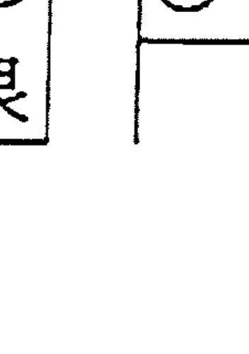

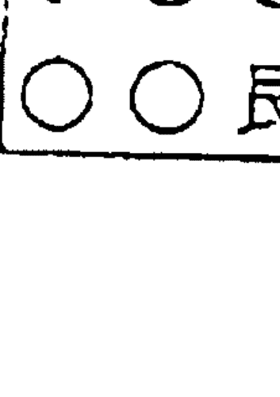

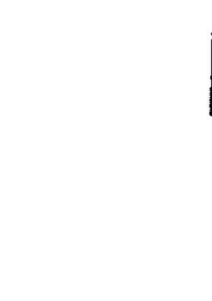

總之，三奇入墓，百事不宜，謀事失敗，凡事吉的不吉，凶的不凶。無力之象，怎吉怎凶呢？

### （十）三奇受刑——又叫三奇受制。

1. 乙奇落地盤乾兌宮，或遇地盤六儀庚辛金，為乙木入金鄉，均受剋制。

如

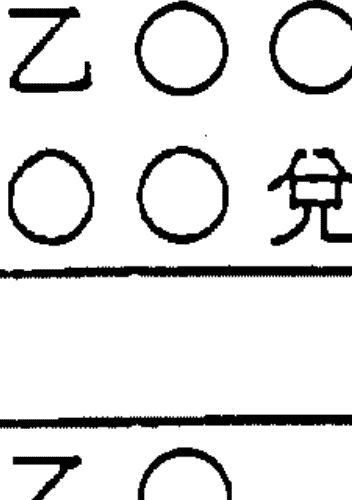

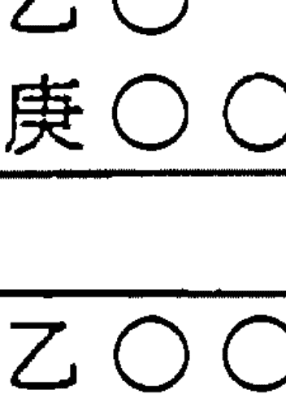

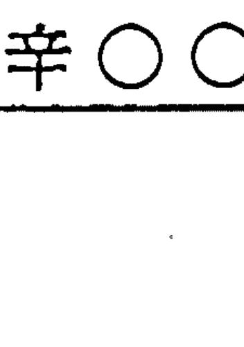

2. 丙奇丁奇落地盤坎一宮——或遇地盤壬癸水，為火入水鄉受制。

如

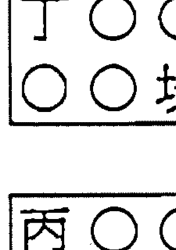

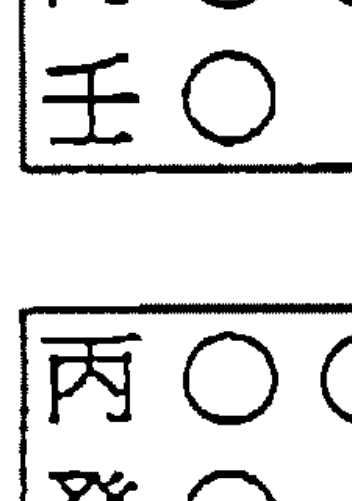

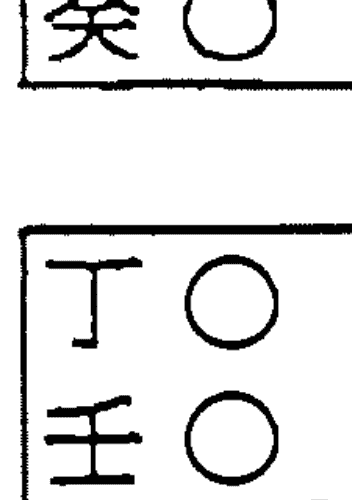

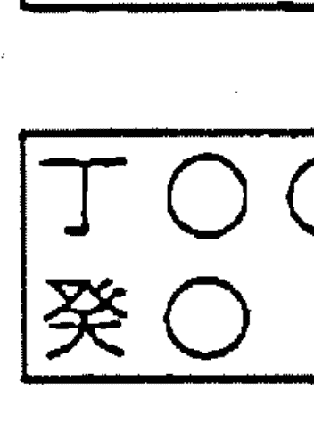

總之上述三奇受制，不宜謀事凶，（但是如遇乙庚合，丁壬合，雖受制，有吉門，吉神不凶）

### （十一）時干入墓——就是用事時的時辰天干在天盤，落在地盤之宮，正是它的墓地，叫入墓。

如：

1. 丙戌時——丙陽火，火墓在戌，落乾宮叫入墓如：
丙 ○ ○
○ ○ 乾

2. 丁丑時——丁陰火，墓在丑，落艮宮
丁 ○ ○
○ ○ 艮
入墓。

3. 戊戌時——戊和丙火同墓在戌如
戊 ○ ○
○ ○ 乾
入墓。

4. 己丑時——己屬陰土，墓在丑，如
己 ○ ○
○ ○ 艮
同丁火墓。

5. 壬辰時——壬為陽水，墓在辰，如
壬 ○ ○
○ ○ 巽
入墓。

6. 癸未時——癸屬陰水，墓在未。如

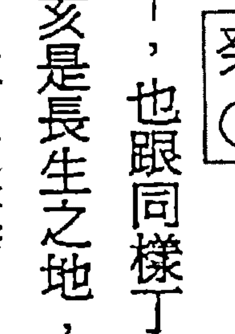

有時測得凶事又有凶門凶神，陰的天干，也跟同樣了陰火，丁亥時落戌宮，也有叫丁如丙入戌墓，但醒世人叫門徒不可稱入墓，亥是長生之地，或帝旺之地（陰干為旺）不是墓地，大家不可不知。乙未時乙落坤宮天盈比較作木入未墓。

### （十二）門迫——門尅宮叫迫。如：

- 1. 驚開門落三四宮——即震巽木宮，金尅木。
- 2. 休門落離九宮——水尅火宮。
- 3. 生死門落坎宮——土尅水宮。
- 4. 景門落乾兌宮——火尅金宮。
- 5. 傷杜門落坤艮宮——木尅土宮。

> 古詩有云：
> 驚開三四休臨九，傷杜遠歸二八宮；
> 生死排來居第一，景門六七總相同；
> 吉門被迫吉不就，凶門被迫禍重重。

如果吉格吉神遇門迫，應著用神是什麼？要靈活運用不可古板；吃古不化。如

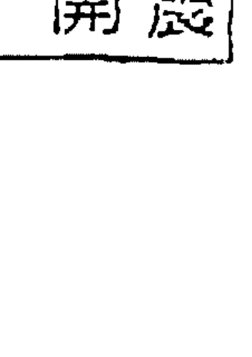

醒世人擇日工廠開業，我預測大利，結果生意，訂單如潮而來，不會因門迫而吉不就的。

又有一次羅小姐生子宮瘤，需要動手術，起得奇門盤，離九宮是

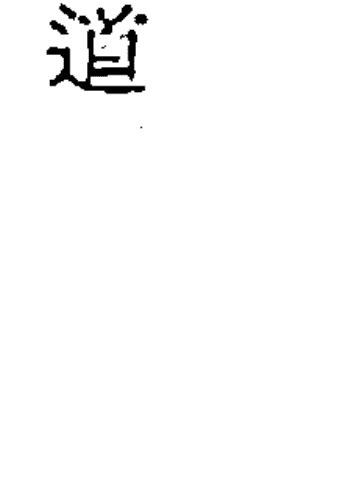

是宮迫，數個同道都斷其大凶。我斷不凶；大吉，結果平安無事，現在十五年多，五十多歲，仍做美容院生意，

醫院是我的寫字南方，（聖保祿醫院，雖然青龍逃走，（乙加辛）又有白虎凶神，但是雲遁吉格，

且乙為醫生，白虎是開刀之象，雲遁本是求雨用，但「遁」字避去，劫而過此關口，沒有之

象，有「乙」醫生動手術化解了。

醒世人詳細敘述。（如落旬空又當另斷），這也是辛在地盤，不是天盤辛，未構成六儀

擊刑之故。（即午午相刑）大家研究研究。對凶格，有無可救的化凶為吉的，不可不漠視，而

無鎖定為凶嚇唬而放棄生命！

### （十三）伏吟

1. 星伏吟——凡是九星在本宮不動叫星伏吟。如圖

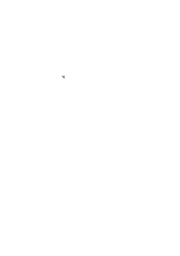

或

是星伏吟。

2. 門伏吟——八門在本宮不動，叫門伏吟。如圖

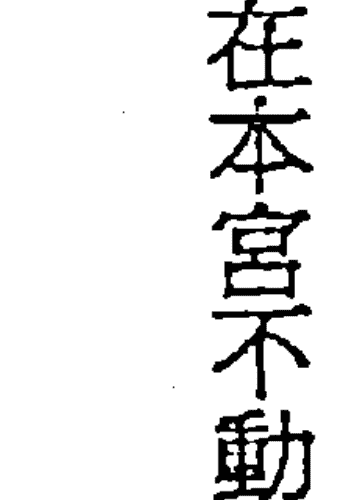

或

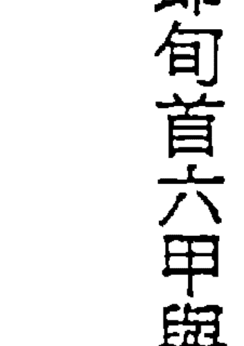

是門伏吟。

3. 值符伏吟——六甲值符在本宮不動，叫值符伏吟，如甲子戊加甲子戊，甲午辛加甲午辛是也。如圖

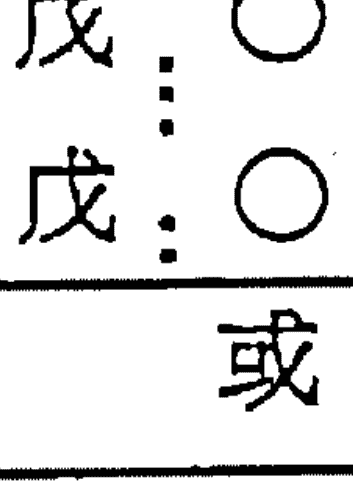

或

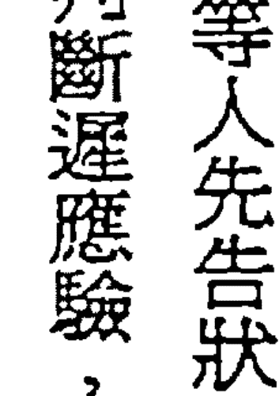

即旬首六甲與用干六甲相同。又是旬首與用干相同，叫值符伏吟。

總之，凡是六甲之時、門、星、符皆為伏吟。伏吟利主不利客，伏吟時，一般不應採取主動，靜守則吉，等敵人先動而後動。官訟而等人先告狀，而做被告駁斥。不是待斃而不戰，醒世人，再提醒大家。普通一般事，伏吟應判斷遲應驗，或慢應。

### （十四）反吟

1. 星反吟——本宮的天星，落在對沖的宮叫星反吟。如圖

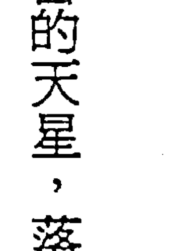

是星反吟。

2. 門反吟——八門不在本宮而落對沖宮，叫門反吟。如

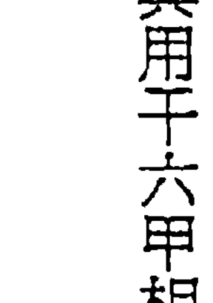

或

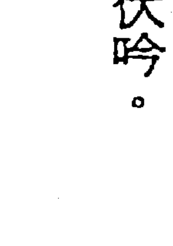

叫門反吟。

3. 值符反吟——甲子戊加臨甲午辛是符反吟。換言之相對沖兩宮的旬首和用干天地盤相辛相到轉是也。

反者是。如

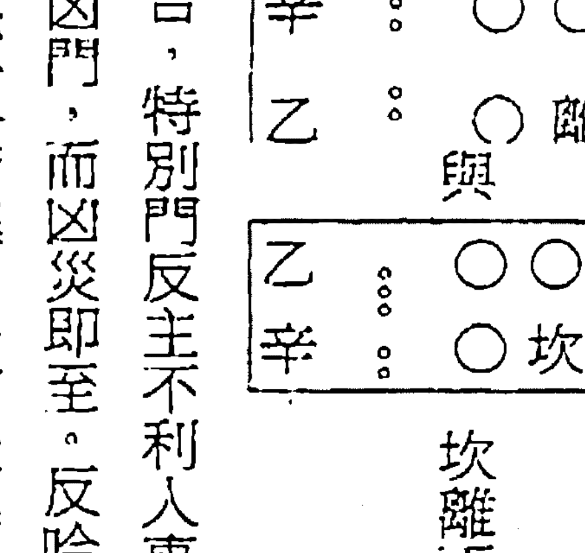

坎離兩六甲旬首與用干天地盤是相反的。上圖是辛乙與乙

總之，反吟主不吉，特別門反主不利人事，如遇三奇或吉門問題不大，爲有救。如果不遇吉門或三奇，則是凶門，而凶災即至。反吟利客不利主。在戰爭中宜先揚兵發動攻勢則戰。官司事，應做原告，先告狀則勝。在占事時，應驗驗快、速、求行人速至、占事有反復。普通經驗是大家應注意：

- 1. 反吟要速決速斷——做事度快，成敗易分。
- 2. 出行遇反吟——半途而返回。
- 3. 如做長久的事不能快完成者——可能有始無終。
- 4. 測疾病——遇反吟時，近病反吟速愈，久病反吟難痊，好似卜卦，反吟新病即癒，久病反吟死，一樣的判斷。
- 5. 如追債時，遇反吟時，空跑一趟，無利還虧旅費。
- 6. 如測婚姻遇反吟，婚不成。

### （十五）天網四張——癸加癸。

「天網四張」這一凶格，祇有甲寅旬中的癸亥時才出現天網四張，即是「癸+癸」凶格局。有些書，把所有天盤癸，加臨地盤時干時，都叫做天網四張，實在搞到混淆不清。這是不對的。因為：

- 1. 癸+戊——叫天乙會合。（用時干為天乙）（吉門宜求財，婚姻經商凶門百事不宜。）
- 2. 癸+乙——華蓋逢星。貴人保位，常人平安，門吉則吉。
- 3. 癸+丙——華蓋悖師。貴賤人逢之皆不利，上人見吉。
- 4. 癸+丁——騰蛇夭矯。文書官司，火燒也逃不掉。
- 5. 癸+己——華蓋地戶。男女音訊受阻，宜躲災避吉。
- 6. 癸+庚——太白入網。主暴力爭訟，自罹罪責。
- 7. 癸+辛——網蓋天牢。主官司敗訴、死罪難逃，病凶。
- 8. 癸+壬——復見騰蛇。主婚嫁重婚，後無子，不保年華。
- 9. 癸+癸——天網四張。主行人失伴，病訟皆凶。

> 古人歌云：
> 天網四張不可當，此時用事有災殃。
> 若是有人強出者，立刻身軀見血光。
> 蟲禽尚自避於網，事忙匍匐出門牆。

至於網高網低，古人爭論不一，意義相反，主要有兩種說法如下：

- 1. 宮數小為網低——可以匍匐出去。落六七八九宮，為網高，不可出去。
- 2. 另一種認為，落一二三四宮，網低難通過，落六七八九宮，網高可以任意通過。

誰是誰非，尚待驗證。

### （十六）悖格——丙加地盤值符。（或值符加丙）或丙加在年、月、日、時之上，皆為悖格。因丙為天威，性格威猛過於暴躁，容易出亂子，把事情搞亂。

悖格之時舉事，多例行逆施，綱紀紊亂，難達理相和目的，易出亂臣賊子和叛逆之人，但丙為三奇之一，如得之吉門相合，則可用，不能一律按凶斷。

### （十七）五不遇時——用事時的時干剋日干叫不遇。同時，必須是陽剋陽，陰剋陰的。（又因日干第七位，因此又叫「七煞」，即五不遇時，就是七殺）

- 1. 甲日——庚午時。（庚剋甲）
- 2. 乙日——辛巳時。（辛剋乙）
- 3. 丙日——壬辰時。（壬剋丙）
- 4. 丁日——癸卯時。（癸剋丁）
- 5. 戊日——甲寅時。（甲剋戊）
- 6. 己日——乙丑時。（乙剋己）
- 7. 庚日——丙子時。（丙剋庚）
- 8. 辛日——丁亥時。（丁剋辛）
- 9. 壬日——戊戌時。（戊剋壬）
- 10. 癸日——己酉時。（己剋癸）

五不遇時，就是七煞時，大凶，縱然得三奇或吉門，也不可用，如果預測時，遇到五不遇時，事多不順，但不一定都凶，還要看格局的好壞，星、門的吉凶，如果用事時，遇到五不遇時，最好避而不用爲妙。

# 第二十一章 奇門怎分主與客

奇門遁甲，為什麼要分主客呢？因為有些事情利客的就要爭取主動，先下手為強，先聲奪人。甚至一鼓作氣，速戰速決，打敗敵人。
如果主有利的，應該以逸待勞，以待敵三鼓洩氣；而一起突然攻之，這以待勞取勝，為主之決策。
因此，在戰場上是主動出擊；還是以逸待勞而攻之。在商場上是先發制人，還是後發制人，這是大的事情，應計劃好的策略。
在小的事情：比如人與人之間的交往，是主動好，還是被動好；是先動好，還是後動好問題。
同時，所謂時間、方位的吉凶，有的對主客雙方皆不利的，有的利客不利主，有的利主不利客的。但是多數情況，並不是如簡單，此時利主，彼時利客；此時利客，彼時利主。此方利主，彼方利客；或此方利客，彼方利主。所以對來源於軍事上排兵佈陣的奇門遁甲來說，特別講究主客關係。可以說對交戰雙方來說，隨時隨地都面臨著分清主客關係，利客做客，利主做主，才操勝卷。

## （一）那麽怎樣分主分客呢？大致有四條原則：

- 1. 從動靜來分——動者爲客，靜者爲主。
- 2. 從行動先後來分——先動者爲客，後動者爲主。
- 3. 從態度來分——積極主動爲客，消極被動者爲主。主動出擊者爲客，消極固守者爲主。
- 4. 從奇門活盤來分——天盤隨時辰運轉，因此天盤爲客；地盤某一局六十個時辰不動，所以地盤爲主。
- 5. 從距離來分——遠者爲客，近者爲主。

## （二）怎樣去判斷利主或利客呢？

1. 以時辰分析——五陽時（甲乙丙丁戊時干）利客；打仗時，宜主動出擊，日常生活宜遠行，經商辦貨，或批發、推銷，宜到遠的大商埠或工業區。又如求財，上任、移徙、搬遷、嫁娶、建造等，都宜時大吉大利。

奇門的陰時（己庚辛壬癸時干），利於爲主，在軍事上宜按兵不動，以逸待勞，後發制人，各個擊破，或伏兵擊敵，不是死守、坐而待斃，切記。

在商場競爭的商戰，宜採取守勢，貨物漲價他商搶購，宜出貨。貨價大跌時，各商爭出售品時，應入貨，以靜觀其變，等待時機，勿急燥，可操勝券。

2. 按奇門格局來決定利主或利客——例如奇門的凶格的「白虎猖狂（辛+乙）辛金剋乙木，而利於為客，又如「騰蛇天矯」（癸水剋丁火），都不利主，而是利客，原因是客剋主。這時自己是主，就不要坐而待斃，應在戰場上爭取主動出擊，或偷襲敵營，擊破其侵略計劃，擾亂敵人軍心，耀揚我軍威，戳破敵膽。

在商戰中於出謠言造市，欲進先退，欲退先進，都是爭取主動。變主為客。

又如「青龍逃走」（乙+辛）；「朱雀投江」（丁加癸），是地盤干剋天盤干，利主不利客，雖是凶格，卻是為主利而不受害。所以應該為主，不要為客；又如伏吟格，按兵不動，埋伏或取守勢；以逸待勞；反吟格，就應主動出擊。如抗日戰爭中的游擊戰，以攻為守。敵強我避，敵弱我攻。運用主客之有利條件，才能反弱為強，利主時做主，利客時做客，這是分清主客之原因與作用，以便決應付策略，醒世人在此再提醒大家。勿說我重贅也。

3. 以奇門天盤地盤生剋關係來判斷利主利客——例如：

- ① 天盤星生地盤星——利主。
- ② 地盤星生天盤星——利客。
- ③ 天盤星剋地盤宮——利客。
- ④ 地盤剋天盤星——利主。

總之，如果客生主，則爲主者，事就稱心如意，一切順利，獲益甚多。若果主生客，則主多耗散精力財物，費時失事，施拉難目的。如果主客比和，對事則雙方有利。

如果主剋客，做事半實半賞，有始無終，難獲成果，做事多不成功。

如果客剋主，事亦多不成功，有時求吉反凶，或招是非或官司，以上幾點都是說在爲主立場而判斷的，此點又不可不知。

古人編有「主客歌」供我們參數，如下：

> 天盤動用占爲客，地盤安靜占主穴。
> 細看星宮奇門知，察其刑剋吉凶決。
> 分其日月旺相方，更辨其方雲氣色。
> 假如天蓬加九宮，旺相之月在秋冬。
> 喜迎壬癸亥子日，北方黑色客有功。
> 若逢天星加一地，冬時北方主反利。
> 奇門星位仿此推，人在時方分仔細。

那麼，這歌怎樣說呢？無論從奇門格局來看，還是從天盤地盤星門宮的刑沖剋害生合來看，都要同時看其方位的旺相休囚，這樣才能更準確地判斷是利主是利客，這一點大家必須緊記。

知道了判斷利主利客，自然在我們做事時，就可以機動靈活、隨機應變，此時利主，我就做主；此時利客，我就要做客。此方利主，我就為主，此方利客，我就為客。總之，我們明白了為主為客之道，就要擇時擇方，去做明確的行動和決策，應動或靜、應先或後，以提高做事的效率和成就。這就是做事前先分清主客情況。

# 第二十一章 怎樣用奇門趨吉避凶

每一個人的一生中，命途不是永遠平坦的。正如一個國家、一個民族，不是永遠太平過日子的，有時，不免國與國、族與族戰爭和戰鬥的。因此，大至國家民族小至一個人、一個家庭、和一個企業團體都要與外間往來，就有興旺衰敗，經營得失，和睦和破裂糾紛：等等問題出現，對策的方法，不外是趨吉避凶。

同時，我們每日一舉一動，都含有趨吉避凶，例如：出門行路等，必留意前有無燈柱或小坑，提防扭傷腳；過馬路時，必先看左右是否有車來，無車才過馬路，避免車禍，切菜防刀傷，點火防火灼傷；離家做工，必須關好門窗，防雨防盜：………這一切趨吉避凶的動作，是人類日常生存和發展的需要，都是自覺不自覺地進行趨吉避凶決策活動的行為。

那麼，奇門遁甲是怎樣教人趨吉避凶呢？據古人的經驗，趨吉避凶的原則，概括起來祇有兩句話：（見煙波釣叟歌：就是急則從神，緩從門），即是說：如果事情突然發生，災禍即將至，詳細起盤分析凶禍來不及，就是很危急時，必須值符所在之宮或方位，躲避或逃走。

如果事發生緩慢，有時間詳細起奇門盤，就是向吉利的方位和吉利的時間去躲災避難。這兩原則，就是奇門遁甲趨吉避凶的兩大原則。

## （一）急則從神

凡是事情危急災難即要到時，沒有時間去起奇門盤，更沒有時間選擇三奇和吉門的時間，便要在天盤值符所在之宮或地盤值符所在之宮或方位而去，就會比較吉利，才沒有大的危險發生。

這樣危急的時候，怎樣很快速地找到天盤的符所在宮（或方向），或者能很快地找到地盤的符所在宮（或方向）呢？醒世人公開告訴大家，（不再保留或保密）。快就兩分鐘，屬就三分鐘，純熟奇門起盤方法，不用一分鐘也知道，值符的宮或方向了。思維應有下列三點：

- 第一，今日是何節氣管，是上元、中元或下元，陰X局或陽X局，按奇儀公式，起出奇門的地盤。
- 第二，知道用事時辰的時干時支，（即明用干）反管用干的旬首。
- 第三，就可知道地盤值符和天盤值符所在宮一旬首出生地盤的宮是地盤值符；旬首加用干的移民宮（即用干在地盤宮）就是天盤值符所在宮。快速不快出來吧！

簡而記之：旬首出生宮是地盤符宮，用干出生宮是天盤值符宮。

醒世人：再問你們明白沒？不明我再教。

## （二）緩從門

這裡發生的事情，雖然危險災難，但不是太急發生，可以從容地選擇吉利的時間和吉利的方位去辦理或解決或挽救。醒世人又教大家，須緊記：

第一切勿選凶的時間就算得吉時的方法：

1. 首先要盡量避開五不遇時——即時干剋日干如甲日的庚午時，（庚時金剋甲日木）乙日辛巳時，（即七煞時），不可用。如甲子日陰局，用事是庚午時，天盤值符在離宮，急從神時，切勿到南方，應避五不遇時，宜到值符出生地盤坎一宮即北方去。才安全，此點又不可不知。

附註：五不遇時，必須時干剋日干，必須陽剋陽，陰剋陰才凶，陽剋陰，陰剋陽，會中和，即俗稱床頭打架，床尾和，會吸引不排斥，如五不遇時：甲日庚午時，乙日辛巳時，丙日壬辰時，丁日癸卯時，戊日甲寅時，庚日丙子時，辛日丁酉時，壬日戊申時，癸日己未時是也。

2. 勿選時干入墓之時——即是用事之時辰干（即用干）落入其墓地所在之宮，例如：

- ①丙戌時——落入六宮戌墓之方。
- ②丁丑時——落入八宮之丑墓之方。
- ③乙丑時——也是落入八宮丑墓之方。
- ④戊戌時——落在六宮戌墓之方。
- ⑤己丑時——落在八宮丑墓之方。
- ⑥壬辰時——落在四宮辰墓之方。
- ⑦癸未時——落在二宮未墓之方。

3. 勿選三奇入墓的方位

- ① 天盤乙奇落乾六宮戌墓（乙陰木在戌）
- ② 天盤丙奇落乾六宮戌墓（丙墓在戌）
- ③ 天盤丁奇落艮八宮丑墓（丁陰火墓在丑）

附註：地盤的三奇雖在墓地是出生地不忌，此點不可不知。

4. 勿選六儀擊刑：

- ① 天盤甲子戊落震三宮——（子刑卯）即戊加震。
- ② 天盤甲戌己落坤二宮——（戌刑未）即己加坤。
- ③ 天盤甲申庚落艮八宮——（申刑寅）即庚加艮。
- ④ 天盤甲午辛落離九宮——（午午自刑）即辛加離。
- ⑤ 天盤甲辰壬落巽四宮——（辰辰自刑）即壬加巽。
- ⑥ 天盤甲寅癸落巽四宮——（寅刑巳）即癸加巽。

### 5. 勿選庚格、刑格及飛干格、伏宮格、飛宮格（上述的奇門凶格）時。

第二怎樣選得吉方位呢？

- ① 如果有吉門，沒有奇的方位，可算是吉方位——即是得門不得奇，但得奇不得門，不可算吉利的方位，此點尤不可不知。
- ② 如果不得吉門又不得奇，就是不吉利的方位和方向。但正吉格，還可用，遇凶格不可用。
- ③ 選擇最佳的方位或方向：
    - 盡量選擇三奇和三吉門所在的方位或方向。——但捕捉、打獵、討債不可用吉方向，應用傷門，喪葬與吊唁，送葬則可用死門。
- ④ 還要看神盤——八神盤（即頂盤）神盤上有四個吉利之神，太陰、六合、九地和九天。

> 煙波釣叟歌中說「九天可揚兵，九地潛藏可立營。伏兵但向太陰位，若逢六合利逃形。」

這就是說，九天所臨之宮利客，宜主動出擊，先發制人，九地所臨之宮利主，可以屯兵固守，以逸待勞，太陰所臨之宮，宜埋伏軍隊，不易被敵人發現，如逢六合宮，對退卻逃亡有利。（耿註：此點千萬要切記）

大家真要注意：在門、星、神三者中，吉門最重要，吉星三奇次之，吉神可起輔助作用，此點應緊記。

第三必須分清落宮的門、奇、星、儀是吉是凶！怎樣知它們的吉凶呢？必須結合節令和所臨的宮旺相休囚。才知道它們真吉或假吉，真凶或假凶。

1. 吉的門、奇、星、儀——得當令旺相就是真吉，如果遇休囚，就不吉了。例如：

生門屬土，如臨艮八宮、坤二宮，和離九宮的土火宮，得生旺，就叫「得地」，就是真吉了。

生門在時令是立春至春分四十五天（正是艮八宮的季節）或四季土月（三（辰）月、六（未）月、九（戌）月、十二（丑）月，則為「得時」，也是真吉了。

這就是生門「得地」和「得時」，大旺大吉了。

如果生門落震三宮或巽四宮，木宮剋生門土，生門受制，或臨冬十月和十一月亥子水月，或秋七月，八月申酉金逢休囚之時，生門就不吉了。此點又不可不知。

相反，如果凶門「得時得地」，則為真正的大凶之門；如果凶門逢休囚衰死季節，則無氣，凶的程度，就大大減小了。換言之，凶門「得時得地」是真正的凶，凶門不得時不得地，就不能逞凶了。這口訣，要緊記住。（耿註：此點千萬要切記）

九星的旺衰，與五行不同，這在前面九星表已列出，天星是講旺相休囚廢，（不是死）九星在旺相季節叫「有氣」。在吉者為吉，凶者為凶。如果九星「旺相休囚廢」，不是對九星本身影響，而是對地球上人類和萬事萬物的影響確定的。也可說對地盤宮的影響輕重而確定的。

- 1. 我生之月之宮「最旺」——如天英星屬火，生旺四季土月（三、六、九和十二月）最旺，（艮坤宮亦最旺），天英星影響和發揮最大作用。
- 2. 天星與地盤宮五行同比和叫「相」（次旺）起壯大聲勢作用時，影響為其次，是為次旺「相」。如天英火星對離宮和四五（巳午）月同為火，天英祇能助火勢，不能生火勢，祇是次旺叫相了。
- 3. 天星處受地盤宮生助——即季節月令生助它時它降臨地盤上起不到作，所以叫做「廢於父母」。如正二（寅卯）月木旺，木能生火，地盤自己能生火，天英火星，祇好作「廢」了，生我者（父母）作廢了。
- 4. 天星對地盤發生剋制作用時，實際上最地盤最旺時它就可休息了。不用再去發揮甚麼作用，這就叫「休於財」即（我剋者為財）如七月八月（申酉金），天英火星，火能剋金，這時金旺，天英火星，祇可休息起不到作用了。
- 5. 如果地盤宮五行剋制天星時，它們（天星）雖能降臨地盤宮上，卻被宮五行剋制，等於被囚起來一樣，一點作用也不能發揮了，所以就是囚於鬼兮真不安。如十月十一月（亥子）水旺之月，水能剋火，叫「囚」了。

總之天星五行的旺相休囚廢，與季節五行旺相休囚死有些不同，季節以本身旺相休囚死，天星不是對本身的，而是對地球季節或地盤宮起的發揮作用定「旺相休囚廢」的。

| 天星五行 | 1. 我生之月最旺（旺） | 2. 同我五行之日次旺（相） | 3. 我剋之月叫休 | 4. 剋我之月叫囚 | 5. 生我育叫廢 |
| :--- | :--- | :--- | :--- | :--- | :--- |
| 季節五行 如春正二月 | 1. 同我者旺——木旺 | 2. 我生者相——火相……②火旺 | 3. 生我者休——水休……③水廢 | 4. 剋我者囚——金囚……④金囚 | 5. 我剋者死——土死……⑤土休 |

醒世人因初學門徒常把天星五行的旺相休囚廢，與季節五行的旺相休囚死，搞到不清楚，我不厭其煩，多佔篇幅，再贅述，請大家原諒，列表比較，天星本身不會死的，地盤宮已旺極，不用它來生了，祇把它作廢。

## 天星與季節旺相休囚死比較表

| 天 | 星（以天沖木星爲例） | 季 | 節（以春木爲例） |
|---|---|---|---|
| 旺 | 我生者爲旺 | 旺 | 同我五行爲旺 |
| 相 | 同我五行爲相 | 相 | 我生者爲相 |
| 休 | 截剋之五行爲休 | 休 | 生我者爲休 |
| 囚 | 囚剋我之季節 | 囚 | 囚剋我者爲囚 |
| 廢 | 生我者爲廢 | 死 | 我剋者爲死 |
| | 如夏天四月和五月巳午火月 | | 如正月二月寅卯木旺（與春木同旺） |
| | 如春天正月和二月木五行同我 | | 如夏天四月五月的巳午火是木生的火 |
| | 如四季十一月三六九十二月辰未戌丑月 | | 如冬天十月十一月之人子水月（水生木） |
| | 如秋金七月八月，因金旺被囚 | | 如秋天七月八月申酉金剋我者囚（金剋木）長 |
| | 我已當旺不要它生就作廢了 | | 如四季十一月未戌五月（木剋土） |

好了，醒世人扯得太遠了，總之天星的旺相休囚廢，吉凶天星旺相時，吉者大吉，凶者大凶。吉凶天星遇休囚廢時，吉者不吉，凶者也不凶。

三奇六儀的吉凶又怎樣分呢？三奇六儀則主要看它們與門、宮和地盤奇儀之間的生剋制化關係。

例如：如乙木奇——宜遇休門（水）及坎水得生，遇震巽木宮同旺比和，自然大吉大利了。

乙木才能發是它的作用。

如果乙木奇，遇到乾六宮，不啻受金剋，而且入戊墓開門金也剋它，乙奇就不奇了，不能發揮乙奇的作用。這個乙奇就不能使用。

如果奇儀相合，例如乙十庚、天盤乙、地盤庚，乙與庚相合。又如丙十辛、丁十壬、戊十癸，或天盤子戊——地盤六己、甲十己，都是六合，成和解之象。如果打仗，或打官司，雙方可能議和，比賽成平局，詞訟可能私下和解。此點人人應明白。

又如六辛加六乙為白虎猖狂。陰金剋陰木，天盤為客地盤為主，客軍大勝，主軍必敗。

如果遇到開驚兩門，或生死兩門，敗得更慘。因六辛得生旺之助也。

又如果，辛十乙，遇休門杜門，乙奇得休水生杜門助旺壯之，水木又洩金之氣，則白虎力量減弱，主軍不致慘敗，也可能打個平手。此點大家更不可不知，轉敗為勝之關鍵而已。

總之，必須配合時令季節和方位，運用陰陽五行生剋制化的原則，辨其旺相休囚，然後才能確定是吉是凶和吉凶的程度。

第四在「緩從門」中，煙波釣叟歌中還加入：「乘天馬」、「天三門」「地四戶」和「地私門」的四種趨吉避凶，歌中有：
“太沖天馬最為貴，卒然有難逃避；但當乘取天馬行，劍戰如山不足畏。
又有“天三門地四戶，問君此法何處？太沖小吉與從魁，此是大門私出路；地戶除危定與開，舉事皆逢此中去”。
又有“六合太陰太常君，三辰原定地私門；更得奇門相照耀，出門百事總欣欣。”
這四種方法，均屬古代太乙、奇門、六壬，三式中的六壬式法，本人不知其效果如何？
是否真實，不再贅述，大家有興趣，可參其他書籍吧！

# 第二十二章 奇門遁甲判斷方法（一）

奇門遁甲的預測與判斷，比六爻的六十四卦預測是困難複雜，必須把基本的奇門遁甲知識清楚，甚至明瞭與熟習；分析的順序，主要者先，分析參數者後分析。

起出奇門盤怎樣去進行分析與判斷呢？

第一步，先要知道取用神的方法——如自己測事、或代人問事，以日干為自己或問事人，為所問之事，換言之，就是落天盤的日干是自己，或問事人；而時干落天盤的是問事。

又如求失物在何處？落宮天盤的日干是物主，天盤時干是失物所在的宮或方向，吉局吉格易尋回；落空亡或天蓬星或玄武小偷盜賊拿去了。各類預測，如找工作職業、出行出國、婚姻、求財、疾病、官訟……等用神；在下篇分類敘述。

第二步，分析與用神有關的宮與宮的生剋關係——如夫妻用神看乙庚落天盤宮、宮與宮五行生剋關係——乙是妻（或女家）庚是夫（或男家）乙庚落宮相生，夫感情好，落宮相剋，夫妻不是多爭吵，就是感情出現破裂危，如果再丁落宮天盤宮生庚落宮，如庚在艮宮，丁在離宮，庚已有第三者女情人追求了，這是宮與宮生剋關係。

第三步，在用神落宮，在宮囚天地盤，星門宮生剋分析——如某夫婦問題：乙妻落巽宮天盤，庚夫落艮宮，木剋土，女方提出離婚，離婚是甚麼？因庚落艮宮是庚加丁，庚夫已同第三者女情人同居了，所以婚姻破裂。

總之宮內有天、地、人、神四層之間，有天地盤剋應關係，有九星與地盤宮五行生剋關係，詳述如下：

- 1. 九星與地盤宮五行生剋關係——如天心金星，落地盤震木宮的金剋木，天盤剋地盤了。
- 2. 八門與地盤宮的生剋關係——
    - ① 門剋宮——如開門屬金，落震了木宮，金剋木。門剋宮，古人叫門迫或門被迫。
    - ② 宮剋門——如開門金，落離宮，火剋金，宮剋門叫門受制。
    - ③ 門生宮——開門落坎，水宮，金生水，門生宮，古人叫「和」。
    - ④ 宮生門——開門屬金，落坤2土宮，土生金，宮生門，古人叫「義」。
- 3. 在本宮還要看天盤干和地盤干的剋應及狀態——分兩分析：
    - ① 天盤與地盤剋應——如丙+戊鳥跌穴，乙+辛龍逃走，丁加癸朱雀投江：…等。
    - ② 天盤與地盤的狀態——主要看長生、帝旺、死、墓、絕。如天盤丙落乾六宮入戊墓絕之地，庚入艮宮。丑寅庚金墓絕之地。
    - ③ 天盤干與地盤生剋關係
    - ④ 六甲的地支與地盤暗藏地支刑沖剋害關係——如甲子戊落震宮，（子刑卯）為六儀擊刑。甲子戊落離宮（子午相沖）水入火鄉之狀態。
- 4. 九星與八門之間比較生剋關係

附註：八神一般獨立性，無必要與地盤宮比較生剋關係，只依八神分析性質，如玄武，病人是昏迷少女是美麗妖冶，作用浪漫，或桃色事業。又如太陰是曖昧，是陰人，九地是地久不變...等。

第四步，分析事物的遠近、內外、快慢——以陰兩局的判斷是相反的

（一）陽遁的奇門遁甲（即陽局）——

- 1. 一八三四宮（即坎艮震巽宮）為內、為近、為快。
- 2. 九二七六宮（離坤兌乾四宮）為外、為遠、為慢。

（二）陰遁的奇門遁甲（即陰局）

- 1. 九二七六宮（離坤兌乾宮）為內、為近、為快。
- 2. 一八三四宮（坎艮震巽宮）為外、為遠、為慢。

另外，伏吟主遁，反吟主速。

第五步，分析事物發展的高漲和低潮——高潮即事物處在生旺，吉中更吉，凶中更凶。處在低潮時，事物追處在休囚的狀態，吉者不吉，凶者小凶。如遇天星廢，或季節死時，吉者恐有小凶，凶者不凶。

綜合言之，上述的觀察的分析方法，比較全面的，不是片面的祇看用神的單獨看天星，單獨的看門和單獨看日干時干的方法，其準確率比較高，此點不可不知。

附註：十天干、八門、九星的狀態看法：

- （一）十天干的旺衰——按十二長生旺死墓絕分析。月令兼看。
- （二）八門的旺衰——按月令，節氣來斷，兼考慮其落宮狀態。
- （三）九星的旺衰——亦主要是按月令，節氣來斷，同樣考慮其落宮狀態，天星生剋門和生剋宮吉，宮和門剋天星則凶。此點不可不知，似我們玄空大卦剋入吉，剋出則凶。道理一樣。

# 第二十四章 奇門遁甲判斷方法（二）

奇門遁甲的局數，凶多吉少，判斷時勿見其凶格就被嚇唬，不敢再分析下去，惶恐終日，須知實際上，吉凶並非是絕對的，它們存在相對性，在一定環境和條件下，還會相互轉化的，而且有大部分是中間狀態，絕不是非吉則凶，非凶則吉這樣簡單，許多事情亦吉亦凶，凶中有吉，吉中有凶；中平狀態居多，因此，判斷奇門遁甲時，必須不要為凶嚇唬自己或問事人，應繼續深入研究奇門盤，吉在那裡，凶又在那裡，教自己和他人盡量利用對自己對人有利的天時、地利、盡人事，經過頑強的意志和努力，可能轉凶為吉，逢凶化吉，就不坐待天時和地利，消極的趨吉那就禍即來臨了。

因此，我們要時刻分各階段去研究不同的局數，依古人的門書籍參數，醒世人錄給大家，希望對奇門遁甲有更準確的判斷。

> 例如：《奇門遁甲秘籍大全》有說：「奇門上盤像天，中盤像人，下盤像地。上盤像天，九星也；中盤像人，八門也；下盤像地，九宮也。

用法則首重九星，以九星是天盤，吉凶由天故也。凡星剋門吉，門剋星凶。

凡出行趨避者，首重八門，以八門爲人盤，吉凶由人自取也。凡門生宮，宮生門吉；門剋宮，宮剋門凶，傷人事故凶。

凡造葬，遷移者，首重九宮，以九宮爲地盤，遷移等事，皆由地而起也。故門宮相生俱吉，相剋俱凶。苟德此意而推之，凡事關天人者無不可類通。妙哉！此示人以用法。

以上該書所述，就是教我們，凡是由天人地三才分別所屬像徵的事，通過天地人之盤的盤與人盤之間的生剋關係來斷奇門遁甲的方法。

其次，又有古人說：『奇門占法，要分動靜之用，靜則祇查值符。值使、時干，看其生剋衰旺如何。

動則專看方向，蓋動者機先見者也。如聞南方之事，則占離位，聞北方之則占坎位』。（見《奇門統宗》）

又有對靜著看值符、值使落宮進行斷卦，有一段古人較詳細的敘述，（見《奇門一得》），醒世人爲大家容易明白，用自己整理的如下：

靜看值符、值使落宮判斷奇門遁甲時，如上樑造屋、造廈、婚姻、赴任遠行、商賈出入、謀爲求名求利，請謁上訴，詞訟安葬、家居入伙搬遷，開廠創業、商店開張等類，祇宜以地盤奇儀「爲主」，天盤九星、奇儀、八門「爲客」。就可按下列情況判斷其結果，是吉是凶：

- （一）天盤生地盤「爲主」則吉——有官貴相助；做什麼事都順，不會有阻隔，進益是多方面，心想事成，萬事如意；爲主者，最佳的象數。
- （二）如果地盤生合天盤者爲次吉——謀事做事建造，多耗財，用人散漫，耗時費力，拖慢成功，始終辛苦擔心和勞碌。一般事都是緩慢而成。甚至求謀，宜請託，事可辦妥。
- （三）如果天盤者星剋地盤諸星「爲主」不吉——例如一切謀爲等事：多招是非厄難，口舌重重，成爲自敗；驚恐憂心事，不免發生。（如天任土星落坎宮：任剋蓬水星）
- （四）如果地盤剋天盤諸星欠利，但求名投考大學，或求官求職可吉。——如天沖星落乾六宮受地盤天心金星剋）。這時叫地盤天心星有勢，做事都強勞，恐日久無益，謂之我剋者休，所以做任何事，都有始無終。唯求名求學求官等可吉。如果打仗爲主者，百戰百勝，奏凱向歸。
- （五）如果天盤與地盤諸星比和（門與宮比和亦同），或宮生門、門生宮、或門宮比和諸星，或地盤生天盤諸星，或天盤生地盤諸星——則主客皆吉。
- （六）如地盤臨衰墓死絕之宮，逢天盤相剋，大利爲客——這時爲主大凶。凡謀事主有災雖官非，吉事成凶，憂恐重見，永不爲吉。
- （七）如地盤臨生旺得令之宮，逢天盤衰囚諸星相剋者是失令之客，不能傷得令之主，客反招其咎。
- （八）地盤之星雖在衰墓失令之宮，逢天盤諸星相生者，爲主目下尚有轉機，幸得其生，如到交我旺相之時，而必大吉。

以上所講的奇門遁甲判斷吉凶方法，總而言之，不外下列的方法，醒世人爲大家容易記憶，再重複一次，

- （甲）有以三才爲主，（天人地）爲主，看其落宮而判斷。
- （乙）有以值符、值使落宮來判斷者。
- （丙）有以所動事物方位所在宮次而判斷者。
- （丁）現在北京奇門遁甲專家，以用神判斷者，而且用叫個用神判斷、更廣泛、更全面、更準確作出判斷。如張志春和杜新春大師都是這一派。

# 第二十五章 怎樣取用神

上一章講到判斷方法中，有一派判斷取用神才判斷，如北京石家莊張志春和杜新春大師，就是這一派，其取用神有64個，怎樣計算出用神有64個呢？醒世人不厭其煩，一一計算給大家看了就知道。

第一，用天干用神有10個——即甲乙丙丁戊己庚辛壬癸共10個，怎樣取它作用神呢？例如測夫妻感情的婚情況，或男女戀愛初期，亦以乙庚作用，乙為女方，庚為男方，又是妻子和丈夫，女的第三者男情人為丙；男的第三者情人是丁，這就天干作用神一例。

第二，是地支作用神有12個——即子丑寅卯辰巳午未申酉戌亥合共12個，如判斷應期，有馬星、寅午戌時，馬星在申，又如值符甲子戊落離宮，子午沖，或水入火鄉；六儀擊刑，旺相休囚死是用地支作判斷的用神。

第三，是天星有九個——即是：天蓬星、天芮星、天沖星、天輔星、天禽星、天心星、天柱星、天任星、天英星共九個。取神時如測大盜逃到何方，幾時可捕捉他歸案，就用天蓬星作用神，占疾病以天芮星作用神。

第四，八門就是8個——如開門、休門、生門、傷門、杜門、景門、死門、驚門合8個，如杜門爲武職官員，開門是文職官員，開門代表開店、開廠用神，又是工作職位的用神，杜門是軍警，又是轉業如退伍軍人，或失業者之類。

第五，八神作用神8個——小值符、騰蛇、太陰、六合、白虎（勾陳）、玄武（朱雀），九地和九天共8個，用神如「玄武」代表扒手、小偷，或昏迷的病人，九天可代表飛機或航空或太空船、飛行員等。

第六，八卦的8個用神——即乾坎艮震巽離坤兌共8個，乾爲皇爲帝、爲父，坤爲母、爲腹，震爲長子等。

第七，九宮爲用神9個——一宮、二宮……至九宮，將九宮圖豎立起來，離九宮在上坎下，左震三宮右兌七宮，就得一個人形象，離九宮爲頭其內爲心臟的代表符號，一宮代表男下陰爲用或爲生殖器官系統。左右兩肩四二兩宮（和手在內）三七宮爲左右脅，八六兩宮爲左右腿足，是用神的代表符號。

以上七項奇門取用的用神共有六十四個，正如我的玄空大卦六十四個，數字一樣，可見其用神包羅萬有，資訊全面，判斷自然準確得，且數個人同時問事，可用同一奇門解答，就是用神多之故也。此點大家應明白的。

## 64個奇門用神

- ① 十天干 10個
- ② 十二地支 12個
- ③ 九星 9個
- ④ 八門 8個
- ⑤ 八卦 8個
- ⑥ 八神 8個
- ⑦ 九宮 9個
- 共 64 個

# 第二十六章 奇門遁甲怎樣定應期

我們把奇門盤，分析過後，判定是吉或是凶，怎知何時應驗呢？有三個原則：

第一，確定用神的狀態及位置——首先清楚知道用神的旺衰生死墓絕的狀態，其次，必須和這用神的位置在何宮，是外盤或內盤伏吟或反吟，確定遠近、快慢、還斷年月近斷日時。

第二，要確定應期天干和地支——先定地支為主，兼看天干，訂出干支日期。（是年月日或時）作出應期。

第三，先以值符定應期，後以值使定應期。

我們得上三個原則，就根據下列方法，定出應期：

- （一）六甲值符定應期——這方法是以天盤值符落宮以刑沖者用合為應期，逢合者以沖為應期，逢旬空者以填實為應期。如甲子戊旬 落離宮子午相沖，子與丑合，應驗應當在丑年月日時。餘類推。
- （二）以天盤六儀所帶地支看其沖合——逢合以沖定地支，逢沖以合定地支。
- （三）天盤所帶之地支又不沖又是不合——則以星門生剋確定應期。生逢生日，剋逢剋日為應期。

除了上述三點外，我們的奇門專家還發現有下列 點作為大家定應期的參數。

- 1. 以用神的長生，帝旺定應期——如用神屬木者以寅長生或午帝旺定應期。
- 2. 以用神的死、墓、絕為應——某人丙午年出生病危測死期，就用丙火的死墓絕去測應期。
- 3. 庚格測應期——庚臨年月日時叫庚格，陰日看庚上之干，陽日看庚下之干定應期；時干臨陽星看庚下之干，時干臨陰星，看庚上之干為應期，此種應期多用於行人走失，或破凶殺案或捕捉盜賊，何時落網，用庚格。
- 4. 旬空填實為應期。
- 5. 馬星動為應期——如寅午戌時馬星在申。
- 6. 值使所臨之下為應期，值使門落宮數為應期。
- 7. 日支時支三合六合為應期。日支時支刑沖剋害為應期。

總之，上述的應期測法甚多，究竟用那一瓣呢？按奇門盤實際情況，遇日干或時干受刑，以合為應期，捕捉犯人時，過庚日或時用庚格，如值符受刑沖剋害，就以值符應期，如值使落宮數之地支，也可做應期，有時用神落宮亡宮，應旬宮填實為應期……，醒世人捉捉此點，結合你觸機定應亦可。不可拘泥，應期最需要合情合理，好了！下篇各章分類預測的奇門圖

## 附：星、門、宮看人物性情表 醒世人製

|  | 1 | 2 | 3 | 4 | 5 | 6 | 7 | 8 | 9 |
|---|---|---|---|---|---|---|---|---|---|
| 九大星 | 天蓬 | 天芮 | 天冲 | 天輔 | 天禽 | 天心 | 天柱 | 天任 | 天英 |
| 人物 | 船員盜賊貪官 | 廢夫孕婦病人 | 司機師 | 教育人 | 居中正官 | 大官富家首長 | 巫婆道士獄吏 | 農夫商人道士 | 盡家文人 |
| 性情 | 沈滯不問朗任性少修飾 | 固執忍耐 | 善出口傷人，坦率 | 溫和柔順有文化高程度 | 正直官員固執、古板 | 果斷勇敢有遠見 | 狡猾陰險善辯善唱 | 消極聽天命安份守己 | 忠良正直 |
| 八門 | 休門 | 死門 | 傷門 | 杜門 | 中宮 | 開門 | 驚門 | 生門 | 景門 |
| 人物 | 貴人官吏老人 | 犯人獄吏死屍 | 野蠻暴躁 | 警察軍警保安 |  | 官員首長老人 | 膽小虛偽倔強 | 生意人房產見 | 測師查家文香 |
| 性情 | 衰放機智樂觀活 | 頑固吝嗇自死死 | 駕駛員手術醫生殘廢者 | 小心癡惑保密 |  | 穩重莊嚴獨斷發 | 軍人將軍武官 | 積極慷慨善變 | 正直熱情好動虛榮 |
| 九宮 | 一宮 | 二宮 | 三宮 | 四宮 | 五宮 | 六宮 | 七宮 | 八宮 | 九宮 |
| 人物 | 中男盜賊 | 老母農僧 | 長男長女將帥 | 長女妾教師 |  | 元首男長者 | 少女歌星演員 | 少男生意人 | 神仙革命者 |
| 性情 | 冷靜放蕩冷酷 | 懦弱遲鈍柔順吝嗇 | 剛毅決斷急躁野蠻 | 溫和不定守德有文化 |  | 剛毅武斷嚴正威武 | 能言善辯表演易挫折 | 多疑外剛內柔勤儉 | 聰明熱情，有正義感 |

# 下篇：奇門遁甲占例實用篇

# 第一章 預測疾病

### 第一節 疾病在何部位

以九宮格定病星「天芮星」落何宮何部位病，如戴九（離宮為頭），履一（坎宮為男女下陰部位），二四為肩（巽坤為左右肩膊耳朵、和手），六八為足（左右腿足），左三右七（為兩脅）；如健康的人，死門在那宮，那處就有受傷的疤痕，或天生的印痣。或畸形。

### 第二節 求測疾病是表裡病

測疾病在表者，陽局病星（芮）在一八三四宮為內臟腑疾病，在九二七六宮為外盤為體外疾病。

陰局則相反，在九二七六宮的芮星是內臟腑病；在一八三四宮為外表或體外病。

### 第三節 預測病的輕重

以病人爲日干，疾病爲時干，天芮星落宮，亦爲疾輕重的預測。

天芮星落震巽兩木宮，可速愈，或不藥可愈，天芮因爲病星受制也，但木休囚而天芮星旺相時，病愈遲些日干落在生門同宮，不落空亡，亦大吉，日干落死門同宮看有吉門吉格求助亦吉，否則凶，如日干落旬空出空可愈，久病難避空亡填實則大凶，遇凶星凶格無救助者必死，以天芮星爲廢之日爲病癒之期。

# 第二章 占失物

以日干爲失主，時干爲失物；時干落宮生日干落宮則失物必得回，時干落宮，剋日干落宮，難尋覓，時干落宮亡宮，又有玄武或天蓬，被盜賊偷去。

又時干落宮的方位，是內盤在屋內的方位，在外盤在屋外的方位，時干落空亡，墓絕之宮不得，如時干落宮旺相來生日干落宮，仍可得回，反吟者更迅速找回。

# 第三章 占出行吉凶

日干代表行人，出行日的目的地，（方位宫）日干落宫有吉門吉格或吉神三奇等，出行旅途平安，目的地之方向方位宮，有吉門吉格亦平安，如日干落宮有六儀擊刑或凶門、或玄武、天星、旅途遇賊或小偷，有凶門更危害身體，不宜出行，如目的地方位凶，也不宜旅途或遷移，應另改目的地到吉宮吉方位為佳。

# 第四章 預測行人在外吉凶

以行人年命或日干測之：如是陽局年命或日干落在一八三四宮，在內盤為近，為內，如在九二七六宮為外、為遠。

陰局則相反，在九二七六宮為內、為近，在一八三四宮為外、為遠。年命或日干落於休囚之宮，不是有疾或做事不如意，非困即病，如果年命或日干落宮是墓絕空亡之宮，其人必不在。如果年命或日干旺相又落旺宮，再得奇門吉格，行人在外發財創業、忘返。

# 第五章 測行人歸期

以年命的出生日元為主，以出生陽日出生，以庚下之天干定歸期，陰日以上之干定歸期；

或以預測日的陰日或陽日定歸期如上。

年格則年回來，月格則月回來，日格則日回來，時格則時回來，不格不回，甚麼叫不格，乙庚合日不格，庚金入墓，或臨空亡，不為格。

# 第六章 測求財

預測求財，以甲子戊為財神，生門為財方財位。看生和甲子戊落在天盤何宮。以甲子戊與生門落宮生剋比合，斷其得失。

甲子戊和生門落於坎艮震巽四宮，陽局為內，為近，為速得財；再得奇門吉格者，得財必多：若得門不得奇者，或得奇不得門者，得之不多。

門奇俱不得，不落空亡墓絕，不受地盤（宮剋制）剋制，得財必少。或甲子戊與生門落於一內一外，得財必遲。

甲子戊和生門，俱在外盤，必求千里之財。陰局內外盤相反，此點不可不知。

甲子戊與生門俱落空亡，反吟墓絕，再遇凶神凶格相並者，不但不得財，反遭是非和官司。

# 第七章 預測貿易

以甲子戊為資本，生門為利潤，生門所落之宮，得奇門吉格來生甲子戊之落宮者，必獲倍利。兩者中和者，亦得中利。

生門來剋甲子戊落宮，再乘凶神凶格者，必虧本；甲子戊生生門宮，主加添資本，仍得利潤。生門若臨墓絕之地，再有凶神凶格者，必耗盡資本更凶。

# 第八章 預測地產交易

以日干落宮為我，時干落宮為業主，六合為地產經紀，如果日干生時干，買主必買，必置業；時干生日干，業主願賣給買主；日干剋時干，買主不要；時干剋日干，賣主不賣；六合生時干，經紀幫買主，六合生時干，經紀幫賣主，傾向賣主。日干和時干比和相合者，兩家公平交易主成。兩干（時與日）有一空亡，交易不成。

# 第九章 測開店開廠

以開門主之，開門乘旺相之氣，又帶奇門吉格，來生日干之落宮者大吉大利，相比和者，

次吉，如果開門入墓、或反吟，或落空亡者不利。開門落宮乘凶神凶格來沖剋日干落宮者，更不利。

# 第十章 測合股(合夥)求財

以日干落宮為我，時干落宮為合夥人，時干乘奇門吉格來生日干者，則合夥有益於我。日干乘奇門吉格而生時干者，則有益於合夥人，兩干之宮比和，主合夥公平，各無猜忌。如果時干落之宮，乘凶神凶格來剋日干宮者，我不利。再以生門生我或不生我，斷之百不失一。

# 第十一章 預測買屋的吉凶風水

以值符為買主，生門為住宅，死門為地土(地皮)，生死兩門乘三奇吉格來生值符者，主買後發達。兩門不得吉但來生值符者，仍可發達。兩門不得吉格來生值符者中吉。比和者平安。兩門乘休囚死氣(廢氣)(再有凶神凶格來剋值符者，主買後破財敗象。值符生此生死兩門者，主耗錢財甚至損丁不利。

# 第十一章 預測脫貨求財

我國積一批貨物，欲出貨（脫貨）求現金之財，以值符甲子戊為我；以天乙為脫貨之人（擺貨之人），以六合為經紀人，如果天乙落宮乘奇門吉格來生值符之宮者，其貨可脫。比和者脫亦可，但利小，反之，切不可脫，脫必有失，又看六合落宮生天乙落宮，對買貨之人有利，六合落宮生值符與甲子戊之宮者，主經紀人與貨主同心，倘六合入墓或空亡之宮，必有奸詐欺騙之事。斷不可脫貨。

# 第十二章 預測追債結果

以天乙落宮為欠債之人，以白虎落宮為代追債之人，以白虎落宮，剋天乙落宮者，其人真心去討債（代追債）。天乙落宮剋白虎落宮者，所使之人畏債人不敢討（不敢追債）。白虎與天乙相生和者，彼此通同不對。白虎被天乙生者，主囑託賄賂所使之不肯討，天乙落宮得旺相氣來生值符者，必還債。甘乙落空亡來生值符者不還債。

# 第十四章 預測放債求財

以六甲值符為放債之人，符下臨之天星為天乙，即借債人。如果地盤之天星（天乙）乘旺相之氣，生天盤之天星（值符）者，借債必還。乘凶格剋天盤之星者必不還。而落空亡者，主死亡負債。乘墓絕之宮者，主賴帳不還。

# 第十五章 預測買貨（入貨）求財

以日干落宮為收買貨物之人，以時干落宮為貨物。時干乘旺相氣，再得奇門吉格者，為美貨靚貨；乘休囚之氣，不得奇門吉格者為廢貨。

時干落宮求生日干落宮者，不拘何貨美惡，均有利賺；時干落宮來剋日干落宮，或墓絕，空亡者，不是偽貨，假貨，亦無利，不必買。餘做此類推。

# 第十六章 預測墳墓吉凶

凡墳墓是先人死後的住宅叫陰宅，吉則子孫招福，凶則子孫招禍。祖先安樂，則子孫興旺，祖先不安，則子孫災禍敗亡。以門為墓地，死門落宮之天盤天星為生人（為子孫），死門落宮之地盤天星為死者。

死門落宮乘三奇吉格與地盤艮星相生相和不相剋制者，主死者安。地盤之星生天盤之星得三奇者主生人與死人均安樂吉利，後必興旺，丁財兩旺。

如果死門落宮與地盤之星相剋者，主生人與死人均不平安，生人多疾疾破財。地盤之星剋天盤之星，不得奇門扶助者，主生人與死人俱凶。

死門落空亡者，此墓地無生氣，主家敗人亡。死門反吟者遷之吉，再以何干何神何格推之，吉星吉干生旺者吉，凶星凶神凶格凶干剋制者凶。

# 第十七章 預測出門拜師

以天芮星為求道求學之人，天輔為傳道之人，若天輔星得奇門吉格，來生天芮星落宮者，必得商人傳授，相比和者，空見人不得傳道；相剋者，不能見人。陽日得僧道傳道，陰日得羽士傳道。

# 第十八章 預測婚姻

以庚金為男家、男子，以乙木為女家、女子、妻子，六合為媒人。

庚落宫生乙之落宫者，主男追女，男爱女方，如果乙落宫生庚落宫，则女追男，女爱男方。得奇门吉格者婚必成。比和不相克者亦成。相克者不成。

如果庚落宫克乙落宫者，主男方嫌弃女方；如果乙落宫克庚落宫者，女方嫌弃男方，都不成。强成之后，必有刑克，庚金入墓而乘凶格者必刑夫。乙入墓而乘凶格者，必刑妻。

# 第十九章 预测胎孕

预测胎儿是男是女，以坤宫天芮星为母，以天盘星坤宫之天星为胎息，阳星为男胎儿，阴星为女胎儿，唯天禽星为双生，即广东人叫孖生，阳干是男孖，阴干是女孖，真是奇妙的预测。

但何日生呢？以坤宫为产室，天芮星为产母，天盘星为小婴儿，天芮星？天盘星者，主产速；天盘星生地盘星天芮者子变母腹，产迟。天盘星克地盘星者，主母凶。地盘星克天盘星者主子亡。若得旺相气及奇门吉格者户吉；如天盘星落地盘库，子死母腹内。天地两盘乘凶门凶格者，母子俱凶。以天地两盘来死绝之气而已。

如果所生之时干，落着天蓬星同宫，或玄武同宫，一为天贼，一为小偷，犯此二神，再乘休囚无气之时，主子虽生出不能养。若有奇门吉神吉格者，而乘旺气者，必长命富贵。

# 第二十章 預測流年吉凶

以來人所坐之方，合天地正時；與其年命所坐之方，點推之，來方得門吉格者，其年命必吉。

坐方之宮有奇門吉格，年命落宮又合奇門吉格者亦吉；再乘旺相之氣必有奇遇，或發橫財。

入地盤墓庫者主滯運昏晦，落空亡者百事不成，入無氣死門者，死。傷門者病。驚門者口舌官司，（詞訟）。景門者血光火災。杜門者憂疑。

開門者見貴，休們者進謁。生門者發財得喜，大抵得奇門吉門吉格者，吉。乘凶門相剋年命者凶，不剋者小凶。遇天蓬星剋命落宮者呈賊打劫；被玄落宮剋年命落宮者，被扒內切破財，或混女人桃色破財。

# 附：奇門遁甲實例

### （二）三人雜占

二〇〇五年十一月二十七日黎姓和伍姓兩家人，正是星期六請我到幸福酒家飲上午茶。兩家是要起先人的墳墓的金骨，請我擇開工動土日子。閒談家常之事，伍兄（又是黎姓姐弟的舅父）說「我最近三兄弟在辰曆十月份先後，都是傷損左腳，大家不是同一屋住的，不是住宅風水問題，可能是祖墳作怪了，我一聽到他要我預測一下，即時起了奇門遁甲盤斷，他先人的墳墓西北有人破壞或動土而受的，他說對了，因為我父親墓地地段，政府合約滿期了，大家都是搬遷墓地，所以西北方有三個墳已執骨移走了，奇門盤是乙

| 符柱 | 天心 | 地蓬 |
| :--- | :--- | :--- |
| 己：：開 | 庚心天 | 丙蓬地 |
| 丁辛：： | 己：休 | 庚生 |
| 蛇禽 | 武任 | 虎冲 |
| 丁辛禽蛇 | 戊任武 | 癸冲虎 |
| 乙驚。 | 丙傷 | 戊杜 |
| 陰英 | 合輔 | 杜 |
| 乙英陰 | 壬輔合 | 癸杜 |

甲戊己首落兌宮
值符天柱星
值使驚門
用干辛
用支己
日空亡子丑
時空亡申酉
基地坐壬向丙
日干乙落巽宮屬木
時干辛落離九宮屬
中元陰八局。

丁四五
戊三
己二
庚一
丙六
乙七
甲八
辛九

日干代表占者代性生人，時干代表墳墓、死者。日干乙異宮屬木，生時干辛落離宮火，乃生人洩氣之象，乙又為年干又是太歲，又是父親，死門是墓地，固異宮乙下臨壬，壬水又代表流動遷移事，正是伍兄的父親墳要起骨搬遷，坐山丙干落西北乾宮：見「丙庚」癸入白，賊去破財，又是天星是大賊星，因此，我斷你之兄弟中在九月（戌）十月（亥）會有賊劫破財之象，向首坎宮，雖是戊丙回首，因天任剋宮，傷門被迫；回首雖屬吉格，當凶著，玄武又臨宮，小偷出現，我斷被劫或被偷破財，他說破財是有，他外甥答恐怕炒股破財，他不願答，其他兩兄弟是否被劫財則不知，一兄左腳被鋸傷，一弟左腳扭傷，自己驚車撞傷左腳，都使了不少錢，都應天盤丙賊劫地盤丙逢傷，有關私隱：下陰無傷病，不追問了（因坎為下陰）。

奇門盤可以多人詢問的：黎弟問婚姻今年有望成功否？庚金落剋宮屬金，乙奇落異宮屬木，金剋木，男方可能嫌女方太活躍（壬遊蕩星），又有凶門死門，不成。黎弟又問他大哥一九七一年亥年出生，我說他真正初戀「丙」已分手了，（丙與辛合）現在他有乙奇落異宮木生辛落離火，即乙追辛，且見乙入過辛家（地盤乙離宮，這裡不作虎猖狂辛乙斷，恐有不尋常超友誼關係，私隱不可談）。六二壬寅年生人的舅父（伍父）又問工作如何？我說：「你也壬見死門，過去不順過，今年九月搵到這份之。

### （二）試一試我的奇門遁甲

李君正入我的辦公室，剛是我送走一位客人。是來問奇門遁甲的，李坐在我西南方說：「我也想請你，代我測奇門的。」凝視我不說了，我說：「測什麼？」「你試試吧！」好！你不講，正好剛來起的盤在此，時間尚未過，還用得著，是二（辛卯）月初九（癸亥）日上午十時三十五分（丁巳）時春分下元陽六局。

甲寅癸旬首落天
坤二宮值符芮星
值使死門

用干：丁
用支：己

| 己 柱地 | 戊 心天 | 壬 蓬符 |
| 丙 柱 | 辛 | 癸 乙死 |
| 癸 芮武 | | 庚 蓬蛇 |
| 丁 傷 | 乙 | 己 驚 |
| 辛 英虎 | 丙 輔合 | 丁 沖陰 |
| 庚 生 | 壬 休 | 戊 開 |

求值使位置
丙 乙 甲
四 三 二 一
丁
五
六 七 八 九

我看此奇門盤西南坤宮，正是值使死門伏吟無氣，同時六合同宮，六合主婚姻事，臨死門，必有婚災，於是我說：「你的婚姻出現問題了。」他說：「你怎樣知道呢？」

第一，值使死門伏吟無氣，與婚姻之神同宮，主婚難又逢壬癸主幼女姦淫，家有醜聲，就是說你家有鬧離婚的醜事。

第二，測婚以乙庚為夫妻，乙為女方，庚為男方，現在乙在震宮，庚落兌宮，正是對沖，沖則散，主離婚了，為甚麼知道離了婚，因乙回到甲卯乙即乙奇本宮，就是你的離婚妻，已回娘家了。

他說：「你已知道我婚姻破裂了。我再有結婚機會否？」我答：「有！今年農曆十月就有女朋友了，因為你的驛馬星動，很快在亥月不結婚就有女朋友了，你的女朋友丁就在你的隔鄰了。（丁為男的女朋友落乾宮），後來證明果然應驗。

### （三）我失的物找到了

吳先生夫婦，遊了一天大嶼山，返到屋內找不見了手提電話機，又不見小銀包，內還有一個金戒指呢？旅途遙夜了無法返去尋，次日兩夫婦一早乘船到梅窩，一路盲目去找，想不到省時辦法，在上午十時打電話給我，請我起一個奇門盤研究有人拿去了，或有辦法尋到，

我即電話時間起盤，得己丑月丙辰日癸巳時大寒中元陽9局。

| 符 | 芮 | 癸 | 庚 | 天 | 英 | 戊 | 地 | 輔 | 壬 |
|---|---|---|---|---|---|---|---|---|---|
| 死 | 癸 | 庚 | 景 | 戊 | 戊 | 杜 | 壬 | 壬 | 壬 |
| 蛇 | 柱 | 丙 | | | | 武 | 沖 | 辛 | 辛 |
| 驚 | 丙 | 丙 | | 癸 | | 傷 | 辛 | 辛 | 辛 |
| 陰 | 心 | 丁 | 合 | 蓬 | 己 | 虎 | 任 | 乙 | 乙 |
| 開 | 丁 | 丁 | 休 | 己 | 己 | 生 | 乙 | 乙 | 乙 |

甲申庚旬直落坤二宮
值符 天芮星
值使 死門
用干 癸
用支 亥
日空 丑子
時空 子丑

我用電話扼要答：失物尚在，在你們站方位，有你們曾拋棄的膠袋或裝生果網附近即找見，後來果然找尋了。在電話連聲多謝，同學們問我，為什麼判斷準呢？

①伏吟盤，失物仍然存在，其時干落西南方，無室亡，沒有玄武和天蓬星，物還在，日干丙剋宮，到遇大嶼山（港西一一），心驚恐而已，沒有破財之象，時干癸落坤土宮，土生日干落兌金宮大吉，所以原物得回，為什麼說在較新的山境尋見呢？芮星和死門都是死亡居地十二月坤土旺又是值符之地，有新生氣象。

### （四）預測住宅風水

沈先生最近買到一間新界的新建村屋，三層樓，坐東北向西南，問我它的風水如何？我即按時起盤，丙子年甲午月壬辰日乙巳時，芒種下元陽9局（接後看）

| 庚癸丙陰 | 丙柱合 | 丁心虎 |
| 壬：生 | 戊傷 | 庚癸杜： |
| 戊辛蛇 | | 己蓬武 |
| 辛休 | 癸 | 丙集 |
| 壬：輔符 | 辛沖天 | 乙蓬地 |
| 乙：開 | 己驚 | 丁死 |

用辰壬旬首落
值符 天輔星
值使 杜門
用干乙 日空亡 午未
用支己 日空亡 寅卯

斷曰：此宅風水中上吉宅，值符為買主日干壬亦為買主同落艮八宮，壬十乙為小蛇得勢吉格，宮內有天輔吉星，開門吉門，此宅外景風水好，買主必滿意，死門為地皮（地基土地）落乾宮，與買主落艮宮相生，大吉；時干又主房屋亦落乾宮與買主日干亦落宮相生，又值乙十丁為奇儀相

佐吉格，上乘九地吉神，地久天長平安。天任吉星與人地亦相生，主地運好，生門落巽宮，被迫癸十壬及庚十壬不吉，建築師，偷工減料，有天台裂而漏雨之憂，生門落巽宮剋買主落艮宮，會小耗財之嫌，但辛生門屬買主句：中吉門，只暫時欠吉而已，本應上吉，為何定中上吉宅呢？因開門到艮金入丑墓，輔雖文化吉星剋宮，沒有值符和夏令當旺之宮，中上吉也

不值詳也，後買主到兩天，才發該宅東南天台漏雨落三樓之東南客房，幸這數人口平安，少年讀書勤勞，父母快慰。

### (五)預測調動上作可否？

某君在某商業機構，工作十多年，很少升職，加工薪又不多，很想轉換環境，向東南方某大商業機構申請，獲通知書，約日與經理見面，於二○○五年乙酉年丁亥月丙申日戊戌時，請我一占，當時正是立冬上元陰6局。

| 乙 庚 | 柱虎 景 | 戊心合 丁死 | 癸蓬陰 壬己驚 |
| 壬己芮武 辛：杜 | 己 | 丙任蛇 乙開 | 符中休 辛：戊： |
| 丁丙地 丙傷 | 寅輔天 癸生 | 辛：戊： | |

(圖一)

甲午辛旬首落震三宮
值符 天沖星
值使 傷門
用干戊 日空亡 辰巳
用支戊 時空亡 辰巳
問事者癸丑年生人

斷曰：按此奇門盤，日干丙落兌，宮干戊落離句，時離火剋日兌金，主不成功，且離宮有死門凶門，為求謀不順利。天心星受離宮剋而不吉，幸而天盤甲子戊加地盤丁奇，即戊十青龍耀明格，宜見上司、貴人，求功求職，為事多吉利。再看某君出生年為癸丑（一九七三年）癸落坤二宮屬土，恰巧得時干（代表工作）落離宮火生某

生命落坤宮土，大有希望成功，祇運用奇門策，才能達目的。

於是建議某君約時再見面再起出發奇門盤，（因當時上夜課受當時盤限制）至次日下午四時許，某君來我辦事處，再一個出行晉見貴人（未來上司）盤。得下的盤：

| 丙 任 虎 | 辛 冲 合 | 庚 輔 陰 |
| 庚 傷 | 丁 杜 | 壬 己 癸 |
| 癸 蓬 武 | | 丁 英 蛇 |
| 辛 生 | 己 | 己 死 |
| 戊 心 地 | 己 柱 天 | 壬 己 丙 符 |
| 丙 休 | 癸 開 | 戊 驚 |

（圖二）

甲辰壬落坤二宮
值符 天芮星
值使 死門
用干戊 日空亡
用支申 時空亡
辰巳空
寅卯空

求職者出生癸丑年

我即按他來我處時間起定明天出行策略。

斷曰：日干丁落兌七宮屬金，時干戊落乾6宮，日時比和吉，且日干落兌宮有丁加乙為月隨星轉吉格，代表轉工也；但英星及死門欠吉，幸有騰蛇要變化才吉；祇要不怕死裡求生，定會絕處逢生也，何況新大機構在正東，正與我對沖，我落金兌剋它落震宮木，我勢大，

條件優，符合我求生坐它處，結果必是我出生之癸年干坐正震宮天盤，即獲職也，預測下星期一壬寅定獲通知轉書，果然應驗，不但應驗，而且大加工薪。

同學中有問：「為甚麼要他到北角餐室飲茶再依時晉見呢？這因某君住在大機構之西北方，工作亦是，由西北直赴東南，遇到太歲乙奇落在巽宮，又與白虎凶神，天柱凶星影門凶門，怎樣能向太歲而去呢！（見圖一），第二盤巽宮丙加庚（癸入白）傷門及天任星被宮剋，白虎虎視之下，怎求生呢？仍然去，何況圖一奇門盤和圖二奇門門盤，東南巽宮，都是日干支的空亡住。為什麼不叫某君由西南去東北方求職呢？大家都進步了，看見第一圖東北有丁加丙，奇儀相傳，第二圖更吉「戊加丙」青龍返首，加休門吉門，應該是可能成功的，但我西南方，去見貴，與西向那一個更吉呢？正西兌兩圖三奇的丙加乙和丁加乙，比西南的天地盤吉吧！兌金剋震木，比坤土沖艮土，威勢大得多，不會如土剋土之勢弱，況且二圖見時有癸命在東，雖然時空亡可化解，出空即有轉書通知也，壬寅日正是出空填實之甲也。

## （六）兒子同學某君問事

二〇〇五年乙酉年農曆十一月新曆十二月丁亥月初一 己未日下午三時十分申時小雪下元陰二局，我兒子的同學X君，來問工作，我即時起奇門遁甲盤：

| 乙 丙 辛 己 | 冲 合 任 蓬 | 丙 辅 開 心 | 陰 離 地 坎 | 庚 戊 壬 癸 | 英 蛇 休 坤 | 丁 丙 丁 生 兌 | 符 符 柱 天 | 乾 傷 乾 |

甲子戊旬首落坤二宮
值符 天芮星
值使 死門
用干壬
用支申
日空亡子丑
時空亡戌亥
日干己落艮8宮
時干壬落乾宮

日干己落艮土宮，與時干壬落乾金宮，土金相生吉，某君問工作，以「戊」落兌7宮為事業，戊下加「壬」是移動星（壬水）主工作有變動，怎樣變動呢？戊十壬「小蛇變龍」吉格，又上乘值符，下臨生門吉門，主職位升遷，做主管工作。不是董事長，就是執行董事或經理，即主管工作。

父母支持否？今年乙酉年，年為父母，乙為母，庚為父，乙庚是夫妻，乙落巽宮屬木，你在工作兌宮，金剋木，母管不著，父庚金落坤宮屬土，土生你兌宮金，證明你父大力支持。坤宮庚下戊，他遇工作，就是你今日工作，即你父助你創業之開始，你兌宮就有值符了，有生門即有生意了。又問細佬支持否？細佬是龍年出生即一九七八丙火年，丙命落離宮屬火，日干己落艮8宮土，日干就是你，火生土，就是你弟支持你。占事者以日干為自己，出生癸丑年的癸落坎宮又是自己是水，戊是工作或事業如符號。落兌宮金又生你坎宮水，你不應猶

不決怕當此大任。父支持你，弟弟支持，事業星(戊)又生你，支持你，目前應提大丈夫氣概，接此大任吧！

某君又問婚姻問題，婚姻預測，以乙為女方，以庚為男方(乙與庚合才成夫妻)現在乙奇落巽壬木宮，庚金落坤土宮，木剋土，目前尚成婚，「六合」為媒人一定要通過女方宮內的「六合」做媒人才成事，乙在巽宮地盤有丙奇，代表阿乙奇的身份，落了離火宮，丙下有庚，庚下臨開門，開門是公司(機構)，不久將來你必與此女子同在一起工作，這女子有男子魄力，(丙為男子氣)又臨天輔吉星，必是大學文化程度的，又有太陰吉神扶助，工作能力很強，由離宮火生你庚落坤宮土，最後乙庚合成婚的。甚麼時候成婚呢？醒世人又預測給你知，明年(二○○六丙戌年)的正月相互感情融合，最遲農曆天芮病星落剋宮，肺弱一些，有值符和生門吉神吉門化解，很正常無病，不足憂，問又健康，看肺毛病，防癌症為要。

## (七)集體驗證奇門遁甲盤

某班同學經過了三個月學習畢業了，於二○○五年十一月三十日晚上八時十分開茶會，大家談得興高采烈時，試式今晚奇門遁甲盤的效應。於是依農曆乙酉年丁亥月戊午月壬戌時小雪中元陰8局起盤如下：

| 癸 | 沖 符 | 壬 輔 天 | 乙 英 地 |
| 壬 。 傷 | 乙 杜 | 丁 辛 景 |
| 戊 任 蛇 | | 丁 辛 芮 武 |
| 癸 。 | 辛 | 己 死 |
| 丙 蓬 陰 | 庚 心 合 | 己 柱 虎 |
| 戊 休 | 丙 開 | 庚 驚 |

甲寅癸落震3宮，值符天沖星，值使

傷門

用干壬：
日空亡子丑

用支戊
時空亡交丑

排山掌求值使位
壬。辛

四 戊 五 申 六 天
甲 三 寅 酉 未 七 沖
乙 二 卯 午 八 戊
丙 -- 辰 巳 九 丁

第一以測婚姻為題：有婚問題就舉手問，為了私隱權以先後次定ABCD甲定六位發問：首位A是女士舉手問婚姻，由李君解答，妳的婚姻不成，女為乙，落坤宮土剋男為庚，落坎宮水，是女方不喜歡男方，難有男的同事做人，代男的講好話，妳更討厭，況且你坤有乙十辛，「青龍逃走，有了約會也不見他是不是？女方A說：「對」再者他不見處男，曾經是離婚者。這男人是做水產或海味店鋪的，她說是海味店。他的海味曾被賊偷過或打劫過。「是夜上小

偷的」。「這對了。」

第二位到阿B男仕發問：「我也是求婚者？」坐在正坐發門，大家說不可求婚，你家裡已有老婆「阿乙」了。你的「阿丁」在兌宮，雖然你離火剋兌金，作二奶可以，做老婆不成了。

第三位是一位中年婦女在東南站起來發問：「我夫妻感情如何？」一如不是經理級人才，就是領班的大家姐人物，根據她巽宮的值符勢預測的，天盤癸是她，她臨傷門會傷心過，有一位同學了私語，但不敢發字，只說「她夫婦感情很好，未結婚已先在他家住，對不對？」

「為什麼？」 「癸與戊為夫婦，戊在震宮，要巽兩宮屬木比和情很好，震下地盤有「癸」，是不是妳到他玩過？」不答！她祇笑一笑。

下面幾個同學，沒有機會發問了，大家嚷著夜深了散會了。

※ ※ ※ ※

我的奇門遁甲預測例子很多，每次講授奇門遁甲班，是堂有實際盤，給同學發問，過去的判斷例子不少為了私隱權，沒有記錄出來，又不便向同學追回原稿，尤其是這兩年大陸開放自由行，有通火車，直通巴士，日夜都有，使有些歪業家和老闆，帶不少娛樂的少女，按摩女郎，求婚、婚姻，失婚，創業，出國……問題不少例子，判斷原稿都是客人取走了，並

且有企業上市計劃如何？都有預測，結果很準，可惜秘密不許洩：就擱下不舉了以三五篇近例應酬大家吧！可舉一反三。

# 後 語

我編這本奇門遁甲教材，是適合時家的奇盤活盤，不是我過去的教的奇門盤，是天星用野馬跳澗法，有年盤、月盤和日盤、對時盤也一樣用野馬跳澗，即與九宮飛星的跳澗法，日與時盤，入天干，如是普通天干不出宮，不寄坤宮，重初在中宮旋轉。如果是旬首入中宮，或用干入中宮時，以當月節令宮之地盤天干為旬首或用干的代表，然後用它或它作旬首加用干作天盤佈局，常有效驗，但沒有時家活盤之快。這是活盤的優點。

野馬跳澗的九星，可以輪流入中宮主事，極為民主，活盤時家的天禽星，不是旬首入中，或不是用干入中，天禽星跟入中天干，出去寄坤宮，跟坤地盤天干遊走各宮的，它旬首或用干入中，才同入中天干，一起寄坤宮，然後旋轉八方，它出宮，中宮無人管理，不許它星代理，極專制「對何優劣，我年邁，無多時間去研究，留待後學多多實驗吧！

對多種用神判斷，確是比我去年獨用去，判斷沒有這全面，多幅和多人詢問多件事，都可應付有餘了，有時間我再重篇更高深入研空奇門遁甲的續篇吧！