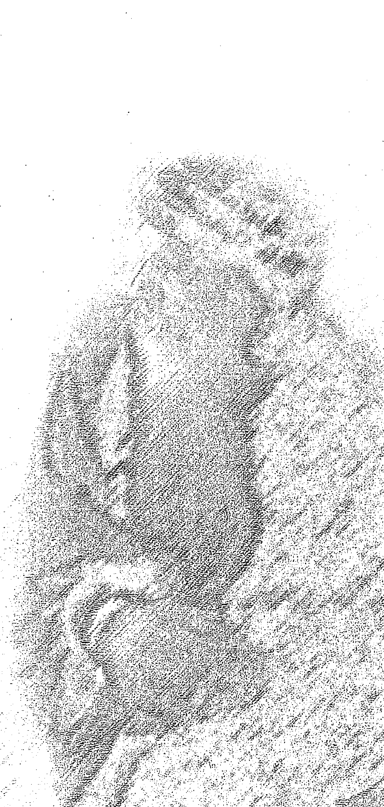
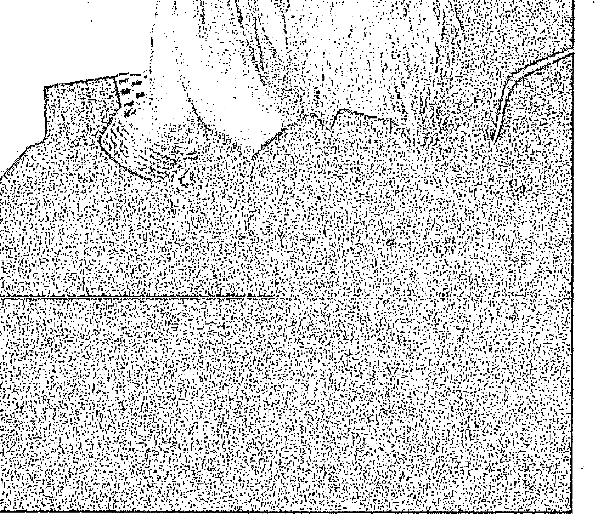

# 奥修自传：叛逆的灵魂

# Autobiography of Spiritually Incorrect Mystic

奧修 OSHO 著 黃瓊瑩 譯

奧修是二十世紀最具知名度、也最具爭議性的一位靈性大師。一九三一年出生於印度，從小就堅持要親身去經驗真理，是一個叛逆而獨立的靈魂，飽覽群書、辯才無礙，以優異的成績畢業於印度沙加大學哲學系，並在傑波普大學擔任了九年的哲學系教授。之後奧修周遊印度各地，公開挑戰一切既有的宗教、社會和政治傳統，當時在印度擁有毀譽參半的名聲。但今日則被印度的〈週日午報〉（Sunday Mid-Day）與甘地、尼赫魯、佛陀等並列為改變印度命運的十位人物之一。

一九七四年在印度孟買東南方的普那（Pune）創建了一普那國際靜心中心」，吸引了世界各國的求道者前來體驗靜心與轉化。

一九九〇年奧修離開了他的身體，但種種的教誨與啟示以文字的力量更廣為流傳，他對門徒及求道者的演講已被錄製成六百多種書，翻譯成三十多國文字。義大利目前出版了八十多种書，其中兩本是年度暢銷書，德國發行了四十五本書之多，而美國在一九九五年後讀者群穩定成長。

更不可忽略的是中國大陸，在一九九六年奧修的十六本書總銷售量即達六十萬冊，但旋即受到中共政府的打壓。在台灣，閱讀奧修的文字協助了許多追求靈性及心靈成長的人士打開了一扇意識之窗，每年前往普那國際靜心中心短期進修、體驗治療課程的人不斷增加。

# 推薦與分享

# 推薦與分享—— 一朵玫瑰花的力

「在成道之後，一個人已經沒有傳記了。」他說：

「在成道之後，什麼事都没有發生，所有的發生止息了、消失了，一個人只是存在。」

所有一切繼續進行著，但你內在沒有發生任何事，依然平穩、沈靜。

二十一歲的某個晚上，成道發生在奧修身上了，他來到每天去的花園裡，所有的東西都開始發光發亮，到處熠熠生輝，瀰漫著無限祝福，這個永恆一直持續者，不是發生之後一直維持下去，而是每一個片刻一再、一再地發生，每一個片刻都是奇蹟。

是的，存在的真相是，每一個片刻一再、一再地發生，每一個片刻都充滿光、美和祝福，只是人們時常沉睡在幻夢裡，以致於和存在隔絕了。

九年前遇見奧修，遇見奧修是命中注定，因為他，我揭開存在的大能，因為他，我全然愛過，因為他，我全然靜心過；因為他，我認識了自己，從孤單挫折移向單獨整合的空間。

奧修是教會我單獨的師父，這才是我活在這裡的珍寶。

王靜 草

# 叛逆的靈魂

# Autobiography of a Spiritually Incorrect Mystic

一回，一位多年未見的朋友看了我的書來電話問：妳怎能跟奧修有這樣的連結？

他一問，使我想回印度奧修社區，坐在師父的骨灰旁，他一問，使我聽見呼喚……是的，連結奧修的能量使我溶解、流淚、充滿，當一個求道者透過師父契入整個存在大能時，她只能釋出淚珠，或狂喜地舞蹈。

讀《叛逆的靈魂》的過程，身心又感到震動，過往讀遍許多的身心靈書籍，世界各地的求道者以他們的語言、使命為人們述說真相，那或是頭腦可以理解的，那或是靈魂所響往的，然而只有奧修，說的是存在，所以他說：

「請帶著空無來與我相遇！」

我喜歡看見奧修親自敘述童年和成長歷程。童年，因為他的質地，使得身邊的人都變得

不一樣，他的外公外婆、他所遇見的人與事，都因為他而震動。小時候，他能享有寧靜，

就已經了解深入靜謐的力量，他說：

「靈性是單獨的，靈性不屬於群眾。真理只有在人們單獨中才會被發現。」

這也是奧修教會我的。想要在群眾和社交中找到靈性是醜的，靈性在本性中、在存在

中，我所經驗到的完整感很難透過語言的分享傳給另一個人，以往我總想分享，於是挫敗而

一開始讀這本書，便跟著奧修的能量靜心，跟他一起坐在河邊看見流動的本質，跟他一

歸。

# 叛逆靈魂

# Autobiography of a Spiritually Incorrect Mystic

「讓存在去做，讓會發生的發生吧！」 在讀過奧修在俄勒冈社區以及接連不斷的政治迫害後，我慨歎而臣服了，就是允許它們發生吧！靜心是很單獨的事，靜心的氣團或能震動有緣人，但不能改變外在，他說明了：「我是颱風的中心，無論周圍發生了什麼，對我都没有差别，我只是兩者的觀照。這就是我全部的教導：事物或許會變，但你的意識應保持不變。」 靜心是意識的旅程，如果你追求的是比别人好，比别人成功，抱歉，靜心不能給你，請你繼續追求你要的，同時，你將經歷內在的空乏和苦悶，或者在那時，你會明白什麼。不論你正經驗什麼，是渴望、是混亂、是恐懼，不論你在那裡，存在依然為你敞開大門，你可以繼續流浪，終有一天，你會想回家，存在會張開雙臂歡迎你。看看，就像是我常對學員說的：相信我一次吧！ 信任是顛簸前往本性路上的關鍵，信任，你將能觸及存在，觸及諸佛的力量，如奧修說的： 他們的力量全是愛……如同一朵玫瑰或小水滴，我很脆弱、細緻和敏感，我的力量是一朵玫瑰花的力量……

# 13 推薦與分享

# H 譽妳 Ma Dhyan Mahita

+   • 作家、治療師。

+   • 主持愛和光靈氣中心，給與能量治療個案和工作坊，工作主題在直覺及創造力。

+   • 著有《把神秘喝個夠》（生命潛能出版）、《沐浴在光中》、《用愛做解答》等二十餘本書。

# 推薦與分享— 認識這位當代的成道師父

最近幾年來，對於一些東西方的智者、宗教家、甚至成道者的生命歷程，產生無比的興趣。尤其是他們的成長過程，更是吸引我。經由各種管道和書籍一窺究竟，希望能深入了解他們所描述的至高慈悲。特別是關於耶穌及佛陀兩位宗教大師的生平事蹟，更是喜歡閱讀、比較。但是，也由於這兩位大師的年代與今日相隔甚遠，再加上人們的繪聲繪影，穿鑿附會，多少會使我懷疑這些記載的真實性。仔細想想，這些被信奉的歷史人物，其實就像你我一般，曾經活生生的生活在這個世界

上。而當人們將這些宗教大師神格化的同時，反而在人與神性間產生了更大的距離。他們的證悟似乎遙不可及，過多虛幻的形容，令我困惑，摸不著邊際。奧修是本世紀的一位成道師父，他跟我們一起生活在同一個時代，加上現代紀科技的貢獻，更能字字句句忠實記錄他的言行舉止，被誤傳的機會也相對大大地減少。這些精確的

紀錄、照片、錄影、實錄等……相較於兩千多年前的聖者，以口耳相傳的方式所遺留下來的經典與傳說，更能貼近我的心，更能令我感受到他的真實與親切。

當他在世時，人們曾賦予他不同的評價。門徒們珍視他如同來自上天的禮物，但備受挑戰的威權體制，卻竭盡所能地要將他毀滅。奧修的存在是如此震撼人心，他的直言不諱曾令許多政府當局困擾。在媒體的渲染報導下，世界各地的人們還未來得及認識他，便已對他懷有莫名的敵意。如今，就在他的肉身離開之後，人們也許才能夠放下成見，重新咀嚼，聆聽他的見解。

奧修的仁慈，在他的字裡行間表露無遺，他的開導，讓人體驗、尊重生命的精髓。平常聽他闡述經典，諸中帶著幽默，博大精深的東方哲學，從他的妙語中更教人淺顯易懂。而有趣的是，我總私自暗想……是什麼樣的成長背景，能造就出他這般的人格特質。

這本書有別於其他奧修的作品，是少數他談論自己成長歷程的作品。內容生動有趣，尤其聽奧修描述他童年的頑虐行徑，得以讓我內在曾被壓制的靈魂得到紓解，也讓我重新思考生命的寬廣與範疇。

「愛」是什麼……到底有多少長者能夠接納兒童的純真。從我發現自己即將為人母的那一刻起，尊重孩子的生命便是我最重要的學習議題。為人父母都曾自許，希望能孕育出一位身心靈和諧的主人翁。然而，生活的實際情況，往往讓人倍感受失望。一旦感受到無奈與壓力，便不由自主地強迫子女來迎合社會的期許，藉此平衡心

藉此平衡心

裡的不安。擔心自問，如果自己的生命走得跟踉蹌蹌，怎可能培育出踏實實的下一代。 此時，你正在翻閱這本書，藉著這個機緣，邀請你一同走進這如神話般真實的世界。奧 修一再強調希望人們為自己負起責任，別一再的淚於抱怨及被奴役的擺盪中。他的故事，也許能為你開啟另一種認識生命的新視野。

# 賴佩霞

+   ・ 暨南大學國際關係研究所、國際心靈科學院、心理諮商師、企業培訓師。

+   ・ 現職：魅麗雜誌發行人、愛睿朋身心靈國際教育機構首席教育長。

+   ・ 譯著《失落的幸福經典》。

# 第一部
天生反骨传奇人物

問：你是誰？

答：我就是我自己。不是先知，不是弥赛亚，不是救世主，只是一個普普通通的人类……就和你没有两样。

問：嗯，我看不甚然！

答：没有错……不甚然！你还在沉睡，但差异并不太大，从前我也沉睡过，而将来到有一天，你可以清醒过来。此时你可以醒过来，没有人会搀着 you，所以那個差异事实上是没有意义的。

> ——摘自與罗伯塔·葛林（Roberta Green） 在加州橘郡首府圣安那的访谈

# 29 第一章 金色童年翦影
若依你對灵性的认知来看我，我是一点都不算有灵性的人。我從不上廟宇或教堂，不读经书，也不遵循某些修持方式去找尋真理，我從沒有崇拜過神明或者對神祈禱過。那些從來就不是我的路子，所以你大可說我什麼灵性的事都没有做，但是對我而言，灵性（spirituality）隱含著一層截然不同的意義在其中。灵性需要一種篤實的個體性，並且不許任何倚賴；無論要付出多高的代價，也要為自己創造自由。灵性是單獨的，它從不屬於群眾，因為群眾未曾找到過任何真理。真理只在人們的單獨中才會被發現。所以你對灵性的想法與我有所不同。如果你能看懂我的童年故事，那些故事必會在某些時候顯示出我所指的灵性特質。没有人會說那些特質是屬靈的，但我會，因為就我而言，那些特質已經賦予了人所企望的一切。聆聽我的童年故事時，你應該試著去找尋某種品質；不光是聽故事，還要探尋某個內部特質，那特質像一條纖細的線，貫穿過我所有的記憶，那條細線是灵性之線。

# 叛逆靈魂 Autobiography of a Spiritually Incorrect Mystic
30
灵性，對我的意義即是找到自己，我從未讓別人代替我做這件工作，因為——沒有人可以為你代勞，這件事你必須親自出馬。

1931 - 1939年…古其瓦達／馬達亞。普拉德西／印度 （Kuchwada, Madhya Pradesh, India）
回想起我出生所在的那個小村落，為什麼存在選擇了那個小村落是無法解釋的，好像一切理當如此。那個村子有著如詩如畫般的美，我去過許多遙遠的地方旅行，卻未曾遇過相同的美的。沒有什麼是重複的，事情來來去去，但總是不一樣。

我依稀可以看得見那個小村子，幾間小屋錯落在一座池塘的鄰近處，還有幾株我從前常去嬉戲的大樹。村裡沒有學校，那件事很重要，因為有近九年的時間我都沒有受教育，那是 一個人最關鍵的發展時期，過了那段時間，就算是你很想要，也不可能再被教育。所以，某個角度上說，我還是没有受過任何教育，雖然我擁有不少學位，而且不是隨隨便便的學位，是一流水準的博士學位。不過，那是任何一個傻瓜都辦得到的事，每年都有無數的傻瓜在拿 那些學位，其實一點意義都沒有，有意義的是在早年的歲月裡，我一直沒有接受教育。那時 沒有學校，沒有馬路，沒有鐵路，沒有郵局，真是天大的恩賜！那個小村子自成一個世界。

即使在我離開那個村子之後，我依然處在那個世界裏，沒有受過任何教育。
始，對這世界一無所知，村裡連一份報紙都沒有，現在你知道為什麼那裡沒有學校了吧，連一所小學都沒有，好幸福！沒有一個現代的孩子能享有這種福氣。

從前的時代，不到十歲的小孩就結婚這種事是存在的，有時候，甚至孩子還在母親肚子裡就結婚了。就只是兩個朋友自行決定：「我們的太太都有孕在身，如果其中一人生男孩，另一個人生女孩的話，這樁婚姻就這麼敲定了；一根本沒有去詢問過男孩與女孩的意見，他
们甚至都還沒有出世呢！而要果真生了一男一女，婚事就會這麼敲定了；人們信守承諾，總是說話算話。

我的母親在她七歲時就結婚了，當時我的父親還未滿十歲，他並不懂那是怎麼一回事。我以前常問他：「在你的婚禮上，你最享受什麼事情？」
他說：「一騎馬。」這是當然的！頭一次他可以打扮得像個國王，身上還佩帶了一把寶刀，英姿煥發地騎在馬背上，每個人都圍在他的身邊走著，他當然是樂不可支。那就是他
在自己的婚禮上最享受的事。度蜜月是不可能的，你要將一名十歲的男孩與一名七歲的女孩送
去哪裡度蜜月？所以那個年代，印度並沒有蜜月旅行這種事，而從前的時代，世界上其他地方也沒有。

當我父親十歲、我母親七歲的時候，我的祖母過世了。在他們結婚之後，大概是一、兩年以後，所有的責任就落到我母親身上，那時她才九歲而已。我祖母留下兩個稚女與兩個稚
子，也就是一共有四個孩子，照顧這四個孩子的責任於是落在一個九歲女孩、與一個十二歲男孩的身上。雖然我祖父在城裡有一家店，但他喜愛鄉下地方的生活，妻子過世後，他可以說是完全自由了。當時政府會撥給人民免費的土地，因為土地很
多，卻沒有人去耕作，我祖父從政府那裡得到五十英畝的地，他將整間店交給他的孩子——我十二歲的父親以及九歲的母親。他那個人熱中園藝、栽作，喜愛鄉下清新無礙的空氣，一點都不喜歡都市。
所以，我父親從來沒有體驗過現在年輕人的自由，他並沒有變成那樣的年輕人，在他進入青年期以前就已經老了，忙著照顧他年幼的弟妹們，以及打理一家店。當他二十歲的時候，他已經在為他的妹妹們安排嫁人的對象，為弟弟們籌措上學念書的事情。

我從不曾稱呼我母親「媽媽」，因為在我出生之前，她所照顧的那四個孩子都叫她「巴希」（Bhabhi），「巴希」的意思是一兄弟的太太——，由於四個孩子都叫我母親「巴希」，我也跟著叫她「巴希」，打一開始我就從四個孩子那裡學到這麼叫她。

我是由我外公、外婆带大的，那两位老人家相依为命，所以他們想要一个孩子，為自己晚年的增添一些樂趣。我父母親同意了，我是第一個出生的老大，所以他們將我給送去。在童年歲月裡，我不記得任何與我父親那邊家族的關係，我早期的生活是與兩個老年******人——我的外公與外婆——以及一位老僕人共同度過的。這三個人……我們年齡的差距之大，使得我完全單獨，這三位老人家不是我的同伴，也不可能是我的同伴。我没有其他人作伴，因為我家是那個村裡最富有的人家；那個村子的規模很小，全部的人口加起來還不到兩百人，村民都很窮苦，所以我外公外婆不讓我和其他孩子混在一起，那些孩子都鬱鬱傾傾的，當然，大部分都是乞丐。我根本沒有交朋友的機會，那對我造成了深遠的影響，一生之中，我不曾為了交朋友去認識任何人，雖然我和某些人很熟。在那段早年的時光裡，我是那樣地孤伶伶一個人，最後我開始享受起來，那真的是一件喜悅的事。孤單不是我的詛咒，事實證明它是一項恩龍，我開始享受一個人，並感到一種怡然自得的滿足，沒有倚賴著任何人。我素來對遊戲沒有興趣，理由很簡單，自孩提時代，我就沒有玩耍的機會與對象，我仍可看見自己小時候只是靜靜坐著的樣子。我們的房子位於一個絕佳的景點，屋前就是一座湖，那是一座綿延好幾哩的湖泊……優美又恬靜，除了偶然
間可見到一排白鷺鷥從湖上輕輕掠過，牠們發出求偶的鳴聲劃破了寧靜，否則，那幾乎可說是最完美的修行地點。在鳥兒求偶的聲音過後……寂靜就更深濃了。湖裡長滿了蓮花、白鷺鷥、那份靜謐……重要了：蓮花、白鷺鷥、那份靜謐……我外公、外婆注意到一件事：我很陶醉在自己的單獨之中。我一點都没有去村裡跟任何 人碰面的興趣，也不想去和誰交談；就算他們想與我說話，我的回答也只是與否兩種，我對說話沒有什麼與致。他們意識到我享受著自己一個人，所以他們發現一項神聖的任務就是不去干擾我。有七年的時間，沒有人腐化我的純真，沒有半個人。家裡的三位老人家，那位僕人與我的外公、外婆，他們都極力保護我，使我免於任何人的干擾。說實話，在我長大成人之後，我對他們覺得有些不好意思，由於我的關係，他們不能和普通人一樣說話。你常會對孩子們說：一安靜一點，你爸爸正在思考事情。你爺爺在休息，小聲一點，乖乖坐著。一我的童年經驗卻正好與別人相反，即便到了現在，我也說不出個所以然來，事情為什麼會這樣，以及如何變成這樣，反正就是這麼發生的，功勞不在我就是了。那三位老人家常在對彼此打暗號：一他正自得其樂，別吵他。一他們開始愛上我的安安 靜靜。

安静自有一種氛圍，特別是小孩子，當他没有被強迫時，那種氛圍具有感染性。他的安產生我所說的喜悅氛圍。孩子安安靜靜一個人的時候，他沒有理由地享受著自己；當他的快樂是沒有任何原因的，他的身邊將迴盪起一波波的時候，那樣的漣漪純粹出於偶然，我沒有受任何人的干擾，那樣的時光過了有七年之久，沒有人對我嘮嘮叨叨，要我為進入商業、政治、外交世界做準備。我外公外婆比較希望讓我愈自然愈好，特別是我外婆，她是很單純的人，雖然沒有受過教育，卻擁有極細膩的敏感度，她是我對所有女性都很敬重的原因之一——這些小事能夠影響一個人生活的許多面向。她斷釘截鐵地向我的外公與僕人說：我們全都過著沒有意義的人生，就跟從前一樣的空乏，而現在，死亡的腳步近了。她堅定地說：讓這個孩子不要受到我們的影響。我們還能給他什麼影響？只會把他變得像我們一樣罷了，可我們什麼都不是，就給他一個機會做自己罷！」我聽到他們在夜裡討論這些事，他們以為我已經睡了。我外公常對她說：你這麼說，我就這麼做，但是，他是別人的孩子，遲早他會回到父母身邊，你想想，到時他們會說你都沒有教他禮貌、規矩，讓他就像匹脫韁的野馬一樣。」她說：沒有必要煩惱，在這個世上人人都很文明，大家都有禮貌又懂規矩，但這又有什麼用？你是一個有教養的人，請問你從中得到了什麼？頂多，他的父母會生我們的氣，那又有
如何？讓他們生氣，反正對我們又無傷，到那時候，這孩子就夠強壮了，他們已經無法去改 變他的人生。～

我對我外婆的感激之情甚於一切，外公總在擔心他早晚得背負這個責任：～他們一定會
說：～我們把孩子交給你，你卻什麼都沒教他。～

外婆甚至不讓我上家教，村裡有一個人，他可以教我一些初級的語文、算數和一點地
理。那個人只念了四年的書，那是印度最初級的小學教育，但他是全村教育程度最高的人。
外公想盡辦法要請他來教我念書，他說：～他可以來家裡教他，至少他会看得懂字母，懂一
點數學，等他回去父母那邊時，他們就不会说我們白白浪費了這七年的光陰。～

可是外婆說：～七年之後，隨便他們要做什麼都可以，但這七年的時間，就讓他自然地
做自己，我們不去干擾他。～她的論點是：～你能看懂字母又如何？你會算數又怎樣？你只
是賺了一點錢，而你要他也賺一點錢，然後過著和你一般的生活？～

那番話讓我外公終於無言以對，該怎麼辦？他裡外都不是人，一方面他辯不過我外婆，
一方面他知道要負責任的是他，不是我外婆。我父親會問他：～你做了什麼？～事實上是如
此沒錯，幸運的是，他在我父親問他之前就過世了。後來，我父親總是說：～都是那老人家
的錯，他把孩子慘壞了。～不過這時我已經茁壯到可以直接對他們說：～在我面前，永遠不
准說我外公外婆的壞話。他讓我可以不被你慘壞，那才是你生氣的原因，但你還有其他的孩
子，你可以去罷他們，到頭來你就會知道是誰被慫壞了。我父親有其他的孩子，而且一個接一個相繼出世，我那時常對他開玩笑：再生一個吧，這樣就可以凑一打了，十一個小孩？當人們問：你可以去罷你所有的小孩，我很野，稱頭，一打比較響亮。在後來的幾年，我告訴他：你可以去罷所有的小孩，我也總是不被文明所影響。而且我會一直野下去。—而不知道怎麼的，我也總是不被文明所影響。

****我外公為人慷慨，雖然沒什麼錢，但他的慷慨使他富有，他總是給每個人他所有的一切。我從他身上學到給與的藝術，我從沒見過他拒絕過任何乞丐或任何人。我叫我外公「那一（Nana）」，印度人就是這麼稱呼外公的，外婆則是「那尼」（Nani）。我以前常問我外公：「那那，你是去哪裡找到這麼漂亮的老婆的？—她的五官長相不像印度人，倒像希臘人，她是一位剛性很強、非常堅毅的女性。外公死的时候還不到五十歲，而我外婆活到八十歲，她一直都很健康，根本没有人会料想到她即将過世。我答應過她，在她即將往生之際我會來看她，那是我最後一次造訪我的家庭。她於一九七〇年辞世，我履行了我的承諾。在早期的歲月裡，我將那尼視為母親，那段時期是一個人成長的階段。我母親之後才出
現，而我已經長大了，早已形成了某種格局。外婆對我的幫助很大，外公盡管很疼愛我，也
充滿了愛心，但他無法使上力，助人需要更多的品質——某種力量。他總

# 43 第一章 金色童年 翦影

待在世界裡。的達成，不過他們面對世界，服務這個世界。他們置身於這個世界，但不屬於世界……只是

第四句：Namo loye savva sahuam namo namo——我去碰觸老師的腳。你曉得大師與老師之間的細微差異，大師已經知道，並且傳授他所知道的。老師從已經知道的人那裡接受到一些東西，然後將他所收到的原封不動再傳給世人，不過他本身並不具備了解。這咒語的創作者真是很棒的人，他們甚至去碰那些還不知道自己是誰的人的腳，因為那些人至少將大師的教誨帶給眾生。

第五句是我一生中所遇過最有意義的話語之一，說來也奇怪，在我還小的时候就由我外婆交給我這段話，當我對你解釋之後，你就能見識到它的美在哪裡。只有她才有能力將這些話交給我，其他任何一個我所認識的人，沒有一個有勇氣真正去宣告這些話，縱然他們都在廟裡反覆唸這串咒語。可是，去複誦是一回事，要將它傳給一個你愛的人是完全另一回事。我去碰觸所有已經知道他們自己的人的腳……沒有任何分別，無論他們是印度教徒、耆那教徒、佛教徒、基督徒、回教徒。咒語說：「我去碰觸所有已經知道他們自己的人的腳。一據我所知，這是唯一沒有任何派系之分的咒語。另外的四句與第五句是一樣的，它們全都蘊含在第五句的意義裡，不過，第五句有其他幾句所沒有的浩瀚。第五句話應該寫在每一間廟宇和教堂裡，無論它們屬於哪一門哪一派，

幾句所沒有的浩瀚。第五句話應該寫在每一間廟宇和教堂裡，無論它們屬於哪一門哪一派，

因為這句咒語說：﹍我去碰觸所有已經知道他們自己的人的腳。』而不是說：﹍那些已經知 \n道神的人。』連「他們自己」也應該丟掉，我為了翻譯才放了受詞，原來的咒語單純指： \n「碰觸所有已經知道者的腳。」沒有受詞，我只是為了配合你的語言，否則，一定有人會 \n問：﹍知道？知道什麼？這個知識的客體是什麼？沒有知識的客體，除了知道者之外，沒 \n有什麼要知道的。 

若說到宗教性，我外婆所交給我的這串咒語是唯一具有宗教性的東西——不是我外公， \n而是我外婆交給我的。有一天晚上她說：﹍你看來精神還很好，睡不著嗎？是不是在計畫明 \n天要怎麼搗蛋？﹍ 

我說：﹍沒有啦，只不過我心裡有一個問題。每個人都有宗教信仰，當人們問我：﹍你 \n屬於哪一個宗教？﹍時，我都是聳聳肩膀，當然，聳肩膀不是我的宗教，所以我想要問你， \n我應該怎麼回答。﹍ 

她說：﹍我本身不屬於任何宗教，但我喜愛這串咒語，而這也是我僅能給你的。倒不是 \n因為這是傳統者那教的東西，而是因為我懂得它的美。我已經唸誦過它無數遍，總能藉此感 \n受到心中無比的祥和，那份感覺﹍﹍只是去碰觸所有已經知道者的腳。我可以交給你這串咒 \n語，除此以外就超出我的能力所及了。﹍ 

現在我可以說那個女人真的很了不起，因為，就宗教來說，每個人都在說謊。基督徒、
犹太教徒、耆那教徒、回教徒，所有人都在說謊；他們談神、天堂與地獄、天使和各種無稽的事，可是他們根本什麼都不知道。她是偉大的人，不是因為她知道，而是由於她無法對一個小孩說謊。没有人應該說謊，至少不應該對一個孩子說謊，這是無法被饒恕的行為。幾百年來，孩子們正因為他們願意去信任而被剝削，你可以很容易就欺騙他們，他們對你的話深信不疑。如果你是他的父親或母親，他就對你的話信以為真。幾百年來的人類，就是活在一層又滑又厚的謊言泥濘裡，活生生地被謊言所腐蝕。如果我們可以只是落實一件事：不要對孩子說謊，向他們坦承我們的无知——如此我們才有宗教性，並把孩子帶到宗教的道途上。孩子們只是純真的群，不要將你所谓的知識留給他們。不過，你本身要先成為天真無邪的，自己要先真實不阿。

 ****

耆那教是全世界最講求苦修的宗教，或者這麼說，它是全世界最有虐待狂與被虐待狂的宗教，或者這麼說，它是全世界最有虐待狂與被虐待狂的宗教，或者這麼說，它是全世界最有虐待狂與被虐待狂的宗教？不，耆那教的僧侶對自己極盡折磨，讓人不禁以為他們是不是瘋了。他們才沒有瘋，他們是生意人，所有信奉耆那教的人都是生意人。真是怪事，整個耆那教的社群裡只有生意人，但那也不足為奇，基本上耆那教本身是為了來世的利益而存在的。耆那教信徒折磨自己是為
了來世可以有所得，那是他知道自己這一世無法獲得的。第一次見到一位全身光溜溜的耆那教僧侶受邀來我外婆家時，我應該有四、五歲大了，當時，眼見我忍俊不住，外公對我說：－不許胡鬧！你對街坊鄰居作怪時，我可以原諒你，但要是你想在我的上師面前搗蛋，我不會饒你的。他是我的師父，他點化我進入宗教內在的奧秘。－我說：－我才不管什麼內在的奧秘，我只在乎他清楚顯示出來的「外在奧秘」。爲什麼他要赤身裸體？最起碼，他可以穿條短褲吧？－這下連我外公都噗哧一聲笑出來了，他說：－你不懂的。－我說：－好吧，我會親自問他。－所有的村民都聚在一起來參加這名耆那僧侶的達顯（darshan），就在所謂的「講道」進行到一半時，我站起身來。那是四十多年前的事了，從那時候起，我就在與這些愚蠢的人對抗，那一場抗戰唯有等到我不在了以後才會結束；說不定到時還是不會結束，我的人們也許會繼續接下去。－我問了幾個簡單的問題，但他回答不了我的疑惑，而在一旁的外公則是很不好意思。外公拍拍我的肩膀，她說：－太好了！你辦到了！我就知道你有這個本事。－我問了什麼？不過是簡單的問題，我問他：－爲什麼你不想再出生一次？－在耆那教
裡，那是個再簡單不過的問題，因為著那教所代表的就是不要再出生的努力，其全部的科學
就在於避免重生。所以，我問了他一個初級的問題：—你想不要再出生一次？—

他說：—不，絕對不會。—

接著我問：—爲什麼你不自殺？爲什麼你還在呼吸？爲什麼吃東西？為什麼喝水？直接
消失、自殺就好了。何必對一件小事這麼大費周章？—他當時還不到四十歲：…我對他說：

—假如你以這種方式繼續活著，你可能還要再活四十年或更久。—吃得少的人比較長壽，這
是個科學上的事實……

當時我還不知道這些事實，我對那個僧人說：—如果你不想再出生一次，爲什麼還要活
著？活著只為了去死嗎？這樣的話，爲什麼不乾脆自殺算了？—我想，從沒有人曾問過他那
樣的問題。在一個禮節至上的社會裡，没有人會去問真實的問題，而自殺是最真實的問題。

馬歇爾（Marcel）曾說過：自殺是唯一真正的哲學問題。我當時還不知道馬歇爾這個
人，也許那個時代馬歇爾還不存在，他還沒有寫下那本書。不過我是這麼對那個者那僧侶說
的：—要是你不想再次出生，如果那是你所渴望的，那你為何活著？你還活著做什麼？自殺
吧！我可以教你自殺的方法。雖然我不知道世上的人都是怎麼自殺的，不過就自殺來說，我
可以提供你一些建議，從村子旁的那座山崖跳下去，或投河自盡都行。—

我說：—在雨季的時候，你可以和我一道跳進河水裡，我們一道游了一會兒之後你就可
以死了，會游到對岸去，以我的游泳技術這不成問題。他的炯炯目光燃著強烈的憤怒，於是我告訴他：「記著，光是因你的怒意就會讓你再次出生，這不是擺脫苦海之道。你對我忿忿不平為的是什麼？請平心靜氣、高高興興地回答我出的問題！如果你回答不來，只需要說：我不知道。但是不必大動肝火。」他說：「自殺是一種罪，所以我不能自殺。但我想永遠不再生而為人，藉由我將自己擁有的一切逐漸捨棄，我就會達到那個境界。」我說：「請展示給我看你所擁有的東西，就我所看到的來說，你從頭到腳光溜溜的，什麼東西都没有。請問你擁有什麼？」外公試著要我閉嘴。我指了指外婆，然後對他說：「不要忘了，我有那尼給我的准許，現在沒有人能夠阻止我，連你都不行。我向她提到你，因為我擁心如果我打斷了你的上師和他的垃圾——所謂的講道，你可能會生我的氣。她說：「只管指向我就對了，不必擔心。我只需看他一眼，他就不敢再說話了。」「奇怪……這是真的！他靜默下來了，甚至在那尼看他之前。」後來那尼和我在笑這件事，我跟她說：「那那甚至都不敢看你。」她說：「他做不到，因為他一定怕我說：「住嘴！不要干擾孩子。」所以他免掉了一場麻煩。唯一可以免掉我這麻煩的就是不要干涉你。」

[PAGE 47]

# 47 第一章 金色童年 翦影

事實上，他將眼睛閉上，假装在冥想，我向他說：那那，真是太好了！你心裡悶悶不
樂，可是你卻坐在那裡假装冥想。你的上師因為我的問題惹得他火冒三丈，而你生氣是因為
你的上師回答不了問題。我要說的是：這個在這裡講道的人是個低能兒。那時我還不過
四、五歲而已。

從那之後，那就是我的語言，不管哪裡有任何一個白痴，我都立刻認得出來，沒有人能
逃得過我的X光眼。

*****

我已經不記得那個教僧侶的名字了，可能是叫香提。沙加（Shanti Sagar），這個
名字的意思是「狂喜之洋」（ocean of bliss），他當然名不符實，那就是為什麼我連他的名
字都忘了，他只稱得上是一池髒兮兮的水坑，不會是狂喜或什麼平靜的汪洋。他絕對不是一
個寧靜的人，因為他有滿腔的憤怒。

香提（Shanti）有許多含意，可以是祥和，可以是平靜，這是兩個基本的意義。這兩種
特質在他身上都找不到，他既非祥和，也不寧靜，一點都不。你可以看出他內在的混亂，他
的暴怒使他對我咆哮，要我坐下來。

我說：在我家裡沒有人可以叫我坐下，我可以請你出去，但你沒有資格叫我坐下來。

[PAGE 49]

不過，我不會請你出去，因為我還有一些問題要問你。請別動怒，記得你的名字是香提·沙加——祥和平靜之洋。你至少可以當一座小池塘，不要被區區一個孩子給打敗。我無視於他是否靜下來了，我轉而問這時笑得很開心的外婆：「你想問什麼嗎，那尼，我該再問他幾個問題，還是請他離開我們家？」我沒有問我外公，我當然不會問他，那是他的上師。外婆說：「你想問什麼嗎？如
少有一個人，他的名字叫香提。沙加，曾經從第七層地獄回來過。他被我的話所震懾住，一時之間啞口無言。他不敢相信一個孩子能問得出這種問題，甚至是今天的我也難以相信！我怎麼會問那樣的問題？我唯一能找到的答案是，因為我當時沒有受教育，所以我沒有任何知識。知識使人詭謀多詐，我那時並不是狡猾，只是提出一個沒有受教育的孩子會問的問題。教育是對孩子的解放。

我當時一派純真，什麼知識都不懂，既不識字也不會書寫，甚至不會用手指頭算數。連到現在，每當我必須以手指頭算什麼時，如果少數了一根手指頭我就會搞混。他回答不出我 的問題，我外婆站起來說：「你必須回答這個問題，不要以為只有一個孩子在問這個問題，我也想問這個問題，而且我是你的女主人。」

這時候我必須再向你介紹一項耆那教的傳統。當一個耆那教僧侶去到一個家庭接受供養的食物之後，他會舉行一場佈道作為對這個家庭的加持，而這講道的内容是給女主人聽的。我外婆說：「我是你今天的女主人，我也問了同樣的問題，你是否曾去過第七層地獄？要是沒有的話，請誠實地說你還沒有去過，也就不能說有七層地獄這回事。」

那個和尚原本已經很茫然了，被一個美麗的女人正面挑戰之後，他就更不知該說什麼了，所以他準備要離開。那尼叫住他：「站住！不要走！你走了，誰來回答我的孩子的問題
沒有的話，請誠實地說你還沒有去過，也就不能說有七層地獄這回事。」

[PAGE 51]

# 叛逆的靈魂

# Autobiography of a Spiritually Incorrect Mystic

題？而且他還有幾個問題要問，你算什麼男人，居然要逃避一個小孩子的問題？

那人停下腳步，我對他說：「我放棄第二個問題，因為你回答不了。第一個問題你也沒有回答，所以我問你第三個問題，說不定你可以回答這個問題。」

你能相信嗎？她居然唱起了一首歌！我就是那樣學習到死亡應該是一種慶祝的，她所唱的那首歌，就是當她第一次愛上我外公時所唱的那首歌。這件事也值得一提：早在九十年前，在印度這種地方，她就敢自己去談戀愛。她一直到二十四歲才結婚，那是十分罕見的事。有一次我問她為什麼保持單身這麼久，她是一位美麗無比的女人……我習慣以戲謔的口吻對她開玩笑，連恰塔波（Chhattarpur）——卡朱拉侯所在的省的王儲說不定都愛上她了。她說：「怪了，你居然會提到這件事，他是愛上我沒錯。我拒絕了他，而且不只是他，還有許多人也被我拒絕。那個時代的印度，女孩子七歲大就結婚了，頂多拖到九歲。這純粹是由於他們對愛的恐懼……如果他們年紀大一點的話，他們或許會墜入愛河。不過，我外婆的父親是一位詩人，他的詩歌在卡朱拉侯鄰近的村子都還被吟誦著。他堅持除非那尼同意，否則他不會將她嫁給任何人。說來是機會的降臨，她與我外公墜入愛河。我追問她：「那就更奇怪了，你回絕了恰塔波省的國王，卻愛上這個窮小子。怎麼會這樣？很顯然他不是長得很英俊，在其他方面也並沒有特別突出。你為什麼會愛上他呢？」
她說：「你問錯問題了。愛上誰沒有為什麼，我只是見到他，就這樣；我見到他的雙眸，心中就有一股信任油然升起，那信任從來不曾動搖過。」我也問過外公：「那尼愛上你，就她那部分來說沒問題，但你是如何讓這婚事發生的？—他說：—我既非詩人，也不是思想家，不過當我見到美麗的人事物時，我總認得出來來。—
我從沒見過比我的那尼更美麗的女人，我自己愛戀著她，而且在她的這一生中始終愛著她。當她八十歲過世時，我趕回家裡發現她已經過世躺在那裡。所有人都在等我回去，因為她告訴他們，在我回去以前不可以將她的身體放進火葬的柴堆裡。她一定要我為她的火葬點火，所以他們在等我。我走進去，掀開她臉上的布……她依然是那麼美，事實上比從前更美，因為一切都平息下來了，連呼吸的混亂、活著時的擾動都不在了，只有她靜靜地存在。我一生所做過最困難的事莫過於在她的火葬堆上點火，那就像放火將達文西或梵谷的畫燒掉一樣的感覺，當然，對我而言，她比一蒙娜麗莎—更有價值，就我看来，她比克麗奧佩屈拉（Cleopatra）更動人，這麼說一點都不誇張。在我眼中關於美的一切都是透過她而來，她盡可能地協助我成為我自己，若不是她，我也許只是一家店的老板，或是一名醫生、工程師。當我通過大學入學許可的時候，我父親沒有錢讓我去念書，他甚至已經決定要借錢了，因為他堅持我非念大學不可。我也願意這麼做，但我不願去念醫學院，也不想去念工學院，我斷然拒絕當醫生或工程師，我告訴他：—如果你想知道真相的話，我要當桑雅士、當個遊民。—他說：—什麼？遊民？—我說：—正是，我要去大學念哲學，這樣我可以做一名哲學遊民。

# 59 第一章 金色童年翦影

他很不以為然地說：「那樣的話，我就不想大費周章去向人借錢了。」
外婆說：「你別擔心，你去就對了，做你想做的事。我還有一口氣在，我會變賣所有的
東西，就為了讓你做你自己。我不會問你要去哪裡，和你想念什麼書。」
她從未過問，而且不間斷地寄錢給我，甚至在我當了教授之後還會收到她的錢。我還得
反過來告訴她現在我在賺錢了，應該是由我寄錢給她才是。
她說：「沒關係的，這些是閒錢，而且你一定會善加利用它們的。」
人們常納問我哪裡來那麼多錢買書，因為我有許多書。甚至在我還只是個高中生的時
候，我家裡就有上千冊的書，整間屋子都是書，大家都在猜我哪裡來的錢。外婆曾告訴我：
「不要跟別人說是我給你的錢，因為要是被你爸妈知道了，他們會來向我要錢，到時候我很
不好拒絕。」
她一直寄錢給我，甚至在她過世的那個月也不例外，這著實令人詫異，她在過世的那天
早上就已經將支票簽好了，而且更令人訝異的是，那上面的金額正好是她銀行裡剩下的錢。
也許，她已經心裡有數自己不會有明天了。
我在許多方面都是十分幸運的，但是最幸運的就是擁有我外公外婆……還有那童年時期
的黃金歲月。

# 61 第二章 桀傲不馴的青春期

就我記憶所及，我只愛一項遊戲，就是去辯論——任何事情都可以辯論，所以很少有大
人受得了我，他們根本不了解我。
上學從來就不是我的興趣所在，學校是最糟糕的地方。我雖然最後還是被迫去上學，但我使盡全力抵抗，理由是，那裡的小朋友對我有興趣的事情並不熱中，而他們所有人覺得興味盎然的事，我連看都不想看一眼，所以我是個局外人。
我所關心的一直都是：去知道終極真理是什麼，生命的意義何在，爲什麼是我而不是其他人出現在这裡。我決意不找到答案絕不罷休，而我也不會讓我身邊的人有機會喘一口氣。

1939-1951年．葛答瓦拉／馬達亞．普拉德西／印度 （Gadarwara, Madhya Pradesh, India）

# 62

外公的過世是我與死亡第一次的正面相遇，是的，除了相遇之外還有更多的，不只是相
遇而已，不然我就會錯過死亡真正的意義。我見到死亡，還有某種不死的東西，它跳脫出身
髮，跳脫出那個環境，在上方漂浮著……那次的經驗決定了我一生的道途，它為我指出一個
方向，或更貼切地說，它為我揭示了一個次元，那是我從前並不知道的空間。

也沒有意義。除非你愛某個人，而這個人後來過世了，不然你無法真正體驗死亡。請為這句
話標上底線：當你所愛的人過世時，你才能體驗死亡。 當你被愛與死亡所包圍，蛻變就發生了，那是個巨大的轉變，宛如一個新生命的誕生， 你再也不一樣了。但是，人們並不會愛，而因為他們沒有愛，所以他們無法經驗到我所經驗
到的死亡。少了愛，死亡不會給你進入存在的錨匙；有了愛，它交給你通往一切的錨匙。

我的第一個死亡經驗並不單純，它包含了很多複雜的現象。那個我所愛的人正在垂死， 我一直將他視為父親，他養育我，給我絕對的自由，沒有禁忌、沒有壓抑與命令……

愛。愛給你深入大地的根，自由為你增添雙翼。 如果你擁有伴隨自由的爱，你就是國王或皇后，那才是真正的神的國度：自由的
外公兩者都給了我，他對我的愛，比對我母親甚至是外婆還多；而他也給我自由，那是 最無可比擬的禮物。在他即將過世之際，他又給我他的戒指，眼裡泛著淚光告訴我：一我沒
有其他的東西可以留給你。

我說：『那那，你已經給了我最珍貴的禮物。』

他睜開眼睛，接著說：『是嗎？什麼珍貴的禮物？』

我笑道：『那那，你忘了嗎？你給我你的愛，也給我自由。我認為沒有哪一個小孩擁有這般的自由，我還能需求些什麼？你還能再給我什麼？我要好好謝謝你。你可以平靜地走』
了。—

我這般的自由，我還能需求些什麼？你還能再給我什麼？我要好好謝謝你。你可以平靜地走

那就是我第一次遭受死亡，那次的經驗很美，一點都不噁人，不像發生在世界上其他小
孩子身上那樣。我很幸運能夠陪伴在外公身邊數個小時之久，看著他緩緩步向死亡，我可以
感覺死亡降臨在他身上，我可以看出死亡的靜謐。

那尼當時也在場，這是我幸運之處，若不是她，我也許會與死亡的美失之交臂，因為愛
與死亡是如此相近，說不定我們是一樣的。她愛著我，她對我傾注她的愛，而死亡在那裡，

一點一滴的正在發生。一輛牛車……我仍舊得到輪子轆過石頭所發出的格格聲，車伕不斷
對拉車的牛咆喝，鞭子抽打在牛身上……一切仍歷歷在目，那個經驗深深地烙在我心底，我
想即使是我的死亡也將無法抹滅它，甚至在我臨死之際，我也還會聽到那輛牛車的聲音。

那尼握著我的手，我則是一片茫然，完全不知道正在發生的是怎麼一回事，只是全然在
當下。外公的頭就枕在我的大腿上，我將我的手放在他的胸前，而漸漸地，他的氣息停止
了。當我感覺出他不再呼吸的時候，我對外婆說：一我很抱歉，那尼，那那似乎已經停止呼
吸了。一她說：一沒有關係的，你不需擔心。他已經活徇了，不需要再要求更多。一接著她
又告訴我：一切記，別忘了現在这些時刻：永遠不去要求更多，事實是什麼樣，就怎麼樣，
那就徇了。—

生命的頭七年是最重要的，此後你不可能再有那麼多的機會，那七年的時間將會決定你
往後七十年的生命，所有的基石都在那七年裡奠定。所以，由於一個奇特的偶然，我被救出
免於父母的掌握，等我再和他們接觸時，我幾乎是獨立了，我已然蓄勢待發，知道我有翅膀
可以振翅高飛，也很清楚自己並不需要任何人的協助讓我飛翔，更確定我擁有整片天空。

我從未向他們尋求指導，要是他們這麼做的話，我總是駁回：一這是一種侮辱，你認為
我自己處理不來嗎？我知道你們沒有不好的意圖，這點我很感激，可是你不了解一件事，我
有能力自行打理我的事情，只要給我一個機會證明，所以請別干渉我。一

在那七年裡，我變成一個不折不扣、強勁無比的個人主義者，此時要施加任何伎倆在我
身上都是不可能的。

我父親的店就在全家人住的房子前面，在印度都是這樣的，為了方便，店面與住家設在
一起，以利事情的進行。從前我經過父親的店時，都把眼睛閉上。

他問我：「這就奇怪了，每當你要進去屋裡，或從屋裡要出去時，你總是閉著眼睛，不過十二步路就可以走完的距離，為什麼你要將眼睛閉上？你那是在做什麼禮拜的儀式
嗎？」

我說：「我所做的，是不讓這家店毀掉我，就像它已經毀掉你一樣。我根本就不想看見
它，我對它沒有一絲一毫的興趣。」他那間店是城裡最頂尖的布店之一，你可以在那裡找到
上等的布料，但是我從沒往兩旁瞟過一眼，只是閉上眼睛迴自通過。

他說：「可是，你瞬開眼睛又有何傷？」

我說：「沒有人知道，一個人會在何種情況下受到影響，我不想被任何事情所阻礙。」

# 第二章 桀傲不馴的青春期

想不到你會做出這樣的事！

我說：～我這個人說做就做，不相信無謂的交談。～

甚至，我沒有問過我的衣服在哪裡，爲什麼要問？不穿衣服也能達到同樣的目的。他說：～你可以拿回你的衣服，從此沒有人會再管你的衣服了。但拜託，你不要再脫光衣服，那樣麻煩會更大，因爲人們會說那個布商的兒子沒有衣服可以穿。你自己已經聲名狼藉不算，還將我們一起拖下水，人們會說：～你看那個可憐的小孩！～他們會以爲是我們不給你衣服穿的。～

衣服穿的。～

事情還沒有結束，我從來沒有錯失任何磨練智商的機會，我將每一個可能的機會拿來使我我的智力與個體性更銳利、鮮明。現在，你知道我整個成長背景後就可以了解，但當時人們只從片段來看：～那些與我有過接觸的人當然無法了解我是什么樣的人，看起來我很瘋狂，其實我是很有方法地去經驗過那些事。～

在走進小學之前，我對我父親所說的第一句話就是：～不要。～我向他說：～不要，我不想進入這扇門，這不是一所學校，而是一座監獄。～就是那扇門，還有建築物的顏色：……說也奇怪，特別是在印度，監獄和學校的建築都是用紅磚塊蓋成的，而且外觀所漆的颜色也

一樣，要從建築物去分辨出那是一所監獄或學校還真不容易。說不定曾經有個講究實際的人
故意惡作劇，不過他這個玩笑實在開得好！

我說：「你看這所學校，你管這叫做學校？看看這扇門！而你竟然強迫我進去待至少四年。」
年。一父親說：一我總是擔心……一我們兩正站在學校的大門口，當然，是在大門外，因為
我不讓他帶我進去。他繼續說下去：一我總擔心你外公，特別是你外婆會把你寵壞。一
我說：一你擔心的一點都没錯，只不過木已成舟，現在一切已無法挽回，我們還是回家
好了。一他說：一你在說什麼！你必須接受教育才行。一
我回他：一這算什麼？我一开始連說好或不好的自由都没有，你說這叫做「教育」？如果你要這麼做的話，那就別問我的意見，這是我的手，就把我拖進去，最起碼，我從來沒有
自願進去這間醜陋的學校過，這會令我問心無愧。至少請幫我這個忙。一
自然，我父親覺得一點也不好過，他只好把我用拖的拖進學校。雖然說他是個單純的
人，但他很快就了解那麼做是不對的。他告訴我：一盡管身為你的父親，我感覺拖你進去是
錯誤的做法。一
我說：一絲毫不必覺得罪過，你做得完全正確，因為除非有人拖我進去，我絕不可能自
願走進去。我的決定是「我不去」，你可以將你的決定施加在我身上，因爲我靠你提供我吃
住，我倚賴著你，你的位置當然比我有利。

進入學校是一種新生活的開始，有好些年的時間，我就像雙野生動物一樣活著，沒錯，我不能算是野生人類，因為沒有狂野的人類存在。

偶爾，才會有一個人變成狂野的人類，我現在是了；佛陀是、查拉圖斯特拉是、耶穌也是，不過在當時，說我過著像是野生動物的生活是再貼切也不為過。

我從來就不曾自願去上學，我很高興我是被拖進去的，而不是我自願的。那間學校真的

醜得沒話說，而所有的學校都很醜，說實話，為孩子創造一個學習的環境是不錯的，但去教
育他們並不是件好事，教育注定是醜陋的事情。

在學校我所見到的第一件事是什麼？就是我上第一堂課所遇見的老師。我見過美麗的人
們，也見過醜陋的人們，但自從他之後，我從未再見過像他那樣的人！我連看都無法看著
他，神一定是在匆忙之間將他創造出來的，也許他當時膀胱很脹，為了將工作做個結束，祂
草草做出這個人，然後趕緊衝去廁所，瞧祂所造出來的人！他只有一隻眼睛，和一個鷹勾
鼻。那隻眼睛已經令人難以招架了，那個鷹勾鼻更是醜化了整張臉，而他塊頭很大，體重至
少四百磅。

他是我第一個師父，我是指老師，因為在印度，人們稱學校的老師為「師父」

（master），即便是現在，見到他我一定還是會全身顫抖，他根本不算是人，他是一匹馬！

我不知道那位老師的真實姓名，學校裡也有人知道，特別是孩子們，大家都叫他堪
塔（Kantar）老師，「堪塔」的意思是「一隻眼睛的」，對孩子來說那樣的稱呼就夠了；另外，那個字也帶著貶抑的意味，在印地語中「堪塔」不僅指「一隻眼睛的」，它還被用來當成詛咒，要從這層意義來翻譯這個字是不可能的，因為翻譯無法傳達一些細微的東西。所以以，當著他的面我們叫他堪塔老師，在背後我們直接叫他堪塔——那個一隻眼睛的家伙。他以，他不只人長得醜，他所做的每件事都很醜。在我上課的第一天，不用說也知道一定會出事。他處罰孩子的方式極盡殘忍，我從沒見過或聽過有誰會對孩子做出這樣的事。他教算數，而我略懂一些算數，外婆在家裡曾教我一點語言和算數，所以我往窗外望去，去，欣賞著在陽光下婆娑搖曳的菩提樹，每片葉子都獨個兒跳著舞，整棵樹簡直就像個歌舞隊，許許多多耀眼的歌者與舞者聚在一起，然而卻又是各自獨立的。我看著樹與樹葉在輕風中款款舞動，陽光照耀在每片葉子上，成千上百隻鷗鷗在枝頭上飛來跳去，那幅景象使我無由地陶醉，對了！他們不必上學。當我正凝望著窗外的時候，堪塔老師怒氣沖沖地走向我。他說：「在一開始就將事情做對比較好。」我說：「這點我完全同意，我也希望事情從開始就是它應該有的樣子。」接著他說：「為什麼你在我教算數的時候看窗外？」我回他：「算數應該是用聽的，而不是用看的。为了避免看到你那張美麗的臉，所以我
只好看窗外。至於說到算數，你可以考我，我聽到你所說的，而且我聽得懂。

確無誤地說出答案，雖然他無法置信，他還是說：『不管你說的對或錯，我都要處罰你，因為在老師上課的時候看著窗外是不對的。』

我被叫到前面，他從他桌上拿出一盒鉛筆，我早風聞過他這些鉛筆，他用鉛筆夾緊你的手指頭，一邊問你：『要不要我再用力一點？』他居然對小孩子做出這麼残忍的事！

我看了了一眼那些鉛筆說：『我風聞過你這些鉛筆的事，不過，在你將它們放到我的手指之間前，切記你會為此付出慘痛的代價，說不定連你的飯碗都保不住。』

他笑了起来，我可以告訴你，他的笑聲就像怪獸在夜裡所發出的聲音，他說：『誰能阻止得了我？』

我說：『那不重要，我倒想問一句：當有人在教算數時，我看著窗外是不合法的嗎？如如果我能將你上課所說的東西一字不漏地重述出來，那麼我去看窗外又有什麼不對？不然，這間教室為什麼要有窗户？窗户要做什麼用的？白天整天都有人在上課，晚上教室裡又沒有人需要用到窗户。』

他說：『你是一個專門找碴的搗蛋鬼。』

我說：『一點都没錯，我要去找校長問清楚，我已經說出正確的答案卻還要被你處罰，
[PAGE 72] 
我要知道這是不是合規定的。調到我的話之後，他的氣焰變得柔和一點了，這倒是出乎我意料，因為我聽說過他不是那種能隨便就被降服的人。於是我接下去說：“然後我要去找經營這間學校的委員會，明天我會和一位警官一道來，這樣他可以親眼看見你用的是什麼樣的處罰方式。”

他顫抖了，別人看不岀來，但那逃不過我的眼睛，我向來能看到其他人看不到的。我也許看不到一道牆，但我幾近顯微鏡的雙眼絕對不會錯過小事情。我對他說：“你在發抖，儘管你沒有膽子承認。我們走著瞧就對了，我要先去找校長。”

我去了，校長說：“我知道這個人虐待小孩，這是違法的，但我一話都不能說，因爲他是鎮上最資深的老師，幾乎每個人的父親和祖父至少都被他教過一次，所以沒有人會站出來舉發他。”

我說：“我不在乎，我父親和我爺爺也都是他的學生，不管是我父親或我爺爺，我一點都不在乎。事實上，我並不真的屬於那個家庭，我一直沒有跟他們一起住，我在那裡是個陌生人。”

校長說：“我一眼就看出你必定是陌生人，但我的孩子，不要惹上無謂的麻煩，他會虐待你的。”

會虐待你的。”

[PAGE 73] 
我說：一那不容易，就讓這件事成為我與一切虐待行為對抗的開始，我會奮戰到底。—

何事，但說什麼我也要維護我的自由。沒有人可以莫名其妙攻擊我，請你拿出教育法規，我不識字，所以請你告訴我，如果我能正確回答所有的問題，那我看著窗外是不是違法的。—

他說：一假如你能說出正確答案，那你看哪裡都不是重點。—

我說：一請跟我來。—

他帶著教育法典，他總是隨身帶著那本古書，一本我想根本沒有人曾經讀過的書。校長對堪塔老師說：一最好不要找這個孩子的麻煩，你有可能自食惡果，因爲他是不會輕易放棄的人。—

不過，堪塔老師不是那種人，心生膽怯之下他反而露出攻擊性與暴力，他說：一我會好好示範給這孩子看，你不必擔心。誰會在乎那些法規？我在這裡教一輩子的書了，難不成這個孩子還要來教我教育的法規有哪幾條？—

我說：一明天，不是你就是在這棟建築物裡，我們不會同時出現，明天我們走著瞧。—

瞧。一我衝回家，跟我父親說這件事。他說：一我才在擔心把你帶進學校會為別人和你自己造成麻煩，還有連我也會被拖下水。—

我說：一沒有，我只告訴你來龍去脈，這樣等一下你就不會說你被蒙在鼓裡。—

[PAGE 74] 
我去找警長，他是個可愛的人，我從來沒想過一個警察可以是這麼好的人。他說：「我
聽說過這個人，事實上，我自己的兒子曾被他虐待過，可是沒有人提出申訴，施虐是違法
的，可是除非你申訴，否則我們什麼也不能做。我自己無法申訴，因爲我擔心他会當掉我的
孩子，所以最好讓他繼續虐待，只要熬過幾個月，然後我兒子就會換到別的班級去。」
我說：「我是來這裡申訴的，我一點都不在乎去別的班級，我準備一輩子都待這個班級
裡。」他看著我，拍拍我的背，然後說：「我很欣賞你的行事處風，明天我會去。」
接著我跑去見鎮上委員會的會長，但事實證明他不過是個膽小怕事之徒，他對我說：「我了解，我們無法拿他怎麼樣，你必須接受，學著去容忍他。」我告訴他：「我絕不容忍
任何我的良心認為是錯的事情。」這句話我記得一清二楚。
他說：「若是這樣的話，我管不了這件事。請你去找副會長，也許他比較幹得上忙。」
基於此，我必須好好謝謝那個膽小鬼，因為根據我的經驗，那個村子的副會長杉布·德貝
（Shambhu Dube）是那裡唯一稱得上有價值的人。當我去敲他門的時候——我只是個八、九歲的孩子，而他身為副會長——他說：「是的，請進。」他原以為是某個紳士，看到我，他
的臉上閃過一絲不好意思。
我開口道：「很遺憾我沒能年紀大一點，請原諒我。而且，我没有任何教育程度，但是
我要來檢舉這位堪塔老師。」」

[PAGE 75] 
# 叛逆的靈魂 Autobiography of a Spiritually Incorrect Mystic 76

杉布。德貝把我喚到他身旁，他握著我的手說：—我向來欣賞有叛逆精神的人，卻沒有
想過像你這般年紀的孩子會是個叛逆者，我想恭喜你。—

我們成了朋友，這份友誼一直持續到他過世為止。那個村子有兩萬人口，不過以印度來
說，那仍只是一個村子。在印度，除非一個鎮的人口超過十萬人，否則不足稱為一個鎮；超
過十五萬才可說得上是城市。在我的一生當中，我從未在那個村子裡發現過有誰擁有像杉
布。德貝那樣的才華、人品與天分。如果你問我的話，聽起來雖然像是誇張，但事實上，我
在全印度從沒有遇過另一個杉布。德貝，他真是稀有的人。

當我在印度四處旅行期間，他會等我等上好幾個月，只為了我到村子裡停留個一天。他
是唯一在我的火車路過那個村子時，會去火車站看我的人，當然，我並沒有將我父親與母親算在内，他們是一定會去的。可是杉布·德貝與我非親非故，他只是愛我這個人，這份愛從我們那次碰面開始——在我起而反抗堪塔老師的那一天。

杉布·德貝是我們村裡委員會的副會長，他對我說：`別擔心，那個傢伙應該被繩之以法，事實上，他的職務任期已經滿了，他提出延長的申請，但我們不打算批准，從明天起，你不會見到他出現在那所學校。`

我們相互凝視了一會兒，他臉上綻出笑容，對我說：`沒錯，這是個承諾。`翌日，堪塔老師不在了。自那之後，他無法再面對我，我試著聯絡他，敲過許多次他的門，我只想向他說再見

# 叛逆的靈覺
Autobiography of a Spiritually Incorrect Mystic

天堂，是你真如本性開花的所在。地獄，是你被某個外力加以瓦解的下場。

**** *** *** ***

事蹟的古典史詩「羅摩衍那」（Ramayana），故事中的另一位人物「羅婆那」（Rama）是羅摩的死對頭，因為他奪走了羅摩的妻子。飾演羅婆那的是一位出色的摔角選手，他是我們那一區的冠軍，而下年度他將出席全省的競賽。我們倆都喜歡在清晨的時分去河邊洗澡，由於常常在那裡不期而遇，所以我們成了朋友。我向他說：「每年你都變成羅婆那，而每年你都都要被騙一次。就在你即將折斷濕婆（Shiva）的弓，好讓你可以娶到加納卡（Janaka）的女兒希塔（Sita），就在那千鈞一髮之際，一位傳訊兵跑來通知你，你在斯里蘭卡的首都失火了，所以你不得不離開，趕回你的國家去。而在同時，羅摩得以折斷弓，和那個女孩結婚。每年都是同樣的劇情，難道你不覺得乏味嗎？」他說：「可是，故事就是這樣演的啊。」我回答：「假如你願意聽我的建議，這故事就在我們的掌控之中了。你一定看到過大多數的觀眾都睡著了，因為他們年復一年都在看相同的内容，已經看了好幾代了，所以你要灌注一點新鮮的活力進去才行。」他說：一你的意思是…… 他告訴他：一這一次你就照我跟你說的這樣做……他真的照做了！ 當傳訊使者跑來告知消息說：一您的黃金首都失火了，您必須立刻趕回那裡。一他對他說：一你這個白痴，給我閉嘴！一他講英文！ 我就是那麼跟他說的！所有睡著的觀眾全都醒過來了，他們紛紛在想一件事：一是誰在 羅摩劇裡說英文啊？一 羅婆那說：一你走吧，我不管失不失火。你每年都騙我，這一次我非娶到希塔不可。一 他去將濕婆的弓折成碎片——那只是一隻竹子製成的弓，然後將它丟向山的那一頭。接著他去問加納卡：一你的女兒在哪裡？請把她帶來！我的巨無霸噴射客機在等著！ 那實在爆笑到極點，即使在四十年之後，每當我遇到同村的人，他們都還記得那齣羅摩劇，大家莫不表示：一從來都沒有發生過像那樣的事。一 劇場的老闆不得不臨時放下布簾，那個人是個摔角選手，至少花了十二個人將他抬出場外。那一天，羅摩劇沒能順利演完。隔日，他們找到另一個人去飾演羅婆那。

羅婆那在河邊遇到我時，他對我說：一你壞了我的事。一 我說：一可是，你難道沒看到人們捧腹大笑、鼓掌叫好的樣子嗎？你演了那個角色許多年，從來也沒有人報以你任何掌声或歡笑，你那麼做是值得的！
宗教需要宗教性的品質，而我們失去了一些品質，其中最重要的是幽默感。
他們不讓我見他們的演員，還警告每位演員，要是誰聽我說話或跟我見面的，他就不能
再演戲。不過，他們忘記對某個人說這件事，這個人不是演員……。
他是一個木匠，以前也常來我家做一些工作，於是我告訴他：“今年我無法接近演員
們，光是去年的事就夠他們受的！雖然我沒有傷害任何人，況且人人都愛死了，全城的人都
讚賞不已，可是他們現在提防演員來找我，也不准我接近他們。不過，你不是演員，那個領
域不是你的工作，所以，你可以幫我的忙。”
他聽了之後說：“只要做得到的，我就会去做，去年的演出實在令人絕倒。我可以幫上
什麼忙嗎？”
我回答：“那是當然的。”而他做到了。
戰爭當中，羅摩的弟弟拉許馬那（Lakshmana）被毒箭射中，他可能因此而喪命。醫生
說除非能找到阿如那恰山的藥草，否則他熬不過天亮。舞台上的他正攤在那裡，陷入無意識
當中，羅摩則在一旁啜泣。”
羅摩最赤膽忠心的隨從哈努曼（Hanuman，註：印度教的猴神，他協助羅摩贏得戰役，此後猴
子被納入諸神之中，受到人們的敬奉）說：“請不必擔憂，我隨即啟程到阿如那恰山，在天亮之
前找到草藥帶回來。我只需要醫生告訴我那種草藥的長相特徵，山裡或許有許多種草藥，而時間緊迫，眼看就要天黑了。—

芒，你一定看得見，所以不管在哪一處，只要你看到發光的植物就可以摘回來。—

哈勞曼去到阿如那恰山，可是整座山到處都是會發光的植物，這下可令他大惑不解，看來不只一種植物擁有那個獨一無二的特質，還有很多其他的植物同樣也會在夜晚發光。

可憐的哈勞曼不知道該怎麼辦才好——「他」不過是一隻猴子，於是決定帶走整座山，然後把山放在醫生面前，讓他去找草藥。

這位木匠人在屋頂，他必須拉著一條繩子，哈勞曼帶著硬紙板做的山——紙板插了點燃的蠟燭——吊在上面。我已經告訴木匠：「繩子拉到正中間時停下來，讓他帶著所有的東西掛在那裡。—他辦到了！

劇場經理衝出來，觀眾席裡的人對這個突來的狀況大感興奮。哈勞曼噴出一身汗，因為他一隻手緊抓著繩子，另一隻手抱著硬紙板做的山。經理衝到屋頂上，他質問木匠怎麼會發生這種事，木匠說：「我不知道哪裡出了問題，繩子忽然卡住了。—

由於找不出原因，情急之下經理只好將繩子切斷，哈勞曼和他手上的山一起跌落到舞台上，他自然火大到極點，但是台下數千名觀眾卻哄堂大笑，對他，那無異是火上加油。

[PAGE 91]

羅摩接著往下說出準備好的台詞：「哈努曼，我忠誠的朋友……。」

哈努曼就說：「跟你的朋友們都下地獄吧！這回我可能摔成骨折了。」

羅摩繼續說：「我的弟弟快死了！告訴我，是誰切斷了繩子？我非宰了他不可！」

哈努曼說：「他隨時都可以死！告訴我，是誰切斷了繩子？我非宰了他不可！」

布幕再次被放了下來，這齣戲被延後上演。經理和他整組的幕後工作人員都來找我父親，他們說：「你的兒子搞砸了所有的事情，這種行為是在嘲笑我們的宗教。」

我說：「我不是嘲笑你們的宗教，我只想爲它添上一些幽默的色彩。」

我希望人們常保歡笑，每年都重演一齣老掉牙的故事有什麼看頭？大家都看到睡著，因為他們都知道會上演些什麼，熟悉裡面的每一句對白，這有何意義？然而，對傳統主義派的入而言，要他們接受歡笑簡直比登天還難，在教堂裡是不准笑的。

正因我的淘氣，我的祖父格外疼愛我；即使在他的晚年，他也是很淘氣。他素來都不是很喜歡我父親和我叔叔們，因爲他們不懂得欣賞這位老人家的頑皮，反而告訴他：「你現在已經七十歲了，你應該要規矩一點。你的兒子都五十、五十五歲，你的女兒也五十歲了，他們的孩子都結婚生子，你卻還做出這種事情，真讓我們替你感到羞恥。」

我說：一你很清楚，那是因為我不想被任何人問：一為什麼你都不來和我一起睡？有，我們常在一大清早去散步，有時，天色還是沒亮，可是我總不願讓他牽著我的手，他就說：一為什麼呢？說不定踩到石頭或任何東西，你就跌倒了。一

我說：一那樣還比較好，就讓我摔跤，我死不了的。我可以學到怎樣避免摔跤，怎樣保持警覺，記住哪裡有石頭。而你要牽我的手，你可以牽多久？你可以和我在一起多久？假如你能保證你會永遠在我身邊，那我當然願意讓你牽手。他是一個很真誠的人，他說：一我無法保證，連明天我都不能保證。有一件事是肯定
的，那就是你會活得久，而我我就快死了，所以我不可能永遠在這裡牽著你的手。一

一那麼，一我說，一最好我從現在就開始學，不然的話，有一天你会留下我無助地在半
路上，所以現在請你别插手，讓我跌倒。我會試著重新站起來，你只要看著我，等候我，那會比牽著我的手還要來得慈悲。一

他明白我的話，他說：一你說的沒錯，有一天我就不在了。一跌倒幾次是好的，受傷、再爬起來，誤入歧途幾次不會怎麼樣的，當你發覺自己走
岔了，你就再走回來。就從嘗試與犯錯當中，你學習到生命是什麼。

我以前常跟父親說：就算是我問你，你也不要給我任何建議。這件事你必須清楚表
態，直截了當說：去找出你自己的路。“不要給我什麼忠告。“當廉價的建議唾手可得的
時候，還有誰想去尋找屬於自己的想法？

我對我的老師們很堅持一點：請記住，我不要你們的智慧，所以只管教你們的科目就
是了。你明明是地理老師，而你卻想教我道德？地理和道德有什麼關係？

我猶記得有個可憐的男人所惹來的麻煩，他是我的地理老師。我拿了坐我旁邊的人袋子
裡的錢，這個老師就對我說：“不可以這樣子。”

我說：“不關你的事，你是地理老師，而這是個道德問題。如果你要的話，我可以去找
校長，你跟我一道去。在地理課本裡……我已經讀過了，裡面沒有寫著你不可以拿別人的
錢。錢就是錢，錢在誰的手上，它就屬於誰。不久之前那是他的錢，但他失去了那筆錢，
是他應該更當心一點的。如果你要告誡的話，你應該告誡他。”

首先，上地理課帶這麼多錢要做什么？這裡又沒有任何東西可供買賣的，爲什麼他要
帶這麼多錢來學校？其次，他要帶這麼多錢在身邊，就應該多留意那些錢。錯不在我，錯的
** **** ** **** **

首先，上地理課帶這麼多錢要做什么？這裡又沒有任何東西可供買賣的，爲什麼他要
帶這麼多錢來學校？其次，他要帶這麼多錢在身邊，就應該多留意那些錢。錯不在我，錯的
是他，我只是占了他的便宜，那是我的權利。每個人都都有權利去利用那個情境下的好處。\n我還記得那個可憐的男人，他總有麻煩，而且總與我脫不了關係。在課堂外見了我，他\n跟我說：－你想做什麼都可以，就是不要在歹命的地理學加進一大堆哲學。我對哲學一竅不\n通，只懂地理，你卻有本事將問題顛來覆去，弄得我連晚上都還在繼續想那是地理、宗教還\n是學問。－

室時，我常去那兩棵樹上坐坐。那是最佳的地點，因為老師們、校長會經過樹下，但沒有人\n會想到我躲在樹的上面，因為樹幹十分粗壯。然而，每次這位地理老師經過時，我總忍不住\n往他頭上丟一、兩顆石子，他抬頭看到我之後，問說：－你在那裡做什麼？\n有一天我說：－這又不是地理課，你打擾了我的靜心。－\n他就說：－那兩顆掉到我頭上的石頭你怎麼說？\n我回答：－那不過是巧合而已。我丟了石頭，奇怪的是你出現的時間還真準，我正在想\n怎麼回事，而你也在想事情怎麼會這樣，居然如此巧合。－\n他以前會來我家找我父親說：－這真的是太離譜了。－他是個秃頭，印地語的秃頭叫做\n「穆得」（munde），他的名字叫查特拉爾（Chotelal），不過大家對他的印象是查特拉爾。\n穆得，查特拉爾兩很少人用，光說穆得大家就知道是誰了，因為他是唯一整頭都秃的人。當我## 第三章 正視死亡

在東方，從過去到現在我們不斷在觀察人們的死亡經驗；你怎麼死，反映出你的一生是— 摘自與西雅圖郵報員記者約翰·瑪寇爾（John McCall）的訪談

問：在這一世之外，請問你知道你會以某種形式活著嗎？

答：沒有任何形式，我將不會活在形式裡。

問：永遠都如此？

答：永遠，我一向都在這裡，也將會一直在這裡。

問：在死亡之外，你還會有意識嗎？

答：是的，因為死亡與意識並沒有關係。

問：死亡之後，你會有身分嗎？

答：沒有。

## 叛道的靈覺 Autobiography of a Spiritually Incorrect Mystic

怎麼過的。我光從你的死亡，就能夠為你寫一部傳記，因為你的一生就濃縮在那一刻當中。那一刻就像是盡發亮的電燈泡，將所有的事情照得一覺無遺。那一段就像是有愛的人死的時候會緊捏著拳頭，他還是在抓取、執著，還擇扎著不要死，還是不願放鬆。有愛的人死的時候，他的手掌是打開的，他甚至分享他的死亡……一如分享他的生命。一切都寫在他臉上，你看得出來這個人是否完全警醒、覺知地過他的生命。如果是的話，他的臉上會煥發著光芒，他的身體周圍會有一層氣圍，使你靠近他時，你感受到的是一股沉靜，而非哀傷。當一個人在狂喜中過世時，你甚至會在他身邊感覺到突如其來的快樂。這樣的事在我小時候發生過。村子裡有一位賢者過世了，他是一間小廟的祭司，沒有什麼錢。但我對他有著某種依戀，一天中我至少會經過他的廟兩次，每當我去學校途中路過他們的廟時，他總會叫住我，然後遞給我一些水果、甜食。當他過世時，全鎮的人都去看他，在場唯一的小孩子就是我。我無法相信，忽然間我竟然無法遏抑地笑了起來。我父親也在那裡，他想要阻止我發笑，因為他覺得很窘，有人過世時，並不是適合笑的時機，他試著要我閉嘴，一再告誡我：「你安靜一點！」然而，那樣強烈的衝動再也不曾出現過。從那次之後，我再也沒有感受到過，以前我也沒有那種經驗——彷彿發生了某件奇美無比的事情，使得我狂笑不已。我笑到無法克制，大家都對我很氣憤，後來我被送回家，我父親告訴我：「以後不准你去參加嚴肅的場合！因

家都對我很氣憤，後來我被送回家，我父親告訴我：一以後不准你去參加嚴肅的場合！因

爲你，連我都很不好意思。你爲什麼笑？那裡有什麼事情嗎？死亡有什麼好笑的？每個人都

在哭，而你卻在笑。

我跟他說：「某件事情發生了，那位老人家釋放出某種很美好的東西，他的死亡是一種

高潮。一我當時用的不完全是這些字句，但大概是這個意思，我說我感覺得出他在極大的

喜樂、狂喜中過世，我想與他一同歡笑，他當時正在狂笑，他的能量是充滿歡笑的。

他們認爲我瘋了，人死的时候怎麼還笑得出來？自那時候起，我就去觀察許多死亡的場

合，不過，我未曾再遇見那樣的死亡。當你死的时候，你釋放出你的能量，在那個能量中，

你整個一生的經歷會顯現出來。無論你曾經是什麼樣子，傷心、高興、愛、憤怒、熱情、慈

悲，你的能量裡夾帶著你一生的軌跡。當一個崇高的聖者逝世時，單單在他的身邊就是一項

禮物，只是讓他的能量流經過你便能激發許多東西，你將會進入一個截然不同的次元，沉醉

在他的能量中無法自拔。死亡可以是一個完整整潔的滿足，然而，只有當這個人已經活

出他的生命時，那才是有可能的。

*****小時候，我常跑去看別人的喪禮，那是我童年的消遣之一。我爸媽常常在操心：「你又

不認識過世的那個人，那個人與你非親非故的，爲什麼要浪費時間管這種事？一印度人的喪

[PAGE 105]

# 新近的靈覺

# Autobiography of a Spiritually Incorrect Mystic

# 106

禮通常要花上三、四或五個鐘頭的時間。

首先，隊伍抬著屍體走到城外，接著，在火葬柴堆中將屍體焚燒掉……而你也曉得印度

人，他們辦事的效率一向很低。柴堆的火燒不旺，零星的小火沒辦法焚燒得掉屍體，大家七

手八腳地忙著，因為他們想早一點離開那裡，不過死去的人也很狡猾，他們會盡力讓大家留

在那裡愈久愈好。

我告訴我爸媽：「重點不在於認不認識這個人，而是我與死亡脫不了關係，這是誰也無

法否定的。死的是誰並無所謂，這對我是一種象徵，象徵著終有一天我會死，我必須知道人

們是怎麼對待亡者的，而亡者又是怎麼對待活著的人，不這樣的話，我要怎麼學？

他們說：「你又在說怪異的論調了。」

「不然，」我繼續說，「你得說服我——死亡與我無關，告訴我我 不會死，要是你說服

得了我，我就不再去別人的喪禮，否則，請讓我去探索。」他們說不出口，所以我說：「那

就不要干涉我，我並沒有叫你去，我自己很享受那裡發生的每件事。」

我所觀察到的第一件事就是，没有人會談論死亡，連在喪禮上也不例外。那個躺在火堆

當中的人是個人的父親，他是個人的弟弟、個人的舅舅、個人的朋友、個人的敵

人，如今他死了，可是他們卻都在忙些芝麻绿豆的事情。

他們攀談著電影、政治、生意，各式各樣的事情——除了死亡之外。他們形成一個小團

體團坐在火堆前，我遊走於各個小團體之後，發現一件事：没有人談到死亡。我很確定，他們藉著說其他的话题讓自己心不在焉，這樣他們就不必去看正在火化的屍體，因爲那也是他 — 們的身體。 
有人被抬到火葬場去。有一天，我會被帶到火葬場去，而人們就是如此對待我的，這是他們給我的告别式：就在死亡發生之際，他們討論物價上涨、盧比貶值的事；他們背對著火葬堆，坐在那裡高談闊論。他們不得不去參加喪禮，所以只好出席，但他們從頭到尾都不想去，於是就以一种有載走草草了事，因爲他們參加了許多人的喪禮，當然別人也就應該來爲自己送別。他們心知肚明自己爲什麼會在那裡：他們要別人在自己躺到火葬堆裡的時候能來。可是，這些人在做什麼？我去問我認識的人，有時我在那裡遇到我的某個老師，我看他在講一些愚蠢的事，比方誰和誰的老婆調情……我說：“這是談論某個人的老婆做了什麼事的时候嗎？想想這個過世的人的老婆吧，没有人會操這個心，没有人會談到這件事。”——想想當你死的时候，你的老婆會怎麼做。她會和誰調情？她會何去何從？你們之間

[PAGE 107]

# 近的靈魂

# Autobiography of a Spiritually Incorrect Mystic

# 108

是否協議過這件事？難道你看不出自己的愚蠢行為嗎？死亡就在眼前，而你極力避免正視它。一然而，所有的宗教都是如此，這些人不過代表某些宗教的某些傳統罷了。*****

我外公公告訴過我，當我出生時，他跑去請教當時一位鼎鼎有名的占星學家，那位占星家本來要排我的占星圖，但他研究過我的生辰之後卻說：一如果這孩子活得過七年，屆時，我再來排他的占星圖。看起來他不太可能活過七歲，排一個早么者的占星圖是沒有用的，排出來也派不上用場，這是我的習慣，一這位占星家說：一除非我確定占星圖排出來能有用處，否則我不為人占星。一他在排我的占星圖前就過世了，所以換他的兒子準備我的占星圖，可是他也有疑惑，他说：一幾乎可以確知的是，這孩子在二十一歲那一年會死亡，每隔七年他就得面臨一次死亡。一所以我爸媽，我的家人們經常擔心我會死，每當接近七年循環尾聲的時候，他們就不免提心吊膽。他說的沒錯，在七歲那一年我倖存下來，但我經驗了一次很深的死亡，不是我自己的，而是我外公的，由於我和他之間是如此緊密相繫著，使得他的死亡變成像是我的死亡一般。我用小孩子的方式模仿他的死亡，三天裡我不吃不喝，因為我覺得如果不這麼做的

[PAGE 108]

# 109 第三章 正視死亡

話，我就是個背叛者。他是我的一部分，他的人、他的愛一直陪伴著我成長。

當他過世時，我覺得如果我吃東西的話，就是對他的背叛，我並不想活。那是很孩子氣

的表現，但因為那樣，發生了某種非常深刻的經驗。我躺在床上三天不肯下床，我說：—既然他已經過世，我也不想活了。—我活了下來，但那三天變成一種死亡經驗。某個意義上說，我死了，而且我發覺到死亡是不可能的，當時對我來說那是個模糊的感覺，現在我可以

清楚的告訴你這件事。

就在我快要十四歲時，我的家人又很擔心我會死亡，我活下來了，而我依然很有意識地

所準備。為什麼要給死亡機會？為什麼不和它在半路就打照面？如果我就要死了，最好我能有

有意識一點。—

所以我向學校請假七天，我去找校長跟他说：—我快要死了。—

他说：—你在胡說八道什麼！難道你要自殺不成？你快要死了是什麼意思？—

我跟他說占星家預言我每七年就有可能面臨死亡，我说：—我要關閉七天等待死亡的降

臨，如果死亡來臨了，有意識地和它正面交會是很好的，如此一來那會成為一種經驗。—

我去到村外的一間廟裡，和廟的祭司談好，要他不來打擾我。那是一間人跡罕至的老舊寺廟，平日沒有什麼香客，所以我跟他說：—我會待在廟裡，你一天只要給我一次食物和

[PAGE 109]

# 靈魂的錯覺

Autobiography of a Spiritually Incorrect Mystic

110

水，我整天都會躺在那裡等待死亡。—

我等了七天，那七天是一段美好的經驗，死亡沒有來臨，但我自己想盡辦法去體會死

亡。奇特、詭異的感覺發生了，許多事情發生了，但我有一個基本的覺知：如果你感覺到你

正在死亡，你會變得平靜、安寧，那時候，没有任何事會引發擔憂，因為憂慮只和生命有

關，生命是一切煩惱的大本營。如果你終有一天會死，那又何必為此煩惱呢？

我躺在那裡，在第三、還是第四天的時候，廟裡跑進一條蛇，牠就在我視線所及的地

方，我看見蛇，卻不覺得害怕。忽然間，我有一種很奇怪的感覺，那條蛇愈來愈朝我靠近，

但我心中沒有一絲恐懼，所以我就想：「死亡的來臨或許會透過這條蛇，那麼又有什么好怕

的？等等看吧！」

那條蛇跨過我之後離開了，恐懼不見了。當你接受死亡的时候，恐懼並不存在；當你執著於生命，恐懼就從四面八方撲向你。

很多時候，有蒼蠅飛來我身邊，他們在我附近飛來飛去，又在我身上、臉上爬來爬去，

好幾次我覺得牠們很煩，我想將牠們甩掉，可是又想到：「有什麼用？我遲早就死了，到
時候沒有人會在這裡保護我的身體，不如隨牠們去吧。」

就在我決定隨牠們去時，我就不再覺得牠們很煩人，牠們還是在我身上，但我一點都無
所謂了，彷彿牠們是在別人身上爬行、蠕動，有種距離旋即產生。假如你接受死亡，距離就
[PAGE 110]

# 111 第三章 正視死亡

产生了，生命帶著它所有的煩惱與紛擾遠離去。我以某種方式死去了，但是我明白死亡當中有某種不朽。一旦你全心全意接受了死亡，你就對它有意識。然後，在我二十一歲時，我的家人又開始擔心了。於是我就對他們說：「為什麼你們老是在等候？不要等，我現在不會死了。」我的肉體終有一天會死，那是一定會發生的。然而，這位占星家的預言給了我很大的幫助，因為他使我很早就意識到死亡，我能夠靜心，能夠接受死亡的到來。

## 113 第四章 靈魂暗夜

有一則美麗的佛教故事：
在某個鎮上，忽然來了一位年輕貌美的女子，她的來歷完全沒有人知道，可是，由於她
生得那般楚楚動人，甚至沒有人曾想過她是從哪裡來的。全鎮上的人都湊過去看她，在場將近有三百位年輕男子，每個莫不想將她娶回家。
女子說：‘你看，我只有一個人，而你們有三百個人，我只能嫁給一個人，所以你們做
一件事。我明天會再來，我給你們二十四個小時的時間，如果有人可以背誦佛陀的《妙法
蓮華經》（Lotus Sutra）的話，我就嫁給他。’
所有的年輕人趕緊衝回家，個個不吃不睡、不眠不休，使出他們的渾身解數，整晚都在
反覆唸那本經，試圖將所有經文都灌進自己腦袋，有十個人辦到了。隔天早上，這位女子
出現了，那十個人一一背出經文給她聽，他們成功地做到了。
她說：‘是不错，但我只有一個人，怎麼能嫁給十個人？我再給你們二十四個小時，誰

能夠解釋《妙法蓮華經》的經意，我就嫁給誰，所以你要去了解經文。背誦很簡單，你可以只是機械性地將經文背得滾瓜爛熟，卻不懂簡中涵義。以只是沒有時間，只有一個晚上而已！《妙法蓮華經》是很長的經文，但當你被沖昏頭時，你什麼事都會去做。他們衝回去努力，隔天有三個人出來，他們懂得經文的意義。那名女子說：‘麻煩還是在，雖然人勸減少了，可是問題還是一樣。從三百個人降到三個人，雖然情況已經改善很多了，但我

不出我之前姓什麼名什麼。對其他所有人來說，那一年的我在他們眼裡當然是瘋了，但是對我來說，那個瘋狂變成是靜心，而就在瘋狂到了極致時，那扇門打開了。我帶去看印度草藥醫生，事實上，我被帶去看過許多的醫生，不過，只有一位印度草藥醫生告訴我父親：—他沒有生病，別浪費你的時間了。—當然，他們還是拉著我到處去找醫生，許多人也會給我藥，我告訴父親：—你為什麼要擔心呢？我好得很。—但沒有人相信我的話，他們說：—你不要多嘴，只要把藥吃了，又不會對你有害？—所以，我當時吃了各種各樣的藥。當時只有一位印度草藥醫生可以稱得上有洞見，他的名字叫頗沙德（Prasad），那位老爺子現已經不在人世了，他真是罕見的智者。他看著我說：—他沒有生病。—然後，他流下眼淚，一面說：—我一直在尋找這個境界，他是幸運的，這一世我已經錯過了這個境界，不要帶他去看任何人，他快到家了。—他雖然在哭，但他滴下的是快樂的眼淚。他是個求道者，已經尋遍全國各地，他的一生就是追索與探尋，所以他稍微有些概念。他成了我的守護者，使我不必去看那麼多醫生，他對我父親說：—他就交給我，我會照顧他。—所以他沒有給我吃任何藥，如果我父親堅持的話，他就給我糖果，跟我說：—這是糖果，為了讓他們安心，你就吃這個，這些糖果不會有害，也不會有幫助，任何的幫助事實上都是不可能的。

# 第四章 靈魂暗夜

當你初次進入一無念（no-mind）的世界時，一切看起來都是瘋狂的，因為你身處於靈魂的暗夜、靈魂瘋狂的夜。宗教都深知這個事實，所以主張在你進入無念的世界前要找一位師父，因為他會在那裡協助你。當你陷入四分五裂之際，他會在那裡鼓舞你，給你希望，對你詮釋那個新的世界。那即是一位師父的意義：詮釋那不可能被詮釋的，指出那不可言喻的，顯示出那不可表達的。他即是一位師父，他會設計一些方法、法門讓你繼續走下去，否則，你可能會逃之夭夭。記住，逃避不是辦法，如果你逃跑的話，你可能会變得很狂暴，蘇菲叫這種人為馬斯塔（masta，譯注：神聖的狂者），在印度，這種人被稱為瘋狂的帕若瑪罕薩（paramahansa，譯注：飛進未知、與宇宙合而為一的偉大天鵝）。你走不回去，因為回去已經沒有退路了，而你也無法往前，因為前方一片漆黑，你陷入進退維谷之中，那正是為什麼佛陀說：那些找到師父的人是幸運兒。我自己是在沒有師父的情形下探索，我找了又找，但遍尋不著一位師父。能找到師父是很稀有的事情，因為那意謂著找到一個已經變成不存在的存在，他是直接進入神聖的那道門，而且那道門是敞開的，你可以通過他而進入神聖當中，這是相當不容易的。

錫克教徒（Sikhs）稱他們的聖殿為古魯達瓦拉（gurudwara），意思是「師父的門」，那確實就是師父的意義：「門」。耶緊說過許多次：「我是門，我是道路，我是真理，請跟隨我來，通過我。除非你能通過我，否則你到達不了。」是的，有時候人是在沒有師父的情況下探索，如果没有師父的話，他必須獨自一個人，只不過，這樣的旅程充滿了危險。有一年的時間，我處在一種無法說明的情况下，根本無從知道我到底發生了什麼事。那一年裡，甚至要活下去都很難，光是要活下去都很不容易，因為我失去了食慾。我可以幾天都没有吃东西，卻一點都不覺得餓，幾天都不喝水，也不覺得口渴，我必須逼自己吃东西，強迫自己喝水。身體幾乎快不存在了，我必須弄痛我自己，才能感覺我還在身體裡；我必須用頭去撞牆，才知道我的頭還不存在了，唯有當我有痛的感覺時，我才会稍微待在身體裡。每天早上與晚上，我會出去跑五哩到八哩的路，人們都為我瘋了，没事為什麼跑這麼遠的路？一天十六哩！只是為了感覺我自己，感覺我依然存在，不致失去與自己的連繫。只是等待，直到我的眼睛能夠看見正在發生的新世界。我必須與自己保持靠近。那段時間我沒有與任何人交談，因為所有事情都顯得支離破碎，連想要湊出一個句子對我來說都很難，話說到一半我就忘了我要說的是什麼。出門走到半路，我會忘了我要去哪裡，於是不得不再折回去。讀一本書的時候，都已经讀五十頁了，我才頓時驚覺：我在讀什麼啊？我根本都不記得了。那就是當時的處境。精神病醫師的辦公室忽然間闖進一個人。—醫生！—他很緊張地說，你一定要幫幫我，我很確定我快瘋了。我什麼事都記不起來，一年前甚至是昨天發生的事，我都記不得了，我一定是快瘋了！—這個嘛，—醫生琢磨了一下，接著他開口問道：—你什麼時候開始注意到這個問題的？—這個人一臉茫然的神情望著醫生，—什麼問題？—這就是我的狀況！甚至要講完一句話都很困難。我將自己緊關在房裡，表明我不會跟任何人說話，因為一開口說話無異表示我瘋了。這樣的情形持續了一年，我只是躺在地上看天花板，然後從一數到一百，再從一百數回到一，光是要維持我的算數能力就是項艱巨的工作，我一再一再地忘記；花了一年的時間我才又恢復專注力與看事情的能力。事情就是這樣發生的，那是個奇蹟，一段極為難熬的過程。沒有人支持我，沒有人告訴我我正往哪裡去，以及我發生了什麼事。而其實，所有人都不抱贊同，我的老師們、朋友們、支持者，他們全都不以為然，只是他們什麼也無法做，只能訴諸譴責，只能問我我在做什麼。

# 叛逆靈覺
Autobiography of a Spiritually Incorrect Mystic
124

做什麼，逐漸地我進入了一個空間，在那裡我存在，卻沒有做任何事。我只是在那裡的一個存在（presence），我是一個觀照者。

因為話一被說出來時，聽起來就像是一種作為。不，我沒有做任何事，我不過躺著、坐著、走路，而底下，並沒有人在做這些事。我失去了所有的雄心壯志，不再渴望成為誰，不再想達成任何事情，我整個人被丟回到自己，那裡是一片空寂，而空寂會使人發狂。然而，空寂是進入神唯一的大門，這是指，只有那些準備好發瘋的人會到達這扇門，其他人則不可能。

備好發瘋的人會到達這扇門，其他人則不可能。你問我：當你成道的時候，發生了什事？我笑了，我真的打從心底覺得好笑，因為我看出試著想成道的無稽，這整件事根本就是可笑的，我們生來就是成道的，力圖去實現某件既成的事實是最荒謬的事。倘若你已經擁有它了，你無法去成就它，唯一能被成就的，是你並不擁有的、是你本性中没有具備的東西。

西。然而，悟道是你的本性。我為了開悟掙扎了好幾世，有許多世的時間，那是我唯一的標的。我已經為它做了一切

有它了，你無法去成就它，唯一能被成就的，是你並不擁有的、是你本性中没有具備的東西。西。然而，悟道是你的本性。我為了開悟掙扎了好幾世，有許多世的時間，那是我唯一的標的。我已經為它做了一切

可能是的事，只为了能夠成道。但是我一再失敗，一定的，因為成道不是我能成就、達到的；它是人天生的樣子，你要如何達到？它無法成為你追逐的目標。頭腦總是野心勃勃，不管是對金錢、權勢還是名聲，然後有一天，當它受夠了所有這些外在的活動，它的企圖開始轉向成道、解脫、涅槃、神。可是，企圖心依舊未減，只是目標轉變了，一開始是外在的對象，現在是內在的對象，但你的態度、你看待的眼光是一樣的，你還是在同一軌道上的那個人，你所做的還是那些事。一在我成道的那一天一所指的意思是，從那天起，我明白沒有什麼是要成就的，沒有要去哪裡，沒有要做什么。我們本來就是神聖的，而且我們現在的樣子已經是要成就的，不需要要改善，一點都不需要希求改進。神從來沒有創造過一個不完美的人，即使讓你遇到一個不完美的人，你也会看到他的不完美也是完美的。神從來不會創造出不完美的东西。睦州禪師曾對弟子們闡述這則真理，他說一切都是完美的。有一個駝背的老人站了起身，他說：一那我呢？我是一個駝背的人，你要怎麼說？一睦州說：一我這輩子沒見過有誰的駝背是這麼完美的。一當我說一在我成道的那一天一，我所使用的語言是錯誤的，但是我没有其他的語言可這樣的字眼。語言並非由開悟者所創造，事實上，即便是他們想也无法創造出語言，因為成

道在寂靜之中發生。該如何將寧靜無聲訴諸文字？不管怎麼做，文字勢必會破壞了寧靜。 老子說：「道可道，非常道。真理是不可言傳的，但，語言又非用不可，我們沒有別的法子，只好在明知與經驗不符的情況下使用語言，所以我說：「在我成道的那一天。」其實那既不是一項成就，也不是我的。

自己，也笑所有的人類，因為每個人都試著要去成就，每個人都努力要獲得成道的荒謬而笑；那天，我笑我的人都想提升些什麼。 就我來說，開悟發生在一個全然放鬆的狀態中，開悟永遠只發生在那樣的狀態下。 我嘗試了所有的法子，然後，我看到再怎麼努力都徒勞無益，於是我放掉整個想法，我將它拋諸腦後。有七天的時間，我只是盡可能地過著正常的生活。 和我住在一起的家人們個個都為此而驚愕，這是第一次他們見到我過著常態的生活，以

前我的生活紀律可是嚴謹到了家。 我與家人一起生活了兩年，他們都知道我凌晨三點就會起床，然後出去散步或慢跑個四、五哩路，接下來我會在河邊洗個澡，每天都如出一轍，就算發燒或生病也不例外。 他們也知道我會打坐好幾個鐘頭，到那天之前，我一直沒有吃什麼東西，平常我也不喝茶、咖啡，對什麼該吃、什麼不該吃，我有一套嚴格的戒律。當我放下所有的東西，讓自
已放鬆了七天，在第一天的時候，我不但睡到九點才起床，還喝茶，家人們都很不解，他們說：—你怎麼了？你摔倒了嗎？—他們一直認為我是很不了不起的瑜伽行者。那段日子裡，我身上只包著一塊布的那幅畫面依舊清晰可見，白天我用那塊布遮蓋身體，夜裡我將它當成毯子蓋，然後睡在一张竹墊子上，那就是我的所有家當，除此之外，我沒有其他所有物。他們見到我睡到九點都覺得很奇怪，他們說：—一定是哪裡出了問題，你是不是病得很嚴重？—我說：—沒有，我沒有生什麼重病。我已經病了好幾年，現在我完全健康了。現在，只有當我不想睡的時候我才會起床，只有當我想睡的時候我才會去睡，我不要做時鐘的奴隸。身體隨時想吃我就吃，想喝我就喝。—我說：—已經夠了。—在那七天裡，我將我的那一套想法忘得一乾二淨，永遠地遺忘。第七天，它發生了，我根本不知道是從何發生的。我笑出來，我家的園丁聽到我的笑聲，他知道我有一點瘋癲，可是他從沒聽過我那樣笑法，他趕緊跑過來詢問我：—怎麼了？—我說：—用不著擔心，你知道我是瘋狂的人，而我现在已經完完全全地瘋了！我是在笑我自己，請別覺得被我冒犯，你只管回去睡覺就對了。

# 129 第五章 開悟狂喜體驗

我已經在我身上下工夫好幾世的時間，我卯足了勁奮鬥，然而什麼事都沒發生。如今我了解為何什麼都沒發生，就是努力本身阻礙了我，就是那把梯子讓我爬不上去，就是我的渴求妨礙了我的追尋。並不是說一個人可以不必追尋就達成，追尋是需要的不過，追尋到一個點就必須放下。你需要船才可以通過河流，但是你會面臨一個時刻，這時你必須下船，將船留在身後，完全不不去管它。努力是需要，沒有努力什麼都不可能，但是，光只有努力也是行不通的。就在一九五三年的三月二十一日的前七天，我停下對自身的工作。你會在某個片刻看出生苦挣扎是白費力氣，你已經盡全力做了所有能做的，可是什麼結果也沒有；你已經做到身為人類的極限，還能再怎麼樣？就在那無助到極點之中，你放下一切的探索。在我停止探索，不再追尋什麼、不再期望會發生什麼之時，它就開始發生了。一股新的能量從無處升起，能量並不是從某個地方出現的，它沒有出處，卻又在每一處；它在樹梢間、在石頭、天
空、太陽和空氣裡——它無所不在。從前我是那樣辛苦地找了又找，以為它遙不可及——結
果居然近在咫尺！我的雙眼總注意著遠方的地平線，所以反而看不見近處的景致。
當努力停下來的那一天，我也停下來了——因為，沒有勞力你無法存在，沒有欲望你無法存在，沒有拼命你無法存在。自我、自己的現象並不是一件物品，而是一個過程；它不是
端坐於你內在的實體，你必須時時刻刻去創造出它來。正如騎腳踏車，如果你不斷地踩踏板，車子就會一直走，但當你一停下來，車子就停了，或許因為衝力它還會再走一下下，但是
是當踏板停止的時候，事實上，腳踏車就

那正是為什麼當佛陀與商羯羅（Shankara）說這世界是「馬雅」（Maya）、海市蜃樓時，我們會很難理解。因為我們只認識這個世界，所以沒有其他的世界可供比較，這是我們唯一知道的真實，這些人在說些什麼？這是馬雅、幻象？這才是唯一的實相。除非你發覺到真正的真實，否則你無法了解他們的話語，他們所說的話成了理論性的假設，你以為也許這些人提出一門哲學叫「這世界是不真實的」。當西方的哲人柏克萊（Berkeley）說這世界不是真的，他正和一位朋友在散步，他的朋友是那種很講究邏輯的人，這個懷疑論者從路上撿起一顆石頭砸向柏克萊的腳，柏克萊痛得喉叫了一聲，他的腳流血了。這位懷疑論者說：「這個世界是不真實的嗎？你不是說這世界不真實的嗎？你不是說這世界不真實的嗎？為什麼你會叫？既然是不真實的，你怎麼會抱著腳，露出痛苦的表情？」這種人領會不了佛陀說的這世界是幻象。他並非指你可以將石頭當成麵包吃下去也沒關係。他是說，有一個實相，一旦當你知道了這個實相，那麼「這個」所謂的真實就會頓然失色，變成不真實的。只有當你的眼界中有了更高的實相，你才會有所對比。在夢中，夢是真實的。你每個晚上都做夢，每天早上你都說那是不真實的，然後晚上你又做夢的時候，那個夢又變成真實的。在夢中要記住那是一個夢是極度困難的，但是到了早上……

上卻變得再容易不過了，你還是同一個人，為什麼會這樣？在夢中那是唯一的真實，哪裡有得比較？怎麼說它是不真實的？要跟什麼比較？那是唯一的真實，每一件事情就跟其他事情說那些夢都不真實，與這一個真實比較起來，到了早上當你睜開雙眼，另一個真實在那裡，這下你可以有一種覺醒，與那個覺醒相較之下，這整個真實變成不真實的。

那一夜，我第一次領悟到一馬雅一的意義，倒不是我不知道這個字或沒注意過這個字，一如你對這個字的注意，以前我也知道這個字，但是當時我並不了解它。沒有親身經歷，你從何了解起？那一夜，另一個實相敞開了它的門，我接觸到另一個次元，驟然間，它就在那裡——另一個獨立的實相，真正的真實或隨你怎麼稱呼它，稱為神、真理、法（dhamma）、道都可以。它是無名的，但它就在那裡，如此透明，卻又如此堅實，你可以觸摸得到，它來勢洶洶，就快將我淹沒在房間裡，我根本還來不及吸收。

我內在升起的一股迫切感帶我衝出房間，去到天空底下，因為我在裡面幾乎要窒息了，我快受不了了！我會死！如果我在房裡多留一會兒，看那個情形我可能會被悶死。我衝出房門跑到街上，我極度渴望到天空底下，與星星、樹木、大地……大自然在一起。當我一出

# 叛逆的靈覺
Autobiography of a Spiritually Incorrect Mystic

# 1953 - 1956年…大學時代

學者們很擅長於以他們的批評、解釋，和所謂的「學習」破壞一切美的事物，他們將每件事都變得無比沉重；在他們身上，即便是再詩意的事情也美感盡失。我自己從來沒有大學裡上過任何詩的課程，雖然系主任常叫我去，他問我：「既然你會去上其他課程，為什麼你不來上詩作課？」我說：「因為我要讓自己對富有生命力的詩保有興趣；我熱愛詩，這就是原因。我很清楚楚學院的教授們一點詩意都沒有，他們的生命中從來不知道任何詩意的事情。我太清楚他們了，學校裡教詩的老師每天早上都和我去散步，我不曾見到他認真看過一棵樹、傾聽小鳥的歌聲，或觀賞壯麗的日出。」那所大學的日出與日落是極為壯觀的，學校位在一座山丘上面，周圍錯落著幾處小丘，我走遍印度，從沒見過更美的日出與日落。基於某些未知、玄秘的原因，沙加大學（Sagar University）的所在位置十分特出，那裡的雲在日出與日落時所呈現出來的綺紛色彩，就連雙眼失明的人也能注意到某種很美的事情正在發生。

然而，我没見過那位在學校裡教詩的老師看過日出，甚至不曾停下腳步來看一下。每次當他見到我在看日落、日出、鳥兒或樹的時候，他就會問我：‘你為什麼坐在這裡？你來是為了散步的，做你的運動！’我告訴他：‘對我來說這不是一項運動，是你在做運動，而我，我是在談戀愛。’遇到下雨天他就不出來散步，每次下雨天的時候，我就去敲他的門，告訴他：‘來吧！——可是正在下雨啊！’他說。我說：‘那才正是散步最棒的時機，路上都没有人，況且，在下雨的時候不帶傘出去散步，很詩意呢！’他說為我神經不正常。可是，一個從來沒有在雨中散步、從來沒有去過樹下的人，他不可能懂得詩。我對系主任說：‘這個人一點詩意都沒有，他摧毀了詩。他太學術化了，詩又是如此無關乎學術的現象，這兩者没有任何交集。’學校破壞了人們對詩的興趣與熱愛，打破了你對於生命本該是如何的想法，讓生命愈來愈像是日用品。他們教導你如何贏得更多，可是不教你怎樣更深入生命，怎樣更全然生活，而這些才是你有所瞥見的機會，這些是進入一最終的一小小門窗。你被告知金錢的價值，而不是當詩人、畫家、歌唱家、舞蹈家的價值，那些是人們認為瘋狂的人才會做的事。

不是一朵玫瑰花的價值；你被告知當上總理或總統的價值，而不是當詩人、畫家、歌唱家、舞蹈家的價值，那些是人們認為瘋狂的人才會做的事。

# 叛逆的靈魂
Autobiography of a Spiritually Incorrect Mystic

# 154

在拿到學士學位之後，我因爲沙加大學的羅依（S.S.Roy）教授離開了傑波普校讀研究所。一他一再寫信、打電話給我，跟我說：「在你拿到學士學位之後，你來這所學校讀研究所。」傑波普大學與沙加大學相距僅一百哩而已。不過沙加大學在許多方面都稱得上獨特，相較於貝爾那斯大學（Benares University）或阿里格大學（Aligarh University）那種有一萬、一萬兩千名學生的學校，沙加大學只能算是所小學校；前者是如牛津或劍橋聞名遐邇的大學，校，而沙加大學只有一千名學生，與近三百位教授，所以平均一位教授教三個學生，這十分罕見，也許你在世界上其他地方都找不到有哪所大學是一位教授教三個學生的。沙加大學的創辦人是高爾博士（Dr. Harisingh Gaur），沙加是他的出生地，他是聞名全

球的法學權威，他所熟識的都是舉世知名的教授。雖然他賺了大筆的金錢，卻從沒有捐過一毛錢給任何乞丐或慈善機構，大家都知道他是全印度最一毛不拔的鐵公雞。後來，他將自己花了一生心血所賺到的錢都捐出來興辦這所學校，那可是好幾百萬美金的數字。他告訴我：「這就是爲什麼我是個小氣鬼，不然我無法辦這所學校。我的出身貧窮，要

是我把錢拿去做慈善事業，我捐錢給這間醫院、給某個乞丐或給哪個孤兒，這所學校就不可能存在了。他一生只想著一件事，那就是他的出生地應該要有一座全世界最優秀的大學。當他還在世界之時，他從世界各地聘請來教授，他付他們而他確實成立了一所一流的大學。當他還在世界之時，他從世界各地聘請來教授，他付他們

而他也確實成立了一所一流的大學。當他還在世界之時，他從世界各地聘請來教授，他付他們

# 155 第六章 蓄勢待發

兩、三倍的薪水，滿足教授們所要求的條件，然而他們卻沒有太多工作，因為學生的人數只有一千人。他開了所有的系所，那種做法只有像牛津大學那種學校才負擔得起；數十個系所，沒有學生，職員倒是很充足：系主任、助理教授、教授、講師。他都說：「不必擔心，於是，教授與教務長辦到最好，學生自然會來，他們一定會來。」先建立學校，將學校興辦到最好，學生自然會來，他們一定會來。」他都是，他是哲學系的系主任。我以前每年都會去沙加大學參加大學盃的辯論賽，我連贏了四屆的獎盃，而身為裁判的他也聽了我四年的辯論。第四年他邀請我去他家，他告訴我：「聽著，我等你等了一年，因為我知道一年之後，你一定會出席下一屆的辯論賽。」「你提出論述的方式很奇特，有時候很吊詭，使我不禁想……是什麼讓你從這個角度看事情的？我自己也想過幾個問題，但沒有從那個面向想過。然後我恍然大悟，或許是你不斷捨掉一般人會想的方向，而只選擇別人沒想到過的方向。」「你贏了四屆比賽，原因就在你的論述獨一無二，沒有人應對得了，對方連想都没有想過，於是被震擺住了。你的對手被你修理得很慘，令人為之同情，但我們也沒辦法？一百分裡我一直都給你九十九分，我想給你不只一百分，但是連給九十九分也都……大家都已知道我對某個學生有偏好，他們說給你九十九分太多了，因為沒有人的評分超過五十分。」

# 156

我請你來我家吃晚飯，是想邀請你離開傑波普大學之後來念沙加大學。這是你大學的
第四年，畢業之後你就結束學業了，我希望你來這裡讀研究所。我不能失去你這個學生，如
果你不來的話，那我就要到傑波普大學去教書。—

他是位享有盛名的權威人士，如果他要去的話，傑波普大學會很樂意讓他當系主任。我
說：一不用了，不必那麼麻煩。我可以來這裡，我喜愛這個地方。—這或許是世界上位置最
佳的一所學校，它位在山丘上，附近有一座很廣闊的湖泊，四周古樹參天，風光十分恬靜，
光是在那裡就是足夠的教育了。

高爾博士想必是個酷愛書本的人，他將自己所有的藏書都捐出來，而且還儘量從世界各
地蒐羅許多的書籍。憑藉他一個人的努力……這是很少見的現象，他徒手打造了一所牛津。

牛津已經存在那麼久了，無數人參與了它的工作，這個人所創造出來的堪稱為一件藝術品，
他用他一個人的金錢創造出這所學校，這無異於將自己置於險境。

我知道自己喜愛這個地方，於是我說：一你不需要擔心，我會來。不過你只看過我在辯
論賽裡的樣子，你對我認識不深，說不定你會發現我是個麻煩人物，我要你在下決定前先好
好了解過我。—

羅依教授說：一我不想知道你的每一件事，我所知道的那一點已經足夠，光是見到你，
你的眼睛、你說話的方式，以及你面對現實的樣子已經夠了。別想以麻煩噉退我，你想做什
麼？

# 157

# 叛逆靈觀\nAutobiography of a Spiritually Incorrect Mystic

# 158

他說：一請給我時間思考。一

我說：一你一直都在寫關於布德里、商羯羅與絕對的文章，我讀過你的書，還有你沒有
出版過的論文。你在这裡教一輩子的書了，難道都沒有人問過你這麼簡單的問題嗎？

他回答：一沒有，不只如此，甚至連我也沒有想過這件事：如果某件事是完美的，那它
一定也是死的，而任何活的东西必定是不完美的。我從來沒有過這樣的想法，所以請給我時
間。一

我說：一你要想多久都可以，我每天都會來問你同樣的問題。一有五、六天的時間，天
天的情形都一樣，我一走進教室，他就很不安，因為我会站起來說：一我的問題。一

他說：一請原諒我，我無法決定。兩方面都令我很為難，因為我不能說神是不完美的，

我不能說神是死的，然而，你又讓我心服口服。一

他將我的東西從青年旅社搬到他家，他說：一不可以再這樣，你不能住在青年旅社，你
必須搬來與我以及我的家人住在一起。我有許多要向你學習的，因為這麼簡單的問題是我想
也沒想到過的，你已經銷毀了我所有的學位。一

在他轉任到另一所大學去之前，我和他住在一起將近六個月的時間，他要我和他一道過
去，但是副校長反對，他說：一羅依教授，你可以離開，教授總是來來去去，但我們也許再
也找不到如此優質的學生，所以我不會授與他證明，我不允許他離開這間學校，而且我也會
[PAGE 158]

# 159 第六章 蓄勢待發

寫信給你的新學校，要他們不准收我的學生！ 但是他對我的愛有增無減，那是很稀有的。幾乎每個月他都會從他的學校來看我，將近有兩百哩之遙的路途，他每個月至少會來一趟，只是為了看看我，只是為了和我坐坐，他說：一現在我的薪水更高，那裡的一切都更為舒適，但我想念你。課堂上似乎很枯燥，沒有人像你一樣，會提出那種沒辦法回答的問題。一我向他說：一這是我們之間的共識，一個無法被回答的問題才叫做問題，如果它能被回答得出來，這哪能稱作問題？_

桑雅士們都穿這種涼鞋。一雙木製的涼鞋……它不使用任何種類的皮革，因為皮革一定是來自被宰殺的動物，只是為了製鞋，而且上好的皮革都是從年幼的動物皮而來的，所以桑雅士從來都不用皮革，而採用木製的涼鞋。不過，當人穿著這種木屐走動時會發出很大的聲響，大老遠就聽得出來有人正要走過來。走在水泥路上，或是學校的走廊上……全校的人都聽得到到，他們都知道我的來去；不需要見到我，光聽到我的木屐聲就夠了。第一天在大學裡聽哲學課時，我初次邂逅了薩克森那（Saxena）博士。我所喜愛並敬佩

*****答得出來，這哪能稱作問題？_

我以前常穿一種印度式的木製涼鞋，數個世紀以來，將近有一萬年、甚至更長的時間，

# 叛逆的靈魂 Autobiography of a Spiritually Incorrect Mystic 166

# 1957 - 1966年·教學時期

底怎麼回事？為了見他一面，我們得事先預約，和許多人排隊一起等候，等到輪到我們了，才能親自見到他一面。而他卻自己去見你，不只如此，他還聽你說話，這是怎麼回事？ 我說：「你們也可能發生同樣的事，只是你們沒他那麼睿智、敏銳與了解。他真的是一位很稀罕的老人家。」

我十分享受我的學生時代，無論是人們對我不以為然、支持我、漠不關心或是喜愛我，那全都是很棒的經歷，全都對我成為人師有幫助，因為那使我在呈現我的觀點時，可以同時看到學生的觀點。 我的課堂成了辯論課，每個人都可以提出論點。偶爾，有人不免擔心課程會變成什麼樣 子，因為每一件事都可以引起無數爭論，我說：「沒什麼好煩惱的，你只需鍛鍊你的聰明才 智。課程事小，你一個晚上就可以讀完了，假如你的腦筋很清晰敏銳，甚至不必讀課本你就 能夠回答問題。要是你心智不夠機靈、聰慧，就算給你課本，你也找不到答案的；在那五百 頁厚的書裡面，答案一定在其中的某一段裡。」 所以我帶的班級很不一樣，每件事都必須經過討論，從各個角度深入檢視；唯有當你心服口服時才接受別人的論點，否則不需要認輸。我們的討論經常延續到隔天。

我很驚訝地發現到，當你討論某件事，一旦你找出了邏輯的模式、所有的結構，你就不
需要記憶；你的發現會一直停留在你身上，不可能忘掉。

人會給他們這麼多愛，並且幫助他們發展智能。

每個老師所關心的是他們的薪水，我自己從來沒有去領過薪水。我只是授權給某個學
生，告訴他：一每個月的第一天你可以去領我的薪水，然後拿來給我，如果你需要用錢的
話，你也可以為自己留一點。一

一整年我都在學校裡，但總是別人去幫我領薪水，發薪水的那個人有一次跑來看我，只
為了告訴我：一你從來都沒出現過，我一直希望偶爾你会來，我就可以看到你的本尊，但
是我覺得你有可能永遠不會來辦公室，所以我必須來家看看你的廬山真面目，因為有些教
在每個月第一天的一大早就排隊等著領他們的薪水，但你卻從來沒有去領過。任何一個學
生都可能帶著你的簽名書出現在我辦公室，但我不知道你是否有拿到薪水。一

我說：一不需要操心，我一直都有拿到薪水。一當你信任某個人，對方很難去欺騙你。

在我當老師的那些年，沒有一個我授權去領薪水的學生曾拿過我半毛錢，儘管我告訴他
們：一你可以決定，假如你想留下全部的錢，你可以這麼做，或你想要部分的錢，你也可以
[PAGE 167]

# 叛逆的靈魂 Autobiography of a Spiritually Incorrect Mystic 168

拿去。我不是借你錢，所以沒有還錢的必要，因為我不想去記誰向我借了多少錢。錢直接就 是你的，沒有關係。～可是沒有一個學生拿過我的薪水。 每個老師只對薪水、升官有興趣，我不曾見過哪一位老師真的關心學生以及他們的未 來，特別是他們的靈性成長。

有鑑於此，我開了一所小規模的靜心學院，我的一位友人提供他美麗的小木屋及花園， 還為我蓋了一座大理石靜心堂，裡面至少可以容納五十個人一起做靜心。許多學生與教授、 連副校長都來了解何謂靜心。

在印度，回教徒有特定的穿著，印度教徒有特定的穿著，旁加比人有特定的穿著，孟加 拉人有特定穿著，南印度人也有特定穿著。例如，在印度南部，你可以只在腰上圍一條長 布，不僅如此，他們還將布摺短至膝蓋，甚至在大學裡，有些教授會以這副打扮上課。

我很愛這種腰布，因為它很單純，是最簡單的穿著：不需要裁縫、樣式，只是一塊布就 很容易變成一片腰布。不過我不住南印度，我住在印度中部，在那裡只有遊民、遊手好閒、 與社會脫節的人才會用腰布，那象徵這個人一點都不在意社會，也無所謂你怎麼看待他。

當我開始身著一條腰布去上課時，學生、教授們放著課不上，紛紛從教室裡跑出來，我
正經過走廊，大家都站在那裡看著我，我則與大家揮揮手——好一個打招呼的陣仗！

副校長走出來：—怎麼了？課只上到一半，教授就走出教室，又沒有一點聲音……。

他看到我，我對他招手，他連向我回禮的膽子都沒有。

我說：—好歹你也要對我打聲招呼，這些人出來看我的腰布。—我想他們喜歡我的腰
布，因為平日教授們都穿著華麗、昂貴的衣服來上課。副校長那個人對他的衣著特別注重，
這是人人知道的，如果你走進他家，你會驚訝到處都是他的衣服，他家就只有他、他的僕
人，和他的衣服。

我說：—連你出都沒有人會走出教室看你，但是一條不起眼的腰布，還是最窮的人才
會穿的腰布，卻將他們帶出教室！從今天開始我每天都穿這樣來學校。

他說：—開玩笑無妨，穿一天沒關係，但是不要太過火。

我說：—當我做一件事時，我絕對是做到底。

他說：—你是說，你當真每天都穿這樣來學校？

我說：—那是我現在想做的事，誰要是阻擋我這麼做的話，我甚至可以不穿就來學校。

你可以相信我說的話，如果有人以任何方式阻止我，如果你想說這不適合一位教授等等，
我無所謂……只要你保持低調，我會繼續穿腰布。要是你開始做什麼反對我，那麼我就
拿掉腰布，什麼都不穿……到時你會看到真正精采的畫面。

那個場面實在很令人捧腹，因為學生們聽到這一席話後開始鼓掌，使他覺得很丟臉，於
是他就只好回去自己的辦公室。他沒有針對腰布說過什麼話，我問過他許多次：—你認為我的
腰布怎麼樣？你是不是要採取什麼行動反對？
他說：—別來煩我，做你想做的事；我不想說什麼，因為對你說話是很危險的，沒有人
知道你會怎麼看待那些話，我當時並沒有說：—不要穿戴腰布，我說的是：—照你以前的
打扮就好。—
我說：—那些已經過去了，過去了的已經結束，我這個人從不往回看。現在我要的穿著
是腰布。—開始我是穿袍子配繫腰布，後來有一天我捨棄了袍，只在腰間繫一條方巾，然
後又是一場軒然大波，但他什麼也沒說，每個人都跑出來看，不過他沒有，也許他怕看到我
連那條方巾都不用！他沒有走出他的辦公室，我敲他的門，他問我：—你脫光光嗎？
我說：—還沒有，你可以出來看。—
為了看我穿著衣服還是沒穿，他打開門，並且說：—看來你現在變裝了，連袍子也不穿
了嗎？—我說：—袍子我也改變了，你有什么話要說的嗎？
他說：—我一個字也不想說，我甚至不跟人談到你。新聞記者打電話來問：—為什麼大學裡允許人們只繫著一條腰布？一旦有人開了先例，學生和其他教授會開始繫腰布來上
課。—

我跟他們說：無論什麼事情發生，即使每個人開始繫腰布來上課我也不管。我不會阻止他，因為他威脅我如果我以任何方式干預他的話，他將會一絲不掛的來學校。他說在印度，裸體是被接受的靈性方式，馬哈維亞是裸體的，二十四位耆那教的宗師也是裸體的，成千上萬的僧者依然是裸體。假如一位宗師可以裸體，為什麼一個教授不可以裸體？裸露在印度不可能是傷風敗俗的事。於是他說：我告訴人們：要是他真想製造混亂的話……他在學校裡也有不少跟隨者，有許多學生隨時願意去做他所說的事情，所以最好不要去惹他。在我的一生裡，我發現只要你稍微願意讓你的名節犧牲一下，你就可以輕鬆地暢行無阻。社會在與你玩一個遊戲，它將名聲放在你腦海裡一個過於重要的位置，因為它不只要你做相反的事，要是你做了，你將會喪失你的名聲。當你說得出一句：我不在乎名聲。—社會就完全無力阻擋你的意志。

當我走進教室上課時，我看見女生坐在一個角落，約占四、五排，我的前面則沒有坐半個人，男生坐在另一個角落，我開口了：請問我是要給誰上課？前面的桌子和椅子嗎？這是什麼胡來的狀況？誰要你們這樣坐的？給我混坐在一起，而且坐到我的面前來。這就是
我當上大學老師之後所做的第一件事。 他們遷遷不肯動作，從沒聽說過哪一個老師要他們混在一起坐的。我說：「你們立刻混 在一起坐，要不然我會向副校長報告，這裡有一件絕對不自然、不符合人性心理的事情正在 發生。」 慢慢地，他們還在蹣蹣……我說：「不要猶豫！換你的位子就對了，在我的課堂上不准 分開坐。如果你想去碰女生，或女生想要拉你的襯衫的話，我不會介意，只要是自然的事我 都可以接受。我不要你一動也不動的縮在那裡，這種事不會出現在我的課堂上。享受大家的 共處，我知道你們一直在傳紙條、丟石頭，不需要這麼辛苦，只要坐在她身旁，把信交給女 生，或做任何你想做的，因為事實上，你們的第二性徵已經成熟了，是該做些什麼了，而你 們卻在學哲學，真是瘋了！請問這是學哲學的時機嗎？這是出去做愛的時候，哲學是給什麼 事都不能做的老人家念的，等你老了，那時你可以來學哲學。」 他們全都噼得要命，但慢慢就放鬆下來了，其他班級的人卻開始嫉妒他們。其他教授向 副校長報告：「這個人很危險，他允許男生女生去做我們禁止他們做的事情，他不阻止男生 與女生的交往，反而助長他們這麼做！他說：「如果你不懂如何寫情書，你來找我，我會教 你。哲學是次要的，它的分量不多，我們可以在六個月之內上完兩年的課，剩下一年半的時 間，只管享受、跳舞、唱歌，沒什麼好擔心的。」

副校長最後不得不把我找去，他說：「我聽說這些事了，你怎麼說？」

# 181 第七章 周遊印度

讓我的訊息能夠無遠弗屆地傳播，超越地域的限制，而我很高興我已經完全成功地辦到這一點了。因為人們對我的愛，他們喚我為一大師中的大師，那是來自他們的愛；就我而言，我只是不屈不撓、堅持要保持獨立的一個平凡人。我拒絕所有的制約，從未隸屬任何宗教、政黨、組織、國家、種族。我用盡了各種方法，只為了做我自己，而沒有任何依附。那樣的勞力帶給我完整性、個體性與真實性，我經驗到一種滿足的無上喜樂。不過，那是時代的需要，在我之後，任何想要成為師父的人得牢牢記住，他必須經歷我所經歷過的一切，否則，他無法稱做師父。他只會是區域性的領導者，例如一位印度教老師、基督教使者、回教祭司，然而就其本身而論，他不是人類的師父。在我之後，要成為一位師父就真的很不簡單了。

覺醒的人對人性有著深切的了解，透過對他自身的認識，他明白了全體人類的不幸。他替人們感到遺憾，他是悲天慫人的；他對人不會以牙還牙，因為他根本就不覺得被冒犯。其次，他只會替你難過，而不會對你有敵意。有一次，我在巴羅達（Baroda）對一大群人演講的時候，有一個坐在前排的人深受我的話所影響，他一時情緒失控、失去理智，拿起腳下的一雙鞋子往我丟。在那個當兒，我想起學生時代所玩過的排球，所以我半空中接住那雙鞋子，接著要他把另一雙也丟給我，他卻是一臉茫然！我說：一把另一雙鞋子也丟過來，不然我拿一雙鞋子要做什麼？如果你要對我有所表示的話……他楞了一下，我說：還等什麼？索性也把另一雙丟過來對了，像這樣，你和我有人可以用得上鞋子。我不會把鞋子還給你的，因為我不能以牙還牙！所以請你給出另外一雙鞋。他深深被我所撼動——竟然有這種事！首先，他不敢相信自己所做的事，他是一个著名梵文學者，也是個好人，照道理他不會有那種舉止，但是事實已經發生——人們無意識到這般地步。倘若我按照他無意識的期待來行動的話，那一切就没有問題了。可是，我出其不意向他要另一雙鞋子，讓他措手不及，他楞住了，我對坐在他旁邊的某個人說：你脫下他的鞋子，我不會放他一馬的，我要兩雙鞋子。其實，我正想買幾雙鞋，看樣子這個人很大方！那雙鞋還真是新穎！那個人晚上來找我，他跌坐在我的腳邊，請求我的寬恕。我說：根本別放在心上，沒關係的……我並沒有生氣，所以何來的原諒你呢？為了原諒，一個人要先動怒。我享受著那件事的發生，事實上，那件事發生得太妙了，讓許多睡著的人因此忽然醒了過來呢！回來的路上我還在想，我應該要安插幾個我在裡面，這樣偶爾他們可以丟鞋子，叫醒那些睡著的人。

他寫了好幾年的信給我，上面說：「請原諾我，除非你原諾我，否則我會一直寫信給你。—但是我跟他說：—我得先生你的氣才行，原諾你意味著我承認了我的憤怒，我該怎麼原諾你？是你要原諾我？是你要原諾我，因為我沒有辦法生你的氣，沒辦法原諾你，所以請你原諾我！—我不知道他是否可以饒恕我，不過他已經將我忘了，現在我沒有再收到他的信了。***我希望能可以不必以任何方式與「宗教」這個字眼發生關聯，因為，沒有一個宗教的歷史不是腐敗、醜陋的，這顯示出人的墮落、沒有人性，及所有邪惡的一面。不只一個宗教如此，全世界的宗教都重複上演同樣的故事：人們假借神之名行剝削之實。當我與宗教牽上關係時還是覺得不自在，但是麻煩在於：人生在世，有時你不得不選擇你所討厭的事情。年輕的時候，學校裡的人都知道我是個無神論的反宗教者，我反抗所有的道德系統。那是我當時的立場，現在還是我的立場，我沒有過絲毫的改變。但，身為無神論者與反宗教、反道德的結果，造成了與人溝通的問題：我幾乎難以與人們搭起關係的橋樑。在我和人們的對話當中，那些諸如無神論者、反宗教、反道德的話語，就像一座刀槍不入的銅牆鐵壁。其實對我來說那不是問題，我會一直是這樣子；然而我看出來，照這個方式要將我的經驗散播開來、與人們分享是不可能的。當人們一聽到我 是無神論者、反宗教、反道德，就對我完全關心門，好像我不信仰神、不信仰什麼天堂、地獄，光這樣就足以構成他們對我退避三舍的理由。連受過高等教育的 人也不例外，因為我在大學裡教書，我身邊有上百位教授、研究學者，皆是聰明絕頂的高知識份子，他們全都不敢和我對上話，因為他們沒有膽量去護衛自己所信仰的。我常在街頭上、大學裡、路邊檳榔店就與人辯論起來——任何我能逮到人的地方。我會打擊宗教，並努力將人們種種愚蠢的想法搖蕩殆盡，但結果我却變得像一座孤島，根本沒有人想跟我說話，因為即使只是和我打個招呼都很危險，他們心裡想：‘不知道打完招呼後會變成怎麼樣？’最後我不得不更動我的策略。我開始意識到一件奇怪的事，那些對追尋真理有興趣的人們會參與宗教。由於他們認為我反宗教，所以我無法和他們有交流，但他們是真正想求知的人。原本可以與我一同進入未知旅行的那群人，可惜又已經加入某些宗教、教派、哲學，所以當他們視我為反宗教者、無神論主義者的時候，我們之間就形成一道阻礙。那些是我必須找出一群人。也有人不參與宗教，但那些人並非求道者，他們的興趣在於生命中的一群人：賺更多的錢、成為一名更偉大的領袖——政治人物、總理、總統。他們所喜歡的事情非常世俗，這些人對我來說沒有用，他們也不會對我提供給他們的東西有興趣，一個想要成為國家元首的人不會想要追尋真理，當著總理職位與真理的面前，他準是選擇總理，對真理他說：一不急，我們可以去追尋，反正無盡的時間用不完，但是當總理的機會也許會、也許不會再來。這樣的機會不常發生，而且只偶爾發生在少數人身上。真理是每個人的天性，所以我們可能在任何時候找到。先讓我們去做短暫的事情，這個美夢或許不會再出現了；實相哪裡都不會去，但這個夢是稍縱即逝的。一

他們的愛好在於夢幻與想像的事，像這樣的人不是我我要找的對象，想與他們溝通也是不可能的，因為我們所關注的重心正好南轅北轍。我竭力試過了，但這些人對宗教與真理感到乏味，所有重要的事情他都與趣缺缺。

有興趣的人是那些基督徒、印度教徒、回教徒、耆教徒、佛教徒，他們已經懷有某些意識型態、已經信仰了某些宗教，於是很明顯的，我看出來我必須玩宗教的遊戲，除此之外別無他法，只有這樣我才能找到真正的求道者。

我不喜歡一宗教一這個字，向來我就討厭這個字，但是我不得不談宗教。而其實，在宗教的外衣底下，我所說的與人們認知中的宗教並不一樣。眼前的做法不過是我的權宜之計，我使用他們的用語：神、宗教、解脫、莫克夏（moksha），而且賦予它們我的意義，以這個方式我可以開始找到人們，而人們也開始來找我。

# 183 第七章 周遊印度

我花了好幾年的時間才扭轉了人們對我的印象。不過，人們也只是聽到那些話，他們並不懂得其中的涵義；人們只知道你說了些什麼，但對於你所傳達的訊息、那些沒有用言語道出的，他們並沒有收到。所以，我用他們的武器對付他們！我完全以自己的意義去評論宗教書籍。

其實用不著評論，我也能說同樣的事，那太容易了，因為我當時正直接的與他們交談；並不需將克里希那、馬哈維亞與耶穌拖下水，要他們說他們從沒說過的話。但是，正如我從前常說的，人類就是如此愚蠢，他們甚至還沒有能力聽進去這件事……就這樣，數以千計的
人因為我在講克里希那而開始靠近我。

然而，我與克里希那有什麼關係？他曾為我做过什麼事？耶穌與我又能有什麼關連？假
如我在祂還活著的時候遇到祂，我會對祂說：‘你是個失去理性的狂熱份子，我不能說那些
將你釘上十字架的人完全是錯的，因為他們拿你沒有別的辦法。’

所以說這是唯一的辦法，當我開始談耶穌，基督書院與基督教神學機構就開始邀請我去
演講，而我總禁不住在心裡暗自羨笑，因為那群笨蛋還以為這是耶穌曾說的話。沒錯，我借
用了耶穌的話，他們就天真的以為這是耶穌真正要說的訊息，告訴我：‘我們的傳教士與牧
師對耶穌的貢獻，還比不上你所做的。一你只需稍加了解文字的遊戲，就可以使文字化為任
何意義。

不過我不能洩露出去，雖然明知我與耶穌並沒有關連，我說的話或許連耶穌都聽不懂。我借耶穌之名所說的話從前也說過，但那時就沒有基督教的社團、學院或神學機構會邀請我去演講。你知道那個情況嗎？當時我若想進去的话，他們必定會將門關起來，那即是當時的情形，我家鄉市中心的廟宇不讓我進去，他們為了將我擠在門外而找來警察。所以每次當有印度僧侶在裡頭講道的时候，外面就會有一位警察站崗，不讓我進去。

我說：「但是我想聽那個人講道。」那位警察說：「我們知道，而且大家都曉得要是你在裡的話，他們就得換成是聽你講道。我們被召來這裡就是要防止你這麼做，除了你，每個人都可以進去。如果你可以不來的話，我們就用不著叨擾，每天在這裡無論地罰站兩、三個小時，光是為了你一個人。可是現在，同一間廟開始邀請我去，警察還是得出现在那裡——為了防止過多人進去！還在職的那位警察跟我說：「真有你的！以前我們站在這裡是為了不讓你進去，現在我們站這裡是因為太多人進去會很危險，這座廟已經很老舊了。」

那裡有座露臺，裡面至少容納得下五千人，但是當我在那裡演講的時候，大約來了一萬五千名的聽眾，所以人們會爬到露臺上面坐，但那裡通常是没有開放的。有一天情勢很嚴重，整座露臺彷彿搖擺欲墜，因為太多人坐在上面了，於是他們不得不管制進場人數。麻煩又來了，那位警察說：「現在有新的問題！你在那裡演講兩個小時，但是人們開始
[PAGE 187]

# 叛道的靈魂
Autobiography of a Spiritually Incorrect Mystic

提前兩個小時到，因為太晚來就進不去了。他對我說：你真是了不起！我以前還以為你
是反對神的呢！
我湊近他耳邊說：我依然還是，別告訴任何人，因為沒有人會相信的。我會一直反對
下去，在我離開人世之前，我會揭露、拆穿所有的事情。但是你不可以告訴任何人，因為沒有人會相信的。我會談神（God），然後告訴人們神性（Godliness）是一個更好
的字，那即是我處置神的方式。因為我講述神，那些真心求道的人們——那些被宗教人士的
職權所剝削的人——開始對我有興趣，於是我從各個宗教裡找到了菁英。

沒有其他法子，因為我一直都打不進他們的圈子，而他們也没有能力來找我，只消幾個字就足以使他們卻步。我不怪他們，只能反求諸己，設法找出一些接近他們的門路。我找到
了，方法很簡單，我心想：利用他們的語言。起先人們很詫異，那些認識我多年的人都知道我素來是
反對神的，他們對我的一反常態感到大惑不解，這樣的事一再發生。有一回我受邀至傑波普的一個回教團體演講，從前我一位教回教的老師變成那個組織的社長，他並沒有注意到這個演講的人就是他當年所認識的學生，某人告訴他說他們聽我講過蘇菲，那次的演講內容精采無比：‘我們從未那樣想過蘇菲，要是這個人能來這裡，將為我們們增色不少。’

假如一個回教徒去講聖經，基督徒會覺得很有面子，他的自我因此而增強。或是，一位回教徒、印度教徒、佛教徒去談論耶穌，歌頌這個人、和他的話語……特別是在印度境內的
回教徒與印度教徒總在相互斷殺，如果一個非回教徒身分的人去談蘇菲……我的老師極為興，他邀請我去演講。我各方尋找的就是這樣的邀請，因為我要找出我的人，而他們全都藏在
身在不同的地方。當我的老師見到我，他說：‘我只聽說過奇蹟，但這真的是一個奇蹟！你在談蘇菲、回教，談回教的基本哲學嗎？’

我說：‘對你我不會說謊，因為你是我的老師。我只講我的哲學；是的，我已經學會將“回教”這個字偶爾給人們，至少我會做到那個程度。’

他說：一老天！但是現在已經沒有回頭的機會，大家都在禮堂等著聽演講。你還是不改淘氣做怪的本性，你是在開玩笑嗎？由於這裡一位蘇菲權威的老師對你讚賞不已，大家都信任他的眼光，所以我們才邀請你來的。一我說：一他說得一點都没錯，而你也會有同感的。永遠記得，我只會說我想說的，在哪裡演說都不打緊。這實在很簡單，如果是一位佛教

# 我。至少，花五分鐘稍微認識一下你所離開的是什麼樣的一個人，然後你就可以請便。五分鐘的演說就足夠了，五分鐘之後我問：現在，想走的人請立刻離席。沒有半個人走掉。我講了將近兩個小時，我不該講那麼久的，他們一開始只要求我講十分鐘的。這下，眼見人們都聽得聚精會神，沒有人走掉，主席感到害怕。連謙旦·穆尼都凝神專注地在聽，主席不敢阻擾我，因為他知道我不是能被阻擾得了的。我並沒有想停下來，我還準備將主席給轟出去，他大概心裡也有數，只好乖乖靜坐一旁。聽過我兩小時演講之後，謙旦·穆尼在那天下摺了一個口信給我說：我想與你私下單獨碰面。我不能去你住的地方，因為著那僧侶除了耆那教的廟之外哪裡都不能去，所以請原諒我，你必須來我這裡。我說：「沒問題，我可以去。」我去了，那裡至少聚集了兩百個人，然而他要完全私人的空間，於是他將我帶進去面，關上房門，與我一起席地而坐。他說：「你說得對，我沒有足夠的勇氣在公開場合說出來，但我要說你是對的。我並沒有絲毫自我的經驗，沒有自我證悟的經驗，也不知道這樣的事存在與否。你說得一點都沒錯，我只是像隻鴨鵡般複誦經書上的話。」「請幫幫我，我被困住了，動彈不得。我是一個社群的主席，卻連在他人面前問你問題都不行。他們以為我已經了解自己了，所以我為什麼要問問題？我應該自己知道答案的。

# 第七章 周游印度

淚水在他眼裡打轉。 我說：「我會盡全力幫你，我見過許多宗教領袖，但沒有人像你一樣有顆真誠的心。我 一眼就看得出來，你無法扛這個包狀扛太久，你已經遇到一個危險人物，而且還是你自己邀 請我的。」 兩年之內他就脫胎換骨了。他一直與我保持聯絡，透過信件、學習靜心、做靜心，兩年 之後他退出那教的社群。他曾經享有崇高的名聲，那個耆那教社群又是那麼有錢……而他 退出。

他來見我，當他來我家說：「我是謙旦·穆尼。」的時候，我沒法相信眼前這個人就是 他，我說：「你變了好多！」

他說：「脫離牢籠與脫離借來的知識是天大的釋放，我又再度恢復年輕了。」他當時 已有七十歲了。他說：「現在，我可以做任何你說的事。我將一切投下去冒險，曾經我很有 錢，為了當耆那教僧侶，我拋棄了金錢；而現在我拋棄了耆那教、拋棄出家的身分，只做 個什麼都不是的人，這樣我就擁有全然的自由去體驗。

如果我見人們靜靜坐著，一字一句都認真、專注地聽著、沉吟著，我就可以說更高層 的事，對他們解釋更複雜的事。

但是，假若沒有朋友坐在我前面的話，我永遠得從最基礎的ABC說起，那麼飛機永遠沒 有辦法起飛，只能像是一輛巴士在地上跑。你可以把飛機當成巴士用，但唯有當它速度加快時，它才能飛得起來，所以為了要加速，某些狀況是必須的。在印度我曾對成千上百萬的人演講過，一場會議裡可以有五萬人，但接下來我必須停止。在全國各地旅行了十五年，從一個角落到另一個角落，對於那整件事，我真的倦了，因為每天我都得從頭開始，永遠都是ＡＢＣ，ＡＢＣ，ＡＢＣ。很明顯地，照這樣下去，我永遠到不了ＸＹＺ，我必須停止旅行。

# 第八章 話語間的寧靜

# 199 第八章 話語間的寧靜

有三十五時間，我没有目的地持續說話，這麼高的說話量足以讓我當個總統或首相了，絲毫不成問題；藉著說這麼多話，我早就可以成就許多事情了，我到底從中得到什麼？首先，我到外面去不是為了獲得，我只是享受，這是我的畫作，我的歌詠，我的詩賦。就在我說話的時候，我感覺一股交流正在發生；那些時刻裡，當我看見你閃耀的眼神，當我知道你已經了解……我的歡欣喜悅無以復加。

***

你並不知道，曾經有上千名成道者在地上活過又死去，因為他們沒有特殊才能，讓一般人能看見他們。他們或許有某些獨特之處，例如寧靜的特質，但那並不會被注意到。

我在孟買的時候，認識了一位當地的成道者，他唯一的才華是從事沙雕。我沒見過這麼美的雕像，他整天在海灘上做沙雕，成群的人看到他的作品後莫不讚歎，那裡有佛陀、克里 希那、馬哈維亞的雕像，但是你沒辦法說哪一座比較好；他不是用大理石，只是沙子而已。人們會丟紙錢給他，他一點都不為所動；我看見其他人拿走錢，他也不在意。他整個人沉浸 在那些雕像裡，然而它們並不會留下來，只要一陣海浪捲過來，佛陀就沒有了。他成道之前是靠沙雕維生的，遊走在各個地方，到處去做沙雕。那些沙雕個個栩栩如 生，讓人想不給他什麼都難，他靠此賺了很多錢，就一個人來說已經夠夠的錢。現在他成道了，由於他只有一項做沙雕的天賦，當然他的沙雕會指向開悟這件事，但是 他唯一能給出的只有這樣而已，存在會善用這一點。他的雕像更具靜心的品質，只是坐在他的 沙雕旁邊，你即可感覺出他所做的雕像有適當的比例，它們的某種姿態、某種表情會引出 你內在的某些東西。我問他：「為什麼你都在做佛陀與馬哈維亞的雕像？你可以賺更多的錢，這個國家的主 種宗教不是佛教，而且耆那教的人數也不多。你可以做羅摩或克里希那的雕像？你可以賺 羅摩或克里希那的雕像無法滿足我的目的，它們無法指向月亮，只有觀賞上的價值而已。以前 我做過很多人的雕像，現在我只會做具有啟示作用的雕像，即便對無數人來說他們看不到其中的啟示，即使幾乎所有人都看不來。

等我去看孟買定居的時候，他已經不在人世了，但在那之前，每當我去孟買的時候，我一 定會去拜訪他。有陣子他在褚忽（Juhu）海灘工作，那是個幽靜的地方，人們只在傍晚他完 成沙雕時去參觀，所以一整天都没有人去吵他。\我告訴他：一你可以造雕像，為何你不用大理石做材料呢？它們可以永久保存下去。\他說：一沒有什麼是永遠的，一他引述了佛陀的話，一而且這些雕像比任何大理石雕像還更能代表佛陀，大理石雕像有一種不變性，而這些沙雕是短暫的，只要一陣強風吹來就沒了，一陣海浪席卷來就沒了，一個孩子跑來踩過去也沒了。\我說：一難道你不會難過嗎？你流汗工作了一整天，就在雕像快完成的时候，一件事忽然降臨，你一天的心血就不會難過去了？一\他說：一不會，存在的一切都是瞬息萬變的，没有必要挫折。我享受做沙雕，如果海浪享受將它恢復，那我們雙方都享受到了！我享受堆沙雕，海浪享受撫平沙雕，所以存在的快樂是雙倍的，我有什么好挫折的呢？海浪對沙子所擁有的力量就如我一般，說不定它的力量更甚於我。一\當我與他交談的時候，他說：一你這人有一點古怪，通常没有人與我說話，人們只會盧比給我，他們享受那些沙雕，但没有人享受我，可是你來的時候，我心裡覺得快樂無比，因為有某個人能享受我，這個人不只注意到雕像，也關心雕像的內在意義，關心我為什麼做這些雕像。我不會做別的，這一生我都在做沙雕，那是我唯一知道的藝術，而現在我對存在臣服了，現在存在可以使用我。

## 這樣的人不會被認出來，一個舞者或許是個佛，一個歌者或許是個佛，但是這些人不會為世人所知，理由很簡單，因為他們所做的事情無法成為一種教導，無法協助人們真正脫離沉睡。但是他們會全力以赴，無論自己能做的是什麼，他們都在付諸實行。極少數成為師父的人，他們自累世裡獲得了某些能言善道的本領，他們對文字、語言、話語的聲調、文字的對稱與詩意有獨特的洞見。這是很不一樣的，無關乎語言學或文法，而比較是在尋常的語言中，找出不尋常的音律；自普通的散文中，創造出不凡的詩。他們知道如何玩味文字，以幫助你超越文字。並不是他們選擇成為師父，也不是存在選擇他們當師父的，那只是一個機緣巧合：在成道之前，他們已經是出色的老師，而由於成道，他們遂成了師父。現在它們的「教書」可以進而成為一教誨，想當然爾，那是困難度最高的教導。那些安安靜靜活著、悄然銷聲匿跡的人所走的路很平坦，没有人知道他們。但是像我這種人就不会有輕鬆的日子，當我還是個老師時就不容易了，當我成為師父時怎麼可能容易？那絕對是件艱巨的工作。

# 每個人對我有點怪異的講話方式都有疑問，沒有演講者會像我一樣，技術上來說這是錯 **** **** **** ****

# 203 第八章 話語間的寧靜

誤的，因為我要花掉幾乎兩倍的時間！但那些人講話的目的與我迴異，他們的演講是事先準 备好的，只不過是將曾經演練過的内容重述一遍。第二點，他們的談話是為了施加某種意識 型態給你。第三，對他們而言演講像是藝術，而他們力圖精益求精。

就我來說，我不是他們口中的演說家或雄辯家，那對我而言不是一門藝術或技巧，若就 技巧而論，我天天都每況愈下！我們的目的是截然不同的，我不想為了操控你而要讓你對我 有好印象，我說話的目的不在於取信於你，也不在於說服你改信基督教、印度教、回教，或 要你成為有神論者、或無神論者，這些不是我所關注的。

真切來說，我的談話是我對靜心的一项設計，演講從來沒這樣被使用過；我不是為了給你 一則訊息，而是為了停止你頭腦的運作。

我不會為了演講而準備，連我自己都不知道下一句話會說什麼，所以我從沒講錯話；只 有當你有所準備時，你才有可能犯錯。我從沒說漏一句話，因為只有當你去記任何事情才有 可能遺忘。所以，我的演講是無拘無束的，也許沒有人曾有過像我有的自由度。

我不管自己是否講話前後一致，因為，是否一致不是我的目的。只有想要以他所說的話 說服你、控制你的人，才會需要符合邏輯、理性、前後一致，如此他才能征服你的理智，因 為他要藉由語言操縱你。

卡內基（Dale Carnegie）有一本非常暢銷的著作，那本書將演說以及影響力當成藝術在 論，它的銷售量僅次於聖經。卡內基在美國專門舉辦課程訓練傳教士、教授與演說家，換作 我去參加課程的話，我想我過不了所有的考試。第一，我没有改變你的動機，我没有絲毫的 欲望要你對我另眼相看。再者，我不記得昨天說過些什麼，所以我不在乎自己的話是否前後 一致——那可要費很大的心思。我經常在自我矛盾，因為我並不想與你理性的頭腦溝通。\n我的意圖是如此獨一無二：我使用文字純粹是為了創造出安靜的空隙。話語不是那麼重 要，所以我可以隨意說出矛盾的話，任何荒謬、無稽的話都行，因為我的用意在於產生空 隙。語言是次要的，話語間的寧靜才是主要的，這不過是個可以帶給你一些些瞥見靜心的方\n法。一旦你知道你是可能經驗到靜心的，你已經在你本質的方向上旅行很長的一段路了。\n我之所以講話的基本理由就是為了使人們淺嘗靜心，於是我不斷地說話，說什麼並不重要，\n重要的是我給你一些時機沉靜下來，這是剛開始時你靠自己不容易辦到的事。\n我無法強迫你安靜，但我能夠設計一個方法讓你同步安靜下來。我正在說話，而就在一\n個句子的中間，當你正期待接下來的另一個字時，你發現不是文字而是一個寧靜的空檔接在\n後面。你的頭腦期望著聽，等待著某話接下去，它不想要錯過，於是自然而然它靜了下\n來。要不然那可憐的頭腦能怎麼辦？如果你很清楚我什麼時候會停下來，如果你被事先告知\n在某幾處我會靜下來不說話，你會開始思考，於是你的頭腦又貼噪不休，因為你知道：一這\n就是他會停止講話的時候，現在我可以和自己閒聊一下。－可是，由於我絕對是突然停頓的……我自己也不知道為什麼在某些點上我會停下來。

# 來，表示他的準備不夠，他在家裡沒有做功課；他的記憶力不可靠，所以有時候他找不到使用的字眼。但我不想辯論些什麼，我不在乎人們的批評，我在乎的是你。

不只是在這裡，還有遙遠的地方……在世界其他角落透過錄影帶或錄音帶聆聽我說話的人，他們也會經驗到相同的寧靜。我的成功不在於說服你，我的成功在於帶給你一個真實的體驗，讓你對靜心有信心，不再認為它是虛妄的。你知道無念的境界不只是一種哲思，而是實實在在的境界；你知道你有能力體驗靜心，事實上它不需要特別的資格。

你可能是罪人，也許是聖人，這都不重要。罪人如果能靜下來，他與聖人一樣，都能達到相同的意識。

***

查局（FBI），專門去窺探你在做什麼，看你是和自己的老婆或和別人的老婆去看電影，存在並不如宗教一直教你的那般吝嗇，存在不像

# 211 第八章 話語間的寧靜

的老師，我看出那是他們的權力遊戲。而我有任何權力的計，我愛你，不管你是否與我在一起。我要你獨立自主，要你有信心自己可以觸及這些珍貴的片刻。

如果你與我在一起時辦到了，當我不在的時候你沒有理由辦不到，因為我並不是那個肇因。你必須明白正在發生的事：傾聽我，將你的頭腦放一邊。

傾聽海洋，或傾聽從雲間傳來的雷鳴，或傾聽大雨落下的聲音，只要把你的自我放在一邊，因為這時候自我是不需要的……大海不會攻擊你，雨水不會欺侮你，樹不會侵犯你，你不需要防衛什麼。讓自己成為容易受傷的，誠如生命一般脆弱，誠如存在一般脆弱，你將會逐漸進入這些寂靜的時刻，不用多久，你的整個生命就會永遠處於這些時刻裡。

# 第二部

# 明鏡的反照

問：你是誰？

答：你認為我是誰，我就是誰，因為，那是依你而定的。倘若你以全然的「空」（emptiness）看我，我会是不一樣的。倘若你帶著諸多想法看 me，那些想法將為我披上色彩；倘若你帶著偏見來找我，那我又是另一個樣子。我只是一面鏡子，反照出你的模樣。有句話說，如果一雙猴子去照鏡子，牠不會發現一名使徒從鏡子裡看著牠，只有一雙猴子子裡看著牠。

所以，這視你看我的方式而定，我已經完全消失了，所以我不可能加諸任何我是誰的印象在你身上，我什麼形象都沒有，唯有一空，唯有一面鏡子。這時候，你擁有完整的自由。

如果你真的想知道我是誰，你得成為如我一般的「空」，如此，兩面鏡子相互映照，唯有空寂會被反映出來；兩面明鏡面對著彼此，無盡的空寂會被映照出來。然而，如果你懷有某些想法，那麼你會在我身上看見你自己的想法。

# 215 第九章 性師父

問：曾有人寫過你的事，說你是鼓吹「免費的性」的師父，報導還指出你的交心團體裡曾發生男女溫交的事情，這是真的還是假的？你是否在控制人們的心智？

答：請問你認為性是應該付費的嗎？難道它不該是免費的？難不成你還要為它付錢嗎？對我來說，性是單純、美好、自然而然的現象。如果有兩個人享受彼此的能，沒有人有權力干涉。說「免費的性」暗示著你希望性也成為日用品，日用品是要花錢去買的；你不是花錢向妓女買一個晚上，就是向太太買一輩子，反正性得花錢買就對了。是的，我主張性是免費的。我相信每個人天生都擁有權力去分享性、陶醉在性的裡面，性會為你帶來許多樂趣，沒有什麼嚴肅的。那些說我在倡導「免費的性」的人真的很悲哀，他們是性壓抑的一群人。

裡面，性會為你帶來許多樂趣，沒有什麼好嚴肅的。那些說我在倡導「免費的性」的人真的很悲哀，他們是性壓抑的一群人。

——摘自與〈早安美國報〉（Good Morning America） 記者肯恩·卡希瓦哈拉（Ken Kashiwahara）的專訪

我寫過一本書——事實上不是我寫下的，是那本書蒐集了我演講的內容——書名是《從性到超意識》（From Sex to Superconsciousness），從那之後，我有上百本書出版上市，但 是，好像沒有人讀那些書，他們全都只讀《從性到超意識》，這樣的事只發生在印度。他們批評這本書，對其中的內容很不以為然；人們寫文章、出書抨擊它，所有聖人都不贊同我的書。沒有人提及我其他的書，沒有人看我其他的書，彷彿我只出過那一本書似的。

書。沒有人提及我其他的書，沒有人看我其他的書，彷彿我只出過那一本書似的。人們為了一個古老的傷口所苦，性已經變成是一道傷，這道傷需要被治療。在我來看，性高潮能給你第一個對靜心的瞥見，因為頭腦停止了，時間靜止了，就那短的片刻裡，沒有時間，沒有頭腦，只是一片純然的寂靜與狂喜。我這麼說，是因為我對這個主題抱持著科學的態度，我認為人類除此之外沒有別的方式去發現到：如果没有頭腦、沒有時間的話，你會進入一種狂喜的狀態。除了性，人類的心智沒有其他的機會了解，原來有超越頭腦、超越時間的方法。性肯定能帶給你對靜心的首度瞥見，但是，我在世界各地都受到口誅筆伐，只因我告訴人們真相。

沒有人曾經持其他的看法挺身出來解釋靜心是如何被發現的，你不可能光走在路上就能發現它，它並不是躺在那裡等你走過去撿起來。請問，你是在哪裡發現靜心的？各地都有人談論我、譴責我，只因我談的是從性進入超意識，卻没有人提出他們批評我的理由。我的書被翻譯成三十四種語言，發行的版本有數十種，各個宗教的僧侶都讀過

受到口誅筆伐，只因我告訴人們真相。

有超越頭腦、超越時間的方法。性肯定能帶給你對靜心的首度瞥見，但是，我在世界各地都受到口誅筆伐，只因我告訴人們真相。

沒有人曾經持其他的看法挺身出來解釋靜心是如何被發現的，你不可能光走在路上就能發現它，它並不是躺在那裡等你走過去撿起來。請問，你是在哪裡發現靜心的？各地都有人談論我、譴責我，只因我談的是從性進入超意識，卻没有人提出他們批評我的理由。我的書被翻譯成三十四種語言，發行的版本有數十種，各個宗教的僧侶都讀過

發現它，它並不是躺在那裡等你走過去撿起來。請問，你是在哪裡發現靜心的？各地都有人談論我、譴責我，只因我談的是從性進入超意識，卻没有人提出他們批評

我的理由。我的書被翻譯成三十四種語言，發行的版本有數十種，各個宗教的僧侶都讀過

卻没有人提出他們批評我的理由。我的書被翻譯成三十四種語言，發行的版本有數十種，各個宗教的僧侶都讀過

請問，你是在哪裡發現靜心的？各地都有人談論我、譴責我，只因我談的是從性進入超意識，卻没有人提出他們批評我的理由。我的書被翻譯成三十四種語言，發行的版本有數十種，各個宗教的僧侶都讀過

發現它，它並不是躺在那裡等你走過去撿起來。請問，你是在哪裡發現靜心的？各地都有人談論我、譴責我，只因我談的是從性進入超意識，卻没有人提出他們批評

我的理由。我的書被翻譯成三十四種語言，發行的版本有數十種，各個宗教的僧侶都讀過

卻没有人提出他們批評我的理由。我的書被翻譯成三十四種語言，發行的版本有數十種，各個宗教的僧侶都讀過

請問，你是在哪裡發現靜心的？各地都有人談論我、譴責我，只因我談的是從性進入超意識，卻没有人提出他們批評

我的理由。我的書被翻譯成三十四種語言，發行的版本有數十種，各個宗教的僧侶都讀過

卻没有人提出他們批評我的理由。我的書被翻譯成三十四種語言，發行的版本有數十種，各個宗教的僧侶都讀過

請問，你是在哪裡發現靜心的？各地都有人談論我、譴責我，只因我談的是從性進入超意識，卻没有人提出他們批評

我的理由。我的書被翻譯成三十四種語言，發行的版本有數十種，各個宗教的僧侶都讀過

卻没有人提出他們批評我的理由。我的書被翻譯成三十四種語言，發行的版本有數十種，各個宗教的僧侶都讀過

請問，你是在哪裡發現靜心的？各地都有人談論我、譴責我，只因我談的是從性進入超意識，卻没有人提出他們批評

我的理由。我的書被翻譯成三十四種語言，發行的版本有數十種，各個宗教的僧侶都讀過

# 217 第九章 性師父

了！無論是印度教、耆那教、基督教或佛教，那些僧侶是那本書的最佳讀者。幾個月前，在普那有一場耆那教會議，我的祕書通知我說：「有件奇怪的事，耆那教和尚們來到這裡，他們只找《從性到超意識》這本書，然後把書藏在衣服裡面，一聲不響地走出去，所以不會有人注意到他們離開了。」《從性到超意識》不是關於性，而是在談超意識，但是，人類唯一可能找到超越思維進入永恆寧靜的門徑，就是性高潮；即使性高潮只維持一下下而已，那是永恆的一刻——一切都停止了，你忘卻了所有的煩惱，所有的緊張。我常告訴你，從性到超意識是有可能的，而你聽了很高興，因為你只聽到「從性」，沒聽到一「到超意識」。那些反對我的人就是這樣，而那些支持我的人也是這樣，他們全都有兩樣！人們幾乎是大同小異的，朋友與敵人並沒有太大差别。我一直被敵人誤解，這是合情合理的，但我也被支持我的人誤解，這一點叫人不慣；敵人還情有可原，但支持者就很難說得過去了。由於我說過性是愚蠢的，招致了許多不友善的問題。我的一位門徒寫信問我：「你居然

被支持我的人誤解，這一點叫人不慣；敵人還情有可原，但支持者就很難說得過去了。由於我說過性是愚蠢的，招致了許多不友善的問題。我的一位門徒寫信問我：「你居然敢說性是愚蠢的！一想必她覺得很受傷。我可以了解，當你過著某種形態的生活時，並不希……

# 219 第九章 性師父

我從來沒有教過免費的性，那是白痴的印度桃色新聞記者將我的全部哲學縮減為兩個字。我出版了四百本書，只有一本是關於性的，其他的三百九十九本大家都不聞不問，只注意那一本關於性的書，而且那本書並不是關於性，而是關於如何蛻變性能量成為靈性能量，其內容事實上是反對性的！他們告知人們錯誤的訊息，然後又大加討伐那些錯誤的訊息；他們從未公平地描繪過我，否則，我不認為印度人是這麼驕鈍的。一個孕育密宗哲學的國家，一個能蓋出像卡朱拉侯、可諾拉克（Konarak... 譯注：位於印度東部，以崇拜太陽為神而聞名）世界級神廟的國家，這種國家的人民不可能笨到聽不懂我在說什麼。卡朱拉侯可以為我的話做最佳佐證，密宗的文獻可以證明我說的，這裡是密宗唯一所在的国家，世上没有其他地方的人曾經致力於將性能量轉化成靈性能量，而那也是我之前所做的事。不過，新聞記者對事實沒有興趣，他們專挑煽情、聳動的話題報導，那是他們的偏好。

# 221 第十章 宗教領導人

問：報紙上將你身邊所發展出的現象當成宗教、教派，是這樣的嗎？若不是的話，可否請你解釋一下？

答：這只是一種運動，既非教派也非宗教，只是一個針對靜心的運動，致力於創造內在的科學。它是意識的科學，就像科學為客觀世界所服務，這個運動是為主觀世界所醞釀的一種科學。

科學家研究的是每件事，而我們要研究的是科學家。不然，科學家就被遺漏了！他有能力知道每一件事，除了他自己之外。那真是奇恥大辱，愛因斯坦對物理懂得那麼多，全世界只有十二個人了解他所懂的東西，但他卻不懂他自己，這幅畫面並不是很醜？

所以，我的工作是一種運動，這運動不是為了樹立宗教，而是創造一種宗教性（religiosity），我將宗教性視為一個品質，這個品質不是指某個組織的會員資格，而是一個人的內在經驗。

你確實是被洗腦了，我使用的是乾洗機，我可是很跟得上時代的。而你當然是上癮的裡，沒有人會叫你戒掉。唯一要戒掉的是會導致你無意識的癮頭，酒精就是其中之一；不過在這裡，我所教的是意識，你要對它愈來愈上癮才是。們洗腦的時候，我找到不少蟑螂。蟑螂是非常特殊的生物，有一樣挺科學的發現：只要有人在的地方，你就找得到蟑螂；而只要有蟑螂的所在，就可以發現人的蹤影。牠們永遠形影不離，是與人類相處最長久的夥伴。你的大腦給了你什麼？好好將它洗乾淨是完全正確的做法。然而，人們賦予「洗腦」層錯誤的言外之意，那些人的看法是錯誤的。基督徒很怕別人對他們洗腦，因為洗過之後他們就不再是印度教徒了；回教徒也怕，共產主義信徒也怕，所有人都很畏懼洗腦。

# 223 第十章 宗教領導人

我絕對支持洗腦。有句話說得好：「潔淨是接近神的。」現在沒有神，所以只剩下潔

凈，所以潔淨就是神。

我不怕洗腦，因為我不會把蟑螂放進你的大腦裡，我要給你一個機會去體驗乾淨的頭

腦，當你知道乾淨的頭腦是什麼之後，你就不會讓任何人丟垃圾與廢物到你的頭腦裡，那些

亂丟垃圾的人是罪犯。

洗腦不是一種罪，是誰玷污了洗腦的？污染別人的頭腦才是一種罪，但看看這世間的情

形，所有的宗教、所有的政治領袖都將你的頭腦當成馬桶用，是那些醜陋的傢伙在譴責洗

腦，否則，洗腦是一件再好不過的工作了。

我是一個專門為人洗腦的人。

那些來找我的人應該帶著清晰的認知，知道他們去找的這個人一定會洗腦，一定會將他

們腦袋裡各色各樣

# 1985年 開車的奧修

我是一個很棒的駕駛人，我不相信任何規則——我可能在路的右邊開車，也可能在路的左邊開車，所以我可憐的人們必須專為我開一條路，如此我可以任何速度任意開車，想開到哪就開到哪。

1985年 北卡羅萊納州夏洛地，奧修被戴上手錨腳鐙。

1985年 展開世界之旅

1986年在希臘

數百萬的人錯過了靜心，因為靜心給人一種錯誤暗示，它看起來很嚴肅、晦暗，帶著教會裡的某些味道，好像修行是專門給死氣沉沉、半死不活的人做的事。一個真正靜心的人是充滿歡樂的；他並不嚴肅，他是放鬆的。

唯有死亡帶不走的東西才是真實的，

其他的一切都是假的，都是夢。

1990年1月19日 奥修的身體被抬到靜心堂，接著被帶往火化場。

# 二十世紀最特立獨行的靈性師父

# 225 第十一章 善意的騙子

我必須在兩個層面上工作：其中一處是你所處的地方，你的所在；另一處是我的位置，也是我想要你來到的地方。

從山頂的地方，我來到你居住的谷底，若非如此你聽不進我的話，你不會相信有一片陽光普照的山頂；我必須把你牽進我手中，循循善誘讓你上路，路途中我還得說一些虛構的故

事！但是那些故事讓你心無旁驚，使你不致在行走的過程中發生差池。你一路走下去，專心聽著我的故事。當你到達山頂的時候，你將會明白為什麼我要長篇大論講那些故事，你會感

激我告訴你那些故事，否則，你沒辦法歷經長途跋涉最後到達頂峰。

請記住一件事：世上的師父總在說故事、寓言，為什麼會這樣？直接將真理說出來就好了，並不需要說那麼多故事給你聽；但是，長夜漫漫，你必須維持清醒，沒有故事的话你會

睡著。

在黎明破曉之前，你一定要有事情可做，而師父們所說的故事最能激起你的好奇心。

真理無法被說出來，但你可以被引導到一個點上，從那裡你能夠看到真理。我想起了一則故事：有一位國王每天晚上都會進城裡視察民情，當然，他都會裝一下。城裡有一個人令他百思不解，那是一個年輕俊美的男子，他每天夜裡都站在街道旁邊的一棵樹下。最後，國王終於禁不住好奇心的驅使，他停下馬問這個年輕人：「你為什麼不睡覺？」那個人說：「人們睡覺是因為他們沒有什麼東西需要守衛的，我有許多的實藏，我必須保護它們。」國王說：「這就怪了，我沒有看到這裡有實藏。」男子說：「那些實藏在我裡面，你是看不見的。」國王變成每天都要停下來看他一下，因為他是個很美的人，不管他說了什麼，都能令國王沉緩思索好一陣子。他逐漸喜愛上這個人，他開始覺得這個人真是一位聖者，因為覺知、愛、平和、寧靜、靜心、開悟是他所護衛的珍寶，所以他不能睡覺，他没有睡覺的本錢。只有乞丐有本錢去睡覺……這則故事是因好奇心而起，但是漸漸地國王開始敬重這個人，他幾乎將他視為精神上的引導者。有一天國王對他說：「我知道你不會隨我回皇宮，可是我日日夜夜，無時無刻不

想到你，我希望你能來皇宫当我的客人。」

國王以為他會拒絕，因為他還存著聖人會禮俗的舊想法，没想到年輕人說：如果你那

麼想我，為什麼你以前都没有說？牽另一匹馬來，我會跟你一起回去。」

國王動搖了，他心中懷疑：他算是哪一種聖人啊？怎麼這麼隨便就跟人走？—但是現

在為時已晚，他已經開口邀請人家了。於是他讓他住皇宫裡最豪華的房間，那房間平日只

給上等的貴實住，例如其他國家的國王。國王還以為他会婉拒：我個聖人，我不能住

得如此奢華。—但他没有這麼說，他说的是：非常好。—

國王整晚都輾轉難眠，他在想：—這個人好像騙了我，他不是聖人。—他三番兩次跑去

站在窗外探看，只見聖人正睡得酣熟。他從前都没有睡過，一直都站在樹下，但這時候他

沒有在守衛，於是國王想：—我被誤了，這個人實際上是個騙子。—

第二天他與國王一同用餐，他津津有味地享用桌上的美味佳餚，一點都不客氣。國王給

他價值不菲的新衣裳穿，他愛極了那些新衣服。而國王一面心裡在琢磨：—現在該如何甩

掉這個傢伙？—才七天的時間，他就已經厭倦了，他想：—這個人根本就是在招搖撞騙，

他唬弄了我。—

在第七天的时候，他對這個詭怪的傢伙說：—我有一個問題想請教。—

那詭怪的傢伙說：—我知道你要問什麼，七天前你就想問了，但是基於客套，你隱忍下

來。我不會在這裡作回答，你可以提出問題，然後我們早上一起騎馬去遠遊，我會選一個適當的地點回答你的問題。

國王聞言說：—好，我的問題是：現在，你與我之間有什麼不同？你活得就像一個國王，但你過去是聖人，如今你已經不再是聖人了。"

那個人說：—請備馬！—他們出門去了，國王提醒他很多次：—要等我們走多遠，你才肯回答？

最後，他們到了王國的領土邊界線，國王說：—現在我們已經到了我的邊界，另一邊是別人的王國，這裡是回答的好地點。

他說：—沒錯，我要走了。你可以兩匹馬都帶走，或者，如果你想要的话，你可以和我一道走。

國王說：—我怎能與你一起走？我的王國、我的宮室、我一生的心血都在我身後。

王般生活在宮室裡，因為我的寶藏在我自己身上。不管是在樹下還是宮室，對我都沒有差别。你可以回去了，我要進入另一個王國，你的王國到了這時候已經不值得我待在裡

國王深深懊悔不已，他去碰聖人的腳，並且說：『請寬恕我，我對你的想法是錯的，你

是一位真正的大聖人。請不要走，請別像這樣就離開我，否則，我這道傷口一輩子都不會

癒合的。』"

聖人說：『對我，這不是什麼難事，我可以和你一起回去。但是我要你很警覺，當我們

一返抵你的皇宮，你的頭腦又會升起相同的问题；所以，比較好的做法是讓我走。』

一我可以給你一些時間思考，我可以回去，對我來說都一樣；但對你來說，我最好還是

離開這個王國，這樣起碼你視我為聖人。若我隨你回皇宮，你又會開始懷疑：『這人是個

騙子。』所以，如果你堅持的話，我隨時都準備好走人；但如果這個問題對你造成沉重的

負擔時，我可以七天之後再次離開。』

# 231 第十二章 自命的巴關

那些看我不順眼的評論家，特別愛說我是一個「自我指派」的巴關（bhagwan），而我總在想，難道他們知道有誰是被別人指派的嗎？羅摩、克里希那、佛陀、穆罕默德？如果羅摩是被別人任命為巴關的，當然那個指派者就是更高的權威；而要是你可以被指派，你也可以被罷免！實在是愚蠢到了家，基本上，他們不了解巴關，巴關是一種經驗狀態，與委派、選舉、頭銜或地位都没有關係。它是神性的經驗，一種整個存在都充滿了神性的體驗，除了神性以外沒有別的。沒有神，但是在每一朵花、每一棵樹、每一塊石頭的裡面，唯一存在的就是神性。只有當你曾在你的內在看見這一點時，你才能在外面看見這一點，否則你不會懂這種語言的。從某個角度上說，我是很特異的，因為你無法歸類我。有三種人：有神論者、無神論者、不可知論者，沒有第四種，但我就是屬於第四種——沒有名字的那一種。我經過認真去

看、去探索，我没有找到神；没错，但我找到一个甚至更重要的東西：神性（godliness）。

所以，假如沒有神，為什麼我的人們喚我為「巴關」？這個問題有一點複雜，你必須從語言學的角度探討一下巴關這個字。這個字很奇怪，在印度教的經典當中，巴關幾乎等同於神，我用「幾乎」是因為英語中只有一個字：神。而印度教的梵文有三個字都表示神，第一個是「巴關」，第二個字「伊斯娃」（iswar），第三個

度教的梵文有三個字都表示神，第一個是「巴關」，第二個字「伊斯娃」（iswar），第三個「帕蘭阿特瑪」（paramatma），印度教徒基於三項不同理由而使用這三個字。「帕蘭阿特瑪」（paramatma），印度教徒基於三項不同理由而使用這三個字。「帕蘭阿特瑪」意指「至高無上的靈魂」（supreme soul），帕蘭（param）的意思是至高無上的，阿特瑪（atma）是靈魂。帕蘭阿特瑪意指至高無上的靈魂，所以那些真正懂的人會用帕蘭阿特瑪指神。第二個字是「伊斯娃」，這是個饒富美感的字，伊斯娃的意思是最富有的（the richest），正如字面上的意義，一個擁有一切、成為一切的人是最富有的人。你或許身無長物，那並沒有關係，但是你擁有生命中最重要的 everything 。第三個字是「巴關」，巴關這個字不容易懂，也很難以其他語言來解釋它。在印度與佛教的典籍中……記住，在印度有兩種人在使用巴關，第一種是印度教徒、第二種是耆那教徒與佛敎徒。其中耆那教徒與佛教徒不相信神，但他們還是使用這個字，佛敎徒以巴關稱呼佛陀：

巴關·佛陀·耆那教也不信仰神，但他們以巴關·馬哈維亞稱呼馬哈維亞，所以他們的意思都不盡相同。

印度教是十分歸於大地的，說來你會驚訝，甚至震驚，印度教裡的巴關的字根是

[bhag]，意思是陰道，你連想都沒想過吧！巴關的意思是一個以宇宙的陰道行創造

的人」，也就是「開創者」。印度教徒崇拜女性的陰道與男性陰莖的象徵「希瓦林加

（shivalinga）。如果你見過希瓦林加的話，凸起的大理石是男性陰莖的象徵，這根陰莊站在

陰道裡，底下就是一塊大理石陰道，大理石陰莖即是由此凸起的。這個印度教徒所崇拜的象

徵物在他們的文獻記載中似乎意義非凡，因爲一切的創造必定是來自男性與女性的結合，陰

與陽的結合。所以他們以巴關指開創者，但這個字的原始意義非常奇怪就是了。

佛教與耆那教不相信神、不相信任何人創造了世界，但他們也使用巴關這個字，這個字

對他們而言有另一個來源意義。在耆那教與佛教的文獻中，「bhag」的意思是「幸運」，巴

關的意思是一個幸運、被祝福的人」，也就是這個人已經成他的命運，他已經成熟了。

所以，三十年前當我開始演講的時候，人們就開始用這個字……因爲在印度，當你尊敬

一個人的時候，你不会直呼他的名詞，那會被視爲大不敬。所以當我開始演講，當人們開始

對我有感覺時，他們就叫我一阿恰亞（acharya），阿恰亞的意思是師父，但阿恰亞不只

了。

[content]
[PAGE 236]

# 236

是師父而已，它還指凡是這個人所說的都是他所經驗的，他的行為與思想絕對和諧一致。所

以，將近有二十年的時間，人們稱我為阿恰亞。這是在我開始點化人們成為門徒以前的事。

多年來人們一直跟我說，他們希望經由我的點化成為門徒，而我告訴他們：「等一等，

等我覺得時機對的時候。」那一天來臨了，當時我正在喜馬拉雅山的深處，一個名為庫魯。

馬納里（Kulu-Manali）的地方舉行靜心營，那是世上最美的地之一，它被稱為一諸神的山

谷」，宛如世外桃源的一處人間仙境；當你一走近這個地方，你會覺得自己即將進入另一個

世界。

在靜心營的最後一天，這個聲音出來了：「現在時機來臨了。」我宣布：「想要點化成

為門徒的人，我已經準備好了。」有二十一個人立刻站出來，他們踏上了桑雅斯（sannyas，

譯注：在自由、冒險中追求真理的存在狀態）的道路。於是對這幾個人而言，如何稱呼我就成

了一個問題，大家以前叫我阿恰亞，現在這個稱呼已不夠貼切了；對他們來說，我的重要性、我

與他們的親密度又更甚從前。他們現在非常地貼近我，所以他們決定要叫我巴關。

他們徵詢我的意見，我說：「非常好，因為對我而言，那是一個很有意義的字：被祝福

者。」對我來說，這個字不是指神，不是指開創者，而是指被祝福的人——一個已經回到

家，一個已經找到自己、與自己相遇的人。於是除了祝福，還是祝福，祝福不斷瀰濃在他身

上，日復一日，祝福源源不絕地傾瀧。所以記住，巴關與神沒有關係，但與神性絕對有關

連，因為那就是「到達」所指的意思：「回家」，回家使你成為被祝福者。

「巴關」這個名稱是無與倫比的，你不可能比神還更有神性。還有，它並不表示任何的成就，只純粹揭露你的真如自性；倒不是你成為神，你就是神，而你直接體認出這個事實。

者，有人是出色的畫家，有人是出色的畫家，有人是偉大的音樂家，有人是傑出的詩人，有人是具備真知灼見的先知先覺。可能每個人都是優秀的舞蹈家，你們不可能都當尼金斯基（Nijinsky）；不可能每個人都是天赋異秉的畫家，你們不可能都是梵谷；不可能每個人都是傑出的詩人，你們不可能都是泰戈爾或羅魯達（Pablo Neruda

# 241 第十三章 富人的精神導師

我總是在錢到我手上之前就先花錢。只因我存著錢會進來的想法，我總是告訴我的人們：花錢！因為誰知道明天會怎麼樣？今天就花錢。我們沒有什麼錢，但我們的日子過得很充足，沒有缺些什麼，一切都很好。錢會一直進來，我已經過了三十五年沒有錢的生活，而錢總是會來。某個地方的某個人覺得想寄錢來，錢就來了，現在，我開始相信存在會照顧像我這麼會花錢的人。

你問：「難道你不是富人的精神導師？」我是的，只有一個富有的人才能來找我，然而，我所谓的一富有的人一是指他的內在非常貧乏，不過他很有慧根；我是指他已經擁有世界可以供給他的一切，但他發現那是沒用的。是的，一個富有的人可以成為具有宗教性的人，我不是說窮人不能具有宗教性，不過那是少數中的少數，例外中的例外，因為一個窮人總是在寄望，他尚不知道富裕為何物，不懂挫折是什麼，若是他没有對財富挫折過，他如何超脫得了？有時候也有窮人來找我，但是他來是為了某個我無法提供的東西，他要的是成功。他的兒子找不到工作，他要找我，但是他就，請祝福他。他的妻子生病了，或是他的生意賠錢，這些都是窮人的徵狀，他所求的是俗世裡的東西。當一個富有的人來找我，他有錢、有員工、有房子、有健康，他擁有一個人可以擁有的切，於是他忽然發現到，沒有一件事能令他滿足，於是他開始尋找神。是一的，有時窮人也有宗教性，但是他需要具備高超的智慧。有錢人若沒有宗教性的話，表示他是個呆子；而一個窮人如果有宗教性的話，表示他的智慧過人。窮人沒有宗教性是可 以被原諒的，但如果有錢人沒有宗教性的話，他的罪是無可饒赦的。我是有錢人的精神導師，絕對沒錯。要不是為了你的錢，你也不會來找我，你出現在這裡是因為你對你的錢感到挫敗；你來找我是因為你對你的生活感到挫折，乞丐不會來找我是因为他還沒有挫折過。宗教是奢侈品，我叫它‘終極奢侈’，因為宗教的價值是最高級的。當一個人餓肚子的時候，他不会去想音樂；他管不了那麼多的，如果你在他面前彈起西塔琴，他非宰了你不可！他會對你說：‘這是彈西塔琴的時機嗎？先給我食物吃吧！我正飢腸轆轆，都快餓死

了!我聽不懂音樂。當一個人就快死於飢餓，對他而言梵谷的畫、佛陀說法、偉大的一奧義書一或音樂能有什麼用處?沒有，他需要的是麵包。當一個人生理層面感到滿足，有足夠的食物吃，有一間像樣的房子住，他就会開始對音樂、詩、文學、繪畫、藝術產生興趣，因為現在有了一種新的飢渴。身體的需要滿足了，心理的需求接著升起。需求是有層級的：先是身體，它是基礎、是你存在的地基；沒有地
基，就没有第一層樓的存在。當你身體的需求滿足之後，接下來心理需求升起，當你心理的需求也被滿足之後，然後你的靈性需求升起。在你已經遍世界上所有的音樂，見識過一切美的事物，發覺一切不過是
一場夢；在聽過所有偉大的詩篇後，發現詩只不過是讓人自我遺忘、自我陶醉的手段。你看遍所有的名畫與偉大的藝術，是非常精采、有趣……然後呢？依舊兩手空空，甚至比以前更
空乏。音樂與詩歌是不夠的，接下來你想要靜心，你想要祈禱，你渴望知道神與真理。一股激昂的熱情占據了你，而你走上探索真理之路，因為現在你知道：除非你知道這個存在最奧祕的真理，否則你不会滿足的，你嘗試過了其他所有的事，而從沒有一件行得通。

宗教是最終的奢侈品，要不你就是很有錢，要不你就是要聰明絕頂才能享受得到這项奢侈侈品，以這兩種情形而你都稱得上富有，不是金錢上就是智性上。我還沒有見過一個真正赤貧的人——缺乏智慧又缺乏金錢——曾經變成有宗教性的人。

卡比兒（Kabir）是有宗教性的，他不是個百萬富翁，但他非常睿智。佛陀是有宗教性
的，因為他非常有钱。克里希那、羅摩與馬哈維亞因為很有錢而變成有宗教性的人。大度
（Dadu·譯注·印度籍成道師父）、雷德斯（Raidas·譯注·出身鞋匠的神祕家，為卡比兒的弟子）、
法瑞德（Farid·譯注·與那納克、卡比兒同時代的成道者）则是他們很有智慧，總之，需要其中一種富有就是了。
沒錯，你說得對：我是富有的人的精神導師。

# 叛道的靈覺
Autobiography of a Spiritually Incorrect Mystic

# 243 第十三章 富人的精神導師

# 245 第十四章 說笑話的人

問：誰比較能說善演？——這是形而上的說法，希望你喜歡。是你，還是雷根總統？統？

答：沒有人能擊敗我！我是整個人類史上最出色的表演家。

問：如果你說得沒錯的話，請問你享受哪一種表演？劇場還是馬戲團？

答：這是我的馬戲團，我的嘉年華會，而我完全樂在其中！——摘自與澳洲「60分鐘」節目傑夫·馬克慕林（Jeff McMullen）的專訪

問：在一場記者會裡，你形容你的社區是一個馬戲團，而你則是全世界最傑出的表演者。請問，你是在嘲弄你自己與你的社區嗎？為什麼你這麼說？

答：你將過去帶到這裡來了，忘掉那些胡謬的話。我是個表演者？我的人們是一群馬戲團人員？我絕對不這麼認為。

# 叛逆靈覺
Autobiography of a Spiritually Incorrect Mystic
246

問：現在你會如何形容？

答﹕這裡沒有馬戲團，這裡是唯一沒有馬戲團的地方。

問﹕你是一個嚴肅的老師嗎？

答﹕我是一個非常不嚴肅的老師！而且我已經不記得你提到的記者會那一回事！我只是回應你；為什麼要無謂地將已經死掉的人從墳墓裡給拖出來呢？讓他們好好安息吧。你活著，我也活著，我們可以有真實的面对面接觸。我在你身上看到潛能，所以我才這麼說，我不會對另一個人說同樣的話。一連幾個星期我每天晚上都接受訪問，但我沒有對另一個記者說過這樣的話。我不把你當作記者，我認為你比較是一個求道者，我比較把你當成一個人類看待。我看看你我的心與我一起在跳動，你的心和我在同一個頻道上，所以我才這麼說。不然的話，我可以直接回答你以前的事情，隨便什麼出現在我腦海裡的我都可以說，沒有問題。題。

題。

我愛笑話，但是拿別人來開玩笑不是很好，所以，偶爾我會拿我自己、我的人們開玩笑。那純粹是玩笑話，但那些傻蛋記者以為那是什麼嚴肅的事。你認為一個表演者會坐在這個沙漠裡嗎？這是一座表演者的天堂嗎？要是我，我會選擇好萊
# 247 第十四章 說笑話的人

塢！不過，我現在做的好相反，我已經將我所有好萊塢的人拉來這裡。在這個一百二十六平方英里的沙漠裡，我整天都坐在房裡，一天只出來兩次早上出來對門徒演講，晚上與一名記者面談。你認為我是哪門子的表演者？表演者：不是這樣當的。況且，我沒有時間做表演，待我告訴你我每天的工作，你就知道我哪來的時間。我早上六點鐘起床，對了，是照顧我起居的味味克（Vivek）得叫我起床，不然我不會起床，誰在乎還起不起床？我醒來有半個世紀了，已經絞了！不過，她會叫我起床，遞給我一杯茶。為了表示對她的敬意，我喝了茶，我的茶很簡單，只有水和茶葉，沒有糖和牛奶；要是天堂裡供應的是我那種茶，所有的聖人包準開始遷移到地獄去。接下來的一個半鐘頭，我會在浴室裡享受淋浴、泡澡；晚上再泡一次，我會在浴室裡待一個半鐘頭，從孩提時代起我就酷愛水。洗完澡之後，我馬上得坐上車前往演講聽，我的人們正在那裡等著我。回到我的住所之後，十一點鐘是午餐時間，我吃了午餐之後又上床去睡覺。我生命裡絕大部分的時間都在睡覺，學生時代我常蹟課，老師們都准許我那麼做，否則我會在課堂上睡覺，我說：「沒有辦法……這兩個小時我必須睡覺。」下午兩點鐘我起床，開車出去兜風一個小時。我很愛開車，而我肯定擁有最美
# 248 叛逆的靈魂

我的道路之一，因為那是我的門徒們特別為我鋪設的。那條路上沒有其他車輛，所以我不必管開在右邊還是左邊，整條路都是我的，在那裡一小時之後我又返回。接著一個半鐘頭，我會在我的椅子上靜靜坐著，什麼事都沒做，只是讓草木自行生長，然後我的洗澡時間又到了。洗完澡我吃晚餐，晚餐之後我來這裡接受媒體訪問。在大約接近九點、九點半的時候，我會回到房間，然後我的私人祕書會帶來從世界各地寄來的信件、剪報，任何祕書覺得我需要知道的……因為我不閱讀；我已經不再讀書籍、報紙、雜誌，什麼都不讀；祕書帶來的簡報是她要讀的，我只聽她讀。大概十一點的時候，我又要睡觉了。請看，我哪有時間做表演？沒錯，從服裝來看，你會以為我的衣服看起來像是作秀穿的；其實不，這是我的人們對我的愛，我為他們而穿。他們為我製作美麗的衣裳，並享受為我做衣裳，我無法拒絕他們。我要對誰秀這些衣裝？我從沒走出過這個地方。你看到我的手錶嗎？我有好幾百支，我的人們確實是很聰明的一群，歷史上，沒有一位師父可以要求擁有如此聰明的一群人。這隻手錶是我的門徒們做的，它遠勝過伯爵錶，它是由真正的石頭做的，不是鑽石。

# 249 第十四章 說笑話的人

問﹕真正的石頭？ 答﹕真正的石頭，不是鑽石，所以不要心存這是假鍍的想法。真的石頭就跟真的鑽石一樣真，沒有假不假問題。我剛從電視上聽到一個笨記者說我都帶假手鍍，我就不懂，這麼真實的石頭，你說它是假手鍍？它的時間可走得準了，一年裡它只少走了一秒鐘，那是任何手鍍能有的最佳表現，它就跟鑽石一般美。一支伯爵鍍要花上五十萬美元，光因上面鍍有鑽石就認為它價值連城，這樣的想法未免愚淺。這隻手鍍不花幾毛錢，但就算有人出價一千萬我也不賣，因為它是無價的；它是以無比的手鍍所打造出來的，所以它不是一支為了銷售用途而製造的鍍——愛是無法被販售的愛所打造出來的，所以要將手鍍展示給誰看？我的人們知道我的服裝、我的手鍍、我的话说回來，我不和其他人在一起，也不去別的地方。就我來說，第三次世界大戰已經發，而這裡是唯一被拯救的地方，不需要再去別的地方。我只是在開玩笑。我的人們一天辛勤地工作了十二、十四個小時，将這片沙漠轉化為綠洲。你認為這群人創建了一個馬戲團嗎？你在世界其他地方不會找到這般認真、努力工作的人。沒有人付他們薪水，因為我們不相信社區裡應該使用金錢，没有必要。我們滿足我們的需求、食物、衣服與每樣東西，所以沒有人需要金錢，他所需要的東西都能得到。這些人如此賣力工作，所為何來？只為了娛樂某個人？

# 250 叛逆的靈魂

Autobiography of a Spiritually Incorrect Mystic

這些是有創造力的人，他們愛我，現在他們要將我的見解落實為真相。

# 251

——摘自與「荷蘭海牙新聞聯盟」（Pers Unie）記者威廉·希爾（Willem Sheer）的訪談

我不得不說笑話，我怕由於你們全是虔誠的宗教家，所以有嚴肅的傾向。我得搖搖你們的癡，這樣你才會有時候忘記你的宗教、你的哲學與理論、系統，好讓你下達大地；我必須一再將你帶回到地面上，否則你會愈來愈嚴肅，嚴肅是一種會致癌般的疾病。

# 252

現在，連研究醫學的科學家都說，歡笑是大自然給人們最深入的良藥。當你生病的時候，如果你能笑口常開的話，就會很快恢復健康；如果你不能笑，就算你很健康，遲早也會失去你的健康。

# 253

歡笑從你的內在來源將能量帶到表面，然後能量開始泊泊流動，它就像影子般跟隨著歡笑。你注意過嗎？當你真的笑聲滿懷時，在那短短的片刻中，你處在深沉的靜心狀態裡，思慮止息了。歡與思考無法同時進行，它們是正好相反的，你不是笑就是思考。若你真的在笑，思考會停下來，若你還在想東想西，你的笑只會是不冷不熱的，落在你的思緒之後。

# 254

當你真正笑的時候，腦腦忽然靜止了，禪宗的方法論只在如何進入無念，歡笑是其中一扇進入無念的美麗之門。

# 255

就我所知，跳舞和歡笑是最好、最自然也是最容易做到的途徑，倘使你真正融入舞蹈，思維就停了。你一直跳下去，不斷轉圈、轉圈，你成了一個漩渦，一切的界線、一切的分際都消失了，甚至你都不知道自己的身體從哪裡結束，而存在又是從哪一處開始的。你融入存在，存在也融入你，你們的邊界交疊在一起。如果你真的跳舞，不是想辦法跳，而是讓舞蹈掌管你，允許它占據你，當你被舞蹈所占據時，思想終將

# 叛道的靈魂
# Autobiography of a Spiritually Incorrect Mystic

需要九十三輛勞斯萊斯，那不過是一個實用性的笑話。

人們難過、嫉妒，他們認為勞斯萊斯與靈性是不相符的，我倒是不認為哪裡矛盾了，當我坐在勞斯萊斯禮面時，我是處於靜心的……事實上，坐在牛車上很不容易靜心，勞斯萊斯對靈性成長來說是上上之選。

# 第十六章 真正的師父

在一個爽朗恬靜的清晨，佛陀與服侍他的弟子阿難（Ananda）一同散步。時值秋天，樹木的葉子幾乎掉光，枯葉布滿了道路。清風拂過過樹梢，使得葉子窸窸窣窣作響；踩在那些枯葉上，佛陀心中很是歡喜……聽著那枯葉的音符。他隨手拾起幾片葉子放在手上，阿難問他：「巴闢，我一直想請示您一件事，但苦無與您獨處的機會，您總是被人們所圍繞。今天您一個人在這林子裡，所以我禁不住想請示您這個問題：您已經將一切都告訴我們了？還是您還保留了一些秘密呢？」佛陀回答：「你看見我手上的葉子，還有滿林子的葉子嗎？阿難說：「是的，我看了，但是我不懂……」佛陀說：「你會懂的，我只說這麼多，這整林子的每片葉子我都還沒有說出來。」我的情形不一樣，我已經說出了整座林子，只有一件事、只有一片葉子我保留著。佛陀在圓寂之前曾宣布說，他在二十五個世紀之後會再回來，那時他的名字將會是「彌勒佛—（Maitreya）」，彌勒佛的意思是—朋友—。諸佛們是不會回來的，没有任何一位成道的人曾經回來過，所以這只是一種陳述的方式……

他的話極為重要，與他回不回來沒有關連，而是指：師父與門徒之間舊有的關係，在二十五個世紀之後將不再是那回事了。那是他清澈的洞見，而不是在預言什麼，他不過是看清世事在流轉變化，一如過去曾有的改變，不斷繼續的變化，他知道師父與門徒的關係至少要花二十五個世紀才會過時，屆時一個開悟的師父只會是你的朋友。

我一直不想成為任何人的師父，但是人們想要一個師父，他們想作徒弟，所以我才扮演這個角色。

師父們不會說出真理，縱使他們想也辦不到，那是不可能的事。這麼說來，師父的作用何在？他們都在做些什麼？雖然無法說出真理，但他們能喚起在你裡面沉睡的真理；他們激發它、挑戰它。

師父們可以用力搖擺你，可以叫你起床。他們無法給你神、真理、涅盤，因為你早就擁有了，你生來即帶著它，它是天生、本來就存在的，它是你的本性。所以，若是誰假裝要給你真理，他是在利用你的愚昧，利用你容易上當的性格，他很滑頭，也很無知，因為他什麼都不知道，連真理都不曾瞥見過一回，只是一個假師父。

真理無法被給與，它已然在你裡面，是可以被喚醒、被引導出來的。師父可以創造一個背景，讓你內在的真理不再沉睡，讓你內在的真理可以升起，你就覺醒了。師父的功能遠比你所想的更龐博，若真理是可以被傳遞的，一切就好辦多了，但事實不是如此，所以才得設想出間接的途徑與方法。

新約裡記載了一則拉撒路（Lazars）的美麗故事，基督徒完全錯過了這個故事的重點，耶穌真是不幸，他找錯了同伴，甚至沒有一個基督教神學家曾發現拉撒路死亡與重生這則故事的意涵。

拉撒路過世了，他是瑪麗。馬格德蓮（Mary Magdalene）與瑪沙（Martha）的兄長，也是熱愛耶穌的奉獻者。耶穌人在這地，等到他接獲消息與催請，已經過了兩天，再等祂到達拉撒路住的地方，已經過了四天。但是瑪麗與瑪沙正等著耶穌，他們有著堅貞的信任。

全村的人都在嘲笑他們倆，大家都認為他們是笨蛋，因為他們將屍體保存在一個洞穴裡日夜守候，而屍體已經開始腐爛發臭了。

村民說：「別傻了，耶穌是無能為力的，人死就死了，他不可能復生！」耶穌抵達了，祂去到洞口，只站在外面叫喚著拉撒路，而沒有走進洞穴裡。眾人紛紛湊過去，心存看熱鬧的想法：「這個人看來是瘋了！」
有個人對祂說：一你在做什麼？這個人已經掛了！他已經死了四天了，而且要走進洞穴還真不是那麼容易，因為他的屍體已發出陣陣臭味。你是在叫誰啊？那是不可能的！

然而，耶穌不為所動，一再地呼喊：一拉撒路，出來！一

圍觀的群眾對接下來的景象感到震驚不已：拉撒路走出洞穴，他走得搖搖晃晃，臉上顯得有些吃驚，好像才剛從昏迷當中醒過來，他也不敢相信所發生的事，不知道為什麼自己會在洞穴裡。

這事所說的正是師父的功能，拉撒路是不是真的死了並不重要，耶穌是否能夠令人起死回生也不重要，去鑽研這些愚笨的問題很荒謬，唯有學者才會這麼蠢。真正懂的人不會認為這有什麼歷史可言，它的意義更深遠，因為它不是事實，而是真理；它不是發生在時間當中，而是在更浩瀚無際的永恆裡。

你們全都是死的，就與拉撒路的情形一樣，你們全都活在那暗無天日的洞穴裡，發臭、腐爛……因為，死亡不是某一天才猛然發生的事，你每一天都在死亡，從出生那一天起，你就開始走向死亡。那是漫長的進程，要花上七十、八十、九十年的時間才能完成這個過程，在每一個片刻裡，你的某些東西就會死去，但你絲毫都沒有察覺到整個情形。你還以為自己
是活著，還自以為知道生命是怎麼一回事。

師父的功能就是召喚你：—拉撒路，走出洞穴！走出你的墳墓！走出你的死亡！—裡面的一個過程，點燃一道火光。你即是真理，只不過你四周累積了太多塵埃污垢；師父的
功能是反向操作的：他讓你洗個澡、全身沖一沖，灰塵就脫落了。那就是基督教的受洗意義，那就是施洗者約翰在約旦河所做的，可是人們從來都不曾真
正了解過。現在的教堂也為人做洗禮，那是無意義的。施洗者約翰所做的，是內在的洗禮，當他們準備好的時候，約翰就會象徵性地帶他們到約旦河，在約旦河裡所進行的受洗是象徵性
的，意指師父能夠給你一場洗禮，脫去醜污，將好幾個世紀的塵埃帶走，一切頓時清朗，一
切都潔凈無瑕，那份潔凈無瑕就是成道。偉大的禪師大慧（Daie）說：「所有聖賢、師父苦口婆心教導的，不過是在解釋你那臺
然地一聲高喊「啊，這個！」當你豁然開朗了，無與倫比的喜悅、快樂不禁湧上心頭，你整個人、你身心靈的每一根
纖維跳起舞來，而你說：「啊，這個！哈利路亞！從你存在響起的一聲歡喜的呐喊，那就
是成道。突然間！星星從樑木上落下來，你成了存在永恆之舞的一份子。奧登（Auden，註：1927-1973年，英國詩人）說：

：盡情地舞吧，直到星星從樑木上墜落為止！

跳舞、跳舞、跳舞，直到你倒下為止！
是的，這會發生，但並非你「必須」去做，而是，就算你不想做，你也發現那是不可能
的，你根本無力抗拒，不得不翩然起舞。「這個」的美，「現在」的美，存在的「在」所帶
來的喜悅，還有存在與自己的靠近……是的，星星從屋棟掉了下來，它們近在咫尺，你可以
伸手直接去觸摸，將它們握在手心裡。

大慧禪師是對的，他說：「所有聖賢、師父苦口婆心教導的，不過是在解釋你那驚然地
一聲高喊「啊，這個！」一整顆心都在說：「啊哈！」以及隨之而來的寧靜、祥和、快樂，
還有相會、融合的發生，與高潮般的經驗、狂喜……

師父不教導真理，真理無法被教，它的傳遞是超越經典、文字的；它是能量的感染，以
能量誘發你內在的能量，那是一種同步狀態。

師父的自我已經消失，他是純然的喜悅；弟子坐在師父的身邊，一點一滴分享他的喜悅、他的存在，自永恆、無窮無盡的泉源汲取、啜飲。有一天，忽然就發生了，没有人能夠
預料是哪一天，你內在的一個過程啟動了，你見了你存在的真理，你與自己面對面。神不
在別處，他就在此時此地。

你必須以無盡的愛、信任與敞開的心靠近一個師父，他對自己是誰有意識，對你是誰也有意識，毛毛蟲或許對他自己可能成為一隻蝴蝶並沒有意識，你是毛毛蟲，你是菩薩（bodhisattva），所有的毛毛蟲都是菩薩，所有的菩薩都是毛毛蟲。菩薩意謂著一個人可以成為蝴蝶、可以成佛，就本質來說是一顆佛的種子。然而，毛毛蟲要如何才能覺知到牠可以變成一隻蝴蝶呢？唯一的辦法是與蝴蝶交流，眼見蝴蝶在風中、花朵間、陽光底下穿梭飛舞，看到牠們斑爛、絢麗的身軀在高處自在飛翔，或許毛毛蟲心中也會產生憧憬：「我也可以像牠們一樣嗎？在那一刻，毛毛蟲開始醒覺過來，一段過程於焉展開。

蟲可以變成蝴蝶，邏輯上並沒有方法，但是蝴蝶可以激勵毛毛蟲與蝴蝶的渴望，那是可能的。師父幫助你達到你自己的經驗，他不丟給你吠陀經、可蘭經、聖經，他將你丟給你自解釋出來，將你從別人的詮釋中解放出來，將你自一切的信仰中解放出來。他讓你不再陷入套，因為文字正是問題的癥結。你對一愛一這個字如此執著，都忘了愛是一種經驗；你對一神一這個字如此著迷，都忘了神是一種經驗，而非文字。一神一這個字不是神，一火一這個字不是火，一愛一這個字也
不是愛。
師父將你從文字堆裡釋放出來，把你自形形色色的哲學想像中解救出來，讓你嘗到沒有文字的寧靜。宗教與哲學的失敗，在於他們全都取代了實質的經驗，你要小心這件事！

師父是一個醫生，但他醫治的可不是普通的疾病，而是對付你存在性的衝突。
那即是爲什麼我一直在兩條前線打仗，我必須與古老的传统、宗教、規範對抗，因爲他們從不允許你健康、完整；他們使你變成殘廢，你愈是殘缺，就會變成愈偉大的聖人，所以一方面我必須與使你分裂的所有類型思想或神學相抗衡。其次，我還必須對你內本質的成長下工夫。
兩者都是同一個過程的一部分：如何才能使你成爲完整的人，如何消滅一切阻擋你完整的垃圾，那是負向的工作。正向的工作是如何使你的靜心之火在寧靜、愛、喜樂、安詳中燃燒著，那是我的教導中正向的部分。
正向的工作不會有什麼問題，我可以環遊世界教人們靜心、平靜、愛、和平，没有人會反對我。但那樣的話，沒有人會受到幫助，因爲，誰要去銷毀那些垃圾？垃圾要先移除，然它會擋路。

有智慧的人只想要你具備對事情的洞悉能力，如此你便可以擁有自己的光明，然而，你卻不要洞悉的能力，你要的是明確的指示。你不想看見你自己，你要的是被牽引；你不想承擔對自己的責任，而是出了差錯，他要負責任。當然每一件事都會出錯，因為除非你負起自己的責任，否則事情永遠都對不了。沒有人能夠讓你做對，除了你自己之外。在你接受自己的責任之後，一個真正有宗教品質的人就誕生了，當你說：一不管我是什麼樣子，那是我的選擇，不是過去的選擇，而是現在，這是我此時此刻的選擇，如果我想更改，我有絕對的自由這麼做，沒有人能夠阻止我，没有任何社會力量、州政府、歷史、經濟、無意識能夠阻擋得了我。假如我決意改變，我就可以改變。一從你年紀還小的时候，你就被教導不要負責任，要倚賴；人們教你對父親、母親、家庭、祖國，以及各種莫名其妙的對象負責，但沒有人教你，其實沒有人會為你負責……我教你不要對任何人負責，不管是父親、母親、國家、宗教、政黨，不要對任何人負責，那不是你的事！只要對你自己負責，做任何你想做的事情。要是你做錯了，懲罰隨之而來，要是你做對
了，報酬也隨即而來。沒有別的法子，這樣你將會自行找出什麼是對，什麼是錯。你將會有
一種新的敏感度，印度人稱它為第三眼，你將以新的視野、新的眼界去看事情，事情哪裡出
了錯，你立刻就能夠看出來，因為過去你已經做過多次同樣的事，而結局總是受苦。你將知
道什麼是對的，因為每次你做那件事時，存在賜與你無上的幸福。因與果是一起的，它們不
會被時間和生命給分開。

這就是我所謂對你自己負責的意思，沒有神可以讓你傾倒你的責任，可是你總是在找某
個人可以讓你傾倒，甚至往像我這樣可憐的人身上倒——一個總在告訴你不為任何事情、任
何人負責的人，而你心裡還以為我只是說說而已，我不是在開玩笑。你一定在想：“他是我
們的師父，他怎麼能說沒有責任？～然而你不懂，將你的責任拋給我只會阻礙你的發展，你永遠也長不大。

成長的唯一之道就是接受一切的好、壞、快樂、悲傷，每件發生在你身上的事，你都
有責任，那將會帶給你爲憑，你也就成爲你所看到的。人不該有別種的相信。

所以，我一切的努力屬於存在層面，一點都不是智性層面的；真正的宗教都是存在性的，它一向只發生在少數人身上，接著就消失在人世間。因爲，知識份子忙不迭的就抓住它，開始製造出好聽的空論——乾淨俐落又很邏輯，就在他們的企圖下，宗教的美就被摧毀了；他們創造出哲學，宗教於是消失了。宗教權威人士、學者、神學家是宗教的敵人。

切記，你不是皈依一個特定的宗教，你只是開始進入宗教性，宗教性是遼闊無垠、無遠弗屬的，就像整片天空一般。

即使到達天空，都不會是極限所在，所以就無畏無懼地張開你的雙翅吧！這整個存在屬於我們，這是我們的神殿、我們的經典，若非如此，一定是人爲的產物。存在是從哪裡誕生的並不重要，倒是要提防人造的宗教，如此你才可以獲知非人爲的真理。你在樹木、山林、河川、星星那裡都可以得到，從你身上、周遭的人當中也可以得到，真理是無處不存在的。

科學所尋找的是客觀世界的真理，宗教所尋找的是主觀世界的真理，事實上，它們是鳥兒的一雙翅膀，是同一個追尋的兩側；終極而言，並不需要有兩個稱呼，我建議一科學一是非常好的名字，因爲那指的是「知道」（knowing）。科學有兩面，如同每枚硬幣有兩面，你可以稱物質層面的認知為客觀科學，而對你內在深處、你內部的本質、你意識上的認知可以稱作主觀科學，我們不需要一宗教這個詞。

科學再好也不過了，同樣的探索，只是方向不同罷了。若我們能形成一個至高無上的科學，一種同步結合外在與內在的科學，那就太好了，屈時就無須這麼多的宗教，甚至連無神論者都不必存在；沒有有神論者，就不需要無神論者，無神論者只是反應下的產物而已。有相信神的人，就有不信神的人，當信仰者不見了，誰還需要不相信什麼？不需要相信任何事，那是科學的基本原則，審視事實的科學性角度即是：不要相信，而是去詢問。當你一相信，你就不会有疑問。保持開放的心胸，既不相信，也不否認，只要保持警覺，探討、質疑每件事，直到你明白、沒有懷疑為止，那即是真理。

肯定感，根本無法質疑它。這就是「知道」，這份知道可以將一個人轉化為佛，蛻變為成道者。全體人類成長為的正是這份知道。

話說，使宗教產生量子躍（quantum leap）的功勞，應該歸功回早佛陀二十個世紀的阿迪那沙（Adinatha，註：根據《梨俱吠陀經》上記載，他是第一位耆那教大師），他是第二十五個世紀的教但不提到神的人，那是很大的革命性轉變，因為，全世界沒有人曾想像過沒有神的宗教可
以存在。神一直都是很重要的一部分，在所有的宗教裡都是如此：基督教、猶太教、回教。

# 279 第十七章 展現內在的神性

但是，將神視為核心使得人相形之下顯得微不足道；把神當成世界的創造者，人不過只是傀儡。猶太教的語言希伯來語中，人被叫做「亞當」（Adam），亞當的意思是泥巴（mud）。阿拉伯語把人稱作一亞德密」（admi），與亞當是同一個字根，同樣指無價值的泥巴。自然總括說來已成了基督教的語言，人類（human）這個字來自「humus」，意思是泥巴。自然如此，假如神是創造者，祂必須從某個東西製造出人，祂以泥巴將人雕塑出來，再把生命注入給他。但如果這是真的，人的尊嚴也就蕩然無存了。這整個想法很奇怪：神是人及其他一切的創造者，請問，在創造出人類及宇宙之前，神在永恆裡都在做什麼？根據基督教的法，神在耶穌之前的四千零四年就造人了，那麼他在永恆的這一路上都在做些什麼？似乎不太說得過去。神的創作一定是沒有原因的，否則表示有一個比神更高層的力量讓神執行創造，或者有可能是神忽然一時興起，但這聽起來也沒道理，因為祂一直都有任何欲望，而無欲是幸福的，所以很難想像永恆以來祂在無盡的狂喜之中會升起一股創造的欲望。欲望就是欲望，不管你是要造一棟房子或是當總統，或創造世界。神不可能有欲望，於是剩下的唯一可能就是他很怪異，所以不需要原因，不需要欲望，只是出於一時奇想。然而，若這整個世界只是基於一個奇想造成的，那一切都没有意義了，明天神會有另一
個反覆的奇想出現，於是他又將整個宇宙給顛覆了。我們只不過是神這個獨裁者手上玩弄的傀儡，祂擁有一切的力量，但没有理智可言。阿迪那沙必定是個深入修行的人，想必他發現到一個結論，那就是神的存在讓這個世界失去意義。如果我們想讓這世界有意義，神就必須被丟棄。阿迪那沙是極具膽識的，當人們還在教堂、廟裡膜拜神的時候，早我們五千年的阿迪那沙已經有了斬釘截鐵的科學性結論，他發現沒有什麼比人類更崇高，任何的進化將會發生在人的內在、人的意識當中。阿迪那沙是耆那教二十四位大師中的第一位，這是第一個量子羅：神被驅逐出去。這不是佛陀的功勞，因為佛陀比阿迪那沙晚了二十五個世紀，但另一件事是佛陀的功勞，阿迪那沙沙趕走了神，但没能將靜心放在恰當的位置，這就罷了，他卻創造出虐待身體的禁慾主義、嚴格的苦修，諸如斷食、赤裸身體、一天只進食一次，晚上不能喝水、吃東西，只能吃特定食物。他發現了很美的哲理，但這個結論僅止於哲理，不適用於修行。當你去掉神之後，你就不能再有儀式、膜拜、祈禱，於是必須有一些替代的事情，阿迪那沙就用苦修代替，因為人成了他的宗教中心之後，他必須淨化自己。思想上的淨化表示他必須將自己抽離出世界以及他的身體，這麼一來事情就完全變了調。他發現了一則很重要的結論，但仍不過是哲學上的概念。阿迪那沙丟棄神，但留下了一個空白地带，佛陀以靜心填補了這個空白；阿迪那沙創了
一個無神的宗教，佛陀創了一個靜心的宗教。

靜心是佛陀的貢獻，重點不是折磨身體，而是要變得愈來愈寧靜、愈來愈放鬆、愈來愈平和。這是一個到達你意識中心的朝內旅程，你的意識中心正是整個存在的中心。

折磨的沙漠之中，佛陀的靜心也消失在另一個沙漠裡——宗教組織。靜心是內在的，別人看不到，只有你知道你在哪裡，只有你知道你是否正在往前邁進。

宗教說單獨的個人不管有無靜心，都是不足以信任的，他們需要社區、師父、修道院，大家住在一起。那些意識層次較高的人可以看顧其他人、協助他們。宗教不該交由個人成爲其重要的本質，個人應該組織起來，應該交給那些已經到達一個靜心高點的人掌管。

剛開始的情形是不錯的，當佛陀還在世時，許多人達成了自我認識與開悟，但佛陀與這些人死後，應該要助人靜心的組織卻落入神職人員之手，他們非但没有幫助人們靜心，反而圍繞著佛陀的形象開始創造出儀軌，於是佛陀成了另一個神。

阿迪那沙丟掉神，佛陀從未接受神的存在，但這神職系統沒有神不行，所以，或許並沒有一個從事創造的神，但佛陀變成了神；其他人只需膜拜他、信仰他、奉行他的戒規、根據
二十五個世紀過去了，就如同阿迪那沙無神的宗教革命性概念，已經消失在苦修與自我
[PAGE 297]
# 叛逆的灵魂\nAutobiography of a Spiritually Incorrect Mystic

他的教旨生活，佛陀消失在組織與模仿當中。他們全都忘了一件基本的事情：靜心。

事，也見到阿迪那沙革命性的概念「無神宗教」的結果，還有佛陀的「無神組織」所產生的狀況。現在我想做的是，就像他們讓神消失的道理一樣，也讓宗教消失，只留下靜心，這樣一來，無論如何它都不會被遺忘——靜心是無可取代的。沒有神，也沒有宗教，而我指的宗
教是組織化的教義、信條、儀式與神職系統。我要宗教有史以來首次完全是個人的，因為所有的宗教，無論有神與否，都誤導了人類。唯一的肇因一直都出在組織，因為組織自有其方式反對靜心。組織事實上是一種政治性現象，而無關宗教，那是另一種權力的形式，另一種施行權力的意圖。

當今耶穌信仰體系裡的神職人員，每個人莫不希望有一天能當上督導、紅衣主教、教宗，這是新的階級體系、官僚政治，只因為這是靈性的事，沒有人會反對。你也是督導、教
也許是教宗，你可以是任何人，沒有人能夠反對，因為你並不會妨礙到他人的生活，那些頭銜只是一種抽象的概念。

我所致力的是將神職體系完全擊毀殆盡，它曾經與神在一起，也經與沒有神的宗教在一起，如今，唯一的辦法是拋掉神與宗教兩者，如此神職體系才沒有存在的機會，人才能絕對自由，為自己的成長一肩挑起全部的責任。

我個人的感覺是，當一個人愈為自己的成長負責，就愈難拖延成長這件事，因為那意謂著要是你活得不好，要負責任的是你。假如你壓力很大，該負責的是你；假如你無法放鬆，該負責的是你。要是你受苦，你就是讓自己受苦的原因。不會有神，也沒有神職人員讓你諸詢如何祈禱，只剩下你，單獨地和你的痛苦在一起；然而沒有人喜歡痛苦賴。如果你能通過痛苦，以耐心靜靜地熬過去，另一個超越死亡的世界將立即被賞賜給你。一如果你没有了那些神職人員，你就不得不了解：無論你是什麼樣子，只有你得對自己付起責任，而不是別人。一我對自己的痛苦有責任一，這種感覺將開啟一扇門，接著，你開始認真去尋覓途徑與方法來脫離這個痛苦的處境。這即是靜心，靜心就是痛苦、悲惨、鬱悶、不安的相反，靜心是內本質安靜、很喜悅下的開花狀態，如此地寧靜與無時間性，令你無法想像還有什麼能比這更好的境界，再也没有什么能勝過一颗處於靜心狀態的心。所以，你可以說這是第三次的量子躍：阿迪那沙拋棄了神，因爲他發覺神對人來說已經太沉重了，神不但沒有協助人的成長，反倒成為他的負擔。不過他忘了用某件東西來替代神，人在痛苦的時候需要某些支持，以前他可以對神禱告，現在，你將神與祈禱拿走了，而他正身陷苦海，他會怎麼做？在著那教中
[PAGE 299]
# 叛逆的靈魂\nAutobiography of a Spiritually Incorrect Mystic

並沒有靜心這回事。佛陀以他的洞見看出了在拋棄神之後，必須彌補那個空隙，否則人會被那個空隙給吞噬了。他以靜心填補空隙，靜心是真實的、可以使人蛻變，但他沒有注意到，組織、神職體系不應該存在；神若是不在了，宗教也不該存在。或許他沒辦法注意到這一點，有些事除非發生了，否則你無法意識到。佛陀是可以被原諒的，他没有想過，也没有過去歷史可以參照，這樣的事是在他之後才出現的。真正的問題是神職體系，神是神職人員的發明，除非你能揚棄神職體系，否則儘管你放掉神，他們依然會翻出新的儀式，創造出新的神。

我的努力是讓你單獨地與靜心留下來，在你與存在之間不需要調停者。當你没有處於靜心的時候，你與存在分離，那正是你受苦的原因；就像將一條魚從海裡丢到岸上，牠經歷到苦痛、淒慘的折磨，渴望、奮力掙扎地要再回到大海裡，因為那裡才是他的歸屬，牠是海洋的一部分，牠不能與海洋分開。任何一丁點的痛苦，即顯示你没有與存在處於交流之中，那條魚沒有悠游在大海裡。

掉神，他們依然會翻出新的儀式，創造出新的神。

這樣的事是在他之後才出現的。真正的問題是神職體系，神是神職人員的發明，除非你能揚棄神職體系，否則儘管你放
的一部分，牠不能與海洋分開。任何一丁點的痛苦，即顯示你没有與存在處於交流之中，那
條魚沒有悠游在大海裡。\n靜心不過是撤回一切的阻礙——思慮、感情、情緒，那阻擋在你與存在之間的一道牆，

[PAGE 300]
# 285 第十七章 展现内在的神性

當它們都脫落之後，你赫然發覺你與整體是和諧一致的。不僅如此，你真實發現到你就是整體。當一顆露珠從蓮花葉上滑落海洋之時，它不會發現自己是海洋的一部分——它就是海洋。那個發現就是終極目的，就是最終的了解，再也没有什麼比它更超越的境界了。阿迪那沙拋棄了神，但没有拋棄組織，而由於沒有神，組織就創造出儀式、規則。佛陀眼見者那教變得拘泥於形式，於是他拋棄神、拋棄一切儀式，而只單單強調靜心，但是他忘了創造者那教儀式的神職人士也會對靜心做出同樣的事，事實如此，他們將佛陀變成神。他們暢談靜心，但基本上佛教徒是佛陀的崇拜者，他們去廟裡，他們去廟裡，那裡沒有克里希那或耶穌的雕像，而是佛陀的雕像。神不在那裡，要執行儀軌就不容易了，於是他們做了一座雕像，就像所有宗教總在用的那一套，他們開始說：「信仰佛陀，信賴佛陀，你會得救。」這兩派改革都迷失了，我希望我所做的不會迷失，所以我盡力要擺除從前

# 說明的靈魂
Autobiography of a Spiritually Incorrect Mystic
292

一種狀態，而不是一種行為。

有好幾次，無神論的人來問我：「我是否可以靜心？」因為人們普遍都存有一種觀念：

除非信仰神，否則你不能修行。那是非常愚蠢的想法，靜心與神一點關係都没有，而且實際上，假如你相信神的话，你就很難靜心，你的信仰就是靜心的障礙。

一個什麼信仰都没有的人可以直接超越思維，一個有信仰的人會執著於思考，因為他的

信仰是一種思想。信仰是頭腦的一部分，若你太過相信神，你將無法脫離頭腦，因為脫離頭

腦很顯然意謂著脫離你的信仰。那些沒有擁有信仰的人反倒居於一個較佳的位置。

記得，英文的「靜心」給人一個錯誤印象，當我們使用這個字眼時，它帶給人一種感覺

是你在冥想某個東西，你必須有某個沉思的對象，這是個問題。在東方有另一個字「迪揖那」（dhyna），迪揖那式的意思是指：沒有專注在某件事物上，相反的，放空頭腦裡面的所有

東西，只是存在。迪揖那式的靜心不需要對象，它是無對象、無內容的意識狀態。你不断捨

下、放下，不分好壞，一律將思想給拋棄。當所有的思想排除乾淨之後，剩下的是什麼？那

是你，也是神性。

你如何稱呼它並不重要，如果你想到的是神，你可以稱它是神，如果你想到的不是神，

你可以稱它「涅盤」，你可以稱它是一道」或是任何名稱。別擔心你無法相信神，很好！這

就是我的方法：若某個人說：「我相信神。」我會說：「很好，讓我們就從那裡開始，沒問

你必須從你所在的地點開始，而每個地理位置都是好的，因為所有的點都在圓周上，而從圓周上的任一點都可以到達圓心；所以，往圓心的地方前去，別擔心你腳下的位置。

有一天下午，慕拉·那斯魯丁（Mulla Nasruddin）在一家理髮店剪頭髮，他注意到店家牆上的價目表上有一項：漫髮尾——五美金。他問理髮師為什麼那麼多錢。

理髮師解釋說，你頭上的每一根頭髮，是一根小小的中空管，尾端是開啟的，所以身體的能量會從那裡漏掉。在你剪完頭髮之後，最好能漫一下髮尾，因為漫髮可以將髮尾的洞闖起來，鎖住能量。不然每一次你剪完頭髮後，你的頭腦與身體會愈來愈虛弱。

慕拉說，我下巴的鬍子要怎麼說？我每天都刮鬍子，可是鬍鬚卻愈來愈粗，愈來愈茂密，這你如何解釋？

「還不簡單！」理髮師說：「這個故事編出來不是為了告訴你這種人的！

這些只不過是故事而已，很好，假如沒有故事，非常好！不需要去相信，你不需要為此做任何事。別將你的時間浪費在神的身上，就因為這個字，許多人一直在虛擲

光陰；有人試圖證明，有人試圖反對，無數的論文在討論這件事。圖書館裡關於神這個主題的書有上百萬冊，就如其他主題的書一樣多。別浪費你的時間，如果你不信神，這就不是適合你的故事，還有其他的故事，有什麼好操心的？我們對無神論者也一樣有辦法。我的辦法是針對所有人的，無論誰都可以接受，印度教徒、回教徒、基督徒、耆那教徒、錫克教徒，佛教徒、祆教徒，我都來者不拒。我喜歡各式各樣的故事！隨便一種形式的開始都很好，只要開始！別停滯在你的位置，往中心移動。就是去靜心，靜心會引領你回家，那時候你愛怎麼稱呼它都行，那不關我的事，你可以隨自己的想像命名。靜心有一百一十二種方式（注：奧修在《奧祕之書》（The Book of Secret）中對這些方法有詳盡的指示），這些方法早在一萬年以前，為了另一種不同、很單純的人類所創造出來的。我為現代種方法是針對自然、沒有壓抑的人所設計的。在這一萬年之中，宗教對個人形成很深的壓抑；在性以及其他方面，宗教驅使人違背自己的本性。於是我創新了幾個宣洩式的方法，你可以將壓抑的東西、所有的垃圾丟出來，成為一張潔淨的白紙；接著那一百一十二則法門中，任何一則吸引你的，都將足以蟄變你。

每天至少六十分钟，就将世界抛到腦後，讓世界從你裡面消失，也讓你從世界消失，做一百八十度的轉向，只要往內看。剛開始你看到的只是一片烏雲，別擔心烏雲，那是由於你

的壓抑而產生的；你將會遇到憤怒、憎恨、貪婪及各種類型的黑洞，你曾經將它們壓下來，所以它們才在那裡；你所謂的宗教教導你壓抑它們，於是它們像是傷口，都將傷口掩藏得好好的。

那正是為什麼我要先著重發洩，除非你經歷徹底的宣洩，否則你會通過無數的烏雲，你一向

你疲憊不堪，你可能会覺得很無力，然後只好再回到世界裡。你可能会說：「那裡沒有什麼，沒有蓮花，沒有花香，只有臭氣薰天的垃圾。」

你心裡有數，當你閉起眼睛、開始往內看的时候，你會遇到什麼？你不会見到佛陀所說的極樂世界，你会與地獄打照面，痛苦、壓抑、累世的憤怒、一團混亂在那裡靜候著你，所以你不想進去，寧願去看電影、上俱樂部，和人們碰頭聊八卦。你想要保持忙碌，直到你累得倒頭就睡。那就是你的生活，你的生命形態。

所以當一個人開始往內看的时候，他自然感到不解。諸佛都說那裡有許多祝福、芬芳四溢，你將見到蓮花盛開，釋放出永恒的芳香。他們說這個天堂、這個神的王國就在你裡面，但是當你走進去的時候，你只見到地獄。你見到的不是佛境，而是希特勒的集中營，當然你會認爲諸佛是胡說八道，最好還是留在外面比較好。何苦一直玩弄你的傷口？又不是不會

會認爲諸佛是胡說八道，最好還是留在外面比較好。何苦一直玩弄你的傷口？又不是不會

痛，弄破了膽包是很污穢的。 但是宣洩有幫助，當你發洩、經歷過混亂的靜心之後，這整片烏雲、晦暗被一掃而盡，你很容易轉為正念。那就是我強調先混亂靜心接著才是和緩靜心的理由；先活躍式的靜心，再被動式靜心，唯有當你那些如垃圾的東西被丟光後，你才能進入被動狀態。憤怒得被丟出來，貪婪得被丟出來……一層又一層，這些東西堆積在那裡，一旦你將它們丟出來後，你很容易就能潛入你的內在，再也不用什麼能妨礙你。 於是忽然間，佛境的光明普照，你頓時置身於一個截然不同的世界。 1972年·靜心營，阿布山·拉加斯坦（Rajasthan）／印度 清晨的靜心分為四個階段。剛開始的十分鐘你呼吸得很快，你藉由呼吸進入存在，注入活力、能量給呼吸，將你整個生命交給呼吸。當你呼氣的時候，你的靈魂也跟著呼出去；當你吸氣時，整個存在都隨著氧氣進來，要做到這個程度才行。你必須強烈地呼吸，直到你忘了他其他的每件事，只剩下呼吸，宛如你成了呼吸。 這十分鐘激烈的呼吸將會喚醒你內在整個原本沉睡的能量，它激發、活化那些你甚至不曾接觸過的能量，吝嗇是行不通的，你不能邊做邊想：「我要慢慢呼吸，就算不多，也至少

有一些能量會被喚起。～不，根本不是如此，因為喚醒的過程只有在某個極限時才會開始。就像在燒開水的原理，水温在高達攝氏一百度時才會變成水蒸氣，別以為它能在三十度時變成一種程度上的一的水蒸氣或一局部的水會變為水蒸氣～。五十度的水，不會有百分之五十的水昇華成蒸氣，不，它在哪裡都一樣，你在世界各地任意一處燒水，它都會在一百度整的時候變成蒸氣。無論水的來源從池塘、河川、水龍頭或是天空的雨水，水不會堅持～我是井水～或～我是河水～，它總是在一百度整的時候變成蒸氣。

人類就比較難，因為他有性格與個體性。每個人依據個人的溫度轉成蒸氣，換句話說，每個人的一百度都是不同的。人類也在一百度時成為蒸氣，但每個人的一百度並不一樣，所以以很難告訴你，你會在哪一點上變成蒸氣。有一件事是確定的：你可以判定出你的一百度。

評斷的標準是：当你一點都毫無保留之時，你就是在一百度上面～如果你絕對肯定你毫無都沒有保留。別人與你的一百度沒有關係，那是你一個人的事，所以別人也許知道，也許不知道，那無關緊要。只有你必須清楚你沒有保留，將自己百分之百豁出去，如果是這樣，你就到了一百度，沒有什麼好擔憂的。

這是可能的，你的鄰居也許比你更拚命求精進，但還沒達到他的一百度，說不定他依然有所保留。有可能某個人比你付出的努力更少，而他已经到了一百度，因為他將自己整個人
交出去。所以說，你不必在乎別人，而是心裡要很清楚自己是否完全投注進去。

靜心是種賭博，在其他的賭博當中，我們投下某些東西作為賭注，在靜心中我們是把自

己投下去當賭注，這必然是賭徒的行徑，而不是生意人的做法。生意人關心的是風險要最

小，即使獲利並不大。一個賭徒注重的是收穫要大，即使冒著失去一切的風險也要放手一

搏，這是賭徒與生意人之間的差異。生意人不会從事靜心，靜心絕對是給賭徒的，無論結果

為何，他將自己完全放下去作為賭注。

有一處不同：外在的賭博，或許獲利的事鮮少發生。我說的是「或許」，因為人們一直

幻想它會發生——雖然並沒有發生。獲利從未發生過，在外在的賭博裡，即便是贏了，那也
只是失去更多的開始；就算贏了，也只是使你損失更多的誘餌罷了。所以，賭博的人從沒贏

過，無論他贏過多少次，他仍算不上是贏家，因為最終他只會輸。

內在的賭博正好顛倒：即使賭輸，也只是為即將到來的贏局起了開頭。一個修行人最終

從來不會輸，他輸了很多次，但最後他贏了。別以為馬哈維亞或佛陀在第一天就贏了，別以

為穆罕默德或耶穌在第一天就贏，不，沒有人在第一天賭博時就贏，他們全都輸得很慘！可是到最後，他們贏了。

所以，強烈呼吸十分鐘，整個人全然地呼吸。接著，在強烈的呼吸十分鐘、能量被喚醒

之後，開始將它丟出來，看能量想以哪一個途徑出來。你的身體或許想跳躍、手舞足蹈、哭

等等。當能量從你內在的強烈呼吸中被喚醒，並且被你丟出來時，它會以一種方式出來，

或許是通過你的呼吸，或許是通過你的腳步，或許是通過你的手勢，或許是通過你的聲音。

當你觀察到時，不要阻攔它，不要堅持要它以某種方式出來，只是觀察它如何出現。

這種觀察的力量會帶來一種新的覺醒，一種新的能量，一種新的覺知。

這就是靜心的秘密——不是要你停止思考，而是要你與你的思考共處，並且讓它們自然地生

長、死亡。

當你學會靜心，你會發現，你不需要控制你的思考，你的思考會自然地變得更加清晰、

更加有條理。

這就是靈性的覺醒——不是要你成為某種東西，而是要你成為你自己。

最終的目標不是要你得到某種東西，而是要你體驗到你的真實本性。

這就是靈覺的意義。

——摘自《說明的靈覺》

# 第十八章 二十一世纪的靜心

泣、呐喊、發出聲音，看起來好像已經完全瘋了，不要阻止它，給與它全部的自由主權，支持它，假使你的身體想完全發狂，就任由它去。

為什麼？因為我們的內在堆積了無數的瘋狂，你就放手讓它完全瘋狂吧！完全瘋狂的

意思是 你心無恐懼：—我在做什麼？我？大吼大叫？我是堂堂的大學教授，我這是在做什

麼？—或是個醫生，我居然在這裡又跳又叫的！要是讓我的病人撞見了那還得了！—

醫生怕他的病人，老師怕他的學生，商店老闆怕他的客人，無論你所怕的是誰，發瘋指

的是你將那些恐懼一一放下。不管你的恐懼與誰有關，丈夫怕太太，太太怕丈夫；父親怕兒子，兒子怕父親，發瘋是指：—現在我放掉一切的提心吊膽。—你必須無懼地讓任何即將發

生的發生。

我們的瘋狂一天天在累積。好比你家裡明明有垃圾，而你卻將垃圾藏起來，堆在角落裡，使整個家變得髒亂不堪，直到裡面的空氣開始發臭。有一天，你家裡除了垃圾，什麼都沒有。這即是我們現在的樣子，我們就是這樣對待自己的：不斷累積頭腦裡的垃圾；無論是憤怒、不誠實，還是怨恨，我們一再地累積每件事。

日復一日，慢慢地我們累積的垃圾多到生活只是勉強過得去，我們擔心垃圾會掉落出去，被人發現，擔心別人看見那些垃圾。到那時候，我們的恐懼之深，使我們完全停止往內看自己，因為垃圾實在太多了，我們唯恐它們曝光。

只有那些能夠進入靜心的人才準備好要丟出所有的垃圾，當垃圾被丟出之後，你變得一
身輕盈。第二階段是發洩階段，將全部的垃圾都拋出去，使得內在的潔淨得以呈現

# 307 第十九章 第三類心理學：佛的心理學

心理分析就好比修剪樹的枝葉，新的葉子會不斷生長出來，它不是斷根之道。綜合心理學則是將掉落的葉子再黏回樹上，那也無法再賦予葉子生命，看上去只會很醜，那樣的葉子既沒有生氣，也沒有綠意，它們不會是樹的一部分，只是被黏在上面而已。佛的心理學將樹的根斷斷，許多類型的神經官能症、精神疾病就是從樹根衍生的，因而造成人類的分裂，活得就像機器人般。心理分析要花上好幾年的時間，而這個人依然如故；就像整頓老舊的房子，東補一塊、西拼一塊，將老房子重新粉刷一番，可是還是同一個結構，沒有根本上的改變。換言之，這個人的意識没有任何轉化。佛的心理學不在頭腦內部工作，對分析或綜合也没有興趣，而是直接幫助你脫離頭腦，這樣你可以從外部看一看頭腦，那個「一看」是一種蛻變。當你能將頭腦當成一個客體看，你就能抽離它，對它不予認同。根斷斷之後，距離就創造出來了。為何這樣就能斬斷根？原理在於，你不断餵養頭腦，當你認同的時候，你助長了頭腦；當你不認同，頭腦得不到養分，它就會枯竭而死。有一則很美的故事，我很喜愛這個故事……

# 叛逆靈覺
Autobiography of a Spiritually Incorrect Mystic
308

一日，佛陀行經一處林子，那是一個酷熱的夏天，他覺得口乾舌燥，於是他對大弟子阿難說：—阿難，你往回走，就在離這裡三、四哩的地方，我們剛剛經過了一條小溪，你帶著我的缽去取一些水回來。我覺得很口渴，很疲倦。—他已經年邁了。

阿難走回去，可是當他抵達小溪的時候，正好有幾輛牛車通過小溪，整條溪水被擾動後變得很混濁，原本沉在河床底下的枯葉浮上來，溪水太騷了，不可能拿來喝。他雙手空空地走回去找佛陀，他說：—您得等一下，我會往下走，我聽到就在前面兩、三哩的地方有水聲，我去那裡取水回來。—但是佛陀堅持說：—你回去從剛剛那條小溪取水。—

阿難不能了解為什麼，但如果師父這麼說，弟子必須服從。盡管看上去很荒謬，而他知道道那裡的水不能喝，他還是得再走三、四哩路回去。就在他要離開的時候，佛陀說：—如果果水還是很騷，先不要回來；你只要靜靜地坐在岸邊，不要做任何事，不要走下溪水。安靜地坐在岸邊，去觀察，遲早溪水又會變清澈，你再用缽裝回來。—

阿難去到那裡，佛陀說的沒錯：溪水幾乎澄明了，枯葉已經飄走，泥沙沉澱下去，但還不是完全乾淨，於是他坐在岸邊，只是看著淙淙溪水流過。逐漸，水已經清澈透明，他走邊跳著舞，那時他才懂得佛陀的用意，那是他給他的某些訊息，現在的他了解了。他將水呈給佛陀，並碰觸他的腳，向他致謝。

# 309 第十九章 第三類心理學：佛的心理學

佛陀說：「你現在做什麼？是我應該謝謝你為我取水才對。」
再走回去很沒道理，但現在我了解了，這是我此刻正需要的訊息。當我坐在小溪的岸邊時，我意識到原來頭腦也是一樣的道理，如果我又跳進水裡，我會讓水再度混濁。如果我
又跳進頭腦裡，又會製造更多噪音，更多問題會浮出表面；正當我坐在一旁時，我學到這個技巧。」
現在我會坐在我的頭腦旁邊，看著它的脈騷、問題、老葉子、傷痛、傷口、記憶、欲望，我將會保持淡然地坐在岸上，等待一切清楚為止。
事情自然會清楚的，當你一坐到頭腦的岸邊，不再給頭腦能量，這就是真實的靜心；靜心是超越的藝術。
佛洛伊德談分析，阿蘭吉歐利談綜合，而諸佛談的一向是靜心、覺知。
靜心、意識、覺察、觀照，那就是第三類心理學的獨一無二之處。不需要心理分析，你可以靠自己就辦得到。事實上，你也必須靠自己才辦得到，不需要指導方針，這個過程簡單得很，如果你去做的话，它就很简单。如果你不做，它看起來很難，人們光是聽到一修行就被嗎到，他們還以為那是什麼天大的難事。沒錯，要是你不做，它就很困難，就像游
泳，如果你不知道怎麼游的話就很難，但如果你會游的話，你知道它其實非常簡單，再沒什麼比游泳更容易的事了。游泳根本不是一門藝術，它是如此自然又自發的活動。

# 叛逆靈魂 
 Autobiography of a Spiritually Incorrect Mystic

留心你的頭腦，在留心的過程中，你將意識到你不是頭腦，那是革命性的起始，你生命的洪流開始往更高的地方而去，不再被頭腦拴住。頭腦的作用有如一顆石頭讓你往下墜，使你停留在地心引力的範圍裡。當你不再受頭腦羈絆的時候，你進入了佛境（buddhafield）；

當地心引力對你起不了作用時，你進入了佛境。進入佛境意指你進入了飄浮的世界，你開始往上飄，而頭腦只會將你往下拖。

基於此，這不是分析或綜合的問題，而是覺知與否的問題，所以在東方從未發展出任何的心理治療，像是佛洛伊德學派、榮格學派、阿德勒學派，現今市場上你可以見到許多派的別。東方沒有發展出任何心理治療的原因是，我們知道心理治療沒有療愈的作用；那些治療或許可以幫助你接受傷口，但無法讓傷口癒合。

當你不再執著於頭腦的時候，療癒才會發生。當你脫離頭腦、不認同頭腦、完全不受頭腦的牽引時，當頭腦的束縛結束之後，治療接下來即開始運作。

超越，才是真正的治療，不單是心理治療，不單是圍限於心理學的現象，它遠遠超過那一切。超越是靈性的，可以治療你的本質；頭腦只不過是圓周，不是你的中心點。

# 311 第十九章 第三類心理學：佛的心理學

成長的方法有兩種類型，你可以單獨進行你的靈性成長，或者，你可以藉由一個群體、學院來下工夫。在東方，這兩種方法都存在。蘇菲是屬於團體修行的方法，在印度也有團體修行的方
修行的方法，不過並不如蘇菲的普及。西方則是完全團體導向，從前沒有像現在有這麼多的團體形式存在，也沒有像現在有這麼多人使用團體方式，於是，某種角度上我們可以說東方強調個人的努力，也一直是在這個方向上發展，而西方已經走向團體的方式。爲什麼會這樣？有什麼差別嗎？又爲何有這樣的差異性？

唯有當你的自我已經變成負擔時，團體的方式才能存在。你對自我已經難以承受到只要單獨一個人就令你痛苦不堪，於是團體的方法才顯得有意義，因爲在團體裡，你可以化解你
的自我。

假若自我並沒有過分膨脹，那麼個人的方法就能對你產生幫助。你可以搬到深山裡，過著遠離塵囂的生活，即使是和一個師父住在修道場裡，你也可以單獨作功課：你做你的靜
心，別人做別人的，你們並沒有一起修行。

在印度，印度教徒從不集體禱告，由於回教徒的緣故，團體的禱告才傳入印度。回教徒
[PAGE 327]

都是一起禱告的，印度教徒則向來是單獨禱告，即使他們要去廟裡，也是自己一個人去。那 是一對一的關係：你與你的神。 若是自我沒有被助長到演變成沉重的包袱，一對一的關係是有可能的。在印度，自我從 未被助長過，自古早時期，我們即不贊成自我，所以你在自我裡面長大，但自我依然是朦朧 的，你多少還是謙卑的人，不是真的那麼自我中心。你的自我不是一座山，而是一片平地。 你是利己主義者沒錯，因為人人不得不如此，但不致絕對的自以為是。你總是認為自我是不 對的，於是你的姿態不會擺太高，在某些受到刺激的情境之下，你的自我也許一下子高漲了 起來，但是絕大多數的時候它不是在高峰狀態，只是平地而已。 在印度，自我就如憤怒：如果有人惹你，你就發火；如果沒人惹你，你就不會發火。在 西方，自我已變成是固定性的，它不像憤怒，現在它就像呼吸，並不需要去刺激它，它已經 在那裡——一個持續的現象。 由於這個自我，團體就顯得很有用處。在團體當中，與團體一起工作，將自己融入其 中，你輕而易舉地將自我放到一邊了。所以不只是靈性上的，政治性的活動也是，有幾個 現象只存在西方世界，比方說，法西斯主義之所以有可能存在德國，是因德國是全世界最自 我中心的國家，沒有什麼能比得上德國人的自我。基於此，希特勒才能掌握；每個人都非常 自我中心，所以每個人都需要融入團體裡。

# 313 第十九章 第三類心理學：佛的心理學

在納粹的大集會上有成千上萬人一起遊行，你可以失去你自己，因爲你不必在那裡，只要融入遊行，那裡有樂隊演奏音樂，有深具領袖魅力的希特勒。大家都仰望著希特勒，整個群眾像海洋般將你圍繞起來，你只是一個波浪。你覺得很棒、很新鮮、很年輕、很愉快，你忘卻了你的悲苦、憂愁、寂寞、疏離，如此一來你就不孤單，有這麼一大群人與你在一起，你也與他們在一起，於是你個人的煩惱消失了。忽然間，一種敞開的感受——你覺得輕飄飄的，好像在飛翔一般。希特勒之所以成功，不是因爲他有了一套意義非凡的哲學，他的哲學是荒謬、幼稚、不成熟的，他的成功也不是由於他說服了德國人，讓他們相信自己是對的，重點不在那裡。要說服德國人可不是件容易的事，那是最困難的事情之一，因爲德國人個個都是邏輯家，他們的腦筋裡的邏輯教他們凡事都講究理性，連希特勒也不可能說得動他們。沒有，他從來沒有試說服過，他構築出一個催眠似的群體現象，是群體說服德國人的。希特勒說的話不重要，重要的是他們在人群裡所感受到的，那是一種如釋重責的經驗，所以跟隨希特勒成了一件值得做的事，管他說了些什麼，對或錯、邏輯不邏輯、愚蠢與否，反正跟著他就對了。他們已經對自己厭倦到極點，所以他們想要被群體給吸收。就因如此，法西斯主義、納粹主義以及各式的群體瘋狂才得以存在於西方。在東方只有日本能跟隨那一套，因爲日本是東方的德國。日本是東方最西化的國家，所
以同樣的現象也發生在那裡，日本人加盟了希特勒的瘋狂。 其他領域也有相同情形，例如宗教與心理學，另外，團體式的修行正發生著，也只有團體式的修行還會存續一段很長的時間。有件事令人驚訝，特別是那些不了解西方頭腦的人會很詫異，當一百個人只是手牽著手坐在一起時，光是握著手感受彼此，他們就覺得很亢奮。 沒有一個印度人會因此而興奮，他一定會說：一胡說八道！光是第一百個人團成圓圈坐在一起怎麼會興奮？怎麼會令人心醉神迷？你頂多感覺到別人的手汗而已。一 但是在西方，一百個人在一起握著手會令他們興奮、狂喜，為什麼？由於自我的緣故，人們連握手都成了不可能的事情，甚至夫妻之間都未必在一起。大家庭已經消失，大家庭是一種群體現象。社會已經消失，在現今的西方，社會並不真的存在，每個人都單獨行動。我讀過一項統計數據據資料，在美国，平均一個人在三年之內就會搬到另一個城鎮去。且看印度人，一個印度人會永遠待在他的村裡，不僅是他，數百年來他的家人也都在那裡，他的根就扎在那片土地上，他認識每個人，大家也認識他，他與所有人都連繫著。他不是個孤單的陌生人，他已成為村莊裡的一部分，一直以來都是如此，他在那個地方出生，也會在那裡老死。 在美國，人們平均每三年就搬一次家，從古至今，最流浪的遊牧文明莫過於此：沒有房子、沒有家庭、沒有城鎮、沒有村莊，說不上真正有一個家。在三年之內你能紮根在何處？

# 315 第十九章 第三類心理學：佛的心理学

於你個人的。 無論你走到哪裡，你都是陌生人，身邊是有人群，但你並不與他們有連結，所有的包袱都屬
份子。握著彼此的手，互相擁抱，緊挨著彼此的身體，你成了社群的一
體感——宗教性的狂喜就產生了！一百個人齊聚一堂共舞，碰觸彼此、相互團繞左右，他們
融合成了一體，自我因此消失了一會兒，那樣的融合變成是祈禱性的。政治人物可以利用這
個作為破壞的目的，而靈性上可以很有創意地使用它，因為它可以是一種靜心。

# 叛逆靈魂

# Autobiography of a Spiritually Incorrect Mystic

# 317 第十九章 第三類 心理學：佛的心理學

東方人過於涉入社群，所以每當他們想去做較具靈性的地方，他們就去喜馬拉雅山，社會無所不在，他們不是受約了自己，而是受約了社會！這是其中的差異。

在西方，你受約了自己，你想要某些橋樑與社會、別人溝通與互動，好讓你能忘了自己。東方人則是受約了社會，他們已經與社會在一起太久，久到沒有一點自由，所以每當有人想要自由、安寧，他就跑去喜馬拉雅山。

西方人跑向社會，東方人從社會跑出來，那就是為什麼個人修行的法門存在於東方，團體的治療方法存在於西方。

而我所做的又是什麼？我用的綜合性的方法，在動態

# 321 第十九章 第三類心理學：佛的心理學

毀過上千座美麗的廟宇與雕像。這三十座由於機緣巧合得以倖存，因為它們位於森林裡面，有可能當時入侵者忘了它們的存在。

但英國人對印度人的頭腦影響很大，連甘地這樣的人都想要將這三十座神廟以泥巴覆蓋，這樣就沒有人會看到神廟。試想一下當初建造這些神廟的人們……每座廟想必花了好幾百年才蓋好，結構細緻、相稱，美不勝收，地球上沒有什麼能與之相媲美。

而你知道神廟不會單獨存在，如果有一百座神廟，可見那裡存在著數千人居住的城市，否則就算有一百座神廟也沒有意義。那些人到哪裡去了？那些人隨著神廟也被屠殺了。

我所舉例的那些神廟，由於神廟上面的雕像以西方頭腦看起來，帶有色情的意味，所以甘地去看它們也覺得有色情意味。

印度對泰戈爾虧欠很多，他阻止了甘地與其他政客將神廟蓋上泥巴、不讓世人看到神廟的舉動。泰戈爾說：“這實在是愚蠢之至，那些神廟一點都不色情，它們是那麼樣的美。”

在色情與美感之間有一條很細微的分界線。一個裸體的女人不必然是色情的，一個裸體的男人不必然是色情的；美麗的裸體男人與女人可以是美感、健康、匀稱的典範，他們是自然最了不起的產物。如果一頭鹿可以不穿衣服就很美，而且没有人認為鹿是色情的，那為什麼一個沒穿衣服的男人或女人就不能被視為美麗？

在英国的維多利亚時代，有仕女以布將桌腳遮起來，因為腳不該露出來——想想那是桌腳！因為它們被稱做腳，人們就認為讓桌腳暴露出來是不文明、沒教養的。在維多利亞時代有一種運動，人們帶小狗外出散步時一定要將牠們的腳蓋起來，小狗的腳不可以露出來……好像裸露本身就是色情。其實是人色情的頭腦在作祟。我去過卡朱拉侯無數次，卻沒有見到哪一座雕像色情的。一座雕像是色情的。一張裸照或是一座裸身雕像之所以變成色情的，是因為它刺激了你的性慾。那就是唯一的取決標準：看它是否引起你的性慾，是否刺激到你的性本能。卡朱拉侯的神廟並不是如此，事實上，那些神廟建蓋的目的正好相反。。神廟提供人們以觀看做愛當中的男女來靜心，那些石雕栩栩如生、活靈活現，當初建造的人一定是聞名於世的出色藝術家。它們是為了讓人靜心所造的，換句話說那些雕像所為的是靜心。修行人圍著神廟而坐，只是看著雕像，觀照自己裡面是否被挑起任何性慾。這就是衡量 的準則：若他們發現自己沒有性慾升起，證明了他們有進入神廟的資格。那些雕像全都在神廟的外牆上，廟的內部並沒有裸體雕像。對人們來說，這是必要的靜心，如此一來他們便清楚原來沒有性慾產生，那些雕像反而讓平常對性會有的欲求下降。那時候他們才能夠進入神廟，否則不能夠進去；帶著一身的性慾走進廟裡是一種亂行為，你玷污、冒犯了神廟。

# 叛逆的靈魂
Autobiography of a Spiritually Incorrect Mystic

# 322

創造神廟的那些人也創造了大量的文學作品。東方從前不是性壓抑的，在佛陀與馬哈維亞之前不是如此，由於佛陀與馬哈維亞的緣故，禁慾才與靈性產生關係。在他們兩個人之前，《奧義書》、《吠陀經》裡的所有先知個個都是已婚，有家室有小孩，他們沒有實行禁慾。他們沒有拋棄世俗，而是享受著一切的榮華富貴。雖然是住在森林裡的道場、學校、學苑都非常富裕。

隨著佛陀與馬哈維亞，東方開始了病態的禁慾、壓抑的傳統。加上當基督教進入印度時，帶進了一股強大的壓抑趨勢，這三百年的基督教信仰讓東方頭腦的壓抑與西方幾乎如出一轍。所以我的方法適用於兩者，我稱它們為預備式方法，為的是銷毀所有不讓你靜下來心、不耐煩拭去，這時候你可能進入神殿了。

心的障礙，一旦動態靜心或亢達里尼靜心成功後，你就乾淨了，你將壓抑拭去，將速度、匆匆

這即是為什麼我談到對性的接受，如果不接受性的話，你勢必無法擺脫壓抑。我要你完全地乾淨淨、自自然然，我要你處於適用於那一百十二種方法的狀態。所以我才會設計這些方法，這些只是負責洗滌的方法。

我也必須納入西方的治療術，西方頭腦與受到西方影響的東方頭腦，兩者都已經生病

了，在今天，擁有健全心智的人真是寥若星辰，每个人都感受到種不適、空虛，就像有個傷口在隱隱作痛般。每個人的生活都慢慢變成是一場惡夢，有滿腹的憂愁、對死亡過多的憂懼；不only畏懼死亡，也畏懼生命。

以健康的心態強烈地生活。人必須活著，所以他們就活著；人必須愛，所以他們就愛；人必須以健康的態度做、要像這樣，所以他們就跟著做，沒有絲毫發自內本質而來的動機。

他們既非洋溢著朝氣，也沒有為了全然生活去冒險；他們不是探險型的人，而不敢冒險就是不健康；冒險精神與質疑是一個人健康的指標。人們一點也不年輕，從很小的時候他們就已經老了，青春從來沒有發生在他們身上過。

西式的治療不能幫助你的靈性成長，但它們可以打下基礎；它們無法播下花的種子，但可以預備好土壤，而土壤是不可或缺的，這就是為什麼我要將治療納進來。

還有另一項理由：我要東方與西方會合。

東方所發展的是靜心，西方則否，他們發展出治療。想要引起西方頭腦對靜心方法有興趣，以及要東方頭腦靠近西方，那一定得有什麼是可以給與跟接受的，不能盡是東方的產物，某些來自西方演進的成果也要包含進來。而我發現這些治療術有極大的效益，雖然無法走得很遠，但就它到得了的地方來看算是很有用的，到了治療的極限，靜心就從那裡接手。

# 325 第十九章 第三類心 理學：佛的 心 理學

西方頭腦應該覺得治療的某些發展內含在與靜心的融合裡，融合不該是單一面向的。治療很重要，而且不傷害人，只會幫助人。而我已經成功地發揮了他們的用處，治療協助人們清淨他們的本質，使他們準備好進入靜心的殿堂。我所致力實踐的，是消弭東方的距離；這個地球應該是一體的，不只政治上，精神上也是一體的。某些人認為，這是一種高明的洗腦手法，還不僅如此，這是洗心，不是洗腦。洗腦是很表層的，大腦是心所使用的機器。洗腦並不難，隨便什麼機器都可以洗乾淨，再抹上潤滑油。但是，假如大腦後面的心被污染了的话，當心滿載著壓抑的欲望、醜陋的東西，用不了多久大腦就滿了。我看不出來有哪裡不對，清潔永遠是好事；而且我偏好乾洗，老式的清洗方式我是棄之不用的。是的，人們會產生他們的心被奪走的錯覺，因為那是他們僅有的寶貝。這只是一開始的現象，當心拿開之後，他們會驚喜的發現，原來心後頭的東西才是自己真正的寶藏。心只是一面鏡子，它映照出寶藏，但它裡面沒有寶藏；寶藏在心的後方——你的本質。但是鏡子可能欺騙你，讓你認以為它所反映出來的就是實相。所以，當心被拿開，那就反射。

# 327 第二十章 「左巴佛陀」新人類

以好玩的心態看待生命，這樣你可以坐擁兩個世界：你可以擁有蛋糕，並且吃到蛋糕，那才叫真正的藝術！這個塵世與那個世界，聲音與寧靜、愛與靜心、連結與單獨，一切全都要同時活出來，只有這樣你才能到達你本質中最深與最高的所在。

有位律師去到一處坑道口，那裡有一幫人馬正在施工，他對著洞口喊著「歐土爾」。

是誰要找我啊？一個粗重的聲音傳來。

歐土爾先生，律師問，請問你是梅奧縣的人嗎？

沒錯。

令堂是不是叫布莉姬，令尊叫麥可？

沒錯。

那麼，歐土爾先生，律師繼續說下去，我的職責就是通知你，你的孀孀瑪麗女士

已經於愛荷華州過世，她留給你二十萬美金的遺產。

坑道裡有一小段時間沒有傳出聲音，接著一陣騷動。

—歐土爾先生，你是不是出來一下？—律師要求他。

—等我一下！—吼聲說到：—我才剛痛扁完工頭而已。—

歐土爾過著揮金如土的放蕩生活，他只花了六個月的時間就將那二十萬美金花得精光，

最主要的是想滿足他對於繼承遺產的強烈渴望。

—這次是你的叔叔，歐尼爾先生。—律師解釋道，—他過世於德州，留給你四十萬美

金。—歐土爾的身軀一股腦啪地攤在牆邊，他疲憊地搖著頭。

—我想我無法收下這筆錢。—他宣告：—我不像以前那麼勇猛了，我懷疑在經歷過那麼

多錢後，我是否還活得下去。—

這就是西方正在發生的情形，西方人已經獲致人類一直所嚮往的富裕，物質上他們成功

了，而這時候他們顯得精疲竭盡，那趟旅行已經耗光了心神，了結了西方人。人所需要的一切都有了，但人自己卻不在了；財產在那裡，但主人不見了，這是極度失衡的情形。人是有

金錢了，但他卻一點不覺得富有，反倒覺得耗弱、窮困。

思考一下這個弔謗：當你外在富裕時，才會在對比之中覺察到你內在的貧乏。當你外在

貧窮時，你絕對無法意識到內在的貧乏，因為沒有東西讓你對照。你用白色的粉筆在黑板上寫字，而不是在白板上，為什麼？因為在黑板上字才會顯現出來，白色需要黑色作為對比。當你外在富裕時，你一下子意識到：我內在是個窮光蛋，我是一個乞丐。接著絕望的的心情像陰影般籠罩著你：「我曾想像過的那一切已經得到了，但我卻沒有從裡頭得到什麼，我並不覺得滿足、幸福。」歷，我並不覺得滿足、幸福。

上。靜心不過是將你的根再度植回你的內在世界，所以西方人對靜心、對東方的寶藏開始很感興趣。還有一件事也要了解，過去東方富強的時候，他們也喜歡靜心，所以我才不反對富裕。我不認為貧窮是靈性的，我並不支持貧窮，因為當一個國家沒有錢的時候，它會喪失一切與靜心的關連與努力；當一個國家外在貧窮的時候，它就無意識到內在的貧窮。那就是在印度人的臉上，你會見到一種西方人沒有的滿足，那並非是真的滿足，只因

他們沒有意識到內在的貧窮罷了，印度人心想：「看看西方人不安、苦悶、緊張的表情，雖然我們沒有錢，但我們內心十分滿足。你聽他們胡扯！他們一點都不滿足。我經觀察過上萬個人，沒有一個是滿足的，有一件事倒是可以確定，他們並沒有意識到那份不滿足，因為需要外在的富裕才能意識到。若沒有外在的富裕，沒有人能覺知到他的內在空乏，有許多

證據可以證明這一點。印度教神話裡的天神都是國王或國王的兒子，耆那教的大師都是國王，佛陀就更不用說了，這印度的三大傳統中有充分的例子作為佐證。為何佛陀開始對生命感到不滿足？為什麼他要走上修行？因為他很富有，他住在華麗、舒適的環境裡，然後他忽然意識到，那時他不過二十九歲，就已經注意到自己內在有一個黑暗的洞。外面有光線，所以你裡面的黑暗被顯現出來；白襯衫上只要有一點污垢，你很容易就看得出來，事情就是這樣。於是佛陀出走皇宫。

馬哈維亞也是，他也是從一處皇宮裡逃離，這種事不會發生在乞丐身上。在佛陀的時代也有乞丐，事實上，當他第一次見到一個乞丐、一個老人、一具屍體與一名桑雅士之後，他決定棄俗。

佛陀正要去參加一個青年慶典，他要為典禮舉行開幕儀式，就從他所乘坐的金色凱旋車上，他見到一個乞丐。那是他生平頭一次見到乞丐，因為他的父王一直想辦法不讓他看到乞丐、生病的人、老人或死人。在佛陀誕生之初，占星學家告訴他：「如果王子見到這些事情的话，他將立刻棄俗，所以不要讓他看到。一於是佛陀即將去的地方，乞丐都事先被疏散，老人會被趕回家裡，不准他們出來，連佛陀的花園裡，枯掉的樹葉在晚上就被掃光，這樣佛陀早上去花園時只會見到新鮮的葉子與花朵，他從沒看過一朵凋謝的花。

當他第一次見到一名乞丐……這則寓言很美，據說諸神開始擔憂：一國王做的未免也太

成功了，二十九個年頭已經過去，而佛陀有資格成為地球上最覺醒的人。一諸神們所擔憂

的是：照他父親如此嚴密的安排，他可能永遠也不會遇到一個乞丐或老人。他可能會錯過。於

是祂們其中一個裝為乞丐，另外一個裝做老人，另一個扮成像一具屍體，再一個裝成像是

桑雅士。

所以說，在佛陀的時代是有乞丐的，

# 337 第二十章 「左巴佛陀」新人類

呼氣讓一個人的呼吸完整。在靜心中你吸氣，在愛中你呼氣，透過愛與靜心，你的呼吸就完整了。教，它們是建立在靜心之上的宗教。還有一些宗教是祈禱的宗教：蘇菲、哈希德教派，它們是根源於愛的教派，這樣的宗教需要神作為某個「別人」讓他們愛，做他們祈禱的對象。若有了神，愛的宗教就無法存在、無法想像——你需要一個愛的對象。但靜心的宗教可以沒有神的概念，這個假設可以丟掉，所以佛教與耆那教才不相信神，因為他們不需要別人。你只要知道如何單獨、平静，如何在你自己裡面如不動，將別人完全拋到九霄雲外，所以這兩者是没有神的宗教。 當西方的神學家第一次看到佛教與耆那教的文獻時，他們心中有著相同的疑惑：怎麼能稱這些無神的哲學是宗教呢？可以說它們是哲學，但怎麼是宗教？對他們來說很難以想像，因為猶太教與基督教傳統上認為，一個宗教最重要的前提就是神。一個有宗教信仰的人會畏懼神，但這些人卻說沒有神的存在，所以沒有必要怕神。 數千年來，西方人總認為一個不相信有神的人是無神論者，他不是一個虔誠的宗教信仰者。然而，佛陀是無神論者，而且很虔誠；在西方人看來這樣的事很奇怪，因為他們絲毫沒有察覺到有些宗教是根源於靜心的。

# 叛逆的靈覺
# Autobiography of a Spiritually Incorrect Mystic
# 338

佛陀與馬哈維亞的追隨者也有同樣的情形，他們嘲笑其他信仰神的宗教，因為關於神的整個想法是荒謬的，那不過是幻想、想像罷了，神是人的投射。但是對我而言，當兩者合在一起一起的時候就是真理。

然愛過，也全然靜心過。這是我的體會：唯有當一個人是很健全的，他才能懂得兩者；否則他只有半邊的了解，總是錯過另一半。

佛陀只了解一半，耶穌也是。耶穌知道愛，佛陀知道靜心，如果祂們遇到彼此，恐怕無法溝通，因為祂們不懂得對方的語言。當耶穌滔滔不絕在談神的國度時，佛陀會嘲笑：一你在胡鬧些什麼啊？神的國度？一佛陀只會說：一讓自己止息，讓自己消失。一耶穌就回答：一自己消失？自己止息？那是自我毀滅，最終的自殺法，這是哪門兒的宗教？居然敢談最高

的自我！一他們一定聽不懂對方的话，如果讓他們遇在一塊，就需要像我這種人充當口譯人員，要不然他們無法溝通，但我翻譯的方式會讓他們兩方覺得我沒有如實傳達！當耶穌說：一神的國度一，我會翻譯成一涅盤一，這樣佛陀就聽得懂了。當佛陀對耶穌說：一涅盤一的時候，

我會翻譯成：一神的國度一，於是耶穌就知道了。現今的人類需要一個完整的觀點，我們已經抱持半邊的觀點太久了。過去那是出於必

# 339 第二十章 「左巴佛陀」新人類

須，但如今人類已經長大了。我的門徒必須證明他們可以靜心與祈禱，同時靜心與愛；他們 想安靜就安靜，想慶祝就慶祝。寧靜必須變成他們的慶祝，慶祝必須成為他們的寧靜。我所 給與門徒的任務是難度最高的，因為這是一切相對的結合。 在這場相會中，所有的相對都將融解，合而為一：東方與西方，男人與女人，物質與意 識，這個塵世與另一個世界。藉由這場融合，一切的相對將相遇、交會，這最究竟的兩極性 涵蓋了所有的兩極現象。 這場相會將造就出一種新人類：左巴佛陀。這是我給新人類的名字，我的每一個門徒都 要盡力以具備這般的流動性自許，使自己坐擺這兩極。於是你將體嘗到完整的滋味，而了解 神聖唯一的途徑就是明白何謂完整，沒有其他的辦法。 ****

我的訊息很簡單，「新人類」就是我的訊息。人類舊有一「非此即彼」的觀念，例如，不 是物質主義就是精神主義，不是道德就是不道德，不是罪人就是聖人，这些都是歧異的根 源，造成人類的精神分裂。過去的人類都不健康，他們過著病態、錯亂的生活。在三千年的 歷史中，發生了五千起戰事，真是完全瘋了，直教人無法相信；這很愚蠢、不明智，也非 常不人道。

# 叛逆靈魂
Autobiography of a Spiritually Incorrect Mystic
340

在你將人一分為二的时候，你為他製造了痛苦與地獄，他永遠不可能健康，永遠不會完
整，因為被抹煞的另一半必然會展開報復。那一半將不斷找門路伺機壓倒你加諸給自己的另
一半，你會變成一座戰場，不斷爆發內戰。從前的情形就是如此。
從前我們無力創造出真正的人類，只有像人的動物存在——猿人。猿人看起來像人類，
但他其實四肢癱瘓、動彈不得；他不被允許從他的完整性當中開花，因為他只是一半的人
類，永遠處於痛苦與壓力之中，無法慶祝。唯有一個健全的人才有能力慶祝，慶祝是成為完
整後所釋出的芬芳。
只有一棵充分生長的樹能夠開花，人類尚未開出花朵。
過去以來的歲月一直是晦澀、沉悶的，人類處於靈魂的暗夜當中。由於壓抑勢必會轉成
侵略，人若在某些地方壓抑了自己，他就會有攻擊性，喪失所有柔軟的特質；截至目前為
止，事情向來如此。我們已經走到一個臨界點，也就是舊的東西必須淘汰，然後將新的東西
傳達出來。
新人類不會是一非此即彼，而是一兩者兼備一。新人類將是世紀與神聖，塵世與超脫
塵俗；新人類將接受他的整體性，活出他的整體而不自我分裂。他的神不會反對惡魔，道德
不會反對不道德，他將沒有任何贊成與反對。他超越了二元對立，所以不必活在精神分裂之
中。有了新人類，一個新世界即誕生，因為新人類將以一種平等去感知這個世界，他的生命

## 341 第二十章 「左巴佛陀」新人類

從此改觀，開始活出從前他没有活出來的部分。他將會身兼神秘家、詩人、科學家，而不必選擇，他不必從中去做篩選。那就是我所教導的「新人類」，而非人猿。人猿不是自然的現象，人猿是社會的產物，由神職人士、政治人物、學究所製造出來的，他是被製造出來的。每個孩子剛生下來的時候，都是一個人，全然、完整、鮮活、沒有一絲分裂。接著社會馬上開始讓他窒息、鬱問，將他切成零星的碎片；告訴他該做什么麼，不該做什么麼，該當什么麼，不該當什么麼，他的完整性很
快就消失了。他對自己整個人感到自慚，並否決生命中自然的事情；就在他的否決中，他不再富有創造力。這時他只是一塊碎片，一塊無法跳舞、無法唱歌的碎片。碎片是一種自殺，因為碎片不會知道生命是什麼。人猿無法自行做決定，都是別人為他決定的——父母親、師長、領導人、教士，他們為他做了所有的決定。那些人決定、下命令，而他只有唯命是從，人猿是奴隸。我教導自由，現今的人類必須將所有的束縛瓦解，走出各種的牢籠，不再受奴役。人類得要成為單獨的個人，他必須反叛。每當有人反叛的時候……偶爾有幾個人自過去的專制底下逃脱出來，但只是偶爾，這裡出一個耶穌，那裡出一個佛陀，他們是少數中的少數。

即使是佛陀、耶穌這些人也無法完整地活出來，他們試過了，但整個社會並不贊同。

# 叛逆靈覺
# Autobiography of a Spiritually Incorrect Mystic
# 342

我觀念中的新人類是希臘人左巴、也是佛陀，所以新人類將是一「左巴佛陀」。他是感官的，也是靈性的；全然沉浸在身體裡，陶醉於身體可能提供的一切當中，而深入意識、觀照仍在那裡，他會是耶穌，也會是希臘哲學家伊比鳩魯（Epicurus）。

就快來了，人們還沒有意識到他的存在，其實，他已經出現了。舊人類已經躺在床上快要走了，我不會為他的死而哀悼，我認為他的死是件好事，因為新人類會從此新生。舊人類的死亡將是新人的誕生，只有在舊人類完全死去之後，新人類才會到來。

幫助舊人類死去，也幫助新人類誕生。記住，舊人類在過去的時代是得龍的，新人類則是很怪現象。新人類太新了，以致於他得不到敬重；會有許多勢力要摧毀他，他不可能受到尊重。然而，新人類是全體人類的未來，新人類必須被帶進來。

我的工作包含了創造一個佛境，一個能量場，讓新人類能誕生其中。我只是一個助產士，協助新人類降生到一個不會接受他的世界裡。新人類將需要從能夠了解的人、從希望改變的人那裡得到許多支持。時機成熟了，過去的時機從來都不對，現在時機對了，新人類可以抬頭挺胸走出來，突破是可能的。

*****

## 343 第二十章 「左巴佛陀」新人類

舊人類已經敗壞了，即便他擁有一切的支援也無法再倖存，他劫數難逃了！我們可以延緩，我們可以繼續崇拜舊人類，那只会拖延了過程。新人類正在路上，最起碼我們可以幫助他早一點到，或者我們可以阻擾他，讓他晚一點到。給他一些援助是好的，如果他早一點到，人類還是能擁有一個未來、一個很棒的未來——一個自由、愛與快樂的未來。我教導新宗教，這不會是基督教，也不會是猶太教、印度教，這個宗教將無法有任何附屬物，而純粹是成為一種完整的宗教品質。我的人們必須成為一種完整的宗教品質。我的任務，正由於這是不可能的任務，反而吸引那些還有一絲靈魂留下的人。這將會引起那些本質裡潛藏著冒險因子者無限的渴望，那些人具有膽量，因為他們真的就要創造一個英勇的新世界了。我談佛陀、耶穌、克里希那、查拉圖斯特拉，這樣，過去最棒的精華可以保存下來。不過那些人是少數的特例，實際上整個人類一直活在沉重的奴役當中，飽受著束縛與精神裂之苦。我的訊息很簡單，但是要履行很難；愈難的事情，挑戰性就愈高。現在是正確的時機，因為宗教失敗了，科學也失敗了。現在時機成熟了，因為東方失敗，西方也失敗了，我們需要某個更高層面上的整合，讓東方與西方、宗教與科學可以匯合。

# 叛逆靈觀
# Autobiography of a Spiritually Incorrect Mystic
344

宗教之所以失敗，因為它超脫出塵世，而忽略了這個世界，你不能不重視這個世界，否則你就是不重視你的根。科學之所以失敗，是因為它忽略了另一個內在的世界，而你不能忽視花朵，一旦你忽視花朵，那內在最深處的花朵，生命即失去所有的意義。樹需要根，所以人需要根，而根只可能長在大地上；樹需要一片開闊的天空才能生長，發出茂密的枝葉，開出無數的花朵，唯有如此樹才會滿足，唯有如此樹才會覺得生命是有意義的。

人就是樹，宗教失敗是因為它只談花朵，那些花朵還是一樣抽象，從未具體過。花朵無法真正開出來，因為它們沒有來自大地的支持。科學失敗是因為它只關心根，根並不美，而且它似乎也開不出花朵。

西方為了太過科學而苦，東方因過多宗教而苦，此時我們需要一種新人类，使宗教與科學成為一個新人类的兩面，連結的關鍵將是一門藝術，那正是為什麼我說新人类將會是集神祕家、詩人與科學家於一身。

在科學與宗教之間，唯有藝術可以當作橋樑——詩篇、音樂、雕塑。在我們將新人类帶進存在之後，地球才首度成為它本來應該有的樣子：天堂——此身即佛，此處即為天堂。

# 奧修生平與工作大事記

# 叛逆的靈魂
Autobiography of a Spiritually Incorrect Mystic

我是飆風的中心，無論周圍發生了什麼，對我來說都没有差别；也許是一片混亂，也許是悅耳的流水聲，我只是兩者的觀照，而且觀照一\n論一直都在。就我內在最深處的核心而言，不論在何種情境下，我都是一樣\n的。這是我全部的教導：事物或許會變，但你的意識應該保持不變。\n事情一定會變的，那是它們的本質。某一天你成功，另一天你失敗；某一天你身處山巔，另一天你跌落谷底，但是，你內在的某個東西永恆如一，那即是你的實相。我活在我的實相中，而非實相周遭的幻\n想、夢魘裡。

# 347 奧修生平與工作大事記

一九三二年十二月十一日⋯出生

奧修誕生於古其瓦達，這個村子位於印度中區的馬達亞・普拉德西省，他的外公外婆即\n定居於此。

一九三二年至一九三九年⋯古其瓦達

家事，奧修轉而與外公、外婆一起住。他們給了他一個超乎尋常的自由與尊重空間。根\n據奧修自己的說法，以及幼年時期認識他的人所描述，他是一個膽大包天的搗蛋鬼，永遠不錯失任何一個機會去試驗自己身體的極限；每當他發現了自以為了不起的偽君子，他總會去挑戰那些人。

一九三八年至一九五一年⋯葛答瓦拉

在外公過世之後，奧修與外婆雙雙搬至父母居住的小鎮葛答瓦拉，在那裡，他第一次上學念書。當他不再調皮、不再挑## 叛逆的靈覺

# Autobiography of a Spiritually Incorrect Mystic

# 354

# 一九七〇年：門徒的新定義

多數的人而言，在他們能鬆弛之前，經歷一連串的努力與緊張是必要的過程，但兩種情形的目的其實都一樣，最後的目的地都相同——放鬆。

一九七〇年：門徒的新定義 自一九七〇年的九月二十六日到十月五日，奧修在喜馬拉雅山的山腳下，一處名為庫魯·馬納里的地方舉辦靜心營。在九月二十六日當天，他點化了他的第一批門徒，他稱他們為一「新桑雅士」（neo-sannyasin）。奧修對印度教這項古老的傳統有極為不同的見解；舊的傳統裡，尋道者必須放下一切的物质與關係，他或她必須禁慾，必須倚靠仍然在社會裡的人供養。隨著奧修開始定義一「新門徒」，他對傳統的挑戰可說是昭然若揭。我將要把過去的門徒與未來的門徒做區分。我認為門徒的習俗截至目前為止一直都缺乏生命，毫無未來性。門徒的精隨必須保留，它是人類珍貴的成就，失去這項成就我們將無法彌補回來。門徒是難得一見的稀有花朵，不過它有可能因缺乏適當的照料而凋謝，若它仍緊繫著舊有的模式的話，那朵花勢必會枯萎。舊有的門徒必須棄俗，我不贊成。然而，我依然使用「門徒」這個字，因為我可以看見較於舊門徒更具內涵的另一層意義，我指的是拋棄世界給你的制約：你的宗教、你的階級、你的婆羅門信仰、你的耆那教、你的基督教、你的神、你偉大的典籍。依我之見，門徒意謂著承諾：「我要將所有加諸在我身上的東西清理得一乾二凈，開始過我自己的生活——煥然一新、年輕、純淨、無污染。」 所以說，門徒是進入你存在的啟蒙。從一九七〇年起，至一九八五年之間，奧修的門徒被要求穿著紅色與橘色的衣服。他們還會收到奧修所給的一串瑪拉（mala，頂鍊），那是一串由一百零八顆念珠串成的項鍊，並繫上鏤有奧修照片的小匣子。除此之外，奧修給每一位門徒一個新名字，新名字包含了對每個人的稱謂，男性為「史瓦密」（swami），女性為「瑪」（ma）。 阳剛的道路是覺知，覺知帶領你朝向成為自己的主人，此即為史瓦密的意思。陰柔的道路是愛，愛引導你成為照料整個存在的終點，這是瑪的意思。一位女性在她最終極的開花中成為一股母性能量……她可以照顧整個存在；她覺得蒙受恩典，使她足以祝福整個存在。當一個男性到達最終那一點時，他並不會成為父親，也不會變成母親，他只是成為一個主人：自己本質的主人。 愛與覺知是兩條道路，並不是所有男性都是陽剛的，也不是所有女性都是陰柔的。有些女性必經歷覺知的道路，我也會稱呼她們為史瓦密，不過又會更混淆……光那樣已經太瘋狂了，於是我只好作罷。只是有時候，當我點化一位女性成為門徒時，我覺得想稱她為史瓦密，而非瑪；而有时候來了一位男性，他看起來比任一位女性還具有陰柔的氣質。

在一九八五年，奧修後來說：

慢慢、慢慢地，我開始挑出我的人，為了挑出我的人，我點化他們成為門徒，如此我可
以認得他們，知道我的人是哪些人。我給他們名字以方便我記憶，因為要我去記來自全世界
各地、各種怪里怪氣的名字實屬不易，真正的理由只是為了我能夠記得人們的名字，否則
我不可能記住那麼多人。現在幾乎每一個國家都有人在這裡，每個人有不同的語言，要記住
們的名字是不可能的事。

不過當我給你名字時，那又完全是另一回事。當我給你名字時，我是基於某種理由、某
個我在你身上看見的品質而給的；我看見你的某些可能，那是早已存在的特質，这些都與我
給你的名字有關。

我給你的名字是我所知道的，它的意義也是我所知道的；它的意義與你的生命形態、模
式、潛能全都相關，這樣我比較容易記得你，不然很難，幾乎是不可能的事。

我讓你穿紅色衣服的理由很簡單，這樣我才能認得你，其他的所有藉口都沒有價值。我
只是為了給你好理由——因為人們問你，你總得給他們合理的說法——我一直在無中生有、自
創哲學。真實的情形只是如此，沒有別的。

在一九八六年，他再次強調門徒的外在表徵並不重要：

人的頭腦很不成熟，它會執著於外在的象徵符號，全世界的宗教都發生了這樣的事，它
們剛起步的時候都很好，但後來全都走岔了，原因出於過於強調外在，以致人們完全忘記了內在。滿足外在是很耗生命力的工作，你被榨乾到甚至沒有空間去記得你的內在旅程，但基
基本上，內在旅程才是很耗生命力的工作，你被榨乾到甚至沒有空間去記得你的內在旅程，但基
我要我的人們清楚明白，你所穿的衣服、你外在的紀律、或是任何傳統給你的東西，沒有一樣會因為你相信而接受就有用的。唯一能在你裡面產生革命的是超脫頭腦，進入意識的世界，除了如此，別無其他的宗教性。既然與一個太過執著外在事物的世界在一起，我的門徒也必須從外在開始：改穿橋色的衣服，佩帶瑪拉，做靜心，但唯一著重的是靜心。縱然如此，我發現人們可以很容容易改變穿著，卻無法改變他們的頭腦。他們可以佩戴瑪拉，但無法進入他們的意識；光是穿著橋色的衣服、帶著瑪拉，有一個新名字，他們就開始相信自己已經是一名桑雅士。

門徒沒有這麼廉價，現在是時候了，你已經夠成熟，你的初步階段已經結束。如果你愛瑪拉，你喜歡歡橋色、紅色，很好，這些顏色不會妨害你，但是也會有所助益。如果你愛瑪拉，你喜歡歡
小匣子裡有我的照片，那只是你的裝飾品，與宗教沒有任何瓜葛。所以我現在將宗教簡約至
它絕對的本質：靜心。

在我開始點化人們的那一天，我唯一的擔憂是：「有一天，我是不是有能力將我的追隨
者變成我的朋友？—前一天晚上，為此我轉反覆，難以成眠。我不斷在想：「我如何才辦
得到？追隨者不該是朋友的。—那一晚在喜馬拉雅山的庫魯·馬納里，我對我自己說：「別
嚴肅了，你可以辦到任何事情的，雖然你對管理的科學一竅不通。」

我想起一本柏恩（Bern）的書《管理的革命》（The Managerial Revolution），我讀這本
書不是因為書名上有一「革命」，而是因為有一「管理」這個字，雖說我喜愛這本書，但我自然
是失望了，因為那上頭說的不是我想要找的。我從來能夠管理任何事情，所以那一夜在庫
魯·馬納里，我笑了。

# 搬至伍德蘭斯（Woodlands）定居

奧修搬至孟買的伍德蘭斯住宅區裡的一間大型公寓，他在那裡住到一九七四年三月。既
然奧修已經定下來了，他能與人們更緊密地工作。他單獨接見個人或一小群人，定期演講，
這個時期他所演講的內容包括了一味格揚·拜拉·譚崔當中的一百一十二種靜心方法，他
將此書定名為《奧祕之書》。門徒與其他求道者每天早上都在一處鄰近的海濱上一起做動態
靜心，此外，奧修偶爾還是會在鄉間主持靜心營。愈來愈多西方人開始到印度見奧修，許多人接受點化成爲門徒。

我對靜心的興趣遠大過演講，這些演講只是爲了推你一把，我以智性上的方式滿足你，讓你覺得你所做的一切都很知性、理性，其實不然。

怎麼說呢？我所講過的話在某種角度上來看，其實與我想拉你去的地方剛好反方向。就這些演講來說，我的方法是理性的；我只是爲了滿足你，給你一些玩具把玩，好使你被說服，跨入非理性的部分。

所以，別執著於我對你說的話，相反地，請抓住我想說服你去做的事。就是去做，有朝一日你將會明白我所說過的話都是有意的。若你老是惦記著我曾說過的話，它們或許帶給你一些知識，讓你更博學多聞，但你不會達到真知的境界，我說的一切甚至可能成爲阻礙。

# 一九七一年：改名巴關，公開承認成道

一九七一年的五月，奧修將他的名字從「阿恰亞·斯里·羅傑尼西」（Acharya Shree Rajneesh），並首度公開承認他Rajneesh）改爲「巴關·斯里·羅傑尼西」（Bhagwan Shree Rajneesh），並首度公開承認他
的成道。

許多人問過我，爲什麼我在一九五三年成道時沒有說出這件事，在將近二十年的時間
裡，我没有對任何人透漏一點訊息。除非某人在猜疑，除非他對我說：—我覺得你發生了某
件事，我不知道那是什麼，但有一件事是肯定的：有某件事發生在你身上，所以你不再和我一樣，而你隱瞞了這件事。—

那些年裡，問過我的人不到十個，即便是他們詢問，我也盡可能避免多談，除非我感覺他們真的想知道，而且唯有在答應我不說出去的條件下，我才会告訴他們，他們也都實現諾言。現在，他們都是門徒了，但依然保守秘密，我對他們說：—我們靜候著，待時機成熟時，我自會宣布這件事。—

我從過去諸佛的身上學到許多事。如果耶穌對他是神之子的身分能夠閉緊嘴巴一點，人類就可以享有更多福祉。我心裡清楚，除非我停止在全國各處旅行，我是不會說出去的，否則我極可能早就被殺了，現在我不會在這裡。

一旦我結束了旅行的生涯，不必與群眾混在一起，從一個城鎮換到另一個城鎮……我當時沒有半個保鎮，要除掉我是輕而易舉的事情。

在近二十年的時間裡，我始終沒有洩漏半點口風，唯有當我看到現在在我身邊聚集了夠多了解的人，唯有當我知道我可以創造自己的小世界，我不必再管大部分的民眾及愚蠢的烏合
之眾時，我才宣布這件事。 一九七三年至一九七五年：活躍式靜心與音樂 一九七三年七月，奧修帶了一組五件的康加鼓（Conga，譯注：為康加舞伴奏的鼓）至靜 心營裡，當他最後定居於普那時，他與門徒一起譜製他所發展出的活躍式靜心的伴奏音 樂。 你的頭腦處於一片混亂，那個混亂必須藉由行動被帶出來，混亂式的音樂能幫上忙，在 做靜心的时候播放混亂式的音樂，它能幫助你傾倒出你的瘋狂。你在音樂中流動，所以不怕 表達出你的瘋狂。這混亂式的音樂將會打擊到你內在混亂的頭腦，並將混亂帶出來，這音樂 可以派上用場。 摇滾樂、爵士樂或其他自成一格的混亂，有助於某些東西浮現出來，那即是壓抑的性 憩。我關心的是你所有的壓抑，現在的音樂比較關心你被壓抑的性，不過兩者有異曲同工之 處。不過，我不只注重你壓抑的性，我注重你所有壓抑的事情，無論是性或與性無關的…… 頭腦的狀態是神經過敏的狀態，我們整個社會都病了，那就是為何我如此強調混亂式靜 心。釋放你自己，將社會強迫灌輸給你的東西丟出來；不管是什么施加给你的情況，你都表 現出來，讓自己從當中紓解，音樂可以幫助你強烈地經歷過你的情緒。

# [PAGE 374]

# 359 奧修生平與工作大事記

公園（Koregaon Park），那裡有兩片毗鄰的六英畝居住區被買下來。他在草坪上與剛抵達或即將離開的門徒會面，而不再與尋求建議或私下會晤的個人見面。

人們不再能夠輕易地接近我，這是經過我深思熟虑下的結果。曾經，人們想見我就見得到，但我漸漸發覺自己反而沒能幫上忙，我幫不了忙。比方說，如果我給你一個小時，你會盡扯些有的沒的，如果我給你一分鐘，你會直接說出需要說的事情——頭腦就是這樣。如果我挪出一整天給你，我就沒有時間給別人了。若是你必須等上八天或十天的時間才能見到我，為了回歸到自己身上，那段等待是需要的，讓某些重要的問題浮現。

有時候我看到，如果你有一個問題，而你可以立刻來見我的話，你提出的问题通常是琐碎的。在一天之中，有那麼多问题扬起，它们在当时看起来好像很重要，但其实无關緊要；你只要等一个鐘頭，問題又變了，那時你又提出不一樣的問題。我若允許你帶著你所有的問題來，你一定會陷入一團亂，因為你自己都不知道什麼問題是必須的，什麼才是重要的，所以這是整個過程的一部分。

# [PAGE 378]

# 363 奧修生平與工作大事記

一九七四年五月，奧修以英語進行了一系列的演說，期間他解釋了他的心態、他看待師父與門徒關係的眼光，以及他在普那工作發展的遠景。這些演講被蒐錄在《白雲之道》（My Way: The Way of the White Clouds）一書中，吸引了爲數眾多的西方求道者。

# 叛逆灵观

# 362

一九七四年五月，奧修以英語進行了一系列的演說，期間他解釋了他的心態、他看待師父與門徒關係的眼光，以及他在普那工作發展的遠景。這些演講被蒐錄在《白雲之道》（My Way: The Way of the White Clouds）一書中，吸引了爲數眾多的西方求道者。

翱翔。你征服不了它，你不可能擊敗得了；白雲沒有征服的心念，那正是你無法打敗它的緣故。當你懷有既定的目標與意義，當你

# 369 奥修生平與工作大事記

# 分享洞見與靜心

許多西方門徒在普那待了數個月之後，然後又再返回他們的祖國。在他們的「臨別達顯 見了。中，他們經常詢問自己如何繼續在家裡靜心，以及如何將奧修的見解與獨一無二的靜心技巧 分享給他們的朋友與家人。雖然奧修常建議人們在西方開設靜心中心，他也一再強調他關心的不在於改變人們的宗教或勸人成為門徒，只是為了讓他的工作可以被有趣的人接觸到。

當我說不要做傳教士，我指的是別將你自己施加在他人身上；去分享，但別強迫。分享 是完全不同的，分享非常尊重另一個人，那不是一種暴力；施加是暴力，你對別人並不尊 重，你將別人當成手段利用，只想去改變他，那是錯誤的做法。永遠不要利用別人去達成任 何事，因為對每個人而言，他本身就是自己的目的。

傳教士完全不尊重人，他滿腦子的想法只在於改變人們的宗教信仰，如何為他的教派再 增加一個信徒，他對分享才沒有興趣。分享是完全不一樣的，你分享是因為你經驗到了某些 事情，因為你看清了某些事情。你無條件地分享，如果這個人轉變了，那只是一個順帶發生 的事情，而不是你分享的用意。如果他沒有同意你，你也很快樂，你快樂是因為你的分享； 你的工作結束了，而你並沒有期待任何結果。

# ## 為靜心所準備的治療

一九七五年一整年，奧修以東方的靜心改革了西方的治療手法，帶領課程與工作坊的發 展更上一層樓。一九七五年的八月，第一個治療團體開始運作。所有的團體都包含了每天的 动态靜心、亢達里尼靜心，奧修的晨間演講，團體之前或之後參加十天的靜心營。在達顯的 聚會中，奧修會給新到達的人參加治療團體的意見，給團體領導人建議，與上課成員見面。

至一九七七年底，已經有五十種不同的團體供人挑選，社區被認為是世界上最大、最創新的 成長中心。

成長團體是必須的，因為你有強烈的互動、愛與溝通的需求；西方的基本問題是如何溝 通，如何與人連結。這裡有許多西方人，當他們來達顯見我時，他們的問題清一色是關係上 的問題——如何與人互動。

沒有半個印度人曾問過我：「該怎麼與人互動？」那根本就不是問題，他問的是：「如 何靜下來？如何進入自己的內在？」那就是為什麼除了日本人之外，我不建議東方人上團體，我建議過幾個日本人去上一些治療團體，因爲日本是東方最洋化的地區。而印度人我只建議過一、兩個，他們只是表面上的一些印度人，雖然出生在東方，但他們的頭腦沒有受到東方的觀念影響，由於基督書院的教肓，他們的教育與成長都是西式的。那因人而異，看他的需要是什麼，有少數的西方人我也不建議他們上團體。當我看到有些西方人並沒有互動的需求，我就不會建議團體給他們，我會告訴他們沒有需要。不過，東西方的心理制約有至少五千年的差異，這一點是不容忽視的。我的治療師是全世界最頂尖的，理由很簡單，因爲其他的治療師純粹是治療師，不是修行人，而我的治療師也是修行人。治療是表面的功夫，可以幫助土壤清理乾淨，但是一片乾淨的土壤並不代表會長出一片花園。你還需要更多的因素。治療是負向的，只能將土壤上面的雜草拔一拔，把四散的石塊移走，使土地準備好成爲花園，但它的工作就到此爲止。西方的治療仍停留在很原始的階段，它還有一大段路要走。除非治療能與靜心結合，否則或許它能夠發揮粗淺的功效，但無法真正幫助人們成長。當我說我的治療師是最棒的，我單純是指他們不僅是治療師，還是修行者，其他的治療師只是治療師而已。

# 跨越尺度：接觸治療與原始治療

# 淺近的靈魂 Autobiography of a Spiritually Incorrect Mystic 372

雖然在七〇年代，社區只有小比例的治療團體是涉及宣洩或裸體的，但最受到媒體矚目的就是這少數的團體。一家德國的電影公司獲准播放了一卷接觸治療（encounter group）不 同階段的影片，還有他們自行剪輯製成的紀錄片，此舉使社區引發舉世的爭議與怒火。這 部電影在八〇年代廣泛地在各處上映，並且被反宗教團體用來支持他們認為奧修的 工作很危險，應該反對奧修的論點。

我在這個社區裡安排了為數不少的心理療法，大眾會對它們有誤解，這是一定的，因為 在心理治療的情境中，你必須讓一切曾被抹煞的部分浮出槳面。假設有個人向來都否認自 己的憤怒，在心理治療的過程那些憤怒必須被允許表現出來，唯有那樣，心理治療才具有療 感的效果，它才會治好你。治療必須打開你的每一道傷口。

接著，傷口的膿汁會開始流出來。當你去看一個接觸團體的進行，你會覺得很不舒服， 因為你會見到獸性四處亂竄，無法想像人類怎麼可能有這樣的動物性。但是，那個動物性也 在你裡邊，只是被壓下去而已，壓抑不是消除之道。

在接觸團體中，你必須百分之百地與自己接觸——誠如「接觸」（encounter）這個字的 意義；你必須將一切的壓抑挖出來，毫無保留地挖出來，不去衡量什麼是好，什麼是壞。不 [PAGE 388] # 373 奥修生平與工作大事記

一會兒你就會見到一大群動物在你裡面吼叫、張牙舞爪；你總是被教導非暴力，你的非暴力壓制了你的暴力。熊熊的怒火就這麼沒來由地開始燃燒，你開始捶牆壁，也可能打你自己，然後你說：我在做什麼？以前我不是這樣的，這是打哪裡來的？可是，情緒波濤洶湧、來勢洶洶，而整個過程就是讓它發生。當每個部分都被表達出來之後——你的性、憤怒、貪婪、嫉妒、不滿——當一切都抒發出來之後，暴風雨之後的平静就降臨了。大多數的民眾不會了解這些，事實上人們很防衛，他們也並不想知道；若想了解，他們不得不看看自己，然後，就會在自己裡面看到一模一樣的東西。在普那有幾個團體，我會決定人們應該上哪一個團體、以什麼順序上，這些團體是治療課程。我請人們先做靜態的治療、靜心式的治療，當這些治療對某些人發揮不了作用，我就會建議他們做比較動態的治療，若是連這樣都不行，我就讓他們做可以捶枕頭、大吼、尖叫的治療團體……但他們在課程進行當中不可以碰觸到任何人。多數的時候這樣就足夠了。少數時候，有人還需要更多的治療，他尚未清理乾淨，那麼，這些人就可以去做有肢體接觸的治療，不過，現場會有一位治療師負責注意沒有人員受傷。參加者必須簽署一份文件，上面聲明他們自己決定接受某一種治療；如果他們不想參加的話，就没有必要參加，那 是他們個人的選擇。 這樣的治療團體對那些人產生極大的幫助，在治療進行的過程中，無論他們做什麼事， 都必須無時無刻記得觀照——這個部分是外人所不知道的——即使他們在毉打某個人，裡面 都有個觀照者。在打完一架之後，他們可能相擁而泣，心中湧現無限慈悲。

在性的治療方面，我問男人與女人们：—你的經驗是什麼？你從經驗中得到什麼？—結 果又是很令人詫異。有一位女性告訴我，她一再夢見自己被強暴，使她半夜裡經常一身冷汗 地嘯醒過來，那個夢境一再回來找她。但是，在這個治療之後，她就不再做那個夢了，她的 睡眠品質變得平靜。 在團體中她並没有被強暴，但她是性的治療課程裡的其中一個成員。課程內容皆是有 趣、好玩的，没有人被強暴，没有人被強迫達背自己的意願。假如有人想離開團體，他有離 萬的自由。 記住，這些團體不是目的，只是為了你的靜心做準備；它們不是最後的目標，而純粹是 复元過往的錯誤。一旦你將長期以來所壓抑的一切拋出你的系統，我就得引導你進入觀照， 此時觀照就比較容易。 然而，你可別上團體成了癮，成天追逐著團體。今日世界各地有些人對上課很熱 處，他們團體一個上過一個。接觸團體剛結束，接著另一個馬拉松，然後完形治療，然 [PAGE 390] # 375 奥修生平與工作大事記

後又這個那個……才過了沒幾天，他們的心又開始癢癢的，要到哪裡去發洩呢？在一般的社會上，他們無處抒發，只得壓下來，於是團體變成只是一個發洩的出口。社會迫使你壓抑，團體幫助你表達，但你並沒有真正成長。當你再次回到社會，你就再度壓抑自己已。

此處就是這個社區與美國伊沙蘭（Esalen）一類的機構不同的地方。他們團體結束之後就結束了，而我們團體結束之後才剛要開始；他們的盡頭正是我們的起點。成千上萬的治療師對我的工作很感興趣，这不是偶然的巧合。在我的門徒當中占了為數最多的一群人就是心理治療師。全世界的人都感覺到很深的需求，像接觸治療、原始治療、完形治療，這些治療能協助人們卸下一些包袱，但無法幫助他們成佛、成為醒覺的人。

# 普那社區的擴建

一九七六年三月，許多新改建、修繕的建築已經完成，奧修以成道的神秘家為每一棟建築物命名：法蘭西斯（Francis）、耶穌、艾可哈特（Eckhart；註：十三世紀德國的神秘家）、克里希那（Krishna）、每天早上的演講在奧修住處附近的「莊子屋」舉行，那是由一大片蚊帳圍起來的圓形樓子。到了一九七七年三月，佛堂的建造竣工，奧修的英語演講於是能容納 更多的人。社區的工作部門包括出版部、新聞室、工藝部、音樂部、絹布製版印刷部、服飾精品屋、木工暨樂器製品部。到了一九七七年八月，另增加了麵包坊與珠寶、陶器、紡織品的工作室。這個地方是個商業中心，你還能找到比這裡更像商業中心的地方嗎？我原可將社區設在喜馬拉雅山上，我熱愛那個地方，不去喜馬拉雅山對我來說是很大的犧牲；不過基於特定的 理由，我並沒有將社區設在喜馬拉雅山。我想保持與市場的接觸，這個社區的運作幾乎就像市場的一部分，印度人之所以看社區很不順眼，理由就出在這裡。他們對修行的道場已有數千年的認知，但這個道場超乎他們所能理解的範圍，為何你得付錢聽一場宗教上的演講？他們聽演講從沒付過錢，不僅如此，一般的演講後道場還會分送祭神後的食物與甜點，許多人去聽演講不是因為演講，而是為了食物。在這裡你得付錢，我是做什麼呢？我要社區絕對是市場的一部分，因為我的門 徒住進一所修道院裡，他們要待在世界裡。他們的靜心應當在世俗之中成長茁壯，而不是變成逃避主義者。所以，無論你在此找到的平靜是什麼，你隨處都能夠保持在那個狀態，一點困難都没有，因為我已將你到任何地方所會遇到的干擾全都擺在這裡！我所做的一切就是致力於創造一個具體而微的世界，在這裡，金錢是完全被接受的，男 人與女人在喜悅與慶祝中一起生活，沒有恐懼。在這裡，世俗中所原有的不但照舊，還與靜心齊頭並進，你的靜心將會愈形強烈，因為，挑戰全部都在這個地方。

你想到哪裡都行，沒有人能奪走你的平静，你的寧靜是你的！那不是因為我的緣故，是你擇得的，你已經得到了。

隨著西方的訪客人數與日俱增，外國人受到的騷擾事件愈來愈多，特別是西方女性。男性與女性在公共場合的親暱舉動，甚至穿著無袖的衣服，在性禁忌充斥的印度文化中被視為是煽情的行為。奧修經常性的批評政客、貪污人士，激怒了各個層面的政府人員。他們開始採取打壓的手段對付社區，包括對興建新建築的嚴格限制，並拒發欲前往社區外國人的印度簽證。

我不會被社會所支持的，我能存在就已是個奇蹟，因為這不符合邏輯，我根本不該出現這裡。社會不支持我，它無法支持我；社會將無所不用其極阻擋我的工作，它正在這麼對待我。

前幾天我在報紙上讀到，有一個人建議政府將我逐出印度，想必他是個很虔誠的宗教人士，因為他說我在破壞宗教。將我驅逐出境還不能令他滿意，他另外建議應該割掉我的舌 头，這樣我就不能說話；我的手也應該被切掉，這樣我就沒辦法書寫，而他認為自己很有宗 教性？ 擁抱一個你所愛的人有什麼不對？親吻一個你所愛的人有什麼不對？不要強行去抱別 人，那沒錯，因為強迫別人是醜陋的，印度人總在做那種事。我的女性門徒注意到這件事， 如果你身在城市裡，印度人真的表現

# 叛逆的靈魂
# Autobiography of a Spiritually Incorrect Mystic
# 384
# 禁語

一九八一年四月十日，奧修傳來一個消息，他說他正進入工作的最後階段，從那天起，他只會透過寧靜來說話。他還是繼續與祕書見面，但並沒有出現在公開場合，直到三星期之後，撒尚又重新開始舉行，奧修來到佛堂與他的門徒與訪客一起靜坐；聚會的開始，現場吟唱起一首古佛教的贊頌曲，以音樂、歌唱、舞蹈作為終結。與此同時，奧修的健康變得愈來愈脆弱，除了過敏之外，他還有嚴重的背痛，醫生們考慮或許不得不為他動手術。此外，由於椎間板脫出的危險性，以及情況嚴重時可能導致神經受到破壞，這又令他們更為憂心。奧修的私人祕書，阿南·席拉（Ma Anand Sheela）安排他到美國，如果背痛情形加劇的話，他就可以在那裡就醫。一九八一年六月一日，奧修與他的工作人員、醫療人員自孟買飛往紐約。一九八一年至一九八五年·泥濘的大農場

在奧修抵達美國幾個星期之後，席拉在俄勒岡州東部購買了一百二十六平方英里的一塊地，這塊地位於沙漠的高處地帶，從前是專門飼養牛隻的農場，距離最近的羚羊鎮有二十哩路。人們都稱這裡為「泥濘的大農場」（The Big Muddy Ranch），「泥濘的大農場」曾經因過度放牧而導致土地貧瘠，這塊地正對著約翰日河（John Day River），橫跨俄勒岡的兩個郡。區域內只有一棟小農舍，另外，在山谷一條陡峻、塵封已久的路尾處有幾間穀倉。到了八月底，數間預先組合好的房子已經興建完工，其中包括一間奧修的住所，他與他的貼身工作人員在八月二十九日遷往農場。佛陀犯過錯，馬哈維亞犯過錯，而我來到俄勒岡州，坐在你面前，你以為在这个過程中我没有犯半點錯嗎？我就是最好的證明，身為一個成道者並不表示你不會犯錯，你可能會掉進這個「泥濘的大農場」！這下子要脫身可難了，你愈想逃脫，就愈深陷泥巴堆裡。這件事再清楚也不過了，我不需去列舉佛陀犯過什麼錯，馬哈維亞犯過什麼錯；我自己曾經犯錯，而且我不斷在犯錯，但這不會損及我的成道，因為犯錯與成道並沒有關連。我盡可能善加利用錯誤，這就是我們在泥濘的大農場所嘗試的事，所以我說這是一種「嘗試」，從光明面來說，自錯誤當中創造出一些美好的事物。如果是我們掉進這裡的，或許這是我們的錯，但對泥濘的大農場來說這是好運降臨，所以我們發揮它最大的優點，而我們確實努力在這裡做。反過來看，其他所有人都宣稱自己絕對正確；我在許多方面說來都是個瘋子，我不該說

一嘗試一，從光明面來說，自錯誤當中創造出一些美好的事物。如果是我們掉進這裡的，或

連。

這些事情的，我不該說自己犯錯。我的同行可不認同我的行徑，所以他們都討厭我，他們

說：「你不應該說這樣的話，即使發現自己犯了錯你也要儘量掩飾，讓它看起來不像個錯

誤。一這種事他們已經做了好幾世紀，但我做不出來，我就是沒辦法欺騙別人。

幾個月之內，奧修的門徒已經確切地體認到，他們希望打造一個自給自足的社區，這個

社區擁有容納五千人住的房子、一年舉辦四次慶典以及出版奧修書籍的設備。求到大農場的

人數在春天與夏天之後激增，這些新來的人一方面住在帳棚裡，一方面他們開闢一大片蔬菜

農場與生產乳製品，並開始設置管線與下水道，重修道路、整治河床，在原本不毛的丘陵

地上種出植物。當地人對於這些人定居下來產生激進的反對聲浪，社區的營造申請被回絕，

有人放話恐嚇要對奧修與社區的人施暴，門徒在波特蘭（Portland）買下的一間旅館遭人炸

毀。俄勒岡的州長發表聲明，他說依他個人之見，若新來的人不受到周遭社群的歡迎，他們

就應該遷離。

一九八二年，農場的居民投票決定在渥斯寇郡組成一個團體：「羅傑尼西普蘭之城

（City of Rajneeshpuram），這個團體通過該郡的政府部門核准，不過，一個名叫「俄勒岡

的一千名朋友一的士地使用走狗團體，他們上法院控告「羅傑尼西普蘭之城；稍後，該州

建造羅傑尼西普蘭之城

的律師搬出憲法作為理由，指稱這個團體違反了教會與州的各自獨立。原旨派基督教會的牧

師們暗示人們奧修是反耶穌的，當地的農民對著通往羅傑尼西普蘭的方向指示牌丟擲東西，並在一反羅傑尼西一的集會上販售印有來福槍壓著奧修肖像的T恤與棒球帽。奧修以宗教老師的身分申請居留遭拒絕，理由是，他現在沒有公開演說，所以不足以成

為老師，該決定後來經上訴之後獲得推翻。一九八四年，市政府的法律部門有一個超過兩百人的單位在處理許多訴訟案件，從一訊息自由法案一（Freedom of Information Act）所得到的

文件上顯示，雷根總統的幕僚向聯邦與州政府施壓，要他們想辦法剷除社區並將奧修驅逐出境。鑒於土地的使用法規，他們想要夷平這個都市，而那群白痴當中沒有人來看過我們是如何使用這塊土地的，難道他們能比我們更有創意地使用這塊地嗎？五十年以來沒有人開墾過這個地方，他們高興讓它荒廢，那叫做善用土地。現在我們從這片土地上創造出一個自給自足的社區，生產我們的食物、蔬菜水果，我們辛勤地付出，使社區得以自給自足。這個沙漠，怎麼說……似乎是我這種人的命運所歸，摩西最後也是到了沙漠。我來到了這個沙漠，而我們努力賦予它一些綠意，我們辦到了。如果你到我的房子繞一圈，你不会認為自己是在俄勒岡，你還以為置身喀什米爾。當我初到之時，這裡連一棵樹的影

子都没有，完全没有一絲綠意。當席拉帶我來這裡時，這幅景象令我大感震驚，房子四

周光秃秃的一片；我一直都住在美麗的花園裡，無論住在哪裡，我總是會整理出一座美

麗的花園。

我們歷經千辛萬苦，才將這片不毛之地變肥沃，我們這裡的人一天工作十二至十四小

時，而他們卻不來看一看這裡的情形，光是坐在首府裡就決定我們違反了土地使用的法規。

若這叫違反土地使用法規，那他們的土地使用法規是假的，應該要燒毀才對。請先來這裡勘

查，證明哪裡違反了土地使用的規定，然而他們不敢來。

我一直在尊重美國是個民主國家，我欣賞它對個人、自由、言論自由的尊重；我向來喜愛

美國的憲法，如今我覺得，要是我沒有來這裡倒還比較好，因為現在我感到徹底的失望。他

們的憲法是虛偽的，憲法上的文字：個人、自由、資本主義、表達的自由，那些只是說說而

已。在簾幕的後面是同一群政客、同等醜陋的臉孔與卑鄙的心。我個人的看法是，會受到政

治所吸引的是世上最卑鄙、最低下的人，因為他知道唯有大權在握才能做事；從事破壞性

的行為才需要權力，否則愛即已足夠，慈悲即已足夠。

你們這座城市在整個人類史上是獨一無二的，曾經有城市的存在，也經沒有城市，但

一非法的城市一？從來就沒有聽說過，這是個城市，但是它不合法。你們的存在不被認可，

你們的存在遭到漠視。

我現在在這裡，我將來還是在這裡，想將我送回去是不可能的……因為我已經說動印度政府拒絕我，所以你們要將我送去哪裡？你們只能放逐我回印度，而我已經事先說服印度了，他們根本不會接受我。這下我陷在這個泥濘的大農場裡動彈不得，沒有起重機可以帶我脫離這裡。

脫離這裡。

然而，當權的是這些蠢蛋，他們甚至將「羅傑尼西普蘭」這個名字從渥斯寇郡的平面圖上摘除，在渥斯寇郡的檔案資料裡，並沒有一羅傑尼西普蘭一的存在。若是五千個人驟然消失不見，俄勒岡政府甚至無法說這些人失了，因為他們必須先承認我們在這裡才行|但我們不在這裡！

不過，某個角度上來說這是件好事，假設我們不在俄勒冈，當然我們也就不在美國，這似乎是一個誕生的新國家，不必多久，我們就得制定自己的憲法，宣布我們的獨立，除此之處，還能做什麼？

被宣布違法

就在幾天前，我收到一些消息：俄勒岡州的首席律師宣布羅傑尼西普蘭社區是違法的，他給的理由是在羅傑尼西普蘭社區這裡，宗教與州是混在一起的。

首先，我們的宗教與地球上任何曾經存在過的宗教一點關係都沒有，純粹是基於法律上

[PAGE 405]

# 叛逆的靈魂
# Autobiography of a Spiritually Incorrect Mystic

的程式，我們才不得不自稱為宗教，否則的話，就算你尋遍全世界也找不到一個這麼不像宗

教的社區。這是什麼樣的宗教？沒有神、沒有聖靈、沒有耶穌、沒有教宗，更沒有人關心死

亡，每個人都如此投入生命，誰有時間啊？

事實上，甚至如果死神來找我的人們，他也必須等一下。我的人對生命如此投入，連死

神都不得考虑一下……他可以輕而易舉帶走那些已經死了三十、四十或五十年的入，對死

神來說這一點都不是問題，沒有什麼需要考慮的，那些人可以直接被帶走，反正他們過著死

後的生活已經夠久了。

也許死神太忙了，一定是如此，這個地球與其他五萬顆星球上都有生命，而沒有一個宗

教曾說過死神有合夥人，死神只有單獨一個人。可憐的死神，需要費很大的功夫，因為他一

個人必須包辦所有的工作。當然，許多人在三十歲左右就死了，於是他們得等上四十、五十年或六十年，直到他們的歲數已盡。死神能怎麼辦？他還沒清完堆積如山的檔案，而你們不斷死去。

不過，死神會對我的人們大吃一驚。

這些是活著的人，他們如此認真地生活，連死亡都不在意。在帶走你之前，死神得好好

考慮，他或許想：‘最好我先将還做完的工作完成，那些工作是怎麼也做不完的。這些人可以晚一點再来帶走，就讓他們多活一些時間。’

[PAGE 406]

# 391 奧修 生 平 與 工 作 大 事 記

這是哪一種宗教？我的演講不能被稱作佈道，你倒可以是反佈道。他們認為這裡的宗

教在干沙州，這是哪一種宗教？又哪裡有一個州？我們根本就不是世上任何一本字典上所定

義的宗教，我們必須創造自己的字典與定義。

情，宗教怎麼會介入道路？不過是一個市政務會在負責道路、清潔、房屋、醫院的事

將宗教與房屋的事混為一談？如何將宗教與醫院的事混為一談？他們應該給我們一點線

索，讓我們知道他們是怎麼做的。因為在這裡，沒有半個宗教的神職人員去我們的醫院煩過病人。

那些人在他們的美元上寫著：「我們信靠神。」寫在美元上！將宗教與州混在一起的

誰？你甚至將宗教與航騎的錢混為一談！在最高法院的前面寫著：「我們信靠神。」如果有

一天我剛好去到最高法院——這是很有可能的｜那我就要問他們：「神在哪裡？你們基於何種

權威寫下這樣的話？如果在門口就有謊言，你們就不能要求我把宣誓當真，應該要求我宣誓

說謊，而不是說真話。｜因為最大的謊言就在那裡，就在最高法院的門口。在每一張貨幣上

面都印著天大的謊言：我們信靠神。

這些人將宗教與所有事情混在一起，但他們是合法的。而我，無論如何都無法將我的宗

教與任何東西混在一起，它是無法混合的。這裡是全世界唯一合法的城市，如果混合的宗

教是違法的，那麼，全世界的所有的城市都是非法的，因為每個地方宗教都與其他事情混合了。這裡是唯一宗教沒有絲毫摻雜的所在。

了。事實上，這個地方根本沒有宗教的存在。

在幾經上訴之後，一羅傑尼西普蘭之城的合法性終於在一九八八年五月由美國最高法院獲得確立，此時距奧修返回印度之後已經將近兩年了。

奧修仍在禁語之中，不過，當他的醫生通知他愛滋病的流行現況時，奧修建議羅傑尼西普蘭普蘭社區展開對居民與訪客的全面性測試。他進一步建議人們採取防禦措施以避免病毒的感染，包括使用保險套，在前戲時戴橡膠製的手套，以防止體液的接觸，並避免接吻。在當時，這些被視為極端甚至是荒謬的做法，引來媒體的嘲笑。那些被發現HIV呈陽性反應的社區成員，他們住在獨立的房子，社區提供他們工作、娛樂與醫療照顧。

也許，全世界只有這個地方在落實詳盡的愛滋病防禦措施，這裡已有六千人做過測試，沒有任何一個地方有膽子讓全市的人都做過

# 399 奥修生平與工作大事記

原因是席拉的作為不全都是醜陋、專斷的，她同時也在創造社區，她將沙漠化成綠洲，盡力建設社區成為舒適宜人的地方。每一枚硬幣都有兩面，你看到的是光明面，另一面是，你身邊環伺著俄勒岡人的敵意也是席拉與她同業所製造的，那是一項簡單的政治策略。希特勒在他的自傳《我的奮鬥史》（Mein Kampf）中說過，如果你想要一個國家強大，就在它的四周樹敵，否則民心會很涣散，必須讓他們長期處在偏執、恐懼的狀態下，隨時風聲鶴唳。席拉創造了那樣的狀態，她讓俄勒岡政府與一般的美國大眾對社區不滿，於是你們彼此產生強大的向心力，時時保持在備戰狀態，這樣就沒有人能傷得了你。所以，若你不負起責任的話，像那樣的事一定會再發生，歷史當然重複上演，因為人們總是學不乖。

# 叛逆的靈魂
Autobiography of a Spiritually Incorrect Mystic
400

# 被捕入獄

被捕入獄是他社區居民的藉口。一時謠傳四起，謠言說大陪審團將會控告奧修與幾個門徒非法移民。奧修的律師企圖達成和平引渡的協議，但遭美國律師查爾斯·圖納（Charles Turner）駁斥，他所持的理由是，談判這件事的時間「還未到」。同時，美國國家警衛隊（National Guard）已經動員展開對「羅傑尼西普社區」的調查，由於擔心警衛隊可能發動武力襲擊，他們決定讓奧修飛越過美國到北卡羅萊納州的夏洛地（Charlotte）。按照道理，他在那裡應該沒有受到傷害之虞，這樣，他的律師就可以一面想辦法澄清局面。但是，當奧修與他的工作人員降落在夏洛地時，遇到了武装嚴密的海關與美國聯邦法院執行官，後者被告知將會有恐怖份子抵達。在沒有逮捕令的情形下，執行官唸出一串從俄勒岡傳真過去的嫌疑犯名單，那些人沒有一個在飛機上，儘管如此，所有人都與奧修一併被關進夏洛地聯邦大廈中監禁犯人的囚籠。三天之後的一場聽證會上，奧修隨行的門徒先被釋放，然而，法官命令奧修必須回到俄勒岡接受獨立的保釋聽證會，並堅持他必須搭乘運輸囚犯的飛機，而不得搭一般航空飛機或私人噴射機回到俄勒岡。監獄的飛機花了六天的時間才飛抵國家的另一邊，這當中有一天 的行程，美國政府甚至不願對奧修的律師透漏他身在何處，最後得知的消息是，他在這期間以假名字被關在奧克拉荷馬州的聯邦監獄，據說是爲了保護他的緣故。在俄勒岡，奧修最後以交保獲釋，他被指控了一連串的違反移民法罪名，包括他參與安排門徒的婚姻，以及他原先申請觀光簽證時謊報他的入境目的。於是在不情願之下，奧修同後，奧修的律師們憂心這個案子繼續拖下去將會危及他的安全；於是在美國政府拘禁期間被下毒。由於被囚禁的結果，奧修的健康急遽走下坡，他的醫生們在兩年多之後才開始懷疑他在被美國政府拘禁期間被下毒。在他們將我驅逐出境之後，查爾斯。圖納律師在一場記者會之中承認我沒有犯下任何罪。他將我驅逐出境的理由是：我們要摧毀社區，那是我們的首要目標。若不將我趕出去，他們不可能有辦法毀掉社區。去，他們未持有拘捕令就拘捕我，也没有提出逮捕的理由，只亮出張紙，光憑著上頭一些人的名字，他們就說：我們接獲命令要馬上逮捕這些人。我說：一但是，你們應該看看我們的護照！我的名字並不在你的名單上。你們的行爲非常荒謬，只需將我們的護照與你的名單對照過就知道，你們抓錯人了。結果我們還是被抓去了。

# 叛道的靈魂 Autobiography of a Spiritually Incorrect Mystic 402

事實上，他們根本沒有逮捕我的證據，但他們關了我二十天，不讓我被保釋。我在北卡羅萊納州被捕之後，從北卡羅萊納州到社區所在的俄勒岡州只需五個小時，結果花了我十二天才到波特蘭，我被他們從一個監獄拖到另一個監獄，在十二天當中我曾被拖至六所監獄。一直到後來我才注意到，當英國籍的毒藥專家檢查過我的症狀，判斷我被下了
一鈑一的毒，這種毒從血液或尿液都無法偵測出來，它直接消失。當毒消失之後，它會在身體裡造成某些的病症，那些症狀都出現在我身上。這種毒是用來對政治犯的，要是劑量大一點，犯人隨即死亡。那就是為什麼他們要花十二天的時間，為的是對我下微小的劑量，這樣我就不會死在他們的監獄裡，否則他們會遭到全世界的非議。在他們釋放我之後，我被命令要馬上離開美國——在十五分鐘之內。我的車就停在法院前面，我的噴射機已經在機場準備起飛，我必須立刻離開。他們擔心要是我再多留一天，我也許會上訴到最高法庭，要讓我打赢官司的理由俯拾皆是，因為他們的指控中沒有一樣是真的……指控一個沒有說話的人，一個沒有出過自己家門一步的人，這樣的人如何犯下三十四项罪名？他們沒有任何一项罪名的证据。當我见到美國人作風下的民主……那種民主根本就是无稽之谈，他們的宪法只是展示给
世人看的，这个国家是由一群空谈自由的罪犯所组成的。

# 403 奥修生平與工作大事記

# 一九八五年至一九八六年：世界之旅

# 印度库鲁·马纳里

他於十一月十七日降落德里，成千上萬名印度门徒在機場向他致意，他在德里舉行了一場記者會；接著繼續前往库鲁。马纳里，从十一月十九日起他在那裡安排了定期的新闻体会晤。与此同时，他的门徒们再次开始搜尋一个奥修可以定下來的地方，以重新开始他的工作。印度政府拒绝延长照顾奥修的人员、医生以及其他工作人员的签证，并且威胁如果他不停止接受媒体采访与见门徒的話，印度政府將會没收他的护照。一九八六年一月三日，他飞往尼泊爾的加德滿都。尼泊爾的國王已经预备让我在那裡定居并且兴建社區，但条件是我不能发表不利於印度教的言论。尼泊爾是一个印度教王國，全世界唯一的印度教王國。我拒绝了，我说：「我从來不决定我说什么或不說什么，我無法答应這件事。如果我见到哪裡不對的，無論是印度教、基督教或回教，我一定會說出來。」 在一月二十一日，奥修宣布一项消息：

## 我们为尚未出生的而战。 他們為死的而爭。 的想法，只要輕輕推一下，他們就倒掉了。 的一個朋友可以抵得上一百個敵人……因為他們什麼都没有，有的不過是老舊、迂腐、过时 而存在的決定永遠是指向生命的。

所以我，到世界各地走走可以幫助我們發現谁是朋友，而誰不是。我自己的經驗是，我們 訴美國：「你並沒有藍斷整個世界。」 不成任何國家。有三個國家的政府夠勇敢，那三個國家雖是貧窮的南美洲國家，但他們要告 有三個政府已经邀请我去他們的國家，他们很清楚美國正在對各國政府施壓，要讓我去 我不叫人們來我的身邊——我會去找他們。 就這麼做了，他们希望将我与我的人们分開。我自有我的方案因應他們的法西斯政策，现在 現在只有两種方式：要不就是他們來找我……那些统治階層的人將會從中作梗，他們早 大的事情，從來沒有為數這麼多的人做過一件如此稀罕的事。 他們做了了一件非常偉 步，将他们從人群中抽離出來，不再當基督徒、猶太教徒、印度教徒。他们做了了一件非常偉 而且全世界各地都有我的人，當中有許多人我已經好幾年沒見過面了，这些人已經跨出第一 我即將展開一趟世界之旅，因為我不相信政治上的界線，我將整個地球都當成是我的， 家。

# 希臘克里特島

們曾經收容過许多恐怖份子、改革份子、被驱逐的政治犯，人們說那是一個很慷慨的國
我们转往瑞典，心想人們总说瑞典比任一個歐洲國家或全世界任何國家來得先進，他
我们连下飞机的自由都没有。

说：一不行！我們不能让奥修踏進我們的國土。一
我们從希臘要到日內瓦，只是要在日內瓦休息一個晚上，当他们发现了我的名字之後
前往烏拉圭、瑞士、瑞典、倫敦、愛爾蘭、西班牙、塞內加爾的路上
捕她，接著逕自打破門窗，闖進別墅將奥修抓去拘禁。

午睡的時候出现，将他逮捕带走。事發當時，奥修的法定秘書要求他們拿出拘捕令，警察逮
指控奥修腐化年輕人心理的小冊子，更威脅要在別墅周圍抗議遊行。三月五日，警察在奥修
从邻近的欧洲国家来到克里特岛。当地的希臘正主教在布道時公开抨擊奥修，并散发印著
坚。三天之後，他開始在別墅外面的一棵大樹下舉行露天演講。幾天之内，陆續有許多門徒
一九八六年二月十六日，奥修持四星期的觀光護照飛去希臘，住進克里特岛上一栋別
# 希腊克里特岛

# 405 奥修生平與工作大事记

# 一九八七年：普那第二期

这裡是無庸置疑的。他對宗教的權威性見解，是我們在這些動盪不安的日子裡最迫切需要的；他是最善於教化的神秘家之一，也是這個時代的靈性導師。他的為人處世與愛的行為不可能、也從未造成任何法律上的問題，而且他從沒有犯過任何一项罪。事實上，在眼前的局勢裡，當全國上下正經歷一個非常混亂的階段，他的教導有益於創造一處寧靜、祥和 的氣氛。

在一九八七年年底，每天都有上千位門徒與客進入社區的大門。奧修連續經歷了數個 病痛時期的折磨：骨頭與關節的疼痛、視力產生障礙、對光線很敏感，缺乏食慾，耳朵感染的復發。他常常一連好幾天或幾星期無法出來演講。在他的言談當中，他經常提到他的身體將無法永遠存在的事實，敦促他的聽眾將靜心當成他們的第一優先。三月，他開始了一项
# 一停止練習一，在他進入以及離開靜心堂的時候，他會帶著大家在狂野的音樂中跳舞，然后 猛然停止一下子，直到又恢復舞蹈。 我試著讓你回到家來，為了短暫如夢的事物在徘徊、流浪，你已經離家很遠遠了。 我要你回到家，因為，能帶給你滿足的不在外頭，而是在這裡面；實現滿足不在其他 任何時候，而就在此時此刻。停止的感覺——一個全然的靜止——不過是一個當下的體 驗。 我只能給你體驗，一旦你當到了，你就會去尋找它，那時就沒有人擋得住你，最首要的 根本是去體驗。 你听到的是文字，是動聽的話語，但那些話語還没能驅使你進入瘋狂的探索。我不但要 把文字給你，還要給你一些實質的内容，唯一可能的辦法是讓你經歷一些體驗。 時機已經成熟了，因為我許多門徒的春天已經開出了第一朵花，會有更多的花將要盛 開。你要有一「蠢蠢欲動的耐心」（impatiently patient）——懷著深深的渴望，但沒有要求些 什麼。我不可能一直在這裡，我已經等待得夠久了，現在了我該給你那個體驗的時機。我已經給你許多話，那是一種準備；我已經撒下許多種子，此时春天的腳步近了，你必須很勇敢、很全然、很強烈地與我在一起，在我的寧靜、在我的喜悅之中。 現在是拋掉你我之間二元性的時候了。

# 叛逆的靈覺
Autobiography of a Spiritually Incorrect Mystic
414

聰明的人應該馬上就拋掉了，沒那麼聰明的人要花一些時間才丟得掉。我還有一點時間逗留在你的岸邊……但我無法待很久。我不可能永遠與你在一起，我想要如此，但存在不允許。存在所給的自由就這麼多而己，已，這是好事，否則你會開始把我視為理所當然。有朝一日我不會出現在你們之中，所以偶爾我不在是很好的，這樣你可以開始學到當我不在時所發生的才是你的真實。當我與你在一起的时候，你深深為我所震撼，而遺忘了自己。你不可以遺忘自己！你必須記住自己，因為，唯有透過記得自己，你才能轉化自己。你會想念我的存在是很自然的現象，所以我並不是批評你，只不過，你所追尋的是某個超越的東西，某種超乎尋常、超越自然的不凡。你得學習那條道路，並且一個人在那條道路上旅行。我無法與你一道走，我可以告訴你路在哪裡，我可以將月亮指給你看，但我的手指並不是月亮，而且，我也沒辦法一直為你指著月亮。遲早你得將我的手指忘掉，自己去看著月亮，順著那條路單獨前去。當我每天早上與晚上沒有來與你在一起的时候，自然地，一種崩潰的感覺會浮現。那並不是崩潰，只是你的實際狀況浮出表面了，從來，它都沒有機會出現，我太常和你在一起了，使得你退居成為背景，活在陰影之中。我對你，比你對你自己還來得真實。

當我不來的時候，因為我的不在，你的真實就對你顯露出來；很好，除非你知道你是誰、你身在哪裡，否則你的朝聖無法展開。所以，我不在的那些日子非常的重要。

記得，無論在你裡面你找到了什麼，再沒有用的廢物，都是你的實相，你可以洗滌、擺脫掉那些廢物，但是，在你對它做任何事之前，你必須先知道它的存在，這是首要也是最重
要的事情。

對於你的成長，我的方法是讓你脫離我獨立；任何形式的倚賴都是一種奴役，靈性上的
倚賴是所有奴役中最糟糕的一種。

我努力地讓你意識到你的個體性、你的自由；沒有別人的幫助，你也絕對有能力成長。
成長是你的本質，並不來自外境；成長不是強迫的負擔，而是一種開展釋出。

我所交給你的靜心方法與我人在不在場沒有關係，一切依你而定。靜心技巧之所以發生
效用是由於你的一在，而不是因為我的緣故。並非由於我在這裡，而是因為你在这裡，是
你存在這當下，是由於你的警醒與覺知才有所助益。

## 415 奧修生平與工作大事記

確認在美國被囚時遭人下毒

經過七個星期的努力之後，奧修的醫生們依然無法治愈他發炎的耳朵，這段期間他的身
體病得很重。一九八七年十一月六日，他在演講中宣布，他的醫生們認為他在美國被監禁的
時候被人以鉛一下毒。

我的私人醫生阿姆里多（Amrito）馬上通知世界各地的醫生門徒，要求他們聯絡在毒藥
方面最頂尖的專家。他自己的分析是，除非我被下毒了，否則沒有辦法解釋為什麼我的身
體失去了所有的抵抗力。當這個想法在他腦海裡愈形強烈，他一步步對這件事情展開搜尋，他
發現那些症狀只有在某種毒的情形下才可能出现。

自從在美國的監獄待過那十二天之後，所有的睡眠消失了，身體上出現了許多以
從來都沒有的狀況：失去食慾，食物似乎一點味道都没有，胃裡不時在翻攪，噁心、想
噁吐……不會覺得口渴，但有一種被連根拔起的強烈感。神經系統裡的某部分好像也受到影響，有些時候，全身上下出現非常刺痛的感覺，特別是我的雙手，還有眼皮也會抽
搐。

我進監獄之前有一百五十磅重，而現在我只有一百三十磅。三個月前，我右手的骨
頭開始痛得很厲害，這些是某些毒素的症狀。阿姆里多即刻知會我的每一位醫生門徒，請他們聯
繹優秀的毒物學專家。其中一位醫生迪揖·攸吉（Dhyan Yogi）帶著我的血液、尿液、毛髮
樣本趕赴英國、德國給那些專家。歐洲的專家說，毒素停留在體內兩年後就無法偵測得出
來，不過，所有的朕兆顯示我曾被下過毒。

## 417 奧修生平與工作大事記

英國與德國的毒藥專家推測是一種叫鉛的重金屬，它在進入身體八星期之後就消失
了，但是會留下後作力，擊毀身體抵抗疾病的能力，而我所對你們說過的症狀都是鉛會
產生的症狀。

你們並沒有注意到這七個星期所發生的……你只是以為我生病了。我的眼科醫生普瑞達（Premda）帶
著最好的藥自德國飛奔來看我；然而，沒有什麼用，除了我的靜心，靜心是唯一能夠超脫所
有物質層面的藥。這七個星期來，我幾乎整天都躺在黑暗裡，靜靜地觀照著身體，讓我的意
識不受任何遮蔽。我在與死亡對抗，那是死亡與你們的愛之間的對抗，你們應該慶祝你們
的愛戰勝了死亡。

正當你們開始往上成長之際，如果我在这時離開你們，離開這般美好的境界對我而言是
萬分痛苦的。我期盼我的門徒變他們自己，經由他們，我希望帶給這個地球真正的文明與
人類。

宗教只有一種，那就是愛的宗教；神只有一位，那就是慶祝的神、生命的神、喜悅的神。這整
個地球是一體的，所有的人類也是一體的，我們是彼此的一部分。

那些對我下毒的人，我心無怨慮，我可以輕易就寬恕他們；很顯然地，他們並不清楚自
己的所作所為。

人們說，歷史會自行重演；重演的不是歷史，而是人的無意識、人的盲目。當人覺知、
清醒的那一天來臨時，就再不會有重演的事情了。蘇格拉底不會被毒死，那絲不會被釘上十字架，曼蘇爾（Al-Hillaj Mansoor）不會被殺死，這些人是最美的花朵、最高聲的山峰；他們是我們的命運、我們的未來，他們是我們已經彰顯的潛在本質。我很確定你們心中沒有憤怒或怨恨任何人，只要了解，帶著愛的寬容就可以了。那是唯一真實的祈禱，只有這樣的祈禱能將人類提升至更高的意識層次。我內有絕對的肯定：他們或許能夠毒害我的身體、我的神經系統，但他們摧毀不了我的意識，毒化不了我的存在。他們給了我一個機會看著我自己超越我的身體、超越我的頭腦，這是很好的。這七個星期以來是一場火的試煉，雖然你們不自知，但在這七星期的每一刻裡，你們幫了我很大的忙。沒有你們的愛，我不可能克服得了毒素，如果沒有你們的愛，我甚至連挣扎的需要都没有。我已經完成了，我感到絕對的滿足，我回到家了；可是我見到你們跌碰撞撞、在黑暗中摸索，讓你們待在这种狀況令我於心不忍，那麼做很不慈悲。我喜歡你們所有人的生命有如朝陽，伴隨著鳥語花香，若不是因爲這樣，我根本沒有理由待在这个地方。記住這件事：我是爲你們而在這裡的。這份記得將幫助你們不會走岔路，這份記得將幫助你們意識到我們所居住的這個野蠻世界、我們稱爲人類的瘋人院。你們會不斷受到提醒，
我們必須誕生成新的人與新人類。

這是项難巨的挑戰，對那些勇敢、聰明並且渴望觸及到最遠的星星的人們……只有那少
數的一些人能懂得我，他們可以成為我旅途上的夥伴。我没有任何追随者，我只有愛人、朋
友與旅行的夥伴。

我想要你們所有人同樣也得到已經成為我全然心跳的極致幸福、喜悅與狂喜，那也是整
個宇宙的心跳。

# 設立世界性科學與藝術學院

一九八八年一月十七日，奧修談到對社區的一項見解，他認為社區是一個匯聚的創作，
人們可以在社區裡同時探索外在物質與內在靜心兩者的科學。過去，他時常在演講中提到這
项企劃，而至此這個想法又更為精煉了。

我要這個社區逐漸發展成一個揮灑創造力的世界性科學學院，這或許是有史以來最偉大
的組合。你對宗教真理的追尋怎麼樣都不可能妨礙你對客觀真實的探討，因為這兩個領域是
完全獨立的，它們並無重疊之處。

你可以身兼科學家與修行人，其實，當你愈深入靜心，你會發現自己看事情更清晰，更
具智慧與才幹，這些都能創造出一种新的科學。

[PAGE 435]

舊式科學的誕生是基於反宗教的結果，我所談的新式科學並不是因為反對任何事情，而是一種活力四射的能量、敏捷與創造力。政治腐蝕了科學，因為政治唯一的興趣在於戰爭。由於迷信，使得宗教無法接受科學，科學會將宗教的神明與迷信推翻。近三百年來，科學歷經了一段處境艱危的時期，一方面要與宗教對抗，一方面又無意識地淪為政客的奴隸。我要這個地方成長，我正籌備一座以肯定生命為宗旨的世界性科學與藝術學院。只因政客們想看看原子能是否可以使用。相同的科學可以生產更多食物、更多生命、更完善醫療，在生活上的每一個領域發揮更多智慧，但是科學應拋脫政客的魔掌，並且不去干涉宗教。

這座學院將由諾貝爾獎的得主、卓越的科學家、各類藝術家所組成，他們將致力於改造科學以往的破壞性趨勢。門徒當中有許多科學家、藝術家、醫生，他們會協助這座學院。我們安排獎學金，讓世界各地的人能來這裡學習一種肯定生命、創造人間更多愛的新科學與新藝術，為最終的革命做好準備。

那最終的革命是單一的世界政府，因為只要世界上擁有一個以上的政府，戰爭就無可避。每個國家有自己的軍隊、防衛的武器，而且還相互競爭誰擁有更強大的擊毀勢力。然而，一旦只有一個政府，就不需要武力、空軍、海軍艦隊，所有的這些可以轉化為生活、為整個人類謀福祉。走，那麼政客的力量就瓦解了。他們並不擁有力量，科學家是他們背後的力量。科學家的手中帶境十分不易，因為世界上沒有任何機構可以供給他們足夠的工作資源。像伽利略在他家中造一座實驗室的時代早已經過了，他可以無須任何支持，獨立地工作。現今的科學有龐雜的分支，每一個分支皆已自成一門科學；除非科學家有政府或有錢的機構所支持，否則沒有金錢、智慧與認真投入的學生，他的工作無法進行。似乎，存在正為我們打造這座學府所需的經費做安排，日本另一位重量級的人物，他掌握了許多以發展人道主義為宗旨的基金，他即將到這裡看看是否有可能從許多基金會裡帶錢來蓋這座學院。世界各地的基金會與科學家都將會舉雙手贊成，因為現在每個人都能看到科學在製造死亡，而非造福生命。我們可以擁有專為科學研究的大型圖書館，門徒可以在其間工作、學習，這個綜合是所有在機構中工作的人也靜心。理由是，除非你的靜心深入你內在，你愛的泉源不會活過來，你的幸福與喜悅依然沒有開花。

# 神秘玫瑰
從一九八八年三月起，奧修開始一系列的演講，那是針對回答問題所做的最後一系列演講

[PAGE 438]

舊式科學的誕生是基於反宗教的結果，我所談的新式科學並不是因為反對任何事情，而是一種活力四射的能量、敏捷與創造力。政治腐蝕了科學，因為政治唯一的興趣在於戰爭。由於迷信，使得宗教無法接受科學，科學會將宗教的神明與迷信推翻。近三百年來，科學歷經了一段處境艱危的時期，一方面要與宗教對抗，一方面又無意識地淪為政客的奴隸。我要這個地方成長，我正籌備一座以肯定生命為宗旨的世界性科學與藝術學院。只因政客們想看看原子能是否可以使用。相同的科學可以生產更多食物、更多生命、更完善醫療，在生活上的每一個領域發揮更多智慧，但是科學應拋脫政客的魔掌，並且不去干涉宗教。

這座學院將由諾貝爾獎的得主、卓越的科學家、各類藝術家所組成，他們將致力於改造科學以往的破壞性趨勢。門徒當中有許多科學家、藝術家、醫生，他們會協助這座學院。我們安排獎學金，讓世界各地的人能來這裡學習一種肯定生命、創造人間更多愛的新科學與新藝術，為最終的革命做好準備。

那最終的革命是單一的世界政府，因為只要世界上擁有一個以上的政府，戰爭就無可避。每個國家有自己的軍隊、防衛的武器，而且還相互競爭誰擁有更強大的擊毀勢力。然而，一旦只有一個政府，就不需要武力、空軍、海軍艦隊，所有的這些可以轉化為生活、為整個人類謀福祉。走，那麼政客的力量就瓦解了。他們並不擁有力量，科學家是他們背後的力量。科學家的手中帶境十分不易，因為世界上沒有任何機構可以供給他們足夠的工作資源。像伽利略在他家中造一座實驗室的時代早已經過了，他可以無須任何支持，獨立地工作。現今的科學有龐雜的分支，每一個分支皆已自成一門科學；除非科學家有政府或有錢的機構所支持，否則沒有金錢、智慧與認真投入的學生，他的工作無法進行。似乎，存在正為我們打造這座學府所需的經費做安排，日本另一位重量級的人物，他掌握了許多以發展人道主義為宗旨的基金，他即將到這裡看看是否有可能從許多基金會裡帶錢

# 429 奥修生平與工作大事記

澄清他们的困惑。虽然他楼息在我之中，我不被唤做佛陀，我喜爱根据他的预言被称爲：弥勒佛（Maitreya the Buddha），「Maitreya」的意思是「朋友」，这即是区别，不会再有模糊地带了。在第五次不寻常的造访之夜，奥修来到静心堂宣布另一则消息：由于主客之间各自的生态形态无法相容，佛陀已经离开了。这四天对我来说十分难熬，我以为佛陀能了解时代的改变，不过事情并非如此。我尽了最大的努力尝试，但他那一套纪律太严謹了——二十五世纪前的纪律，使他变成了一身硬梆梆的骨头。在小事情上我们合不来。他一向都只靠右侧睡觉，而且不用枕头，他的手当作枕头。头。枕头在他眼里是奢侈品。我告诉他：「这可憐的枕头才不是奢侈品，把你的手整晚垫在你的头底下根本就是虐待。你认为睡右侧才对，睡左边就不对吗？这是我基本的做法，就我来说，我两边的都是睡。— 他一天只进食一次，而且连说都不说一声，就要我也照做。以前他都得去乞讨他的食物，他问 me：「我的锡在在哪裡？」」

# 靈覺的叛亂

# Autobiography of a Spiritually Incorrect Mystic

# 430

今天晚上六点整，当我正在泡按摩浴缸的时侯，他显得很不不安：—按摩浴缸？—一天洗两次澡又是很奢侈。我说：—你已经实现了你会回來的预言，四天已经夠了—我对你道再見！现在，你不用绕着地球四处流浪，你直接消失在最终的湛蓝天空中。—这四天你已经见到了，我正在做你想做的事，而且我根据时代与需要在做這些事，我不是任何人可以下令的，我是自由的個體。我出于自由與愛，将你視為客人接待，但是別想喧賦奪主。—这四天我发生头痛的情形，我已经三十年不曾头痛过了，早已忘了头痛是什么感覺。每件事都行不通，他太習慣他的方式，而他的方式已經不再合宜了。所以这時候，我要做一個更具歷史性的宣言：我只是我自己。你可以继续叫我「佛」（Buddha），但那與佛陀或弥勒佛没有關连，我天生即是一個佛，这是我的權力。—「佛」的意思只是：一個醒覺者」。現在我宣布我的名字是「斯里·羅傑尼西·左巴佛陀」（Shree Rajneesh Zorba the Buddha）。羅傑尼西·左巴佛陀很快拋下他所有的名字，並說他不會有名字。然而，门徒們由于不知如何稱呼他，故建议「奧修」（Osho）作為他的名字，这个字经常出現在禪宗故事中，用來表示尊敬與榮耀。奧修同意，並舉威廉·詹姆士（William James.. 翻注：1842-1910

# 431 奥修生平與工作大事記

年，美籍心理学家及哲学家）曾說過的「oceanic」（海洋般的）加上他自己的意義。稍後他說，一奥修）不是他的名字，純粹是一種治療的聲音。

禪宗宣言：從一己解脫

在佛陀來访過后的幾星期，奧修似乎啟動了新的力量與能量，他的演講時間拉長，有數
次他没有中斷、連續演講四個小時，而且他的言談很明顯地更具火焰般的光與熱。在不同系
列的演講當中，他提出禪宗與尼采、惠特曼的工作相關之處，將禪宗與基督教做比較，並推
薦戈巴契夫以禪宗作為共產主義過渡到資本主義的緩和途徑。但在一九八九年，新系列「禪
宗宣言」開始兩天之後，奧修再度因病而停止來到靜心堂，直到四月初為止。禪宗宣言成為
他最後一系列的演講。

禪宗宣言是絕對必須的，因為所有舊的宗教正在崩解，在它們崩解、在人類陷入混亂之前，
亂之前，禪宗必須被傳播到地球上的各個角落。在老房子倒塌以前，你得將新房子蓋好。這次請別再犯
同樣的錯，你一直住在一間不存在的房子裡，所以你為下雨、寒冬、日曬所苦，因為那房子只是
一次，要真的走進你本來的房子，而不是人造的廟堂、人為的宗教。進入你自己的存在，何必老是當個複製品？

# 433 奥修生平與工作大事記

成立內圈

四月六日，奧修成立了一內圈（inner circle），內圈由二十一位門徒組成，負責社區實際的行政運作。他没有公開谈過關於內圈的指示，但後來他在對內圈的指示中清楚說到，他們的目的並不是提供靈性指引，而是為了讓他的工作能夠進行。內圈的成員若死亡或因故決定離開的時候，其餘成員將一起決定遞補的人選，所有的決策也都經過全體一致的同意。有一项傳統是你無法避免的，你無能為力，倒不如你提供正確的指示。與其讓無知的人來做事，倒不如你提供正確的指示。一旦你死了，你不能阻止人們所做的準備離開

準備離開

一九八九年四月十日：奧修告诉他的秘書，当结束演说，他的能量就完全改變了。他说明，正像一個人进世界前要在子宮待九個月，在死亡之前的九個月，人的能量会再进预備死亡的一段時期。这一晚的演说是以「佛的覺醒」（Awakening of the Buddha）為標題的新系列。

题的新系列。

五月十九日：在静心堂的一場一般性事務會議中，消息宣布奧修不會再公开演说。

五月二十三日：消息宣布奧修將會在晚間來到静心堂。當他來的時候，現場揚起音樂，

# 434

如此個人可以與他一起慶祝，接下來有一段安靜的靜心，然後奧修離開。在他離開之後，現場會播放一段他的演講錄影帶。六月至七月：奧修多元大學成立，有不同的學院照料多樣的工作坊與課程，其中包括蜆變中心、神秘學院、創作藝術學院、武術藝術學院。人們被要求穿白色袍子參加晚上的聚會，這项改變起源於七月份印度傳統的滿月慶典，社區長久以來都會舉辦祝活動，以向成道的師父們致意。八月二十五日：奧修建議，人們在社區內從事一切活動都穿著紅袍。八月三十一日：在奧修住處附近的前「莊子廳」，一间為奧修而建的臥室已經竣工。他親自參與了新房間的設計：大理石的地面、一盞大型的支狀吊燈、落地窗外看出去是一片茂密的花園。九月十四日：奧修搬回他先前的臥房，新房間给「神秘玫瑰」與「無念」靜心治療使用。之前為了讓奧修到花園散步所蓋的空调玻璃步道，也將给内觀、坐禪與其他靜態的靜心團體使用。十一月十七日：奧修對於他離開身體之後的事宜做了指示。他也要求組成一群人將他的印地語書籍翻譯成英文，並進一步指示內圈的運作。十二月二十四日：英國「週日郵報」（The Sunday Mail）刊載了一篇文章，指出梵蒂岡

# 435 奥修生平與工作大事記

對奧修被逐出英國有一部分責任。

一九九〇年一月十七日：奧修的醫生宣布，從現在起他無法在晚上來到靜心堂坐，但他
會出來與大家短暫地致意，之後隨即離開。當奧修出現在靜心堂，他很明顯地呈現出一種衰
弱與步履的不穩定。

一月十八日：晚間靜心時間，奧修待在他的房裡，不過他傳來一則訊息：他的存在將如
同他在場一般被大家所感受。

一九九〇年一月十九日：奧修在下午五點時離開他的身體，他没有採納醫生的急救建
議，而说：「讓存在決定时间」，之後平靜地闔上眼睛，悄然離去。晚間七點鐘，當大家一如往常為晚間靜心而齊聚靜心堂時，他的醫生宣布了這项消息。經過短時間的暫停，讓朋友
們通知那些想來而無法在場的人之後，奧修的身體被抬到靜心堂接受慶祝达十分鐘，接著，
他的身體在一長排的隊伍中被送至鄰近的火葬場，這场歡送慶典持續了整晚。

两天之後，奧修的骨灰被帶至一莊子廳，也就是現在被改裝成新房間的所在，他在莊
子廳演講、會晤門徒與求道者已有多年的時間。骨灰按照奧修的指示放置在一床下一—房
间一端的一塊厚大理石裡面，原始設計即為一座床板——並在上面覆蓋一塊雕版，數個月前
他曾指定了雕版上所要刻的話語：

# 437 奥修生平與工作大事記

未曾誕生

未曾死亡

只是

從一九三一年十二月十一日

到

一九九〇年一月十九日

拜訪這個星球

# 439 奥修生平與工作大事记

# 延伸閱讀

有兴趣进一步了解这本传记中所提到特定事件的读者，印度的叛逆出版社（Rebel Publishing）出版了數本書籍可供閱讀，包括在「羅傑尼西普蘭之城」所發生的事情與奧修的「世界之旅」的親身目擊者所寫成的記述，以及使醫生們相信奧修在美國政府監禁他時被下毒的一份證據詳細的報告。由調查記者馬可思·布雷徹（Max Brecher）所著的《前往美國的旅程》（A Passage to America），由印度的Book Quest出版社發行），書中描述導致奧修在夏洛地被捕的數起事件概要，及後續拘禁的情形，並披露奧修與參與事件的數名政府官員、執法人員的精采對談。《金色童年》（Glimpses of a Golden Childhood）一書由奧修口授他童年與學生時代的特立獨行與重要事蹟，包含了更多早期生活的細節。關於本書的選錄與訂書資訊，請上網站www.osho.com/autobio查詢。

# 生命潛能出版圖書目錄

| 心靈成長系列 | 作者 | 翻者 | 定價 |
| ------------ | ---- | ---- | ---- |
| ST0111 | 如何激發自我潛能 | 山口 彰 | 鄭清清 | 170 |
| ST0137 | 快樂生活的新好男人 | 巴希克 | 陳舊多 | 280 |
| ST0144 | 珍愛 | 碧提 | 黄春華 | 190 |
| ST0147 | 揭開自我之謎 | 戴安 | 黄春華 | 150 |
| ST0149 | 擲別傷痛 | 布萊克 | 香安 | 150 |
| ST0159 | 扭轉心靈危機 | 克里斯·克藍克 | 許梅芳 | 320 |
| ST0161 | 與慈悲的宇宙連結 | 拉姆·達斯&保羅·高曼 | 許桂綿 | 250 |
| ST0165 | 重塑心靈 | 許宜銘 |  | 250 |
| ST0166 | 聆聽心靈樂音 | 馬修 | 李芸玫 | 220 |
| ST0167 | 敞開心靈暗房 | 提恩·戴唐 | 陳世玲/吳夢峰 | 280 |
| ST0168 | 無為，很好 | 史提芬·哈里森 | 于而彥 | 150 |
| ST0172 | 量身訂做潛能體操 | 盡兒·克絲&席拉·丹娜 | 黃志光 | 220 |
| ST0173 | 你當然可以生氣 | 盡莉·羅塞里尼&馬克·瓦登 | 謝青峰 | 200 |
| ST0175 | 讓心無懼 | 蘭達·布里登 | 陳逸群 | 280 |
| ST0176 | 心靈舞台 | 薇薇安·金 | 陳逸群 | 280 |
| ST0177 | 把神秘喝個夠 | 王靜蓉 |  | 250 |
| ST0178 | 喜悅之道 | 珊娜雅·羅曼 | 王季慶 | 220 |
| ST0179 | 最高意志的修煉 | 陶利·柏肯 | 江孟蓉 | 220 |
| ST0180 | 靈魂調色盤 | 凯西·馬奇歐迪 | 陳麗芳 | 320 |
| ST0181 | 情緒爆發力 | 李可·史凱 | 周晴燕 | 220 |
| ST0183 | 給生活一帖力量——現代人的靈性維他命 | 芭芭拉·伯格 | 周晴燕 | 200 |
| ST0184 | 治療師的懺悔——頂尖治療師的失誤個案經驗分享 | 佛瑞·柯特勒&瓊恩·卡森 | 胡茉玲 | 280 |
| ST0186 | 瑜伽上師最後的十堂課 | 艾莉絲·克麗斯坦森 | 林惠瑟 | 250 |
| ST0188 | 催眠之聲伴隨你（新版） | 米蘭頓·艾瑞克森&史德奈·羅森 | 蕭德蘭 | 320 |
| ST0190 | 創造金錢（上冊）——運用磁力彰顯財富的技巧 | 珊娜雅·羅曼&杜安·派克 | 沈友娣 | 200 |
| ST0191 | 創造金錢（下冊）——協助你開創人生志業的訣竅 | 珊娜雅·羅曼&杜安·派克 | 羅孝英 | 200 |
| ST0195 | 擺舞生命潛能（新版） | 許宜銘 |  | 220 |
| ST0196 | 內在男人，內在女人——探索內在男女能量對關係與工作的影響 | 莎加培雅 | 沙微塔 | 250 |
| ST0197 | 人體氣場彩光學 | 香漢娜·費斯林傑&貝緹娜·費斯林傑 | 遠音編譯群 | 250 |
| ST0198 | 水晶高頻治療——運用水晶平衡精微能量系統 | 卡崔娜·拉斐爾 | 奔蘭 | 280 |
| ST0199 | 和內在的自己玩遊戲 | 潔娜·黛安 | 黃春華 | 200 |
| ST01100 | 和內在的自己作朋友 | 潔娜·黛安 | 黃春華 | 200 |
| ST01101 | 個人覺醒的力量——增強心靈感知與能量運作的能力 | 珊娜雅·羅曼 | 羅孝英 | 270 |
| ST01102 | 召喚天使——邀請天使能量共創幸福奇蹟 | 朵琳·芙秋博士 | 王愉淑 | 280 |
| ST01103 | 克里昂靈性寓言故事——以高層心靈的視界，突破此生的課題與業力 | 李·卡羅 | 邱俊銘 | 250 |
| ST01104 | 新世紀揚昇之光——開啟高次元宇宙奧祕與揚昇之錦 | 黛安娜·庫柏 |

| 健康種子系列 | 作者 | 譯者 | 定價 |
| ------------ | ---- | ---- | ---- |
| ST9002 | 同類療法I—健康新抉擇 | 維登·麥凱博 | 陳逸群 | 250 |
| ST9003 | 同類療法II—改善你的體質 | 維登·麥凱博 | 陳逸群 | 300 |
| ST9005 | 自我健康催眠 | 史丹利·費雪 | 季欣 | 220 |
| ST9010 | 腦力營養策略 | 藍格& 席爾 | 陳麗芳 | 250 |
| ST9011 | 飲食防癌 | 羅伯特·哈瑟瑞 | 邱溫 | 280 |
| ST9012 | 雨林藥草居家療方 | 阿維戈& 愛普斯汀 | 許桂綿 | 280 |
| ST9014 | 呼吸重生療法——身心整合與釋放壓力的另類選擇 | 凯瑟琳·道林 | 廖世德 | 250 |
| ST9018 | 靈性治療的藝術 | 凯思·雪伍 | 林妙香 | 270 |
| ST9019 | 巴哈花療法，心靈的解藥 | 大衛·威奈爾 | 黃寶敏 | 250 |
| ST9021 | 逆轉癌症——恢復生命力的九大自療療程（附引導式自療冥想CD） | 席瓦妮·古曼 | 周晴燕 | 250 |
| ST9022 | 印加靈魂復元療法——跨越時間之河修复生命、改造未來 | 阿貝托·維洛多博士 | 許桂綿 | 280 |
| ST9023 | 靈氣108問——以雙手傳遞宇宙生命能量的新時代療法 | 莱絲蜜·寶拉·賀倫 | 欣芬 | 240 |
| ST9024 | 印加巫士的智慧洞見——成為地球守護者的操練與挑戰 | 阿貝托·維洛多博士 | 奕蘭 | 280 |
| ST9025 | 靈氣為你帶來豐盛——遠離匱乏、體驗豐盛的42天靈氣方案 | 莱絲蜜·寶拉 | 胡澤芬 | 220 |
| ST9026 | 不疼不痛安心過生活——解除你的疼痛 | 克利斯·威爾斯&葛瑞姆·諾恩 | 陳麗芳 | 280 |
| ST9027 | 印加能量療法（新版）——一位心理家的薩滿學習之旅 | 阿貝托·維洛多博士 | 許桂綿 | 300 |
| ST9028 | 靈氣心世界——以撫觸與覺知開展生命療癒 | 寶拉·賀倫博士 | 胡澤芬 | 280 |
| ST9029 | 印加大夢——薩滿顯化夢想之道 | 阿貝托·維洛多博士 | 許桂綿 | 320 |
| ST9030 | 聲音療法的7大秘密 | 強納森·高曼 | 奕蘭 | 270 |
| ST9031 | 靈性按摩——品嚐靜心與能量共鳴的芬芳 | 莎加培雅 | 沙微塔 | 450 |
| ST9032 | 肢體療法百科——身心和諧之旅的智慧導航 | 瑪加·奈思特 | 邱溫 | 360 |
| ST9033 | 身心合一（新版）——探索肢體心靈的微妙互動 | 肯恩·戴特活德 | 邱溫 | 320 |
| ST9034 | 療癒之聲——探索諧音共鳴的力量 | 強納森·高曼 | 林瑞堂 | 270 |
| ST9035 | 家族排列釋放疾病業力 | 伊絲·庫什拉博士&克里斯帝·布鲁格 | 張曉餘 | 320 |
| ST9036 | 與癌細胞和平共處 | 麥克·費斯坦博士&派翠西亞·芬黎 | 江孟蓉 | 320 |
| ST9037 | 創造生命的奇蹟：身體調癒A-Z | 露易絲·賀 | 張學健 | 280 |
| ST9038 | 身心調癒地圖 | 黛比·夏比洛 | 邱溫 | 360 |

| 奧修靈性成長系列 | 作者 | 譯者 | 定價 |
| --- | --- | --- | --- |
| ST6001 | 成熟——重新看見自己的純真與完整 | 奧修 | 黃瓊瑩 | 280 |
| ST6002 | 勇氣——在生活中冒險是一種喜悅 | 奧修 | 黃瓊瑩 | 300 |
| ST6003 | 創造力——釋放內在的力量 | 奧修 | 李舒潔 | 280 |
| ST6004 | 觀察——品嘗自在合一的佛性滋味 | 奧修 | 黃瓊瑩 | 300 |
| ST6005 | 直覺——超越邏輯的全新領悟 | 奧修 | 沈文玉 | 280 |
| ST6006 | 親密——學習信任自己與他人 | 奥修 | 陳明堯 | 250 |
| ST6009 | 存在之詩——藏密教義的終極體驗 | 奧修 | 陳明堯 | 320 |
| ST6011 | 瑜伽——提升靈魂的科學 | 奧修 | 林妙香 | 280 |
| ST6012 | 蘇菲靈性之舞——讓自我死去的藝術 | 奧修 | 沈文玉 | 320 |
| ST6013 | 道——順隨生命的核心 | 奥修 | 沙微塔 | 300 |
| ST6014 | 身心平衡——與你的身體和心理對話 | 奧修（附放鬆靜心CD） | 陳明堯 | 300 |
| ST6015 | 喜悅——從內在深處湧現的快樂 | 奧修 | 陳明堯 | 280 |
| ST6016 | 歡慶生死 | 奧修 | 黃瓊瑩 | 300 |
| ST6017 | 與先哲奇人相遇 | 奧修 | 陳明堯 | 300 |
| ST6019 | 脈輪能量書I——回歸存在的意識地圖 | 奧修 | 沙微塔 | 250 |
| ST6020 | 脈輪能量書II——靈妙體的探索旅程 | 奥修 | 沙微塔 | 250 |
| ST6021 | 聰明才智——以創意回應當下 | 奧修 | 黃瓊瑩 | 300 |
| ST6022 | 自由——成為自己的勇氣 | 奧修 | 林妙香 | 280 |
| ST6023 | 奧修談禪師馬祖道——空無之鏡 | 奧修 | 陳明堯 | 280 |
| ST6024 | 奧修談禪師南泉普願——靈性的轉折 | 奥修 | 陳明堯 | 280 |
| ST6026 | 女性意識——女性特質的慶祝與提醒 | 奧修 | 沈文玉 | 220 |
| ST6027 | 印度，我的愛——靈性之旅 | 奥修（附「寧靜作現」VCD） | 陳明堯 | 320 |
| ST6028 | 奧修談禪師趙州從諦——以獅吼喚醒你的自性 | 奧修 | 陳明堯 | 250 |
| ST6029 | 奧修談禪師臨濟義玄——超脫理性的師父 | 奥修 | 陳明堯 | 250 |
| ST6030 | 熱情——真理、神性、美的探尋 | 奧修 | 陳明堯 | 280 |
| ST6031 | 慈悲——愛的極致縱放 | 奥修 | 沈文玉 | 270 |
| ST6032 | 靜心春與夏——奧修與你同在 | 奧修 | 陳明堯 | 220 |
| ST6033 | 靜心秋與冬——奧修與你同在 | 奥修 | 陳明堯 | 220 |
| ST6034 | 莲花中的鑽石——寂靜之聲與覺醒之論 | 奥修 | 陳明堯 | 320 |
| ST6035 | 男人，真實解放自己 | 奥修 | 陳明堯 | 300 |
| ST6036 | 女人，自在平衡自己 | 奥修 | 陳明堯 | 300 |
| ST6037 | 孩童，作自己的自由 | 奥修 | 林群華 | 320 |
| ST6038 | 愛、自由與單獨 | 奥修（附演講 DVD） | 黃瓊瑩 | 350 |
| ST6039 | 奧修談禪 | 奧修（附演講 DVD） | 陳明堯 | 280 |
| ST6040 | 奧修談情緒 | 奥修（附靜心音樂 CD） | 沈文玉 | 280 |
| ST6041 | 奧修自傳：叛逆的靈魂 | 奥修（附演講 DVD） | 黃瓊瑩 | 450 |

| 心靈塔羅系列 | 作者 | 翻者 | 定價 |
| --- | --- | --- | --- |
| ST11003 | 女神神論占卜卡（44張女神卡＋書＋絲織袋） | 朵琳・芙秋博士 | 陶世惠 | 780 |
| ST11004 | 守護天使指引卡（44張守護天使卡＋書＋絲織袋） | 朵琳・芙秋博士 | 陶世惠 | 780 |
| ST11005 | 揚昇大師神論卡（44張揚昇大師卡＋書＋絲織袋） | 朵琳・芙秋博士 | 鄭婷玫 | 780 |
| ST11006 | 神奇精靈指引卡（44張神奇精靈卡＋書＋絲織袋） | 朵琳・芙秋博士 | 陶世惠 | 850 |
| ST11007 | 大天使神論占卜卡（2009年新版）（45張大天使卡＋書＋絲織袋） | 朵琳・芙秋博士 | 王愉淑 | 780 |
| ST11008 | 古埃及神圖塔羅牌（2009年新版）（78張塔羅牌＋書＋神圖占卜棋盤） | 白中道博士 | 蕭靜如繪圖 | 980 |
| ST11009 | 聖者天使神論卡（44張聖者天使神論卡＋書＋絲織袋） | 朵琳・芙秋博士 | 林素綾 | 850 |
| ST11010 | 白鷹醫藥秘輪卡（46張白鷹醫藥卡＋書＋絲織袋） | 瓦納尼奇&伊莉阿娜・哈維 | 邱俊銘 | 850 |
| ST11011 | 生命療癒卡（50張療癒卡＋書＋絲織袋） | 凯若琳・密思博士&彼德・奧奇葛羅素 | 林瑞堂 | 850 |
| ST11012 | 天使療癒卡（44張天使療癒卡＋書＋絲織袋） | 朵琳・芙秋博士 | 陶世惠 | 850 |
| ST11013 | 指導靈訊息卡（52張指導靈訊息卡＋書＋絲織袋） | 桑妮雅・喬凱特博士 | 邱俊銘 | 850 |
| ST11014 | 神奇美人魚與海豚指引卡（44張指引卡＋書＋絲織袋） | 朵琳・芙秋博士 | 陶世惠 | 850 |

| 兩性互動系列 | 作者 | 翻者 | 定價 |
| --- | --- | --- | --- |
| ST0208 | 你這話是什麼意思？──終結伴侶間的言語傷害 | 派翠西亞・依凡絲 | 穆怡梅 | 220 |
| ST0216 | 女性智慧宣言 | 陽易絲・賀 | 蕭順涵 | 200 |
| ST0217 | 情投意合溝通法 | 強納生・羅寶森 | 游琬娟 | 240 |
| ST0218 | 靈戀情色愛 | 許宜銘 |  | 200 |
| ST0220 | 彩翼單飛 | 雪倫・魏士德・克魯斯 | 周晴燕 | 250 |
| ST0226 | 婚姻診療室──以現實療法破解婚姻難題 | 蓋瑞・查普曼 | 陳逸群 | 250 |
| ST0227 | 爱的溝通不打烊──讓你的婚姻成為幸福的代名詞 | 瑷恩・卡森&唐恩・狄克梅爾 | 周晴燕 | 280 |
| ST0229 | Office男女大不同：火星男人與金星女人職場輕鬆溝通 | 約翰・葛瑞博士 | 邱溫&許桂綿 | 320 |
| ST0230 | 男女大不同：火星男人與金星女人的戀愛講義 | 約翰・葛瑞博士 | 蘇晴 | 320 |

| 美麗身心系列       | 作者           | 譯者   | 定價 |
|-------------------|----------------|--------|------|
| ST80001           | 雙人親密瑜伽——用身體來溝通、分享愛和喜悅 | 米夏巴耶 | 林惠瑟 | 300 |
| ST80003           | 圖解同類療法——37種 常見病痛的處方及藥物實典 | 羅賓·海菲德 | 陳明堯 | 250 |
| ST80004           | 圖解按摩手法——體驗雙手探索身體的樂趣 | 柏妮·羅文 | 林妙香 | 250 |
| ST80005           | 水晶身心靈療方 | 海瑟·芮芳 | 鄭婷玫 | 360 |
| ST80006           | 五大元素療癒瑜伽——整合脈輪的瑜伽體位法 | 安碧卡南達大師 | 林瑞堂 | 380 |
| ST80007           | 樹的療癒能量 | 派屈斯·布夏頓 | 許桂綿 | 320 |
| ST80008           | 靈氣情緒平衡療方 | 坦瑪雅·侯內沃 | 胡澤芬 | 320 |
| ST80009           | 西藏醫藥 | 拉斐·福得 | 林瑞堂 | 420 |
| ST80010           | 花草能量芳香療法——融合陰陽五行發揮精油 情緒調理的功效 | 蓋布利爾·莫傑 | 陳麗芳 | 360 |

# 更多資訊請瀏覽：

www.OSHO.com

這是一個多國語言的網站，內容有雜誌、奧修的書籍、奧修的影音與聲音的演說、英文與印地文（Hindi）的奧修文字資料庫、以及大量的奧修靜心資訊。你也能找到奧修多元大學（OSHO Multiversity）的課程表，還有奧修國際靜心勝地（OSHO International Meditation Resort）的資訊。

與奧修國際基金會聯繫請至：www.osho.com/oshointernational

# 奧修靈性成長系列41

# 奧修自傳：叛逆的靈魂

原著書名/Autobi