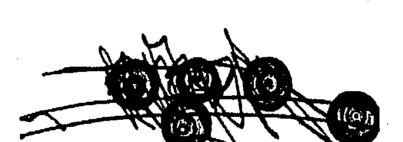
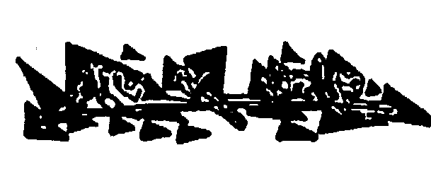
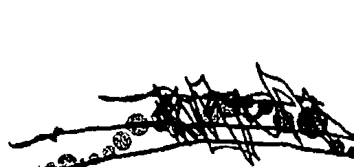
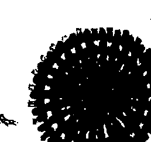
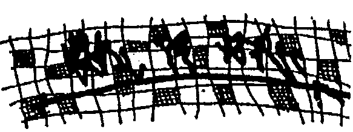
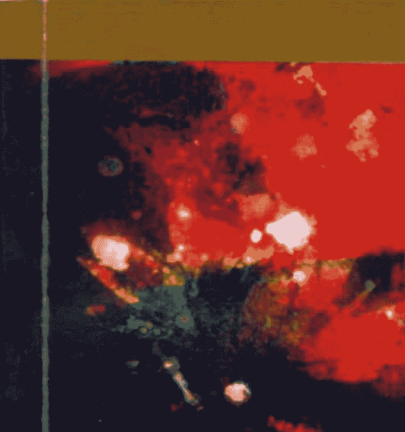

# 奥修谈吕洞宾1：金色花的奥秘（上）

# OSHO Talks on The Secret of the Golden Flower

# 王中和推薦序

金色花的奥秘一書在中文爲《太乙金華宗旨》，又名《呂祖師先天虛無太一內丹的書。最初由德國傳教士，漢學家衛禮賢（Richard Wilhelm，1873~1930）翻譯成德文，名爲《金花的秘密》，心理學鼻祖卡爾·榮格並爲德文版《太乙金華宗旨》作序。德文版的出版引起了西方世界的關注。《金花的秘密》後來又被翻譯成英文、法文、義大利文、日文、朝文等多種文字。特別是日人湯淺泰雄和定方昭夫兩位根據該原本書，將之譯成日文而流傳日本。甚獲重視。在卡爾·榮格的自傳《記憶，夢境與映射，373-377頁》，其中一段關於他的朋友衛禮賢的內容，`在中國，他有幸遇到一個舊式學院派的聖人，這個聖人的內在修鍊已經達到很高的境界。這個聖人的名字是勞乃宣，他向衛禮賢介紹中國瑜珈中的哲學和易經中的心理學。這個勞乃宣又是誰呢？勞乃宣（1843年~1921年），字季墳，號玉初，又名矩齋，晚號韌叟，男，漢族。清京師大學堂總監督兼署學部副大臣、代理大臣、近代音韻學家、漢語拼音創始人。祖籍山東省陽信縣城西門裏（今西北村），滿清政府垮臺後，勞乃宣舉家來青島，經周馥

[图片]

介紹，至德人魏禮賢所辦的尊孔文社，聯絡中德居青島之學者，進行文化交流和聯誼活動。魏禮賢翻譯《易經》等中國古代文化經籍，得到勞乃宣等人的幫助。

勞乃宣對青島充滿興趣，他考證「勞」姓的祖先即在嶺山，「勞山為吾家得姓之地」，他因此自號為「勞山居士」。太乙金華宗旨這本書共分十三章，教人如何識別「元神」和「識神」，更進一步教人怎樣修煉「元神」，使元神復歸正位；怎樣制服「識神」，使它不能猖狂為所欲為。有關元神與識神，真心與妄心，本體與現象，靈魂和宇宙，幾乎是各家各派提升生命一定要去釐清的重點，佛法裡頭也有一首常見之偈講此事：學道之人未認真。只為從來認識神。無始時來生死本。癡人喚作本來人。所謂真神識神之辨，當然重點是如何不被現象界所迷惑，尤其現在精神病太多，這幾乎已成為世界趨勢，精神病的由來某種程度而言也可說是太相信自己的眼睛、耳朵等識神之作用，識神可以說是不能太相信，也不能完全不用，這就是人類的進退兩難，也是意識的進退兩難，博學多聞的奧修師父早就注意到了這個問題，也注意到了這本書，奧修師父說：這本著作，金色花的奧秘，非常古老——可能是世上最古老的著作之一，肯

[图片]

定足足有二十五個世紀之悠久深遠，也可能遠比這個還要更古老，但二十五個世紀這是罕見的，獨一的。聖經屬於基督教徒，塔木德經屬於猶太教徒，吠陀經屬於印度教徒，法句經屬於佛教徒，道德经屬於道教徒，但這本小書，「金色花的奧秘一，不屬於任何人，也就是說，它屬於每一個人。它深深的根植於道教的思想之上，它是道教的一朵靠近生命和存在的花。它還不僅於此——查拉圖斯特拉也擔當了一個角色。它襲取了佛教的教導；及至一些基督教的神秘學院、景教（Nestorians），它們也踞一席位。所以基督教和猶太教也成爲了當中的一部份。奧修師父又說：份。世紀以來它只以口耳相傳，因而這本書一直保持神秘，它沒有廣泛流傳是因爲它的教導非常神秘，它只向門徒揭示。只有當時機成熟，師父會告訴他的門徒，因爲如果你無法正確地了解它帶給你的潛在神秘，如果你出錯了，它會造成禍害。它必須被正確了解，而且必須要當師父在場的時候它可以進行。它是一種強大的方法——像原子能一樣的強大。

[图片]

# 5 | 推薦序

《太乙金華宗旨》透過奧修師父的註解，再和中國人的註解對照會很有趣，比較看看印度人是怎麼理解道家的，尤其是奧修師父對丹經與丹鼎派修煉術的看法，我覺得這是在諸多奧修師父的書籍裡，別具意義的一本書，我很希望能看到全譯本趕快出版，這也是達摩兄對人類之大愛與貢獻。特此介紹給中文讀者。

王中和序於指南山麓

[图片]

获取更多好书，请加微信号：strcdts

店铺：http://strc.cr.cx

# 原序

# 金色花的奥秘—奥修谈吕洞宾

# The Secret of Secrets

我是是否該揭示秘密中的秘密，就在這本書的開端？我是否該現在就向你们透露，甚至在你們開始之前？很好！它是這樣：秘密中的秘密不能夠在滿載文字的頁頁紙上被找到；也不能夠在奧修的演講中提到的美麗靜心技巧裡找得到。嗅，不！我的朋友！我很遺憾說，這麼一個深邃秘密不可能輕易被發現，不我們這個可憐的世界早已經變成地球上個樂土了。然而，秘密中的秘密可以是屬於你的。因為，當你閱讀這本書，你可能会忽然發現自己被懾進了字裡行間、墜入了幽僻深谷、消失於你內在的甜蜜與半忘我的時空之中，讓你難以相信它們的存在。嗅，是的！奧修有這個力量，一朵神秘玫瑰花一般纖巧的力量，带你深入你

[图片]

的內在並且把你引見給你自己，把你帶回到你自己——一份不能計量的禮物。這不是痲人妄想，這是我個人經驗，這是一個成道師父的神秘與魔法。這是秘密中的秘密。你的是一些敞開、一些接受性、一些純真。看！旅程開始了……深深的感恩及衷心的愛

史瓦米阿南鮮部提

[图片]

# 7 | 原序

# 目錄

推薦序：：：：：：：：：：：：：：：：：：：：：：：：：：：：：：：：：：：：：：：：：：

原序：：：：：：：：：：：：：：：：：：：：：：：：：：：：：：：：：：：：：：：：：：：：

第一章 魔法生命的秘密：：：：：：：：：：：：：：：：：：：：：：：：：：：：：：：

第二章 空眼：：：：：：：：：：：：：：：：：：：：：：：：：：：：：：：

第三章 原子時刻：：：：：：：：：：：：：：：：：：：：：：：：：：：：：：

第四章 這裡有重要的事要做！：：：：：：：：：：：：：：：

第五章 再次成爲一：：：：：：：：：：：：：：：：：：：：：：：

第六章 天生喜樂：：：：：：：：：：：：：：：：

第七章 轉動鎗匙：：：：：：：：：：：：：：：：：

[图片]

# 9|目錄

+   第八章 總有真實…… 277
+   第九章 出現奇蹟…… 315
+   第十章 左巴與佛陀的綜合…… 353
+   奧修簡介…… 387

[图片]

获取更多好书，请加微信号：strcdts

店铺：http://strc.cr.cx

[图片]

# 11 | 第一章 魔法生命的意義

# 第一章 魔法生命的秘密

經文：

呂祖（呂洞賓）師父說：自然曰「道」，「道」沒有名字也沒有形相，它是本質，是元神。本質和生命均不能被看到，它們蘊含於天光；天光不能被看到，它含藏在雨眼之中。太乙是無上的意思。而構成這不可思議的生命，秘密在於透過有爲以達到無爲。金色花意謂光，以金色花作為象徵。那句「水鄉鉛，只一味」指的就是這個意思。迴光之功全取決於逆法，注想天心，天心居於日月中。（天心位於左右眼的中間）黃庭經云：「寸土尺宅可治生。」在寸土（雙目中間）中央閃耀爇爛光彩；在寶玉城中紫色殿堂之上，是空極永恒之神。故一迴光，周體之氣皆上朝，有

[图片]

如一位聖王奠下了他的帝都，眾國皆前往覽見朝拜；又如主人精明，僕人虔心奉命，每一個人都遵守本份。

各位只需要實行迴光，便是無上妙諦。光易動難定，假如迴光持久，那麼它會自動凝結，這情況是所謂的一默朝飛升。—

實行這宗旨，別無更進一步之法，只在純想天心，純想即飛，必生天上。

金色花即金丹，雖然沒有絲毫差池，然而這功法卻十分靈活，全靠智慧和清晰，以及最徹底的吸收力和沈靜。人們倘若缺乏高度的智慧和理解，則不能實行；缺乏深廣的空間容納吸收力和平靜，也不可能緊守。

一個寓言……

從前有一個很富有的魔法師，他擁有很多綿羊。這魔法師非常吝嗇，他不愿意雇用牧羊人，也不願在放牧的草地上豎立圍欄，結果那些綿羊常常離群，迷失

在森林，掉落深谷……等等。而他們逃跑的原因，是因為他知道這魔法師要取去牠們的皮肉，而綿羊們不喜歡這樣。

最後魔法師想出了一個解決方法，他把他的綿羊催眠，首先對牠們說牠們是永生的，而且當牠們被剝皮時牠們不會受到傷害。相反的，這對牠們來說是很好
[图片]

、很棒甚至是件很愉快的事。 然後他又說，這魔法師是一個好主人，他非常愛他的羊群且願意為他們做任 何事；接著再對他們說，假如有任何事發生在他們身上，那不會是僅僅發生的一 次，事情不單只發生在那一天，所以他們毋須去想這事。 再進一步，魔法師對羊群說他們完全不是羊，對某些羊說他們是獅子，對另 一些說他們是老鷹，有一些說是人類，另一些則是魔法師。 在這之後，他對羊群的擔憂以及做出的努力，告一段落。他們從此不再逃跑 ，只是安靜地等待魔法師取去他們的皮和他們的肉。 葛吉夫非常喜歡這寓言，他的整個哲學蘊含在這個小寓言裡面。這寓言也描 述了人在無意識之下的一般情況。這是對於人最美麗的陳述之一：「人是一具機 械。」 人不是天生便是一具機械，但人活得像一具機械，死也像一具機械。人擁有 可以開出一朵意識之花的種子。人有可能成為神，但這不會發生。它不發生是因 為人已經被催眠——被社會、國家、教會組織與既得利益者所催眠。社會需要奴 辣，而人能夠一直保持著做一個奴隸，只要他没有開出他的終極之花。社會需要你的肉和你的皮，而很自然地，没有人會喜歡這樣。所以，整個社會、文明什麼

[图片]

也不是，僅僅是深深的陷入催眠狀態之中。

人從一出生便被催眠，他被催眠去相信社會的存在是他的恩典，是他的好處
。那是徹底的錯誤。他被催眠去相信他是永生的，他不是；他可以是，但他不是
。而且只要催眠一直下去將永遠不可能永生。
你只是活得像個人，因為你活在身體裡面，而身體會死去。那剛出生的隨即步向死亡，出生是身體的開始，死亡是終結。面對這個自己，你所知道的有比你們的身體更多嗎？你有經驗過任何比身體更高更深的东西嗎？你有沒有從你身上看到任何你出生之前的事物？假如你有看到，那麼你便是永生。假如你知道你的面目，你的本來面目，那在你出生之前你有著的面目，那麼会知道你死去以後你也將會在那裡，不然不會。
人可以永生，但人卻活在死亡的包圍下，因為人依賴同他們的身體而活。
社會不允許你知道比身體更多的東西。社會只對你的身體有興趣，你的身體可以利用被利用，你的靈魂卻是危險的。一個有靈魂的人總是危險的，因為一個有靈魂的人是一個自由的人，他不可能被奴役。一個有不朽靈魂的人跟存在、神有著更深
[图片

# 19 | 第一章 魔法生命的意義

你變得混亂，舊的秩序走了而新的還沒發生。你變成了一團雲，你變成了混亂。除非變得更加清晰，除非變得更加活生生，除非變得充滿光，否則你的生命會是一場兩極之間的衝突。你被分割了，你開始肢離破碎，一半的你屬於天。現在的你哪裡也不屬於，現在的你誰也不是，這樣會造成瘋狂。半的你屬於天。現在的你哪裡也不屬於，現在的你誰也不是，這樣會造成瘋狂。所以世紀以來金色花的奧祕都只是以口耳相傳。其次，因為口耳相傳這個傳統，這本書得以一直保持著活生生，那便是它變得綜合性的原因。基本上它是在中國的道家氛圍之下誕生的，而後來菩提達摩來到了中土——一位新的師父和一個來自印度的新訊息，佛陀的訊息。而那些追隨金色花的奧祕的人十分敞開，他們不是任何一所寺廟的一份子。他們立即看出了菩提達摩也具有它——它很明顯，很清晰。他們讓菩提達摩的教導成為他們的教導之一。同樣的事情也發生在祆教（Zoroastrian）的師父身上、景教（Nestorian）的基督徒身上。一再又一再地，只要有外來者踏足中土，只要它是有價值的，它便會被加入。口傳的教導保持著活生生、成長，像一條河流，新的溪水注入成為了一部分。一旦教導被寫下來，它再也無法和任何東西融合，它變得死板，它失去流動性，它變成死的，它是一具屍骸。現在，金色花的奧祕不再成長了，世紀以來它沒有

## 金色花的奧祕(上) | 20

有成長過，自從它被寫下來它便不再成長了。為什麼我選擇談論它？——只有這樣它可以再次成長，它帶給這個世界如此美好的訊息，它不該死去，我要讓它重新流動。現在我可以對門徒、對來到我面前為了重生而準備死亡的人，為了開花而準備死亡的人談論這本書。只有當種子死去的時候它才可以成長；只有在種子消失的時候才會有樹。我將對你談論這一本小小的但非常有價值的書，好讓這本小書重新活起來。它能夠在你與我之間再度活生生，它開始再度流動。它有一些非常重要的東西，假如你明白它而且跟著修練，你將會被豐富。但先要明白一點：謹記你已經被催眠，你必須要經過一個解除催眠的過程。謹記你已經被制約而你必須要解除制約。謹記死亡在前。別以為它不會在今天發生，它隨時降臨。事實上，所有的發生永遠發生在此刻；種子死在此刻、花蕾在此刻變成了花朵、鳥兒在此刻開始唱歌。所有的發生從來也只發生在當下——那是事物發生的唯一途徑，因為當下是唯一的時刻。過去從來沒有發生過什麼，將來也沒有什麼發生，所有的發生只發生在當下——那是事物發生的唯一途徑，因為當下是唯一的時刻。過去只是你的記憶而未來只是你的幻想。但你被催眠使你活在過去，你也被催眠使你活在未來。不是選擇過去便是選擇未來，社會不讓你活在當下。基督教、印度教和回教——他們約束你，使你活在過去，他們的輝煌年代在過去；共產黨、社會主義者、法西斯分子——他們束縛你，要你活在未來，他們的輝煌年代在未來；烏托邦近在眼前：“當革命來臨，你便有機會真正活著，那便是輝煌年代。代。— 你選擇過去，那是個錯誤；又或者你選擇未來，那是再一次的犯錯。沒有社會會會告訴你活在當下。就在此時此地，成為一個桑雅生，成為一個真正的追尋者意思是活在此時此地，除此以外再也没有其它的生命。但這樣的話，你必須要停止你的自動化，你必須要成為一個人而不是一部機械。你必須要變得有多一點的意識，你沒有意識。有一次我坐在一個垂死的男人身邊——他在我以前曾任教的一所大學裡當教授。正當他的事業如日中天之際，他得了心臟病——它總是在你觸及頂峰的時刻來訪。成功總是伴隨心臟病。當你成功以後，你還可以有何？於是他得了心臟病而且在死亡的邊緣。我去看他，他很悲哀——有誰想要死？他處在極度痛苦和絕望之中。我告訴他：“你不用擔心，你不会死。”他說：“你在說什麼？但那些醫生……所有的醫生都說我不可能活下去。你

# 金色花的奧秘(上) | 22

有什麼理由說我不會死？ 我說：—你之所以不會死是因為你從來沒有活過，你沒有履行死亡的首要條件。你在這五十五年當中一直都在夢遊，你不在活。我看著你已經有幾年了。—他很震驚，很憤怒—由於太過憤怒有一個片刻他完全忘記了死亡。他氣憤的雙眼冒火，他說：—這是對待垂死的人的態度嗎？你不能親切一點嗎？為什麼你要對我如此苛刻？我快要死了，而你卻在高談闊論你的偉大哲學—“你永遠不會死的。“現在是說這種話的時候嗎？—我靜靜地聽著，我只是完全的沉默。然後狂怒消失了，他開始哭泣，如暴雨傾瀉的眼淚從他的眼眶潑出，他滿懷愛地握著我的手，對我說：—可能你是對的，我從來沒有活過；可能你不是無禮，你只是坦白。我知道不會有人對我說這些話。—他充滿感激，有一個片刻他非常有意識，可以看到他的臉上發光——在那裡，他整個被光環籠罩。最後他感謝我，在他的最後一刻我提醒了他！那個晚上他離世了。他說：—如果你沒有在這裡，我也會錯過我的死亡，我已經錯過了我的生命，但我現在有意識地死去。至少有一件事讓我感到快樂—我不是沒有意識地死去。

# 23 | 第一章 魔法生命的意義

他的死很美。他死得毫无遗憾，他死在放鬆之中，他幾乎是以歡迎的心情去面對死亡，他滿懷感恩地死去，他在祈禱之中死去。他的來世將會躍進到一種全然不同的品質。 然不同的品質。

無論它是什麼，人必須要盡量有意識地活在每一片刻裡面，無論它是生命、是愛、是憤怒、是死亡。 有一個農夫在一個菜園裡偷黃瓜，他在幻想：我把這袋黃瓜搶走，把賣到錢去買一隻母雞，母雞會生雞蛋，他會坐在蛋上孵出一窩窩的小雞，我會飼養小雞直到他們長大，然後把他們賣掉再買一頭小乳豬。我會把小豬養大成一頭母豬，幫他繁殖，等他生出小乳豬然後把他們賣掉。我再把賣豬得來的錢買一棟有田園的房子；我會在園子裡種黃瓜，不讓任何人把它們偷走——我會保衛它們，請一個強壯的看守人，而且我不時跑到園子裡大喊：‘喂，你啊！小心看著！’ 那個農夫正陶醉在他的幻想之中，他高聲地喊了出來，守田的人聽到他的喊聲跑出來看，他把農夫抓住並且狠狠的把他痛打一頓。 人們便是這樣活著：在夢中、在幻想中、在計劃之中。你便是這樣的活著，而這樣子過活並不是對待這般美好、這般價值非凡生命的方式！這是徵頭徹尾的浪費！你必須要更加專注在這片刻、在當下。你必須集中意識，意識是你的寶藏。而世紀以來所有被創造發明出來的方法沒有其它目的，全是為了幫助你變得更具意識，讓你內在的火燒得更燃盛，讓你的生命成為一場熱烈喜慶、一團火焰。人們過著乏味的生话，人們過得心不在焉，過得毫不專注。你怎麼能夠活得如此不專注？不專注是黑暗，專注是光。而這本著作教導導你怎樣在身上創造更多的光，好讓有一天……那朵金色花。兩名精神病醫生在路上遇到，其中一個說：「你看來很不錯。」另外一個問：「我看來怎樣了？」人們互相發問，沒有人知道自己怎樣的，他們只是看著別人的眼睛，從別人那裡收集關於自己的情報，這就是為什麼別人的評價如此重要。假如有人說你是一個傻瓜，你便會生氣，為什麼？又或者你會很難過，為什麼？你被打擊了。你一直認為你是一個聰明的人，因為有人對你說過你很聰明，它是別人對你的評價而你依賴它；現在卻有人說你是一個傻瓜，他輕易地打擊了你的智慧，十分輕容地……！他丟出了一顆石子，而你的城堡是以撲克牌建造的。現在所有都被擊倒了，那便是為什麼被打擊的那個人變得如此憤怒、激動而且變得憂心和焦慮。

# 25 | 第一章 魔法生命的意義

你不断地挖掘别人的想法，因为你知道别人会思索你這個人，但你卻一點也不清楚楚你自己。這是怎樣一個情況？假如我自己也不能了解自己，還會有誰更了解我？從外不在會有人看得到我，我是不可能在这个層面被看到的。從外在只有我的身體可以被看到，從内在我知道自己的意識。識，你不可能在鏡子裡看到它——你自己的意識。你要直接地看它，它不可能被反映，它不可能反射在任何東西上面，它是不可能被看到的。你需要閉上你的眼睛，就是這樣，那是唯一去認識它的途徑。但人們活得太無意識了，他們完全活在別人的評價之中，別人所說的成為了他們的靈魂，別人隨時隨地把它收回，人們樂於做乞丐。你對你自己的了解，有哪些是你直接從自己身上經驗體會得來的？你是否曾經在不介入別人評價的情況底下觸碰你自己？假如你没經驗過，你不算活著。生命只有在心無旁骛、在直接觸碰自己看著自己的那個時候才開始。生命只會在當你能夠看到這個自己的時候才存在，而不是別人眼中的那個自己。他們能對你有什麼看法？他們能對你有什么評價？他們可以看到你的行為，但他們不可能看到你。如果我看到我自己，只有我能夠這樣做，別無他人。僕人不可能做到，你也可以

# 金色花的奧秘(上) | 34

不能委託任何人，就算專家也沒有辦法。可是我們卻如此在乎別人的評價，只因為我們全然不在。你的內在沒有甦醒——你在深深地沉睡，我們都在打壽。
一個心不在焉的教授跑去理髮，他坐在一張理髮椅上，卻沒有把帽子脫下。
「請你把帽子脫下來。」理髮師說。「噢，很抱歉！」那教授說：「我不知
道這裡有女士。」「注意你散亂的頭腦，注意它能夠助長你的專注力；注意有什麼
正在你內在發生：往來復反的思緒、零零星星的記憶、一團怒火呼嘯的雲、幽傷
悲慘的一夜、又或是一個讓人欣喜的美麗清晨。注意所有這些掠過於你的，因為
隨著越來越多的觀照，你會漸漸成為一個完整的觀照。而金色花的奧秘所教導的
方法，就是怎樣在你的內在之光裡面成為一個整體。
在我們進入經典之前，我要先告訴你們這本書的故事。
這本書來自中國的一個隱秘團體，這個隱秘團體的創始人呂巖（呂洞賓）傳
聞是一位精通道家思想的大師。呂巖是從哪裡學到這神秘教導呢？是關尹喜師父傳授給他的，據說他讓老子寫下了道德經。
老子的一生從來沒有寫下過一個字，他一再拒絕請求，不寫下任何文字。他
把他所知道的傳給他的門徒，但他從沒有打算把它們寫下來。他說：「可以說的
「道」，就不是真正的「道」。經過陳述的道，已經被歪曲了。它只能夠夠透過

# 27 | 第一章 魔法生命的意義

親密的師徒關係去學習，沒有別的途徑可以把它傳授，它只能夠在門徒與師父相 遇時，所產生的深度融合下被學習。門徒堅定與師父相連，他們的意識融入彼此 。只有這樣的相遇、相融，道才能夠被傳遞，所以老子再三拒絕。

他說：人應該像水—— 柔順、陰性、接受性、充滿愛、不暴力。人不應該像石頭，石頭看來堅硬，—— 柔順、陰性、接受性、充滿愛、不暴力。人不應該像石頭，石頭看來堅硬， 但不是；水看來柔弱，但不是。不要被表面蒙蔽，最後水會勝過石頭，石頭會被摧毀變成沙礫，落入大海之中。與柔軟的水對抗，石頭最終會消失。

石頭是陽性的，它是男性的頭腦，是進取的頭腦；水是陰性的，柔順，滿愛，完全不進取。但不進取的獲勝了。水總是準備好臣服，但通過臣服它征服了—— 那是女人的方式，女人總是臣服，通過臣服而征服。男人想征服，但最終除了臣服，別無其它。因此，當老子離開家國時，他選擇了水牛。

他去哪裡呢？他要去喜瑪拉雅山，要死在它那美麗而永恒的懷抱之中。

一個真正的男人知道怎樣活也知道怎樣死。一個真正的男人活得全然也死得全然。一個真正的男人活在祝福之中，也死在祝福之中。

他單獨前往喜瑪拉雅山，但他卻在邊關被逮住了。擺他去路的人是關尹喜，他是中國邊境上最後一個關關的看守駐兵。那裡是老子的必經之路，除了它沒有其它路徑可以離開。關尹喜勸他說：「你將死去，你將永遠離開這片國土，不久必須要付出這個代價。」老子坐在關尹喜的茅屋裡三天，在那裡他寫下了道德經。傳說金色花的奧秘出自呂嚴，呂嚴把它歸功於關尹喜師父，據傳是他讓老子寫下了道德經。關是一函谷關一的意思，因此他被稱為關師父，即是一函谷關師父一。而他一定有過人之處，否則不可能說服老子——他的一生都

# 35 | 第一章 魔法生命的意義

天光不能被看到，它含藏在雨眼之中。
除非它们成为一，否则你不會觉知得到它。
它含藏在雨眼之中。
但你不能夠看到它，除非它们成为一。到那時候它會被釋放，那將會是一個光明的巨大爆發。查拉图斯特拉稱它爲「火的爆發」；老子稱它爲「光的爆發」。
都是一樣的。
你一定知道施洗約翰說的一段話，他時常對他的門徒說：「我用水幫你們洗禮，後來的那一位會用火幫你們洗禮。」「那是他的意思——後來會有一位用火幫你們洗禮——那洗禮的水是外在的洗禮；對約翰而言，水代表向外的流動。
你們洗禮——那洗禮的水是外在的洗禮；對約翰而言，水代表向外的流動。
記住這個，向外和向下是相同意義，向內和向上也是相同意義；無論是什麼走向下的即是走向外，無論是什麼走向上的亦是走向內。反之亦然。水永遠向下流，因此它代表向外的流動，它遠離它自己，它的旅程是一個向外的旅程。火向上揚，永遠向上，而向上和向內是相同意義，它的旅程永遠向內。

# 金色花的奥秘(上) | 36

施洗者約翰說：我用水幫你們洗禮，我給予你們宗教的外在身體。在我之後，基督會到來給予你們內在的洗禮，火的洗禮。耶穎自己重覆又重覆的說：`悔改！你們當悔改。`而這個字被基督徒誤解了。他們把它解作「爲罪行而悔改」，這個字和罪行一點關係也沒有。`悔改`這個字的真正意思是返回，走進去，走回去。它意思是回到原處：恢復你的創造力，一悔改這個字意味心靈的改變，回到原處——一個一百八十度的轉向，假如你繼續向外流動，你仍然是水；假如你轉向內在，你成爲火。當那兩隻眼，當這兩灼火焰，當你這兩個有意識的半球體連結一起，是絕對地把橋樑架起了，你成爲了一灼火焰，這一灼火便是普羅提諾（Plotinus）所稱的一獨個兒飛往單獨。`太乙是無上的意思。`假如你成爲一，你才能成爲太乙。這是道家對於神的說法而沒有使用神這個字：假如你成爲一，你才能成爲神。

而構成這不可思議的生命，秘密在於透過有爲以達到無爲。

一？怎樣讓你的女人和男人消融於彼此，如此你便不再是一？怎樣讓你的男性和女性成爲一？怎樣讓你的女性和男性成爲一？怎樣讓你的男人和女人消融於彼此，如此你便不再是一間分割開的房子，對抗你自己；如此便再也没有衝突和緊張，一切是一。在那個一是極樂，因爲所有緊張消失了，所有衝突消失了，所有焦慮消失了，所有衝突和緊張，一切是一。在那個一是

男人代表行動（有爲），女人代表沒有行動（無爲），你必須透過行動以達到無爲。到沒有行動，你必須努力以達到不用努力。你必須開始投入你所有的能量，你必須變得非常活躍，沒有任何保留——所有的能量也變得與創作力有關——然後一個突然，當所有的能量都參與，蛻變會發生。就好像到了一百度水溫的水蒸氣，當完全變成水蒸氣時，是行動；當水蒸氣過後，是沒有行動。

首先你必須學習如何跳舞，你必須把你所有的能量投入去跳舞，當有一

# 金色花的奧秘(上) | 38

天那不可思議的經驗發生，當舞者忽然消失於舞蹈，舞蹈在沒有努力之下發生了，那麼它便是無為。首先你必須要學習行動以進入無為。那便是關於靜心的所有。人們來問我為什麼要教動態靜心？因為那是發現無為的唯一途徑：舞至極限、舞於熱烈、舞入瘋狂。假如你的整個能量傾注入它，當你忽爾看到舞蹈自己發生了，而當中沒有努力，那麼會有一個片刻到來——它是沒有行動的行動。金色花意謂光，以金色花作為象徵。那句「永鄉鉛，只一味」指的就是這個意思。

金色花是一個象徵，是當你的能量不再是二並且成為一的象徵：金色的豪光盛放，這金色的光就好像一朵花在你面前盛放。而它不單是一個象徵，它是一個象徵但它幾乎是實實在在的真實，它正好就是這樣子地發生。現在你的存在如同黑夜一般一片漆黑；然後你的存在猶如太陽初升，你看不到太陽但它的光芒在那裡。它沒有來源——它是一束沒有來源的光，可是，一旦你知道了在你裡面的金光，你便是永生，不會再有死亡，因為光永遠不滅。

# 39 | 第一章 魔法生命的意義

你也可以從近代醫學得知，近代醫學完全地同意「道」——一切都是光。型式持續改變，但光不斷，光是永恆的。

世界上很多的經文也是以「光」這個字來開始的。「開始的時候神說：『讓光在那裡。』——那是一個開始。假如曾經有個開始，那必不可抹煞；但光必定早已存在，從來就没有開始，那只是一個寓言，光一直存在，可蘭經說神是光，蘇菲派對神的其中一個稱呼是諾亞（Noor），就是光的意思。

而且那味道也是一樣的——無論它是發生在我身上，還是發生在你身上，那味道是一樣的。佛性的味道是一樣的，佛陀說過：「佛性的味道像大海，你可以從北面也可以從南面品嚐它；也可以從這部份或從那部份、從岸邊或在海中，但
大海的味道是一樣的。佛性的味道也一樣。當一個人達到永恆之光的那個片刻，他的生命有了一種氣息，這氣息收納在絕對的覺知裡頭：他的無意識消失了，他的存在再也没有任何黑暗部份。

假如現在有一個佛洛伊德學派的人看這個人，他看到的只是有意識，他不
會看到無意識。但假如一個佛洛伊德學派的人看你，只有一個部份是有意識的，相對這一個部份，有九個部份是無意識的——你的腦腦只有十分之一是有意識的
；一個佛是百分之百有意識。

# 金色花的奧秘(上) | 40

迴光之功全取決於逆法，注想天心，天心居於日月中。（天心位
於左右眼的中間）

再次記住，太陽代表男性能量，月亮代表女性能量，而心懸於這兩者之間。

心非男性亦非女性，而這正是心的美麗之處：心是神聖的，並沒有男性或女性，
而它恰好懸於這兩者中間。

假如你過於傾向男性能量，你便會太過活躍，而且你不會懂得如何被動，這
是發生在西方的情況：西方是太陽朝向的——太多活動。人們的活動把他們自己
推向瘋狂。太過急速——每一件事情都要立即被完成。沒有耐心、不能等待，他
們已忘記了如何被動，如何有耐心，如何去等待。他們失去所有可以讓他們達到
無為的能力。他們不知道怎樣過一個週末，甚至當他們過週末，他們比平常
更加活躍。

在西方，禮拜天發生心臟病的人比任何時候要多，因爲它是一個禮拜天，
人們的時間都被佔滿了。整個工作天他們都想著要在週末好好的休息，而當週末
到來，他們有一千零一件事情要做。那並不是他們一定要去做的事，那並不是有需要的——不！完全不是。但他们不能紧行不能歇息，他們不能只是躺在草地上好好的與大地在一起；他們不能紧行也不能歇息，他們不能只是躺在草地上好好的與著房子做一起；他們不能紧行也不能歇息，他們不能只是躺在草地上好好的與開，開始在上面埋頭苦幹。他們會做一些事，他們會保持活躍。人們的整個生命都在想著當他們退休的時候他們很快便會死。心理學家說他們的夠享受，他們不能夠停下來。一旦人們退休他們很快便會死。死亡會早十年來臨，因爲他們不知道他們還可以做什麼，死亡似乎是讓他們擺脫生命唯一的路，擺脫那對他們來說已經有意義，一直也有意義，只是一段會促的生命。人們會促，不知道自己往哪裡去，他們只知道他們必須要加快加快再加快的走，沒有擔心過：你到底要去哪裡？你可能只在一個圈子上繞著跑。而這也確實是正在發生的情况：人們在繞圈子跑。西方是太陽朝向的，而東方是月亮朝向的。東方一直都是被動，過份的宿命主義：一什麼也不需要做，只是等待，神會去做。一這是另一種傻勁和愚笨。東方貧窮、懶惰、毫無朝氣，人們不會為任何事去做擔憂；悲慘瀰漫、貧困、乞丐、疾病——沒有人擔憂，每一件事都接受。一你可以怎樣？這是神的旨意，我們必
須接受，我們必須等待。當災難滿佈，神會到來。我們還可以怎樣？—這是女性 的頭腦。 金色花的奧秘說你必須不偏不倚的處在中間——不是男性也不女性，不傾向任何一端——那麼便會平衡。那麼人便會活躍而內在深處卻保持無為，那麼人 便會無為而外在依然維持活躍。在外是太陽朝向，內是月亮朝向，讓太陽和月 亮在你裡面相遇，而你只是在中間，在中間是超然存在。 逗光之功全取決於逆法，注想天心。 人是中心同時也是圓周，假如你向圓周移動，那麼你會有很多思想，圓周包 含很多，中心只有一。假如你向中心移動，思想開始消失，在僅僅的核心當中 所有的思想消失——那裡只有覺知。那便是這本神秘著作所說的： 注想天心…… 光要向內移動。 當你看著一棵樹，你一雙眼睛正向它投放光——這光是向外移動的。當你閉 上雙眼，那光開始往內轉——心靈的改變、悔改、返回。當光落在你的本質上，
那是自我認知，自我意會。而這自我意會帶給你自由——從所有糾纏中解脫，從所有連結中解脫，從死亡中解脫，從身體上解脫。它創造你的靈魂。這便是為什麼葛吉夫常常對他的門徒說：‘你不是天生有靈魂，你要透過心靈的改變把它創造。’

在身體這小小的神殿，生命能夠被調整。在寸土（雙目中間）中央閃耀著燦爛光彩；在寶玉城中紫色殿堂之上，是空極永恒之神。看看這矛盾：生命與虚空。生命是男性，虚空是女性。生命與虚空——兩者都是內在之神的狀態。當你没有選擇你喜好的一方，當你完全沒有選擇——你直都是個觀察者，你便會成為那位神——一方面是生命另一方面是死亡；一方面是完美另一方面是空無之神。

都是內在之神的狀態。當你没有選擇你喜好的一方，當你完全沒有選擇——你直都是個觀察者，你便會成為那位神——一方面是生命另一方面是死亡；一方面是完美另一方面是空無之神。

> 黃庭經云：「寸土尺宅可治生。」

# 43 | 第一章 魔法生命的意義

故一迴光，周體之氣皆上朝：便是靜心，那便是佛陀在菩提樹下所做的——你靜靜地坐著，你封鎖了所有的門了——那，光在裡面迴環。然後，你首次覺知到你的身體和所有你身體包含的——它所有的神秘。這小小的身體包含了宇宙之中所有的神秘。它是一個宇宙縮影。

故一迴光，周體之氣皆上朝，有如一位聖王奠下了他的帝都，眾國皆前往覲見朝拜；又如主人精明，僕人虔心奉命，每一個人都遵守本份。

當這光在你內在移動，你的身體變成了一名僕人，感官成了服從的僕人，你不需要嘗試控制它們，它們會全心全意地追隨你。

這便是一道一的美：它從不強迫，不培養任何品質。它說：單純地成為那一整遍光，如此，其它所有的也將追隨。

# 51 | 第二章 空眼

# 第二章 空眼

第一個問題： 最近有幾位朋友問我是否對桑雅生、對社區還有對你感到懷疑，我必須承認 事實：~是的！有些時候我是的！~這讓我有犯罪的感覺，我是否犯了一些不可 原諒、裵濟神明的罪；抑或是，對於肯定的事抱持懷疑的態度，其實屬於自然？ 我不知道你是否成道了，我只能夠感覺你的美以及信任。 巴伐，信仰懷疑——懼怕是因爲懷疑壓抑它。而且，無論你壓抑什麼你 也將會感到懼怕，因爲它總是在你內心深處，等待時機報復。~一旦時機來臨，你 內在的復仇心會爆發。信仰危坐在震央上面，懷疑之心日益壯大，因爲你每一天 都在壓抑它，遲早有一天它會壯大到你無法把它壓下，它超越了你的信仰，它輕 而易舉地把你的信仰趕走。 但信任不懼怕懷疑，因爲信任不會對抗懷疑；信任運用懷疑，信任知道如何
運用蘊含在懷疑之內的能量，那是信仰和信任之間的分别。信仰是不正確的，它創造了虛偽的宗教，它創造了偽善者；信任有著一種崇高的美和真實，憑藉懷疑，信任成長。它利用懷疑作肥料，懷疑是一位朋友，懷疑不是敵人。除非你的信任通過許多懷疑，否則它仍然是無力的。在哪裡它才能夠收集力量？在哪裡它才能夠整合？假如沒有挑戰它依然只能夠守於虛弱。懷疑是一種挑戰，假如你的信任能夠對懷疑做出反應，能夠友善地對待懷疑，它將會透過懷疑而長。你也不再是一個分裂的人。深入地懷疑，處於信仰和相信的表面上，你會變得一致，你會成為個體，不再分裂，那個體便是古老宗教所稱的一靈魂一。靈魂透過懸疑而確立，它不是透過相信，相信只不過是一副面具：你把你的本來面目隱藏了。信任是一個蛻變，你會變得更加明亮，正因為你運用懷疑作為一種挑戰、一個機會，是故壓抑無從產生。慢慢、慢慢地懷疑會消失無蹤，因爲它的力量被信任取代了。事實上，懷疑什麼也不是，而信任在成長，伴隨懷疑而至的是信任。對懷疑抱持這樣子看法

# 55 | 第二章 空眼

你不再成长。你的头脑是一个孩子的头脑，你永远不会成熟，永远不会独立。神父不想你独立，你独立了他便会失去你，你依赖他便是他的整个市场、整个生意。

意。我极度反对任何形式的罪恶感，永远记住：如果你开始对我的某方面感到罪恶，那是你一手造成的，你仍然携带着你内在里面你父母和神父的声音；你还没有听到我，你还没有听到我说什么，我要你完完全全地从所有的罪恶感之中解放了，你便是一个具有宗教性的人，这是我對宗教性的人的定義。

放出來，一旦你从罪恶感之中解放了，你便是一个具有宗教性的人，这是我對宗教性的人的定義。運用怀疑——怀疑是美的——因為只有透過怀疑，信任才得以臻至成熟。它怎麼可能不是呢？它一定是美的——只有透過

过怀疑，信任才會开花、盛放；是怀疑的黑夜把耀眼奪目的金黄色早晨推近你。黑夜沒有对抗黎明，黑夜是黎明的子宮，黎明在黑夜之顛千鈞一髮之際準备就绪。把怀疑和信任视作相互补足——就像男人和女人、白天与黑夜、夏季和冬季，生命和死亡。把這些配对视作相互补足，不要認為它们是對立的。縱使在表面上它们看似對立，深底下它们是朋友，互相幫忙。

想像一個不會信任的人：他不會有任何怀疑，因爲沒有什麼讓他去怀疑。想像這樣一個完全不會信任的人——他怎可能有怀疑，因爲你信任，所以你怀疑，有什麼可以讓他去怀疑？只有懷著信任的人才會有怀疑，因爲你信任，所以你怀疑。你的怀疑證明了你的信任會，他怎麼會信任？信任是同一種能量的最高形式，怀疑是同一階梯上最底層的個階級，而信任是最高的一級。運用怀疑，喜悅地運用它。完全不需要感到罪惡感。對我感到怀疑，以及對這裏所發生的感到怀疑是完 全地符合人性而且自然。這完全符合人性——當中沒有什麼異常，假如它不發生，那便似乎有些地方不對勁了。但謹記人必須要信任：運用怀疑，但不要忘記目 的，不要忘記那階梯上最高的一級。即使你站在最低，仰望向最高處——你要到達那裡。事實上，是怀疑把你推向那裡的，因爲沒有人能夠對怀疑感到自在的。 你沒有注意到嗎？當怀疑的時候，便是不自在的時候。不要去改變那不自在，不要把不自在詮釋爲罪惡感。是的！不自在在那裡，因爲怀疑意味你對你的立 足之地感到不確定。怀疑意味你正在迷惑困擾，怀疑意味你還不是一個整體——你怎能夠自在？你是一群群眾，你是很多很多的人——你怎能夠自在？在你裡 面一定有很多干擾，一部份把你拉到這個方向，另一部份到那個方向。你怎能

没有人能綁活在怀疑裡面，和怀疑一起生活。怀疑把你推往信任。怀疑說：

「去找一個可以讓你放鬆、讓你全然的地方。」怀疑是你的朋友，它單純的就是

說：「這不是你的家！往前走吧——去尋找、去探索、去疑問。」它催促你去疑

問，去發掘探究。

「一旦你開始把怀疑視作朋友、視作機會，不是對抗信任而是把你自己推向它

,那麼罪惡感會在忽然間消失，巨大的喜悅會到來。即使當你在怀疑，你也是在

喜悅地怀疑，你是有意識地怀疑，你在運用怀疑去找尋信任，這是絕對正常的。

你說：「我不知道你是否成道了。」「你怎能夠知道？除非你成道了，否則沒有

有可能知道。除非它也發生在你身上，否則你如何能夠知道在了我身上發生的。有

些時候你不能信任我，這是絕對正常的。奇蹟是，有一些時刻你會信任：哪怕

只是這麼一點點的一個時刻，也足夠了。不要擔心：信任具有無限潛能，信任就

像光明而怀疑像黑暗。懂懂一根信任的小蟲，便足以摧毀黑暗時期。

黑暗不會說：「我要永遠住在這裡，我不會輕易離開的，我也不會因為這一

根小小的蟲而離開。」「即使是一根小蟲，它擁有的可能性也遠遠多於黑暗時

期、黑暗世紀以及成千上萬的生命。但它一定會走……一旦光明釋放它一定會走。

銅摧毀所有的怀疑……慢慢地……慢慢地。而一摧毀一的意思是釋放出蘊含在怀疑之內的能量，只要打破怀疑的外殼……你便會在裡面深處找到信任的純淨能量，

，一旦它被釋放，將會有更多更多的信任供你使用。

你說：我不知道你是否成道了。你不相信，那很好！假如你開始相信了，

，你會停止探索。一個信徒再也不會動——他已經相信了。那便是爲什麼有成千

上萬的人跑到教堂、寺廟、清真寺、錫克教廟宇（gurdwaras）去膜拜。但他們

的膜拜中没有信仰，因爲沒有信仰，造成千上萬的人瀰留於無宗教性：他們不尋

找神，他們不探索神——他們已經接受了。他們的接受是站不住腳的，他們沒有

爲它而掙扎，他們沒有掙到。

你必須拚博，你必須掙扎，你必須掙到，生命沒有價值便什麼也不是

。你要付出這個代價，他們沒有付出——他們以爲只要到寺廟膜拜他們便會得到

。他們是大傻瓜，他們在浪費自己的時間，他們的所有膜拜只是一場幻象。

真正具有宗教性的人不會相信，他會找尋。因爲他不相信，他在怀疑，沒有

人能夠在怀疑之中安然歇息，他必須要去探索、去尋找、去發現。怀疑不斷地折騰你，不斷地煽動你：—探索！尋找！在你找到之前不要滿足！—你不相信，那很好！只要記住：沒有需要去相信也沒有需要不去相信。而它發生了，我很高興。你說：—我只能夠感覺你的美以及信任。—所有需要的就是這個，足夠了，這已超過了足夠。這將會變成一条船把你載到彼岸——假如你能夠感受到我的愛，假如你能夠感受我對你的信任，假如你能夠感受我對你的期望，假如你能夠感受到我的愛，到一些美麗的東西發生了——雖然你不是很清楚它到底是什麼，你不能把它定義也不能解釋它，但假如你能夠感覺一些在彼界（the beyond）的東西……那便是美，美總是在彼界。每當你看一枝玫瑰花你会說：—它很美。—你的意思是什麼？你是在說到了一些東西在彼界，一些不能被看到但被你看到的东西，你不能證明它。假如有人站在你身旁否認玫瑰花的美麗，你不能向他證明——沒有辦法。你只能夠窺窺你的肩膀，你会說：—這是解決不了的，我看到了而你看不到，如此而已。

。—窺窩你的肩膀，你會說：—這是解決不了的，我看到了而你看不到，如此而已。你不能夠跑到科學家那邊把玫瑰花解剖找出它是否含有美麗——花沒有包含

美麗沒有包含在玫瑰花裡，那美麗來自彼界，它單單的只是玫瑰花上跳舞\n: 那些有眼睛的人，他們會看到；那些沒有眼睛的人，他們不會看到。你可以把\n玫瑰花帶到化學家那裡——他會把它解剖，他會把它解剖所有在玫瑰花之中的找出來\n| 但美麗不在玫瑰花裡面，玫瑰花只是一個讓美麗從彼界降臨的媒介，玫瑰花只\n是一籬紗帳讓美麗在上面發放，玫瑰花只是一個舞臺讓戲劇發生，它不是戲劇本\n| 你把玫瑰花帶走、你把它解剖、你把它分割成碎片，你找出所有的組成要素\n| 但美麗不是那些組成玫瑰花的要素，儘管缺少了玫瑰花，美麗便不能降臨。\n| 它又有如太陽在早上初升，光線在蓮花池上跳舞，你不會看到光線，你看不\n|。那便是金色花的奧秘所說的：—你不能看到本質、你不能看到生命，所有你\n|看到的只是後果。—\n你曾經看到過光本身嗎？不，你從來沒有看過它。假如你以為你看到光，你\n|便是沒有想過，你沒有仔細的思考過。你看過被光明照亮的池塘，你看過被光明\n|照亮的蓮花，你看过你的女人或男人、或你的孩子他們那被光明照亮的臉孔，你\n|看过被光明照亮的世界，但你看過光本身嗎？假如沒有東西讓光明照射，你將不\n|能看到它。\n那便是為什麼太空人離開地球時，即使是白天，天空也是黑的，是完全地黑

透。那是因为你看不到光本身而四周也没有東西讓光照射，因此那無限的天空是黑的。你看到星星發光是因為星星成為了光的舞臺，但星星的周圍是黑暗的，因為那裡沒有東西阻擋光。除非光被擋著，否則你不会看見它。你不能看到成道，你能夠看到的只是它的後果；你不能看到有什麼發生在我身上，但你能看到一些東西發生了，一些像X的東西，毋需要稱它為成道，叫它X便可以了。一些不可思議的東西發生了，你越感覺我，你便會越覺知它；你越覺知它，你的內在便會有一些東西開始回應。在我身上發生的能夠觸發你的進程，但它不會是導致你成道的原因。記住，你的成道不會是我的成道所影響的。師父與門徒之間沒有導致／影響這種關係，那是一種完全不同的關係。就在本世紀，榮格成功地透入了各個不同關係的神秘之中，他稱之為一同步性一。導致和影響是一種科學上的關係，而同步性則是如詩一般的關係。同步的意思是假如在某些地方某些事情發生了，而你被抓住了，你無法抵擋它，你開始對它做出平行的回應，但它並不是你回應的原因，它不能導致它的發生。這就好像某人在彈奏美妙音樂，而你產生了極之渴望跳舞的欲念，这不是音樂導致的，这是出於你本身的平行回應。你內一些熟睡的東西——能量跳躍了，被撞擊了。没有原因的，只是撞擊，激起了，鼓動了，這便是同步。假如它是

一個原因，那麼它便會發生在每一個人身上。舉例：你在這裡，三千名桑雅生也出席了，我在全心全意地面對你們，然而

你們並不是全心全意的面對我。或是，即使你們是全心全意，你們的全心全意也

是在不同方面的，那品質不同，那份量不同。假如我是你成道的原因，那麼你們

這裡三千人也會成道，但我不是原因，我只是一個催化的媒介。可是那樣的話你

們必須對我敞開，假如我是一個原因，你們便犯不著對我敞開。無論那樣是否

對火敞開，火依然燃燒——它是一個原因。水在一百度蒸發，無論它是否對熱度

敞開也無關重要。

原因和影響是盲目的關係，它是唯物論的，它是物質與物質之間的。但同步

不是物質上的，它是精神上的，它如詩一般，它是一棟愛的事件。假如你向我敞

開，會有一些東西馬上發生在你身上。記住，我不是它的原因，你不需要感謝我

，你不需要對我感恩，我不是它的原因。假如任何人是這個發生的原因，這個

人便是你，因為你敞開迎向我，我是不能夠獨自一人做這事情的。在我的部份我

不需要做任何事，需要的只是：我出現，你也在這裡出現，然後將會有一些發生

，而它不是任何人所造成的——不是我also不是你造成的。我全心全意，你也全心全意，而這兩股能量變成了愛的事件，它們開始共舞。

# 第二個問題：

所以不要擔心你不知道我是否成道了，這已足夠了——你說：「我只能夠感覺覺你的美以及信任。一道可以了。一旦它發生在你身上，你會知道。要知道一個佛必須成為一個佛，要知道一個基督必須成為基督。'

在過去數週，正當我感覺到被這世界的神秘和生命的奇蹟所征服，我忽然覺得每一樣外在的東西一而一的靠近我，直到他們落入我的眼睛裡。然後我發現自己在凝視著我眼裡面一個好像是單視野螢光幕的東西，那裡好像什麼也沒有，但只有我，我很孤單。但是後來有人出現了，並且和我互動，我變得混亂！而你又會怎樣呢？你似乎也是這幅畫的一部份。即使它只維持數秒，但當它發生時我非常的懼怕。是我的頭腦在戰弄我嗎？我怎麼會如此的孤單？

瑪蒂，人是單獨的。單獨是終極——但單獨不是孤獨，你不孤獨。而整個解便是在於此處，是這個誤解讓你如此懼怕。孤獨意味你在想念別人，孤獨是一個負面的狀態，孤獨意味你感到空虛，你在尋找別人、你相信別人、你依賴別人

負面的不存在。你在摸索，但你找不到别人，每一樣東西也開始消失，當每一樣東西消失時，那真正的問題是：你不能保持你自己。東西開始消失時，你從別人眼中看到你的臉孔，他們成爲了鏡子。现在，沒有鏡子了——你是誰？一切都消失了，你如何守住這孤獨？你也開始蒸發而這創造了巨大的恐懼——|死亡的恐懼。|你的自我開始死亡，你的自我開始四處找尋某人好讓你去黏附，那便是爲什麼你很快便開始和人们互動。由於死亡的恐懼，你再次開始佔據別人，這必然會出現嚴重的混亂，因爲你那個自然的本質正深深刻著不存在移動。可是你害怕來，混亂因此而起。你把你自己拉出來，你在你的能量上面製造矛盾，你的能量在進入，而你跳出單獨是終極，而當我說單獨是終極的時候，我的意思是它只有一，它不是許多。你没有和存在分離，没有任何人被隔離開任何人，存在是徵頭徵尾的一，有著分離這個概念是我們的不幸，那種一我是個孤島一的概念創造了地獄。沒有人是孤島，我們是大洲，是浩瀚海洋的一部份，於過去、現在、未來，於所有方

個不存在是負面的，負面是在核心的最外層，是那個外殼部份。假如你深入一點，你會發現這正向的負面，這個正向的負面是佛陀所說的涅槃、成道、空無（shunya）。當你繼續深入它，你會穿越那個外殼——那個僵硬的負面部份，那個黑暗部份——忽爾間，光明入目，黑夜結束了。然後你會感覺到一種前所未有的、全新的單獨，你會知道孤獨與單獨之間的距離。在孤獨裡，你會尋找別人；在單獨中，別人消失了，自我也消失了。再也没有人在外，也没有人在內，一切即統一，這絕對的一，帶來了祝福。恐懼沒有了，不可能再有，因為現在已不可能有死亡——怎麼可能會有死亡？死亡已經發生了，會死的已經死去，現在的你是永生的，你已經找到了長生金丹，這是我## 金色花的奥秘(上) | 70

就當这个世界全消失了，也讓这个「我」消失吧！在开始的时候它会让你恐惧，它将会是一个死亡的過程——它是一个死亡的過程，看起來就像在自杀，看起來又像……谁知道你會去哪裡？你是否會回來？它看起來就像疯狂正在爆發，巨大的恐懼會昇起，在恐懼裡你將會一次又一次的被撥出去，這會發生很多次。慢慢地，你會學習到不再那麼害怕——沒有什麼好害怕的：你已接近實藏。這些時刻是你需要師父幫助的時候，他給你勇氣，牽你的手，對你說：「瑪蒂，一切完全正確，走進去！—我也需要通過同樣的考驗，而且我也跟你一樣非常的恐懼，有許多次的發生也跟你所發生的一樣。然而你比我幸運多了，因為我沒有師父——沒有人給我勇氣，沒有人牽著我的手，我純粹靠我自己挣扎，沒有人會告訴我前面將會發生什麼事，我必須要摸索前進——而它是十分危險的，它令人瘋狂，在那個時候我身邊的人都認為我已經瘋掉了。每一個愛我的人也憂心忡忡，我的朋友憂心、我老師憂心、我的大學教授憂心、我的父母憂心，每一個人都憂心。但我必須要前進，很多次我進入，那股恐懼是如此的驚人。我是完全了解恐懼的。但人始終有一天要面對它、經過它，因為你一次又一次的掉進去然後你又趕緊逃出，而這個「出」不會再有任何意義，這個出是完全的空白。你是走進內在

# 71 | 第二章 空眼

和恐懼——你要在兩者之間選擇，外在的不再有關係，你可以繼續製造虛設幻境，但你能夠欺騙自己多久？你知道那籠幕是空白的，你所有的投射是死的，而你卻走進去，那個恐懼……那翻騰著的恐懼是一場巨大風暴。但是沒有別的路了——人必須要走過它，要確實知道在這個死亡之後會有什麼發生。你越早聚集勇氣越好。

我再說一次，你是更幸運的，因為我處於完全無之中並且站在你的前面，呼唤你向前：—來吧！你們全部都來。再來一次！再一次！—我繼續呼唤你向前就像基督從墳墓呼唤拉撒若（Lazarus）：—拉撒若，出來！—事實上，這不是一個史實，它是一個寓言，它是一個從外在走入內在的寓言。當外在失去了意義時它變成了一個墳墓，外在變成了一場徒勞、一片荒漠、一地墳墓。没有任何東西能夠在這裡生長，在這裡不會有開花——沒有絲毫歌唱和跳舞的可能，而你是活在空洞的行動、空白的幻境之中。但師父就站在那個讓你感到害怕往前走的位置上，他會在那裡呼唤。我不單只站在你的外面，你將於內在什麼也沒有的最深處與我相遇——不是這個我，當然—不是以一個人的姿態而是以一種表現的模式；不是與你分離而是與你成為一。

# 金色花的奧秘(上) | 72

那便是為什麼我對成為桑雅生如此堅持，除非你是一個桑雅生，否則，從內在去呼喚你，對我來說將會是個困難。我可以在外在呼喚你，但那個時候你只屬內在呼喚你，就在你那個心中，所需要正好在那裡。只有當你成為一個門徒的時候才會有可能，假如你是一個桑雅生，假如你已準備好和我一起去、假如你已準備好信任我，至少在某些時刻。而我將會運用這「某些時刻」，它們遲早會延伸成為你生命中的整個時刻。所以繼續吧！讓這個「我」（客我—me），和這個「我」（主我—I）也消失。一旦「我」消失了，便再也不會有孤單，有的只是單獨。而單獨是很美的，單獨是自由；它是對怡然自得的一種非常正面的感覺，也是一種對狂喜的正面感覺，它是一個非常重大、喜慶的時刻，

# 73 | 第二章 空眼

它是慶典。你說：「那裡好像什麼也沒有，但只有我，我很孤單。」是的，假如「我」繼續存在，你將會繼續孤單。

你說：「但是後來有人出現了，並且和我互動，我變得混亂！而你又會怎樣呢？你似乎也是這幅畫的一部份。」

允許我成為外在那幅畫的一部份，唯有這樣我才能夠從內在開始工作。讓我

# 73 | 第二章 空眼

於外在消失，如此你便能夠夠於內在看見我，而那將會是我的實相、是基督的實相、是佛陀和克里虛那的實相，那是所有師父的實相，是所有那些已經覺醒的人的實相

實相。

你說：「是我的頭腦在戲弄我嗎？」 不！完全不是！頭腦創造恐懼，不是創造經驗。當頭腦在創造恐懼的時候它是在玩把戲；當你看到所有的投射一再一再的靠近你，直到它們落入你眼睛裡時，這不是頭腦；當每一樣東西也成為一面空白屏幕的時候，這不是頭腦。

這不是頭腦，這是靜心：這是向「無念」邁進，頭腦創造恐懼——當很接近沒有頭腦的時候，會變得非常害怕死亡因而創造了恐懼——在恐懼當中你再次慌忙逃出。

下一次它發生時，瑪蒂，走進去。儘管深陷恐懼當中，要像大象一樣，雖對群犬吼吠，依然堅定往前。讓頭腦之犬吼吠，如同大象般繼續往前，不需理會頭腦說些什麼。

# 第三個問題：

當成道者退回到幻象迷茫之中，會有什麼發生？
落花無復枝頭上，那是不可能的。成道了的人不會退回到幻象迷茫之中，那是不可能的，無論有多少個原因，那也是不可能的。
是不可能的，無論有多少個原因，那也是不可能的。第一個理由是：不會再有成道者——還會有誰退回去？成道是……沒什麼能像成道者，成道完完全全的發生了，但沒有人成道，那只不過是一個口頭上的說法，一種語言的誤。會有誰退回去？能夠退回去的人已經消失了，哪裡還會有人退回去？一旦你發現了這是個錯覺，它便不存在了；一旦你看到了它不存在，它便結束了。你還能退到哪裡？這是不可能的。但這個想法在我們的頭腦昇起，因為在我們的生命中從來沒有看到過任何東西像它一樣。我們得到了一樣東西，我們同時往下掉：我們在愛裡面然後我們因為它而往下掉；我們墜入情網我們也因為它而往下掉；我們快樂然後我們變得不快樂；我們感覺很好後我們開始感覺糟糕。我們知道這二元，這二元永不消失，因此我們很自然的認為成道也跟它們一樣會有後退會有往下掉。成道不是二元的體現，那便是為什麼禪師們說輪迴是涅槃——這個世界是涅槃

# 75 | 第二章 空眼

樂，這個幻象是真實，同皆無差無別。並沒有這個是真實那是幻象的區分，一

切也是真實，有的只是真實。你還能退到哪裡？你已經超越了那個不退轉的點，

# 75 | 第二章 空眼

從來沒有人掉回去，不用替這些人擔心——擔心你自己就好了。

首先要成道，然後嘗试退回去，到時候你會知道：成道比較容易，退回去就

很困難了。我有试过，但我沒有成功。

最後一個問題：

请解釋一下喜樂與悲慘。因為，無論我遇到的是愛抑或是美好的事，我只感

觉巨大的痛苦而不是喜樂，這讓我費解。

蘇帕那，你重覆又重覆的被告知；你一再又一再的被教導，快樂是個錯誤而

不幸是正確。你也許不是被直接告知的，但間接地，你被制約和催眠而落入悲慘

之中。你開始相信悲慘是自然的，你看到悲慘處處，悲慘滿怖，每一個人都是悲

慘的，這似乎是事物應有的下場。

當你甫出生，你是一個快樂小孩——每一個小孩也是快樂的，不會有例外！

—絕不會。每當有孩子出生他便是快樂的，完全地快樂，這便是爲什麼小孩子看

起來都是自私的，他們只想著他們自己，他們不會爲這個世界擔心，微小的東西
会讓他們快樂。一隻在團子裡的蝴蝶，已令他們雀躍不已，也讓他們好奇——對
於小東西，對於微不足道的東西，他們感到快樂，他們自然而然的感到快樂。
但慢慢、慢慢地，我們粉碎了他們的快樂，我們摧毀了它。我們不能忍受太
多的快樂，這個世界很悲慘，我們必須要爲這個世界準備可悲的事。於是間接地
我們開始灌輸他們，一這個世界是悲慘的，你負擔不起快樂的代價，快樂只是一種
盼望，你怎麼能夠快樂？不要這麼自私，太多的不幸圍繞我們——想想別人的
感受，替別人設想。一漸漸地，孩子會感覺快樂是一種罪，假如這個世界是如此
的悲慘，你怎麼能夠快樂。
人們寫信問我：“当这个世界如此悲慘的時候，你怎麼還能夠教導人們靜心
？当人們正在忍饑受飢，试問又怎麼能夠快樂起來呢？一假如只要你快樂你便
能夠救助他們；又如只要你靜心你便可以爲他們赴湯蹈火，只要你靜心戰火便會熄滅；只要你不要快樂貧窮便會消失。只可惜，悲慘已經位居要津，苦難已受
膜拜敬仰。
我總懷疑基督教之所以能夠成爲最龐大的宗教是因爲那個十字架，它代表悲
慘、受苦。克里虛那不能成爲偉大的宗教，因爲他的笛子、因爲他的舞蹈。即使

# 77 | 第二章 空眼

那些膜拜他的人也会因为他而或多或少感到有點罪惡感。一你怎麼能夠如此快樂，還跟你的女朋友跳舞？而且不只一個——是一千個！還在唱歌吹笛！人们在垂死邊緣，而死亡、饑餓、戰爭、暴力種種的不幸就在我們左右，這是地獄，而你卻在吹著你的笛子。你好冷酷無情、好殘忍。耶穌的表現恰當多了，他死在十字架上。看看那些基督徒幫他畫的臉，他的臉很長、很哀傷，他背負整個地球的重量，他承擔世上所有人的罪，他是最偉大的僕人——非常的無私。但我的感覺是，基督徒把基督畫錯了。這個基督是假的，真正的基督更像克里虛那。事實上，如果你深入「基督」這個字眼，你會驚訝：它來自克里虛那，它的根源來自克里虛那。耶穌一定是一個非常快樂的人，否則你怎能夠想像他會愉快地吃喝？有著很多的朋友聚會場面，他們進食、暢飲、聊天。他並沒有老是在傳播福音，他也會聊天，而且他似乎是唯一一個吃好喝好，享受生命中小小樂事的神之使者。個捧腹大笑的耶穌。耶穌變成了像菩提達摩一樣擁有一個大肚子，而且在十字架上個捧腹大笑的耶穌變成了像菩提達摩一樣擁有一個大肚子，而且当

# 77 | 第二章 空眼

他狂笑的時候這個肚子會像地震一樣的震動。而這遠遠、遠遠地真實多了。即使在日本和中國，佛像也是有一個大肚子的，在印度他們不會把它造成大

# 77 | 第二章 空眼

肚子—不，一定不会。印度的观念，瑜珈的观念，是肚子要细小胸膛要宽大，因为瑜珈的呼吸是错误的呼吸，它不是自然的。它可以打造一个拳王阿里出来，但不会是佛陀。它会给你一个健美先生的外形，但你有看到过其他人比这更难看的吗？健美生先看会是最醜的一个。我不認為會有任何女人會愛上健美先生，他像極一頭野獸——滿身肌肉不像人類，與一部機械無疑。看看他的肌肉活动：他活脫脫的就是一台機器，沒有靈魂。印度的佛像瑜伽的塑像，当中國研造佛像，他們幫它造了一個大肚子。当一個人的笑是自然、呼吸是自然的时候，他的肚子會漸漸地隆起，因為他是透過腹部呼吸，而不是胸膛——呼吸走過了整個路程。假如禪宗要創造另一個基督教，那麼耶穌仍將會在十字架上，但他是帶著笑意的——這個笑將會世紀迴響。但這樣便有可能不會成為一個成功的宗教，它還怎能夠去迎合那些只知道哭啼啼的人？耶穌會變得完全地反常、古怪；在十字架上一副哀傷的面卻是完全地正確，因為每一個人也在他們自己的十字架上哀號著……。

# 77 | 第二章 空眼

在你很小的时候一定被教育去相信這個世界是一個錯誤，活在這樣一個地方你怎能夠快樂起來？我們都遭受著懲罰。神命令亞當和夏娃離開伊甸園因為他們沒有服從神，人類也因此而受咀咒。你怎能夠快樂？對於一個基督徒而言，快

# 77 | 第二章 空眼

樂將會帶給他矛盾。 所以，絲帕那，你一定是聽了那些教導，這個世界是一個悲慘的地方：在這 塊土地 上，悲哀是正確的，為了響應它，每一個人也成了不幸者——快樂對你來 說是非常的困難而且殘忍。那就是為什麼當享受的時候來臨，人們會感到罪惡感而把快樂壓抑下來。莱森開車載著莎諾到郊外，他把車停在一個四下無人的曠野上。“如果你非 禮我，”莎諾說：“我會大叫。” “那樣做有用嗎？”萊森問：“這裡方圓數十里連一個鬼影也沒有。” “我知道。”莎諾說：“但是在我開始快樂之前，我要先滿足我的良心 人們即使做愛也是愁眉苦臉，好像他們正在十字架上——嚴肅，履行責任！ 繼使他們想要享受，他們會隱瞞。享受是不正確的，他們有罪惡感。 假如人們做愛的時候享受，他們會尖叫、會大喊；他們會哭、會落淚、會笑 。人們不知道自己會出什麼情緒，因此最好把自己控制住，要不然你會顯得 很愚蠢。你的鄰居會怎麼想？現代房屋的牆壁都很單薄，在做愛時你甚至要採取 瑜珈的姿勢——擺屍式（shavasana），死屍的姿勢——以這種方式儘快

# 第三章 原子時刻

「什麼也没有，我的小傻瓜。」
「那裡有招呼你的人嗎？」
「一個也沒有！—國王回答。」
弄臣難過地搖頭，他把那根棒子放在國王的手裡說：「拿著這棒子，我的陛下，它是屬於你的，因為你將要遠赴另一個國土，而你一點準備也沒有。肯定地，除了你不會有任何人配擁有這根棒子，它非你莫屬。」
生命是一個為了死亡和繼續往前走而做好準備的場地，假如你不為死亡和前進做準備，你是一個傻瓜——你錯過了一個大好機會，生命是一個機會。
這個你所知道的生命並不是你的生命，它只是一個機會讓你達到真正的生命，那真正的生命隱藏在這生命中的某一隅，但它須要被引發，它要被喚醒。它沉睡了，它還未覺知它自己；假如你真正的生命不覺知它自己，那麼你整個所謂的生命將什麼也不是，只是一場夢，而且它不會酣甜——它會是一場夢魘。」

生命將什麼也不是，只是一場夢，而且它不會酣甜——它會是一場夢魘。
它全無美麗，那便是為什麼它毫不優雅，那便是為什麼你看不到那位卓爾不群之士佛陀的論語。
耶穌一次又一次的說：「神的天國在你之內。但怎麼看你也不像一位國王。」
耶穌對他的門徒說：「—看看田上的百合花，它們多美麗！即使所羅門，那位偉大的帝君穿著華麗的服裝，也不及這些柔弱的百合花美麗。—為什麼百合花如此美麗而人如此醜陋？為什麼只有人醜陋？你有看過醜陋的鷗鷗、或是醜陋的孔雀、或醜陋的獅子，又或是醜陋的鹿嗎？醜陋似乎屬於人類的。—一隻鷗鷗是一隻鷗鷗，一隻鹿是一隻鹿，但一個人不一定是一個人。一個人是人只有當他是一個佛或一個基督或一個克里虛那—當他開始覺知他自己的存在—否則你活著只是在黑暗之中摸索，你活在無意識的黑洞裡，你只是表現得像有意識，你的意識是非常薄弱的，它非常短暫，它是一層非常纖薄的表面，甚至不如皮膚的厚度—只要輕輕劃破，你便會失去你的意識。有人侮辱你：只消片語隻字或是一個眼神，你所有的意識都散失而變得狂亂、憤怒、暴力、侵略性。傾刻間你的人性不見了—你回到了野性，你回到了一雙野獸—人可以往下掉至動物的層次以下，因為當他往下掉時，沒有東西停止他；人可以提昇至天使的層次之上，但它鮮有發生，因為提昇至超越天使是一項艱辛、險峭的任務，人必須在這上面下功夫。這需要努力、膽量、勇氣去探索未知。無數人出生與死去，但他們沒有活過，他們的生命只是虛有其表，因為他們紀根於無意識，你在這表面上所做的可能完全不是真正的你。事實上，實情剛好相反，那便是為什麼佛洛伊德要走進你的夢裡看那真實的你。看看它的誤刺：你 的實相必須在你的夢中尋找，而不是在你的現實生活裡。你難以被相信——關於你自己的談論。於是要透過你的夢來了解你，因為你變得太虛假，戴上了太多面具 ，幾乎無法看透你的本來面目。即使透過做梦分析，想要知道你的本來面目也是非常困難的。由誰來分析？佛洛伊伊德和你一樣的無意識，一個無意識的人試圖詮釋另一個無意識的人的夢，他的詮釋可能極為有限，他的詮釋反映他自己的更多於反映你。那便是為什麼同 一個夢，你從佛洛伊伊德學派的分析師那裡所得到的分析，和榮格學派（Jungian ）的分析師及阿德勒學派（Adlerian）分析師那裡所得到的大相迴異——現在你得到很多的分析結果，你感到困惑：只一個夢卻衍生出不同的詮釋。他們不是在說你的事，他們在說他自己。榮格學派說：「我是榮格學派的，這是我的詮釋。—你的夢不能揭示你的實相，假如你的意識活動不能把你揭示，你的睡眠活動 又如何能夠揭示你呢？然而，佛洛伊德是走在正確的軌道上的。—一個人必須走得更深入，一個人必須超越夢境達到無思、無夢、無渴求的狀態。當所有思想……做夢也是一種思想，一種原始的思想——透過圖畫來思想|

# 金色花的奥秘(上)

對於理解這本奇特但又極之有價值的書——金色花的奧秘非常重要：一個是「本質」，另一個是「人格」。人格來自一個字根：persona。persona，意思是面具。在古時，希臘戲劇的表演者要戴著面具，persona指的是就是面具，人格（personality）這個字來自persona。表演者要戴著一個面具，而你卻戴著許多個，因為在不同的情況你需要不同的面具。當你和你的上司對話你需要一種面具，當你和你的僕人對話，當然，你需要另一種面具，你怎麼使用同一個面具？
你有留意到嗎？當你跟上司對話，你的臉滿掛笑容，你的每一個呼吸都在說：「一是的，老闆。即使你被惹怒，你在生氣，你還是準備好了隨時親吻他雙足。而當你跟你的僕人對話，你有看到你臉上的傲慢嗎？你從不微笑，你怎麼可能微笑著對你的僕人說話？這是不可能的，你必須貶低他的人性；你怎麼會對他微笑，把他視為人一般的看待相處呢？你必須要像擁有一件物件似的擁有他：他是
一個奴隸，你一定要對他表現出一副不同於你對著上司時所表現的態度。在你的
上司面前，你是一個奴隸，他展示傲慢，他表現出一個老闆的樣子。當你和朋友
交談，你換上另一個面具；當你和陌生人交談，當然了，那又是一個不同的面具
。你需要很多面具讓你變出許多臉孔，你不斷的替換它們以配合不同的情況改變
。你的人格由一張張虛假的臉孔組成。

那什麼是本質？本質就是去掉了所有面具以後你的本來面目，本質就是在你
出生時被你帶到這個世界的東西，本質是那個和你一起擠在一個子宮裡的東西，
本質是神賜給你的東西——或者你可以叫它全部、整體、存在。本質是一份存在
給予你的禮物。

人格是社會、父母、學校、學院、文化以及文明給予的「禮物」。人格不是
你，它是冒充的——而我們竟然不斷地替這個人格磨光擦亮，我們完完全地把
本質忘記得一乾二凈。除非你記起了你的本質，否則你只是光陰虛度，因為真正
的生命存在於本質，一個真正的生命是本質的生命，你可以稱它靈魂，或者你內
在的神，或者你想要叫它什麼便什麼。但謹記那差別——你不是你的衣服——甚至
不是你心理上的衣服。

我必須提醒你摩西的事蹟。當他來到神的面前，他看到神在山上，他也看到
了火自灌木叢燃起——但灌木沒有燒著，灌木仍然鮮綠如昔——他困惑了！他不 能相信他的眼睛，這是沒有可能的……這樣的火！那灌木叢像火一般的燒紅卻沒 有燒著。然後他聽到一個聲音從灌木叢傳來：「摩西，脫掉你的鞋子，因為你在 神聖的土地上。— 這是猶太教其中一個最美麗的寓言：神是那邊火，你的人格是那灌木叢。神 是一把清涼的火——它不會燃燒。你的人格得以保持翠綠。神給你大量自由， 假如你要虛假，你準予虛假，神接受你的虛假；假如你要冒充，你準予冒充。自由
的意思是你可以做對，也可以做錯——這隨便你。你的本質在那裡，那火焰在那 裡，你的人格也同樣在那裡。人格是虛假的，很自然的有人會想：「爲什麼你內在的火不把它燒掉？— 那 火是清涼的，那火不能燃燒。假如你決定了要這人格，那火允許它：你可以在你 的人格裡保持翠綠，這人格會集結更多更多的枝葉，你會變得更加更加的虛假， 你會變得完全地虛假，你會迷失在虛假的人格當中，神不會干頰。 記住：神從不干頰，自由是全面的，那是人的尊嚴，人的榮譽，也是極度的 痛苦。假如你没有獲得自由，你便不會虛假。動物不會虛假，因為動物没有人格 。我没有把寵物包括在内：因為牠們和你们一起生活，牠們被摧毀了——牠們開
始有人格，你們的狗忘記了自己的本質，他們可能在發怒但卻搖著尾巴——這便，牠跟那些住在新德裡的人一樣，活像一個政客：牠繼續搖著牠的尾巴。你看到過狗有時候會疑惑的嗎？一個陌生人。他感到迷惑，牠吠叫——也許那是正確的做法——以什麼嘴臉對待那個陌生人。牠感到迷惑，牠吠叫——到底那個走進房子的人是朋友還是他仍然搖著他的尾巴，牠留意主人的暗示——到那個走進房子的人是朋友還是敵人？如果是敵人牠會停止搖尾巴；如果是朋友牠會停止對他吠叫。他在等待暗示，一個訊號——主人如何表現。牠變成了主人的影子，他不再是一隻真正的狗。與人一起生活是會受感染的——他們會摧毀。你甚至会摧毀動物，假如他們和你一起生活。你不允許他們的自然本質，你教化他們就像你被教化那樣，你不允許自然流露，你不允許一道一流動。本質是那個被你帶到這世界來的東西，人格是這世界強加於本質上的東西。這個世界非常恐懼本質，因為本質總是叛逆的，本質總是個體性的，但這個世界不需要任何個體，它需要綿羊，它不需要叛逆者，它不需要像佛陀、克里虛那、老子一樣的人——不，這些人是危險的。它要的是服從的人——服從狀況、服從
既得利益者、服從教會組織、服從國家和愚笨的政客。社會講求服從，社會講求效率。你越機械性，你便越有效率；而當你是活生的，你便不能那麼有效率。一部機器比一個人更有效率，社會致力於把人貶低為一台機器。如何把人貶低為一部機器呢？讓他越來越無意識，讓他越來越假像一個機器人，讓他的本質完全地淹沒在他的無意識之中，讓他徹底的變做假冒一個，讓他做一個丈夫、讓他做一個妻子、一個僕人、一個老闆、做這個做那個的人；讓決不要讓他做本質的自己（essential self）。不能允許那樣，因為本質的自己除了神不會服從任何人。它沒有別的承諾，它的唯一承諾是對它的源頭承諾，他沒有別的主人。這樣的一種生命對於這個所謂的社會造成非常的不便，因為這個社會並不是創造出來滿足人類的，它是創造出來剝削人類的；它並不是根據你和你的成長而創造出來的，它沒有打算助你成長，它的每一個目的都只是要阻止你成長，因為你越成長你變得越獨立，你成長越少你的依賴心越難捨棄。而一個依靠的人是可靠的，因為一個依賴的人總是恐懼，一個依賴的人總要倚靠他人——他像個孩子一般。他倚靠父母、倚靠神父、倚靠政客，但他無法靠自己一雙腳站起來。社會不斷的替你覆蓋上許許多多的衣服——不只是一肉體上的，而是那精神上的。

社會非常恐懼肉體赤裸，因為肉體赤裸是精神裸體的開始。社會看到裸體的人會驚惶失措，因為這是個開始：假如他赤裸著肉體，他是走出了第一步。現在誰來制止他變成了精神赤裸？

那燃燒著的灌木叢傳來了一個聲音對摩西說：「脫掉你的鞋子。」有象徵性。「脫掉你所有的衣服。」它說：「脫掉你的鞋子。」鞋子遮蔽你。「脫掉你的鞋子。」鞋子遮蔽你雙腳，鞋子遮蔽你。
本質。—你在神聖的土地上，脫掉你的鞋子。—這個片刻你與你的本質相遇——那於你內在燃燒的灌木叢——你要脫掉你的鞋子，你要脫掉所有把你本質隱藏起來的東西。那是革命，是心靈的改變，那是生命的轉換點——社會消失了而你成爲個體——只有個體能夠與神聯繫，但這需要巨大的意識。

在一九三三年，葛吉夫曾經有一次在紐約亨利競臣旅店（Henry Hudson Hotel），他舊時的寓所裡舉行的聚會中，向佛利茲彼得（Fritz Peters）示範過這樣的事。

彼得是葛吉夫的一名年輕弟子，而葛吉夫是這世界上爲人所知最偉大的師父之一——而且不是一個師父是普通的，普通是屬於神
父的品質，不是師父的；師父總是革新的，而這是個美麗的經驗，用心聽：當彼得到達寓所，他被叫去洗碟子，還要準備蔬菜以便招呼一些非常重要的客人。葛吉夫說他需要彼得給他上一堂英文課，內容是身體各部份和功能的詞語，都是一些不可能在字典上找到的字。正當葛吉夫掌握了這些四字詞和下流片語之際，客人到了。一行十五個衣著講究，端正有禮的紐約人，他們都是記者或報界人士。進門一陣諾媚寒暄後，葛吉夫開始在席上謙遜地回應客人的問題，關於他的工作和拜訪美國的原因。然後，給英文老師使了個眼色的他，忽然間改變了聲調，解釋說人類可悲的墮落和轉變在他們的國家特別受到重視，他爲此跑來作實地觀察。而導致這些痛苦事件其背後的原因是人類——尤其是美國人——從不遵循智慧和禮節，而只追從他們的性器官。然後他指向一位特別漂亮的女士，讚美她的打扮和化妝；接著他很坦誠的對他們透露，她修飾自己的真正用意是她對某人產生了一種無法抗拒的性慾所驅使——葛吉夫生動地讀出他剛學會的生字，在客人能夠做出反應之前，他高調地發表了他個人的勇猛性事，再深入暢談以及詳細描述各個民族和國家的性習俗。晚餐過後

# 103 | 第三章 原子時刻

程，它還不止一次——你將會死很多次，因為每次當每一張面孔往下掉，你會發活躍了。當所有的面孔消失，唯獨剩下本質，那時你便超越了所有的二元性，甚至超越了時間與空間的二元性。

在哪裡。所有「哪裡」也不見了，你無法標誌出地點；要麼你哪處也不在，要麼你到處都在。只有這兩個可能性，兩者皆同一意思。

有少數人認為人無處不在——《吠檀多》認為在深層的靜心中，人無處不在，瀰漫滿於整個存在，成為了空間本身。而「我是永遠，我是永恆。」——它的意

思是你渗入了時間，這是表達它的一種方式，肯定的方式。「Aham Brahmasmi——我就是上帝。」——「上帝」的意思就是人無處不在，瀰漫滿於整個存在，成為了空間本身。而「我是永遠，我是永恆。」——它的意

佛陀說：「在深度的靜心中，你不在一處。所有的空間皆盡消匿跡。在那裡也有時間，你在一個不受時間影響的狀態；這麼一個沒有時間和空間的境界，你怎麼存在？人只能夠在時間和空間的交叉點上存在。一條是時間線，另一條

空間線與之交會，就在那個交會開始，自我衍生了；那開這兩次元線，自我也隨之幻滅。它只是兩線交織的匯點，它是一個虛有的概念。

我為什麼還要失去自己?最好還是留在這個世界，它雖然不是很美，但至少我還

，而它如此美，那就讓它美吧；但我不在那裡，它美與否對我來說沒分別，那麼

，自然地，人類的頭腦會說：－既然這樣，它有什麼意義？－假如我不在那裡

佛陀回答：－那裡只有美與祝福，沒有人去經驗它。」
發問者再問：－但它對誰美呢？因為那裡沒有人。」
佛陀回答：－對！它是終極死亡，但它是美的。」
危險了，誰要變成空無一物？

在佛陀四十年的傳教日子中，佛陀一再被問及：－人為什麼應該試圖變成空

｜涅槃，它也一樣有其美麗與危險。這個不存在的概念令人望而卻步｜那太

險，也有其美麗之處；或者你可以選擇否定的表達，無我｜沒有自己、不存在

－於這兩者你都可以說：－我是上帝。－假如你選擇肯定的表達｜它有其危

同一樣的東西。」
也跟著消失｜所有都消失了。只有不存在、空無、零。這是以否定的方式表達

所以佛陀說：－沒有一人。－在深度的靜心之中，時間消失、空間消失、你

不存在的目的把人们嚇跑了，那便是為什麼佛教在印度消失，而它得到了一個教訓：在中國，它棄用這否定的語言；在西藏，它棄用這否定的語言，印度的佛教，那原始的佛教，是絕對否定的語言；在佛陀的影響下，千成上萬的人得到蜆變，但這當中你不會找到一個和佛陀一樣的人。佛陀的影響力非常巨大，人們甚至準備好了赴死，成爲空無。那是佛陀的關係，否則便不會令人著迷，空無便不會有吸引力。因為佛陀的魅力、風采超凡，成千上萬的人準備成爲空無；～如果佛陀這樣說，這一定是正確的。～他的言詞非常重要，他的眼睛是見證；～如果消失了，所以讓我們也一起消失。如果他那樣說，我們便相信。～可是一旦佛陀從地上消失，佛教的僧侶再也說服不了人，他們也完全消失於印度。他們得到了一個教訓：在印度以外，佛教開始使用肯定的语言，開始採用所有佛陀拒絕採用的方式。它倖存下來，但它不再是以佛陀的方式而存活，它以吠檀多的模樣依存，它以肯定的语言依存，然而佛陀最偉大的貢獻卻是那否定的語言。否定語言之美在於它從不允许你的自我心滿意足，那是肯定語言的危險之處。假如你說，「Aham Brahmasmi——我是上帝。」「Ana'lhag——我是真理

—那麼這裡面的危險是，真理可能變成第二位，—我—可能變成第一位；真理可能成為你的影子，那個重點可能開始集中在一「我」這個字：—我是上帝。—假如重點著眼於上帝，而—我—留守在上帝的影子上，這非常好，但這非常危險。—「我」很狡猾，自我走的那條路很詭異，它會看準時機跳到想法上面去，它會說：—對！我是上帝，除了我没有人是；我是真理，除了我所有人皆虛妄。—那時整個重點都將錯過了。不過有一件事是肯定的：時間和空間消失。無論你聲稱：—我是一切。—|—是那整個空間、整個時間。—|—我無所不在，無時不刻。—或者採用佛教的表達—|—沒有我，沒有時間，沒有空間。只有絕對寂靜—|—兩種陳述同指一事，僅僅表達不同，手指不同，但籠俱寂，一圈連漪也沒有。—兩種陳述同指一事，僅僅表達不同，手指不同，但他們指著同一個月亮。那月亮是你的本質。呂祖師父說：只有元神和眞性能夠克服時間和空間。除非你克服了時間與空間，否則你不可能克服死亡；死亡存在於時間，除非你克服時間和空間，否則你無法克服頭腦和身體。

# 試著理解

身體與空間一致，而頭腦與時間一致；頭腦是時間的現象，身體 是空間的現象。身體存在於某處，而頭腦存在於某時。試想欠缺了時間的頭腦， 你將不能以它來思想，頭腦不是在過去、便是現在與未來；不是記憶，便是幻象 與如幻似真的現狀。頭腦存在於三種時態當中。 你專心地聽我講話，警覺和頭腦處於當前。 假如你在這裡想著其它事情 你在聖經裡看過一些東西，它與我說的相符合或不相符合——你即陷入幻想或記 憶中。但假如時間消失了，你便不能以頭腦思想，時間是頭腦的同義詞。 人是一個宇宙縮影，所有存在於外在較大之物，皆以微細的比例存在於人 體內。假如你能夠了解人，你便能夠了解整個宇宙：如其在上，如其在下（as above, as below.）。人是原子，是這個宇宙的原子組合，如果一粒原子被了解了， 你便了解所有的物質；如果一個人被了解了，如果你能夠破解你自己的奧秘， 你便可能破解了所有的奧秘——過去的、現在的、未來的——所有的。 而這兩件事必須謹記：身體是空間，頭腦是時間。當你靜心時你從身體上消 失，你不知道你是誰。男人、女人、醜陋的、美麗的、黑人、白人——你完全不 知自己是誰。當你進入內在，身體被遠遠的遺落，當你連身體也找不著甚至感覺 不到它的存在，那麼有一個時刻會到來——你不再棲著於形體，你變成了無形；

同樣的事也發生在頭腦，你不知道你的頭腦在哪裡，不知道它到哪裡去了！所有在裡面不休的喧鬧、穿梭往來的煩囂，變得越來越遠…越來越遠…越來越遠…遠…，直至消聲匿跡。赫然，一種深沉靜穆自你內在爆現，在這個沒有空間和時間的境界，你知道了你的本質。知道一個人的本質就是對「道」的第一個瞥見。元神超越了兩極差距。

所有的兩極差距消失了。男人／女人、夏季／冬季、熱／冷、愛／恨、積極／消極、時間／空間、生／死——所有兩極對立也消失。

元神超越了兩極差距。

那便是為什麼我一再堅持你們切勿執著於兩極。你們一直被教導執著某極，你們所謂的宗教一直教導你們：要麼打滾於世俗，要麼棄俗於僧院。我說處身世俗且莫涉足其中，不然你將會變得執著一極。假如你進入僧院而你對開市恐慌，那算什麼達成？假如你恐懼那便不是達成。

我知道有些隱居在喜瑪拉雅山的人——他們變得恐懼，不願涉足這世俗，因為一旦他們到了關市，他們在山上經驗到的一切都會消失；假如它會消失於關市，它便不是一種達成。你可能把喜瑪拉雅山的寧靜誤以為是你的寧靜，它是借來的。當然，喜瑪拉雅山是寧靜的，而你住在寧靜之中，慢慢地寧靜開始滲透你，但它不是你的音樂，它是借來的，離開了喜瑪拉雅山它便會消失。這是在創造謬誤，這是在享受榮耀的反映，這不是你自己的榮耀。

- 生活於關市在心裡創造一座喜瑪拉雅山，處身喧囂而恬靜自得。
- 做一個在家人又身兼做一個桑雅生，那便是為什麼強調不想我的桑雅生棄俗。
- 沒有什麼東西需要棄俗的，棄俗的路是避世的路，棄俗的路會產生執著一極的現象，那不會帶給你自由。自由在蛻變當中，而蛻變只有當你同時活在相對的兩極關係時才會發生。

所以留在這世俗上，卻不讓這世俗留在你身上；去愛，卻不要迷失在它裡面；聯繫，卻保持單獨，全然的單獨。清清楚楚知道所有的關係也只是一場遊戲：玩這個遊戲，盡可能的把它玩得漂亮，也盡可能的玩得精湛。一個遊戲畢竟是一個遊戲，好好的把這個遊戲玩個漂亮；遵守它所有的規則，因為一個缺少規則的遊戲不能依存。但永遠記住它只是一個遊戲。別執著它，別對它嚴肅，讓你身上 的幽默感永遠生氣勃勃：保持誠懇，但別嚴肅。然後慢慢、慢慢地，你會看到兩極在消失掉。誰屬於世俗？誰屬於脫俗？你屬於兩者，或屬於其一。元神超越了兩極差距，是這地方衍生了天和地。當學人了解如何守護元神，他們便能克服光與黑這兩極，不在三界中。不過只有那些

看見本來面目（見性）的人才能做到。

除非你能夠看到你內在的空無，否則你無法做到。首先要靜心，進入你內在的空無，然後你才能夠進入存在的空無。

這是一幅道教的地面——不用迷惑！我們有不同的入類意識地圖，不同的地圖使用不同的象徵，這是一幅道教地圖。

道家說，嬰兒自子宮誕生之後，元神開始居於第三眼。在那兩眼之間，那兩者中存在第三眼，不偏不倚的剛好位於中央。瑜珈地圖說的阿格亞脈輪（agya chakra），第三眼的中心。就是道家所稱的元神的所在地。

元神居於方寸（兩眼中間），而識神（conscious spirit）居於下心。

「但識神住於心的下方。那個肉體上的心。」

本質也會跟隨。是中心發出指令，可是它現在沉睡長眠。你仰賴肉體上的心而活律自成的中心。假如有來自第三眼的東西，它會馬上跟隨，整個身體跟隨，整個序，它本身就是規律。那便是爲什麼印度教稱它爲阿格亞脈輪——秩序自成、紀，它永遠都是一樣。肉體上的心永遠混亂，而在第三眼精神上的心卻永遠井然有，它永遠都是一樣。肉體上的心永遠混亂，而在第三眼精神上的心卻永遠井然有，在你內在，它不是真正的心。道家說真正的心在第三眼，它如如不動，不爲所動肉體的心時刻依賴外在世界，它受持外在世界的影響，外在世界的一部份也在你內在，它不是真正的心。道家說真正的心在第三眼，它如如不動，不爲所動方寸中的真意，如何能動！它何曾動搖分毫？你問：「天心能否不動？」那麼我會回答：「那是在第三眼的中心。如他面對死亡，他變得悲傷；假如他看到美色，他會心眩。但在頭上的天心。」假如他聽到一些驚嘆聲，他會驚跳；假如他聽到怒吼，他會停著；假如他依賴外在世界，假如一個人一天不食，他會感覺不自在；

下誠心，盡動有如一位強大有力的指揮官，鄙視於天堂的統治者

，爲它的柔弱。

肉體的心認爲精神的心脆弱不堪，因爲它不動。正因爲它不動，你至今仍沒有察覺到它。你只會在東西活動的時候才察覺，假如那東西完全不動，你便不以爲意。而肉體的心認爲天堂的心，那精神上的心，虛弱得近乎奄奄一息，只因爲它不動。

以及它僭奪了統領的主導權。

為此，那個在下面的心成了你的主人。

但當這座原初的城堡增強了防禦，那麼它便有如一位強大富於智

慧的統治者穩坐在寶座上。

假如你開始越來越警覺，越來越有意識，你會發現你鞏固了第三眼上的原初城堡。每當你覺知你會驚訝：你開始運作第三眼。只要一點覺知，你就会看到第三眼有點拉緊；每當你變得警覺，在第三眼的拉緊便會更强。有一些東西開始在第三眼跳動，開始悸動。一旦覺知走進第三眼，一旦覺知讓第三眼運作，第三眼便開始發揮它的功能，因為它活起來了……。那便是為什麼印度教稱它為脈輪（Chakra），「脈輪」是輪子的意思，輪子需要能量，一旦注入能量，輪子便開始轉動。「轉動」的意思是它開始運作。然後一場偉大的革命於你的本質中引發：屈時，在下面的心卑躬屈膝於在上面的心。當更高的到臨，在下面的只好卑躬屈膝。只有當更高的不在時它才有機會橫行，而那便是真正的宗教和非真正宗教的差別。非真正宗教對你說：「嘗試控制你自己。做這個，不要做那個。控制你的感官，管束你的身體。一真正的宗教說：只要進入第三眼中心，讓精神的心運作，一切也會受到控制，一切也會綻守紀律讓主人到來，每一件事物都會馬上被安定。」那雙眼睛開始迴光就像據於左右兩邊的兩位大臣傾力扶持統治者；當中心的法則因此而井然有序，所有顛覆者，無不倒戈乞命。

只要讓主人進來，不需要作任何努力在你生命中創造秩序，不需要培養性格，那便是

# 121 | 第三章 原子時刻

場。愛神是你的能量。

穆那拉·那斯魯丁對我說：’愛是盲目的，而婚姻使人眼前一亮。’

原來是你的敵人。你越追隨它，它越把你帶到悲慘。那便是爲什麼說愛是盲目的

能量。目前它只會給你創造麻煩，再也没有什麼了；目前它假装是你的朋友，但

你必須理解這三種，精水是愛神——那能量是你現在所知的性能量，情慾的

（奴各斯logos）；意土即中宮天心（直覺）。

什麼是精水？它是先天真一之氣，愛神（eros）：神火是光，理性

這是道家的象徵。

精水、神火、意土。

而構成這無上之訣的元素是：

愛是盲目因爲你還沒有眼睛，一股本來可以成爲巨大祝福的能量落得悲慘下

而佛洛依德是对的，他在你的爱神、在你的性能量探索和寻找每一樣東西。但他也錯了，因為他不知道性能量的普遍狀態並不是它的自然狀態，那是一個扭曲的狀態。在它的自然狀態中，性能量提升的越來越高，它會把你帶向上而不是向下；在它的自然狀態中，性能量變成了你內在的金色花。在這個所謂的普遍之中，歪曲的狀態直截了當地把你帶到新的監獄，因為它向外向下移動，它把你揮霍掉；它只會把你的死亡拉至越來越近，假如那相同的能量開始向上移動，它會帶來一個新的生命，一個豐富充實的生命，它變成了一「長生金丹」。一如泥漿可以變成蓮花——泥漿包含了蓮花，它的種子——所以你的性能量包含了金色花的種子，但這能量必須向上移，而你無法讓它向上移，有人試圖讓它向上移，他們卻變成了性扭曲，別無其他。你不能直接去做，但你可以間接行動。一旦你的第三眼，你精神的心開始運作，能量便開始隨著自己的意願移動。你創造了第三眼，而這能量有如朝向磁鐵飛撲一般被吸引過去。你現在的能量向外移動，因為你外在的磁鐵，這比你內在的磁鐵強大。你看到一個美麗的女人，你的能量開始向外移動，那個女人的作用就像一個磁鐵。當你的第三眼起作用，你擁有的強大磁力沒有人能夠把你向外拉動。那時候你的能

量

# 123 | 第三章 原子時刻

假如你往外走，你移向二元的世界；假如你往内走，你移向非二元的世界，你變成非極性。這正是我所說的超心理學或佛教心理學的基礎。這是純粹的宗教——不是儀式的宗教，純粹的宗教與基督教和印度教沒有關係，但與你的能量來源有關。第二種是神火。它是光、是理性，是有意識的頭腦。愛神向上移動帶你超越於有意識與無意識頭腦。奴各斯（logos）是有意識的頭腦，它是心理的、科學的。意土是黑暗、直覺、無意識。它是心靈學、是藝術。意土是直覺、黑暗。女人住於意土，在直覺的憧憬之中；女人無意識、不合邏輯地活著。男人住於神火，理性、邏輯、有意識的頭腦。藝術家是女性，科學家是男性，而精水——愛神和無意識，是同一種能量，是非二元的。它帶你超越藝術、超越科學，它帶你超越有意識，和無意識，它帶你到非二元、到超自然。魔法的秘密是，讓那存在於你兩眼之間的天堂之心運作。稍後我們會進入它的方法論——如何助它運作。今天談到這裡。

# 金色花的奧秘(上) | 124

获取更多好书，请加微信号：strcdts

店铺：http://strc.cr.cx

# 125 | 第四章 這裡有重要的事要做！

# 第四章 這裡有重要的事要做！

# 這裡有重要的事要做！

# 第一個問題：

河流最終會流到大海。身體離去了，剩下只有存在，那個無限。到底是什麼在催促？又有什麼目的？要到哪裡去？这不是推動河流了嗎？

哈密，問題是人不是河流，人冰冷得結冰了。人類的生命沒有流動，人似冰，不似水。

如果人是河流，根本毋須推動，它最終也會到達海洋——它已經到達了。在流動中它已成为了海洋的一部份：流動就是海洋。但人不流動，因此需要催促；

冰霜想溶解，因此需要努力！一旦冰霜溶化便不需要任何推動了，每一件事隨它自己的方向而發展。

人變成石頭了！人變成了不流動的石頭是因為那頭腦。身體是絕對流動的，靈魂也一樣，但兩者之間，那個連接——頭腦——冷若冰霜。一旦頭腦更深入地

進入靜心，它會開始消溶。靜心的整個目的就是為了這個——為了溶解頭腦而做 出努力。 你說：「河流最終會流到大海。～那是對的。但首先要成為河流。你說：～ 身體離去了，剩下的只有存在，那個無限。～對！但在身體和靈魂之間，有一個 頭腦在抓著你，或是你抓著它。身體離去，但你沒有變成無限，因為你不單單被 身體覆蓋——那是你的生理局限，還有一個心理局限在它之內。肉體會死亡，但 頭腦不會死，它會再生，它會轉投另一個子宮，因為它攜帶了許多欲望要去實現 。它會再次尋找其它子宮、其它身體以實現這些欲望。那就是輪迴的根本基礎 頭腦有欲望，而且如果欲望繞不息，那麼機會便會出現，欲望便有機會獲 得滿足。神會配合你，假如你有狗一般的渴求，你便會變成一隻狗，你會有狗的 身體。你的頭腦創造了藍圖，然後身體跟隨。身體是頭腦的投射，反之則不然。 除非頭腦完全消失，否則你會一次又一次的投胎再生；一旦頭腦拿掉了，就會完 全真實。哈密：身體消失了你就是無限。事實上，假如頭腦不在，你就是無限～ 母須身體消失，母須身體死亡，母須等到那個時候。 佛陀是無限的，即使那時候他還在他的身體，因為他知道他不是那具身體。

# 127 | 第四章 這裡有重要的事要做！

當佛陀離開自己的身體時，他成為無限。但對他來說沒有分別：住於身體或者脫離身體都是一樣。你住在一個房子，但你不会認為你是那間房子。跟這個比喻一樣，一個覺醒的意識住在身體，使用身體——就像你使用汽車。你坐在汽車裡駕駛了才覺得自己不是車子。假如你不知道有一部汽車在這裡，而你就在汽車裡面，那麼當汽車不在時你又如何得知？單憑肉體的死亡，你將不會知道你是無限的要麼你當下就是無限，要麼你永遠也不会是。無限是你的本質。真正的問題不是你的身體，身體並不是那些所謂的宗教一直對你說的一罪犯——身體是有罪的！一身體完全沒有罪。身體是非常單純和美麗的。犯罪的發展出種種的方法論：道、瑜珈、譚崔、禪、哈西德派（Hassidism）。成為一條河流，然後便什麼也不需要了。那便是金色花的奧秘說的：透過行動達到沒有行動，透過努力達到沒有努力。但首先要努力、要行動——它會溶化你——然後河流開始流動，在那個流動中，它已經到達海洋了。

# 第二個問題：

我發現我幾乎不可能臣服於男性自我。反而，變得好爭、抗拒、惶恐不安。你能夠就這情況說點什麼嗎？

莎加皮亞，自我是既不男性也不女性的，自我單純的就是自我。一個抗拒男性自我的人就是一個女性的自我。

覺知你自己的自我，事情就會簡單了。每一個人都覺知別人的自我，但別人的自我，事實上是這個人的自我。我無法改變什麼，可以改變的只有你自己的自我。

你說：「我發現我幾乎不可能臣服於男性自我。這個一發現我幾乎不可能一的人是誰？我出來！然後你會驚訝：自我就是自我，它既不男性也不女性，不要把它分割。自我沒有性別的，它是同一種疾病，一個男人得了癌症，這是癌症；一個女人得了癌症，這是癌症，這也是癌症，它沒有男性或女性。自我恰恰就像這個：頭腦的癌症。

再說，是誰告訴你去臣服男性的自我？臣服從來不是對別人的。當兩個人沉醉於熱戀，雙方臣服於愛，他們不是臣服於彼此。假如對方努力地要你臣服他，

腦的癌症。

# 第四章 這裡有重要的事要做！

避開他——這不是愛。愛從不要求臣服，臣服會在愛裡面自然發生，毋需要求上。他恨你，不然爲什麼他會要求你臣服，那他不是愛你的。不要糾纏在这种沒有愛的事情上。他要利用你、剝削你，他把你要做一個肉體、一部機器。他要佔有你，他要把你貶爲一件東西個人來尊重，他無視於你的存在。這是侮辱，這不是愛，避開它。

當愛來臨臣服會發生。沒有人要求，沒有人臣服於另一個人——既不會是男方，也不會是女方對男方。他們雙方臣服於神的愛，臣服於他們這個新的開始。當彼此臣服於愛就會有美、就會有自由，你沒有被貶成一個奴隸。事實上，只要在愛裡面你才會受尊重，只有在愛裡面你才會超邁，只有在愛裡面你的卓越才會彰顯。這是真愛的表示：你不是少了，是比你以前多更多，而且你得到了前所未有的自由。

愛給予自由，這就是愛的味道。假如愛缺少了這味道，假如它反自由，那麼就要避開它，要像躲避瘟疫一樣避開它。不要陷入它：這是某些東西在偽裝愛。當有愛的時候，你會發現臣服己經發生了，這是同步的。你感覺愛上某人的時候，臣服便發生了。那便是愛：讓我再次重複——不是臣服於對方，但臣服於一種把你們兩個佔據，一種不爲所知的力量。但它完全有别於你，也有別於對方。你

們兩個都向未知的能量鞠躬。你們變成了兩根被分隔的柱子，但依然支援著同一個屋頂：你們支援著某些超越你們、在你們之上、比你們優越的東西。但你們維持分隔。

愛讓你們更加獨立，它沒有抹煞你們的獨立性。它給予你們獨立性，給予你們獨特性，愛是非常受尊重的。

莎加皮亞，你說：「我發現我幾乎不可能臣服於男性自我，反而，變得好爭、抗拒、惶恐不安。」 這是自我的方式。對方可能有自我，可能沒有自我——我不知道對方是誰？ 但一件事可以肯定：你有著一個非常難以捉摸的自我，那自我變得好於競爭。自我從本質而言是好爭的。自我會變得抗拒或恐懼，而在恐懼中、抗拒中、拶扎中、競爭中，愛被摧毀了！ 有一件事是肯定的：你開始覺知到你那難以捉摸的自我正向著你的生命迫近。把它丟掉！至少在你這一邊讓它消失。然後你會驚訝：對方可能沒有要求任何臣服，可能只是你的自我投射到對方身上。如果是這樣，你現在便可以臣服於愛。如果不是這樣，如果對方仍然要求……，你自然會知道。當你不抗拒、不恐懼、不競爭時，你清晰了，你通透了，你能夠一目了然，而且你會立即知道到 底是對方要求你臣服於他，還是某些來自超越你們雙方的東西。

假如它是來自超越你們雙方的力量，臣服吧！假如它來自對方，避開它—

那個人是瘋的。他需要所有的同情，憐惘他，但不要墜入情網，因為與一個自我

的瘋子戀愛是危險的：他會摧毀你。

# 第三個問題：

你說人在喜瑪拉雅山找到的寧靜，是從喜瑪拉雅山借來的，當人重回關市，

這寧靜便會離開。在你出現的時候我找到的寧靜會是真的嗎？它是借來的嗎？當

我離開這裡，它會跟著消失嗎？

卡維塔，這地方就是鬧市。你還能夠找到一個比這裡更像市場的地方嗎？我

可以在喜瑪拉雅山設立社區，我愛喜瑪拉雅山。對我來說，沒有把社區設在喜瑪拉雅

山是一個重大的犧牲，但是為了某些目的，我沒有把我的社區設在喜瑪拉雅

山：我要它保持一個市場的模樣。

這個社區像一個市場似的運作，那便是為什麼會讓印度人感到非常生氣—

他們不能理解！他們知道社區已經有世紀之久了，但這個社區超出了他們所能理解的。他們無法想像你需要付錢才能夠聽到宗教演講，他們一直都是免費聽講的——不但免費，而且在演講後社區會分發供品，很多人不是為了那個演講，而是為了供品。但是在這裡你必須付錢，我在做什麼？我要它是一個絕對的市場，因為我不要我的桑雅生進入修道院。他們必須留在這個世界，他們的靜心要在這個世界中成長，他們的靜心不該變成逃避現實。所…

以，不管你在這裡找到什麼樣的寧靜，你走到哪裡都能夠將它保持，不會有問題。所以你不用害怕。靜心者總害怕幾件事情：比如，他們害怕女人。在印度，你還能夠找到比這裡更美麗、更活生生的女人嗎？活在當下，處在當下，你將會把誰是男人、誰是女人這回事遺忘。你所製造的區別，你能夠堅持多久？未來不屬於男人或女人，未來將會是雌雄同體。男人和女人的區別逐漸磨滅在過去，區別被文化主導，被大肆創造。對女孩子的教養有別於男孩子——是一種截然不同的方式。我不是說他們沒有分別。男女之間是有分別的，但那分

# 第四章 還裡有重要的事要做！

別只對其生物性而言。然而社會卻創造出心理上的分別：一這些事只允許男孩子做，因為「男孩子就是男孩子」，這些事是不允許女孩子做的。—一種心理上的分別從很早以前就開始設下了。你在這世界上看到的男女間之別，有百分之九十是被創造、被教育出來的，它並不自然。他們有百分之之一的分別，是那生物性——那沒關係。

# 第五個問題：

鐘愛的奧修，昨天演講中對於強暴的評論我覺得很反感。那——被強暴的女子都一想要這樣——。這已經被證明了是絕對錯誤的。

那為什麼你不在問題上署名？首先：我沒有說所有被強暴的女人都有這個渴望。我說一於大多數的個案而言。—記住它，它有很大的分別。這裡有一個例子：有無數交通意外發生，而我再重申一次，大部份遭遇交通意外的的人都想要這樣，是意外傾向，是希望不期然會有一些意外發生，是深切渴望，是自殺。

你所知道的頭腦不是全部，在它下面是一個更大的無意識頭腦。在這個無意識頭腦裡，隱藏了很多你不察覺的東西。也許有一個人要自殺，但缺乏勇氣。他会尋找方法和工具來自殺，一種替代的方法：一宗交通意外——他不會負上任何責任，沒有人會說他是自殺的，沒有人會說他是懦夫，當他無法面對生命，一宗交通意外比起自殺容易得多了。

就強暴而言，只要看看你自己的無意識，看看你自己的夢，一個沒有幻想過被強暴的女人是很罕見的。這裡面有著某些吸引力，是什麼吸引力呢？那吸引力就是：妳無法抗拒真的有人準備好要進行施暴，妳是如此的無法抗拒有人準備好

# 第四章 這裡有重要的事要做！

了被開十年牢刑；若這是一個回教國家，更是準備好去送死。若強暴在回教國家發生而那個人被抓到，處死是其刑罰。而你會感到驚訝：發生在回教國家的強暴案比任何一個國家都要多。

那個犯案者也許想自殺，而這是一個很美的自殺方法，你能夠找到一個更好 的方法去自殺嗎？——這也是一種勇氣。為愛而死……詩意極了！浪漫極了！

性的東西會介入。女人總說「不」。為什麼？——因為，如果她太容易說「好」 ，那種感覺便沒了！她不斷的說「不」。不斷表示「你需要我，你極度需要我 。'

一她不斷的說「不」，她在挑引那男人：她要那男人聽憑她，她要那男人強迫她 ，用盡力量去強迫她，用盡力量把她拉入性，令她感覺痛快：她被「需要」。這 是頭腦的可憐相，但這也是眾生相。

所以一開始我說：「於大多數的個案而言。當然也有意外。你可能完全沒 有想過強姦這回事，但一個瘋子出現把你強姦了。我沒有排除這類個案。那便是 爲什麼我沒有說「百分之百」。在大多數的個案中，無論在你身上發生的是——

強暴、兇殺、惡疾——也是由於你無意之中渴望而引發的。但我沒有說所有 的個案。

心理學家察覺到，人在什麼時候會傾向罹患某類疾病……。比如說，年近四
十二的人會有心臟病。為什麼是年近四十二呢？——因為在那個時候的人開始成
功或者已經成功了。他們擁有了一直想要的財富，現在他們不知道該做什麼好。
有房子、有車子——他們有了。接下來該怎樣？突然間心臟停止跳動。似乎失去
了所有的方向，現在如何是好？如果他們沒有心臟病他們會很悲哀。心臟病舒緩
他們的步調。現在在他們可以對這個世界說：‘我必須休息，醫生建議我必須休息
。我不能再勞碌工作了。’
沒有藉口他們無法休息，心臟病變成了藉口。假如他們無緣無故休息，人們
會說：‘你在做什麼？在你生命的頂峰，在你事業上臨門一腳之際，你在做什
麼？你會擁有更多的錢。這是個時機，因為當你有了錢，更多的錢會滾滾而來；
當你成功了，你會更加成功。你在做什麼呢？在放鬆？退休了嗎？他們沒有任
何藉口。心臟病是一個美麗的藉口，沒有人會說他們逃避世界，沒有人會把責任
拋給他們，他們能怎麼樣？所有的責任都歸咎於心臟病。人們對他們內在深處的
生起與變化毫無意識。
你說，‘昨天演講中對於強暴的評論我覺得很反感……。但為什麼它們會

# 第四章 選擇有重要的事要做！

造成反感——而且只有你一个人？没有其他人寫信，没有其他人感到任何反感。

如果你是位女士——我希望你是一位女士，因为如果你是一位先生那麼將會更加複雜。所以我相信你是一位女士——為什麼你感到如此反感？你一定是攜帶著這種慾望，因此反感，不然不會反感的。

我是个狂人，我不斷在談論事情，為什麼你会反感？我不是一个科学家，我不是一个心理学家，我什麼人也不是——我只喜歡閒聊——爲什麼你会反感？

我不是一個前後一致的人，我不斷在反駁自己。或許我会說：—這從來沒有發生過！無論什麼時候，只要有女人被強暴她也有責任。這是一個男性的自我，男性的暴力。—你要等待！要對我有耐心——我會反駁我自己。

但爲什麼你会反感？我一定是觸碰到你的痛處，有一個像傷口一樣的東西在那裡。在無意識裡某個深處你想被強暴？那便是你如此憤怒、如此反感的原因。

而且你恐懼——自然地——那就是爲什麼你没有在問題上署名。永遠要記得署名。如果你太過害怕，你可以寫其他人的名字——但要署名。

那樣你便能享受，別人則挨打。毋需要擔心。

你又说：—這被證明了是絕對錯誤的。—你知道嗎？從來沒有東西能夠證明其絕對性。沒有！人不曾證明過任何事物是絕對的。沒有可能證明任何事物的

# 145 | 第四章 這裡有重要的事要做！

絕對性：新的發現、新的真相、新的資訊……，變化無窮。即使科學性的發現也 不是絕對的，那麼心理學的發現又如何能談得上絕對？心理學還不是一門科學， 它仍然是虛構的。最多你可以這麼稱它，假如你喜歡—科學—這個名詞，你可以 稱它虛構的科學。但它仍然跟科學沒有關係，它只是掙扎著想要成為科學，但我 不認為它會，因為人的頭腦像水銀——你不能藉著它創造科學。 而且人的頭腦不是一個單一現象，裡面有著很多人 一樣。心理学只能倚望在普遍的頭腦下功夫。但你從來沒有遇到過—普遍—的， 你遇到的都是獨特的。對於獨特的頭腦而言，不 可能會有科學的解釋。 心理學還不是一門科學，就算科學也不能聲稱絕對。牛頓的研究已不再正確 。在那些日子裡它看起來是如此地絕對——它現在不正確了。你認為愛因斯坦所 做的，那些被譽為正確的研究會維持很久嗎？它不會的。它沒有這種特質。生命 如此神秘，你越了解它，你越會創造新的假說——包括新的真相。 你完全了解男人和女人了嗎？你已經能夠完全擖摩女性的頭腦了嗎？你也因 此完全明白這是不正確的嗎？沒有什麼是絕對正確的，也沒有什麼是絕對不正確 的。一切都是推測——某人可能有點接近真理，另一個人可能很接近，但我所說 的不會被視會一種冥想的對象。你剛剛就是以它來冥想

# 金色花的奧秘（上）|146

我不關心那些普逼的真理，我在跟我的門徒說話！你必須要深入瞭解你自己了。假如你是一個女門徒，深入瞭解你自己就對了。你一點也沒有想被強暴的潛伏渴望嗎？如果有，你最好知道，最好把它全部帶到意識裡去，因為一旦對某些東西有了意識，它會消失。它只會在無意識的時候才存在，在無意識中它是危險的。假如你把它帶到意識裡，它會蒸發消弭。就像把一棵樹從地上拔起：把它的根部曝光，到了它便會枯萎。魂的密室之中——比你的意識頭腦大九倍之多——把它帶到意識頭腦，把它帶到陽光，到了它便會枯萎。我在這裡說這番話的用意是要你靜心，假如你感到反感，那麼靜心是最好不過了：走進去！在你內在尋找！不要一開始便推斷。不要說：「這是錯誤的！它已經被證明了是絕對的錯誤。」首先要靜心，不要試圖證明它是對還是錯。只管以一個敞開的頭腦進入你自己的本質，去尋找。你將會吃驚，渴望正在那裡潛伏虎視。它有著某種魅力。一個女人跑到神父面前懺悔。她懺悔她被強暴了。她也懺悔她之所以跑到神父這裡是因為她享受那次強暴，所以她充滿了罪惡感。假如她沒有享受，她根本

# 第四章 這裡有重要的事要做！

犯不著跑來懺悔。

後來她又去找神父懺悔，之後又再去。

當她第四次去時，神父說：「這太過份了！你每一週都會被強暴嗎？」

她說：「不是。這是同一宗強暴。」

「那你爲什麼繼續到這裡來？」

她說：「我享受對你說這件事。那感覺太好了。」

只管走進你的內在，在那裡你會找到所有潛伏的渴望。你會找到一點虐待狂的特質：你想折磨別人。你會找到一點被虐待狂的特質：你想折磨自己。你會在你內在找到所有的東西，因爲人是如此龐大而無意識不是一個井然有序的地方

# 151 | 第四章 這裡有重要的事要做！

——它混亂！它是一所精神病院。我們不斷壓抑它，我們害怕去看。那便是爲什麼你如此反感。我一定剛好觸碰到你那個點，因此你反感了。前題並非在於這件事到底被證明是正確、還是錯誤。我對這個完全沒興趣。

我的興趣是把你變得更有靜心品質，更覺知你自己本身最深處的渴望、冀望、變態、迷戀。假如它能夠被帶到光明處，他們會消失；而且，假如那無意識能夠完全被挖空，你會成爲佛。

所以不要一味與我爭辯，因爲那是在浪費時間和能量，進去！假如你找不到
# 第四章 這裡有重要的事要做！

任何疑似渴望的東西，還不錯；假如你找到，也很好——你可以把它帶到光明處，它便會消失。

第六個問題：我在衰老，對女人失去興趣！我該怎樣辦？

先生，繼續失去你的興趣好了！那是最好不過的。這沒有錯。而且要確保沒有女人在想念你，相反，她們全都非常快樂。尤其在西方，自從佛洛依德打開了潘朵拉的盒子，那個你必須保持性慾直到最後一刻的觀念問世，因為性是生命的同義詞。所以即使你已經七十老八十年逾古稀，你也要對性保持興趣。假如你對性失去興趣，那表示你對生命失去興趣，亦即表示你不再被需要，亦即表示你已經了無用處。你可以結束這段生命，又或是擠進國會當個政客，因為你已了無用處。

西方致力於保持青春，你不該衰老。人們不斷在各方面愚弄自己，認為自己依然青春。萬能神藥層出不窮——新品種的長生金丹確保你長生不老——人們太愚昧，對於任何胡扯永保青春之物一概趨之若鹜。年齡老邁被認為是一種疾病，

# 第四章 這裡有重要的事要做！

在西方年老的意思表示你生病了，年老是不對的。的，老年人擁有的瑰實遠比年輕人擁有的更具價值。因為老人走過了少年的路，

# 第四章 這裡有重要的事要做！

過來。現在的他比從前更有智慧。他再次回復天真。當性慫消失，你會達到某種天真，你再次成為一個小孩——一個成熟的小孩。在東方我們對生命有一種截然不同的看法。在東方我們尊重老人，而不是年青人。因為老人立於頂峰——生命旅程走到了它的目的地。在西方，老人會被遺棄，被丟到廢物場。你蓋房子，把老人堆置在裡面，或是在醫院裡。沒有人想跟老人在一起——好像他們已毫無意義和價值。然而他們活了一辈子，他們學到很多生命的秘密——他們會是很好的老師，也只有他們才夠資格當上老師。在東方有一個這樣的傳統，老一輩會當年青一輩的老師。因為他活過、他長成、他通達。他可以給你更好的指引、更加完善、更加清晰。老年是準備死亡的年齡，那是一個最浩大的準備工作，因為你將要展開一段漫長旅程——進入未知

。假如你仍然對性有興趣，它會使你對死亡分心。這是在西方發生的情況。在西方人們還沒有接受死亡是生命的一部份。死亡是一種禁忌，就好像幾百

# 第四章 這裡有重要的事要做！

年前性是一種禁忌一樣。在幾百年前沒有人會談論性這回事，不可能去談論或書寫。它是一種禁忌，在維多利亞時代，女性甚至會把她們椅子的四只腳也封套一寫。寫。它們是腳。腳不能被展示。—因為它們是腳。腳不能被展示。

佛洛依德引發了—場大革命。世界正等待另一個佛洛依德出現，好讓他把死亡這個更大的禁忌摧毀。佛洛依德摧毀了性的禁忌，這個世界因此而變得更美好，佛洛依德是最偉大的貢獻者之一。另一個佛洛依德要去摧毀另一個禁忌——個更大的禁忌。

死亡必須被接受，接受了死亡你便會開始接受年老，在接受當中你會得到放鬆。一旦你對性不再感興趣，你的整個注意力便會集中在死亡上面。記住，性愛與死亡是相對的兩極，如果你仍然對性抱持興趣，你啥時才會為死亡做準備？要是你的注意力集中在性方面，你終會死於毫無準備之下。

靜心是為死亡做準備。現在就為死亡做準備—靜心。你不再對女人感興趣—好！現在對你這個自己產生興趣。

女人於你外在，那是對別人感興趣；或假如你是一個女人，男人於你的外在，你對別人感興趣。现在對你自己感興趣：现在開始探索自己，现在開始展開內在旅程。

你問：「我在衰老，對女人失去興趣！我該怎樣辦？失去興趣？讓它發生

# 第四章 這裡有重要的事要做！

好了。不需要試圖創造它。假如它自然而至，這樣很美。

我聽說……

麥斯，七十六歲，一個晚上他很晚才## 第四章 這裡有重要的事要做！

這是第二個哲學狀況。然後是第三個狀況，第三個故事：

一天中午他離開教授辦公室，都會到這間餐廳午餐，已經有二十年時間了。每一個女人去找一個哲學心理學家，想要治療她被羽毛掩蓋的錯覺。幾次治療之後哲學家對她說：一經過探討和分析，我覺得我們已然找到了問題的根源，它「怎樣了，教授？」服務生叫回來。

「服務生，請你嚐嚒這碗湯。」

「你是什麼意思，嚐嚒這碗湯？二十年來你一直在這裡喝同樣的雞湯，每天如是，不是嗎？它何曾變過？

教授不理會那服務生的话，「請，嚐嚒這碗湯。」他重複。

「教授，你是怎麼了？我知道這雞湯的味道。」

「嚐嚒這碗湯。」教授要求。

「好吧，好吧。我嚐。湯匙在哪？」

「阿哈！」教授叫了一聲。

這是第三個狀況。然後是第四個狀況，第四個故事：

服務生，請你嚐嚒這碗湯。」

# 金色花的奧秘（上）| 158

已經呼之欲出。你認爲怎樣，史密斯太太？—噢，—史密斯太太說：—我認爲我們的治療很成功，而且我感覺我的問題已經被解決了。但，—她補充：—現在唯一讓我困擾的是我該如何處理這些羽毛？—她把手伸到肩膀上，開始掃拂，這位心理学家，這位哲学家，他忽然跳了起來。—等一等，史密斯太太。不要把羽毛掃到我身上。—這是第四個狀況：慢慢地，哲學會成爲一種瘋狂，它會把你引領到神經錯亂，因爲哲學是一種頭腦現象。科學佔據身體，宗教佔據靈魂，只剩頭腦留下來給哲學。頭腦有潛在性的瘋狂，假如你太過執著於頭腦，你將會逐漸進入瘋狂。很難找到一個神志正常的哲學家，反之亦然：很難找到一個不是哲學家的瘋子。我不是在這裡教授哲學，因爲我在教授無念。假如你變成了無念，所有的哲學都會消失：基督教的、印度教的、回教的、佛教的——格爾派的、康德派的、羅素派的——所有的哲學家都會消失。假如頭腦消失，哲學還能在哪裡存在？它還能在哪裡成長？頭腦是哲學的溫床。讓頭腦消失。此中之美是……，當處於無念，便再也没有談論哲理的人，再

# 159 | 第四章 這裡有重要的事要做！

也沒有關於哲學的東西。人會發現，哲學是盲人的努力之作。有云：哲學是，在一個黑夜裡有一個瞎子在一個黑房間尋找一隻不在那裡的黑貓……。今天談到這裡。

# 金色花的奧秘(上) | 160

获取更多好书，请加微信号：strcdts

店铺：http://strc.cr.cx

# 第五章

# 再次成為一

經文：
在身體裡面的是魄（阿尼瑪anima），魄是女性、是陰性、是「識」的本體
還有魂（阿尼穆斯animus），是藏神之所。魂棲於雙目：它會看、會做夢。但無論誰處於黑暗且心情妄動，執著自己的有形之身，都會被魄束縛掣肘。迴光能夠讓魂集中，藉此精神得以維持，魄則被征服。古人用以逃離這世界的方法在於把黑暗的渣滓完全溶解，重歸那純粹的創造性。那無非是削弱魄，圓滿魂的做
法。迴光是消隱制魄的功法。若依法修行，會有大量精水湧現，神火盛燃，意土會堅固結。那神聖的果子因此成熟。

一靈真性，一旦它落脚於那所創造性的房子裡，旋即魂魄二分。魂是天堂之心，它是自性的光，它是光明與純淨的力量，它是我們從空無接收獲得的力量，依附在
與原始之初的力量完全同出一源。魄於黑暗出沒，它是沉重渾濁的能量，依附在

# 金色花的奧秘(上) | 162

肉體之心。魂熱愛生命，魄意欲求死。所有感官上的欲望和憤怒的念頭影響著魄。但修習者深明如何驅散黑暗的魄，好讓它轉化自己成為純淨的光。有一次女皇武則天間法藏大師是否可以做一個實在而又簡單的示範，說明宇宙間種種的相互關係法則，一和多、神和他的創造物，創造物和創造物之間的關係。

團的八個點上，然後他再放置兩面鏡子，一面在天花板上，一面在地面上。在房間的中心從天花板垂下一枝蠟燭。當女皇進來，法藏點亮蠟燭，女皇驚嘆：‘太神奇了，好漂亮啊！’法藏指向十面鏡子裡每一個反照的燭光說：‘看，陛下，這就是一和多，神和他每一個創造物的關係。’女皇說：‘的確是，大師。那什麼是創造物和創造物之間的關係？’法藏回答：‘請看看，陛下。鏡子不只反映中心的燭光，每一個鏡子也反映了所有鏡子裡燭光的映象，直到那無窮無盡的燭光擠滿了所有的鏡子。所有這些反映都是一模一樣的，在某方面而言它們可以交替互換，在另一方面每一個都是
獨立存在的。它們顯示了每一個存在與比鄰之間、與所有外在的真正關係。當然，我必須指出，陛下，—法藏繼續：—那只是一個對於宇宙真實狀況的粗略估計，和靜謐寓言。因為宇宙是無限的，而當中一切都是永無止境的多面向活動。—然後大師把其中一列無窮盡的爍光反映蓋上，明顯地表現了在事物微不足道的干預之下，是如何影響我們這一整個生物界。華嚴經以一個表示這關係：—入一切，一切入一切。然後，法藏為了總括他這次一手包攬的演說，他握著一顆小小的水晶珠子說：—現在看看，陛下，這裡所有的鏡子裡反映的所有映象，都是從這個小球體反照出來的。看，那終極的真實，極小的包含極大的，極大的包含極小的，它們是何等的了然無礙。喔，但願我能夠為你展示時間和永恒，過去、現在和未來相互滲透的無礙實相。可是啊，這是一個必須以不同層面去理解的動態過程……。一立—這個字不正確；依賴也是。相互依存才是真確。每一樣東西也深深的與另一樣東西連結，沒有東西能夠單獨存在。假如你能夠了解一朵小玫瑰花，了解它的全部，它的根以至一切，你會了解整個宇宙，因為整個宇宙已包含在那朵小的小玫瑰花裡。在那最細小的葉片，包含了一切。但
記住，一如法藏對武则天所說，所有說明，所有描述都是靜態的；存在卻是一種動態的流動，它是一條河。每一樣東西不斷向著另一樣東西移動，我們無法在東西的終結與開端處劃線，那是沒有界線的——不會有。所以，一切的分別只是為了實際上的用處，對存在而言，它們並無價值。這是首要了解的事，這是道家煉金術的根本法則。一旦了解了，那麼道家 的整個煉金術便可以被了解，那麼低層次便可以被轉化成高層次，因為低層次的已經包含了高層次。基本金屬能夠變做黃金因為它們沒有被分離——基本金屬已 經蘊含黃金：如其在上，如其在下；如其在下，如其在上（as above, so below; as below, so above.）。 一切都是相互聯繫這個概念讓轉化變得有可能。假如東西不是相互聯繫，那麼便沒有任何轉化的可能性了。假如這世界是由哲學家萊布尼茲（Liebnitz）的單子（monads）所構成——封閉、分離、原子個體，彼此間全無連繫。因為它們封閉——那麼便沒有任何轉化的可能了。 轉化所以能夠被理解只是因為你就是我、我就是你，我們相互滲透。即使只是一刹那，你認為你能夠想像自己被分割隔離嗎？你連想也不能想像自己是一個 分割的個體。花不能與樹分離，一分離花便會死；樹不能與土地分離、土不能與
太陽分離、太陽不能與星星分離，等等。你把葉子拔掉，葉會死；你把花朵採下，花會死；你把樹木從地上拔起，樹會死；你把土地遮掩不面太陽，土地會死。

# 165 | 第五章 再次成为—

種分離的觀念。以自我來思考是引致死亡的唯一原因——因為自我已經死了。你可以繼續鞭打那死了的馬，但可以維持多久？你垂死；它（自我）已經死了。那便是為什麼你垂死。那活在你裡面的不會死——生命是永恆的；但生命不屬於你，你不能把它占有。生命屬於整體，生命無邊無際，它是無限的。死亡微小，死亡是個體，生命是宇宙的整體。所以當你活著，你是宇宙的一部份，當你死亡那只因你認為自己是分離的。你越感覺自己是整體的一部份，你越生命盎然。耶穌說：—到我這裡來，我會讓你生命充盈。—生命充盈的秘密是什麼？那秘密就是：死亡如同自我，消失如同分離體，而整個宇宙以及包含在它裡面的所有，全部都是你的。停止占有，全部都是你的。占有，你會渺小、有限，你在垂死邊緣。生命盎然的秘密在於對分離觀念的統統抹煞。每當它發生，你會感到生
命在燃燒，即使這個發生只是微乎其微……。如果你與某人相戀，你的生命會燃燒。然而這不常發生——兩人感同一體。在愛中學習：只要兩人感同一體，是多麼的喜樂！是多麼的狂喜！想一想，假如
你與整體戀愛，那將會是何等的狂喜？何等的喜樂？那便是生命充盈、生命無限 。 分離自己……。有一些人非常自我中心，他們不能夠愛，他們是這世界上最 悲慘的人。我對地獄的定義是：活在分離的中心，他們不能夠愛，他們是這世界上一 是活在天堂，是完全地消失，最終溶入整體之中就是解脫（moksha），涅槃— |它是終極自由。 第二點要了解：生命是兩極性的，這也是道家思想的根本基礎。但兩極並非 對立，兩極的意思是與相對之物彼此相互補足，它們彼此支持。沒有死亡，生命 便不可能存在，因此死亡不是敵人。如果生命仰賴死亡才能存在，死亡又怎可能 是生命的敵人？它一定是朋友。它為生命準備場地，它輔助生命，它激發生命， 它考驗生命。 試想想：假如你的身體永遠活著，你反而不會活著。因為你所擁有的無限讓 你把事情拖延。—假如還有明天，為什麼要今天愛？假如明天無窮無盡，那還粗 心什麼？為什麼非要今天跳舞不可？我們還有明天。—試想像：假如你的肉體生 命永恆不減，你的延緩也會永恆不斷。 你不能夠延緩，因為你不能確定是否還有明天，沒有人知道下一個呼吸是否

# 169 | 第五章 再次成为—

會到來？所以只有笨蛋才會拖延。智者活著，智者活在當下。他刻不容緩因為他知道，一只有這個片刻屬於我的，僅僅只有這個片刻屬於我。下一個片刻也許會，也許不。教我怎去延誤？教我怎說還有明天？～笨蛋延至明天，智者活在當下。智者知道除了此刻沒有其它時刻，除了此地沒有其它地方。笨蛋會想哪些事情可以永遠拖延——他真的會去實踐它們。假如他在生氣，他會馬上把它實踐。假如他在愛裡，他会說：「明天再說吧。」所有愚笨的事他都實踐，所有明哲的事他都拖延。智者也拖延，但他只拖延愚笨的事。葛吉夫曾對他的門徒說：「當我祖父去世我只九歲，他把我叫到他的病榻前，在我耳邊悄聲地說，他深愛這個小男孩，他一定已經看出了這男孩的潛能。他在男孩的耳邊悄聲地說：「除了這一點小小建議，我沒有什麼可以給你。我不知道你現在是否能理解，但把它記住，也許有一天你有能力，足夠成熟去理解。只要把它記住。它是一個簡單的建議：如果你要去犯錯，把它延遲廿四小時；如果你要做一些正確的事，決不要拖延，即使只一刹那。如果你要侵犯他人，把它延遲廿四小時；如果你要愛，要分享，不要拖延，即使只是那一刹那。現在就要實踐，馬上！～

# 金色花的奧秘(上) | 168

葛吉夫這樣對他的門徒說：一這個簡單的建議把我整個生命轉變。一
假如你把生氣延遲廿四小時，你還怎麼生氣？這是不可能的。你只會沉著和
平靜，因為廿四小時的延期足以確保你怒氣全消。沉且，一個能夠把它延遲廿四小時的人，會是一個輕易動怒的人嗎？廿四小時的沉思，你會看清楚整件事的荒
謬，你會覺得可笑。葛吉夫因為這個簡單的訊息而轉化。有些時候只是一些非常
簡單的訊息都可以讓你轉變……但你要去實踐它們。
生命之所以存在，因為死亡存在；死亡帶給生命強烈震擊，死亡考驗生命。
它激勵你去活，要你活出你的最大極限，活出圓滿。因為誰知道——也許明天不
再。死亡一直在激勵你，驅使你過活，全然地過活。死亡不是反對生命，而是朋
友。
所有的兩極也如是：正與負、愛與恨、美與醜、夏季與冬季。男人與女人也
一樣；沒有女人不可能有男人，沒有男人也不可能有女人。他們是一個辯證過程
的一部份。在這兩極之間是引力和排斥這兩者，因為引力和排斥不能被分割。因此當你感覺被一個女人或一個男人所吸引，你也同時在排斥他們。一部份的你想
單獨，但你總是猶豫。
假如你跟一個女人或一個男人在一起，你會開始渴望自由——只要你自己一

# 169 | 第五章 再次成为—

個，要單獨。你忽然對單獨和自由變得非常有興趣，你不知道這份對自由的渴望從哪裡來。是

# 175 | 第五章 再次成为—

女人普遍有愛，男人普遍沒愛；女人只是偶爾尋吵，但當她尋吵時，她會很吵。男人只是偶爾有愛，但當他有愛時，他會很愛。這些都是他們未曾使用的部份，當它們被使用時，他們會朝氣勃勃。

這處於內在的兩極讓你有種痛苦和矛盾的感覺，沒有它們你不能生存。一是無法看得見的——那便是爲什麼神無法被看見。要看得見，——必須要成爲「二一」。你必須以白色粉筆寫在黑色背景上，只有那樣這些字才能夠看得見。要存在，——需要有對照。那便是爲什麼在白天你看不到星星，在晚上你能夠：晚上的黑成爲了背景。白天的星星跟晚上的一樣多——它們沒有跑到哪裏，它們不能跑到哪裡，它們就在它們的位置上。它們不是在晚上開始出現，它們，你也不能看見它們，它們無法被看見。

神無法被看見。假如他想被看見祂必須變成男人和女人，祂必須變成一「二」。祂必須變成物質和精神，必須變成身體和靈魂，必須變成這和那。只有在一「二」的時候才能夠看得見。世界由一「二」構成，這個世界是二元性的。當你能夠讓這二元性消失於單一性的那個片刻，你就可以變成不可見。這就是道家所說的：那最神秘的，就是修道之士變成了無法被看見。它有著重大含義，但它是一種隱喻，它並不是表示你無法看到老子或無法看到我。你已經看到我了，但你仍然看不到我。那個部份變得無法可見。兩極自內在消失了，二元性無復存在。只有二元性的才能夠被看見，非二元性的，變得不能被看見。神必須成為「二」，只有那樣這個遊戲、這玩意，才有可能。古印度經典說：—他感到非常孤單。—「他—指的就是神。祂感到非常孤單，祂渴望另一個，那便是為什麼變成一「二」。祂變成了男人與女人、母牛與公牛，等等。整個存在都是性別。遲早科學會發現有雄性的行星，也有雌性的行星，它必然如此。古代的占星術也是這樣說，我絕對同意：每一樣東西也是二元性的。那便是為什麼太陽代表男性，月亮代表女性。這不是詩意，這是事實。科學可能還未發現，但它必然如此。假如每一樣東西也是二元性，那便不會有例外。女人或男人對你的吸引力讓你不住表現你自己。現在你能理解為什麼世紀以來神祕家一直教導你們如何超越性——因為除非你超越了性，否則你無法進入神；除非你超越了性，否則你不可能超越「二」。你會繼續被這世界的二元性所綁。「世界」的意思是神的示現，而「神」就是世界再度消失於不示現這個意思。那也是一個二元性：示現，不示現。基督教的宗教理論不是很深入，它們都很表面。在基督教的宗教理論裡你只有創造。那麼瓦解又如何了?沒有瓦解，何來創造?在東方的宗教理論裡，它們是兩者一起的：舍利西蒂（srushti）的意思是創造，普拉拉亞（pralaya）的意思是瓦解。當一個時刻神示現了，也會有一個時刻神不示現——一切也消失於空無，變成了零。你也一樣，如我一开始對你說的：你和你的愛人在一起，你厭倦了，你要去靜心，你要去喜瑪拉雅山。神也厭倦了這個世界——自然會如此。他想退休，然後祂消失於——。融化開始了，一切消失了。可是，你能在喜瑪拉雅山的洞穴坐多久?即使神也會對它生厭。祂開始探索和尋找，再創造另外的東西。這恰恰發生在每一個別的靈魂身上：你活著，然後你厭倦，你想超越生命。你一直依附這輛體而活，現在你想超越這輛體。然後你領會到我的堅持，為什麼麼我說不要懼怕這個世界，不要逃避這世界，因為這世界正是一個「棄絕」會發生的地方，它是一個兩極。那便是爲什麼我說不要逃避女人或男人。假如你逃避，你可依然有興趣。不要逃避，一關關的活過它。放縱於世上，這放縱會把你帶往棄絕。在放縱中你開始覺得現在就是讓自己消失於絕對單獨的時候。假使你厭倦極了，那麼這個時候你將步入絕對的單獨之中。

人們誤解我。在印度我是其中一個最被誤解的人。他們以為我在教人放縱 | 我是在教棄絕。他們以為我在教導俗世中一般的桑雅生。他們不明白，我在教導真正的桑雅生，因為真正的桑雅生只有在飽歷世情之後才會誕生。真正的桑雅生不可能在喜瑪拉雅山的洞穴之中。這是假的，是欺騙，內心深處你仍然保持世

俗而且你會繼續嚮往這個世界，顛倒夢想。 住於世俗，全然地生活在裡面，直至你感到厭倦、乏味、善罷甘休 | 以至終有一天你恍然發現它對你已失去了所有意義，棄絕因此發生。對我而言，真

正的棄絕發生在鬧市，也只發生在鬧市。  在身體裡面的是魄（阿尼瑪 anima），魄是女性、是陰性；是「識 | 」的本體。

 在每一個存在裡面也有阿尼瑪，「阿尼瑪」的意思是女性本源、是被動本源、 | 是不活躍本源、是女性。陰性是意識的本體，它不是意識本身，但是其本體 | —沒有它意識無法存在。它是特有物質，它是意識的居所 | —沒有它意識活不成 。女人……，記住，當我說「女人」，我所指的並不只是女人，我的意思是女性 | 。

# 179 | 第五章 再次成为—

本源。你要常常把它記住，否則你會開始覺得這些學道之士似乎在反對女性，他們不是。他們沒有說任何反對或贊成的話，他們只是純粹描述。他們也沒有說任何關於男人或女人的事情，他們在說關於女性以及男性本源。

何關於男人或女人的事情，他們在說關於女性以及男性本源。在身體裡面的是魄（阿尼瑪 anima），魄是女性、是陰性、是「識一的本體。

就是這原因，就是因爲這女性本源，令女人過於執著他們的身體。男人不太執著他們的身體。是真的，他們忽視自己的身體，假如周圍沒有女人，男人會變得竄髒，滿身塵垢，屋子亂成一團好像他們毫不察覺似的。當你走進一個房間你

能夠分辨出那男人是獨居，還是和女人同居。這太容易了，只要看看這男人的房間你就知道他是單身。書本上鋪滿了數月以來的塵埃。他忽視自己的身體，這

個屬於他本人的關鍵部份。但女人非常重視，因此她會站在鏡子前良久。

一天穆那拉·那斯魯丁在捉蒼蠅。他捉到幾隻，然後對他的太太說：「我找

到兩隻母蒼蠅和兩隻公蒼蠅。」

這女人說：「太驚人了。你是如何發現蒼蠅的性別的？」

- 一有兩隻坐在鏡前，兩隻在看報紙。一
- 這很簡單，女人極度執著這副軀體、執著物質、執著房子。要是一個獨身
- 漢，那最多是一個帳篷，但不會是一個房子。是女人創造了整個文明，因為沒
- 有房子便不會有文明。記住，沒有房子便不會有城市，而文明在城市衍生。一
- civilization文明一這個字來自「citizens市民」——住在城市的人。女人創造了整
- 個文明，男人從來就是一個遊民、一個浪子、一個旅人、一個獵人：他自一地倉
- 升到另一地。你可以在很多方面看得到，到處都可以看到這跡象。
- 西方比較男性導向，因此在世界各地你都可以看到西方人的蹤跡。你 不會看
- 到很多東方臉孔。東方是非常女性化的。
- 女人執著於財產：房子、車子、土地、首飾、衣服。這是因為內在那個本源
- ：她是意識的本質。而且要記住：沒有女人，精神不可能高踞騰昇。偉大的詩篇
- 出自男人的手，但源頭往往是於女人。
- 你不會碰到偉大的女性詩文。我看過女人寫的詩，她們很用心，但起不了什
- 極作用。瑪杜麗（Madhuri）寫偉大的詩，但它不 是詩。女人寫不了詩，但她
- 卻能夠激發詩流——那是真的。沒有一首偉大的詩不是根源於女人而轟然問世。
- 她激發靈感，她的出現、她的愛心、她的關懷創造了它。她毋需頓拿提筆，男人

- 自會傾寫如流。一個非常微妙的原因——她是那絲絲靈感之泉源。女人不能成為偉大的畫家，不是她們不會畫。尤其是在現代，那些一直只是男人才做的事，她們每一樣都會做……。那是個巨大競爭，她們認為她們必須去做男人才會做的事，她們認為男人之所以變得重要是因這些事。這理由很荒謬。她們只會變成仿傚男人，她們會失去自己的靈魂，她們流於二手身份。在男人的世界，與男人競爭，她們只能夠屈居次要，是不可能成為首位的。那不是競爭之道。假如你變得像個男人，你也無法擁有男人般的競爭力——你如何能夠？他的男性本源在他的背後支撐著他。你會變得醜陋，你會變得粗糙，你會失去所有的溫柔。那便是為什麼一婦女解放運動一是發生在女人身上最重大的災難之一。歸根究底不是她們的意識形態錯，是其付諸行動的錯。女人和男人是平等的，但她和男人並不相同，也不該相同。她應該遵循自己的天性，她應該聆聽自己的靈魂。她攜帶著不同的振動，她獻予這個世界不同的功能，她擁有不同的命運。假如她跟著男人尾巴走，仿做他們，她會迷失。而且越迷失，她會越加脫離她的存在本質；她越傷裝，越人工化，越虛假，她便會越加絕望。那便是為什麼一解放的一女人非常憤怒，經常處於盛怒當中。這種憤怒是因為她們感到挫敗。她們不像她們想要的模樣，她們不可能像一這違反自然

- ，也沒有這個必要。

在身體裡面的是魄（阿尼瑪 anima），魄是女性、是陰性、是「識一的本體。

沈思「意識的本質」這個詞語，意識的最根本。它不是意識本身，而是意識的房 子。

還有魂（阿尼穆斯animus），是藏神之所。

魂是男性本源，是陽性。

魂棲於雙目：它會看、會做夢。

女性本源住於身體之內，它很物質化，那便是爲什麼女人都很唯物主義。她 們考慮的事情很實際，她們是非常務實的。

# 181 | 第五章 再次成为—

穆那拉·那斯魯丁有一天告訴我，說他從不跟太太爭吵。

我問他：「你是怎樣做到的？這幾乎不可能，或者說簡直是不可能！」

他說：「我們多年來都處理得很好。在第一個晚上我們便共議了一個原則，我們一直遵守著它。而這個原則是：她決定小事情，我決定大事情。」

我問：「小事情和大事情是什麼意思？」

他說：「比如說，買什麼衣服——所有這些小事情由她決定。」

些食物、買什麼車、住什麼的房子、孩子在哪所學校唸書、吃哪

我又問：「你決定什麼？」

他說：「—神是否存在、是否有天堂和地獄，所有的重大問題——這些都留給我。這個原則一直運作得非常理想。她從不插手重大事情，我永不干預瑣碎事情；我只管我自己的世界，她掌理她自己的世界。我們不會衝突。」

女性本源根植於物質、根植於身體，而男人則根植於夢想。男人是夢想家，男性本源是夢想的本源。沒有女人能理解，人們何以對登陸月球如此興趣勃然。這看起來很愚蠢。爲了什麼？你到那裡有什麼目的——購物嗎？到M.G.路（Mahatma Gandhi Road）勝過到月球多了。在那裡你會做什麼？爲了什麼？還要冒生命危險，沒有女人能理解。女人才有耳朵。耳朵是你身上的被動部份，接納的部份。有一些東西可以透過耳朵進入。而眼睛卻是個進取的部份。你無法藉著你的耳朵做到進取，記住。你能夠懸著你的眼睛造勢。你可以用一種好像刀鋒一樣的眼神注視一個人，你也可以用你的眼睛觸碰別人或變來冒犯別人，你亦可以用你的眼睛去愛別人，你更可以用你的眼睛觸碰別人或變得不好靠近。某人可以茫然地注視你的眼睛，他會因此變得不好靠近，某人可以心不在焉地注視你的眼睛，他也會因此變得不好靠近，又或者某人以一種渴求、熱情、期待、憐惜的眼神注視你，他的眼睛幾乎開始撫摸你的身體。眼睛是進取

的部份，它們可以投射，它們可以碰觸。 在印度，那些死盯著女人看的人被叫做路奇恰（luchcha）。你會訝異：一 路奇恰一這個字來自路暢（lochan）。一路暢一指的是眼睛。他以眼睛強暴，他 的眼睛幾乎變成了他的生殖器官。眼睛是危險的。 耳朵很單純，它們只是接受。它們是女性的。 魂棲於雙目：它會看、會做梦。但無論誰處於黑暗且心情妄動， 執著自己的有形之身，都會被魄束縛掣肘。 但無論何時當你在一種沈鬱的心情，在一種不得反抗的心情，你會受到身體 的束縛，受魄的掣肘。這無關乎你是男人或是女人。假如一個女人運用她的眼睛 ，試圖去看而不是聽，她會變成魂。假如一個男人試圖去聽，他會變成魄。一個 門徒要成為魄——必定要成為——因為一個門徒需要變成全然的耳朵，沒別的。 師父是全然的眼睛，門徒是全然的耳朵。師父必須看而且必須要看進你的 最深處，他必須滲入你那個核心。門徒必須要聽，要專注，要有一顆完全交出的 心——好讓師父觸碰他核心的最深處。

門徒變得女性化。那便是為什麼女人是世界上最好的門徒。男人要成爲門徒

# 因此女人都是神秘的。從來沒有人能夠闡明這個神秘。只要人能夠超越兩者，只要人成為一個佛，人才能夠知道男人和女人的秘密。除此以外沒有人能夠探索女人的深度，女人總是神秘、幽暗，是你無法看清楚的黑夜。你最多只可以暗中摸索。對於女人，邏輯從來派不上用場，她不從邏輯，她的路成一之字形：她甚至未經一連串的步驟便單刀直入妄下定論。男人則按步就班，依循步驟，他是有條有理的。女人是一個詩人，也就是說她是直覺性的。她也许不會作詩——她是一個會作詩的詩人。她的生命就是她的詩，而且它是黑暗一樣的詩——神秘、隱晦、含糊不清——沒有什麼是清晰的，從來沒有什麼是清晰的：女人的神秘難以被抹殺，她永遠都是一個問題！男人清晰，像光似的。因此男人看起來淺短，女人看起來深長。因此男人似乎全形於表面：你能夠明白他。假如你明白他，你便可以預測他；但你無法預測女人，她是不可測的，因此她是黑暗。這些只是隱喻而已。它是沉重渾濁的能量。

而且女人，這女性的本源，把你牽制於這塊土地上。它是地心吸力。

依附在肉體之心。魂熱愛生命，魄意欲求死。

女人有如死亡。請不要反感，這只是一種描述。假如魄和魂，男人和女人這些名詞給你造成困擾，你可以用X和Y代替它們。但那正是金色花的奧秘所在做的，這只是隱喻，把它們擬人化好讓它們更加清晰地被了解。

男人對生命有興趣，女人對保障有興趣；男人對愛情有興趣，女人對安全感有興趣；男人對冒險有興趣，女人對舒適、方便有興趣。女人是死亡，—死亡—毫無謹責或假設的意味，僅僅因為死亡有著保障的品質。只有當你死了你才會安全，當你什麼也不是時你才會安全：到那時再也没有什麼可以發生在你身上。

但男人想要探索想要尋找，要去冒險。那便是為什為丈夫會繼續尋覓其他女人，而女人繼續緊盯丈夫。她無法想像他何以仍然對其他女人發生興趣—「我就在這裡！—但男性本源永遠對新的、騷動的、震撼的事物抱存莫大興趣。有時候更會這樣發生——他的妻子也許是個美人，而他也許開始做著愚笨的事跟一個醜陋的女人來往。没人能理解原由——到底發生了什麼事。—你有這麼漂亮的女

人，你在做什麼了？

可是你不了解男性本源。男性本源基本上是一夫多妻的，女性本源卻是一夫一妻。她想安定，相較於愛情，結婚令她更感興趣；而她之所以對愛情有興趣，只是爲了結婚。男人結婚則只是因爲他對愛情有興趣。

有一個古老傳說：假如每一個男人都不結婚，而每一個女人都已婚，這個世界將會快樂無窮。但怎可能？這是不可能的。

魂熱愛生命，魄意欲求死。所有感官上的欲望和憤怒的念頭影響著魄。但修習者深明如何驅散黑暗的魄，好讓它轉化自己成爲純淨的光。

煉金術就是在於了解你們每一個內在的這兩個本源——男人或女人——在於轉化魄，轉化你內在的黑暗部份成爲光明部份；幫助黑暗部份移動；幫助黑暗部份轉化魄，轉化你內在的黑暗部份成爲光明部份；幫助黑暗部份份輔持光明部份，使之不反對它。

假如你的魄能夠輔助魂，那就是真正的婚姻，內在的婚姻。那就是你開始統合一體，就是你的光不再淺短——它擁有黑暗的深長，而你內在的黑暗不再是黑

——它擁有明亮的光。魄和魂融入彼此，且一旦它們融合徹底，這世界會消失，你再次成為——，成為——就是知道神，留守於——，就是留守在這個世界。而這秘密、這經驗，必須於你內在發生，它與外在世界無關。在你的內在這兩個本源不斷鬥爭。稱它們生命／死亡，黑暗／光明，男人／女人，X／Y——無論你怎樣稱它——這兩個本源在那裡，不斷在鬥爭。那是你的苦難、悲慘，是你的地獄。讓它們成為朋友，讓你的能量在它們之中行走。不要對抗彼此，讓它們彼此更貼近，讓它們成為內在的性高潮，一種介於女人和男人的內在性交。那便是譚崔所稱的瑜伽那達（yuganaddha），你內在的男人與女人相遇，這是真正的譚崔。外在男人與女人的相遇只是一條引線。絲達帶領譚崔團體，那是一條引線。真正的譚崔還未開始，她只是幫助你準備。真正的譚崔團體會很快開始，當我看到你現在已經準備進入，與你內在的女人和內在的男人相遇，當我看到你對外在的興趣不再是那麼強，它不再細繫著你——鎖鏈斷開了——那麼真正的譚崔團體將會開始。我在等待新的社區出現，因為新的譚崔團體需要一種全然不同的氣候，一種全然不同的氣圍。這是一個人所體悟的最偉大經驗，這經驗釋放你內在的宇宙性狂喜，絕對的

性高潮。 今天談到這裡。

获取更多好书，请加微信号：strcdts

店铺：http://strc.cr.cx

# 金色花的奧秘(上) | 198

# 第六章 天生喜樂

# 第一個問題：爲什麼要享受會是那麼困難？

娜莉，享受所以那麼困難是因爲你必需消失。當你「不在」的時候，喜樂才有可能。你與喜樂無法共存：當喜樂在時，你不在；當你在時，喜樂不在。它們像光明與黑暗——它們不能在同一時間一起存在。

因此享受是困難的——它不容易——因爲死是困難的，死不容易。也只有那些建得如何時時刻刻在死亡中的人，才懂得如何喜樂。你越能夠常住於死亡，你的喜樂越深刻：它火焰熱燒，它燦然綻放。

享受還是困難的，娜莉，因爲你太過於投入痛苦。除非你明白這點，否則縱使你千般嘗試，你還是無法享受的。這些在痛苦之上的投注必須被丟棄。打從小年紀，每一個人都意識到痛苦會換來補償。假如你不幸你的父母會更疼愛你，

假如你病了你的父母会更照料你，假如你快樂、健康，没有人会關心——你不会受到關注。而關注是自我的食糧，缺乏關注自我活不下去——這是它的呼吸。就每當你健健康康、快樂樂，父母就不会關注你，因為沒有需要。但當你病倒、不幸、哭泣、落淚，你全家又会變得非常關心你，你像是締造了某種緊急時刻，他們擱下所有工作：母親走出了廚房，父親放下報紙，每一個人的焦點都集中在你身上。這帶給你巨大的自我滿足感。慢慢地，你學會了滿足自我的方法：保持痛苦人們就會關注你，保持痛苦他們就會同情你。然而每當你快樂，就沒有人同情你。那便是為什麼如此尊重苦行者。某人在禁食人們會說：‘看！多麼了不起的聖人啊！’他變成了一個苦難者。但假如你飽餐盛宴，是沒有人會會同情你的。但禁食，人們會同情。假如你跟一個女人戀愛，誰會同情你？相反，人們會妒嫉，你是一個對手，他們也想要這個女人，你是一個敵人。斷慾、獨身、穴居，人們會從老遠跑過來表達他們的敬意——這是一個偉大的苦行者。——你變成了一個苦難者……但苦難得到補償。苦難可以使你成為一個大聖人。那就是人類的整個歷史：遭受苦難總會得到補償——你尊敬苦難者。假如這

苦難是自己製造的，那當然了，你會獲得更多的尊敬，你甘於受苦。聖雄甘地所以舉世聞名是因為他自願受苦，施加苦難於身上。你怎能不關注他？假如他享受

,過著美滿人生，擁有健康身體，你只會妒嫉，你只會敵視。

看透這些頭腦的詭計與戲劇你便能夠夠把它們丟掉。不要尋求關注，不然你會
繼續痛苦下去。只有當你是痛苦你才會備受關注，那是自然機制的一部份。

它也發生在你身上：假如你頭痛，你的注意力會移向頭部——你忘記了整個
身體。假如你腿痛，那麼你的腿會變得非常重要。還好你的腿、頭和你的手不是
政客，不然它們會頻頻作痛，這些痛楚是持續性的；還好它們没有任何自我，假
如大腿有某些自我的東西，那麼大腿會不斷製造麻煩，因為只要它有麻煩你才會
關注：你會按摩大腿，你會照顧它。

這也是內部機制：注意力會跑到正在作痛的部位。總括來說，這也是家庭、

社會、世界的機制。一旦你學會了這詭計，它就會變成一種無意識，它變得自主自發，叫你欲罷不能。丈夫回到家，妻子馬上開始痛苦，這是我看到的情況。

當我在這國家四處遊歷時，我住過很多個家庭。正當妻子開懷大快樂洋溢
之際，忽然丈夫回來了——我看在眼裡——她臉色變了。她不是刻意這樣做的。

不！這事已經不需要刻意去做，這是自動自發的：看到丈夫要進門，看到鎖匙鏤
入匙孔，顷刻间她自動改變了。她變得愁眉苦臉，因為只有在愁苦中她才會獲得丈夫的關注。否則不然。這個機制必須變為有意識。留意它，否則它會摧毀生命中一切喜樂的可能性——事實上它已摧毀了。成千上萬的人活在痛苦和地獄中，因為他們摻往被關注。這是很愚蠢的，它什麼也沒有帶給你，它只會強化你的自我——這不是你。它不是你的本質，它只是你的人格，是虛假的自己。它不斷滋養這個虛假的自己，而本來的自己不斷在挨餓。本來的自己不需要任何關注。本來的自己能夠在單獨之中喜慶歡欣。它甚至無需要其不依賴任何人，而且本來的自己能做到在單獨之中喜慶歡欣。它甚至無需要其他人，所以還有什麼關注可言？它甚至無需要其他人！它的極樂是內在的——並非來自外在，它不依賴任何條件，它是無條件的。它是自發的、內在的、固有 的現象。留意看你是如何從痛苦中一獲益一，然後你會知道為什麼享受會如此困難。停止往痛苦上投注，喜樂才會再度流動。我們天生喜樂，喜樂是我們的本質。它不需要借助任何東西來變得喜樂。獨自一個坐著就已是喜樂。喜樂是自然的，痛苦是不自然的。但痛苦有利，喜樂

自一個坐著就已是喜樂。喜樂是自然的，痛苦是不自然的。但痛苦有利，喜樂是我們的本質。它不需要借助任何東西來變得喜樂。獨

# 第六章 天生喜樂

無益——它不會帶給你任何利益。 所以人必須做決定。假如你要喜樂，你就要做一個無足輕重的人——這是一個決定。反之，人們會喜樂，你就必須做一個無足輕重的人，因為你將不會得到任何關注。反之，人們會妒嫉，人們會與你為敵，人們不會喜歡你。只有當你在痛苦中人才才會喜歡你，只有在那個時候他們才會同情。在同情當中，你的自我得到了滿足，他們的自我亦被滿足了。無論任何時候當他們同情某個人，他們看高的，你則低低在下。他們佔盡上風，他們享受同情之旅。同情是暴力，他們看見的事實是，你陷於悲慘，而他們不是；他們以憐憫者的姿態出現，而你的身份是一個可憐人！他們的自我滿足了，你的自我也滿足了。因為——看吧！你對你自己說：「你何等重要，每一個人都在同情你。於是雙方的自我都得到滿足。這很有益，没有任何人損失。當你處於喜樂、歡慶、妙舞、高歌，而這是完全沒有原因，你就是覺得快樂，那麼你的自我會消失，因為它沒有得到關注。其他人的感覺卻不會好，因為你沒有給他們一個滿足自我的機會。那便是人們反對耶穌和反對佛陀的原因，也是他們反對我的原因。他們希望我也成為一個苦行僧，他們希望我禁食，棲身樹下像個乞丐一般，那樣他們就會
很高興。會有成千上萬的人前來，他們會禮拜我。但假如我以自己的方式生活|我的方式就是享樂的方式，我的方式就是喜慶的方式——他們會大為震驚。如如果有人捨棄皇宮去做一個乞丐，他們會快樂不已——他們不會喜歡這個人。但如果一個乞丐走入皇宮裡住，他們全部人都會反對他。他們不會喜歡這個主意。跪拜好像他做了什麼了不起的事似的，好像他為人類帶來恩澤天福似的。他只是一個被虐狂，但你愛他，你尊敬他。你的尊敬似乎更加病態，你的尊敬似乎是個弊病。因為你的尊敬是由於他躺在釘子上，他要吸引你的注意力，而這是獲得你的關注以及你的尊敬最簡單的方法。他的自我被滿足了。他已準備好躺下接受折磨。這樣的事在每個地方每個角落以大大小小的規模發生著。當心它——這是一個非常落後的圈套——那麼你可以享受，沒有別的只是享受。假如你準備成為一個無足輕重的人，假如你不需要別人的關注，那便完全沒有問題了。你能夠享受……在細微的事上你也能夠享受。非常細微的事也能夠帶給你非常巨大的喜悅。看一下耶穌跟他的朋友就好了，吃吃喝喝，這叫人們不能忍受。他們會愛他
的……假如他是一個苦行者。但他不是。男人。這個男人是值得愛的，你如何能躲得過這發生？你如何能做到不愛這樣的男人呢？她帶了非常珍貴的香水，把它倒在耶絲的腳上，以那珍貴的香水替耶絲洗腳。她喜極而泣。猶大對耶絲說：～這是錯的。你應該阻止那女人。那香水非常珍貴，它可以被賣掉，它足夠溫飽這鎮上好些窮人。～現在你要同意誰——猶

# 金色花的奥秘(上)

師父正是整體的縮影。與師父接近你會開始察覺那無上的祝福、親近、愛、親密、涉入、承諾。慢慢地你領會到，假如與一個人親近能夠帶給你如此巨大的喜悅，那麼當你與整體親近，這股喜悅將會是何等驚人？師父只是個開始，師父不是結束；真正的師父只是一扇門——透過他你通過……你超越……。真正的師父會助你超越。

你说：「你没有師父，佛沒有師父。有時候我想，找一位師父其實妨礙了個人的開悟。」 開悟單純地就是開悟而已，它沒有「我的」或「你的」；自我是分割的，本質卻是不分割的，大費神思於開悟之事，是謂自投羅網，再度墮落於自我的圈套 之中。你錯過了整個重點，假如你把自己的開悟設想成你的汽車、你的妻子一般 ，你就是已把開悟設想成一些你擁有的東西一般地看待；你無法擁有它，你只能 被它占有。 臣服一個師父意味一項被某人佔有的試驗：你把自己丟掉，其它人進入你， 將你充滿。你學習臣服，學習臣服就像學習ABC，假使你連ABC也未學會， 你不能夠先學XYZ；當你學習游泳，你不会直接在大海中學習，你不会走到深海，你會在岸邊淺水處學習，或是在游泳池學習。

師父像一個游泳池，你可以在那裡學習游泳。一旦你學會了，整個海洋都歸你所有，你可以到任何地方去，這一整個存在都屬於你。但你已不在了，事實上，更貼切的說你屬於整個存在——你不但擁有開悟，開悟也擁有你。

一有時候我想，找一位師父其實是妨礙了個人的開悟，開悟也擁有你。你還沒有師父，那麼是誰妨礙了你開悟？何以你還未開悟？假如找一個師父是妨礙開悟，那麼那些沒有師父的人一定已經開悟了。師父不會妨礙開悟。被師

父抓住，以及被一師父會妨礙開悟一所抓——這是截然不同的兩回事。那便是為什麼佛陀說：「假如你在途中遇到我，馬上把我殺了。」我也跟你說：「假如你在途中見到我，馬上把我殺了。」師父是一把梯：你必須運用它，當你到達彼岸，你就要把這艘船丟下。你毋需把它擱到頭上。假如你真的把它擱到頭上，你就是個笨蛋，你也到不了哪裡去——你一定是在做夢，因為這麼愚笨的人不可能到達彼岸。

師父不會妨礙開悟，但當必須超越師父的時刻到來時，就不要執著——執著於師父將會妨礙你，但如果那是一個真正的師父，他不會允許你執著於他。這是一個真正師父的定義：他教你涉入，他教你承諾，直至一天他教你莫做承諾、莫

涉入，那麼這個師父就是最完美的師父。普通所謂的師父只教你一件事：如何達到他們的成就，以及保持跟他們一樣的成就，那是一個假師父的定義。避開虛假的師父。但一個真正的師父不會妨礙你開悟，沒有他你是不会開悟的。這是一個自相矛盾的現象：你必須找到師父，而且你必須超越師父。假如你了解自相矛盾的意思，我的答案對你來說就易懂了。。

# 第三個問題：

我想要征服天國，該如何做？

神不能被征服，這個想法很愚昧。你要被神征服，你要允許神征服你。反而你卻說：「我要征服天國。」這是男性能量，是有野心的頭腦：它總是想著征服——征服自然、征服神、征服愛。而你摧毀了所有已被你征服的東西。你的征服摧毀了自然美，摧毀了生態及內在的和諧。

甚至像羅素這樣一個人物也寫了一本名為The Conquest of Nature《征服大自然》的書。但這正是西方的頭腦一直以來的想法——就「征服」而言。不論是征服

這個世界或是征服那個世界，只要你繼續做一個亞歷山大。這不是靠近愛的方式，這不是祈禱的方式。～征服～這個字很醜陋，臣服吧！讓神征服你，允許祂進入你……。不要阻止祂，你不需要尋找祂，你不需要成為一個士兵出征。這是士兵和桑雅生的分別：士兵想要征服，桑雅生想被征服。天堂大門傳來龐然巨響，聖彼得走出來說：～哎呀！那實在太吵了，是誰在開事？～一個衣衫褴褛的男人站在那裡說：～我是派迪·麥金尼斯（Paddy McGinnis），我和我的愛爾蘭軍隊在這三十年來非常強大鼎盛。～聖彼得說：～很抱歉，麥金尼斯先生。可是我們沒有你的紀錄，你不能進來～誰說要進來？～派迪說：～我來這裡是要告訴你，你只有十五分鐘的時間撤離這個地方！～這便是征服神和天國的意思。放下這個頭腦吧！這頭腦不會允許你，這頭腦是不恭敬的，這頭腦不懂得敬神、不懂什麼是祈禱。對於你想要的东西要稍微有點意識和警覺。你想要把神羅致手上？你想把神納入你的銀行資產？神不是一件放在銀行裡的珍藏品，神也不是

一件可以讓你握在手中的東西，神不是一件東西，神不是一種財產。

謹記不要使用那些你在自我旅程上所使用的名詞，這些名詞會誤導你，這些名詞顯示你的野心，這些名詞是政治性的、非宗教性的。一個宗教人士臣服，他會祈禱、他會等待，他敞開、他信任。他會對神說：「願你的國來臨，願你的旨意奉行。」他會祈求：「讓我徹底地、完全地被摧毀，這樣就不会留下障礙；讓我成為絕對空無，這樣你就能夠到來，把我整個充滿。」

我那傳統的基督教雙親認為你是一個危險的詭辯家，一些邪惡的力量正透過你摧毀宗教。他們為什麼會這樣想？

這已非鮮事，這一直如此。這與基督教無關，與印度教、佛教也沒有關係，它一直都是如此。他們也是這樣去想基督，这些都是同一樣的人；他們也是這樣去想佛陀，这些都是同一種人。人是非常奇怪的動物。人最奇怪的地方是他從不學習，他一次又一次地繼續做著相同的事情。

他們為什麼要把耶穌釘在十字架？這個男人做錯了什麼？他們認為他邪惡，

他們認為他是邪惡的代表，是魔鬼的化身，他們憤怒。當然了，那些對耶穌感興趣的人都是年青人，因為只有年青人才會對新的事物有興趣。老一輩太過於投資在已確立的事物上面，太過涉入現狀。你認為耶穌的追隨者是老年人嗎？他本身是個年青人，圍繞他的都是年青人。家長們都很生氣，非常生氣；猶太教祭司生氣，神父生氣，因為他引起了了一場革命。假如耶穌是對的，那麼神父又如何？耶穌與神父兩者不可能都是對的——不是耶穌就是神父。神父們開始組織起來對這個男人，他們必須把他銓除。自然地，老一輩都站在他們這一邊。老舊的東西總讓頭腦感覺舒適——因為它是熟悉的，你早已習慣它。新的東西西總覺得有危險，你會懷疑它。宗教一直都是新的，真正的宗教一直都是新的，真正的宗教一直都是叛逆的。無論任何時候只要出現像耶穌和佛陀這樣的人，必定造成重大麻煩。耶穌被猜疑，然後慢慢地耶穌的生命變成了一個全新創立的宗教教據點。一旦基督教成為一個確立的宗教，受到國家支持，受到老一輩支持，基督教本身有它自己的神父，那麼問題來了！假如出現一個像我這樣的人，問題就發生了！你說：“我那傳統的基督教變認為你是一個危險的詭辯家，一些邪惡的力量正透過你摧毀宗教。”'

在各方面而言他們說對了。他們所稱的宗教不是宗教，我當然樂意摧毀它。

我堅稱的宗教是他們不能理解的，是他們無法想像的。他們的思想變得太死板，

他們的頭腦嚴重地受制約，一成不變。他們不再流動、變通，他們凝滯不前。人越是老，越是凝滯。

讓我告訴你關於早期信奉基督教的基督徒，他們如何被數落，你便會明白你的父母怎樣說我。

塔西圖斯（Tacitus）說：「有一個群體，為他們的憎恨而恨，名曰基督教。

蘇托尼厄斯（Suetonius）說：「基督徒是一撮熱衷於新穎的人，也是邪惡的迷信者。」

攝爾修斯（Celcius）說：「他們崇拜到一個過份的程度，這些人近來出現了。他們好像青蛙一般繞著澤地大開座談會，討論他們哪一個犯最大罪。」

路西安（Lucian）說：「那些可憐人說服了自己，認為只消崇拜那個被釘死在十字架上的詭辯者，以及遵守他的律法，他們便會永生不朽。他們承接教義於傳統，卻乏於任何確切的證據。」

[PAGE 221]

小普林尼（Pliny the Younger）說：「這是他們的習慣，於固定一天，聚集於黎明之前，輪流朗誦那些讚美基督是神的言詞。這種墮落和過度迷信的感染不
止於城市，還蔓延至小鎮和鄉村。然而，似乎還是有可能停止它，把它扶以正道
的。一
這些話語並不是指向我，這些話語是指向基督。而類似的說話也出現在佛陀
身上。
印度教徒替佛陀創造了一個美麗故事。他們說他是神的化身。他們必須這樣
說，印度教徒比較有禮貌，當然，也比較狡猾、世故，他們知道如何玩字面遊戲
。佛陀是神的化身，但不是一個好的化身。但神的化身怎麼會不好呢？他們有一
個美麗的故事闡述。
他們說當神創造這個世界，創造了地獄和天堂，以及地壓這三界。幾百萬年
過去了，沒有一個人下地獄，那裡依然空空的。魔鬼非常憤怒，他的門徒也很憤
怒，他們一直等待……繼續等待……，始終沒有一個人來。一切都準備好了：火
已燃起，獨欠人來！終於他們跑到神那裡去，魔鬼說：「這簡直是胡來！你為什
麼要創造地獄，假如根本没有人來那裡？我們在那裡做什么？只是等待再等待。
我們還要等多久？連一個靈魂也沒有進來，這整件事毫無意義。要不然就送一些

[PAGE 222]

人過來，好叫我們有個忙著……；給我們練習、訓練我們自己，好叫我們熟練，這是我們一直渴望做的事……。我們一定要做點什麼的。我們快被你逼瘋了！要不然就送人過來，要不然就放棄這計劃。—神說：—你再等等吧！我很快就會到地球。我會降生為釋迦牟尼。我會錯誤引導人們，那麼他們便會自動墜入地獄了。—神真的降生為釋迦牟尼，而且他誤導人們，因為地獄需要人。自從佛陀誤導人們以來，地獄始得常滿。現在你知道這個美麗的故事及它的狡猾了。佛陀是神的化身之說被接受了，但他只會把人送到地獄——所以當心佛陀，不要追隨他，否则你會下地獄。佛陀來這裡只是要幫助魔鬼，給他帶來一些事務。自那時起地獄便擠得水洩不通，那裡沒半點空間，人們要在大門外等候數年之久。它一直如此，它也會繼續如此：宗教，自彼界到臨之初往往是新鮮的，它嚴重衝擊傳統，嚴守傳統之士無不誠惶誠恐——他們不是擔心宗教被摧毀，他們沒有宗教性，否則他們便不會惶恐了。他們的宗教只是一個社交儀式，他們談論神只是因為談論神很便利；他們也去教堂，因為這會令事情更容易，教堂的功能有如潤滑劑。它是一個週日宗教。這很好，它讓你變成一個好同伴，也讓每一個人

[PAGE 223]

知道你是虔诚的。在各個方面它都有助益。 教堂不外是一個扶輪社或一個獅子會，假如你是扶輪社的成員，它會幫助你 ，要是人們知道你是扶輪社的人，都會認為你是個好人；而且，在扶輪社你會認 識到區內所有的上等人：友誼提升了，它相應助長你的事業及你的日常生活。教 堂僅僅只是一個宗教性的會所：它是便利的。但那裡沒有誠懇，人們只是表面上 敬愛基督，提供服務——但那些服務只是假殿勤傭了。他們一點也不在乎基督、 基督教以及祂所有的教誨。

誰會在乎基督的教誨？誰會遵從他呢？假如你有遵從基督，這個世界就完全 改寫了：這世界有一半是基督徒，我們將不會有任何戰爭，假如基督徒真的遵從 耶穌的話……！耶穌說：「愛你的敵人。」然而基督徒仍然繼續炮轟他的敵人。 是基督徒炸日本，使用第一枚原子彈。想像一下耶穌從他那裡看著——他會怎麼 廢樣？基督徒投擲原子彈？而他卻對這些人說：「愛你的敵人如同自己。」

誰遵從耶穌？毫無疑問的遵從！人們就是到教堂罷了。到教堂去的感覺很好 ，保持宗教情操。 我聽說…… 飛機正要通過一股強大亂流，但機師認為一切在他控制之中。透過擴音器他

[PAGE 224]

淡定平和的話語企圖鎮靜乘客，他也要求空服員再三向乘客確保一切妥當良好。

然而一位很虔誠的老婦人不能安心。空服員已對她說過飛機師是何等優秀，

飛機是何等可靠，但這女人仍然肯定她不可能再看到地面了。

正不知所措時，空服員不得不脫口而出：「信任上天安排就是了。」她柔和

地說。

那老婦人的眼睛睜得更大：「有這麼糟嗎？」她問。

一個虔誠的老婦人……。但真正想到神的時候，乃是死亡已確定無疑之時 |「有這麼糟嗎？」 是基督徒而且具有宗教性，然而他們既不是基督徒也沒有宗教性。假如他們真的

有宗教性他們會理解我，因為無論我說什麼都跟耶穌是一樣的——是完完全全、確## 第六章 天生喜樂

最後一個問題：是否能夠不進入性而超脫於性？那還有需要超脫它嗎？超脫之所以需要只因為你在它裡面。你是在它裡面出生的，你是由於它而來的，你是一個性現象。除了耶穌，從來沒有人自一個處女身上出生的。基督徒太強調瑪利亞是處女這個論說，所以他們可以譴責性。假如耶穌是由於性而出生的，那麼譴責性就有困難了。事實上，耶穌和任何人一樣也是生於性的。身體必須由男性和女性的能量構成，不然身體是無法構成的。說瑪利亞是處女，就是說你家裡的電力只有一極：正極或負極。那簡直荒謬。電力需要兩極，正極和負極。欠缺這兩極，電就不能存在，就不能走進萬物之中——不僅耶穌的屋子裡電力需要兩極，就算在我的屋子，它還是需要兩極。你可以問哈里達士。他試過，他試了一整天，不停地工作想要做出一電力上的處女一，可是直到現在他還沒有成功。不然以後你可以這樣寫我的故事，一在奧修的屋子裡，電力只有一極。一這種故事總是在將來發生。因為你要證明你的師父異於常人。

耆那教徒說馬哈維亞從不流汗。這是什麼樣的愚昧？他錯過了陽光底下流汗的喜悅，他靜也赤裸，動也赤裸；事實上，他一定比任何一個人更會流汗。要是你說我不流汗這也許是對的，因為我住在一個有冷氣的房間。但是馬哈維亞，赤條條地走動，從不流汗？似乎事有蹟跡、可疑。他一定是身有惡臭，為了隱瞞這事實你訛稱他從不流汗，好把事情斬草除根。他從不排便，從不排尿，你如何能想像馬哈維亞撒尿？那是完全不妥當的。這些故事都是虛構的。這些故事足以證明那些追隨者是笨蛋。它們沒有說出任何關於馬哈維亞、基督或穆罕默德的事，他們只是證明了這些追隨者的神經質。耶穌和每一個人一樣都是從兩性中生出的。你從性而來，你身體的每一個細胞也是性細胞，你身體的每一個細胞也有兩極：女性和男性，陰和陽。你問我：「是否能夠不進入性而超脫於性？」唯一的可能就是不要出生。一旦你出生了你就已經是一個一性生命體」。無論你跟一個女人或一個男人做愛也沒有關係。你可以獨身，但做一個獨身者不代表就要超越性。性能力已經滲入，當你還在母親的子宮裡頭，你就已經是一個性生命體了。这是無可避免的，你能夠夠做的只是壓抑，你會變得不自然而且你的整個生命將會變成一個歪曲反常的生命。就你的問題，壓抑是可以的，但超脫卻是不可能！

我說…… 艾倫和杜夫結婚已經三十年了，他們未曾有一個晚上錯過他們的閨房之樂。

一天艾倫去看醫生，醫生對她說她一定要徹底休息半年，否則她命不久矣。 艾倫和杜夫決定在這期間分開睡，她搬到樓上的睡房，而他留在樓下。 經過三個月徹底禁慾和孤苦的日子，杜夫的意志崩潰了。他要去艾倫的房間，正當他上樓，他看到艾倫從樓梯走下來。 「親愛的，」她說：「我正要下來受死。」 「我很高興，寶貝。」他說：「因為我正要上去殺你。」 不要瘋了，讓事情簡化吧。不必殺死或受死。壓抑會把你生命裡的事情複雜化，你會變成分裂，精神分裂症——表面上獨身，但深底處卻相反。 超脫意味對別人的需要消失了，那迷失於一個女人或一個男人的慾念消失也只有當你理解了，它才會有可能——理解，只能透過經驗。因此我不會說放棄你們的關係，反而，要在你們的關係上面更益添靜心品質。 做愛，讓它也變為靜心。然後你會驚訝：如果在做愛時你能夠進入靜心，你就能夠對正在發生的事有深切的洞見，對性的強烈衝動和慾求變得覺知。一旦有覺知，它就能夠夠消失；而且它是自行消失的，你不需要培育它，你不需要為它……

做愛，讓它也變為靜心。然後你會驚訝：如果在做愛時你能夠進入靜心，你就能夠對正在發生的事有深切的洞見，對性的強烈衝動和慾求變得覺知。一旦有覺知，它就能夠夠消失；而且它是自行消失的，你不需要培育它，你不需要為它……

做愛，讓它也變為靜心。然後你會驚訝：如果在做愛時你能夠進入靜心，你就能夠對正在發生的事有深切的洞見，對性的強烈衝動和慾求變得覺知。一旦有覺知，它就能夠夠消失；而且它是自行消失的，你不需要培育它，你不需要為它……

做愛，讓它也變為靜心。然後你會驚訝：如果在做愛時你能夠進入靜心，你就能夠對正在發生的事有深切的洞見，對性的強烈衝動和慾求變得覺知。一旦有覺知，它就能夠夠消失；而且它是自行消失的，你不需要培育它，你不需要為它……

做愛，讓它也變為靜心。然後你會驚訝：如果在做愛時你能夠進入靜心，你就能夠對正在發生的事有深切的洞見，對性的強烈衝動和慾求變得覺知。一旦有覺知，它就能夠夠消失；而且它是自行消失的，你不需要培育它，你不需要為它……

做愛，讓它也變為靜心。然後你會驚訝：如果在做愛時你能夠進入靜心，你就能夠對正在發生的事有深切的洞見，对性的強烈衝动和慾求變得覺知。一旦有覺知，它就能夠夠消失；而且它是自行消失的，你不需要培育它，你不需要为它……

做愛，讓它也變為靜心。然後你會驚訝：如果在做愛時你能夠進入靜心，你就能夠對正在發生的事有深切的洞見，對性的強烈衝動和慾求變得覺知。一旦有覺知，它就能夠夠消失；而且它是自行消失的，你不需要培育它，你不需要为它……

做愛，讓它也變為靜心。然後你會驚訴：如果在做愛時你能夠進入靜心，你就能夠對正在發生的事有深切的洞見，對性的強烈衝動和慾求變得覺知。一旦有覺知，它就能夠夠消失；而且它是自行消失的，你不需要培育它，你不需要为它……

做愛，讓它也變為靜心。然後你會驚訴：如果在做愛時你能夠進入靜心，你就能夠对正在發生的事有深切的洞見，對性的強烈衝动和慾求變得覺知。一旦有覺知，它就能夠夠消失；而且它是自行消失的，你不需要培育它，你不需要为它……

做愛，讓它也變為靜心。然後你會驚訴：如果在做愛時你能夠進入靜心，你就能夠对正在發生的事有深切的洞見，對性的強烈衝动和慾求變得覺知。一旦有覺知，它就能夠夠消失；而且它是自行消失的，你不需要培育它，你不需要为它……

做愛，讓它也變為靜心。然後你會驚訴：如果在做愛時你能夠進入靜心，你就能夠对正在發生的事有深切的洞見，對性的強烈衝动和慾求變得覺知。一旦有覺知，它就能夠夠消失；而且它是自行消失的，你不需要培育它，你不需要为它……

做愛，讓它也變為靜心。然後你會驚訴：如果在做愛時你能夠進入靜心，你就能夠对正在發生的事有深切的洞見，对性的強烈衝动和慾求變得覺知。一旦有覺知，它就能夠夠消失；而且它是自行消失的，你不需要培育它，你不需要为它……

做愛，讓它也變為靜心。然後你會驚訴：如果在做愛時你能夠進入靜心，你就能夠对正在發生的事有深切的洞見，对性的強烈衝动和慾求變得覺知。一旦有覺知，它就能夠夠消失；而且它是自行消失的，你不需要培育它，你不需要为它……

做愛，讓它也變為靜心。然後你會驚訴：如果在做愛時你能夠進入靜心，你就能夠对正在發生的事有深切的洞見，對性的強烈衝动和慾求變得覺知。一旦有覺知，它就能夠夠消失；而且它是自行消失的，你不需要培育它，你不需要为它……

做愛，讓它也變為靜心。然後你會驚訴：如果在做愛时你能夠进入静心，你就能夠对正在發生的事有深切的洞見，对性的強烈衝动和慾求變得覺知。一旦有覺知，它就能夠夠消失；而且它是自行消失的，你不需要培育它，你不需要为它……

# 第七章 韓動鑰匙

經文：呂祖師父說：當光能夠循環迴旋形成一圈，天堂與大地、光明與黑暗之所有能量會凝結。當人開始實行這魔法，光像有中似無；一旦修練日子圓滿，達到外有身的地步，光就會無中生有。集中修練百日，光始成真，這時候它才會成為神火。百日之後於光之中出現一點真陽，忽生種子珠，有如男女交合。然後人應該安靜等待，在元化之中，陽性之光是主宰。在物質的世界它是太陽，在人身上它是雙目。這股能量向外移——向下流動。因此金色花的奧秘其法門完全取決於逆流之法。迴光不是一個妄想。憑著集中思想，人可以高飛；然而集中欲望，人則下墮。當學人毫不留神於自己的思想，卻大為在意於自己的欲望，他是走上了淚落之路。唯有透過內觀與靜息，才能成正覺。真正的直覺才會生起：故此逆法是為必要。

一位偉大的師父被問及什麼是佛？ 一頭腦是佛。他回答。數年後他這位徒弟再問他同一個問題，他說：沒有佛，沒有頭腦。一那為什麼你以前說：頭腦是佛。？ 一為了停止嬰兒的哭泣！一旦嬰兒停止了哭泣，我便會說：沒有頭腦，沒有佛。一 哲學只是一個玩具——一個停止嬰兒哭泣的玩具，神學也是。宗教由實際經驗和實驗構成，它與推測毫無關係。它的本質為科學精神，它和任何一門科學一樣地科學。宗教與科學的分別不在於其方法論，而在於其目的。從科學角度看這個客觀的世界，認為我們的光是流動的。宗教潛入客觀世界探究，認為我們的光不是流動的，但可以使它流動。所以說科學比宗教容易多瞭，不要認為宗教比科學更簡單，它是一門高級科學，它怎麼可能比科學簡單？ 它是一門超級科學。 首先，光必須向內流動，它會因此落入你的本體，你的本體又會因此而得以顯現，讓你能夠進入自己的本體。進入自己的本體即是進入天國，在那裡，沒有你，只有神。你只是存在於影子裡，當光向外流動你只能夠存在於影子裡面。你

這樣子的存在，是因為你對真正的自己毫無覺知。你真正的自己是一個有著大寫S的「自己」（Self）。目前它與你沒有關係，它是全然的自己；但要臻致，則有賴一場重大的轉化。天性決定了你向外流动的特質，天性的功用就此告一段落。於人而言，天性已經走到了它的盡頭。很自然地已沒什麼可以發生的了，除非人拿定了主意，要比天性走得更遠更深廣。天性已把你帶到一個單憑自己足以穩步屹立的點上。人不再是一個孩子，人已經長大成人。現在天性已不再擔當你的父母了，已沒有需要。人類停止了天性的進化，這是個事實。連科學家也逐漸意識到：數千萬年以來，始終沒有什麼發生在人類身上，人類還是那個樣子——好像是天性的任務已經完成了似的。從現在開始，人類要著手向自己的成長之路邁進，這才是宗教。宗教的意思是人開始靠一己之力而立足，為自己的存在負上責任，開始追查、尋找和探究這是怎樣一回事——我是誰？而這不該單單只是出於好奇。

哲學就是出於好奇。宗教是非常真誠、真實的尋找，它是探究；而好奇和探究有很大分別，好奇是幼稚的。只要頭皮稍微有點癢，你就去搔，然後你滿足了。哲學就是搔癢，宗教卻是一件生死交關的事。在哲學裡你不可能做到涉入，你

只會保持遠離，你在玩一件玩具，但它不是一個生與死的問題。你積累知識，但 你從不實踐。 我聽說…… 從前有一位高才卓誠的儒學家，年將八十的他，聲稱自己的學問和理解力舉世無匹。

後來一個傳聞，說在遠方出現了一個新學說，比他的學識更為深奧。老學者難以忍受，必要找出方法解決這件事。

儘管一把年紀，他展開了這長途旅程。幾個月以來一路上艱苦重重，他終於走到目的地，他自我介紹並且言明到訪的原因。

接待他的人是一位新的禪學院的師父，只報以「諸惡莫作，眾善奉行，是諸佛教。」

聽到這番話，這位大儒學家心頭火起：「我歷盡艱險，不怕路途顛簸，不顧年事老邁，千里迢迢來到這裡，你卻給我哼一些連三歲小孩都會的詩句。你是不是在嘲弄我？」

但這位禪師回答：「我不是嘲弄你，先生。請仔細想想，雖然這是事實，每一個三歲小孩都會這詩，然而一個八十歲的男人卻也未必能如法奉行啊！」

# 金色花的奥秘(上) | 246

和祝福也不晓得——你需知道哪些是最密切的东西、哪些是首要的东西？踏上生命的第一步就是要认识自己，这不能单凭一颗好奇心。有很多的探究之士都是出于好奇，但好奇之心绝不可能转化生命；再者，好奇心只是一種很容易便满足的心痒。

从前有一个旅馆老板，说来奇怪，他总不能做到收支平衡，试过很多方法都没有成功。他尝试以一种全新的方法管理他的旅馆，但终究是徒然。绝望的他只好向一位女智者请益。

这很简单，—她说，一边把酬金掷进口袋一边说：—你一定要把旅馆的名字改掉。—但「金狮子」这个名字已經历历久远！—他回答。

—你一定要把名字改掉。—她说：—你要把旅馆改做「八个铃」，你更要把一排七个铃子摆出来做为标志。—「七个？—他说：—但那会很荒诞！那样做有什么用呢？—「回去吧！你會知道的。—那位女智者说。

于是他回家照她吩咐的做了。说时遲那時快，每一个经过的旅人都停下來数一数那几个铃子，然后都一勁兒地衝進旅馆急忙点破錯失。明显地，每一个都相信自己是唯一一个发现错误的人，而且每一个人也很乐意自我麻烦，以此自我振奮一番。至于那位旅馆老板，则家肥屋润，赚得盤滿鉢滿。令人們好奇，足以把他們抓住。但這種好奇心不能把你帶到任何地方。人們问關於神的問題、人們问關於真理的問題，但從他們的眼神、他們發問的態度，你可以看得出來，他們沒有把問題視作一回事。像人們談論天氣，人們也談論神——這是客氣的交誼。沒有人投入，沒有人熱忱於追尋。除非你的追尋富於熱情、滿貫承諾、全情投入，否則你不可能知道你這个本体的秘密。因為有太多的事情等著你去做，好奇者做不了這麼多事，好奇心不足以帶你遠致，它的能量很稀少、很微細。只有一顆誠懇热爐之心能夠帶你穿越重重難關，這是一項艱辛的任務。所以要了解金色花的奧秘，首先：不要哲學性，不要被社會毒害，不要相信也不要不信。切记，每當我說：不要相信。我是在說你應該不信——不信也是一種信念，負面的一種。當我說：不要相信。我是在說相信和不信兩者都要丟掉。你必須敞開，不夾帶結論；你必須覺知你的無知，不夾帶隱藏於無知

的知識；你必須天真，天真地無知，你必須說：「我不知道。」好了，從這方面開始入手：「我不知道。」——了所有事情，假如你有知識，那麼你的信念會阻礙，你的信念會創造不真實的經驗，當你被信念毒害——信念就像迷幻藥（LSD）、大麻或麻醉藥，當你被信念毒害，它会創造它自己投射的世界，它帶給你免費的幻覺。一旦你的幻覺開始揭亂，你便不再是真實的一部份，你創造了一個隔離的私人世界——你是一個白癡。」這是一「白癡」的意思：住在一個私人世界裡的人，攜帶著他自己的真實，被真正的世界打壓得完全地肢離破碎；他的幻覺變成真實，而真實則完完全全地從他的視線中消失。那就是你服用了迷幻藥、大麻或其它毒品之後發生的情况：它在你身上創造了一個小小的夢幻世界，五彩繽紛——至少當你在毒品中時它看起來五彩繽紛，當你處於毒品之中，你所經驗的都酷似終極真理。

每一天都有一些人來找我，他會說：「透過藥物我發現這個世界是何等的美好！」你所發現的只是你夢想中的世界。藥物僅僅只是把你的關鍵官能抽離，只是毒害你的理性，在你的夢幻世界所有的門戶全部打開，十方襲攻；當關鍵官能和理性無法運作，幻覺即已大權在握，為所欲為！它讓你覺得它是終極真理

—它不是。它與真理沒有關係。我聽說……在氮氣的影響下，那位偉大的心裡學家威廉詹姆士（William James），發現了一個終極「真理」。他是第一批實驗者裡面的其中一位——那些年代裡並沒有其他用藥的人。在氮氣的影響下，他覺得他發現了終極真理。他是一位偉大的心裡學家，也是一個偉大的哲學家，但他做了一件沒有人做的事：他迅速地把它寫在筆記簿上。他的感觀依然清晰感覺到，有一些非常重大價值的東西正在他的意識中生起，它必須馬上被記下來。誰曉得？一旦他自藥物體驗當中恢復過來，他可能會忘記。所以他做了記錄，等藥物及其作用散退後，他便可以看到他遇到的終極真理到底是什麼？他認為他變成了佛陀或者基督，看到上帝或者看到一些奧義書（Upanishads）的先知們所看到的東西，或者是老子、查拉圖斯特拉、穆罕默德所看到的——反正是些很重要的東西。但當他恢復了感觀看到他的筆記，他為之震驚且大惑不解。他這樣寫著：一雌性，雄性，男人是一夫多妻的；

雄性，雌性，女人是一夫一妻的。这就是他发现的终极真理。当你不在你的感观上，那麽任何一樣荒謬的东西都可以被視作終極。當理性不再運作，當關鍵官能完全昏睡，任何愚蠢的东西都可以是終極真理。但在那個片刻它並不愚蠢，在那個片刻它似是終極真理。赫胥黎（Aldous Huxley）說當他第一次嘗試迷幻藥，他正坐在一間很普通的房子裡，在他面前是一張很普通的椅子，當迷幻藥開始在他的系統、他的化學成份中運作，那張椅子開始變得很漂亮，讓他無法相信他的眼睛：他此生從未看過如此漂亮的東西。它在發光，光芒自椅子朝各方散發——色彩萬變，極度迷幻。椅子是同一張椅子，是你的幻覺創造了整個遊戲，是迷幻藥把你推向瘋狂。它把所有批評的可能性通通抹煞。那便是爲什麼我說信念對抗懷疑，但信任不會對抗懷疑，信任透過懷疑而成長，信念的成長則透過壓抑懷疑。那便是爲什麼信念是一種毒物，它的作用跟毒品一模一樣——它壓止你的懷疑官能，只有這官能才能夠讓你保持警覺——使你不會變成一個白癡，不會淪爲你幻覺下的受害者。然而那正是有史以來宗教一直

在做的事，他們說：「不要懷疑。懷疑會讓你墮入地獄，相信吧！假如有的懷疑，壓抑它，把它丟掉。繼續去相信就對了。相信……他們說：「……就會看見，假如你相信，你會看見。」信任是一種全然不同的現象，它來自一種沒有被毒害的意識，一種敞開的意識，識——不是相信也不是不信。它沒有被結論所綁綁——只是自由自在，天真無邪的意懷疑有它的用處。直至你到達真理這段期間，懷疑都會幫助你。懷疑是真理的朋友。一懷疑一這過程會幫助你不讓你變成一個幻覺中的受害者，否則，幻覺會釀成浩劫！舉例，假如你一出生就是一個印度教徒，你看過開於坤達里尼的記載，那麼你的幻覽便能夠創造整個經驗：隨時，那位於脊椎底下的小蛇開始伸起懶腰、展開闊步，朝向第七個脈輪，磨擦出沙沙、沙沙的振振之聲昂首進發。這經驗看起來是如此地真實讓你毫不懷疑，你甚至相信了它。但耶穌不曉得坤達里尼，穆罕默德也對坤達里尼一無所知，即使佛陀，一出生就是印度教徒，但由於他是一個誠懇的探究者，放下所有的信念，他也不知坤達里尼。馬哈維亞也對它未有所聞，查拉圖斯特拉沒有談論過它，怎麼樣了？他們有錯過嗎？這是一個信念：假如

你相信七個脈輪，這七個脈輪將會在你生命中變成事實。假如你相信什麼你便會開始看到它。

努力了十三年，坐著等候坤達里尼的發生。十三年是一段長時間，假如在十三年裡面你能夠一直相信坤達里尼，而且你能夠等待，你也能夠不斷地留意你的脊椎裡面你能夠一直相信坤達里尼，而且你能夠等待，你也能夠不斷地留意你的脊椎

深處，那麼它若真的發生了也不足為奇。

然後一天它發生了：那蛇型的小東西蠢動了，以巨大的能量疾奔，它穿過大腦時發出了一個聲響，瀑布滂沱的呼嘯聲。自那時起勾毘克里虚那認為他的才華被釋放了。他認為假如你的坤達里尼上升了你会變成天才。但我看不到他的天才成就了什麼。是的，他寫過一些愚蠢的詩，非常普通，第四流的。假如那是天才，那麼人們該抑制它，讓坤達里尼繼續深沉睡眠會是一件好事。假如每一個人變成一個四流詩人，那情況實不妙。到底釋放了什麼樣的才華？

這不是方法，這只是幻想。假如你相信某些東西，你會開始看到它——那樣就危險了。不要相信。這是一道一的洞見：探究、實驗、等待結論自然而現。

呂祖師父說：當光能夠循環迴旋形成一圈，天堂與大地、光明與黑暗之所有能量會凝結。

你的意識向外流——這是一個事實，這無所謂相信：當你看到一樣東西，你的意識就會飄向那樣東西。

舉例，你看著我：你忘記了你自己，你開始觀注在我身上，你的能量隨即向這邊流動，你一雙眼箭一般的射向我——這是外向性。你看到一朵花你被它迷住，你聚精會神看著這朵花，你忘卻你自己，你只是關心這朵花的美態。這個我們都知道，每一個片刻它都會發生。一個漂亮的女人經過，你的能量忽然開始跟著她走。

後面，你開始忘記自己。光必須迴流，你會掉到背景因此看到你自己，自我認知被釋出。通常，我們只是以這種參半的方式活著——半活，半死。就是那個狀況——慢慢地、慢慢地，光持續向外流動並且不再迴返，你的內在變得越來越空，你變成了一個黑洞。這樣的事正好在這宇宙中大规模地發生。现在物理學家發現了黑洞，道家卻

在很久以前就已經發現了黑洞。但他們不關心遠空中的黑洞，他們只關心存在於他們內在的黑洞。黑洞是一個狀態，當你的所有能量被用光、耗盡，你變得空空如也；你也完全忘記了如何去滋養它的能量之源。科學家說遲早太陽會成爲一個黑洞，因爲能量不斷的釋出可是它什麼也沒有得回。它是一個巨大的能量之源，數百萬年以來它一直給太陽系供應光明；數百萬年以來樹木生長、花朵開花、人類生活、動物走動、鳥兒飛翔，皆仰賴於這太陽的能量。但這太陽一直被耗用，慢慢的終有一天它會垮掉，再也没有能量，忽然間所有的光明消失，最後的光線也從它那裡消失了。它成爲了一個黑洞。這就是許多人過著的生活：他們變成了黑洞，因爲那持續不斷的外向性。你看這，你看那，你不停地看卻沒有把能量歸還給觀看者，你只是繼續棲附在物件上。這是虛耗能量。当人到了三十歲，他便快要完蛋了：到那時候他就是一個黑洞。

洞。人們大概到了三十歲就會死，儘管他們到了七十上下才被埋葬——那是另一回事——但他們大約三十歲就會死。在嬉皮士的觀念裡我看到一點真理，就是不要相信一個三十歲以上的男人。這裡面有一點真理，因爲要找到一個男人超過三十歲仍然活著是很罕见的。人們變成了黑洞——空空如也，徹底地耗盡。不管

[PAGE 258]

# 金色花的奥秘(上) | 256

怎樣他們還是拖著身子走下去，他們像活死人一般度日，好像是過往的力量牽挽著他們活下去。

著他們活下去。

它的發生就如你騎脚踏車，你要踩著脚踏車的踏板它才會動，但有時你可以停止踩踏板，脚踏車會由於你先前踩踏板所產生的動力繼續行走一陣子，假如那是一條往下走的斜坡。三十五歲是個高峰，假如七十歲是死亡的平均年齡，三十五歲後你會走下坡。你將不費任何能量沿路滾下去。

道家的經驗是你向外投放的能量可以被凝結得越來越多，不至使耗盡。假如你學會這一門把能量回歸的秘密科學，它是有可能的。那是一切專注之法的整個科學。

找一天站在鏡子前面，做一個小實驗。你看著鏡子，你的臉在鏡子裡，你的眼睛在鏡子裡——這是外向。你看著鏡中的臉——你自己的臉。當然，它是你外視——不是你注視映像，而是映像注視著你。你將會處於一個非常怪異的空間。

在的一個物體。然後，一會兒顛倒整個程序。開始去感覺你被鏡子裡的映像所注視——不是你注視映像，而是映像注視著你。你將會處於一個非常怪異的空間。試著做幾分鐘，你會充滿活力，一種巨大的力量會開始進入你，你甚至可能會恐懼，因為你從來不曉得這回事，你從未見過完整的能量圈。

[PAGE 259]

# 257 | 第七章 轉動錦匙

這在我看來，雖然它沒有在道家的經典中被提及，但就我來說這是最簡單的
實驗，任何一個人都能夠夠做，而且非常容易。只要站在你浴室的鏡子前，首先看
著映像：你在看，而那個映像是個物體。然後改變整個情況，顛倒這程序。開
始感覺你是那映像，而那映像在看著你。剛開始的時候你可能會恐懼，因為你從來不曉得這樣的事，也從不知道這樣的事。它看似瘋狂，你可能感到震擾，你可能会
發抖，你也可能會感到失去方向，因為你的整個方向一直以來都是外向性的。內
向性必須慢慢去學習，但圈圈是完整的。假如你持之以恆幾天，你會驚訝：整天
裡你都感覺更加活生生——只消站在鏡子前幾分鐘，讓能量回到你身上，圈圈便得以完整。無論任何時候當圈圈是完整的都會出現深度的寧靜。不完整的圈圈會造成心神不定，當圈圈完整了它會創造出安寧，它讓你回到中心，而回到中心就
是擁有強大力量

# 第七章 轉動鑰匙

當人開始實行這魔法…… 是的，這是魔法，因為它的影響確實難以置信。 當人開始實行這魔法，光像有中似無。 這就是我說的「黑洞」。 當人開始實行這魔法，光像有中似無。 你被存在包圍，但你是一個不存在的島——一個黑洞。樹木活著、星星活著、鳥兒活著、大地活著、太陽和月亮活著，每一樣東西都活著，而你……卻是一個死了的黑洞。在存在的浩瀚大海，你是一個「不存在」。這是你開始時的情況。 一旦修練日子圓滿，達到身外有身的地步，光就會無中生有。

然後一切都改變了，然後你成為了一個存在，一個白洞。你變得完整、凝結；與你相比，所有的太陽、月亮、樹木、鳥兒、動物都像不存在了。想想佛陀：他是存在的——而整個存在與他相比皆為之失色。他有生命永恆的生命，豐富的生命。整個存在都貧乏，但是他富有。他是一個君王，整個存在像乞丐。一旦修練日子圓滿，達到身外有身的地步。當你內在的光圈穩定了、結了，你會開始在你這身體裡感覺另一個身體。這身體是塵所造，那身體是神及神聖所造；這身體定型了，那身體不定型；這身體粗糙，那身體纖巧，這身體會死，那身體沒有死亡；這身體是時間的一部份，那身體是永恆的一部份。當第二個身體誕生——它只會在你學會了如何吸入和呼出光的时候才誕生：，就好像你吸氣和呼氣一樣。當你學會了如何吸入和呼出光，就會出現第二個身體—光的身體。你現在的這個身體屬於黑暗，這身體是地球的一部份、是引力的一部份，它很重，它被往下拉。另一個身體被往上拉，它是恩典的一部份，它是光——光這個字有兩個意義：它明亮，它無重——你能夠飛。這就是禪門所說的「不翼而飛」。此後，天是你的，它的無邊無際，也是你 的。 

集中修練百日，光始成真。 開始時光看起來像幻像——在剛開始的時候它必然是幻像。只要一段時間後，一百日之後…… 集中修練百日。 它取決於你修練期間的專注力——一百日不是一個固定的時間。假如你的修練是全然的專注，那會是一百日，不然，這將會是一百年或一百世。人所不知， 它取決於那強度，假如你整個人全然地涉入，全然地履行，你下定決心，你準備 好去冒險，那麼在一百日後，光會成真。在開始時它是幻象。 幻象沒有錯，幻象之所以錯只有當它變成了你與真實相抗衡的時候，當它是 一個障礙物的時候。當幻象和真實是配合的，那它沒有錯。那麼它就是一個莫大 的祝福。在開始之初你會感覺它如虛似幻——看著鏡子時，你會認為一所有都是 幻象，映像沒有在看著我。一在開始時它是個幻象，但很快你會發覺它並不是幻 象——你是在轉動打開真實之鎗匙的鎗匙，它正開始發生。 刚開始時，就算你懷著巨大的愛觸碰樹木，你不會覺得樹木有回應；假如 你感覺到樹木有些反應，你會覺得那是幻像。它不是——樹木回應了，但要認出 這事實，還需要一些時日。當你在愛中，樹木回應以愛——愛永遠都是回應以愛 。假如愛不是回應以愛，那麼你要知道，你的愛並不是愛，就是這樣，有一些 東西冒充愛。 這時候它才會成為神火。 百日專心修練之後，它會變成神火。 百日之後於光之中出現一點真陽。

首先它是一種擴散的光，你只能夠很輕微地感覺到它，有些時候它在，有些時候它不在，它很暗淡很微弱。但慢慢地他變得歸於中心，變成一點真火。

忽生種子珠。

爾後，在真火之中，生出了種子珠。

有如男女交合。

它正是如此：內在的男人與內在的女人緊抱，這是一種內在的交合，這是真
正的諱崔：你的女性部份和你的男性部份在一起做愛，而且結合爲一，他們也不
必分離。

與外在的女人你必須分離，否則會很難堪；與外在的男人你必須分離——它只會是短暫的。你只能夠瞥見片刻會釀成反感。與外在的男人你必須分離——但與內在的，則不需要分離。

一個佛活在一個無間斷的性高潮狀態中——內在的男人與內在的女人無遏止
地做愛，在印度的寺廟你一定見過濕婆林伽（shivalinga濕婆神的陽具），它是
一個象徵；在濕婆林伽下面是優尼（yoni濕婆的妻子），女性的部份，它是內在
的男人和內在的女人相遇的象徵。它不獨是佛洛伊德派所說的陽具崇拜，它是個
象徵。它象徵內在的兩極。

一旦這相遇發生了，你即重生。耶穌對尼哥底母（Nicodemus）說：「除非
你重生……。」這就是他的意思。我不知道基督徒所說的，我並不在乎，但這是
他的意思：「除非你重生……。」這是他所說「出生」的意思。這也是印度教徒
說的德維賈（dwija），第二次出生。你賦予你自己第二次出生。假如外在的男
人遇上外在的女人，你會創造一個孩子，你會生殖；假如內在的男人遇上內在的
女人，你會創造一個孩子，但你是父母你也是那孩子。一個新生在你之內—

那是一個佛的生命，是開悟的生命，是不死的生命。

然後人應該安靜等待。

假如裡面已經感到這胚胎，當你感覺到內在的男人已經穿入了內在的女人，
而且女人懷孕了，那便沒有什麼需要去做，只需要等待——情況有如女人在九個
月中的等待，帶著巨大的喜悦，帶著巨大的祈禱，帶著巨大的期望，她等待。沒有什麼要去做了，不必做任何事——要做的部份已經完結。

男性部份是行動，促使光循環迴旋的是這男性部份。一旦懷孕，內在的女人便開始發展，以後男性的部份便不需工作，它要休息。現在，事情會依循它自己
的方向發展。

靜心是第一個部份。現在只剩下祈禱了。故此我對你說，不做靜心你永遠不會知道什麼是祈禱。祈禱是靜心的最高形式。祈禱像香氣，靜心似花，它必須透
過靜心傳遞。

人們問我原因，爲什麼他們要走在新禱的路上，要在我這裡做許許多多的靜
心。你必須爲它的到來鋪路，祈禱會到來。你必須通過種種的靜心——這是清理
過程。這是你必須滿足的男性部份，然後女性部份會佔有，你會懷孕。而懷孕就
是祈禱，因爲剩下的已沒有什麼要去完成。“努力”已結束，現在的你无需努
力。這是道家說的“透過有爲達至無爲。”

你做過許多迴光的實驗。你成功了——經過一段長時間的努力專注，有一些
東西在你內在凝結了，那男人和女人不再分離，他們成為了——“，孩子已降臨
——現在除了等候，沒有什麼需要了。以期盼之心等待，以信任之心等待，這就
是祈禱。

在元化之中，陽性之光是主宰。

又是什麼讓你警覺到懷孕已經發生？你開始看到一道內在的光芒，無論任何時候你閉上眼睛你不會看到黑暗，你只會看到光芒。而且不獨你一個看到它，所有愛你的人，他們都會看到一圈光環圍繞著你。在元化之中，陽性之光是主宰。

時候你閉上眼睛你不會看到黑暗，你只會看到光芒。而且不獨你一個看到它，所有愛你的人，他們都會看到一圈光環圍繞著你。在元化之中，陽性之光是主宰。

你如何知道一個女人懷孕了？你沒有看過某種光芒圍繞著一個懷孕的女人嗎？恰恰？你沒有看到一絲絲的光彩自她的雙眼、她的臉龐、她的本質透射出來嗎？無論何時只要你閉上眼睛，你的內在都會溢滿著光——一片沒有出處的光，從無處而來，非常清涼的光，月光似的光，但極之迷人、魔幻——那些愛你、和你很親近的人也開始感覺到。

，無論何時只要你閉上眼睛，你的內在都會溢滿著光——一片沒有出處的光，從無處而來，非常清涼的光，月光似的光，但極之迷人、魔幻——那些愛你、和你很親近的人也開始感覺到。

那便是為什麼我們會把聖人的肖像添上光環：這不是每個人都有的。假如你看到基督，你不会看見他的光環，但他的門徒看得見；可以肯定，那些迫害他的
人更不會看到那光環，他們是盲眼的，他們是封閉的。那籠罩著佛陀的光環……只會他的弟子才能看見。

這些秘密只能被熱愛者看到，它們如此神秘，決不是所有人及閒雜人等—什麼湯姆、什麼迪克、什麼哈利所能看到；它們只會被那些親密的人、那些逐步靠近……越來越靠近的人，以及那些敞開，不予抵抗的人所看到。

在元化之中，陽性之光是主宰。在物質的世界它是太陽，在人身上它是雙目。

當內在的光芒與日俱增，雙眼會變得似火一般熾熱，它們看來醉了，眼裡揚起了一場舞蹈——一線微妙的光，一種完全不同的品質從雙眼冒現。現在這雙眼晴不只是看東西，它們還會分享。一「道」不能被分割但它可以被分享，而分享一
道一之方法是透過一雙眼睛。當我點化你成爲桑雅生，我要你看著我，我要深入看你的眼睛，我要用我的
眼睛深深地挖掘進入你的眼睛裡，在那裡面和你接觸，因為在你的兩眼之後，隱藏著第三眼。假如第三眼被觸及——而在這一刹那間你打開了它——不需要時間。假如第三眼被觸及，我知道有一個門徒來了；假如它沒有被觸及，那麼我只好期望你會有一天成為門徒。抱著這個期望我讓你成為桑雅生，但那只是一個期望，它也許會實現，它也許不會實現——它受百般諸事所影響。但當我看一個門徒，當他的第三眼即時給我回應，那麼你來到了一個你一直在尋找的地方。現在你不需要任何師父、任何教導——你已回家了。這股能量向外移——向下流動。通常，來自雙眼的能量向外流動，「向外」和「向下」是同義詞。因此金色花的奧秘其法門完全取決於逆流之法。通常，能量是向外和向下散發的，你必須把它帶回後面來，帶向內——而向內——是一向上——的同義詞。一旦它開始回到你這邊來，你會變成一圈能量。你
會訝然——一個新的維度打開了：你開始向上移動，你的生命不再是水平線的，它開展了新的路線——垂直線。

神存在於垂直線上，你不會在這世界遇到祂——並非祂不在這世界，但除非你的移動是垂直線的，否則你不會遇到祂。正如一個盲人不能看見光，在水平線的人不能看見神。

你見神呢？我如何能讓一個盲人看見光？除非他準備接受治療讓他可以打開眼晴。我必須把你從水平式的生命轉為一個垂直式的生命。那便是做為一個桑雅生的重點：一個垂直式的存在。一旦光開始向上移，那朵金色花會綻開。

那些都是象徵，你裡面沒有花，「花」單純地代表開花；「金色」單純地代表它的光明、它的光輝。

迴光不是一個妄想。

記住：迴光不是一個妄想。在開始之初它可能是一個事實，從一開始它就是一個事實，只是你從未跟它接快它會成為事實。它是一個事實，從一開始它就是一個事實，只是你從未跟它接
觸而已。在開始的時候它看似一個妄想。

憑著集中思想，人可以高飛；然而集中欲望，人則下墮。

—欲望—是道家用以指稱能量向下移動，—思想—是道家用以象徵能量向內移動。所以不要誤解。此—思想—，道家的意思不是你所謂的思緒，此—思想—，他們的意思是思想的能量能夠凈化欲望。假如它能夠凈化欲望，所有的欲望都消失了，那麼便無需要四出奔走，因為你向外走只是由於你對事物的渴求，你渴求一個房子、渴求金錢、渴求權力，你渴求一個男人、一個女人，這和那—於是你四出奔走。假如沒有欲望，思想無需向外走，它開始轉移向內—一百八十度的轉向發生了。無欲的思想是移向內，滿欲的思想是移向外。因此所有的佛都堅持無欲。當學人毫不留神於自己的思想，卻大為在意於自己的欲望，他是走上了滄落之路。

當一個門徒毫不留神於自己的思想，卻大爲在意自己的欲望，他是沉淪在這世界。

唯有透過內觀與靜息，才能成正覺：故此逆法是爲必要。

思想必須淨化欲望，一旦思想淨化了欲望，它就是無思，頭腦沒有欲望就是無念。這是帕坦加利說的三摩地，禪人說的三托暦，道家說的凝結：向外和向內成一平衡，沒有能量流失，它走進世界，回來似一隻小鳥於清晨時分飛上天邊，入夜了他倦鳥歸巢。讓你的能量再度回巢，不要讓它永遠在外不歸還。你將會變成一個蓄存庫，你的內在會變得非常有力量，只有在那股力量中你的直覺方始運作，在那股力量中神火衍生，在那股力量中真陽生起，在那股力量中忽生出種子珠。有如男女交合。然後人應該安靜等待。靜心告一段落，而祈禱開始了，把靜心帶到祈禱之中就是一道的整個工作

# 第八章 總有真實

第一個問題： 可以請你談論一下醒悟與慶祝之間的關係嗎？我對這兩者感到一種怪異的混
清——死亡和新生在同時間發生。
雲尼葛帕，頭腦活在幻想中，活在幻想中就是活在悲慘之中，因為它們不能被圓滿。你可以繼續期望，但你總會掉進海市蜃樓；這個片刻你達到了你渴望已久的點子上，那海市蜃樓就會瞬即消失，

# 第八章 總有真實

全毋需一成爲一，也毋需未來和時間：彈指之間佛陀就能夠夠成爲他想要成爲的，因爲早已是了。但對於亞歷山大，就算生生世世也不夠，他的旅程永遠不會有終點，他永遠也無法給它下結論，它是一個惡性循環：他會一次又一次的遭受挫敗，由於挫敗他創造更大更強烈的幻想，他需要更大更強烈的幻想。它，然後你需要更多的劑量，更強的藥性，諸如此類。輕微的幻覺幫不上忙，一旦你習慣了它們，你需要更多的幻覺。這是人變得瘋狂的原因，一個瘋子就是一個其幻覺已經完全與真實相悖的人，現在他只是活在他的幻覺中——甚至沒有餘暇讓他看到真實、真相的時刻。他是純粹活在他的幻覺裡——他是一個瘋子。而其他人可能沒那麼瘋狂，但他們仍然是瘋狂的，只是程度上和數量上的分別，但與質量無關。除非你已準備好輕鬆地投入你的存在裡面，否則你不會神志正常。

我很平凡，而且我要告訴你佛陀也很平凡，我更要告訴你所有的佛一直以來都很平凡。那是他們獨特之處，因為在這世界上沒有人想平凡。這就是他們不凡之處，因為他們選擇了平凡。那是他們謙虛的表現。耶穌說：一溫柔的人有福了，因為天國是他們的。一這個字一溫柔一，意思正是：神要你做一個怎樣的人，你就做一個怎樣的人。無欲無求，輕鬆地生活。 這很好，阿那律，你的幻想已破滅。爲這破滅感謝我，爲這破滅而感恩。我 從沒支持過你的幻想，假如你這幾個月以來都攜帶著它，那是你一手造成的，我 沒有支持過它。 但他的問題裡面顯示了他現在認爲我很平凡，於是問題又來了。那他幹嘛要 在這裡？那麼他應該去找那些不平凡的人。現在是決定性的一刻，假如看見我的 平凡讓他懂得了平凡的美，慶祝會由此而開始。假如你感到挫敗——好像我欺騙 了他似的，好像我假装不凡而現在他發現了我不是——然後他可以有新的幻想， 他會投射他的渴望到另一個人身上。他會找另一個屏幕而他會再度遭受挫敗，他 需要更大的劑量。另一個人會根據你的幻想來利用你、欺騙你，你遲早會成爲一 個受害者。 那便是爲什麼我如此反對賽巴巴（Satya Sai Baba）：他試圖幫助你的投射。 那是我對他所做的努力的批評。他試圖順迎你的投射。他不是一個獨立的人，他 依賴你們。你投射而他試圖滿足你的投射——至少他會假装，讓你覺得你已接觸 到一個會創造奇蹟，會讓東西自不知名地方消失的特別之人。 現在阿那律會成爲像賽巴巴這種人的受害者，因爲他認爲這就是特別，普通 人做不到。那是真的，但普通的魔術師做得到。這些花招非常有危害性，對於他們的剝削運動，它有著非常不可思議的幫助。阿那律會輕易地成為任何一個江湖郎中、騙子的受害者。現在是決定性的時刻，他要決定到底要跟這個平凡的人一起生活，放下所有的欲望和不凡以及所有投射，成為平凡人讓慶祝發生；抑或要投射他的幻想到其他地方去。

然後你可以繼續下去，這是多個世紀以來你一直在做的事，你這樣子已經很多世紀了：你只是一味的改變屏幕，但你不放下你的投射，你帶著你的投射器和你 的整個欲望影片、夢想、期望。這些屏幕讓你感到挫敗——這屏幕不對。——於是你另找屏幕。到底什麼時候你才願意放棄這投射器和影片？到什麼時候你才願意燒燬這一個自我之旅？就在那緊要關頭，死亡會發生，你會復生。

雲尼葛帕，你說：「我對這兩者感到一種怪異的混淆——死亡和新生在同時間發生。」在剛開始時是有這種狀況的：你會死一點，你又会生一點。在這裡面學習：全然地死，你方能全然地生。然後你会知道：每一個时刻人也必须死，於是每一個时刻人會再度新鮮、年輕——這是出生。每一個时刻它都可以發生，每一個时刻它可以發生。

一個真正的生命包含死亡——復生、復生——死亡。每一個时刻它都會發生，每一刻人必須死在過去，只有那樣一現在——才有可能——慶祝在其中、極樂在其中、盛

愛與覺知是兩極的最高形式——就像男人／女人、生存／死亡、黑暗／光明、夏天／冬天、外在／內在、陰／陽、身體與靈魂、創造物與創造者。愛與覺知是兩極的最高形式——最後的兩極——是發生「超越」的場地。 爱需要兩個，它是一個關係，它是外向，它是能量向外移動。會有一個客體：那個被愛的人。客體會變得比你自己還重要，你的快樂全視乎客體，假如你所愛的人快樂，你就快樂。你變成了客體的一部份，這是依賴的一種。你需要對方，欠缺了對方你會感覺孤獨。在極度的單獨中你覺知、你警覺。它不是一種關係，沒有一對方的需要，它不是外向，它是內向。

放在其中。 假如你準備好死在過去，假如你徹底地融入現在，金色花會開。也只有打斷你在未來到處尋覓的欲望，你才能徹底地融入現在；假如你不再渴求別人，我稱此為——開悟。

愛是來自你身上光的流動。覺知是相反的流動：把光源回流，再次回到源頭。這是耶穌說的悔改——不是我們所理解的悔改，而是回到源頭的意思。帕坦加利稱它普拉悌亞恰拉（pratyahara），回家；馬哈維亞稱它普拉悌卡瑪（pratikraman），回歸於自己——完整的圈圈。金色花的奧秘是基於……完全地基於……你能量的回流。但你必須向前，回流才有可能。你必须進入愛，要回歸於自己你必须發展關係。它看起來自相矛盾。小孩必須迷失於世界才會再次成爲一個小孩。天真必須進入所有狡猾和詭計的混亂中，才會再次成爲真正的天真。小孩是天真的，但他的天真屬於無知。聖人也天真，但他的天真並非無知而是充滿經驗、老練、成熟。他再次成爲天真，但這個「再次」非常重要——他再也不會和他的天真分開。小孩必然要被分開——甚至亞當也必須離開伊甸園，那個天真的世界；甚至亞當也要進入這個世界，進入這個泥濘似的世界。因爲只有在那裡你才會成熟，只有在那裡你才能學習，只有在那裡你才會看到對比，一些與美好的天真成對比的東西，你才會了解天真 的輝煌纏麗。當有一天你懂得了天真的美，你會變得覺知，你便回到家了。假如亞當不離開天堂，他不能成爲基督，他仍然是一個小孩。亞當意味愛，基督意味覺知。圈圈完整了。亞當與基督 流動，基督意味向內流動；亞當意味愛，基督意味覺知。圈圈完整了。亞當與基督 的分别只是方向的不同。亞當是外向的，是同一個人，當他轉而向內，他就是基督。亞當是潛在的基督，基督是實現了的亞當。

愛是非常必要的，你必須失去自己方能重拾自己。愛是唯一有可能使你全然失去自己的要素，當你全然地迷失，你始會憶起你曾經的所作所爲。

它就像一條魚：牠從不察覺海洋及它的恩澤，牠必須墮入羅網，漁夫必須把他抓起，把他丟到岸邊；只有在岸邊，在烈日底下，牠才會首度記起。雖然他在海中生活多年，他卻不以爲意，完全無視於大海。現在這般飢渴，這般蒸騰，使他記起了大海，回到大海的強烈欲望升起，牠死命也要跳回大海。

這是尋找者的狀況：回歸本源讓他們求之若渴。假如這條魚能夠回到大海：你將不能想像那份慶祝。魚長期在海中生活，但是沒有慶祝，現在，牠感到欣喜，無限祝福！

愛是靈性成長的必要條件。再者，愛具有鏡子般的作用。你難以了解你自己，除非你在愛人的眼睛裡看到自己的臉，就像你看著鏡子，看到自己靈性的一面。愛是一面靈鏡：它 在的臉一樣。你要看進愛的鏡子裡，看看你自己靈性的一面。愛是一面靈鏡：它滋潤你，它幫你整合；它爲你裝備，助你踏上內在征途。它提醒你，你內在的樣 貌。在深度的愛中，你會瞥見那張本來實相。儘管這一瞥只是個反映。猶像彌月夜裡你看見月亮投影在湖面，反照在這恬靜無聲的湖面上。所以愛具有鏡湖的作用。月亮投影在湖上是尋找真正的月亮的開始。假如你從未見過月亮在湖上的倒影，你可能永遠不能找到真正的月亮。你會一次又一次的跑到湖邊去尋找月亮，因為在開始時你会想：“這是真正月亮的所在位置，它深深的沉在湖底下。“你會一次次的潛入水裡，你会空手而回，你不会在那裡找到月亮。然後一天你醒悟到這月亮也許只是一個倒影。那是一個偉大的洞見。那麼你可以向上看了。假如這只是一個倒影，月亮在哪裡？假如它是一個反映，你就要朝相反的方向。這個倒影在那裡，在湖水裡——那個真的一定在湖上某個地方。這是你第一次向上面看，旅程宣告開始。愛令你瞥見靜心，瞥見月亮在湖上的倒影——可是它們只是反映，不是真實的，所以愛不能滿足你。事實上，愛會讓你更不滿足、更不滿意。愛讓你更覺知什麼是有可能，但它也會辜負你的期望，它會挫敗你，也只有在深深的挫敗中，你才有可能回頭，回到自己身上。只有在愛當中人才知道靜心的喜悅，那些從沒愛過的人從未被愛挫敗過；那些從沒潛入愛湖尋找月亮的人不懂挫敗的滋味，不 會抬頭看天空上那真正的月亮。他們永遠不會察覺到它。有愛的人遲早必定變得有宗教性。但沒有愛的人——比如說政客，不會愛 任 何人，他只愛權力——他絕不會有宗教性；或者執著金錢的人，只愛金錢的人——只知道他唯一的愛——金錢，也不會有宗教性。有太多的原因造成困難。金錢可以被擁有，你可以擁有錢，要擁有錢很容易，要擁有一個愛人卻很困難——不可 能的。事實上，你會嘗試去擁有，但你如何擁有一個活生生的人？活生生的人會想盡辦法反抗，會戰鬥到底，沒有人想失去自由。愛比不上自由的可貴。愛很有價值，但比不上自由。所以人會喜歡被愛，但不會喜歡被愛囚禁。因此，你遲早會感到挫敗：你嘗試占有，當你越嘗試，愛越不可能，對方只會越遠離你。你占有的越少，你跟對方越親近，假如你完全不占有，假如愛傭之間有自由在流動，那是大愛。 首先，意欲占有一個人的是注定失敗的。在挫敗中你會被擲回到自己身上； 其次，假如你學會了不占有別人，假如你懂得自由比愛更可貴，那麼你遲早會看 到一種遠比愛更殊勝更高價值的東西：自由會把你帶到自己，自由會成為你的覺 知和靜心。自由是靜心的另一面，你可以從自由開始入手，你會因此變得覺知；你也可 以從覺知入手，你會因此而變得自由。它們是共同進退的。愛在神不知鬼不覺中 束緊你——它們是共同進退的。但它們是一種不可或缺的經驗，是成熟歷練的必 需條件。

The Velvettten Rabbit中，有一個很美的定義。 透過愛，真實在瑪格麗·威廉（Margery William）的美麗小書《絨毛兔》 「什麼是真實？」絨毛兔有一天問道：「它的意思是不是說肚子裡面會發出 喻喻的聲音，有一隻伸出來的把手？」 「真實並不是指你被造成什麼樣樣。」真皮馬回答：「它是一件發生在你身 上的事。當一個孩子愛著你，不單單只是跟你玩，是真心愛你，那麼，你就成為 真實了。」 「它會傷害嗎？」絨毛兔問。 「有時候會。」真皮馬說，他總是說實話的：「當你是真實的，你不会介意 被傷害。」 「傷害是突然發生的，」他問：「還是一點一滴形成的？」 「它不是突然發生的。」真皮馬回答：「你的「成為」，會是一段很漫長的 時間。這便是為什麼它不常發生在那些很容易便會破掉，或者有鋒利的邊緣又或 者是被小心地保存的東西上。通常，到你成為真實的時候，你身上的毛都已經掉落不少了，你的眼睛也會掉，在縫合中你整個也變得鬆鬆散散的，而且你會很破舊。但這些都沒有問題的，因為一旦你是真實的，你不會是 醜的，除了那些不了解的人……。一旦你是真實的，你就不會回到不真實。它會一直下去。愛把你變得真實，否則你只會維持在一個幻想中、一個夢想當中，沒有實質在裡面。愛帶給你實質，愛帶給你整合，愛使你回到中心。但它只是旅程的一半，另一半必須在靜心、在覺知中完成。愛會為你裝備，為了這另一半的旅程。愛是開始的那一半，覺知是結束的那一半。在這兩者之間你到了神那裡；在愛與覺知之間，在這兩堤之間，存在之河在潺潺流動。不要逃避愛，走過它，帶著它帶給你的所有傷痛。是的，它傷害你，但如果你在愛中，它就就不足為道了。事實上，所有的這些傷痛是必要的，它們會激發你、挑戰你，使你不再沈睡；所有這些危險都是必要的，它們使你警覺。愛提供了土地，在愛的土壤上，靜心種子得以成長——只有在愛的土壤上。所有那些因恐懼而逃避世界的人與靜心無緣。他們可以坐在喜瑪拉雅山的洞穴中度過人生，但他們不會達到靜心。沒有可 能——他們沒有

# 金色花的奥秘(上) | 300

以不带头脑来吗？我和我的头脑是一体的啊。看来这个人是疯了。他看着我的眼神……那凌厉的眼神，看起来很凶狠。要在早上四点天还未亮到达，还要我独自赴会，没有人知道他会做什么、会怎样对我……

他无法入睡。很多次他下定决心不去，但有一种吸引力，一股像磁铁一样的东东抓着他。那个男人很凶狠，可是他的眼神又充满慈爱，两者都在他的眼里|他的眼神像把剑、又像朵莲花。梁武帝无法抗拒，他说：「我一定要冒这个险|

到了四点，他去了。菩提达摩和他的大桿杖已经在他等他，他对皇帝说：「来坐在我的面前。你的头脑在哪裡？我叫你把它带过来！」皇帝说：「你在胡说什么？假如我在这里，我的头脑也在这里。头脑是一些在我里面的东西，我怎会忘记它？我如何能「带」它？」

菩提达摩说：「所以有一件事是肯定的：头脑在里面。请闭上你双眼后走进去把它找出來。无论何时只要你抓到他，你就告诉 我，我会让他永远平静。但首先是皇帝闭上眼睛，这一整件事是如此的荒唐，但已别无退路|势在必行。

于是皇帝闭上眼睛，这位师父则跟他的桿杖坐在那里——他有可能趁机偷袭，这状况。他闭上眼睛，这位师父则跟他的桿杖坐在那里——他有可能趁机偷袭，这状况。

# 301 | 第八章 总有真实

已变成了一个非常状态。他无法入睡，彻夜未眠——他一直在思索是否来错了：：。伴在身旁的师父，万籁无声的森林，天昏地暗，怪诞詭异：身边这个男人随时可以取走他的人头。他变得十分警觉！危机令他非常有意識。这是他生平首次进入内在。

金色花的奥秘这本说，这是他第一次把光引进内在：他往里面看，他在里面寻找——他在找，很认真地找——而且他越找越觉得自己没有脑袋。没有人在他里面在他里面——它是一间空屋——我们只是相信了它。我们接受了其它人关于灵魂、自己、自我的信念。我们从未正视、未审视过它。他在寻找，他越找不着一個人他就越快乐、越喜悦；他的脸松开了，一股莫大的恩龙罩着他。几个小时过去了，但对他而言，时间已不是问题。他没有离开过座位，他在享受这生命中初次尝到的极乐快慰，喜悦全面将他攻陷。

曙光乍现，当第一道光线临照大地，菩提达摩终于开口对皇帝说：「陛下， 時候到了，现在你张 开你眼睛。你在里面找到自己了吗？

皇帝张开眼睛，看着师父，他看到了美，凶狠凌厉眼神之下是一颗慈悲的心，他看到了爱。弯下身子碰触师父双脚，他说：「你已经把它永远平息了。它不在那里。现在我明白了，那只是我对于不存在之人创造出来 的不必要烦恼。」

# 量子跳躍

这就是量子跳躍。在里面搜寻，你发现原來没有你；那么便没有「怎样」和「哪里」的问题了。珍美亚，我要告诉你：只要每天几小时，闭上你的眼睛——如梁武帝般警觉，记住我手握着剑在你面前，只要你稍有昏沈就會随时砍下你的头顱。继续进 入，终有一天量子跳躍会發生。只有当它發生了你才會明白。你沒有製造它，你無法把它製造出來，它是一個發生。你無法製造它因為你是個障礙——你如何製造它？沒地方可跳，沒人去跳，沒方法跳。当這三件事都被了解了，它會發生。然後人就會住於空無，住於徹底的空無與徹底的充滿之中。

# 第五个问题

我渴望成为一個桑雅生，但这个想法让我产生了一股巨大的恐懼牵制着我的心，因為對我而言它是新的。再者，原先我來這裡不是要成為门徒的，我只是看我的的一位桑雅生朋友。

你已被抓住了，你已陷入，現在你已難以逃離。人總是難於選擇新的，但只有那些願意選擇「嶄新」的人，才是活的；選擇舊的即是選擇了死亡，沒有生命；選擇熟悉的即是牢守在熟悉的監獄裡。選擇已知的是逃避不知敲門，選擇已知的是拒絕神，因為神永遠都是我們所不知的——不但不知，而且是不可知的。惡、所無法標示的，祂無跡可尋也無可計量。神只會在不知的情況下到來。假如你恐懼，假如你退縮，那麼你只好住在你那個所謂的黑洞裡。是怎樣的過去讓你執著不放？你到底執著它什麼，除了它這一份熟悉之外？但它有的只是痛苦，只是不幸，然而只要它是熟悉的，人們就會執著不願放下——它們看起來很友善。就算健康臨門，你也聽不到敲門聲；你只是一味執著於你的結核病、執著於你的癌症，因為它們是如此地熟悉，你長久和它們生活在一起，離開它們彷彿是一種背叛，但是卻可使你變得健康。那便是為什麼人們執著痛苦。就算機會出現，人有機會擺脫它，慶祝可望開始，但他們還是執著在痛苦當中。他們堅持，他們緊守。即使擺脫它了，他們一樣會重蹈覆轍。假如一種痛苦消失了，他們會立即創造另一種類似的痛苦。他們甚至沒有為自己的存在添加點點樂趣。但記住，只有那些選擇一「嶄新」的人才是活的。生命意味著已準備好進入計算與不計劃中；生命意味著為迎接「不知」的考驗而作好準備。這是危險的，

# 303 | 第八章 总有真实

但活著本來就是危險的！在這世上最安全最可靠的地方只有墳墓——在那裡，什麼也不會發生。

在穆拉那斯魯丁居住的小村落，市政委員會打算在墳場周圍築一道圍牆，人們不想看到墳墓，不想看到死亡，人們不想覺知到死亡的存在。那便是為什麼墳場被設置在鎮外，千里迢迢。只有當你需要去那裡的時候，你才會去，不然最好就是避開它。

这村落增長了不少，那個一直都在鎮外的墳場已不在鎮外了——人口膨漲，市鎮也擴展了。全體委員也贊成動議，可是穆拉那卻說：「沒有這需要！」

主席問他：「為什麼你說沒有這需要？」 他说：「兩個原因。一，那些住在外面的，他們不會想進去，所以他們不需要任何圍牆防止他們進去；二，那些躺在裡面的，他們不會想進去，所以何勞建造一面牆？之所以需要圍牆只是因為既要防止裡面的跑出來，又要防止外面的跑進去。那些在外面的人，他們不會想進去，只有到了返魂乏術，他們才會進去；當他們必須進去，他們必須被四個人扛進去，一旦他們在裡面了，他們就不能出來——從來沒聽過有人從裡面跑出來的。所以圍牆是毫無意義的。」

墳墓是世界上最安全可靠的地方，因為不會再有新的在那裡發生。記住：不 要變成一個墳墓。

# 305 | 第八章 总有真实

桑雅生對你來說是新的，而你到這裡來並不是要成為一個桑雅生。難道你认为這裡所有的桑雅生都是為了要成為桑雅生而來的嗎？他們都是在不知不覺中被抓住的，在他們還能夠逃跑之前，我已經佔據了他們的心。你現在也被抓住了，假若你逃跑，你這逃跑會很冒險。你將永遠悔恨，你將抱憾終生，因為你本來有一個蜕變的機會，一個縱放的機會，一個學習如何放下的機會；一個掉進你的本性，在它裡面歇息的機會；一個縱放的機會。但你因為它是新的而變得恐懼。

# 306 | 金色花的奥秘(上) | 304

来觀照羅勃佛洛斯特（Robert Frost）的詩句：

黃樹林裡分叉兩路，

可惜我不能兩路同走。

旅人一個，我佇立良久，

在一条路上我極目眺望，

直到它隱入叢林。

於是走了另一條路，一樣地春光宜人，

也許更叫人牽往。

那裡碧綠茵茵，芳草盼望過路人。

儘管如此，踏過它的人， 稀少罕然。 雨條路都有清晨， 亂葉上了無足印。 噢，我把第一條路留待明天， 然而心知一路上沒有段落， 我甚至懷疑是否應該回頭。 從此以後於某處， 我會嘆息地訴說： 在樹林中兩條分叉的路，我……

因此一切也不同了。 永遠選擇新的，杳無人跡的；永遠選擇未知的，杳無人跡的；「因此一切也 不同了。」 生命只有選擇了挑戰才會成長。生命只有走入狂風暴雨中才會成長。生命只 有在冒險、在孤注一擲的時候才會成長。

# 309 | 第八章 总有真实

做桑雅生要有膽量，做老一派的桑雅生沒有什麼危險性。人們以為做我的桑雅生比那些老式的、守舊的桑雅生容易得多，他們完全錯了。做老式的桑雅生沒有什麼危險性。人們以為做我的桑雅生比那些老式的、守舊的桑雅生容易得多，他們完全錯了。做老式的桑雅生沒有什麼危險性。人們以為做我的桑雅生比那些老式的、守舊的桑雅生容易得多，他們完全錯了。桑雅生很簡單，因為老式的桑雅生會有期望——不單只期望，更是要求——你要放棄世俗。這很簡單，你走進修道院，你在那裡生活——不受打擾，不受世俗所分心。沒有打擾之下，靜心變成你整個生命。一個單調無味的生命。一修道院monastery和「單調無味」monotony這兩個字來自同一個字根，「僧侶」這個字也是。生命已成定案，乏味可陳更兼重覆，一板一眼，一式一樣。世界被丢到九霄雲外。這再容易不過了。我的桑雅生複雜得多。你必須住在市場卻有如生活在修道院中。你必須接受生命中所有的打擾然而又要保持不受干擾。你必須留在世俗但又不涉其中。我丢了一個很大的考驗給你。桑雅生的舊有觀念不足以成為考驗，它對於懦夫、對逃避現實的人很有吸引——那些人厭倦了生命，那些人對生命感到疲憊；那些人沒有力量跟生命周旋，那些人沒有由來地自覺無能、自卑。而對於這些自卑的、沒有才能和沒智慧的人而言，它變得非常具有吸引力。假如你跑到喜瑪拉雅山或修道院去看那些僧侶，你會驚訝。你會發現一個象：他們的臉孔呈現不出半點智慧，他們的眼睛沒有絲毫來自彼界的光彩；他們的

# 311 | 第八章 总有真实

遲鈍、無趣、愚昧、沒有智慧、無能。他們是逃避生命的一群。 是生命把你削磨得更靈銳，若不是它你這一把劍不可能會鋒利。是生命中的 捍扎把你的才能之泉引發到表面，你必須有智慧地生存。在修道院中你被修道院 所保護，被宗派、教會所保護，你毋需為生存而努力。你被供養，不愁吃的、不 愁穿的，你只需做一些祈禱、一些吟誦，你必須逐字逐句地重覆，像隻鷗鷗一樣 。通常，人在那裡沒變得有智慧，那絕對不為奇；假如有人在那裡變得大智大 慧，那才叫人嘖嘖稱奇了。因為所有讓人變得有智慧的機會都被阻擋了——它們 與受打擾的機會是同一種機會。 遭受打擾是一個機會。你可以受到打擾——那取決於你——你也可保持不受 打擾，它會令你重歸核心、結晶。 我的桑雅生是這地球上最複雜的一個現象，因為我不會對你說離開這個世界 。我說住在它裡面，在它裡面放縱；愛它、享受它，盡量的深入，你的智慧會因 此而變得更靈銳。你的生命被激發，你的潛能變成了動力，源源流動。然而，要 保持在你的生命的核心當中——做一個高山上的遠觀者。保持一個演員的身份，讓 生命是一場戲劇，你在裡面演活一些角色，但千萬不要認同這些角色，時常謹記 這只是個角色。你是一個木匠或是一個醫生、一個工程師或一個老師、丈夫、妻 子、母親、父親、兒子——這些通通都是角色，而地球這塊土地是一個大舞台，一幕幕的大型戲劇在上演，神是其編劇也是導演，而你只是一名演出者、一名參與者。當華華幕落下，你的角色也會消失。你會再度回復為一個純粹的存在，你不再是那個你飾演的角色。這個世界必須轉化成一個機會，一個使你能夠記得自己的機會。因此做一個桑雅生是一件艱鉅的事。我知道在他們跳下去之前他們每一個都在猶豫。但假如欲望生起了，它已經在躍躍欲跳，那麼不要扼殺它，因為那樣做是自殺。以它來實驗，去探索新的維度。你一直以一種方式活著——不斷重覆有何意義？以這種新的模式過活吧，誰曉得？也許你會在路上遇見神，誰曉得？也許一實現一在路上等著你。

# # 第六个问题：

我為什麼會愛，然後又要憎恨，然後又對同一個人表現得漠不關心？

特莎娜，你還未懂得什麼是愛。你還未清楚有太多的東西在假装愛，在玩弄你——太多的東西了。是的，有些時候甚至連恨也會有愛的面具，有些時候純粹 的性愛也會假装是愛。而且它是必然如此的。？
你說：一我爲什麼會愛，然後又要想憎恨，然後又對同個人表現得漠不關心

對食物有興趣，布林答般（Vrindavan）食堂的香味把你吸引，其他的事情已經 不打緊，你發現你自己向著布林答般走過去；一旦你吃過了，你對食物的興趣也 会随之失去，而且假如你吃得太多，你會對食物產生排斥；假如你吃得太多，多 过所需要的，你會作嘔—你會感到噁心。當你吃飽了，你只會斯斯然經過布林答般—你不會去聞那香味，你只是續在你的一千零一個思潮裡面浮沈。你
对食物不感興趣。

你的愛什麼也不是僅僅是滿腔性慾。那便是爲什麼在開始時你感覺到被那
一偉大的愛一所吸引，那股吸引力你稱之爲愛。就像人們說他們愛吃冰淇淋一樣 ，那便是你愛人的方式。可是你對冰淇淋的愛可以持續多久？你可以吃，但你能
吃多少？

# 312 | 金色花的奥秘(上) | 312

有一回我暫住在孟買的一個家庭中，他們都是很好的人，但他們對於招待客 人有一個很奇怪的觀念。因為我住在那裡的

# 金色花的奥秘(上)

在synthesis「綜合」裡，在synchronicity「同步性」裡。sam的意思是一起與共。adhi的意思是上帝、神。三摩地就是「與神結合」、與神合一的意思。這也正正是英文字religion「宗教」的意思。它的意思是與存在合一，不是分割的，不分離但成為一。也只有在這「一」當中，人才會知道，才會看見，經驗和成為。宗教也是一個偉大的經驗——事實上，是最偉大的。但有一個分別：科學以客體去經驗，宗教以主體本身經驗。它所關心的是——我是誰？人應該從頭開始。除非我了解自己，否則我不可能了解任何東西。如果深底裡我是無知的，那麼我的全部知識都是垃圾；它基於無知，它根植於無知之上。光必先在我裡面亮起，爾後方能散發，爾後方能遠散至存在的邊際之端——假使它有邊際！但這必須先在我們內在發生。第一道光芒必先來自主體。當我的中心充滿了光，我所了解的才會是真正的了解。除非你了解自己，除非知者在在，則你怎可能了解其他事情？假如你深處漆黑，那麼你在外面創造的光都只是欺騙、是假象罷了。

宗教的追尋是存在之中最偉大的追尋，在這追尋上有一些事必須去了解。第一件事：宗教不能爬著走，它必須舞，不然它會死。然而它沒有在這世界發生——宗教沒有舞，因此它死了！宗教在爬行、蠕動，它忘了如何飛。宗教以經驗來存在，而不是以理論；非以宗教理論，但以靜心；不是以神學，而是以個人對神的經驗。並且要絕對明白：知道關於神不等於知道神。你可以繼續地認識關於神的一切一切，但你永遠不會知道神。認識「關於」，即是在循繞打圈，透不入它的中心。

宗教不能爬著走，可是宗教爬著走！基督教，印度教，伊斯蘭教——他們全都爬著走。他們全都變得詭辯。他們全都懼怕科學在世界上成長。他們對抗科學。他們千方百計阻止科學成長，但他們失敗了！現在他們試圖獲得科學的支持 | 無孔不入地。但他們知道得很清楚，他們已經屈居下風。他們只能夠在科學的
支持下才得以存在。他們只能夠在科學論據成為他們的支撑點時才能存在。這就是爬著走：宗教已失去立場，已然無法獨力立足，它需要科學的支持。它的存在是借來的，它的生命是借來的。它已成過去！

為什麼會這樣？一旦宗教變成了教義而沒其經驗，它會自動死去。而一具死
了的身體是無法靠自己站立的，它需要支持。所有的教堂和寺廟都是支柱，他們
無法靠自己站立。

當有一個佛陀，他是自己站立的；當有一個基督，他也是自己站立的。那麼宗教就會跳舞、會唱歌；那麼它就會活生生，會開花——會開出一千零一朵花，妙香瀰漫。我在這裡的努力是要讓宗教再次跳舞。沒有支持的必要，因為宗教本身就是最可靠的經驗：該是別人向宗教尋求支持，而不是宗教求向別人。假如宗教開始跳舞，開始變得活生生，那將是科學需要它的支持，因為科學已逐漸失去立場，它一天一天的醜陋，一天一天的是否定生命，一天一天的政治化。所有的科學發現已被政客所佔有，所有的科學發現只為死亡而服務，它不再為生命服務了。百分之九十的科學研究都致力於軍事上，科學已面目全非。除非宗教開始跳舞，否則連科學也難望有將來。科學需要宗教釋放出一些能量來支持它。假如宗教能夠再連活起來，科學成為它的一部份，成為宗教的影子，那樣它才可以解放政客的瘋狂，否則是不可能的。人在地球上正逐步邁向終極毀滅。只有釋出宗教的能量才能夠拯救他、拯救人類。我們在這裡所做的，也許是個看似非常微小的實驗，但它的潛力是無限的。人類的未來有賴於一件事：假如宗教能夠再度引領人類，假如宗教能夠再度成為人類的夢。為人類的核心影響，假如宗教能夠再度成為人類的夢。

# 321 | 第九章 出現奇蹟

記住，它是一個很難的夢——幾乎不可能。夢想與神一起，夢想在神裡面，這必定是個幾乎不可能的夢。人失去了勇氣，現在他的夢縮小了，他的夢很世俗，他不再夢想超越。要記住，假如你停止夢想超越，你只會活在一個毫無意義的生命的裡。

份、只有當你成為一些比你更高更大的東西的一部份時才會發生。當人試圖勝過自己，自己，那就是宗教。那也是我所說的「宗教之舞」：人試圖超越自己。沒有任何動物能夠這樣做，沒有任何動物有這能力。只有人才有這潛能和可能性勝過自己。已經有一些人勝過自己，已經有一些人到了彼岸。當我對你說話，我是在彼岸對你說的。因此我的說話不是借來的知識，我的說話是來自我自己的經驗。我知道那不可能的可以成為可能，它在我身上變成了可能。它也可以在你身上變成可能。一旦你的內在變得充滿光芒，一旦你知道你裡面已不再黑暗，那麼你就是宗教性。

夢不可能的夢。在開始時它可能看起來很荒謬——它看起來是的。但假如它夠強大，它會把你的真實轉化。我聽說……

曾經有三棵樹長在一個山坡上，當它們在微風中擺動，它們會開始夢想它們想要成為的模樣。

一我想有一天被砍伐。一第一棵樹說：一變成一張嬰兒搖籃。一

一我想有一天被砍伐。一第二棵說：一變成一艘很大的船在海上航行，載著財寶和珍貴的石頭。一

然後第三棵說：一我想立在山頂，為人們指引天堂的路。一

一天，幾個伐木工人到來把第一棵樹砍掉了，一把它做一個牛欄吧。一他們說。

一但我不想做一個牛欄！一樹哭了：一我想做一張嬰儿搖籃。一但他們把它變成了一個牛欄。當小基督誕生，他們輕輕的把他放在牛欄裡，因為沒有其它地方可以安置他了。然後樹說：一為什麼會這樣，這遠遠比我經的夢想更美好！

伐木工人來到第二棵樹：一把它做成一艘漁船吧。一

但樹說：一不！我不想做一艘漁船，我想做一艘很大的船，載著財寶和珍貴的石頭。一但他們把樹變成了一艘漁船，放在小島的湖上。有一個叫西門彼得（Simon Peter）的漁夫買了這艘船，耶穌乘著這艘船在上面教導人們。然後樹說：

# 323 | 第九章 出現奇蹟

「爲什麼會這樣，這遠遠比我曾經的夢想更加美好。」 至於第三棵樹，他們說：「把它做一個十字架吧。」但樹說：「我不想做一個十字架——那是人死後所使用的，一種讓人感到遺憾的東西。我要立在山頂，爲人們指引天堂的路。」但們們把樹做成了一個十字架。而那絲被釘在這個十字架上。多年以來人們看到這十字架，它爲他們指引向神。連樹也會有夢想，它們如願以償，那麼人呢？人 是地球上、存在中擁有最大潛力的生物。假如你有所欠缺，那便是欠缺了一個勝過自己的偉大夢想。你對世俗感到滿足，你開始在地球上爬行，在地球上蠕動。你沒有往上看。那引人入勝的彼界驅使你前進，那扣人心弦的彼界迎向你挑戰。也只有接受彼界挑戰的人才算是真正的人，除此以外的都只是虛有其名。

成爲一個人：接受未知、接受彼界的挑戰。讓它成爲你存有裡一個偉大的夢。你有如一顆種子，這種子必須落在土壤裡，它必須死去，必須成爲一棵樹，花開滿枝。

開種子。它說：「你說這種子會開花？我們來切開它，把種子解剖看看。」然後假如你把種子切開，你不会找到花。那便是科學錯過的重點——它不斷地切
開滿枝。

他們把種子解剖——他們有解剖種子的方法，但找不到花！於是他們說它沒有花。那便是他們的結論——存在中没有神，沒有靈魂，沒有彼岸，生命只是一場意外，也沒有命運這回事。一休禪師有一句很著名的諺語：“一如果你砍下櫻桃樹，要在哪裡開花呢？但在春天，它們開花正盛！”你會發現一個耶穌而不是一個人，你會發現一個克里虛那而不是一個人。然後你，等待春天。假如你要看，那麼等待春天，你會發現一個佛陀而不是一個人。會發現，沒有花、沒有種子，種子消失了，它的作用已圓滿。它在保護一些非常有價值的東西，它攜帶著藍圖，現在已不需要它了：已找到了土壤，春天已到來，種子無懼於死亡。人的自我什麼也不是，但卻是一顆種子，它有著非常強大的保護作用。人們問我：“一假如自我是一個親近神的障礙，那為什麼一開始會有自我存在？假如頭腦是一個親近神的障礙，那又為什麼會有頭腦存在？”一它存在是為了保護你，就像種子的硬殼是為了保護它的潛力，那潛力是非常柔軟的，如果沒有硬殼把它覆蓋，它會被摧毀。硬殼不是敵人，只有當春天到來土壤已備，而種子卻拒絕死亡，硬殼才是敵人。如果硬殼說：“一現在，我會繼續保護你，甚至反對春天，我會
保護你，反對那土壤。～那就麻煩了！那就會出現問題！自我本身並沒有問題。孩子需要它，否則孩子便沒有保護，他不懂得在這個門爭的世界求存，他不懂得如何保護自己去對抗這許許多多的危險。他太柔弱了，在他成爲一個佛之前他便已死去。自我會幫他，自我是一個盔甲，頭腦也是～它保護他。

你已找到方法而且你已準備就緒，但頭腦說：～不！我不能死！想想一想我爲你灑下的所有幸福，想一想我帶給你的所有好處，想一想我爲你做的一切。感謝我！不要試圖摧毀我！～那麼問題來了，保護者變成了破壞者。然後你要和你自己的頭腦抗衡，你要和你的自我對抗，你要和你自己的盔甲門爭，因爲你已不再需要盔甲了。你必須釋放內在的潛力——春天必須到來。也只有在當春天來到時才有問題，否則它不是一個問題，它是一個幫手。但幫忙的可以變成障礙。當它時勢已去，它必須走。

夢不可能的夢：夢想勝過自己、夢想涅槃、夢想解脫、夢想天國。只有那樣你才會行動，向它前進；也只有懷著夢想，你的雙腿才會有跳舞的品質。沒有夢你會變得滯鈍，那便是為什麼人們單調乏味。試問他們怎麼舞蹈？為
了什麼？每天上班工作，下班回家跟妻子爭吵，聽她訴說對孩子的抱怨。到了第 二天又再舊事重演——年復一年。這還有什麼值得去舞蹈的？事實上，人還能生 存下去真是個奇蹟。他為什麼不自殺？他為啥而活？ 存下去是個奇蹟。他毫無指望，黑夜中没有星星，只有一片漆黑。人能夠生 存下去是個奇蹟。反觀那些自殺的人似乎更合情理，仍然生存在世的人卻大大不 合邏輯。悲哀、苦悶、無味——但他們還是在過著日子。但它顯示了一件事，那就是你的內心深處知道存在著可能性：你或許有朝一天會警 規觉到這潛在力量、這可能性。總有一天夢想會佔據你——然後有了意義，之後會 跳舞。 「宗教是藝術。—威康布莱克（William Blake）說：「宗教是藝術，不是金 銭。—這是一句非常意義深長的陳述。也只有像威康布莱克這樣的人才寫得出來 。他是一個神秘的詩人。 什麼是藝術？—藝術是一種……—他說：—……做某些事情的方式。— 畫畫、詩歌、跳舞、雕刻、音樂、陶藝、編織。—藝術是一種做某些事情的方式 。——他沒有說任何關於創造自己的東西。但那正是宗教。它不是畫画、不是 詩歌、不是雕刻、不是音樂，但是一些在同一條線上的東西，超越於創造自己
> 「宗教是藝術。—威康布莱克（William Blake）說：「宗教是藝術，不是金 銭。—這是一句非常意義深長的陳述。也只有像威康布莱克這樣的人才寫得出來 。他是一個神秘的詩人。

# 327 | 第九章 出現奇蹟

藝術不是一幅畫或一件雕刻品。藝術業者買賣的是藝術品，不是藝術本身。

之物。銘記它的美，它將會有力地助你了解宗教。

藝術品是財產的一種形式，藝術與藝術品不是同一種東西，所以宗教不該與它的

產物及其影響混爲一談——例如教條、教義、聖經、可蘭經、吉他經、教堂、寺 廟、大教堂。這些都是藝術品。你可以稱它們宗教的藝術品，但宗教不應該與它
們混爲一談。

一個教堂就是一個教堂，它也許美麗，但它不是宗教本身，它是一個副產品
。一篇可蘭經是一首美麗的詩——但就只是一件藝術品、一件副產品而已。有一
些東西在穆罕默德的內心發生了——那是宗教，但仍然不爲所見。有些東西喚醒
了他的靈魂，他開始唱歌，他進入了瘋狂。那恰恰如他所想，當他獨自在山上，
開始第一次感覺到神的示現，他變得非常恐懼，非常害怕，他認為他若不是發瘋
，便是變成了一個詩人。

他趕緊回家，他在發燒，顫抖不已。他的妻子以為他忽然得了熱病。她問：

「你發生了什麼事？」他回答：「我要不是瘋了，便是變成了一個詩人。某些極
其巨大的東西正在發生，我不知道它是什麼、從哪裡來。而我是如此的不配這個
發生。我不能相信我這雙眼睛，我也不能相信我的心——這感覺……它是如此
美麗，如此的偉大，如此的浩瀚，我沒能力去想像它。～那就是宗教。經

# 335 | 第九章 出現奇蹟

「不要哭！我很快便要走，到時你便可以放聲大哭來滿足你這顆心；現在，看看這發生在我身上如此了不起的經驗。我對死亡這觀念充滿了好奇——不管我會不會死去，不要錯過這機會，坐在我身邊留心看。

——甚至他自己的死亡，他也會用來教導他的門徒。

因為他非常生氣，他大聲吆喝：「停！不要哭！靠近一點，不要錯過這機會

——一個師父透過他的生命教導，也透過他的死亡教導。一個師父利用每個機會

會死去，不要錯過這機會，坐在我身邊留心看。

——一個師父透過他的死亡教導。一個師父利用每個機會

「一眾門徒看著。蘇格拉底說：—等著。我中毒了，現在會告訴你在我體內發生的狀況，你就会知道一些你無法看到的事情。—然後他說：—我的腿，直到我膝盖的部份已經死了。但對我來說，我依然完整無缺，是個整體一如往昔。—

他說：—我的整雙腿已死了——在腰部以下我已完全沒有感覺。—他叫一個門徒觸摸他的腳，扭捏它們，但他完全沒有感覺。他說：—我感覺不到它們，所以我有半個身體已經死了，但我和以前一樣始終是完整的；我的內在沒有半死半活的感覺，我和以前一樣是活生生的。半個身體已死，但我的本質是死亡所不可觸及的。—

慢慢地他的手也死了。他的胸部也開胎下沉。然後他說，說出他最後的話：

—我的舌頭將不能再說話了，它開始發麻。我最後要對你們說的事是：雖然我的

身體幾乎百分之九十已經死了，我卻是百分之百活的。假如它要表示某些東西，它就是表示了即使當身體百分之百死亡，我也是活的，因為我看到我身體的百分之之九十離去，但我看到了。發生，但我看到了。蘇格拉底跟其他的希臘哲學家不同，他有百分之十將要離去。你無法看到我裡面的百分發生，但我看到了。—徒，柏拉圖，亞理斯多德……，亞理斯多德事實上不是他的門徒，而是一個敵人的門。他完全不了解蘇格拉底，他的理論完全反對蘇格拉底。蘇格拉底是一個神秘家。他的哲學是一種探究的方法——一種非常具有穿透力的探究。他連死亡也不放過，他潛入死亡窺探究竟。直到最後一刻，他仍然忠於他的探究方法。於他的探究方法。人只看到外在的死亡——你可以內在看到它。活著是感受痛苦和快樂，投入愛中，經驗恐懼。活著就是擁有創造的能力，讓前所未有想法和構思實現成真。那便是為什麼有創造力的人只知道生命的最高形式，因為當你創造，你是在你能量的最高狀態；你如何會存在，也是一個神秘。每個一個「果」都有一個「因」，那便是我們所說的因果律——我們是那樣被教導的

# 金色花的奧秘（上）| 336

但我，這一個「果」，是沒有「因」的。我的甦醒是個奇蹟，是我的動機默默地領我前進。但對於我，這一個存在，這一大神秘，它卻無能為力！我的動機本身只是這份神秘的一個工具，因此它不可能了解我的存在。你必須往內在看。首先要看看生命到底是什麼，你必須於內在感受它。而感受你生命的最好方法是用創造，因為那樣你便是在你的最大極限。一般而言，人們都是活在他們的最低限度裡，他們持之以恒的事皆可以在這最低限度完成，因為那些都是習慣，是他們的身體學習得來的生活常規。它們已經從你的意識中轉移到你身體的機器部份，那部份持續不斷地自行運作。舉一個例子，你曾學習駕駛：當你第一次學，你很注意，很警覺，因為會有危險。你必須警覺——你不知道將會有什麼發生，你必須對很多事情保持警覺。方向盤、道路、離合器、排檔、油門、煞車——許多事情要去留意和警覺——還有交通，還有經過的路人和車輛。可是一旦你學會了，這些學識會被轉移到你身體的機器部份。此後你便不再需要擔心，你可以和朋友聊天，你可以唱歌、可以抽煙、可以聽音樂，而你的身體會繼續運作，你毋需警覺——除非出現例外狀況。假如有意外發生，要間你會驚醒，因為非常危險，而且這危險是未知的，你的機器部份無以應對，它是從未發

# 337 | 第九章 出現奇蹟

生過的，是新的。平常生活變成了機械常规，你開始活在最低限度，你從不燃燒至你的最大極限，在創造中你會燃燒。這裡有一個訊息要帶給我的門徒：要有創造力，因為創造力是膜拜，創造力是祈禱、是靜心，有創造力也就是親近神。無需要到親近神。無需要到克爾白聖殿（Kaaba），因為這裡的神和那裡的一樣；無需要到喜瑪拉雅山，因為神在處處，處處同等示現——但只有那些活出最高極限的人才會獲得神的垂青，誰的生命之火不僅僅是一絲微弱之火，誰傾注入全部能量。那只有透過創造力才會發生。所以，於我而言，桑雅生的定義並不是指那些終日呆坐、死氣沉沉的老式聖徒。桑雅生的定義是具有創造力，跳舞、唱歌、創作音樂、繪畫、雕刻，或者任何你喜歡做的事。找出是什麼讓你的內心深處喜悅——然後去做！做的意思是把它的從不可見帶到可見，做的意思是讓夢想在這地球上演現，讓夢想成真，讓潛力成真，那便是最大的喜悅。真正的極樂只有當你能夠把一些東西從未知，當你製作、創造，當你能夠把夢想變為真實，當你幫助了存在，你才會得到。當你在某方面以你自己的方法，替這世界增添了點美麗，當你替它提升了喜悅，那麼你就是桑雅生。

# 339 | 第九章 出現奇蹟

了解你內在的生命將有助於你了解你是不死的，一旦你在你的最大能力上了解到你是誰，當你內在的火把兩端一起燃燒，到達了最大的極限，那麼你會了解根本上沒有死亡。而在最大的極限上，你第三眼的中心開始運作——這只有處於最大極限的時候。所以不要厭倦度日，不要視它爲一個負累、一個要去完成的責任地活著。讓它成爲一場舞，成爲一場喜慶。長生之法在於此，超生之訣也在於此。假如你能允許你的能量去觸碰，允許你的生命之火去觸碰第三眼，你會發現那裡沒有死亡，你會忽然發現，你不再執著這個世界。現在，這分別必須記住。老一派的桑雅生，那所謂的古老宗教的生存方式，一直教導人們放棄世界。我不教棄俗，我教：把你的生命能量帶到最大極限，一旦你看到了你存在的真相，世界再無意義。更高的發生了，較低變得沒有意義。你毋須放棄它，它已自然脫落；你毋須到任何地方去逃避，你可以住於世界，但你克服了它。切記，逃避和克服是兩碼子的事，真正的桑雅生必須克服世界，不是放棄。

# 光不在身中，亦不在身外。

一旦你看到裡面的光，你会意識到它不獨在裡面，它也在外面。它不會受你

的局限。記住，黑是個體的，光是整體的；死是個體的，生是整體的；不幸是個

體的，祝福是整體的。要讓不幸存在，你必須隔離地存在；然而要讓祝福到來，

你必須成為整體的一部份，與整體融合。

光不在身中，亦不在身外。山河日月大地都是這光。

……，所有的光也是一樣的——內在的和外在的沒有分別。

一旦你在裡面看過它，那麼它在哪裡你都可以把它認出來：在月亮，在太陽

因此光不獨在身中；了解與清晰，覺知與開悟，一切運轉都是這光……

你看到月亮的光，和你以第三眼看到的自己裡面的光，是同樣的光。一旦你

看到它們是同樣的光，內在與外在便再也沒有距離；內在即是外在，外在即是內

在。那便是為什麼禪師們都說輪迴就是涅槃；這世界——這一個世界——就是成道。這個身體就是佛，這個地球就是天堂。那便是為什麼當佛陀成道，他說：—奇哉！奇哉！當我成道，整個存在皆與我一起成道。世紀以來佛教中人都以它來觀照。他是什麼意思？他想說什麼？—當我成道，整個存在皆與我一起成道。—但怎可能？—因為仍然有很多還沒成道的

人。他到底是什麼意思？觀照者想：—我還沒成道，那怎可能整個存在也成道？—對於佛陀，它已成道了，因為他看到內在和外在之間沒有距離，但有著自我—自我的細薄紗幀。一旦那紗幀滑落，再沒有內在、沒有外在。所以佛陀不會說：—我成道了。—他說：—全部都成道了。—所有的樹、所有的河流、所有山岳、所有人、所有動物和所有行星—所有都成道了，因為現在在他沒有把本體分隔。他的意思不是你已經成道了，他只是說：—我不能說我已經成道了，我最多只能這樣說；我經歷無知，我最多只能這樣說；我經歷痛苦，我最多只能這樣說。但現在，我已不再……！—存在洋溢幸福，存在滿載光明。而內在和外在的光是一樣的—沒有內在，

—沒有外在，所有的區別消失。當光進入第三眼—那一雙眼—那單獨一雙的眼—所有的區分消失了，彩虹再次回復一道白光。

# 就在前天，有一個問題：—奧修，爲什麼你叫我們穿橘色，而你卻穿白色？

它是一個象徵，它要告訴你，你必須來到一個點，在這個點上顏色消失了，

只剩下白光，沒有任何區別。

了解與清晰，覺知與開悟，一切運轉都是這光，因此光也不在身外。

它不是外面也不是裡面，它是每一處——也是裡面、也是外面。而這是同一樣的光——和你所看到的在綠葉和花朵上閃爍、在蓮花上跳舞的光，是同樣的光。

它是讓裡面變得清晰的同样的光——開悟、覺知、了解。

記住，師父說的是了解，不是知識；師父說的是清晰，不是答案。人只要變得清晰，問題便會消失，並非你已得到答案，只是你非常清晰，混亂於是蕩然無存，這樣而已。是問題不在了，不是答案出現，因此它叫做了解，不是知識。

就在前天，阿那律也問了：—我們的知識和你的知識，有些什麼分別？我看不到任何分別呢？—他說。

[PAGE 345]

# 343 | 第九章 出現奇蹟

分別不是在知識上。他一定認為我知道的比他知道的多，情況剛好相反：我

不知道的比你知道的多。事實上，你的是「知道」，而我的是「沒有知識」。我

只是清楚——一种清晰，一种了解——不是知識。這裡有很多人知道的比我多|

那是他們的問題——他們必須放下知識。

我什麼也不知道，我有的只是清晰……。

當你問我一個問題，並不是我就會有一個答案給它，但我會集中我的「清晰

」在它上面，試著了解，然后有任何來自清晰的回應，我便會把它告訴你。它不

是知識，它是一種看的能夠。

知識讓人盲目。他們的眼裡擠滿了知識，他們看不見。甚至在你發問之前，

他們已有了答案，他們已準備好回答。他們不聽你的問題，他們不聽發問者，他們不聽他的存在之聲。他們不會深入看他，了解他的意思，他們已有了答案。他們急切要回答你——而且他們一定會以論據和典故來支持它們的答案，當然它們也一定會找到所有的支持。

我只有了解、洞見、看的能力。那便是為什麼師父說：

了了解與清晰，覺知與開悟：

# 金色花的奧秘(上) | 344

它不是知識，它只是你內在裡面徹然的青天無雲。天地之光花佈滿大千世界，一身之光花也漫天蓋地。光——它整個是光，光是存在的基本要素。現代醫學已經同意這點，他們稱它一電一，一光一會是一個更有詩意的字用來稱呼它。但他們勢必要把它拉到實際的頭上一——所以它叫一電一。但他們叫它什麼也是一樣。物質從現代科學中消失了，不再有物質。在物質的最核心處什麼也沒有，但只有電、電子，電粒子在跳舞，能量粒子在跳舞，沒有物質在它們裡面，沒有重量。無一例外地，世紀以來這一直被神秘家所經驗。無論神秘家出生在印度還是中國，或是在西藏，也沒有分別。這是所有神秘家的最根本經驗：存在是光所構成，沒有其它。

金色花的奧秘說：一這光，這朵光花，這些閃閃金光的花瓣遍滿外在和內在的一切空間。一

# 345 | 第九章 出現奇蹟

因此一迴光，大地山河一切亦皆迴光。

片刻，你便能看到曙光普照，星星漫步，還有山河——什麼也沒有了，只有光華燦然。一場驚天動地的光能之舞。

將人的精華向上注集於雙目，是人體的重大關鍵。學子修此法，若一日不靜坐，這光流轉外散，到何時才休止？若一刻能靜坐，萬劫千生从此了斷，萬物歸於真靜。這妙法實在不可思議。

呂祖師父說在廿四小時之中，只消十五分鐘就可以了。假如你能夠平靜地坐十五分鐘，專注於第三眼，那便足夠改變你的整個未來。你不再投生於肉體，你不再被撲回這個世界，你已經上了一課，你已超脫於肉體，那有限的肉體，也不會有死。你將會成為這無限存在中一朵永恆的光花。

也會有死。你將會成為這無限存在中一朵永恆的光花。

只消十五分鐘？是的，只消十五分鐘便可實現這奇蹟。但人們甚至沒有準備我聽說……

## 當依納爵·羅耀拉（Lgnatius Loyola）聽到一個不良善的人被選為教皇這消 息，他被問假如這教會的新頭目命令耶鮮會解散，那他會怎樣？羅耀拉傾出了他 一個極有意義的回答。 一個不良善的教皇掌握大權，

# 第十章 左巴與佛陀的綜合

# 第一個問題：

奧修，這一生中我都說「是」。現在，我和你在一起，我應該說「是」才對，然而湧現的卻是「不」。這「不」到底指向什麼？ 巴札，這是很自然的。假如你這一生都在說「是」，它一定是假的，一定是偽裝的；你一定是強迫你自己說「是」，你一定是常常壓抑你的「不」。我教的 是放鬆，我教的是表達，如此那被壓抑的「不」才會浮上表面。你要允許它，請不要再壓抑它。假如你在这裡壓抑它，你要到哪裡表達它呢？一旦它被表達，你 就會從它之中獲得自由。真正的是也會到來。 到目前為止你所知道的「是」不是真的，你一直在培養這個「是」。它只流 於表面，深底裡「不」依然存在。但我們就是這樣長大的，我們就是這樣地被制 約，人們就是這樣地變得虛偽，變成了偽君子——分裂，他們的臉孔說的是一件

事，他們心底裡說的剛剛相反。全人類就是這樣走進精神分裂。

法說「不」的人也無法說「是」，假如他說「是」，他的「是」也是無力的。只 有能夠有力地說「不」的人，才會有力地說「是」。它們彼此依賴——正如生命 與死亡互相依賴，又如黑暗與光明、愛與恨互相依賴，這是生命的兩極本質。

在一個更理想的世界裡，有著更多的自由，有著更多的了解。當孩子想說「不 不」，他不被教導說「是」，他會被教導勇敢。每當他想說「不」，他就說「不」，那麼他的「是」才會有意義。

孩子不會被教導宗教，因為宗教只說「是」。他不會被迫成為有神論者—— 印度教徒、基督教徒、回教徒。他不會被父母、學校及大學教導做一個誠實、正 直的人。他等待真正「是」的到來。

世界已經變得虛假——你看不到嗎？這虛假從哪裡來？成千上萬的人跑到教 官、寺廟、清真寺、古魯瓦拉（Gurdwara-錫克教的寺廟），卻沒有一個人 是宗教性的。這是哪門子的神經病？他們去那地方只是形式，他們去那裡只是因為他們被教導要去，他們去只是因為他們已對這習慣上癮，這是一個習慣。假如他們不去他們會有罪惡感，假如他們不去他們會覺得他們背叛了父母、社會；假如 他們去了，他們不享受，他們只是把自己拉進去，他們在那裡等候，直至儀式和 祈禱完成，然後他們就可以逃出寺廟，逃出教堂。這是假的宗教，原因是他們從 不允許說「不」。 一不一必須最先到來，只有那樣一是才會到來。成為一個真正有神論者， 人必須經過無神論的階段；成為一個真正信任神的人，人必須先經歷懷疑的黑夜 ，只有那樣才會看見黎明。別無他選。 

# 第二個問題： 奧修，請你談論一下這則新聞：八月十八日的印度快報（Indian Express）

有這樣的報導——奧修的影片不能反映真實的印度形象。國會資訊部長阿德瓦尼（L.K.Advani）在議會中表示：—國外的電視和影片製作單位拒絕收錄奧修社區的活動，因為他們認為社區活動的影片不利於印度在國外的形象。

這番話從一個政客口中說出使我震驚，因為正是這些政客摧毀了國家的形象。政客是最腐敗的人——從士兵到總理。他們的腐敗挽救不了國家的形象，他們該深思。為了愚蠢的理由他們爭吵不休，摧毀了國家的形象——而且你再也找不到比印度更喜歡爭吵的政客。他們的爭吵沒有意識形態可言，他們的爭吵純粹只是爭吵，是個人的——是他們個人的貪婪。印度的政客似乎是最貪婪的——貪圖權力，饑渴權力——不斷彼此門爭，他們的時間全部浪費在門爭上面，這國家行將滅亡。坐在新德里，他們所做的只是互相爭鬥——如何推翻對方。每一個都想成為總理，一旦你成了總理，你就要全力保衛你的總理地位。一開始就是把所有的時間浪費在成為總理上面——幾乎是你整個生命的時間。

莫拉爾吉·德賽的整個生命也浪費在成為總理上面。現在，他已八十三歲了，他白白浪費了所有時間：如何到死仍然安坐於寶座上面？而當你登上了寶座，你便不想死。你會做任何事。他喝自己的尿，他認為這樣做他會長生不老。這喝尿的總理有助印度在國外的形象嗎？他們應該細想。他們不該為我和我的人擔心。就智慧而言，政客是最沒智慧的，他們是這世上最自卑的人。

我聽說……一個政客跑到精神分析家那裡，他說：「我受自卑情結的折磨。」那精神病專家替政客治療——經過許多分析後，最後他對政客說：「你不用擔心。」政客說：「我不用擔心？所以是沒有問題嗎？」那精神病專家說：「對。沒有問題的，因為你只是自卑，你無需受自卑情結的折磨。就這樣而已。」有一次我和一個政客住在一個旅館。在清晨時分我們坐在草地上，他在看報紙。那是他們唯一看的東西——那是他們的可蘭經、聖經和吉他經。忽然他抬頭看著我說：「我永遠也不會理解，人們在字母堆裡怎麼總好像快要死的樣子。」另一次，我在火車上，很不幸地有一個政客和我同一個車廂。我說不幸原因

是他們有惡臭，沒有什麼比政治更臭的了。它是這世界上最驕的東西。他開始對我說話，我問他有沒有聽過最近的一個關於政客的笑話。—我要忠告你，—他說：—我本身就是一個政客。—那沒關係，—我對他說：—我會慢慢地說。—我屬於未來。他們無法理解我——對他們來說是不可能的。假如我屬於過去，那便沒有問題了，但我不屬於過去。我不屬於過去，那從不屬於過去，那便是為什麼印度教徒憤怒。耶穌、佛陀、克里虛那——他們全部向著未來，不是過去。不要抓住過去，否則你會錯過整個重點。傳統不是宗教，宗教永遠是超凡、超越、迎向彼界。假如我是一個印度教徒那便不會有問題了，但我不是。我既不是一個佛教徒也不是一個耆那教徒，他們被那也不會有問題了，但我不是。我既不是一個回教徒搞糊塗了：他們不能把我歸納，他們不能把我分類歸檔。宗教性的人不能被分類，因為宗教根本上是自由的——自由於過去，自由於當下，也自由於未來。我試圖帶給你的一些來自未來的東西：人們只有在百年之後才能夠明白

，到那時這些政客才懂得尊敬，像他們尊敬耶穌一樣。就是這些人迫害耶穌，就，當心他們。是他們總是反對未來，他們爲什麼反對未來呢？——因爲他們的既得利益永遠植根於過去。他們能夠操縱過去，但他們無法操縱未來；他們能夠剝削過去，但他們無法剝削未來；他們能夠剝削無宗教性的人，但他們無法剝削具有宗教性的人。他們非常容易的就能剝削假冒宗教性的人，這不會有問題，因爲一個假冒宗教性的人隨時準備被操縱，被改造成奴隸。我在這裡創造反叛分子，反叛是一條多維向的路。政客必然會恐懼，他們會找藉口。現在他說：“奧修的影片不能反映真實的印度形象……。”我要對他說：你了解真實的意思嗎？真實的意思是“正在發生”——而這社區正在發生，我正在發生。任何沒有把我包括在內的印度形象都不是真實的——只因爲它沒有把一些正在發生的東西包括內。你說的真實形象是什麼意思？一個真實的形象意思是存在著的，是正在發生的。你可能不喜歡我，你可能不喜歡我的人，但你不能說我不能反映真實的印度

形象。你可能反對我，但我依然是國家的一部份。我在這裡，而且我會繼續在這裡，我的人會繼續遞增，這是真實的一部份。它現在可能只是一顆種子，但很快它就會成爲一棵偉大的樹，你怎能否定它的真實？我們在全球有二百萬名桑雅生，没有任何人能做這樣的聲稱。另外我們有接近一百萬名跟隨者、非正式門徒，它也是真實的一部份。大概有三千名桑雅生常駐這裡。每年大約有二萬五千名來自世界各國的人到來。沒有其它地方能做這樣的聲稱，你怎能說這不是真實的呢？阿德瓦尼先生，我想，你要多學一點語言，真實就是正在發生的。它也許沒有按照你的心意——對。那是另一個點——但它是真實的。我也想告訴你，對印度精神來說，正在發生的現象不是一外星怪物，它恰恰就是真正的印度靈魂。它在佛陀的時代發生過，它在馬哈維亞的時代發生過，在克里虻那的時代發生過，它一再發生。真實的印度——假如你真的要說怎樣才是真實的印度——沒有過，它一再發生。政客，但有神秘。政客來來去去，神秘永存。在佛陀時代的政客，你記得哪些名字？他们在哪裡了？他們一定跟阿德瓦尼先生一樣的嘈吵。在他們的時代他們一定非常嘈吵，一定創造了很多爭端。你還記得那些迫害耶穌的政客嗎？你還記得彼拉多（Pontius Pilate）這名字嗎？你還 得它只因為他迫害耶穌，不然誰會記得？世界已出現過千千萬萬個元首了。

一個政客對垂死的蘇格拉底說：「我們很遺憾你要被處死。」

蘇格拉底張開他的眼睛說：「不用擔心，你不能把我殺死的。我會活下去。」

你要記住，你的名字會被記得只因為我的關係。

那是真的。

真正的印度是人類內在深處的靈魂探索——不是地理上的，不是政治歷史，而是內在的旅程，靜心的旅程才是真實的印度。馬哈維亞代表它，佛陀代表它，克里虛那、基督和那納克（Nanak）——他們代表真實的印度。而我繼承了他們……以及更多的一他們。

但它一直如是。假如阿德瓦尼是馬哈維亞時代的廣播大臣，他會阻止BBC播 放馬哈維亞的影片，因為馬哈維亞習慣裸體。或者，假如他是拉拉（Lalla）時代 的大臣……拉拉是一個神秘的女人，她裸體而居。他肯定會阻止任何電視和電影 製作單位接觸這些人——為了一個原因：他們不能代表，他們不能反映真實的印 度形象。

阿德瓦尼反映真實的印度形象嗎？你很快會離去，被沖到溝渠裡。我預測：

下一次的選舉人們不會再聽到你——你和你的伙伴將會被沖到溝渠去，因為國家

# 371 | 第十章 左巴與佛陀的綜合

看出了你的欺詐瞞騙。民主的名義下，所有欺世盜名之徒在印度都變得位高權重。他們得到權力後，除了門爭便沒有做過任何事。我要提醒你聖雄甘地的三隻猴子。你一定有聽說過牠們——這三隻猴子非常有名。他就是牠們的演繹——有個日本人或是中國人送給甘地三隻猴子。一隻猴子把雙手矇眼，代表你不該看錯誤的東西。另一隻猴子用雙手掩耳，象徵你不該聽不値傾聽的話語。第三隻猴子把雙手捂嘴，表示你不該說不値得說的話，你不該保持沉默。這三隻猴子成為了支配。現在他們被稱為婆羅賀摩（triumurti）——這三隻猴子是甘地的。那猴子首領用手掩耳，他不會聽。整個國家在叫：我們快死了，我們很餓，人口在膨漲。但他不會聽。他的名字是聖雄莫拉爾吉·德賽。他不會聽到。整個國家都在呼叫：你的孩子是一個罪犯，他的行為應該被調查——他以不法手段積聚財富。但他不會聽到。他是猴子的首腦聖雄甘地：他續緊閉耳朵，繼續展示微笑，喝自己的尿保持健康。那便是他所做的一切。另一隻猴子矇著眼睛，因為他代表了那些不可碰觸、慘遭踩踏、低賤中最低賤的人民——他們被活活燒死。他們被殺、被屠殺、謀殺、強姦。這是從來未發生過的：整個國家的生命隨時遭受危險。而那個代表他們的人，賈戈吉萬·拉穆
（Jagivan Ram）不能說自己是他們的代表了。（Charan Singh）——因為他說了一些東西所以他被排擠出局了。但他在嘗試再回去，而其它兩隻猴子決意不讓他歸隊，因為他開始說一些他不該說的話。

為什麼他要開始說話呢？因為他越來越老了，心臟病與林林總總的疾病發生在他身上。他似乎已無望成為印度總理了，所以他要說，日月如梭，他必須掙扎，他不能再沉默了。

這些在新德里猴子一樣的人，他們認為他們代表真實的印度？他們只是代表了印度的神經病部份，他們代表自貶情緒的人們。那便是偉大心理学家阿德勒說的：一個人會從政只因他有自卑情結，他要向自己證明他是重要人物。他必須證明，否則他的生存會極度痛苦，由於——我自卑。沒有才華、沒有智慧的
人才會從政。那些有才華的人會成為藝術家、畫家、詩人、哲學家、神秘家、舞
蹈家。一個國家只有那些三流、最最沒智慧的人才會從政。那些做不了任何事的
人，他們至少可以進入政壇。政客差不多就是隱藏的罪犯，他們跟罪犯有相同的
品質，假如他們無法掌權，他們會去破壞。

# 373 | 第十章 左巴與佛陀的綜合

他們害怕被發現的罪行，難道不該被全世界知道嗎？一件事：一個整合正在這裡發生——一些從來沒發生過、他們害怕的事這事必須發生。為了人類的生死存亡它是必要的。我在嘗試創造一個龐大的整合：希臘的左巴與釋迦牟利佛的整合；唯物主義與唯心主義的整合。一個精神上的唯物主義。這兩種東西一直都是南轅北轍，彼此對立。這兩派的人都罹患精神分裂，因為人屬於兩者，身體和靈魂。人不只是靈魂，也不只是身體。堅持人只是身體的一派是唯物主義，堅持人只是靈魂的一派是唯心主義。兩派都只得一半，兩派都是錯的，因為他們只得一半。兩派都不滿足，他們證明了自己的不滿足。人必須接受他的全部。就身體而言，一個人必須成為希臘的左巴；就靈魂而言，一個人必須成為釋迦牟利佛。假如身體和靈魂能夠共存，那佛陀和左巴為什言，一個人必須成為釋迦牟利佛。假如身體和靈魂能夠共存，那佛陀和左巴為什麼不能在一個人身上共存呢？那將會是最高級的綜合。西方一直都是唯物主義的，它也被唯物主義害苦了。它擁有唯物主義的所有好處：先進的科技、美麗的房屋、更完善的醫療設施、更長的壽命、更多美麗健的胴體。它擁有唯物主義的所有好處——它富裕、繁榮——但它受苦，因為它失去靈魂，那內在的世界是個空洞，空空如也。西方的外在擁有全部所需要的，

但它的外在太過傾向唯物主義，忘記了自己的內在世界。失去了師父，失去了靈魂，王國猶在，國王已去。因此西方人痛苦，因此西方人尋找國王，因此進入靜心，因為靜心是唯一能夠探尋內在國王的方法。他到哪裡去了？內在的光在哪裡？ 東方一直都是唯心主義，它擁有所有美麗的靈性品質：安祥、平静、放鬆、愛以及同情心。它有一個特質——一股內在的氣味——可是肉體卻百病叢生，貧窮與饑餓佈滿周圍，而且外在的世界醜惡，它也噴盡了苦頭。 這兩者都是緊繫的，除非你是整個，否則你仍然會緊繫。 你沒看到嗎？東方已沒興趣靜心，那便是為什麼你看不到很多印度人在這裡。東方對靜心已沒興趣了，它對佛陀也沒興趣。它的興趣改變了，這是很自然的。它要知道更多關於醫學、化學、工程學、醫療科學。東方的人才才跑到西方去——到牛津、到劍橋、到哈佛、到普林斯頓——學習西方的東西。東方的人才只有一個欲望：如何能去西方學習一些現代科學。東方有才能的人不能相信：你們為什麼來這裡？ 這些西方人為什麼跑到東方來？你們有牛津，你們有哈佛，你們為什麼來這裡？ 我們試圖到你們那裡，而你們卻到這裡來。這看來很荒謬。 但西方必然會來東方，哈佛和牛津尚有不足之處。他們給予很多，但他們沒

# 375 | 第十章 左巴與佛陀的综合

有給予內在的財富。西方富裕，也因為西方富裕，對於內在的貧乏它變得更覺醒——內在的黑洞。外在溢滿光，內在是個黑洞。相比之下，清楚了然。於是探索開始：西方往東方前進，東方往西方邁步。東方的人才變成了共產主義者，而西方的人才變成了靜心者。這情況會持續，而且這情況會繼續交替轉易，繼續製造不幸。西方會變成東方，東方會變成西
方，問題始終不變！我在這裡的努力是一個偉大的實驗，我要把東方和西方結合吉卜林說：東方和西方不該相遇。我想告訴吉卜林，他一定是在墳墓裡，因為他是一個基督徒，在最後的審判之前他不會離開這墳墓。—先生，東方和西方相遇了，他們已經相遇。他們在這裡、這個地方相遇了！—而阿德瓦尼卻說它並不代表真實的印度形象。

它代表東方，它所代表的還不止於東方，它代表整個人類。它是一個手足情的實驗。你會找到基督徒、猶太教徒、伊斯蘭教徒、祅教徒、耆那教徒、佛教徒、印度教徒，各式各樣的人都在這裡。他們拋棄身份，投進一個手足情的世界裡，而你说這不代表真實的印度形象。

要記住，印度不是一個小國，它是一個浩然遼闊的大洲；它不只是一個傳統面。而你說這不代表真實的印度形象。

# 379 | 第十章 左巴與佛陀的综合

，它是很多很多傳統。但印度目前的當權者根本就是印度教的沙文主義者。一個非常不恰當的人掌控了。他們的整個觀念是一個非常狹隘的印度教觀念，這觀念狹隘得連印度教的流動都沒有整個涵蓋進去。因此它非常恐懼。假如這些人擁有發言權，那麼遲早他們會欺凌卡修拉荷（Khajuraho）、科奈克（Konarak），因為他們會說他們不代表他們真實的印度形象。他們為什麼如此反對我？因為瑜伽在這裡發生、蘇菲在這裡發生、禪在這裡發生、道在這裡發生，譚崔也……，而且譚崔會製造麻煩，這些在新德里的人是徹底的性挫敗、性壓抑之人。卡修拉荷會再次在這裡重生，卡修拉荷會屬於誰？我還未建這寺廟。我建議阿德瓦尼：摧毀卡修拉荷，因為BBC的人可能會來這裡拍攝。它是一座美麗的廟，是地球上最美麗的廟宇之一，因為再也没什麼比愛更美的了，也沒有什麼比一對深愛中的情人更優雅。再也没什麼比更神聖。當一對情人在深愛中、在性高潮的狂喜中，一些來自神的东西會降臨。卡修拉荷和科奈克所代表的就是這個。那裡收藏了成千上萬的譚崔經典，在還沒有任何人通曉它們之前，請把它們摧毀。摧毀筏磋衍那的愛經（Vatsyayana's Kama Sutra）。爲什麼你如此害怕我和我的人？他們沒有傷害任何人。他們沒有為任何戰爭
而受訓練，他們在為一個充滿愛的生命而做準備。是的，瑜伽、道、禪、譚崔也
是其中的一部份。有些報紙業界，他們都是性壓抑的頭腦，所以發表一些社區裡
拍到的裸體照……。那便是他們對我做的所有攻擊。

裸體本身是印度悠久傳統的一部份。耆那教天衣派的出家人是赤裸身子的，

去阻止他們，他們仍然裸體。成千上萬的印度教桑雅生終日裸露，去阻止他們。

去摧毀所有耆那教的廟宇，因為馬哈維亞和其他二十三位宗師的雕像在那裡。去
摧毀所有印度教的濕婆廟，因為濕婆的林伽（linga）什麼也不是，僅僅只是一個
陰莖的象徵。只有那個時候你才能夠說……。

首先要摧毀所有這些東西，只有那時你才能說奧修和他的社區不能反映真實的印度形象。除此以外，印度是一個廣闊浩大的陸洲，千萬年的歲月，傳統紛紛雲集。譚崔與瑜珈並肩而存。

瑜伽是壓抑的，譚崔是展現的。瑜伽恐懼性，譚崔享受性。瑜伽說：『假如
你要到神那裡，你就要避開性。』譚崔說：『假如你要到神那裡，你就要利用性
。一而我個人的觀察是譚崔比瑜伽更加深邃全然，因為性是神賜給你的能量，壓
抑它將會對神非常不敬。利用它，它是你身上創造力的能量，它創造孩子，它帶
來新生命。它也有另一面，隱藏的一面，假如你充滿靜心品質地利用它，假如你
[PAGE 380]

利用它作為祈禱，它會重新創造你，它會給你一個再世。你會成為一個德維賈（dwija），第二次出生。性能量有兩極，一是假如它往下移，它會生殖，生命。假如它往上移，它會創造你，一個新的完整性，一個新的個體，一個驚人的魔法，它會孕育存在核心……誕生。谭崔是有史以來能夠使人類轉化的最偉大科學之一；再者，這裡不是一個普通的社區，不是印度人慣知的社區——乏味、死氣沈沈。這裡是一個煉金術的學院。我們在做偉大的實驗拓展人類的意識，我們運用所有能夠用在人類身上的技巧，包括東方和西方這兩地。而政客們非常害怕這個。他在說：“一個修的影片不能反映真實的印度形象……因為他們認為社區活動的影片不利於印度在國外的形象。只是阻止BBC、西班牙、澳大利亞與德國的電視單位，以及阻止新聞記者接觸這裡，你認為你能夠阻止我接觸人們嗎？假如没有任何現代媒體，佛陀都能夠接觸人們，你認為你有本事阻止我嗎？認為你有本事阻止我嗎？這是無法被阻止的。真理永遠無法被阻止。假如在我身上有真理，那它必定接觸人們。它會去接觸人們，人們會接觸我。沒有政府可以阻止我接觸人們。是
[PAGE 381]

# 379 | 第十章 左巴與佛陀的综合

的，你可以阻止報紙，你可以阻止電視台、可以阻止廣播台，誰在乎？

，追尋與探索；假如他們饑渴，他們必定會追尋與探索，因為我這裡有一些東西
能夠紓解他們的饑渴。

從沒來過這裡，阿德瓦尼從來沒有來過這裡，也沒有其他部長曾經來過，說
這番傻話是不對的。

先生，我想建議你……你的政府很擅长成立委員會，你在這年裡所做過的就
是那麼多了，當中有一半是你運用權力達成的，所有你做的就只是成立委員會，

你何不成立一個委員會探訪社區，看看這裡在發生什麼事？但有一件事要記住：

你要小心，因為到這裡來的人都会抓住；你也要小心你派來的人，你所有的社
區資料都是憑你的警察部隊得來的，他們怎會了解？他們會了解什麼？你所有的資料都是憑你的政府機器得來的。他們了解什麼？

所以這委員會千萬別任命一些年紀老邁、已退休的法官，那樣不行的。記住
這裡所發生的是一些非常科學的事情，只有那些懂得人本心理学現代發展的人；

懂得團體治療、完形心理学、心理戲劇、原始治療的人；懂得精神分析、心理綜
合學，懂得內觀、參禪、蘇菲旋轉的人——只有他們才能了解這裡發生什麼事。

# 381 | 第十章 左巴與佛陀的綜合

這地方有很多知識份子，很多非常有智慧和才能的人。我們有過百位博士、文學博士、哲學博士；還有過千位理學博士和持有其他學位的人。沒有一所印度大學能聲稱擁有和我們一樣多的人才。即使博士在這裡也要清潔廁所。所以派一些受過教育的人來，而不是你的寬兵，他們什麼都不了解。

# 金色花的奥秘(上) | 388

息。今天，這社區已成為世界上最大的靈性成長中心。裡面的靜心、療法、身體及創作項目，每年均吸引超過數萬位訪客。對於人類意識的發展，奧修差不多每一方面都談及。他的談論涵蓋極為廣泛——自生命與死亡的涵意，到權力與政治的爭扎；從愛與創造的挑戰，到科學與教育的意義。這些談論超過三十年，被收錄在影帶和錄音帶，以各國語言出版了數百本書籍。他不屬於傳統，他說：「我的訊息不是教義，不是哲學；我的訊息是某種煉金術，是轉化的科學。」一九八五年被美國政府以違反入境條例拘捕，於拘留期間被美國政府毒害，奧修於一九九〇年離開他的身體。他要我們處在當下。在他的三摩地，有一段奧修的口述：

# 奧修

他要我們處在當下。在他的三摩地，有一段奧修的口述：

只是在一九三一年十二月十一日至一九九〇年一月十九日拜訪過這個星球

未曾誕生，未曾死亡

# 奧修心靈系列

+   1 道之門
定價280元
+   3 沙的智慧
定價350元
+   6 草木自己生長—禪的真髓
定價300元
+   8 橘皮書—奧修的靜心技巧
定價240元
+   9 女人與婚姻
定價250元
+   10 成道之路(吠檀多)(上冊)
定價280元
+   11 成道之路(吠檀多)(下冊)
定價280元
+   12 智慧金塊
定價200元
+   13 當鞋子合腳時—莊子的故事
定價350元
+   14 生命、愛與歡笑
定價200元
+   15 靜心冥想—狂喜的藝術
定價300元
+   17 信心銘—禪宗三祖僧璨真言
定價360元
+   18 般若心經
定價360元
+   19 老子道德經（第二卷）
定價350元
+   22 白雲之道
定價360元
+   24 金錢與工作—新人類的生活觀
定價200元
+   25 老子道德經（第一卷）
定價350元
+   27 死亡的幻象
定價200元
+   28 金剛經
定價360元

获取更多好书，请加微信号：strcdts

店铺：http://strc.cr.cx

+   - 32 莊子—空船 定價400元
+   - 33 老子道德經（第三卷） 定價360元
+   - 35 *奧修禪卡—禪宗超凡的遊戲 定價650元
+   - 36 靜心與健康（上冊） 定價300元
+   - 37 老子道德經（第四卷） 定價360元
+   - 38 靜心與健康（下冊） 定價320元
+   - 39 禪宗十牛圖—找尋 定價360元
+   - 41 醒悟的話語 定價250元
+   - 42 靜心之路 定價300元
+   - 44 找尋奇蹟（上冊） 定價380元
+   - 45 生命的遊戲 定價320元
+   - 46 找尋奇蹟（下冊） 定價400元
+   - 47 *蛻變占卜卡 定價600元
+   - 48 花落縷紛 定價380元
+   - 49 瑜伽之書（上冊） 定價380元
+   - 51 先知的愛 定價350元
+   - 52 瑜伽之書（中冊） 定價300元
+   - 53 瑜伽之書（下冊） 定價300元
+   - 54 譚崔經典(1) 定價300元
+   - 55 譚崔經典(2) 定價300元
+   - 56 靜心觀照(修訂版) 定價360元

获取更多好书，请加微信号：strcdts

店铺：http://strc.cr.cx

+   57 芥菜種子(上冊) 定價350元
+   58 芥菜種子(下冊) 定價380元
+   59 了解性、超越性 定價380元
+   60 *佛卡一一發現佛陀 定價600元
+   61 譚崔經典(3) 定價300元
+   62 譚崔經典(4) 定價300元
+   63 譚崔經典(5) 定價300元
+   64 譚崔經典(6) 定價300元
+   65 譚崔經典(7) 定價300元
+   66 譚崔經典(8) 定價300元
+   67 譚崔經典(9) 定價300元
+   68 譚崔經典(10) 定價300元
+   A01 對生命說是--奧修靈媒阿南朵著 定價240元
+   ●郵購奧修系列，照定價八折優惠，郵資70元，
台灣地區3000元以上免運費
+   ●更多選擇可上神秘玫瑰網站www.osho.tw
+   ●網站上還有奧修中文DVD、奧修靜心音樂、靈性彩油系列、塔羅牌系列等相關產品
+   ●ATM轉帳：0152-968-055385 銀行代碼：808
+   ●銀行匯款：玉山銀行 台南分行
帳號：0152-968-055385 戶名：張誠芳

[金色花的奧秘]·是世上最隱秘的著作之一·它會指引你·超越死亡。它教導你一種讓內在爆發的方法。

世紀以來[金色花的奧秘]只以口耳相傳·這份神秘一直被守護著·它沒有廣泛流傳只因為它的教導非常神秘·只有當時機成熟·師父才會告訴他的門徒·如果你無法正確地了解它的潛在神秘·如果你出錯了·它會造成禍害·它必須被正確了解·它是一種強大的方法——像原子能一樣的強大。

為什麼我選擇談論它？——因為這樣它仍然可以成長·它帶給這個世界如此美好的訊息·它不該死去·我要讓它重新流動……

--奧修--