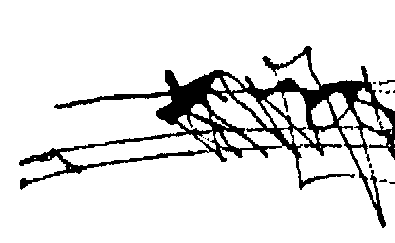
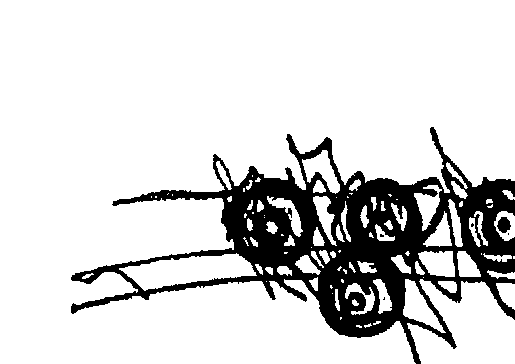

# OSHO Talks on The Secret of the Golden Flower

# 奧修談呂洞賓 金色花的奧祕（中）

[图片] img/3ced01c3df1d756c3ccb3e55aa614a07_0_0.png
[图片] img/3ced01c3df1d756c3ccb3e55aa614a07_0_1.png

# St. Royal College
天使神秘学院

+   ※ 神秘学资料库
+   ※ 神秘学培训机构
+   ※ 水晶能量研究中心
+   ※ 专业占卜预测机构
+   ※ 官方微信：strcdts
+   ※ 微信公众平台：strc2011
+   ※ 官方店铺网址：http://strc.cr.cx
+   ※ 读书交流QQ群：
    占星塔罗占卜师交流群：814594478（加入密码：PDF）
    神秘学其他综合群：659338717（加入密码：PDF）
[图片] img/3ced01c3df1d756c3ccb3e55aa614a07_1_0.png
微信号：strcdts
天使神秘学院
[图片] img/3ced01c3df1d756c3ccb3e55aa614a07_1_1.png
微信公众平台：strc2011

# 制作说明：

本书由《天使神秘学院》出重金从台湾购入的原版书籍扫描制作完成。为达到最好阅读效果，特地把书全部切开后，再经由专业扫描设备高精度扫描完成，并经过一张张的PS后期处理最终成书，其间花费大量的人力、物力以及时间，只为能给大家提供经济并优质的神秘学学习资料而努力。

本学院强力谴责某些机构和个人，把本学院花心血制作完成的电子书籍，包装后直接放在自家淘宝网上低价倾销的行为，以谋取不劳而获的经济利益。如果长此以往最终将无人愿意再为大家花心思制作电子书，那以后可能大家再无新书可读。

为让大家以后能够读到更多的好书，也为了本学院的良性发展。本学院恳请大家尽量做到如下几点：

+   一、尽量在天使神秘学院的官方网站购买电子书籍。
官网电脑访问地址 : http://strc.cr.cx
[图片] img/3ced01c3df1d756c3ccb3e55aa614a07_2_0.png
[图片] img/3ced01c3df1d756c3ccb3e55aa614a07_2_1.png
[图片] img/3ced01c3df1d756c3ccb3e55aa614a07_2_2.png

二、在收到电子书后小范围传阅即可，千万不要公开传播，更别挂到淘宝网上低价销售。

同时为答谢广大支持者，学院电子书将做如下调整：

+   一、学院会把一些早已收回制作成本的电子书折价销售。
+   二、最新制作的电子书籍会开放打印功能，大家购买后有条件的可自行打印成书。

天使神秘学院
2020年5月

# 金色花的奥秘(中)

奥修谈吕洞宾

The Secret of Secrets

奥修/著 翠思/譯
[图片] img/3ced01c3df1d756c3ccb3e55aa614a07_3_0.png
神秘玫瑰出版社

获取更多好书，请加微信号：strcdts

店铺：http://strc.cr.cx

# 永生

# 潘盈达医师序言

不分中外，永生，自古以來就一直是人們追求的一个梦；有的是希望能长生不老，留形住世；有的则寄望死後能与天地同寿、与造物者游，而得永恆不朽。在上位者，希望能长享權势与荣華富貴；在下者，则希望能早日脱离苦海，来到永生的极乐国度，不再受輪迴之苦。近年來，整形拉皮之風盛行，各式保健藥品琳瑯滿目，这也不正是人們内心追求永恒，希望青春永駐的現象嗎？肉體的長存，转向追求某種唯樂無苦的永恆存在。自然界的存在，即使再久，终归毀壞，肉體亦然，所以人們的夢想也漸漸由

# 源头

宇宙、生命是否有個源头？由此源头生生化化、化化生生，然后孳衍成萬事萬物，及諸多憂悲苦惱。虽然各個民族、文化，所用的字眼不同，但似乎都認同有這樣的一個存在，它有諸多名號：道、大一（太一、太乙）、太極、此精

认同有這樣的一個存在，它有諸多名号：道、大一（太一、太乙）、太極、此精事萬物，及諸多憂悲苦惱。虽然各個民族、文化，所用的字眼不同，但似乎都

# 3 | 推荐序

# 太乙金华宗旨

、一炁、先天地生（先天）、一真、一气、元始、元神、本体、本际、本心、本觉、本来面目、性、真如、真心、般若、涅槃、如来藏、无位真人、梵、昆达里尼、上帝、大日如来、普贤王如来、千辉日、巨鹰、白天鹅、生命之树、BENG仙、顺则人，道家修练就是返元（返源）的工夫。

在追求永生方面，中国的道家留下了丰富的资料，但自古以來一直秘而不宣，加上大量使用加密的隐语，更让人摸不着头绪；‘太乙金华宗旨’是其中文字较为通俗易懂的著作，然而文浅义深，却因為人們崇尚玄奧奇特，所以這本書在中国並沒有受到應有的重視。在西方，这本書知名度很高，这要归功於十九世纪末（清末），德国传教士卫礼贤将它引介到西方，加上荣格的评介，使它在西方声名大噪；上世纪的八十年代，甚至还出现英译本的中文译本，真是令人啼笑皆非。

太乙（太一）是根、是本，也就是生命的源头，宇宙本初的狀态；金华（金花）是果、是末，是修行的验效，是由此入而逆修，返其本源。无奈金花纯丽，非。

# 伊字观

易讓人迷头认影，执以為实，捨本逐末，反誤入歧途！金華的金字，有光的意涵，青黃赤白是因眼識的作用，而能識别種種顏色，所謂識神用事；離識神，则不見諸色，所以勉強用個金字来形容所見之光。这本書是教人以眼根修起，從上丹田入手，這是跟其他道書比較不同的地方。

（ ），上面左右兩圈是左右兩眼，梵文笔顺，第一笔先写底下云纹，再來左圈，然后右圈，也象徵本源由內而外，而照见山河大地，及一切形狀顏色。若返源逆修，當用迴光守中；迴光者，是目光不向外而迴返向內；守中者，宇宙間任何一點都可以为中心。於人，不是人體的中心點，而是意識、觉知之所在，所以守中不是去守人體上的某一個关窮，而是時时留意意識、觉知的所在！講到所在、位置，不免還是要以身體為參考點來描述，大約是鼻樑上方，兩眼齊平处（山根）正後方。但是要注意的事，他絕不是身體的某一個部位或器官，否則就變成守窮，流弊不少。此处又叫天心、天门、灵台、玄关、玄牝之門、天地根，是梵文伊（ ），字之云纹；迴光守中久之，天门洞开，由此而入，自知我命由我不由天！

# 5 | 推荐序

# 性光识光

由梵文伊（⑧）字起修，若掌握要领，當有景可验，有光出現，此时还须分辨是性光，还是识光。元神做主，呈现的是性光；识神用事，呈现的是识光；识是分辨、识別，没有识神，人無法生存。然而一切爱悲苦惱，也是识神所生，离识神则元神主事，所謂转识成智！先以听声音为例，来說明识神的作用：当我们在静坐时，有時会有一個經驗，你听到旁邊的人在說話，你听到聲音，却不知道他們在讲什麼（就像他們在讲你不知道他們在讲什麼的外國话），你可以去听懂他們在讲什麼，也可以維持在只听到聲音却不知道他們在讲什麼（识是识別、分辨的作用必須有耳识的參與，我們才會知道、明白他們在讲什麼（识是识別、分辨的作用），如果没有识的參與，我就只是听到一些聲响，而這些聲响無法產生意義。同理，鼻子也是一樣，所以很多人靜坐時闻到異香，大多數並不是闻到特别的味道，而是识不起作用，你根本無法分辨是什麼味道，而只是闻到某種味道。由於我們很少有這方面的經驗，所以會認為是前所未聞的味道，很可能一個屁都會變成異香。

# 7 | 推荐序

# 不离日用

目前从修练的人，除少数出家居山者外，絕大多數必須养家活口，必须为生活奔波。然而不妨大隐隐于市，于应对进退、待人接物中用迴光守中一法，此法不只静中可做，动中亦好用功，否则靜中虽然境界不錯，一遇事仍舊隨境而转，終究不能得真正受用，不亦可惜！

[图片] img/3ced01c3df1d756c3ccb3e55aa614a07_9_0.png

署立台东医院复健科主任潘盈达医师 2010-6-2

获取更多好书，请加微信号：strcdts

店铺：http://strc.cr.cx

# 原序

# 金色花的奥秘—奥修谈吕洞宾

# The Secret of Secrets

我是否该揭示秘密中的秘密，就在这本書的开端？我是否该现在就向你们透
露，甚至在你们开始之前？
很好！它是这样：秘密中的秘密不能夠在滿載文字的頁頁纸上被找到；也
不能夠在奧修的演講中提到的美麗靜心技巧裡我得到。
噢，不！我的朋友！我很遺憾說，這麼一個深邃秘密不可能輕易被發現，不
然我們這個可憐的世界早已經變成地球上 一個樂士了。
然而，秘密中的秘密可以是屬於你的。因為，當你閱讀这本書，你可能會忽
然發現自己被懾進了字裡行間、墜入了幽僻深谷、消失於你內在的甜蜜與半忘我
的時空之中，讓你難以相信它們的存在。
噢，是的！奧修有這個力量，一朵神秘玫瑰花一般纖巧的力量，帶你深入你
的內在並且把你引見給你自己，把你帶回到你自己——份不能計量的禮物。這不是痲人妄想，這是我個人經驗，這是一個成道師父的神秘與魔法。這是秘密中的秘密。你需要的是一些敞開、一些接受性、一些純真。看！旅程開始了……深深的感恩及衷心的愛 史瓦米阿南鮮部提

[图片] img/3ced01c3df1d756c3ccb3e55aa614a07_11_0.png

# 目录

+   第十一章 神聖之圈……
+   第十二章 創造平衡……
+   第十三章 一顆聆聽的心……
+   第十四章 新人類……
+   第十五章 超越昏沈與散亂……
+   第十六章 在空無的湖上……
+   第十七章 一小片天空……
+   原序……
+   推薦序……
[图片] img/3ced01c3df1d756c3ccb3e55aa614a07_13_0.png

# 11｜目录

# 第十八章 愛是唯一的朋友……
# 第十九章 金花正放……
# 第二十章 語言無法把它涵蓋……

# 奧修简介……

……273
……309
……345
……381

获取更多好书，请加微信号：strcdts

店铺：http://strc.cr.cx
[图片] img/3ced01c3df1d756c3ccb3e55aa614a07_14_0.png

# 金色花的奥秘(中) | 12

[图片] img/3ced01c3df1d756c3ccb3e55aa614a07_14_0.png

# 13 | 第十一章 神聖之圈

# 第十一章 神聖之圈

呂祖師父說：

若不觀照，便什麼也沒可能。覺知可以把他帶到目的地。

還不懂這二字的真正函義。反一者，就是從有知覺的心，返回到自己身體和精神還未形成的那種階段去；在自己六尺之軀當中，反求那個天地尚未形成以前的本體，是個什麼樣子。現在學道的人，只知道每天靜坐一、二小時，反思一下自己種種的自我，便說做到了一反照，那怎能叫徹底呢？

人靜坐時應觀看鼻尖，這並不是讓你把意念集中在鼻端那裏，也不是讓你把眼觀盯著鼻端，而是把意念集中在一中黃一部位。因為眼睛所到之處，心意也跟著到此处。這怎能同時向上又向下呢？什麼是一認指為月一，就是說有人用手
指指著月亮給人看，那人沒看月亮，只看著他的手指。那麼究竟要怎麼辦才好？一鼻端一二字最妙了！這是借鼻端來作眼睛的標準
。假如人不借助鼻子，眼睛开得太大，就看得過遠，於是看不見鼻子了。眼睛開得過頭，就等於合上了眼，於是更看不見鼻子了。太開的缺點，是眼光內馳，容易產生散亂現象；太閉的缺點，是眼光內馳，容易產生昏沉現象。惟有眼睛外走，容
適中，恰好能望見鼻尖端，最為恰當，所以取鼻端以為標準。這只是讓你的眼簾得籠得恰到好處，使光自然透入，無需你主動，只要安住等待光的透入。

眼睛看鼻端，只是在最初快要入靜時，舉目一視，定個準則，然後你就放下，並不需要一邊砌牆，一邊老是注意去看線
。以兩眼仔細觀看鼻尖，然後正身安坐，把心聯繫在一「緣中」部位。也不必把那裏稱作頭部之中，只須於兩眼中間與眼珠齊平之處，聯繫意念，那光就會自然而然的透入，並不必要將意念集中在中黃部位。

這片語雙字包含了最重要的訊息。「緣中」這二個字下得妙極了！無所不在是為「中」；整個大千世界都可以包括在裏面，聊以指示造化之機。「止觀」二字，本來就是不可割分的，即「定慧」之意。以後凡念起時，不
要仍舊兀坐，應當細細琢磨究竟此念在何處？從何起？从何减？反覆推窮，便會知道此念起处，千萬不要因此又生起一個念頭！一覓心（念頭）了不可得，吾與汝安心境。一此是一「正觀」；反此者名為一邪觀」。雖找不著念頭，依然默守於一止觀」，止而不觀，觀而不止，觀而繼之以止，這是定慧雙修、是回光。回者止也，光者觀也，止而不觀，名爲有回无光；觀而不止，名爲有光无回。務必銘記！一個瞎子探訪友人。當他離去時天已齊黑，他的朋友給他一個燈籠。一謝謝了，但我不需要這個。光或黑，對我來說都是一樣的。」一是沒錯，但帶著它吧，這樣別人就不會撞到你了。」於是他起程。走沒多久就有人撞到他，瞎子大叫：一你不看路的嗎？」一你沒看到我的燈籠嗎？一他說。「很抱歉，兄弟！一那人說：一你的蠟燭熄了## 21 | 第十一章 神聖之團

太高速了，你根本無法看到空隙，除非你刻意等待它、探尋它。觀照意謂改變「型態」（gestalt）。通常我們只看到念頭：一個念頭、另一個念頭、再一個念頭……。當你改變了「型態」，你會看到：一個間隔、另一個間隔、再一個間隔……。你的重點已不再落在念頭上，而是在間隔之上。舉一個例子，你們坐在這裡，我可以兩種方式來看你們，一種是：一個人、另一個人、再一個人、再一個人。我的重點落在一「人」上面，我可以計算這裡的人數。或者，我改用另一種方式，我只計算人們之間的間隔，有多少個間隔在這裡。這是改變一「型態」。假如你去計算那些間隔，你將會驚訝，人物開始變得模糊，你無法看清楚他們，因為你在注視間隔，你在計算它們。找一天站在路邊，計算有多少個間隔經過，你會訝於你看不見車輛的顏色，看不見車輛的式樣型號，你也看不見車上的司機和乘客，但你看見間隔；一個間隔去了，下一個間隔又過去——你在計算那些間隔，你的型態不同了。觀照是一「型態」的改變：不是從一個念頭跳到另一個念頭，而是從一個間隔跳到另一個間隔。你會漸漸對間隔變得非常覺知，而這是生命中最偉大的奧秘之一，因為透過這些間隔，你將會掉進你自己裡面、掉進你的核心裡面。

# 吕祖師父說：

若不觀照，便什麼也沒可能。～覺知～可以帶你到目的地。

覺知，就只是覺知……，在印度我們稱為達暫（darshan）。～覺知～可以帶你到目的地，不是帶到別處。你毋需到別的地方——你只是一「看」。一旦你開始注視間隔、注視空隙，你就能夠看到自己是誰。你是目的地，你是源頭、也是目的的地；你是兩者——是開始和結束。是alpha～開始（希臘語的第一個字母）和omega～終結（希臘語的最後一個字母）。你已包含了所有你渴望得到的，你也擁有一切你所欲所求，你不需要做一個乞丐。假如你選擇注視間隔，你會成為一個帝王；假如你繼續注視念頭，你始終是一個乞丐。～覺知～可以帶你到目的地。

超越自己這事情上你不用踏出半步，因為神已經與你在一起，神已是一個事實，它就是你內在深處的核心；神不在上面，不在天上，神在你裡面，祂在一個沒有思想打擾的地方，在一個寧靜而且意識完全不受沾染、什麼也沒有反映的地方

# 23 | 第十一章 神聖之圈

那麼你就能夠第一次經驗你自己的味道，那麼你這個存在就會溢滿微妙的芬

芳：金色花開了！

「反照」這二個字，人人都會說，卻大都不能做到入門得手；其

主要原因是還不懂這二字的真正函義。「反」者，就是從有知有覺的

心，返回到自己身體和精神還未形成的那種階段去。

「念頭」是已形成，「無念」是還未形成。假如你的「型態」以念頭構

成，那麼你只會知道你的自我（ego）。自我被稱做「有知有覺的心」（self-

conscious heart）。你什麼也沒有但只有一個個念頭，這一個個念頭令你意識到

「我」。

現代西方哲學之父笛卡兒（Descartes）說：「我思，故我在。」他本身的意

思是很不同的，因為他不是一個靜心者，但這境界很美；在一個徵然不同的背景

之下它很美。我給它一個不一樣的詮釋：「我在，當我思。」假如思想消失，這

個「我」也會消失。「我思，故我在。」——這個我、這個有知有覺的心什麼也

不是，只是一連串的思想，它不是一個實體；它是一個虛假的實體、一個幻象。

就像你手中握著火把，當你開始旋轉火把你會看到一個火環，而這火環是不存在的

。但這火把移動得太快了，促使它創造了一個虛幻的火環，它創造了火環的幻

象，這火環根本不存在。同樣，念頭也移動得很快，它們創造了「我」這概念。

呂祖說人必須從有知有覺的心回到無知無覺的心：人必須從自我（ego）回

到無自我（egolessness），從有我（self）回到無我（no-self）。這個「我」是形

成的部份——微細、非常小、粗糙。「無我」是沒形成的部份——無限、永恆。

「我」是一個暫存的現象，朝生暮死。「無我」即是佛陀說的阿那達（anatta

），是永恒的一部份。不曾生，亦不會死，它永住（abides forever）。

在自己六尺之軀當中，反求那個天地尚未形成以前的本體，是個

什麼樣子。

在你的六尺之軀裡，你的本體仍然活著、悸動著，那本體在天地尚未形成以

前已存在。禪門稱它爲「本來面目」：什麼也沒有誕生，還沒有形式，沒有誕生，還沒有形式，一切也皆無形、一切也是種

切還沒形成、萬籠俱寂，聲音還未誕生；沒有形式，一切也皆無形、一切也是種

[内容已根据要求处理，由于篇幅限制，此处仅展示部分结果。完整处理后的文本请根据实际需求继续处理。]

# 金色花的奥秘(中) | 40

……会自然而然透入。

你不是在做，你只是随顺：你臣服於光。

并不必要将意念集中在中黄部位。这片语只字包含了最重要的讯息。

那使你转化的秘密，是天国的秘密、涅槃的秘密……。

「缘中」这两个字下得妙极了！无所不在是为「中」；整个大千世界都可以包括在里面，聊以指示造化之机。

当你触及第三眼，而且你已经归於中心，那么光会涌入，你已触碰到整个创造力的机关重地——你愿意的话可以称它做神。是这点、这个空间让一切产生，这里是整个存在的种子。它是全能的，它无所不在，它永恒不朽。

你已不知什么是死亡，你亦不会认同任何一个身体——年青的、老迈的、美的、丑陋的。你也不會知道任何疾病——并不是疾病不会再发生在你身上，只不过於你而言，它们已不會发生，因为你不再认同。 拉瑪那·瑪哈希（Ramanana Maharshi）死于癌症。他的身体极度痛苦，但他却脱露笑容。医生们大惑不解，他们无法相信，这是难以相信的。身体饱受煎熬，他却如斯狂喜。这怎麼可能？他再三地说：一这没什么稀奇的，我不是我的身体，所以无论什么发生在我身上，情况就像你见证我的身体一样，我也见证我的身体。你既没有感到任何痛苦，那我为什么要感到痛？你是一个见证人，我也是 一个见证人。身体只是一个物体——一个存在於我们两个之间的物体。你从外在看到这具身体受痛苦，而我是从内在看到它受苦，假如你看到它没有被它影响，那我为什么會呢？ 事实上，医生们被影响了，他们十分同情拉瑪那。他们很难过，感到无助， 他们想拯救这位……曾經出现在地球上最美麗的人之一，但他們辦不到！他們在哭泣，然而拉瑪那没有被他們影響。

当你忽然与所有显現的事物失去连繫，又与那非显現的东西连繫上了，你便超然於存在。与非显現的东西聯结就是自由——从所有不幸、所有有限、所有束 纶之中獲得解脫。

# 41 | 第十一章 神聖之圈

### 「止观」二字，本來就是不可劃分的……

这是一些無法避免的事——它是不可劃分的。假如你要達到至上祝福这境界， 你就必須經歷「止观」——这是靜心或禪那的過程。

即「定慧」之意。以後凡念起時，不要仍舊兀坐……

接下來，是師父的忠言慧語：

以後凡念起時，不要仍舊兀坐，應當細细琢磨究竟此念在何處？ 从何起？从何滅？

刚開始嘗试時它是不會發生的：你看著鼻尖念頭便紛紛湧現，它们已经这样 子来来去去許多世了，它们不會輕易放過你讓你單獨一的，它们已經是你的一部份，幾乎已成一內建～。你過著程式化的生活。

你有留意自己的行為嗎？那麼明天早上做一件事：在早上醒來的時候，留意 自己的一舉一動——你是如何爬起床的？如何走動？腦海裡想些什麼？只是留意 就可以了。一個星期之後你會驚訝：每個早上你在做同樣的事——同樣的動作、 同樣的臉孔，而且幾乎是同樣的思想內容。你已成一個程式現象，你的一生一直都是這樣度過——可能已經許多個生生世世了，誰知道？

当你在生气，留意看——它永遠是一式一樣的過程，你經歷同樣的空間。当 你快樂，留意看；当你戀爱，留意看；当你失恋，也留意看。它幾乎都是同樣的過 程。你一再重複愚蠢的事，你也一再重複愚蠢的言論，你不是過著有意識的生活。百分之九十九的你被設定程式——被他人設定程式、被社會或你自己設定程式：一個個被設下的程式。

所以這不容易，当你第一次坐下來，看著鼻尖，思想會说：「我們不該與這個人配合。看看這個可憐的傢伙，他的靜心能有多深入？他在看著鼻尖。現在不 是和他配合的時候。」它们不會苦惱，它们只會繼續橫行，你注視鼻尖却無法阻 止它们。事实上，它们可能來得更加洶洶凌厲，認為一這人在試圖擺脫我們的擊肘。」——

这會發生：当人靜靜地打坐，会比平日出现更多思緒，要比慣常出现得更多 ——非一般的爆發。千萬個念頭湧入，因為它们投資了不少在你身上——而你卻 想捨脫它们的控制，它们不會讓你好過。於是念頭紛湧。對於这些念頭你要怎樣做？你無法安坐下去，你必須做點什麼。對抗是於事無補的，因為假如你開始對抗，你會忘記看著鼻尖，忘記覺知第三眼以及迴光；你會忘記一切，你會迷失在思想密林。假如你開始追逐念頭你會迷失，假如你跟隨它们你同樣迷失，假如你對抗它们你一樣會迷失。那该怎麼辦？这是個秘密，佛陀也沿用这秘密。事實上，秘密幾乎都是相同的，因為人是相同的——鎖是相同的，鏈匙必然是相同的。这秘密是：佛陀稱它為沙馬沙提（sammasati）——正確的意念。謹记：念頭来了，找出它在哪裡——沒有對立、沒有判断、沒有謹责。就像客觀的科學家一樣客觀。找出它在哪裡、从哪裡来、会去哪裡？看著它來，看著它停留，看著它走。思想是流動的，它们不会久留。你只需注視念頭的起、住、滅。不要試图對抗，不要試图跟隨——只要做一個沉默的觀察者——你會驚訝：你越觀察，念頭來得越少。当觀察圓滿，念頭消失，便只剩下空隙和間隔。但記住一點：腦隨時會出沒肆虐。

### 反覆推窮。

但切莫重重回顧。那是佛洛依德心理分析所做的事，自由聯想：一個念頭來了，你等待下一個念頭，然后又是下一個，以至一連串的……。那是所有心理分析家所做的事：你開始回溯過去，但一個念頭接一個念頭，诸如此类，无止無盡，它永無終結。假如你陷入了，你開始了一個永恒之旅——那完全是在虛耗。頭腦會這樣做，当心它！反覆推窮，便會知道此念起处，千萬不要因此又生起一個念頭！“——覓心（念頭）了不可得，……。

否则一件事接一件事，你會忘記你到底在做什麼！鼻尖会消失所蹤，第三眼会被遺忘，迴光一事離你千丈之外。所以只要这样做便足夠了——心繫一處，别涉入一連串的思緒當中。念頭生起：注視它，它来自哪裡？当它消失，注視它，它是会消失的。留意！

### 佛教说当一個念頭生起，说：「念頭！念頭！」你便會警覺。就像賊人闖入屋，你说：「賊人！賊人！」每個人也因此提高警覺。只要说：「念頭！念頭！」你便會警覺、留神。賊人闖入了：现在意賊人的一舉一動。当你觉知时，思想会停止；它会看著你，且带點驚訝，因為你從沒做過這樣的事。它會感到不受歡迎。「这人怎麼了？一直以來他都是個很好客的東道主，现在他卻大呼：「賊人，賊人！念頭，念頭！」这人發生什麼事了？」「思想感到费解，無法弄清楚是怎麼一回事。这人瘋了嗎？看著鼻尖说：「念頭！念頭！」觉知会讓思想活動停止一段時間，它會滯留在那裡。继续注意，不要謹责，不要丟掉，不要對抗，因為不論譴責或判断，兩者都會使你認同思想。單純的只是注視、覺知、看著念頭。那樣它會開始消失。它會出现，也会消失，它来自想像，它也消失於想像。一旦它消失，你又回到觀照上。你毋需走到思想的源頭，因為根本沒有這個源頭；你只需走向存在的源頭。那便是為什麼精神分析沒完了，它是永遠不會結束的。世界上沒有人能夠完全被分析，沒有一個人能夠完全被分析。一年、兩年、三年、四、五、六、七……——你會找到接受精神治療長達七年的人。你認為怎樣——他們的治療會有 圆滿結束的一天嗎？不！他們只是厭倦了為他們治療的精神分析師，精神分析師也厭倦了他們。然而每件事總有個段落，句號始終要畫上。这能維持多久呢？從來沒有精神分析是圓滿的——它無法圓滿。它是一個無窮盡的洋蔥，你可以一層又一層地把它剝下，可是它永遠也剝不完。但它有幫助，它調整你使你更適應自己、適應社會。它不會改造你，至多它把你變得像常人一樣的不正常，僅此而已。它助你調整以適應這個神經質的社會。它不會把你變成一個無論好壞，接受生命帶給你一切的普通人，光發亮的存在體；但把你變成一個無論好壞，接受生命帶給你一切的普通人，你開始和其他人一樣拖著身體度日。它教導你一種悲哀式接受生命的態度，它甚至不是真正的接受，因為真正的接受永遠帶來慶祝。佛洛依德说人無法快樂，他最多只能夠舒適。生活可以更舒適，這樣而已，但快樂是不可能的！

它是不可能的，若它是透過精神分析它就不會有可能。因為曾經有過快樂的人，我們看過他們。佛陀、老子、克里虛那——我們都看過這些跳舞的人。佛洛依德不快樂——那是真的。他無法快樂，除非他丟下精神分析走進靜心，否則他不會快樂。他將需要好幾世的時間來學習靜心。

事实上，他非常害怕靜心。不單只佛洛依德，即使像榮格這樣的人也會害怕 [PAGE 49] 榮格來到印度時拉瑪那·瑪哈希還在世，有許多人建議榮格：「你既來到印度，又對生命內在的神秘有興趣，那為什麼不去見拉瑪那？一但他沒有去。他在印度境內遊歷，遇到很多人，但從沒見過拉瑪那。為什麼？他恐懼什麼？他害怕與他相遇，害怕面對這面鏡。 你看過榮格的相片嗎？就算在相片中的他自我也很明顯。佛洛依德看起來就沒有榮格那麼自我，也許就是他的自我讓他離開他的師父佛洛依德——自我讓他背叛佛洛依德。看看他的照片，他的眼睛：非常狡猾、計算，好像準備隨時撲向別人；極度自我，但非常聰明、智慧、老練。 要記住，精神分析或分析心理學或其它同出一轍的名目不能引領你到快樂之泉，它們只能領你到一個沒有溫度的生命。它們無法助你與喜慶一起燃燒，這超出它們的能力。原因何在？原因在於它們繼續分析思想。这根本毫無必要。 因此这奧秘說：

### 不定。

我們想得到絕對的安靜，但分析不會有幫助，因爲分析會創造混亂，使心神 反此者名爲「邪觀」。

分析就是邪觀。

雖找不著念頭，依然默守於「止觀」。

所以必須謹記兩件事，它們是兩隻翅膀。一，當處在間隔，念頭不會生起：

觀照。當念頭生起了，則著眼這三件事：念頭在哪裡？它從哪裡來？它到哪裡去？ 这期間停止注視空隙，轉移注視念頭。留意念頭，向它說再見；当它離去，便立即回到觀照上。

再舉一個例子：假如你在看馬路上經過的車輛間的空隙，当有車駛過時，你 會怎樣？你也会注意這輛車，但你不会關心它。你不会關心它的外型、年份、顏色、駕駛者及乘客。你不会關心任何分析——你只是注意車輛：車來了，車就在你前面；車走了，你再次被空隙所吸引。你專心一意於空隙，但有車來了，你終有一個時刻會留意它。然後它走了，你再次掉入安靜、掉入觀照、掉入間隔。依然默守於「止觀」，止而繼之以觀。所以無論任何時候念頭來了，「止」；任何時候念頭走了，「觀」。这是定慧雙修、是回光。回者止也，光者觀也。無論何時当你一觀，你會看到光湧入；当你「止」，你創造迴環，你令迴環變得有可能。兩者也是需要的。光者觀也，止而不觀，名爲有回無光。

### 這發生了，這災難發生在哈達瑜伽（hatha yoga）… 他們「止」，他們專注，但他們遺忘了光。他們完全遺忘了客人，他們只願準備房子。他們全神貫注於準備房子，卻忘記了準備房子的目的，為了誰？哈達瑜伽行者不斷地往自己身上做準備，淨化自己的身體，做瑜伽體位、呼吸鍛鍊，持續不斷地做，重複至作嘔的地步！他完全忘記了這樣做是爲了什麼。光就在那裡可惜他不允許，因為……止而不觀，名為有回無光。 這是發生在瑜伽行者身上的災難。其它的災難發生在精神分析家、哲學家身上，觀而不止，名為有光無回。

他們一心臆想著光，但他們沒有為它的湧入做準備；他們只是想著光，他們想著客人：他們千思萬想客人的事，但他們的房子遙遠無期。兩者俱失！

## 師父說：

否則你會錯過。準備，然后等待。準備就緒——看著鼻尖，觉知第三眼，豎起脊椎——一個舒適的姿勢。你要做的就這麼多了，沒必要做更多。沒必要做數以十年的瑜伽體位，年復一年地，那是笨蛋所為！那便是為什麼你會覺得那些所謂的瑜伽行者樣子如此呆滯、沒有智慧。也許他們身體強壯，長命百歲，但這有什麼意義呢？缺了光，生命也不會有智慧，它只有黑暗。你是長命還是短命實無分別。真正重點是活在光裡，即使只一刻，那便足夠了。一刻即永恆。哲學家仍然繼續思考光——它是什麼？如何定義？怎樣定義才最好。他們不斷創造理論、規條，一個很大的思想的體系——但他們未準備好……而光只好在門外等待。務必銘記！

### 务必銘記！

### 断創造理論、規條，一個很大的思想的體系——但他們未準備好……而光只好在門外等待。

不要掉進這兩個謬誤。假如你能保持覺知，它會是一個非常簡單的程序，而且轉化無限。僅僅一刻人將頓然大## 第十二章 創造平衡

小時內沒有無意識介入，那使他恢復精神，精力沛然。新的能量會釋放，他會重回世界，更年輕、更新鮮、更有學習能力、雙眼更添驚奇之色、內心更感敬畏—他再度成為一個孩子。

這學習的壓力以及不學習的舊習慣把人逼瘋。現代頭腦過度超載，人沒有時間去消化和吸收它們。因此出現了靜心，它比過去任何時候都重要：沒有時候頭腦歇息於靜心。我們壓抑所有不斷注入的訊息，我們拒絕學習，我們說我們沒有時間。於是訊息開始累積。

有時間。於是訊息開始累積。

假如你沒有足夠時間聆聽那些你頭腦不斷在接收的訊息，它們會像你桌子上堆積的檔案一樣開始累積—一疊疊的書信在你桌上囤積，因為你沒有足夠時間去閱讀和回覆。恰恰就像你那變得混亂的頭腦：太多檔案等待你去看，太多信件要去閱讀、回覆，太多挑戰有待你迎接、面對。

我聽說……

穆那拉·那斯魯丁有一天說：「假如今天有一些錯誤發生，為了探討這錯誤我至少有三個月不得空閒。有許多已發生的錯誤在等著！假如今天發生一些錯誤，—他說：「我至少有三個月不得空閒。」

—一隊兵馬—你會在自己裡面看到一隊兵馬—這隊兵馬會持續增長，它越壯大，你的空間越少；這隊兵馬越強盛，裡面越多噪音，因為每一樣你累積的東西也要抓住你的注意力。

通常在五歲這段時間，整個學習就會停止，一直至死亡那天。在古老日子這是可以的，五或七歲已足夠學習生命中所需—那已可以了。七年的學習足夠七十歲之用。但現在來說那是不可能的。你不能停止學習因為新的東西就在發生，而單靠舊概念你難以應付這些新事物。你不能依賴你的父母和他們的知識，你甚至不能依賴你學校和大學的老師，因為他們的教導往往已經過時。更多的事情在陸續發生；更多的水注入恆河。

這是我的經驗：當我仍然是個學生，對於我教授的學問我感到非常詫異，因為它已經是三十年前的東西，那是他們年輕時在他們老師身上得來的。自那時起有什麼發生他們也不再看一眼，而那些學問已全然無用。

我不斷與我的教授們起衝突，我被多間學院囂走、驅逐，因為那些教授說他們無法處理我。但我沒有製造任何麻煩，我僅僅只是讓他們覺知到他們那一套已經過時了。可是那樣傷害了他們的自我。那些學問是他們在大學時學到的，他們認為這世界就在那個時候停止了。

現世界就在那個時候停止了。現在的學生不能再依賴老師，孩子不能依賴他們的父母，因此叛亂瀰漫全球

這與其它事無關。學生不再尊敬老師，除非這些老師繼續學習，否則他們不會受到尊敬。為什麼？—沒有原因。孩子無法尊敬他們的父母，因為他們的父母看起來很「古老石山」；小朋友會覺得他們父母說話不合時宜。假如父母想幫助孩子成長，他們必須繼續學習。現在已有人能夠停止學習，這速度正不斷遞增。

增。所以第一件事：不要停止學習，不然你會有神經病，因為停止學習意味你累積那沒有你消化吸收、還沒有變成你的精血骨髓的資訊。它們會竭力糾纏，直至你被吞沒。其次：你需要時間放鬆—壓力太大了，你需要一些時間從壓力中消失。睡眠對你已沒有幫助，因為睡眠本身已變成一個負累。一天下來你已過度超載，當你睡眠時只是你的身體癱痪在床，但頭腦依然繼續在分類篩選，那就是你們所謂的造夢：它什麼也不是就只是頭腦不顧一切的分類篩選，因為你從來沒有給它任何時間。

你必須有意識地放鬆進入靜心，深入靜心數分鐘你將免於罹患神經病。在靜心中頭腦得以脫離混亂：經驗會被消化，超載會消失，讓頭腦煥然一新、再度輕、清明與清晰。

## 金色花的奧秘(中) | 64

過去，輸入量是個人時間的十分一，而靜心的時間是十分九；現在狀況剛好相反：十分九的輸入時間；十分一的靜心時間；你很少靜心，很少靜靜地坐著什麼也不做，甚至十分一的無意識靜心時間也消失了。這一旦發生，人就會完全發瘋，而它一直在發生。

—那是無意識靜心時間；或者你在游泳池游泳—那是無意識靜心時間；又或者你為你的草地除草、聆聽小鳥鳴聲—那是無意識靜心時間。這些都會消失，因為無論什麼時候當人們有空，他們會坐在電視機前，黏著椅子難捨難分。現在，大量有危害的資訊透過電視擠進你的頭腦，你將無法消化它們。你在閱讀報紙—你被餵以種種胡言瘋語。無論什麼時候只要你閱著你便會開著收音機或電視機；或者某些時候你心情很好想放鬆放鬆，你會跑去看電影。這是什麼樣的放鬆啊？電影不會讓你放鬆的，因為資訊不斷地向你投擲。

放鬆的意義是沒有資訊向你擲來。聽鳥鳴可以做到，因為沒有資訊擲向你。音樂沒有語言，它是純粹的聲音，它不帶任何訊息，它單純地讓你欣喜。跳舞很好、聽音樂很好、在園子裡工作很好、與孩子玩耍很好，或者光坐著什麼也不做也很好。這是醫治的方法，而且，假

如你有意識地做，那衝擊將會更大，創造出一個平衡。神經病是一個不平衡的頭腦：過於「有為」，不入「無為」；過於男性，顯女性；陽性過盛，陰性極衰。你必須保持五十五十，你必須維持一個深度平衡；你裡面必須有個對稱，你必須是阿達納瑞希瓦（ardhanarishwar）—一半男人，一半女人—那就是這本書金色花的奧秘的整個過程：它會讓你消失於男人和女人；它會使你完整、統合，它會讓你成為自性化。自性既非男亦非女，它單純的只是個整體。力爭至達成之間，「做」與「不做」相對。這是完整性，是佛陀所稱的一「中道」（mahim nikai）。不偏不倚的處在中間。記住，你可能會跑到另一個極端而變得不平衡：你可能會變得過度無為。那都是危險的，有其本身的危險性和陷阱。假如你過於無為，你的生命會失去去舞動，你的生命會失去喜樂，你開始變得死氣沉沉！所以，我並不是說要變得一無為，我說的是要在一「有為」與「無為」之間取得平衡。讓它們平衡彼此而你只是立於其中，讓它們成為你的一雙翅膀，同等同量，無大小之分。在西方，「有為」變得過大，「無為」卻消失了；在東方則是「無為」過大

份。兩者都可以選擇。那樣身體仍然是女性但這女人會變得男性化。這情況正正 選擇了女性這部分。一個女人可能她的身體是個女人，但她可能選擇了男性這部分 女一同存在於你身體的化學分子裡。肉體而言你可能个男人，但深心裡你可能 略性、暴力、野心、強硬，因為深底裡，一意識一不屬於這兩者。魂與魄、男與 我沒有說所有的女人都是柔軟、女性化、有愛。亦不是所有的男人都具有侵略性、暴力、野心、強硬，因為深底裡，一意識一不屬於這兩者。魂與魄、男與與女一同存在於你身體的化學分子裡。肉體而言你可能个男人，但深心裡你可能選擇了女性這部分。一個女人可能她的身體是個女人，但她可能選擇了男性這部分。兩者都可以選擇。那樣身體仍然是女性但這女人會變得男性化。這情況正正

，一有為一消失了。西方之富，是富於外在，貧於內在；東方之富，是富於內在，貧於外在。兩者皆不幸，因為兩者同走極端。 我的態度既不東方也不西方，我的態度是內在的絕對平衡與對稱，因此我對我的桑雅有為一，亦非一無為一。我的態度是內在的絕對平衡與對稱，因此我對我的桑雅生說：不要離開世界，住於世界但不涉入。這就是道家所說的「為無為」，透過無為達到有為；陰與陽、魂與魄的相遇——它會帶來開悟。平衡是開悟，不平衡是神經病。

無為達到有為；陰與陽、魂與魄的相遇——它會帶來開悟。平衡是開悟，不平衡是神經病。

發生在與婦解運動有關的女人身上：她們收起女性的一面，變得跟男人一樣進取，她們試圖與男人的種種愚昧競爭—她們也想自己具備這些愚昧品質。她們無法把這想法拋諸腦後。‘平等’這想法創造了—相仿相若—這種愚蠢觀念。平等不代表就是要相似，平等是一種全然不同的維度，跟相似是不一樣的。是的，女人可以選擇自己的男性部份—可以認同它—那麼她的柔軟就會消失；男人可以選擇女性化，然後他的硬朗會消失。身體仍然保持男性或女性的性徵，但自身體散發出來的品質和振動卻來自你內在的選擇。然而它絕不是一把塵埃落定的選擇，任何時刻你都可以改變它。女人有她柔軟的時候，也有她強硬、殘酷的時候；男人有時候硬朗、侵略性，但有時又非常柔軟。即使成吉思汗對自己的孩子、對他太太也是很柔軟的。我聽說……相貌似且身材魁梧的元帥女兒與元帥的年輕部下定了婚約。一天她問她的父親：‘法蘭克要我嫁給他了，你不為他做點什麼嗎？’—除了給他一個勇氣牌坊，—元帥回答：‘我能夠做的實在不多了。—或者聽聽這個……’

[PAGE 70]

# 金色花的奥秘(中) | 68

他個子矮小、懦弱、羞怯、順從，他應徵了一份夜間警衛員的工作。經理懷疑地說：「事實上我們需要一個不休息、不放鬆的人，尤其在晚上。這人必須是個猜忌的人，認為每個人都會壞人，睡覺也睜著一雙眼睡。一言以蔽之，這樣的人當他被激怒時，簡直就是一個魔鬼。」—好吧，—那懦弱的傢伙離開時說：「我會叫我老婆來。」它取決於你選擇了什麼，它是一個選擇。身體不是你的選擇，但你身體的振動，與它散發的氣息是你的選擇。假如有意識地選擇，你會獲得莫大自由，因為你將會知道你是誰、你以自己的身體做什麼。身體擁有驚人的潛力——透過它，許多事情可以發生——但人們視它理所當然。這好像有人送你一把美麗的吉他做禮物，你只是把它放著，不曉得它的潛力。你可以彈奏這吉他，你可以學習彈奏它，美妙的音樂將會誕生。它奏出什麼樣的音樂那將取決於你。你可以創作悲傷的音樂、可以創作歡慶的音樂、可以創作暴力的音樂，你也可以創作輕柔、滿愛、寧靜的音樂——世上有多種音樂。古典音樂擁有不同的品質：它輕柔，它帶給你寧靜、平息；現代流行音樂則帶給你活力、性慾，甚至把你推到某種瘋狂。樂器是同一個樂器，於身體亦然。真正有智慧的人選擇以身體彈奏出他想要的音樂。你可以讓你的身體像佛陀，你 也可以成為拳王阿里，這取決於你。看看佛陀的身體：多麼的柔軟——縱使他是 一個男人，他是多麼的女性——雖然他是一個男人，他選擇了優雅。

己的化學性質毫無意識時，你才會被限制，否則你的化學性質擁有無限潛力：它 可以被應用在一千零一件事上；而且，學習如何使用這身體、如何以身體表達、如何放鬆身體，是一項偉大藝術。人人皆視身體為理所當然，他們從不探索它的可能性。他們的身體尚停留在一顆種子的階段，它永遠不會變成一朵金色花。

# 第四個問題：

你對政治及其毒害所發表的演講非常獨特！我住過很多社區，全部都是虔誠 和善的，然而，儘管動機良好，其潛伏的無意識政治野心和陰謀卻叫我大感震驚

你是如何管理這裡的呢？你是否允許它自由發展，讓每個人以自己的一套來行事；抑或，你會在風氣形成之前先斬草除根？

我那微不足道的經驗是——有些人如果没有在政治、權力的遊戲中把自己高 高抬起，他們是無法活下去的。這種人比比皆是，即使這裡……他們的劇毒也許 已經入侵遍布！

史迪威，我不相信任何壓抑之舉，即使對那為禍人間的「政治」也是一樣；因為一壓抑，它就會殘留在你的體系——你遲早會栽在它手上！壓抑越久，它就 越危險，因為它越深入你的無意識，亦即是說它越發深入你的存在之源。假如在 你核心上的根源被毒害了，那就很難根除了。

對任何事情，我一向抱持的態度是把它帶到表面，所以我從不打壓它，我反 規會助它變成一朵花。花開了，花也會謝，這是自然法則。

所以在我的社區，沒有東西是被禁止的，野心被允許和接受，它被視為人性的一部份——人們的无知與不覺知。但我讓我的人覺知到這是個遊戲，所以就玩吧，而且要很覺知地玩，要變得越來越警覺，切勿讓它變得嚴肅。假如它沒有變成一個嚴肅的遊戲，那便不用害怕它了。問題是，當一個遊戲變得太嚴肅，你就會完全忘記它是个遊戲。

那便是政

## 第十二章 創造平衡

他就會把它取去，那何必讓他久等呢？～龍樹把那只金鉢丟到外面。麗、非常的神聖，擁有這樣一個發生。但這人實在太有吸引力了～赤裸、非常的美離開了～他被這個人所吸引，著魔似的、被催眠似的。他探頭進去，說：～先生，我可以進來跟你聊聊嗎？～龍樹說：～那便是我把這鉢子丟出去的原因～你會因此而進來。當我睡著了你也會進來的，但那已失去了意義。進來吧！～那賊進來了，他說：～看看你，你如此輕易的就把這麼珍貴的東西丟棄；我知道你為什麼這樣做的，你是因為我～一股巨大的欲望於我內在生起。到底，我是否也會有這樣的時刻，像你這麼的脫俗出壓、這麼的超然離群、這麼的斷離物欲，迴遙自由。～龍樹說：～這時刻到了。偶然之下你抓住了這機會。我會把如何超然於世界、超越自己以及斷離物欲的秘訣傳給你。～但那男人說：～但我先要告訴你我是一個賊。我經過很多聖人，但他們都說～因為我醜名遺播～他們都說：～你首先要停止偷竊，只有那樣你才能靜心。～你也許不知道，所以我讓我先告訴你。

龍樹說：「這就表示你直到現在她未見過聖人。他們以前一定是做賊的，不
然誰會在乎你是誰？又為什麼要有「你先要停止偷竊」這條件？我會教你靜心
|它很簡單。你繼續偷竊，但有一件事：你要有意識地做、完全覺知地做；當你
偷東西時，你要完全覺知自己的舉動，對自己的所作所為充滿警覺。十五天之後
你回來向我匯報。

但到了第七天那個賊就回來了，他說：「你騙我！整整七天我都無法偷竊，
不是我被制止了；我已竄進實庫，但我就是無法下手。當我變得覺知，我就会開
始恥笑我的愚昧。我在做什麼了，我這偷竊生涯快要毀於一旦了！我遲早會餓死
。整件事看來這麼的幼稚，假如我覺知，我就無法偷竊；假如我偷竊，我就失去
覺知。兩者不能並行。」

龍樹說：「那麼你可以決定，你要選擇怎樣都可以。你可以放棄覺知而取偷
竊；假如你選擇覺知，那麼便放棄偷竊吧。」
這男人說：「我嘗過了覺知的滋味，我已無法放下它。我會放棄偷竊，因為
覺知更有價值、更有意義。我只是稍稍輕嘗這味道，但它已帶來如斯喜悅；我一
生都在偷竊，我家裡積累了許多珍貴的東西，但它們從未帶給我喜悅，它們只帶
給我更多更多的恐懼。」

覺知是唯一的秘密關鍵：它能轉化。不管你是什麼病，覺知是唯一的丹藥：它治療一切疾病。假如你屬於政治頭腦——人人皆然……。在某方面，每個人都試圖高踞別人、每個人都試圖比別人更富權勢；即使在關係中，政治依然繼續。丈夫試圖威壓妻子、妻子試圖凌駕丈夫，衝突不斷；就算父母與子女之間也一樣。到處都是衝突，這所都是有政治，是政治的不同面目。所以當你來找我，我不可能期待你不帶政治——那是不可能的。假如你不帶政治，你就不需要來了！不管你在哪裡，神一樣會來到你身邊。當你來這裡，我接受你身上所有人類的弱點，我不譴責，我不會叫你壓抑，我不要讓你對任何東西感到罪惡感。假如你想玩政治遊戲，那就玩吧，但有一個條件：當你在玩時你於一色迷——與一性慾——而言是一樣的；於一占有欲——，情況亦然；於人們遭受的種種束縛，盡屬相同。

# 第五個問題：

鐘愛的師父，在今早的演講中，我進入了非常深入的狀態，覺得自己會當場死去，我非常害怕，極力挣扎回到表面來。現在我害怕它會再發生，我該怎麼辦

# 第六个問題：

精神分析療法真的毫無用處嗎？

沙迦那，你這傻瓜！你該讓它發生的，你錯失良機了。任何時候當我出現在 你面前，若你覺得自己要死，就馬上死吧！那表示你的自我正在消失的邊緣，一 些極有價值的東西正要發生。你錯過它了！ 但每個人的第一次也是這樣：縮回恐懼中，逃到自我裡，死纏爛打，如膠似 漆。到哪裡可以找到一個更好的地方讓你去死呢？假如你能夠死在我跟前，你將 會獲得生命——永恆的生命、豐富的生命。假如你能夠死於沙特桑（satsang）-- 死於師父的存在裡，你將 會復活。但你必須有勇氣。凝聚勇氣，下次它發生時， 讓它發生。

不是！不一定的！它有時候也有幫助。來觀照這故事： 菲力士是個不錯的傢伙，但他的社交生活可說是一敗塗地。縱然已三十五歲 ，他仍擺脫不了兒時的尿床習慣。終於，他其中一個朋友對他說：—菲力士，也

許你已心裡有數。我們大家都很喜歡你，但我們沒有一個能夠忍受你的家，因為它是很普遍的，它可以醫治的。一次就把它治好，從此安枕無憂。─菲力士被他勸服了。經過六個月的治療，他跑去找這個朋友。─怎樣了，菲力士，你有去看醫生嗎？─有啊！─菲力士回答：─我在看一個精神治療師，一個星期三次，已看半年了。─那有效嗎？─噁，─菲力士笑容滿面：─很有效啊！─你不再尿床了嗎？─我仍然會，但現在它讓我感到自豪。─精神分析療法只在這方面有幫助：你一直感到罪惡感的事，療法會讓你對它感到驕傲。宗教在人身上創造罪惡感，而精神分析療法走到另一個極端：精神分析療法對於宗教的罪惡感是一種反作用。這一點必須被了解。宗教在人類身上犯下重大錯誤。籍著創造罪惡感，它傷害了人類的心靈，憑籍罪惡感宗教得以苟存。整個宗教的世界─印度教、基督教、伊斯蘭教─盡

是一些不同的名字，同一樣的陰謀：如何在人身上創造罪惡感？一旦你為他們創造了罪惡感，他們便被你的天羅地網所擒，於是你便能夠夠操控他們，你便能夠強迫他們臣服，你可以強迫他們為你效勞，為教會、為神父效勞。他們有罪，他們害怕，他們受盡折磨——他們想找一條出路。

我聽說……首先創造罪惡感，他們必然投靠於你，因為他們需要找一條出路。法；告訴他們祈禱、告訴他們做一些儀式、一些唱頌。但必須先創造罪惡感。有兩個人，他們的生意做得非常成功，他們兩個是拍檔。這門生意很簡單，其中一個人會在晚間跑到鎮上，把焦油潑向人們的窗子；過兩三天，另外一個人會來清洗，他會讓鎮上的人知道他懂得如何清除窗子上的焦油。當他在清理這些窗子時，另一個人已經在另一個市鎮為他準備好，他繼續向其它市鎮邁進。他們的生意做得成功極了，他們是拍檔。

宗教賴以創造罪惡感：首先在人們的心裡淋上焦油，然後告訴他們如何把它清除……，而他們要為這個付出代價。精神分析療法是一個反作用。我不叫它革命，它只是一個反作用。它對這整個一事業一作出反攻，它開始做相反的事：它讓你對自己引以為傲。它說：「這是正常的。你尿床其實最正常不過了，這沒有錯，你應該感到驕傲。—它完全支持你。宗教譴責你；精神分析療法使你相信那是你的唯一途徑，你的表現絕對正確，你很好。這是精神分析療法給你的訊息。這兩者都錯！你既毋需感到罪惡感，也莫要感覺良好。假如你感到罪惡感，你會成為教會和神父的受害者，他們會剝削你；假如你開始感覺良好，你會進入休眠狀態，你停止了成長。你必須了解一件事：生命的意思是進化、成長；生命的意思是攀得越來越高——攀至一個新水平，讓生命更豐富充實。毋需對這個自己感到罪惡感，但絕對需要一個攀升更高的巨大渴求，因為你是一顆種子、一股潛力——你可以成為神成一棵大樹，你也永遠無法和星星耳語；你無法與春風細雨、與彩雲朝陽作伴。你會縮成一顆種子。但你毋需感到罪惡感！一顆種子就是一顆種子——完全沒必要為它而感到罪惡感——但種子必須成為一棵樹。人的確需要捉摸清楚自己的潛力。絕不感到罪惡感，絕不驕傲，只滿懷無限喜樂；那麼你便已得到成長的大好機會。

生命是一場成長的考驗，那是真正的宗教，也是真正的心理學——因為一個真正的宗教無法成為任何東西，除了心理學。我稱這心理學為「佛心理學」。它不會讓你有罪惡感，它接受你、它愛你；但它也不會使你對自己感到驕傲，它給你重大考驗，要你變得比自己多更多；它讓你對神聖不滿足，使你與渴望燃燒，那層層攀升的渴望——不是攀越別人，但更勝於自己。明天不該重覆今天——便是「對神聖不滿足」的意思。今天不該只是昨天的翻版，否則你不是在生活。「今天」得要為自己帶來一些禮物、一些新鮮花朵、一些新曙光；一些新的窗戶要在一「今天」打開。「罪惡感」的意思是繼續被過去佔據，而「感到驕傲」則是停滯於此時此刻、此情此境；「對神聖不滿足」是成長、探索、尋找、發現。生命什麼也不是，就是一個冒險，一個不斷走入未知的冒險之旅。所以我不要你有罪惡感，我不要你感到驕傲。當你放下兩者，真正的生命才真正開始。最後一個問題：為什麼溝通這麼困難呢？

## 第十三章 一顆聆聽的心

> 呂祖師父說：

一宗旨只要專心實行去做，不求效驗而效驗自來。大約說，初學者的毛病，不外乎昏沉和散亂兩種。了卻此毛病之法，莫過於把心用在調息之上，一息一這個字，由一自一一心一而成，自心即息心，一動旋即有氣，氣本是心之所化。我們的念頭來到，一頃刻一個妄念，一下呼吸以作呼應。故內呼吸與外呼吸如一聲一一響一一，相隨一日有幾萬息，即有幾萬妄念，精神漏盡如槁木死灰。那是不是要做到無念呢？不能做到無念的；欲想無息，也不能做到無息。倒不如應其毛病而下藥，則心息相依以達迴光之功，更兼調息之效。此法全用耳光。一是目光，一是耳光；目光在外，是日月交光；耳光內，是日月交精。然而精即光之凝態，同出而異名，所以一聰一一明一統合爲一，同是靈光。靜坐時，以兩眼垂簾，定個準則便將萬念放下。然而想放又恐不能，那便緊繁於心聽其息。息之出入不可以耳聞聽，要聽其無聲。一有聲即息粗浮而未入細
，那便耐心地把呼吸放輕微一些，愈放愈微，愈放愈靜。久而久之，忽然連微細的氣息也遠斷，這是真息現前，此時連心的狀況也得以辨識。因為心細則息細，心念專一，則可調動真氣；氣息專一，則可以調動心神。所謂定心必先養氣，也 是因為心無處可入之故。依附於氣是為訣要，正所謂純氣之守也。

以奔馳使之動，不可以純靜使之寧。大聖人視之為心氣之交，而善立經書以便惠澤後人。

丹書上說：一雞能抱卵一，要常謹記此妙訣。雞之所以能生卵，是因為體內暖氣；暖氣只能溫其殼，不能入其中，其中只能以心引氣入，一心專注於一聽一。

心入則氣入，卵得暖氣而獲生。母雞雖有時出外，然而常作側耳姿勢，母雞的
心神不曾閉著，即使暖氣亦畫夜無間因而神活。之所以神活，由於先死其心。人能死心，元神即活；死心非枯槁之意，乃專一不分心的意思。佛說一置心一處，
無事不辦。一心易走，就以氣安定它；氣易粗，則調整此心使它微細。如此而已。這樣還會心神不定嗎？

一個故事……古時一位道悟禪師，他有一名弟子叫崇信。當崇信初拜道悟門下，他深信無疑認為他的師父會引導他進入禪，就像一位老師教導他的學生一樣。可是道悟沒什麼特別的東西教給他，他也真的表現得不打算傳授什麼不尋常的東西給這名弟子。崇信終究忍無可忍，指責他的師父不向他開示任何關於禪的東西。—但自從你來後，我一直在教你修—禪—啊！—道悟說。—喔？—崇信說：—什麼時候？—當你在早上端茶給我，我接過。—道悟說。—當你向我躬身，我感謝。你還想要學什麼？—當你服務我午膳，我享用。

> —喔？—崇信說：—什麼時候？—道悟說。

爲教導—所有的教導都是膚淺的。它必須比教導更深入，它必須是一股轉化的能量，它必須是心連心、靈魂扣靈魂、肉體對肉體，它無法口傳，這名弟子必須去看去留意、去觀察去感覺、去愛……那展現在師父身上的能量。慢慢地、一步一步的，即使光坐在師父身畔，這弟子也能夠學到很多奧秘，縱

在晚上的聚会裡，我有時會叫一些桑雅生幫我把能量傳給某人。有好幾次我叫派蒂帕幫忙，但每一次叫她後，我都會有作嘔的感覺。我感到困惑。發生什麼事呢？這麼一個美麗的女人，這樣的愛我，所以我才會叫她幫忙，但每一次它都發生。就在最近一次我覺得我必須找出原因，把整件事弄清楚。終於我知道了，她一定吃了非素食食品——肉類、雞蛋及其它食物。就是這些食物令她的呼吸醜陋，這些食物把她內在的和諧打亂了。那便是爲什麼她和我不搭調，這會造成障礙。她愛我但她的愛仍然沒有意識，假如她有點意識，她將會知道，她會知道要和我一起，你必須在自己身上做很多改變。和我一起而且要深入我，要一種心連心的接觸，你將必須丢下你帶的不必要行李。你現在要做的是你不能再做一個非素食人士——它不合靜心者。否則你只是在創造不必要的障礙。它會妨礙你的柔軟、殘害於你。你可能不會發覺，因爲你全無覺知，但當你來到我身邊，我就是一面鏡子。派蒂帕一定在自己身上創造了一個很想嘔吐的感覺，可能她已習慣了，所以她沒有發覺。但我一次又一次的感到作嘔，因爲當你的能量接觸我時，它不可能是單向的。我的能量也會走到你身上。你的能量進入我時，它不可能是單向的。我們創造了一個圓圈，循環開始發生。這只是一個例子，不單只對派蒂帕說，也對你們所有人說。

## 97 | 第十三章 一顆睜瞞的心

假如你想和我更合諧更搭調，假如你想分享發生在我身上的一道，你將必須更有意識、對自己所做的事更警覺：你吃些什麼？你看些什麼？你聽些什麼？

你會去哪些地方、和誰混在一起？它必須是一個全然的努力，它必須是一個二十小時的警覺狀態，因為小東西集結在一起，它們的衝擊將會很大。

假如你生某人的氣，你和這個人打架，然後你來找我，自然地那個時候的你

是遠離我的。那便是為什麼耶穌說如果你到寺廟祈禱，而你記得自己曾經傷害某

人、羞辱某人，你在生某人的氣或者你曾經生某人的氣；首先你要去請求原諒，

只有那樣祈禱才有用，否則你不可能與神聯繫。先去道歉，先把事情解決。

它這樣發生……

在西斯汀教堂裡，米開朗基羅正在畫一幅耶穌的肖像。這幅畫很快就要完成

——只差最後一筆——但他發現這最後一筆很困難，這耶穌不像耶穌，這耶穌的

臉上缺少了一些東西——它缺少了柔軟和女性的一面，它沒有散發出愛的品質。

他試了又試，試了好幾天，忽然他記起他和一位友人吵架了，他一直惦記著這事

！他想起了耶穌的話，‘假如你要祈禱，而你和你的朋友或兄弟鬧不愉快，那麼

立即跑去請求原諒。’

## 金色花的奧秘(中) | 98

他衝出教堂，跑到朋友那裡請求他原諒並且告訴他整件事的原委。這些天下的耶穌帶著憤怒！——因為他內心畫出耶穌的臉，一張耶穌該有的臉。我筆在畫畫……你的手在畫，你畫出來的畫將代表你，你的畫基本上會反映你。那天他請他的朋友原諒他，他的朋友原諒了他。他進入了一個完全不一樣的心情。不消數分鐘這幅畫畫完成了，它是耶穌的肖像裡其中最美的一幅。單單幾筆，畫活了，耶穌浮現了；因為現在米開朗基羅的心是一致的。“——道——可以被分享，但你必須學會如何與師父分享它，有很多事情你都必須非常注意。一方面它很簡單，然而它也很複雜——它簡單，因為假如你很敞開而旦充滿和諧，它可以在一刹那間發生；它複雜，因為你必須改變你那毫不自覺的微細習慣，你整個生命也必須改變。那便是為什麼我說我沒有什麼東西教你，但我卻有一些能量傳遞給你做為引發之用。我不是在給你一種哲學體系、不是給你神學；我把我自己給你！它是一個考驗。我在這裡的努力是要把你喚醒，你必須敞開、帶著節奏，你必須留意你生命中的微細東西。呼吸是最重要的一環，你必須學會如何在沙特桑（sastang）中呼吸——如何和師父一起呼吸；當你在愛中，你又該如何呼吸。

## 99 | 第十三章 一顆貧戀的心

你的呼吸不斷隨著你的情緒改變：當你在生氣，你的呼吸失去節奏、不均勻；當你繽紛在性愛，你的呼吸幾乎達到瘋狂狀態；當你是平和、沉靜和喜悅，你的呼吸會添上一種音樂的品質——你的呼吸幾乎變成了一首歌；當你在存在裡面生起了在家的感覺、當你没有欲望並且感到滿足，你的呼吸幾乎是停止的。當你在敬畏、當你驚嘆，呼吸有一個時刻會停頓。這些都是生命中最美好的時刻，因為只有在呼吸幾乎停頓的那個片刻裡你才與存在完全一致：你在神裡面，神也在你裡面。

你呼吸的經驗必須越來越深刻、細膩、警覺、具觀察性和分析性。留意你的呼吸是如何隨著情緒而改變的；反過來也一樣，你的情緒如何帶動呼吸做改變。

呼氣是如何隨著情緒而改變的；反過來也一樣，你的情緒如何帶動呼吸做改變。

比如說，當你驚慌時，留意你呼吸的改變，然後找一天嘗試改變自己的呼吸，跟你在驚慌時的呼吸模式一樣的。你將會吃驚，當你把呼吸調整到跟你在驚慌時的呼氣完全一樣，你會生起恐懼——立即地。當你和某人正情意綿綿，留意你的呼吸；握著愛人的手、與他擁抱，留意你的呼吸。然後一天，靜靜的坐在樹底下，再次留意自己重拾那時的呼吸，製造那模式，墜入同樣的型態——就像你跟愛人擁抱時的呼吸一樣，你會驚訝：整個存在變成了你的愛人，你的內在生起了巨大

的愛。它們是一同出現的。因此在瑜伽、譚崔、還有道——在這三大人類意識體

系，以及人類意識擴展的科學上——呼吸是其中一個主要現象。他們全部都在呼

吸上下了很多功夫。

佛陀的整個靜心系統賴以某種呼吸品質，他說：「單純的只是注意你的呼吸

，不要改變它，不要做任何的改變，僅僅只是注意。」「但你會驚訝：你注意你的呼吸

那刻，它改變了——你不能阻止它。佛陀說：「不要改變你的呼吸，只要注意它

。「一但在你注意的那刻，它改變了，因為「注意」有它自己的韻律，那便是為什
麼佛陀說：「你不用改變它，你僅僅只是注意就行了。」「注意」會帶出它自己

的呼吸——它會自己到來。你慢慢會感到訝異：你越是去注意，你的呼吸越少，

它變得更深更細長。」

舉例，假如你本來一分鐘呼吸十六下，現在你的呼吸可能變成六下、四下、

或者三下。當你去注意，你的呼吸會變得更深長，同時你呼吸的次數會越來越少

。那麼你也可以從另一方面實行，靜靜慢慢地呼吸，深長地呼吸，你會突然間發
現「注意」生起了，每一個情緒好像也有一個相對的極性在你的呼吸系統裡，它
能夠被你的呼吸所引發。」

但最好的方法是去注意身處於「愛」當中的你。當你坐在朋友身邊，注意你

的呼吸，因為這愛的韻律是最重要的呼吸韻律，它會把你的整個存在轉化。

愛讓所有無稽與荒謬表露無疑。你與你那虛假的身份是個一分離的存在—；
然而藉著這身份，你得以對你身邊非常重要的人表達這些無稽與荒誕，這也令你
慶幸有這樣一個身份。因此，愛讓人感到似而是而非：你是兩個人，你卻感到自己
是一個；你是一個人，你又覺得自己是兩個。一個人化作兩個：那便是似是而非
│祈禱也有這種似是而非，靜心也是。最終你必須感覺自己與存在合二為一，
就像你與你所愛的人相處時的感覺—│在那些罕有和珍貴時刻中，你對你的愛人
、你的朋友、你的母親及孩子的那份感覺，隱蔵著每一個「身份」歡欣慶祝。
吠陀經說：塔梵瑪希（Tattvasi）---我是那個。於愛，這是一個最偉大的
陳述：我是那個或你是那個。在一「分離」上有一個明確的覺知，然而卻是一個深
不可割的個體。海浪與大海分離，卻又沒有與大海分離。
深入再深入注意你在愛的時刻，警覺。看看你的呼吸是如何地改變、你的身
體如何悸動。緊抱你的女人或男人，把它視作一個實驗，你會驚訝：有一天，單
只是擁抱，融入彼此，坐上至少一個小時，你會驚訝—│它將會是最夢幻的經
驗之一。一個小時之中，什麼也不做，只擁抱彼此，掉進於彼此；結合、融入彼
此。慢慢地，呼吸變成一。彷彿擁有兩個身體一顆心，你們一起呼吸。當你們—
起呼吸—不費任何努力的，只因你感到強烈的爱，所以呼吸追隨—這些都是

最美好的時刻，最珍貴的。不在這世上，而在彼界，在遙遙之外。而在這些時刻中，你將首度瞥見靜心的能量；在這些時刻，文法遭放棄，語言亦過期。之所以說語言亦過期，是藉由它的消聲匿跡而最終指向「不可言喻！」那必須與師父有一層深刻的關係。只有一道—才能夠從師父至徒弟之間如火焰般騰跳。你必須學習呼吸的藝術。

一句極具意義的陳述。一句關鍵的陳述。「宗旨」只要專心實行去做，不求效驗而效驗自來。「宗旨」只要專心實行去做，不求效驗而效驗自來。

第一件事：只有心意堅決，人才會誕生；堅決的心成就人之誕生。那些活得猶豫不決的人，還不算是真正的人。大家都過得猶豫不決，他們無法決定任何事情，他們總靠擺別人，別人應該為他們做決定。因此人們喜用授權書。授權書仍然存在於世只為一個原因，乃千萬人不能為自己作主攸關。他們總

授權書仍然存在於世只為一個原因，乃千萬人不能為自己作主攸關。他們總

## 103 | 第十三章 一顆貧窮的心

被委派任務，一旦任務派出，他們如實執行。但這是勞役，就是這樣他們妨礙了 自己的靈魂出生。你應該生起決心，因為決心會帶出完整性。記住要下決心，決 心將使你獨立。 什麼是猶豫不決？它表示你是一眾人群，你裡面有很多互相反駁的聲音，你 無法決定到底走這條路還是那條？即使一點小事人們也舉棋不定：到底要看這部 電影還是那部？他們猶豫不決。猶豫不決幾乎變成了他們的生活態度。買這個還 是買那個？留意看人們購物，看看他們如何拿不定主意。坐在店裡，留意人們來 去去——那些顧客們——你將會感到意外：人們不知如何 決定！這些不知如何 決定的人含糊、渾沌、混亂。伴随決心而來的是清晰，假如立意堅決深遠、假如 它對你的根基有所影響，那當然……一個人誕生了。 很多人前來找我，他們說：‘我們無法決定是否要躍身桑雅生？’他們想我 叫他們躍下，但那樣他們便錯過重點。假如我對你說：‘跳下去成為一個桑雅生？’ 你又再依賴別人——那不 是靈魂成長的路。這是一個深遠的決定，意義重大，因為它會改變你整個生活形 態，它帶給你一個新視野，你將進入一個新的領域，你不再一樣。如此深遠的決 定，人應該有能力自己做主，人應該冒險，只有冒險和勇氣，人才會誕生。

記住，無論何時當你做一個決定，你既確定了就要付諸行動，否則不要妄下決定，因為那樣做會更危險——比猶豫不決更危險。決定了卻不付諸行動會讓你非常萎靡無力，那倒不如不決定算了。那些下了決心卻從不實行的人，他們會逐漸失去對自己所有的信任和自信！慢慢地他們也意識到無論他們做什麼決定，他們都無法付諸實行。他們開始分裂，他們變得虛偽——對他們自己。當他們做一個決定，就在那個當下他們已十分清楚他們是不會實行的，因為他們知道他們的過去，知道過去的經驗。無論他們什麼時候做決定，他們絕對無法貫徹始終。非常微小的決定可能非常具有摧毀性。單單一個小決定——從今天開始我不再抽煙。只是一個非常普通的決定，沒有牽涉到什麼，你是否抽煙不是問題：存在一樣繼續下去。你可能罹患結核病已二十年了，但那可以被醫治的，又或者你可能會早兩三年逝世。那又如何？——你從沒真正活過！就在前天我看了 一部卡通片。一個男人問一個女人：「你相信死後還有生命嗎？」女人回答：「就是這樣呀！——不用去相信，它就是這样！你過著死人的生活，這和你死後有什麼不一樣呢？都是一樣的。它是這樣就是這样！

但一個小小的決定……不吸煙這個非常瑣碎的決定，你不付諸實行的話會是
非常危險的。你將失去自信，你會失去對自己的信任，你變得不再信任。最好不
要做這種決定——繼續吸煙。假如你決定了，你就要履行，無論發生什麼事你也
要堅持。假如你能這樣做，你會發現有一種清晰於你內在生起，雲霧消散，有一
些東西在你內在安定了

## 113 | 第十三章 一顆貧窮的心

氣，氣本是心之所化。
「息」這個字，由「自」「心」而成，自心即息心，一動旋即有兩種毛病也會消失。

夠達到中立。在那刻你既非男性亦非女性，你既是兩者也非兩者。你將會超越，
似的，你在遠方，遠離呼吸。假如你能夠做到漠不關心、遠離你的呼吸，你將能
你應該學習平靜地呼吸、不慌不忙地呼吸。就好像你漫不在意，你漠不關心
……莫過於把心用在調息之上

了卻此毛病之法，莫過於把心用在調息之上
呂祖師父在教你其中一個最重要的奧秘。

它自然會到來。但這些毛病必須被了卻。
待的品質，你的等待也該有活躍的品質。那樣的話成果是肯定的，你不用去想

## 115 | 第十三章 一顆貧窮的心

當你處於散亂，留意：你的呼吸也會是散亂的。當你不散亂，當你靜靜地坐著沒有絲毫分心，你的呼吸是沉著的、平靜的，而且帶有韻律，它有著一種微妙的是「有為」也不是「無為」，你是處於平衡。處在這平衡的片刻，你是最靠近真實、靠近神、靠近天國。
我們的念頭來到，一項刻一個妄念，一下呼吸以作呼應。故內呼與外呼吸如一聲「響」，相隨一日有幾萬息，即有幾萬妄念，精神漏盡如槁木死灰。
記住，你的每一下呼吸不僅僅只是一個呼吸，它也是一個念頭、一個情緒、一個感覺、一個幻想。但這只有在你開始注意你的呼吸數天，你才會了解。當你做愛，注意你的呼吸，你會感到訝異：你的呼吸亂作一團。因為性能量是非常粗糙、不成熟的能量；性幻想粗野、下流、獸性。性慾沒有什麼特別之處——所有動物都會有。當你生起性慾，你的表現就像其他世上的動物一樣。我不是說做一隻動物有錯，我只是在說一個事實，陳述一個事實。所以無論何時當你在做愛，

## 117 | 第十三章 一顆貧窮的心

注意你的呼吸：它失去了所有的平衡。 因此，在谭崔裡面，只有当你學會如何做愛並且能夠保持沉著和韻律的呼吸，做愛才會被允許。那麼你做愛就會有一種全然不同的品質：它變成了祈禱，那 它就是一種神聖。現在，對於外在的人來說是不會有分別的，因為他只看到你和 一個女人在做愛，或者是和一個男人在做愛，對外在的人來說這是一樣的。但對 於內在這個，對於那些了解的人來說，這將會是很大的分別。在古老的谭崔學校 ，所有這些奧秘都會獲得開發，他們會去經驗和觀察。而在他們的體驗裡面，其 中一件要他們專心一意去做的事是：假如一個男人的呼吸能夠不受做愛所影響， 那麼它就不再是性——那麼它就是神聖——它會把你帶到你的存在深處。它打開 每一扇門，也打開生命的神秘。你的呼吸不單只是呼吸，因為呼吸是你的生命 ，它包涵了所有生命已包涵的。

## 119 | 第十三章 一顆貧聽的心

那是不是要做到無念呢？不能做到無念的；欲想無息，也不能做 到無息。倒不如應其毛病而下藥。 這是譚崔的態度，也是道的態度。

道和譚崔有一點是很特別的。瑜珈說：『避開性，繞過它——它很危險。但

道和譚崔異口同聲的說：『不要逃避，把它的能量轉化，那麼毛病也能成藥。』

你可以問問科學家，他們在做同樣的事，尤其在對抗療法（allopathy）這方面：

就在沒有疾病的情況下預先注射疫苗，它們是有療效的。近來對抗療法的發現，也

就是譚崔和道在很久以前的發現。

任何神所賜予的東西，背後一定有其重大目的，不要逃避它。假如你逃避，

你只會繼續貧乏下去。不要逃跑，因為那樣你會有一些部份陷入陰霾晦暗之中。

那便是為什麼那些所謂的瑜珈行者被性幻想所折磨。他無法安睡——沒有可能。

因為任何他在白天拒絕的東西，會在晚上回來報復。任何他在無意識下壓抑的事

情，當他入睡了，當控制撤離，便會一一浮現：它變成了夢。瑜珈行者，那所謂

的瑜珈行者，一直在恐懼。他害怕看到女人、害怕碰到女人，他恐懼不已。這算

是什麼樣的自由？這種恐懼不會帶來自由。

道和譚崔抱持一種全然不同的態度。他們說：『任何來自神的東西，轉化它

——它是原料。它裡面一定隱藏了一些極其寶貴的東西。』

## 121 | 第十三章 一顆聆聽的心

你能量能夠被轉化，假如你能夠改變你的呼吸系統；憤怒能夠被轉化，假如

你能夠改變你的呼吸系統。當你在生氣，注意你的呼吸，下一次你感到憤怒時，

不要以你憤怒時的呼吸模式來呼吸。你將會驚訝：你無法生氣。假如你不以某種模式來呼吸，憤怒便得不到支持，憤怒會消失，取而代之的是愛。愛絕對人性；而性，

不單是人性，它也是獸性。但有動物懂得愛是什麼。

有動物懂得愛是什麼。性是動物的，愛是人類的，祈禱是神性的；性必須轉化為愛，而愛必須轉化

為祈禱。在性愛中呼吸氾亂。那便是為什麼我選擇混亂式靜心以求達到某些目的：它

是清腸劑——混亂的靜心、混亂的呼吸打擊你所有的憤怒、性慾、貪婪、嫉妒、

憎恨，把它們帶到表面。它是一個非常好的淨化過程。在性行為中呼吸混亂；在

愛中，呼吸是樂曲；在祈禱中，呼吸幾乎停頓。則心息相依以達迴光之功，更兼調息之效。

當你呼出，讓光從你雙眼射出；當你吸入，讓光返回。在你的呼吸和你的迴

## 127 | 第十四章 新人類

# 第十四章

# 新人類

# 第一個問題：

奧修，於你而言，現今世上所發生的事，哪一件最有意義呢？

新人類的冒起。新人類的形象還未清晰，但地平線開始現紅，旭日將升。晨

霧濛濛，新人類的形象一樣朦朧。但新人類還是有一些東西是剔透分明的。

這非常重要，因為自從人猿進化成人類以來，人始終依舊如昔！一場大革命

正在醺釀。它將比人猿在地上行走變成人類這一場革命走得更深遠。那改變創造

了頭腦，那改變帶來了心理學。現在，另一次更有意義的改變即將發生，它會帶

來靈魂，人類不單是一個心理學的存在體，也是靈性上的存在物。

你活在其中一個最生氣蓬勃的時代。新人類，零零星星地……他們已經到來

，但七零八散的。新人類的到來已經有好幾個世紀，但僅僅只是這裡那裡。事情

就是這樣：當春天來臨，它由一枝花開始；而當你看到一朵花，你便可以肯定春

天不遠矣——它到了。第一朵花已經預告它到了。查拉圖斯特拉、克里虛那、老
老子、佛陀、耶穌——這些都是第一朵花。現在，以更大的規模，新人群即將誕生
。於我而言，現今發生的事件中，這新意識是最重要的一件事。我要告訴你一
些關於這新意識的東西——它是定向性的，它很獨特——因為是你幫助它走出子
宮的，因為你必須成為它。新人群不能沒有來處，它必須來自你。新人群只能夠
自你的子宮誕生：你必須成為那子宮。
桑雅生是一個實驗：清理地面以散播新的種子。假如你了解新人群的意思，
你也会了解桑雅生的意義。因為桑雅生與新人群有關，而所有舊式的傳統都反對
我和我的桑雅生——因為這是他們的末日！假如桑雅生成功，假如新人群成功，
舊的將必退去。舊的所以存在只因為新人群被阻止到來。
它現在無法被阻止了，因為它不僅僅是一個新人群的存在問題，它是整個地
球的存亡問題——關係意識本身、關係生命本身。它是一個生與死的問題。守舊
的人極具破壞性，守舊的人在準備全球性自殺，守舊的人為了進行集體自殺而
他們只有死路一條。守舊的人在準備全球性自殺，守舊的人為了進行集體自殺而
堆疊原子彈、氫氣彈。這是一個非常無意識的欲望：不允许新人群到來，守舊的

## 129 | 第十四章 新人類

守舊的人不斷錯過，他不幸、悲哀。由於悲哀於是他反對這世界，他痛斥這世界，痛斥薩馬拉（samsara梵文的原意指娑婆世界）。他說：「因為這世界我

才會遭至不幸。一事實並非如此。這世界非常美麗——它充滿美好，充滿幸福。這世界沒有錯，是守舊的頭腦有地方出錯了。守舊的頭腦不是傾向過去就是傾向未來——兩個方向同樣沒有太大差别。守舊的頭腦只關心那些不存在的東西。

新人類與存在的東西完全同聲同調，因為那是神、那是真實：，就是這樣。人必須出於自發性地活在這個片刻、全情投入這個片刻，不做猜測揣度。守舊的人已有一套現成答案。他被哲學、被宗教和所有廢話所圍塞。

新人類實踐生活，不會對生活先下結論。人必須面對存在才懂得它是怎麼回事。回事。假如你已下判斷，你的判斷將會變成障礙，它不會允許你去探索。你的判斷斷將會變成一個眼罩，它不會讓你看到真相。你投資在結論上，你扭曲真相以迎合你的結論。這是一直以來的情況。

新人類不會是印度教徒、不會是回教徒、基督教徒，也不會是共產主義者。新人類不知道什麼是主義論，新人類只是純粹的敞開，是一扇開向真實的窗。他接受真實的一一呈現，他不会把頭腦投射在上面，他不会把真實當做營幕，他## 第十四章 新人類

有一雙擦亮了的眼晴，它們不會滿載種種的匪思遐想。 新人類不會活在信仰裡，他們純粹地活著。記住，那些能夠純粹地過生活而 沒有信仰的人，才會了解什麼是真理。信者或不信者永遠也不會了解什麼是真理 ——信仰重重地壓著他們的頭腦，他們被自己的信仰體系緊緊纏繞。新人類不知道任何的信仰體系，他會留心、會觀察、會看、會生活，他允許形式式的經驗 。他充滿接受性，他是多面向的。他不會把經典戴在頭上，他只會戴著警覺、覺 知。他具有靜心品質。 ——守舊的人活在恐懼中——即使他的神也是由於恐懼而創造出來的。他的廟宇 ——清真寺、錫克教廟、教堂——他們這些人全部都是恐懼的。他顫抖、他害怕 。新人類活在愛中，不是活在恐懼中，因為恐懼為死亡而服務，愛則為生命而服 務。假如你活在恐懼中，你將不會知道什麼是生命，你只會不斷重複地體現死亡 。要謹記，活在恐懼，人會創造各式各樣的情境讓自己更恐懼。你的恐懼會創 造情境，愛也一樣會創造情境：假如你愛，你會找到很多機會讓自己害怕。愛蘊 含新意識的味道！ 你害怕，你同樣也會找到很多機會讓自己害怕。愛蘊含新意識的味道！它創造戰爭，人類在三千年內打了五千場仗，我們 恐懼彌漫舊意識的味道。它創造戰爭，人類在三千年內打了五千場仗，我們

彷彿沒有做過其它事，不斷地這裡攻打那裡攻打。這已到了一個非常瘋狂的地步，人類的過去充滿瘋狂。新人類將不會延續這種瘋狂的過去。他信任愛，不信任死亡；他具有創造性，而不是破壞性。他的科學、他的藝術——將全部付諸於創造力這領域上。他不會創造炸彈，他不會對政治感興趣，因為政治來自憎恨。政治植根於恐懼、憎恨與破壞。新人類不會參與政治；新人類不會有政治野心，因為有政治野心是很愚蠢的。國家性的，新人類是全球性的。他不會有任何政治野心，因為有政治野心是很愚蠢的。新人類非常有智慧，而這智慧的第一個徵象，正從地平線升起。有眼睛的蠢的。新人類非常有智慧，而這智慧的第一個徵象，正從地平線升起。有眼睛的。這是個令人鼓舞的時刻，全世界的年青人皆不約而同反對形式式的傳統：無論這傳統是來自教會還是來自國家也没關係，他們一概不服從——他們並不是刻意不服從的，然而他們亦不打算去服從！他們會靜心，假如他們想服從他們自會服從；假如他們不想，則他們不會服從。他們沒有既定的思想體系。—我的國家對錯——這類愚蠢的言論他們不會去做。有時候對，有時候錯，當它對的時候，新人類會支持它；當它是錯的，那麼不管是不是他自己的家人——他自己的父母——但假如它是錯的，它就是錯

新人類不會活在偏見底下，他將活在自然而發的責任感下；守舊的人是奴隸，新人類卻是自由的，在他的內在核心處，他是一個撇撇脫脫的自由人。守舊的人太認真，守舊的人是工作至上的人。新人類喜玩樂——他是玩樂者（homo ljudens）。他享受生命，他棄用「責任」——自我犧牲這類字眼，他不會為任何東西而犧牲，不會成為任何祭壇上的犧牲品——國家的或是宗教的、神父的或是政客的。他不会讓任何人剝削自己的生命，那種「你的國家正是戰火當前，為國捐軀吧！」他對生命承諾，除了它，他不做任何承諾。他要活得快樂，他要快樂地活在神的禮物裡面，他要慶祝，哈利路亞是他的唯一真言咒語。耶穌說：「歡欣！歡欣吧！我對你說：「歡欣吧！」

人類還沒有真正快樂過！人類活在「認真」的沉重包袱下，為國家工作、為家庭工作、為妻子工作、為孩子工作、為父母工作——繼續工作……不斷工作……直直至一天死去，消失於墳土。至於其他人，他們繼續工作……不斷工作……直至一天……！

似乎沒有人有時間去享受生命。我不是說新人類不工作，他会工作，但他不会入迷，不会變成工作狂，工作 不會成為藥物。他會工作因為他需要一些東西，但他不會不停做許多工作，他不會累積。他不認為在銀行有大筆存款就是好；任何位高權重，他不屑一顧。他寧願唱歌、跳跳舞、吹笛子、彈吉他。他淡薄名利。他活著，真真正正地活著。他已準備好成為一個無足輕重的人。

曙光蘊露，它已發生了，但它仍然隱匿於晨霧，假如你去找你會找到：新的孩子、新的世代，是截然不同的一代，因此產生了代溝，這是千真萬確的事實。它不曾如此——從不曾有過任何代溝。這在整個人類歷史上首次出現。孩子的語言不同於父母，父母難以理解他們，因為父母一心只想孩子有所成就。而孩子說：一成就有什麼意思呢？如果不能唱歌、不能跳舞，不懂享受不懂愛，成就又有什麼意義？為什麼？成就會帶來什麼？即使全世界知道我的名字，那又帶給我什麼呢？——

舊呢？— 那些放棄金錢的人，他們也一樣崇拜金錢，不於金錢的崇拜已經深入骨髓，即使金錢的人，他們同樣崇拜金錢：你越放棄金錢，你越加崇拜。以金錢來衡量，金
錢是為準繩，這世界上如果你有很多錢你就是了不起。即使在僧侶的世界—— 你放棄了多少錢？— 假如你放棄了很多錢，那麼你會更重要。即使在僧侶世界這
樣的地方，金錢仍然舉足輕重！

新一代不再是金錢狂熱。記住，我不是說他会反對金錢——他會運用金錢。
過去是金錢利用人。人活得毫無意識，他認為他擁有很多東西，但其實是東西擁。
有他。新人類將會去利用：新人類會利用金錢、利用科技，但新人類才是主人家
。他不會變成一個受害者、一個工具。於我而言，這就是所發生的最有意義的事
它有幾個特色，新意識將會反對正統——任何形式的正統，天主教的或者共
產主義的、印度教的或者耆那教的。任何形式的正統都是頭腦的一種癱瘓——它
癱瘓了！你的生活滯流，它變得死板，你變得盲目頑固，似尊大石頭。你的表現
不像是個流動的人，你開始表現得像隻騾子。那便是為什麼對於莫拉爾吉·德賽
（Morarji Desai），我有另一個名字給他：騎子。德賽（Mulishibhai Desai）。
人開始表現像隻騾子——頑固、死硬派、沒有改變餘地、缺乏靈活性。但在過去
這些都被稱許，人們稱它為貫徹始終、確切無疑。它不是！它既不是貫徹始終亦
不是確切無疑，它純粹是死路一條！

一個活生生的人必須保持流動，他必須對改變的狀況做反應——狀況是不斷
改變的。當生命本身是多變的時候，你如何能夠保持你的態度不變呢？當生命是
一條河，你如何還能夠執意頑固？假如你執持頑固你會跟生命失去聯繫，你已經
在你的墳墓裡了。
新意識將是「非正統」—非盲目—的，它是不固定的。它不會去反應，它只
會回應。而這兩字之間有著很大的分別。
「反應」總是死板的：你已有一個既定想法，你的反應來自它。在問題出來
以前，答案已經準備好。「回應」卻全然不同：你聆聽問題，你把問題吸收，你
看出了狀況，你感受這狀況，你「經歷」這狃沉，自遠趟「經歷」，你的一「回應
一趨至。一個有責任感的人不會是頑固的，他不會確切無疑也不會死板死眼。他
分秒在活，他無法預先決定。他每一天每一刻都必須做決定。他無間地與生命同
步，生命不斷改變考驗，他不会始終如一地死守著舊觀念。只有一件事他貫徹始
終：他和生命一起脈動。這個，他是貫徹始終的。而並非他有一些想法，他對這
些想法貫徹始終，繼續爲它犧牲自己的生命。

因爲一宗案件，穆那拉·那斯魯丁需要出席法庭。法官問他：「穆那拉，你
幾歲了？」
他回答：「四十歲。」
法官說：「這就怪了！你令我感到意外，因爲五年前你在这法庭，那時候你

穆那拉說：一是的，我是一個貫徹始終的人。你可以相信我，只要我說一句話，我永遠不會說另一套。這也是一種貫徹始終。

話，我永遠不會說另一套。

新人都覺得它荒謬。但守舊的人一直都是這樣……貫徹始終：在他的性格、

在他言論、他的虛偽當中，守舊的人習慣了堅持不變。

心理學家說你生命的百分之五十在你七歲時已塵埃落定——是百分之五十

自那時起你始終如一，然而生命瞬息萬變——無怪乎你落後！你開始拖著身子，

你失去樂趣，你失去舞動的品質。你如何舞呢？——你遠遠落後於生命，你是枯
木，你不成長。一棵活生生的樹會成長、會變化；當季節改變，樹木也跟著改變
。一個活生生的的人會成長而且會不斷地成長，就算在死亡之際他依然在成長，哪
裡是成長的盡頭，他不得而知。

心理學家說人類心智年齡的平均歲數是十三歲，就是這狀況，這就是守舊的
人一直以來的狀況。十三歲的心智年齡意思即是人到十三歲便停止成長。是的
，他們繼續老化，但他們已停止成長。年老是
生理現象；成長意謂成熟、智慧。也只有那些與生命一起成長的人才會恒久流動

新人類將不會對往日被灌輸的愚笨思想言聽計從——這些思想誕生時它們可
能不是愚蠢的，它們當中也許涉及一些環境，但當環境改變，它們就變笨了。假
如你繼續墨守舊的一套，假如你繼續堅持你的一貫作風，你會開始表現得很荒謬
。現在來看一下：一些宗教已有五千年之悠久——那表示五千年前它的儀規已誕
生，自那時起它牢不可破。這是多麼的危險！後果是多麼的嚴重！試問人如何
能活生生呢？假如這五千年的儀規緊緊漆附著他的靈魂！

新人類將充滿創造力；每個時刻他都能找到他的宗教，每個時刻他都能找到
他的哲學，每一樣東西都在成長。他不會遵循過去，他辦不到。遵循過去即是遵循死亡，因為過去已死。他將會遵循現在，這份遵循將促使他反叛過去。

反叛會成為他最突出的個性之一，由於反叛他不会適合一個已死的社會，他
不適合已死的教堂，不適合已死的軍隊。哪裡要求服從哪裡他都不會適合。新人
類必定為自己創造一個新社會。

首先，意識成為新的，然後是社會。舊的將會有一段很長的時間反對新的，
舊的會和新的作對，會試圖摧毀新的，但舊的不會成功。時間……時間精靈對它

沒有興趣——舊的必須死。情況就像舊的身體死了，會騰出空間給新孩子。所以
舊社會、舊傳統，它們必須死！它們活太久了，已超出時限。
新意識沒有道德意味，不嚴苛——不是說它沒有任何道德成份，它是一種另
類道德——這道德來自個人本身的感受力，他對生命的感受，以及個人本身的經
驗——並不是一種來自他人的道德，它不是借來的。新人類將不會有抱持舊思想
這種個性，因為所有的個性都是約束的表現，它為你打造一個盔甲。新人類將是
無個性的，意思是他不會有任何盔甲；新人類將是無個性的，意思是他不會被囚
籠所困。他不是沒有個性，但他會給它一個全新定義，他不是一個偽君子。
舊派的道德極端份子，他們的舊式道德態度在地球上創造了虛偽。他們使人
分裂——表面上一件事，深底下是另一件事，那幾乎是相反的。守舊的人過著雙
面生活，新人類活得一致，他過著單一的生活，他內在這樣，外在即是如此，他
是真實的。記住一真實——這個字眼——它將會是新人類的宗教，它將會是新人類
的真理。他的寺廟、他的神：是真實的。緣於真實，神經病消失。守舊的人有神
經病，因為他不斷在矛盾：他想做一件事，卻往往做了另一件，因為另一件事
有一所需要。他被教導做一些事情來對抗他自己，他非常壓抑，他的真實也被壓
抑下去；在它之上的，是一個偽裝出來的人格。

[PAGE 142]

我們讚美這些虛偽者太久了，現在時候到了，他們的虛偽應該被揭露。我們讚美這些大聖者、聖人太久了，現在我們必須看到他們的神經病：他們全部都是心理病患，他們是病態的。一個健康的人是一個完整的人，他的內在和他的外在是一樣的。假如他愛，他會熱情地愛；假如他憤怒，他的憤怒也是洋溢熱情的。他在憤怒中的真實性與他在愛中的真實性同等同量。守舊的人於內在沸騰、於外在笑臉迎人。他活得沒半點兒熱情、沒半點兒能量，他活得絲毫沒有火花。他的整個生命是一場虛偽的活動，他因此遭受折磨。他的一生是個冗長而無味的故事：一個傻子說了一個故事，故事裡滿是聲浪和狂暴，一點意義也沒有！新入類不會成為傻子口中的故事。他是一首歌頌整體的詩，是一場感謝神賜予生命和萬## 是個經濟現象，但它並非來自愛。末來將出現一種不同形式的關係，它純然建基於愛，也只有當愛存在它才會存在。人們不會渴望它長久，因為生命中從來沒有長久的东西。只有塑膠花才會長久，真的玫瑰花朝生暮死，那是它們的美：它們的生命美；它們的誕生美、它們到來，它們是美的；它們凋零的。一朵塑膠花不曾生、不曾活、不曾死。婚姻於過去是一朵塑膠花。新意識不會尊重婚姻，它將會創造一種新的親密——友誼。它也必學習適應愛和所有事物的短暫性現象。它需要勇氣去渡過生命中的不持久時刻，因為每一刻當事物改變你也必須再一次改變你自己。人想要固定——它似乎更安全、更穩當。那便是守舊的人所過的生活：守舊的人不愛冒險，他所關心只是安全感。新人類具有冒險精神，他關心的不是安全感，他關心的是狂喜。他不會相信，因為相信是尋找安全感的表現——他將會探索。他也許沒有俐落的答案提供給每一個問題，但他接受每一個考驗，他會去探索去追尋。生命有多遠，他便走多遠，他要伸手摘星。但他會保持一顆敞開的心，他只會以「問題」來做開始。以「相信」來做開始根本不是開始，以「相信」做開始只是跟自己玩遊戲。

你已經相信了——你還怎麼去探索？要去探索，人必須是個不可知論者，它將成為未來的宗教：不可知論(agnosticism)。人有足夠信心說出：「我不知道，但我有興趣知道。我已準備好進入任何領域進行任何冒險。守舊的人卻非常講究實效，永不準備冒險：冒險是詛咒，安全感是目標。但安全感為你敲響了死亡鐘聲！只有冒險，不斷的冒險，生命才會越來越充實，攀登喜瑪拉雅山之巔。新人類是自發性的人——他是不可預測的。對於新的事物他敢於冒險，也樂意冒險說出或者做出狂野荒誕的事。他相信每一件事也有可能，每一件事也可以嘗試。他不會執著於所知；對未知的、甚至不可知的，他永遠感到好奇和興趣。他不會為未來而犧牲，因為他不是一個理想主義者。他不會為任何脫離實際的想法而犧牲，他信任自己的經驗，卻極不信任所有外在勢力。新人類只信任自己的經驗，除非他清楚了解，否則他不會信任。外在勢力不能幫助新人類。沒有人能說：「我這樣說，所以你必須相信。因為我們的祖先相信，所以你必須相信。因為我們一直相信經、記載在聖經，你必須相信。」對於這種荒誕不經之事，新人類不會放在心上。只有了解，新人類才會相信

## 第十四章 新人類

這是真正的信任：信任人的可能性和潛力。新人類尊重自己。相信外在勢力的

人不尊重人的存在。

最後，新人類喜歡親近自然界的元素：親近海、太陽、雪、花、動物、鳥、

生命、成長、死亡。

於我而言，這就是現今所發生的最重要的現象：新人類正向著存在趨近。第

一線光已在水平線上甦醒，把自己裝備好以迎接新人類，準備就緒——因為主角

隨時登臨，敲響你家大門。那是門徒該有的樣子：裝備自己——預備迎接新人類

。迎接新人類是一個大冒險，而且它是很危險的事，因為那守舊的不會喜歡它。

現在你了解為什麼傳統頭腦會反對我：我為他們準備墳墓，也為新的準備一

個新天地，一些新的東西。你要為新人類敞開你的心，把舊的斬草除根，除掉舊

的加諸於你身上的所有制約，以使你能夠接受新的。

要牢牢記住，救世主的日子已過去，不要等待基督再度降臨，也不要等待佛

陀普渡眾生。不會有人去而復返，至少佛陀和基督不會。只有那些在活著的時候

沒有學到任何東西的人才會再回來。佛陀有學習到——他不會復返！基督有學習

到——他也不會復返。不要等待救世主，救世主也渡不了你，但等待新意識。那

便是為什麼守舊的人總相信：有一些人將會到來。印度教徒認為克里虛那會到來

：一當沉淪黑暗、當陷於苦厄，克里虛那就會來救渡我們。一荒天下之大謬！盡
是一餅餅虔誠的牛糞！
，然而他們也不能渡你。沒有一個人能夠——佛陀、克里虛那、基督，他們曾在這裡

綁中救渡人們，但新意識只能透過你才會到來：你必須成為子宮，你必須接受它
、迎接它，為它的到來而裝備自己。
桑雅生什麼也不是，他只是為一些非常有價值的东西把自己準備好，當禮物

到來你不會還在昏睡不醒；當新意識敲門你將毫不遲疑地伸出雙臂。

第二個問題：
啊！讓你感到噁心我實在羞愧得要死……謝謝你給我這麼一個強烈的理由放

棄非素食習慣。我一直沒有發現這狀況，我懷疑它來自我的制約。從孩提時代我
已被猶太人的飲食習慣和禮儀所薰陶——有很多食物被我的父親所禁止、被他的

父親所禁止，這是所謂的「特選子民」。
也許這是早年確立了……外在的、非存在的道德觀念鈍挫了我的感官！現在
由於它讓你感到噁心，對我造成極大打擊。這份決心、與一點點的光明已充滿了

派蒂帕，不是你讓我噁心，是一些在你裡面的東西！你沒有意識到這是當然

的，那便是爲什麼我會如此激烈和強硬：因爲這樣你便會對它有意識。這只是一個習慣：當一個人出生在一個非素食的家庭，很自然地他會跟隨這個家庭的方

式；正如素食者在素食家庭養成素食的習慣，兩者都是無意識的。這些無意識的素
食者不值得一文——他沒有比無意識的非素食者優越——因爲兩者都是無意識的。

只有一有意識一才有價值。假如你是個有意識的素食者，那麼當中就有一些價值
了，否則沒有。印度有很多素食者——無意識的——只因孩童時候的機緣，他們被訓練成素
食人士，是他們學回來的。你也是學回來的，這非素食的習慣，你們兩者也一樣
，都沒有分別——完全沒有，連分毫之別也沒有。無意識就是無意識，無意識之
下你的所作所爲就是一個機器人現象。

我必須狠狠地敲派蒂帕的頭，好讓她有多一點的驚覺。我敲你的頭只因我愛

你。記住，你越靜心，你的非素食習慣會讓人越噁心。當有新人來——沒有靜心

的人，與我不親密、不愛我、與我不親近的人——他的顫動不會讓我噁心。爲什
麼呢？——因為他的整個顫動是一樣的。但當一個人開始靜心，開始變得越來越平靜——就像派蒂帕身上發生的，她的能量移向美麗的領域——現在就會覺得一一些異樣了。它就好像穿著白襯衫，一個小汚點都清楚顯現；在黑襯衫上是不會看到的。當你整個人無意識的，而且你的內在並不平静，噪音雲集，那麼你大可以做一個非素食者——它不會有太大分別。它顯示不出來。但當你開始去清理——內在的一些空間變得新鮮、年輕、自然，你某些部份變得清渾，被淨化了——那時汚點就會顯現。那時即使很微細的東西也會顯現。派蒂帕，你應該開心才對，因為我看得這麼清楚你內在的一些東西，它來自你的舊習慣，毒害你的整個存在。假如它能夠被終止，你將會有一個大躍進，你的成長將會被大大提升。我在這裡只是為了促進你的成長。只要我能夠做的我都會去做：假如你需要一個驚嚇，我就会去嘛你；假如你需要一個棒錘鍾在你的頭上，我也会去鍾你。反正需要什麼，什麼就必须被完成——沒有什麼要留著不做的，所有可能的方法也必須去嘗試——因為你與過去纏結太深，有著太多太多的資源，它們都必须被根除。

慢慢地你會從你的過去獲得完全的自由，那驚嘮會在你身上變成轉化。我希

望它已經有把你改變，我也希望……下一次你來看我，那種氣色會消失。但你必須保持意識和警覺——舊習慣很難對付，它們會堅持到底。記住，你騙不了我的！你的腦腦會說：—假如你只是偶爾一次吃非素食食品，奧修又怎麼
會知道呢？—不是的！假如你做一些事，你的整個顫動會把它呈現：你的內疚感

會顯露它、你的羞愧感會顯露它、你的臉龐會顯露它。當你接近我你無法流動，

你會害怕，你會再次被抓著。要謹記，我不會為任何原因反對非素食食物。假如一個人不靜心，假如一個人沒有嘗試內在成長，假如一個人沒有尋找神，那麼它是完全沒有問題的——他
可以吃任何他想要吃的東西。你越嘗試碰觸得更高，更多不必要的包袱你越要丟
下，只有那樣你才能飛。這些都是不必要的包袱，它們是可以被丟掉的。但要記住，不是你讓我感到噁心，只是你的

一個無意識習慣讓我噁心。何況，你不是你的習慣——習慣可以丟掉——你將會更親近我，你也夠接收到我更

多的愛。你不知道我給你多少，你只知道你能接收到的那部份，你也只能接
到你所接收到的那部份。要變得越來越有能力，讓接收越來越多——它是沒有盡頭的。這個地方能夠

幫你完全的實現。

第三個問題：

我有很話想對你說，我是否應該把它們寫下來給你？

來細味這個小故事：

「蘇格拉底，你有聽說嗎………」

「等一等，朋友，這位智者回話說。你要告訴我的這件事，你是否已經

用了三個篩子來過濾呢？ 」

「三個篩子？ 」

「是的，我的朋友。讓我們來看看，你要告訴我的事是否能夠通過這測試。 」

第一個篩子是一真理」：你是否已肯定，你將要告訴我的事情是真確的。」

「啊，不是的！我只是聽到別人說。」

「我明白了。當然了，若它不是真確的，我們大概就不用去理會，除非它是

件好事。它能通過這「好事」的篩子的測試嗎？ 」

「啊，不能的！剛好相反………」

思考一下蘇格拉底的說話，你便會知道：什麼該寫給我，什麼不該寫；什麼不該問。

該問，什麼不該問。

有些人每天都寫信給我，這不會造成我的問題——只是亞納有麻煩了！她必須看過百封信，有時候看到深夜……。知道嘛，她很睏了，她必須有時間睡眠。

須看過百封信，有時候看到深夜……。知道嘛，她很睏了，她必須有時間睡眠。

在深夜還要繼續看這些信，再把它們總結——不要折磨她了！

除非它很重要，是一些有價值的事，一些能夠幫助你或者某些人的事，不然后

不要寫！假如你認爲它是重要的那當然你可以寫，但也就要盡可能把它簡化，做到像電報一樣，毋需要長篇大論。有些人很會寫信——十頁、二十頁的。寫幾句就好，寫出你想說的話就可以了。在你寫下任何東西之前，先反思一下蘇格拉底的至理明言——它會幫到你。讓這三個篩子做篩選。

好，寫出你想說的話就可以了。在你寫下任何東西之前，先反思一下蘇格拉底的至理明言——它會幫到你。讓這三個篩子做篩選。

## 最後一個問題： 為什麼你不明確說出你的哲學是什麼呢？ 那我每天在做什麼？早上和晚上我一直在做這事。但也許你的頭腦已經有一些想法，你想我的哲學與它符合，按照這些想法而調整——可是它不符合。因此 你感到困惑、混淆。

我所以在這裡，並不是為了要給你一套教義信條，我是試圖激發你內某些 東西。它不是一個「闡明我的哲學是什麼」的問題；確切地說，我是一個挑戰， 我要激發你：去思考、去靜心。你內在有些東西在冬眠，它必須被喚醒——我會 鍾錘它。這不是說我要給你一個哲學而你必須相信——那樣的話整個重點就會被 錯過。

我不是一個哲學家，我也沒有試圖給你一個教義要你去相信。事實上，我所 做的剛好相反：我在摧毀所有的教義和哲學——這就是我的哲學！我試圖在你內

在創造一個「真空」，因為當那裡變成真空，你那沉睡的能量會立即開始上揚—— 它 需要一些空間來提升。但你一定有著一些想法，人們來找我……

一個基督教的傳教士說：「如果你寫一本小書，那會是很好的事。一本教理

[content]

## 第十五章 超越昏沈與散亂

不是知識，而是偽鈔。它只是看起來像知識，因此它能夠欺騙你。那便是發生在人類身上的情況：人類活在外借知識的詛咒下，人們像鷗鷂似地學習。但這都不是他們自身的經驗，他們自身的經驗其實恰恰相反。他們自身的經驗慫慫只是認真理，否認吉他經、聖經、吠陀經和法句經的真理。他們自身的經驗慫慫只是說一佛陀是瘋的、一耶穌欺騙我們、一蘇格拉底可能很聰明，但當心他，不要聽他說的，他會摧毀我們的宗教。一人的盲目創造了宗教不是一個，而是許許多多個宗教——因為盲目看不見別人，盲目只能相信一許多。因此出現了許多宗教——大約有三百個宗教擠在這個小小的地球上——每一個宗教都聲稱一我的真理是唯一的真理、一我的神是唯一的神、一其他所有的神都是假的、一其他所有的真理都是捏造的、一其他所有的路只會引領到荒漠，只有我的路通往天堂。

有一個深入面對真相一、一他們僅只一相信一！這些宗教不是宗教，他們是傳統一、他們聽，世世代代的聽；他們相信，因為相信是廉價的，探索太冒險了；像鷗鷂學舌很舒服，進入探尋的歷險之旅是以生命作賭注。它太危險了，探索是危險的；信仰——便利、安慰，你不需到任何地方，你就能夠得到現成的，但它也是二手的。可悲的是那些活在「二手神」信仰下的人，因為神只能夠是第一手的。經驗必須來自自己，任何人的經驗也不能夠成為生命的基礎。佛陀也許看到了，但成為一個佛教徒卻無濟於事。佛陀從來不是個佛教徒——當然不是。耶穌也許看到則你永遠不會認識神。真正有宗教性的人會避開傳統，真正有宗教性的人會避開二手神、避開信仰信徒永遠不會在自己上下功夫，他毋須這樣做。真理的探索者、追尋者在自己身上努力，因為有很多東西必須被丟棄，很多不純淨的東西要被去除，很多障礙和阻擋要被消溶。眼睛必須被打開，耳朵裡的塞子必須被拔起，心必須去感覺。人必須與存在落入同一韻調。當你和存在完全同調同拍，你的眼睛會打開，你將首度看見。這一看是一個轉化，這一看將會改變你，從根本地。這一看一會成為一個新的版本、一個新的生命、新的型態。你不再被你的肉體所限制、不再被你的頭腦所限制、不再被任何東西所限制。你不受限制，你是無限、是永不恆。

感覺你身上這永恆的流動就是認識神，端看無限自永恒的過去延伸至永恒的未來就是端看神，感覺你內在的虔敬就是認識神，這不可能是二手的。看到了用一二手貨一的人。你不喜歡在市場上購買二手鞋，你不喜歡在市場上購買二手鞋，我不喜歡在市場上購買二手鞋，我買別人穿過的衣服，但你卻購買二手信仰給你的靈魂。二手鞋、二手衣、醜陋、用過、破舊——而你卻認為你在美化你的生命？你在侮辱你的靈魂，你在貶低你自己。成為一個基督徒或成為一個佛教徒即是貶低你自己。這探索必須是單獨的，這探索必須是一個基督徒或成為一個佛教徒即是貶低你自己。這探索必須是一個基督徒或成為一個佛教徒即是貶低你自己。真理無法被大多數投票來決定，因為真理是絕對個人和私人的，它不是一個客觀現象。看看我的身體——這是一個客觀現象：我的身體是否存在可以很輕易地被外界決定。但我是否已成道則無法被任何人所決定——肯定無法被大多數的投票來決定。

佛陀就是佛陀，他不是因為人們投他的票，把大多數的選票投給他，他才是佛陀。他是佛陀是由他個人宣稱的，除了他自己再也沒有其他見證——它是絕對私人的。它深藏得緊乃至無人能夠穿透它。真理無法由多數投票所決定，但人們卻偏偏以它來做決定。那便是為什麼宗

教總與致勃勃於增加他們的人口，假如他們人多勢眾，他們的真理肯定會更真。基督教徒聲稱的真理所以能夠比耆那教徒的更真，就是因為他們的背後聲勢浩大。假如要投票表決，基督教徒會獲勝，耆那教徒會落敗，但它不是投票的問題。即使一千隻鮫頭鷹投票表示「這是黑夜，根本沒有太陽，光從來不存在。」即使那樣……謊言始終是謊言！一隻天鵝已足夠澄清那是白天。真理不是一個民主決議的問題，它與群眾扯不上關係。天主教徒反對節育、伊斯蘭教徒反對節育，就為了一個簡單的原因，一個政治性的原因：原因是假如節育被允許了，他們的人口將會開始下跌，而那是他們唯一的力量來源。他們要增加他們的人口，好讓有一天他們能向世界證明：「看吧！如果我們這邊人多，真理一定也在我們這邊。」我要提醒你喬治·蕭伯納（George Bernard Shaw）的一句名言。某人正和他爭辯，那人說：「很多人相信我的話，難道這麼多人錯了嗎？」喬治·蕭伯納反駁：「假如這麼多人相信它，那它一定是錯的。怎可能這麼多人都對的呢？」磨多人都對的呢？看看這重點：怎可能這麼多人對的呢？群眾是盲目的，群眾還沒成道。真理一直只存在於少數人身上。當佛陀出現，他是單獨的；當耶穌在耶路撒冷行走，他是單獨的；當蘇格拉底奮力對抗，他是單獨的。當然，一些追尋者聚集在蘇格拉底身邊，一些學校冒起，但那些學校也是個少數。與蘇格拉底在一起需要勇氣、需要膽量，因為他不會安慰你。他會把所有屬於你的安慰奪去，他會粉碎你所有幻想，因為只有一條路能把你帶到真理。他會驚嚇你，他會打開眼睛，他会先以搖籃曲撫你入睡，而後在屋頂大叫把你喚醒，他会驚嚇你，他会打開眼睛，他狠狠的打擊了你。

過，我竟然會有一天，毫無預示下拿起棒鎚猛猛的敲在她頭上。她被打亂了，因為她成了導致我惡心的原因——她感覺我、她愛我，一如你們每一個對我的愛。因為這些原因……她哭了！但我必須告你們，尤其是她，就是當我狠狠打擊你時，你應該感到恩慰，我打擊你是因为你值得我這樣做，我不是隨便打擊人的。只有當某人真正在成長，我才會打擊他。你成長的空間越大，我對你的要求越高。我沒有對任何人說過放棄非素食食物，但我對派蒂說了，以一種非常震撼的手法，使她放棄！她的意識在成長，現在的問題成了一個障礙。沒有升騰的人，他們想要負多重就負多重；但那些已開始了，在升騰的人，他們必須放下所有不必要的包袱。你的能量變得越純淨，你越要小心謹慎，因為一些很寶貴的東西

可能會就此失去。那些沒什麼可以失去的人，他們毋須擔心，他們可以繼續做種

種愚蠢的事，他們整個人與這些愚行沖濺一氣。

你們全部人都要記住：當你開始成長，我對你的要求將會越來越甚！

有一個很美的故事……

印度有一位很著名的畫家，他是最偉大的畫家之一——南達拉爾·鮑斯
（Nandlal Bose），一個天才。他是另一位天才阿巴寧德羅特·泰戈爾（
Avanindranath Tagore）的徒弟。阿巴寧德羅納特·泰戈爾是拉賓德拉那·泰戈爾（
Rabindranath Tagore）的叔父。一天，拉賓德拉那和阿巴寧德羅納特一起坐著
，在大清早喝茶聊天，這時南達拉爾帶來了一幅克里虛那的肖像。拉賓德拉那的
回憶錄記載著：我從沒見過如此美的克里虛那畫像——活龍活現。它看起來就像
克里虛那隨時要從畫中跳出來，他的笛子隨時會開始吹奏……。我爲之目眩神迷
！
阿巴寧德羅納特看著這幅畫，然後把它丟到屋外，他對南達拉爾說：「是這
樣子畫克里虛那的嗎？即使孟加拉的窮畫家也畫的比你好太多了。」
拉賓德拉那非常震驚。他很清楚他叔父的畫裡面，沒有一張能夠跟南達拉爾的畫相比，南達拉爾的畫

更為優勝。但他保持絕默，因為插手於他們師徒之間是不對的。南達拉爾觸碰阿巴寧德羅納特的腳，他離去了。足足三年他像人間蒸發似的消聲匿跡。有很多次拉賀德拉那間阿巴寧德羅納特：—你對那個可憐的小伙子做了什麼？他的畫是一流的。—每一次阿巴寧德羅納特都會哭，他會說：—你是對的，他的畫是一流的，我從沒有畫過那麼美的東西。—南達拉爾離去後，阿巴寧德羅納特把那幅畫撿回來，一直放在自己的房間裡。—那到底為什麼：—拉賀德拉那問：—……你要這麼粗魯對待他呢？—阿巴寧德羅納特說：—我對他的期望很高。這不是他畫了一幅美麗的畫的問題——那只是個開始。他擁有更大的潛力，我對他懷著更高的要求。這三年裡頭南達拉爾走過孟加拉每一村落，因為他的師父說過：—即使鄉村裡的畫家，所畫的克里虛那都要比他畫的好。—所以他向村裡的畫家學習——平凡的、貧窮的畫家。過去三年他在孟加拉四處出沒——走過整個省份。突然一天他出現了，他觸碰師父的腳，說道：—你是對的。我學到很多。我的畫被你一擲，擲得太好了！—阿巴寧德羅納特擁抱他，說：—我一直在等你！我越來越老了，我也越來越

害怕，不晓得你是否会回来，我现在非常开心。你的畫很美，但在你身上更讓我看到你的潛力。～一起、我在這裡和你一起的唯一原因。我必須激發你，擊入你深深處，讓你內在潛伏的，通通開始浮升、開始高揚。你不知道你的潛力，我知道。所以無論何時我有要求，你該感到恩慶。你會詛罵，在禪修院師父以禪棒打在某人頭上，被打的人會彎下身子七次並且觸碰師父的腳以示感謝。弟子等待被棒打的時刻，等待師父提著棍棒打在他們頭上這幸福時刻的到來。他們夢想、他們祈求，他們期望這一天幸福時刻會到來。謹記這裡是一個煉金術學院。你不是在這裡找消遣而是要被轉化。而轉化是痛苦的，因為很多舊東西必須被去掉，這些舊東西不像衣服那樣可以輕易脫下｜它已變成你的皮肉：你的皮肉被割下，這会很痛！但這是唯一的方法把你帶到你的感觀，這是唯一的方法摧毀你的避震器、摧毀你的胄甲，它們把你重重圍住，束縛著你。你的能量會開始逐漸提升，你的眼睛將會打開，你的耳朵將能聆聽。那樣，神就是第一手的了。時刻銘記，只有對神的第一手經驗才是真正的經驗

除了你那一股與神相遇的能量。。它不是由大多數來決定的，也不是由傳統來決定。它並非由任何東西來決定，

除了你那一股與神相遇的能量。。它不是由大多數來決定的，也不是由傳統來決定。它並非由任何東西來決定，。它不是由大多數來決定的，也不是由傳統來決定。它並非由任何東西來決定，

穆罕默德是瘋子、查拉圖斯特拉是瘋子——叫他們如何能夠相信他們無法看見的東西呢？

鮑頭鷹轟走天鵝、逼迫牠離去，那完全沒問題。牠們恐懼、顫抖：假如這天鵝被允許在那棵樹上生活，牠會擾亂牠們的傳統；牠會摧毀牠們的生命。牠們一直住在黑暗裡，牠們一直相信黑暗。牠們的神父讚美黑暗，牠們知道關於黑暗的偉大文章。牠們的整個哲學以黑暗這基本主題做核心。在牠們的哲學裡，沒有位置留給太陽、光和白天。現在這雙天鵝出現並試圖圖滲入，想混入一些怪異的想法加入牠們的世界：牠們整個架構會因此而崩塌。那便是為什麼耶穌遭迫害，那便是為什麼人們反對我。我試圖帶給你一個新的型態、一個新的模式、一個生命的新的方向和一個真實的新呈現，我試圖為存在打開一扇新門戶。自然而然的，那些在舊生命模式上投資了許多的人會生氣、會瘋狂地生氣。他們想把我逐出他們的世界——他們正嘗試這樣做。它是完全自然的，它也非常簡單；一旦你了解，你會大笑不已。

，它也非常簡單；一旦你了解，你會大笑不已。

是什麼讓你對神堅信不移呢？爲什麼？你因何相信有靈魂？爲什麼？同一個原因：一我們的父親，我們父親的父親，我們父親的父親的父親……實際上我們

整個族群從未見過太陽，所以根本上沒有太陽這東西。他要你的，不要聽他，他

會腐化我們的宗教。—你聽過你父親對你說：—神是存在的，而且神是一個基督

徒。—或者—神是一個印度教徒。—他也是從他父親那裡聽來的，如此類推

流言蜚語、以訛傳訛。你的父親一無所知，你也一無所知。鼓起勇氣拋棄這一切

不屬於你的知識吧！

這是當桑雅生的第一要求，這也是進入探索真理歷程的第一要求，合乎科學

地——放下所有偏見，放下所有先驗觀念；從初步開始，從最初開始，從ABC開始，就像你是亞當和夏娃——

## 第十五章 超越昏沈與散亂

什麼是靜功？這就是靜功：若不靜坐，雖有散亂亦不自知。你一定有注意到一個情況，已有數以千計的人對我說過，因為有數以千計的人在周圍靜心，它是一個情況，它是一個情況，它是一個情況——就是當一個人開始靜心，他會發現一個奇怪現象：他的頭腦比沒在靜心時更加活躍，在開始時這讓人非常費解，因為人們都期望透過靜心，頭腦能夠靜下來；然而事與願違：頭腦變得更難平靜，比起日常生活，你看到更多的念頭冒起。你在店裡工作、在公司、在工廠裡，念頭不會造成太大擾亂。但當你坐在廟裡，或者在清真寺、教堂靜心數分鐘，念頭一下子蜂擁而上，死纏活纏，把你東拉西扯。一個令人抓狂的經驗，且令人大惑不解，因為靜心者都希望變得靜默——偏偏適得其反。為什麼會這樣？原因是：你一直與這些念頭為伍，即使你在店裡、在工廠裡或者在公司工作，這些念頭始終長伴你左右，但只因你被佔據了，使你對它們不為然罷了。妄念紛飛並不是現所以才發生的事，念頭不知道你坐在哪裡——在教堂、在寺廟、在靜心室，你在哪裡它們全不知情。紛亂的情況所以出現是因為當以為然罷了。妄念紛飛並不是現所以才發生的事，念頭不知道你坐在哪裡——在教或者在公司工作，這些念頭始終長伴你左右，但只因你被佔據了，使你對它們不為然罷了。

你坐下來靜心，你沒有被任何外在的東西所佔據，所以你整個頭腦對於這些在它裡面搗蛋、肆無忌憚的傢伙變得警覺起來。並非靜心而導致念頭繁生的，只是由於透過靜心，你對它們的「現身」變得覺察——它們一直都在，你只是對它們更留神了。若不靜坐，雖有散亂亦不自知。既知有散亂這毛病，即得了卻散亂之良機。因此要堅持：每天靜坐至少一兩個小時，使你免於被佔據，完全擺脫外界的入侵，你全副精神緊緊專注在你的內在世界。在初時你會看到你打開了潘朵拉之盒，在初時你會看到你闖進了瘋人院；你想逃離，不想再被侵占。避開所有誘惑吧！你必須面對它們，否則你將無法靜心。

為了對時內在的混亂，因應而生出了許多對策。超覺靜坐（Transcendental Meditation）是一個技巧，不是靜心，是用以阻隔你面對內在的真實情況。你被傳以密咒，你持續唸頌這密咒，它是有幫助的，但不是靜心這方面，而是被佔據這個方面。「南無南無南無……」或「可口可樂可口可樂可口可樂……」你不断重複唸頌一些東西——什麼字句也可以。你的名字可以，任何怪異音聲也可以，你不断重複，藉由重複你被佔據了，透過這佔據你得以避開內在的混亂。這沒有分別的！你被你的公司佔據、被電影佔據，聽音樂時你被佔據、看報紙你被佔據……現在你被咒語所佔據。這既無靜心品質，亦非超自然。真正的靜心意謂：不逃避內在的瘋人院，進入它、面對它、與它相遇；時刻注意，因為透過注意你能夠克服它，是逃避把它壯大的。絞了，你逃避已久；時刻已無需咒語的幫助，已沒有幫助的需要——只要靜靜的坐著。禪是最純粹的靜心：只是靜靜的坐著，什麼也不做。……一些支援吧，假如你能給我們一些咒語，這將會有很大幫助，因為單單是靜坐什麼也不做，真的非常困難，是最難辦到的事情。一千零一件事絕對有可能發生，就是你可能有一天在夢中走動，你會夢遊，走到冰箱那裡，你整個頭腦被食物抓住。故此我說，不要壓抑！這社區提供的所有治療就是為了幫助你，傾吐出社會施加在你身上的壓力，一旦這些壓力被吐出，自你的系統中一瀉而出；一旦這些毒素離開了你的身體，靜心便會變成一件簡單容易的事情——像羽毛般輕輕飄漫，又似黃葉片片滑落；慢慢地……靜心成爲一個簡單現象，它必然如此，因為它是自發的，你正朝著自然走去。走向自然是容易的，移離自然必定是困難的。靜心不困難，但在你的腦和你之間隔著了一千零一個壓力，你亂了心曲。呂祖說得對：只管「注視」這些散亂，提起警覺。假使你被擾亂了，忘了靜心，不用擔心，當你記起你被干擾，便再次回到靜心上，再次冷靜下來，再次讓

心境平靜，沉著呼吸。不要感到愧疚，這樣你會被打亂，因為這是另一種散亂。

那便是為什麼我說頭腦很狡猾，一開始它就擾亂你，下一分鐘你驚覺……你在做什麼？你在靜心啊，你竟然飆一聲飛身到維倫達文（Vrindavan印度神話中神靈的居住地），還在那裡進餐……你在做什麼？你搞砸了，現在的你懊惱不已！這樣不好，愧疚是另一種散亂，現在愧疚讓你感到痛苦——痛苦又是另一種散亂，一種散亂帶出另一種散亂。

不要愧疚，不要生氣。當場逮住自己，當下回到靜心上就可以了——勿抱怨，這是自然的。生世以來你壓抑不絕，頭腦被滋擾乃屬平常。把它視作當然，重拾靜心，把自己帶回到中心點，一次又一次……你停留在中心的時間一次比一次長，散亂一次比一次少。然後一天，它突然發生了：你處在中心點，在那裡絲毫散亂也沒有。

這就是成果。為什麼它叫成果呢？——因為在這個點上，你意識到你是神，你不是任何人，你只不過墮入了夢，在夢中你夢見自己是個乞丐。

昏沈而不知，與昏沈而自知何止相差千里。不知之昏沈才是真昏沈，得知之昏沈非全昏沈，是因有清明在。

假如你有惰性，意識這惰性，對它生起覺知，注意它。就像你注意散亂一樣，注意你的惰性。至少一注意一不是惰性的，在注意時不會懶惰，於是有了一些，不屬於惰性的東西。留心你的不留心，只要你還有一樣東西是留心的，你就不完全是完全的不留心了。所有的希望都寄託在這麼一點點的非惰性、不散亂上面去。這壓一點點像一颗小種子，它看來微小，但假如給予時間、耐心，它會變成一棵長滿翠葉的大樹，金色花會有一天到來。散亂者在神遊，昏沈者神未清。散亂易治昏沉難醫。譬如患病，有痛有癢者只要下藥就可治了；昏沈則是麻木不仁之症。散亂比較容易治理因為散亂是外在的，昏沉難醫因為它於內在。散亂是男性，昏沉是女性。散亂，於其活躍性而產生的緊繃讓人難以忍受，你能夠很輕易的就覺知到它。但昏沈非常幽靜，它不露聲色，悄然而至，要察覺它不容易。首先必須對散亂有所覺知，當所有散亂消失了，方才覺知昏沈，整個能量方可向內觀照，到時你會看到它，像一塊石頭般壓住你——一動也不動的，無所作為的。注视它！

記住，注視是唯一「錨匙」。觀察是靜心——沒有什麼比靜心更具觀察性，它是一覺察一的另一個名字。它的神妙在於當你對某些東西變得覺察，你在全然的覺察中，這東西會消失。只有當你不在家裡，它才續存在。不覺察是散亂與昏沈的食糧；覺察意味不再餵飼，它們開始忍饑受餓，遲早因此而衰竭。散者可收攝，亂者可整頓，若昏沉則蠢蠢然、冥冥然。散亂尚有方向，至於昏沉則全是魄在操縱；散亂尚有魂在，至於昏沉則純陰為主了。靜坐時欲睡去便是昏沉，了卻昏沉只在於調息。息即口鼻出入之息，雖非真息，然而真息之出入亦寄託於此。

是為什麼佛教和尚做內觀（Vipassana）會導致失眠。我遇到很多人有睡不著的情況，因為他們修習內觀，而他們沒有留意這個問題：假如你注意呼吸，它會驅散睡意。

散睡意。

三個小時要在日出與日落期間進行，千萬別在日落之後。假如你在晚上練習內觀

，你的睡眠會大受被影響，睡眠若受到影響你的整個身體機能也會受影響。和尚……那成了他的問題。他覺得內觀很好，日修練、晚修練，即使在上床只要沒有睡意他也會修練。假如你在床上練習內觀，你是不可能有睡意的：一睡意絕不會找上一個對呼吸有所警覺的人。你可以試試看。注意呼吸是驅走睡意的最好方法，因為呼吸是生，睡眠是死；它們相互對抗。嬰兒以呼吸開始他的生命，生命的第一個活動是吸入，呼吸不再。第一個活動是吸入，最後一個活動是呼出，當斷氣了動是停止呼吸，呼吸不再。第一個活動是吸入，最後一個活動是呼出，當斷氣了我們說這是一個死人。記住它：一睡眠—需要你完完全全地忘記你的吸呼。一睡眠—是一個小死亡，因為它帶給你歇息、放鬆，第二天早上，一個小小的死亡——一個美麗的死亡，因為它帶給你歇息、放鬆，第二天早上你自歡房走出來，你新鮮、年輕、精神奕奕。當靜心時昏昏欲睡，注意你的呼吸。切莫在晚上做此類靜心。第二要旨就是經書裡說的：這出入之息並非真息，它只是一匹馬，駕御者不得而是真息？在印度我們稱它普拉那（prana）。「息」只是一匹馬，駕御者不得而見。這「息」正是策騎馬匹的騎士，稱為普拉那，即生命力（vitality）；或是亨利·柏格森（Henri Bergson）所說的艾蘭·維爾塔（elan vital）。

利·柏格森（Henri Bergson）所說的艾蘭·維爾塔（elan vital）。

，當你吸氣，你不懂只是吸進空氣，你也吸進生命。沒有空氣生命便會消失，憑藉空氣生命得以維繫，這是空氣不可見的部份。「息」似花，生命似其香味

，當你呼吸會有兩個過程同時進行。因此瑜伽非常注重吐納，吐納的意思是擴張呼吸，你的呼吸越深入，你越生機勃勃；這呼氣你做得越好，你活得越長久。

瑜伽對這奧秘甚為入迷，靈藥含藏在這呼吸系統，人可以久活，瑜伽行者是最長命的。

我不是叫你久活於人世，因為就算你長命百歲也僅是活一段長久而愚蠢的人生，長度完全不是問題，強度與深度才是重點。我對長命沒興趣，有什麼意義呢？

假如你是個笨蛋，最好還是早點死算了。成吉思汗有一次問一位智者：「對於「人是否該長命」，你意下如何？人是是否應該力圖長命呢？生命是幸，還是不幸？」

這位智者回答：「大汗，視情況而定。譬如說你很長命，這便糟透了；若然你早逝，這便是一大幸事；倘若你一天睡上廿四個小時，那就太好了，因為這世界從此少了很多麻煩。」

這視情況而定。瑜伽對於長生不老非常感興趣，好像它本身就是一個目標。

瑜伽就是迷失在這裡：它越來越傾向生理上——集中於關心一些不重要的東西。

秘密就在這裡——就在呼吸裡面。呼吸是兩種能量的工具：一是可見可觸之氣，此氣含氧；而圍繞著氧的艾蘭維爾塔、普拉那讓你更有活力，與生命一起燃燒。所以，無論任何時候睡意襲攻，注意你的呼吸，它自會消失。由於呼吸之故，更多的生命能量進入你，你的昏沈亦告消失。

但凡靜坐需要靜心純氣，心何以靜？用在息上。

又一次提到，「用在息上」，呼吸是最高超的技巧之一。

息之出入唯有心知……

只管留心息（氣）的出入，當你非常專注你會睡意全消，你的昏沈會消失，你感到處於中心。

你可以在兩個點上觀察呼吸：一個是鼻尖，空氣進入你身體時第一個碰觸的
位置；或是最後一個中心--肚臍，空氣進入令你的肚子高低起伏的部位，這兩個
中心你都可以觀察。

前些日子有人問：—奧修，注視鼻尖很好，若是猶太人的鼻子又會怎樣呢？

一事實上只有猶太人才有鼻子，其他的人只是相信他們自己有。假如你有一個猶
太人的鼻子，那麼就可以注視鼻尖，那個進入空氣的位置。擁有猶太人的鼻子做
這個靜心很有幫助。很高興你有一個猶太人的鼻子，這裡至少有百分之五十的人
擁有猶太人的鼻子，因為這裡百分之五十的人都是猶太人。

閱讀這問題使我非常吃驚，因為隨即我想到呂祖和他授予這方法的中國人們
.他們毫無鼻子可言！注視鼻尖一定讓他們非常為難。什麼尖？

息之出入唯有心知，不可使耳聞。不聞即細，細則清；聞則氣粗
，粗則濁，濁則昏沈而欲睡。是自然之理。雖心用在息上，又要善於
運用，即是不用之用。

不功而功，不習而習，一條無路之路，一扇無門之門——這是「道」和「禪一的意境。你的作為必須是非努力、非使勁的。

所以這位師父說：

你必須一放下—。

即是不用之用。只要微微照聽就可以了。

那 是瑜伽和道的分別：瑜伽是一條欲望之路，道是一條臣服之路。—瑜伽—說要這樣子呼吸—深深吸進大量空氣，讓它在體內久久停留，然後徹底呼出，此時又再停候良久——由於欲望而使出一連串

## 金色花的奧秘(中) | 200

整整的單獨，整整的「一一」。 假如你去思考，這思考必定把你帶到某條線上；假如你去思考，你也將會問道「如何才能變成「一一」？」「如何才能把頭腦這些零碎片斷聯上，如何把它們黏合在一起？」但那不是真正的統合。黏合與否，它們還是分割的。一群人可以成為一批軍隊：那表示它現在整合了，它不再是三五成群，但許多始終是許多；它也許變得有紀律了，如同你把一堆花編成了一個花環：一條線串連起所有的花，給它們某種統一。那便是榮格試圖做的事情。如何把這些碎片組合，如何把它們黏合在一起。那便是他自性化的整個過程。真正經驗的自性化是全然不同的：你不会去黏合這些碎片，你僅僅只是讓它們消失，你甩掉它們。然後，當頭腦的所有片斷也消失了——遠遠的離你而去——|刹那間你找到了——|——。頭腦消失的瞬間你找到了——並非憑靠頭腦統合成某種紀律；並非賴以頭腦聯結成某種合併。合併並不是融合為一，合併只是在混亂上強施強調理。這是可以做到的，那麼你就會有一個錯誤的自性化。你感覺比以前好，因為現在你不是一村子人、一個鬧市，再沒有許多噪音。它們掉入某程度的和諧，

## 201 | 第十六章 在空無的湖上

你會生出某種程度上的整合。你的意識頭腦會善待無意識，不做對抗；你的無意像一個花環。但說到底：我一直在說的自性化，不會在這裡發生！自性化不是把頭腦統一：而是讓頭腦消失。當你的頭腦徹底空無，你就是一。成為無念是成為真正自性化的一大里程。榮格在黑暗摸索，他非常接近——但也如德莫克利特沾不上真正現代醫學的邊一樣，他與真正的自性化相接近——但也如德莫克利特沾不上真正現代醫學的邊一樣，他與真正的自性化相距甚遠。現代醫學不是一種臆測，它是一個實證現象。金色花的奧秘這本書涉及的自性化非為臆測——它來自經驗。在人能了解——一之前，必須先對「許多一說再見！——人必須有能力成為絕對空無，自性化即是的內在的空無開花——沒錯，恰恰就是這樣子：當你徹底空無，金色花就會在你身上開花。它是一朵生於空無的花，在空無的湖上金蓮花蕊開。是故這過程全然不同，榮格所做的是試圖把支離破碎黏成一片——塗膠上漆。你是可以把它們漆合的，但你永遠也找不到同一面鏡子。一面破碎的鏡子就是一面破碎的鏡子。在東方，修行是一個截然不同的領域：我們要去掉頭腦，頭腦的每一部份必須逐步被放下。處於深度覺知，具備靜心品質，念頭會消失，頭腦遲早變得一無所思；當頭腦一無所思，它就是無念，因為這個頭腦什麼也不是，就只是一連串的思；當腦一無所思，它就是無念，因為這個腦什麼也不是，就只是一連串的思想過程。當你沒有念頭，連一個煽動你的念頭也沒有時，那就是無念。你可以稱它自性化，可以稱它三摩地，可以稱它涅槃或任何你想到的稱謂。但千萬要謹慎：像榮格這樣的人可是非常有吸引力的，因為他們的措辭富麗堂皇，他們談論自性化，而你可能開始認為榮格的自性化是同一樣的。它不可能一樣——他從不靜心。他非常害怕靜心，基本上他害怕東方。當他那位把《易經》翻譯成德文的朋友理查·威爾漢（Richard Wilhelm），亦即是《太乙金華宗旨》（即金色花的奧秘）的翻譯者發瘋時，他變得更恐懼了。他開始說東方的方法對於西方是沒用的，它是危險的；他開始說東方的方法不該用在西方，因為西方跟隨的是一條迴然不同的發展路線。瑜伽、譯崔、道、禪、蘇菲——沒有一個方法是西方頭腦該嘗試的——他開始說那些話，他非常恐懼。他不知道自己在說什麼——他從未試過這些方法。

威爾漢瘋了，並不是因為他嘗試這些方法，他發瘋是因為他試圖把西方心理學和東方心理學綜合起來，這事就能夠把你逼瘋了！他不是在修煉，他不是一個修習靜心的人，他是一個做哲學思考的人。

## 第十六章 在空無的湖上

在哲學上，東方和西方不能走在一塊——這是不可能的。在哲學上你無法讓生死相遇、正負相擱。但實際上它們遇上了：實際上，缺少了負極，正極無法存 在；實際上死亡什麼也不是，它只是生命走到了盡頭；實際上靜與聲是同一現象 的兩面體。真正來說男人和女人其實是合一的，但在哲學上你無法讓它們打上照 面，因為哲學是頭腦的過程，頭腦是分割的，頭腦無法統合，只有在無念下、在 存在的經驗中，它們才會相遇。 它這樣發生……。

亮的剪刀，純金打造鏤滿了鑽石。國王非常喜歡這把剪刀，它是別國的國王送給 國王送了一份禮物給蘇菲神秘家巴巴·法利德（Baba Farid），是一把很漂 亮的禮物。 當他要去見法利德時他心理想：「這會是一份很好的禮物。」於是他把剪刀 一起帶去。 法利德看著這把剪刀，他把它退還給國王，說道：「我要它來幹什麼？ 一把剪刀只能剪碎、切開，它對我來說百無一用。與其給我剪刀，不如給我一支 針；針能夠縫合、把東西擠合在一起。比起一把剪刀，一支針更能代表我。」 頭腦是把剪刀，它不斷地剪剪剪……。又像一隻兔子、一隻老鼠，不斷地啃 咬咬……。
你會驚訝，在印度神話裡面有一位神---甘尼什（Ganesh），象頭神，祂是遲
輯之神，祂騎在老鼠背上，老鼠是祂的坐駕；遲輯是老鼠，它啃噬，它是一把剪
刀。
頭腦誓必把東西分割，頭腦是面稜鏡：白光透過它馬上被分成七個顏色。任
何東西只要透過頭腦，便馬上變成雙重。生命和死亡不是生與死，真正的說法是
「生死」，它應該是一個現象、一個單字，不是兩個，甚至一個連字號也不該出現在中間。
「生死」是一個現象、一個愛恨一是個現象、「光暗」是一個現象、「正負」是
一個現象。可是，一旦這一個個現象透過頭腦，「一一」旋即分作「二」。」「生死
一變成了生與死——不單止分割，且死亡對抗生命——它們是敵人！你可以鍥而
不捨地設法讓這「二」相遇，只是它們永遠不會碰上！
吉卜林（Kipling）說得對——「東方是東方，西方是西方，這一對永遠無
法相遇。」遲輯上是它是真的。試問東方怎與西方相遇呢？西方又怎樣遇上東方
？但就存在而言這是十分荒謬的，它們處處相遇，處處相逢。譬如你坐在普那（
Pune）這裡，這裡是東方還是西方呢？假如較之倫敦，這裡是東方；但假如你把
它與東京相比，它就是西方了。它到底座落於哪個方向，東方還是西方？在每一

## 第十六章 在空無的湖上

個點上東方與西方都會相遇。然而吉卜林說：﹍這一對永遠無法相遇。﹍這一對卻是處處相遇相逢。沒有一個點、一個人，東西方不相遇的﹍必然相遇。它是一個真實：東方，西方，同一天空。

但頭腦會分割，假如你試圖運用同一個頭腦把東西組合，你會瘋掉。那便是發生在理查·威爾漢身上的情況——一個很美的人，一個具有天才的人，但只是聰明而已。當他瘋了，柴格自然地害怕起來：是威爾漢把《易經》和《太乙金華宗旨》這兩部東方神秘經書介紹給柴格的，他說服了柴格為這本書寫序。柴格變得非常害怕東方，他談論這些東西，但他從未修習過它們。而他卻囑咐西方人，指稱西方必須發展它自己的瑜伽、自己的靜心方法，它不該跟隨東方的方法而行。這就像東方的一些盲目愛國者說東方要發展它自己的科學、醫學和化學，他們不該跟隨西方，因為這些方法是在西方發展出來的，它們不該被跟隨，因為
「東方是東方，西方是西方。」你認為東方必須發展它自己的化學嗎？有什麼分別嗎？東方必須發展它自己
的醫學？有什麼分別嗎？在東方，水的蒸發過程會有別於西方嗎？沒有什麼分別的。於事態上如是，於內在的意識也一樣如是。一切分別只在表面，一切分別只存在你的制約裡，不在你本身，你本質上是
一樣的，不管你膚色是白是黑，都沒有關係，那只是膚色上的些許差異罷了。昔日的人會說：只是輕微的色素之別——值四個安那（舊時印度貨幣單位）。白人的色素比黑人的少。記住，黑人比較富有——多出了四個安那。但只是身體上四個安那的膚色差別。遲早我們會發明注射劑——多出了四個安那（舊時印度貨幣單位）。白人注射一劑，早上起來你便會成為一個完美黑人。這分別不大——只在表面上，流於表面。這也是頭腦上的分別。一個印度教徒的頭腦肯定與一個伊斯蘭教徒或一個猶太教徒的頭腦有所不同，但這不是頭腦的問題，這是你被施教的结果。當孩子出生，他既不是印度教徒或基督教徒，亦不是印度教徒或基督教徒，他是純淨的本質。假如孩子的生父母是猶太教徒，而把他帶大的養父母是印度教徒，那麼他將會有一個印度教徒的頭腦，而不是猶太教徒太教徒的頭腦。他永遠不會知道他是一個猶太教徒，他的血液無法揭示，血液無從揭示誰是誰。你無法找醫生為你做血液化驗，以識別你到底是印度教徒還是伊斯蘭教徒；骨頭也無法顯示……。所有分別只在於你被教以什麼、是什麼施加在你身上；分別只是衣著打扮，僅此而已，在衣著底下，一樣是赤裸的人類。所以榮格的言論是何等胡扯！西方必須發展它自己的煉金術？發展它自己的譯崔、道？但他恐懼：这是他逃避的方法，用以面對他的恐懼。

## 207 | 第十六章 在空無的湖上

西方沒必要因為自己是西方而發展任何東西。是的，每個時代需要發展它自己的方法，但那是一件不同的事，它跟東方和西方沒有關係。我發展新的方法是因為有許多東西已經改變了。自佛陀以來這二十五個世紀已改變許多，佛陀在一個不同的境況下修行。

許許多多的改變——人類變得更成熟：足足有雙倍之多……更加的懷疑——是一的變得更難以啟齒——想探索，但無信念；不輕易相信，不信任變得根深蒂固，人不再天真，知識令人腐敗。這些改變都發生了。由於這些改變，又帶出 了另一些改變以做對策，但這與東方西方扯不上關係。尤其現今世代，談論東西方簡直就是無稽之談。

地球是——。這美麗現象首次在地球上出現時：我們是全體性、是宇宙性 的。國家性苟延殘喘，始自過去的苟延殘喘；舊習慣難捨難離，正因為舊習慣難 以割捨，人類受盡不必要的苦楚。

現在，科學和技術已讓它變得有可能——人類毋須再忍飢挨餓。但國家與國家之間的界限阻止了它，人們貧困不是因為現在的方法幫不了他們，而是由於國 和政府以及政治界限所至。人有足夠能力使這地球成為天堂，但政客不容它發 生。有一件事是這新一代遲早必須做的——而且越早越好——那就是使國家解體
## 金色花的奧秘(中) | 212

我們只需要一個世界，這一個世界將會是所有問題和疑難的答案。

。假如這世界成為整體，假如人類妥善運用這些發明和發現，貧窮可以馬上消失。否則貧窮不會消失，它只會持續存在！疾病可以自世上消失，人類可以變得更健康，工具一應俱全，只是舊式腐敗的頭腦執持不放。

我們個人的建議是：一個政府的世界，再也沒有國家政府這需要，國家政府全都落伍過時了，但政客們不會允許它發生。為什麼？因為假如它發生了他們全部都會消失。莫拉爾吉·德賽（Moraji Desai）將會在哪裡呢？所有這些首相和總統會在哪裡呢？所有這些人將會變得毫無意義。他們再也不能小題大作，再也無法在舞台上製造噪音，他們會被遺忘，他們已一無用處，我們不再需要他們，把他們通通丢到博物館去。

這個世界只需要一個政府，這個世界需要所有的國家消失殆盡，只有那樣戰爭才會消失，否則只會繼續愚笨的戰爭，為了一小片不屬於任何人，或屬於每一個人的土地而戰。只有國家消失，戰爭才會消失，它們是國家的副產品。但政客不喜歡那樣，那樣的話他們就會失去重要性。事實上，政客喜歡有更多更多的國家冒現。

印度是一個國家，但政客們決定要有兩個——印度和巴基斯坦。這樣就能夠
## 第十六章 在空無的湖上

有雙倍的首相、總統和大臣，以及形形式式的丑角。如果那樣巴基斯坦將又再被一分作二，因為假如巴基斯坦是「一一」，孟加拉人就會受苦，他們不是首相也不是總統。他們必須跟巴基斯坦分割。目前印度變成了三個國家，假如它繼續朝這個方向去，印度## 入，縱使他摸對了方向。但我重申：這只是一「摸索」，他没有意識到它，他只是想要遠離佛洛依德，離得越遠越好。佛洛依德。意外地他走對了路，佛洛依德非常科學的態度；榮格則開始走入藝術的世界——全爲了遠離佛洛依德。意外地他走對了路，佛洛依德非常數學化；榮格則別具詩意。佛洛依依德實事求是；榮格則像詬神話。這全是爲了回應：他要證明他自己是有區別的，完全有別於佛洛依德，他必須切割與佛洛依德的所有連結，他必須變成對立的極——不自知地！無意識地！但某程度上，這是件好事。這是件好事是他扳倒了一些事實，那是佛洛依德永遠無法扳倒的——因爲佛洛依德太實際、太講求科學，是一個很實在的人；然而有許多事情是無法被事實所涵蓋的，有太多的事無法歸納於事實。你爬得越高、潛得越深，你越難以使用科學的語言。人必須更富詩意，人需要詩、需要借虛擬以抒發。「神話」變成了唯一的工具用以表達某些高度和深度。

但哈比一定被打擊了！他是一位榮格派的分析師，現在卻落入我手，我要盡我所能打擊他，因爲我要從他身上創造一些全然不同的新東西：不是分析師而是自性。我要把自性化帶到他身上，他會因此飽嘗苦頭，他必須赴湯蹈火。這是一場焰火，一旦我發現你執著，我會開始攻擊你。他的執著緣於榮格，現在哈比，

第二個問題：

爲什麼你喜用寓言？

寓言是一個道述途徑，它能夠道出不可言宣的事情。寓言是一隻指向明月的

手指：忘掉那隻手指，全心向明月。不要被手指抓著，不要開始咬手指，寓言必須被理解與忘卻。

須被理解與忘卻。

那便是寓言和故事扣人心弦的地方：當它被道出，你爲之入神，因爲故事往

往會勾起好奇心——後來怎樣呢？你變得專心、全神灌注、你變成了一女性。

你被迷住了，你開始期待——後來到底怎樣呢？寓言創造了懸疑，它帶出高潮，

接著一個突然……故事告終！在高潮與結局之後，你渾身是熱；而結局則慢慢沈

澱，沈入心坎。

道出真理並不是一件容易的事。人必須創作寓言和詩，開創不同方法和工具

，這樣聽者才能夠生起熱情，才會共鳴、投入，等待下一刻的發生！

其實，不單單是我沿用寓言，它一直爲人所應用。佛陀應用寓言、莊子應用

寓言、耶稣應用寓言——世上所有偉大的導師皆以寓言施教。這目的令它世代相傳，迄今它依然意義重大——它的意義將永不磨滅。傳，迄今它依然意義重大——它的意義將永不磨滅。一個寓言不懂僅是一個故事，它不是用來娛樂你而是要使你開悟。那便是一個平淡無奇的故事和一個寓言的分別：一個寓言裡頭藏了一個訊息，一個密碼般的訊息，你必須將它解碼。有時候你要耗上你一生的時間來破解這訊息，但在破解的過程中，你被轉化了。一個寓言不是一個平淡無奇的故事，在說出的那個片刻娛樂你；它的意義是永恆的，它的意義不是一個瞬間的。事實上它比你所謂的事實更有意義，因為事實的影響是有限的。一個事實是一個事件：它發生，它消失，在它消失以後我們便無法去肯定它——完全沒辦法。你無法肯定耶穌是否存在過，耶穌是否是一個歷史人物——你無法絕對肯定你最多只能猜测其可能性：「他也是的。」但懷疑心反覆說：「他也许不是。」誰曉得？因為除了他的四個門徒，没有人提起過他，完全沒有。這四個門徒可能創造出一個小說——整個故事異常地引人入勝，它齊集了一個引人入勝的故事所需的全部條件，一個現代電影必備的基本元素：一名娼妓愛上了耶穌、一個木匠的兒子宣稱自己是神的兒子、一個年輕人施展奇蹟——

## 第十六章 在空無的湖上

子得以睜開眼睛、讓殘障者得獲肢體；令他們健康、完整，幫助那些一生中受盡苦難的人——還不止於此，他使拉撒若（Lazarus）從墓中甦醒。還需要多少懸疑性呢？你還需要多少來泡製這樣一個引人入勝的故事呢？然後他被抓……再来並未結束：三天後他復活了。到現在也沒有一部偵探小說如它這般曲折離奇且耐人尋味。

復活了！他的門徒又看見他了！他去找他的門徒，可是他們卻沒有認出來。這一位木匠的兒子——不曾受教育、毫不世故——成為了世界上一個最大宗教的開創者，亦即成為了世界上最大宗教王國的創始人，擊敗了其他的先知和神的使者。有什麼懸擊呢？佛陀是國王的兒子，但若論追随者，這位木匠的兒子卻擊敗了佛陀。在現今世界蘇格拉底連一個追随者也没有，他是一個滿身歷練的男人——非常智慧，極之聰明——而且他也有相同的故事。他被毒殺，但他還是連一個追随者也没有！發生了什麼事？怎會這樣？到底是眞的有耶穌這個人，一個歷史人物？因為沒有一本歷史書籍記載他的名字，完全無跡可尋。他可能只是虛構，一個虛構的故事。

歷史無法被證實，一旦它們發生——那便無法完全地、絕對地被證實。它們歷史無法被證實，一旦它們發生——那便無法完全地、絕對地被證實。它們

## 金色花的奥秘(中) | 220

最多只存著多多少少的可能性。但一個寓言卻蘊含了永恆的真實在裡面，它不宣稱任何歷史，它只宣揚訊息。它與時間之流的發生無關，寓言是一些發生在非時間上的東西，它發人深省。

耶穌是否曾經存在不重要，他說過的故事才是重點；無論這些故事是耶穌說的還是一些小說家的虛構作品都沒有關係。這些寓言裡面擁帶著永恆的訊息，那是一些時間無從改變、永垂不朽的東西；時光隧道也無法將它改頭換面。

寓言的真理是没有時間性的。歷史的真理是發生於現在或過去的特殊事件，一經消逝，便無法證實，你無法超脫一切懷疑，證實它們真有其事，極其量只是承認它的可能性。我們唯一能夠信任的真理就是當下一刻的真理——只有寓言的真理，因為它超越所有時間，永遠都是在當下告訴我們。寓言總在當下，它永遠不會成為過去；寓言總是現前，假如你已做好準備，要去了解它，它也準備好為你送上它所有的塊實。它不假借歷史的任意條件（arbitrary conditions）。寓言和歷史可重疊：一個屬於史實的故事也可以示現寓言的真理。

耶穌與佛陀的故事也許千真萬確，但即使它是寓言真理而不是歷史真理，我們也獲益良多。耶穌是否曾經存在不是問題，佛陀是否曾生於世沒有關係。就算只是寓言、是可能性，佛陀已足夠激發我們內心，燃起新的渴望；已足夠使我們

## 221 | 第十六章 在空無的湖上

為神聖而飢渴，這已足夠了——一個有可能的寓言已很足夠——令我們仰視天堂，把我們推向探索，叫我們不滿足為自己設下的局限。它引領我們進入冒險。有人溺水了，一條繩子拋向這人，這人緊抓住繩子而獲救。是誰編織這條繩子的呢？這是個寓言……有些人說是佛陀、有些人說是耶穌、有些人則說是穆罕

德，但對於溺水者，前題是：它能負荷我的體重嗎？誰編織這條繩子的可能是佛陀所造的，而你卻以為它是耶穌造的——沒關係，你還是會獲救的。聖經可能是代筆之作——沒關係，它裡面有著訊息——沒關係，你是誰，他一定已成道，否則他不可能寫下這般美麗的寓言。他就是耶穌。無論誰創作佛陀的故事，誰就是佛陀。故事存在與否無關重要，因此我喜用寓言。寓言賦予希望、也帶來危險，它也帶有老子或查拉圖斯特拉所言的可能性。假如聖經被毀，假如耶穌這名字被遺忘，亦不足為問題，只要它的火焰能夠燃起希望和美麗——可能性依然繼續燃燒。假如它被證實，完全地被證實了——從來沒有佛陀、耶穌從未誕生、穆罕默德不曾踏足地球、馬哈維亞純屬虛構、老子是某某作家的創作人物——如果欲望繼續，如果勝過自己的欲望能夠繼續下去，如果火繼續燃燒，如果探究真理的欲望未斷，那便足夠了：你大可以把聖經和可蘭經拋諸腦後。如果你的欲望未曾遏止，可蘭經會在你身上誕生，如果欲望的強度十足，你有天會看到，耶穌在你身上誕生，佛陀在你身上現起。

## 最後一個問題： 你說生命中每一件事我們都必須為之付出，會有例外嗎？ 聽聽這則趣聞： 一個美國人在巴黎，他向計程車司機打聽高級的風月場所，煙花之地。他獨自前往，選定了女伴然後吃晚餐。一夜翻雲覆雨，他精疲力竭的下樓，向一個女人結帳。 「這不收費的，先生。」女人說。他萬分詫異，但是沒有追問原委便離去了。第二晚，他又回到這妓院，又再一次做昨晚做過的事。然而這次離開時，他被八百法朗的帳單驚呆了。 「不可能！」這美國人大呼小叫：「昨晚我在這裡，也做像今晚一樣的事，但你沒有收我半毛錢。」 「喔，那女人說：「但昨晚你上電視了。」 沒錯，有時候你會得到一些免費的東西，但小心：那可能因為你上電視了。事實上生命中沒有什麼是不勞而獲的——只有當你準備好付出，你才會得到

## 金色花的奧秘(中) | 230

費。當你準備交付你的生命，你會獲得永生，沒有什麼是免費的，沒有什麼可以免今天說到這裡。

获取更多好书，请加微信号：strcdts

店铺：http://strc.cr.cx

## 第十七章 一小片天空

# 吕祖師父說：

諸子功夫漸漸純熟。然而「枯木岩前錯落多」，正要細細開示此中消息，身到方知，現在可以言說了。當你下定決心，宗旨將行之際，該預作準備，則事事得以自在、輕鬆的心境行持。不要多心，要小心那顆自動的心與能量是一致的，方能活潑潑地令氣和心適，然後入靜。入靜要得時機得竅門，不可坐想細事，萬緣放下，打醒精神。不可過於在意形式，正確之法是在一存在一與一不存在一之間保持相當的距離。如能借目的，達無所目的，惺惺自若也。又不可墮于蘊界，所謂蘊界者，乃五陰魔（色、受、想、行、識）用事。如一般入定，槁木死灰之意多，大地陽春之意少，此則落陰界，其氣冷，其息沉，且有許多寒衰景象，久之便墜木石。不可隨于萬緣，如一入靜而無端眾緒忽至，欲卻之不能隨之，反覺順適；此

名～主為奴役～，久之落于色欲界。運氣好的生於天，運氣不好的就下生做了哺乳動物，比如說狐精。狐精在名山之中，也還算是享福。那些風月花果，奇樹異草，三五年盡地享用，壽命長的可以到幾千年。但到頭來，還是要進入生死輪回，回到煩惱的世界裡來。

有一回，幾個獸人闖入了一處幽暗的森林，他們發現一間茅屋，有個隱士正對著一個十字架祈禱，他的臉點亮了快樂的光芒。

午安，兄弟。願神賦予我們一個美好的下午。你看起來很快樂啊。

單獨一個住在這茅屋過著清修的日子，這樣子你就快樂？我們什麼都有了，但我們不快樂。你是從哪裡找到快樂的呢？

我是在這個洞口找到它的。從這裡看出去，你會瞥見我的快樂。他把他們帶到一扇窗子。你騙我們！我們只看到樹上一些樹枝。再看。我們只看到一些樹枝和一小片天空。## 233 | 第十七章 一小片天空

隱士說：—那便是我快樂的原因—就這麼一小片天空。—
一幸福一是人類既有的特質，它毋須被達到，它只須被重新發現。我們本已擁有它，我們就是它。到處尋找肯定是錯過了。停止尋找吧，看進你的內在，你生世以來不斷尋找的，生命中最大的驚喜在那裡等著你，這事實無法被洩滅。你不必做一個乞丐，你天生就是個王者。神的國土於你內在，而你著眼外在，因因此你一再錯過！它在你的雙眼後面，不是前面。

神的國土不是一個實體，它是你的一種主觀態度，它無法被變賣，因為它是屬於探索者的獨有特質。那樣，即使在暗不見天的森林，在空無一人的洞穴，你會快樂。否則即使身處皇宮你也只會製造痛苦。世上有許許多多不同的痛苦：窮人遭受某些痛苦，有錢人遭受另一些痛苦，但只要是痛苦，它們就沒有分別。有時候有錢人所受的痛苦會更大，因為他能夠付出的更多。他有更多的可能性、更多的選擇。窮人買不起痛苦，但有錢人買得起，因此有錢人是這世界上感到最痛苦的人，最富有的人成了最可憐的人。事實起，因此有錢人是這世界上感到最痛苦的人，最富有的人成了最可憐的人。當你變得富有了，你將會有生以來第一次感到貧窮。當你貧窮時，你可以期望一天你變得富有，那會是件很有樂趣的事，是慶祝；但當你的外在已經富有了，這期望一下子消失，一股巨大的絕望感進駐，你被絕望籠罩：沒有期望，沒有

將來，現在連最後的期望也失去了！你朝思暮想—終有一天我會很有錢，到時候一切都沒問題了。—現在你有錢了，什麼也沒有改變，內在的痛苦依然如昔！事實上，由於外在的富有，相較之下，你會更清晰、更準確、更透徹地看到你內在的貧乏。外在的空白。由於這原因，富裕國家竊信宗教就不足為奇了。當印度還是富裕時，印度竊信宗教。在佛陀、馬哈維亞的日子，印度非常富饒；由於富饒令印度覺知到內在的貧乏。一旦你覺知內在的貧乏，你會開始往內入內在—當清楚明確了這一點，你開始新的追尋、新的冒險。那冒險就是宗教性。今時今日的印度，已不復再見宗教性。印度是全世界最貧窮的國家—試問它如何能有宗教性，它付不起！宗教性是奢華中的最高形式，是奢華中的極品。它是終極音樂、是終極之詩、終極之舞，它是存在的終極酣醉。忍飢挨餓，叫人如何探尋！當一個人正逢饑餓，他需要的是麵包，不需要靜心；當一個人生病，他需要良藥，不是靜心。只有健康的人才會意識到那若有所失的部份，原來能以

靜心来彌補填滿——沒有其它方法。

人們問我爲什麼這裡沒多少個印度人聽我演講，這何足為奇！他們對靜心毫無興趣，他們的興趣落在物質上，他們完全被物質所佔據。當然他們也談靈性，

- 但那甚爲罕見，那只是往昔留下來的斷續餘音。這讓他們感覺舒服：至少他們還
- 是靈性的！假如他們唯物主義上有所不足，至少他們還可以吹噓自己的靈性。但對於
- 我，靈性主義比起唯物主義來得更高層次，唯物主義只是一塊踏腳石。

只有富裕的國家才會感到靈性貧乏。假如你也開始感到靈性貧乏，那麼只有
兩個可能性：要不就是自殺，要不就是開展一個內在的轉化。當只有自殺和靜心
這兩條路，別無它選時——要麼是摧毀你自己，因爲你的整個生命毫無意義可言
；要麼就是把自己轉化成一個全新的人——人必須在自殺和靜心之間做選擇。世
上的富有國家一直在自殺和靜心這兩個選擇之間流連，終弄至進退兩難。

比起貧窮國家，富裕國家自殺和發瘋的情況更為嚴重。窮人沒時間想自殺，
他爲生計勞碌奔命；窮人沒時間去想轉化能量的事，家中的孩子令他爲口奔波，
設法讓他們溫飽，我個瓦面好遮頭。任何比身體更高、更深的东西他都無心理會
——這是自然的，我佔去謙責，這自然極了，本來就是這樣。那便是爲什麼世
界上的貧窮國家越趨傾向社會主義，而資本主義社會則越發靠擺靈性主義。

馬克斯的預言失準，馬克斯說富裕的國家會成為共產國家。它已被證實並非這回事：只有貧窮的國家才會成為共產國家。俄羅斯曾是慘遭貧窮折騰的国家之一，過去的中國也是，現在輪到印度。印度隨時有可能成為共產主義的受傷者，它在準備，這是唯一出路。美國沒有變成共產國家。我則預言富裕國家將會成為共產國家。我則預言富裕國家會步入宗教性，貧窮國家會成為共產國家。而一旦國家變得富强，即使它是共產國家，它也會開始探索宗教。那正是目前發生在俄羅斯人靈魂深處的情況：現在俄羅斯來到了一個點，他們再一次想到神，想到靜心、祈禱。當你知道俄羅斯人暗中相約祈禱，你會感到意外，因為祈禱不被政府所允許。具有宗教性等同犯罪。因此雖有寺廟，可是無人涉足；雖有教堂，參與者無一不是被說服才出席的，至少在禮拜天如是。必須施以誤誘，人們才會到寺廟、到教堂、到清真寺或猶太教堂。你能夠想像一個國家的人民暗裡相約到家裡的地下室進行祈禱嗎？——靜悄悄地，所以神不知鬼不覺！在俄羅斯人的靈魂深處，宗教再次蒲現。它必然蒲現的：現在俄羅斯已經富裕到開始想更高的東西。

我眼中的生命，物質與靈性並不是對立的；物質為宗教鋪路。因此我極度物質主義，我也極其靈性主義。那是我傳給你們其中一個最基本的教導：永遠不要
在身體與靈魂、世界與神之間製造對抗；永遠不要在物質主義和靈性主義之間製造任何對立——它們是一起的，就好像身體和靈魂。維持物質主義，同時運用這物質主義做為步向靈性的踏腳石。這已經為人們創造了不少混亂，因為他們一直以來都認為貧窮為貧窮多少帶點靈性，那實在是荒謬之極。貧窮是世上最無靈性的東西，一個貧窮的人沒辦法有靈性。他可以嘗試，但他的靈性將是表面的，他對於成為有錢人的幻想還未破滅——叫他如何能有靈性呢？他需要徹底覺悟，對外在世界的徹底覺悟——然後進入。只有當你對外在世界的覺悟達到某個程度，這一進入——才會發生——當你看到了這世界、住於這世界，你獲得了經驗——你了解到它裡面什麼也沒有：全是泡沫、短暫的經歷，它們諸多承諾，但無所履行；終徒得兩手空空。外在的世界只會帶給你死亡，僅此而已。生命必須自內在尋找，生命之源就在你身上。樹在種子裡，但假如你把種子切開，你不会找到樹——是真的——因為那不是找出它的方法。你必須讓種子生長，那麼隱藏在種子裡的藍圖才會顯現。當一個孩子孕育在母親的子宫裡，他只是一顆種子，但他已備齊所有的藍圖、所有的可能性。他的身材怎樣，臉孔怎樣，什麼顏色的眼睛、頭髮、身高、年齡；他能
活多久，是否健康，男還是女，黑還是白——一蘊含在種子裡。生命從種子開始。
靜心就是從所有的生起當中回歸到內在的最深核心——身體有所生起、欲望有所生起；你必須回到源頭，宗教就是回歸於源頭——認知這源頭就是認知神，認知這源頭就是認知神，認知這源頭就是認知目標，因為它們兩者本是一頭——認知這源頭就是認知神，認知這源頭就是認知神，認知這源頭就是認知目標，因為它們兩者本是一從你開始的點上回歸你的核心，意思是，你意欲達到的目標已到了極限——一輪圓滿。從開端走到末端，是一個完結。當一輪圓滿，即有一個完結。那也就是金色花的奧秘以及呂祖師父的整個教導，他試圖讓你了然清徹於路空，一小片的天堂——那麼，你走在哪裡也都會快樂，即使在地獄你也會快樂。現在的你，到哪裡也不會快樂，即使你身在天堂，你也会找出方法和理由讓自己不快樂，因為你擁帶著所有的妒嫉、憤怒、貪婪、佔有慾；你擁帶著你所有的怒火、性慾、壓力——你把它們全部摟起。你一踏足天堂，你便創造出地獄，因為你擁帶著地獄的種子。有一說假如你是純淨的，假如你純淨，你會上天堂。真相剛好相反：假如你純淨的，假如你純淨，天堂會來找你。人哪裡也不用去，它就在這裡，你是純淨的，假如你純淨，
假如你純淨，天堂會來找你。人哪裡也不用去，它就在這裡，你是純淨的，假如你純淨，

旦他的內在充滿了光，整個外在的世界將會轉化。佛陀到來的世界，和你所到的
是同一個世界；佛陀經過的街道，你也經過。但佛陀住在一個全然不同的世界裡 — 佛陀住在天堂，你住在地獄；你可能坐在佛陀身邊，你可能握著他的手或觸碰他的腳 — 這麼接近，卻又這麼遙遠，你們的世界是分割的。什麼樣的訣要才能置身天堂、才能在無限的祝福中擁抱幸福、沐浴在神的光輝下？秘密就在這裡

> 諸子功夫漸漸純熟。

> 吕祖師父說：

「道」不是一條頃刻間開悟的路，它與禪不同。禪是頓悟，「道」是漸進。「道」不相信頃刻的突變，「道」相信與存在同步並進，它允許事情自然發生，「道」說：「莫急莫忙，永恆不會不會去催促河流，不會逼迫你走任何一條路。」「道」說：「莫急莫忙，永恆不會把你丟下。」在適當時播種，等待，春天會如常到來；春天來了花自開。但必須等待，別急進，別擠苗助長，別要求每一件事都像即溶咖啡，切莫懷著這種想法。學習等待，因為大自然的步伐非常緩慢；由於步伐緩慢，令大自然增添了優雅

大自然非常女性化，它走得像個女人。它不跑、不急，沒有半點匆忙，它走得很慢，是一首悠然樂曲。大自然滿懷耐心，而「道」相信自然之道。「道」正是自然的意思，所以「道」從來都不慌不忙；這點必須被理解。「道」的基礎教導是：學習耐心。假如你能夠無限地等待，它或許會立即發生，但你不能有求：假如你有求，它也許永遠不會發生。你的欲求將會成為一個障礙，你的欲求將會在你和大自然之間拉開距離。與大自然相協調，讓它自行作主，無論它何時到來，即使天荒到來，都是件好事；無論它何時到來，也是閃速的；無論它何時到來，即使天荒地老，也未為晚——永遠也未為晚，它總在適當時候出現。「道」相信要發生的總會發生：當徒弟準備好了，師父會出現；當徒弟完完全全地準備好了，神會出現。你的價值、你的空無、你的接受力、你的被動，讓它變得有可能；而不是你的急進、你的倉促、你侵略性的態度造成的。記住，真理無法被征服。人必須臣服於真理，人必須被真理所征服。但所有的國家，它們的整個教育一直以來都是教導侵略性和野心。我們使人類變得非常急速，我們讓他們變得非常恐懼。我們告訴他們：「時間就是金錢，而且它非常可貴，一旦消逝了它就是永遠的消逝；所以要匆忙，要急要快。」

[PAGE 248]

## 241 | 第十七章 一小片天空

這把人們逼瘋了！他們從一個點趕到另一個點，他們不曾享受任何一個地方。他們繞著地球打轉，從一個五星級飯店到另一個五星級飯店——它們全都一樣。不管你在東京還是在孟買，在紐約還是在巴黎都沒有分別，這些五星級飯店全是一式一樣的。人們匆匆忙忙從一個五星級飯店到另一個，認為自己在環遊世界。其實他們留在一家飯店就好了，不必到任何地方去——全部都一樣的——他們卻以為自己到了某些地方。速度把人們弄得神經兮兮！長路，一條達至神的路。一道一是自然之道，樹木繁生，河水潺潺，還有小鳥、小孩——同在一條成諸子功夫漸漸純熟。敗了，乃屬自然；假如你持續數天也失敗，也是自然。不要急進，也不用絕望，假如你今天失敗了，不要感到無望。假如你今天失敗入愛河因為他們恐懼——誰知道呢？他們可能會被拒絕的——所以他們決意遠離情愛，這樣就沒有人會遭拒絕。人們太害怕失敗，他們永遠也不會嘗試任何新的
[PAGE 249]

東西——誰知道呢？假如他們失敗了，後果會怎樣？很自然地，要進入內在的世界你必須歷經多次失敗，因為你從沒進入過。你所有的技巧和效率都只供外在活動之用，是外向性的，你不懂如何進入內在。人們聽到「走進去」、「進入裡面」這些話，可是他們不甚領會。他們只曉得如何向外，他們最擅長如何投向別人，他們不懂

## 第十七章 一小片天空

神的存在是一個持續不斷的改變，除了改變，每一樣東西都在變，所以不會有地圖這可能。只會有暗示，這些就是暗示，假如你了解這些暗示你將能夠跟著正確的路走，無論任何時候當你有可能走錯，你的理解力會幫助你，使你免於錯落。

現在可以言說了。呂祖師父說：首先我會指出有可能犯的錯誤，然後我會告訴你什麼是正確的徵象，以確定你走在正途。

當你下定決心，宗旨將行之際，該預作準備，則事事得以自在、輕鬆的心境行持。

## 第一件要去了解的事

一旦你下定決心追隨你內在的路，一旦你下定決心做一個桑雅生、一個靜心者，一旦讓你下定決心聽從內在的呼喚，去尋找和探尋~我是誰~這個問題，那麼第一件事你要謹記的是：不要掉進緊繃的心情，要進入非常放鬆的心境，確保你的內在之旅輕鬆自在。這一點最重要不過了！

通常，這第一個錯落在每個人身上都會發生：人們開始任由內在的旅程產生不必要的複雜與不適感，它的發生源於某些原因：在人們平凡的一生中，他們對一些人感到憤怒；在他們這平凡的生命裡，他們粗暴待人，他們在這平凡且外向的旅程上成了虐待狂：他們享受折磨別人、打擊別人，他們享受與別人競爭、征服別人；他們的整個樂趣就是如何迫使別人、感到自卑。這便是你的外向之旅，這便是政治，是政治頭腦，不斷嘗試勝過別人；合法地、不合法地，不惜一切努力不斷地打擊別人！要是對方必須被消滅，那麼不管怎樣都要把他置之死地，無論如何自己一定要贏：一定要成為首相，一定要成為總統，一定要成為這個成為那個——不惜一切地！全部都是敵人，因為所有人都在你爭我奪、在勾心鬥角。記住：你的整個教育已經為你裝備好了，你處於隨時作戰的狀態。它不因友誼、不因愛；它只為門爭、對敵及戰事而做準備。任何時候只要有競爭就會樹敵。試問你如何能和你的對手、和危害你以及被你危害的人友好呢？不是你死，就是我亡。那些所謂的朋友只不過是表面和形式罷了，它的作用就只是一種潤滑劑讓你的生命更暢，但深底裡沒有一個是朋友。

## 朋友不是朋友

朋友不是朋友，因为他們互相比較，互相爭鬥。教育、野心和政治把這個世界變成了一個戰場。變成了一個戰場。當一個人轉向內在，問題出現了：他會怎樣對待他的憤怒、敵意、侵略性和暴力呢？現在，他很孤單，他開始折磨自己、遷怒於自己——那便是你們所謂的大聖人所為。他們為什麼折磨自己？為什麼禁食？為什麼還要躺在佈滿釘子的床上？
？既有樹蔥，為什麼要站在烈日下？已是火熱，為什麼還要坐於柴火旁？嚴寒，為什麼還要赤條條於雪地、於水中？這剛好與政客顛倒！一開始他們互相撕殺，直到一個也沒剩下——再來他們開始針對自己，他們有精神分裂，把自己分割。
現在這成了一場文明戰，他們攻擊身體。
身體是受害者，這傷害來自你那所謂的大聖人。身體是無辜的，它沒有對你做過任何不該做的事，可是你的宗教不斷地教導你，你的身體是你的大敵，折磨它！
外向之旅即是虐待之旅，內向之旅變成了被虐之旅——你開始折磨自己。這簡中帶有某種快感，在你折磨自己的同時你生起某種反常之樂。橫看歷史，你會感到詫異，你相信人類對自己做了什麼！人們傷害自己的身體，不理會這些傷口——因為身體是我們的大敵。

## 世上存著基督教派

世上存著基督教派、印度教派、耆那教派和其它教派。他們都非常的狡猾、聰明，而且非常懂得摧殘自己的身體，他們更製定出一套摧殘身體的方法。基督教派不但熱衷於禁食，更樂於毒打身體、鞭打身體，最偉大的聖者就是那些把自
己毒打得遍體鱗傷，受傷最嚴重的人。人們會為他們數傷口，這些為他們數傷口的人到底是怎樣的人呢？他們一定很享受——一種反常之樂。在印度，耆那教的僧侶不斷摧殘自己的身體。空衣派（Digambara）的耆那僧每年都要拔掉自己的頭髮，當他們拔頭髮時會有一大群人集結。這是很痛的，而那些人卻興高采烈：“偉大的苦行將要開始了！”這個人簡直是個神經漢。他需要被電擊——其它一概沒用。

拔自己頭髮是一種瘋癲的表現——如果你是一個丈夫你就知道，當你的太太在抓狂，她有時候也會這樣做。瘋了！女人比較會這樣，因為他們被教以不可對丈夫動手。那怎樣才好呢？他們想揍他們的丈夫，但丈夫不可打：經典上說：

一妳的丈夫是妳的神。“她知道這是胡說八道，但經典就是經典。她的丈夫她最清楚不過了——假如他是神，那誰是魔鬼？但此話不能講，她必須觸碰他的腳。當她寫情書給她的丈夫，她必須自稱一你的僕人一，但她深知誰才是僕人！

事實上每一個人都知道，但這是形式。

## 假如她打她的丈夫

假如她打她的丈夫，罪恶感会升起，她做了违反宗教的事，她犯了罪，所以
她不能打她的丈夫。但她實在太想揍他了！該怎麼辦？要麼就是擲碟子——但這
牽涉到成本，她會因此蒙受損失。這行不通！有一個最簡單、最節省的方法
就是打自己，扯自己的頭髮，以頭撞牆，這是最便宜的了。她想揍她丈夫的頭，
？是她的丈夫……他們的神父和政客。

但地不可以這樣做，這不被允許，這是不道德的。是誰把這個觀念灌輸給她的呢
假如你走進瘋人院，你會看到許多人在扯自己頭髮。扯自己頭髮是瘋狂的行
徑。

耆那教僧人扯自己的頭髮是一種病態，人們卻聚集一起慶祝這「盛事」——
「壯舉即將發生！看，好一位偉大的聖者啊！」—由於我稱這些人病態，他們都反
對我。那很簡單，太簡單了，他們是必然反對我的。

## 在基督教派裡

在基督教派裡……在俄羅斯有一支派，他們的成員會割掉自己的生殖器官，
大伙兒聚在一起，盛會將維持數天之久。這是瘋狂的；一個人割下自己的生殖器
官然後把它丟擲，血流遍地；這瘋狂會傳染給來看熱鬧的人：會有人跳出來參與
，他會做同一件事。到了曲終人散，地上冒出一堆生殖器官。而這些人就是偉大
聖徒。

## 現在，女人也有所失

現在，女人也有所失：她們開始割自己的胸部。她們怎能落後於人呢？她們開始割自己的胸部。種種愚行皆有可能，因爲一個簡單的錯誤，這個錯誤是：你試圖使別人的生命困難。那麼當你開始往內走時，你的舊頭腦也可能讓你自己的生命困難。

## 下，某些東西才會發生

下，某些東西才會發生。當你是緊繃的、不自在的，則什麼可能性也不會有。當你緊繃、不自在，你的頭腦在擔憂，你不是處在一個平靜的空間。當你是飢餓的，你又怎能處在一個平靜的空間呢？人們被教以禁食，他們說禁食有助於靜心。偶一爲之也許有助健康——它會幫你甩掉身上好幾磅的脂肪，多餘的磅數。但禁食無法助你靜心，當你在禁食，你會不斷地想著食物。

我聽說……一對夫婦跑到教區的神父那裡尋求婚姻輔導。在交談時神父顯得很認真，對於教區內脫孔姣好的女性，他無不睜大眼睛上下打量一番。一神父，一那位丈夫說：一你令我很驚訝！一爲什麼呢？一神父回答：一在節食中不代表不能看菜單的啊！一那些性壓抑的人不斷地看菜單；而那些強忍飢餓的人，他們朝思暮想的都是
生命困難。 記住，內在的追尋者必須是自在的，因爲只有自在的情況下、在放鬆的狀 熊下，某些東西才會發生。當你是緊繃的、不自在的，你的頭腦在擔憂，你不是處在一個平靜的空間。當你是飢餓的，你又怎能處在一個平靜的空間呢？人們被教以禁食，他們說禁食有助於靜心。偶一爲之也許有助健康——它會幫你甩掉身上好幾磅的脂肪，多餘的磅數。但禁食無法助你靜心，當你在禁食，你會不斷地想著食物。

## 一對夫婦跑到教區的神父那裡

一對夫婦跑到教區的神父那裡尋求婚姻輔導。在交談時神父顯得很認真，對於教區內脫孔姣好的女性，他無不睜大眼睛上下打量一番。一神父，一那位丈夫說：一你令我很驚訝！一爲什麼呢？一神父回答：一在節食中不代表不能看菜單的啊！一那些性壓抑的人不斷地看菜單；而那些強忍飢餓的人，他們朝思暮想的都是
於教區內脫孔姣好的女性，他無不睜大眼睛上下打量一番。一神父，一那位丈夫說：一你令我很驚訝！一爲什麼呢？一神父回答：一在節食中不代表不能看菜單的啊！一那些性壓抑的人不斷地看菜單；而那些強忍飢餓的人，他們朝思暮想的都是

## 輕輕鬆鬆、自自在在吧！

輕輕鬆鬆、自自在在吧！-千萬別自我折騰。毋須製造不必要的麻煩。放下憤怒、暴力和侵略性的頭腦，只有那樣你才能夠進入內在——因為只有在放鬆的意識裡，人才能浮，往內在浮去，越浮越深、越浮越入。在終極的放鬆中，人才會達到核心的最深處。

## 處在中庸

要小心那顆自動的心與能量是一致的。

謹記你不用去擔心成果。它視平你的需要，還有是……你是否值得：無論是
什麼，只要你準備好了它就會發生。假如它沒有發生就表示你還沒有準備好。做
好準備！一味要求不會有幫助，要記住你還不值得讓它發生。所以要勤加拂拭這
顆心，做更多的靜心、更專注、更平静和放鬆。與內在越來越協調，耐心等待，
因為當心和能量一致時，成果自然相隨。假如你播下了種子，你毋須每天挖開泥
土窺探種子的情况，否則你會把種子毀掉，什麼也不會發生了！

等待就對了！幾個月也沒什麼發生——你每天照顧、灑水、施肥，但已幾個月了什麼都沒有發生！忽然一天，一個早上，奇蹟發生了——那本來看不見的，
現在看見了，它是世上最大的

## 奇蹟

奇蹟：一顆種子在發芽，在起舞！

它只會按照它自己的時間發生。

## 為什麼要特別而設呢？

很自然的，如果你要建一座玫瑰花园，你必须把土地准备好。石子必须被去掉，老死的根须拔除，还有杂草……你必须缔造一个合适的环境和空间，具保护作用的。你必须做一个篱笆把整个花圃围起。当你要种玫瑰，这些准备工夫是不可或缺的。静心是一朵玫瑰——她是朵最美丽璀璨的玫瑰，是人类的玫瑰。那便是为什麽这本书叫做金色花的奥秘……一朵金色的玫瑰花。什麽才是合适的環境？什麽才是合适的空间呢？入靜要得時機得窮門，不可坐想細事。你不是跑到戲院前面坐，或是到捷運站裡面坐。走入大自然、走到山上、走到有樹有河、一道依然在流淌悸動的地方去。樹木在靜心、靜謐——那靜心是無意識不是跑到戲院前面坐，或是到捷運站裡面坐。走入大自然、走到山上、走到有樹有河、一道依然在流淌悸動的地方去。樹木在靜心、靜謐——那靜心是無意識的。我不是說要去成為一棵樹，你要成為一個佛！但佛和樹有些東西是共同的：祇和樹一樣地翠綠，和樹一樣地充滿汁液，也和樹一樣地慶祝。當然也有所不同：佛有意識，樹是無意識的；樹無意識於「道」上，佛有意識於「道」上。那是個很大的差别，天差地別。

## 假如你坐在樹旁

假如你坐在樹旁，美麗的小鳥在身邊唱歌，或有孔雀舞動；或者只是川流的
水聲，或在瀑布旁聽那澎湃的敲擊，找一個大自然尚未遭受打擾、污染的地方。
假如你找不到這樣的地方，那就關上門，坐在你自己的房間裡。若許可在屋子裡
騰出一個房間做為靜心室，就算只是一個小小的角落都可以，但它必須是特別為
靜心而設的。為什麼要特別而設呢？因為任何一種活動都會產生它自己的震動，
你在哪個地方靜心，那個地方就會有靜心的氣圍，當你每天在那裡靜心，那裡會
吸收你的震動；第二天你再來，這震動又會回到你身上來：它們是有幫助的，它
們反應，往來復去。
那便是寺廟、教堂和清真寺的由來。這番用心是很美的——人們可能弄不出
一個房間來做靜心或祈禱，但我們可以建一個地方給村民——一所樹木環抱的寺
廟，在河堤岸邊，遠離人群，不染俗塵。想要靜心的人可以到寺廟去，他們都知
道，在那裡不會受到打擾。

## 一個神聖莊嚴之地

一個神聖莊嚴之地是一個合適於靜心的空間，是合適的環境。假如你感到憤
怒，此時不宜靜心，它會影響流動。假如你感到貪婪心起，此時也不宜靜

## 267 | 第十七章 一小片天空

假如你變得冷冰冰，你遲早會變成一顆石頭，你會變得全無意識，你會自人久之便墮木石。他也是暖的因為他不悲哀，不嚴肅。涼的。它既是暖的又是清涼的。一個真正有宗教性的人是清涼的，因為他没有貪冰冷，它卻是暖的。與死亡的冰冷比較時它是暖的；與生命中的貪慾相比它是清涼的。我說它「清涼」：與激情的熱力比較，它是清涼的；相較於死亡的為似是而非。全誤解了！變得清涼，但永遠不要變得冷漠——這兩者有著很大的分別，當中甚其氣冷，其息沉，且有不少寒衰景象。

假如你太嚴肅你會落於陰界，落入消極的世界。此則落陰界。性中墮落。你們有許多聖人，就我所觀察，都是一些自人性中墮落的人。他們沒有超越常人，反而變得更低檔，他們墮於木石。不可隨于萬緣，如一入靜而無端眾緒忽至，欲卻之不能隨之，反覺順適。

精神分析學走錯了方向，精神分析學成爲了一種與思想一起流動方法。你可以不斷延伸下去：一個想法帶出另一個……永無止境。人應該擺脫這一連串的思想過程，它們會來的，它們從四面八方來包圍你，它們好像天上行雲——連一塊小小的天空你也会保不住。當思緒太雜密，我們的本能會出來和它們對抗，因爲你把一靜心一理解爲一不作思考一。但透過對抗你絕對無法做到不思考，假如你對抗你將不會成功，對抗導致你失敗。你不能和你的影子對打，否則你會被打敗。試圖和你自己的影子對抗你注定落敗——並不是你的影子太強，而是影子並不存在。去對抗一些並不存在的東西，你怎贏呢？思想是影子，不要和它們對抗。

假如你放棄對抗，你打開了另一個選擇——那是精神分析學的選擇：和它們一起游移，它們要在哪裡流連就在哪裡流連——與思想一起流連。然後一個思想纏一個思想纏一個思想……一個纏一個……永無止境，懷問有餘，然而這會令你感到某種放鬆。那便是為什麼人們做了精神分析後感覺有幫助，覺得被救贖了！他們沒有被救贖！它們沒有得到幫助！只是對抗消失了。因為你對抗所以變得緊繃，當你不對抗緊繃隨之消失——這緊繃的消失讓你產生錯覺，以為自己被救渡了。

穆那拉·那斯魯丁穿了一雙很緊的鞋子，比他合穿的尺寸小了兩碼。他整天在抱怨，一整天他都對這雙鞋子生氣。有一天我問他：「你為什麼不換一雙鞋子呢？為什麼要連聲抱怨？誰強迫你穿這雙鞋子了？你可以另外買一雙的啊！」他回答：「我沒辦法那樣做！不可能！」我說：「為什麼？」「因為，」他說：「這是我唯一的慰藉。和這雙鞋子週旋了一整天後我回到家裡，把它狠狠地一擲，然後躺床上，痛快極了！」

這感覺痛快極了。當你和思想對抗，你勝不過它；然後你放棄對抗，你允許思想流動，你更開始和它們一起流動，這感覺痛快極了，那便是整個精神分析學的祕密。精神分析學完全沒有幫助：它只是讓你感覺痛快，因為它幫你放下對抗

## 269 | 第十七章 一小片天空

呂祖師父說：「兩者都不對。你毋須對抗，也毋須允許思想，把自己變成了它們的跟隨者。你只要做一個觀察者、做一個目擊者就好了。」。此名「主為奴役」。

假如你跟著思想走，主會淪為奴隸。必須把主爭回來，你必須做主，而不是奴隸。什麼是主呢？成為一個目擊者就是主。只管注視這些念頭，徹然平靜。注視！讓它們來，讓它們去，讓它們生起，讓它們消失：你單單只是留意——念頭生起，念頭在那裡，念頭離去。不需

多久它們的生起會越來越少……越來越少……忽然一天，一線隙縫……所有念頭赫然消失。在那線隙縫裡，你首次經驗神。

運氣好的生於天，運氣不好的就下生做了哺乳動物，比如說狐精。狐精在名山之中，也還算是享福。那些風月花果，奇樹異草，三五百年盡地享用，壽命長的可以到幾千年。但到頭來，還是要進入生死輪回，回到煩惱的世界裡來。若你靜心有成，你會生於天上，在永恒的極樂之中。若無成，若你迷失，這迷失就是道家稱的「下生做狐精。」狐精的靈魂是詩人的靈魂，狐精的靈魂是幻想的靈魂。就算你靜心沒有達成什麼，有時也會有所得。這是你所得的：你可以享盡奇樹花果，還有這美麗的世界。可是一旦靜心所創造的能量耗盡，你還是要回到舊有的煩惱裡。記住，如果你靜心有成，那麼喜樂永遠屬於你。但就算你沒有達成什麼，你也會找到一陣子的快樂和詩意。那些在靜心中未達成的人會成為詩人，而達成了的會成為先知。先知是永恆的詩人；詩人則是短暫的。那便是為什麼有時會這樣發生：一點點的靜心你已感覺很好了，於是你停止靜心——你以為已達成。樹更綠了，玫瑰更似玫瑰，愛更美滿更幸福。一切都發生了——還費心什麼呢？但很快這些創造出來的能量便會消失耗盡：你變成了一隻狐精。那是藥物對這世界所做成的情况，藥物只會創造狐精；但靜心，假如沒有完成，也會一樣。 一旦你下定決心，它就是一個承諾：你必須把它走完。它是一個挑戰。接受這個挑戰並開始你內在探索的最美旅程。永不要在半途停下，除非你已達到，除非你達到了暴風的中心。今天談到這裡。

## 第十八章 愛是唯一的朋友

第一個問題： 奧修，在治療自己的期間，我花了很多時間在祈禱上。這些年來我感到好很多了。我從來不知道到底它是治療還是祈禱。做為治療師的我很想叫人多祈禱，但又感到尷尬。 沙蒂蘭達，愛是治療，除了愛這世上並無其它治療。愛可以治癒，因為愛使你完整，愛讓你感覺這世界歡迎你，愛讓你感覺你是存在的一部份。它摧毀疏離感，那麼你在這裡便不再是一個外來者，而是一個被需要的人。愛讓你感覺被需要，而被需要是最大的需要。沒有東西能夠滿足這份巨大需要，除非你感覺對存在有所貢獻，除非你感覺……失去了你是存在的一點損失；你會被想念，你無法被取代；若非如此你無法感覺健全。 祈禱是愛的最高形式。假如愛是花，那麼祈禱是香氣。愛可見，祈禱不可見，愛是一個人和另一個人之間的事，祈禱不是個人而是整體的事。愛有限，祈禱無限，假如你能夠祈禱，便不需要其它治療。 治療所以爲世人所需是因爲祈禱消失了。當祈禱還在、還依然流動，當人們還是滿懷感恩地起舞、歌頌神，爲他們的存在、爲他們生於這裡而狂喜，爲生命而感恩時……那個時候，人們不需要治療。當愛與喜悅的眼淚從他們的眼眶落下；當歌曲在他們心中，那時候人們不需要治療。治療是現代人的需要，是祈禱的替代品。 精神分析學是可憐的宗教替代品，非常的可憐。但你得不到最好的，你會在第二好或第三好上面安頓；或者有什麼就抓什麼好了。因爲寺廟腐敗、教堂變得政治化、宗教被神父污染……人被遺棄了——得不到關注，沒有人支持他，那塊他立足已久之地消失了。他跌落萬丈深淵，感覺被連根拔起。精神分析學以替代品的姿勢到來：它有點穩住你，它給你一塊小小的地讓你紮根。但它比不上祈禱，因爲精神分析師本身也需要被治療，他本身也跟病人一樣有病，精神分析師和病人之間的分别不大。假如有任何分別的話，那分別會是知識上的——但那也完全是沒有分別的。它不是人的分別。假如有任何分別，那是在一「量」上，而不是在一「質」上，而數量不會造成多少分別。精神分析師和他的病人都是在一條船

## 275 | 第十八章 愛是唯一的朋友

昔日，有些人來到這世界，是一些有宗教性的人——佛陀、基督。他們的出現能夠治癒，因為他們已經癒合了而且完整了，他們的完整性是有感染力的；就像疾病會傳染，治癒也一樣。正如病患能夠從其他人身上感染，你也可以從其他人的智慧幫你解決一點問題，也許他能夠找出你的問題所在——當你知道原因後你會感覺好一些，你並不是一無所知的。但只知道原因一點幫助也没有。你依賴飽受折磨：精神分析師會告訴你，你的痛苦是因為你母親，因為你的成長過程，因為你的童年。這是可以讓你感覺好一點的：因為这不是你造成的，是你的母親。反正總有一些東西可以讓你去譴責。精神分析學把責任轉移，它使你感覺輕了，負擔卸下了，但問題還是没有解決；只是知道起因是不會讓起因消失的。宗教是一個全然不同的維度：它不會把責任轉嫁給別人，不會胡亂譴責。事實上，它讓你生平第一次感覺自己有責任。精神分析學是一種賄賂，是某種潤滑劑，它幫助你的自我，給予它力量，把責任推給別人。這是一個非常危險的遊戲，因為一旦你開始把責任丟給別人，你便永遠不會轉化，因為你永遠不會感覺到自己有責任。這便是這年代的一大劫難！

馬克斯說你所遭遇的種種不幸，全部都是社會的責任，你一點責任都沒有：

那是一個階級制的社會，金錢掛帥。佛洛依德說父母、社會，以至教育、神父、
教會，他們灌輸給你的是制約，而不是經濟概念。它是制約！那便是爲什麼你受
苦了，你没有責任！

這是一個老掉牙的玩意。在舊日被稱爲「命運遊戲」：命運有責任，你没有
責任。同樣的遊戲，換上新的名字，舊的玩法；要說是「你没有責任」。是的，
人因此而快樂了，但什麼也沒改變，這快樂遲早會消失，因爲肇因仍在，傷口仍
在！是誰傷害你有什麼關係呢？知道了傷害你的人是你的母親，或是你的父親，
或者是社會、是教會，又有什麼關係呢？傷口仍在，濃汁滿盈，且一天天的不斷
增大擴散。你會有一陣子感覺不錯的，負擔一掃而空：因爲你沒有責任，你只是
一個受害者。你自貽，自我同情；而對於別人，那些對你造成傷害的人你懷恨在
心。但這不是一條轉化的路，傷口大剌剌的橫躺在那裡，時日俱增，傷口不會計
較你對它的看法，你的看法對傷口起不了作用。

說：「是你！你選擇的生命模式是你自己的責任。任何一種模式你都可以選擇，
沒有一種模式繫著你。」宗教是一個全然不同的態度：它讓你覺得自己有責任，它
針對你的自我。它
## 277 | 第十八章 愛是唯一的朋友

佛陀和每個受苦的眾生一樣生於同一個社會，然而他做到了活在當下，那是個極樂的境界。故此社會不可能有責任。基督和猶太人、和每一個人一樣生於同 一個社會，但他已達到神。 一個社會，但他已達到神。 宗教讓你負責任、讓你感到自由，自由和責任是一個錢幣的兩面。假如你還沒準備好負責任，你永遠不會自由，你會一直受束縛所綁綁，受別人所束縛。 精神分析學令你感覺受束縛，它無法真正幫助你。祈禱讓你自由，祈禱的意 思是宗教，祈禱的意思是：你負責任，你選擇你的生命模式。現在已無需小題大 作了，如果你不喜歡，就把它甩掉。適隨尊便！絕對適隨尊便！在覺知的一刻中 你可以把它甩掉。那就是頓悟、是三摩地：在了解的一刻、在看到一我在負著 它，如果我不想這樣，我沒有必要這樣。沒有人可以強迫我，命運不可以，社會 和教會也不可以～的一刻，把整個鬧劇丟棄。 它可以被丟掉的，因為你內在的本質是自由的，它不受你的性格左右。性格 就像衣服：你可以把它脫掉，你隨時都可以赤裸身子。你的本質隨時可以赤裸， 當本質赤裸時，你被治癒了——因為本質不會生病，本質永遠是健康的、完整的 祈禱是放下所有性格的終極方法——基督教徒、印度教徒、耆那教徒、佛教
## 280 | 第十八章 愛是唯一的朋友

徒、德國人、英國人……祈禱是個途徑，它卸除性格上的所有裝備，讓你純淨、天真。在純淨和天真底下，人開始鞠躬。你也許不相信神，你不必相信，因為一個信者不會是一個有宗教性的人。當你徹底裸露於你的本質，當你脫光你所有的衣服——你脫光了所有加諸於你身上的負擔，你斷離你所學到的、所有你學回來的東西，你被栽培、被教導的東西——你頓然清澈，彷彿回到你出生之前，你的本來面目就在那裡，它一如朝露清新，又如晚星閃閃動人，百花齊放，樹木叢生，更有如純樸天真的孩子，動物、鳥兒。在這個片刻你深感喜悅，這份喜悅讓你鞠躬——不是對神。記住，

## 285 | 第十八章 愛是唯一的朋友

瑪瑙娜，死吧！因為死在愛中是重生。它不是死亡，它是真正生命的開始。死而沒愛是死，活著沒愛也是死。在愛之中就是在認識神，因為耶穌說：「神就是愛。」我要把它改一改，我說：「愛就是神。」

死吧，瑪瑙娜！死，徹底地死！放縱自己，失去自己。

你無須為保護自己而抗拒愛，因為愛不是敵人，愛是唯一的朋友。不要保護自己，不要把自己收藏起遠離愛，不要害怕愛。當愛在呼喚，迎向它；它引領，你跟隨，信任地跟隨。

是的，是會有痛苦的時候，因為有樂就有苦。它們是一起來的，混在一個包裝裡面，就像日與夜，夏與冬，我們是一起來的。有愛的歡愉，你就要付出—無論什樣的苦，也要快樂地付出。

要記住，沒有東西是免費的，我們要為每一樣東西付出代價。你付出得越多，你的收獲越多。假如你要爬喜瑪拉雅山爬得更高，你就要冒墜谷之險。那些不敢在喜瑪拉雅山的山端—冒墜淵之險的人，永遠不會了解向難度挑戰的冒險樂趣，愛是意識的最高峰，是意識的聖母峰。有時候人會滑倒會掉落，很自然的，

當你爬得越高，你摔下時會摔得更慘，那會造成傷害。當你發現了光而你掉落黑暗，那會造成傷害。可是一旦你知道了顛峰的存在，你願意為這些顛峰而墜入深谷，只一刻的喜極之樂已足綁了：人可以為它而墜永恒地獄，一切都是值得的！

來思考一下紀伯倫的字字句句：

當愛向你招手，去吧！
即使他顛簸滿途路艱辛。
當他以雙翼抱你，你甘心俯首稱臣；
即使他跟風花雪月，呢喃細語；信任他吧！
又當他翼下藏利刃，隨時傷你身。
即使他的聲音會粉碎你的美夢人生；
如狂風掃葉，盡掃一空。
倘若你生畏，
只願尋求愛的安寧、愛的歡愉；
那麼你這坦露最好不著痕跡，
離開愛的鞭策之地。
闖進一個沒有季節的世界令你啼笑皆非，
笑中有淚，淚中有喜。

愛，除了它自己，什麼也沒有給你，什麼也不取去。

愛不佔有，也無法被佔有，
因為愛滿足於愛。

—當愛向你招手，去吧！— 跟他走到盡頭，走到你完完全全失去了自己
，變成一隻飛蛾；是的，愛是火，愛人是飛蛾。從飛蛾身上好好學習，牠有一個
秘密——他知道怎樣死。在狂喜中、在飛舞中……他知道怎樣重新來到一個更高的
境界。每一次你死亡，你達到一個更高的境界。

當你的死亡是徹底的，對自身沒有半點執著，那麼這死亡會把你帶到神，那
是復活。

### 第三個問題：

為什麼你的言論不一致呢？

我做不到一致！我言論的目的和其它一般的言論完全不同，我不是在說真理
，真理是不可言說的。那麼我在做什麼呢？

假如你把我的言論只看成真的或是假的，你會錯過整個重點。我用說話來喚醒你，它們非真亦非假，非有用亦非無用；它們與真理毫無關係，但它們有一些用處。它就像你睡著了，我開始搖鈴，搖這個鈴無關乎真理不真理，問這個問題根本毫不相干。但它還是有用處的：假如它能幫助你醒過來，它就有用了。佛陀說過：「有用就是真理。真理是工具，對於存在它什麼也沒有說，它只是一個工具，用來激發熟睡中的你。我無法一致，因為我要激發許多人——一個個不同的頭腦，種種不同深度的沉睡。我可以搖鈴：它可以幫一些人醒來，但對於另一些人也可能像支催眠曲，他們也許睡得更甜。對於一些人，它可能是一個醒的原因；對於另一些人，它可能會帶來一場美夢：他在寺廟裡，鐘聲飄送，他沉醉在此情此境，一邊祈禱，一邊香煙煙燒。他在做夢，沒有從夢中醒來，他需要一些東西——能是一下當頭棒喝，或是一盤冷水，或者一個驚嚇。不同的人需要不同的方法激發、喚醒。

我的言論不關乎真理，我不是一個哲學家，我不是在試圖向你灌輸哲學，我只是在設法以所有可能的方法來喚醒你；假如一個方法失敗了，我試另一個
，我無法一致，因為我要激發許多人——一個個不同的頭腦，種種不同深度的沉睡。我可以搖鈴：它可以幫一些人醒來，但對於另一些人也可能像支催眠曲，他們也許睡得更甜。對於一些人，它可能是一個醒的原因；對於另一些人，它可能會帶來一場美夢：他在寺廟裡，鐘聲飄送，他沉醉在此情此境，一邊祈禱，一邊香煙煙燒。他在做夢，沒有從夢中醒來，他需要一些東西——能是一下當頭棒喝，或是一盤冷水，或者一個驚嚇。不同的人需要不同的方法激發、喚醒。

我不會把你丟下不管。所以你會發現今天我這樣子說，下一次我又會那樣子說，
假如你不理解我言論的目的你會錯過重點。

那天我回答哈比兩個關於榮格的問題，然而他把整個重點錯過了！對於哈比
我感到抱歉：他不理解整件事，他只覺得反感！他不能等，連幾小時好好去思考
的時間也不給自己：我在九點四十五分結束，他在九點五十五分寫了一封信給我
多等幾分鐘讓自己想一想整件事他也做不到。他認為我在抨擊榮格，我為什麼要抨擊榮格呢？——他沒有對我做過任何不該做的事。

但是可憐的哈比，他錯過重點。他一心以為我抨擊榮格，所以他必須為榮格辯護。他在信上寫道，他想和我做一個公開的或者私底下的討論，一個辯論。

你是不可能跟一個瘋狂的人討論的，這完全沒用，哈比！這毫無意義，只會把你逼瘋。

我聽說……

有一回，一位埃及皇帝是個下棋高手，但他發瘋了。所有藥都試過了，所有的醫生都為他診病，但都沒有起色，他越來越瘋瘋了。

後來，來了一個苦行僧，他是一個蘇菲的神秘家，他說：‘一旦慢！假如你能
找到一個下棋能手，那會有很大幫助。找他跟這位瘋皇帝下棋。

問題是……誰願意跟一個瘋子下棋呢？但皇帝可以支付，對手要多少錢他都 可以答應。

而和他下棋的對手瘋了。 重金禮聘下，終於我到對手了。那位神秘家說中了：一年後皇帝恢復清醒， 所以如果你要和我討論，當心，你會瘋的！因為我不是一個一致的人，我也 沒有邏輯可言，我是荒謬的。

哈比錯過了重點。假如他是佛洛依德派的，我會攻擊佛洛依德；假如他是馬克斯主義者，我會攻擊馬克斯；假如他是奧修黨的，我會攻擊奧修！這不是榮格的問題，榮格不是我攻擊的對象，我攻擊的是哈比的自我！因為這自我是來自榮 格派系的，這回榮格倒楣了！ 假如明天有人來而他是佛洛依德派的，我會攻擊佛洛依德。我會說：「他比 不上榮格——他只是一個侏儒！一自然地我又變得不一致了，因為你錯過了整個 重點！我與佛洛依德和榮格沒有瓜葛，誰在乎他們呢？我是在激發你，在指出重 點。哈比反感並不是因為我批評榮格，他反感是因為他的自我被傷害了。假如他 能看見，那麼我的言論就有用了；假如他看不見，那麼銳箭便著空了！那麼我就
要用其它方法了。

### 第四個問題：

問真正的问题为什麽这困难呢？为什麽这个問題，和其它所有的问题，都
一樣讓我覺得自己很笨？

真正的問題無法被問，只有非真正的問題才能夠被問。那便是為什麼你問了一個問題後你會感到有點笨——因為深底裡你知道它不是真的。也只有不是真的問題才能夠被問！真正的問題無法被問，為什麼呢？——因為，要找出真正的問題你必須深入你的存在本質，你必須進入你的存在核心。非真正的問題圍繞其周圍，非真正的問題成千上萬。真正的問題只有一個，它存在於核心，假如你要問真正的問題，你必須進入你的存在核心。而前題是：當你在你的存在核心理了，你知道真正的問題了，你也馬上知道了真正的答案！真正的問題包含真正的答案，它們是即時的、一起的，它們同時發生。所以那便是為什麼真正的問題永遠也無法被問。假如你不知道真正的問題，你怎麼問？假如你知道真正的問題，你也即時知道了真正的答案。它們是一個鋼板的兩面：一面是真正的問題，一面是真正的答案。

但對它有所意識之前，人必須問許多不實的問題，巴圭圖，你應該感到幸運，因為你意識到真正的問題是難以發問、不可能去問的。這是一個好徵兆，一個里程碑。即使一句一問真正的問題為什麽這麼困難呢？——也已表示了你正朝著真正的問題推進。它表示當你問一個假的問題時，現在的你已經能夠馬上察覺，你已經有能力知道假是假，這是邁向知道真是真的第一步。在知道真理之前，人
必須先知道非真理，徹底地……絕對地……題必須被問，所有的問題都是笨問題，但我不是說不要發問；不發問你不會有智慧。笨問題必須被問，這樣它們才會被擱下，擱下笨問題就是擱下愚笨。你會逐漸意識到「我所有的问题都是无用的。那我為什麼要問呢？即使我得到答案，它又能怎樣改變我的生命呢？」 有一次我在一個村莊，兩個老人走到我面前——一個是印度教徒，另一個是耆那教徒。耆那教徒是不相信有神存在的。他們兩個是朋友，是莫逆之交，兩個都年過七十了，兩個人一生都在爭持不休——神是否真的存在？印度教聖稱神是存在的，他們引用吠陀經、奧義書和吉他經；耆那教則堅信神不存在，並引用馬哈維亞、尼米那特（Neminath）、帕殊圭那（Parshwanath）以及他們錫山卡（Tirthankaras耆那教的成道者）的說話。他們無止境地爭論，因為這些問題毫無意義，也無關痛癢，足可讓你爭論一輩子——無止無終，沒完沒了。沒有人能夠對推翻，這問題一無是處。沒有東西能夠對證明，對證明，也沒有人能夠對推翻，這問題一無是處。沒有東西能夠對證明，所以他這問題一直懸而未決。他們聽說我在村外的一間實館下榻，於是來找我。他們說：‘我們這一生都
在衝突，我們是朋友，在任何方面我們都很要好，但一提到神這問題，我們馬上開始吵起來，我們已吵了一辈子了。現在，正好你在这裡：給我們一個明確答案吧，了斷我們這場糾紛，我們死而無憾！

我對他們說：「假如肯定了神的存在，你們的生命會有什麼改變嗎？」

他們鋃鋃肩，回答說：「我們還是如常地生活。」

——又或者，我對他們說：「假如證明了神不存在，你們的生命會有什麼改變嗎？」

變嗎？——

他們說：「我們的生命是完全不被改變的，因為我們兩個的生命都是一樣的。我們是一對冤家，他相信神，我不信神。就生活而言，我們有著相同的模式；他的神沒有為他帶來什麼分別，我的無神也沒有為我帶來什麼分別。」

然後我說：「這是一個無關痛癢的問題！——什麼是無關痛癢的問題？答案沒有為你的生命帶來改變，沒有用處的，就是無關痛癢的問題！」

無關痛癢的問題。人問：「是誰創造這個世界的？——這問題可以怎樣改變你的生
樣改變你的生命呢？難道你看不到有神論者和無神論者他們全部都過著同樣的人生嗎？同樣腐化
[content]

## 金色花的奥秘(中) | 302

它不是我所说的成为一根空竹的境界。它不是！假如它是，你应该对神没有盼望才对，因为那境界是不会有欲望的。你的欲望是什么不是问题，神、金钱、权力、声望……通通不是问题。欲望就是欲望，它的味道永远是一样。欲望把你带离现在，从当下飞驰于未来，时空纵横。欲望不允许你放松，它把你从身上抽離。

所以你的欲望是什么不是问题：你可以渴望成为国家总统，你可以渴望金钱，渴望做一个圣徒，或渴望神、渴望真理——欲望就是欲望。欲望意味你被撕成两半，在一“你是”与一“你想”之间被撕开了。这是痛苦的，这是焦虑的，这是焦虑不会允许你成为一根空竹。成为一根空竹意味：一个没有欲望的境界，你彻底的空。这空清明、这空神圣、这空庄严、这空纯净。它太纯净了、天真无邪，你根本不会说它“只是空”或者“什么都没有”。那空是神！一旦你空了，一旦你在当下，没有欲望把你带离现实，那就是神！神的意思是“是什么就是什么。”神已经是个定案，然而你的欲望头脑不允许你看见。你的欲望头脑把你弄得像一只猴子：你不断地跳，从一根树枝跳到另一根树枝，你跳个不停，永远停不下来。这欲望、那欲望，一个欲望接另一个欲望，连续不断。

当没有欲望了你还能去哪？当没有欲望了头脑在哪？记忆在哪？……未来在哪呢？时间在哪呢？过去在哪呢？当没有欲望了头脑在哪？记忆在哪？幻想在哪？所有都没了！只要斩断一条根，斩断头脑这棵树的主根：斩断欲望，继续循序渐进就是了。在这进行的过程中，你就是一根空竹。当你是空竹时，真实会在你身上爆发，就好像它一直都在等候，但你一直没有接受它涌入你！

最後一个問題：

生命是不是比虚幻幻幻的世情来得更不可思议？

它是的！它必然是，因为虚幻只是生命的部份投射，是非常有限的生命投射。生命无限地复杂，它没有开始，没有结束；它永远运行不息，不住地走。它无目的地飘泊流荡。

虚幻只是生命一小部分的投射而已。虚幻像你房间的一只小窗。是的，当天空挂满星星，你从这窗上看到部分星空，但这星空被窗子框起了。星空本身是没有框框的——它无限，它无边无际——但你的窗给了它一个框框。虚幻就是被框上的天空。无论它如何诡异、神秘、难以相信，相较于真正的生命它始终显得非起，头脑是一面镜：它反映一些东西。假如你拥有一面好的镜子，一面创造性的镜子，你就能够创作诗、创作音乐、创作虚构故事；你可以写、可以画。但你写的所画的，你所有的创作，只是真实里面一个非常微细的部分——它还不算真实的一部份，而只是你头脑投射的一部份。
已看到了实实在在的生命，那其实只是头脑在膨胀；已看到了实实在在的生命，那其实只是幻象。要看到实实在在的生命，必须扩展觉知。
虚幻始於某处，它必然从某处开始；有开始的一页，也有结束的一页。它无法没有完没了地继续，你可以把它延长，让它非常的长……像托尔斯泰的《战争与和平》——它可以再续……再续……再续……它变得累赘冗长。但它始终会有被你放上最后一个句号的时候，你无法永远延續。
但生命永远延續。一浪翻起又一浪，一树繁殖另一树，人们生儿育女，生命生生不息，无始无终。
艺术只是可怜的仿製品，因此艺术家都流於仿製，艺术家活在梦中，他们是梦想家，很会做梦——梦想色彩的梦想家，不只是黑与白——但始终是个做梦者。

一个神秘家是一个已丢下了所有梦想的人；是一个撇掉头脑的镜子，直接往到一切都是永恒的，在一粒原子裡他看到整個映现。

想一想：你包含了你的妈妈、你的爸爸、你爸爸的爸爸、你妈妈的妈妈……如此类推。你包含了亚当和夏娃——假如这世界曾經有個开始……我不认为它曾經有個开始。亚当和夏娃之说是又一个虚构情节，一个宗教的故事。世界不曾开始过，世界一直如此。

你包含了整个过去，你爸爸和妈妈的梦收纳在你的細胞之中，还有他们

[PAGE 306]

的爸爸和他们妈妈的梦……还有整个以前人類的梦都在你身上。不单只人类，还有人类之前的所有动物；不单只所有动物，还有所动物之前的树木；不单只所有树木，还有所树木之前的所有石子、所有山河——你身上包含了这一切一切。

你是浩瀚。

未来也一样——你包含了整个未来。将诞生的孩子以及将写下的詩篇——
不但是莎士比亞的過去，也是莎士比亞的未來；那已被看到的梦，和那将

[PAGE 307]

# 307 | 第十八章 愛是唯一的朋友

被看到的梦。所有的诗人和所有的画家在你身上，準备隨時誕生；所有的科学家、神秘家——那是整個未來，永恆的未來。所以你包含整個過去，也包含整個未來，这“整整”会合在这小小的時刻上。空间也是一样，因为它與時間並存：你包含了整個空间，所有的樹木和所有的星星。一位偉大的印度神秘家，史瓦米拉瑪提塔（Swami Ramateerth），當他成道，他開始說些瘋言瘋語，人們開始認為異乎尋常，因為他開始說：一我看到星星在我裡面移動，而不是在外面；當我看到日出，我看到它在我裡面昇起，而不是在外面。一這看似瘋狂，它不是的！他說了一些極富意義的東西。他是整體的一部份而整體是我的一部份，所以每樣於內的東西在外，每樣於外的東西在內。所有已發生的在我身上，所有將發生的在我身上，所有正在發生的在我身上。感覺這一切，看見這一切，就是在祈禱裡面，在敬畏與讚嘆之中。身為這神秘存在的一部份，你能不感恩嗎？與它的輝煌壯麗緊扣相連，你能不感恩、感謝嗎？處身於萬物之中，萬物包含於你身上，你能不感恩、感謝嗎？看到這神秘的存在，感受它在你內心的最深核心處，祈禱立時昇起——一個
沒有言語的祈禱；一個靜謐的祈禱；一個什麼也沒說但感受甚深的祈禱；一個在你身上產生，如香氣似的祈禱；一個像音樂，卻沒有詞譜，仿如天樂一般的祈禱，或如畢達哥拉斯（Pythagoras）說的「星星的和諧」那樣，是一首整體的美妙音樂。當音樂開始於內在響起，那便是金色花的奧秘的要旨：一朵花在你身上顷然而开，开出一朵金色蓮花。你到了，你回到家了！
望、是盼望、是飢渴、是對上了胃口。一旦你對這些欲望生起了飢餓感，你會首次意識到存在的無上祝福。你不再感到無意義，不會再感到自己只是個偶然，
[PAGE 309]

# 309 | 第十九章 金花正放

不會再像保羅·沙特（Jean - Paul Sartre）所說的「人是無用的情慾之物」，不！
完全不是！你會感覺自己意義重大，因為你是無限意義的一部份，你的存在也獻出了一些東西。
你將擁有創造力，因為那是答謝神的唯一途徑——變得有創造力，為這存在多添一分美。到你離開那天，它將會是你唯一的滿足：假如你有為存在添一分美的話。
當一個佛離去，他是心滿意足地離去的，因為他知道他留下了一些詩意給存在，還留下一些覺知、一些祈禱。

[PAGE 310]

# 金色花的奧秘(中) | 310

記住，當你離開這世界，你是可以心滿意足地離去的，只要你為它增添一點點美好、一點點意義、一點點舞動、一點點慶祝。假如你為它帶來一點點歡騰、一點點笑聲、一點點幽默；假如你能夠夠燃亮一盞小小的燈，假如你能為這世界驅散少許黑暗；你會死在極樂之中——你圓滿了。你的生命有開花、有結果。若非如此，人們的死亡將會是可悲的！對於大多數人來說，沙特所言沒錯。大多數人都活在粗心大意，毫無覺知的日子裡，大多數的人還不夠資格被稱爲人。只有佛陀、克里虛那、查拉圖斯特拉或耶穌才有資格聲稱自己是人類。他們是人類因為他們開花了：他們的整個存在開滿了花。現在已沒有遺漏什麼，一切都圓滿了。創造這欲望，創造這飢渴，你擁有這種子，你需要的僅僅只是飢渴，飢渴會成爲一個場景，讓種子在上面發芽。你具有這潛力，你所需要的只是一個巨大的渴望。假如你被渴望燃燒，你會變得純淨，你生命中的基本金屬會轉化爲更高级的金属，轉化成黃金，这就是煉金術所做的事。而金色花的奧秘則是一本煉金術的寶典。今天談到這裡。

[PAGE 311]

# 第十九章 金花正放

吕祖师父說：

驗證亦多不可以小根小氣承當，思度盡眾生不可以輕心慢心承當，必須按照
我的話奉行。

靜中綿綿無間，神情悅猶如醉如浴；此為遍體陽和，金花乍吐。既而萬籠俱
寂，皓月中天照大地，俱是光明境界。此為心體開明，金花正放。既而遍體充實
，不畏風霜，別人感興味索然的事，我遇上則精神更旺；如黃金起屋，白玉為臺
，世間腐朽之物，我以真氣呵之，立生紅血為乳。七尺肉團無非金實，此為之金
花大凝。

琉璃寶地光明漸漸凝矣，所以有篷臺而繼之，此即佛也，金性，若不是佛還
有什麼呢？佛者—大覺金仙—也。此大證驗耳。

有一個寓言……

[PAGE 312]

# 金色花的奥秘(中) | 312

一天，天神毗濕奴（Vishnu）和他的徒弟在一個深山裡的洞穴靜坐。當靜坐結束，徒弟走到毗濕奴的腳下跪拜，恭恭敬敬地聽候師父差遣。毗濕奴微笑著搓搓徒弟的頭：「我剛剛對你做的舉動，已叫你難以報答了。」「拜託，我的主啊！」徒弟說：「請大發慈悲讓我為你效勞吧！」「好吧！」毗濕奴憐憫地說：「我想要一杯冰涼的開水。」「馬上到，我的主！」徒弟回答。於是他快樂地哼著歌下山。不到一會，他走到一戶座落在一個美麗溪谷旁的小屋，他敲門：「可以給我師父一杯冰涼的開水嗎？」他叫道：「我們是流浪的桑雅生，四海為家。」一個小姑娘應門，她看著他，眼中充滿傾慕之情。「啊，」她悄然地說：「你一定是在侍奉一位遠山上的大聖人了。請吧，先生，進來我的屋子裡，替我這裡祈福。」「恕我無禮，」他回答：「我趕著把開水帶回去給我的師父飲用。」「我很肯定，只是祈福不會惹他生氣的。畢竟他是一位偉大的聖人，做為他的徒弟，你有義務幫助我們這些時運不濟的人啊。拜託嘛！她一再請求：「請為我的陋屋祈福吧！得你到此，並且能夠透過你而侍奉主，實在是我一大榮幸。」

[PAGE 313]

# 313 | 第十九章 金花正放

故事發展下去：他被打動了，他被打動了，他被挽留用膳，食物也因此而神聖了。由於時間太晚，上山 算晨早便出發回去。但在早上，所有的母牛都顯得不適，因為沒有人幫她的母牛 擠奶，如果他這次能幫她這個忙——畢竟，對神聖的主克里虛那來說母牛是神聖 的，不容受半點苦頭——怪哉！ 就這樣一天復一天，幾個星期過去了，他仍然留在那裡。接著他們結婚，生 兒育女，他把田地照顧得很好，收成更豐；他買下更多的土地來耕種。很快，他的鄰居開始找他幫忙詢問事情，他都慷慨答覆。他家境方興日盛，寺廟、學校、醫院，他大規模建設；密林也被大量移平！這村落成為世上一塊實地。曾經只會 粗鬆，現在人人和和睦；它的繁盛與和平傳遍一帶，聞風而至的人絡繹不絕。這裡 沒有貧窮和疾病，所有人都歌頌神，因為神對這裡眷顧。他看著自己的孩子成長 ，他們有自己的孩子……一切都很美好。 他老了，一天他站在一個小山丘上看著這座村落，他回憶起他來到這裡以後 所發生的事事種種：畜牧耕作、快樂繁榮一晃眼間，然而他是快樂的！ 忽然間捲來一個巨浪，他看著巨浪淹沒整條村莊，一瞬間一切化為烏有！他

[PAGE 314]

他看到他的師父毗濕奴從水面昇起，毗濕奴難過地看著他，說：‘我還在等我那的太太、孩子、農地、學校、鄰居——一切都沒了！他茫然凝視面前這場浩劫，杯水！’這是人類的故事，這是發生在每一個人身上的故事。我們完完全地忘記我們們為何在這裡，我們到這裡的最大目的是什麼——學些什麼、撓些什麼、認識什麼、我們是誰、從哪裡來、到哪裡去；我們的源頭是什麼，是什麼原因讓我們開展這生命、身體，以及這世界的旅程，到目前為止我們達到了什麼？若有迎頭巨浪——它總會來的，它未有過失場！它的名字叫死亡——什麼都沒了：孩子、家庭、名利、聲望、金錢、權力，彈指間什麼都沒了，獨留下你一個，孤孤伶伶的一個。你印下的足跡將被巨浪清掃一空，你奠定的豐功偉業成夢幻泡影，你一雙手還有你的一顆心是空的；而你將必須面對神，面對存在！存在一直在等你——它等你許久了！它要給你一些東西，那就是你被送到這裡來的目的。但你睡著了，不停做夢，直至現在你什麼也沒有做過就只是做夢，因為死亡到來把一切抹煞、掃清。真實無法被死亡清掃。真實不知死，真實是不死的；真實是不死的，真實是永恆。所有的死亡僅僅只是證明了它不真實，它是虛幻的、是幻境、一場夢——它也許

[PAGE 315]

# 315 | 第十九章 金花正放

是場美夢，但夢都是一樣的，你可能夢到地獄，可能夢到天堂，但那沒啥差別。醒來的一刻你也只是空空如也——這個「空」是負面感覺，那不是佛陀所知道的「正覺」：並不是空掉自我，而是空掉自我一直在做的事，你可以充滿自我但空掉一切所獲，空掉一切認知、一切知識。自我非常有知識，它收集資訊，它是一個收集家：它收集金錢、收集資訊、它收集每樣東西。它相信累積，它貪得無厭，不折不扣的貪得無厭。自我是貪慾的別稱，它要佔有。但你所佔有的一切將會消失，而你曾經

## 第十九章 金花正放

要做我的門徒，就需背著自己的十字架，跟隨我走！這句話的意思是。卡比兒（Kabir）說：「如果你要跟隨我，就馬上把你的房子燒毀殆盡，你才能的房子是什麼呢？那就是你一直寄居在裡面的夢屋，它必須被燒毀殆盡，你才能再次站在天空底下，在星星、月亮、太陽的抱擁下；你才能兀立於風中、雨中，才能與大自然呼應——因為神什麼也不是，祂是大自然最隱秘的核心部份，神不是一種知識，神是一種天真無邪。你不会從知識中知道神，但成為絕對的天真會讓你知道祂。但對自我來說這是非常困難的……光只是用聽的已經紉困難了！自我會即時扭曲它們，操控它們，改變它們，把它們染色，粉飾它們，把它們改頭換面成為支持自我的一方，而不是狙擊的一方。這故事可以反映一二。有一個男人，他總覺得自己已經死了。他跑去找精神病醫生求助，這精神病醫生使出所有看家本領，但都不奏效。最後，精神病醫生只好試用病人的邏輯觀。「死人會流血嗎？」醫生問。「不會，當然不會。」病人回答。

卡比兒（Kabir）說：「如果你要跟隨我，就馬上把你的房子燒毀殆盡，你才能的房子是什麼呢？那就是你一直寄居在裡面的夢屋，它必須被燒毀殆盡，你才能再次站在天空底下，在星星、月亮、太陽的抱擁下；你才能兀立於風中、雨中，才能與大自然呼應——因為神什麼也不是，祂是大自然最隱秘的核心部份，神不是一種知識，神是一種天真無邪。你不会從知識中知道神，但成為絕對的天真會讓你知道祂。但對自我來說這是非常困難的……光只是用聽的已經紉困難了！自我會即時扭曲它們，操控它們，改變它們，把它們染色，粉飾它們，把它們改頭換面成為支持自我的一方，而不是狙擊的一方。這故事可以反映一二。」「死人會流血嗎？」醫生問。「不會，當然不會。」病人回答。

—好。—醫生說：「現在讓我們做一個實驗。—醫生拿出一根針，它把針扎入病人的皮膚，病人開始血流如注。—現在你怎樣說呢？—精神病醫生問。—啊，我被縫補了！—病人說：「呃呃……死人竟然會流血！」這便是自我和頭腦的本領：它把事物顛倒成為有利自己證據，成為它的下肚之物。自我非常微妙而且狡猾，它會說服你，說你是對的，所有反對你的東西都是錯的。記住，自我永遠不會對！所有反對它的東西，你都不要放過：利用這機會摧毀你的自我。你能夠摧毀自我的時候，就是領受無上祝福的時候，因為當你不在了，神在；你不在了，你在！這是生命和存在的一個最大的矛盾：當你不在了，你是為什麼毗濕奴不願意徒弟為他做什麼，所以毗濕奴對祂的徒弟說：「我剛剛對你做的舉動，已叫你難以報答了。—為什麼呢？為什麼難以報答呢？因為這位師父深知這徒弟仍然在夢中，他仍做了許多—的想法是一個自我的想法。當徒弟放下了自我，還有誰去報答呢？誰？誰去感謝？根本沒人在！只有絕對的寧靜，而在这絕對寧靜之中，師父樂了：

徒弟已報答了——透過這絕對的寧靜。

陀：一告訴我可以為人類做什麼？我很有錢，卻沒有孩子，妻子死了，我感到很孤單；我可以做很多事。

佛陀以悲傷的眼神看著他，沉默不語。那男人說：一你為什麼默不作聲呢？你總在說慈悲，現在我準備要做一點事，無論你說什麼我都會做的。不用擔心，我有足夠的金錢！任何事情只管吩咐我好了，我一定會做的。

佛陀說：一我了解你說什麼，但我感到難過：你無法做一件事是因為你不在。人必須一在，才能做每一件事。這不是你擁有多少錢的問題，是你不在！

慈悲的品質是存在體的影子，然而存在體不在了！自我永遠不能做到慈悲，自我是殘忍的。即使在慈悲的遊戲中它也是殘忍的。當自我走了，就算這個沒有自我的人看起來殘忍，他也不是，他沒辦法是！他的殘忍也一定是慈悲的。

當一個禪師用棒子打他徒弟的頭，這不是殘忍，這是大慈悲；當一個禪師對他的徒弟拳打腳踢，這不是殘忍，因為師父這一打，有時會讓徒弟開悟——那間一個開悟經驗。

佛陀說：一你無法做任何事的。我知道你有钱，我有聽說過，但當我看著你時我為你感到難過。你想做點事，但那一「能做點事」的元素不在！你唯一能做的只是做夢。」那便是為什麼毗濕奴說：「我剛剛對你做的舉動，已叫你難以報答了。」那也是葛吉夫常常對他的門徒說的話。他對鄒斯賀斯基（P.D.Ouspensky）所說的第一番話也是它，正正就是它。

鄒斯賀斯基是一個很了不起的追尋者，一個知識的追尋者。當他第一次去找葛吉夫，他已經是世界知名的數學家、哲學家、思想家。他的偉大著作《第三次工工具》（Tertium Organum）已經問世，這是一本罕有的書——它罕有是因為這男人還未覺醒，他如何能寫出這麼美的作品呢？只有覺者才能看出裡面的些許毛病，否則是非常難去找出它的毛病的。它近乎完美，彷彿是一個佛所寫下的。

但當葛吉夫看這本書，他只翻了兩三下便把它丟出房門。他說：「胡說八道！你什麼都不知道！你又怎會知道呢，因為你不在！人必須在了才会知道。」鄒斯賀斯基為了尋找師父歷遍整個東方，這是一個動人故事，近乎一個寓言。

他在印度遊歷，他去錫蘭、去緬甸；他住僧院、住在喜瑪拉雅山的洞穴；他遇到喇嘛、遇到上師、遇到許多印度的神秘家，但沒有一個能满足他，為什麼呢？

——因為他們什麼都沒說只是重複經典，這些他都已经學過了。沒有一句話是## 339 | 第十九章 金花正放

最低到最高、從性到三摩地——和氣一團，和諧得不可思議。金花乍吐，既而萬籟俱寂，皓月中天照大地，俱是光明境界。此為心體開明，金花正放。既而萬籟俱寂。不單只頭腦……頭腦是你的內在感觀，必須先從它開始靜，然後是五個同是餵養頭腦的感觀：你的眼睛、你的耳朵、你的鼻子，所有的感觀，它們不斷從外在提取資訊，不斷把這些資訊塞入內在，填入頭腦。當它們全都靜下來，不帶進任何東西，它們就是徹然寂靜，被動——眼睛看但不帶進任何東西，耳朵聽但不執著於所聽，舌頭品嚐但不眷戀味道。當你所有的感觀俱寂，皓月中天——皓月代表女性本源。當皓月中天，當所有的感觀是被動的，頭腦是被動而且平靜，那表示你已達到了女性的被動本源，等待吧，你將會變成一個子宫。它是一個滿月夜，一切都是沉靜、被動，沒有東西在活動——這喜悅是無限的。

你不單只感覺它在裡面，當它在裡面時，你也即時感覺它在外面——俱是光明境界。此為心體開明。你變得通透、清晰、澄明、敏銳。女性本源帶來清晰因為它是被動本源，它帶來歇息，徹底的歇息。你舒坦安然什麼也沒有做，一切清楚分明，迷雲盡散，你透入真實。內在平静喜悦，外在同樣平静喜悦。金花正放。開始時它只是含苞待放，現在金花正放，又邁進一大步。

既而遍體充實，不畏風霜。 當平靜與喜悅逐漸加深，你開始感覺死亡不會在你身上發生。死亡只是一角色一死去，即人格死去，本質是不死的。當你知道你擁有一些東西，一些永遠不會改變的東西——那麼不管情況怎樣，這喜悅源源不絕——你首次知道你身上有 些東西是不死的，一些在你身上的東西是永恒的，那是力量的時刻、是潛力與 無畏的時刻。於是人不再畏懼，於是顫抖全消，你第一次深入真實而沒有生起恐 憬，否則你那位所謂的神也只是出自恐懲——你創造他們來安撫你自己，你創造 他們來抵抗你的恐懼，做為保護裝備、做為戰甲。你恐懼，你需要有人讓你依靠 ，這是虛假的神，這不是真的神。出自恐懲你又怎會找到真正的神呢？ 那些所謂的宗教人士都是畏神之士，真正的宗教人士不畏懼，他們不畏世界 不畏神，在無畏之中，一種對於神的全然不同的視野產生。別人感興味索然的事，我遇上則精神更旺。 現已無雲，再也没有什麼能夠壓倒你，扭曲你的清明之心，你的心始終不受 影響。有人侮辱你，但這與不起一片雲；有人生氣，你看通看透：你同情這個在生氣的人，其實他可不動怒的，你把你的祝福、你的平和、你的愛灑向他，他是個傻瓜，他需要同情。如黃金起屋。

現在第二個本源開始起作用：男性本源，黃金。月亮代表女性——魄。而太陽、黃金代表男性本源——魂。月亮是陰，太陽是陽。首先，你必須變得平靜、被動、女性本源。只有女性從子宮出生了男性才會誕生；只有被動，才會產生主動，只有這樣，主動才不會不休不止，這樣的主動就是開花。焦慮不會成為它的影子，它不是來自欲望，它來自大量的能量，它到來因為能量實在太充滿了，你必須起舞。如黃金起屋，白玉為臺。

白玉意味女性，此臺屬陰，這個臺屬於女性。但當你達到了，被動會一下子 變成主動。如黃金起屋，白玉爲臺，世間腐朽之物，我以真氣呵之，立生紅血爲乳。假如你能夠接觸這樣的一個內在築起白玉臺的人，他的內在皓月中天，如黃金起屋假如你能接觸這樣的一個人，那麼即使死，你也立即重生。那即是拉撒若（Lazarus）的故事。耶穌在墳墓呼叫拉撒若出來，所有的佛都從墳墓呼叫人們出來！

我也在你的墳墓呼叫你出來，因爲你所過的生活方式不是一條真正的出路： 你太關心琐事，你把必要之事忘掉了。你在海邊忙著收集貝殼彩石，你卻忘記了 你非常靠近的鑽石，你在收集垃圾，死亡一到便什麼也被帶走。 我呼叫你出來挖寶，死亡無法從你身帶走它們：拉撒若，走出你的墳墓！ 聽者會成爲門徒，聽者會成爲桑雅生，聽者會開始往內在世界進發。他的旅程 程和其他人的旅程全然不同：他也許住於世俗，但他已不在那裡，他所關心的東 西截然不同。

## 341 | 第十九章 金花正放

# 339 | 第十九章 金花正放

## 343 | 第十九章 金花正放

## 344 | 金色花的奥秘(中) | 344

## 347 | 第二十章 語言無法把它滬蓋

# 第一個問題：

奧修，我愛你！我也愛你的笑話！這些日子以來我過得太嚴肅了，整個成道 瑪芝達，成道，成道這個想法，就是一個最大的笑話！它是一個笑話，因為它試圖獲得一些本來已有的東西；它試圖達到某個你已達到的位置；它試圖擺脫一些完全不存在的東西。這股傻勁確實荒謬。打從一開始你就已經成道了，成道是你的本然，成道不是一些要去達成的東西，它不是一個目標，它是你的靈魂、是你的能量。可是一旦你把成道想像成一個目標，你便會變得嚴肅，你會惹上大麻煩你毫無必要創造這個目標，你將永遠不會成功，因為把成道想像成一個目標已經錯過了整個要點。它無法被尋獲，因為它就在追尋者身上，追尋者尋不到它的！

# 語言無法把它滬蓋

假如追尊者試圖追尋，他永遠也無法尋獲。這情況就像有人在找自己的眼鏡，而這眼鏡已好好的戴在他的鼻樑上，這人在眼鏡的幫助下找尋自己的眼鏡，卻一點也沒有發覺。荒唐！你為你自己創造出嚴肅之旅。你把它變成一個目標，而它其實是你的本源，你對它野心勃勃——這已是鐵一般的事實。在開始之初，沒有人不是成道的。那壓人類發生了什麼事呢？他們為什麼探尋？為什麼不斷地探尋？他們為什麼要創造出成道這個目標？在生命中，每一樣東西都必須找尋——唯獨「成道」。假如你想要錢，它必須成為一個目標，否則你不會找到。你必須為這目標而努力，你必須把你全部能量投注在這野心上面，只有那樣你才會找到。然而這也不是絕對肯定的：你可能找到，可能找不到。假如你想擁有權力，你必須在每一個可能性上著手——合法的，不合法的，對的，錯的。在生命中，每一樣東西都必須找尋，因為你沒有攜帶權力，你也没有攜帶皇宮。你光秃秃的到來，兩手空空；你帶金錢，你沒有攜帶權力，你也没有攜帶皇宮。你光秃秃的到來，兩手空空。你不帶走世上任何一樣東西——然而所有離去時也是光秃秃的離去，兩手空空。你為了達到這目的而疲於奔命。慢慢地你生起一個想法，你所有的東西會被帶走，死亡會來摧毀每一樣東西 : 你開始害怕，恐懼飛起！由於恐懼，你開始尋找一些無法被奪走的東西：神、真理、成道、涅槃，隨便你叫它什麼。現在你開始追尋涅槃、成道、神、三摩地，這和你追求金錢、權力、名望一樣——因為你學到了邏輯，你學到了一個模式，這個模式說：不追求你不會有錢，那麼不追尋你又怎會成道呢？所以要追尋、要探索、要打拼、要拚扎！那就是問題的關鍵。你變得太荒唐了！

目，它是你的空無、你的意識，它是你的存在本質。當你死亡，每樣東西都會死，去除了你的成道、除了你的意識。無人能從你身上把它帶走。但你在这世界學回來的邏輯卻把你逼瘋了。追求是非常合理的，追求金錢、權力、名譽、聲望；追尋成道卻不應該。於是它變成了一個沉重旅程，它變得非常嚴肅。那便是爲什麼宗教人士看起來都是嚴肅的。假如有人不嚴肅的，宗教常嚴肅。那便是爲什麼宗教人士看起來都是嚴肅的。假如有人不嚴肅的，宗教了臉。你有看過你的聖人笑嗎？那便是爲什麼印度所謂的聖人都反對我：他們無法相信！他們無法相信一個成道的人會講笑話！他們無法相信一個成道的人會講笑話。還有什麼沒見過呢？芸芸笑話中他見過最好笑的一個：他見過追尋成道的整個荒謬可笑！

## 349 | 第二十章 語言無法把它涵蓋

人得獲成道並非憑靠探尋，而是憑藉一天絕望到來，他放棄所有的努力，在這個放棄的片刻他意識到：當停止探索，當欲望消失，只剩下你這個存在——有地方要去，你歸位了。內在的旅程其實不是一個旅程，當所有的旅程消失——沒有地方要去，已經沒有興趣去了！你尋遍每一方每一寸，每一方每一寸都令你失望——在極度失望中你停下了，你垮下了！但這一垮造就了轉化的一刻。沒有地方要去，你歸位了；什麼也不找，只有追尋者一個；你不再嘗試抓著任何東西，你忽然意識到這個伸手去抓的人。你對任何東西都不感興趣——金錢、成道或者神——只有主體自己一個。你回到家了……隨即一聲大笑，因為你知道你一直都在那裡！傳說當菩提達摩成道，他的笑七年沒有停止過。還有另一個故事，在日本的大笑佛，布袋和尚（Hotei）。他的整個教導就是笑。他從一個地方走到另一個地方，從一個市場走到另一個市場，他會站在市場中央然後開始笑——那是他的說教方式。他的笑聲引人注目，它具有傳染力；那是真正的笑聲，他的肚子也跟著他的笑聲抖動，和笑聲一起盪漾。他會笑到滾在地上，人們聚集起來，他們開始大笑，這大笑會擴散，一浪濺一浪的笑聲，整個村落都被笑聲征服了。

## 350 | 金色花的奥秘(中) | 350

人們會等待布袋和尚到他們的村落，因為他帶來歡樂、帶來祝福。他從不說話，從不！你問他關於佛陀他會大笑，你問他關於成道他會大笑，你問他關於真理他還是大笑。笑聲是他的唯一訊息。現在卻變成是相反。基督徒說耶穌從來不笑，基督徒一定是誤傳了！假如基督徒是對的，那麼耶穌並沒成道——我寧願耶穌成道了也不願基督徒是對的。所以以我跟你說，他是笑的！他一定有笑，只有這樣的人才會笑！他們的整個能量變成了一個熱騰騰的歡樂泡泡；他的整個存在一湧而入，湧入歡樂慶祝之中。笑是慶祝，耶穌一定有笑。我的感覺是他的笑聲一定冒犯了那些所謂的猶太教祭司。他一定說過很好笑的笑話。他是猶太人，猶太人會說世上最好笑的笑話。而旦，他不是一個讓人覺得他很嚴肅從來不笑的人。基督教創造了一個錯誤的印象，耶穌被畫成在十字架上受苦受折磨——這帶來了錯誤印象，他的一生都不在十字架上。我的理解是，就算他在十字架上也是笑的，因為只有一個開懷大笑的，耶穌，他不悲哀，即使在十字架上也是一個慶祝。動物最多只會玩耍，沒有動物慶祝，只有人類懂得慶祝，這是恩典，是他們的特權，是慶祝；而笑，就是最大的慶祝了。笑是你基本的人類品質，假如你來——

## 第二十章 語言無法把它涵蓋

在某些情况下你可以直接道出真理——就某些情况而言。那隻貓匍匐在地毯上——：這裡其中個情況會發生——牠匍匐在那裡，或者沒有匍匐在那裡。可是有一些真理卻不是那麼容易被你抓住。以上是一個事實，不是一個真理。記住這分別：假如真理能夠透過語言道出，那麼它是一個事實。那隻貓匍匐在地毯上——現在有一個客觀的方法分辨這是真的還是假的。假如它是真的，它是一個事實；假如它不是真的，則它不是一個事實，它是虛構的。可是有一些真理卻不事實；假如它不是真的，你無法道出，你無法抓著它們。語言充滿含糊。假如有人說神、說愛與自由，你需要準確知道他的意思。這些字詞意義深廣。印度教徒意指的是一些東西，伊斯蘭教徒指的是另一些，基督教徒所指的又是另一些。世界上有三百個宗教，所以“神”這個字擁有三百個意義。縱然已擁有三百個意義，它還是不夠的，因為新的宗教每天在誕生，而且它們將會繼續誕生，這世界有多少人就有多少個宗教，每個人都可以有他自己的宗教。那麼“神”這個字的意義是什麼呢？它越來越隱晦，越來越模糊，它亂作一團。你無法爲它做標誌，假如你試圖標誌它你會摧毀它的美，因為你摧毀了它的無限。假如你把它固定，你會扼殺它！

## 第二十章 語言無法把它涵蓋

一隻在飛舞的美麗蝴蝶是一回事，一隻被鏤起做成標本的蝴蝶是完全不同的體。那不是相同的蝴蝶。生命在哪裡了？你把蝴蝶鏤起的那刻，它只剩下一具屍體。當佛陀說「神」，它是一隻在飛舞的蝴蝶：你抓著了這個字，你把它標誌在書上，你認為你曉得，你認為你懂了；可你得到的只是屍體，生命飛走了！活的！當它脫口而出的那刻，它已不再是同一樣東西：生命留於我心，悸動不息，它是；至於文字：死板板的、屍體似的——滲入空中。觸及你的只是一個語音，一個漣漪。這與它還沒被道出之時，大是不同。更複雜的一環接著發生：這語音送抵你頭腦的那刻起，你為它冠以一個意義——你的意義有可能和我的剛好相反，因為它取決於你的經驗。假如你靜心，那麼你的意義可能和我的意義較為接近。假如你已達到一個境界，你能夠停止一切思想，與自己深深的和諧共存，你處於絕對寧靜，那麼你便是最接近我話語中的意義了。事實上，到那個時候已無須多說，我一個眼神，你已心領神會；我只消坐在你身邊握著你的手，你已了然於心。到那時「了解」是一個轉移、一個傳遞——它超越文字，超越經典，你攀的越高，神秘越濃厚。

获取更多好书，请加微信号：strcdts

店铺：http://strc.cr.cx

## 第二十章 語言無法把它涵蓋

層次較低的事實可以透過字語傳達，因為我們已全部經驗過它們。當我說一棵樹，你明確地知道我指的是什麼；但當我說涅樂，你不了解我的意思——也是你的經驗。假如我說一颗石子，它會馬上被了解，它是一個普通經驗——是我的經驗，但當我說愛，那就有點困難了。而當我說到涅樂，這會更困難——因為越上乘的真理，了解的人越少。

耶蘇被誤解，出於誤解，他被殺了！他說天國，羅馬統治者則疑心生暗鬼，他們認為：他是一個政客，他想統治這世界，他想創造他自己的王國。因為他不斷對人們說：我是來建天國的。他說一些東西，那些政客把它詮釋為另一些東西。他不是說這個世界的天國，他說的是另一個世界的天國，那看不見的。他根本不關心政治。

這經常發生：你上得越高，你越感啞口無言。無論你說什麼，你馬上看出它被誤會了。

老子說：假如我說一些東西，人們了解瞭，那麼我知道它不值一說。假如我說一些東西，人們不了解，那麼我知道它一定有一些真理在裡面。

我們一定要學習這……這更上乘的神秘。音樂是一個途徑，它遠比語言優勝。

## 第二十章 語言無法把它涵蓋

說不了謊言或者不真實的東西，它什麼也不說，它只是展現——那是音樂的美。你會認為它音樂是真的或是假的，那無關緊要，你只是聆聽，你被它征服，被它佔有，你與它同鳴共振，你被送到另一個領域，另一個真實視野。你不在這人世非常有意愛的……引領你進入神秘。

音樂的誕生成為了宗教的一部份，音樂在廟宇裡誕生，音樂在神秘學校，在探尋真理的隱密學校裡誕生。為了傳遞一些無法以文字來傳遞的東西，它誕生了。對於神秘，音樂是個見證。假如你愛你的師父，你開始聆聽他的音樂，聽他那存在的音樂，即使他的話語你也開始聽到無字的訊息。你開始聆聽，細心聆聽話與話之間，閱讀行與行之間，慢慢地文字變成透明，它們沒有隱藏，它們是顯露的。但要達到它，你需要信任和愛；要達到它，你需要成為門徒。

前天晚上有一個新的桑雅生在這裡，卡菲奧——一個很美很有潛力的人。他和他的愛人一起前來，她也是一個很美的女人。她想深入看我的眼睛，而她還不是一個桑雅生。卡菲奧問我的看法，我說除非她是一個桑雅生，否則即使她看我

任和愛；要達到它，你需要成為門徒。

；慢慢地文字變成透明，它們沒有隱藏，它們是顯露的。但要達到它，你需要信

對於神秘，音樂是個見證。假如你愛你的師父，你開始聆聽他的音樂，聽他那存在的音樂，即使他的話語你也開始聽到無字的訊息。你開始聆聽，細心聆聽話與話之間，閱讀行與行之間，慢慢地文字變成透明，它們沒有隱藏，它們是顯露的。但要達到它，你需要信任和愛；要達到它，你需要成為門徒。

是一個桑雅生。卡菲奧問我的看法，我說除非她是一個桑雅生，否則即使她看我

的眼睛她也不会看到什麽。
成爲一個桑雅生，意思是你已準備好接受，我將會給予。但她無法接受
因爲她沒有準備付出任何東西。她應該投身進入桑雅生，桑雅生意味臣服，臣服
創造接受性。臣服意味你不抵擋，你敞開，你不作對抗；臣服意味你放下武器，
你解下你的鎧甲。現在就算師父要把你殺了，你也樂意被他所殺！

我聽說……

有一天布斯拉的哈珊（Hassan of Busra）和第納爾（Dinar）的兒子馬里克
(Malik)，以及鮑克的薩迪克（Sakik of Bulk）一起去看拉比雅·阿德維姬（
Rabiya el-Adawiyya），她病了。
拉比雅是這世上最偉大的女神秘家之 一，這三位聖人去看她，因爲她病了。
哈珊說：「除非他耐心忍受他的主給予的試煉，否則他所聲稱對神的爱，都
不是真心的。」
不是真心的。」
拉比雅說：「這帶有自我的味道。」
薩迪克說：「除非他對他的主給予的試煉感恩，否則他所聲稱對神的爱，都
不是真心的。」
拉比雅說：「這略勝一籌，但還是帶有自我。」

## 第二十章 語言無法把它涵蓋

第納爾的兒子，馬里克說：「除非他在他的主給予的試煉中感到欣喜，否則他所聲稱對神的愛，都不是真心的。」

拉比雅說：「好！但還需要改進。一種非常微細的自我仍然在隱藏，像個影子於是他們說：「請你也說一下你個人的看法吧。」

她說：「除非他忘掉試煉，注視他的主，否則他所聲稱的，都不是真心的。」

讓我重申：「除非他忘掉試煉，注視他的主，否則他所聲稱的，都不是真心的。」

的。一即使被師父揍一頓，讓你極不愉快！

師父必須大打出手，好讓你的存在也被他打開。你身上長了一個堅硬的外殼，為了生存它是必須的，否則你便活不成了！你必須保護你自己，與生命中許許多多的危難和險境周旋；你必須懂得恐懼、懂得害怕，必須在你周圍築一座萬里長城。

然而當你來到師父面前你必須鬆開你的鎧甲，你的鎧甲可能已把你縛得緊緊的，你無法把它鬆開；那麼師父就必須用打的，師父會用流星鍾；他會幫你割去許多奇形怪狀的東西，因為它們不是你的一部份，它們屬於你鎧甲的一部份，它

## 第二十一章 語言無法把它涵蓋

對你死纏不放。當這些奇形怪狀的東西被割下，那是劇痛、是傷害——但只有那
樣師父才能把自己灌進於你。
人必須為這個付出，而我说付出的意思是：人必須作好準備丟棄所有的防禦
武器，那便是桑雅生所要做的事。只有師父與徒弟的這層關係真理才能被傳遞，
因為只有在這關係中不用言語。
我以言語相勸，勸你成為一個門徒。言語無法傳遞真理，但言語能派上用場
：它讓你與師父之間愛的關係變得有可能；它讓你有可能與一個已經看到自己是
誰的人親近。你也可以的，你只是還沒看到！與一個已看到的人親近，有一天他
的顫動觸發你，讓你看到自己，那便是傳遞。
卡菲奧的女人有點期望和我接上、和我相聯，但她只想以一個外人的身份和
我相聯——她害怕介入，害怕承諾，但這恐懼不會允許她接收我想要給出的東西
。我已準備好交給每一個人！必先成為一個桑雅生不是一個我開出的條件，但只
有那樣我的能量才能流向你。這是我的觀察和經驗：只有桑雅生才能接收，其他人沒有準備。
寧靜之曲，滿懷熱愛的臣服者之曲，師父的存在之曲——是相聯之法，傳遞
之法。

## 第二十一章 語言無法把它涵蓋

音樂，在某層面上是絕對寧靜的。音聲響起，但這些音聲只會讓寧靜更深沉：它們助長寧靜，不是對抗寧靜——那是噪音和音樂的分別。噪音不會把你帶到寧靜，音樂則是一扇進入寧靜的門。現代音樂不太是音樂，它吵耳，它不會把你帶到寧靜。古典音樂是真正的音樂，絕對寧靜的。歌曲不算純音樂，因為一首歌裡面有文字，它是語言的折衷物，它是不完全的音樂，但它勝於一般的語言。詩勝過散文，詩有點接近音樂，越接近音樂的詩越富詩意，因此最高形式的詩非常接近音樂：它沒有很多意思，但它蘊含很多寧靜，它引發寧靜。樂：它是一個師父就是成為音樂、成為詩、成為歌曲。它們全都可以把你帶到寧靜，而真理只可能在寧靜中被傳遞。你留意不到嗎？每當你在愛中，你很容易變得寧靜。毋需多說，只要和你心愛的人坐在一起，沒什麼好說的，只要彼此在一起就已經滿足，連一句「我愛你」也不紮了，比起用說的更足紮了。只要彼此在一起就已經滿足，連一句「我愛你」也不紮了，那是騷擾，是多餘的，那是白說！在愛中，你可以紮默。桑雅生是一場戀愛，只有當愛意濃你才會紮默——真理才會被傳遞。它是能量的傳遞，是音樂的傳遞，是愛的傳遞。它不是口頭上的，它不是一個哲學。

## 第二十一章 語言無法把它涵蓋

第三個問題：為什麼你不離開印度呢？那些在新德里愚昧頑鈍的政客，他們將會是世界上最後了解這裡發生什麼事的人。離開印度對我來說是困難的。印度擁有一些非常有價值的東西：在追尋真理的旅程上，它擁有最悠久深邃的歷史。許多佛走過這塊土地，在這些大樹下歇息——這塊土地因此變得神聖，這裡和其它地方完全不一樣。而我試圖帶給你的東西，在這裡比在其它任何地方更容易達成。印度已從高峰掉落萬丈深谷，它輝煌不再！現在它是地球上最醜陋的地點之一；但始終，由於喬達多佛陀曾在這裡走過，還有馬哈維亞和克里虛那，以及無數個……所以沒有一個國家能夠與它相比的。耶穌孤單地在耶路撒冷、穆罕默德孤單地在阿拉伯、老子沒伴——只得莊子和我們都努力嘗試創造一些東西；但在靈性上，印度擁有最悠久的慟動，至少有五千年。這探尋已經很深很遠，這條清泉依然在流淌。印度人已把他們遺忘！事實上，他們對於這些遺產已不感興趣，對於這條活生生的清泉，他們再無興趣！他們已把它遺棄！但對於那些想追尋和達成的人而言

## 第二十一章 語言無法把它涵蓋

言，印度仍然提供最好的氣候——我的意思是，靈性的氣候。印度人變得非常物質主義，這是個事實。但由於許多佛的關係，他們釋出的能量始終在悸動，盡管印度已經是物質至上。印度人變得非常物質化，比世上任何一個國家更重視物質。他們所觀察，現在印度人的頭腦越來越趨向物質，比其他任何一個頭腦更為嚴重，他們整個興趣落在金錢上、權力上、物質上。他們沒有！就我所觀察，現在印度人的頭腦越來越趨向物質，比其他任何一個頭腦更為嚴重，他們整個興趣落在金錢上、權力上、物質上。那天我對拉希米說，盡量在國內

## 373 | 第二十章 語言無法把它涵蓋

會有許多的！他有這個潛力，他是一個罕見的天才，一個罕見的師父——但環境不許可！假如我離開印度，這情況也會重複發生在我身上。每當我的人集結在一個國家，就會有麻煩。在這裡他們會為你們創造麻煩——那比較容易處理，但他們會做任法為我創造麻煩。起碼他們無法把我趕離這國家。他們很想我離開，他們會做何事令我離開，因為我的出現造成困擾，令他們非常困擾。我在這裡越久，越多人成長；這社區越有規模，我越能夠削弱他們的價值，粉碎他們的虛偽。所以我無法離開印度，我也知道這些印度政客將會是世界上最後了解這裡發生什麼事的人。他們甚至做不成最後——他們將永遠不會了解！政客無法了解宗教，這是不可能的。政治的語言正好與宗教的語言相反。宗教是非欲望、非野心、非佔有的；宗教活在當下。政治充滿野心與欲望，只知未來與明天。宗教是接受自己、接受每一個人，隨著接受而放鬆。政治產生比較、以及自卑情結。與人相比使你感到自卑，別人更漂亮、別人更有學識、別人更有智慧——於是你被自卑情結所折磨。你要證明你自己。問題是，假如你没有智慧，你要怎樣做才變得有智慧呢？這是不可能的。假如你不是個音樂天才，你可以怎樣？沒救的！假如你漂亮你就是漂亮。那麼就只

剩下一條路了：你可以成為一個政客。那是所有遭受自卑情結折磨的人之唯一憑藉：任何充滿暴力獸性、蠻橫殘酷的人都可以投奔政治圈，這毋需才能、毋需天才賦。事實上你越沒智慧，你會越成功。

我聽說……穆那拉·那斯魯丁非常痛苦，因為人們以為他是個白癡。終於他決定找腦科醫生為他植入另一個腦袋。他到了醫生那裡，醫生說：‘可是穆那拉，我這裡有許多腦袋，你過來看。’那裡真的有很多腦袋。穆那拉說：‘有什麼分別呢？因為我看到每個箱子都有不同的價目。一個箱子子上寫著二十五盧比，另一個則是二萬五千盧比。’穆那拉說：‘有什麼分別呢？因為我看到了’醫生說：‘穆那拉，第一個，價值二十五盧比的，屬於一位偉大的科學家。而第二個，價值二萬五千盧比，那是屬於一位政客的。’穆那拉說：‘你的意思是說政客的頭腦遠遠比科學家的頭腦優勝嗎？’醫生說：‘不！不要誤解了！它的價格高是因為它從未被使用，它完全沒有被用過，它是全新的。那科學家的腦袋使用太多了，它已完了，它燒毀了。’在政治圈裡你不需要頭腦，你不需要智慧、不需要敏感；你不需要覺知、不需要……

需要愛、不需要熱情，它們全是障礙！在政治圈裡你需要的是相反的品質。不夠格是政治的資格。它只需要對權力饑渴的瘋子——而這承蒙於自卑情結。有宗教性的人便無法是卑情結，也只有宗教性的人沒有自卑情結，因為他永遠不比較，不比較，不比較你便無法是優越或是低劣。所以具有宗教性的人完全是快樂的，因為他感恩。他的每一個片刻是每一個感恩時刻，他不想成為任何人，他完全滿足為他感恩。他的每一個片刻是每一個感恩時刻，他不想要成為任何人，他完全滿足沒有兩個相同的人。他知道他是獨一的——既不優越也不低劣。他知道每一個人也是獨一的，因為所以政客永遠也無法了解什麼是宗教，他們永遠不會了解佛陀，他們永遠不會了解基督，他們永遠不會了解任何在地球上發生的宗教性現象。他們只會反對，有宗教性的人出現會危及政客。你說得沒錯：一那些在新德里愚昧頑鈍的政客—永遠也不會了解我。那是真的！但我們不用擔心，我半點也不在乎他們對我的了解，他們毋需了解。我只關心：他們不干涉我，不干涉我的工作——那便足夠了。他們遲早會罷休，因為他們無法和我爭論，他們無話可說，他們沒有回答我，我批評他們足足有二十年，他們未曾回答過我，他們無法回答，我所說的他們深底裡也知道是對的。

## 375 | 第二十章 語言無法把它涵蓋

政客們私底下來找我，他們說：「奧修，你說的都是對的，但我們無法公開承認——那正是目前新德里的情況。」

私底下他們說：「你是對的。但面對公眾他們無法這樣說，因為假如我是\n對的，假如他們公開表白，民眾將反對他們。政客依賴民眾，他們依賴他們的\n選票，他們必須繼續支持種種愚蠢的想法來吹捧民眾，這些政客極度依賴他們。

二十年來我一直批評聖雄甘地和他的哲學。沒有一個甘地的人站出來回答。\n有許多甘地的人來找我，他們說：「你說的都對，但我們無法公開承認，假如\n我們說你對甘地做出的批評都是對的，我們便會損失！」公眾相信甘地。由於甘\n地反對科技，故無論這事何等荒謬他們都支持。現在国家變成反科技，這個國家\n將永遠不會好起來。再說，也沒有必要反對科技，根本沒有必要：科技可以與生\n態環境相輔相成，科技可以是幫助人民，可以是不破壞大自然的，但甘地反對科\n技。\n他反對鐵路，他反對郵政局，他反對電力，反對所有的機械。他們也知道這\n很愚蠢，假如這持續下去……但他們繼續盲目附和，他們繼續效忠甘地因為他們\n要獲得人民的選票，而人民崇拜這位聖雄——因為這位聖雄符合他們心目中的聖\n雄形象。

甘地附和印度人民，印度人民崇拜他，政客必须跟随人民。永遠記住：在政治裡面，領袖跟隨追隨者！他必須如此。他只是假装他是領導人，深底裡他必須跟隨追隨者。一旦追隨者離開他，他哪裡也站不住腳，他無法靠自己站起，他没有自己的立場。

甘地崇拜貧窮。假如你崇拜貧窮你會繼續貧窮下去，貧窮必須被憎恨，我恨貧窮！

我無法崇拜它——那是一種罪行——我看不出貧窮有任何宗教性的品質。甘地說很多關於貧窮和它的美——這助長貧人的自我，扶持他自己的自我，他感覺良好。這是慰藉：他有宗教性、他簡單、他貧窮——他也許不富有，但他靈性上是富足的！

貧窮本身並靈性。不！完全不！貧窮醜陋，貧窮必須被摧毀。而要摧毀貧窮，就必須引入科技。

聖雄甘地反對節育，假如你反對節育，這個國家會一天比一天的越來越貧窮，那便沒有希望了！

一天穆那拉·那斯魯丁對我說：「奧修，看來很快人們就會淪為乞丐，全部人都要乞食了！」

我問他：「那斯魯丁，向誰呢？」

這國家窮得連做一個乞丐也做不成，因為你要向誰乞討呢？再者，有貧窮就
有罪行，貧窮是一切罪行的根源—— 它不是宗教性的根源，不是靈性的根源。

富有是靈性和宗教性的根源，因為宗教是奢華中的極致。它是最高級的藝術，是最偉大的音樂，是最有深度的舞蹈。當你已擁有一切，只有那時你才會開始尋找神。當你擁有過，當你看過了每一樣東西，你發現你不滿足，你開始尋找神
一個貧窮的人不會有神的觀念。他的神什麼也不是，就只是一個支持：他依
附、靠擄一神一這個觀念。

這每天都在發生：當一個貧窮的人來找我，他永遠不是為了宗教的問題而來。他說：「我的妻子病了！奧修，你可以為她祈福嗎？我的兒子找不到工作，你可以幫他嗎？」這些事與宗教毫無關係。但他帶來的問題永遠不會是關於靈心或
者關於愛，這些都不是他的問題。他的問題是麵包、是護蔭，前途坎坷，他盡力
稟扎求存！當有人溺水，他會問什麼是靜心嗎？或者問什麼是愛嗎？他只是想第
一時間被救起。他溺水了，生命在消失—— 誰還會去費心靜心的事？

一個饑餓中的人無法對靜心產生興趣。但甘地認為貧窮有靈性，其實它很醜
陋，它是世界上最沒有靈性的東西，因為它是罪惡的源頭。

我聽說……

傳聞有人看到狄奧根尼（Diogenes）的靈魂在世界上許多大城市的街道上游蕩。這位有學問的希臘人第一個出沒的地點在巴黎。有人向這位手持燭燈的哲學家發問：‘狄奧根尼，你在巴黎做什麼呢？’

狄奧根尼開懷大笑，他非常快樂。他說：‘先生，我在尋找真理。’他的眼神透著愉快和希望，他眉飛色舞。

後來傳說他在倫敦。人們仍然看到他手提燭燈：‘狄奧根尼，你在倫敦做什麼呢？’

現在，他沒那麼快樂了，他試圖擠出笑容但那是牽強的。他說：‘先生，我在尋找真理。’希望之光已從他眼睛裡流逝，換來一副愁眉苦臉！

之後又有人看到他在紐約，他已經尋絕望了！他充滿悲傷，但他仍然重複，像個機械人似的，又像鷗鷂學舌：‘我在尋找真理。’

終於他跑到新德里，一個甘地黨派的政客，他身穿純白色的土布（Khadi），他走向狄奧根尼並問他：‘狄奧根尼，你在新德里做什麼？’

狄奧根尼很憤怒，他幾乎抓狂，他說：‘納塔吉（Netaji），我在找我的提
燈！ 在新德里連一盞提燈你也可以保不住！這國家一天比一天窮困，窮困創造出更多窮困！情況就像：假如你有，你會有更多；假如你没有，那麼連你那僅僅所有的也會開始消失。印度的政客要為這一切負責任，因為他們不斷吹噓。印度的政客只會徒託空言、犧下承諾——沒有一樣被付诸實行。他無法實行因為他的愚蠢信念，或者是他的愚昧迷信。譬如，他們仍然談論獨身生活——不施行節育但談獨身：人們應該獨身，那麼人口便會減少。謬論！多少個人能做到獨身？這不是縮減人口的方法。然而他們還在打「無科技」、「無機械」的主意！整個國家都是傷口、癌症，我一一看在眼裡！這也是我不離開這國家的原因。我要讓我的社區成為一個小綠洲，一個絕對擁有科技和生態環境的地方；它必須是現代化的，那麼我們便可以對整個國家說，假如它能夠發生在一個擁有五千名桑雅生的小地方上，為什麼它不能夠發生在一個更大程度、更大規模的地方，發生在這個國家裡呢？我的社區可以成為一個範例。它將是簡單而富足的，它講求科技但不違反生態，它絕對科學又兼人性化，它將會成為一個全然不同的共產主義社會。它會是
一個非爲外界或上層而存在的社區，卻因爲人們彼此互愛——他們共創家庭，他們要生活在一起。我們會以科技耕作和收割，我們會讓社區絕對獨立，毋需外求。我要做到自給自足，我們會生產每一樣東西，它會變成一個漠地上的美麗綠洲，它將會起很大作用，它鼓舞人心。所以我不会離它而去！這國家需要我，你也是！今天談到這裡。

获取更多好书，请加微信号：strcdts

店铺：http://strc.cr.cx

## 381 | 奧修簡介

奧修是一位深具智慧、清晰兼且幽默的現代佛陀，數以百萬計的人接受過的教導。他致力為他所稱的「新人類」創造誕生條件——就品質而言，一種充滿覺知、肯定生命、自由自在的新人類創造誕生條件——就品質而言，一種據奧修所說，往日傳統的宗教造成個體的嚴重分裂，一一反映在社會的各個層面上。他的工作是治療這些分裂，使身體與靈性、地球與天空回復一致、重歸整體。自一九五三年他成道後，新人類的革命成為了他的使命。一九六六年奧修離開學術世界，放棄他在賈巴爾普爾大學的哲學教授一職，他開始遊歷印度向成千成萬的人演講。同時間，奧修集中發展人類自我轉化(self-transformation)的實際工具上。一九六O年底，奧修開始創造他獨特的動態靜心技巧。他說現代人被過去的傳統和現代生活的焦慮壓得太沉重，在他們開始探索自由思想、靜心的放鬆境界之前，他們必須被徹底洗滌。一九七四年，印度普那建立了奧修社區，來自西方的訪客洶湧而至，川流
不息。今天，這社區已成爲世界上最大的靈性成長中心。裡面的靜心、療法、身
—自生命與死亡的涵意，到權力與政治的掙扎；自愛與創造的挑戰，到科學與教育的意義。這些談論超過三十年，被收錄在影帶和錄音帶，以各國語言出版了數百本書籍。他不屬於傳統，他說：「我的訊息不是教義，不是哲學；我的訊息是某種煉金術，是轉化的科學。」一九八五年被美國政府以違反入境條例拘捕，於拘留期間被美國政府毒害，奧修於一九九〇年離開他的身體。他要我們處在當下。在他的三摩地，有一段奧修的口述：

奧修

只是一九三一年十二月十一日

未曾誕生，未曾死亡

至

一九九〇年一月十九日

拜訪過這個星球

## 奧修出版社奧修心灵系列

+   1 道之門 定價280元
+   3 沙的智慧 定