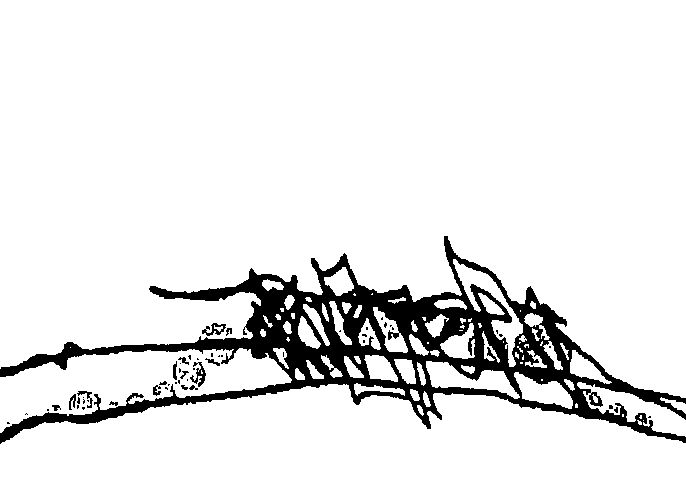
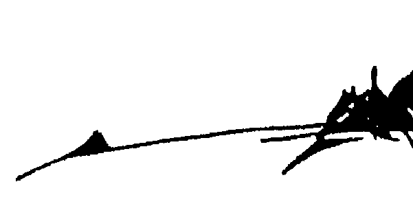

# 奥修谈吕洞宾3：金色花的奥秘（下）

# OSHO Talks on The Secret of the Golden Flower

# 王靜蓉序言

平靜降臨，萬緣混跡
金色花的奧秘，是奧修與道家呂祖來自空無的分享。 存在裡，已有許多位成為道的師父與我們相連，讓我們透由他，進入自性之
門，放手。 有的師父提醒我們讓眾念止息歸於自性，如此一「眾念之源的「我」便會消亡
一，如印度馬哈希禪師；有的師父以戒、定入門，隔除自我造作，力求根絕無明
染著，如泰國受尊敬的阿姜查法師；還有多位在修行路上神遇的先驅者。當我感
覺他們的能量，有定、有慧、有猛烈解脫意志與洞察，我敬重他們為眾生進行的
開啟，呈現了超越性的偉大。 然而，當我感覺奧修，來来回回進到他的世界，感覺他的能量來自內在的空
、無邊無際的空，無垠的空性；當我閱讀這本書時，便與他進入那神性的遍在、
進到寧靜的觀看裡。 從內在空無一物的止靜裡，看向世界，這就是修行者渴望進入的「金色花的
奧秘—。

從內在空無一物的止靜裡，看向世界，這就是修行者渴望進入的「金色花的
進到寧靜的觀看裡。
、無邊無際的空，無垠的空性；當我閱讀這本書時，便與他進入那神性的遍在、

# 但是，為何閱讀靈性書籍與奧修書的人多，體驗著寧靜的喜樂的人少呢？

思維，這個問題。

這也是奧修工作所著力處：那就是頭腦及它的逐漸融解。

自我可以不斷理解靈性知識，在閱讀理解之時喜悅地交會，自我依然存在。

然而奧修或其他師父所說之法不是來自自我，來自覺知之流，閱讀者或弟子以自
我自行解釋，也自尋苦惱了！

一為什麼我讀了這麼多、做了這麼多、上了那麼多課，平靜仍然短暫，成道也沒有發生？

因為，他的所做與所為來自「想要獲得的自我」，來自塞滿垃圾的頭腦，來
自內在的有為，而非無為的空性。

放手，還沒有發生，還沒有一而再地發生、繼續的發生、一年接著一年，甚至一世接著一世的發生。

先放手，便放鬆。

放鬆便止靜，進入心的寧靜。

處於靜中，划得更深、再深，划入空裡。

## 金色花的奥秘(下)|4

綫口。

和外地接觸，雖然貪暈癡習氣會再浮出，再放手，放鬆，止靜，一路前去。

靜心觀照，觀的是這些我執牽掛，若是任由它擴大，它就變得兇猛，咬你好。

我執十分微細複雜，對靈性現象的貪愛，想要助（改變）人的暈心，及對自
身心意識的癡心，都會助長「想擁有一之自我，無法放手。

頭腦有一個非常牢固的夢幻：只要我擁有更多更多，就會更好，現在感覺不
夠好，是因為尚未得到「那個」。是吧？這個幻想把我們折磨得極苦，既苦又緊
抓，不能放下。

奧修說「金色花的奧秘」，又在這裡工作了：

求道不比世間法的追求卓越，世間法是在慫望上求，結果求出一身貪慾的習
氣。求道是進到出世間法，持續地練習放下我執，穿越心智造成的障礙，而非用
心智來修。

用心智來修雖然能具有堅定意志，但可能會變得緊（嚴肅，而非覺），緊，
就無法進入空無之心。

鬆，能真正沉入內在，「視內者忽忘其識」，沉入，識就不作用了，靜發生

# 王靜蓉序言

所以，對於有心者，次序是：以治療清理噪音，再開始靜心，然後靜坐，氣 住脈停後進到無念三摩地，入定、出定持續化解我執……。然而這次序也是沒用 的，因為心智頭腦會帶人不斷認同幻象，延緩空無的發生。 有句話說：「師父已經準備好了，但是弟子還沒有。」師父已經安坐真源邀 你歸家，弟子因為未體證空無，而面對面不相識。 奧修在本書中繼續提及這些現象，書中他以門徒哈華沙為例，家財萬貫的哈 華沙進到內心空無時，可以一捨其擁有，到社區的內觀園做清潔工作，感到美麗 來，無限幸福。書中，擁有美貓也擁有自我的千代野，如何地在努力與遍尋後 ，放手，悟道。你也要經歷世間的一擁有過，再放下下一的遊戲規則，讓心念裡 所有的一一出現，看見糾葛、接納，放開它，回到空。

當平靜真實降臨，萬緣泯跡，好像你不曾擁有過、牽掛過，一切，再回到它 純淨的原貌。

王靜蓉。作家，治療師，愛和光靈氣屋創辦人

# 原 序

我是否該揭示秘密中的秘密，就在這本書的開端？我是否該現在就向你们透露，甚至在你們開始之前？很好！它是這樣：秘密中的秘密不能夠在滿載文字的頁頁紙上被找到；也不能夠在奧修的演講中提到的美麗靜心技巧裡得到。奧，不！我的朋友！我很遺憾說，這麼一個深邃秘密不可能輕易被發現，不我們這個可憐的世界早已經變成地球上個樂土了。然而，秘密中的秘密可以是屬於你的。因為，當你閱讀這本書，你可能会忽略發現自己被懾進了字裡行間、墜入了幽僻深谷、消失於你內在的甜蜜與半忘我的時空之中，讓你難以相信它們的存在。奧，是的！奧修有這個力量，一朵神秘玫瑰花一般纖巧的力量，帶你深入你的內在並且把你引見給你自己，把你帶回到你自己——一份不能計量的禮物。這不是痴人妄想，這是我個人經驗，這是一個成道師父的神秘與魔法。這是秘密中的秘密。你需要的是一些敞開、一些接受性、一些純真。看！旅程開始了……

# 深深的感恩及衷心的爱
史瓦米 阿南稣部提

获取更多好书，请加微信号：strcdts

店铺：http://strc.cr.cx

# 目錄

+   王靜蓉序言……
+   原序……
+   第二十一章 神歸頂天……
+   第二十二章 單獨是終極……
+   第二十三章 月涵萬水……
+   第二十四章 我實在喜歡你，朋友！
+   第二十五章 心空二字足以了之……
+   第二十六章 因爲愛我們走在一起……
+   第二十七章 空觀……
+   第二十七章 空觀…… 229
+   第二十六章 因爲愛我們走在一起…… 193
+   第二十五章 心空二字足以了之…… 153
+   第二十四章 我實在喜歡你，朋友！ 119
+   第二十三章 月涵萬水…… 81
+   第二十二章 單獨是終極…… 45
+   第二十一章 神歸頂天…… 11
+   原序…… 6
+   王靜蓉序言…… 2

# 奧修簡介…… 395

# 第二十一章 神歸頂天

呂祖師父說：現在可考證驗有三。一則靜坐去，如神入谷中，聞人說話如隔里外，卻一一明瞭；而聲入皆如谷中答響，未嘗不聞，我卻未嘗一聞；此為「神在谷中」，隨時可以自驗。一則靜中目光騰騰，滿前皆白，如在雲中，看眼覓身無從覓，此為「虛室生白」，內外通明吉祥止止也。一則靜中肉身紆紆，如棉如玉，坐中若留不住，騰騰上浮，此為「神歸頂天」；久之上昇可以久待。此三者，皆現在可驗者也。然亦是說不盡的，隨人根器各現殊勝。如《止觀中所云：「善根發相是也，此事如人飲水，冷暖自知。」須自己信得過方真。呂祖師父曰，回光循循然行去，不要廢棄正業。古人云：「事來要應過，物來要識過。」子以正念治事，即光不爲物轉即回，此「時時無相」之迴光也，可
於日用間刻刻隨事返照。 不著一毫人我相，便是隨時隨地在迴光。此為第一妙用。

便無一刻間斷，行之三月兩月，天上諸真必來印證矣。

這是一個美麗清晨，它一定不是第一次發生！風清清，盡是濕地怡人香；鳥
吱吱，紅日天邊浩然昇；露凝凝，葉梢端上亮似珠。

它永遠都是這麼美，我們需要的是一雙眼睛。鳥兒每天哼唱晨曦之歌，有誰
在聽？枝頭上花滿開，又有誰去讚美？缺少了一顆審美的心，只有一個計算的頭
腦在運作，因此你活在一個醜陋的世界裡。

我要跟你們講一個古時候的故事……

佛陀一眾弟子在芒果樹下打坐。早上是靜心的最好時分，整晚休息之後，你
非常接近你的存在核心，你會更容易更有意識地進入它。早上比什麼時候都要好
——因為你一整晚都處在核心，你剛開始移開，千般俗務還沒開始，你只是剛開始向它們邁進，邁向外在的世界。但內在的世界還是非常近，就在這一帶，只要
轉個頭你便會看到：真理、神、成道。你將會看到你曾經進入過的境界，當夢停
止，當睡眠深沉時你曾到過的境地；雖然那時候你是無意識的。

深度的睡眠可以恢復精神，縱使進入你的存在核心時你是無意識的，但到底
你還是進入了——所有外在世界的疲憊都被拿掉，所有傷口癒合了，所有塵垢盡
消。你泡了一個澡，你潛入了你的存在。

那便是爲什麼帕坦加利說：深度與無夢的睡眠幾乎就像三摩地——但只是幾
乎，不是三摩地本身。有什麼分別呢？非常小的分別也是非常大的分別——分別
在於：在睡眠時你是無意識的，而在三摩地裡你是有意識的，但都是同一個空
間。

所以早上剛醒，你是非常靠近核心的——很快你會被周遭帶走，它們會佔據
你，你會投入這個眾事紛飛的塵俗——在你進入這外在旅程之前，先來看一看，
有意識地看看這個自己，這便是靜心的用意。因此，世紀以來，清早晨曦——當
大地初醒，當樹木、鳥兒、太陽也甦醒，當整個氣團瀰漫甦醒之象，你可以運用
這情境，你可以乘著這一波甦醒湧潮，朝向你的存在直湧過去。覺醒、警覺、留
心，你的整個生命將會轉化，你的整整一天也會被轉化，因為你有一個不同的
定向。

然後你可以走入闊市，你依然與你的內在核心保持聯繫，那便是最大的奧秘
[PAGE 16]

# 金色花的奥秘(下) | 14

，是金色花的奧秘。 子團繞著佛陀，他們沒有學些什麼……除了打坐。就像你們圍住我一樣，幾千個弟子會給予信仰，他們只是讓你一嘗真理，只消一滴，生命即起變化。而與一個佛在一起就是对生命的無形拉力生起一點點警覺之心，生命要你變成自動化，變成機器人。當你跟隨一個師父，他會要你丟下你的自動化機制；你要解除自動化，你要有多一點的警覺性，你不再只是看到事與物，你也記得你自己。因此佛陀的弟子們在靜心，如此一個美麗清晨不該被錯過！當鳥兒在讚美朝日，你也同時在讚美神；當樹木在風中婆娑，你也在參與這一場永恒之舞，你也 在慶祝。另一天已經誕生——忘掉過去，死在過去——再一次重生。佛陀有一個徒弟名叫須菩提（Subhuti）……佛陀是一位很有福氣的師父：他的徒弟都擁有巨大潛力，他們有一些真的是難得一見的人才，須菩提正是其中一個，他處於成佛邊緣——只要再一步，他便會成佛。他回到家了，時時刻刻在家，他越來越接近核心——一個自我消失，神誕生的地方；身在看場，没必要跑到山上，這是尋找內在真正山峰的方法、這是尋找內在喜瑪拉雅山的方法。你開始進入深度寧靜，忽然，在你身邊周圍的噪音，那亂七八糟沒有改變，你坐在你打坐的同一個位置上——但當靜心越來越深入，你會有一個感覺：你感覺與外在產生了距離。開人說話如隔里外，卻一一明瞭。好像這世界忽然離你而去，或者是你離這世界而去，但每一個念頭都瞭然於心，自外在傳來的每一句說話都一一明瞭；事實上，你比以前更明瞭。這是靜心的神妙。你並沒有變得無意識，縱然在無意識裡你也能夠覺知噪音的消失。舉一個例子，假如你吸進了氯仿（麻醉劑），你也会感到同樣的現象發生：噪音開始遠去、遠去、去得更遠……以致全部撤離——但你墮入了無意識，你無法清楚聽到任何聲音。同樣的情況在靜心時會發生，但有一個分別：噪音開始遠離你，但每一個噪音都變得份外清晰，要比以前的更清晰，因為現在目擊者出現了。

# 第二十一章 神歸頂天

開始時你也是所有噪音裡面其中的一个噪音，你在裡面迷失了。現在你是一個目擊者，一個觀察者。由於你太靜了，你能夠清楚地、清晰地感覺每一樣東西。雖然噪音距離很遠，但它們比任何時候都要清晰，每一個字音都能夠被聽到。假如你聽著音樂靜心，這情況會發生：首先你會覺得音樂離你很遠，其次是會同時感覺到：每一個音變得非常清晰，卻又是前所未有地非常遙遠。在這之前，這些音聲和其它的音聲是混在一起的，與其它的音聲重疊；現在，它們一個個獨立、一個個原子一般地清清楚楚，每一個音聲也劃分開。開人說話如隔里外，卻一一明瞭；而聲入皆如谷中答響。第三，你感覺你不是直接聽到它們，你像是間接聽到的，好像它們是聲音的回響而不是聲音本身。它們變得更不實在，它們已失去實質，它們的質感減少了，它們的實體已消失；它們沒有了重量，它們如煙輕然。你可以感覺到它們的無重——它們像回音，整個存在變成了一個回音。那便是爲什麼印度的神秘家稱這世界爲幻境、幻象。幻象並不表示不真實，它僅僅只意味著如影子般又像回音；但這不表示它不存在，這只表示它像個夢

像影子、像夢、像回音——這些感覺讓你無法認為它們是真實的。整個存在變成了一個夢——非常清晰、遠遠，因為你已警覺到——它像夢是因為你已生起了覺知。起初你迷失在夢中：你没有覺知而且你認為這就是真實，你認同你的頭腦。現在你不再認同你的頭腦了，你的內在生起了一個個別的存在體：一個目擊者，夏可喜（Sakshi）。未嘗不聞，我卻未嘗一聞。

至於第四個產生的感覺：你能夠聽到整個存在包圍你——人們交談、走路，孩子嘻笑、有人哭泣，鳥哼唧、汽車駛過，還有飛機、火車……一片片噪音入耳。唯獨是，你聽不到你自己：你完全消失了，你變成了須菩提。你完全不在那個地方，你無法感覺你自己的存在。周圍都是噪音，你內在的噪音則消失了。一般而言，你內在的噪音比外在的更吵雜——真正的混亂在你裡面，真正的瘋狂就在那裡——當外在的瘋狂遇上內在的瘋狂，地獄即告落成。

外在的瘋狂持續不息，因為它不是你創造的，你無法把它摧毀。但你可以輕易地摧毀你內在的瘋狂，那是你能力所及的事。一旦內在的瘋狂不再，外在的瘋

狂便會變得沒有實質，它失去了所有的真實成份，它變成了幻象：你無法找出自 已的聲音，因為你沒有牽動思潮，所以你也默然無聲。這叫做一神在谷中—— 你變成了空無，每樣東西都跑到谷底去—— 只能聽到回音。當你只是聽到回音， 故然就不會受到影響了。 前些日子，有一個瘋子試圖強暴安拉達，在他得手前他被逮住了！我把安拉 逹叫來，想看看她有沒有被影響——我很高興她完全沒有被影響——完全沒有， 不著半點痕跡！那是靜心帶來的美麗：即使你被謀殺你也不會被影響。 強姦的影響是很嚴重的！要讓莫拉爾吉·德賽知道這是他的印度的真實寫照 ——一個印度人試圖強姦！这不是一個單獨個案，这是一個習以為常的狀況。當 我的桑雅生出外時，這會對她們構成很大威脅。這醜惡的印度不是我的印度，這 醜惡的印度屬於莫拉爾吉·德賽和查蘭辛格（Charan Singh），以及阿德瓦尼（ Advani）和他的伙伴。我絕不承認這個醜惡的印度。 但也存在著另一個印度：芸芸諸佛的印度，永恆不滅的印度，我是它的一部 份，你是它的一部 份。事實上，不管在任何地方，只要有靜心，那個人就會成為 永恆不滅的印度的一部 份。這印度不在地理上——它是一個靈性空間——而為 永恆的印度的一部 份就是成為一個桑雅生。

我很高興、非常的高興，看到安拉達：她完全没有受影響，沒有驚惶失措，什麼也沒有——好像什麼也沒有發生過，又好像發生在夢中。這是靜心漸漸成長的成果：一切都變得沒有實質，人能夠看見每一樣東西。她沒有被打擊到：她很勇敢，繼續她還未完成的工作，她沒有屈服——內在的意識始終保持不受影響。

此為一神在谷中」，隨時可以自驗。一則靜中目光騰騰，滿前皆白，如在雲中，看眼覓身無從覓，此為一虛室生白」，內外通明吉祥止止也。第二個徵象稱為「虛室生白」。除非你成為空無，否則你仍然處於黑暗，永守闇暝。「虛室生白」——當你已達到徹然空無，當你的內在空無一人，「光」會顯現。自我的干擾創造了黑暗，黑暗與自我是同時發生的；無自我則與光明同行。所以，所有的靜心方法，維殊途，終同歸，於你的內在虛室。只存下一個寧靜的空間，在這個空間裡豪光生現，無緣無故地。它有異於你看到的日光，因為
來自日照的光不是永恆的，到了晚上它就會消失。它也有別於油燈，因為當燃油耗盡，光也會消失。這光有著一種非常玄妙奧秘的特質：它無原無故，它是沒有起因的，一旦它出現了，它會持續下去，永不消失。事實上，它已經在那裡了，只是你空得不夠一刻，你變得寧靜，內外皆不動，「目光騰騰」，你頓時看見自己的光自雙眼湧出。

這是一個科學尚未察覺的經驗。科學認為光會進入眼睛，反之則不然。光自外間進入，它透過你的眼睛而進入——這裡只有半個故事。另外半個故事只有神祕家和靜心者才知道。那只是一部份：光進入你雙眼。另一部份：光自你雙眼湧出。當光開始湧出，你「目光騰騰，滿前皆白」，整個存在通明。

現在的你看到的樹比以前看到的更綠了，它們的綠會散發光芒。現在你看到的玫瑰比你曾經看過的更像玫瑰；同樣的玫瑰，同樣的樹，但有些東西自你這方湧入它們那方，令它們顯得前所未有的清楚分明。連細微的東西也一樣的美。對於一個佛，彩色石子遠比伊利莎白女皇的科依諾鑽石（Kohinoor diamond）要美；對於伊利莎白女皇，即使科依諾鑽石，世上最大的鑽石，也不如一個佛眼中的
一颗普通石子美。为什麽呢？因为一個佛的眼睛會湧出光，在這光中，普通的石頭會變成科依諾鐵石，普通的人會變成佛。對於一個佛，每一樣東西都是佛。 因此佛陀說：「當我成道，整個存在也成道。樹木、山川、江河、石頭——全部都成道。一整個存在也攀升了。 這取決於你：你投入多少給存在，你便有多少得到。假如你不投入任何東西，你將不會得到任何來自它的東西。你必須先投入，才會有所得。那便是爲什麽有創造力的人比沒有創造力的人更懂得美、更有愛、更快樂，因爲有創造力的人投入了一些東西給存在——存在會回應……而且是慷慨地回應。 你的眼睛是空蕩蕩的：它們沒有東西可以給予，它們只汲取，它們是收集器，它們不會分享。所以如果你遇上會分享的眼睛，你會看到一種極之不同的品質：美麗而恬靜，富力量而具潛力。假如你能夠看到這樣的眼睛，你會把光傾注於你，你的一顆心將會被喚起。 但要一睹這一道光，你要比平時更警覺。現在可能是早上，太陽可能正升起，但你可能還在熟睡——你錯過了早上，你也看不到日出；你可能迷失在黑夜、迷失在夢魘裡。你必須更加醒覺！ 但這發生了！在現代意識中，這經驗可以藉由迷幻藥而產生……一點點！它
是強行的、是暴力的——它不是自然的，你強姦你身體化學性質的部份——但這經驗發生了！有許多人利用毒品來靜心，因為這些毒品讓他們體化學性質的部份曾體會過的東西。當你服用了毒品，這個世界看起來更美了，普通的东西看起來不再普通。發生了什麼事呢？毒品強使你眼睛裡的光投放在東西上——但這是強迫性現象，而且這是危險的——在每一個毒品旅程之後，你會墜入更幽暗的黑暗面，比你以前那個更漆黑。再者，長久服用毒品的人，你所看到他們的眼睛是完全的空洞——因為他都把眼睛裡的光傾出了，他不知道如何創造這光，他不慣如何迴光以創造更多的光；他只會流失！所以一個嗑藥的人，他的眼睛很快會失去生命力、失去年輕。他的眼睛會變得呆滯、晦暗，成為一個黑洞。做靜心則剛好相反：你越靜，產生的光越多——而且這不是個強迫性現象。你擁有太多了，它開始從你的眼睛溢出——光源源不絕，因為你滿盈，它開始被分享，就像載滿了雨水的雲團，雨必須傾瀉而下。你溢滿了光，還有著更多的光時刻湧入、流出，無止無終——現在你可以分享了：你可以與人分享，可以與樹木、與石頭分享，與整個存在分享。這是一個瑞象。

但不要被毒品欺騙。毒品只會帶給你虛假的經驗、強迫性的經驗；而任何強
迫性的經驗都會摧毀你內在的生態環境、內在的和諧，你最終會淪為一個輸家，

而不是一個贏家。

一則靜中目光騰騰，滿前皆白……

你會看到——你的眼睛在燃燒。在這燃燒中，整個存在換上了全新的色彩、

全新的深度與全新的維度，東西好像不再是三維，而是四維。一個全新的維度加
入了：發光的維度。

……目光騰騰，滿前皆白，如在雲中。

如日光照雲，雲在燒；你在雲中，雲火反照日。人開始住於雲光中，行在裡
面、睡在裡面、坐在裡面；這雲長駐，這雲是靈氣。那些能看見的人會看到光環
——有一圈光環圍繞著修行者的頭和他們的身體。一種微妙的靈氣包圍著他們。

現在世界學家也承認這點。尤其俄羅斯，克里安能量照相（Kirlian
photography）取得重大結論。其中一個是—每一樣東西都被微細的光環所包圍，我們需要的是一雙看得見的眼睛。不同狀況下光環會有不同的改變，這是個科學結論。當你在生病你會有不同的光—陰沈、暗淡、無光彩。假如你面臨死亡，在六個月內你的光環會消失，到時候你的身體便沒有光環包圍你。假如你是快樂的、喜悅的、滿足的，你的光環會變得越來越大，越來越亮。當然克里安實驗沒有應用在任何一個佛身上—要在前蘇聯找一個佛非常困難，現在就更難了！十分不幸，因為整個國家已落入一個極度荒謬的陷阱裡頭，整個國家落入了唯物主義的陷阱裡。從來没有任何國家被唯物主義者統治，唯物主義一直存在，但從來沒有一個國家被唯物主義者所統治，從來沒有一個國家像前蘇聯這般治理國家；孩子被教導去相信世上沒有神、沒有靈魂，人只是一具軀體。沒有祈禱的問題，沒有靜心的問題，沒有要成為寧靜的問題。假如克里安能量照相師遇到耶穌、佛陀或者須菩提，他們會看到奇境。他們會看到最純淨的光，最清涼的光—那是光、是生命、是愛。看眼見身無從見。

在此刻，當你裡面充滿了光，你雙目在燃，整個存在和新的生命共冶一爐； 假如你睜開眼睛，試圖找尋自己的身體，你會找不著，在這一刻物質會消失。事 實上，現代醫學說這個世界沒有物質，它只是個假象，你的身體根本不是個實體 。深底裡，現代醫學說你的身體由電子構成，電子即是光，光的原子。所以當這 內在之火燒得熾紅，當它真的在，你睜開眼睛，你會找不到你的身體。不是它不 在——它在的一但你不會像平常一樣看見它，它化作了一片雲光，你將會看到 靈氣。形態已經改變，現在你會看到一些你從未見過的東西，而你從前所見的已 經消失。它取決於你的「視覺」，

靜心在他們內在發生，除了他們無人能看見。所以如果你真的想看你必須參與，你必須變成一個靜心者——那是唯一的方法。你無法外借，無人能夠通知你。所以這些來到這裡觀光的人，只是在浪費時間，這是些只能透過參與而獲知的東西。

西。須自己信得過方真。不要隨便相信，因為呂祖師父這樣說。試試了解他，好好把這番話銘記在心。無必要相信這些事，也無必要不信。只要讓它們留在你的記憶中，當時機成熟，有些東西開始發生，你自會明白。它們起了地圖的作用，使你不致迷失，因為遇向內在的路途分又無數，你會很容易迷路。你會誤解，會生怯、畏懼，你會從內在世界逃到外在的世界。

眼睛，你看不到自己的身體——你的詮釋可能是：「這太恐怖了！—你會停止靜心，你會變得害怕靜心，因為誰知道下次會發生什麼事呢，你會到哪裡呢？你對整個經驗生疑，你認為自己神經過敏。

這些經驗並不可怕，但你的詮釋可能使它變得可怕。想想看，有一天你張開從內在世界逃到外在的世界。

## 39 | 第二十一章 神歸頂天

每天都有人帶著他們的經驗來找我，當他們憶述自己的經驗時，我看到他們的恐懼，他們的臉、他們的眼睛——他們在恐懼。當我說這是個好現象，氛圍就馬上改變了，他們開始笑，他們快樂了。假如他們聽到我說‘這很美’、‘我為你感到高興——、你的成長有很大的躍進’，馬上地，出現了三百六十度改變；給了他們一個不同的詮釋。他們所以恐懼是因為他們不了解。這不是要去相信或者不信的事，你只要牢牢銘記，當時候到了你便能夠正確地詮釋——正確的詮釋是非常重要的，否則內在的旅程會變得困難，你會有許多時候想回頭，回到這個世界，回復正常。因為此時你開始感到一些不正常的东西在發生，而‘不正常’這個字是一個譴責的字眼。假如你對一些從不靜心的人說起，他們會說：‘你最好去找精神分析師或者精神病醫生檢查一下，你在胡說什麼——你變大了？你是不是失常了？你說你升起了而且引力消失？或者是一你變得越來越小然後消失了？你有幻覺，你要去找精神病醫生，他會幫你矯正、幫你恢復正常。’假如你去找精神分析師或者精神病醫生，他們會為你治療：他們會用他們那所謂的知識鍾打你的頭。他們對靜心一無所知，靜心還沒有進入他們的意識，他們完全不了解這些經驗，但他們對瘋子很有認識。有一件事必須留意：瘋子有許多和你相似的經驗——發生在一個靜心者身上的經驗同樣發生在一個瘋子身上——因為相似，以致精神病醫生會認為你也是瘋的，你必須被治療，他會把你視作瘋子看待——他會給你藥物和打針，或者電擊，來幫助你恢復正常頭腦。他有可能會摧毀你整個靜心旅程。這是目前發生在西方的一大危機：人們在這裡學習靜心，再回到西方，假如有一些不在他們理解範圍之內的事發生了，他們會去找神父——而基督教的神父對靜心一無所知，他會把他們送到精神病醫生那裡。又假如他們對精神病醫生說出這些經驗——醫生只對瘋子有認識，他不知道佛——然而瘋子與靜心者有些經驗是雷同的，於是醫生會認為你不正常。他必須把你拉回來，對你所做的每一件事都是摧毀性的，對你的身體、你的頭腦有害。這傷害大到可能你無法再進入靜心——他有能力創造這弊害。所以假如有狀況出現，只對有做靜心的人說。那便是為什麼我這麼堅持在世界各地開設中心，那麼桑雅生就有地方做靜心了；遇到狀況，他們可以找其他桑雅生，和他們分享經驗。這樣至少會有人表示同情，至少他們不會譴責你，他們會重視你的經驗，接受你的經驗，給你希望和激勵，會對你說：—很好！繼續前進吧！還有更多等著發生。：「這很好，你要繼續下去。」之所以需要一個師父，正因為——你需要一個能夠信任的人，這人會對你說呂祖師父曰，回光循循然行去，不要廢棄正業。這也是我的堅持：一個桑雅生不該棄俗，你的靜心應該在這世俗上成長，它應該成為每一天的一部份，你不該成為一個逃避現實的人。為什麼呢？古人云：「事來要應過，物來要識過。子以正念治事，即光不為物轉即回，此一時時無相—之回光也。首先，無論你處身於任何狀況也是神給予的狀況——不要拒絕它，它是一個機會，一個成長的時機，假如你逃跑，你不會成長。那些跑到喜瑪拉雅山山洞穴居，終日不離山洞的人，他們不會成長，他們仍然很幼嫩沒有歷練。假如你把他們帶到塵俗，他們會害怕，他們會受不了。

## 金色花的奧秘(下) | 40

前些日子一個在喜瑪拉雅山住了三個月的桑雅生回來，她說：─現在我已不適應這裡了，我想回去！─喜瑪拉雅山沒有讓她更成熟，她只是被喜瑪拉雅山迷著了。她滿腦子都是她的靜心、她的寧靜，但那不是她的，那只是喜瑪拉雅山的副產品。我對她說：─你留在這裡三個禮拜，然後後告訴我你的寧靜和靜心怎麼了？假如它消失了，那麼它與你無關，你還是不是不要去喜瑪拉雅山好了，你就留在這裡靜心，假如你能在這裡靜心。在這個市場裡，那麼你再去喜瑪拉雅山，你的心將會提升千倍。但不要留戀那裡，要常常回到這世俗，當做一個假期，在那裡是好的。─是的，偶爾一次住在山上很不错，那會很美。但過於沉溺，而生起棄俗的念頭你就錯了！─因為只有在世俗的暴風之中你才會完整，在世俗的挑戰中你才會結晶。─呂祖說：接受你的處境，它肯定是一個最適當的境況，所以你才會處於其中存在在乎你，你的遭遇不會是無原無故的，那不是意外，沒有意外這回事，存在給予的都是你所需要的。假如你需要在喜瑪拉雅山，你便會在喜瑪拉雅山，而且當一需要一生起，你會發現，不是你去找喜瑪拉雅山，而是喜瑪拉雅山來找你。它會發生：當門徒準備好了，師父會到來；當你的內在寧靜了，神會到來。

# 第二十一章 神歸頂天

在路途上你需要什麼，存在都會一一給予，存在開懷你宛如一個母親。所以不用擔心，倒不如利用這機會，這個充滿挑戰的世界，這個混亂無間的

外在外，我們必須加以利用。你必須成為一個目擊者，觀察它，學習如何不受它影響響、不受它感染——像一株水中蓮。你會感恩，因為藉著觀察混亂，忽然一天，一神在谷中——你看到市場遠遠地消失，成為了回音，這才是真正的成長。

假如你能夠適當地在日常生活中靜心，便沒有什麼不可能在你身上發生了；迴光會發生，你只需留心觀察。

在早上靜心，和你的核心保持靠近，進入這世界同樣與你的核心保持靠近，時刻記住自己，對自己的一舉一動保持意識。

可於日用間刻隨事返照。不著一毫人我相，便是隨時隨地在回光。此為第一妙用。

當有所生起，行動！但不要認同行動，保持做一個旁觀者，時刻隨事返照；不要變成一個一為者，不要牽涉入內。去做，把事情完成——隨時返照。

# 清晨能遣畫諸緣，靜坐一二時最妙。凡應事接物，只用返身法一

# 返照法），便無一刻間斷，行之三月兩月，天上諸真必來印證矣。

運用返身法。留意狀況，需要做的事去做，但不要執著、不要憂慮、不要去

想成果。只管去做，保持警覺和隔離，緊貼你的核心。每個清晨，把自己定向於

# 內在核心，這樣你便能夠一整天都會把它記住。

有兩個最好的時段。第一個最好的時段是清晨：把自己定向在核心，你方可以在其周圍活動而把核心牢牢記住。第二個最好時段是你睡覺前：再次把自己定向核心，那麼在你的深層睡眠中——即使你在做夢，你沒有意識——你也能夠緊

# 靠你的核心，這兩個是最好的時段。假如你能夠在這兩個時段靜心，你哪裡也不

# 用去，你不用去修道院、不用去山洞、不用去棄俗——忽然一天你會看到漫天花

# 雨下，神在你耳畔悄語。

當靈魂回到家，整個存在也在慶祝。那發生在須菩提身上的，也可以在你身

# 上發生。牽住它，它是你與生俱來的權利，你也可以得到的。

今天談到這裡。

# 第二十二章 單獨是終極

第一個問題：
師父，每每高潮過後，隨著深切的體驗，我又一次面對新的單獨，努力分享
或逃離都使我難受！我爲什麼會纏上這種逃避單獨的習慣呢？你的意見也許能夠
助我過渡。
阿姆瑞多（Amrito），單獨是終極，除了單獨，哪裡也不會達到。人可以把
它忘掉，可以把自己洩洩在許多事物裡面，但真相會一次又一次地宣示。因此，
每一次的深切體驗後，你都會感到單獨。在深刻愛之後你會感到單獨，在深度
的靜心之後你亦感到單獨。
那便是為什麼所有偉大的經驗都令人傷感。在覺醒的深度經驗中，總有傷感
介入。因為這樣，每個人不熱衷深度經驗，他們迴避，他們不想深入愛，只要
一性一便足夠了。因為性是表面的：它不會讓他們有單獨感，它帶來樂趣，是一

# 個消遣，在那個片刻他們享受它，然後再把它完全忘掉。性不會把他們帶到自己 的核心，但是愛把你帶到自己的核心，愛是非常深入的，它讓你感到單獨。 這看似矛盾，因為通常人們認為愛讓你覺知彼此，這是絕對荒謬的！假如愛 是深刻的，它會讓你感到單獨而不彼此，每當一個狀況是深入時，會有什麼發生呢？——你會離開你存在的周圍，墜入你的核心之中，而核心是完全單獨的。 在那裡只有你一個，甚至連你也没有，只有意識——在裡面沒有自我、沒有認同 、沒有定義——只有意識的深渊。 聽過了優美動人的樂曲，透入了意義深長的詩篇，又或者看到美麗的日落， 它總會發生：當你有所醒覺，你會感到哀傷！為此人們不想看到美麗、不要走入 愛、不靜心、不祈禱——以逃避所有的深刻。但即使你逃避真相，真相有時也會 自己找上門，在你毫不察覺下把你佔據。 極。它不是一個意外，也不是一般事件，它是道。一旦你接受了它，它即起變化 。單獨不會創造哀傷，是你那一不該單獨一的想法創造哀傷；你那一單獨是悲哀 —的想法創造了問題。單獨美妙絕倫，因為它擁有深深的自由，它是絕對的自由 —它又怎會創造傷感呢？

## 47 | 第二十二章 單獨是終極

但你的解讀是錯的，阿姆瑞多，你必須把你這個解讀拿掉。事實上，當你說

「我又一次面對新的單獨」，你的意思其實是你又一次面對新的孤獨。你不了解

單獨和孤獨之間的分別。

「單獨」被錯誤解讀，它被當作「孤獨」解。孤獨的意思是你缺少了另一個
，那麼這「另一個」是誰呢？任何能夠幫你丟掉意識的東西、任何麻癱品都是；

它可以是一個女人、一個男人、一本書……任何東西都可以——任何東西都可以——任何幫助你忘記

自己、把你的記憶帶走、卸去你意識負擔的東西都是。你的意思其實是孤獨。孤

獨是一個負面狀態，你缺少了另一個，你開始尋找。

單獨美妙絕倫，單獨的意思是你再也不需要另一個，只有你自己一個已足夠

了——足夠到你可以與整個存在一起分享你的單獨。你的單獨取之不竭，你甚至

可以把它灌注入存在，這灌注會一直在那裡，悠悠永留。當你單獨時你富有，當

你孤獨……你貧窮！

孤獨的人是個乞丐，他的心是一個乞丐；單獨的人是國王，佛陀是單獨的。

阿姆瑞多，你的體驗讓你感到單獨，但你的解讀錯了。你的詮釋來自你過去

的經驗，來自你過去的頭腦，它來自你的記憶。你的頭腦帶給你錯誤的觀念，你

要放下這頭腦，進入你的單獨：觀察它、品嘗它，它的每一面都必须深入細看，

# 從每一扇有可能的門進入它。它是一所最偉大的聖廟，你將會在單獨中找到你自
# 見——而尋找自己即是尋找神，神是單獨的。

一旦你在沒有頭腦介入的情況下看到它，你再也不想抽身出離。那時候便沒有東西想要出離，也毋須想逃離它呢？我並不是說在單獨裡面你不會建立關係；事實上，你將首次真真正正地與他人建立關係。

一個孤獨的人無法建立關係，因為他需索太甚，他纏黏、他依賴別人。他試圖佔有他人，因為他總是在恐懼中：一假如他走了，那怎麼辦？我會再度陷入孤獨！—因此這世上存在太多佔有

# 第二十二章 單獨是終極

感覺不會好。
—努力分享或逃離都使我難受！—
目前先不要分享，讓它凝聚，讓它成為雨水豐沛的雲霄，分享自然會發生，這分享毋需努力。假如你現在就分享，那只是藉著「分享」這名目找尋其他人而已，那是逃避。分享必須自然發生，你只要把單獨凝聚起來，有一天你會看到：
分享開始了——你是一個目擊者。你不是一個為者，是一個目擊者。
—我為什麼會纏上這種逃避單獨的習慣呢？—
因為你還不了解它就是單獨，你一直把它解讀做孤獨。我是可以理解的，全世界都是這樣！當你第一次感到單獨，你就把它解讀做孤獨，因為那是一個已知現象，你一生都在感受它。打從嬰兒離開母親的子宫開始，第一個感覺就是孤獨，他開始感到孤獨：他離開了他的家！

最大的創傷莫過於嬰兒離開了子宫。他想泡在子宫裡，不想離開它，九個月的時間他一直住在它裡面，他愛這空間、愛這溫暖，在那裡他被照顧得很好；沒有責任、沒有擔憂，他怎會想離開呢？他被擲出去、被驅逐，他是不想離開的！生命——我們稱之為出生——但孩子認為它是死亡，對他來說，那是死亡，因為他所熟知的九個月生命結束了。他震驚，他覺得被懲罰，但他還沒有思考能力為他所熟知的九個月生命結束了。他震驚，他覺得被懲罰，但他還沒有思考能力

生命——我們稱之為出生——但孩子認為它是死亡，對他來說，那是死亡，因為他所熟知的九個月生命結束了。他震驚，他覺得被懲罰，但他還沒有思考能力

一天母親不餵母奶了，孩子再度陷入孤獨。某天孩子被移離母親，由護士來照顧——他再度孤獨；一天他不能睡在母親的房間，被移到一個獨立的房間去——再一次孤獨。回憶一下那天，在你孩提時候，你第一次在一個房間裡獨自睡覺——那黑暗、那寒意，沒有人在你身邊，這是從來沒有過的；媽媽的溫暖，她那軟綿綿的身體，他經無所欠缺。現在，孩子與玩具為伍——但這是替代品嗎？不過是一點可憐的替代品罷了

或者與他的小毛毯難分難離——但這是替代品嗎？不過是一些可憐的替代品罷了，但畢竟他也渡過了。他感到孤獨、黑暗、被拒絕、被遺棄……被丟得遠遠的。

這些都是長久國積的傷口不斷在擴張孤獨的概念。然後一天，他離開了家，與陌
生人進入旅館，他完全不知道對方是誰。只因記起這所有的傷口，他們出現在那
裡！這情況從此沒完沒了：你的一生長年與孤獨為伍。

偶而下，一些刻骨的經驗發生了，正因為這些刻骨的經驗你瞥見你的存在|
——但你的整個腦只知道孤獨，所以它把這單獨的經驗喚做孤獨，腦把它標誌
為孤獨；單獨的經驗被定義為孤寂了。

## 57 | 第二十二章 單獨是終極

就是這裡，阿姆瑞多，你就是在這裡出錯了。把你的解讀忘掉吧，是真的有
一些新的東西在發生，它是新的，你根本無法辨別它是什麼，唯一能夠知道它的方法只有進入它、認識它。一如呂祖師父說：「如人飲水，冷暖自知。」

會驚訝：它和你以前所知道的並不像；它是自由，不受別人束縛的自由，它是在東方我們所稱的「解脫」，是終極自由。這自由以後，愛就有可能了；這自由以後，分享會發生；這自由以後，你的生命會換上一個全然不同的意義，一種全然不同的光芒，那掩藏已久的光芒將被釋放。

## 爲什麼革命會失敗？

# 第二個問題：

首先，它們不是革命，革命只在擁有靈魂的人身上才有可能。社會革命只是 一個假象，因為社會沒有自己的靈魂。革命是個靈性現象，我們可以沒有政治革命、沒有社會革命、沒有經濟革命；我們唯一的革命是靈性的革命，這是個人的 命、沒有社會革命、沒有經濟革命；我們唯一的革命是靈性的革命，這是個人的。假如全部人都改變，社會也會改變；你無法先改變社會，期待人們隨之改變。

## 金色花的奧秘(下) | 58

那便是爲什麼革命會失敗：因爲我們從一個非常錯誤的角度發動革命。我們以爲只要我們改變了社會、改變它的架構——經濟或者政治——那麼終有一天，人類以及構成社會的元素都會改變，這是愚蠢的。誰會發動這種革命呢？舉個例子好了：一個所謂的大革命於一九一七年俄羅斯爆發，但有誰在這場革命中改變呢？誰執掌大權？是史達林。史達林本身並沒有經歷過任何革命，他來自那個被他所改變或者說他試圖圖改變的社會，他是同一個社會的副產品。他證明了自己是另一個危險的沙皇，比他所推翻的前沙皇更具有危險性；因爲他是那些沙皇的創造物，是他們把他創造出來的，他是封建社會的副產品。他試圖圖改變社會，但他本身是一個獨裁者的頭腦，他把他的獨裁思想加諸於國家，革命變成了反革命，這是世界上所有革命裡面的一大悲劇。因爲這位革命份子是同一類人，他來自過去，由過去所創造，他不是新的。他會做什麼呢？他重複過去，標籤是新的，他稱它爲共產主義、社會主義、法西斯主義——什麼稱號都可以，你可以為它取一個冠冕堂皇的稱號，所有的名目都只是用來愚弄大眾罷了。穆那拉·那斯魯丁去看醫生，他要求醫生幫他檢查。他說：一請以簡單淺白的語言對我解說，我不想聽到一堆醫療科學的名詞，你只需簡單單的告訴我，

我的狀況就是了。—

醫生替他檢查後對他說：—假如你要準確地知道，又要淺白的說法，那麼—

—你沒有問題，你只是瘋了而已。—

穆那拉·那斯魯丁回答：—好，謝謝你！現在給它一個漂亮的名堂，讓我告 訴我的老婆；這名堂越響越好，盡你所能把它弄得複雜。—

我們給與冠冕堂皇的名稱，但深底裡真相皆一樣。 一九一七年什麼也沒發生，只是一個沙皇取代另一個沙皇，當然也更危險！ 為什麼更危險呢？因為史達林殲滅了沙皇，他比沙皇更強大，也更狡猾奸詐。他 深知沙皇是如何被消滅的，他當然懂得如何不步其後塵，奠下有史以來最龐大的 奴隸制度。因為他害怕有朝一日被推翻，他必須把所有的橋樑拆毀，把他曾用過 的梯子折斷，而且他比前沙皇更小心謹慎。沙皇本身不是一個心思細密的人，因 為他天生就是沙皇：他繼承了皇位，順理成章當上沙皇。史達林的江山是打來 的，那是一段艱苦歲月以及漫長的拚命生涯，他擊敗了許多敵人。

革命告一段落，史達林開始消滅所有能與他為敵的人。托羅斯基（Trotsky ）遭殺害，因為托羅斯基是下一個……他非常接近，事實上他在俄羅斯的影響力
超過了史達林，因為他是一個猶太裔的知識份子，也是一個偉大的演說家，他更得民心。相較於托羅斯基，史達林顯得才短氣粗——托羅斯基必須死！那並非不與他為敵的人，一個接一個，政黨裡所有的成員同遭殺害——他一定成為整個人類歷史上最強的人——他把整個國家變成一個大監獄。這就是革命失敗的原因——第一個原因是：我們在錯誤的一端嘗試。其次，一旦革命成功了，我們把出生入死的革命同伴誅滅，因為他們是危險人物。他們毀滅了前一個社會，他們也會毀滅下一個——因為他們對革命上癮了。他們只知道一件事，他們只在一件事上是專家——在推翻政府一事上。他們不理會那是什麼政府。一旦革命成功，當權者第一樣要做的事就是誅滅所有餘留下來的革命份子——即使他們的成功有賴這些人！所以每一個革命也會演變成反革命，因為那些把當權者拱上權力寶座的人是更危險的人。嘗試理解一下，革命的頭腦是摧毀的頭腦：他知道怎樣去毀滅，但他不懂如何創造。他是一個煽動人們進入暴力的理想人選，但他絕對做不到幫助人們平静，把心思投注於工作和創作上。他不懂這語言：他的整個生命就是革命；他的使命、他的專長，就是煽動人們破壞。他只知道這種語言，直到他生命盡頭的那天

# 第二十二章 單獨是終極

你也很難期望他有所改變。所以這些當權者必須誅殺所有餘黨，每個革命也會宰掉它自己的父親——必須如此——一旦這些父親被殺，革命變為反革命；那不再是革命，而是反革命（anti-revolutionary）。這種事件也在印度發生。傑亞普拉卡希·納拉揚（Jayprakash Narayan）發動了一場動亂，幫國家政朝换代，而那群得勢的人，莫拉爾吉·德賽和其他人，因為傑亞普拉卡希·納拉揚的關係而得天下。但當他們掌握了大權，他們便甩開傑亞普拉卡希·納拉揚，他們開始劇除他。他們深怕：这是一個危險人物，他有巨大的影響力——他个祸根！我們必須劇除他，徹底地把他除掉。事件發生在英國政府被印度驅趕的那個時候，这是聖雄甘地的功勢。可是一旦權力重歸印度手上，他們把聖雄甘地擱到一旁，他最後的一句話是：沒有人聆聽我，我是最無用的人。一奪權者靠甘地而當權，但沒有人聆聽他！他遭謀殺，最大嫌疑者是他一手捧上政治舞台的當權者，直接也好，間接也好。也許他們沒有直接牽連，但間接地：他們都知道有人要殺害甘地，但他們不做任何設防，這等同間接支援。莫拉爾吉·德賽權力在握，他收到線報，得悉有人圖謀不軌，但他沒有加以
理會——彷彿深底裡他們全部都想擺脫這位聖雄；因為他繼續製造麻煩，他仍然
抱持舊想法——他繼續他的使命，他是個專家——過去他反對政府，現在他依舊
反對政府。現在的政府屬於他的，但他還是不斷表示不滿、批評，令政府感到非
常尷尬。他們如釋重負，儘管他們哭喪著臉；他們說：「實在天大的不幸！」
但深底裡全部的人都鬆了一口氣！

傑亞普拉卡希·納拉揚的遭遇也一樣：現在 他深切體會到自己被拋下，沒人
理他。事實上，任誰當道都會祈盼他早日歸西，這樣方才美满。更何況他病得嚴
重——一星期裡面有一半時間他需要洗腎，他無法工作，身體每下愈況。他們一
定樂翻了，傑亞普拉卡希·納拉揚即將消失於人世，這些人終於可以唯我獨尊了。
我想告訴傑亞普拉卡希·納拉揚……
我愛這個人，他是一個好人——他太好了，政治不是他的人生舞台，他不是
一個政客的料子；他是一個詩人、一個夢想家、一個好人——所有的夢想家都是
好人。 
我要對他說：在你臨終前向國家道歉，以你之名告訴這國家，一群對權力虎
視眈眈的政客欺騙了你和國家，你被騙了，國家也被騙了！對國家說革命失敗！
對國家說革命失敗，記住也要說，所有的革命也不會有好下場，因為他
們的理念大錯特錯。以上這種革命不可能落實。哪些人會去落實它呢？是那些活在過去的人，他們會延續過去。傑亞普拉卡希·納拉揚，對人們說政治革命沒有未來。只有一種萬萬人，社會也會改變，沒有其它出路，沒有捷徑。這一點也必須被了解：這是所有已發展體系中的一個固有特色——英雄會冒現。而英雄僅僅只是一個刺激人們創造的背景而已；當這英雄戰勝了，並扭轉了背景，這名活在背景上的英雄才有希望跳出背景板。時勢造英雄，大英帝國締造了聖雄甘地。他只有在大英帝國的陪視下才有意義，一旦大英帝國瓦解，聖雄甘地便沒有意義了。背景不復再，你還可以在哪裡找到意義呢？所以一旦背景改變，英雄就會變成一個無用的負累。列寧成為了當權者的負累，甘地也成為了當權者的負累，傑亞普拉卡希現在也成為當權者的負累——這是歷史，是整個歷史。有一個基本法則在運作：它是所有已發展體系中的一個固有特色，那就是英雄會冒現，而英雄僅僅只是一個刺激人們創造的背景。政治領袖是暫時的領袖，他們生存於某個背景上，當背景被換掉，他們大勢
也去。那便是諸佛不同的地方：他們的背景是永恆的，他們的背景不是時間的部份。這便是耶穌、查拉圖斯特拉和老子等人永遠有意義的原因：因為他們不是時間的一部份。除非整個存在也成道，否則佛陀永遠不會不合時宜。那便是為什麼我說政的意義不曾減減，而這意義會繼續延續，永遠永遠的，因為想要成道者不乏其人。佛陀的意義不曾減減，而這意義會繼續延續，永遠永遠的，因為想要成道者不乏其人。真正的歷史## 第二十二章 單獨是終極

在性生活上前所未有的減少了，連對它的愁念也相繼減少。是否可以請你解釋這差異呢？

斯·海夫納（Hugh Hefner），他們在說什麼呢？

是的，我教導你們進入深度的愛，我也教導你們進入深度的性，因為那是超越的唯一出路，經歷它是超越它的唯一方法——我的目的是要你們超越。現在問題來了，我一再被世人誤解！

人們已經習慣：他們認為宗教人士必須抗拒「性」，而那些抗拒「性」的人，他們又怎會有宗教性呢？他們只會死梆梆地分門別類！我不分門別類，我也不期望這世界會立即由定型的頭腦改變過來，所以我也不期望他們了解我。他們對我誤解，我絕對可以了解他們這誤解。我沒有虛幻的期待，他們將於多年後，甚至世紀以後才會了解我，但這總是在發生的。

我在創造一個生命的新視野，這視野是嶄新的，他們找不到把它歸納的類型，所以大家都很生氣。聖雄莫拉爾吉·德賽很生氣，他生氣因為他性壓抑，極度的性壓抑，他毫不理解，只是一味壓抑性慾。

故事是這樣的：當六十多年前莫拉爾吉·德賽年輕時——在他的村落有一個男子姦污了他自己的親妹妹。這事令莫拉爾吉·德賽震驚不已，他認為這是性引
除非那是一個非常壓抑的人，否則要愛上自己的妹妹是一件非常困難的事，幾乎沒有可能。

試問怎可能愛上自己的妹妹呢？但這個男人一定活在深深的壓抑裡面——也許他沒有結識過任何女人，他一定絕望透了！但莫拉爾吉·德賽對這事的結論是：性是罪魁禍首。假如它能夠使人瘋狂，促使那個人強姦自己的妹妹，性就是罪魁禍首。假若它決定絕對不進入性——不關乎宗教，不關乎靈性——自那以後他一直壓抑。

他的導師聖雄甘地也曾經歷過一件事，此事帶來的創傷，造成他終生獨身。

他的父親快要死了，他幫父親按摩雙腳；醫生說這可能是他父親的最後一夜，他可能再也看不到天亮！但在晚上十二點當他父親睡著，他回到房間和他的妻子做愛；在進行途中，有人敲門，那人说：‘你在做什麼？你在哪裡？你父親死了。’這事對他打擊很大，它是一個創傷，一個巨大的創傷改變了他的一生——不
是更好，而是更壞。他有罪惡感，他認為在他父親臨終前一刻，性操縱了他，他犯了罪。他永遠無法原諒自己，所以他放棄性，他的一生都在壓抑性。只有在最後，在他生命的最後幾年，他開始注意到這壓抑，因為到了後期性幻想還是不斷。於是他開始修習譚崔，一心希望臨終前能夠擺脫性——可惜為時已晚！

們放縱。這些人無法了解，休斯·海夫納也無法了解，因為他會問為什麼我要談
論靜心？為什麼我要談論靈性？休斯·靈性、靜心、三摩地——這些東西對他來說說
怪誕。莫拉爾吉·德賽和休斯·海夫納兩個都誤解我，我被那所謂的靈性主義者
誤解，也被所謂的唯物主義者誤解。但我了解：這是我的命運。

我只能是夠被新人類所了解，他們十分清楚：人類同時是肉體和靈魂兩者，而
生命只能透過經驗而成長。

性可以成為走向三摩地的踏腳石，假如你對它有深入了解，假如你有深入的
體會，你會從它裡面釋放出來，你獲得了自由。而這自由有一個全然不同的品質
：它不是性壓抑。性壓抑在你的無意識裡潛伏，纏繞不散，不斷影響你的生命。

我聽說……

有一次，一位很虔誠信仰的健壯老婦被一個賊人打劫，這位婦人獨身一輩子
如同一个修女。

一聽著老太婆，不想受苦就不要張揚。告訴我你的珠寶收在哪裡？——她說：—我沒有把它們放在家，它們在銀行的保管箱裡。——你的銀器呢？—
—很抱歉，我把它們送去擦洗了！—把你的錢給我！—告訴你，—她說：—我不會把錢帶在身邊的。—聽著老太婆，我警告你，把你的錢給我，否則我撕破你的衣服。—跟著他開始在她身上亂摸。—我還是要告訴你，—她說：—我一毛錢也沒有，但如果你再做一次，我會開一張支票給你。—我也聽到另一個故事，可能他們是同一個賊也不一定！—個深夜，警察局的電話響起了，有人緊急求助。電話中傳來絕望低呼聲：—快點過來……馬上過來……有個賊被困在一個老女人的房間裡！—當值警員回答：—我們五分鐘內到。你是誰呢？—聲音傳來：—我就是那個賊啊！

假如你壓抑，你將終生攜帶這傷口，癒合不了，壓抑不是辦法。一偏激一透過理解而改變，一理解則透過經驗；所以我給予你們一切自由去經驗你們的頭腦和身體想去經驗的東西，只有一個條件：我要警覺、留心、帶著意識。假如你能夠有意識地做愛，你會驚訝：愛擁有一切讓你達到三摩地的要素。假如你帶著完全意識與覺知深入愛，你會發現並不是愛吸引你；但在愛的巔峰，高潮爆發，你的頭腦消失了，你的念頭停頓，甘露從這裡向你湧入。真正帶給你美妙經驗的不是性，性只是輔助，從一個自然的途徑，來到一個頭腦溶解的點—有一個時刻鳥雲散去，你看見太陽。爾後鳥雲會復現，太陽會消失，你會再次對性生起幻想。假如你没有意識，你會一次又一次的錯過這整個奧秘。並不是性把你細繃在這世界，而是無意識！所以前題不是如何放下性，而是如何放下無意識。你要有意識並且讓自身這個自然的存在體全面流動。性是自然的一部份：你因為它而誕生，身體的每個細胞也是性細胞，壓抑性即是對抗自然。而一超越則是另一回事。假如你在性高潮的一刻警覺和覺知，你會感覺時間消失，有一個片刻沒有了時間——沒有過去、沒有未來，你徹徹底底的在當下閉消失，有一個片刻沒有了時間——沒有過去、沒有未來，你徹徹底底的在當下閉消失，有一個片刻沒有了時間——沒有過去、沒有未未来，你徹徹底底的在當下閉消失，有一個片刻沒有了時間——沒有過去、沒有未來，你徹徹底底的在當下閉消失，有一個片刻沒有了時間——沒有過去、沒有未來，你徹徹底底的在當下閉消失，有一個片刻沒有了時間——沒有過去、沒有未來，你徹徹底底的在當下閉消失，有一個片刻沒有了時間——沒有過去、沒有未來，你徹徹底底的在當下閉消失，有一個片刻沒有了時間——沒有過去、沒有未來，你徹徹底底的在當下閉消失。

——那是很美的，你滿心喜悅，很多的祝福瀾落。現在，這兩個奧秘必須被了解：一、頭腦消失的片刻與時間消失的片刻，是同一個現象的兩個面：一面是時間，另一面是頭腦。當這兩者消失，你就是在極樂、在神裡面。靜心是一個免於進入性而讓這兩者消失的方法。

失了、時間消失了——那天，將是你體悟最大的一天；那天，你會領悟到為什麼你對性興趣甚濃；也是那一天，你對性的所有興趣消失無蹤。不是你努力把它甩掉，是它自行消失，如露珠在晨光下消弭遁失——了無痕。假如你能夠透過靜心把它創造，那就更簡單了——因為你可以自己一人進行，你不用依賴別人。

二、假如你能夠帶著靜心品質進行，你不会失去能量；反之，你會變得更有活力因為能量被儲存了。

三、假如你能夠帶著靜心品質進行，那麼你想維持多久便能夠維持多久，它不是短暫的：你可以一步步地學習如何在二十四小時內持續不退。一個佛二十四小時住在性高潮的境界，日出，日入。佛陀成道那天距他離世那天歷時四十二年，在這四十二年當中，他時刻無間地常住性高潮的境界。想想看，你所擁有的暫片刻，完全無從比擬一個佛所擁有的。

我教導你一種新的綜合，我教你超越，把你推向成佛之路，但那是超越，不 是壓抑。透過壓抑，人永遠無法超越；透過壓抑，人只是不斷在繞圈子。壓抑， 你必須每天壓抑，直至你死前最後一刻，性還是陰魂不散。假如你真的想擺脫它 … …我會讓你擺脫它！但我不反對性，因為所有反對性的人永遠也無法擺脫性。 因此我的教導看起來自相矛盾。 只有那些真正準備做出了解的人才會去了解，否則我只會一直被誤解，人們 誤解我！但我也不期待他們會了解，對於他們我只感到遺憾，但没有期待，所以 也不會生氣。我知道這教導太新穎了，它將歷經數個世紀才有望定出一個衡量標 準，現在尚沒有一個標準。 有說當一個詩人太超卓，他的詩是無法被了解的，因為世上所有的詩都和他 的不同。一個偉大的詩人必須創造他自己的一套標準，他的詩才有辦法被評量。 偉大的畫家也一樣：你無法以舊畫家和舊師父來評量一個偉大的畫家，他的新訊 息是既存的審視準則所幫不上的，所以他也必須創造新的價值，這需要時間。假若詩、畫、雕塑也是如此，那麼成道怎說呢？那是最偉大的藝術，是所有藝術中的藝術，它需歷經世紀之久。

## 最後一個問題：

我非常懼怕一些意料之外的事發生在我身上，我該如何是好？

在你身上發生一些意料之外的事是好的。事實上，假如在你身上發生的都是
一些意料之內的事，你會被問壞！想想看一個生命只發生意料所及的事，你要這
生命來幹嘛？它裡面沒有驚喜，那是徹底的問透了。你預計你朋友會來而他真的
敲你的門；你預計你會頭痛而它真的痛起來了；你預計你的妻子會離你而去，她
真的跑了——你預計，它發生：二十四小時之內你必自殺無疑！假如一切的發生
都不出所料，你會怎樣呢？

生命是場冒險，因為有始料未及的事發生。始料未及的事越多，冒險就越大
。你該感到幸福才對！始料未及的事發生——隨時準備它的到來，為它鋪路，
不要欲求預知。那便是為什麼我說讓未來懸空，不要計劃，讓未來盡然呈現。你
會欣喜，你的存在會起舞，因為每一個發生也在意料之外；當它是意料所不及的
，它就擁有神秘……

我聽說……

有一個能預知未來的小男孩，即是說他能夠預言。一次他祈禱，他說：“願
[PAGE 81]
主佑我母親，願主佑我父親，願主佑我祖母，再見了祖父。～第二天祖父死於心臟病。後來小男孩又說：～願主佑我母親，願主佑我父親，再見了祖母。～他的祖母母在路上被殺了。又過了一些時日，他祈禱說：～願主佑我母親，再見了父親。～他的父親此悶悶不樂。他開車上班，但他完全無法投入工作。他決定提早回家，但他不敢開車，於是他召了計程車趕忙回家。他的妻子迎上來，他妻子對他說：～親愛的，你猜今天發生什麼事了？很恐怖耶，那個送牛奶的男人在我們家的後門暴斃了！今天談到這裡。

## 金色花的奧秘(下) | 80 .

# 第二十三章 月涵萬水

# 月涵萬水

呂祖師父說：
玉清留下逍遥訣，四字凝神入氣穴；
六月俄看白雪飛，三更又見日輪赫；
水中吹起藉異風，天上遊歸食坤德；
更有一句玄中玄，無何有相是真宅。
律詩一首，玄奧已盡。大道之要，不外「無為而為」這四字。惟有無為，才不滯於方向與形象；惟有無為而為，才不墮頑空死虛。
前面所言迴光，乃指點初機，從外以制內，這是中下之士所修的下二關，以透上一關。今回路漸明，機括漸熟，天不道真，且由我泄無上宗旨。諸子秘之秘之，勉之勉之。
一迴光一是總名。功夫進一層，則光華勝一番，迴法更妙一番。前者由外制內，今則居中御外；前者即輔相主，今則奉主宣猷，面目一大顛倒矣。

這法子是，如欲入靜，先調攝身心，自在安和放小，萬緣一絲不掛。天心正 位乎中，然後兩目垂簾內照坎宮（坎卦之氣穴位），光華所到，真陽（真火）即 出以應之離（離宮）。 外陽而內陰，乾體（純陽之體）也。一陰入內而為，主隨物生，心順出流轉 。今迴光內照，不隨物生，陰氣即住，而光華注照，則純陽也。又因同類必親， 故坎陽上騰非坎陽，乃是乾陽應乾陽矣。二物一遇便扭結不散，紐紐活動，倏來 倏往倏浮倏沈。此時自己元宮（指胸腹）中，恍如太虛，無量遍身輕妙欲騰。所 謂一雲滿千山一也。次則來往無蹤，浮沈無辨，脈住氣停。此則真交媾矣，所謂 一月涵萬水一也。待其杳冥中，忽然天心一## 第二十三章 月涵萬水

六月俄看白雪飛。

當這部份經文在中土被寫下時，正值六月白雪紛飛時。它是中道——當清涼在你身上泛起。而白雪象徵：白晰、純淨、涼快、安穩、清新、優美。處身中道你彷彿置身喜瑪拉雅山：喜瑪拉雅山峰尖覆雪，冷涼涼、靜蕭蕩，清新無可比擬，俗染盡消。這俗染屬於頭腦，當沒有頭腦，沒有念頭，就不會有俗染了，是念頭把你這個存在污染了。

試，這是一個試驗，它不是一門要去了解的哲學，它是一個要去驗證的試驗。凡事保持中立，你會感到清涼涼，平和靜悟。

人有三個層面：一是肉體、二是頭腦、三是靈魂。假如你已做到了第一個要 求，那麼第二個就有可能。你不能夠未行第一步就先行第二步，你必須按部就班 ；你不能夠從中段開始，你不能從任何一個階段開步，這是一個程序。首先做到 中庸，再觀察頭腦是否偏執極端；避免極端，第二個要求便有可能了。當你避開 了極端，你會意識到三樣東西：肉體——粗糙的部份；頭腦——微細的部份；靈 魂——超越。

肉體和頭腦是一物的兩面，肉體是可見之體，頭腦則不可見。當你看到了 身體頭腦—（bodymind），你就是一个預見者、觀察者、目擊者。 三更又見日輪赫。

當你全神貫注，成為一個目擊者，霎時間如夜半日出，日輪大放異光。你的 內在充滿光明，整個存在被燃亮。 水中吹起蒼異風。

# 水的象徵

水，於道教而言，象徵一極致—，它代表了道本身。老子曰—上善若水—，首先：水柔弱、不爭、流向低處。正如耶穌所言：—最後留在世上的人，將會最先進入天堂；最早離開者，將最後進入。—水流低處，它流到最低；它可能在世界沙沙落下的，但它不會留在山上，它開始流入深洼；就是在深洼，

消失了——試問他們怎會有生產力呢？他們怎麼會致富呢？他們所以貧窮並不是因為他們被剝削，即使你把印度所有富人的錢分贈出來，貧窮還是不會消失的，所有有錢人會變成窮人，那是真的，但不會有窮人變得富有。貧窮依然，歸根究底，因為人們不作不為。選擇一個極向很容 易：動屬男性，不動屬女性。呂祖說：一人必須透過有為以達到無為。一人必須學會這複雜的遊戲。必須作為，但不要做一個「為者」，彷彿自己是神手裡的一件工具；作為但沒有自我。行動，回應，但不要一發不可收拾，當行動結束，你適時適當地回應了，便可以回歸靜息。工作時工作，遊戲時遊戲。當你的工作或遊戲結束了，放鬆休息，舒舒服服地躺在海灘上；當你安躺在海灘上，置身於陽光之下，不要去想工作——不要想著公司、想著一個個檔案。把整世界拋諸腦後，只有陽光和海灘，盡情享受！但只有當你學會「無為而為」這奧秘才有希望達到。以後，在公司或工廠做每一件事，也要保持做一個目擊者：深底裡是深深的止息，完全處在中心，周團像個齒輪一樣的轉動，但中心則是龍捲風的中心帶，在中心帶一無所動。這樣的人是完美的人：他的靈魂是靜息的，他的中心絕對寧靜，他的周圍俗務紛紛。這是我對桑雅生的觀念，那便是為什麼我說不要棄俗，留在俗世，在世上營運，做需要做的事；然而保持一顆冰清的心，不沾俗塵，出污泥而不染。

惟有無為，才不滯於方向與形象。

假如你記住你的核心深處是一個無為的狀態，你便不會被蒙蔽，你不會滯於方向與形象，不會變得俗套。

惟有無為而為，才不墮空死虛。

另一個危險是：你可能會墮於麻木，死氣沉沉、單調乏味，落入負面的「空」與「虛」之中。這也要避免，無為而為將不至墜之。「有為」帶給你正面，無為一帶給你負面；「有為」讓你處於男性，「無為」讓你處於女性。假如兩者平衡，它們會互相抵銷，彼岸打開！你看到一個佛在你身上出現了。

前面所言迴光，乃指點初機，從外以制內。

詩中四句：

金色花的奧秘(下) | 110

六月俄看白雪飛，三更又見日輪赫； 此乃初階，接著的兩句爲進階。

水中吹起藉異風，天上遊歸食坤德。

前兩句是初階，它們助你找尋師父。假如你遇到一個師父，你也得先經驗這兩個步驟，方能夠把師父認出。否則你可能遇到了一個佛，你與他擦身而過也渾然不知自己錯過了什麼。然後有一天，當你達到這兩個步驟了，你懊悔不已，因爲你記得曾經有一個佛在道上與你迎面碰上，你爲你的錯過而感到罪無可恕！

前兩個步驟助你找尋師父。你必須從外制內，你的修行從外開始——因爲你在那裡——你必須移向內在。

至於後兩句：你找到了師父，師父也找到你。這兩個步驟是要你圓滿他的誠命。這程序是顛倒的：現在從外開始修起。前兩個步驟是你修煉、靜心，你潛心修行；你找尋，在黑暗摸索；後兩個步驟你找到師父了，你聽到他的聲音，看到他的眼睛，你感覺到他的心。他的出現透入你的存在，信任生起了，現在你純粹只是奉行，你一心要圓滿他的誡命——圓滿這些誡命，亦即是圓滿你的修行。

熟，天不道真，且由我泄無上宗旨。諸子秘之秘之，勉之勉之。

要達到初階需要巨大專注力，你必須有意識、謹慎地習修，這是個艱鉅過程。前兩個步驟艱鉅是因為你的眼睛是閉上的，你的心沒有跳動。後兩個步驟容容易，是因為現在你的眼睛睜開了，你認出了師父，你聽到他的訊息，現在事情明朗了，現在你能一看。即使喜瑪拉雅山天長地遠，你也能看到它，也許它在千里以 外，但現在你能看了，即使迢迢你也能看到喜瑪拉雅山上的光明頂，你清楚知
道。現在只是時間的問題，現在你知道了指引，這指引者曾在山峰上騰雲駕霧，現在你能夠聽到，你也能夠奉行。

前兩個步驟會陷於疑惑：人必須力爭到底，每分鐘都有可能迷路，即使是小
事，非常小的事情都可以使人迷失。之後當他們回想過來，他們就會知道當中的
荒謬——非常小的事，毫無意義的——但它們能夠妨礙你。探索者必須非常警覺
，在前兩個步驟他必須打起精神，只有那樣他才能圓滿初階，初階圓滿了，就可
以更進一步。

天不道真，且由我泄無上宗旨。諸子秘之秘之，勉之勉之。

透過師父，奧秘得以揭示。

迴光」是總名。功夫進一層，則光華勝一番，迴法更妙一番。

當你圓滿了前兩個步驟，師父到了；當你圓滿後兩個進階的步驟，神到了！

而第五個奧秘，它玄之又玄是因為現在事情開始自然發生，你什麼也不用做。事實上，假如你刻意去做，它可能會成為障礙。現在每件事都是自發的，一道「把你佔據——或稱做一神」；你被佔據了！你完全消失。現在只有神在你裡面
就像祂讓花樹長一樣，祂讓你裡面的金花綻開。現在由祂作主，現在已不由你插手，現在使用，你已做好了你的部份。

在初階，你需要立大願；而進階，則需要臣服。兩個階段都完成了，便不需再抱願，也毋需臣服。記住，臣服只是為了讓你放下心願。初步，你開始穩固心
願，下一步你放下這心願——那是臣服。當心願被臣服卸去，那終極玄中玄既無
願，亦無臣服。還是一樣，「願」是男性，「臣服」是女性。過渡第四個現象，
你也過渡了男人和女人兩者：願去了，臣服也是，去了！現在你不在了，沒有一
個地方可以找到你，沒有人，什麼也沒有，只有涅槃。道在行，一如春來樹開，
雨來雲集，朝來日昇；如星無心炫耀，似花無意盛放；你成爲了自然的一部份。
迴法更妙一番。前者由外制內，今則居中御外；前者即輔相主，今則奉主宣諟，面目一大顛倒矣。
這法子是，如欲入靜，先調攝身心，自在安和放小，萬緣一絲不掛。天心正位乎中，然後兩目垂簾內照坎宮（坎卦之氣穴位），光華所到，真陽（真火）即出以應之離（離宮）。
外陽而內陰，乾體（純陽之體）也。一陰入內而爲，主隨物生，
心順出流轉。今迴光內照，不隨物生，陰氣即住，而光華注照，則純陽也。又因同類必親，故坎陽上騰非坎陽。
假如你一分爲二——成爲男人／女人，正極／負極、黑暗／光明、頭腦／心
、思想／感覺——假如你一分為二，你的能量將會向下，分割是導致向下的幕後、黑手。當你不是分割的，你是一，你開始向上游移。成為一即是向上移，成為二即是向下移。二元是通往地獄的路，非二元飛昇上天。當這結合在你內在發生，巨大的創造力爆發。人永遠不會知道自己攜帶著什麼潛力：可能是一個詩人在等待，或者是一個畫家、一個歌手、一個醫生，一個被釋放，它成真了。那便是為什麼奧義書會誕生，還有可蘭經、聖經、卡修拉荷人永遠不會知道誰在自己的內在裡面等待著。當你的男人和女人相遇，你的潛力塔石窟（Ajanta）和艾羅拉石窟（Ellora），這些創作完全不同於你所知道的所謂現代創作。與構思出泰姬瑪哈陵的設計者相比，畢加索是另一類完全不同的創作者。與構思泰姬瑪哈陵的人——他的極化已消失殆盡。他是一個蘇菲神秘家，泰姬瑪哈陵是他的洞見，來自深度的靜心。再者，假如月圓之夜你在泰姬瑪哈陵作者。

故坎陽上騰非坎陽，乃是乾陽應乾陽矣。

靜心，你會驚訝：一些深埋你內在的東西升起，開始向上移動。假如你能夠在這月夜，在陵園裡面深入靜心一個小時，只是坐著，凝神月亮，清涼自內渗；霜雪飄，冰寒至，清新無染一一現前。或者是佛教的偉大神秘密家所雕塑的佛像——靜坐時凝視雕像，會有一些東西在你內在穩駐。

會作嘔。他的畫作像嘔吐物，不像創作——好像畢加索把他的神經病一個小時，你布上，這可能讓他釋放了！精神分析師也說，他們把顏料和畫布交給一個瘋子，要他作畫，他們發現許多時候當這個瘋子開始繪畫，他的瘋狂便開始消失。所以現在的精神分析學校都表示：透過繪畫可以治療精神病，繪畫是一種療法。是的，這是有可能的，它讓人釋放：你內在的問題，被倒進畫布去了，你被釋放。

緩了，但那些看到你的嘔吐物的人，他們會怎樣呢？但又有誰介意呢？愚者比皆是，假如你告訴他們那是現代藝術——其實那可能是嘔吐物——他們會欣賞他們會說：一假如鑑賞家都說這是現代藝術，那它一定是！

我聽說……有一個現代畫家開畫展，人們站在一幅畫的前面，大表欣賞和讚嘆。那裡鑑
賞家齊集，他們也對這幅畫大為讚賞。不久畫家走過來，他說：「慢著！這幅畫倒掛了。」

沒有人看得出那幅畫被倒轉了，事實上，由於它被倒轉了，它看起來更神秘。人們愚不可及：什麼也跟潮流，這不是創作，這是神經病，或者是神經創作。世上有另一種創作，那是葛吉夫所稱的「客觀藝術」（objective art）。當內在的兩極不再、當你內在的分割消失，你成爲一，創造力被釋放。那時你可以做一些對人類有貢獻的事，因爲它來自你的整體、你的健康身心。它是一首完整的歌，像所羅蒙之歌（song of Solomon）——優美而華麗。又因同類必親。

當你已成爲一，神被吸引向你——因爲同類必親——乘單獨飛向單獨，你開始飛向神，神也開始飛向你。

故坎陽上騰非坎陽，乃是乾陽應乾陽矣。二物一遇便扭結不散，綑綁活動，條來條往條浮條沈。此時自己元宮（指胸腹）中。

造者能會創造者，只有創造者才值得創造者遇上；而當這兩股創造力……人類和神聖遇上了……

記住，那是二重相會。第一個相會是你內在的男人和女人相會；第二個是終極相會，神聖與人類的相會——全然，完整——這整體讓人類遇上神聖，是終極相會。那是永恒的，一旦它發生，你便超越死亡，它永遠無法被抹煞。

恍如太虛，無量遍身輕妙欲騰。所謂「雲滿千山」也。

現在你無限的，就像雲滿千山。

所謂「雲滿千山」也。次則來往無蹤，浮沉無辨，脈住氣停。此則真交媾矣，所謂「月涵萬水」也。待其杳冥中，忽然天心一動，此則一陽來復，活子時也。

它在什麼時候發生呢？萬物的創造者和你內在的創造者相會——在什麼時候
發生呢？當你很寧靜，微微底底地寧靜，你在淡退，脈住氣停之時。

此則真交媾矣，所謂「月涵萬水」也。

你知道每当月盈，海水開始上涨，水欲濺向月。人也一樣，人想接觸神，但除非你創造這能力，你做到了空無，你便可以提昇一點點，可你還是會沈回去的。但當你「不存在」——這不存在不是負面的，這不存在是絕對正面的——那麼「月涵萬水」會發生，那麼你會提昇，你不斷地提昇，直至水月交會。

待其杳冥中，忽然天心一動，此則一陽來復，活子時也。

當你脈住氣停，你首次感到一種全然不同的品質開始了。你再次呼吸，但呼吸已不復相同，你脈搏再度起伏，但已不再是那個脈動。現在神入主你身，現在你不在了，只有神在。

那便是爲什麼我們稱佛爲「巴闋」（Bhagwan）·當神入主，有一個時刻會到來——你消失了，成爲了一根神聖的竹子，神之歌在竹子流過，此乃終極目標。今天說到這裡。

# 第二十四章 我實在喜歡你，朋友！

# 第一個問題： 何謂智慧呢？而智慧的心和智慧的頭腦之間有何關係？

孩子天生都擁有智慧，可是後來被社會弄至愚昧；我們施以愚教，他們遲早愚有所成！

智慧是一種自然現象——就像呼吸和看東西一樣自然。智慧是內視、是直覺，它和聰明沒有關係，記住不要把智慧和聰明混為一談，它們是兩極相對的。聰明是頭腦的事：它是被調教出來的。你在用強，你必須栽培它；它是外借的，是一些添置的東西，不是與生俱來的。但智慧是天生的，它是你的根本，是你自然的一部份。舉凡動物皆具智慧，他們沒有知識，那是真的，但他們擁有智慧。

# 127 | 第二十四章 我實在喜歡你，朋友！

這是愚笨，要如何選擇，適隨尊便。當頭腦是奴隸，這是智慧。當頭腦變成了師父，忘卻了所有關於心的事，成了師父，它會是一個危險的師父，會摧毀你一生、毒害你一生，看看周遭就好！了！人們絕對是過著被毒害的生活，被頭腦所毒害：他們沒有感覺，他們不再敏感——沒有什麼能激發他們。太陽昇起，但沒有在他們心中昇起什麼，他們空洞洞地看著太陽。天際滿星，何其壯麗、何等神秘，但他們的心沒有被牽動，沒有喝采。鳥兒唱，人遺忘了唱！藍天白雲，孔雀妙舞，人卻不懂舞，他變成跛子！樹開花，人思想卻不感受，無感受者無花開！

我們在這個月來所談論的金色花在你身上，它在等待——累世等待。到底要到什麼時候你才留意它，讓它開花呢？除非一個人變成了一朵金色花——瑜伽行者稱之為一千瓣蓮花（sahasra薩哈斯拉）除非你的生命變成一場綻放，千瓣綻開，香氣釋；否則你白來一趟——有如一個傻子說了一個故事，故事充滿狂怒和嘶吼，意義全無！

留意、審視、觀察，以一個新的視野看待生命。没人能幫你，你一直以來依賴別人，那便是為什麼你變得愚笨——你沒有做好自己的本份。那是你的責任，透視自己的生命是你自己要做的事。你心裡有詩嗎？假如沒有就不要再浪費時間了：幫助你的心，令它泛起連漪，盡出一瓣瓣的詩意。你的生命有被浪漫所點綴些像歷險似探索的東西！嗎？如果没有，你已經死了，你在墳墓裡。走出來吧！讓浪漫沁入生命，滲進一生命姿彩多不勝數。可是你現在只是在打圈圈，不曾進入生命的聖殿，這座聖殿的大門就是心。所以我說真正的智慧是心的事。它不是知識，不是情緒，它不像思想，它像感覺；它不是邏輯，它是愛。

第二個問題：是什麼促使伊娃·里茲偽造事實來毀謗我們的社區呢？

對伊娃·里茲我感到抱歉。她真的太需要幫助了，但她錯失了一個機會！她一定大受人格分裂之苦，她是兩個人。她有精神分裂，那便是爲什麼她老遠跑來，尋求了解和整合。她一直在接受心理治療和心理分析，但那幫助不大。那便是爲什麼她的丈夫建議她來這裡，她的丈夫也無法與她一起生活，他們分開了。

## 金色花的奥秘(下) | 128

——這位導演記得，大約十至十二年前他導演一部電影，伊娃·里茲是一名演員——一名女英雄。他們在德國某地方租了一個很美的古堡作拍攝場地，這場地他們只租了一天。全體工作人員在等候，全部的演員都在等——伊娃·里茲沒有出現！導演氣得火冒三丈，大家都散去了。到晚上她終於出現，銀鈴般的笑聲，臉如桃桃。導演寫道他完全瘋了，他用椅子砸向她，他感覺壞透了！他得了心臟病，休養了三、四個月。他說任何人和她相處一個小時都忍不住想揍扁她！

現在這可憐的女人一定受著更大的折磨，她瘋了！假如她有點耐心，假如她多留一會，她是可以得到很大幫助的。但她已泥足深陷，神仙難救！她在一個團體裡，歸心團體（Centering Group）——她就是在那裡製造麻煩的——她製造太多麻煩了，整個團體都被擾亂，為了一個人而影響一百二十五個人，那是不被允許的。於是團長帕沙對她說，如果她很憤怒，充滿暴力，那麼她加入會心團體（Encounter Group）會更適合她，因為她可以在那裡釋放她的憤怒和暴力，淨化自己。但歸心團體不適合她。

她隨即離開那裡加入了會心團體，幾個小時後她又離開這小組——因為她在那裡同樣製造大量麻煩，她和組員打架。這會心團體的作用是幫助釋放，當人們開始和她打架，她只好離開——她一定是被自己其他的人格所佔據。她並沒有在普那報案，假如她出了什麼狀況她應該老早就這裡報案了。她卻跑到孟買的警察局報稱被擾打——她的房間佈滿鮮血，她的衣服被撕破，赤裸著身子從社區走回飯店！你們認為像伊娃·里茲這樣的美女，赤裸著身子在普那邊流血，一邊走過。沒有人看見她，而這裡整天都有千百人在走動，沒人看到她離開，赤著身子、淌著血、呼天喊地。沒有人看見她！她在孟買的警察局報案，而不是在這裡。警察來調查，發現整件事都是編出來的。據了，不是她故意撒謊的。那是她的另一個人格，她另一個自己：另一個人格，那是沒辦法的——你不知道自己說什麼，為什麼這樣說！一個分裂的人是兩個不同的人。當他是這個人格的時候，他是一個人；當他是另一個人格時，他變成另一個人。兩個人格不會重疊。現在她在德國引起騷動，常常見報，我很同情她。我邀請她再來，我沒有見過她。一天的時間裡，發生了這麼多事，我還沒見過她。我想見見她，幫助她，

# 129 | 第二十四章 我實在喜歡你，朋友！

她需要幫助。她的精神分裂很嚴重，我不認為有其它地方能夠幫助她。如果她回來，那很好：兩個人格能夠被焊接，但這需要耐心；假如她是和她的丈夫一起來，或者和一些朋友，那會好一點，他們會阻止她，不會讓她這樣子一走了之。一點點時間是需要的，根深蒂固的模式無法於一天拔除。精神分裂者有他們自己的想法，他們自己瘋了，卻認為每個人都是瘋的，在他們的投射下，使他們覺得自己受迫害，每個人都想謀殺或傷害他們。有一次……

曾經有幾個月的時間，我和一個教授共住一室。他是個精神分裂症患者，當他正常的時候，他絕對是好人一個，非常友善；但當他出現狀況時，那可是非同小可。而且你很難知道他什麼時候正常，什麼時候不正常。他會在半夜開始大吵大鬧，或者挑釁我和他打架，如果你不跟他打，你就是不尊重他，如果你跟他打，他會熱血沸騰；如果你真跟他打架，你是自我麻煩，鄰居會過來看，他会破口大罵，情況一片混亂。到早上起床，他把所有事情忘得一乾二凈！假如你向鄰居求證，他会說：「晚的事，他会說：一不会吧，一定是你在做梦。一那實在难以處理！」他们一定在做梦，我一整晚都在睡。一那實在难以處理！我要到大学教授，當我回到家我所有的東西都會不翼而飛！他有兩個人格。

## 金色花的奥秘(下) | 132

另一個人格很棘手，他會把他的東西給我。和他相處那幾個月我很享受，因為實在太驚心動魄了|你永遠不會知道今天會有什麼發生。當他處於另一個人格，他會神經過敏，對所有東西都很害怕，他認為有殺手要來殺他，或者警察要來抓他。他會幻想：一輛午夜駛過的吉普車，會讓他把我叫醒。他會說：一看到嗎，警察到了，他們的吉普車到這裡了。他們來抓我了！我要跟他們說我是無辜的，我沒有犯錯|你就是我的證人！一即使夜半傳來的哨子聲，都會把他驚動。這些人患病太深，他們都有自己的想法，他們被這些想法瞭蔽了眼睛，看不到了事實。我不認為伊娃·里茲知道自己說什麼、對傳媒說了些什麼。她說有一個男人，一個老男人，是個荷蘭人─|他不是別人，正是那位著名的作家阿姆里托(Amrito)─|試圖強姦她。他會是最後一個想到強姦的男人─|伊娃·里茲對他來說像個女兒，再者他是個良善、充滿愛心的人。可是伊娃·里茲竟然有這想法，認為會心團體裡的一個老荷蘭人想強姦她。現在她到處對別人說，對報界宣揚，她有這個想法，而報界隨時準備搜括消息。一個男人回家，發覺妻子神經失常了，她在尖叫，把頭往牆上撞。

# 第二十四章 我實在喜歡你，朋友！

「發生什麼事了，親愛的？一憂心的丈夫問道。」

「我想家！一這位發狂的女人哭訴。」

「但你就在家啊，親愛的！一丈夫說。」

「就是嘛！一妻子說：一我厭惡這個家！」當你有了自己的想法、自己的解讀，事情便開始如它那樣呈現。你總能夠找到理由和託辭，永遠也能夠找到論據。謹記神經過敏的人非常喜歡爭論，因為他們緊抓著頭腦。

所以對於伊娃·里茲這個人，不用感到生氣，一點也不！也不必擔心德國方面會有什麼反應，這次事件對於我的工作有莫大幫助，我很清楚我的工作，也知道該怎樣做。不必擔心！

现在在德国，全国上下每個人都知道我的名字——這是好事——每個人在打聽我是誰。一這是個什麼人呢？一前幾天从德国过來的桑雅生對我說，連计程车司機也问：一你是去普那嗎？我也在考慮去那裡！那裡是怎麼一回事呢？

现在，因為伊娃·里茲這一波，會有許多人来这裡。切記凡事總有個平衡，否則生命會跨掉。她的負面言論創造了正面效果，事情往往就是這樣。那就是我說一我很清楚我的工作一的意想，現在那位導演站出來為我解團，他不認識我，

## 金色花的奥秘(下) | 134

他敲門：一個金髮美女開門——在早上五時三分！而且她給他一個蘋果，或一些報導支持。

普那，自從她開始這滾球，許多傳媒、許多新聞記者到來——

有一個記者看來非常有創意，他寫道他在早上五時三分來到社區大門口，

而生，亦會有更多的真實出現來平衡。现在因為她起了一個開端，許多傳媒來到

謊言將會被駁斥，人們从各地跑來，他們是好奇而來的，更多的謊言將會隨之

所以這可憐的女人在受苦，但這有利我的工作。這裡面沒有錯，她說的所有

崇拜他。那是平衡，生命永遠維持著一個平衡。

耶穌的人創造基督教的。把耶穌釘在十字架是負面，正面因而冒現——人們開始

他們沒有把他釘死，就不會有基督教，你們就永遠不會聽到耶穌這個人。是殺害

你們知道是誰創造基督教的嗎？不是基督，而是把他釘在十字架的人。假如

不然的話生命會完蛋。所以不用擔心負面的東西，它總是那樣。

創造負面，正面會開始出現；創造正面，負面會開始出現，它們是平衡的，

續出現。

他說所有認識她的人都會開心，特别是她的丈夫。现在越來越多的正面言論會陸

但他說如果它真發生在伊娃·里兹身上，那实在太好了——她需要的，她活該！

不然的話生命會完蛋。所以不用擔心負面的東西，它總是那樣。

創造負面，正面會開始出現；創造正面，負面會開始出現，它們是平衡的，

續出現。

他說所有認識她的人都會開心，特别是她的丈夫。现在越來越多的正面言論會陸

但他說如果它真發生在伊娃·里兹身上，那也太好了——她需要的，她活該！

# 第二十四章 我實在喜歡你，朋友！

些看似蘋果的東西來歡迎他。他說：—我不知道那是什麼水果，她把水果遞給我，她說：「歡迎你來到師父的花園，進來吧！」我問她：「這蘋果有什麼用意呢？」「她說：「你吃吧，它會帶給你性能量。」一

誰不想來呢！讓這些人幫忙吧，他們在幫助我，沒有什麼需要擔心的，我向來是無憂無愁！

第三個問題：奧修，你的訊息到底是什麼呢？我不了解你！我的訊息是「我没有訊息給你們。」我在這裡，不是爲了帶給你們訊息的，因爲訊息會變成知識。我在這裡是要把我存在裡的一些東西分享給你們，它不是一個訊息，它是一份禮物；它不是一個理論、不是一個哲學，我要你們分享我的存在。它無法被貶爲教條，你無法告訴別人你在这裡學到什麼，你辦不到的。假

如你學會一些東西，你是無法把它顯示給任何人知道的——除非你的整個存在能夠把它呈現，你無法把它說出，你只能夠把它呈現出來，你的眼睛會揭示、你的

# 第二十四章 我實在喜歡你·朋友！

臉會發光，你的整個能量會有一個不同的悸動。我在這裏的作用並不是一個老師，這裡不是一所學校，我一樣東西都沒有教你們。我僅僅只是要你們和我一起參與，那發生在我身上

的神秘。與我的能量共振，與我共融，一起脈動——你會知道一些超越文字的東西，沒有訊息能把它涵載。

有次，有人問趙州禪師：「什麼是你最重要的一句格言？」趙州回答：「我連半句格言都没有。」那人又問：「你不是在這裡做方文的嗎？」趙州回答：「是的！但那是我，我不是格言！」他是對的。一個師父不是一句格言，一個師父不是一個媒介；一個師父是一個連接、是一座橋。通過這扇門，跨越這橋訊息，而是一個媒介；一個師父是一個連接、是一座橋。通過這扇門，跨越這橋，你會知道什麼是生命。假如你能夠深入你的師父，你就能夠感覺神的禮物——

——但它不是一個訊息。你說你不了解我！我知道為什麼：因為我所說的一切太簡單了，這就是原因。如果它是複雜的，你就會了解了。你慣於複雜，越複雜的東西，你的腦力運作得越好——那是對自我的挑戰。我與你的交流太簡

# 143 | 第二十四章 我實在喜歡你，朋友！

找過了，什麼都試過了，每樣東西你都拿F，那麼你才加入政壇——那是笨蛋和惡棍的最後一線慰藉。但先不要碰這個，先嘗試創作的領域，那是生命裡面的美麗經驗。而政治是摧毀性的，它是个最醜陋的現象，把它留给那些一無所長的人。需知道，如果你不把它留给这些人，他們就會變成罪犯！罪犯與政客是同一類人。假如一個政客不獲政權，他便會成爲一個罪犯。他們都是破壞份子：他們千方百計，但求操縱他人。有創造力的人沒有興趣操縱任何人。他的生命是喜樂的，他要創造，他要加入神的行列，創造就是祈禱。每個創造的時刻，你都與神在一起——行與神一起，住與神一起。你越有創造力，你越神聖。對我來說，創造就是宗教，而藝術則是通往宗教聖殿的入口。創造吧！當你處處都碰壁了，你才去參政。政治不是給智者的，它是留给愚者的。當他們也需要一個地方讓他們做一些荒唐胡鬧的事；他們需要議會，那是一個吵架與發瘋的好地方，留給他們吧！我也要對學生說：不要參政，除非你迫於無奈！首先嘗試其它的領域，更豐富的領域。但我反對的理由完全不同。

假如你太早對政治產生興趣，你的一生將停滯不前。要到什麼時候你才願 意去看卡利達（Kalidas）、莎士比亞（Shakespeare）、米爾頓（Milton）、丁尼 生（Tennyson）、艾略特（Eliot）和龐德（Pound）的作品呢？到什麼時候才願 意看偉大畫家的名作，學習他們的藝術？你要到什麼時候才會去卡修拉荷廟（ Khajuraho）和柯那達太陽神廟（Konarak）靜心？又要到什麼時候才開始夢想建 造泰姬瑪哈陵（Tai Mahal）、畫畫，或者寫詩呢？什麼時候？偉大的文學、偉大 繪畫和詩篇多不勝數。注意你的每一步！ 「自我意識」（self-consciousness）這個英語名詞必須被了解，那會對你有幫助。它有兩個意義：一個與佛陀所宣揚的、與葛吉夫所宣揚的和我所宣揚的是同一個意義：它的意思是「意識你自己，變得覺察。」葛吉夫用了一記得自己 這個字，而佛陀用一沙馬沙提（Sammasati）——觀照、意識；克里虛那姆提 用一覺知——充滿警覺和覺知。這是「自我意識」的其中一個意義，這個字十 分隱晦。 另一個意義是當你站在台上，你開始意識你自己，你在發抖……；這個意義 是一病態。第一個意義，你意識你自己——你不是一個機器人，你有覺知的能

象——你開始覺其他人对你有意識，其他人在注視你，你是其他人的意識對力。第二個是你發覺其他人對你有意識，其他人在注視你，你是其他人的意識對象——你開始害怕。許多人注意你，如果你出錯了，他們會嘲笑你，認為你是一個傻子，或者覺得你荒唐——你害怕，因為你在眾目睽睽之下——你是一個對象。你開始對這狀況有意識：你意識到別人對你有意識——因而恐懼萌生，但快樂亦生：—許多的目光在我身上！—於是你壓抑恐懼，你站在台上不再發抖：—我目光焦點……—恐懼是因為，假如出差錯了，他們會認為你很笨。快樂是因為：—假如沒有出錯，我表現出色，那麼他們會認為：—看！他多麼偉大啊！—個偉大的藝術家、演員、演講家！而假如我有出色表現，所有人都會對我另眼相看，我高高在上，我的自我也壯大了。—政客靠此而活。他要每個人仰視他，他的自我因而被壯大。他害怕進入內在，因為他知道那裡什麼也沒有，空空洞洞。他不知道自己是誰，他從別人眼中、語語中收集資料。假如他們說：—你是一個偉大的人。—他便相信他是一個偉大的人——他感到飄飄然；假如他們說：—你是聖雄。—他更樂不可支，他的自我暴漲。他得到了某個身份——現在他知道自己是誰了，但這不是真正的知道，人們隨時可以把它收回。事實上他們常常如此，因為他們遲早看出，你沒有履行你的承諾，你的表現不是真心實意的。

你將會看到莫拉爾吉·德賽那派大的自我逐漸被竄食，你也會看到卡特（Jimmy Carter）——他的笑容越來越微弱，在逐漸消失——因為他無法履行他向民眾許下的承諾。而且他大吹牛皮：不大吹牛皮你得不到政權。所以他大力吹噹，妄自許下他心知無法達成的夢幻承諾——但誰在乎呢？一旦你坐上位子，我們便會看到：我們會看到他們如何把你竄下台。你會撐下去，你會動用你所有的權力穩住大勢，整個政府上下官僚無不和你同一陣線。一旦你在位了，還有誰會去理會承諾？領袖們把他們的承諾忘得一乾二凈，不要妄想提醒他們，你會刺痛他們，他們，他們會感到被冒犯。然而人們開始有所警覺，所有的承諾通通沒有兌現：「這幾人把我們騙了！」他們的形象開始下跌，他們開始萎靡，那會損害他們！政客不斷找機會壯大自我，他需要別人的目光，千萬萬人餵養他的自我。那些藝術家、神秘家、音樂家和舞蹈家——假如他們也需要別人的注意，他們就不算是真正的藝術家和神秘家，他們是政客。真正的神秘家、真正的藝術家，是一些深藍「自我意識」的另一意義的人：他完全專注在自己身上，不需別人的注目。他自己一個就夠了，他能夠靜靜地坐著，自得其樂，不需任何人。他的生命是一個覺知的生命，他覺知自己的一舉一著，⋯⋯

# 145 | 第二十四章 我實在喜歡你，朋友！

需知道，如果你不把它留给这些人，他們就會變成罪犯！罪犯與政客是同一類人。假如一個政客不獲政權，他便會成爲一個罪犯。他們都是破壞份子：他們千方百計，但求操縱他人。有創造力的人沒有興趣操縱任何人。他的生命是喜樂的，他要創造，他要加入神的行列，創造就是祈禱。每個創造的時刻，你都與神在一起——行與神一起，住與神一起。你越有創造力，你越神聖。對我來說，創造就是宗教，而藝術則是通往宗教聖殿的入口。創造吧！當你處處都碰壁了，你才去參政。政治不是給智者的，它是留给愚者的。當他們也需要一個地方讓他們做一些荒唐胡鬧的事；他們需要議會，那是一個吵架與發瘋的好地方，留給他們吧！我也要對學生說：不要參政，除非你迫於無奈！首先嘗試其它的領域，更豐富的領域。但我反對的理由完全不同。

# 147 | 第二十四章 我實在喜歡你，朋友！

假如你太早對政治產生興趣，你的一生將停滯不前。要到什麼時候你才願 意去看卡利達（Kalidas）、莎士比亞（Shakespeare）、米爾頓（Milton）、丁尼 生（Tennyson）、艾略特（Eliot）和龐德（Pound）的作品呢？到什麼時候才願 意看偉大畫家的名作，學習他們的藝術？你要到什麼時候才會去卡修拉荷廟（ Khajuraho）和柯那達太陽神廟（Konarak）靜心？又要到什麼時候才開始夢想建 造泰姬瑪哈陵（Tai Mahal）、畫畫，或者寫詩呢？什麼時候？偉大的文學、偉大 繪畫和詩篇多不勝數。注意你的每一步！ 「自我意識」（self-consciousness）這個英語名詞必須被了解，那會對你有幫助。它有兩個意義：一個與佛陀所宣揚的、與葛吉夫所宣揚的和我所宣揚的是同一個意義：它的意思是「意識你自己，變得覺察。」葛吉夫用了一記得自己 這個字，而佛陀用一沙馬沙提（Sammasati）——觀照、意識；克里虛那姆提 用一覺知——充滿警覺和覺知。這是「自我意識」的其中一個意義，這個字十 分隱晦。 另一個意義是當你站在台上，你開始意識你自己，你在發抖……；這個意義 是一病態。第一個意義，你意識你自己——你不是一個機器人，你有覺知的能

象——你開始覺其他人对你有意識，其他人在注視你，你是其他人的意識對力。第二個是你發覺其他人對你有意識，其他人在注視你，你是其他人的意識對象——你開始害怕。許多人注意你，如果你出錯了，他們會嘲笑你，認為你是一個傻子，或者覺得你荒唐——你害怕，因為你在眾目睽睽之下——你是一個對象。你開始對這狀況有意識：你意識到別人對你有意識——因而恐懼萌生，但快樂亦生：—許多的目光在我身上！—於是你壓抑恐懼，你站在台上不再發抖：—我目光焦點……—恐懼是因為，假如出差錯了，他們會認為你很笨。快樂是因為：—假如沒有出錯，我表現出色，那麼他們會認為：—看！他多麼偉大啊！—個偉大的藝術家、演員、演講家！而假如我有出色表現，所有人都會對我另眼相看，我高高在上，我的自我也壯大了。—政客靠此而活。他要每個人仰視他，他的自我因而被壯大。他害怕進入內在，因為他知道那裡什麼也沒有，空空洞洞。他不知道自己是誰，他從別人眼中、語語中收集資料。假如他們說：—你是一個偉大的人。—他便相信他是一個偉大的人——他感到飄飄然；假如他們說：—你是聖雄。—他更樂不可支，他的自我暴漲。他得到了某個身份——現在他知道自己是誰了，但這不是真正的知道，人們隨時可以把它收回。事實上他們常常如此，因為他們遲早看出，你沒有履行你的承諾，你的表現不是真心實意的。

# 147 | 第二十四章 我實在喜歡你，朋友！

你將會看到莫拉爾吉·德賽那派大的自我逐漸被竄食，你也會看到卡特（Jimmy Carter）——他的笑容越來越微弱，在逐漸消失——因為他無法履行他向民眾許下的承諾。而且他大吹牛皮：不大吹牛皮你得不到政權。所以他大力吹噹，妄自許下他心知無法達成的夢幻承諾——但誰在乎呢？一旦你坐上位子，我們便會看到：我們會看到他們如何把你竄下台。你會撐下去，你會動用你所有的權力穩住大勢，整個政府上下官僚無不和你同一陣線。一旦你在位了，還有誰會去理會承諾？領袖們把他們的承諾忘得一乾二凈，不要妄想提醒他們，你會刺痛他們，他們，他們會感到被冒犯。然而人們開始有所警覺，所有的承諾通通沒有兌現：「這幾人把我們騙了！」他們的形象開始下跌，他們開始萎靡，那會損害他們！政客不斷找機會壯大自我，他需要別人的目光，千萬萬人餵養他的自我。那些藝術家、神秘家、音樂家和舞蹈家——假如他們也需要別人的注意，他們就不算是真正的藝術家和神秘家，他們是政客。真正的神秘家、真正的藝術家，是一些深藍「自我意識」的另一意義的人：他完全專注在自己身上，不需別人的注目。他自己一個就夠了，他能夠靜靜地坐著，自得其樂，不需任何人。他的生命是一個覺知的生命，他覺知自己的一舉一著，⋯⋯

# 149 | 第二十四章 我實在喜歡你，朋友！

我也要對學生說：不要參政，除非你迫於無奈！首先嘗試其它的領域，更豐富的領域。但我反對的理由完全不同。

# 151 | 第二十四章 我實在喜歡你，朋友！

「主啊！沒錯，我是一個窮傢伙，我甚至沒有錢買一瓶威士忌給自己。我也背賞他們耳光。」
是一個很可惡的傢伙，我有時會對我的妻子大打出手；當孩子太頑皮，我會用手
做生活的，好叫那老女人放過我；也好買一點糖果給小孩。或者……再買一瓶
酒給自己吧！主啊，我不會把它亂花的。你可以幫我嗎？它可以讓一切改寫！我
不會再求什麼的了，是真的！上帝保佑。萬福瑪利亞，阿門！
忽然，教堂大門被推開，一個打扮光鮮的西印度人神氣兮兮地經過走廊，他
一副目中無人之態站在聖壇前，舉拳憤憤地大喊：「上帝是嗎！你給我好好聽住
！我刚到這個鎮，我什麼都没有，没人借錢給我，所以我只好來找你。首先，我
要一個凱子娘，我要她穿皮草戴珠寶，我要她出入坐名車；我也需要錢來花，所
以我要中大獎、賺大錢，而且這些東西要快快到手，使我遠離困窘！我知道你能
做到的，全能的主！我知道的……！」
他轉身便走，臨走前他補上一句：「我實在喜歡你，我實在喜歡你，朋友！」
幾星期後，那跪地祈求的天主教徒仍然在教堂進行他的祈求，他合上雙手嘴

裡唸唸有詞。突然大門打開了，是那個西印度人，一名衣著華麗的美女挽著他手臂，他輕快地走到聖壇，春風滿臉，笑不擺嘴：「我就知道你會做到的。全能的子！我没有勞斯莱斯，要贏錢太難了，但我現在擁有一個馬場；我現在兩個襯袋子都是錢。」他對女郎說：「甜心，來向主道謝吧。」「主啊，謝謝你！」小甜心說。「呀！還有……任何時候需要我，就來找我吧，因為我實在喜歡你，朋友！」當他們離開，他說：「我做了什麼令你不聽我的痛苦和哀求啊？你可以不回應我？我求了幾個月了，我的要求不過份啊——那個人 是外人，而且他像個

# 161 | 第二十五章 心空二字足以了之

都在等待，它不曾發生：那足以證明這條路行不通！那麼要怎樣它才會發生呢？ 當追尋者放棄追尋，它就會發生。 當一個人全心全力尋找卻換來一敗塗地時，它會發生。在一敗塗地裡面，第一線曙光出現，你因此萬分驚喜！當你感到徹底無望、當你開始盤算要把所有的成道忘得一乾二凈、當尋找停止了……當成道的慾望離你而去，它就出現了！ 千代野如是、佛陀如是，它總如是！ 佛陀修行六年——那是艱苦的修行！我認為沒有人像他這麼的艱苦過。別人教他，他就跟著做，無論他聽到什麼，無論從哪裡得知道，他照樣做。他跑去找不同的師父，他真的實行那些艱苦的修練——誠懇地、認真地。但一天，六年的光陰過後，他醒覺到這樣下去還是不会有什麼發生的，那只会越修——「我」越重。 那天他放鬆了，他放棄所有的尋找，就在那個晚上……那也是一個盈月夜。盈月有它的意義：盈月對你的影響，一如它對海洋的影響，它深入影響你的心。盈月激起你投向美麗的心，它在你身上創造了一些東西，那是靈丹。它讓你非常敏感，讓你看见一些你以前看不見的東西。 那是一個盈月夜，佛陀放鬆了、徹底地放鬆，他睡著了，那是他第一次睡著教他，他就跟著做，無論他聽到什麼，無論從哪裡得知道，他照樣做。他跑去找不同的師父，他真的實行那些艱苦的修練——誠懇地、認真地。但一天，六年的光陰過後，他醒覺到這樣下去還是不会有什麼發生的，那只会越修——「我」越重。 那天他放鬆了，他放棄所有的尋找，就在那個晚上……那也是一個盈月夜。盈月有它的意義：盈月對你的影響，一如它對海洋的影響，它深入影響你的心。盈月激起你投向美麗的心，它在你身上創造了一些東西，那是靈丹。它讓你非常敏感，讓你看见一些你以前看不見的東西。 那是一個盈月夜，佛陀放鬆了、徹底地放鬆，他睡著了，那是他第一次睡著陰虧虧過後，他醒覺到這樣下去還是不会有什麼發生的，那只会越修——「我」 越重。 那天他放鬆了，他放棄所有的尋找，就在那個晚上……那也是一個盈月夜。盈月有它的意義：盈月對你的影響，一如它對海洋的影響，它深入影響你的心。盈月激起你投向美麗的心，它在你身上創造了一些東西，那是靈丹。它讓你非常敏感，讓你看见一些你以前看不見的東西。 那是一個盈月夜，佛陀放鬆了、徹底地放鬆，他睡著了，那是他第一次睡著盈月有它的意義：盈月對你的影響，一如它對海洋的影響，它深入影響你的心。盈月激起你投向美麗的心，它在你身上創造了一些東西，那是靈丹。它讓你非常敏感，讓你看见一些你以前看不見的東西。 那是一個盈月夜，佛陀放鬆了、徹底地放鬆，他睡著了，那是他第一次睡著

—因為當你在尋找一些東西，你怎能入睡呢？即使在睡，尋找還是持續著，慫
望不斷創造夢境。現在，一切破滅了！他已看到這個世界、這個國士，看到愛的
關係裡面的苦與樂、肉體上和頭腦上的痛苦和快慰；他禁慫、出家，走過許多條
路——他也看到……他看到這個所謂的世界，與另一個所謂的世
界都是不可得的！現在沒有什麼地方可去了，寸步不移，所有慫望消失。當一個
人絕望透頂，他哪來慫望呢？慫望意謂希望，慫望意謂仍然有些東西可以達成。
那一夜佛陀了解到根本沒有東西可以達成，完全沒有！看看這個重點，它美
極了：沒有東西可以達成，完全沒有。他放慫了，他的身體一定放開了，他的心
放開了，沒有慫望，沒有未來——這個片刻就是全部！

那是一個盈月夜，他開懷大睡，當他早上醒來，他不獨從睡眠中甦醒過來，
他也從形而上的睡夢世界中甦醒，他覺醒了！

他習慣對他的徒弟說：「我努力而不果，當我放手了，我反而得成正果！」
那便是為什麼我把我的工作稱為「玩樂」。你必須處在一個似是而非的境界
，那就是一「玩樂」這個字的意思。你的修行太認真了，好像藉著修行就會有東西
發生，但其實慫著修行是永遠不會發生的。只有當修行消失，玩樂心起，當你放
鬆了，而且這放鬆不是刻意的，而是你了解到：「我能力所及的事，讓一我」持
續；一切我能做到的，只是不斷在餵養我的自我，而自我是個障礙。所以我真正要做的事，就是不做。一這個時候才會有所發生。當你看到了，一做一立時蒸發，當再也沒有一做一了，又怎會還有一做一這個人呢？一做一去了，一做一的人如影跟隨，你也退出了——全然地、整體地，這個整體擔演了宇宙的一部份，那是就是成道。這些經文有著巨大的價值，你要好好思考它。既而欲寂者，一念不生矣，視內者忽忘其視矣。吕祖師父說：靜有兩種：一種是刻意的，另一種是自發的。你刻意形造的寧靜什麼也不是，但只是把噪音壓止下去。你可以靜靜地坐著，假如你坐久了，你年月無間地練習，慢慢你就能夠夠把你裡面的噪音壓止。但你依然坐在一個火山上——它隨時爆發，即使小事一椿也足以引發。這不是真靜，這是強靜。然而這是個實況：那些試圖靜心的人，試著把自己變得平靜的人，他們不過是強把平靜拉到自己身上，這是可以強來的。你可以幫自己鋪一層平靜，但那只是

是自我欺騙，僅此而已，這層平靜不會有所幫助。除非這平靜發自內在，不是外在強加於內在的。剛剛相反，它自內在伸延至外在，自核心擴散到周邊……那是一個全然不同的現象。呂祖說：‘既而欲寂者……’記住，不要強把平靜拉到身上，但當它到來|一一念不生矣。—那時你就不是坐在火山上了。那便是爲什麼我的整個態度會是：與其刻意平靜，倒不如傾出你內在的噪音，把它扔掉。當人們第一次來見我，他們會感到困惑。假如他們已經在追隨一些佛教的師父，那麼他們便已開始修習內觀、打坐，強迫自己定在某些姿勢上。爲什麼要定立姿勢呢？因為當身體被固定在一個姿勢上，頭腦亦會被定在一個姿勢，身體和頭腦是一同運作的。頭腦是身體的內在層面，它是一個物質現象，與你的存在體沒有關係，它只與你的身體有關。所以假如你在自己的身體做一些事情，你的頭腦也會有相應的發生。因此世紀以來人們已經懂得在自己的姿勢上下功夫——擺出蓮花坐姿，使身體成爲一座雕像，一座大理石雕。假如你的身體能做到如如不動，你會看到你的頭腦落入某種平靜；但那是假的，那不是真實的。你只不過被你身體的姿勢硬拉到靜止上。你可以試試：做一個憤怒的姿勢——以你的拳頭、你的臉、你的牙齒，做

一個憤怒的姿勢——你會驚訝，你開始感到憤怒！演員就是這樣做：他會做一些
姿勢，在這姿勢上醒，頭腦也跟著進入。

兩位偉大心理學家，詹姆士（James）和郎格（Lange），在本世紀他們發
表了一個非常奇特的理論。它就是人所共知的「詹郎二氏情緒論」。他們說了一
些非比尋常的東西，打擊了那個時代整個合乎常理的想法。通常我們認為，當一個人在恐懼他会逃跑，在恐懼中他开始跑。然而詹郎說这不是實情——是因為他
跑，他才会恐懼。

這看起來很荒謬，但這裡面有一些真實——有一半。那合乎常理的想法占
一半真實，另一半則是這個理論。假如你開始大笑，你會發現你的悲傷感比你大
笑之前淡退了一點。當你和幾個朋友坐在一起談笑風生、有說有笑，你會忘掉你
的哀傷、你的痛苦——你開始笑。一旦你開始笑，你的感覺就變好了。你是從身
體開始的……。

試試看！假如你感到悲傷，開始跑步，在空地上跑七圈，深呼吸；在朗日下
、在和風中，七圈過後，體會一下你是否仍然沉溺在那個頭腦裡。不會的，不會
一樣的！身體上的改變，改變了頭腦；身體的化學作用改變了頭腦。因此出現了
瑜伽——那是以許多的姿勢來強迫頭腦進入某些模式，那不是真正的平靜。

[PAGE 165]

# 165 | 第二十五章 心空二字足以了之

真正的平静必须是自然生起的。我的建議是：不要強迫你的身體。取而代之，跳舞、唱歌、活動身體、緩步慢跑、游泳。讓身體進行各種動態活動，你的頭腦也在各種動態之中。透過這些活動，頭腦開始宣洩，開始釋放裡面的毒素。覺棒極了：在頭腦裡的一些東西被釋出。這無關訝——對枕頭一番拳打腳踢後，你感，或者是你的枕頭，打枕頭與打老公，或者打老婆皆有著異曲同工的神效。因為身體不知道你在打誰，只要是拳打的動作，頭腦就會開始釋放憤怒，頭腦和身體是貫通的。開始宣洩，清空你孩提時候國積的所有垃圾。你憤怒，可是你不許憤怒，因為假如你憤怒，你媽媽會抓狂——於是你把它壓抑下來。你很憤怒，你想尖叫，但你辨不到！取而代之，你的表現恰恰相反，你微笑——把一切往身上積壓。你必須把它丟掉，然後等待……平靜會開始降臨。這平靜有它自己的美麗，它全然不同——它的品質不同，它的深度不同。「既而欲寂者，一念不生矣。」——並非使思想不生、並非死守、並非要你緊繃到令思想不得而入。你要做的是不鬥扎、放開，什麼也沒有生起——那很美
[PAGE 166]

# 金色花的奥秘(下) | 166

。當沒有念頭生起、當念頭自然消失，你徹然平靜。這平靜是正面的，而強行的平靜是負面的。平靜是負面的。視內者忽忘其視矣。

在這樣的體驗裡面，它會發生：一視內者忽忘其視矣。這是真正的視內——你渾然忘記了你正在注視內在。假如你記得你在視內，那依然是一個念頭。初時你視外，現在你視內，可是自我猶在；初時是外向，現在是內向，可是自我猶在。初時你看著樹，現在你看著念頭；初時你看著客體，現在你看著主體——但沒有改變：你仍然分裂為二——視者和視物，觀察者和觀察者
，主體和客體，二元性存在。這不是真正的平靜，因為當你是一二，那定然會發生衝突，一二是無法平靜的；當你是一一，那就會平靜了，因為沒有任何衝突的可能性。允許平靜降臨，而不用強迫的，強迫出來的平靜是人為的、蠻橫的。那是我
在這裡和你們，和我的人們一起嘗試做的最大改變之一。所有的舊方法一概建立在「橫拖直拉」之上。我的了解是：永遠不要用強。
取而代之，丟棄所有你一直攜帶的無用東西，變得越來越空，越來越廣，在自己

身上多創造一些空間。在這空間中，平靜蕭蕭然至。

人天生排斥「空」，假如你能夠丟棄所有無用的東西，當你空了，你會看到
一些來自彼岸的東西飄然而至：舞動的能量進入了你，你的每個細胞充滿了歌
| 無語無聲——只有一首神聖的樂曲，在這樂曲中沒有在看的人。觀察者是那觀
察物，舞者變成了舞，所有的二元消失。

這非二元是唯一的真靜。

爾時身心便當一場大放。
這個時候你應該保持放開，忘掉所有的姿勢、忘掉所有你試圖要做的事。不
要想著做這個做那個，處在一個「無為」的狀態——只管放鬆、徹底的放鬆，什
么也不做——因為你越放鬆，平靜越能透入你——敞開就是了，不做抵擋，放鬆。

萬緣泯跡。

[PAGE 167]

# 165 | 第二十五章 心空二字足以了之

你會驚訝——所有那些你想放而放不下的慾望，全部自動消失了；所有糾纏、所有頭腦的活動、所有念頭，縱橫交錯的思流，都不見了！你驚訝——那七嘴八舌、那絮絮不休，通通去哪了？你一直很努力，但當你嘗試時，你卻是一個也除不掉。你可以這樣做，但假如你要根除一個念頭，你將會失敗，你不可能把它刪除。你越去刪除，會有越多的相繫殺入、反彈。只要安靜地坐著，不要心猿意馬，你將會看到——它是一個簡單的實驗——不只一隻，而是許多隻猴子開始鬧進，他們會向你裝鬼臉。你越去驅趕，會有越多的猴子敲門，他們說：‘我們要進來囉！’猴子向來不擾禮數，他們甚至可能連問也省下，便大搖大擺的登堂入室。你會被一群猴子包圍，你越想把牠們轟走，牠們越要在那裡，因為「試圖遺忘，徒添憶記。」這是另一種記憶的方法。你無法努力去忘懷。當平靜降臨，萬緣泯跡——芳蹤全無，無

## 金色花的奥秘(下)|178

需變得富有才去感受這奇蹟、毋需受過教育才去感受、你毋需聞名……只要成為你自己就可以了！這個「你」就是最大的奇蹟、最大的奧秘。怎麼會有你呢？沒有原因！不是你掙來的，你甚至沒有要求，它就是發生了。

外是驚豔，內在是奇蹟——這就是成道之士的人生。現在，這些東西開始發生了。

現在你不需要跑到喜瑪拉雅山、不需放棄開市，你身處開市，但這個地方已不再一樣——它自動改變了。即使是市場也變得非常的漂亮，就連喜瑪拉雅山也比不上它。一個普普通通的真實狀況變得異常漂亮：同樣是那些樹，你每天都經過它們，你從來都不看一眼，如此的渾然不覺，突然間百花齊放，朵朵嬌蕾融和陣陣香氣，全力向你的意識攻陷。生命變得多姿多彩、如夢如幻，事物自動發生變化——全因你已達到了這個內在平靜、沒有自我的境界。

不易處而處分焉，此為「無形之竅」。

# 179 | 第二十五章 心空二字足以了之

那便是為什麼我一再堅持我的桑雅生留在世俗，讓它成為你成道的標準：當你成道了，這個世界自會改變——它必須改變。逃避俗世你哪裡也到不了：到哪裡你也会創造相同的世界，因為創造它的藍圖就在你裡面。你可以離開一個女人，認為所有問題都是她引起的——你有孩子、有房子、也有責任，但你離開這女人，離開這些可憐的孩子，一走了之——古今中外，屢見不鮮。你曾與這女人相戀，戀愛的可能性就在你裡面，你會再次和其他女人共墜愛河。遲早——另一個家庭出現、另一個男人、另一個女人、孩子、責任。你無法輕易地改變生命，你只能夠改變背景，但深底裡你攜帶著藍圖，藍圖會再次去創造。這就像一顆種子：你摧毀了一棵樹，但你攜帶它的種子，只要種子落在土壤上，樹木會再回來，種子必須被銷毀。那麼無論你在哪裡，你都能夠發現奇蹟。不易處而處分焉，此為「無形之竅」。世界變成了天堂——這個世界涅槃了，這個身體是佛身。

# 第二十五章 心空二字足以了之

不易处而处分焉，此为一无形之窍，千虑万虑一虑也。不易时而时分焉，此为一无候之时，元会运世一刻也。（一世为三十年；一运为十二世；一会为三十运；一元为十二会）

你沒有易轉任何東西，這兩大要素構成了這個世界。看到嗎？呂祖的言論與現代物理學完全吻合一致。愛因斯坦說這世界只由兩種東西構成：時間和空間，

實際上它們不是二，而是一。所以他打造了一個新的詞彙。他不稱它為「時間和空間」（time and space），他稱它為「時空」（spatiotime）：一個甚至不需要連字符號在中間將之劃分為二的詞語，因為時間是第四維空間，你毋需改變空間，你毋需改變時間，它們自己會改變。改變你自己就夠了，當「心」改變了，整個存在也會改變。

天堂不在某處，地獄也不在什麼地方，它們在你裡面，你創造了它們。但人們無間地做著愚蠢的事。

前幾天有個男人寫了一封信給我：「到底怎麼了？」他換了四個老婆，這是他第四次結婚，這個女人是他一起生活的第四個女人。現在他說：「為什麼總是這樣？剛開始事事美滿，六月後又重蹈覆轍。—那是會重蹈覆轍的，因為你還

是你，簡中大爲複雜。譬如，你受紉了你的妻子——頭腦欲另結新歡，耳目一新的、震撼的。你對這女人瞭如指掌，你熟知她的外貌，後來連她的「內涵」你也弄得清清楚楚，再也沒有什麼驚艷，你開始對其他女人有興趣。當你開始對其他的女人有興趣，你的女人將開始為你製造更多麻煩；她知道你對她已沒有興趣，你的興趣落在其他女人身上，妒嫉之火一發不可收拾。她會製造許多麻煩——她會嘮叨，會變得更兇悍，她越是嘮叨，你對她越排斥。現在看看這惡性循環：她想和你在一起，但她的一舉一動都是在排斥你，她的佔有欲越來越強，而且越來越妒嫉，你已不可能在這個家待下去了。它是個地獄，這女人讓你避之唯恐不及。你變得很晚下班，即使工作已做好你也不想離去，因爲回家意味你又要面對你的女人，又要再重複痛苦經歷。她其實想要什麼呢？她要你在她身邊。但她的行徑卻帶來反效果：她讓你更遠離她！她越讓你遠離她，你也想和其他的女人漂亮、迷人；其他的女人越漂亮迷人，你越想和她在一起，她也想和你在一起。遲早她會開口說：「如果你要和我在一起，你就要離開那個女人！」她不知道這個男人在她身上看到的美麗，會在他離開前一個女人的那刻開始

消失，因為這個女人所以讓他覺得美麗，有九成是因為那個女人。她以為那個女是無意識的。你看不到種子，但它們分秒在履行它們的使命。她覺得很快樂，她越覺得快樂，你越喜歡和她在一起，而你家裡的那個女人，會顯得更加醜陋。很活。自你離開那個女人的那天開始，整個背景改變了：現在你和這個新的女人雙樓雙宿，但她不再那麼漂亮了、不再那麼迷人了。催眠作用開始慢慢消失，因為已沒有人在她反對你了。你的催眠狀態會在六個月內消失：這個女人跟之前那個沒有兩樣。她已被覽無遺，你們完蛋了！而這個女人無法相信這發生——這男人曾經很愛我的！為什麼變成這樣？—她一手把它破滅了！而這個男人也無法相信他眼前的事實——|—我經覺得這個女人與眾不同，可原來不外如是，非常普通！—一式一樣的過程，重蹈覆轍，同一個惡性循環的圈圈、同一顆深入無意識的種子。他會噴入另一個情網。人們無意識而相戀，無意識而分開。他們不斷更換伴侶，但他們沒有改變自己；他們不斷改變外在，但他們自己一成不變。你可以不斷更換——那是你累世以來樂此不疲的事，反反覆覆，一圈繞完復

一圈。那是一個巨輪：齒輪把你從高處落至低處，再從底捲上……復由上回落……巨輪自轉不息，你被扯入旋波。

# 第二十六章 因為愛我們走在一起

西，外在的呈現就是它該有的呈現。只有一件事你要做——你必須變得更有覺知！不需「易處」、不需「易時」，不必改變任何外在的東、更警覺、更覺知、更空，那麼外在就不会被投射；你必須把內在所有種子燒成灰燼、必須把內在那張藍圖燬掉，一旦藍圖被燬，種子也減了。你把內在的東西都除去了，你現在空如也，一些來自彼岸的東西闖入——天堂薰染人間——這是一個轉化的時刻。

隨著這改變，整個世界頓然不同——還是那個女人、那個孩子，也還是那一些人、那個上班的地方，還依然是那個閙市……但它已不一樣了，因為你已不一樣！這是轉化的正確路向：永遠不要從外在開始，要從內在開始。

凡心非靜極則不能動，動動妄動，非本體之動也。故曰感於物而動性之欲也。若不感於物而動，即天之動也。

記住，讓天以動，允許神來撼動你，全然臣服。否則你會不斷出現狀況，而

狀況不斷在影響你，在你的無意識上作用。你還是老樣子，改變不了什麼；你可以換掉身邊的女人或男人、你可以換一個工作、換一個房子，你可以不斷轉換，但沒有什麼真的被改變。除非整體把你佔據，你的心不為外在事物所牽動，只有你內在深處的核心能綱—稱它「神」、稱它「天」、稱它「道」—當你不為所動，當你只是存在手上的了一件工具，那就是耶穌所說「願你的天國來臨，願你

的意旨奉行」的意思了。那是他這番話的意思，一個猶太人道出了同一個真理。這是中國式的說法：「容天動之爾心」。一念不起正念乃生，此為真意。

## 金色花的奧秘(下)|184

這是一個奇蹟：當一念不起，你做什么都是正確的，不會有考虑什麼是對、什麼是錯的問題。當頭腦平靜，心被神所動，則無論有什麼發生也是正確的。並不是你做對了你就會變成聖人，假如你是一個聖人，你做什么也是對的；假如你刻意做對的，想把自己變成一個聖人，你只會變得有壓力，什麼也做不成

。你不斷抑止自己犯錯，假裝自己做對了，你變成了一個偽君子。你只要放空、臣服，處在敞開的狀態

讓祂撼動你心，一切因此而美，所有的發生皆善，沒有錯的可能！換言之，一往來自自我的東西都是錯的！那便是為什麼菩提達摩說：「你會落地獄！縱使你做了許多功能，但深底裡你的自我太自滿了！——一切來自自我的東西都會把你帶到地獄，使你陷於不幸。放下自我吧！讓事情自然發生，如風吹草動、日上鳥鳴。讓存在把你佔據，不要過著一個人的日子，與神同在；那麼一切都會好，所有來自神的東西都是好的。寂然大定中而天機忽動，非無意之意乎？現在你的生命已沒有刻意，因為你不存私慾。無為而為即此意。

## 185 | 第二十五章 心空二字足以了之

人所以存在因為神要透過人而活，人作為因為神要透過人而做一些事，但人往往對這不感興趣、對那提不起勁！無論神派以什麼角色，你去演繹就對了。這

是祂的劇本，祂是編劇也是導演——你要盡力把角色做好，無論什麼樣的角色，無論什麼樣的角色，把它演好。 假如你是一個家庭主婦，那麼就做一個家庭主婦；假如你是一個生意人，就好好做一個生意人，沒需要去改變。需要的是放下「為者」這個想法、放下達到某些目標的想法、放下必須達到某個點的想法。祂要把你帶到哪裡，就讓祂把你帶到哪裡——你是風中的一片葉——那樣一切都會很好，那樣的生命就是幸福的生命。 於是緊繃沒了、焦慮沒了，你不會失敗，你永遠也不會感到挫敗，因為一開始你就沒有期待過什麼，這是一個無目的的生命。 

## 金色花的奧秘(下)|186

訣中之訣始終離不得所謂洗心滌慮，為沐浴也。 吕祖師父說：「為沐浴也」——神為你灑水，你變得清淨，非常地清淨。神把你滾沒，你不留一處，即使無意識的一隅也不為所留。沒有一個角落是没有神的神，祂把你整個充滿。神是光，當祂完全地把你充滿，這叫做成道：你充滿了光。

始乎無極，歸乎無極。

現在你回家了！現在的你回到出生之前的你、回到開始之前的你。禪門稱此

為一本来面目一。本來面目是「一一」，是單一的——既非男，亦非女；既非正，

亦非負。你出生的那刻起，你投進了這個外顯世界，你變成了「二二」。

當你進入靜心，深度平静會降臨，「二二」赫然消失——你再次成為「一一」。

始乎無極，歸乎無極，歸乎無極。在這兩者之間你是分割的；於中間是世界，於始是神，歸

也是神。源頭就是目標，回到源頭也好，消失於目標也好，乃同一件事的兩個說

法。

佛以無住而生心爲一大藏教旨。吾道以至虛完性命全功。

整個宗教可以濃縮成一個簡單現象「吾道以至虛完性命全功——成爲空無

，你將被充滿；時刻充滿，你時刻處空無。當你全然不在了，彼岸沁滲，一心守

持，你會成爲空無，成爲影子、映像，是不真實的。

## 金色花的奧秘（下）|188

總之 三教不過一句，為出死護生之神丹。 這是所有宗教一直在尋找的神丹：成為空無的奧秘。那麼你便不會死亡了， 因為你没有身體可死！你已經消失了。現在已沒有死亡的可能，你已死了！自我 已死的人享獲永生。 神丹為何？曰一切處無而已。 當你不再有自我，而你也成為了空無，寧靜降臨你身，你將會 是「一切處無。」 玫瑰煉綻有目的的嗎？鳥鳴晨曦有目的嗎？太陽高昇又有目的嗎？而存在的 目的何在呢？ 存在不是一棟生意，因此它沒有目的。它是純粹的喜悅、玩樂，印度稱之為 里拉（leela-遊戲），它是快樂的能量，能量在在，而能量就是跳舞和喜樂。當 您充滿能量您快樂其中：您跑、您唱、您跳舞、您暢遊、您玩耍。能量被快樂地 表達，您變得具有創造力——您畫畫、您寫詩、您作曲——一來自純粹的能量 。存在是能量，而能量想跳舞，沒有原因；為跳舞而跳舞、為藝術而藝術、為愛

而愛……爲存在而存在。

## 189 | 第二十五章 心空二字足以了之

吾道最秘者，沐浴。如此一部全功，不過心空二字足以了之。

只要做一件事：把心裡的種種豁然傾出——把們丟得遠遠的——你便做了

一件基本要做的事。

## 金色花的奧秘(下)|190

不過心空二字足以了之。

一句極美的陳述：「不過心空二字足以了之。」其它什麼也不需要了！不需要經典、不需要寺廟、不需要神父——「不過心空二字足以了之。」只要做到一點就夠了：成爲空無，讓神在你裡面流動；爲祂騰出空間，做一根空心的竹子好

讓祂把你吹奏。而當祂高歌，那將會很美；當祂高歌，整個存在爲之狂喜、當祂

高歌，每一個都喜笑

# 197 | 第二十六章 因為愛我們走在一起

沒有愛，生命就不會有歌，不會有舞；沒有愛，就不會有詩。生命變得無趣，過著蹉跎歲月。沒有愛你還是可以過日子的，但你只是活在低層次，你的日子過得茫茫然，那正是東方靈性一派發生的問題：進入修道院、進入社區……。

擁抱、友愛、歡樂。這不是東方對社區的既有觀念：一個社區絕對容不下歡笑聲，它必須像個墳墓多於一個花園，因為當你停止愛的一刻，你所有的流動都停止，你滯留了。缺少了愛，你無法慶祝，沒有愛你如何去慶祝呢？你慶祝什麼？和誰？

穆那拉·那斯魯丁有一天對我說：「我活了一百個年頭，我剛慶祝我的百歲生辰。我一生中從沒追求過一個女人，我甚至沒喝過酒，我不玩撲克、不賭博，我也不抽煙；我吃得很簡單，我只吃蔬菜。」

我問他：「那麼你怎樣慶祝你的一百歲生辰呢？你如何慶祝呢？和誰慶祝？」

為什麼慶祝？僅僅因為活了一百個年頭是不夠慶祝的，如果你沒有愛，你就沒有活過！

東方反對愛。那便是為什麼東方的靈修者都是愁眉苦臉、了無生氣、一副死人的模樣。東方的聖者沒有汁液流動，他們害怕任何的流動、害怕任何顫動與悸動，以及自己能量的任何流動。他無時無刻不控制著自己、壓抑自己；他緊盯著自殺。自己、監視自己。他拒絕他自己，拒絕這個世界，他純粹在等待死亡，他在慢性自殺。

## 金色花的奧秘(下)|198

我的社區被誤解，它更像夏維維卡的社區、伊比鳩魯的花園。西方人有愛——那裡有歡笑聲、有舞、有歌——但西方人已經不去思考——自己是誰，他們失去了意識、他們失去覺知能力，他們變得越來越機械化，因為他們否決內在。所以雖然他們會笑，但他們的笑無法深入，因為缺乏了深度，深度不被允許。所以西方活在狹隘的笑聲中，而東方活在深入的悲哀之中。這都是不幸！眾生沉淪苦海。我的訊息是：現在是時候了，人已經足夠成熟走出這不真心、不平衡的模式，這些程式裝置必須被拆除更換。人應該全然接受外在和內在兩者，完全免除任何制約，那就會有意識、就會有愛，而且他們不會互生矛盾，而是相互補足。愛帶給你快樂，意識讓你凝結；意識使你覺知自己是誰，而愛讓你覺知這個世界，在這兩岸中央，是那生命之流。我教一完人，這是一個最基本需要了解的東西——那麼一切都會變得容易，事情便簡單了，這是個基本。我教關於這世界、我教關於神，我一口氣教導這兩樣東西。我要盡可能把伊比鳩魯和佛陀放在一起。佛陀坐在樹下，你無法想像他在跳舞；伊比鳩魯在他的花園裡跳舞，你無法想像伊比鳩魯靜靜地坐在樹下靜心，我要把伊比鳩魯和佛陀結合成一。生命該是一種寧靜的舞蹈旋律、是寧靜的音樂；生命該是一種向外時盡量外放、向內時盡量深入的旋律；因為神是兩者。張開眼睛你看到神，因為神是在處。處。

# 祖兒，你問我：「可以請你給我一個訊息讓我帶到西方世界嗎？或許那裡的人會因此而了解你和你的追隨者。」和我在一起的人不是我的追隨者，他們是我的愛人，不是我的追隨者；他們是我的朋友，但不是我的追隨者；他們是我的門徒，但不是追隨者。門徒和追隨者有什麼分別呢？一個追隨者會相信，無論他所追隨的人說什麼，他都以它為教條；門徒聆聽、學習、體驗，除非他自己找到真理，否則他會一直維持敞開。

我不會定下任何教條給我這裡的朋友、我的桑雅生。我在這裡所做的一切是幫助他們了解他自己，我這裡做的一切是幫助他們了解他自己，我這裡做的一切是追隨者會仿傚。一個基督徒必須仿傚基督，而一個佛教徒必須仿傚佛陀。所有的仿效者都是冒牌貨，我要我的朋友成为一正版。你如何追随我呢？我和你大大不同，你和我也大有分别。你是獨一的，沒有一個人像你，將來也不會有。神一次只創造一個人，祂別具創造力，祂絕不重覆。祂不會在一條裝配線上創造人，不像飛雅特和福特汽車：你看到的每一台車都一式一樣，完完全全的一樣。神總創造獨特，進去花園看看：你不會找到兩瓣相同的葉子，即使雙胞胎也是不相同的。所以你如何追隨一個人呢？所有的追隨都是錯的。”

### 所以我的第二個訊息是：人不該追隨任何人。正確地了解，正確地學習、聆聽，保持敞開，跟隨你內在的自發性，跟隨你自己。我在這裡是為了幫助人們成為他們自己，就像我幫我花園裡的玫瑰成為玫瑰、蓮花成為蓮花。我不會試圖幫蓮花成為一朵玫瑰花。這個世界很豐富，因為它林林總總，假如這世界只生長玫
瑰花，不長其它的花，這世界就會是一個醜陋的世界，千百種花在生長，世界因
而美麗。每個人都要成為真正的自己，徹底地成為自己。”

### 所以在這裡和我一起的桑雅生不是我的追隨者。他們愛我，透過他們的愛，
他們向我靠近，他們的愛把我帶到這裡，他們的愛把他們帶到這裡——因為愛，
我們走在一起——但我不是領袖，他們不是追隨者。我不是在創造偶像崇拜，我
沒有建造教堂，這些桑雅生是社區的朋友，不是教堂裡的。我們没有任何要每個
人人都相信的教條，沒有什麼要去相信的，但有許多要去實驗的東西。我的社區是個實驗室，我們在這裡做實驗。這也製造了巨大問題，因為人已遺忘了實踐。我們在許多方向進行實踐：我們以道做為實踐對象、以蘇菲做為實踐對象，我們以耆那教、印度教、伊斯蘭教、基督教做為實踐對象；我們以譚崔、瑜伽、煉金術做為實踐對象。我們以所有可能讓人類意識提升、使人類變得完整的東西來實踐。那製造了麻煩，因為當一個瑜伽追隨者來到，他無法理解為什麼要實踐瑜伽，他抗拒譚崔。當一個譚崔的追隨者到來，他也無法了解為什麼要去實踐瑜伽，他抗拒譚崔。他不抗拒任何東西，我一概接受，完全全地接受。我聲言整個人類遺產，以及任何傳統上的優點都是我的，任何能使人羅進的東西都是我的；我不屬於任何傳統，所有的傳統都歸我所有。所以這是一個新的實驗，它沒有被這樣試過：這是一條集合一眾殊途的綜合路徑，所以我的教導是一個綜合。我的感覺是，只實踐瑜伽的人會滯於一個部份，他的成長也只在那個部份——就像一個人的手變得很大，但他身體仍然維持原狀。他會變成一隻怪物……除非他也能實踐譚崔，因為譚崔能補瑜伽之不足。夜補記住，這是我基本的洞見之一：生命毫無矛盾，所有的矛盾皆是補足。

### 日、夏補冬、死補生；它們並不是相互對立，沒有東西是對立的，因為只有一種能量——它就是神。我的左手和我的右手沒有對抗彼此，它們是互相補足的。即使如雀鳥雙翼反向——它們看起來好像相反，但實際上牠們互相支持。只有一支翅膀的鳥飛不起來。

### 諸崔和道必須一起被實踐。

瑜伽對於紀律有深入的體悟；道對於自發性有深厚的見解，它們對立，但只是表面。除非你的紀律讓你更有自發性，亦除非你的自發性讓你更有紀律，否則你會完整。瑜伽是控制，道是非控制，兩者同樣被需要。一個人必須具備擅於掌控的能力，假如有所需要，他能夠輕易作出應對。但應對必須靈活富彈性，否則他就會變成一個機器人。他應該能夠跳出自己的系統、自己的紀律，每有所需，他都能做到自發、流動、放下。這一切他只能夠透過諸崔而達到，否則無法可循。

### 我，因為他們無法了解性和愛如何會成為追尋者生命中的一部份。他們恐懼，他們
恐懼性，因為性是你生命中最具自發性的東西——它必須被控制！他們知道一旦性被控制了，每樣東西都受控制，所以他們基本的打擊對象是性。諸崔說假如
我把所有的對立帶到我的桑雅生的生活中做為補足之用。瑜伽行者將會反對循。
你的性不獲自發，你的整個生命將會像一個機器人，它必須是自由的。兩者都對，兩者都一樣對——這是我的態度。看起來我是荒謬的，因為我的態度不合邏輯——邏輯總是固執的：不是瑜伽修士就是譚崔行者。我相信生命，我不相信邏輯——而生命是兩者俱全的。

### 生命需要紀律，因為你所住的世界人太多了，你必須過著有紀律的生活，否則生命會變成一場混亂。假如你的生活沒有紀律，生命不會好走！但假如你的生
活只有紀律，你忘記了自發性，你變成了紀律，無法走出，這生命仍然是一種失敗，你變成了一個機器人。到目前為止，人只有兩個選擇：變得混亂——這不好；或者變成一個機器人——這也不好。

# 我要你們變得覺知、警覺、有意識、有紀律，還要擁有自發的能力。當你在工作，要有紀律；但工作不是全部，當你在玩樂，你就要忘掉所有的紀律。

# 我經住加爾各答一個法官的家裡，他是高等法院的法官。他的妻子告訴他的態度讓我們全家厭倦透了！即便在家裡，他也在當他的執法角色。—她說：—我的丈夫只聽你一個，你是唯一一個可以為他的生命帶來一點東西的人，
即使在床上，他仍然是個法官，他要我尊稱他「大人閣下」，他永遠不會順其自然。而且他在事事上定規立法，讓孩子很累！當他一踏入屋，我們全體肅靜，所
有的快樂蕩然無存，我們都期待他上庭。現在我知道這個男人了：他是一個好法官，一個非常好法官，一個非常盡責的地方法官，非常誠實、忠厚——這些都是好的品質——但他變成了一個機器人。假如他回到家，他仍然是一個法官，那就不是很好了！人需要放鬆，人需要和他妻子兩人相處時，他還是站在高台上，遙不可及——他仍然要做他的法官。和孩子玩耍都辦不到，那未免過火了！即使和他妻子兩人相處時，他還是站在高台上，遙不可及——他仍然要做他的法官。們無法加入慶祝的行列——因為他們無法放鬆。而譚崔則創造混亂，譚崔使你非常非常自私。你不在乎任何人，你已忘記了自己是一個大整體裡面的一部份，你是社會的一分子、是存在的一分子，你要獻身於存在，沒有它你也存在不了：你必履行一些來自存在、來自社會的要求。假如你變得徹底紊亂，你無法存在，沒有人能夠存在。所以混亂和機械性之間必須被清楚理解，在其中央正正有一個點，是我想我的桑雅能做到的：正正就在中央位置，在必要時兩邊都可觸及；而撤離時，不黏不滯。我教的是這一種流動，我教這種流動性。我不教固定的生命模式、死板板的生活形態。我教綜合生命的成長、我教成
長的模樣、成長的形態；要擁有一顆諒解別人的心，知己知彼，那麼生命就會很美。也只有當人能夠把對立的一極轉化以補不足，人方能知道真理。只有那樣，人的生命才得到平衡——正與負相稱平衡。在這平衡裡面是超越、在這平衡裡面人看到了彼岸，人敞開予彼岸：金花怒放。第二個問題：我該好呢？跟隨行動的路抑或是知識的路，還是奉獻的路呢？三條路都跟隨。以愛和覺知付諸行動，覺知地愛，讓你的愛具有創造力。帶著覺知，不要抗拒愛，以充滿喜悅的心情去愛。讓你的覺知參與存在，讓它具有創造力。創造力，這三樣東西是你的一部份。這是真正的一「三位一體」，假如你逃避其中一樣，你裡面將會有些東西被否定，你會被卡住。記住，只有當你是一個全然的存體，你才能夠成長。如果你要來找我，那只有當你的整個存在都在這裡了，你才能來。你的一隻手無法到來，你的一條腿也無法到來。

# 第三個問題：

當你稱自己是神的时候，你的意思是什麼呢？是不是有許多神的呢？他們是誰？ 誰？ 祖兒，我是神，因為我不在。當你不在的那刻，你也是神。神沒有什麼特別，神正是我們的本質，神正是我們的存在。當我說我是神，我僅僅只是表示我存在。

我聽說有一個鄉下人，他第一次到國家的首都，他要計程車司機載他到一個地方。那個地方很大，於是司機問他：‘在哪一個位置停？’鄉下人說：‘哪一個個位置？我要到一整個的啊！’ 分開成一個個部份的你無法到達，只有當你是完整的，你才能到達。行動是必要的，覺知也是、愛也是。你為什麼要選擇呢？不用的！所有的選擇都是自殺。讓這三樣東西融合，相遇後合併，然後成為一。成為三位一體，成為三相神（trimurti），它們是神的三張臉。 穆那拉·那斯魯丁的祖母在遙遠的巴西過世。電報傳來，詢問他該如何處理祖母的遺體。他回答：‘防腐，火化，埋葬。萬無一失。’

# 207 | 第二十六章 因為愛我們走在一起

在著。在我的語言裡面，存在和## 第二十六章 因爲愛我們走在一起

了盔甲。所以，即使他們碰面，也不是真正的碰面。人們握手，但他們的手冷冰冰的，沒有愛在流動；他們擁抱，沒錯他們身體交織，但他們的心離遠。人必須有愛，愛是一種巨大需要，好比我們需要食物那般，然而食物較次要，愛更爲重，具有更高品質的價值。

目前，心理學家進行大量研究，探討孩子在沒有獲得半點愛的環境下成長所帶來的影響；近乎五成的孩子會死亡，兩年之內他們會死去。他們被給予很好的食物，豐富營養，先進的科學儀器日夜監看，全部機械化。看護幫他們洗澡、餵食物，照顧周到，但没有愛。看護不會把他們擁抱入懷，不會為他們送暖，得不到溫暖，兩年内五成的孩子會死去。這很詭異，因爲他們的死亡沒有明顯的原因，他們十分健康，身體狀況良好，他們沒有生病或什麼的，但突然間，沒有因由地，他們陸續死亡。

餘下的五成比死去的那些更麻煩。那些死掉的孩子比較有智慧，尚在人世的那些變得神經過敏、精神分裂、患精神病，因爲沒有愛滋潤他們。愛讓你完整，它好比膠水——它把你粘合。這些孩子開始變得支離破碎，沒有東西穩著他們，他們的生命毫門——沒有生命的願景、沒有愛的體驗——沒有東西穩著他們，他們的生命毫無意義！所以他們有許多變得精神異常，許多成為了罪犯。因爲愛使人有創造力

# 金色花的奥秘(下)

假如欠缺愛，人的創造性會變成破壞性。假如希特勒的母親能多愛他一點，這個世界就會完全不同了。

假如沒有愛，人會遺忘創造的語言，他們只會破壞、犯罪，政客就此誕生。─他們是同一類人，毫無分別，同一個臭翼出來。他們容貌各異，他們的面具不─，但深底裡他們都是罪犯。事實上，你們所看到的人類歷史，全都是人類犯罪

的歷史，別無其它。你還沒有被教以真正的人類歷史，因為真正的歷史包涵了佛

陀、基督、老子。那是我在这裡一直想做的事，若不談論呂祖，你們可能連他的

名字也未曾聽過。

現在談論這本非常美麗的小書金色花的奧秘，是因為我要嘗試令你覺知到，

有一個全然不同的人類歷史存在著，不為學校所取用。歷史只記載罪行、歷史只

記載破壞，假如你在路上殺了某人，你將會見報；假如你贈送某人一朵玫瑰，你

永遠不會成為家喻戶曉，沒有人會知道這一件事。

假如在孩提時代沒有得到愛，這個人將會變為政客或者一個罪犯，又或者變

成瘋子，他會想辦法破壞，因為他不懂得創造。他的生命沒有絲毫意義，因他完全

感受不到。他覺得被全世界譴責，因為他不懂創造，則你無法感受到自己的價

值。當某人在愛你，你變得有價值，你開始感到自己被需要─失去你將是存在

# 服務與宗教的真義

获取更多好书，请加微信号：strcdts

店铺：http://strc.cr.cx

只有當你讓他人快樂，你才會快樂，別無他法；你讓越多人快樂，你將越快樂。這是一「服務」的真正意義，這是一「宗教」的真正意義：使人快樂、使人溫暖、使人有愛。在世上創造點點美事、創造點點快樂、創造點點可以讓人慶祝、讓人們唱歌跳舞的角落，你將會很快樂——你的回報將是驚人的！但從未愛過的人不會懂，所以那五成小孩的「餘生」，是非常危險的人。愛是基本所需，是靈魂的食物糧。身體需要食物，靈魂也需要食物；身體以實質的食物維生，靈魂以精神性食物維生。愛是精神性食物、精神性養份。要擁有一個更美好的世界，我認為要教導孩子彼此友愛，不要把男孩和女孩劃分開、沒有分隔、不創造男女間的互相厭惡。為什麼會創造出這厭惡呢？因為人們恐懼一性。一性不被接受——這個就是問題。因為一性不被接受，孩子必須被劃分界線。除非一性能夠像自然現象那般被接受，否則人類會不停受苦。男女之間的整個問題，在於一性備受譴責，這譴責的心態必須被丟棄——現在就可以把它丟棄了！

# 一性的恐懼與避孕藥的革命

過去我是可以了解的，這簡中有其原委。譬如一個女生懷孕了，會造成許多問題。懷孕是一件恐怖的事，社會害怕它，人們活得恐懼。男女必須被分開，高牆必須從中架起。然後一天，二十年後，你忽然打開門，你說：「她不是你的敵人，她是你的妻子，愛她吧！」及「他不你的敵人，他是你的丈夫，愛他吧！」—那麼這二十年來的敵人是怎麼了？二十年來的經驗又怎說？你能夠輕易地把它們放下嗎？你辦不到的！它們如影隨形，它們繞繞著你—繞住你一輩子。但現在不用了，據我所知，世界上最偉大的革命就是創造了「避孕藥」。列寧和毛澤東也比不上一顆避孕藥。避孕藥是最偉大的革命，它創造了一個全然不同的世界，因為恐懼終於可以被放下了，現在已不用害怕。對懷孕的恐懼一直是人類譴責「性」的原因，現在已毋需譴責它了，它可以被接受。科學為新的文化提供了場地，而我則預示未來。那便是為什麼所有和過去起被埋葬的人會反對我，他們無法了解我，因為我看看見未來，未來將有什麼發生，我為之開路。男人和女人必須盡量靠近，現在已無需害怕了。我了解過去人們存在恐懼，我可以原諒那些人，因為他們無助。但現在假如你教導孩子劃清界線，教唆他們彼此排斥，那麼你就無法被原諒！不需要這樣做。因為男生和女生可以混在一起，約會交往，所有對於性的恐懼可以一一放下。

# 恐懼如何誘發變態行徑

因那份恐懼、那譴責和否定，性變得重要，否則它便無關重要了。 試著理解一個簡單的心理法則：假如你過度拒絕某些東西，它反而會變得非常重要，你這拒絕使它重要了。你被它抓住！而男生和女生被分隔足足二十年 |他們相互牽引，他們的心只想著異性，無法裝載別的事情。 |聽說當艾利斯（Ellis）出使希臘時，出了亂子。他和他的秘書二人，各自為了日渐迫近的日子忐忑不安。他必須在歐洲安全會議之前飛抵羅馬發表一份報告 ；她，一個健康、豐滿，二十出頭的妙齡女郎，尚有雨天，就要和訂婚六個月的 英倫海軍共偕連理。自然，她滿腦子只有她的婚姻大事而不是希臘政府。艾利斯 大使趕著在上機前把報告完成，他把報告命名為《人不能只靠麵包而活》—— 份論述政治較諸經濟更為動盪的報告。來不及反復細閱，他已匆匆趕到雅典機場 ，他吩咐秘書把這份演詞以電報發送到羅馬大使館，好讓他們為明天的會議公佈 開來。 當他抵達羅馬與官員會面後，他們把他帶到大飯店請他發表演講，官員們 有點被標題給怔住了！艾利斯大使看到其中一份印本，經那位準新娘詮釋後，大 使所引用的那句話，已非聖經上那句「人不能只靠麵包而活」（Man Should Not Live by Bread Alone），而是「人不該獨自在床上愛樂」（Man Should Not Love

# 愛的藝術與譚崔

你天生擁有學習語言的能力，但你不是一生下來就會說話。你被教以憎恨，基督徒被教以憎恨伊斯蘭教徒；伊斯蘭教徒被教以憎恨印度教徒；印度教徒被教以憎恨

以憎恨巴基斯坦人。憎恨無處不被點燃，男人被教以憎恨女人、女人被教以憎恨男人；忽然有一天你決定結婚，你要結婚了——和你的敵人！於是開始互相折磨，生命變成了夢魘。

，你厭倦你的妻子，因為你不曉得如何進入她的靈魂。你或許能夠夠進入她的身體，但那很快會讓你厭倦，因為它不斷重複，身體是一樣非常表面的東西。你開始熟悉這身體，它的線條起伏，它再也有新鮮感。你轉投別的女人，你心想她們一定有些地方和你妻子不同——至少在羅衣底下，她們一定各有春光，你仍可以對她們想入非思。衣服的出現助長你的性慾念。一個赤裸裸的女人沒什麼可讓你想，那便是為什麼裸露的女人不夠吸引，裸露的男人也一樣。但當一個女人或一個男人的身體被衣服覆蓋，你禁不住對薄紗下的底蘊作揣度，你又開始了一幕幕遐想。現在你已無法對你的妻子諸般幻想，這是個大難題！你可以對你鄰居的太太胡思亂想，她看起來很吸引。

我聽說……一個男人罹患嚴重冠心病，醫生對他說假如他想保命，他必須完全戒掉煙酒以及一切體力勞動。六個月後他回診所做檢驗，當醫生告訴他，他的身體有好轉

他對醫生說：「你知道嗎，有時候我很想喝點酒——不會很多，只是想嚥一嚥，我真的不能喝一兩杯嗎？一個禮拜一次，在週五或者週日晚，可以嗎？」

—不行！」醫生說：「可是我告訴你，我可以讓你每天晚飯時喝一杯葡萄酒幾個月後他再回去做身體檢查。這次他對醫生說：「你知道嗎，醫生，有時

我真的很想抽一根香煙，我是不是可以在早上起床吸一口，於每餐之後也吸一口呢？」—不行！」醫生回答：「你很快就可以一天抽一包香煙了。但如果你要的話

又過了幾個月，這位朋友的健康狀況，有如他的腦筋一般地進步。現在，只剩下一件事在折騰著他，當他再見醫生，他劈頭就說：「醫生，沒有性關係是不正常的，我肯定我的健康狀況絕對可以讓我重拾此樂。」

—不行！」醫生說：「體能上的消耗及刺激對你來說太劇烈了。這樣吧：我允許你一週一次的性事——但是只能跟你的太太做。」

人們對他們的妻子感到厭倦，對她們的丈夫也是。原因是：他們觸碰到對方的靈魂，他們只能觸摸對方的身體，他們錯過了心印心、核心對核心、靈魂交

# 從性到超意識

靈魂的接觸。一旦你懂得如何靈魂交靈魂、一旦你們成了靈魂伴侶，就不會有厭倦。到時候你就會常常在對方身上發現一些不同的東西，因為每一個存在體都是一個無限；而每一個存在體也包涵了神，那探索不盡。

學，都要教授譚崔。譚崔是一門接觸靈魂、進入對方最深核心的科學。只有在個了解譚崔這門藝術的世界，厭倦才會消失，否則它是不会消失的——你可以忍

了犧牲品。你可以忍住痛苦、你可以成為它的犧牲品。那正是過去的情况，人們成為受它、你可以忍住痛苦、你可以成為它的犧牲品。他們說：「可以怎樣呢？這是命運！這一生完蛋了，來生我會找另一

個女人（或者另一個男人），但這一生完了，已回魂乏術。孩子的问题、生活的問題，還有名聲的問題，如何面對社會？～所以他們忍受痛苦，續做一個犧牲品。

現在的他們不想再忍受痛苦了，所以他們走上另一個極端：现在他們把自己放縱在各種各類的性行為上面，但那也沒有為他們帶來滿足。印度人不獲滿足，美國人也一無所獲，沒有人獲得滿足，因為雙方都錯過一樣基本的東西。這個基本
是，除非你能夠破解你的女人或男人的內在神秘，不然你遲早會受不了，你會厭倦。到時你若不是成為一個犧牲品——苦海渡日，等待來生——即是開始與其他

# 性壓抑與轉化

女人厮混。但你與你的女人如何了結，你亦會與其他女人同樣子了結；你受不了這個女人，你也受不了下一個女人，你的一生不斷地變換情人。但你還是不會滿足的……除非你學習譚崔那神秘的藝術。大的藝術。繪畫容易、作詩容易，但要創造一條交流道與對方的能量交流，一條舞動的交流道，那是最偉大，也是最難學的藝術。人們反對我，因為我告訴大家如何去愛：我告訴大家如何令愛變成祈禱、我告訴大家如何深入地愛，致使愛變成你的宗教——你的女人有一天消失了，在你眼前的是神；你的男人有一天消失了，在你深入的交流裡面、在深入的性高潮與狂喜裡面——這個片刻你們雙雙消失，這個世界只有神，其他什麼也沒有。這些年來你被教導反對性，那促使你產生強烈性慾。這矛盾必須被了解，假如你想了解我，你必須非常深入、非常清晰地了解這裡面的矛盾：所有對於性的譴責，導致你充滿性慾。幾天前，一名政府官員來看社區，因為政府非常擔憂：這裡是怎麼一回事呢？——我在教導大家什麼？這人態度傲慢，舒娜領著他參觀，他開始觸碰她

# 神父、政客與聖雄的錯誤

有舒娜一個——她帶他到處察看——他靠近她，開始冒汗，他問她：「我可以吻你嗎？」這個男人是政府派來視察的人員！記住：下次你看到政府官員來這裡，給他一個死亡之吻！到了辦公室，他又恢復那張「我比你神聖」的嘴臉。這是性壓抑……

聽說約翰·皮爾龐特·摩根（J.P. Morgan）到杜威·莫洛（Dwight Morrow）的家做客。這位美國金融鉅子那個異常難看的大紅鼻子被一雙眼睛盯住了。「記住啊！安妮，」莫洛太太不斷提醒她的女

## 金色花的奥秘(下) | 230

一休說：假如你認為你真的來過，你今真的要去；假如你認為你來了又去，那是你的妄想。讓我指引你那無來無去的路吧。」一休的開示明確地指引這條路，蟻川微笑無語，點頭而終。這是一個很美的故事，它裡面有些東西需要去了解，那將會幫助你進入呂祖的經文。

首先：對一個真理追尋者而言，即使死亡也是一個良機；至於一個非追尋者，即使活著，亦不是一個學習的機會。人們在有生之年一樣東西也沒有學到，他們走過一生但這旅程沒有讓他們增添成熟。他們睡著了！人們活像夢遊、活像醉酒——他們不曉得自己在做什麼、為什麼這樣做；他們不曉得自己從哪裡來、會到哪裡去。他們就像浮木，因風吹動，他們的生命僅是個偶然，記住「偶然」這個字。

千千萬萬人因偶然而活，除非你好好把握你的生命，開始從偶然改變為實存，否則不會有轉機。

那便是桑雅生需要做的事：努力從偶然變為實存、努力從無意識的生命轉變成有意識的生命，努力醒。生命是個學習，死亡也是，人不断在學習，每個片刻、每個狀況，都是贈禮。是的，即使痛苦也是神的禮物，但只是對那些懂得如何學習、如何接受贈禮的人而言。通常，即使那是為你而準備的禮物，你也不知如何接受，你不知如何吸收。你活像個機器人一般過日子。

我聽說……

一個男人很晚才回到家，他對他妻子解釋晚歸的原因……。

事實上，這個可憐的男人晚回家是因為他喝酒喝得太過頭了。可是他對他那憤怒的妻子說他搭錯公車了。

他的妻子說：「看你這副模樣我是可以理解的，但你怎知道你搭錯車呢？」

丈夫回答：「是這樣的，當我站了一兩個小時後，我開始覺得有點奇怪，到最後我終於確定自己搭錯車，是因為不停有人進來買漢堡和咖啡。」

那甚至不是一輛公車！

你所擁有的生命說不上是生命，它不可能是！假如你無法發光發熱，它又怎算是個生命呢？假如你的一舉一動都是機械式的活動，它又怎算是個生命呢？只有充滿意識，生命才會到來——並非藉由出生，而是藉由意識。只有靜心者才稱得上在生活，其他人都只是在欺騙自己，他們不是真正活著。他們也許做了一千零一件事——他們繼續地做，直到最後他們還是繼續做；他們囤積財富、慫恿權力，只知道滿足這野心和那慾望。他們繼續再繼續，然而，那總和……他們生活上所加起來的總和……是零。

一名紐約新聞記者正在訪問一位六十歲勇奪德州奧斯丁牛仔競技比赛的冠軍
一得主，記者說：「你真的不簡單，以這把年紀還能奪得牛仔競技比賽的冠軍。」

一哪裡！哪裡！」牛仔說：「跟我老爸比我還能差很遠呢！他已經八十六了，
現在還在足隊裡當定位踢球手。」

一太厲害了！記者抽了一口氣說：「真想會一會令尊翁。」

一現在不行！他現在在厄爾巴索為我的爺爺打點婚禮，我爺爺明天要結婚，
他一百一十四歲了。」

一你一家人實在太不可思議了！新聞記者說：「你以六十之齡在牛仔競技
比賽中奪魁，你父親是一位八十六歲的足球員，現在你的祖父要結婚了，而他已
經一百一十四歲。」

一唉，先生，你弄錯了，」這位德克薩斯人說：「我爺爺他不想結婚的，他
只是無可奈何……。」

生命就是這樣子沒完沒了……直到最後！這不是真正的生命，你是一個受害者
——是無意識本能的受害者、是生物性與生理架構下的受害者、是天性的受害者
，這些都是障礙。從所有無意識中釋放出來吧、從你體內的化學作用中釋放出來
、從自然界殖入你體內細胞的程式中釋放出來、從這些無意識中一一釋放出來、成為一個自主的人，成為一把火，一簇有意識的光——那才是真正生命的開始，你的年歲只有在你開始有意識地活著的那一刻才開始計算。絕對警覺、充滿靜心品質，當行、住、坐、臥都帶有意識的味道，你接近家了，否則你只是越走越遠生命是一個個甦醒的機會，但你寧願尋求更強烈的藥物，深深把自己銅在無意識裡頭。當痛苦找上門，那是個甦醒的好時機，但你卻轉投藥物。這一藥物可能是性、可能是酒精、可能是迷幻藥；這一藥物可能是金錢、可能是政治權力——這一藥物可以是任何東西，任何使你陷於無意識的東西都是一種一藥物。一；任何使你欲罷不能的非必要性東西都是一種一藥物。一藥物不單只在藥房販賣，它們處處可見。你的學校裡、你的學院裡、大學裡，全部都販賣著一藥物，因為他們創造野心；野心令人們無意識、野心令他們拚命奔馳、追逐影子、幻象與夢想。你們的政治客是最好的藥物販賣商，他們不斷在你身上創造出權力的慾望，使你貪慾權力、渴求權力，你被它所佔據！充滿野心以及競爭的心態等同酗酒，而且這是更嚴重的酗酒。一般的酗酒可以禁止，但這種酗酒全城汙濁，遍及橫街窄巷——從父母、神父、政客……及至
教授，你們整個社會都在用藥。假如有些東西可以讓你追逐，你感覺很好；當你一下子找不著什麼來追逐，你會感覺失落，你立即創造一個新的目標。世紀以來諸佛觀察所得，痛苦的到來是神向你發出暗示的時候——覺醒吧！——可惜你把痛苦泡在藥物中沉浸。你的妻子死了——你終日手抱酒瓶，或者出入大小賭場，然而這正是一個讓你看清楚，生命不是永恆的大好時機！這個「房子」以沙堆，這個生命似紙船——它隨時被沖沒，風一翻生命即告吹。醒一醒吧！你的妻子已死，你也将步她後塵，因爲你排在同一列隊上，你越往前走，你越靠近那一扉死亡之窗。但你沒有醒過來，你反而另覓妻室！你破產了但你沒有醒悟，你失敗了但沒有覺醒，你反而捲土重來——投入更多精力，投以更重報復心。一個女人走進一家有數名醫生駐診的聯營診所。二十分鐘後她大聲尖叫從一名醫生的看診室衝出大堂，另一名醫生從這女人口中得悉始末後問這位醫生：「是什麼原因要告訴這個病人她懷孕呢？她沒有啊！你幾乎把她噼死了！」我知道。—這醫生說：「但我醫好了她的打隔，不是嗎？」假如你用心聽、你細心看，你會發現每個痛苦的發生其實都是一個被掩飾的祝福：它可以醫治你的打隔，它是一個驚嚇……你需要驚嚇！因爲你身邊周圍裝
了許多保護裝置，你身邊多了許多避震器，它們必須被粉碎。除非它們被粉碎了，不然你永遠活在夢裡面。

你都做梦：在夢裡面你的夢怎樣看都是真實的。這一點你知道得很清楚，每個晚上
的夢；即使夢破滅了，你亦能夠找出理由來支持這個夢，縱使它是完全不真實的。

我聽說……

一個男人在早上驚醒過來，他把妻子喚醒，他說：「親愛的，我昨晚做了一個惡夢。我夢見我吃了十公斤的棉花糖，更重要的是，我找不到我的枕頭！」

即使醒了你可以找到理由，你會左顧右盼，你總能夠找到支持你的東西
。你的頭腦非常狡猾，它在你身上玩很多把戲、耍很多花招，而且看起來都非常
有邏輯，非常具有說服力。

一個法國人回家，發現他的兒子和他的祖母窩在床上，他大吃一驚……

這恐怕也只會發生在法國了！

「兒子，」他問：「你可以這樣做呢？」

「這個嘛……」他的兒子回答：「你跟我媽媽睡覺，我跟你媽媽睡覺，合情
合理啊。

[PAGE 241]

# 239 | 第二十七章 空观

聽說有一對情侶，他們彼此相愛，而且他們相信靈魂之說，他們相信基督科學。有一天，他們提到死亡的問題，雙方約定若任何一個先行離開人世，另一個要在他死後第三十天召唤他，另一個世界將爲之打開。

它發生了！男人在一次車禍中喪生，女人望穿秋水等待第三十天的來臨。這天終於到了，她關上房門，把燈熄滅，她問：‘約翰，你在嗎？’她半信半疑。

但當她聽到約翰的聲音，她簡直無法相信！

約翰說：‘親愛的，我在！’

女人問：‘你好嗎？你在那裡快樂嗎？’

他回答：‘我非常快樂。看看這隻母牛——她多麼的美啊！’

‘母牛？’女人問：‘你在說什麼？’

‘對啊，’他說：‘這母牛太美了。如此一雙巨乳，如此的美，年青的脛體’

[PAGE 242]

# 243 | 第二十七章 空观

，完全無懈可擊。

女人說：「你瘋了嗎？我心急如焚要知道天堂的事，你卻說著一頭母牛說得
眉飛色舞。」

他回答：「什麼天堂？我現在是一頭普那柯立根公園裡的公牛。」

它不斷延續——同樣的愚癡，一段接一段的生命。除非你變得有意識，否則
你只是一直在輪子上打轉，這輪子殘酷地一圈圈的週而復始，這樣是很閉的，而
且這樣子延續極之愚蠢。但要變得覺知需要巨大努力；要變得覺知，你必須與自
己的沉睡狀態、與自己無意識狀態長期掙扎，你必須打出一条路，這番掙扎極盡
艱辛，出路甚遙遠。

現在建文，這些經文對於你們的覺醒有巨大的幫助。

呂祖師父說：

子輩不明一節中具三節。我以佛家空假中三觀為喻。

師父的愛是無限的，他不厭其煩地逐一枚舉言明，可見人們昏睡之深他一清
二楚：也許第一次你没有聽到，他再說一遍：第二次你可能也沒有聽到，他又再
重覆。

佛陀成道後住世四十二年，他早晚說著同樣的東西，日出日入地，足足
四十二年，同樣的東西——因為別人不知道你什麼時候會了解，什麼時候你能夠
接收；別人不会知道你什麼時候會打開心扉，客人得以進入，光明得以滲透。

二十四小時裡面你並不是時刻如一的，有些時候你硬梆梆的，這時的你難以
透入；有時候你不願意聽，你聽了等如白聽。但有些時候你有點敞開，你不抵擋
、你更有愛、更能夠聆聽，你不会爭持不休，有時候你柔軟，呈女性化；有時候
你剛強，呈男性化，這是一個不斷交替的韻律。你可以留意一下，你會發覺有時候你的理解力較強，有時候你的理解力較弱。你不是一天二十四小時都一樣的，
你不斷改變，你在流動，因此師父需要不斷開示。別人永遠不會知道哪個時候才
是你的最佳時機，所以他不斷重覆，當時機到了，轉化便有望發生。一下擊中-
中心—，你就變成一個全然不同的人，你再也不会一樣。

呂祖師父說我們越來越接近這本美麗小書金色花的奧秘的末端了。他又說：
「子輩不明……」他務求一切清晰。

子輩不明一節中具三節。我以佛家空假中三觀為喻。

「子輩不明……」他務求一切清晰。

你無法看見太陽；當你的天空…你內在的天空…你的意識一片無雲，那就是清明，清明不代表聰明，記住，聰明的人不是清明的人。聰明很容易，因為聰明沒有什麼，它只是狡猾的另一個名稱，是給狡猾取的一個美譽。聰明的人是狡猾的人，但他們不是清明的人。知識份子不同於才智之士，謹記這一點。成為一個知識份子很容易：你只需搜集資訊、你可以獲得知識、你可以成為一個大學者、一個權威——但那不是清明，那不是智慧，智慧剛好相反。當沒有知識進入頭腦、當沒有鳥雲飄過內在的天空，當沒有計算、沒有聰明、沒有狡猾，當你完全沒有思考只是像一面鏡子那般反照諸物——那就是清明。清明即心明如鏡，清明就是面對著神。人無法憑藉知識知道神，只有清明的心可以；清明不知道神、狡猾不知道神，但純真可以，純真即清明。那便是為什麼耶穌說：「除非你像孩子一樣，否则你無法進入天堂。」他的意思是什麼呢？他是說，除非你像孩子一樣清凈，內在的無法進入天堂。—他的意思是什麼呢？他是說，除非你像孩子一樣清凈，內在的天空還沒有雲，心鏡尚無塵，感知未為所染——他能如實地看事物，不會把它們扭曲，他没有在歪曲上投資，他不投射，他只反映事實本身，他是一面被動的鏡
[content]

## 247 | 第二十七章 空観

都不是說存在，它只是說了一些關於你頭腦裡的東西，它幫你變得清明，如此而已。佛陀不關心存在，佛陀只關心你是否清明，因為他说：「假如你是清明的，你就會知道存在是什麼了。談論存在有什麼意義呢？徒費心思！这就好像你對一個盲人談論光、談論色彩、談論彩虹、花朵，簡直荒謬至極！

你無法和瞎子談論日出，你也無法和瞎子談論日蝕，你無法告訴他樹是綠色的，因為他對綠色毫無概念。他只是聽說這個字——正如你聽說「神」這個字一樣。他只是聽說「綠色」這個字：你既不了解神，他亦不了解綠色。單憑一個字一樣。再聽說是不会有概念的，你對於神的了解通通是一些愚蠢的概念。神必須被看見被了解，沒有其它途徑；綠色也必須被看見被了解，沒有其它途徑。

被了解，沒有其它途徑；綠色也必須被看見被了解，沒有其它途徑。羅摩克里虚那（Ramakrishna）常常說這故事：一個瞎子被友人邀請，他們準備了米布丁，那是一種以牛奶製成的美食。瞎子對這米布丁讚口不絕，他問：「它是什麼來的？它看起來是怎樣呢？」

坐在旁邊是一位大哲學家，由於哲學家都有一個傾向——他們無法錯過施教和高談闊論的機會——他立即告訴這瞎子米布丁是用什麼做的、它的樣子怎樣，當他說：「它是純白色的。這瞎子隨即說：「慢著！我對這個字沒有概念。你說的「純白色」是什麼意思呢？可以請你解釋嗎？」和高的機會——他立即告訴這瞎子米布丁是用什麼做的、它的樣子怎樣，當他說：「它是純白色的。這瞎子隨即說：「慢著！我對這個字沒有概念。你說的「純白色」是什麼意思呢？可以請你解釋嗎？

和所有的哲學家一樣，這哲學家沒有看出這男人是個瞎子，他開始解釋什麼純白色。他說：「你看過白天鵝和白鶴嗎？它就像一隻純白的白鶴，又像一隻純白的天鵝，或者像一朵純白色的花。」一鶴？一這可憐的瞎子說：「你讓事情越來越難理解了！我不了解什麼是白色。現在又有問題了：什麼是鶴呢？我從未見過鶴。」哲學家仍然沒有發覺這男人是看不見的，所以無論他說什麼都不對題。他開始解釋什是白鶴，他想出了一個方法：他伸出一隻手，叫瞎子觸摸它，他說：
看，我的手是彎曲著的，鶴的脖子就是這個樣子。」瞎子笑了，他很快樂，他衷心地感謝這位哲學家：「現在我了解什麼是米布丁了——它像一隻彎曲著的手是不是？現在我了解，實在非常感謝你。」哲學家恍然大悟！

你無法對瞎子解釋什麼是白色，沒有辦法的。沒錯！你是可以幫助他：你可
以治療他的眼睛，你可以送他到蒙迪醫生的診所，蒙迪醫生有時也會來這裡
瞎子需要動手術。他能看見的那天，就不需要解釋了——他會知道什麼白色、什
麼是綠色。神也是一樣，存在也是。」
所以第一點要記住，這只是個法門：「空」、「假」、「中」不是哲學上的
用詞。佛陀沒有說：我在宣揚一種思想體系。他說：我研創種種法門。這裡是另一個故事，可以讓你更清楚了解：一個男人從市場回家，他看見自己的屋子著火了。他的孩子正在屋裡玩耍，都是些小孩子。他在屋外大叫，因為他害怕進屋。他大聲叫喊：‘孩子，你們出來呀！這屋子起火了！’但這些孩子太投入他們的遊戲了，他們沒有聽到。於是想出一個法子：他叫得更大聲：‘你們聽到我嗎？我在市場買了許多玩具給你們啊！一他們果然一個個跑出來——但他其實一件禮物也沒有買。這些孩子看到沒有禮物，他們說：‘你說在市場買了玩具給我們，禮物呢？’這男人開始大笑，他說：‘我是一個把你們帶出火場的方法，明天我會買玩具給你們。’具給你們。這就是一個「法」。記住，方法不論真假，方法不是有用就是無用，但不論真假，是真是假與方法本身無關。你在這裡做的所有靜心全都是一個「法」——非真亦非假。當然，它們或有用或無用，但沒有真理的問題。我帶給你玩具好讓你走出火場，當你出來了你就會知道——連小孩子也會了解：當他們看到屋子著火他們就會記得玩具了，他們只知道父親的愛，他一定非常愛這些孩子，就算撒謊他也不要試試，那是一個謊言！

## 249 | 第二十七章 空觀

你知道了一定會吃驚，歷來的禪師們都說佛陀是個最會說大話的人，他的愛
巨大到他不惜撒謊。這是個法門——三種需要去觀照的東西：—空—、—假—、
—中—。
—空—意謂：整個外在的世界，這一個客觀的世界，完全是空的。想像它是
空的，對它作空的觀想，你會驚訝：當你開始生起「世界是空」這個想法，許多
東西都會開始改變。你不会夢——當一切都是空，有誰會夢呢？你不会有野
心——當一切都是空，還有誰會有野心？假如你知道總統的椅子不過也是空，誰
去在乎呢？正因為你賦予它太多實質——你讓它太真實了——你變得野心勃勃。
當你知道金錢是空，誰會在乎呢？你可以利用它，但没有擔心的問題。
開始想像這個團繞你身邊的世界是空的，形形式式，一個個夢。
葛吉夫常常對他的門徒說：「走在路上，記住你正在夢中；經過你是夢
中的境相，商店也是夢。—以此來靜心三個月，它會發生，一個巨大的爆發：所
有的一切東西赫然成空。店依在，人依在，人們購物、在你身邊經過，表面上什
么都沒有改變，但你知道空。

你去戲院，你知道銀幕上什麼都没有，那是空的，但你卻被這空所愚弄。坐
在戲院裡你經歷種種情緒，悲劇場面出現了，你為之落淚；也許那就是戲院漆黑
一片的原因，不然每个的人都會像個傻瓜。假如有些人——你的妻子、朋友坐在你,旁邊——發現你在落淚,她們會嘲笑你。她們會說：怎麼啦你？那銀幕是空的|但影像始終是影像。然而人竟可以把自己牽涉入這些影像裡面,影像開始具有實質。佛陀的方法剛剛相反,佛陀說：那些對你來說非常真實的人,通通把他們當成夢、當成空,有天你會驚訝：整個世界變成一個白屏幕,影像來來去去,當有影像在你身邊經過,你萌生強烈的離心,你會處之淡然,心在老遠,那就沒有題了。第二個是一假：當你在看,當你在靜心,持續觀照,觀想整個世界是空,那只是一個夢,第二個現象會發生。光靠想像那只是一個夢,它是不會消失的。記住！不要落入謬見,不要認為：假如我長期想像這世界是一個夢,一個夢,它就會消失。一它不會消失的！你很清楚銀幕上播放的電影只是一個投射,但它還是一樣繼續。光憑想像,它是不會消失的,不可能靜心者一坐進戲院電影就消失,別人可以看到,獨他一個看不到,他只看到白屏幕,不會這樣的。他也會看到電影,但有所不同：他知道那只是一個夢,這個世界不會消失,這世界依舊,但它已沒
有意義，它的實質感已蕩然無存。

這就像你把一根棒子放進水裡，你放進水的那刻，它像彎曲的；當你把它拿
起來，你知道它沒有彎曲。你又把它放回水裡，但在水裡它是彎曲的。現在你很
肯定它是個假像——它像彎曲的，但它沒有。單單只是了解它是個假像，彎曲的
現象是會消失的。

所以先要冥想世界是空的，繼而會有些東西生起：世界依舊，但現在它是一
個假像，現在它已沒有實質了，它就如夢一樣。我們對這世界的第一個無意識感
知是非常牢固的——它是一個非常客觀的事實，它就在那裡。對空做出冥想後，
它還是在那裡，但它已不再實實，它只是個頭腦的遊戲，如夢幻泡影。

那便是印度教說「世界是個幻象」的意思。它不是說如果是聖人，世界就
會消失；它說這裡面已經沒有價值，它已經變得毫無價值了，完完全全地沒有！

第三個是「中」：當這世界不再牢固——這個客觀的世界消失，變成主觀的
假像——你生起了一種新的經驗：你第一次實質的存在。一般而言，你在這個客
觀的世界飾演一個投射的角色，當你不再投射，你變得實實。當世界是真實時，
你不真實；當世界變得不真實，你變得真實。

讓我再次引用電影來解釋好了，假如你意識到那只是一個銀幕以及走來走去
的影像，你會忽然意識到自己的存在——那些影像是假的，但你是真的。當你完
全迷失於影像，你變得不真實——你完全記你自己。在夢中，你完全把自己忘
掉，夢變得真實，你整個真實被夢境剝削。夢把所有的真實盡刮一空，掏得僅剩
一個空洞。當你從夢中捨回真實，你就会變得真實——你產生了一個中心，你合
兩者無法並存。

一了。這就是所稱的自性化、凝結。要麼就是這個世界真實，要麼就是你真實，
好好把它記住：這兩者是無法並存的，那是形態（gestalt）的改變。當你從
這世界奪回現實，你開始變得真實——你是活的。世上有兩類人：對一擁有一有興趣的人，以及對一活著一有興趣的人。

對一擁有一有興趣的人，相信這世界是真實的——擁有更多財富、擁有更
大權力、擁有更響亮的名聲、聲響。一他們是不真實的人：他們完全失去中心，
他們不知道自己是一把自己變成了一個影子。另一類人，我稱他們為具有宗
教性的人，他們從外在世界討回真實，把它原壁歸趙：他們開始具有實質的存在
，他們開始活過來——他們擁有更多的存在感。當你和一個擁有更多存在感的人
迎面擦過，你會感到一股引力。如果說佛陀吸引了千千萬萬人，那是因为這實實
在在的存在感。

你會看見：假如你觀察一個擁有政權的人，你會發現他是空洞的，整個塞滿稻草，什麼都沒有。一個擁有很多金錢，以為自己擁有很多東西的人，深入看他會從他身上找到黑洞——一個可憐蟲、一個乞丐躲在后後。

當一個人真正活著，他可能是一個國王，也可能是一個乞丐，也可能是一個氣丐——他永遠都是一個王者。他可能是個像佛陀那樣的乞丐，也可能像賈納克（Janak）那樣的王
一個王者。他可能是一個像佛陀那樣的乞丐，也可能是一個國王，也可能是一個氣丐躲在背後。

國在他的內在，他是實質的存在。他在，你不在；你擁有東西，你不擁有存在感
| 你以東西來替代。你擁有得越多，你越相信你自己存在，因此你飢渴、你貪婪、你充滿野心；你所擁有的越來越多，因為那是你唯一可以欺騙自己的方法

|「我是一個大人物。」

而一個真正活著的人對一切處之淡然，一個有一不是他的遊戲。这不表示他就此棄俗，放棄這個世界。假如某人棄俗那只顯示了他仍然認為這世界是真實的，否則為什麼要棄俗呢？你不在早上起床後跑到你的鄰居門口大叫：「我棄俗了我的夢，在夢裡我是一個國王，現在我要放棄我的王國。一鄰居會以為你瘋了，他們會通知警察、他們會叫你看精神科醫生，你需要心理治療：「你是不是瘋了？如果這是個夢，你如何放棄呢？」
所以第一點要記住，這只是個法門：「空」、「假」、「中」不是哲學上的
用詞。佛陀沒有說：我在宣揚一種思想體系。他說：我研創種種法門。這裡是另一個故事，可以讓你更清楚了解：一個男人從市場回家，他看見自己的屋子著火了。他的孩子正在屋裡玩耍，都是些小孩子。他在屋外大叫，因為他害怕進屋。他大聲叫喊：‘孩子，你們出來呀！這屋子起火了！’但這些孩子太投入他們的遊戲了，他們沒有聽到。於是想出一個法子：他叫得更大聲：‘你們聽到我嗎？我在市場買了許多玩具給你們啊！一他們果然一個個跑出來——但他其實一件禮物也沒有買。這些孩子看到沒有禮物，他們說：‘你說在市場買了玩具給我們，禮物呢？’這男人開始大笑，他說：‘我是一個把你們帶出火場的方法，明天我會買玩具給你們。’具給你們。這就是一個「法」。記住，方法不論真假，方法不是有用就是無用，但不論真假，是真是假與方法本身無關。你在這裡做的所有靜心全都是一個「法」——非真亦非假。當然，它們或有用或無用，但沒有真理的問題。我帶給你玩具好讓你走出火場，當你出來了你就會知道——連小孩子也會了解：當他們看到屋子著火他們就會記得玩具了，他們只知道父親的愛，他一定非常愛這些孩子，就算撒謊他也不要試試，那是一個謊言！

获取更多好书，请加微信号：strcdts

店铺：http://strc.cr.cx

# 255 | 第二十七章 空観

此為中觀。

假如你能做到這點，中心會產生。假如你能住於世界如同不住住世界，假如你
能住於世界而世界對你來說只是個夢，你的能量會凝结——人不斷消耗能量，把
能量耗在百般人事上、漏失在各個方位上，你的注意力是一個漏點。當你無漏了
、當你的注意力不再游移、當你的注意力集中於內在，於內在凝結，中心會產生。

當其修空觀時。亦知萬物不可毀而又不著。

人知道這夢必須繼

# 第二十八章 道已經發生

當一切都去了，會有什麼發生呢？——這個世界去了、這個頭腦去了、這個自己也去了。呂祖師父說得對，他說：「不必言矣」。因為多言無益，多言會令你生渴求之心——若渴求來了，整個世界都會來。

這是一個很好的法門，假如你能以此來靜心，你會達到無限、達到永恆、達到無時間性——達到真正的生命。

今天談到這裡。

# 金色花的奥秘(下) | 266

第一個問題：對！對！把我喚醒吧！這個瘋狂、多重精神分裂、有漏的桶子已經被你的演講深深地打動了——但最近，我的感覺越來越濃烈，奧修，我想我的蓮花綻開，我想感受道、無愧於道、成為道，我想墮入愛！可以嗎，它會發生嗎？內在這顆真實而美麗的靈魂能夠破入存在嗎？道，那便是為什麼我給你取一「道」這個名字：它帶了一個訊息給你。道意味自發、自然，道不是一種修練，它不是一件需要去努力的事，它不用下苦功；它需要的是耐心，它需要信任，它是一件需要去等待它發生的事情，即使永恒地等待……。道不需要你作為，你唯一要做的是無為，因為出現為者的那一刻「自然」會消失。當有為把你擺斷的那一刻起，你被自我的想法占滿，你與一「道」或稱它為一存

在築起了一道牆。為者必須被去除，然而你是沒有辦法做任何事把它消除的。你如何消除為者呢？你做的所有事都只是在餵養它。這很容易理解，因為一切都被關注……樹木生長——不是因為它們努力；鳥兒歌唱——不是因為牠們進入了音樂學院；河水流動——沒有人教它們如何流入大海。它們沒有攜帶任何地圖、不識任何路，它們沒有任何經典，河水還是照樣流入大海。

看看四周！這個浩瀚的宇宙運作得多麼完美，沒有東西能從中介入，它完全沒有改善之需要。看到這樣，人放鬆了。假如星舞不停、花開不盡、鳥鳴不絕，你為什麼不可以呢？你也是屬於這個宇宙的，你是它的一部份。事實上，你是它最有價值的一部份，你可以開出最爛繽的花——開出意識之花、存在的金花。你沒有被忽略，你是被關注的。要了解生命就是要放鬆。是的，只需了解，不需培養、不需修練，你毋需具有宗教性或變成有德之士。試圖變得有宗教性或成為有德之士，只會變得更自我。放棄這渴望吧，道。除了成為你自己，你要成為一些東西，現在是時候了！進入吧！與整體完全融合為一。這不需修練，因為它已經是了，需要的只是一點點了解、一點點洞見，而後一切自然發生。

# 267 | 第二十八章 道已經發生

那便是爲什麼我給你取道這個名字。它的訊息是：你不創造個人性格、你不打造個人特質、你不想未來、不想涅槃、不想成道、不想神；神不在過去、神在當下，祂永遠在當下，神就是這樣的一個狀態。人們總以爲神是源頭，是原始動因（The original cause），他們錯過了要點。神並非互古前的原始動因，神不是。或者有人以爲神是終極目的，這也在遙遠未來。不是在過去就是在未來——那便是你一直錯過的原因。神只知道一個時態，那就是現在。一現在一是神的另一個名字。祂就是這樣的一個狀態！這一刻，神在，裡裡內內地。神也不是一些莊嚴神聖遠在天堂的東西。神是一切狀態——當我說一切，我的意思就是所有：神聖與亵瀆、身體與靈魂、物質與意識。底層的最低一層是神，神聖的最神聖處是神，兩者沒有分別。猶大和耶穌擁有同等神的素質，因爲不會有其它的了。那只是一齣戲裡面的角色，在台上演繹自己的戲份。要了了解就要放鬆，那麼人就無處可去了、無事可爲了，剩下的只是慶祝，只是喜悅地生活，每時每刻也快樂，不再把東西分割。別說到寺廟是莊嚴神聖的事，喝茶與做瑜伽一樣神聖；平靜放鬆地睡覺與祈禱一樣地神聖。看一棵樹、與友人聊天、在早上散步、在工廠或辦公室工作……這些都與所有神聖的事一樣，

# 一一神聖。

道已經發生——只是你誤解了……道已然綻放灑落——在陽光下，在綠油油的樹上。但你卻認為「這個只是太陽，這些只是樹木——神在哪裡？這些只是人|神在哪裡？——你要神是一些特有的東西，那便是為什麼你錯過。神不是一些很特別的東西、不是特有的東西；神是一切情況，神是這總體。此刻——我在對你說話，你在聆聽我的說話。這交流、這靜默、這橋樑——是的，這是神、這是道。所以忘掉所有的達成吧，不要成為一個成就者。我的桑雅生必須放下種種野心——物質的、世俗的、靈性的——一切一切。有野心的人是愚笨的人，那便是為什麼我說政客是愚蠢的，因為他們是世上最有野心的人，你越具野心，你越愚蠢。野心使你愚蠢，為什麼呢？——因為智慧屬於當下，野心屬於未來；智慧在此刻爆發，野心總是遙望遠土，野心是屬於明天的。野心使你不斷錯過，當下正在綻放灑落你早已俱足的智慧。我聽說……

太空總署要把一隻猴子和一個政客送上月球。他們到那裡的任務被密封在

太空衣上的口袋裡。當他們抵達月球，猴子馬上打開密令：

上面寫著：
檢查所有燃料罐。
檢查電腦，將它重新設定。
採集沙、石、空氣的樣本。
檢查氧氣量和密度。
檢查登陸艇的損毀情況。
檢查穩定裝置和反重力儀。
向地球傳送訊息報告所在位置。
然後輪到政客打開他的密令，它以大寫寫著：鎖這猴子！！！
野心令人愚蠢——即使一隻猴子都要比政客來得有智慧。不要有野心！而且
記住，頭腦非常狡猾：你在某方面放棄野心，頭腦會在另一方面開始創造野心的
圈套。追著猴子跑，終有一天你會明白，一切都是枉然——即使你達到了，死亡
也會把它帶走！這邊你開始放下野心，那邊你在思索：「要怎樣才有更多功德？
」它是同樣的遊戲——「要怎樣才能更有錢？」——現在你說：「要怎樣才有更多功德、更多福報？」
你們知道嗎？這個鎮的名字，普那（Pune），來自梵文的Punya。Punya是功德的意想，你們在普那見過有功德的人嗎？事實上，有功德的人無法有宗教性。因為他們允許野心，他們走後門——他又開始攙取、開始累積。有些人世上進行權力之旅，然後一天，發現那只是枉然……有一天每個人都會發現它只是枉然，即使一個平庸的腦也看得出它是枉然，它简直是枉費人力、浪費精神！假如你失敗，你就是失敗了，假如你成功你也是失敗的——它完全枉費力氣！假如你失敗，你就是失敗了，你遭受挫折。假如你成功了，深底裡你也是失敗的，因為你只看到你的成功，卻没有任何事透過你的成功而發生，你仍然是洞的，是個醜陋的乞丐——什麼也沒有發生。你身邊堆滿金錢，你坐在總裁的王座上，深底裡你一樣是個乞丐、一樣是張醜陋的臉孔、一樣是怪物、一樣可怕……的腦。所以失敗了你失敗，成功了你也失敗——這就是枉然！於是腦又開始妄想要在天堂上擁有，但那不過是同一個遊戲，換上不同的名字，在不同的時空——同一個腦的投射。我對你的教導是：活在當下！放下種種野心——這就是桑雅生。放下種種野心，心，看奇蹟發生：一旦你放下所有的野心，你會剩下許多能量，除了慶祝再也沒有更好的途徑去運用這些能量。你將擁有很多能量——所有投入野心的能量被

釋放，因為野心被放下了——能量在你的靈魂之內成為汪洋一般的經驗。這是天堂、這是神。神不是一個目標，而是一個無野心頭腦的經驗。道不可被達成！達者不斷錯過，而未達者忽爾醒覺，他們一直住在天堂，但因為他們有野心，他們無法看到。

所以嘗試理解我和你分享的東西，我在此刻、在這個空間和你分享；我不會給你任何目標、我不會為了達到某些成就而把你逼瘋、我不會激勵你追逐影子；我只會向你透露在我身上有什麼發生，我要跟你分享：放下所有野心吧，我達到了！放下所有野心吧，安適如常！放眼存在，欣賞它的美和恩典，它太不可思議了、它無與倫比，你夢也沒有夢過，它是這麼的美！你夢不到它的，它超越你想像，它美得令人難以置信，它往你身上灑下的祝福沒有原因，它太不合情理了！神沒有給你，因為那是你應得的；神給你，因為祂擁有太多，祂多得容納不下！嘗試理解我的看法——它與你所谓的宗教全然不同，你那所謂的宗教非常吝啜而且精打細算，你那所謂的宗教相信經濟法則：你這樣做神就會為你做這個，要是你值得祂就會令你快樂；你做錯了你就會下地獄——一條非常簡單的數學題，好像你的神是個捧著法律大全來送人上天堂下地獄的判官。

# 第二個問題：

你說靜心是無為，但要把自己消失於某活動上，那不是需要專注、選擇和一點點慾望的嗎？卡菲度，假如你專注，你會維持在那狀態；假如你選擇，選擇者會出現；假如你有慾望，自我無法消失。假如你真的想消失在任何一種活動上，你必須成為一個不選擇的人，你必須拋棄你的慾望。對，你在搖擺；你的慾望正正表示了你還未信任神的意欲，你的慾望正正表示你仍在試圖推動河流，你没有準備與河流一起流動；你的慾望表示你試圖征服某些東西，你是暴力的，你有野心。要消失於任何一種活動——要消失在裡面，你必須拋棄你的慾望。你必须像一片風中枯葉，因風葉飛，風吹葉隨：風吹南方，它說是；風吹北方，它說是；風要它著地，它說是；它只知道是，它不知道不——它是一片說是的葉子——那個祝福的時刻、是喜悅的時刻。那麼你永遠也不会遭受挫折，因為已沒有人可以受挫。挫敗來自期待，心懷慾望你必招致失敗。看看人們的嘴臉：他們每個看起來都是失敗的樣子，這是遲早的事。除了孩子，你看到的每個人都是一張張失敗的嘴臉，而孩子仍然歡笑，因為他們尚未知道，遲早他們的歡笑會消失、遲早他們的笑容會溜走，遲早他們會乾枯，像片沙漠，他們會和其他人一樣，滾落相同的下場。看看那些老人，他們活得怎樣：他們的夢破滅。他們曾經有夢，但所有的夢都破碎了，所有的神都幫不了他們——
他們極度挫敗，他們被連根拔起。現在他們身上只散發一種氣息——挫敗！那便是為什麼老年人總是處於憤怒中——生命欺騙他們，他們懷著幻想與美的夢開展旅程——慢慢地，所有的美夢化為塵土，他們嘴裡只有一種味道——塵土的味道！其它什麼都沒有。教他們如何不憤怒呢？他們憤怒！不是特別對某個人，他們就是憤怒！他們枉費此生！七十歲、八十年過去，他們經歷種種折磨，他們承受種種焦慮和惡夢，為了什麼？——一個傻子說著一個故事，故事裡滿是聲浪和狂暴，一點意義也沒有！——一個人醒覺到他整個生命的愚昧可笑，他會感到十分挫敗：“開什麼玩笑？一神並不仁慈，他是個虐待狂，最受折磨人：給他們期望，然後不斷挫敗他們。當你一路成長，你所遭受的挫敗越來越大，很快你的生命變得什麼都不是，卻是一個悲劇！這個發生是因為你有夢、你期待、你有野心和企圖。你想在這個世界做一些事，但你做不到，因此你萎靡不振。我的教導是：請不要嘗試在世上做任何事——讓事情發生——那麼你便永遠不會被挫敗，你的生命將會保持新鮮，它新鮮如昔。即使在最後一刻你也能夠夠展露笑容，你會含笑離去。你沒有努力征服，但你會成為一個征服者，因為所有的努力只會引致失敗，真正的征服者是那些從來不嘗試征服的人。這矛盾需要被了解：真正得到的人是那些從來沒想過得到什麼的人、是那些時刻活在當下的人，享受早、午、晚的人。偉大的趙州禪師被問道：「你教什麼法？」發問的人是一位大哲學家，他說：「寒即言寒，熱即言熱？」言寒，熱即言熱？這是什麼哲學？趙州說：「這是我的整個教導：活在當下，無論它是什麼——熱就是熱，莫要求寒。」那就是悠望——它是熱的，你卻要它寒；它是寒的，你偏要它熱，那是悠望。悠望的意思是渴望一些不是的、沒有的東西，渴望一些與真實不符的東西就是悠望。年少就是年少，年老就是年老。另一位禪師被問：「你是怎樣過生活的？你時刻保持快樂的秘訣是什麼呢？」禪師回答：「沒有什麼秘訣，那非常簡單：飢來吃飯，瞑來眠。」這是無悠過生活：飢了吃，瞑了睡。這是時刻活在當下——沒有計劃、沒有安排，沒有意欲實現的渴望。硬要把悠望實現的人是暴力的；真正非暴力的人是

那些不會強求慾望實現的人。 你不斷渴求一些別的東西，即使任何東西來到你也不滿足。你所渴求的東西  不會來的，因為這個整體，這一個大整體，沒有義務滿足

# 金色花的奥秘(下) | 284

你得到快樂！

同樣，你到教堂、到寺廟、到清真寺祈禱——因為你被強迫祈禱。假如你不祈禱你會下地獄，有誰願意到地獄受苦呢？難道活著時還不夠苦嗎？夠了！夠了！人想逃避地獄，所以最好還是乖乖去祈禱、你無法因慘望而祈禱。但這是出於恐懼，任何出於恐懼的東西都是錯的，你無法因慘望而祈禱、你無法因慘望而愛、你無法慫恿美好的經驗。那是不可能的！透過慫望，不可能出現有價值的東西。當你的慫望消失，切的發生都是美的、好的。

卡菲度，毋需專注，因為專注意謂集中力，集中力意謂緊繃。沒有專注的需要，需要的是一種放鬆的狀態，那麼你就会對每一方面敞開、對整個存在敞開。這差別很大：當你集中，你專注在一樣東西上，但你對其它東西是封閉的。

比如說，你在聆聽我說話，你可以用兩種方法來聽：一種是集中注意力，那是在學校和大學裡所學到的方法。假如你注意力集中在我身上，那麼你會緊繃地坐在這裡，而且你會感到疲倦。你無法聽到飛機經過、小鳥唧唧、風吹入松。不行！這一切被屏除於你的意識之外。你縮窄了你的意識範圍，而縮窄意識範圍是件耗力的事，你會疲憊。

還有另一種聆聽方法，這也是我的聆聽方法：你單純的敞開、接受。我在說話，當飛機經過，你會聽到；當小鳥唧唧，你也聽到——但這不是分心。事實上增添了一些：它變得更美了，因為有許多其它的東西一起參與。鳥兒哼歌為我的說話樹木是它的一部份，還有風、還有雨、還有太陽——全部都是它的一部份。你不會在一個小時後就感到疲憊，你會感到新鮮、放鬆。你可能無法完全記得我說過什麼，但沒關係，你已吸收了，它永遠烙印在你存在本質裡，它變成你的一部份，你把它消化了。當一個人不了解，他才需要拼命牢記；假如一個人了解了，事情即告完結，毋需把它牢記攜帶著它。你需要記住一些東西是因為你不了解它——出於恐懼：將來可能有需要用到，所以你必須把它輸入你的頭腦裡。但這樣會很疲累，專注即是集中力，集中力即是疲累。我教靜心，不是教集中力。這是它們的差異：靜心是對所有的發生作出敞開、放鬆和接受——忽然一刻寧靜降，彼岸滲你，天堂滲人間。神在你左右：祂手牽你手、你呼吸祂。我要你和我一起經驗神，我不要你在這之後練習經驗神，那是荒謬的！假如你無法在這裡和我一起經驗祂，你要到哪裡經驗祂呢？在房間裡盤坐，看起來傻傻的，你就可以經驗神了嗎？就在這一刻經驗神！這是無為的一刻——我沒有做任何事，對你們說話不是一個動作，它是一個回應，它很自然，你們的出現引發了它。而這不是我的慾望——它是一個發生。你們也是讓它發生；那就是相遇、交流。卡菲度，不需要專注、不需要選擇、不需要慾望，那是自我的路。自我必須完全被放下，那麼你就是以一種全然不同的方式活著，沒有自我的方式，就是道的方式。

# 第三個問題：奧修，爲什麼我總會在演講期間打瞌睡呢？

這是一個很古老的宗教慣性，這不是一件鮮事，你的表現並不算特別，宗教人士一直都是這個樣子。所以把它視作一個確證徵象好了，你一定是已經變得很有宗教性了！我聽說……第二次世界大戰期間，一所教堂的牧師被問道：’被襲擊時，這座教堂可以睡多少人呢？

「我不不是很清楚，’牧師回答：‘但我們在每个禮拜天的早上有四百人在睡。’

這非常好，享受你的睡眠！不要感到愧疚，睡眠和其它靈性活動一樣，都是

一種靈性活動，讓它發生，不用擔心，否則你會開始與你的睡眠抗衡。你可以怎

樣呢？——睡意來了你不睡嗎？

我不給你定任何戒條、我不給你下任何指令，我不說：「不要睡！」這是無

禮的，這會有罪。不！你可以怎麼辨呢？睡意來了就是來了，讓它來！全然地、

沒有壓力地入睡，你會驚訝——它很快會消失。或者一種新的氣象在你身上出現

：你可以繼續睡眠但你仍然在吸收我。

在印度它有一個專有名詞——世界上沒有一種語言有這樣一個術語，因為

不曾有人進入過這麼深的空間。我們有一個專用詞，我們稱它：深度冥想（yoga

nidra），一種靜心睡眠。假如你全然地聆聽我，你會放鬆，這放鬆會把你帶入一

種睡眠狀態，那不是普通的睡眠。你不会很清楚地聽到我說些什麼，但你知道有

些東西正在發生，所以沒有什麼需要擔心的。

而且其中可能有很多因素，可能你在晚上睡得不夠入眠。記住，我完全不反

對睡眠，我不反對任何東西。假如你晚上睡得不好，那麼在早上，你感覺我的愛、感覺我的溫暖，和我在一起你開始感覺好像被擁抱，於是你飄進夢鄉。這很好，這很健康，假如你在这裡能有深沉的睡眠，那麼很快在晚上你也会擁有深度睡眠。它会消失，假如它是一個普通的睡眠它会消失；假如它是深度冥想，是靜心睡眠，它会變得越來越深入，可是你不会錯過任何東西。有一點很重要——就是不要感到內疚。因為我已說過這是一個非常古老的宗教傳統，事實上當有人失眠了，醫師都會把他們送到宗教場所聽演講。我想起了一個無神論者，他常常和一個牧師爭論，雙方往往爭得臉紅耳熱，到最後無神論者同意出席下一次的教堂禮拜，牧師特別為他這朋友準備了一場非常精采的演講。隔天二人碰面，無神論者坦言：我不得不承認你這一個佈道——它讓我到清晨還是非常清醒。這位神職人員笑逐顏開：我很高興我成功地讓你對自己堅定的判斷感到懷疑！——啊，對方說：不是啦！你知道嘛，當我在白天睡過了，我晚上就會睡不著。

# 第四個問題：

奧修，當有人放棄做桑雅生，你會有什麼感受呢？

我覺得太好了！——因為除非我離開你，否則你無法離開桑雅生。當我發覺

我對你已無計可施，當我發覺你沒有向我敵開——至少在這一生——我會轉身而

去。你是不會察覺的，因為你甚至沒有發現我曾經與你有過聯繫。假如你有留意
，我就不會把你丟下了！我開始轉身而去，因為同一份能量可以用在其他人身上
，同一份時間可以用在其他更有潛力、更有接受性的人身上。

而你，則要在另一個時空，在另一生中，再遇另一個佛。這一次不是時候，

這一生白白錯過。但由於你絲毫不察，當有天你要離開桑雅生，在你離開

之前，其實我已離你而去了——事實上，是在很久以前。有時候我在兩年前已經

離開一個人，兩年之後這個人才離開桑雅生。他花了兩年的時間，因為人一直拖

延再拖延。但我總給他那感覺——他會感覺很好——那就是「是他離開桑雅生的

——。我不會把任何人逐出桑雅生，至少不會直接地。我總讓他們覺得是他們自己

離開的，至少他們的感覺會好些，他們做了一點事。

但我覺得非常好，因為我沒有負擔了。假如人像石頭，那麼帶著他是一個負

累，再加上如果他不合合作，那繼續在他身上投注精神都是白費的！這裡面是有時限的：我工作，能夠做的我都做，但假如我看到它是一件不可能的事——事實上真的存在著許多不可能的例子——那麼他便要被留下，在來生等待另一個人。當然了，會有許多佛陸續到來，他們需要門徒，所以我不能一人獨擺！佛陀幫我的忙，我想起了一個長老會牧師的故事。

有一個夏季，浸信會和循道衛理兩大教派同意舉辦一個福音復興週，長老會的人勉強答應參加。週期的最後一天，牧師們聚集一起，討論讀經營的成效。循道衛理的牧師說：‘我們加入了四個新成員。’浸信會的牧師說：‘我們更厲害，有六個人轉信我們。’長老會的牧師說：‘我們的成績最突出。我們没有任何人加入，但是我們擺脫了十個。’來幫助他們；但當我發覺有人是不可能的——我給他給得越多，他吸收得越少；我給他給得越多，他變得越封閉，好像他是來向我施惠似的。當這感覺給固定了——而我不是會促下決定的，我給他一切機會，但假如是不可能的，那就是不可

我給他給得越多，他變得越封閉，好像他是來向我施惠似的。當這感覺給固定了

能——我會從他的存在裡撤走。一旦我走了，他遲早也會放棄桑雅生。它兼顧兩個方面：你做桑雅生的一刻，你以為是你自己要做桑雅生的。在大多數情況下，是我選擇了你——那便是為什麼你會做桑雅生，不然你是冒不成這個險的。另一方面：當你放棄桑雅生，也是我選擇了你，是我幫你放棄它的，因為若由你主導的話，你可能這一生也不斷拖延。當你要做桑雅生，你拖一段很長的時間；當你放棄桑雅生，你也拖一段很長的時間。你無法立即做任何事，你無法全然地活在每一刻。而且我有這感覺：一旦你離開桑雅生，你有可能再回來——因為你想念我，你已了解到你以前的表现；你想念那滋養、想念那接觸。当你得到了，你覺得那是你應得的；有時候，把它奪走是件好事，你開始看到你真正的飢渴和一食慾。但下一次當你回來做桑雅生，就不是那麼容易了。我會設計出種種障礙，你必須把它捨回來！一旦你放棄桑雅生，要回來就困難了，我會設計出種種障礙，除非你把這些障礙轉化，否則你不再度被接納。那也是在幫助你，因為有些人，只有當事情是困難的時候他們才會享受，假如事情太簡單太容易，他們無法享受，他們需要一條漫長而艱鉅的路。桑雅生是一個簡單現象，因為它的整個基礎就是放鬆、活在一道一上；放鬆

並且交給神作打點。它必須非常簡單——它是簡單的——但你的頭腦更易於了解

困難的東西：假如你需要橫跨障礙，你會感到有挑戰性。

當希拉瑞（Hillary）登上聖母峰，你知道他說什麼嗎？他被問道：「為什麼

？為什麼你要冒這個險呢？那裡什麼都沒有！你去 了，又平白回來，那裡什麼也

拿不到！為什麼你要冒這個險呢？近七十年来不斷有人試圖登上聖母峰，而且很

多人死在那裡。」

你知道希拉瑞說什麼嗎？他說：「那實在太有挑戰性了！從未被人所征服的

聖母峰，是一個巨大挑戰。它必須被征服！那裡沒有什麼，我知道，但那不是重

點。未被人所征服的聖母峰就在那裡，不壯觀嗎？人必須把它征服！」

# 299 | 第二十九章 當正負相遇

否則師父永遠不會滿足——像芭蕉這樣一個具有潛力的人，師父當然未為滿足。

沒有人知道佛頂，芭蕉的這位師父，人們之所以知道他全因芭蕉的原故。這徒弟擁有無限潛力，師父無法輕易滿足。記住它！——你越具潛力，越艱鉅的任務會落在你身。師父不會對你懶懈，他會對你非常嚴格。

但對芭蕉不會。即使幾分鐘的差距，也嫌太多。雨不在了，雲消散，現在已是天晴，朗日高照，在池塘上，茅屋上……

佛頂說：多說一點！

當師父說多說一點的時候，他的意思不是對於你這番話多補充一些，他的意思不在它的量；他的意思是：說一些更深入的东西，說一些更強烈、更富存在性的東西，說一些更具質的東西！

在那一剎那，芭蕉聽到撲通一聲，一隻青蛙跳進池塘。他說：

一隻青蛙跳進去

一陣水聲

這就是道：即時的、如實的、活生生的、悸動的、這一刻的。道沒有過去，沒有未來，道只有一個時間，那就是現在，道只有當下。讓你的頭腦消失，沒有過去也沒有未來，過去和未來皆是頭腦所創造的。在真實裡面，只有現在。又，當沒有過去，沒有未來，你如何說現在呢？——因為只有涉及過去和未來時，現在才有意義。現在夾在過去和未來中間，假如你把過去和未來拿掉，現在也會消失。那就是道的時刻：當時間消失、當人完全處於即時、當人絕對處在當下，他不會像幽靈般流連於過去某地，也不會朝未來尚未發生之情境飄去。這是個成道的時刻：當沒有時間、當你完全地「在一」，沒有它處。當沒有時間了，也不會有頭腦，頭腦和時間是同意詞。你越頭腦化，你對時間越有意識。那便是為什麼西方世界對時間的意識非常濃烈：這是培養頭腦的結果。到居住在深山或森林的原始人那裡去，到土著部落看看，那裡沒有時間的意識，因為頭腦還沒被培養。這情況會發生：透過了悟，一個人不再懷懷過去、憧懼將來，時間會再次消失。隨著時間的消失，你頓時找不著頭腦；當没有了頭腦，寧靜告現。寧靜中彼岸滲大地，寧靜中未知臨你身，在寧靜中你與神相遇；寧靜中是祝福和恩典，寧靜中是天國。

# 金色花的奧秘(下) | 300

認，因為頭腦還沒被培養。這情況會發生：透過了悟，一個人不再懷懷過去、憧懼將來，時間會再次消失。隨著時間的消失，你頓時找不著頭腦；當没有了頭腦，寧靜告現。寧靜中彼岸滲大地，寧靜中未知臨你身，在寧靜中你與神相遇；寧靜中是祝福和恩典，寧靜中是天國。

寧靜告現。寧靜中彼岸滲大地，寧靜中未知臨你身，在寧靜中你與神相遇；寧靜中是祝福和恩典，寧靜中是天國。

# 301 | 第二十九章 當正負相遇

一隻青蛙跳進去 一陣水聲 這是對道的陳述，這是道——簡單，純粹，如實呈現。這回應讓師父高興極了！每當有徒弟回到家，師父總是喜悅的。師父的喜悅沒有界限，那喜悅，就好像他本人再一次成道那樣！更多的圓滿加入他那本來已經圓滿的存在裡。他本毋需再加入什麼了，但每當有徒弟燃點起意識之火，整個在紅紅燃燒，師父彷彿感到自己再次成道！師父太喜悅了，師父的喜悅造就了芭蕉成道的時機。看見師父的喜悅之情，他那快樂的神色，他滿意地點頭——也許他沒有說什麼——他的平靜如恩典般灑向徒弟，芭蕉成道了！好一個成道的時刻！過去很多人成道，但芭蕉的成道很獨特，因為師父喜悅，他這喜悅像一把利劍似的戳進芭蕉的心坎裡。朵朵花香傾身下，因為師父笑了；那聽不到的音樂被聽到了，因為師父帶著快樂和祝福看著他一件小事情。我不知道，但佛頂禪師一定有跳舞或者做一些瘋狂的舉動，徒弟的成道不是後來，芭蕉繼續在這俳句上做修飾就像幫一顆鑽石磨光一樣。他的一生不斷在打磨它——因為這是一個罕見現象，這短短的俳句：

一個老池塘

一隻青蛙跳進去

一陣水聲

由於這俳句的關係，觸發起他的成道過程。他繼續打磨它像打磨一顆鑽石，他繼續給它切割，給它更多更多的深度。

他加進一個老池塘一，第一次的陳述只是：

一隻青蛙跳進去

一陣水聲

後來他加進一個老池塘一。我的感覺是，一個老池塘一定要被納入；一個老池塘是這俳句的關鍵——沒有老池塘便沒有青蛙、沒有跳進去、沒有一陣水聲——芭蕉欠這老池塘很多，他把它加進了。

現在這俳句變成：

一個老池塘

一隻青蛙跳進去

一陣水聲

一陣水聲

一隻青蛙跳進去

一個老池塘

# 金色花的奧秘(下) | 302

再後來，他捨棄「水」字。 現在這俳句不夠之前的完美，但比之前更完整。現在它是：

一個老池塘

一隻青蛙跳進去

一陣聲

它是一個成長現象，它沒有放上句號，之前那是有句號的，那是一個已完成的作品，你無法加進入任何東西，它沒有留下任何讓你深思的東西。但一一陣聲一把門扉打開了，再也没有句號！它變成了一個探索，所以現在它更完整了，但有欠完美。現在是一棵樹在成長，那是不可預計的，現每个都要把它思考一遍。對於芭蕉的追随者而言，它變成了最好的靜心方法之一，現在它比以前更美了。

永遠記住：任何完成的作品、任何絕對完美的事物，它已失去了一些東西——它死了！這是所有偉大畫家都知道的，最偉大的畫是那些尚餘點點不完整，沒有畫下最後一筆的畫作。而最偉大的詩是那些故意不完成的詩——於是大門仍然爲你打開、於是你仍然能夠與這不完整的詩交流、於是你有機會把它完成，它在你的存在裡被完成了！

現在它是：

一個老池塘

一隻青蛙跳進去

摸通！

一隻青蛙跳進去 這是如實——如實的青蛙、如實的池
塘、如實的真實。真實只知道「摸通！」它把你丟在那裡——讓你好奇、讓你發問、讓你沉思。 有人問芭蕉：「為什麼你捨去「水」這個字，後來甚至連「一陣聲」都不要
呢？」 芭蕉說：「我要你聽聽它是什麼樣的聲音，我不想說出來，我想你自己聽聽
它是什麼聲音。」

# 第二十九章 當正負相遇

一個老池塘撲通！一隻青蛙跳進去你被留在一個新的思想空間裡。老池塘忽然變成真實，它非常接近你，你能夠感覺它，它就在這裡。青蛙跳進去——他不是一隻過去的青蛙，撲通！——你聽到他了，他變成一個真實。這是偉大的藝術，藝術家所經驗的，他能夠在某些有接受力而且敞開，準備開展探索旅程的人身上重新把它創造。這是諸佛之路，他們的言說不算什麼，然而他們在你身上激發的某些過程叫做做靜心。這是道的路：把你帶到真實的狀況；這也是我的路：幫助你徹底投入當下，這個時刻！就是這樣。道不是一種學說，它是一條使你變得覺知的特殊途徑；它是覺醒的路、成道的路、回家的路、回家的路。道單純地就是一路一的意思，謹記它不同於一般的解法，每每聽到這個字，你們就會想到一條把你們引領到目標的道路。不是的，道是一路一的意思，但不涉及目標。那麼它是什麼意思呢？它的意思是「一切現成一，萬樣俱在，正是如此：沒有什麼要去達成的，一
切盡在揮灑，活在當下、慶祝，這就對了。

# 金色花的奧秘(下) | 306

我對宗教的定義就是慶祝。 但有人不喜歡道的簡單現象：他們的自我覺得不夠挑戰性，他們總是對艱辛的路感到與趣，他們總是對困難與勃勃，假如沒有困難出現，他們會親自動手製造困難。他們無法以簡單的方法處理事情，他們幾乎已無法做一個簡單的人；成為簡單，是活在神裡面的唯一方法，神是簡單的、天真的。 神簡單如玫瑰叢、簡單如芒果樹上杜鵑啼；神簡單如女孩子那銀鈴般的笑聲、簡單如葉落、神簡單如微風吹過古松。 但有人不喜歡神簡單，他們創造出神學，他們把神創造得困難而且抽象，把整件事變成一件難事，讓人難以理解。神是非常簡單的！ 一個老池塘 一隻青蛙跳進去 撲通！ 是的，神就像那樣…… 你必須時刻牢記，因為你的自我會耍花樣，那便是為什麼人們不斷錯過道這個簡單法門。人們追從基督教、追從佛教、追從伊斯蘭教，然而道連一間教堂都沒有——它沒有教堂，從來沒有成為一個組織。個體存在，個體追從它，個體透
# 第二十九章 當正負相遇

過它達成，然而它從來沒有成為一個大方向。為什麼呢？——因為它只給予那些已準備好放下自我的人；給予已準備好成為簡單、天真、像孩子一樣的人。在一個問題上，有人往難處看，對這些人來說容易的解決方法永遠不會出現，他們必須設計一個最複雜的方法出來。

，他們必須設計一個最複雜的方法出來。我記得有一名在紐最波特（Newport）的年輕人向當地一個最高級的鄉村俱樂部申請成為會員，這位頗為內向、其貌不揚的年輕人收到通知，他必須和內部職員打一場高爾夫球，做為接受他申請入會的先決條件。到了下午約定時間，配備了曲棍球棒、槌球棍和撞球桿的年輕人在第一發球區與他的對手碰面，這些職員們不可置信地看著他，儘管如此他們還是發球了。出乎意料，年輕人從容地以他的曲棍球棒打出一個二百七十碼的發球，第二桿他又優雅地以他的槌球棍把球拱到草地上，接著再以他的撞球桿將球推入二十呎外的球洞。

以六十八桿大敗對手後，這位申請人和大家一起到俱樂部的酒吧歇息。他點了一杯威士忌和蘇打水，當服務員端上威士忌，年輕人親自把飲料混和，他把杯中物從肩膀處倒向後面，倒入吧檯上的蘇打水裡。年輕人進一步展示了他那令人咋舌的肢體協調能力，令職員們歡為觀止。

—你太厲害了！—他們驚呼。—在你這些驚世絕技背後，有著什麼故事呢？—在我這一生中，—這男人解釋：—任何一種體能上的活動對我來講都只是小孩子玩意。為了克服單調乏味的生話，我嘗試以最困難的方法做對我來講都只是說我以乒乓球拍打網球；以網球拍打乒乓球，諸如此類。

—慢著，—其中一名職員打斷了他的話：—如果這是真的，正如你所说，你盡可能以最困難的方法做每一種體能活動，那麼我有一個問題……—我知道，—年輕人笑著說：—每個人都同樣的問題，我不介意告訴你

—在一張吊床上……而且還是站著。—這是自我的路。—道是簡單的，絕對簡單，你不用在吊床上站著，道最基本的一件事就是：它是小孩子的玩意，但成為一個小孩對人們來說似乎不可能。誰願意做一個小孩呢？耶穌說：除非你像個孩子，否则你無法進入天堂。—但似乎沒有人想當小孩，那就是我們不幸的原因！

—這些日子以來，我們不斷深入道的世界，今天是經文部份的最後一天，是一個總結。它們很簡單，要了解它們，你也要變得簡單。它們裡面不含太多知識，但有很多洞見；它們不會讓你變得有知識，事實上，它們會把所有的知識拿掉、
# 第二十九章 當正負相遇

它們會把你變得無知！但假如一個人能夠無知，能有足夠勇氣放下他所有的知識，住於一個不知（not-knowing）的境界，那麼他與神之間便沒有障隔了，他與存在之間也沒有障隔；知識創造出障礙、隔離。識被吐出了，你就乾淨了。在這乾淨之中，一切俱足。一切已俱足了——只是由於你不乾淨而且塞滿了知識，所以你無法看見。

# 經文：

道，沒有分割、無上，生兩極真本源，黑與光，陰與陽。陰為坤（接收力），女性本源；陽為乾（創造力），男性本源。陰，命也，生命；陽，神也，本質。

# 金色花的奧秘(下)|314

首先，什麼是道呢？——它是一這種種—。沒有名字、沒有資格之別，單純地就是一這種種—。它包含一切：它包含樹木和星星、它包含你和我、野獸和飛鳥，它包含一切「那種種」。這種種包含一切曾經的種種；這種種包含一切將要成為的種種。

道無法被道出，因為它包含一切——沒有文字能夠涵概它。文字的目的是表現、文字的目的是分類，一張桌子是一張桌子，它不是一個男人。文字有意義只是因它擁有明確分界：它排除每

# 317 | 第二十九章 當正負相遇

仿效男人，她们永远是次等男人，那是丑陋的；她们力争平等的努力不会成功。女人只能成爲一等女人，假如她要成爲一個男人，她只會成爲次等男人。男人若要成爲一坤也是一樣：他不會有女人的接受力，他會變成次等女人。要成爲一等你必須跟從你的自然本質。永遠不要仿效，跟從你自身的固有特質、跟從你自身的自然構造，因爲只有履行自然，人才會喜樂、滿足。女人創造生命：大體上，生命是個普遍現象。男人，或者是男性元素，創造人類天性和特徵。男人「專向」，女人「普向」，男人進入事物的微細處，男人會成爲專家。那便是爲什麼男性主導的領域都會變成專業領域，那便是科學界所發生的情況：每樣東西逐漸變成一種專門，新的支流產生，支流以外再生支流，現在整個事態看起來到了一個非常荒謬的地步。男人創造了許多知識，且極盡深入，可是現在没有人把這些知識妥善整理，沒有人知道如何創造一個整合。只有透過女人，整合才有可能，而不是透過男人；因爲女人是普向本源。男人剖析、女人統合。那便是爲什麼女人比男人更接近宗教，她們總是比男人更接近宗教。你也许沒有注意到這事實，這個根本事實是：宗教以一體、整體、整個的概念來思考，那就是道、那就是神，或者你要稱它什麼都可以。科學剖析，不斷分割，它已觸及電子，觸及最微細的粒子；它與宗教背道而馳。宗教不得更多更多。 不斷分割再分割，專門更專門。他們口中的專門，意思是對那越來越細微的知道斷聯結、聯結、再聯結，直至包羅萬象的終極之道——它是終極統合；而科學則

# 金色花的奥秘(下) | 318

這是二十一世紀，一個男人去看醫生。他的眼睛有問題，他老了！醫生問他
> :—你哪一隻眼睛有問題呢？—

> 他回答：—我的右眼。—

> 醫生說：—很抱歉，恐怕你要另找醫生了，因為我是專醫左眼的。—

這會發生的，這已經發生了。

人不再是一個統合體，太多專科了！沒有人想過人是一個整體，是整整一個
整體。這是醫療科學正在面對，且必須面對的最大問題之一，它必須找出解決方
法——因為病人沒有被看成一個統合體。假如他的頭有問題，那麼他的頭就是一
個括號出來的部份，只給予一些藥物——阿斯匹靈或者一些東西。沒有人去理會
整個系統——因為阿斯匹靈第一時間就是進入胃，它不會直接進入頭部，它在胃
部會有什麼發生呢？——沒有人關心！

人是一個統合體，你不能把他當成一部機器來對待。假如你的汽車有些異樣，你會進汽車修理廠，他們會幫它更換零件，因爲機器沒有靈魂——它只是一部由零件組成的東西。那什麼是靈魂呢？靈魂意謂比起零件組合，我們更多了一些東西：一個統合在背後。現代醫療科學正面對這一大題目，原因是所有這些科學都是男人發展出來的，它缺少了女人的衝擊。女人永遠是普向的，她以一統為依歸，她永不以部份作本旨。

女人永遠不算計，她辦不到，她整個人就是一個整體主義。那便是這段在二十五世紀前給寫下的文字的意思。它依然站在時代的尖端：道，沒有分割、無上，生兩極真本源，黑與光，陰與陽。陰為坤（接收力），女性本源；陽為乾（創造力），男性本源。陰，命也，生命；陽，神也，本質。

每個個體包含一個中子（central monad），在懷孕時，分裂成生命、本質、命（陰）和神（陽）。

# 319 | 第二十九章 當正負相遇

每個個體來自一個單元，其後分裂，這就像一束光線透過稜鏡，被分成七種顏色。懷孕像稜鏡：白光分成七色，道分為兩極：男人和女人。記住沒有男人純粹是個男人——女人在他的背後，隱藏在他裡面——女人也一樣，兩者皆為兩性同體。

意識就是男的，它必然如此。與外在的女人或男人相遇這慾望不能滿足你——除遇的瞥見——一些美麗的時刻，但代價巨大。所有的愛侶都清楚這點，是會有一有些狂喜的時刻，但必須付出巨大的代價：人必須失去自由、人必須失去自己、人必須變得依賴，必須在一千零一件事上妥協……弄至七損八傷！與外在的女人或男人相遇只屬短暫。

但還有另一種相遇，那是道的隱秘訊息之一：你可以找出你的內在女人——你的意識和無意識相遇的地方、你的光明和黑暗相遇的地方、你的天和地相遇的地方、你的正與負相遇的地方。一旦這種相遇在你的內在發生，你就完整了，這就是所稱的道上的人。道上的人無分男女，人回歸於他自己的一體化。他獨自一個（alone）：歸一（all one）。

# 321 | 第二十九章 當正負相遇

你無法稱呂祖男人或者女人、稱佛陀男人或者女人、稱耶穌男人或者女人、
他們是兩性同體的，精神上他們不是，精神上他們已經超越。佛陀身上沒有無意
識、沒有分割，他是沒有分割的。當你是沒有分割，你內在的一切衝突都會停止
，不然你會不斷在內戰：你不單只和外在的女人抗爭，你亦不斷和內在的女人抗
爭。
。你知道這些時刻：有些時刻你想哭，你的內在女人想流淚，但你的男人阻止
它！你的男人說：「你在做什麼，朋友？你瘋了？別人會以為你是個女人，不要
哭！像你這樣的男人哭是不對的，女人如此沒問題，讓她們哭好了，但你必須板
著臉——強硬、堅不可摧。把你的眼淚吞回去！–於是抗爭開始。
女人的遭遇也不惶多讓。你想爬樹，這是很美的，在那高聳入天的枝梗上與
白雲嬉戲，誰不愛在樹上攀爬呢？但你的內在女人說：「慢著！這只允許男人做
，你不可以！你是一個女人，你必須考慮什麼才適合女人做、什麼不適合；有些
禮節你必須謹守。–於是你壓抑它。
這情況持續不斷：男人壓抑他的內在女人，女人壓抑她的內在男人，這壓抑
的部份開始在細微的地方報復，它開始從後門進入、它開始毒害你。所以當女人
變得強硬、冷酷、嘮叨、爭吵、醜惡，那是你的內在男人在報復。爬樹很美，可
是你拒絕，現在你的內在男人走後門了，你開始對你的丈夫或孩子尖叫、你開始砸東西。現在這醜陋極了，這是病態。哭很好，眼淚是很美的，因為它們是生命的一部份；哭很好，不需要把眼淚藏起。假如你把眼淚藏起來，你將不能笑，你會常常感到害怕——如果你笑太多，你可能會因為你的笑聲而放鬆，那麼被你壓抑的眼淚可能就會開始崩潰。尼采說：「我笑只是為了掩藏我的眼淚，因我怕若我不笑，我會開始哭。」這是一個現象：人可以笑，但這笑不是真的。人可以笑——這是外交手腕——於是便沒有人能看見淚水快要從你的雙眼滾下，這是一個方法。另一個方法是把一張臉板起——不苟言笑，讓人們知道你是一個鐵石心腸的人。這就是一「史達林一這個名字的意思：鐵石心腸的人。據說史達林從來不笑，他如何笑呢？一個鐵石心腸的人，鐵石心腸的人是無法笑的。這是醜陋的、這變成了機械化、這是喪失人性。不是變得虛假，就是變得強硬，長出一個硬殼來控制自己。道說，毋須拒絕你存在中的對立兩極，接受它，它就是你，這兩線光就是你！讓它們相遇相融！讓它們雙雙起舞！讓它們深深地成為「——，好讓你能夠看到這「——道，無上，沒有分割。

# 323 | 第二十九章 當正負相遇

人的肉體以兩極來代表，魂和魄。在人的整整一生中，這兩極不斷衝突，兩相力爭為主。

斷衝突，兩相力爭為主。

放棄為了做主導而起衝突吧，那是你內在的政治。雙方都是均等的，沒有一兩者一同接受於邏輯上是十分困難的，因為它們截然相對，但邏輯於生命本身並非真實，生命中更真實的東西是辯證法。

邏輯在生命中並非真實的，邏輯是直線，它不包含反面。道說反面一直存在，一直與它並肩而行。那過程非邏輯性而是辯證性的，那是以對比的方法來針對論點：男人反對女人，在這對立之中，在這衝突與挑戰之中，能量被釋放。假如
你是個笨蛋，這能量可能散失；假如你有智慧，它會被蓄存；假如它散失了，你會長期處於衝突與內戰，你的一生會變成精神分裂。假如你有智慧，你會知道如
何包容對立面，在深度的友誼中互相擁抱，那麼，以對比的方法來針對論點將會創造一個全新的局面：綜合。你將會達到一個更高的境界，你會在深度的交
會下綜合；然後再一次，綜合成為一個論點，創造出對比，再次提升至更高的境
界，綜合。如是者重覆再重覆、一浪蓋一浪、一次比一次高、境界上有境界，人
可以不斷達到。而終極境界是你生命的總綜合：所有的衝突消失——不是去放棄，而是它們自自然然消失了。這就是道，此道無分割，此道無上。

法被展現。假如能量往下及往外流，你的能量會變為生殖性，即是有性生殖，一個很好現象！那便是你出生的因由，每個人出生的因由——一個佛、一個耶穌、一個克裡虛那。假如能量往下流，它會創造新的人，神彰顯的模式，但金色花不會開。你生兒育女——一個孩子、一個漂亮的孩子：生命被延續，生命生生不息，不斷流動，但金色花無法在這條路上開花。

金色花要怎樣才開呢？

若生命能量被引领回流，那是蓄存能量，以提升取替散失，這時魂居優勢。

# 327 | 第二十九章 當正負相遇

這有兩個可能性：能量往下會變成性慾，能量往上會則變得靈性。能量往下是生殖，能量往上帶給你新生。那便是當耶穌說「除非你重生」這句話的意思——不是從一個父親和母親，而是從你自不能上天堂。身往上的流動——除非你成為一個德維賈（dwija），第二次出生的人，否則你金色花正在你的存在上端等待你！在瑜伽地圖上它被稱為千瓣蓮花（sahasrar）。它是第七個脈輪——在你的頭部。最低的一個脈輪是海底輪—穆拉達（muladhar），最高的那個是第七個脈輪——千瓣蓮花。最低的一個脈輪，能量往下流，創造新的生命。假如能量被蓄存起來，幫助往上流，有一天它會觸及千瓣蓮花——金色花綻開！當然，它需要能量，它現在只是一個潛力，一個可能性，除非能量往上流動，否則它不會成真。這就像你不給樹木濕水：樹木在等待，水遲遲未至，綠色的汁液無法往上流，樹木又如何能開出一千零一朵花呢？——不可能的！它只會不斷枯萎，它在死邊緣，這是一種慢性自殺。漸漸地葉子枯黃、漸漸地枝莖乾竭、最後輪到樹根……它需要往上流的能量！就像綠色的汁液在樹上流動，人也是一棵樹。這不是一個新的象徵——它是最古老的象徵之一。猶太教的神秘學校沿用這象徵：它被稱為一 生命之樹—。就像佛教徒達到禪境、伊斯蘭教徒遵行蘇菲主義、猶太教到卡巴拉（Kabbala）達到顛峰。卡巴拉說人是一棵樹，它需要巨大的能量來開花。 但記住，蓄存能量不代表壓抑能量，許多人因為誤會了而走入歧途。蓄存能 量不代表壓抑，那過程完全不同。 壓抑意謂你不斷在壓制你最低的中心，假如這個中心受壓太過，它會創造變 慢的性慾。假如你不允許它自然流動，太多的能量囤積在最低中心，它會另找出 口。它可以變成性變態，它將會造成性變態！它會創造病態。問問精神科醫生、 心理學家、心理分析師們——他們說：「百分之九十五的心理個案源於性慾，總 有一兩個環節牽涉到性。這是一個驚人數字：百分之九十五。至於那些從不看 精神科醫生和心理分析師的人，不見得比較好——每個人都可能是壓抑的。 壓抑不是轉化。讓我一次把它說清楚：壓抑永遠也不會成為一種轉化。那什 壓才是轉化呢？蓄存能量又是什麼呢？蓄存能量是一個靜心過程，它並非單指觀 念上的。 我教你一個小方法，它將對你有莫大幫助。世紀以來道家一直源用這方法， 師父只傳給徒弟，那便是為什麼它沒有被寫成書。但現在已經到了把它傳開的時候，因為現在有無數人透過書本尋求靈性修練的方法，師父已供不應求。

簡單，所以不要認為：—這麼簡單的方法怎麼如此重要呢？—好好練習，以它來
這是一個轉化能量並把它引向向上的簡單方法，永遠記住，道家的方法是非常
一天至少兩次——最好的時段是在早上起床之前，你感到自己是警覺與覺知
的時候，做二十分鐘。早上第一件事就做這練習——不要起床，就在床上做，當處，即刻做！因為當你從睡眠中醒來，你是非常柔弱而且非常有接受力的；當你從睡眠中醒來，你非常新鮮，這個時候的衝擊將會非常深入。當你剛睡醒，
你比平時更少在頭腦裡，因此那裡出現了一些縫隙，

# 真正的成長是：你是敞開的，你不抵擋，每一樣東西都在影響你，但你沒有受它們所影響；你深入狀況，但你不是它們的一部份；你在它們周圍，但你永遠不會把核心遺忘。受它們所影響；你深入狀況，但你不是它們的一部份；你在它們周圍，但你永遠不會把核心遺忘。你說：「你的跳舞靜心帶給我勢不可擋的感知。」坦美亞，你有福了！允許它，不要害怕，不要受你的舊制約所圍。那便是爲什麼我教跳舞、我教音樂、我教唱歌：我要你的身體得到最佳的悸動，我要你的身體就像川流般的悸動；不是一渠死水，而是一條奔向大海的滔滔雄河。所有失去了的、所有被給予的，一一在這時浮現……是的，當你是敏銳的，神就會出現，所有的神秘爲之靠近，因爲那是唯一得知神秘的方法。敏銳意味你是敞開的，你的門開著，你已準備好與存在一同震動。如果鳥兒開始唱歌，敏銳的人能夠立即感覺這首歌在他存在的核心深處迴響；不敏銳的人則完全聽不到，或者把它當作噪音，它沒有滲透進他的心。一隻杜鵑鳥開始啼聲——敏銳的人會覺得杜鵑鳥不是在遠方的芒果林中叫，而是在他的靈魂深處禪傳音。它變成了他自己的共鳴，它變成了他對神聖、對愛人的渴求。在這時刻觀察者和觀察物是一。看到美麗的花朵綻放，敏銳的人會和它一起綻放，和它一同成爲一朵花。

敏銳的人是液態的、流動的，他會成爲他的每一個經驗。看見日出，他成爲日出；看見夜色，黑沉沉的夜，美麗平靜的黑夜，他也成爲了黑夜。在早上他成爲晨光，他是生命裡的每一處境。他在每一個角落落品嚐生命，他因此被豐富，這是真正的豐富。聽音樂他成爲音樂；聽到水流潺潺，他成爲那水聲；當風過竹林，竹子交響，他不是遠離它們，他就在它們當中，是它們當中的一根——他是一根竹子。

一位禪師對他的一名想畫竹子的徒弟說：「先成爲一根竹子。」

這名弟子是一個很有才華的畫家，他通過了所有的藝術考試，且成績優異。他已經略有名氣了，而他的師父卻對他說：「你到森林去吧，花幾年時間和竹子一起，成爲一根竹子。當你成爲一根竹子那天，你再回來畫，未達到前不要回來！假如你不知道做一根竹子是什麼的感覺，你如何畫竹子呢？你可以畫出竹子的外表，但那只是一張照片。」

照片與畫截然不同，一張照片永遠不能成爲一幅畫，無論技巧如何高超、如何富於藝術性，它只是竹子的投射；沒有照相机能夠進入靈魂。

當照片首次問世，繪畫界頓時出現巨大恐懼，他們深恐畫作就此失去了它的美和駐點，因爲照片的發展日新月異，很快它便會達至完善，那恐懼是無法量計的！事實上，發明了照相机後，照相技術一日千里，然而繪畫技巧也不遑多讓，同時發展出新的維度、新的視野和新的觀念。畫作變得更豐富，它必須如此，在照相机問世前，畫家的作用就像一台照相机。……師父說：「你到森林去吧。」於是徒弟去了，他在森林三年，無分季候，長守竹林；因爲當下雨，竹子會有不同的喜樂；當起風，竹子有不同的心情；而當天朗氣清，竹子自然另有一番感受；當杜鵑鳥闖進竹林開始啼聲，竹子會靜下來，它會回應。徒弟在林中待了三年，終於它發生了！在這一天，它發生了；他坐在竹子旁邊，他忘了自己是誰：風在吹，他在擺動——像根竹子一樣！後來他才憶起他沒有當人已很長一段時間了，他進入了竹子的靈魂——然後他開始畫竹子。這些竹子擁有一種全然不同的品質，那是照片所無法呈現的。照片可以把它拍得很美，但那是死的。畫是活的，因爲它表現了竹子的靈魂——它在所有季節下的心情，有悲傷、有喜樂、有痛苦、有狂喜，一切只有竹子自知——整整一部竹子傳記。

變得敏銳是步入神秘生命的方法，變得越來越敏銳，放下所有謹責。讓你的身體成為一扇門，所有的感觀也應該門庭大開，毫無阻隔。當你聽，你變成那音樂；當你看，你變成那光；當你碰觸，你便是那觸碰！

坦美亞，你說：「我享受這增長中的敏銳力，這是我生命裡的「性高潮」。我無法想像神降臨在我身上，但祂就像一位終極情人把我整個翻開，我完全張開了，像一輪明月般顯露無遺。」

你對我的了解完全正確，這是我訊息的概括：神總是以一個情人的姿態到來，神是一「即時」也是終極愛人。假如你所知道的神不是這樣，那麼記住，這神是你的頭腦所創造的，它不是真正的神。由於宗教產生了不實的神，他們不能幫助人類變得更有愛心；反之，他們把整個世界蒙上憎恨、暴力。真正的宗教只會把神視為愛人看待。

你走在一條正確的軌道上，但你的過去會把你拉回去：神父、父母、你頭腦裡的制約，它們把你拉回去。當心！把所有這些都放下，信任這增長中的敏銳力，性高潮在爆發。這是進入神聖的門，信任它，昂首進發！

第二個問題：

露德拉，先來思考一下這件小佚事：

我記得有一個人曾在扶輪社演講，主題是「新聞工作與新聞記者」。扶輪社的其中一個宗旨，就是不許罵髒話或者詛咒他人，但這位演講人，他本身不是扶輪社的人，不知道這禁忌，他在演講中說了一些他不該在禮堂上，對那群聽眾說出的亵瀆之言。到了演講的尾聲，聽眾中一名當地牧師指出他使用了粗俗言詞，演講人當場致歉，而這名牧師則繼續表示扶輪社會員不該說教會的不是，強烈反對污言穢語。然後他離去，他走到十呎外的走廊上，轉身對演講人說：「私底下只有你跟我時，你隨時都可以罵新聞記者是狗雜種，我是沒問題的！」所以在公開時，「很好」的意思就是很好；在私底下，它的意思是「不要拿你的廢話來煩我！」——

# 第三個問題：

看著能量在我身上不斷改變，忽然生起了一個問題：那在看的是什麼呢？在感覺上它与被觀察的能量有何不同呢？

寇夏，这是一個要去進入的美麗空間，當問題首次生起：是什麼被觀察以及誰是觀察者？這是一個要去進入的美麗空間——當這問題與你息息相關。
現在，你的每一步正開始失去觀察者和觀察物這二元性。觀察者和觀察物
|在終極意義上，在真實狀況下——是——。它們之所以是二，乃由於我們還未能
看出它們是「——」。
記住金色花的奧秘，它說：一道是一，而後作二——陰和陽、生和死、黑暗
和光明。真實是「——」，它只是看似二。它看似二因為我們透過稜鏡和頭腦看它
，我們的頭腦創造了二元性，但它是不存在的。
然而你知道月亮只有一個，你繼續擦眼睛——你擦擦眼睛——你忽然看到兩個月亮，
在看到兩個月亮。那正是現下所發生的情況，頭腦創造二元，因為頭腦無法想像
「——」。
——，頭腦本身是不可能想像出「——」的，嘗试理解為何頭腦無法想像「——」。
頭腦需要區分，——是不可區分的。頭腦的整個目的是把東西標誌定位，
它的整個目的就是把東西分門別類——這是一個女人、這是一個男人；這是一個
朋友、這是一個敵人；這是食物而這只是石頭、這是一張椅子而那是一張桌子；
這是門、這是牆壁。這是頭腦的運作：頭腦必須被運用。但在終極的角度來看，
它變成了障礙，在周邊它是幫助；在核心，它卻成了障礙。

頭腦沒有真理可言，它有的只是效用。就像所有的初生兒，沒有一個嬰兒是
擕帶標籤或者名牌出生的：他就這樣來了！你不會問他：‘你是誰？你叫什麼名
字？你從哪裡來？—孩子只會瞭著你看，認為你是個笨瓜：‘你是誰？你在胡說什麼了！’

—你開始幫他取名字、身份，你知道那名字是假的——雖然有用，但那是假的。
它不是真的，但它實用，孩子需要名字。

世界上有很多人，假如有一對男女墜入愛河，女人想寫信一封信給他，但如
果他没有名字，叫這個女人如何寫信給他呢？這信怎樣寄給他呢？

它在這世上是有效用的。我們為他取名字，我們慢慢忘掉這名字只是一種手
段，它本身並不是真實的。你可以把名字改掉，你可以到法院宣誓你放棄自己的
舊名字，你會有一個新的名字，你要改多少次都可以。

和這一樣，頭腦是一種手段，一種自然的手段幫助你在世上運作，找你要的東西。假如你放棄頭腦，所有的事情都會亂掉：你可能分不出棉花糖和枕頭，你
可能會把棉花糖放在頭下睡覺，把枕頭拿來吃。

所以我不是說頭腦沒用處，頭腦是有用的，但它的用處建基於分門別類。當
你開始移向靜心，你開始一步步超越頭腦，你超越效用層面而進入真實。到時你
會嘗試了解一些東西，你會發現它們並不是真的那麼有用的；漸漸地二元性消失。

寇夏，你已踏足於門檻上——當觀察者和觀察物消失。我在看著你，寇夏——|你的成長美極了。
|你的成長美極了。

|你所做的工作，但那對她的幫助很大；博士正需要這個，不然他們會在腦子裡負責清潔廁
這是手段，我故意安排寇夏做清潔工作，而她做出了美麗的證明。她完全忘掉她的博士頭銜、她的教育背景、她的職業、她的名字……她完全的給忘掉！她
心裡只有這工作——全然地、徹底地。這全然與徹底，為她的存在帶來了豐富果
實。

她問的不是一個哲學性問題，哲學已經從她的頭腦裡消失。現在這是一個經
驗，是一些存在性的東西。現在她正面對一個困擾：誰是觀察者、誰是觀察物？
現在看個想法也要拿掉！此時觀察者就是觀察物，現在這兩者之間沒有區
別：看者是所看物，知者是所知，愛者是那所愛。這是非常奇怪的，當它第一次
發生：它會混淆你，你頭腦的整個架構全部被粉碎。你看起來就像快要瘋了—

看一根竹，你忘了誰是竹子，誰是看者——這就像精神錯亂！當你回復正常，回
到功利主義的世界，你會變得猜忌、不信任、懷疑：發生什麼事了？這太危險了
!我怎會是一根竹子呢?但這是真的,我們是所有真實的一部份。我在我的右手、我在我的左手、我在我的身體,但我的身體和大地是銜接的,還有日和月。我們交接在一起,沒有人是獨自一個的,我們全部相互依存。當頭腦慢慢離去——你對頭腦說再見,而無念張開了它的無限性——那你就
是竹子、你在竹子裡面、是一根竹子;觀察者成爲了觀察物。那是莫大的祝福,轉化透過它而發生。這會發生的,寇夏。你得到的會越來越多,不用害怕!這情況像精神錯亂,頭腦會譴責它是精神錯亂。在這個點上你必須聽取師父,不是頭腦。我對你說:向前進!你必須冒許多險,現在就再多冒險一點,讓這區別也消失,伴隨這消失而至的,是頓悟!

第四個問題：一活在當下一這教導要是落在愚者手上,有時候不會造成危險呢?

在愚者手上,任何東西都可以做成危險,任何一樣東西都可以!可蘭經是危險的、聖經是危險的、吉他經也是危險的——你是知道的,過去整個歷史足以證
發生。精神分析師越來越擔心，這男人也越來越憂慮。他付出了這麼多錢但沒有
一個男人在多天的精神分析後詢問他的精神分析師其結果，然而什麼也沒有
我聽說……

這要看情況，這取決於你。

經是一本偵探小說。

我說：「在克里虛那穆提手中，偵探小說也會變成可蘭經；在你手中，可蘭
他說：「我看到他在看偵探小說！」

我問他：「到底發生什麼事了？」

於是他來找我，他說：「現在我該怎麼辦？我的二十年白費了！」

無法入睡，爲什麼他会浪費二十年來跟隨這個人呢？
然後他看到……而且他所看到的這情景使他非常震驚，完全把他嚇倒了！他
了，有一次他有機會和克里虛那穆提一起從德里飛往孟買。

一天，一個男人來找我，他非常憂慮，因爲他跟隨克里虛那穆提將近二十年
反之：假如你聰明，你有智慧，毒也可成爲藥！

甘露也成毒藥！

明，這麼美的陳述，這麼的淺顯易懂。但落在愚者手上，有時候就會出亂子
[PAGE 347]

# 345 | 第三十章 這個世界是天堂

什麼回報。終於他忍不住了，他說：—我想真正的問題不在我的頭腦，真正的問題在於和我一起工作的人—我的經理、我的會計和其他職員。和我一起工作的人才是真正的問題，所以單靠分析我的頭腦是不會有幫助的。—

精神分析師問他：—和你一起工作的人有什麼問題呢？—他說：—他們懶惰極了！沒有人想工作，他們做事拖延、散漫。—

精神分析師說：—那麼你做一件事：你弄一塊告示，以大字把它寫出來：—現在就做！明天永遠不會到來！明天是死的，生命在今天。把這段告示貼在公
司每一個角落，讓他們走到哪裡都能看到，這會帶給他們一些衝擊。—三天後精神分析師打電話給他的病人，他的妻子接電話，她說：—他在醫院，他被公司裡的

# 353 | 第三十章 這個世界是天堂

# 第六個問題：奧修，你相信基督再來嗎？

不然你以為我是誰？ 基督不是一個人，基督是一個意識境界。在耶穌之前有基督，在耶穌之後也有基督，耶穌只是其中之一個基督。佛陀是基督、馬哈維亞是基督、呂祖是基督。基督單純地代表意識的終極境界，它等同佛陀。佛陀不是任何人的名字，它是一個發生。基督也是——它不是耶穌的名字！ 他的名字是耶穌。一天耶穌消失了，基督意識降臨他身上，他不再有自我，他成為了整體。他可以說：「我與我天上的父是一。」這是基督意識，它與耶穌無關。假如你等耶穌再來，那麼你是白等了！但假如你等基督再來，基督是一直存在的：基督正在你眼前，你正在聽他講話——當然這個不是耶穌，不是喬達摩悉達多。但你在面對一個佛，正如你在面對一個基督。

你讓我記起…… 我聽說一名小鎮的報刊編輯，他多年來珍藏了一套舊式的六十點木製活字版，他的助手不止一次勸他拿出來用，但他總是堅決拒絕。

一個夏天，這位老先生出門參加一個短期釣魚團。他離去後小鎮遭旋風侵襲，教堂的尖塔被毀、多間房屋被拔、三兩口井的水被抽乾、掃平了幾個穀倉。這時候了！他把那套六十點活字板從架子上拿下來，以它印刷了一則非常驚動的頭版標題。兩天後編輯怒氣沖沖的回到辦公室，他對助手大喊：「你做的好事啊！你為什麼要把這套活字板用在這次風災的新聞上呢？這些年來我一直為了等基督再來而保存著它的！那你只好白等了！

不要以為基督和耶穌是同義詞，那是基督教二千年來的錯誤想法！這段時期已有許多到來了——這是一個長時期——有許多並非來自基督教這一撮，也有一些來自基督教本身。艾克哈特（Meister Eckhart）是一個基督、雅各布博梅（Jakob Boehme）也是、聖弗朗西斯（Saint Francis）也是。他們是在同一撮裡的人，但基督教錯過了他們，因為他們在等待耶穌——同一個身體、同一個形式。

荒謬之極！它不會再發生的，耶穌不再重複。重複耶穌，你將必須重覆整個歷史，一個先於耶穌前的歷史，那是不可能的。耶穌無法被重複，因為要耶穌在這裡，你需要瑪莉亞、你需要約瑟、你需要整個二千年前的耶路撒冷、你需要希律王、你需要彼拉多總督、你需要整個架構，因為耶穌是它裡面的一部份。不！耶穌無法被重複的！沒有辦法。但基督會降臨，基督會降臨在任何人身上了，當施洗約翰在約旦河為耶穌施洗，故事說有大量白鴿從天而降，進入耶穌身體然後後消失。自那刻起耶穌不再是耶穌，他是基督。同樣的事發生在菩提樹下的佛陀：一些東西降臨在他身上，自那時起他不再是香達摩悉達多，他是佛陀。不要等耶穌再來，假如你等待耶穌，你是浪費你的時間，他不會來的，他無法來。假如你等基督再來，那你毋需要等——基督已經在這裡了！那些等待基督的人——沒有特定形式，只是一種意識、一種本質——總能夠在某處找到基督，許多師父以這種意識存在於世。聽說……一名基督教的傳教士去見一位禪師。這位老禪師從沒聽過基督，他住在深山上的一個洞穴裡。這名傳教士攀山越嶺，長途跋涉的去找他。他帶著他的聖經——他想改變這位老師父，因為他舉國知名，他深受人們敬愛，人們不遠千里到他的山洞見他。

於是這傳教士前往找他，他對這位師父說：「我要為你唸幾個句子。」他打開聖經開始唸「登山寶訓」（Sermon on the Mount）：「虛心的人得天國，哀慫的人得安慰……」幾句之後，老師父開口了：「等等，你說的就是佛陀啊！你所說的這個就是佛陀！不用再唸了，我都經驗過了。不用再唸了！是的，虛心的人得天國，看看我，這發生在我身上啊！」這可憐的傳教士原本要來改變這位禪師，他要把一個基督變為一個基督徒！愚不可及也！可是他還不了解。他說：「讓我把全部唸出來，你會被打動的。」但這位老人說：「不必唸了。你唸的都是佛陀；他知道，他所知道的就是我所知道的，我們是一樣的。你看看我！」但這名基督徒太基督徒了，他帶著他的聖經回去，心想這老頭一定是瘋了。「一個他做基督？他怎會是一個基督呢？這基督徒滿腦子是耶穌，他不知道基督的意思。」基督等同西方的佛陀，是覺者、被祝福的人，這正是基督的意思；而巴闋的意思，亦即是基督的意思——被祝福的人。

# 355 | 第三十章 這個世界是天堂

最後一個問題： 我這一生戀愛過很多次，但總弄至焦頭爛額，落得慘淡收場，是什麼原因呢？

愛幾乎是一個不明現象，所以你必然已陷入某些東西裡了。假如你陷入某些東西裡，你遲早會整個跟著丟進去。愛是一個非常罕有的經驗。不要稱它愛，你所號稱的愛不過是你的慾望和幻想。那是你的需要，你恐懼孤單，你感到空虛，你想找一個人來填補，然而沒有一個人能以他人來填補自己的；終落得慘淡收場 ！ 「慘淡收場」必然發生在你所謂的愛裡頭。當你再度墜入情網，你會怎樣呢？你開始幻想，你過於期望。因為過於期望，巨大的挫敗相繼而來 。、這正是這時代的產物，而且西方比東方尤甚。東方一直非常講求實效，且非常之實際，不會有太多的挫敗發生在東方，因為人們永遠不會抱太大期望——以有什麼挫敗呢？在東方先有婚姻，然後和這個男人或女人共同生活，漸漸你們開始友好、開始互生好感、你們開始互相幫助，某種愛油然而生。但在這當中沒有浪漫，因此不會有挫敗感。

在西方先有愛，愛讓你陷於瘋瘋，它是一種荷爾蒙症狀，你則稱之爲愛，它實它是這樣的：藥性自你的荷爾蒙本身釋出，所以你不知道；而當你注射藥物，你就会知道。它是生物性藥物，自然界利用它來繁殖。不然的話，試想想——假如你體內沒有麻醉藥、沒有繁衍的慾求——誰會繁衍呢？為了什麼？這個世界會停頓。自然世界愚弄了你：它在你身上內置程式、在你體內啟動程序，你忽然開始看見夢，很小的東西開始看起來很大。我聽說……一個很可愛但胸部平坦的女人去看醫生，她要做一個定期的身體檢查。請把上衣解下。醫生對她說。不要，這位小姐不願意。我不要！來吧，醫生說：謹我們把山頭還原爲鼴鼠丘。但在愛中它會發生——人們開始把鼴鼠丘建成山頭，當兵敗山倒，他們的山頭還原爲鼴鼠丘。當你在那一藥物一的境界，每樣東西看起都很美，那便是為什

麼

# 361 | 第三十一章 歡慶的維度

塵世界上所有的語言，都會用「墜入」（falling in）這措辭——你自你的意識中掉落；你失去你的意識，你幾乎成了一個酒鬼。那麼一個平庸的女人看起來都會很美，像仙女下凡；一個平庸的男人看起來像大力神海克力斯，每樣東西看起來都雄壯偉大。而這所有一切什麼都不是，那僅只是你慾海海克力斯去了、克利歐佩特拉走了，你與一個平庸的男人或女人相視而坐，你質疑自己到底在做什麼、何以弄至如斯田地！假如再加上幾個孩子……那完蛋了！為了這些孩子你們必須繼續在一起，海克力斯已死、克利歐佩特拉已亡，只剩下雨個平平庸庸、看起來傻呼呼的人照顧孩子，因為他們必須受教育。而他們遲早會做出同樣的事。你的期望太大了，因此慘淡收場！來思考一下這個故事，慢慢地進入：一間屋子的女主人呼喚她的男管家：「史密夫，請你到我的房間來。」當他走進門，她說：「時間到了，史密夫，把我的鞋子脫下來。」於是史密夫，幫我夫把她的鞋子脫掉。「現在把我的長襪也脫了。」於是他脫去她的長襪。「現在，史密夫，幫我脫衣服。」於是他幫她脫去衣服。

—現在史密夫，解下我的奶罩。—於是她的奶罩被鬆開。—現在史密夫，把 我的內褲也拿掉。若我再抓到你穿我的衣物，你就要另謀高就了！— 那就是現在發生的情況——你不停的期望、期望、期望……終落得慘淡收場 今天談到這裡。

！

# 363 | 第三十一章 歡慶的維度

# 第一個問題：

關於你的社區，其中一個爭議性的問題是──縱惡，它被譴責為一個性變態──卡蘭芝亞，突擊報編輯。或性狂歡的地方，想請奧修發表他對性的看法，以及性在先驗上所擔當的角色。

─卡蘭芝亞，突擊報編輯。或性狂歡的地方，想請奧修發表他對性的看法，以及性在先驗上所擔當的角色。─親愛的卡蘭芝亞，我所教導的是對生命肯定的東西，我教全然的生命。昔日，宗教使生命成為負面：他們否定生命、摧毀生命，一直以來他們都反對生命，他們的神是對抗生命的神。於我，生命和神是同義詞，除了生命本身，沒有別的神─我崇拜生命─假如生命就是神，那麼愛就是祂的聖廟。

這三個以「L」開首的詞語是我教導的基礎：生命當作神（Life as God），愛當作聖廟（Love as the temple），光當作經驗（Light as the Experience）。假如你學會這三個「L」開首的詞，你便學會了全部。

若你對抗生命，天堂爲你送。

賞；若你繼續順應自然而生活，地獄會降臨。—這是整個過去的訊息-，譴責它，說它是錯的：—假如你這樣做你會招致惡果；假如你不做你會得到獎

、友誼，因爲那是生命的第三根本——不斷譴責！所有對人而言屬於自然的東西

，因爲它是生命的根本；譴責食物，因爲那是生命的第二根本；譴責關係、家庭

，如何使人畏懼呢？唯一的方法是：譴責生命、譴責一切自然的東西。譴責性

密：使人類恐懼、使人類自感不值、使人類生罪惡感、感到自己瀕於地獄深淵。

記住，那便是世紀以來人類被剝削的情況。這是那所謂的宗教在經營上的秘

你是沒有辦法讓他相信那些胡說八道、狗屁不通的言論的。

對自己失去信任，他已準備好去相信任何荒誕不經之言。假如一個人信任自己，

恐懼，一旦人充滿了恐懼，他便會向你俯首稱臣；一旦人的內在開始顫抖，他便

神父和政客所剝削。神父和政客皆密謀向人類動刀，剝削人類唯一的方法是令他

範疇而言，那是絕對可以期待的。

它是自然的，我不擔心議論，我只憂心它不發生。我絕對有所期待，就我的工作

可是由於宗教一直反對生命和愛，與論自然紛紛衝著我而來。我珍視它-

# 365 | 第三十一章 歡慶的維度

那意思是只有你自殺神才會接受你：假如你逐步扼殺你的感觀、你的身體、你的頭腦、你的心；你要不斷摧毀你自己，你越摧毀自己，你越蒙受神的寵愛｜這是昔日宗教的整個教導，它毒害人類，下毒者以此手法大量剝削人類。昔日宗教是死亡導向的，它不是生命導向。終極真理不在這處，它隱藏於即時；即時是終極，既有是先驗：神不在那，神是這；神不是那，神是這—你並非不值得的，你更不是個罪人！我在這裡幫助你卸下所有罪惡感、我在這裡幫助你再次信任你自己，一旦你開始信任你自己，就再也没有政客和神父能夠剝削你了，人是透過恐懼而被剝削的。我聽說……有一次穆那拉·那斯魯丁在森林中迷路了，他整天在尋找出路但始終找不著｜他累了！飢寒交迫、傷口流著血、衣衫破碎，因為森林滿是荊棘—太陽西下，天漸黑，漫長的一夜展開了序幕。穆那拉·那斯魯丁是一個無神論者，一個從不祈禱的堅決無神論者，但在這情況下—恐懼黑夜和野獸—他有生以來第一次想到神。他渾然全忘他對神做

過的所有評擊，他跪在地上請求：—親愛的主：：：—他願盼四周，有點兒尷尬，縱然他知道四下無人，但仍然感到尷尬—他整個生命都是無神論哲學！

還去關心什麼理由，誰還要爭論下去？—親愛的主啊！—他說：—請幫助我離開這森林吧，我會永遠敬拜你的，我甚至會開始上清真寺，我會做所有伊斯蘭教的儀式，我答應你！只要你救我、赦免我，我為我曾對你做過的所有評擊而道歉，我是個笨蛋、一個大笨蛋。現在我知道你是真的存在的！—

就在那時正好有一隻鳥從他頭上飛過，在他伸出的手上灑下了一些東西。- 主啊，請不要給我大便好嗎，我已經受困森林了！- 當一個人在恐懼，那麼即使他一生都是個無神論者，他亦會轉為一個有神論者。神父了解這一點，他們利用人類這個弱點：人類的整個過去活得戰戰競競，而創造惶恐心情，最好的方法是使人類對自然的東西生起罪惡感。## 金色花的奥秘(下) |370

之情。谨记一个基本要点：「假如生命不能成为一个庆祝，那是你自己有問題，不是生命本身。」旧宗教说生命是错的。我说，假如没有东西发生在你身上，那就是你的错！你要承担责任，而不是生命，生命是神。一切由此而改变：你里面有些东西需被洗涤，一些和你纠缠不清的东西要被断除，「赘肉」必须去掉。你必须进行一个大手术。那便是这社区存在的作用：它是一个手术场所，它不是一个大普通的社区，不像是印度其它数以千计的社区那样。它是一项与存在有关的伟大实验：我们在 здесь 创造未来，创造肩负全新责任的新人類。我们为新的日子和新的日出奠基，我们在打开一扇久久尘封的门。由于它的封闭，过去的人饱受痛苦折騰，而且是不必要的痛苦。人越受苦，他们越认为神父对——「生命是错的！」神父更加为人類创造更多的否定态度。莫伊走进一间百货公司要为自己买一套西装。他找到他想要的款式，于是他把身上的夹克脱下，把西装穿上。一名售货员走到他身边：「先生，这件西装穿在你身上很好看啊！」但它也许是好样的，」莫伊很不客气地說：「但它的比例做得太爛了，肩部

售货员面不改容，他說：「把西裤也穿上吧，它更紧身，你會把肩膀的部份

忘掉！」

这就是神父的一贯做法：假如你被伤害，他会为你架构一个更严酷、更死板、更阴沉的性格。假如你被伤害，他会使你更受創，那麼你就会忘掉这个旧伤痛了。这经常发生：假如你头痛，而你的房子失火了，你會忘記你的頭痛。当家园正面臨燒毀，谁人有閒情抱头嚷痛呢？

神父不斷在你身上施加酷刑，他不允許你享受任何东西：品嚐是錯的，你該食而不知其味，假如你品嚐，你就是在犯罪；跳舞是錯的，為什麼呢？因為它是肉體上的，而肉體是敵人；音樂是錯的，因為它是感觀上的。總之大錯特錯！

你必須一片片地把自己宰割！神父千方百计的要令你萎縮（shrink），而不是助你擴展。現代的精神分析師被稱為shrink，神父們在十幾世紀前已經在做同樣的事——他們把人萎縮——當你被萎縮太多，你被弄至傷痕累累；人如同在獄中，囚獄小得讓你動彈不得，此獄名叫「性格」。自然而然，你想擇脫，你向神祈禱，為了一個目的：赦免我！拯救我！

我會這樣說——你的神父反對神——因為神創造存在，而你的神父創造諸
般架構，使你無法安住於存在，你的聖人反對神！ 我完全贊同神——而神的意思就是生命。 你問：—關於你的社區，其中一個爭議性的問題是——縱慾……—

這裡是唯一一個全無縱慾的地方，這會讓你感到意外！ 縱慾需要壓抑，一個人越壓抑，他越想放縱。這就像如果你禁食數天，當你放鬆了，你開始大量進食，你在放縱，放縱是壓抑的副產品。你禁食三十天，你在壓抑，你覺得自己活在地獄。三十天後你開始反道而行，你極度反向：你開始放縱，放縱是壓抑的極度反向。 我反對壓抑，放縱又怎可能在我的地方發生呢？我已把它連根拔起。如果一個人吃得健康，他不會放縱於飲食；如果他享受他的食物，他不會放縱，他不会过量進食。事實上由於他愛惜自己的身體、愛惜他的食物，他會非常小心謹慎。 把食物塞滿一肚子不是愛惜身體的表現，那是敵意的表現。身體可以在兩個情況下被扼殺：太餓或者太飽——但兩個情況都是敵意的。愛惜身體的人，尊重身體如神的贈禮，他無法做出這兩件事，他不会禁食也不会暴食。「性」和每一樣東西也一樣。 神父創造放縱，因為他們創造壓抑。一旦你創造壓抑，人們便開始放縱；越
壓抑慾望，慾望越猖獗，越變得瘋狂、越變得橫蠻！當它被允許自然流動、當它被接受、當不再與它抗衝，平衡自然會產生。所以讓我告訴你，先生，這裡是唯一處——也許是世界上唯一處——不可能有放縱的地方。

沒錯，當人們來到，在剛開始時，他們會有幾天是放縱的——但這不是我的責任。那些神父、政客、清教徒、衛道人士——莫拉爾吉·德賽等一千人——他們該負上責任。我没有教人們壓抑，那些教導壓抑的人該負全責。當人們來到我這裡到我這裡，他們帶著那些制約一起到來，當我說放鬆，自然地他們開始有點放縱。但人能夠放縱多久呢？當你十分放鬆，你遲早會獲得平衡；當你達到了平衡，就不會有壓抑、不會有放縱了。

但我可以理解這問題：對於所謂的宗教，我所言的平衡、正常、自然的人，在他們看來會認為是放縱。想想一個禁食的人；你正在吃你的早餐，他剛好經過咖啡的芳香以及牛油麵包的香味，以及你臉上愉悦的表情——你認為他會怎樣想你？他會覺得你在放縱：—你將會下地獄受苦，再繼續放縱幾天吧，你走著瞧，當你在地獄受苦，你就知道了！你將要為你做過的事付出沉痛代價。—這就是他腦子裡的想法，這是他保護自己、壓抑自己的方法。源於不自然的他，開始
瞧，當你在地獄受苦，你就知道了！你將要為你做過的事付出沉痛代價。—這就是他腦子裡的想法，這是他保護自己、壓抑自己的方法。源於不自然的他，開始
享用早餐完全是一件自然的事，而且享受食物的人永遠不會過量進食——  辦不到！不可能的！你有見過臃腫臃腫的野生動物嗎？沒有人教牠們自然療法、  沒有人教牠們控制飲食、也沒有人教牠們禁食，你絕對不會看到一頭又肥又腫的  野生動物出現你眼前。  我刻意說「野生」動物，我不是在談論動物園裡的動物，因為動物園裡的動  物是不同的——在裡面的動物，因為動物園裡的動  物，牠們是非野生的。為什麼呢？因為一頭有愛、享受自己身體的動物，牠的進  食會適可而止，一口也不会多。  是的沒錯，動物有時候也會禁食，但那並不是按照著那教的規矩。假如牠感  覺身體無法進食——牠病了，如續吞下食物會危害身體——牠不進食是自然本  能。有時動物會嘗試吐出肚子裡的食物，以減輕負擔。狗會找野草來吃，那可以  幫助牠催吐。你亦無法在他恢復健康之前要牠進食，這是自然本能。  神父把人類污染太甚，他們已忘記所有的自然本能，現在他們依靠觀念過活  。某人必須禁食，因為他追隨某類禁食哲學，有時他身體完全不餓但他卻進食，  他已經失控！

[PAGE 377]

# 第三十一章 歡慶的維度

我要你從你的頭腦走下來，回到你的感官上。我教你認識身體：身體是神聖的，身體很美。回到身體上，讓身體再度活起來，它自會打點，你毋需擔心。身體有其內置程式助你保持健康、保持活力和青春；身體擁有一個內置程式，你毋需從書本或者學業上埋首。所以當人們來這裡，剛開始他們可能會放縱——但我不需為他們的放縱負責，是那些神父、那些制約他們的人該負上責任。假如這些人能在这裡和我相處數天，他們很快就会恢復平衡。伴随平衡而至的，是平静安定，自然而快樂的心境。性有四个階段，这四个階段必須被了解，只有在這四个階段，性才會成為金色花。不了解这四个階段会很危險，然在整個傳統的薰染下，你們對這四个階段絲毫不察。第一個階段是自戀性行為（autosexual）。小孩子甫出生，他便是一個自戀狂，他極愛自己的身體，這是很美的。他只知道他的身體：僅是吸吮大姆指，已叫他樂透。你看過孩子吸吮大姆指——他臉上揚溢著的，是何等快樂的神情。和自己的身體玩耍，試圖把腳趾抓進嘴巴，形成一個能量圈。當孩子把腳趾抓進嘴巴，能量圈被創造，能量開始在圈內移動。迴光自然發生在享樂中的孩子身上，因為迴光生起時，孩子的內在正溢滿喜悅。

孩子和自己的性器官要樂——他不知道那是性器官，他還沒被制約，他所知道的這個身體是一個整體。當然，性器官是他身上最敏感的部份，他非常享受撫弄它，和它玩。

這裏恰恰就是這社會，這個毒害的社會竄進孩子心靈的入口，—不要碰！—「不要」（don’t），是四字母組合的單詞裡面排行第一個的辭語。除了這個四字母組合的詞語外，還有—不行」（can’t）、不可以（won’t）——這些都是四字母組合的詞語。一旦孩子被告以—不要！——被他那憤怒的父母，爸爸或者媽媽，被他們那些眼光——孩子的手移離他的性器官。那是十分自然而且非常令人享受的，他全然享受其中。他並不是懷著性慾或者什麼目的：只是那裡是他身上最敏感的部位、是他身上最活生生的一個部份，僅此而已。但我們那個被制約的頭腦——他在撫弄性器官，那是不好的！—我們要他的手拿開，我們在孩子身上創造罪惡感。现在了我們開始毒害他的快樂根源、他的存在本質。現在我們在
他身上創造虛偽，他變成一個外交家：當父母在，他不會玩他的性器官。現在第一個欺騙誕生了，他再也無法忠實。現在他知道了：假如他忠於自己、假如他尊重自己的本能，那麼父母會生氣，而他完全無力反抗他
們——他依賴他們，他的生存仰賴他們——假如他們與他斷絕關係，他無法獨力重自己的喜樂、假如他尊重自己的本能，那麼父母會生氣，而他完全無力反抗他
生存。所以以前題是你選擇什麼？——若想生存，你就要違反自己的意願，孩子勢必屈服！孩子是世界上遭受剝削最為嚴重的個現象，他是無辜的。沒有其它的剝削法庭、他無法向政府求助、他什麼也做不了：他無法組織工會對抗父母、他無法訴諸法庭、他無法向政府求助、他沒辦法保護自己對抗父母的威脅。當父母制止他，那是由於父母自己的制約促使他們做出阻止；他們的父母過去也對他們做出同樣的事。孩子恬不知責的撫弄自己的性器官令他們感到非常尷尬。孩子天真爛漫不知道什麼是羞恥。一旦「不要」進入，能量頓時撤回——劃下了第一道傷痕！现在在孩子永遠也無法自然地、愉快地接受自己的性舉動——壓抑產生了——孩子分割為二，他的身體不再是完整的，身體的某部份不被接受、身體的某部份是醜陋的、身體的某部份不值得成為他的一部份——他排斥它。心理上他開始闢割自己——能量因此而回流：能量不再自然流動，回復「不要」之前的那個狀況。這愚行終身烙印：孩子不再是一個自然的存在，虛偽已介入——他必須隱瞞父母一些東西，或者是他感到罪惡感。

[PAGE 380]

# 金色花的奧秘(下) | 378

這是自戀性行爲的階段，許多人停滯在那裡，那便是爲什麼手淫極爲普遍，它是一個自然狀態，它會自然過去。它是一個成長的階段，可是父母阻止了這能
量成長的時期，孩子卡住了。他想玩他的性器官但他不可以：壓抑！壓抑！終有
慣，他永遠也不能進入第二個階段。需要負責任的是那些父母、神父、以及政客
｜整個社會頭腦一直存在至今。

現這個人可能被卡在這階段，一個非常幼稚的階段，他在性方面將無法獲
得圓滿成長，他永遠也不会知道，祝福只降臨在性方面已獲得圓滿成長的人身上
。諷刺的是，那些譴責手淫以及小題大做的人，是同一撮人，他們危言聳聽，這
樣做是非常危險的。他們告訴人們，假如你手淫你会失明、假如你手淫你会變成
獲屍、假如你手淫你永遠不會有智慧，你只能當一個笨蛋。而現在所有的科學發
現皆同意這一點：手淫決不會危害任何人——但那些危言聳聽會危及所有人！

這已是一個公認的事實，沒有第二個看法。

所有的心理研究也同意手淫不會危害任何人，它是一個自然的能量出口。但
那觀念——你會失明——卻有可能危及你一雙眼睛；因爲你可能會一直想著
你會失明，你會失明、你會失明……許多人配戴眼鏡，原因可能不在於他
[PAGE 381]

# 第三十一章 歡慶的維度

晴，大有可能另有内情。世上的愚者太多，其原因可能不在於他們愚笨——因為沒有孩子是天生愚笨的，所有的孩子生來皆具有智慧——那可能另有原因：技術上而言你處於一「患病」狀態，你失去自信。太多人活在恐懼底下，他們人心惶惶，沒自信兼且不信任，因爲他們知道自己做什麼！我收到很多信：「我不能自拔，要怎樣才能捨脫呢？」讓我重申：手淫決不會危害任何人。但當一個人在手淫，這個時刻是非常敏感和脆弱的——他的整個存在打開而旦流動。假如此刻他被灌以某種想法——他會開始想——如果我瘋了、瞎了，或者我變笨了，那怎麼辦？——這持續的自我催眠是一千零一種病患和一千零一種心理問題與性變態的導因，誰該為這負責？人們來到我這裡，也把這所有的性變態帶來這裡，我嘗試幫助他們——許多人因此得到幫助而超越了——然而社會卻認為我教人們性變態，這實在不可思議！我幫你超越你的性變態，社會帶給你性變態——你活在一個變態的社會裡！假如孩子的自戀性行爲這個自然階段被允許，他會自然移向第二個時期——同性戀（

負責記錄的天使把手上的筆放下，轉頭對聖彼得說：「不好意思，那位聽聲的修女，我們怎麼辦才好？」你以為能騙誰呢？你的壓抑必然從後門跑回來報復。假如「性」自然地獲得接受，整個偽裝將自世上消失。百分之九十九的偽裝來自性壓抑。宗教不斷在你身上施加雙重紐綁，他們說：「你要真實！」然而他們所教的全部都令你不真實、令你偽裝，這是雙重紐綁。他們說：「相信真理、相信神。」——這也是雙重紐綁：「相信」意味你不知道，可是你仍然相信——這是不真實。若要人真實，人必須探尋而後才會相信。但他們說：「首先相信神，你便能夠找到祂。」以「相信」做開始，即是以「欺騙」做開始。神是真理，你則以欺騙做開始。欺騙開始；生命是真理，你則以偽裝開始。假如你繼續錯過，毫無疑問的，你必也錯過一切喜樂！過去，對「性」的歧視當成一種剝削還有另一個原因。首先，神父剝削它以使你恐懼、使你顫慄。他因而高在上，他比你神聖，你遭他支配。至於政客，由於某些原因他們會以另一種方式來剝削：假如性被壓抑，人會變得暴力。暴力是性能量的反常，這已經是一個科學發現：假如性被壓抑，人會變得暴力。暴力是性能量的反常。

# 387 | 第三十一章 歡慶的維度

作用。政客需要軍隊、暴民和殺人犯。唯一獲得大量殺人犯的方法就是壓抑性，假如你不壓抑性，誰會想去殺人呢？為了什麼？那長劍、那匕首、那刺刀……深底裡它們什麼也不是，就是一根陰莖。男人想穿進女人的身體，假如它在愛中發生，那將會是一個很美的現象。但它沒有發生！它不被允許！現在他瘋了，他要以其它方式進入他人身體——以匕首、以長劍、以刺刀。

奪取他人性命的奴隸，那些可以為任何事物送死的人，不是活在慶祝裡的人。他奮奮取好成為一個烈士，為那些愚昧的想法和觀念、經典與宗教。已準備好成為一個烈士，為那些愚昧的想法和觀念、經典與宗教。活在喜樂與祝福裡的人不會輕易賠上性命。他會說：「為什麼？生命太可貴了，我不可能犧牲我的生命！」他會說：「只是為了有人燒毀了可蘭經！那又怎樣呢？再印新的就好啦！——我做做不到犧牲我的生命只因為某人放火燒毀寺廟，這又如何？我的生命比你们的寺廟更珍貴，因為它是一座活生生的神之廟宇。」但是我個沒有愛、不是活著的人卻早已準備好了！我聽說……

一名英國政客與希特勒會面，他們兩個在四樓交談。希特勒在誇耀自己的權力，他說：—你們最好不戰而降，否則我們會摧毀你們的國家，你不知道我的手下是些什麼人。—他要讓政客見識見識，他向一名負責守衛的士兵下令：—跳下來！—那士兵二話不說就跳下，連一刻猶豫也沒有，那位英國政客大為震驚。

# 金色花的奧秘(下) | 388

為了更進一步顯示權威，他再命令一名士兵跳下，這名士兵瞬即跳下。正當他要向第三個發號施令，這位英國人再也忍不住了，他衝上前抓住第三名士兵，他說：—你不是瘋了？你為什麼要跳？—

那士兵說：—你別管我，讓我跳吧！我情願死也好過跟在這人身邊。—

當生命叫人痛苦，倒不如一死了之！任何一個理由也足矣。

政客需要暴力，他是剝削的；神父需要權力，他是剝削的。

我不是神父，我亦非政客，我只是一個人，和我們一樣。而我看到人類—

他們受盡多少痛苦！我感受甚深——因為這裡面有我、這裡面有你——我想帶給人類一個全然不同的未來，給將來的孩子和那些將要來到這地球上的⼈。假如我們能為他們創造一個不同的未來，那將會是唯一的革命。到目前為止革命還沒有發生過，因為百分之九十九的偽裝、不真實、剝削以及暴力均倚仗於性壓抑，然而我試圖創造那境況，它與這個社會反道而馳，我势必成為爭議性人物，但這是自然的。我要這些輿論散播全世界，因為透過輿論，那些有智慧的人，那些有所了悟的人必然會來到我身邊。至於那些壓抑的人則無法了解，他們的頭腦充滿神聖的牛糞。

我聽說一名波士頓的神父自願到越南一個反戰的和平組織當義工，做一些文書和籌劃上的工作。他總是匆忙地出入總部門外的大操場，那裡七亂八集的擠滿一群閒人，有蓄鬍子的學生、有穿著牛仔褲的女學生、有手抱嬰兒的年輕母親：

有一次他想打一個很重要的電話，而所有的電話都在使用中。他知道地地一個付費的電話，於是他走下樓梯。在一张桌子上，一位袒露乳房的媽媽剛好餵完她的小寶寶；她非常尴尬，這母親交叉雙臂擋在胸前，她開口說：「不好意思

，神父！一

神父微笑：「你不用感到尴尬的，太太。我們做神父的雖然是獨身，但因工

作關係我們對很多事都己經習慣，我向你保證，你一點也沒有造成我的麻煩，事

實上，你更可以為我做一點事：可以讓我嘗一嘗你那兩個乳頭嗎？一

一個壓抑的頭腦是一個被迷困的頭腦，他無法看到真實，不可能。在他能看

清楚真實之前，他必須放下所有的壓抑。他需要的是一個清晰的頭腦、一個天真

無邪的頭腦。

演員查爾斯科本（Charles Coburn）談到他的父親如何就某類敗德的電影對
他作出叮囑。他的父親是一個非常宗教頭腦的人。
—是哪種電影呢，父親？—他問。
—那些滑稽諷刺的電影，兒子。—部也不要去看！—
科本馬上問：—爲什麼不行呢？—父親回答：—因爲在這類電影裡面你會看
到你不該看的東西。—
於是：：：在所難免地……他萌生好奇！過不了幾天他看了他生平第一部滑稽
片。科本回憶：—我發現我父親是對的，我看到一些我不該看的東西——我看到
我的父親在戲裡面。—
人類活得虛偽，我要你做一個真實的人——對自然真實、對自己真實、尊重
，給自己一點尊嚴。你是神所甄選的，這是一份大禮；就這一場生命，使它成爲
一場喜慶，慶祝它。深深地愛，深受會釋出智慧；深深地愛，因爲只有深愛能帶
給你靜心的第一個瞥見，釋出祈禱，放下所有禁忌吧！

你必須冒很多險——那便是桑雅生要走的路，冒險的藝術——因為你將走向
未知與陌生。社會給你地圖，規範你的生活模式，我給你自由，社會給你性格；
我只給你意識，社會教你過循規蹈矩的生活。當然，假如你循規蹈矩地過活，那

# 391 | 第三十一章 歡慶的維度

廢謹守傳統的生活會讓你更有安全感，但也更死板。我邀請你開展一個冒險之旅。

過著不安全的生活！過著革命性的生活！做一個叛逆者！因為一個沒有冒險

的生活什麼也不會達到。你越冒險，你越接近神，當你能夠一一投入冒險，一一

皆你所有。

不要做一個虛偽的人，不要妥協。

這令我想起本世紀初在一個浸信會教堂發生的一次意外。一個年青女高音在

詩歌班的樓座上獨唱時不慎墜下，天花板的大吊燈剛好把她截著了，她倒懸於半

空。氣憤的神父走出來打圓場，他說：「在我的一個名為『地獄與天譴』的佈道

上，我告訴過你們以一顆淫慾之心來看的人，會因此眼盲！一個坐在前排的老傢伙說：

一尊敬的神父啊！此等難得的機會，以一雙眼睛來冒險總該可以吧？」那便是人們一直在做的事——以一雙眼睛來冒險！我告訴你，兩雙眼一起冒

險！不要妥協，以整個投入冒險。讓生命成為一個遊戲、一場冒險、一個賭博。

當你能夠整個投入冒險，你變得千鍊百錘，你的靈魂得以誕生。假如你是勇敢的

，金色花會在你身上開，只有勇氣才能讓它開花。

同時要記住，性也許看似泥巴，但它裡面包含蓮花。這是我的基礎之一：最

低的包含最高，最高的什麼也不是，它只是最低的彰顯。種子包含了花，花什麼也不是，卻是種子的延伸。性包含三摩地，因為生命包含神。從性移向三摩地，從性到超意識——這是唯一的自然與正確的路。不要被性困住，我教你性和先驗兩者，因為只有透過性，先驗才有可能，那些教導壓抑的人不是教導先驗。事實上，他們不斷在你身上灌泥巴，他們使你深陷泥濘。因為，假如你沒有通過自戀性行為、同性戀、異性戀這些性階段，你根本無法獲得先驗——蓮花開了，那一朵千瓣蓮花，你身上包含了它。避開神父和政客你才能臻至，它們就在路上。但神父和政客們總想這樣做——這對他們有好處，對任何人則沒有——他們將你的愛轉道。他們把愛的自然對象抽離你，於是愛便能夠被轉道了。現在人有人愛他們的祖國——多麼的愚笨！祖國的意義是什麼？有人愛他們的故鄉——更愚不可及！那些愛國家、愛他們的思想體系的人——共產主義、法西斯主義、印度教、基督教。

# 393 | 第三十一章 歌麗的維度

當動物自蛋裡出來，無論牠碰到什麼，牠都會立刻黏上牠。牠會黏上牠媽媽因為

媽媽總是在牠身邊，她給予溫暖，照顧這顆蛋。橫看世上，牠會碰到的第一樣東

西就是牠的媽媽，順理成章的牠會黏在媽媽身邊。

有一個科學家試圖改變其對象，他成功了。他把媽媽移開，當她的孩子自蛋裡出來，科學家自己坐在那裡；這下他可麻煩了，因為那孩子一

只那樣，當那孩子長大，性方面成熟了，牠會和他的腳做愛；牠會走到他的腳前
，試圖和那隻腳做愛——因為那是牠成熟了，會和他的腳做愛；牠會走到他的腳前

媽媽是你的第一所愛，因為媽媽的關係，你得以一天與女人相愛。而且，你

愛上的女人幾乎總是在某方面很像你的媽媽。

「精神分析是垃圾。一個男人對他的伴侶說。

「啊？一他的伴侶問：一為什麼那樣說呢？一

「是這樣的，今天我的精神分析師告訴我，我愛上了我的雨傘。你有聽過這

種傻話嗎？一

一這句確實有點傻。一

一我的意思是，我和我的雨傘之間當然有感情存在，但愛？太荒謬了！一

假如你愛的自然對象被拿掉，你會愛上金錢……你甚至可能會愛上你的雨傘

# 394 | 金色花的奧秘(下)

。你可能開始愛上任何一樣東西：你可能開始愛上國旗、愛上國家，及至種種胡

扯，假如你自然的愛被轉移了。

把你的愛帶到它的自然對象上，讓它自然發展，允許它佔據你，你將會透過
它而被轉化。

愛是把錘匙，愛是個秘密。

最後一個問題：

鐘愛的師父，昨天你充滿熱愛地對我們講述道的精祲，在你講經的這段期間
，我欣喜地沐浴在这一股清流上。你一切所言皆成真，當花兒迎向太陽，我感到
我開始臣服。美麗就在這裡，就在這裡……

莎瑪萍（Samarpan），

一個老池塘

莎瑪萍跳進去

一陣水聲

今天說到這裡。

# 奧修簡介

奧修是一位深具智慧、清晰兼且幽默的現代佛陀，數以百萬計的人接受過他的教導。他致力為他所稱的「新人事」創造誕生條件——就品質而言，一種充滿覺知、肯定生命、自由自在的新人類。據奧修所說，往日傳統的宗教造成個體的嚴重分裂，一一反映在社會的各個層面上。他的工作是治療這些分裂，使身體與靈性、地球與天空回復一致、重歸整體。自一九五三年他成道後，新人類的革命成為了他的使命。一九六六年奧修離開學術界，放棄他在賈巴爾普爾大學的哲學教授一職，他開始遊歷印度，向成千成萬的人演講。同時間，奧修集中發展人類自我轉化(self-transformation)的實際工具上。一九六〇年底，奧修開始創造他獨特的動態靜心技巧。他說現代人被過去的傳統和現代生活的焦慮壓得太沉重，在他們開始探索自由思想、靜心的放鬆境界之前，他們必須被徹底洗滌。一九七四年，印度普那建立了奧修社區，來自西方的訪客洶湧而至，川流

# 奧修簡介

對於人類意識的發展，奧修差不多每一方面都談及。他的談論涵蓋極為廣泛─自生命與死亡的涵意，到權力與政治的掙扎；自愛與創造的挑戰，到科學與教育的意義。這些談論超過三十年，被收錄在影帶和錄音帶，以各國語言出版了數百本書籍。他不屬於傳統，他說：「我的訊息不是教義，不是哲學；我的訊息是某種煉金術，是轉化的科學。」

一九八五年被美國政府以違反入境