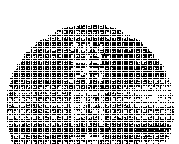
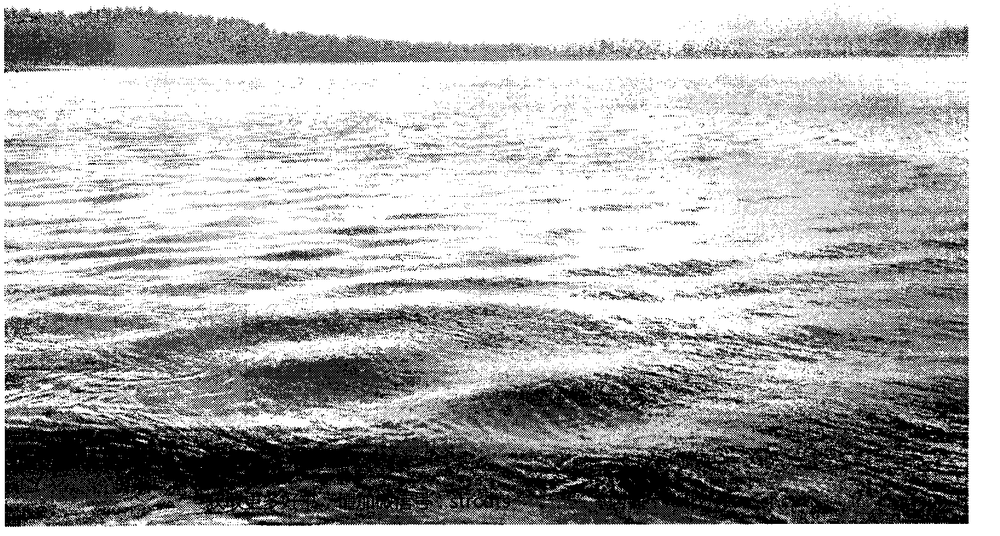

# 奥修谈瑜伽

现在·瑜伽的纪律·瑜伽是灵魂的终止·然后·数照执自行发生·

## OSHO

## The Way of Yoga The Sacred of The Soul

## 推荐序|

## 经验意识的拓展

## 王静蓉

瑜伽，特别是哈达瑜伽，提供一种和身体意识连结的方式，让人可以

藉由肢体的伸展进入宁静。

这是哈达瑜伽珍贵的贡献，藉由练习者（主体）将注意力放在移动伸展的肢体（客体），并透過呼吸的觉察，自然来到放松和专注的状态，有时，宁静就突然乍现了。在做完一次瑜伽（Asana）之後，实是最适合静坐的时侯；身体的紧绷松弛了，脑子的混乱乍歇了，一切，正适合宁静。

瑜伽提供超越头脑的路徑，你若练习瑜伽，你就可以经验意识的拓展，别只把它视為健美的工具，让它领着你瞥见更多吧！

十多年前开始学瑜伽，初见它带来的宁静和放松，我曾疯狂地爱上

它，特别是瑜伽哲学，关于至上意识、关于感官收攫、关于八部功法、关于瑜伽行者简朴智慧的生话……都是灵性深具，在在令我憧憬！

既然身体修练不是我的目的，我能在瑜伽的伸展时经验着慢下来、无為地处在当下片刻，和秒与秒相遇；在深沉的呼吸间，进入呼与吸之间的止息；生活中的速度实在太快了，快，带入了焦慮，带入了错过，快，就是头脑想要的，头脑只知道朝著目標前進，但是错过当下。现在，在初尝归于中心后，再看奥修说瑜伽经，知道瑜伽的確提供了归于中心的路徑，让我们记得身體这個媒介，使用它而不认同它，这样就真的能超越它。当你超越，那就是庆祝已然发生了！

王静蓉 Ma Dhyan Mahita • 作家、治疗师。著有《把神秘喝个够》（生命潜能出版）、《沐浴在光中》等二十余本书。给予能量治疗个案和工作坊，工作主题在直觉及创造力。

## 第二章

## 瑜伽的纪律

瑜伽意谓着你已经准备好不走进未来、
已经准备好不去期盼、
不越過你的本性，
与实相本然的樣子相遇。

[图片]

## 奥修 瑜伽

现在，瑜伽的纪律 瑜伽是头脑的终止 然后观照就自行发生
在其他狀态裡，会對头脑变异（modification）產生認同
我们活在深深的幻象裡，幻想著希望、未来和明天，彷彿一旦停止自我欺騙，就無法生存下去。尼采说：「人大概無法與真實共存，他需要夢、需要幻想；為了生存，他需要謊言。」尼采是對的，就人现有的樣子，他不可能與真理共存，你必須非常深入地了解這點，因為倘若你不了解，就無法進入这个名为「瑜伽」的探索。 头脑必須被深入了解——它需要謊言、需要幻象，头脑無法与真實共存，它需要梦。你不只在晚上做梦，就算醒著，也断在做梦；也許你正在看著我，正在聽我說話，可是，梦之流继续在你裡面流動，头脑持續不断地製造梦、想像和幻想。 科学家说人沒有睡眠也可以活下去，但是卻不能沒有梦。我们在过去所了解到的是，睡眠是必需品，可是现在新的研究却告诉你，睡眠並不是真正的需要；

## 第一章

## 瑜伽的纪律

你睡觉是為了做梦，梦才是必須的。假如你被允許睡觉卻不能做梦，那麼到了早上，你不會覺得清新、有活力，反而會感到疲倦，好像整個晚上都無法入睡。夜晚的睡眠有不同階段，分別是熟睡時間和做梦时间，它们是有韻律的，就像白天和夜晚交替的韻律。一開始，大約四十或四十五分鐘的時間你會陷入熟睡，之後做梦的階段來臨，你開始做梦，再來又是無梦的睡眠，然后再次是做梦階段，整個夜晚持續著这个韻律。如果是熟睡沒有做梦的階段被干擾，那麼到了早上，你不会覺得错過什麼；但是如果你的梦被打擾，醒来后，你就会感到徹底疲憊、筋疲盡。这个现象可以從外表看出來，你可以判定一个睡著的人是在做梦還是熟睡。假如他正在做梦，眼睛会轉動個不停，好像他閉著眼睛在看什麼東西；当## 奥修 瑜伽

有同样的态度及严谨、科学的方法。他不是诗人，克里希那是個诗人；他不是道德家，马哈维亚是個道德家。他是思索着法则的科学家，他已经推演出人类本性的绝对法则、人类头脑最终的运作架构和实相。

如果你采用派坦加利的方法，你将会知道那就像任何数学方程式一样精确，实实在在做他所说的，结果就会发生。结果必定会发生，就像二加二会等于四，将水加热到沸点就会开始蒸发一样，不需要信念，只要照着做，你将会知道。瑜伽是某种要去做才会知道的科学，那就是为什么我说不需要比较，在这个地球上，没有人像派坦加利一樣。

你可以在他们的言辞谈论中发现诗句，那是必然的。好几次，当佛陀在表达自己的时候，他就变成了诗人。那狂喜的领域、最终的知道是这么美、这么具有诱惑力，所以让人变成诗意的；是这般的美、这般的祝福、这般的喜乐，以致于人开始以诗意的方式表達。

派坦加利抗拒那種方式，这难 的，没有人能够抗拒，耶稣、克里希那、佛陀……他们全都成了诗意的。当光采与美在你里面迸发，你开始跳舞，开始歌唱，彷佛你正在跟宇宙谈恋爱一樣。
派坦加利抗拒这样，他不使用诗，甚至不使用任何诗的象征，他做任何事情

都不會用到诗。他不谈论美，他谈论数学，他是精确的，而且他会给你準则，那些準则指出需要被完成的事情。他不會进发狂喜，不會说無法述說之事，不會去嘗试那不可能的，他只會设下基本原則，假使你依循這些原則，就會到達顶峰——彼岸。記住這點：他是個嚴謹的數學家。

第一句经文：现在，瑜伽的紀律。

每一個字都必須加以了解，因為派坦加利不會使用任何多餘的字。

首先，试著了解一现在這個詞，這個「现在」指出了剛剛我所提到的頭腦狀態。

假如你不幻想、不抱持期待，你覺知到所有欲望的徒勞無益，認為生命沒有意義；假如截至目前為止，不管你做什么都没用，未來什麼也不剩，你處於完全的絕望中，處於齊克果（Kierkegaard）所說的極苦（anguish）裡。如果你極為痛苦、憂傷，不知道要做什麼，不知道要去哪裡，不知道要期待誰，剛好在發瘋、自殺或死亡的邊緣，而且你的整個生命模式突然變得一点意義都没有……假如這個片刻到來，派坦加利說：「现在，瑜伽的紀律。」

唯有现在，你才能夠了解瑜伽的科學、瑜伽的紀律。

倘若這個片刻尚未到來，你仍可以繼續研究瑜伽，成爲一位偉大的學者，但是你不會成爲瑜伽行者；你可以寫有關瑜伽的論文，可以演講，但是你不會是個 瑜伽行者，這個片刻尚未降臨。 在智能上，你能對瑜伽產生興趣，也可以透過頭腦與瑜伽有所關連，但倘若 瑜伽不是一個紀律，那就沒有意義。瑜伽不是論書，不是經典，而是紀律，是某種你必須去一做一的；它不是珍奇古玩，不是哲學的推理，它比那還要深，它是 生與死的問題。 假如這個片刻已經來到，你感到所有方向都變得困惑，所有的路都消失，未 來是黑暗的，所有的欲望都變苦，透過每個欲望所知道的只有失望，一切要進入 希望和夢想的行動都終止了——现在，瑜伽的紀律。 這個一現在一可能還未出現，我可以不斷地談論瑜伽，但是你不去聽，唯 有當這個片刻出現在裡面，你才可能聆聽。 你真的不滿意嗎？每個人都說是的，可是那個不滿意並非真的。你可能對這 個不滿意，對那個不滿意，但是你並不是完全的不滿意，你還在冀望著，你對你 過去的期望不滿意，但是對於未來，你還抱持希望。你的不滿意並非全然，你還 繫往著某處能夠有令人滿意、令人欣慰的事。

## 第一章

## 瑜伽的紀律

## 創造內在的秩序

有时候你感到無望，然而這個無望也不是真的。你覺得無望是因為特定的期 望沒有被達成，特定的期望沒了，可是期望還在那裡，它尚未消失，你仍然期待 著。你對這個期望、那個期望不滿意，但是你並沒有對期望本身不滿意。假如你  对期望本身感到失望，那麼這個片刻已經來到，你將可以進入瑜伽，不是進入一  個精神的、推演的現象，而是進入到紀律中。

什麼是紀律？紀律意謂著創造出一個內在的秩序。看看你現在的樣子，根本  是一團混亂，已經完全失序。葛吉夫（George Gurdjieff）在許多方面都很像派坦  加利，他也試圖使宗教的精髓成為科學。葛吉夫說：你不是「一」，你是一個  「群眾」，當你說「我」的時候，並非有任何「我」在那裡，而是有許多一我  在你裡面，有許多的自我。早上的時候，有一個我；到了下午，出現另一個我；  晚上的時候，是第三個我。你從來沒有覺知到這團混亂，有誰可以來覺知呢？沒  有一個中心可以來覺知。

說瑜伽是紀律，表示瑜伽要在你裡面創造出一個結晶化的中心，就你現在  的樣子，你是一個群眾，而一個群眾有許多不同現象，其中一個就是：你無法相信  一個群眾。葛吉夫說人沒有辦法承諾，是誰來做承諾？你一並不在那裡！假如  你做了承諾，誰要來履行？隔天早上那個做了承諾的人已經不在了。
人們來找我，他們說：「現在我要鄭重宣告，我承諾要做這件事。」我告訴  他們：「一在你做承諾之前要三思，看看你是否有自信，下一個片刻那個做承諾的  人還會在那裡。」你決定明天開始要早起，要在四點起床，然而到了四點的時  候，在你裡面的某個人說：「不要傷腦筋了，外面這麼冷……你爲什麼要這麼  急？我們可以明天再早起。」所以你又睡著了。
起床之後你感到懊悔，你想：「這是不對的，我應該做到了啊！之後你又  決定：「明天我會早起。」不過同樣的事情明天會再發生，因爲到了早上四點，那個做  承諾的人已經不在，換了另外一個人在做主，你就像扶輪社，主席不斷地  換人，每一個成員都會成爲輪替的主席，每一刻都由另外一個人做主。
葛吉夫曾說：「人的主要特徵就是他無法做承諾。」你無法履行承諾，但是  却不斷地做承諾，你知道得很清楚，你無法履行承諾，原因在於你不是一，你是  失序的、混亂的。因此，派坦加利說：「现在，瑜伽的紀律。」如果你的生命已  经變得十足悲慘，你也明瞭不管你做什麼都會創造出地獄，那麼這個片刻已  经來臨。這個片刻能夠改變你的向度、你本性的方向。截至目前為止，你都活得一團亂、像個群眾。瑜伽表示，现在，你必須成為和諧的，必須成為一。一結晶化一是需要的，一歸於中心一是需要的，除非你有一個中心，否則一切你所做的都毫無用處，只不過是在浪費時間和生命。歸於中心是首件必須做的事，擁有中心的人才可能是喜樂的，每個人都想要喜樂，但是你無法透過要求而得到它，你必須賺取它！每個人都嚮往本性的喜樂狀態，然而唯有歸於中心能夠成為喜樂的，一個群眾是不可能喜樂的，它沒有本性，所以是誰來成為喜樂的？喜樂意謂著絕對的寧靜，有和諧才可能有寧靜。當所有不協調的片斷合而為一時，當在那裡的已經不再是一個群眾而是一的時候，當你單獨一人而没有其他人在房子裡時，你將會是喜樂的。现在，其他所有人在你的屋子裡，但「你」不在那裡；只有客人在，主人總是缺席，然而，唯有主人才能夠成為喜樂的。派坦加利稱歸於中心為紀律（discipline）——阿努夏沙南（anushasanam）。紀律是個美麗的字彙，與門徒（disciple）的字根相同，紀律代表著去學習的能力、去知道的能力。可是除非你已經得到了「在」的能力，否則你不可能知道，  不可能學習。曾經有個人來找佛陀，他必定曾是個社會改革者，他說：這個世界處於悲慘中，我同意你所說的。然而佛陀從未說過這個世界是悲慘的。他說你是悲慘的，而不是這個世界；生命是悲慘的，而不是這個世界；人是悲慘的，而不是這個世界；頭腦是悲慘的，而不是這個世界。可是這位革命人士說：我同意你說的，這個世界是悲慘的。现在請你告訴我，我能夠做什麼？我有著深深的慈悲，想要為人類服務。

一個男人似乎是誠懇的，引導他啊！您為何沉默？—然後他才對那個革命家說：這一你想要服務這個世界，但是你在哪裡？我看不到裡面有任何人。我看進你裡面，可是沒有人在那裡，你没有任何中心，除非你是歸於中心的，否則不管你做什麼，都只會創造出更多傷害。

所有的社會改革者、革命家、領袖，其實是最大的禍害根源，假如沒有這些領袖，世界會更美好。他們無法幫助自己，又因為這世界是悲慘的，所以他們覺得必須做些什麼才行，然而他們沒有歸於中心，以致於不管他們做什麼，只是創造出更多悲慘。光有慈悲不會有所幫助，光有服務也不會有幫助，從一個歸於中  心的本性所流露出来的慈悲是截然不同的，來自一個群眾的慈悲是種傷害，這種慈悲有毒。现在，瑜伽的紀律。紀律意謂著「在」的能力、知道的能力、學習的能力，我們必須了解這三件事。在」的能力——所有的瑜伽姿勢並不是真的與身體有關，它們關心的是「在」的能力——派坦加利說：如果你可以靜靜坐著幾個小時而不去移動身體，你就是正在滋長「在」的能力。爲什麼要動呢？然而，就連幾秒鐘你也無法坐著不動，你覺得哪裡在癢，腳要麻掉了，許多事情開始發生，所以你的身體開始移動。这些都只是你想要動的藉口。你不是主人，你無法對身體說：「從現在起一個小時不要動。」身體將會馬上造反，它立刻會強迫你移動、做某些事，並且給你理由：「你一定要動啊！有蟲子在咬你。」可是当你看的時候可能找不到蟲子……你不是一個本性，你只是一個顛動，一個持續忙亂的活動。派坦加利的阿撒那——姿勢，真正關心的並不是任何生理訓練，而是內本性的訓練。只是  在，不做任何事、没有任何移動、没有任何行動，就只是在那裡。恆常不動將會幫助你歸於中心，如果你能夠維持在一個姿勢上，身體將會成為僕人，它會順應你；身體愈是聽從你，你就會擁有更棒的本性，一個內在愈加強健的本性。記住，假如身體不動，頭腦不可能動，因為頭腦和身體不是兩件事，而是一個現象的兩極。你不是身體和頭腦，你是身體頭腦（body-mind），你的人格是身心相關的，是身體同時也是頭腦。頭腦是身體最精細的部分，或者可以反過來說，身體是頭腦最粗大的部分；所以發生在身體的也會發生在頭腦，發生在頭腦的也會發生在身體。如果你可以維持住一個姿勢而不移動身體，倘若你能夠對身體說：一安靜！一頭腦將會保持寧靜。確實，頭腦開始想動了就試著去移動身體，因為如果身體動了，頭腦就可以動，在一個不動的身體裡，頭腦是無法遊走的，它需要一個動來動去的身體。如果身體不動、頭腦不動，你就歸於中心了。不移動的姿勢不只是生理的訓練，它是創造出一個情境，好讓歸於中心能夠發生，讓你可以變得有紀律。當你「在」，當你歸於中心，當你知道「在」的意思，你就能夠學習；因為屆時你將會謙虛，你將能夠臣服，不真實的自我不會再黏附著你。一旦歸於中心，你就知道道所有的自我都是不真實的，於是你臣服，然後一個門徒就誕生了。

門徒意謂尋道者，他不是一個群眾，他正試著歸於中心並且結晶化，至少正在嘗試著、努力著，誠心努力要成爲一個個體，去感覺本性，變成自己的主人  所有瑜伽紀律，都是要使你成爲自己主人的努力。现在，你只是內在裡許多人、許多欲望的奴隸，那裡有著極多的主人，而你只是個被拉往許多不同方向的奴隸。
现在，瑜伽的紀律。
瑜伽是紀律，是從你這一方去改變你自己的一个努力。
還有許多事情你要加以了解。瑜伽不是一種治療法，西方现在盛行心理治療，很多西方的治療師認爲瑜伽也是一種治療方法。它不是一種紀律，其中的差異是什麼？治療會被需要，是當你不健康、當你有病、當你是病態的時候；而紀律被需要，甚至是在你健康時——這就是兩者的不同。
確實，只有當你是健康的，紀律才能夠有所幫助，它不適合生病的案例。就醫療科學層面來說，瑜伽是針對那些完全健康、身心健全的人，他們沒有精神分裂、沒有發瘋、沒有精神官能症，他們是身心健全的人，是沒有特定疾病的人。盡管如此，他們還是覺知到所謂身心健全的無益，所謂健康的無用，某種更甚、更偉大、更整體的東西是需要 的。  瑜伽是針對不健康的人，它能夠幫助你來到瑜伽，可是瑜伽並不是一種治療。瑜伽不是治療，不管從任何角度來看，它都沒有試圖要使你適應社會，假如你想就一適應一的法來定義瑜伽，那麼它不是調整你去適應社會，而是調整你去適應存在，調整你去適應這個整體。因此可能會發生這種事情：一個完美的瑜伽行者對你而言，可能看起來像是病，那又會如何？社會確實有病。治療可以使你健全，使你可以適應社會，可是，社會卻是生病的……。耶誇被認爲有毛病，他

## 第一章 瑜伽的紀律

試試看！當我說說試試看，它聽起來像是矛盾的……因為沒有其他方式可以說，因為如果你嘗試，這個嘗試、這個努力是來自頭腦。你可以某個姿勢坐著，並試試反覆地吟誦或唸咒語；或者只是靜靜地坐著什麼都不想，但是之後一不想一變成了個想，你繼續說：「我不要想……不要想……停止去想。」這些全是念頭。試著了解，當派坦加利說無念、終止頭腦，他是說完全的終止。他不會同意說這不是終止，你還在使用頭腦，他會說：完全停止。但是你會問：「要如何做？怎樣才是完全停止？」頭腦持續著，即使當你坐著的時候，頭腦還在繼續，即便你不要，它還是持續運轉著……派坦加利說：「一就只是看。一讓頭腦去運轉，讓它去做它正在做的事，不管是什麼，你只是看，不要介入。你只要做個觀照者，只要做個旁觀者，不要關心，不要關心，就好像頭腦不屬於你，好像它與你無關、並非你關心的。不要關心，只要看著它，並且讓頭腦流動，它的流動是源於過去的動量，因為你過去一直幫助它動，這個活動已經有了自己的動量，因此它正在流動著。不要配合頭腦，只是看著頭腦並讓它流動，有許多許多世，或許是好幾百萬世，你都配合著它、幫助它，給與它你的能量。這個河流會流動一會兒，如果你不去配合，只是不關心地看著它——佛陀所說的漠然、烏佩夏（upeksha，捨之意，非苦非樂、非憂非喜之感受），不關心地觀看，純粹只是看，任何形式的事都不做，頭腦將會流動一會兒，然後就會自行停止。當能量已經流動過，動量消失，頭腦就會停止。

當頭腦停止，你就在瑜伽裡，你已經到達紀律，這是定義：瑜伽是頭腦的終止。然後，觀照就自行發生。

當頭腦終止，觀照就自行發生。當你只是看而不對頭腦認同，沒有判斷、有感激、沒有譴責、沒有選擇，純粹只是看，讓頭腦流動，那麼有一個片刻來臨，屈時頭腦會自行停止。當頭腦不在，觀照就發生了，你成為觀照者，只是一個觀察、一個知覺、一個目擊。你不再個作為者（doer），不再是個思考者，只是純淨的本性，最純淨的本性，這時觀照就自行發生了。在其他狀態裡，會對頭腦變異產生認同。

除了觀照之外，在其他所有狀態裡，你是對頭腦認同的。你與思緒之流成為一體，與雲朵成爲一體——有時是與白雲、有時是與烏雲、有時是與積雨雲、有時是與清朗無雲的狀態合一。不管是什麼情況，當你與念頭合爲一體，與雲朵會聚爲一體，你就錯過了天空的純淨、那個空間的純淨，你變得雲朵滿布；雲朵會聚是因爲你的認同，你與雲朵成爲一體。

佛陀也會感到飢餓，派坦加利也會感到飢餓，但是派坦加利不會說：「我飢了。」他會說：「身體飢了。」他會說：「我的胃覺得飢了。」他會說：「飢餓在那裡，我是觀照者，我已經觀照到這個想法，它是肚子透過頭腦閃過的訊號，訴說著「我餓了」。當肚子餓了，派坦加利會保持是個觀照者，而你只會變得認同，與思想成爲一體。然後，觀照就自行發生。在其他狀態裡，會對頭腦變異產生認同。這是定義：瑜伽是頭腦的終止。當頭腦終止，你就在你觀照的本我中建立了。在其他狀態裡只會有認同，所有的認同構成了這個世界。如果你處於認同中，你是在世界裡、在悲慘裡；如果置身於涅盤中，你已經超越這個悲慘世界而進入了極樂世界。極樂世界是在此時此地，就是現在这个片刻。即使是片刻也不要等待，只要觀照頭腦，你就歸於中心；一旦認同頭腦，你就錯過了，這是基本定義。記住每一件事，因為等一下在其他經文中，我們將會進入「什麼是需要做的，以及如何做等細節，你要一直將這些基礎記在腦海裡。人必須達到無念的狀態——這就是目標。

## 奧修 瑜伽

## 頭腦的五種變異

讓事實以原來的面目存在，
如此清澈的頭腦就實現了；
這份清晰將帶你朝向靜心，
成為成長到彼岸的基土。

頭腦的變異有五種，它們不是極苦的根源，就是非苦的根源。分別是正知識、錯知識、想像、深睡和記憶。頭腦不是束縛的根源，就是自由的根源。頭腦成為這個世界的大門，它是入口，也是出口；它可以引導你入地獄，也可以引導你上天堂，端視你如何使用正確地使用頭腦就變成靜心，誤用頭腦就成了瘋狂。頭腦在每個人裡面，同時包括了黑暗和光明的可能性；頭腦既不是敵人也不是朋友，你可以使它成為朋友，也可以讓它變成敵人，這視那個隱藏在頭腦後面的你而定。如果你能讓頭腦成為你的工具、僕人，頭腦就成了你到達那一最終的通道。假如你變成僕人，而頭腦被允許當主人，那麼變成主人的頭腦，將會帶領你到最痛苦、最黑暗的地方。所有的技巧、方法和瑜伽途徑，真正關心的問題只有一個：如何使用腦。正確地使用，那頭腦就會來到無念的點；錯誤地使用，頭腦所面臨的就只有一片混亂，與許多互相反對的聲音、矛盾、困惑及精神錯亂。瘋人院裡的瘋子和菩提樹下的佛陀都使用頭腦，兩者都經歷了頭腦。佛陀來到一個頭腦消失了的點；正確地使用頭腦，它就會不斷地消失，頭腦不在的片刻有一天會到來。瘋子也使用頭腦，錯誤地使用，所以頭腦變成分裂的，變成了許多個；錯誤地使用，頭腦變成了一大群，最後，只有瘋掉的頭腦在那裡，你完全不在了。佛陀的頭腦已經消失，他存在於他的全然裡；瘋子的頭腦已經成了全部，而他自己已經完全消失無蹤。你和頭腦是兩極，如果它們同時存在，你將會置身於悲慘中，不是你消失、就是你的頭腦必須消失。假如頭腦消失，你就得到了真理；如果消失的是你，那你就精神錯亂了。所挣扎的是：誰將會消失呢？是你還是頭腦？這就是衝突所在，所有挣扎的根源所在，派坦加利的經文將會一步一步地帶領你了解頭腦：它是什麼？它使用什麼模式？在它裡面的是哪一種類型的變異？你可以如何使用它並進而超越它？要記住，現在你除了頭腦之外什麼都沒有了，你必須運用它，如果你錯誤地使用，你會掉入更深的悲慘中。你正處於悲慘中，那是由累世以來，頭腦都被錯誤地運用，它已經成了你的主人，你只是個奴隸，只是個遵循頭腦的影子，你無法對它說：「停！」你無法對自己的頭腦下命令，頭腦繼續不斷地指揮著你，而你必須聽從它。你的本性已經變成影子和奴隸，是一個掌握在頭腦手上的工具。
頭腦只不過是個工具，就像你的手或腳。當你指揮你的腳和腿，它們就會動；當你說一停一，它們就會停，你是主人。如果我想移動我的手，我就無法對我說：現在不管你做什么，我都對我說：現在我想有所動作。一手不管我了，而開始自行動作，那身體將會是一團亂。
那些就是頭腦裡面所發生的事。你不想去想，但是頭腦卻不斷在思考；你想睡了，躺在床上翻來覆去，你明明想要睡覺，可是頭腦持續著，它說：不要！我還要想一些事。你繼續說：停止！但是它從來不聽你的，而你也無能為力。
頭腦只是一個工具，但是你給它太多權力了，它已經變成一位獨裁者，假如你試圖把它放回適當的所在，它將會努力掙扎。
佛陀也使用頭腦，不過他的頭腦只是像你的腿。人們不斷地來找我並且問到：一個成道者的頭腦是怎麼一回事？它就這樣消失了？無法再被使用了嗎？
做為主人的頭腦消失，而做為僕人的留下來了，現在頭腦只是一個被動的工具。佛陀要使用頭腦的時候，就能夠使用它。當他對你說話時，就必須用到它，不可能不運用頭腦卻能演講的，頭腦必須被使用。\n如果你來到佛陀身邊，而他認出了你，他知道你以前曾經來過，他就是在使用頭腦，不使用頭腦就不可能認得，不使用頭腦就沒有記憶。但是記住：他是「使用」頭腦，而你是「被使用」——這就是差異所在。每當佛陀要使用頭腦時，他就用；而當他不使用它時，他就不用。頭腦只是一個被動的工具，它並沒有緊抓住他。\n佛陀保持像一面鏡子般，如果你來到鏡子面前，它就就會反映出你；當你離開，反映的影像就不見了，而鏡面又是空無一物。你不像一面鏡子，你看看見某個人……這個人走了，但是念頭繼續著，反映繼續著，你持續地想著他，而且就算你想停，頭腦也不會聽從你。\n駕御頭腦就是瑜伽，當派坦加利說到「終止頭腦一時，他的意思是：它不再是一個主人，做為主人的頭腦停止了，它已不再是主動的，而是被動的工具。你下命令，它就運作；你不下命令，它就保持不動，它只是等待著，不能有自己的主見，它的主張已經失去了，暴力已經失去了，不再試圖控制你。目前，實情剛好相反。

要怎麼成爲主人？如何將頭腦放在它的位置，並且讓你可以使用它；假如你不想使用，可以把它放在一邊，並且保持寧靜？所以，整個頭腦的機械構造必須加以了解。現在，我們進入這段經文。

頭腦是身體，不過極爲精密；它屬於身體的一部分，可是非常織細、非常精緻，你無法抓住它，但是透過身體你可以影響它。假如你吸食毒品，服用迷幻藥、大麻、酒精或其他東西，驟然間，頭腦就被影響了。頭腦是身體最精細的部分。

反過來說，身體也會被作用在頭腦上的東西所影響。例如催眠，一個無法的走路、癱瘓的人，有時候能夠在催眠的狀態下行走；或者，你没有癱瘓，可是假如在催眠時被告知一現在你的身體是癱瘓的，你不能走路，你就沒辦法行走。癱瘓的人有時能在催眠的狀態下行走，这是怎麼回事？催眠進入頭腦、暗示進入頭腦之後，身體就聽從頭腦的指令。頭腦的變異有五種，它們不是極苦的根源，就是非苦的根源。首先要了解的是，頭腦並不是和身體不同的東西，記住：頭腦是身體的一部
分；這是派坦加利最深奧的發現之一，而現代科學也證明了這點，這在西方是極新的觀點。他們現在說：把身體和頭腦當作是分開的、是截然不同的個體，那是不對的，其實身心是相關的，是身體頭腦。身體和頭腦只是同一個現象的兩種機能，一端是頭腦，另一端則是身體；你可以從任何一端著手，進而去改變另一方。身體有五種活動器官——五根（indriyas），眼、耳、鼻、舌、身，五個活動的工具；頭腦擁有五種變異，五個機能模式。頭腦和身體是一體的，身體劃分為五個機能，頭腦也是一樣。我們將詳細地進入每個機能。經文的第二個部分是：它們不是極苦的根源，就是非苦的根源。這整個頭腦、這五種變異，可能把你帶到極深的痛苦中，佛陀稱這種痛苦為達卡——悲慘。假如你正確地使用頭腦和其機能，它也可以引導你進入沒有悲慘的狀態。頭腦最多只能帶你進入不悲慘的境界，不悲慘（nonmisery）這個字彙非常有意義，派坦加利並不是說它會帶你通向無邊無際、通向喜樂，不是！頭腦會導致你走向悲慘，假如你錯誤地使用它，假如你變成它的奴隸；如果你成為主人，頭腦能夠帶領你進入不悲慘……不是通往喜樂，因為喜樂是你的天性，頭腦無法把你帶到那裡，可是，假如你是不悲慘的，內在的喜樂就會開始流動。喜樂一直都在你裡面，是你的固有天性，它不是什麼要去達成或賺取的，也不是在他處才可觸及的，它是你與生俱來的。你原本就擁有它了，它本來就是事實，這就是為什麼派坦加利不說：頭腦帶你通往悲慘或通向喜樂，他不這麼說，他非常科學、非常精確，任何會帶給你不真實訊息的字眼，他一個都不会用，他僅僅說：不是悲慘就是不悲慘。佛陀也這麼說過很多次，每當有尋道者來找他時——尋道者是在找尋喜樂，因此他們會問佛陀：「我們要怎麼到達那最終的喜樂？」他会說：「我不知道，我可以指出通往不悲慘的道路，就只是悲慘的不在；我不說任何關於正向的喜樂，而是只有負向的，我只能指出如何走入不悲慘的世界。」那是所有這些方法所能做的，一旦你在不悲慘的狀態，內在的喜樂就會開始流動，不過那並非來自頭腦，而是來自你的內本性，所以頭腦無法對它做什麼，頭腦不可能創造出喜樂。假如頭腦陷入悲慘裡，頭腦就變成阻礙；如果頭腦處於不悲慘中，那頭腦就成為一個開口，但是它不具創造力，它沒辦法創造

## 奧修 瑜伽

多的定靜，變得愈來愈寧靜。酒精不斷地做著徹底相反的事，它使你愈來愈激動、興奮、煩亂，顫動不安進入你裡面，醉漢甚至連路都沒法好好走，他不只是失去了身體的平衡，就連頭腦裡的平衡也不見了。靜心意謂著內在的平衡，當你得到內在的平衡，不再顫動不安，當整個身體頭腦變得定靜，正知識的中心就開始運作，透過那個中心，所有被知道的都是真實的。你在何處？你不是酗酒者，也不是靜心意者，所以你必定在兩者之間的某個地方。你不在任何一個中心裡，而是在錯知識和正知識之間，這就是為什麼你會困惑。有時候你會有所瞥見，你稍稍靠往正知識的中心，然後某種瞥見就會出現：當你靠向另一個中心，那個歪曲的中心，曲解就會進入你裡面，然後每一件事都攪和在一起，你就置身一片混亂。這就是為什麼你若不是個靜心意者就會成為酒鬼，因為介於兩個中心之間的迷惑，遠超過你能承受的。假如你中了酒精的毒、迷失了自己，那你是輕鬆的，至少你已經到達了一個中心，即隱是由錯知識所組成，但是你歸於一個中心，整個世界或許會說你是錯的，不過你不這麼想，你認為整個世界是錯的。至少在那些無意識的時刻，

## 第二章

## 頭腦的五種變異

你是歸於中心的，歸於錯的中心裡，但你是快樂的；就算是歸於錯的中心也會帶給你某種快樂，你享受著它，因此酒精才會有那麼大的吸引力。但是沒一個管用。除非人們成為靜心的，否則一切都沒有助益。人們會持續沉迷下去，他們會找到新的方法和手段讓自己中毒、沉迷，他們不可能被阻止，你愈是阻止，吸引力就變得愈大。美國曾經這麼做過，而且勢在必行，他們盡了最大的努力去阻止，可是在禁酒的期間，人們反而喝得更凶了。他們試過而且失敗了，印度在獨立之後也這麼做過，結果也是失敗，禁止看來是沒有用的。除非人們從內在改變，否則你無法強施任何禁令，那是不可能的，因為屆時人們將會發瘋，這是他們保持神智正常的方法。在幾個小時裡，某個人服了毒品而變得恍惚，於是問題沒了，悲慘和極苦沒了；悲慘會再來，極苦也會再次出現，但至少已經被延緩了，明天早上悲慘會在那裡，極苦也會在那裡，他必須去面對，可是到了晚上他又可以再次期望，他會去喝酒並且安下心。

## 點亮內在的光

## 奧修 瑜伽

這是二選一的問題，如果你不靜心，遲早你會去尋找一些毒藥，一些細微的毒藥。酒精並非細微的，它非常粗略，有一些不易察覺的毒藥，性就有可能變成你的毒藥。你可以拿任何東西當作你的毒藥。只有靜心才能有所幫助，為什麼？因爲靜心使你歸於中心，那是派坦加利稱爲波羅滿的中心。為什麼每一個東方宗教都如此強調靜心？靜心必定成就是內在奇蹟，那就是：靜心幫助你打開正知識的燈，接著，不管你走到哪裡，不管你行動的焦點擺在哪裡，一切被知道的都是真實的。佛陀被問過數不清的問題，某一天有個人問他：‘我們有新的問題，但是在剛要向你提出的時候，你就開始回答了，你從來沒有想一想到回答，為什麼會發生這樣的事呢？’佛陀說：‘這跟思考無關，你提出問題，我就只是看著它，然後真實就會顯現，不管真實是什麼。這無關乎思考與沉思，答案並非來自邏輯推演，而是正知識的聚焦。’

## 第二章
頭腦的五種變異

佛陀就像一把手電筒，手電筒所照之處就會亮起來。問題是什麼並非重點，佛陀擁有這份光亮，每當光來到任何問題上，答案就會顯現，答案會從那光亮處現形，那是一個簡單的現象，一個神示。

假如你知道，就没有思考的必要；假如你不知道，你將會在記憶中找尋，你將會找到許多線索，做做拼貼的工作。事實上你是不知道的，否則答案馬上就會有。

我經聽說過一位老師的故事：一位國小的女老師問小朋友：「你有任何問題嗎？」一個小男孩站起來說：「我有一個問題。其實我一直在等，等老師問起，我就要提出来，請告诉我整個地球的重量是多少？」這個老師慌亂了起來，因為她從沒想過這個問題，從沒讀過它，整個地球的重量？所以她玩了個老師們都知道的把戲，他們都必須玩把戏，她說：「很明明天我會問這個問題，不管是誰，只要帶來正確答案，就會得到一份禮物。」

所有的孩子找了又找，可是找不到解答。这位老师衝到圖書館，她搜尋了整晚，剛好在早晨來臨之前查到了地球重量。她非常高興地回到學校上課，但小朋友都顯得筋疲力盡，他們說找不到答案：‘我們問媽媽，也問爸爸，我們問了所有人，但是没有人知道，這個問題似乎非常困難。’老師笑道：‘這並不难，我知道答案，我只不過想看看你们是不是能夠查到提出問題的小男孩又站了起來，他說：‘有包括人還是没有？’你不能把佛陀放在同樣的的情況下，這不是去某處尋找答案，這與回答你的題無關，你所提的問題只不過是個藉口，當你把問題提出後，佛陀只是把他的光亮移向問題，任何會呈現的就會呈現，他回答了‘你’，那是他對的中心深切的回應。派坦加利說頭腦的變異有五種，其中一個是正知識，如果正知識的中心開始在你裡面運作，你將成為一位賢者、一位聖人，你將具有宗教性，在那之前，你不可能成為具宗教性的。這就是為什麼耶穌和穆罕默德看起來像是瘋狂的，因為他們不爭論，他們看

## 第二章
頭腦的五種變異

待事情並非基於邏輯，他們的聲明直率且清楚有力。你問耶穌：—你真的是神唯
一的兒子？—他說：—沒錯，—如果你要他提出證明，他會笑一笑然後說：—沒
有證明任何事情的必要，我知道這是實情，是不證自明的。—對我們來說這看起
來不合邏輯，這個人似乎是神經病，不經任何證明就要聲稱某件事。
如果正知識的中心開始運作，你會跟耶穌一樣，能夠清楚有力地表明，但你
無法證明。你如何能夠夠證明？假設你在愛裡，你要怎麼證明你是在愛裡，你要怎麼證明你是愛裡？你就只是表明—我腳夠宣稱。當你的腳感到疼痛時，你要怎麼證明你的腳在痛？你就只是表明—我腳
痛—，你知道疼痛在裡面的某處，那份知道就己經足夠了。
拉瑪克里希那（Ramakrishna）被問到：—神存在嗎？—他回答是。
他又被問：—那請你證明。—
說就有這個需要，所以你會去尋覓，沒有人能為我證明這件事，因而我也無法為
你提出證明，我曾經去探索，也經去尋覓，現在在找到了：神是存在的。—
這是一對的中心一的運作。
拉瑪克里希那或耶穌看起來是荒謬不合理的，他們篤定地宣稱一件事而不給
與任何證明。事實上，他們並沒有宣稱，他們沒在宣稱任何事，是特定的事情對

## 奥修 瑜伽

他們顯現，因為他們有一個新的中心在運作，而那是你沒有的，就是因為你沒有，所以你才需要證明。有，所以你才需要證明。記住，想要證明顯示了你的內在對任何事物都沒有感覺，所以每一件事都需要證明，就連愛也需要證明。我知道許多夫妻，丈夫不斷證明他愛他的妻子，然而他從未讓她信服；妻子也不斷地證明自己愛丈夫，而她也未曾使他相信過。他們還是沒被說服，因此衝突還是在那裡，他們不斷地覺得另一方還未證明他的愛。戀人不斷地尋找證據，創造出一種對方必須證明自己是愛他們的情境，漸地，雙方都對這種情感到厭煩。想要去證明的努力是無用的，而且也沒有什麼是可以被證明，你可以接吻、擁抱，也可以唱歌跳舞，但是沒有什麼因而被證明，你可以送禮物，可是沒有什麼因而被證明，你可能只是在假裝。靜心將帶領你來到頭腦的第一種變異：對的知識，當你可以正確地知道事情，證明就不需要了，如此頭腦才能夠被丟下，在這之前那是不可能的。當再有證明的需要時，頭腦就不需要了，因為頭腦只是一個邏輯的工具。你之所以會在每一個片刻需要頭腦，是因為你必須思考，去找出什麼是對的、什麼是

## 第二章
頭腦的五種變異

錯的，每一個片刻都有選擇和抉擇的機會，你必須做選擇。只有當正知識運作時，你才可能拋下頭腦，因為擇選已經不再具有意義，你不做選擇地生活著，唯有有對的會顯現在你眼前。

時，你才可能拋下頭腦，因為擇選已經不再具有意義，你不做選擇地生活著，唯有有對的會顯現在你眼前。
聖哲的定義是：從來不做選擇的人，他從未在壞的裡面挑選好的，他純粹就往好的方向移動。就像向日葵，當太陽在東邊，花朵就朝向東，它從來沒有決定要移動，它從太陽移往西邊，花朵也向西，純粹跟著太陽移動，它從來沒有決定要移動，它從未下決定說：現在我該移動了，因為太陽已經去到西邊。

聖哲就像一朵向日葵，哪裡有好的他就往哪裡去，所以他所做的一切都是好的。印度教經典《奧義書》（Upanishads）說：別評斷聖哲，你平凡的尺度標準不可能辦到。你必須從壞的裡面做出對的，而聖哲不需要選擇，他直接行動。動，你無法改變他，因為這並非一選一的问题，如果你說：這樣不好。他會說：這也許不好，但是這就是我的行動的方式，這是我的存在流動的方式。

在吠陀時代裡，人們是知道的，而那些知道了的人做了一個決定，他們決定：我們將不會評斷聖哲，一旦一個人已經歸於自己的中心，當他到達了靜心的狀態，變得寧靜、放下頭腦，那麼他是超越道德規範、超越傳統的，他超越了
我們的極限，假如我們能夠跟隨的話，就跟隨他；假如沒辦法跟隨，那我們不應

## 奧修 瑜伽

該下評斷。 倘若正知識運作，假如你的頭腦已經產生正知識的這種變異，你將會是有宗教性的。 倘若正知識運作，假如你的頭腦已經產生正知識的這種變異，你將會是有宗教性的。 要留意，這是全然不同的。派坦加利不是說假如你去清真寺、去廟宇，如果你做某些儀式、做祈禱……不！那並不是宗教。你必須讓正知識的中心開始運作，而你是否去清真寺都無關緊要，那一點關係都没有。假如你正知識的中心作用了，一切你所做的都是祈禱，你所到之處就是廟宇。 卡比兒（Kabir）曾經說過：‘不論我前往何處，我都会發現你——我的神啊！不管我移往何處，我都朝你靠近，並在偶然間遇見你。不管我做什麼，即便是走路、吃飯，都是祈禱。’卡比兒說：‘這個自發性的是三摩地（samādhi），成為自發性的就是我的靜心。’ 頭腦第二種變異是「錯知識」，假如你錯知識的中心運作，不管你做什麼都會是錯的，不管你做何選擇都是錯的，一切你所決定的也會是錯的，因為那不是你在做決定，而是錯的中心在做決定。 有的人覺得自己是不幸的，因為他們所做的一切都是錯的，他們試著不要再

## 第二章

# 頭腦的五種變異

犯錯，可是並沒有幫助。這個運作的中心必須被改變，他們的頭腦以錯的方式在
作用著，也許他們認為正在做的是對的，可是那將會是錯的，就算有好的願望或意圖，也不會有所助益，他們是無助的。

穆拉·那斯魯丁曾經去拜訪一位聖哲，他已經來了好多天，可是這個聖哲很
安靜、都不說話，那斯魯丁覺得必須說些什麼，所以他問：「我一次又一次地
來，等待你可能說些什麼，可是你什麼也没說；除非你說，否則我無法了解，只要給我的生命一個訊息、一個指示，讓我能夠往那個方向前進。」

那位蘇菲聖哲說：「做好事，然後將它丟到井裡去。做好事後就馬上把它忘了，不要攜帶著
「我做了好事」的念頭。

隔天，那斯魯丁幫助一位老婦人穿越馬路……然後就把她推到井裡去！做好
事，然後將它丟到井裡去！

如果你錯的中心在作用，不論你做什麼……你可以閱讀《可蘭經》、閱讀《薄伽梵歌》，你會從中找到一些含義，可是假如克里希那、穆罕默德看見你找
[content]

## 奧修 瑜伽

一，可是酒精给了他勇氣。後來有一個高壯的人進入這間酒吧，他的外表凶猛、危險，看起來像個殺人犯，在其他任何時間裡，假使那斯魯丁有理智的話，他一定會害怕，但是現在他在喝醉了，因此他一點兒也不怕。那個外表凶猛的男人來到那斯魯丁附近，看到他一點兒都不怕。蹂了他一腳，那斯魯丁生氣、暴怒地說：「你在做什麼！你是故意的還是在開玩笑 笑？！」然而就在感覺到腳痛的同時，那斯魯丁從酒精帶來的勇氣中清醒過來，他的理智回來了，可是他已經說出：「你在做什麼！你是故意的或是開玩笑？！」這個人說：「故意的！穆拉·那斯魯丁說：「那麼謝謝你，因為我不喜歡這種玩笑，故意的就沒關係。」派坦加利說想像像是頭腦的第三種能力。你繼續想像著，倘若你以錯誤的方式想像，就會在周遭創造出錯覺，而迷失在夢和幻想裡。迷幻藥和其他藥物就是作用在這個中心，不管你內在擁有什麼潛力，迷幻藥的迷幻經驗都會幫助你把它開發出來。沒有什麼是確定的，如果你有快樂的想像，那麼藥物所產生的幻覺會是

一個快樂、高昂、陶醉的迷幻之旅；假如你的想像悲慘的、惡夢似的，這個幻覺就會是糟糕的。

堂之門的錨匙，而雷納（Rheiner）後它是終極地獄，這些都依你而定；迷幻藥能夠成為天

無法做什麼，它只是跳進你的想像中心，在那裡起化學作用。假如你的想像是惡

夢型的，你會開發它並且經歷地獄，倘若你是沉醉於美夢的，你會抵達天

堂。由想像所運作出來的，可以是地獄也可以是天堂。你可能透過想像的運作，

而變得完全精神錯亂。

精神病院的瘋子是怎麼了？他們發揮了他們的想像，以一種連他自己都會

被吞沒的方式運用它。瘋子有可能單獨坐著，卻大聲地對著某個人說話，他不只

說而已，還回話，他提出問題然後自己回答，他同時替那個缺席的人講話。你或

許覺得他瘋了，可是他是在對真實的人說話，在他的想像中，這個人是真實的，

他無法判斷出想像和真實的差別。

小孩子也無法判斷，所以有好幾次他們在夢裡丢了玩具，早上醒來後會哭

泣：「我的玩具在哪裡？」他們無法判定夢就是夢，而事實就是事實。他們不知道夢在哪裡結束，

遺失任何東西，他們只是在做夢，但界限是模糊的，他們不知道夢在哪裡結束，

真實從哪裡開始。瘋子也是模糊不清的，他不知道什麼是真的、什麼是假的。 假如想像被正確地使用，你就會知道「這是想像」，你會保持警覺，不但能
夠享受它，也知道它不是真實的。 當人們靜心，許多事情就透過他們的想像產生，他們開始看見光、顏色、 美景、與神交談、跟耶穌同行或是和克里希那一起跳舞，這些都是想像。靜心 的，不過不要認為它們是真實的。 記住，唯有觀照的意識才是真實的，其他的都不是。所有發生的事有可能是 美麗的、值得享受的——那就享受它！跟克里希那一起跳舞很美，這沒什麼錯， 跳吧！享受吧！但要記住：這是想像，是一個美麗的夢，不要迷失在其中。假 如你迷失了，想像就會變得危險，許多宗教人士只活在想像裡，他們在想像中 行動，因而浪費了生命。 

### 頭腦的五種變異

頭腦的第四種變異是熟睡，熟睡是指相對於你外在活動的意識而言的無意 識。這個意識已經深入自身，行動停止了，有意識的行動停止了，頭腦沒有在 運作，深睡就是頭腦的不運作。如果你在做夢，那就不熟睡，你只是處在中

間，在睡與醒之間你已經離開了清醒，還未進入睡眠，你是在中間。

被吸收、是放鬆的。這種睡眠是美麗的，能夠給與生氣、活力，你可以使用它。

假如你知道如何使用深睡狀態，它可以變成三摩地，因為三摩地和熟睡並沒有多

少差別，唯一的不同是在三摩地狀態裡你是覺知的，而其他事情將會一樣；在熟

睡中，除了你是不覺知的之外，所有事情都一樣。

你處於佛陀所進入的、拉瑪克里希那所活著的、耶穌所創造出的家的同樣喜

樂狀態，在深睡中，你是在同樣的喜樂狀態裡，只不過你没有覺知到。因此，早

晨時你覺得昨晚是美好的，你感到清新、生氣蓬勃、有精神，你覺得昨晚非常美

—但這只是快樂的餘韻，你不知道怎麼回事，究竟發生了什麼事，你並沒有覺

知。

有兩種方式可以運用熟睡，一是正常地休息，然而即使是這個你也已經失去了。人們並不是真的進入睡眠，他們不斷地做夢，只有偶爾幾秒鐘的時間碰觸到

睡眠，他們觸及它，然後又開始做夢，睡覺的寧靜、睡覺的喜樂樂章成了未知，

你已經摧毀它，即使正常的睡眠也被毀了，你是如此激動、興奮，以致於頭腦無

法完全地掉入無知覺中。

### 正確的睡眠

派坦加利說正常的睡眠有助於身體健康，可是如果在睡覺中你可以變得警覺，它就能夠夔成三摩地，夔成一種心靈的現象。有一些技巧是關於睡覺如何變成一個覺醒。《薄伽梵歌》說瑜伽行者即使是睡覺時也不是睡覺的，他保持警覺，某種裡面的東西繼續覺知著，整個身體掉入了睡眠中，頭腦也進入睡眠裡，但是觀照持續著，某個人正在觀看著——塔上的觀照者繼續觀看著，然後後睡覺就成了三摩地，變成了最終的狂喜。

記憶是頭腦第五種也是最後一種變異，它也可以被運用或被誤用。誤用，就會創造出困惑。事實上，你可能記得某件事，可是你無法確定事情是否真是那樣發生，你的記憶不可靠，你也许會添加許多東西進去，想像也可能進入；也有可能你從中刪掉許多東西，對記憶做了許多事，當你說：「這是我 的記憶。」它已經被精煉、改變過了，並非事實。每個人說：「我的童年就像天堂。」你看看小孩子，這些孩子不久後也說他們的童年是天堂，然而現在他們正在受苦，每個孩子都渴望快一點長大成 人，所有孩子都認為成年人正在享受那些值得享受的，他們擁有權力，可以做所有的事，而孩子是無助的。小孩子認為自己正在受苦，他們也會像你一樣長

大，不久後也會說：我的童年美麗的就像天堂一樣。地對待它。你從中去掉許多東西——所有醜陋的、傷心的、痛苦的，你都將它們丟掉；而一切美麗的，你就予以保留。所有支持你自我的，你都記得；而不支持的你就丟棄，忘得一乾二凈。每個人都有個很大的儲藏室，放置遺棄的記憶，不管你說的是什麼都不真實，你無法真實地去記憶，你所有的中心都被困惑了，它們進入彼此之間並且擾亂一切。它們進入彼此之間並且擾亂一切。正確地記憶，佛陀曾經針對靜心使用這個字眼：正確記憶。派坦加利說如果記憶是正確的，那表示人必須對自己完全誠實，只有那個時候記憶才可能正確。不管曾經發生過什麼事情，無論好或壞都不要改變它，以它本然的样子去知道它。這非常的困難、非常艱巨！你會加以選擇並且改變記憶，然而就其本然的樣子去知道過去，將會改變你整個生命。如果你正確地知道過去的本來樣貌，未來你就不會想要再次重複。現在，每個人在想著如何以修改過的樣貌再次去經歷過往，可是假使你知道過去的確實原貌，你將不會想要重複，正確地記憶會給與你動力，從累世的生命中解脫·記憶若是對的，你甚至可以進入前世，假如你是

誠實的，你就可以進入前世，然後你就會只有一個欲望：如何超越所有亂七八糟的東西。

你認為過去是美麗的，認為未來也將會是美麗的，唯有現在是個錯誤。但是幾天前，這個過去也是現在；而在幾天後，這個未來也將會是現在。每個現在都是錯誤的，而所有的過去和未來都是美麗的?!這就是錯誤地記憶，直接看，不要改變任何東西，看著過去本然的樣貌。

但是我們不誠實。 

但是我们不誠實。 每個男人都恨他的父親，然而如果你問任何一個人，他會說：「我愛我父親，我尊敬他勝過一切。」每個女人都恨她的母親，但是你問問看，所有女人都會說：「我的母親實在壞好的。」這就是錯誤地記憶。

紀伯倫（Khalil Gibran）曾經說過一個故事：有一天晚上，有位母親和她的女兒因為噪音而突然驚醒，她們都是夢遊者，當鄰居突然發出聲響的時候，她們正在花園裡夢遊著，她們都是夢遊症患者。這個母親在睡夢中對女兒說：「就是因為你，你這個騷擾娘，因為你，我的青春失去了，你毀了我，現在每一個來到這個房子的人看的都是你，没有人會

看我了。～在女兒年輕漂亮的时候，這份深沉的妒忌會來到每個母親身上。所有母親身上都會發生這件事，只不過都被隱藏在裡面。是阻礙，不管在哪裡你都是阻礙，你這個障礙物。我不能去愛，我不能去享受……受……～是阻礙，不管在哪裡你都是阻礙，你這個障礙物。我不能去愛，我不能去享受……受……～這個老婦人說：～我的孩子啊！你在这裡做什么呢？你会感冒的，進來裡面吧。～這個女兒說：～那你在这裡做什么呢？你已經覺得不舒服了，況且這又是個很冷的夜晚。來吧，媽媽，躺到床上去吧！～第一段對話來自無意識，後來她們醒了，所以又開始佯裝，這時無意識已經縮進去，意識已經進入，現在她們是傷君子。你的意識是虛偽的；要對自己的記憶真正的誠實，需要一番難巨的努力。你必須真實，不管要付出任何代價；必須赤裸裸的真實——必須知道你對父親、對母親、對兄弟姊妹的真正想法，真正的！不管你的過去有什麼，都不要混淆它，

不要加以改變、不要修飾，讓它以原來的面目存在。倘若這發生了，派坦加利說這將會是自由，你將會把它丟掉，因為這整個事情毫無價值可言，你不想要再次將它投射到未來。然後你就不是一個偽善者，你會是真實、真誠、誠懇的，你將會成為真真實實的人，彷彿岩石一般，沒有什麼能夠改變你，沒有什麼能夠創造出困惑；你變得像一把劍，總是能將錯誤斬開，能夠分辨對錯，於是清澈的頭腦就實現了。這份清晰將帶你朝向靜心，成為成長到彼岸的基土。

## 有意識的努力

你練習了愈多的意識，
就會變得更加具有意識，
然後有一個片刻會到來，
屆時你會變成純粹的意識。

你並非要與自己抗爭，而是要對抗其他早已貼附在你身上的東西。假如沒

記住第一件事：這不是對抗你的天性，而是對抗錯誤地養成、錯誤的習慣。

阿巴亞沙（abhyasa）——持續不斷地內在練習，和惟若基亞（vairagya）

持續不斷地內在努力之所以需要，不是因為有什麼必須達到，而是因為錯誤的習慣；這個抗戰並非反對天性，而是針對錯誤的習慣。天性就在那裡，每一個片刻都準備好在你裡面流動，要變成一——，但由於你有錯誤的習慣模式，

因而形成阻礙；這個戰門就是要對抗這些錯誤的習慣，除非它們被摧毀了，否則你與生俱來的天性將無法流動，無法到達天命所在。

則你並非要與自己抗爭，而是要對抗其他早已貼附在你身上的東西。假如沒

記住第一件事：這不是對抗你的天性，而是對抗錯誤地養成、錯誤的習慣。

有正確地了解，你的整個努力可能會走錯方向，你會開始對抗自己；一旦你

開始對抗自己，你打的就是一場穩輸的仗。你是不可能戰勝的，誰將戰勝、誰

又將戰敗呢？你是這兩者，正在抗爭的和正在反抗的是同一個。假如我的兩隻手開始打架，哪一隻手會贏？一旦你開始與自己抗爭，你就輸了。許多人在努力尋找心靈真相的過程中，掉入自我抗爭的泥淖裡，成為這個錯誤的犧牲者，開始自我門爭。倘若你與自己抗爭，你就会愈來愈錯亂，愈來愈分裂，你將變成精神分裂。這就是現在西方所發生的事，基督教叫你——不是基督而是基督教——跟自

己抗争、譴責自己、否定自己，基督教已經在低的和高的之間創造出很大的分別。然而在你裡面，沒有什麼是高的，也沒有什麼是低的。可是基督教談論高的本我和低的本我，或是身體和靈魂，基督教以某種方式將你劃分並且製造抗争。這個抗争將會永無止境，它無法帶領你到任何地方，最終結果可能是自我毀滅，這個精神分裂的混亂狀態。這就是目前西方所發生的事。瑜伽絕不會去劃分你，不過仍然會有爭門存在，這個爭戰不是去對抗你的天性，相反的，是為了你的天性。你已經積累了許多習慣，那是累世的錯誤模式所帶來的

## 奧修 瑜伽

他把無欲分為兩個步驟：我們將進入這段經文。 無欲的第一個狀態：有意識的努力，不再陷溺在感官享樂的渴望裡。許多牽涉其中的必須被了解。首先是沉溺於感官的享樂……為什麼你會想要感官的享受？為什麼頭腦不斷地想要放縱？為什麼你一次又一次地沉溺於同樣的模式？ 對派坦加利以及那些已經知道的人來說，原因在於你的內在並不是喜歡的，因此會有尋歡作樂的渴望。尋樂導向的頭腦意謂著，在你的裡面，你是不快樂的，那就是為什麼你繼續在其他地方尋求快樂。 一個不快樂的人必定會走進欲望，欲望是不快樂的頭腦尋求快樂的方法；當然，這個頭腦是不可能在任何地方找到快樂的，最多會找到幾個瞥見，但那些只是看起來像是歡樂。歡樂意謂著瞥見快樂，而誤的推論在於，尋樂導向的頭腦認為，瞥見和歡樂是從他處而來，然而它們一直都是來自內在。 讓我們試著了解，你和一個人在談戀愛，你走入性，性給了 you歡樂的一瞥，它讓你瞥見快樂。有一個片刻你感到完全放鬆，所有的愁雲慘霧消失，覺，鳥兒在睡覺，整個世界都在睡覺，你的身體內部也在睡覺，可是你已經起來動。當太陽還未在地平面升起時，一切都是寧靜的，自然界在沉睡中，樹在睡覺，因為隨著太陽的升起，能量會上升，並且開始以你早已創造出的舊有模式流動，前靜心，他們稱它做一梵天摩呵」（brahmanuhurt）——神聖的時刻。他們是對打擾，而內在要保持祥和會是困難的，那就是為什麼東方一直都是在太陽升起找一天早晨，在太陽還未升起時坐在樹下，因為太陽升起會讓你的身體受到不會對它執著，因為你並不倚賴它。失。到時候性就不是很欲望，假如你要進入它，你會將它視為樂趣而不是欲望，你如果你可以不經由性就來到當下，漸漸地，性就會變得沒有用處，它將會消助你來到當下這個片刻。你！另一個人只是幫助你融入現在，從過去和未來中掉出來，另一個人僅僅是幫你認為這個瞥見是來自伴侶，從這個男人或女人而來，不是！它是來自於因此能量從你內在湧出，在這個片刻你內本我流動著，而你瞥見了快樂。

## 第三章

## 有意識的努力

覺，鳥兒在睡覺，整個世界都在睡覺，你的身體內部也在睡覺，可是你已經起來動。當太陽還未在地平面升起時，一切都是寧靜的，自然界在沉睡中，樹在睡覺，鳥兒在睡覺，整個世界都在睡覺，你的身體內部也在睡覺，可是你已經起來坐在樹下，萬物都在寧靜中，只要試著存在於現这个片刻，不要做任何事，甚至連靜心都不要做，不要有任何努力，只要閉上眼睛，在大自然的寂靜中保持寧靜……突然間，你會有所警見，那與透過性而到你身上的一樣，甚至更深、更棒。驟然間，你會感到激增的能量從內在湧現，而現在你不會被朦騙了，因為沒有其他人在那裡，它無疑是來自於你，它確實是從你內在流溢出來的，沒有其他人將它給你，是你自己在給與你自己。寧靜、具有能量、不興奮是需要有的。你不做任何事，只是存在於樹下，就會有所警見，這不是一般的歡樂，而是快樂，因為你正凝視著正確的源頭、正確的方向。一旦你知道它，那麼透過性你將馬上認出，另一個人只是一面鏡子，你映射在他或她裡面，而你也是對方的鏡子，你們正在幫助彼此掉進現这个片刻，從思考的頭腦走出，然後進入到本性的不思考狀態。頭腦愈是吱吱喳喳個不停，性就愈有吸引力。在東方，性從來都不像它在西方一樣的盤據整個頭腦，影片、故事、小說、詩和雜誌，每一樣東西都變得跟賣一台車子，唯有當它變成性的目標，你才可能賣掉它；若要賣牙膏，也只有透過某些性吸引力才可能賣掉它。沒有性，什麼也賣不出去，看來似乎只有性才有市場，沒有其他東西有任何意義，所有的意義都來自性，整個頭腦都充滿了性。為什麼？為什麼這樣的事情以前從來沒有發生過？這在人類歷史上是某種新的東西，原因是：目前在西方，人們已經完全被思想吞併了，除了透過性之外，已經沒有存在於此時此地的可能性。性已經變成唯一的可能性，然而這也正在失中。對現代人來說這是可能的，那就是在做愛時可以去想其他事。一旦做愛時你能繼續想著別的事情，想著你的銀行存款，或是繼續跟朋友說話，或者思緒飄到其他地方；一旦這種情形發生，性所帶來的可能性也將消逝，那時它只會是無聊、挫敗的，因為性已經不再具有可能性了。這個需要是因為，當性能量非常快速地移動，你的頭腦就會停止而由性接管，能量流動得如此快速、如此充滿活力，以致於你平常的思考模式停止了。曾經發生過這樣的事，穆拉·那斯魯丁在穿越一座森林時，突然看到一個頭骨，就像往常一樣，出於好奇的他問這個點髒頭：「先生，是什麼原因讓你在這裡呢？」

## 奧修 瑜伽

他很驚訝，因為骷髏頭說：「講話把我帶到這裡的，先生。」那斯魯丁簡直無法相信，不過他確實聽到了回答，所以他跑到國王的宮廷，告訴國王：「我看到一件出人意料的事！一個骷髏頭！會講話的骷髏頭！躺在靠近我們村子的森林裡！」國王同樣無法置信，但是基於好奇，整個王宮的人跟隨著他進入這座森林，那斯魯丁走近骷髏頭再次問它同樣的問題：「先生，是什麼原因讓你在這裡呢？」這個骷髏頭保持沉默，他問了一遍又一遍，骷髏頭還是一片死寂。國王說：「我早就知道了，那斯魯丁，你是一個騙子，不過這太過分了，你開了這樣一個玩笑，你必須接受處罰。」他命令衛兵砍下那斯魯丁的頭，並丟到那個頭骨旁邊讓螞蟻啃食。當國王、整個宫廷的人都離開之後，骷髏頭又開始說話了：「是什麼原因讓你在這裡呢？先生。」那斯魯丁回答：「講話已經將人帶到了這裡——這就是現今的狀態。一個持續喋喋不休的頭腦，不見容任何快樂或任何快樂的可能性。唯有寧靜的頭腦能夠往內看，唯有

## 第三章

## 有意識的努力

寧靜的頭腦能夠聽見寂靜，以及不斷汨汨流出的快樂，那是如此的隱約，以致於帶著吵雜腦的你不聽不見。

只有在性裡面，這個噪音偶爾會停止。我是說一個兩一，假使你已經變得習慣於性，就像丈夫和妻子的情形一樣，那麼噪音就不可能停止，這整個性行為變成自動化的，而頭腦繼續活動著，那麼性就成了一件無聊的事。

任何可以為你帶來瞥見的事情都具有吸引力，這個瞥見也許看起來像是來自外在外在，但是它永遠都是來自內在，在外面的只是一面鏡子，當源自內在的快樂從外面反映出來時，就是歡樂。這是派坦加利對歡樂的定義：從內在湧現的快樂，反映在外面的某處，外面的作用就像一面鏡子。

如果你認為快樂是來自外面，那就叫做歡樂，但我們是在尋找快樂，不是在尋找歡樂，所以除非你能瞥見快樂，否則就不可能停止尋求歡樂的努力，沉溺意謂著對尋覓歡樂的執著。

有兩件事需要你有意識的努力，一是：每當你覺得歡樂在的時候，將它轉化為靜心的情境；每當你覺得你正在經歷歡樂、快樂、悅悅時，闭上眼睛往內看，看看它是來自哪裡，不要錯失這個片刻，它是珍貴的，如果不具意識，你會繼續認為快樂是來自外面，那是這個世界的謬論。

## 奧修 瑜伽

倘若你是有意識的、靜心的，倘若你在找尋真實的源頭，那麼遲早，你會知道它是自內在湧現；一旦你知道它永遠是來自內在，是某種你早就擁有的東西，沉溺就被丟下了。這將是無欲的第一步，之後你就不在尋覓、不再渴望，你不扼殺欲望，不對抗欲望，你只是找到某種更棒的东西，因此欲望看起來已不再那麼重要，它們會逐漸枯萎。記住：欲望不是要被扼殺或摧毀的，你只需要忽略它，它就會漸漸衰弱、消失。因為你有一個更棒的源頭，你正被它強烈吸引著，現在你的整個能量往內走，欲望純粹只是被忽略了，你不與之抗爭。與欲望抗爭，你永遠都不可能贏。那就好像你的手中原本有一些石頭，一些彩色石頭，而現在你突然間知道了鑽石，它們到處都是，所以你扔掉彩色石頭，為鑽石騰出空間。你並非在跟石頭對抗，當鑽石在那裡時，你就只是丟掉石頭，因為它們已經失去了意義。欲望必須失去其意義，但如果你抗爭，這個意義不會失去；相反的，抗爭可能會帶來更多含義，然後欲望就變得更為重要了，這種情形正在發生著。那些與任何欲望對抗的人，那個欲望就成了他們頭腦的核心。假如你與性對抗，性就變成核心，你持續地致力其中，被它所占據。於是，性變成一個傷口，不管你看往何處，這個傷口馬上投射它自己，因此不管你看的是什麼，都會變得跟性有關。

頭腦有個機械裝置，一個抗爭或逃跑的固有倖存裝置，兩者都是頭腦的習慣做法：你若不是與某件事對抗就是逃離它。假如你夠強壯，你會抗爭；如果你是軟弱的，就會奔逃而去，你將只是逃離而已。不管是哪一個做法，那個對象都是重要的，對象就是中心。你可以抗爭或者逃離這個世界，逃離這個進駐著欲望的世界，你可以去到喜馬拉雅山，不過那也是抗爭的一種，是一種軟弱的抗爭。

有一回，穆拉·那斯魯丁去一個村落買東西，他把驢子留在街上，走進一家店去買些東西，當他走出來的時候，看到了令他暴怒的事情，他的驢子整匹被塗成亮紅色，因此他氣急敗壞地咆哮：「是誰做的？我要殺了他！」一個小男孩站在那裡，他說：「做這件事的男人剛剛走進這間酒吧。」

那斯魯丁衝進了酒吧，氣憤、狂暴地說：「是誰？哪個該死的混蛋把顏料塗到我的驢子身上的？」

一個非常高大、非常強壯的男人站起來說：「是我做的，怎樣？」

## 第三章 有意識的努力

要順隨於它。一旦你嘗試，假如你允許的話，你將來到生命最深刻的奧秘之一——當你順隨它時，痛楚消失了。如果你能夠全然的順隨，痛楚就變成快樂。

在中去嘗試，在許多日常情境中，每一個片刻都有某件事不對勁，順隨於它；然後看看你是如何轉化整個情況，透過這個變，你就超越它了。

一個佛永遠都不可能置身於痛楚中，那是不可能的。只有自我會痛苦，要置身於痛楚中，就要有自我。假如自我在那裡，甚至連歡樂也可能變成痛苦；假如自我不在，你就能將痛苦蛻變成歡樂。其中的奧秘取決於自我。

無欲的最後一個狀態：藉由知道真我最內在核心的天性，亦即最高的本我，來終止所有欲望。

這是怎麼發生的？只要藉由知道你的最內在核心，這個居住在內部的，就只需要知道它！派坦加利、佛陀、老子說的都是一樣：只要知道它，所有欲望就會消失。

這是奧秘的，邏輯的頭腦必定會問怎麼會這樣？為何只要知道內在的核心，所有欲望就消失了？現在的情形是因為他們不知道自己，所以欲望全都升起，

## 奧修 瑜伽

欲望不過是對於本我的無所知，為什麼？因為一切你透過欲望所追求的都在那裡，都隱藏在本我裡，假如你知道了本我，欲望就會消失。例如你正在追逐權力，每一個人都對權力上癮。會如此，每個人都對權力上癮，權力在所有人裡面創造出瘋狂，似乎只有人類社會如此，他是無助的，無助的孩子會想要力量是自然的，因為每個人都比他有力量，媽媽有力量、爸爸有力量、兄長們有力量，每個人都是具有力量的，而這個小孩子全然的無助。當然，第一個升起的欲望是得到權力，知道如何成為有力的，以及如何支配。就在那個片刻，小孩開始變得政治化，他開始學習支配的手段，如果他狠地哭，就會知道他能透過哭來支配他人，只要哭，他就可以控制整間屋子的人，因此他學會了哭。女人續這樣做，即使她們已不再是孩子了，不過她們已經學會這個秘訣，所以他們續運用哭泣；她們必須繼續，因為現在她们還是無助的，那是獲取權力的手段。小孩子知道了這個花招，就能夠引起騷動，能夠造成你的煩擾——讓你必須接受且對他妥協。在每一個片刻裡，他深深地感覺到唯一需要的就是權力，更……

## 第三章

## 有意識的努力

多的權力，而他將會學習到；他會去上學，會長大，會愛人，但是在每件事—教育、愛、遊戲的背後，他將會知道如何得到更多權力。透過教育他會想要支配，成為班上的第一名，如此他才可以支配；學習如何增加影響力和支配的範圍。他的整個人生，都將追逐在權力之後。才能夠支配；學習如何增加影響力和支配的範圍。他的整個人生，都將追逐在權如此一來，許多世都浪費掉了。縱使你得到了權力，接下來你要做什麼？不過是實現一個幼稚的願望罷了。當你變成了一個拿破崙或希特勒，突然間，你覺知到這整個努力是無用的，只有孩提時的願望被實現，就這樣了。現在要做什麼？要拿這個權力來做什麼？願望達成，你感覺挫敗；願望無法實現，你也感到挫敗。它終究是不可能全被實現的，因為沒有人有力量覺知到—現在已經足夠了—沒有人！世界是如此錯綜複雜，即便是希特勒，在某些片刻裡也會覺得無力，没有人覺得自己具有絕對的力量，也算拿破崙，也讓你滿足的。當人知道了他自己，知道了絕對力量的源頭之後，對於權力的欲望就會消失。你早已是個國王，但你不断地想著自己是一個乞丐，努力要成為一個大一點

## 奧修 瑜伽

的乞丐、一個偉大一點的乞丐，可是你早已是個國王了！赫然間，你了解到你 不缺乏任何東西，你不是無助的，而是所有能量的源頭，你正是生命的根源。 你孩童時期的無力感，是他人所創造的，那是個惡性循環，他們在你裡面創造出它，因為他們的父母也在他們裡面創造了這種無力感，還有他們的父母的父 母…… 你的父母在你裡面創造出你是無力的，為什麼？因為只有這樣，他們才會覺 得自己是有力量的。也許你認為你非常愛你的孩子，不過那似乎不是實情，你 愛權力，當你有了小孩之後，當你變成父親或母親之後，你是有力量的，或許 沒有其他人會聽你的，在這個世界上你也许什麼都不是，但是至少在家裡你是 有力量的，你可以折磨小孩子。 看看所有的父親、母親，他們確實是在折磨他們的孩子！他們以愛為名來 折磨孩子，以致於孩子無法對他們說：「你正在折磨我！」他們是一為了孩子 好一而折磨他們，為了孩子好！他們正在一幫助他們成長一……他們覺得自己 具有力量。心理学家說許多人走入教職，只是為了感覺擁有力量，因為有三十 個孩子任你擺布，你就是國王。

## 第三章

## 有意識的努力

據記載，一個名叫奧朗哲布（Aurangajeb）的國王被他的兒子所囚禁，在被囚禁的時候，他寫了一封信給他兒子，信裡面說：「我只有一個願望，倘若你可實現，那就太好了，我也會很高興。只要送三十個小朋友來，讓我可以教導他們。一據說他的兒子曾說：我父親總是保持個國王，他無法失去他的君主身分，因此就算被監禁，他也需要三十個孩子讓他去教導。」你看！去學校看看！老師坐在他的椅子上，他具有絕對的權力，控制一切的現正在上演著。人們想要孩子不是因為他們想要去愛，如果他們真正去愛，這個世界將會全然的不同；你將不會做任何讓孩子感到無助的事，你會給他很多的愛，好讓他覺得他是有力量的。如果你給與愛，他就絕不會去追求權力，他不會變成政治領袖，不會去競選，也不會瘋狂地累積金錢，因為他知道這是無用的，他已經擁有了力量，光是愛就足夠了。倘若沒有人給與愛，這個孩子就會創造出替代品。你的所有欲望，不管是權力、金錢或名望，都顯示出你在孩童時期被教導了某些事，有一些制約進入你的頭腦，你正在遵循那個制約，而沒有往內看，是否你正在索求的早已在那裡。

## 奧修 瑜伽

派坦加利的整個努力是讓你的頭腦安靜下來，讓它不去干預。這就是靜心，讓你的頭腦在一些時刻寧靜下來，不再喋喋不休，讓你能夠往內看，去聽見你最深處的天性。只要一個瞥見就能改變你，屆時頭腦就無法欺騙你，頭腦不斷地說著：「這樣做……不要那樣做。」它持續不斷地操控你：「你必須擠有更多權力，否則你就什麼也不是。」假如你往內看，就不再需要去成為任何人、成為某某人，你本然的樣子已經被接受了。整個存在接受你，對你感到滿意，你是一個開花，一個特有的開花，與其他的都不同，是獨一無二的；而且存在歡迎你，否則你不可能在這裡，因為你是被接受的才可能在這裡。你會在這裡是因為神愛你，或者說這個宇宙愛你，或者這個存在需要你，你是被需要的。

一旦你知道你內在核心的天性，派坦加利稱為「普汝夏」（purusha），表示內在的住居者。身體只是個房子，內在的住居者——存在於內心的意識——就是普汝夏；一旦你知道這個居於內在的意識，就不再需要任何東西了，「你」就已經足夠，完整俱足。就你本然的樣子，你是完美的，你被完全的接受、歡迎著，存在變成了祝福，欲望消失了，它們過去是無自知（self-ignorance）的一部分，隨著自我的認識，它們就消失、蒸發了。

## 第三章

## 有意識的努力

阿巴亞沙——持續不斷地內在練習，有意識的變得愈來愈警覺，愈來愈是自 己的主人，愈來愈少被習慣、被機械化、被機器人般的機械作用所支配。達到阿 巴亞沙和惟若基亞——無欲，你就成了瑜伽行者；達到這兩者，你就已經抵達了 目的地。 我要重申：不要創造出抗爭。允許這些發生愈來愈自發，不要和負向的 對抗，更甚者，要創造出正向的。不要與性、食物或任何東西對抗，更甚者，要找出 那個帶給你快樂的是什麼，它從何而來，讓自己往這個方向移動。漸漸地，欲望 會持續消失。 第二件事：成為愈來愈具意識的。不管發生什麼事，要愈來愈能覺察，而且 保持在那個片刻，接受那個片刻，不要求其他東西，如此你就不會創造出悲 惨。倘若痛楚在，就讓它在那裡，停留在它裡面並且讓內在流動，不要抗拒。 縱；當苦惱不在，縱欲就變得毫無意義。愈來愈深地，你持續地掉入內心的深 滌，是那麼喜樂，是深深的狂喜，以致於即便只有一個瞥見，整個世界都變得不 具意義，所有這個世界可以給你的都不再有用。 

## 奧修 瑜伽

這不該變成抗爭，你不該變成戰士，而是成為一位靜心者。假如果你正在靜 心，事情就會自發性地發生，而那將不斷地轉化你、改變你。開始抗争，你就開始了抑制，而抑制會導致愈來愈多的悲慘。你無法欺騙任何人，有許多人不只欺騙他人，甚至還不斷地欺騙自己，他們認為自己並沒有置身於悲慘裡，他們繼續說著自己不痛苦，然而他們的整個存在就是悲苦的；當他們說著自己不痛苦時，他們的臉、眼睛和他們的心……每一個部分都是痛苦的。我要告訴你一件趣聞，然後結束。我聽說曾經發生過這件事，十二個淑女到了審判之門，正在執行勤務的天使問她們：「在世的時候，你們曾對丈夫不忠嗎？如果有請舉手。」羞慶地、蹣蹣地，十一個女人逐一地舉起了手。執勤天使拿起電話，說：「喂，是地獄嗎？你們有空間容納十二個不忠的女 人嗎？其中有一個還是聾子！」說與不說是無關緊要的，你的臉、你的整個存在已經表明了一切，你可能說你是不悲慘的，但是你說的方式、你的樣子顯現出你是痛苦的，你不可能欺……

## 第三章
有意識的努力

騙任何人，而且也没有必要，因為沒有人可以欺騙他人，你只能夠欺騙你自己。心：是你創造出你的痛苦，而這將成為一副處方、一把鑰匙。若是你創造出你的痛苦，那就只有你才可能摧毀它們；如果是他人創造出你的痛苦，那麼你是無助的。是你創造出你的痛苦，而你也可以摧毀它們。你透過錯誤的習慣、錯誤的態度、上癮、欲望創造了這些痛苦。拋下這個模式，讓自己看起來清新，那麼，這個生命就是人類意識可能具有的最終極喜悅。

## 瑜伽八個功法

你所尋找的光亮就在你裡面、往內去探索，你必須到達你的核心；鑽石隱藏在污泥裡，

只不過一層層的污泥必須被清除。

## 奧修 瑜伽

为了要消除雜質，透過練習瑜伽的不同功法所產生的靈性之光，會發展成對於實相的覺知。瑜伽的八個功法是：自我約束（守戒）、固定儀式（精進）、姿勢（調身）、呼吸調節（調息）、回歸（制感）、專注（凝神）、靜心（禪定）和三摩地（三昧）。

你所尋找的光亮就在你裡面，往內去探索；這不是目的地在外面空間的旅行，而是往內在空間探索的旅程。你必須到達你的核心，你正在找尋的已經在你裡面，只是你必須剝掉這個洋蔥，那裡有一層又一層的无知，鑽石隱藏在污泥裡。鑽石没有必要被創造，它早已在那裡，只不过一層層的污泥必須被清除。你要了解：寶藏早已在那裡，或許你没有錨匙——必須尋找的是錨匙而不是寶藏。這是基礎且最根本的，所有的努力將仰賴於這份了解，假如寶藏必須被創造，那將會是一段非常漫長的過程，而且没有人能確定它是否真能被創造出來。

要被找到的只有這把錨匙，寶藏早已在那裡了，就在附近，只是有幾層障礙。

## 第四章

## 瑜伽八个功法

物要移開。 那就是為什麼真理的追尋是削減式的，不是添加式的，你不必增加什麼到你 的本性裡，你甚至必須除掉一些東西，必須從你身上去除掉某些東西。真理的 追尋是外科，不是內科，沒有什麼要被加到你身上，相反的，某些東西必須被拿 掉、被消除。 因此，《奧義書》提及「Neti, neti」：既不是這個也不是那個，意思是繼續 不斷地清除，直到你抵達這個清除者；繼續不斷地消除，直到不再有任何消除的 可能性，只留下你，那個在核心、在意識中的你，那個無法被消除的——若非如 此，那是誰要來消除？ 所以繼續消除：一我既不是這個也不是那個，然後，會來到一個只有你在 的點，只有這個消除者在他的點，不再有其他要被切除的，外科手術已經結束，你 已抵達寶藏。 假如你正確地了解了，負擔就不會那麼沉重，這個追尋是極輕盈的，你可以 輕鬆地行動，始終知道得很清楚：在路上也許寶藏曾被遺忘，但是它不會失去。 也許你無法知道寶藏確切的位置，但它是在你裡面，你大可放心，這是

## 第四章
瑜伽八个功法

坦加利說它們是步驟，它們按照特定的序列成長，同時也是主體的分支，是有機的。你不可能丟掉其中任何一個，梯板可以被丟下，分支不可能被丟下，它們並非機械零件，你不能移除；它們組成了你，它們屬於整體，不是分開的，整體透瑜伽的八個功法既是步驟也是分支。它們一個跟隨著一個，看來是步驟；它們處於很深的關係中，第二個步驟不可以在第一個之前出現，第一個必須是第一個。因此它們是步驟，同時也是一個有機的整體，是分支。第一個功法一閻（Yam）是自我約束的意思，但以英文表示就顯得有點不同，事實上不只是一點不同，整個閻的意義都失去了；因為在英語中，自我約束的代名詞了。看起來好像是抑制、壓抑。而且按照佛洛伊德的說法，抑制和壓抑已經成了醜陋的自我約束不是壓抑，在派坦加利使用閻這個字的年代，它具有完全不同的意思。字詞不斷地演變，現在即使在印度，同樣出自閻的「三閻」（samyam）也代表著控制、壓抑的意思，其意義已經失去了。也許你曾經聽過一則軟事，據說英國國王喬治一世在聖約翰大教堂還在

建築期間前去參觀，那是一項藝術傑作，建造教堂的建築師克里斯多福·雷恩（Christopher Wren）剛好在那裡，國王當場讚美他，他說：「它是好玩的恩（amusing）、嚇人的（awful）和矯揉造作的（artificial）。」

雷恩聽到這些讚美非常高興。毫無疑問的，你一定會感到驚訝，那些字眼現已在已經不再擁有同樣的意思，在那個年代，超過三百年以前，「amazing」，是令人驚訝的；「awful」表示「aweinspiring」，是令人敬畏的；「amusing」表示「artificial」表示富於藝術性、精美的。而「artificial」表示富於藝術性、精美的。每個字彙都有其演變史，它改變了許多次，如同生命改變，一切也都改變了。字詞有了新的色彩，實際上，只有這些有能力改變的字彙保存下來，否則它們就是死的。牛津字彙頭抗於改變，它們消失了；現存的字彙，擁有在四周聚集新意義的能力，只有它們繼續存活著，而且在好幾個世紀裡，它們以許多多多的意思存在著。閣在派坦加利的時代是一個美麗的字眼，最美麗的字眼之一，由於佛洛伊德，這個字已經變得醜陋，不只是意思改變，連整個韻味、整個字的风味都變了。對於派坦加利來說，自我約束不是壓抑自己，而是為你的人生指引出一個了。

方向。不是壓抑能量，而是去指引它們，給與一個方向，因為你的生活可能不斷地往相反方向、往許多方向移動，如此你將不會抵達任何地方。那就好像一輛車開了幾哩，然後又改變主意……他持續著這種方式，在他死的時候將會與他出生時一樣，他不會到達任何地方，不會有滿足感。你只會感到愈來愈挫敗。
你可以繼續在許多道路上移動，但是除非你擁有方向，否則就是在做白工，要創造出自我約束，首先要給與你的生命能量一個方向。生命能量是有限的，倘若你繼續以不合理的方式、沒有方向地胡亂使用它，那麼你會抵達任何地方。運早你的生命能量會空掉，而這個空將不會是佛性的「一空」，它只會是一個負向的空，沒有任何東西在裡面，只有一個空的容器，在死之前，你會如同槁木。
這些被賦予你的有限能量，來自自然、存在、神或任何你想叫的字眼；倘若這些有限的能量被正確地運用，可以因此變成那個「無限」的門。如果你正確地行動，有意識、警覺地行動，聚集所有能量往一個方向移動；假如你不是一個群體，而成了一個個體，那就是闔。

通常，你是一個群眾，有許多聲音在裡面，一個說：走這條路，另一個說：一這沒用，走這邊～；一個說：一去廟裡，然而另一個說：一去電影院會更好～。你在任何地方都沒辦法放鬆，因為不管你到哪裡，你都會懊悔。假如你去電影院，那個傾向去廟宇的聲音就會為你製造麻煩：一你為什麼要在這裡浪費時間？你可以到廟裡去的，再說祈禱是美的，但是你已經錯過了。一什麼事，沒有人知道，這也許是你成道的機會，但是你已經錯過了。一倘若你去到廟裡，情形會是一樣的，那個堅持去電影院的聲音會繼續說：一你在這裡做什麼？你坐在這裡像個傻瓜一樣，再說以前你就已經祈禱過了，一什麼事都没發生，為什麼還要浪費你的時間？你看，一群傻瓜在你周遭坐著並且做著毫無用處的事，結果什麼也没發生。誰知道在電影院裡，也許有什麼興奮或欣喜若狂的事，而你正在錯過。一你若不是一個個體，沒有統一的本性，那麼不管在哪裡你都會一直錯過，在任何地方你都不會有在家的感覺，你會一直前往某處，卻永遠也到達不了，子，這並不令人驚訝。東方——不管知不知道——仍然遵循著一點點自我約束的生活；在西方，自我約束起來好像要變成奴隸似的，反對一自我克

制一彷彿你是自由的、獨立的。除非你是一個個體，否則不可能自由，你所謂的自由只不過是一種欺騙、一種自殺，你將會毀了自己，毀了你的可能性、你的能量。然後有一天你會發現，在一生中你嘗試過這麼多，卻沒有不一樣是得到的，没有任何成長因而產生。自我約束的第一個意思是給與生活方向，意謂著變得稍微歸於中心。你要如何變得稍微歸於中心？一旦給與你的生命一個方向，馬上就有一個中心開始在你裡面產生；方向創造出中心，這個中心給與方向，它們彼此相互實現。除非你自我約束，否則第二個功法不可能到來，這就是為何派坦加利稱為步驟。

第二個功法是「尼闕」（niyam）——固定儀式，指有紀律的生活，規律性現。除非你自我約束，否則第二個功法不可能到來，這就是為何派坦加利稱為步驟。

的生活。一個以極有紀律的方式過活的生命，不是興奮忙亂的。規律性……這個同樣會讓你聽起來像是受奴役的狀態，派坦加利時代所有美麗的文字已經變得醜陋了。但我要告訴你，除非你的生命擁有規律性、擁有紀律，否則你會是你自身本能的奴隸；或許你會認為那是自由，但是你將成為所有飄移不定的思想的奴隸——那並不是自由。也許不會有任何看得見的主人，不過將會有許多看不見的主人在你裡面，繼續支配著你。只有擁有自身規律性的人，可以在某天變成主人。
那當然是很遙遠的，因為主人只有在第八個階段被達成時候，才會真正產生，那是目標所在。然後，一個人變成一個「爾那」（jina；註：勝者、大覺、佛、如來之意）——一個勝利者；變成了一個「基督、一位救世主。假如你被
拯救，突然間你就成為其他人的救世主，不是你試圖去拯救他們，光是你的存
在就具有拯救的作用。第二個功法是尼閻，固定儀式。
在就具有拯救的作用。第二個功法是尼閻，固定儀式。
第三個功法阿撒那（asana）——是姿勢。每個功法來自第一個、來自前面
一個，當你在生活中有了規律性，只有那個時候，你可以達到姿勢。試著寧靜
地坐著；但是你不可能靜坐，身體會試圖造反，突然間，你開始這裡痛、那裡
痛，腳要麻掉了，突然間，你感到身體的許多部分都焦躁不安，那是以往從未
感覺過的。為什麼光是靜靜地坐著，就有這麼多問題跑出來？你覺得蟻蟻在你
身上爬，結果發現根本沒有蟻蟲，身體正在欺騙你。
身體還沒有準備好要被紀律所規範，身體被龐壞了，它不想聽你的，它已經
變成它自己的主人，而你也總是聽從它；現在，即使只是靜靜地坐著幾分鐘，

也幾乎變得不可能。倘若你教人們寧靜地坐著，他們會經歷像地獄般的感覺，
假使我對某個人這麼說，他會說：『只是靜靜坐著，什麼也不做？』就好像對
一做一著了魔似的，他說：『至少給我一個咒語，讓我可以默默地誦唸。』他需
要被一些東西占據，只是靜靜坐著似乎是困難的。
不做任何事的靜靜坐著——這是可能發生在一個人身上最美的事情。
阿撒那表示一個放鬆的姿勢，你是如此放鬆在其中，是這麼的平靜，以致於
一點兒都不需要移動身體，突然間，在那個片刻你超越了身體。
當身體說：『你現在看一看，有蟻蟻在你身上爬一時，它是在將你往下拉；
或者你突然感覺一股強烈的欲望想要抓一抓，感覺到癢，身體在說著：『不要去
得太遠，回來，你要去哪裡？』這是因為意識正在往上移動，漸漸地遠離身體的
存在，身體開始反叛：『你從未做過這種事！』身體為你帶來了問題，因為只要
問題出現，你就必須回來。
身體正在要求你的注意力：給我你的注意力，它會創造出痛，創造出癢，
你會覺得想要去抓，突然，身體不再是平常的，它正在起反感，這是一個身體的
謀略，你正被叫回來：不要走得太遠，要成為被占據的，留在這裡，繼續被身
體和地球拴住。你正往天空移動，而身體感到害怕。

阿撒那只會來到一個過著自我約束、固定作息、規律性生活的人身上，只有那個時候，姿勢才是可能的。屆時你就可以純粹的坐著，因為身體知道你是一個有紀律的人。如果你想要坐著，你就会坐著，沒有什麼能來反對你，身體可以繼續說著話……漸漸地它會停止，因為沒有人在那裡聽它的。這不是抑制，這不是抑制，你不是在抑制身體，而相反的，身體在試圖抑制你；這不是抑制，你並沒有告訴身體去做任何事，而純粹只是在安靜休止的狀態。然而身體不知道任何歇息，因為你從未給過它，你總是靜不下來。阿撒那意謂著一個深深的止息狀態，假如你可以這麼做，許多事情對你來說將會變得可行。

假如身體可以靜止，你能使呼吸規律，你就会朝向更深处移動，因為呼吸是身體和靈魂之間、身體和頭腦之間的橋樑。如果你可以使呼吸規律——一波羅那闊一（pranayam），你就有了超越頭腦的力量。你可曾注意到，每當頭腦狀態改變，呼吸的頻率馬上改變？假如你做相反的事，假如你改變呼吸頻率，頭腦必定會馬上改變。當你生氣時，你不可能靜靜地呼吸，否则憤怒將會消失。試試看，在你感到生氣時，你的呼吸混亂，它變得不規律、失去所有的韻律、節奏，變得吵雜、無法安靜下來，它已經不再和
諧，一個不和諧的音開始出現，調和失去了。再試試看：每當你變得生氣時，放吸，憤怒不可能存在。
當你做愛的時候，呼吸會改變，會變得猛烈；當你極度充滿性慾時，呼吸改變了。性具有一些暴力，據說愛人們會互咬對方，甚至傷害彼此。假如你觀看兩個人在做愛，你將會看到某種爭門正在進行著，有一點暴力在其中，兩個人的呼吸吸混亂，沒有韻律、不和諧。
在韻雀中，有許多關於性的事情被實驗過，對於性的轉化，他們針對呼吸的韻律做了很多研究。韻雀發展出許多改變呼吸節奏的技巧。如果兩個愛人在做愛的時候，能夠保持和諧一致、有節奏的呼吸，讓兩個人都有同樣的韻律，那將不會有射精，他們可以做愛好幾個小時，因為只有當呼吸沒有韻律時射精才有可能，只有那個時候身體才能將能量丟出。
假如呼吸是有韻律的，身體吸收了能量，就絕不會把它丟出去，那麼你能夠做愛幾個小時，不會失去能量；相反的，你會獲得能量。倘若一個女人愛著一個男人，而這個男人也愛著她，他們將幫助彼此再次充滿能量，他們是相反的兩種能量。當相反的能量相遇並撞擊出火花，會為彼此充電，否則能量是浪費掉的，

所以在做完愛後，你會覺得有一點被騙了，空有這麼多的承諾，然而什麼也沒來到你手上，你的雙手還是空空的。在姿勢之後是「波羅那闇」——呼吸調節。觀察幾天並且留意：当你變得生氣，你的呼吸節奏如何？是吸氣非常短而呼氣非常長；或呼氣比較長還是呼氣比較長，或者是一樣的？還是吸氣非常短而呼氣非常長；或呼氣比較少而吸氣非常長？觀察吸氣和呼氣的比例。當你被激起情慾時，觀看並且留意：當你靜靜地坐看夜晚的天空時，周遭的一切都是寧靜的，注意你的呼吸是如何運行的；當你感覺充滿慈悲時，注意觀察呼吸並且將它記錄下來。只要做出你呼吸的圖表，你就會知道許多重要的事情。呼吸調節並不是某種可以被教給你的東西，你必須自己去發現，因為每個人都有不同的呼吸韻律，每個人的呼吸及其韻律，和他們的指紋一樣是不同的。呼吸是個別現象，那就是為什麼我從未教導這個部分，你必須去發現自己的韻律，你的韻律可能不適用於其他人，或者，甚至可能對他人有害。「你的一呼一吸韻律必須由你自己去發現。」這並不困難，不需要去問任何專家，只要整理出你

## 第四章

## 瑜伽八个功法

便从任何一个地方开始，你必须始於自我约束。

自我约束是你与他者之间的桥梁，意味着约束你的行为举止，是於你与他者、你与社会之间的一個现象，它是一個更有意识的行為举止：你不无意识的做反应，不會反应得像個机械装置、像個机器人，你變得更具意识、更有覺知，僅僅在絕對必要時你才會反應，然後同樣的，你會试圖讓那個反應成為回應，而不再只是反應。

回應與反應是不同的，第一個差異是：反應是習慣性的、自動的；而回應是有意識的。某人羞辱你，你馬上就反應了，你辱罵他，没有任何片刻的間隙去加以了解——這就是反應；一個自我约束之人將會等待，會去聽聽這個羞辱並且想一想。

葛吉夫曾經說他的一生會改變，是因為他的祖父在臨死前，當時他只有九歲，祖父把他叫到床前並且告訴他：「我個窮人，所以我沒有什麼東西可以給你，但是我要給你什麼。唯一我一直像實藏一樣攜帶著的東西就是這個，這是我父親給我的，你還很小，可是記住這個，有一天你就會了解，因此只要記住，

假如某個人羞辱你，二十四小時之後再回答他。」
它變成一種蛻變。你怎麼可能在一二十四小時之後再做反應？反應需要的是即時，葛吉夫說：某人侮辱我，或某人會說些什麼錯的，而我必須說：我明天會再來，只有二十四小時之後，我才被允許回答，我已經答應了我的祖父，他已經死了，這個承諾沒有辦法收回。但是我會回來的。～

對方大概是震驚的，他可能無法理解是怎麼回事，然而葛吉夫會去想想那些話，他想得愈多，它們看起來愈是没有用處。有時他會覺得這個人對的，他所說的都是真的，然後葛吉夫會去找他並謝謝他：你揭露了某些我所沒有覺知到的事。有時他會知道那個人徹底錯的，而當這個人完全錯的，為什麼要在
在意？沒有人在意謊言；既然你感受傷害，則必定有某些實情在裡面，否則你不會覺得受傷，那麼同樣的，去在意也沒什麼道理。

他說：這種事發生很多次了，我照祖父的方法去做，漸漸地，憤怒消失了。不只是憤怒，漸漸地，他覺知到同樣的技巧可運用在其他情感上，之後每一個都消失了。葛吉夫是最高峰之一，是這個時代已經成道者之一，他是一個佛。他整個旅程開始非常小的一步——對於一位垂死老者的承諾，改變了他的

## 第四章

## 瑜伽八个功法

瑜伽八个功法来是固定仪式和姿势，它們與你的身體有關；接下來的呼吸调节又是桥梁，跟你自我约束一樣是你和他者之間的桥梁，下兩個是為了另一橋樑的準備工作，你的身體透過固定仪式和姿势已經準備好，再來的呼吸调节是身體和頭腦之間的桥梁；然後回歸和專注是頭腦的準備工作；再來靜心又是桥梁，它介於頭腦和靈魂之間；最後三摩地是達成。它們彼此連結成一条鍵，這是你整個一生。
你和他人的關係必須改變，你連結的方式必須轉化，假如你繼續沿用過去的模式與他人相處，就不可能有所改變——你必須改變你的關係。注意看，當你和妻子、朋友或你的孩子在一起時，你的行為舉止如何，改變它，在你的關係中有許許多多的事情要加以改變，那就是閨——自我约束。由於無知，一個人還繼續在勉強和抑制；記住，永遠帶著了解來做每一件事，就絕不可能傷害自己或他人。
閨是在你周圍創造出調和的環境，假如你對每個人都帶有敵意，抗爭、怨
恨、憤怒，你怎能夠夠往內在移動？這些東西不會允許你動彈，你會被這些表面
的東西所妨礙，往內的旅程將是不可能的。在你周圍創造出調和、友善的環境就是自我约束，當你與他人的相處是美麗的、有意識的，在你往內的旅程中，他們就不會為你創造出問題，他們會變成助力，不會阻礙你。假如你愛你的孩子，那麼當你在靜心時，他將不會打擾你，他會告訴其他人說：保持安靜，爸爸在靜心。倘若你不愛你的孩子，你只會生氣，那當你在靜心的時候，他將會創造出各種麻煩，他無意識的想要報復。若你深愛你的妻子，她會有助於你，否則她不會允許你禱告，不會允許你靜心，因為你正在走出她的控制。我每天都看到這樣的事情發生——丈夫變成桑雅士，而妻子跑來哭訴：你對我的家庭做了什麼？你已經毀了我們了。然後我就知道這個先生並不愛太，否則她將會很高興，她大概會慶祝她的先生已經成為靜心的。可是他並不愛她，而現在不只是他不愛她了，他正在往內走，所以未來也不會有任何愛她的可能性；也就是說，根本不會有來自他的任何愛了。假如你愛一個人，這個人永遠都會有助於你的成長，因為他或她知道，你愈是成長，你會愈有愛的能力。他們知道愛的滋味，而所有的靜心將會幫助你以各種方式愛得更多、更為美麗。不過，現在每天都在發生的卻是——每個人都在
努力要控制他人。自我约束之人會控制自己而不是他人，對於其他人，他給與自由。而你試圖去控制的是他人，從來就不是你自己。自我约束之人控制自己而不是他人，他給與自由。而你自己，這必須加以了解：他這樣的愛自己，所以沒有辦法浪費他的能量，他必須給它們一個方向。再來，固定仪式和姿势是針對身體的。規律的生活非常有益於身體健康，因為身體是一個機械裝置，倘若你的生活不規律，你會讓身體困惑。今天你在一點時吃飯，明天十一點，後天十點……你把身體弄糊塗了。身體裡有一個生物鐘，它依照模式運作，如果你每天在同一個確切的時間用餐，身體會一直在一種她了解所發生為何事的狀態中，她會為此準備好，胃液會在準確的時間在胃裡流動。否則，每當你想要進食，你可以這樣做，然而胃液將不會流動，假如你吃的進食物而胃液不流動，食物會變得冰冷，消化就會有困難。胃液必須在食物是熱的時候準備好去接收，這樣吸收就會馬上開始。倘若胃液是準備好的，食物可以在六小時後被吸收；假如胃液沒有在等候，消化吸收將需要十二到十八小時。

那樣你就已感到沉重、昏昏欲睡，於是食物雖然給了你元氣，可是卻不純淨，感覺起來像是一個重量壓在胸口上，你以某種方式在撐著自己、強迫自己。食物可以變成純淨的能量，只是這需要規律的生活。

你每天十點上床睡覺，身體會知道，身體會絲毫不差的在十點時，給你個警報。我不是說滿腦子執著於這個想法，即使你親人面臨垂死，你也在十點睡覺，我不是這個意思。不過人們是可能變得過於執著的……不要創造出執著。

有許多關於康德（Immanuel Kant）的故事，他執著於規律性而變得瘋狂。他有固定的日常作息，非常固定，還以秒計算，固定到倘若訪客到來，他会看時鐘，而不對客人說任何話，因為說話會花時間，他会跳上床，蓋起毯子就睡覺，而這時訪客正坐在那裡！僕人會前來說：‘現在請你離開吧，因為他的睡覺時間到了。’這個僕人變得如此與康德同調，以致於根本不需要說‘飯菜準備好了’，也不需要說‘現在有睡覺吧’，只需要告知他時間就夠了，僕人會進到房間說：‘先生，十一點了。’根本不需要說別的。康德規律到這個僕人變成了發號施令的人，他總是在威脅說：‘如果你不調……’

## 第四章 瑜伽八个功法

新的話，我就要離開。然後薪水馬上就會被調派，因爲一個新僱人將會搞亂整個日常作息。他們曾經試過一秒，有一個新人來工作，但是結果根本就是不可能的，因爲康德是一個一秒接著一秒過生活的人。他是個優秀的老師，也是位優秀的哲學家。有一天下了雨，路是泥濘的，他要前往大學，而一雙鞋子陷在泥淖中，因此他把它的留在了那裡，他穿著一雙鞋子走完剩下的路，否則他就會遇到。據說在科尼斯堡的大學附近，人們看到他都會對時，因爲他所做的每一件事都嚴守時刻。一個新鄰居買了康德家旁邊的房子，並且開始種種新樹。每天傍晚五點整，康德習慣性地來到屋子的那一側，坐在窗戶旁看著天空。後來他生病了，病得相當嚴重，但醫生卻無法在他身上找到任何毛病，因為他又是如此的規律，所以他真的很健康，他們找不出任何毛病，診斷不出他的問題。這個僕人說：不用費心思了，我知道原因，是那些樹侵入並干擾了他的規律，現在他無法去到窗邊坐在那裡看天空，觀看天空已經不可行。～這個鄰居最後被說服了，砍掉這些樹之後，結果康德就好了，疾病消失無蹤。這就是執著，你不需要執著，每一件事都必須帶著了解去做。

## 奥修 瑜伽

尼闍和阿撒那是規律性與姿勢，它們是針對身體的。一個控制下的身體是個美麗的現象，一股控制了的能量散發著光與熱，總是滿溢、總是活生生的，從來不會晦黙、不會了無生氣，然後身體也變聰明、變得有智慧，身體以一種新的覺知散發著光與熱。

的覺知散發著光與熱。再來的呼吸调节是桥梁，深入的呼吸是頭腦到身體的桥梁，你可以透過呼吸改變身體，也可以透過呼吸改變頭腦狀態。婆堤亞呵和陀羅那表示回歸到家和專注，屬於頭腦的轉化。然後靜心再次是桥梁，它是從頭腦到本我（self）或無我（no-self），不管你選擇怎麼稱呼都可以；它是兩者，靜心是到達三摩地的桥梁。

社會就在那裡，從社會到你之間有一座桥梁，那是自我约束；身體就在那裡，爲了身體，而有規律性和姿勢；再來又是桥梁，因爲要從身體到不同向度頭腦，所以有了呼吸调节；再來是頭腦的訓練，回歸到家和專注；然後又是桥梁，最後的桥梁——靜心；之後你就到達了目的地——三摩地。

三摩地是個美麗的字眼，意謂著一切都得到了解答，它也是「三摩丹（samadhan），每一件事都被達成了的意思。現在已經不再有欲望，沒有留下什麼要被達成的，沒有彼岸，你已經回到家。

## 體驗姿勢和呼吸

瑜伽是最自然的、
每個人最自然的欲望就是安適；
永遠都要聽從你裡面
自然、本能的機制。

姿勢應該要平穩、舒適，放鬆、拋掉努力，並靜心於無限的，那姿勢就被你掌握了；當姿勢被掌握，因二元性而產生的騷擾不安就會終止。呼吸控制是完美的姿勢之後的步驟，你可以在吸氣和呼氣時持住氣，或者突然停住呼吸；控制呼吸的持續時間和頻率取決於時間和地點，然後呼吸會變得更綿長且細微。呼吸控制的第四個領域是內在的，它超越了其他三個領域。不久前，我閱讀了一則古老的印度傳說，那是關於一位樵夫的寓言：有一個年邁的樵夫，正把一堆又大又重的木頭扛在頭上，從森林扛回到鎮上，他的年紀很大了，所以他非常疲累，不只是因爲這些日常工作，還爲了生活本身。生活對他而言並不具什麼意義，只不過是一日復一日疲憊乏味的循環，一大清早去到森林，整天砍著木頭，然後在傍晚前扛著重重的木頭回到鎮上。除了
這些，他沒辦法想到其他任何事，這些就是他生活的全部了，他覺得厭煩，生命之於他從來不是一件有意義的事，它不具任何含義。特别是那一天，他非常辛勞又疲憊，扛著重物、拖著疲憊不堪的身子，幾乎難以呼吸，突然間，他扔下了這堆木頭。這種片刻會出現在每個人的生命中，當一個人想要丟下重擔時。他丟下的不只是那捆木頭，這個動作是一個象徵性的舉動：他隨著丟下木頭也丟下了他的一生，他跪跌在地上，看著天空說：‘啊！死神啊！你去找所有人，但為何不是我？我還要經歷多少苦難？還要背負多少重擔？我受的懲罰還不夠嗎？我到底是犯了什麼錯？’看四周，不管他說了什麼，那都不是他的本意！而且他從未聽說過這樣的事——他簡直無法相信他的眼睛——突然間，死神出現了！這個樵夫非常震驚地看死神說：‘你叫我嗎？’你呼喚死神，死神就出現！這個老人突然間忘掉所有的消沉和疲憊，以及一生死氣沉沉的日常作息，他跳了起來並說：‘是的……是的，我叫了你，拜託，請你幫我把這堆木頭、這個重擔放回我頭上好嗎？這裡沒有其他人，所以我才叫你的。

有一些片刻，你會對生活感到厭煩，有一些片刻，你會想要尋死，然而死亡是一件藝術，你必須學習。厭倦於生活，並不表示在內心深處對生活的欲望已經消失，也許你厭倦某種特定的生活，但你並不是厭倦生活本身。每個人都變得厭倦於一種特定的生活——沉悶的作息、乏味的循環、重複的事物，可是你厭倦的並非生活本身；倘若死神來臨，你會跟這位樵夫做一樣的事，他的所作所為絕對合乎人性，不要嘲笑他。有很多次，你也可以想要跟這些不斷持續的無稽之事一起被終結，何必要繼續下去？不過，倘若死神真的出現，你不會是準備好的。對於死亡，只有瑜伽行者能夠準備好；瑜伽行者知道，只有透過自願的、甘情願的死亡，無限的生命才能達成。只有瑜伽行者知道死亡是一扇門，而不是結## 第五章

## 體驗姿勢和呼吸

存在，可是在英文裡卻出現了。

我查看過許多派坦加利的譯本，上面都說「姿勢應該要平穩且舒適」，但在梵文定義中沒有一「應該」。「Sthir」表示平穩：「sukham」表示舒適；

「asanam」表示姿勢——就這些了。平穩、舒適的就是姿勢。

為什麼一「應該」會進到譯文裡？因為我們想要從中定出規則來。然而它只是一個簡單的定義，一個指標、一條線索，不是規則。要記住：像派坦加利這樣的人絕對不會給你規則，他們不會這麼愚笨，他們只會給你線索、建議，你必須將

這個建議解碼，然後納入你的本性裡，你必須去感覺它、找出它，然後你就有了

規則，不過那個規則只針對你，而非他人。

倘若人們可以記得這個，這將會是個極其美麗的世界，因為沒有人會試圖強加

迫任何人做任何事，沒有人會試圖強加紀律在其他人身上。你的紀律也許被證明

有益於你，但對於他人或許會是毒害；你的醫藥没必要是所有人的良藥，不要繼

續將它給別人了。

愚蠢的人總是活在規則中。

聽說穆拉·那斯魯丁正跟著一位優秀的醫師學習醫術，他觀察著這位醫師以

便找出要點，當這個醫師要去巡房查看病人時，那斯魯丁會跟著去。有一天那

斯魯丁覺得很詫異，因為醫師執起病人的手，閉上眼睛沉思，然後說：「你吃

太多芒果了。」

那斯魯丁感到驚訝，醫師是怎麼透過把脈知道的？他從來沒有聽說過，有誰

透過把脈就知道某人是否吃了太多芒果，他覺得迷惑，在回家途中，他問道：

「醫師，請你給我一個小小的提示，你是怎麼……」

這個醫師笑著說：「脈搏不可能顯示這個，那是我看到病人的床底下有

很多芒果，有一些尚未吃完，有一些是吃剩的殘渣，所以我做出推斷。那只是

推論罷了。」

有一天這位醫師生病了，因此那斯魯丁必須替代他每天查看病房的工作，他

去看了一位新病患，手上把著脈，眼睛閉著沉思了一會兒——完全像他的老師一

樣，然後他說：「你吃太多馬了。」

這個病人說：「什麼！你瘋了嗎？」

那斯魯丁苦思不解，他心煩意亂且傷心地回家，這位醫師問他：「怎麼一回

事？」

那斯魯丁說：「我也是看了床底下，那裡有馬鞍和其他一些東西，可是馬不

在那裡，所以我就想「他吃了太多馬了」。－ 這就是愚蠢的頭腦持續遵循的方式。不要再傻了，用極為概略的方式看待這些定義、言論和經文，讓它們成為你領悟的一部分，但是不要試圖完全遵循，讓經文深入你，變成你的聰明睿智，然後尋覓「你的」途徑。所有偉大的教導都是間接的。如何尋獲這個姿勢？如何得到平穩？首先，留心舒適性，假如你的身體處在極舒適、深度休息、愉快以及特定的安適中，生命本質環繞著你，那些就是評斷的標準，那些應該成為試金石。當你站著時，這可能發生；在你躺著的時候，那也可能發生；當你坐在地板或椅子上時，也有可能發生。這在任何地方都可能發生，因為那是一個內在安適的感覺，每當它被達成時，你就不會想持續不斷地移動，因為你愈移動身體，就愈會錯過；它發生在一種特定的狀態，倘若你移動，你就是移離、在擾亂它。瑜伽是最自然的，每個人最自然的欲望就是安適。每當不舒適的時候，你就會想要改變，這是自然的。永遠都要聽從你裡面自然、本能的機制，它幾乎總是對的。

放鬆、拋掉努力，且靜心於無限的，那姿勢就被你掌握了。

美麗的文字，絕佳的指標和線索。假如你想要達到派坦加利所稱的姿勢，放鬆、拋掉努力是第一件事。舒適的、平穩的，身體處在如此深的靜止中，一切都是靜止的；身體是這麼舒適，以致於想要移動的欲望消失，你開始享受安適的感覺，然後身體變平穩了。

隨著心情的轉換，身體會產生變化，隨著身體的改變，心情也跟著不同。你曾經觀察過嗎？當你去看一齣戲、一場電影時，你觀察過身體變換了幾次姿勢嗎？你曾試著找出其中的關聯性嗎？假如銀幕上演的是激動的情節，你不可激動、心情放鬆，那麼你的脊椎不會挺直。如果上演的是一些無聊的情節，你不

的動作也會是一種打擊，没有任何動作，你變得完全沉穩、寧靜，就好像身體已經消失。

要獲得姿勢的首件事就是鬆掉努力，這是世上最困難的事情之一——最簡單卻也最困難。假如你了解的話，是簡單就可達到的；如果你不了解，就會難以

尋獲。這不是練習與否的問題，而是在於你是否了解。在西方，愛彌兒·庫耶發現了一個特別的法則，他稱之爲「反效果」（reverse effect）法則，這是人類頭腦中最基本的事情之一。有一些事情是你想要去做的，但是拜託你不要去嘗試，否則結果將會相反。例如你睡不著，就不要試圖睡著，假如你試了，睡意將會愈離愈遠。如果你太過努力要睡著，你就不可能入睡，因爲所有的努力都不利於入睡，只有當努力不在時，睡意才會來到。當你不再在乎睡覺與否時，你就只是躺在枕頭上，純粹地享受著枕頭的清涼，或是毯子的溫暖，還有黑暗覆蓋在你周遭像天鵝絨般光滑，你只是享受常睡眼朦朧的方式看著，甚至對它們不太感興趣，因爲假如與趣出現，睡意就不見了。你只要保持漠不關心，純粹享受著、休息著、不尋求任何結果，睡意就會來臨。假如你開始努力，認爲睡眠應該要來到，一旦這個一進入，睡覺就幾乎不可能了，然後你可能整夜都清醒著。假使你睡著，也許是因爲你對努力感到厭倦，而當努力不在時——因爲你已經做盡一切，已經放棄——睡意就來臨。

愛彌兒·庫耶發現「反效果」法則是在幾十年前，而派坦加利必定在五百年 前就已經知道它，他談到放鬆掉努力，你剛好採取相反的做法，認為應該要做 很多努力，才能達到正確的姿勢。派坦加利說：「如果你太過努力，那將不可 能實現，『不努力』才會允許它發生。」 努力應該被完全放掉，因為努力是意志的一部分，而意志力違逆臣服。 假如你試圖要做某件事，表示你不允許存在來做它，當你放棄了，當你說：「好 吧，讓你來吧，如果你傳送睡意，非很好；如果不，也一樣很好。我沒有什麼 要抱怨的，關於這點我毫無怨言，你知道的比我多，假如需要傳遞睡意給我， 就傳吧；如果不需要，也絕對沒問題，那就不要傳送。拜託！不要聽我的！你 的意願應該被執行。這就是一個人如何鬆掉努力。 不努力是一個偉大的現象，一旦你知道了它，數也數不清的事情將會對你敞 開。透過努力，所獲得的是世俗世界；透過不努力，抵達的會是彼岸。透過努 力，你絕不可能獲得涅盤，你能夠到達新德里而不是涅盤。 藉由努力，你可以獲得世間事，記住，不經由努力是沒辦法獲得它們的，所 以如果你想要獲取更多財富，不要聽我的，否則到時候你會生我的氣，你會認 為這個人擾亂了你的一生。他說：一停止努力，然後許多事情就可能發生，一我已經坐著等待了，錢卻還沒來；也沒有人帶著邀請函前來說：一來吧，請你成為這個國家的總統。－沒有人會出現的，這些愚蠢的事情要透過努力才能達成。假如你想當總統，你必須為此做盡瘋狂的努力，除非你徹底狂熱，否則你不可能成為國家元首，你必須比其他競爭者更加瘋狂。記住，你並非獨自在那裡，這是一場激烈的競爭，好多人都試圖著；事實上，人人都試圖抵達相同的地方，這需要很多努力。不要想用紳士做法，否則你將會被打敗，在那裡不需要紳士風度；成為粗野的、狂暴的、激進的，不要在乎你正在對他人做什麼，緊咬著你的計畫不放，即便是有人的權力門爭被毀了，就讓他們被毀吧！把所有人都當成階梯，繼續踩在人們的頭上，唯有這樣你才可能變成總統或總理，除此之外沒有其他辦法。跳到你身上，把你當作工具。如果你要在世界的道路上成功，千萬不要聽像派坦加利這樣的人的話，最好是去研讀馬基雅維尼（Machiavelli，義大利政治思想家），他們是世界上最狡詐的人。他們給你的忠告是：如何

去刪削所有人，而不允許任何人去刪削其他人和你；要如何無情，沒有慈悲，沒有慈悲，而只有暴力。只有這樣，你才可以觸及權力、聲望、金錢和這世間的事物。但 是假如你想到達的是彼岸，所需要的是相反的：不努力，不努力是需要，放鬆是需要 的。

這種事發生很多次了，我有許多在政治圈、在金錢世界、在商場中的朋友，他們來找我說：「教教我們怎麼放鬆，我們無法放鬆下來。」有一個內閣大臣來找我，他總是帶著同樣的問題而來：「我沒辦法放鬆，幫幫我吧！」我告訴他：「假如你真的想要放鬆，你就必須離開政治圈，這種內閣生態不可能帶來放鬆；如果你鬆懈，你就輸了。所以你自己做決定，我可以教導你放鬆，但是到時候不要對我生氣，因為這兩回事是不可能兜在一起的。第一件事就是結束你的政治生涯，然後再來找我。」他說：「那是不可能的，我是來學習放鬆，好讓我可以努力工作而成為閒開政治圈。」作，他們是優秀的競爭者，我正在輸掉這場戰爭。我來找你，並不是為了要離開政治圈。」因此我說：「那麼，拜託你不要來找我，把我忘了。只要置身於政治圈，搞

接。由於在腦中的緊張和持續的焦慮，我沒辦法努力工作；而其他人能繼續工作，他們是優秀的競爭者，我正在輸掉這場戰爭。我來找你，並不是為了要離開政治圈。」因此我說：「那麼，拜託你不要來找我，把我忘了。只要置身於政治圈，搞

到真正累了、煩了，被終結之後再來找我。放鬆是一個全然不同的方向，剛好與之相反。你在這個世界裡帶著意志行動，尼采寫過一本書《權力意志》（The Will to Power），那是一本經典之作。但派坦加利和權力意志無關，他關心的是對整體的臣服。第一件事是：不努力，你應當純粹感覺到放鬆，不要做太多努力，讓感覺去運作，不要帶入意志。你怎麼能夠強加安適到你身上？那是不可能的，只有當你允許安適來臨，你才可能感到安適，那是強迫不來的。你怎麼能夠強迫愛？如果你不愛一個人，你就是不愛，你能怎麼辦？你可以去試、去假装、強迫自己，但是結果將會是相反的。假如你試著去愛某個人，你將會更恨他，唯一的結果將會是——經過你的努力之後，你恨那個人，而且你會報復。你會說：‘他是哪種醜陋的人啊！我這麼努力的要愛他，結果什麼也没發生。你會把這件事變成他的責任，你會使他感到罪惡，就像他做了什麼一樣！但是他什麼也没做！愛不能用意志強求，祈禱不能用意志強求，姿勢也不能以意志強求。你必須

去感覺，覺受是全然不同於意志、願力的。 佛陀不是透過意志成佛的，他透過願力不斷的努力了六年，他是世俗的一份子，被訓練來當王子、當國王的，每一件伽那基亞所說的事，他一定都被教導過。 伽那基亞是印度的馬基維尼，甚至比馬基維尼更狡猾一點，因為印度有那個讓頭腦走到非常源頭的特質。如果他們成佛，他們就真的成佛；如果他們要變成伽那基亞，你就不可能跟他們競爭。不管他們去往何處，他們都會來到最根的部。在伽那基亞面前，即使是馬基維尼也有一點不成熟，伽那基亞是不容置疑的。 佛陀必定被教導過，每一個王子都必須被傳授。馬基維尼最棒的一本書是《君王論》（The Prince）。佛陀必定被教導過所有世俗的方法，他本應處理世間關於人的一切事物，本應緊抓住權力不放的，然而他離開了！ 離開宮殿、離開王國是容易的，要脫離頭腦所受的訓練就難了。他試了六年，要透過意志成道，他做盡所有人類可能做的，甚至也做了人類所不可能做的年，他什麼都做了，沒有一件事是他沒做的。他愈是努力嘗試，愈是發現他離遠了。事實上，他愈是運用意志去努力，他愈是感覺被遺棄：一成道、超脫根

本不存在。～什麼也没發生。 然後在一天晚上，他放棄了，就在那個夜晚他成道了，那個夜晚他「放掉努 力一，他不是透過意志力成佛的，而是當他臣服、當他放棄了之後。 我教你靜心，而且不斷告訴你：「做一切你可以做的努力。～永遠要記住， 這個要做盡所有努力的強調，只是要徹底摧毀你的意志，讓你的欲望終結、期願 的夢終結，當你對你的願望感到忍無可忍，以致於有一天你放棄了，那時你就成 道了。 不要急，因為你有可能現在不做努力就想放棄## 第五章 體驗姿勢和呼吸

是為了賺進更多更多的金錢，這似乎是他們在這裡的唯一理由；當他們死時會留下一大堆錢，比其他人加起來還要多，那似乎是他們的全部意義。當這樣的人受挫之後，他會不斷地訓誡：‘錢是敵人。’每當你發現某個人在教導錢是敵人的時候，你就知道這個人必定曾為金錢瘋狂過；他現在還是瘋狂的，只不過是置身於另一個極端。一個真正平衡的人不反對任何東西，也不贊成任何東西。如果你來問我：‘你反對金錢嗎？’我只 能聳聳肩，我不反對它，因為我從未贊成它。金錢是有用的東西，是交換的媒介，不需要用任何一種方式對它瘋狂。使用它，若你擁有的話；假如果你沒有，就享受不擁有。如果你有就使用，沒有的話就享受那個狀態，那是一個了悟之人會做的。要是他住在皇宮，他會享受；若沒有皇宮，他會享受那小屋。不管事實是什麼，他都是快樂平衡的，他既不贊成皇宮也不反對它。追求和抗拒的人都是失衡的。佛陀曾經對他的門徒說：‘只要成為平衡的，然後一切都會變得可行，就只要在中間。’這就是當派坦加利談到姿勢時所說的，那個外表的姿勢是來自身體，而內在的姿勢則來自頭腦，它們息息相關；當身體安靜、穩穩地在中間，頭腦也會在中間，安靜、平穩。當身體靜止，身體感覺就消失；當頭腦停止，頭腦感覺就消失，然後你只是靈魂，是超脫的，既不是身體也不是頭腦。呼吸控制是完美的姿勢之後的步驟，你可以吸氣和呼氣時持住氣，或者突然的停住呼吸。呼吸是介於身體和頭腦之間的橋樑，這三者必須加以了解。身體的姿勢、頭腦融入那無窮盡的，以及將它們連結一起的橋樑——全都必須在適當的韻律中。不知道你是否觀察過？如果没有，就加以觀察，當你的頭腦改變時，呼吸就會改變；反之亦然，改變你的呼吸，頭腦狀態就會改變。當你深陷於性的激情時，你注意過你怎麼呼吸嗎？非常的沒有韻律，只是狂熱、興奮，假如你持續以那種方式呼吸，那不會給你活力，你很快會累垮；事實上，以那種方式呼吸，你是在喪失一些元氣。當你沉靜、覺得快樂，或者突然在清晨或晚上看著星星，沒有什麼要做，是放假日，只是休息著，注意觀察呼吸是如此平和，你甚至感覺不到它，不知道它是否在運作。當你生氣時，注意看，呼吸會馬上改變；當你感覺到愛的時候，觀察它；在你傷心的時候，也注意看。隨著心情不同，呼吸的韻律就不同，它是橋樑。

呼吸控制這個說法不好，它不是波羅那閻的正確譯文，波羅那閻從來就不
是呼吸控制，它純粹表示生命能量的擴張。波羅那（prana）表示隱藏在呼吸之後的生命能量，而阿閻（ayam）表示無限的擴張。
它不是呼吸控制，控制這個字有一點醜陋，因為它給了你‘控制者’——意志進
入了的感覺。
波羅那閻是完全不同的，是生命力的擴張，你以一種與整體的呼吸合而為一
的方式呼吸，你不再用個別的方式呼吸，而是與整體一起呼吸著。

試試看，有時候它會發生，當兩個愛人握著手坐在一起，假如他們真的相
愛，他們會突然覺察到兩人的呼吸是一致的，他們一起呼吸著，不是個別的。當這個女人吸氣時，這個男人也吸氣；當這個男人吐氣，女人也吐氣。試試看、去裡，而你想要擺脫他，或者某個令人厭煩的人在那裡，而你想要擺脫他，你們的呼吸將會一致；如果是敵人坐在那吸會是不同的，你們絕不可能同步地呼吸。坐在樹旁，倘若你是寧靜的、享受的、愉快的，突然間你會覺知到，不知怎麼的——這棵樹正在用你的呼吸方式呼吸。有一個片刻會來到，當一個人覺得他與整體的呼吸一致時，這個人就變成了整體的呼吸，他不再抗爭、搶扎，他是臣服的，他是這麼樣與整體同在，以致於不需要分別的呼吸。處於深愛中，人們的呼吸會一致；在仇恨裡，則絕無可能。我有一個感覺，這只是一個感覺，因為沒有這樣的科學研究，也許某一天這樣的科學研究有可能出現。我有一個非常深刻的感覺，假如你對某個人有所意，他也許在千里之外，也許是在美國，而你在印度，你們的呼吸韻律會錯開，你們不可能同步呼吸；你的愛人也許在中國，而你可能在其他洲，或許你甚至連他的地址都有，但是你們的呼吸會是一致的。它應該就會這樣，我知道它就是這樣，
可是沒有科學證明的存在，那就是為什麼我說這是我的感覺，不過某一天，將會有科學觀點證明這件事。有一些證明提出這種看法，例如：在俄羅斯有一些關於心電感應的實驗，有兩個人遠相隔幾百哩，在這個實驗中，一個是傳訊者，另一個是接收者，在中午十二點這個特定的時間，一方開始傳送訊息：一我做了一個三角形。一另一方試著去接收，只注在上面，然後傳送這個訊息：一我做了個三角形。一另一方試著去接收，只是保持敞開、感覺著、探索著：正在傳送過來的是什訊息？這些科學家觀察到，如果他接收到三角形，那麼這兩個人是以同樣方式在呼吸的；若他錯過了這個三角形，他們的呼吸方式就不同。在 deeply 一致的呼吸中，某一種深刻的移情現象出現了——因為呼吸就是生命，然後感覺和思想就可以被轉變。假如你去拜訪一位聖人，隨時要觀察他的呼吸，如果你感覺到共鳴，對他有著深深的愛，同時觀察你自己的呼吸，你會突然發覺，你跟他感覺愈靠近，你的感覺和呼吸與他的呼吸是和諧一致的。覺知到與否不是重點，重點是事情就是這樣在發生，當你們彼此共鳴時，你們的呼吸是一致的。事情就這樣自行發生了，
某種未知的法則在運作著。

波羅那闇表示與整體一起呼吸，這是我的翻譯，不是呼吸控制而是與整體一
起呼吸，它完全是非控制的！假如你去控制，怎麼能夠與整體同步呼吸呢？將
波羅那闇翻譯成呼吸控制是一種誤解，不只是不正確、不適當，它無疑是種錯
誤，實情剛好相反。

與整體一起呼吸，變成永恆和整體呼吸的一部分就是波羅那闇，然後你就擴
張了，你的生命能量繼續與樹、山、天空和星星一起擴張。有個片刻會來到，
你成了佛……你已經完全消失。現在你已不再呼吸，是整體在你裡面呼吸，你
和整體的呼吸絕不會再分開，它們會一直在一起，它是這麼的浩瀚，以致於現
在去說「這是我的呼吸」是毫無用處的。

呼吸控制是完美的姿勢之後的步驟，
呼吸控制是完美的姿勢之後的步驟，你可以在吸氣和呼氣時持住氣，或者突然的停住呼吸。
當你吸氣時，有一個片刻會來到，當氣已經完全吸進來時，某一瞬間，呼
吸停住了；同樣的事情也發生在你呼氣時，當氣完全被釋放掉時，有那麼一瞬
間，呼吸再次停止。在那些片刻裡，你面臨了死亡，面對死亡就是面對永恆。
[content]
## 第六章 匆忙生活的解藥

假如你是匆忙的，
那將要花上一些時間；
倘若你不匆忙，
成道可能就是現在這個片刻。

## 問一：請你解釋怎麼可能只是透過看、透過觀照腦中細胞的紀錄，思想過程的根源就停止存在？

後，有四十年的時間繼續活在他的身體中，身體沒有停止，在這四十年裡，他談論、解釋、使人们了解到發生在他身上的是什麼，相同的事情要如何才能來到他們身上……他是在運用腦腦，頭腦並沒有終止。當他在十二年後回到家鄉，他認出了他的父親、妻子和兒子，頭腦在那裡、記憶在那裡，否則辨認是不可能的，頭腦並不是真正的停止。當我們說頭腦停止時，意思是說你的認同粉碎了，現在你知道：這是頭腦，而這是‘我是’（I am）。它們之間的橋樑已斷，現在頭腦不再是主人，它已經變成只是器具，已經落入它的正確位置，因此當你需要它的時候，你可以運用它。它就像電扇，假如你要使用，把它打開，電扇就會開始運轉。現在你並沒有在使用電扇，所以它沒在運轉，但是它還是在那裡，它沒有停止存在，任何時候你都可以使用它，它並未消失。只要透過觀照，認同就會消失，而不是頭腦消失。隨著認同的消失，你就是
一個徹底的新生命，第一次，你知道了你真正的本性、真正的實相，第一次，你知道你是誰，現在，腦只是你周圍機械裝置的一部分。你知道你是誰，現在你周圍機械裝置的一部分。一個徹底的新生命，第一次，你知道了你真正的本性、真正的實相，第一次，你
斷地察覺這個、察覺那個，但是你不是那些儀器。頭腦、身體和身體腦的許多功能，只是環繞著你的一個機制，在這個機械作用中，你能以兩種方式存在，一是忘掉你自己，感覺你就像是機器裝置一樣，這是受奴役的，是悲慘的，這就是世界，就是輪迴、輪轉。另一種方式是警覺到你與之分開的，你不同於它，然後繼續運用這個機器裝置。然而現在會有很大的不同，現在，這個機器裝置並不是你，因此倘若裝置中的某件事情不對勁了，你可以試著去矯正它，但是你不会被打擾，甚至當整個裝置都消失，你也不会受到打擾。

佛陀的斷死和你的斷死是不同的兩回事。佛陀斷臨死亡時，他知道只有這個機器裝置在垂死，它已經被使用，現在已經不需要，負擔已經被移除，而他正要成為自由的，現在起，他將不帶著形體移動。可是你的斷死狀態是全然不同的一，你受著苦，你哭泣著，因為你感覺到‘你’正在死去而非這個裝置，它是‘你’的死亡，然後它就演變成一份強烈的痛苦。

一你一的死亡，然後它就演變成一份強烈的痛苦。

透過觀照，頭腦不會終止，腦細胞不會終止，反倒是變得更有活力，因為衝突將會愈少、能量將會愈多，頭腦會變得更清新。你可以更正確無誤地使用頭腦而不會覺得有負擔，頭腦也不會強迫你做什麼，他們不會推拉著你到這裡來、往那裡去，你才是主人。那是怎麼發生的？就只是透過觀照。如果不觀照，奴役的狀態就會出現，那是因为你不覺覺；假如你變得警覺，奴役狀態就會消失，那只是你的不覺知罷了，除了對你所做的一切更加警覺之外，沒什麼其他需要做的。你坐在這裡聽我說話，你可以擺帶著覺知來聆聽，或者，你也可以不覺知地聽。不帶覺知，聽也會在那裡，只不過那是不同的一件事，品質將會不同。在那個時候，你的耳朵在聽，但是你的頭腦已經跑到其他地方去了，雖然有一些字眼還是會進入你，可是你的頭腦會用自己的方式加以詮釋，並且會將自己的想法加入其中，於是每件事情都變得亂七八糟。沒錯，你是聽了，但是許多事情情會被略過，有許多東西你不会聽到，你會加以選擇，然後整件事情就會被扭曲。

假如你是警覺的，那個你變得警覺的片刻，思想終止了，帶著覺知，你不可能去想，整股能量變成覺覺，沒有剩餘的能量移進思想中。即便是只有一片
刻你是警覺的，你會只是傾聽，而不會有屏障，你的話不會在那裡等著要摻雜進來，來，你不需要去詮釋，這個影響是直接的。

倘若你可以帶著警覺去聆聽，那麼，我所說的也許是有含義的，也可能是沒含義的，可是你帶著警覺傾聽永遠會是意義深長的，那份警覺將會創造出你意識的高峰，過去將會融解，未來將會消失，你哪裡也不會在，就只會在此時此地。

在那個寧靜的片刻、當思想不在時，你會與自己的源頭深深地聯繫在一起，那個源頭極其喜樂，是神聖的。

所以唯一要做的事情是：做每件事的時候，都要帶著警覺。

問二：你說心靈的努力可能得花二十年到三十年或者幾世，果真如此，那還算早，可是西方頭腦似乎是結果導向的，不僅沒有耐心，而且太講究實效，它要的是即時的結果。在西方，宗教的方法像其他流行一樣來了又去，為什麼你會想要把瑜伽介紹給西方頭腦？

我對西方頭腦或東方頭腦沒有興趣，那只是一個頭腦的兩個面向，我感興趣的是頭腦，東方與西方的劃分並不是很有意義，現在甚至不具意義。因為在西方
有東方頭腦，在東方也有西方頭腦，現在已經整個一團亂了，東方現在也是匆忙忙的，古老的東方已經完全消失。我想起一則道家趣聞：三個道家隱士在一個洞窟裡靜心，一年過去了，他們保持著寧靜、坐著、靜心著。有一天，一個騎師經過附近，他們看了一眼，其中一個隱士說：「他所騎的馬是白色的。」另外兩個仍然保持安靜，再過一年，第二個隱士說：「那匹馬是白色的。」之後又過了一年，第三個隱士說：「假如再有任 何爭吵，我就要走了，我要走了！你們正在打擾我的寧靜！」那匹馬是黑或白有什麼關係呢？三年！然而這是過去在東方的流動，時間在那裡，過去的東方一點兒都沒意識到時間，它活在永恆裡，就好像時間沒在經過，一切都是靜止的。那種東方已經不在了，西方早已腐化一切，## 奧修 瑜伽

一個修禪的和尚通過一座森林，突然間他察覺到有一隻老虎正尾隨著他，所以他開始跑起來。不過，他的奔跑是平穩、調和的，他不匆忙、不狂亂，他的奔跑受這段奔跑，我為什麼不？隨後他接近了一座斷崖，為了逃開老虎，他抓住一棵樹的樹枝，之後他往下一看，有一隻獅子正在山谷虎視眈眈，接著老虎更靠近了，牠就站在山頂的這棵樹旁，和尚懸掛在老虎和樹之間的樹枝上，而獅子正在遠遠的山谷下等著他。他笑了，隨後他看看近處，兩隻老鼠正在噉啃著這枝樹枝，一隻白色、一隻黑色，這個和尚笑得非常大聲，他說：「這就是生命，白天和夜晚，白老鼠和黑老鼠；不管我去到哪裡，死亡都在等著我，這就是生命！」據說，他得到了三托歷，成道的第一個瞥見。這就是生命！沒有什麼要去擔心的，事情就是這樣在發生，不管你去到哪裡，死亡都在等著你，即使你不去任何地方，白天和黑夜也正在削減你的生命，所以他笑了。他看看周遭，現在看死亡已經被確定了，現在没有什麼要擔憂的，當死亡是確定的，擔憂做什麼？只有在未確定中會有憂心，當一切都抵定了，就不會有擔憂。

## 第六章

## 匆忙生活的解藥

心。現在有死亡已成定數，因此他尋求如何去享受這些僅剩的時刻，他察覺到就在這樹枝旁有一些草莓，所以他摘了幾顆草莓吃，那是他有生以來吃過最甜美的，他享受著它們，據說就在那個片刻，他成道了。

受草莓的甜美滋味，它們的味道是甜美的！他感謝存在，據說在那個片刻，一切都消失了——老虎、獅子、樹枝和他自己，他已經變成了這個宇宙。

這就是耐心，絕對的耐心！不管你在哪裡，享受那個片刻，別尋求未來，腦沒有未來化，只有當下這個片刻你就滿足了，那麼就不再有任何地方的需求，不管在哪裡，就在那個點，你就会掉入海洋裡，你会與宇宙合而爲一。

可是腦對此時此地不感興趣，它的興趣是在未來的某處、在一些結果上。所以回答這個被提出的问题——以某種方式來說，是爲了適切於這樣的腦，比起西方的腦，稱它爲現代的腦更好，現代的腦持續被未來、被結果所占據，而不是此時此地。

這樣的腦怎能被授予瑜伽？這個腦可以被教導瑜伽，因爲未來導向正在爲腦創造出接連不斷的悲慘。我們已經並不會帶你到任何地方，未來導向正在爲腦創造出接連不斷的悲慘。我們已經創造出一個地獄，已經製造出太多太多了，現在，若不是人類要從這個地球消失，就是人類要脫變自身；若不是整個人類社會將要完全滅亡——因爲這個地獄沒辦法再繼續下去了——要不就是我們必須歷經經脫變。因此，對於現代頭腦而言，瑜伽變得意義重大，因爲它可以拯救你，可以再次教導你如何存在此時此地，如何忘掉過去和未來，如何帶著那個強度停留在當下這個片刻，好讓這個片刻變成了無時間性的，成了永恒。來愈重要。現在於全世界中已經是如此了，不管你稱之爲瑜伽或禪，或者稱爲蘇菲之道或譚崔之道，所有古老傳統的教導正在以許多方式迸發而出。有一個深切的需要在那裡，而那些正在這樣想的人——不論他們在世界的任何地方，都對於再次找到過去人類如此至福和喜樂的存在方式感興趣，在那些貧瘠的條件下，爲什麼這般豐富的人能夠存在？而現在，我們在各種條件都如此富裕的條件下，爲何卻又如此貧乏？這是矛盾的，現代的矛盾，我們首度在地球上創造出這等富裕、科學的社會，然而卻是最醜陋、最不快樂的。在過去沒有什麼科學技術、不富庶、科學的社會，任何舒適的設備，可是人類存在於深刻、平和的環境中，他們快樂、感恩。到底發生了什麼事？我們可以比任何時候的人都還要快樂的，但是我們卻失去了與存在的聯繫。

那個存在就是此時此地，一個沒耐心的頭腦不可能碰觸到它，沒耐心就像是頭腦處在發燒、發狂的狀態。你持續奔跑著，即使目的地在眼前了，你也無法站在那裡，因為奔跑已經變成你的習慣，即使抵達目的地，你也會錯過它，你會從旁穿過，因為你停不下来。

假如你可以停下來，你會發現這個目的地是不需要被尋找的。慧可禪師曾經說過：「尋求，你會失去；不尋求，你即刻就可以得到。停止，它就在那裡；奔跑，它就不在。」

問三：為什麼這麼多在瑜伽道路上的人，採用的態度是抗爭、奮鬥，過度的專注在維持嚴謹的規則和門士般的方法？為了成為一位瑜伽行者，這真的是必要的嗎？

這是絕對不需要的，不只是不需要，還會在瑜伽道途上創造出各式阻礙，門士般的態度是可能存在的最大阻礙，因為沒有人讓你去抗爭，在你裡面，你是獨自一人的，假使你開始爭戰，你是在分裂你自己。這是最大的疾病：被劃分、變成精神分裂；拚扎、奮鬥是没有用的，那無法帶領你到任何地方。沒有人能夠贏，你同時是被分開的兩邊，所以最多你可以玩遊戲，你可以玩捉迷藏的遊戲，有時候甲贏，偶爾乙獲勝，甲又獲勝了，再來又是乙……你可以用這種方式行動。有時候你稱為好的那一邊獲勝，但是跟壞的這一邊抗爭，為了要勝過它，好的這一邊變得筋疲力盡，而壞的這一邊已經聚集了能量，所以遲早壞的部分又會勝出，這種情形可以永無止盡地持續下去。這種門士般的態度為什麼會產生？為什麼大部分的人會開始抗爭？他們想到轉化的那個片刻，抗爭就開始了，為什麼？因為你只知道一種獲勝的方法，那就是爭門。那就是爭門。外在世界有一個成為勝利者的方法，那就是抗爭——去戰門、然後摧毀其他人。這是外在世界成為勝利者的唯一方法，你已經活在外在世界好幾百萬、好幾百萬年了，你一直不斷地在作戰，有時候當你没有好好抗爭時，就吃敗仗，而當你爭門很好時，就成為勝利者；這已經成為你的一個內裝程式——去抗爭並且成為強壯的。只有一個方式可以獲勝，就是透過狠狠地一戰。

當你走向內在，你帶著同樣的程式，因為你只知道這個。然而在內在世界，情形剛好相反：只要抗爭，你就會失敗，因為沒有人可以與之爭戰！內在動，而不是去抗爭——是成為勝利者的方法；臣服是成為勝利者的方法；允許內本性流動流動而不去催促它，這是剛好相反的。可是你熟悉的只有外在世界，因此在剛開始時，這是注定要發生的，不論是誰，當他朝向內在時，都會帶著同樣的致勝秘器、同樣的態度、相同的抗爭和防衛。馬基維尼是針對外在世界，老子、派坦加利和佛陀則是內在世界，他們教導不同的東西。馬基維尼說攻擊是最佳的防禦：’不要等待，不要等其他人來攻擊你，那樣你已經處於劣勢，你已經輸了，而其他人已經開始攻勢，他已經獲勝了。開始攻擊永遠都是比較好的，不要等著防衛，你要一直個侵略者，在其他 人攻擊你之前先去攻擊他，盡可能的狡詐、盡可能的不誠實。不要誠實，要詐，而且具有侵略性，要去欺騙，因爲這是唯一的方法。’這些是馬基維尼建議的手段，他是個誠實的人，那就是為什麼他建議的確實是人們所需要的。假如你問老子、派坦加利或佛陀，他們談論的是不同類型的勝利，是內在的勝利。在那裡，詐謀沒有用，欺騙不會有幫助，抗爭、侵略也沒用，因爲你要對誰欺騙？你要打敗誰？在那裡只有你一個人。外在的世界，你從不可能獨自一人在，那裡有著其他人，他們是敵人。內在世界，你獨自一人在那裡，沒有一他人一在，沒有敵人、沒有朋友，這對你來說是一個全新的情況，但你仍帶著舊有的致勝武器，那些將會成為你失敗的原因。當你從外在世界轉往內在世界時，丟棄所有你從外面所學到的，那些將不會有所幫助。有人問拉瑪那·馬哈希（Ramana Maharshi）：「為了成為寧靜的、為了知道我自己，我應該學些什麼？據記載，馬哈希說：一為了到達內在的本性，你不需要學習任何東西，你需要做的是解除已學習過的，學習不會有幫助，它是幫助你往外走，丟掉已學習過的才會有所幫助。」任何你所學過的，去除掉、忘掉、丟掉，純潔地向內走，像個孩子般，不帶著狡猾和精明，而是赤子的信任和純真，沒有想著某人將會攻擊你，不會有人在那裡，所以不要覺得不安全，不要為了自我防衛而做任何安排，保持柔弱、接受和啟開。那就是信任。在外面需要懷疑，因為有其他人在，他也許思考著要欺騙你，所以你必須懷疑。在內在，不需要懷疑和不信任，沒有人在那裡要欺騙你，在那裡你可以保持本然的样子。
這就是為什麼每個人都攜帶著門士的態度，然而那是不需要的，它是一個阻礙，是最大的阻礙。把它留在外面，記得：外在世界所需要的，將會變成內在世的阻礙。不管那是什麼——我是不附帶任何條件地這麼說。
而且恰好與它相反的必須被嘗試，如果懷疑有助於外在的科學研究，那麼信任將有助於內在的心靈探索；假如侵略性有助於外在世界的權力、名望或其他，那麼不侵略將對內有幫助；倘若狡猾、算計的頭腦有助於外在世界，那天真、不算計、孩子般的頭腦，將有助於內在世界。
記住：所有對外在有幫助的，剛好其相反的會有助於內在。所以閱讀馬基維尼的《君王論》，那是外在世界的成功之道，去實行《君王論》的相反說法，
你就能夠到達內在，只要將馬基維尼上下顛倒，他就變成老子，只要將馬基維尼的頭倒立站著就是派坦加利。閱讀《君王論》、派坦加利的《瑜伽經》（Yoga
勝利最清楚的陳述；然後閱讀老子的《道德經》、派坦加利的《瑜伽經》（Yoga

Sutras）、佛陀的《法句經》（Dhammapada）或耶穌的《登山寶訓》（Sermon on the Mount），它們剛好互對比、相反。

耶穌說：「柔弱的人有福了，他們必承受地圖。—柔弱、純真、軟弱，沒有
任何強壯的意思。—精神的貧者有福了，因為天國是他們的。—耶穌說得很明
白：—精神貧窮，—他們沒有什麼要宣稱，他們不可能說：—我擁有這個。—他
們不占有任何東西—知識、財富、權力、名望，他們不擁有任何東西，他們是
貧窮的，他們不可能宣稱：—這是我的。—這是我的，我們繼續宣稱：—這是我的，那是我的；我愈是宣稱，我愈是感覺到我的存
在外世界，你頭腦的領域範圍愈大，就愈有存在感；對於內在世界，頭
腦的版圖愈小，你就愈偉大。當頭腦的版圖完全消失，你變成了零，然後你就是
至高無上的，你就是勝利者，那個勝利已經來到。

門士般的態度——奮鬥、抗爭、過度專注在嚴謹的規則、章法、推算、計
劃，頭腦攜帶著它們，因為你只學過這些而不知道其他東西。對於其他方法，你
幾乎是瞎了，你看不到它們，因為眼睛只看得到那些它們學著去看的。假如你是
個裁縫師，你不会去看臉，你会看衣服，臉不具有太大意義，只要看衣服就知道
[content]

## 第六章
## 匆忙生活的解藥

這個年輕人聽著，並且進入了如此狂喜之中，他笑了、跳著並慶祝著，他說：一這麼快？這個地球上布滿了樹，有好幾百萬、好幾百萬棵，而只要數這些樹子？就這些？這麼快？神具有無限的慈悲，我不值得啊！據說他馬上就達成了，就在那個片刻，他成道了。

這個片刻。

假如你是匆忙的，那將要花上一些時間；倘若你不匆忙，成道可能是現在派坦加利是那些匆忙的人的解藥，而禪適合那些不匆忙的人，可是發生的事情剛好相反：那些匆忙的人對禪有興趣，而那些不匆忙的人有興趣於派坦加利，這是錯的。假如你是匆忙的，就選派坦加利，因為他会把你拉下來，把你帶到你覺知裡，他講一條途径會講很久，這將會對你造成衝擊，假如你允許他進入你，你的急切將會消失。

這就是為什麼我要談論，我談論派坦加利是因為你，因為你是匆忙的，而我希望派坦加利可以將你的沒耐心帶下來，他会把你拉下回實相中，他会把你帶到你的覺知裡。

## 奧修 瑜伽

問五：許多西方存在主義的思想家，如沙特、卡繆等等，已經領悟到生命的挫敗、無望和無意義，可是他們未曾知道派坦加利這樣的人的狂喜，為什麼？缺少了什麼？派坦加利就這點上，會對西方說些什麼？

是的，西方缺少了幾件事，那些對於印度的佛陀是不缺的。佛陀也到達了一個沙特碰到的點：一個存在性的絕望、極苦，感覺到一切都是無用的、生命是毫無意義的。但是當佛陀到了那個感覺一切都毫無意義的點，在印度，有了一個打開，它不是路的終點，事實上，那只是一條道路的終點，另一條路馬上就打開了。一扇門的關閉，卻是另一扇門的開啟。這就是一個精神性文化和唯物主義文化之間的差異，一個唯物論者說：一這就是全部，生命沒有其他東西。一唯物論者說，所有你可以看見的就是實相的全部，假如它變得沒有意義，之後也沒有門會打開。一個精神性之人說：一這並非全部，眼睛可見的不是全部，有形的並非全部。一當可見的終止，突然而間，新的一扇門就開啟，這不是終點，當它結束時，只是另一個向度的開始。這是唯物概念的生命和精神性概念的生命之間的唯一不同，即世界觀的不

## 第六章
## 匆忙生活的解藥

同，佛陀誕生在一個精神性的世界看法中，他也領悟到我們所做的一切都毫無意義，因爲死亡在那裡，而死亡將會終結掉一切，所以做與不做的重點在哪裡？不管你做或不做，死亡來了，一切就結束了；不管你愛或不愛，年紀一大，你變成了殘花敗柳，一具骸骨；不管你過得是貧窮的生活或富裕的生活，死亡兩者都銷毀。

不管你是誰，你可能是聖人，也可能是罪人，對於死亡來說沒有什麼不同。死亡是絕對的共產主義者，平等對待所有人，聖人和罪人都歸於塵土，塵歸塵，土歸土。佛陀了解這個，然而精神性的世界觀在那裡，周遭的環境是不同的。

我曾經說過這個關於佛陀的故事。他看到了一個老人，然後他領悟到年輕只是一個正在經過的階段，一個短暫的現象，是海洋中的一個升起又落下的波浪，在它裡面，沒有什麼是永久的、沒有什麼是永恒的，就好像夢、氣泡，隨時都會破滅。

然後他看到一個被抬著的死人，在西方，故事到這裡就停止，老人、死人，然後就停了。但是在印度故事中，在死人之後，他看到一個桑雅士——那就是一扇門，然後他問了他的車夫：「這是什麼人，爲什麼要穿赭色袍子？他發生了什麼事？他是哪一種類型的人？ 車夫說：「這個人也領悟到生會帶來死，而他是找尋那個不朽生命的 人。」 這就是其周圍環境：生命不是終結於死亡，佛陀的故事顯示了在看見死亡之 後、在感覺到生命的毫無意義之後，突然間，一個新的向度出現，一個新的視 界——桑雅士，其代表著穿入更深的生命奧祕的努力，深深地滲透可見的以到達 那不可見的努力。如此深入地穿透物質，因此它消失了，而你來到了基本的實 相——精神能量的實相，梵文稱為「梵天」（brahma；註：婆羅門教三位一體 之神，分別為自在天「破壞者」、毗紐天「護持者」、梵天「絕對者」）。 隨同沙特、卡繆、海德格，故事到了死人就結束，這個桑雅士被漏掉了，那 就是關漏的環節。 在西方，唯物主義已經變成了世界觀，即使那些西方所謂的宗教人士也全都 是唯物論者，他們也許會去教堂，也許信基督教，然而那個信念甚至深不過皮 毛，只是個社會形式。每個人都必須在週日上教堂，這是必須做的一件事，是 要在他人眼中維持是個正常人要做的一件正常事，你是做著正當事的正常人，

## 奧修 瑜伽
## The Way of Yoga

人們不光是這樣說，幾乎有一萬年的時間，許多人都面臨到領悟這件事的點，關於這件事，你無法欺騙自己。佛陀有四十年的時間活在狂喜之中，沒有任何片刻是悲慘的，你怎麼可能假裝？怎麼可能四十年的時間都在演戲，假裝你在狂喜之中？上千諸佛出生在東方，他們度過最喜樂的生命，没有任何痛苦 的連漪升起。

沒有足夠的勇氣，否則只會有兩種選擇：不是自殺以忠於你的哲理，就是尋找一個生命的途徑，一個新生命。在這兩個選擇中，你都離開了舊的，那就是為什麼我堅持，每當一個人來到自殺的點時——唯有那時，這扇門會打開，在那個點，會有兩種選擇：自殺或自我蛻變。

沙特沒有勇氣，他談論到勇敢、真誠、真實，但是本人卻一點也不具備。

如果你是真實的，那麼不是自殺就是找到一條路脫離這痛苦，假如這個痛苦是最終的且全然的，你為什麼還要繼續活著？忠於你的哲學論點啊！似乎這個絕望、極苦、無意義也只是說說而已，是邏輯的、而非存在性的。

我的感覺是，西方的存在主義並不是真的存在性的，它只不過又是一种哲學

## 第六章
## 匆忙生活的解藥

論點，成為一個存在主義者意謂著，那必定是個覺受而非想法，沙特或許是個偉大的思想家——他確實是，但是他沒有感受到它，他没有活在它裡面。如果你活過絕望，你注定要來到一個點，有某件事要被完成，要徹底地完成，馬上就要完成，蛻變變得急迫，成為你唯一關切的事。你同時到有什麼是缺少的，是世界觀，西方缺少了精神性的世界觀，否則會有許多的佛誕生，原因備妥了——絕望、無意義被感覺到了，它就瀰漫在空氣中，這個社會已經成就了富裕，並且發現它有所不足，金錢在、權力在，然而人們在內心深處感到完全的软弱無力。情勢已成熟，但是這個世界觀欠缺著。西方需要精神性的世界觀，如此那些已經來到生命旅程終點的人，不會感覺到它是終點，有一扇新的門會開啟，生命是永恆的，有許多次你感覺到一切都結束了，然而突然間，某個東西又開始。精神性的世界觀缺少了，一旦那個世界觀點在那裡，萬事萬物會開始湧入它。麻煩的事情是，許多東方所謂的宗教老師開始去到西方，而他們比你更物質取向，他們在那裡純粹是為了錢，不可能帶給你精神性的世界觀，他們是推銷員，已經找到了市場所在，因為時機已經成熟，人們正在渴望某種不知道是什麼的東西，人們已被這個所謂的生命給終結、感到挫敗，準備好要跳入某種未

## 奥修 瑜伽
知的、還未被活過的。市場已經準備好讓人去開拓，因此有許多來自東方的商人，他們可能被稱為上師（maharishi，印度教的精神導師），那沒什麼不同。許多商人、推銷員正在前往西方，他們去那裡只是為了錢。至於一個真正的師父，你必須來到他，你必須找尋他、發現他，你必須做努力，一個真正的師父不可能去西方，因為只是透過前去，整個重點就失去了，西方必須來到他身邊。而且西方人來到東方學習內在紀律、覺醒，然後回到西方散布新的環境氣息，將會簡單些；西方人來到東方學習，置身在精神導師的氣圍中，然後帶著這個訊息回去，這樣會簡單多了——因為假如你回去並且在西方傳布這些消息，你將不會是個唯物論者。你不會，因為你已經當紮唯物主義者了，你已經從中畢了業。當來自東方的窮人去到西方，當然他們會開始累積金錢，那是容易理解 的。東方是貧窮的，現在已經不再渴望著精神性，正渴望著更多的金錢、更多 的物質玩意兒、更多工程及原子科學。即使一個佛誕生，在東方也沒有人會去 談論他，然而當印度發射了一個小小的原子爆炸，一個小小的玩具衛星，整個國家都為之瘋狂且高興，多傻啊！一個小小的原子爆炸，整個印度就感到非常快樂而驕傲，因為她已經變成了第五原子勢力國家。

## 第六章
## 匆忙生活的解藥

東方是貧窮的，如今正想著物質方面的事，貧瘠的頭腦總是想到物質，以及
在，西方已經準備好要去尋。
所有物質所可以給與的，東方沒有在尋找精神性的東西；西方是富裕的，而現
利，我不是他，但以下是我想要說的：西方已經來到一個點，在這個點會發生的
不是自殺就是精神革命，這是唯一的兩個選擇，我所說的這個不只是關於個人，
西方做為一個整體也是如此，西方若非將因爲原子戰爭自殺——對於這個它正預
備著，或者將會有一個精神性的覺醒，而時間已經所剩無幾，最多在幾年之内，
西方不是將會自殺，就是會知道曾發生在人類歷史上最偉大的精神性覺醒，事情
已在危機關頭。
人們來找我，他們說：“你繼續點化桑雅士，而沒有考慮那個人是否值
得。一我告訴他們時間短暫，而且我不在乎那個，假如我點化了五萬人成為桑雅
士，只有五十個人證明了他是真正的桑雅士，那就足夠了。
西方需要桑雅士，在那裡的故事已經進行到抬著死人的那個點，現在桑雅士
必須出現在西方，而且他還應該是西方人，而不是東方人。因為遲早東方的桑雅
士將會因爲所有你可以給他的而變成一個犧牲者，他會開始販賣，會成為一個售
货员，因为他來自物質匱乏的東方，金錢是他的神。

這個桑雅士應該是西方人，出生自西方根源的人，他領悟了生命的毫無意義，領悟到整個朝向唯物主義努力的挫敗，他了解到馬克思主義、共產主義和所有唯物的哲學論點都有用處，現在這個挫敗已在西方人的骨血裡。

这就是為什麼我的整個興趣是盡可能使愈多西方人成為桑雅士，然後送他們回到家鄉。許多沙特正在那裡等待著，他們已經看到了死亡，正在等著去看赭色袍子，還有伴隨著赭色袍子而來的狂喜。

問六：不去與頭腦和身體認同，我還不知道怎麼做到。我告诉自己：你不是頭腦，不要聽從你的恐懼，愛你自己，成爲心滿意足的……諸如此類的事。請您再解釋一次要怎麼不與之認同，或者說說爲什麼我還不能了解你。

这不是告訴你自己你不是頭腦、不是身體的問題，因爲那個正在說的就是頭腦，那就是爲什麼你絕不可能擺脫頭腦，所有的話語就是頭腦本身所給的，所以你會愈來愈強調在頭腦上。頭腦非常的細微、難以捉摸，對於它，你必須
非常非常的警覺，不要使用它，假如你運用了，就是在強化它，你不可能用你的頭腦去摧毀頭腦，你必須了解到，頭腦不可能被利用在傷害它自己上頭。當你說：一我不是頭腦一，這也是頭腦在如此說；看進事實，不要試圖說任 何事情，當你說：一我不是頭腦一，要的，只要一個深深凝視，只要看進裡面，不要說任何話。我知道你的困難在不需裡，從最開始我們就被教導不要去看而是去說，當你看到玫瑰花的片刻，你說：一多美啊！一完了！玫瑰花已經不見了，你已經扼殺她，現在在你與玫瑰之間有某種東西介入，一她是多麼美麗啊！一這些字眼現在你會像一座牆一樣運作。一個字帶來另一個字，一個念頭帶來另一個念頭，它們相伴相隨，從來不獨自出現，你絕不可能發現單一的一個念頭，它們成群地存在著，它們是群居動物，因此當你一旦說了：一這朵玫瑰好美啊！一你就進入這條軌道上，這列火車已經開始移動，現在在「美」這個字將會提醒你曾經愛過的某個女人，玫瑰花已經被遺忘，美麗已經被遺忘，現在出現的是想法，是對於女人的幻想、想像和記憶，然後這個女人會帶出其他許多事情，這個你曾愛過的女人有一隻漂亮的狗，你就從這裡開始！現在它已不會有止盡。只要去看到這個頭腦的機械裝置，它是怎麼運作的，不要去使用這個機制，
抗拒這個誘惑。那是很大的誘惑，因為你是為此被訓練的，你幾乎像是機器人一樣地運作，是全自動、無意識的。

一樣地運作，是全自動、無意識的。 正出現在教育界的新改革有幾個提案，其中一個是小小的孩不應

## 奧修 瑜伽

那必定是如此，因為頭腦需要時間，而蛇是不花時間的，你必須不經過頭腦就跳開。頭腦是個過程，蛇比頭腦還要快速，蛇不會去等待，不會給你時間去想想要怎麼做；驟然間，頭腦就被擺在一旁，而你出於無念而運作，從你的本性來運作，處在深刻的危險中，都會是這樣的。

這就是為什麼人們是如此被危險所吸引的理由，開著快車，時速一百六十公里或者更快，令人激動、興奮的是什麼？那個令人刺激的是來自無念。當你開著時速一百六十公里的車子時，根本沒有時間讓你去思考，你必須出自於無念的狀態來運作，假如有什麼事情發生，而你開始思索著這件事，你就死啦，你必須馬上行動，沒有一個片刻可以被浪費。所以車速愈快，頭腦就愈被放在一旁，而你感覺到深深的顫動——一個極其美妙的活著的感覺，就好像直到目前為止你都是死的，而突然間，你將所有死寂拋下，生命在你裡面升起。

危險具有一種深刻的、催眠般的吸引力，這個吸引力是出自無念。假如你可藉由坐在一棵樹或一條河流旁邊，或只是在你的房間就做到無念，那就沒有必要冒這樣的險。無念在任何地方都能被達到，只要將頭腦放在一旁；不論在哪裡，只要你可以把頭腦擺在一旁，不讓頭腦介入地去看事情。

我曾聽說：

> 頭目回答：‘假如他没有起來的話，我們就確定他真的死了！’

「你們為什麼這麼做？」這位人類學家問著部落頭目。地板上，二十位部落最漂亮的少女，全將其挖出，他被放置在一個陰暗房間的冰涼死了之後，他們把他埋了六十天，再將其挖出，他被放置在一個陰暗房間的冰涼地板上，二十位部落最漂亮的少女，全將其挖出，他被放置在一個陰暗房間的冰涼時。

問題不在於特定的女人或男人，而是在於那個被禁止的、不被允許的，那個不道德的、被壓抑的，那些不屬於你那被認可的頭腦的一部分，它們還未被餵進你的頭腦裡。

除非一個人能夠完全成為無念的，否則這些吸引力會持續下去。這是整件事的荒誕之處：這些吸引力是被那些認為自己是道德的、清心寡慾的人，因為它給了你脫離常规的機會，給了你逃到某個不屬於社會的地方的機會，否則這個社會將繼續不斷地、無所不在地推擠著你。即使你跟老婆做愛時，社會也站在那裡觀看著；即使在你的私生活中，社會也會在那裡，如同它在其他任何地方一樣。這個社會是在你的頭腦裡，在那個被輸入你頭腦的程式裡，它繼續不斷地作用著，是非常巧妙、詭詐的一個設計。偶爾，每個人都會感到有種需要，想去做某種不被許可的事情，想對某些總是被強迫要說一不一的事情說「是」，只是為了反對什麼，而那個「什麼」正是社會所給你的程式。

愈是嚴謹的社會，叛逆的可能性愈大；愈自由的社會，叛逆的可能性愈小。我會稱一個社會是革命創新的，唯有當其中的叛逆者都消失，因為此時他們已不再需要叛逆了；假如一個社會沒有排斥任何東西，也沒有任何病態的吸引力，我會稱它是自由的。假如社會反對藥物，這些禁藥會吸引你，因為它們給你 一個機會去將頭腦放置一旁，你已經承受太多的重擔了。 記住，這可以不透過自我毀滅就達到，當你做著某件社會不允許的事情時， 來到你身上的刺激、興奮是來自無念的狀態，但這卻是你付出極大代價所得到的。有些小孩躲在牆後的某處抽菸，觀察他們臉部的表情，是那麼的快活，他們 會咳嗽、淚水會充滿眼睛；吸進菸再吐出純粹是愚蠢，我不說它是過錯，一旦 你說它是過錯或罪惡，它就會誘惑人，我僅僅說它是傻的、不聰明的。 看看一個口裡吞吐霧的小孩，觀察他的臉，也許他陷入大麻煩中，整個呼 吸系統正處於困難狀態，他正在作嘔，眼淚也跑出來了，而且他感到緊張，但是 對於能夠做某件不被允許的事，他還是覺得快活。能夠做不屬於頭腦的事，做不 被期待去做的事，他感覺到自由。 這透過靜心可以很容易就達到，不需要走在如此自我毀滅的道路上，如果你 可以學習怎麼將頭腦擺在一旁…… 在你誕生時，你没有頭腦，不帶任何念頭出生，那就是為什麼你不記得你生 命中的那幾年，在最初的三、四或五年，你不記得了，為什麼？你在那裡啊，爲 什麼會不記得？因為那時頭腦還未成形。當你回溯，你可以記得某些接近四歲左右的事情，然後突然間就一片空白，之後你就無法進入更深，到底怎麼了？你非常神氣活現地活在那裡，事實上，那比你再有的生命階段都還要生氣盎然。科學家說，一個孩子四歲時，就已經學會、知道、理解了他一生要學的知的百分之七十五，但是卻沒有記憶？因為頭腦在當時還未成形，語言、文字還未學習，事物還未被分類標記；除非你可以歸類一個東西或一件事，否則你不可能記得，要怎麼去記得？你無法將它歸檔在你頭腦的某個地方，你沒有它的名稱，因此首先是要學習名稱，然後你就可以記憶。孩子不帶頭腦地誕生，為什麼我要強調這件事？這是為了要告訴你，你的本性沒有頭腦也可以存在，頭腦並非一定要在那裡，它只是有用於社會的一個構造，不要太過迷戀這個構造，保持寬鬆的距離，好讓你可以溜開它。這是困難的，但是假如你開始這麼做，慢慢地你就能夠做到。當你從辦公室回家時，在路上試著完全丟掉辦公室的一切，一再地抓住你正在回家，不需要把辦公室帶回去，試著不要記得辦公室的一切，假如你抓到自 己在回想起辦公室的某件事，馬上將它丟掉，脫離它、溜開它，下決心回到家，你人就是在家的。當你在辦公室的时候，忘掉所有家裡的一切，妻子、小孩和所有事。慢慢地，學著去使用頭腦，但不被它使用。當你去睡覺，頭腦繼續運作著，你一再說：停！但是它沒在聽，因為你從未訓練它聽從你，否則在你說停的瞬間，它就必須停止。它是個機械裝置，這電扇時，它不能說：不要！我還要再轉一會兒。個裝置不能說不，你將電扇打開，它就必須運作；關掉它就必須停止。當你停止頭腦是個生物電腦，是非常精密的裝置，非常的有用，是個極佳的僕人，卻是個非常差勁的主人。所以只要更加警覺，試著更多的觀照，每天有幾個片刻，或倘若你做得到的話是幾個小時的時間，不要攜帶著頭腦。有時候去河裡游泳時，當你把衣服放在岸邊時，也把頭腦放在那裡；做一個把頭腦放在那裡的動作，然後警覺地、散發著警覺地、不斷地記得這件事地進入河裡。我不是說用語言將它說出來，我不是說你持續對自己說：不！我不是頭腦。那就是頭腦；所以，只是一個非語言的、緘默的了解。當你坐在花園裡，躺在草坪上時，忘了頭腦，沒這個需要；陪同孩子遊玩 時，忘掉頭腦，這也不需要；愛你的妻子時，也忘了頭腦。吃東西時，攜帶著頭腦的重點何在？或是淋浴時，把頭腦帶進浴室的理由在哪裡？

只要循序漸進、慢慢的……不要做過頭，這樣你將會失敗。假如你打算做得過火，那將會是困難的，然後你就会說：「這根本不可能！」不要這樣，一點一點地做。

讓我告诉你一則趣聞：

可汗（Cohen）有三個女兒，他拼命地找女婿，一個年輕人出現在地平線那端，端，可汗逮住他，在豐盛的一餐之後，三個女兒一個一個地站到他面前，最大的女兒瑞琪相貌極其平凡，事實上，她絕醜；第二個女兒愛絲特並不真的很難看，但是很明顯的豐腴，事實上，她是肥；第三個叫索妮亞，以任何標準來說都是個標緻、可人的美女。

可汗把年輕人拉到一旁說：「好啦！你對她們有什麼看法？我有嫁妝要給她們，不要擔心。五百磅給瑞琪，兩百五十磅給愛絲特，三千磅給索妮亞。」

這個年輕人震愕朗聲：「為什麼！為什麼你給最漂亮的女兒這麼多的嫁妝？」

## 光之冥想系列

|        | 創傷癒癒——十二階段解除創傷制約（雲+十二段身體創傷工作引導式練習雙CD） | 作者       | 譯者     | 定價 |
| ST13001 |                                                              | 彼得·列汶 | 黃翎展   | 480  |
| ST13002 | 凈化脈輪引導式冥想——晨昏兩段脈輪冥想，全面提升你的靈性力量（書+引導式冥想雙CD） | 朵琳·芙秋博士 | 陶世惠 | 480  |
| ST13003 | 朵琳夫人教你天使療法（引導式冥想CD）：幸福題化卷 | 朵琳·芙秋博士 | 陶世惠 | 580  |
| ST13004 | 朵琳夫人教你天使療法（引導式冥想CD）：前世今生卷 | 朵琳·芙秋博士 | 陶世惠&周莉萍 | 580  |

## 健康種子系列

|        | 同類療法I—健康新抉擇 | 作者       | 譯者     | 定價 |
| ST9002 |                      | 維登·麥凱博 | 陳逸群   | 250  |
| ST9003 | 同類療法II—改善你的體質 | 維登·麥凱博 | 陳逸群   | 300  |
| ST9005 | 自我健康催眠 | 史丹利·費雲 | 季欣     | 220  |
| ST9010 | 腦力營養策略 | 藍格&席爾 | 陳麗芳   | 250  |
| ST9011 | 飲食防癌 | 羅伯特·哈瑟瑞 | 邱溫     | 280  |
| ST9019 | 巴哈花療法，心靈的解藥 | 大衛·威奈爾 | 黃寶敏   | 250  |
| ST9021 | 逆轉癌症——恢復生命力的九大自然療療程（附引導式自療冥想CD） | 席瓦妮·古曼 | 周晴燕   | 250  |
| ST9022 | 印加靈魂復元療法——跨越時間之河修復生命、改造未來 | 阿貝托·維洛多博士 | 許桂綸   | 280  |
| ST9023 | 靈氣108問——以雙手傳遞宇宙生命能量的新時代療法 | 莱絲蜜·賓拉·賀倫 | 欣芬     | 240  |
| ST9024 | 印加巫士的智慧洞見——成為地球守護者的操練與挑戰 | 阿貝托·維洛多博士 | 奕闡     | 280  |
| ST9025 | 靈氣為你帶來豐盛——遠離匱乏、體驗豐盛的42天靈氣方案 | 莱絲蜜·賓拉 | 胡濤芬   | 220  |
| ST9026 | 不疼不痛安心過生活——解除你的疼痛 | 克利斯·威爾斯&葛瑞姆·諾恩 | 陳麗芳 | 280 |
| ST9027 | 印加能量療法（新版）——一位心理家的薩滿學習之旅 | 阿貝托·維洛多博士 | 許桂綿 | 300 |
| ST9028 | 靈氣心世界——以擺觸與覺知開展生命療癒 | 寶拉·賀倫博士 | 胡澤芬 | 280 |
| ST9029 | 印加大夢——薩滿顯化夢想之道 | 阿貝托·維洛多博士 | 許桂綿 | 320 |
| ST9030 | 聲音療法的7大秘密 | 強納森·高曼 | 奕蘭 | 270 |
| ST9031 | 靈性按摩——品嚐靜心與能量共鳴的芬芳 | 莎加培雅 | 沙微塔 | 450 |
| ST9032 | 胍體療法百科——身心和諧之旅的智慧導航 | 瑪加·奈思特 | 邱溫 | 360 |
| ST9033 | 身心合一（新版）——探索肢體心靈的微妙互動 | 肯恩·戴特活德 | 邱溫 | 320 |
| ST9034 | 療癒之聲——探索諸音共鳴的力量 | 強納森·高曼 | 林瑞堂 | 270 |
| ST9035 | 家族排列釋放疾病業力 | 伊絲·庫什拉博士&克里斯帝·布鲁格 | 張曉餘 | 320 |
| ST9036 | 與癌細胞和平共處 | 麥克·費斯坦博士&派翠西亞·芬黎 | 江孟蓉 | 320 |
| ST9037 | 創造生命的奇蹟：身體調癒A-Z | 露易絲·賀 | 張學健 | 280 |
| ST9038 | 身心調癒地圖 | 織比·夏比洛 | 邱溫 | 360 |
| ST9039 | 靈性治療的藝術——連結療癒的能量成為治療者 | 凯思·雪伍 | 林妙香 | 300 |
| ST9040 | 當薩滿巫士遇上腦神經醫學 | 阿貝托·維洛多博士&蒲大衛醫師 | 李育青 | 380 |

## 奧修靈性成長系列

| 奧修靈性成長系列 | 作者 | 譯者 | 定價 |
| ST6001 | 奧修 | 黃瓊瑩 | 280 |
| ST6002 | 奧修 | 黃瓊瑩 | 300 |
| ST6003 | 奧修 | 李舒潔 | 280 |
| ST6004 | 奥修 | 黃瓊瑩 | 300 |
| ST6005 | 奧修 | 沈文玉 | 280 |
| ST6006 | 奥修 | 陳明堯 | 250 |
| ST6009 | 奥修 | 陳明堯 | 320 |
| ST6012 | 奧修 | 沈文玉 | 320 |
| ST6013 | 奧修 | 沙微塔 | 300 |
| ST6015 | 奥修 | 陳明堯 | 280 |
| ST6016 | 歡慶生死 | 奧修 | 黃瓊瑩 | 300 |
| ST6017 | 與先哲奇人相遇 | 奧修 | 陳明彥 | 300 |
| ST6019 | 脈輪能量書I——回歸存在的意識地圖 | 奧修 | 沙微塔 | 250 |
| ST6020 | 脈輪能量書II——靈妙體的探索旅程 | 奧修 | 沙微塔 | 250 |
| ST6021 | 聰明才智——以創意回應當下 | 奧修 | 黃瓊瑩 | 300 |
| ST6022 | 自由——成為自己的勇氣 | 奧修 | 林妙香 | 280 |
| ST6023 | 奥修谈禅师马祖道——空无之镜 | 奥修 | 陳明彥 | 280 |
| ST6024 | 奥修谈禅师南泉普显——灵性的转折 | 奥修 | 陳明彥 | 280 |
| ST6026 | 女性意识——女性特质的庆祝与提醒 | 奥修 | 沈文玉 | 220 |
| ST6027 | 印度，我的爱——灵性之旅 | 奥修(附「宁静作现」VCD ) | 陳明彥 | 320 |
| ST6028 | 奥修谈禅师赵州从谂——以狮吼唤醒你的自性 | 奥修 | 陳明彥 | 250 |
| ST6029 | 奥修谈禅师临济义玄——超越理性的师父 | 奥修 | 陳明彥 | 250 |
| ST6030 | 热情——真理、神性、美的探尋 | 奥修 | 陳明彥 | 280 |
| ST6031 | 慈悲——爱的极致綻放 | 奥修 | 沈文玉 | 270 |
| ST6032 | 静心春与夏——奥修与你同在 | 奥修 | 陳明彥 | 220 |
| ST6033 | 静心秋与冬——奥修与你同在 | 奥修 | 陳明彥 | 220 |
| ST6034 | 進花中的鑽石——寂靜之聲與覺醒之繪 | 奥修 | 陳明彥 | 320 |
| ST6035 | 男人，真实解放自己 | 奥修 | 陳明彥 | 300 |
| ST6036 | 女人，自在平衡自己 | 奥修 | 陳明彥 | 300 |
| ST6037 | 孩童，作自己的自由 | 奥修 | 林群華 | 320 |
| ST6038 | 爱、自由与单独 | 奥修（附演講 DVD） | 黃瓊瑩 | 350 |
| ST6039 | 奥修谈禅 | 奥修（附演講 DVD） | 陳明彥 | 280 |
| ST6040 | 奥修谈情绪 | 奥修（附静心音樂 CD） | 沈文玉 | 280 |
| ST6041 | 奥修自传：叛逆的灵魂 | 奥修（附演講 DVD 及典藏卡） | 黃瓊瑩 | 450 |
| ST6042 | 奥修谈身心平衡 | 奥修（附静心音樂 CD 及典藏卡） | 陳明彥 | 300 |
| ST6043 | 魂灵之药——奥修教你最简单有效的103种身心放松法 | 奥修(附演講 DVD 及典藏卡) | 陳明彥 | 280 |
| ST6044 | 与先哲奇人相遇 | 奥修(附演講 DVD 及典藏卡) | 陳明彥 | 320 |
| ST6045 | 奥修谈瑜伽——提升灵魂的科学 | 奥修(附演講 DVD 及典藏卡) | 林妙香 | 280 |

## 心靈塔羅系列

| 作者 | 翻者 | 定價 |
| ST11005 | 朵琳·芙秋博士 | 鄭婷玫 | 780 |
| ST11006 | 朵琳·芙秋博士 | 陶世惠 | 850 |
| ST11007       | 朵琳·芙秋博士       | 王愉淑   | 780 |
| ST11008       | 白中道博士           | 蘿靜如穀團 | 980 |
| ST11009       | 朵琳·芙秋博士       | 林素綾   | 850 |
| ST11010       | 瓦納尼奇&伊莉阿娜·哈維 | 邱俊銘   | 850 |
| ST11011       | 凯若琳·密思博士&彼德·奥奇葛羅素 | 林瑞堂   | 850 |
| ST11012       | 朵琳·芙秋博士       | 陶世惠   | 850 |
| ST11013       | 桑妮雅·喬凱特博士   | 邱俊銘   | 850 |
| ST11014       | 朵琳·芙秋博士       | 陶世惠   | 850 |
| ST11015       | 黛安娜·庫柏          | 羅孝英   | 780 |
| ST11016       | 柯蕾·鮑隆瑞          | 王培欣   | 850 |
| ST11017       | 朵琳·芙秋博士       | 陶世惠   | 850 |
| ST11018       | 朵琳·芙秋博士       | 陶世惠   | 850 |

## 兩性互動系列

| 作者               | 翻者       | 定價 |
|--------------------|------------|------|
| ST0208             | 派翠西亞·依凡絲 | 穆怡梅 | 220  |
| ST0216             | 露易絲·賀   | 蕭順涵 | 200  |
| ST0217             | 強納生·羅賓森 | 游琬娟 | 240  |
| ST0218             | 許宜銘     |      | 200  |
| ST0220             | 雪倫·魏士德·克魯斯 | 周晴燕 | 250  |
| ST0226             | 蓋瑞·查普曼 | 陳逸群 | 250  |
| ST0227             | 瑪恩·卡森&唐恩·狄克梅爾 | 周晴燕 | 280  |
| ST0229             | 約翰·葛瑞博士 | 邱溫&許桂綸 | 320  |
| ST0230             | 約翰·葛瑞博士 | 蘇晴   | 320  |

## 美麗身心系列

| 作者 | 譯者 | 定價 |
| ------------ | ---- | ---- |
| ST80001      | 米夏巴耶 | 林惠瑟 | 300  |
| ST80003      | 罗宾·海菲德 | 陳明憲 | 250  |
| ST80004      | 柏妮·羅文 | 林妙香 | 250  |
| ST80006      | 安碧卡南達大師 | 林瑞堂 | 380  |
| ST80007      | 派屈斯·布夏頓 | 許桂錦 | 320  |
| ST80008      | 坦瑪雅·侯內沃 | 胡澤芬 | 320  |
| ST80009      | 拉斐·福得 | 林瑞堂 | 420  |
| ST80010      | 蒂布利爾·莫傑 | 陳麗芳 | 360  |
| ST80011      | 海瑟·芮芳 | 鄭婷玫 | 360  |

## 親子教養系列

| 作者 | 譯者 | 定價 |
| ------------ | ---- | ---- |
| ST0302       | 莲盖兹 | 蕭順涵 | 150  |
| ST0303       | 金盛浦子 | 鄭清清 | 190  |
| ST0304       | 金盛浦子 | 鄭清清 | 190  |
| ST0307       | 愛蜜斯 | 蕭順涵 | 160  |
| ST0313       | 劈倫斯·葛林 | 黃寶敏 | 260  |
| ST0314       | 詹姆斯·加伯利諾 | 邱紫穎 | 220  |
| ST0318       | 史丹頓·沙門諾博士 | 邱溫 | 250  |
| ST0319       | 罗丝玛麗·史東斯 | 邱溫 | 160  |
| ST0320       | 霍依·強森 | 陳逸群 | 200  |
| ST0322       | 朵娜·馬可娃&安·波威爾 | 周晴燕 | 220  |
| ST0324       | 顧瑞·高登博士 | 許桂錦 | 300  |
| ST0325       | 朵琳·芙秋博士 | 王愉淑 | 300  |
| ST0326       | 虚秋豐 |  | 280  |

## 生命學堂系列

| 作者 | 譯者 | 定價 |
| ------------ | ---- | ---- |
| ST14001      | 茱蒂絲·摩爾 | 林冠儀 | 250  |
| ST14002      | 强納森·艾德羅醫師 | 江孟蓉 | 280  || ST14003 | 遇見紐約色彩的心理治療督導 | 陳滄妃 |  | 450 |
| ST14004 | 記憶的照護者——阿茲海默症的侵略軌跡與照護歷程 | 安卓亞·吉利斯 | 許桂綿 | 420 |
| ST14005 | 瞥見永恆：共歷死亡經驗的真實故事分享 | 蕾蜜·穆迪博士&保羅·裴瑞 | 江孟蓉 | 250 |
| ST14006 | 記憶牆：七篇捕捉記憶風景的故事 | 安東尼·杜爾 | 丘淑芳 | 320 |
| ST14007 | 若不是荒野，我不會活下去 | 崔西·羅斯 | 張明玲 | 320 |
| ST14008 | 奇貓奇遇：盲貓荷馬的冒險旅程 | 葛雯·庫柏 | 呂敏禎 | 320 |
| ST14009 | 潘朵拉的12個禮物：愛與寬恕的自我療癒之路 | 陳卓君 |  | 280 |
| ST14010 | 貓咪禪師的12堂課：和貓咪學坐禪 | 凱特·譚斯 | 黃春華 | 250 |
| ST14011 | 我不是大女人：但我將告訴你，如何成為一個真正的女人 | 凱特琳·莫倫 | 舒靈 | 360 |

## 更多資訊請瀏覽：

www.OSHO com 這是一個多國語言的網站，內容有雜誌、奧修的書籍、奧修的影音與聲音的演說、英文與印地文（Hindi）的奧修文字資料庫，以及大量的奧修靜心資訊。你也能找到奧修多元大學（OSHO Multiversity）的課程表，還有奧修國際靜心勝地（OSHO International Meditation Resort）的資訊。

與奧修國際基金會聯繫請至：www.osho.com/oshointernational

## 奧修靈性成長系列 45

## 奧修談瑜伽——提升靈魂的科學

原著書名/The Way of Yoga- The Science of The Soul

作者|奧修（OSHO）

譯者|林妙香

執行編輯|黃品瑷

主編|王芳屏

經理|陳伯文

發行人|許宜銘

出版發行 | 生命潛能文化事業有限公司

聯絡地址 | 台北市信義區 (110) 和平東路3段509巷7弄3號B1

聯絡電話 | (02) 2378-3399

傳真 | (02) 2378-0011

郵政劃撥 | 17073315（戶名：生命潛能文化事業有限公司）

E - M A I L | tgblife@ms27.hinet.net

網址 | http://www.tgblife.com.tw

郵購單本九折，五本以上八五折，未滿1000元郵資60元，購書滿1000元以上免郵資

總經銷 | 吳氏圖書有限公司．電話 | (02) 3234-0036

內文編排 | 菩薩監電腦科技有限公司．電話 | (02) 2917-0054

印刷 | 承峰美術印刷．電話 | (02) 2225-7055

初版一刷 | 2003年5月初版 2013年1月1日二版

定價 | 280元

ISBN : 978-986-6323-75-1

The Way of Yoga- The Science of The Soul by OSHO

Copyright ©2002by OSHO International Foundation, www.osho.com

Originally published as The Way of Yoga- The Science of The Soul

Published by arrangement with OSHO International Foundation, Bahnhofstr.52, 8001 Zürich, Switzerland through Big Apple Agency, Inc.

Complex Chinese Translation & Chinese Edition Copyright © 2003、2013by Life Potential Publications

All Rights Reserved.

行政院新聞局局版台業字第5435號

如有缺頁、破損，請寄回更換

版權所有．翻印必究

國家圖書館出版品預行編目(CIP)資料
奧修談瑜伽 : 提升靈魂的科學/ 奧修（OSHO） 譯；林妙香譯. -- 二版. -- 臺北市 : 生命潛能文化, 2013.01
面 ; 公分. -- (奧修靈性成長系列 : 45)
譯白 : The way of Yoga : the science of the soul
ISBN 978-986-6323-75-1 (平裝附數位影音光碟)
1.瑜伽
411.15
101024937

瑜伽是風靡全世界的健康功法，現代人經由修習瑜伽伸展肢體、調節呼吸，雕塑身體曲線，改善文明病的症狀，然而奧修說：別把瑜伽止於身體層面，讓它帶領你瞥見更多！當你做著瑜伽，你靜靜維持一個姿勢，你就是在滋長「在」的能力，恆常不動將幫助你歸於中心，打開正知識的燈。將瑜伽帶進生活，盡可能去深入它，你會經驗更多意識的拓展，體驗存在真正的本質。

## 隨書附贈奧修精彩演講DVD〈瑜伽系統〉

為人所知的蓮花打坐為何能讓一個人的身體徹底放鬆？為什麼人睡觉要用躺的，還需要用到枕頭……你知道嗎？上述這些其實都出自瑜伽姿勢，瑜伽是人類所開發出來最古老的科學之一，至少已有五千年歷史，在這段36分鐘的談話中，奧修將為你精闢解說瑜伽偉大的系統，究竟瑜伽何以稱做科學而非宗教？瑜伽如何帶出蛻變？他將用既生活化又有趣的例子帶你一窺堂奧。