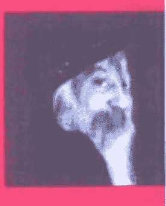
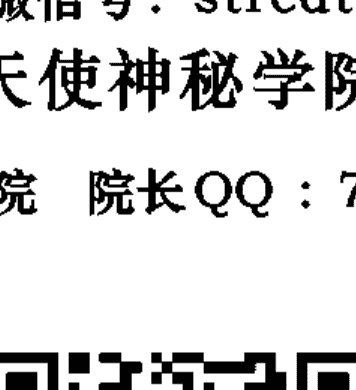
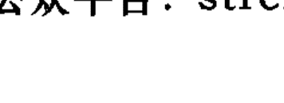
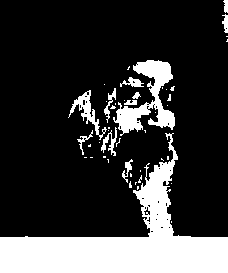

# OSHO

## 名望、財富與野心

## FAME, FORTUNE AND AMBITION

奥修

Zahur 譯

成功, 真正的意義是什麼
What Is the Real Meaning of Success?

## St. Royal College
天使神秘学院

+   - 专业占卜预测机构
+   - 神秘学培训机构
+   - 水晶能量研究中心
+   - 神秘学资料库
+   - 官方微信：strcdts
+   - 微信公众平台：strc2011
+   - 读书交流QQ群：
    - 占星塔罗占卜师交流群：814594478（加入密码：PDF）
    - 神秘学其他综合群：659338717（加入密码：PDF）

微信号：strcdts

## 天使神秘学院

天使神秘学院 院长QQ：715104687

微信公众平台：strc2011

[PAGE 2]

## 制作说明：

本书由《天使神秘学院》出重金从台湾购入的原版书籍扫描制作完成。为达到最好阅读效果，特地把原版书全部切开后，再经由专业扫描设备高精度扫描完成，并经过一张张的PS后期处理最终成书，其间花费大量的人力、物力以及时间，只为能给大家提供经济并优质的神秘学学习资料而努力。

本学院强力谴责某些机构和个人，把本学院花心血制作完成的电子书籍，包装后直接放在自家淘宝网上低价倾销的行为，以谋取不劳而获的经济利益。如果长此以往最终将无人愿意再为大家花心思制作电子书，那以后可能大家再无新书可读。

为让大家以后能够读到更多的好书，也为了本学院的良性发展。本学院恳请大家尽量做到如下几点：

+   一、尽量在本学院的网站购买电子书籍。
+   二、请勿用技术手段把电子书内的水印及加密去掉。
+   三、在收到电子书后小范围传阅即可，千万不要公开传播，更别挂到淘宝网上低价销售。

同时为答谢广大支持者，学院电子书将做如下调整：

+   一、学院会把一些早已收回制作成本的电子书折价销售。
+   二、最新制作的电子书籍会开放打印功能，大家购买后有条件的可自行打印成书。

天使神秘学院
2019年1月

[PAGE 3]

## 名望、財富與野心

## FAME, FORTUNE, AND AMBITION

one of the most inspiring spiritual teachers of our time

「成功」真正的意義是什麼？
What Is the Real Meaning of Success?

[PAGE 4]

## 前言

## 目次

## 第一章 成功只存在於他人的眼裡

# 第二章 品嚐「當下」

### 第三章 金錢買不到你的愛

#### 第四章 夢幻與真實

## 第五章 巨大的企圖心

005

009

057

111

161

219

[PAGE 5]

## 前言

人們總是認為籬笆外的芳草比自家的翠綠，因為每個人的注意力都不在自己身上。你被教導的方向並不是你本性要你前往的方向。你目前所前進的方向不是你自己潛能的方 向。別人期望你成為某種樣子，你努力成為那個樣子，可是那無法令你感到滿足。而當你不滿意的時候，邏輯會說：也許是我做得還不夠——我需要更努力點。於是你更努 力地追逐；然後你觀察周團的人。而四處行走的人們都帶著微笑的面具、一副開心的樣子，每個人都在欺騙他人。你也同樣戴著面具，所以別人認為你比他們快樂，而你也認為別人比你快樂。離笆外的芳草看起來比較翠綠，確實如此——但是雙方都這麼認為。住在離笆另一邊的人看著你的草皮，也覺得它看起來比較青翠。而它也確實看起來比較青翠、茂密而健康。這都是距離創造出來的錯覺。如果你靠近的話，你會發現情況並非如此。但是人們彼此保持著一定的距離。甚至朋友、戀人之間也保持著一定的距離：太過親密是危險的，因為他們可能會看穿你的真面目。你從一開始就受到誤導。所以，不管你做什麼，你都會覺得痛苦。大自然對金錢毫無概念；否則錢會從樹上長出來。大自然對金錢一無所知；金錢純粹是人類發明出來的——它非常有用，卻也非常危險。你看到有些人很有錢，你認為或許是金錢為他們帶來喜悅：看看這些人，他們看起來多開心啊，於是你開始追著錢跑。有些人看起來很健康——於是你開始追逐健康。有些人因為某些事情而看起來非常滿足——於是你跟隨他。

你一切痛苦的根源就是因為你不再是你自己了。就是當你自己，然後你不會有痛苦與競爭，你也不會煩惱別人擁有比你更多的東西。況且，如果你想要讓草坪更綠，你也不需要看著籠外別人的草坪；你可以讓籠內自家的草坪更青翠。要讓草坪更青翠是如此簡單的一件事情。可是你只會在別的地方到處尋找，所有的草坪看起來都如此美麗——除了你的之外。每個人都必須扎根於自己的潛能，不論那是什麼樣的潛能，而且，不應該有人給他特定的方向與指導。不論一個人要往哪個方向前進，不論他會變成什麼樣的人，人們都應該支持他。這麼一來，這個世界所擁有的滿足會令人難以置信。這個世界反對個體性。它反對你成為本然的自己。它只要你成為一個機器人，而當你同意成為一個機器人時，你的麻煩就來了。你不是一個機器人。大自然的意圖，並不是要你成為一個機器人。也因為現在的你不是你本來的樣子，不是你該成為的你，所以你不斷地到處尋找：我少了些什麼？也許我需要更好的家具、更有品味的窗簾、更合適的房子、更體面的丈夫、更得體的妻子、一份更好的工作……你一輩子就這麼匆忙地衝過來撞過去。但是事實上，這個社會從一開始就經誤導你了。

我的努力是為了要把你帶回自己身上來，然後，你會突然發現你所有的不滿足都消
失了。你不需要成為什麼樣子——你，就已經徇了。而且每個人都都是充足的。

[PAGE 6]

## 前言

[PAGE 7]

# 第1章 成功只存在於他人的眼裡

人們一直不斷擱置一切有意義的事情。我明天會有歡笑的時間；今天，我需要累積財富……更多的金錢、更多的權力、更多的財產、更多的東西。明天我會有時間去愛；今天我没有時間。但是，明天永遠不會來，然後有一天人們發現這些東西和金錢成了自己的負擔。他們來到了階梯的頂端，他們除了跳湖之外無處可去。但是，他們甚至無法對別人說：‘不要費盡心思到達這裡，這裡什麼都没有。’因爲這會讓他們看起來很愚蠢。

[PAGE 8]

問題
我一直夢想成為舉世聞名、富有而又成功的人。你能夠說些什麼幫助我實
現我的慾望嗎？

不，這位先生，我一點也不會這樣做——我永遠不會這樣做，因為你的慾望是一種
自我毀滅。我不會支持你毀滅自己。我可以支持你成長、存在，但是我不會支持你去自
殺，我不會為了無意義的東西而支持你摧毀自己。

野心是一種毒素。如果你想成為一個更好的音樂家，我可以支持你，但是不要以為
是那種舉世聞名的音樂家。如果你想要成為一個更好的詩人，我可以支持你，但是不要認為
是那種得諾貝爾獎的詩人。如果你想要成為一個更好的畫家，我可以支持你，因為我支
持創造力。但是，創造力和名聲、成功與金錢都無關。

如果它們來到你身上，我並沒有說你必須拋棄它們。如果它們出現了，那沒有問
題，就是享受它們。但是，不要讓它們成為你的動機，因為當一個人努力獲得成功時，

他怎麼可能成為真正的詩人呢？他的能量是一種政治性的能量，他怎麼可能是富有詩
意的？當一個人努力賺錢時，他怎麼可能成為一個真正的畫家呢？他的能量只會放在如財富或許會在未來某個時刻來臨——它可能會出現，也可能不會出現。但是那不是必要
的；那都是一種偶然。成功是一種偶然，名聲也是一種偶然。但是，巨大的喜悅不是一種偶然。我可以支持你成為喜悅的人；你可以在繪畫時感
受到喜悅。不論這幅畫是否會出名，不論你是否會成為畢卡索，這些都不是重點。我可以幫助你的是：讓你在繪畫時，連畢卡索都會開始嫉妒你。當你全然忘我地沉浸在繪畫裡時，那才是真正的喜悅。那是愛與靜心的片刻；那是神性的片刻。神性的片刻就是你渾然忘我的片刻——在那樣的片刻裡，你的界限消失了，在那樣的片刻裡，你不見了，而只有神性存在。

但是我不能幫助你成功。我並不反對成功，讓我再提醒你一次，我並不是說不要成功。我一點也不反對它；成功真的沒有問題。但是我要說的是：不要被它所驅使，否則你會錯過你的繪畫、你會錯過你的詩、你會錯過你現在正在唱的這首歌；然後當成功來
臨時，你只會感覺到空虛，因為沒有人能夠因為成功而感到滿足。成功無法滋養你；它沒有養分，成功不過像是熱空氣而已。

前幾天晚上，我正在讀一本關於薩默賽特·毛姆（Somerset Maugham）的《毛姆語錄》（Conversations with Willie）。這本書是毛姆的侄子羅賽·毛姆（Robin Maugham）所寫的。薩默賽特·毛姆在他當時的年代是最有名、最成功也是最富有的人，但是這個回憶錄揭露了一些事情。羅賽·毛姆是這樣描述他那出名又成功的叔叔薩默賽特·毛姆： 姆：

當他在世時，他絕對是最有名的作家。然而，最可悲的是……他對我說：‘你知道，我就要死了。而我一點也不喜歡這個想法。……而當他九十歲，他說：’我是一個很老的傢伙，但是，年老並沒有讓我對死亡更從容以對。’

毛姆富有且舉世聞名，即使他很多年沒再寫出半個字，但是他九十歲時還能夠持
續賺入大量的金錢。書的版稅以及書迷的信件仍然從世界各地湧入。毛姆的侄子接著寫道：
我問他：「你生命中最快樂的記憶是什麼？」他說：「我根本想不起來任何一個片刻。我環顧客廳四周，到處都是珍貴的家具、畫作以及藝術品，这些都是因為他的成功而獲得的。他的別墅以及其中那令人驚嘆的花園——座落在地中海岸一個絕美的地方——價值六十萬英鎊，而且他還有十一個私人僕佣，但是他並不快樂。

……他說：「你知道的，如果我死了，他們會從我身上拿走一切，每一棵樹木、整棟房子、每一樣家具。我甚至連一張桌子都帶不走。」
他非常的傷心，而且他在顫抖著。

他沉默了一陣子……然後說：「我這一輩子是徹頭徹尾地失敗了。我希望我從來沒有寫下任何一個字。它有為我帶來什麼嗎？我的人生失敗了，现在要改變也太晚了。然後淚水開始出現在他的眼裡。

## 第一章 成功只存在於他人的眼裡

[PAGE 14]

成功能性。现在，毛姆這個人白活了。他活了九十一歲，他应該是個滿足的人，心滿意足。但是，成功所能帶來的只有如此；财富所能夠帶來的只有如此：一棟巨大別墅與僕人所能夠帶來的，也僅僅如此。 當人生蓋棺論定時，名譽與聲望都不重要。在生命最終結算時，唯一重要的是你如 何活出生命中的每一個片刻。它是喜悅的嗎？它是慶祝的嗎？你會因為小事而感到幸福 樂嗎？洗澡、品茶、拖地板、在花園中閒逛、種樹、與朋友聊天、靜靜地坐在你摯愛的人 身邊、或是看著月亮、或是傾聽鳥叫的聲音，在這些片刻裡，你感到快樂嗎？每一個片刻 是否都蛻變成為燦爛的幸福？每一個片刻是否都散發著喜悅的光芒？這才是真正重要的。 你問我是否我可以幫助你實踐你的慾望。不，完全不，因為那樣的慾望是你的敵人，它會摧毀你。遲早有一天，你會在挫折中哭泣，然後說著：“現在要改變已經太遲 了。太晚了。” 現在還不算晚；你還可以做些事情：你可以從根本之處改變你的生活。我可以支持
[PAGE 15]

你去經歷煉金術般的改變，但是我不能保證給你世俗價值觀裡的任何東西。我能夠保證給你的 是內心世界裡的成功；我可以讓你富裕，像諸佛一樣地富裕——只有成佛的人才是富 裕的。那些身邊只有世俗之物的人並非真正的富有；他們其實是貧窮的，他們的富裕是 一種自欺欺人。內在深處他們是個乞丐。他們不是真正的帝王。 佛陀來到一個城市，這個國王猶豫著是否要去迎接他。他的首相說：‘如果你不 去迎接他，就讓我辭職，我不再爲你服務了。’ 国王說：‘為什麼？因爲他是一位不可或缺的首相，沒有他，國王一定不知所措，他是國王權力中心真正的關鍵人 物，所以 国王問：‘为什麼呢？你为什麼這麼堅持？为什麼要我迎接一個乞丐？’ 這位年老的首相說：‘你才是乞丐，而他是國王，这就是原因。你需要去迎接他，否則，你不值得我爲你服務。’ 国王不得不去，所以他很勉強地去了。然而当
他見過佛陀回來之後，他双手碰觸这 個年老首相的雙腳向他說：‘你是對的，他才是國王，而我是一個乞丐。’

## 問題

有時候我有一種感覺，我現在已經成熟到可以進入世界，我現在可以去做一些事情，就像是那句話所說的：「一個女人該做些什麼，她就必須去做。一走出去，進入廣大的世界，賺很多錢，讓人們留下深刻的印象，並且名垂青史。」我花了很多時間，待在這個有許多靜心## 問題「成功」的真正意義是什麼？

當你談論成功的时候，有時聽起來像是你在反對它！

我既不反對任何事情，也不贊成任何事情。無論發生什麼事情，讓它發生。人們需要去選擇，因為選擇是痛苦的。如果你想要成功，那麼你會繼續痛苦下去。你可能會成功，也可能不會成功，但是有一點是絕對的：你會一直感到痛苦。

如果你想要成功——你也因為意外和巧合成功了，那是無法滿足你的，因為這是頭腦運作的方式。任何你所擁有的都會變得毫無意義，而且頭腦會開始驅使著你。它想要的東西會變得越來越多——因為頭腦它什麼都不是，它就只是純粹的慾望罷了。而慾望是永遠無法滿足的，因為無論你擁有些什麼，你總是想要更多。而在你「已經擁有」和「想要更多」這兩者之間的距離是永遠不變的。

這是人類經驗中永恆不變的事情之一：一切都會改變，但是在你「已經擁有」和「你想要擁有的」這兩者之間的距離是永遠不變的。

愛因斯坦說：時間的速度永遠保持不變——這是唯一的常數。而佛陀則說：頭腦的速度保持不變。事實上，頭腦和時間並非兩回事——它們是相同的，它們是同一個東西的兩個名稱。

所以，如果你想成功，你或許會成功，但是你不会感到滿足。但如果你不会因此而感到滿足的話，那成功有什麼意義呢？你或許會成功，但那只是個偶然的意外；而你失敗的可能性則更大，因為不是只有你一個人追逐成功，還有數以百萬的人追逐成功。一個擁有六億人口的国家只有一個人可以成為總理，但是六億個人都想要成為總統或總理。只有一個人會成功，其他所有人都會失敗。就數學而言，你失敗的可能性更大。失敗似乎比成功更為明確。

如果你失敗了，你會感到灰心；你的人生似乎完全浪費掉了。如果你成功了，你永
## 第一章 成功只存在於他人的眼裡

這不會真的成功；而如果你失敗了，你就是失敗了——這整個遊戲就是如此。

你說你認為我反對成功——不，我不反對。因為如果你反對成功，那麼你又有了另
外一個關於成功的想法，那就是：如何放棄這個想要成功的愚蠢行為。這麼一來，你又
會有另一個想法……這又是另外一個距離，另外一個慾望。

其實，這就是讓人們進入修道院或成為和尚的原因。因為他們反對成功，他們想要
擺脫這個競爭的世界——他們想要逃離這一切，好讓他們不會經歷到挑戰，也不會有誘
惑；他們可以休息在自己的內在。所以，他們試著不去渴求成功——但是這也是一種慾
望！他們現在有的是一個靈性上的成功概念：如何成功地成佛，如何成功地成為基督。

再一次，這也是一個想法，這也是一個慾望，它有著一定距離。所以這整個遊戲又再度
開始。

我不反對成功：這就是為什麼我在這個塵世裡，否則我也會逃離。我不贊成也不反
對成功。我會說讓你自己就像是浮木一樣，不管發生什麼事，就讓它發生。不要做出你
的選擇。無論迎面而來的是什麼，歡迎它。有時候來的是白天，有時候來的是黑夜，有
## 第一章 成功只存在於他人的眼裡

時候來的是幸福，有時候來的是不快樂——你就是不作選擇，單純地接受所有一切的發生。這就是我所說的靈性品質。這就是我所說的宗教意識。它既不贊成也不反對，因為如果你贊成的話，你遲早會反對它，而如果你反對的話，你遲早會贊成它。當你贊成某些東西或是反對某些東西的時候，你已經把存在一分为二。你已經做出了選擇，選擇就是地獄。不選擇就是從地獄裡解脫出來。就是讓事情自然的发展。而你只需要繼續的移動，享受任何來到你眼前的事物。如果你成功了，享受它；如果你失敗了，享受它。因為失敗也會帶來一些樂趣，而那是成能夠享受一切的發生。如果他健康，他會享受健康；如果他生病，他就在床上休息，享受生病。你曾經享受過生病嗎？如果你不曾享受過，那你就損失大了。就是躺在床上什麼也不做，不需要擔心這個世界，每個人都關心你，你突然之間變得像個國王一樣——擁有
大家的體貼、傾聽和愛。而你沒有什麼要做的，你完全不需要擔心這個世界。你只需要休息。你可以傾聽鳥鳴、傾聽音樂，或者稍微閱讀一下，然後打個眄睡覺。太美好了！生病有它自己的美。但是，如果你認為自己必須永遠健康，那麼你會覺得很痛苦。痛苦源自於我們的選擇，而喜樂來自於我們的不選擇。什麼是成功真正的意義？我的觀點是：如果你能夠允許自己平凡，你就成功了。

有一個病患跟他的朋友抱怨說：‘我讓這個精神科醫生治療了一年，花了我三千美元。然後他告訴我，我康復了。這真是了不起的康復！一年前，我還是林肯（Abraham Lincoln），現在，我什麼都不是。’

這是我對成功的看法：當一個平凡人！你不需要成為林肯，你不需要成為希特勒。就是當一個平凡的普通人，那麼生命對你而言會是無比的喜悅。就是讓自己是單純的，不要給自己製造複雜的事物。不要創造出索求。不論事情如何發生，把它当成禮物一樣
地接受，同時樂在其中。數以百萬計的喜悅正濺落在你身上，但是因為你那需索無度 的頭腦，讓你看不見它們。你的頭腦是如此急切於成功，它要你成為某個特別的重要人 物，結果你錯過了所有身旁的光輝。 讓自己平凡就是非凡。讓自己單純就是回歸自己的家。 但是事情總是與此相反：當你單聽到「平凡」這個字眼時，你馬上威覺到一種苦 味——平凡？你，平凡？或許別人是平凡的，但是你絕對是特殊的。每個人的頭腦裡都 有這種瘋狂的症狀。 鈍對這一點，阿拉伯人有一個笑話。他們說當神創造人的時候，祂會在每個人的耳 邊低語說：一我從來不曾創造出一個像你這樣的男人，或是像你這樣的女人——你是特 别的。所有其他人都普通人。一 祂持續地和人们開著這個玩笑，因此每個人來到這個世界上時都帶著這些鬼扯話： 一我是特别的，連神都說我是特别的，所以我必然是獨一無二的。一 你可能嘴巴上不 會 這麼說，因為你認為這些平庸的人無法理解；不然，為什麼要說呢？没有必要再說些什
## 第一章 成功只存在於他人的眼裡

壓。爲什麼要給自己製造麻煩呢？但是你自己知道，而且你非常確信這一點。所以每個人都面臨同樣的處境：神不只是對你開了這個玩笑，祂也對每個人開了同樣的玩笑。或許祂現在已經不再自己這麼做，而是讓電腦程式重複對每個人播放相同的句子。如何詮釋這個字眼完全取決於你。“平凡”這個字眼有著其重大的意義，不過那是因人而定！如果你能夠了解……樹木是平凡的，鳥兒是平凡的，雲朵是平凡的，星辰是平凡的。這份平凡就是他們不會變得神經質的原因；這份平凡就是他們不需要心理醫生的原因。它們很健康；充滿了能量與生命力。它們是平凡的！没有任何一棵樹木會瘋狂地努力競爭，也沒有任何一雙鳥兒會在乎誰是世界上最有力的鳥——沒有任何一雙鳥對這種事情感興趣。他只是單純地做他自己的事，同時享受在其中。但是，這些都取決於你的詮釋。一個父親爲了要培養他的孩子，所以他帶著自己的小男孩去大都會歌劇院。一開始
## 第一章 成功只存在於他人的眼裡

先是指揮帶著指揮棒走出來了，然後女主唱出場了，她開始唱頌嘆調。當指揮揮舞他的指揮棒時，小男孩說：「他不是在打她，他是正在指揮。」父親說：「唔，如果他没有打她，那為什麼會大喊大叫呢？」男孩問：「唔，如果他沒有打她，那為什麼她會大喊大叫呢？」任何你在生活中所看到的都是你的釋。對我來說，「平凡」這個字眼有著無比的意義。如果你傾聽我的話語，如果你聽到我所說的話，如果你了解我，那麼你會希望自己是平凡的。況且，成為平凡的並不需要努力與掙扎，因為它已經在那裡了。這麼一來，生命裡所有的奮鬥和衝突都會消失不見，而你就只是享受來到你眼前的生活，享受生命的開展。你享受童年，你享受青春，你享受老年——你享受你的生命，你也享受你的死亡。你享受一年中所有的四季，每個季節都有它自己獨特的美，每個季節都能夠為你帶來它本身的某種喜悅。

## 問題

在一個美好的日子裡，愛在空中嗡嗡作響，連小熊維尼也忘記了牠遍尋
不著的一罐蜂蜜而坐了下來。當他睜開眼睛時，他驕訴地看見身邊堆滿了
許多滿溢著蜂蜜的罐子，讓他吃都不完。
那天晚上，當他浪進依喬家裡時，他的全身黏膩，卻全然滿足地沉醉在
他發現的蜂蜜裡，依喬帶著一副智者的眼神看著他並且對他說：「蜂蜜總
是在那裡，但是唯有當你不去尋時，你才會找到它。」
小熊維尼認為他了解了。但是幾天後，當他鬼臉地從眼角瞄出去時，他
發現沒有任何蜂蜜！他甚至當試坐下來大聲說：「我沒有在尋找任何蜂
蜜！」但是當他睜開眼睛時，蜂蜜仍然沒有出現。
我該如何放下我的貪慾和期望，而只是待在當下呢？
（註：依喬[Eeyore]是小熊維尼故事中的子，角色性格悲觀、過度冷静、自卑、消沉、消極。）

是的，這是最根本的問題之一。當你不注意的時候，蜂蜜無處不在。當你開始尋找時，它卻突然消失了。這是一個偉大的真理。當你開始尋找它的時候，你變得全神貫注，你變得封閉與狹隘。唯有當你敞開時，蜂蜜才可能會出現，它不會出現 在封閉、狹隘的狀態下。只有當你在各方面都富足洋溢時，蜂蜜才會洋溢在你身旁。

尋找意味著你把焦點放在某個特定的方向上。當你不尋找、不追求的時候，你向四面八方敞開，你對所有向度都是敞開的，你對整個存在是敞開的。但是麻煩的是如果有人告訴你不要尋覓，即使你說：‘好，我不會努力去尋找。’但是無意識的努力仍然會持續進行著。即使你試著不去尋找，但是這仍然是一種尋找的努 力。

這是一個非常根本的問題，佛陀說：‘當你無憂時，你所有的願望都會實現。’所 以有一天一個和尚問：‘你說當人們無憂時，他所有的願望都會實現。而我只有一個悠 望那就是無憂。所以我該怎麼辦呢？’渴望無憂本身仍然是一個慾望；它們仍然在同一
望那就是無憂。所以我該怎麼辦呢？渴望無憂本身仍然是一個慾望；它們仍然在同一
## 第一章 成功只存在於他人的眼裡

個向度上。不論你渴望的是金錢、權力、聲望，還是你渴望無慾，這其中根本沒有區別，只不過是你渴望的目標改變了而已；慾望仍舊還是慾望。有問題的是慾望，而不是你慾求的對象。

如果你渴求金錢，大家會說你世俗、功利。但如果你渴求神性，大家會說你有靈性、超凡脫俗、具有宗教情操。但是，對那些真正了解的人而言，這其中沒有任何差別：你仍然是世俗的。不可能有些慾望是世俗的，而有些慾望是脫俗的。慾望本身就是世俗的，沒有所謂脫俗的慾望。

世俗的，沒有所謂脫俗的慾望。神性是慾求不來的——如果你慾求，你就錯過了。如果你尋找，你不會得到。你越是尋找，你會變得越是痛苦。不要慾求，不要尋覓，就是待在當下，就是待在這種無慾無求的態度裡，而不是內在仍然想著：幸福必然就要來臨了，因為我現在不再尋找它了。因為這麼一來，你還是在同樣的牢籠裡。

你提出的問題是你該怎麼做：「我該如何放下我的慾望？」但是，你為什麼要放下你的慾望呢？到底是什麼原因讓你要放下你的慾望呢？在那背後必定有著一種慾望：想你的慾望呢？

要達到神性、涅槃、成道，想要達成這個和那個，各種不同的垃圾與蠢事。成道是一種發生；它不是你慾求可得的。有一天當你發現所有的慾望都消失時，成道就發生了。它一直都在那裡，但是慾望讓你看不見它。慾望像簾子一樣地遮蓋了你的雙眼，你失去了你的清晰，你看不到真相。當你想要某樣東西時，你怎能夠夠看到真相呢？當你期待獲得某樣東西時，這份期望不會允許你看到真相，期待已經把你帶到了未來。你想要美女，於是你開始幻想，然後你會因為這個幻想而錯失正在你眼前的女人——因為這個幻想，所以你看不到她。這個幻想持續不斷地把你帶離這裡。你問：「我該如何放下我的慾望？」我則是想問你為什麼想要放下慾望。然後突然而間你會發現那些隱藏在背後的慾望。慾望背後的慾望背後的慾望，這不會有幫助的。所以，我不會告訴你如何放下慾望，我會告訴你如何去了解它。透過了解，它會自己慢慢放下，而不是由你來放下它，因為你做不到。你本身就是慾望，所以你要如何放下慾望呢？你本身就是慾望，所以你要如何放下慾望呢？你就是這場追逐，所以你要放下慾望呢？你本身就是慾望，所以你要如何放下慾望呢？你本身就是慾望，所以你要如何放下慾望呢？你就是這場追逐，所以你要
如何放下這些追逐呢？這個「你」是你所有瘋狂行為的核心。你問該如何放下貪慾，但「我」想要提出這個問題。是這個「我」提出問題。這個「我」現在甚至想要擁有神性，這個「我

## 第一章 成功只存在於他人的眼裡

是如此地美妙，爲什麼它消失了？我做錯了什麼嗎？你沒有做錯任何事情，你只是變貪心了。當它第一次出現時，你並沒有任何貪婪之意，因爲你根本不知道它，所以你怎麼可能會貪圖它？它是不可知的；它是出乎意料的。它就這樣發生了，而你 在無意間偶然經驗到。現在，你仔細觀察。它在你不作任何追求的時候出現—之前你並不知道這種經驗，因此你不可能尋找它。它是自己發生的。現在你要求它發生；你要求某種當你不要求時才會出現的東西，你給自己創造了這整個麻煩，貪婪出現了。有時候，有的人已經非常地接近開悟（satori）的狀態，非常地接近，但卻因爲貪婪而走錯了方向。所以，保持觀照。在你吃飯的時候，觀照。早晨醒來時，你知道睡眠已經結束，但是你還是想要賴床小憩一番，那就是貪心。如果你的身體感到鮮活，你感覺良好，而疲憊感已經消失，那麼，就是觀照。貪婪無所不在—吃飯、睡覺、靜心，它隨處可見。有一天，你和你的女人或男人在做愛，而它是如此地狂喜而忘我。現在你開始產生留往，你想要重複經驗它，但是那樣的狂喜卻不再出現。你覺得難過。你不知道發生了什麼事，不知道自己哪裡做錯了：爲什麼我無法達到那樣的高潮？你永遠不可能再度達到那種狀態，因爲你現在開始在尋找它。當它第一次發生時，你並沒有尋求它。這是一項很基本的法則：事情是自然發生的，而且事情是依照它們自己的方式發生著；你没有辦法操控它發生。所有重要的事件都無法由你所操控，它們超越你的掌控。你最多只能允許它們發生；你最多只能敞開大門，讓事情發生，但是你没有辦法迫使它們發生。

們發生。如果你強迫的話，不會有任何事情發生。你可以繼續跟你的伴侶做愛卻不會有任何發生。事實上，你會開始對整件事情感到噁心。你會開始痛恨這個女人；你會開始痛恨這個男人。你會認爲對方欺騙了你，然後你開始去尋找另一個女人或另一個男人，你會到別處去尋找，因爲這裡不可能再有什么發生了。然後你會懷疑這整件事情是否真的發生過，還是只是你的想像：「這個情況怎麼可能會出現在我和這個女人身上？而現在什麼也沒有。你甚至会懷疑曾經發生過的經驗。

人們來找我說：「我在靜心裡已經有好幾個月没有任何事情發生了。他們開始懷疑自己當初的經驗是不是一種想像？那不是一種想像，它確實發生過。只不過是現在他們想要它發生，於是他們開始想像，並且在自己周圍創造了一個概念。

所以該怎麼做呢？你需要觀照頭腦一切的模式，不論是貪婪、慾望、野心、嫉妒、佔有、操控——你需要觀照每一件事，而它們相互關聯著。記住，如果貪婪消失了，忿怒也會消失。如果忿怒消失了，嫉妒也會消失。如果嫉妒消失了，暴力也會消失。如果暴力消失了，佔有也會消失。它們全都糾纏在一起，事實上，它們是同一個輪子上的輻條，而支撑著它們的中樞就是自我。所以，觀照自我作用的方式。

觀照，觀照，觀照……然後有一天，它突然不在了。只剩下觀照者存在。而這個純粹觀照的片刻就是蛻變發生的片刻。

問題 貪婪是什麼？

貪婪就是努力讓各種東西填塞自己——那可能是性，可能是食物，可能是金錢，可
能是權力。貪婪是你對於內在的空虛的恐懼。當一個人害怕空虛的時候，他就會開始想要佔有更多的東西，他不斷地往內在填塞東西，好讓他可以忘掉他的空無。然而忘掉一個人的空無就是忘記真實的自己。忘掉空無就等於忘記神的道路。忘掉可是為什麼人們會想要忘記它呢？因為我們攜帶著人們灌輸的一個概念：空無就是死亡。但它不是！這是社會流傳下來的一個錯誤觀念。社會在這個觀念上做了很多的投資，因為如果人們不貪婪的話，我們所知道的這個社會就無法生存下來。如果人們不貪婪的話，還有誰會去瘋狂追逐金錢與權力呢？如此一來，整個以權力為取向的社會結構就會崩潰瓦解。如果人們不貪婪的話，誰會稱呼亞歷山大為大帝呢？人們會稱他為「荒謬的人」而不是「大帝」，稱呼他為「蠢人」而非「大帝」。還有誰會說那些一直不斷佔有財物的人是值得尊敬的呢？誰會去尊敬他們呢？他們會成為大家的笑柄：這些人真是瘋了，他們簡直浪費生命！而且，誰會去尊敬國家的首相或總統呢？人們會認為他們有神經病。

[PAGE 46]

如果希特勒、墨索里尼、邱吉爾以及類似的這些人被認為是神經病，而沒有人注意他們的時候，這個世界會真的很美妙。整個政治結構會垮台，政客之所以會存在就是為了得到越來越多的注意力。那些政客就像孩子一樣；他尚未長大成人。他要每個人都在他的控制之中，他要每個人都崇拜他，注意他。注意力令人陶醉；那是世界上最強的毒藥。光是想像一下你經過全鎮，而沒有一個人注意到你，連狗都不對你吠叫；沒有人注意到你，甚至連狗都不理你；人們忽略你，連狗都忽略你，沒有人覺得你是重要的！你會有什麼樣的感受？你會覺得糟透了——沒有人對你說：「嗨！早安。你要去哪裡？你好嗎？」人們根本不看你。就好像你成了隱形人，沒有人能夠看見你。也因為沒有人能夠看到你，所以不會有人對你說：「你好！」當沒有人注意你的時候，你會有什麼樣的感覺？你會覺得自己像是一個不存在、微不足道而沒有價值的人。那感覺起來像是死亡一樣。因此，每個人在尋求更多的注意力。就算他無法因為聖賢而得到注意力，他至少可以因為惡名昭彰而得到注意力；就算他無法因為聖賢而得到注意力，他至少可以因為成名而獲得注意力，他至少可以因為

[PAGE 47]

謀殺而得到注意力。
心理學家說，基本上許多兇手之所以會犯下謀殺事件，沒有其他特别的理由，他們只是為了得到注意力而已。當他們犯下謀殺罪，他們的照片會被刊登在報紙的頭版，他的名字會用粗體字強調。他會出現在電視畫面上、收音機的廣播裡，他們出現在各地方；他們成為某種特殊人物。他們至少可以享受幾天這種出名的感覺；全世界都會認識他們，他們再也不不是什麼無足輕重的人。
只要想像一下一個毫不貪婪的世界——在那裡有錢人會被視為神經病，政客會被視為神經病，而那些一直渴望獲得注意力的人會被視為智障。而且當人們不再貪婪時，我會有一個全然不同、更為美好的世界。當然，人們會有較少的私人財產，但是人們會擁有更多的喜悦、更多的音樂、更多的舞蹈、更多的愛。人們的家裡或許不會有很多財物，但是每個人卻會更有活力。現在的我們為了這些小玩意不斷地出賣我們的生命力。

家裡的小玩意不斷地累積，但靈魂卻不斷地消失；機器變得越來越多，而人類靈魂卻越來越消失。

## 第一章 成功只存在於他人的眼裡

當這個世界不再貪婪的時候，人們會彈吉他、吹笛子。人們或許會安靜地坐在樹下靜心。當然，人們還是會做一些事情，但是他們只做絕對必要的工作。人們的需要仍然會得到滿足，但是需要不是慾望：慾望是不必要的；需要則是必要的。慾望永無止盡。需要卻是單純、且能夠被滿足的。慾望不斷地索求更多的東西。它們不斷地要求獲得更多你已經擁有的同樣東西。你已經擁有一輛車子了，慾望說你該要有兩輛車；除非你擁有雙車位車庫，否則你只是無名小卒。你已經擁有一棟房子，慾望說你應該要有兩棟房房子，子——至少在避暑勝地也要有一棟房子。然後當你擁有兩棟房子時，慾望說你要有三棟房子，一棟在避暑勝地，一棟在海邊……就這樣沒完沒了地持續下去。有一天，派迪在花園挖土時看到腳上有一隻小動物。當他舉起鏟子正要打死牠的時候，卻很驚訝地聽到他說話了。—派迪，我是魔法精靈。放了我，我會答應你三個願望。—派迪說：—三個願望？好！於是他一面想一面大聲說：—嗯，我現在挖土挖得很
渴。我想要一瓶黑啤酒。

魔法精靈手指一彈，派迪發現他正握著一瓶黑啤酒。

魔法精靈說：「那是個魔術瓶子，它永遠不會空，啤酒會一直不斷湧出來。」

派迪開心痛快地大飲一口。

魔法精靈問：「派迪，你的另外兩個願望是什麼？」

派笛想了一下說：「我想要再兩瓶這種黑啤酒，拜託你了。」

所能夠使用的數目，但是你還想要更多，而且永遠不滿足。需要是微小的：是的，你會
那不會有什麼用處，但是事情就是這樣在發生……你已經有好幾千萬，這遠超過你
需要食物、住處、你需要一些東西。但是每一個人的需要都能夠被滿足；這個世界足以
滿足每個人的需要。但是慾望的話……那是不可能滿足的。慾望無法被滿足。而且由於
人們試圖去填補自己的慾望，而讓上百萬人口的需要無法獲得滿足。

不過基本上，慾望是一種靈性上的問題。你曾經被教導：除非你擁有許多東西，否
则你是沒有價值的，而且你會感到害怕。所以每個人都不斷地填塞自己。但是這是没有 任何用處的；它頂多只能帶來短暫的慰藉，很快地你又会再度感到空虛，然後你又再度 去填塞它。 

而且，內在的空無是通往神性的門。可是你卻被教導：一個空無的頭腦是魔鬼的頭 腦或者是魔鬼的工廠。這些人們所濾輸的話語根本就是胡扯。一個空無的頭腦是通往神 

性的大門，一個空無的頭腦怎麼會是惡魔的工廠呢？在那樣一個空無一物的頭腦中，魔 鬼會全然死亡。魔鬼的意思就是頭腦；一個空無的頭腦就是無念(no-mind)。 

而貪婪是人們最根本的問題之一。你必須知道為什麼你會有貪婪：因為你想讓自己 一直保持忙碌。你的財物越來越多，你不停地持續忙碌著、操勞著。你可以因此全然忘 

記你內在的世界；你會不斷地說：「再等一下！等我得到這個東西之後，我就會開始注 意你。」 

然而死亡總是在你的慾望獲得滿足之前來臨。即使你活了一千年，你的慾望也永遠 無法獲得滿足。

在印度，我們有一則很美的故事：

亞亞堤大帝即將去世，因此死亡來了……這是一則古老的故事，在那個時代，事情都很簡單，而且來世也不太遠。所以，死亡來了，它敲了門，亞亞堤大帝打開門說：

一什麼？我才活了一百年，而你已經來了，連聲通知也没有！你至少要再給我一些時間，我還沒有實現我真正的慾望。我一直拖延著，明天、明天、明天，可是現在你已經經在這裡了，已經沒有明天了。這實在太残忍了！仁慈點吧！

死亡說：一我必須帶一個人走，我不能空手回去。但是看到你的痛苦，你的年老，所以我會再給你一百年。可是你的某一個兒子必須跟我走。一

亞亞堤他有一百個兒子，還有一百個妻子，所以他說：一這簡單！一

但是事情並非他想像的那麼簡單，他找來了他的一百個兒子，詢問哪一個願意跟死亡一起離去：一救救你年邁的父親！你們說過很多次：一父親，我願意為你而死。一

現在是你們證明這一點的時候！一

[PAGE 58]

但是這種話語總是說說而已，那只是一種禮貌而已。他的兒子們互相望著彼此。有 些人七十歲，有些人七十五歲，有些人則是六十歲；他們也都年老了。其中最年輕的一個只有二十歲。 這個最年輕的兒子站起來說：「我願意走。所有的人都無法置信！他的九十九位 哥哥沒有辦法相信；他們覺得他是傻瓜。他根本就還沒有活過，他才二十歲，他才剛 刚來到人生的起點而已。連死亡也為他感到不捨。 死亡把他帶到一旁，在他的耳邊小聲說：「你是傻瓜嗎？你的哥哥們都不願意—— 他們已經活得夠久了，有些人甚至活到七十五歲了都還不願意走。你準備好了嗎？你 父親已經一百歲了都還不想死，你才二十歲而已。」 這個年輕人說了一段非常美、非常有意義的話：「我的父親已經一百歲了，他擁有 人們所能夠擁有的一切，但是他仍然不滿足。在這個情況下，我看到生命的徒然。這 有什麼意義呢？我或許能夠活到一百歲，但是結果還是一樣。而且，如果只有我父親 如此的話，我或許會認為他可能是個例外。但是我七十五歲、七十歲還有六十歲的哥
[PAGE 53]

弟，他們都活了很長一段時間，他們已經經歷過各種享受；現在還有什麼其他要享受的呢？他們都老了，但他們卻仍然覺得不滿足。所以有一件事是確定的：這不是一種能夠讓人滿足的方式。所以我願意走，我並非因為絕望而跟你走，而是因為了解而跟你走。我非常開心可以跟你走，這麼一來我不需要經歷這些折磨，不需要像我父親一樣經歷一百年的折磨。他還沒有準備好跟你走。一故事繼續著，又是一百年過去了，時光來了又走了，沒有人注意到這

## 透過你的思想，你創造了自己的世界；透過你的慾望，你創造了自己的世界。不論你堅持些什麼，它就會開始出現。現實一直配合著你，它一直等待著你開始配合它的那一刻、那一天。而在那之前，它会不斷地配合你。

天使說：你是你所說過的話語。於是他變得富有，也真的躺 在綠綢的沙發上休息。然後這個國家的國王經過，他的馬車前方有騎兵，後方也有騎兵，而國王的頭頂上方還有金黃色的遮陽傘。

當這個有錢人看到這個景象時，他覺得懊惱，因為他的頭上沒有金黃色的遮陽傘，所以他覺得不滿足。他悲嘆地喊著：我希望自己是個國王。天使又來了，說：你是你所說過的話語。

然後他變成了國王，有許多騎兵在他的馬車前方，還有騎兵在他的馬車後方，還有金黃色的傘在他的頭頂上方遮陽，可是太陽炙熱的光線烤焦了土地，草地上的幼苗都枯萎了。國王抱怨太陽曬傷了他的臉，它的力量超過了他，所以他覺得不滿足。他悲噴地喊著：我希望我是太陽。天使又來了，他說：「你是你所說過的話語。」

於是他變成了太陽，他指揮著光線往上、往下、往右、往左，四面八方地照耀著，他烤焦了地球上的草苗以及國王的臉。

然後有一朵雲停在他和地球中間，然後太陽的光線被雲朵反彈回去，他極為生氣，因為它的力量受到阻擋。他抱怨雲朵的力量超越了他，他覺得不滿足。然後他希望自己是那一朵雲；強大而有力。於是天使來了說：「你是你所說過的話語。」

於是他變成了一朵雲，讓自己位於太陽和地球之間，他擋住了陽光，於是青草長成綠地。雲下起大雨，落在大地上，河水暴涨成災，沖走房子，洪水也摧毀田地。他撲向岩石，岩石並不服從，他把大水沖滅在岩石上，但岩石並沒有屈服在他的威力之下，他流水的力量白費了，因此他覺得不滿足。

他喊著：—那石頭的力量超過了我的力量。我希望我是那顆石頭。—天使來了，他變成了那顆石頭，不論陽光照射還是下雨，他都不為所動。

然後，來了一個人，他帶著一把十字鎬、一把錘子和一把沉重的槌子，他在這顆岩石上錘石，岩石說：—這個人怎麼可能有著比我還巨大的力量？他竟然從我的身上錘石。—於是他覺得不滿足。

他喊著：—我比他虛弱。我希望我是那個人。—天使從天堂下來說：—你是你所說過的話語。—

於是他又再度是個錘石工人；他辛苦地在岩石上錘石，他的工資微薄，而工作辛苦，但是他是滿足的。

我不同意這個結局。這是我對這則故事裡唯一不同意的地方；不然這是一個很美的故事。我不同意這個結局，因為我了解人類——人們不可能這麼容易就感到滿足。這一次循環是結束了，某種程度來說，這個故事來到了一個自然的結尾。但是真實生活裡的故事不會有任何自然的結尾，循環會再度開始。

那就是為什麼在印度我們把生命稱為「轉輪」（the wheel），它一直不斷地轉動，一直不斷地自我重複。就我來看，除非這個鑿石人成佛，否則故事一定又會再度重演。他還是會覺得不滿足，然後渴望有一組絲綢的漂亮沙發，然後繼續同樣的事情。但是如果這個鑿石人真的滿足了，那麼他會跳脫出這個生死的轉輪，成為一個佛。

這就是不斷發生在每一個頭腦裡的事情——你渴望一樣東西，它發生了，但是當你得到的時候，你會發現自己仍然不滿足。又有一些其他東西讓你覺得痛苦。

這就是你需要了解的地方——慾望沒有被滿足時，你覺得挫折；但是就算慾望被滿足了，你還是會感到滿足。那就是慾望不幸的地方，即使達成了慾望，你也不會覺得滿足。因為突然間很多其他的慾望會跟著出現。

你從來不曾想過當你是一個國王，前後都有騎兵，頭頂上還有金黃色的遮陽傘，而太陽居然會熱到灼傷你的臉。你從來沒有想過事情會是如此，所以你夢想成為太陽，然後你如願成爲太陽了。可是你從來沒有想過關於雲的事情。現在雲在那裡，證明了你的無能。然後事情就這麼不斷地持續下去，像是海洋中的波浪一樣……永無止盡——除非你了解，並且跳脫出這個轉輪。你了解，生命只在此時；生命只在此刻。天堂就在這裡，神就在此刻。如果你在白日夢裡尋找它，你的尋找是枉然的，因爲天堂只存在於你深深的滿足中。你的頭腦不斷對你說：做這個，成爲那個。擁有這個，擁有那個……如果没有這些東西你怎么會快樂呢？你必须擁有皇宮你才會快樂。如果你的快樂是有條件的，那麼你永遠不會快樂的。如果你不能因爲你本然的樣子而感到快樂——就是當一個鑿石匠……我知道勞動者非常的辛苦，工資又少，而且生活艱難，這些我都知道，但是如果你無法因爲你本然的樣子而感到快樂，即使生活是這種狀況，如果你無法感到快樂的話，你永遠都不會快樂。除非你覺得快樂，而且 是没有任何理由的快樂；除非你能夠瘋狂到毫無理由的快樂，否則你永遠都不會快樂。你永遠會找到某些事物來摧毀你的快樂。你總是會發現自

己少了些什麼，缺了些什麼。而那些少了的東西會變成你的白日夢。而且你不可能達到一種讓自己擁有一切的狀態。就算那是可能的，然後，同樣的你還是不會感到快樂。看看這個機械性的頭腦就知道了：當每件事物都在你面前時，你馬上就會感到無聊。現在，接下來要做什麼呢？

無聊。這是來自可寶的消息來源，你可以相信它——他們坐在許願樹下，而且他們很無聊。因為當他們說些什麼的時候，天使會馬上出現，實現他們的願望。在他們的願望與滿足之間没有任何空隙。他們想要一位像埃及豔后般的美女，馬上她就在那裡了。然後，你要拿這個埃及豔后怎麼辦呢？那有意義的，他們覺得無聊。

在印度的故事中，有許多關於天神（deva）在天堂覺得無聊而開始渴望來到人間的故事。在天堂裡他們擁有一切，而當他們在人間的時候，他們繫往著天堂。他們可能經是偉大的苦修行者，他們曾經放棄紅塵、女人與一切而上了天堂。但是當他上了天堂之後，他們卻開始繫往人間的世界。

## 我聽說過：

一架新噴射機的飛行員正飛過卡茨基爾(Catskills)的上方，他指著一處宜人的村莊給他的副駕駛看。他問著：你看見那裡嗎？當我還是個光著腳的孩子時，我經常坐在那個平底船上釣魚。然後每次當飛機飛過時，我就会抬起头看著上方，梦想自己正在架駕那架飛機。而現在當我往下看，我却夢想著自己在釣魚。他現在已經成為飛行員。一開始的時候，他只是個貧窮的男孩，釣著魚，每當飛機在上空呼啸而過時，他会往上看且夢想著：有一天，如果可能的话，我要成為一位飛行員。那令人激動的廣大天空、那些風、這塵浩瀚……他一定不停地夢想著，他也一定覺得自己是不幸的：一個貧窮的小男孩，在一艘普通的船上釣魚。然而現在他卻對他的副駕駛說：一現在每當我往下看，我却夢想著自己在釣魚。一個美麗的小湖，坐落在村落的中心點，還有著美麗的樹木、鳥鳴，以及靜心般放鬆

## 第二章 品嘗「當下」

事情就是這樣不斷地繼續著，當你没有名氣時，你想要出名，你因為大家不認識你而感到難過。你走在路上，没有人看著你，没有人認出你。你覺得自己像是一個微不足道的人。

於是你努力工作讓自己變得有名，然後有一天你成功了。但是現在你没有辦法在路上行走走了；現在人們會不斷瞪視著你。你不再是自由的，現在你只能留在房間裡，沒有辦法出門，你被監禁了。然後你開始想起那些曾經有過的美好日子，那些你能夠自由走在街道上……好像街上只有你一個人一樣。現在你開始繫往那些時光。你可以去問問那些名人……

伏泰爾（Voltaire）在他的回憶錄中寫著，在他還沒有出名之前，當他跟每個人一樣地普通時，他一直夢想、渴望著，也努力工作著，然後他變成了法國名人。他的仰慕者多到讓他幾乎無法出門，因為在當時迷信的年代裡，人们認為如果你能夠拿到一位 超級偉人的一片衣服，它都有著無比的價值，它有保護的作用。它能夠保護你抵抗鬼 魂，避開厄運。 所以，當伏泰爾要去火車站搭車時，他需要有警察護衛隨行，否則人们會撕掉他 的衣服。而且還不懂慬如此，連他的皮膚都會受到撕扯，他會帶著血跡和淤青回家。 他開始厭倦了這種名聲——他甚至無法離開自己的家；人们老是像餓狼一般等著撲上 他，於是他開始向上帝祈禱：「結束吧！我現不同了。我不要這樣。我幾乎要變成 一個死人了。」然後事情發生了。 天使來了，天使必然曾經來過並且說：「好！因為漸漸地，伏泰爾的名聲消失了。 人们是很容易改變看法的；他們毫無誠信可言。就像流行一樣，事情不斷在改變。 你可能某一天受到崇拜，而隔天就成了最聲名狼藉的人。你的名聲可能在某一天達到頂 峰；隔天人们卻可以完全忘記你這個人。你某一天還是總統；然后隔天你只是一個叫做 尼克森的公民，没有人在意你。 伏泰爾的情况就是如此，人們的想法改變了，風氣改變了，所以大家完全忘記了 他。当他去火車站的時候，他希望有人在那裡等他，即使一個人也好。但是沒有人跟他 打招呼——只有他的狗。 當他死的时候只有四個人為他送終：其中三個是人，而第四個則是他的狗。他過世 的時候必然覺得很不幸，並且再一次渴望著出名。 情况下，頭腦總是會找出一些事情讓你不快樂。讓我這麼說：頭腦是一具製造不快樂的 機器，它的功能就在於製造出不快樂。 如果你放掉頭腦，突然間你會開始毫無理由的變得快樂。然後快樂是這麼自然的 一件事，就像你的呼吸一樣。就呼吸而言，你甚至不需要去察覺它；你就是不斷地呼吸 著。不論是有意識的、無意識的、醒著、睡著——你持續不斷地呼吸。快樂和呼吸是完全一樣的。

那就是爲什麼在東方我們說快樂是你內在深處的自然本性。它不需要外在的條件：

它就在那裡；它就是你。喜樂是你本然的狀態，而不是你要達成的目標。如果你跳脫這：

個機械性的頭腦，你會開始感受到喜樂幸福。

那就是爲什麼你會發現有些發瘋的人比所謂的聖人還快樂。這些發瘋的人怎麼了？

他們跳脫了頭腦——只是，他們跳錯了方向，但是他們也脫離了頭腦。發瘋的人是掉落

在頭腦的心智之下，他失去了心智。那就是爲什麼你會看到某些瘋狂的人非常快樂。

你會嫉妒這些人，甚至做起白日夢：「什麼時候這樣的喜樂才會發生在我身上？」發瘋

的人被人們所責，但是他很快樂。他發生了什麼事？他不再想著過去，也不再想著未

來。他已經脫離了時間，他開始生活在永恆之中。

同樣的情況也發生在神秘家身上，因爲神秘家超越了頭腦。我不是要你發瘋，我只

是告訴你，那些發瘋的人和神秘家有一個相似之處，那就是爲什麼神秘家看起來都有一

點瘋狂，而那些發瘋的人也看起來有點像神秘家的原因。

如果你看著瘋子的眼睛，你會發現他的眼睛非常神秘……有一種光暈，某種超俗

[PAGE 73]

的光輝，好像他有某種內在的門，從那裡他可以觸及生命的核心。他很放鬆，他或許一無所有，但是他就是覺得快樂。他沒有慾望，沒有野心，他哪裡也不去，他就只在那裡……享受著，歡欣著。沒錯，瘋子與神秘家有某些類似之處。那個類似之處在於兩者都脫離了頭腦。瘋子掉落在頭腦之下；神秘家則是超越了頭腦。神秘家也是瘋狂的，不過他是有條理的；他的瘋狂裡有著道理。而瘋子則是墮落於頭腦之下。我不是要你變得瘋狂；我要你成為神秘家。神秘家跟瘋子一樣地快樂，也跟正常人一樣地心神正常。神秘家是合理的，他甚至比所謂理性的人還更合理，而且還如此地快樂，像瘋子一樣地快樂。神秘家有著最美好的綜合體，他處在一種和諧當中。他擁有理性者所擁有的一切，他擁有兩者，他是完整的；他是整體的。你問：「為什麼我總是做著關於未來的白日夢？你做著關於未來的白日夢是因為你還不曾品嘗過「當下」。開始去品嘗當下，找到幾個你就只是單純感到歡欣的片刻。看著樹木的時候，只要成為那個「看」。傾聽鳥鳴的時候，只要成為傾聽的耳朵；讓它們觸

[PAGE 74]

及你最深的核心。讓牠們的歌聲傳遍你的整個存在。坐在海邊時，只要聆聽著海浪狂野的吼聲，與它合而爲一……因爲海浪狂野的吼聲裡沒有過去也沒有未來。如果你能夠讓讓自己與它同調，你也会變成那個狂野的吼聲。擁抱一棵樹的時候，放鬆在其中，感受它
的綠意湧入你的存在。躺 在沙灘上的時候，

芒果季節到了，有一雙狐狸試圖摘取樹上成熟的芒果，但是芒果太高，狐狸所能夠到這個高度無法摘到芒果。牠試了幾次；然後牠發現那是不可能的事，然後牠開始查看四周是否有人看到牠這個樣子。有一雙小兔子看到這整件事，這雙狐狸離開了，試圖隱藏牠的受挫感，但是這雙兔子問：「阿姨，你怎麼了？」這雙狐狸對兔子說：「我的孩子，這些芒果還沒成熟。」

如果你對於權力的慾望改變了，那你就不應該像這個伊索寓言一樣。你應該先了解這個對於權力的慾望是從何而來的。它來自你的空虛（nothingness），你的自卑感。要免於這種操控的醜陋慾望，唯一正確的方法就是進入你的空虛裡，看看它到底是什麼。你一直透過權力遊戲在逃避它。現在，不要把你所有的能量轉向用來折磨自己，不要做任何自虐形式的苦修，而是轉向你的空無（nothingness）：看看它是什麼？

在那裡，玫瑰在你的空無綻放。在那裡，你找到生命永恆的源頭。你不再受制於自卑情節，也不再需要仰賴他人。 你已經找到你自己。 那些被權力所迷惑的人正越來越遠離自己。他們的頭腦走得越遠，他們就越是空虛。像「空」和「無」這樣的字眼一直受到人們的譴責，你接受了這些概念，而不去探索空無所具有的美…… 它是絕對的寧靜。它是無聲的樂音。没有任何一種喜悅可與之比擬。它是純然的喜樂。 因爲這樣的經驗，佛陀把他與自己最終的遭遇稱爲「涅槃」。涅槃的意思就是空無。 一旦你能夠自在地與你的空無同在，所有的緊繫、衝突、擔憂都會消失。你找到了生命的源頭，而那是不朽的。 我還是要提醒你，不要把它稱爲「力量」（power），把它稱爲愛、稱爲寧靜、稱爲極樂——因爲一「力量」這個字眼在過去已經受到過度的污染，事實上這個字眼需要被徹底凈化，它有錯誤的含意。

一旦你能夠自在地與你的空無同在，所有的緊繫、衝突、擔憂都會消失。你找到了生命的源頭，而那是不朽的。我還是要提醒你，不要把它稱爲「力量」（power），把它稱爲愛、稱爲寧靜、稱爲極樂——因爲一「力量」這個字眼在過去已經受到過度的污染，事實上這個字眼需要被徹底凈化，它有錯誤的含意。

你已經找到你自己。那些被權力所迷惑的人正越來越遠離自己。他們的頭腦走得越遠，他們就越是空虧。像「空」和「無」這樣的字眼一直受到人們的譴責，你接受了這些概念，而不去探索空無所具有的美…… 它是絕對的寧靜。它是無聲的樂音。没有任何一種喜悅可與之比擬。它是純然的喜樂。 因爲這樣的經驗，佛陀把他與自己最終的遭遇稱爲「涅槃」。涅槃的意思就是空無。 一旦你能夠自在地與你的空無同在，所有的緊繫、衝突、擔憂都會消失。你找到了生命
的源頭，而那是不朽的。我還是要提醒你，不要把它稱爲「力量」（power），把它稱爲愛、稱爲寧靜、稱爲極
樂——因爲一「力量」這個字眼在過去已經受到過度的污染，事實上這個字眼需要被徹底
凈化，它有錯誤的含意。

這個世界已經被那些自恃試圖利用各種權勢掩蓋自恃的人所操控。就這個部分，他們創造出各種方式。因為不可能每個人都成為國家總統，所以就把一個國家分成好幾州，這麼一來會有很多的州長和部長。然後再區分部長的工作，於是有很多人可以成為內閣成員，在這之下又有許多人可以成為幕僚。而這整個階級制度就是由那些受苦於自恃卑情結的人所建構而成的。從最低層的管理員到總統，他們都有著同樣的疾病。

英迪拉·甘地（Indira Gandhi）長期掌控印度的權力。當她掌權的時候，她跟我的秘書提過很多次她想來見我，她有幾個問題要問我。至少有六次，日期都安排好了，但在約定的前一天總會傳來一個訊息：「有緊急狀況發生，所以我無法在這個時間前來。」

來。」這種情況發生了六次——緊急事件總是按照這個會面的時間發生！我認我的秘書
去問她到底怎麼了，她至少能夠誠實地說：「這些「緊急狀況」並不是真的。問題是我的內閣部長，我的國會同僚不讓我去。他們說：「和奧修會面很可能會危及你的政治權力。」

後來她敗選下台，我的秘書告訴她：「現在沒問題了。把握這個機會。妳不再是國
家元首，你可以來了。

她說：一現在更難了，支持我的人說：“如果你去那裡，你就永遠別想再成為首相。”

她的兒子拉吉夫·甘地（Rajiv Gandhi）以前是個飛行員，他跟我的秘書說過好幾次他想來見我，聽取我對他未來生涯的指導，他是要進入政治界還是繼續飛行員的工作。

在他成為首相之後，他就再也不曾要求任何指導。那是同樣的恐懼，因為我已經變成了個危險人物，如果你來找我，所有那些反對我的人都會反對你！我在全世界有這麼一大群敵人——我喜歡這個情況，我是說真的——一個没有任何武器的個人與二十五個國家交戰！而這些大國擁有一切的權勢，看起來卻是全然地軟弱無力。

在德國，我的人提出一件反政府的訴訟，因為在國會中，他們把基督教稱為宗教，卻把我的運動稱為「瘋狂異教」。在基督教的神學世界裡，「瘋狂異教」（cult）這個字帶有譁責的意味。在兩個審判庭中，我們上訴要求他們應該把基督教也稱為是瘋狂異教，或者把我們的運動稱為新宗教運動，而不該說那是一種瘋狂異教。兩個法庭的裁斷都支持
我們的要求，他們認為政府沒有權力去譴責一個不曾造成任何傷害的群體。他們都同意這個運動應該被稱為「宗教運動」，然而政府卻繼續使用同樣的字眼：瘋狂異教。這兩個法庭應該讓他們的政府清楚一點：他們正在摧毀自己的憲法、自己的法脈以及他們自己。國會中任何一個仍然把我的運動稱為瘋狂異教的人應該被視為罪犯。有可能那正是德國總理所說的；但是那並不重要。這些人的內在不停止地顫抖著，他們害怕自己會垮台；而且還是稍微一推就垮台了。他們知道自己的內在什麼都没有，而外 在，卻為了權力極力競爭著。耆那教的二十四位祖師（cirhankaras）全都來自於皇室家族並非是一種巧合。佛陀以前也是王子。這些人到底怎麼了？拉瑪（Rana）和克里希那（Krishna）這兩個印度教神的化身也都有著相同屬性，他們都屬於皇室家族。看起來好像別人都不能成道了！好像成道只需要皇室的血統……但是，我要釐清的重點是：這些人本來就處於最高的位置，他們擁有權力，但是他們經驗到的權力並沒有摧毀他們內在的空無。他們為了內在的本性放棄了權力。當他們發現內在的本性時，他們綻放了，他們綻放在「真」與「美」之中，

他們的綻放讓全世界知道：我回到家了。人們並不知道爲什麼這些人要放棄他們的王國。這些人擁有一切他們所能夠擁有的
權力，但是在那種狀態下……擁有一切的權力、一切的財富，可是內在卻依然空無一人？房子充滿金錢、舒適品、奢侈品，但卻少了主人。出於這種急迫性，他們放棄了權
力，往內在尋找平靜。

通常，一般人並沒有權力。他們只能從這處看著那些有權勢的人，然後想著：「如
果我也被賦予相同的榮耀、相同的讚賞，我也會是某個大人物。我也會在時光歲月裡留下我的足跡。他們被權力所迷惑。但是看看這些生來就有權力卻放棄了他們的人，他
們知道那都是徒勞無益的。一個人的內在不會因此有所改變。即使擁有幾十億美金，你
們的內在也不會有任何改變。

唯有你內在的蛻變、改變，才能帶給你平靜。而從這平靜的空間裡，你的愛會出
現；從這平靜的空間裡，你的舞蹈、你的歌唱、你的創造力會出現。不過，最好還是避
免一權力這個字眼。

## 第二章 品當「當下」

087

## 品嘗「當下」

此刻，你只是在思索這件事情。思考不會帶來任何幫助。如果你要在世界上爭權奪利、獲得金錢財富、獲得名聲與尊敬，那麼思考是完全沒有問題的。但是就安處於自己 的存在裡，頭腦是絕對不會有幫助的。因此，這個地方的所有努力就是幫助你脫離頭腦 而進入靜心，脫離思考而進入寧靜。 一旦你品嘗過自己內在的本性，所有的貪婪，所有對於金錢、權力的慾望都會蒸發 消散。然後你不會再有任何比較。你已經從自己內在發現了神性；你還想要什麼呢？ 問題 王爾德曾經說過過：「如果神要懲罰我們的話，祂們就會回應我們的祈 祈。—請你就此做一些評論。 王爾德是對的。關於人類的頭腦，往往那些心理學家無法有所說明，但是那些富有 創造力的藝術家、詩人卻能夠輕易地探索到邏輯、理性與科學所無法觸及的深度。 王爾德的聲明極具價值，當他說：「如果神要懲罰我們的話，祂們就會回應我們的

祈禱。他所指的是我們無意識的狀態。我們不曾覺知到自己在做些什麼，我們不曾覺知到自己要求了什麼，我們也不曾覺知到自己祈求了什麼。我們的意識是如此地膚淺，而無意識又是如此地深沉——所以如果我們的祈求實現了，那一定不是變賞，而是一種懲罰。我們的要求發生在我們沉睡時，所以我們遲早會懊悔於我們所提出的要求。比如說，你們都知道彌達斯國王（King Midas）的神話故事。他許多年的祈禱只祈求了一件事情：那就是獲得一種力量，以便他碰到的每樣東西都能夠變成黃金。許多年來了又走；他的祈禱仍然沒有被聽到。他變得越來越沒有耐性，於是他開始苦修，強迫神給予他多年來一直祈求的力量。他認為自己所祈求的是極完美而偉大的事物。如果你有機會的話，你也会毫不猶豫地馬上接受這個機會。終於，他的祈禱被聽到了，他的願望實現了，他有能力把任何東西變成黃金。但是

接下來他發現這個神所給予的力量毀了他自己——因為他不能吃，不能喝。當他碰到玻璃杯時，玻璃杯和裡面的水都會變成黃金。當他碰到食物時，食物會變成黃金。甚
至連他的妻子也無法靠近他，他的孩子也遠離他，因為不論他碰到誰，誰就會變成黃金。金。不過一個星期的時間，這個人幾乎就要瘋了、死了。他一再一再地請求神：「收回這個力量——我當時不知道我要的是什麼。我已經受夠了懲罰。—他的妻子已經變成了黃金；他的孩子也變成了黃金。這七天裡他没有吃任何東西，也没有辦法喝
水——他因為飢渴而瀕臨死亡邊緣。許多年來他不停地祈禱，夢想著當他獲得這項力量時，他會變成全世界最富有的
人。但是現在，他變成了最可憐的人——從過去、現在到未來，從來沒有人如此不幸過。朋友們不再來拜訪他，他自己的大臣全都相繼離開。他坐在宮殿中卻沒有人上朝；他變成單獨一個人，而他過去總是被人們簇擁著。他曾經是一個偉大的國王，而
现在連乞丐也不願意當他的朋友或是接近他。在所有的語言中都有許多同樣類型的神話故事，而它們
描述了我們無意識的頭腦。除非你全然地意識清醒，否則如果你的祈禱實現了，那會是一種懲罰。因為這些願望來自於哪裡呢？而當你變得全然清醒的那一刻起，你不會做任何要求，因為你已經獲得最寶貴的事物了。佛陀沒有 任何要求。他不做祈禱。他沒有任 何祈禱文，他也没有神，他是全然充實與滿足的。他沒有慾望，毫無所求，他不再個乞丐。一個意識清醒的人會變成一個國王。因此，那些在寺廟、教堂、清真寺和猶太會堂祈禱的上百萬人口應該稍微多想想，他們到底在祈求什麼呢？而且，如果他們的願望實現了，結果會是如何呢？他們一定會要求收回他們的祈禱，因為所有那些慾望都來自於深沉的无意識。他們不知道那會帶來什麼樣的結果，他們不知道終的後果是什麼。王爾德是一位偉大的天才，一個詩人，一個富有創造力的藝術家。而正是這種人——而不是你們所謂的死聖人——賦予了人類新的洞見，深入自己的本性，了解什麼是他們可以祈求的，也了解這些要求是否正確，或者最好等到當你變得無慾時。

你所有的慾望都注定會是錯的，不論它看起來是多麼地富有邏輯，但是最終的結局 會證明那是致命的錯誤，你可以從自己身上觀察這一點。我想起一則故事……亞歷山大大帝前往印度，那是他要侵略的最後一個國家，在這之後他就會成為世界 的征服者。而在阿拉伯的沙漠裡，他遇到了一位神秘家，這個神秘家是如此地尊貴，他有著一種亞歷山大無法抗拒的魅力。他停了下來，並且從馬背上下來。自從

## 題目對很多人而言，他們很難想像有一個不禱告的宗教。而佛陀當時的回答即使在今天也一樣地新鮮、具有革命性且新奇。他說：「我不教導我的門徒禱告，因為他們的禱告會傷害他們。他們現在還沒有足夠的意識能夠要求任何東西，所以不論他們要求些什麼都會是錯的。首先，他們必須擁有足夠的意識。我教導他們如何變得更有意識，在那之後就由他們自己來決定了。當他們具有充分的意識時，如果他們想要禱告，他們是自由的。他們不是我的奴隸。但是有一件事情是我可以肯定的：任何一個有意識的人，他沒有什麼可要求的，因為他已經擁有一個人所能要求的一切事物。」

有蜜德麗多年來不斷地對家人抱怨唠叨，每個人都習慣了她的牢騷和她刻薄的臉。一天，她參加一堂「正向思考」的講座，演講者誤了一個鐘頭有關笑臉致勝的品質。密德麗印象深刻地回家了，她決定要改善自己的行為。

隔天早晨，她一早起來，穿上她最喜愛的洋裝，準備了豐盛的早餐。當家人進入餐桌時，她帶著燦爛的笑容跟他們打招呼。她的丈夫喬治仔細端詳她的臉，然後擺在椅子上。他呻吟著說：「喔，其他的也就算了，她現在居然還有了牙關痙攣。」 他無法相信她的微笑是真的，所以他認為她一定是牙關痙攣！人們試圖讚告，人們試圖微笑，人們試圖讓自己看起來是快樂的，看起來是真實、誠懇的——不論什麼樣的品質，只要能夠得到讚賞就好。但是他們的無意識卻站在他們每個行為的背後，他們的無意識會扭曲他們的真誠、扭曲他們的笑容、扭曲他們的真實。 實。 但是，這個世界上没有任何一個道德家會教導人們先具有意識，然後在人們具有意識之後，這份意識會自然地找到某些品質從內在綻放……不論是誠實、誠懇、真實、愛還是慈悲？除了少數像佛陀這樣的叛逆者之外，没有人想過關於你無意識的部分——而那是你首先需要放掉、改變的，你的內在必須充滿光亮，這麼一來，不論你做什麼都會是對的。一個全然具有意識的頭腦不會做錯任何事情。但是有誰會傾聽呢？

長達四十二年的時間，佛陀持續不斷地告訴人們一件事：讓你自己變得更覺知；讓你自己變得更具有意識。人們已經習慣他所說的話，有四十二年的時間，他一直說；著：一我不是在這裡讓你們敬拜我。如果你們對我還有一點敬意，就照我說的做：不要浪費生命來敬拜我，因為這不會對你有任何幫助。而且一個無意識的人所做的敬拜是絕對徒勞無益、毫無意義的；那只是一種欺騙——你欺騙自己，認為你已經了解我了。一在他生命的最後一天，他再一次重複，也是最後一次：一不要塑造我的雕像。如果 you們愛我，就按照我這四十二年所說的去做：讓你自己變得更為覺知。不要以我的名義與建廟宇或雕塑佛像。一

但是，實際的情況顯示了人們無意識的頭腦是如何運作的——佛陀的雕像是第一個歷史上確有其人的雕像。而他的雕像比世界上任何其他人都多。有些寺廟幾乎整座山都雕刻成佛像。中國有一個寺廟有上萬尊佛像，整座山被雕刻成佛像，它被稱為：萬佛寺。寺。在阿拉伯國家，人們因為在蒙古看到佛像而開始意識到他們也可以做一些像是雕像之類的東西。也因為人們把那些雕像稱為佛像（Buddhas），所以阿拉伯語、波斯語以及巴基斯坦語把雕像稱為：budd，這個字眼源自於「buddh」這個字。而「buddh」這個字也變成了雕像的同義字。但是這個人終其一生，不斷地告訴人們不要敬拜他，而是要了解他。但是那些叛逆的人不是被釘上十字架就是受到敬拜——而事實上，這兩者是同一回事。被釘上十字架是用野蠻的方式刪除他們；而敬拜則是以一種較為文明的方式擺脫他們。們。但是不論哪一種方式，人們基本上就是要擺脫他們。你必須記住王爾德所說的話。我這裡不是新濤的地方。我這裡不是你為了滿足願望而來的地方。我這個地方的存在只是為了幫助你變得更有意識、更為覺知，好讓你能夠照亮你自己。那麼，不論你做些什麼，它都會是對的，它都會是美好的、靈性且具有神

性的。問題 感覺起來我就像是一輛車子既前進又倒退，沒有到達任何地方。到底車子啟動了嗎？還是我個差勁的駕駛？這個「到達個地方」的想法基本上就已經錯了。沒有任何事情要到達任何地方。存在就在此時，此刻；存在並沒有朝著某個特定的方向。沒有方向；沒有最終的目的。但是，好幾世紀以來，我們一直被教導著存在正朝著某個目標前進，我們也一直被教導著生活要有企圖心，以證明我們是重要的人、重要的事，並且要到達某處。但是，存在是絕對沒有目的的。我並不是說存在是沒有意義的。精確一點的說：正因為它是沒有目的的，所以它的意義義深遠。但是它的意義不是一般市場上的意義。那是一個完全不同的意義：它的意義是玫瑰花所具有的意義，是鳥兒在空中飛翔的意義，是詩歌、音樂所具有的意義。它本身
就是最終的目的。我們並不需要成爲些什麼——因爲我們已經就是了。這是所有覺醒者所傳遞的全部
訊息：你不需要達成某些事物；你本來就已經擁有它了。這是來自於存在的禮物，你已
經在你該在的地方；你不可能到任何其他地方去。沒有什麼地方是你需要去的，也沒有
什麼事情是你要達成的。因爲無處可去，也沒有什麼事情是你要達成的，所以你可以慶祝。
這麼一來，你不會有匆忙、不會有擔憂、不會有焦慮、不會有苦惱，不會有著對於失敗
的恐懼。你不可能失敗的。在事物自然的狀態裡，失敗是不可能發生的，因為根本沒有
所謂的成功可言。
但是社會的制約讓你產生這樣一個問題，讓你開始思考：「我沒有到達任何地方，
而生命正從我手上溜走，死亡正越來越靠近。我到底是否能夠成功呢？」然後你開始極
度害怕自己錯過了什麼，並且爲那些已經錯失的部分感到挫折。但是誰知道？明天或許
根本不會來。我還沒有證明自己的價值，我還沒有功成名就，我還沒有累積足夠的財
富，我還沒有成爲國家元首或總統。」

再不然，你會開始思考一些非世俗的事情，但是其中的過程還是一樣的。你會認 爲：一我還沒有成道，我還沒成爲一個佛或是個基督。靜心是如此遙遠，我還不知道 我是誰。一然後你爲自己創造了一千零一個問題。 所有這些問題之所以會出現，是因爲社會要你成爲一個有企圖心的人，然而要產 生企圖心，你必須擁有一個未來的目標。就企圖心而言，未來是必要的。沒有企圖心的 話，自我（ego）無法成形。而自我是社會用來控制你、剝削你、壓迫你、讓你痛苦的基 本策略。 自我存在於一當下與未來之間的緊繃裡：緊繃感越強，自我就越大。如果你在 的「當下」與「未來」之間没有任何對立矛盾時，自我會因爲無處可藏、沒有生存之處而 消失不見。 因此社會教導你：一你要成爲這個樣子、成爲那個樣子。一社會教導你要一成爲某 種樣子，而它的整個教育系統就是建立這種一成爲一什麼的概念上。 而我在這裡告訴你的剛好跟社會是相反的。我談的是一存在一而不是一成爲一。一成
「未來」並不存在，就像「過去」並不存在一樣。過去已然不再了，未來尚未到來，
事情。 品質上沒有什麼差別，因為你仍然在思考著「成爲一什麼。你仍然在思考著關於未來的
堂——它都是困難的。你需要極大的聰慧才能看到這些目標也有著相同的品質。它們在
但即使是非世俗的目標也是一樣的——不論是涅盤還是最終的解脫，上帝和天 個地球變成了一個瘋人院。 懼、顫抖、焦慮與神經質。它讓你變得神智不清；而這是非常顯而易見的。它已經把整
來任何事情。它帶走你內在所有的喜樂，所有的平靜，它是破壞性的。它只會帶給你恐 麝。你遲早會覺得「更多」這個概念是無意義的，因為「更多」除了痛苦以外不會為你帶
給你目標，如果你厭倦了世俗的財富、權力和名聲，他們會告訴你關於天堂、上帝、開 悟和真理的事情。然後整個過程又會開始繼續下去。 而人們很容易就會對世俗的事物感到挫折，你遲早會看到追求更多金錢與權力的愚
為一是狡猾的政客與神職人員所發明出來的，就是這些人毒害了整個人類。他們不斷地
只有「當下」是存在的。在這個當下，慾望無法存在，企圖心無法存在，也没有足夠的空間讓自我得以存在。

只要你待在此時此地，自我就無法存在。你就是純然的寧靜。現在……了解我正在說的話語，我並不是提出某種理論或哲學；我只是單純地提出一個事實。就是花一點時時……看著這個片刻！自我在哪裡？而且突然間你感受到一股多麼深邃又多麼高遠的平靜。它一直在你的內在，但是你從來不曾注意過它——你不停的奔波、奔跑。也因為你沒有到達任何地方，所以你覺得焦慮。

你說：一感覺起來我就像是一輛車子既前進又倒退，沒有到達任何地方。一不需要！就在這個片刻裡，不論你在哪裡，那都是一種祝福，那都是神性的。你還想要去哪裡呢？為什麼要活在過去呢？給了你目標的是你的過去，你頭腦裡所攜帶的過去把目標投射到未來，未來只是過去的投射而已。從你童年時期，你就一直被教導，一直被催眠——被社會、神職人員、政客、父母與老師所催眠。你不斷地被催眠著：你的人生必須有一個目標，你必須擁有某些目的、
你必須有所成就、你必須獲得名聲，不論是成爲諾貝爾獎得主還是成爲某個重要人物，你不應該平凡地死去。他們告訴你，平凡死去的人們是醜陋的；你必須像一個總統或總理一樣的死亡——好像這些人的死有多麼特別一樣！

正因爲這些東西不斷敲擊著你的頭腦，你已經太過習慣於這種令你瘋狂的概念。

不然，生命本身是如此美妙；不需要目的、不需要目標，你可以全然放棄關於未來的部份。你生活在未來只是爲了逃避當下，而你的心理已經太過執著於未來，那讓你不斷地
因爲那些不存在的東西，而錯過此刻正在發生的事情。

通常一個猶太男孩學習到的第一件事情就是來自於《聖經》裡的訓令：「榮耀你的

父親和母親——或他人！」

六歲的赫歇爾，想起他得到這個告誡的那一天，當時他的父親回家宣佈他決定要買
一輛車，而那會是他們家擁有的第一部車。

赫歇爾的父親情緒亢奮，他騎傲地說：「想想看，我們才來這個國家幾年而已，我
們就要擁有一輛新車了。我可以想像我們開著車在中央公園裡兜風。我在前座駕駛著
車子，媽媽坐在我的旁邊，然後後面坐著我們的小赫歇爾。

媽媽點頭笑著贊成，她問：‘所以，你計畫什麼時候買車呢？’

父親說：‘兩個星期之內，或最晚一個月內。’

這愉快的插曲突然間被赫歇爾慘慘的哭聲所破壞：‘我不要坐在後座！我要在前座」

協助駕駛！’

父親提醒他的兒子：‘這個家裡只需要一個駕駛，媽媽坐前座，你坐後座。’

赫歇爾嚎啕大哭喊著：‘如果我一定得坐在後座，我會拿頭撞牆，你看著吧！’

然後他跑到牆邊做出威脅的姿勢，準備要實行他所說的話：‘媽媽坐後座，我坐前座！」

座！」

父親斷然地說：‘不，赫歇爾，你在後座，’

赫歇爾驚聲尖叫：‘前座，不要後座！我不要坐在後座！’

父親的態度厲厲不屈，他伸直手臂，伸出手指頭冷酷地命令說：‘赫歇爾，下
車 ! —
人們一直活在未來！

你們的天堂也一樣，就像那輛車子一樣。你們的涅槃、成道也是同樣的狀況，就跟那輛車子一樣。

只有一個平庸的頭腦才會在心理上執著於未來，但是社會摧毀了每個人的聰慧，讓每個人都變得平庸。社會並不要你真正的聰慧；它害怕聰慧。因為聰慧的人們是危險的
一群人，他們是極端的，他們是革命性的，他們總是破壞現狀。而社會要你是平庸、愚蠧的，它要你是絕對有效率且機械化的。它要你盡可能地累積資訊卻不要你擁有真正的聰慧，因為如果你是聰慧的，那麼你就不在乎未來。你會活在當下，待在當下，因為除此之外沒有別的生命。

聰慧，因為如果你是聰慧的，那麼你就不在乎未來。你會活在當下，待在當下，因為除此之外沒有別的生命。

除此之外沒有別的生命。

傾聽鳥兒的嘯啾與吱喳……樹上的花朵綻放……星辰、太陽、月亮。除了你，除了人類的頭腦以外，整個存在都活在當下。也只有人類的頭腦在受苦。

脫離未來！那只是你的夢。你不需要去到任何地方。讓自己不論在哪裡都是快樂的。滿足於自己的存在，放掉那個「

### 第三章 金錢買不到你的愛

但是宗教不會想要這種方式，政客也不會想要這種方式，因為他們的整個遊戲會因此而被摧毀。他們的整個遊戲正仰賴於野心、權力、貪婪與慾望。宗教的存在幾乎完全仰賴於那些非宗教的事物，這說似很奇怪……或者更恰當的說法是：宗教的存在幾乎完全仰賴於那些反宗教的事物。他們利用那些東西，但是表面上，你看不出這一點。你看到慈善機構，但是你不知道慈善機構是怎麼來的，還有為什麼會有這樣一個機構。首先，為什麼需要慈善機構？為什麼會有人孤兒、乞丐呢？為什麼一開始我們要允許乞丐和孤兒的情況發生呢？其次，為什麼會有人願意從事慈善事業、捐獻金錢，奉獻他們的一生做慈善工作，並且服務窮苦呢？從表面上，每件事情看起來似乎都是對的，但這是因為我們生活在這種架構裡太久了；否則，這絕對是荒謬不合理的。如果是社區照顧孩童的話，社會上不會有孤兒的出現，而且如果社區擁有一切東西，那麼不會有人是乞丐；人們分享一切共有的。但是這麼一來，宗教就沒有了剝削的機會，他們沒有窮困的人好安慰；他們也不會有那些需要擺脫罪惡感的有錢人。這就是為什麼各個宗教是如此強烈地反對我。我的工作幾乎像是

一個掘墓者，持續不斷挖掘著美麗的大理石墳墓，暴露出其中的骸骨。沒有人想看這些

東西，人們都害怕屍骨。

我有一個朋友曾經是醫學院的学生，當我旅行的時候，我有时候會住在他那裡。如果我必須在某個地方過夜，與其待在車站裡，會住到這個学生所待的青年旅館。有一天深夜裡，我們還在討論許多事情，然後話題轉到鬼魂身上。我只是跟他開玩笑；

我說：「鬼魂真的存在。奇怪的是你們怎麼都没有遇過呢。」

當時房間裡大約有十五位學生，他們說：「不，我們不相信鬼魂，我們解剖過很多

屍體；我們從來沒發現任何靈魂，也沒有鬼魂，什麼都沒有。」

所以，我和我的朋友做了一些準備……在他們外科病房外有很多骨骼標本，另外還

有一區是進行驗屍的地方，裡面有著過世的乞丐、被謀殺或自殺的屍體——那是一個

大城市，是那一州的首都。這兩區相連在一起，走廊的一邊是骨骼標本，另外一邊則

获取更多好书，请加微信号：strcdts

店铺：http://strc.cr.cx

有很多屍體等進行驗屍。有誰會在乎這些乞丐或這樣那樣的人呢？——每當教授們有時間的時候，他們會來進行解剖，說明這個人的死亡原因。我跟我的朋友說：—你做一件事：明天晚上你躺在我跟你朋友們談話到一半的時候，會把你的朋友帶進來，你什麼事情都不用做，然後在我跟你朋友們談話到一半的時候，你就坐起來，從躺著直接坐起來。—那是很簡單的事；其中沒有任何困難的地方。所以他說：—好，我會這麼做。—但是問題出現了：……事情變得複雜起來。我們進入了外科室，我的朋友正躺在那裡。當我們進去時，他坐了起來，結果那十五個人都開始發抖。他們不敢相信自己眼睛所看到的，死人會突然坐起來！但是，問題弄假成真，因為突然間有個真正的死人坐起來了！我那位假裝死人的朋友跳起來說：—真的有鬼！看那具屍體！—那是一場誤會，那個人只不過是昏迷了，結果幾個雇工在半夜把他搬進來跟屍體放在一起。然後他恢復意識，所以他坐了起來。當他聽到人們說話的聲音時，他以為那是早晨該起床的時間，他還問說發生了什麼事情。連我一开始都搞不清楚到底怎麼

了，因為我只送了一個人來惡作劇而已。這第二個人？……我們開始離去，而那個人 大聲喊叫：『等一下，我還活著！為什麼我會在這裡？ 我們關上門說：『不關我們的事，『然後我們離開了。我難說服我的朋友，那個 躺在那裡的人不是鬼，那只是個誤會。他說：『但是不要再有下一次了！幸好他是在 你們都來了之後才坐起來，如果他在我一人躺在那裡時坐起來的話，我一定會嘯 死！ 如果你持續不斷地挖掘那些醜陋、沒有人想看的根源……這就是為什麼像性、死亡 或金錢這些字眼會變成一種禁忌。這些話題沒有什麼不能在餐桌上談的，但是我們已經 深深地壓抑它們，我們不想要有人把它們挖掘出來。我們會害怕，我們害怕死亡，因為 我們知道自己遲早會死，而我們不想死。我們只想閉上眼睛，活在「每個人都会死，只 有我除外」的情况裡。這就是每個人的普遍心態：我不會死。 談論死亡是一種忌諱。人們會害怕，因為那讓他們想到自己的死亡。他們是如此關

心生活裡的瑣事，而死亡正在逼近！他們需要那些瑣事讓他們保持忙碌。那些瑣事的功 能就像是簾幔一樣：他們不會死，至少不是現在。那是稍後的事……不管它何時發生， 到時候再說。

他們害怕性，因爲它牽涉到很多嫉妒的部分。他們自己的生命經驗是苦澀的，他們愛過卻失敗了，所以他們真的不想再提起這個主題——那令人痛苦。

所以，金錢也是同樣的情況，因爲金錢會馬上製造出社會階級制度。如果有十二個人坐在桌子旁邊，你馬上可以把他們區分出階級；在那個片刻裡，什麼共通處、什麼平 等性都不見了。有些人比你富有，有些人比你貧窮，突然間你們不再是朋友而是敵人，

因爲你們全都爲了同樣的金錢而爭鬥，你們搶奪相同的金錢。突然間你們不再是朋友而是競爭者、敵人。所以，至少在餐桌上吃飯的時候，你不希望有什麼階級，不希望有日

常生活的爭鬥。你希望有個片刻可以忘掉這一切，你只想討論一些愉快的事情——但是

這些都只是表相而已。 爲什麼不創造出一種真正令人滿意的生活？爲什麼不創造出一種生活，其中金錢不

會製造出階級，而是帶給每個人更多的機會呢？爲什麼不創造出一種生活，其中性愛不會帶來苦澀、嫉妒與失敗，而純粹只是一種享受？性愛跟其他的遊戲其實沒什麼兩樣，只不過它是生理上的遊戲罷了。

這是很容易可以理解的……我不了解為什麼情況是這樣。如果我愛某一個女人，而她喜歡另外一個男人，這有什麼不可以呢？那並不會妨礙我的愛；事實上，我會更愛她，因為她被更多人所喜愛！我選擇了一個真正美好的女人。一個只有我才愛的女人必然是個醜陋的女人，她在全世界居然找不到其他人來愛她。那才真的是地獄！而且，如果她偶爾喜歡跟別人在一起有什麼不對呢？一個具有了解的心會因為她的快樂而感到快樂。如果她跟別人在一起很快樂，那很好；如果她跟別人在一起很快樂，那也很好。那完全没有問題。

也很好。那完全沒有問題。我們必須停止那些持續不斷倒入我們頭腦裡的老舊謬論，什麼一夫一妻制、一對一關係、忠貞不二，這些全都是謬論。當這個世界上有這麼多出色的人，爲什麼不可以有所混合呢？你打網球；但這並不表示你一輩子都得跟同一個夥伴打網球，承諾你的忠

一關係、忠貞不二，這些全都是謬論。當這個世界上有這麼多出色的人，爲什麼不可以有所混合呢？你打網球；但這並不表示你一輩子都得跟同一個夥伴打網球，承諾你的忠

貞。生命應該更為豐富些。 所以，只需要一點點的了解，愛不會是問題，性也不會是禁忌，死亡也不會是禁 忌。一旦你的生活沒有問題、沒有焦慮；一旦你全然接受生命的一切，死亡就不過是生命 的結束，而是它的一部分。當你全然接受生命時，你也就接受了死亡：它只不過是一種 休息罷了。你工作了一整天，到了晚上，你難道不想休息嗎？ 有一些神智不清的人不想睡覺。我見過一個被帶到我這裡來的人，因為他不睡覺。 他整個晚上都努力讓自己保持清醒。他的問題在於：他害怕自己如果睡著了，誰能保證 他會醒過來？現在，誰敢保證呢？這真是個大麻煩——誰能夠向他保證呢？他說：一你 必須保證我會醒過來。有什麼能夠證明我不會一直睡下去呢？我看过很多人只不过睡 個覺就……結束了！然後人們說這些人死了，把他們送到火葬場去焚化。我不想被焚 化，所以我爲什麼要冒這個風險？睡覺是危險的！連睡覺都能夠變成一個問題。 死亡是一場稍微久一點、稍微深一點的睡眠。我們每天的睡眠幫助你恢復活力，讓 你能夠再度更好、更有效率地運作。睡覺讓你所有的疲勞都消失了；你再度變得朝氣蓬
勃。死亡在一個更深的角度上有著同樣的效果。它換了一個身體，因爲這個身體已經無 法藉由平常的睡眠來恢復活力；它太老舊了。它需要一種較爲徹底的改變；它需要一個新的身體。你的生命力想要一個新的形體。死亡其實就是一種睡眠，好讓你能夠容易地

進入一個新的形體。

一旦你全然地接受生命，生命也包含了死亡。那麼，死亡不是對抗生命，反而是一

個僕人，就像睡覺一樣。你的生命是永恆的；它一直一直會永遠存在著。但是身體不是

永恆的；它必須更換。當它老舊時，與其拖著這具老舊的身體，最好還是擁有一個新的

身體、新的型態。

對我而言，一個具有了解的人不會有任何問題。他會有一種清晰的視野——因此問

題會消失，而留下無比的寧靜；一種極度美好、充滿祝福的寧靜。

問題 為什麼我總覺得性和金錢在某種程度上有著很深的關聯呢？

[content]## 第三章 金錢買不到你的愛

所蛻變，那麼它會變成一種極大的喜樂。不要再爲了性而性，而是把性作爲一種愛的融合，把性當成兩個靈魂的結合，而不只是身體的交合。把性當成雙人能量的靜心舞蹈，當男人和女人一起共舞時，那個舞蹈會變得更爲豐富，而性就是這個舞蹈的最高峰：兩股能量會合、融合、舞蹈、歡欣。把它當成一個墊腳石和跳板。當你到達性高潮的頂峰時，覺知那些正在發生的。然後你會很驚訝地發現——時間消失了，頭腦消失了，自我也消失了。在那個片刻裡，只有完全的寧靜。這個寧靜才是真實的。你也可以經由其他方式達到這同樣的寧靜，而且比較不浪費能量。這個寧靜、無念、永恆的狀態，也可以經由靜心而達成。事實上，如果當一個人有意識地進入他性的經驗裡時，他遲早會成爲一個靜心者。他性經驗的意識遲早會讓他覺知到，這同樣的狀態也可以在不涉及性慾的情況下發生。這同樣的狀態也可以發生在一個人獨自靜坐，不做任何事情的时候。頭腦可以被放掉，時間可以被放掉。而當你放掉頭腦、時間和自我的那一個片刻時，你就充滿了高潮。

性的高潮非常地短暂，而任何短暂的事物總會在人們醒過來時帶來挫折、痛苦、不快樂、悲傷和懊悔。但是這種高潮的品質可以成為你內在一個持續不斷的現象——它可 以成為你真正的芬芳。但是，這只有經由靜心才能夠發生，而不可能只透過性。使用性，使用金錢，使用這個身體，使用這個世界，但是我們必須超越。讓這個「超越」(beyond)成為你永遠的目標。

問題 多年以來，我一直冒險過著入不敷出的生活。而到目前為止，我不僅活著，而且有時候我還覺得受到無比的祝福。但是自從我再度回到主流社會，而且年齡到了四十八歲之後，我變得越來越注意以及擔心我的健康保險，並且試著為自己創造一個經濟基礎。

什麼叫做：生活在社會中，卻不掉進追求穩定的心理陷阱，而錯過那些經由從不安而成长的信任。

你首先要了解的一件事就是生命是没有保障的。没有任何保险可以對抗死亡，而你越是讓生活變得安全、有保障，它就越是會變得枯竭而成爲一片沙漠。不安全意味著你必须保持清醒，警覺到所有的危險。而生命永遠走在剃刀邊緣。這種想要安全、有保障的概念是危險的，因爲這麼一來，你就不需要保持任何警覺與意識了。事實上，爲了避免警覺和意識，你才會想要安全和保障。帶著所有的不安全感，一個片刻接著一個片刻地生活。樹木生活著、小鳥生活著、動物們生活著；他們不知道任何關於保險的事情，他們不知道任何關於保障的事，他們不關心這些，而這就是爲什麼他們每天清晨都在歌唱。你無法每天清晨都歌唱，或許你從來不曾在清晨歌唱過。你的夜晚充滿了不安的惡夢，危機四處埋伏，到了早晨，你醒來的時候並不愉快——你又再度醒來面對這充滿不安、問題和焦慮的一天。但是，聽聽那些鳥兒的歌唱——我不認爲他們失去了任何東西。看看那些麋鹿，牠們的美麗和敏捷，看看那些樹木，它們隨時都可能遭到砍伐，但是它們並不擔心。它們

關心的是當下這個片刻——不是下個片刻。而這個片刻，其中充滿喜悅與和平，一片綠意，到處充滿了生命力。

我可以了解你的年齡越來越大，你的擔心，當一個人年紀越大時，他就會越覺知到死亡的接近。但是你沒有辦法避免死亡，如果你無法避免死亡——沒有人能夠逃避死亡亡——那麼最好不要擔憂它。該發生的就是會發生，為什麼要讓那些還沒有發生的事破壞你的現在呢？讓它先發生，然後你再來擔憂。讓死亡先來臨；然後在墓穴裡你有永恒的時間來擔心安全與保障——事實上，你也不會有其他事情可以擔憂了！一天二十四小時，你可以在墓穴裡翻來覆去——那是絕對隱密和安全的地方。你甚至沒有辦法出來，別人也進不去。只有那些已經躺在墓穴裡的人是絕對安全的；没有任何事情會發生在他們身上。

你越是充滿活力，你就越是會喜愛不安，因為這份不安會讓你的聰慧更銳利，讓你的警覺性更敏銳，讓你的意識持續滋長。

你可曾注意過偉大的科學家幾乎都不是來自於富裕的家庭？偉大的詩人或神秘家也一樣。富裕的家庭對意識的發展或人類的成長沒有多少貢獻。爲什麼呢？因爲一個咬著金湯匙出生的孩子不需要擔心安全與保障，他所所有的一切都已經是安全無慮的。很自然地，這會鈍化他的頭腦，他没有挑戰；他身邊永遠圍繞著僕人、各類設施與奢侈品。他甚至沒有時間想到意識、覺知和靜心這些東西。

說：一去找四個挑夫來，把我的孩子抬到房間裡。我聽說加州旅館的門前停了一輛勞斯萊斯的豪華轎車，而坐在車內的女士對守衛守衛無法相信他聽到話，但是他非常同情這個可憐的孩子——或許他沒辦法行走。但是，那個孩子看上去非常健康……那麼他一定是太胖了，他絕對有某個地方有問題，因爲這是第一次有人需要被抬上去，而且這個孩子還不到十歲。所以四個挑夫被叫來了；他們抬著這個男孩，但是他們也被搞糊塗了，所以他們問這個男孩：你沒有辦法走路嗎？你哪裡有困難嗎？他說：我沒有問題，我能夠走路。但是我不需要走路——我付擔得起讓別人來抬沒有辦法走路嗎？你哪裡有困難嗎？

只有窮人才要走路。如果我有能力雇人抬我到房間，我為什麼要表現得像窮人一樣呢？—

這些挑夫忍不住對他的母親說：—這樣不好。—她說：—不用你們擔心。如果這個孩子要出門，我會找人把他抬進車子裡。當他回來了，再找人抬他回房間。他是我的孩子，我唯一的兒子，我要給他所有一切的豪華事物，以及一切舒適的設備。不要擔心，我們付得起；不論你們收費多少，我們都會付。—

現在，這個男孩有可能會想到任何關於靜心、意識或覺知的事情嗎？找尋真理這種想法會出現在他的內在嗎？不可能，他只會一直像個植物人一樣。

幾年前，全世界到處都有嬉皮——他們全都不到三十歲。然後一個奇怪現象發生了，但是沒有人注意到……三十歲之後，那些嬉皮都消失到哪裡去了呢？三十歲之後，他們開始擔心安全和保障。人生已經過了一半，他們過去盡情享受，但是現在今年紀大了，死亡即將來臨，他們忘掉所有嬉皮的哲學，他們突然變得循規蹈矩！我的朋友 告訴我那些原本不愛洗澡、不刮鬍子也不刷牙的嬉皮，他們現在的行為舉止變得完全正常——他們洗澡、刮鬍子又刷牙。他們都在工作，而且在辦公室、工廠裡有效率地工 作——那些嬉皮們全都消失了。當一個人開始變老的時候，死亡的影子會開始籠罩著他；它讓人產生恐懼。但是對一個靜心者或追尋的人而言，死亡並不存在。如果你害怕那即將來臨的死亡和危險，那表示你尚未深入靜心裡；靜心對你來講不過是種流行而已。現在你真實、誠懇地進入靜心裡了，因為這是唯一的空間，能夠讓你免於對死亡、年老與病痛的恐懼。靜心使你覺知到你並不是這具身體，也不是這個頭腦，而且你並不是只有這一輩子——你是永恆的生命。死亡曾經發生過很多次，而你仍然還活著，死亡還會繼續發生很多次，而你依然會活著。靜心的最終結論是：全然極致而喜悅地活在當下，因爲沒有什麼需要害怕的——甚 子——你是永恆的生命。死亡曾經發生過很多次，而你仍然還活著，死亡還會繼續發生

靜心使你覺知到你並不是這具身體，也不是這個頭腦，而且你並不是只有這一輩子

現在你真實、誠懇地進入靜心裡了，因為這是唯一的空間，能夠讓你免於對 死亡、年老與病痛的恐懼。

一個靜心者或追尋的人而言，死亡並不存在。

至連死亡也是一個幻象。安全感和社会保障是不必要的，一個片刻接著一個片刻地生活著，信任存在，就好像鳥兒信任它，樹木信任它一樣。不要把你自己隔離於存在，成為它的部分，而存在會照顧你——它一直都照顧著你。一個巡迴的業務員，他提早完成了他的工作行程，所以他發了一通電報給老婆：“一星期五回家。”回到家的时候，他發現老婆跟別的男人躺在床上，身為一個非暴力份子，他去向他們的岳父抱怨：“我確定那必然是有原因的。”隔天，岳父笑容滿面的說：“那確實是有原因的：她沒接到你的電報。”這就是頭腦的模式：如果你深入地看，頭腦根本是愚蠢的——每一個頭腦都是。頭腦一直不斷地製造出各種擔憂與掛慮。我要告訴你的是：你不是這個頭腦，你不需要任何原因和理由，你需要的是經驗，正因為你少了那個經驗；才會有這些問題出現。

不要太過理會頭腦說了什麼、想了什麼；對它一笑置之。避開頭腦的遊戲，超越  的寧靜裡，一切都是安全的。 你是這整個存在的一部分。你的擔憂就像是樹上的葉子擔心它自己的安全一樣。 這棵樹木照顧所有一切，它提供葉子所需的滋養，它對抗地心引力把水汲取上來，它很高，它或許有一兩百呎高。樹葉不會擔心，這片樹葉知道它不過是整棵大樹裡的一部 分。 你是這整個浩瀚存在裡的一部分，當你不認為自己和存在是分離的時候，你所有的問題會立刻消失。換句話說，你的自我才是唯一的問題。 「我是」——這才是唯一的問題。 「我不是；存在才是」——這是唯一的解決之道。 問題 你是否能夠談談那些圍繞在金錢周圍的強烈情緒？似乎那在每個人身上 都有著很深的根源。這是一個非常重要的問題。財富可以給予你生活中所有貿得到的一切，你幾乎可以買到所有的事物，除了那些具有靈性價值的事物，像是愛、慈悲、成道與自由。這些是例外，但是例外總是證明了法則的存在：你可以用金錢買到所有其他的東西。而且，因為所有的宗教都反對生命，所以它們也一定會反對金錢——這是很自然的結果。生活需要金錢，因為生活需要舒適，生活需要好食物，生活需要好衣服、好房子。生活需要美妙的文學、音樂、藝術、詩歌。生命是廣闊的！一個不懂古典音樂的人是可憐的人；他是耳聾的。他或許聽得到，他的眼睛、耳朵、鼻子，他所有的感官功能就醫學而言絕對正常——但是就形而上而言……你能夠了解偉大文學裡的優美之處嗎，像是《密爾達特之書》（The Book of Mirdad）？如果你看不到，那麼你是盲目的。我遇過一些甚至沒聽過這本書名的人。如果要我列出 一張偉大書籍的書單，它會是第一本書。但是要能夠了解它的美，你需要受過相當的訓 練。如果你想要了解古典音樂，你只能夠透過學習，而且是一趟長遠的學習。它不像流 行音樂那樣不需要學習。你可以在瀑布裡找到更美的音樂，或者當風吹過松林間的時候，或者在秋天的森林中行走在乾枯的葉子上，一些美妙聲音被創造出來。但是要能夠懂得這些，你必須免於飢餓，免於貧窮，免於各種的偏見。例如，有些宗教禁止音樂，但是那樣的做法剷奪了人們無比的經驗。在新德里曾經有這樣的情況發生過……當最有權勢的皇帝，奧蘭澤夫（Aurangze夫）在位時，他不只是具有權勢，他還非常好的可怕！在他之前，雖然回教的帝王們總是說音樂是違反回教精神的，但是也就只是如此而已；當時德里還是充滿了音樂家。但是奧蘭澤夫可不是個君子；他是一個暴君。他宣稱如果在德里聽到任何音樂聲，這個樂師就會被立刻新首。而德里幾千年来都是首都，所以那裡住著各種類型的天才。當這個宣告發佈時，所有的音樂家都聚集在一起，他們說：這太過分了！我們必須做些什麼。他們以前只是說音樂違背了回教精神，那還好。但是這個人很危險，他 開始要殺掉我們！—因此，為了抗議，上千名的音樂家來到奧蘭澤夫的宮室外。

奧蘭澤夫出來到陽台上問這些人：「誰死了？—因爲抗議的人用擔架抬一具屍體，就像是印度葬禮出殯的樣子。但裡面其實並沒有屍體，而是放了一些枕頭，他們只是 把它弄弄得像屍體一樣。 奧蘭澤夫問：「誰死了？」
他們回達說：「音樂死了。而你就是兇手。」

奧蘭澤夫說：「太好了，它死了！現在，對我仁慈些—把墓穴盡可能地挖深一點，好讓它永遠不會從墓穴中再度出來。」

數千個音樂家以及他們的眼淚都無法打動奧蘭澤夫，他以為自己正在做一件「神聖」的事情。

回教徒否定音樂。為什麼呢？因為基本上在東方，音樂是由美麗的女子所演奏的。

## 第3章 金錢買不到你的愛

人類的生活在金錢出現之前是窮困的：他們沒有辦法出售物品，也沒有辦法購買物品。那是一種困難的處境，而金錢讓事情變得如此簡單。一個想要賣牛的人不需要找到另外一個想要賣馬的人，他可以直接賣掉這頭牛，拿了錢之後，去找一個想要賣馬卻不想要買牛的人。當金錢成為交易的媒介，以物易物的系統就從這個世界上消失了。金錢為人類提供了一項偉大的服務。而且因為人類開始擁有買賣的能力，人們很自然地開始變得越來越富有。這一點是人們需要了解的，當金錢越是流通時，你就是有錢。例如，如果我有一塊錢……我只是舉一個例子，我身上沒有一塊錢；我甚至連一毛錢也沒有。我甚至沒有口袋！有時候我會擔心如果我有一塊錢，我要把它放在哪裡？但是這只是一個舉例，如果我有一塊錢，而我一直把它存放在身邊，那麼在這個大廳裡就只有一塊錢。但是如果我用它買了一些東西，那麼這一塊錢會來到某人身上。我得到了價值一塊錢的東西，我可以享受它。你不能吃那一塊錢，所以如果你把它留在身邊，你要如何享受它呢？你只能透過花掉它而得到享受。我享受這一塊錢；然後這一塊錢到了某個人的手中。現在，如果他留著這一塊錢，那麼就只有兩塊錢而已：一塊錢我已經享受過了，而另外一塊錢由那個守財奴保存著。但是如果没有人緊抓不放，而且每個人都讓這一塊錢盡可能地流通，那麼三千個人就會有三千塊錢被使用過、享用過。而那還只是一回合而已，只要再多幾個回合，那就不會有更多的錢。我們沒有加入更多的錢；事實上，只有一塊錢而已，但是在每一次的流通裡，那一塊錢會自己增長價值。那也就是為什麼金錢被稱為「流通貨幣」（currency）。它必須是流通的，這就是我的意思。我不知道別人的定義是什麼。但是一個人不應該保留它，一旦你獲得它，用掉它。不要浪費時間，因為當你留著它的時候，你就阻礙了這一塊錢的增長，你阻礙它變得越來越多。金錢是一項了不起的發明，它讓人們更為富裕；它讓人們擁有以往無法擁有的東西。但是所有的宗教都反對它。他們不要人類變得富裕，他們不要人類變得聰慧，因為如果人們是聰慧的，誰還會去讀《聖經》呢？幾天之前，我收到一則消息，有一個無神論團體在美國出版了一本附有圖像的《聖經》。那本《聖經》被所有的基督徒與政府所譴責，因為它非常的色情，它比其他任何東西都色情，它比其他任何東西都色情，因為，在《聖經》裡面有許多色情的部分……如果只是閱讀《聖經》，你還不會意識到它們。像是我跟你們談過的索多瑪（Sodom）……在這本新的《聖經》裡，他們加入了男人跟動物做愛，還有女人跟動物做愛的畫面，其中有偷情，其中有獸姦，其中有強暴。凡是你說得出來的，《聖經》裡都有！這個世界上從來有任何一本書像這本《聖經》一樣地色情。而且這本新的《聖經》並沒有加入任何原始《聖經》裡所沒有的東西，他們只是加入圖片而已。圖片是更容易了解的，光只是閱讀「強暴」這個字眼，你不會有什麼感覺，但是當你看一系列強暴的圖片時，然後你會突然開始察覺到——這是《聖經》嗎？宗教從來不要人們是聰明的，宗教從來不要人們是富裕的，宗教從來不要人們是歡喜悅的。因為只有痛苦的人、窮困的人還有無知的人才會是教堂、猶太會堂、寺廟與清真寺的顧客。放下所有被加諸在你身上的金錢概念，敬重它。創造富裕。因為唯有在你創造出富裕之後，許多其他向度才會向你敞開。對窮困的人而言，所有的門都是關閉的。我要人們盡可能地富裕，盡可能地舒適。

### 第三章 金錢買不到你的愛

人。那就是金錢出現之前的情况。所以很自然地，人们的生活注定会是窮困的：他们沒有辦法出售物品；他们也無法購買物品。那是一種困難的處境，而金錢讓事情變得如此簡單。一個想要賣牛的人不需要找到另外一個想要賣馬的人，他可以直接賣掉這頭牛，拿了錢之後，去找一個想要賣馬卻不想要買牛的人。當金錢成為交易的媒介，以物易物的系統就從這個世界上消失了。金錢為人類提供了一項偉大的服務。而且因為人類開始擁有買賣的能力，人们很自然地開始變得越來越富有。這一點是人们需要了解的，當金錢越是流通時，你就是有錢。例如，如果我有一塊錢……我只是舉一個例子，我身上沒有一塊錢；我甚至連一毛錢也沒有。我甚至沒有口袋！有時候我會擔心如果我有一塊錢，我要把它放在哪裡？但是這只是一個舉例，如果我有一塊錢，而我一直把它存放在身邊，那麼在這個大廳裡就只有一塊錢。但是如果我用它買了一些東西，那麼這一塊錢會來到某人身上。我得到了價值一塊錢的東西，我可以享受它。你不能吃那一塊錢，所以如果你把它留在身邊，你要如何享受它呢？你只能透過花掉它而得到享受。我享受這一塊錢；然後這一塊錢到了某個人的手中。現在，如果他留著這一塊錢，那麼就只有兩塊錢而已：一塊錢我已經享受過了，而另外一塊錢由那個守財奴保存著。但是如果没有人緊抓不放，而且每個人都讓這一塊錢盡可能地流通，那麼三千個人就會有三千塊錢被使用過、享用過。而那還只是一回合而已，只要再多幾個回合，那就不會有更多的錢。我們沒有加入更多的錢；事實上，只有一塊錢而已，但是在每一次的流通裡，那一塊錢會自己增長價值。那也就是為什麼金錢被稱為「流通貨幣」（currency）。它必須是流通的，這就是我的意思。我不知道別人的定義是什麼。但是一個人不應該保留它，一旦你獲得它，用掉它。不要浪費時間，因為當你留著它的時候，你就阻礙了這一塊錢的增長，你阻礙它變得越來越多。金錢是一項了不起的發明，它讓人們更為富裕；它讓人們擁有以往無法擁有的東西。但是所有的宗教都反對它。他們不要人類變得富裕，他們不要人類變得聰慧，因為如果人們是聰慧的，誰還會去讀《聖經》呢？幾天之前，我收到一則消息，有一個無神論團體在美國出版了一本附有圖像的《聖經》。那本《聖經》被所有的基督徒與政府所譴責，因為它非常的色情，它比其他任何東西都色情，它比其他任何東西都色情，因為，在《聖經》裡面有許多色情的部分……如果只是閱讀《聖經》，你還不會意識到它們。像是我跟你們談過的索多瑪（Sodom）……在這本新的《聖經》裡，他們加入了男人跟動物做愛，還有女人跟動物做愛的畫面，其中有偷情，其中有獸姦，其中有強暴。凡是你說得出來的，《聖經》裡都有！這個世界上從來有任何一本書像這本《聖經》一樣地色情。而且這本新的《聖經》並沒有加入任何原始《聖經》裡所沒有的東西，他們只是加入圖片而已。圖片是更容易了解的，光只是閱讀「強暴」這個字眼，你不會有什麼感覺，但是當你看一系列強暴的圖片時，然後你會突然開始察覺到——這是《聖經》嗎？宗教從來不要人們是聰明的，宗教從來不要人們是富裕的，宗教從來不要人們是歡喜悅的。因為只有痛苦的人、窮困的人還有無知的人才會是教堂、猶太會堂、寺廟與清真寺的顧客。放下所有被加諸在你身上的金錢概念，敬重它。創造富裕。因為唯有在你創造出富裕之後，許多其他向度才會向你敞開。對窮困的人而言，所有的門都是關閉的。我要人們盡可能地富裕，盡可能地舒適。

## 第4章 魔幻與真實

頭腦只知道變化的世界，頭腦只知道夢與幻象。透過頭腦而生活的生命是一場夢幻的生命。這並不是說現實生活是假的；我並不是說存在是夢幻的。我說的是：你看待生的生命的方式是如此地無意識、如此地反覆無常，你內在的搖擺帶給你一個不斷變化而夢幻的世界。如果你達到內在的整合，達到內在的結晶，那麼你會發現，突然間，所有的變化消失了。你直接面對真實、這個真正的實相。

### 第四章 梦幻與真实

問題 一個人要如何在不壓抑愁望的情況下擺脫它們呢？

慾望是一個幻象，它們不是真實的。你無法滿足慾望，但是你也無法壓抑它們—

如果你要滿足某件事情，它必須是真實的；如果你要壓抑某件事情，它也必須是真實的。需要是能夠被滿足的，需要也是能夠被壓抑的。慾望既無法被滿足，也無法被壓抑。試著去了解這一點，因為它非常複雜。

悠望是一個夢想。當你了解這一點的時候，它就消失了，你不需要壓抑它。你為什麼要壓抑慾望呢？你想要出名——這是一個夢想，這是一個慾望，因為身體不會因為為了想要出名而煩惱。事實上，當你出名的时候，你的身體會非常痛苦。你不知道當一個人變得有名時，他的身體是多麼地痛苦。完全沒有安寧可言；你會一直受到他人的打擾和癩煩，因為你太有名了。那些名人像是被監禁了一樣。

身體不需要成名；身體是完全沒有問題的。身體它不需要這些無意義的東西。身體需要的只是一些像是食物、飲水這麼簡單的東西；當天氣太熱或太冷的時候，身體需要一個庇護的地方。身體的需要非常簡單。是慾望讓這個世界變得如此瘋狂，而不是...

寧願每天少吃一餐，也不能不看報紙，不能不看電影，不能不抽菸。他們可以不要食
物——他們可以不顧自己的需要——但是他們無法不要慾望。這個頭腦已經變成了一個暴君。

身體永遠是美好的；記住這一點。這是我給你們的基本原則之一——一個永遠、絕
對、必然真實的原則：身體永遠是美好的。醜陋的總是頭腦。需要改變的不是你的身
體。它沒有什麼需要改變的。要改變的是頭腦，而頭腦代表的是慾望。身體擁有的是需要，而這些需要是真正的需要。

如果你要存活下去，你需要食物。生活不需要名聲；生活不需要人們的尊敬。你不
需要成為一個超級偉人，或是成為一個超級畫家，或是擁有名聲、舉世聞名。你不需要
成為諾貝爾獎得主才能活下去，因為一個諾貝爾獎無法滿足你身體上的任何需要。

如果你想要放掉需要，你必須壓抑它們——因為它們是真實的！如果你斷食，那麼
你需要壓抑那份飢餓感。那麼一來，有一個壓抑在那裡……而任何一種壓抑都是錯的，
因為壓抑是一種內在的抗爭。那就好像你要扼殺這個身體一樣——而身體是你的錨、你
的船，它可以引導你超越。身體保護著你內在神性的種子；你內在的寶藏是受到保護
的。為了這個保護工作，身體需要食物、身體需要水、身體需要庇護所、身體需要舒
適，然而頭腦並不想要任何舒適。

看看這些現代化家具：它們一點也不舒服，但是頭腦說：這是現代化家具，你為什
麼還坐在舊椅子上呢？這個世界已經改變了，現代化家具已經來臨了。這些現代化家
具，你為什真的很奇怪，它們坐起來很不舒服；你沒有辦法在上面坐太久，但它是一
種時尚！頭腦說你一定要現代化，因為你怎麼可以落後呢？你必須跟得上時代！

那些時髦的衣服也很不舒服，但是它們很現代，而頭腦說你必須要跟上流行。人類
為了時尚做出很多醜陋的事情。身體並不需要些什麼，這些都是頭腦上的需要，而你
無法滿足它們——永遠沒有辦法滿足它們，因為它們並不是真實的！那些不真實的事
物無法滿足。你如何能夠滿足一個根本不存在的不實需要呢？名譽有什麼必要性嗎？深
思一下。閉上你的眼睛，觀照：身體哪一個地方需要它嗎？如果你出名了，它能對你有什麼幫助嗎？如果你出名了，你會因此更健康嗎？如果你出名了，你會更寧靜、更安祥嗎？你能夠從它身上得到什麼呢？永遠把你的身體奉為主桌。每當頭腦想要得到某樣東西時，問一問你的身體：一你會怎麼說？一如果身體說那很愚蠢，那你就放掉它。這不是壓抑，因為它不是真實的。你怎麼能夠壓抑一個不真實的事情呢？當你早上起床的時候，你想起一個夢。你需要壓抑它或是滿足它嗎？在夢裡，你夢自己做愛，還有女人跟動物做愛的畫面，其中有偷情，其中有獸姦，其中有強暴。凡是你說得出來的，《聖經》裡都有！這個世界上從來有任何一本書像這本《聖經》一樣地色情。而且這本新的《聖經》並沒有加入任何原始《聖經》裡所沒有的東西，他們只是加入圖片而已。圖片是更容易了解的，光只是閱讀「強暴」這個字眼，你不會有什麼感覺，但是當你看一系列強暴的圖片時，然後你會突然開始察覺到——這是《聖經》嗎

## 第四章 梦幻与真实

同·贪婪会变少，然后自然地，贫穷也会变少。贫穷并不是因为东西稀少而产生；贫穷会产生是因为人们的囤积、人们的贪婪。如果我们活在当下，物资是充足的；地球提供我们足够的物资。但是我们总是事先计划、我们囤积，然后问题就出现了。

只要想想如果鸟儿会囤积的話……那么有一些鸟会变得富有，有一些鸟会变得贫穷；然后美國鸟会变成最富有的鸟，而全世界除了美國以外的鸟都會變得痛苦。不過鸟儿不會囤积，所以他們沒有贫穷這回事。你见過贫穷的鸟嗎？森林裡的动物——沒有誰是富有的，也沒有誰是贫穷的。事实上，你甚至不會看到胖的鸟兒或瘦的鸟兒。几乎所有的牛都是一樣的体型；你甚至认不出來誰是誰。为什么呢？牠們享受；牠們不囤积。

即使是肥胖也意味著你在身體內在囤积一些东西——那象徵了一個吝嗇的头腦。守財奴會便秘；他們甚至無法丟掉廢物。他們囤积，他們连排便也要控制，他們不斷地囤积，甚至连垃圾也囤积。囤积成了一種習性。

活在這個片刻，活在這個當下，活在愛裡面，活在友誼之中，去關懷……那麼這個世界將會變得全然不同。需要改變的是個體，因爲這個世界不過是個體靈魂所投射出來的現象。 所以，靜心者會對人類的問題感興趣——也只有靜心者才會感興趣——但是靜心者感興趣的是不一樣的層面。你甚至可能還無法了解這一點。有些人來找我，他們說：「你在做什麼？到處都有貧窮、醜陋的事情，而你卻一直教導人們靜心。停止這些事 情，為那些窮人做些事情。但是對於貧窮，你無法直接對它做任何事情。唯有當靜心 的能量開始釋放出來，人們開始享受當下；貧窮才會消失。共產主義摧毀不了貧窮；它 不曾在任何一個地方消滅過貧窮。它反而製造出一種新的貧窮形式，一種更嚴重、更危 險的貧窮；共產主義人士的貧窮是因為他還失去了自己的靈魂。他再也不是一個個體， 他甚至沒有了靜心的自由。 這是不會有幫助的；這是具有破壞性的。這些人是所謂的善心人士——避開他們。 你說：「難道其中沒有一展長才與天賦的空間嗎？事實上，沒有什麼才能是你需 要去發展的；它們會自然而然地發展出來。當一個人靜心時，他會開始縱放。如果他 是 一個畫家，他會變成一個偉大的畫家。如果他是一個詩人，那麼突然間會有許多的詩詞 从他的靈魂中湧現。如果他是一個歌者，那麼這是第一次，他會唱出那首最接近他心中渴望的歌曲。不，你不需要作任何努力。當你是寧靜地根植於你的存在裡，待在自己的中心裡時，你的天賦會很自然開始發揮作用。你會開始以存在一直要你作用的方式去發揮才能。你會開始以你與生俱來的方式去發揮作用；你開始發揮你的才能，就像是你的命運要你進行的方式一樣。你變得充滿自發性，你開始做你自己的事情——而你不會理會這些事情是否會帶來酬勞、是否會讓你獲得人們的敬重。它使你快樂，而那就夠了。它讓你變得無比地喜悅，那就已經非常足夠了。

靜心釋放出你的能量——然后，你再也没有其他的需求了。而當一個人的靜心開始縱放時……還有什麼會比這更豐富呢？這個人會開始像是神、像是盛開的存在一樣。他已經來到最終的縱放——现在，他不再有所求。他的每一個片刻都是充滿創造力的，他的每一個姿勢都是富有創造性的，他的生命本就是一場祝福。

但是有人喜歡繞圈子：他們想要先改變世界，然后再繞回來自己身上。但是讓我告 诉你，如果你选择繞的那麼遠，你是絕對無法回到自己身上來的。我經聽說過……一個老人坐在離德里不遠的的一條路邊，有一個年輕人開車經過，他暫停下來，問這個老人：一德里還有多遠？一這個老人说：一如果你继续你目前所走的路，继续你目前所走的方向，它就很遠。你得繞遍整個地球才到得了——因為德里在你的後面，兩公里之處。一如果你轉個身，它就不會很遠——不過兩公里而已。如果你要去改變世界，然后你認为這會改變你自己，那麼你永遠都無法成功的；你永遠都無法回到家。从你所在的地方開始。你是這個醜陋世界的一份子，透過改變你自己，你在改變這個世界。你是什麼呢？你是這個醜陋世界的一份子。為什麼要试圖改變你的鄰居呢？他可能不喜歡改變，他可能不想要改變，他可能根本不感興趣。如果你已經觉知到這個世界需要一個大  改變，那麼你就是距離自己最近的世界。从那裡開始。

但是有一些人非常地哲學化，他們沉思憂慮，而且他們繞著圈子走。

我在閱讀羅斯坦(Leo Rosten)一本很美的書：《猶太的喜悅》(The Joys of Yiddish)。 他提到一位偉大的哲學家索考洛夫(Sokoloff)，他經常在第二大道的某一家餐廳吃晚餐，而他的每一餐都是從一碗雞湯開始。

有一天晚上，索考洛夫先生叫來他的服務生：「來這裡，嚶嚶這碗湯。」

服務生猶豫地說：「二十年之後，你开始懷疑我們的極品雞湯不完美嗎？」

索考洛夫先生又重複說了一次：「過來嚶嚶看。」

服務生讓步說：「好吧，好吧。我嚶嚶看，但是湯匙在哪裡？」

索考洛夫先生大叫一聲：「阿哈！」「不」。然後這個權威性的社會會因此而消失，而我們會擁有一個更有人性的社會。

所以，這不只是一個關於孩子的問題。那些孩子將會成為明日的社會：兒童為人類之父。

問題

許多人，從靜心者到經理，都在使用一種所謂正向思考的技巧。他們試圖把對於自己、他人以及存在的破壞性思考和制約轉變成正向思考，然後他們希望透過這種方式讓自己在某些相關領域裡更為成功。這種正向思考的技巧真的有效嗎？它也能夠用來協助覺知嗎？

正向思考的技巧不是一種能夠協助你有所蛻變的技巧。它只是壓抑了你人格裡的負向層面。那是一種選擇的方法。它無法在覺知上有所幫助；它違反覺知。

覺知是永遠不作選擇的。

正向思考簡單地說就是強迫負向思考進入潛意識中，然後以正向思考制約有意識的覺知。正向思考簡單地說就是強迫負向思考進入潛意識中，然後以正向思考制約有意識的覺知是永遠不作選擇的。

正向思考的技巧不是一種能夠協助你有所蛻變的技巧。它只是壓抑了你人格裡的負向層面。那是一種選擇的方法。它無法在覺知上有所幫助；它違反覺知。

問題

許多人，從靜心者到經理，都在使用一種所謂正向思考的技巧。他們試圖把對於自己、他人以及存在的破壞性思考和制約轉變成正向思考，然後他們希望透過這種方式讓自己在某些相關領域裡更為成功。這種正向思考的技巧真的有效嗎？它也能夠用來協助覺知嗎？

正向思考的技巧不是一種能夠協助你有所蛻變的技巧。它只是壓抑了你人格裡的負向層面。那是一種選擇的方法。它無法在覺知上有所幫助；它違反覺知。

覺知是永遠不作選擇的。

正向思考簡單地說就是強迫負向思考進入潛意識中，然後以正向思考制約有意識的

頭腦。然而麻煩的是潛意識擁有更為巨大的力量，它的力量是意識的九倍之多。因此，一旦某些東西進入了潛意識，它的力量會是之前的九倍。它或許不會以舊有的方式顯現，但是它會找到新的表達途徑。所以正向思考是一種非常貧瘠的方式，其中沒有深度的理解，同時還不斷灌輸你一些關於自己的錯誤想法。正向思考誕生於美國的某一個基督教派，它的名稱是基督科學（Christian Science）。為了避免一基督這個字眼，以便吸引其他的人，他們慢慢地丟掉那些老舊的標籤，開始談論正向思考的哲學。基督科學，它最初的起源認為：你生命裡所發生的一切事物不過只是你思想的投射。如果你想要變得富有，思考，然後你會變得富有。透過正向的思考，你會變得富有，變得越來越有錢，金錢會開始朝你而來。這讓我想起一則趣聞。

一位年輕人在路上遇到一位老太太。老太太問說：「你的父親怎麼了？他沒有來參加我們每星期的基督科學家聚會——他是我們最老的成員，幾乎就是協會的創始者。」

年輕人說：「他生病了，而且覺得很虛弱。」

老太太笑著說：「那不過是他的想法而已。是他認為他生病了——他沒有生病。\n他只不過認為他很虛弱而已——他並不虛弱。生命是由思想所構成的；不論你想些什麼，你就會成為那個樣子。就是告訴他記得他曾經對我們宣揚的意識形態，讓他去思考關於健康的事情；讓他想著自己精力充沛的樣子。」

年輕人說：「我會傳達這個訊息。」

大約八或十天之後，這個年輕人又遇到了老太太，她問說：「如何？你有跟你父親說嗎？我在星期聚會上仍然沒看到他。」

年輕人說：「我說了，夫人，但是現在他認為他死了。」

基督科學的這種取向對某些事情或許有些幫助；特別是那些真的由思想所創造出來的事情，它們是可以改變的。但是你的整個人生命並不是由思想所創造出來的。現在那些倡導正向思考的人，他們的談論變得比較哲學化，但是他們的本質還是一樣的——如果你往負向的方面思考，負向的事情就會發生在你身上；如果你往正向的方面思考，正向的事情就會發生在你身上。特別是在美國，這一類的書籍正廣泛流傳著。世界上没有任何一個地方受到這種正面思考的影響，因為那是幼稚的。一思考，然後你會變得富有——每個人都知道這愚蠢極了。這其實是有害，而且危險的。你頭腦裡的負向思考必須被釋放，而不是藉著正向思考來壓制它們。你必須創造出一個既不正向也不負向的意識。那才是純粹的意識。而在那樣純淨的意識裡，你會過著最自然而喜樂的生活。如果你因為不舒服而壓抑了某些負面的想法——像是當你生氣時，你把它壓抑下來，然後試圖讓能量變得正向，讓自己對那個原本讓你生氣的人感到愛和慈悲——你知道你在欺騙自己。內在深處你仍然是憤怒的；只是你掩蓋了它。表面上你可能在微

笑，但是你的微笑只在嘴角上。那只不過是一種嘴唇運動而已：那個微笑跟你、你的心還有你的整個存在沒有任何連結。在你的心和你的微笑之間，你已經製造了一塊巨大的障礙，那就是你壓抑下來的負向情緒。況且，生活中不是只有一種感受；你有上千種負向的感受。你不喜歡很多事情；你不喜歡你自己，你不喜歡目前所處的情境。所有這些垃圾不斷地累積在潛意識裡，然後在外表上，你變成一個虛偽的人，你會說：「我愛每一個人。愛是達到喜樂的關鍵。但是你的生命裡看不出有任何喜悅，你的內在有的只是地獄。你可以欺騙別人，如果你欺騙得夠久，你或許也能欺騙過自己。但是那不會帶來什麼改變。那只是一件浪費生命，而生命無比珍貴，因為你無法重新來過。正向思考其實就是偽善的哲學——如果你要給它一個正確的名稱。當你想要哭的時候，它教你唱歌。如果你嘗試的話，你是可以辨得出的，但是這些被壓抑下來的眼淚遲早會在某個時刻、某種情境下出現。壓抑是有極限的。而且你所唱的歌是完全沒有意義的；你無法感受這首歌，它並不是出於你的心。只因為這個哲學要你永遠選擇正向的

一面。

我完全反對正向思考。你會很驚訝地發現，如果你不抉擇，如果你毫不選擇地就只是保持覺知，你的生命會開始展現出某些超越了正向與負向的東西，某種高於這兩者的事物。所以你不會是一個失敗者，而事情不是負向，也不是正向的，而是實存的（existential）。

所以，如果眼淚出現的話，那是美好的；它們會有它們自己的歌。你不需要把任何歌曲強加在上面；它們會是出於喜悅和滿足——而不是出於悲傷與失敗。如果這首歌是突然迸現的，它並不反對眼淚或絕望；而只是表達你的喜悅……它不反對任何事情，它也不支持任何事情。它只是你本性直接的純放；所以我把它稱為實存的。

正向思考把人們帶到一個非常錯誤的道路上；它讓人們變得虛偽。它是美國最具影響力的哲學，但是事實上，它甚至不是什麼哲學——而是垃圾。它不了解人類的心理；它並非源自於心理學的研究與發現，它也不是源自於靜心的深層探索。它只是給予人們希望，特別是那些完全失去希望的人。它讓人們變得具有野心。

## 第四章 梦幻與真實

這個可憐的人認為如果他繼續思考，然後突然間出乎意意料的，一輛凱迪拉克會出現在他的車庫裡——雖然他現在還沒有車庫，所以他必須先思考一下關於車庫的事情！正 向思考會創造一個車庫；然後正向思考會帶來一輛凱迪拉克。 就算它真的發生了，也請不要坐在這種車子裡，因為它實在很危險。沒有車子，也 沒有車庫——那個人只是在幻想，他一點也不清醒。所有東西都必須經由賺取而獲得。 有一本很有名的書叫做《思考致富》（Think and Grow Rich），它是由拿破崙·希爾（Napoleon Hill）所寫的。他整本書的重點在於：如果你真的努力想像，你就會變得富 有。這本書有上百萬本的銷售量，因為他是很擅長寫作，他是美國最好的作者之一。 他把書寫得很好，很令人信服。當他的書剛剛出版時，他出現在書店裡，所以出版社 可以向顧客介紹他，而他可以在書上簽名。當時剛好亨利·福特進來了——他進來 找書，他喜歡看書——所以他問：「這裡怎麼了？那個人在做什麼？」書店老闆對他 說這個人是拿破崙·希爾，他是一個不得了的作家，他的新書才剛剛出版：「他一

### 第四章 梦幻與真实

#### 第四章 梦幻與真實

這個可憐的人認為如果他繼續思考，然後突然間出乎意料的，一輛凱迪拉克會出現在他的車庫裡——雖然他現在還沒有車庫，所以他必須先思考一下關於車庫的事情！正 向思考會創造一個車庫；然後正向思考會帶來一輛凱迪拉克。 就算它真的發生了，也請不要坐在這種車子裡，因為它實在很危險。沒有車子，也 沒有車庫——那個人只是在幻想，他一點也不清醒。所有東西都必須經由賺取而獲得。 有一本很有名的書叫做《思考致富》（Think and Grow Rich），它是由拿破崙·希爾（Napoleon Hill）所寫的。他整本書的重點在於：如果你真的努力想像，你就會變得富 有。這本書有上百萬本的銷售量，因為他是很擅長寫作，他是美國最好的作者之一。 他把書寫得很好，很令人信服。當他的書剛剛出版時，他出現在書店裡，所以出版社 可以向顧客介紹他，而他可以在書上簽名。當時剛好亨利·福特進來了——他進來 找書，他喜歡看書——所以他問：「這裡怎麼了？那個人在做什麼？」書店老闆對他 說這個人是拿破崙·希爾，他是一個不得了的作家，他的新書才剛剛出版：「他一

#### 第四章 梦幻與真實

這個可憐的人認為如果他繼續思考，然後突然間出乎意料的，一輛凱迪拉克會出現在他的車庫裡——雖然他現在還沒有車庫，所以他必須先思考一下關於車庫的事情！正 向思考會創造一個車庫；然後正向思考會帶來一輛凱迪拉克。 就算它真的發生了，也請不要坐在這種車子裡，因為它實在很危險。沒有車子，也 沒有車庫——那個人只是在幻想，他一點也不清醒。所有東西都必須經由賺取而獲得。 有一本很有名的書叫做《思考致富》（Think and Grow Rich），它是由拿破崙·希爾（Napoleon Hill）所寫的。他整本書的重點在於：如果你真的努力想像，你就會變得富 有。這本書有上百萬本的銷售量，因為他是很擅長寫作，他是美國最好的作者之一。 他把書寫得很好，很令人信服。當他的書剛剛出版時，他出現在書店裡，所以出版社 可以向顧客介紹他，而他可以在書上簽名。當時剛好亨利·福特進來了——他進來 找書，他喜歡看書——所以他問：「這裡怎麼了？那個人在做什麼？」書店老闆對他 說這個人是拿破崙·希爾，他是一個不得了的作家，他的新書才剛剛出版：「他一

#### 第四章 梦幻與真實

這個可憐的人認為如果他繼續思考，然後突然間出乎意意的，一輛凱迪拉克會出現在他的車庫裡——雖然他現在還沒有車庫，所以他必須先思考一下關於車庫的事情！正 向思考會創造一個車庫；然後正向思考會帶來一輛凱迪拉克。 就算它真的發生了，也請不要坐在這種車子裡，因為它實在很危險。沒有車子，也 沒有車庫——那個人只是在幻想，他一點也不清醒。所有東西都必須經由賺取而獲得。 有一本很有名的書叫做《思考致富》（Think and Grow Rich），它是由拿破崙·希爾（Napoleon Hill）所寫的。他整本書的重點在於：如果你真的努力想像，你就會變得富 有。這本書有上百萬本的銷售量，因為他是很擅長寫作，他是美國最好的作者之一。 他把書寫得很好，很令人信服。當他的書剛剛出版時，他出現在書店裡，所以出版社 可以向顧客介紹他，而他可以在書上簽名。當時剛好亨利·福特進來了——他進來 找書，他喜歡看書——所以他問：「這裡怎麼了？那個人在做什麼？」書店老闆對他 說這個人是拿破崙·希爾，他是一個不得了的作家，他的新書才剛剛出版：「他一

#### 第四章 梦幻與真實

這個可憐的人認為如果他繼續思考，然後突然間出乎意料的，一輛凱迪拉克會出現在他的車庫裡——雖然他現在還沒有車庫，所以他必須先思考一下關於車庫的事情！正 向思考會創造一個車庫；然後正向思考會帶來一輛凱迪拉克。 就算它真的發生了，也請不要坐在這種車子裡，因為它實在很危險。沒有車子，也 沒有車庫——那個人只是在幻想，他一點也不清醒。所有東西都必須經由賺取而獲得。 有一本很有名的書叫做《思考致富》（Think and Grow Rich），它是由拿破崙·希爾（Napoleon Hill）所寫的。他整本書的重點在於：如果你真的努力想像，你就會變得富 有。這本書有上百萬本的銷售量，因為他是很擅長寫作，他是美國最好的作者之一。 他把書寫得很好，很令人信服。當他的書剛剛出版時，他出現在書店裡，所以出版社 可以向顧客介紹他，而他可以在書上簽名。當時剛好亨利·福特進來了——他進來 找書，他喜歡看書——所以

華納·哈德或是類似他這樣的人，當他們發現自己有能力推銷百科全書，推銷那種沒有多少價值、沒有人要看百科全書……人們根本就只是把百科全書放在書房或客應作爲一種展示，它們看起來很漂亮。百科全書不是用來閱讀的；它們是作爲觀賞用的。如果你有能力販賣百科全書的話，爲什麼不販賣理念呢？一旦你知道了推銷這種簡單的技巧，你可以推銷任何東西。

正面思考只是一種欺騙人們的方式。

如果影響別人和贏得朋友變成了你的意識形態，你就必須按照人們期待的方式去行動、去表現自己。那是你能夠影響人們的簡單方式；再也没有其他的方式了。

這整個哲學可以濃縮成一句簡單的話：如果你想要影響人們，你只要按照他們認爲正確的行爲方式去表現自己就可以了。你證實了他們的理想，那是他們想要卻做不到的理想。當然，你不可能成爲別人的理想，但是你可以假装。你會變成一個虛偽的人。

如果你想要影響很多人，那麼你當然要有許多人格、許多面具，因爲每個人會被不同的面具所影響。 如果你想要影響印度教徒，你所需要的人格跟你用來影響基督教徒的人格是不同 的。對基督教徒來說，就拯救人類而言，耶穌被釘死在十字架上的這個象徵，是人類所 能夠做到的最大犧牲。而對印度教徒來說，被釘死在十字架上只表示這個人前世必然 曾經犯下極大的罪行。他們的哲學是因果和業力的哲學。你不可能沒有任何自己的業力 而被釘在十字架上，你必然做過邪惡的事情，而這就是那些邪惡行為的結果。對印度教 徒、耆那教徒或佛教徒而言，耶穌被釘在十字架上並無法證明他是救世主。 但是對基督教徒而言，馬哈維亞、佛陀、克里希那和老子——似乎没有人能夠比得 上耶穌。事實上，對一個基督教徒的頭腦來說，這些人全都看起來很自私：當耶穌為了 救贖全人類而工作時，他們只下工夫救贖自己。一個只在意自己終極開悟的人，很顯然 地是這個世界上最自私的人。 還有什麼事情比這更自私的呢？如果他放棄了這個世界， 那就是自私，因為他只想讓自己的靈魂跳脫生死的輪迴。他想要與神的宇宙精神相逢， 或者他想要進入涅槃，消失在没有苦難只有永恆極樂的宇宙中。對於這種不在意他人的 人，你把他們稱為聖人、稱為神的化身？不，對基督教徒而言，這種人沒有任何吸引力。所以如果你想要影響很多人，你就需要擁有許多人格與面具。你需要持續假裝成為別的樣子，隱藏真實的你。現在，就是這種方式令人變成虛假。卡內基的整個哲學就是支持虛假。事實上，phony（虛假）這個字也是美國人的貢獻。很奇怪的，它的意思剛好就是personality（人格）的意思。在希臘戲劇裡，演員演出時會戴上面具，並且透過面具說話。Sona的意思指的是「sound」（聲音），而從面具後面所發出來的聲音叫做persona，它不是來自於真實的人，而是來自於面具。你不知道誰在面具後面；你聽得到的只有聲音，而你看到的是一個面具。面具就是面具，面具不能說話，而能夠說話的那個人你卻看不到，因爲他躲在面具後面。英文裡的personality（人格）來自於persona這個字，而phony（虛假）這個字也一樣。自從人類有了電話之後，你可以從電話中聽到對方的聲音，但是你看不到對方。當電話裡的聲音不同於原本的聲音；當聲音經過線路或是無線傳遞之後，它的改變很 大。它失真(phony)了… phony源自phone(電話)這個字。真的很奇怪，persona和phony 的轉變；它已經不再是原來的聲音了。 你看不到誰在說話；你只聽得到聲音。而且，經過了電話或面具 得朋友。可是這又是爲什麼呢？這有什麼必要性嗎？影響別人只是爲了要「贏得朋友」 的這種方法，這個「贏得」必須特別加以強調。其中蘊含了整個政治學！當越來越多人受你影響時，你也就越有力量。你的權力取決於有多少人支持你，有多少人受到你的 影響而願意爲你做任何事情。 因此，政客的語言總是很模糊的——你可以依照自己喜歡的方式來解釋它——所以 它能夠影響許多人。如果他很清楚，而且說話非常科學化而明確，一點也不模糊；如果 他的話語只有一種意思，他大概只能夠成功地惹怒人們。 那就是我這一生一直在做的事——如何失去朋友，如何創造敵人。如果有人想學習 這一點，他們可以跟我學習。而其中的原因在於我並不想影響任何人。影響別人的這種 想法本身是醜陋，並且違反人性的。影響其實意味的是介入、侵害他人的權利，把人們拉向一個他並不想要的方向，去做那些他從來沒有想過的事情。影響他人是這個世界上最暴力的行徑。

些真理，這是一回事，但是我會費力去影響他人。如果人們因為我而有所領悟的話，我從來不想要影響任何人。如果有人因為我所說的話或是因為我的存在而領悟到一 這個責任是在他自己身上。耶穌對他的門徒說：一在審判日那一天，我會挑選出我的羊，告訴上帝這些是我的 人——他們會得救。至於其他的人，與我無關。一如果有審判日這種事情的话——這當然不會有的，這純粹是為了辯論的緣故——如果有審判日這種事情，如果我去做挑選的工，我連一隻羊也找不出來，因為我從來沒有影響過任何人。而且，當你影響某些人工作，我連一隻羊也找不出來，因爲我從來沒有影響過任何人。而且，當你影響某些人 之後，你當然會變成帶領的牧羊人，而那些人就只能變成羊。你把人類貶低成羊；你剝奪了他們的人性。你以拯救為名，摧毀了他們。不要受任何人所影響。

[PAGE 216]

不要讓人们影響你。

看、觀察、覺知——然後選擇。

但是要記住，這是你自己的責任。

你要記說：一神啊，我已經跟隨你了——現在，請拯救我。

絕對不要跟隨任何人，因為這就是你誤入歧途而遠離自己的方式。

卡內基開創這種正向哲學、正向思考的學派：不要看那些負向的部分，不要看那些 黑暗的部分。但是不看它們，你認爲它們會消失嗎？你不過是在愚弄自己而已。你無法 改變事實。夜晚依然存在，你可以想像一天二十四小時都是白天，但是夜晚依然存在。

生活中負向的部分跟正向的部分一樣多。

它們彼此互相平衡。

繼卡內基之後，傳承了這個正向思考的名人就是拿破崙·希爾。《思考致富》是他 對世界最大的貢獻，那是一本寫得很漂亮的書，但是全都是廢話。光是用想的就能致
富……你什麼事也不必做，只需要想著正向的詞句，然後財富就會開始流向你。而如果 財富沒有出現的話，那表示你的正向思考不夠全然。

這些都是美麗的花招，而你無法擊敗這個耍花招的人。他的手中握有祕訣。如果 你意外成功了，那麼他也會成功，因爲他的哲學——只要想像就能夠致富——成功了。

你一直想一直想一直正向地想像錢撒落在你身上——不是什麼雪花，而是錢灑落在你身 上——然後突然間你的叔叔過世，他留給你一大筆遺產。很自然地，正向思考奏效了！

但是百分之九十九的可能性是你會失敗。你很清楚你的正向思考不算是絕對的正 向，你知道其中有著懷疑。偶爾，你會打開眼睛看看是錢還是雪花撒落下來。你看到的 只有雪花，於是你再度閉上眼睛，繼續想像錢灑落下來。但是懷疑還是存在，這些真 的只是雪花而已。你想要愚弄誰呢？這些思緒不斷的發生：一這根本是胡扯，我不應該 浪費這些時間，我本來可以用這些時間來賺錢的；這麼做我只會有損失，而不會得到任 何東西。」

但是拿破爾·希爾寫得很精采，他還舉出人們如何透過正向思考而成功的例子。

你一定找得出這樣的人——這個世界夠大。任何事情你都可以找得到例子。事實上，如 果你四周看看嘗試去尋找，你可以找到上百個例子。所有的人都是這麼做：他們找到一 些例子，然後用美麗的詩歌散文來描述這個例子。當然因為你想要富有，所以他們利用 你的野心、你的慾望。他們給你這麼一個簡單的方法——而且不要求你任何回報。

不，我不相信任何正向思考的哲學；我也不相信相反的負向思考哲學——因為兩者 都存在。正向與負向構成一個整體。我的哲學是全面性的——非正亦非負，而是全面、現實的。不論什麼事物，你要看著它完整的全貌。好與壞、白天與黑夜、生與死，它們 兩者並存。

我的取向是看見事物本來的面貌。

不需要在其中投射任何的哲學。

[PAGE 219]

# 第5章 巨大的企圖心

所有那些所謂的思想家、哲學家以及神學家都是幻想家。他們看不到眼前的事物； 他們的眼睛盯在一個遙遠的、想像的上帝身上，以及那死亡後的天堂。我一點也不在乎你的神，我也不在乎你死後發生的事情。我關心的是你的現在、你的意識。因爲不論你人在哪裡，它會永遠與你同在，它超越了死亡。你意識所攜帶的光 亮能夠區分錯誤與正確。

不論什麼事情，只要它讓你更為警覺、更有意識、更為和平、更為寧靜、更為慶 舉、更為歡愉，它就是好的。

[PAGE 220]

不論什麼事情，只要它讓你變得無意識、悲苦、嫉妒、憤怒、更具有破壞性，它就 是錯的。 問題 這個世界上所有的痛苦與折磨讓我感到如此的難過——因爲世界是如此的 美好！只要我尚未覺醒，某種程度來說，我覺得我就是那些無意識殘酷 和愚蠢行為裡的一部分，而我真的想要從中跳脫出來。 有時候我覺得，這麼多年來我已經做了許多事情，也努力辛苦地嘗試 過，現在該是我休息等待的時候——就是讓事情自行發生。但是我懷疑， 我所做的真的已經足夠了嗎？

沒錯，這個世界上的痛苦與折磨是如此的龐大；而同時，世界是如此的美好，如 此的神聖。是什麼創造出這個矛盾？這個矛盾不存在於這個世界本身；這個矛盾存在於 人們的頭腦裡。是人們把痛苦和折磨帶進這個世界；否則，這個世界絕對是天真的。然 而，爲什麼頭腦會引進這麼多的痛苦與折磨呢？有些原因是值得你去了解的。

這個頭腦數千年來所受到的訓練就是如何變得更有效率、更有競爭力、更有企圖心。這些事情本身看起來是無害的，但是它們所產生的副作用就是現在你在隨處可見的這些痛苦與折磨。所有我們的文化、宗教、政治意識形態，還有更重要的是我們的教育體系，全都奠基在一個基本的法則上：如何比別人更成功。

孩子們完全不了解這種訓練所帶來的結果，但是當你開始為了成功而搶扎奮鬥時， 它幾乎就變成了你生命的終極目標，你也就在你周邊開始創造出苦難。你的野心並不是這麼地無害——因為它讓你試圖圖變得比別人更有錢、比别人更有權力、比别人更有聲望……你所有一切就是奠基於跟別人一較長短。

如果你想要富有，你需要有眾多的貧窮圍繞在你周圍；否則你無法成功的成為有錢人。上百萬個人的貧窮是絕對必要的。如果你想要成功地取得權力，你需要擊敗上百萬個人——擊敗他們的驕傲、他們的尊嚴還有他們最基本的人性。你必須把他們貶低成各種不同的奴隸——經濟上、政治上、心理上或心靈上的奴隸。唯有如此你才能夠夠掌控有權 力。 你還需要讓這個世界持續處在戰爭裡——不論是冷戰還是熱戰。希特勒在他的自傳 當中有許多見解。其中一個偉大的見解是：歷史偉人都是透過戰爭所創造出來的；而不是和平。這幾乎是每個人都知道的道理；就是想想那些歷史上的偉大英雄。他們都是由戰爭所製造出來的，而不是由和平所製造出來的。在戰爭期間，那些狡猾、機伶，而且準備好利用一切手段獲得勝利的人，他們會成為領袖。他們成為領導者的路上有著上百萬人的鮮血。在樹林裡不會有偉大的樹木；每一棵樹都是美好的。小樹和大樹不會做任何比較，它們不會因為自卑情結或優越情結而感到痛苦。只有人類會因為這些情結而痛苦，因爲他的目標是成功。他的所有一切都根據成功與否為標準。如果你成功了，不論你做什麼都是對的，成功讓一切都變成是對的。如果你失敗了，那麼所有你過去所做的一切都是錯的。好像成功和失敗是人類唯一的價值標準。然而，這就是我們的教育不斷所教導的……我們的教育是極度破壞性的。它打著 教育的名號，但是它其實是錯誤教育。它需要一種全然的更改與蛻變。像是企圖心、成 功和比較這些東西必須從人類的概念中去除——而這是可能的。與其教導這些醜陋的東西，教育應該教導人們如何更好地生活，教導人們如何更好地生活，教導人們如何更全然、更熱誠地生活；教導人們找到更好的方式去愛、找到更好的方式去美化這個存在，在不跟他人比較的情況下，只純粹為了自己的滿足。

愛、歌唱、跳舞——不是以一個競爭者的身分，而是以一個想要與同伴分享的方式去分享自己的喜悅、自己的歌唱、自己的舞蹈。不論你有些什麼可以分享的——每一個人都有他自己獨特的部分可以貢獻給這個世界……

但是你的教育教導你去模仿；你的宗教教導你去模仿。從來没有人對你說：‘當你自己就徇了——你的天堂就在那裡。’他們不斷地告訴你：‘跟隨這個；模仿那個。’

他們給你理想和目標：‘成為一個佛陀，或成為一個基督。’即使是意外，也從來沒有人對你說：‘就是當你自己；放鬆。享受你自己，同時讓你的潛能展到它的極

## 第五章 互大的企圖心

訴你，我再也不會做這種善事了，那真的太困難了。老師說：「我實在是很驚訝！你們怎麼有辦法找到三位盲眼的老太太呢？」他們說：「誰說是三位？盲眼的老太太只有一位，我們三個一起幫助她過馬路，而且那實在很困難，因為她不想過馬路。她用她的拐杖敲打我們，但是我們還是決心要做善事，所以雖然我們被毆打，我們仍然還是把她帶到馬路的另一邊。而她一直瘋狂大叫著：「我不要過馬路。」所以這真是夠了——我們再也不會做這種事情了。我們的骨頭到現在都還在痛。所以，你或許曾經很辛苦的工作，你為了提升人性、為了人類的福祉而辛勞工作。但是這真的有帶來任何幫助嗎？還是變得更不人性呢？你決定要放鬆下來是件好事。放鬆下來，不要協助盲眼的女人過馬路；他們會找到他們自己的方式。那些堅持要服務你的人完全不會注意你是否真的需要協助。我過去在印度旅行時，遇到很多打擾，我没有辦法相信人們對於自己的行為居然可以如此地無意識。

有一天晚上，剛好就在半夜，我的火車停在拉基斯坦（Rajasthan）的奇陶加倫（Chittorgarh）的鐵路交叉口。我一個人在我的車廂裡，然後有一個人進來開始按摩我的腳，我說：「我不需要任何按摩。請你仁慈些；不要打擾我的睡眠。」

他說：「當你在烏代浦（Udaipur）帶領靜心營的時候，我就一直試著要接近你，但是你的秘書和其他人不讓我接近你。所以我決定要找到某些方法來服侍你。我到奇陶加爾來就是為了能夠單獨和你相處。你可以繼續睡覺，而我還是會繼續按摩你的腳。」

我說：「當你按摩我的時候，我要怎麼入睡呢？」

他說：「那是你的問題。」

這種情況曾經以各種不同的型式發生過很多次。有一次我從加爾各答（Calcutta）旅行到瓦拉納西（Varanasi）。我當時發燒了，在加爾各答連續帶領七天的靜心營之後，我完全累垮了。當時我只想吃個藥，然後好好睡一覺。這時候有一個人進來了，我問他：—你要做什麼？—

他說：—我不要任何東西。我只想坐在地板上；我一直都想要坐在你的腳邊，現在
我終於有機會了。—

我說：—聽清楚了，我現在正在發燒，而且我想睡覺了，你在这裡只會打擾我。—

但是他不理會我的話。

在印度，人們有一個概念，那就是有靈性的人不會發燒，他們不需要睡覺，他們不需要休息。他們應該一天二十四小時隨時保持敞開，面對各式各樣的白癡。而且不
只是那些未受過教育的人有這種概念。有一個下午，當我在齊浦爾（aipeɽ）睡覺的時
候，突然間我注意到有人在我房間的屋頂上走動著，然後這個人還拿起磚瓦，往下看
著我。我說：—你在那裡做什麼？—

他說：—没事……我只是從來不曾這麼近距離的看你。你的緊會中總是有上千人在
那裡，而我在很遠的地方從來看不清楚你的臉。你可以休息，你可以繼續睡覺——我
會在這裡等著。—

[PAGE 233]

這棟房子的守衛已經看到這個人，所以他衝進來，強迫他下來。我問這個守衛：「你見過這個人嗎？」 他說：「我認識他。他是政府官員，曾經接受過高等教育。」 但是在印度，人們認為光是看見聖人，就能夠獲得無上的力量。至於這個聖人會如何並不重要——那是他的問題。但是，如果有人坐在你的頭上看著你，你要怎麼休息和睡眠呢？

你已經做的夠多了，你已經做的太多了。現在對自己，也對他人仁慈些。放鬆！你已經得到一個很好的結論。沒有什麼事情比放鬆更能幫助這個世界。

問題 我要如何才能停止希望自己是特殊的？

你是特別的，所以你不需要希望自己是特別的。你是特別的，你是獨特的——存在
從來不會創造出任何缺乏獨特性的事物。每一個人都獨特的，絕對地獨特。在你之前沒有任何像你一樣的人，未來也絕對不會有像你一樣的人。這是意識第一次以你這種形式呈現，而這也是最後一次，所以你不需要試著變得特別，你已經是特別的了。如果你試著變得特別的話，你會變成很普通。你的努力源自於一種誤解。而這帶來困惑，因為當你試著變得特別時，你已經理所當然的認定一件事情：那就是你不夠特別。而這讓你變成普通。同時你也錯過了要點。當你理所當然地認為自己是普通尋常的時候，你要如何變得特別呢？你會嘗試這種方式、那種方式，而你仍然會是普通的，因為你的基礎、你的根本是錯誤的。沒錯，你可以找到裁縫師為你製作精緻的服裝，換一個新髮型，使用化妝品。你可以學習一些東西，讓自己變得更知識廣博，你可以去畫畫，然後開始認為自己是個畫家；你可以做一些事情，讓自己變得名聲狼藉，但是在內在深處，你知道自己是普通的。

它一點也不擔心你所提出的這個問題。存在已經給了你一個特別、不凡的靈魂。這個靈
魂從來沒有被賦予過他人，那是專門為你而創造的。
我要告訴你的是，認出你自己的獨特性。你不需要變得特別，因為它已經在那裡
了，你只需要認出它。進入內在去感受它。沒有人有跟你一樣的指紋印——甚至連拇
指紋印都不一樣。沒有人有著跟你一樣的眼睛；沒有人有著跟你一樣的聲音；沒有人有
著跟你一樣的味道。你絕對是特殊的，你無法在任何地方找到另外一個你。即使連雙胞
胎也不一樣——無論他們長得有多像，他們就是不一樣。他們走向不同的方向，他們以
不同的方式成長；他們會成就不同的個體性。
這樣一份認知是必要的。
你問：一我要如何才能停止希望自己是特別的？一只要把這個事實銘記在心。就是
進入自己的內在，去看，那麼這個想要特殊的努力會消失不見。當你知道自己是特殊的
時候，那份努力就會消失。如果你要我給你一些技巧，好讓你不再是特殊的，那個技巧
巧會打擾你。因為你又會再一次想要做些什麼；再一次想要成為某個重要人士。一開始

你希望自己是特殊的；現在你又試著不要讓自己是特殊的。但是你總是在嘗試……嘗試……試著用某種方式來改進自己，但是你從來不接受自己本然的样子。我的整個訊息就是：接受你就是你，因為存在接受你這個樣子。存在尊敬你這個樣子子，而你從來不曾尊敬過你自己的存在。你要高興存在選擇了你，存在非常高興地選擇了你的存在，讓你看看見這個世界、傾聽這些音樂、觀賞這些星辰、看到這些人，去愛人也為人所愛——你還需要些什麼呢？享受它！在你的享受與歡欣裡，漸漸地，你的獨特性會像閃電般地在你內在迸現。但是記住，它不會以「你比別人更特殊」的這種自我型式出現。不，在那樣的片刻裡，你知道每一個人都是獨特的。從來沒有普通這回事。所以這就是標準：如果你認為「我很特別」，比那個男人特別、比那個女人特別——那麼你就還未真正地了解。那是一種自我的把戲。你是特殊的，但是没有任何比較；你是特殊的，但是不跟任何人較勁——你就是如你所是地獨特。

有一位教授在拜访一位禪師的時候問：一爲什麼我不像你？爲什麼我不像你那樣地寧靜，爲什麼我不像你那樣地有智慧？這是我的願望。一禪師說：一等一下，安靜地坐著。觀照。看著我也看著你自己。當所有人都離開之後，如果你還有這個問題的話，我會回答你的。一

一整天，人們來來去去，門徒不斷地提出問題，這個教授變得很不安——時間一點一滴地流逝。但是這個人說只有當大家都離開之後，才能夠再次提出問題。終於到了傍晚，所有人都離去了。教授說：一現在，夠了就是夠了。我已經等了一整天。我問的問題呢？一

當時月亮正逐漸升起——那是一個滿月的夜晚——禪師說：一你還沒有得到答案嗎？一

## 第五章 巨大的企圖心

無法閱讀它；在你能夠閱讀之前，它就已經消失了。但是我們不斷地建築空中閣樓。因為它是一種幻象，所以它需要日以繼夜持續地維修，持續的努力。可是沒有人能夠一天二十四小時一直如此地小心謹慎。所以有些時候，雖然你持續地維修，但仍然會有幾個片刻，你能夠瞥見事實，而不受到自我幻象的阻礙。當自我蜆幕不在那裡時，雖然你持續的維修，但是有些片刻，你會記得真實。而每個人偶爾都有這樣的片刻。例如，每天晚上當你熟睡時，你的睡眠是如此的深沉，以致於你没有任何的夢，這時候你找不到自我；所有的虛幻都消失了。深沉無夢的睡眠是一種微小的死亡。當然也有可能，你在夢裡仍然會記得你的自我。人們持續維護他們的自我，即使在他們的睡夢裡。

那就是為什麼心理分析試圖深入你的夢境，因為在夢裡，你對於自我認同的維護變得較為薄弱；比較容易找到其中的漏洞。平常白天的时候，你非常地警覺和提防，你不斷用防護罩來保護你的自我。在夢裡，有時候你会忘記這一點。但是那些研究夢境的人說，人們即使在夢裡仍然有著保護罩；只是它變得更微妙了一些。 比如說，你夢到自己殺掉了叔叔。但是如果你深入探討這個夢，你會很驚訝地發現：你想殺的是人其實是你的父親，但是你卻殺了叔叔。你欺騙了自己；這是自我玩的把戲。你是這麼善良的一個人，你怎麼可能會殺掉自己的父親呢？而叔叔跟父親看起來很像，雖然没有人會真的想殺自己的叔叔。因為叔叔永遠都是好人——誰會想要殺掉自己的叔叔呢？可是有誰不想要殺掉自己的父親呢？ 父子之間是注定會有對立情結的。父親必須管教兒子，他必須約束或削減兒子的自由，並且命令他，迫使他遵從。而沒有人喜歡順從、被管束，或者被要求應該這樣、不應該那樣。父親是如此地權威，他讓兒子感到嫉妒。而最大的嫉妒來自於兒子希望母親是完全屬於他的，但是父親卻總是擺在他們中間，他總是在那裡。而且不只是兒子會嫉妒父親，父親也會嫉妒兒子，因為兒子總是介於他和妻子之間。 目拉那斯魯丁的兒子結婚了。他跟妻子以及他的親朋好友一起回家，整間屋子都擠滿了人。然後他外出辦些事情，當他回來時，他嚇了一跳，因為他的父親正抱著他的妻子親吻著。這太過分了！這是絕對不可以的！所以他非常生氣的說：「你在做什麼？」

父親說：「那你這一生都在做什麼呢？你一直不斷地擁抱、親吻我的老婆，而我從來不曾對你說過什麼話。」

他或許從來沒有說過任何話語，但是他必然有過那樣的感受。在父親和兒子、母親和女兒之間總是有一种對立情結——一种自然的對立、一种自然的嫉妒。女兒會想要佔有父親，但是媽媽總是在那裡；她看起來就像個敵人一樣。

叔叔是很善良的一群人，但是在夢裡，你不会殺掉自己的父親。你的道德良知，你自我的其中一部分，會阻止你這麼做。所以你需要找一個代替品；這是一種策略。如果你仔細觀察你的夢，你會從中找出許多自我玩弄的計謀。自我無法接受這個事實：「我會殺掉自己的父親？我是這麼孝順的一個兒子，我尊敬我的父親，我非常愛他——我怎塵會試圖想要殺掉他？—自我無法接受這種想法，自我會把這個想法稍加轉移。而叔叔 看起來跟父親很相似；殺掉叔叔似乎是比较容易接受的。叔叔只是一個替代品而已。這 種事情即使在夢中也持續不斷地發生。 但是在無夢的睡眠中，自我會完全地消失，因為沒有思緒，就不會有夢境。而你 要如何持續不斷地虛構呢？不過你無夢的睡眠狀態非常地短暫；在八個小時的健康睡眠 中，這種無夢的狀態通常不會超過兩小時。 只有這兩個小時的睡眠能夠讓你恢復活力。如果你有兩個小時的無夢睡眠，那麼你 早晨醒來的時候，你會是新鮮、鮮活而充滿活力的。生命再度是令人感到興奮的；這一 天似乎是一項禮物。每件事情看起來都是新鮮的，因為你是鮮活的。而每件事情看起來 是如此美好，因為你處在一個美好的狀態裡。 在你熟睡的這兩個小時裡發生了什麼事情？——帕坦伽利（Patanjali，印度聖哲，著有《瑜 伽經》，本書賦予瑜伽所有理論和知識，形成完整的理論體系和實踐系統，帕坦伽利因此被尊為瑜伽之祖）把 它稱為sushupci——無夢睡眠。其中自我消失了。而自我的消失讓你得以恢復活力。當

自我消失時，即使在深度的無意識裡，你也已經品嘗到了神性的滋味。帕坦伽利說無夢睡眠(sushupri)與三昧(samadhi)也就是佛的終極境界雖然不同，但是在三昧中，你是意識清醒的。但是其中的狀態是一樣的。你進入神性裡；你進入了宇宙的中心。你從周圍表面消失，而進入了中心。也是因為接觸到這個中心，你得以恢復活力。無法入睡的人才是真正的可憐人，極度不幸的人。他們失去了與存在聯繫的自然資源。他們失去了進入宇宙的自然通道；有一道門被關閉了。這個世紀是第一個飽受失眠之苦的世紀。我們已經關閉了所有通往宇宙的門；現在我們正在關閉最後一道門，睡眠之門。這似乎是切斷與宇宙能量聯繫的最後一道門，這是極度危險的事情。現在，這個世界上有一些愚蠢的人在撰寫某些書籍，並且用一種非常邏輯的論述說：睡眠是完全不必要的，那只是浪費時間。他們是對的；那是一種浪費時間！對那些只想到金錢、工作，對那些工作狂而言，這是在浪費時間。就像現在有戒酒互助會一樣，很快地，我們會需要工作狂互助會。那些沉迷於工作

的人，他們必須隨時隨地上緊發條。他們無法休息；他們無法放鬆。甚至即使他們要死了，他們也還想著做些什麼。

這些人現在建議說睡眠是不需要的。他們說睡眠是不必要的，那只是一種過去遺留下來的習慣而已。他們還說過去沒有電也沒有火，出於某種必要性，人們必須要睡覺。

現在不需要了。睡眠只不過是數百萬年來養成的老習性，而這個習性應該被揚棄。他們的想法是睡眠會在未來逐漸消失。

他們甚至創造出新的設備，讓人們可以在睡覺時繼續學習——一種新型態的教育，所以時間不會就此耗費掉。然而，那會是我們發明出來，用來折磨孩子的最後一種方式！我們已經發明了學校，但是我們仍然覺得不滿足。幼小的孩子被關在學校裡……

在印度，學校和監獄過去採用相同的油漆方式，相同的顏色。它們是同樣類型的建築物。醜陋，沒有美感，周圍沒有樹木、鳥兒、動物——所以孩子們不會分心。否則，當鳥兒在窗外呼喚時，誰要聽那個愚蠢的數學老師上課呢？或者當草地上來了一隻鹿的時候，而老師正在教導地理或歷史……孩子們會分心，所以他們必須遠離自然、遠離社
會·他們被強迫坐在硬梆梆的板凳上五個小時、六個小小时、七個小時。這種情況會持續上好幾年，幾乎人生三分之一的时间都消耗在学校裡。社会已经把人们變成奴隸。所以在他們剩餘的人生裡，他們會變成工作狂；他们无法擁有真正的假期。现在，這些人認為為什麼要浪費夜晚的時間？孩子们可以進行夜间教育，他们可以法，把訊息輸入到他們的大腦裡。孩子會被程式化。時，不論是多麼保護的環境，還是會有一千零一樣事情讓你的頭腦分心。而孩子的能量充沛，每件事情都會吸引他們；他们的注意力不斷地轉移。但是那只是能量而已；那不是什麼罪過。他們不是死人；所以他們才會分心。外面的狗吠，有人在爭吵，有人跟老師要花招，有人說笑話——有一千零一件事情會不斷分散他們的注意力。但是當孩子睡覺時——尤其是在無夢的熟睡中——注意力不會被分散。於是無夢的睡眠狀態就被用來當成一種教學方法。

那看起來像是我們用盡一切方法，切斷我們跟宇宙根源的連結。現在，這些孩子會便變得非常醜陋，因為所有一切能夠放鬆、超越自我的可能性都被去除了。讓自我消失的最后一分可能性也消失了。原本他們可以用來與神性接觸的時間，他們被灌輸的是如垃圾般的歷史。成吉思汗的出生日期——誰在乎呢？事實上，如果成吉思汗從來不曾證生的話，這個世界會更美好些！那就是我在學校考卷上所寫的，我的老師因此非常生氣。我在教室外面被罰站了一整天，只因為我在考卷上寫著：「很不幸的是他誕生了。如果他從來沒有誕生過，這個世界會非常的幸運。似乎，那些國王和皇帝的相繼出生只是為了折磨那些幼小的孩子；他們毫無理由地被迫要記住這些人的生日和名字。一個較好的教育制度會丟掉所有這些狗屎，其中百分之九十都是廢話，而剩下的百分之十也仍然有許多改進空間。這麼一來，生活可以有更多的喜悅、更多的休息、更多的放鬆。因為這個自我是一個幻象，所以有時候它會消失。而最好的時機就是在無夢的睡眠裡。所以你要記得，你的睡眠是非常有價值的；不要因為任何理由而錯過它。慢慢地，

讓睡眠變成一件規律的事情。因為身體是一種機制，如果你有一種規律的睡眠模式，你 會發現身體變得更舒適，而頭腦也更容易消失。 盡量在同一個時間上床睡覺。你不需要太過拘泥——就算有一天你晚睡了，你也不 會因此而下獄或出什麼事！我要很小心，因為這裡有一些健康狂熱份子。他們唯一 的症狀就是持續不斷地思考關於健康的事情。如果他們能夠停止思考關於健康的事情， 他們會是完全健康的。但是，如果你能夠讓睡眠變成一件規律的事情，在幾乎同樣的時 間上床睡覺和起床……身體是一個機制，頭腦也是，那麼它會在特定的時間裡直接滑入 無夢的睡眠中。 第二種無我狀態的最佳來源是性與愛。同樣地，这也被神職人員所摧毀了；他們證 責它，所以，它已經不再是一種偉大的經驗。由於長久以來的強烈譴責，人們的頭腦已 經受到充分的制約。甚至當他們做愛時，他們的內在深處也認為自己正在做一件錯誤的 事情。罪惡感會潛伏在某個地方。即使是最現代化、走在時代尖端的人也是如此，即使 新世代也是如此。

表面上，你或許反對社會；表面上，你或許不再是一個循規蹈矩的人。但是有些事 情已經太過深入；重點不在於表面上的反抗。你可以留長髮，但是那不會有多少幫助。 你可以成爲一個嬉皮，停止洗澡，而那也不會有多少幫助。你可以在任何你想像得到的 向度上脫離社會，但是那真的不會有什麼幫助。因爲那些東西已經進入的太深，而你所 做的這一切都只是表面上的措施。 幾千年下來，我們被灌輸性是最大的罪惡。這種想法已經變成我們骨髓、血液裡的 一部分。所以即使你意識上知道那並沒有什麼不對，但是潛意識裡你是保持距離、害 怕、內疚，你無法全然地進入其中。 如果你能夠全然地進入性愛裡，自我就會消失。因爲在最高的顛峰裡，在做愛最高 的高潮裡，你只是純粹的能量，頭腦無法運作。帶著如此的喜悅，帶著如此能量上的迸 發，頭腦只會停止運作。是這種高漲的能量讓頭腦變得不知所措；它不知道接下來該如 何是好。頭腦在平常狀態裡能夠良好地運作，但是當某些如此鮮活、如此具有活力的事 情發生時，它就停止運作了。而性就是最具有活力的一件事。

如果你能夠深入性愛裡，自我會消失。這就是性愛所具有的美，這也是另一種能夠擁有超越性瞥見的方式——就像是深沉的睡眠一樣，只是它更有價值。因為在熟睡中，你是無意識的，而在性愛裡，你是清醒的——意識清醒，但卻沒有頭腦。因此偉大的韓崔科學變得是可行的。帕坦伽利以及瑜珈所採用的路線是深層睡眠；他們選擇這個途徑，把深層睡眠蟲變成為一種意識的狀態，讓你知道你是誰，讓你知道道你正在這個「中心」裡。而韓崔則選擇性愛作為進入宇宙的窗口。瑜珈的途徑非常遠，因為要把無意識的睡眠蟲變成意識的狀態，是一件非常艱辛的工作；它可能需要好幾世的時間。況且，誰知道你是否能夠堅持這麼久，是否能夠持續這麼久。所以瑜珈最後的命運是——那些所謂的瑜珈行者不斷地進行各種瑜珈體位。他們從來沒有再進一步的深入，瑜珈體位就已經花了他們一輩子的時間。當然他們可以因此變得比較健康、比較長壽——但是這並不是重點！你可以透過慢跑、游泳而讓身體變得健康，你可以透過醫學而變得長壽。這並不是重點。重點在於如何讓深度睡眠變成是有意識的。但是你們所謂的瑜珈行者卻一直教你們

如何倒立，如何扭曲身體。瑜伽已經變成一種毫無意義的馬戲團表演。它已經失去真正 的方向。我的看法是讓瑜珈重新恢復它原來的真實風貌、真正的方向。而它的目標是讓你在 熟睡時能夠變得有意識。這是瑜珈裡最重要的部分，如果那些瑜珈行者教導的是其他事 情，那些都是無用的。謂崔選擇了一條更

消失不见了。但是几乎每个男人都对他的女人承诺：我会爱你一辈子。而这个女人也会承诺：我不只爱你今生今世，我还会向神祈求，让我每一世都能够找到你，成为我的丈夫。但是没有人察觉到你甚至无法掌握未来的某个短暂片刻。所有的承诺只会产生烦恼。明天你的爱或许会突然消失，就像当初它突然出现一样。爱是一种发生；不是你的一种作为。明天，当爱消失，而你发现自己的心完全枯竭时，你该怎么做？这个社会唯一能够接受的方式就是你变成一个伤君予、伤装者。你继续假装那些已经不存在的事情还在那里。至少你要继续向对方说：我爱你。你知道你说的話毫无意义，这个女人也知道你说的話语没有意义，因为你的话语并不诚恳。就爱而言，你欺骗不了女人的；女人有惊人的敏感度。事实上，当爱在那里时，你不需要重复说这些话语。你知道，她也知道。你之所以要持续地重复这些话语，是因为「心」已经不再散发出爱了，所以你才需要用语言来替代。但是语言是非常贫乏的。你的行动显示了某些东西，你的脸展现了某些东西，你的双眼展现了某些东西，可是你的话语却试图坚持某些完全相反的东西。问题在于你没有足够的意识与觉知对那个女人说：「我怎么能够做出承诺呢？我是一个脆弱的人类」我并没有绝对的意识。大部分的我仍然处于黑暗中，我还不了解那些部分。我不知道自己明天会出现什么样的欲望，你也不知道自己会出现什么样的欲望。所以请不要对我承诺。只要爱依然真实，我们就會继续相愛，当我们的任何事情，而我也不会对你做任何承诺。只要过去的爱已经不存在了，我们该分手了。我會记得所有共度的美好时光，它永远都会是鲜活的记忆。我不想让假装来破坏它；我也不希望妳变成一个虚假的人。」永远不要做任何承诺。你要知道，承诺只会带来困扰，因为很快妳就会发现自己无法实现这些承诺。而「责任」……你一直背负着责任这个概念所造成的负担，你对你的父母有责任，你对你妻子或丈夫有责任，你对你的孩子有责任，你对你邻居有责任，你对这个国家、这个社会有责任。好像你在这里就是为了对每一个除了你以外的人负责任。这实在太奇怪。

## 第五章 巨大的企圖心

要记住你的生命需要是充满爱的生命，如果你出于爱，而有所回应，我把它称為为

你不应该出于义务而去做任何事情。你要喚因為爱而做一些事情，要喚你什麼都不

话！
了责任的真正義，他們让责任变得跟义务一样：那是你的义务。而义务（duty）是个脏

正意義已經被宗教、政客、不切實際的社会改革者、老师以及父母所扭曲了。他们扭曲

出於一份天真，这个孩子说出了所有宗教都已經遺忘的真理。事实上，责任的真实力——我需要先服务他人，然后才等待他人来服务我？
人，為什麼不讓我服务我自己，而你服务你自己呢？為什麼要弄得這麼複雜又有壓

母親说：—他們當然也要服务他人。—小男孩说：—真奇怪，如果每個人都服务他
说：—我知道，可是有一點我不懂，那他人要做些什麼呢？—有一個女人正在教導她的孩子：—我們宗教的基本教義就是服务他人。—小男孩

## 第五章 巨大的企圖心

責任（responsibility）。你可以把這個字拆成兩個字——response-ability，不要把它看成一個字。把這兩個字合在一起已经给這個世界製造出許多的困惑。Responseability 不是責任；而是回應（response）的能力（ability）。爱能够有所回應，這個世界上沒有別的力量能夠像愛如此地回應。如果你爱的話，你是一定會有所回應的；而其中不會有負擔。義務是一種負擔。

再一次，我想起我的祖父。他是一個單純的鄉下人，沒有受過多少教育，却有着孩子般天真的品質。他非常喜歡有人在他睡覺前幫他按摩雙腳，可是大家都試著躲開這件事。當他鋪好床的時候，每個人都盡可能地離他遠一點，免得被逮到；但是我總是在那個時候去找他。他說：「真奇怪，每當我鋪好床的時候，大家就消失了。不久之前，每個人都還在這裡。而一旦我去睡覺了——即使我還醒著，只是閉上了眼睛——他們又全都回來了。

我說：—沒有人願意按摩你的腳。對我來說，那不是我的義務。但是他們都認為那 是他們的義務，只要被逮到，他們就有義務要按摩你的腳。我不認為那是我的義務。但是如果我不想按摩你的腳，我會直接說。—我讓他很清楚的知道：—我會在我按摩了 的時候停止，而不是由你決定。— 我發明了一種象徵性的語言、一種代碼來跟他溝通。每當我覺得我想要停止之前， 我會說：—逗點。— 他會說：—等一下，太早了。— 我說：—我已經警告過你了——很快就會是分號，然后是句點。一旦我說句點時， 那就結束了。—我是出于我的爱而帮他按摩；不是出于我的義務。那些認為是他們的 義務的人都消失不見了。而他了解這一點：—你讓我微底地了解。我之前從來 不知道義務與愛之間有這麼巨大的差異。— 在非洲曾經有一位印度教的聖人，他來到印度喜馬拉雅山朝聖，特别是印度教的

## 第五章 巨大的企圖心

圣廟巴德納斯(Badrinath)以及克達那斯(Kedermath)。這兩座廟宇是人們最難到達的地 方——在那個時代则更为困難。有很多人再也沒有回來過，因为那裡的道路很窄，路 的邊就是萬丈深淵，而整座山覆蓋著永不融化的白雪。只要腳稍微滑一下，你就完 了。現在情況好多了，但是我說的那個時代，那是非常艱困的事情。 這位印度教徒非常地疲憊，他擁著很小的行李，因为在那種高度下，大件行李會讓 旅途更困難。空氣開始變得稀薄，甚至连呼吸也變得困難。然后就在他面前，他看到 一個不到十歲的小女孩擁著一個很胖的小男孩。她流著汗，喘著氣，当這個印度教徒 經過她旁邊的時候，他說：「我的小女孩，妳一定累了。妳擁著這么重的負擔。」 小女孩變得很生氣，她說：「你才擁著負擔呢。這不是負擔，他是我的弟弟。」 我讀過這个人的自傳，他記得那個事件，還有当時他所受到的驚嘆。那是事實；他 們是有差別的。当然，在磅秤上，那不會有差別；不論你放的是你的弟弟還是行李， 那都沒有差別，磅秤會顯示出相同的重量。但是心不是磅秤。这

是這麼地匆忙，以致於你無法看到事情本然的樣子。你的眼睛總是專注在遙遠的目標、遙遠的星星上；你所注視的是那裡。

我聽過一則古老的故事，它發生在希臘。曾經有一位當時最偉大而又有名的占星家掉到井裡。因為他在晚上研究星相，他走在路上時，忘了路邊有一個井而掉了進去。他掉下去的聲音以及他的哭泣聲……讓一個住在附近茅屋的老婦人出來幫助他爬出那個井。他非常地高興，他說：‘你救了我一條命！你知道我是誰嗎？我是皇家占星師，我的收費非常高，甚至國王來找我諮詢都要等好幾個月。但是會為你預言未來。你明天到我家來，我不會收你任何費用。’

老婦人笑著說：‘一算了吧！你甚至看不到兩呎之內的事情，你要怎麼看到我的未來呢？’

在這個地球上，數以千萬的人們正處於這種情境裡。他們看不到現存的事物；他們執著於事情應該如何才對。人類所有的執著當中，最令人痛苦的就是「事情應該如何才對」。那是一種瘋狂。對一。那是一種瘋狂。真正健康的人不會關心事情應該如何。他只關心當下的事，現存的事。你會很驚訝的知道，如果你進入這個當下，你會在其中找到「最終」。如果你進入這個當下現存的事情，你會在其中發現這方的星星。如果你進入這個當下片刻，整個永恆就在你的手裡。如果你知道了自己的本性，你就不會有那個該「成為什麼」的問題。因為所有你能夠想像自己應該要成為的樣子，你已經就是了。你是一個遺忘了自己是誰的神。你是一個在睡夢中夢見自己成為乞丐的國王。現这个，這個夢中的乞丐試圖要變成國王，他竭盡力氣要變成國王，然而他唯一需要的就是醒過來！當我說「醒過來」的時候，你能夠從哪裡醒過來呢？從未來嗎？從過去嗎？過去已然不在了，未來尚未來臨——你能夢從哪裡醒過來呢？你只能從此刻醒來，你也只能從此地醒過來。這是唯一存在的片刻。這是唯一存在的真實。這是唯一一個一直存在，並且也將繼續存在的真實。

改變你那個「我應該有所成就」的根本哲學。放鬆在你的存在裡。不需要有任何理想，不要試圖從自己身上製造出什麼，也不要試圖改善自己。你本然的樣子就是完美 的。帶著你所有的不完美，你是完美的。如果你是不完美的，那就是最完美的不完美， 而其中有著完美。 一旦你領悟到這點之後，哪來的匆忙呢？哪來的擔心呢？你已經慢下來了。然後你 會在清晨毫無目的地漫步著。你可以享受每一棵樹，每一道陽光，每一雙鳥兒以及身旁 經過的每一個人。

F.E, FORTUNE, AND AMBITION by OSHO
Copyright © 2010 by OSHO International Foundation, Switzerland,www.osho.com/copyrights.
Through Big Apple Agency, Taiwan.
Chinese copyright: 2011 rye field Publications, a division of cite publishing ltd.
All rights reserved.
OSHO is a registered trademark of Osho International Foundation.
For further information please go to osho.com/trademark.
The material in this book is selected from various talks by Osho given to a live audience. All of Osho’s talks have been published in full as books, and are also available as original audio recordings. Audio recordings and the complete text archive can be found via the online OSHO Library at www.osho.com

OSHO is a registered trademark of Osho International Foundation.
For further information please go to osho.com/trademark.

The material in this book is selected from various talks by Osho given to a live audience. All of Osho’s talks have been published in full as books, and are also available as original audio recordings. Audio recordings and the complete text archive can be found via the online OSHO Library at www.osho.com

# 奧修靈性智慧 5 名望、財富與野心 Fame, Fortune, and Ambition

+   - 作者 奧修OSHO
  - 譯者 Zahir
  - 編輯顧問 舞鶴
  - 責任編輯 林秀梅 Sevita

+   - 副總編輯 林秀梅
  - 編輯總監 劉麗貞
  - 總經理 陳逸瑛
  - 發行人 涂玉雲
  - 出 版 麥田出版
  - 發 行 英屬蓋曼群島商家家庭傳媒股份有限公司城邦分公司
  - 台北市104民生東路二段141號5樓
  - 電話：(886)2-2500-7696 傳真：(886)2-2500-1966、2500-1967
  - 客服服務專線：(886)2-2500-7718、2500-7719
  - 24小時傳真服務：(886)2-2500-1990、2500-1991
  - 服務時間：週一至週五09:30-12:00、13:30-17:00
  - 郵撥帳號：19863813 戶名：書虫股份有限公司
  - 護者服務信箱E-mail：service@readingclub.com.tw
  - 麥田部落格 http://ryefield.pixnet.net/blog

+   - 香港 發行所 城邦（香港）出版集團有限公司
  - 香港灣仔克道193號東超商業中心1樓
  - 電話：(852) 2508-6231 傳真：(852) 2578-9337
  - E-mail : hkcite@biznetvigator.com

+   - 馬新 發行所 城邦（馬新）出版集團【Cite(M)Sdn. Bhd.(45832U)】
  - 11, Jalan 30D/146, Desa Tasik,
  - Sungai Besi, 57000 Kuala Lumpur, Malaysia.
  - 電話：(603) 9056-3833 傳真：(603) 9056-2833

+   - 設 計 葉瑪琍
  - 印 刷 鴻霖印刷傳媒股份有限公司

2011年11月1日 初版一刷 Printed in Taiwan.
2011年12月5日 初版二刷
定價／300元
著作權所有・翻印必究
ISBN 978-986-173-694-5
城邦頻寶花園 www.dba.com.tw

> 名望, 財富與野心／奧修(Osho)；Zahir 譯. -- 初版. -- 壹北市 : 麥田 ; 家庭傳媒城邦分公司發行, 2011.11
面 ; 公分. -- (奧修靈性智慧 ; 5)
轉自 : Fame, Fortune, and Ambition : what is the real meaning of success?
ISBN 978-986-173-694-5(平裝)
1. 奧修 2. 成功法
192.1
100020990

# 要修告我們

# OSHO

我想要你們在任何情況下都變得更富有　不管是意識的・心理的・或精神 的・我想要你們過最富裕的生活・那是目前地球上還沒有發生過的。　奧修

什麼是真正的成功？人們為什麼一直追求成功・財富與權力・這些都來自於 要認清自己的獨特性・我就是我・你就是你・比較製造出慫恿・金錢心・慫恿 别人期望你成為某種樣子・你努力成為那個樣子・可是那無法令你感到滿足 他人認為你比他們快樂・而你也認為別人比你快樂・你一切痛苦的根源就是因 為你不再是你自己了・往內去尋找・找出這個獨特的自己・你就不會有痛苦與 慫恿・也不會慫恿別人擁有比你更多的東西。

你生命中最快樂的記憶是什麼？你會因為小事而感到幸福快樂嗎？如果你所 知的事物都是那些可以單純的事物・你的生命是空虛的 成功是一種傳統・名譽也是一種傳統・但是・巨大的喜悅不是一種傳統・一個 聰明與成熟的人從來不會想要擁有很多金錢就是名譽歷史 一旦你品嘗過自己內在的本性・所有的喜悅・所有對於金錢・權力的慾望都會 蒸發消散・你不再有任何比較・不再產生痛苦・你已經從內在發現了神性・ 這神性保護你每個片刻都是如此珍貴・如此時鐘・如此美好。

本書幫助我們檢查自己對金錢・名譽・權力・慾望的盲然心理　你的食慾從 哪裡來？你對戰爭力和野心的價值觀・有没有可能創新和改變？為什麼名譽和・ 財富在世界上有這麼大的影響力？金錢真的沒有辦法買到幸福嗎？…… 奧修以他獨特且深入生命本質的觀點・再一次為我們解釋生命中許多切身的困 惑與難題・幫助我們更有自信地找回真正的生命價值。