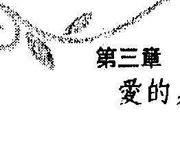

# 奥修谈勇气

Courage
The Joy of Living Dangerously

——在生活中冒險是一種喜悅

奧修OSHO 著
黃瓊瑩 Sushma 譯

## 推薦序—

## 人因勇氣而生存

人，要不是有非常堅強的勇氣，恐怕都已自行了斷了。 其實，人一生出就是一種勇敢旅途的開始，打從呱呱落地那一刻起，就已經開始以勇敢的態度來面對世界。適者生存一直是人類遵行到今天的不變法則，這個法則明白的告訴我們：只有足夠勇氣的人才會存活到現在。因為地球上每天發生足以致人於死的事件很多，而能夠克服這些困難的人，當然就有資格繼續生活下去。 我於一九九六年攀登世界第一高峰——聖母峰，在海拔八千七百公尺時發現天候已經變壞，但距離峰頂八八四八公尺只剩下一百多公尺，在衡量種種情況之後，變得很勇敢地往上繼續攀登，終於超越重重困難登上聖母峰。我在風速超過一百五十公尺也毫不客氣地席捲而來，一下子就籠罩整座聖母峰。我在風速超過一百五十公尺的惡劣情況下，温度降到攝氏零下五十度的惡劣情況下，以冷靜的頭腦和恐怖的風雪共度了

一個最漫長的黑夜，直到第二天才在昏迷中被雪巴人救起，幸運地保住了一命，

可是同天登頂的山友已死了八個人。當時不知道害怕，只知道要很務實地面對暴

風雪，趕緊把一生所知的登山知識和技巧完全發揮出來，以克服這迎面而來的凶

惡緊急事件，才很幸運地逃過這一劫。

今天，看了奧修這本《奧修談勇氣》，才赫然發現勇氣的真正意義，也了解

到當年自己是因為無懼於暴風雪的襲擊，才有時間去解決很多困難。更難得的是

這本書教我們很多增加勇氣、認識勇氣的真諦和方法，使每一個人因而可以過得

更充實，減少很多不必要的煩惱和害怕，碰到生活中諸多的挫折和逆境，就能鼓

起勇氣去面對並克服，對你我云雲眾生而言，無疑是一盞通往無懼世界的明燈。

除此之外，本書還舉了很多頻富哲理和寓意的 小故事，讓述說的大道理之外，添

加了一些輕鬆但很有意義的實例，使得本書更加豐富可讀。

+   ·登山家、攝影工作者

高銘和 Makalu

+   ·著有《九死一生》、《大山人一生》二書

[PAGE 7]

## Courage 奧修說勇氣

## 在奧修的羽翼下療傷

## 譯者序—

能夠翻譯《奧修說勇氣》這本書，可以說是上天賜給我最大的恩惠。通常當我翻譯時，我會帶上耳機聽音樂，將自己調到「工作」的頻道上，但是在翻《奧修說勇氣》時，這套方式完全被打亂了，原因是這本書深深地撞擊到我，有許多次我放下手邊的工作，抓起筆記猛寫下內在正在發生的事；有時則是心裡感到激盪而一邊掉眼淚，手指頭仍在鍵盤上飛舞著……這段時間我刚從印度回來，在那裡我掏掉不少累積多年的情緒與壓力，於是才有空間看到奧修所說的恐懼。當我一面聽他從不同角度解析恐懼時，我的內在同時有一場電影自動在放映著，那場電影所放的是在不同場景下，我所經驗到的相同恐懼，從童年、青少年、一直到現在，就像奧修在書中提到，人在死前會有的回顧經驗一樣，記憶的大門因此而打開，在一件件的往事中，我看到自己是如何地活在恐懼的黑洞裡。

[PAGE 8]

## Courage 奧修談勇氣

+   * 黃瓊瑩 Sushma

+   * 世新大學公共傳播系畢業

+   * 喜歡爵士鼓、塗鴉、下雨時去跑步；專長是煮印度奶茶

+   * 電子信箱：dancewithosho@yahoo.com.tw

在認識奧修十一年之後，第一次感覺自己真正進入了靜心的軌道，終於能夠認清一件事實：放太多能量在與其他演員的拶扎上並不是重點，我內在所發生的事才是重點，那完全與別人無關，而且我只能用自己的方式單獨去面對。

恐懼的時候，他自然會跳。「這話正是我此番經驗的寫照，痛苦到了極致，自然有勇氣不願再痛苦下去。」 蜕變是同時夾帶著喜悅與痛苦的過程，我何其有幸在這個過程中能遇見奧修，聆聽他的智慧，感受他的慈悲與愛，分享他的幽默。對於那不可說的，他居然能說那麼多，而且說得令人拍案叫絕。我深深地感謝存在賦予我這樣的機會，翻譯奧修的話，感覺就像與他共舞一般，雖不易，卻感到無比、無比的幸福。

重新踏上靜心之路的感覺，真好！

[PAGE 9]

如果你不勇敢，你就不真實；

如果你不勇敢，便無法去愛；

如果你不勇敢，你没有能力深入現實中探究。

所以，只要先有勇氣，

其他一切自然會發生。

获取更多好书，请加微信号：strcdts

官网：http://www.ac2011.cn

[PAGE 10]

## Courage 奧修談勇氣

## 生命本該充滿驚奇

# 前言—

別說是不確定，叫它做「驚奇」；別說是不安全，叫它是「自由」。我在此不是要給你某種教條，因為教條讓人感覺確定；我在此不是要給你什麼對未來的承諾，所有關於未來的承諾會使人覺得安全。在這裡，我只是要使你警醒與覺知一件事，那便是：與生命中一切的不安全、與生命中一切的不確定、與生命中一切的危險，共處於每個當下。與生命中的一切的危險，共處於每個當下。我知道你來這裡是為了找尋一些確定、一些教條、一些「主義」，找尋你可以歸屬的地方，找尋你可以倚靠的人。你出於恐懼來到這裡，想要找一座美麗的監獄，好讓你可以沒有覺知地活著。我想要使你更不安全、更不確定，因為生命本是如此。當生命是更不安全、更危險時，唯一可以回應的方式是覺知。

[PAGE 11]

# 前言
生命本該充滿驚奇

有另一種可能性，是你雙眼閉上，成為教派主義的人，做一名天主教徒或印度教徒、回教徒……你成了一隻鸚鵡，但你的生活不會因此而改變，你只是閉上眼睛，然後做個愚蠢、遲鈍的人。你的遲鈍使你感到安全，所有的白癡都覺得安全，全；其實，也只有白癡會覺得安全，一個真正生龍活虎的人總會感覺到不安全，有什麼會是安全的呢？生命的過程不是一成不變的，你沒辦法確定任何事，生命是一個無法預料的奧秘，沒有人能知道下一個片刻會發生什麼。即使是你以为為住在第七層天堂某處的神——假如他住那裡的話——他也不知道將會發生什麼事！因為他要是知道的話，那生命只是一場作假，所有的事已經事先寫好了，所有的事已經事先命定好了。如果未來是一個未知數，神怎能知道下一步會發生什麼？如果他知道下一刻會發生什麼事，那生命不過是一個刻板的機械化過程，如此生命便失去了自由，而沒有自由的生命怎能叫生命？這麼一來，成長或不成長都是不可能的。倘若一切都已事先設定好了，生命也就不再續紛光亮、不再那般高貴莊嚴，而你，充其量只是個機器人。不，沒有什麼是安全的，這就是我的訊息；沒有什麼能是安全的，因為一個了。

[PAGE 12]

## Courage 奥修 谈 美氣

安全的生活比死亡還糟糕。沒有什麼是確定的，生命之中到處都是不確定、到處都是驚喜，美就在這裡！你永遠不會來到一個時間點可以讓你說：一現在我確定了！，當你說你是確定的，你等於在宣告你的死亡，你已經自我了斷了。

生命總是夾帶著許許多多的不確定在前進，這是一種自由，不是不安全。我能了解為什麼頭腦管自由叫做「不安全」……你是否曾經在監獄待過一段時間？假如你曾在監獄住了幾年，當你被放出來的時候，你會對未來感到不確定。對被囚禁者而言，在牢裡的一切都是確定的，一切都是無聊的例行事項，有得吃有得喝，生活受到保護，不必害怕明天沒有食物會挨餓，那種事不會發生，一切都是確定的。多年之後，監獄的人突然告訴他：一你現在要被釋放了。一聽完後他開始顫抖，因為出了牆的另一端，他又要再度面臨不確定，他又得從頭開始探索，又得活在自由當中。自由會讓人產生恐懼。人們談論自由，可是卻害怕自由。如果一個人會害怕自由，他就還不夠為人。我給你自由，但不給你安全；我給你了解，但不給你知識，因為知識會使你確定。如果我能提供你一個處方，一套既定的公式，告訴你有聖父、聖靈以及

# 奥修谈勇气

耶穌，還有天堂與地獄，告訴你這些是善行而那些是惡行，如果做惡你就會下地獄，如果做我所說的善舉，你就能上天堂，這麼一來你就確定了。這就是為什麼許多人選擇當基督徒、印度教徒、回教徒、耆那教徒，他們不要自由，反而要固定公式的原因。

有個人快過世了——由於路上突發的一椿意外。没人曉得他是猶太人，所以一位天主教的神父被找來，神父挨近這個躺在地上就快走了的人，他只剩一口氣而已，神父對他說：「你相信聖父、聖靈以及聖子耶穌嗎？」

這位仁兄睜開眼睛，接著說：「幫幫忙，這會兒我都快死了，他還跟我玩猜謎！—當死亡輕敲你門扉之時，你所有的確定不過化為謎語及可笑的東西。別抓住任何的確定，生命是不確定的，它的本質即是不確定。不確定對一個智者來說是家常便飯的事。

隨時隨地處於不確定之中就是勇敢，隨時隨地保持在不確定之中就叫信任。一個有智慧的人在任何情境中都會維持警覺，並且全心全意來回應任何狀況，

# Courage 奥修谈勇气

倒不是他知道會發生什麼事情，也不是他知道一樣做，就會那樣發生一。因爲生命並非一門科學，也不是一條因果鏈；好比你知道水加溫到一百度就會開始蒸發，像這類事情是確定的，可是在真實的生活中，事情不會是那樣的確定。每個個體都是自由的，一份未知的自由。你要套好的公式好讓自己抓住，我並不會給你，事實上，如果你有既定公式的话，我會將它們拿走。慢慢地，我摧毀你的確定；慢慢地，我使你愈來愈遲疑；我讓你愈來愈不安全，這是唯一必要做的事，這是一個師父唯一需要做的事——將你赤裸裸的留在自由當中！在完全的自由當中，一切的可能性都是敞開的，沒有什麼是固定的……保持警覺，你沒有別條路可走。現在，你能了解爲什麼頭腦管自由叫做「不安全」了嗎？如果你能明白不安全是生命裡本來就有的部分，也還好是這樣，因為它

# 第一章 什么叫勇气？

亚历山大过於投入战事，几乎把这件事给忘记了，不過就在回去的路上，當他快到印度的邊界時，他猛然想起來。那時他正要離開最後一個村落，於是他派手下到村落裡詢問附近是否有桑雅士，出於偶然，剛好丹達米斯就在那個村裡的河邊。村民說：「你來得正是時候，桑雅士很多，但真正的桑雅士十分罕見，現在正好有一位在這裡，你可以在參加達顯（darshan：師父和門徒的聚會與交流）時拜訪他。」

亚历山大大笑道：「我在這裡不是為了參加達顯，我的手下會把他帶來，他將隨我回我國家的首府。」

「事情恐怕不會那麼容易……」村民說。「亞歷山大不相信，會有什麼難的？再了不起的君王他都打敗過，一個乞丐如桑雅士豈會難得倒他？他派手下們去找丹達米斯，發現他一絲不掛地站在河邊，他們對他說：「偉大的亞歷山大邀請你去他的國家，你將成為皇室的貴賓，保證你有享不盡的榮華富貴。」

這位全身光溜溜的僧人笑著說：「你們回去告訴你們的主子，一個說自己偉大的人不可能是偉大的，而且沒有人能將我帶去任何地方，桑雅士就像雲一般自由來去，我不是任何人的奴隸。」

他們繼續說：一你一定聽聞過亞歷山大，他是個危險人物，如果你敢拒絕他，他會直接取走你的項上人頭！一最後，亞歷山大不得不親自出馬，因為他的手下說：一那個人你很少見，他渾身散發著光，有種莫名的东西圍繞著他。雖然他光著身子，但在他面前你並不覺得他光著身子，事後你才會想起來。他攝人的力量使你根本忘記整個世界，他深具磁力，好像在他周圍的整個區域全都籠罩在他的寧靜與光之中。這個人值得一看，不過這個可憐的傢伙快要有麻煩了，因為他說沒有人能帶他去任何地方，還說他不是任何人的奴隸。一亞歷山大手持一把沒有鞘的劍去找他，丹達米斯見了笑道：一放下你的劍，在這裡它無用武之地，將它收回鞘裡，你只能砍我的身體，而我老早離開身體了，你的劍砍不了我，所以將它收回回去，別幼稚了。一據說那是亞歷山大第一次聽從別人的命令，由於這個人的特別風采，使他忘了自己原先來的目的，他將劍收回去，然後說：一我未曾見過這般美的人。一當他回到營地時，他說：一要殺一個已經準備好去死的人很不容易，殺這樣一個人無意義的。你可以殺一個跟你抗爭的人，那還有點意義，要是某個人說：一這是我的頭，你可以動手拿走。你就無法殺這個人。一

丹達米斯確實說過：一這是我的頭，你可以動手拿走，當這顆頭落地時，你將會看著它掉到沙地上，我也將會看著它掉到沙地上，因為我不是我的身體，我是觀照。—亞歷山大不得不對他的朋友們據實以報：我本可以帶回許多的桑雅士，但他們不會是桑雅士，後來我遇到一個真正罕見的人，你們聽到的確實沒錯，這樣的花確實稀有，沒有人能強迫他，因為他不畏懼死亡，對於一個不怕死的人，你怎能強迫他做任何事？—讓你變成奴隸的是你的恐懼；當你無所畏懼時，你不再是一個奴隸。事實上，是你的恐懼迫使你在別人奴隸你以前，先去奴役別人。一個無懼的人既不怕任何人，也不會讓別人怕他，恐懼完全消失了。

## 愛的道路

勇氣（courage）這個字很有趣，它源於拉丁字根cor「心」，所以勇氣代表著要與心同在。唯有弱者與頭腦同在，他们在周圍營造出很有邏輯的安全環境，因為深懷恐懼，所以用理論、觀念這些長篇大論關上每一道窗戶與大門，然後躲

在緊閉的門窗裡面。心的道路即是勇氣的道路，意謂著活在不安全、活在愛與信任之中，在未知中行動；心的道路代表著遠離過去，允許未來的發生。勇氣是走在危險的道路上，生命是危險的，只有膽小鬼會躲避危險，但這樣一來，他們已經死了。一個活的人，真正活生生的人，他總是走入未知去冒險，心永遠準備好去冒險，心是一個賭徒。頭腦是一個狡詐多端的生意人，心則從來不會算計些什麼。勇氣這個字很美，表示用心過生活，然後去發現事情的真義。詩人用他的心在生活，然後逐漸地，他可以從心底深處聆聽到來自未知的聲音；而頭腦聽不進任何東西，它與未知相隔十萬八千里，因為頭腦裡裝的是已經知道的东西。頭腦是什麼？它是你所知道的一切，它是過去，已經不復存在的過去；頭腦除了一堆積累的過去之外別無其他。心是未來，代表的是希望，心永遠是關於未來的。頭腦所想的是過去，心則夢想著未來。一個片刻的來臨，未來轉成現在，現在轉成過去。過去的已經了無希望、已經被用過了，它已經遠去、已然衰竭，就像墳場一般死寂。未來則如同一顆種子正在來臨中，並總是與現在會合，你永遠在移動，現在不過是一個進入未來的移動，

你已經踩在那一步上了，現在你正往未來而去。
世上的每個人都想要真實，因為，做一個真實的人會令人感到無比的喜悅、
無盡的狂喜。那不真實的理由是什麼呢？你得要勇氣十足才能看得更深入一點：
你為何會害怕？這世界能把你怎樣？人們可以笑你，多笑對他們有好處，歡笑怎
麼說都是一帖健康良藥。人們可以認為你瘋了……正因為他們認為你瘋了，才表
示你沒有瘋。
假使你對你的歡樂、你的眼淚、你的舞蹈誠實的話，遲早會有人開始了解
你，或許還會有人加入你的行列。回想當初我一個人隻身在道途上，而人們陸續
加入，到後來竟變成一支世界性的隊伍！我並沒有邀請過任何人，只是發自內心
在做事。
我的責任所在是我的心，而非對任何人；所以你的責任是對你自己，別反其
道而行，那是自毀的行為，再說那樣做對你有啥好處？就算人們尊敬你好了，認
為你个嚴謹、有著崇高德性的人，即使如此，你的本質並不會感受到滋潤，因
為這些並不會啟發你關於生命的洞見，或使你領悟生命之美。
在你之前有超過幾百萬人曾經活在這地球上面，你甚至連他們的名字都不知
道。不管他們是否曾經活過，那都没有差别。活著的人中曾經有聖者，也有罪 人；有德高望重者，也有稀奇古怪的瘋子，可是他們全都消失了，在地球上找不
到一絲蹤影。

有擁有這些品質的人才算是真正活過，其他人只是假装在活而已。 有擁有這些品質的人才是真正活過，其他人只是假装在活而已。 的品質，因為這些品質將會是你僅有的伴侶，它們才是真正有價值的东西，也唯
在一天夜裡，蘇聯情報局的人敲著亞索·芬可斯汀的門，亞索應聲開了 門，而情報局的人粗暴地叫道：「有沒有一個叫亞索·芬可斯汀的門，亞索應聲開了 （live here）？」 「沒有。」亞索回答，身上穿著一件破舊的睡衣。

「沒有？那你又是誰？」 「亞索·芬可斯汀。」 蘇聯情報局的人將他一拳打到地上，對他說：「你剛才不是說你不住這裡
> 「沒有。」亞索回答，身上穿著一件破舊的睡衣。

> 「沒有？那你又是誰？」

> 「亞索·芬可斯汀。」

> 蘇聯情報局的人將他一拳打到地上，對他說：「你剛才不是說你不住這裡
亚索回道：「你管這叫生活（living）？」只是活著並不盡然叫生活。看看你的生命，你可以說你的生命是一項祝福嗎？你可以說那是存在賦予你的禮物嗎？你會希望一再地被賦予這樣的生命嗎？別聽經書上說的，聽你自己的內心。那是我唯一會寫下的經文：要非常注意地、非常有意識地聆聽你心裡的聲音，於是你永遠不會出錯。聆聽你自己的內心，你將會開始往正確的方向前進，甚至連想都不用想什麼是對的、什麼是錯的。新人類的生活藝術，將在於有意識地仔細聆聽心的聲音，而且跟隨心的聲音，不管它將帶你到何處。有時候，心的聲音會帶你去到危險之處，不過牢記一件事，那些危險是需要的，這樣你才會成熟；有時候，它會帶你走岔了路，但別忘了，那些走錯路的經驗是成長的一部分。你會跌倒許多次，然後再站起來，因為跌倒再站起來是培養力量的機會，也是整合自己的機會。但是，不要服從外在加諸在你身上的規則，所有加諸的東西都是錯的，因為規則是由想要主宰你的人所發明出來的！沒錯，是有了不起的成道者存在地球上過：佛陀、耶穌、克里希那，他們給
與這世界的不是規則，而是愛。然後，做弟子的遲早會開始立下規矩，當師父不在的時候，當光消失的時候，弟子深陷在黑暗之中，他們會開始摸索一些可以遵循的規範，因為本來可見的光已經不復存在，現在，他們只能倚賴規範。那絲當時所做的是出於心中的輕聲召喚，多數基督教徒卻不是這樣，他們在模仿。一旦你模仿，便污辱了你的人性，污辱了你的神。永遠不要模仿別人，永遠要忠於原始，不要當一個複製品。你現在到處所能見到的只有複製品。如果你是你自己原本的樣子，那生命真是一場歡舞，而且你理當有你本來的面目。你看克里希那和佛陀多麼不同，要是克里希那學佛陀的話，我們早就失去世上最美的人類之一，而佛陀要是學克里希那的話，他不過是個可憐的傢伙；想想佛陀吹笛子的樣子，祂可能會害許多人睡不了覺，因祂不是塊吹笛子的料，想想佛陀跳舞的樣子，看上去簡直滑稽透頂。克里希那也是，要他坐在樹下沒有笛子可吹，頭上沒有戴別有孔雀羽毛的皇冠，沒有華麗的衣服可穿，像個乞丐般閉著眼睛坐在樹下，沒有人在他身體跳舞，沒有音樂，克里希娜看起來說有多貧乏，就有多貧乏。佛陀是佛陀，克里希那那是克里希那，而你是你，你並沒有比他們少一塊肉，尊重你自己，看重你內在
的聲音，跟隨那個聲音。不過別忘了，我不是在向你保證從此以後你都不會出錯，那個聲音常會帶你走錯路，因為要找對門，你必須先經歷錯誤的門；事情本來就是這樣，就算無意間給你碰上對的門，你也会認不出來。所以記住，到了最終的裁判時，你所花費的努力不會被浪費掉一絲一毫，所有的努力都是達到你成長高峰的助因。所以別再蹣跚，不必太擔心做錯事，那向來是個問題：人們被教導千萬不能犯錯，於是變得猶豫不決，怕東怕西、深怕做錯了什麼，到最後停滯不前，唯恐出什麼差錯，所以他們變成一顆石頭，乾脆一動也不動。能犯多少錯就儘量去犯，唯一要謹記的是：不要重蹈覆轍，你將會成長。迷失是你自由的一部分，甚至與神對立也是你尊嚴的一部分，有時連與神的對立都是美的，那是你開始有膽量的方式，不然，許多人軟趴趴的過一輩子。忘掉所有人告訴你的東西：這是好的，那是不對的。一生命並非這般生硬，今天對的明天或許不對，現在錯的或許等一下變對的。生命不是像實驗室，那裡的每一瓶罐子上都標示得很清楚。生命是一個奧秘：這個片刻某個東西合你意時，那就是對的，到了下一個片刻，無數的水已從匯河流逝，當那個東西不再合你意時，那就是錯的。

我所谓一對的是什麼意思？任何與存在和諧的就是對的，與存在不和睦就是錯的，每個片刻你都要很小心，因為每個片刻的決定都是新的，你不能靠已經有的答案來告訴你何謂對錯，倚賴那樣的答案不必用到大腦，你已經知道什麼是對和錯，你可以倒背如流，反正你要背的東西也沒有很長。十誡是多麼簡單！你知道什麼是對，什麼是錯，然而生命不斷在變化，要是摩西回來，我想他不會給你同樣的十誡，他做不到。三千年之後，他怎能給你相同的戒律？他必須創造一些新的東西。不過我的見解是：任何戒律都會為人們帶來難題，因為等到人們收到戒律的訊息時，那些戒律早已過時了，生命的腳步是如此快速，它是動態的，不是靜止的，就像恆河般不斷奔流，任意連續的兩個片刻都不會一樣，所以在這個片刻對的，下一個片刻不見得對。所以要怎麼辦呢？唯一的可能是認一個人有意識，直到他自己能決定要如何回應變動的生命。從前有兩座寺院，彼此是競爭對手，兩座寺廟的住持——他們只是泛泛的師父，一向互相看對方不順眼，並且告訴各自的弟子絕不可去對方的地盤。兩位住持都各有一個男僮服侍他們，為他們跑腿做些雜事。第一間寺院的住
持告訴他的男僮：別去跟另一個孩子說話，那幹人是危險份子。一個男僮：一你要去哪裡啊？另一個男僮說：一風帶我去哪裡，我就去哪裡。這一定是他從寺院裡聽到的，一風帶我去哪裡，我就去到哪裡。一是禪宗的名句，講的是純粹的道。

## Courage 奥修 谈 勇氣

讓你可以與這朵花變成一體。允許這朵花對你的心說話，讓她進入你的存在深處，就去邀請她，讓她當你的客人！如此一來，你將能體驗神秘的滋味。到最終一步的要領，於是你能融入你正在做的每一件事。走路的時候，不要走得像個機械人，不要一直觀看你正在走路，成為走路本身。跳舞的時候，不要用任何的技巧，有沒有技巧是不重要的，你可能很會跳，卻錯過了跳舞的樂趣，完全地融入在舞蹈當中，變成舞蹈本身，忘掉跳舞的人。當這般深深的統合發生在你生活裡許許多多的情境時；當你體驗到周圍的一切開始消失、自我消失、空無發生……這些無與倫比的經驗時；當花在那裡而你不在時；當彩虹在那裡而你不在時……當你內在及外在的雲正飄移著，而你不在，你成為全然的寧靜時；當沒有人在你裡面，只是一股純粹的寧靜，不受遲輯、思緒、情緒、感覺所干擾時，那是靜心的片刻，頭腦不在了，當頭腦不在的時候，神秘油然而生。

## 第一章 什麼叫勇氣？

# 信任的道路

信任是最深的智慧。但為什麼人們不信任？因為他們不信任自己的智慧，他們害怕會被騙，正因他們害怕，所以才有懷疑，懷疑是從恐懼衍生出來的。在你 的智性中有個部分感到不安全，於是你產生懷疑，你不是那麼確定你能信任，你 不認爲你可以信任。信任需要很大的智慧和勇氣，需要你整個人的投入，你需要 很有心才能走進信任的世界，如果你的智性不具足，你會用懷疑保護起自己。 當你的智慧開啟時，表示你已準備好進入未知，因爲你很清楚若整個已知的 世界消失，而你被留在未知裡，你也将能夠在那裡安身立命，你可以在未知裡建 立家園，你信任你的智慧。懷疑的人隨時都在備戰狀態中，但聰明人對一切抱持 開放，因爲他知道：「無論發生什麼事情，我都能夠接受挑戰，做出最恰當的回 應。一平庸的頭腦並不能信任自己，而知識是平庸的。 凡智者皆能夠待得住「不知道」的狀態，而且能夠不累積任何事情，這就是 覺知。發生的片刻消失後，你找不到一點蛛絲馬跡，你會再次回歸純淨，再一次 地像孩子般的天真。

## Courage 奥修談 勇氣

所以別去試著了解生命，要活在生命裡面！不要嘗試了解愛，進入愛裡面，然後你就會懂了，這樣的了解是來自你的經驗，而且這樣的了解不會破壞神秘，當你知道愈多時，你愈意識到自己需要懂的還很多。生命不是一個問題，當你把它當成問題看待時，你就搞錯方向了，生命是一個奧祕，你要去活過、愛過、經歷過。事實上，題腦因為害怕，所以要每一件事都說得通，除非事情經過解釋，不然頭腦不會採取任何行動。在解釋、了解整個情形之後，它會覺得這個空間是熟的悉的，於是才帶著地圖、指南手冊與時間表展開行動。頭腦永遠不會進入未知的領域，那個地方用不上地圖或指引。但生命正是如此，沒有任何地圖能派得上用場，因為生命一直在變動，每一片刻都是嶼新的。只要太陽在的一天，一切將時時如新。我告訴你：一切都是新的，一切都是無比活躍、無比動態的，唯一不變的是改變，唯有改變是不變的。其他一切正不斷變化著，所以你帶了地圖也沒用，地圖做好的時候就已经過了時，等你拿到地圖已為時太晚，生命早已變換跑道了，已經開始玩新的遊戲。你無法根據地圖來過生活，因為生命是不可衡量的；除非事情是固定不變

## 第一章 什麼叫勇氣？

的，不然你不能請示指南手册來告訴你該如何過日子。生命不是定格不動的，它是一股經常性的活力，是一個過程，你找不到任何一張關於生命的地圖。你無法
去丈量，因為生命是一個不可衡量 的奧秘，所以不要尋求任何關於生命的詮釋。我稱這個為成熟的頭腦：當一個人來到這個點上時，他不用任何問題來看待生命，只是帶著勇氣投入生命當中，沒有一絲恐懼。這個世界充斥著勇氣許多不誠實的人，教堂、廟宇、清真寺，到處都是信仰宗教的人，你難道看不出這個世界一點都不宗教嗎？這麼多在宗教裡面的人，而這世界卻一點都没有宗教的味道，這還真是個奇蹟！每個人 都信仰宗教，卻一點宗教的品質都沒有，這樣的宗教是虛假的。人們的信任是被訓練出來的，被訓練的信任會變成信仰，而不是一種體驗。他們被教導去相信，而不是要去了解，人類就是這樣錯過了重點。

## Courage 奥修談勇氣

許信任的機會可以出現。你無法永遠懷疑下去，懷疑是一種病，當你在懷疑之中時，你不可能感到滿足，你處於一種搖擺狀態，覺得苦悶難當，在那樣的四分五裂中，你什麼都無法

## Courage 奥修談勇氣

判定，有的只是一場又一場的夢魘。於是或許某一天，你開始找尋超脫的方法，所以我就說，與其當個有名無實的有神論者，倒不如當個不折不扣的無神論者。你被教導要去相信。從你很小的时候開始，所有人的頭腦都被框成要去相信：相信神，相信靈魂，相信這或那。現在這樣的相信已經變成你的一部分，在你的血液裡流竄，可是那仍只是一個相信，你尚未領悟，要不然你無法自由。領悟帶來解放，也唯有領悟能解放你，所有的信仰都是借來的，是別人給了你，那些東西不是來自你個人的開花。更何況，借來的東西怎麼能引領你朝向真實、那絕對的真理？丟掉所有從他人那裡收到的東西，與其富有，倒不如當一個乞丐。那不是靠你自己撈來的富有，而是靠剽竊、借貸，靠傳統與繼承而來的富有，與其這樣，倒不如當一個乞丐；但你做你自己，在那樣的貧窮當中將夾帶富有，因為那是真的，而你那一堆乞丐才是貧瘠的，那些信仰永遠不會有深度，它們頂多只有一層皮那麼薄，只要輕輕擰一下，你就會看到懷疑。本來你相信神的存在，有一天，當你經營的生意突然垮掉的时候，你的懷疑就出現了，你會說：我不相信，我無法相信神。原本你是相信神的，當你所
鍾愛的人去世時，你於是開始懷疑。你對神的信仰只是因為你所鍾愛的人死去就
没了？看來這個信仰沒有什麼價值。

# Courage 奥修谈勇气

信任永遠不可能被摧毀，當信任在的時候，没有任何事情可以摧毀它，沒有
任何事情，絕對沒有任何事情能摧毀它。

# Courage 奥修谈勇气

所以要記清楚，信任與信仰的差異非常大。信任來自個人，信仰來自社會；
信任要從內在滋長，信仰則常態性地圍繞著你。無論你是哪一種人，別人都可以
將信仰丟諸給你，且將信仰丟掉——是會有恐懼，因為當你放下信仰的時候，懼
疑便升起。你的每一則信仰都在強迫懷疑躲到角落裡，壓抑懷疑的出現，別擔
心，就懷懷疑出來，每個人見到黎明之前，都要經歷一段黑夜，每個人都要通
過懷疑的考驗。旅程是漫長的，夜晚是黑暗的，然而，當漫長的旅程與黑暗的夜
晚結束後，你將知道那些都值回票價。

# Courage 奥修谈勇气

你無法一培養一信任，絕不要去培養它，人類過去老是在犯這種錯。被培養
出來的信任會變成信仰，從你的內在去發掘信任，不要訓練自己去信任，進入內
在更深入一點的地方，去到你本質的根源所在，在那裡找到它。

# Courage 奥修谈勇气

探究生命需要你的信任，因為你將會進入未知。由於你即將遠離傳統、遠離
眾人，你需要深具信任及勇氣，你即將去到一望無際的汪洋大海，卻無從知道彼岸是否存在。

# Courage 奥修谈勇气

我不能叫你踏上這樣的探索，卻沒讓你準備好信任的能力，那樣看起來會很矛盾，可是我能怎麼辦？生命正是如此，唯有真的能夠信任的人，才具備深入懷疑與質詢的能力。

# Courage 奥修谈勇气

一個人能信任幾分，他的懷疑就有幾分；完全沒有信任的人，只能假装懷疑一下，而無法深入的質疑，一切都取決於信任的程度多寡，這是種冒險。我必須為你準備好，使你能單獨踏上這趟不同凡響的旅途，而我能做的，是將你帶到邊。首先你必須了解信任的美，了解心的道路所帶來的狂喜，好讓你走進實際的一片汪洋大海時，有足夠的勇氣一路走下去，無論發生了什麼，你都對自己有充足的信任。

# Courage 奥修谈勇气

只要看一件事：倘若你不信任自己的話，你如何能信任任何人或任何事？那是不可能的。倘若你懷疑你自己，你怎麼能信任？你是那個信任的人，而你不信任自己，那你要從何去信任你的信任？在你的智力轉成智慧之前，絕對必要的一件事是你的心要打開，這是智力與智慧的差別所在。智慧是當你的智力與心協同一致時的展現。

# Courage 奥修谈勇气

你的心知道如何信任；你的智力知道如何搜索與追尋。

# Courage 奥修谈勇气

有兩個乞丐住在某個村莊的外面，其中一個眼睛瞎了，而另一個沒有了腿。

# Courage 奥修谈勇气

有一天，村莊鄰近的森林——也就是這兩個乞丐住的地方——著了火。他們平常是競爭對手，同樣是乞丐，而且乞丐的對象也是同一群人，所以他們從來不打照面，從來都不是朋友。

# Courage 奥修谈勇气

有道是同行相忌，做同種工作的人基於競爭的理由很難當得成朋友，因為難免互相搶客戶。乞丐們會區分他們的施主：一記住這是我的的人，你别想去動他的歪腦筋。一你不知道你隸屬於哪一個乞丐，你成了哪一個乞丐的名下財產，反你成了他的所有物……

# Courage 奥修谈勇气

正街上的某一個乞丐已經占有了你，他可能已經在一場爭奪戰中贏得勝利，現在以前有一名乞丐常在我的大學附近出沒，有時我會在市場裡看到他。年輕學子都比較慷慨，上了年紀的人會變得小氣巴拉、膽小如鼠，因為死亡漸漸靠近，好像只剩金錢能幫上點忙，若是他們身上有錢，別人或許會幫他們；要是他們沒有錢的話，就連親生的兒子、女兒都不會甩他們。但年輕人就不同了，他們揮霍得起金錢，反正還年輕，他們可以去賺錢，前方還有漫長的一輩子等著。

# Courage 奥修谈勇气

所以這個乞丐算是挺強的，其他乞丐都進不了那條往學校的路，甚至入口都被封鎖得死死的。每個人都心知肚明這所學校是隸屬誰的勢力範圍，沒錯，正是那名乞丐！有一天我見到一名新的乞丐在那裡，而不見老傢伙的人影，我問道：

# Courage 奥修谈勇气

「怎麼回事了？老傢伙人呢？」

他說：「他是我的丈人，他已經將這所大學送我當禮物。這時候還沒有人知道學校的所屬者已經換人了，這名年輕人說：「我取了他的女兒做老婆。」

# Courage 奥修谈勇气

根據印度人的傳統，當你取了某人的女兒的時候，你會獲得一筆嫁妝。你不只娶到了女兒，你的丈人如果有錢的話，他得送你一部車或一棟房子，要是他沒有什麼錢的話，至少他要送你一部摩托車，再不然至少一輛腳踏車，反正他就是要給你一些什麼：一台收音機、一架電視或一些現金。假如他真的很有錢，那他會出錢讓你有機會出國進修，讓你拿個醫生或工程師的學位。

# Courage 奥修谈勇气

乞丐的女兒剛嫁給這個年輕人，她的嫁妝是整座大學，他說：「從今天開始，這整條街道和整座學校歸屬我，我丈人已經告訴我誰是我的客人。」

# Courage 奥修谈勇气

好。～ 當我在市場裡見到老乞丐時，我對他說：～太好了，你送嫁妝這件事做得很
好。～ 沒錯，～他說到，～我就這麼一個女兒，我想為我的女婿做點事情，我給
他最佳的地點乞討。現在我試著重新另闢地盤，這是件挺困難的事情，因為已經有許多老經驗的乞丐在這裡很久了，不過倒也沒什麼好擔心的，這難不倒我，我
會把一些乞丐趕出這一帶。～當然也給他辦到了。～話說回來，當森林裡著火時，這兩個乞丐想了一下，他們素來是敵人，甚至
連話都不曾對上一句，但眼前是個緊急情況。瞎眼的對沒腿的說：～為今之計只
有一條路，你坐在我肩上，你用我的腿而我用你的眼睛，這是我們唯一可以解救
自己的方法。～ 他們很快就達成共識。沒有腿的人逃不走，到處是一片火海，他根本無法穿
越森林，或許可以稍微移動到別處，但這沒多大用處，當下需要的是快速的脫
逃。瞎眼的也當然逃不掉，他不知道著火的地方在哪裡，哪裡有路可走，那裡的樹正燒著，哪裡還沒有燒掉……一個眼睛看不到的人可能迷路。然而他們兩個都
是聰明人，他們放下敵對的姿態，變成朋友而救了彼此一命。～ 這一則東方的寓言故事，要傳達的重點是你的智力和心的關係。它無關乎乞
# Courage 奥修谈勇气

丐不乞丐，而是關於你；它和起火的森林無關，而是關於你，因爲深陷火海的人
是你，時時刻刻你都在燃燒著，你受苦、不開心，你鬱悶難當。光是有腦筋你依
舊是盲目的，就像是你有腿可以

# 第一章 什么叫勇气？

官，所有他身边优秀的人都随他的过世而自杀，只为他同进退。

这位国王要守门人让他都来看他刻名字，因为一个人单独做这件事而没有人当场见证，哪有何乐可言？全世界的人都该看到，因为真正的快乐就在这里。

守门人说：“你听我的建议，因为这个工作是父親传给我的，他以前是这里的守门人，他的父親也是这里的守门人，我们家世代以來都是做看守这座苏马鲁山的工作，听我的话：先别找他们来，不然你会后悔。”

国王虽不明白为什么要这样做，却也不能当作没听到这番告诫，因为这个人没事为什么存心找碴？

守门人又开口了：“如果你仍要他们来看，先去刻好你的名字，然后你再回来带他们，你要现在就找他们来我也不反对，只是若你这么做的话，等一下你会后悔莫及……他们不会跑掉的，你自己先去吧。”

这话完全合情合理，国王说：“听来不错，我会自己先去，刻完我的名字，再回来把你們全都叫来。”

守门人说：“这个做法我非常赞成。”

所以国王去了，他看见苏马鲁山在无数颗太阳照射下闪烁着光芒，在天堂可

# Courage 奥修谈勇气

不像凡间只有一颗太阳，上千颗太阳，与一座远比喜马拉雅山要雄伟的金山，别忘了喜马拉雅山几乎有两千哩长！有一会儿他的眼睛没办法睜开，那光線实在没有空间，整座山已经刻满了名字。他不敢相信眼睛所看到的，生平头一次他意识到自己的过去，直到前一刻他還自认是千年难得一见的英雄，不过，时间自亘古以来已过无数，几千年前与须臾之间并没有什么差别，在他之前早已出了许多多的世界之王，在这座全天下最雄伟的山上，居然找不到一处空位可以写上他小小的名字。他带着一丝怀然走回去，现在他明白守门人的话是對的，还好他老婆、他的指揮官、首相以及其他親近的友人沒有看到这一幕，他们依然相信他們的國王是舉世無雙的人物。他將守门人拉到一旁说到：「根本沒有空位嘛！」守门人说：「我之前要說的就是这个。现在你要做的是擦掉幾个名字，再写上你的名字。从以前到现在大家都是这么做做的，我這輩子所見的就是这样，以前我爸也是这样說，我爺爺……我的祖先中没有人曾见过苏马鲁山有任何空位過，這事從來沒有過。」

# 第一章 什么叫勇气？

每次，当一位世界之王来到这里的時候，他不得不擦掉几个名字，好写上自己的名字，所以你所看到的不是世界之王全部的歷史，上面的名字已经經過擦掉許多次，然後又被刻上其他的名字，你只要依樣畫葫蘆，然後如果你要展示給你的親朋好友看，你再带他們來。

国王说：一不，我不要讓他們看了，我甚至不打算写上我的名字，这样做有什么意義？反正總有一天會有人擦掉我的名字。一

即将有我的銘印，我为这个愿望而活，将我的性命投下当赌注，就算要殺光全世界的人也在所不惜，而現在，隨便一個人都可以爲了写上他的名字而抹掉我的名字，写不写又有何不同？我決定放棄。

守门人笑了。

国王问道：一你在笑什麼啊？一

守门人说：一我在笑这件事很奇怪，因为我的爺爺、我父親也都說過，許多世界之王來了，在了解事情的始末之後，他们头也不回地就離開，名字连刻都沒刻，你不是第一個例子：任誰都會这么做，如果他是聪明人的话。一

在这世间你能获得些什麼？你又能带走些什麼？你的名氣、你的聲望？或是

# Courage 奥修谈勇气

你的財富、你的權勢？到底是什麼？你的學識嗎？你什麼也帶不走，所有的一切你都得在此放掉，在放掉的當下你將領悟到：過去你所占有的那些都不屬於你，「占有一本身的想法就是錯誤的，」占有一使得人心腐化。為了占有更多：更多錢、更有權力、征服更多領土，你在做些连你自己都不敢大聲說出口的事，因为你在做些连你自己都不敢大聲說出口的事，因为你必须说謊，你無時無刻不戴著面具。你得虛情假意，因为這麼做會有助於你在這世上獲致成功，什麼以誠待人、做事要腳踏實地，這些都是沒有用的。若是沒了你所擁有的東西、你的功成名就，请問你是誰？你大概也答不出个所以然。你是你的聲名、你的權勢，但除卻這些不說，你是誰？所以說你所持有的這一切變成了你的身分，它們使你對你自己有錯誤的認知，知，而那正是「自我」。一自我一不是什麼神秘的東西，它是一個非常單純的現象。活著却不知道自己是誰，這是不可能的事，假如我不知道我是誰，那我在這裡幹什麼？這麼一來不管我做任何事都失去意義，最主要的事就是知道我是誰，然后說不定我能做些什麼来發揮我的本性，使我覺得心滿意足，找到我自己的家。但是，要是我不知道我自己是誰，而我忙著做這做那，请問我要如何達到我

# 第一章 什么叫勇气？

於到了，这就是我一直在找的地方？我從早忙碌到晚，却永遠沒有機會說一聲：一現在我終 你不知道你是誰，於是我需要一些假的身分作為替代，你所擁有的那些東西 提供了那個假身分。 當你刚進入这个世界的时候，你是一個純真的觀照者，大家都是帶著同樣的 意識進入這世界，这是每個人都有的品質，但往後你會開始與成人世界展開一場 討判。他們有很多東西可以給，而你只有一樣東西可以給，那就是你的完整、你 的自我尊重。你有的並不多，只有一項，你愛怎麼稱呼都行：赤子之心、聰敏、 真誠，你有的懂僅是這一件。 小孩子對他身邊所見的一切天生就感興趣，看到什麼東西都要，那是人性中 的一部分。你去看小嬰兒，连一個剛出世的嬰兒，你都可以看到他的手開始在摸 索些什麼，你的小手正試著找些什麼，他已經展開了他的旅程。 在旅程中他將失去他自己，因為在這世上，你不可能為自己的所得付出代 價。可憐的孩子，他不慣他所付出的是萬分珍貴的東西，就算與全世界比較， 他的完整依舊遠來得有價值。小孩子沒辦法知道這正是問題所在，因為他所擁有的完整是與生俱來的，於是他視之為理所當然。

## Courage 奥修谈 勇氣

讓我告訴你一則故事，你就會懂得我所說的。

有一個非常富有的人，在他有钱之後覺得很挫敗。这不足為奇，成功通常會帶來這樣的結果，再也没有比成功更失敗的事了。成功之所以會顯得有意義，只因你是失敗者，當你登上成功的寶座時，就會發現你被這世界、被人們、被社會給要了。這個有錢人享盡榮華富貴，內心卻一刻都不得安寧，於是他開始尋找心的平靜。

美國也正發生這樣的事，全世界就屬美國人最熟中於追尋心的平靜，像我在印度就沒遇過這種人，大家忙著照顧肚子的平靜都來不及，心的平靜顯得太遙遠了，從肚子到心的距離糾得上有千哩之遙。

可是在美國，每個人都在追求心的平靜。當然，如果有人在尋找，就自會有人出來提供，这是經濟學上簡單的法則：有需求，就會有供給。你所想要的是為你所需要的並不打緊，反正也沒有人真的在意要提供的是什麼：管他是誇大不實的廣告，還是真正實質的東西。

是的，有需求就會有供給，然而狡猾多計的商人腳步更快，他們說：「不必等需求出現，你可以創造需求。」一廣告表現的藝術盡在此：創造需求。在你接收到廣告訊息之前，你並沒有這项需求，以前你從來不覺得這是你需
# 第一章 什么叫勇气？

要有的是為你所需要的並不打緊，反正也沒有人真的在意要提供的是什麼：管他是誇大不實的廣告，還是真正實質的東西。

是的，有需求就會有供給，然而狡猾多計的商人腳步更快，他們说：「不必等需求出現，你可以创造需求。」一廣告表現的藝術尽在此：创造需求。在你接收到廣告訊息之前，你並沒有这项需求，以前你從來不觉得這是你需
# 第一章 什么叫勇气？

要有的是為你所需要的並不打緊，反正也沒有人真的在意要提供的是什麼：管他是誇大不實的廣告，還是真正實質的東西。

是的，有需求就會有供給，然而狡猾多計的商人腳步更快，他們说：「不必等需求出現，你可以创造需求。」一廣告表現的藝術尽在此：创造需求。在你接收到廣告訊息之前，你並沒有这项需求，以前你從來不覺得這是你需
# 第一章 什么叫勇气？

要有的是為你所需要的並不打緊，反正也沒有人真的在意要提供的是什麼：管他是誇大不實的廣告，還是真正實質的東西。

是的，有需求就會有供給，然而狡猾多計的商人腳步更快，他們说：「不必等需求出現，你可以创造需求。」一廣告表現的藝術尽在此：创造需求。在你接收到廣告訊息之前，你並沒有这项需求，以前你從來不覺得這是你需
## 第二章 當新的来敲門

豎起你的耳朵去傾聽新的，跟著新的走；
我知道你會怕，儘管害怕，
你仍得跟著祂走，然後你的生命會愈來愈豐盛，
有一天，你將能夠綻放你以往鎖住的光芒。

# Courage 奥修谈勇气

# 允許它的發生

人，你根本無從發現起！唯一之道是允許它的發生，你才會理解。

那新的（the new）並不是出自你裡面，它來自彼岸，並不是屬於你的一部分。你過往的一切顯得岌岌可危，因為新的一切使你與過去完全不相連，於是你感到害怕。從過去到現在，你都用一種方式過生活，以一種方式思考，以你的信仰營造出舒適的生活；而此刻，某件新的東西來敲你的大門，眼見你整個過去的模式即將瓦解，一旦你讓新的進來，你將不再是從前的你，你將會被轉化。

是很危險沒錯，你永遠不知道跟隨新的，你將變成怎樣。舊的一切皆是屬於已知、熟悉的範圍，你活在已知當中已經很久了，相當清楚該怎麼做。新的事物總讓人覺得陌生，誰曉得呢？新的事物或許是朋友，或許是敵人，你根本無從發現起！唯一之道是允許它的發生，你才會理解。

物總讓人覺得陌生，誰曉得呢？新的事物或許是朋友，或許是敵人，你根本無從發現起！唯一之道是允許它的發生，你才會理解。而你也不能老是拒絕新的，因為舊的一切並未能給你你所追尋的，它一直未
## 第二章 當新的来敲门

能實現對你的承諾，雖令人熟悉，但卻不能使你真正快樂；而新的或許不是很舒服，卻有契機在裡面，說不定喜樂會因此降臨，所以你既無法拒絕，可是又不能接受，於是你在那裡搖擺不定，感到惶恐不安，內心十分煎熬。這很正常，沒有什麼不對勁的，事情本來就是這樣，將來仍然會是這樣。

物感到滿意；永遠不會有人對舊的事物感到滿意，因為不管那是什么，你都已經知道了，已知代表著重複、無聊、單調，讓你巴不得甩掉它。你要去探索、冒險；你想進入新的領域，然而，當新的事物真的找上門時，你卻退縮回去，躲在原來舊有的世界裡，兩難就出在這裡。

要如何成為新的呢？每個人都想煥然一新，你需要具備勇氣，而且還不是普通的勇氣，是超凡的勇氣。世上舉目所見都是膽小之輩，這正是人們不再成長的原因，若你是個膽小鬼，请問你要如何成長？當新的機會來臨時，你總是做縮頭烏鶴，這樣怎能成長？怎麼可能？你只能假装你有成長。

由於你不能成長，所以你必須找替代品來顯示你的成長。你不能成長，但你銀行戶頭的錢可以成長，那是種替代，非但不需要勇氣，還挺適合你的膽小懦弱。你的錢不斷增長，你就開始以為你在成長，覺得自己值得別人的敬重；你的

## Courage 奥修 谈 勇氣

名声开始高漲，你就以為自己在成长？你不過是在自欺欺人，你既非你的名字，也非你的名声，你银行裡的钱更不代表你的人。而说到你的本质（being），你會開始顫抖，因為如果你要你的本质成长的话，你必須要很有膽量。我們要如何變成新的？我們無法自己去變成，新的來自彼岸，你可以說是來自神，新的來自存在。頭腦總是屬於舊有的，從來就不是新的，它是過去的累積。新的來自彼岸，是神所賜予的禮物；新的來自彼岸，屬於彼岸。那未知與不可知的彼岸已經進入了你。祂已經進入了你，因為你從來就不是與祂分開的。你並不是一座孤島，或許你已經遺忘了彼岸，但彼岸還惦記著你；小孩也許不記得母親了，但母親卻未忘記小孩。身為祂的一部分，或許你開始在想：「我不屬於整體。」但整體知道你並沒有與祂分開。整體已經進入了你，祂依然與你保持連結，所以新的事物才會不斷降臨到你身上，雖說你並不怎麼歡迎。每天早晨，每天黃昏，祂以一千零一種方式來到你的身邊，倘若你有眼睛的話，你將會看到祂不斷地來找你。存在無時無刻不在眷顧著你，只是你太沉溺於過去，幾乎等於將自己關在墳墓裡，由於你的膽怯，你已失去了敏感度，你的細膩不再。敏感度是指你能感覺得出新的事物的出現，以及隨之揚起的激昂與熱情，接下來，你展開你的冒險覺得出新的事物的出現，以及隨之揚起的激昂與熱情，接下來，你展開你的冒險之旅，邁開步伐走進未知當中，雖然不曉得自己會往哪裡走。

頭腦認為那樣太瘋狂了，沒有道理要拋掉既有的一切。然而，神總是新的，所以我們從來不會用過去式或未來式提到神，我們不說：「神是……」（God is），神以前是這樣一，也是互古常新的；神已經進入了你。

別忘了，所有進入你生活一切的新事物，都是來自神的訊息。如果你接受了祂，表示你已具有宗教品質；如果你拒絕了祂，表示你沒有具備宗教品質。人類只需要再放鬆一點點就能接受新的；只要再打開一些些，就能讓新的進來，在你內哪出點空間，允許神的進入。

那正是祈禱或靜心的涵義，你敞開來，你說：「好。」你說：「請進來。」你說：「我已經等了又等，很感謝你終於來了！」永遠要開開心心地迎接新的。

即便有時會不太順遂，一切仍舊是值得的；就算有時你因而陷入泥濘當中，一切還是值得的。因為，唯獨透過錯誤才能學習，唯有經歷困厄才能成長，新的事物將會為你帶來難題，那就是為什麼會選擇舊的，舊的一切不會造成你任何不適，它是你的慰藉，你的避風港。

只有深深地、完全地接受新的，你才能有一番脫變。你無法將新的帶入你的生活，它會來，你所能做的只有接受或是拒絕。假如你拒絕，你會繼續麻木不仁下去；要是你接受，你就成了一朵花，你開始綻放……在綻放的时候，就是一種慶祝。唯一能轉化你的，是讓新的進入你的生命，除此以外，別無他路。記得，這無關乎你或你的努力，只是，「無為」（do nothing）不是指你真的什麼事都不做，而是指你不會出於以前的意志力、方向或刺激來行動。新世界的探求可不是尋常的探求，因為你要找的是新的，你怎麼找得到？你連它長得是圓的還是扁的都不知道，你跟它還未曾打過交道，那將會是一趟未知的孩子般的發自純真來行動，對於一切的可能性感到雀躍無比，因為那是無限的可能性。你沒辦法做任何事去創造出新的，因為你所做的都是出於過去，但那並不代表你要停止一切作為，只是你不再基於過去的意念或衝動來做事，也就是說，帶著靜心的品質來行動，自在地、放鬆地，交由當下來決定該做什麼。在當下，你不加諸個人的決定，因為那樣的決定是來自過去，如此只會壞了事。在每个片刻中，你只是像個小孩般，將自己全部丢進當下的片刻，你會發現每天都有新的契機、新的光明、新的啟示。那些新的啟示將不斷為你帶來轉變，有一天，你將發現自己每一個片刻都栩栩新新，當有的一切不再徘徊不去，不再像雲一樣圍繞著你，你像是水滴一般清新明朗。那才是一重生一真正的意義，假如你懂的話，你將會從記憶中解放出來。記憶是死的東西，它不是真實的，也不可能真是真實的；真理永遠是活的，真理夾帶著生命的。記憶是已經不存在的的那一切的延續，記憶的世界是一個幻象的世界，那世界裡有我們，那是我們的監獄，更確切的說，那就是我們。記憶創造了一個錯綜複雜的結：「我」，也就是「自我」，這個假的我很怕死，這正足以說明為什麼你對新的一切會感到害怕。是這個自我在害怕，倒不是真的你在害怕。你的存在從沒有恐懼，但自我有恐懼，因為自我非常非常怕死亡。自我是人為拼湊成的，隨時都會潰散瓦解。當新的事物出現時，恐懼也出現了，這是自我在怕死，所以拚命想撐住自己；而現在新的來臨了，那是個有摧毀力的東西，就因為這樣，你才沒辦法用快樂的心情迎接新的，自我無法以喜悅來接受自己的死亡，它怎能以喜悅來接受自己的死亡呢？除非你明瞭你並不是自我，否則你無法有能力接受新的；一旦你看出自我只不過是你過去的記憶，記清你不是你的記憶，記清你不是你的記憶，記憶就像一 部生物電腦，只是一台實用的機器……而你則是超越它的，於是你知道你是意識， 而非記憶，記憶是意識中的內容，而你則是意識本身。 例如你看某人走在路上，你只記得那張臉孔，卻想不起對方的姓名，如果你 是你的記憶，那你應該記得名字才對，可是你說：「我認得他的長相，但想不 起他叫什麼。一於是你開始在記憶庫裡搜尋，你進到你的記憶庫裡東翻西找，忽 然間那個名字跳出來，你說：「沒錯，這就是他的名字。」記憶是你過往的紀錄 器，你是那個在記憶庫裡搜尋的人，你不是記憶庫本身。 這種事常發生，當你愈要想起某件事，反倒愈想不起來，由於你承受到壓 力，那個緊張本身使得記憶庫無法傳送資訊給你。你綻盡腦汁，知道就差那麼一 丁點就會想起來，你明知道那個名字，可是你怎樣就是想不起來。 這就奇怪了，如果你是記憶，又沒有人阻止你去想起來，為什麼你記不起那個名字？誰又是這個說「我知道，只是我還沒想起來」的人？你努力地試了又 試，你愈用力試，事情反而更加困難。後來，你覺得想得很累，於是去花園散散 步，突然，就當你正看著一叢玫瑰花時，那個名字跑出來了。 你不是你的記憶，你是意識，而記憶是意識裡的內容。記憶是「自我」全部的生命泉源，想當然耳它是舊的，而且很怕來自新的一切。新的或許很擾人，而且為你所帶來的或許你沒法消化；新的說不定會為你造成麻煩，你必須反覆做幾 番調整，似乎是挺費力的。

要成為新的，你要能不認同自我，一旦你能做到這一步，你也就不在意自我 是死還是活。事實上，無論自我是死還是活，你知道它都是死的，只是部機器， 去使用它，別反過來被它使用。 自我之所以那麼怕死，是因為它一向我行我素慣了，所以才會有恐懼。恐懼 不是從你的本質中出現，這是不可能的，因為本質是生命本身，生命怎麼會害怕 死亡？它根本不知道死亡為何物，恐懼是由自我這個虛假的人工合成品而來。只 要徹底的放開來，就能使自我崩解，使人真正的活過來，自我的死亡，就是你的 誕生。

新的是來自神的使者，新的是來自神的訊息，這是則真理！豎起你的耳朵去 倾聽新的，跟著新的走；我知道你會怕，盡管害怕，你仍得跟著祂走，然後你的 生命會愈來愈豐盛，有一天，你將能夠縱放你以往鎖住的光芒。

我們之所以不斷錯過生命裡的許多事，是因我們缺乏勇氣。其實不用努力，只要有勇氣，事情就會自行找上門來，而不是你去找它們……至少，就內在的世 界而言，事情確實是這樣的。對我來說，作為幸福的人需要極大的膽量，去過悲 惨可憐的生活其實是懦夫的行徑，說穿了，當一名儒夫不需要任何條件，任何沒 種的人、任何傻瓜都能當。但是，作為幸福的人則需要很大的勇氣，那是一個顛 巨的任務。

但我們不是這樣想的，通常我們都認為：「要快樂哪裡需要什麼？每個人都 想要快樂。一那是完全錯誤的想法。真正想要快樂的人其實沒幾個，別聽人們嘴 巴上說的，真正能快樂的人少之又少，人們對自己的痛苦有著更大的興趣，他們 喜歡悶悶不樂……事實上，當他們不快樂時，他們才快樂。

有好幾件事你得了解，不然要脫離痛苦的軌道將很不容易。首先：沒有人將 你關在那裡，是你自己決定要待在痛苦的桎梏之中。沒有誰將誰綁在那裡，想 要出來的人，在這個當下就可以出來，沒有人會管得著。過得不快樂的人自己要 負責，但不快樂的人從未負起過責任，那正是他從來都過得不快樂的方式，他會 說：「一是別人造成我的痛苦。」

如果真是別人讓你不快樂，當然了，你能怎麼樣？要是說是你讓你自己不快 樂的，那還有解決之道……而且馬上就能解決，因為那樣的話，快不快樂是操之 樂的，那還有解決之道……而且馬上就能解決，因為那樣的話，快不快樂是操之 在你。所以說，人們總將責任丟給別人：有時候說是老婆，有時說是老公，有時說是家人，有時候說是天時地利不合……童年、母親、父親……有時是社會、歷史、命運、老天爺，反正他們就是將責任丟給別人，丟的對象或許會換，但把戲是同一套。

當一個人為自己負起所有的責任時，他才稱得上是真正的人。不管處於什麼狀況，那都是他自己的責任，這是他最初的勇氣之舉，也是最大的勇氣。要接受這個想法很難，因為頭腦會說：「要是你能決定，為什麼你要選擇不快樂？」

為了避免這個問題的答案，我們只好說是別人該為我們負責：「我又能怎樣？我無可奈何……我是受害怕！有一個比我更大的力量在拉扯我，我什麼都沒辦法做，頂多只能哭一哭，然後再因為我哭而更不快樂。凡事都會變成長，如果你付諸行動，它就會成長，然後你會愈來愈深入……

没有任何人，沒有其他力量在對你做任何事，是你自己，也只有你自己。這正是關於一業一的全部哲學：那是你的所作所為，「業」就是作為。你做了，而你也可以消弭你所做的，不用等待或延遲，時間是不需要的，你可以直接跳出來！

可是我們已經習慣了，要是終止痛苦，我們將會覺得很孤單，因為我們失去了

了最親近的伴侶，它與我們如影隨形，我們走到哪，它就跟到哪。當身邊沒有人

人的時候，至少有你的痛苦與你作伴，你等於跟痛苦結婚，那還真是一椿漫長的婚

姻，不知多少世以來，你一直待在這個婚姻裡。

現在是離婚的時候了。我認為這麼做很勇氣——跟痛苦離婚，丟掉人類頭腦中最陳舊的習慣，離開與你相處最久的伴侶。

## 愛的勇氣

# 第三章

每當你愛上某個人時
兩個人處於深深的愛與交融之中
在那當下你找不到一絲恐懼的蹤影
如同燈被點亮的時候，你就看不見黑暗一樣
秘密即在於：去愛得更多一些。

所有進入你生活一切的新事物，都是來自神的訊息。如果你接受了祂，表示你已具有宗教品質；如果你拒絕了祂，表示你沒有具備宗教品質。人類只需要再放鬆一點點就能接受新的；只要再打開一些些，就能讓新的進來，在你內哪出點空間，允許神的進入。

那正是祈禱或靜心的涵義，你敞開來，你說：「好。」你說：「請進來。」你說：「我已經等了又等，很感謝你終於來了！」永遠要開開心心地迎接新的。

即便有時會不太順遂，一切仍舊是值得的；就算有時你因而陷入泥濘當中，一切還是值得的。因為，唯獨透過錯誤才能學習，唯有經歷困厄才能成長，新的事物將會為你帶來難題，那就是為什麼會選擇舊的，舊的一切不會造成你任何不適，它是你的慰藉，你的避風港。

只有深深地、完全地接受新的，你才能有一番脫變。你無法將新的帶入你的生活，它會來，你所能做的只有接受或是拒絕。假如你拒絕，你會繼續麻木不仁下去；要是你接受，你就成了一朵花，你開始綻放……在綻放的时候，就是一種慶祝。唯一能轉化你的，是讓新的進入你的生命，除此以外，別無他路。記得，這無關乎你或你的努力，只是，「無為」（do nothing）不是指你真的什麼事都不做，而是指你不會出於以前的意志力、方向或刺激來行動。新世界的探求可不是尋常的探求，因為你要找的是新的，你怎麼找得到？你連它長得是圓的還是扁的都不知道，你跟它還未曾打過交道，那將會是一趟未知的孩子般的發自純真來行動，對於一切的可能性感到雀躍無比，因為那是無限的可能性。你沒辦法做任何事去創造出新的，因為你所做的都是出於過去，但那並不代表你要停止一切作為，只是你不再基於過去的意念或衝動

## 第三章 愛的勇氣

壓我該去殺那些陌生人？他們說不定跟我一樣，光是坐在家裡就很快樂了！我與他們無冤無仇，一點屬害衝突都沒有……如果年輕的一代能進入愛的深處，將不會有戰爭的生，因為你將找不到那麼多瘋子去打仗。當你愛的時候，你已覺到生命的滋味，你不會想要去殺任何人；若你從沒愛過，便不知道生命是什麼，於是你的興趣轉而偏向死的東西。恐懼的本質是毀滅，愛則是創造性的能量，當你在愛之中時，你會想到創造。你也许想唱一支歌，或是畫畫，或寫幾首詩，但絕不會想帶把刺刀或原子彈，到處瘋狂殺人，你連你所殺的人是誰都不知道，他們沒有做錯任何事，你根本不認識他們，正如同他們也不認識你。只有當愛再度進入這世界，戰爭才會平息。然而政客不要你愛，社會不要你愛，家庭也不讓你愛，他們全都想控制你愛的能量，因為那是唯一的能量，所以才會有恐懼。如果你真的了解我說的話，就丟掉一切恐懼，愛得更多一些，而且不帶任何條件地去愛。當你愛的時候，不要心存你是在為別人做什麼的想法，你是為了你自己。當你愛的時候，受益的人是你自己，所以不要等待，不要說當別人愛你的时候，你才去愛：重點並不是別人。

## Courage 奥修談勇氣

自私一些，愛是自私的，去愛人，你將透過愛而感到滿足，將因為愛而接受到愈來愈多的祝福。

當愛深入的時候，恐懼隨之消失；愛是光明，恐懼是黑暗。

第三個階段是：祈禱。教堂或教會曾教你怎樣祈禱，但他們其實是你進入祈禱的阻礙，因為祈禱是一種自然而然的現象，不是可以被人教導的，假如你從小就已經被教導一套祈禱的方式，表示你體驗祈禱之美的機會早被剝奪了。祈禱是一種自然而然的現象。

我忍不住要告訴你一則我自己很愛的故事，俄國大文豪托爾斯泰寫過一篇短篇。

在古俄羅斯的某個地方有一片湖，這片湖因三位智者而聞名，全國上下的人無不對此感到興趣，許多人不辭跋山涉水的辛苦來到這個湖，為的就是想見到這三位智者。

這個國家裡位階最高的神父開始感到不安，到底怎麼一回事？他從沒聽說過三個人，他們從沒經過教會的認可，是誰讓他們當上智者的？基督教一直在做一件蠢事：他們核發一智者證書給人們，難不成人們會因為收到證書就突然變成有智慧的人？

人們前去的热潮有增無減，而且不斷有消息傳來說發生了不少奇蹟，於是神
父不得不親自一探究竟。他坐船來到那三位智者所住的島上，發現他們不過是
普通的窮老百姓，但他們日子過得十分快樂。貧窮只有一樣——就是無法愛人的
心。他們雖沒有錢，可是他們非常富有，你再也找不到比他們更富有的人。
他們開心地坐在樹下，笑著、享受著，神情顯得很愉快，見到神父，他們向
他頂禮。神父問道：“你們在這裡做什麼？外頭都傳說你們是了不起的賢人，你
們可知該如何祈禱？”因為見到他們三人之後，神父馬上察覺出他們沒有受過教
育，有點笨拙；快樂是快樂，但是傻里傻氣。
他們互相看了一看，然後說：“抱歉！先生，我們不懂教堂裡正規的那一套
祈禱方式，因為我們沒讀過書，不過我們自創了自己的祈禱，如果您不覺冒犯的
話，我們樂於讓您看看我們是如何祈禱的。”
於是神父說：“好，你做給我看，我想知道你們是如何祈禱的。然後他們
說：“一我們紋盡腦汁想了又想，可是我們不是偉大的思想家，我們是無知之人，
於是決定祈禱文簡單就好。在基督教裡，神被視為三位一體：聖父、聖子與聖
靈，我們也是三個人，所以我們的祈禱就是這樣：“你是三，我們也是三，請施
與慈悲給我們。這就是我們的祈禱。”

## Courage 奥修談 勇氣

神父聽了大發雷霆，他說：「真是亂來，我們從沒聽過這種禱詞，快給我住嘴！」你們這麼蠢不能當智者。「他們跪到他腳下，說：「請您教我們真正的禱禱文。」於是，神父告訴他們俄羅斯教會中正統的禱文，那一串話又臭又長，聽起來很浮誇不實。他們三個人聽完之後面面相覷，看來似乎是希望渺茫，他們永遠沒讀過書。他又說了一次。他們說：「拜託再重講一次，因為它太長了，況且我們又覺得自己做了一件功德，同時將三個愚民帶領回教會。」他坐上了船準備回去，就在船行到湖中央時，他看到令人難以置信的畫面：那三個人，那三個愚民正赤足飛奔在水上！嘴裡一面喊著：「等等……再講一次，我們已經記不得了！」這簡直教他不敢相信！這下換神父跪到他們腳下說：「請原諒我，請你們繼續用原來自創的那套禱文。」第三種愛的能量就是禱文。宗教與教會已經將之摧毀殆盡，他們給你的是既成的新禱文，而新禱文是一種即時的感覺，當你新禱的時候別忘了這個故事，讓你

## 第三章 爱的勇氣

父交流你都要事先準備好講什麼，要到何時你才能真情流露呢？當你祈禱時，只說你想說的，就當神是你一位很有智慧的朋友，別拘泥於形式，流於形式的關係一點都不叫關係，連跟神你都要那麼正經八百嗎？那樣就不自然了。用愛祈禱，這樣一來你才真的能祈禱，與存在的對話是一件再美也不過的事了！不過，不知你是否曾注意過？當你真的很隨性的時候，人們往往會以為你瘋了。要是你來到一株樹或一朵花面前，你開始對它說話，人們鎖定會認為你瘋了你很虔誠；你對著廟裡的一顆石頭說話，每個人說你這個人很有宗教品質，因為這是權威認同的形式。如果你去對一朵玫瑰花說話，玫瑰花說什麼也比一顆石頭來得活、來得神聖……如果你去對一株樹說話，樹絕對比十字架要接近神，因為沒有任何十字架有根可與神連結，十字架是死的……而樹是活的，它的根深植於大地，枝葉高於天空當中。樹與整個存在、與太陽、星星都緊緊相繫著，去跟樹說話！它可以成為你與神聖的交會點。

## Courage 奥修 談 勇氣

但是，如果你是像那樣在說話，人們會用異樣眼光看你，隨性被視為瘋狂，而正經被當成正常，但事實正好相反。當你去到廠裡，嘴裡重複唸著一樣的禱，開花綻放。詞，那你就是傻瓜，來番心與心的對話吧！祈禱是如此之美，你將開始因祈禱而你不和他說話，那也很美！你可以說：我不說了，我已經說夠了，爾本沒有在聽嘛！這是一個美麗、生動的舉止。有時候你完全丟掉祈禱，因為你一直祈禱你的，這樣的關係需要雙方很深的投入，你當然生氣沒有在聽。有時候你覺的很好、很感激，有時候你覺得被冷落，無論如何，那是個活的關係，於是祈禱便是真實的。假如你總是像台留聲機一樣，每天重複一樣的東西，那就不是祈禱了。我曾聽說有一個很會精打細算的律師，每天晚上上床覺前，會看著天空說：一禱詞如前一天。然後他就睡了，這輩子他只祈禱過一次，也就是他一生中的第一次，後來都是：一禱詞如前一天。好像在唸法律條文一樣，一再說同樣的新禱文有什麼意義？不管你說一禱話如前一天一或重頭到尾講一遍都一樣。祈禱應該是一個活的經驗，一種心與心的對話，不用多久，你會發覺不是只

## 第三章 愛的勇氣

有你在說話，你也會感受到回應，於是祈禱會在時機來臨時自然發生。當你感

受到回應，你知道不單是你說話，你還聆聽。

禱，必須是對話；你不只說話，如果只有你一個人的獨白，那仍算不上是祈

什麼比得上祈禱。愛不可能比祈禱來得美，正如性不可能像愛那般美，愛也不可

能像祈禱那般美。

愛的第四階段我稱做靜心。在那個境界中，對話終止了，你是在寧靜中進行

一場對話。沒有話語，因為當你的心滿溢的時候，你一句話也不出來；當你的

心是滿溢時，唯有寧靜能做為橋樑。於是，沒有一別人在那裡，你與宇宙合而

為一，你既不說也不聽任何事，你與存在、與宇宙、與整體成為一體，一一這

就是靜心。

以上是愛的四個階段，在每一個階段都會有恐懼消失。假如性是美麗的，身

體的恐懼將會消失，身體將不會變得神經質，我已觀察過許多人的身體，通常他

們很不安，因為身體沒有被滿足過，所以無法放鬆。

當愛發生時，恐懼會從頭腦消失，你會有一個自由的生命，宛如回到家一樣

的自在，不再有恐懼，不再有夢魘。

## Courage 奥修談勇氣

假如祈禱發生了，恐懼也將完完全全消失，因為，在祈禱之中你與存在合
一，你開始感覺到與整體體深深地繫在一起。就從靈魂的所在，恐懼消失了；當你祈禱的時候，對死亡的恐懼消失了，這只有在你進入祈禱的世界之後才會發生。當你靜心時，連無懼都不見了。恐懼沒了，無懼也沒了，什麼都不留，或者說只有一空一在，那是廣闊的純淨、清新與天真無邪。愛是一種存在的狀態 愛，當你是愛的時候，你當然在愛之中，但那是一個「果」、一項副產品，而不愛，不是關係，而是一種存在狀態，愛與他人無關。你不是在愛裡面，你就是愛的相反，愛的真正相反是恐懼。誰是愛呢？假如你沒有意識到你是最，你必然不可能是愛，你會是恐懼，愛是「因」，「因」在於你就是愛。 的相反就是恐懼，記住，愛的相反不是如人們所以為的恨，恨是愛的倒錯，它不 是愛的相反，愛的真正相反是恐懼。 愛使人擴張，恐懼使人萎縮；恐懼讓人封閉，愛讓人敞開。人在恐懼的時候會懷疑，在愛的時候能信任；恐懼令人覺得孤單，愛則令人消失，所以連孤單的

## 第三章 愛的勇氣

問題都没有。當一個人不在了，怎麼會孤單呢？樹、鳥兒、雲朵、太陽、星星都
在你的裡面，當你已經知道你內在的天空，那就是愛。
幼小的孩童沒有恐懼，孩子出生時都是沒有恐懼的。假如社會能協助並支持
他們保持這個樣子，幫助他們去爬樹、爬山，到海裡、河裡游泳，換句話說，如
果社會能竭盡所能幫助子成為探索未知的探險家，如果社會能為孩子啟發疑問，
而非給他們刻板的信仰，這樣一來，孩子會成為生命的愛好者，那才是真正的宗
教，再也没有比愛更高的宗教了。
靜心、跳舞、唱歌，深入你自己。更仔細地聆聽鳥兒的啁啾聲，以敬畏、驚
奇的眼光看著花朵，把你的知識放一旁，不要忙著為事情下結論，那正是所謂的
「知識學」（knowledgeability）：專為事情下標籤、分門別類的一門大學問。走
進人群，和人們混在一起，和愈多人互動愈好，因為每一個人都是神不同面貌的
體現，從人們身上學習。
別害怕，這個世界不是你的敵人，祂像母親一般照顧著你，隨時隨地都準備
好要支持你。去信任，你將會從你裡面感受到一股能量泉湧出來，那股能量就是
愛，那股能量想要祝福整個存在，因為在那股能量中，你感受到自己被祝福，而
當你感受到祝福，除了祝福整個存在之外，你還能做什么麼？

## 第三章 愛的勇氣

愛是想祝福整個存在的深深渴望。這是蛋糕真好吃！愛是稀有的。要與一個人在他的核心相遇，這如同經歷一場內在革命；因為，如果你要與一個人在他的中心相遇，表示你也要允許那個人來到你的中心，你必須變得脆弱、完全地柔軟與敞開。這是危險的，要讓某個人來到你的內在深處是很危險的，因為你永遠不知道那個人將會對你怎麼樣。要是你所有的秘密都知道了，所有你隱藏的事情都被揭開，開，要是你完全地將自己打開來，別人會對你做什麼事情你無從知道，你會害怕，這正是為什麼我們從不打開的原因。你與某個人熟識，並不代表你倆之間有愛；表面的會面不代表真正的相遇，所有發生在表面的事情並不是你，表象的一切只是顯示你所屬範圍的界限，像一道將你圍起來的籬笆，但你並不是它！它只是你與這世界的分界線。即便是多年一起愈久，你反而愈會忘記你們之間尚未深入彼此的夫妻，或許只能算是跟對方很熟而已，他們不見得了解彼此。當你與某個人住

## 奧修談勇氣
Courage

假如你能允許愛的發生，你就不需要祈禱，不需要靜心，不需要任何教堂、寺廟。假如你能愛，你可以將神忘卻，因為經由愛，所有的事會發生在你身上：靜心、祈禱、神，所有的一切都將會發生。當耶穌說愛是神時，祂指的就是這個意思。然而愛並不容易，你必須丟掉恐懼。奇怪的是，你

## Courage 奥修 谈 勇氣

永遠記得，頭腦是使人们變得封閉的幫兇，它因恐懼而不敢敞開。當一個人愈不怕，表示他愈少用到頭腦；當一個人或在頭腦。當你不安的時候，你會發現頭腦占據了你整個人，而當你放鬆時，頭腦就不那麼活躍。當事情進行得很順遂、沒有恐懼時，頭腦的活動就緩和下來；當遇到危急的狀況時，頭腦馬上起而當你的主人，它的角色很像政治人物。希特勒在自傳中提到，若想保住領導人的地位，你該置你國家的人民於恐懼當中，讓他們隨時擔心鄰國會來攻擊，告訴他們有國家正在策劃一場侵略計畫，而且很快發動攻擊。總之要不断製造謠言，永遠不要讓他們有太平之日，因為當國泰民安時，沒人理會政治人物，這時政治人物没有任何意義。只要讓人民經常處於恐慌之中，你就可以繼續當權。每當有戰事時，政治人物就成了英雄，邱吉爾、希特勒、史達林、毛澤東這些人都是戰爭下的產物，要是沒有第二次世界大戰，你根本不會聽過這些名字。戰爭創造時局，給人們控制與成為領導人的機會，頭腦也是如此。靜心不過是創造一個讓頭腦有事可做的狀況，你什麼都不怕，感覺到深深的

# 第三章 愛的勇氣

愛與寧靜，你覺得如此滿足，因為無論發生了什麼，頭腦都沒有說什麼，漸漸地，頭腦愈來愈止息，愈來愈放空。直到有一天，頭腦完全地撤回，於是你變成了宇宙，不再受限於你的身體，不再受限於任何事情，你是純粹的空間。那就是神，神是純粹的空間。愛是朝向那個純粹空間的道路，愛是方法，而神是結果。

人會害怕才表示有愛的能力，恐懼是愛的負面狀態。當愛不被允許流動時，就變成恐懼；當愛開始流動時，恐懼就不在。那就是為什麼在愛的當下你没有恐懼，當你愛一個人時，突然間恐懼就不見了。在愛當中的人沒有恐懼，連死亡都不怕，也只有在愛當中的人能安詳無懼地死去。

不過，通常發生的情況是：當你愛得愈多，你愈感到恐懼，之所以女人比男人感到更害怕的原因即在此，因為她們有更多潛力去愛。

在這個世界，你能落實愛的機會並不多，於是你的愛一直停滯在那裡，久而久之便轉成負向能量。有可能變成嫉妒，那是恐懼的一部分；有可能變成占有慾，也是恐懼的一部分；有可能變成憎恨，那也是恐懼的一部分。

就是去愛，愛得更多更多，不帶條件地去愛，用一切可能的方式去愛，你能

# Courage 奥修談勇氣

愛的方式有千萬種。記住，勇敢並不代表沒有恐懼。一個人要是什麼都不怕，你並不能說他很勇敢；你不能說一台機器很勇敢，你只能說它沒有恐懼。只有在海洋般的恐懼中，勇敢才存在，就像是恐懼之洋當中的小島。會怕是正常的，但盡管如此，你依然去冒險，那就是勇敢。你怕得直發抖，害怕走進一片漆黑裡去，但你仍然往前走，不管自己有多怕，那正是勇敢的意義；並不是說你沒有恐懼，勇敢是當你充滿恐懼時，你還能不為所動。當你進入愛的時候，你會有一個很大的疑問出現，接著恐懼占據你的靈魂，因為愛意謂著死亡，意謂著消融於另一個人當中，那是死亡，而且遠比一般的死亡來得更深。一般的死亡只是身體死去，在愛的死亡中，是自我死去。去愛需要很大的勇氣，你要有能力無視於周圍一切恐懼的聲音，依舊勇敢往愛前去。你所冒的險愈大，成長的機會就愈大，所以，最能幫助人成長的莫過於愛。那些不敢去愛的人永遠長不大，唯有通過愛的火焰，你才能鍛至成熟。

# 第三章 愛的勇氣

# 自然的去愛

愛的意識的一種自然狀態，它既不簡單也不困難——這些話其實一點都不適用於愛。愛不是一種努力，所以說它容易或困難都是錯的，愛就像呼吸！就像你的心跳，就像在你體內循環的血液。

愛是你的本質……可是愛卻變得幾乎不可能。社會不讓你愛，它灌輸你制約的方式，使得你不能去愛，而恨成了唯一的表達，所以恨變得很容易，愛不只是變困難而已，根本是不可能的，人類就是這樣失了真。假若人沒有先被扭曲變形的话，你想奴役他就沒那麼容易。政治人士與教會一直是奴役人類的共謀，他們使人失去叛逆的能力，人於是淪為奴隸。愛是一種反叛，因為愛只聽心的话，一點都不在乎其他聲音。

愛是危險的，因為你會因此而變成一個獨立的個體。而國家與教會……不要獨立的個人存在，只要小綿羊；他們所要的是看上去長得像人類的人，這些人的靈魂必須徹底地經過破壞，而且，損毀的程度必須到了已經不能修復的地步。

要毀掉人類的最佳方式就是，摧毀他們愛的自然能力。當人類有愛的時候，國家就會消失，恨才是國家立足的基礎。印度人恨巴基斯坦人，巴基斯坦人恨

# Courage 奥修談勇氣

印度人，就是因為這樣這兩個國家才能存在。當愛在的時候，界限就不在；當愛在的時候，誰會去做基督教徒，誰會去做猶太教徒呢？當愛在的時候，宗教就不在。當愛在的時候，還有誰要上教堂？為了什麼呢？就是因為沒有愛，你才會想找神，神不過是你的替代品，因為你没有愛。因為你不快樂、不得安寧，你才想到神。不然，誰會想到祂？誰会在乎祂？假如你的生命是一場歡舞，你就已經到達神所在的地方，愛的心正是神的體現，你不必再追尋什麼，不需要祈禱，不用上教堂、不需要神父。所以說，教會與政治人士是人類的敵人，他們心裡盤算的是同一件陰謀，政治人士想主宰你的身體，教會想主宰你的靈魂，而主宰的祕訣是一樣的：摧毀愛。如此一來，人不過成了一個空囊子，一個沒有意義的生存體，於是你可以對他們為所欲為，沒有人會反抗，没有人有足夠的勇氣叛逆。愛給你勇氣，將恐懼一掃而光。想壓迫你的人運用的正是你的恐懼，他們在裡面創造各式各樣的恐懼，用恐懼將你團團圍住，表面上你假裝得很好，但骨子裡卻因恐懼而動彈不得。滿心恐懼的人只能恨而不能愛，恨是恐懼的自然產物。滿心恐懼的人通常也有一肚子憤怒，他對生命的反對多過於支持，看來死亡對充滿恐懼的人而言是最佳的棲所，因為恐懼的人無異是否定生命的，生命對他來說似乎是危險的，因為魂需要愛才能活下去，不然你怎麼活下去？正如同身體需要呼吸才能活下去，靈處於自己內在的衝突當中，衝突使你的能量耗竭，所以你的生命不得安寧、毫無生氣。不能愛的生命不是滿溢的流動，而是呆滯乏味的。愛會使你更聰明，恐懼則使你變笨，誰會希望你很聰明？絕不會是那些當權的人，他們怎麼會希望見到你很聰明？若你很聰明的话，你會看出他們的伎倆，會看穿他們玩的把戲。他們要做個愚蠢的普通人，當然講到工作，他們要你很有效率，但不可以太聰明。就是因為這樣，人類才會活在最低限度的潛能當中。科學研究指出，一般人只使用到個人潛能的百分之五而已。那像愛因斯坦、莫札特、貝多芬，不是一般的人呢？研究上說，連那些才華出眾的人，他們所使用到的潛能都不到百分之十，而那些我們叫做天才的人，也只用到百分之十五而已。

# Courage 奥修談勇氣

於凡間，於是凡間就變成天堂，一個超級天堂，眼前的凡間是個地獄。如果人沒有被污染，愛其實是一件再簡單不過的事，根本不是問題，就像水往下流、蒸氣向上揮發一樣，像樹會開花、鳥會唱歌一般，一切是如此自然而然的發生。可是人難逃被污染的命運。孩子一出世，就立刻面臨能量被打壓的命運，他被壓迫的程度之深，使得他將永無翻身的機會：既不知道他所過的生命不叫生命，也不知道許多人過得不快樂，因為他們的生命是一個合成的塑膠品，並沒有活出真正的靈魂。於是乎，你看到許多人過得不快樂，因為他們或多或少可以得到，他們沒有一種對自己的歸屬感。要是小孩子能被支持以自然的方式成長的話，愛其實再單純不過。我們應該幫助孩子與大自然、與他自己能自在共處，應該鼓勵孩子做他自己，成為自己的光，那麼一來，愛是很容易的，孩子自然而然就是愛！憎恨幾乎是不可能的，因為在你恨任何人之前，你必先在你內在製造恨的毒素。唯有你有某樣東西，你才能將這樣東西給別人，唯有你充滿怨恨，你才能去恨，而滿懷怨恨的感覺就像是置身地獄的烈焰當中，你將自己燒得遍體鱗傷，在傷別人之前，你必先自傷。

# 第三章 爱的勇气

別人或許並不會受傷，那得視當事人而定，但確定的是：在你能恨別人以
前，你自己要先經歷一段漫長的煎熬與折磨。別人或許不會接受你的恨，說不定
他會拒絕你的恨。他也許是個佛，只會對你的舉動一笑置之。他會原諒你，除此
之外沒有其他反應。假如他没有反應的話，你就傷不到他，假如他不動如山，你
能怎麼辦？在他面前你只會覺得自己很無能罷了。
別人未必會受傷，但有件事是必然的：在你恨某人之前，你必須先經歷靈魂
上多端的折磨，內在必須先充滿恨的素毒，然後才能將毒素丟給別人。
恨是不自然的。愛是健康的狀態，恨是不健康的狀態，就像生病是不自然的
狀態一樣。當你偏離自然的軌道，當你與存在失去和諧，當你與最核心的自己失
去和諧，你就会生病：心理上、靈魂上的病，恨不過是疾病的朕兆。
愛該是最自然不過的了，可事實上卻不是這樣，相反的，愛變成最困難的事，幾乎是不可能的事，而恨卻變得易如反掌，因為你被訓練成去恨。當一名印
度教徒表示他會恨回教徒、基督教徒、猶太教徒；當一名基督教徒表示他會恨其
他宗教的人；當一個國家主義者表示他會恨其他國家的人。
你只知道一種愛的方式，那就是去恨別人。唯有藉由恨其他國家，你才能表現對自己國家的愛；唯有藉由恨其他教堂，你才能表現對自己上的那間教堂的

爱，真是本末倒置！ 這些所謂的宗教一面在談愛，一面所做的卻是製造更多的恨。基督教最講愛 的了，但他們掀起許多爭戰；回教也講愛，但他們也發動不少宗教戰爭；印度教 講愛，但你可以看到他們的經書上充斥著對其他宗教的恨，而我們卻照單全收這 些垃圾！我們不假思索就照單全收，因為我們被教導去接受這些東西，我們的自 然本性就這樣被抹殺了。 然本性的擊，只是被毒化。你可以將毒素從你的系統中一一清除，你可以 將社會加諸給你的全部吐出來，可以 將全部的信條、所有的制約，你可以 自由！如果你決定要自由的話，社會就無法永遠奴役你。 該是時候了，拋掉一切既有模式，展開全新的生活，這樣的生活是自自然 然、沒有壓抑的，你不必槓俗，而是快樂地進入生活，漸漸的，就算你想去恨都 難。恨是愛的相對，如同生病是健康的相對，你不必選擇生病。 

# 第四章 勇於單獨

世上最需要勇氣的，
莫過於當一個獨立的個人。
你需要接受無懼的基礎訓練：
就算全世界的人都視我為怪胎也沒關係，
重要的是我自己的經驗是真實的。

## 第四章 勇於單獨

世上最需要勇氣的，
莫過於當一個獨立的個人。
你需要接受無懼的基礎訓練：
就算全世界的人都視我為怪胎也沒關係，
重要的是我自己的經驗是真實的。

靜心不過是能夠安靜與單獨的勇氣。慢慢、慢慢地，你開始在自己身上察覺出一份新的品質，一種新的活力，新的美感、新的智慧。不是從別人那裡借來的，是從你裡面滋長，根就在你的本質裡。假如你不是怯懦小之人，開花結果的時節自會降臨。沒有人的樣子是存在要他成為的樣子。社會、文化、宗教、學校由於握有權力，往往扼殺了孩子的童貞；小孩是無助的，他倚賴著外在的一切，所以要將他塑造成什麼樣子都可以。他們不讓他按照自然的方式成長，處心積慮要將他變成一個有一用的人，如果任由孩子自行成長，誰曉得他將來對這個社會是否有何用處？社會當然不願承受這種風險，一把抓住孩子就開始將他打造成符合它所需求的样子。從某個角度來說，這等於是扼殺孩子的靈魂，然後給他一個錯誤的身分，所以他永遠不會想念他的靈魂、他的存在，這假的身分是一個替代品。可是，假的身分只有在當初給你這個身分的同一群人中才好用，當你一個人的時候，這假的身分開始散落，被壓抑的真實面目開始展露出來，所以你才會怕單獨一個人。

沒有人喜歡自己孤伶伶一個人，大家都想要隸屬於某個群體，還不只是一群，是很多群，宗教團體、政黨、扶輪社……還有許多其他的小團體。你一天二十四個小時都需要團體的支持，因為一旦失去支持，那虛假的身分就會粉碎。每當你一個人的時候，會有一種奇怪的感覺，這麼多年以來，你以為自己是某個人，這樣的瘋狂讓你感到害怕：那你是誰？

間的鴻溝為一靈魂的暗夜一，是非常恰當

# Courage 奥修谈 勇气

社会的生活形态：谴责你自己。如果你不是这样的人，如果你接受你自己，你反而成为社会的边缘人；社会不容许这种人的存在，因为社会是靠多数人支持下多的时侯，人們會覺得自己一定是對的：一定錯不了，跟他們一樣的有成千上萬的人。假如只有他一个人，他會開始懷疑：都沒有人像我一樣，怎麼知道我是對的？所以我才说，這世上最需要勇氣的，莫過於當一個獨立的個人。在你做為一名獨立的個人之前，你需要接受無懼的基礎訓練：一就算全世界的人都視我為怪胎也沒關係，重要的是我自己的經驗是真實的。不管有多少人站在我這邊，我只看我的經驗是否為真：看我是否像雙鷗鷗一樣在重述別人的話，還是說我自己的經驗。若是根據我的血汗經驗，則即使全世界的人站在同一陣線上，我還是知道我是對的，他們是錯的。我不需要他們投票贊成才能覺得自己是對的，只有沒主見的人才需要別人的扶持。很遺憾，人類的社會就靠把你關在柵欄裡而賴以維持，柵欄裡的人若是擺著一張哭喪的臉，你也得跟著做出一張哭喪的臉，不管他們怎樣，你要跟他們一樣就對了，你不准跟別人不同，不然遲早你會變成獨立的個人。社會最怕的就是

## 第四章 勇於單獨

这种人，因為那表示有個人要走出道個柵欄，自行獨立去了，而他一點都不在乎籠籠裡的那群人。你們的神、寺廟、神父、經書，這一些東西對他不再有任何意義了。

現在他有自己的存在、自己的方式，不管是要生、要死，要慶祝或唱歌跳舞，他都可以活出自己的風格，他已經回到家了。

你沒辦法帶個膽小鬼跟你回家，唯有當你單獨一個人時，你才能回家。

## 倾聽內在感官

話說有個小男孩，常常用手抓自己的頭，有一天，他爸爸看著他又在抓頭時，忍不住問他：「我說兒子啊，你幹嘛没事老在抓頭呢？」

「這個嘛，」做兒子的回答，「我想那是我唯一知道我的頭在發燒的
人。」

這談的就是你的內在感官！知道的人只有你，別人無從發現起，光從表面是看不出来的。你頭痛時只有你知道，你無法提出證明；你快樂時也只有你知道，
你無法提出證明，你不能將你的頭痛或快樂擺在桌面上，供別人觀察剖析一番。

事實上，內在感官來自你內在深處，你甚至沒辦法證明它的存在，這是科學
之所以不承認它的原因，但這樣做很不人道，因為即使是科學家本身，當他感受到愛的時候，他內在會有個感覺，是有什麼在那裡！那既非東西，也無法拿得出
來給別人看，但是確實存在。

內在感官有自己的生命，可是科學上的訓練使人們對內在感官失去信任，他
們寧可相信別人。你是如此倚賴別人，要是有人對你說「你看起來很快樂」，
你也就開始覺得自己是快樂的。假如有二十個人決定要讓你不好過，你就會不好
過；他們只需要整天對你講一樣的話，每當他們看到你的時候，只消對你說：
「你看起來一副沮喪的樣子，怎麼啦，是誰過世是怎麼樣？」你於是開始懷
疑：這麼多人都說你不快樂，大概是真的。

你對別人的意見是那般深信不疑，你的內在感官已經失去感覺，你必須重新
發掘你的內在感官，因為一切美麗、神聖的事物，只有內在感官才能感受得到。

別再受他人說的話影響，開始往內去看……讓你的內在感官對你說話，信
任它，如果你信任它，就等於給它支持，它將會成長茁壯。

味味克阿南達（Vivekananda）跑去找拉瑪克里希那（Ramakrishna），對他
說：一神不存在！我可以證明沒有神的存在。他是個凡事講求邏輯的懷疑論於是，拉瑪克里希那說：一這樣啊，那你證明給我看。一者，在西方受過相當的哲學訓練，而拉瑪克里希那則是大字都不識一個的文盲。說：一可是我心裡的感覺告訴我神是存在的，心裡的聲音對我來說是最高的權威。你所說的那些只是理論，你有没有聽聽你的感覺是什麼？一味味克阿南達還真沒想過這回事，他聳聳肩表示不知道。他讀過很多書，蒐集了不少論點，正面和反面的都有，他試著根據蒐集到的資料去決定神存在與否，卻從來沒有往自己的裡面看過，從沒問過自己的內在感官。懷疑論者的頭腦是愚蠢的，儘管他的邏輯聽起來頭頭是道。拉瑪克里希那說：一你的立論很精采，我很欣賞，但是不管怎樣，我就是知道，我裡面的聲音說他存在，好比我裡面在告訴我，現在我很開心、今天我不舒服，或我感到低潮、胃痛等等，我的內在感官現在說“神存在”，根本沒有我爭辯的餘地。一他繼續說道：一我是不能證明什麼，但是如果你要的話，我可以讓你看。一從沒有人告訴味味克阿南達可以看到神，就在他還沒來得及說什麼的時
候，拉瑪克里希那——他這個人有一點瘋狂——一腳踢到他的胸口上！有三小時的時間，味味克阿南達陷入一陣恍惚的出神狀態，他感覺到有一股能量進入他體內，當他再度睜開眼睛時，他好像換了一個人似的。說？——拉瑪克里希那說：—現在你怎麼說？神在或是不在？你的內在感官怎麼自己好幸福好幸福……他禁不住向拉瑪克里希那頂禮並觸摸他的腳，他說：—是的，神是存在的。—神不是一個人，而是終極的幸福感，你有一種回到家的感覺：我屬於這世界的，這世界也屬於我，我不是異鄉的遊子，也不是局外人。最終的感覺，也是存 在性的感覺是一整體與我之間並無距離—。這樣的體驗就是神，不過，唯有當你敗用你的內在感官時，你才有機會體驗神。 開始認你的內在感官運作起來！給它愈多機會愈好，別老是尋求權威倚靠，別問他人的意見，讓自己獨立一點，多用感覺，少用思考。 去看一朵玫瑰花，不要像雙鷗鵔一樣馬上說：—好漂亮的一朵花—，這樣的話可能是你從小就聽來的，於是每當你看到玫瑰花時，你就重複一樣的話，你真
的是這樣覺得嗎？那是出於你內在的感覺嗎？如果不是的話，就別說出口。

看著月亮時，別說它很美，除非那是你的感覺，你會驚訝地發現，你腦袋裡有百分之
所裝的東西，單單借來的就占了百分之九十九；換句話說，你腦袋裡有百分之
九十九的東西是沒有用的垃圾。而在那百分之九十九裡面，有百分之一是你的內
在感官，這個部分也已經失去了。丟掉一切你所知道的，重新發現你的內在感
官。

透過內在感官，你才能知道神。

的確有所謂的「第六感」。外在有五種感官，可以告訴你外在世界的訊息，
例如眼睛使你看見光，耳朵使你聽得見聲音。而第六感：內在的感官將會告訴
你，關於你的事情以及帶給你來自「究竟」（the ultimate source）的訊息，這個
感官有待被重新發掘。

靜心就是發現你的內在感官。

世上最深的恐懼，就是對他人意見的畏懼。當你根本不甩別人說什麼的時
候，你不再是一隻小綿羊，你搖身一變為一頭獅子，從心裡發出一聲怒吼，那
是自己的怒吼。

## 佛陀叫這做一獅子吼（lion's roar），當一個人置身全然寧靜的境界時，他會發出如獅子般的怒吼，他將首度了解自由的真義，因為現在他不怕任何人的意見，別人說什麼他都無動於衷。不管別人說他是聖人或是罪人都不要緊，你唯一要去面對的不是一個人，你要面對的是樹木、河流、山脈、星星，是整個宇宙。這是我們的宇宙，我們是它的一部分，不需要感到害怕，不需要隱瞞些什麼，其實就算你想隱瞞也不可能，整體早就知曉了，它比你還洞悉你自己。接下來這一點更重要：神已經做下審判。審判不是將來才會發生的事，它已經經發生了，神已做了審判，就算你不再怕最後審判日的到來也没用。在神創造你的第一天時，就已經對你做下審判，他了解你是他所創造的，如果你出了什麼差錯，他是要負責的人，不是你；如果你誤入歧途，該負責的人是祂，如果你創作了一幅畫，而畫出了問題，你不能說是那幅畫的錯，作畫的人才是罪魁禍首。所以，不用怕別人說什麼，也不用怕最後審判日時，你想像中的神會問你做了些什麼，或沒做過什麼，祂已經審決完了，這很具意義：審判已經完畢，你已經自由了。當你知道你可以自由自己做自己時，你將會變得生趣盎然。

## 恐懼會綁綁住你，自由則給你翅膀飛翔。

## 內求而來的自由

差別甚鉅。不要從逃避的角度來思考自由，要從追求的觀點去想，為了追求神而自由，為了追求真理而自由，不要想你若能逃離人群或教堂，逃離這或那的，你就
能夠自由，或許你躲得了一朝一夕，但躲不了一世，逃避是一種壓抑。為什麼你那麼怕人群？如果說他們是一股拉力，你的恐懼只會顯示你被拉
走、你被吸引，無論你走到哪裡，都會被人群的意見所主宰。我要說的只是去看看自由的實際面，根本不需要去考量外面那大多數的人，唯一要想的是你自己，現在就可以放下別人，只要你還有挣扎就无法自由。你可
以放得下的，因為一點都没有挣扎的必要。別人不是問題，你才是問題所在。不是別人在拉你，是你自己無意識裡的制約給拉走的。千萬不要將責任丟給別
不是被誰拉走的，是被你自己無意識裡的制約給拉走的。千萬不要將責任丟給別
人，不然你永無自由之日，追根究柢說來，那到底是你的責任，爲什麼需要那麼敵視人群？他們還真無辜！而你又為何要帶這種傷在身上？

除非你合作，不然別人不能對你怎樣，所以問題在於你是否合作。你可以現在就停止合作，就這麼簡單，假如你諸努力，你會很累，所以馬上就停止合作，當你自然而然的了解這個道理時，這是瞬間就可以辦到的事。你知道去和人群對立是没有意義的，不但是在打一場贏不了的仗，而且還凸顯了人群的強大。

## 這種事發生在無數人身上。某個人想逃開女人——在印度這樣的事發生了幾世紀——然後，他滿腦子揮之不去的反而是女人；有的人想擺脫性，結果，他整愈跟性對抗的人，就愈會想到性，到最後性變成無所不在。

## 基督教修道院裡就是這樣，那些人壓抑之深，讓他們成天提心吊膽的。如果太怕眾人的想法與意見的話，這種事也會發生在你身上，別人並不能對你怎樣，除非有你的配合，所以就看你有没有警覺心了，不要跟他們合作！

## 這是我的觀察：無論發生了什麼事，都是你的責任，沒有誰對你做了任何事，是要它發生，它才發生。某個人利用你，那是你要被人家利用；某個人認你關進監牢，那是由爲你自己要被困禁，一定是你自找的，说不定以前你常說住
牢裡很安全，你的說法或許不一樣，但你一定攜往能吃到牢飯，因為在牢裡很安全。不過，不要去擋牢房裡的牆壁，往自己裡面看，看清楚是自己想要安全感。看自己是如何被群體的力量所左右，必定是你想從別人那裡要點什麼：認同、榮耀、尊重，當你要這些時，你也要付出代價，別人說：「那好，我們給你尊重，你給我們你的自由。這場交易很簡單，可是其實別人什麼也沒對你做，基本上都是你在自導自演，所以幫幫你自己的忙吧！」

## 尋找本來面目

只要做你自己，一點都不要在乎別人，你會在心中感到無比的輕鬆與深深的寧靜，禪宗叫這做「本來面目」：放鬆、沒有緊張、沒有假裝、不做作，沒有什麼應該與不該。「本來面目」是種詩意的表達，不是說你會有另一張臉叫「本來面目」，那是同一張臉孔，只是沒了緊張、沒有批判；同樣一張臉孔，只是不再看不起別
人；同一張臉孔，帶著這些新的價值，這就是你的本來面目。

## 俗話說得好：許多人之所以會變成英雄，是因為他們沒有勇氣做懦夫。

## 假如你是一個懦夫，有什麼不對？非常好！這世界需要懦夫，不然哪裡來的英雄？這樣的人為創造英雄提供了背景，沒有他們，就沒有英雄。

## 英雄？這樣的人為創造英雄提供了背景，沒有他們，就沒有英雄。

## 每個人都要管別人閒事，告訴你該這樣或該那樣，連小事都不放過你。

## 在學校裡……我那時還只是小男孩，可是我非常痛恨別人來告訴我該怎麼做，老師們於是會收買我：‘如果你乖乖的，你就可以當天才。’

## 我說：‘誰稀罕當天才？我只要當我自己。’我以前常在坐著的時候把腳翹在桌上，看到的老師都覺得我目無尊長，他們會說：‘這像什麼樣子？’

## 一這是我和桌子的事，桌子都沒說什麼，你們幹嘛那麼生氣？我又不是把我腳翹在你頭上！你該跟我一樣放輕鬆，而且這種坐姿可以幫助我更了解你上課所胡扯的東西。’我答。

## 在教室的其中一邊有扇很美的窗子，外面是花草樹木，還有小鳥和孔雀穿梭於其間。大部分的時間我都在看窗外的景致，老師會走過來說：‘你為什麼不乾脆待在家裡就好？’

## 我說：‘因為我家沒有像這樣的窗戶，這扇窗可以看到整片天空，而且我家
# 的房周圍看不到孔雀和小鳥。

# Courage 奥修谈勇气

这就是为什么人們喜歡從事刺激驚險的運動，不過那也不是真的很危險，因為你可以透過學習和訓練，把技術練到很專精；換句話說，風險是可推測預算的，當你接受登山的訓練時，他們會教你所有的預防措施。又例如開快車，每小時一百哩的速度是很危險的，可是，你的技術可以高超到讓觀看的人爲你覺得捏一把冷汗，但實際上對你並不危險，就算有危險也僅止於身體上的傷害而已。當我對你說，去過冒險的生活，我指的不單是身體層面的危險，還有心理上的危險，最後是靈魂上的冒險。宗教性是一種靈魂的冒險，那就好比是一座山勢高峻的山，一旦你往上攀，說不定就此一去不復返，佛陀說的阿那加明（anagamin）：一去不返的人，他所去到的地方那麼高，那個地方沒有回來的路……於是他迷失在其中，從此失去音訊。我說去過冒險的生活，並不是要你去過受世人尊敬的那種普通生活：你是某地方的市長，或某公司的股東，這不叫生活。或是你當上了部長，或你學有專長，很會工作賺錢，銀行裡的錢與日俱增，一切都很順利。當一切都進行得很順利的时候，只要去看看，你會發現你正日漸枯萎，没有任何成長。人們或許尊敬你，當你死的时候，你的葬禮會很隆重，很好，就這樣而已。報紙上會在社論旁邊登出你的訃文，接著人們會把你遺忘，而你一輩子活著就是爲了這些？

# 第五章 冒險生活的樂趣

看清楚一件事：人的一生可以就浪費在普通平凡的事情上。要明白這些小事不足以太在意，如此你才能步入靈性的世界，我不是說這些事不重要，它們是很重要，只是沒有你以為的那麼重要。說，房子當然是需要的，我不是苦行主義者，不是叫你把房子毀了，然後躲到喜馬拉雅山去，房子是需要的，但你活著不是為了房子，別弄錯了。我所見到的人都搞錯了方向，他們好像是為了房子而活似的，努力工作賺錢就是為了買房子；而有的人則像是為了他們銀行裡的存款而活，直到死前還拼命存錢，這些人未曾真正活過，未曾一刻是活在生命的悸動當中。他們被囚禁在安全熟悉的監牢裡。如果你因此而感到無聊，那是正常的。人們告訴我，他們覺得人生乏味，該怎麼辦？他們以為只要喫喫諤諤話就會讓他們重拾生命力，事情沒這麼簡單，必須要改變整個生命模式才行。去愛，但不要想明天你的她還會在你身邊，不要期盼，不要將她眨成是你的老婆，這就是活在危險當中的意思。不要將你的他眨成先生，因為先生是醜陋的，讓你的他當你的男人，讓你的她做你的女人，讓明天的一切無法預測。對凡

## Courage 奥修 谈 勇氣

事都不抱期望，但凡事你都有心理準備，這就是我所指的過危險的生活。我們都是怎麼做的？當我們愛上一個女人時，就迫不及待的要去法院登記結婚。我不是叫你不要結婚，婚姻是種形式，可以滿足社會的期望，但在你心底深處處不要抓住這個女人，連想都不要想一你屬於我一，因為怎麼可能有誰是屬於你們之間的愛的呢？而且，當你開始占據一個女人時，她也会開始占據你，於是你們之間的愛

已經没有了，你們只是互相壓榨對方，置彼此於牢籠之中。去愛，但別讓你的愛降級成為婚姻；去工作，工作是需要的，但別讓工作成為你唯一的生命，隨時都要帶著遊戲的心情，這是很重要的，工作必須是為了遊戲，不論你的工作崗位是在辦公室裡，或是在工廠、店裡，你工作只為了有時間

與機會去玩，別讓你的生命萎縮成只剩工作上的例行公事，因為生命的目的是去遊戲！遊戲的意思是為了做某件事而做，如果凡事你都能抱著遊戲的心情，你整個人會更加有活力，用不著說，你會因此而活在危險當中，但生命該當如此，冒險本是生命的一部分，事實上，那是最精采的部分，你或許沒有意識到，生命中

每一個片刻都是危險的……你吸氣，你呼氣，當中有一個風險，在你呼氣的時候……誰知道你會不會再吸氣進來？這是不確定的事，没有人能對你保證。

# 第五章 冒险生活的乐趣

有些人的宗教就叫「安全感」，因为当他们講到神的时候，只是把神当成最安全的寄託對象。他們因為恐懼才想到神，而祈禱和冥想的理由，則是希望能夠在「功過簿」上有好的紀錄：如果有神的存在的話，祂會知道我這個人一向定時上教堂、定時做禱告，「功過簿」可以為我證明。連他們的祈禱都是一種手段。冒險的生活是指你將每一個片刻當成是最後的一刻，每個片刻都十分珍貴，而你什麼都不怕，你知道死亡隨時會來臨，你接受它的存在，没有任何反抗，相反的，還主動與死亡接近，身心靈都在享受與死亡的正面相遇。當你與死亡面對面時，去享受這些時刻——在死亡幾乎成真的片刻——這就是活在危險中的意義。勇敢的人腳程總是比別人快一步，主動尋找所有可以冒險的機會。他們的人生觀不像保險公司，而是像登山者、滑翔機駕駛者和衝浪者，而且衝浪的範圍不只是外在的海洋，還有自己內最深處的海洋；攀登的不只是外在的阿爾卑斯山和喜瑪拉雅山，還探索內在最高處的山峰。但是要謹記一件事：永遠別忘記冒險的藝術，永遠、永遠別忘記。要維持你冒險的能力，每當你有機會冒險，千萬別錯過，你只會贏不會輸。唯一能保證你真正活過的方法就是去冒險。

## Courage 奧修談勇氣

## 生命是一個奧祕

對無法解釋的事情，頭腦總不易接受，對每件事它都有一股不可扼抑的衝動 去尋求解釋……如果解釋不來，那至少解釋一下為什麼無法解釋！那種一團迷霧 或矛盾的事讓頭腦覺得很困擾。 哲學、宗教、科學和數學的歷史，都有著相同的根源、相同的頭腦——和相 同的癢處。你或許用你的方式抓癢，別人的方式不一樣，但這個癢處否認存在是一個奧祕，除非存在的奧祕被揭曉，否則頭 腦會寢食難安。 宗教的的做法是創造出一個神、聖靈和唯一的聖子，不同的宗教創造了不同的 東西，他們想用宗教去掩蓋一個掩蓋不了的洞。事實上，你的掩蓋只是欲蓋彌 彰，表示你很怕別人會看到這個洞。 翻開頭腦的歷史，不管是出於哪一個體系的頭腦，人類頭腦的活動一直是在 做補洞的動作，特別是數學，因為數學純粹是頭腦的遊戲，有的數學家並不這 認為，就像神學家認為神是實相一般。神只是一個念頭，假如馬有念頭的話，他 們的神會是一匹馬，保證不會是人，因為人類並不善待馬，人類只能當撒旦而不 能當神，可是如此一來，所有動物都有牠們自己的神，正如不同的人種有不同的神一樣。

生命是一個奧祕，當你發現奧祕與現實間有個空隙沒有辦法銜接時，你用種

樣的想法彌補那個空隙，於是你才會覺得滿意，最起碼你以為自己了解生命，

因為那些想法取代了空隙。

你是否曾想過「了解」（understand）這個字？它的意思是：站在你的下

方。奇怪的是，這個字漸漸失去了它的原始意涵：當你使任何東西站到你的下 方，在你的拇指、你的力量、你的鞋子的下方——你就是它的主人。

人們也在用一樣的方式了解生命，將生命放到他們的腳下，好讓他們可以大

聲說：「我們是生命的主人，沒有什麼是我們不知道的。」但那是不可能的，無

論你做什麼，生命是一個奧祕，而且將會一直個奧祕。

有一個超越的力量是無所不在的，我們被祂所包圍，那個超越的力量就是

神，你必須進入這個力量的世界。祂在你裡面，也在你外面，祂一直都在那裡，

若是你忘了祂的話……

我們通常會忘了，因為去直視這股超越的力量是很不舒服的，就好像你從高

處朝深淵一看，你會忍不住打哆嗦，覺得頭發昏，光是想到你就腳軟。沒有人喜歡朝深淵的那個方向看，我們總是往另一個方向看，試圖對真相視而不見。真理就像是深淺，因為真理是無際的「空」，是一望無際的天空。佛陀說：讓自己進入彼岸。別老是待在邊界裡，要衝出邊界，當你需要的时候設邊界，但記住你進早要走出去，千萬別將自己囚禁住。

# Courage 奥修谈勇气

# 此起彼落的生命

誘，它不斷蠱惑你：一如果沒有我，就沒有人會保護你，你會變得弱不禁風，那就危險了，所以讓我守護著你，讓我與你長相左右。一不錯，自我對你有一定程度的保護，但那道保護牆同時也是你的限制，否則就沒有人會因自我而苦。是有一定程度的保護，這道牆使敵人侵犯不了你，但朋友也因此進不來。比方說，你因害怕敵人闖進來而將門關起來，藏在門的後面。然後，一位朋

友來找你，可是緊閉的門讓他進不去；要是你太害怕敵人的存在，你會讓朋友也進不去。假如你為了朋友將門打開，你得冒敵人也會跑進來的風險。你必須深入地去看這件事，這是生命裡最大的問題之一，假如只有少數幾個勇敢的人正確地解決這個問題，表示其他人選擇當縮頭烏龜，那他們的一生就枉然了。生命到處充滿險境，死亡則不。死了之後，就什麼問題都沒了，沒有人能去傷害你，因為有誰能傷害一個已經死了的人？從你進入你的墳墓開始，所有問題都結束了！再沒有生老病死，再沒有什麼事好擔心，再沒有任何問題，你告別了一切的問題。但是，要是你活著的話，你會有一堆問題，你的生命力愈活躍，你會遇到的問題愈多，但這沒什麼不好，當你在問題中掙扎，當你試圖迎接挑戰，你於是在無形中成長茁壮。自我是一道圍著你的隱形牆，這道牆不容許任何人進到你裡面，你活在自我嚴密保護之中，不過這樣的保全使你的生活變得很呆板，就像種子裡面的保全系統在作用，讓這棵植物不敢發芽，因為這世界處處充滿危機，它是那麼嬌弱，於是它用硬殼將自己包裹起來，把它的細胞保護得好好的。

或者，你也可以將這想成待在母親子子宮裡的小孩，在那裡，小孩所需要的 或者，你也可以將這想成待在母親子子宮裡的小孩，在那裡，小孩所需要的 或者，你也可以將這想成待在母親子子宮裡的小孩，在那裡，小孩所需要的

悦之中，母親供給他所需的一切。他無憂無慮、沒有衝突、沒有未來，嬰孩單純地活在喜

但是，你想一輩子待在媽媽的子宮裡嗎？那是很安全的環境，但有選擇權的話，你要永遠待在那裡嗎？那裡非常舒服，到哪裡找這麼舒服的地方？科學家說，人類還沒有能力製造一個比子宮更舒服的環境，以舒適度而論，沒有任何地方比得上母親的子宮。那裡那麼的舒服，沒有煩惱、沒有問題、沒有工作，只要活著就好，無論有什麼需求，馬上就會得到滿足，連呼吸都不必費力——母親會幫你呼吸，不必想吃飯的問題——母親會幫你進食。

但你想一直待在那裡嗎？是很舒服沒錯，可是那不叫生命，生命總是起伏不定的，生命是在子宮外面進行的。

英文中一狂喜（ecstasy）這個字頗有深義，意思是：站出來，離開保護你的殼、你的自我、你舒服的環境、你的高牆。狂喜是你走到戶外，自由自在地愛去哪就去哪，你敞開自己，讓風可以吹拂到你身上。

有個說法是這樣的，有時候我們會說：一那個體驗實在太帥了！一狂喜的感覺就是這樣：太帥了！

## Courage 奥修 谈 勇氣

當一顆種子破殼而出時，它原本內藏的光芒開始綻放；當小孩離開子宮出穴，飛向天空時，這是狂喜。世，將一切的舒適便利留在身後，進入未知的世界時，這是狂喜；當小鳥離開巢有安全的保護，你將進入更寬闊無邊的世界，飛進無邊無際的世界，從那之後，你才能叫做活著，而且你的生命將會是精采豐富的。不過，你會因恐懼而褢足不前。小孩在離開子宮前，他一定也猶豫一下：要不要出去？他一定是一腳準備踩出去了，另一腳還在遲疑，或許就是因為這樣，母親生產時才會那麼痛。小孩正猶豫不決，他還沒有準備好進入狂喜的世界，過去在將他往後拉，而未來又在召喚他，他被一分為二。你的自我之牆在抓住過去，使得你下不了決定。有時候，在少有的片刻中，當你很清新、很警覺的時候，你會看得出這道牆，否則，這道牆非常透明，你可能看不見它。一個人可能一輩子，甚至好幾輩子都沒有意識到他住在個密閉的空間裡，這種空間，數學家力柏奈茲（Leibnitz）稱之為一莫那得（monad），一個沒有門窗的密閉空間，但它是透明的，由玻璃做成的牆。

# 第五章 冒險生活的樂趣

寇克蘭太太站在她先生的棺木旁，他們的孩子站在她身邊。致哀者正一個接一個接

一個走過棺木向寇克蘭先生致意。

一他現在沒有痛苦了。克洛依太太說，他生的是什麼病？

一可憐的費拉，寇克蘭太太說，他是因淋病而死的。

另一位婦女看了一眼棺木裡的人。他現在看起來好得很，她說

# 第五章 冒險生活的樂趣

算起來，生命從哪一點算起？而在受精前，母親的卵子已經存在了，父親的精子也是活著的，兩個死的細胞不可能創造出生命，所以說，要從哪一點算起？科學尚未能提出決定，而且你必須接受一件事：有一半的你來自母親，這甚至是在你受精以前就存在的事實。另一半來自父親——當他的精子還是活著的時候，當精子離開你父親的身體時，他們是活的，只是壽命不長而已，只有兩個小時的時間，兩小時之內他們必須和你母親的卵子碰面……每顆精子都有自己的特質，這是確定的事，像有些精子就很懶惰，當其他同儕正奮力衝向卵子時，他們卻不急不徐地像在晨間散步，以這種速度他們是永遠到不了的，但他們又能怎樣？他們天生就是這種性格：寧死也不跑，甚至沒有意識到接下來就要發生的事。但有些傢伙就是典型的奧林匹克賽跑者，他們一出道就立刻開跑，一秒鐘也不浪費，競爭很激烈，所以在那一秒幾百萬活生生的精蟲之間，只有一個能拔得頭籌……那還真是一個不小的哲學問題！不過，生命不是從那個地方開始的，生命是從更早以前開始，只是這對你而言是項假設，對我來說卻是經驗。生命是從你前世死亡的那一刻開始，當你死的時候，那是生命的一個章節——通常人們認為那是你全部的一生畫下句點。那整本生命之書有無數的章節，一章結束了，但整本書還沒結束，只要再往下翻，接下去又會開始另一章。

垂死的人會開始觀想他的下一世，是個已知的事實，因為這是發生在這一章結束前的事。偶爾會有人從最後一刻的地方回來，例如有個溺水的人，他好不吸，所以他又被救活，這些曾經待過生死邊緣的人，會提到一些特殊的親身經歷。

其中之一是，在瀕死的时候，會在短短一瞬間看到自己整個一生在眼前閃過：自出生到死前。不僅是原本記得的事，連早就遺忘、根本沒有注意過的事，都會在死前像電影一樣，於是幾秒鐘之內在眼前快速放映，因為人就快斷氣了，沒有三個小時的時間讓他看完整齣人生電影。

即使你看到的是完整版的電影，你也看不出這個人的一生和無關緊要的細節有任何關連，重點在於，所有事情都在他眼前掠過，那確實是很有意義的一個現象，在一個章節結束前，他重拾所有的經歷：未完成的夢、期望、失望、挫折、痛苦、喜悅，一切的經歷。

佛陀用一個字來說這個現象：譚哈（tanha），就字義來說是欲望，衍生的意思是「欲望的一生」（the whole life of desire），所有發生的一切：挫折、滿足、失意、成功、失敗，可以說都是因欲望而生。 這個垂死的人必須在他走以前回顧自己的一生，因為身體正在離開他：頭腦將不會跟他在一起。但頭腦將會釋出欲望，而欲望會抓住靈魂，這個欲望將會決 定他的下一生会如何，任何他没有實現的欲望，下一生他將會朝那個目標邁進。 生命在你出生前就開始了，在母親懷你更早以前、你前世結束的時候，你的 生命就開始了，彼世的結束，正是此世的開端；這一章完結了，於是下一章接下 去。你下一世会怎樣，百分之九十九取決於你这辈子死前的最后一刻。这一世 的種子身上看不出它將來會長成什麼樣子，但它裡面可是有一張完整的藍圖。 也許有一天，科學將有能力解讀種子的整個結構：枝葉的長相、壽命有多 長、將來會怎麼樣……因為藍圖已經在那裡了，只是我們不懂那種語言罷了，所 有即將發生的一切，現在都可以看到了——你看到的是它的潛能。 所以，你死前的狀況將會決定你下一次的出生。大多數人死的时候都不是走 得心甘情願，他們不想死。這也不難理解，唯有臨死前，他們才赫然驚覺自己還 沒有活過，生命就像夢一般晃過去，然后死亡就來臨了，現在，時間已經所剩無幾，死神正在敲著門，當你能夠去活的時候，你反而浪費時間在做一些蠢事。

我問過那些打牌、下棋的人：「你們在做什麼？」他們說：「打發時間。」

打從小時候，我就很不喜歡「打發時間」這種話，我爺爺是個下棋高手，我問他：「你年紀一大把了還在打發時間，難道你看不出來是時間在打發你嗎？你說下棋是為了打發時間，時間是什麼你知道嗎？它在哪裡？如果你能用手抓得住，我倒想看看它的樣子。」

像「時光飛逝」、「一歲月不饒人」這一類的話，只是一種自我安慰，每天在逐漸凋謝枯萎的是你，這才是真的，你還一直以為是時間在流逝，好像你沒有動，是時間在動一樣。時間從來就在它所在的地方，沒有流逝到哪裡去，手錶與時鐘是人類衡量時間的設計，但其實時間哪裡也沒去。

如果你有到印度的旁遮普省旅行，千萬不要問當地人「現在幾點鐘？」這個問題，要是當時正好是十二點，你會招來一頓痛扁，假如你能活著逃掉算是你命大。這背後有一個哲理，不過當傻瓜來了解哲理的時候，就會發生像我說的那種事。

史基教派（Sikhism）的創始人那那克（Nanak）曾說過成道——也就是三摩地（samadhi）的境界，就像時鐘的長針和短針同時走到十二點，也就是兩根針不再是分開的。他是在打比方告訴我們，當你成道的時候，你內在的二分性融解，你成為一個整合，死亡也是同樣的現象，後來他說明死亡也是如此：當「二二」整合為「一一」，從此以後只有「一一」，你與存在成為一體。所以在旁遮普省，十二點鐘變成是死亡的標誌。你要是在十二點時找個人問：「現在幾點鐘？」包準對方不由分說地打你一頓，因為他以為你在取笑他，你在詛咒他死。如果他見到某個人一張苦瓜臉，一副慘慘的模樣，旁加比人地調整手錶上的時間，他們把時間調快五分鐘，不想被自己的手錶耍了。十二點只會提醒他們悲傷、死亡這一類的事，那那克真的傳達訊息，卻沒有人記得。當一個人死的時候——當他的十二點鐘到的時候——他並不想死。原先都以為是時間在溜走，現在他感覺溜走的是他，任他再怎麼想停留也沒有用，為此他感到痛苦萬分，那份痛苦是如此難以承受，所以大部分人會在他們死前陷入一種無意識狀態，也就是昏迷狀態，就這樣，他們錯過了回顧一生的機會。假如能沒有一絲牽絆地走，連再多活一秒鐘的欲望都没有，你將能在死的時候保持意識，因為自然就不需要讓你失去意識，或強迫你陷入昏迷。你會有意識 地進入死亡，回顧自己整個過去，你將看出自己一直做的事都很蠢。 假設你的欲望被滿足了，你又從中得到什麼？沒能履行的欲望令你難過，但 當欲望終於實現的時候，你又得到了些什麼？這是一局奇怪的遊戲，你怎麼樣都 是輸家，表面上你贏或輸都沒有什麼差別。

為了水上的簽名。換句話說，你一生的痛苦，只換來那小小的快樂，而那小小的 快樂，從你現在的位置往下看去，卻是連玩具都說不上。曾有的成功到頭來也是 失敗，失敗當然還是失敗，為了追求快樂而深陷苦海，那就是你正在做的事。 你所有的幸福，不過是自己的一場白日夢，因為你死的时候什麼也帶不走。 你的一生只是惡性循環：繞來繞去都是在同樣的循環裡。到目前為止，你哪裡都 還沒去過，因為光繞圈子你能去得了哪裡？不管你繞到哪一處，你離中心的距離 都還是一樣。

你從來沒到過自己的中心，置身於圈裡的你很難看出這一點，因為你太投入於其 中。而現在，一切已從你手中滑落，你孑然一身而立。 成功與失敗來來去去，快樂與痛苦也來來去去，在圈裡事情不斷地發生，但 紀伯倫在他的經典之作《先知》（The Prophet）中，有這麼一段話……一位先知跑向正在田裡工作的人，對他們說：「我的船已經來了，該是離開的時候了，我來這裡只是為了回顧一眼所有曾發生的事，以及沒有發生的事。在我上船以前，我很想看看我在這裡曾有過的生活。」我想要向你提醒的話是……他說：「我就像一條即將匯流入大海的河水，稍作停留只為回頭看看曾流經過哪裡：叢林、山脈、有人煙的地方。那曾經是豐富的幾千哩生命，眼看就即將進入尾聲了……所以就像河水流入大海前的回首，我想要回顧自己的一生。」然而，只有當你不執著於過去才能回顧，不然，你會因太害怕失去過去的一切，而錯失回顧的機會，因為時間只有那短短的一瞬間。假如你死的时候很有意識，你看到自己一生所做的事，看到自己的愚蠢，當你再次出生時，就將會是一個敏銳、聰明又勇敢的人，這不是你能做的事，它自然而然就是這樣。人們問我：「你打從出娘胎起就很敏銳、有膽量又聰明，而我到現在還沒有你的勇氣……原因在於我前世死的方式和你的方式不同，差別就在這裡，因為你是怎麼死的，你就會怎麼出生，出生與死亡是一體的兩面。假如那一體的其中一面是困惑、痛苦、焦慮、執著、欲求這些東西，另一面 你不可能希求敏銳、智慧、果敢、清明、覺知這些品質，這種事保證絕不會發生。生。

事情很簡單，但要對你說明清楚卻不容易，因為我這一輩子什麼事都沒做，我從小就很勇敢、敏銳、聰明，我從沒想過這些事情。那是到後來，我慢慢注意，到人們的愚蠢，從別人身上映照出的對比我才曉得。我也從沒認為自己是勇敢的人，我想每個人都是一樣的，只是到後來，我才知道不是每個人都是這樣。當我開始長大時，我開始意識到我的前世，我記得我的死亡是很容易的，不只容易，我對死亡是很狂熱的。我對未知的興趣，要比我已經知道的事要大得多，我這個人從不住回看，因為這麼做沒有意義，既然不能回到過去，為什麼要多浪費時間？我總是往前看，這足以說明為什麼我生來沒有配備會阻礙一般人向前走的煞車。煞車的存在是因為你對未知的恐懼，你抱著過去不放，唯恐踏入未知一步，已知的一切或許不那麼令人愉快，但最起碼你已經熟悉門路，你和它之間已經搭起了情誼。說來你會驚訝，不過我已見過上萬人發生這樣的事：他們寧願一直痛苦下去 的理由，只是因他們已和痛苦建立起友誼，經過長久以來的朝夕相處，你要他們 脱離痛苦，那就像要也們離婚一樣。結婚和離婚也是這樣，男人一天至少想十二回離婚的事，女人也是在想，可是一兩個人還是繼續耗下去，理由還不是因為兩個人都害怕未知。這個男人不好就算了，那下一個男人呢？或許更糟。至少你已經習慣這個男人的缺點，所以勉強還看得過去，你自己也已經變得很麻木了，要是換了新的伴侶，一切又要重新開始，就這樣，人們老是維持在原來的位置上。只要去看人們死亡的时候你就知道，他們走得並不痛苦，死亡本身沒有絲毫痛楚，那其實是愉快的經驗，就好像深沉的睡眠，你覺得深沉的睡眠會是痛苦的嗎？不過，人們關心的不是死亡、深沉的睡眠或是愉快的經驗，他們只擔心已知的一切會自手中溜走，恐懼不過意謂著：對於失去已知、進入未知的害怕。勇氣就是恐懼的相對。要隨時都準備好拋掉已知的东西，不只是願意拋掉而已，要主動等待時機的成熟，然后跳進新的領域中……品嘗那份新鮮，你感覺棒透了，勇氣自然誕生。對死亡的恐懼肯定是你最大的恐懼，也是使你失去勇氣的主因。所以我只有一項建議，現在你無法回去前世死亡的时候，不過你可以開始做一件事：無論是什麼樣的事，只要它來自未知，隨時都準備好從已知躍入未知。

即使未知的結果比已知糟糕，未知依然是比較好的選擇，而且重點不在那裡，你從已知到未知的轉變、你的果敢才是重點，那才是價值的所在。不管是什麼，你決定去死了，這不是你能在危機間做準備，因為當死亡來臨時，你不能突然決定一我決定去死了，這不是你能在危機間做準備，因為當死亡來臨時，你不能突然決定。在自然有一番新的品質產生，這份品質一直都在，只是從沒被使用過。在死亡來臨前，不斷地從已知進入未知，永遠記得，新的總是比舊的好。他們說，舊的東西不值錢，我說，就算值錢也不要。抉擇新的，不管值不值錢都不重要，重要的是你的抉擇：你選擇去學習，選擇去經驗，你選擇走入黑暗裡。於是你的勇氣會漸漸開始發揮作用，你發現自己也變聰明了，敏銳的智慧和勇氣可以說是一體的。活在恐懼之下的結果，就是你變成膽小怕事、才智平庸的人。勇氣則使你敏捷、聰慧又開放，使你的心智清晰，有更佳學習事情的能力，這些品質會全部一 起回到你身上。就從一個簡單的練習開始，永遠牢記一件事：當機會來臨時，選擇未知，迎向天空、冒險與不安全，你不會有事。

唯有那樣……這次當你的死亡來臨時，你將會從中看到許多事，於是你會帶著那些洞見進入下一世。不只這樣，你還有一些選擇，當你有覺知的时候，你可以選擇特定的人做你的父母親，通常都是無意識的選擇，可以說只是意外，但一個人要是死的时候保有意識，他的出生也會是有意識的選擇，可以說只是意外，但一你可以問我的母親一件事，在我出生後的三天裡，我没有吃任何東西，大家都不知道怎麼辦才好。醫生也在擔

# Courage 奥修谈勇气

仔细去看，你会发现事情就是这么一回事，所以不要跟自我反抗，只要观照、接受就好，那是生命中很自然的一部分，无需掩盖，也无需假装勇敢。事实就在眼前，所有人類都有恐惧，人性中本有恐惧，去接受，在你接受的時候，自我就消失了，因为它已经没有存在的理由。和自我打架一点好处都没有，接受恐惧却能收到立即的效果，於是你领悟到什么叫对存在说一是一，我们是如此渺小，置身於偌大的宇宙间，怎么能不害怕呢？死亡随时都可能发生，怎么會不害怕呢？我们任何時候都會走，一件小事出了错，我们就挂了，教我们如何不颤顫心惊呢？你接受了恐惧，它自然漸漸会褪去，你接受了恐惧，从此对它见怪不怪，而事實上本來就是如此！所以不要刻意去隱藏，當你不做任何事去隱藏時，恐惧便會平息下來，我不是指从此你沒有恐惧，而是你在它面前不再覺得害怕，你懂我的意思嗎？害怕代表你在抗拒，你不想要它出現，可是它就在那裡。當你接受恐惧……人類有恐惧，就像树是綠色的一樣，树能怎樣？它並沒什麼好遮掩的。人運早難免一死，恐惧是死亡的影子，就去接受吧！

## 第六章 追寻無懵

当我自己一个人的时候，某部分來說我可以敞開來，我感覺到對人的爱，可是只要置身於人群之中，我裡面的那扇窗又馬上關了起來。去爱一个真的人並不容易，因為他不會滿足你的期望，而他也不必這麼做。他在這裡不是為了滿足任何人的期望，他有自己的日子要過，當他没有做你要他做的事，或他不解你的心思或情緒時，困難就產生了。用頭腦去想爱很簡單，去爱就不容易；爱全世界一點都不難，難的是爱一个人。爱神或爱人類很輕而易舉，當你碰到一個真實的人，你要和他互動的時候，真正的問題才出現，和一個人真正相遇，將會為你帶來巨大的轉動的時候，真正的問題才出現，和一個人真正相遇，將會為你帶來巨大的轉變與挑戰。你愛的人將不會對你唯命是從，而你也不是他的奴隸，問題正從這裡衍生，如果你或他可以當奴隸，那就什麼問題都没有，重點是沒有人活著是為了當別人的奴隸，也沒有人做得到，每個人都是自由之身……人是由自由做的，人就是自由。

# Courage 奥修谈勇气

每個人或多或少的問題。我還沒遇到在爱這件事上沒有碰到困難的人，問題的癒結與爱本身有關，與爱的世界有關。

關係本身使你置身問題當中，能去經歷問題是好的。東方人一遇到困難就逃避，他們將爱推開，說那叫不執著，可是日復一日，他們漸漸喪失生趣。所以，

在東方你幾乎看不到爱，只剩下靜心。

靜心意謂著你在你的單獨中感覺很好，靜心是你只和自己有連結，你的圈圈裡只有你，你一步都不踏出自己的世界，當然那樣一來，百分之九十九的問題就沒了。東方人都比較鎮定、沒那麼緊張，幾乎可以說是住在自己的象牙塔裡，他

不讓能量流動，世界中那一小圈能量就足以讓他高興了，只不過他的高興顯得有
一點單薄，因為那不是興高采烈的快樂。

頂多你可以從負面的角度來看，說你並不是不快樂，如同當你說自己沒有病
就表示你是健康的一樣，但那樣的健康不算健康，健康是帶著正面意含的，一個

健康的人會散發出光與熱。沒有病不能代表健康，真要那樣說，一具屍體也算得
上健康，因為它沒有病。

所以在東方我們試圖不要爱，企圖拋棄世界，因為不要爱就等於不要世界，
不要男人、女人，所有爱會開花的可能性都不要。著那教、印度教、佛教這幾個

宗教的和尚不被允許私下和女性交談，或和她們有肢體接觸，基本上連面對面都不行。如果有女性上前詢問某件事，他們的視線必須朝下，直到只看到自己的鼻尖，這樣他們連不小心看到對方的機會都沒有，因為沒有人知道，當愛的火花發生的時候……牆也擋不住。他們從不住在別人家裡，不在一個地方久留，為了避免產生執著或讓愛有發生的可能，只好不斷四處漂泊，避免所有形式的關係。他們已有一定程度的內定功夫，不受到外界的干擾，但是並不快樂，因為他們沒有歡欣鼓舞的活力。西方正好相反，人們為了從爱當中尋找快樂，因而產生許多麻煩，他們失去了自己所有的連結，因為離家太遠，找不到回家的路，於是覺得無家可歸。他們不斷嘗試和不同女性、男性建立爱的關係：異性戀、同性戀、自戀，在試過各式關係之後，還是覺得空虛寂寞。爱是可以為你帶來快樂，可是這樣的快樂缺乏寧靜的品質，所以還是少了一點什麼。當你的快樂缺少寧靜時，那樣的快樂像是發高燒般，你興奮得不得了，但不知道在興奮什麼……那個高燒的狀態會你緊張，但你的緊張沒有任用處，你只是到處涉獵對象，有一天你會發現你的心血没有任何根基，因為你只忙著找別人，卻沒有找到自己。

## 第六章 追寻無懼

別人，卻還沒有找到自己。

# Courage 奥修谈勇气

這兩種方式都沒有成功，東方失敗的原因在靜心沒有爱是不可能的，西方則 是因沒有靜心的爱，我一切的努力就是要給你一個整合，這樣才算完整，那就是 靜心加上爱。當你一個人的時候，你能覺得快樂，當你和人在一起的時候，你也 覺得快樂；無論你跟自己在一起或是關係中，你都是開開心心的，你要能夠在 裡面與外面都綻造一個美麗的家園，外面是漂亮的花園，裡面的臥房也很美，兩 者相得益彰。

所以，靜心應該是你內在的避風港，你心靈的聖殿。每當這世界變得令你難以承受時，你可以走入你的聖殿裡，做一番內在的洗禮，讓自己恢復元氣，當你 出來時，你將煥然一新、栩栩如生。不過你也要能夠愛人們，能夠面對問題，因 為不能面對問題的寧靜不是真寧靜，也沒有價值可言。唯有能夠面對問題，並在 處理問題時不受到影響，這樣的寧靜才值得追尋。

從這兩件事我要告訴你：先靜心，因為能從你最近的中心開始總是好的，但 是不要卡在那裡，靜心應該要流動、開花，將自己打開來，去變成爱。

不用擔心，別把它當成問題，因為那根本不是問題。那是人性中自然的一部 分，每個人都會害怕，一定是如此的，生命如此浩繁，你必定會感到害怕。無

懼之人之所以無懼並不是因為他的英勇，英勇的人只是壓抑住他的恐懼，他不是

真的什麼都不怕。無懼之人之所以無懼是因他接受了自己的恐懼，無懼和英勇無關，關，你只需要看清生命裡諸多的事實，明白恐懼是正常的，你自然接受了恐懼！問題就出在你想排斥恐懼，人們對你灌輸一個很自我主義的想法：一做人要勇敢。一這真是胡說八道！多麼愚蠢的想法！一個聰明的人怎可能躲得掉恐懼？如果你不夠聰明的話，你是不會有恐懼，當公車司機對著著站在馬路中間的你猛按喇叭時，你不會有恐懼，或是一頭水牛向著你衝過來，你也不會怕，那是你為你很笨！只要是聰明人都知道要閉開。假如你上了癮，開始到叢林裡去找蛇來顯示你的勇敢，那反而是個問題；如果路上沒有半個人，你也害怕得拔腿就跑，那也是個問題，不然的話，恐懼是正常的。當我說你可以擺脫恐懼的束縛，我不是指你的生活中不會有恐懼，而是你會發現百分之九十的恐懼都是你自己的想像，剩下的百分之十是真的恐懼，你只需要接受就好。我不要求人們要勇敢，我要他們更有意識、更敏感，於是他們才更有回應的能力，只要警覺就已足夠，這樣人們就知道恐懼可以被當成垫腳石，所以不用擔心。

## Courage 奥修 谈 勇氣

爲什麼我還是這麼怕展現自己？

有誰不是？顯露自己會令人感到害怕，這是正常的，因為你必須讓人看到你腦子裡裝的那些一累積了幾世紀、好幾輩子的垃圾，因為別人會看到你的弱點、你的局限和你犯過的錯，最終的意義是，你必須讓人見到你的脆弱。那就像是死亡……你必須面對你的「空」。在所有垃圾和頭腦的噪音後面，有一個全然空寂的次元。沒有神在那裡，而你你是空的，你想將這個赤裸裸的自己藏起來，你用好看的花將自己打扮起來，至少假裝一下你是某某某，這不是你一個人的問題，每個人都會遇到這種情形。沒有人能像一本打開的書一樣，將自己完全攤在桌上給別人看，恐懼會抓住你：「別人不知道會怎麼想我？」當你還小的時候，人們就教你戴漂亮的面具，但不必長得漂亮，只要戴張漂亮的面具就行，但面具是很廉價的東西，要妳變你的長相需要很費力，但要在你臉上畫些油彩可就容易多了。現在要你突然露出你真實的面目，你內心深處當然會顫抖，你在想：「別人看到會喜歡嗎？我會被接受嗎？別人會愛我、尊重我嗎？誰知道呢？」因為過去

他們愛的是你的面具，尊敬的是你的人格，稱揚的是你華麗的外衣。現在，恐懼出現了：一要是我突然赤裸裸的出現在他們眼前，不知道他們會不會喜歡我、尊

懼的時候，他才能夠誠實。所以人們總是靠假裝在過日子，所有的假裝都是出於恐懼，當一個人無所畏

生命中的基礎法則之一就是：所有你掩蓋的事情將會愈變愈明顯，所有你暴露出來的事情，如果是錯的就會消失在風中，如果是對的就會受到支持。當你想掩蓋時，對的事情會枯萎，因為它得不到滋養，它需要陽光和雨水，需要整個大自然的支持，唯有在真理之中它才能成長，真理是它的食物。若是停止供給分，它就會日渐消瘦，於是人們的真實身分在餓肚子，假身分卻愈來愈胖。

假身分靠的是謊言過活，所以你不断在製造謊言，為了圓一個謊，你得說另外一百個謊，因為謊言只能被更大的謊言支持。當你隱藏自己時，真實的會凋零，虛假的會壯大；而當你展現自己時，虛假的會消逝，一定會這樣的，因為虛假的無法被公開，它只能躲在黑暗中，藏在你無意識的隧道中，當你將它帶到意
識裡時，它就開始消散。精神分析學之所以成功的祕訣就在這裡，這個祕密很簡單，但卻是整個精神
分析學成功的關鍵。精神分析師幫你將無意識的東西挖出來，帶到你的表意識中，於是你可以看得見，別人也可以看得見，奇蹟就發生了：你只看到而已，那些被挖掘出來的東西就開始消失。假如你能將那些東西和別人產生關連，精神分析做的就是這個，你在精神分析師面前解剖自己，即使只是一個人面前打開，那足已使你的內在產生巨大的轉變。不過和精神分析師之間的互動是局限的：一切都在私密的環境下進行，他不會將你的事公諸於世，那是做醫生、治療師的職業道德，他有義務對病人的事保密。雖然對醫生的打開是有限制的，那是在專業保護下的打開，但還是有幫助，所以精神分析才要花那麼久的时间，原本幾天就可以了結的事，要花上四、五年密的時間，甚至有時四、五年都還做不完，世界上還沒有一椿精神分析案子是已經完全結案的，這事還沒說過。而且在你所做的分析中都還不能算完全，因為進行的過程有一定的限制，你的醫生有聽等於沒聽，因為他不告別人你所說的，不過就算如此，還是有幫助的，你會有如釋重負之感。如果你能以宗教性的方式打開你自己，不是在專業人員的隱密保護下，而是在你所有的關係中做這件事，門徒所做的事就是如此。這是一種自我精神分析，而且一天二十四小時日以繼夜在進行，在任何關係裡你都可以做：和老婆、朋
友、親戚、敵人、陌生人、上司、僕人等等，你隨時隨地都在看自己。

倘若你不斷地打開自己，在一開始時會很噁人，但很快地你的力量就會大增，因為當真實的被抬到表面時就會成長茁壯，而不真實的就會凋謝。隨著真實的成長，你會更根植於自己的中心，變成一個獨立的個體，你的個性不見而個體性出現。

是外在加諸在你身上的面具，個體性才是實實的；個性只是表面，個體性是你的真實。個性是經過社會雕琢過的，個體性是原始、有著狂野特質的力量。恐懼是自然的，因為從小你就被灌輸虛假的事情，你深陷在對那些東西的記同之中，要你丟掉等於要你自殺，恐懼是由於你發生認同上的危機。

在，在這個人生的最后階段，要丟掉那個身分，然後重新開始認識自己是誰，是相當可怕的。死亡一天比一天接近，現在才要學一件新的事嗎？不知道自己是否能夠學得起來？誰知道？你或許會失去你舊的身分，而你沒有足夠的時間、精力

和勇氣得到一個新的身分，難道說你死的时候會連自己是谁都不知道？你要在这最后的时候失去自己的身分？这实在太疯狂了，想到这里你的一颗心就往下沉，

就緊縮起來。

你會想：「偶爾嘗試一下新的是可以，不過還是維持既有的一切比較安

全。一對此，你已經駕輕就熟了，好歹你都已經對自己是誰有一定的想法，而現
在，我卻告訴你要全部丟掉那些想法，因為你並不是那個假的身分。

認識自己並不需要任何想法，事實上，你必須丟掉所有的想法，只有那時候你才知道自己是誰。

恐懼是自然的，不要批判自己，不要覺得那有什麼不對，那只是整個社會教
育下的結果，我們只要接受它，超越它，而沒有任何譴責，不要存著我們應該超
越恐懼的想法。

將自己打開，慢慢來，一步一步走，那有必要用

## 第六章 追尋無懼

## 化解恐懼的靜心方法

每天晚上在你睡覺以前，定下一個固定的時間來做這個靜心，花二十分鐘的時間進入你內在的空，接受它在那裡，恐懼出現，也讓它在那裡，與恐懼一起悸動，不要抗拒那個新生的空間。在兩、三個星期間，你就能感覺出那個空間的動，以及它所帶來的祝福；當你接觸到祝福時，恐懼就會自動消失，而你並不用與之抗衡。以跪坐在地板上的姿勢，或你覺得舒適的姿勢，假如你的頭開始向前俯一定會的——就允許它。你會轉成幾乎像個胎兒在母親子宮內的姿勢，你的頭朝向你的膝盖或地板，只要讓它自然發生就好。進入你自己的子宮，然後就待在裡。沒有技巧，不用唸咒語，不花一絲努力，只要在那裡，只要去熟悉那個正在發生的。那是你從來都不知道的東西，你的頭腦很不安，因為那來自一個很不一樣的次元、未知的次元。頭腦不知道該如何是好，它以前從不知道那個東西的存在，所以很不解，會想為那個不知道是什麼的東西取名並加以分類。已知的是頭腦，未知的是神，未知永遠不會變成已知的一部分，當它變成已知的部分時，已經不是那未知的神。未知的將無法被知曉，即使當你知道它是什麼，它仍是無法被知曉的，這個奧祕是不能被解開的，它的本質就是無法被解開的。所以每天晚上就進入這個空間，不管內在有恐懼升起，或是身體會顫抖，都沒有關係，慢慢的恐懼會減少，喜悅會愈來愈多。在三個星期內，總有一天你會突然看見好多祝福的發生，能量源源不絕地湧上來，你覺得萬般喜悅，有如黑夜已經結束，太陽已從地平線的那端緩緩升起。

◎我發現我依然在重複孩童時採用的模式。只要我的父母責備我，或說了任何讓我覺得是負面的話，我就閉嘴逃開，安慰自己我不需要倚靠其他的人，我可以獨自處理。現在，我開始看見自己面對朋友時，也用同樣的方式在回應……試著用背道而馳的方法，改掉頑固的老習慣。也就是说每當你覺得想把自己關起來的時候，就敵開你自己；假如你想出去，就不要出去；假如你想說話，就不要說話；如果你想停止和別人的爭論，就愈認真地去爭論到底。每當一個會令你恐懼的狀況出現時，你可以有兩種做法：不是去吵，就是逃走。傳統國家的小孩通常沒辦法吵，要是美國的小孩，他們會吵翻天，必須逃走的反而是父母親！但是在傳統包袱沉重的國家，或重視傳統的家庭裡，小孩子沒有對抗的能力，唯一的方法是把自己關起來以做為保護，所以你學會了用逃走的方法。為今之計是每當你想逃時，就待在那裡，表現出你的頑固，好好去幹一架。用一個月的時間去做相反的事，我們再來看看。當你可以辦到時，你將知道要如何去掉吵或逃走，那兩者都必須被丟掉，因為只有到那時候，你才會是無懼的，因為兩者都是錯的，只是在其中一邊的你已經錯得太深，你需要另外一邊來平衡。

所以在一個月的時間內，不管是什么事，你去做一名真正的戰士。你的感覺會非常棒，真的很棒！因為每當你逃避的時候，你的感覺會很糟糕，把自己關起來是非常棒的方式，要勇敢一點！然後我們才能丟掉兩者，因為勇敢的背後也是膽怯，當勇敢和怯懦兩者都消失時，你才變成無懼，去試試看！

## Courage 奥修 谈 勇氣

如果你無法信任的話，你必須追溯到過去，在你的記憶裡好好挖掘，你必須回到過去，清理你腦中過去的一些印象。你過往堆積的垃圾必定像山一樣高，去清一清，好卸下過重的包袱。做法的重點在這裡：你不只是記憶上回到過去，你重新活過它。把這個當成有一項靜心，每天晚上的時候，給自己一小時的時間回到過去，試著去找到童年時期發生過的一切，能走得愈深愈好，因為我們藏住許多發生過的事，不讓它們浮到意識裡。讓它們浮到表面上來，讓自己每天都回到過去，你會走得愈來愈深。一開始，你會記起直到四、五歲時的事情，然後你無法再前進，好像有一道萬里長城擋在前面。可是逐漸地，你會看出你正愈走愈深，你可以回到兩、三歲的時候，有人可以回到他剛從子宮出來的時候，有人則走得更深一些，回到前世死亡的时候。假如你能回到你剛出生的那個時間點上，而且再次活在那個片刻，那對於深層的傷痛會有幫助，你會感覺自己幾乎就像是再出生一次。或許你會像剛出生的嬰兒一樣嘶喊，或許還會覺得快要窒息，就像嬰兒要離開子宮前感覺快窒息一樣，那時候你是不能呼吸的。在經過一陣問氣之後，發出第一聲嘶喊，然後開始呼吸，打通呼吸道，肺部開始運作。你說不定會回溯到那個點上，然後你回來，

再回來。每天晚上都做這個靜心，最少要花三到九個月；每一天，你都會覺得包袱卸下了些，信任則同步產生。當過去清楚之後，你已看到所有發生的一切，於是你會解放你，無意識會造成包袱，這樣一來信任就有可能。知會解放你，無意識會造成包袱，這樣一來信任就有可能。你可以在椅子上，或任何你覺得舒服的姿勢坐著，接著雙手疊在你的大腿上，右手掌要放在左手掌的下面，這個位置很重要，因為右手和左腦相連，而恐懼是從左腦來的；左手和右腦相連，勇氣就是從右腦產生的。左腦負責的是理智，而理智是一個膽小鬼，所以你不會看到有人是英勇與聰明兼具的，一個英勇的人不會是聰明的，他一定不會是理性的人。而右腦是直覺性強的……這些不只是象徵而已，在特定的相關姿勢下，會有不同的能量現象產生。右手放在左手下方，兩隻拇指接觸之後，接下來你只要放鬆，眼睛閉上，讓下巴自然鬆開，用嘴巴呼吸。不要用鼻子呼吸，開始用嘴巴呼吸，這樣你會很放鬆，當你不用鼻子呼吸時，頭腦的老模式就無法運作。以這新的呼吸方式，要形成一個新的習慣會很容易。

## Courage 奥修談勇氣

其次，當你不用鼻子呼吸時，你的頭腦就不會受到刺激，因空氣直接進入胸腔而不經過你的頭腦，不然頭腦會持續收到刺激與按摩，那就是我們透過鼻孔呼氣，另一側的大腦會被刺激，每隔四十分鐘就摩其中一側的大腦，用另一邊鼻孔呼變，你連續打坐一個小時，呼吸會一直保持一樣的頻率，你會維持在同一個狀態。若是用鼻子呼吸時，你就不会保持在同一個狀況，你也不知道自己的呼吸變了。

這樣的方式會創造出十分寧靜而且新的一體感，你很放鬆，你的能量開始以新的方式流動。只要靜靜的坐至少四十分鐘，什麼事都不做，如果能坐一小時更有幫助。所以如果可以的话，先以四十分鐘開始，慢慢再增加到一小時，每天都去做。 不要錯過任何機會，不管什麼樣的機會來臨，去經歷。永遠選擇生命，永遠選擇去經驗，別退縮，別逃避，記得要去享受任何可以讓你揮灑創造力的機會。

## 對神的畏懼

◎對於有個人格化的神在照顧著我們的想法，就算這是個假設，不也很實用嗎？因為，每當想到放掉神的想法我就覺得心臟肉跳。

為什麼你會怕丟掉神？想必神是讓你不害怕的因素，所以當你放掉的時候你才會怕，神是你心理上的保護，事情就是這個樣子。

小孩子不可能不怕，當他還在母親子宮裡時，他是沒有任何懼怕的，我沒聽說有哪一個在子宮裡的小孩會想到上教堂，或去讀可蘭經這些事，甚至還去管有沒有神的存在，我沒聽過這種事。我無法想像子宮裡的小孩會對神、撒旦、天堂、地獄有任何興趣，想那些做什麼？他已經在天堂了，沒有什麼會比那更好的了。

在子宮中他受到周密的保護，他住在一個舒適的家裡，漂浮在對他有滋養性的環境中。你會驚訝於在那九個月之中，他成長的速度遠比九十年之間能長的還多，而且發育得很均衡。在九個月之內，他經歷了一段長途的旅程，從一顆幾乎看不到的細胞到成人形，他通過了幾百萬年的演化；自地球上開始有生物到現在

的演化過程，他歷經了所有的階段。 在子宮裡絕對的安全無慮：不必工作、不必怕挨餓受凍，一切都由母親的身 體包辦。在那樣安全的環境下住了九個月，導致了一個你稱之爲「宗教」的問題 產生。 當孩子從母親體內出來後，他第一件經歷的事就是恐懼。 事情很明顯，他剛失去他的溫暖的家、他的保護，所有他以爲是他世界裡的 一切已完全失去。他被丢到一個奇怪的世界，他完全不認識的世界，還必須靠自 己呼吸。 要過了幾秒鐘，小孩才會發現他必須自己呼吸的事實，母親的呼吸對他没有 助助。爲了幫他產生感覺，醫生會將他頭下腳上的倒過來，然後用力拍打他的屁 股，好一個開始！好一個歡迎！ 由於那個用力的拍打，小孩開始呼吸。你是否曾經觀察過，當你害怕的時候，你的呼吸會改變？假如你没有注意過，你可以現在開始觀察。每當你害怕的時候，你的呼吸立刻開始改變；每當你覺得自在、沒有害怕時，你會發現你的呼 吸很和諧，愈來愈平靜。靜心到深處時，有時你會感覺好像你的呼吸停止了，其 實它沒有停，只是幾乎停止而已。

剛出生的小孩對一切都感到害怕，他住在黑暗的子宮中九個月，而在他所出生的現代化醫院中，到處都是刺眼的日光燈，他的眼睛從沒見過光，連蠟燭光都沒見過，所以醫院裡的燈對他來說是種驚嚇。醫生連等都不等一下，就把他和母親連接在一起的膽帶給剪斷，他安全感的最後希望也沒了……而他是這麼的小。你們都很清楚，人類的小孩是最無助的，存在中其他生物的小孩不像這樣。所以馬才沒有發明神的假設，大象沒有想過神的存在，因為沒有需要。小象一出生後就開始到處走來走去，探索這個世界，他不像人類的小孩一樣無助。令人驚訝的發現是，許多事情的存在，都是倚賴著小孩無助的事實：你的家庭、社會、文化、宗教、哲學，這些全都靠小孩的無助存在。

在動物的世界裡，家庭並不存在，理由很簡單，因為小動物不需要父母親。人類的父母親就不同，那是他們愛的結晶，他們必須一起照顧孩子。假如現在人在類的小孩孤伶伶地被留在那裡，就像許多動物的幼獸一樣，你無法想像他可以活下去，那是不可能的！他要去哪裡找食物？他要向誰要食物？他怎麼問？難道說他出世得太早？有幾位生物學家說人類的小孩太早出生，九個月還不夠，因為他出生時什麼都不會。可是母親的身體沒辦法承載孩子超過九個月，不
然她會死，如果她死了，小孩也就不保了。有人曾經算過，如果小孩能在母親身體裡待到三年，那就不需要父母親、家庭、社會、文化、神、牧師的存在。可是小孩無法在母親子宮裡住那麼久，這個奇怪的生物現象影響了整個人類的行為、思想、家庭與社會結構，而這也造成恐懼。

人出生後的第一個經驗是恐懼，最後一個經驗也是恐懼。出生也像是一種死亡，你應該記得。只要從小孩子的觀點就知道，他住在
一個完全穩定的世界，他感到絕對的心滿意足，因為他什麼都不需要，也不欲求任何東西，只是純粹享受存在的感覺，享受成長的滋味，然後突然間，他被丟了出去。

對孩子來說，這個經驗是死亡的經驗：他舒服又安全的家、他的世界死掉了。科學家說我們還沒有辦法做一個像子宮一樣舒適的家，許多人一直努力地想
擁有一個家，其實只是因為他想再回去那個舒服的子宮。為了帶給你同樣的感覺，我們甚至做出了水床，還有浴缸，躺在上面你可以跟嬰孩的感覺一樣。那些知道怎麼泡熱水澡的人還會在水裡加海鹽，因為在子宮
裡的羊水很鹹，鹹得跟海水一樣。但是你能在浴缸裡躺多久？我們發明這東西不
是爲別的，只是爲了你所失去的子宫。佛洛伊德不是成道者，事實上他有一點瘋狂，儘管如此，有時候他也會有一些頗有深意的想法。例如，他認爲男人和女人做愛其實是想要再次進入子宫的努力。這話或許不無道理，這個人瘋狂歸瘋狂，又是這麼久以前講過的話，你還是要很仔細地聽他所說的。我覺得他的話有一些道理：找尋子宫，他曾經自那裡而來……他沒辦法再回去是真的，所以開始做各式各樣的東西，挖洞穴、蓋房子、造飛機。那不是可能的，有一天你會看到機艙內，人們躺在泡著鹹水的熱浴缸裡，飛機上可以給你相同的情境，但你不會有同樣的滿足感。我們試著讓那個環境很舒適：只要按一下按鈕，空服員就會出現。可是不管我們再努力，那裡也比不上子宫來得舒服。小孩子什麼都不知道，甚至不需要按任何按鈕，在他肚子餓以前，他已經被餵飽了；連呼吸都不必呼吸，氧氣就己經供給他，他什麼事都不用管。於是小孩子從母親的子宫裡出來，如果有感覺的話，他一定會覺得那就像死亡，而不是出生，出生是我們的想法，因爲我們是站在外面看的人。再看第二次的死亡。有一天，在經歷一生辛苦的打扮之後……他總算小有成
就：一間小

## 第六章 追寻无憂

界到處都有騙子來滿足你的需要，只等你開口。

你必須掀掉神這層保護膜，去經歷恐懼，並接受那是一個存在人類之間的現實狀況，不需要閃躲，反而是走進恐懼的深處，你能走得愈深，你會發現恐懼隨之減少。

當你抵達恐懼的最底層時，你會大笑不已，因為根本沒有東西好怕的。

在恐懼消失後，純真隨即出現，那正是一個具宗教品質的人所攜帶的精髓。

出於純真，一切都是可能的，由於你的純真，你回歸到一個平凡人，全然接受你
的平凡，快樂地活在你的平凡之中，對存在充滿感激，可不是對神感激，那是別
人灌輸你的想法。

存在就不是一个個想法，它在你裡面，也在你外面，它無所不在。當你是那般
純真時，一份深深的感激之情會自你內心升起，我不稱那是新禱，因為新禱時你
是在要求某樣東西，我說那是一種由衷的感激，因為你不是在要求什麼，而是對
你所被賦予的一切覺得感激。

嗎？存在從來沒停過施與你一切，如果你還要求更多，那麼做實在很醜陋，你該對
你已經擁有的心存感激。

最美的事情是，當你懂得感谢時，存在也会不吝惜赐与你更多，於是那成了
一個循環，你得到愈多，就愈会感谢存在，你愈感谢存在，就会得到愈多……那
是一個無窮無盡的過程。

不過記住，神的假設已經被你丢了，其實當你说那是一個假設時，神就被你
丢了，不管你怕還是不怕，你都收不回來了。

現在唯一的方法是走進你的恐懼裡。

靜靜地走進去，你可以找到它的深處所在。

有時候會發生這樣的事：恐懼並沒有很深。

在一片漆黑的夜裡，有個人走在路上，一個不小心被一顆岩石上滑倒，因為
他知道那地方是一個地勢很深的山谷，他擔心自己會滑下幾千呎深的谷底去，於
是抓住一條從岩石上方垂下來的樹藤。深夜裡，舉目所能見到的只是無底深淵，
他放聲大喊，得到的只有他自己的迴音，周圍沒有半個人。

你可以想像他整晚所歷經的折磨，死亡離他很近，他的手發冷，快抓不住樹
藤了……當太陽出來時他往下一看，他忍不住笑了出來：哪裡有什麼深淵？就在
六呎深下去的地方有一大塊岩石，那岩石夠大，他原本可以好好睡上一覺，可是
那整晚對他而言卻是場惡夢。

以我自己的經驗，我可以告訴你：那恐懼不超過六呎深。看是要緊抓住樹藤不放，將整晚變成一場夢魘，或是你想放掉樹藤，靠你自己站著，這全賴你自己
的決定。 沒有什麼好怕的。

## Courage 奥修 谈 勇氣

## 生命潛能出版圖書目錄

| 心靈成長系列 | 作者 | 翻者 | 定價 |
| --- | --- | --- | --- |
| ST0111 | 如何激發自我潛能 | 山口 彰 | 廊清清 | 170 |
| ST0137 | 快樂生活的新好男人 | 巴希克 | 陳蓄多 | 280 |
| ST0144 | 珍愛 | 碧提 | 黃春華 | 190 |
| ST0147 | 揭開自我之謎 | 戴安 | 黃睿華 | 150 |
| ST0149 | 撐別傷痛 | 布萊克 | 齋安 | 150 |
| ST0159 | 扭轉心靈危機 | 克里斯·克藍克 | 許梅芳 | 320 |
| ST0161 | 與慈悲的宇宙連結 | 拉姆·達斯&保羅·高曼 | 許桂綿 | 250 |
| ST0165 | 重塑心靈 | 許宜銘 |  | 250 |
| ST0166 | 聆聽心靈樂音 | 馬修 | 李芸玫 | 220 |
| ST0167 | 敞開心靈暗房 | 提恩·戴唐 | 陳世玲/吳夢峰 | 280 |
| ST0168 | 無為，很好 | 史提芬·哈里森 | 于而濟 | 150 |
| ST0172 | 身訂做潛能體操 | 蓋兒·克林&席拉·丹娜 | 黃志光 | 220 |
| ST0173 | 你當然可以生氣 | 蓋莉·羅塞里尼&馬克·瓦登 | 許育峰 | 200 |
| ST0175 | 跟心無懼 | 關達·布里登 | 陳逸群 | 280 |
| ST0176 | 心靈舞台 | 薇薇安·金 | 陳逸群 | 280 |
| ST0177 | 把神秘喝個夠 | 王靜蓉 |  | 250 |
| ST0179 | 最高意志的修煉 | 陶利·柏肯 | 江孟蓉 | 220 |
| ST0180 | 霊魂調色盤 | 凱西·馬奇歐迪 | 陳潔芳 | 320 |
| ST0181 | 情緒爆發力 | 齊可·史凱 | 周曉燕 | 220 |
| ST0183 | 給生活一帖力量——現代人的靈性維他命 | 芭芭拉·伯格 | 周曉燕 | 200 |
| ST0184 | 治療師的懺悔——頂尖治療師的失誤個案經驗分享 | 賴弗瑞·柯特勒&瓊恩·卡森 | 胡棻玲 | 280 |
| ST0186 | 瑜伽上師最後的十堂課 | 艾莉絲·克麗斯坦森 | 林惠瑟 | 250 |
| ST0188 | 催眠之聲伴隨你（新版） | 米爾頓·艾瑞克森&史德奈·羅森 | 薩德蘭 | 320 |
| ST0190 | 創造金錢（上冊）——運用磁力彰顯財富的技巧 | 瑪娜雅·羅曼&杜安·派克 | 沈友娣 | 200 |
| ST0191 | 創造金錢（下冊）——協助你開創人生志業的抉擇 | 瑪娜雅·羅曼&杜安·派克 | 羅孝英 | 200 |
| ST0195 | 擺脫生命潛能（新版） | 許宜銘 |  | 220 |
| ST0196 | 內在男人，內在女人——探索內在男女能量對關係與工作的影響 | 莎加培雅 | 沙傲塔 | 250 |
| ST0197 | 人體氣場彩光學 | 蕾濃娜·賀斯林傑&貝提娜·賀斯林傑 | 造音福群 | 250 |
| ST0198 | 水晶高頻治療——適用水晶平衡精微能量系統 | 卡崔娜·拉斐爾 | 強闊 | 280 |
| ST0199 | 和內在的自己玩遊戲 | 深娜·黛安 | 黃春華 | 200 |
| ST01100 | 和內在的自己作朋友 | 深娜·黛安 | 黃春華 | 200 |
| ST01101 | 個人覺醒的力量——增強心靈或知與能量運作的能力 | 瑪娜雅·羅曼 | 羅李英 | 270 |
| ST01102 | 召喚天使——邀請天使能量共創幸福奇蹟 | 朵琳·芙秋博士 | 王愉淑 | 280 |
| ST01103 | 克里昂靈性實習故事——以高層心靈的視界，突破此生的課題與能力 | 李·卡羅 | 邱俊銘 | 250 |
| ST01104 | 新世紀揚昇之光——開啟高次元宇宙與秘與揚昇之鍵 | 戴安娜·麥柏 | 鄭婷玫 | 300 |
| ST01105 | 預知生命大蟲變——由恐懼走向愛的靈魂進化旅程 | 弗瑞德·恩特靈 | 邱俊銘 | 320 |
| ST01106 | 古代神秘學院入門書——超覺應能力與脈輪開通訓練 | 道格拉斯·德龍 | 陶世憲 | 270 |
| ST01107 | 曼陀羅小宇宙——彩繪曼陀羅豐富你的生命 | 蘇珊·芬儂 | 游瓊娟 | 300 |
| ST01108 | 家族系統排列治療精華——愛的根源回溯找回個人生命力量 | 史瓦吉多 | 林群華、黃翱展 | 380 |
| ST01109 | 敵動神秘療癒能量——古代神秘學院進階療癒技巧 | 道格拉斯·德龍 | 奕闌 | 280 |
| ST01110 | 玩多元藝術解放壓力 | 露西雅·卡帕席恩 | 沈文玉 | 350 |
| ST01111 | 在覺知中創造十大法則 | 弗瑞德·恩特靈 | 黃愛淑 | 360 |
| ST01112 | 業力療法——清除累世陰險，重構生命藍圖 | 狄吉娜·沃頓 | 江孟蓉 | 320 |
| ST01113 | 回到當下的旅程——靈性覺醒道路上的清晰引導 | 李耳納·傑克伯森 | 鄭羽庭 | 360 |
| ST01114 | 靈性成長——與大我合一的學習之路 | 瑪娜雅·羅曼 | 羅李英 | 320 |
| ST01115 | 如何聆聽天使訊息 | 朵琳·芙秋博士 | 王愉淑 | 220 |
| ST01116 | 天使之藥 | 朵琳·芙秋博士 | 陶世憲 | 340 |
| ST01117 | 影響你生命的12原型 | 卡羅·皮爾森 | 張蘭馨 | 400 |
| ST01118 | 敵動天使之光 | 戴安娜·麥柏 | 奕闌 | 300 |
| ST01119 | 天使數字書 | 朵琳·芙秋博士 | 王愉淑 | 250 |
| ST01120 | 天使筆記書 | 生命智能福報部 |  | 200 |
| ST01121 | 靈魂之愛 | 瑪娜雅·羅曼 | 羅李英 | 350 |
| ST01122 | 再連結療癒法——來自宇宙能量的治療的奇蹟 | 艾力克·波爾 | 黃愛淑 | 380 |
| ST01123 | Alpha Chi 風水九大封印——風水知識的源頭與九大學派的演變 | 阿格尼·艾克曼&杜嘉·郝恩荷舍 | 林素薇 | 360 |
| ST01124 | 預見未知的高我 | 弗瑞德·恩特爾 | 林瑞堂 | 380 |
| ST01125 | 邀請你的指導靈 | 桑妮雅·蘇凱特 | 邱俊銘 | 380 |
| ST01126 | 來自寂靜的信息 | 李耳納·傑伯克森 | 鄭羽庭 | 320 |
| ST01127 | 呼吸的神奇力量 | 德瓦帕斯 | 黃翎展 | 270 |
| ST01128 | 當靜心與諮商相遇 | 史瓦吉多 | 李許潔 | 380 |
| ST01129 | 靈性法則之光 | 黛安娜·庫柏 | 沈文玉 | 320 |
| ST01130 | 塔羅其實很簡單 | M. J. 阿芭迪 | 廣娜 | 280 |
| ST01131 | 22 個今生靈魂課題 | 桑妮雅·蘇凱特 | 林群華 | 360 |
| ST01132 | 跨越 2012——邀請您共同邁向黃金新紀元 | 黛安娜·庫柏 | 興瑩樺 | 360 |
| ST01133 | 地心文明桃樂市(第一冊)——第五次元拉姆妮亞的揚昇之道 | 奧瑞莉亞·盧意詩·瓊斯 | 陳菲 | 280 |
| ST01134 | 夢瑞爾訊息：創世基質 | 弗瑞德·恩特爾 | 邱俊銘 | 340 |
| ST01135 | 開放通靈——如何連結你的指導靈 | 瑪麗雅·羅曼&杜安·派克 | 羂孝英 | 350 |
| ST01136 | 練放直覺力——打造你的私房通靈工作坊 | 金·衛絲妮 | 許桂綿 | 280 |
| ST01137 | 點燃療癒之火——靈性治癒、最深的靈魂探索 | 凯若琳·密思博士 | 林瑞堂 | 380 |
| ST01138 | 地心文明桃樂市(第二冊)——人類揚昇的光暉之道 | 奧瑞莉亞·盧意詩·瓊斯 | 黃雯淑 | 300 |
| ST01139 | 劇造生命的奇蹟：“我值得擁有一切美好的改變” | 露易絲·貝 | 蘭順涵 | 250 |
| ST01140 | 夢瑞爾訊息：重返列木里亞 | 弗瑞德·恩特爾 | 林瑞堂 | 380 |
| ST01141 | 朵琳夫人教你認識大天使 | 朵琳·芙秋博士 | 陶世惠 | 280 |
| ST01142 | 克里昂訊息：DNA靈性十二揭密 | 李·卡羅 | 邱俊銘 | 380 |
| ST01143 | 重拾靈魂悸動 | 桑妮雅·蘇凱特 | 丘羽先 | 280 |
| ST01144 | 朵琳夫人的天使水晶治療營 | 朵琳·芙秋博士 | 陶世惠 | 300 |
| ST01145 | 喜悅之道（25週年新版） | 瑪麗雅·羅曼 | 王季慶 | 300 |
| ST01146 | 地心文明桃樂市(第三冊)——第五次元協定：與神合一之道 | 奧瑞莉亞·盧意詩·瓊斯 | 黃雯淑 | 380 |
| ST01147 | 女人愈熟愈美麗——人生籌夢40起跑 | 莎拉·布洛考 | 廣秋璧 | 350 |
| ST01148 | 催眠之聲伴隨你（新版） | 米爾頓·艾瑞克森&史德奈·鐘森 | 葉德陽 | 360 |
| ST01149 | 劇造生命的奇蹟——你的人生不一樣！ | 露易絲·貝&雲柔·李察森 | 江孟蓉 | 250 |
| ST01150 | 發現亞特蘭提斯：擊手回歸黃金時代 | 黛安娜·廣柏&莎朗·赫頓 | 林瑞堂 | 380 |
| ST01151 | 光行者：人間天使工作手冊 | 朵琳·芙秋博士 | 林瑞堂 | 320 |
| ST01152 | 塔羅逆位牌：逆轉塔羅解牌的視野 | 瑪莉·K·格瑞爾

## 心型塔羅系列
|心型塔羅系列|作者|譯者|定價|
|---|---|---|---|
|ST11005|揭昇大師神諭卡（44張揭昇大師卡+書+絲綢袋）|朵琳·芙秋博士|鄭婷玫|780|
|ST11006|神奇精靈指引卡（44張神奇精靈卡+書+絲綢袋）|朵琳·芙秋博士|陶世惠|850|
|ST11007|大天使神諭占卜卡（2009年新版）（45張大天使卡+書+絲綢袋）|朵琳·芙秋博士|王愉淑|780|
|ST11008|古埃及神國塔羅牌（2009年新版）（78張塔羅牌+書+神國占卜棋盤）|白中道博士|薩靜如輪圖|980|
|ST11009|聖者天使神諭卡（44張聖者天使神諭卡+書+絲綢袋）|朵琳·芙秋博士|林棻穎|850|
|ST11010|白麗醫藥秘輪卡（46張白麗醫藥卡+書+絲綢袋）|瓦納尼奇&伊莉阿娜·哈雉|邱俊銘|850|
|ST11011|生命療癒卡（50張療癒卡+書+絲綢袋）|凱若琳·密恩博士&彼德·奧奇葛羅素|林瑞堂|850|
|ST11012|天使療癒卡（44張天使療癒卡+書+絲綢袋）|朵琳·芙秋博士|陶世惠|850|
|ST11013|指導靈訊息卡（52張指導靈訊息卡+書+絲綢袋）|桑妮雅·蘇凱特博士|邱俊銘|850|
|ST11014|神奇美人魚與海豚指引卡（44張指引卡+書+絲綢袋）|朵琳·芙秋博士|陶世惠|850|
|ST11015|亞特蘭提斯神諭占卜卡（44張亞特蘭提斯卡+書）|黛安娜·康柏|羅孝英|780|
|ST11016|聖地國度神諭占卜卡（44張聖地國度神諭占卜卡+書+絲綢袋）|柯蕾·鲍隆瑞|王培欣|850|
|ST11017|守護天使指引卡（2012年新版）（44張守護天使卡+書+絲綢袋）|朵琳·芙秋博士|陶世惠|850|
|ST11018|女神神諭占卜卡（2013年新版）（44張優美女神卡+書+絲綢袋）|朵琳·芙秋博士|陶世惠|850|
|ST11019|浪漫天使指引卡（44張浪漫天使卡+書+塔羅絲綢袋）|朵琳·芙秋博士|周莉萍|850|

## 兩性互動系列
|兩性互動系列|作者|譯者|定價|
|---|---|---|---|
|ST0208|你這話是什麼意思？——終結伴侶間的言語傷害|派翠西亞·依凡絲|穆怡梅|220|
|ST0216|女性智慧宣言|羅易絲·賀|蘇順涵|200|
|ST0217|情投意合溝通法|強納生·羅賓森|游琬娟|240|
|ST0218|靈戀情色愛|許宜銘|  |200|
|ST0220|彩濃單飛|雲倫·魏士德·克雷斯|周晴燕|250|
|ST0226|婚姻診療室——以現實療法破解婚姻難題|藍瑞·查普曼|陳逸群|250|

| ST0227 | 愛的溝通不打烊——讓你的婚姻成為幸福的代名詞 | 琼恩·卡森&唐恩·狄克梅爾 | 周曉燕 | 280 |
| ST0229 | Office男女大不同：火星男人與金星女人戰場輕鬆溝通 | 約翰·葛瑞博士 | 邱溫&許桂棉 | 320 |
| ST0230 | 男女大不同：火星男人與金星女人的戀愛轉彎 | 約翰·葛瑞博士 | 蘇晴 | 320 |
| ST0231 | 愛沒有錯！錯的是感情迷思 | 提姆·密 | 謝佳真 | 280 |

## 美麗身心系列
| ST80001 | 雙人親密瑜伽——用身體來溝通、分享愛和喜悅 | 米夏巴耶 | 林惠瑟 | 300 |
| ST80003 | 圖解同類療法——37種常見病痛的處方及藥物實典 | 翠賓·海菲德 | 陳明燁 | 250 |
| ST80004 | 圖解按摩手法——體驗雙手探索身體的樂趣 | 柏妮·羅文 | 林妙香 | 250 |
| ST80006 | 五大元素癒癒瑜伽——整合脈輪的瑜伽體位法 | 安碧卡南遜大師 | 林瑞堂 | 380 |
| ST80007 | 樹的療癒能量 | 派屈斯·布夏頓 | 許桂棉 | 320 |
| ST80008 | 靈氣情緒平衡療方 | 坦瑪雅·侯內沃 | 胡濠芬 | 320 |
| ST80009 | 西藏醫藥 | 拉斐·寇得 | 林瑞堂 | 420 |
| ST80010 | 花草能量芳香療法——融合陰陽五行發揮精油情緒調理的功效 | 盤布利爾·莫傑 | 賀麗芳 | 360 |
| ST80011 | 水晶癒癒療——與天然晶石合作、身心靈癒癒不求人 | 海瑟·芮芳 | 鄧婷玫 | 360 |

## 親子教養系列
| ST0302 | 52種幫助孩子建立自尊自信的好方法 | 逯蓋茲 | 蕭順涵 | 150 |
| ST0303 | 阻礙孩子成長的母親 | 金盛浦子 | 鄭清清 | 190 |
| ST0304 | 阻礙孩子成長的父親 | 金盛浦子 | 鄭清清 | 190 |
| ST0307 | 學育出戰孩子的方法 | 愛蜜斯 | 蕭順涵 | 160 |
| ST0313 | 會思考的孩子是獲家 | 勞倫斯·葛林 | 葉寶敏 | 260 |
| ST0314 | 創造孩子的快樂天堂 | 詹姆斯·加伯利諾 | 邱紫頻 | 220 |
| ST0318 | 孩子變壞了嗎？ | 史丹頓·沙門諾博士 | 邱溫 | 250 |
| ST0319 | 孩子不是你的錯 | 羅絲瑪麗·史東斯 | 邱溫 | 160 |
| ST0320 | 協助孩子了解死亡課題 | 蕾依·強森 | 陳逸群 | 200 |
| ST0322 | 激發孩子學習熱忱 | 朵娜·馬可娃&安·波威爾 | 周曉燕 | 220 |
| ST0324 | 把孩子的快樂找回來 | 賴瑞·高登博士 | 許桂棉 | 300 |
| ST0325 | 學育新世代靚藍小孩 | 朵琳·芙秋博士 | 王愉淑 | 300 |

| ST0326 | 與小猴喝茶——一個現代母親與兒子的甜蜜教養關係 | 虞秋燊 |  | 280 |
| ST0327 | 爸爸，我們好嗎？——一位自閉兒爸爸的愛與煩惱 | 吳政遠 |  | 280 |

## 生命學堂系列
| 生命學堂系列 | 作者 | 翻者 | 定價 |
| --- | --- | --- | --- |
| ST14001 | 胖女孩的奮戰童年：一個非隔減重的真實故事 | 茱蒂絲·摩爾 | 林冠儀 | 250 |
| ST14002 | 死亡晚餐派對：15檔真實醫學探案 | 強納森·艾德蘭醫師 | 江孟蓉 | 280 |
| ST14003 | 遇見紐約色彩的心理治療督導 | 陳滄妃 |  | 450 |
| ST14004 | 記憶的照顧者——阿茲海默症的優略軌跡與照護體程 | 安卓亞·吉利斯 | 許桂船 | 420 |
| ST14005 | 賀見永恆：共體死亡經驗的真實故事分享 | 露蘇·穆迪博士&保羅·裴瑞 | 江孟蓉 | 250 |
| ST14006 | 記憶燈：七篇捕捉記憶風景的故事 | 安東尼·杜爾 | 丘淑芳 | 320 |
| ST14007 | 若不是荒野，我不會活下去 | 蓋西·羅斯 | 張明玲 | 320 |
| ST14008 | 奇喵奇遇：盲貓荷馬的冒險旅程 | 葛雯·庫柏 | 昆敏祺 | 320 |
| ST14009 | 潘朵拉的12個幫助：愛與寬恕的自我療癒之路 | 陳卓君 |  | 280 |
| ST14010 | 猫咪轉師的12堂課：和猫咪學坐標 | 凯特·韋斯 | 黄春華 | 250 |
| ST14011 | 我不是大女人：但我將告訴你，如何成為一個真正的女人 | 凯特琳·莫倫 | 舒雲 | 360 |

## 更多資訊請瀏覽：
www.OSHO com
這是一個多國語言的網站，內容有雜誌、奧修的書籍、奧修的影音與聲音的演說、英文與印地文（Hindi）的奧修文字資料庫，以及大量的奧修靜心資訊。你也能找到奧修多元大學（OSHO Multiversity）的課程表，還有奧修國際靜心勝地（OSHO International Meditation Resort）的資訊。

與奧修國際基金會聯繫請至：www.osho.com/oshointernational

## 奧修靈性成長系列 46
## 奧修談勇氣——在生活中冒險是一種喜悅
原著書名/Courage-The Joy of Living Dangerously
作者|奧修（OSHO）
譯者|黃瓊瑩（Sushma）
主編|郎秀慧、王芳屏
發行人|許宜銘
行銷經理|陳伯文
出版發行|生命潛能文化事業有限公司
聯絡地址|台北市信義區 (110) 和平東路3段509巷7弄3號B1
聯絡電話|(02) 2378-3399
傳真|(02) 2378-0011
郵政劃撥|17073315（戶名：生命潛能文化事業有限公司）
E - M A I L |tgblife@ms27.hinet.net
總經銷|吳氏圖書有限公司．電話|(02) 3234-0036
內文編排|菩薩畫
印 刷|承峰美術印刷．電話|(02) 2225-7055
2013年3月4日初版
定 價|300元
ISBN : 978-986-6323-81-2
Copyright C 1999 Osho international Foundation.
Originally published as
Published by arrangement with Osho International Foundation,
Bahnhalter. 52, 8001 Zurich, Switzerland www.osho.com
Chinese copyright (c) 2013 by Life Potential Publishing
through Big Apple Tuttle-Mori Literary Agency, Inc.
ALL RIGHTS RESERVED
行政院新聞局局版台業字第5435號 如有缺頁、破損、遺寄回更換
版權所有．翻印必究
國家圖書館出版品預行編目資料
# 國家圖書館出版品預行編目(CIP)資料
+   奧修談勇氣/奧修（OSHO） 著；黃瓊瑩譯. -- 初版. -- 臺北市：生命潛能文化，2013.03
面：公分. -- (奧修靈性成長系列 : 46 )
題目 : Courage: the joy of living dangerously
ISBN 978-986-6323-81-2 (平裝附數位影音光碟)
1. 奧修 2. 勇氣
192.1 102002021

获取更多好书，请加微信号：strcdts
官网：http://www.ac2011.cn