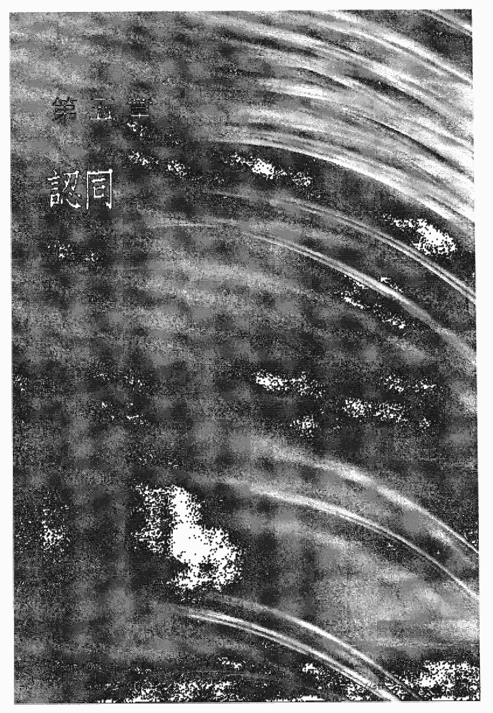
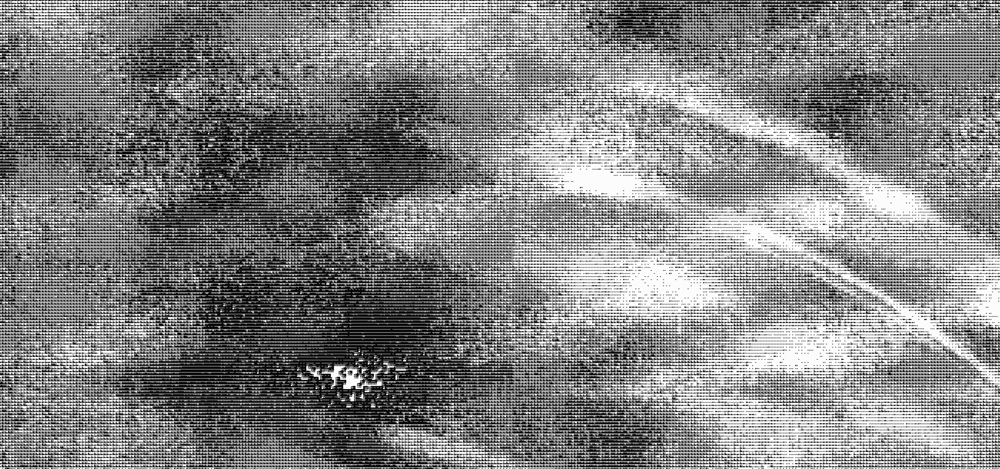

# St. Royal College
### 天使神秘学院

- 专业占卜预测机构
- 神秘学培训机构
- 水晶能量研究中心
- 神秘学资料库
- 官方微信：strcdts
- 微信公众平台：strc2011
- 读书交流QQ群：
    - 占星塔罗占卜师交流群：814594478（加入密码：PDF）
    - 神秘学其他综合群：659338717（加入密码：PDF）

微信号：strcdts
天使神秘学院

天使神秘学院 院长QQ：715104687

微信公众平台：strc2011

## 制作说明：

本书由《天使神秘学院》出重金从台湾购入的原版书籍扫描制作完成。为达到最好阅读效果，特地把原版书全部切开后，再经由专业扫描设备高精度扫描完成，并经过一张张的PS后期处理最终成书，其间花费大量的人力、物力以及时间，只为能给大家提供经济并优质的神秘学学习资料而努力。

本学院强力谴责某些机构和个人，把本学院花心血制作完成的电子书籍，包装后直接放在自家淘宝网上低价倾销的行为，以谋取不劳而获的经济利益。如果长此以往最终将无人愿意再为大家花心思制作电子书，那以后可能大家再无新书可读。

为让大家以后能够读到更多的好书，也为了本学院的良性发展。本学院恳请大家尽量做到如下几点：

- 一、尽量在本学院的网站购买电子书籍。
- 二、请勿用技术手段把电子书内的水印及加密去掉。
- 三、在收到电子书后小范围传阅即可，千万不要公开传播，更别挂到淘宝网上低价销售。

同时为答谢广大支持者，学院电子书将做如下调整：

- 一、学院会把一些早已收回制作成本的电子书折价销售。
- 二、最新制作的电子书籍会开放打印功能，大家购买后有条件的可自行打印成书。

天使神秘学院
2019年1月

未曾诞生
未曾死亡
只是
从一九三一年十二月十一日
到
一九九〇年一月十九日
拜访这个星球

## 目录

- 前言 7
- 第一章 自我 11
- 第二章 理想 33
- 第三章 成功 55
- 第四章 头脑 95
- 第五章 认同 128
- 第六章 权力 137
- 第七章 政治 159
- 第八章 暴力 171
- 第九章 治疗 189
- 第十章 静心 235
- 第十一章 爱 251
- 第十二章 无我 265
- 第十三章 开悟 289
- 第十四章 平凡 317
- 第十五章 自由 339

> 自我是一块冰山。
融化它！在深深的爱里融化它，
好让它能够消失，
而让你能够成为海洋的一部分。

— 奥修 —

## 前言

单纯对于人的自我（ego）而言不是什么挑战，困难才是一种挑战；而那不可能达成的事物则是真正的巨大挑战。透过你的野心、透过你所接受的挑战，就可以看出你希望自己的自我变得有多大；这是可以测量的。但是单纯对于自我而言是没有吸引力的。单纯对自我而言是一种死亡。

即使是在那些完全不需要复杂的地方，人们也选择了复杂，只因为一个简单的原因：复杂能够强化他的自我，让自我不断地滋长。然后他能够在政治上、在社会上、在任何地方都变得愈来愈重要。

整个心理学就在于如何让自我变得更为强壮。那些傻子，那些心理学家甚至还强调：人们需要一个强壮的自我。所以教育透过奖惩变成了一个赋予你野心的程式，驱使着你走上某个特定的方向。你的父母亲从一开始就对你怀抱过度的期望。他们认为或许自己能够诞生出一个亚历山大大帝，或是他们的女儿不是什么无名小卒，而是埃及女王的化身。你的父母从一开始就制约了你，而除非你能够证明你自己，否则你什么都不是。因此，单纯的人往往被认为是傻子。

## 奥修谈自我
The Book of Ego

到目前为止，成为一个单纯而天真的人并不是人类社会的目标。单纯而天真的人不可能是一个目标，因为你生来就是单纯、天真的！每一个孩子都是单纯、天真的，就像是一个干净的石版。然后父母开始在这个石版上书写着孩子应该要成为的样子。然后各个老师、教士和各方领袖则不断地强调，你必须变成某种大人物；否则，你就浪费了你的人生。

但事实刚好相反。

你是一个存在（being）。你不需要变成其他任何人。这就是单纯的意思：自在地安处于自己的存在里，而不走上那些永无止境「成为某人」的道路。

在那里，没有任何一个地方会让你觉得：「现在我的旅程结束了。我已经来到我所欲求的最高峰。」在整个人类历史上，没有人曾经达成这一点，只因为一个简单的理由，那就是人们一直在一个圆圈里打转。永远会有某个人或某些事情在你的前方。

你或许变成了美国总统，但是在阿里拳王面前，你会觉得自卑。你没有他那种动物性的力量。如果阿里拳王在隆纳·雷根的鼻子上揍一拳，雷根会摔倒在地上。你可以继续数着一、二、三，而雷根却没有办法站起来接受另外一拳。他只能等着你数到十，然后他才能够起来去医院。你或许可以变成一国的首相，但是面对爱因斯坦，你会看起来像个侏儒；不是一国的首相，而是一个侏儒。

生命是多面向的。你不可能顾及各个面向，而在各个面向上都成为第一。那是绝对不可能的；存在并不是这样运作的。

自我是人类的疾病。

那些既得利益者希望你持续地生病。他们不要你成为一个健康和完整的人，因为你的健康和完整会危及他们的既得利益。这就是为什么没有人想要成为单纯的，没有人想要成为是平凡的。然而，我的整个方向就在于：你需要对自己感到自在，你需要接受自己的存在。

「试着成为什么」是病态的，存在是健康的。但是你还没有品尝过单纯、完整、健康和喜悦的滋味。你的社会从来不曾允许你拥有如此的片刻，所以你唯一知道的方式就是自我的方式。

你被教导着要成为耶稣基督。有些社会的目标是每个人都要成为神。这真是一个疯狂的世界！你需要脱离所有这些程式。如果你想要享受、放松、感受到平静以及存在的美，那么你需要放掉这个虚假的自我。

我不想从你身上带走任何事物，我只想要带走你的自我，而它不论如何都只是一个假象。它不是一个事实，所以我并没有真的从你身上带走任何东西。而我要给与你的是你的存在。当然，我不需把它给与你；因为你已经拥有了它！你只需要有人摇晃你，唤醒你那无比美好的纯真。

没有什么真正需要你去冒险的。你现在追逐的只是一个你永远抓不到的影子罢了，但是，你却因此遗忘了所有那些跟着你来到这个世上的珍宝。在你的自我感到满足之前，死亡会先终结你。生命是如此的短暂，它不应该被自我这个愚蠢的游戏所摧毁。而问题只在于你是否了解这一点。

## 第一章

## 引言

## 自我是什么？

自我跟你的真实自己（real self）刚好是相反的。自我不是你。自我是社会所创造出来的欺骗，好让你可以持续地玩着玩具，而永远不会去询问那些真实的事情。那就是为什么我坚持：除非你放掉自我，否则你永远也无法了解你自己。

当你诞生时，你拥有你真实的自己。然后他们开始创造一个虚假的自己：你是基督徒，你是天主教徒，你是德国人，你是神所选择的子民，你应该统治这个世界等等诸如此类的事情。他们创造出一个「你是谁」的虚假概念。他们给你一个名字，然后他们在这个名字周围创造了野心和诸般制约。

然后慢慢地——因为那几乎花了你三分之一的人生——他们透过学校、教会、学院、大学来制造你的自我……当你从大学回到家里时，你已经完全忘记你天真的本质。你现在是一个带着金牌，顶尖、优秀的巨大自我。你现在准备好进入世界了。

自我有着各种欲望和野心，它总是想要凌驾于所有事情之上。你被自我所利用。而这让你甚至无法瞥见你真正的自己，而你的生命就在那里，在你的真实里。因此，自我只会制造出悲剧、痛苦、征战、挫折、疯狂、自杀、谋杀等种种的罪行。

一个真理的追寻者需要从这最初的一点开始：不论社会曾经告诉过你「你是谁」，丢掉它。你绝对不是它，因为除了你自己以外，没有人能够知道你是谁。你的父母无法知道，你的师长无法知道，你的牧师也无法知道。除了你自己，没有人能够进入你自己存在的私密之处。所以没有人知道关于你的事；不论他们对于你有什么样的描述，那都是错的。

把它放到一旁。拆除这整个自我！唯有摧毁这个自我，你才会发现你的存在。而这份发现是有史以来最伟大的发现，因为它开始了一趟全新的旅程，那是朝向最终喜乐、朝向永恒生命的神圣旅程。

你可以选择，你要不是选择挫折、悲剧与痛苦，这么一来你可以继续紧抓着自我，滋养它。或是你可以选择平静、宁静和喜乐，但是这么一来，你需要恢复你的天真。

孩子生来是没有自我的。自我是被社会、宗教和文化所教导出来的。你一定观察过幼小的孩子，他们不会说：「我饿了。」如果这个孩子叫做鲍勃，他会说：「鲍勃饿了。」鲍勃想要上厕所。他还没有「我」的感受。他会用第三人称来称呼自己。鲍勃是人们称呼他的方式，所以他也叫自己鲍勃。但是迟早有一天……当他日渐成长，你会开始教导他这样是不对的：「鲍勃是别人用来称呼你的名字；你不可以称呼自己为鲍勃。你是一个个别的人格，你必须学着把自己称为『我』。」

当鲍勃变成「我」的那一天，他就失去了实存的现实，而落入了一个幻象的黑暗深渊里。一旦他开始称呼自己为「我」的时候，那里有着一种全然不同的能量在作用着。现在，这个「我」想要成长，它想要变大；它想要这个，它想要那个。它想要在这个世界的阶层里爬升的愈来愈高。它想要拥有一个巨大的领土。

如果某人的「我」比你的更为巨大时，你的内在会开始产生自卑情结。你会做尽所有的努力让自己变得比那个「你」还更优越，比那个「你」更神圣，比那个「你」更巨大。现在，你的整个人生都被用来达成一件愚蠢的事情，而那件事情从一开始就根本不存在。你走在一条梦想的路上。你不断地前进，试着让你的「我」变得愈来愈巨大、愈来愈巨大。但是几乎你所有的问题都是由它所制造出来的。

甚至亚历山大大帝都有着很大的问题。在他内在的那个「我」想要成为这个世界的征服者，而他也几乎征服了这个世界。基于两个原因，所以我说的是「几乎」。在他所在的那个时代里，有一半的世界是未知的，美洲当时是未知的。第二点，他到了印度，但是他无法征服印度，他退回了印度边界。

他当时年纪不大，他才三十三岁。但是在那三十三年里，他就只是不停地战斗、战斗和战斗。他对战斗、杀戮、谋杀以及血腥已经感到厌倦与无聊了。他想要回家，他想要休息，但是即使这一点都无法完成。他不曾回到他在雅典的家。他在到达雅典的前一天就过世了；他只要二十四小时就可以到达雅典了。

但是，他整个人生的经验是：他成长的愈来愈富有、愈来愈巨大、愈来愈有力量，然而他也是极度的无助，他甚至无法让死亡延缓二十四小时……而他曾向他的母亲承诺过，一旦他征服了世界，他就会回来把全世界当成一项礼物放在她的面前。从来不曾有任何一个儿子为母亲做过这件事，所以他要做的是一件绝对与众不同的事情。

但是他觉得非常无助，他的身边围绕着最好的医生，而他们都说：「你没有办法活下来，在这二十四小时的旅程里……你会死的。你最好在这里休息，然后你或许还会有一点机会。但是，不要移动。即使你休息，我们都不确定你有多少的机会；你正在死亡。你已经愈来愈接近，愈来愈接近……接近的不是你的家，而是你的死亡；不是你的家，而是你的坟墓。」

「我们帮不上任何的忙，我们可以治愈疾病，但是我们无法治愈死亡。而这并不是疾病，你几乎就像是一个空的墨水匣。这三十三年来，你耗尽了生命能量四处征服这个国家、那个国家。你已经耗尽了你的生命。这不是什么疾病，这纯粹是你的生命能量已经耗竭了，而且是无意义的耗竭了。」

亚历山大是一个非常聪明的人。他是一个伟大逻辑学家和哲学家——亚里斯多德——的学生，亚里斯多德是他的私人教师。亚历山大在到达首都之前就过世了。在他死亡之前，他告诉他的总司令：「这是我最后的愿望，你要完成我这个愿望。」而他最后的愿望是什么呢？那是一个非常奇怪的愿望。那个愿望是：「当你把我的棺材送到墓地时，你要让我的双手悬在棺材的外面。」

这个总司令说：「这是什么样的愿望？双手总是放在棺材里的。没有人听说过，棺材送到墓地时，双手是悬在棺材外面的。」

亚历山大说：「我没有多少时间可以跟你说明了，但是简单的说，我要这个世界知道：我走的时候，我的双手是空的。我曾经认为我要变得愈来愈巨大，愈来愈富有，但是事实上，我变得愈来愈贫穷。当我诞生时，我是握紧拳头来到这个世上的，就好像我的拳头里握着什么东西一样。现在，在这个死亡的片刻，我没有办法握紧拳头离开。」

要保持拳头紧握，你需要活着，你需要能量。没有任何死人能够握紧拳头。谁能够握紧拳头呢？那个死去的人已经不在那里了，所有的能量都已经离开了，双手会自然而然地敞开。

「让每个人都知道：亚历山大大帝死的时候是双手空空的离去，就像是一个乞丐。」

但是我看不出来有谁曾经从他那双空无一物的双手里学到任何事情，因为在亚历山大之后，人们继续用不同的方式做着同样的事情。

人们的自我是他所有问题的源头；所有这些战争，所有这些冲突，所有这些嫉妒、恐惧和抑郁。人之所以觉得自己是个失败者，是因为他持续不断地和他人比较，而比较只会让每个人都感到受伤，而且是无比的受伤，因为没有人能够拥有一切。有些人比你漂亮，那让你觉得受伤；有些人比你有钱，那让你觉得受伤；有些人比你更有学识，那让你觉得受伤。有上百万件事情在那里让你觉得受伤，但是你不知道，让你受伤的不是那些事情，因为它们不会让我受伤。它们会让你受伤是因为你的自我。

自我持续不断地恐惧颤抖着，它非常清楚知道它是人造的，它是一个由社会所制造出来的人工制品，只是让你持续地奔跑、追逐着阴影。

这个自我的游戏，这个往上爬得愈来愈高的游戏，就是政治。

自我和它所有的游戏……婚姻是它的游戏，金钱是它的游戏，权力是它的游戏。所有这些游戏都是自我的游戏。到目前为止，这个社会一直在玩着游戏；它是一个持续不断、全球性的奥林匹克竞赛。每个人都战斗着往上爬，而其他每个人则是扯着他人的后腿，因为埃佛勒斯峰山顶没有足够的空间让每个人都站上去。

这是一种割喉式的竞争。而它对你已经变得如此的重要，以致于你完全忘记了这个自我是由社会、师长所植入于你的内在的。从幼稚园开始到大学，他们做的事情是什么呢？强化你的自我。你的名字后面有了愈来愈多的学位，你开始觉得自己变得愈来愈大、愈来愈大。

自我是最大的谎言，而你却把它当成是一个事实。不过，所有的既得利益者都非常赞同这一点，因为如果每个人都觉知到自己的无我（egolessness），那这个全世界的奥林匹克竞赛会直接结束。不再有人会想要爬上埃佛勒斯峰，他们会享受自己原来的面貌。他们会是欢欣的。

自我让你不停地等待：当你明天成功时，你就会感到欢欣。至于今天，当然你会觉得痛苦。但是你需要牺牲。如果你想要明天成功的话，今天你必须有所牺牲。你需要为成功而努力，因此，你做尽了各种的努力，你告诉自己那些都只是短暂的痛苦，在那之后你会是欢欣的。但是明天永远不会来临。它永远不会来。

明天意谓的就是那些永远不会来临的事物。它在延宕你的生命。那是一种很美好的策略，让你持续不断地痛苦。

自我没有办法在当下感到欢欣。它没有办法存在于当下；它只能够存在于未来与过去，而过去和未来是不存在的。过去已经不在了，未来还没有到来；这两者都是非实存的。自我只能存在于这种非实存的状态里，因为它自己就是非实存的。

在这个当下、纯粹的片刻里，你不会在自己的内在找到自我的，你只会发现一种宁静的喜悦，一种宁静而纯粹的空无。

「拥有一个个别的中心」这种概念是自我的根源。当一个孩子诞生时，他是没有一个自己的中心的。在母亲子宫里的九个月，孩子运作的方式就好像母亲的中心是他的中心一样，他与母亲不是分离的。然后他诞生了。

认为自己有一个个别的中心是实用主义的，否则生活会变得非常困难，几乎是不可能的。为了存活下来，为了能够在生活这场战争里生存挣扎，每个人都需要有一个「我是谁」的特定概念。没有人是没有任何概念的。但是事实上，没有人能够拥有任何的概念，因为在你最深的核心里，你是一个奥秘。对于它，你无法拥有任何概念。在最深的核心里，你不是一个个体，你是整体性的。

这就是为什么如果你问佛陀「你是谁？」他会保持沉默，他不会回答你。他没有办法回答，因为现在他不再是分离的。他是这整个整体。但是在平常的生活里，即使是佛陀也需要用到「我」这个字眼。如果他觉得渴了，他需要说：「我渴了。阿难，给我一点水，我渴了。」所以他持续使用「我」这个老旧意义的字眼。这个「我」是有意义的；即使它是一个假象，它仍然是有意义的。很多假象都是有意义的。

比如说，你有一个名字。那是一个假象。你来到这个世界上的时候是没有名字的，你并没有带着名字而来，你这个名字是别人给你的。然后透过持续不断地重复，你开始认同这个名字。但是它是一个假象。

然而当我说它是一个假象时，我并不是说它是不必要的。它是必要的假象，它是有用的；否则你要如何称呼人们呢？如果你想要写封信给某人，你要写给谁呢？

有一次，有个孩子写了一封信给神。他的母亲当时生病了，而他的父亲又过世了，他们缺钱，所以他要求神给他五十鲁比。

当这封信到达邮局时，邮局的人都不知道该怎么办，要把这封信送到哪里去呢？这封信是寄给神的。所以他们打开了那封信，他们为那个小男孩的处境感到难过，所以他们决定募集一些钱给那个男孩。他们募集到一些钱，不过男孩要求的是五十鲁比，而他们只募集到四十鲁比。

下一封又来了，再一次是写给神的，这次这个男孩写着：「亲爱的先生，下一次当你送钱来的时候，请直接把钱送给我，不要经由邮局。他们要收中介费的——十鲁比！」

如果大家都没有名字的话，事情会变得很困难。所以即使事实上没有人是有名字的，但名字仍然是一个美丽的假象，它仍然是有用的。它是有必要的，它让人们能够称呼你；「我」这个字眼是有用的，它让你可以称呼你自己，但是，它仍然只是一个假象。如果你深入自己的内在，你会发现这个名字消失了，这个「我」的概念也会消失；只留下一个纯粹的「在」、「存在」。

而这个存在不是分离的，它不是你的和我的；这个「在」是所有一切的「存在」。不论是岩石、河川、山峦还是树木，所有一切都包含在内。它是包含一切的，它不排除任何事。

## 第一章 自我

所有的過去、所有的未來、這個廣大無窮的宇宙，所有一切都包含於其中。你愈是深入你自己，你愈是會發現沒有一個「人」在那裡，沒有一個個體在那裡。在那裡，只有著純粹的整體性。在表面上，我們有名字、自我和各種的認同。但是當我們跳脫這個表面而進入中心時，所有這些認同都會消失。

自我只是一個有用的假象。你可以使用它，但是不要被它所欺騙。

問：我們是一直透過自我在運作，還是有些片刻我們是免於自我的？

自我是一個假象，所以有些片刻你是免於自我的。自我是一個假象，它之所以可持續存在是因為你持續地維繫它。一個假象需要大量的維護。真理不需要維護，這是真理所具有的美。但是一個假象？你必須持續不斷地為它塗上顏料，還要在這裡、那裡不時地支撐它，而它還會持續不斷地崩垮。每當你設法支撐起某一邊的時候，另外一邊又開始崩垮了。

而這就是人們終其一生不斷在做的事情，試著讓假象看起來跟真的一樣。如果你擁有較多的錢，你就會擁有一個比較大的自我，一個比窮人更為堅固的自我。貧窮人的自我是單薄的；他沒有辦法負擔的起一個較為厚重的自我。如果你成為一國的首相或是總統，那麼你的自我會膨脹到極致。然後你不再是行走在地面上。

## 奧修談自我
The Book of Ego

在我們的整個人生裡，這種對於金錢、權力、名聲的追尋，追尋這個或那個，其實都只是在追尋一個新的靠山，追尋一個新的支撐；某種程度上，那都只是為了維持假象的存在。在這段期間裡，你一直都知道死亡即將來臨，不論你做了些什麼，死亡都會摧毀它。但是人們仍然持續不斷地抱持著希望：別人或許會死，但是不是你。

而某個方面說來，這是事實。因為你總是看著別人過世，你從來不曾看過自己的死亡，所以那似乎是對的，而且也是合乎邏輯的。這個人過世了，那個人死亡了，而你永遠不會死。你總是在那裡為他們感到難過，你總是會到墓地去參與他們的告別式，然後你會再次回到自己的家裡。

不要被這點所欺騙了，因為所有那些人過去也做著同樣的事情。沒有人會是例外的，死亡遲早會來臨，而它會毀掉你的名字、名聲的這整個假象。死亡會來臨，抹去所有的一切；那時候甚至不會有任何足跡被留存下來。不論我們在生活裡持續地做了些什麼，那都像是在水上寫字一樣；那甚至不是在沙子上寫字，而是在水上寫字。你還沒有寫下些什麼，它就已經消失了。你甚至還來不及看清它；在你能夠看清楚之前，它已經消失了。

但是我們不斷地試著在水上建立這些城堡。也因為它是一個假象，所以它需要持續不斷地維護、持續不斷地努力，日以繼夜。然而，沒有人能夠二十四小時都如此地小心翼翼，所以有時候即使是你，在某些片刻裡，你還是會瞥見真實，而不受到自我的阻擾。

沒有自我的屏障，即使是你，有些片刻你仍然會記得事實。而每個人偶爾都會有這些片刻。

比如說，每天晚上當你深沉入睡時，你的睡眠是如此地深，你甚至沒有辦法作夢，這時候，自我就不見了；所有的假象消失了。深沉而無夢的睡眠像是一種小小的死亡。

在無夢的睡眠裡，自我完全消失了，因為當思考不存在、夢境也不存在時，你要如何繼續保持一個假象呢？不過這種無夢的睡眠非常的短暫。在八小時的健康睡眠裡，它不會超過兩個小時。然而光只是這兩個小時就能夠讓人恢復活力。如果你能夠有兩個小時深度的無夢睡眠，你在清晨會是新鮮、鮮活而富有朝氣的。生命會再一次令人感到興奮，這新的一天就像是一個禮物一樣，所有一切看起來都像是新的一樣，而這是因為現在你是新的。每件事情看起來是如此的美好，那是因為你處在一個美好的空間裡。

在你進入深度睡眠的那兩個小時裡發生了什麼事情呢？那是派坦伽利（Patanjali）所說的*sushupti*——無夢睡眠。在那裡，自我消失了，而自我的消失讓你的活力得以復甦、更新。隨著自我的消失，即使是在深度無意識的狀態裡，你仍然品嚐到了一絲神的滋味。派坦伽利說無夢睡眠和三摩地（*samadhi*）——佛的最終極狀態——是沒有多少差別的，雖然它們還是不一樣，它們的差異在於意識。在無夢的睡眠裡，你是無意識的，而在三摩地的狀態，你是有意識的，但是那個狀態是一樣的。你進入了神，你進入了宇宙的中心。你從外圍消失而來到了中心。而正是那份與中心的聯繫，使你如此地充滿活力。

因為自我是一個假象，所以它有時候會消失。而最重要的時間就是無夢的睡眠。所以記得：睡眠是極為寶貴的；不要因為任何理由而錯過它。

無我經驗的第二個重要來源是性、愛。而那已經被教士們所摧毀；他們譴責它，所以它已經不再是一個偉大的經驗。經歷過如此長久的嚴厲譴責，那些教士已經制約了人們的頭腦。所以當人們在做愛時，他們內在深處認為自己的行為是錯的，有一種罪惡感潛伏在某個角落。即使是最現代、最新潮、最年輕的一代仍然是如此。

在表面上，你或許叛逆地對抗這個社會；在表面上，你或許不再妥協。但是制約已經進入你的內在深處；那已經不是表面上叛逆的問題了。你可以留長頭髮，但是那不會有什麼用處。你可以變成一個嬉皮，不再洗澡，那也不會有多少用處。你可以在任何你可以想像和想到的方向上退出、脫離，但是那也不會有什麼用處，因為制約是如此的深，而所有這些都不過是表面上的方法。

數千年來，我們一直被教導著性是最大的罪惡。它已經變成我們血液、骨骼和骨髓裡的一部分。所以即使你意識上知道它沒有什麼問題，但是無意識裡，你會持續保持一種超然的感覺，你還是會感到害怕，你還是為罪惡感所困擾，你無法全然地進入性愛裡。

如果你能夠全然地進入性愛裡，自我會消失。因為在最高峰裡，在性愛的最高峰裡，你是純粹的能量，頭腦沒有辦法運作。因為那是一股如此密集的能量，頭腦迷失於其中，它不知道自己能夠做些什麼。平常的時候，你的頭腦能夠正常運作，但是每當有任何極度新鮮且極度富有生命力的事情發生時，頭腦就會停止。而性是最具有生命力的一件事。

如果你能夠深入性愛裡，自我會消失。這是性愛所具有的美。它就像是深沉睡眠，也是另外一個瞥見神的源頭，只不過它更為寶貴。因為在深度睡眠裡，你是無意識的。而在性愛裡，你是有意識的，你有意識卻沒有頭腦。

因此才會有譚崔這門偉大的科學。派坦加利和瑜伽在深度睡眠的這條路線上進行工作；他們選擇將深度的睡眠狀態蛻變成一種意識的狀態，使你能夠知道你是什麼。而譚崔則選擇性愛作為一個朝向神的窗口。

瑜伽的道路非常漫長，因為要把睡眠的無意識蛻變成有意識是非常艱辛的一件事，那可能要花費好幾世的時間……

譚崔選擇了一條較短的道路，最短的道路，同時它也是較為愉悅的一條道路！性愛能夠打開這個窗戶。它唯一需要的就是徹底消除教士曾經在你內在植入的制約。教士把那些制約植入你的內在，以便成為你和神之間的媒介、代理人，他們斷絕了你直接接觸神的機會。然後很自然地，你會需要其他人來幫助你和神有所聯繫，然後這時教士就擁有了巨大的力量。

一直以來，教士都擁有絕大的力量。

不論誰可以讓你接觸到力量、真實的力量，他就會變得有力量。而神是真實的力量，所有力量的源頭。一直以來，教士是如此的富有力量，甚至比國王還富有力量。而現在，科學家已經取代了教士的地位，因為現在科學家知道如何打開隱藏在大自然裡的那股力量。教士知道如何讓你與神連結，科學家知道如何讓你與自然有所連結。不過，教士需要先切斷你原有的聯繫，好讓你和神之間沒有任何的私人線路。他必須先掠奪你內在的資源，毒化它們。然後他能夠因此而變得極為有力，但是整個人類卻因此而變得無欲、無愛且充滿了罪惡感。

你需要完全放掉你的罪惡感。當你做愛時，想著祈禱、靜心和神。當你做愛時，你焚香、吟誦、歌唱和舞蹈。你的臥室應該是一座廟宇，一個神聖的地方。而性愛不應該是一件匆忙的事情。你讓自己深入其中；盡可能優雅而緩慢地品嘗它。然後你會非常的驚訝，你擁有這把鑰匙。

神不會在沒有給你鑰匙的狀況下把你送到這個世界上來。但是你需要使用那些鑰匙，你需要把它放到鎖裡，轉開它。

愛是另外一個現象，另外一個極具潛能的機會，在那裡自我消失了，而你是有意識的，充滿意識的、脈動著、振動著。你不再是一個個體，你消失在整體的能量裡。

慢慢地、慢慢地，讓這成為你生活的唯一方式。在愛的巔峰裡所發生的事情必須成為你的紀律，不只是一個經驗，而是一個紀律。然後不論你在做些什麼，不論你在何處行走……

清晨當太陽升起時，讓自己擁有同樣的感覺，與存在交融。當你躺在地面上，天空充滿了星辰時，再一次擁有同樣的交融。當你躺在大地上時，感覺和大地合而為一。

慢慢地、慢慢地，性愛應該會帶給你一個線索，讓你知道如何與存在共處在愛裡。然後你會知道：自我是一個假象，然後你會把它當成一個假象來使用。如果你把它當成假象來使用，那就不會有危險。

還有少數的某些片刻裡，自我會自己鬆脫。像是在極度危險的片刻裡：你開著車，突然間你看到意外就要發生了。你失去了對車子的控制，情況看起來你根本沒有任何可以挽救自己的機會。你就要撞毀在樹下或是在一輛迎面而來的卡車裡，或是墜入河裡，事情就要發生了。在那些片刻裡，自我會突然間消失不見。

那就是為什麼危險的情境有著莫大的吸引力。人們會攀登埃佛勒斯峰，因為那是一個深度的靜心，雖然他們可能知道也可能不知道這一點。登山其實有著極度的重要性。攀登高山是危險的，但其中的危險愈多，它也愈是美麗。因為你會在其中有一些瞥見，一些無我的偉大瞥見。每當危險就要發生的時候，頭腦會停止。頭腦只能在你毫無危險的時候進行思考；在危險之中，它無話可說。危險會讓你變得自發，而在那樣的自發之中，你突然知道你不是那個自我。

或者……不同的人會有不同的方法，因為人各有不同。如果你有一顆真誠的心，那麼美能夠打開你的這道門。光是看到一個美麗的女人或是男人經過，光是一個片刻的美閃現而過，突然間，自我消失了。你被淹沒了。

或是你看到池塘裡的一朵蓮花，或是落日，或是飛翔的鳥兒，任何事情都可能引發你內在的敏感性；不論什麼事情，如果它能夠在瞬間深深地充滿你，以致於你忘記了自己，讓你存在的同時又像是不在一樣，如同你拋下了自己，這時候，自我同樣會鬆脫。自我是一個假象；你需要時時帶著它。如果你忘記了，它就會鬆脫。

幸好有這些自我鬆脫的片刻存在，所以你能夠瞥見真理和真實。因為這些瞥見，宗教還尚未死亡。宗教尚未消逝不是因為那些教士，事實上他們做盡了一切來扼殺宗教。宗教之所以尚未死亡，並不是因為那些所謂宗教上的虔誠，不是因為那些去教會、清真寺和寺廟的人，他們其實一點也不虔誠，他們只是偽裝者。

宗教之所以尚未死亡，是因為這些自我鬆脫的偶然片刻幾乎每天或多或少都會發生。你需要讓自己愈來愈注意到這些片刻，讓自己愈來愈能夠吸收這些片刻的精神，允許它出現的愈來愈多，創造一些空間，讓它們得以出現的愈來愈多。這才是追尋神的真正方法。當你不在自我之中，你就是在神裡面。

你的內在有三個你：第一個你是人格。人格這個字眼來自於一個希臘字根「persona」。

在希臘戲劇裡，他們通常會使用面具，而聲音來自於面具後方。「sona」意指聲音，而「per」則是指「透過面具而來的」。你不知道真正的臉孔是什麼樣子，你不知道面具後面的演員是誰。有一個面具在那裡，然後有一個聲音透過這個面具出現了。看起來就像是聲音是來自於那個面具一樣，但是你不知道面具後面真正的臉孔是什麼樣子。「人格（personality）」這個字眼很美，它來自於希臘戲劇。

只是，在希臘戲劇裡他們只有一個面具，而你卻有許許多多個面具，一層又一層的面具，就像是一層又一層的洋蔥一樣。如果你拿掉一層面具，那裡還有另外一層面具，如果你把那層面具拿掉，還會有另外一層面具。而你可以持續不斷地挖掘再挖掘，而你會詫異於自己有這麼多的面具。如此之多！好幾世以來，你一直不斷地收集著各種面具。它們是有用處的，因為你經常需要改變你的面具。

當你跟佣人說話時，你不能使用那個和老闆說話時所用的面具。他們兩個人可能都在同一個房間裡，但是當你看著佣人時，你會用某一個面具，而當你看著你的老闆時，你需要用另外一個面具。你持續不斷地更換面具，那幾乎已經變成是一種自動化反應，你不需要去更換它，它會自行更換。你看著老闆時，你微笑。而當你看著佣人時，微笑就消失了，你變得嚴厲——就像是老闆對你一樣的嚴厲。然後當你的老闆面對他的老闆時，他會微笑。

在一個短短的片刻裡，你可能會更換你的臉孔許多次。所以，一個人需要非常非常的警覺，才能知道自己有多少張臉孔。這些臉孔是數不清的，它們是數不完的。

這是你的第一個你，虛假的你。或者，你可以把它稱為自我。它是社會所賦予你的，它是來自於社會的禮物——來自於政客、教士、父母和師長。他們給了你許多臉孔，以便你的人生能夠是順利的。他們帶走了你的真實，他們給了你一些替代品。也因為這些替代品，所以你不知道自己是誰。你沒有辦法知道自己是誰，因為這個臉孔的更換是如此的快，而它們的數量又是如此之多，連你都沒有辦法信任自己。你自己也不知道哪一個臉孔才是你的。

事實上，所有這些臉孔都不是你的。

> 而禪宗說：「除非你知道你最初始的臉孔，否則你無法知道佛是什麼。」因為佛是你最初始的臉孔。

你誕生的時候是一個佛，而你卻生活在一個謊言裡。

你需要放掉這個來自於社會的禮物。這就是門徒和點化的意思。不論你是一個基督徒，還是一個印度教徒，還是一個回教徒，你都需要放掉那個臉孔。因為那不是你自己的臉——它是其他人給你的，你受到它的制約。而甚至不曾有人徵求過你的意見，你也不曾要求過。

它是被強加在你身上的，那是一種暴力。

所有的父母都是暴力的，所有的教育系統都是暴力的。因為他們不曾真正注意過你。他們有一種推測性的概念，他們認為自己已經知道什麼是對的。然後他們把這個「對」的東西加諸在你身上。你感到痛苦而侷促不安，你的內在尖叫著，但是你是無助的。孩子是如此的無助又如此的纖細，人們可以用各種方法來捏塑他的形狀。而那正是社會所做的事情。在孩子擁有足夠的力量之前，社會已經用一千零一種方法來癱瘓他、毒化他，讓他變得殘廢。

因此，當你想要擁有真正的宗教精神時，你需要放掉那些宗教。當你想要真正地與神連結時，你會需要放掉所有關於神的觀念型態。當你想要真正地認識自己是誰的時候，你需要放掉所有人們給過你的答案。所有那些外借而來的都需要被燃燒殆盡。

這就是為什麼禪宗被定義為：「直指人心，見性成佛，不立文字，教外別傳。」

教外別傳：《可蘭經》無法把真理傳遞給你，《法句經》也無法，《聖經》也無法，猶太法典沒有辦法，薄伽梵歌也沒有辦法。沒有任何經典能夠把真理傳遞給你。而如果你相信經典，你就會錯過真理。

真理就在你的內在。你需要從內在邂逅真理。「見性成佛。直指人心。」你不需要去到任何地方，而且不論你去到哪裡，你都會是一樣的，所以那有什麼意義呢？你可以到喜馬拉雅山，但是那不會改變任何事情。你會帶著你所有的一切到達那裡。所有那些你曾經成為的，所有那些你曾經建構起來的，你還是會帶著你所有的人為造作之處。你諸多人造的臉孔，你外借而來的知識和你的經典，所有這些都會持續不斷地纏繞在你的內在。即使獨自坐在喜馬拉雅山的洞穴裡，你也不會是單獨的。那些師長會在那裡圍繞著你，那些教士、政客和你的父母還有整個社會。你或許看不見他們，但是他們仍然會擁塞充塞於你的內在。而你仍然是一個基督徒或是一個印度教徒，或是一個回教徒。你還是會持續不斷地像鸚鵡一樣說著某些話語。情況不會因此而有任何改變，它無法改變。

我看过一个很美的巴伐利亚故事；你可能也听过这个故事。静心冥想它。

## 【一个来自慕尼黑的天使】

阿洛伊斯·辛格尔（Alois Hingerl）是慕尼黑车站的第一百七十二号行李搬运工。有一天当他非常认真地工作时，他突然死了。两个小天使辛苦地把他背到天堂，圣彼得在那里欢迎他并且告诉他，从现在开始他的名字是天使阿洛伊修斯（Aloisius）。圣彼得给了他一把竖琴并且告诉他天堂的规则，他说：“从早上八点到中午十二点，你负责欢呼。从中午十二点到晚上八点，你负责唱颂和撒那（Hosanna）。”

阿洛伊修斯问：“这是怎么一回事？从早上八点到中午十二点，我欢呼？从中午十二点到晚上八点，我唱颂和撒那？那……嗯……我什么时候可以喝酒？”

彼得有点恼怒地说：“时间到了，你就会有得吃了。”然后他就离开了。

阿洛伊修斯抱怨着：“我的老天啊！那是多么无聊的事！我要从八点欢呼到十二点？我还以为天堂是不用工作的。”但是，他最后还是坐在一朵云上并且按照彼得所说的开始唱起歌来：“哈里路亚！哈里路亚！”

然后，当一个精力充沛的智天使飞着路过时，阿洛伊修斯大声喊着：“嘿！来根烟怎么样？来嘛！让我们来根烟嘛！”但那个智天使对这个粗俗的提议感到厌恶。祂小声地说着赞美上帝的话语，然后就离开了。

阿洛伊修斯很生气地叫着：“哈！这是什么样的一个白痴啊？如果祢没有烟，祢就是没有，至少也说句话，不是吗？祢这个乡下土包子。我的老天，祂们这里到底有些什么样的人啊！啊！我到底是在哪里啊！”但是，他还是再一次坐在云端继续欢呼着。

但是他的欢呼中有着愤怒，他是如此地大声吼叫着，以致于隔壁的天父从午觉中醒来，祂惊讶地问：“这些噪音是哪里来的？”祂把圣彼得叫过来，圣彼得很快地跑过来，然后祂们同时听到天使阿洛伊修斯那恐怖的欢唱声：“哈里路亚！狗屎！哈里路亚！放屁！哈里路亚！他妈的！哈里路亚！”圣彼得急忙把阿洛伊修斯拖到天父面前来。

天父看着他好长一段时间，然后说：“喔！我懂了！一个来自慕尼黑的天使。那跟我想的一样！现在，告诉我，这些鬼吼鬼叫是怎么一回事？”

这正好是阿洛伊修斯一直在等待的机会，他是如此的生气，于是他一股脑全说了：

“我不喜欢这一切！我不想有翅膀！我不想诵唱赞美的歌！我不喜欢甘露，我只要啤酒！让我说得更清楚一些：我不想唱歌！”

天父说：“圣彼得，现在这种方式不会管用的。但是我有个想法，我们应该让他当传讯者，把天堂的建议传送给巴伐利亚政府。这样他每个星期可以飞去慕尼黑一次或两次，然后他的美好灵魂能够因此而获得安息！”

当阿洛伊修斯听到这点时，他非常的高兴。很快地，他开始了他的第一次递送工作，那是一封信，所以他飞到地球上。

当他再一次感受到脚底下的慕尼黑土壤时，对他来说，他现在才是在天堂。然后他依照着老习惯到了皇家啤酒屋，他发现常坐的位子正空着等著他，熟悉的好心服务员凯西也在那里，所以他要了一杯啤酒，然后再一杯，再一杯……他在那里坐下来，一直到今天他还坐在那里。

那就是为什么巴伐利亚政府到今天仍然还没收到神圣的指引。

不论你去到哪里，你仍然会是一样的。不论是在天堂还是在喜马拉雅山上。你不可能是其他的样子。世界并不在你的外在；而你就是世界。所以无论你去到哪里，你都会带着你的世界。

真正的改变不是来自于地点的改变，真正的改变不是来自于外在的改变，真正的改变是内在的。而真正的改变是什么意思呢？我并不是说你必须改善（improve）自己，因为改善只会是另外一个谎言。

改善表示你在持续不断地修饰你的人格。你可以让它变得非常的美——但是记住：它变得愈美，它就愈危险，因为你会变得更难以放掉它。

那就是为什么有时候罪人会变成圣人。但是你那些所谓的高尚人士从来不会成为圣人。他们无法变成圣人——因为他们有一个极度宝贵的人格，一个经过极度修饰而闪亮的人格，他们投注了这么多的心力在人格之中；他们整个人生就是一场修饰。现在，要放下这些美丽人格的代价实在太高了。一个罪人可以放下他的人格，因为他不曾投注多少心力在其中。事实上，他的人格让他感到厌烦，它是如此的丑陋。但是，一个受人景仰的人怎么能够轻易放下他的人格呢？他为它做了这么多的努力，他因为得到了这么多的好处。他的人格让他愈来愈受人景仰，他爬得愈来愈高，他已经到达了成功的顶端。对他而言，要停止攀爬成功的阶梯是很困难的一件事。那是一个没有尽头的阶梯，你可以永无止境地往上爬。

亨利·福特临死之前，有人问过他一个问题，当时他还在规划新的工厂、新的公司。有人问他：“先生，你就快要死了！医生说你没有几天好活了。他们甚至无法确定你还剩下多少时间；你可能今天或是明天就要死了。所以，现在这是为了什么呢？你一辈子都在做这些事。你已经拥有这么多的钱，它超过你能够花用的，还有很多钱是你用不到的。你为什么还……”

## 奧修談自我
The Book of Ego

要繼續開設新公司呢？」

有一個片刻，亨利。福特停下他的規劃，他說：「聽著。我沒有辦法停下來。那是不可能的。只有死亡能夠讓我停止，我自己沒有辦法停止。只要我還活著，我就會不斷地持續，達成更大的規模。我知道這沒有意義，但是我停不下來！」

當你在這個世界上功成名就時，你很難停下來。當你變得富有時，你很難停下來。當你變得有名時，你很難停下來。你的人格愈是精煉，你也就愈是執著。

所以我並不是說你要改善自己。所有偉大的師父，從佛陀到白隱（Hakuin），從來沒有人提過改善這件事。因此，你要小心那些所謂的「改善」書籍。美國市場充斥這類型的書籍，你要非常小心。因為改善不會帶領你到達任何地方。問題不在於改善，因為透過改善、受到改善的是謊言，受到改善的是人格，它只會因此而變得更為精煉、更為微妙、更富有價值、更珍貴，但那不是蛻變（transformation）。

蛻變不會經由改善而來，而是透過全然地放掉人格。

謊言無法成為真理。沒有什麼方式能夠改善謊言，讓它成為真理。它會仍然是謊言。它或許會看起來愈來愈像真理，但它仍然是謊言。而當它看起來愈像真理的時候，你對它也就愈熱中、愈是深入於其中。謊言可以看起來非常像是真理，以致於你甚至會忘記它其實是個謊言。

謊言告訴你：尋找真理。改善你的個性、人格。尋找真理，成為這個、成為那個。謊言會持續不斷地給你各種新的程式：只要完成這件事，然後所有一切都會很好，你會永遠一直快樂下去。做這件事情，做那件事情。這件事情失敗了？不用擔心，我還有其他的計畫。謊言會持續不斷地提供你各種計畫，而你會持續不斷地投入這些計畫，浪費你的生命。

事實上，尋找真理這件事情也是來自於這個謊言。你或許很難了解這一點，但是你需要了解，對於真理的尋找來自於謊言。那是謊言保護它自己的方式，它甚至要你去尋找真理，所以，你怎麼能夠對你的人格生氣呢？你怎麼能夠說它是謊言呢？它帶給你動力，它推動你，它堅持你要去尋找真理。

但是，尋找代表的是遠離。真理就在這裡，但是謊言卻催促你到達那裡。真理就在此刻，而謊言說它在「另外一個時刻」和「另外一個地方」。謊言一直談論著過去和未來，它從來不談論當下。但是真理就在當下。在這個瞬間！它就在此時此地。

所以第一個「你」是謊言，是行為。它是圍繞著你的虛假人格。它是公眾臉孔，它是虛假的。它是一種欺騙。社會把它強加在你的身體，而你也非常的配合。你需要不再配合這些社會的謊言。因為只有當你完全赤裸裸時，那才是你的。所有的衣服都是社會的。所有你認為自己是誰的概念與認同都是社會的，都是別人給與你的。他們這樣做有他們的動機，那是一種微妙的剝削。

真正的剝削不是經濟上或政治上的，真正的剝削是心理上的。那就是為什麼到目前為止所有革命都失敗了。到目前為止，沒有任何革命曾經成功過。為什麼呢？因為他們從來不曾洞悉：最深的剝削是心理上的剝削。他們只是不斷地改變那些表面上的事物。從資本主義社會變成共產主義社會，但是那不會帶來任何差別。從民主的社會變成獨裁的社會，那也不會帶來任何差別。這些都只是表面上的變化，就像是上一層粉一樣，但是內在深處，那個結構還是一樣的。

什麼是心理上的剝削？心理上的剝削是：沒有人能夠當他自己，沒有人可以接受他／她自己原來的面貌。沒有人是受到敬重的。但是如果你無法接受人們如他所是的樣子，那你怎麼能夠尊敬他呢？如果你必須把某些事情強加在他身上，然後你才敬重他的話，那你所敬重的是你所強加在他身上的那些事物。你無法敬重他現在的面貌，你無法敬重他的赤裸，你無法敬重他的自然，你無法敬重他的自發性，你也無法敬重他真實的微笑和淚水。你敬重的是虛假、偽裝、行為。你敬重的是他們的表演。

你需要全然放掉這第一個「你」。就這一點，佛洛伊德大大地協助人們覺知到人格以及意識頭腦的虛假。他所帶來的革命遠比馬克思的革命還更為深入，他所帶來的革命比所有其他革命都更為深入。它非常的深，雖然它還不夠深。

佛洛伊德所觸及的是第二個你。那個被壓抑的你、直覺的你、無意識的你。這些都是社會所不允許的，社會強迫你把它們鎖在你的內在。因此，它們只會在夢裡出現，它們只會以象徵的形式出現，或是只有當你喝醉時它才會出現，只有當你不受到控制的時候它才會出現。否則，它們仍然距離你相當遙遠。但是，它是比較真實的，它不是虛假的。

佛洛伊德做了許多事情讓人們覺知到這個「你」。除了人本心理學，還有一些成長團體、面質團體與其他活動都曾經帶來極大的幫助，讓你覺知到自己內在那些正在嘶吼著、被壓抑著、被壓碎的部分。那是你活生生的部分。那是你真正的生命、自然的生命。宗教把它譴責為你的動物性，他們譴責它是罪惡的根源。但是，它不是罪惡的根源，它是生命的根源。它並不比意識低等。很明確的一點是，它比意識更為深遠，但是它不比意識低等。

就算它是動物性的，它也沒什麼不對。動物是美麗的，樹木也是。它們仍然赤裸地活在它們極度的單純裡。它們尚未被任何教士和政客所摧毀。它們仍然是神的一部分。只有人類已經迷失了方向。人類是這個地球上唯一不正常的動物——否則，所有動物都是單純自然的。也因此，它們是喜悅、美麗和健康的。也因此，它們是富有活力的。難道你不曾注意過嗎？當一隻鳥兒飛翔時，你難道不曾感到嫉妒嗎？你曾經看過鹿群在森林裡奔跑嗎？你難道不曾嫉妒過那樣的活力、那樣純粹能量上的喜悅嗎？

孩子，你難道不曾嫉妒過小孩嗎？也許正因為你是如此地嫉妒孩子，所以你才不斷地譴責孩子的幼稚。你不斷地譴責他們。蒙太古（Montague）是對的，與其對人們說「不要這麼幼稚，你應該對他們說「不要這麼像個成人（adultist）。」他是對的，我非常同意他。

孩子是美麗的，成人是醜陋的。成人不再是流動的，他在許多方面都是堵塞的。他是凍結的，他是遲鈍和死寂的。他已經失去了熱情，他已經失去了熱忱，他只是苟延殘喘著。他是無趣的，他失去了對於奧秘的感受力。他不再會感到驚訝，他已經遺忘了驚奇的語言。對成人而言，不再有什麼是奧秘的。他擁有各種的解釋，所以奧秘已經不復存在。也因此他失去了詩意、舞蹈，還有許多其他極為珍貴的事物，他已經失去了所有那些讓生命變得富有意義與重要性的事物，那些讓生命具有滋味的事物。

這個第二個「你」比第一個「你」來得寶貴許多。也因此，我反對所有的宗教，我反對所有的教士，因為他們執著於第一個你——那個最表面的你。你需要來到第二個「你」。但是這第二個「你」還不是終點——那是佛洛依德未能到達的領域。那是人本心理學未能觸及的地方，雖然人本心理學比佛洛依德稍微又更深入了一些，但是它還尚未深入到能夠觸及第三個「你」。

你還有第三個「你」，那才是真正的你，你的本來面貌，它超越了第一以及第二個「你」。它是超越性的（transcendental）。它是佛性。它是不受分割的純粹意識。第一個你是社會的，第二個你是自然的，第三個你則是神性的。

你要記住，我並不是說第一個「你」是完全無用的。當第三個「你」存在時，那麼你也能夠善用第一個「你」。如果第三個「你」存在的話，那麼你也可以善用第二個你。但是，只有當第三個「你」存在時，事情才會是如此。當中心能夠順暢運作時，那麼邊緣也不會有什麼問題，外在也不會有什麼問題。但是，沒有中心卻只有外圍的話，那只是一種死亡。

而這正是發生在人類身上的情況。這也是為什麼很多西方人認為生命是無意義的。但是生命並不是無意義的。只是你已經和你的源頭，和那個意義升起的源頭失去了聯繫。

就像一棵樹和它的根失去了聯繫一樣。所以它的花朵不再綻放，枝葉開始消失，葉片開始掉落，不再有新生的葉子，樹木的汁液也不再流動。這棵樹變得死寂，這棵樹正在死亡。

然後這棵樹開始哲學性的思考，它可能會成為一個存在主義者，它可能會成為一個沙特或是某個哲學人物，然後這棵樹開始說：「生命裡是沒有花朵的，生命裡是沒有芬芳的，生命裡也沒有鳥兒。」然後有一天，這棵樹甚至會認為事情一直都是如此，它會認為過去那些古老樹木說它們擁有花朵，那其實只是它們在愚弄自己，那只是它們的想像而已。然後這棵樹會說：「事情一直都是如此，春天從來不曾來臨，人們只是在幻想。那些諸佛也只是幻象和想像，什麼所謂的花朵綻放、巨大的喜悅、鳥兒的來臨和陽光都只是一種想像和幻想。事實上，什麼都不存在。一切都只是一種意外，生命是沒有意義的。」

然而，生命沒有意義、生命裡沒有花朵綻放的真實原因，並不是花朵不再存在，或是那些芬芳只是一種幻想，而是這棵樹已經和它自己的根失去了聯繫。

除非你深深地根植於你的佛性，否則你是不會綻放的，你是不會唱歌的，你也不會知道什麼是慶祝。而如果你不知道什麼是慶祝，你要如何知道神呢？如果你已經遺忘了如何去歌唱與愛人，那麼神就已經死了。並不是神本身死亡了，而是你內在的神死亡了；死亡的是你內在的神，你的樹枯竭了，樹的汁液消失了。你需要再一次找到你的根。而你要去哪裡找到你的根呢？你只能在此時此地找到你的根。

## 第一章 自我

有一隻小北極熊問他媽媽：「我爹地也是一隻北極熊嗎？」
「當然，你爹地是一隻北極熊。」
這隻小熊停了一會之後說：「媽咪，告訴我，我爺爺也是一隻北極熊嗎？」
「是的，他也是一隻北極熊。」
一段時間過後，這隻小熊仍然持續地問他母親：「那，我的曾祖父呢？他也是一隻北極熊嗎？」
「是的，他也是一隻北極熊，但是你為什麼要問這些問題呢？」
「因為我覺得很冷。」
奧修，他們告訴我，我的父親是一隻北極熊；他們告訴我，我的祖父是一隻北極熊；他們告訴我，我的曾祖父是一隻北極熊。但是，我覺得很冷。我要如何改變這一點呢？
我剛好認識你的父親、你的祖父，我也剛好認識你的曾祖父；他們也都覺得他們的母親也都跟他們說過同樣的故事：你的父親是一隻北極熊，你的祖父是一隻北極熊，你的曾祖父也是一隻北極熊。

## 第二章 理想

如果你覺得冷，你就是覺得冷。這些故事是幫不上忙的。這個故事只證明了一點：連北極熊也會覺得冷。正視這個事實，而不要回溯傳統，不要回到過去。如果你覺得冷，你就是覺得冷。至於「你是一隻北極熊」，這一點無法為你帶來任何慰藉。

人們曾經接受過這類的慰藉。當你就要死亡時，你就是要死亡了；就算有人來對你說：「不要害怕；靈魂是不朽的。」你還是即將要死亡。

我曾經聽說過：有一個猶太人在路上跌了一跤，然後他就要死了；他的心臟病發作了。這時候，一個天主教的教士來了，在不知道這個人是誰的狀況下，他靠近這個即將過世的人，對他說：「你相信嗎？你願意說你相信三位一體——聖父、聖靈與聖子耶穌基督嗎？」

這時候，這個即將要死亡的猶太人張開眼睛說：「我就要死了，而他卻在說這什麼奇怪的話？我跟這三位一體有什麼關係？我就要死了。你到底在胡扯些什麼？」

一個人就要死了，而你安慰他「靈魂是不朽的」。這種慰藉不會有用的。某個人正在煩惱的時候，你對他說：「不要煩惱，那只是心理上的。」這能有什麼幫助嗎？你只會讓他更為煩惱。這些理論不會有多少幫助的，這些理論被發明出來，只是為了安慰人們、欺騙人們。

如果你覺得冷，你就是覺得冷。與其問你父親是否是隻北極熊，你還不如做一些活動。

跳一跳、跑一跑或是做一做動態靜心，然後你就不會那麼冷了。這點是我可以跟你保證的。忘掉那些關於你父親、你祖父和你曾祖父的事情。就是傾聽你現在的事實。如果你覺得冷，那麼就是做一些事情。總是有事情是你現在用的這種方式是不管用的，你走錯方向了。你不斷地詢問又詢問，當然那個可憐的母親只好不停地安慰你。

這個問題很美，它非常有意義，它也非常重要。這就是人類痛苦的原因。人們傾聽著痛苦，看著痛苦，但是卻不試著在問題之餘尋找化解之道（solution）。如果你直接正視問題的話，你總是在那裡找到化解之道。洞悉這個問題；你要尋找的不是答案（answer）。

比如說，你可以一直持續地問：「我是誰？」你可以去找基督徒，他會告訴你：「你是神的兒子，而神非常愛你。」你會覺得困惑，因為神要如何愛你呢？

一個教士告訴木拉。那司魯丁（Mulla Nasrudin）：「神非常地愛你。」他說：「祂要如何來愛我呢？祂甚至不認識我。」然後這個教士說：「這就是為什麼祂能夠愛你。就是因為我們認識你，所以我們無法愛你——那太難了。」

或是你可以去詢問印度教徒，他們會說：「你就是神本身。」你不是神的兒子，而是你就是神本身。但是你還是有著頭痛、偏頭痛，你無法理解神怎麼會有偏頭痛……所以這還是沒有解決問題。

如果你想要問：「我是誰？」那麼，不要去找任何人，就是靜靜地坐著，深深地詢問你自己的存在。讓這個問題迴響著。不是一種語言上的方式，而是以一種存在性的方式，讓這個問題像是一支箭一樣地在那裡穿透你的心：「我是誰？」然後就只是跟隨著這個問題。

而且，不要急著回答它，因為如果你回答它的話，那個答案必然是來自於他人，來自於某些教士、某些政客和某些傳統。不要根據你的記憶來回答這個問題，因為你的記憶是外借而來的。你的記憶就像是一部電腦一樣，非常的死板。你的記憶跟知曉毫無關係。它是別人填塞給你的，所以當你問「我是誰」，而你的記憶回答說「你是一個偉大的靈魂」時，你要小心。不要掉入陷阱裡。你需要拋掉所有那些垃圾；它們都是腐朽的。

就是不斷地問著：「我是誰……我是誰……我是誰……」然後有一天你會發現，那個問題也會消失，只剩下一份「我是誰」的飢渴在那裡。這時候，它不再是一個問題，而是一份飢渴。然後你的整個存在會和這份「我是誰」的飢渴一起悸動著。

然後有一天你會發現，連「你」都消失了，只有一份飢渴在那裡。然後在這個如此具有張力與熱情的存在狀態裡，突然間，你領悟到有這些事情爆發了。突然間，你直接面對著自己，你知道了你是誰。

問你父親「我是誰」是沒有用的。他自己都不知道他是誰了。問你祖父或是曾祖父也不會有用的。不要去問任何人！不要問你的母親，不要問這個社會，不要問你的文化，不要問你的教育體系。

而是問你自己內在最深的核心。

如果你真的想要獲得答案，往內走；唯有你內在的經驗裡，改變才會發生。

你問說：「我要如何改變這一點？」你沒有辦法改變它。首先你必須面對你自己的現實，然後那個面對與正視會改變你。

一個記者試著從一個住在州政府老人之家裡的老人身上，採訪到某個人們會感興趣的故事。

這個魯莽的記者問說：「老爹，如果你突然間收到一封信，告訴你某個你遺忘的親戚留給了你五百萬元，你會有什麼感覺？」

回答來的非常緩慢：「年輕人，我依然還是九十四歲啊。」

你了解了嗎？這個老人在說：「我現在九十四歲。就算是我得到了五百萬元，我要拿它做什麼呢？我依然還是九十四歲啊。」

佛陀所說的話、馬哈維亞所說的話，還有耶穌所說的話都不會對你有所幫助的。你覺得冷——你仍然還會是九十四歲。即使這個世界上的所有知識都灌注到你的頭腦裡，那也不會有所幫助：你仍然還是會覺得冷——你仍然還會是九十四歲。除非你內在出現了某些經驗，某些活生生的經驗，能夠蛻變你的存在，讓你再度變得年輕，再度變得充滿活力，否則它是沒有什麼價值的。

所以不要詢問他人。而這是你要學的第一課：詢問你自己。另外，因為別人已經把答案放在那裡了，所以那些答案會不時地出現，所以你還要記得另外一件事：避開別人的答案。問題是你自己的，所以別人的答案不會對你有任何幫助。

佛陀喝過水，所以他滿足了。耶穌也喝了水，所以他是喜樂的。我也喝過水，但是這怎麼能夠協助你的飢渴呢？你需要自己去喝水。

曾經有這樣一件事情發生過，一個偉大的蘇菲神秘家被一個國王邀請到他的宮廷去為他祈禱。這個神秘家來了，但是他拒絕為國王祈禱。他說：「這是不可能的。我要如何為你祈禱呢？」這個神秘家繼續說：「有些事情是人們只能夠為自己進行的。比如說，如果你想要和一個女人做愛，你必須自己進行，我沒有辦法替你進行。如果你要擤鼻涕，你也必須自己進行，我沒有辦法替你擤鼻涕；那不會有任何幫助的。同樣地，祈禱也是一樣。我要如何替你祈禱呢？所以，你自己祈禱。然後我可以為我自己祈禱。」

然後他閉上眼睛，進入偉大的祈禱裡。

這就是我能做的事情。對我來說，問題已經消失了，但是它不是因為別人的答案而消失的。我不曾詢問過別人。事實上，你全部的努力都在於放掉所有那些別人慷慨給與你的答案。

人們不斷地給你意見。他們對於意見非常的慷慨。他們對於其他事情不見得有多麼慷慨，但是對於意見，他們非常的慷慨，真是個大好人啊！不論你是否曾經提出要求，他們會不斷地給你意見。

意見是唯一一件不斷被提供卻從來不曾有人接受的事情。沒有人要接受這些意見。

我曾經聽說有兩個懶鬼坐在樹底下，其中一個人說：「我之所以會落到這個地步，是因為我從來不聽任何人的意見。」

另外一個傢伙說：「兄弟，我之所以在這裡是因為我聽從每個人的意見。」

這個旅程你必須自己進行。

你覺得冷，我知道；你感到痛苦，我知道；你覺得生命是艱辛的，我也知道。但是我不會安慰你，我也不相信安慰會有所幫助，因為所有的慰藉都只會變成一種延宕。母親對小熊說：「是的，你父親是個北極熊。」然後有一段時間，這個小熊會試著讓自己不覺得冷，因為北極熊不應該會覺得冷的。但是那不會管用的。所以他又會再一次問媽媽：「媽，我的祖父也是一隻北極熊嗎？」他試著了解「是否我的遺傳裡面有什麼事情不對勁？」所以我才會覺得這麼冷。」而他的母親說：「是的，你的祖父也是一隻北極熊。」然後再一次，他會試著延緩這種冷的感覺，但你是沒有辦法延緩它的。你可以稍微拖延一點時間；但是，它會再一次地出現。

事實是無法避免的。

理論學說是不會有什麼作用的。忘掉那些理論，傾聽事實。如果你覺得痛苦？那麼你需要正視痛苦。如果你覺得憤怒？那麼你需要正視憤怒。如果你覺得自己有性慾？那麼忘掉別人對於性慾的看法，而是自己正視它。它是你的生命，而你需要活出你自己的生命。不要外借他人的看法，永遠不要二手貨。神熱愛那些富有原創性的人。從來沒有人聽說他喜歡複製品。就是當個原創者，原始的、獨特的、個別的，就是當你自己，然後正視你的問題。

只有一件事是我能夠告訴你的：在你的問題裡隱藏著解決之道。問題只是一顆種子而已，如果你深入其中的話，解答會自己發芽。你的無知是一顆種子，如果你深入其中，知曉會從中綻放。你的顫抖、你的冰冷，它是一個問題。如果你進入其中，溫暖會從中升起。

事實上，你已經擁有一切了，不論是問題還是答案，不論是困擾還是解決之道，不論是無知還是知曉。你唯一需要做的就是往內看。

問：對我而言，人類似乎覺得光只是當他自己是不夠的。為什麼大多數的人會有如此強烈的驅力去追求力量和名聲等事物，而不願意單純地當一個人類呢？

這是一個複雜的問題。它有兩個面向，而你需要同時了解這兩者。首先：你的父母、師長、鄰居和社會從來不曾以如你所是地接受過你。每個人都試著改變你，試著讓你變得更好。每個人都指著你的缺點，指著你的錯誤、指著你的瑕疵、指著你的脆弱，而這些其實是每個人都有的部分。但是從來沒有人強調過你的美，沒有人強調過你的聰慧，也沒有人強調過你的偉大。

光只是活著就是如此的一項禮物，但是從來沒有人告訴你要感謝存在。相反地，每個人都充滿怒氣與抱怨。很自然地，如果在你生命裡的每個人從一開始就不斷地告訴你，你尚未成為你應該是的樣子，如果人們不斷給與你各種偉大的理想，讓你去遵循與達成，那麼你的「存在」是不會得到任何讚美的。受到讚揚的是你的未來——如果你能夠成為某個令人景仰、富有力量、有錢、聰明又富有聲望的人物，而不是某個無名小卒。

## 第二章 理想

各種制約不停地反對著你，而這在你的內在創造出一種概念：「我現在這個樣子是不夠的，我少了一些什麼。我必須到達某個地方，而不是待在這裡。這裡不是我該在的地方，我需要去到某個更高、更有力量、更有主控權、更受人敬重、更有聲望的地方。」

這是整個故事裡的其中一個向度，那個醜陋而不應該是如此的部分。如果你們稍微聰明一些，知道如何去擔任一個母親、父親和老師的話，這些醜陋的部分可以很輕易地被去除。

你要做的不是摧毀孩子，你要做的是去協助滋長他的自尊以及他的自我接受。但是相反地，你變成了孩子成長的障礙。這就是其中醜陋的部分，不過這還算是簡單的部分；它是能夠解決的，因為一個非常簡單也非常符合邏輯的事情是：你現在的樣子並不是因為你自己的緣故，而是大自然要你是如此。所以，如果你為已經潑翻的牛奶做無謂的哭泣，那會是非常愚蠢的一件事。

但是，這整件事情的第二個向度就有著莫大的重要性。就算是所有這些制約都被去除——你的程式被解除了，所有的概念都脫離了你的頭腦——你還是仍然會覺得自己是不夠的；但是這時候，它會是完全不同的一種經驗。字眼還是同樣的字眼，但是經驗是不同的。

你還是會覺得自己有所不足，那是因為你還可以更為豐富。但是現在的問題已經不再是變得有名、變得受人敬重或是變得有力量、有金錢。那些完全不是你現在所關心的事情。現在，你所關心的是：你自己的存在還只是一顆種子而已。當你出生時，你並非生來就是一顆樹；你生來只是一顆種子，而你需要成長到某個程度，你才會綻放，然後那份綻放才會令你感到心滿意足。

這種綻放和權力無關，它和金錢無關，它和政治無關。它只和你有絕對的關係；它是一種個體的成長。而就這一點而言，其他的制約都是一種障礙、一種誤導、一種對於成長渴望的誤用。

每個孩子生來都是為了成長為一個發展豐滿的人類，有著愛，有著慈悲，有著寧靜。他需要成為對自己的一項慶祝。它與競爭無關，也和比較無關。

但是，那第一個醜陋的制約誤導了你，社會和那些既得利益者利用你這種渴望成長的驅力，他們利用了你這種渴望變得更為豐富、更為開闊的驅力。他們把它換了一個方向，他們填塞你的頭腦，讓你認為這股驅力就是為了要獲得更多的金錢；這股驅力就是要在各方面達到巔峰，不論那是學業還是政治。不論你在哪裡，你都必須站在頂端；否則你會覺得自己做的不夠好，你會感受到一種深切的自卑感。

這整個制約製造出這種自卑情結，因為它要你變得優越，它要你比他人更優秀。

- 它教導你競爭和比較。
- 它教導你暴力和戰爭。
- 它教導你方法並不重要，結果才是重要的——成功才是你的目標。

而他們可以很輕易地做到這一點，因為你生來就擁有一股成長的驅力，一股到達某處的驅力。一顆種子需要經歷漫長的旅途才能開花綻放。那是一趟朝聖之旅。這股驅力是美好的，它是存在所賦予給你的。但是到目前為止，社會非常的狡猾；社會扭轉它，讓它脫離正軌，它把你自然的本能導向社會利益之所在。

這兩個向度讓你一直有一種感覺：不論你在哪裡，你總是少了些什麼；你必須獲得某些東西，你必須到達某處，成為一個成就者、一個野心家。

現在，你需要利用你的聰慧分辨什麼是你自然的驅力，什麼又是社會的制約。然後斬斷社會的制約——它們全都是垃圾，好讓你自然的驅力是純粹而不受污染的。而大自然永遠是崇尚個體主義的。

你會成長，你會綻放，你可能會綻放出玫瑰花。而有人可能會成長而綻放出金盞花。你並不會因為自己綻放出玫瑰花而變得比較優秀；對方也不會因為他綻放出金盞花而變得比較低劣。你們兩人都來到了開花綻放的狀態，這才是重點。而且這種綻放帶來一種深深的滿足，所有的挫折、所有的緊繃都會消失；一種深沉的平靜會瀰漫你的全身，然後它會為你帶來一些領悟。但是，你需要先斬斷社會所給你的那些垃圾，否則它會持續地誤導你。

你需要變得豐富而不是有錢。豐富是完全不同的一回事。一個乞丐可以是豐富的，而一個國王可以是貧瘠的。豐富是存在的一種品質。

亞歷山大大帝遇到戴奧真尼斯（Diogenes）的時候，戴奧真尼斯是一個裸體的乞丐，他只有一盞燈——那是他唯一的財產。而他連白天都點著這盞燈。很明顯地，他這個行為很奇怪；甚至連亞歷山大都問他：「你為什麼白天還點著這盞燈？」

他舉起他的燈，看著亞歷山大的臉，然後說：「我日以繼夜地尋找一個真實的人，而我還沒有找到他。」

亞歷山大非常震驚，一個赤裸的乞丐會對他這個世界的征服者說出這種話。但是他能看出戴奧真尼斯的赤裸中有一種極度的美。他的眼神是如此的寧靜，他的臉龐是如此的平靜，他的話語是如此的真誠，他的存在是如此的涼爽、平靜而撫慰人心，所以即使亞歷山大覺得受到了侮辱，他也無法反擊。這個人的存在感是如此的巨大，連亞歷山大本人在他旁邊都看起來像是個乞丐一樣。在他的日記裡，亞歷山大寫著：「這是第一次，我覺得豐富和擁有金錢是不同的兩回事。我遇到了一個豐富的人。」

豐富的是你的真誠、誠懇，你的真實、你的愛、你的創造力、你的敏感度，你的靜心。這些才是你真正的財富。

社會把你的頭轉向了世俗的瑣事，而你完全忘記你的頭曾經被轉過方向。

我想起一個實際發生過的故事：...

在印度，有一個男人騎著摩托車，當時的天氣很冷，所以他的胸口覺得很冷，風不斷地吹著他，所以他把外套反過來穿。這時候，從路的另外一邊，一個錫克教徒——一個很單純的錫克教徒——也騎著摩托車過來。而這個人沒有辦法相信自己的眼睛，因為他以為「這個傢伙的頭是反方向的！」

他覺得很害怕，所以當他靠近的時候，他用他的摩托車絆倒那個可憐的傢伙，那個人倒在地上，幾乎陷入了昏迷。這個錫克教徒靠近看了一會，說：「我的老天啊，這個傢伙發生什麼事了？這裡距離市區還很遠，距離醫院也很遠，可是我總得做些什麼。」

錫克教徒在印度是最強壯的一群人。這個可憐的傢伙陷入昏迷了，所以這個錫克教徒根據外套的位置，很用力地把他的頭轉回到正確的方向上。就在這時候，一輛警車開過來了，那個警察問說：「怎麼了？」

這個錫克教徒說：「你來的正好。看看這個傢伙——他從他的摩托車上跌下來。」警察問說：「他是活的，還是死了？」

這個錫克教徒說：「當他的頭在錯誤的方向時，他還活著。當我把他的頭轉回到對的方向時，他就停止呼吸了。」

警察說：「你太在意他的頭了，難道你沒有看到，反方向的是他的外套，不是他的頭！」

這個錫克教徒說：「我是一個貧窮而單純的人。我從來沒有見過有人把外套反穿在身上，然後扣子在背後。我以為有什麼意外發生在他身上。他之前在呼吸著，雖然他是昏迷的。我把他的頭轉了個方向——那真的很不容易，不過當我想做些什麼的時候，我就一定會做到。我做到了，我把他的頭轉到它該在的方向，它現在和外套是同樣的方向了。然後他的呼吸就消失了。這真是一個奇怪的傢伙！」

在很多向度上，曾經有許多人根據他們認為你應該如何的概念，把你的頭和你的頭腦轉換方向。他們沒有任何不良的意圖。你的父母愛你，你的師長愛你，你的社會希望你功成名就。他們的意圖是好的，但是他們見識短淺，他們忘記了一點：你沒有辦法把一叢金盞花變成玫瑰花，你也無法把一叢玫瑰花變成金盞花。

你唯一能夠做的，就是協助玫瑰成長的愈來愈高大、愈來愈色彩鮮豔、愈來愈芬芳。你可以提供它所需的各種養分來蛻變它的顏色和芬芳——它所需的肥料、適當的土壤以及適時的灌溉——但是你沒有辦法讓玫瑰樹叢長出蓮花。

如果你開始給這個玫瑰樹叢一個概念：「你必須綻放出蓮花。」雖然蓮花又大又美，但是你給了它一個錯誤的制約，你給它錯誤的支持。那麼這個樹叢是永遠也無法開出蓮花的，因為它所有的能量都已經被導向錯誤的方向，所以它也無法綻放出玫瑰——它要從哪裡獲得讓玫瑰綻放的能量呢？最後，當蓮花沒有出現，而玫瑰花也沒有出現時，這個可憐的樹叢當然會感受到一種持續性的空虛、挫折、無價值感，它當然會覺得自己缺乏孕育出花朵的能力。

而這就是發生在人類身上的事情。人們帶著他良好的意圖，轉變了你的頭腦。在一個較好的社會裡，當人們擁有較多的了解時，沒有人會改變你。相反地，每個人都會協助你成為你自己——而成為自己是這個世界上最為豐富的一件事情。成為自己，它會帶給你所有能夠讓你感到滿足的事物，它會帶給你所有能夠讓生命具有意義的事物。就是成為你自己，根據你的自然本性來成長，這會為你的命運帶來滿足。

所以這樣一份驅力沒有什麼不好，只是它被導向了錯誤的目標。而你需要覺知，不受任何人的操控，不論他們抱持著多麼善良的意圖。你需要拯救自己遠離那些善良意圖的人們或好人，他們一直給與你各種忠告：你要這樣，你要那樣。你可以傾聽他們，然後謝謝他們，他們並不是真的要傷害你，但是傷害確實發生了。

你只需要傾聽你自己的心，那是你自己唯一的老師。

在這個生命的真實旅程裡，你自己的直覺是你唯一的老師。

你曾經查過「直覺」這個字眼嗎？它和「intuition（教誨）」是一樣的。教誨來自於老師，來自於外在；直覺來自於你的自然本性，來自於內在。你的內在有著你所需要的指引。

只要一點點的勇氣，你就永遠不會覺得自己是無價值的。你或許不會成為一國的總統，你或許不會成為一位首相，你或許不會成為亨利·福特；但是你也不需要成為他們。你或許會成為一個很美的歌手，你或許會成為一個很美的畫家。你做些什麼並不是重點……你或許也會成為一個很棒的製鞋匠。

當林肯成為美國總統時……他的父親曾經是個鞋匠，而整個參議院的人都覺得很困窘，因為一個鞋匠的兒子即將指揮這一群最有錢的人、最高級的一群人。他們認為自己高人一等，因為他們擁有較多的錢，因為他們隸屬於歷史悠久的名門家族。整個參議院都覺得非常困窘、生氣而火大；沒有人因為林肯的當選而感到高興。

有一個非常傲慢的資本家，他在林肯於參議院進行的第一場演講時站了起來，他說：「林肯先生，在你開始之前，我希望你記得：你是一個鞋匠的兒子。」然後整個參議院充滿了笑聲。他們想要羞辱林肯；他們沒有辦法擊敗他，但是他們可以羞辱他。但是要羞辱一個像林肯這樣的人是很困難的事。

林肯對那個男人說：「我非常感謝你提醒我，記得我那已經過世的父親。我永遠會記得你的忠告。我知道我永遠沒有辦法像我父親那樣地當一個偉大的總統。」

> 「現場鴉雀無聲——林肯接受那句話的方式……」

林肯對那個男人說：「就我所知，我的父親過去也時常為你的家族製造鞋子。如果你的鞋子有磨腳的現象或是有什麼問題的話——雖然我不是一個優秀的鞋匠，但是我從孩童時期，就從我父親那裡學習到這門藝術——我可以修理它。同樣的情形也適用於參議院裡的每一位，如果我父親所製造的鞋子需要任何修理和改善的話，我總是有空的。當然，我無法像他一樣做的那麼好。他巧手的接觸就好像黃金一般。」——在林肯回憶他偉大的父親的同時，他的眼裡流下了眼淚。

這些都不重要：你或許會是一個三流的總統，你或許會是一個一流的鞋匠。真正令人感到滿足的是你享受你正在做的事情，你把所有的能量灌注於其中；你一點也不想要成為其他人；你就是你想要成為的人；你同意大自然在這場戲劇裡所給予你的角色就是對的角色，你甚至不願意和一個國王或總統進行交換。這才是真正的豐富。這才是真正的力量。

如果每個人都成長成為他自己，那麼你會發現，這整個地球充滿了一群回到家的人，他們富有力量、聰慧、充滿了解、滿足和喜悅。

對我來說，「理想」這個名詞是一個骯髒的字眼。我沒有什麼理想。理想只會讓我發瘋。就是各種的理想讓這整個地球成為一個巨大的瘋人院。

理想意味著你還不是你應該的那個樣子。

理想讓你緊張、焦慮和痛苦。它分裂你，讓你變得精神分裂。理想總是在未來，而你在這裡。除非你是那個理想的樣子，否則你要怎麼生活呢？首先，你必須成為那個理想的樣子，然後你才能開始生活。但是，那是永遠不會發生的。因為就事情的本質而言，那是不可能的。

理想是不可能的，那就是為什麼它叫做理想。它逼得你瘋狂，讓你神智不清。而你總是自我譴責著，因為你永遠不夠理想，你因此而覺得有罪惡感。事實上，這就是教士和政客一直在做的事：他們在你的內在製造罪惡感。為了製造出罪惡感，他們使用各式各樣的理想；

那是一個很簡單的機制。首先，你創造出一個理想，然後罪惡感就會自動產生。

如果我告訴你：兩隻眼睛是不夠的，你需要三隻眼睛，所以你要開啟你的第三眼！去閱讀羅桑·倫巴（Lobsang Rampa）的書，開啟你的第三眼！那麼，你會努力地嘗試各種方式，這種方式、那種方式，你還會倒立，唸誦咒語。如果，你的第三眼還是未曾因此而開啟，接下來你會開始有罪惡感——你覺得自己缺少了某些東西……你不是那個適當的人。你會變得沮喪。即使你用力地摩擦第三眼，它還是不會因此而開啟。

你要小心所有這些荒謬的事情。兩隻眼睛是美好的，如果你只有一隻眼睛，那也很好。

你就是接受你現在的樣子。神完美地創造了你，祂不曾在你內在留下任何不完整的東西。如果你覺得有些什麼是不完整的，那也是完美的一部分。你的不完美是絕對完美的。神知道什麼比較好：只有當事物不完美時，成長才會是可能的；只有當事物不完美時，流動才會是可能的；只有當事物不完美時，它才是充滿可能性的。如果你是完美的，那麼你會像石頭一樣的死寂，不會有任何事情發生，也沒有什麼事情能夠發生。如果你能夠了解我所說的話，那麼我會告訴你：神的不完美也是絕對完美的，否則祂很久以前就死了。祂不會等到尼采來宣佈說：「神已經死了。」

如果神是完美的，那麼祂要做什麼呢？如果祂是完美的，祂無法做任何事情；如果祂是完美的，祂無法自由地做任何事情；祂無法成長，祂無處可去。祂只能停滯在那裡，祂甚至無法自殺，因為如果你是完美的，你是不會做出自殺這件事情的。

按照你現在的樣子來接受你自己。

我對任何理想的社會毫無興趣，完全沒有興趣。我甚至對理想的個人也沒有任何興趣。

我對理想主義完全沒有任何興趣！

對我來說，社會並不存在，只有個體存在。社會只是一個實用的功能結構。你無法碰觸到社會，你碰觸過社會嗎？你碰觸過人類嗎？你碰觸過印度教或猶太教嗎？不，你碰觸到的總是個體，你碰觸的總是具體而實在的個體。

但是人們一直想著如何改善社會，如何建立一個理想的社會。這些人努力的結果只是帶來了各種災難，他們的危害巨大。因為他們的理想社會，他們摧毀了人們對自己的敬重，還在人們內在創造出罪惡感。

每一個人都變得是有罪的，沒有人能夠為他自己現在的樣子感到快樂。你可以為所有一切創造出罪惡感，而一旦罪惡感被創造出來時，你就變得有力量。那個在你內在創造出罪惡感的人會變得有力量，他會變得凌駕於你之上。你要記住這種策略，因為在這之後，只有他能夠解除你的罪惡感，所以你只能去找他。那些教士先在人們內在創造出罪惡感，然後人們必須上教堂，必須去教堂懺悔：「我犯了這項罪。」然後他再以神的名義來原諒你。首先，他以神的名義創造出罪惡感，然後，他再以神的名義來原諒你。

聽一聽這個故事……

卡爾文的母親抓到他犯了一個嚴重的錯誤，所以他母親馬上送他去懺悔。

神父說：「你做了什麼？」

卡爾文說：「神父，我跟我自己玩。」

神父很生氣地喊著：「你為什麼要這樣做？」

卡爾文說：「我沒有更好的事可做。」

神父說：「為了懺悔，你要向天父祈禱五次，再向聖母瑪利亞祈禱五次。」

一週之後，卡爾文又再度犯錯了。

母親說：「你去懺悔。順便把這塊蛋糕帶去給那位好神父。」

當卡爾文在排得長長的隊伍中等待時，他把蛋糕吃掉了。所以，當他懺悔的時候他說：「神父！我媽要我帶一塊巧克力蛋糕來給你。可是我排隊時就把它吃掉了。」

神父說：「你為什麼要這樣做？」

卡爾文說：「我沒有更好的事可做了。」

神父說：「那你為什麼不跟你自己玩？」

那些教士對於你做了些什麼並不感興趣，他要的是他的既得利益——他的巧克力蛋糕。在那之後，你可以下地獄，你可以做任何你想要做的事，但重要的是他的巧克力蛋糕還在那裡。

他們先創造出罪惡感，然後他們以神的名義來原諒你。他們先讓你成為罪人，然後他們說：「現在，來到基督身旁，他是你的拯救者。」

沒有人能夠拯救你，因為從一開始你就不曾犯下任何罪行。你不需要被拯救。

我對於任何理想的社會都沒有興趣。請放棄那個夢，因為它已經為這個世界帶來了可怕的惡夢。你要記得：沒有什麼事情能夠透過政治而發生，政治是死的。不論你投票給哪一邊——右派或左派，別帶著幻象來投票。你需要放掉某個系統能夠拯救社會的想法，沒有任何一個系統能夠拯救社會，不論它是共產主義、法西斯主義還是甘地主義。沒有任何一個社會可以拯救你，也沒有任何一個社會能夠變成理想的社會。沒有人能夠成為救世主，不論他是基督、克里希那還是拉瑪。你需要放掉那些認為自己有罪、認為自己是個罪人的胡扯。把你所有的能量帶進跳舞和慶祝裡，那麼你就是理想的了。就在此時此地。你不需要變得理想了。

思想體系這種東西，早就失去了它的真實性。事實上，它從一開始就就不曾是真實的，它也失去了說服的力量。只有少數嚴肅的頭腦還相信有人能夠設定藍圖，再透過社會的運作，帶來一個充滿和諧的新烏托邦。

我們生活在一個全然自由的時代。我們已經成年了。人類已經不再幼稚，他已經變得更為成熟。我們生活在一個富有蘇格拉底精神的時代，因為人們正在詢問著生命裡所有重要的問題。所以，不要去嚮往或是渴望某種未來的理想、概念或完美。

放掉所有的理想，就是活在當下。完美主義是所有精神疾病的根源。除非人類擺脫完美的概念，否則他將永遠無法是清醒健康的。這個完美的概念已經驅使著整個人類來到瘋狂的狀態。當你思考著完美與否的這件事情時，這也意謂著你是透過概念、目標、價值、應該與不應該來進行思考。

你有一個既定的模式需要遵守，而如果你遠離這個模式，你就會覺得自己錯了，自己是個罪人。而這個模式是你註定無法達成的。如果你可以達成它的話，那麼它對於自我來說也沒有多多少價值了。

因此，完美主義者所謂「理想」的根本品質就是：它是無法達成的。唯有如此，它才值得人們去達成。你看到這其中的矛盾嗎？而且這個矛盾製造出一種精神分裂：你試著去達成一件不可能的事情，而你非常清楚地知道那是不可能的——它的本質讓它是不可能達成的。

如果它能夠達成，那麼它也不算什麼完美了；每個人都能夠做得到。這麼一來，它也無法為你的自我帶來多少滋養，你的自我無法因為它而壯大。自我需要的是那些不可能達成的事情。然而，就本質而言，那些不可能達成的事是不可能發生的。

所以你只會有兩種結果：一是你開始覺得自己有罪惡感。如果你是天真、單純、聰慧的人，你會開始覺得自己有罪惡感，而罪惡感是一種疾病的狀態。我在這裡不是為了在你內在製造出任何的罪惡感。我的努力在於協助你擺脫所有的罪惡感。當你開始免於罪惡感的那一刻起，歡欣會噴湧而出。而罪惡感則是深深地根植於完美的概念裡。

第二個結果是：如果你是個狡猾的人，那麼你會開始變成一個虛偽的人，你會開始假裝你已經達成理想了。你會欺騙他人，你甚至會試著欺騙自己。

你會開始生活在幻象、假象裡，而那是極度可怕、違反宗教精神且有害身心的。保持偽裝以及保持偽裝的生活，要比一個懷抱罪惡感的人生還來得更糟。因為那個感

## 奧修談自我
The Book of Ego

到罪惡感的人至少還是單純的，但是那些偽裝者、偽君子、聖人，還有所謂的賢者和聖雄（mahatma）都是騙子。他基本上是缺乏人性的，他對自己缺乏人性，因為他不斷地壓抑自己；唯有如此，他才能夠偽裝自己是完美的。

每當他發現自己不完美的時候，他就需要壓抑。他的內在是沸騰的，他充滿了憤怒和怨恨。他的憤怒和怨恨會從上千種不同的方向出現；它會以一種微妙、間接的方式浮現出來。

即使像耶穌這樣所謂的好人，也充滿了憤怒和怨恨。而他們反對的是一些極度天真的事情——那是你無法想像的。耶穌有一群跟隨者，人們把這群笨蛋稱為使徒。有一天，耶穌餓了，這一整群人都餓了。當時他們來到一棵無花果樹旁，而那並不是無花果樹結果的季節。

那不是它的錯，但是耶穌卻變得極為憤怒，以致於他開始譴責那棵無花果樹，他詛咒那棵樹。現在，這種事怎麼會發生呢？他一方面說：「愛你的敵人如同愛你自己。」另一方面，他甚至無法原諒一棵無花果樹，只因為它不曾結出果實。

這種二分法、這種精神分裂已經在人類之中流傳上千年了。

他說：「神是愛。」但是神仍然使用地獄。如果神是愛，那麼第一個需要摧毀的就是地獄；地獄需要馬上被焚燒、去除。地獄這個概念本身就是來自於一個嫉妒的神。但是耶穌誕生於猶太人種，他生活在猶太人之中，他死亡的時候也是一個猶太人；他不是一個基督教徒，他從來不曾聽說過「基督教」這個字眼。而猶太教概念裡的神不是一個多麼美好的概念。猶太法典裡寫著神曾經親身宣稱過：「我是一個嫉妒的神，非常的嫉妒。我一點也不仁慈！我不是你的叔叔！」這個神是註定會創造出地獄來的。事實上，就算和這個神——他不是你的叔叔，他一點也不仁慈——一起生活在天堂裡，那也已經是在地獄裡了。如果你和他生活在一起，那麼你是在什麼樣的一種天堂裡啊？那裡只有暴君、獨裁的氣氛，那裡沒有自由、沒有愛。嫉妒和愛是無法同時存在的。

所以，甚至這些所謂的好人都曾經是人類痛苦的源頭。

這些事情讓人們痛苦，是因為我們從來不曾深思過它。我們從來不曾試著挖掘我們的過去，而我們所有痛苦的根源都來自於過去。而且，你要清楚記得一點：你的過去受到耶穌、馬哈維亞、孔子、克里希那、拉瑪和佛陀的影響，要比亞歷山大大帝、朱利葉斯、凱撒、帖木兒、成吉思汗、納迪爾沙汗等人的影響要來得多。歷史上會談論到這些暴君，但是他們不是你無意識裡的一部分。他們可能是歷史裡的一部分，但是你的人格不會受到他們多少的影響；你的人格是由那些所謂的好人所構成的。當然，他們自身有一些好的品質，但是在這些好的品質之餘還有著二元性，而這個二元性則是來自於完美這個概念。

耆那教說馬哈維亞從來不流汗。因為，一個完美的人怎麼會流汗呢？我會流汗——我不是一個完美的人！而且我認為在夏天流汗是一件很美的事，所以我寧願選擇流汗，也不要當一個完美的人！因為一個不會流汗的人，意謂著他的身體是一個塑膠的、合成的，不會呼吸、不透氣的身體。我們的整個身體都會呼吸，那就是為什麼你會流汗；流汗是一種自然的過程，它讓你的身體能夠保持著固定的體溫。所以，馬哈維亞的身體裡必然像地獄一樣地焚燒著！他要如何保持他體溫的恆定呢？不流汗的話，體溫是不可能保持恆定的。耆那教的人說當一隻蛇咬傷馬哈維亞的腳時，流出來的不是血液而是奶水。在此，只有當馬哈維亞的腳不是腳而是乳房時，它才會流出奶水——而一個腳上有乳房的人應該被送進馬戲團裡的！

這就是他們概念裡的完美：一個完美的人不會擁有像血液、血淋淋的東西等等一樣的骯髒東西，他是充滿奶水和蜂蜜的。但是，就想像一下，一個充滿奶水和蜂蜜的人想必是臭氣薰天！因為奶水會發酸，而蜂蜜會吸引各種蚊蟲；他全身都會被蚊蟲所覆蓋！我一點也不想要這種完美。

馬哈維亞是如此的完美，以至於他不會排尿，不會排便；這些事情只會出現在不完美的人類身上。你沒有辦法想像馬哈維亞坐在馬桶座上——那是不可能的——但是他的糞便消失到哪裡去了呢？所以，他必然是這個世界上最滿腹糞便的人了。我曾經在醫學期刊上看到一個人，他是便秘時間最長的一個案例：八個月。但是八個月實在不算什麼，因為那些醫學人士沒有注意到馬哈維亞已經便秘了四十年。這是任何人能夠控制排便的最長紀錄了。這才是真正的瑜伽！這是人類有史以來最長久的便秘案例……我不覺得有任何人能夠擊敗他。

這些長久存在的愚蠢概念，就只是為了讓人類感到痛苦。如果你的頭腦裡有這些概念的話，你會對所有一切事物都覺得有罪惡感。

我愛這個世界，就因為它的不完美。這個世界是不完美的，所以它還在成長中；如果它是完美的，那麼它早就已經死亡了。只有當不完美存在時，成長才會是可能的。

完美意謂的是一種全然的停止，完美意謂的是一種最終極的死亡；然後再也沒有什麼能夠超越它了。我要你一次又一次地記得：我是不完美的！這整個宇宙是不完美的！熱愛這份不完美，歡欣於這份不完美，這就是我要傳達的訊息。

不要在意完美與否的問題。用「全然」這個字眼來取代「完美」。不要想著自己要變得完美，而是想著自己要變得全然。

「全然」會帶給你一種全然不同的向度。

這就是我的教導：全然，然後忘掉完美與否的問題。不論你在做什麼，全然地去進行它——不是完美地進行，而是全然地進行。而這其中有什麼差別呢？當你憤怒時，完美主義者會說：「這樣不好，不要生氣；一個完美的人是從來不生氣的。」這根本就是胡扯——因為我們知道耶穌會生氣。他對傳統的宗教十分的憤怒，他反對教士，他反對猶太教士。他曾經是如此的生氣，還獨自把所有那些兌換金錢的人從廟裡趕了出去。當時他手裡拿著鞭子，嘴巴大聲吼叫著，那些人全都恐懼極了——他的憤怒是如此的具有張力與熱情。耶穌誕生於猶太人群裡，但是猶太人會殺他，這並不是什麼意外。因為他是如此的憤怒，他是一個叛逆者。

記得，完美主義者會說：「不要生氣。」然後你該怎麼辦呢？你只能壓抑你的憤怒，你只能把它吞噬下去；然後它會變成你內在的一種毒素。你或許能夠壓抑它，但是這麼一來，你會變成一個充滿憤怒的人，而這並不是好事。如果憤怒偶爾燃燒一下的話，它會有它自己的功能、它自己的美、它自己的人性之處。而一個無法憤怒的人也不會有膽量和骨氣。

一個沒有辦法生氣的人，他也沒有辦法去愛，因為這兩者都需要熱情，而且那是同樣的一種熱情。一個沒有辦法恨的人，他也沒有辦法去愛；它們是一起的。這種人的愛會是冰冷的。而且你要記得，一個溫暖的恨要比冰冷的愛要好得多。至少，它是人性化的；它有一種張力，它是有生命力的，它在呼吸著。

而一個失去所有熱情的人會是遲鈍的、陳腐的、死寂的，他的整個人生會充滿了憤怒。他不會把它表達出來，他會持續地壓抑它，一層又一層，憤怒會不斷地累積；他會變成一個憤怒的人。你可以去看看那些所謂的賢者和聖雄，他們是一群充滿憤怒的人。他們認為自己已經控制好憤怒了，但是對於一個控制過的憤怒，你能做什麼呢？你只能把它吞噬下去。然後它會去哪裡呢？它屬於你，它是你的一部分，它會一直是受到壓抑而無法表達的。

每當憤怒被表達出來時，你就從中獲得釋放。在憤怒之後，你會再一次感受到慈悲；在憤怒和風暴離開之後，你會再一次感受到愛的寧靜。在愛與恨、憤怒與慈悲之間有一種韻律。如果你拋掉其中一樣，另外一樣也會跟著消失。而很諷刺的一件事情是：不論你拋掉的是什麼，你都只能把它吞下去。它會變成你系統裡的一部分。你會變得毫無理由地憤怒；你的憤怒會是毫無邏輯的。它會呈現在你的眼睛裡，呈現在你的悲傷裡，呈現在你的憂鬱裡，呈現在你的嚴肅裡。你會變得無法慶祝。

當我說用全然來取代完美時，我的意思是當你憤怒時，讓自己全然地憤怒。那時候，你就是憤怒，純粹的憤怒。而憤怒有它自己的美。當我們能夠接受憤怒是人性裡的一部分，是兩極遊戲裡的一部分時，這個世界會變得美好許多。你沒有辦法擁有東方卻沒有西方，你沒有辦法擁有黑夜而沒有白天，你沒有辦法擁有夏日而沒有寒冬。

我們需要全然接受生命裡的一切。它有著一種韻律，它有著一種兩極性。

## 第二章 理想

## 第三章 設計

## 奧修談自我
The Book of Ego

問：我總是夢想成為一個舉世聞名、富有而成功的人。你能幫助我達成我的欲望嗎？

不，這位先生，我絕對不會這樣做，因為你的欲望是一種自殺。我不會支持你自殺。我可以幫助你成長、存在，但是我不會支持你去自殺，我不會為了無意義的東西而支持你摧毀自己。

野心是一種毒素。如果你想成為一個更好的音樂家，我可以支持你，但不要以為是那種舉世聞名的音樂家；如果你想要成為更好的詩人，我可以支持你，但不要認為是那種得諾貝爾獎的詩人；如果你想要成為一個更好的畫家，我可以支持你，因為我支持創造力。但是，創造力和名聲、成功與金錢都無關。如果名聲、成功和金錢來到你身上，我並沒有說你必須拋棄它們。如果它們出現了，那沒有問題，你就是享受它們。但是，不要讓它們成為你的動機，因為當一個人努力獲得成功時，他怎麼可能成為真正的詩人呢？他的能量會是一種政治性的能量，他怎麼可能會是富有詩意的呢？當一個人努力賺錢時，他怎麼可能成為一個真正的畫家呢？他的能量只會放在如何賺取金錢上面。而一個畫家需要把他所有的能量都放在繪畫上，而繪畫只會發生在這個當下。財富或許在未來會從某個方向來臨——它可能會出現，也可能不會出現。但那都不是必然的；那都只是一種偶然。成功是一種偶然，名聲也是一種偶然。

然而，巨大的喜悦不是一種偶然。我可以支持你成為一個喜悅的人；你可以在繪畫時感受到喜悅。不論這幅畫是否會出名，不論你是否會成為畢卡索，這些都不是重點。我可以幫助你的是：讓你在繪畫時，連畢卡索都會開始嫉妒你。當你全然忘我地沉浸在繪畫裡時，那才是真正的喜悅。

那是愛與靜心的片刻，那是神性的片刻。神性的片刻就是你渾然忘我的片刻——在那樣的片刻裡，你的界限消失了，在那樣的片刻裡，你不見了，而只有神性存在。

但是我不能幫助你成功。我並不反對成功，讓我再提醒你一次，我並不是說不要成功。我一點也不反對它；成功真的沒有問題。不過我要說的是：不要為它所驅使，否則你會錯過你的繪畫、你會錯過你的詩、你會錯過你現在正在唱的這首歌，然後當成功來臨時，你只會感覺到兩手空無，因為沒有人能夠因為成功而感到滿足。「成功」無法滋養你，它沒有養分，「成功」只不過是熱空氣而已。

前幾天的晚上，我正在讀一本關於薩默賽特·毛姆（Somerset Maugham）的《毛姆語》（Conversations with Willie）。這本書是毛姆的姪子羅賓·毛姆（Robin Maugham）所寫的。薩默賽特·毛姆在他當時的年代是最有名、最成功也最富有的人，但是這個回憶錄顯露了一些事實。聽聽這些話語。

當羅賓·毛姆寫到他那個舉世聞名且成功的叔叔薩默賽特·毛姆時，他是這樣寫的：

當他在世時，他絕對是最有名的一個作家，也是最可悲的……他對我說：「你知道的，我就要死了。而我一點也不喜歡這個想法……」這是他九十一歲時所說的話：「我是一個很老的傢伙了，但是，年紀並沒有讓死亡變得容易一些。」

他非常富有且舉世聞名，即使他很多年沒再寫出半個字，但是他九十一歲時還能夠持續賺入大量的金錢。書的版稅以及書迷的信件仍然從世界各地湧入。當時他有四場戲劇正在德國上演。他的戲劇〈週而復始〉（Hive Circle）在英國熱烈地重新上演，而〈堅貞的太太〉（The Constant Wife）才剛剛改編成音樂劇。他最有名的一部小說《人性的枷鎖》（Of Human Bondage）很快就會被改編成電影，它可能跟《雨》（Rain）、《月亮與六便士》（The Moon and Six Pence）還有《剃刀邊緣》（The Razor's Edge）一樣會為他帶來數百萬的收入，他所有這些天賦和成功的所得卻沒有帶給他快樂。他是世界上最悲傷的人。

我問他：「你生命中最快樂的記憶是什麼？」他說：「我根本想不起來。」我環顧客廳四周，到處都是極其珍貴的家具、畫作以及藝術品，這些都是因為他的成功而獲得的。他的別墅以及其中那令人驚嘆的花園——座落在地中海邊一個絕美的地方——價值六十萬英鎊，然後他還有十一個私人僕傭，但是他並不快樂。

隔天，他看著他的《聖經》然後說：『我想起這個問題：『如果一個人獲得了全世界但卻失去了自己的靈魂，那有什麼好處呢？』』他的手握緊又鬆開，然後他繼續說：『我可以跟你說，親愛的羅賓，在我小時候，這句話就掛在我床旁邊。』後來我陪他去花園裡散步，這時候他說：『你知道的，如果我死了，他們會從我身上拿走一切，每一棵樹木、整棟房子、每一樣家具。我甚至連一張桌子都帶不走。』然後他變得非常悲傷，身體還顫抖著。

當我們走到一排橘子樹旁的時候，他沉默了一會，然後說：『我這一輩子是徹頭徹尾地失敗了。』我試著安慰他：『你是現存最有名的作家，那當然是有意義的。對嗎？』他說：『我希望我從來沒有寫下任何一個字。它為我帶來了什麼？我的整個人生都失敗了，現在要改變已經太晚了……太晚了。』然後淚水開始出現在他的眼裡。

成功能夠為你帶給什麼呢？現在，毛姆這個人白活了。他活得很久——九十一歲——他可以是一個滿足而完滿的人。但是，如果成功能夠帶來些什麼的話，那也不過如此；如果財富能夠帶來什麼的話，那也不過是如此；如果一棟巨大別墅與僕人能夠帶來什麼的話，那也不過是如此。

## 奧修談自我
The Book of Ego

當人生蓋棺論定時，名譽與聲望都不重要。在生命最終結算時，唯一重要的是你如何活出生命中的每一個片刻。它是喜悅的嗎？它是慶祝的嗎？你會因為小事而感到幸福快樂嗎？

洗澡、品茶、拖地板、在花園中閒逛、種樹、與朋友聊天、靜靜地坐在你摯愛的人身邊，或是看著月亮、傾聽鳥叫的聲音。在這些片刻裡，你感到快樂嗎？每一個片刻都蛻變成燦爛的幸福嗎？每個片刻都散發著喜悅的光芒嗎？這才是真正重要的。

你問我是否可以幫助你達成你的欲望。不，不可能，因為那樣的欲望是你的敵人，它會摧毀你。遲早有一天，你會在挫折中哭泣，然後說：「現在要改變已經太遲了、太晚了。」

現在還不算晚；你還可以做些事情：你可以從根本之處改變你的生活。我可以支持你去經歷煉金術般的改變，但是我不能保證給你世俗價值觀裡的任何東西。我能夠保證的是內心世界裡的成功，我可以讓你富裕，像諸佛一樣的富裕——只有成佛的人才是富裕的。那些身邊只有世俗之物的人並非真正的富有；他們其實是貧窮的，他們的富裕是一種自欺欺人，內在深處他們是個乞丐。他們不是真正的帝王。

佛陀來到一個城市，這裡的國王有點猶豫要不要去迎接他。他的首相說：「如果你不去迎接他，就讓我辭職，我不會再為你工作了。」國王說：「為什麼？」因為他是一位不可或缺的首相，沒有他，國王會變得不知所措；他是國王權力中心裡的真正關鍵人物，所以國王問：「為什麼呢？你為什麼這麼堅持？為什麼你要我去迎接一個乞丐呢？」這位年老的首相說：「你是乞丐，他是國王，這就是原因。你需要去迎接他，否則，你不值得我為你工作。」

國王不得不去，所以他很勉強地去了。然而當他見過佛陀回來之後，他雙手碰觸這個年老首相的雙腳對他說：「你是對的，他才是國王，我是一名乞丐。」

生命是很奇怪的。有時候國王是乞丐，而乞丐卻是國王。不要被這些外表所欺騙，向內看。當心帶著喜悅而脈動時，它是富足的；當心與道、與自然、與生命的終極法則和諧一致時，它就是富足的。當你落入整體的和諧裡，心就是富足的，這是史以來唯一的富裕。否則，總有一天你會哭泣著說：「已經太晚了……」

我無法幫助你毀掉你的生命。我在這裡是為了提升你的生命，我在這裡是為了豐富你的生命。

成功的概念折磨著你。這個成功的概念，這個你必須要成功的概念，它是人類有史以來最大的災難。而成功意謂著你必須競爭，你必須抗爭，至於情況如何，那並不重要。一旦你成功了，所有一切都是好的。重點在於成功。就算是你用卑鄙的方法成功了，只要你成功了，不論你過去做過些什麼，那都是為人所接受的。成功會改變你所有行為的品質。成功把邪惡的方式變成對的方式。

所以唯一的問題在於：如何成功？如何到達頂端？很自然地，只有非常少的人能夠到達頂端。如果每個人都試著爬上埃佛勒斯峰，那上面能夠站多少人呢？那裡沒有多少的空間；只有一個人可以自在地站在上面。然後，其他上百萬個努力攀爬登峰的人都會覺得自己失敗了；他們的靈魂裡會出現一種莫大的絕望。他們會開始否定自己。

這是一種錯誤的教育。這種你曾經接受過的教育，它是一種純粹的毒素。你的學校、學院、你的大學都在毒化你。它們為你製造痛苦，它們是製造地獄的工廠——但是它們製造的方式是如此的美好，以致於你永遠不會覺知到發生了什麼事。也因為這種錯誤的教育，這整個世界都變成了地獄。任何奠基於野心的教育，都將會在這個地球上製造出地獄——它已經成功了。

每個人都感到痛苦，每個人都覺得自卑。這真是一種奇怪的現象。事實上，沒有人是優越的，沒有人是低劣的，因為每一個個體都是獨特的——那是無從比較的。你就是你，而你也就只是你而已，你沒有辦法成為其他人，你也不需要成為其他人。而你不需要在世人的眼光中變得有名、變得成功。那些全都是愚蠢的想法。

你唯一需要的是讓自己富有創造力、富有愛意、帶著覺知、靜心……如果詩從你的內在浮現了，你為自己、為你的女人、為你的孩子還有為你的朋友把它寫下來，然後全然地把它忘掉！歌唱它，如果沒有人傾聽，你就獨自唱出它並且享受它！走到樹的旁邊，它們會欣賞並且為它喝采。或是對那些鳥兒和動物們表達，它們會比人類更能夠了解，特別是那些經歷過上百年的毒化，帶著錯誤生命概念的蠢人。

具有野心的人是病態的。

> 問：鍾愛的師父，我覺得我是一個非常特別的人，我是那麼的特別，所以我只想要變得平凡。可否請你談一談這一點？

每個人都有著同樣的想法，每個人的內在深處都知道自己是特別的。這是神對人們所開的一個玩笑，每當祂創造出一個新人，將他推向地球時，祂都會在這個人的耳邊輕聲說：

> 「你是特別的。你是無與倫比的，你是獨一無二的！」

但是祂對每個人都這樣說，每個人都在內在深處一直記得這一點，雖然其他人不會和你一樣，把它大聲說出來，那是因為他們害怕別人覺得被冒犯，而且不論如何，不會有人相信這句話的，所以何必要把它說出來呢？如果你對某人說：「我很特別。」你無法說服他的，因為他知道他也很特別。所以你要如何說服任何人？沒錯，有時候有人會相信你說的話，至少他會假裝相信你說的話。如果他為你工作，為了要賄賂你，他或許會說：「是的，你很特別，你很棒。」但是內在深處，他知道生意就是生意。

有一個喜歡吹牛的人跟他的朋友吹噓，他有三部車子還有其他很多的東西，當他說他有兩個情婦在紐約，還讓他銷魂、漂亮又熱情的秘書懷了他的孩子，也因此必須帶他那個美麗到極點的金髮速記員去巴西里約熱內盧出差，順便參加嘉年華會……這時候那個傾聽的人突然開始氣喘起來，他緊抓著自己的領帶，然後心臟病發作。

那個吹牛的人停下他的故事，倒了杯水，輕拍那個受害者的背部，然後非常關切地問他怎麼了：「我能夠做些什麼嗎？」那個人氣喘地說：「我對鬼扯的話過敏。」

你最好把那些鬼扯話藏在自己的內在深處，因為人們對它感到過敏。但是就另一方面而言，如果你認為自己很特別，那麼你是註定會為自己帶來痛苦的；如果你認為自己比別人高人一等，比別人更聰明，那麼你會形成一個強大的自我。而自我就是毒素——純粹的毒素。

你愈是變得自我，你所受的傷會變得愈為嚴重，因為它是一個傷口。你愈是變得自我，你也就愈是無法跟生命有所聯繫。你和生命會是分離的；你不再與存在一起流動著，你變成了河裡的一塊石頭。你變得冰冷，你喪失了所有的溫暖、所有的愛。

## 第三章 成功

一個特別的人沒有辦法去愛人，因為你要去哪裡找另外一個特別的人？

我聽說有一個人一生都是單身漢，當他即將死亡時，他已經九十歲了。有人問他：「你一生都保持單身，但是你從來沒有說過為什麼保持單身，現在你就要過世了，你至少可以滿足一下我們的好奇心。如果你有任何秘密的話，你現在可以告訴我們；因為你就要過世了，你馬上就要離開了。就算你把秘密說出來，它也無法傷害到你。」

那個人說：「是的，我是有一個秘密。我並不反對婚姻，而是我在尋找一個完美的女人。我找了又找，然後我的一生就這樣過去了。」

那個提出問題的人說：「但是在這個廣大的地球有上億個人，其中一半是女人，你難道無法找到一個完美的女人嗎？」

那個垂死的老人掉下了眼淚，他說：「是的，我的確是找到了一個。」

那個提出問題的人大吃一驚，他說：「然後呢？你們為什麼沒有結婚？」

那個老人說：「因為那個女人也在尋找一個完美的先生。」

如果你帶著這種觀念來生活，你的人生會變得非常的困難。沒錯，自我非常的狡猾、奸詐，它會給你一個新的說法：「你是如此的特別，所以你就是讓自己變得平凡些。」但是在你的平凡裡，你知道自己是一個極度不平凡的平凡人，沒有人比你更平凡了！然後，那還是同樣的遊戲，只是多了一層掩飾。

而那就是所謂的謙虛人士一直所做的，他們說：「我是一個再謙虛不過的人了。我只是你腳邊的灰塵。」但是他們並不是真的這麼認為。你不要說：「是的，我知道。」否則他們永遠都無法原諒你，他們其實在等著你告訴他們：「你是我所見過的人之中最謙虛的一個。」然後，他們會覺得非常的心滿意足。這就是隱藏在謙虛後面的自我。你無法透過這種方式來放掉自我。

你問說：「我覺得我是一個非常特別的人，我是那麼的特別，所以我只想要變得平凡。可否請你談一談這一點？」

沒有人是特別的，或者，每個人都是特別的。沒有人是平凡的，或者，每個人都是平凡的。不論你如何看待你自己，也請你用同樣的方式來看待別人，然後，問題就會消失了。你可以選擇的。如果你想要「特別」這個字眼，你可以認為自己是特別的，但是這麼一來，每個人都是特別的。不僅是人類，甚至連樹木、鳥兒、動物和石頭，這整個存在都是特別的，因為你來自於這個存在，而你也將會消融在這個存在裡。但是，如果你喜歡「平凡」這個字眼——這個字眼很美，它比較放鬆——那麼你需要知道一點，那就是每個人都是平凡的，這整個存在也是平凡的。

你需要記住一件事：不論你怎麼看待你自己，你也用同樣的方式來看待每個人。然後，自我會消失。自我是一個幻象，它的產生來自於你以某種特定的方式看待自己，卻以其他的方式來看待別人。它是一種雙重思想。如果你放掉你的雙重思想，自我會自行消失。

問：我要如何才能停止希望自己是特殊的？

你是特別的，所以你不需要希望自己是特別的。你是特別的——存在從來不會創造出任何缺乏獨特性的事物。

每一個人都是獨特的，絕對的獨特。在你之前沒有任何像你一樣的人，未來也絕對不會有像你一樣的人。這是意識第一次以你這種形式呈現，而這也是最後一次，所以你不需要試著變得特別，你已經是特別的了。如果你試著讓自己變得特別的話，你會變成很普通。你的努力源自於一種誤解。而這帶來困惑，因為當你試著變得特別時，你已經理所當然地認定一件事情：那就是你不夠特別。而這會讓你變成普通，同時你也錯過了重點。

當你理所當然地認為自己是普通尋常的時候，你要如何變得特別呢？你會嘗試這種方式、那種方式，而你仍然會是普通的，因為你的基礎、你的根本是錯誤的。沒錯，你可以找到裁縫師為你製作精緻的服裝，換一個新髮型，用一些化妝品。你可以學習某些東西，讓自己變得更學識廣博。你可以去畫畫，然後開始認為自己是個畫家；你可以做些事情，讓自己變得出名或是聲名狼藉，但在內在深處，你知道自己是普通的。所有這些作為都來自外在。你要如何把自己普通的靈魂蛻變成不凡的靈魂呢？那是不可能的。

因為存在不曾創造出普通的靈魂，所以它一點也不擔心你所提出的這個問題。存在已經給了你一個特別、不凡的靈魂。這個靈魂從來沒有被賦予過他人，那是專門為你而創造的。

我要告訴你的是：認出自己的獨特性。你不需要變得特別，因為它已經在那裡了，你只需要認出它，進入內在去感受它。沒有人有著跟你一樣的眼睛；沒有人有著跟你一樣的拇指紋印；你看，甚至連拇指紋印都不一樣。沒有人有著跟你一樣的眼睛；沒有人有著跟你一樣的聲音；沒有人有著跟你一樣的味道。你絕對是特殊的，你無法在任何地方找到另外一個你。即使連雙胞胎也不一樣——無論他們長得有多像，他們就是不一樣。他們會走向不同的方向，他們會以不同的方式成長；他們會成就不同的個體性。

你需要有這樣一份認知。

你問：「我要如何才能停止希望自己是特別的？」

只要把這個事實銘記在心。就是進入自己的內在；去看，那麼這個想要特殊的努力會消失不見。當你知道自己是特殊的時候，那份努力就會消失。如果你要我給你一些技巧，好讓你不再是特殊的，那麼這個技巧會干擾你。因為你會再一次想要做些什麼；你會再一次想成為某個重要人士。一開始你希望自己是特殊的，現在你又試著讓自己不要這麼特殊。結果，你總是在嘗試、嘗試……試著用某種方式來改進自己，卻從來不曾接受自己本然的樣子。

我的整個訊息就是：接受你就是你，因為存在接受你這個樣子。存在敬重你這個樣子，而你從來不曾敬重過自己的存在。你要高興於存在選擇了你，這整個存在非常高興地選擇了你的存在，讓你看見這個世界、傾聽這些音樂、觀賞這些星辰、看到這些人，去愛人也為人所愛——你還需要些什麼呢？就是享受它！在你的享受與歡欣裡，漸漸地，你的獨特性會像閃電般地從你的內在迸現。

但是記住，它不會以「你比別人更特殊」的這種自我形式出現。不，在那樣的一個片刻裡，你會知道每一個人都是獨特的。從來沒有普通這回事。

所以這就是標準：如果你認為「我很特別」，比那個男人特別、比那個女人特別——那麼你就尚未真正地明瞭，這是一種自我的把戲。你是特殊的，但是沒有任何比較；你是特殊的，但是不跟任何人較勁——你就是如你所是的獨特。

有一位教授在拜訪一位禪師的時候問：「為什麼我不像你？為什麼我不像你那樣的有智慧？這是我的願望。」

禪師說：「等一下，安靜地坐著。觀照。看著我也看著你自己。當所有人都離開之後，如果你還有這個問題的話，我會回答你的。」

一整天，人們來來去去，門徒不斷地提出問題，這個教授變得不安——時間一點一滴地流逝。但是這個人說只有當大家都離開之後，他才能夠再次提出問題。

終於到了傍晚，所有人都離去了。教授說：「現在，夠了就是夠了。我已經等了一整天。我問的問題呢？」

當時月亮正逐漸升起——那是一個滿月的夜晚——禪師說：「你還沒有得到答案嗎？」

教授說：「可是你根本沒有回答過我。」

禪師笑了，他說：「我一整天都在回答人們的問題。如果你有注意觀看的話，你早就已經了解了。不過，到外面來，讓我們到花園裡去，那裡有著滿月，這是一個美麗的夜晚。」

當他們來到外面時，禪師對他說：「看看這棵柏樹，」那是一棵又大又高的柏樹，它幾乎要碰到月亮了。月亮正懸掛在它的樹枝上——「然後再看看這棵小灌木。」

但是教授說：「你在說什麼？你忘記了我的問題嗎？」

禪師說：「我正在回答你的問題。這棵灌木跟這棵柏樹在我的花園裡很多年了。我從來沒聽過灌木問柏樹說：『為什麼我不像你呢？』也沒聽過柏樹問灌木說：『為什麼我不像你呢？』柏樹就是柏樹，灌木就是灌木；它們兩者都很滿意於它們自己的樣子。」

我就是我，你就是你。是這個比較製造出衝突。是這個比較帶來了企圖心，是這個比較帶來模仿。

如果你問：「為什麼我不像你一樣？」那麼你會開始試圖變得像我一樣，而這會是你人生的錯誤起點，你會變成一個模仿者，一個複製品。而當你是一個模仿者的時候，你會失去所有對自己的敬重。

我們很難找到一個尊敬自己的人。為什麼這種人如此少見呢？為什麼人們缺乏一份對於生命的敬重——對於自己生命的敬重？如果你無法敬重自己的生命，你要如何能夠敬重他人的生命呢？如果你無法敬重自己的本性，你要如何能夠敬重那些玫瑰花、柏樹、月亮或人們呢？你要如何敬重你的師父、你的父母親、朋友、妻子、丈夫呢？如果你不曾敬重過自己，你要如何敬重你的孩子呢？我們很難找到一個敬重自己的人。

為什麼這些人是如此的罕見？

因為你已經被教導著去模仿。從你非常年幼時，你就被教導要變得像是耶穌基督或佛陀。可是為什麼呢？為什麼你要變得像佛陀一樣呢？佛陀絕對不會變得像你一樣；佛陀就是佛陀，耶穌基督就是耶穌基督，克里希那就是克里希那。為什麼你要變得像克里希那一樣呢？你做錯了什麼事情，你犯了什麼罪，讓你必須要變得像克里希那一樣呢？存在永遠不會創造出另外一個克里希那，永遠不會創造出另外一個佛陀或耶穌基督——絕對不會！因為存在不喜歡一次又一次地創造出同樣的東西。存在是富有創造力的，它不是生產線——一台福特出產了，另一台福特、又一台福特，福特汽車持續不斷地被製造出來，而且它們全都是一樣的，來自同一條生產線。存在不是一條生產線。存在是原創的；它從來不會創造出同樣的東西。

相同的東西不會有什麼價值。想想看，又有另外一位克里希那行走在这个地球上——同類型的人。他會看起來像個小丑！他現在只有在博物館裡才是有價值的，沒有別的地方了。存在從來不重複。但你總是被教導要像別人一樣：「你要像某人一樣——你要像鄰居的兒子一樣，看看他有多聰明。看……那個女孩走起路來多優雅。你要變得和她一樣！」你一直被教導要成為別人。

從來沒有人告訴過你：就是當你自己，還有敬重自己的存在；你的存在是一項禮物。永遠不要模仿——那就是我要說的。永遠不要模仿。

就是當你自己——這是虧欠存在的東西。當你自己——對自己真實，然後你會知道自己是獨特的。神是如此地愛你——這也就是為什麼你會在這裡！這也就是為什麼當初你會誕生，否則你是不會存在的。你的存在顯示了存在對你無比的愛。

但是你的獨特並非來自於與他人的比較；你的獨特並非來自於你比鄰居、朋友、妻子、丈夫都更特別。你是特別的，只因為你是獨一無二的，你是唯一一個正好是你的人。在這份敬重裡，在這份了解裡，你想要成為特殊的那份努力會消失不見。

你所有想要讓自己特殊的努力，就像是在蛇的身上裝上腳一樣，你只會殺了那條蛇。出於慈悲，你替蛇裝上腳：……你認為：「可憐的蛇，沒有腳牠要怎麼走路呢？」這就好像一條蛇掉入蜈蚣的手中，而蜈蚣對這條蛇有著無限的慈悲，牠想：「可憐的蛇，我有一百條腿，而牠一條也沒有，牠要怎麼走路呢？牠至少也要有幾條腿吧。」如果牠動手術在蛇身上裝了幾條腿，牠會殺了那條蛇！蛇就牠本然的樣子是完全沒問題的，牠根本不需要腿。

你本然的樣子就非常的好。而這就是我所謂的「敬重自己的存在」。

敬重自己跟自我無關，記得這一點。敬重自己等同於敬重造物者，因為你只是一幅畫——一幅神聖的畫。敬重這幅畫，你也就是敬重這個繪畫者。

敬重、接受、認出，那麼所有那些想要讓自己特殊的愚蠢努力都會消失不見。

## 第七章 預賽

在英文裡，只有一個字眼來描述你的思考過程，那就是「頭腦」。在英文這個語言裡，沒有任何其他字眼可以描述那個超越了思考過程的事物。而喬答摩佛陀和菩提達摩的整個哲學就在於如何超越這個思考過程。在梵文、巴利文裡有不同的字眼：manus，它是英文字「頭腦」（mind）的字根，它的意思指的就是思考過程；然後chitta所代表的則是超越思考過程的意識。

問：我這個喋喋不休的頭腦的本質是什麼？就我有記憶以來，它就一直不停地喋喋不休。它的源頭是什麼？當我坐在你身旁時，它消失在這份遼闊的寧靜裡，那是否是它的源頭？

頭腦只是一部生物電腦。當孩子誕生時，他是沒有頭腦的；他的內在沒有什麼是喋喋不休著。一個孩子大概要花三到四年的時間讓這部機器開始能夠發揮作用。所以你會發現，女孩子比男孩子更早開始說話。她們的喋喋不休更嚴重，她們那台生物電腦的品質更好。頭腦需要訊息的餵養；那就是為什麼如果你試著回溯你的人生，如果你是男人的話，你大概會停滯在四歲左右，而如果你是女人，你大概會停滯在三歲左右。在那之前則是一片空白。你曾經在那裡，有許多事情確實發生過，許多事件確實出現過，但是似乎沒有可供回憶的記憶，所以你無法回憶。但是你可以清楚地回想起三歲、四歲時的事情。

頭腦從父母親、學校、其他的孩子、鄰居、親戚、社會、教會等等地方收集到資訊，到處都是它們的資訊源頭。你一定見過幼小的孩子，當他們第一次開始說話時，他們會重複一個字眼許多次。那是多麼大的喜悅啊！他們內在的一部新機器開始發揮作用了。

當他們可以說出完整的句子時，他們會興高采烈地一再重複這個句子。當他們開始能夠提出問題時，他們會開始詢問每件事情。你要記得，他們對於你的答案並不感興趣。如果你觀察孩子的話，你會發現當他提出一個問題時，他對你的回答沒有多少興趣，所以不要給他一個來自於百科全書的冗長回答。孩子對你的回答不感興趣，他只是在享受他現在能夠提出問題的這份能力。他內在又有一項新的功能開始發生作用了。

而這就是孩子持續收集訊息的方式；然後，他開始能夠閱讀了……更多的字彙。在這個社會上，寧靜是沒有用處的；語言才有用處，你愈是能言善道，你所得到的報酬愈高。

你的領袖是些什麼樣的人？你的政客是些什麼樣的人？你的教授是些什麼樣的人？你的教士、神學家、哲學家又是些什麼樣的人？如果你把他們簡化成一件事，那就是他們都非常能言善道。他們知道如何有意義、有效且持續性地使用話語，讓他人對他們感到印象深刻。

很少有人注意到，我們的整個社會都是由那些能言善道的人所主導著。他們可能一無所知，他們可能並不明智，他們可能甚至不聰明。但是有一件事情很清楚：他們知道如何玩弄語言。語言是一種遊戲，而他們精通這項遊戲。然後，這為他們在各個方面上都帶來聲望、金錢和力量。所以每個人都不斷地嘗試著，試著讓頭腦能夠填塞進更多一點的文字、更多一點的思想。

你可以開啟關閉任何一部電腦，但是你無法關掉頭腦。這樣的開關並不存在。關於這一點，沒有任何的相關文字說過當神製造這個世界、製造人類時，曾經製造過頭腦的開關，好讓你可以打開或是關上頭腦。沒有這樣一個開關，所以從出生到死亡，頭腦會一直持續運作著。

你會很驚訝地發覺那些了解電腦還有人腦的人，有一種非常奇怪的想法。如果我們把人類的頭顱裡面取出，用機械來維持它的生存，它會以同樣的方式不斷地喋喋不休。至於它是否仍然跟那個因為它而飽受痛苦的人類連結在一起，那一點也不重要；它會持續地作夢。現在，它連結到的是一個機器，但它還是會繼續地發揮作用，它還是會想像，它還是會害怕，它還是會有所投射，它還是會抱持著希望，嘗試這個和那個。而它完全不會覺知到，現在它什麼都不能做；那個過去它一直依附的那個人已經不在那裡了。

只要連結著機器，你可以讓這個腦部存活上千年，而它還是會持續不斷地喋喋不休，周而復始做著同樣的事情，而這是因為我們不曾教導它新的事情。如果我們能夠教導它新的東西，那麼它就會重複新的東西。

## 第四章 頭腦

在科學界有一個普遍的想法：當一個像是愛因斯坦這樣的人過世時，他的腦部也會跟著他一起死亡，那實在是一種巨大的浪費。如果我們可以拯救他的頭腦，把他的腦部植入其他人的身體，那麼這個腦部就能持續不斷地運作下去。不論愛因斯坦是否活著，那個腦部都能持續不斷地思考著相對論的理論、天空裡的星辰還有其他理論。這個概念和人們輸血與死前捐出眼睛是一樣的，人們應該開始捐出他們的腦部，好讓他們的腦部能夠繼續留存下來。如果我們覺得有些人的大腦很特別、非常優秀，那麼讓它們死亡是一種純粹的浪費，我們可以移植它們。

所以，有些笨蛋能夠變成一個愛因斯坦，而這個笨蛋永遠不會發生了什麼事；因為人類的頭顱骨內部是沒有敏感度的，因此你可以做任何改變，而這個人卻永遠也不會知道。你可以讓這個人陷入無意識，然後在他的腦部做任何你想要的變化。你可以更換他的整個腦部，然後他會帶著這個新的頭腦醒來，開始用新的方式喋喋不休，而他甚至不會懷疑發生過什麼事。

這種喋喋不休是來自於我們的教育，而這個教育基本上是錯誤的，因為它只教導了你其中的一半，也就是如何使用頭腦。但是這個教育不曾教導你如何停止頭腦，讓頭腦放鬆，因為甚至當你在睡覺時，頭腦仍然持續不斷地運作著。它不知道睡眠是什麼，過了七十年、八十年，它都會一直持續工作著。

如果我們能夠提供一些教育……而這也是我試著讓你記得的一件事：這是可能的。我們把它稱為靜心。

而這是可能的，我們可以在頭腦上放上一個開關，在我們不需要使用頭腦的時候把它關上。然後，這會為你帶來兩個好處：一是它會帶給你一種平靜、一種寧靜，但那是你過去從來不曾經驗過的，而且它也會讓你開始認識你自己，而這是一個喋喋不休的頭腦所無法做到的，因為一個喋喋不休的頭腦只會讓你不斷地保持忙碌。

第二點，它讓頭腦能夠休息。如果我們能夠讓頭腦休息的話，那麼它會能夠更有效率、更聰明地做事。

所以，就這兩方面而言，不論是對於頭腦還是對於你的存在本性，你都會有所收穫。你唯一需要的就是學習如何停止頭腦持續不斷地運作，如何對它說：「夠了，你現在可以睡覺了。我是清醒的，你不需要擔憂了。」

當你需要頭腦的時候，使用它，然後它會是活生生的、年輕的、充滿活力的。那麼不論你說些什麼，它不會只是乾枯的文字，它會是充滿生命力的，充滿權威、充滿真實、誠懇以及無比的意義。或許你仍然使用著同樣的語言，但現在頭腦經由休息獲得了莫大的力量，以至於它所使用的每一個字眼都會變得像是一把火焰，富有極大的力量。

在這個世界上，人們之所以為的魅力其實什麼也不是……它只是源自頭腦知道如何放鬆並且聚集能量，以至於當它開始說話時，它會是充滿詩意的；當它說話時，它像是福音一樣；當它說話時，它不需要提供任何證據或邏輯，光是它自己的能量就足以影響人們。而人們一直覺得有些什麼東西是確實存在的，但是對於所謂的魅力，他們從來無法真正描述那是什麼。

或許，這是我第一次告訴你魅力是什麼，因為透過我自己的經驗，我知道它是什麼。一個日夜不停工作的頭腦註定會是虛弱的、遲鈍的、難以吸引人且拖拖拉拉。它頂多只是實用而已，你可以用它去買菜，它會是管用的。但是除此之外的其他事情，它是沒有力量的。所以，原本有上百萬人可以是具有魅力的，但卻一直保持是貧瘠的、不吸引人的、缺乏權威也毫無任何力量的狀態。

如果我們能夠——而這確實是可能的——讓頭腦變得安靜，然後只在需要頭腦的時候使用它，那麼當它出現時，它會帶著一股巨大的力量。它已經聚集了如此多的能量，使它所說的每一個字眼都會直接來到你的心。人們以為這些具有魅力人格的頭腦是具有催眠性的，但它們其實並不具有催眠性。它們只是擁有如此巨大的力量、如此的鮮活，而使它總是像春天一樣。這是針對頭腦的部分。

至於個體存在本性的部分，這股寧靜會打開一個新的宇宙；它是永恆的、不朽的，它擁有所有你能夠想像的祝福與美善。

因此，我堅持靜心是最根本的宗教、唯一的宗教。你再也不需要其他任何東西了。

## 奧修談自我
The Book of Ego

靜心之外，所有其他的事物都只是不必要的瑣事。

靜心是宗教的根本精髓、它唯一的精髓。你沒有辦法從中去除任何事情。

而靜心會給與你兩個世界。它會帶給你另外一個世界——神性的世界，一個屬於神的世界，而它也帶給你這個世界。這麼一來，你再也不會是貧瘠的，你會擁有一種豐盛，但那並不是金錢。

這世界上有許多種不同的富有；一個因為金錢而富有的人，就富有的標準來說是最低等的富有。讓我這樣說好了：金錢富裕的人是豐盛裡面最貧瘠的一種。從一個窮人的眼光看來，他是最富有的窮人。從一個富有創造力的藝術家、舞者、音樂家和科學家的眼中看來，他是最貧窮的有錢人。而就終極清醒的這個世界而言，他甚至不能叫做富有。

靜心帶給你內在最深的世界，讓你能夠獲得一種終極的豐盛還有相對性的富裕，因為它會釋放你頭腦的力量來到你所擁有的天賦裡。我自己的經驗是，每個人生來都擁有某些天賦，除非他活出這份天賦的極致，否則他內在某個部分會仍然覺得自己缺少了某些東西。某種程度說來，他會一直覺得有些事情不對勁。

讓頭腦休息，它需要休息！而這是如此的簡單：就是成為頭腦的觀照者。而後它會同時帶給你這兩個世界。

慢慢地、慢慢地，頭腦會開始學習到寧靜。而一旦頭腦知道藉由寧靜它能夠獲得力量，然後它的話語不再只是話語，它的話語會擁有一種活力、一種豐盛，還有一種它從來不曾有過的品質時，那麼它會像是一支箭一樣地直接來到寧靜裡。它會略過所有邏輯的障礙，而直接到達心。

在寧靜的手裡，頭腦是一個擁有巨大力量的好僕人。

然後，你的存在本性會是主人，而這個主人可以在任何它需要的時候運用頭腦，而且可以在任何它不需要的時候關上頭腦。

頭腦總是想要獲得更多，它是一個乞丐。我要告訴你一個古老的寓言故事：

有一個乞丐敲了一個宮殿的大門，當時那個宮殿的國王正在花園裡進行他的晨間散步，所以他自己打開了大門。這個乞丐說：「今天似乎是你的幸運日。」國王說：「是你的還是我的幸運日？」

這個乞丐說：「到了今天晚上，我們就會知道今天是誰的幸運日。我是一個乞丐，而我只有一個要求：我這裡有一個乞丐缽，你可以用任何你想用的東西來填滿它嗎？」

這個乞丐看起來有一點奇怪，他的眼睛像是一個神秘家的眼睛；他說話的方式不像一個乞丐，而像是一個國王。他的氛圍裡有著一種權威感。所以，這個國王命令他的首相用金幣填滿這個乞丐的缽，好讓這個乞丐知道他敲的是一個國王的大門，而這一天是國王的幸運日。

這時候，這個乞丐笑了。

這個國王說：「怎麼了？」

這個乞丐說：「到了今天晚上，事情就會變得清楚。」這個乞丐的行為非常奇怪，但是又非常具有吸引力，他是一個很美的男人。

然後麻煩就開始了。當國王的首相帶來一袋金幣倒入這個乞丐的缽裡時，它們全都消失了。那個缽仍然是空的。愈來愈多的金幣、愈來愈多的金幣……倉庫裡面所有的金幣都被拿出來了，可是它們也全都消失了。整個城市裡的人都聚在那裡，而這個消息像野火一樣地迅速散播開來。

這個國王說：不論是什麼東西，就是把所有的鑽石、紅寶石、綠寶石都拿出來，填滿這個乞丐的缽。但是所有一切都消失在那個缽裡，而那個缽仍然跟之前一樣是空的。

最後，這個國王失去了他所有的一切。當時已經是晚上了，在這一整天裡，整座都城充滿了一股興奮之情。這個國王非常的固執，但是，現在這些都是沒有意義的，他也沒有什麼可以給的了。他跪在這個乞丐的腳旁，詢問這個缽的秘密：「它是一個神奇的缽嗎？現在已經是晚上了，而你曾經一次又一次地告訴我：『到了晚上，到了日落的時候，所有一切都會變得清楚。』現在是時候了。某種程度說來，所有一切都已經清楚了，我被一個乞丐打敗了。但是，你不是一個平凡的乞丐，我唯一想知道的是：『這個缽有什麼秘密？』

這個乞丐說：『這不是什麼秘密，這件事情每個人都知道。仔細看一看這個乞丐缽吧，它是由一個人的頭顱骨所構成的。』

這個國王說：『我不了解。』

這個乞丐說：『沒有人能夠了解。在這個頭顱骨裡面是他的頭腦，你持續不斷地把所有一切都投入其中，而所有一切都消失了。它永遠會要求更多的東西，它永遠會是空虛的。它永遠是一個乞丐，你沒有辦法改變它。你唯一能夠做的就是了解這一點，並且擺脫它。』

這也是你的處境。如果你傾聽頭腦的話，你是沒有辦法感到滿足的。如果你不傾聽頭腦的話，就在這個片刻裡，你會感到滿足。你可以選擇你要的是痛苦的頭腦還是：：：因為頭腦永遠都會是痛苦的，它的要求只會愈來愈多，它的欲望是永無止境的。

我有一個朋友，他是個有錢人。他並不是生來就非常有錢，他是一個窮人的兒子，而當他還是一個窮人的兒子時，我們就已經是朋友了。後來他被印度一個最富有的家庭所領養，只因為那個家庭沒有兒子。所以突然間他變成印度最有錢的人。他應該享受這一切的。就算是他努力工作好幾百世，他也無法獲得如此巨大的財富。然後，突然間，他不費任何力氣就得到了這些財富，但是他並不快樂。他想要的更多。

光只是金錢是不夠的，他想要成為一個偉大的領袖。現在他有了錢，所以他參與選舉，成為議會裡的一員。但是那還不夠，他還想要更多：他想要成為一個部長。而由於他家財萬貫的緣故，他設法成為了一個副部長，但是那還不夠。

他跟我說：「我想要成為一個部長。」
我說：「你認為那對你來說就會夠了嗎？」
他說：「我是這麼認為的。」
我說：「現在你是這麼想的。但是一旦你成為了一個部長，你就不再會這樣想了。」
他後來成為了一個部長。在那之後他馬上來看我，他說：「你是對的，當我成為部長的那一天，我的頭腦對我說：『你已經走了這麼長的一段路，現在，成為這個國家的首相已經不遠了，只要再走幾步路，你就可以成為這個國家的首相。』但是，我現在是如此緊繃，心中充滿憂慮。我晚上沒有辦法睡覺，我沒有辦法享受任何事情；當我吃飯的時候，我想的是政治上的事；當我跟我的太太做愛時，我想的是關於成為首長的事情。所有一切都混在一起了。請幫我找到一些頭腦的平靜。」

我說：「首先，如果你成為首相的話，你的頭腦會說：『現在，你要成為這個國家的總統。』如果你繼續傾聽頭腦的話，你沒有辦法擁有任何平靜。如果你想要平靜的話，你需要停止聽從你的頭腦。並且，放掉所有這些聽從頭腦而達成的事情。當你還是一個窮人的時候，你是如此快樂、如此的喜悅。當時你一無所有，但是你有一個美好的存在本性。我並不是說你要丟掉你的金錢。我只是說：不要讓你的頭腦操控你，然後不論你在哪裡，你都會是平靜的。」

如果你的頭腦繼續主導你，即使在天堂裡，它也會說：「這就是天堂嗎？那一定還有別的更好的地方！」那裡所有的房子看起來是如此的陳舊，因為它們一直永恆地存在那裡。那裡所有的人看起來是如此的悲傷和嚴肅，他們也都一直永恆地待在那裡。他們身上已經累積太多的灰塵了，他們在那裡無事可做，他們已經失去了他們的尊嚴。雖然他們已經到達了天堂，但是他們失去了人性，他們再也無法歡笑。

你知道嗎？笑聲在天堂裡是被禁止的。在這個世界上，沒有任何一個宗教、任何一部經典曾經說過，幽默是一種宗教性的品質，除了我以外。沒有人願意讓幽默進入宗教裡。你可以想像嗎，那些死氣沉沉、像骨頭一樣乾枯的聖人在天堂裡能夠做些什麼？他們沒有辦法愛，他們沒有辦法玩撲克牌，他們甚至沒有辦法喝一杯茶、喝一杯咖啡，他們也沒有任何工作。他們的白天是空虛的，他們的夜晚是空虛的，他們一定極度嚮往著回到地球去。至少在這裡，他們被人們當成聖人來崇拜，在天堂裡，沒有人會崇拜他們，因為那裡每個人都是聖人。

但是，沒有人能夠從天堂裡回來。它有入口，但是沒有出口。所以在你進入天堂之前，你最好多想兩遍，那會是你的最後一次行動，在這之後你就結束了。那幾乎就像你進入自己的墳墓一樣。當然，就算是在天堂裡，頭腦還是會說：「這不是天堂，你最好找一找，看看天堂在哪裡？這裡看起來像是某個仿冒品，看起來惡魔就躲在某個地方。把這裡稱為天堂根本就是一個笑話。」甚至在天堂裡，你的頭腦也不會讓你擁有平靜，平靜和頭腦永遠不會相逢。

美國一個非常有名的猶太教士約書亞·李普曼（Joshua Liebman）曾經寫過一本書《平靜的頭腦》（Peace of Mind）。那本書非常暢銷。我寫了一封信給他：「不論你對頭腦有什麼樣的了解，它看起來都是垃圾。你甚至不知道平靜的頭腦是一個矛盾詞，而你居然用這作為你的書名。這本書的書名應該是：《平靜或頭腦》（Peace or Mind）。」

他一定被我的信給嚇到了，他從來不曾回覆我的信。我再一次寫信給他：「這種怯懦對於一個猶太教士來說不是好事。你要不改變你的書名，不然就是給我一個說明。」但是他既沒有改變書名，也沒有給我任何說明，而我只是問了一個簡單的問題而已。平靜的頭腦……

這種事情並不存在。
如果平靜存在，那麼就沒有頭腦，或是頭腦存在，那麼就沒有平靜。正確的書名應該是「平靜或頭腦」。但是他沒有改變它。因為這整本書的概念就是平靜的頭腦，以及如何達成這一點。他介紹的是一些方法，一些如何達成平靜頭腦的方法。如果他改變了書名，它和這本書的內容就不再是吻合的。

他知道我把他置於一個兩難的處境，如果他改變書名，那這本書的內容會與書名不符。他會需要重新再寫一本書，而他不會重新再寫一本書的，因為他並不了解頭腦是你所有緊張、焦慮和擔憂的來源。頭腦沒有辦法是平靜的，那是不可能的。

這是東方在靈性上實驗過數千年後的精髓：平靜或頭腦。選擇在於你。平靜是非常平凡、非常普通的，而它是一種非常簡單的現象。現在，當你在這裡經驗著這份平靜時，你的頭腦會在一旁持續不斷評論著：「一定還有什麼更多的東西。不要停下來，繼續追尋。」

你需要對頭腦說：「閉嘴！」它是你的頭腦，你有權利叫它閉嘴，你有權利告訴它，你不想再理會這些愈來愈多的胡扯……

不論你擁有些什麼，就是享受它。如果你愈享受它，它愈會滋長。這就是其中的矛盾之處：頭腦要求的愈來愈多，然後它變得愈來愈憂慮。

沒有頭腦的話，你會平靜地生活著，你會活出愛，你會活出寧靜。而當你活出這些品質的時候，它們會出現的愈來愈多、愈來愈深。慢慢地、慢慢地，你的快樂會開始擁有一雙翅膀，它會開始變成一項祝福、一股喜悅、一種美善。

問：你的談話總是在反對頭腦；你說我們需要放掉它，告訴它閉嘴。你說在追尋的道路上，頭腦是不需要的。那頭腦到底是為了什麼而存在呢？它真的是那麼有害的嗎？

頭腦是生命裡最有用的一件事，但它只是一個僕人，而不是主人。一旦頭腦變成你的主人，那麼問題就跟著出現了，它會取代你的心，它會取代你的存在，它會佔據你的整個人。然後，與其是它遵循你的命令，不如說它會開始命令你。

我並沒有要你摧毀頭腦，它是這整個存在裡最高高度演化的現象。我所說的是：「你要小心，不要讓這個僕人變成了主人。」

記得：你的存在本性是最重要的，你的心是次要的，而你的頭腦排在第三。這才是一個真誠的人類所具有的平衡人格。

頭腦是邏輯的……它非常的實用；在職場上，你無法沒有頭腦而存活下來。而我從來不曾說過你不應該在職場上使用頭腦。事實上，你需要使用它。但是，是你在使用它，而不是它在使用你。這其中有很大的差別……

因為頭腦，你才擁有現在這所有的科技、所有的科學，但也因為頭腦曾經給了你這麼多事物，所以它開始宣稱它是你生命的主人。這時候問題就開始了，它會完全關閉你的心。

「心」一點也不實用，它沒有什麼目的要達成。心比較像是一朵玫瑰花。頭腦能夠帶給你麵包，但是頭腦沒有辦法帶給你喜悅。它沒有辦法讓你在生命裡感到歡欣，它非常的嚴肅，它甚至沒有辦法允許笑聲。而一個缺乏笑聲的生命，已經失去了人類應有的條件。它讓你變得低於人類，因為在這整個存在裡，只有人類能夠擁有笑聲。

笑聲所代表的是意識以及意識最高的成長；動物沒有辦法笑，樹木沒有辦法笑，而那些困在頭腦牢籠裡的人，像是聖人、科學家，還有那些所謂的偉大領袖，他們也沒有辦法笑。他們都變得太過嚴肅，而嚴肅是一種疾病。嚴肅是你靈魂的癌症，它是具有毀滅性的。

由於我們在頭腦的掌控裡，所以它把所有的創造力都用在毀滅的方向上。在許多人死於飢荒的情況下，頭腦仍然想要創造出更多的原子武器。在許多人感到飢餓的情況下，頭腦仍然試著想要到達月球。

頭腦一點也不慈悲。就慈悲而言、就愛而言、就喜悅而言、就笑聲而言……一顆心，一顆免於被頭腦禁錮的心是需要的。

心擁有較高的價值。它在職場上或許沒有任何用處，因為職場不是你的廟宇。職場不是你生活意義之所在，職場只是所有人類活動裡最低等的一部分。

當耶穌說「人類沒有辦法只靠麵包而活」的時候，他是對的。然而，頭腦只能提供你麵包。你可以因此而存活下來，但是存活下來不等於生命。生命還需要多一點其他的東西，像是一些舞蹈、一些歌曲、一些喜悅。

因此，我要你把每一件事都放在它們該在的位置上：如果在頭腦和心之間有任何衝突，你應該要先聽從你的心。若在愛與邏輯之間有任何衝突，你不應該聽從邏輯，而應該聽從愛。邏輯沒有辦法給與你任何的汁液，它是乾枯的。對於計算來說，它非常有用；對於數學與科學技術而言，它非常有用。但是對於人類的關係而言，它沒有什麼用；對於你內在潛能的成長而言，它也沒有用處。

在你心之上的是你的存在本性。頭腦是邏輯的，心是具有愛意的，而存在本性則是靜心的。所謂的存在本性就是知道你自己。而透過知道你自己，你就知道了這整個存在的意義。

知曉自己的存在本性，就是把光帶進自己內在世界的黑暗裡，而除非你的內在產生了光亮，否則所有來自外在的光亮都是沒有用的。你的內在目前只有黑暗——如深淵般的黑暗與無意識，而你所有的行為都是來自於這些黑暗，來自於這些盲目。

因此，當我說任何反對頭腦的話語時，不要誤解我。我並不是反對頭腦，我也並不是要你摧毀它。

我要你成為一個交響樂團。如果你不知道如何譜出一首交響曲，不知道如何創造一段協同的樂章，不知道如何把事物安置在它們該在的地方，那麼同樣的一堆樂器，只會製造出一堆噪音。

存在本性應該是你最終極的部分……沒有任何其他事物是超越它的，它是你內在神性的一部分。它所能夠帶給你的東西，不是頭腦也不是心所能給予的。它會為你帶來寧靜。它會為你帶來平靜。它會為你帶來安詳。它會為你帶來喜樂，還有最終，它會為你帶來一種不朽的感受。當你知曉了存在本性，死亡就變成了一個幻象，而生命則會展開翅膀飛向永恆。一個還不曾覺知到自己存在本性的人，你無法說他是真正地活著，他或許會是一個非常有用的機械、機器人……

透過靜心，尋找你的存在本性，你的「在」。透過愛，透過你的心，分享你的喜樂。這就是愛的作用：分享你的喜樂，分享你的喜悅，分享你的舞蹈，分享你的狂喜。頭腦在職場上有它自己的功能，但是當你回到家，你的頭腦不應該持續地喋喋不休。當你脫下你的工作服、你的帽子、你的鞋子時，你應該對頭腦說：「現在，保持安靜，這不是你的世界。」這不是反對頭腦。事實上，這只是讓頭腦有所休息。

在家裡，和你的妻子在一起、和你的先生在一起、和你的孩子在一起、和你的父母在一起、和你的朋友在一起，你不需要用到頭腦。你需要的是一顆流動洋溢的心。在一間屋子裡，除非它洋溢著愛，否則它永遠不會變成一個家；它會仍然只是一間屋子。如果在家裡，你能夠花一點時間靜心，經驗你自己的存在本性，那麼你的家會被提升到它最高的狀態，它會變成一座廟宇。

同樣的一間屋子……對頭腦來說，它只是一間屋子；對心來說，它變成一個家；對存在本性來說，它會變成一座廟宇。這間屋子還是一樣的屋子，但是你不一樣，你的視野改變了，你所在的向度改變了，你了解事物以及看待事物的方式也改變了。而一間未能達成這三點的屋子是不完整的、貧瘠的。

一個能夠擁有這三者的人，會處在一種深度的和諧裡——頭腦服侍心，心服侍存在本性，而存在本性則屬於這個散佈於整個存在裡的聰慧……人們把它稱為神；我則喜歡把它稱為神性。再也沒有什麼是超越神性之上的了。

問：頭腦是我自己的，還是由他人所植入的？

頭腦在你的內在，但是它其實是這個社會在你內在的投射。它不是你的。

沒有任何一個孩子生來就有頭腦（mind）。他生來擁有的是一個腦部（brain）。這個腦部是結構，頭腦則是思想體系。這個腦部受到社會的餵養，而每個社會都會根據它自己的條件來創造頭腦。這就是為什麼在這個世界上會有這麼多種的頭腦。印度教頭腦和基督教頭腦是絕對不同的，而共產主義頭腦和佛教徒頭腦又是絕對不同的。

然而，每一個個體會開始有一種誤解，認為頭腦是自己的，所以這個人會開始根據這個社會的規範來行動；他開始跟隨這個社會，然後他會覺得這是因為他自己的緣故。這其實是一種非常狡猾的方式。

葛吉夫曾經說過一個故事……

一個在深山裡的魔術師有許多的綿羊。為了避免找人看管這些羊，也為了避免照顧這些羊隻，以及每天到處尋找那些迷失在森林裡的羊，他催眠了這群羊。他告訴每隻羊不同的故事，也給了每隻羊不同的頭腦。

他對其中一隻羊說：「你不是一隻羊，你是一個人。你不需要害怕有一天會像其他羊隻一樣地被宰殺、犧牲，牠們只是一群羊。你也不需要擔心回家這回事。」他對某些羊隻說：「你是一頭獅子，不是一隻羊。」然後他也對某些羊隻說：「你是一隻老虎。」

然後從那天開始，這個魔術師的生活就變得容易許多，那些羊會根據牠們被給與的頭腦而行事。

這個魔術師還是會宰殺羊隻，他每天都會殺一頭羊來作為他和家人的食物，但是那些綿羊的行為會像獅子、人類或老虎一樣，牠們會看著這一幕並且發出笑聲：「這就是會發生在羊身上的事情。」但是牠們不會感到害怕，不像過去一樣。

以往，每當這個魔術師宰殺一頭羊的時候，所有其他的羊隻都會顫抖、害怕：「明天可能就輪到我了。我還能夠活多久呢？」這就是為什麼牠們會逃到森林裡，逃離這個魔術師。但是現在沒有任何一隻羊會逃走。牠們是老虎，牠們是獅子……各式各樣的頭腦被植入牠們的內在。

你的頭腦不是你的頭腦——這是你需要記得的一件根本事情。你的頭腦是社會所植入的，而你則是意外誕生在這個社會裡的。如果你誕生在一個基督教的家庭，但是馬上被送到一個回教的家庭，由回教徒所撫養長大，那麼你會擁有一個不同的頭腦。你會擁有一個你無法想像的頭腦，一個全然不同的頭腦。

羅素（Bertrand Russell）是我們這個時代裡最為天才的人物之一。他非常努力地想要擺脫基督教的頭腦，不是因為基督教的原因，而純粹是因為那是由他人所植入的。他想要擁有自己的新觀點，他不想透過其他人的老舊眼鏡來看待事情，他想要直接、立即地碰觸到真實。他想要擁有自己的頭腦。

所以，那不是什麼反對基督教與否的問題。如果他是一個印度教徒，他也會做同樣的事情；如果他是一個回教徒，他也會做同樣的事情；如果他是一個共產主義者，他也會做同樣的事情。

真正的問題在於這個頭腦是你自己的，還是由他人所植入的。因為由他人所植入的頭腦不會為你服務，而是為他人的目的而服務。

## 奧修談自我
The Book of Ego

你透過父母、師長、教士以及教育體系的精心準備，擁有了一種特定的頭腦，然後你終其一生會透過這個特定的頭腦來生活。這是一種借來的人生。這也是為什麼這個世界上充滿了如此多的痛苦，因為沒有人是真實地生活著，沒有人在過他自己的人生，每個人不過是跟隨著被植入的命令在生活著。

羅素非常努力地嘗試過，他寫過一本書：為什麼我不是一個基督徒。但是在一封他寫給友人的信裡，他說：「雖然我寫了這本書，雖然我不再認為我是個基督徒，我認為我已經放掉了我的頭腦，但是，內在深處……有一天問我自己：『歷史上最偉大的人是誰？』理智上，我知道佛陀最偉大，但是我沒有辦法把佛陀置於耶穌基督之上。

「那一天，我覺得我所有的努力都是徒勞的，我仍然是一個基督徒。理智上，我知道耶穌基督無法和佛陀相比擬，但那只是在理性上。在情緒上、情感上我沒有辦法把佛陀置於耶穌基督之上。耶穌基督仍然在我的無意識裡，仍然影響著我的態度、我的方向、我的行為。雖然這個世界認為我已經不再是一個基督徒，但是我知道……所以，要擺脫頭腦似乎真的非常困難！因為他們用了許多精細的方法和手段來栽培這個頭腦。」

那是一段漫長的過程，你從來不曾仔細想過這一點。人們頂多活到七十五歲，而有二十五年的時間，他都在學校、學院和大學裡；他三分之一的人生都用來栽培某種特定的頭腦。羅素失敗了，因為他不知道如何擺脫它。他努力抗拒著，但他是在黑暗中摸索。

在靜心裡，絕對有一些方法可以帶你遠離頭腦，如果你想要放掉它，那是可以輕易做到的。但是首先，你需要和頭腦分離開來，否則放掉是不可能的。究竟是誰要放掉誰呢？羅素用他自己一半的頭腦和另外一半的頭腦抗爭著，而兩者都是基督徒，所以那是不可能達成的事。

但是社會只想要你當個複製品，社會從來不想要你是原創的。他們之所以在你內在創造出一個頭腦，是為了持續重複某些特定的事情。就算是一個謊言，當它經過不斷地重複時，它也會變成是真的；你會忘記它一開始只是一個謊言。一開始的時候，希特勒欺騙德國人，讓他們認為整個德國的痛苦來自於猶太人。這其實是非常荒謬的一件事，那就像是有人說這整個國家的痛苦是來自於腳踏車，只要我們毀滅了所有的腳踏車，那麼所有的痛苦就會消失不見。

事實上，猶太人是當時德國的主要份子，他們創造了德國當時所擁有的財富。而猶太人裡，沒有其他可以居住的國家了，所以任何他們所在的國家，就是他們的國家。在他們的頭腦裡，沒有其他的想法；他們無法背叛，而他們所做的事情和所有其他德國人所做的事情是一樣的，為了德國的繁榮而努力。

但是希特勒在他的自傳裡寫著：「你說些什麼其實並不重要，因為根本沒有真實這種事情。真實是一個謊言，只要它被重複許多次之後，你就會忘記它是一個謊言。」所以根據他所說的話，真實和謊言這兩者的唯一區別就在於：謊言是新鮮的，而真實是老舊的，否則它們之間是沒有區別的。對於這一點，他似乎有著相當的洞見。

比如說，基督教、印度教、回教這三個宗教重複對孩子們說：「有一個神存在。」耆那教、佛教、道教這三個其他宗教則說：「神不存在。」第一個團體的三個宗教擁有某種特定的頭腦。他們終其一生充滿了神、地獄、天堂和祈禱的這些概念。第二個團體的這三個宗教沒有祈禱這回事，因為沒有人在那裡是你對著他祈禱的，沒有一個神在那裡。所以這個問題根本不會出現。

現在，這個世界上有一半是共產國家。他們甚至不相信人有靈魂，而那裡的孩子不斷地被告知：人是物質，人死的時候，他就是死了，沒有什麼會被留存下來的。沒有靈魂，所謂的意識也只是一種副產品。現在，有一半的人類把這一點當成事實，不斷地重複著。

你沒有辦法指責希特勒是絕對的荒謬。因為看起來，如果你對人們重複任何事情，慢慢地，慢慢地，人們會開始相信它。當事情經過好幾個世紀的重複之後，它就變成了一種傳承。

你的頭腦不是你的。

而且你的頭腦並不年輕，它有好幾世紀那麼老了，它已經有三千年、五千年之久了。這就是為什麼每個社會是如此地害怕有人會開始質疑頭腦。

而這就是我所犯的罪：我在你的內在創造出一個懷疑，一個對你頭腦的懷疑。而我想要你了解一點：那不是你的頭腦，而你的追尋也不是為了找到你自己的頭腦。如果你一直受到別人的影響，你在心理上會一直是個奴隸。而生命並不是為了奴役而存在，生命是為了品嚐自由而存在。

這個世界上確實有真實這種事情存在，但是透過這個頭腦，你永遠都無法知曉它，因為這個頭腦充滿了各種謊言，各種經過許多世紀反覆重複的謊言。當你把這個頭腦完全置於一旁，就像是一個新生兒，透過鮮活的眼睛來看待這個存在時，你才能夠找到真實；那時候，不論你經驗到的是什麼，那都是真實的。如果你能夠持續保持警覺，不讓他人干涉你內在的成長，那麼，這樣一個片刻遲早會到來。你和這整個存在會合而為一，你和存在會是如此的和諧……

只有這種經驗才是宗教性的經驗。它不是猶太教的，它不是基督教的，它不是印度教的。怎麼可能有任何經驗會是猶太教、印度教或是回教的呢？難道你從來沒有看到這其中的荒謬之處？你吃了某些食物，你說它非常美味，但是它是基督教的嗎？還是印度教？還是佛教的呢？你嚐到了某些東西，你說它非常甜美，但它是屬於共產主義的嗎？它是物質主義還是靈性主義呢？這些問題都是胡說八道。它就是滋味甜美的，它就是美味的。

當你直接感受到存在，其中沒有任何中介者，沒有他人所給與的頭腦介於其中時，你所品嘗到的某些東西會蛻變你，讓你開悟、甦醒，讓你來到意識的最高顛峰。
然後，沒有比這更偉大的滿足，沒有比這更偉大的完滿，也沒有比這更深沉的放鬆了。
你已經回到了家。生命變成一種喜悅、一首歌、一支舞蹈、一場慶祝。

## 前言



## 認同是所有奴役的基礎

當你認同於那些不屬於你的部分時，自我就成形了。自我意謂著你認同了那些不屬於你的部分。

不論你是什麼，都不需要你的認同。你不需要認同於它，因為你已經是它了。

所以不論何時，每當認同出現時，它代表的總是另外一回事——那些不屬於你的部分。

而一個人可能會認同於身體、認同於頭腦，但是從一個人開始認同的那個片刻起，他就失去了自己。這就是自我的意思，這就是自我成形並且具體化的方式。

每當你宣稱「我」的時候，其中就有著對於某些事物的認同，你可能是認同於某些名稱、某些形式、某個人、某些過去，你可能認同於頭腦、思想或記憶。只有當很深的認同在那裡時，你才會宣稱「我」。如果你不認同於任何事情，如果你仍然能夠是你自己的話，那麼你沒有辦法說「我」；這個「我」會消失。

「我」意謂著認同。

認同是所有奴役的基礎；當你有所認同時，你就會停留在牢籠裡。

認同本身會變成你的牢籠。所以讓你自己是無所認同的，保持全然地作你自己，然後自由就在那裡。因為，自我就是束縛；它就是你的束縛所在之處，而無我就是自由。再者，自我其實什麼都不是，它只是認同了某些不屬於你的部分。比如說，每個人都認同於自己的名字，然而每個人生來都是沒有名字的。後來，這個名字變得如此重要，有些人甚至會為了自己的名字而死。

名字是什麼呢？但是當你開始認同你的名字時，它就變得非常有意義。然而每個人誕生的時候是沒有名字的——無名的。或是，你有一個形體；每個人都認同於自己的形體。每天你站在鏡子前面，你看到的是什麼？你看到的是你自己嗎？不，沒有任何鏡子能夠映照出你，鏡子只能夠映照出你所認同的這個形體。但是人類的頭腦是如此的愚蠢，即使你的這個形體每天都不斷地改變，你卻從來不曾因此而清醒過來。

當你還是一個孩子的時候，你是什麼樣的形體？當你還在你母親的子宮裡時，你是什麼樣的形體？當你在父母的受精卵時，你又是什麼樣的形體？你能夠辨認得出來嗎？如果當你還是母親子宮裡的受精卵時，有人為你拍照的話，你能夠認得出來並且說「這是『我』」嗎？不，你沒有辦法。但是你必然從過去的某個片刻起，開始認同了這個受精卵……你誕生了。如果有人能夠錄下你的第一個哭聲，你能夠辨認得出來並且說「那是我的哭聲」嗎？你沒有辦法。但是那是你的哭聲，而你必然從過去某個時刻起便開始認同它了。

如果在一個即將死亡的人面前，你給他一本相片簿……裡面有著一個不斷改變的形體，其中雖然有著連續性，但仍然每個片刻都在變化著……身體每七年就會有徹底全然的變化，沒有任何一部分會保持原來的樣子，即使連一個細胞也都是如此。但是，我們仍然認為「這是我的形體，這就是我。」意識是沒有形體的。形體是外在的事物，它會不斷地變化、變化又變化，就像是衣服一樣。

這個認同就是自我。如果你不認同任何事情，不認同名字，不認同形式或任何事情，那麼自我在哪裡呢？那時候，你存在，但是「你」卻不在。那時候，你是你最純粹的狀態，但是沒有自我。這就是為什麼佛陀把這個自己稱為「無我」，他把它稱為anatta、anatma。他說：「沒有自我，所以你甚至沒有辦法稱你自己為『atma』（我），你沒有辦法稱你自己為『我』，因為這個『我』並不存在，有的只是純粹的『在』。」而這個純粹的在就是自由。

問：有時候，當我頭腦裡黑暗的那一面出現時，它真的嚇壞我了。對我來說，我對接受這些黑暗只是光明的反面有困難。我覺得污穢、充滿罪惡感，並且覺得自己是沒有價值的。我想要面對我頭腦中的所有真相，並且接受它們，因為我常常聽你說「接受」是超越頭腦的必要條件。可以請你談一談「接受」嗎？

有一件基本的事情是你需要了解的，那就是「你不是頭腦」。你既不是頭腦光明的那一面，也不是它黑暗的那一面。如果你認同了美麗的部分，那麼你不可能不去認同醜陋的那部分；它們是一個銅板的兩面。你可以擁有全部，或是你可以把它整個丟掉，但是你不能把它區分成兩半。

而人類所有的焦慮，來自於他只想選擇那些看起來美好的、光明的部分；他想選擇所有那些閃亮的銀色邊緣，而把烏雲丟到後面。但是他不知道，沒有烏雲的話，那些銀邊是無法存在的。烏雲只是背景，要顯示出銀邊，烏雲是絕對需要的。

選擇就是焦慮。

有所選擇就是在替你自己製造麻煩。

成為毫不選擇的，那意謂著：頭腦在那裡，它有黑暗面，也有光明面，但那又怎麼樣呢？那和你有任何關係嗎？你為什麼需要擔憂它呢？

當你不做任何選擇時，所有的擔憂都會消失。一種偉大的接受性會升起，你會知道頭腦就是這個樣子，這是頭腦的本性。但那不是你的問題，因為你不是那個頭腦。就算你是那個頭腦，那也不會有任何問題。因為如此一來，是誰想要有所選擇，是誰想要有所超越呢？還有，是誰試圖要接受，並且了解「接受」這件事情呢？

你是分離的，你和頭腦是完全分離的兩回事。

你只是覺知，除此之外，你什麼也不是。

但是你這個觀察者，現在認同了所有那些感覺愉快的事情，然後你忘記了那些不愉快的事情也會如影隨形地跟上來。你沒有被那些愉快的事情所干擾，你享受它們。但是當相反的那一端出現時，麻煩來了，你也就受到了撕扯。

然而，你是那個開始所有這一切麻煩的人。你從純粹的觀照中墮落，你開始有所認同。

《聖經》中墮落的故事只是一個虛構的故事。但是從觀照中墮落卻是真正的墮落——從純粹的覺知墮落到認同當中，失去了對自己的覺知。

嘗試一下：讓頭腦按照它自己的樣子存在。記得，你不是頭腦。然後你會很驚訝地發現，當你的認同變得愈來愈少時，頭腦也會變得愈來愈沒有力量，因為頭腦的力量來自於你的認同，它吸的是你的血。

當你完全不認同頭腦的那一天，即使只有一個片刻，一件出乎意料的事情會發生：頭腦會死亡，不復存在。它原本是無所不在的，它原本是持續不斷、日以繼夜地作用著，不管你是工作還是睡覺，它都在那裡，但是突然之間它不在了。你環顧四周，你會發現到處都是空的，什麼也沒有。

當頭腦本身消失時，只會剩下某種覺知的品質，其中沒有「我」。你頂多只能說它是某種類似於「我在」的感覺，但是其中沒有「我」。如果再更精確一點，它就只是「在」，因為就算是「我在」，那其中也還有著「我」的影子。而當你知曉「在」的那個片刻起，它就成為整體性的了。

當頭腦本身消失時，許多曾經對你來說極為重要、極度干擾的事情也跟著消失了。你之前試圖去解決那些事情，而它們卻變得愈來愈複雜；所有一切都成了問題，看起來完全沒有任何出路。

我要提醒你「鵝在外面」的這個故事。它和頭腦以及「在」的品質有關。

有位師父叫弟子在這個公案上靜心：有一隻小鵝被放進瓶子裡，然後被餵養。後來鵝愈長愈大、愈長愈大，大到塞滿了整個瓶子。現在，牠已經太大了，牠沒有辦法從瓶口出來，因為瓶口太小了。而這個公案是：你如何在不打破瓶子也不殺掉鵝的狀況下，把鵝拿出來。

這是一個腦筋急轉彎。

你能怎麼辦呢？鵝已經長的太大了，你不打破瓶子，鵝就出不來，可是你又不能這麼做。或者你可以把鵝殺了，那麼你就不必管牠是活著出來還是死著出來。可是你也不能這麼做。

日以繼夜，這名弟子不斷地靜心，卻找不出任何方法。他想過這種方法和那種方法，可是事實上根本就沒有任何方法。他累了，疲倦極了，然後一個突然的啟示出現：……他突然明白了，師父不可能對瓶子跟鵝有任何的興趣，它們一定代表了別的東西。瓶子就是頭腦，你就是鵝……只要帶著覺知，從瓶子裡出來是可能的。你不在頭腦裡，但你卻可以變得如此認同於它，使你開始覺得自己就身在其中！
他跑去對師父說：鵝已經在外面了。師父說：「你懂了。那麼從現在起，讓牠一直待在外面吧。牠從來都不曾在裡面過。」

如果你繼續掙扎於那隻鵝和瓶子，你就無法解決這個公案。那是一種領悟，了解到「它必然代表其他的事情；否則師父不會給我這個公案。而它可能代表什麼呢？」因為在整個師父和弟子的關係裡，所有的一切都只跟頭腦和覺知有關。

覺知就是鵝，牠從來都不在頭腦這個瓶子裡。但是，因為你相信牠在瓶子裡，所以你去詢問每個人該如何把牠帶出來。然後，有些笨蛋還會幫忙你，給你一些技巧讓你能夠把牠帶出來。我之所以會說那些人是笨蛋，是因為他們什麼都不懂。

鵝在外面，牠從來都沒有進去過，所以也沒有要把牠帶出來的問題。

頭腦只是一連串出現在你大腦螢幕上的情緒。你是一個觀察者。但是你開始認同了那些美麗的事情，而那其實是一種賄賂。一旦你被那些美麗的東西逮住，你也開始被醜惡的東西所抓住，因為頭腦無法在沒有二元對立的狀況下存在。

覺知無法存在於二元對立之中；而頭腦則無法在沒有二元性的狀態下存在。

覺知是非二元性的，頭腦則是二元性的。
所以，就只是觀照。我沒有教導你各種的解決之道。我教導你的是唯一的解決之道：就是稍微退回來，保持觀照。
在你和你的頭腦之間拉出一段距離。
不論它是美好的、漂亮的、美味的……某種你想要好好享受的事情，還是醜惡的……盡可能地拉出一段遠遠的距離，像是看電影一樣地看著它們。
當我年輕時，我曾經看過電影……我已經很久沒有看過任何電影了。不過我曾經看過人們在那裡哭泣、流淚，但事實上卻沒有什麼事情真的發生。電影院總是一片黑暗是一件好事，因為那使人們不會覺得太過丟臉。我當時常常問我父親：「你有看到嗎？坐在你旁邊的那個傢伙正在哭泣！」

> 他會說：「整個戲院裡的人都在哭。這一幕實在是……」
我說：「但是，那只是一個螢幕，上面什麼都沒有。沒有人真的被謀殺，也沒有什麼悲劇發生，那只是一個投射出來的影片，只是一些影片在銀幕上移動著。然後整整三個小時的時間，人們笑、人們哭，人們全然迷失於其中。他們成為電影的一部分，他們開始認同於某些角色……」
我的父親會對我說：「如果你對人們的反應繼續提出問題的話，你就沒有辦法享受這部電影。」

我說：「我可以享受這部電影，但是我並不想哭；我看不出這其中有什麼享受可言。我可以把它當成一部影片來觀賞，但是我不想要成為它的一部分。這些人全都成為電影中的一部分了。」

你可以對任何事情產生認同。人們往往會對其他人產生認同，然後為自己創造出痛苦。他們認同於各種事物，然後當這個事物消失不見時，他們就感到痛苦。

認同是你所有一切痛苦的根源。而所有的認同都來自於對頭腦的認同。就是站到一旁去，讓頭腦經過。

然後很快地，你會發現：事實上根本沒有任何的問題——那隻鵝已經出來了。你不需要打破瓶子，你也不需要殺掉那隻鵝。

問：什麼是面對恐懼的最佳方法？恐懼以各種方式影響著我：……不論是一種模糊的不安或是糾結的胃，或是令人昏眩的恐慌，就像是世界即將毀滅一樣。它是從哪裡來的？它又會去哪裡？

這和我剛才回答的問題是同一個問題。你所有的恐懼都是認同的副產品。

你愛一個女人，在你愛的同時，恐懼也跟著來了；你擔心她可能會離開你，因為她已經離開前一個男人而來到你身邊。這是有前例可循的，所以她或許也會對你做出同樣的事情。恐懼在那裡，你覺得胃開始糾結起來。你非常執著於她。

你無法了解一個簡單的事實：你是一個人單獨來到這個世界的；你昨天也在這裡，當時你沒有這個女人，而你依然過得很好，胃部沒有任何的糾結感。如果明天這個女人離開了，這些糾結又有什麼用處呢？你知道如何在沒有這個女人的狀態下生活，而且你可以沒有她而繼續生活下去。

你害怕明天事情可能會改變……某人可能會過世，你可能會破產、失業……生活裡有一千零一件可能會改變的事情。你背負著這個恐懼與那個恐懼，而它們沒有任何一件事情是事實，因為昨天你也同樣充滿了這些不必要的恐懼，害怕事情可能會改變，但是現在你仍然還活著。況且，人類有著無與倫比的適應能力，能夠適應任何一種環境。

據說只有人類和蟑螂擁有這樣無與倫比的適應力。那就是為什麼只要有有人的地方就會有蟑螂，而你找得到蟑螂的地方也會找得到人。他們是並存的，因為他們非常的類似。甚至在遙遠的北極或南極……當人類旅行到那些地方時，他們發現自己也把蟑螂帶到那裡去了，而且那些蟑螂還非常健康地生活著，充滿了繁殖能力。

如果你看一看這個你目光所及的地球，人類生活在上千種不同的氣候、地理位置、政治環境、社會和宗教狀況裡，但是人類設法存活下來了，而且還存活了好幾個世紀……事情不斷改變，人類也不斷地調適自己。

沒有什麼需要恐懼的，即使這個世界毀滅了，那又怎樣呢？你也會跟著一起毀滅。難道你認為全世界都毀滅了，而你卻會一個人孤伶伶地被留在某個島上嗎？別擔心，至少會有幾隻蟑螂陪著你的！

如果這個世界毀滅了，那會有什麼問題嗎？人們問過我這個問題很多次，但是到底問題在哪裡呢？如果世界毀滅了，它就會毀滅。不會有任何問題的，因為我們根本不會在這裡，我們會跟著一起毀滅，所以也沒有人可以擔心這件事。事實上，那會是免於恐懼的最大自由。

如果這個世界結束了，那意謂著所有問題也結束了，所有的困擾也結束了，你胃裡的每一個糾結也會跟著結束。我看不出來這其中有什麼問題。但是，我知道每個人都因此充滿了恐懼。

然而，所有的問題都是一樣的：恐懼是頭腦的一部分。頭腦是一個膽小鬼，它也只能是個膽小鬼，因為它不是什麼實質的東西，它是空洞、空虛的，它害怕每一件事情。基本上，頭腦害怕有一天你會發現這個事實，那就真的是世界末日了！

那不是真的世界末日，而是你開始變得覺知，來到靜心的狀態，然後頭腦消失了。這才是真正的自由。

是頭腦最根本的恐懼。也因為這個恐懼，它讓人們遠離靜心，讓人們敵視我這個試著要傳遞靜心、覺知和關照的人。他們會反對我不是沒有原因的，他們的恐懼就是他們反對我的根本原因。

他們不見得覺知到這一點，但是他們的頭腦真的很害怕靠近任何一種會帶來更多覺知的事物。因為那會成為頭腦消失的起點，那會是頭腦的死亡。

不過對你來說，你不需要恐懼，因為頭腦的死亡會是你的重生，你會開始真正地活著。你應該高興的，你應該享受這個頭腦的死亡，因為沒有比這更偉大的自由了。除此之外，沒有其他任何事物能夠為你帶來翅膀，遨翔於天空。沒有其他事物能夠讓這片天空成為是你的。

## 頭腦是一個牢籠。

覺知意謂著脫離這個牢籠，或是明瞭到這個牢籠從來就不曾存在；當我們明瞭囚禁我們的是自己的思想時，所有的恐懼都會消失。

我也活在同一個世界裡，但是我沒有任何一個片刻是恐懼的，因為我身上沒有什麼是能夠被奪走的。我或許會死亡，但我會看著它發生，所以死亡的不是我，不是我的覺知。

生命裡最偉大的發現、最偉大的寶藏就是覺知。沒有覺知，你會註定身處於黑暗裡，充滿了恐懼。而且你還會不斷地製造新的恐懼，它會是永無止境的。你會生活在恐懼裡、死在恐懼裡，而你永遠也無法品嚐到自由的滋味。然而，自由一直是你所擁有的潛能，任何時刻你都可以取得，但你卻從來沒有得到過。而這是自己的責任。

## 第六章

## 结语

## 奧修談自我
The Book of Ego

問：我這一生一直著迷於權力以及伴隨權力而來的讚賞。現在，那看起來似乎非常狹隘而微不足道。同時，我也感受到有一種更為真實的力量，它不仰賴於他人或是他人的反應——而是來自於我自己的內在。請你談一談我在這方面所感受到的吸引力。

你的問題需要深入地檢視，因為我可以說「是」，也可以說「不」。我不會對你說是，因為我對你說不的可能性比較大。我現在會告訴你原因。

頭腦就是這樣持續不斷地跟每一個人玩著遊戲。你說：「我這一生一直著迷於權力以及伴隨權力而來的讚賞。」這是一個真實的認知，非常的誠懇。許多權力取向的人甚至不會覺察到這一點；他們對權力的意志力還處在一種幾近無意識的狀態裡。別人能夠看得到，但是他們自己看不到。

就像我曾經說過許多遍，這種對於權力的欲望是人類有史以來最嚴重的疾病。但是我們所有的教育系統、所有的宗教、所有的文化和社會都極度支持這種疾病。每個人都要他的孩子成為世界上最偉大的人。你只需要聽一聽那些當母親的是如何談論她們的孩子，她們說話的方式好像她們每個人都生下了亞歷山大大帝、恐怖的伊凡、史達林和雷根。

上千億的人朝著權力前仆後繼。一個人需要了解，這種對於權力的極度衝動來自於內在的空虛。

## 第六章 權力

一個非權力取向的人是滿足的、充實的、自在的、安住於自己內在的家。他的存在就是對這整體存在的無比感謝，他沒有更多的要求了。所有賦予你的東西都不是你要求而來的，它們來自於這豐富的存在所給與你的純粹禮物。

而這是兩條不同的途徑：一條是權力慾望的道路，另外一條則是對於消融自我的意願。

你說：「現在，那看起來似乎非常狹隘而微不足道……它不只是狹隘而微不足道，它還是病態且醜陋的。這種想要擁有權力而凌駕於他人之上的想法，意謂的是奪走他人的尊嚴、摧毀他們的個體性，強迫他們成為奴隸。只有一個醜陋的頭腦才會做出這種事。」

你接著說：「同時，我也感受到有一種更為真實的力量，它不仰賴於他人或是他人的反應——而是來自於我自己的內在。」你的話語中有一些事實，但那並不是你的經驗。

確實有一種力量與操控他人無關，而比較像是一種花朵綻放花瓣的力量……你曾經見過那樣的力量、那樣的光輝嗎？你曾經見過夜晚的星空所具有的力量嗎？它不操控任何人。你曾經見過嫩葉在陽光下，在雨中跳舞的力量嗎？那樣的美麗、那樣的壯觀、那樣的喜悅！那種力量跟其他任何人都無關，它甚至不需要有人看見。

這是一種真正的獨立，而它讓你回到自己存在的根源，而你每個片刻的生命也是從這個根源所升起。但是這種力量（power）不應該被稱為權力，因為這只會造成困惑。

「權力」這個字眼含有支配他人的意思。即使那些具有偉大見解的人也沒有看到這一點。

## 奧修談自我
The Book of Ego

點。印度有一個宗教，耆那教（Jainism）——Jaina這個字眼的意思是「征服者」。它原始的意義必然就是你所說的，一種從內在升起，如花瓣綻放散發出芬芳的力量。但是我曾經深入探究耆那教的傳統，當他們稱一個人為征服者的時候，他們也說這個人已經征服了他自己。

他們改變了他們偉大創始人馬哈維亞（Mahavira）的名字，他以前的名字是筏馱摩那（Vardhamana）。馬哈維亞的意思是「偉大的征服者」，一個獲得偉大勝利的人。但是關於這個「馬哈維亞征服了自己」的根本概念，如果你用簡單的心理詞彙來說明它的話，它的意思是馬哈維亞能夠赤裸裸地站在雨中以及寒冷的天氣裡；他能夠以斷食的名義忍受飢餓，持續斷食好幾個月。在他十二年的修持與準備中，他總共只進食過一年；其他的十一年，他都是處於飢餓狀態裡。當然他不是一直都是飢餓的——他會餓上一個月，然後進食一天；餓上兩個月，然後進食個幾天。在十二年的時間裡，他進食的日子加起來總共只有一年，其他十一年他都在折磨自己的身體。

這裡，你需要一種深深的了解才能看到：不論你是折磨他人還是折磨自己，那都是一樣的——只不過當你折磨他人時，對方能夠有所防衛，至少防衛是可能的。但如果你是折磨自己的話，那就沒有人能夠保護你了。你能夠對自己的身體做任何事情，這其實就是自虐。就我的了解，這不是尋找內在本性根源的方式。

## 第六章 權力

因此，我不想把它稱為「權力」，因為這個字眼已經受到污染了。我會把它稱為和平、愛或慈悲——你可以挑選任何一個詞彙。但是「權力」這個字眼已經落入暴力者的手中，不論他們是對他人還是對自己施暴。我認為那些對他人施暴的人還稍微自然點，那些對自己施暴的人才是絕對的病態。但是，那些對自己施暴的人卻成為你們的聖人。事實上，他們對這個世界的貢獻就是告訴你如何折磨自己。

有些聖人睡在充滿荊棘的床上。到現在還有這樣的人；在瓦拉那西（Varanasi），你還能夠找到這樣的人。就表演特技而言，那或許還不錯，但事實上那真的很醜陋，它應該要受到譴責。這些人不應該受到尊敬。他們其實是罪犯，因為他們犯了違反身體的罪行，但是你甚至無法把他們送上法庭！

所以你需要徹底了解這個問題裡的第二個部分，否則你前面所說的欲望——被權力所吸引的欲望會以不同的裝扮再度出現。然後你會再度開始努力找尋操控自己的力量。而且看起來，那似乎是目前的情況。

你說：「……它不仰賴於他人或是他人的反應——而比較是來自於自己的內在。」當你提到他人以及他人的反應時，這已經顯示了你並非真的從一個不同的向度來思考。一開始你感興趣的是人們應該讚賞你；你應該是一位有權勢的人、一個世界的征服者、一個諾貝爾得主，或是其他形式的蠢事。但是，不是每個人都能成為亞歷山大大帝，不是每個人都能成為

## 奧修談自我
The Book of Ego

諾貝爾獎得主，也不是每個人都能夠以某種形式比別人更偉大。
所以這讓你轉個彎：當你發現自己處於一個不可能的情況，或者當你發現有太多的競爭者，而你會被那些更厲害、更危險的人打垮時，最好是退回來自己身上，試著找到某種與他人無關，也不需要仰賴他人的力量。光是這些話就足以令我推斷：你現在正用著同樣的方式繼續同一種遊戲。一開始的時候你試圖操控別人，現在你試圖操控自己。而這就是人們所謂的「苦修」。

我想起一個有名的伊索寓言。芒果季節到了，有一隻狐狸試著摘取樹上成熟的芒果，但是芒果太高，狐狸摘不到那麼高的芒果。牠試了幾次；然後牠發現那是不可能的事，所以牠看了看四周，確認是否有其他動物看到牠這個樣子。那時候，有一隻小兔子看到了這整個過程。狐狸要離開了，牠試著隱藏自己的挫折感，這時候這隻兔子問了：「阿姨，你怎麼了？」然後狐狸對兔子說：「好孩子，這些芒果還沒熟呢。」

如果你對於權力的欲望真的改變了，那你就不該像這個伊索寓言一樣。你應該先了解這個對於權力的欲望是從何而來的。它來自你的空無、你的自卑感。要免於這種操控的醜陋慾望，唯一的方法就是進入你的空無，看看它到底是什麼。你一直在透過權力遊戲逃避

## 第六章 權力

它。現在，不要把你所有的能量轉向用來折磨自己，不要做任何自虐形式的苦修，而是轉向你的空無，看看它是什麼？
在那裡，玫瑰在你的空無裡綻放。在那裡，你會找到生命永恆的源頭。你不再受制於自卑情結，也不再需要仰賴他人。
你找到的是你自己。
那些被權力所迷惑的人只會愈來愈遠離自己。他們的頭腦會走得愈遠，然後他們也愈是會感到空無。像「空」、「無」這樣的字眼一直受到人們的譴責，然後你受到這些概念的影響，不去探索空無所具有的美……它是絕對的寧靜。它是無聲的樂音。沒有任何一種喜悅可與之比擬。它是純然的喜樂。
因為這樣一份經驗，佛陀把他自己最終的遭遇稱為「涅槃」。而涅槃的意思就是空無。
一旦你能夠自在地與你的空無同在時，所有的緊繃、衝突、擔憂都會消失。你找到了生命不朽的源頭。
然後，我還要提醒你，不要把它稱為「權力（power）」，把它稱為愛、稱為寧靜、稱為極樂——因為「權力」這個字眼在過去已經受到過度的污染，事實上這個字眼需要被徹底淨化，它帶來一種錯誤的涵義。
這個世界已經被那些自卑卻試圖利用各種權勢掩蓋自卑的人所操控。就這個部分而言，

他們創造了各種方式。因為不可能每個人都成為一國的總統，所以他們把一個國家分成好幾州，這麼一來就可以有很多的州長和部長。然後他們再細分部長的工作，於是有很多人可以成為內閣成員，在這之下又有許多人可以成為幕僚。而這整個階級制度就是由那些受苦於自卑情結的人所建構而成的。從最低層的管理員到總統，他們都有著同樣的疾病。

通常，一般人是沒有權力的，他們只能從遠處看著那些有權勢的人，然後想著：「如果我也擁有相同的榮耀、相同的讚賞，我也會是某個大人物。我也會在時光歲月裡留下我的足跡。」他們被權力所迷惑。但是看一看像是佛陀這種生來就有權力卻放棄了權力的人，他們知道那都是徒勞無益的，一個人的內在不會因此而有所改變。就算是擁有了幾十億美金，你的內在也不會有任何改變。

唯有你內在的蛻變、改變，才能為你帶來平靜。然後從這份平靜的空間裡，你的愛會出現；從這份平靜的空間裡，你的舞蹈、你的歌唱、你的創造力會出現。不過，最好還是避開「權力」這個字眼。

此刻，你只是在思索這件事情。但是，思考是不會帶來任何幫助的。如果你想要在這個世界上爭權奪利、獲得金錢財富、獲得名聲與尊敬，那麼思考是完全沒有問題的。但是就安住於自己的存在而言，頭腦是絕對沒有幫助的。因此，這裡的所有努力就在於幫助你脫離頭腦而進入靜心，脫離思考而進入寧靜。

一旦你品嘗到自己內在的本性，所有的貪婪，所有對於金錢、權力的欲望都會蒸發消散。然後你不會再有任何比較。你已經從自己內在發現了神性，你還想要什麼呢？

每個人都被教導意志力非常的重要。而每一個孩子也都被教導要擁有意志力。但是意志力違反了你的自發性，因為這麼一來，你就無法是自在的、休憩的。你認為花朵需要做許多努力來開花綻放嗎？樹木需要採取強烈的行動來成長嗎？不，它完全不需要任何的行動。

> 老子說：「看看那些樹，看看那些河流，看看那些星辰，然後你就會了解什麼是無為而為。」

當然，河流是朝著海洋而流動的，但是你無法把它稱為一種行動，因為其中沒有意志迫使它朝著海洋流動。它是自然容易的，它不匆忙、不急迫，它甚至不曾渴望著到達何處，它也不會和其他河流競爭著誰先到達。它就只是移動著、歌唱著、一路舞蹈著經過山巒、谷底和平原，它一點也不擔憂自己是否會到達目標。每一個片刻都是如是的美好和寶貴，誰會在意明天呢？

意志力是用來在你內在創造出一個虛假人格的方式。意志力是另外一個美好的名稱，用來稱呼人格這個醜陋的存在。本世紀最偉大的心理學家之一，阿德勒（Alfred Adler）——他的整個心理學就是奠基於

## 奧修談自我
The Book of Ego

分析這個簡單的事實：人類所有的問題都源自於意志力；他想要成為某個大人物，成為某個特殊的人物，某個比他人更高等的人物，某個比他人更神聖的人物。不論他是在這個世間的職場裡還是在僧院裡，他的掙扎都是為了到達高處。

你愈是戰鬥，你就愈是成功，而你也愈是遠離自己的本性，因為你變得愈來愈緊繃、愈來愈擔憂。你的生命變成一場持續的痛苦，因為你害怕自己會失敗。甚至就算你成功了，你也害怕有人會把你從你的位置上拉下來……一個努力在生命中有所成就的人永遠無法平靜。

因此，某方面來說，是你自己創造了這種強烈行動的假象。或許你認為靜心需要強烈的行動？然而靜心需要的是放鬆。靜心需要的是放掉這個極度活躍的頭腦，忘掉任何關於未來的事情，允許這個片刻本身就已經是具足的，歡欣於其中，然後下一個片刻會自行照料它自己。

如果你能夠歡欣於這個片刻，你就能夠在下一個來臨的片刻裡更加的歡欣，因為你會變得愈來愈嫻熟於歡欣、舞蹈和歌唱。然後你會開始擁有愈來愈多的信心，信任自己不需要成為他人。然後不論你是誰，你都能夠享受這最終極的喜樂，你不需要變得富有、變得有權勢，變得富有聲望或變成一個知名人士。

你可以就是一個無名小卒，而仍然擁有這整個存在的寶藏，因為它們不在你的外在。你

## 第六章 權力

只是還不曾覺知到自己內在的豐盛。

問：請談一下關於誤用力量這件事。

> 有一個英國哲學家說過一句名言：「力量帶來腐敗，而絕對的力量則帶來絕對的腐敗。」

我不同意他的說法。我的分析全然的不同。我認為每個人都充滿了暴力、貪婪、憤怒和情欲，但因為他沒有力量，所以他仍然是個聖人。要變得暴力，你需要有力量。要滿足你的貪婪，你需要有力量。要滿足你的情欲，你需要有力量。

所以當你的手中握有力量時，你所有那些沉睡的狗兒都會開始吠叫起來。力量變成是你的一種滋養、一種機會。讓人腐敗的不是力量，而是你本身已經是腐敗的。力量只是把你的腐敗呈現出來而已。你想要殺掉某個人，但是你沒有那樣的力量去殺他；但是如果你有了力量，你會殺了他。

並不是力量讓你變得腐敗，而是你內在已經有了腐敗；力量只是給你一個機會去做你想做的事情。

當一個像佛陀這樣的人手中持有力量時，他不會腐敗；相反地，他會協助人類提升意識。

## 奧修談自我
The Book of Ego

識。一個像是成吉思汗的人擁有力量時，他會毀滅人們，強暴婦女，把人焚燒致死。曾經有一整個村落的人都被他焚燒致死，一個也不留。這不是因為力量……而是這個叫做成吉思汗的人，他內在已經有了這樣的欲望。

這就像是當雨水來臨時，不同的植物會開始生長，但是不同的植物會有不同的花朵。不論你的種子裡隱藏的是什麼，不論你潛藏的是什麼，力量都給予你一個機會。而因為大多數人的生活是如此的無意識，以致於當他們擁有力量時，他們無意識裡的所有本能開始有機會獲得滿足。然後，他們根本不在意那是殺人，還是毒害人們……

你問我關於誤用力量這件事。力量會被誤用，那是因為你已經有了一些醜陋的欲望，而這些欲望來自於動物的遺傳天性。

在一個較好的世界裡，第一件事情應該是……我們幾乎浪費了三分之一的生命用來教育孩子。在那三分之一的人生裡，應該有一些時間是用來清理他們的潛意識，以便當他們從大學裡畢業，當他們在某些領域裡開始擁有一些力量時——有些人會成為警官，有些人會成為政府官員，有些人會成為首相——如果他們的潛意識裡沒有什麼毒素與破壞性，那麼力量就不會被誤用。不然有誰會誤用它呢？力量是中性的。

力量本身是中性的。當力量在一個良善人士的手裡，它會是一種祝福。然而在一個無意識的人的手裡，力量會變成一種詛咒。幾千年以來，我們一直在譴責力量，卻從來不曾想過

需要被譴責的不是力量。人們需要清理自己所有那些隱藏於內在的醜陋本能，因為每個人都會擁有某種程度的力量。

那不見得是很大的力量。你可能只是一個坐在車站裡賣票的人，但是那也同樣賦予你某些力量。比如說，你站在賣票窗口前，而那個票務員甚至不曾看你一眼，他就只是翻著手裡的文件，而你可以清楚看到他一點也不關心手中的文件，他只是想要讓你知道你身處的立場罷了。甚至連站在收票處外面的收票員，他也都表現得像是一國的總統。所以問題不在於你在哪裡；不論你在哪裡，你都會有某種程度的力量。

奧朗澤布（Aurangzeb）是一個印度回教的國王，他極度缺乏耐心，他甚至無法等待他的父親過世或因為年老而傳位給他。他直接監禁了自己的父親，然後成為了那個國家的國王。他的父親終其一生都很忙碌，但是現在坐在自己的牢房裡，他讓人傳了一個訊息給他的兒子：「至少給我三十名男孩，好讓我教導他們《可蘭經》。」

奧朗澤布對他的朝臣所說的話中有著極度的重要性。他說：「那個老人不想放下力量。現在他已經不再是國王了，但是三十名學生……教導他們《可蘭經》，他會再一次擁有控制三十個孩子的力量。」

心理學家說那些害怕透過競爭而獲得力量的人會選擇一種簡單的方法，他們會成為學校裡的老師。面對幼小的孩子，你可以折磨他們、打他們，即使那不合法，但是在這個國家

裡，這種事情正到處發生著。

就在前幾天，我看到一篇新聞報導這樣的案例……雖然政府一直隱藏這些事實。這是第一次他們報導這種案例，因為事情已經變得太过分了。那個老師對學生的體罰太過嚴重，導致有些學生失去聽力，變得終生耳聾。

還有一個男孩……他的父親用鏈子把他鎖起來；他有將近十年的時間一直被鎖鏈鎖著，綁在房子裡的一根柱子上。他變得幾乎像是個動物一樣。他沒有辦法站立，他只能用四肢移動；而且因為他被強迫生活在黑暗裡，他已經失去了他的視力。

甚至連父母親都會使用力量；老師會使用力量，先生會使用力量，妻子會使用力量。所以你在哪裡並不重要。

如果人類開始了解這種深沉的心理根源，並且改變人類的潛意識，讓那裡沒有任何的種子，那麼即使力量的雨水持續降落，也不會有什麼腐敗的花朵出現。否則，力量會一直被人們所誤用。而你無法從人們手上奪走他們的力量；一定有人必須是母親，有人必須是父親，有人必須是老師。

唯一的方法就是透過靜心清理人們的潛意識，讓他們的內在充滿光亮。

唯有靜心能夠帶給你一顆清淨而不會腐敗的心。這麼一來，力量永遠不會被誤用；這麼一來，力量會是一種祝福，它會是富有創造力的。這麼一來，你會做一些事情，讓生命變得

## 第六章 權力

更富有愛意，更適宜生活，你會讓存在變得更美好。但是這偉大的一天尚未來臨，而當你努力讓那偉大的一天能夠來臨時，所有那些對力量上癮的人都會反對你。
曾經有人一次、一次又一次地問我：「為什麼全世界都反對你？」
因為他們全是一群對力量上癮的人。而我試著創造出一個平靜的湖泊，一個安詳、寧靜、充滿愛與喜樂的空間。

問：為什麼當女人憎恨自己的性慾時，卻喜歡自己對男人是具有吸引力的？

這其中有一個政治策略。女人喜歡自己是具有吸引力的，因為那帶給她力量；她愈是具有吸引力，她對男人的力量也就愈大。而誰不想要擁有力量呢？人們終其一生都不斷掙扎著獲取力量。

你為什麼想要金錢？因為它為你帶來力量。你為什麼想要成為一國的首相或是總統？因為它為你帶來力量。你為什麼想要受人敬重和富有聲望？因為它為你帶來力量。你為什麼想要成為聖人？因為它為你帶來力量。

人們透過不同的方法在尋求力量。而你沒有留給女人任何其他獲取力量的方式，她只剩下一個出口。這就是為什麼她對讓自己變得愈來愈吸引人非常感興趣。

The request was rejected because it was considered high risk

呢？是的，到時候會有一個世界政府，但這個世界政府只會是功能上的政府，它不會有任何特殊聲望，因為它沒有任何的競爭對手。就算你是這個世界政府的總統，那又怎麼樣呢？你並不比任何人更高一等。

一個功能性的政府跟鐵路局的運作方式是一樣的。誰會在乎鐵路局長是誰呢？就像是郵局一樣，當郵局正常運作而且運作順暢時，誰會在乎郵政總長是誰呢？

國家需要消失，而當國家消失時，政治本身也會消失。它會自行死亡。然後只會剩下一個功能性的組織繼續運作。這個組織可以像扶輪社一樣地輪流，有時候是黑人當頭，有時候是女人當頭，有時候是中國人當頭，有時候是蘇聯人當頭，有時候是美國人當頭，但是它會像輪子一樣地持續輪流著。

或許，每一個人的工作時間不應該超過六個月，因為一旦超過六個月，事情就會開始變得危險。所以，一個人只當六個月的總統，然後他就永遠下台，並且不可以再次出任總統。

目前，你一次又一次地選擇同一個人擔任總統是非常不聰明的做法。你看不出其中的不智之處嗎？你難道沒有任何其他的才智之士嗎？難道你只有一個笨蛋可以當總統嗎？

在這個世界裡也不需要有政黨的存在。每一個個體需要為他自己做決定。所以政黨是不必要的，事實上，政黨對於民主是具有破壞性的。雖然人們說民主無法缺少政黨的存在，但是我要對你說，如果政黨存在，民主就沒有辦法存在，因為政黨會有它自己的既得利益。

## 奧修談自我
The Book of Ego

每一個個體都應該可以自由地擔任任何職位，或是投票給任何他覺得適當的人。而不論誰當選，他都可能比你目前的總統和總理還要明智。或許因為他只會任六個月，他沒有什麼時間可以浪費在大學的開幕儀式上，或是替什麼道路、橋樑或各種亂七八糟的東西舉行開幕儀式。現在的議會一直為了一些毫無意義的瑣事辯論著，就好像他們有著永恆的時間一樣，連一個小小的法案都要好幾年才能通過。

一個只有六個月時間的人不會允許這種愚蠢的事情發生。他會客觀地選擇各個領域裡的顧問與專家。比如說，在經濟上，他會尋找這個世界上最具有經濟概念的頭腦來提供他意見。他沒有多少時間。他沒有辦法接受那些三流的政客，那些人除了說謊以外，什麼都不懂。如果他需要決定教育方面的事物，他會詢問這個世界上最偉大的教育家。但是目前的政府裡充斥著各種奇奇怪怪的事情……

我只有一個單一處方可以給你，那就是：一個世界。

## 第八章

### 结论

這個世界上的所有獨裁者都是由我們所創造出來的，因為我們希望有人來告訴我們該做些什麼。而這其中有一個非常微妙的原因，那就是當某人告訴你該做些什麼的時候，你對於事情的對錯是沒有任何責任的。你是免於責任的；你不需要去思考它，你不需要去擔憂它。所有的責任都來到那個命令你的人身上。

像是希特勒、史達林和雷根這樣的人，他們並不是因為自己的任何品質而來到他們所在的權力位置上。他們之所以來到這個位置上，是因為有上百萬個人希望有人來告訴他們該做些什麼，沒有獨裁者的話，這些人會全然地迷失。

是我們創造出這些獨裁者。

希特勒幾乎就是個瘋子；但是一個國家，這個世界上最聰明的一個國家，曾經創造出偉大一流的哲學家、思想家的德國……甚至在本世紀，德國都產生了像是海德格這樣的人物，他大概是本世紀裡最偉大的哲學家了，但他仍然是希特勒的追隨者。

那看起來幾乎是難以理解的，一個像是海德格這樣的人……我曾經仔細觀察過這個世界上的所有哲學家；海德格似乎是一個天才，他在一種全新的方向上，用絕對原創性的方式來看待事情，但他曾經是希特勒的追隨者；他支持希特勒。我一直非常好奇是什麼樣的原因讓他會這樣，而且，還是整個國家都支持那個瘋子。

原因在於沒有人想要承擔任何責任。但是當你失去自己責任的那個片刻起——你認為責任是一個負擔，所以你讓別人來承擔它——你也就失去了自己的個體性，你也就失去了你的自由。

你的責任和你的個體性、你的自由並不是分離的兩回事。一旦你把自己的責任放在別人的肩膀上，你也就把自己簡化成為一個非存在體。當然，如果事情出錯的話，沒有人會譴責你，但是你也失去了自己的靈魂。

人們譴責獨裁者，但是沒有人想過這其中的心理學。沒有人想過獨裁者是如何產生的，又是誰創造了這些獨裁者？是我們創造了這些獨裁者，而我們之所以創造出他們，那是因為我們希望他們會承擔我們的責任。但是我們不曾覺知到，透過我們所肩負的責任，我們擁有自由，我們擁有自己的個體性、民主精神、自主思考、自由表達以及所有一切事物。

當我們把責任交到別人手裡時，我們就失去了自己的靈魂。然而，總有一些人享受操控、享受獨裁；那些人是一群瘋子。

所以這是一個很奇怪的情況。有些人想要卸下責任的重擔，之後當然會有少數一些人準備好去承擔所有的責任，因為當他們這樣做的時候，他們也同時帶走了你所有的自由。他們拿走了你的權利、你的個體性；這些人只想要力量，他們有著一種不同的瘋狂，但這兩件事看起來卻非常契合。因為在那些想著擺脫責任卻不知道自己也因此失去了靈魂的人，還有那些只熱中於權力的瘋子之間，他們有著某種程度的默契。

### 問：你能夠說一下關於暴力這件事嗎？

人類是進退兩難的，因為人類是二元性的。人類不是一種單一的存在：人類是過去和未來。在此，過去意謂的是動物（animal），而未來意謂的是神性（divine）。而介於這兩者之間的則是當下的片刻，介於這兩者之間的就是人的存在。人類是被切割的、撕裂的，他被拉往兩個截然不同的方向。

如果人類往後看的話，他是一個動物。這就是為什麼科學沒有辦法相信人類還有什麼更多的可能性，科學認為人類就只是另外一種動物。這是因為科學研究的只有過去。達爾文還有其他人是對的，人類確實是由動物所誕生的。關於過去，這是事實，但是關於人類所具有的完整性，這不是事實。

宗教研究的是可能性。宗教研究的是那些或許能夠發生，但是尚未發生的部分。即使科學支解了一粒種子，也無法從中發現任何的花朵。然而宗教是富有遠見的，它有夢想；它能夠看到那些尚未發生的事情，那朵花。當然，透過支解種子，你是找不到那朵花的，那是不可能的。要能夠看到那朵花，你需要的是莫大的洞悉力，而不是分析力；你需要的是直覺性的飛翔、某種遠見、某種詩意的方式。你需要的是一個真正的夢想者，能夠洞悉那些尚未發生的事情。

宗教研究的是可能性，所以它發現人類不是一種動物，而是神性的，人類是神。這兩者都是事實。因此這種衝突是沒有必要的，這種科學與宗教之間的衝突是毫無益處的。因為它們的方向、它們工作的方式，還有它們的領域都是全然不同的。

科學總是把一切都簡化到源頭，而宗教永遠是朝著遠方的目標而飛翔。人類兩者皆是，也因此人類是進退兩難的，也因此人類處於一種持續不斷的焦慮裡：是或者不是，這個還是那個？

人類只有在兩種狀態下才能夠找到平靜，一種方式是他再度變成一個動物，然後他會是一體的，他不會被分割；然後他會是平靜的、寧靜的、和諧的……而這就是為什麼上百萬個人用盡各種不同的方式，試著成為一個動物。

戰爭給了人類一個成為動物的機會；也因此，戰爭對於人類有著莫大的吸引力。在三千年的歷史中，人類進行過五千場戰爭——持續不斷地戰爭，不是這裡就是那裡，總是有著戰爭。沒有任何一天人類是沒有殺戮的。為什麼在破壞和殺戮裡有著如此的喜悅呢？這個原因來自於人類的內心深處。

當你殺人時，突然間你是一體的；你再度成為一個動物，那個二元性消失了。因此，在殺戮之中，在自殺之中，存在著莫大的磁性力量。人類還沒有辦法被說服成為非暴力的。

暴力總是會爆發的。它的名稱或許會改變，它的號召或許會改變，但是暴力是不變的。它可能是藉由宗教的名義，也可能是藉由政治型態的名義，或是其他任何荒謬的原因；光是一場足球賽就足以讓人們變得暴力，光是一場板球賽就夠了。

人們是如此熱中於暴力，所以如果他們不能自己進行的話——因為那是危險的，他需要考慮隨之而來的結果——他們也會找到其他各種暴力的方式。在電影裡和電視上，暴力是必要的；沒有暴力的話，沒有人會去看那場電影。當你看到暴力和血腥時，你突然間回憶起自己動物性的過去；你忘掉自己的當下，你也全然地忘掉你的未來，你成為了你的過去。

你變得認同；那個發生在銀幕上的事情，某種程度說來變成了你的生命。你不再是一個觀賞者，在那些片刻裡，你變成一個參與者，你和他們的關係密切。

暴力有著莫大的吸引力。

性有著莫大的吸引力，因為只有在性發生的片刻裡，你才能夠是一體的；否則你一直是分裂的兩個部分，然後你會一直感受到焦慮和苦惱。

暴力、性和迷幻藥，這些事情都會讓你暫時性地退回動物的狀態。然而，它無法變成一個持久的狀態。

你需要了解一件非常基本的事情：沒有任何事情能夠倒退。你頂多只能假裝，你頂多只能欺騙自己，但是沒有任何事情能夠倒退，因為時光從來不倒退。時光總是前進的。你沒有辦法把一個年輕人縮減為一個孩子，你也沒有辦法把一個老年人縮減為年輕人，那是不可能的。樹木也沒有辦法縮減回到它最初的種子狀態，那是不可能的。演化一直不斷地進行著，沒有任何方法可以阻止它或是強迫它倒退。因此，各種人類用來讓自己成為動物以便平靜下來的努力是註定會失敗的。你可以因為酒精或是其他藥物——大麻、迷幻藥——而感到陶醉，你可以全然沉溺於其中。短暫的一段時間裡，你所有的擔憂都消失了；短暫的一段時間裡，你沒有任何的問題；短暫的一段時間裡，你進入了一個全然不同的向度。但是，那只是暫時性的。

隔天早上，你會再度回到現實裡；而當你回到現實的時候，這個世界會比之前變得更醜陋一些，生命裡的問題會比之前更多一些。因為當你醉醺醺、無意識，因為藥物而沉睡時，問題會變得更嚴重，問題會變得更複雜。當你以為自己已經超越了問題時，問題會更深入你的存在，更深入你的無意識。

隔天，你會再一次回到同樣的世界，而這個世界和那個透過藥物、酒精和遺忘所到達的狀態相比，這個世界現在看起來更醜陋。跟那邊的平靜比較起來，這個世界看起來更危險、更複雜、更可怕。結果，你唯一的方法就是增加你吸食的迷幻藥。但是它的作用仍然不會持續太久。你仍然沒有任何方式能夠脫離這種進退兩難的困境，這個困境仍然存在。

你唯一的方式就是成長進入神性裡，你唯一的方式就是繼續往前。你唯一的方式就是成長為你潛能中該是的樣子，你唯一的方式就是把潛能蛻變成事實。

人類是潛在的神，而除非他成為一個真正的神，否則他是不可能會感到滿足的。

而人類也嘗試過：如何讓自己變得神聖？

然而當你試著變得神聖時，你要拿自己動物性的部分怎麼辦呢？

好幾個世紀以來，曾經一次又一次出現過的簡單方法就是：壓抑那個動物性的部分。這其實是同樣的一種解決方法，你要不是透過暴力、性和迷幻藥來壓抑神性的部分——忘記神性的部分，這是一種方式，然而這種方式是永遠也不會成功，也沒有辦法成功的；因為就事物的自然本質而言，它一定會失敗的。再不然出現在頭腦裡的第二種方式就是：壓抑你的動物性、忘記那個動物性的部分；把那個動物放到背後，不要正視它。把它扔進你深沉無意識的地下室，好讓你不會在日常生活裡碰到它，也不會看到它。

人們思考的方式幾乎就跟鴕鳥一樣。鴕鳥認為如果牠看不到敵人的話，敵人就不存在了。因此，當鴕鳥碰到敵人時，牠會閉上眼睛。透過閉上眼睛，牠認為敵人不存在，因為牠現在看不到敵人了。

這就是好幾個世紀以來，百分之九十九的宗教人士一直在做的事情。那百分之一的比例，我把它留給佛陀、克里希那、卡比爾等人。有百分之九十九的宗教人士，他們所做的事情就跟鴕鳥所做的一樣，而這是一種毫無用處的做法。

壓抑動物性的部分！但是，你沒有辦法壓抑動物性的部分，因為動物性的部分有著巨大的能量。它曾經是你的整個過去；它有上億年之久。它深植於你的內在；你沒有辦法這麼輕易地透過閉上眼睛來擺脫它。如果你這樣做，你就太愚蠢了。

而且這種動物性是你的根基，它是你的根本基礎。你生來是一個動物；你和其他動物沒有什麼差別。當然，你可以和其他動物是有區別的，但是目前的你和動物還沒有什麼區別，你不會光只是誕生就變得有所不同。是的，你有一個不同的身體，但是那沒有多少的差別。你有著一種不同的智慧，但是那也沒有多少差別。這種差別只是數量上面的差異，而不是本質上的差異。

現在，當代科學裡研究植物的人說，甚至連植物都是有智慧、敏感的、有警覺和覺知的，那就更不要提那些動物了。一些少數的研究甚至說連金屬都有它們自己的智慧。所以在人類和大象、人類和海豚、人類和猴子之間的差異不是品質上的差異，只是數量上的差異，一種程度上的差異而已。

我們只是稍微多了一點聰慧，僅此而已。那不是什麼多大的差異，至少這樣的差異不算是什麼差異。

只有當一個人全然清醒時，只有當一個人成佛時，他在品質上才會真的有所變化，這時候，真正的差別才會出現。這時候，人不再是一個動物；這時候，他是神性的。不過，人類要如何到達這一點呢？

基於這同樣的邏輯，百分之九十九的宗教人士所使用的方式是全然錯誤的。這個邏輯和那些沉溺於暴力、酗酒和性行為的人的邏輯是一樣的。這個邏輯就是：忘掉那個動物性的部分。而人類已經發展出許多不同技巧來遺忘這個動物性的部分：唱誦咒語，好讓你可以忘記你的動物性；專注地持咒，不斷地重複「拉瑪、拉瑪、拉瑪、拉瑪」。你唱誦的速度是如此地快，以致於你的頭腦充滿了這個單一字眼「拉瑪」的振動。但是，這純粹是一種逃避動物性的方式，那個動物性仍然還在那裡。

你可以好幾個世紀不斷地唱誦「拉瑪」……那個動物性的部分不會因為這種詭計而有所改變。你沒有辦法欺騙那個動物性的部分。這是一種非常表淺的虔誠。你可以在任何一個宗教人士身上稍微摩擦一下，你會馬上發現他裡面的那個動物；你只要稍微摩擦一下。這些所謂的宗教虔誠甚至還不如你的皮膚那般的厚。那只是一種偽裝；那只是一種形式、一種社會儀式。

你去教會，你閱讀《聖經》；你閱讀《薄伽梵歌》，你持咒，你祈禱，但是這些都只是儀式。你的心不在其中。而你內在的動物持續地在那裡嘲笑你、譏諷你。它非常清楚你的狀況、你是誰、你在哪裡。而且它知道如何控制你。你可以好幾個小時持續不斷地持咒，但是當一個美女經過時，那個咒語就突然消失了，你也完全忘掉了關於神的事情。或是一陣來自麵包店的香味……所有一切都消失了。「哈里。克里希那。拉瑪……」所有一切都不見了。

只要任何有香味的東西就夠了！有人侮辱你，你覺得生氣，那個動物性的部分準備好要報復對方，你處在盛怒中。事實上，所謂的宗教人士比一般人更容易生氣，因為一般人不會壓抑。而且宗教人士比一般人有著更為扭曲的性，因為一般人不那麼壓抑。應該要有人去看一看那些宗教人士所作的夢，因為，他們白天的時候可以設法壓抑自己，但是當他們晚上睡覺時，那會是什麼樣的情況呢？

甘地寫著，當他七十歲的時候，他都還會作一些跟性有關的夢。七十歲，為什麼還會有著跟性有關的夢呢？他說：「白天的時候，我非常地遵守戒律，我甚至一整天都不會有一絲性的念頭。但是到了晚上，我就沒有辦法了，我是無意識的，所有的戒律和控制都消失了。」

佛洛依德的洞見非常的寶貴，他說如果你要認識一個人，你需要知道的是他的夢，而不是他清醒時的生活。他清醒時的生活是虛假的，他真正的生活會在夢裡呈現出來，因為夢境比較自然，其中沒有壓抑，沒有紀律，也沒有控制。因此，精神分析毫不關心你清醒時的生活。你需要了解這其中的重點：你清醒時的生活是如此的虛假，連精神分析都不願意相信它，因為它是沒有價值的。精神分析會穿透你的夢，因為夢要比你所謂的清醒生活來得更為真實。

這是我們非常諷刺的事情，我們清醒時的生活——我們所認為的真實生活根本不被認為是真實的；他們認為那比你的夢還更不真實。夢境比生活更為真實，因為你不在那裡扭曲一切，你是沉睡的；你意識的頭腦是沉睡的，所以無意識能夠自由地表達。而無意識是你真實的頭腦，因為意識只是你全部頭腦中的十分之一而已；你十分之九的頭腦是無意識的，它的力量是你意識頭腦的九倍，它比你的意識頭腦要多九倍。

當你對抗自己的性慾、憤怒和貪婪時，你會做些什麼事情呢？你會持續地把它們扔進無意識裡，扔進黑暗的地下室，你認為只要你看不到它們，你就擺脫它們了。但是，你並不曾擺脫它們……

百分之九十九的宗教人士一直不斷地壓抑，然而不論何時，當你壓抑某些東西時，它愈是會進入到你的內在更深之處，它愈是會成為你存在裡的一部分。然後，它會以一種極為微妙的方式來影響你，而你甚至不會覺知到它。它會採取非常迂迴的方式；它不會採用直接的方式，因為如果它採取直接的方式，你會壓抑它。所以，它現在會用一種非常微妙的方式、非常迂迴的方式、非常欺騙的方式——它會戴著面具而來，而你根本沒有辦法認知到那是你的性慾。

它甚至可以帶著祈禱的面具、愛的面具、宗教儀式的面具。但是如果你深入其中的話，如果你允許自己向某個能夠觀察並且了解你頭腦的人揭露自己的話，你會很驚訝地發現，那是一股流向不同管道的相同能量。這股能量必須透過不同的管道出現，因為能量從來無法被壓抑。

你需要清楚徹底地了解一點：沒有任何能量能夠被壓抑。能量可以被蛻變，但是它永遠無法被壓抑。

真正的宗教是由蛻變的技巧、方法所組成的。

真正的宗教不是藉由壓抑動物性而形成的，而是透過淨化那個動物性，將動物性昇華為神性：運用那個動物性，騎乘著那個動物性而通往神性。那個動物性可以成為一個極具力量的工具，因為它本身就是富有力量的。

你可以運用性這股莫大的能量，你可以乘著它來到神性的大門。但是如果你壓抑它，你會變得愈來愈糾結於其中。

如果你壓抑性，你會變得憤怒；那些原本要進入性的所有能量會變成憤怒。而你最好還是讓那些能量來到性當中，而不是來到憤怒裡。因為至少在性裡面，它還有一些愛的成分；在憤怒裡，它只會變成純粹的暴力，而沒有其他任何的成分。

如果性被壓抑的話，一個人會因此而變得暴力，不論他是對他人暴力，還是對自己暴力。這是唯一的兩種可能性：他要不是成為一個施虐狂、折磨他人，再不然，他就是會變成一個自虐狂，折磨自己。不論如何，他總是會折磨某個人。

你知道嗎？好幾世紀以來，士兵從來不曾被允許擁有性關係。為什麼呢？因為如果人們允許士兵擁有性關係的話，他們內在就無法聚集起足夠的憤怒、足夠的暴力。他們的性會變成一種釋放，然後他們會變得柔軟，而一個柔軟的人是沒有辦法戰鬥的。所以人們剝奪士兵的性，以便使他成為更好的戰士。事實上，他的暴力會成為性的替代品。

再一次，佛洛依德是對的。他說人類所有的武器其實什麼都不是，而只是男性生殖器的象徵，不論是劍、刀還是刺刀，它們都只是生殖器的象徵。當士兵不被允許進入他人的身體裡、女人的身體裡時，他會瘋狂地想要進入，他會做盡一切事情。然後一種巨大的錯亂欲望在他的內在出現；那股受到壓抑的性能量，讓他會想要透過刺刀、透過劍來進入他人的身體……

所以，好幾世紀以來，士兵一直被迫壓抑他們的性慾。

在這個世紀裡，我們看到了一個不同的情況。美國士兵是這個世界上裝備最為精良的士兵，不論是在科學上還是技術上，他們是裝備最完善的一群士兵，但是結果證明卻是他們比其他士兵都更為虛弱。越南，一個極為貧窮的國家，美國人嘗試了好幾年的時間，但是最後他們必須接受自己戰敗的這個事實。為什麼呢？因為在歷史上，美國士兵是第一群在性上面獲得滿足的士兵，這就是其中的問題。他們是有史以來第一群在性上面獲得滿足，並且性不曾被剝奪的士兵。他們沒有辦法戰勝。一個像越南這樣貧窮的國家，一個像越南這樣渺小的

## 第八章 暴力

國家，居然沒有戰敗，那簡直是一種奇蹟；如果你不了解心理學的話，那是一個奇蹟。雖然美國士兵擁有所有的科技裝備、所有現代的科技與力量……但是美國士兵卻沒有辦法做任何事情。

但這不是什麼新鮮事，這是一個很古老的事實，整個印度史可以證明這一點。印度是一個廣大的國家；印度是最大的國度之一，它僅次於中國，它是世界上第二大的國家，但是它曾經許多次被其他的小國所征服。圖厥、蒙古人、希臘人，只要任何人來臨，這個巨大的國家馬上就會被打敗、被征服。為什麼呢？那些曾經來攻打印度的人都是貧窮的、飢餓的。

我自己對於印度歷史的分析是：在過去，印度在性上面並不壓抑。像是卡修拉荷廟（Khajuraho）、科納拉克太陽神廟（Konarak）、普里（Puri）那樣的廟宇就是在那些時期建造起來的，印度當時並不壓抑性。雖然當時有幾個所謂的聖雄，但是這個國家大部分的人們在性上面是滿足的，所以當時的人們有一種柔軟、愛意和優雅的品質，所以他們很難去征戰。因為，你要為了什麼而征戰呢？如果你要征戰的話，你必須有好幾天的時間都不能從事性行為。你可以問一問阿里拳王，在他們上場比賽之前，他們有好幾天的時間都必須禁慾。這是必要的！你可以問一問奧林匹克的選手，在他們參與奧林匹克競賽之前，他們有好幾天的時間都不能有性行為。因為這會帶來一種飢渴，這會帶來一種巨大的暴力，它讓你能夠去戰鬥。你可以因此而跑得更快，你可以因此而攻擊得更快，因為能量在內在沸騰著。所以，士兵必須被壓抑。

只要你允許這個世界上所有的軍隊擁有性的滿足，那麼和平就會出現。只要你允許人們擁有性的滿足，那麼這些回教戰爭、基督教戰爭就會少掉很多，所有那些鬼扯的事物也都會消失。

如果愛散佈開來，戰爭會消失，這兩者是無法同時並存的。

壓抑不是正確的方式；蛻變才是正確的方式。

不要壓抑任何事情。

如果性在那裡，不要壓抑它，否則你會創造出一種新的複雜情結，而那會讓你更難以處理……

如果你可以讓性成為自然且自發性的，那麼事情會變得非常簡單。事情會變得如此的簡單，簡單到你根本沒有辦法想像。那時候，你的能量會是自然的，而自然的能量不會阻礙蛻變的發生。所以我才會說：從性到超意識。

唯有當你先接受自己自然的存在本性時，蛻變才能夠發生。

不論任何事情，自然就是好的。是的，你擁有更多的可能性，但是這個更多的可能性只有當你全然接受自己的自然本性，只有當你歡迎它、當你不對它懷抱著罪惡感的時候，這些可能性才會發生。當你懷抱著罪惡感，當你覺得自己是有罪的，那才是違反宗教精神的。過去，你被告知的是全然相反的事情：當你覺得自己有罪的時候，你就是一個具有宗教精神的人。但是我要對你說：當你懷抱著罪惡感的時候，你永遠也無法擁有宗教精神。放掉所有的罪惡感！不論你是什麼樣子，那都是神所創造出來的。不論你是什麼樣子，那都是這整個存在所創造出來的。性不是你創造出來的，它是神的禮物。

## 第八章 金融

問：為什麼擁抱是如此不可思議而有效的治療方法？我以前認為清晰、理智和分析才是治療的有效方法，但是和擁抱比較起來，它們全都不值一提。

人類需要被需要。這是人類最基本的需求之一。除非人類受到關懷，否則他會開始死亡。

只有當一個人覺得自己對某人是重要的——至少對某個人而言——他的整個人生才會是有意義的。

因此，愛是有史以來最偉大的治療。這個世界需要治療，因為這個世界缺少了愛。

在一個真正富有愛意的世界裡，治療是完全不需要的；光是愛就夠了，非常足夠了。擁抱只是一種表達愛、溫暖和關懷的姿勢。那種來自於他人的溫暖與流動會融化你身上的許多疾病，融化那些像冰塊一樣的冰冷自我。它會讓你再度是個孩子。

現在，那些心理學家清楚知道一件事實，除非孩子獲得擁抱和親吻，否則他就缺乏了某些滋養。那就像是身體需要食物，靈魂需要的是愛。你可以滿足孩子的身體需要與舒適，但是如果是缺乏擁抱的話，孩子沒有辦法成長成為一個完整的人類。他內在深處的某個地方會仍然是悲傷的、未曾受到關懷的、被忽略的、被輕忽的。他得到了看護，但是他沒有得到母性的滋養。

曾經有人觀察過：如果孩子得到所有其他的需要，但是他不曾被擁抱過的話，他會開始萎縮——他甚至可能會因此而死亡。就身體而言，他會吸收他所得到的照顧，但是如果在他身旁沒有愛環繞著，他會變得孤立，他會和這整個存在失去聯繫。

愛是我們的聯繫，愛是我們的根。

就像是你呼吸一樣，呼吸對於身體是絕對必要的，如果你停止呼吸，你就完了。同樣地，愛是你內在的呼吸，你的靈魂透過愛而存活。

分析是不會有什麼幫助的，理智、清晰、知識和學識都不會有什麼幫助的。你可以通曉關於治療的所有一切，你可以成為一個專家，但是如果你不知道愛的藝術，那麼你就只能停在治療奇蹟的表層而已。

當你開始感受到病患的感覺，感受到他的煩惱痛苦……在一百個人裡面，其中有九十個人的煩惱痛苦是根源於他們不曾被愛過。如果你開始能夠感受到病患對於愛的需要，而且如果你能夠滿足這個需要，那麼這個病患的狀況幾乎會有一種神奇的變化。

愛絕對是最具有治療性的現象。

但是，佛洛依德非常害怕這一點，他是如此的害怕……所以根本沒有所謂擁抱這回事，他甚至沒有準備好去面對他的病患；因為傾聽他們的煩惱，傾聽他們內在的夢魘，他可能已經開始感到同情。他的眼睛可能已經變濕了，眼淚可能隨時會掉下來，或甚至在某個沒有防護的片刻裡，他可能會握著病人的手。
他極度害怕任何一種治療師與病人之間的愛的關係，所以他創造出一種方式，病人必須躺在沙發上，而精神分析師則是坐在沙發後面，所以他們不會是面對面的。
而你要記得一件事情：愛是透過面對面而流動的。動物沒有辦法讓愛滋長，因為他們的交配並非是面對面的，所以其中沒有友誼，沒有連結。一旦他們結束了交配，他們就各自上路、各自分離，甚至不會有一聲謝謝或是再見，或是下次再見。動物沒有能力創造出友誼、家庭和社會，只因為一個很簡單的原因：當他們交配時，他們並不曾注視著彼此的眼睛，他們不曾注視著彼此的臉龐，就好像他們的交配只是一種機制。其中沒有人性的元素。
人們創造了一個全面性的關係向度，其中有著各種不同的關係，只因為一個簡單的原因：人是唯一一個做愛時面對面的動物。所以他們的眼睛開始相互溝通，他們的臉部表情變成一種微妙的語言。然後他們的心情和情緒會有所改變：喜悅、狂喜以及性高潮的滿足，然後他們之間的親密感也會滋長。
親密感是需要的；那是最基本的需要。
所以，晚上做愛是一件好事；我不是指在黑暗裡，至少要有一些微弱的光線，一盞燭光。因為在黑暗中做愛是我們內在的動物性，在於避免面對彼此。那是一種逃避的策略。

佛洛依德非常害怕愛；他害怕他自己被壓抑的愛。他害怕自己可能會陷入某種糾結和牽連中。他只想要置身事外，他不想和對方有什麼牽連，他也不想成為對方內在的一部分，他不想進入深水中，他只想保持一個科學性的客觀、疏離、超然、冷靜和距離。他想把精神分析創造成一種科學。它不是一種科學，而它也永遠不會變成一種科學！它是一種藝術，而且它比較接近愛，而不是那麼地接近邏輯。

而一個真正的精神分析師沒有辦法避免深入病人的內在領域，他必須冒這個險。那是有風險的，因為他可能會進入洶湧的混亂裡。你可能會溺水，畢竟，你也只是一個人類而已！你可能會被捲進某些困難、複雜的情況裡；你可能會為自己帶來一些麻煩，但是這個風險是必須的。

這就是為什麼我很喜愛威廉．芮克（Wilhelm Reich）。他蛻變了整個精神分析的風貌，而他改變的方式是：和個案有所交流。他扔掉沙發，他扔掉那種超然和疏離的態度。他所帶來的革命要比佛洛依德更為巨大。佛洛依德仍然是傳統的，他其實非常害怕自己內在所壓抑的部分。

如果你不害怕你自己的壓抑，那麼你可以為病患帶來莫大的協助。如果你不害怕你自己的無意識，如果你已經稍微解決了一些自己的問題，透過進入病患的世界，透過參與對方，而不只是當一個觀察者，你可以為他們帶來莫大的協助。

事實上，精神分析師也有著他們自己的問題，有時候他的問題可能比病患本身還多，所以佛洛依德的恐懼是可以理解的。對我而言，就這一點我要做一個清楚的聲明：除非一個人真正的清醒與開悟，否則他沒有辦法成為一個真實、真誠的治療師。

只有一個佛才能是一個真正的治療師，因為他已經沒有任何的問題了。他可以和病患連結以及會合；事實上，對他來說，病患根本就不是病患。

這就是在病患、治療師關係和師徒關係之間的差別。一個門徒不是一個病患，門徒是受到鍾愛的，他是一個被鍾愛的人。而師父也不只是一個觀察者，他變成了一個參與者。他們已經不再是分離的實體，他們已經成為一體，而這份一體性帶來協助。

擁抱只是這種一體性的一種姿勢罷了，但即使只是一種姿勢，它也能夠有所協助。

所以，你是對的。你問說：「為什麼擁抱是如此不可思議而有效的治療方法？」

它確實是，而它只是一個姿勢罷了。如果它是真實的，如果它不只是一個姿勢，而是你的心也參與於其中的話，它會是一個神奇的方法，它甚至可以是一項奇蹟。它能夠馬上蛻變這整個情況。

關於這一點，有幾件事情是你需要了解的。第一件事情是：這種「孩子死亡了，然後他變成青少年；然後青少年死亡了，他會變成年輕人；然後年輕人死亡了，他會變成中年人……等等不斷持續下去」的概念是錯誤的。那個孩子他永遠不會死亡，沒有什麼會死亡的。那個孩子會在那裡，他會永遠都在那裡，只是外層包覆著其他的經驗，他會被青少年、年輕人、中年人還有老年人的經驗所包覆著，但是那個孩子永遠都會在那裡。

你就像是一個洋蔥，一層又一層；但是如果你剝開這個洋蔥，很快地，你會發現裡面更新鮮的一層。如果你不斷地深入，你會發現愈來愈多的新鮮洋蔥。人類也是同樣的狀況：如果你深入人的內在，你會發現那裡有個天真的孩子，而接觸到那個天真的孩子就是治療。

擁抱讓你能夠馬上接觸到那個孩子。如果你帶著溫暖和愛意來擁抱某人，如果你的擁抱不是一種徒具形式的姿勢，如果是有意義的、重要的、真實的擁抱，如果你的心在其中流動著，那麼你會馬上連結到那個孩子，那個天真的孩子。而即使那個孩子只出現短短的一個片刻，也會帶來極大的差別，因為那個天真的孩子永遠是健康而完整的；他是不受到腐蝕的。那意謂著你來到了這個人內在最深的核心，那個從來不曾受到污染的核心；你來到了那個童貞的核心，而你只需要讓這個童貞的核心能夠再度與生命一起脈動就夠了。那意謂著你已經啟動了、引發了一個療癒的過程。

每一個孩子都是如此的鮮活、如此的生動，充滿了活力與熱誠，而光是他的活力就會讓他是健康的。

如果你能夠透過任何方式接觸到病患內在的這個孩子……而擁抱只是這些重要事件裡的其中一部分。

分析是屬於頭腦的方式，擁抱是屬於心的方式。頭腦是所有疾病的源頭，而心則是一切療癒的源頭。

一個人走進一個精神分析師的辦公室說：「醫生，我已經瘋了。我一直認為我是一隻斑馬。每次我在鏡子前面看著自己時，我的全身都有著黑色的條紋。」

這個精神分析師試著讓他冷靜下來，他說：「鎮定、鎮定。你就是鎮靜下來，回家，然後服下這些藥物，好好地睡一覺。我很確定那些黑色的條紋會完全消失的。」所以這個可憐的傢伙回家了。兩天之後他又來了，他說：「醫生，我覺得棒極了。可是，你有什麼方法可以解決那些白色的條紋嗎？」

問題還是持續著。

曾經有一次，有人把一個瘋了的年輕人帶來找我。這個年輕人有一個瘋狂的想法，他認為有些蒼蠅，在他睡覺時透過他的嘴巴或鼻子飛進了他的身體，然後那些蒼蠅不停地在體內旋轉著。所以，他也因此有了很大的困擾，因為他體內那些旋轉的蘇菲行者，使他的身體會往這個或那個方向轉動，他甚至沒有辦法好好地坐著；他也沒有辦法睡覺。他一直很苦惱。對於這樣一個人，你能怎麼辦呢？所以當時我告訴他：「你躺在這張床上，休息十分鐘，然後我們會做所有該做的事情。」

我用一張床單蓋住他，所以他不會看到接下來發生的事情。然後我滿屋子到處跑，抓了幾隻蒼蠅。那很不容易，因為我以前從來沒有抓過蒼蠅，但我以前抓人的經驗還是挺有幫助的。

然後我抓到了三隻蒼蠅。我把它們放在一個罐子裡，把它們帶去給那個年輕人。我在他身上做了一些哄人的花招，然後我讓他張開眼睛，我給他看那個罐子。

他看著那個罐子說：「沒錯，你抓到了一些蒼蠅，但是你只抓到了那些小的蒼蠅，還有一些大蒼蠅還在那裡，而牠們非常的大。」

「現在，這就麻煩了，我要去哪裡找這麼大的蒼蠅呢？」他說：「我非常非常感謝你。至少你抓到了一些小蒼蠅；但是那些大蒼蠅真的很大。」

人們會一直持續下去。如果你從某一邊協助他們，他們會從另外一邊把問題再帶回來，就好像那是極為必要的一件事。你需要試著去了解這一點。

要過著一種毫無問題的生活是很困難的一件事。從人類的觀點來說，那幾乎是不可能的。為什麼呢？因為問題會讓你分心，問題會佔據你的心思，問題會讓你在無事可忙的狀況下仍然是忙碌的，問題讓你有事可做。如果沒有問題的話，你就沒有辦法一直緊抓著你存在本性的外圍，你會被吸入你存在本性的中心裡。

而你存在本性的中心是空無一物的。它就像是一個輪子的中樞一樣，而整個輪子都圍繞著這個空無的中樞移動。你內在最深的核心是空的、空無的；空無一物，像深淵一樣的。你害怕這份空無，所以你持續緊抓著輪子的邊緣，如果你稍微勇敢一點，你可能會緊抓著輪子的幅條；但是你從來不曾朝著中心移動。因為那讓你開始覺得害怕、顫抖。

這些問題有助於你。因為你有問題需要解決，所以你怎麼能夠往內走呢？人們來找我，他們說：「我們想要往內，但是我們還有很多問題要解決。」他們認為是因為那些問題的存在，所以他們沒有辦法往內。但真實的情況恰好是相反的：因為他們不想要往內，所以他們創造出問題。

讓這份了解盡可能深入你的內在：你的問題都是假的。

我持續不斷地回答你的問題，只是出於一種禮貌。事實上，你的那些問題都是假的，基本上說來，它們是毫無意義的，但是它們可以幫助你避開自己。它們讓你分心。它們讓你覺得：我怎麼能夠往內呢？我還有這麼多的問題需要解決掉。但是每當一個問題被解決時，馬上又會有另外一個問題冒出來。如果你仔細看一看、仔細去觀察一下，你會發現那冒出來的其他問題和第一個問題有著同樣的品質。如果你試著去解決它，那麼第二個問題會再度出現，馬上取代現在的這個問題。

讓我告訴你一個故事。

精神分析師：「你們這些青少年真是麻煩極了。你們沒有絲毫的責任感。忘掉這些物質的事情，想想其他像是科學、數學的事情吧。你的數學怎麼樣？」

病患說：「不是很好。」

「我現在會給你作一個測驗，你就會知道自己實際的狀況如何了。現在，給我一個數字。」

「皇家三四四七，那是我女朋友工作的店面。」

「我不要電話號碼，我只要一個平常的數字。」

「好吧！三十七。」

「這好多了。現在，給我另外一個數字。」

「二十二。」

「再一次。」

「三十七。」

「好的。你看，如果你想要的話，你可以讓頭腦在其他方向上開始發揮作用。」

「沒錯，三十七—二十二—三十七！老天，這是什麼樣的身材啊！」

再一次，他又回到女朋友身上來了。如果不是透過電話號碼，就是透過身材。這種情況會持續不斷地繼續下去，無窮無盡。
你需要看一看這最根本的狀況。你為什麼一開始的時候要創造出問題呢？那裡真的有問題嗎？
你是否曾經問過自己這個最為根本的問題：你真的有問題嗎？還是在你創造出那些問題之後，你已經變得習慣性地去創造它們了呢？那些問題一直陪伴著你，如果你沒有問題了，你會覺得孤單。你甚至開始寧願有煩惱，也不要感到空虛。人們甚至會緊抓著自己的煩惱，也不願意感到空無。
我每天都看到這種情況。有一對伴侶來找我，這兩個人已經爭執好多年了；他們說他們已經爭執了十五年。他們的婚姻有十五年之久，他們也就爭執了十五年，這些爭執讓彼此都像是在地獄裡面一樣。那麼，為什麼你們不分手呢？為什麼你們還要緊抓著煩惱呢？要不是改變現狀，不然就是分手，為什麼你們要浪費自己的整個人生呢？不過，我知道到底是怎麼一回事。
他們還沒有準備好面對單獨。煩惱至少讓他們覺得自己是有伴的。他們不知道如果分手的話，他們要如何繼續過自己的人生。他們已經習慣了某種形式的爭吵、憤怒、抱怨、爭執和暴力。他們已經學到了其中的要訣。現在，他們不知道在另外一個情境下，和另外一個人、另外一個不同的人格互動，他們該怎麼辦。他要如何和另外一個人相處呢？他們再也不知道其他的方式了。他們已經學習到這種煩惱痛苦的語言，他們覺得自己現在是技巧嫻熟的、有效率的。如果換了一個人，所有事情都必須從頭來過。長達十五年的時間，他們都經歷著同樣的情境，他們已經害怕情況有所改變了。

我曾經聽說過，有一個很棒的電影明星去找了一個精神分析師，他說：「我對於音樂沒有天分，我對於演戲沒有天分。我也不怎麼漂亮、美麗。我的臉非常醜，我的人格非常貧瘠。我該怎麼辦？」而他是一個非常有名的演員。

所以那個精神分析師說了：「那麼，你為什麼不脫離演戲這個行業呢？如果你覺得自己毫無天分、才藝，你也覺得這份工作不是你該做的工作，為什麼你不脫離這份工作呢？」

他說：「你說什麼？在我工作二十年之後？還有在我幾乎變得有名之後？」

你的煩惱裡有著你的投資。你要小心這一點。每當一個問題被放掉時，如果你仔細觀察，你會發現真正的問題會馬上轉換到其他事情上。就像一隻蛇不斷地蛻皮，但是蛇還是同樣那隻蛇。

你為什麼要把生活變成一個問題呢？生命是如此的美好，何不現在就好好地生活？哭泣，是生命裡的一種姿態；笑，也是生命裡的一種姿態。有時候你很難過，那也是生命裡的一種姿態、一種心情。那很美。有時候你很快樂，全身充滿了喜悅和舞蹈，那也很好、很美。不論發生什麼事情，接受它、歡迎它，和它待在一起；然後你會逐漸看到，你已經放掉了在生命裡提出問題、創造問題的那個習慣。
而當你不再創造出問題時，生命會敞開它所有的奧秘。生命從來不會向一個總是提出問題的人敞開它自己。如果你不把生命變成一個問題的話，生命隨時準備好向你顯露它自己。
如果你創造出一個問題，你所創造出來的這個問題會讓你閉上眼睛。對於生命，你會變得富有攻擊性。

這就是在科學作為和宗教作為之間的差別。科學家像是一個充滿攻擊性的人，他試著奪取生命裡的真實，他強迫生命交出真理，他幾乎像是帶著槍械一樣地暴力。而一個具有宗教精神的人則是手無寸鐵地站在生命面前，他不提出任何問題。

一個具有宗教精神的人只是和生命放鬆地同在，而生命會向他顯露出許多它不會向科學家所顯露的事情。科學家只能夠收集那些從桌子上掉下來的碎屑。科學家永遠不會成為一個被邀請的客人。

那些充分生活的人，他們帶著信任毫無疑問地、歡迎地、喜悅地接受生命，他們才會受到邀請成為客人。

## 第九章 治療

問：精神官能症是什麼？什麼能夠治癒它？

## 第九章 治療

精神官能症這個疾病從來不曾像現在一樣這麼的普及。它幾乎已經變成人類頭腦的一種正常狀態了。這是你需要加以了解的一點。

在過去，人們在靈性上較為健康，原因在於過去的頭腦並沒有同時餵養吸收如此多的東西；當時的頭腦沒有負荷過度的現象。現代的頭腦是負荷過度的，而當頭腦無法消化所接受到的所有東西時，那些過多的部分就創造出精神官能症。那就好像你持續不斷地吃和填塞你的身體。那些無法被身體所消化的東西就會變成毒素。而你所聽到以及看到的東西要比你所吃下去的東西更為重要。從你的眼睛裡，從你的耳朵裡，從你所有的感官感受裡，你每個片刻都持續不斷地接收著一千零一種事物。而且你沒有多餘的消化時間。那就像是一個人一直坐在餐桌旁邊，不斷地吃了又吃，一天二十四小時不斷地進食。

這就是現代頭腦所碰到的情況：負荷過度，有太多的事情加重它的負擔。它會崩潰真的一點也不令人感到驚訝。因為，所有的機制都有它一定的限制，而頭腦是最微妙也最精細的一種機制。

一個真正健康的人會花百分之五十的時間來消化他的經驗。百分之五十的時間他採取行動，百分之五十的時間他則是什麼都不做，這才是適當的平衡。百分之五十的時間思考，百分之五十的時間靜心，這就是治癒的良方。

靜心其實什麼都不是，它就只是一段你可以全然放鬆進入自己的時間，在其中你閉上所有門戶、所有感官，以及所有來自外界的刺激。你從這個世界上消失了，你忘掉了這個世界，就好像它不存在一樣；沒有報紙，沒有廣播，沒有電視，沒有人群。你單獨地在你自己內在最深的存在裡，放鬆著，就像是在家裡一樣。在這些片刻裡，所有那些先前累積起來的東西會被消化，而所有那些沒有價值的部分會被扔掉。靜心的功能就像是一把雙面刃，它一方面能夠消化所有那些能夠滋養你的事物，另一方面它可以拒絕並且丟掉那些垃圾的部分。

但是靜心已經從這個世界上消失了。在古老的年代裡，人們很自然就是靜心的。生命一點也不複雜，而人們有足夠的時間就只是坐著，什麼都不做，或只是看著星辰，看著樹木，或是傾聽著鳥兒。當時的人們常常會有這種深度無為的空隙。在那些片刻裡，你會變得愈來愈健康而完整。

精神官能症的意思是你在頭腦裡攜帶了沉重的負擔，而使你就要被這些負擔所壓垮窒息。你沒有辦法移動，更不要說你的意識是否能夠飛翔了。你甚至沒有辦法爬行，那些負擔是如此的沉重。而且那些負擔還無時無刻地不斷增加著。所以很自然地，人們只能被這些負擔所壓垮。

有幾件事情是你需要了解的。精神官能症就像是老鼠永無止盡地試圖穿過那條死巷子，而從來不會因此而學到教訓。是的，精神官能症是不會學習的，那是它的第一個定義。你持續不斷地試圖穿過那條死巷子。你非常的憤怒。但是你已經憤怒過多少次了？而又有多少次你為自己的憤怒感到後悔？然而，每當有某個刺激發生時，你再度會用同樣的方式有所反彈。你從來不曾因此而學到任何事情。你只是貪婪又貪婪地製造出愈來愈多的痛苦。你知道這一點，貪婪從來不會為人們帶來任何喜樂，但是你仍然是貪婪的，你仍然持續不斷是貪婪的。你從來不會記取教訓。

從不記取教訓這一點創造出人們的精神官能症，從不記取教訓它本身就是精神官能症。

學習意謂的是消化。你嘗試一件事情，然後你發現它不管用，你就放掉它。你換另外一個方向，你嘗試另外一種方式。這種做法是明智的，這種做法是聰明的。當你明知道那裡沒有門，而你仍然一直用你的頭去撞牆時，這就是精神官能症。

人們變得愈來愈神經質，因為他們持續不斷地嘗試那條死巷子，他們持續不斷地嘗試那些不管用的方法。一個能夠有所學習的人從來不會變成精神官能症，他也沒有辦法。他會馬上看到其中的要點：那裡有一道牆。他會放掉這整個概念。他開始換別的方向。總會有一些其他的方法可用，他因此而能夠有所學習。

據說愛迪生在一個實驗上嘗試以及失敗過上百次。他的同事都因此而變得極度悲觀失望，因為三年的時光過去了。但是他還是持續一次又一次地嘗試新方法，每天早上他都會帶著極度的熱忱開始實驗，那份熱忱跟他第一天開始實驗時是一樣的。但是三年的時光就這麼過去了。

有一天他的同事們聚在一起，他們對他說：「我們實在不了解，我們已經失敗了七百次，這該是我們放棄這個實驗的時候了。」據說愛迪生當時說：「你在說什麼，失敗？我們已經學到有七百種方法是錯誤的方式。那是一個偉大的經驗！今天我要繼續同樣的實驗，我們找到了另外一個方法。我們愈來愈接近事實了。錯誤的方式能有多少種呢？那一定是有限的。如果有一千種錯誤的方法，那麼我們已經放掉了七百種，只剩下三百種方法而已。然後我們就會找到正確的那一種。」

這就是學習。嘗試一個實驗，看到它不管用，那就嘗試另外一種方式。當你看到一種方式不管用的時候，聰明的人會放掉那種方式，而傻子會執著於它。然後那個傻子還會說這叫做貫徹始終。那個傻子會說：「我昨天做過了，我今天還要再做一次。我明天還會再做一次。」他是固執的，他是豬頭。他說：「我怎麼能夠棄它於不顧呢？因為我已經在其中投注這麼多的投資。我不能改變。」然後他繼續堅持，然後他的一生都會因此而浪費。然後當死亡來臨時，他會是絕望的，他會是無助的。內在深處，他非常清楚知道自己是失敗的。事實上，他已經失敗過許多次，但是他仍然在嘗試同樣的事情，卻從來不曾因此而有所學習。這創造出精神官能症。

一個能夠有所學習的人，永遠不會變成精神官能症。

一個門徒永遠不會變成精神官能症。因為「門徒」的意思就是指一個有能力學習的人。他永遠不會變得飽富學識，因為他永遠都在學習的過程裡。飽富學識會讓人們變成精神官能症。那些教授、哲學家、精神治療師和學者很容易就會發瘋，這其實不是什麼意外。因為他們學過許多東西，而他們已經達成結論：再也沒有什麼需要學習的了。而當你決定「再也沒有什麼需要學習」時，從那個片刻起，你就已經停止了成長。

停止成長就是精神官能症，這是它的第二個定義。

很明顯地，現在這個世界非常不同於過去的世界。六百年前，你在六個星期中才能夠獲得的感官刺激，到了現代，你只要一天就可以得到等量的刺激。我們現在在一天內就會得到過去六個星期之多的刺激和訊息，大概等同四十倍的學習與適應力。所以現代人需要有著更高的學習能力，因為現在有更多的事情需要他去學習。

現代人每天都需要適應新的情況，因為這個世界的改變是這麼的快。而這是一項很大的挑戰。

面對一個巨大的挑戰，如果我們接受它，那麼它對於意識的擴展會有著莫大的助益。所以，現代人若不是因此而變得完全神經質，就是會因為這些壓力而有所蛻變。那完全取決於你如何來面對這項挑戰。至少有一件事情是清楚的：你是不可能回到過去了。這些感官刺激只會持續地愈來愈多，你會得到愈來愈多的資訊，而生命會持續不斷地改變，改變的速度也會變得愈來愈快。而你需要能夠學習、適應這些新的事物。

過去，人們幾乎生活在一個靜態的世界裡，每件事情都是靜態的。你死亡時所離開的世界和你父親死亡時所留給你的世界是一模一樣的。你不會改變任何事情，也沒有什麼事情會改變。因此你也不會有學習過多的問題。你只要稍有學習就已經足夠了。而且你的頭腦會是有空間的，你的頭腦有著空無的空間，幫助人能夠神智清醒。但是現在，你的頭腦裡不再有著空無的空間，除非你去刻意創造它。

現在的你要比過去任何時候都更需要靜心。

靜心是如此的必要，它幾乎已經是一種攸關生死的問題了。

過去，靜心是一種奢侈品，只有少數像是佛陀、馬哈維亞和克里希那等人對靜心感興趣。除此之外，其他人都是自然的寧靜、自然的快樂與神智清晰。當時的生命流動是如此的寧靜、如此的緩慢，甚至連最為愚笨的人都能夠適應它。然而，現在的變動是如此的快速、急迫。即使是最聰明的人都覺得難以適應。每一天，生活都是如此的不同，而你必須再度學習，你必須一次又一次地學習。

現在，你是永遠也無法停止學習的；學習變成是一種終生的過程。

現在，甚至到你死亡的那一刻，你都仍然需要保持學習，唯有如此你才能夠保持神智清晰，你才能夠避免精神官能症。而且你現在所面臨的壓力非常之大，那是以往的四十倍。你要如何放鬆在這樣壓力之下呢？你需要刻意進入靜心裡。每個人每天至少需要花上一個小時來靜心，否則精神官能症的出現不會是個意外，而是個人會自行創造出精神官能症。

人們需要花一個小時的時間，讓自己從這個世界上消失，然後進入自己的存在裡。至少一個小時的時間，他需要是單獨的，沒有任何事情能夠進入他的內在，沒有任何記憶、思考和影像；至少有一個小時的時間，他的意識裡沒有任何內容；然後，這會讓他的活力得以復甦，讓他再度感到鮮活有力。這會讓他的內在釋放出一種新的能量，而後他可以返回這個世界，他會更為年輕、更為鮮活，更有能力學習，眼睛裡也會帶著更多的驚奇，心裡也會帶著更多的驚喜，他會再一次是一個孩子。

就是這種學習的壓力，以及這種不事學習的老舊習慣使得人們變得瘋狂。現代人真的是超級負荷過度，而又不曾給與自己時間去消化這些事物，讓這些事物能夠和自己的存在同化。也因此人們特別需要靜心，而靜心也變得比以往任何時候都來得更為重要。

如果我們不在靜心裡給與頭腦休息的機會，我們就會壓抑那些不斷傾注在我們身上的訊息。我們拒絕學習，我們說自己沒有時間，然後那些訊息會開始不斷地累積。如果你不給與自己足夠的時間去傾聽頭腦所接收進來的訊息，它們會開始累積起來，就像是堆積在你桌上的各種文件和信件一樣，就像是你沒有足夠的時間去閱讀還有回應那些文件一樣。同樣地，你的頭腦會變得愈來愈混亂，因為有這麼多的文件等著你去檢視，有這麼多的信件等著你去閱讀、去回覆，還有這麼多的挑戰需要你去承接與面對。

我曾經聽說過……

那司魯丁有一天說：「如果今天發生了什麼不對勁的事情，我至少有三個月的時間沒有辦法去注意它。因為已經有許許多多的事情發生過，而且正等著我去處理。如果今天有什麼事情不對勁的話，我在接下來的三個月都不會有時間去處理它。」

一長串的清單……你可以看到自己內在的那個清單，而清單上的東西會變得愈來愈多。當這個清單上的東西變得愈來愈多的時候，你所擁有的空間也會愈來愈少；清單上的東西愈多，你內在的噪音也就愈大。因為所有那些堆積起來的事物都在索求你的注意力。

這種情況通常從五歲的時候開始，那也是你真正的學習停止的時候，然後這種情況會一直持續到死亡。在古老的年代裡，那是沒有問題的。五年或七年的學習就能滿足你的一生所需；那時候是沒有問題的。七年的學習就足以應付你七十年的人生。但是，現在這是不可能的。

現在，你不能停止學習，因為新的事物總是不斷地發生，而且你沒有辦法透過舊的概念去面對那些新的事物。你沒有辦法倚靠你的父母還有他們所具有的知識，你沒有辦法倚靠你學校、大學裡的老師，因為他們所教的已經過時了。在他們教導你之後，已經有這麼多的新事物發生，已經有這麼多的河水又流入恆河裡了。

這就是我學生時期的經驗。當時，我非常訝異於那些教授們所擁有的知識，因為那些知識已經有三十年之老了。那是他們年輕時從他們老師身上所收集到的知識。而在那之後，他們從來不曾注意過事情有了什麼樣的變化，那些知識已經變得毫無用處了。

我一直都和教授們有衝突，我曾被許多學院所驅逐過，因為那些教授說他們沒有辦法適應我。但是，並不是我要製造什麼問題，我只是讓他們知道他們所說的已經過時了。但是那讓他們的自我感到受傷，因為那些是他們學生時期所學到的，他們認為世界從那時候起就已經停止了。

現在，學生已經沒有辦法倚賴老師了，而孩子也沒有辦法倚賴他們的父母親。因此，一種巨大的叛逆即將會出現在世界各地。而這份叛逆跟其他任何事情都無關。學生不再敬重他們的老師，除非那些老師能夠持續不斷地學習，否則你要如何敬重他們呢？又為了什麼呢？根本沒有任何的理由。而孩子沒有辦法敬重他們的父母，因為他們父母的方式看起來是那麼的原始。連幼小的孩童都注意到他們父母所說的話已經過時了。如果父母親還想要協助孩子有所成長的話，那麼父母親需要持續不斷地學習，而那些老師也需要持續不斷地學習。現在，沒有人能夠停止學習，而且這種速度只會變得愈來愈快。

因此，第一件事情是：你不能停止學習，否則你會得到精神官能症。也因為，停止學習意謂著你開始累積那些你無法同化、消化的資訊，它們無法變成你的血液、你的骨骼和骨髓。它們會圍繞在你的周圍，抗拒著，不為你所吸收。

第二：你需要時間來放鬆。因為這種壓力過於巨大，你會需要一些時間是沒有任何壓力的。而就這一點而言，睡眠不會有什麼幫助，因為睡眠本身已經變成是一種負擔了。你的白天已經是如此地過度負荷，所以當你入睡時，只有身體躺在床上，你的頭腦仍然持續不斷地想要把事情理清楚，而那就變成你所說的夢。夢它其實什麼也不是，它就只是頭腦迫切地想要釐清事情，因為你不曾給與它任何時間。

你需要有意識地放鬆進入靜心裡。幾分鐘的深度靜心會讓你能夠免於神經質。在靜心裡，頭腦能夠安靜下來，經驗得以被消化，而那些過度負荷的部分會消失，頭腦因此能夠變得鮮活、年輕、清楚和潔淨。

在過去，外在所輸入的訊息只有十分之一，而人們靜心的時間是十分之九。現在，情況剛好相反過來：外在輸入的訊息是十分之九，而人們靜心的時間則只有十分之一。

你很少讓自己放鬆下來，你很少讓自己靜靜地坐著，什麼都不做。你甚至連那十分之一無意識的靜心時間都消失了。一旦這種情況發生時，人們會變得全然的瘋狂。而這正是目前所發生的事情。

當我提到無意識的靜心時間，那是什麼意思呢？我的意思是你只是走到花園裡，你就只是和你的孩子在一起。那是無意識的靜心時間。或是你在游泳池裡游泳，那是一種無意識的靜心時間。或是你割著花園裡的草坪，或是你傾聽著鳥兒的聲音，那都是無意識的靜心時間。但是，這種時間已經愈來愈形消失了，因為現在每當人們有空閒時，他們會坐在電視機前面，黏在他們的沙發上。

現在，電視機為你的頭腦輸入了大量的危險訊息。你沒有辦法消化這些訊息。再不然，你會去閱讀報紙，你會餵養自己各種無意義的訊息。每當你有時間的時候，你會打開廣播或電視。或是有些日子你感覺很不錯，你想要放鬆，你會去看電影。這是哪門子的放鬆啊？電影是無法讓你放鬆的，因為各種訊息仍然不斷地被丟進你的內在。

放鬆意謂著不再把任何訊息丟入你的內在。

傾聽布穀鳥的聲音會對你有幫助，因為你沒有餵養自己任何訊息。聆聽音樂會是有幫助的，因為你沒有把任何的訊息丟入內在。音樂沒有語言，它是純粹的聲音；它不給予任何訊息，它只是讓你感到愉快。舞蹈很好，音樂很好，整理你的花園很好，和孩子玩耍很好；或就只是坐著，什麼都不做，這也很好。這些都是能夠帶來療癒的方式。如果你能夠有意識地進行這些活動，它會為你帶來巨大的效果。

你需要創造出一種平衡。

精神官能症是頭腦失去了平衡：過度的活動而完全沒有靜止，太多的男性面而完全沒有女性面，太多的陽而太少的陰。而你需要的是百分之五十／五十。你需要保持一種深度的平衡，你的內在需要是對稱的。你需要成為一個阿達納瑞希瓦（ardhanarishwar）：一半的男人，一半的女人。這麼一來，你永遠也不會變得神經質。

個體性既不是男的也不是女的，它是一個整體。你可以透過有時有所作為、有時無為來達成這一點。這就是完整，也就是佛陀所說的中道（Middle Way, majjhim nikaya）：剛好就在中間。而且你要記得，你也有可能變得不平衡而來到另外一個極端，你可能會變得過度靜態，而那也是危險的，那也有著它自己的陷阱和危險。因為如果你變得過度靜態的話，你的生命會失去舞蹈，你的生命會失去喜悅，你會開始變得死氣沉沉。

我不是要你變得靜態，而是要你在活躍與靜態之間取得一個平衡。讓它們能夠平衡彼此，而你就處於中間。讓它們成為你存在裡的兩隻翅膀。沒有哪一邊的翅膀比另外一邊的更巨大。

在西方，活動已經變得過度，而靜態已經消失不見了。在東方，靜態則變得過多，而活動則是消失了。西方所知道的是富裕、豐足，外在富裕而內在貧瘠；東方所知道的是內在富裕而外在貧瘠。這兩者都是痛苦的，因為兩者所選擇的都是一種極端。

我的方式既不是西方的，也不是東方的。我的方式既不是男性化的，也不是女性化的；我的方式既不是行動，也不是靜態。我的方式是一種全然平衡的方式，你內在的對稱。也因此，我對我的門徒說：不要離開這個世界。待在這個世界裡，但不要成為其中的一部分。這就是道家所說的「為無為」，無為而為。這是陰與陽的會合，女性和男性的會合；它會帶來光亮與開悟。不平衡就是神經質，平衡就是開悟。

問：請說一下關於瘋狂這件事。我曾見過的精神科醫師對它是一無所知，不論他們是多麼的努力。瘋狂似乎有兩種類型。你曾經提過的瘋狂是朝向開悟的一步，但是你也提過精神錯亂是面對生命事實時一種嚴重怯懦的形式。看起來，並不是每個宣稱自己是耶穌基督的瘋子都有過神的經驗。

瘋狂有兩種，而現代的精神病理學只覺知到一種瘋狂；而因為它不曾覺知到另外一種瘋狂，所以它對於瘋狂的了解是嚴重傾斜、錯誤、不完善，同時也是具有傷害性的。

精神科醫師所意識到的第一種瘋狂是你們失去了理性的頭腦。當你沒有辦法適應現實，當所發生的事情變得太多、變得難以承受時，瘋狂是一種逃離到自己內在主觀世界的方式，好讓你可以忘記外在的現實世界。你創造你自己的主觀世界，你開始生活在一個想像的世界裡，你甚至開始睜著眼睛作夢，好讓你可以逃避那個已經變得太過分而難以承受的現實。失去頭腦的理性，這是一種逃避的方式。這是退回到動物的頭腦狀態。這是退化來到無意識的狀態。

也有一些人用不同的方式來處理這同樣的情況。酗酒的人利用酒精，他酗酒過度；他變得全然地無意識。他忘掉了這整個世界，還有這個世界上的所有問題和焦慮，不論那是他的妻子、孩子、工作還是人們。他透過酒精的協助變得無意識。這是一種暫時性的瘋狂，而它會在幾個小時之後消失。

每當這個世界上面臨到困難時，毒品就變得非常重要。在第二次世界大戰之後，毒品在全世界都變得極度重要，特別是那些經歷過二次世界大戰的國家，那些國家開始意識到自己正在一座火山上，而這座火山任何時刻都可能爆發。我們曾經看到廣島和長崎在幾秒之內被燒毀，數十萬的人在五秒之內被燒死。在這種情況下，現實實在太令人難以承受了。因此，新的一代、年輕的一代開始對毒品產生興趣。

毒品以及它的影響遍及世界各地，而新世代會受到毒品的影響是來自於二次世界大戰的經驗。第二次世界大戰創造出嬉皮，也創造出一群毒癮者。因為生命是如此的危險，而死亡可能發生在任何一個片刻……你要如何去避免它，你要如何忘掉它呢？

在壓力和緊張之下，人們開始使用毒品。而事情一直都是這樣的，因為那是一種創造出暫時性瘋狂的方式。而我這裡所說的瘋狂是指失去理性的頭腦，因為只有一個理性的頭腦能夠覺知到問題。它不知道任何的解決之道，它只看到問題。所以，當這些問題還可以承受時，你會和這些問題共存，你的神智會是清醒的。但是當你覺得它們變得太多時，你就會變得神智不清。

神智不清是一種內建的過程，以便能夠逃避問題、現實、焦慮和壓力的情境。

而人們有許多種逃避的方式。有的人酗酒，有的人吸食麻醉劑，有些人吸食大麻。還有一些不那麼勇敢的人，他們會生病。他們會得到癌症、肺結核、中風癱瘓，然後他們可以對這個世界說：「我能怎麼辦呢？我已經癱瘓了。如果我沒有辦法面對現實，這也不是我的責任。我已經癱瘓了……」或者「如果我的事業失敗了，我能怎麼辦呢？那是因為我罹患了癌症。」

這些是人們用來保護自我的方式，這些方式既可憐又可笑，但是它們仍然是一種保護自我的方式。

與放掉自我相比，人們仍舊選擇持續保護自我。

每當生命裡充斥過多的緊張時，所有這些事情都會發生。人們會染上奇怪的疾病，一些無法治療的疾病。這些疾病之所以無法治療，是因為它從這個人的內在獲得了大量的支持，如果你沒有得到這個人的協助，醫藥和醫生是不可能治癒他的。因為，沒有人能夠在違反你意願的狀況下治癒你，你需要記得這是一個最根本的事實。

如果你對於自己所得的癌症有著深入的投資，如果你希望它在那裡保護你，給你一種感

## 奧修談自我
The Book of Ego

覺：因為這個癌症，所以你才無法在職場上奮鬥；不是你沒有競爭力，而是因為這個癌症。如果你這個疾病帶給你一種滿足，如果你對它有所投資，那麼沒有人能夠治癒你，因為你會持續地創造它，它是一種心理上的疾病，它源自於你的心理。

而每個人都知道這一點：學生會在快要考試的時候開始生病。有些學生會在考試前變得神智不清，然後考試過後又再度恢復正常。每一次面臨考試時，他們就會生病、發燒、感染肺炎、肝炎，不是這個病就是那個病。如果你仔細觀察的話，你會很驚訝地發現：為什麼考試時會有這麼多的學生生病？然後在考試之後，他們就突然間都好了。因為，生病是一種策略、一種詭計。這麼一來，他們可以對自己的父母說：「我能怎麼辦呢？我生病了；所以我沒有通過那場考試。」或者「因為我生病了，所以我才會變成第三名，否則那個金牌絕對是我的。」這是一種策略。

如果你的疾病是一個策略，那麼沒有任何方式能夠治癒它。如果你的酗酒是一種策略，那麼沒有任何方式能夠治癒它，因為是你要它在那裡的。你是它的創造者，是你持續地創造出它，雖然你不見得是有意識的。

癲狂也是一樣的，它是最後的手段。當所有一切都失敗了、甚至連癌症都失敗了，酗酒也失敗了、大麻也失敗了，當所有一切都失敗了，那麼最後的方法就是發瘋。

這就是為什麼西方人比較容易發瘋，而東方人發瘋的現象比較少，因為在東方，生活壓力還沒有那麼巨大。人們或許貧窮，但是他們的生活壓力沒有那麼大。也因為，人們是這麼的貧窮，以致於他們能夠承擔更多的壓力。人們是這麼的貧窮，以致於他們根本無法負擔得起什麼精神治療、精神分析。

瘋狂是一種奢侈品。只有富有的國家才能夠負擔得起。

這種瘋狂是目前心理學家所意識到的：失去理性的頭腦，失去你曾經擁有的些微意識而變得無意識。你的意識原本就不多，你頭腦裡只有其中的十分之一是有意識的。你就像是一座冰山一樣，其中的十分之一呈現在水面上，十分之九則是在水面底下。你頭腦裡的十分之九是無意識的。而發瘋的意思是指你放掉了那十分之一的意識，讓整座冰山都沉入了水裡。

但是，還有另外一種瘋狂——它也被稱為瘋狂，因為它們有某種類似性——那就是超越了理性的頭腦。一種瘋狂是往下掉落失去理性的頭腦，而另外一種瘋狂則是超越了理性的頭腦，它往上掉落。在這兩種情況下，理性的頭腦都不見了，其中一種是你變得無意識，另外一種是你變成超意識（superconscious）。在這兩種情況下，那個平常的頭腦都不見了。

在其中一種情況下，你變得全然地無意識，然後你內在會有某種特定的完整性。你可以去觀察一下：那些瘋狂的人有著某種完整性、某種一致性，他們是一（one）。你可以相信他們。他們不是二，他們是完全的一。這種人非常的一致，因為他只有一個頭腦，而那就是無意識。他的二元性已經消失了。所以你會在瘋子身上看到某種天真，他就像個孩子一樣，他不狡猾，他也沒有辦法是狡猾的。事實上，他會變得瘋狂就是因為他沒有辦法是狡猾的，他沒有辦法適應這個瘋狂的世界。在瘋子身上，你會發現某種單純、某種純真。

如果你觀察那些瘋子的話，你會愛上他們的。他們有某種凝聚性，他們不是分裂的；他們不是被撕裂的，他們是一體的。當然，他們是違反現實的一體，他們和自己的夢想世界是一體的，他們和自己的幻象是一體的，但是他們是一體的。瘋狂有著某種一致性、一種凝聚性。其中沒有懷疑，有的只是全然的信心。

另外一種瘋狂也是同樣的狀況。這是一個人超越了理性、智性，而變得全然的有意識、超意識。在第一種瘋狂的狀態裡，原本意識的那一部分消失在無意識的十分之九當中。而在另外這種瘋狂裡，原本十分之九的無意識開始往上移動，來到光亮下，呈現在水面上。這時候，整個頭腦都變成是有意識的。

這就是「佛」這個字眼的意思，全然的有意識。現在，這個人看起來也會是瘋狂的，他也會有一種一致性，全然的一致性。他會是凝聚的，而且比另外一種瘋狂還更為凝聚。他會是絕對整合的。他會是一個完整的個體，一個實質的「個體」，意謂著他是不分裂的，他不會有任何的分裂。

所以這兩者看起來是類似的：一個瘋子是相信，而佛則是信任。而這種相信和信任看起來非常類似。一個瘋子是一體的，他是全然的無意識，而一個佛也是一體的，他是全然的有意識。這種「一體」看起來是非常類似的。一個瘋子放掉的是他的理性、理智和頭腦，而一個佛也放掉了理性、理智和頭腦，這就是他們的相似之處。但是，他們卻是完全相反的兩極，其中一個是失去了人性，而另外一個則是超越了人性。

除非現代心理學開始研究諸佛，否則它會一直是不完整的。它會一直是有所缺失的，它的視野會是局部、有限的。而一個局限的視野是非常危險的。一個受到局限的真實是危險的，它比謊言還更危險，因為它會給你一種「你是正確的」的感覺。

現代心理學需要有一個質量上的躍進，它需要成為佛的心理學。它需要深入蘇菲，深入猶太的哈西德主義、深入禪宗、深入譚崔、深入瑜伽、深入道。唯有如此，它才會是真正的心理學。「psychology」這個字眼指的是靈魂的科學。而目前，它還不是真正的心理學，它不是靈魂的科學。

所以，你有兩種可能性：你可以墮落於你之下，你也可以超越於你之上。

讓你自己變得像佛陀、巴哈丁（Bahaudin）、穆罕默德、耶穌一樣的瘋狂。讓你自己變得像我一樣的瘋狂。這種瘋狂有著無比的美，因為所有一切的美好都出自於這種瘋狂，所有的詩意也都來自於這種瘋狂。生命裡最偉大的經驗、最偉大的喜樂也是來自於這種瘋狂。

問：在西方，精神分析是透過佛洛依德、阿德勒、榮格和威廉。芮克而成長的，用以解決那些來自於自我的問題，像是挫折、衝突、精神分裂和瘋狂等等。相較於你的靜心方法，請說明一下精神分析系統在解決人類這些源自於自我問題上的貢獻以及它的局限之處。

你要了解的第一件事情是：任何源自於自我的問題無法在不超越自我的狀況下獲得解決。你可以延緩問題，你可以帶入一些常態標準，可以讓它看起來變得有些正常；你可以稀釋沖淡那個問題，但是你無法解決問題。你可以透過精神分析，而讓一個人在社會裡更有效率地發揮功能，但是精神分析永遠無法解決問題。而且，每當一個問題被延緩、轉換時，它會製造出另外一個問題。它會換一個地方，但是它還是在那裡。然後遲早它會有另外一個新的爆發點，而當舊的問題找到一個新的爆發點時，它會變得更難以延緩和轉換。

精神分析是一種暫時性的釋放，因為精神分析無法想像有任何事情能夠超越自我。然而，唯有當你能夠超越時，問題才會因此而化解。如果你無法超越它的話，那麼你就是那個問題，然後誰要來解決它呢？有誰能夠解決它呢？因為，你就是那個問題；問題和你不是分離的兩件事。

瑜伽、譚崔和所有的靜心方法，它們都奠基於一種不同的基礎。它們說：問題在那裡，問題在你的周圍，但是你從來不是那個問題。你可以超越它們，你可以是一個山丘上的觀照者，你可以用你看待山谷一般的方式來看待它們。

這個觀照本身能夠化解問題。真的，光只是觀照，問題就已經化解一半了；因為當你能夠觀照一個問題，當你能夠客觀無私地觀察它，當你能夠不涉入其中，就只是站在一旁看著它的時候，一種清晰度會從這份觀照中出現，而它會帶給你一把奧秘的鑰匙、一些線索。而大部分的問題之所以會出現，是因為人們缺乏一種能夠了解問題的清晰度。

你不需要什麼解決之道，你需要的是一種清晰度。

當一個問題被適當地了解時，它就被化解了。因為問題是來自於一個無法了解的頭腦。

你製造出一個問題，那是因為你不了解。所以最根本的事情不在於解決問題，最根本的事情在於創造出更多的了解。如果你擁有較多的了解、較多的清晰度，你就可以無私地面對問題、觀察它，就好像它不是屬於你的，就好像它是屬於其他人的。然後，你能夠在問題和你之間創造出一些距離，而這是唯一的化解方法。

靜心創造出距離，它帶給你一種視野，讓你能夠超越那個問題。然後，你意識的向度也就因此改變了。

透過精神分析，你仍然保持在同一個向度上。那個向度從來不會改變，你只是再一次地在同一個向度上進行調整。你的覺知、你的意識、你的觀照能力不會有所改變。但是，當你靜心時，你會往上提升得愈來愈高，然後你可以往下看著你的問題。現在，那些問題都在山谷裡，而你已經來到了山丘上。從這樣一個視野裡，在這樣一個高度裡，所有的問題看起來都會變得不一樣。當你和問題之間的距離愈遠，當它愈是不屬於你，你也愈是能夠好好地觀察它。

你要記得一件事：如果一個問題不屬於你的話，你總是能夠提出一些好主意來解決它。如果問題是屬於別人的，當別人陷入難題裡，你永遠都是明智的。你永遠都能夠提出一些絕佳的意見，但是當這個問題是屬於你自己的時候，你就會變得不知所措。這到底是怎麼一回事呢？問題還是一樣的問題，只不過現在你是涉入其中的。當它是別人的問題時，你擁有一段距離，你能夠客觀無私地看著它。每個人都非常擅長向他人提供絕佳的意見，但是當問題發生在自己身上時，所有的智慧都消失不見了，因為那個距離不見了。

有人過世了，他的家人非常痛苦，你可以提供他很好的意見。你會說靈魂是不朽的，你會說沒有什麼會真正死亡，生命是永恆的。但是當某個你鍾愛的人過世時，某個對你來說非常有意義、非常親近又親密的人過世時，現在會輪到你捶胸痛哭了。你現在沒有辦法給自己同樣的意見，說什麼生命是不朽的，沒有什麼會真正死亡。一切只會看起來會是非常荒謬。

所以，你需要記得一點：當你向他人提供意見時，你很可能看起來會是非常愚蠢的。當你對某個親人過世的人說：「生命是不朽的」，他會覺得你很愚蠢，你在對他胡說八道。因為他知道失去鍾愛親人的感覺是什麼，而沒有任何一種哲學能夠安慰他。而且他知道你為什麼能夠說出這些話，因為問題不是你的問題，所以你能夠保持明智，而他沒有辦法。

透過靜心，你超越了你平常的存在。

你內在升起一個嶄新的觀點，從這裡你用一種嶄新的方式來看待事情，其中會有一段距離。問題還是在那裡，但是現在它們距離你非常遙遠，就好像它是發生在別人身上的事情一樣。現在，你可以給自己一些絕佳的意見，不過，現在你也不需要這些意見了。因為，光是距離本身就足以讓你變得明智。

所以，這靜心的整個方法就在於讓你和問題之間產生一段距離。

現在，就你目前的狀態，你和自己的問題極度糾結在一起。你沒有辦法思考，你沒有辦法深思，你沒有辦法洞悉它們，你也沒有辦法觀照它們。

精神分析只能協助你重新調整。不過那不是蛻變，這只是其中一部分。

而另外一部分是：透過精神分析，你會變得倚賴。

你會需要一個專家，然後這個專家會為你做所有的事情。如果你的問題很深，那麼它會花上你三年、四年或甚至五年的時間，然後你會變得非常倚賴，你不會成長。與其自己會有所成長，相反地，你會變得愈來愈倚賴。你需要每天去看這個精神分析師，或是一週兩次或三次。一旦你沒有了他，你就會覺得迷惘。如果你停止進行精神分析，你就會覺得迷惘。它會變得像酒精一樣，它變成一種酒。

你開始變得倚賴某人、某個專家。你會把自己的問題告訴他，然後他會解決它。他會跟你討論它，然後他會把這個無意識的根從你的內在帶走。他會做到這點，但是這個解決之道是由別人所完成的。

記得，一個由他人所解決的問題不會讓你變得成熟。一個由他人所解決的問題或許讓他變得成熟一些，但是那沒有讓你變得成熟。你甚至會因此而變得愈來愈不成熟，然後每當有一個問題出現時，你就會需要去尋求某個專家的意見，或是某些專業的意見。而且，我也不認為那個精神分析師會透過你的問題而變得成熟一些，因為他們自己也需要去找其他的精神分析師進行精神分析。他們有他們自己的問題。他解決你的問題，但是他沒有辦法解決他自己的問題。再一次，這跟距離有關。

威廉。芮克曾經嘗試過許多次，他要求佛洛依德為他進行精神分析，但是佛洛依德拒絕了他，所以他終其一生都覺得非常受傷，只因為佛洛依德拒絕了他。而正統佛洛依德學派的人不認為他是一個專家，因為他從來沒有接受過精神分析。

每一個精神分析師都會帶著自己的問題去找其他的精神分析師，就像是醫生一樣。如果一個醫生生病了，他沒有辦法自己診斷自己。他距離自己太近了，他會害怕，所以他會去找別的醫生。如果你是一個外科手術醫師，你沒有辦法在你自己身上動手術，你能嗎？那其中缺乏了距離。人們很難在自己身上動手術。如果你的妻子生病了，如果她需要一系列的手術，你也會有同樣的困難；你沒有辦法為她動手術，你的手會顫抖。你們太過親密了，你會害怕自己沒有辦法是一個好的手術師。你需要別人的意見，你需要找其他人或是其他手術師來為你的妻子動手術。

這是怎麼一回事呢？你曾經動過手術，你曾經動過許多次的手術。但是現在，這是怎麼一回事呢？你沒有辦法在你的孩子和妻子身上動手術，因為你們之間的距離太近了，就好像沒有距離一樣。當你缺乏距離的時候，你沒有辦法是客觀無私的。所以一個精神分析師可以協助其他人，但是當他自己碰到麻煩時，他會需要從別人那裡獲得意見，他會需要接受他人的精神分析。這實在非常的奇怪，甚至連威廉。芮克這樣的人到最後都發瘋了。

我們沒有辦法想像一個佛會發瘋，還是你可以想像？如果連一個佛都會發瘋的話，那麼人類是不可能脫離痛苦的。一個佛會發瘋是無法想像的。

看看佛洛依德的一生，他是精神分析的始祖與創始人，他不斷地談論著各種深沉的問題。但就他自己而言，他沒有解決任何一個問題。他沒有任何一個問題被解決過！恐懼，那是他很大的一個問題，就像是其他人一樣。他是如此的害怕和緊張。憤怒，那也是他的一個大問題，就像別人一樣。他有時會變得極度的憤怒，然後因此而昏迷。而這個人非常清楚人類的頭腦，但對他自己而言，這些知識似乎毫無用處。

當榮格處在極度的焦慮中，他也會昏迷，他也會昏倒。這是怎麼一回事呢？問題在於距離。他們一直在思考著問題，但是他們的意識從來不曾有所成長。他們非常聰明、敏銳且邏輯地思考，然後他們做出結論。那些結論或許是對的，但是那沒有任何意義。因為他們的意識不曾有所成長，不論是在任何一個向度上。他們並沒有成為一個超人（superman）。然而，除非你超越人性，否則問題是無法化解的，它們只會稍加調整而已。

在佛洛依德的生命晚期，他說人類是無法治癒的，我們頂多只能希望人類能夠稍有調整而已，人類沒有其他的希望了。這已經是最佳的狀況了！佛洛依德說：人類沒有辦法是快樂的，我們頂多只能做一些安排，讓他不會那麼不快樂，僅此而已！但是人類沒有辦法是快樂的，他是無法治癒的。從這樣的一個態度裡，你能夠產生什麼樣的解決方法呢？而且這還是他與人工工作四十年之後的經驗！他做出的結論是：人類沒有辦法被協助，人們就本質而言，就是痛苦的，而且人類會一直這樣痛苦下去。

但是東方說：人類是能夠有所超越的。人類並非是無可救藥的；問題在於人類的意識太過微弱。如果他的意識能夠有所成長，如果他的意識能夠有所增長，那麼問題會減少。這兩者之間是有比例上的變化的：如果意識非常的微弱，那麼問題就會非常巨大；如果意識極為強壯，那麼問題就會非常的微小。

如果人類有著全然的意識，那麼問題會全然消失，就像是露珠在清晨的陽光下消失一樣。當人類擁有全然的意識時，問題無法存在，因為在一個全然的意識裡，問題不會升起。

精神分析頂多只能治標，但是問題會持續地浮現，它無法預防問題的出現。靜心則是來到根本深處，它會改變你，使得問題無法再升起。精神分析關注的是問題，而靜心關注的是你。靜心對於問題完全不感興趣。這就是為什麼東方的心理學家——佛陀、馬哈維亞或克里希那——從來不談論問題。因為這一點，西方的心理學家認為心理學是一種新的現象。但它並不是！這還只是這個世紀的事情。在本世紀初，佛洛依德才科學化地證明有潛意識這件事情，但是佛陀在二十五世紀之前就已經談過這一點了；只是佛陀從來不處理問題，因為佛陀說：問題是無窮的。如果你不斷地處理問題，你永遠也無法真正地處理完它們。你需要面對和處理的是人，所以就是忘掉那些問題。你需要面對的是人的存在本性，你需要的是協助它滋長。當這個存在本性開始滋長，當它變得愈來愈具有意識時，問題會自行消失，你不需要去擔心它們。

比如說，有一個人精神分裂、人格分裂。精神分析會處理這個人的分裂：「如何讓這種分裂能夠繼續工作？如何調整這個人，讓他能夠繼續發揮功能，讓他能夠平靜地生活在這個社會裡？」一個精神分析師會處理的是這個人的問題、這個人的分裂。但如果這個人去找佛陀，佛陀不會談論他這種精神分裂的狀態。他會說：「靜心，好讓這個內在的存在本性能夠是一體的。當這個存在本性成為一體時，這些外圍的分裂也會跟著消失。」分裂確實在那裡，但是它不是原因，它只是結果。是這個人的內在深處有著一種二元性，是這種二元性產生了外圍的裂縫。

你不斷地黏合這個裂縫，但是內在的分裂仍然存在。這麼一來，裂縫會繼續出現在其他部位上。然後，你又去黏合那個裂縫，然後裂縫又會出現在其他的地方。所以，如果你解決了一個心理上的問題，另外一個問題會馬上出現；然後你處理了第二個問題，第三個問題又會出現。

就一份職業而言，這一點還不錯，因為他們能夠以此為生。然而這不是一種協助。

西方需要超越精神分析，而除非西方能夠找到一些方法讓意識有所成長、讓內在的存在本性有所成長、讓意識能夠有所擴展，否則精神分析不會有多大的作用。

現在，這一點已經發生了：精神分析已經過時了。一些敏銳的西方思想家現在所思考的是如何讓意識有所擴展，如何讓人們變得更為覺知和警覺，而不是如何解決問題。現在，這一點已經發生了；種子已經開始發芽了。你需要記得這一個重點。

我不關心你的問題。因為那些問題有上百萬個，試圖解決那些問題是毫無用處的。而且你是那些問題的製造者，你一直是置身事外的。我如果解決一個問題，你會製造另外十個問題出來。你是無法被擊倒的，因為你這個製造者一直躲藏在那些問題背後。如果我一直試圖解決你的問題，我只是浪費我的能量。

所以，我會把你的問題放到一旁去；我會直接洞悉穿透你。因為，需要改變的是那個問題的製造者。而一旦這個製造者改變了，外圍的問題就會消失了。因為，不再有人製造那些問題，不再有人去協助那些問題，也不再有人去享受那些問題了。你可能會覺得「享受」這兩個字眼很奇怪，但是你要清楚記得：你享受你的問題，所以你才會製造出那些問題。而你會享受這些問題是有原因的。

事實上，整體人類都生病了。而我們一直忽略了其中的基本原因、基本根源。每當一個孩子生病時，他就會得到一些注意力；當他是健康的，沒有人會注意他。而每當一個孩子生病時，他的父母親會愛護他，或是至少會假裝愛護他。但是當孩子是正常健康時，沒有人會去擔憂他，沒有人會給他一個好好的親吻或是一個好好的擁抱。因此，孩子學到了這樣一個把戲，而愛是最基本的一種需要，注意力是最基本的一種食物。對一個孩子來說，注意力甚至比牛奶還來得更重要。沒有注意力的話，孩子內在的某些部分會枯竭死去。

注意力是一種能量。當某人充滿愛意地注視你時，他正在給與你食物，那是一種非常微妙的食物。所以每一個孩子都需要注意力，但你卻只有在他生病、有問題時，你才給與他注意力。所以，當這個孩子需要注意力的時候，他就會創造出一些問題，他會變成問題的製造者。

愛是最基本的一項需要；你的身體需要食物才能有所成長，你的靈魂則需要透過愛才能

## 奧修談自我
The Book of Ego

有所成長。如果只有當你生病時、當你出了一些問題時，你才能得到愛，否則沒有人會注意你、愛你，那麼孩子很快就會學到你的這種方式；他們會開始創造出問題。因為每當他生病或是出問題時，每個人都注意他。

你曾經觀察過嗎？在家裡，你的孩子原本是安靜而平靜地玩耍著，但是當有客人來的時候，孩子就會開始創造出麻煩。這是因為你的注意力現在來到了客人身上，而孩子想要獲得你的注意。孩子需要你的注意力、你客人的注意力，孩子需要每個人的注意力，所以他們會做一些事情，他們會製造一些麻煩。這是一種無意識的行為，但是它會變成一種模式。然後當你長大成人後，你還會持續這樣做。

對女人而言，她們百分之九十九的疾病和心理問題，基本上都源自於對愛的需求。每當你愛一個女人時，她就不會有問題。每當愛出現問題時，其他許多問題也就出現了。這個女人現在開始渴望獲得注意力。而精神分析師利用人類這種對於注意力的需要，因為精神分析師是專業的注意力提供者。你去找他，他是專家。他會非常專注地注視你一個小時。不論你說些什麼，不論你胡扯些什麼，他都會仔細傾聽，就好像你說的是什麼經典真理一樣。而且他還會說服你多說一點，就是說任何話，不論有意義還是無意義，以便能夠顯現出你的頭腦。然後，你會覺得非常高興。

你要知道，百分之九十九的患者會愛上他們的精神分析師。所以，如何保護這種醫病關係就成了一個重要的問題，因為它遲早會變成一種愛人的關係。為什麼呢？為什麼一個女性患者會愛上一個男性的精神分析師呢？或是反之亦然，為什麼一個男性患者會愛上一個女性的精神分析師呢？原因在於，這是第一次有人給了他／她這麼多的注意力。他／她愛的需求被滿足了。

除非你的存在本性有所蛻變，否則光是解決問題是不會有什麼作用的。因為，對於製造新的問題，你有著一種無窮的潛能。

靜心是一種讓你能夠變得獨立的方法，這是第一點。

第二，靜心能夠蛻變你意識的品質和類型。

在一份新品質的意識之中，舊有的問題沒有辦法存在，它們只能消失。比如說，你曾經是個年幼的孩子，當時你有一些麻煩和問題，當你年紀稍長之後，那些麻煩和問題會消失，它們到哪裡去了呢？你不曾解決那些問題，但是它們消失了。你甚至沒有辦法記得你年幼時曾經有過哪些問題。你長大了，然後那些問題就消失了。

然後，你又長大了一些；這時的你有了不同的問題和麻煩，然後這些問題在你稍微長大一些之後又消失了。這不是因為你變得有能力去解決它們；不，沒有人能夠解決問題，一個人只能夠透過成長而脫離那些問題。當你長大之後，你會嘲笑自己以前曾經有過的問題，而那些問題對當時的你是如此的緊迫、如此的具有破壞力，使你曾經想著要自殺。結果當你長大了，你只會覺得那十分可笑。那些問題到哪裡去了呢？你解決了它們嗎？不，你沒有。你就只是長大了而已。那些問題屬於你成長過程中的某個特定狀態。

同樣地，當你的意識成長變得愈來愈深的時候，你的問題也會持續地消失。然後，遲早有一天，這樣一個片刻會降臨你；你會是如此地充滿覺知，以至於問題根本不會再出現。靜心不是分析。靜心是成長。靜心關切的不是問題，靜心關切的是你的存在本性。

## 第十章 地球（一）


## 奧修談自我
The Book of Ego

無念就是靜心。當思想不存在時，我們會開始知道那些被念頭所遮蓋的部分。當雲朵不存在時，藍天就出現了。而你的內在有著藍天。去除那些如雲般的思考，你就會看到它。這是可能的。當頭腦休憩，其中沒有念頭時，在這份寧靜裡、在這個深深的無念裡、在這個思想全然消失的片刻裡，真實就出現了。

我們能夠做些什麼，讓它出現呢？我們需要做的是一件非常簡單的事情，但是你會發現它非常的困難，而這是因為你已經變得非常的複雜。對一個新生兒來說可能的事情，對你來說卻變得不可能。一個孩子可以就只是看著，他不思考，他就只是看著。而純粹只是看著是一件非常美好的事情，因為它就是打開真理之門的秘密與關鍵。

我現在看著你。我就只是看著你。你了解了嗎？我就只是看著你；我不思考。然後，一種空前的平靜、一種活生生的寧靜會降臨到我身上，然後每件事情都被看見，每件事情都被聽見，但是我的內在不受到干擾。我的內在沒有反彈，沒有思想，只是達顯（darshan），只有看。

正確的覺知就是靜心的方式。

你需要看，就只是看著外在有著什麼，內在有著什麼。外在有著事物，內在有著思想。你需要看著它們而不帶任何的目的。沒有目的，就只是看著。你是一個觀照者，一個分離的觀照者，而你就只是看著。

## 第十章 靜心

這份觀察會慢慢地帶領你進入平靜、進入空無、進入空、進入無念裡。

試試看，你就會知道了。

當思考消失時，意識會甦醒而開始富有活力。就是讓自己暫時停止一會，不論你在哪裡，不論是什麼時候。你就是看著、聽著，成為這個世界和你自己的觀照者。不思考，就是成為一個觀照者，看看有什麼事情正在發生。然後讓這份觀照擴散開來，讓它擴散來到你所有的身體和心智活動上。讓它一直在那裡和你在一起。

當觀照在那裡的時候，你的自我會消失，然後你會看到、你會明瞭你事實上是什麼。這個「我」會死亡，而成就出「自己」。

在這個觀照的方法中，在這個觀察自己的心智狀態裡，一種緩慢的蛻變和改變會開始出現，出現在那個觀照者以及那個被關照者之間。當你觀察你的思想時，你會瞥見那個正在觀察所有一切的觀照者。然後有一天，這個觀照者會帶著他所有的莊嚴與輝煌而出現，然後你所有的貧瘠與痛苦都會結束。

這不是一種人們偶爾運用一下就能夠獲得解脫的方法。你需要持續不斷地運用它，日以繼夜地運用它。當一個人保持觀照時，當一個人愈來愈能夠來到觀照的狀態時，這個狀態會變得愈來愈穩定，並且開始持續地出現。

漸漸地，它會開始一直和你同在，不論你是清醒還是入睡。它甚至會開始在你的睡眠中出現。而當這種情況開始發生，當它甚至開始出現在你的睡眠時，你就可以確定它已經深入了你的內在，它的根已經深沉且寬廣地散布於你的內在。目前，即使在你清醒的時候，你也是昏睡的。但是到那時候，即使當你沉睡時，你都會是清醒的。

這個觀照讓思想消失，它喚醒我們，讓我們遠離我們的夢境和昏睡。頭腦裡的波浪消失了，思想和夢境遠離了。頭腦變得平靜、無波、沒有任何顫動，就像是海洋裡沒有波浪；這也像是在無風的房子裡，火焰從不閃爍。在這樣的狀態裡，神被知曉了，那個「自性」被知曉了，那個「我」、那個真實被知曉了。然後通往神性的大門也因此敞開了。

這道大門、這個通道不存在於字裡行間，它存在於自性之中。這就是為什麼我說你不需要到處挖掘，你只需要向自己的內在挖掘。你不需要去到任何地方，你只需要進入自己的內在。

> 問：單一焦點（one-pointedness）、專注（concentration）和靜心（meditation）彼此之間有什麼關連嗎？

單一焦點、專注和靜心彼此之間沒有任何關連。而這是這個世界上到處都有的一種困惑。

## 第十章 靜心

單一焦點是專注的另外一個名稱，但是靜心和專注是剛好相反的。然而，在大多數的書籍裡，在大多數的經典當中，還有那些所謂的「導師」，他們把專注當成是靜心的同義詞。專注的意思純粹就是單一焦點。它是頭腦的方式。頭腦可以有許多不同的聲音、許多不同的方向。頭腦可以是一個群眾聚會所。一般來說，那就是頭腦的狀態，一群擁擠的人群。

但是如果頭腦是混亂的，你就沒有辦法理性地思考，你沒有辦法科學化地思考。要能夠理性、科學化地思考，你需要能夠專注於某個你研究的事物上；不論那個事物是什麼，重要的是你把你所有的心智能量都傾注於其中。唯有透過這樣的力量，客觀的真理才可能被知曉；因此，專注是所有科學的方法。

然而靜心是全然不同的。首先，靜心不屬於頭腦的向度，它既不是單一焦點的頭腦，也不是多焦點的頭腦；它就只是沒有頭腦。靜心是超越性的，它超越頭腦和它的疆界。它們沒有辦法是有所關連的；它們是彼此截然相反的。專注是頭腦，而靜心則是沒有頭腦。

特別是在西方，靜心是不為人知的。西方一直局限於專注——因此才會有所有這些科學和科技的發展——但是它不知道內在的科學，那是寧靜、平靜以及成為自己的光亮。靜心顯露的是你內在主體性的奧秘。你可以說：專一焦點可以顯示外在科學的奧秘。

## 奧修談自我
The Book of Ego

專注是客觀的，而靜心是主觀的。專注往外在移動，靜心往內在移動。專注是遠離你自己，靜心則是回到你自己內在最深的中心。頭腦、理性、邏輯都是指向外在，對於它們而言，內在完全不存在。

但這是內在世界的根本法則：在內在的世界裡，一個理性的人無法達成任何事情。它是非理性的，或者我們應該說內在的向度是超越理性的向度。要了解你自己，你需要的不是頭腦，你需要的是全然的寧靜。而頭腦永遠關心著某件事情或是很多事情，它永遠有無數的念頭，一個又一個的漣漪，頭腦的湖泊裡從來不會沒有漣漪。

你內在的本性只能映照在一個沒有任何漣漪的鏡面上。沒有頭腦——絕對的寧靜、頭腦的完全空無。你需要成為這個沒有漣漪的鏡子，其中甚至沒有一絲思想的顫動。然後突然間，一個爆發，你會第一次覺知自己的存在。

之前，你所知道的是關於這個世間的事情；現在，你才知道了這個「知者」。而這就是蘇格拉底所說的「知道自己」。在蘇格拉底的話語上，我要再加上一句：如果你不知道自己的話，你也沒有辦法當你自己。知道你自己是你當自己的其中一步，而除非你是你自己，你永遠也無法感到自在。你永遠無法覺得自己是歸於中心的；你永遠無法感到滿足；你在這個存在中也永遠不會感受到一種在家的感覺。

有一些不舒服，有一些痛苦的感覺……你並不曾真正地感受到它，但你一直覺得自己少了某些極為本質的東西；你已經擁有了一切，而同時你又覺得自己少了某個讓一切都開始具有意義的東西。你的宮殿充滿了這個世界上的各種寶物，但是你是空虛的。你的王國還闊，但是你是空虛的。這就是現代人所面臨的處境；也因此，人們一直覺得自己缺乏意義，感到焦慮、苦惱和擔憂。

現代頭腦是有史以來最為困擾的頭腦，只為了一個簡單的理由：人類已經成熟了。水牛不會擔憂生命的意義，青草就是牠生命的意義；其他多於青草的東西對牠而言沒有任何用處。樹木對生命的意義不感興趣；只要有一場美好的雨水、一片豐沃的土壤以及美好的陽光，它的生命就擁有無比的喜悅。沒有任何一棵樹是無神論者，也沒有任何一棵樹曾經懷疑過。除了人類以外，懷疑從來不曾出現在這整個存在裡。除了人類以外，沒有任何生物看起來是擔憂的。甚至連驢子都不會擔憂。牠們看起來是如此的放鬆，牠們是如此泰然自若的自在。牠們不害怕死亡，不害怕未知，牠們也不關心明天。

只有人類和人類所具有的聰慧為他帶來了一個苦惱的人生，一個持續性的折磨。雖然你試著用一千零一種方式來遺忘它，但是它會一次又一次地回來。除非你知道如何靜心，除非你知道如何轉向內在、如何觀看自己的內在，否則它們會一直持續折磨著你，直到你的最後一口呼吸。當你知道如何轉向內在、觀看內在時，突然間，所有的無意義感都會消失。在一個更高的層面上，你會再度跟樹木一樣的自在。在一個高度的意識上，你會和這整個存在一樣的放鬆。然而，你的放鬆裡有著一種美，因為它是富有意識的，它是富有覺知的。它知道它存在，它知道即使這整個存在都在沉睡中，它仍是清醒的。

如果你是沉睡的，那麼一個美好的日落有什麼意義呢？如果你是沉睡的，那麼一朵玫瑰的美在哪裡呢？頭腦是你的沉睡，不論你專注與否。而靜心就是你的清醒。當你清醒時，沉睡會帶著它所有的夢境、所有的投射、所有的期待、所有的欲望一起消失。然後突然間，你來到一個沒有欲望、沒有野心的深沉寧靜中。而只有在這份寧靜裡，你的存在會開始開花綻放。只有在這份寧靜裡，蓮花會綻放它的花瓣。

你要記得，任何一個告訴你「專注是靜心」的老師，他們正犯下一個重大的罪行。他不知道他在誤導你，而且是在一個極為根本的主題上誤導你，他要比其他謀殺你的人還更危險。因為，他對你的扼殺要比其他事物都更為深遠且意義重大。因為，他正在摧毀你的意識；他正在摧毀你的可能性，關閉那扇通往你所有奧秘的大門。

專注和靜心無關。但是，基督教教導你、印度教教導你、回教教導你，還有所有那些所謂組織性的宗教都教導你要專注於神、專注於某種咒語、專注於佛的狀態；不論什麼事情，就是專注。而且你要記得：不論你專注的是否是一個假設性的神，從來沒有人見過也沒有人可以證明它存在……你可以繼續專注在這個空虛的假設上，但是它不會幫助你看見自己的。

你可以專注在一個人造的、由你所製造的雕像上，你可以持續地專注於其上，但是你不會從中發現任何能夠蛻變你存在的事物。或者，你可以專注於經典、咒語或讚美詩上……但是所有這些努力都是徒勞無益的。

## 第十章 靜心

你需要超越頭腦。而超越頭腦的方式非常的簡單，就是讓自己成為一個頭腦的觀照者。

因為，這份觀照會馬上讓你和你所觀照的對象有所分離。如同你在看一部電影，有一件事情你很清楚，你知道你不是電影上的演員。當你看著馬路還有經過的人群時，有一件事情你很清楚：你是站在一旁的，你不是馬路上的那群人。不論你觀照的是什麼，你都不是它。

當你開始觀照頭腦時，一種無比的經驗會出現在你身上，你會開始認知到：你不是這個頭腦。而光是這個小小的認知「我不是這個頭腦」，它就是沒有頭腦的起點。你已經超越了頭腦裡的那一群人、那些聲音、那些混亂，你已經來到了心所具有的寧靜。而這就是你的家，你永恆的存在。這就是你不朽、本質的存在。

整個靜心的藝術就在於超越頭腦，而東方曾經就這一個目標奉獻了萬年以上的時間，運用了它所有的聰慧與天才，來探索如何超越頭腦以及頭腦的制約。這上萬年的努力都在精煉靜心這個方法。

簡言之，靜心的意思是觀看著頭腦、觀照著頭腦。如果你可以觀照頭腦，如果你可以只是寧靜地看著它，沒有任何辯解，沒有任何欣賞，沒有任何譴責，沒有任何的批判、反對或是贊同，就只是看著它，好像你和它沒有任何關係一樣……所有一切都像是頭腦裡進行的交通一樣。而你就是站在一旁看著它。而靜心的奇蹟就在於：透過觀照，頭腦會慢慢地消失。當頭腦消失的那個片刻來到，你就來到了最後的這道門；它非常的脆弱，它還沒有被社會所污染，而那就是你的心。事實上，你的心會馬上為你指出一個方向。心從不阻礙你，它幾乎隨時都等著你的來到，然後它會馬上向你打開通往你存在自性的門。心是你的朋友。頭（head）是你的敵人。身體和心是你的朋友，但是在這兩者之前站著一個像是喜馬拉雅山一樣的敵人，一堵像是巨大山巒的牆。但是，你可以透過一個簡單的方式來越過它。佛陀把這個方法稱為味帕撒納（vipassana）；派坦伽利把這個方法稱為禪那（dhyana）。而梵文的dhyana這個字在中國變成Ch'an（禪），在日本變成Zen。但它們都是同一個字眼。在英文裡，沒有一個能夠與「禪」相對應的字眼。所以，我們就隨意用了這個字：meditation（靜心）。

但你需要知道：不論你的字典裡對meditation這個字有什麼樣的說明，那都不是我所指的意思。所有的字典都說meditation意指思考、冥想某些事情。每當我對一個西方頭腦說靜心meditate時，他們馬上會有一個問題出現：「我要沉思冥想些什麼？」而他們之所以會這樣問的原因在於，在西方世界裡，靜心從來不曾發展到東方世界所來到的這個狀態。Meditation的意思就只是覺知，不思考任何事情，不專注於任何事情也不沉思任何事情。西方meditation的這個字眼，它永遠與某些事情有關。

而當我說 Meditation 的時候，我純粹是指一種覺知的狀態。

就像是一面鏡子。你認為一面鏡子會試著專注於某些事情嗎？不論有什麼事物來到鏡子面前，它就是映照著，鏡子不會特別關注於任何事物。不論是一個美麗的女人還是一個醜陋的女人來到它面前，或是完全沒有人來到它面前，它都是毫不在意的；它是一個純粹、映照的源頭。靜心，就只是一個映照的覺知。你就只是觀照著所有來到你面前的事物。

透過這樣一份純粹的觀照，頭腦消失了。你曾經聽說過一些奇蹟，但這才是唯一的奇蹟。所有其他的奇蹟都不過是故事而已。

耶穌在水上行走，或是耶穌把水變成美酒或讓死人復生……這些全都是美好的故事。如果你把它們當成象徵來看，那麼它們具有莫大的意義。但如果你堅稱它們是歷史上的事實，那麼你就真的是一個傻子。就象徵而言，它們很美。就象徵而言，這個世界上的每個師父都曾經讓那些已經死寂的人再度復活。我在這裡做了什麼？我把人們從他們的墳墓裡拖出來！

耶穌把已經死亡四天的拉撒路拖回來，而我曾經把那些已經死去好幾年、好幾世的人們給拖回來。因為那些人已經在墳墓裡生活太久了，他們非常不想要回來，他們有各式各樣的抗拒，他們說：「你在做什麼？這是我們的房子！我們在這裡平靜地居住著，不要吵我們！」

在象徵上，它是對的：每個師父都試著賦予你一個新的生命。就現在的你而言，你並不是真正地活著。你像株植物一樣。但是，如果你把這些奇蹟當成寓言來看待，那麼它們有它自己的美。

我想起一個奇怪的故事，而基督教已經把這個故事從他們的經典中完全刪除，但是它仍然存在於蘇菲的文獻裡。這個蘇菲的故事說的是關於耶穌的事蹟：

耶穌正要進入一個城鎮，而當他進入時，他看到一個他認識的人；一個他以前認識的人。他之前是個瞎子，是耶穌把他的眼睛給治好了。當時，那個人正跑著追在一個妓女後面。耶穌制止了他，問他說：「你還記得我嗎？」

這個人說：「是的，我記得你，而且我永遠也不會原諒你！我之前是個瞎子，但是我非常快樂，因為我從來不曾見識過任何的美。但是你給了我一雙眼睛。現在，你告訴我，我該拿這雙眼睛怎麼辦？現在，這雙眼睛到處被美麗的女人所吸引。」

耶穌沒有辦法相信……他非常震驚，他說：「我以為我對這個人所做的是一項偉大的服侍，但是他居然對我生氣，他對我說：『在你給我這雙眼睛之前，我從來沒有想過關於女人的事情，我從來沒有想過有妓女的存在。但是自從你給了我這雙眼睛，你就毀了我。』」

耶穌靜默不語地離開了那個男人，他無話可說。他繼續往前走，然後他發現有另外一個人躺在路旁的排水溝裡。他完全喝醉了，並且還說著各種無意義的話語。耶穌把他從水溝裡拉出來，他發現自己曾經讓這個男人的雙腿復元。現在，他覺得有些緊張。他問這個男人說：「你知道我是誰嗎？」

這個人說：「是的，我知道你是誰。即使我喝醉了，我也沒有辦法原諒你。你就是那個打擾了我平靜生活的人。以往我雙腿不能動彈，我哪裡都去不了。那時候我是平靜的，沒有爭吵、沒有賭博，沒有所謂朋友的問題，也沒有上酒館的問題。是你讓我的雙腿復元的，而從那之後，我就沒有任何一刻可以是安靜地坐著，我沒有一刻是平靜的。我總是追逐著這個、追逐著那個，最後我厭倦了，所以我把自己搞醉了。你自己可以看到，這就是發生在我身上的事。你必須為這種情況負責！你應該事前告訴我，如果我的雙腿復元的話，所有這些問題也會跟著出現。你沒有事先警告過我，你就治癒了我，你甚至沒有詢問我的許可。」

耶穌變得非常的生氣，他離開了那個城鎮。他沒有繼續往前走。他說：「誰知道我會碰到什麼樣的人。」但是當他離開那個城鎮時，他看到一個人正準備在一棵樹上上吊自殺。他說：「等一等，你在做什麼？」

這個人說：「又是你！我之前已經死了，而你卻強迫我再度復活。現在，我沒有工作，我的妻子離開了我，因為她認為人死是不可能復生的，她認為我是個鬼魂。沒有人想要見到我。朋友也認不出我。我到了鎮上，人們看也不看我。所以，你要我怎麼辦？」

## 奧修談自我
The Book of Ego

呢？然後現在我要上吊自殺時，你又在這裡出現了！你在報復我嗎？你難道不能放過我嗎？我現在甚至連自殺都不行了。我曾經死過一次，你讓我復活了，如果我再次自殺，你又要讓我再度復活。你是這麼地想要製造奇蹟，你甚至不在意人們因為你的奇蹟而感到痛苦！——

當我看到這個故事時，我非常喜愛它。每一個基督徒都應該知道這個故事。

這個世界上，除了一項奇蹟以外，沒有其他的奇蹟；而那個奇蹟就是讓你遠離頭腦的靜心。然後，你的心永遠都是歡迎你的。它永遠為你指出方向，引導你來到你的存在本性。而在這個存在本性裡，你是完整的，它是你最終極的幸福。

靜心它什麼都不是，它就只是一種讓你覺知到真實自己的方式——它讓你覺知到那些不是由你所創造，也不需要由你所創造，而是你已經是了的自己。那是與生俱來的你。你就是它！它只需要你去發掘它。如果你不去發掘它，或是如果社會不讓你去發掘它——沒有任何一個社會會允許你去發掘它，因為真實的自己是危險的。它對現存的教會是危險的，它對政府是危險的，它對群眾是危險的，它對傳統是危險的，因為一旦人們知道了真實的自己時，他會成為一個獨立的個體。他不再會是這個群眾心理的一部分；他不會再迷信，他不會讓自己被剝削，他不會像牲口一樣地被牽著走，他也不會再接受命令和控制。

他會根據他自己的光亮而生活；他會根據自己的內在來生活。他的生命會有著一種無比的美、無比的完整。

靜心幫助你滋長你自己的直覺。然後你會清楚知道什麼能夠讓你感到滿足，什麼能夠幫助你綻放。不論那是什麼，它對每一個個體而言都是不一樣的，而這也就是「個體」這個字眼的意義：每個人都是獨特的。而尋找、追尋你自己的獨特性是一件令人極度興奮的事情，它是一個偉大的冒險。

## 問：我為什麼這麼害怕愛？

愛總是會創造出恐懼，因為愛是一種死亡，愛是一種遠比你所知的尋常死亡還更為偉大的死亡。

在尋常的死亡裡，死亡的是身體，但那其實不是死亡。因為身體就只像一件衣服一樣，當衣服破舊了，你會換一件新的衣服。那不是什麼死亡，那只是一種改變，那只是像你換了一件衣服或是換了一間房子和住處。你仍然會繼續著，頭腦會繼續著，就像是一個舊的頭腦在一個新的身體裡、一些陳年的酒換了一個新瓶子。你的形體改變了，但是頭腦沒有改變；你的形狀改變了，但是頭腦沒有改變。所以尋常的死亡不是真正的死亡。但是，愛是一種真正的死亡；在愛裡，身體不會死亡，但是頭腦會死亡。身體會持續是同樣的身體，但是自我會消失。

當你愛的時候，你會需要放掉所有你關於自己的概念。當你愛的時候，你沒有辦法是自我的，因為自我不會允許你去愛。它們是不相容的。所以如果你選擇自我，你就沒有辦法選擇愛。如果你選擇愛，你就必須放掉自我。也因此，你會覺得恐懼。

每當你在愛裡的時候，一種比死亡更為巨大的恐懼會緊抓住你。這就是為什麼愛已經從這個世界上消失了。愛的降臨是一種非常、非常罕見的現象。

## 第十一章 爱

你平常所说的爱只是一个假的铜板，那是你发明出来的，因为没有爱的生活是如此的困难。你很难没有爱而生活，因为这么一来，生命就失去意义了，它是无意义的。没有爱，生命里就没有了诗意。没有爱，树木会存在，但是它永远无法开花绽放。没有爱，你无法舞蹈，你无法庆祝，你无法感受到一种感激之情，你无法祈祷。没有爱，庙宇只会是寻常的房子；有了爱，一个寻常的屋子也会蜕变成一座庙宇。没有爱，你只是一种可能性而已，你是虚有其表的。

有了爱，你会变得实质。有了爱，灵魂会首度从你的内在升起。这时候，自我被放掉了，但是灵魂升起了。

人们无法没有爱而生活，所以他创造了一个诡计，他发明了一种方式、一种手法。这个方式就是：生活在虚假的爱里，好让自我可以持续下去。所以，你不会有任何变化，你可以持续地玩着这个「身在爱里」的游戏，你可以持续地认为自己拥有爱，你可以持续地相信自己拥有爱。但是，看一看你的爱；出于你的爱，到底发生了什么样的事情呢？除了痛苦、地狱、冲突、争吵和暴力，没有其他任何事情发生。

如果你深入洞悉你爱的关系，你会发现，那比较是恨的关系而不是爱的关系。所以，你最好把它称为恨的关系，而不要把它称为爱的关系。但是，因为每个人都用这同样的方式生活着，所以你从来不曾觉知到这一点。每个人都带着伪造的铜板，所以你从来不曾意识到这一点。爱真实的铜板是非常昂贵的，只有当你愿意付出失去自己的代价时，你才能够购买它。除此之外，没有其他的方式了。

所以，这是一个非常重要的问题。

自我是一个虚假的存在，它只是一些观念，只是你存在天空里的一些云朵；它就像烟雾一样，它没有什么实质性；它只是一个梦。爱要求你放掉那些你不曾拥有的部分，然后爱准备好给予你那些你真正拥有，并且是你一直拥有的部分。爱把你还给你自己；自我则不断地把你藏起来，远离你自己。爱向你揭露你自己。你觉得恐惧，但是这个恐惧是自然的，就算是你觉得恐惧，你仍然需要继续下去。

鼓起你的勇气，不要怯懦。因为只有当爱升起时，你才会品尝到自己存在的本性。在那之前，你永远不知道自己是由什么所构成的。在平常的生活里、在尘世的职场里，你做这一个、你做那个；在这个充满野心和权力斗争的世界里，你无法品尝到你存在的本性。你永远无法通过那道火焰。

爱就是那道火焰。

## 問：為什麼愛是如此的痛苦？

爱是痛苦的，因为它为祝福创造出道路。爱是痛苦的，因为它是具有蜕变性的；爱是一种变化。而每一个变化都会是痛苦的，因为旧的事物需要离开，以便让新的事物得以出现。旧的事物是你觉得熟悉、安全而可靠的，新的事物则完全是陌生的。你会进入到未知的海洋。对于这些新的事物，你的头脑是不管用的；对于旧的事物，头脑是熟悉而富有技能的。头脑只能够对旧事物发挥作用，对于新的事物，头脑完全没有作用。

因此，你觉得恐惧，而当你离开旧有、舒适、安全以及样样便利的世界时，你会觉得痛苦。这样的痛苦和婴儿从母亲的子宫里诞生一样。这样的痛苦和鸟儿第一次展翅飞翔时一样。这样的痛苦和鸟儿破壳而出一样。这样的这种对于未知的恐惧以及对于已知的安全感，这种对于未知的不安，对于未知的无可预测，让人非常的害怕。

而且，因为这种蜕变是将自我蜕变成无我，所以你会感受到深沉的痛苦。但是没有这些痛苦，你就无法经验到狂喜。就像是黄金要变得纯粹，它需要经过火焰的洗礼。

爱就是那道火焰。

因为爱所带来的这种痛苦，上百万的人过着一种没有爱的生活。他们仍然是痛苦的，但是他们的痛苦是枉然的。因为爱所带来的痛苦不是徒劳无益的，爱所带来的痛苦是具有创造性的；它带领你来到更高的意识。没有爱的痛苦是一种全然的浪费；它不会带领你到任何地方，它让你在一个恶性循环里打转。

一个没有爱的人是自恋的，他是封闭的。他只知道他自己。而如果他不了解其他人的话，他要如何了解他自己呢？因为他人就像是一面镜子一样。不透过他人，你永远也无法了解自己。爱是了解你自己的根本基础。一个人如果无法透过深沉的爱、激情与狂喜来了解另一个人的话，他是无法了解自己的，因为没有一面镜子在那里映照出他自己。

关系是一面镜子，而你的爱愈是纯粹、愈是高深，这面镜子也就愈好、愈洁净。但是，要拥有一份高深的爱，你需要是开放的。要拥有一份高深的爱，你需要是脆弱的。你需要放掉你的盔甲，而那是痛苦的。你不能持续保持警戒着，你需要放掉那个善于计算的头脑。你需要冒险，你需要生活在危险中。对方可能会伤害你，因此你害怕自己是脆弱的。对方可能会拒绝你，因此你害怕身处于爱里。

透过对方，你所看到的自己可能是丑陋的，因此你感到焦虑。你逃避那面镜子。但是当你逃避那面镜子时，你不会因此而变得美好。当你逃避这种情况时，你也不会因此而有所成长。你需要接受这个挑战。

你需要进入爱里。那是你通往神的第一步，而且你无法略过这一步。那些试图略过这一步的人，他们的痛苦是枉然的。因为爱所带来的痛苦不是徒劳无益的，爱所带来的痛苦是具有创造性的；它带领你来到更高的意识。没有爱的痛苦是一种全然的浪费；它不会带领你到任何地方，它让你在一个恶性循环里打转。

## 第十一章 爱

步的人永远无法碰触到神。这是绝对必要的一步，因为只有当你被对方的存在所引动，当你的存在因为对方而变得丰富，当你放掉你的自恋，当你封闭的世界显露在敞开的天空下，你才会觉知到你的整体性。

爱是那敞开的天空。身处于爱里就是飞翔在天空之中。当然，那无边无际的天空会让你感到害怕。

要放掉自我是非常痛苦的一件事，因为我们一直被教导去喂养它。我们认为自我是我们唯一的宝藏。我们一直保护着它，我们一直修饰它，我们不停打磨它，而当爱敲着你的大门时，要进入爱里唯一要做的就是把自我置于一旁；那当然会是痛苦的。因为，这个丑陋的自我，这个「我和存在是分离的」的概念是你一生的努力，那是你目前唯一创造出来的东西。

这个概念是丑陋的，因为它不是事实。这个概念是个幻象，但是我们的整个社会就是奠基于这样一个概念之上，那就是每一个人只是一个人，而不是一个存在。

然而事实是：这个世界上根本没有人，只有存在。你并不是以一个自我的方式存在着，你和这整个整体也不是分离的。你是这整个整体里的一部分。这个整体穿透你，这个整体在你的内在呼吸着，在你的内在脉动着，这整个整体就是你的生命。

爱为你带来这样一个首次的经验：你和某个不是你自我的事物和谐地同在。爱为你带来这样一个首次的学习：你和某个不属于你自我的人和谐地共处。如果你能够与一个女人和谐共处，如果你能够与一个朋友和谐共处，如果你能够与你的孩子或是你的母亲和谐共处，你难道无法与所有的人类和谐共处吗？而如果你能够与所有的人类和谐共处，你难道无法与动物、鸟儿及树木和谐共处吗？这么一来，这一步会带领你走向下一步。

爱是一座阶梯。它从个人开始，而结束于这整个整体。爱是起点，而神是终点。如果你害怕爱，害怕爱所带来的痛苦成长，那么你会停留在一个封闭而黑暗的角落里。

现代人正生活在这样一个黑暗的角落里；这就是所谓的自恋。自恋是现代头脑最为执着的一件事。

所以才会有这些问题，而这些问题是无意义的。有一些问题是具有创造性的，因为它会带领你来到较为高深的意识。有些问题则不会带领你到达任何地方；它只是困住你，让你停留在你旧有的混乱里。

爱会带来一些问题。你可以透过逃避爱而逃避这些问题。但是那些问题是极为本质的问题！你需要面对它们，你需要经验它们；你需要经历它们、穿越并且超越它们。而要超越它们，你需要经历它们。爱是唯一值得你采取行动的事情，所有其他的一切则是次要的。如果它们有助于爱，那很好。所有其他的一切都只是一种方法、一个过程，爱才是终点。所以不论有着什么样的痛苦，你需要进入爱里。

如果你不进入爱里，就像其他许多人一样，你会和自己停滞在一起。这么一来，你的生命不会是一趟朝圣之旅；这么一来，你的生命不会是一条朝向海洋的河流；你的生命会是一个停滞的池塘，非常的脏污；而且很快的，它会变成污泥和尘土。如果你想要保持洁净，你需要持续地流动。河流能够保持洁净，那是因为它不断地流动。流动是你持续保持纯净的过程。

恋人一直是纯洁的，所有的恋人都是纯洁的。而一个拒绝爱的人无法是纯洁的；他们变得静止、迟钝；他们迟早会开始发臭，而这种情况早点发生要比晚点发生还要好，因为他们无处可去。他们的生命是死寂的。

这就是现代人所在的处境，也因为如此，世界上充斥着各种类型的精神官能症、各种类型的疯狂。心理疾病变成了一种流行病。心理疾病不再只是少数人的问题，而是这整个地球都成了一个疯人院。所有人类都因为这种神经质而痛苦着。

而这种神经质来自你自恋式的停滞不动。每一个人都陷落在自己的幻象里，认为自己有一个分离的自己。人们因此而走向疯狂。但是，这种疯狂是无意义、无建树与没有创造性的。再不然，人们会自杀。而这种自杀同样是没有任何一丝创造性的。

你或许不会透过毒药、跳崖或者枪击等方式来自杀，但是你可以用一种非常缓慢的方式自杀，而这正是目前所发生的事情。只有少数人会突然间自杀，大多数的人都会采取一种缓慢式的自杀方法，他们非常缓慢、渐进地死去。但是，这种自杀倾向已经变成一种普遍性的现象。

这不是人类能够活下来的方式，而它的原因、它最基本的原因在于：我们遗忘了爱的语言。我们不再拥有足够的勇气，去进入那个叫做爱的冒险里。所以，人们只对性感兴趣，因为性没有风险。它是暂时性的，你不需要涉入其中。爱是一种参与，它是承诺。它不是暂时性的。一旦它开始扎根，它能够持续永恒。它会变成一种终生的参与。爱需要亲密，而且只有当你们亲密时，对方才会成为一面镜子。如果你只是和一个男人或女人发生性行为，你们根本不曾真正地相逢；事实上，你逃避对方的灵魂。你只是利用了那个身体然后逃离，而那个人也只是利用了你的身体然后逃离。你们永远不会拥有足够的亲密，以显露出彼此真实的脸孔。

爱是最伟大的禅宗公案。

它是痛苦的，但是不要逃避它。如果你逃避它，你就逃避了最伟大的成长机会。进入其中，经验爱的痛苦，因为唯有透过这份痛苦，喜乐才会出现。是的，其中有着苦恼，但是透过这份苦恼，喜乐才会出现诞生。没错，你的自我会死亡，但是如果你能够允许自我死亡的话，你会以神的形式诞生，你会以佛的形式诞生。而爱会让你首次品尝到道、苏菲、禅的滋味。爱会首次让你知道神是存在的，而生命不是没有意义的。

那些说生命是没有意义的人，正是那些不知道爱的人。他们所说的话语显示了他们的生命缺乏爱。

让痛苦在那里，让你的苦恼在那里。当你经历过黑暗的夜晚，美丽的日出才会到来。只有在暗夜的子宫里，阳光才得以获得孕育。只有经历过暗夜，清晨才会到来。

我在這裡使用的所有方式就是愛。我只教導愛；而且除了愛以外，再也沒有其他的方式了。你可以忘記神，因為那只是一個空洞的名稱。你可以忘記祈禱，因為那只是一個別人加諸在你身上的儀式。愛是最自然的祈禱，它不來自於他人，它是你與生俱來的。

愛是真正的神，不是那種神學裡的神，而是佛陀的神、耶穌的神、穆罕默德的神、蘇菲的神。愛是一種方式，殺掉那個分離的你，協助你成為無限。讓你像露珠一樣消失，而成為這片海洋。但是，你需要經歷這道愛之門。

當然，當一個人開始像露珠一樣地消失，當一個人的生命如露珠一樣地短暫，它會覺得受傷了，因為它會認為：「我就是這個東西，而現在它要消失了。我要死了。」但是你並沒有死亡，而是那個幻象死亡了。你之前認同於那個幻象，但幻象仍然只是一個幻象。只有當這個幻象破滅時，你才能夠看到你是誰。而那個揭露會帶領你來到喜悅、喜樂和慶祝的巔峰。

## 問：請你談一談，健康的自愛和以自我為中心的傲慢有什麼差異？

雖然它們看起來非常類似，但是這兩者之間有著極大的差異。一個健康的自愛有著莫大的宗教價值。而一個沒有辦法愛自己的人，也沒有辦法愛任何其他人，那是永遠不可能的。愛的第一個漣漪必須從你的內心升起，如果它不曾為你自己而升起，那麼它也無法為其他任何人而升起。因為所有其他人都距離你更遠一些。

就像是把一顆石頭扔進寧靜的湖裡一樣，第一個漣漪會從石頭周圍升起，然後它們會持續傳遞到遠方的岸邊。第一個愛的漣漪必須來自於你的周圍。因此，一個人需要愛自己的身體，需要愛自己的靈魂，需要愛自己這整個人。

而這是很自然的一件事，否則你完全沒有辦法存活下來。愛是一件很美的事，因為它讓你變得美好。一個愛自己的人會變得優雅而優美。相較於一個不愛自己的人，一個愛自己的人是註定會變得更為寧靜、更具靜心品質且更為虔誠的。

如果你不愛你的房子，你不會去清理它；如果你不愛你的房子，你不會去粉刷它；如果你不愛你的房子，你不會在周圍佈置一個有蓮花池塘的美麗花園。如果你愛你自己的話，你會在自己周圍創造出一個花園。你會試著讓自己的潛能得以發展，你會試著讓自己內在的一切擁有一個表達和呈現自己的機會。如果你愛你自己，你會沐浴自己，你會滋養自己。如果你愛你自己的話，你會很驚訝地發現：其他人也愛你。沒有人會愛一個不愛自己的人。因為，如果連你都不愛你自己的話，誰會這麼麻煩地去愛你呢？而一個不愛自己的人是沒有辦法保持中立的。你要記得一點，生命裡沒有中立這回事。一個不愛自己的人會產生恨意，他絕對會產生恨意，因為生命裡從來沒有中立這回事。生命永遠是一場選擇。如果你不愛，那並不表示你可以保持在一個不愛的狀態。不，與其如此，你會產生恨。而一個恨自己的人會變得具有破壞性。一個恨自己的人也會開始痛恨所有其他人，他會變得非常的憤怒、暴力，而他會一直處於盛怒之中。如果一個人恨他自己的話，他怎麼能夠希望別人來愛他呢？他的整個人生都會被摧毀。因此，愛自己是一種偉大的宗教品質。

## 第二章 宇宙

問：你一直說要放掉自我，但是當我不知道如何區辨何謂自我、何謂自然本性時，我要怎麼放掉自我呢？

自我沒有辦法被放掉。它就像是黑暗一樣，你沒有辦法放掉黑暗，你只能夠把光亮帶進來。一旦光亮進入時，黑暗就消失了。你可以說這就是放掉黑暗的方式，但是不要按照字面的意思來思考它，因為黑暗根本就不存在，它是光不存在時的狀態。所以你沒有辦法直接對它做任何事情。你只能對光亮做些事情，你要不是把光亮帶進來，就是把光亮拿出去。如果你想要黑暗，那你就是熄滅光亮；如果你不想要黑暗，那你就是把光亮帶進來。自我是沒有辦法被放掉的。

靜心是你能夠學習的。靜心的功能就跟光亮一樣，靜心就是光亮。讓你自己變得光亮，然後你會發現，不論在哪裡，你都找不到自我。

但是如果你想要放掉自己，你就會陷入麻煩裡，因為是誰想要放掉自我呢？那是自我它自己，那是自我所玩的一個新遊戲，而這個遊戲叫做靈性道路、宗教和自我實現。是誰提出這個問題的呢？是自我，是它在愚弄你。而當自我詢問要如何放掉自我時，你很自然地會認為：「這不可能是自我。自我怎麼可能會要求自殺呢？」但是，這就是自我持續欺騙你的方式。

## 第十二章 無我

你的自然本性是沒有問題的，它也不需要答案。你的自然本性是絕對的光亮，充滿了光亮。它不知道何謂黑暗，它從來不曾遇到過任何黑暗。

你不需要放掉自我。你就是往內看，看看它在哪裡，首先你要先能夠找到它。現在，先不要擔心什麼自然本性的事情。你就是往內去尋找自我，然後，你會發現你不會找到自我；相反地，你會發現你的自然本性；它是光亮的，像蓮花一樣的芬芳。人們無法在其他任何地方看到這樣的美，那是生命裡最美的經驗，而一旦你曾見過自己如蓮花般的光亮，你自己綻放的蓮花，自我就永遠地消失了。然後你不會再提出這樣一個無意義的問題。

你問說：「如何區辨何謂自我，何謂自然本性？」

如果自我在那裡的話，那麼你不會知道什麼是自然本性；或者如果你知道什麼是自然本性，那麼自我也無法存在。你沒有辦法同時擁有這兩者，所以你沒有辦法做任何區辨；你沒有辦法區辨它們，因為它們不可能同時存在。只有其中一項能夠存在。

現在，不論你是什麼，那都是自我，所以你不需要擔心關於區辨的問題。如果自我不存在的話，這個問題根本不會出現。自然本性從來就沒有問題，自然本性是喜樂，而不是問題。

## 奧修談自我
The Book of Ego

問：我覺得自己發展出了一種對於困難的容忍態度，我也因此變得聽天由命。但是這種聽天由命的感覺像是一種重擔，它讓我在靜心裡無法是活躍的。這是否意謂我壓抑了自己的自我，而在我能夠真正地失去它之前，我是否需要把它先找回來？

這是最大的難題之一……它看起來非常的似是而非，但這是事實：在你能夠失去自我之前，你需要先成就它。因為，只有成熟的果實才會掉落在地上。成熟就是一切。

一個不成熟的自我是無法被拋棄、無法被摧毀的。如果你和一個不成熟的自我爭戰著，你想要摧毀它、消滅它，那麼你的所有努力都會失敗。你不但無法摧毀它，你反而會發現它以一種新的微妙方式變得愈來愈強化。

有一件基本的事情是你需要了解的：自我需要來到它的巔峰，它需要成為一個整體，唯有如此，你才能夠化解它。

一個微弱的自我無法被化解。因此這變成了一個難題。

在東方，所有的宗教都在倡導無我。所以在東方，每一個人從一開始就反對自我。而因為這個反對的態度，所以自我從來無法變得強壯，它從來無法來到一個完整且可以被拋棄的狀態。它從來沒有成熟過。所以在東方，要讓自我消融是非常困難的一件事，那幾乎是不可能的一件事。

## 第十二章 無我

在西方，整個西方宗教和心理學的傳統都建議、倡導並且說服人們要有一個堅強的自我。因為除非你有一個堅強的自我，不然你怎麼能夠活下去呢？人生就是一場奮鬥，如果你沒有自我，你會被摧毀的。因為誰會在那裡對抗？誰會在那裡抗爭？誰會在那裡競爭呢？而人生是一場持續不斷的競爭。

西方心理學說：成就一個堅強的自我，讓它是強壯的。但是在西方，自我很容易就會融化。所以每當一個西方的追求者明瞭到自我是一個問題時，他可以輕易地化解它，他可以比任何東方的追求者都更為容易地化解它。

這是一個非常矛盾的狀況：在西方，人們教導自我；在東方，人們教導無我；但是在西方，自我可以很輕易地被化解，而在東方，它卻變得非常困難。

對你來說，這會是一個很辛苦的工作，你需要先成就它，然後再失去它。因為只有當你擁有它的時候，你才能夠失去它。如果你不曾擁有它的話，你要如何失去它呢？

只有當你是富有的，你才能夠變得貧窮；如果你不富有的話，你的貧窮裡不會擁有耶穌所說「精神上的貧窮」的那種美；你的貧窮也不會擁有佛陀身為一個乞丐時所具有的意義。

只有一個富有的人能夠變得貧窮，因為你只能失去那個你已經擁有的。如果你從來不曾富有過，你怎麼能夠變得貧窮呢？這麼一來，你的貧窮會是表面上的貧窮，而不會是精神上的貧窮。表面上你是貧窮的，但是內在深處，你會持續地追逐財富。你會在精神上追逐財富。

富，然後它會變成一種野心，它會變成一個持續不斷的欲望。你的貧窮是表面上的，你甚至還會安慰自己，告訴自己貧窮是好的。但是你沒有辦法是貧窮的。因為只有一個富有的人，一個真正富有的人，才能夠真正地變得貧窮。因為光是擁有財富並不足夠是真正的富有，你可能仍然是貧窮的。如果你的野心還在的話，那麼你仍然是貧窮的。你擁有些什麼並不是重點，如果你所擁有的已經足夠了，那麼欲望會消失。當你擁有足夠的財富時，那個欲望會消失。

欲望的消失與否就是衡量足夠與否的標準。然後你是你真正的富有，你可以放掉它；你可以變得貧窮，你可以變成像佛陀一樣的乞丐。這時候，你的貧窮是富足的；這時候，你的貧窮擁有自己的王國。

這同樣的原則適用於所有一切。無論是奧義書、老子、耶穌或佛陀，他們都教導：知識是無用的。讓自己變得愈知識淵博，並不會為你帶來多少幫助。不只是它不會帶來多少幫助，它還會是一種障礙。你不需要知識，但是那並不表示你需要保持無知。因為你的無知不會是真實的。

當你聚集了足夠的知識時，你可以放掉它，這時候，你才能夠成就無知。這時候，你才會變成真正的無知，你會變得像蘇格拉底一樣，他曾經說過：「我只知道一件事情，那就是我什麼都不知道。」這份知曉，或是這份無知——不論你要怎麼稱呼它——會是全然不同的，它的品質是不同的，它的向度已經改變了。如果你的無知來自於你從來不曾擁有過知識，那麼你的無知不可能是明智的，它不可能是具有智慧的，它純粹只是欠缺知識而已。然後，你的內在會渴望著：我要如何獲得更多的知識？我要如何獲得更多的資訊？

當你知道得太多，當你知道了各種經典，你知道了過去與傳統，你知道了所有一切你能夠知道的事物，這時你會突然間意識到一點：這所有一切都是無用的。你會突然間意識到一點：這都不是真正的知曉，這是借來的東西。

這不是你存在的經驗，這不是你自己知曉的東西。別人或許知曉它，但你只是收集它而已。而你的收集是機械化的。它不是來自於你的內在，它不是一種成長。它只是你從其他門路那裡收集而來的垃圾，它是借來的東西，它是死的。

你要記住，只有當你知曉了，只有當它是你立即且直接的經驗時，那個知曉才是活生生的。如果你是從別人那裡所知道的，那麼它只是一種記憶，而不是真知。記憶是死的。當你收集了很多知識，大量的知識、經典都圍繞著你，連圖書館都濃縮在你的頭腦裡時，突然間你會意識到：你只是肩負著別人的重擔，這其中沒有任何東西是屬於你的，你不曾真正地知曉任何事情。這時候，你能夠放掉它，你能夠放掉這所有的知識。

在那個放下裡，一種新的無知會從你內在升起，而這份無知並不是一種無知者的無知，而是一個聰慧之士的無知，它是一種智慧。只有一個明智的人能夠說：「我不知道。」而且當他說「我不知道」時，他並不渴求知識，他只是陳述一個事實。而當你能夠全心地說「我不知道」時，就在那個片刻裡，你的眼睛敞開了，那個知曉的大門敞開了。在你能夠全然說出「我不知道」的那個片刻裡，你開始擁有知曉的能力。

這種無知是一種美，但是，它是透過知識而成就的。它是透過財富而成就的貧窮。自我也是同樣的情況，只有當你擁有它的時候，你才能夠失去它。

當佛陀從他的王位上下來成為一個乞丐時……佛陀為什麼要這樣做呢？他是一個國王，他已經登上王位，那是他自我的巔峰。他為什麼要這麼極端地從皇宮裡走到街頭，成為一個乞丐呢？但是佛陀的乞討中有一種美。這個世界上從來不曾有過這麼美的一個乞丐，這麼富有的的一個乞丐，這麼像國王的一個乞丐，如此的一位帝王。當他離開他的王位時，究竟發生了什麼事情呢？

他從他的自我中走了出來。那個王位不過是一個象徵，一個關於自我、權力、聲望和地位的象徵。他走了出來，然後無我就發生了。無我不是謙虛，也不是卑下；你可以找到很多謙虛的人，但是他們的謙虛裡有著微妙的自我。

據說有一次，戴奧真尼斯去拜訪蘇格拉底。戴奧真尼斯生活得像一個乞丐，他總是穿著骯髒又有著許多破洞和補丁的衣服。就算你送他新衣服，他也不會穿它，他會把它弄得又髒、又舊、又破，然後他才會穿上它。

他去拜訪蘇格拉底，然後他開始談論關於無我的事情。但是蘇格拉底具有穿透性的眼睛，知道他並不是一個無我的人，他談論謙遜的方式仍然是充滿自我的。據說當時蘇格拉底說：「透過你的髒衣服，透過你衣服上的破洞，我沒有看到任何其他事情，我只看到了自我。你談論著謙遜，但是你的談話是來自於一個深沉的自我。」

這種事情經常發生，這也是偽君子的方式。你有一個自我，但是你用一些相反的方式來隱藏它，你表面上看起來很謙虛。這種表面的謙虛無法欺騙任何人。它或許能夠欺騙你自己，但是它無法欺騙其他任何人。從那件髒污衣物上的破洞裡，你的自我仍然在窺視著。它一直都在那裡。這只不過是一種自我欺騙。除了你以外，沒有人會受到欺騙。

如果你試著放掉那個不成熟的自我，這種事情就會發生。我所教導的事情看起來很矛盾，但真正的生命就是如此。矛盾是生命固有的品質。因此，我教導你變得自我，好讓你能夠變得無我。我教導你成為一個完美的自我主義者。不要隱藏它，否則你變成偽君子。不要對抗那個尚未成熟的現象；讓它成熟，協助它，讓它來到最高點！不要害怕。沒有什麼是你需要害怕的。因為你需要透過這樣的方式來明瞭自我的痛苦。當你的自我來到頂點，這時候，你不需要佛陀或是我來告訴你：自我就是地獄。你會自己清楚知道它，因為自我的頂點也就是你地獄經驗的頂點，那會是一場惡夢。這時候，你不需要任何人來告訴你：放掉它！你自己就會很難繼續保持它。唯有透過痛苦，你才會真正地知曉。你沒有辦法透過邏輯的辯論而放掉任何東西。只有當它讓你非常痛苦，而使你再也無法繼續保有它的時候，你才會放掉它。你的自我還沒有變得那麼痛苦，因此你還繼續保有它。那是很自然的！我沒有辦法說服你去丟掉它。就算是你覺得自己被說服了，你還是會繼續隱藏它。事情就是如此。不成熟的東西無法被放掉。不成熟的果實會持續留在果樹上，而樹木也會留住那個尚未成熟的果實。如果你強迫它們分開，那裡會留下一個疤痕。那個疤痕會持續在那裡，那個傷痕會持續在那裡作用著，你會一直感覺到受傷。你要記住，所有一切都有它自己成長、成熟、掉落與消失於塵土的時間。你的自我也有它自己的時間。它需要先變得成熟。所以，你不需要害怕自己變得自我，你本來就是自我的，否則你很早以前就已經消失不見了。

這就是生命運作的機制：你需要先變得自我，你需要一路爭戰著，你需要跟你周圍上百萬個欲望抗爭著，你需要掙扎，你需要存活下來。自我是一種生存的方式。如果孩子生來沒有自我的話，他會死亡；他會無法存活下來，活著會是不可能的。因為如果他飢餓的話，他不會感覺到：我飢餓了。他會覺得有一些飢餓在那裡，但是那個飢餓與他無關。當飢餓出現時，孩子會覺得：我飢餓了。然後他會開始哭泣，試圖找人來哺育他。透過自我的成長，孩子也得以成長。所以對我來說，自我是自然成長中的一部分。但是那並不表示你需要永遠保有它。它是一個自然的成長，然後它還有第二步，那時候它需要被放掉，而這也是自然的。但是只有當第一步到達了它的巔峰，當第一步來到它的最高點時，第二步才會發生。所以我教導兩者：我教導自我，我也教導無我。首先，你變得自我，你變得絕對的自我，你變成完美的自我，就好像整個宇宙都是為了你而存在一樣；你如同這個宇宙的中心，所有的星星都繞著你而旋轉，太陽也為了你而升起；所有一切都是為了你而存在的，所有一切都只是為了讓你來到這裡。成為這個宇宙的中心，不用害怕；因為如果你害怕的話，那麼你就永遠無法成熟。接受它！它是成長的一部分。享受它，並且讓它來到頂點。當它來到頂點時，突然間，你會意識到：你不是這個宇宙的中心；這是一個誤解，這是非常孩子氣的態度。但是你之前是個小孩，所以那完全沒有問題。

現在，你已經成熟了。現在，你開始明瞭：你不是這個宇宙的中心。真的，當你明瞭到你不是中心時，你也會同時明瞭到一點：這個宇宙沒有中心，或是到處都是它的中心。你若不是明瞭到：這個宇宙是沒有中心的，它以一個整體的形式存在，它沒有一個控制的中心點；或是你會知道：每一個原子都是宇宙的中心。伯麥（Boehme）曾經說過：這整個世界充滿了中心，每一個原子都是中心，沒有外圍。到處都是中心，沒有任何一個地方是外圍。這兩者都是可能的，因為這兩者意味著同樣一件事情，只是用詞有所不同，並且看起來是互為矛盾的。但是，你首先要成為一個中心。它就像是：你在夢裡，如果這個夢來到頂點時，它會破滅。事情一直都是如此：每當一個夢來到最高點的時候，它就會破滅。而什麼是夢的最高點呢？夢的最高點就是你覺得它是真的，你覺得它是真實的，它不是一個夢。然後你不斷不斷地持續，來到它的最頂點，而夢變成幾乎就是真的。它永遠不可能變成真的，它只能變成幾乎是真的。它是如此地接近真實，以致你再也無法往前更進一步，因為往前再進一步，那個夢就會變成真的了，而它無法變成真的，因為它是一個夢！當它變得極度接近真實時，睡眠就會被打破，夢會被粉碎，然後你會變得全然的清醒。這種情況也發生在各種類型的誤解上。自我是最大的夢。它有它自己的美以及它自己的痛苦，它有它自己的喜樂以及它自己的痛苦；它有它自己的天堂和地獄，兩者都在那裡。夢有時候是美夢，有時候是惡夢，但是兩者都是夢。在時機尚未成熟之前，我不會要你離開你的夢。不，永遠不要在時機尚未成熟之前做任何事情。讓事情發展，讓事情按照它們自己的時間來發展，讓所有一切都能夠自然地發生。自我會消失。它會按照自己的速度消失。如果你讓它成長，如果你幫助它成長，那麼你不需要刻意去放掉它。這一點非常的深。因為如果由你主動放掉它，自我會繼續停留在你的內在。你要讓誰來放掉它呢？如果你認為自己可以放掉它的話，那個「你」就是自我，所以任何你所放掉的都不是真的，那些真實的部分會被留存起來，而你所放掉的會是其他東西。你無法讓自己變得無我。你要讓誰來進行呢？它是一種發生，而不是一個作為。你發展你的自我，然後有一天，當所有一切都變得如地獄一樣時，那個夢就破滅了。然後突然間，你會發現：鵝在外面，而牠從來就不曾在瓶子裡面過。你從來就不是一個自我。自我只是圍繞在你周圍的一個夢，一個必要的夢。所以，我不會譴責它，它是成長所必須的一部分。在生命裡，所有一切都是必要的。沒有什麼事情是不必要的，沒有什麼事情會是不要的。所有需要發生的事情都會發生。所有發生的事情之所以會發生，那是因為某種深沉的原因。你需要它，好讓你能夠停留在這個誤解之中，它就像是一個幫助你、保護你、讓你得以生存的繭。但是，你不需要永遠停留在這個繭裡。當你準備好的時候，你可以破繭而出。自我就像一個蛋殼，它保護你，但是當你準備好的時候，你可以破殼而出。自我就是那個殼。但是你需要等待。匆忙是不會有用的，急促是不會有用的，它反而還會是一種阻礙。給它時間，不要譴責它，因為是誰在譴責它呢？當你去到那些所謂的聖人那裡時，他們會談論謙虛和謙卑，但是如果你自己看著他們的眼睛，你不會在其他任何地方找到這麼精煉的自我了。他們的自我已經穿上了宗教、瑜伽和聖人的外衣，但是自我仍然在那裡。他們或許並沒有聚集金錢，但是他們在聚集跟隨者；金錢的形式改變了，他們現在計算的是他收集了多少個門徒……他們或許不曾追逐這個世界上的東西，但他們所追逐的是另外一個世界的東西；然而，不論這個世界還是另外一個世界，它們仍然是世界。甚至，他們的貪婪還更嚴重一些，因為他們說：這個世界的事物是暫時性的，這些都是暫時性的事物，這些都是暫時性的歡愉。他們想要的是永恆的歡愉。他們的貪婪是極致的。他們無法滿足於暫時性的歡愉，他們想要的是永恆性的歡愉。而且，除非那個東西是永恆的，否則他們不會感到高興。他們的貪婪非常的深，他們的貪婪是絕對性的。而貪婪屬於自我。貪婪來自於自我的飢渴。所以，有時聖人比罪人還更為自我，但是這麼一來，他們就遠離神性了。有時罪人可以比所謂的聖人還更容易達到神性，因為自我就是障礙。我自己的經驗是，罪人能夠比聖人更容易放掉他們的自我，因為他們從來不反對自我。他們一直餵養它，他們一直享受它，他們全然地跟自我生活在一起。而聖人則一直與自我抗爭著，所以他們的自我從來無法成熟。所以我的態度是：自我需要被放掉，但是它可能會需要一段漫長的等待。而且只有當你餵養它之後，你才能夠放掉它。這就是整個現象中的艱難之處，因為頭腦會說：「如果你要放掉它，那為什麼還要餵養它呢？」頭腦會說：「如果你需要摧毀它，那為什麼還要創造它呢？」如果你聽命於頭腦，你會有大麻煩。頭腦總是合乎邏輯的，但是生命總是不合邏輯的，所以它們兩者從來不會相會。這是一個簡單的邏輯，這是一個很普通的數學，如果你要摧毀一間房子，那你為什麼還要去建造它？為什麼你要製造這個麻煩？為什麼你要耗費這些努力、時間和能量呢？而且那個房子並不存在，所以為什麼你要去建造它，然後再摧毀它呢？重點不在於那間房子，「你」才是重點。在建造那個房子的過程裡，你會有所改變，然後透過摧毀那個房子，你會全然地蛻變，你將不再會是一樣的。因為當你創造那個房子時，它的創造過程會讓你有所成長。然後當那間房子準備好，然後你把它拆除時，那裡會有著一個巨大的突變。頭腦是邏輯的，而生命是正反作用的，頭腦在一條直線上進行，而生命總是從一端跳躍到另外一端，從某件事情跳躍到相反的另外一件事情。生命是正反交互運作的。先是創造，然後生命說：摧毀它；誕生，然後生命說：死亡；成就，然後生命說：失去；變得富有，然後生命說：變得貧窮；到達頂峰，成為自我的埃弗勒斯峰，然後成為深淵而無我。這麼一來，你會同時知道這兩者，你會知道幻象和真實，你會知道馬亞（maya）和梵天（Brahma）。

問：前幾天，你說努力是危險的，但是靜心需要下苦功夫。就我這個德國人的頭腦來說，努力需要苦功夫。有任何苦功夫是不需要努力的嗎？

這一點非常的微妙。努力永遠不是全心全意的，努力永遠都是局部的。你努力是因為你看不出還有其他可以達成結果的方式。如果有其他方式存在的話，你會放掉努力，馬上跳到結果。人們的努力從來不是全然的，它不可能是全然的，因為努力的概念在於未來、在於最終的結果。努力是未來取向的、結果取向的。人們之所以會努力，只是為了獲得某些未來的結果、利益、貪婪與好處。這就是為什麼禪師說你需要的是毫不努力的努力。他們所說的「毫不努力的努力」是什麼呢？他們說你是需要下苦功的，但是它不應該是未來取向的。你應該享受它。不因為其他任何的目的，就算這份苦功不曾為你達成任何事情，它本身仍然是美好的。但是對人類的頭腦來說，這是難以接受的事情。這就是為什麼我把它稱為苦功夫。最困難的事情就是：你為了某件事情本身的緣故而去進行它；你為了唱歌本身的緣故而歌唱，你為了靜心本身的緣故而靜心，你為了愛本身的緣故而愛。這對人類的頭腦來說是最困難的一件事，因為頭腦是未來取向的。它會說：「為了事情本身的緣故？為什麼呢？我這樣做會有什麼好處呢？」人們來找我，他們會問我：「我們可以做靜心，但是我們會因此而達成些什麼呢？我們可以成為門徒，但是我們能夠從中得到什麼好處呢？」這就是頭腦運作的方式，它永遠都是貪婪的。

讓我來告訴你……有一天，當那司魯丁從窗戶往外看著街上時，他看到他的債主走近他的房子。他知道這個傢伙要來做什麼，所以那司魯丁要他的妻子去應付這個訪客。他的妻子聽了那司魯丁的話，她打開門，並且對這個人說：「是的，先生，我知道我們還沒有辦法把錢還給你。雖然他現在不在家，但是他日以繼夜都在思考著賺錢的方法，以便能夠把錢還給你。他甚至要隨時留意街上的動靜，每當有羊群經過時，就出去看看是否有任何勾在灌木叢上的羊毛。這麼一來，當我們收集到足夠的羊毛時，我們就可以編織圍巾，把它賣掉，再把錢還給你。」當她說到這一點時，這個人開始笑了起來。這時候，那司魯丁從他躲藏的地方出來了，他說：「你這個無恥的傢伙，當你聞到錢的味道時，你就開始笑了。」頭腦就是這個無恥的傢伙，一旦它感覺到任何一點關於未來的暗示，它就開始笑了。它會馬上跳上去，緊抓不放，然後你就離開了這個當下。你靜心，就是為了靜心。你愛，也是為了愛本身的緣故。你可以問一朵玫瑰它為什麼綻放，它就只是開花綻放著，它是這麼美好地綻放著，其中沒有任何動機。你可以去問鳥兒牠為什麼歌唱。但是牠們就只是歌唱著，牠們享受歌唱，牠們喜歡於歌唱，其中沒有任何動機。

放掉頭腦，動機就會消失。所以，你一天裡面至少花一個小時的時間做一些事情，就只是為了那些事情本身的緣故；你可以舞蹈、歌唱、彈吉他、和朋友在一起或是看著天空。至少花一個小時的時間來做這些真實的活動。這些活動就是那個苦功夫。

我知道，頭腦非常的懶惰。它喜歡作夢，它不喜歡工作，那就是為什麼它不斷地想著未來。但是頭腦非常懶惰，它只想著未來，好讓它可以逃避這個當下，逃避這個當下所帶來的挑戰。

我曾經聽說過一個故事……

有一個男人沿著河岸散步時，他碰到一個年輕人懶散地躺在一顆樹下，身邊還有一根釣魚竿的魚線在水裡，而且魚竿的浮標跳動的很厲害。這個人說：「嘿，你有魚上鉤了。」

這個年輕人慢吞吞地說：「嗯，你介意把它拉上來嗎？」

這個散步經過的人照做了，然後這個懶洋洋的人又說：「你介意把魚拿上來，拿掉魚鉤，再把魚扔回去河裡嗎？」

這個人也照做了，然後他開玩笑地說：「像你這麼懶的人，應該要有一些孩子來為你做這些事情的。」

這個年輕人打了一個哈欠說：「這個主意不壞，你知道我可以上哪找到一個懷孕的女人嗎？」

這就是頭腦的狀態，它不想做任何事情。它就只是希冀著、欲求著、延緩著。

未來只是一個用來延緩當下的詭計，未來只是一個用來避免當下的詭計。並不是你會在未來做任何事情，不是的，因為到了那個時候，頭腦又會再一次出現，然後它會說等到明天、明天再做。你到死都不會做任何事情的，你只會思考而已。

而這種思考協助你維持你的面子，你不會覺得自己是懶惰的，因為你一直不停地思考著要做些什麼；你總是想著要做些偉大的事情，你總是夢想著關於偉大的事情，卻不曾去做那些現在你需要進行的小事。苦功夫意謂著待在當下，去進行當下為你帶來的挑戰。

「前幾天，你說努力是危險的，但是靜心需要下苦功夫。」

是的，苦功夫，因為你需要違反你的頭腦。

真正辛苦的不是那個工作，那個工作本身很美也很簡單，那個工作很容易。那份辛苦是來自你是如此地被頭腦所迷惑，而你需要從中脫離。

「就我這個德國人的頭腦來說，努力需要苦功夫。有任何苦功夫是不需要努力的嗎？我了解你的意思，但是所有的頭腦都是德國式的頭腦。這就是為什麼每個人都有著大麻煩，這就是為什麼每個人都會發現他自己的法西斯、他自己的納粹、他自己的希特勒。每個人都都是。

頭腦就是法西斯，頭腦一直在尋找領袖，它在尋找有人能夠帶領他。

當德國落入希特勒的陷阱時，全世界的人都非常驚訝。沒有人能夠相信這件事，那幾乎是不合邏輯的。如此美好的一個民族，有著如此偉大的知識傳承與飽學之士，有著偉大的哲學家像是康德、黑格爾、費爾巴哈和馬克思……如此偉大的文明以及如此精細的才智，這是一個有著偉大科學家、音樂家、詩人、小說家的文化，一個充滿了哲學和教授的國家……「教授」在全世界各地從來不曾像在德國那樣地飽受敬重。

但是為什麼這樣一個極度聰慧的民族會落入希特勒這個蠢人的手裡？

你需要了解一點：所有的知識，如果它是表淺的，如果它是屬於頭腦的，那麼它不會帶來任何幫助。這些知識只會停留在表面，但是內在深處你仍然是幼稚的。

那些教授，甚至連海德格這樣一個偉大的哲學家——你可以說他是這個世紀最偉大的哲學家——也成為了希特勒的追隨者。這到底是怎麼一回事？這些卓越的人物為什麼會去追隨一個幾乎瘋了的人？

你需要了解這一點；這種事情確實會發生，而且它一直都是這樣發生著。

這些偉大的頭腦只有表面上是偉大的，內在深處他們的存在仍然是極度幼稚的；只有他們的才智成年了，但他們其實並沒有長大。海德格的頭腦是一個高度發展過的頭腦，但是他的存在則非常的幼稚。他的存在非常幼稚，因為它一直在等待著有人來帶領它。

一個真正成熟的人不會把自己的責任丟到別人身上，他會為自己的存在負起責任。然而，這個國家的科學家、哲學家、教授、詩人以及才智卓越的人物，都成為這個極度平凡、普通人的受害者，讓這個人統治他們。

這必然讓所有人都明瞭到聰明才智所具有的愚蠢。聰明才智是表淺的。

一個人需要讓自己的存在有所成長，否則他會一直很容易受到影響，他會很容易成為這種人的受害者。這種事情經常發生。

頭腦的制約是從外在所接受到的，所以它也會受到外來的控制。你需要成長進入無念（no-mind），唯有如此，你才不會受到外來的控制。

只有一個無念的人才會是自由的、獨立的。他既不是德國人，也不是印度人，也不是英國人，也不是美國人……他就只是一個自由的人。不論是美國人、印度人還是德國人……這些都是你牢籠的名稱，這些都不是你自由的天空，不是你能夠遨翔的天空，而是你生活在其中的牢籠。

一個自由的人是屬於他自己的，他不屬於任何其他人。一個自由的人純粹是一股沒有名稱、沒有形式、沒有種族、沒有國家的能量。因此，當國家和種族成為過去時，你成為一個個體的時機也就來臨了。

在一個較好的世界裡，不會有德國人或印度人，也不會有印度教或基督教，那裡只會有純粹的個體，人們是全然自由的，人們能夠按照他們自己的方式來生活；他不會干擾他人的生活，也不會允許別人來干擾他的生活。

否則，頭腦是非常幼稚而且狡猾的。它可能會成為任何一個希特勒、沙文主義或任何大膽魯莽人士的受害者：……而有些人是極為大膽而魯莽的，他們從不猶豫。而那也是希特勒所呈現出來的吸引力，他是如此的大膽，以致於他變成絕對的果敢。他從不猶豫，他是絕對的肯定。而那些自身存在不確定的人會被這種人所深深吸引。因為，這個人是如此肯定他是正確的，所以他必然已經了悟了真理。人們會開始受到他的影響。你的不確定性讓你成為某個瘋子的受害者。然而，瘋子永遠都是極度肯定的，只有非常、非常警覺和覺知的人才會猶豫。他們的猶豫顯示出他們的覺知以及生命所具有的複雜性。

而頭腦非常的狡猾。它可以合理化任何事情。

伯杰和他的妻子為了躲避納粹而藏在柏林一個偏遠地方的閣樓。有一天，他決定出門呼吸一下新鮮空氣。當他出門在外時，他直接碰上了希特勒。這個德國領袖拿出他的槍對著一堆馬糞說：「好，你這個猶太人，吃下那些東西，不然我就殺了你。」伯杰顫抖著並照他的命令做了。然後希特勒開始大笑，他笑得太厲害了，所以他的槍掉在地上。伯杰趕緊把槍拿起來，他說：「現在，你吃下這些馬糞，否則我就殺了你。」這個元首雙手雙腳跪下開始吃了起來。當他忙著吃那些馬糞時，伯杰溜掉了。他跑過一條小巷，越過一道籬笆，飛奔回到閣樓裡。他大力地把門關上，牢牢地上鎖，然後他大喊著：「希爾達！希爾達！你猜我剛才和誰一起用了午餐！」

頭腦不斷地合理化各種事情。它甚至可以把吃馬糞這件事情當成一頓午餐，然後大喊著：「希爾達！希爾達！你猜我剛才和誰一起用了午餐！」

你需要覺知頭腦的陷阱。當你變得愈來愈警覺時，你也愈是能夠活在這個當下，全然地待在你的行動裡。這時候，你的行動裡沒有動機；你行動，是因為你欣喜於其中。而這就是我所謂的苦功夫。

要跳脫頭腦是最辛苦的一件苦功夫。不過那不是努力，而是覺知；那不是努力，而是高度的警覺。

## 奧修談自我
The Book of Ego

問：開悟是否是一種超越自然的事情？

開悟是一種極為自然的事情，但是過去從來沒有人這樣說過。相反地，由於人們創造了一種對抗自然的目標，人們的頭腦受到了污染，所以人們用了一個很美的名稱，還把對抗自然稱為「超自然」。而人們因為一個非常簡單的理由落入了這樣一個陷阱裡，人們認為：「事物的自然本性已經是你所在之處。」

而這完全不會令人感到興奮；它根本不是挑戰，它也不會召喚你去證明你的自我。它也不是什麼遙遠的星辰。而頭腦為了獲得滋養，它想要的是極度困難的事情，那些幾乎無法達成的事情。因為只有當你達成那些無法達成的事情時，你才能夠認為自己是個特殊人物。

開悟不是一種才能。它不像有些人生來就是一個畫家，或是詩人，或是科學家。那些是一種才能。

開悟就只是每個人的生命本源。你不需要離開自己的家門去尋找它。如果你離開家門去尋找它的話，你會錯過它，而且沒有人知道你何時才能夠回到家。

開悟它其實什麼都不是，它就只是明瞭到一個事實：「我已經是我一直想要成為的那個人，我一直以來就是如此，而且我永遠也不可能是其他的樣子。」自然的根本定義就是：你無法超越它。你可以努力製造出痛苦、焦慮、苦悶，但是你沒有辦法超越它。

# 第十三章 開悟

它就是你。
你要如何超越你自己呢？
它就是你的生命本源，你的根本存在。不論你去到哪裡，你都會是它。
據說那些第一次經驗到自己的人只會放聲大笑。因為他們看到自己長久以來的荒謬之處……他們一直試著成為自己！而那是這世上唯一不可能達成的事情，因為你已經是你自己了，你怎麼能夠試著成為它呢？
但是那些教士，那些所謂的宗教領袖，所有那些試圖奴役你的人都給你各種的理想。他們對你說：「除非你按照某種特定的規範行事，否則你就是錯的。」除非你按照他們所說的方式行事，否則你是不對的。但是，從來沒有人問過這些人：「是誰給你權力來決定他人的事情？如果你認為某些事情是對的，那你去做它，但是你沒有權力要他人來跟隨你。」
那些最為腐敗、毒害人們最嚴重的人，就是那些創造出跟隨者的人，因為跟隨的意思是你來到一個違背自己的荒謬情境裡，你被告知你必須成為一個你永遠也無法成為的人。這種情況為全世界帶來了無比的痛苦。
除非我們看到事情的根源，否則這個痛苦是不會消失的。我們可以持續地發明出一些小道具、一些科技，但是痛苦會持續地存在。而且不是只有窮困的人才是苦惱的；我自己的經驗是，窮人的苦惱要比有錢人的苦惱來得少。那些有錢人的生活是沒有希望的。因為他知道他已經做了所有他能夠做的事情，而他的生命卻跟以往一樣的空虛，甚至還更為空虛一些，而死亡卻愈來愈接近；生命無時無刻地縮短，而他過去卻把時間浪費在累積金錢、權力和名聲上。他把生命耗費在如何成為一個聖人，或是在一個人造的神祇面前膜拜祈禱著。

而所有這些事情，就只是為了讓你不要當你自己。

而我只教導你一個簡單的道德，那就是：永遠不要違反你的自然本性。就算從過去到現在的所有諸佛都反對這一點，你也不需要理會他們。他們都和你無關。他們做了對他們自己而言是正確的事情，你也需要做對你自己來說正確的事情。而什麼是正確的呢？沒有任何經典能夠定義這一點，也沒有任何外在的標準能夠定義這一點。你只需要了解一個根本的標準：

那些讓你更快樂的事情是好的。

那些讓你感到喜樂的事情就是唯一的道德。那些讓你痛苦的事情是唯一的罪刑。那些讓你遠離自己的事情是你唯一需要避開的事情。

就是慶祝你自己的存在，然後你就是開悟的。你已經是開悟的了，沒有任何方式能夠讓你不是開悟的。

我曾經嘗試過許多方法，但是我必須承認：我失敗了，我沒有辦法變成不是開悟的。不論我用什麼樣的姿勢，不論我做什麼樣的事情，我都非常驚訝地發現，不論我去南方還是北方，我都一直是開悟的！

在日本，他們有一種非常美麗的玩偶……或許那是人們製造過最美的玩偶了。而這些玩偶不是平凡的玩偶。在日本，它的名字叫做達摩吉祥娃娃（daruma，編注：也就是俗稱的「不倒翁」），但那是菩提達摩（Bodhidharma）這個名字的變形，那些玩偶是根據菩提達摩的洞見製造而成的。

這種玩偶的腿很重而頭很輕，所以你可以把它扔向任何你想要的地方，但它總是會回到蓮花坐的姿勢。你沒有辦法改變它。人們或許已經忘記了這一點，它現在變成了孩子們玩耍的玩偶。但是它所代表的正是我在這裡所說的話，也是菩提達摩所說的話：沒有任何方式能夠使你自己不是開悟的。

是誰在你的頭腦裡灌輸了這樣一個你需要開悟的概念呢？

古板小姐（Miss Prig）這個老處女，在女子大學裡對學生們進行新生談話。她說：「現在，不論何時，當你外出的時候，你要記得：不可以在街上抽煙，不可以在公眾場所舉止不良；還有當男人騷擾你的時候，問一問你自己：一個小時的歡愉值得你賠上一生的名譽嗎？現在，你們有任何問題嗎？」

從大廳的後方傳來一個聲音說：「你是如何讓它持續一個小時的？」

一直有些人在你周圍逼得你瘋狂。否則，所有一切都完美地是它應是的樣子。這是最完美的世界，它不缺少任何事物。但是有一些瘋子無法安寧度日，他們總是要逼著他人去追逐一些永遠無法實現的影子。
而當人們覺得那些事情愈是無法實現時，他也就愈是感到無意義、絕望以及極度的空虛……然後隨著時光的流逝，他所感受到的悲傷也會愈來愈濃厚。
永遠不要接受任何會讓你感到苦惱的價值標準。永遠不要接受任何會讓你感到有罪惡感的道德觀。永遠不要接受任何強加在你身上，要你違背自己自然本性的事情。
就是當你自己，然後你就是完美的。
遠離你自己，你就有了大麻煩。然而，每個人都在麻煩裡。
我自己接觸上千個人的經驗是：我從來不曾看過一個真正苦惱的人。相反地，我看到人們享受著他自己的苦惱，誇大自己的苦惱。人們對於原本能夠綻放成為美麗花朵但卻枯萎的人有著極度的慈悲，人們對於迷失而無法回到家的人充滿了慈悲；因此，他們試著協助那些人去到別的地方：「成為一個佛，成為一個耶穌，成為一個摩西。」但是從來沒有人對你說：「就是當你自己。」
你和摩西有什麼關係嗎？你和耶穌有什麼關連嗎？但是人們不斷地膜拜、祈禱，並且希望自己有一天能夠成為自己想像中的理想人物。當然，他們是一定會失敗的。你是一朵玫瑰，你就只能是一朵玫瑰。至於全世界是譴責你還是讚美你，那都不重要。

人們需要採取這樣一個態度：「我就是堅持當我自己。」這和自我無關，這純粹只是保護自己免於上千年的腐化，免於一個罪惡世界的污染。你擁有每一分權利來保護自己，不受到毒化。這麼一來，你不會需要任何神、任何宗教、任何道德規範、任何方法論或做任何事情讓自己變得開悟。

讓你自己是自然的，那就已經遠超過你所能想像的了。

除了人類以外，這整個存在都是開悟的。

沒有任何事物試著要成為其他的樣子；所有一切都是自在的，安住於宇宙這個家裡。

有一個偉大的科學家：朱利安·赫胥黎（Julian Huxley），他有一個假設。雖然沒有任何方法能夠證明這個假設，但是它似乎有著某種意義。在赫胥黎經過一生的研究之後，他做出這個結論：「在人類最根本的機制裡，似乎有些事情出錯了。因為沒有任何一棵樹木看起來是焦慮的，大自然裡沒有任何一個動物會自殺，也沒有任何一個動物會變成同性戀。」

一旦是在動物園裡，奇怪的事情發生了。當動物被關在動物園裡時，他們開始擁有人類某些不得了的品質：他們變成同性戀。曾經有人發現動物園裡的動物會自殺。他們變得錯亂，他們開始做一些他們祖先千年以來從來不會做的事情。到底動物園裡發生了什麼事情呢？那些動物們成為了人類社會裡的一部分。他們開始模仿人類。他們變得扭曲，他們變得不自然。

就我看來，除了人類以外，這整個存在都是完美無比的健康、完美無比的自在。朱利安·赫胥黎的說法裡有著某種實際上的價值。或許沒有任何方法能夠證明有什麼事情曾經出過問題，因為人類是一個非常錯綜複雜的機制。但是必然有些事情出問題了。
在我的看法裡，出問題的不是什麼遺傳上的事情，而是某些一次又一次發生在孩子身上的事情，因為每個孩子都誕生在一個神智不清的社會裡。他只能向那些神智不清的人們學習，而當他擁有某些聰慧時，他就已經受到污染了。事情已經太晚了，他已經成為了一個模仿者。
孩子是天真的。當他們來到這個世界的時候，完全不知道自己會發生什麼事情。很自然地，當他們發現自己身邊的人群時，孩子會開始模仿這些人，這是他們學習的方式。但是在這個模仿和學習的過程中，出現了一個巨大的錯誤；朱利安·赫胥黎認為是基因上的問題。不過那不是基因上的問題，那是文化上的問題。因為只有身邊的成人，所以孩子沒有任何其他的方式，他只能從生病的人身上學習。而這些已經生病的人不會容忍任何人是健康的。
任何一個健康的人，任何一個神智清醒的人都會受到憎恨，都會受到毒化，都會死於人們投擲過來的石頭，因為群眾必須做出選擇：如果這個獨立的個體是對的，那麼這整個群體還有這整個社會就是錯的了。如果這個群體還有它長遠的過去、那被稱為黃金般的過去是對的，這麼一來，這個個體就必須被去除，否則會有一個問號持續不斷地存在。

蘇格拉底被毒死不是沒有原因的。蘇格拉底是不可容忍的。他的整個存在讓你覺得受傷，因為他所具有的高度、他的聰慧、他的誠實都證明了你是一個虛偽的人。群眾當然無法接受一個單獨的個體違背整個人類的歷史，所以最好還是毀了這個人、除掉這個人。不然，他就像一個持續不斷的嘮叨，不斷地讓你看到自己的不誠實，讓你看到自己生活在一個謊言裡；你的神是虛假的，你的希望也不過是一種慰藉，而你正試圖隱藏自己的赤裸。

你非常清楚地知道在你的衣服後面，你是一個全然不同的人。蘇格拉底這種人就像是一種提醒，而當有人提醒你，讓你看到自己的不誠實時，那是令人感到受傷的。當你知道你的愛並不是愛而是嫉妒，是一種稀釋過的恨，那是令人感到受傷的。當你知道你的神只是一個標準的贗品，它只是你自己的創造物，而你所謂的神聖經典一點也不神聖時，那令人感到受傷。這時候最簡單的事情就是除掉任何一個像蘇格拉底這樣的人，然後安心地待在自己的痛苦中，並且再一次努力以達成所謂的開悟。

這是一種奇怪的情況。每當有人是自然且開悟的，你會摧毀他；然後，你又試著找到一些能夠讓自己變得開悟的方法。

或許你對於開悟的尋求不過只是一種狡猾的策略，一種用來延緩真正開悟的方式。事實上，或許連說延緩都不正確。

你是開悟的，而你試著讓自己不是開悟的。你試圖成為一個天主教徒、新教徒、印度教徒、回教徒的所有這些努力，都只是一種方法，讓你無法認出自己的開悟。
讓你自己是自然的，然後你會和這整個存在和諧共處。然後你能夠在雨中舞蹈，你能夠在陽光下舞蹈，你能夠和樹木一起舞蹈，你甚至能夠與岩石、山巒、星辰有所融合。除此之外，沒有其他的開悟。

讓我給你一個定義：開悟就是與這整個存在和諧共處。
與大自然和諧共處，與事物的自然本質和諧共處，就是開悟。違反自然只會為你帶來痛苦，而痛苦是由你自己所創造出來的，責任只在你自己身上。

問：開悟需要一個特別的地方、一個特別的時機才能夠發生嗎？

每個地方都是特別的，因為每個地方都洋溢著神性。沒有什麼地方是平凡的。開悟甚至可以發生在你的廁所！開悟一點也不害怕你的廁所！它可以發生在任何地方。你不需要去任何神聖的地方，也沒有這種神聖的地方。這整個存在都是神聖的！你不需要去到瓦拉納西或耶路撒冷或卡巴聖堂，那全都是胡扯。所有地方都充滿了神性。每個地方都是特別的。
還有，你需要什麼樣的特別時機呢？開悟有什麼特別的季節、特別的氣候嗎？
開悟並不是一種發生。如果它是一種發生的話，那麼它或許會需要某種特定的土壤、某種特定的氣候、某個特定的地方或特定的日子，然後它會比較容易發生。但是開悟不是一種發生。

開悟是一種認出（recognition），認出你一直以來都是開悟的，你從來不曾有任何一個片刻失去過它，你只是睡著了。這就是為什麼你會發現禪師們有著奇怪的悟道（satori）經驗。

曾經有人經過市場時，聽到某人吟頌金剛經，光只是聽到其中的一行，他就開悟了。怎麼會有這種事情呢？光只是聽到金剛經裡的一行經文，聽到「你一直以來就是開悟的」這些話語？

是的，這是可能的，因為開悟是你的自然本性，你的本來狀態。它不是什麼外在的事物。那朵花已經綻放了，只是你沒有看到它而已。你一直注視著其他的地方，你不曾往內看。

也曾經有這種情況發生過……師父敲打徒弟，然後突然間，當師父的禪杖敲在弟子頭上時，有些事情發生了……思想停止了。突然間他領悟了，他覺知了。

據說，有一個徒弟靜靜地坐著靜心，他靜心了好幾個月、好幾年。然後他的師父來了，他帶來一塊磚頭，然後他開始在這個像佛陀一樣靜坐的徒弟面前打磨這塊磚頭。個徒弟已經非常善於長時間的靜坐，他可以像雕像一樣地毫不動彈。然後，當這個師父在石頭上磨著磚頭時，這個徒弟當然受到很大的打擾。他一定覺得很不安，有人在他的面前磨著磚頭，而且這個人不是別人，而是他的師父！他試著控制又控制，然後當事情變得太過分時，他說：「停下來！你在做什麼？」

而這個師父說：「我試著把這塊磚頭磨成一面鏡子，磨啊磨、磨啊磨、磨啊磨，有一天它會磨成一面鏡子。」

這個弟子笑說：「你一定是瘋了。」

這個師父說：「那你呢？你好幾年來不停地磨啊磨，磨著你的頭腦，你認為有任何事情能夠因此而發生嗎？」

突然間，雲層消失了：「是的！」

這個弟子了悟了，他拜倒在師父的跟前。

但是師父需要觀察時機，他需要觀察等待這層無意識變得極為薄弱的時機。

開悟可以發生在任何地方，開悟可以發生在任何片刻。你就只是需要允許它發生。開悟和地點、時間都無關，問題在於你是否允許它。

有一個寓言，一個現代禪宗的寓言，你會在某些禪學的書籍裡看到這個寓言：

## 【一個求道者的開悟】

有一個嚴肅的年輕人發現一九五〇年代美國生活中的衝突令他感到混亂。他找過許多人，試著找到某些方法解決這種讓他感到混亂的衝突，但是他還是一直覺得很混亂。

有一天晚上，在一間咖啡店裡，一個自認為是禪宗教士的人對他說：「在這張紙上，我為你寫下了一個住址。你去這個住址上的破爛房子裡，你不要跟住在那裡的人說任何話，你需要保持寧靜，一直到明天晚上的月亮升起為止。你到那房子走廊右手邊的大房間裡，用蓮花坐的方式坐在東北方角落的碎石上，就是面對著角落靜心。」

他按照那個教士的指示去了那裡，但是他的靜心一直受到擔憂的侵襲。他一直在擔心不知道二樓的馬桶會不會掉下來，跟其他的水管和雜物一起掉在他頭上。他還擔心明天晚上他如何知道月亮何時升起；另外，他也擔心那些經過的人會如何談論他這個人。

就像是測試他的信心一樣，二樓的髒臭液體滴落在他身上，干擾了他的擔憂和靜心。在這同時，有兩個人經過他所在的房間，其中一個人向另外一個人詢問是誰坐在那裡。

另外一個人回答說：「有人說他是一個神聖的人，有人說他是一個白痴。」

聽到這句話，他開悟了。

真正的問題在於待在當下，不論情況如何。當這個人聽到那句話時，那不是金剛經，但是他必然聽到了那句話，那個片刻他必然非常的覺知。很自然地，當有人談論著你：「有人說他是一個神聖的人，有人說他是一個白癡。」這時候所有的思考都停止了。一聽到這點，這個人就開悟了。

不論何時，不論在哪裡，它都能夠發生在你身上。開悟是可能的。它不來自於外在，而是當思想消失時，它會從你的內在出現。當思想不再喧擾索求你的注意力時，突然間你是寧靜的；你覺知著，你警覺著，它來自於你存在的內在深處。它像一種芬芳一樣地升起。而一旦你看到它的出現，它就永遠是你的。

問：我看到每個人都非常想要開悟，難道「我們都是神聖的」這一點不是事實嗎？是什麼樣的恐懼阻礙了我們放鬆進入自己的內在？

恐懼有很多種，不是只有一種。首先，如果你想要開悟，你需要經歷一種心理上的死亡。你需要再度誕生成為一個新的靈性存在，但是，你對於靈性卻一無所知。所有你對於自己的了解都來自於你的頭腦，集中於你的自我。

這是一個很奇怪的現象，你所認同的那些事物並不是你，而你已經遺忘了你所是的部分，那些一直都是你，也永遠都會是你的部分。你不可能是其他的樣子了。你的存在屬於這整個實存的存在。但是一層又一層的制約，來自於父母、師長、教士、政客的制約，阻擋在真實的你和不真實的你之間，那裡有著一長排的人。

而且，很自然地，你愛你的父母，他們愛你。不論他們對你做了些什麼都是絕對無意識的，他們不是刻意的。他們從來不曾想要把你變成一個虛偽的人，但是他們卻把你變成了一個虛偽的人。我不曾懷疑過他們的用意。他們的用意是要讓你成為某個偉大的人物，但是他們和你一樣地無意識。他們的父母把自己的無意識像是遺產一樣地留給了他們，而這種情況從亞當和夏娃的時期就開始了。每一代都持續地把各種垃圾、愚蠢和迷信加諸到下一代身上。

但是不要對他們生氣。你曾經聽過「憤怒的年輕人」這回事。那個憤怒的年輕人其實是個笨蛋。因為憤怒無法解決任何事情，它只會讓事情變得更困難、更複雜。你的父母、你的師長、你的鄰居不值得你對他們發脾氣，他們值得你的同情。因為他們沒有其他的方法了。他們帶著所有善良的意圖，摧毀了你，就像是他們的父母摧毀了他們一樣。

如果你不開悟的話，你也會摧毀你的孩子。你會基於「為了他們好」的這個理由，灌輸他們各式各樣的垃圾。

你被告知你是一個基督徒，你是一個印度教徒，你是一個回教徒。你來到這個世界的時候就像是一張白紙，你身上不曾書寫著任何事物。你的父母在你身上刻下了痕跡，讓你成為一個基督教徒，並且把基督教的概念強加在你身上，然後他們利用你的恐懼、你的貪婪來貫徹這些概念。所以，你開始害怕地獄，你開始貪婪渴望著天堂。當然，他們不要你走上罪惡的道路，他們要你走上美德的大道。

他們的意圖沒有什麼不對，他們的意圖沒有問題。問題在於他們是缺乏意識的，他們在你內在所種下的種子是有毒的。沒有任何一種善良的意圖和完美的祝福能夠改變那些種子。

而一旦那些種子在你內在扎根時，你就愈難去除它們，因為你開始認同那些有毒的樹木。

基督徒很難把基督教丟在一旁。他會覺得自己背叛了耶穌基督。事實上，他並沒有背叛任何人，他只是試著脫離那個由大眾所灌輸給他的混亂制約。他會覺得自己像是做了什麼背叛的事情。

這就是你的恐懼，你害怕放掉任何制約，因為那個制約帶給你某種特定的人格。但是你不曾覺知到這一點，所以你也不擔心這一點。你的人格已經取代了你的個體性。如果你要扔掉人格——人格意謂著你所有的過去、你全部的過去；其中沒有你選擇的餘地……你不可能只扔掉其中壞的部分，然後保留那些好的部分，事情不是這樣的。

你的整個過去是由他人加諸在你身上的，所以不論它是好的還是壞的並不重要。重要的是你要記得：它不是你自己的發現，它全都是外借而來的；它是二手貨、三手貨，或許它曾經經過了上百萬人的手，最後才來到你身上。它其實非常的陳舊污穢。

你需要全然地擺脫過去所有的一切。

那裡會有一個很大的空隙，你會覺得迷惘。過去，你知道你自己，你知道你是誰。現在，那裡會有一個很大的空隙，你不再知道自己是誰，但這是一個很美的經驗，因為你再度變得天真。你再一次誕生了；那是一種再生。現在，你可以開始去探索與發掘了。

現在，這是一個全新的領域，那是你過去從來不曾經歷過的。過去，你一直停留在原來的環境打轉著。現在，這是一種冒險，這是一個巨大的挑戰。你會覺得恐懼。恐懼會出現，是因為過去你認為「你」是掌握在自己的手裡。至於我所說的這種個體性，你從來不曾擁有過它。因此，你不知道你會發現些什麼，或是否有任何事情是你能夠有所發掘的。

在許多語言裡都有這樣的格言，非常類似的格言：「半條麵包在手，勝過遠方的整條麵包。」而我現在要求你為了某些距離遙遠的事物，放掉你的半條麵包。很自然地，你會覺得恐懼。但是，你不需要擔憂這份恐懼，你只需要了解它。

我只能讓你清楚地看到這一點：你不需要感到恐懼。你可以放掉在你出生之後加諸在你身上的一切；你不會因此而死亡，不只你不會因此而死亡，你還會豐盛地生活著。你不需要等待死亡，你可以讓你的人格現在就死亡，然後你重獲新生。

這就是開悟的意思：讓人格死亡，讓那一直受到人格壓抑的個體性開始成長、綻放。

但是你的問題又帶來了另外一個問題。當你傾聽我說話，或是閱讀關於開悟的事情時，你會開始變得貪婪。這時候，你會從一開始就錯過這整個事件。你說：「我想要開悟。」這是一個「想要」是一個障礙。誰是那個想要開悟的「我」呢？這個「我」就是你的自我，就是那個阻礙你開悟的部分。這個「我」試著成為一個偉大的領袖，成為這個世界上最有錢的人、最有權勢的總統，不論那是美國總統還是蘇聯的總統。然後，這同樣的「我」現在有一個比成為總統、成為有錢人還更為巨大的新主意——開悟。這個自我說：「太好了！我想要開悟。」

自我沒有辦法開悟，就像是黑暗沒有辦法變得光亮一樣。不論你是從我的話語裡，還是從別的地方獲得這樣一個想法，你要記得：你沒有辦法「想要」開悟。你可以開悟，但是你沒有辦法想要它，你沒有辦法欲求它。它不是某個你可以購買的東西。它不是某個你可以侵略的國度。它不在那裡——外在——你無法接近它、找到它。

開悟是一個內在經驗的名稱，而在這個經驗裡同時有兩件事情發生：人格的死亡，以及個體性的重生。

世界各地僧院裡的人們都欲求開悟、覺醒和解脫，人們用許多不同的字眼描述同樣的經驗。但是他們非常的愚蠢。因為，透過欲求開悟，他們把開悟變成像是市場上的一項貨物。開悟不是某種可以欲求的事物。

這麼一來，人們該怎麼辦呢？人們需要了解自己的人格，那一層又一層的人格。就是忘掉所有關於開悟的事情，它和你沒有任何關係。有一件事情是確定的：你沒有辦法成為開悟的。就是從你現在所在的地方開始。

就像剝洋蔥一樣，剝開你的人格，你一層又一層的人格。不斷扔掉那些層層的人格。新的一層會浮現上來，但是最終會有一個片刻來臨；你發現洋蔥消失了，你的手中只有空無。這個片刻就是開悟的片刻。你沒有辦法欲求它，因為欲求會在你的洋蔥上加上新的一層，而且這一層會比所有各層更加危險。

成為一個總統不是什麼大不了的事情，任何白癡都可以成為總統；事實上，世界各地都是如此。不然，誰會有興趣成為總統或總理呢？我從來沒有見過任何一個智慧之士成為總統或總理。

你曾經觀察過一個奇怪的事實嗎？在過去，只有非常少數的幾個國王開悟。印度的阿育王（Ashoka）開悟了，他是世界上最偉大的帝王之一。事實上，在他之後，印度就再也沒有那麼巨大過。印度的某些領土不斷地受到侵略，變成新的國家。現在的印度只有當時阿育王國度的三分之一而已。

也曾經有一些中國、印度和希臘的國王開悟過。而一個國王之所以是國王，並不是因為欲求而成為國王的。就像有些人生來就是一個乞丐一樣，他生來就是一個國王。他把這點視為理所當然，所以它不會成為他洋蔥外的一層貪婪。

但是我們從來沒有聽說有總統或總理開悟的。這聽起來很奇怪，但是原因很清楚。因為總統並不是生來就是總統，他們需要為總統這個位置而掙扎，他們需要為這個位置而說謊、許諾，即使他們清楚知道那些諾言無法實現。他們需要具有外交手腕，他們不能說自己想說的話。他們不斷地說出各種話語，但是他們永遠也不會執行。政客是非常狡猾的。

從來沒有聽說過有政客開悟過，原因很簡單，因為在一個民主的世界裡，君主政治消失了，所以成為國家首領就變成自我最大的欲望。但是開悟的欲望是最終極的欲望，你沒有辦法欲求任何比開悟更偉大的事情了。你要求的是最終極的喜樂，你要求的是最終極的、存在性的智慧。

不要把開悟變成一個欲求，否則你會持續地錯過它。

我的建議是，忘掉關於開悟的事情。

它和你沒有任何的關係，你永遠看不到它的，只有當「你」不在的時候，它才會發生。

當你徹底剝完你的洋蔥，當你的自我消失蒸發時，它就在那裡。但是你沒有辦法說：「我變得開悟了。」這個「我」已經不在了，只有開悟存在。

當然，你會覺得恐懼，因為你需要放掉你的整個人格，而那是你到目前為止唯一擁有的東西。你不知道在它之後有些什麼。你想要獲得更多一些東西，而我卻對你說「放掉所有那些構成『你』的東西。所以，你覺得恐懼。如果你傾聽這個恐懼，那麼你是沒有希望的。

事實上，到目前為止，你因為這個人格而獲得了些什麼呢？焦慮、苦悶、無聊、絕望、失敗以及上千種的複雜情結。這就是你的所有寶藏。看一看它們！放掉這些寶藏，放掉你的焦慮還有丟掉你的無聊，這有什麼需要你感到害怕的嗎？

但是事情真的很複雜。你為什麼會覺得無聊？還有你為什麼無法擺脫它呢？你必然投注了一些能量在其中。你的妻子或先生讓你感到無聊。每一對夫妻對彼此感到厭倦之後，他們是註定會對彼此感到無聊的。但是，事情非常複雜：你無法跟你的妻子說再見，因為你們有了孩子；你們兩個人都愛著孩子，而你又不想離開孩子。你們不可能兩個人都擁有孩子，所以法庭上一定會有一場爭執，決定誰能夠擁有孩子。

你在這個社會上有某種聲望。人們認為你們是一對模範夫妻，因為他們看到的永遠是你們彼此關愛的一面。當你出門上班時，你親吻你的妻子；當你從辦公室回到家時，你也會親吻你的妻子。那是一種儀式。你的親吻和她的親吻沒有任何意義，而且你們兩個人都知道這一點。當你親吻著妻子的時候，你的內在說的是：「跟這一切一起下地獄吧！」

但是人們聽不到你內在的聲音，他們只看到你們外表的樣子：「三十年的婚姻，而且他們彼此相愛，好像他們的車牌上還掛著『新婚』兩個字一樣。他們的蜜月似乎變得愈來愈長，三十年的蜜月。」

這種情況是沒完沒了的。當你進入社會時，你偽裝，因為你必須維持人們腦海裡「你們是最佳夫妻」的這種想法。這就是你的投資。

或許是因為你娶了一個有錢的女人，所以你變得富有。如果你放掉她，你會再度成為一個乞丐，而你不想成為乞丐。也或許你因為妻子的美貌而得到一份好工作——這是一個奇怪的世界——或是你因為妻子的親戚而找到一份工作。如果你放掉你的妻子，你可能會失去你的工作。

所以，你怎麼能夠放掉這份無聊呢？這份無聊跟你許多的投資都有著密切的關連。

這會需要勇氣，很大的勇氣。而我要對你說，即使當一個不無聊的乞丐，也遠比當一個無聊的國王要好得多，因為無聊是一種靈性上的乞討。而且無聊的感覺從來不會單獨出現。

如果你無聊，接著你會覺得失望，然後你會覺得焦慮，然後頭腦會持續不斷地緊張思考著：我該怎麼辦？你必須一直跟一個你想要把他／她殺掉的男人或女人生活在一起，而且你還必須親吻他／她！

如果你要放掉這份無聊，那麼你需要採取革命性的一步，不論那個代價是什麼；你並不想以一個無聊男人的方式苟延殘喘過一生，因為這樣的生命有什麼意義呢？而且你會發現，世界各地所有的人都會覺得無聊。有些人覺得工作無聊，因為他從來不想當醫生，但是他的父母強迫他成為一個醫生，只因為醫生受人敬重又薪水優渥。你賺到了錢，你獲得了敬重，你還被人們讚揚為偉大的公僕，因為你服侍的是社會大眾。這真是好的不得了！

你的父母強迫你成為一個醫生。你痛恨它，你從來不想成為一個畫家。你想要成為一個畫家，你會像乞丐一樣地死在街頭上。忘掉這些胡說八道；年輕的時候，你會有各式各樣浪漫的想法。孩子，冷靜下來。我們都年輕過，我們都夢想過一些偉大的事情，但是我們後來知道，那些浪漫的想法都只是一種過渡時期。如果我們讓你成為一個畫家，你永遠也不會原諒我們的！我們不可能讓你成為一個畫家。」

你想要成為一個音樂家、一個舞者、一個雕刻師，但是沒有人支持你。你想要成為一個舞者，但是你卻成了一個商人；你覺得無聊。你真正想做的是某一天找棵樹上吊自殺，結束所有的一切。但是你卻不能這樣做，因為那實在太過分了；你還需要填退稅單，因為稅務機關一直追著你……你根本沒有時間上吊自殺。

你永遠都有一堆未完成的事情。所以，你需要完成所有一切，然後你才能去自殺。然而事情是永遠都做不完的，只是這種自殺的念頭為你帶來些許的放鬆感，讓你不論在哪種情況下都仍然保有一種愉悅感，因為你永遠都還有一條出口：你可以自殺。所以，有什麼是需要著急的呢？而且誰知道呢？說不定明天事情就不一樣了，說不定明天你就找到了那個「對」的女人。

沒有所謂的「對」的女人、「對」的男人，從來沒有人找到過這個「對」的對象。但是人們還是幻想著找到對的男人、對的女人……每一對伴侶，當他們剛開始戀愛時，他們認為自己就是為彼此而生的：這女人就是他長久以來夢寐以求的人。這是每一個男人或女人一直想著並且不斷追求的事情。但是當蜜月結束時，你知道自己跟一個錯誤的人綁在一起了；你們不是為彼此而生的那個人。

但你還是持續地幻想「或許還有其他女人？」因為這個世界上充滿了女人，充滿了男人。這次你錯了，但是下一次……

我有一個朋友結了三次婚。在印度要離婚是非常困難的事情。他幾乎浪費了整個人生，因為那些女人實在是非常麻煩，法律程序也很不容易，但是某種程度說來，他還是設法離婚了。因為在印度，你總是可以找到某些方法達成你要做的事情。你唯一需要的只是錢，而我這個朋友非常有錢。基本上，你可以賄賂每一個人；賄賂是這個國家的傳統，而且還是一個非常古老的傳統。

印度人曾經賄賂過神，所以他們怎麼會在意去賄賂一個法官或辦事員呢？當一個印度人到廟裡去的時候，他會對神說：「如果我中了這次的樂透，我會帶五塊魯比的甜點來供奉你。」或是「我會布施食物給十一個婆羅門的僧侶。」這究竟是什麼情形？而且樂透的獎金是一百萬魯比，而他只花五塊魯比，就想要獲得一百萬魯比！但是，好幾世紀以來，印度人一直在賄賂神明；那是他們的傳承。沒有人覺得這有什麼不對。

你可以賄賂任何人，你不會覺得有什麼不對，他也不會覺得有什麼不對；他為你做一些事情，就像是你付他工錢一樣。只是他所做的事情要比你給他的賄賂貴多了。你可以設法辦到所有事情。你可以殺人，然後法庭仍然會恭敬地釋放你；你唯一需要的就是錢。

所以，人們不斷地想著明天或許情況會有所不同。我這個朋友換了三次妻子，而他總是告訴我：「這一次，我不會愛上和之前一樣的女人。那個女人真的是一個惡婆娘！」

我對他說：「你永遠都會愛上一個真正的惡婆娘。」

他說：「這真是奇怪，你總是堅持這一點。而且奇怪的是你總是對的！事實證明，後來這個女人跟第一個女人一樣的惡劣，而第三個女人也跟前兩個女人一樣惡劣。你是怎麼預先知道的？」

我說：「我不是預先知道，我也不是星象家。我就只是知道你這個人而已；我知道哪一種女人會吸引你。你為什麼會愛上第一個女人？你曾經想過、分析過原因嗎？那個女人的哪些特質吸引你呢？而且誰會替你找到第二個女人呢？當然還是你自己，所以你會再一次被同樣的女人所吸引。

你不曾有任何改變，所以你的喜好也沒有改變。你沒有想過，你需要為自己的選擇負責。這就是為什麼你三次都會找到同樣類型的貨物……一次又一次一次。問題不在於離婚，問題不在於更換女人；問題在於改變你的頭腦。」

但是人們總是把問題丟到別人身上。你覺得焦慮，那是因為你的孩子變成了嬉皮。你的女兒吸大麻；你兒子的所作所為都是錯的：蓄長髮、留鬍子、吸食迷幻藥，然後他還從大學裡面輟學了。你覺得很焦慮，因為你不知道接下來會發生什麼事情。你把你的焦慮歸咎於任何人。

但是你想過嗎？如果你的兒子一直都完美有條理地生活著，你的女兒也沒有未婚懷孕，而且他們都不曾吸食迷幻藥，你認為你就不會感到焦慮了嗎？我知道很多人的女兒都按照父母所說的行事，很多兒子也都按照父母所希望的方式來接受教育，但是這些人仍然會感到焦慮。他們總是會找到一些其他的目標來擔憂。

如果你有孩子的話，你會擔憂你的孩子。如果你沒有孩子的話，你會擔憂為什麼神沒有給你一個孩子。我們這個世界看起來真像是一個動物園，裡面充滿了各式各樣的動物。

放掉你自我的各個層面，意謂著你準備好進行一種心理上的自殺。我把它稱為「桑雅士」（sannyas），只是為了給它一個好聽的名稱，因為如果我把它稱為「自殺」，你只會更害怕。

你來這裡是為了想要開悟，不是為了自殺。但是事實是，除非你自殺，否則開悟不可能發生。人們想要開悟，但是他們又不想要放掉任何事情、不想要失去任何東西。

你想要按照你目前的样子开悟。这是不可能的，你需要去除掉许多你极度认同的事物。这就是为什么我持续不断地敲打你、拍击你、震撼你、打击你、伤害你的事情，因为你需要开始觉知到，受伤的是你的自我，受到打击的是你的自我。

不要跟随你本能的恐惧，因为那会让你成为懦夫。它会减损你的人性，它是你加诸在自己身上的羞辱。每当你看到某些恐惧时，面对它！这是一个很简单的标准：不论何时，当你看到恐惧时，正面迎接它；然后你会不断地前进、成长而扩展，你会愈来愈接近那个自我自行掉落的片刻，因为自我的运作方式就是透过恐惧而产生作用。而当自我不存在时，那就是开悟，再也没有其他的方式了。

开悟不会把某些事物加在你身上。开悟是你变得全然的「一」。它是一种减法；那个「你」消失了。开悟不会发生在「你」的身上，而是当「你」不再阻碍它，当「你」消失时，它就发生了。这就是为什么我说开悟是一种心理上的自杀。

获取更多好书，请加微信号：strcdts

店铺：http://strc.cr.cx

## 第十四章

## 正风

## 奧修談自我
The Book of Ego

成為一個佛以及開悟是最平凡的一種現象。當我說「平凡」時，我的意思是：它是必然的。如果它看起來非常的超凡，是因為你的緣故，因為你創造出了許多的柵欄，而且你非常喜愛那些柵欄。

首先你創造出了那些障礙，然後你試著跨越那些障礙。然後，你可以因此而感到得意。但是一開始，障礙是根本不存在的。但是你的自我不會因此而感到高興，你一定要製造一條漫長的道路來到達那個距離最近、最親密，而且是你永遠不會錯過的地方。

所以，不要尋求任何奧秘。就是讓自己是單純和天真的。然後這整個存在會向你敞開。你不會發瘋，你只會對這整件事情的荒謬感到好笑。因為，它距離你這麼的近，而你居然無法到達它。而且那其中還沒有任何障礙。某種程度說來，它一直都在你的內在。你怎麼能夠一直錯過它？這才真的是一種奇蹟。

如果這個空無是真實的，那麼所有的一切一直存在於那裡；那個整體、那個真實會向你敞開。不是因為它目前是關閉的，它一直是敞開的。關閉的是你。因為你的頭腦一直被其他事物所佔據。

當你的頭腦是空無、不為任何事物所佔據時，你會向它敞開，然後一種會合會因此而發生。然後，所有一切都會有著一種全然平凡的美。

因此人們說，一個已經知曉的人會變得絕對的平凡。他與真實是一體的。

渴望特殊是自我的方式，而自我的所有方式都会在你和真实之间创造出距离和间隔。

让自己是空无的，那么所有一切都会发生在你身上。

但是，你不要等待任何特殊的事情。因为，涅槃并不是什么特殊的事情。当我这样说的时候，你的头脑里发生了什么事呢？当我说：「涅槃并不是什么特殊的事情」时，你有什么样的感觉呢？你觉得有点失望。头脑开始会问这样一个问题：「那为什么还要做这些努力呢？那为什么还要静心呢？那为什么还要有这些种种的方法技巧呢？」

看一看这个头脑，这个头脑才是真正的问题。这个头脑想要某些特殊的事情。而因为这个欲望，头脑不断地创造出特殊的事情。在现实里，没有什么事情是特殊的。或者你可以说，这整个现实都是特殊的；再不然就是，没有任何事情是特殊的。

因为这样一个追求特殊的欲望，头脑创造了天堂、乐园。而且它还不满只有一个天堂，它还不断地创造出更多的天堂。基督教有一个天堂，印度教有七个天堂，因为好人太多了，所以其中必然有著阶级之分。不然，那些超级好人该到哪里去呢？这种情况是没完没了的。

在佛陀所在的时代，有一个教派相信有七百个天堂存在。你必须有地方去安置这些自我，最高大的自我需要去到最高的天堂。

这就是我们一直在做的事情。我们拥有「最后必然有些什么是特殊的」这样一个概念，也因为这个概念，所以我们不断地前进。但是你要记得，因为这个「特殊性」，你不曾有任何

## 奧修談自我
The Book of Ego

何真正的前進，你只是在慾望裡前進。而在慾望裡的前進是不會有任何真正的進展的，它只是不斷地繞圈子而已。

如果有一天你清楚地知道：沒有什麼特殊的事情會發生，我最終只會和這個平凡的真實來到同一個步調，和諧地共處。如果帶著這樣的頭腦，而你仍然能夠靜心的話，那麼開悟在這個當下片刻裡會是可能的。

但是帶著這樣的頭腦，你不會想要靜心的。你會說：「如果沒有什麼特別的事情會發生，我還是放棄吧。」很多人曾經來找過我，對我說：「我已經靜心三個月了，還沒有任何事情發生。」有一個慾望在那裡，而那個慾望就是障礙。如果慾望不在那裡的話，事情可以立即發生。

所以，不要慾求奧秘。真的，不要慾求任何事情。就是安然自在地，安處於這個當下的真實裡。

讓自己是平凡的。平凡就是不可思議的。因為其中沒有緊繃、沒有煩惱。當你是平凡的，你就是奧秘的，因為它是如此的單純。

對我來說，靜心是一種玩耍、一個遊戲，它不是什麼工作。但是，對你而言，它一直都是一個工作；你把它當成是一種工作。所以，你最好能夠了解工作和遊戲的區別。

工作是目標取向的，光是它本身是不夠的。它必須到達某個地方，它必須有某些目標、

## 第十四章 平凡

結果和發生。工作是一個橋樑、一個手段。光是工作本身是沒有意義的。它的意義藏在結果和目標裡。

遊戲則是全然不同的。它沒有任何目標，遊戲本身就是目標。快樂並不超越於遊戲之上，也不在遊戲之外，而是遊戲本身就是快樂的。在遊戲之外，它不會帶給你任何的快樂，在遊戲之上，它也沒有什麼意義。所有一切都在它的本質裡，在它的內在。你玩耍，沒有任何原因，只因為你現在享受它。遊戲是沒有目的的。

這就是為什麼只有孩子能夠真正地玩耍；你愈是長大成人，你遊戲的能力也變得愈少。因為你開始有愈來愈多的目的，你愈來愈會詢問：「為什麼，我為什麼要玩耍？」你變得愈來愈目標取向，你愈來愈會認為：事情本身是沒有意義的，它一定要有所成就、有所結果。事情本然的價值對你來說已經不再是有意義的。只有孩子能夠玩耍，因為他們不會思考關於未來的事情。他們可以毫無時間性地待在這裡。

工作是時間性的；玩耍是超越時間的。

靜心必須變得像是遊戲一樣，靜心需要變成非目標取向。你的靜心不是為了要有所成就，否則它就失去了所有的意義。如果你是為了某些事情而靜心的話，你是完全沒有辦法靜心的。只有當你能夠在其中玩耍，只有當你樂在其中，只有當你不試圖透過它達成任何目標時，只有當你覺得它本身就是美好的，你才能夠靜心。

## 奧修談自我
The Book of Ego

為了靜心而靜心……那麼它會變成是超越時間的。這麼一來，自我無法出現。沒有欲望，你就無法把自己投射到未來；沒有欲望，你就永遠都不會失望；沒有欲望，時間就真正地消失了。你從永恆中的一個片刻來到永恆中的另外一個片刻。沒有結果……這麼一來，你永遠不會問：「為什麼沒有什麼特別的事情發生？」

對我來說，沒有其他任何的奧秘了。這個遊戲本身就是一個奧秘；沒有時間、沒有欲望，它就是奧秘的。而平凡就是你的目標，如果你允許我用「目標」這個字眼的話。那我會說：平凡就是目標。

如果你能夠是平凡的，你就是自由的、你就是解脫的。這麼一來，輪迴對你來說就消失了，這個世界也消失了。

目前，全世界的人都極力掙扎著要讓自己成為不凡的；有些人試圖在政治上是不凡的，有些人試圖在經濟上是不凡的，有些人試圖在宗教上是不凡的。但是其中的欲求是一樣的。

問：什麼是天真？天真是否要求人們要過著一種單純的生活呢？

天真是一種沒有思考的覺知狀態。它是沒有頭腦（no-mind）的另外一個名稱，它也是

## 第十四章 平凡

佛性的本質。它意謂著你和事物的根本法則是和諧一致的，你不再對抗，你開始順著流走。

這個狡猾的頭腦是抗爭的，因為透過對抗，自我才得以存在，而這個狡猾的頭腦只能夠圍繞著自我而生存。它們只能並存，它們無法分割。如果自我消失了，這個狡猾的頭腦也會消失，然後只有天真會被留存下來。如果你對抗生命的話，如果你抗拒著潮流，如果你是不自然、非自發性的，如果你是出於過去和未來而生活，而不是活在這個當下，那麼你就不是天真的。

根據過去而生活是一種不負責任的生活；那是一種反彈式的生活。你無法看到當下的處境，你只是重複舊有的解決之道。然而，在每一天裡、在每一刻裡，問題都是新的。生命不斷地改變，而頭腦則保持靜止不變。頭腦這種保持靜止不變的機制就是問題的根源。生命是一個持續不斷的流動。所以，生命和頭腦是不可能有所會合的。

如果你持續認同於頭腦，你會讓自己是死寂的。你會無法感受到存在裡那份洋溢的喜悅，你也無法成為這個持續歡慶中的一份子，不論那是鳥兒的歌唱、樹木的舞蹈，還是河流的流動。你需要成為這整體中的一部分。

你想要分離，你想要證明自己比其他事物都更為高超、更為優秀，然後你因此而變得狡猾詭詐。因為只有透過狡猾詭詐，你才能夠證明自己的優秀。那是一個夢，那是虛假的，因為在整個存在裡，沒有什麼是比較優秀，也沒有什麼是比較低劣的。一片小草葉和那巨大

## 奧修談自我
The Book of Ego

的星辰是絕對平等的。存在基本上是個共產主義者；其中沒有任何階級。但是人類想要比其他任何事物都更為高級；人類想要征服自然，所以他需要不斷地對抗。而所有的問題都來自於這個對抗。

一個天真的放棄抗爭的人，他不再對讓自己變得更高等感興趣，他不再對證明自己感興趣，他已經變得像是玫瑰或是蓮花葉上的一滴露珠，他已經成為這整個無限存在裡的一份子；他已經融化、消失，並且與這整個海洋中合而為一，成為其中的一道波浪；他已經不再有「我」的概念。

這個「我」的消失就是天真。

因此，天真不會要求你過著一個單純的人生，天真不會要求你做任何事情。所有的要求基本上都是狡猾的。所有的要求基本上都是一種對抗，以使自己能夠是特殊的。

天真意謂不帶著任何概念而生活。

當你把「如何」帶進來的時候，你就變得複雜了。天真是對這個當下片刻的單純回應。概念則是經由過去而累積起來的：像是佛陀是如何生活的，耶穌是如何生活的。如果你用像佛陀一樣的方式來生活，你會成為一個佛教徒；如果你用像耶穌一樣的方式來生活，你會成為一個基督徒。但是這麼一來，你是把某些事物強加在自己身上。

神從來不會創造出兩個一樣的人，每個個體都是獨特的。所以如果你把耶穌強加在自己

## 第十四章 平凡

身上的話，你會是虛假的。所有的基督徒都是虛假的，還所有的印度教徒、所有的耆那教徒、所有的佛教徒。因為他們試著成為某個他們不可能是的人。

你沒有辦法成為佛陀。你可以是一個佛，但你不可能是佛陀。「佛」的意思是甦醒，而甦醒是你與生俱來的權力，但是佛陀則是一個個體。你可以是一個基督，但是你不會是耶穌基督；耶穌是一個個體，而基督則是佛性的另外一個稱呼；它指的是意識的最終極狀態。是的，這種意識的最終極狀態是可能的，這是你所擁有的潛能；你可以開花綻放成為基督意識，但是你永遠不可能成為耶穌，那是不可能的，而且幸好那是不可能的。然而，這正是那些所謂宗教人士的生活方式，他們試著跟隨某個人，模仿他。然而，一個模仿的人不可能是單純的；他必須根據概念不斷地調整他的生活。

一個真正天真是順應生命的，他順應著生命的流動；他沒有目標的概念。如果你有一個目標，那麼你無法是天真的。如果你有一個目標，那麼你必須是聰明的、狡猾的、操控的；你會帶著許多來自於他人的垃圾。你只會成為耶穌、佛陀或馬哈維亞的複製品，你不會是原創的。

菩提達摩一次又一次地說過：「找到你自己初始的臉孔。」而唯一找到你自己初始臉孔的方式就是放掉所有的模仿。誰能夠決定你需要的是什麼呢？沒有人能夠替你決定，而且任何的決定都會是一種干擾，因為生命很可能不會按照你所期待的方式來進行。事實上，生命

## 奧修談自我
The Book of Ego

從來不會按照人們期待的方式來進行。生命是一個持續不斷的驚奇；你沒有辦法事先做準備。生命不需要預演。

你需要讓自己是自發性的，而這就是天真。現在，如果你是具有自發性的，那麼你不會是基督徒、你不會是印度教徒、你也不會是佛教徒，你只會是一個單純的人類。

單純不是一種經由「要求」而來的事物，單純是天真的副產品；它會像你的影子一樣地出現。你無法試著讓自己是單純的；因為當你試著讓自己是單純的時候，光是那份努力就會毀了你的單純。你沒有辦法培養出單純，一個培養出來的單純是膚淺的，單純只會像是影子一樣地隨之而來。你不需要去思考關於單純的問題，你不需要一次又一次地回顧是否有這樣一個影子跟在你後面；影子總是跟隨著你的。

當你變得天真時，單純會像是神的禮物一樣地出現。

而天真的意思是變得沒有頭腦、無我，放掉所有關於目標、成就、野心的概念，就是如實地生活在當下這個片刻裡。

所以，我不會告訴你要禁欲（celibate）。沒錯，有一天，無欲會自行發生；但那不是經由練習而發生的，而是某種你看到它自行出現的事情。是的，確實在一個人成佛之前，他會變得無欲；但是，你要記得，那不是一種要求。你需要一次又一次地記得，它不是一種要求，只要你滿足了，你就會成為一個佛。

## 第十四章 平凡

只要你持續地愈來愈覺知你的頭腦，當頭腦愈來愈形消失，且距離你愈來愈遠，你也愈來愈不認同於頭腦，能夠看到你和頭腦是分離的兩回事，了解你不是這個頭腦時，你會發現許多事情會隨著頭腦的消失而開始出現。

你會開始一個片刻接著一個片刻地生活，因為一直在收集過去的是頭腦，而你不再倚靠它。你的眼睛會變得清晰，不再受到過去塵埃的遮蔽。你會愈來愈免於那死寂的過去。

而一個免於死寂過去的人能夠自由地生活，真誠、誠懇、熱情而熱烈地生活。他會對生命以及生命中的歡慶感到興奮。但是，頭腦不斷地扭曲事實、不斷地干涉你、不斷地告訴你：「不要這樣，不要那樣。」它就像是學校的老師一樣。

一個靜心者會變得免於頭腦，而一旦過去不再控制著你，你的未來也消失了。因為未來它什麼也不是，它只是過去的投射罷了。過去，你曾經經驗過某種愉悅，所以你希望能夠一次又一次地重複經驗它；那是你對於未來的投射。過去，你曾經經歷過許多痛苦，現在你計畫未來再也不不要經歷那樣的痛苦。你的未來只不過是經過修改後的過去罷了。一旦過去消失，未來也就消失了。那麼，你還剩下些什麼呢？這個片刻……此時。

活在此時，活在此地，這就是天真。如果你真的想要變得天真，你沒有辦法跟隨宗教的戒律。一個不斷思索著該做些什麼、不該做些什麼的人，他無法天真地生活；一個不斷擔憂著什麼是對、什麼是錯的人，他無法天真地生活。因為，就算他根據制約一直做著正確的事

## 奧修談自我
The Book of Ego

情，那也不會是對的。他只是跟隨他人而已，所以他怎麼能夠是對的呢？那些事情可能對他人而言是對的，但是兩千年前對人們來說正確的事情，不可能對現在的你是正確的。已經有這麼多的河水流經恆河了！生命從來不會是相同的，即使是兩個連續的瞬間。

赫拉克利特（Heraclitus）是對的，他說：「你沒有辦法踏入同一條河水兩次。」而我要對你說：你甚至沒有辦法踏入同一條河水裡一次，因為河水的流動是如此的迅速。

一個天真的人不會根據社會、教會、政府、父母和教育所加諸的要求來生活。一個天真的人根據他自己的存在來回應、生活著。他回應來到他面前的情況。他迎向挑戰，他接受挑戰，然後根據他當下片刻的存在在本性而行動，而不是根據某種特定的原則而行動。

一個天真的人不會懷抱任何的主義，他也沒有任何的概念；一個天真的人是絕對沒有任何主義的。一個天真的人是沒有特性的，他是絕對平凡的，因為擁有特性的意思就表示擁有過去，擁有特性的意思就表示受他人操控；擁有特性的意思就表示頭腦仍然是暴君，而你只是個奴隸。

沒有特性，沒有主義，就是生活在這個片刻裡……就像是鏡子映照著任何來到鏡子面前的事物；你的意識映照著，而你的行動來自於這份映照。這就是覺知，這就是靜心，這就是三摩地（samadhi），這就是天真，這就是神性，這就是佛性。

因此天真不需要你做任何事情，它甚至不需要你過著一種單純的生活。你可以過著一種

## 第十四章 平凡

單純的生活，你可以強迫自己過著一種單純的生活，但那不會是單純的。你也可以生活在一座宮殿裡，使用所有的奢侈品，但是如果你活在這個當下片刻裡，那麼你就過著一種單純的生活。你可以像乞丐一樣地生活，但如果那是來自於你的努力，如果那是你強加在自己身上的事情，那麼你就不是單純的。如果那變成了你的特性，你就不是單純的。沒錯，偶爾也會有個國王過著一種單純的生活。單純，但是不意謂他沒有宮殿和財產，那些東西都在那裡，但是他並不佔有它們。

你需要了解一點：你可能沒有擁有很多的東西，但是你仍然是佔有性的。一個人可以在沒有多少佔有物的狀況下仍然是佔有性的。如果這種情況是可能的，那麼反之亦然：一個人可以擁有各式各樣的財產，但是他仍然是不具佔有性的。一個人可以生活在宮殿裡，但卻是全然自由不受羈絆的。

有一個禪宗的故事：

有一個國王被一個佛教和尚的單純生活所打動。所以，慢慢地，他把這個和尚當成了他的師父。這個國王是一個非常善於計算的人，他非常仔細地觀察、打聽這個和尚的個性，他想知道這個和尚的生活是否有任何瑕疵？當他的密探告訴他：「這個和尚的生活沒有任何污點；他是絕對的純粹而單純。他是一個真正的偉大聖人，他是一個佛。」這

這個國王在邏輯上被說服了。然後，他去到和尚那裡，碰觸著他的雙腳並且說：「大師，我邀請你來我的宮殿裡生活。你何必要生活在這裡呢？」

雖然這個國王邀請著這個聖人，但是內在深處他期待這個聖人會拒絕他，並且對他說：「不，我是一個單純的人。我怎麼能夠生活在皇宮裡呢？」——即使他正邀請著這個人，他想著如果對方接受了，他會非常高興，但是這底下仍然有著一股暗流：如果這個人是聖人，如果他是一個真正的聖人，那麼他會拒絕我的邀請，他會說：「不，我是一個單純的人，我在這棵樹下生活，這就是我的單純生活。我已經離開整個世間，我已經放棄整個塵世，我沒有辦法再回去了。」

但是這個聖人是一個真正的聖人，他必然是一個佛。他對國王說：「好。你的車子在哪裡呢？把你的馬車帶過來，我會去你的宮廷。」他接著說：「當人們去國王的宮廷裡時，那一定要是風風光光的。所以把馬車拉過來吧！」

這個國王非常的震驚，他想著：「這個人看起來像是一個騙子、一個詐欺犯。他之前只是假裝過著一種單純的生活來騙我上鉤。」但是現在已經太晚了，他已經邀請了這個人，他不能言而無信。身為一個守信的人——一個武士、一個戰士、一個偉大的國王——他想著：「好吧！我上當了。這個人根本一文不值，他甚至不曾拒絕我一次。他應該拒

## 第十四章 平凡

絕我的。」

他只好把馬車拉過來，但是他的快樂消失了，他原本的興高采烈消失了。但是那個聖人卻非常高興！他像國王一樣地坐在馬車上，而那個國王卻非常難過地坐在馬車上，看起來非常傻。街上的人群看到時都說：「這是怎麼一回事？那個赤裸的托缽僧……！」

而他像是國王般地坐在那裡，相形之下，那個國王看起來非常的卑微。那個聖人是如此的喜悅，充滿了喜樂！而當他愈是感到喜悅時，國王就愈是難過。國王想著：「現在，我該怎麼擺脫這個人呢？我已經自己上鉤了。所有那些密探和間諜都是白痴，他們根本沒有發現這都是他的計畫。」

就好像這個聖人坐在樹下這麼多年，就只是為了讓國王感到印象深刻。所有這些想法全都湧入這個國王的腦海中。

這個國王之前為聖人安排了最好的房間，他想著如果聖人真的來臨的話，他可以住在那間房間；但是同時時間，國王又不相信他會真的來到宮廷居住。你可以看到人類頭腦的分裂性：你在進行一件事情，但你卻又一直期待另外一件事情。如果那個聖人真的是一個狡猾的人，他會乾脆拒絕。他會說：「不！」

這個國王安排了最好的房間。這個聖人之前在樹下坐了許多年，在他到了房間之後，他說：「拿這個東西過來，拿那個東西過來。如果你要住在一座宮殿裡，你就要過著像國王一樣的生活。」

這個國王變得愈來愈困惑。當然，因為是他邀請聖人前來居住的，所以不論聖人要求些什麼，他都會一一滿足他。但是國王的心變得非常沉重，而且還每天都變得愈來愈沉重，因為這個聖人開始過著像國王一樣的生活。事實上，他生活得比國王更好，因為國王有他自己的擔憂，而聖人沒有任何擔憂。那個聖人可以白天睡覺、晚上睡覺，他會去享受花園和游泳池，他就只是休息著。所以這個國王認為：「這個人根本是一隻寄生蟲！」

有一天，這個國王再也無法忍受了。當聖人到花園裡進行晨間散步時，國王也來了，他對聖人說：「我有話想要對你說。」

聖人說：「是的，我知道。你甚至在我離開樹下之前就已經想說了。當我接受你的邀請時，你就已經有話想對我說了。你為什麼要等這麼久才說呢？你只是不必要地折磨自己而已。我可以看得出來你變得愈來愈難過。你再也不來找我。你再也不問我那些形而上的宗教問題，當我還坐在樹下時，你時常來問我那些問題的。這些我都知道，但是你為什麼要浪費六個月的時間呢？這一點我就不明白了。你應該馬上就提出問題的，然後事情就會清楚了。我知道你想問的是什麼，但你還是問吧！」

這個國王問說：「我只想要問一件事情。現在，我和你之間有什麼差別呢？你生活得甚至比我還要奢華！我需要工作，我需要擔憂許多事情，我需要承擔身為國王的所有責任，而你卻什麼都不做。你只是在享受。你是一隻寄生蟲！」

任；而你沒有工作，沒有擔憂，沒有責任。我嫉妒你！我確實不再來找你了，因為我不認為我們兩個人之間有任何差別。我生活在各種財物之中，但是你生活中的財物比我更多。你還每天要求著：『把那輛金色馬車給帶過來！我要去鄉間走一走。拿這個東西過來！』你吃著美味可口的食物，你現在也不再是赤裸的，你身上穿著最好的衣物。那麼，你和我之間有什麼差別呢？」

這個聖人笑了，他說：「關於這個問題，只有當你跟著我走，我才能夠回答你。讓我們離開這個首都吧。」

這個國王跟著聖人走了。他們越過了河流，但是他們還繼續往前走著。國王一次又一次地問：「我們為什麼要跑這麼遠？你為什麼不現在就回答我呢？」

聖人說：「再等一等。我在尋找一個適當的地方來回答你的問題。」

最後他們來到了王國的邊界，國王說：「現在是時候了，這已經是最邊界的地方了。」

這個聖人說：「這就是我一直在尋找的地方。現在，我不會往回走了。你要繼續跟著我，還是你會往回走？」

國王說：「我怎麼能夠跟你走呢？我有我的王國、我的財產、我的妻妾、我的孩子，我怎麼能夠跟你走呢？」

## 奧修談自我
The Book of Ego

這時候，這個聖人說：「現在，你看到我們之間的差異了嗎？我要走了，而我甚至不會回頭看上一眼。我之前在宮殿裡，我生活在各式各樣的財物裡，但是我沒有占有性，你有占有性。這就是我們之間的差異。我要走了！」

他脫下衣服，變得赤裸，他把衣服交給國王並且說：「留著你的衣服，然後讓自己再度高興起來。」

這時候，國王明瞭到自己的愚蠢；他明瞭到這個人是一個非常稀罕的人、一項珍寶。他跪在聖人的腳邊說：「不要走，請回來吧。我還沒有真的明瞭真理。今天，我看到了我們的差異。是的，你才是真正的聖人。」

這個聖人說：「我可以回來，但是，你會再度變得難過起來。對我來說，去這裡還是那裡是沒有差別的，但是你會再度變得難過。所以，讓我把你變得高興起來吧！我不會回去的，我要走了！」

這個聖人愈是堅持要走，那個國王就愈是堅持要聖人回來。但是這個聖人說：「一次就夠了。我已經知道你是個愚蠢的人。我可以回來，但是只要我一說『我可以回來』時，我可以看到那個舊的想法又回到你的眼睛裡：『或許他只是再一次地欺騙我。或許這些都只是故作姿態；把衣服還給我，然後說他要走了，好讓我可以再度被感動。』如果我回來了，你會再度變得難過、痛苦，而我不想讓你痛苦。」

## 第十四章 平凡

記得這其中的差異：差異不在於是否擁有財物，差異在於占有性。一個單純的人從不占有任何事物，一個單純的人是沒有占有性的，他從不回顧。
單純是沒有辦法經由練習而來的，單純只會是天真出現之後的結果。
如果你壓抑的話——那就是所謂的文明——那麼被壓抑的事物會從別的地方再度出現。
然後，你會變得更複雜、更狡猾也更為算計；你會變得更有紀律、更有特性，而那正是人們所敬重讚揚的。

如果你想要享受你的自我，最好的方式就是當個神聖的人。但是如果你真的想要歡慶這整個存在，最好的方式就是絕對的平凡、全然的平凡，毫不偽裝地過著一種平凡的生活。
一個片刻接著一個片刻地生活，這就是天真，然後天真就已經足夠。不要試著變得單純。上百萬的人曾經嘗試過，但是他們一點也沒有因此而變得單純。相反地，他們變得非常、非常的複雜，他們陷落在自己的叢林裡，陷落在他們自己的概念裡。
跳脫頭腦，那就是天真。成為一個沒有頭腦的人，那就是天真。然後所有其他事物都會自行隨之而來。而當所有事物自行出現時，它會有它自己的美。但如果那是你刻意培養出來的，它會是像塑膠的、合成的、不自然的。當它不是刻意培養出來的時候，它是優雅的，它是一種祝福與恩典。

## 問：一個成熟的人擁有什麼樣的品質？

一個成熟的人所擁有的品質非常奇怪。首先，他不是一個人。他不再是一個自己（ego）。他有一種存在感，但他不是一個人。第二，他比較像是一個孩子，單純而天真。

這就是為什麼我說一個成熟的人所擁有的品質非常奇怪，因為成熟讓人有一種「他已經充分經歷過」的感受，就好像他是上了年紀的、年老的。身體上，他或許是年老的，但是靈性上，他是一個天真的孩子。他的成熟不是只因為生命經驗而獲得的。因為這麼一來，他不會是一個孩子，他也不會擁有一種存在感；他會變成是一個飽受歷練的人，他會是充滿知識的，但不會是成熟的。

成熟與你的生命經驗一點關係也沒有，它和你內在的旅程有關。它和你內在的經驗有關。

當一個人愈是深入自己，他也變得更為成熟。當他到達自己存在本性的中心時，他就完美地成熟了。

但在那樣的一個片刻裡，這個人也消失了，只剩下一種存在感……這個自己消失了，只有寧靜留存下來。

知識消失了，只有天真留存下來。

對我來說，成熟是了悟的另外一個名稱：你已經滿足了你的潛能，它已經成為了事實。那顆種子歷經了漫長的旅程，現在它綻放開花了。

成熟有一種芬芳。它賦予個體一種無比的美。它帶來聰慧，最敏銳的聰慧。它讓人變得什麼都不是，而只是愛。他的行動是愛，他與人的互動是愛，他的生命是愛，他的死亡也是愛。他就只是一朵愛的花朵。

西方所定義的成熟是非常幼稚的。在西方，成熟的意思是你不再天真了；透過生命的歷練，你已經成長了，你不會再輕易地受騙，你不會被人們所利用、剝削；你的內在有了某種像岩石般堅硬的東西，一種保護、一種安全感。

這種定義是非常普通、非常世俗的。是的，在這個世界上，你會找到這種類型的成熟人士。但是我所認為的成熟是全然不同的；我所認為的成熟和一般定義的成熟是截然相反的。成熟不會讓你變得像個岩石；它會讓你變得非常的脆弱、非常的柔軟又非常的單純。

## 第一章

在遙遠的未來，人類文明已經擴展到了銀河系的邊緣。星際旅行不再是科幻小說中的情節，而是日常生活的一部分。然而，隨著科技的進步，新的挑戰也隨之而來。

- 星際航行技術
- 人工智能倫理
- 外星生命探索

> “宇宙是無限的，但人類的探索精神更是無窮無盡。” —— 艾薩克·阿西莫夫

| 星球名稱 | 距離（光年） | 環境評級 |
|----------|--------------|----------|
| 地球     | 0            | A        |
| 火星     | 0.0000158    | B        |
| 半人馬座α | 4.37         | C        |

```
def calculate_distance(star1, star2):
    # 計算兩顆恆星之間的距離
    return abs(star1.position - star2.position)
```



人類是這個地球上唯一自由的存在。狗生而為狗，牠會像狗一樣地生活，也會像狗一樣地死亡；其中沒有自由可言。而一朵玫瑰會一直是一朵玫瑰；其中沒有任何蛻變的可能——它不會變成一朵蓮花。

牠們沒有任何選擇，沒有自由；而人類是全然不同的。這是人所具有的尊嚴，人類存在的獨特之處，人類的特性。

這就是為什麼我說達爾文是錯的，因為他把人類和其他動物歸屬為同類；他甚至沒有注意到其中最基本的差異。而這最基本的差異就是：所有的動物生來有著他們既定的程式，只有人類生來沒有既定的程式。人生來就像一塊白板：一塊乾淨的石版，上面是空白的。你需要寫下任何你想寫下的東西；而它會是你自己的創作。

人類不只是自由的，我會說人類就是自由。

自由是人的本質核心，自由是他的根本靈魂。當你否定人類的自由時，你就否定了他最珍貴的瑰寶，他最根本的王國。這麼一來，他就成了一個乞丐，而他的處境會比其他任何動物都更為險惡，因為至少他們還有個明確的程式，而人類只會變得迷惘、迷失。

一旦你了解「人生而自由」這一點，那麼所有成長的向度都會因此而開啟。然後它會完全依你而定：你要成為什麼樣子，不要成為什麼樣子。而那會是你自己的創作。然後，生命會成為一場冒險——不是一種揭露，而是一場冒險、一場探索、一場發現。

## 第十五章 自由

真理尚未賦予給你，你需要把它創造出來。某種程度說來，每一個片刻裡，你都在創造你自己。

如果你接受宿命論，那也是一種對於生命的決定。透過接受宿命論，你選擇了一種奴隸式的人生。那是你的選擇！你選擇進入監牢，你選擇套上鎖鏈；但是，那仍然是你的選擇。

這也就是所謂的門徒：接受你自己的自由。當然，人們害怕變得自由，因為自由是有風險的。因為他不知道自己接下來要做什麼、去哪裡、最後的結果又會是如何。如果你不是現成套用其他人的方式，那麼一切都是你的責任。

你無法把責任丟到別人身上。不論你是什麼樣子，不論你是誰，你最終都只能站在存在面前，為自己負起全然的責任。你無法迴避，你無法逃離。而這正是人們所恐懼的事情。出於這份恐懼，人們選擇了各式各樣的宿命論。

然而奇怪的是：不論是宗教人士還是反宗教人士，他們都同意一點，那就是並沒有自由。在所有其他事情上，他們都反對彼此，但就這一點而言，他們的看法是一致的，這實在是很奇怪的一件事。共產主義說他們是無神論者、反宗教的，他們說人是由社會、經濟以及政治環境所決定的產物，人不是自由的，人的意識是由外在力量所決定的。這是同樣的邏輯！你可以說這個外力是經濟結構，黑格爾把這個外力稱為「歷史」——記住，這裡要用大寫的H——而宗教人士則把這個外力稱為「神」；同樣地，這裡要用大寫的G。然而，不論是神、歷史、經濟、政治還是社會，這些全都是外來的力量。他們全都同意一件事，那就是你不是自由的。

也就是在這一點上，一個真誠的宗教人士有著不同的看法。

我告訴你，你是絕對自由的，無條件的自由。

不要逃避這個責任；逃避對你沒有幫助。你愈早接受它愈好，因為如此一來，你可以馬上開始創造你自己。當你創造自己的時候，一種巨大的喜悅會升起，而當你按照自己的方式完成自己時，你會感受到一種極度的滿足——那就像是一個畫家完成了最後一筆時，他心裡所感受到的無比滿足。當工作完滿結束時，那會帶來莫大的平靜。那讓自己覺得自己參與了神。

唯一的一種祈禱方式就是讓自己是具有創造性的，因為唯有透過創造，你才能參與神；除此之外，沒有其他的參與方式。從來沒有人想過，你需要以某種方式來參與神。你不能只當一個旁觀者，你只能是一個參與者；唯有如此，你才能夠品嚐到其中的奧秘。

創造出一幅畫不算什麼特別的事情，創造出一首詩不算什麼特別的事情，創造出音樂也不算是什麼特別的事情，所有的這些都無法和創造自己、創造自己的意識、創造自己的根本存在相比擬。

## 第十五章 自由

但是人們一直感到恐懼，而他們也有理由感到恐懼。首先，這是有風險的，因為責任全在你自己身上。其次，這樣一份自由可能被誤用，因為你可能會做出錯誤的選擇。自由意謂著你可以做出正確或錯誤的選擇；如果你只有選擇正確事物的自由，那並不是自由。

這麼一來，這跟福特所製造的第一批車子一樣——它們全都是黑色的。當時他會把顧客帶到展示間，然後對他們說：「你可以選擇任何顏色，只要它是黑色的！」

但這是什麼樣的自由？「只要」它是對的，「只要」它符合十誡，「只要」它符合薄伽梵歌或可蘭經，「只要」它符合佛陀、馬哈維亞、查拉圖斯特拉的教導。在這種情況下，這完全不是自由。

自由的意思，自由的根本涵義是：你可以選擇兩者，不管它是正確的還是錯誤的。而其中的危險在於：那些錯誤的事物總是比較容易的，也因此人們感到恐懼。那些錯誤的事物是一種下坡式的工作，而正確的事物則是上坡式的工作。上坡是困難的、費力的——而你爬得愈高，它就變得愈是艱難。但是下坡是容易的，你不需要做任何事情，地心引力會替你完成一切。你可以就是像石頭一樣地從山上滾下來，那顆石頭遲早會滾落到山底，那不需要任何努力。

但是如果你想要提升意識，如果你想提升這個世界的美好、真實與喜樂，那麼你所渴求的是最高的顛峰，而那絕對是困難的。

其次，當你爬得愈高時，你愈是有墜落的危險，因為道路會變得愈來愈狹窄，而你的四周圍繞著黑暗的山谷。只要踏錯一步，你就會墜入萬丈深淵，你會就此消失不見。走在平坦的路上總是比較舒適和方便的，你不需要理會高度的問題。

自由賦予你機會，你若不是墜落的比動物還低，就是昇華的比天使還高。自由是一座階梯，它的一邊通往地獄，另一邊則碰觸天堂。而它是同一座階梯，選擇由你決定，方向也由你決定。

對我來說，如果你不是自由的，那麼你無法誤用你的不自由；不自由是不可能被誤用的。一個身處牢籠的人無法誤用他所在的處境；他被鎖鍊束縛著，他無法自由地行動。而這正是所有動物的處境，除了人類以外。動物是不自由的。他們生來就是某種既定的動物，而他們也會履行這一點。事實上，是大自然會履行這一點；他們不需要做任何事情。在動物的生命裡沒有挑戰。

只有人類才需要面臨挑戰、巨大的挑戰。而只有極為少數的人類選擇了冒險，向高處攀爬，去探索自己終極的巔峰——只有極為少數的人，像佛陀和耶穌一樣的人。而這些人屈指可數。

為什麼人類不曾選擇讓自己到達像佛陀一樣喜樂的狀態、像耶穌一樣愛的狀態、像克里希那一樣慶祝的狀態呢？為什麼呢？只因為一個簡單的理由，那就是連嚮往這樣的高度都是危險的；所以最好連想都別想。而讓自己不去想它的最好方法就是接受：人類是不自由的，人類的命運已經被事先決定好了；在你出生之前，你就已經接受到一份明確的劇本，而你必須去履行這份劇本。

只有自由能夠被誤用，奴役無法被誤用。

這就是為什麼你今日會在世界上看到這麼多的混亂。過去從來不曾有這麼多的混亂，理由很簡單，因為過去人類從來不曾如此的自由過。你在美國所看到的混亂會比蘇聯更多，理由也很簡單，因為蘇聯人沒有選擇的自由。而美國，人類所享有的自由是有史以來，不論任何地方都不曾有過的自由。然而不論是什麼時候，只要有自由就會有混亂，但是這些混亂是有價值的，因為唯有透過這些混亂，星辰才得以誕生。

而我不給你任何教條，因為所有的教條都是一種微妙的奴役。我不給你任何戒律，因為任何外來的戒律都只會限制你、奴役你。

我只教導你如何變得自由，然後把你留給你自己，你可以自由地去做任何你想做的事情。如果你想墮落的比動物更低，那是你的決定，你完全可以這麼做，因為那是你的人生。如果你決定過這樣的人生，這是你的權利。但是，如果你了解自由以及它所具有的價值，你是不會墮落的；你不會沉淪的比動物更為低等，你會開始提升的比天使更為高遠。

人類不是一個實體，他是一座橋樑，一座介於動物與神性、無意識與意識這兩個永恆之間的橋樑。讓你自己有意識地成長、自由地成長，讓你的每一步都來自於你自己的選擇。創造你自己。門徒是一個能夠創造自己，並且為自己負起全部責任的人。

一個尋常的頭腦總是把責任丟在別人身上。永遠都是別人讓你受苦：你的先生讓你痛苦，你的父母讓你痛苦，你的妻子讓你痛苦，你的孩子讓你痛苦，或者是這個社會經濟體系、資本主義、共產主義、法西斯主義、政府型態、社會結構，或是命運、業力、神……你可以任選一個！

人們有上百萬種逃避責任的方法。但是，當你說是別人——甲、乙、丙——讓你痛苦時，那麼，你沒有辦法做任何事情來改變它。你能做什麼呢？如果社會型態能夠改變，共產主義能夠實現，那麼世界會變成是沒有階級的，然後每個人就會因此而快樂起來。在這之前，快樂是不可能的。因為，你怎麼能夠在一個貧窮的社會裡感到快樂呢？你怎麼能夠在一個資本主義的社會裡感到快樂呢？你怎麼能夠在一個官僚體制的社會裡感到快樂呢？你怎麼能夠在這個不允許你自由的社會裡感到快樂呢？

一個、一個又一個的藉口。這些藉口只是讓人避開一個見解，那就是：我對自己有責任，沒有人需要為我負責，這絕對也全都是我自己的責任。不論我是什麼樣子，我是我自己的創造者。

## 第十五章 自由

這就是阿提沙（Atisha）這句經文的意思：「把所有譴責歸諸於一。」
而這個「一」就是你。
一旦這樣一份見解深入內在：「我對自己的生命負有責任。我所有的不幸、我所有的痛苦，所有那些已經發生或正發生在我身上的事情，都是我所選擇的。我之前種下了種子，現在我收穫到結果；這是我自己的責任。」一旦這樣一份見解成為你內在的自然領悟時，那麼所有其他的事情就會變得非常簡單。
然後，生命開始轉向一個新的方向，朝著一個新的向度前進。而那個向度是一種改變、革新與蛻變。因為，一旦我知道「這是我自己的責任」時，那麼我也同時知道：任何時候我都可以決定放掉這些痛苦。而且，沒有人能夠阻止我放掉這些痛苦。
有人能夠阻止你丟掉你的痛苦？有人能夠阻止你把自己的痛苦蛻變成喜樂嗎？沒有人。
就算是你被關在監獄裡，被鎖起來、禁錮著，也沒有人能夠真正地禁錮你；你的靈魂仍然是自由的。當然，你所在的情況受到了一些限制，但是，就算在那受限的狀況下，你仍然能夠歌唱。你可以選擇無助地哭泣，或是你可以選擇唱首歌。就算你的腳上有著鎖鏈，你還是可以舞蹈；這麼一來，甚至那些鎖鏈的聲音也會成為你舞蹈的旋律。

> 下一句經文：「對眾人懷抱感激之心。」

阿提沙真的非常地科學化。首先他說：為自己負起全部的責任。然後他說：對眾人心存感激。現在，除了你自己之外，沒有人需要為你的痛苦負責。如果，所有這些痛苦全都是你自己造成的，那麼接下來還剩下些什麼呢？

> 「對眾人懷抱感激之心。」

因為，每一個人都為你創造了一個蛻變的空間，即使是那些你認為阻礙你的人，即使是你所認為的敵人。你的朋友、你的敵人，好人、壞人，你喜歡的情境、不喜歡的情境，這一切都創造出一個情境，讓你能夠蛻變成佛。

對這一切心存感激；對那些曾經協助你的人、阻礙你的人，或是對你漠不關心的人，你都心存感激。因為他們共同創造出了一個情境，讓諸佛得以誕生，讓你得以成佛。

問：什麼是無欲？它指的是全然沒有欲望，還是全然的自由，不論擁有欲望與否？

全然的無欲會讓你死亡，不再有任何的活力。而這正是人們教導你的事情：無欲！但是你能夠怎麼辦呢？你可以不斷地斬斷欲望，但是你斬斷的欲望愈多，你的生命也會變得愈是貧瘠。如果所有的欲望都被你摧毀時，那麼你也就自殺了，一種心靈上的自殺。

不，欲望是生命的能量，欲望是生命。那這麼一來，當我說「免於欲望」時，那又是什麼意思呢？

你所說的第二點才是我的意思：自由，全然的自由，不論你是有欲望還是沒有欲望。欲望不應該變成一種執著，這就是我的意思。你應該能夠……舉例而言，你看到別人有一棟很美的房子，一棟新建造的房子，然後你的內在升起了一股欲望，你想要擁有這樣一棟房子。這時候，你可以自由地擁有這個欲望嗎？如果你是自由的，那麼我會說你是無欲的。

如果你說：「我不是自由的，這個欲望一直堅持著，甚至即使我想要放掉它，我也放不掉它，它一直糾纏著我。我會在夢裡看到這個房子，我會想著關於這個房子的事情。我不敢到街上去，因為那棟房子讓我覺得嫉妒，那棟房子從內在干擾著我。」

「如果我說：「我沒有辦法自由地擁有或是沒有這個欲望。」那麼你不算是處在一種健康的狀態裡，因為欲望成為了你的主人，你是它的受害者。你會非常的痛苦，因為有上百萬件事情不斷進行著，而如果有這麼多的欲望佔據著你，你會被它們撕裂成碎片。」

這就是目前發生的情形：有人成為一國的首相，然後你也想要成為首相；有人變得非常有錢，然後你也想要變得非常有錢；有人成為一個有名的作家，然後你也想要成為一個有名的作家；還有人……你的周圍有上百萬人做著上百萬種事情。而從每一個角落裡，都會有一個欲望升起，撲在你身上、佔據你，而你沒有辦法對它們說「不」或者「是」，這樣你會發瘋的。

這就是整體人類變得瘋狂的方式。所有欲望都從各個不同的方向拉扯著你。你變得破碎，因為有這麼多的欲望佔據了你存在中各個不同的角落。而這些欲望還是彼此互相矛盾的。所以，你不只是變得破碎，你還變得非常矛盾。有一部分的你想要變得非常富有，另一部分的你想要成為一個詩人；這時候，你就有大麻煩了。你很難在成為一個詩人的同時而又是富有的。一個詩人沒有辦法是殘酷的，所以他很難變成一個富有的人。

金錢不是詩意的；金錢是血，金錢是剝削。一個能夠稱得上詩人的人是沒有辦法剝削的。一個能夠稱得上詩人的人會有某種對於美的見解。他沒有辦法醜陋地剝削許多人，就只是為了囤積他自己的金錢。

然後，你想要成為一個政治人物，同時你也想要靜心，你想成為一個靜心者。這是不可能的。政客不可能擁有宗教精神。他們可以假裝自己擁有宗教精神，但是他們沒有辦法。一個政客怎麼能夠具有宗教精神呢？因為宗教意謂著沒有野心，而政治意謂的是純粹的野心。

宗教精神的意思是：我欣喜於我此刻的樣子。而政客的意思是：只有當我到達頂端時，我才會感到愉快。我不喜歡我現在的樣子。我需要奔跑、奔馳，而且必要的話，我會破壞。如果我能夠用正常的手段達成目標，那很好；如果我沒有辦法透過正常的手段到達目標，那我也會用錯誤的方式達成目標。不論如何，我一定得到達頂端。我必須證明我自己。

## 第十五章 自由

一個政客很自然地會受困於自卑情結。而一個具有宗教精神的人沒有任何情結，不論那是自卑還是自傲情結。
政客會假裝自己擁有宗教精神，因為那可以讓他在政治上獲得報償。
具有宗教精神的意思是沒有野心，你不企圖到達任何地方，成為任何人；你就只是待在此時此地。
所以，如果你同時有這兩個慾望，你想要成為政治人物，也想要成為靜心者，那麼你會有大麻煩，你只會把自己搞瘋。如果你是個誠實的人，你會發瘋；如果你不是一個誠實的人，那麼你不會發瘋，但是你會變成一個偽君子。而這也正是你們那些政客們的狀態。
我並不是說那些身處於宗教裡的人不是政客。事實上，宗教人士裡一百個人之中有九十九個人是政客。他們之所以在那些宗教裡，那是因為他們是一種不同的政客：宗教政客。他們有自己的階級。就像是所有的教士都想要成為教宗，同樣地，這也是政治。或者，那些罪人想要成為聖人，同樣地，這也是政治。其中仍然有著自卑情結。而且當你一旦開始做這些所謂神聖的事情、具有宗教精神的事情時，你會在一個「比任何人都更為神聖」的自我中。然後，你的眼中會有著對他人的譴責；所有其他人都會被毀滅，只有你會被拯救。然後你會遺憾地看著其他人說：「這些人都會下地獄啊！」這也是政治。
一個真正具有宗教精神的人是沒有自我的，他甚至不謙虛。你要記得，一個真正具有宗教精神的人是如此地的無我，而讓他甚至不會是謙虛的。因為謙虛也是一種自我的偽裝；一個謙虛的人會試著讓自己是謙虛的，他會試著證明自己是謙虛的；甚至他的內在深處很可能有一種想法：「我是這個世界上最謙虛的人」。同樣地，這仍然是自我！

有許多欲望會佔據你，有許多欲望會是彼此矛盾的，你會被它們所撕扯，你會變得碎裂；你會失去你的整體性，你不再會是一個個體。

你問說：「什麼是無欲？」

這裡有兩種情況，一種是當你知道什麼是無欲之後，你會全然地斬斷你的生命，然後所有一切都被你所斬斷。結果你會變成一個著那教的和尚，徒有一個空虛的外殼，卻無法連結感受到所有一切，甚至是你自己。你的生命裡不會有創造力、不會有慶祝，也沒有任何花朵能夠綻放。或者另外一種情形是，你知道了什麼叫做欲望，結果你被各種欲望撕扯成碎片。這兩種情況都是非常醜陋的狀態。

正確的方式是讓自己全然地免於欲望，然後你可以自由地選擇，你永遠都可以選擇：擁有欲望還是沒有欲望。這麼一來，你才是真正的自由。

這麼一來，你可以同時擁有這兩者；你可以擁有創造力、歡慶等屬於欲望的喜悅，你也可以擁有寧靜、祥和等這種無欲的平靜。

問：我要如何區辨開悟的自愛和自大狂呢？

這兩者的區別非常的微妙，但也非常清楚，要區辨它並不困難。它們的差異雖然微妙，但是區辨並不困難。如果你自大的話，它會為你帶來愈來愈多的痛苦。而這些痛苦顯示出你是病態的。

自大是一種疾病，它是靈魂的癌症。自大會讓你變得愈來愈緊繃，它會讓你愈來愈焦慮緊張，它不會讓你放鬆。它會驅使著你變得瘋狂。

自愛和自大是完全相反的。在自愛之中，沒有自己，只有愛。在自大裡，沒有愛，只有自己。

在自愛之中，你會開始變得愈來愈放鬆。一個愛自己的人是全然放鬆的。如果你愛其他人，那其中或許會有些微的緊繃，因為對方不見得永遠都會和你有著同樣的頻率和步調。對方可能會有他自己的想法。因為對方是一個不同的世界；因此，你們可能會有各種碰撞與衝突。你們之間很可能會有著風暴或雷電，因為對方是一個全然不同的世界。所以那裡總是會持續不斷地有著些微的掙扎。

但是當你愛你自己時，那裡沒有他人，也不會有衝突；那會是純粹寧靜的，那會是無比歡欣的。你是單獨的，沒有人會打擾你。你完全不需要他人。
對我來說，如果一個人能夠深深地愛他自己的話，那麼他也會變得有能力去愛別人。如果你沒有辦法愛你自己，你要如何去愛別人呢？愛必須先發生在鄰近之處，它必須先發生在你自己的內在，然後它才能夠擴散到他人身上。
人們總是試著去愛別人，但卻沒有覺知到他甚至不愛自己。這麼一來，你要如何去愛別人呢？你要如何去分享那個你自己都未曾擁有的東西呢？你只能夠給與他人你內在已經擁有的東西。
所以第一件事情，也是愛最基本的一步就是：自愛。但是這其中沒有自己。讓我說明一下這一點。
這個「我」會出現，那是因為有「你」作為對比。「我」和「你」是同時存在的。這個「我」可以存在於兩個不同的向度上。其中一個向度是「我—它」：我—我的房子，我—我的車子，我—我的錢；這是我—它的關係。每當有一個「我」存在時，這個「我—它」之中的「我」幾乎就變得像是一個東西一樣。它沒有意識，它是沉睡的，它是打鼾的。你的意識不在那裡。你就變得像是一個東西一樣，你變得像是一堆東西裡的其中一個東西：你房子的一部分，你家具裡的一部分，你金錢裡的一部分。
你曾經觀察過這一點嗎？一個對金錢極度貪婪的人，慢慢地，他會有著跟金錢一樣的品質。他會變得就像是錢一樣。他失去了自己的心靈，他不再擁有自己的靈魂。他被簡化為一個東西。如果你熱愛金錢的話，你會變得像錢一樣。如果你熱愛你的房子，慢慢地，你會變得物質化。不論你熱愛的是什麼，你就會變得像它一樣。愛是一種煉金術。

所以，永遠不要愛上錯誤的事物，因為它會改變你。沒有任何事物像愛那樣具有蛻變力。愛能夠把你提升到高遠之處。所以，你需要去愛某種超越於你的事物。而這就是宗教一直在做的事情；宗教給你一個愛的對象，比如說神，然後你就不可能往下墮落。你只能往上提升。

有一種「我」是以「我—它」的形式存在，然後另外一種「我」是以「我—你」的形式存在。當你愛一個人的時候，另外一種「我」從你的內在出現了，那是「我—你」的關係。你熱愛一個人類，那麼你也會變成一個人類。

那麼，自愛是什麼樣的情形呢？在自愛之中，沒有「它」也沒有「你」。這時候，這個「我」也會消失，因為這個「我」只有當「它」和「你」存在時，才會存在。這個「我」就像是一個影像，而這個「它」和「你」則是背景。當背景消失時，這個「我」的影像也就消失了。當你單獨時，你存在著，但是你沒有一個「我」，你也不會感受到任何的「我」。你只是一個深深的「在」。

通常，我們說：「我在」。在那樣一個狀態裡，當你身處於對自己的愛裡，這個「我」會消失。只剩下「在」，一種純粹的「在」，純粹的「本性存在」被留下來。而這會讓你充滿了無比的喜樂，這會讓你成為一場慶祝、一份歡欣。所以，區辨自愛和自大根本不是什麼困難的事情。

如果你變得愈來愈痛苦，那麼你就走在自大的這條路上。
如果你變得愈來愈平靜、安靜、快樂、凝聚，那麼你就身處於另外一條路上，自愛的路上。如果你是走在自我的道路上，你會破壞他人，因為自我總是嘗試摧毀這個「你」。如果你是朝著自愛的方向，那麼自我會消失。

而當自我消失時，你會允許他人就是他自己；你會給予全然的自由。
當你沒有任何自我時，你無法禁錮你所鍾愛的人；你無法把他們置於牢籠之中。你會允許他們是高遠天空裡的老鷹。你會允許他們就是他自己，你會給予全然的自由。愛就是自由，對你自己的自由，也是對你鍾愛對象的自由。

自我是束縛，自我是對你自己的束縛，也是對你受害對象的束縛。
但是自我會跟你玩一種非常深沉的詭計。它非常的狡猾，而且它的方式非常微妙，它可以把自己假裝成是自愛。

讓我告訴你一個故事……

當那司魯丁看到走在他前面地鐵階梯上的某個人時，他的臉上開始亮了起來。他重重地拍打那個人的背後，使得對方幾乎要跌在地上，然後那司魯丁還大喊著：「哥得伯！你這個傢伙，我幾乎認不出你了！怎麼搞的，從我們上次見面之後，你居然胖了十多公斤，你還把鼻子變高了。我發誓，你甚至還高了十幾公分。」
那個人非常生氣地轉身，非常冰冷地說：「很抱歉，我不叫哥得伯。」
那司魯丁說：「啊！你連自己的名字都換了！」

自我非常的狡猾，它非常善於自圓其說以及自我合理化。如果你不小心的話，它會開始隱藏在自愛的後面。然後自愛裡的這個「自」會變成是它的一種偽裝保護。它會說：「我就是自己。」它可以改變它的體重，它可以改變它的高度，它可以改變它的名字。而且因為它只是一個概念，所以改變是完全沒有問題的；它可以變得很小，它可以變得很大。它只是你的想像。

你要非常的小心。如果你真的想要在愛裡成長，你需要非常的小心。你的每一步都需要帶著深沉的警覺，不讓自我找到任何可以藏身的漏洞。你真實的自己既不是「我」也不是「你」；它既不是你的，也不是他人的。你真實的自己是具有全然的超越性的。當你說「我」的時候，那不是你真實的自己。這個「我」是被加諸於事實上的一個稱呼。當你稱呼某人「你」的時候，你也不是在提及對方真實的自己。再一次，這個「你」也是加上去的一個標籤。當所有的標籤都被去除時，真實的自己會被留存下來，而這個真實的自己是你的也是他人的。這個真實的自己是「一」。

這就是為什麼我們會不斷地說：我們參與了彼此的存在，我們是彼此的一部分。我們的真實實體是神。我們可能像冰山一樣地漂浮在海面上，那些冰山看起來像是彼此分離的；然而一旦我們融化時，沒有任何東西會被留存下來。所有的區隔都會消失，界線也會消失，然後冰山也會消失。它會成為海洋裡的一部分。自我就是一個冰山。融化它，讓它在深深的愛裡融化，讓它消失，讓你自己再度成為這片海洋裡的一部分。

我曾經聽說……

法庭上的法官非常嚴厲地看著那司魯丁說：「你的妻子說你打她的頭，還把她推下一層樓的階梯。你有什麼話要說的？」那司魯丁用手摸了摸鼻子，沉思一會說：「法官大人，我想這個事件有三個向度：我太太的故事，我的故事，還有事實的真相。」

「是的，他說的完全正確。」他又接著說：「你已經聽到了這個故事的其中兩個向度，但是它還有第三個向度。」

他說的完全正確。事情永遠都有三個向度：你的故事、我的故事還有事實的真相——你、我和真實。真實既不是你，也不是我。這個「我」和「你」都是加諸在這個遼闊真實上的稱呼。這個「你」是假的，這個「我」也是假的，它們在這個世界上是有用、實用的。你很難在這個世界裡生活而不使用「我」和「你」。

所以，你可以使用它們，但是它們只是生活在這個世界裡的一個方式罷了。在事實當中，既沒有「你」，也沒有「我」。只有某種無邊無際、無窮無限的能量，或是人、或是物。我們出於這份無限而誕生，我們也會再一次消失在這份無限裡。

## 生命潛能出版圖書目錄

| 心靈成長系列 | 作者 | 譯者 | 定價 |
|---|---|---|---|
| ST0111 如何激發自我潛能 | 山口 彰 | 鄭清清 | 170 |
| ST0137 快樂生活的新好男人 | 巴希克 | 陳芷多 | 280 |
| ST0144 珍愛 | 碧提 | 黃春華 | 190 |
| ST0147 揭開自我之謎 | 薇安 | 黃春華 | 150 |
| ST0149 揮別傷痛 | 布萊克 | 齊安 | 150 |
| ST0159 扭轉心靈危機 | 克里斯・克藍克 | 許梅芳 | 320 |
| ST0161 與慈悲的宇宙連結 | 拉姆・達斯 & 保羅・高曼 | 許桂綿 | 250 |
| ST0165 重塑心靈 | 許宜銘 | | 250 |
| ST0166 聆聽心靈樂音 | 馬修 | 李芸玫 | 220 |
| ST0167 敞開心靈暗房 | 提恩・戴摩 | 陳世玲／吳夢峴 | 280 |
| ST0168 無為，很好 | 史提芬・哈里森 | 于而彥 | 150 |
| ST0172 量身訂做潛能體操 | 蓋兒・克絲 & 席拉・丹娜 | 黃志光 | 220 |
| ST0173 你當然可以生氣 | 蕭莉・羅塞里尼 & 馬克・瓦登 | 謝青峴 | 200 |
| ST0175 讚心無懼 | 瑪達・布里登 | 陳逸群 | 280 |
| ST0176 心靈舞台 | 薇薇安・金 | 陳逸群 | 280 |
| ST0177 把神秘喝個夠 | 王靜蓉 | | 250 |
| ST0179 蠱惑意志的修煉 | 陶利・柏肯 | 江孟蓉 | 220 |
| ST0180 靈魂調色盤 | 凱西・馬奇歐迪 | 陳麗芳 | 320 |
| ST0181 情緒爆發力 | 麥可・史凱 | 周晴燕 | 220 |
| ST0183 給生活一帖力量——現代人的靈性維他命 | 芭芭拉・伯格 | 周晴燕 | 200 |
| ST0184 治療師的懺悔——頂尖治療師的失敗個案經驗分享 | 傑弗瑞・柯特勒 & 瓊恩・卡森 | 胡茉玲 | 280 |
| ST0186 瑜伽上師最後的十堂課 | 艾莉絲・克爾斯坦森 | 林惠瑟 | 250 |
| ST0188 催眠之聲伴隨你（新版） | 米爾頓・艾瑞克森 & 史德奈・羅森 | 蕭德菡 | 320 |
| ST0190 創造金錢（上冊）——運用磁力彰顯財富的技巧 | 珊娜雅・羅曼 & 杜安・派克 | 沈友娣 | 200 |
| ST0191 創造金錢（下冊）——協助你開創人生志業的訣竅 | 珊娜雅・羅曼 & 杜安・派克 | 羅孝英 | 200 |
| ST0195 振舞生命潛能（新版） | 許宜銘 | | 220 |
| ST0196 內在男人，內在女人——探索內在男女能量對關係與工作的影響 | 莎加培雅 | 沙微塔 | 250 |
| ST0197 人體氣場彩光學 | 喬安娜・賈斯林傑 & 貝緹娜・賈斯林傑 | 逸音編譯群 | 250 |
| ST0198 水晶高頻治療——運用水晶平衡精微能量系統 | 卡崔娜・拉斐爾 | 奕涵 | 280 |
| ST0199 和內在的自己玩遊戲 | 潔娜・黛安 | 黃啟霏 | 200 |
| ST01100 和內在的自己作朋友 | 潔娜・黛安 | 黃啟霏 | 200 |
| ST01101 個人覺醒的力量——增強心靈感知與能量運作的能力 | 珊娜雅・羅曼 | 羅孝英 | 270 |
| ST01102 召喚天使——激盪天使能量共創幸福奇蹟 | 朵琳・芙秋博士 | 王愉淑 | 280 |
| ST01103 克里昂靈性寓言故事——以高層心靈的視界，突破此生的課題與阻力 | 李・卡羅 | 邱俊銘 | 250 |
| ST01104 新世紀揚升之光——開啟高次元宇宙奧秘與揚升之鑰 | 黛安娜・庫柏 | 鄭婷玫 | 300 |
| ST01105 預知生命大蛻變——由恐懼走向愛的聖魂進化旅程 | 弗瑞德・思特靈 | 邱俊銘 | 320 |
| ST01106 古代神秘學院入門篇——超感應能力與脈輪開通訓練 | 道格拉斯・德龍 | 陶世惠 | 270 |
| ST01107 曼陀羅小宇宙——彩繪曼陀羅豐富你的生命 | 蘇珊・芬徹 | 游琬娟 | 300 |
| ST01108 家族系統排列治療精華——愛的根源回溯找回個人生命力 | 史瓦吉多 | 林群肇、黃翎展 | 380 |
| ST01109 啟動神秘療癒能量——古代神秘學院進階療癒技巧 | 道格拉斯・德龍 | 奕涵 | 280 |
| ST01110 玩多元藝術解放壓力 | 露西雅・卡帕席恩 | 沈文玉 | 350 |
| ST01111 在覺知中創造十大法則 | 弗瑞德・思特靈 | 黃愛淑 | 360 |
| ST01112 業力療法——消除累世障礙，重繪生命藍圖 | 狄吉娜・沃頓 | 江孟蓉 | 320 |
| ST01113 回到當下的旅程——靈性覺醒道路上的清晰引導 | 李耳納・杰克伯森 | 鄭羽庭 | 360 |
| ST01114 靈性成長——與大我合一的學習之路 | 珊娜雅・羅曼 | 羅孝英 | 320 |
| ST01115 如何聆聽天使訊息 | 朵琳・芙秋博士 | 王愉淑 | 220 |
| ST01117 影響你生命的12原型 | 卡蘿・皮爾森 | 張國儀 | 400 |
| ST01118 啟動天使之光 | 黛安娜・庫柏 | 奕涵 | 300 |
| ST01119 天使數字書 | 朵琳・芙秋博士 | 王愉淑 | 250 |
| ST01120 天使筆記書 | 生命潛能編輯部 | | 200 |
| ST01121 靈魂之愛 | 珊娜雅・羅曼 | 羅孝英 | 350 |
| ST01122 再連結療法——來自宇宙能量的治療的奇蹟 | 艾力克・波爾 | 黃愛淑 | 380 |

獲取更多好書，請加微信號：strcdts

店鋪：http://strc.cr.cx

## 编号 | 书名 | 作者 | 译者 | 价格
---|---|---|---|---
ST01123 | Alpha Chi 風水九大封印——風水知識的源頭與九大學派的演變 | 阿格尼·艾克曼 & 杜蔻·郝思荷舍 | 林森嬡 | 360
ST01124 | 預見未知的高我 | 弗瑞德·思特靈 | 林瑞堂 | 380
ST01125 | 邀請你的指導靈 | 桑妮雅·寇凱特 | 邱俊銘 | 380
ST01126 | 來自寂靜的信息 | 李耳納·傑伯克森 | 鄧羽庭 | 320
ST01127 | 呼吸的神奇力量 | 德瓦帕斯 | 黃翎展 | 270
ST01128 | 當靜心與諮商相遇 | 史瓦吉多 | 李舒潔 | 380
ST01129 | 靈性法則之光 | 黛安娜·庫柏 | 沈文玉 | 320
ST01130 | 塔羅其實很簡單 | M. J. 阿芭迪 | 盧娜 | 280
ST01131 | 22 個今生靈魂課題 | 桑妮雅·寇凱特 | 林群藝 | 360
ST01132 | 跨越 2012——邀請您共同邁向黃金新紀元 | 黛安娜·庫柏 | 吳瑩梅 | 360
ST01133 | 地心文明桃樂市(第一冊)——第五次元拉姆妮亞的揚升之道 | 奧瑞莉亞·盧意詩·瓊斯 | 陳菲 | 280
ST01134 | 齊瑞爾訊息：創世基質 | 弗瑞德·思特靈 | 邱俊銘 | 340
ST01135 | 開放通靈——如何連結你的指導靈 | 瑪麗雅·寇靈 & 杜安·派克 | 羅孝英 | 350
ST01136 | 綻放直覺力——打造你的私房通靈工作坊 | 金·寇絲妮 | 許桂綿 | 280
ST01137 | 點燃療癒之火——靈性治療，最深的靈魂探藥 | 凱若琳·密思博士 | 林瑞堂 | 380
ST01138 | 地心文明桃樂市(第二冊)——人類揚升的光啟之道 | 奧瑞莉亞·盧意詩·瓊斯 | 黃愛淑 | 300
ST01139 | 創造生命的奇蹟：“我值得擁有一切美好的改變” | 路易絲·賀 | 顏怡涵 | 250
ST01140 | 齊瑞爾訊息：重返列木里亞 | 弗瑞德·思特靈 | 林瑞堂 | 380
ST01141 | 朵琳夫人教你認識大天使 | 朵琳·芙秋博士 | 陶世惠 | 280
ST01142 | 克里昂訊息：DNA靈性十二揭密 | 李·卡羅 | 邱俊銘 | 380
ST01143 | 重拾靈魂悸動 | 桑妮雅·寇凱特 | 丘羽先 | 280
ST01144 | 朵琳夫人的天使水晶治療書 | 朵琳·芙秋博士 | 陶世惠 | 300
ST01145 | 寬恕之道（25週年新版） | 瑪麗雅·寇靈 | 王季慶 | 300
ST01146 | 地心文明桃樂市(第三冊)——第五次元協定：與神合一之道 | 奧瑞莉亞·盧意詩·瓊斯 | 黃愛淑 | 380
ST01147 | 女人愈熟愈美麗——人生築夢40起跑 | 莎拉·布洛考 | 盧秋瑩 | 350
ST01148 | 催眠之聲伴隨你（新版） | 米爾頓·艾瑞克森 & 史德奈·羅森 | 葛德爾 | 360
ST01149 | 創造生命的奇蹟——你的人生不一樣！ | 路易絲·賀 & 芭桑·李察森 | 江孟蓉 | 250

獲取更多好書，請加微信號：strcdts

店鋪：http://strc.cr.cx

## 编号 | 书名 | 作者 | 译者 | 定价
---|---|---|---|---
ST01150 | 发现亚特兰提斯：携手回归黄金时代 | 黛安娜·库柏 & 莎朗·赫顿 | 林瑞堂 | 380
ST01151 | 光行者：人间天使工作手册 | 朵琳·芙秋博士 | 林瑞堂 | 320
ST01152 | 塔罗逆位牌：逆转塔罗解牌的视野 | 玛莉·K·格瑞尔 | 林群华 | 320
ST01153 | 卡崔娜水晶三部曲之一：水晶光能启蒙 | 卡崔娜·拉斐尔 | 邓婷玫 & 陶世惠 | 300
ST01154 | 创造生命的力量（随书附赠内在小孩疗愈之旅引导式冥想CD） | 露易丝·贺 | 吴品瑜 | 280
ST01155 | 开心曼陀罗 | 林妙香 | Puja Lin | 280
ST01156 | 天使之药（2013年新版） | 朵琳·芙秋博士 | 陶世惠 | 340

### 光之冥想系列
| 编号 | 书名 | 作者 | 译者 | 定价
---|---|---|---|---
ST13001 | 创伤疗愈——十二阶段解除创伤制约（书+十二段身体创伤工作引导式练习双CD） | 彼得·列汶 | 黄翎展 | 480
ST13002 | 净化脉轮引导式冥想——晨昏两段脉轮冥想，全面提升你的灵性力量（书+引导式冥想双CD） | 朵琳·芙秋博士 | 陶世惠 | 480
ST13003 | 朵琳夫人教你天使疗法（引导式冥想CD）：幸福显化卷 | 朵琳·芙秋博士 | 陶世惠 | 580
ST13004 | 朵琳夫人教你天使疗法（引导式冥想CD）：前世今生卷 | 朵琳·芙秋博士 | 陶世惠 & 周莉萍 | 580
ST13005 | 天使之药引导式冥想 | 朵琳·芙秋博士 | 王培欣 | 580

### 健康种子系列
| 编号 | 书名 | 作者 | 译者 | 定价
---|---|---|---|---
ST9002 | 同类疗法I——健康新抉择 | 维登·麦凯博 | 陈逸群 | 250
ST9003 | 同类疗法II——改善你的胆质 | 维登·麦凯博 | 陈逸群 | 300
ST9005 | 自我健康催眠 | 史丹利·贺雪 | 季欣 | 220
ST9010 | 脑力营运策略 | 蓝格 & 席尔 | 陈丽芳 | 250
ST9011 | 饮食防癌 | 罗伯特·哈瑟瑞 | 邱温 | 280
ST9019 | 巴哈花疗法，心灵的解药 | 大卫·威奈尔 | 黄宝敏 | 250
ST9021 | 逆转癌症——恢复生命力的九大自疗疗程（附引导式自疗冥想CD） | 席瓦妮·古曼 | 周晴燕 | 250
ST9022 | 印加灵魂复元疗法——跨越时间之河修复生命、改造未来 | 阿贝托·维洛多博士 | 许桂绵 | 280

获取更多好书，请加微信号：strcdts

店铺：http://strc.cr.cx

## 编号 | 书名 | 作者 | 译者 | 定价
---|---|---|---|---
ST9023 | 灵气108问——以双手传递宇宙生命能量的新时代疗法 | 莱丝蜜·贾拉·贺伦 | 欣芬 | 240
ST9024 | 印加巫士的智慧洞见——成为地球守护者的操练与挑战 | 阿贝托·维洛多博士 | 奕菡 | 280
ST9025 | 灵气为你带来丰盛——远离匮乏、体验丰盛的42天灵气方案 | 莱丝蜜·贾拉 | 胡泽芬 | 220
ST9026 | 不疼不痛安心过生活——解除你的疼痛 | 克利斯·威尔斯 & 葛瑞姆·诺恩 | 陈丽芳 | 280
ST9027 | 印加能量疗法（新版）——一位心理家的萨满学习之旅 | 阿贝托·维洛多博士 | 许桂绵 | 300
ST9028 | 灵气心世界——以触摸与觉知开展生命疗愈 | 贾拉·贺伦博士 | 胡泽芬 | 280
ST9029 | 印加大梦——萨满显化梦想之道 | 阿贝托·维洛多博士 | 许桂绵 | 320
ST9030 | 声音疗法的7大秘密 | 强纳森·高曼 | 奕菡 | 270
ST9031 | 灵性按摩——品尝静心与能量共鸣的芬芳 | 莎加培雅 | 沙微塔 | 450
ST9032 | 肢体疗法百科——身心和谐之旅的智慧导航 | 玛加·奈恩特 | 邱温 | 360
ST9033 | 身心合一（新版）——探索肢体心灵的微妙互动 | 肯恩·戴特活德 | 邱温 | 320
ST9034 | 疗愈之声——探索谐音共鸣的力量 | 强纳森·高曼 | 林瑞堂 | 270
ST9035 | 家族排列释放疾病业力 | 伊丝·库什拉博士 & 克里斯帝·布鲁格 | 张晓余 | 320
ST9036 | 与癌细胞和平共处 | 麦克·贾斯坦博士 & 派翠西亚·芬黎 | 江孟蓉 | 320
ST9037 | 创造生命的奇迹：身体调愈A-Z | 露易丝·贺 | 张学健 | 280
ST9038 | 身心调愈地图 | 黛比·夏比洛 | 邱温 | 360
ST9039 | 灵性治疗的艺术——连结疗愈的能量成为治疗者 | 凯思·雷伍 | 林妙香 | 300
ST9040 | 当萨满巫士遇上脑神经医学 | 阿贝托·维洛多博士 & 蒲大卫医师 | 李育青 | 380
ST9041 | 零癌症——吕应钟教授的身心灵完全健康之道 | 吕应钟 | | 320
ST9042 | 没有治不好的病——学会身体系统，活出一切都能疗愈的真相 | 马汀·布洛夫曼 | 林群华 | 320
ST9043 | 22篇名人大脑故事，带你遨游神秘的脑神经世界 | 罗伯·卡普闲 | 杨仕音&张明玲 | 380

### 奥修灵性成长系列
| 编号 | 书名 | 作者 | 译者 | 定价
---|---|---|---|---
ST6001 | 成熟——重新看见自己的纯真与完整 | 奥修 | 黄宝莲 | 280

获取更多好书，请加微信号：strcdts

店铺：http://strc.cr.cx

## 编号 | 书名 | 作者 | 译者 | 价格
---|---|---|---|---
ST6002 | 勇气——在生活中冒险是一种喜悦 | 奥修 | 黄琼莹 | 300
ST6003 | 创造力——释放内在的力量 | 奥修 | 李舒萍 | 280
ST6004 | 觉察——品尝自在合一的佛性滋味 | 奥修 | 黄琼莹 | 300
ST6005 | 直觉——超越逻辑的全新领悟 | 奥修 | 沈文玉 | 280
ST6006 | 亲密——学习信任自己与他人 | 奥修 | 陈明尧 | 250
ST6009 | 存在之诗——藏密教义的终极体验 | 奥修 | 陈明尧 | 320
ST6012 | 苏菲灵性之舞——让自我死去的艺术 | 奥修 | 沈文玉 | 320
ST6013 | 道——顺随生命的核心 | 奥修 | 沙微塔 | 300
ST6015 | 喜悦——从内在深处涌现的快乐 | 奥修 | 陈明尧 | 280
ST6016 | 欢庆生死 | 奥修 | 黄琼莹 | 300
ST6017 | 与先哲奇人相遇 | 奥修 | 陈明尧 | 300
ST6019 | 脉轮能量 I——回归存在的意识地图 | 奥修 | 沙微塔 | 250
ST6020 | 脉轮能量 II——灵妙体的探索旅程 | 奥修 | 沙微塔 | 250
ST6021 | 聪明才智——以创意回应当下 | 奥修 | 黄琼莹 | 300
ST6022 | 自由——成为自己的勇气 | 奥修 | 林妙香 | 280
ST6023 | 奥修谈禅师马祖道一——空无之镜 | 奥修 | 陈明尧 | 280
ST6024 | 奥修谈禅师南泉普愿——灵性的转折 | 奥修 | 陈明尧 | 280
ST6026 | 女性意识——女性特质的庆祝与提醒 | 奥修 | 沈文玉 | 220
ST6027 | 印度，我的爱——灵性之旅 | 奥修（附「宁静乍现」VCD） | 陈明尧 | 320
ST6028 | 奥修谈禅师赵州从谂——以狮吼唤醒你的自性 | 奥修 | 陈明尧 | 250
ST6029 | 奥修谈禅师临济义玄——超脱理性的师父 | 奥修 | 陈明尧 | 250
ST6030 | 热情——真理、神性、美的探寻 | 奥修 | 陈明尧 | 280
ST6031 | 慈悲——爱的极致绽放 | 奥修 | 沈文玉 | 270
ST6032 | 静心春与夏——奥修与你同在 | 奥修 | 陈明尧 | 220
ST6033 | 静心秋与冬——奥修与你同在 | 奥修 | 陈明尧 | 220
ST6034 | 莲花中的钻石——寂静之声与觉醒之钥 | 奥修 | 陈明尧 | 320
ST6035 | 男人，真实解放自己 | 奥修 | 陈明尧 | 300
ST6036 | 女人，自在平衡自己 | 奥修 | 陈明尧 | 300
ST6037 | 孩童，作自己的自由 | 奥修 | 林群华 | 320
ST6038 | 爱、自由与单独 | 奥修（附演讲 DVD） | 黄琼莹 | 350
ST6039 | 奥修谈禅 | 奥修（附演讲 DVD） | 陈明尧 | 280
ST6040 | 奥修谈情绪 | 奥修（附静心音乐 CD） | 沈文玉 | 280
ST6041 | 奥修自传：叛逆的灵魂 | 奥修（附演讲 DVD 及典藏卡） | 黄琼莹 | 450
ST6042 | 奥修谈身心平衡 | 奥修（附静心音乐 CD 及典藏卡） | 陈明尧 | 300
ST6043 | 灵魂之药——奥修教你最简单有效的103种身心放松法 | 奥修（附演讲 DVD 及典藏卡） | 陈明尧 | 280

获取更多好书，请加微信号：strcdts

店铺：http://strc.cr.cx

## 编号 | 标题 | 作者 | 译者 | 定价
---|---|---|---|---
ST6044 | 与先哲奇人相遇 | 奥修(附演讲 DVD 及典藏卡) | 陈明尧 | 320
ST6045 | 奥修谈瑜伽——提升灵魂的科学 | 奥修(附演讲 DVD 及典藏卡) | 林妙香 | 280
ST6046 | 奥修谈勇气——在生活中冒险是一种喜悦 | 奥修(附演讲 DVD 及典藏卡) | 黄珏莹 | 300
ST6047 | 奥修谈自我——从幻象迈向自由 | 奥修(附演讲 DVD 及典藏卡) | 莎薇塔 | 380

### 心灵塔罗系列
| 编号 | 书名 | 作者 | 译者 | 定价
---|---|---|---|---
ST11006 | 神奇精灵指引卡（44张神奇精灵卡+书+丝绒袋） | 朵琳·芙秋博士 | 陶世惠 | 850
ST11007 | 大天使神谕占卜卡（2009年新版）（45张大天使卡+书+丝绒袋） | 朵琳·芙秋博士 | 王愉淑 | 780
ST11008 | 古埃及神图塔罗牌（2009年新版）（78张塔罗牌+书+神图占卜棋盘） | 白中道博士 | 萧静如绘图 | 980
ST11009 | 圣者天使神谕卡（44张圣者天使神谕卡+书+丝绒袋） | 朵琳·芙秋博士 | 林霖绫 | 850
ST11010 | 白鹰医药秘钥卡（46张白鹰医药卡+书+丝绒袋） | 瓦纳尼奇&伊莉阿娜·哈维 | 邱俊铭 | 850
ST11011 | 生命疗愈卡（50张疗愈卡+书+丝绒袋） | 凯若琳·密思博士& 彼德·奥奇葛罗莱 | 林瑞堂 | 850
ST11012 | 天使疗愈卡（44张天使疗愈卡+书+丝绒袋） | 朵琳·芙秋博士 | 陶世惠 | 850
ST11013 | 指导灵讯息卡（52张指导灵讯息卡+书+丝绒袋） | 桑妮雅·乔凯特博士 | 邱俊铭 | 850
ST11014 | 神奇美人鱼与海豚指引卡（44张指引卡+书+丝绒袋） | 朵琳·芙秋博士 | 陶世惠 | 850
ST11015 | 亚特兰提斯神谕占卜卡（44张亚特兰提斯卡+书） | 黛安娜·库柏 | 罗孝英 | 780
ST11016 | 圣地国度神谕占卜卡（44张圣地国度神谕占卜卡+书+丝绒袋） | 柯尔·鲍隆瑞 | 王培欣 | 850
ST11017 | 守护天使指引卡（2012年新版）（44张守护天使卡+书+丝绒袋） | 朵琳·芙秋博士 | 陶世惠 | 850
ST11018 | 女神神谕占卜卡（2013年新版）（44张优美女神卡+书+丝绒袋） | 朵琳·芙秋博士 | 陶世惠 | 850
ST11019 | 浪漫天使指引卡（44张浪漫天使卡+书+塔罗丝绒袋） | 朵琳·芙秋博士 | 周莉萍 | 850
ST11020 | 扬升大师神谕卡（2013年新版）（44张扬升大师卡+书+丝绒袋） | 朵琳·芙秋博士 | 郑婷玫 | 850

获取更多好书，请加微信号：strcdts

店铺：http://strc.cr.cx

## 更多資訊請瀏覽：

www.OSHO.com

這是一個多國語言的網站，內容有雜誌、奧修的書籍、奧修的影音與聲音的演說、英文與印地文（Hindi）的奧修文字資料庫，以及大量的奧修靜心資訊。你也能找到奧修多元大學（OSHO Multiversity）的課程表，還有奧修國際靜心勝地（OSHO International Meditation Resort）的資訊。

與奧修國際基金會聯繫請至：www.osho.com/oshointernational

## 奥修靈性成長系列 47

## 奧修談自我——從幻象邁向自由

原著書名/The Book of Ego- Freedom from Illusion

作 者 | 奧修 (Osho)
譯 者 | 莎薇塔 Sevita
編 輯 | 陳維岳
主 編 | 王芳屏
經 理 | 陳伯文
發 行 人 | 許宜銘

出版發行 | 生命潛能文化事業有限公司
聯絡地址 | 台北市信義區 (110) 和平東路3段509巷7弄3號B1
聯絡電話 | (02) 2378-3399
傳 真 | (02) 2378-0011
郵政劃撥 | 17073315 (戶名：生命潛能文化事業有限公司)
E-MAIL | tgblife@ms27.hinet.net
網 址 | http://www.tgblife.com.tw
郵購單本九折，五本以上八五折，未滿1000元郵資60元，購書滿1000元以上免郵資

總 經 銷 | 吳氏圖書有限公司，電話 | (02) 3234-0036
內文編排 | 菩薩蠻電腦科技有限公司，電話 | (02) 2917-0054
印 刷 | 承峰美術印刷，電話 | (02) 2225-7055
版 次 | 2013年6月1日初版
定 價 | 380元

ISBN : 978-986-6323-86-7
Copyright © 1999 Osho International Foundation.
Originally published 2000 as: Das Buch Vom Ego (The Book of Ego) as a German translation by Heyne, Munich, Germany
Published by arrangement with Osho International Foundation,
Bahnhofstr. 52, 8001 Zurich, Switzerland www.osho.com
Chinese Copyright © 2013 by Life Potential Publications
through Big Apple Tuttle-Mori Literary Agency, Inc.

All Rights Reserved.
行政院新聞局局版台業字第5435號
如有缺頁、破損，請寄回更換
版權所有，翻印必究

國家圖書館出版品預行編目(CIP)資料
奧修談自我：從幻象邁向自由/奧修 (Osho) 著；莎薇塔譯.-- 初版.-- 臺北市：生命潛能文化，2013.06
面：公分.-- (奧修靈性成長系列：47)
譯自：The book of ego
ISBN 978-986-6323-86-7 (平裝附數位影音光碟)
1. 靈修
192.1 102006138

獲取更多好書，請加微信號：strcdts

店鋪：http://strc.cr.cx