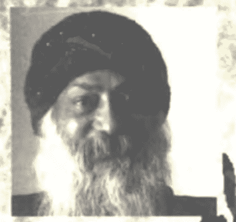

## 奥秘心理学

奥修著　金晖 王建伟 译

上海三联书店

## 奥秘心理学

著者/(印度)奥修  
译者/余晖 王建伟

- 责任编辑/赵立新
- 装帧设计/姜明
- 责任制作/钱震华
- 责任编辑/董云霞

出版/上海三联书店  
（200020）中国上海市绍兴路7号  
发行/新华书店上海发行所 上海三联书店  
印刷/华东师范大学印刷厂

- 版次/1998年1月第1版
- 印次/1998年1月第1次印刷
- 开本/850×1168 1/32
- 字数/140千字
- 印张/7.125
- 印数/1—11000

ISBN 7-5426-1117-8  
B·98 定价8.20元

## 译者序

奥秘是奥秘。这话不合逻辑，但它是真实的。这个真实只有在前项和后项取消对立和解释的时候才会透露。而我们的头脑是解释的、二分的，我们的意识是偏面的、固着的，我们无法进入奥秘、无法得到真实的消息。我们面对奥秘，只有好奇和解释的冲动，但没有进入它的准备。当我们翻着这本《奥秘心理学》的每一张书页的时候，文字、观念、体系进入了我们的头脑，意识在逻辑的水平面上徘徊，觉知的能量无法升起。这就是我们的现状，我们没有任何进步，我们的意识没有通向奥秘的任何演化的准备。

《奥秘心理学》不是学术著作，它的学术性、系统性是学术和系统的头脑规定的。它或许会有许多向度的意义和价值，但它的根是“静心”。它透过文字语言、知识概念直达我们的内心深处，只要我们用自心与它对话，我们就会深深地进入静心，在觉知观照中洞悉生命的奥秘。静心的品质会给我们带来真正的知识，当我们以觉知穿透无意识误区的时候，我们会有完全的“知”的喜乐！这是禅师棒喝后的开悟。奥修“超越七个身体”的描述并不是在故弄玄虚，也不是在创造关于奥秘的观念系统，他在棒喝我们头脑的固着。我们的头脑从来没有怀疑过自己，也没有觉知和体验过自己，知识权威不习惯这样做。因此荣格和集体无意识一直受到冷落，无数觉知体验的事实被视而不见。我们对集体无意识从来不了解，对“肉体身”以外的“身”（包括这些“身”的意识、存在）从来没有体验，但我们坚决否定它。这就是逻辑的头脑。我们不敢承认自己无知，我们不能进入中间状态。奥修的棒喝就是要我们走进“不知道”，这是洞悉奥秘的起点：是这样吗？不知道。苏格拉底和佛都说不知道。爱因斯坦也说不知道，他创立了相对论，“相对论”就是一个关于存在的“不知道”的开放、流动的认识系统。这是爱因斯坦的真正贡献，在他的公式和哲学表层下透给我们的科学——生命是无限维（可能性）的存在。七个身体存在吗？不知道。不知道，然后进入它，这就是奥秘。

奥秘心理学对进入它的人来说是奥秘，对没有进入它的人来说是秘密；而这些有关奥秘的知识系统则被宗教家视为秘传的，也被误解的追随者以秘传之法寻求。由奥秘成为秘密，由秘密成为秘传，这不是存在的演化，而是头脑的障碍阻止了觉知奥秘的通道，秘密和秘传成了头脑追逐、游戏的对象。奥修并不在传授秘密，他在帮助我们意识的觉知，帮助我们静心，帮助我们进入奥秘。

奥修的头脑是静心的，他不规定任何系统和理性。当我们读着《奥秘心理学》的每一段文字的时候，不要迎接它，也不要拒绝它，让它流过，看着它。如果我们迎接它，我们的头脑就被系统规定为肯定，奥秘就成了秘传；如果我们拒绝它，我们的头脑就被另一种系统规定为否定，奥秘就成了秘密。奥秘是奥秘，只有当我们的头脑是静心的它才能成立。我们“不知道”，我们是“空”，这是静心的品质。这样，奥修的语言就会和我们真正相遇，意义和作用在我们没有期待、没有欲望的时候发生了。这个发生是不属于任何体系的，它抽象但很美，在我们内心深处发生了。

我们往往很习惯于关心意义和作用。读《奥秘心理学》的意义和作用就是进入“静心”，让智慧开花。如果我们静心了，我们开花了，我们达到了更深入的意识演化而充满喜乐了，我们可以不同意奥修甚至反对他，也可以相反，但这已经无关紧要了。

当我们译完这部著作的时候，我们同时也结束了一次漫长的、特殊的静心，当然，更深、更久的意识演化还会继续下去。

神，或者静心就在这样一种生活中。

译者  
1996.5.31

## 原序

人类演化的过程就是意识发展的过程。树木比石头更有意识；动物比树木更有意识；人比动物更有意识；觉悟的人比人更有意识。佛境、基督意识、开悟，它们指的都是同一件事情：完全意识的开花。物质是完全没有意识的；一个觉悟的人则是完全清醒的。人处在两者之间：既不是此，也不是彼。他生活在不上不下的状态里，不再是动物，也没有成为神；不再是过去的，也没有成为他可以成为的。

“有了人，无意识的演化结束了，”奥修告诉我们：“而有意识的演化开始了。但是有意识的演化也不是非从任何特殊人的身上开始不可。只要你选择它开始，它就开始了。”

生命意味着运动。它不可能在我们的脚下停留。要么我们演化到更高的意识水平，要么我们就倒退回去。选择是我们的。我们不能不选择。即使不选择也是一种微妙的选择。大多数人都在寻求遗忘：回到无意识的状态。他们借助酒精和药物、借助工作、借助性、借助感官刺激来寻求它。只有少数人选择走上通往更高意识的旅程。奥修在这本《奥秘心理学》里所做的演讲就是针对这些少数人的。

他从西方心理学停止的地方开始。他走得比弗洛伊德、比荣格、比各种新的关于人类潜在活动的理解更远。如果弗洛伊德的心理学是病理心理学，马斯洛的心理学是健康人的心理学，那么奥修的心理学就是开悟心理学、佛境心理学。奥修不仅仅是开悟大师，他也是心理学大师。他一层一层地剥开我们的存在，展现我们隐藏的内心深处。他从肉体开始，一步一步地讲到超越。他从已知开始讲到不可知。他从我们站立的地方开始讲到我们可能达到的地方。“在东方，”他说：“它不是一个心理学的问题，它是一个存在的问题。它不是一个精神健康的问题。相反，它是一个灵性成长的问题。问题不在于你做什么；问题在于你是什么。”

奥修在这些演讲中所谈论的内容不亚于创造了一个新人类。他的整个努力都是为了创造一种气氛，使佛境可以逐渐开花。为了它的发生，他说，我们必须接受人的全部。既不能否认理性，也不能否认非理性；既不能否认理智，也不能否认感情；既不能否认科学，也不能否认宗教。一个人必须保持流动，能够从一极移到另一极。“头脑必须接受逻辑的、理性的训练。”他说：“但是它必须同时接受非理性的——无理性的——静心的训练。理性必须接受训练，同时感情也必须接受训练。怀疑必须接受训练，同时信任也必须接受训练。怀疑必须在那里，信任也一样……否认理性和否认非理性的人都不在成长。除非完全地成长，否则你不可能成长。”

奥修不是一个哲学家。他的话不是为了用更多的知识来填塞我们的头脑。它们是为了推动我们直接体验那个超越语言的。它们是为了推动我们走向自己内在的演化，走向对我们的潜力、对种子的可能性的终极了悟。

## 目录

- 译者序
- 原序
- 1. 向内的革命 ........................................ 1
- 2. 静心的奥秘 ........................................ 14
- 3. 性、爱和祈祷：走向上帝的三步 .................... 28
- 4. 昆达里尼瑜伽：归根复源 ............................ 44
- 5. 秘密的游戏：一个成长的阶段 ........................ 62
- 6. 梦的心理学 ........................................ 80
- 7. 超越七个身体 ...................................... 98
- 8. 成为和是 .......................................... 124
- 9. 知识的错误 ........................................ 145
- 10. 上帝之窗 ......................................... 158
- 11. 恰当的提问 ....................................... 177
- 12. 平衡理性和非理性 ................................. 196

## 一 向内的革命

在人类演化的道路上，是否可能在将来的什么时候，人类能够全部达到开悟？今天的人类处于演化的哪个阶段？

有了人，自然的、机械的演化进程就结束了。人是无意识演化的最后产物。有了人，有意识的演化就开始了。有很多事情都要考虑到。

首先，无意识的演化是机械的、自然的。它自动发生。通过这种类型的演化，意识逐步发展起来。但是，意识一出现，无意识的演化就停止了，因为无意识演化的目的已经实现了。无意识演化的需要只到意识出现为止。人已经有了意识。从某种意义上说，人已经超越了自然。现在自然什么事情也不能做；自然的演化所能带来的最后产物已经出现了。现在，人有自由决定是否继续演化下去。

其次，无意识的演化是集体性的，可是演化一旦变成了有意识的，它就会变成个体的。没有任何集体的、机械的演化会越过人类继续进行。从现在开始，演化已经成为一种个体的进程。意识创造个体。在意识演化以前没有个体。只有种类存在，没有个体。

当演化还是无意识的时候，它是一个机械过程；它没有不确定性。事物按照因果的法则发生。存在是机械的、确定的。

但是有了人，有了意识，不确定性就出现了。现在，没有什么是确定的。演化可能发生，也可能不发生，潜力在那里，而选择却完全取决于每一个个体。所以，焦虑是一种人类的现象。人类以下没有焦虑，因为没有选择。每件事物必须怎么发生就怎么发生。因为没有选择，所以也没有选择者，而没有选择者，就不可能有焦虑。谁会焦虑呢？谁会紧张呢？

有了选择的可能，焦虑就开始如影随形。现在，每一件事情都必须选择；每一件事情都是一种有意识的努力。你自己负责。如果你失败了，你就失败了。那是你的责任。如果你成功了，你就成功了。那也是你的责任。从某种意义上说，每一次选择都是最后的选择。你不能取消它，你不能忘记它，你也不能违背它。你的选择将成为你的命运。它将跟你在一起，并成为你的一部分；你不能拒绝它。而你的选择永远都是一种赌博。每一次选择都是在黑暗中进行的，因为没有什么是确定的。

所以人会焦虑。他一直焦虑到他的根。他从这里开始遭受折磨：成为还是不成为？做还是不做？做这个还是做那个？“没有选择”是不可能的。如果你不选择，那么你就是在选择不选择；这也是一种选择。所以你是被迫选择的；你没有不选择的自由。不选择的效果跟其他任何选择一样。

人的尊贵、美丽和荣耀就是这个意识。但它也是一种负担。当你变得有意识的时候，荣耀和负担一同时在。每一步都是两者之间的一次行动。有了人，就有了选择和有意识的个体。你可以演化，但你的演化将是一种个体的努力。你或许会演化成一个觉悟的人，或许不会。选择是你的。

所以有两种类型的演化：集体的演化和个体的、有意识的演化。“演化”这个词意味着无意识的、集体的进步，所以在谈论人的时候，最好使用“革命”这个词。有了人，革命就变得可能了。

革命，当我在这里使用这个词的时候，它意味着一种为了演化而作出的有意识的、个体的努力。它把个体的责任推向一个顶峰。只有你对你自己的演化负责。通常情况下，人总是设法逃避他对自己的演化所担负的责任，逃避自由选择的责任。他对自由有一种巨大的恐惧。当你做奴隶的时候，你的生活责任从来不是你的；别人为此负责。所以在某种程度上，受奴役也是一件非常舒服的事情。没有负担。就这一点而言，受奴役也是一种自由：免于有意识的选择的自由。

你一旦变得完全自由了，你就必须自己作出选择。没有人强迫你做任何事情；所有的选择都由你来决定。于是，跟头脑的搏斗也开始了。所以一个人会变得害怕自由。

有些意识形态，诸如法西斯主义，它们的部分号召力就在于：它们提供一种对于个体自由和个体责任的逃避。它们把责任的负担从个体的肩上卸下来；社会开始负责。每当出现问题的时候，你总是可以指责政府、指责团体。人仅仅成为集体机构的一部分。但是在否定个体自由的同时，法西斯主义也否定人类演化的可能性。那是一种倒退，它背离革命所提供的巨大可能性——人的彻底的转化。如果发生这种情况，你就会破坏达到终极的可能性。你倒退了；你重新变得动物一样。

在我看来，只有有了个体责任，进一步的演化才有可能。你自己负责！这种责任看起来很不幸，实际上却是极大的祝福。这种责任会带来奋斗，最终将导致无选择（choiceless）的觉知。

无意识演化的旧模式对于我们已经结束了。你可以倒退，但是你无法在它里面停止。你的本性将会起来反叛。人已经有了意识；他必须保持意识。没有别的办法。

像奥罗宾多（Aurobindo）这样的哲学家对逃避者们具有很强的吸引力。他们说集体的演化是可能的。上帝将从天而降，然后每一个人都会开悟。但是在我看来，那是不可能的。即使它显得很有可能，它也没有意义。如果你不经过自己个人的努力就开悟了，那么那个开悟也不值得拥有。它不会给你带来圆满完成努力的狂喜。它只会被你看作理所当然的事情——就像你的眼睛、你的双手、你的呼吸过程一样。这些都是极大的祝福，但是没有人真正地看中它们、珍惜它们。

按照奥罗宾多的许诺，总有一天你也可以一生下来就是开悟的。这种事情没有价值。你会拥有很多，但是，因为它不是经过努力、经过苦干得来的，所以它对你没有意义；它的意义丧失了。有意识的努力是必须的。成就并不像努力本身那么有意义。努力产生它自己的意义，奋斗产生它自己的意义。

在我看来，集体的、无意识的开悟，就像上帝赐下的一件礼物，它不仅是不可能的，也是没有意义的。你必须为开悟而奋斗。通过奋斗，你培养出看、感觉和把握即将到来的喜乐的能力。

因为人，无意识的演化结束了，有意识的演化——革命——开始了。而有意识的演化也不是非发生在特殊的人身上不可。只要你选择它开始，它就开始。如果你不选择它——就像大多数人的态度一样——你会处于一种十分紧张的状态。现时代的人类就是这样：没有地方可去，也没有要去的目标。现在，如果没有有意识的努力，你什么也达不到。你不可能回到无意识的状态中去。那扇门已经关起来了；那座桥已经断了。

有意识演化的选择是一次重大的冒险，对一个人来说，那也是唯一的冒险。这条路十分艰难；必然如此。必然有错误、失败，因为没有什么是确定的。这种局面在人的内心造成紧张。你不知道你在哪里，你也不知道你要去哪里。你的特征丧失了。这种处境甚至可能发展到让你自杀的地步。

自杀是人类的现象；它产生于人的选择。动物不可能自杀，因为它们不可能有意识地选择死亡。诞生是无意识的，死亡也是无意识的。但是有了人——无知的人，不演化的人——有一件事情就变得可能了：选择死亡的能力。你的诞生不是你的选择。就你的诞生而言，你还在无意识演化的掌握之中。实际上，你的诞生根本不是一件人的事情。从本质上说，它是动物性的，因为它不是你的选择。人性只从选择开始。而你也能够选择你的死亡——一种决断的行为。所以，自杀是明确的人的行为。如果你不选择有意识的演化，那么你极有可能选择自杀。你或许没有勇气主动自杀，但是你会经历一段缓慢的、延长的自杀过程——徘徊着，等待着死亡。

你无法让任何其他人为你的演化负责。接受这种处境会给你带来力量。你在你自己的道路上成长、演化。我们创造诸神，或者我们去依傍古鲁（guru）①，这样我们就可以不对自己的生活、自己的演化负责了。我们试图把责任放在别的什么地方，远远地离开自己。如果我们不能接受某个上帝或者某个古鲁的话，我们就设法借助麻醉品或者迷幻药，借助任何可以导致我们进入无意识的东西来逃避责任。但是这些拒绝责任的努力都是荒唐的、愚蠢的、幼稚的。它们只是在拖延问题；它们并不是解决的办法。你可以一直拖延到死，但问题还是问题，你的新的诞生又将以同样的方式继续下去。

一旦你觉知到你是自己负责的，你就不会借助任何类型的无意识来逃避了。如果你想逃避，你就太傻了，因为责任是一次重大的演化的机会。由于它所引发的奋斗，某种新的东西可能逐步发展起来。变成觉知的意味着知道每一件事情都取决于你。甚至你的上帝也取决于你，因为他是由你的想象创造出来的。

每一件事情最终都是你的一部分，你对它负有责任。没有人会听你的辩解；没有申诉的法院，全部责任都是你的。你是单独的，完全单独的。这一点必须清清楚楚地理解。人一旦变成有意识的，他就变成了单独的。意识越强，就越能觉知自己的单独。所以，不要借助社会、朋友、团体、人群来逃避这个事实。不要逃避！它是一个伟大的现象；整个演化的进程一直都在努力达到这一点。

现在，意识已经达到了这一点：你知道你是单独的。只有在单独里面，你才能达到开悟。我并不是在说孤独。孤独的感觉是一个人在逃避单独的时候、在不准备接受单独的时候所产生的感觉。如果你不接受单独的事实，那么你就会感到孤独。你就会找到一帮人或者一些麻醉的手段来忘掉你自己。孤独会创造它自己的健忘的魔术。哪怕你能够单独一个片刻，全然地单独，自我也会死掉；那个“我”也会死掉。你爆炸了；你不在了。自我无法保持单独。它只能在关系中存在。

无论你什么时候开始单独，都会发生一个奇迹。自我虚弱下来。现在它活不长了。所以，如果你有足够的勇气进入单独，你就会逐渐变得无我。

单独是一种非常觉知的、审慎的行为，比自杀还要审慎，因为自我不能单独存在，但是它可以在自杀中存在。自我主义的人比别人更有自杀的倾向。自杀总是跟另一个人有关；它从来不是一种单独的行为。在自杀中，自我不会受苦。确切地说，它会变得更有表现力。它会带着更大的力量进入一次新生。

通过单独，自我被粉碎了。它没有关联的对象，所以它无法存在。所以，如果你准备单独，毫不动摇地单独，既不逃跑也不倒退，完全接受单独的事实——它就会变成一次重大的机会。于是你像一颗富有潜力的种子。不过你要记住，为了长成植物，种子必须自我毁灭。自我是一颗种子，是一股潜力。如果它被粉碎了，上帝就会诞生。上帝既不是“我”也不是“你”，它是一体（oneness）。通过单独，你就会达到这个一体。

你可以创造这个一体的虚假的替代品。印度教徒成为一个整体，基督教徒成为一个整体，伊斯兰教徒成为一个整体；印度是一个整体，中国是一个整体。这些只是一体的替代品。一体的实现只能通过全然的单独。

一个群体可以把它自己叫做一个整体，但是这个一体总是反对某些别的东西。因为这个群体支持你，所以你很自在。现在，你再也没有责任了。你不会单独焚烧清真寺；你也不会单独破坏寺庙，但是作为某个群体的一部分，你就可以这么做，因为现在你不是自己负责的。每一个人都负有责任，所以没有人特别地负有责任。那里没有个人的意识，只有群体的意识。你倒退到群体里面，变得像一个动物。

群体是感觉一体的虚假的替代品。任何人，只要他觉知这种处境，觉知他作为一个人所负有的责任，觉知这种随着做人而来的困难的、艰苦的工作，他就不会选择任何虚假的替代品。他跟事实的本然一起生活；他不创造任何虚构。你的宗教和你的政治空想都只是虚构而已，它们产生一种想象的一体的感觉。

只有当你变得无我的时候，一体才会实现，而只有当你完全单独的时候，自我才会死亡。你完全单独的时候，你不在。那个片刻正是爆炸的片刻。你爆炸成无限。这个，只有这个，才是演化。我之所以把它叫做革命，是因为它不是无意识的。你或许会变成无我的，或许不会。这取决于你。变成单独的是唯一的真正的革命。它需要极大的勇气。

只有一个佛陀才是单独的，只有一个耶稣或者一个摩诃吡罗（Mahavira）②才是单独的。这并不是说他们离开了自己的家庭、离开了世俗。看起来似乎是这样的，而实际上并非如此。他们并不是在消极地离开什么。他们的行为是积极的；那是一种争取单独的举动。他们并不是在离开。他们是在寻求达到完全的单独。整个寻求都是为了那个爆炸的片刻，在那个片刻，人是单独的。单独里面有喜乐。只有这样才是达到开悟。我们无法单独，别人也无法单独，所以我们创造出群体、家庭、社会、民族。所有的民族、所有的家庭、所有的群体都是由胆小鬼——那些没有足够的勇气进入单独的人——组成的。

真正的勇气就是单独的勇气。它意味着你清醒地认识到你是单独的，你不可能是另外的样子。你要么可以欺骗你自己，要么可以跟这个事实一起生活。你可以继续生生世世地欺骗自己，但是你只能在一个恶性循环里继续。只有当你能够接受这个单独的事实了，恶性循环才会被打破，你才会达到中心。那个中心就是神性的中心、整体的中心、神圣的中心。我想象不出会有什么时候每一个人都能达到这一点，就像与生俱来的权利一样。这是不可能的。

意识是个体的。只有无意识才是集体的。人类已经达到了意识，他们已经变成了个体。没有那样的人；只有个体的人。每一个人都必须认识到他自己的个体性以及对它所负有的责任。我们首先必须做的事情就是把单独作为一个基本事实来接受，并且学会跟它一起生活。我们不能创造任何虚构。如果你创造虚构，你就永远无法知道真理。虚构是被设计、被创造、被培育的真理，它会阻止你去了解它。要接受你的单独的事实。如果你能够接受这个事实，如果在你和这个事实之间没有虚构，那么真理就会展现在你面前。每一个事实，如果深入察看的话，都在展现真理。

所以要接受责任的事实，接受你是单独的事实。如果你能够接受这个事实，就会发生爆炸。它是艰苦的，但它是唯一的道路。通过艰苦，通过接受这个真理，你将达到爆炸点。只有这样你才有喜乐。如果它是现成给你的，它就会失去它的价值，因为它不是你挣来的。你没有能力感觉它。这种能力只能从训练中得到。

如果你能够接受你对自己的责任，一种训练就会自动来到你的身上。因为你对自己完全负责，所以你不可避免地要变得遵守纪律。但是这种纪律并不是外界强加给你的。它来自于内在。因为你对自己完全负责，所以你所走的每一步都合乎规范。你一个不负责任的词都不能说。如果你觉知到自己的单独，你就会觉知到其他人的痛苦。这样你就不会作出任何一个不负责任的行为，因为你不仅感觉对自己负有责任，也感觉对其他人负有责任。如果你能够接受你的单独，你就知道每一个人都是孤独的。这样儿子就会知道父亲是孤独的；妻子就会知道丈夫是孤独的；丈夫就会知道妻子是孤独的。一旦你知道这一点，你就不可能不变得慈悲。

跟事实一起生活是唯一的瑜伽、唯一的训练。一旦你彻底觉知到人的处境，你就会变得虔诚。你就会成为自己的师傅。但是随之而来的苦行并不是苦行者的苦行。它不是被迫的；它不是丑陋的。这种苦行是审美的。你感觉它是唯一可能的事情，除此以外，你什么也不能做。于是你开始放弃；你不再占有。

占有的渴望就是渴望不单独。一个人无法单独，所以他总是寻求伙伴。但是把另一个人作为伙伴并不可靠，所以他就寻求物质的伙伴。跟妻子一起生活是困难的；跟车一起生活就不那么困难了。所以到了最后，占有总是转向物质。

你甚至可能试图把人也变成东西。你试图以那样一种方式塑造他们，好让他们失去自己的人格、自己的个性。妻子是一件东西，而不是一个人；丈夫是一件东西，而不是一个人。

如果你觉知到你的单独，那么你也会觉知到别人的单独。这样你就会知道试图占有另一个人就是侵犯。你从来不会积极地放弃。放弃成为你的单独的消极的阴影。你不再去占有。于是你能够成为一个爱人，但不是成为一个丈夫，不是成为一个妻子。

随着这种不占有而来的是慈悲和苦行。纯真在你的身上出现。当你拒绝生命事实的时候，你无法纯真；你变得狡猾。你在自欺欺人。但是，如果你有足够的勇气接受事实的本然，你就会变得纯真。这种纯真不是培养出来的。你就是它：纯真的人。

在我看来，变成纯真的人就是所要达到的一切。变成纯真时，神性就会永远喜乐地流向你。纯真是接受的能力，是成为神的一部分的能力。要变成纯真的人，客人在那里，要变成主人。

这种纯真无法培养，因为培养永远是一种策划。它是算计的。而纯真永远不可能是算计的；不可能是。

纯真就是虔诚。变成纯真的人是真实觉悟的顶峰。然而真实的纯真只有通过有意识的革命才会产生；它不可能通过任何集体的、无意识的演化产生。人是单独的。他有自由选择天堂或者地狱、生命或者死亡、觉悟的狂喜或者我们的所谓的生活。

> 萨特曾经说过：“人被判决为自由的。”你可以选择天堂或者地狱。自由的意思是：你有选择两者之一的自由。如果你只能选择天堂，那么它就不是一种选择；它不是自由。没有地狱的选择，天堂就是地狱本身。选择总是意味着要么这样、要么那样。它并不是说你有自由只选择好的。那样就没有自由了。

如果你选择错了，自由就变成一次判决；但是如果你选择对了，它就变成喜乐。这取决于你的选择：把你的自由变成判决还是变成喜乐。你的选择完全是你的责任。

如果你准备好了，那么你的内在深处就会开始一个新的向度：革命的向度。演化已经结束了。现在需要一次革命把你打开，直至超越。它是一次个体的革命、一次向内的革命。

## 注：

- 1. 古鲁：印度教和锡克教的宗教领袖。灵性导师。精神领袖。
- 2. 摩诃毗罗，大雄，耆那教徒对筏驮摩那（Vardhamana，耆那教创始人）的尊称。

## 二 静心的奥秘

### 什么是静心？

静心并不是印度的一种方法；它也不只是一门技术。你无法学习它。它是一种成长：你的整个人生的成长，来自于你的整个人生的成长。静心并不是某种东西可以附加在你目前的状态上。它只有通过一种根本的转化，通过一种蜕变才能来到你的身上。它是一次开花、一次成长。成长总是来自于全体；它不是增加。你必须向着静心成长。

你必须正确理解这种人格的完全的开花。否则一个人很可能跟自己玩花样，一个人很可能用各种头脑的诡计来占据自己。诡计太多了！它们不仅能够愚弄你，你不仅什么也得不到，而且你会在真正的意义上受到伤害。那种认为静心有某种技巧的态度——把静心想象成方法——在根本上就是错误的。当一个人开始玩弄头脑的诡计时，头脑的品质就开始恶化了。

就头脑目前的存在方式来说，它不是静心的。在静心能够发生之前，整个头脑都必须改变。那么，就它目前的存在方式来说，头脑是什么呢？它是怎样运作的呢？

头脑总是在说话。你可以了解文字，你可以了解语言，你可以了解思考的概念结构，但那并不是思考。相反，那是在逃避思考。你看见一朵花，然后你用语言表达它；你看见一个人穿过马路，然后你用语言表达它。头脑能够把每一件存在的事物都转变成语言。于是语言变成了一种障碍、一种囚禁。对一个静心的头脑来说，不断地把事物转成语言，把存在转成语言就是障碍。

所以对静心的头脑的第一个要求就是：觉知你在不断地用语言表达，而且能够停止它。仅仅看着事物；不要用语言表达。要觉知它们的在（presence），但是不要把它们转成语言。让事物存在着，不要使用语言；让人们存在着，不要使用语言；让环境存在着，不要使用语言。那不是不可能的；那是自然的。它目前的存在状态才是人为的，但是我们已经变得非常习惯于它，它已经变得非常机械了，以至于我们甚至不觉知我们在不断地把体验转变成语言。

日出在那里。你从来不觉知看见它和表达它之间的差距。你看见太阳，你感觉它，然后你马上就用语言来表达它。看见和表达之间的差距消失了。一个人必须觉知日出并不是一个单词。它是一个事实、一个存在。头脑总是自动地把体验转变成语言。然后这些语言就站到你和体验中间去了。

静心意味着不用文字生活，不用语言生活。有时候，它是自然发生的。当你在恋爱、在感觉当下而不是感觉语言的时候。每当两个爱人彼此非常亲密，他们就会变得很宁静。那并不是说他们没有东西可以表达。相反，他们要表达的东西太多了。但是语言从来不在那里；它们不可能在那里。只有当爱情消亡的时候，它们才会出现。

如果两个爱人从来没有安静过，那说明爱情已经死了。

现在，他们正在用语言填补这条裂缝。当爱情还活着的时候，语言不在那里，因为爱情存在的本身就是那么势不可挡、那么具有穿透力，它已经越过语言和文字的障碍了。而且，在通常情况下，语言和文字的障碍只能在爱情中被超越。

静心是爱情的高潮：不是爱一个人，而是爱整个存在。在我看来，静心是你跟周围整个存在的一种充满活力的关系。如果你能够热爱任何环境，那么你就是在静心。

这并不是头脑的诡计。它并不是一种平静头脑的方法。确切地说，它要求你对头脑的机械具有深刻的认识。你一旦认识到你在表达上的机械的习惯、你把存在转成语言的机械的习惯，一道间隙就出现了。它是自发的。它像影子似的跟着你的认识。真正的问题并不在于怎么静心，而是要知道你为什么不在静心。静心的过程是消极的。它不会给你增加什么；它是在取消已经被增加的东西。

没有语言，社会就无法存在；它需要语言。但是存在并不需要它。我不是说你的存在应该没有语言。你不得不使用它。但是你必须能够打开和关闭表达的机制。当你以一个社会人的身份存在的时候，语言的机制是需要的；然而当你独自跟存在在一起的时候，你必须能够关闭它。如果你不能关闭它——如果它一味地继续下去，你却无法停止它——那么你就已经变成它的奴隶了。头脑应该是工具，而不是主人。

当头脑成为主人的时候，就会产生一种不静心的状态。当你成为主人、当你的觉知成为主人的时候，就会产生一种静心的状态。所以，静心意味着成为头脑的机制的主人。

头脑，以及头脑语言功能的运作，并不是终极的。你超越于它；存在超越于它。觉知超越于语言；存在超越于语言。当觉知和存在合而为一的时候，它们就会彼此交融。这种交融就是静心。

语言必须被放弃。我并不是说你必须镇压它或者排除它。我的意思只是：它不需要成为你一天24个小时的习惯。在你走路的时候，你需要移动你的腿。但是如果在你坐着的时候，它们还继续移动，那么你就疯了。你必须能够关闭它们。同样地，在你不跟别人说话的时候，语言不能在那里。它是一种交流的技术。在你不跟任何人交流的时候，它不应该在那里。

如果你能够做到这一点，你就能够进入静心。静心是一个成长的过程，而不是一种技术。技术永远都是死的，所以别人可以把它增加给你；但过程永远都是活的。它会成长，它会扩展。

语言是需要的，然而你不能老是停留在它里面。有些时候必须没有语言的表达，你只是存在着。并非你完全无所事事。觉知在那里。而且它比语言更加灵敏、更加生动，因为语言使它麻木了。语言必然是重复的，所以它会造成厌倦。语言对你越重要，它就越会使你厌倦。

存在从来不是重复的。每一朵玫瑰花都是一朵新的玫瑰花，全新的。它以前没有存在过，也永远不会重现。但是，当我们把它叫做玫瑰花的时候，“玫瑰花”这个词就是一种重复。它一直在那里；它永远在那里。你总是用陈旧的词汇扼杀新生事物。

存在永远是年轻的，语言永远是陈旧的。通过语言，你逃避存在，你逃避生命，因为语言是死的。你越是跟语言纠缠不清，你就越是被它弄得死气沉沉。学者完全是死的，因为他完全是语言、文字。

萨特把他的自传叫作《文字》。我们活在文字里。文字活着，我们没有活。到头来，除了一堆又一堆的文字以外，我们什么也没有。文字就像照片一样。你一看见活的东西，就把它拍下来。照片是死的。然后你再把死的照片汇合成一本影集。没有在静心中生活过的人就像一本死的影集。里面只有文字的照片，只有记忆。没有什么是被生活过的；每一样东西都只是被文字表达了。

静心意味着全然地生活，但是，只有当你安静下来的时候，你才能全然地生活。我所说的安静并不是无意识。你可以是安静的、无意识的，但它不是一种充满生命力的安静。你又错过了。

你可以通过咒语进行自我催眠。仅仅依靠重复一个单词，你就能够在头脑中激起深深的厌倦，于是头脑睡着了。你陷入梦乡、陷入无意识。如果你不停地唱“罗姆、罗姆、罗姆”，头脑就会睡着。然后语言的障碍没有了，但你却是无意识的。

静心意味着既不能有语言，又必须是清醒的。否则你就不会跟存在交融。没有什么咒语能够帮助你，没有什么念诵能够帮助你。自我催眠不是静心。相反，自我催眠的状态是一种堕落。它并没有超越语言；它堕落得比语言更低。

所以要放弃所有的咒语，放弃所有这些技术。让时光存在于没有文字的地方。你不能用咒语来排除文字，因为那个过程本身就是在使用文字。你不能用文字来消灭语言；那是不可能的。

那么，应该怎么办呢？事实上，除了理解之外，你什么也做不了。你所能做的任何事情都只能来自于你所在的地方。

你是混乱的，你不在静心，你的头脑不安静，所以任何来自于你的东西都只能造成更多的混乱。眼下所能做的事情就是开始觉知头脑是怎么运作的。如此而已——只要觉知。觉知跟文字没有关系。它是一种存在的行为，而不是头脑的行为。

所以，第一件事情就是要觉知。觉知你的头脑的过程，觉知你的头脑是怎么工作的。你一旦觉知你的头脑的作用，你就不是头脑了。觉知本身就意味着你是超越的：孑然孤立的，一个观照者。而且，你变得越觉知，你就越能看见体验和文字之间的差距。差距在那里，而你太不觉知了，以至于你从来没有看见过它们。

在两个文字之间总有一段间隙，不管这段间隙多么难以觉察、多么微小。否则这两个文字就不可能是两个了；它们将变成一个。在两个音符之间总有一段间隙、一段沉寂。两个文字或者两个音符之间除非有一段间隙，否则它们无法成为两个。间隙一直都在那里，但是一个人必须真正觉知地、真正专心地去感觉它。

你变得越觉知，头脑就变得越缓慢。它永远是相对的。你的觉知越少，你的头脑就越快；你的觉知越多，头脑的进程就越慢。当你越来越觉知到头脑的时候，头脑就会慢下来，念头之间的间隙扩大了。然后你就能够看见它们。

它就像一部电影一样。当放映机低速转动的时候，你可以看见那些间隙。如果我举起我的手，这个动作必须拍成一千段。每一段都是一张单独的照片。如果这一千张单独的照片在你眼前迅速掠过，以至于你无法看见那些间隙，那么你就会看见一个连续的举手的过程。但是在很低的速度下，你就可以看见那些间隙。

头脑就像一部电影。间隙在那里。你越关注你的头脑，你就越会看见它们。它就像一张格式塔（Gestalt）照片：一张照片同时包含两个独立的影像。你可以看见这一个影像或者看见另一个影像，但是你无法同时看见两个影像。它可能是一张老年妇女的照片，同时又是一张青年妇女的照片。但是，如果你目不转睛地盯着其中一个看，你就不会看见另一个；而当你盯着另一个看的时候，第一个就消隐了。即使你清楚地知道你已经看见了两个影像，你也无法同时看见它们。

头脑的情形也一样。如果你看见文字，你就看不见间隙；而如果你看见间隙，你就看不见文字。每一个文字后面都跟着一段间隙，每一段间隙后面都跟着一个文字，但是你无法同时看见两者。如果你盯着间隙看的话，文字就会消隐，你就会顿时陷入静心。

仅仅集中在文字上的意识不是静心的，仅仅集中在间隙上的意识是静心的。每当你觉知到间隙的时候，文字都会消隐。如果你观察得仔细，你就找不到文字；你只能找到间隙。

你能够感觉两个文字之间的区别，但是你无法感觉两个间隙之间的区别。文字总是复数的，间隙总是单数的。它们彼此熔为一体。静心就是对准间隙的聚焦。这样，整个格式塔都会发生变化。

还有一件事情必须理解。如果你在看一张格式塔照片，你的注意力集中在老年妇女的影像上，你就看不见另一个影像。但是，如果你继续集中在老年妇女的影像上——如果你继续集中在她的影像上，如果你全神贯注在她的影像上——总有一刻，你的焦点会改变，突然间，老年妇女不见了，而另一个影像却出现在那里。

这是怎么回事呢？这是因为头脑无法长久地持续集中。它必须改变，或者它必须睡觉。只有这两种可能。如果你不断地集中在一个事物上，头脑就会睡觉。它无法保持固定；它是一个活的过程。如果你让它感到厌倦，那么为了逃避你的呆滞的集中，它就会睡觉。这样它就可以继续生活，在梦里面生活。

这就是摩诃里希·玛赫西（Maharishi Mahesh）瑜伽的风格。它是平和的、提神的，它有助于你的身体健康和精神平衡，但它并不是静心。自我催眠也能够达到同样的效果。在印度语中，“咒语”一词的意思就是暗示。把它当作静心是一个严重的错误。它不是的。如果你认为它是静心，你就永远不会去寻求真正的静心。那是这些练习和这些练习的宣传者带给你的真正的伤害。它纯粹是在心理上麻醉自己。

所以，不要用任何咒语来清除道路上的文字。只要觉知文字，你的头脑的焦点就会自动转移到间隙上来。

如果你认同文字，你就会不停地从一个文字跳到另一个文字，你就会错过它们之间的间隙。另一个文字是新的聚焦点。头脑不停地转移；焦点不停地转移。但是，如果你不认同文字，如果你仅仅做一个观照者——孑然独立，只是看着文字列队经过——那么整个焦点就会转移，你就会觉知到间隙。这就好比你在马路上，看着行人经过。有一个人走过去了，而另一个人还没有来。那里有一段间隙；马路是空的。如果你在看，那么你就会了解间隙。

一旦你了解了间隙，你就在它里面了；你已经跳进去了。它是一个深渊——它产生和平，它创造觉知。在间隙里面就是静心；就是转化。现在，你不需要语言了；你将放弃它。那是一种有意识的放弃。你觉知到宁静、无限的宁静。你是它的一部分，你跟它在一起。你并不觉得这个深渊是什么别的东西；你觉得这个深渊就是你自己。你知道，现在，你就是知（knowing）的本身。你在观察间隙，然而现在，观察者就是被观察的。

就文字和念头而言，你是一个观照者，你是分离的，文字是别的东西。但是在没有文字的时候，你就是间隙——但你仍然觉知你存在着。在你和间隙之间，在觉知和存在之间，现在没有障碍。只有文字是障碍。现在你处于一种存在的状态。这就是静心：跟存在在一起，全然地在它里面，并且依然有觉知。这就是它的矛盾，这就是它的悖反。现在，你已经知道有一种状态，你在它里面是觉知的，而且仍然跟它在一起。

一般说来，当我们意识到某样东西的时候，那样东西就变成别的东西了。如果我们认同某样东西，那么它就不是别的东西，然而在这种情况下，我们是不觉知的——比如在发怒的时候，在发生性行为的时候。我们只有在无意识的时候才会成为一体。

性具有强大的吸引力，因为在发生性行为的时候，你们可以暂时成为一体。不过在那个时候，你们是无意识的。你们寻求无意识，因为你们寻求合一。但是，你越是寻求它，你就变得越有意识。这样你就感觉不到性的喜乐，因为那种喜乐是从无意识产生的。

你可以在激情的片刻变成无意识的。你的意识停止了。那一瞬间你在深渊里——但你是无意识的。然而你越是寻求它，你就越会失去它。最后，当你在性行为中的时候，那个无意识的一刻再也没有了。深渊消失了，喜乐消失了。于是性行为变得很无聊。它纯粹是一种机械的释放；它没有精神的内容。

我们只知道无意识的合一；我们从来不知道有意识的合一。静心就是有意识的合一。它是性行为的另一极。性是一极，无意识的合一；静心是另一极，有意识的合一。性是合一的最低点，而静心则是合一的顶峰，最高的顶峰。它们的差别就在于意识的差别。

现在西方人在思考静心，因为性的吸引已经消失了。每当社会不压制性的时候，静心就会跟着出现，因为没有约束的性将扼杀性的魅力和浪漫；它将扼杀它的精神的一面。那里有很多的性，但是你无法在它里面继续保持无意识的状态。

压制性的社会可以保持性，而一个不压制、不约束性的社会则无法永远保持性。它不得不被超越。所以，如果一个社会是性的，静心就会跟着出现。在我看来，一个性自由的社会是迈向寻求、探索的第一步。

但是当然，因为探索在那里，所以它是可以被利用的。它正在被东方利用。东方可以提供古鲁；他们可以被输出。他们正在被输出。但是从这些古鲁那里只能学到一些戏法。理解来自于生活，来自于生存。它不可能被给予，被转交。

我无法给予我的理解。我能够谈论它，但是我无法把它交给你。你不得不去寻找它。你不得不进入生活。你不得不犯错误；你不得不失败；你不得不经过很多挫折。但是，只有经过失败、错误、挫折，只有经过面对真正的生存，你才会达到静心。所以我把它叫做成长。有些东西可以被理解，但是从别人那里得到的理解永远超不过理智的程度。所以克里希那莫尔提（Krishnamurti）的要求是不可能的。他说：“不要用理智来理解我”——但是除了理智的理解之外，你从别人那里什么也得不到。所以克里希那穆提的努力是荒唐的。他说的话是真实的，但是，他想从听话的人那里索取比理智的理解更多的东西，这是不可能的。你从别人那里得不到更多的东西，也没有更多的东西可以被传递。

不过，理智的理解也可以成为充分的。如果你能够理智地理解我所说的话，那么你也能够理解我没有说的话。你也能够理解间隙：我没有说的话，我说不出的话。最初的理解必然是理智的，因为理智是门。它永远不可能是灵性的，因为灵性是内在的神殿。

我只能理智地向你传达。如果你真的能够理解它，那么你就能够感觉那些没有说出来的话。我不可能不用文字传达，但是，当我使用文字的时候，我也使用静默。你必须觉知到两者。如果只有文字被理解了，那么它就是一种交流；但是，如果你也能够理解间隙，那么它就是一种交融。

一个人必须从某个地方开始。每一个开始都注定是错误的开始，但是一个人必须开始。通过错误，通过摸索，你可以找到门。如果一个人认为只有当正确的开始在那里的时候，他才会开始，那么他永远都不会开始。甚至错误的一步也是走上正确方向的一步，因为它毕竟是一步，毕竟是一个开始。你开始在黑暗中摸索，然后，通过摸索，你找到了门。

所以我说要觉知语言的过程——文字的过程——然后寻找一种对间隙的、对间歇的觉知。最终，你这一部分不需要有意识的努力就会觉知到间隙。那就是会晤神圣、会晤存在。每当会晤发生的时候，不要逃避它。要跟它在一起。一开始会感到恐惧；那是必然的。每当会晤未知的时候，总会产生恐惧，因为对我们来说，未知就是死亡。所以，每当有一个间隙的时候，你都会产生死到临头的感觉。那就死吧！在它里面，彻底地死在间隙里面。然后，你将被复活。通过静默的死亡，生命被复活了。你生平第一次是活的，真正地活着。

所以，在我看来，静心不是一种方法，而是一个过程；静心不是一种技术，而是一种理解。它不能被教；它只能被指示。你无法得知它，因为没有什么知识是真正的知识。它们都来自于外在，而静心来自于你自己的内在深处。

所以要探索，要成为一个求道者，但是不要成为一个门徒。这样你就不会成为某个古鲁的门徒，而是成为整个生命的门徒。这样你就不会仅仅学习文字。灵性的学习不可能来自于文字，它来自于你周围永远的间隙和静默。即使在人群里、在集市里、在商场里，它们也在。你要里里外外地寻找那个静默、那个间隙，总有一天你会发现你正在静心。

静心会来到你的身上。它总是来到；你无法取得它。但是一个人必须寻求它，因为只有当你在寻求的时候，你才会向它打开，你才容易接受它的影响。对它来说，你是主人，静心是客人。你可以邀请它，然后等待它。它来到佛陀的身上，它来到耶稣的身上，它来到每一个准备好的、每一个打开和寻求的人的身上。

但是不要从什么地方学习它；否则你就会受到戏弄。头脑始终在搜寻更加容易的事情。这就是那种利用的根源。然后就有了古鲁和古鲁界，然后灵性的生命就受到毒害。

最危险的人就是利用他人对灵性的渴望的人。如果有人掠夺你的财富，那也没有这么严重；如果有人让你失望，那也没有这么严重；但是如果有人戏弄你，并且扼杀，或者即使推迟你对静心、对神性、对狂喜的渴望，那么他的罪过都是严重的、不可饶恕的。

而这种事情正在发生。所以要觉知它，不要问任何人：“什么是静心？我应该怎么静心？”而要问这些障碍是什么、这些阻碍是什么。要问我们为什么没有一直在静心，成长在什么地方停止了，我们在什么地方被损害了。不要寻找古鲁，因为古鲁们正在损害别人。任何一个向你提供现成模式的人都不是朋友，而是敌人。

要在黑暗中摸索。除此以外，你什么也不能做。摸索本身将成为解救你出离黑暗的领悟。耶稣说：“真理就是自由。”要理解这种自由。真理总是要通过领悟才能达到。它不是你所遇到的、碰到的东西；它是你所成为的东西。所以你要寻求领悟，因为你领悟得越多，离真理就越近。在某个未知的、说不准的、难以预料的时刻，当领悟达到顶峰的时候，你就在那个深渊里。你不在了，只有静心在。

当你不在的时候，你在静心。静心并不是更多的你；它永远超越于你。当你在深渊里的时候，静心在那里。于是自我不复存在；于是你不复存在。于是那个存在存在着。这就是宗教说“上帝”的意思：终极的存在。它是所有宗教、所有探索的本质，但是你不可能在任何现成的地方找到它。所以要觉知任何一个发表这种论断的人。

继续摸索，不要害怕失败。要允许失败，但是不要再制造相同的失败。

一次就可以了；足够了。在探索真理的道路上不断犯错误的人总会得到原谅，这是来自存在深处的许诺。

## 三、性、爱和祈祷：走向上帝的三步

请向我们描述一下性能量在灵性上的意义。我们怎样才能使性升华、使性精神化？性交、做爱是否可能作为一种静心，作为一块起跳板，通向更高的意识水平？

不存在“性能量”这样的东西。能量是一体的、相同的。性是它的一个通道、它的一个方向；它是能量的应用之一。生命的能量是一体的，但是它可以显现在许多方向上。性就是其中之一。当生命的能量变成生物的能量，它就变成了性能量。

性只是生命能量的一种应用。所以，不存在升华的问题。如果生命的能量流入另一个方向，性就没有了。但是那并不是一种升华；那只是一种转化。

性是生命能量自然的、生物的流动，也是生命能量的最低应用。它是自然的，因为没有它，生命就无法存在；它是最低的，因为它是基础，而不是顶峰。当性变成全部的时候，整个生命纯粹是一种浪费。那就好比修筑了一个地基，然后继续修筑地基，但是你从来没有在地基上造房子。

性只是生命能量的一次更高转化的机会。就它本身来说，它是不错的，但是当性变成全部的时候，当它变成生命能量的唯一通道的时候，那么它就变成了破坏性的。它只能是手段，不能是目标。而且，只有在达到目标的时候，手段才有意义。如果一个人滥用手段，那么整个目标都会遭到破坏。如果性变成了生命的中心——它已经变成生命的中心了——那么手段就会变成目标。性为生命的存在、生命的延续创造了生物基础，它是一种手段；它不应该变成目标。

性一旦变成了目标，灵性的向度就丧失了。但是，如果性变成了静心的，那么它就会指向灵性的向度。它就会变成一块垫脚石、一块起跳板。没有升华的需要，因为那样的能量既不是性的，也不是精神的。能量永远都是中性的，它本身并没有名称。名称来自于它所经过的门户。那个名称并不是能量本身的名称；它是能量所采取的形式的名称。当你说“性能量”的时候，它指的是经过性通道的、经过生物通道的能量。同样的能量，当它流向上帝的时候，它就是灵性的能量。

能量本身是中性的。当它被表达为生物能量的时候，它是性。当它被表达为感情能量的时候，它可能会变成爱，可能会变成恨，也可能会变成愤怒。当它被表达为理智能量的时候，它可能会变成科学，也可能会变成文学。当它经过身体的时候，它就变成身体的；当它经过头脑的时候，它就变成头脑的。这些差别并不是能量的差别，而是它的应用形式的差别。

所以，说“性能量的升华”是不对的。如果不使用性的通道，那种能量就会重新变成纯净的。能量永远都是纯净的。当它通过上帝之门显现的时候，它就变成灵性的，但是那种形式也只是能量的一种显现。

“升华”这个词具有十分恶劣的联想。所有升华的理论都是压制的理论。每当你说“性升华”的时候，你已经开始对抗它了。这个词里面就有你的谴责。

你问一个人对性应该怎么办。对性采取任何直接的行动都是一种压制。只有间接的方法：你根本不为性能量担心，但是，恰恰相反，你设法打开通向上帝的大门。当你打开了通向上帝的大门之后，你内在的所有能量都开始流向那扇大门。性被吸收了。每当更高的喜乐成为可能的时候，喜乐的较低形式就变得不重要了。你并不准备压制它们或者对抗它们，它们只是萎缩了。性不是被升华的；它是被超越的。

对性采取任何消极的行动都不会转化这种能量。相反，它将在你的里面引起破坏性的冲突。当你对抗一种能量的时候，你就在对抗你自己，没有人能够赢得这场战争。有时候，你觉得你赢了；有时候，你又觉得性赢了，这种情况会一直继续下去。有时候你没有性欲，你觉得你已经把它控制住了；有时候你又充满了性欲，你似乎已经获得的一切全部付诸东流。没有人能够战胜自己的能量。

如果有别的什么地方，别的更加喜乐的地方需要你的能量，性就会消失。并非那种能量被升华了；并非你对它采取了什么行动。确切地说，有一条新的通向更高喜乐的道路对你敞开了，那种能量开始自动地、自发地流向新的门。

如果你拿着石头，而你突然碰到了钻石，你甚至永远也不会注意到你正在放弃石头。它们自己会掉下来，就像你从来没有过它们一样。你甚至不记得你已经放弃它们了，你已经把它们扔掉了。你甚至不知道这件事情。并非有什么东西被升华了。一个更大的快乐的源头被打开了，那些较小的源头就会自动消失。

这种事情发生得那么自然、那么自动，以至于不需要采取任何积极的对抗性行动。每当你采取任何行动对抗任何能量的时候，它都是消极的。真正的、积极的行动甚至跟性没有关系，而跟静心有关系。你甚至不知道性已经离开了。它只是被新的源头吸收了。

升华是一个丑恶的词。它里面带有一种对抗的、冲突的调子。性是什么，我们就应该把它看作什么。它只是生命存在的生物基础。不要给它添加任何灵性的或者反灵性的意义。仅仅了解它的事实就可以了。

当你把它看作一种生物的事实以后，你一点也不牵挂它。只有当它获得某种灵性的意义时，你才开始牵挂它。所以不要给它添加任何意义；不要在它周围创造任何哲学。只要看着那些事实。不要做任何事情支持它或者反对它。让它按照本然的样子存在；以普通的方式接受它。不要对它采取一种不同寻常的态度。

就像你拥有眼睛和手一样，你也这样拥有性。你不反对你的眼睛和你的手，所以也不要反对性。那么关于应该怎样对待性的问题就变得毫不相干了。创造一种二分法——支持性或者反对性——是没有意义的。它是一个特定的事实。你通过性来到这个世界上，你有一种内在的程序要通过性再次生育。你是一种强大的延续的一部分。你的身体会死亡，所以它有一种内在的程序，可以创造另一个身体来代替它。

死亡是确定的。所以性才这么让人着迷。你不会永远在这里，所以你将不得不被一个新的身体、一个复制品代替。性是那么重要，因为整个存在都在坚持它；否则人不可能继续存在下去。如果它有自由意志，那么地球就会荒无人烟。性是那么让人着迷、那么引人入胜，性欲是那么强烈，因为整个自然都在支持它。没有它，生命就无法存在。

为什么性对于宗教的求道者那么重要？因为它是那么不由自主、那么难以抗拒、那么自然而然。它已经成为一种标准，用来了解某个特定的人的生命能量是否已经达到神性。我们无法直接知道某个人已经见到神性了。我们无法直接知道某个人拥有钻石——但是我们可以间接知道某个人是否已经把石头扔掉了，因为我们了解石头。我们可以间接知道某个人已经超越性了，因为我们了解性。

性是那么难以抗拒、那么不由自主，它是一股那么强大的力量，以至于一个人只有在达到神性以后，才能超越它。所以独身成为一种标准，用来了解某个人是否已经达到了神性。然后，对他来说，那种在普通人身上存在的性就不复存在了。

这并不是说通过逐步地摆脱性，一个人就会达到神性。这种反论是一种谬论。已经找到钻石的人会扔掉他手里的石头，但它的反论是不真实的。你可以扔掉石头，但是那并不意味着你已经达到了某种超越它的境界。

假使这样的话，你就会处在两者之间。你将拥有一个压制的头脑，而不是一个超越的头脑。性将继续在你的里面沸腾，它将创造一个内在的地狱。这不会超越性。当性受到压制的时候，它就变得丑陋、病态、神经过敏。它就变得反常。

这种对于性的所谓宗教态度已经创造了一种颠倒的性态、一种完全性过敏的文化。我不赞成这样。性是一种生物的事实；它并没有什么不好。所以不要跟它斗争，否则它就会变得反常，而反常的性并不是前进的一步。它堕落得比常规水平还要低；它是迈向疯狂的一步。当压制变得过于强烈，以至于你无法再延迟它的时候，它就会爆发出来——在那个爆发中，你将迷失。

你代表所有人的品质，你代表所有的可能性。正常的性的事实是健康的，但是当性受到不正常的压制时，它就会变得不健康。你能够十分容易地从正常走向神性，但是要从一个神经过敏的头脑走向神性就变得很荒唐了，而且，在某种程度上，那也是不可能的。首先，你将不得不恢复到健康、正常的状态。然后，性才可能最终被你超越。

那么怎么办呢？了解性！清醒地进入它！这是一个秘密，它可以打开一扇新的门。如果你无意识地进入性，那么你只是生物演化所掌握的一把工具；但是，如果你能够在性行为中保持清醒，那个清醒意识的本身就会变成一种深深的静心。

性行为是那么不由自主、那么难以抗拒，以至于你很难清醒地处于其中，然而这也不是不可能的。如果你能够在性行为中保持清醒，那么在生活的任何其他行为中你更能够保持清醒，因为没有什么行为像性行为那样深。

如果你能够在性行为中变得觉知，那么，即使在死亡的时候，你也是觉知的。性的深度和死亡的深度是一样的，它们差不多。你来到同一点上。所以，如果你能够在性行为中保持觉知，你就已经取得了很大的成就。它是无法估价的。

因此，要把性作为一种静心的行为来使用。不要抗拒它，不要反对它。你无法抗拒自然；你是它的组成部分。你对性必须怀着一种友好的、体谅的态度。它是你和自然之间最深的对话。

实际上，性行为并非真的是一个男人和一个女人之间的对话。它是男人通过女人、女人通过男人跟自然的对话。它是跟自然的对话。那一瞬间你在宇宙的洪流中；你在天堂的和谐里；你跟整体是一体的。以这种方式，男人通过女人、女人通过男人得到了满足。

男人不是全部，女人也不是全部。他们是同一个整体的两个片断。所以，每当他们在性行为中合而为一的时候，他们就能够跟事物最内在的本性、跟“道”协调起来。这种协调在生物上可以诞生一个新的生命。如果你是不觉知的，那就是唯一的可能。但是，如果你是觉知的，这种行为就可以成为你的诞生、灵性的诞生。通过它，你将获得新生。

你一旦清醒地加入它，你就会变成它的观照者。一旦你能够在性行为中变成一个观照者，你就会超越性，因为在观照中，你自由了。

现在不会再有强迫了。你不会是一个不清醒的参与者。一旦你在这种行为中变成了一个观照者，你就已经超越它了。现在你知道你并不只是这个肉体。你的内在观照力已经认识到某种超越于它的东西。

这种“超越”只有在你深入的时候才能被认识到。它不是表面的遭遇。当你在集市上讨价还价的时候，你的觉知不可能十分深入，因为这种行为本身就是表面的。就人而言，人通常只有通过性行为才能变成内心深处的观照者。

你越是通过性进入静心，性的效力就会越小。静心将从它里面成长出来。在成长的静心中，一扇新的门将会打开，性将会凋谢。这不是一次升华。这就好比干枯的树叶从树上掉下来一样。树甚至从来都不知道树叶正在飘落。同样地，你甚至永远都不知道对于性的机械渴望正在消失。

要在性中创造静心；使性成为静心的对象。要把它看成是一座寺庙。你将超越它，你将被转化。然后性就不在那里了，但是那里并没有任何压制、任何升华。性只是变得无关紧要、没有意义。你的成长已经超越了它。现在它对你没有意义了。

这就好比一个孩子长大了。现在玩具是没有意义的。他并没有升华过什么；他并没有压制过什么。他只是长大了；他变得成熟了。现在玩具是没有意义的。它们是孩子玩的东西，而眼下那个孩子不再是一个孩子了。

同样地，你静心得越多，性对你的诱惑就越少。渐渐地，自然而然地，不需要有意识的努力来升华性，能量就会流向一个新的源头。相同的能量原来在性行为中流动，现在在静心中流动。当它在静心中流动的时候，上帝的门正被打开。

还有，你们一直使用“性”和“爱情”这两个词。一般情况下，我们两个词都使用，好像它们有某种内在联系似的。它们没有联系。只有在性离开的时候，爱情才会到来。在此之前，爱情无非是一种引诱、一种性交前的相互挑逗。它只是性交的铺垫。它只是性的前导、性的序言。所以，两个人之间的性越多，那里的爱情就越少，因为这时候序言已经不需要了。

如果两个人相爱，如果他们之间没有性，他们就有很多浪漫的爱情。但是性一旦进入，爱情就出去了。性是如此粗鲁。在它本身，它是如此暴力。它需要一个前导；它需要一种挑逗。爱情，就我们所了解的，只是性的裸体外衣。如果你深入观察你所称之为爱情的东西，你就会发现性站在那里，跃跃欲试。它总是等在附近。爱情在交谈，性在准备。

这种所谓的爱情跟性联系在一起，但是它仅仅作为一个序言。如果性来了，那么爱情就会消失。因此，婚姻杀死了浪漫的爱情，彻底杀死了它。两个人彼此变得了如指掌，那种挑逗、那种爱情已经没有必要了。

真的爱情不是一个序言，它是一种芳香。它不在性的前面，而在性的后面。它不是序幕，而是尾声。如果你经历了性而对另一个人感到慈悲，那么爱情就会发展。如果你静心，你就会感到慈悲。如果你在性行为中静心，那么你的性伴侣就不会仅仅是你的肉体快乐的工具。你将感激他或者她，因为你们两个人都进入了深深的静心。

当你在性行为中静心的时候，你们之间将会出现一种新的友爱，因为，通过彼此，你们已经开始跟自然交融；通过彼此，你们已经瞥见了实在的未知深处。你们将彼此感激、彼此慈悲：慈悲这种苦难；慈悲这种探索；慈悲一个伙伴、一个共同跋涉的人。

如果性变成静心的，只有这样，它的后面才有一种氤氲不绝的芳香：那种感情不是性交前的相互挑逗，而是一种成熟、一种成长、一种静心的了悟。所以，如果性行为变成静心的，你就会感受到爱情。爱情是感激、友爱和慈悲的混合。如果这三者都有，那么你们就在相爱。

如果这种爱情发展下去，它就会超越性。爱情通过性而发展，但是超越于性。就像一朵花依靠它的根开放，但是超越于根一样。它不会回头；不存在倒退。所以，如果爱情发展起来，那里就不会有性。事实上，这也是了解爱情是否已经发展起来的方法之一。性好比一只蛋壳，爱情必须从这只蛋壳里钻出来。它一旦钻出来，蛋壳就没有了。它被打碎了、瓦解了。

只有当静心存在的时候，性才能达到爱情，否则不行。如果没有静心，相同的性行为将被不断地重复，你将感到厌倦。性变得一天比一天乏味，而你也不会感激另一个人。相反，你觉得受骗了；你对他怀着敌意。他在统治你。他以性来统治你，因为它已经变成了你的一种需要。你已经变成一个奴隶，因为没有性你就无法生活。你永远不可能对这样的人友好——在他面前，你已经变成了一个奴隶。

两个人的感觉都一样：另一个人是主子。统治将遭到拒绝和抗争，然而性依然被重复。它将成为每天的固定节目。你跟你的性伙伴斗争，然后又言归于好。然后你们又斗争，然后你们又言归于好。爱情最多只是一种调节。你们无法感到友好；那里没有慈悲。作为代替，那里只有残酷和暴力；你觉得受骗了。你已经变成一个奴隶，性无法成长为爱情。它依然只是性。

去经历性！不要害怕它，因为害怕没有出路。如果一个人必须害怕什么的话，那只能是害怕本身。不要害怕性，也不要跟它斗争，因为那也是一种害怕。“斗争或者逃跑”——这是害怕的两条路。所以，不要从性那里逃跑；不要跟它斗争。要接受它；要认为它是理所当然的。要深入它，全面地了解它、理解它，在它里面静心——然后你将超越它。当你在性行为中静心的那一刻，一扇新的门被打开了。你来到一个新的向度上，一个绝无人知的、前所未有的向度，然后将有更大的喜乐从里面流出来。

你将遇到某种极为喜乐的东西，以至于性会变得无关紧要，它会自动平息下来。现在你的能量再也不会朝着这个方向流动了。能量永远朝着喜乐流动。因为喜乐出现在性行为中，所以能量就流向它；但是，如果你寻求更大的喜乐——种超越于性、超脱于性的喜乐，一种更令人满意、更深、更大的喜乐——那么，自动地，能量就会停止流向性。

在性变成一种静心的时候，它开放成爱情之花，这种开花就是一种神圣的趋势，所以爱情是神圣的。性是生理的；爱情是精神的。如果爱情之花在那里，祈祷就会来临：它将跟着出现。现在，你离上帝不远了。你就在家门口。

现在，开始对爱情静心。这是第二步。在融合出现的那一刻，在爱情出现的那一刻，开始静心。深入它；觉知它。现在，肉体不在相会。在性行为里，肉体在相会；在爱情里，灵魂在相会，这仍然是一种相会，两个人之间的相会。

现在，看着爱情，就像从前看着性一样。看着这种融合，这种内在的相会，这种内在的性交。然后你甚至要超越爱情，你将达到祈祷。这个祈祷就是那扇门。它仍然是一种相会，但不是两个人之间的相会，它是你和整体之间的融合。现在另一个人，作为一个人，已经被放弃了。那是另一个非个人的人——整个存在——和你。

祈祷是一种相会。在祈祷中，奉献者和上帝是不同的。所以弥拉（Meera），或者德肋撒（Theresa），能够在她们的祈祷中使用性的字眼。

一个人必须在祈祷的时候静心。对于它，再次做一个观照者。看着你跟整体之间的这种融合。这要求尽可能微妙的觉知。如果你能够觉知到你和整体之间的这种相会，那么你就超越了自身和整体，两者。那么你就是整体。在这个整体中，没有二分性；只有一体。

你通过性，通过爱情，通过祈祷寻求这个一体。这个一体正是你所渴望的。即使在性交的时候，你的渴望也是朝向一体的。喜乐的产生是因为，在一瞬间，你们合而为一了。性深化为爱情，爱情深化为祈祷，祈祷深化为一种全然的超越、一种全然的一体。

这种深化始终都要依靠静心。它的方法一贯如此。水平不同，向度不同，步骤不同，但方法都是一样的。仔细探究性，你将找到爱情。深入爱情，你将发现祈祷。仔细探究祈祷，你将爆发成一体。这个一体就是全然，这个一体就是喜乐，这个一体就是狂喜。

所以，不去采取一种斗争的态度是绝对必要的。在每一个事实里，上帝都在。它或许被打扮过了，它或许被穿上了衣服，但是你必须把它剥下来，把它脱下来。你还会发现更多的微妙的衣服。再把它们脱下来。除非你在彻底的裸露中遇到那个一体，否则你不会找到满足，你不会感到满足。

你一发现那个不穿衣服的、那个裸露的，你就跟它融合了，因为当你了解那个裸露的东西的时候，它不是别的，正是你。其实，每一个人都在通过别人寻找自己。一个人不得不依靠敲别人的门来寻找自己的家。

实在一旦被脱去衣服，你就跟它融合了，因为差别仅仅在衣服上。衣服就是那个障碍，所以，除非你脱去自己的衣服，否则你无法脱去实在的衣服。所以，静心是一种双重武器：它既脱去实在的衣服，也脱去你的衣服。实在变成裸露的，你也变成裸露的。在全然裸露、全然空的一瞬间，你成为那个一体。

我不反对性。这并不说明我赞成性。这说明我赞成深入，去揭示那个超越的。那个超越的一直都在，但通常的性都是蜻蜓点水式的性，所以没有人会深入。如果你能够深入，你就会感谢上帝，通过性，一扇门被打开了。然而，如果性只是蜻蜓点水式的，你就永远不会知道你紧靠着某些更加伟大的东西。

我们太狡猾了，以至于我们创造出一种虚假的爱情，它不是出现在性的后面，而是出现在它的前面。它是一种培养的、人为的东西。所以，当性得到满足的时候，我们感到爱情消失了。爱情只是性的序言，而现在，性不再被需要了。真的爱情永远超越于性；它隐藏在性的背后。要深入它，要在里面虔诚地静心，你的头脑将开放成爱的状态。

我不反对性，我也不赞成爱情。你还是必须超越它。在它里面静心；超越它。我说静心的意思是，你必须充分警醒、充分觉知地经历它。你不能盲目地、昏头昏脑地经历它。那里有极大的喜乐，但是你可能由于盲目地经历它而错过了它。这种盲目必须被超越；你必须睁大眼睛。睁大眼睛，性就可以把你带上通往一体的道路。

一滴水可以成为海洋。那是每一滴水的内心的渴望。在每一个行为里，在每一个欲望里，你都能发现同样的渴望。去揭示它，跟随它。那是一次伟大的冒险！就我们目前的生活来说，我们是不觉知的。但是我们可以做到这些。它是艰难的，但它并不是不可能的。它曾经对一个耶稣、一个佛陀、一个摩诃毗罗是可能的，它对每一个人都是可能的。

当你带着这种强度、带着这种警觉、带着这种敏感进入性的时候，你将超越它。根本不会有任何升华。当你超越的时候，那里没有性，甚至也没有升华的性。那里有爱情、祈祷和一体。

这些是爱情的三个阶段：肉体的爱情、精神的爱情和灵性的爱情。当这三者都被超越的时候，那里有上帝。当耶稣说“上帝就是爱”的时候，这是可能说出的最接近的定义，因为在通往上帝的道路上，我们所知道的最后的东西就是爱。超过它就是未知，而那个未知是无法定义的。我们只能凭借我们最后的认识——爱——来指明上帝。超过爱的阶段没有体验，因为没有体验者。那一滴水已经变成海洋了！

一步一步地走，但是要怀着一种友好的态度，没有紧张，没有战争。就这么警觉地走。在生命的黑夜里，警觉是仅有的光明。在这个光明的照耀下，进入它。仔细地搜寻每一个角落。到处都是上帝，所以不要反对任何东西。

但是也不要停留在任何东西上。朝前走，因为还有更大的喜乐在等着你。这个旅行必须继续下去。如果你靠近性，你就使用性。如果你靠近爱情，你就使用爱情。不要想着压制或者升华；不要想着斗争。上帝可能躲在任何东西的后面，所以不要斗争。不要逃避任何东西。事实上，它躲在每一样东西的后面，所以，不管你在哪里，就近入门，你就会进步。不要在任何地方止步不前，你就会达到，因为生命在每一个地方。

耶稣说：“每一块石头底下都有主。”但是你只看见石头。你必须穿过头脑的这种石头一样的状态。当你把性视为敌人的时候，它就变成了一块石头。它就变得不透明了；你无法看见比它更远的地方。使用它，在它里面静心，那块石头就会变得像玻璃一样。你从它后面看，你会忘掉玻璃。你会记住玻璃后面的一切。

任何变得透明的东西都会消失。所以，不要把性变成一块石头；要让它透明。它将通过静心变得透明。

## 四 空达里尼瑜伽：归根复源

什么是空达里尼（Kundalini）瑜伽，它怎么可能帮助西方人呢？为什么你的唤醒空达里尼的方法不是传统的、控制的方法，而是混乱的？

存在是能量，是能量的各种方式和各种形式的运动。就人类的存在而言，这种能量是空达里尼能量。空达里尼是人的肉体和人的精神能量的积聚。

能量可以或显或隐地存在。它可以保留在种子里，或者它可以以一种明显的形式表现出来。每一种能量不是在种子里，就是在明显的形式里。空达里尼的意思是你的全部潜力、你的全部可能性。但它是一粒种子；它是那个潜力。唤醒空达里尼的方法就是把你的潜力变成现实的方法。

所以首先，空达里尼不是什么非同寻常的东西。它就是人的能量而已。但是通常情况下，它只有一部分、很小很小的一部分在起作用。甚至那一部分也没有和谐地运转；它是矛盾的。那就是人的烦恼、人的痛苦。如果你的能量可以和谐地运转，那么你就会感到喜乐；但如果它是矛盾的——如果它跟自己对抗——那么你就会感到烦恼。一切烦恼都意味着你的能量是矛盾的，而一切幸福、一切喜乐都意味着你的能量是和谐的。

为什么整个能量都是潜在的，而不是现实的？就日常生活来说，它没有必要——不需要它，只有被需要的、被激发的那一部分开始运转。日常生活并不需要它，所以只有很小很小的一部分表现出来。然而，即使这一小小的表现出来的部分也不是和谐的，因为你的日常生活不协调。

你的需要是矛盾的。社会需要这样的东西，而你的天性正好需要相反的东西。社会的需要和个人的需要相互矛盾。社会有它的需要；道德和宗教有它们的需要。这些冲突阻止人成为一个和谐的整体，它们把人扯得支离破碎。

早晨，有人需要你这样；下午，有人需要你那样。你的妻子需要你这样；你的母亲需要你完全相反。然后日常生活对你成了一种矛盾的要求，在你身上表现出来的整体能量的那一小部分在跟自己闹反调。

还有另外一种矛盾：已经表现出来的部分永远和尚未表现出来的部分矛盾，现实的部分永远和潜在的部分矛盾。潜在的部分要把自己推向前台，而现实的部分总是要压制它。

用心理学的话来说，就是无意识永远和意识矛盾。意识会想方设法地控制它，因为它一直处在无意识表现自己的危险中。意识受到控制，而那个潜在的、那个无意识则不然。你能够掌管意识，然而无意识一旦爆发，你就没有保障了。你无法驾驭它。那就是意识的担忧。所以，这是另外一种矛盾，比第一种更大、更深：意识和无意识之间的矛盾，已经表现出来的能量和想要表现出来的能量之间的矛盾。

这两种类型的矛盾就是你无法和谐的原因。如果你不和谐，你的能量就会反对你。能量需要运动，而运动总是从不明显到明显，从种子到树木，从黑暗到光明。

这种运动只有在毫无压制的情况下才有可能。否则这种运动、这种和谐就会遭到破坏。你的能量就会变成你的敌人。你分裂成一个彼此对立的家族；你是一群人。你不是一个人；你是很多人。

就人类而言，这是它的存在状态。但这是不应该的，所以会有丑恶和烦恼。只有当你的生命能量在运动、在自如地运动、在放松地运动时——不被压制，不被约束；协调一致，不四分五裂；不自相矛盾，完整而有机——喜乐和美好才能产生。当你的能量达到这种和谐的统一时，那就是空达里尼的意义。空达里尼只是一个代表你的全部能量的专用术语，当它是统一的、运动的、和谐的，没有任何矛盾；当它是合作的、互补的和有机的，那个时候，在那里，有一种转化——无与伦比的、不为人知的转化。

在能量相互矛盾的时候，你希望释放它们。只有当你的那些矛盾的能量被释放、被扔掉以后，你才觉得安稳。但是，每当你把它们扔掉的时候，你的生命能量、你的生命力都在向下运动，或者向外运动。这种向下的运动就是向外的运动，而向上的运动就是向内的运动。你的能量升得越高，它们就向内进得越深；它们降得越低，它们就向外出得越多。如果你把你的矛盾的能量扔掉，你会感到如释重负，但是，那就好比把你的生命一点一点地、一段一段地、分期分批地扔掉一样。那是自杀行为。除非我们的生命能量变得统一而和谐，能量向内流动，否则我们就是在自杀。

当你在抛弃能量的时候，你感到放松，然而这种放松肯定是短暂的，因为你是一个连续不断的能量源。能量再次聚集，你就不得不再次摆脱它。通常所谓的快乐只是扔掉矛盾的能量。快乐意味着你卸下了一副担子。它向来都是消极的，从来不是积极的。然而喜乐是积极的。只有当你的能量被实现的时候，它才会到来。

当你的能量不是被扔出去，而是向内开放，当你开始跟它们一致，而不是跟它们矛盾的时候，就有一种向内的运动。这种运动没有止境。它走得越来越深，它走得越深，它就变得越喜乐、越狂喜。

所以，能量可以有两种可能性。第一种是纯粹的释放，扔掉那些对你来说已经成为负担的能量，那些你无法利用、无法再创造的能量。这种精神状态就是反空达里尼（anti-kundalini）。

人类的这种普遍状态就是反空达里尼。能量从中心向外围运动，因为那是你的运动方向。空达里尼的意思正好相反。力量、能量从外围向中心运动。

向内的运动、向心的运动是充满喜乐的，而向外的运动却同时带来快乐和烦恼。快乐是短暂的，烦恼是长久的。快乐仅仅出现在一些间隙里。只有当你在希望的时候，只有当你有所期盼的时候，才会有间隙。实际效果永远都是烦恼。

快乐在期盼里面，在希望里面，在欲望里面，在梦想里面。它只是你卸下了你的担子；这种快乐完全是消极的。你没有那种快乐，你只有烦恼的暂时的“不在”。你把这个“不在”当作快乐。

你在不断地创造新的能量。那就是生命的意义：不断创造生命力的能力。这种能力一旦消失，你就死了。这就是它的悖反：你不断地创造能量，而你却不知道拿它怎么办。在它创造出来的时候，你把它扔掉，在它没有创造出来的时候，你又觉得烦恼，觉得自己生病了。

在生命力没有创造出来的时候，你觉得自己生病了；可是在它创造出来的时候，你又觉得自己生病了。第一种病是虚弱的病，第二种病是能量成为你的负担的病。你无法使它和谐、使它具有创造力、使它充满喜乐。你创造了它，而现在你不知道拿它怎么办，因此你只好把它扔了。然后你又创造更多的能量。这很荒唐，然而这种荒唐正是我们通常所谓人的存在的意思：不断地创造能量，那些能量又不断地变得沉重，你只好再不断地把它们释放出去。

所以性才变得那么重要、那么有意义，因为它是为自己解除能量负担的最有效的手段之一。如果哪个社会很富裕，你就有更多的创造能量的来源。于是你也变得更色情，因为你有更多的紧张需要释放。

能量被不断地创造和抛弃。如果一个人足够聪明、足够敏锐的话，那么一个人就会感觉到那是荒唐的、那是完全没有意义的。然后一个人就会觉得生命漫无目的。难道你只是一台创造能量又抛弃能量的机器吗？这有什么意义呢？人何必要存在着？就为了做一台创造能量又抛弃能量的机器吗？所以，一个人越是敏锐，他就越会感觉到生命没有意义，就像我们所了解的那样。

空达里尼的意义就是把这种荒唐的状态转变成有意义的状态。空达里尼的科学是最微妙的科学之一。物理学也关心能量，但是它所关心的只是物质能量，而不是精神能量。瑜伽所关心的是精神能量。它是形而上的科学，它是超越的科学。跟科学所关心的物质能量一样，这种精神能量也可以是创造性的或者毁灭性的。如果它不被使用，它就变成毁灭性的；如果它被使用，它就变成创造性的。但是它也可以被无创造性地（noncreatively）使用。要让它具有创造性，首先必须懂得：你不应该只实现你的潜力的一部分。如果有一部分被实现了，而剩下的那一部分——你的潜力的主要部分——没有被实现，这种状态就无法成为创造性的。

整个潜力都必须得到实现；你的整个潜力都必须变成现实。有很多方法可以实现你的潜力、把它变成现实、把它唤醒。它正在睡觉，就像一条蛇。所以它被命名为空达里尼：蛇的力量，一条睡觉的蛇。

如果你曾经看过一条蛇在睡觉，它就是那个样子。它蜷缩着；一动也不动。但是一条蛇可以用它的尾巴直立起来。它依靠它的能量站着。所以我们用蛇作为象征。你的生命能量也蜷缩在那里睡觉。但是它可以直立起来；在它的潜力充分变成现实的情况下，它可以苏醒。然后你将被转化。

生命和死亡只是能量的两种状态。生命意味着能量在运转，死亡意味着能量不在运转。生命意味着能量醒着；死亡意味着能量又睡着了。所以，根据空达里尼瑜伽的理论，一般说来，你们只有一部分是活的。你已经变成现实的那一部分能量就是你的生命。剩下的那一部分睡得很沉，好像它不存在似的。

但是它可以被唤醒。空达里尼瑜伽试着用多种方法促使潜在的能量变成现实。比如，普罗拿亚马（pranayama）——呼吸控制法，就是反复冲击沉睡的能量的方法之一。通过呼吸，这种冲击是可能的，因为呼吸是连接你的生命力——你的普罗拿（prana），你的生命本源——和你的现实存在的一座桥梁。它是连接潜力和现实的一座桥梁。

你一改变你的呼吸体系，你的整个能量体系就改变了。

当你睡觉的时候，你的呼吸会发生变化。当你醒着的时候，你的呼吸会发生变化。当你生气的时候，你的呼吸跟原来不一样；当你恋爱的时候，你的呼吸跟原来不一样；当你情欲高涨的时候，你的呼吸跟原来不一样。每一种心态都有一种特别的生命力的品质在那里，所以你的呼吸会发生变化。

当你生气的时候，你需要把更多的能量释放到外围去。如果你处在危险中——如果你不得不出击或者不得不防守的话——你就需要把更多的能量释放到外围去。那些能量就会从中心冲出去。

因为在性交期间，有大量的能量被你排出体外，所以在此之后，你会感到精疲力尽。同样地，在生气之后，你也会感到精疲力尽。但是在恋爱之后，你不会感到精疲力尽。你会感到充满活力。在祈祷之后，你会感到充满活力。为什么发生的情况截然相反呢？当你在恋爱的时候，你不需要把能量释放到外围去，因为没有危险。你很自在，很放松，所以能量向内流动。在能量向内流动的时候，你感到精神饱满。

当你做完深呼吸以后，你感到精神饱满，因为能量在向内流动。当能量向内流动的时候，你感到朝气蓬勃、心满意足；你感到健康安泰。

还有一件事情要注意：在能量向内流动的时候，你的呼吸开始具有一种不同的品质。它是放松的、有节奏的、和谐的。有时候，你完全感觉不到它，好像它已经停止了。它变得那么微妙！因为不需要能量，所以呼吸停止了。在三昧中，在狂喜中，一个人觉得呼吸彻底停止了。不需要能量向外流动，所以呼吸也没有必要了。

通过普罗拿亚马，你里面的这种潜在的能量被有系统、有步骤地唤醒。也可以用阿色那（asana）——瑜伽体位法来轻轻地拍打，因为你的身体的每一点都和能量的本源连在一起。所以，每一种体位在能量的本源那里都有一个相应的效果。

佛陀所使用的体位叫做钵特摩生（padmasana）——莲花体位。它是对能量需求最少的体位之一。如果你笔直地坐着，“坐”是一种十分平衡的体位，你可以跟大地协调一致。没有地心引力。如果你的手和脚所安放的位置能够形成一个封闭的环，生命的电能就会在环里面流动。佛陀的体位是一种圆形的体位。能量开始循环；它没有被抛弃。

能量总是从手指或者脚趾流出去。但是通过一个圆形，能量就流不出去了。所以女人的抗病力比男人强，她们也比男人更加长寿。身体越圆，能量的外流就越少。

在性交以后，女人不会感到很累，因为她们的性器官的形状是圆的、吸收的。男人比较吃力。因为他们的性器官的形状，他们放出的能量比较多。不仅是生物能量，精神能量也是如此。

在莲花体位里，所有的能量出口都聚在一起，所以没有能量流得出去。两腿交叉，手碰着脚，脚抵着性中心。这种体位完全竖直，所以没有地心引力。在这种体位中，一个人可以彻底忘掉他的身体，因为生命能量没有外流。眼睛也是闭着或者半闭着的，眼球静止不动，因为眼睛也是一个很大的能量出口。

即使在做梦的时候，你也通过眼睛的活动释放大量的能量。事实上，用手指触摸眼睛是了解一个人是否在做梦的一种方法。如果它们在动，那么他就在做梦。把他叫醒，你会发现他刚好在做梦。如果眼球不动，那么他就在深度的、无梦的睡眠中。全部能量都向内汇集，没有向外跑。

阿色那、普罗拿亚马——有这么多的方法可以使能量向内流动。当它们向内流动的时候，它们就合而为一了，因为中心只能有一个。所以，能量向内流动得越多，就越和谐。矛盾消失了。中心没有矛盾。只有整体的有机的统一。所以会感到喜乐。

另外，阿色那和普罗拿亚马是身体的帮助。它们很重要，但它们只是身体的帮助。如果你的头脑有问题，它们就帮不上什么忙了，因为身体和头脑并非真的是两样东西。它们是一样东西的两个部分。你不是身体加头脑；你是身体/头脑（body/mind）。你是心身的（psycho/somatic）或者身心的（somato/psychic）。我们把身体作为一样东西来讨论，把头脑作为另一样东西来讨论，但身体和头脑是同一种能量的两个极端。身体是粗重的，头脑是微细的，但能量是相同的。

一个人必须从两头开工。在身体上，有哈达（hatha）瑜伽：阿色那，普罗拿亚马，等等；在头脑上，有罗阇（raja）瑜伽和其他种类的瑜伽，它们首要关心你的各种精神状态。

身体和头脑是同一种能量。举个例子来说，如果你能够在愤怒的时候控制住你的呼吸，愤怒就会熄灭。如果你能够继续有节奏地呼吸，愤怒就压不倒你。同样地，如果你继续有节奏地呼吸，性欲就压不倒你。它在那里，但是它不会表现出来。没有人知道它在那里。甚至你也无法知道。所以性可以被平定；愤怒可以被平定。你完全能够通过有节奏的呼吸来平定它们，甚至连你自己也感觉不出。但是愤怒或者性依然在那里，它被身体平定了，但是它留在里面，没有被触动。一个人必须从身体和头脑两方面下手。身体应该用瑜伽的方法训练，头脑应该用觉知来训练。如果你练习瑜伽的话，你就需要更多的觉知，因为事情会变得更微妙。如果你在生气，一般情况下你都能感觉到它，因为它非常粗重。但是如果你练习普拉纳亚马的话，你就需要更多的觉知、更灵敏的感受力去觉知愤怒，因为现在愤怒变得更微妙了。身体已经不跟它合作了，所以丝毫不会有任何生理表现。

如果人们练习觉知的方法，同时练习瑜伽的方法，他们就会了解更深的觉知领域。否则他们只能觉知粗重的领域。如果你改变粗重的而不改变微妙的，你就会陷入进退两难的境地。现在才真正开始以新的方式维护自己了。

瑜伽很有帮助，但它只走一部分。另一部分佛陀称之为警觉。要练习瑜伽，好让你的身体变得富有节奏，并且跟你的内在运动协调一致，同时也要练习警觉。

要警觉你的呼吸。在瑜伽里，你必须改变呼吸的方法。在警觉里，你必须就呼吸原来的样子觉知呼吸。只要觉知它。如果你能够觉知你的呼吸，那么你就能够觉知你的思想过程；否则不行。

那些试图直接觉知他们思想过程的人，他们做不到这一点。那是相当困难、相当乏味的事情。呼吸是头脑的门户。即使你稍稍停止呼吸，你的思想也会停止。当呼吸停止的时候，思想就停止。如果你的思维混乱，你的呼吸就混乱。呼吸会自动反映你的思想过程。

佛陀讲过数息观：觉知呼吸进出的瑜伽。他说：“从这里开始。”那是正确的开始。一个人应该从呼吸开始，永远不要从思想过程本身开始。只有当你能够感觉呼吸的微妙运动的时候，你才能够感觉思想的微妙运动。

觉知思想过程会改变头脑的品质；阿萨那和普拉纳亚马会改变身体的品质。然后总有一天，你的身体和头脑将合而为一，没有丝毫矛盾。当它们同步的时候，你既不是身体也不是头脑。生平第一次，你把自己当作“我”（the Self）来了解。你超越了。

只有在没有矛盾的部分，你才能够超越。在这和谐的一刻，当身体和头脑合而为一，没有矛盾，你超越了两者。你两者都不是。现在，在某种意义上，你是“无”（nothing）：没有东西（no-thing）。你只是觉知。并非觉知什么东西，而是觉知本身。

这种不意识任何东西的觉知，这种不意识任何东西的意识，就是爆发的一刻。你的潜在变成了现实。你闯进一片新的天地：终极。这个终极就是一切宗教所关心的东西。

有很多途径可以达到这个终极。一个人或许谈论空达里尼，或许不谈论；它是非物质的。空达里尼只是一个名词。你完全可以使用另外一个名词。但是“空达里尼”这个词所表示的意义，作为一股向内流动的能量，必然会以这种或者那种方式在那里。

这种向内的流动是唯一的革命，唯一的自由。否则你将继续创造更多的地狱，因为你越向外走，你就离自己越远。你离自己越远，你就越病态。

空达里尼是所有生命的本源，但你却以种种方式切断和它的联系。然后你变成了自己的局外人，你不知道怎么才能回家。这种回归就是瑜伽的科学。就人的转化而言，空达里尼是最微妙的科学。

你问为什么传统的方法都是有条不紊的，而我的方法却是混乱的。传统的方法都是有条不紊的，因为开发这些方法所针对的早年的人和现在的人不一样。现代人是一个全新的现象。没有任何传统方法可以被原封不动地使用，因为现代人以前从来没有出现过。所以，在某种意义上，一切传统的方法都变得无关紧要了。

举个例子来说，人的身体已经发生了很大的变化。现在，它并不像帕坦伽利（Patanjali）创建他的瑜伽体系时那么自然。它完全不一样了。它被药物弄得这么麻痹，没有任何传统的方法能够帮助它。

过去，哈达瑜伽行者不允许使用药物，绝对不允许，因为各种化学变化不仅给方法带来困难，而且有害。然而现在，整个大气都是人工的：空气、水、社会、生活环境。没有一样东西是自然的。你生在人工里；你长在人工里。所以今天，传统的方法最终是有害的。它们必须根据现代的情况进行调整。

另外，人的头脑的品质也发生了根本的变化。在帕坦伽利时代，人的人格中心不是头脑；它是心。在这以前，它甚至连心也不是。它的位置还要低，靠近肚脐。哈达瑜伽建立的方法对那些人格中心是肚脐的人来说是有用的、有意义的。后来那个中心变成了心。只有在那个时候才能使用虔敬瑜伽（bhakti yoga）。虔敬瑜伽形成于中世纪，因为那正是人格中心从肚脐上升到心的时候。

方法必须根据应用对象进行调整。现在，连虔敬瑜伽都是不合时宜的。人格中心离肚脐更远了。现在的人格中心是大脑。所以那些类似于克里希那穆尔提（Krishnamurti）的教导很有吸引力。不需要方法，不需要手段——只需要悟性。然而，如果那仅仅是口头的悟性，仅仅是理智的，就没有东西会改变，没有东西会转化。它再次成为一种知识的积累。

我宁可使用混乱的方法，也不使用有条不紊的方法，因为混乱的方法可以十分有效地帮助你把人格中心从大脑往下推。任何有条不紊的方法都不能把人格中心往下推，因为秩序化是大脑的工作。通过有条不紊的方法，大脑将得到增强；会有更多的能量输送给它。

通过混乱的方法，大脑将失去作用。它什么事情也做不了。方法混乱之极，人格中心被自然而然地从大脑推到心。如果你尽情地、毫无秩序地、混乱地做我的动态静心（Dynamic Meditation），你的人格中心就会移到心。然后那里将有一场宣泄。宣泄是需要的，因为你的心太压抑了，这全是你的大脑造成的。你的大脑几乎取代了你的存在，它一直在统治你。没有心的位置，所以心的渴望受到压抑。你从未由衷地笑过，从未由衷地生活过，从未由衷地做过任何事情。大脑总是要插进来划分归类，把事情数学化，而心被压抑着。

所以首先，需要一种混乱的方法把觉知的中心从大脑推向心。然后需要宣泄来清除心的负担，摆脱压抑，使心处于开放的状态。如果心变得光明而且没有负担，那么觉知的中心还会降得更低；它来到肚脐这里。肚脐是生命力的本源，是一切发生的本源：身体、头脑和每一样东西。

我使用这种混乱的方法是经过周密考虑的。有条不紊的方法现在派不上用场，因为大脑会把它作为自己的工具来使用。现在，单单唱诵各种祈祷歌也没有用处，因为心的负担那么重，它无法开放为真正的唱诵。唱诵只能变成对唱诵的逃避；祈祷只能变成一种逃避。心无法开放为祈祷，因为它深深地背负着各种压抑。我没有见过任何一个人能够深入真正的祈祷。祈祷是不可能的，因为爱本身已经不可能了。

必须把觉知推向本源、推向根。只有这样，转化才有可能。所以，我用混乱的方法把觉知从大脑往下推。

每当你陷入混乱的时候，大脑都会停止工作。比如，如果你在开车，突然闯过来一个人，你马上就会做出反应，反应之快，不可能是大脑的工作成果。大脑需要时间。它要考虑做什么和不做什么。所以，每当可能发生事故，你脚踩刹车的时候，你都有一种感觉在肚脐附近，好像那是你的肚子在做出反应似的。由于突发的事故，你的觉知被压到肚脐去了。如果事故可以被预先算计好，大脑就会有能力对付它；然而在你面临事故的时候，发生了某些未知的事情。然后你注意到你的觉知已经移到肚脐了。

如果你去问一个参禅的和尚：“你从什么地方思考？”他就会把他的手放在肚子上。当西方人第一次接触日本和尚的时候，他们无法理解。“太荒唐了！你们怎么可能从肚子思考呢？”但禅僧的回答是意味深长的。觉知可以使用身体的任何中心，而最靠近本源的中心是肚脐。大脑离本源最远，所以，如果生命能量向外运动，觉知的中心就会变成大脑。如果生命能量向内流动，最终肚脐将成为中心。

我们需要混乱的方法把觉知推向它的根，因为转化只可能从根部发生，否则你就会继续说得头头是道而不发生任何转化。仅仅了解什么是对的还不够。你必须改变它们的根；否则你不会改变。

当一个人知道正确的事情又对此无能为力的时候，他就会加倍地紧张。他知道，但是他什么也做不了。只有来自肚脐、来自根的知道才有意义。如果你的知道来自大脑，它就没有转化的力量。

大脑无法了解终极，因为当你用大脑工作的时候，你和根——你的出生地——是矛盾的。你的全部麻烦就在于你离开了你的肚脐。你来自于肚脐，你也将通过它死掉。一个人必须归根复源。但回归是困难的、艰辛的。

空达里尼瑜伽关心生命能量和它的向内流动。它关心方法，它们可以把身体和头脑带到一个可能发生超越的点上。然后，一切都改变了。身体不同了；头脑不同了；生存方式（the living）不同了。它就是生命。

牛车的确很有用，但是你已经不需要它了。现在你在开汽车，所以你不能用赶牛车的方法。它对牛车很有用，但是它跟开汽车毫无关系。

传统的方法有一种吸引力，因为它们非常古老，而且过去有许多人通过这些方法成就了。它们或许跟我们没有关系，但是它们并非跟佛陀、摩诃毗罗、帕坦伽利或者克里希纳（Krishna）没有关系。现在这些古老的方法或许已经失去意义了，但是因为佛陀是通过它们成就的，所以它们有一种吸引力。传统主义者觉得：“如果佛陀可以通过这些方法成就的话，我为什么就不能呢？”但是我们现在的处境已经完全不同了。整个大气、整个思想领域都改变了。每一种方法都和特定的环境、特定的头脑、特定的人密切相关。

它的相反的极端就是克里希那穆尔提的方法。他否定所有的方法。但是这样一来，他就不得不否定佛陀。这是同一枚硬币的反面。如果你否定这些方法，你就必须否定佛陀；如果你不否定佛陀，那么你就无法否定他的方法。

这些都是极端。极端总是错误的。你无法通过极端的立场来否定一种错误，因为相反的极端仍然是一种错误。真理永远在正中间。所以在我看来，旧的方法行不通并不说明没有方法是有用的。它只说明那些方法本身必须改变。

甚至没有方法（no-method）也是一种方法。很可能对某一个人来说，只有“没有方法”才是方法。一种方法总是在跟特定的人有关的时候才是真实的；它从来不是普遍的。当真理被普及之后，它们就变得虚假了。所以无论用什么、说什么，一直都针对特定的人：针对他的注意力，针对他的头脑，针对他，而不是针对别人。

现在这也变成一件困难的事情了。过去，导师和门徒之间向来都是一对一的关系。那是一种个人的关系和个人的交流。

今天这种关系都是非个人的。一个人必须对一群人说话，所以一个人必须做普及的事情。但是普及的真理会变得虚假。某些东西只在特定的人那里才有意义。

我每天都面临这样的难题。如果你到我这里来问我一些事情，我回答的是你，而不是别人。有时候，别人来问我一些问题，我回答的是他，而不是其他人。这两种回答可能互相矛盾，因为提问题的两个人可能是矛盾的。所以，如果我要帮助你，我就必须特别地对你说话。而如果我特别地对每一个人说话，我就不得不说很多彼此矛盾的话。

任何在普遍意义上说话的人都能够保持前后一致，但是这样一来，那个真理就变得虚假了，因为每一个真实的阐述都必然针对特定的人。当然，真理是永恒的——它永远不新，也永远不旧——但真理是实在，是终极。对于一个特定的人、一个特定的头脑、一个特定的态度，方法总是适宜或者不适宜。

我看目前的情况，现代人的变化太大了，他需要新的方法、新的手段。混乱的方法可以帮助现代的头脑，因为现代头脑本身就是混乱的。这种混乱，这种现代人心里的反抗，实际上是在反抗别的事情：身体反抗头脑，反抗它的压制。如果我们用瑜伽的术语来说，就是心中心和肚脐中心反对头脑。

这些中心之所以反对头脑，是因为头脑垄断了人类灵魂的全部领域。这种局面已经让人忍无可忍了。所以大学会成为反抗的中心。那并不是偶然的。如果我们把整个社会想成一个有机体的话，那么大学就是它的头，它的大脑。

由于现代头脑的这种反抗，所以它必然会倾向于宽松和混乱的方法。动态静心可以帮助觉知中心离开大脑。这样，使用这种方法的人永远也不会反抗，因为反抗的起因被满足了。他会感到很自在。

所以在我看来，静心不仅是个人的解救、个人的转化；它也可以为整个社会、整个人类的转化提供基础。人要么不得不自杀，要么不得不转化他的能量。

## 注：

- 1. 三昧（samadhi），即禅定。

## 五 秘密的游戏：一个成长的障碍

身体和头脑、物质和觉知、有形和灵性之间有分别吗？一个人怎么才能超越身体和头脑而达到灵性的觉知呢？

首先需要理解的是：身体和头脑之间的分别完全是错误的。如果你以那个分别起步的话，你就什么地方也到不了；错误的开始最后总是一无所获。它无法产生任何东西，因为每一步都有它自己的发展逻辑。第二步将从第一步产生出来，第三步将从第二步产生出来，等等。都有一个逻辑的结果。所以在某种意义上，你跨出第一步，就已经选择了一切。

第一步比最后一步更重要，开始比结尾更重要，因为结尾只是一个产物、一个果实。然而我们老是担心结尾，从来不担心开始；老是担心目标，从来不担心手段。结尾对我们变得那么重要，以至于我们已经想不起种子，想不起开始了。然后我们可以继续做梦，但是我们永远也达不到真实。

对任何一个求道者来说，这种分裂的人的概念，这种两重存在的概念——身体和头脑的、肉体和灵性的——都是错误的一步。存在是不分别的；所有的分别都只是头脑的。正是头脑看待事物的这种方式创造了两重性。分别是头脑的监狱。

头脑无法以其他方式工作。要把两个矛盾的事物、两个对立的极端想象成一个，这对头脑来说很困难。头脑有一种保持“一致”的强迫和迷恋。它难以想象光明和黑暗怎么会是一个。这是不一致的、矛盾的。

头脑不得不创造对立：上帝和魔鬼，生命和死亡，爱和恨。你怎么可能把爱和恨想象成一种能量呢？这对头脑来说太困难了。所以头脑要分别。这样难题就解决了。恨对立于爱，爱对立于恨。现在你可以保持一致，头脑也可以安心自在了。所以分别是头脑的一种方便——不是真理，不是实在。

要把自己一分为二是很方便的：身体和你。但是你一分别，就已经走错了。除非你回过头去改变第一步，否则你就可能生生世世地流浪，而最终毫无结果；因为一步错误将导致步步错误。所以要有一个正确的开始。要记住：你和你的身体不是两个，那个“二”只是一种方便。就存在而言，“一”足够了。

把自己一分为二是人为的。事实上，你向来都感觉自己是一个，可是一旦你开始思考它，麻烦就来了。如果你的身体受伤了，在那一瞬间，你从来不会觉得你是两个。你觉得你和身体是一体的。只有在事情结束以后，当你开始思考它了，你才会分别。

当下没有分别。比方说，如果有人拿把刀刺进你的胸口，在那一瞬间，你没有分别。你并不认为他要杀死你的身体；你认为他要杀死你。只有到事情结束以后，当它变成记忆的一部分了，你才能够分别。现在你可以看着这些事情，可以思考它们了。你可以说，那个人打算杀死你的身体。然而在当时的情况下，你是说不出这句话的。

每当你感觉的时候，你都感觉到“一”。每当你思考的时候，你就开始分别。然后敌对就产生了。如果你不是这个身体的话，就会爆发一场战争。问题出现了：“谁是主人呢？是身体还是我？”然后自我开始感到很受伤害。你开始压制身体。而当你压制身体的时候，你也在压制你自己；当你和身体斗争的时候，你也在和自己斗争。如此混乱的局面，它已经变成自杀了。

即使你试着去做，你也不可能真的压制你的身体。我怎么可能用我的右手压制我的左手呢？它们看起来是两个，但是两个里面流动着相同的能量。如果它们真是两个的话，那么压制就是可能的——不仅是压制，彻底毁灭也是可能的——但是，如果两个里面流动着相同的能量，我怎么可能压制我的左手呢？那只是假装而已。我可以用我的右手把我的左手放下来，我可以假装我的左手赢了，但是下一秒钟我就可以举起我的左手，没有东西会阻止它。这就是我们玩的游戏。它被我们玩了又玩。有时候你把性压下去，有时候性把你压下去。这成了一种恶性循环。你永远不可能压制性。你可以转化它，但是你永远无法压制它。

如果你分别把你和身体作为起点的话，就会造成压制。所以，如果你的目的在于转化，你就不应该从分别开始。只有把整体作为整体来理解，才能产生转化。把整体误解为各自分离的部分就会产生压制。如果我知道两只手都是我的，那么努力压制其中之一显然是荒唐的。战争变得很荒唐，因为谁要压制谁呢？谁要跟谁斗争呢？如果你对你的身体能够感到安心自在，你就可以起步了，那将是正确的一步。这样分别、压制就不会出现了。

如果你把自己和身体分开来，很多事情就会接踵而至。你越压制身体，你就越失望，因为压制是不可能的。暂时的停火协议可以达成，但是很快你又被打败了。而且你越失望，分别就越大，你和身体之间形成的隔阂就越深。你开始越来越敌视它。你开始觉得身体非常强大，所以你才压不倒它。然后你想：“现在我必须再使劲一点打！”

所以我说每一件事情都有它自己的逻辑。如果你以错误的前提开始，你可以继续走下去，直到终点，而永远不会取得任何进展。每一场战争都把你引向另一场战争。头脑感觉：“身体很强，而我很弱。我必须加倍压制它。”或者它感觉：“现在我必须让身体虚弱下来。”所有的苦行都只是削弱身体的努力。可是，你把身体弄得越虚弱，你自己也变得越虚弱。同一种相关的力量始终保持在你和你的身体之间。

你一变得虚弱，就开始感到更失望，因为现在你更容易被打败了。而且你对此也无能为力：你变得越虚弱，战胜身体诱惑的可能就越小，你就越需要加强斗争。

所以，第一件事情就是不要用分别的思想来考虑问题。这种分别——肉体的和灵性的、物质的和精神的、意识和物质——仅仅是语言的假象而已。全部荒谬都来自于语言。

比方说，如果你说什么，我就必须说“是”或者“不是”。我们没有中立的态度。“是”永远是绝对的；“不是”也是绝对的。任何语言里面都没有中立的词汇。所以，狄·波诺（De Bono）发明了一个新的词汇，叫作“po”。他说“po”应该作为中立的词汇来使用。这就是说：“我听了你的观点。我对它既不说‘是’，也不说‘不是’。”

用了“po”这个词，整个可能性都改变了。“po”是一个人造的词，是狄·波诺从猜想或者可能从诗歌里面找出来的。它是一个中立的词，里面没有评价，没有贬损，没有赞美，没有承诺，既没有支持也没有反对。如果有人在骂你，只要说“po”。然后感觉一下心里面有什么不一样。仅仅一个词汇就能造成这么大的差别。当你说“po”的时候，你是在说：“我已经听见你说的话了。现在我知道这是你对我的态度，你或许是对的；你或许是错的。我并不在评价。”

语言创造分别。即使那些大思想家们也都不断地用语言创造并不存在的东西。如果你问他们：“什么是精神？”他们就说：“它不是物质。”如果你问他们：“什么是物质？”他们就说：“它不是精神。”结果你既不了解物质，也不了解精神。他们用精神定义物质，用物质定义精神。而它们的根源依然不清楚。这是很荒谬的，然而这总比对我们说“我不知道，没有人了解它”听起来要舒服得多。

当我们说“精神不是物质”的时候，我们感觉心安理得——似乎我们已经把某样东西给定义了。我们什么也没有定义过。我们既不了解精神，也不了解物质，但是要说“我不知道”会使自我灰心丧气。我们一分别，就觉得我们已经主宰了那些我们一无所知的事物。

百分之九十九的哲学都是由语言创造的。不同的语言创造不同类型的哲学，所以，如果你改变语言，相应的哲学就会改变。那正是哲学之所以无法翻译的原因。科学向来是可以翻译的，但哲学不是。诗歌甚至更难翻译，因为它依靠语言的一种特殊的新鲜。你一改变它的语言，它的风韵马上荡然无存；那种味道没有了。那种味道属于一种特殊的文字安排，一种特殊的文字应用。它们是不能翻译的。

所以首先要记住的是：不要从分别开始。只有这样，你才会正确地起步。我并不是说要从“我是一体的”这个概念开始。我不是这个意思。如果这样的话，你又从概念开始了。仅仅从无知开始，从谦卑的无知开始；只有一个前提：“我不知道。”

你可以说身体和头脑是分离的，或者你可以采取相反的立场，你可以说：“我是一体的。身体和头脑是一体的。”但是这种论调仍然预先假设了一种分割。你说的是一，然而你在感觉二。为了排斥“二”的感觉，你坚决地说“一”。这种坚决又是一种微妙的压制。

所以不要从 advait——一种无二（nondual）的哲学开始。要从存在开始，不要从概念开始。要从深深的、未概念化的觉知开始。那才是我说正确的开始的意思。开始感觉那存在的。不要说一也不要说二；不要说这也不要说那。开始感觉什么存在着。只有当头脑不在的时候，当概念不在的时候，当哲学和教条不在的时候——事实上，是当语言不在的时候，你才可能感觉什么存在着。当语言不在的时候，你在存在里面。当语言在的时候，你在头脑里面。

有一种不同的语言，你就有一种不同的头脑。世界上有那么多种语言。不仅有语言的语言，还有宗教的语言、政治的语言。一个某某主义者坐在我的身边，他根本没有跟我在一起。他活在一种不同的语言里。

我的另一边可能坐着某个相信“业”的人。某某主义者和这个人无法互相接触。他们不可能交谈，因为他们丝毫不懂对方的语言。他们或许在使用相同的文字，可是他们仍然听不懂对方在说些什么。他们活在不同的世界里。

因为语言，每一个人都活在私自的世界里。没有语言，你就属于共同的语言——存在。这就是我所说的静心的意思：离开私自的语言世界，进入非语言的存在。

那些分别身体和头脑的人总是反对性。原因就在于，通常情况下，性是我们所知道的唯一非语言的、自然的体验。性行为完全不需要语言。如果你在性交的时候使用语言，你就无法深入它。所以，一切声称你不是身体的人都会反对性，因为在性行为中，你完全没有分裂。

不要活在语言的世界里。要深深地进入存在本身。使用一切，但是要一次又一次地回到非语言的层面上，回到觉知的层面上。和树木在一起，和小鸟在一起，和天空、太阳、白云、雨露在一起——随时随地和非语言的存在活在一起。你越是这样，你就越是深入它，你就越能体会一种并不反对“二”的“一”；那种“一”不是两个部分的简单结合，而是大陆和岛屿的完整性，在海水下面，岛屿本来就连接着大陆。这两个部分从来都是一体的。你之所以把它们看成两个部分，是因为你仅仅从表面上看。

语言就是表面。各种类型的语言——宗教的、政治的——都在表面上。当你和非语言的存在活在一起的时候，你就会发现一种微妙的“一”，它不是数学的一，而是存在的一。

所以，不要试着去玩这些语言的游戏：“身体和头脑是分离的；身体和头脑是一体的……”把它们扔了！它们很有趣，但是没有用。它们不会带来任何成效。即使你在里面找到一些真理，它们也只是语言的真理。你打算向它们学点什么呢？这种游戏你的头脑已经玩了成千上万年了，但它是很幼稚的；任何语言的游戏都是幼稚的。不管你玩得多么严肃都没什么两样。你可以找出很多东西来支持你的立场，很多意义，但它只是一场游戏。就日常工作而言，语言是有用的；但是你不能依靠它进入更深的领域，因为这些领域是非语言的。

语言只是一种游戏。如果你在语言和非语言之间发现某些关系的话，那原因并不在于你发现了什么重要的秘密，不是的。你可以发现很多看上去似乎很重要的关系，但是它们并没有真正的意义。它们之所以存在，是因为你的头脑不知不觉地创造了它们。

无论走到哪儿，人的头脑基本上都差不多，所以，人的头脑所产生的每一样东西往往都很相似。比如，妈妈这个词在每一种语言里面碰巧都差不多。这不是因为它有什么意义，而是因为“ma”这个音是每一个孩子最容易发的音。一旦有了发音，你就可以创造不同的文字，然而发音只是发音而已。孩子只是在发“ma”这个音，但是你却把它当做一个文字来听。

有时候，我们能够发现一种纯属巧合的相似。“God”（上帝）和“dog”（狗）正好反一反。这只是一种巧合。但是我们却发现它很有意义，因为在我们意识里面，狗是某种低贱的东西。然后我们说上帝是跟这个相反的。这是我们的解释。也可能就为了对立于上帝，我们才创造了“狗”这个词，然后把这个名字送给所有的狗。这两者根本没有一点关系，但是如果你能够给它们创造一种关系的话，它对你就会显得很有意义。

你可以继续从任何事物里面创造相似。你可以创造一个文字的海洋，它包含无限的相似。比如“猴子”这个词。你可以玩味这个词，然后找出一些关系；但是在达尔文以前，这是不可能的。因为我们现在知道人是从猴子变过来的，所以我们能够玩语言游戏。我们可以把猴子（monkey）说成是 man-key：通向人的关键。另外一些人用另外一种方式把这两个词联系起来。他们说猴子和人之所以有关系，是因为人的头脑：人有一个猴里猴气的头脑。

所以，你可以创造很多关系，然后享受它们，你或许觉得这是一种很好的游戏，然而游戏毕竟是游戏。一个人必须记住这一点。否则你搞不清楚什么是真的，什么只是游戏，你会发疯的。

你越是深入文字，你所发现的关系就越多。然后，仅仅依靠一些手段和变化，你就能从中创造一整套哲学。很多人都在这么干。甚至罗姆·达斯（Ram Dass）也十分精于此道。他就是用这种方法玩弄“猴子”这个词的；他就是用这种方法比较“上帝”和“狗”的。这不要紧；这没有什么不好。我的意思是说：如果你在玩游戏，在享受它，那么就享受它——但是千万不要被它愚弄了。而且你很有可能被它愚弄。这种游戏可以非常引人入胜，你会继续跟着它，浪费很多能量。

人们想，正因为各种语言之间有那么多相似的地方，所以肯定存在一种原始语言，所有其他的语言都是从这种语言产生的。但是这些相似之所以存在，并不是因为有一种共同的语言；它们之所以存在，是因为人的头脑是相似的。全世界失望的人都发出同样的声音；全世界恋爱的人也都发出同样的声音。人和人的基本相似在我们的语言中形成了一种相似。但是不要过于认真，因为一旦认真，你就可能迷失在里面。即使你找到一些重要的根源，那也是没有意义、毫不相干的。对于一个灵性的追求者来说，那是题外话。

我们的头脑就是这样：当我们打算寻求某种东西的时候，我们总有一个先人为主的成见，我们就从这个成见开始。如果我觉得张三是坏的，那么我就会不断地发现各种各样支持我的论点的证据，最后我证明自己是对的。这样每当我碰到一个张三，我就开始挑毛病，而且没有人能说我是错的，因为我有证据。

有人可能带着相反的看法来到同一个人那里。如果张三对他意味着一个好人的话，那么在同样这个张三的身上就能找到“好”的证据。好和坏并不是对立的；它们同时存在。人有可能是其中的任何一个，所以，不管你在他身上找什么，你都能找到。在某些情况下他是好的，在某些情况下他是坏的。在你评判他的时候，跟情况本身相比，它更取决于你的解释。它取决于你怎么看待这或者那。

比方说，如果你认为吸烟是坏的，那么它就变成了坏的。如果你认为举止特别是坏的，那么它就变成了坏的。如果我们坐在这里，当我们在说话的时候，有人睡着了，如果你认为这是坏的，它就是坏的。然而实际上，没有什么是好的；也没有什么是坏的。某个持不同态度的人会认为同样的事情是好的。他会认为如果有人在朋友中间躺下来睡着了，他觉得这么做很自由就是好的。所以，它取决于你的态度。

我曾经读过 A.S.尼尔（A.S. Neill）在他的学校——夏山中学做的一些实验。他用这所新型的学校做实验，这所学校里面允许完全的自由。他是校长，但是学校并没有规章制度。有一天，一个教师生病了，所以他对学生们说，那天晚上不许有任何打扰教师的行为。

但是到了晚上，学生们开始在病人的隔壁又打又闹。尼尔走上楼。孩子们听见有人来了，就马上安静下来，开始做功课。尼尔从窗户往里面看。有一个男孩假装睡觉，抬头正好看见他站在窗户旁边。他对其他人说：“不是别人，是尼尔。嗯，用不着停下来。那不过是尼尔。”于是他们又开始接着打闹。而尼尔是他们的校长啊！

尼尔写道：“我非常高兴，他们一点也不害怕我，他们能够说：‘别担心。那不过是尼尔。’”他觉得这样很好，但是没有任何其他校长会觉得好。没有任何其他校长！历史上从来没有过！

所以，它取决于你，取决于你怎么解释它。尼尔感觉那是爱，但是同样，那也是他的解释。我们总是发现我们所寻找的东西。如果你认真地寻找，不管你要在世界上寻找什么，你都能找得到。

所以，不要以一个执着寻找某种东西的头脑开始。只要开始就可以了！一个询问的头脑并不是在寻找某种东西，而只是在寻找。只是寻找，没有先入之见，没有明确的寻找目标。平时我们之所以会发现事物，是因为我们在寻找它们。《圣经》中巴别通天塔这个故事的寓意就在于：你一开口说话，就被分裂了。这个故事讲的并不是人们开始说不同的语言，而是他们居然开口说话了。你一开口说话，你就神志不清。你一开口说话，你就被分裂了。只有沉默是完整的。

很多人的生生世世都浪费在寻找东西上。一旦你对某样东西认真了，你就可能轻而易举地浪费你的生命。玩弄词藻是非常自我满足的，你可能把一生都浪费在上面。即使它很有趣——是一种好的、令人愉快的游戏——对一个灵性的追求者来说，它也没有用。灵性的探索不是一种游戏。

玩弄数字也是同样的游戏。你可以制造关系。你可以想出为什么一个礼拜有七天，有七个音符、七个行星、七个天体。为什么总是有七个？然后你就可以建立一套关于七的哲学，可是这套哲学只是你的想象的产物。

有时候，事情的起源十分单纯。比如，数数的起源。之所以有九个数字，唯一的原因就是人有十个手指。全世界任何地方，第一次数数都发生在手指上。所以我们选择以十为界限。十足够用了，因为接下去你可以继续重复。所以全世界任何地方都有九个数字。

一旦九被确定了，你就很难想象怎么使用多于九或者少于九的数字进行计算。当然，少于九是可以使用的。九不过是一个习惯罢了。莱布尼兹只使用三个数字：1、2 和 3。任何问题都可以用三个数字解决，和九个数字一样。爱因斯坦只使用两个数字：1 和 2。然后数数就变成了：1、2、10、11……在我们看来，它们中间好像有一个“八”的间隔，但是那个间隔并不存在；它只在我们的头脑里面。

我们有一种固定的态度，认为 2 的后面必然是 3。没有什么必然。但是它却让我们混乱不清。我们认为 2 加 2 永远是 4，但是这里面并没有什么内在的必然性。如果你使用两个数字的系统，那么 2 加 2 就是 11。但是这样一来，“11”和“4”的意思就是一样的。你可以说两把椅子加两把椅子是四把椅子，或者你也可以说它们是十一把椅子，但是无论你决定使用什么数字系统，椅子的实际数量都是一样的。

你能够找到每一件事情的原因——为什么一个礼拜有七天，为什么妇女的月经周期是二十八天，为什么音阶里有七个音符，为什么有七个行星。而且，某些事情的背后或许确实有一个原因。

比如，“月经”这个词的意思是一个月。可能人最初开始计算月就是根据妇女的月经周期来计算的，因为女性的自然周期是一段固定的时间：二十八天。这是一个简便的办法，知道一个月已经过去了。当你的妻子开始行经的时候，一个月已经过去了。

或者，你也可以根据月亮来计算月。但是这样一来，我们称之为一个月的时间段就会变成三十天。月盈十五天，月缺十五天，所以它完成一周需要三十天的时间。

我们是根据月亮来确定月的，所以我们说一个月有三十天。但是如果你根据金星或者根据月经周期来确定它的话，它就有二十八天。为了消除这种差异，你可以划分二十八天的周期，用七天一个礼拜的模式来思考。然后，一旦这种划分在头脑里面固定下来，其他事情就会自动一件接着一件地发生。那就是我的意思：每样东西都有它自己的逻辑。一旦你有了七天一个礼拜的模式，你就能找到很多别的七的模式，七变成了一个意味深长的数字，一个富有魔力的数字。它不是的。要么整个生命是富有魔力的，要么什么也不是。它变成了一种纯粹的想象的游戏。

你可以玩弄这些东西，会有很多巧合。世界这么大，这么无限，每一秒钟都发生这么多的事情，它必然会有巧合。那些巧合开始积累，最后你列出一大串那么长的名单，你被它折服了。于是你想知道：“为什么总是有七呢？它肯定有什么奥秘。”奥秘只是你的头脑看见了那些巧合，然后千方百计地要用逻辑来解释它们。

古尔捷耶夫（Gurdjieff）说人是月亮的食物。这是完全合乎逻辑的。它显示出逻辑的愚蠢。既然生命中的每样东西都是其他某样东西的食物，因此古尔捷耶夫偶然产生了一个极富创造力的想法：人肯定也是某样东西的食物。如此一来，“人是什么东西的食物？”就变成一个逻辑的问题了。

太阳不可能吃人，因为阳光是其他东西的食物，是植物的食物。和别的种类相比，人应该处在较低的梯级上。然而这是不可能的，因为人是最高级的动物——据他自己说是的。所以，人不可能是太阳的食物。

月亮跟我们的联系方式很微妙，但并不是古尔捷耶夫所说的方式。它跟妇女的月经周期有微妙的联系。它跟潮汐、跟海水的涨落有联系。在满月的时候，发疯的人似乎要比平时多一点。“lunatic（疯子）”这个词就是从这里产生的：lunar，月亮。

月亮一直催眠人的头脑。古尔捷耶夫说：“人肯定是月亮的食物，因为食物可以被食者催眠。”动物，尤其是蛇，首先要催眠它们的牺牲品。它们变得呆若木鸡，以至于能够被蛇吃掉。这是古尔捷耶夫玩弄的另一个巧合。那些诗人、疯子、审美家、思想家们都被月亮催眠了。肯定有某样东西。人肯定是一种食物。

你可以玩弄这个想法。有一个类似古尔捷耶夫那样富于想象的头脑，事情就会不断坠入逻辑的模式。古尔捷耶夫是一个天才，他能够把事情说成那样，以至于它们看起来很有逻辑、很有道理、很有意义，无论它们有多么荒唐。他首先假定这个理论是真的，然后他的想象就能够找出许多联系、许多证据来。

每一个系统的创建者都用逻辑来歪曲，用逻辑来证明他的论点。每一个创建者！那些想要和真理待在一起的人不可能创建系统。比方说，我永远也无法创建一个系统，因为，在我看来，这种努力的本身就是错误的。我所说的话只能是断断续续的、不完整的。都是一些裂缝，无法结合的裂缝。跟我在一起，你必须从一个点跳到另一个点。

创建系统很容易的，因为那些裂缝可以用想象来弥补。这样整个东西就会变得十分光洁，变得很有逻辑。然而在它趋向逻辑的同时，它离存在的本源也越来越远了。

你知道得越多，你就越感到有很多无法弥补的裂缝。存在永远不可能是一致的，永远不可能。系统必须是一致的，但存在本身永远不是一致的。所以，从来没有任何系统能够解释它。

不管人在什么地方创建系统来解释存在——在印度，在希腊，在中国——他都是在创建游戏。如果你把第一步当作真的来接受，那么整个系统就会顺利运行，但是如果你不接受第一步，整个大厦就会倒塌。整个大厦就是一种想象力的练习。它是好的，诗意的，美丽的。可是，一旦系统坚持说它对存在的说法就是绝对真理，它就变成了暴力的和破坏性的。这些真理的系统都是诗歌。它们很美，但它们只是诗歌而已。许多裂缝都被想象弥补了。

古尔捷耶夫指出了一些真理的碎片，可是要在一两块碎片上安置一个理论并不那么容易，所以他就收集很多碎片。然后他再设法把这些碎片组成一个完整的系统。他开始弥补那些裂缝。然而越是弥补裂缝，也就越失真。最后，因为那些弥补的裂缝，整个系统全部散架了。

一个沉醉于导师人格的人或许不会发觉他的理论有很多漏洞，而那些不沉醉的人只看见漏洞而看不见真理的碎片。对他的追随者来说，佛陀就是一个佛，就是一个开悟的人——然而对其他的人来说，他就是引起混乱的人，因为他们只看见漏洞。如果你把所有的漏洞加在一起，它就会变成毁灭性的，但是如果你把所有的碎片加在一起，它就能够成为你的转化的基础。

真理必然是片段的。它是那么无限，你永远不可能以一个有限的头脑去达到它的完整。如果你坚持努力达到它的完整，你就会失去你的头脑，你就会转化你的头脑。但是如果你要创建一个系统，你就永远不会失去你的头脑，因为这样一来，你的头脑就会去弥补那些漏洞。那个系统变得很光洁；它变得感人、有道理、能够理解，但是再也没有更多的东西了。而更多的东西是需要的：那种力量，那种转化你的能量。但是那种力量只可能产生于断断续续的瞥见。

头脑创建了那么多的系统、那么多的方法。它想：“如果我放弃现在的生活，就会找到某些更深的东西。”这是荒唐的。但是头脑继续想，在西藏的什么地方，在梅鲁·帕尔瓦特（Meru Parvat）的什么地方，肯定在发生那种“真正的事情”。心在斗争：怎么到那里去呢？怎么接触在那里工作的师傅呢？头脑总是在别的地方寻找什么东西，从来不寻找此时此地的东西。头脑从来不在这里。而每一个理论都在吸引人们：“梅鲁山正在发生那种真正的事情！到那里去，接触那里的师傅，你就会得到转化。”

不要成为这些东西的牺牲品。哪怕它们有一定的根据，你都不要倒向它们。或许有人告诉你一些真实的事情，但是你被吸引的原因是错误的。真实的就在此时此地；它正和你在一起。只要致力于自己，一个人即使走遍了每一座梅鲁山，他都必须回到自己这里来。最后，一个人发现梅鲁山就在此地，西藏就在此地：“此地，在我的里面。而我却一直在到处流浪……”

越合理的系统，越容易倒塌，不合理的东西必然会被引进。而你一旦引进不合理的成分，头脑就开始粉碎了。所以，不要担心系统。只要跳进此时此地。

## 五 秘密的游戏：一个成长的障碍

## 六 梦的心理学

你能不能解释一下你说“各种梦”的意思？

我们有七个身体：肉体的、以太的、魂魄的、精神的、灵性的、宇宙的和涅槃的。每一个身体都有自己的梦的类型。在西方的心理学中，肉身被认为是意识的，以太身被认为是无意识的，魂魄身则被认为是集体无意识的。

肉身会产生自己的梦。如果你的肚子不舒服，它就会产生一种特别的梦。如果你生病了，在发烧，肉身就会产生它自己的梦。有一点是肯定的：梦的形成总是因为某种不自在（dis-ease）。

肉体的不适，肉体的不自在，会形成它自己的梦的范围，所以肉体的梦甚至可以由外界引发。你在睡觉。如果用一件湿衣服把你的腿包起来，你就会开始做梦。你可能梦见自己正淌过一条河。如果把一只枕头放在你的胸口上，你也会开始做梦。你可能梦见有人坐在你的身上，或者有一块石头掉在你的身上。这些梦都来自肉身。

以太身——第二个身体——也用它自己的方式做梦。这些以太的梦使西方的心理学大伤脑筋。弗洛伊德误认为以太的梦就是压抑的欲望所引发的梦。确实有许多梦是由压抑的欲望引发的，但是这些梦都属于第一个身体，属于肉身。如果你的肉体有压抑的欲望——比方说，如果你刚刚斋戒过——那么你极有可能梦见吃早饭的情景。或者，如果你压抑了性欲，那么你就极有可能产生性幻想。但是这些梦都属于第一个身体。以太身被遗留在心理学研究的范围之外，所以我们一直把它的梦作为第一个身体、肉身的梦来解释。这就造成了很大的混乱。

以太身能够在梦中旅行。它极有可能离开你的身体。当你回忆它的时候，它被认为是一场梦，但它并不是一场梦，它跟肉身的梦不一样。在你睡觉的时候，以太身能够离开你。你的肉身照样躺在床上，但是你的以太身能够走出去，在太空中旅行。没有空间可以限制它；对它来说，也不存在距离的问题。那些不了解这一点，不认识以太身存在的人或许把这解释为无意识领域的现象。他们把人的头脑划分为意识和无意识。然后，肉体的梦就被叫做“意识”，而以太的梦就被叫做“无意识”。它不是无意识。它跟肉体的梦一样有意识，只是它的意识是在另一个层面上的。如果你能够意识到你的以太身，那么跟那个领域有关的梦就会变成有意识的。

就像肉体的梦可以由外界引发一样，以太的梦也可以这么形成、这么引发。咒语就是形成以太幻觉、以太梦境的方法之一。一句特别的咒语或者一句特别的那达（nada）——一个特别的字，在以太中心反复响起——就能够导致以太梦。方法很多。声音就是其中之一。

过去苏非们用香味引发以太幻觉。穆罕默德本人就十分喜欢香味。一种特定的香味可以引发一种特定的梦。色彩也能够帮助形成以太梦。利比特（Leadbeater）有一## 七种身体与七种梦

次做了一个蓝色的以太梦——纯粹的蓝色，只是深度比较特殊。他开始跑遍世界上所有的商店去寻找那种特殊的蓝色。经过几年的寻找，最后终于在一家印度商店里发现了它——一块具有那种特殊深度的蓝色的天鹅绒。后来这种天鹅绒也被用在其他人的身上以形成以太梦。

所以，当一个人深入静心的时候，看见色彩，经验各种香味和声音和完全陌生的音乐，这些都是梦，以太身的梦。那些所谓的灵性境界都属于以太身；它们都是以太梦。古鲁们现身在门徒的面前，那不是别的，正是以太旅行，以太梦。然而因为我们仅仅在一个存在层面——肉体层面上研究头脑，所以我们不是用生理学的立场来解释这些梦，就是把它们抛在一边，忽略不计。

或者，干脆把它归入无意识的范畴。把任何东西说成是无意识的一部分，实际上就等于承认我们对它一无所知。这是一种手段，一种花招。没有什么东西是无意识的，而是，所有在较深层面上有意识的东西在较浅的层面上都是无意识的。所以对于肉身来说，以太身是无意识的；对于以太身来说，魂魄身是无意识的；对于魂魄身来说，精神身是无意识的。有意识指的是那个已经被知道的。无意识的意思是那个还没有被知道的、那个未知的。

同样也存在着魂魄的梦。在魂魄梦里面，你可以进入你的前生。那是你的第三个向度的梦。有时候，在一场普通的梦里面，也会有部分以太梦和部分魂魄梦。假使那样的话，梦就会变得乱七八糟；你无法弄懂它的情节。因为你的七个身体同时出现，有些东西能够从一个世界进入另一个世界，能够穿越它。所以有的时候，哪怕在普通的梦里面，也有以太梦和魂魄梦的片断。

在第一个身体，肉身里面，你既不能在时间上旅行，也不能在空间上旅行。你受你的身体状况和当时的特定时间的限制——比方说，晚上十点钟。你的肉身可以在这个特定的时间和空间里做梦，但是超出这个范围不行。在以太身里面，你能够在空间上旅行，但是不能在时间上旅行。你可以到任何地方去，但时间还是晚上十点钟。在魂魄的世界里，在第三个身体里，你不仅能够在空间上旅行，也能够在时间上旅行。魂魄身可以跨越时间的障碍——但是只能向过去跨越，不能向未来跨越。魂魄的头脑能够进入无限的过去，从变形虫一直到人。

在荣格的心理学中，魂魄心识被称之为集体无意识。它是你累世的个人历史。有时候它也会钻到普通的梦境里，但是和健康的状态相比，它更常出现在生病的状态下。在一个精神病人的身上，前三个身体失去了它们通常彼此之间的差别。一个精神病人有可能梦见他的前生，但是没有人会相信他。他自己也不会相信。他会说那只是一个梦而已。

这并不是生理层面上的梦。它是魂魄梦。魂魄梦很有意义，十分重要。但是第三个身体只能梦见过去，不能梦见未来。

第四个身体是精神身。它能够进入过去和未来。在至关紧要的时刻，有时候连一个普通人都能瞥见未来。如果某个跟你关系亲近的人快要死了，那个信息就可能在一个日常的梦中传递给你。因为你一点也不了解梦的其他向度，因为你不知道其他的可能性，所以这个信息会渗透到你日常的梦境中去。

但是这种梦不会很清晰，因为信息所必须跨越的障碍可能成为你日常梦境的一部分。每一种障碍都要剔除一些东西，改变一些东西。每一个身体都有自己的象征体系，所以每当梦从一个身体过渡到另一个身体时，它都要被翻译成那个身体的象征体系。这样一来，所有的东西都乱套了。

如果你直接在第四个身体里面做梦——不是借着别的身体，而是借着第四个身体本身——那么你就能够进入未来，但是你只能进入你自己的未来。它依然是个人的；你无法进入别人的未来。

对第四个身体来说，过去和未来一样都是现在。过去、未来和现在合而为一。一切都变成了现在：向后延伸的现在，向前延伸的现在。那里没有过去和未来，但是照样有时间。时间，即使作为“现在”，也还是时间的长流。你还是不得不集中你的头脑。你能够向后看，但是你将不得不把头脑集中到那个方向上去。与此同时，未来和现在将被暂时搁在一边。当你集中在未来的时候，另外两个——过去和现在——不在了。你能够看见过去、现在和未来，但不是作为一体的。你只能看见你自己的个体的梦境——那些作为个体而属于你的梦境。

第五个身体，灵性身，横跨个体的领域和时间的领域。现在，你进入了永恒。做梦不是像前面那样跟你有关，而是跟整体的意识有关。现在，你知道整个存在的全部过去，但是不知道它的未来。

通过这第五个身体，所有关于创造的神话都被揭示了。它们完全一样。采用的象征不同，故事稍有差异，然而无论它们是基督教的、印度教的、犹太教的还是埃及古代宗教的，关于创造的神话——世界怎样被创造的，它是怎么形成的——都是对应的；它们都有一条相似的潜流。比方说，那些内容相差无几的关于大洪水泛滥全世界的故事。这些故事没有历史记录，但是，仍然，有一个记录。那个记录属于第五个心识——灵性身。第五个心识能够梦见它们。

你向内进入得越深，梦离实在也越来越近。生理的做梦不很真实。它有它自己的实在，但是它不很真实。以太梦就真实多了，魂魄梦甚至更加真实，精神梦和真实差不多，最后，到了第五个身体，你在做梦的时候就已经变成真正的写实了。这就是了解实在的方法。把它称为做梦还不够恰当。然而在某种意义上，它的确是做梦，因为它的真实不是客观现存的。它有它自己的客观性，但它是以一种主观体验的形式出现的。

两个已经认识到第五个身体的人可以同时做梦，在此之前，这是不可能的。一般说来，不存在做公共梦的途径，但是从第五个身体往上，梦可以由许多人同时来做。所以，在某种程度上，它是客观的。我们可以比较记录。那么多在第五个身体里面做梦的人就是这样了解到相同的神话的。这些神话不是某个人单独创造的。它是特定人群、特定传统一起工作的结果。

所以，第五种类型的做梦变得真实多了。在某种意义上，前面四种类型都不真实，因为它们都是个人的。不可能有另外一个人来分享他的体验；没有办法评判它的正确性——它是否是一种幻想。幻想是你设计的东西；梦是某种并不那么实在，但是已经被你了解到的东西。在你向内走的时候，做梦的幻想性、虚构性变得越来越弱——它的客观性、真实性、可靠性变得越来越强。

所有的神学概念都是由第五个身体创造的。它们在语言上、术语上、概念化上有所不同，但它们基本上是一样的。它们都是第五个身体的梦。

在第六个身体——宇宙身里面，你跨越了意识/无意识、物质/精神的门槛。你失去了所有的差别。第六个身体梦见宇宙。你跨越了意识的门槛，所以无意识的世界也变成了有意识的。现在，每一样东西都是活生生的、有意识的。甚至被我们称之为物质的东西也是意识的一部分。

在第六个身体里面，宇宙神话的梦都被实现了。你超越了个体，你超越了意识，你超越了时间和空间，但语言还是可能的。它指向某种东西；它标示某种东西。关于梵天、幻象的理论，关于一、关于无限的理论，在第六种类型的做梦里面都被实现了。那些在宇宙的向度上做梦的人后来都成为大系统、大宗教的创始者。

通过第六种类型的头脑，梦表达为有（being），不表达为无（nonbeing）；表达为肯定的存在，不表达为不存在。对存在依然有一种执著，对不存在依然有一种恐惧。物质和精神已经合而为一了，但是存在和不存在没有合而为一，有和无没有合而为一。它们依然是分离的。这是最后一道障碍。

第七个身体，涅槃身，跨过肯定的疆界而投身于无。它有它自己的梦：关于不存在的梦，关于无的梦，关于空的梦。那个是已经被丢在后面了，现在，甚至非也不是非了；那个无不是没有。相反，那个无甚至更加无限。肯定必然会有疆界；它不可能是无限的。只有否定是没有疆界的。

所以，第七个身体有它自己的梦。现在，没有符号，没有形式了。只有无形存在。现在也没有声音了，只有无声；只有绝对的宁静。这些宁静的梦是全然的、永无止境的。

这些就是我们的七个身体。它们中的每一个都有自己的梦。但是，这七个向度的梦也可以成为了解七种实在的障碍。你的肉身有一种了解真实的方式和一种梦见它的方式。当你吃东西的时候，这是一种实在，但是当你梦见你在吃东西的时候，那不是一种实在。梦是真的食物的替代品。所以，肉身有它自己的实在和它自己的做梦方式。肉身以这两种不同的方式工作，它们彼此相去甚远。

你越靠近中心——你就在越高级的身体里——梦和实在的距离就越小。这好比从圆周向圆心画线，当它们靠近圆心的时候，它们也逐渐靠近；如果从圆心向外围画，它们就会逐渐远离，梦和实在也是这样，当你向中心走的时候，它们靠得越来越近，当你向外围走的时候，它们离得越来越远。所以就肉身来说，梦和实在相去甚远。它们之间的距离很大。梦，就是幻想。

在以太身上，这种差距没有那么大。梦和真实比较接近，所以，要分辨什么是真的、什么是梦比肉体身要困难一些。不过这种差别还是可以知道的。如果你的以太旅行是真的旅行的话，它就会发生在你醒着的时候。如果它是一场梦的话，它就会发生在你睡着的时候。要了解这种差别，你必须在以太身里醒着。

有一些方法可以使你在以太身里保持觉知。所有内在操作的方法，像加颂（japa）——反复念诵咒语——都把你和外在的世界分开。如果你睡着了，连续的反复就可以导致一次催眠性的睡眠。然后，你就会做梦。但是如果你能够在你的加颂里保持觉知而它没有在你的里面造成催眠效应的话，那么，就其本身而言，你就会知道它的真实。

在第三个身体——魂魄身里，要想知道这种差别就更困难了，因为两者更接近了。如果你已经了解真的魂魄身而不是仅仅做魂魄梦的话，那么你就会超越死亡的恐惧。从这里，一个人可以认识到他的不朽。但是如果魂魄旅行是一场梦而不是真的，那么你就会被死亡的恐惧吓坏。那就是分辨的要点，试金石：死亡的恐惧。

一个相信灵魂不朽并且不断地重复它、劝说自己相信它的人，他无法知道在魂魄身里面什么是真的、什么是魂魄梦。一个人不应该相信不朽，一个人应该知道它。但是在知道以前，一个人必须怀疑它，对它不确定。只有这样，你才会知道你是真的知道它、还是仅仅这么猜想。如果灵魂不朽是你的信仰，这个信仰就可能渗透到你的魂魄意识里。然后你就开始做梦，但它只是一场梦。可是，如果你没有信仰，只有一种知道的、探索的渴望——不知道探索什么，不知道寻找什么，没有任何成见、偏见——如果你纯粹是在一种空的状态里寻找，那么你就会知道这种差别。所以，那些相信在过去生活中灵魂不朽的人，那些在信念上接受它们的人，很可能只是在魂魄的层面上做梦而并不知道它的真实。

在第四个身体——精神身里，梦和实在变成邻居了。它们的面目非常相似，极有可能把其中一个当成是另一个。精神身的梦可以和真实一样真实。而且也有一些引发这种梦的方法——瑜伽的，坦陀罗的，以及其他方法。一个在练习禁食、孤独、黑暗的人可以形成第四种类型的梦——精神梦。它们是那么真实，比我们周围的现实还要真实。

在第四个身体里，头脑完全是创造性的——不受任何客观事物的阻碍，不受物质界限的阻碍。现在，它的创造是完全自由的。诗人，画家，他们都活在第四种类型的梦里；一切艺术都是第四种类型的梦创造的。一个能在第四领域做梦的人可以成为伟大的艺术家。但他不是知道的人。

在第四个身体里，一个人必须觉知精神创造的所有类型。一个人不能设计任何东西；否则它就会被设计出来。一个人不能盼望任何东西；否则那个盼望就极有可能成为现实。不仅在内在，那个盼望甚至可以在外在实现。在第四个身体里，头脑是如此强大，如此清晰，因为第四个身体是头脑最后的老家。超越这个，无心（no-mind）就开始了。

第四个身体是头脑的本源，所以你能够创造任何东西。一个人必须坚持不断地觉知没有盼望、没有幻想、没有偶像；没有上帝，没有古鲁。否则他们都会从你那里创造出来。你会成为创造者！看见他们真是太令人高兴了，以至于一个人会渴望创造他们。这是sadhaka——求道者的最后的障碍。如果一个人跨越了这道障碍，他就不会面对比这更大的障碍了。如果你是觉知的，如果你在第四个身体里只是一个观照者的话，那么你就会知道它的真实。否则你就会继续做梦。而且没有任何现实能够跟这些梦相比。它们是狂喜的；没有任何狂喜能够相比。所以一个人必须觉知狂喜、觉知快乐、觉知喜悦，而且一个人必须坚持不断地觉知任何类型的偶像。一旦有了偶像，第四心识就开始滑入梦乡。一个偶像引出下一个偶像，你继续做梦。

只有当你是一个观照者的时候，你才能够避免第四种类型的做梦。观照可以显示它们的差别，因为如果你在做梦，你就会认同它。就第四个身体来说，认同就是做梦。在第四个身体里，觉知和观照的头脑是通往真实的途径。

在第五个身体里，梦和真实合而为一。每一种类型的二分性都脱落了。现在不存在任何觉知的问题。哪怕你是不觉知的，你也会觉知你的不觉知。现在做梦只是真实的一种反映。有所不同，但是没有差别。如果我从镜子里面看我自己，我和镜子里面的影像并没有差别，但是有所不同。我是真的，而那个影像不是真的。

第五心识，如果它有一些培养成的不同的观念，它就可能产生知道自己的错觉，因为它在那面镜子里看见了自己。它是在了解自己，但并不是按照它的本来面目——只是按照它被反映出来的面目。这是唯一的不同。但是在某种程度上，它也是危险的。危险在于你可能满足于自己的影像，而把惟妙惟肖的影像当作是真实。

就第五个身体本身而言，即使这种情况发生，也没有什么真正的危险，但是就第六个身体而言，它是危险的。如果你只是从镜子里面看见过自己，那么你就无法跨越第五身的界限而达到第六身。你无法借助镜子穿过任何界限。所以有一些人就停留在第五身里。那些说有无数个灵魂而且每一个灵魂都有自己的实体的人——这些人都停留在第五身里。他们已经知道自己了，但不是立刻地、直接地——只是通过镜子的中介而已。

这面镜子是从哪里来的呢？它来自于观念的黑陶：“我是这个灵魂。永恒的，不朽的。超越生，超越死。”不知道自己而把自己想象成灵魂就会创造一面镜子。然后你就不会知道自己的本来面目，你所知道的是你在那些观念里面的影像。唯一的不同就在于：假如知识是通过镜子得来的，它就是梦，而如果它是立刻的、直接的，没有任何镜子，那么它就是真实。这是唯一的不同，但这也是很大的不同——不是跟你已经通过的身体相比，而是跟亟待穿透的身体相比。

一个人怎么才能觉知他究竟是在第五身里做梦、还是在过真实的第五身的生活呢？只有一个方法：放弃每一种类型的经典，离开每一种类型的哲学。现在，应该再也没有古鲁了；否则古鲁就会变成一面镜子。从这里开始，你是完全单独的。没有人能够被你当作向导，否则向导就会变成一面镜子。

从现在开始，单独是全然而彻底的。不是孤独（loneliness），而是单独（aloneness）。孤独永远和别人有关；单独和自己有关。当我和别人之间没有联系的时候，我感到孤独，但是当我存在的时候，我感到单独。

现在，一个人应该在每一个向度上都是单独的：文字、概念、理论、哲学、教条；古鲁、经典；基督教、印度教；佛陀、基督、克里希纳、摩诃毗罗……现在一个人应该是单独的；否则任何现前的东西都会变成一面镜子。现在，佛陀会变成一面镜子。非常清晰，但是也非常危险。

如果你是绝对单独的，就没有东西能够反映你。所以，静心是第五个身体的词语。它意味着全然的单独，解脱了每一种类型的冥想。它意味着和无心在一起。不管有任何类型的心识，它都会变成一面镜子，它都会反映你。一个人现在应该是无心的，没有思虑，没有冥想。

在第六个身体里面没有镜子。现在只有宇宙存在。你已经消失了。你不在了；做梦的人不在了。虽然没有做梦的人，但是梦照样可以存在。如果有一个梦而没有做梦的人，那么它看起来就像真正的实在一样。没有头脑，没有思想者，所以无论你知道什么，你都是知道了。它成为你的知识。那些创造的神话开始出现；它们奔流而过。你并不存在；天地万象只是奔流而过。没有人在那里评判；没有人在那里做梦。

但是，一个不存在的心识，依然存在。一个湮灭的心识依然存在——不是作为一个个体，而是作为宇宙的整体。尽管你不存在，但是梵天存在。所以他们说整个世界就是梵天的一场梦。这整个世界就是一场梦，就是幻象。不是任何个体的梦，而是全部的、整体的梦。你不在了，但是那个全部还在做梦。

现在，唯一的差别就在于：这场梦是不是肯定的。如果它是肯定的，它就是错觉，它就是一场梦，因为在终极意义上，只有否定存在。当每样东西都成为无形的一部分，当每样东西都已经回归本源，那么每一样东西都存在，同时也都不存在。肯定是唯一剩余的因素。它必须被跳过去。

所以如果，在第六个身体里，肯定消逝了，你就会进入第七个身体。第六个身体的真实是第七个身体的大门。如果没有肯定的东西——没有神话，没有偶像——那么第六个身体的梦就停止了。那么只有存在的：如是（suchness）。现在，除了存在以外，别无存在。事物不存在，但是源头存在。树木不存在，但是种子存在。

那些已经知道的人把这种类型的心识称之为有种子的三摩地——samadhi sabeej。一切都消失了；一切都回归本源。宇宙的种子了。树木不存在，但是种子存在。但是从这粒种子，做梦还是有可能的，所以，即使是种子也必须被毁掉。

在第七个身体里，既没有梦也没有实在。你只能看着某种真实的东西直到可能做梦的程度。如果没有梦的可能性，那么就既不存在真实也不存在幻觉。所以，第七个身体就是中心。现在，梦和实在已经合而为一了。没有不同。你要么梦见无，要么知道无，但无是一样的。

如果我梦见你，那就是幻觉。如果我看见你，那就是真实。但是，如果我梦见你不在或者我看见你不在的话，就没有不同了。如果我梦见任何东西不在，那个梦就和不在本身是一样的。只有在某种东西是肯定的意义上，才有真正的不同。所以，直到第六个身体都有不同。在第七个身体里，只留下无。甚至种子都是不在的。这就是nirbeej samadhi——没有种子的三摩地。现在没有做梦的可能了。

所以，有七种类型的梦和七种类型的实在。它们彼此渗透。正因为如此，所以有很多混乱。但是如果你区别七种身体，如果你对此很清楚，那么这是很有帮助的。心理学离了解梦还差得远。它所了解的只是肉体的梦，有时候也有以太的梦。但是以太的梦也被他们以肉体的梦来解释。

荣格比弗洛伊德穿透得深一点，但是他对人类头脑的分析都被当作是虚构的、宗教的东西看待。他仍然有这个种子。如果西方心理学要发展的话，它应该通过荣格，而不是弗洛伊德。弗洛伊德是先驱，但是如果忠诚于他的进步最后变成了一种迷恋的话，每个先驱都会变成进一步发展的障碍。现在即使弗洛伊德也过时了，西方心理学还迷恋着弗洛伊德的创始阶段。现在弗洛伊德必须成为历史的一部分。心理学必须再向前进。

在美国，他们试着通过实验室技术来了解做梦。那里有许多梦的实验室，但是他们所使用的方法只和肉体有关。如果要了解梦的全部世界，就必须介绍瑜伽、坦陀罗和其他秘传的训练。每一种类型的梦都有一种并列的实在，如果无法了解整个幻象，如果无法了解整个梦幻的世界，那么就不可能了解真实。只有通过梦幻才能了解真实。

但是不要把我说的话当成一种理论、一个系统。只要把它作为一个起点，然后开始以觉知的头脑做梦。只有觉知你的梦，你才能了解真实。

我们甚至连自己的肉体都不觉知。我们一直对它很迟钝。只有当某些部分生病的时候，我们才有所觉知。一个人必须在健康的时候觉知他的身体。在生病的时候觉知身体完全是一种应急措施。它是自然的、固有的程序。当身体的某些部分生病的时候，你的头脑必须觉知，这样它才能够照顾它，可是一旦身体恢复健康，你就重新对它麻木不仁了。

你必须觉知你的身体：它的运转、它的感觉、它的音乐、它的宁静。有时候身体是宁静的；有时候身体是嘈杂的；有时候它是放松的。在每一种状态里它的感觉都很不一样，不幸的是我们对它没有觉知。当你准备睡觉的时候，你的身体里面有一些微妙的变化。当你在早晨从梦中醒来的时候，又有一些变化。一个人必须觉知它们。当你在早晨准备睁开眼睛的时候，不要马上睁开它们。当你觉知睡眠已经过去了，你要觉知你的身体。还不要睁开你的眼睛。现在正在发生什么？里面正在发生很大的变化。睡眠正在消退，清醒正在来临。你一直看见朝阳升起，但是从来没有看见你的身体升起。那有它自己的美。你的身体里面有一种早晨和一种夜晚。它被称之为 sandhya：转化的时刻，变化的时刻。

在你准备睡觉的时候，静静地观照发生的一切。睡眠将会来临，它将会一步一步地来临。要觉知！只有这样，你才能真正觉知你的肉身。而你一觉知它，你就会知道什么是肉体的做梦。然后到了早晨，你就能够记得什么是肉体的梦，什么不是。如果你知道自己身体的内在感觉、内在需要、内在节奏，那么当它们反映在你梦里面的时候，你就能够理解它们的语言。

我们没有理解过自己身体的语言。这个身体有它自己的智慧；它有千千万万年的经验。我的身体有我的父亲和母亲和他们的父亲和母亲等等等等的经验，经过无数个世纪，我的身体的种子才演化成今天这个样子。它有它自己的语言。一个人必须首先理解它。等到你理解了它，你就会知道什么是肉体的梦。然后，到了早晨，你就能把肉体的梦和非肉体的梦区分开来。

只有这样，才会打开一种新的可能性：觉知你的以太身。只有在此之后，不可能在此之前。你变得更微妙了。你能够体验更微妙的声音、香味、光。然后，当你走路的时候，你知道这个肉身在走路；以太身不在走路。差别是非常明显的。你在吃饭，是肉身在吃饭，不是以太身。以太身也有渴、饥饿、期望，但是只有在你完全了解肉身的时候，你才能看见这些东西。然后渐渐地，你就会了解其他的身体。

做梦是最大的主题之一。它的面纱仍然没有被揭开，它仍然是未知的、隐藏的。它是秘密知识的一部分。但是现在正是一切秘密都必须公开的时候。每一件隐藏至今的事物都不能继续隐藏了，除非它可能被证明是危险的。

在过去，一些事物保持隐秘是必要的，因为无知的人掌握知识可能带来危险。目前在西方，这正是科学知识遭遇的情况。现在科学感觉到这种危机，他们想创造秘密的科学。原子武器本来就不应该给政客们知道。那些进一步的发现必须严守秘密。我们必须等待人变得非常有能力，可以公开这些知识而不至于产生危险。

同样地，在灵性的领域里，东方人知道许多东西。但是如果它落到无知者的手里，它就会带来危险，所以要把这些知识的关键隐藏起来。这些知识是隐蔽的、秘密传授的。它被极其谨慎地从一个人传给另一个人。但是现在，由于科学的进步，已经到了公开它们的时候了。如果灵性的、秘传的真理依然鲜为人知的话，科学就将被证明是危险的。它们必须公开，这样灵性的知识就能和科学的知识保持同步。

梦是最大的秘传领域之一。我说了一些关于它的话，以便你们能够开始觉知，但是我并没有告诉你们梦的全部科学。那既没有必要，也没有好处。我留下一些漏洞。如果你走进去，这些漏洞就会自动补上。我所说的只是外面的一层。它不足以使你能够建立一套关于它的理论，但是足以使你开始。

## 七　超越七个身体

你说我们有七个身体：以太身、精神身等等。有时候很难把印度语言和西方心理学术语对应起来。我们在西方没有这方面的理论，所以我们怎么才能把这几个不同的身体翻译成我们的语言呢？“灵性身”是没有问题的，但是“以太身”？“魂魄身”呢？

这几个词语是可以翻译的，但是要到那些你们没有找过的地方去找。就超越于表面意识的研究来说，荣格要比弗洛伊德好。但荣格也只是一个起步。你可以从斯坦纳（Steiner）的人智学，或者从神智学会的著作——布拉瓦茨基夫人（Madame Blavatsky）的《秘密的教义》（Secret Doctrine）、《揭去面纱的伊希斯》（Isis Unveiled）和其他著作，或者安妮·贝赞特（Annie Besant）、利比特、阿尔科特上校（Colonel Alcott）的著作里面更多地瞥见这些东西的意义。你也可以从玫瑰十字会的教义里面看到一点。除了艾赛尼派信徒——曾经启蒙基督的赫耳墨斯·特利斯墨吉斯忒斯兄弟会——的秘密著作之外，西方还有很深的赫耳墨斯·特利斯墨吉斯忒斯传统。再近一些的，古尔捷耶夫和奥斯班斯基（Ouspensky）也可以帮助你。所以，你可以找到某些东西的片断，然后再把这些片断拼起来。

而且，我所说的我已经用你们的术语说了。我只用过一个词不是西方术语的一部分：涅槃身。其他六个词——肉身、以太身、魂魄身、精神身、灵性身和宇宙身——都不是印度语。

它们也属于西方。第七个身体在西方从来没有被提起过，这倒不是因为没有人知道它，而是因为第七个身体不可能被传达。

如果你觉得这几个词很困难，那么你就干脆使用“第一身”“第二身”“第三身”等等。不要用任何词语来描述它们；仅仅描述它们。那个描述就足够了；术语并不重要。

这七个身体你可以从许多方向着手探讨。就梦而言，你可以使用弗洛伊德、荣格和阿德勒（Adler）的术语。他们所了解的意识是第一个身体。无意识是第二个身体——不完全一样，但是差不多。他们称之为集体无意识的是第三个身体——同样地，它也不是完全相同，而是某种近似于第三身的东西。

而且，如果没有通用的术语，我们也可以造一些新的术语。这么做的效果一向很好，事实上，这是因为新的术语没有旧的含义。在你使用新术语的时候，因为你事先对它没有联想，所以它的含义变得比较丰富，你的理解也比较深刻。所以，你可以造一些新的术语。

以太身意味着那种和天空、空间有联系的东西。魂魄身意味着最微细的、最后的一个，原子的，超过它，物质的存在就停止了。要理解精神身这个词没有什么困难。要理解灵性身这个词也没有什么困难。要理解宇宙身这个词也没有什么困难。

接下来你碰到第七个身体——涅槃身。“涅槃的”意味着完全停止、绝对空虚。现在连种子也不存在了；一切都结束了。在语言上这个词的意思是：火焰的熄灭。火焰已经熄灭了；灯被关掉了。于是你不可能问它去了什么地方。它就这么停止存在了。

涅槃的意思是熄灭的火焰。现在它不在任何地方，或者在每一个地方。它没有特定的存在地点，也没有特定的存在时间或者时刻。现在，它就是空间本身，时间本身。它就是存在或者不存在；这没什么两样。因为它无处不在，所以你随便用哪个词都行。如果它在某个地方，它就不能在每一个地方，而如果它在每一个地方，它就不能在某个地方，所以，不在任何地方和在每一个地方的意思是一样的。所以，对第七个身体你必须用“涅槃”这个词，因为没有比这个更好的词了。

词语在它本身没有一点意义。只有体验有意义。你只有体验到这七个身体的某些东西，它对你才有意义。为了帮助你，每个层面上都有可以使用的不同的方法。

首先要从肉身开始。这样接下来的每一步对你都是开放的。你一在第一个身体上修，你就已经瞥见了第二个身体。所以要从肉身开始。一刻接着一刻地觉知它。而且不仅在外在上觉知。你也能够从内在觉知你的身体。当我从外面看见我的手时，我可以觉知到它，但是同时对它还有一种内在的感觉。当我闭上我的眼睛，手看不见了，但是还有一种内在的感觉，知道有某样东西在那里。所以，不能把从外面看见身体当作是觉知。它无法把你引向内在。内在的感觉是非常不同的。

当你从内在感觉这个身体的时候，你将生平第一次知道什么是在身体的里面。如果你仅仅从外面看见它，你就无法知道它的秘密。你只知道外表的界线，它在别人眼里是什么样子的。如果我从外在看我的身体，我所看见的它就和别人看见的一样，但是我从来不知道它对于我是什么。你可以从外面看见我的手，我也可以看见它。它是某种客观的东西。你能够和我一起分享它的知识。但是，以这种方式看见的我的手不是从内在了解的。它已经变成公共财产了。你能够和我一样地了解它。

只有当我从内在看见它的时候，在某种意义上，它才变成我的、不可分享的。你无法知道它；你无法知道我从内在是怎么感觉它的。只有我才能知道这一点。我们所知道的身体不是我们的身体。它是在客观上众所周知的身体，是一个医生在实验室也能够了解的身体。它不是**存在的**身体。只有私人的、个人的知道才能把你引向内在；公开的知识不行。所以生理学或者心理学，作为外在的研究，它们没有导致关于我们内在身体的知识。它只是它们所了解的肉体。

所以，许多进退两难的境地都是因为这个造成的。一个人从里面可能感觉很美，但是我们可以迫使他相信他是丑的。如果我们全体同意这一点的话，他或许也会同意。但是没有一个人在里面的感觉会是丑的。内在的感觉永远都是美的。

这种外在的感觉实际上根本不是感觉。它只是一种时尚，一种外界强加的标准。在某个社会是美的人，在另一个社会可能就是丑的。在某个历史阶段是美的人，在另一个阶段可能就不是的。但是内在深处的感觉永远都是美的。所以，如果没有外界的标准，就不会有丑。我们有一个人人分享的美的概念。所以才有丑和美，否则不会有。如果我们都变成瞎子的话，就没有人是丑的。每个人都是美的。

所以，从内在感觉身体是第一步。在不同的状态里，身体内在的感觉也是不同的。当你恋爱的时候，你有一种特殊的内在感觉；当你体验恨的时候，内在的体验是不同的。如果你问佛陀，他就会说：“爱是美。”因为在他内在的感觉中，他知道当他爱的时候，他是美的。当你有恨、愤怒、嫉妒的时候，内在就会出现某些东西使你开始感觉很丑。所以在不同的情况、在不同的时刻、在不同的状态里，你都会感觉自己不一样。

当你感觉懒散的时候，跟你感觉活跃的时候有一种不同。当你感觉困倦的时候，也有一种不同。你必须清楚地知道这些不同。只有这样，你才能认识身体的内在生命。这样你就会知道自己的童年、青年、老年的内在历史、内在地理。

一个人一旦从内在觉知他的身体，第二个身体就会自动出现。现在，你将从外在了解第二个身体。如果你从内在了解第一个身体，那么你就会从外在了解第二个身体。

从第一个身体的外在，你永远也无法了解第二个身体；但是从它的内在，你可以看见第二个身体的外在。每个身体都有两种向度：外在和内在。就像一堵围墙有两面一样——一面向外，一面向内——每个身体都有一条界线、一堵围墙。当你从内在认识第一个身体的时候，你就从外在觉知到第二个身体。

现在你处于中间：在第一个身体的里面和第二个身体的外面。这第二个身体，以太身，就像密集的烟雾。你能毫无障碍地穿过它，但它不是透明的；你从外面看不到里面。第一个身体是固体的。就形状来说，第二个身体和第一个身体一样，但它不是固体的。

第一个身体死了以后，第二个身体继续存活十四天。它跟你一起旅行。然后，过了十三天，它也死了。它消失了、化散了。如果你在第一个身体还活着的时候认识第二个身体，你就能觉知到这件事情。

第二个身体能够离开你的肉体。有时候在静心的过程中，第二个身体会升上去或者降下来，你感觉地球引力对你没有作用；你已经离开地球了。但是当你睁开眼睛的时候，你在地上，而且你知道你一直都在那里。之所以产生这种升起来的感觉，就是因为第二个身体，不是第一个。对第二个身体来说不存在引力，所以你一认识第二个身体，你就感到一种自由，那是肉身所不知道的。现在你可以离开你的肉体，然后再回来。

如果你想知道第二个身体的体验，这就是第二步。方法并不困难。只要希望离开你的身体，你就会离开它。希望本身就是实行。第二个身体不需要努力，因为没有引力作用。第一个身体的困难在于引力。如果我想到你家去，我就必须跟引力做斗争。但是如果没有引力的话，那么只要欲望就足够了。事情会发生的。

以太身就是在催眠状态下工作的身体。第一个身体跟催眠术没有关系；有关系的是第二个身体。所以一个视力完好的人可能会变成瞎子。如果施行催眠术的人说你已经瞎了，仅仅因为相信它，你就会变成瞎子。受到影响的是以太身；那个暗示传到以太身上。如果你在很深的催眠状态里，你的第二个身体就可以被影响。一个健康的人可以被一句“你瘫痪了”的暗示弄成瘫痪。施行催眠的人不能使用任何导致怀疑的语言。如果他说“看上去你好像已经瞎了”，这没有用。他必须绝对肯定它。只有这样，暗示才有效果。

所以在第二个身体里只要说：“我在肉体外面。”只要希望离开它，你就会离开它。通常的梦都属于第一个身体。它就是第一个身体——被白天的工作、劳累、紧张搞得筋疲力尽而现在正在放松的身体。在催眠术里，睡觉的是第二个身体。如果它被催眠了，你就可以利用它工作。

不管你生什么病，百分之七十五都是第二个身体传给第一个身体的。第二个身体太容易接受暗示了，以至于医科大学的学生在第一年总是生同样的病，这种病就是他们正在学习的病。他们开始出现那些症状。如果老师正在讲头痛，那么不知不觉每一个人都开始在心里面问：“我头痛吗？我有这些症状吗？”因为向内会影响以太身，所以这个暗示就被以太身抓住了，于是产生、出现头痛。

生育婴儿的疼痛不是第一个身体的；它是第二个身体的。所以通过催眠，生育婴儿可以绝对没有疼痛——只要暗示。有些原始社会的妇女不感觉分娩的疼痛，因为这种可能性从来没有进入她们的头脑。但是每一种文明都创造普遍的暗示，然后这些暗示就成为每一个人前程的主要部分。

在催眠状态下没有疼痛。甚至在催眠状态下的外科手术都能够没有任何疼痛，因为如果第二个身体接受暗示说没有疼痛，它就没有疼痛了。在我看来，每一种疼痛，每一种快乐，都是第二个身体传给第一个身体的。所以如果暗示改变，本来疼痛的事情就能够变得快乐，反过来也一样。

改变暗示，改变以太识，一切都会改变。只要全然地希望，它就会发生。全然是希望和愿意之间的唯一不同。当你用你的整个头脑全然地、彻底地希望某件事情发生，它就会变成愿力。

如果你全然地希望离开你的肉身，你就能够离开它。然后就有可能从内在认识第二个身体，否则不行。当你离开肉身的时候，你不再处于中间：在第一个身体的里面和第二个身体的外面。现在你在第二个身体的里面。第一个身体不在了。

现在你可以从里面觉知你的第二个身体，就像从里面觉知你的第一个身体那样。要觉知它的内在工作、它的内在机制、内在生命。刚开始尝试的时候比较困难，但是过了这个阶段以后，你将一直在两个身体的里面：第一个身体和第二个身体。现在你的注意点将在两个领域里、两个向度上。

你一在第二个身体的里面，你就在第三个身体——魂魄身的外面。就魂魄身来说，它甚至不需要任何愿望。只要希望在里面就可以了。现在不存在全然的问题。如果你想进去，你就能够进去。魂魄身和第二个身体一样，也是一团烟雾，但它是透明的。所以，你一在外面，你就会在里面。你甚至搞不清自己是在里面还是在外面，因为界线是透明的。

魂魄身的大小和前面两个身体一样。直到第五个身体，大小都是相同的。内容将会改变，但是大小直到第五个身体都是相同的。第六个身体的大小是宇宙的大小。而第七个身体根本没有大小，连宇宙的大小都没有。

第四个身体完全没有围墙。从第三个身体的里面开始，甚至连透明的围墙也没有。只有一条界线，没有围墙，所以进入第四个身体没有困难，也不需要任何方法。所以，一个已经进入第三个身体的人能够轻而易举地达到第四个身体。

但是要超越第四个身体，它的难度跟超越第一个身体差不多，因为现在精神活动停止了。第五个身体是灵性身。在你能够达到它以前，又有一道围墙，但是这道围墙的意义跟第一身体和第二个身体之间的那道围墙的意义不一样。现在，这道围墙是在不同的向度之间。它是另一个层面的。

四个较低的身体都跟一个层面有关。向度是水平的。现在，它是垂直的了。所以第四个身体和第五个身体之间的围墙比任何两个较低身体之间的围墙都要大——因为我们通常看东西的方式都是水平的，不是垂直的。我们两边看，不上下看。然而从第四个身体移到第五个身体是从较低的层面移到较高的层面。它的差别不在于外面和里面，而在于上面和下面。除非你开始向上看，否则你无法进入第五个身体。

头脑总是向下看。所以瑜伽反对头脑。头脑向下流动，就像水一样。水从来没有做过任何灵性系统的象征，因为它天生的本性就是向下流动。有很多系统都把火作为象征。火是向上的；它从来不向下。所以在第四个身体移向第五个身体的过程中，火是它的象征。一个人必须向上看；一个人必须停止向下看。

怎么向上看？方法是什么？你肯定听说过，在冥想的时候，人的眼睛必须向上看着眉心查克拉（ajna chakra）。眼睛必须向上凝视，仿佛你要在头颅里面看一样。眼睛只是象征性的。真正的问题在于视觉。我们的视觉——我们的看见的能力——和眼睛有关，所以眼睛甚至成为发生向内视觉的工具。如果你的眼睛向上转，那么你的视觉也会跟着向上。

胜王瑜伽（Raja yoga）是从第四个身体开始的。只有哈达瑜伽是从第一个身体开始的；其他一些瑜伽从别的什么地方开始。神智学从第二个身体开始，其他系统则从第三个身体开始。当文明发展到第四个身体的时候，很多人就可以从那里开始。但是，只有当他们在过去生中已经通过三个较低的身体，第四个身体才能被使用。有些人不知道自己是否已经通过三个较低的身体，就从经典或者从上师（swami）和古鲁那里学习胜王瑜伽，他们肯定会空手而归，因为一个人不能从第四个身体开始。必须首先通过前面三个。只有这样，第四个身体才会出现。

第四个身体是可能开始的最后一个身体。有四种瑜伽：哈达瑜伽从第一个身体开始，咒语瑜伽（mantra yoga）从第二个身体开始，虔敬瑜伽从第三个身体开始，胜王瑜伽从第四个身体开始。在古代，每个人都必须从第一个身体开始，但是现在有那么多类型的人：一个人在前世已经修到第二个身体，另一个人修到第三个身体，等等。但是就做梦来说，一个人必须从第一个身体开始。只有这样，你才能了解它的整个系列、它的整个领域。

所以在第四个身体里，你的意识必须像火一样——向上。有许多方法可以检验这一点。比方说，如果头脑流向性，它就像水一样往下流，因为性中心是向下的。在第四个身体里，一个人必须开始指挥眼睛向上，而不是向下。

如果意识开始向上移动的话，它必定要从眼睛上面的一个中心开始，而不是从眼睛下面的中心开始。在眼睛上面只有一个中心可供意识向上移动：眉心查克拉。现在，眼睛必须向上凝视第三只眼睛。

我们用很多种方式提醒第三只眼睛。在印度，处女和已婚女子之间的区别就是已婚女子第三只眼睛上的红色的点。一个处女必然会向下看着性中心，可是一旦她结婚了，她就必须开始向上看。性必须从性意念变为超性意念。为了帮助提醒她向上看，就在她的第三只眼睛上点一个红色的点——一个提勒科（tilak）。

有许多不同类型的人都在额头上使用提勒科点：隐士、敬神者——各种各样的彩色的点，或者，也可能使用 chandan——檀香膏。你的两只眼睛一向上凝视第三只眼睛，那个中心就马上燃起大火；那里有一种灼热感。第三只眼睛开始慢慢地打开，而它必须保持清凉。所以印度人使用檀香膏，它不但清凉，而且还有一种特殊的香味，这种香味跟第三个身体以及它的超越有关。清凉的香味，和它所点的特殊的位置，成为一种向上的吸引，成为第三只眼睛的提醒。

如果你闭上眼睛，我把手指放在你的第三只眼睛上，我并没有真的碰到你的第三只眼睛本身，然而你还是会开始感觉它。就这么一点压力也是够了，刚刚有一点接触，只是一种轻抚。所以那种香味、它的微妙的接触和它的清凉就是够了。然后你的注意力就会源源不断地从你的眼睛流向第三只眼睛。

所以，要想跨越第四个身体，只有一个技巧、一个方法，那就是向上看。为了做到这一点，瑜伽把 shirshasan——头手倒立，身体的翻转姿势——作为一种方法使用，因为我们的眼睛习惯于向下看。如果你头朝下倒立，你还是会向下看，但是现在，向下就是向上。你的向下的能量流将被转成向上的能量流。

所以在静心的时候，有些人甚至会不知不觉地进入翻转姿势。他们开始做头手倒立，因为他们的能量流改变了。他们的头脑那么习惯于向下的流动，以至于当能量改变流向的时候，他们会感觉不舒服。如果他们开始头朝下倒立，他们就会重新感觉自在，因为能量又在向下流动了。但是它不是真的在向下流。和你的中心、你的查克拉相比，能量还是在向上流。

## 流

所以，头手倒立一直被作为一种方法使你从第四个身体进入第五个身体。主要要记住的事情就是向上看。这也可以通过 tratak 来做——盯着一个固定的目标，可以把注意力集中在太阳上，或者其他各种目标上。但是最好是向内做这件事情。只要闭上眼睛！

但是首先，前四个身体必须被跨越。只有这样，它才有用，否则不行。否则它就可能扰乱你，它可能造成各种各样的精神病，因为整个系统的调节都会被它粉碎。四个身体都在向下看，而你却在用里面的头脑向上看。接下来，很可能就会发生精神分裂。

在我看来，精神分裂就是这种事情的结果。所以普通心理学无法深入研究精神分裂症。精神分裂的头脑同时在两个相反的方向上工作：站在外面看着里面；站在外面看着上面。你的整个系统必须协调一致。如果你没有从内在认识你的肉身，那么你的意识就应该面向下。这样做是健康的；这种调节是正确的。你千万不要试着把向外移动的头脑转成向上的，否则，其结果就是精神分裂。

我们的教化，我们的宗教一向是导致人类分裂人格的根本原因。它们从来跟全然的和谐没有关系。有一些教师专门教那些连自己的肉身都没有进入的人向上移动的方法。方法开始起作用，这个人的一部分停留在肉身的外面，而另一部分在向上移动。然后两者之间就会出现一条裂缝。他将变成两个人：有时候是这个，有时候是那个；一个具有两重人格的人。

一个人很有可能同时变成七个人。然后这种分裂就完全了。他变成七种不同的能量。他的一部分在向下移动，执着于第一个身体；另一个部分执着于第二个身体；另一个部分执着于第三个身体。一个部分在向上移动；另一个部分在向别的地方移动。他的里面根本没有中心。

古尔捷耶夫过去常说那种人就像一所房子，主人不在家，而每个仆人都宣称自己是主人。没有人能够否认这一点，因为主人自己不在家。每当有人过来敲这所房子的门，离门最近的仆人就变成了主人。第二天，另一个仆人来开门，又说他就是主人。

精神分裂症患者没有任何中心。我们都是这样！我们已经使自己顺应于社会，如此而已。不同只是程度的不同。主人不在家或者睡着了，我们的每一个部分都在要求所有权。当性欲在那里的时候，性就变成主人。你的道德、你的家庭、你的宗教——你的一切都将被抛弃。性变成房子的全权所有者。然后，当性欲消退以后，失望随之而来。你的理智开始掌管一切，说：“我是主人。”现在理智将宣称整个房子都是它的而拒绝给性一席之地。

每个人都宣称整个房子都是他的。当愤怒在那里的时候，它就变成主人。现在既没有理智，也没有觉知。没有任何东西能够妨碍愤怒。正因为如此，我们无法理解别人。一个正在恋爱的人开始发火，突然间爱没有了。我们现在搞不清楚他到底在恋爱还是不在恋爱。爱是一个仆人，愤怒也只是一个仆人。主人不在家。所以，一般你无法依赖任何人。他不是主人本身；任何仆人都能取而代之。他不是一个人；他不是一个整体。

我所说的就是：在跨越前面四个身体之前，一个人不应该实验向上看的方法。否则将造成无法弥补的裂缝，一个人将不得不等到他的来生再重新开始。最好是练习一些从起点开始的方法。如果你在过去生中已经通过你的前三个身体了，那么很快你就会再次通过它们。没有任何困难。你了解这片领域；你认识它的路。很快，它们就会呈现在你的面前。你认出它们了——你曾经通过它们！然后你就可以继续向前。所以，我总是坚决要求从第一个身体开始。对每个人都一样！

离开第四个身体是最有意义的事情。直到第四个身体，你都是人。现在，你变成超人了。在第一个身体里，你只是一个动物。只有在第二个身体里，人性才开始显现。只有在第四个身体里，它才完全开花。文明从来没有超过第四个身体。超越第四个身体就是超越人。我们不可能把基督列入人的范畴。一个佛、一个摩诃毗罗、一个克里希纳都是超越于人的。他们都是超人。

向上看就是从第四个身体开始跳跃。当我从外面看我的第一个身体的时候，我只是一个有可能成为人的动物。唯一的差别就是：我能够变成人，而动物不能。就目前的情况来说，我们两者都低于人性，都是“亚人”。但是我有超越的可能。从第二个身体往上，人性的开花就发生了。

甚至某些处于第四个身体的人在我们的眼睛里也是超人。他们不是的。一个爱因斯坦或者一个伏尔泰看起来很像超人，但他们不是的。他们是人性的完全开花，而我们是低于人性的，所以他们在我们之上。但是他们并不在人性之上。通过向上看，通过从第四个身体提升他们的意识，他们超越了头脑的界线；他们超越了精神身。

有一些寓言很值得我们理解。穆罕默德，在向上看的时候，说有东西从上面降临到他身上。我们在地理学的意义上解释这个上面，所以天空成了诸神的住所。对于我们，向上就意味着天空；向下就意味着地底下。可是如果我们这么解释它的话，我们就没有理解这个象征。当穆罕默德向上看的时候，他不是抬头看天；他是看着眉心查克拉。当他说有东西从上面降临到他身上的时候，他的感觉是对的。但是，对于我们，“上”有一种不同的意义。

在每一张画像里面，查拉图斯特拉（Zarathustra）都是向上看的。他的眼睛从来不下垂。当他第一次看见神的时候，他在向上看。神像火一样降临到他身上。所以波斯人一直膜拜火。这种火的感觉就来自眉心查克拉。当你向上看的时候，那个点感觉灼热，好像每样东西都在燃烧似的。因为这种燃烧，你被转化了。低级的存在被烧掉了，它停止存在了，而高级的存在开始了。那就是“通过火（passing through fire）”的意思。

在第五个身体以后，你还要进入另一个领域，另一个向度。从第一个身体到第四个身体，移动是从外到内的；从第四个身体到第五个身体，移动是从下往上的；从第五个身体开始，它是从自我到无我（non-ego）。现在，向度不一样了。不存在内、外、上、下的问题。问题在于“我”和“无我”。现在问题跟是否存在一个中心有关。

直到第五个身体，人都没有任何中心——四分五裂。只有第五个身体有一个中心：一种整体性、一致性。但是这个中心变成了自我。现在，这个中心将成为进一步发展的障碍。曾经帮助过你的每一步都成为进一步发展的障碍。你必须离开你所通过的每一座桥。在你通过它的时候，它是有益的，但是如果你执着于它，它就会变成障碍。

直到第五个身体，你都必须创造一个中心。古尔捷耶夫说这第五个中心就是结晶。现在没有仆人了；主人已经大权在握。现在主人就是主人。他是清醒的；他已经回来了。当主人在家的时候，仆人全部销声匿迹；他们变得安静了。

所以，当你进入第五个身体的时候，就发生自我的结晶。但是现在，为了进一步的发展，这个结晶必须再次消失。化入空、化入宇宙。只有一个有东西的人才能失去东西，所以在第五个身体之前，谈论无我是没有意义的、荒唐的。你没有一个自我，那么你怎么可能失去它呢？或者你可以说你有许许多多的自我，每个仆人都有一个自我。你是多自我主义（multi-egoistic）的，是多人格、多头脑，而不是一个统一的自我。

你无法失去自我，因为你没有自我。一个有钱人可以抛弃他的财富，但是穷人不行。他没有东西可以抛弃，没有东西可以失去。但是也有部分穷人考虑抛弃的事情。有钱人害怕抛弃，因为他有东西可以失去，而穷人总是乐意抛弃。他是乐意的，但是他没有东西可以抛弃。

第五个身体是最富有的。它是一个人所能达到的顶点。第五个身体是个性的顶点、爱的顶点、慈悲的顶点，是每一样有价值的东西的顶点。花的刺已经失去了。现在花也必须失去。然后将只有芳香，而没有花。

第六个身体是芳香的领域，宇宙的芳香。没有花，没有中心。一种氛围，但是没有中心。你可以说每样东西都变成中心了，或者现在没有中心。只有一种弥漫的感觉在那里。没有裂缝，没有分别——甚至也没有把个体分成“我”和“无我”、“我”和“其他”。没有一点分别。

所以，有两种办法可以失去个体：一种是，精神分裂，分裂成很多亚人；另一种是，宇宙的——化入终极；化入更大的、更大的，化入梵天；化入广阔。现在花不在了，只有芳香。

花也是一种妨碍，但是如果只有芳香存在，它就完美了。现在没有源头，所以它死不掉。它是永生的。任何有来源的东西都会死，但是现在花不在了，所以没有来源。这种芳香是没有前因（uncaused）的，所以对它来说，没有死亡，也没有边界。一朵花是有限的；芳香是无限的。它没有障碍。它不断地、不断地、不断地扩散。

所以，从第五个身体开始，问题不在于向上、向下、靠边、里面、外面。问题在于有一个自我还是没有一个自我。自我是所有东西里面最难失去的东西。直到第五个身体，自我都不是一个问题，因为进步是自我实现的。没有人想要精神分裂；每个人都更喜欢拥有结晶的人格。所以每一个 sadhaka——每一个求道者——都能够发展到第五个身体。

没有方法可以超越第五个身体，因为每一种方法都和自我密切相关。你一使用方法，自我就得到加强。所以那些忙着超越第五个身体的人都谈论没有方法。他们谈论没有方法、没有手段。现在，不存在怎么的问题。从第五个身体开始，不可能再有方法。

你可以使用方法，一直到第五个身体，但是在此之后，没有方法是有用的，因为使用者即将消失。不管你使用什么方法，使用者都会变得更强大。他的自我将继续结晶；它将变成一个结晶核。所以那些停留在第五个身体里的人说有无数个心灵、无数个灵魂。他们把每个灵魂都看作一个原子。两个原子无法接触。它们没有窗户、没有门；对自己外界的一切都是封闭的。

自我没有窗户。你可以使用莱布尼兹的一个词：“单子（monad）”。那些停留在第五个身体里的人都变成了单子：没有窗户的原子。现在你是单独的、单独的、单独的。

但是这个结晶的自我必须失去。如果没有方法，怎么失去它呢？如果没有途径，怎么超越它呢？怎么逃离它呢？那里没有门。禅僧们谈论没有门的门。现在没有门，而一个人还是必须超越它。

那么怎么办呢？首先：不要认同这个结晶。只要觉知这个“我”的封闭的房子。只要觉知它——不要做任何事情——就会有一次爆炸！你将超越它。

禅宗有一个故事……

有一只鹅蛋被放在一只瓶子里。鹅蛋孵化以后，小鹅开始长大，可是瓶颈很细，鹅出不来。它越长越大，瓶子太小了，没有办法待在里面。现在，要么打碎瓶子，把鹅救出来，要么鹅死掉。求道者们问：“怎么办呢？我们一个也不想失去。既要把鹅救出来，又要保全瓶子。这怎么办呢？”这就是第五个身体的问题。在没有出路而鹅又在长大的时候，在结晶已经坚固的时候，现在怎么办呢？

求道者回到房间里，关上门，开始冥思苦想。怎么办呢？看上去似乎只有两件事情可做：不是打碎瓶子救出鹅，就是让鹅死掉，保住瓶子。冥想者继续想啊想啊。他想到什么，但是马上就被推翻，因为它是无法实施的。老师让他回去多想一会儿。

求道者夜以继日地想，但是没有办法做到这一点。最后，思想停止了。他跑出来大声喊道：“我发现了！鹅出来了！”老师永远不会问他是怎么出来的，因为整个这件事情纯粹是胡闹。

所以，要离开第五个身体，这个问题成为一宗禅的公案。一个人只要觉知那个结晶——鹅就出来了！你必然会出来；没有“我”。那个结晶被得到又失去了。对于第五个身体，结晶——中心、自我——是非常重要的。作为一条通道，作为一座桥梁，它是必需的；否则你无法跨越第五个身体。但是如今，你不再需要它了。

有些人没有经过第四个身体就达到了第五个身体。一个十分富有的人达到了第五个身体；在某种意义上，他已经结晶了。一个成为国家总统的人，在某种意义上，他也已经结晶了。一个希特勒，一个墨索里尼，在某种意义上，是结晶的。但是结晶应该在第五个身体里面。如果四个较低的身体跟它不一致，那么结晶就会变成一种疾病。摩诃毗罗和佛陀也是结晶的，但是他们的结晶不一样。

因为内在深处需要达到第五个身体，所以我们都渴望实现自我。但是，如果我们选择捷径的话，我们终将迷失。最短的路就是通过财富、权力、政治。自我可以被达到，但它是一个错误的结晶；它不是根据你的全体人格。它就像你脚上的鸡眼一样，开始成形、固化。它是错误的结晶，是不正常的产物，是疾病。

如果在第五个身体里面，那只鹅出来了，你就在第六个身体里面了。从第五个身体到第六个身体是奥秘的领域。直到第五个身体，你都可以使用科学的方法，所以瑜伽是有益的。

但是在这以后，它就没有意义了，因为瑜伽是一种方法论，是一种科学技术。

在第五个身体里，禅是非常有用的。它是从第五个身体达到第六个身体的方法。禅在日本开花，但是它开始于印度。它的根基在瑜伽里。瑜伽发展成为禅。

禅在西方很有吸引力，因为西方人的自我，在某种意义上，是结晶的。在西方，他们是世界的主人；他们拥有一切。但是，那个自我结晶的过程是错误的。它的形成没有通过前面四个身体的超越。所以，禅虽然吸引西方人，但是它没有用，因为他们的结晶是错误的。相比之下，古尔捷耶夫对西方人更有帮助，因为他从第一个身体修到第四个身体。超过第五个身体，他就没有用了。只到第五个身体，到那个结晶为止。通过他的方法，你能够达到正确的结晶。

禅在西方只是一种时尚，因为它在那里没有基础。它在东方的发展经过了一段漫长的过程，从哈达瑜伽开始，在佛陀那里达到顶点。千万年又千万年的谦卑：不是自我，而是顺从；不是积极的行动，而是接受——通过长期的女性的头脑、接受的头脑。东方一直都是女性的，而西方是男性的：侵略的、主动的。东方向来是一种打开、一种接受。禅在东方可能是有用的，因为其他方法、其他系统都在四个较低的身体上修。有这四个身体作为基础，禅就能够开花。

今天，禅在日本几乎已经没有意义了。原因就在于日本已经完全西化了。日本人曾经一度是最谦卑的人民，然而现在他们的谦卑只是一种显示。它不再是他们内在核心的一部分。所以现在，禅在日本已经被根除了，而在西方流行起来。然而这种流行只是因为自我的错误结晶。

从第五个身体到第六个身体，禅是非常有用的。但是只在这个时候，既不能在此之前，也不能越过这个范围。它对别的身体毫无用处，甚至有害。在小学里教授大学水平的课程不仅没有帮助，而且可能是有害的。

如果在第五个身体之前使用禅，你可能会体验到萨托利（satori），但那不是三摩地。萨托利是假的三摩地。它是对三摩地的一瞥，但它只是一瞥而已。就第四个身体——精神身——来说，萨托利会使你更加艺术、更加优美。它会在你的心里创造一种美感；它会创造一种安详的感觉。但是它不会帮助你结晶。它不会帮助你从第四个身体移到第五个身体。

只有在超越结晶的时候，禅才是有用的。那只鹅从瓶子里面出来了，没有任何“怎么”。只有在你使用了这么多方法以后，在这一刻，你才能实践它。一个画家可以闭着眼睛画画；他可以像游戏一样地画画。一个演员可以像不表演一样地表演。实际上，只有当表演不像表演的时候，表演才是完美的。但是多年的功夫、多年的训练全部进到里面去了。现在，这个演员非常自如，但是那种自如不是一天达到的。它有它自己的一套方法。

我们在走路，但是我们从来不知道我们是怎么做这件事情的。如果有人问你是怎么走路的，你就会说：“我只是走路。它没有什么怎么的问题。”但是在小孩子刚开始走路的时候，这个“怎么”的问题就出现了。他在学习。如果你打算告诉孩子走路不需要方法——“你走好了！”——那是很荒唐的。孩子听不懂这句话。克里希那穆尔提一直这么说话，对那些只有儿童头脑的成年人说：“你能够走路。你走好了！”人们听了这句话。他们被吸引住了。太容易了！不需要任何方法就可以走路。假使那样的话，每个人都能走路了。

正因为这一点，克里希那穆尔提在西方也变得很有吸引力。如果你看哈达瑜伽或者咒语瑜伽或者虔敬瑜伽或者胜王瑜伽或者坦陀罗修法，它们看上去那么冗长、那么乏味、那么困难。需要好几个世纪的功夫，生生世世。他们等不及了。肯定有什么捷径、有什么即刻成就的办法。所以克里希那穆尔提吸引他们。他说：“你走好了。你走到上帝里面去。没有方法。”但是没有方法是最难达到的东西。像不表演一样地表演，像不说话一样地说话，像不走路一样地、没有努力地走路，它基于长期的努力。

功夫和努力是必需的；它们是需要的。但是它们有一个限度。它们的需要直到第五个身体为止，然而从第五个身体到第六个身体，它们就没有用了。你将无处可去；那只鹅将永远出不来。

这是印度瑜伽行者的难题。他们发现要跨越第五个身体非常困难，因为他们都迷恋方法，他们都被方法催眠了。他们一直用方法修。直到第五个身体，都有一种明确的科学，他们进步得很快。那是一种努力——而他们能够做！无论需要多少强度，他们都没有问题。无论需要多少努力，他们都承受得起。然而现在，在第五个身体里，他们必须跨越方法的领域而达到没有方法。现在他们茫然不解。他们坐下来，他们停止了。对于那么多的求道者，第五个身体都变成了终点。

所以，有五个身体的说法，没有七个身体的说法。那些只达到第五个身体的人以为那就是终点。它不是终点；它是一个新的起点。现在，一个人必须从个体移向无个体。禅，或者类似禅的方法——没有努力地做——可以帮助你。

坐禅的意思是：只是坐着，什么事情也不做。一个已经做了很多事情的人无法想象这一点。只是坐着而什么事情也不做！那是不可想象的。一个甘地无法想象这一点。他会说：“我要转动我的轮子。必须做点什么！这是我的祈祷、我的静心。”对于他，不做（non-doing）意味着什么事情也不做。不做有它自己的领域，有它自己的喜乐，有它自己的调节，但那是从第五个身体到第六个身体。在此之前，它是不可理解的。

从第六个身体到第七个身体，连没有方法也没有了。方法消失于第五个身体，没有方法消失于第六个身体。有一天，你只是发现你在第七个身体里。甚至宇宙也消失了；只有“无”存在。它只是发生了。它是从第六个身体到第七个身体的自发事件。没有前因，没有人知道。

只有当它是没有前因的，它才跟以前发生的事情不连续。如果它是有前因的，那么就有一种连续，存在的可以消失，哪怕在第七个身体里。第七个身体是彻底的无：纯粹、空，不存在。

不可能有任何连续从存在移向不存在。那纯粹是一次跳越，没有前因。如果它有前因的话，就会有一种连续，它就会像第六个身体一样。所以，从第六个身体移向第七个身体甚至是无法谈论的。它是一个中断、一个间隙。某些东西曾经存在，而某些东西现在存在——两者之间没有联系。

某些东西刚刚停止，某些东西刚刚进来。它们之间没有关系。就好像一个客人从一扇门离开，而另一个客人从另一边进来。这个人的离开和另一个人的进来没有关系。它们是无关的。

第七个身体就是终极，因为现在你甚至已经跨越了因果的世界。你已经达到了本源，达到了创造之前的和灭绝之后的。所以，从第六个身体到第七个身体连没有方法也没有。没有什么是有用的；每一样东西都可能是障碍。从第六个身体到第七个身体，只有一个自发事件：没有前因，没有准备，没有要求。

它是即刻发生的。只有一件事情必须记住：你决不能执着第六个身体。执着会阻止你移向第七个身体。没有积极的方法可以移向第七个身体，但是可能有一个消极的障碍。你可能执着于梵天、宇宙。你可能说：“我达到了！”那些说他已经达到的人无法走向第七个身体。

那些说“我已经知道了”的人停留在第六个身体里。所以，那些写《吠陀》经典的人都停留在第六个身体里。只有一个佛陀才会跨越第六个身体，因为他说：“我不知道。”他拒绝回答任何终极的问题。他说：“没有人知道。没有人知道过。”佛陀不可能被人理解。那些曾经听他说法的人说：“不，我们的老师已经知道了。他们说梵天是存在的。”但是佛陀在谈论第七个身体。没有老师能够说他已经知道第七个身体了，因为你一这么说，你就会失去跟它的接触。一旦你知道它了，你就说不出来了。直到第六个身体，那些象征都可以是表达的，但是第七个身体没有象征。它只是空。

中国有一座完全空的寺庙。它里面什么也没有：没有偶像，没有经典，什么也没有。它只有空空荡荡的墙壁。连住持也住在外面。他说：“一个住持只能住在寺庙的外面；他不能住在里面。”如果你问住持这座寺庙的神在哪里，他就会说：“看它！”——而那里一片空虚；那里什么也没有。他会说：## 八 成为和是

请你给我们谈一谈有关七个身体的紧张和放松。

“看！这里！现在！”而那里只有裸露的、光秃秃的、空空荡荡的寺庙。

如果你寻找目标，那么你就无法跨越第六个身体达到第七个身体。所以，有一些消极的准备。一个消极的头脑是需要的，一个不渴望任何东西的头脑——甚至不渴望解脱，甚至不渴望涅槃，甚至不渴望真理；一个不等待任何东西的头脑——甚至不等待上帝、梵天。它只是存在，没有任何期待，没有任何盼望，没有任何企求。只是存在。然后，它发生了……连宇宙也消失了。

所以，你能够渐渐地进入第七个身体。从肉身开始，然后穿过以太身。然后穿过魂魄身、精神身、灵性身。直到第五个身体，你都能够修；然后，从第五个身体开始，只有觉知。那时候，做（doing）已经不重要了；觉知是重要的。最后，从第六个身体到第七个身体，甚至觉知也不重要了。只有存在。这就是我们的种子的潜力。这就是我们的可能性。

一切紧张的本源都是成为（becoming）。一个人总是企图成为什么；没有人对他自己本来的样子感到自在。他不接受这种存在，他拒绝这种存在，而把另外某样东西作为他要实现的理想。所以，根本的紧张一直在你是什么和你渴望成为什么之间。

你渴望成为某样东西。紧张意味着你不喜欢你所是的（what you are），而渴望成为你所不是的（what you are not）。紧张就产生在这两者之间。至于你渴望成为什么并不重要。如果你想变得有钱、有名望、有势力，或者，就算你想要自由、解放，想要成为神，想要永恒，就算你渴望得救、渴望解脱，紧张也照样会在那里。

任何被渴望在未来实现的东西，只要它反对你本来的样子，它就会引起紧张。理想被实现的可能性越小，它所引起的紧张必然越大。所以，通常一个唯物主义者不会像一个宗教信徒那么紧张，因为那个宗教信徒在渴望不可能达到的、遥远的东西。差距之大，只有极度的紧张才能填补它。

紧张意味着你所是的和你想要成为的之间的差距。如果差距大，紧张就大。如果差距小，紧张也小。如果根本没有差距的话，那就说明你对你所是的很满意。换句话说，除了你所是的，你不渴望成为任何东西。这样你的头脑就在当下。没有什么可紧张的；你跟自己在一起很自在。你活在道里面。在我看来，如果没有差距，你就是虔诚的；你活在法里面。

差距可以有许多层面。如果渴望是肉体的，那么紧张就是肉体的。当你寻求一种特殊的肉体、一种特殊的身材——如果你在肉体的层面上渴望某些不同于自己的东西——那么你的肉体就会紧张。一个人总是希望变得更美。现在，你的肉体开始紧张了。这种紧张从你的第一个身体——肉身——开始；但是如果它是持续的、长期的，它就可能深入传播到你的存在的其他层面上。

如果你渴望精神力量，那么紧张就在精神的层面上开始并且传播。这种传播就像你在湖水里扔一块石头，它落在一个特定的点上，但是它所扬起的振波将没完没了地扩散下去。所以，紧张可能从你的七个身体中的任何一个开始，但根源总是一样的：现有的状态和被渴望的状态之间的差距。

如果你有一个特殊的头脑，而你想改变它、转化它——如果你想变得更聪明、更有才智——那么紧张就出现了。我们只有完全接受自己，才会没有紧张。这种全然的接受是奇迹，唯一的奇迹。找到一个完全接受自己的人是唯一令人惊叹的事情。

存在本身不紧张。紧张向来都是因为假设的、非基于存在的可能性。当下没有紧张；紧张总是朝向未来的。它来自幻想。你可以把自己幻想成不同于自己的东西。这种被幻想出来的可能性引起紧张。所以，一个人越富于幻想，他就越有可能紧张。这样一来，幻想就变成了破坏性的东西。

幻想也能够成为建设性的、创造性的。如果你的全部幻想能力都集中在当下、集中在此刻，而不是集中在未来，那么你就能够把你的存在看作诗歌。你的幻想不是创造渴望；而是被你用来生活。这种当下的生活是超越紧张的。

动物不紧张，树木不紧张，因为它们不具备幻想的能力。它们是低于紧张，而不是超越紧张。它们的紧张只是一种可能性；它还没有变成现实。它们正在演化。总有一天，紧张将在它们的存在中爆发，它们将开始渴望未来。那是必然要发生的。幻想开始活跃起来。

幻想开始热衷的第一样东西就是未来。你创造一些形象，而由于没有相应的实在，因此你就继续创造越来越多的形象。但是就当下而言，你一般无法把幻想跟它联系起来。你在当下怎么可能富于幻想呢？似乎没有这种需要。这一点必须理解。

如果你能觉知地在当下，你就不会活在你的幻想里。这样一来，幻想就会在当下本身自由地创造。你所需要的只是正确的焦点。如果幻想的焦点在真实上，它就开始创造。这种创造可能采取任何形式。如果你是一个诗人，它就变成诗兴的爆发。诗兴不会渴望未来，它是当下的表达。或者，如果你是一个画家，爆发就是绘画的。这种绘画不是画你曾经幻想过的东西，而是画你已经知道和生活过的东西。

当你不活在幻想中的时候，你便得到了当下。你可以表达它，或者你可以进入沉默。

但是这种沉默，现在，不是被训练的死的沉默。这种沉默也是当下的一种表达。那一刻是如此深邃，现在它只能为沉默所表达。甚至诗歌也不足以表达它；绘画也不足以表达它。没有表达是可能的。沉默是唯一的表达。这种沉默不是什么消极的东西，而是相反，一种积极的开花。某种东西在你的里面开花了，沉默之花，而且通过这种沉默，你所生活的一切都被表达了。

第二点也必须理解。这种以幻想表达当下既不是对未来的幻想，也不是对过去的反动。它不是任何已知体验的表达。它是正在体验的体验（the experience of experiencing）——当你在生活它的时候，当它在你里面发生的时候。不是一个被活过的体验，而是一个正在体验的活生生的过程。

于是你的体验和正在体验不再是两样东西。它们是一体的、相同的。于是没有画家。体验本身已经变成了绘画；体验本身已经表达了自己。你不是一个创造者。你是富于创造的、活生生的能量。你不是一个诗人；你是诗歌。这种体验既不关于未来，也不关于过去；它既不来自于未来，也不来自于过去。那一刻本身已经成为永恒，一切都从它产生。它是一次开花。

这种开花有七个层面，就像紧张有七个层面一样。它存在于每一个身体里面。比方说，如果它发生在肉体的层面上，你就会在一种全新的意义上变得美丽。这种美丽不是形式的，而是无形的，不是看得见的，而是看不见的。如果你能够感觉身体里面这种没有紧张的时刻，你将体会到以前从未体会过的健康，一种肯定的健康。

我们认识几种否定的健康状态：如果我们没有生病，我们就说我们是健康的，这种意义上的健康是否定的。这种健康只是疾病的否定。它没有任何肯定的成分。它只是没有疾病而已。医学对于健康的定义是：如果你没有生病，你就是健康的。但是健康也有一个肯定的向度。它不仅仅是没有疾病；它是有健康。

只有你的存在是一刻接着一刻的，你的身体才能没有紧张。如果你在吃东西，而这一刻变成了永恒，那么就没有过去也没有未来。这个吃的过程就是全部存在。你并非在做什么事情；你已经变成了做。不会有紧张；你的身体将感到满足。或者，如果你在性交的时候，性交不只是性紧张的释放，而是，更确切地说，一种爱的肯定的表达——如果那一刻变得全然、彻底，你完全沉浸在里面——那么你将体会到身体的肯定的健康。

如果你在跑步，而跑步已经成为你的全部存在；如果你是那些发生在你身上的感觉，而不是某个跟它们分离的东西，而是跟它们一体的；如果没有未来，没有跑步的目标，跑步本身就是目标——那么你就体会到一种肯定的健康。那么你的身体就没有紧张。在肉体的层面上，你已经体会到无紧张生存的一刻。

七个身体的每一个都是这样。要了解第一个身体的无紧张的一刻很容易，因为我们已经知道肉体有两种可能的状态：疾病，一种肯定的病态；否定定义的健康，一种没有疾病的状态。我们早就了解这些知识，所以我们能够想象第三种可能性，那种肯定的健康、安泰。但是，要了解第二个身体——以太身——的无紧张是什么就有点困难了，因为我们对它还一无所知。当然，有些事情还是可以了解的。

梦基本上都跟第二个身体——以太身——有关。所以，通常在我们谈论梦的时候，我们所谈论的都是以太身的梦。但是如果你的肉身一直活在紧张里，那么它就会形成很多梦。比方说，如果你饿着肚子或者正在禁食，那么肉身就会形成一种特殊的梦。这是生理做梦。它跟以太身无关。

以太身有它自己的紧张。我们只在梦里面体会以太身，所以如果以太身是紧张的，梦就会变成一场噩梦。现在，你即使在梦里面也是紧张的；那种紧张会跟随着你。

以太身的第一种紧张跟欲望的实现有关。我们都有关于爱的梦。性是生理的；爱不是。爱跟肉身没有关系，它跟以太身有关；但是，如果它没有得到满足，那么连你的肉身也可能因此受苦。不仅你的肉身有必须满足的需要，你的以太身也有需要。它有它自己的饥饿；它也需要食物。爱就是那种食物。

我们都不断地梦见爱，但是我们从来不爱。每一个人都梦见爱——它应该是怎样的，它应该以谁为对象——而每一个人也都在爱里面受挫。我们不是在梦见未来，就是在沮丧中梦见过去；但是我们从来不爱。

同样，以太身也有别的紧张，但爱是最容易理解的一个。如果你能够爱在当下，那么你就会在以太身里形成无紧张的状态。但是，如果你对你的爱有要求、期望、条件，你就无法爱在当下，因为要求、期望、条件都跟未来有关。

当下超越于我们的规范。它按照它的本然存在。但是你可能对未来怀着种种期望：它应该是怎样的。爱也变成了一种“应该”；它总是关于“应该怎样”。只有当你的爱不是要求、不是期望，只有当你的爱是无条件的，你才能爱在当下。

同样，如果你只爱一个人而不爱别的人，那么你就永远无法爱在当下。如果你的爱是一种关系而不是一种精神状态，你就无法爱在当下，因为，非常微妙，那也是一个条件。如果我说我只能爱你，那么当你不在的时候，我就不会爱。有23个小时我都处于不爱的状态，只有一个小时，当我跟你在一起的时候，我才会爱。这是不可能的！你不可能一会儿在爱的状态里，一会儿不在爱的状态里。

如果我是健康的，那么我24个小时都是健康的。不可能一个小时是健康的，而另外23个小时不是健康的。健康不是一种关系；它是一种存在的状态。

爱不是两个人之间的关系。它是你自己里面的精神状态。如果你爱，你就爱每一个——不仅爱人，也爱万事万物。爱也会从你移向客体。哪怕你独自一人，哪怕一个人也没有，你也在爱。它就像呼吸一样。如果我发誓：只有当我跟你在一起的时候，我才呼吸，那么后来的结果只可能是死亡。呼吸不是关系；它不涉及任何关系。对于以太身，爱就像呼吸一样。它是它的呼吸。

所以，要么你爱，要么你不爱。人类创造的爱的类型非常危险。甚至疾病也没有像这种所谓的爱那样创造了那么多的荒谬。因为这种错误的爱的观念，整个人类都变成了病态的。

如果你能爱并且在爱，不分别对象，那么你的第二个身体就可以产生一种健康的感觉、一种肯定的安泰。这样你就不会有噩梦。梦变成了诗歌。于是你的第二个身体发生了什么，它的芬芳不仅弥漫于你，也弥漫于别人。无论你在什么地方，你的爱的芬芳都在四处传播。当然，它有它自己的回应、它自己的回声。

真正的爱不是自我的功能。自我永远在要求权力，所以即使当你爱的时候——因为你的爱不是真的，因为它只是自我的一部分——它必然是暴力的。每当我们爱的时候，它都是一种暴力、一种战争。父亲和儿子，母亲和女儿，丈夫和妻子——他们不是诚挚的朋友；我们已经把他们变成敌人了。他们在不断地战斗，而只有当他们不在战斗的时候，我们才把它叫做爱。爱的定义是否定的。在两次战争之间有一段间隙、一段和平。

然而事实上，在两次战争之间不可能有和平。这种所谓的和平只是即将爆发的战争的铺垫。丈夫和妻子之间没有和平、没有爱。我们称之为爱的间隙只是即将爆发的战斗的铺垫。我们以为在两场疾病之间有健康，我们也以为在两次战斗之间有爱。那不是爱。那只是战斗的间隙。你无法持续战斗24个小时，所以在某些时候你开始爱你的敌人。

爱永远不可能作为一种关系，它只可能作为一种精神状态。如果爱作为一种精神状态来到你的身上，那么你的第二个身体——以太身——就变得安素、不紧张。它是放松的。第二个身体的紧张还有一些别的原因，但是我所谈论的这个原因可能最容易理解。因为我们以为我们知道爱，以为它可以被谈论。

第三个身体是魂魄身。它有它自己的紧张。它们不仅跟你的今生有关，而且跟你的许多前世有关。第三个身体的紧张是因为你所作过的每一样东西和你所渴望的每一样东西的累积。你的全部渴望——生生世世和它们的翻来覆去的渴望——都在魂魄身里。而你一直都在渴望！渴望什么没有关系。渴望在那里。

魂魄身是你的全部渴望、你的全部欲望的仓库。所以它是你的存在的最紧张的部分。当你进入静心的时候，你开始觉知这些魂魄的紧张，因为静心是从第三个身体开始的。那些通过静心开始觉知这些紧张的人到我这里来说：“自从我开始静心，我变得更紧张了。”不是紧张加剧了，而是你现在已经开始觉知它们了。现在你在体验一些以前没有觉知到的东西。

这些就是魂魄的紧张。因为它们是多生多世的要素，所以我们无法用任何特定的词语来描述它们。关于它们，无论你说什么都是无法理解的。它们只能被生活和体验。

欲望本身就是紧张。我们从来不会不去欲望这样东西或者那样东西。甚至也有人欲望无欲。这简直荒唐透顶。在第三个身体——魂魄身——里，你可以欲望无欲。实际上，渴望无欲是最强烈的欲望之一。它可以在是什么和你想要成为什么之间造成最大的差距。

所以要接受你的本然的欲望，而且要知道你在多生多世里曾经有过那么多的欲望。你欲望得那么多，整个事态一直都在累积。所以对于第三个身体——魂魄身——要接受你的本然的欲望。不要跟它们斗争；不要创造一个反对欲望的欲望。只要接受它们。要知道自己充满了欲望，并且对此安心自在。这样你在第三个身体里就会变得不紧张。

如果你能够接受内心的无数的欲望而不去创造一个反对欲望的欲望；如果你能够置身于无数的欲望中——它们是你的整个累积的过去——而按照它们本来的样子接受它们；如果这种接受变成全然的，那么，一刹那间，所有这些欲望都会消失。它们不在了，因为它们的存在只能建立在欲望的背景上——不断地欲望并不存在的东西。

欲望的对象并不重要；它跟这个没有关系。哪怕你欲望无欲，欲望的背景也在那里；整个欲望群都会在那里。如果你接受你的欲望，你就会创造无欲的一刻。你就会按照它本来的样子接受它。现在，没有什么可欲望的了；欲望不在了。你接受一切事物的本然，甚至于你的欲望。于是欲望消散了；不需要对它们做什么。魂魄身变得很安泰；它达到一种肯定的健康状态。只有这样，你才能进一步达到第四个身体。

第四个身体是精神身。就像魂魄身里面有欲望一样，精神身里面有思想：彼此矛盾的思想，整整一大堆，每一个思想都坚称自己是整体，每一个思想都像整体似的占有你。所以，第四个身体的紧张是由思想造成的。没有思想——不是睡觉，也不是无意识，而是没有思想的意识——就是第四个身体的健康、安泰。但是，一个人怎样才能既有觉知又没有思想呢？

每时每刻，你都有新的思想产生。每时每刻你都有一些过去的事情侵犯现在的事情。你曾经是一个某某主义者，而现在你是一个天主教徒，你在信仰别的什么东西，但是过去依然在那里。你可以变成一个天主教徒，但是你无法扔掉你的某某主义。它留在你的里面。你可以改变你的思想，但是那些被抛弃的思想一直等在那里。你无法清除它们。它们达到你的深处；它们进入你的无意识。它们不会把自己暴露给你，因为你已经抛弃它们了，但是它们会留在那里，等待它们的时机。而时机会来的。甚至在24个小时之内，你也会重新变成一个某某主义者，然后又变成一个天主教徒。这种情况会继续再继续，颠来倒去，而它的全部效果就是混乱。所以对于精神身来说，紧张的意思就是混乱——矛盾的思想、矛盾的经验、矛盾的期望——最终导致一个混乱的头脑。而它如果试图超越混乱的话，这个混乱的头脑只会变得更加混乱，因为离开混乱的状态，无法达到没有混乱。

你是混乱的。灵性的探索将为你的混乱创造一个新的向度。你所有的混乱都依然在那里，而现在增加了一个新的混乱。你遇到这个古鲁，然后遇到那个，然后遇到下一个；每一个古鲁都给你带来新的混乱。旧的混乱在那里，新的混乱在增加。你将变成一所疯人院。这就是第四个身体——精神身——所发生的情况。在那里，混乱就是紧张。

一个人怎样才能停止混乱呢？你只有不因为偏爱另一个思想而否定这一个思想，如果你不否定任何东西——如果你不因为偏爱宗教性而否定某某主义，如果你不因为偏爱无神论而否定上帝——你才能停止混乱。如果你接受你所思想的一切，你就没有选择的余地，紧张也就消失了。如果你继续选择，你就会继续加重你的紧张。

觉知一定是没有选择的。你必须觉知你的全部思想过程、你的所有混乱。你一觉知它，你就会知道它完全是混乱。没有什么可选择的；整个房子都必须抛弃。一旦你知道它只是混乱，你就能够随时抛弃那所房子；抛弃它没有困难。

所以，要开始觉知你的整个头脑。不要选择；保持没有选择。不要说“我是一个无神论者”或者“我是一个有神论者”。不要说“我是一个基督教徒”或者“我是一个印度教徒”。不要选择。只要觉知有时候你是一个无神论者而有时候是一个有神论者，有时候你是一个基督教徒而有时候是一个某某主义者，有时候是一个圣人而有时候是一个罪人。有时候一种意识形态吸引你而有时候另一种意识形态吸引你，但这些都是一时的兴致。

要完全觉知它。你觉知头脑的整个过程的时刻就是没有认同的时刻。于是你不再认同你的头脑。你生平第一次认识到自己是觉知而不是头脑。头脑本身变成了你的对象。就像你觉知别人那样，就像你觉知房子里面的家具那样，你开始觉知你的头脑、你的精神过程。现在你就是这个觉知——不认同头脑。

第四个身体——精神身——的困难在于：我们认同我们的头脑。如果你的肉体病了而有人说你病了，你不会感到生气；但是，如果你的精神病了而有人说“你的精神病了；你好像正在发疯”，你就会生气。为什么？

当有人说“你的身体好像病了”，你感到他很同情你。但是如果有人说了关于精神病的话——就你的精神来说，你好像脱轨了；你有精神病——你就会生气，因为你对头脑的认同比对肉体的认同深。

你能够感觉自己跟肉体是分离的。你能够说：“这是我的手。”但是你不能说：“这是我的头脑。”因为你认为：“我的头脑就意味着我。”如果我想给你的肉体动手术，你会允许我这么做，但是你不会允许我给你的头脑动手术。你会说：“不，这太过分了！我会失去自由的。”头脑得到很深的认同。它就是我们。我们不知道任何超越于它的东西，所以我们认同它。

我们知道有种东西超越于肉体：头脑。所以不认同肉体的可能性是存在的。但是我们不知道任何超越于头脑的东西。你只有觉知思想，才能了解头脑无非是一个过程、一种累积：一种机械作用，一个仓库，一台为你存储过去的经验、过去的学习、过去的知识的电脑。它不是你；没有它，你也能存在。头脑可以被操作。它可以被改变；它可以被你抛弃。

现在，新的可能性出现了。有一天，甚至你的头脑也能被移植到另一个人的身上。就像心脏能够移植一样，记忆早晚也能被移植。这样一个快死的人就不会完全死亡。至少他的记忆可以被保存下来，移植给一个新的孩子。孩子将获得这个人的全部记忆。他将谈论他没有经历过的体验，他会说：“我已经经历过了。”死去的人知道什么，孩子就会知道什么，因为死去的人的整个头脑都给他了。

这样似乎很危险，我们可能不会允许这种事情发生，因为我们会失去自己的特性。我们是我们的头脑！但是在我看来，它的可能性还是很有潜力的。一个新的人类或许就此诞生。我们可以觉知头脑，因为头脑不是我们；它不是“我”。我的头脑跟我的肾脏一样，也是身体的一部分。正如我可以得到一个新的肾脏，而我依然如故，毫无变化，同样，我也可以用一个移植的头脑继续生活而毫无变化。我可以继续是我曾经是的那个旧“我”，只不过增加一个新的头脑罢了。头脑也是机械装置。但是由于我们对它的认同，紧张也因此产生。

所以，对第四个身体来说，觉知就是健康，不觉知就是疾病；觉知就是不紧张，不觉知就是紧张。因为思想，因为你对它们的认同，你一直生活在你的思想里面，并且在你和你的存在性的存在（existential being）之间有了一道障碍。

在你的身边有一朵花，但是你永远不会了解它，因为你在思考它。花会死去，而你会继续思考它。思考在你和体验之间形成一层薄雾——透明的，但是不很透明；只是一种透明的错觉。

比如，你们在听我说话。但是可能你们并没有真的在听。如果你们在思考我所说的话，你们就已经停止听了。这样你们不是超前就是退后；你们没有跟我在一起。你的头脑不是在重复过去，就是在用过去投射未来，但它不是在听我说话。

你甚至可能一字不差地重复我所说的话。你的机械装置在记录它。它可以重复我所说的话，可以再现它。然后你就会断言：“如果我没有听见你所说的话，我怎么可能再现它呢？”但是一台录音机并没有听见我所说的话。你的头脑能够像机器似的持续工作。你或许在场，或许不在场。你不被需要。你可以一边思考，一边听。头脑——第四个身体，精神身——已经成为一道障碍。

在你和存在之间，有一道障碍。你一碰触，就离开了这个体验。你一看，就离开。我握住你的手。这是一件存在的事情。但是你可能并不在那里。那么你已经错过了。你经历过——你碰触过，体验过——但是当时你在你的思想里面。

所以，在第四个身体上，一个人必须觉知他的思想过程，把它作为一个整体。不选择，不确定，不评判；只是觉知它。如果你变得觉知，你就会变得不认同。而不认同头脑的机械作用就是不紧张。

第五个身体是灵性身。就灵性身而言，对自己的无知是它唯一的紧张。你始终存在，你十分清楚地知道你不知道自己。你会经历生活，你会做这做那，你会达到这达到那，但是自我无知（self-ignorance）的感觉一直跟你在一起。它潜伏在你的后面；无论你怎么想方设法忘记它、怎么想方设法逃避它，它都是你的形影不离的伙伴。你无法逃避你的无知。

知道你不知道。这就是第五个身体的疾病。

那些住在特尔斐城的人，以阿波罗神庙为题材，写了一本名为《认识你自己》（Know Thyself）的书，他们很关心第五个身体。他们写的就是它。苏格拉底一直反复强调：认识你自己。他很关心第五个身体。对第五个身体来说，自我认知（self-knowledge）是唯一的知识。

摩诃毗罗说：“一个人通过认识自己认识一切。”这句话不对。一个人无法通过认识自己来认识一切。但它的反命题是正确的。一个人不认识自己就无法认识任何东西。所以，为了平衡这句话，摩诃毗罗又说：“通过认识你自己，你会认识一切。”就算我无所不知，如果我不认识自己，那有什么用呢？如果我连自己也不认识的话，我怎么可能认识根本的、基本的、终极的呢？那是不可能的。

所以，对第五个身体来说，紧张就在知和无知之间。但是要记住，我说的是知（knowing）和无知；我不是说知识（knowledge）和无知。知识可以从经典里面收集；知无法从任何地方收集。有那么多人都是在这种错误的妄见、这种对知识和知的误解下操作的。知永远是你的。我无法把我的知传给你；我只能传递我的知识。经典传递知识，不传递知。它可以说你是神，你是atman——你是我，但这不是知。

如果你执着这种知识，就会产生极大的紧张。无知将伴随着虚假的、获得的知识和信息——借来的知识。你是无知的，但是你会感觉你知道。这样就会产生极大的紧张。最好保持无知，同时清楚地知道“我是一个无知的人”。这样紧张虽然在那里，但是不会那么强烈。如果你不用从其他地方获得的知识来欺骗自己，那么你就能够在自己的里面寻找和探索，那么知就是可能的。

因为你存在，所以这一点是肯定的：不管你是什么，你都存在。这一点不可能被否定。其次：你是一个知道的人。可能你知道别人，可能你只知道幻觉，可能你所知道的并不正确，但是你知道。所以，有两件事情可以被认为是理所当然的：你的存在和你的意识。

但是第三件事情是缺乏的。人的基本人格可以通过三个向度表达：存在、意识和喜乐——sat-chit-anando。我们知道我们就是存在本身；我们知道我们是知道的人——意识本身。只有喜乐是缺乏的。但是如果你在自己的里面寻找，你也会认识第三件事情。它就在那里。一个人的存在的喜乐、狂喜就在那里。而且当你认识它的时候，你就会彻底认识自己：你的存在、你的意识、你的喜乐。

除非你认识喜乐，否则你无法彻底认识自己，因为一个不喜乐的人总是不断地逃避自己。我们的整个人生就是逃避自己。别人对于我们至关重要，因为他们可以帮助我们逃避。所以我们都是面向别人的。一个人就算开始信仰宗教，他也把上帝创造成别人。他又开始面向别人；他在重复同样的错误。

所以在第五个阶段，一个人必须从内在寻求自己。这不是寻求，而是“在寻求之中”（being in search）。

直到第五个身体，你才被需要。超过第五个身体，事情就变得简单而自然了。

第六个身体是宇宙身。它的紧张在你——你的个体的、局限的感觉——和无限的宇宙之间。即使在第五个阶段，你也会在你的灵性身里被具体化。你是一个人。那个人将是第六个身体的紧张。所以，为了达到跟宇宙在一起的不紧张的存在，为了跟宇宙融合为一，你必须停止做一个个体。

耶稣说：“无论谁失去自己，都会找到自己。”这句话就和第六个身体有关。直到第五个身体，这句话都无法被理解，因为它是完全反数学的。但是从第六个身体开始，这是唯一的数学、唯一合理的可能性：失去自己。

我们一直都在增强自己，使自己结晶。直到第五个身体，你都可以携带这个结晶、这个自我、这个个性。但是，如果有人坚持要做一个个体的话，他就会留在第五个阶段。所以，有很多灵性系统都在第五个阶段停止了。所有那些说灵魂有自己的个性，而且个性甚至可以在解放的状态下保持——你将是一个个体，体现在你的自我里面——所有说这些话的系统，都停止在第五个阶段。在那样一个系统里面，不会有上帝的概念。不需要这个概念。

上帝的概念只能跟着第六个身体产生。“上帝”意味着宇宙的个性，或者，最好说，宇宙的无个性（no-individuality）。不是“我”在存在里面；而是全体都在我的里面，这使我的存在成为可能。我只是无限的存在链条中的一个点，一个环节。如果太阳明天不升起来，我就不存在了。我将出离存在；火焰将熄灭。我之所以在这里，是因为太阳存在。虽然它十分遥远，但是它依然跟我有关。如果地球死了，正如那么多植物已经死了一样，我就无法生活，因为我的生命跟地球的生命是一体的。每一样东西都在一条存在的链锁上。我们不是岛屿。我们是海洋。

在第六个阶段，个性的感觉是唯一跟海洋的感觉——无限的感觉，无始无终的感觉，不是我的感觉，而是我们的感觉——相对立的紧张。“我们”包括每一样东西。不仅包括人，不仅包括生物，而且包括一切存在的东西。“我们”意味着存在本身。

所以“我”将是第六个身体的紧张。你怎么可能失去“我”、你怎么可能失去你的自我？虽然你不能马上理解，但是如果你达到了第五个身体，它就变得容易理解了。这就好像一个依恋玩具的孩子无法想象他怎么可能丢弃这个玩具一样。然而童年一过，玩具就被抛弃了。他再也不会回到玩具的身边。直到第五个身体，自我都是至关重要的，但是超过第五个身体，它就变得像孩子一度摆弄过的玩具一样。你就这么把它扔了；易如反掌。

唯一的困难在于：如果你是以次第达到第五个身体的，而不是以突然的开悟达到的，那么，要在第六个阶段彻底丢弃这个“我”就变得很困难。所以在第五个身体以上，所有那些突然的变化都变得很有帮助；在第五个身体以前，次第前进看起来似乎比较容易；但是超过第五个身体，它们就变成障碍了。

所以第六个身体的紧张在个性和海洋般的意识之间。那滴水必须失去自己以成为海洋。它并非真的在失去自己，只是从一滴水的立场来看，似乎是这样的。相反，那滴水一旦消失，它就获得了整个海洋。那滴水并非真的失去自己了。现在，它已经变成了海洋。

第七个身体是涅槃身。它的紧张在存在和不存在之间。在第六个阶段，求道者已经失去自己了，但是没有失去存在。他存在着——不是作为个体，而是作为宇宙。存在在那里。

有一些哲学和系统就停止在第六个阶段。它们停止在上帝或者moksha——解脱上。第七个身体意味着连存在也化入不存在了。那不是在失去自己。那只是在失去。存在的变成不存在的。然后你来到一切存在发生和消隐的本源。存在来自于它；不存在回归于它。

存在本身只是一个阶段。它必须回归。就像夜以继日、日以继夜一样，存在之后跟着不存在，不存在之后跟着存在。如果一个人想完全知道，那么他就不应该逃避不存在。如果他想知道整个圆，他就必须变成不存在的。

即使宇宙也不是完全的，因为不存在超越于它。所以即使上帝也不是完全的。上帝只是梵的一部分；上帝并不是梵本身。梵意味着所有光明和黑暗的结合、生命和死亡的结合、存在和不存在的结合。上帝不是死亡；上帝只是生命。上帝不是不存在；上帝只是存在。上帝不是黑暗；上帝只是光明。他只是全部存在的一部分，而不是全部存在。

知道全部就是变成无。只有无才能知道整体。整体就是无，而无就是唯一的整体——对于第七个身体来说。

这些是七个身体的紧张，从肉身开始。如果你了解你的肉身的紧张、它的解脱和它的健康，那么你就能够非常容易地延伸到所有七个身体。实现第一个身体的安泰会成为登上第二个身体的台阶。如果你实现了第二个身体的什么——如果你感受到以太身的不紧张的时刻——那么你就登上了通向第三个身体的台阶。

在每一个身体里面，如果你都以健康开始，那么下一个身体的大门就会自动打开。但是，如果你在第一个身体里面失败了，要想打开后面几扇大门就变得相当困难，甚至于不可能。

所以要从第一个身体开始，根本不要考虑另外六个身体。完全地活在肉身里，你会突然知道一扇新的门已经打开了。然后继续前进。但是千万不要考虑其他身体，否则它会干扰你，并且引起紧张。

所以，不管我说了什么——忘掉它！

## 九　知识的错误

你教什么，你的学说是什么？

我不是在教导一种学说。教导学说是一件没有意思的事情。我不是一个哲学家；我的头脑是反哲学的。哲学向来毫无结果，也不可能有任何结果。思考的、提问的头脑无法知道。

世界上有那么多种学说。然而学说就是杜撰、人的杜撰。它不是什么发现，而是一种发明。人的头脑能够创造无数个系统和学说，但是要通过理论知道真理是不可能的。一个塞满知识的头脑必然停留在无知上。

启示出现在知识停止的时刻。有两种可能性：要么我们能够思考某样东西，要么我们能够存在地（existentially）进入它。一个人思考得越多，他就离此时此地越远。思考某样东西就等于丧失跟它的接触。

所以，我教的是一种反学说、反哲学、反思索的体验。怎样存在，只是存在。怎样处于此时此地。打开，不防卫，跟它合一。那就是我称之为静心的内容。

知识只能导致杜撰、导致投射的东西。它无法充当达到真理的渡船。可是一旦你体悟了真理，知识就可以成为跟不知道的人进行交流、分享的工具。于是语言、学说、理论都可以变成一种手段。然而手段还是不够的。它必然会歪曲。

任何东西，只要它不是被存在地认识的，它就不能被完全地表达。你只能指示它。在我表达我所知道的东西时，我的语言传到你那里，但是它的意义却留在了后面。死的语言传到你那里。在某种程度上，它是没有意义的，因为意义就是体验本身。

所以，知识能够成为表达的工具，但它不是达到了悟的手段。知道的头脑是一个障碍，因为当你知道的时候，你不谦卑。当你塞满知识的时候，你的里面没有空间来接受未知。头脑必须变得空无所有：一个子宫，一种全然的接受性。

知识是你的过去。它是你已知的东西。它是你的记忆、你的累积、你的财产。这种累积成为一个障碍。它来到你和新的领域、你和未知的领域中间。

只有在谦卑的时候，你才能向未知打开。一个人必须不断地觉知他的无知：他仍然有未知的东西。一个基于记忆、资料、经典、理论、学说、教条的头脑是自我中心的，不是谦卑的。知识不可能给你带来谦卑。只有广阔的无知才能使你谦卑。

所以，记忆必须停止。这不是说你应该没有记忆，而是说，在知的一刻，在体验的一刻，记忆不能在那里。在这一刻，需要一个打开的、不防卫的头脑。这个空无所有的时刻就是静心，就是禅那（dhyana）。

难道体验本身不会变成一种学说吗？

体验只能被否定地传达给别人。我不能说它是什么，但是我可以说它不是什么。语言可以作为一种表达它不是什么的工具。当我说语言无法表达它的时候，我依然在表达它。当我说它不可能有任何学说的时候，那就是我的学说。但这是否定的。我没有肯定什么；我在否定什么。不是可以说的；是不可以说。这个“是”必须被了悟。

如果你老是信仰知识，它就会阻碍你达到空，达到静心。一个人首先必须了解头脑的过去、已知，知识都是没有用的。就未知而言，就真理而言，那种知识是没有用的。

你要么变得认同于你的已知，要么成为它的观照者。如果你变得认同于它，那么你就会跟你的记忆合而为一。但是，如果那里没有认同——如果你对记忆保持超然、分离的状态，并不认同它们——那么你就会觉知自己不同于你的记忆。这种觉知将成为通向未知的道路。

你越能够观照你的知识，你就越不会把自己认同为知者，你的自我就越不可能占有这种知识。如果你不同于你的记忆，那么记忆就只是一堆垃圾。它们通过体验产生，然后变成你的头脑的主要部分，但你的觉知是不同的。记忆者和被记忆者是不同的；知道者和被知道者是不同的。如果你对这个区别很清楚，你就会越来越接近于空。你可以没有认同地打开；你可以没有记忆插足在你和未知的中间。

空可以被达到，但是它不能被创造。如果你创造它，那么必然是你的旧头脑、你的知识创造了它。所以，不存在任何达到它的方法。方法只能从你积累的资料里面产生，所以，无论你试图使用什么方法，它都必然是你的旧头脑的延续。但是未知不可能作为一种延续来到你的身上。它只能作为一个不连续的间隙出现。只有这样，它才超越于已知、超越于你的知识。

所以，不可能有那样的方法和方法论；只有一种理解——我跟我的累积是分离的。如果你理解这一点，你就不需要去培养空。事情已经发生了！你就是空！你现在没有必要去创造它。

人无法创造空。创造出来的空不是空；它只是你的创造。你的创造永远不可能是无、空，因为它有边界。是你创造了它，所以它不可能大于你；它不可能大于创造它的头脑。你无法创造空；它必须进入你。你只能是它的接收器。而且，你只能以否定的方式准备接收它。这种准备的意思是：你不可以认同你的知识；你已经了解你的所有已知的无用和无意义。

只有觉知思想的过程才能把你抛入一个间隙，在那里“那个存在的”将淹没你，“那个存在的”一直都在。现在你和它之间没有障碍。你跟当下、跟永恒、跟无限成为一体。

人一旦把此刻变成知识，它就再次变成记忆的一部分。然后它就消失了。所以一个人永远都不能说：“我已经知道了。”未知依然是未知。一个人不管体验了多少，未知依然是未知。它的魅力、它的美、它的吸引依然如故。

知的过程是无休止的，所以，一个人永远不可能有机会说“我已经达到了”。假使有人这么说，他就重新落入了记忆的模式、知识的模式。然后他就变得死气沉沉。生命停止了。生命总是来自未知，又走向未知。它来自超越又走向超越。所以在我看来，一个虔诚的人不是一个自称博学多识的人。一个自称博学多识的人或许是一个神学家、一个哲学家，但他永远不是一个虔诚的人。一个虔诚的头脑接受终极的奥秘、终极的不可知、终极的无知的狂喜、终极的无知的喜乐。

静心的、空的一刻无法被创造；它无法被预设。你可以使你的头脑静止。如果你这么做，你不是把它弄醉了，就是把它催眠了，但这并不是空。空会来临。它永远不可能被创造；它永远不可能被带来。

所以，我不是在教导任何方法。在有方法、有技术、有教条这个意义上，我不是一个老师。

你已经说服我了。我怎样才能把这种说服变成一种体验呢？

没有怎样，因为怎样暗指一种方法。只有觉醒。如果你在听我说话，同时你的里面有觉醒的东西，那么体验就会发生在你的身上。我并没有试图说服你。理智的说服根本不是什么说服。我只是在向你转达一个事实。

你为什么被我的话说服了？这里面有两种可能性：要么你被我的论证说服了，要么你在我的话里面看到了真理，它跟你内在的事实一样。如果我的论证成为一种说服，那么你就会问怎样；但是，如果我所说的被你体验了，如果你在你的里面认识到它的真实，那种知识就会跟我分离。我没有向你提供任何知识。相反，在我说话的同时，体验本身正在发生。

当理智被说服的时候，它会问：怎样？方法是什么？它想知道。但是我没有给你任何教条。我只是在告诉你我的体验。如果我说记忆是一种累积——它是死的，它只是过去的后遗症——我的意思是：它是过去粘在你身上的一部分，但你跟它是分离的。如果我的这种意思的感觉传到你那里，而你又瞥见了你和你的记忆之间的距离——你的觉知和你的记忆之间的距离——那么就不会有怎样的问题。某些事情已经发生了，而这些事情能够继续一刻接着一刻地穿透你——不是通过任何方法，而是通过你的觉知、你的不断的回想。

现在，你知道觉知不同于觉知的内容。如果这种觉知成为一刻接着一刻的觉知——在你走路、说话、吃饭、睡觉的时候——那么某些事情就会发生。如果你不断地觉知头脑只是一个电脑化的、固有的、积累记忆的过程，并非你的存在的一部分，那么单单这个觉知，单单这个没有方法就会促使这个某些事情在你的里面发生。

没有人能够说出它将什么时候发生、怎样发生、在什么地方发生，但是，如果觉知继续不断，它就会自动变得越来越深。那是一个自动的过程。它从理智走向心灵；从聪慧走向直觉的头脑；从意识慢慢地移向无意识。总有一天，你将完全觉醒。某些事情已经发生了。不是作为一种培养，而是作为一件回想的副产品。不是通过任何学说的培养，而是因为你已经认识到内在的事实、内在的视野。某些东西已经深深地进入了你。

在那一刻来临的时候，它的来临完全是空前的、未知的——就像爆炸一样。在爆炸的那一刻，你完全是空的。你不存在了；你停止存在了。没有理智，没有原因，没有记忆。只有觉知：觉知无，觉知空。在那个空里面的就是知识。不过这种知识的意义完全不同。现在没有知者和被知者。只有知。它属于存在。

空里面有什么、空是什么是无法传达的。只有它的通道、它的过程可以传达。但是这个过程无法被想象成一种方法；它不是被练习的东西。没有什么可练习的。你要么回想起来，要么没有回想起来。

你是否推荐什么特殊的生活方式作为一种准备？

你一开始觉知，你的整个生活、你的整个生活方式都会发生变化。但是这些变化将来到你的身上；它们不应该被你练习。你一练习某种东西，它就会失去它的意义。所以，无论发生什么变化都应该自动地发生。

不存在要练习什么的问题。问题只是：要理解你无法欲望空。这不仅是词语的矛盾，也是存在性的矛盾。你之所以不能欲望它，是因为这种欲望本身就来自于你的旧头脑、你的知识。你所能做的只是觉知你是什么。你一旦觉知自己的本然，一种分离、一种分隔、一种区分就发生了。你的一部分开始不认同你余下来的那一部分。

这样就有了两个我：主我和宾我（I and me）。“宾我”是记忆、头脑；“主我”是觉知，atman（我）。

你必须听我说话，而同时听你内在的头脑说话。这个过程应该一直进行下去。我所说的正在变成你的“宾我”的一部分、你的累积的一部分、你的知识的一部分。这些知识将要求更多的知识——关于怎样、关于方法。如果我展示什么方法，它也会变成你的知识的一部分。你的“宾我”将被增强；它将变得更加博学多识。

我的重点不在你的“宾我”上面；我不是在对你的“宾我”说话。如果你的“宾我”进来了，那么这种交流就不会成为交融。于是它只是一种讨论，而不是一种对话。只有在没有“宾”“我”的情况下，它才会成为一种对话。如果你在这里而你的“宾我”不在这里，那么就不会有“怎样”的问题。我所说的将不是被看作真理，就是被看作非真理；不是被看作事实，就是被看作故弄玄虚的教条。

我所关心的只是创造一个境遇——或者通过谈话，或者通过沉默，或者通过扰乱你。我的目的就是创造一个境遇，使你的“主我”可以从你里面出来，使你的“主我”可以越过你的“宾我”。我千方百计创造各种各样的境遇。

这也是一种境遇。我对你说一些荒唐的事情。我谈论达到什么，同时否定任何方法。这是荒唐的！我怎么可能既说什么又说它是不能说的？然而正是荒唐本身能够创造这种境遇。如果我说服你，它就不会创造这种境遇。它会成为你的“宾我”的一部分、你的知识的一部分。你的“宾我”继续问：怎样？方法是什么？我将否定方法，同时照样谈论转化。于是这种境遇变得十分不合理，你的头脑没有得到满足。只有这样，某些超越的东西才能取而代之。

我一直在创造各种各样的境遇。对理智的人来说，荒唐就是他的境遇。只有在那种延续被打破的时候，创造出一种境遇，觉知才会出现。这种荒唐和不讲情理必然会创造一个间隙，动摇、扰乱个体，使他达到觉知点。

我想起佛陀曾经碰到过一件事情……

有一天早晨，他来到一个村庄。当他走进村庄的时候，有人对他说：“我是一个信仰上帝的人。请你告诉我上帝是否存在。”

佛陀决然否定上帝的存在。他说：“没有上帝。以前从来没有，以后永远没有。你在胡说些什么！”那个人十分震惊，但是境遇被创造了。

下午，另一个人来到佛陀这里说：“我是一个无神论者。我不相信上帝。真有上帝吗？你对此怎么看？”

佛陀说：“只有上帝存在。除了他，什么也没有。”那个人被摔碎了。

然后到了晚上，第三个人来到佛陀这里说：“我是一个不可知论者。我既不相信，也不不相信。你对此怎么看？上帝存在还是不存在？”

佛陀沉默不语。那个人被摔碎了。

然而有一个和尚，阿难，他一直跟着佛陀，他被摔得更惨。早晨佛陀说：“没有上帝。”下午佛陀说：“只有上帝存在。”到了晚上他又一言不发。那天夜里，阿难对佛陀说：“在你睡觉以前，请回答我一个问题。你破坏了我的安宁！我理不清头绪了！你作这些荒唐的、矛盾的回答是什么意思？”

佛陀说：“它们没有一个是给你的。你听它们干什么？那些回答是分别给每一个提问者的。如果它们扰乱你了，很好。那就是给你的回答。”

所以我们能够创造各种各样的境遇。一个禅僧会以自己的方式创造很多境遇。他或许把你推出他的房间，或许打你一个耳光。这看上去很荒唐。你问一件事情，他回答另一件事情。有人问：“方法是什么？”但是禅僧的回答跟方法毫无关系。他或许会说：“看那条河！”或者“看那棵树！它有多高啊！”这是很荒唐的。

头脑寻求连续。它害怕荒唐。它害怕不合理、害怕未知。但真理不是理性推究的副产品。它既不是演绎法，也不是归纳法。它不是逻辑的；它不是一个结论。

我不是在向你们传递任何东西。我只是在创造境遇。如果境遇创造好了，那么某些无法传递的东西就可以被传递。所以，不要问怎样。只是存在。如果你能做到，你就觉知；如果你做不到，那么就觉知你的不觉知。要注意存在的。如果你做不到，那么就注意你的不注意。事情将会发生。事情会发生的。

你说“创造一个荒唐的境遇”的意思是不是：一个人必须以某种方式被扰乱？这样做的结果会是什么？

人已经被扰乱得够多了。但是因为他们已经被扰乱了，所以他们把自己认同于这些扰乱。他们对此已经变得很自在了。这些扰乱已经变成习惯性的。我们早就被扰乱了！没有被扰乱又不知道真理是不可能的。

扰乱是我们日常生活的境遇，所以当我扰乱你的时候，你的扰乱被扰乱了。这样扰乱就被消解了。你生平第一次变得平静。当我谈论创造荒唐的境遇时，那并不是要达到任何结果，那只是作为一种传递信息的手段，传递那些本质上无法传递的东西。

你问：“这样做的结果会是什么？”能够对此说点什么，规定了无论说点什么都不能被当作真理。它应该只被当作象征的、诗意的、神话的表达。在我看来，每一部宗教经典都是一个神话，一个已经经过那种发生的人所说的每一句断言，在某种意义上，都是不真实的。它并不是真理，它只是一个标志。在你能够知道真理以前，标志必须被忘记。

有三个词语，它们标志一条边界，在这条边界之外只有沉默。这三个词语就是 sat-chit-anand：存在、觉知、喜乐。体验只是一个，但是当我们把它概念化的时候，我们就把它分成这三种相。它的体验始终是一个，而它的概念却有这三个。

在这种全然的存在——sat——在这种全然的“在”（is-ness）里面，只有你一个人。你既不是这，也不是那；你不认同任何东西。只有在。

第二个词语是觉知，chit。它指的不是有意识的头脑。有意识的头脑只是一个更大的无意识头脑的片段。一般说来，当我们有意识的时候，我们意识到某些东西。意识是客观的；它总是关于什么。chit 是纯粹的觉知，不觉知任何东西。没有客体。觉知不指向任何东西；它没有目标。它是无限的、纯粹的。

最后一个词语是 anand，喜乐。不是快乐，不是高兴，而是喜乐。快乐包含一种不快乐的状态——对它的回想，跟它的对比。高兴也有一种紧张，它有某些东西必须释放、必须平息。喜乐是没有任何不快乐痕迹的快乐；它是周围没有任何深渊的高兴。它是没有任何紧张的快乐。

喜乐是高兴和悲伤两极之间的中点。它是中点，超越的点。它同时具有悲伤的深度和快乐的高度。快乐有高度而没有深度，悲伤有深度、无底的深度，而没有顶峰。喜乐同时具有快乐的高度和悲伤的深度，所以它超越于两者。只有中点才能完全超越两极。

这三个词语——sat-chit-anand——就是那条边界：最多能够说到这里，最少能够体验到这里。它是最后一个能够被表达的事物。从这条边界，你可以跃入不可表达的领域。它不是终点。它只是起点。

Satchitanand 只是一种表达，它不是实在。如果你记住这一点，它就不会造成危害。但是头脑总是要忘记，这样 satchitanand 的表达就变成了一种实在。我们围绕着它构建理论、学说，头脑开始封闭起来。于是你不再可能发生跳跃。这正是印度的情况。整个传统一直都在围绕这三个词语作茧自缚。然而实在并不是 satchitanand；它是超越于它的。这只是它可以被纳入语言的部分。你应该把它看作一个比喻。所有的宗教文献都是一种寓言；它是象征性的。它是对本质上不可表达的一种表达。

我甚至不喜欢用 satchitanand 这个词，因为头脑一旦知道将要发生什么，它就开始提问，开始要求。于是它要求得到 satchitanand，紧接着就出现一群为这个要求提供咒语、提供技术、提供方法的老师。每一个要求都能够得到供应，所以荒唐的要求就能够得到荒唐的供应。一切神学和一切古鲁都是这样创造出来的。

一个人必须分分秒秒地觉知，不要把终极变成欲望的目标。不要把它变成一种期盼，或者一个被达到的对象，或者一个前进的目标。它就在此时此地！如果我们能够变得觉知，爆炸就可以发生。它已经靠近了，它是我们最近的邻居，我们却一直在欲望遥远的东西。它就在我们的身边，我们却走上了漫长的征途。它像影子似的跟着我们，但是我们从来看不见它，因为我们的眼睛总是盯着远方。

> 生命必须在存在中。老子有一句话：“寻找，你就会迷失。不寻找，你就会发现。”

## 十 上帝之窗

在印度哲学中，终极真理的本性被描述为真——satyam、美——sundram 和善——shivam。这些是上帝的特性吗？

这些不是上帝的品质。相反，它们是我们对上帝的体验。它们并不像我们想象的那样属于上帝；它们是我们的认识。上帝本身是不可知的。它要么具有每一种品质，要么什么品质也没有。但是按照人类头脑的构成，它能够通过三个窗户来体验上帝；你可以通过真或者善或者美瞥见上帝。这三个向度都属于人的头脑。它们是我们的限度。这个框架是我们赋予的；上帝本身并没有框架。这就好比，我们可以通过窗户看见天空。窗户看上去就像天空的框架一样，而天空本身并没有框架。它是无限的。只不过窗户给了它一个框架而已。同样，真、善和美也就是我们能够瞥见上帝的窗户。

人的人格分为三个层面。如果理智占主导地位，那么上帝就会呈现出真理的形象。理智的接近产生真的窗户、真的框架。如果头脑是感情的，如果一个人不是通过头脑，而是通过心灵来感受实在——那么上帝就会变成美。你赋予它诗的品质。那只是框架而已。理智赋予它真的框架；感情赋予它美的框架。如果你的人格既不是感情的，也不是理智的——如果行动占主导地位——那么框架就会变成善。

所以这里，在印度，我们用这三个词来描述上帝。虔敬瑜伽（Bhakti yoga）指的是奉献之道，它适合于感情型的人。上帝被视为美。知识瑜伽（Jnana yoga）是知识之道，上帝被视为真。行动瑜伽（Karma yoga）是行动之道，上帝就是善。

“上帝（God）”这个词来源于“好（good）”这个词。这个词所产生的影响很大，因为绝大多数人都是以行动为主导的，而不是以理智或者感情为主导的。这并不是说他们没有理智或者感情，而是理智或者感情不是他们的主导因素。理智的成分很少，感情的成分也很少。绝大多数人都是以行动为主导的。通过行动，上帝就变成了“好的”。

但是相反的一极也必须存在，所以，如果上帝被认为是好的，那么魔鬼就会被认为是坏的。行动的头脑认为魔鬼是坏的；感情的头脑认为魔鬼是丑的；理智的头脑认为魔鬼是不真实的、错觉的、虚假的。

这三个特性，真、善和美，都是人的范畴，它们把上帝界定下来，而上帝本身没有框架。它们并不如我们所想的那样是上帝的品质。如果人的头脑能够通过任何第四个向度认识上帝的话，那么这第四个向度也会变成上帝的品质。我并不是说上帝不是好的。我只是说这种善是我们所选择的、我们所看见的品质。如果世界上没有人，那么上帝就不会是好的，上帝就不会是美的，上帝就不会是真的。神性始终如一，但是我们所选择的这些品质不会在那里。这些只是人的感觉。我们也可以认为上帝具有其他品质。

我们不知道动物是否也意识到上帝的存在，我们根本不知道它们怎样看待事物，但有一点是肯定的：它们不会用人的术语来看待上帝。就算它们意识到上帝的存在，它们感觉它、看待它的方式也跟我们完全不同。它们所感觉的品质不会跟我们所感觉的一样。当一个人的理智占主导地位的时候，他无法想象你怎么可能说上帝是美的。这个概念对他的头脑来说是完全陌生的。而一个诗人则无法想象除了美，真还能意味着什么。它对于他不可能意味着任何别的东西。真就是美；其他一切都是理智的。对于一个诗人，对于一个画家，对于一个以心灵来解释世界的人，真是一个没有美的光秃秃的东西。它只是一个理智的范畴。

所以，如果有一个头脑以理智为主导，它就无法理解感情的头脑，反之亦然。所以会有这么多的误解和这么多的定义。没有一个定义能够为全人类所接受。你必然以你自己的术语想到上帝。在你定义上帝的时候，你将是那个定义的一部分。定义来自于你；上帝是无法定义的。所以，那些通过这三个窗户看上帝的人，在某种意义上，是把他们自己、把他们自己的定义硬塞给了上帝。

也有可能通过第四条途径，把上帝看成是一个人格已经超越了前三个向度的人。在印度，我们没有表示第四条途径的词。我们只把它叫作 turiya——第四个。有一种类型的觉知，你在其中既不是理智的，也不是感情的，也不是行动的，你只是觉知的。这样你就不是通过窗户看天空了。你已经走出房间，你已经认识了没有窗户的天空。没有形式，没有框架。

只有实现了第四种类型的觉知，才能理解另外三种的局限。它能够理解另外三种在理解上的困难，也能够理解真、善、美在根本上的相似。只有第四种类型才能理解和尊重。另外三种类型始终都在吵架。

所有的宗教都属于这三个范畴之一。它们一直不停地吵架。佛陀不可能参与这场纠纷。他属于第四种类型。他说：“这全是胡说。你们不是在争论上帝的品质；你们是在争论你们自己的窗户。天空始终如一，它跟任何窗户都不相干。”

所以，这些并不是上帝的品质。这些是我们所认为的上帝的品质！如果我们能够打破我们的窗户，我们就能够认识到上帝是没有品质的——nirguna。然后我们就会超越品质。只有这样，人的投射才不会介入进来。

可是这样一来，就变得很难说话了。任何能够说出的关于上帝的话都只能通过窗户来说，因为任何能够说出的话实际上都在说窗户，而不是说天空本身。当我们跳出窗户来看的时候，天空是如此广大，如此无限。它不能被界定。所有的语言都用不上；所有的理论都不充分。

所以一个处于第四种类型的人对此总是保持沉默，定义都出自前三种类型。即使一个处于第四种类型的人说话了，他的话听起来也似乎是荒唐的、不合逻辑的、没有道理的、前后矛盾。通过矛盾，他试着显示些什么。不是说出些什么，而是显示些什么。

维特根斯坦（Wittgenstein）对此下过一个定义。他说有些真理能够说，而有些真理只能显示，不能说。一样东西之所以能够定义，是因为它存在于别的事物中间。它可以跟其他事物发生关系、进行比较。例如，我们什么时候都可以说一张桌子不是一把椅子。我们能够参照别的事物来定义它。它的延伸有一条边界，超出这条边界，别的事物就开始了。实际上，我们所定义的只是这条边界而已。一个定义就意味着一条边界，从这条边界起，别的事物就开始了。

但是关于上帝，我们什么也不能说。上帝就是全体，所以它没有边界；没有别的事物开始的边界。没有“别的事物”。上帝没有边界，所以它不能被定义。

第四种类型只能显示；它只能指示。所以第四种类型依然是奥秘的。而第四种类型也是真实的，因为它没有受到人的投射的影响。一切伟大的圣人都在指示；他们什么也没有说过。不管他是耶稣、佛陀、库尔武罗还是克里希纳，这没有关系。他们什么也没有说；他们仅仅在指示——仅仅是一个指着月亮的手指。

但是困难在于：你老是被手指迷住。手指没有意义；它指着别的东西。你的眼睛不能盯着它看。如果你想看见月亮，你就必须彻底忘记手指。

就上帝而言，这一直是最大的困难。你看见指示，然后你感觉这个指示，它本身，就是真理。于是整个目的都被破坏了。那个手指并不是月亮；它们完全不同。手指能够指示月亮，但是一个人不能执着于手指。如果一个基督教徒忘不了《圣经》，如果一个印度教徒忘不了《吉塔经》（Gita），那么他们的目的就被破坏了。整个事情变得没有目的、没有意义，在某种程度上，也变成了非宗教的、反宗教的。

每当一个人接近上帝的时候，他都必须觉知自己的头脑。如果一个人通过头脑接近上帝，上帝就会被它染上颜色。如果你不以头脑、不以你、不以人的介入接近上帝；如果你以空、以无接近上帝，没有任何投射，没有任何以特殊方式看待事物的倾向——那么你就会了解上帝的无品质性（quality-lessness），否则不行。否则我们赋予上帝的一切品质都属于我们人的窗户。我们把它们硬塞给了上帝。

你是不是说我们不需要通过窗户看天空？

是的。从窗户看天空比根本不看要好，但是通过窗户看天空和没有窗户的天空是无法相提并论的。

但是一个在房间里的人没有窗户怎么看得到天空呢？

你可以通过窗户看到天空，但是你不能停在窗户边上。否则窗户永远都在那里。窗户必须被留在后面。你必须穿过它、超越它。

人一旦站在天空下面就没有语言了——直到他重新回到房间为止。然后故事就开始了……

是的，人可以回来。不过到了那个时候，他就不可能再像从前一样了。他已经认识了没有形式的、无边无际的天空。这样，哪怕从窗户看，他也知道天空没有形式、没有窗户。哪怕从窗户后面看，他也不会上当受骗。即使窗户关上，房间暗下来，他也知道无边无际的天空在那里。现在他不可能再像从前一样了。

一旦你认识了无限的，你就变成了无限的。我们就是我们所认识的、我们所感觉的。一旦你认识了无限的、无边的，在某种意义上，你就变成了无限的。认识什么就是什么。认识爱就是爱；认识祈祷就是祈祷；认识上帝就是上帝。认识就是实现；认识就是“是”。

### 三个窗户会合而为一吗？

不。每一种窗户都跟从前一样。窗户没有改变；你改变了。如果这个人是感情的，他就会从这扇窗户出去和进来，但是现在他不会否定其他窗户；他不会反对它们。现在他理解其他窗户。他知道其他窗户一样把人领到相同的天空下。

一旦你站在天空下，你就会知道其他窗户也是这个房间的一部分。现在你或许会走到其他窗户旁边，或许不会。这都取决于你。你不需要这么做；一个窗户足够了。如果一个人像罗摩克里希纳（Ramakrishna）那样，他就会跑到别的窗户旁边，看看这里看到的是不是相同的天空。这取决于个人。一个人或许会从别的窗户看，或许不会。

而实际上没有必要。认识天空就足够了。但是一个人或许会打探一下，很好奇，于是他就从其他窗户往外看。有看的人，也有不看的人。但是人一旦认识了开阔的天空，他就不会否定别的窗户；他不会否定其他途径。他将确认它们的窗户开向同一个天空。所以，一个已经认识天空的人会变得虔诚，而不是偏执。偏执的头脑停在窗户后面；虔诚的头脑则超越于它。

一个看见天空的人或许会到处走走；他或许也会到别的窗户那里去。房间里有无数个窗户。这些是主要类型，但它们不是仅有的窗户。各种组合的可能太多了。

### 每一个意识、每一个人都有一扇窗户吗？

是的。在某种程度上，每一个人都是从自己的窗户来到上帝身边的。而且每一个窗户在根本上都跟别的窗户不同，有无数个窗户，也有无数个派别。每一个人都有自己的派别，两个基督教徒不一样。基督教徒彼此之间的差别就像基督教和印度教的差别一样。

一旦你们来到天空下面，你们就会知道所有的差别都属于房子。它们从来不属于你们。它们属于你们所在的房子，你们通过它们看，你们通过它们感觉，但是它们并不属于你们。

当你来到天空下面的时候，你知道你也是天空的一部分——只是生活在围墙里面。房间里面的天空和房间外面的天空没有什么两样。一旦我们出来了，我们就会知道那些屏障并不是真的。甚至墙也不是天空的障碍；它丝毫没有分割过天空。它使天空看起来好像被分割了一样——这是我的房间，那是你的房间；在我的房间里面的天空属于我，在你的房间里面的天空属于你——然而一旦你认识了天空本身，你就会发现它并没有差别。因此，不存在我们所认为的个体。于是波浪消失而只剩下海洋。你将重新回来，但是现在你跟天空没有什么两样。

似乎很少有基督教徒认识过天空，然后又带着这个概念回来。

有几个——圣弗朗西斯、埃克哈特（Eckhart）、伯麦（Bohme）……

他们并没有告诉我们那是同一个天空，是吗？

他们不可能这么说。虽然天空永远是相同的，但是他们不可能以相同的方式来表达天空。对天空的表达肯定是不一样的，但被表达的东西是一样的。对那些不了解被表达事物本身的人来说，表达就是一切。因此，各种差异就变得十分鲜明。而所有被表达的方面都只是一种选择、一种挑选。整体是无法表达的；只能表达整体的一个部分。当它被表达的时候，它就死了。

圣弗朗西斯只能按照圣弗朗西斯所能表达的表达。他不可能像穆罕默德那样表达，因为这个表达不是来自天空的。这个表达来自于模式、个性。它来自于头脑：记忆、教育、体验；来自于文字、语言、宗派；来自于生活方式。这个表达来自于所有这一切。这种交流不可能只来自于圣弗朗西斯，因为表达从来不会是个体的。它必须是共享的，否则它就会彻底失败。

如果我用自己个体的语言来表达，没有人会理解我。当我体验天空的时候，我的体验没有共享。在知的那一刻，我是完全单独的。没有语言；没有文字。但是当我表达的时候，我是向那些没有体验的人表达。我必须用他们的语言说话。我不得不尽量使用过去熟悉的语言，而不是我的知。

圣弗朗西斯使用基督教的语言。就我来说，各种宗教只是不同的语言而已。依我看，基督教就是从耶稣基督那里得来的一种特殊的语言。印度教则是另外一种语言；佛教又是另外一种语言。差别向来是语言的。但是，如果一个人只知道语言而不知道体验本身的话，那么差别必然会很大。耶稣之所以说“上帝的王国”，是因为他在使用听众能够理解的措辞。有些人听懂了“王国”这个词，有些人则误会了。然后是十字架——然后是耶稣被钉死在十字架上。那些理解耶稣的人知道“上帝的王国”是什么意思，而那些听不懂的人还以为他在说地球上的王国呢。

但是耶稣不可能使用佛陀的语言。佛陀从来不会用“王国”这个词。形成这种差别的原因太多了。耶稣诞生在一个贫穷的家庭里；他的语言是穷人的语言。对一个穷人来说，“王国”这个词非常昂贵，但是对佛陀来说，这个词毫无意义，因为佛陀自己就曾经是一个王子。这个词对佛陀没有意义，对耶稣却很有意义。

后来，佛陀变成了一个乞丐，而耶稣变成了一个国王。那是必然的。另外一极总是变得很有意义。未知的一极变成了已知的表现。对佛陀来说，乞讨是他最不了解的事情，所以他采取了未知的形式、乞丐的形式。对他来说，比丘——乞士——是最有意义的词。

印度从来不用“比丘”这个词，因为这里的乞丐太多了。作为代替，我们用“斯瓦米”——“师父”这个词。如果有人出家，如果他放弃世俗生活，他就成为一个斯瓦米、一个师父。但是，当佛陀放弃世俗生活的时候，他却成为一个比丘、一个乞丐。对佛陀来说，这个词具有某种意义，而对耶稣来说，它不可能具有这种意义。

耶稣只能借用犹太教文化的词汇。他可能随处改变一些东西，但是他不可能把整个语言都改变了，否则没有人能够听得懂他的话。所以，在某种程度上，他并不是一个基督教徒。到了圣弗朗西斯出现的时候，一种基督教的文化才随着自己的语言发展起来。所以跟基督本人相比，圣弗朗西斯更是一个基督教徒。基督仍然是一个犹太教徒；他的整个一生都是信犹太教的。不可能不是这样。

如果你生来就是一个基督教徒，那么基督教对于你或许没有什么意义。它或许没有触动你。你越了解它，它就变得越没有意义。神秘感丧失了。对一个基督教徒来说，印度教的态度可能更有意义。因为它是未知的，它能够表现未知。

依我看，一个人最好不要一直信仰他生来就属于的宗教。他必须在什么时候抛弃他生来就得到的那些态度和信仰，否则冒险永远不会开始。一个人不应该停留在出生的地方。一个人应该到未知的角落去，感受它所带来的振奋和鼓舞。

有时候我们无法了解我们自以为最了解的东西。一个基督教徒以为他了解基督教。那种想法就变成了他的障碍。一个佛教徒以为他了解佛教，因为他熟悉它，然而正是这种熟悉的感觉变成了一种障碍。只有未知的才能成为有魅力的、深奥的、秘密的。

一个人必须超越他的出生环境。一个人生来就是基督教徒是偶然的；一个人生来就是印度教徒也是偶然的。就宗教而言，一个人必须再生。一个人必须进入未知的角落。然后，惊喜在那里，探索开始了。

从某种意义上说，宗教是相互补充的。它们必须为其他宗教服务；它们必须接受其他宗教。一个基督教徒或者一个印度教徒或者一个犹太教徒必须知道转变的惊喜。转变的惊喜产生转化的基础。每当有人从西方来到东方，他都会遇上新的东西。东方的态度是那么不同，你无法把它归入任何熟悉的范畴。它的整个态度跟你所熟悉的截然相反，因此，如果你想要了解它，你自己就必须改变。

从东方到西方去的人也是这样。应该是这样。一个人应该打开，然后它才能发生。它是未知的、陌生的，它将引起一次变化。

在印度，我们不可能创造一种类似于基督教的宗教。我们不可能创造神学。我们不可能创造梵蒂冈、教会。这里有寺院，但是没有教会。东方的头脑在根本上是不合逻辑的，所以它必然会有一种乱糟糟的感觉。它必然是个体的；它不可能是有组织的。

一个基督教的神父就完全不同了。他被训练成组织的一部分。他属于宗教等级组织的某一个阶层。这个组织在工作。一个机构、一个等级组织是逻辑的，所以基督教能够传遍全世界。

印度教从来不试图转变任何人。即使有人自己转变了，印度教也不会赞赏他。它是非转变、非组织的宗教。它没有基督教那样的神职组织。印度教的僧侣只是一个到处云游的人——没有任何等级组织，不属于任何机构。他完全没有根。就外在的世界而言，这种方式注定要失败，但是就个体而言，就内在的深度而言，它必然会成功。

维韦卡南达（Vivekananda）很受基督教的吸引。他所创建的罗摩克里希纳教会制度就基于基督教的神职体系。对东方人来说，这是非常陌生、非常异己的。它纯粹是西方人的东西。维韦卡南达的头脑根本不是东方人的头脑。就像我说维韦卡南达是西方人一样，我也说埃克哈特和圣弗朗西斯是东方人。从根本上看，他们属于东方。

耶稣本人是属于东方的。但是基督教不属于东方；它属于西方。耶稣基本上是东方人；他反对教会、反对组织。这就是当时的冲突。

西方的头脑习惯以逻辑、道理、系统、论证来思考问题。它不可能走得很深；它会停留在表面上。它会很全面，但是永远不会很深入。

这么说，有组织的宗教对于我们就是一道窗帘。我们必须去掉这些窗帘才能看见天空。

是的。它们把窗户遮住了。它们是障碍。

西方人的头脑必须像东方人的头脑那样展开吗？

就科学而言，西方人的头脑可以成功，但是它无法在宗教的觉醒上成功。每当有一个宗教的头脑诞生了，即使它诞生在西方，它也是东方的。埃克哈特、伯麦，他们的头脑品质都是东方的。每当东方诞生了一个科学的头脑，它一定是西方的。东方和西方不是地理上的。西方意味着逻辑，而东方意味着非逻辑。西方意味着均衡，而东方意味着非均衡。西方意味着理性，而东方意味着非理性。

德尔图良（Tertullian）是西方最东方的人之一。他说：“我相信上帝，因为它是难以置信的。我相信上帝，因为它是荒唐的。”这是基本的东方态度：因为它是荒唐的。在西方，没有人说得出这样的话。在西方，他们说你应该只相信合理的东西。要不然它就只是一种信仰，一种迷信。

埃克哈特也是一个东方人。他说：“如果你相信可能，它就不是信仰。如果你相信论证，它就不是宗教。这些都是科学的组成部分。你只有相信荒唐的，你才能获得超越头脑的。”这种观念不是西方的。它属于东方。

从另一方面来说，孔夫子是一个西方人。西方人能够理解孔夫子，但是他们永远无法理解老子。老子说：“你是一个傻瓜，因为你只是合理的。仅仅合理、公道还不够。不合理必须有它自己的存在位置。一个人只有既是合理的、又是不合理的，他才是公道的。”

一个完全合理的人永远不能是公道的。道理有它自己的不合理的黑暗角落。孩子诞生于黑暗的子宫。花诞生于黑暗，诞生于地下的根。黑暗不能被抛弃；它是基础。它是最有意义的、最能赋予生命的东西。

西方的头脑可以向世界奉献某些东西。那就是科学，而不是宗教。东方的头脑只能奉献宗教，而不能奉献技术或者科学。科学和宗教是互补的。如果我们能够同时了解它们的差异和它们的互补性，那么就会产生一种更好的世界文明。

如果一个人需要科学，他就应该到西方去。但是，如果西方创造任何宗教，那么它永远也无法超出神学的范围。在西方，你总是给自己提供论据以证实上帝的存在。竟然有证实上帝存在的论据！这在东方是不可想象的。你无法证实上帝的存在。这种努力本身就是没有意义的。那个能被证实的永远都不会是上帝，它是一个科学的推论。在东方，我们说神是不可证实的。当你对自己的论据感到厌倦了，你就会投入体验本身；投入神本身。

东方的头脑只能是拟科学的，就像西方的头脑只能是拟宗教的一样。你们在西方创造了庞大的神学，而不是宗教传统。同样，在东方，每当我们企图发展科学的时候，我们只创造技术员，而不是科学家，只创造那些知道怎么操作的人，而不是创造者、创建者。

所以，不要带着一个西方的头脑来东方，否则你只能产生误解。然后你会把你的误解当作理解。东方的态度是完全对立的。只有对立才能互补——就像男性和女性一样。

东方的头脑是女性的；西方的头脑是男性的。西方的头脑是主动的。逻辑必然是主动的、暴力的。宗教是接受性的，就像一个女人一样。上帝只能被接收；他永远不可能被发现或者发明。一个人必须变得像一个女人：全然接受的，只是打开并且等待。这正是静心的意思：打开并且等待。

罗摩克里希纳说虔敬的方法最适合当今的时代。是这样的吗？

不是。罗摩克里希纳之所以说虔敬瑜伽是最适合的方法，是因为这种方法最适合于他。那是一扇基本的窗户，他通过它来到天空下面。这并不是一种方法是否适合某一特定时代的问题。我们不能根据时代来思考这件事情。

各个世纪同时存在。我们看上去似乎是同时代的人；我们可能并不是。我可能活在二十个世纪以前。没有什么是绝对的过去。对有些人来说，它就是现在。也没有什么是绝对的未来。对有些人来说，它就是现在。也没有什么是绝对的现在。对有些人来说，它就是过去，而对另一些人来说，它就是未来。所以，不能对时代下任何这样的断言。

罗摩克里希纳是一个奉爱者。他通过祈祷和爱，通过感情达到上帝。他靠这种方法觉悟，所以在他看来，这种方法对每一个人都有帮助。他搞不懂他的方法怎么对别人来说可能是困难的。不管我们如何体谅别人，我们总是以自己的体验看待别人。所以对罗摩克里希纳来说，那种方法似乎就是虔敬瑜伽：奉爱之道。如果我们根据时代来思考这件事情，我们就可以说这个时代是最理智的、最科学的、最讲技术的，是最缺乏奉献的、最缺乏感情的。罗摩克里希纳所说的话适合于他，或许也适合当时跟他在一起的人，但是罗摩克里希纳从来没有影响过更大的世界。他基本上就属于他的乡村，属于没有技术、没有科学的头脑。他是一个村民——没有受过教育，不了解更大的世界——所以，他的话应该按照他的乡下话来理解。他无法想象现在的日子，他根本就是农民世界的一分子，在那里理智不算什么而感情就是一切。他不是这个时代的人。他的话完全适合他所进入的世界，但是不适合现在的世界。

这三种类型始终存在：理智的、行动的、感情的。它们之间始终都有一种平衡，就像男人和女人之间始终都有一种平衡一样。失去平衡的时间不会很长。如果失去平衡了，它很快就会恢复。

在西方，你们已经失去这种平衡了。理智成了主导因素。你或许很喜欢罗摩克里希纳说“奉爱是这个时代的途径”，因为你已经失去平衡了。但是维韦卡南达说的正好相反。因为当时东方也已经失去平衡了，所以他是一个理智占主导地位的人。这只是为了平衡存在的极端。在某种意义上，它是补充。

罗摩克里希纳是感情型的，而他的首席门徒则是理智型的。必然如此。那就是偶合：男性和女性。罗摩克里希纳纯粹是女性的；不主动的，接受的。不仅生物界有性；到处都有性。在每一片领域里，只要有极就有性，而且两性相吸。

维韦卡南达永远不可能吸引任何理智型的人。他无法吸引他们；他不是跟他们相反的一极。当时的孟加拉有一些理智型的伟人。他会去拜访他们，然后再两手空空地离开。他不会被他们吸引住。罗摩克里希纳可能是最少理智的人了。他是维韦卡南达所没有的一切，也是他所寻求的一切。

维韦卡南达是罗摩克里希纳的反面，所以，他以罗摩克里希纳的名义所教导的东西跟罗摩克里希纳的教导本身不属于同一个灵魂。所以，任何通过维韦卡南达而达到罗摩克里希纳的人根本达不到罗摩克里希纳。任何理解维韦卡南达所阐释的罗摩克里希纳的人永远无法理解罗摩克里希纳本人。这种阐释来自相反的一极。

如果有人说：“没有维韦卡南达，我们永远也不会知道罗摩克里希纳，”从某种意义上来说，这是对的。没有维韦卡南达，整个世界永远也不会听说罗摩克里希纳这个名字。但是有了维韦卡南达，不管我们对罗摩克里希纳了解多少，从本质上看，都是虚假的。那是一种误解。因为他的类型跟罗摩克里希纳的类型完全相反。罗摩克里希纳从来不争论；维韦卡南达则善于争论。罗摩克里希纳没有知识；维韦卡南达则是一个渊博的人。维韦卡南达谈论罗摩克里希纳都是藉着维韦卡南达的镜子来谈论的。那从来都不是真实的。那不可能是真实的。

这种事情一直都在发生。它将继续发生下去。佛陀吸引了跟他完全相反的人。摩诃毗罗、耶稣吸引了精神异性的人。后来这些异性创造了组织、制度。他们将阐释他们。这些门徒将成为篡改者。不过这是已然如此。没有办法。

## 十一 恰当的提问

整个人类的思想史，可以说，就是一部不断被提问的历史。恰当的提问是人类智慧呈现所在。

不要问理论的问题。对于理论的问题，理论解决得少，搞乱得多。如果没有理论，难题就会少很多。不是理论在解决难题或者问题。恰恰相反，理论的问题就是由理论产生的。

也不要问哲学的问题。哲学的问题只是看上去似乎是问题，而实际上并不是问题。所以它们一直不可能有答案。如果一个问题真的是一个问题的话，它就可以回答，但是，如果它是假的，只是一种语言上的混乱，那么它就无法回答。多少世纪以来，哲学在不断地回答，然而问题却依然如故。无论你怎样去回答一个哲学的问题，你都没有回答它，因为问题本身是假的。它根本不应该被回答。这种问题天生就不可能有答案。

也不要问形而上学的问题。比方说，如果你问：是谁创造了这个世界，那是无法回答的。那是很荒唐的。并非形而上学的问题不是真正的问题，而是它们无法被回答。它们可以被解决，但是它们无法被回答。

要问那些个人的、私人的、存在性的问题。一个人必须觉知他所问的究竟是什么。它对你有意义吗？如果它被回答了，会有一个新的向度对你打开吗？你的存在会增加些什么，在某种意义上，你的存在会通过它被转化吗？只有这样的问题才是宗教性的问题。

宗教跟难题（problem）有关，跟问题（question）无关。问题或许仅仅来自于好奇心，而难题却是私人的、个人的。你卷在里面；它就是你。问题跟你是分离的；难题就是你。所以，在提问之前，要深入挖掘自己的内在，要问那些私人的、个人的事情，那些使你混乱不清的事情，那些跟你直接有关的事情。只有这样，你才能被帮助。

### 我们的生活是不是预先注定的？

这不是个人的难题，它是一个哲学问题。我们的生活既是预先注定的，也不是预先注定的。既是也不是。这两个答案对于所有关于生命的问题都是真的。

在某种意义上，每一件事情都是预先注定的。你的一切物质的、精神的活动都是预先注定的。但是，你有一种东西始终都是不确定的、难以预料的。那种东西就是你的觉知。

如果你认同你的肉体、你的物质存在，那么你受因果确定的程度也一样。那么你就是一架机器。但是，如果你不认同你的物质存在，无论肉体还是精神——如果你能够感觉自己跟肉体—精神是分离的、不同的，如果你能够感觉自己超越于肉体—精神——那么这种超越的觉知就不是预先注定的。它是自然的、自由的。觉知意味着自由；物质意味着奴役。所以，这取决于你怎么界定自己。如果你说“我只是肉体”，那么你的一切完全都是预先注定的。

一个说人只是肉体的人无法说人不是预先注定的。一般情况下，不相信觉知这么回事的人也不相信预先注定。那些有宗教信仰并且相信觉知的人通常都相信预先注定。所以我所说的话可能显得十分矛盾。不过，情况确实如此。

一个认识觉知的人也认识自由。所以，只有一个灵性的人才能说根本没有预先注定。只有当你完全不认同肉体的时候，这种了悟才会出现。如果你感觉你就是物质的存在，那么自由是不可能的。有了物质，自由是不可能的。物质意味着那不可能自由的。它必然流于因果相续。

一旦有人达到觉知、达到开悟，他就彻底出离了因果的领域。他变得完全不可预知。关于他你什么也说不出。他开始生活在每一个当下；他的存在变成了极精微的。

你的存在像一条连续的河流，它的每一步都被过去确定好了。你的未来并不是真正的未来；它只是过去的一个副产品。它只是过去在确定、在塑造、在配制、在规限你的未来。那就是为什么你的未来是可以预知的原因。

斯金纳（Skinner）说人跟任何其他东西一样，都是可以预知的。唯一的困难就在于我们尚未想出什么方法可以了解他的全部过去。我们一旦能够了解他的过去，我们就能够预知他的每一件事情。基于他所研究过的人，斯金纳是对的，因为他们最终都是可以预知的。他曾经对好几百个人做过实验，他发现他们全部是生物机器，他们里面没有丝毫可以被称之为自由的东西。

但他的研究是局限的。没有觉悟的人到过他的实验室，做他的研究对象。只要有一个自由的人，只要有一个不机械的、不可预知的人，斯金纳的整个理论就会被推翻。如果整个人类历史上有一个人是自由的、不可预知的，那么人就有可能成为自由的和不可预知的。

整个自由的可能性都取决于你是强调你的肉体还是强调你的觉知。如果你只是一股向外的生命流，那么一切都是确定的。或者你也是某种内在的东西？不要用任何事先想好的答案。不要说：“我是灵魂。”如果你感觉你的里面什么也没有，那么你就老老实实地承认它。这种老实将成为走向内在的觉知自由的第一步。

如果你深深地进入内在，你就会感觉每一件事物都只是外在的一部分。你的肉体来自于外在，你的思想来自于外在，甚至你的“我”也是别人给你的。所以，我们总是那么害怕别人的看法，因为他们完全控制着你的“我”。他们随时可以改变对你的看法。你的“我”、你的肉体、你的思想都是别人给你的，那么里面是什么呢？你是一层一层的外在的累积。如果你认同你这种来自于别人的人格，那么一切都是确定的。

要觉知一切来自外在的东西，不要认同它们。这样总有一天外在会全面失势。你将沉浸在空里面。这种空就是外在和内在之间的通道、门。我们非常害怕空，非常害怕空无所有，所以我们就执着于外在的累积。一个人必须有足够的勇气不认同这种累积、有足够的勇气保持在空里面。如果你没有足够的勇气，你就会跑到外面去执着什么，然后被它填满。然而，那沉浸在空里面的一刻就是静心。如果你有足够的勇气，如果你能够停留在这一刻，很快你的整个存在就会自动向内转。

一旦外在没有什么可执着的，你的存在就会向内转。然后，你生平第一次知道你超越于你所认同过的每一样东西。

现在，你跟“成为”（becoming）不同；你是“是”（being）。这个“是”是自由的；没有东西能够确定它。它是绝对的自由。不可能有因果相续。

你的行为跟你过去的行为有关。A为B创造了它可能成为的状态；B又将为C创造它要成为的状态。你的行为连接着过去的行为，这个连接向后可以追溯到无始之始，向前可以发展到无终之终。不仅你自己的行为会确定你，而且你父亲和母亲的行为跟你的行为也是一个连贯的整体。你们的社会、你们的历史，所有曾经发生过的一切都跟你现在的行为有着某种关系。整个历史都开花在你的里面。

曾经发生过的一切都连接着你的行为，所以你的行为显然是确定的。它在整幅画面上是极小极小的一部分。历史是一股充满生命的力量，而你的个体行为只是它的极小的一部分。

> 马克思说：“并非意识决定社会环境，而是社会和它的环境决定意识。并非伟大的人创造伟大的社会，而是伟大的社会创造伟大的人。”在某种意义上，他是对的，因为你不是你的行为的发起人。整个历史已经把它们确定了。你只是在完成它们。

整个演化的进程早已影响了你的生理细胞的构造。不久这些细胞在你的里面可以成为另一个人的一部分。你或许认为你是他的父亲，而你只是充当了整个生物演化表演并且迫使你表演的舞台。生育行为的力量是极其强大的，因为它不受你的控制；那是整个演化的进程在通过你实现。

这是一种方式：行为的发生跟过去的行为有关。但是，当一个人开悟的时候，一种新的现象开始发生了。行为不再连接着过去的行为。任何行为，现在，都只跟他的觉知有关。它来自他的觉知，而不是来自他的过去。所以，一个开悟的人是无法预知的。

斯金纳说：“如果我们了解你过去的行为，我们就能确定你将要做什么。”他说那句古老的谚语“你可以把马牵到水边，但是你无法让它喝水”是错的。你可以迫使它喝。你可以创造一种环境使它不得不喝。马可以被强迫，你也可以被强迫，因为你的行为是由形势、由环境造成的。但是，即使你能够把一个觉悟的人带到河边，你也无法迫使他喝水。你越强迫他，你就越达不到目的。任何炎热也不会使他喝水。哪怕有一千个太阳照在他的头上也不顶用。一个觉知者的行为起源是不同的。它跟别的行为没有关系；它跟觉知有关。

所以我老是强调你们的行为要有觉知。这样，每当你有所行动的时候，它都不是其他行为的延续。你是自由的。现在，你开始行动，而且没有人说得出你将要怎么做。

习惯是机械的；它们自我重复。你重复得越多，你就变得越有效率。效率意味着现在再也不需要觉知了。如果某人是一个有效率的打字员，那就说明他不需要努力；打字能够毫无觉知地进行。哪怕他在想着别的事情，打字也会继续下去。身体在打字；不需要人。效率意味着这件事情万无一失，不需要任何努力。有了自由，努力总是可能的。机器无法出错。要出错，一个人就必须是觉知的。

所以你的行为跟你以前的行为有一种相续的关系。它们是确定的。你的童年决定你的青年；你的青年决定你的老年。你的生决定你的死；一切都是确定的。佛陀经常说：“有因即有果。”这就是因果的世界，它里面一切都是确定的。

如果你以完全的觉知行动，形势就会完全不同。这样每一件事情都是一刻接着一刻的。觉知是一股洪流；它不是静止的。它就是生命本身，所以它会发生变化。它是活的。它不断地扩展；它不断地更新，变得新鲜而年轻。然后，你的行为将是很自然的。

我记得一个禅的故事……

> 有一个禅师向门徒提了一个特别的问题。后来问题得到了恰如其分的回答。第二天，师傅又问了一模一样的问题。门徒说：“可是我昨天回答过这个问题了。”
>
> 师傅说：“现在我再问你一遍。”门徒重复了相同的答案。
>
> 师傅说：“你不知道！”
>
> 门徒说：“可是昨天我也是这么回答，你点头了。所以我以为这个答案是对的。为什么您现在又改主意了呢？”
>
> 师傅说：“任何能够重复的事情都不是从你那里来的。这个答案来自于你的记忆，而不是来自于你的觉知。如果你真的知道了，答案就会不一样，因为已经发生了那么大的变化。我不是昨天那个问你问题的人。整个环境都不同了。你也是不同的，可答案却是相同的。我必须再问你一次，就想看看你是不是会重复这个答案。没有什么是可以重复的。”

你越有活力，就越少重复。只有死人才能永远不变。生活是无常；生命是自由。自由不可能一致。跟谁一致呢？你只可能跟过去一致。

一个开悟的人只跟他的觉知一致；他从来不跟他的过去一致。他全然地在行为中，毫无保留，毫无遗漏。下一刻，行为结束了，他的觉知又焕然一新。无论何时，何种境遇出现，觉知都会在那里，而每一次行为都会处在完全的自由中，好像这个人第一次碰到这样特殊的境遇似的。

所以，对你们的问题，我同时回答“是”和“不是”。这取决于你——你是觉知，还是累积，是肉体的存在。

宗教之所以带来自由，是因为宗教带来觉知。科学对物质了解得越多，世界就会受到更多的奴役。全部物质现象都是因果的：如果你已知这个条件，那个就会发生——于是一切都可以被确定。

在本世纪结束以前，我们将看到人类以各种方式被确定的全部经过。可能发生的最大的灾难并非核战争。它只能破坏。真正的灾难将产生于各种心理科学。它们将学会一个人怎样才能被完全控制。因为我们不觉知，所以别人可以使我们按照既定的路线行动。

像我们这样，跟我们有关的每一件事情都是确定的。某人是印度教徒；某人是伊斯兰教徒。这就是预先确定，而不是自由。父母亲决定了他；社会正在决定他。某人是医生，某人是工程师。现在他的行为是确定的。

我们一直都被控制着，而我们的方法依然十分原始。较新的技术将能够确定我们的行为，直到没有人能说那里有一个灵魂的地步。如果你的每一次反应都是确定的，那么灵魂的意义是什么呢？

你的反应可以由肉体的化学组成来确定。如果给你增加酒精，你的行为就会不一样。你的肉体的化学组成不一样了，所以你的行为也不一样。曾经有一个时期，最高的坦陀罗技术就是吃致醉药物而能保持清醒。如果一个人在所有迹象都表明他应该失去知觉的时候保持清醒，只有这样，坦陀罗才会说这个人开悟了，否则不行。

如果肉体的化学组成能够改变你的意识，那么意识的意义是什么呢？如果一管注射液就能让你失去知觉，那么意识的意义是什么呢？那么针剂里的化学药物就比你自己的意识还有力量。坦陀罗说超越一切致醉药物而保持清醒是可能的。刺激有了，但是反应没有。

性是一种化学现象。一定数量的特殊荷尔蒙就会导致性欲。你变成了那个欲望，可能当你的肉体的化学组成回到正常水准的时候，你会后悔，然而这种后悔是没有意义的。当荷尔蒙再次来临的时候，你又会做出同样的反应。所以坦陀罗也用性来做实验。如果在充满性感的情境里面你感觉没有性欲，那么你就自由了。你的肉体的化学组成被远远地丢在后面。肉体在那里，但是你不在肉体里面。

愤怒也只是化学现象。生化学家很快就能使你免于愤怒，或者免于性欲。但是你并不会因此成为一个觉悟的人。觉悟的人不是没有生气的能力。他可以生气，但愤怒感的影响没有了。

如果你的肉体的化学组成被人控制了，你就会失去生气的能力。化学状态使你感觉没有愤怒，所以愤怒的影响也没有了。或者，如果把你的性荷尔蒙从你的肉体排除掉，你就会失去性欲。但是，正在的问题并不在于你是否有性欲，是否会生气。真正的问题在于：怎样在导致你不觉知的情境里保持觉知，怎样在只能发生昏沉的情境里保持清醒。

每当碰到这种情境，你都要静心。你获得一次重大的机会。如果你感觉嫉妒，你就静心。这正是静心的好时候。你的肉体的化学组成在你里面发生作用。它将使你失去知觉；它将使你的行为跟疯子一样。现在，要保持觉知。让嫉妒在那里，不要压制它，但是要保持觉知；要观照它。

如果你生气了，观照它；如果你有性欲，观照它。让一切在你里面发生的事情发生，并开始对整个情境静心。渐渐地，你的觉知越深入，你的行为被确定的可能性就越小。你变得自由了。解脱、自由并不是别的意思。它的意思就是一种觉知，相当自由，现在没有什么能够确定它。

### 什么是神圣的爱？一个开悟的人怎样体验爱？

首先让我们看看问题本身。你肯定一直等着问这个问题。它不可能是刚刚产生的；你肯定事先已经选定这个问题了。它一直等着你去问；它在强迫你去问。是你的记忆确定了这次提问，而不是你的觉知。如果你当时马上觉知，如果你处在当下，这个问题就不会出现。如果你一直在听我说话，你就不可能产生这个问题。

如果这个问题已经在你的头脑里面，你就不可能听到我所说的任何话。头脑里面老是有一个问题会造成一种紧张，而因为这种紧张，所以你无法在这里。那就是为什么你的意识不能自由行动的原因。如果你懂得这一点，我们就可以开始讨论你的问题了。

这个问题本身是好的，而头脑一直想着它是不健康的。觉知必须每时每刻都在那里，不仅在行为里面，而且在问题里面、在每一个姿势里面。如果我举起我的手指，那或许只是一个习惯。假使这样的话，我就不是我的肉体的主人。但是，如果它是自然地表达了当下意识中的某些东西，那就完全不同。

一个基督教传道士的每一个动作都是预先确定的。他学过这一套。我曾经在一个基督教神学院里待过。在这所学校学习五年，一个人就可以成为神学博士。荒唐！一个神学博士就是一个十足的白痴！他们的每一件事情都要接受训练：怎么站在讲坛上，怎么开始礼拜，怎么唱赞美诗，怎么看观众，在什么地方停止，在什么地方留一个空隙或者间隔。每一件事情！这种愚蠢的准备活动不应该发生。那是一种极大的不幸。

所以要处在当下。不要预先确定任何事情。要觉知你里面的问题，它在不停敲你头脑的门。你一点也没有听到我的话——就因为这个问题！而当我开始谈论你的问题时，你的头脑又会造出另一个问题。你又错过了。我的话不是针对你一个人的。它适用于每一个人。

现在来看看这个问题。

每当爱存在的时候，它都是神圣的，所以说“神圣的爱”没有意义。爱永远都是神圣的。但是头脑十分狡猾。它说：“我知道爱是什么。我只是不知道神圣的爱是什么。”可我们实际上连爱也不知道。它是最不为人知的事物之一。关于它的谈论太多了；它从来没有被经验过。这是头脑的把戏。我们总是谈论我们无法经验的事物。

文学、音乐、诗歌、舞蹈——一切都围着它转动。如果爱真的在那里，我们就不会这么大肆地谈论它。我们过度地谈论爱表明爱并不存在。谈论并不存在的事物是一种替代。通过谈论，通过语言，通过象征，通过艺术，我们营造出一种幻觉，好像东西在那里一样。一个从来没有经验过爱的人可能会写出一首比一个经验过爱的人更好的爱情诗，因为爱的空缺很深。它必须被填补。必须有某种东西来代替爱情。

最好先了解爱是什么，因为在你询问神圣的爱的时候，你以为你知道爱。但是你并不知道爱。你所知道的爱是别的东西。在你能够起步走向真正的、真实的爱以前，你必须认清虚假的爱。

你所知道的爱情只是迷恋。你爱上某个人。如果那个人完全成为你的，爱情很快就会死亡；但是，如果有许多障碍，如果你得不到你所爱的人，爱情就会强烈起来。障碍越多，你所感觉的爱情就越强烈。如果你不可能得到心爱的人或者情人，你的爱情就会变成永恒的；但是，如果你能够轻易地赢得你的爱人，那么你的爱情也会轻易地死亡。

当你企图得到什么却无法得到的时候，你就拼命想要得到它。障碍越多，你的自我就越感到必须做点什么。它变成了自我的难题。你越遭到拒绝，你就越紧张——你就越迷恋。你把这种紧张称之为爱情。所以，蜜月一结束，爱情就老了。甚至在此之前已经老了。你所知道的爱情并不是爱情。那只是自我的迷恋、自我的紧张；是一场战斗、一场战争。

古代的人类社会非常狡猾。它们发明各种各样方法使爱情长久。如果一个男人不能长时间地看他的妻子，迷恋就被激发了；紧张就被激发了。这样，一个男人就可以跟他的妻子厮守一生。

然而现在的西方，婚姻再也无法维持了。并非西方人的头脑更有性欲，而是没有条件允许这种迷恋积累。要发生性行为是很容易的事情，所以婚姻无法存在。在这样的自由下，爱情也无法存在。如果一个社会是完全性自由的，那么就只有性能够存在。

厌倦是迷恋的另一面。如果你爱某个人而得不到被爱着，迷恋就会加深；但是，如果你赢得了他或者她，你就开始感到厌倦、感到腻味。有很多两重性：迷恋/厌倦，爱/恨，吸引/排斥。因为迷恋，你感觉吸引、感觉爱；因为厌倦，你感觉排斥、感觉恨。

没有什么吸引能够真正成为爱情，因为排斥必然会出现。物极必反是事物的本性。如果你不想出现反面，你就必须制造障碍，好让那种迷恋永无止境；你必须每天制造紧张。这样迷恋就会继续下去。这就是整个原始系统都为爱情制造障碍的原因。

但是不久以后，这种事情就不可能再发生了。那时候婚姻会死亡，爱情也会死亡。它将深深地进入意识的背景。只有性会保留下来。但是性也无法独自延续；它也会变得很机械。尼采宣布上帝死了。本世纪真正要死的是性。我的意思不是说人将变得没有性欲。他们有性欲，但是对于性的过分强调没有了。性将变成一种普通的行为，就像其他任何行为一样——就像小便或者吃饭或者任何事情一样。那将是没有意义的。它之所以变得有意义，只是因为我们在它周围制造了那些障碍。

你称之为爱情的东西并不是爱情。它只是延迟的性。那么什么是爱情呢？爱情跟性毫无关系。性或许会进入它，或许不会，但它绝不是真的跟性有关。它跟性完全不同。

在我看来，爱情是一个静心的头脑的副产品。它跟性没有关系；它跟静心有关。你变得越宁静，你就会变得越自在，你就会感到越满足，你的存在就越会有一种新的表达。你将开始爱。不是爱某个特殊的人。它可能会发生在某个特殊人的身上，但那是另一回事。你开始爱。这种爱成为你的存在方式。它永远不会转入排斥，因为它并不是吸引。

你必须搞清楚这个区别。一般情况下，当你爱上某个人的时候，真正的感觉是怎样去获得他的爱。不是你把爱情给他。相反，是期待着他把爱情给你。那就是为什么爱情总是成为占有的原因。你占有某个人，这样你就能够从他那里弄到点什么。但是我所说的爱既不是占有，也没有任何期待。它就是你的行为。你已经变得如此宁静、如此慈爱，以至于你的宁静开始扩散到别人那里。

当你生气的时候，你的生气扩散到别人那里。当你恨的时候，你的恨扩散到别人那里。当你爱的时候，你感觉你的爱正在流向别人，但你并不是可以信赖的。你一会儿爱，一会儿又恨。恨并不是爱的反面；它是爱的组成部分，爱的延续。

如果你爱过某个人，那么你就会恨他。你可能没有足够的勇气承认这一点，但是你会恨他的。情人在一起的时候总是没完没了地打仗。当他们不在一起的时候，他们或许互相唱着情歌，但是当他们在一起的时候，他们总是在争斗。他们无法独自生活，他们也无法一起生活。当另一个人不在身边的时候，迷恋被激发了；他们又感到彼此相爱。但是当另一个人在身边的时候，迷恋消失了，恨又出现了。

我所说的爱的意思是：你已经变得十分宁静，现在既没有愤怒，也没有吸引，也没有排斥。实际上，现在既没有爱，也没有恨。你根本不是指向别人的。别人已经消失了；你独自一人，跟自己在一起。在这种单独的感觉里，爱像芬芳一样出现在你的身上。

向别人索取爱总是丑陋的。依赖别人、向别人索取什么总是产生束缚、折磨、争斗。一个人对自己应该是充足的。我说静心的意思就是这样一个状态：一个人对自己是充足的。你独自变成了一个圆。你的曼陀罗①（mandala）完成了。

你试图跟别人一起完成这个曼陀罗：男人跟女人，女人跟男人。有些时候两条线会相遇，但是，几乎在它们相遇之前，分离就已经开始了。你只有变成一个完美的圆——完整的，对自己是充足的——爱才会在你里面开花。那时候，无论什么接近你，你都爱。这根本不是一种行为；这不是你在做什么。你的存在，你的在（presence）就是爱。爱在你的心中流淌。

如果你问一个已经达到这种状态的人：“你爱我吗？”他很难回答你。他不能说：“我爱你。”因为那不是他的行为；那不是“做”。他也不能说：“我不爱你。”因为他爱。他就是爱。

这种爱只能跟我前面所说的自由一起产生。自由是你的感觉，爱是别人对你的感觉。当静心在内在发生的时候，你感觉你是完全自由的。这种自由是一种内在的感觉；它不可能被别人感觉到。

有时候你的行为可能让别人感到不自在，因为他们无法想象在你里面发生了什么。在某种意义上，你将是他们的麻烦、不便，因为他们无法预知你。现在他们对你一无所知。接下来你将做什么？你将说什么？没有人能够知道。你周围的每一个人都感到某种不方便。他们永远无法舒舒服服地跟你在一起，因为现在你有可能做任何事情；你不是死人。

他们无法感觉你的自由，因为他们从未经历过任何类似的东西。他们甚至没有寻找过它；他们没有追求过它。他们的束缚太多了，他们甚至想象不出自由是什么。他们待在各种各样的笼子里，他们没有认识过敞开的天空，所以，即使你跟他们谈论敞开的天空，你也无法把你的感觉传递给他们。不过他们能够感觉你的爱，因为他们一直在索取爱。甚至在他们的笼子里、在他们的束缚里，他们也一直在寻求爱。他们之所以创造了全部的束缚——被人束缚，被物束缚——只是因为他们寻求爱。

所以，一旦有人自由了，他的爱就会被人感觉到。可是，你会感觉这种爱是慈悲，而不是爱，因为它里面没有激情。它是弥散的——没有热度，甚至没有温暖。它的里面没有激情。它在那里，就这样。激情来了又去了，它不可能持久，所以，如果佛陀的爱里面有激情的话，那么佛陀就必须再次进入恨。所以那里没有激情。那里没有顶峰，那里也没有低谷。爱只是在那里。你会觉得它就是karuna——慈悲。

你从外面无法感觉到他的自由；你只能感觉到他的爱。而且那也只是慈悲。这是人类历史上最麻烦的现象之一。一个开悟者的自由会带来不便，而他们的爱就是慈悲。所以社会对这些人的态度总是分裂的。

有些人觉得一个基督只会带来麻烦。这些人的社会地位稳固。他们不需要慈悲。他们认为自己拥有爱情、健康、财富、尊荣、一切。基督一出现，那些“拥有者”们就会反对他，因为他会给他们带来不便；同时那些“无有者”们就会支持他，因为他们会感觉到他的慈悲。他们需要爱。没有人爱他们，而这个人却爱他们。他们不会觉得基督麻烦，因为他们没有什么可担心的，没有什么可失去的。

当一个基督死了，每一个人都会感觉到他的慈悲，因为现在没有麻烦了。甚至那些有地位的人也会感到舒服；他们会膜拜他。但是在他活着的时候，他却是一个叛逆。因为他是自由的，所以他是一个叛逆。

他不是一个叛逆，因为社会有问题。这种叛逆只是政治上的。如果社会改变了，那个原来叛逆的就会变成正统的。

但是一个基督永远是叛逆的。没有什么环境会压制他的叛逆，因为他的叛逆并不反对任何人。那是因为他的觉知是自由的。他在任何地方感觉到障碍，他就会感觉到叛逆。这种叛逆是他的灵魂。所以，如果耶稣今天来到这里，基督教徒们就不会对他感到舒服。他们现在是当局的一部分；他们已经安定下来了。如果耶稣再次来到集市上，他就会破坏他们所拥有的一切。有了耶稣，就不可能有梵蒂冈、教会。只有在耶稣不在的时候，才可能有。

每一个达到开悟的导师都是叛逆的，而跟他们有关的传统却从来不是叛逆的。传统一向跟他的叛逆、跟他的自由无关，传统只跟他的慈悲、跟他的爱有关。但是这样一来，它就变得非常无力。没有自由、没有叛逆，爱无法存在。

你不可能像佛陀一样慈爱，除非你像他一样自由。一个佛教僧侣只是在试着成为慈悲的。他的慈悲没有力量，因为他没有自由。自由是慈悲的根源。摩诃毗罗是慈悲的，但一个耆那教僧侣完全不是慈悲的。他只是在无暴力地、慈悲地表演；他并非真的慈悲。他十分狭隘。甚至在他的慈悲、在他对慈悲的表现里，他都是狭隘的。他没有慈悲，因为他没有自由。

每当自由发生在人的意识里，他会从内在感觉到自由，而别人会从外在感觉到爱。这种爱，这种慈悲，就是爱和恨都不在。全部两重性都不在；既没有吸引，也没有排斥。

所以，如果你跟一个自由而慈爱的人在一起，那就取决于你是否能够拿走他的爱。那并不取决于他能够给你多少爱；那取决于你能够拿走多少爱。一般情况下，爱取决于给予的人。他或许给你爱；他或许不给。但是我所说的爱并不取决于给予者。他是完全打开的，他每时每刻都在给予。哪怕没有人在他身边，他的爱也在流淌。

它就像沙漠里的一朵花。或许没有人知道它开放了，并且在散发它的芳香，但它还是会散发它的芳香。它不是在散发给任何人；它只是在散发。花开了，于是芳香四溢。是否有人经过没有关系。如果有人经过而且十分敏感，他或许会闻到它。但是，如果他完全是死的、迟钝的，他甚至可能不会发觉那里有一朵花。

当爱在那里的时候，它取决于你是否能够接收它。只有当爱不在那里的时候，别人才能给你或者不给你。有爱，有慈悲，就没有神圣和不神圣的区别。爱就是神圣的。上帝就是爱。

**注：**

- ① 曼陀罗（mandala）：佛教和印度教的坛、坛场、轮圆具足、聚集。也译作曼荼罗。

## 十二 平衡理性和非理性

你把西方青年的反叛归结为哪几个因素，为什么现在有那么多的西方青年开始热衷于东方的宗教和哲学？

头脑是一个非常矛盾的东西。它在截然对立的极端里面工作。而我们思维的逻辑方式却总是选择一部分而否认另一部分。所以，逻辑以不矛盾的方式前进，而头脑以矛盾的方式工作。头脑在截然对立的极端里面工作，而逻辑的工作是直线的。

比如，头脑有两种可能性：生气或者宁静。如果你能够生气，那并不说明你在另一个极端也无法不生气。如果你能够被打扰，那并不说明你就无法宁静。头脑不断地以两种方式工作。如果你能够爱，你也能够充满恨。一种方式不会否认另一种方式。

但是如果你在爱，你开始认为自己没有恨的能力，那么恨就会在你里面积累起来，当你达到爱的顶峰时，一切都会垮掉。你陷入恨。不仅理性的头脑是这么工作的；社会也是这么工作的。

西方已经达到理性思维的顶峰了。现在头脑的非理性部分将开始报复。非理性部分一直是被拒绝的体现，在过去50年里，它以各种各样的方式进行着报复：通过艺术、诗歌、戏剧、文学、哲学，而现在，甚至通过生活方式。所以青年的反叛实际上就是头脑的非理性部分在反叛过多的理性。

东方可以帮助那些西方人，因为东方是以头脑的另一部分——非理性部分生活的。它也达到了一个顶峰：非理性的顶峰。现在，东方的青年对共产主义比对宗教更感兴趣，对理性思维比对非理性的生活更感兴趣。依我看，整个摇摆不定的局面现在将会扭转过来。东方将会变得像西方，而西方将会变得像东方。

每当头脑的某一部分达到顶峰的时候，你都会走向对立面。历史上一直都在发生这种事情。所以现在在西方，静心将会变得更有意义。诗歌将会取得新的地位，而科学将会衰退下来。现时代的西方青年将是反技术、反科学的。这是自然的过程，是极端的自动平衡。

我们还没有能够形成一种人格，同时包容两极，既不是东方的，也不是西方的。我们总是只选择头脑的一个部分而让对立的部分挨饿。这样一来，反叛就是必然的。我们所发展的每一样东西都将被粉碎，头脑将走向另一极。这种事情遍布整个历史；它已经成为历史的辩证法。

对于现在的西方，静心将比思维更有意义，因为静心意味着不思维。禅将变得更有吸引力，佛教将变得更有吸引力，瑜伽将变得更有吸引力。这些都是对生命的非理性的态度。它们不强调概念、理论、神学。它们强调的是一种深深地进入存在的热情，而不是进入思维。依我看，技术对头脑的控制越大，另一极出现的可能性就越大。

西方青年的反叛是很有意义的，非常有意义。那是一个历史性的转折，整个意识的转折。现在西方无法依然故我了。

一场深深的危机已经来到。现在西方将不得不转入另一个方向。

整个西方社会现在都很富裕。过去有一部分个人是富裕的，但是从来没有整个社会都富裕的时候。当一个社会变得富裕了，财富就会失去它们的意义。只有在贫穷的社会里，它们才有意义。而且即使在一个贫穷的社会里，如果有人真的富起来了，他也会感到厌倦。一个人越敏感，他感到厌倦的速度就越快。佛陀就这么厌倦了。他离开了一切。

当代青年的整个态度就是对空洞的财富的一种厌倦。青年在离开社会，他们将继续离开，除非整个社会重新变得贫穷。这样他们就没有能力离开了。这种离开、这种抛弃只能在富裕的社会里存在。如果这种行为走到极端，社会就会衰退。于是技术得不到发展，如果这种情况发展下去，西方就会变得跟今天的东方一样。

在东方，他们正转向另一个极端。他们将创造一个像西方那样的社会。东方在转向西方，西方在转向东方，但它们的毛病还是没有改变。依我看，毛病就是不平衡，就是接受这个而否认那个。

我们从未允许过人的头脑完全开花。我们总是选择一部分而反对另一部分，以另一部分为代价来选择一部分。这就是我们的烦恼。所以，我既不赞成东方的方式，也不赞成西方的方式。我两个都反对，因为它们都是部分的态度。一个人应该既不选择东方，也不选择西方；它们两个都失败了。东方因为选择宗教而失败，西方因为选择科学而失败。除非选择两个，否则无法摆脱这种恶性循环。

我们可以变化——从一极变到另一极。如果你在日本谈论佛教，没有一个年轻人会愿意听。他们对技术感兴趣，而你们对禅的佛教感兴趣。在印度，新的一代至少对宗教不感兴趣。他们对经济、对政治、工程、科学感兴趣——对宗教以外的一切事物感兴趣。西方青年对宗教感兴趣，而东方青年对科学感兴趣。这只是把担子从一头换到另一头来挑。过去的谬误依然存在。

我对完全的头脑、对既不是东方也不是西方的头脑感兴趣，那就是一个人——一个地球头脑。用头脑的一部分来生活是很容易的，但是如果你想用两个部分生活，你就不得不生活得非常不一致——表面上当然是不一致的。在较深的层面上你将有一种和谐、一种灵性的和谐。

人在灵性上依然是贫穷的，除非相反的一极也成为他的一部分。这样他就变得富有了。如果你只是一个艺术家而没有科学的头脑，你的艺术就必然是贫穷的。只有当对立面存在的时候，你才会富起来。如果这个房间里面只有男人，房间就会缺少点什么。女人一进来，房间在灵性上就变得丰富了。现在，对立的两极都在这里。整体扩大了。

头脑不能固定。如果一个数学家能够进入艺术的天地，他就会更加富有。如果他的头脑能够自由离开他的主要固着，然后再回过去，他就是一个比较富有的数学家。通过对立面，一种交互繁育发生了。你开始用一种不同的眼光来看待事物。你的全部洞察力都将变得更加富有。

一个人应该同时拥有宗教的头脑和科学的训练，或者科学的头脑和宗教的训练。我看这里面没有什么天然的不可能性。相反，我认为如果头脑能够从一极移到另一极，它就会变得更有活力。对我来说，静心意味着一种深入所有方向的能力、一种解脱所有固着的自由。

比方说，如果我变得太逻辑了，那么我就会变得无法理解诗歌。逻辑成为一种固着。然后当我听诗歌的时候，我的固着在那里，诗歌就显得十分荒唐。并非因为诗歌是荒唐的，而是因为我对逻辑有一种固着。从逻辑的立场来看，诗歌是荒唐的。另一方面，如果我变得固着于诗歌，那么我就会开始认为逻辑只是功利主义的东西，它没有深度。我开始对它封闭起来。

这种一部分被另一部分否认的事情历史上一直都在发生。每一个时期、每一个民族、世界上的每一个地区、每一种文化都只选择一个部分，然后以它为中心塑造出一种人格。这种人格是贫乏的，缺少很多东西。在灵性上，东方没有富有过，西方也没有富有过。它们不可能富有。富有来自于对立、来自于内在的辩证。对我来说，东方不足取，西方也不足取。我们必须选择一种不同的头脑品质。我说这种品质的意思就是：一个人自己躺下来了，没有选择。

一棵树在生长。我们可以把它所有的枝条都砍掉，只留下一根，让树只往一个方向生长。它将是一棵非常可怜的树，非常难看，而且最终它必然会陷入深深的困境，因为一根枝条无法独自生长；它只能在一群枝条中生长。总有一天，这根枝条将感到自己已经走到了尽头。现在它不能再生长下去了。对一棵树来说，真正的生长必须让它在各个方向生长。只有这样，树才是富有的、强壮的。

人的灵魂必须像树一样地生长：往各个方向生长。我们必须停止这种我们不能往对立的方向生长的观念。事实上，我们只有往对立的方向生长，我们才能生长。直到现在我们总是说一个人必须专业化，一个人必须只在一个特定的方向发展。于是就发生了那些丑陋的事情。一个人在一个特定的方向发展，然后他开始缺少什么。他成了一根枝条，而不是一棵树。甚至这根枝条也是弱不禁风的。

我们不仅在砍伐头脑的枝条，我们还在砍伐头脑的根。我们只允许有一条根须和一条树枝，所以全世界都充满了饥饿万分的人：在东方，在西方，在每一个地方。于是那些东方人被吸引到西方，西方人又被吸引到东方，因为人总是对他没有的东西产生兴趣。

因为肉体的需要，东方开始对西方产生兴趣。因为灵魂的需要，西方开始对东方产生兴趣。然而，即使我们改变位置、改变态度，这种毛病还是老样子。那不是一个改变位置的问题；那是一个改变整个观念的问题。

我们从来没有接受过一个完整的人。有些地方不接受性。有些地方不接受世俗。有些地方不接受感情。我们从来没有强壮到足以接受人的每一个方面，不谴责，允许人在各个方向发展。你越往对立的方向生长，你的植株就越大，你的财富、你的内在的财富就越多。我们的观念必须全部改变。我们必须从过去走到未来——而不是从东方走到西方，也不是从一种存在走到另一种存在。

问题十分艰巨，因为我们的分裂已经很深了：我不能接受自己的愤怒，我不能接受自己的性，我不能接受自己的肉体，我不能完全接受自己……有些东西必须被否认、被抛弃。这是邪恶的，这是坏的，这是有罪的……我必须继续砍伐多余的枝条。很快我就不是一棵树，不是一个活物了。而且我整天都在担心那些被我锯掉的枝条还能不能重新长出来、冒出来。

我变得害怕每一件事情。疾病产生了：一种悲伤，一种死亡。我们一直过着片面的生活，跟生命相比，它更接近于死亡。一个人必须接受人的全部可能性，把他内在的每一样东西都带上一个顶峰，同时没有任何不一致的、矛盾的感觉。如果你不能真实地生气，你就不能爱。然而直到现在，这始终都是我们的态度。我们始终认为，如果一个人没有能力生气，那么他的爱就比别人更多。

可是，假设这棵树长在墙脚下，它的枝条就不能发育了，因为墙在那里。这堵墙或许就是社会，或是它的生存环境。如果树的旁边有一堵墙，它怎么才能生长呢？

我们周围有很多墙。但是那些墙都是由树造成的，不是由别人造成的。这些树一直都在支撑这些墙。这些墙的存在完全依靠它们的合作。这些树一旦不再愿意支撑这些墙了，它们就会倒下来，瓦解掉。

我们周围的这些墙都是我们的创造。因为人类头脑的这些态度，所以我们创造了这些墙。比如，你教育你的孩子不要发火，你告诉他如果他发火了，他就不是一个有爱心的孩子。于是你在他周围创造出那些墙，它们告诉他他必须压制他的愤怒，而你却不知道如果他压制他的愤怒，那么他的爱的能力也将同时遭到毁灭。愤怒和爱不是水火不相容的。它们是同一棵树上的两根枝条。如果你砍掉一根，另一根就会瘦弱下来，因为每一根枝条里面流的都是同样的元气。

如果你真想训练你的孩子，让他过一种比较好的生活，你就会教育他要真的生气。你不会说：“不要生气。”你会说：“当你感到生气的时候，要真的生气，要彻彻底底地生气。不要为生气感到内疚。”与其告诉他不要生气，还不如训练他正确地生气。该生气的时候，他就应该真的生气，不该生气的时候，他就不应该生气。爱也一样。该爱的时候，他就应该真的爱；不该爱的时候，他就不应该爱。

这不是一个在生气和爱之间进行选择的问题。问题在正确和错误、真实和不真实之间。愤怒必须被表达出来。一个孩子，当他真的生气的时候，他是很美的——一阵突发的能量和生命的激流。如果你扼杀愤怒，你就是在扼杀生命。他将变得软弱无力。就他的整个生命来说，他无法活泼起来；他将是一具行尸走肉。

我们不断地创造各种概念来创造各种围墙。我们发展各种态度、意识形态来创造各种围墙。这些围墙不是别人强加给我们的；它们是我们的创造。我们一旦觉知起来，这些围墙就会消失。它们的存在是因为我们。

可是，假设这棵树、这个人在根本上有障碍呢？这样他就无法改变了。不是因为他不想改变，而是因为他无法改变。

障碍不是问题。如果整个社会是活的，我们就能医治他们。我们可以分析他们，帮助他们。他们必须得到帮助；他们自己什么也做不了。

比如，一个妓女的儿子之所以是有障碍的，是因为我们的道德观念。他对某些他完全没有责任的事情感到深深的内疚。他怎么可能阻止他的母亲曾经是一个妓女呢？他对此又能怎么样呢？然而社会对这个孩子始终另眼相看。他将继续悔恨自己是一个妓女的儿子，直到我们对性产生一个不同的态度为止。

因为我们把婚姻弄得很神圣，所以卖淫必然被视为一种罪恶。然而卖淫的存在是因为婚姻的存在。它是整个婚姻系统的一部分。

就像人的头脑那样，永久的关系是不自然的。一个人将无限期地跟同一个人生活在一起，只因为法律要求他这么做。这不应该是法律。它不应该强迫我：如果我今天爱这个人，我明天也得爱这个人。这不是自然对我的要求。没什么内在的必然性说明明天这种爱情还会在那里。它可能在；也可能不在。你越强迫它在那里，它就越不可能在那里。然后卖淫就从后门溜进来了。除非我们有一个社会允许自由的关系，否则我们不可能结束卖淫的现象。

如果一种关系在继续，你对它的感觉就会很好；你的自我的感觉就会很好。为了实现你的自我——你是一个忠诚的丈夫或者是一个令人满意的妻子——妓女必须受到谴责。于是妓女的儿子也必须受到谴责，然后它就变成一种疾病。他的里面形成了一种病态。

但是这些都是特殊情况。如果某个人在医疗上或者心理上有病，我们就必须帮助他、治疗他。然而整个社会并不是这样。百分之九十九的障碍都是我们创造的；百分之一是例外。这百分之一根本不是问题。如果社会的百分之九十九改变了，那么百分之一也会受到它的影响。

我们还无法确定你的生理究竟在多大程度上受到头脑的制约。我们了解得越多，我们就越吃不准这一点。很多生理疾病的存在或许就是因为你的头脑。除非一个人的头脑是自由的，否则他就不能说他的病因一定在肉体上。

所以，有很多疾病都只是人类的现象。动物不生这些病。跟人类相比，动物更加健康，疾病更少，也没有那么丑陋。实在搞不懂为什么人类就不能更有活力、更加美丽、更加健康。我们经过了一万年的训练，这种长期的头脑的训练或许就是问题的根源。可是，当你自己也是这种模式的一部分时，你连想都不可能想到这一点。

有很多生理疾病的存在都是因为头脑的缺陷。而且我们还在损坏每一个人的头脑！在孩子的一生中，前七年的意义最为深远。如果你损坏他的头脑，以后你就很难再去改变它。可是我们还在继续损坏，而且是好心好意地。心理学越是深入人心，似乎就有越多的家长不知不觉地变成了罪犯，就有越多的老师和教育系统不知不觉地变成了罪犯。他们也曾经受到老一辈的折磨。他们只是在传递这种疾病。

不过现在有了新的可能性。尤其是在西方，人第一次从日用需求中解脱出来。现在我们可以对头脑试验一些新的可能性。以前不可能做这些试验，因为肉体的需求是一副很沉的担子，远远没有得到满足。但是现在有可能了。我们生活在一次深刻的革命的起点上，人类历史还从来没有碰上过这样的革命。现在，意识的革命是可能的。依靠更多的认识和了解的工具，我们可以改变。我们将需要很长的时间，但是这种可能性对于我们是存在的。如果我们敢这么做，如果我们有勇气，它就可以变成现实。

整个人类都处于生死攸关的当头。我们不是回到过去，就是走向新的未来。这不是第三次世界大战的问题，也不是共产主义和资本主义的问题。这些问题现在都过时了。新的危机就在身边。要么我们不得不决定我们希望拥有一种新的意识，并且为此修行，要么我们不得不倒退，回到旧的模式里去。

倒退也是可能的。每当出现危机的时候，头脑总是倾向于倒退。每当你面对无法面对的事情时，你总是倒退。比方说，如果这所房子突然失火了，你马上就变得像孩子一样。当房子失火的时候，你需要更多的成熟、更多的理智，你的行为需要更多的觉知，你反而倒退成五岁的孩子，然后开始到处乱跑，为自己制造更多的危险。

令人遗憾的可能是：如果我们试图创造一个新人类，我们就要面对一个全新的局面——我们可能会倒退。甚至还有一些预言家在宣扬倒退。他们希望过去回来：“黄金时代在过去。回去吧！”但是在我看来，那就是自杀。不管可能多么艰难困苦，我们都必须进入未来。

生命必须走向未来。我们必须找到一种新的存在方式。我希望它能够发生。而西方必须成为它发生的土壤，因为现在的东方只是300年前的西方而已。生计和存活的问题沉重地压在东方人的肩上，但是西方已经完全没有这些问题了。

当西方青年到我这里来的时候，我总是发觉他们既可以进步也可以倒退。而从某种意义上说，他们一直都在倒退，他们的行为跟孩子、跟原始人一样。这不好。他们的反叛是好的，但他们的行为必须像新人类，而不是像原始人。他们必须在自己的内在为一种新的意识创造各种可能性。

他们却只是一味地麻醉自己。原始人的头脑总是被药物迷住、被药物催眠。如果那些抛弃西方社会的人开始表现得像原始人一样，那就不是一种反叛，而是一种反应、一种倒退。

他们的行为必须像新人类。他们必须向着一种新的、全然的、全面的意识前进，接受人的所有不一致的可能性。

动物和人的区别就在于：动物的可能性是固定的，而人的可能性是无限的。但是它们只是可能性而已。人可以成长，但是这种成长必须得到帮助。我们必须在全世界开设这种能够帮助成长的中心。

头脑必须接受逻辑的、理性的训练，但它同时也必须接受非理性的、无理性的训练。理性必须接受训练，同时感情也必须接受训练。理性的训练不应该以感情为代价。怀疑必须在那里，信任也必须在那里。

没有任何怀疑的信任是容易的，没有任何信任的怀疑也是容易的。但是这些简单的套路现在不管用了。现在我们必须创造一种健康的怀疑、一种持久的怀疑，怀疑的头脑和信任的头脑必须同时并存。我们的内在（inner being）必须能够从一端移到另一端：从怀疑移到信任，然后再移回去。在客体的研究上，一个人必须是怀疑的、小心的、谨慎的。但是在与此相连的另一个向度上，信任却提示你不要怀疑。两者都是需要的。

问题在于怎样同时创造相反的两极。这就是我所关心的。我会不断地创造怀疑，又会不断地创造信任。我看不出这里面有任何天生的矛盾，因为对我来说，重要的是运动，从一极移到另一极。

我们越是固定在一个极端上，它就变得越困难。比如，在西方，你养成了剧烈活动的习惯。然而你总是睡不好。当你开始睡觉的时候，头脑需要从活跃的状态进入不活跃的状态，但是它做不到。你在床上翻来覆去；头脑继续兴奋不已。为了睡觉，你不得不吃安眠药。但是强制性的睡眠不可能让你得到很好的休息；它只是表面的休息。在深处，这些骚乱还在继续。你的睡眠变成了一场噩梦。

东方的情况正好相反。东方人可以睡得很好，但是他们活跃不起来。即使在早晨，东方人的头脑也觉得懒洋洋的，想睡觉。千百年来，他们一直睡得很好，除此以外什么也没有干过，而你们干得很多，但是你们产生了不安、不自在。因为这种不自在，你们所做的一切都是白费功夫。你们连觉也睡不着！

所以我强调既要训练头脑活跃、也要训练头脑不活跃，最重要的是，要让头脑学会运动——这样你就能够在两极之间来回运动。你可以训练头脑从一极移到另一极。在任何活跃的状态中，我都能马上进入不活跃的状态。我可以跟你们谈上几个小时，我也可以马上停止谈话，进入深深的、内在的宁静。除非你的内在也产生这种可能性，否则你的成长就会受到阻碍。

未来必须允许内在的两极之间存在一种深深的和谐。除非两极之间产生这种运动，否则人的探索就结束了。你无法继续前进。东方已经疲惫不堪了，西方也已经疲惫不堪了。你们可以交换两者的观念，但是以后，两百年之内，同样的问题又会出现。如果你们只是彼此交换态度，那么你们就开始进入一个循环。

如果每一样东西都必须被接受的话，一个人怎么才能知道生活中什么是他应该追求的正确目标呢？

追求目标本身就是理性过程的一部分。未来因为理性而存在。这就是为什么动物既没有未来也没有目标的原因。它们生活，但是没有目标。理性创造理想；它创造目标；它创造未来。真正的问题不在于什么是正确的目标。真正的问题在于是否要有目标。

新一代人在询问是否要有目标。你一有目标，你就开始脱离生命。你开始根据你的目标来塑造生命。跟未来相比，现在没有很大的意义。它必须被塑造、必须跟未来协调。

一个指向目标的头脑是理性的，而一个指向生命的头脑是非理性的。所以，这不是一个怎样拥有正确目标的问题。问题在于怎么才能使理性不再是头脑的唯一现象。

理性必须有目标；没有它们，它就无法存在。但是这不应该成为独裁的；它不应该是唯一生长的枝条。理性必须存在，它是必须的，但是人的头脑还有一个空的部分，它不能有目标，它只能像动物、像孩子一样存在。它只能存在于此时此地。这个空的部分，这个非理性的部分，会体验到生命的、爱的、艺术的深层领域。它不需要进入未来，所以它能够深深地进入此时此地。理性必须得到发展，但是这一部分也必须同时得到发展。

曾经有不少科学家有很深的宗教人格。这可以通过两种方式发生。它也许是一种深深的和谐，也许只是关闭一个缺口，再打开另一个缺口，没有一点和谐。我可以是一个科学家，然后我可以离开我的科学世界，到教堂里去祈祷。假使这样的话，这个科学家就不是在祈祷。这不是真正的和谐；这是深深的分裂。科学家和祈祷者之间没有内在的对话。科学家根本没有到教堂里去。当这个人回到实验室的时候，祈祷者就没有了。两者之间有一种深深的分裂；它们没有搭在一起。在这样一个人的身上，你发现的是分裂，而不是和谐。他会说出让自己感到内疚的话。他会发表一个科学家的声明，完全违背他作为祈祷者的头脑。

所以，有很多科学家都过着精神分裂的生活。他们的一部分是这种东西，另一部分又是另一种东西。这不是我所说的和谐的意思。我所说的和谐的意思是：你能够从一极移到另一极，同时任何一极都不关闭。这样科学家就会去祈祷，而宗教的人就会去实验室。没有分裂，没有间隙。

要不然，你就会变成两个人。通常情况下，我们是很多人；我们有很多人格。我们认同某一个，然后我们又改换装备，变成了另一个。这种装备的改换不是和谐。它会在你的存在中引起很深的紧张。你跟这么多特征在一起不可能感到自在。只有当我们有了一种观念，认为人天生就是一个整体——不再拒绝对立面，我们才会拥有不分裂的意识，才有能力移到相反的一极。

怀疑是科学家的工作的一部分。信任也是它的一部分。它们是从两方面来看同一个事物的不同向度。所以，一个科学家可以在实验室里面祈祷；这没有什么不对。怀疑是他的工作的一部分，是他的工作的工具，信任也一样。不存在天然的分裂。当一个人能够轻松自如地从一极滑向另一极了，他甚至感觉不到这种运动。你在运动，但是你感觉不到这种运动。只有在碰到什么障碍的时候，你才会感觉到运动。如果那里有一种深深的和谐，你就不会感觉到任何运动。

还有一点：当我说“东方”和“西方”的时候，我的意思不是说西方从来没有东方的头脑，或者东方从来没有西方的头脑。我谈论的是主流。什么时候我们应该写一部世界史，不从地理上划分世界，而从心理上划分世界。在它里面，东方将会拥有很多来自西方的面孔，西方也会拥有很多来自东方的面孔。

所以，我的意思不是说西方不是两种倾向都有。我的意思是说西方主要倾向于理性成长，甚至宗教也是如此。这就是为什么基督教信仰曾经那么占据优势的原因。

耶稣是一个非理性的人，但是圣保罗却有一个非常科学的头脑，一个非常理性的头脑。基督教属于圣保罗，而不属于耶稣。在这么一个没有规矩的人的身边，不可能形成这么大的一个组织。这是不可能的。耶稣是东方人，而圣保罗不是。

科学和基督教信仰之间一直存在着纠纷。两者都是理性的。两者都试图把宗教现象合理化。基督教信仰必然要被打败，因为宗教现象本身就是非理性的。就宗教而言，理性没有作用。所以基督教信仰必然要被打败，而科学必然会胜利。

在东方，科学和宗教之间从来没有冲突，因为宗教不需要理性世界的任何东西。两者不属于同一个范畴，所以它们之间没有战争。

### 宗教怎么会变成理性的呢？

这是因为宗教本身，每当宗教必须系统化的时候，都会发生这种现象。一个佛陀或者一个耶稣并不追求任何理想。他们过着自然的生活；他们按照自己的方式成长。他们长得像野生的树一样，然后这些野生的树就成了追随者们的理想。这些追随者开始创造各种模式，偏爱真理和谴责。

宗教有两个部分。一个部分是具有很深的宗教人格的人，他们是自然的；另一部分是根据理想创造宗教信条、教义、规范的追随者。然后佛教徒就有了一个理想——“一个人必须像佛陀一样”——压制也就产生了。你必须以种种方式破坏自己，因为只有这样，你才能成为那个理想。你必须变成一个仿制品。

在我看来，这就是犯罪。一个宗教的人格是美丽的，但是一个宗教的信条只是理性的产物。它只是理性在碰到非理性时所发生的现象。

难道佛陀没有理性的头脑吗？

他是非常理性的，但是他也有非常不理性的间隙。他对非理性也是很自在的。我们关于佛陀的概念并非真的就是佛陀的，它们只是在佛陀以后出现的传统。佛陀完全是另一回事。

因为我们只能这么做，所以我们不得不通过佛教来达到佛陀。他们已经创造了两千年的传统，他们已经把佛陀大大地理性化了。他不是这样的。如果你深入存在的话，你就无法一致存在。很多次你不得不是非理性的——而佛陀正是这样！但是要了解这一点，我们就必须把整个传统放在一边，直接迎向佛陀。这是非常困难的，但是它可以发生。

如果我现在对一个理性的人说话，他就会不知不觉地丢弃所有非理性的内容。但是如果我现在对一个诗人说话，同样的句子、同样的话就会有不同的含义。一个理性的人无法看到这些话的诗意。他只能看逻辑、看论证。诗人以另一种方式看到这些话。这些话有一种色彩、一种诗意，它跟论证毫无关系。

所以，佛陀的形象是因看他的人而异的。佛陀出现在印度的时候，整个国家所有的非理性事物——吠陀经典、《奥义书》、整个神秘主义——都经历着一场危机。这场运动声势浩大，尤其是在佛陀居住的比哈尔邦。

佛陀是极有魅力的、催眠的。他给当时的人留下了深刻的印象。但是他们对佛陀的解释必然是理性的。如果佛陀活在另一个年代，在世界上一个不反对神秘主义的地方，他就会被人看作一个伟大的神秘家，而不是一个理智的人。人们所认识的形象属于特定的历史时期。

依我看，佛陀并非主要是理性的。整个涅槃的概念就是奥秘的。他甚至比《奥义书》还要奥秘，因为《奥义书》无论它们看起来多么奥秘，它们都有自己的合理性。它们谈论灵魂的转世。佛陀则谈论没有灵魂的转世。这比前者更加奥秘。《奥义书》谈论解放，但是你还在那里。要不然，整个事情就会变得非常荒唐。如果我不能在那个存在的终极状态里，那么整个努力都是无用的、不合逻辑的。佛陀则说：要努力——而你将不在那里。它将只是空无。这种观念更加奥秘。

当你谈论倒退的人时，你说倒退的意思是不是在跟社会创造的、社会可以接受的某个形象进行比较？

不是一个形象。是不同的东西。当我说他们的行为像孩子的时候，我的意思是说他们不在成长。他们在倒退，在后退。我没有任何形象说他们应该向它看齐。我有成长的概念，没有被追随的形象。我一点也不希望人们都按着一个特定的形象改变自己。我只是在说：他们在往过去倒退，他们没有向未来成长。我没有任何希望树怎么成长的概念——但是它必须成长；它不能倒退。这是一个是成长还是倒退的问题，不是任何形象的问题。

其次，当我说他们正在倒退的时候，我的意思是他们正在对一个过分理性的社会做出反应。他们的反应走到另一个极端去了。它的错误是相同的。理性必须被吸收，而不是被丢在外面。如果你把它丢在外面，你就犯了跟你把非理性丢在外面一样的错误。

维多利亚时代曾经产生过一种人，他纯粹是一个表面、一个面具。他的里面没有活的存在。他是一个行为模式、一个礼仪模式——他比较像一张脸，而不太像一个人。这是有可能的，因为我们只选择理性作为每一件事物的标准。非理性的、没有规矩的、混乱的，都被推到一边，都被压制起来。现在没有规矩的一边开始反抗了，它可以做两件事情：它可以破坏，也可以创造。

如果它破坏，那么它就会倒退。那么它就会以同样的方式进行反抗——否认。它将否认理性的部分。然后你就变得像孩子一样：不成熟。你倒退了。

如果没有规矩的一边是创造性的，它就不可能犯同样的错误。它必须把理性和非理性一起吸收进来。这样他的整个存在就会成长。否定非理性的人和否定理性的人两者都不在成长。

除非完全地成长，否则你不可能成长。我在谈论成长。关于一个人必须长成什么，我没有任何形象。

### 西方头脑的很多问题是不是基督教的“罪与悔”的结果？

是的，那是必然的。罪的概念可以在它的周围产生极为不同的意识。东方人的头脑没有这个概念。相反，它以无知的概念来代替它。在东方人的意识里面，一切邪恶的根源都是无知，而不是罪。邪恶之所以在那里，是因为你的无知。所以，问题不在于内疚，而在于训练。你必须变得更加觉知、更有洞察力。在东方，知识就是转化——而静心就是那种转化的工具。

在基督教里，罪变成了中心。它不只是你的罪。它是人类的原罪。你背着一个罪的概念。这就会引起内疚和紧张。所以，基督教不可能真正发展起静心的方法。它只发展了祈祷。你能怎么对付罪呢？你可以遵守道德并且经常祈祷！

东方的问题跟西方的不一样。对西方人来说，内疚是他的问题。他们感到深深的内疚。甚至那些已经反叛的人也感到内疚。这是一个心理学的问题，它跟头脑的关系比较大，跟他的存在没有多少关系。

他们首先必须释放他们的内疚。这就是为什么西方必须发展精神分析和忏悔的原因。东方没有发展这些东西，因为没有人需要它们。在西方你必须忏悔。只有这样，你才能从深深的内疚中解脱出来。或者你必须接受精神分析，把你的内疚扔出去。但是它从来不会被长久地扔出去，因为罪的概念依然存在。内疚还会重新积累起来。所以精神分析和忏悔只能是一种暂时的帮助。你不得不一次又一次地忏悔。它们只能暂时帮助你抵挡某些已经被你接受的东西。疾病的根源——罪的概念——已经被你接受了。

在东方，这不是一个心理学的问题，这是一个存在的问题。这不是一个精神健康的问题。相反，它是灵性成长的问题。你必须在灵性上成长，必须对事物更加觉知。你不一定要改变你的行为，但是必须改变你的意识。然后行为也会随之改变。

基督教更关心你的行为。而行为只是外面的。问题不在于你做什么；问题在于你是什么。即使你不断地改变你的所做所为，你也没有真正改变过任何东西。你还是老样子。你在表面上可能是一个圣人，但是你的内在还是老样子。

那些西方人的问题就是因为他们对自己的行为感到内疚。我不得不跟他们作斗争，只是为了让他们觉知到他们的更深的问题——自身存在的问题，而不是精神的问题。佛教和耆那教也造成内疚。不是这种内疚，而是另外一种内疚。耆那教徒没有基督教徒所感觉到的内疚，因为他们没有罪的问题，但是他们有一种深深的感觉：一个人除非超越某些事物，否则就是劣等的。

耆那教徒也没有设计过任何静心的方法。他们只设计了各种不同的规矩：要做那个。要做那个。不要做这个……整个概念都围绕着行为这个中心；但是就他的内在存在而言，他是非常可怜的。

佛教不是死气沉沉的，因为它的着重点不同。佛教的道德部分只是静心部分的延续。如果行为必须改变，它也只是为了帮助静心。在基督教和耆那教中，它本身就是有意义的。如果你做好事，你就是好的。对于佛教则不是这么回事。你必须从内在被超越。做好事可以帮助你，它可以成为一部分，但静心是中心。

所以在三者当中，只有佛教发展了静心。佛教的其他教义都只是一种帮助——没有什么意义。你甚至可以撇开它不管。如果你无需其他帮助就能够静心，那么你就可以抛弃其余的部分。

而印度教甚至还要深一些。所以印度教能够在这么多的向度上发展，就像坦陀罗一样。甚至你所说的罪也能够被坦陀罗利用。印度教，在某种意义上，是非常健康的，但它不可能被系统化。

## THE PSYCHOLOGY OF ESOTERIC