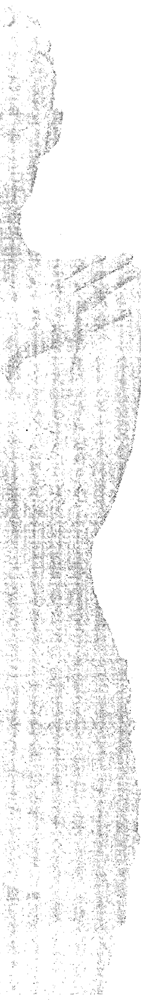
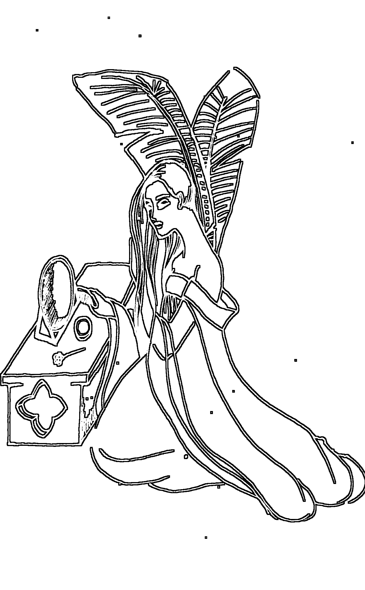
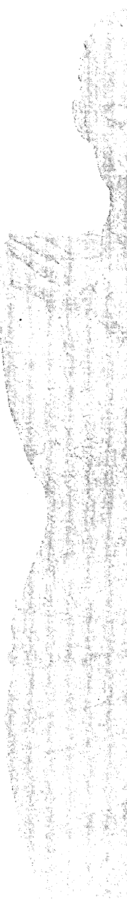
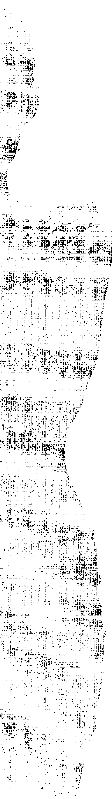
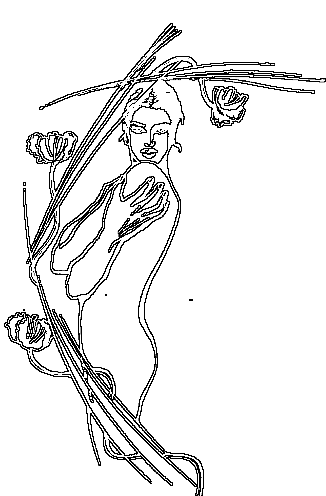

# 女人

## WOMAN

## Know Woman

## 解读书

[印度] 奥修◎著 杨东雄◎编译

由奥修彻底揭示女人奥秘的惊世经典

被译成30多种文字 在全世界广为流传

喀什维吾尔文出版社

## To Know Woman

女人被男人搞得只剩下身体。没有别人注意，她会感觉要死掉，没有别人的关注，生命还有什么用呢？女人并没有自己本来的生命，男人已经教会她说，生命是倚赖别人的意见而存在的。

应该承认，全世界的选美竞赛都围绕女人而主办，女人甚至不反对这样的做法：为什么不办男人选美呢？就像你们选世界小姐一样，也为男人选一选世界先生吧！没有人会为了男人的身体而困扰，他们可以变胖，可以成为丘吉尔，仍旧引人注目，因为他拥有权力。他能够有多胖就有多胖，能够有多丑就有多丑，整个脸都肥到下垂了——但是他依旧不担心，没有这个必要。他们可以拥有权力，可以成为首相，可以成为别的。

几个世纪以来，男人已经掌控了所有吸引人们的东西。他只留了一个东西给女人——那就是她的身体。他使女人像一株青菜一样——很自然地，青菜会担心顾客在哪里。那不是一个偶然，在性被曲解最严重的法国，当男人和女人相爱的时候，他会说：“我要把你吃掉。”当没有人说“我要把你吃掉”时，女人就会想：“现在完了，生命已经到达终点。”

> ——奥修

# 第一章 解读女人

## 1. 女人的奥秘

有人说，你似乎是地球上第一个真正了解女人并接受她们的人。我告诉他们，对于女人，要被爱，而不是被了解，这是最基本的认识。

万事万物都是神秘的，最好是去享受，而不是试图去理解。一个不断试图理解生命的人终将证明自己是个傻瓜，因为，最伟大的了解是领悟到没有一物能被了解，一切事物皆是奥秘的、神奇的。

男女之间有许多大的差异，这是因为千万年以来的制约所造成的，这些差异并不是合理的。但确实有一些差别让男女各自拥有独特的美感和个体性，这些差别很容易就能辨别出来。

其中一个差别就是女人能够生育，而男人不能。从这点看来，男人是比较卑下的，但这样的卑下却在男人对女人的支配中扮演重大角色。

自卑感以这样的方式运作：装作是比较优越的——欺骗自己然后欺骗整个世界。因此，男人长久以来一直在摧毁女人的才华、天赋和能力，借此证明自己是比较优越的——不论对自己或者对世人。

女人因为要生育，会有持续九个月以上虚弱无能，这期间必须仰赖男人。当然这只是生理上的不同，实际上并没有造成任何差异。而男人却告诉女人一些不属实的事，腐化了女人的心理，使她变成自己的奴隶，将她贬为地球上的二等公民。

男人说服女人的理由是，他们的肌肉健壮有力。但强壮的肌肉只不过动物性的一部分，如果这可以决定优劣，那任何动物的肌肉都比男人来得发达、来得优越。也得承认，真实的差异的确存在，我们必须去伪存真。

我了解到的一个差异是，女人比男人更有能力去爱。男人的爱或多或少是肉体上的需要；女人则不是，她的爱更崇高，是一种精神上的体验。这就是为什么女人向往一夫一妻制，而男人渴望一夫多妻制的原因。

男人想要拥有全世界的女人，但总是无法满足，他的欲望是无止境的。女人有一个爱人就会完全满足，因为她看的不是男人的身体，而是他内在的特质。她不见得会和肌肉健壮的男人谈恋爱，她会爱上有魅力的男人——不言而喻，就是有无比的吸引力——有着奥秘等待挖掘。

## 2. 女人对情人的定义

女人认为自己的情人不只是一个男人，而是一位有探索意识的冒险家。就性能力而言，男人是非常疲弱乏力的，只能达到一次性高潮。女人则是多次，她可以有多次性高潮，这成为很麻烦的事。男人的性高潮是局部的，局限在性器官部分；女人的性高潮是整体的，不只是性器官而已，整个身体都充满性欲。

就性高潮来说，她的体验能够比男人来得强烈、深刻与丰富。悲哀的是，女人身体的性欲必须被挑起，而男人对此并不感兴趣，从不关心这桩事，他只是把女人当做释放自己性欲的工具，几下就了事，就在这个时候，女人甚至还没热身。随即男人结束了做爱，转头就睡。性行为使所有紧张得以释放，让他更放松、帮助他睡个好觉。每个女人都曾为这样的情境而哭泣，她甚至还没开始、还没起步。她被利用了，这是生命中最丑陋的事：被当做一个东西、一个工具、一个物体。她无法原谅男人对她的利用。

要把女人也当做性高潮的伙伴，男人必须学习性爱的前戏，不要急着去满足自己，他必须让爱如同艺术品一般。他们可以有一个空间——所爱的殿堂——那里焚着香，没有刺眼的灯光，只点着蜡烛。当他处于美好愉悦的心情下，才能亲近女人，一同分享性爱的美妙。而有些男人和女人却经常在争吵后做爱，这样便玷污了爱，爱成为一种停战的协定——至少今晚是这样。这是一种贿赂、一种欺骗。

男人做爱时应该像个画家一样——内心充满着渴望——或是诗人在吟诗作对，或是音乐家在演奏。女人的身体应该像个乐器，是的，的确是个乐器。当男人感到喜悦时，性就不只是释放、放松、安睡的方法。既然如此，

性爱就有了前戏，他同女人手舞蹈、欢颂歌唱——美好的音乐萦绕着整个爱的殿堂，还有他们喜爱的薰香缭绕着。

做爱应该是件神圣的事，如果不是，日常生活就没有任何神圣可言。爱是绝不能强迫的，爱绝不能变成一种攻击。爱不应该存留在头脑里面——你可以让游戏、舞蹈、歌唱、享受变成这个恒久喜悦的一部分。当它出现时，那是美的，当爱自然来临，就存在着优美；当你企图使爱出现，就是丑陋的。

当你采用男人体位在女人上面的姿势做爱，那被视为是一种传教士的姿势。

东方已经发觉这样是丑陋的，因为男人的身材比较高大，这个姿势容易使男人压垮一个纤弱的女人。

在西方，做爱的姿势刚好相反：女人位居上方。女人被重压在男人下面，无法动弹；因为只有男人在动，所以只有他达到高潮，女人只有哭泣的份。虽说她是个拍档，却没有真正参与，她被利用了。位居上位的女人活动度会更大，而男人相对减低，这样使两者的性高潮相互拉近。当两者一同达到性高潮，就一同进入了另一个世界。

这是三摩地（Sadhana，注：梵文，人的超意识境界）的初次体验，人们首次感受到它不再受限于身体，而是遗忘了身体，也遗忘了世界。男人和女人一同进入他们未曾探索过的新天地。女人有达到多重性高潮的能力，因此，男人必须尽量放慢脚步。

不过事实是，男人行事匆忙，破坏了整个亲密关系。他应该放松，让女人可以达到多次性高潮，他的性高潮应该最终来到，那时女人的性高潮已经到达顶峰。这完全是一个能否体谅的问题。

这些是天生的差异，与制约无关。还有其他的差异，例如，女人比男人来得归于中心，她比较安详、比较宁静、比较有耐心、能够等待。也许就因为这样，她比男人更能抵抗病痛，寿命也更长。因为祥和与纤细，女人能够无限地满足男人的生命，男人的生命被她非常温馨舒适的气氛包围。然而，男人却害怕着——他不要被女人围绕，不要女人温情的包围，因为他怕自己会变得依赖。

## 3. 上帝选择女人来延续生命

千百年来，男人一直对女人敬而远之，因为他从心底知道，女人比他来得有价值——她能够生小孩。上帝选择女人来延续生命，而不是男人。

男人几乎没有延续生命的功能，这种自卑已经造成很大的难题——男人开始砍掉女人的翅膀，不择手段地贬低她、谴责她，至少借此自我安慰，以为自己是比较优越的。他把女人当牛看待，甚至连牛都不如。

在中国，有几千年之久，女人被认为是没有灵魂的，所以即使她被丈夫杀掉，法律也不会干涉——她是男人的财产，男人毁掉她的家产并不违法。

说女人没有灵魂，这种侮辱真是糟糕。女人接受教育和财务独立的机会被男人剥夺了，因为他们害怕。也剥夺了女人社会地位流动的机会，他知道女人是比较优越的，她知道女人是美丽的，他知道给她独立的机会就会引发威胁。

所以几个世纪以来，女人没有独立的机会。回教世界的女人甚至必须将自己的脸部遮住，这样一来，除了她的丈夫，没人能够目睹她美丽的容颜、她深邃的双眼。

在印度教的世界里，当丈夫死去，他的妻子必须陪葬，这是多么的残酷啊！

你已经占有她一生，何必连死后也不放过她。

为什么男人害怕当自己死后，美丽的妻子也许会找到另一个伴侣，说不定比自己要好。就因为这样，寡妇殉葬延续了数千年——一个你能够想象到的最丑陋的怪现象。

男人是以自我为中心的，那就是我称之为男性沙文主义的原因。男人建立了这个社会，一个对女人不留余地的社会，但女人有属于自己的优秀的特质。例如，男人有智能上的潜力，女人有爱的潜力。这并不意味着女人无法

拥有智能，她当然办得到，只要给她机会去发展。

爱是她与生俱来的——更有慈悲心、更友善、更能体谅。男人和女人是同一把琴上不同的琴弦，但是都苦于两地相隔。因为受苦、又不知原因何在，他们开始相互报复。

对于创建一个有组织性的社会，女人能够提供最大的帮助。她不同于男人，但并非无法胜任，她比得上任何男人。她的天分是绝对被需要的，但不是在挣得金钱、功成名就等方面；我们更需要的是一个美丽的家，女人能将任何房宅变成家园，她用爱灌溉家园，她有这种天性。她能使男人回复年轻的朝气，帮助他放松。

在《奥义书》（Upanishads）里有一段对新婚夫妻非常奇特的祝福。一对新婚夫妻去面见一位《奥义书》的先知，先知给他们祝福，特别对女方说：“愿你成为十个孩子的母亲，到最后，你的丈夫会成为你的第十一个孩子，除非你变成自己丈夫的母亲，否则就不算成为一位真正的妻子”。

这祝福非常有趣。但是，在人类心理上却有着许多差异。因为现代心理学发现，每个男人都在女人里寻觅她的母亲，每个女人也在男人里寻觅她的父亲。这便是每一桩婚姻失败的原因：你无法找到你的母亲或父亲。你的配偶不是来你的住所担任职务，而是要当你的妻子、你的爱人。然而《奥义书》里面的祝福——几乎有五六千年的历史了，却为现代心理学提供了一个依据。

一个女人无论有什么能耐，基本上，她就是一个母亲；父亲则是一种人造的习俗，不是天然的，但是母亲一直都是不可缺少的。

有人做过实验，以各种科学方法，运用完善的设备、医疗和食物来抚育幼儿长大。但不可思议的是，幼儿竟然不断萎缩，并且在三个月内死亡。他们发现母亲的身体及温暖是生命成长的必需品，在这个浩瀚的宇宙中，温暖是生命萌芽所不可或缺的，否则幼儿会感到被遗弃，他会逐渐萎缩然后死亡。男人没有必要自觉不如女人，这整个概念起因于你将男女当做不同人种看待。

男女属于同一人种，对彼此都有互补的特性，他们相互需要，只有两者合一才是完整无缺的。应该轻松地看待生命，差异并非矛盾，反而可以助## 第一章
爱能够激发人的创造力，使人达到不曾梦想过的极致。而她要的并不多，仅仅是你的爱而已，这是她的基本权利。男女间存在差异，绝大部分是制约造成的。差异理应保持，那会使男女相互吸引，当然差异不应是谴责的理由。我希望男女两者变成一个有机的整体，同时能够保持绝对的自由。因为爱绝不能造成束缚，爱应该给予自由。如果能这样，我们就能够创造一个更好的世界。女人——世界人口的半数——已经被否定其贡献，但她们确实有无限的能力来造福世界。世界会因此变成美丽的乐园。为了发挥出自己的潜能，女人应深入探究自身的灵魂，这样她将有美好的未来。男人和女人既非平等，亦非不平等，都是独一无二、无与伦比的。男女两性相互交合，将为存在的世界带来温馨。

# 第二章 追求解放
有人这样问我：你认为当今的女人最需要的是什么？我认为，女人因为被支配、被折磨而变得一文不值，已经变丑了。当你的本性不准许以天生的需要来发展时，那它将会变得腐败、变得有毒，变得残废和瘫痪——一切都被扭曲了。你在这个世界上遇见的女人并不是真正的女人，因为她已经被腐化了几百年。当女人被腐化后，男人也就无法继续保持自然的状态，因为男人毕竟是由女人而生的。女人需要一个彻底的解放，不过现在以解放为号召的运动却是愚蠢的，那是模仿，不是解放。我身旁有许多女人曾经历过妇女解放运动，她们开始时是非常具有侵略性的。我能理解她们的侵略性：经过几百年被主宰和被支配而积压的愤怒，使她们变得好斗，这不过是个报复，她们变得精神错乱。不过，慢慢地、慢慢地，她们变得柔软、变得优雅。她们的侵略性消失了，突然变得温柔婉约。真正的解放能使女人成为一个真女人，而不是去模仿男人。如果男人吸烟，女人也必须吸烟；如果男人穿短裤，女人也穿短裤；如果男人怎么样，女人也要怎么样；女人只不过变成次等男人而已。这不是解放，而是更深的奴役。因为起初的奴役是由男人强加于女人身上的，但现在却是由女人来奴役自己。当别人奴役你的时候，你可以反叛他，如果是以解放之名来自我奴役，那就不可能反叛了。我希望女人成为真女人，因为许多事情都有赖于她们。她们远比男人重要，因为在她们的子宫里孕育着男人和女人。她们分娩两者，养育两者。如果她们中毒，那奶水也会有毒，养育孩子的方式也会是有毒的。假使女人不能自在地成为真女人，男人也不可能成为真男人。女人自由是男人自由的一个必要条件，女人的自由比男人的自由来得更基本。如果女人是奴隶——就像几百年来一样——她也将造就男人为奴隶，而且是用非常微妙的方式，女人的做法是不好理解的。她不会直接对抗你，只会间接地对抗、娇柔地对抗。她会哭哭啼啼，不是打你一拳，而是打她自己。有了这种苦肉计和哭泣，就算一个魁伟无比的壮汉也甘拜下风。一个弱不禁风的女子是能够主宰一个壮汉的……女人需要自由，这样，她才能够给予男人自由。记住一个十分重要的原则：如果你奴役别人，最后你也会变成奴隶，你将无法保持自由。如果你想有自由，那就给别人自由，这是自由的惟一途径。你反对妇女解放运动吗？解放运动变得丑陋，我认为责任在坚持沙文主义的这些人身上。他们伤害女人已经很久了，现在女人要进行报复。当报复开始，女人就变得具有毁灭性了。回忆过去的创痛是无济于事的，复仇是无济于事的。人必须学习不念旧恶。长期以来，女人受到的对待就是这样。男人已经将女人贬为奴隶，甚至将她们当做物品、财产。报复的目的何在？女人变成原告而男人变成被告，然后又形成另一种沙文主义。这样一来，女性沙文主义就诞生了——这并不能匡正弊病，这时女人会开始伤害男人，然后迟早男人会再度报复。冤冤相报何时了？这是恶性循环。我认为，由女人来结束这样的恶性循环远比男人容易得多——因为她们比较有爱心，比较慈悲。男人比较好斗，比较粗暴。我对男人没有太多期望，我对女人有较多的期许。因为这缘故，我不赞同妇女解放运动的好斗态度与行径。生命的困局可以被爱溶解，任何暴力的行径是办不到的。男人和女人是两个不同的世界，因此要互相了解是困难的。过去已经充满种种误解，但不意味着未来也将是这样。我们能够从过去吸取教训，惟一的办法就是男女必须更了解彼此、容忍彼此之间的差异。那些差异是有价值的，不必有任何抵触。事实上，那些是男女相互吸引的原因。如果男女间一切的差异都消失，如果他们的心理状态一模一样，那爱也将消失，因为没有了相互吸引的两极。男人和女人就像电学上的正负两极一样：彼此相互吸引。他们是对立的两极，所以有冲突是正常的。透过了解、透过慈悲、透过爱，深入探究对方的世界并设身处地去领会，一切难题将冰消瓦解。没有必要再引发更大的冲突——实在是够了。男人和女人一样，需要同样多的解放。两者都需要解放，从头脑中解放出来。他们需要彼此合作，协助对方从固有思维里解放出来。这才是真正的解放运动。你认为只有女人才该为解放运动负责吗？解放运动这个现象是男人的创作，是一种男性所建构的现象。你一定会惊讶那又是男性的另一个诡计——现在，男人又想要摆脱女人，不想要负任何责任。他想要享受女人，但只为好玩，不想承担随之而来的责任。这是个巧妙的诡计，男人试图说服所有的女人，说女人必须变得独立自主。是的，男人狡猾的计谋一向很成功。许多女人被这样的想法所毒化。你知道吗？首先谈论男女平等的是男人，而不是女人。谈论男女应有同等自由的，是男人，不是女人。解放起源于男性的脑袋，事情向来都是这样。一个男人只要感到有利可图，就会放手一搏。他非常狡猾，有时又做作，女人就真的以为自己独立自主了。在过去，也发生过这样的事情。过去，男人说服女人时说她们是纯洁的生命、是天使、是神圣的。男人把女人放在神座上面，崇拜她们，就是这个伎俩——透过崇拜，男人控制了女人。自然而然地，当女人被捧上天，她就真的以自己神圣的。她的行径不可以像男人，因为那违反了她对自我的要求。那样高度的崇拜常常使女人自我陶醉。她是圣母，她是神圣的，她比男人更有神性；男人是丑陋的、悖德的，都是负面的。因此，女人必须宽恕男人。长期以来，男人一直没变，而女人是崇高的。女人保持纯洁，直到结婚都保持着处女之身。在西方，男人常对女人说：“现在你必须自由而不受束缚，你必须受到同等的对待。”现在局势改变了、时代改变了——光是妻子还不够，男人想要享受更多的女人。现在男人想要完全自由，想要完全自由就要完全解放女人。现在他再度说服女人，而妇女解放的倡导者全力以赴，大声要求自由与平等，结果什么也没有改变。现在这样更有利于男人了——就是女人应该独立自主，不应该要求任何承诺。男人不想对任何人承诺，他要的是完全的自由。他不要对你生的孩子负责，他不要永远和你住在一起，他希望每天换不同的女人。现在他再次花言巧语：人活着不应该被承诺束缚，人应该没有牵累地生活。人不应该被占有，人不应该嫉妒。他再次创造出美妙的哲理，从前男人也这样做过——而且有太多女人受骗，所以他们故技重施。女人容易信任别人，得到她们的信任是轻而易举的，爱比逻辑来得容易。女人感兴趣的是即刻的、当前的事物。男人总是想到策略、战术，以后可能如何，怎样演变他的未来、计划。

# 第三章 追求角色转换
现在的情况就是女人必须和男人平起平坐，她必须不再对家庭、亲人、小孩以及母亲的角色感兴趣。她必须开始对诗、文学、绘画、科学、技术等诸如此类的事情感兴趣。当今世界各地，会聚了许多发扬女人意识的团体，她们所有的议题都有某种一致性：就是必须破除她们内在深处的女性气质。这样，才能和男人比高低。女人是柔弱的，天生就是柔弱的，她们无法与男人竞争。如果硬要和男人一搏，她们必须变得凶悍。因此，偶然碰到女性解放论者，你看到的会是一张失去柔和的面孔。很难对一位女性解放论者说“宝贝”，这非常困难，她会因此生气，怎么还叫“宝贝”？她认为和你平等的。敌对的关系就此产生。女人或许可以对家庭漠不关心，因为那样就无法与世人竞争。如果你关注小孩，就无法与世人竞争，因为那会分散心力，如果你要与世人竞争，并且证明自己像男人一样强悍，你必定变得更像男人。这注定会失败的。女性解放运动是个失败——因为人类惟一的希望是女人的温和柔弱，而不是男人的坚毅不屈。我们已经受够了男人的坚毅不屈，真正必要的应该是男人变得更像女人，而不是女人变得更像男人。女人被怂恿去反对她们自己、去努力驾驭事物。这违反天性，这个天性是女人身体里面的子宫——子宫渴望一个小孩，子宫渴望一个家。家，是女人外在看得到的子宫，是内在子宫的一个投射。如果女人不再关心家庭，她就不再关心内在的子宫，但子宫毕竟存在。而且男女是无法相同一致的，因为男人没有子宫。他们如何相同一致？我不是说他们有高下之分，只是很肯定地宣称：男女是无法相同一致的。他们如何一致呢？他们是相对的两极。他们差别很大，无法以平等或不平等的标准来相互比较。

# 第四章 女人的义务
女人就是女人，男人就是男人，而且该保持他们的样子。女人就该关注家庭，因为一旦她不再关注家庭，也将不再关注子宫和小孩。既然这样，她自然而然会变成一个女同性恋者。我认为，男人有必要变得更温柔一点。男人在成为男性的路上走过头了，已经失去整体人性的线索。别学他们，别和他们竞争——否则你将重蹈覆辙，了无新意。如果依样画葫芦，女人将变得好斗。那些在街头呐喊、抗议的解放论者是很丑陋的，她们展现出男性心智中最恶劣的一面。文明是个伪制品，文明背离了自然；人越是文明，就越被显在脸上，与他的心失去了连结。他的心依旧是原始的，所幸，苍天尚未找到教化心灵变成文明的方法，心灵是人类继续生存下去的惟一希望。抛掉身为男人或身为女人的信念吧！我们都是人类。生为男儿身或女儿身只是表面上的事，别大惊小怪，哪一点都不重要，别看得太认真。我一直在谈论典型，但并不包括性别。当我提到“男人”这个字眼时，是意味着男人型；当我提到“女人”这个字眼时，是意味着女人型，但我无法每次都说“男人型”、“女人型”。因为有的女人确实不像女人，她们是狼；有的男人不是狼，他们是猫。那么我所谓的男人就适用于那些属于狼的女人，而女人就适用于那些属于猫的男人。我并非在谈论男女之间的生理差异，而是心理上的差异。应该说有的男人远比任何女人都来得阴柔，也有的女人远比任何男人来得阳刚。这并不是美，反而是丑陋的，你的内在因为这样被分成两半。如果你有男人的身躯和女人的思绪，那么你的内在将会产生冲突、斗争和内战，你会持续地处在拉锯战、争斗的状态中。如果你生理上是女人，而有属于男人的思绪，那你将会浪费太多能量在不必要的冲突上。最好能和谐一致。如果是男儿身，那么就该有男人的思想；如果是女儿身，那么就该有女人的思绪。然而，妇女解放运动却招致不必要的困扰。它把女人转变为狼，教导她们如何斗争。假如男人是敌人，你怎么能爱上敌人？你怎么能和敌人产生亲密关系？况且，男人并非敌人。要成为一个真女人，女人必须越来越阴柔，必须抵达温柔善感的最高点。要成为一个真男人，男人必须尽可能深入他的阳刚气概。当一个真男人碰上一个真女人——相反与对立的两极，只有两相对立才能坠人爱河，只有两相对立才能享受亲密，只有两相对立才能相互吸引。现在的趋势是一种男女不分的雌雄同体：男人变得越来越阴柔，女人变得越来越阳刚，所有的差异性迟早会消失。这样的社会将是黯淡的，将是死气沉沉。我希望女人尽可能变得阴柔，惟有如此她才能成熟；男人则要尽可能变得阳刚，惟有如此他才能成熟。当他们是相反的两极，强大的吸引力、诱人的魅力就会在彼此之间产生。当他们靠近对方，当他们在亲密关系中相遇，把彼此引进了两个不同的世界、两个不同的向度、两种不同领域的富饶，这样的会合就是一个无限的祝福、无限的恩典。女人对战争不感兴趣，她们对核武器不感兴趣，也对共产主义或资本主义不感兴趣。所有的“主义”都是来自头脑。女人感兴趣的是生活里小细节的喜悦：一幢漂亮的房子、一个花园、一个游泳池。生活可以变成乐园，除非男人的权力完全被摆平，否则生活依旧是个地狱。

# 第五章 源于性生活的困惑
常有女性会问：我深深地被禁锢在这样的恐惧之中：和一个男人有了亲密关系，并且完全失控。这个无法无天的女人的内在被禁闭起来，当她偶然跑了出来，男人常常就惊讶了，为了顾全大局，她又龟缩回去，然后感到完全被挫败。我们有必要回顾一些事实。在性生活方面，男人有能力达到一次性高潮，女人则是多次，这造成了很大的困扰。如果他们没有被强制进入婚姻和一夫一妻制，就不会有那么多的困扰，这些制度似乎不是自然的旨意。男人会害怕女人有一个简单的理由，就是如果他引发女人的一次性高潮，那么女人就准备接受再次的性高潮。因此他无法满足女人。因此，男人找到一种方式：即一次性高潮也不要给女人，甚至把女人能够有性高潮的概念也一概去除。男人的性感带是局部的，局限在他的性器官。女人却不一样，她的性欲和敏感带遍及全身，她需要更长的时间来热身，常常是在她还没热身之前，男人就完事了，然后转身大睡。千百年来，世上有过无数的女人，未曾体验过上天给予她们最大的礼物——性高潮的喜悦，这是为了维护男人的自尊。女人需要一个漫长的前戏，而后她才开始心荡神驰，令男人感到威胁的是该如何面对她多重性高潮的能力呢？从科学的角度来看，性不应该被那么严肃地看待，甚至应该让伙伴来满足女人一连串的高潮，或者也可以使用电动按摩棒之类的科学器具，不过两者都会造成困扰。如果你用电动按摩器，那么女人想有多少次性高潮就有多少次，一旦女人掌握了这个技巧，男人所给予的性高潮就显得微不足道。她们也许宁可以选择电动按摩棒之类的科学器具，而不是男人，如果你允许伙伴一同加入，那会变成一个社会性的丑闻——性放纵。所以，男人选了一个最简单的方式，就是让女人在做爱的时候甚至都不可以移动，她几乎就像尸体一样，而男人很快就射精——两分钟，最多三分钟，这时候女人也不会感觉到她错失了什么。拿生物的繁衍来说，性高潮不是必要的。就灵性成长来说，性高潮却是必要的。我认为，人类起初是因为经历性高潮的喜乐，才有了灵性上的冥想，寻找更高的、更强烈的、更有活力的意图。性高潮是自然给你的暗示，指出你内在潜藏着的无法估量的喜乐，它只是让你浅尝个中滋味，之后你可以进一步去探索。对性高潮状态的认识，是最近才有的事。直到本世纪，心理学家才开始察觉到女人的困扰。精神分析及其他的心理学家也得到同样的结论，就是女人被阻挡在灵性成长之外，她仍旧是个佣人。拿生产后代来说，男人只要射精就行了，这没有生物学上的问题，却有心理上的问题。女人比较敏感、挑剔、暴躁，理由是她们某些与生俱来的权利被剥夺了。只有西方社会的年轻人察觉到性高潮这回事，并不是因为这些年轻人走进对真理的探求、对狂喜的探求，而是因为性高潮的那一瞬间，他突然发现那个超越的彼岸。有两个状况发生在性高潮里：第一个是思维在刹那间停止了，变成顷刻无念的状态；第二个是时间停止，性高潮那一瞬间的喜悦是如此美妙。在自然的状态下，在很早的时候人类就发觉这两个状况能够带来很大的愉悦。有个很简单的逻辑结论是，如果你能够让那个喋喋不休的思绪沉寂下来，那么一切也停止了——包括时间在内——而后你就不再受性欲控制。你无需依赖别人，不管男人还是女人；你能够以此静心单独达到这样的状态。性高潮无法延续不断，静心却可以延展到一天二十四小时里面的任何时候。

约旧金山，你会发现男娼，那是新现象。这不是一个革命，而是一个反动的倒退。

关键问题是做爱的时候除非你失去自制，不然不会有性高潮的体验。男人应该更能体会了解，女人必定会喘息、呻吟和狂叫，那是因为她全身上下都浸淫在欲望里头，全然地陷在里面。

你不必害怕，那有极大的疗效，她将不再对你暴跳如雷、不再对你唠唠叨叨，因为所有变成毒素的能量都转化成无限的喜悦。别害怕邻居会怎么想，那不是你的问题，如果他们为你的喘息和呻吟感到不耻，那是他们的问题，你并没有影响他们什么……

让你的爱像个欢乐的节日，别仓促行事，去欢舞、歌唱、演奏音乐，不要使性成为大脑的游戏。理智的性是不真实的，性应该是自发的。营造那样的情境，你的寝室应该像宫殿般神圣。在寝室里别做其他事情，唱歌、跳舞、嬉戏。

然后，如果爱自己来临、自然而然地发生，你会非常惊讶，生物性驱力竟然令你发现快乐。

也不必为那些疯狂的女人担忧，她有必要疯狂，因为她的全身处在完全不同的境界中，无法主导，如果她主导身体，那么她仍旧像具尸体。有许多多的人，做爱的时候都像只死鱼一样。

我听过一个有关埃及艳后的故事。她是个绝世美女，去世的那一天，依古埃及的习俗，她的遗体必须三天后才能火化。结果她的尸体在这三天中被玷污——具死尸！我听到这里，深感惊讶——是什么样的男人会干这种事？不过我随即感觉到或许这并不很奇怪。所有的男人都把女人认为是尸体，至少当他们做爱的时候。

关于爱与性的最早的著作是婆错耶那的《爱欲经》。这是一部有关性爱的箴言集，里面描述了84种做爱的姿势。当时基督教传教士抵达东方时，他们为只知道一种做爱姿势而感到惊讶，男人在上面——如此男人比较能够移动，而女人就像具尸体躺在男人下面。

婆错耶那的见解是非常正确的——女人应该在上面。男人在上面是很野蛮的，因为女人比较纤弱，然而男人选择在上面，这样可以掌控女人。被一头野兽压在下面，美女势必被控制支配。女人甚至不准睁开双眼，因为那是妓女的行径，她必须像个淑女。

这个男人在上面的姿势，在东方被视为是一种传教士的姿势。男女关系的剧烈革命方兴未艾，全世界有许多协会出现。在一些先进国家，这些机构教你们如何做爱。很不幸地，连动物都知道如何做爱，人类却需要被教导，在那些教导里，基本的内容是前戏和后戏，然后爱就变成如此神圣的经验……

你应该抛弃对于做爱和全然失控的恐惧，让那些蠢蛋去害怕吧。如果他们害怕，那是他们的事。你应该对自己忠诚，你们却都在欺骗自己、蒙蔽自己、摧毁自己。

就算男人惊奇，然后光着身子逃出房间，那又何害之有？关上房门，让邻居知道这男人疯了疯了，但这需要你不去压抑体验性高潮的可能性。这个性高潮体验是水乳交融、无我、无念、永恒的体验。

也许会激发你去探索，找到一种方式，你不需要任何男人、不需要任何伴侣就能够摒弃理智、摒弃时间，独自进入高潮的喜悦。我将这个称为真正的静心……

不应该害怕，享受这个游戏吧——抱着玩的心情。如果某个男人惊讶了，那还有别的男人，总有一天，你会找到几个不会惊讶的狂放男人。

也有女人问：我曾听说东方98%的女人从未体味过性高潮。那为何她们看起来如此优雅，不像西方的女人那么受挫折？

这是生命奇特的逻辑，在某种层面上，就是那么简单。东方98%的女人不知何谓性高潮。你问：那为何她们看起来如此优雅，不像西方的女人那么受挫折？

原因就是因为他们不知道必须有过某些经历，然后遭到摒弃，惟有这样才会遭受到挫折，如果你一点都不知道性高潮的存在，那就没有挫折的问题。

在20世纪之前，西方的女人也没受到挫折，因为她们的处境和东方女人一样。由于心理分析和人类生物学的深入研究，才发现近千年来我们被蒙蔽在一种谬论中。这个谬论就是认为女人经历的是阴道高潮，这已经证明是不符合事实的，她们一点也没有阴道性高潮。

事实上，女人的阴道感觉迟钝，或没什么感觉。她有的是阴蒂性高潮——与阴道完全不同的部分。她可以在不知道任何性高潮的情况下生产后代，可以不知道任何性高潮而做爱。几百年来，东方和西方的女人都以成为母亲而满足。

某种程度上讲，她们是反对性的，因为那没有给她们带来任何喜悦——只带来麻烦——怀孕。几个世纪以来，女人活像个工厂，产品就是小孩，男人将她们当工厂来用，不当人看——因为在过去，十个小孩有九个会夭折，所以，如果想要有两三个小孩，女人就得生。就是说，当她有能力生产后代，而整个性生活就是一次又一次的怀孕，怀孕是一件折磨人的事。

她从来不曾体会过性快乐，她受苦、隐忍着，进人性是因为那是她的职责。实际上她憎恨着丈夫，因为他就像头野兽。为何你们会认为女人总是尊崇禁欲的圣人？主要原因是，女人将本身的禁欲、心态投射在那些人身上而导致她无法以同样的方式来尊敬她的丈夫。

只要你和一个女人有了性关系，她就无法再尊敬你——这就是代价，因为她知道你已经利用了她。每一种语言里都有句说得很清楚的话：是男人对女人做爱，不是女人对男人做爱。这是不可思议的，但在每种语言里总是男人在做，女人不过是个客体，女人只是隐忍地进人性，她的观念已经被制约，那是她的职责。

男人是神，必须尽可能使他愉快。因为性并没有带给女人什么，而且她处在不知不觉的状态。男人必须保持警觉，警觉女人拥有多重性高潮的能力。

对丈夫来说，撩起女人的性高潮能量是非常危险的。他无法满足她——没有一个男人能办得到。这是不平等的，是天生的缺陷，女人能有多次高潮，而男人只能有一次。因此，男人甚至尽力去回避这一难题。这也就是东方人的观念依旧没改变的原因，尤其是落后地区。抛开现代化都市地区不管，因为那里的女人也许通过教育而知道，也许听闻过马斯特和琼生——他们发现了女人有多重性高潮的能力。

这在西方世界已经变成难题，因为一次高潮和男人千百年的骗局是同时发展的。随着妇女解放运动的兴起，女人努力要挖出男人对待她们的一切恶行。她们意外获得这些新的研究成果，接着极度狂热的妇女解放者就变成了女同性恋——只有女人能够相互促进彼此的多次性高潮——因为那与阴道一点关系也没有。

男人的乳房只有一点，而女人有一对立体的胸脯。此外，男人和女人有着非常类似的肉体，人在性生理上有明显的标志，女人的阴蒂相当于男人的阴茎，只不过长得比较小，但却在阴道的外面，婴儿从阴道产生，因此，男人不需要去触碰阴蒂——而不接触阴蒂，女人是达不到性高潮的。

东方的女人看似比较满足，那是因为她没有察觉失去什么，她更优雅，因为她甚至还没想到任何解放的观念。整个东方依然活在基本的生存条件之下——不论男女——贫穷、奴化、疾病、死亡。

在东方的思维里，革命的观念是不可能的，因为生存环境如此艰难，而且你的人生观是你过去的经历所造就的。为什么东方女人不像西方女人那般倍感挫折，这个问题很容易理解：东方女人已然接受了命运的安排，西方女人则是有史以来首次反抗所有虚构的观念，包括命运、因果报应……

西方女人有必要度过这个摧毁她原有满足和优雅的革命阶段，将她带到另一个世界，开始变得丑陋和惹人厌。这不是聪明的造反，只不过是一个反动的姿态。

马克思首先注意到东西方女人变得不同的原因，他的观点说服了世界各地的知识分子。贫穷与前辈子、命运、神意毫无关系，不是神在决定谁该贫穷、谁该富有，是因为社会结构的关系，经济结构决定了谁会贫穷。这个结构是能够改变的，因为它不是神造的——没有神这样的事物——而是男人建构的。

马克思是革命先锋。接着是弗洛伊德，他宣称男女是平等的，都属于同一物种，任何批评女人的哲学都是没有人性的，都是男性沙文主义。最后是马斯特和琼生的研究，他们为女人长久以来被剥夺的性高潮带来曙光，并证明男人的行为实际上是缺乏人性的。就男人的性需求来说，他利用女人，但却不准许女人享受性。

这三者改变了整个西方的气氛，然而并未穿透西方人的内在，所造成的结果依旧是传统的思维，西方的女人正准备作战，这是个反动的现象，我不赞同以妇女解放之名所发生的事情。

我希望女人获得解放，但不是走向另一个极端，妇女解放运动正走向另一个极端——复仇心切，企图以牙还牙。

这是愚蠢的。男人的所作所为是无意识的，他并非有意识地去对付女人；不仅男人是不知不觉，女人也是不知不觉。

女性解放运动宣称她们不再和男人有任何关系——要切断与男人的一切关系。她们宣扬女同性恋，就像男同性恋一样，女人应该只爱女人，而且要抵制男人。这纯粹是扭曲。既然要反扑，女人就该以其人之道还治其人之身：粗鲁、暴虐，像男人一样口出秽言。

当然，她们不再优雅、不再柔美……穿得像男人一样，但这样激烈的变动是个怪异的现象。东方女人的穿着有种优雅，让整个身体散发出柔美，而西方女人却企图和牛仔竞赛——牛仔裤、乏味的上衣、丑怪的发型。

她们认为自己在复仇——其实她们在摧毁自己，复仇总是毁了自己，反扑总是毁了自己。我很乐意见到她们成为叛逆者，但不是现在这种革命者形象。

## 第三章

## 婚姻问题

## 1. 丑陋的婚姻制度

为什么男人和女人很难成为朋友？这看似小事，实际上几乎不可能。他们之间不是有一个丑陋的协定——丈夫和妻子——不然就是一阵激情，最后以失望划上句号。

为什么男女之间总是这么丑陋呢？

这很容易理解，婚姻是由男人所发明的最丑陋的制度，那是不合乎自然的，理由是你为了独占一个女人。你可以将女人看成是一块土地或是一笔资金来运用，你已经把女人贬为物品。

如果你将任何人贬低为物品——不知不觉地、无意识地——那么你也被降格到同样的层次，否则，你无法与之沟通交流，假使你能够与椅子讲话，那你得先成为一张椅子。

婚姻制度是违反自然的。惟一能够确定的是，只有这个片刻才是你能够掌握的。一切为了明天的承诺都是谎言——婚姻是一辈子的承诺，你们会一直守在一起，你们会一直彼此相爱，直到死前你们都会相互敬爱。

那些神职人员创造了许多丑陋的东西，他们对你们说婚姻来自天堂。但事实上没有什么来自天堂，天堂并不存在。

如果你倾听自然的声音，你的困扰、你的问题将会烟消云散。这个困扰就是在生物学上，男人被女人吸引，女人也被男人吸引，这个吸引力无法持续到永远。你被那个具挑战性的对象所吸引，你见到一个英俊的男人或是 一个漂亮的女人，你被吸引住了。这并没有什么不好，你感觉心跳加速，你想和对方在一起，那个片刻的吸引力强烈到使你以为想永远和对方在一起。

爱人之间并不相互欺骗，他们会说真话——但那些真话只属于这个片刻。当爱人对彼此说：没有你我活不下去。他们不是在欺骗对方，那是真话，只不过他们不知道生命的本质，同样的女人隔天看来不再如此美丽，这
对情人会感觉自己被束缚了。

他们现在已经完全明白彼此的疆界，一开始对方还有未知的领域有待发现，现在已经不新鲜了。不断相同的言语和行动是如此枯燥乏味。这就是由激情转变为憎恨的原因，女人因为你不断重复相同的事情而恨你。当丈夫回家，她就开始头痛，跑回房睡觉。

不知为什么，她就是不会生活。同时，男人也在办公室里和秘书调情，因为这样才有新鲜感。

这些都很自然。违背自然的是那些以宗教之名、以上帝之名作为他们全部生命的盲从者。在一个更美好、更有智慧的世界里，人们会爱，但不会制造任何契约。爱不是在做生意，他们会去了解彼此，他们也会领悟到生命的真谛，他们会对此坦诚，当男人已经无法对他所爱的人感到喜悦，他会实话实说，要求分开。

婚姻是没有必要的，离婚也是没有必要的。你问为什么男女之间没有友谊的可能，在狱吏和囚犯之间友谊是不可能发生的，只有彼此是平等的、完全摆脱一切社会、文化和文明的束缚，真实地活出本性的人之间，友谊才有可能发生。

30 ‘亲爱的，蜜月已经结束。’这样对女人说并非是一种侮辱；‘已经不再美好，微风不再，季节已变，俩人之间已不再有春天，花朵不再盛开，芬芳已然不再，是离别的时候了’。

如果女人也对男人如此说，那也不是羞辱。因为不存在婚姻的束缚，所以没有任何离婚的问题。让法庭、法律和社会来干涉你的私生活是很难堪的，你做决定得先征得他们的同意。他们算什么？这是两个人之间的问题，属于个人隐私。

如果只有友谊，激情绝对不会变成憎恨，当你感到激情不再，你说声再见，也会被谅解，即使对方感到伤心，也不能改变些什么，因为生命就是如此。

人们建构了社会、文化、文明、习惯、规章和宗教，把整个人类变得不自然。这就是男女无法成为朋友的原因，当他们成为夫妻——这是非常丑陋的，他们开始占有对方，人不是物品，你无法拥有他。如果我觉得你的老婆
很漂亮并接近她，你就愤怒、准备要打架，因为我觊觎你的财产，妻子不是财产，丈夫也不是财产。你们创造的是什么啊？人已经被贬为物品，然后，嫉妒和憎恨随之而来。

你自己清楚，你被隔壁的太太吸引，自然而然地，你也会猜疑自己的老婆。你的老婆也很清楚自己吸引着其他人，但是有夫之妇不能做出越轨的行为，丈夫正全副武装站在一旁，这样的爱一定会变成恨，憎恨会在毕生中不断地累积。

在憎恨中怎能生出美丽的后代呢？他们不是爱的结晶，而是职责的产物——妻子的职责就是允许丈夫利用。妻子和妓女并没有什么差别，差别只在于你是开自己的车或者是搭计程车而已。

妓女只被买卖了几个小时，妻子却是被长期买断，那是经济上的问题。皇亲国戚不会和非皇族的人通婚，他们关心的是地位、财富、权力。在这样势利的人际环境下，没有人会相爱。

女人因为你赚钱而倚靠你。长久以来，男人不准女人受教育、做生意、工作，简单来说，就是如果女人自己拥有经济地位、有自己的银行存款，你就无法将她贬低为物品。所以她必须倚靠你，而你想一个倚靠你的人会爱你吗？

每个女人都想要将她的丈夫杀了。不过这又衍生了一个麻烦，因为如果杀掉丈夫，她该怎么办？她没有受教育，没有社会经验，不会赚钱。

有妇之夫——我指的是每一个丈夫，没有例外——都想要除掉女人，但这又不能，因为有小孩要照顾，而且每当离家上班前，他都会吻别并许下爱的诺言。其实这两人只不过是一对，他们之间根本没有爱，不是心心相印。

人们造就了一个男女之间不可能有友谊的社会。

请记住，友谊是如此重要，不管两人之间的结果如何，即使是你的配偶，你也要保持友谊，而且要容许对方有绝对的、完全的自由。

我认为这是没有任何问题的。如果我爱一个女人，有一天她又爱上别人且感到很幸福，我会很高兴。我爱她，我也希望她快乐——这有什么不好吗？我会用各种方式来帮助她，使她能够更快乐，如果她和别人在一起能够
更加快乐，这怎么会伤害到我呢？那是你的自尊心受创：因为她找到比你更好的人。

问题不在于那个人是否比你好，也许他只是你的司机——问题在于如何去调适，如果你给对方充分的自由，也许你们还会一辈子在一起，或者永远只是朋友，因为已经没有必要摆脱对方。

婚姻让人急于摆脱对方，因为它意味着不再自由，自由却是生命中最高的价值。如果所有的伴侣都自由无束缚，你会很惊讶，这个世界已然变成天堂。

也许存在其他的困扰。你们有小孩——这和小孩有什么关系？我的回答是，小孩必须是社区的成员。他们可以去父母那里，不论父母亲是否还生活在一起，他们有必要从双亲那里学到——爱不是奴役，爱是自由。他们应该搬进社区生活，品味、欣赏各种不同的人、不同的特质。

到时候他们的抉择就不只是坠入爱河这种愚蠢行径而已，而是通过深思熟虑、沉思冥想的静心状态。对他们来说，共同生活一辈子是有可能的。事实上，如果人们彼此都是独立自主和自由的，那么可能性就更大了，会有更多人继续生活在一起。

假如婚姻消失，离婚就自然而然地消失，离婚是婚姻的副产品。没有人注意到这个显而易见的事实，为何娼妓数百年来持久不衰？是谁造成的？谁该为这些可怜的女人负责？就是婚姻制度问题。

你对妻子感到枯燥无趣，去找别的女人只是为了换个口味，她不会将你捆绑。因为一个已足够，两个就太多。这只是个短暂的游戏、萍水相逢，你让自己维持几个小时的愉快心情，表达爱意。

全世界无数的女人沦落到出卖自己的身体，这是谁的责任？你们的政治领袖，你们的宗教领袖，我认为他们是罪魁祸首，而且要罪加一等，因为人类长久以来的苦难就是源于这少数的蠢人。

你必须从自己开始，别无他法。如果你爱一个人，那么自由必须是你们之间的连结，假使明天你见到你的女人与别人拥抱，没有必要嫉妒——因为她被滋润了，她正在尝试一些新鲜的事物——就像有时候你会去中国餐馆一样，那是好的。你还是会回去吃你原本的食物，中国菜也帮助了你，因为你.或许更能够尝出原来食物的滋味。生命如此简单、如此美妙，惟一欠缺的是自由。如果你的妻子和别人在一起，她将很快回到你身边，带着新的见识和成果回来，而且对你会有新的发现，到时候，你不必再坐在椅子上敲自己的头，你也要增长体验，这样当她回到你身边时，你也是焕然一新的。你也要吃吃中国菜。生活应该是件快乐事，只有这样，男女之间才可能存在着朋友关系，否则，他们依旧是亲密的冤家。

如果在婚姻中爱被摧毁，那么我们如何期待在日常生活中分享爱和想法？又如何以母亲和父亲的身份来养育孩子？

我从未说爱是被婚姻所摧毁的。婚姻怎么能够摧毁爱呢？是的，爱是在婚姻中被摧毁的，但那是你摧毁的，不是婚姻，是伴侣们联手摧毁了爱。婚姻怎么能够摧毁爱呢？因为你不知道爱是什么，所以你毁了它。你只是假装知道，你只是希望自己知道、幻想自己知道，但 you 不知道爱是什么。爱是自古以来最伟大的艺术。

如果在舞会上，有人来邀请你：“来跳舞吧！”

你却说：“不会。”你不加人就无法让每个人知道你可以跳得很好，你若画地自限只会让自己像丑角一样，就无法证明自己也能跳舞。要敢于尝试舞蹈的优雅和韵律，你必须亲身体验。

画布、彩笔和颜料都在那里，你不动手去画，就是不想开始。你就是不说：“一切准备好了，所以我要画了。”你可以的，但不是那样就会成为一个画家。

你与一个女人相遇，画布在那里，你马上变成一个爱人开始动手画，她也动手去画你。当然，你们会证实双方都是愚蠢的——被画得像傻瓜一样——迟早你会了解这是怎么一回事。但你从未把爱视为一项艺术，你并非天生就是画家，这和你的血统无关，你必须去学习，那是最奥妙的艺术。

你与生俱来的只有能力。你生来就有身体，因为你有身体，所以能够成为一个舞者。你能够扭动身体，因此能够成为一个舞者——然而会跳舞必须通过练习，学习跳舞需要很多的努力，而且跳舞不是那么困难，因为你自己就可以沉浸其中。

爱就困难多了，它是与别人共舞，对方也需要懂得那个舞步。与别人配合是一项伟大的艺术，在两人之间创造出和谐，两个人意味着两个不同的世界，当两者相互靠近，如果你不懂得如何去协调，一定会产生矛盾。

爱是和谐、幸福、健康和融洽，这些都来自爱。别急着结婚，先学习去爱，宁可先成为一个伟大的爱人。

这需要必备的条件吗？那就是永远准备好要给予爱，而且不担心是否能得到回报。总是会有回报的，那是事物的本质，就好像你在山顶上唱歌，山谷随即有回音一样。你曾见过山里产生回响的地方吗？你呼喊，随即山谷也呼喊，或者你歌唱，山谷也跟着歌唱。每一颗心都是一个山谷，如果你真心付出，它会有所回应的。爱的第一堂功课不是去索求爱，而只是去给予。成为一个施舍者。人们却反其道而行，即使当他们 在给予的时候，也只是想着应该要有回报。

这是一种交易，他们不是在分享，不是自在地分享。他们的分享是有条件的，眼角里持续在关注好心是否得到好报这回事，可怜的人……他们不知道爱原本是如何产生的，你只要灌溉你的爱，它自然会开花结果。

如果没有回报，也不用担心，因为一个爱人知道付出就是快乐的。如果有回报，很好，幸福锦上添花，但就算爱从未回应，仅仅在那个爱的行动里，你也已经非常快乐了，谁还在乎有没有回报？

爱有其内在固有的快乐。当你爱，它就发生了，没有必要去等待结果。只要开始爱，你会见到更多的爱降临到你身上。每个人都需要爱，透过爱，才知道爱是什么。

就像想学游泳必须下水去游，想爱惟有透过爱。

但人们非常吝啬，他们要等到被深深眷顾之后，才会去爱。他们一直封闭、孤立着，只是等待，等某些旷世的俊男美女降临才打开心扉。到时候，他们已经完全忘记如何去打开了。

不要错失任何爱的机会。即使只是在路上经过，你也可以爱。即使对一个乞丐你也可以表达爱，不是一定要施舍什么东西，至少你可以对他微笑，这不花钱的微笑敞开了心扉，使你的心更有活力。与人握手，不管是朋友或
是陌生人，别等到是适合的人才去爱，否则这个人永远不会来到。

不断地爱，你越是爱，那个适合的人就越可能来到，因为你的心花开始绽放，两颗绽放的心会吸引许多蜜蜂、许多爱人。你们是被一种非常错误的人所训练出来的。人人都活在错误的印象中，认为自己已经是一个会爱的人了，你以为爱是与生俱来的能力，但事实上并不是这样，你只是有那个潜能存在，还必须被训练和陶冶。种子是存在的，但它必须成为花朵。

你可以继续携带着你的种子，没有蜜蜂会光临的，你没见过这样的事吧？难道它们不知道种子能够开花吗？它们只有花开时才会来。请变成一朵花，不要只想当一颗种子。

两个人在各自独处的时候，就已经不快乐，如果还在一起，将为彼此增加更多的不快乐。你不快乐，你的爱人也不快乐，然后你们还期望在一起的时候彼此会快乐吗？这是个简单的算术——就像二加二等于四，不是什么高等数学，用指头就算得出来，你们两人在一起会更不快乐。

“你不再爱我了?" 木拉·那斯鲁丁的太太问：“不再像以前求婚的时候对我说甜言蜜语了。” 她用身上的围裙擦去眼角的泪水。

“我爱你，我爱你," 木拉·那斯鲁丁回答：“现在可以请你闭嘴，让我好好地喝完啤酒吗?”

求爱只是一个过程，不要看得太过认真。其实，在你结婚之前就该摆脱求爱的阶段。我认为，结婚应该发生在蜜月之后，绝不能在之前，只有有了了解后，才应该结婚。

婚后的蜜月是非常危险的。据我所知，许多婚姻在蜜月结束的同时就完了。但是，之后你被捆住，无路可走，整个社会、法律、法院——人人都在防备你离开妻子或妻子离开你的可能，所有的道德、宗教、神职人员，每个人都在批评你。事实上，社会应该设计对于婚姻的种种门槛，排除离婚的一切阻碍。

## 3. 在激情中感受对方

社会不该如此轻易允许人们结婚，法院应该设计关卡——和另一半至少共同生活两年，然后法院才允许你结婚，现在的人刚好反其道而行，如果你要结婚，没有人会问你是否准备好了，或者只是一时念头，也许你只是喜欢上那个女人的鼻子。多么愚蠢！只靠着高挺的鼻子是无法过活的，过两天那鼻子会被遗忘：谁会注意老婆的鼻子？

有一家医院，护士个个长相都够格参加世界小姐选拔，但是每当某个病人见到她们，就会瞪着她们说：垃圾！

隔壁床的男病人完全无法了解这个状况，这么美丽的护士在照顾你，而你只会骂“垃圾”。

我当时心里想到的不是那些护士，那个人悲伤地说，我想到的是我的夫人。

你的老婆看起来不漂亮，你的老公看起来也不英俊，一旦你熟悉某个事物，他的美就消逝了。

同居生活应该被允许，以便相互熟悉和了解，即使他们要结婚也不要着急。这样一来，离婚将会从世上消失。因为婚姻是不健全的、牵强的，所以才有离婚，因为婚姻是在罗曼蒂克、不切实际的心境下完成，所以才有离婚。

如果你是一个诗人，罗曼蒂克是很好的，诗人作为一个好丈夫或好妻子是一无所知的，事实上，诗人总是单身汉，他们游手好闲，总是不被捆绑住，因此他们依旧保持罗曼蒂克，继续写美丽的诗。

人们不应该在充满诗意和想象的心境下结婚，让切合实际的散文进入你的心境，然后安顿下来，因为日常生活比较像散文而不像诗。

成熟意味着一个人不再是个罗曼蒂克的傻瓜。

[PAGE 47]

他能了解生命，了解生命中该担负的责任，了解两人生活会出现难题。他接受一切困难却依旧决定和对方一起生活，他不再期待只有充满玫瑰花的乐园，不再期待那些无聊的东西；他知道现实是费力的、是艰难的，其中有玫瑰花，也有荆棘。

当你注意到这些问题，却依旧决定冒险，宁愿与对方在一起，也不要单独一个人，那么就结婚吧！这样婚姻就不会摧毁爱，因为这种爱是切合实际的，婚姻只能毁掉不切实际的爱，不切实际的爱就是人们所谓“不成熟的爱”，别指望它，别以为它能够给你营养，也许它只是个冰淇淋。你可以偶尔吃吃，但别依赖它。生活必须更实际，就像散文一样。

婚姻本身从未摧毁任何东西，婚姻只是将你的隐私暴露出来；如果爱隐藏在后头，婚姻会将它浮现出来。如果爱只是一种美丽的谎言、一个圈套，那么它迟早会消失，接着，你的真面目、丑陋的人格就现出原形。婚姻只是一个契机，任何你必须显现的都将暴露出来。

我不是说婚姻摧毁了爱，爱是被那些不知道如何去爱的人毁掉的。爱被毁掉，是因为打从一开始那就不是爱。你持续活在梦里，现实将梦摧毁。否则，爱就是永恒的存在。

当你成长，如果你知道那种艺术，而且接受爱就是生活的真相，那么爱会日渐加深。婚姻将充满许多机会让爱成长。爱无法被摧毁，如果有爱，它就会一直成长。

我的感觉是，一开始爱就不曾存在，是你自己误会了，那是别的东西。也许是性——两性间的性吸引力，那必定会失败，因为一旦你爱上一个女人，性吸引力会消失，因为性吸引力伴随着未知而来，当你尝试过对方的身体之后，性吸引力就消失了。如果你的爱只是性吸引力，它肯定会消失。

所以，绝不要将爱误解为其他的东西。如果爱是真爱——我说的“真爱”是什么意思呢？我指的是，对方只是存在，你就意外地感到快乐，仅仅和他在一起就感到狂喜，你的内心就深深充满着爱。你的心开始歌唱，你沉浸在和谐里。对方只是存在，就让你变得稳重。

爱不是一种激情，爱不是一种情绪。爱是一种深深的了解，它就是会使你感到圆满。爱赋予你自由，使你更完整，爱不是占有。

请你注意，别把性当成是爱，否则你就被骗了。警觉一点，当你开始觉得某人的存在是纯然的存在——别无其他、不需要什么，你并不索求什么——只是某人的出现、他的存在，就足以使你快乐，你的心田开始盛开花朵，一千零一朵莲花绽放，你已经沉浸在爱里，这样，你可以通过一切现实的困难。许多的苦恼，许多的焦虑，你都能够通过，而且你爱的花朵会越开越多，因为所有的困境都成为挑战，经历种种的克服，你的爱将会更美好。

爱是永恒。如果它存在，它会不断地成长。爱只有起点，没有终点。

需要对墨非定律静心思考一下——
+   1. 偶尔结结婚是不错的；
+   2. 聪明的男人会向女人说他了解她；
+   3. 婚姻是一只有三个环的戒指：订婚戒指、结婚戒指和奴隶戒指；
+   4. 婚姻也许让世人成双成对，也造就了矛盾；
+   5. 拯救濒临离婚的婚姻。惟一之道是不要在婚礼中出现；
+   6. 女人是上帝的第二个错误，男人是第一个，很明显，两个错误加在一起不会变对；
+   7. 女人有她的生存权、自由权，以及追求男人的权利；
所以，你应该注意，如果你要结婚，我不会反对，我惟一能做的是使你更加明智一点。在你仓促行动之前，请你三思而行。

## 4. 爱是一个阶梯

爱因人而异，就像一种米养百种人一样。

爱是一个阶梯，从最低到最高，从性到超意识，其中有许多水平和等级，全部依你而定。对于爱，如果你处于最低一阶，会完全与处在最高阶的人有不同的见解。

希特勒对爱有一种见解，释迦牟尼佛也有一种见解，而且两者恰恰相反，因为他们处在相反的两个极端。

在最低处，爱是一种政治权术、权力手腕，一旦爱被支配权和控制欲所
污染，那就是政治。关键不在你承认是政治与否，而在于它是热衷权术的。有千千万万的人除了这样的政治以外，从不知道爱还会是什么，这政治性存在于夫妻、男女朋友之间，那是政治，整个主题是政治的——你想要支配对方。

你享受支配权，爱只不过是包着糖衣的政治、包着糖衣的苦药。你谈论爱，但深处的欲望是去剥削对方，我并不是说你蓄意地或有意识地这样做，你没有能力这么做，那是个无意识的历程。

因此，更多的占有欲和嫉妒变成你爱情的基本成分，这就是它苦多于乐的原因。它99%是苦的，上面包的糖衣只占了1%，这糖衣迟早会消失。

你在恋爱之初的日子中尝到了几分甜头，后来糖衣褪去，真相开始赤裸裸地浮现，然后事情全变得丑陋。

有无数的人决定不再去爱人，去爱人还不如去爱一只狗、一只猫、二只鹦鹉。去爱一辆汽车也好。因为你能将它们支配得好好的，而它从不会试着去支配你，简单不费力，不像与人相处那么复杂。

这是最低的爱，那并没有错误，如果你可以把它当踏脚石，如果你能运用它来静心冥想，如果你能够观照，如果你试着去了解，仅仅在了解过程中，你也会踏上另一个台阶，你将开始向上移动。

只有在阶梯的最顶端，当爱不再属于任何关系，当爱变成你本性的一部分，莲花才会全部绽放，无比的芬芳才会释放出来，但那只发生在最顶端。在最低处，爱只是一个政治权术的关系，在最顶端，爱是一个有意识的宗教状态。

佛陀爱你们、耶稣爱你们、我也爱你们，但这样的爱不求回报，纯粹因为给予爱的喜悦，爱不是交易。有着光芒四射的美，有着超凡脱俗的美，它远超你所知道的一切喜悦。

当我在谈论爱的时候，我是在说一种状态。它是没有对象的。你不爱这个人或那个人，你只是爱，你本身就是爱，与其说你爱一个人，不如说你就是爱。

谁有能力分享，谁就能分享它，谁有能力饮用你本性中无穷的泉源，你的爱就是敞开的——无条件地敞开。

只有通过静心领悟的爱，才可能实现。

"医术"和"静心"来自相同的字根。你所知道的爱是一种病，它需要静心来医治，透过静心，它会被纯化，它越是纯粹，就越能达到极致的喜悦。

兰西和海伦在一起喝咖啡，兰西说，你怎么知道你丈夫是爱你的？

"每天早上他都去丢垃圾"——那不是爱，那是家务事。

"他给我一切我需要的花费"——那不是爱，那是慷慨。

"他从不看别的女人"——那不是爱，那是眼力不好。

"他总会为我开门"——那不是爱，那是讲礼貌。

"甚至在我吃完大蒜后、头上戴着发夹时，他也亲吻我"——那的确是爱！

每个人都有自己对爱的见解，当你达到一切见解都消失的状态，此时爱不再是一个见解，仅仅是你纯粹的本性，只有到那个时候，你才会知道属于它的自由，到那个时候，爱是神，爱是最终的真理。

让你的爱通往静心之路吧！关注你狡猾的头脑、关注你的政治手腕。而且只有持续不断的观察，才能有所帮助。当你对爱人说些什么的时候，留心注意：那个潜意识的动机是什么？理由是什么？有什么目的吗？到底是什么呢？要察觉到那个动机，将它带到意识里面来——因为这是转变你生命的一把神秘钥匙：凡意识到的都不复存在。

如果你仍旧没有意识到内心深处的动机，那么你依然被它们牢牢掌握。将它们摊在阳光下，然后它们将不复存在。那就如同把一棵树连根拔起，将它的根部曝晒在阳光下，它会死掉，因为植物的根只能存活在阴暗的土壤中，你的动机也一样，只能存活在你潜意识的阴暗处。所以，惟一净化爱的方法，就是将所有的动机从潜意识中带到意识层。慢慢地，那些动机就会死去。

让爱不带有动机，它就是发生在任何人身上最伟大的转变，这样的爱超绝尘世，属于彼岸世界。

那就是耶稣说的‘神就是爱’的意思；我要对你说：爱就是神。神可以被遗忘，但别忘了爱——因为爱的纯洁引领你达到神境，如果你完全忘了
神，那不会有所损失，但别忘了爱，因为爱是桥梁，爱是你转化意识的炼金术。

当我们存有自我的时候，能够真正地去爱人吗？

爱需要极大的勇气，理由很简单，因为爱的基本条件就是抛弃自我；然而，人类却非常害怕抛弃自我，那几乎如同自杀，因为除了自我以外，人们一无所知。

自我已经变成我们惟一的认同，抛弃它意味着抛弃你的个性。这并非属实，事实相反，除非你抛弃自我，否则无法知道你真实的个性。

自我是个冒牌货，它是某种虚妄的、假的、捏造的东西，只有当它被抛弃，你才能见到真相，否则假象还是掩盖着真相，就如同乌云遮盖着阳光一样。爱需要抛弃自我，爱可以成为通往神性之门。

一开始你会爱上一个具体的人，最终你会爱上一位无私无我的人。那个人就像一扇窗，通往无尽的天际。一个人必须完全明了——自我必须被牺牲掉。

人们渴望爱，又执著于自我，所以，爱从未实现。他们来来去去，没有尝过爱的甘甜。除非你体验了爱，否则就不算体验过生命，因为你错过了机会。

在我一生中，总以为自己是爱着人的。现在我问自己：我真的爱过吗？我有能力去爱吗？我有能力爱你吗？

基本的谬误是，你一直以为自己是爱着人的。

这是所有人类最值得注意的事情。他们的爱总是针对某人，有指定的接受者，你指定了它，你就破坏了它，这好像是说：“我将为你而呼吸——当你不在的时候，我将如何呼吸呢?”

爱应该像呼吸一样，它应该是你内在的本质，无论你在何处、与谁在一起，甚至是单独一个人，爱不断从你那里洋溢出来。重点不是与某个人相爱与否，重点是让自身成为爱的体现。

人们在爱的经历中备受挫折，原因不是爱出了什么差错。他们将爱缩减到小小的一点，以致无法容纳爱的大海，你不能容纳大海——爱不是一条小溪。爱是你的整个存在，爱是你的神往。

[PAGE 54]

应该以一个人是否会爱来思考，爱的对象这个问题并不存在。与夫人在一起的时候，你爱你的夫人；与孩子在一起的时候

质上就是有毒的。你不爱你的女人，你只是利用她来避开寂寞，你的女人同样也不爱你，她也是同样的偏执，她也是在利用你避开寂寞。

因此，任何以爱为名的事情都可能会发生。会有吵架、争执，但这还是比寂寞来得好，至少有个人来填满你，以此你就能够忘掉寂寞。如果这样，爱便不可能产生，因为没有基础存在。

## 5. 爱绝不是来自恐惧

有人说，我们单独地来到世界，单独地活着，单独地离开。但自从出生之后，我们的所作所为，我们的身份，似乎依然在寻求与别人发生关系。

其实这个寻求与他人的关系只不过逃避现实罢了。即使是最小的孩子也是没事找事做，如果无事可做，他会吸吮自己的脚趾头，这是无用的行为，没有任何意义，然而那就是有意让自己乐在其中——他只能做些什么。

你可以在车站、机场见到孩子们抱着他们的玩具熊，他们没有那些东西会睡不着，黑暗令他们寂寞，甚至感到不安，玩具熊是一种慰藉，就像有人陪着他，你们的神不过是个成人的玩具熊而已。

你无法活出本来面目，你的人际关系不是真诚的人际关系，它们是丑陋的，你正在利用别人，也明白别人在利用你。利用别人就是将他贬为一件东西、一件商品，你根本不尊敬那个人。

你说：更特别的是与别人发生亲密关系经常吸引我们。

这个问题可用心理学来解释。你被母亲、父亲抚养长大。如果你是个小男孩，你会开始爱上母亲，然后对父亲嫉妒，因为他是你的对手。如果你是个小女孩，你会爱上父亲，然后恨你的母亲，因为她是你的对手。这些都是已被证实的理论，不是假设，结果你的一生陷入悲惨的境地。小男孩将母亲的形象当做女人的典型，并且一直视为理想对象的条件，母亲是他惟一如此接近、如此亲密了解的女人——她的面貌、她的头发、她的气息一切一切都铭记在心，这正符合一个科学上的描述：变成他心理上的印记。这个现象同样也发生在小女孩对父亲的态度上。

当你长大后，当你与另一个人坠入爱河，你会发现：“也许我们是十分完美的一对。”并没有十分完美这回事。你为何被特定的人吸引？那是因为你心中的印记。他一定是某些地方类似你的父亲，她一定是某些地方类似你的母亲。”

要记住，不可能有一个女人和你母亲完全一样，无论如何，你并不是在找一个母亲，你是在找一个妻子，但你心中的印记决定了谁是恰当的人选。一旦你见到那个女人，你会立刻被她吸引，你内在的印记立即发生作用——这就是你要的女人，或者就是你要的男人。”

偶尔在海边、在电影院、在花园与异性邂逅也是缘分，因为你们对彼此一无所知。但你们两人都向往一同生活、想结婚，然而这正是情人之间最危险的一个步骤。”

只要你结了婚，会开始察觉到对方的全部，会在每一方面感到惊讶，一定是什么搞错了，已不是当初那个人了，因为她不符合你印象中的典型，麻烦是重重的，因为女方也带着父亲的典型，你也没能符合；你也带着母亲的典型，她也不符合。这就是婚姻失败的原因。”

只有极少数的婚姻没有破裂，我也希望神将你从这种没有破裂的婚姻中拯救出来，因为那是心理上的病态。有的人是虐待狂，他们虐待他人，有的人则是被虐待狂，享受虐待自己。如果夫妻俩是属于这两个类型，这个婚姻将是成功的。”

一个是被虐待狂，一个是虐待狂，这是个完美的组合，因为一个享受被虐待，一个享受施以虐待。你通常很难在一开始就知道自己是虐待狂还是虐待狂，然后去找寻相反的一方。如果你聪明，你会去看心理医生来找出自己是被虐待狂还是虐待狂，同时请他给你一些择偶的建议。”

有时候，虐待狂和被虐待狂碰巧结为夫妻，他们就是世上最幸福的人，他们能彼此满足对方的需要，这是怎样的需要呢？他们两个都有精神病，活在虐待的世界里——除非是这种情形，否则每一桩婚姻注定会失败，理由很简单，元凶就是心理上的印记。”

即使在婚姻当中，你对婚姻关系的基本需求也无法满足。你和妻子在一起的时候，比自己独处的时候更孤单，让夫妻两人共处一室使他们痛苦不已。

所有的努力，不过是要逃避你害怕寂寞的念头。我要慎重地告诉你，这就是静心者和凡夫俗子的区别。

凡夫俗子不断努力去忘记自己的寂寞，而静心者开始越来越熟悉自己的寂寞，过去，他会离开尘世，去洞穴里、山上、森林，只是为了独处，他想知道他是谁。在人群中这是困难的，因为有许多问题存在。那些已经领会到自己单独性的人，已知道人类可能达到的最大喜乐——因为你的本性就是喜乐。

在与单独的自己和谐一致之后，你就能与人产生关系，这样的关系会带给你许多喜悦，因为不是来自恐惧。找出自我融合的方式后，你就能够创造，你就能够顺心地做任何事情，这样的你就不会再逃离自己。此时，你表达了自己，并展现自己所有的潜能。

惟有这样的人不论过单独生活或是过社会生活，不论结婚与否，都没有差别，都能不断地处在喜乐、祥和、宁静之中，他的生命是一场舞蹈、一首歌、一朵绽放的花、一阵芳香。无论做些什么，他都带来芬芳。

这个最基本的条件是你应该去完全了解你。

48

"逃避自己"是从人群那里学来的。因为人人都在逃避，所以你也开始逃避。婴儿诞生在人群之中，然后开始模仿人群，别人做什么，他也去做什么，他与其他人一样，也落入同样的悲惨情境中，他认定生命就是这么一回事。他完全错过了生命。

我得告诉你，别将单独误认为寂寞。寂寞必定是病态的，单独却是完全健康的。

人们都在不断地重复同样的误解。

我希望你能发现生命的意义。最重要的一件事就是进入自己的内心，它是你的神庙，你的神就住在里面，你无法在别处找到这座庙。你可以继续登陆月球、火星，但依旧徒劳无功……

除非你进入自己本性的核心，你将无法相信自己的眼睛，你携带着如此多的喜悦、如此多的欢乐、如此多的爱，而你却逃避这些宝藏。

发现这些取之不尽的宝藏后，你就能够投入人际关系、变得有创造力，

由爱的分享来帮助别人，而不是去利用他们。你的爱给予人们尊严，不会令他们受辱。你也能轻易引发他们去寻找自己。你的一切行为，都会将你的宁静、你的祥和、你的祝福撒播在这个世界上的角落里。然而，任何家庭、社会、大学都没有教给我们这个基本的道理。人们继续生活在痛苦之中，而且视为理所当然。每个人都苦不堪言，所以再加你一个也不嫌多，你无法逃避。

当然，你可以是一个例外，只需要正确的努力。

有个基督教的格言：爱你的人如同你自己。假使你不爱自己，又怎么能够爱别人呢？

要去爱你自己。不要恨自己，要柔和地关怀自己，学习如何原谅自己。

学习如何原谅自己，不要太无情、不要反对自己。那么你会像一朵花，在开放的过程中，将吸引别的花朵。那是天性，石头吸引石头，花朵吸引花朵。如此一来，会有一种优雅的、美妙的、充满祝福的关系存在。如果你能够寻得这样的关系，那将升华为虔诚的祈祷，极致的喜乐，透过这样的爱，你将领悟到神性。

## 第四章

## 交往与责任

## 1. 与人交往

与人交往为何如此困难？

如果你与人交往，内心有空虚和恐惧存在，你的空虚迟早会被揭露。因此与人保持疏远似乎比较安全，至少你可以假装自己存在。

你不存在，你尚未诞生，你仅仅是一个可能性。与一个人交往是生命中最伟大的事情。交往意味着爱，交往意味着分享。但在你能够分享之前，你必须先拥有爱，在你能够爱之前，你必须充满爱、洋溢着爱。

两粒种子无法交往，因为它们是封闭的；两朵花能够交往，因为它们是敞开着的，能够散播芬芳给对方，能够在同样的阳光下、同样的清风中跳舞，能够交谈、能够细语。但这些对两粒种子来说是不可能的事，种子是完全封闭的，连一扇窗户都没有——怎么交往呢？

人似一粒种子诞生于世，可能变成一朵花，也可能不会。那全部取决于你自己，取决于你对自己做些什么，全在于你要不要成长。那是你的选择——每一刻都必须面对选择，每一刻你都处在十字路口。

许多人决定不要成长，他们保持在种子状态，虽然具有潜能，却不愿付诸实行。他们不知道自我实现是什么，不知道自我完成是什么，不知道生命的本质是什么。他们活得完全空虚，死得也完全空虚。

你害怕被完全地暴露出来——毫无遮拦的丑陋、空虚，所以保持距离似乎是比较妥当的。爱人之间也保持距离，他们点到为止，从不越过界线。是的，是存在着一种关系，但是并非交往，而是占有。

丈夫占有妻子、妻子占有丈夫、父母占有小孩，诸如此类。但是，占有不是交往，事实上占有摧毁了所有交往的可能。

如果你交往，你会尊重，不是占有；如果你交往，你会心存敬爱；如果你交往，你会来到一个极为亲密的地点，非常非常亲近，卿卿我我、水乳交融，而对方的自由仍然没有被干扰，依旧维持一个独立自主的个体。这样是属于两人的关系，而不是别的关系，是在独立自主的意识下，彼此水乳交融，我中有你、你中有我。

> 卡里·纪伯伦说：“要像支撑天顶的两根柱子一样，而不要去占有对方，让对方独立自主。支持彼此共同的屋顶——屋顶是爱。”

两个爱人所支持的是无形的，但却具有无比的价值。某种属于本性的诗、某种来自他们的存在最深处的音乐，他们都支持着它，支持着这样的和谐。然而各自依旧保有独立自主，他们能够把自己显露给对方，因此没有恐惧，也知道自己是存在的。他们知道自己内在的美、内在的芬芳，恐惧便是不存在的。

许多人决定继续当种子，为什么？当他们可以成为花朵，可以在微风中、太阳与月亮下翩翩起舞时，为什么依旧决定当种子？这是因为种子比花朵来得安全。花朵是脆弱的，种子则不是，它似乎是坚强的，花朵很容易摧毁，只要一阵强风，花瓣就会被吹散。

种子则没有这么容易摧毁，它自我保护得很好、安全得很。花朵是没有遮拦的——如此纤弱，裸露在许多危险之中，也许会有狂风，也许会有暴雨，也许阳光过于炎热，也许有人会把花给摘了，任何事情都可能发生在花的身上，花朵时刻都处在危险之中。但种子是安全的，因此有人决定继续当种子，维持种子状态就是继续保持死寂，一点也不想活过来。当然那是安全的，但却了无生机。死亡是安全的，生命是不安全的。

人必须经历危险才算真的活过，人必须承担失败的风险才能达到高峰，人必须承担坠落的风险方能攀上高峰。

成长的渴望越大，就必须接受越大的危险。一个真实的人，将接受危险视为他生命中迈向成长的考验。

有人问我：与人交往为何如此困难？

那的确是困难的，因为你还不存在。你先存在，其他的一切才有可能。

> 耶稣的说法是：“先寻求自己神的王国，然后所有人都将加入你。” 这是古时候的说法，与我所说的一样，人先存在，然后所有人都将加入你。

存在是先决条件。如果你存在，勇气随后就来；如果你存在，冒险的欲望、探索的欲望会更大。当你准备去探索，你就能够与人交往。交往是探索，去探索别人的意识、别人的疆界。

当你占有别人，你也必须允许、欢迎别人来探索你，这不是单方面的交流，只有当你内在有些东西、有些宝物的时候，你才能够允许别人探索，这就不会有恐惧。事实上，你邀请他、拥抱他、欢迎他进入你心中的殿堂，希望他来看看你对自己的发现，你乐于分享。要明白，交往是很美好的。关系则是全然不同的现象，关系是死寂的、僵化的，就像画下了休止符。你娶了一个女人，故事就到了完结篇。只会衰退，不会再高潮迭起。你已到达临界点，无法再前进了。就像河水不再流动，渐渐聚成一滩死水。关系是个句号，带来许多交往。

交往则是个过程，要走进越来越深的交往之中。

.我强调的是动词，而非名词，要尽量避开名词。我知道，在语言中这是无法避免的，然而在生活里则要避开它，因为生活是个动词。它实际是“正在生活”，而不是“生活”；不是“爱”，是“正在爱”；不是“关系”，是“交往”；不是一首歌，是“正在歌唱”；不是一场舞蹈，是“正在舞蹈”。

你应该体会两者之间的不同，你要品尝两者之间的差异。一场舞蹈是完美的东西，它连最后结尾也被安排好了，已经不需要再做些什么了。完结的东西是死的，生命中没有任何句号，只有逗号，休息站是存在的，但是没有终点站。

想要去交流，要先完成先决条件：静心、存在，然后交流将会不请自来。一个已经变得宁静、喜乐的人，一个开始洋溢着活力、成为一朵花的人，一定会去交往。那不是某种他必须学习的做法，而是出于自然发生。

事实上，他无时无刻不交往。如果他走在地上，即是与大地交往——他双脚接触着大地，就是交往；倘若他在河里游泳，他也和河流交往着；如果他望着星星，他也正和星星交往着。问题不在于与特定对象的关系。如果你存在，你整个生命就变成一个交往，那是一首接连不断的歌曲，一场接连不断的舞蹈，像河流源源不断。

静心，先去发现你自己的心。在你能够与别人交往之前，先和自己交往，那是实现交往的先决条件。没有它，一切都不可能，有了它，一切都有了可能。

我们何时应该坚守自己的伴侣？我们何时应该不抱希望地放弃彼此的关系，或者甚至是毁掉这个关系？

我认为，关系是一个奥秘，因为它存在于两人之间，全赖双方而定。

每当有两个人相遇，一个全新的世界就被创造出来，仅仅是他们的交会，一个新的现象开始存在——以前未曾有过、以前从未存在过，由那个新的现象，双方被改变并且被转化。没有交往的时候，你是单一的局面；交往的时候，你立刻变成另一种局面，一种新的局面已然产生。一个变成爱人的女人不会再和以前一样，一个变成爱人的男人不会再和以前一样。虽说是诞生了一个婴儿，我们完全遗忘了一点：婴孩诞生的时候，母亲也诞生了。因此，母亲是全新的存在。

关系是由你创造出来的，但随后就轮到它来创造你。两个人相遇意味着两个世界的交流，这并不简单，而是非常复杂的一件事。双方对彼此都是另一个世界、一个错综复杂的奥秘，带着一长串的过去和无穷的未来。

一开始只在周围交流，但是如果关系渐渐变得亲密，变得靠近，变得更加深入，不久之后内在核心将开始交会，当内在核心交会的时候，那就是爱。

当周围人交流的时候，那只是相互认识而已。从表面的地方接触到一个人，只在边界地带，那是相互认识。许多时候你开始称呼认识的人为你的爱人，那是一种错误。因为只是认识，并不等于爱。

爱是非常珍贵的。与一个人的内在核心交流是经历一场自我革命，因为如果你要与一个人的核心交流，也必须允许那个人进入你的核心，你必须表现出脆弱的一面。

允许一个人进入你的核心是冒险的。因为你不知道那人会怎样对你，一旦你的秘密被知道，一旦你的隐私被揭开，一旦你完全暴露出来，对方会对你做什么，你无法掌握。因为存在这种恐惧，所以人们从不敞开心扉。

仅仅是相互认识，我们就认为爱已经发生了，我们就认为我们已经有所交流。你并不是你的周围，事实上，周围只是你的极限边缘地带，只是你四周的篱笆而已。那不是你，周围只是你的边界，却是世界的开端。

甚至是共同生活许多年的夫妻，也只是两个认识的人而已，他们也不了解对方，而且和一个人共同生活越久，越是忘记彼此，而对方的内在核心依旧不为人知。

要了解对方。首先别将相识误认为是爱。你们也许在做爱，你们也许处在两性互动之中，但性是次要的、周围的。除非核心交流，否则性只不过
[/content]

## 爱的满足

解渴。

当两个核心交合，新的事物便产生出来，那新的事物就是爱。它如同水一样，满足了许许多多干渴的生命。突然，你变得满足，那就是爱的征兆。你变得满足，好像已经实现了一切，不缺什么了，你已然到达目的地，没有更进一步的目标了，命运已被圆满实现；种子已经变成花朵，完全地绽放开来。

很满足是爱的征兆，一个沉浸在爱河中的人，无时无刻不是满足的。爱无法用眼睛看见，但是满足深深地围绕着他的每一个呼吸、每一个动作，他的整个生命就是满足。

当我对你说爱使你一无所求，你也许会感到惊讶，但欲望的确是伴随着不满足，你因为缺乏而欲求，以为拥有些什么就可带来满足，欲望起因于不满足。

当爱存在，两个核心交会并能水乳交融，而后一种全新的神奇元素就诞生了——满足出现了。那就像整个世界停止运转，好像眼下这一片刻就是永恒。然后你可以说：“啊！这蛋糕真是美味！”

对于一个沉浸在爱中的人来说，就算是死亡也不会有什么意义。

我认为，爱能使你无所求。不须害怕，抛弃恐惧，敞开自己，允许其他人的核心与你内在的核心相会，你会因此而重生，一种新的生命特质将被创造出来。它会说“这就是神”，神不是一种论证，而是一种满足、一种深切的满足感。

也许你已发现，每当你不满足的时候，你会想否定神；每当你感到不平的时候，你整个人会想说：“神并不存在。” 无神论并非源于逻辑，它是源自不满足，你或许会将它合理化，那又是另一回事。你也许不会因为自己的不满而相信无神论者，你也许会说：“神并不存在，我有充足的理由证明。”

如果你是满足的，你的整个生命会突然领悟出：“神是存在的”。刹那间，你就会感觉到他，整个天地变成神圣的。如果你心中有爱，你将第一次真实地感觉到存在的神圣，万事万物都是一个祝福。在这之前要付出许多努力。在它可能发生之前，有许多必须被摧毁，你必须摧毁内在的一切阻碍。

## 爱的本质

让爱成为一个个内在的情绪，别让它只是一个轻佻的游戏，别让它只是一个头脑的消遣，也不要让它只是一个肉体的满足。

如果你爱一个人，不久之后，那个人的周围会消失，那个人的轮廓会消失，你越来越接触到无形的、内在的他，之后，形式变得越来越模糊，慢慢地消逝。如果你走得越深，那么这个无形的个体性也开始消失和融化，于是彼岸会敞开双手迎接你。那个独特的个体只是一扇门、一个序幕。同时，透过你的爱人，你获得了灵性。

因为我们无法爱，我们需要如此多的宗教仪式，那些只是替代品，而且是非常贫瘠的替代品……

初次的瞥见总是透过一个个体，此时要与整个宇宙接触是困难的。宇宙是如此广大、如无始无终，从哪儿着手呢？从哪儿进人呢？个体是一扇门，跳进爱河去吧！

不要与它对抗，给对方一个真诚的允许，那是一个邀请。不带任何条件，允许对方深人你，刹那间，对方消失无形，神就出现在那里。如果至爱的关系无法成为神性的，那就没有什么能够成为神性的。所有宗教宣扬的都不过是胡说八道而已。

这能够发生在与小孩的关系上，能够发生在与动物的关系上，如果你与一只小狗有深厚的关系，神性是可能发生的。小狗也可以充满神性的，所以重点不在于是男人还是女人。关系是神性最深奥的来源之一，它自然而然地触及到你，而且能够在任何地方发生。关键在于，你必须允许对方深人你，进入到你最深的核心。

但我们不断在欺骗自己，我们以为自己会爱。如果你自以为懂得爱，那么就没有发生爱的可能了——因为如果这是爱，那么一切都被封闭了。努力让一切鲜活起来！试着找出对方隐藏的真实本性，别将任何人视为理所当然，每个个体皆是一个奥秘，如果继续地、不断地深人，你将发现那是永无止境的。

有一个男人病得很严重，他尝试许多不同的疗法，但都无效。后来他跑去求助催眠师。催眠师告诉他要持续念诵一个咒语：“我没有生病。”每天早晚至少各念十五分钟：“我没有生病，我是健康的。”每天的任何时候，

只要一想到，就重复念这个咒语。在几天里，他的身体开始变好了，过了几个礼拜，他的身体完全康复。

他告诉夫人：“这真是奇迹！我是否应该再去求助这个催眠师帮我完成另外一个奇迹呢？因为最近我毫无性欲，性关系几乎已经停顿，没有欲望了。”夫人很高兴，说：“你去吧！”

那个男人又催眠回来之后，夫人问：“他又给你什么咒语？这次他的建议是什么呢？”那男人没有告诉她太太。

几个礼拜后，他的性欲回来了，再次感到有欲望，夫人很困惑，但那男人笑而不语。一天早上，当男人在浴室里冥想，诵念着十五分钟的咒语时，夫人很努力地偷听他到底在念什么，原来他正念着：“她不是我老婆，她不是我老婆，她不是我老婆。”

我们将别人视为理所当然，认定某人是你的妻子，那么关系就结束了，认定某人是你的丈夫，这关系就结束了。在你视为理所当然的关系中，已经没有值得冒险、激励人心的成分存在了！对方已经变成一个东西、一件商品。对方不再是一个需要去探究的奥秘，对方已经不再新鲜了。

## 核心与肉体

人们都将随岁月而消逝。肉体会日渐腐朽，而核心一直是清新的。肉体无法保持新鲜，因为它时时刻刻都在老化，而内在核心总是新鲜和年轻的。你的灵魂既不是小孩，不是年轻人，也不是老人。

你的灵魂纯粹是个永恒的清新，没有年龄的问题。你能够具体它——你的年纪或许是年轻的，或许是年老的，只需闭上你的眼睛，找找看，试着去感觉你的内在核心是什么样子，是老的？还是年轻的？你会发现两者都不是，它一直都是清新的，它未曾变老。为什么呢？因为内在核心不属于时间。

在时间流逝的过程中，万事万物都在变老。一个人诞生后，身体已经开始变老了，当我们说一个婴儿已经有一周大，那意味着这个婴孩已经老化一周了，这个婴儿已经迈向死亡七天——死亡这个过程，他已经完成七天了。他正朝死亡前进，他迟早会死去。

任何出现在时间里的事物都会变老，一旦进入时间，事物就已经变老了。你的身体老了，你的周围老了，你不可能永远爱着它。爱是不断的发现，这样一来，蜜月从未结束。

记住最后一件事：在爱情的关系中，假使有什么不对劲，你总是会责备对方，如果事情不在预期中发生，那么对方应该负责。这种态度会摧毁将来成长的可能性。

要明白，责任一直都在你自己身上，所以改变你自己吧！丢掉那些制造困扰的劣根性，让爱变成一个自我转化。

## 爱与关系

就像推销员常说的：顾客永远是对的。我想要对你说：在爱情关系的世界里，你总是错的一方，而对方永远是对的。

这就是爱，人们一直感觉到的。如果爱不存在，他们总是会感觉到：我一定有什么不对劲！如果事情没有按照预期的发生，那么他们会有同感，然后互相学习成长，彼此的内在核心开始一样，界线开始消融。

如果你认定对方是错的，你是在封闭沟通交流的管道，对方也认为错在你。思想具有感染力，即使你没有诉诸言语，即使你微笑地表现出你没有归咎对方，对方已经知道了——透过你的眼神、你的姿态、你的表情。即使你是个演员，一个伟大的演员，能够表情自如，做出任何你要做的姿势。即使如此，潜意识仍不断在出现信息：“错出在你！”当你指责对方是错的，对方也会开始感觉到你是错的。

人们的关系就毁在这个暗礁上，于是，人们开始变得封闭。如果你宣称某人是错的，那个人会开始自我保护、防御，如此一来，隔绝就难以避免了。

请务必记住：在爱里面，你永远是错的，两人的相处才开始有可能，对方也才会有同感：他也是错的，我们在对方的内在中引发了那个感觉。当爱人彼此亲密靠近，思绪立刻从一方跳跃到另外一方，即使什么话也没说，静默不语，他们依旧在相互交流。

语言是为那些没有相爱的人而存在的，对爱人而言，沉默就已经足够了。不必施以任何话语，他们仍然可以相互倾诉。

假使认为爱是自私的，那么不要说对方有错，只要试着去发现：你一定在某些时候、某些方面犯了错，然后避免再犯相同的错误。

那将是困难的，因为那违反了你的自我；那将是困难的，因为那伤害了

你的自尊；那将是困难的，因为它无法支配和占有。你将不能再经由占有对方而变得更有权力，这会毁掉你的自我——这就是困难重重的原因。

自我的摧毁就是目标。无论你想要从哪里走进内在的领域——从爱也好、从静心也好、从瑜伽也好、从祈祷也好——无论你选择了哪个途径，目标都是相同的：摧毁自我，抛弃自我。

## 在关系中迷失

### 3. 在关系中迷失

我经常在关系中迷失，并开始陷入迷雾之中，我该怎么办？

在爱里，这是根本问题。每一个爱人都必须学会爱。没有人生来就懂得爱，只有经历许许多多的痛苦之后，它才会慢慢地降临，而不是越早来越好——因为每个人需要有自己的成长空间，我们不应该干涉。

对相爱的人来说，彼此干涉对方是极其自然的，因为他们开始将对方视为理所当然，以为今后不再分离，他们不再顾虑到我和你，想到的是我们。

“我们”是很稀有的现象，相爱的人感到这个词汇具有意义的时候，你才能够宣称“我们”，当“我”和“你”彼此相互消融的时候，两者重合在一起。这种片刻是很稀有的，别将对方视为理所当然。你无法时时刻刻与对方融为一体，但相爱的人总是这样要求着，而这导致了不必要的痛苦。

当人们亲密地合为一体时，那是罕有、珍贵，值得珍惜的，而且你无法永远保持这样。如果你企图这么做，你会毁了它，整个美好就消失了。当那些片刻溜走，它就消失了，你们再度回到“我”和“你”的处境。

你有你自己的空间，你的爱人有他自己的空间，必须被尊重，对方的空间不应该受到任何干涉，不应该受到阻扰。如果你干扰，就是在伤害对方，毁掉对方的个体性，因为对方是爱你的，他会容忍你。但“容忍”不是件很美的事，如果对方只是容忍，那迟早会报复。对方无法原谅你，那个怨气一直在累积，你尽其所能地干涉他，于是，怨气日积月累，有一天它们会爆发出来。

这就是爱人们不断争吵的原因，因为存在着不断的相互干扰。当你干涉
对方的存在时，他也会去干涉你的存在，然后彼此都感到不开心。

比如说，当他感到愉快，而你因为不快乐而觉得受到冷落，好像自己被欺骗：“为何他如此快乐？"
你认为应该两个人一起感到快乐才对，那只不过是你的想象，有时候确实会这样，但是有时候是他快乐你不快乐，或者你快乐他不快乐。

我们有必要了解，对方有不凭借别人而快乐的权利，即使那令人感到伤心。你想要参与对方的快乐，但却没有兴致：如果你依然如此坚持，你所能做的只有摧毁对方的快乐，因为如果你摧毁他的快乐，有一天轮到你自己快乐的时候，他也会摧毁你的快乐。之后，两个人与其说是爱人，不如说已经变成敌人了……

因此，爱基本的要件是必须给予对方完全的自由。

如果他快乐，应感到是一件好事，因为他是快乐的。如果你能参与他的快乐，这更好。如果你办不到，就让他独自快乐。当他悲伤的时候，你能够分忧，就很好，如果你办不到，想要欢欣歌唱，那就让他单独悲伤。别强拉对方与你同行，让他独自享受自己。只有这样，彼此将会慢慢地学会相互尊重，这样的尊重就成为真爱殿堂的根基。

## 女人的责任

### 4. 女人的责任

对一个女人来说，为人母亲的责任是什么？

成为“母亲”是人类最艰巨的责任。因为有许多人瘫在心理分析师的躺椅上，有许多人进出疯人院，如果你研究人类的神经症，总会在那里遇见母亲，因为有那么多的女人想要成为母亲，但是她们却不知道该怎么做。

当母亲和小孩的关系出了问题，小孩的一辈子也将是个问题，因为这是小孩与世界首次的接触，他生平的第一次关系，其他的一切都将与这份关系保持连贯性。假使跨出错误的第一步，也将错误一辈子。成为母亲应该是一件有意识的事，你承担着人类所能承担的最艰难的责任。

男人在这方面比较自由，因为他们不需承担身为母亲的责任，女人则有
更多的责任。成为母亲是女人天生的能力，但是不要理所当然地以为身为女人就必须成为母亲。

为人母亲是一项伟大的艺术，你必须去学习。

绝对不要将孩子看成是你所拥有的，绝对不要占有孩子。由于你他降临这个世上，但他不是你的。神只是把你当做工具、媒介，但孩子并非你的所有物。爱他，但绝对不要占有他。

如果一个母亲开始占有孩子，那么孩子的生命就被破坏掉，小孩开始变成一个囚犯，你正在摧毁他的个性，也将他降格为物品。只有物品能够被占有：一栋房子能够被占有，一辆车能够被占有，但是个人绝对无法被占有。这是第一堂功课，好好准备学习吧！在小孩诞生之前，你就应该视他为一个独立的生命，把他当做一个有他自己权利的人来欢迎他，而不只是把他视为你的孩子而已。

应该把小孩当做一个成熟的人来看待，绝对不要把小孩当做幼稚的儿童，带着深深的敬意来对待小孩吧！神选择你为托付，神以客人的身份进入你的生命，孩子是非常脆弱和无助的，要尊重一个孩子是非常不容易的，要羞辱他则很简单。孩子很容易遭受羞辱，因为他是无助的、无能为力的，他无法报复、无法反抗。

把孩子当做成熟的人看待，并且带着极大的敬意，一旦你尊重一个孩子，你就不会将你的想法强加在他身上，你不会试图灌输些什么在他身上，你只会给他自由——去探险世界的自由，你会帮助他变得更有活力，以便去探索世界，但不会给他方向。你给予他活力、保护、安全！给他一切需要，但却是用来帮助他远离你去探索世界。

在这个自由里头也包含犯错的成分，这对一个母亲来说是很困难的，要学会给予不只是行善的自由，还有为恶、犯错的自由。让小孩更警觉、更聪颖，但不要给他任何戒条——根本没有人在遵循戒律，人们还因此变成伪君子。

如果你真的爱一个小孩，一定要记住：绝对、绝对不要以任何方式帮助他，强迫他成为一个伪君子。

要遵循自然。无论是什么，凡是自然的就是善的——纵使那对你而言是
困难的、不舒服的。因为你不是以自然的方式被抚养长大，你的双亲不是以真正的艺术、真正的爱将你哺育成人，你的成长只不过是个偶发事件——别再重复相同的错误。

例如，小孩开始玩弄性器官的时候，母亲倾向去制止他，因为母亲曾经被教导说这是错误的举动，即使她也感觉没有什么大不了的，但如果有别人在场，那就会令她感到尴尬。就算在社会上你会失去体面，那就让它失去，但绝对不要干扰孩子。让他自然走自己的路，你要协助他自然展现他的力量，而不是去指挥，你只需要成为一个助手。

去静心冥想吧！在小孩诞生之前，你应该尽可能从冥想中去领悟这道理。

当胎儿在你的子宫里的时候，你的所做所为会不断对胎儿产生心灵上的共鸣。如果你生气，在胃部会产生愤怒的紧张，胎儿会立刻感受到；如果你悲伤，你的胃部会产生悲伤的氛围，胎儿也会立即感受到忧郁和沮丧。

孩子完全依赖你，你的任何情绪都会影响到孩子，他现在毫无独立自主的能力，你的气氛就是他的气氛。因此，不要再争斗、不要再愤怒了。这就是为什么说身为母亲是一个无比重大的责任。你必须牺牲更多。

当你怀胎的时候，必须非常非常的警觉，现在胎儿比什么都重要；如有人侮辱你，接受它，不要生气，就说：我正怀孕，胎儿远比对你生气来得重要。这段小插曲将事过境迁，我也会忘记谁曾经侮辱过我，而我又是怎么反应的，但不是现在，只要对自己不再悲伤，不再愤怒，不再憎恨，不再与你的伴侣抗争，你们两个都必须照顾胎儿。

有了胎儿，你们俩都是次要的。胎儿拥有一切优先权，因为一个新生命即将诞生。

要将孩子带进这个世界已经是个冒险，即使你真的要这么做，那至少引领孩子以全然不同的面貌来到这个世界，至少他不会痛苦，至少能够使这个世界有更多的庆祝，为世界带来多一点的欢乐……

在怀孕期间，带着庆祝的心情，跳舞、欢唱、倾听音乐、静心、爱。让自己非常柔软，做事情别慌慌张张、匆匆忙忙，任何行动都不紧张，只要慢慢地、完全地慢下来。因为一个伟大的宾客就将到来——你必须欢迎他。

## 完美的母亲

### 5. 完美的母亲

别将母亲的身份视为一项职责。当你将它视为职责，那么迟早某些无价的东西会死去，这份关系会崩溃。将它视为一项庆典，孩子是神的礼物，不只是要爱护他，也要尊重他。如果没有尊重，那么爱就变成占有，如果尊重存在，你怎么可能去占有他呢?

你无法占有你所尊重的人。那个想法是十分丑陋的。去占有一个人意味着将那个人降格为一个东西，一旦不变成你的财产，你就扛了一个重重的担子，变成一个需要去完成的职责，于是，母亲们一辈子都在探讨，她们一生为孩子付出了多少心血。

一个真正伟大的母亲从不会说她付出多少，不仅不会说，也不曾感觉过她做了什么，她享受着，她对小孩心怀感激。那不只是小孩的诞生而已，你也以一种新的方式出生，一个母亲诞生了。

所以，你只需要充满爱、充满尊重，以一点都不阻碍他的方式去帮助他成长。从现在起，从一开始就必须非常警觉，不要重复从你的母亲那里学来的旧模式。那是很自然的，因为你以为那就是为人母亲的方式，你会对小孩重复相同的行为，这是错误的。要彻底革新，把你学到的一切全都忘掉，用新的方式来面对孩子。倾听小孩的需要，以一些全然不同的方法来回应。给他爱，但不给他框架，绝对不要塑造他的性格；给他爱，但是自由必须保持完整无缺。

爱必须不干涉到他的自由。人们不曾顾虑到一个小孩的自由，你曾经想过吗？明天他依旧是那般幼小，事实上，母亲从未以一个成年人的角度来替
自己的小孩设想，从来就没有。因为你和小孩之间的差距依然没变，如果年龄相差二十岁，彼此一直相隔二十年。所以，一开始，从现在起，要尊重他，给他自由。

如果有时候他哭泣，也不必太过担心，就让他独自哭泣吧！没有必要双眼时，她也看到了自己的生命，当婴孩开始成长，她也一同成长。

这种疯狂的、甜蜜的、完全的精疲力竭与喜悦的马拉松被叫做“母性”，当这个烫手山芋来到人们面前时，夫妻俩没有一天晚上能睡好觉，不曾休息过一天，感觉到没有什么事情比陪伴在小孩身边来得更重要，同时也感到非常疲倦。生孩子是一回事，当母亲则是完全不同的一件事。任何一个女人都能够生小孩，那是一个很简单的现象，成为一个母亲是一种伟大的艺术，需要有充足的智慧。你正在创造一个新生命，那是一个伟大的创作！一个女人经历了怀胎十月的剧痛和狂喜之后，整个辛苦的历程才要开始。小孩也为生命带来全新的体验。每一个小孩都是原始和野蛮的，母亲必须去教化他，每个小孩都是野蛮的，记住，他就像动物、是狂野的，而母亲必须教养他，必须教他生活的方法、做人的方法。必须记住：工作并没有结束，这只是开始。承受它吧！你正在创造某种无价的东西——你正在雕塑一个生命，你正在哺育一个生命，任何巨大的牺牲都是微不足道的——应该不惜牺牲一切，这是第一件事。也别把他看得太严肃，否则你将会毁了这个孩子。你严肃的态度将会变成破坏性的；以游戏的心情来看待他，好像一个弹奏乐器的人一样来弹奏小孩，让小孩变成你的乐器，细心地弹奏，但却是带着嬉戏的心情在弹奏。如果你变得严肃，那么小孩将感受到你的严肃，这会令人喘不过气来，过程也会碍手碍脚。别加重孩子的负担，别认为你正在对他做什么了不得的事，当我说你在做什么了不得的事情时，我是指对你自己而言。帮助小孩成长为一个美丽的人、一个佛，你将变成一个佛一样的母亲。你不会再对小孩呵护，你将只是享受自己的生命，透过孩子，你的生命将洋溢着芬芳。这是一个难得的良机，神赐给你的良机。在这里有两个陷阱：一个是你感到厌倦，将孩子疏忽；另一个是你变得太过严肃，开始加重了孩子的累赘，对他呵护得无微不至。这两个都是错误的，帮助小孩吧。如果你能够在你的母性里开花，你会对你的小孩感激不尽。

当然，也一定会有所牺牲，但那些牺牲必须喜悦地奉献出来，只有这样才是奉献，假使你没能欢喜地付出，那就不是奉献。奉献这个字眼源于“神圣”，当你欢喜付出，它就是神圣的；当你不愿付出，那就只是在实行一个职务——而所有的职务都是丑陋的，没有神圣性存在。这是个好机会，静心冥想，你将发现未曾有过的深刻融合。其实，母子之间的关系，甚至比夫妻、爱人之间都来得深刻——母子之间融合的深刻，是任何其他关系都无法超越的，因为小孩在你的肚子里和你一同生活了十个月，这是其他人无法替代的。当然，小孩迟早会变成一个分离的个体，但是潜意识深处的某些部分，小孩和母亲仍旧交往在一起。如果你的小孩能够成为一个佛，你将会从中受益；如果你的小孩成长并且变成一个美好的生命，你也将会从中受益，因为你的小孩将一直和你交往在一起。只有肉体上的交往能够被割离，精神上的交往绝对是不可能被割离的。

## 6. 女人的母性特质

佛陀说过：“身为一个母亲是甜蜜的。”为什么？只是生小孩不代表就能成为母亲，要记住这一点，否则整个世界到处是母亲，那就没有什么甜蜜可言了。如果你去请教心理学家，会得到完全相反的答案，他们会说惟一要被解决的难题正是母亲本身。无数人承受着的煎熬的病源正是母亲。心理学家说这是透过数千人日积月累分析的结果，追溯每个人病源的根本，你所得到的就是由你母亲所传达给你的。有的人生平就害怕女人，如果你害怕，你就无法去爱她们，爱怎么可能来自恐惧呢？你为何会怕女人？因为你的童年生活在对母亲的恐惧之中，她经常告诉你什么该做、什么不该做，那是为了你好。她让你变得无能，不断地毁掉你的一切；她使你变得虚伪，因为她告诉你怎么做才是对的，不管你是否喜欢，不管你是否出于自愿，你都必须遵循那个命令。而你是如此无助，你依赖着母亲才能活下去，因此你必须听从她。她处处限制你，所以你害怕你的母亲，那也正是你害怕女人的原因。有许多丈夫怕老婆，理由仅仅是他有个强悍的母亲，和他的妻子没有什么关系，只不过是他们将母亲投射在妻子身上。妻子不过是母亲的翻版，他们对妻子的期待就如同他们对母亲的期待一般。一方面这令他们软弱无能，另一方面他们开始对妻子产生不可能的期待，因为妻子毕竟不是他们的母亲。丈夫因此感到挫败，这样你要如何与自己的妻子做爱呢？一个真正被母亲支配、变得完全服从的男人，是无法与一个女人做爱的，因为当他一靠近女人，他就变得性无能——你怎能和自己的母亲做爱？根本不可能。所以，有许多人和他们的妻子在一起时会变得性无能，也只有和他们的妻子在一起的时候才会这样，和妓女在一起他们就不会这样。为什么和妓女在一起他们就不会性无能呢？很简单，他们不会将自己的母亲视为妓女，那是不可能的。妓女是另一个世界的人。但他们将自己的老婆视为母亲，他们可以投射，妻子只不过是一面屏幕；他们希望妻子如同对待小孩般照顾自己，而且如果妻子不这么做，他们会觉得被冒犯了。许多神精官能症患者与精神病患者存在的原因，就出在他们母亲身上。 73 佛陀说：“身为一个母亲是甜蜜的”。他一定另有所指，不可能是指犹太人的母亲，也不只是在说能生小孩的女人。做母亲是一个完全不同的现象，它完全是人性的，它超越兽性，那与生物性一点关系也没有，那是爱、纯粹的爱，无条件的爱。当一个母亲能够无条件地爱——惟有能够无条件地爱——小孩才能够学到这种爱的喜悦；小孩变得有能力无条件去爱，而无条件的爱是具有宗教性的。这就是东方女人在做的事情，因为天生乐意去做，所以这对她们来说是容易的。成为母亲对她们来说，不是处于超越生物性的边缘。不生小孩你也能够充满母性，你能够对动物充满母爱、对树木充满母爱，你可以对万事万物充满母爱，那是你的内在东西。充满母爱意味着有去爱的能力，出于爱的自然喜悦而爱人，因为欣然见到别人成长而去帮助。一个真正的治疗师是具有母性的，如果他没有，那就不是真正的治疗师，他只是以专业来剥削人们，这是因为他们自己也是悲惨不幸的。然而，一个真正的治疗师就像一个母亲，他会变成患者的子宫，给予他们生命。他引领患者的生命重新出发，给患者新的的生命。那就是我所说的佛的心理学的意思，那是个全新的治疗法。一个师父就是一个真正的治疗师，光是他的存在就已经充满治疗的效果。他像母亲一样，像云朵从四周、从每个方向处处包围着你。

# 第五章 走进家庭

人类已经长大到家庭容纳不下的地步了，家庭已经失去效用，它已经存在太久了。家庭是最古老的社会制度之一，因此，具有洞察力的人才能见到它早已破败，对其他人而言，要认清家庭已经破败的事实，需要一段时间。家庭已经完成它的任务，在现在的社会环境下，已不再具有重要性，对正在诞生的新一代人类来说，已经无关紧要。家庭有好有坏，它曾经是一个帮助组织——人们透过它而生存下去——而它也非常具有杀伤力，因为它腐化了人类的心灵。但在过去你别无选择，你别无出路，它是一个必经之路。但未来不是如此，未来是能够有其他替代方法的。我认为未来不会固定在同一种模式之中，而是会有许许多多的选择，如果有一些人依然选择家庭，他们应该拥有选择的自由，这只会占很小的比例。到时候家庭还是会存在——只是很少，不会超过百分之一——那会是真正美丽、真正有助益的家庭。那里会让人成长，没有权威，没有权力斗争，没有占有，在那里妻子不会去糟蹋丈夫，丈夫也不会糟蹋妻子，那里只有爱和自由，人们只是出自喜悦而围聚在一起，没有别的动机，在那里，政治手腕是不存在的。世上是有这样的家庭的，它们依旧存在。对这些人来说，他们没有必要去改变，在未来，他们可以继续生活在家庭之中。我认为对绝大部分的人而言，家庭是丑陋的。你可以去请教心理分析师，他同样可以去请教心理分析师，他们会说：“所有的心理疾病全起因于家庭，所有的精神病、神精官能症都是源自家庭。家庭创造了非常非常病态的人类”。家庭是所有神精官能症的根本原因，我们有必要了解家庭在心理学观点上的结构，还有它对人类的意识有什么影响。它要求小孩去符合特定的宗教意识形态、政治教条，去符合某些哲学、某些神学。而小孩是天真的、容易受影响的，所以他只有被削剥的份，他无法拒绝，也没有拒绝的观念，即使有能力说不，他也不能这么做，因为他完全依赖家庭而存活，绝对地依赖家庭。他是如此无助，他必须和家庭妥协，不管什么样的要求，他都必须接受。家庭并没有帮助小孩去探寻真理，它只给予信仰，带有毒性的信仰。一旦孩子背负了信仰的担子，探寻的能力就变得麻痹，因为他的双翼被砍断了。到了他可以去探寻的时候，他已被深深地控制，所以每一次探寻都会带着一定的偏见，而带着偏见的探寻是不真诚的；他事先已然有了结论，只不过是寻找一些证据来支持他那下意识的结论，他已经没有能力去发现真理。这就是为什么世上存在着那么少的佛，其根本的原因正出在家庭。否则每个小孩生下来就是一个佛，带着潜能到达意识的巅峰，去发现真理，去活出快乐。正是家庭摧毁这些潜在的能力，使小孩变得完全平庸。每个小孩都是聪明的，但家庭使他变成凡夫俗子，因为与一个聪明不凡的小孩共同生活是个麻烦。他疑惑、他询问、他有反抗性，但家庭要的是服从、循规蹈矩和效法。打从一开始，聪明睿智的种子就已经被摧毁，几乎完全被斩草除根，根本没有萌芽的可能。像查拉图斯特拉、耶稣、老子、佛陀这些少数逃脱社会结构、免于家庭制约的人，简直就是奇迹。他们看似已经达到意识的顶峰，事实上，每一个小孩生下来都带着相同的特质、相同的潜力。 99.9%的人都有能力成为佛——前提是家庭这个结构必须消失，否则世上依旧会存在基督教、回教、印度教、耆那教和佛教，但不会有佛陀、马哈维亚、穆罕默德，因为穆罕默德违逆本来的环境，佛陀如此，耶稣也是如此。这些都是叛逆者，而家庭绝对是反对叛逆精神的。人类正经历一个关键时期，必须去决定我们是要按照过去而活，还是要活出一个全新的生命形态。这已经够了，我们已经尝够了旧的模式，也全部失败了。时机已经成熟，逃脱过去的束缚，在世上创造一个全新的生命形态。

## 1. 对家庭的理解

人类已经长大到家庭容纳不下的地步了，家庭已经失去效用，它已经存在太久了。家庭是最古老的社会制度之一，因此，具有洞察力的人才能见到它早已破败，对其他人而言，要认清家庭已经破败的事实，需要一段时间。家庭已经完成它的任务，在现在的社会环境下，已不再具有重要性，对正在诞生的新一代人类来说，已经无关紧要。家庭有好有坏，它曾经是一个帮助组织——人们透过它而生存下去——而它也非常具有杀伤力，因为它腐化了人类的心灵。但在过去你别无选择，你别无出路，它是一个必经之路。但未来不是如此，未来是能够有其他替代方法的。我认为未来不会固定在同一种模式之中，而是会有许许多多的选择，如果有一些人依然选择家庭，他们应该拥有选择的自由，这只会占很小的比例。到时候家庭还是会存在——只是很少，不会超过百分之一——那会是真正美丽、真正有助益的家庭。那里会让人成长，没有权威，没有权力斗争，没有占有，在那里妻子不会去糟蹋丈夫，丈夫也不会糟蹋妻子，那里只有爱和自由，人们只是出自喜悦而围聚在一起，没有别的动机，在那里，政治手腕是不存在的。世上是有这样的家庭的，它们依旧存在。对这些人来说，他们没有必要去改变，在未来，他们可以继续生活在家庭之中。我认为对绝大部分的人而言，家庭是丑陋的。你可以去请教心理分析师，他同样可以去请教心理分析师，他们会说：“所有的心理疾病全起因于家庭，所有的精神病、神精官能症都是源自家庭。家庭创造了非常非常病态的人类”。家庭是所有神精官能症的根本原因，我们有必要了解家庭在心理学观点上的结构，还有它对人类的意识有什么影响。它要求小孩去符合特定的宗教意识形态、政治教条，去符合某些哲学、某些神学。而小孩是天真的、容易受影响的，所以他只有被削剥的份，他无法拒绝，也没有拒绝的观念，即使有能力说不，他也不能这么做，因为他完全依赖家庭而存活，绝对地依赖家庭。他是如此无助，他必须和家庭妥协，不管什么样的要求，他都必须接受。家庭并没有帮助小孩去探寻真理，它只给予信仰，带有毒性的信仰。一旦孩子背负了信仰的担子，探寻的能力就变得麻痹，因为他的双翼被砍断了。到了他可以去探寻的时候，他已被深深地控制，所以每一次探寻都会带着一定的偏见，而带着偏见的探寻是不真诚的；他事先已然有了结论，只不过是寻找一些证据来支持他那下意识的结论，他已经没有能力去发现真理。这就是为什么世上存在着那么少的佛，其根本的原因正出在家庭。否则每个小孩生下来就是一个佛，带着潜能到达意识的巅峰，去发现真理，去活出快乐。正是家庭摧毁这些潜在的能力，使小孩变得完全平庸。每个小孩都是聪明的，但家庭使他变成凡夫俗子，因为与一个聪明不凡的小孩共同生活是个麻烦。他疑惑、他询问、他有反抗性，但家庭要的是服从、循规蹈矩和效法。打从一开始，聪明睿智的种子就已经被摧毁，几乎完全被斩草除根，根本没有萌芽的可能。像查拉图斯特拉、耶稣、老子、佛陀这些少数逃脱社会结构、免于家庭制约的人，简直就是奇迹。他们看似已经达到意识的顶峰，事实上，每一个小孩生下来都带着相同的特质、相同的潜力。 99.9%的人都有能力成为佛——前提是家庭这个结构必须消失，否则世上依旧会存在基督教、回教、印度教、耆那教和佛教，但不会有佛陀、马哈维亚、穆罕默德，因为穆罕默德违逆本来的环境，佛陀如此，耶稣也是如此。这些都是叛逆者，而家庭绝对是反对叛逆精神的。人类正经历一个关键时期，必须去决定我们是要按照过去而活，还是要活出一个全新的生命形态。这已经够了，我们已经尝够了旧的模式，也全部失败了。时机已经成熟，逃脱过去的束缚，在世上创造一个全新的生命形态。

## 2. 社区共同体

一个社区意味着人们生活在一个流动的家庭中，小孩属于整个社区，他们属于全部的人；那里没有个人财产，没有个人的自我，男人和女人生活在一起是因为他们喜欢共同生活，他们珍惜它，享受它，当不再有爱的感觉，他们也不会紧抓彼此不放，而是以全心的感谢、全心的友谊来道别，尔后他们开始和别人在一起。过去，惟一的问题是他们的小孩该怎么办。在一个社会里，孩子能够属于全体社区，这远比过去来得好。他们有机会和许多不同类型的人一同成长，否则他们只能和母亲一起长大。年复一年，他们对人类的形象只是自己的父母，自然会开始去模仿他们。小孩变成双亲的仿效者，并且开始重复他们曾经有过的病态，小孩变成双亲的翻版，这是极具破坏性的，小孩不可能有所作为，因为他们没有其他的资讯来源。如果有一个100人的社区，那将会有形形色色的男性和女性，小孩就不需固守或沉溺在一种生活模式中，他可以向父亲学习，也可以向叔叔学习，向所有社区里的男人学习，他将会有一个开阔的心灵。家庭破坏了人性，带给他非常狭隘的心灵。在社区中，小孩将会有开阔的心灵，他会有更大的可能性，他的生命会异常丰富。他会认识许多女人，对女人不会只有一种概念，对女人只有一种要领，那将是极具破坏力的——因为他会终其一生不断地在寻觅他的母亲。每当他爱上一个女人的时候，那个女人可能非常像他的母亲，这也许就是他应避免的事情。每当小孩对自己的母亲心怀愤怒，那是因为母亲禁止小孩去做许多事，总是拒绝小孩的要求——这是无法避免的。甚至一个凡事都好商量的母亲有时候也必须拒绝、限制小孩。小孩感到狂怒、生气，他对母亲又爱又恨，但母亲又是他存活下去的依靠，是他生活与能量的源泉，所以他对母亲爱恨交加。在社区里，小孩子会有更多丰富的灵魂。男生将会认识许多女人，女生将会认识许多男人，他们将不会沉溺在一两个人身上。家庭在你身上创造出执著的态度，这种态度是违反人性的。如果你的父亲正与人吵架，你知道这是错的，但无济于事——你必须站在他那一边，就像人们常挂在嘴上的：不管是对的还是错的，我就是要效忠我的国家！因此他们也说：“他是我的父亲，她是我的母亲，我必须袒护他们。”否则你就背叛了他们。这使你学会了不正。你看到母亲与邻居吵架，虽然母亲可能是错误的，但你却必须袒护她，因而你学到如何活在不正义里。在社区里，你不会过度附着于一个家庭——因为那里没有家庭。你会更加自由、更少执著；你会更公平无私，而且你会获得源源不断的爱，你会感到生活就是在爱。家庭教你去和社会斗争，去和别的家庭斗争。家庭有垄断的权力，它要求你为它而活、为它去抵抗一切，你必须为服侍家人而活，必须奉家庭之名、为了家庭名誉而争斗。家庭教导你野心、斗争、侵略。而在社区里，你则会少一些侵略性，而更轻松地与世界共处一室，因为你已经了解了这么多人。那就是我要创立的社区，这里的人都将成为好朋友，甚至连夫妻都不超越这个范围，他们的婚姻应该只是彼此同意的——因为他们决定共同生活，在一起是幸福的。当有人觉得这样的生活不再是一种幸福，他们就分开，没有离婚的必要，因为没有结婚这回事，所以也没有离婚，人们随意地生活着。当你悲惨地活着，不久后你会习惯悲惨。无论何时，一个人绝对不要去容忍任何悲惨。或许以往和一个男人共同生活是美好的、喜悦的，但当你必须从中脱离时，美好和喜悦就不复存在了。这时你没有必要生气和消沉，也没有必要带着怨恨。因为对于爱，你是无能为力的。爱就像一阵微风，你看，它只是迎面拂来；如果它出现，它就是存在的，随后就飘走，而当它消逝，它就不存在。爱是个奥秘，你无法操纵它。爱不应该受人

在人口爆炸的世界，到处都有人在挨饿受冻，反对避孕简直是罪不可赦！

避孕药是现代科学对人类最有意义的贡献——它能使地球变成天堂。

所以，如果那样的天堂存在的话，德蕾莎修女和传教士们的慈善事业会有很糟糕的境遇。在这样的天堂中每个人都非常幸福，有谁会被这些人打扰？还有谁会想到死后的天堂？如果此时此地就是天堂，那就没有必要去捏造、去投射、去梦想、去幻想一个遥不可及的天堂。如果我们活在人间炼狱，才会去幻想那遥不可及的天堂。

人生的炼狱对那些所谓的宗教人士、圣人、教宗，以及所有不同类型的僧侣和道士是非常有用的。他们都反对避孕，如果他们真的反对避孕药，那将它制成药粉好了！如果药丸真的令人很困扰，那就将它磨成粉好了！另谋他法。孤儿、堕胎之所以存在就是因为这些人，然后他们才能够施以救济。

听说有一对兄弟做过一种生意，其中一位在深夜跑到村里，用煤炭把各户人家的门窗弄脏，然后一大早离开。之后另一位会出现，沿街大叫：“我专门清洗煤炭，如果有人家里的门窗需要清理，我可以帮你们服务！”他当然有一大笔生意，全村的人都需要他。当这个村子的工作结束后，又把另一个村子人家的门窗给搞脏了，然后他再来招揽生意。他们兄弟俩因此赚了一大笔钱。

那些宗教人士和他们如出一辙，反对避孕药、反对避孕法、反对结扎等节育手段，因此，自然会有堕胎，会有孤儿和乞丐，他们有了救济的对象，同时可赚一大笔钱，因为假使你不遵从宗教组织，就永远到不了天堂。为了使你进入天堂，穷人必须当你的踏脚石。

我希望贫穷可以消灭，我不想去济贫，这些已经够了！这些傻瓜已经救济穷人一万年了，事情却一点也没有改变。现在，我们已有足够的科技来彻底消灭贫困。

假使有什么人是需要被宽恕的，那就是教宗、德蕾莎修女等人，他们必须被证实，因为他们才是罪人，但他们的罪行需要你极大的智慧才能够了解。

当我知道你赞成试管婴儿的生育法时，我感到非常震惊——你说那可以造就出天才，创造出更完美、更健康的人类。我们人类的本质真的有那么糟吗？或你是在开玩笑？

虽然我很少是严肃的，但当我说出这个看法时，我是非常认真的。我的意思的确如此——因为人类是被盲目的自然力和生物驱力所创造出来的，这对人类的成长并没有好处。

达尔文认为人类是由猿猴进化而来。从那时候起到现在一定有一百万年了——经过这一百万年，人类并没有什么更好的发展，猿猴远比人类来得聪明，至少它们可以进化为人类，人类看来真是无能，就像影印机一样在复制自己，应该要停下这样的脚步了。

如今，男人的精子与女人的卵子可以经由试管偶然地结合，或许你会感到惊讶，任何人都会感到震惊，我能够理解——想想看，婴儿怎能生存于母亲的子宫之外？他需要母体的温暖，他需要母亲的爱。你也知道，母亲有许多其他的东西：挑剔、怨恨、妒忌、愚蠢。婴儿将这些东西全部接收了。

我们知道，怪人全世界都有。这些人都是从人类的关系中诞生：希特勒诞生于一般人类的关系，斯大林也是一样。还有所有的政界人物——亚历山大大帝、拿破仑、墨索里尼、毛泽东、蒙古王帖木儿——历史上充斥着这些怪物，他们也都是可爱的女人所分娩的。

我不会再相信盲目的生物力量了，我比较信任有自觉的人类。让婴儿在试管里出生是比较好的，借此我们可以筛选最好的精子和最好的卵子，也没有必要担心身份不明的问题。其实，每个医院都有他们的精子库和卵子的管理系统，他们会在临床实验中找最佳的配对——就在试管里。

受精卵将不再带有你丑陋的遗传因素，他们将是全新的生命，同时可以对精子和卵子做最好的安排和调整，使更健康、更有活力、更具聪明才智的生命变得可能。

在每一次的做爱中，男人释放出无数的精子，其中只有一个会与卵子结合。它们全然地横冲直撞，非常惊人地横冲直撞，无数的小生命，虽然小到无法看见，然而这是个激烈的竞赛，比世界上任何竞赛都来得规模庞大。

估计一下它们的尺寸，从精子到卵子的路途相当于两英里长——如果以人的尺寸来衡量的话；它们都奋力地求生，因为时间不多，情况就像第三次世界大战发生一样，它们的生命不会超过两个小时，然后只有一个精子抵达卵子，偶尔两个精子同时到达，诞生为双胞胎。

泰戈尔是印度最伟大的诗人，他是家中的第十三孩子，其余的十二个孩子默默无闻，甚至没人知道他们的名字。那是条漫漫长路，如果泰戈尔的父亲生完第十二个小孩就罢手了，人们将会错过世界上最美的生命：一位伟大的诗人、伟大的画家、伟大的生命……

但在试管里，这是轻而易举的。其余十二个该被淘汰掉，而选择泰戈尔为头一个小孩，但谁确认他是否选择了最好的卵子？

我们无法了解人类的潜能，要给他机会，我要说的就是，给他一个机会。在一开始好像是违反人性的，任何全新的事物起初都看似违反人性。

你知道吗？当历史上第一班火车由伦敦开到邻近的车站，距离只有八英里，却没人愿意搭乘，即使是免费的，而且附赠午餐，没有人走进车厢，因为教堂里的牧师在早晨说过，上帝绝对不会创造火车：“这是违逆自然的、危险的，这是不人道的！”

假如人类停止前进，你认为会有什么事情发生呢？那就不会有火车、汽车、飞机，也不会有登陆月球的火箭发明了。

我门必须到太空，需要不一样的身躯，需要更具聪明才智的人，也需要那些没有塞满旧垃圾的人。这只有在我们能够以科学和医学技术来设计人类诞生的时候，才有可能发生。

试管婴儿和基因工程，以及新人类的诞生本身，不是我所担心的，我担心的是谁掌控了这样的权力。我们如何保证这样的知识是被有意识的人所使用，而不是被那些愚蠢的政客当做手段，将我们带进欧威尔《一九八四》的世界里？

今天是谁掌控了科技？是谁掌控了你们的核武器？是谁支配了你们的科学新发现？你能发言反对他们吗？你可曾想过，现在整个世界都被玩弄于那些愚蠢的政客手中吗？

现在，同样的事情不断发生，任何新的发现都被政府夺去，问题不只发生在基因工程上面。难道你不担心政客手上的核武器已经可以将你摧毁七百次？即使是一次，你也不需再有第二次了——因为你并非神的儿子，你不会复活，弥赛亚也不会在你身边。

但你却恐惧着，如果基因工程操控在政客手中，他们当然不会去塑造美好的、充满爱的、宁静的、睿智的、优雅的人类，他们会继续生产冥顽的机器人，令他们全部成为只会战斗和杀戮的士兵。我提议国家这种机制不应该存在，世界应该只有一个机能性的政府机构，所有的樊篱都该被去除，一切的护照、绿卡都该被销毁。以你人类的身份就有资格去到任何地方。

当然，我讲的都是有条件的，要明白来龙去脉，否则你会误解我的意思。我期许一个没有战争、没有军队的世界，我期许有一个世界政府，总统只可任期六个月，这样他就无法有任何危害，我也希望一个人只能选一次。

基因工程在实验室里培育后代，将会掌握在科学家的手里。

我们试过宗教，但失败了；我们试过政治的方法，也失败了。现在我们必须试试科学，试试看，因为在短短三百年里，它造成的进展远远超过几百万年来人类生儿育女的贡献。

我认为，全世界应该只有一个科学团体，这样就不会存在所谓的俄罗斯科学家、美国科学家、印度科学家、基督教科学家——这些都会是过去时，这个团体会集合全世界的天才。即使之前所有的心血都已失败，科学应该有再一次的机会，这不会有何损害，最多再失败一次。

我们必须为新人类建立基础，新人类——静心的、宁静的、充满爱的——成为未来的科学家。

我对新人类有自己的观点：没有宗教、没有国家、没有政府——只有一个机能性的政府机构，以及一个强有力的世界性科学团体，而且科学才应该是决定性的关键。

科学家不是怪物，科学家是亲切友善的。如果静心不断绽放、门徒不断增长，那么科学家将是第一批对内在探索产生兴趣的人，这是需要的，否则他们会活得失衡。科学家只能向外在追寻，他们需要一定的人法让自己走向内在，借此保持一定的平衡。

科学已经为人类带来希望，如果世界合而为一，不再有种种樊篱，那么科学会带来更大的祝福。

## 第六章

## 女人的身心

## 1. 创造力与性别

有人问：如何理解有创造力的女性？我是一个女人，创造精神在我心里燃烧。我知道女人可以为艺术的世界提供一种前所未有的视野以及温和，我感觉那是一种全然不同的起点。也许那是因为爱可以产生艺术，而不需要去征服它。

创造力与性别无关，如果你想成为有创造力的人，那就去做吧！但不要想你可以赋予创造力什么更高的地位，男人干过这档事，而且已经失败。

为何要在男女之间划清界限呢？每个男人内在都带着一个女人，每个女人的内在也带着一个男人。事情一定是这样的，不管你是男是女，你都是由一个男人和女人所创造的，他们对你都有一半的贡献，你的父母都活在你心里，问题只在于这个铜板哪一面朝上、哪一面朝下。

如果男女各自从不同的位置来创造，当然会是更好的一种艺术。但以你所说的创造力来看，你一点也不了解创造力。你说创造力因爱产生，绘画、雕刻与舞蹈不需要去争取。然而有百分之九十九的可能是，爱已经如此博大，你不会担心要不要去画画，你不会担心没有充分利用时间去创造一个雕像。

爱已经如此洋溢着，谁会在乎写诗呢？诗是由那些错过生命的人所写的，他们以某种方式，借着写情诗来自我安慰！他们完全不知道什么是爱。

要想由爱来变得有创造力是非常困难的。是的，有一种不同的创造力将会存在，如果你爱一个男人，也许厨房会成为创造的天地，你会希望你的男人吃得最好、穿得最好。这就是发自爱的创造。

对恋爱中的女人来说，很少会担心要不要画画、写诗、跳舞等，那完全是出于男人的自卑情结——他无法爱得很深，他无法生小孩，他必须找一些替代品来和女人竞争，他创造绘画、雕刻、建筑、园艺景观，想要感觉出自
己也有创造力。他毕竟见到女人和她无穷的生命创造力，但他创造的却是无生命的雕像——不论有多么美，还是死的。

提这问题的人似乎是在反对男人，那些反对男人的女人会变得很不自然，在反对男人的同时，女人也变成男人了，她在心理上感到自卑。因为，男人能够画画、创作音乐和舞蹈。

要知道，你和男人竞争，这是不必要的，因为你早已优于男人了。你不必写诗就是诗人了，你的爱就是你的音乐，当你的心与爱人一同悸动，那就是你的舞蹈！

如果你要创作诗词、音乐和舞蹈，你的爱将会被夺走，你将与男人一同生活，感到自卑，因此去找创造力的替代品，那是丑陋的，我不赞同。

女人本来就是优势的性别，她没有必要去证明什么……如果你没有生育小孩的欲望，而且想要绘画、创作音乐，那就好。

应该有很多女人来做这些事，因为整个世界已经人口爆炸，如果能把生小孩的创造力转变到绘画上，那会很有益。因为绘画不需要食物的供给，跳舞也很棒，尽情地跳，衣索匹亚就不会闹饥荒；写诗，或许有人必须忍受你的诗，觉得它枯燥无趣——但这不难解决，他们可以想办法躲开你。

如果没有欲望生小孩，那完全是对的。这样你当然要创造一些别的东西。放手去做，但别认为你的创造力会比男人来得高尚。这是不可能的，你已经是优势的性别，没有激发男人穷尽毕生去创作的内在自卑感。

男人和你的小孩在竞争，即使他是毕加索，也会在绝望中死去。毕加索一生都致力要画出伟大的作品，但没有一件画作是活的、没有一篇诗词是活的。要记住，只有一个女人才能够创造，但她顶多发挥三分之一的创造力而已。这样比较好，我们已经不需要任何更多的人口了，必须将人口削减到现今四分之一的数量。

请抛掉爱能够创造什么优越事物的想法，如果你真的想要创造，也不要去想到爱，因为爱是如此满足、如此洋溢的奇迹——还有谁会想要去写诗？

我从没有遇过一个爱人会去写诗、画画、雕刻。理由很简单，他们已经那么心满意足，而一切的创作都需要不满和苦痛，好让你去掩盖它们。

我对你的想法感到非常高兴，只要尽你所能去创造，并记住没有男人的
自卑情结，你已经处于优势了。男人是贫乏的，就以怜悯的心对待这些可怜人吧！

有人问：你曾谈到女人生小孩，男人创作种种艺术品。如果一个女人不想要小孩，反而喜欢成为艺术家，那是否是精神不正常？我未曾想生小孩，跳舞、玩音乐、写诗、演戏和绘画才是我热衷表现的。你对此有何评论吗？

这没有什么不自然的，如果你不想有小孩，就有权力这样做；如果你将创造力放在绘画、艺术、音乐方面，那是好事，比生一个小孩要好，谁敢保证这小孩不会是个重担？

一幅画不会有任何害处，音乐是美妙的，跳舞也是如此。那一点也不会不自然。

总是有男人再三地说，生育是女人天赋的职责。这就是他们奴役女人的手法，因为假使女人不断在生小孩，那么她哪来的时间去绘画？哪来的时间去创作音乐、诗词和戏剧？

有人这样说：男人强迫女人持续不断地怀孕，在不到一百年之前，普天之下的女人都一直在怀孕。一胎耗去了十个月的生命数，然后她必须抚养这小孩，而小孩还不到六个月时她又再度怀孕，就像犯了毒瘾，光是一个小孩就已经让人够烦心……

我同意这看法。因为已经有无数人问过我：“你不想要有一个小孩吗？”我说：“要是我，不是将小孩给杀了就是自杀，我们无法共存！小孩与我共处一室？不可能！”要警醒一点，我没结过婚——也许女方会想要小孩，那么麻烦就多了。

问题并不存在，除非你庸人自扰；别听从别人说那是不自然的，也许对她们而言不自然，她们高兴生多少小孩就生多少。如果你享受画画、写诗、作曲，那是对世界更好的贡献——它们没有任何害处，将会制造许多欢喜。有人问：你真的视以生育为目的的性为罪恶吗？我曾听你说过，一个女人最大的创造力是生育小孩，还有母亲与女人之间的巨大差异。如果这样，带着创造一个孩子的期望，同时带来喜悦，让宇宙的活力获得重生，这样去参与性和爱，也有罪恶吗？

到目前为止，女人最大的创造性行动是生育，但以后将不再这样。从前
的世界并没有这么多人口，因此需要生育，而且女人能够完成它。现在她的创造性必须朝反面，惟有这样她才能和男人平起平坐。否则，她会像过去一样只是个工厂，男人只用她来生小孩。拥有更多的小孩有助于经济利益，那是一项交易。在任何方面小孩均有助益，在过去他们不会是包袱。

在贫穷国家，这些陈腐的观念依旧延续着——有更多小孩表示在生计上你更能吃苦受累，从前的确是如此，但这在今天绝对是个错误。穆罕默德有九个老婆，他却只准回教徒娶一个老婆，是为了要有更多的回教徒，因为回教徒与异教徒之间有长年的战争。这个问题出在权力——数量上的政治，所以，男人多娶一个老婆有经济上、政治上的考虑，而男人不断从其他的种族掠夺女人。掠夺一个女人更具意义，因为男人不那么具有生育力，而且一个男人就足以应付许多女人，使她们怀上小孩。

如今的情况变了，世界已经人口过剩。现在需要的是将女人的创造力转到一个新的方向：诗、文学、绘画、音乐、建筑、雕塑、舞蹈，现在她应该被准许进入整个创造力的光谱之中。

现在尝试生小孩是危险的，让世界人口过剩是自毁的行为，我们的人口已经供过于求。

现在生育小孩已不再有创造性，反而是有害的，现在整个大环境已经改变，在新的环境下、我们有必要活出一种新的方式。女人无法创作出伟大的诗词、伟大的音乐、伟大的艺术、伟大的文学，无法成为伟大的科学家、神秘家——她一筹莫展。过去她不断在怀孕，营养不良，被许多小孩子折磨得死去活来，教养十几个小孩，不断在怀孕、生病。她还不曾全然地活过——因为她根本没有时间去生活。

因为避孕、节育和结扎等方法的出现，女人第一次有可能从长年的怀孕、抚育小孩的包袱里挣脱出来。

她的能量可以获得舒展，也可以变成佛、查拉图斯、耶稣、克里希纳，如今她也可以像莫扎特、华格纳、达文西、米开朗基罗、莎士比亚、泰戈尔、托尔斯泰、契诃夫、高尔基。我认为：一旦女人从潜在的生育窠臼完全解脱出来，也能够创造出伟大的佛。因为她远比男人有创造力。但她的创造力被局限在生育里，并非很有创造力——那只不过是被生物性的事，只要是动
物就可以完美地完成，有什么伟大之处？生育一点也不需要任何意识、任何思虑、任何静心。你只不过是被自然力和生物力所驱使，达到繁衍种族的目的。

那就是每个人都有某些潜在罪恶感的原因，即使神职人员也是。神职人员利用罪恶感来剥削人，但他们并非始作俑者；对性潜在的罪恶感是存在的，神职人员将其夸大，因为这是他们剥削的源头，借由使人感到罪恶，他们更能支配人。

人们本身一定存在着原因，如果不存在着任何背景因素，就没有什么罪恶感可强加其上了。人深深地、隐隐约约地感觉到，性不是什么有意识的东西，它是无意识的，没有意识的机制，你只是被利用的手段，你不是主人。

那是一个生物驱力，你并非真的欲求一个男人或女人，那不过是生物激素在作怪罢了。

当你了解自己是被利用，也发现自己能够摆脱它的奴役时，就产生一种罪恶感，因为你不是主人，而是奴隶。

性是一种动物的行为。以生育为目的的性之所以罪恶，理由就在此。我不以任何道德上的意义来使用“罪恶”这个名词，我说它是罪恶的，因为它是无意识的、毫无静心的。并不是你所主控的，而是某些下意识的力量在驱使你的作为。这就是我所谓以生育后代为目的的性是罪恶的意思。

如今的地球不再需要更多的人口，假如我们致力于使地球变成地狱，那就没问题——继续生育吧！那就听从教宗和德蕾莎修女的教诲

## 2. 找到幸福

首要的是身体，身体是你的基础、你的根本，对身体采取毁灭，那会使你精神分裂、使你悲惨，地狱就是这样被创造出来的。你就是身体，当然，你不只是身体而已，但这个“不只是”随着身体而来，首先你只是身体。

身体好是你基本的真相，因此，不要违逆身体。每当你违逆身体，就是在违逆神。每当你对身体不敬，就是跟真实失去交往，因为身体是那个交往，身体是一座桥，你的身体是你的庙宇。

有人教导说要尊敬身体，要爱护、关怀身体，对它心存感激。身体神妙得不可思议，它是最大的奥秘。

但你被教导说要违逆身体，所以有时候你会为了一棵树而迷惑，一棵绿油油的树木；有时为了太阳和月亮而迷惑；有时为了一朵花而迷惑，但就是从未被自己的身体所迷惑，而你的身体是苍穹中最复杂的一种现象。没有一棵树、一朵花像你一样有那么美的身体，月亮、太阳、星星都不像你有演化的机制。

如果你观赏一朵花，人们曾说：“多么美啊！” 如果你注视一个男人或女人的脸庞，人们会说：“这是色欲。” 如果你站在一棵树旁，同时忘情地注视着一朵花——望眼欲穿、袒胸露怀地让花儿来穿透你——人们会视你为诗人、画家、神秘家，然而，如果你带着极高的崇敬和胸怀，站在一个男人或女人旁边，望眼欲穿、使自己的感官享受着一个女人的美，警察将会逮捕你。这时没有人会是神秘家、诗人，没有人会欣赏你的行径。

如果你在街上对一位陌生人说：“你的眼睛很美。” 你会觉得尴尬，他也会觉得尴尬，无法对你说声“谢谢”。他会觉得被冒犯了，因为你以为你是谁，竟敢妨碍他的私生活？你竟敢如此？如果你去抚摸一棵树，它会感到高兴；如果你去抚摸一个人，他则觉得被冒犯。这到底出了什么问题？某些东西被深深地破坏到无法挽回的地步。

有人教导说要回归对身体的尊敬，对身体的爱，要以神的最伟大创作来善待身体。

信任你的身体，信任你的感官，信任你的能量，信任你的全部。

首先要学习尊敬身体，扫除所有你关于身体的谬论，否则你绝对无法敞开，也无法转向内在，更无法转向超越。

从起点开始，身体是你的起点。身体有许多压抑必须被清除，深深地洗涤身体是必要的。你的违逆，使身体早就被毒化了。你千方百计地压抑身体，它极其卑微地存活着，你身陷苦海。惟有你活出最佳的状态，喜乐才有可能发生——在这之前绝不可能，喜乐只有当你热烈地活着时才可能发生，如果你违逆身体，将如何热烈地活着？

你总是慢慢吞吞，热情被冰冻了起来。多少年来，热情已然被摧毁，这热情之火必须再度点燃。有人说：首先要净化身体——消除它所有的压抑，允许身体的能量流动，清除阻塞。

很难得遇上没有阻塞的人，很难得遇上身体没有紧绷的人。把这样的紧绷松开——这样的紧绷阻塞你的能量，流动便不可能。

为什么每个人如此紧张不安？为什么你无法放松？你见过睡觉的猫、在午后打盹的猫吗？它是如此全然优美地放松，你无法同样地放松吗？你在床上翻来覆去，就是无法放松。猫的美在于全然放松之余还完全警觉着。屋子里有些轻微的动静，它都会睁开眼睛、蓄势待发，它并非只是睡着而已，猫睡觉是值得学习的一件事，那里有人们已经忘怀的东西。向猫学习，看它们如何睡觉、如何放松、如何没有紧张地生活。所有的动物世界都活在没有紧张之中，人类必须向它们学习，因为人类已经被错误地制约、被错误地塑造出来。

小时候，你被塑造，因为恐惧，你无法呼吸。因为对性欲的恐惧，人们无法呼吸，原因是当呼吸很深时，你的气会直人性中心，并打击它，从内在按揉它、激化它。因为，外界教说性是危险的，所以每个小孩就开始浅浅地呼吸，从未超过那里，如果超过那里，会突然有兴奋产生，性欲被挑起，同时也出现恐惧。

## 3. 性能量的被释放

性能量必须被释放，它必须流遍你的整个存在，那么你的身体会处在性高潮中。但害怕呼吸会使半个肺充塞着二氧化碳……肺有六千个孔，这样一来，就有近一二千个孔不曾被清理过，那里持续充满着二氧化碳。那就是为什么你是愚钝的、不警觉的，那就是为什么觉知是困难的原因。瑜伽和谭崔都教导深呼吸并非巧合，请消除你肺中的二氧化碳。二氧化碳并不只为你所用，它必须不断被代谢出去，你必须呼吸新鲜的空气，必须吸取更多氧气。氧气会引燃你内在的热火，氧气使你燃烧起来，氧气也引燃你的性欲。

我观察到那些对性有压抑的人会变得不聪明，只有性非常活泼的人才是聪明睿智的。因此，性是罪恶的概念一定破坏了聪明睿智，非常严重地破坏了它。当你真的在流动，你的性欲和你没有抗拒与冲突，当你与之合作无间，思虑会最大化地运作，你会变得聪明。

必须友善地对待自己的身体，你有时候会抚摸自己的身体吗？你曾感受过自己的身体吗？或者你只是像被包在一具臭皮囊里苟活？事实是，人几乎是冻结的，他们的身体像具拖着的棺材，笨重、碍手碍脚，它无助于你和真实相互沟通，如果你准许身体的电能从脚到头流动，全然允许身体的能量自由发展——那是生物能——你将变成一条河流！一点也感觉不到身体，你几乎会感觉到身体不存在。

不要和身体抗争，你会无所依附，和身体抗争，身体会变成一个重担，而带着重担是无法达到神性的。身体必须变得轻盈，这样你就几乎不着地的在走路。

你是如此轻盈，没有地心引力拉着你，简直能飞翔，这是对身体完全的接受。

要接受自己的身体是困难的，因为你谴责它、总是批评它的毛病。你从未感激过它、从未爱过它，而你还想得到奇迹。有人来爱你，如果你无法爱它，如何让别人来爱你的身体？如果你自己都无法爱它，没有人会来爱它，因为你的氛围使别人抗拒。

你会与爱自己的人坠入情网，最早的爱必须是对由自己的爱——惟有从那个中心，其他的爱才会发生。你不爱自己的身体，尽其所能地掩盖它，用衣服、装饰来掩盖它的嗅觉，你努力美化，但又感到失落，在那个努力中变得更加虚假。

想想一个涂唇膏的女人，那真是丑陋。红润的嘴唇应该源于生命的活力，不是被涂抹出来的；它们应该因为爱而充满活力，因为你的活力而显得活生生。现在只要涂涂口红，而你就以为这是在美化自己。只有那些非常觉着自己丑的人才会去美容，否则根本没这个必要。你遇见过丑陋的小鸟吗？你遇见过丑陋的小鹿吗？从来没有这种事。它们不必去美容院，也不会去咨询有关专家，它们只是接受自己，在这样的接受中它们的美丽自然散发出来。

只要你接受自己，你就变得美丽，当你为自己的身体欣喜愉快时，也将带给别人欣喜。许多人会与你坠入情网，正因为你爱自己。但现在你却对自己愤怒，觉得自己很丑陋、惹人厌、令人嫌恶。

这种想法会使人打退堂鼓，不会让他们想与你坠入情网，而是保持距离；即使他们靠近你，也会感觉到你的氛围，然后离去。没有必要去追求别人。追求是因为我们还没能爱自己，别人自然不会来，因为如果你爱自己，几乎不可能不让人想与你坠入情网。

为什么有人去佛陀那里？为什么有人去耶稣那里？因为这些人爱自己，他们处在极大的爱里，为自己的存在感到如此欣喜，经过的人自然被他们吸引。你怎能避开那样的魅力呢？只是存在就有那般绝妙的音乐。

对自己的身体充满爱、善待自己的身体、敬畏自己的身体、注重自己的身体、照顾自己的身体——它是神送给你的礼物。善待身体，它将为你展示无限的奥秘。一切的成长全赖于你如何与自己的身体连结。

宗教反对感官，他们竭力钝化感官和敏感性，但感官是你感觉与认知的大门，是进入真相的门窗。眼睛是什么？鼻子是什么？是进入真相的门窗，是进入神的门窗。

如果你正确地看，会看到神无所不在。鸟儿正在歌颂着咒语，树木在宁静中布道，所有的声音都是神的，所有的呈现也都是神的。所以如果你没有敏感度，要如何领悟呢？你必须到教堂、寺庙去找他，然而他无处不在。在人造的教堂里，你要寻找神？人类似乎很愚蠢，神无处不在，到处都是他活过和死去的痕迹。为了这个领悟，你需要清理感官、净化感官。

感官是感知的大门，它们已经被钝化，你必须抛掉那些愚笨，感官必须被清理，你愚笨的感官就如同一面灰尘满布的镜子，尘垢必须被扫除。有人说：钝化你的感官，终止你的味觉！有人说在每一次的味道中去品尝神。

尽可能全然地触、闻、尝、看、听，你必须学习这个语言，社会已经把你同化，使你忘掉这个语言。每个孩子生来都有美妙的感官。注意一个小孩，当他注视着某个东西时，便完全地专注。当他在玩玩具时，也是完全地专注。当他看，他就只是成为眼睛；当他听，他就只是变成耳朵；当他吃，他就只处在舌头那里，变成那个品尝。

看小孩吃苹果，多么欢喜、有活力，又多么愉快！看小孩在花园里扑捉蝴蝶……如此沉浸其中，即使神也无法这样跑来跑去，如此不可思议、静心的状态。

看小孩在海边搜集贝壳，就像是在搜集钻石。当感官活生生的时候，万事万物都是珍贵的。当感官活生生的时候，万事万物都变得清澈。

在生命中，那个孩子仿佛躲在蒙尘的玻璃后面看世界，许多烟尘聚集在上面，而你躲在背后看着。因为这样，万物看起来都枯燥乏味和死气沉沉。

你枯燥地望着一棵树，因为眼睛是愚钝的；你无趣地听着一首歌，因为耳朵是愚钝的；你听过佛陀，却无法赏识他，因为你的聪慧被钝化了。

回归已被你遗忘的语言。每当你有空，请处在你的感官中。试着再次学习已被遗忘的食物，抚触面包，感觉它的质地。睁着眼感受它、闭着眼感受它；咀嚼的时候——感觉你在咀嚼神。

还要更深入地去接触人们，我们已经对接触非常易怒，如果有人太靠近你讲话，你会退后。我们保卫着自己的领土，不去触碰别人，也不许别人来触碰，我们不握手，也不拥抱，我们不分享彼此的生命。去抚摸树，抚摸石头，去河边，让河流流经你的手。去游泳，再次像一只鱼般感觉水，别错失任何唤醒感官的机会，而一天二十四小时中有无数的机会，没有必要为它挪出其他时间，一整天都是敏感性的训练，要善用一切机会。

站在莲蓬头下面，把握这个机会，感觉水洒在你身上的碰触感；躺在地上，感觉地上的沙子，聆听它们、聆听海的声音。运用一切机会，只有这样你才能够再次学会感官的语言。将你的感官从习惯中解放出来，找出做事情的新方法。人们异常害怕新事物，人们常在习惯里生活，甚至连做爱都保持不变的姿势——传教士姿势。

每个体验都必须以极大的敏感度被创造出来。当你与一个女人或男人做爱时，让它成为一个美妙的庆典，每次都带一些新的创意进去。有时在做爱之前跳一支舞，有时在做爱之前祈祷，有时跑到森林里做爱，有时游完泳后做爱。只有这样，每一次爱的体验都让你有更多更多的敏感度，而且爱将永远不会变得愚钝和无味。

找出探索对方的新方式，不要固着在例行公事中，所有的例行公事都是违反生命的，例行公事是为死亡服务的，你可以不断地发明——发明是没有范围和界限的，有时只是一个小小的改变，你就会无比受益。

你一直在餐桌上用餐，有时候你可以找片草地，坐在上面享受餐点，你会感到诧异，那是个全然不同的体验。芳草的香味、鸟儿围绕四周并唱着歌、清新的空气、阳光，以及座下小草湿润的感觉。这和你坐在桌前用餐的体验不一样，那是全新的体验。

有时试试裸着身体吃饭，只是一个小变化，只是光着身子坐着——但你会有完全不同的体验，因为已经加进一些新的情况。如果你拿汤匙、叉子吃饭，有时改用手吃吃看，会有不同的体验，你的触摸带给食物某种新的温暖；汤匙是死的东西，当你用汤匙吃饭时，你是疏离的，那和恐惧触碰是一样的，即使是食物也不敢接触。你会错过食物的轮廓、触感和感觉，食物远远不只是味道而已。

在西方，有许多针对日常生活的实验发现，其实我们没有知觉到构成一个经验的许多因素。比如，把你的眼睛和鼻子封起来吃一颗洋葱，然后再给你吃一颗相似的东西——或许还是洋葱，或许是苹果。在眼睛和鼻子封起来的状况下，要分出两者的差别是很难的，你不可能指出哪个是洋葱、哪个是苹果，因为味道不只是味道，它有一半是来自鼻子，也有很多是来自眼睛，不只是味道而已，所有的感官都有参与。

当你用手吃饭，你的手就在参与，这样将会更好吃、更人性、更自然。请在各种事物中找出新的认识方法。

如果你能够日日不断地找寻新的方法，生命将持续沸腾、冒险，不会枯燥乏味，而枯燥乏味的人是不具宗教性的；你会一直好奇地想知道，一直处在未知的、陌生的边际找寻。你的感官和眼光将维持清晰，因为处在未知的、陌生的边际找寻、探险、寻觅、搜索，你不会变得迟钝和愚蠢。

心理学家指出，人在七岁时就开始变蠢，其实大约四岁就开始了，只是到七岁时变得非常明显。

事实上，孩子在七岁时就已学到他一辈子要学的一半东西了，如果他活到七十岁，那么剩下的六十三年，学习只占一半——因为其他一半他早已学好了。他变笨了，他停止学习了。从人智力的观点来看，一个七岁的小孩已经开始老化了，肉体的老化以后才会开始——从三十五岁起开始衰老——但心理上已经在衰老了。

你会为你的心理年龄感到惊讶，人平均的心理年龄是十二岁。之后，人们不再成长了，他们停滞在那里。这就是为什么世界上有那么多幼稚的人，如果去侮辱一个六十岁的人，马上他就变成十二岁的小孩般在行动，你无法相信这么大的一个人竟然如此孩子气。

人们随时准备退回去，他们的心理年龄是很肤浅的，隐藏在背后，只要稍微搔弄一下，马上就现出原形了。生理的年龄倒不重要，人死于幼稚，从不曾长大过。

去学习新的做事方式，尽可能让自己免于惯性，别模仿，否则你的感官将变愚钝。别模仿，以自己的方式找出新的行为方式，使你的所作所为都带有自己的风格。

木拉·那斯鲁丁有一只非常好色的鹦鹉，它不断在说一些淫秽的事，特别是有客人来访的时候。那斯鲁丁非常担心，情况越来越糟糕，最后有人建议他带鹦鹉去看兽医。

兽医检查后说：“那斯鲁丁，你有一只好色的鹦鹉，而我有一只甜美、年轻的母鸟。付我十五元，我同意你的鸟和我的鸟共处一室。”那斯鲁丁说：“天啊！我该怎么办……十五元？”他的鹦鹉说：“快点！那斯鲁丁。”

那斯鲁丁说：“好吧！”然后付给兽医十五元。”

兽医把鹦鹉和他的母鸟关在一起，然后拉上布幔。一阵寂静后，突然传出“呱！呱！呱！”的声音，鸟毛则四处飞散。”

兽医说：“我的妈呀！”忙过去将布幔拉开，见到母鸟被鹦鹉的一只爪压在鸟笼底部，然后另一只爪则撕扯着母鸟的羽毛，得意地咆哮着：“为了十五元，我一定要扒光你、扒光你！”随后，鹦鹉看着兽医和它的主人得意地吼着：“嘿！那斯鲁丁，你不也是喜欢这样的女人吗？”

即使是一只鹦鹉也会学习、模仿人的行为，也能变成神经病。去模仿就是去变成神经病。处在这个世界，要变得正常就必须成为个体，真正的个体，成为你自己的存在。”

所以，必须净化、清理压抑。感官必须再度复苏过来。头脑必须抛掉那些神经病的思虑、强迫性的思考，同时必须学习宁静之道。”

当有可能的时候，放松下来，当有可能的时候，将思虑放到一边。你会说：“说得容易，但要如何把思虑放到一边？它不断在转来转去。”

应该留意那两个觉知。第一个觉知让头脑狂奔，让它充满思想，你只需观看、超然于外，不必为它担忧——只要看，成为一个看者，不久你将见到那宁静的空隙降临；第二个觉知，当你开始觉察到那个空隙降临时，要觉察到那个看者，现在要观看那个看者，那么新的空隙会来临，看者将开始消失，就像思想消失一样。有朝一日，这个思想者也会开始消失，真正的宁静会升起，有了这个觉知，客体和主体都会消失，你已进入那超越的境界。”

你对身体应该抱有什么样的观念，认为身体就该是它本然的样子，如果你有某些观念，会深陷苦海，那就丢掉那些观念。”

你有这样的身体，这是神赐予你的，运用它，享受它！如果你开始爱它，你会发现它在改变，一个爱身体的人会开始关怀，而关怀意味着全部。你不会再对它填塞不需要的食物，因为你关心，你也不会让它挨饿；因为你关心，你会聆听它的要求、聆听它的暗示。”

当你关心它，当你爱它，你会变得与之相协调，身体会自动自发变得没问题。

如果你不喜欢身体，那将会有麻烦，此后你会对它漠不关心、忽视它。因为有谁会关心敌人？你不会注意它，而会避开它，你会停止聆听它的信息，这样一来，你会更加恨它。

这个困扰正是由你所制造的，身体从不制造任何困扰，是头脑在制造困扰。

所以——这是头脑的一个观念。没有动物会为任何有关身体的观念所苦，即使是河马，没有它们完全最快乐的，因为没有头脑在那里制造观念，否则河马会想：“我怎么长得这个样子?”

只要丢掉那个观念，爱你的身体——这是你的身体，是神的恩典，你必须享受它、关怀它。当你关怀它，你会

海边坐着一个很丑的女孩，海浪将一个瓶子冲到她的脚边，她将瓶子打开，从那里头冒出烟雾，出现了一个巨大的精灵。

“我已经被关在这个瓶子里五千年了”，精灵说，“你使我获得自由，为了回报，我会满足任何你许的愿”。

女孩告诉精灵：“我要有稣菲恶罗兰的身材，伊丽莎白·泰勒的脸蛋，还有金吉儿罗姐的美腿。”

精灵仔细地打量那女孩一番，然后叹气说：“宝贝，你还是把我关回瓶子里去吧！”

老天赐给女人月经这个东西似乎是不幸的。你也知道，当它来临时，所有的情绪和疯狂也跟着来临，迄今它仍旧是无法认同的一回事。好笑的是，甚至连男人都卷人并认同我们的这种窘境。我们要如何对待这类与生俱来的东西呢？

当你感觉月经来临并试图对待它时，去看伴随而来的是什么东西——愤怒、沮丧、憎恨、想争斗、想发怒。只要看，但不仅是看，并且对你爱的男人说：“这些会从我的内在发生，我会尽力保持觉醒，但假使我陷进去了，你不必趟这浑水，你看着就好。你是置此事外的。”

男人应该要了解女人月事来临时的苦处，女人需要男人的慈悲对待。

女人也必须这样，因为你也许不晓得，男人每个月也有他的低潮期，只是没有生理特征，所以，几百年来没人察觉到男人也有类似的周期。男人一定会这样的，因为男女都是整体的一部分。男人每个月也有四五天会陷入阴暗的深渊，女人至少能够将责任推给月经，男人则无计可施，因为他的月事完全是情绪上的。男人和你一样，经历类似的喜怒哀乐。因为没有生理上的征候，没有人关注过他，男人和你一样有月事。所以，这方面他比你好不到哪里去，相形之下，你并非是不幸的。

问题在于，当你爱一个男人，和他长久生活在一起时，你身体的韵律慢慢变得非常和谐。当你月事来临时，他自己的月事也来了——“这引发了真正的麻烦——你们俩同时身处阴郁，同时悲伤、绝望，然后互相把责任归咎给对方。”

男人必须找出他自己的周期，方法就是每天记录状况，这样会找出一直

在低潮、恶劣心情、随时准备争斗的那五天。观察两三个月——记在你的日记中——你会得到一个确切的推断：确实存在着那五天。让你的女人知道：“这五天是我月事来的日子。”

如果这五天与你的女人的月事是错开的，那很好、很幸运，因为麻烦只有一半，所以女人在泄愤、做种种蠢事时，男人可以观照，他没有必要参与、回应，也没有必要反抗，他应该装酷；让女人有机会看到他在装酷。

如果彼此周期是一致的，那真是不幸。但你们俩也可以觉知，你可以看到他同样深陷水深火热，再把任何东西丢给这个可怜虫是不对的，而他也了解你正苦恼着：“最好是管好自己的苦恼就好。”

你只要留心地观照。不久，会有一种可能，世上的宗教都在极力避免月事。月经带来的困扰是会消失的，而且从女人开始会比男人容易。如果你正服用避孕药，也许月经会消失，对许多女人来说避孕药是很棒的——月经消失了，令人烦躁的过渡期消失了，只要服用避孕药即可。现在男人服用的避孕药已被发明出来，他们也可以如法炮制。那只能改变你的生理状态，更重要的是成为觉知的，如果你觉知到这些情境而不是完全认同和接受，那会更有意义。

“当月经来时，我总是像着了魔似的。上次我还砸烂了屋里的东西。为何当我月经来的时候，总是那么具有破坏性？”

去体验发狂没有什么不好，但破坏东西就不好了。每当你感到狂乱，去跳个狂乱的舞，绝不要有任何的破坏。也许破坏些东西没有什么大不了——你可以毁坏一把茶壶——可是那个破坏的念头是有害的，它为你的生命带来破坏性的态度，而茶壶只不过是个借口罢了。其实，你是想要毁掉更有价值的东西，甚至是珍贵的关系，和人有关的。你打破一把可怜的茶壶，而它什么事也没做！

许多女人在经期时变得有破坏力，原因是非常生物性的，你必须了解，而且要变得更加警醒和觉知，这样你就能够提升至比生物性更高一些，否则会被它紧紧掌握。

一怀孕月经就停止了，月事释放出来的同一个能量开始变成创造性的：创造出小孩来。若你没有怀孕，每个月累积的能量如果不是成为创造性的，

它就会转变成破坏力。因此当一个女人处在经期时，那四五天里头会有非常破坏性的态度，因为她不知道如何处理这样的能量。而当能量震动的时候，它会在你生命最核心处纠缠不已，你对它无法给予任何的创造。一切的创造性能量都能够变成破坏力，一切的破坏性能量也能够变成创造力。比如说，希特勒最初是想成为画家，但他被拒绝了，无法通过考试而入学。这个可以成为画家的人竟然变成最具破坏力的人，以相同的能量，他也许可以成为毕加索。确定的是，他拥有的同样能量可以成为无限的创造。

一般来说，女人不具破坏性。过去，因为她们不断在怀孕，从未破坏过什么。生了一个，随后又怀了一个：再生一个之后，又怀了一个。她们一辈子都这样在使用能量。

如今的世界首次出现一种新的危险，那就是女人的破坏性，如今她们不必再一直怀孕。事实上，不断怀孕是不符合潮流的，但是能量依旧在那里。

我看到节育法与妇女解放运动之间有一个深切的关系。女人正变得具有破坏力，而且毁了她们的家庭生活和关系，她们也许会千方百计地合理化，因为她们想努力从奴役中解放出来。那是一个破坏的阶段，她们有能量，却不知如何用它。节育法制止了她们创造的通道，如果现在没有对她们敞开一些管道，她们会变得非常有破坏力。

在西方，家庭几乎已经破败。那里存在着不断的冲突、抗争、争吵与彼此的勾心斗角，原因是没人了解为什么，这是一个生物学上的难题。每当你 的月事来临时，警醒一下，在狂乱开始之前去狂野地跳舞。

你能够超越自然的生物性，因为你具有更高层次的本性，人能够超越生物性，而且必须这样做，否则只是荷尔蒙的奴隶。因此，每当你感到想破坏时，就去跳舞吧！我的意思是，跳舞会吸收能量，你正在逆向操作：你说在经期的时候想要休息和无所事事，但我说去行动——做什么都可以，比如走一段长长的路，能量需要被释放。一旦你掌握了那个要点，了解跳舞完全可以使你放松，那四五天将会是最美的路，因为你不再如以往有过剩的能量了。

## 5. 顺其自然

在每个人生命的转折期中，最重要的事情之一是当你转变生命形态时，必须顺其自然地转变，因为那不是你所能掌控的。

生物力使你在十三四岁时开始有性能力——这并非是你的作为。在特定的年龄接近四十或四十二岁时，生物力的目的结束，所有催促你的荷尔蒙都渐渐消失，要接受这个改变是很困难的，你会突然觉得自己已不再美丽，需要去换张脸什么的。

有个女人对大夫说：“我的脸要拉皮。”

大夫看了看她说：“这只是年纪的关系，别担心，你何必自我麻烦呢?”

但那女人坚持，大夫说：“好吧！但费用要五千美金。”

女人说：“我没有这么多钱，你能介绍其他更便宜的方案吗?”

大夫说：“你可以买一张面纱。”

这是西方的一个难题。在东方，没有女人会为此烦恼，事情怎么来，就怎么接受。接受已是东方人的生命基调。西方则是不断地反抗，强求事物应该要变成什么样子才是对的。没有人想要变老。当生命的另一个阶段来临，一个非常奇怪的现象就发生了，像一支即将燃尽的蜡烛，在它消失前的最后片刻，突然猛烈地燃烧一样。没有人想要年华老去。

有一个大家都知道的医学事实，是快死的人会突然变得健康，所有的病都消失了，那是他们生命的最后一搏——反抗死亡。他们的亲友为此感到高兴，病人也平静下来，他们不理解那是死亡的预兆，病痛消失，因为它们的任务已经完成，已经结束病人的生死：现在只是生命的昙花一现。

这同样发生在生命中每一次的生理变化里。当性逐渐失去关连性，你会开始把性看得前所未有般重要，突然一股作气地迸发出来！因为那么多的性欲突然淹没了头脑，而头脑只能逻辑地、理性地了解一件事。这性欲是从哪

里来的？一定是从被压抑的意识来的。这就是弗洛伊德及其追随者对世界宣扬的学说，很多是正确的，也有很多是错误的，特别是生命历程的转折、年龄老化和荷尔蒙、性欲的消失这方面。性在死亡之前会迸发出它全部的力量，但是如果你去看精神分析医生，他会说那是你在性压抑。

我不会这样认为，因为我知道这瞬间无法抵挡的性欲会自己走掉！你不必对它做什么，那是生命正经历改变的征兆。现在，生命变得更沉着、更平静，你可以真的进入一个更好的境界。

性带有一些幼稚。当你越来越成熟，性就失去对你的掌控，这是一种好的现象，是值得高兴的，它不是需要解决的难题，是值得庆祝的。

在东方，没有女人因为变老而感到困惑不安。事实上，她非常高兴，因为那个老妖怪已经消失，生命可以变得更平和。但西方还是活在幻象底下，这个幻象是以为生命只有一世而已——这引发无穷的困扰。

如果生命只有一世，而性正在消失，那你也结束了。

现在已不再有更多的机会，生命也不再有任何的鼓舞，没有人会对你说：“你好美，我会爱你直到永远。”

首先是世俗在制造麻烦，其次是精神分析和其他的治疗学家创造的幻象——说性几乎是生命的同义词。你越有性欲，就越有活力。

当性开始消失，人就自觉像个用完的子弹匣——生活已经没有重心，生命和性一起结束了。人们尝尽一切千奇百怪的玩意——换脸、整形、人造乳房，那是完全愚蠢的，人们开始戴假发，开始穿那些撩人的性感衣物。

几乎所有的西方女人都在挨饿——她们称之为节食——因为西方的观念是，女人不胖才是美的。其实，女人必须胖，因为就天性而言，女人是母亲，而母亲必须留给胎儿额外的脂肪，因为胎儿在她的子宫里需要食物。当子宫里有胎儿时，会令母亲晕眩不悦，使她吃不下东西，并且开始呕吐；她的身体中需要储备急用的脂肪，才足以哺育胎儿，因为胎儿需要食物，胎儿急速长大。

科学认为，胎儿在子宫里生长的速度快过他出世后，再次生长七十年。如此快速，在十个月中，他几乎历经人类所有的演化过程，从鱼类开始历经一切的阶段，他所有的需求必须由母亲提供，而母亲吃不下东西。

想想看，肚子里有个小孩是多么麻烦的事。我不认为有任何男人愿意怀孕，“怀孕？让我死了吧！”他一定会毫不迟疑地自杀，从五十层的高楼往下跳。只要想象一个胎儿在你的肚子里，就会让你疯掉。

在东方并没有创造出苗条女人的概念。应该承认，苗条女人看来更性感、更年轻，胖女人比较不引人性趣，因为她失去匀称。她的腰身不再纤细，身体堆积了那么多脂肪，没人会对她感兴趣，她不具备吸引人类头脑的必要条件。

几天前，有人给我一本有名的摄影专集，封面是一位著名的电影女星。以东方的观点来看，她并不漂亮，她在节食，而节食只不过是很裕男人对饥饿的概念。穷人已经在断食，富人则是做秀，还有专业人士在指导。

这样的恐惧在于，你将不再有吸引力，不再众所瞩目，走在路上没人会回头说：“瞧！那是谁?” 引人注目是人类一个极大的需求，对女人来说更是如此。被人注意是种滋养，一个没人注意的女人会很痛苦，她一无是处，只能以身体来吸引人，男人已经砍断女人生命的其他面向，从那里，女人可以充满吸引力，人们会尊敬她，即使她已经年华老去了。

112 我必须提醒你“尊敬”的意思，就是回头看。当有人经过时，“再看一次”。这与荣誉无关，而是关于一个事实，就是你突然察觉到有一样美好的事物经过。

女人被男人搞得只剩下身体。因此，她非常关注身体。便产生了执著、占有、恐惧，如果爱她的人离开她，或许她不再去找其他人。

没有别人的注意，她会感觉几乎要死掉；没有别人的关注，生命还有什么用呢？女人并没有自己本来的生命，男人已经教会她说，生命是倚赖别人的意见而存在的。

应该承认，全世界的选美竞赛都是围绕女人而主办，女人甚至不反对这样的想法。为什么不男人主办呢？就像你们在选世界小姐一样，也为男人来选一选世界先生吧！没有人会为了男人的身体而困扰，他可以变胖，可以成为丘吉尔，仍旧引人注目，因为他拥有权力。他能够有多胖就有多胖，能够有多丑就有多丑，整个脸颊都肥到下垂了——他需要去换一张脸！但是他依旧不担

心，没有这个必要。他可以拥有权力，可以成为首相，可以成为别的。

几个世纪以来，男人已经掌控了所有吸引人们的东西。他只留了一个东西给女人，那就是她的身体。他使女人像一株青菜一样——很自然地，青菜会开始担心顾客在哪里。那不是一个偶然，在性被曲解最严重的法国，当男人和女人相爱的时候，他会说：“我要把你吃掉”。难道他们是食人族吗？或者女人是青菜？还是什么？ “我要把你吃掉。” 显示了对女人最大的尊重。当没有人说“我要把你吃掉”时，女人就会想：“现在完了，生命已经到达终点。”

你要学习去接受自然带来的所有改变。年轻有它本身的美，年老也有它本身的美。或许不性感，如果一个人活在宁静、安详、静心之中，那么老年就有它本身的庄严。就像覆盖在山顶的雪一样，白发苍苍也有它本身的美。

不只是美，还有智慧，那是年轻人所没有的，因为他的行径是愚蠢的。他追逐在女人后面，追逐着，而老男人已经结束所有追逐的游戏，他已经适应了自己，不再依赖任何人；老女人也是如此，他们之间没有什么不同。

只有超越生物性的束缚，爱才会发生。生物性的关系是那么丑陋，以致几百年来，人只在黑暗里做爱，没有一点光，所以看不见自己的所作所为。当生命正历经生物性的改变，不只是接受它而已，还要欢喜庆祝，因为你已经走过所有的愚蠢，摆脱生物力的束缚。

人必须接受生命，然而你的潜意识不允许你接受生命本来的样子，你欲求某些不同的东西。性的消失是完全有益的，你会更能够独处，更能够成为音乐的人，而没有任何的凄凉，因为整个性的游戏不过是个漫长的悲惨——抗争、憎恨、嫉妒、猜忌。那不是一种安详的生命。

我听到一个消息，在美国一地，每年就要耗费数十亿美金在整形美容上，几乎每年有五十万人要去动整形手术。一开始，去整形美容的只有女人——只局限在女性族群——当一个女人觉得自己老了，她就去整形美容，让自己多保有几天的年轻和吸引力。

近年来的发展趋势是，大多数去整形美容的美国人竟是男性，而不是女性，因为他们也想保有年轻——他们的肉体深处会变老，但皮肤呈现出来的却如年轻男子般细致。更令人吃惊的是，甚至有年仅二十三岁的男孩去做这样的手术，为的只是要看起来更年轻。美国确实是个疯狂的国度，连二

十三岁的男孩都认为自己需要更年轻……

违逆自然是这么丑陋，与自然和谐共处是如此美丽，不管它给你什么礼物，你都欣然接受：童年、青年或老年。如果你已经准备好接受，而且满心欢迎，那么一切由自然给予你的都有它自身的美丽。

根据我的了解——整个东方也提供了证明——男人在年龄的最高峰时，成就了真正的美和优雅，那时一切的年幼无知全部烟消云散。当一个人超越世俗，他就到达山巅，成为一个观照者，而世界依旧在底下阴暗的深渊游移，盲目地摸索着。

保持不断年轻的观念是丑陋的。应该让世界警觉到，勉强维持年轻只会让自己更紧张，你将永远无法放松。

假使整形美容顺利发展，当它变成越来越大的专业体系时，你将发现奇怪的事情发生：每个人长得越来越像。每个人拥有电脑决定的相同尺寸的鼻子，每个人有着相同的脸孔、相同的身材。这样的世界不会是美丽的，它将失去一切本有的多样性与美妙的差异性。

人们会变得像台机器。全部一模一样，从工厂的装配线被生产出来，如福特汽车一般，一部接着一部，小时就有六十部，一天二十四小时都在生产，工人轮班工作，但装配线在继续生产同一种车子。

为什么人人都想长寿，没人想变老？因为害怕的是接下来的那个阶段。没有人是真的害怕年老，真正害怕的是随年老而来的死亡。人人都想尽可能地长寿，不要变老，因为变老意味着你已经走进死亡的势力范围了。

有句格言说：“年少是一种疾病，它会日复一日地痊愈。”老年就是痊愈，你已经走过生命里全部的炽热过程，现在来到一个境地，在此你能够完全地超然、远离、中立。

西方从不了解老年的美，我可以了解，但无法赞同。西方的看法是：生命带来的困扰是漂亮的女人那么多，时间却那么少。

这就是没人想变老的原因，而且还想把时间拉长。我要对你说：如果时间过多而女人太少，那出现的困扰将会更痛苦！顺其自然，世界就是完美的。

## 第七章

## 两性差异

[PAGE 126]

[PAGE 127]

## 1. 对性别的认识

在本质上，成为男性或女性意味着什么呢？

成为男性或女性的问题是心理上的，而不是生理上的。一个人在肉体上或许是男性的，但在心理上并不是男性的。有一些霸气十足的女人——而且很不幸，她们的数量日渐增多，整个妇女解放运动就是奠基在那些霸气女人的头脑上，当一个女人霸道，她就不再是女性化的。

圣女贞德不算是个女人，而耶稣是。圣女贞德在心理上是个男人，她的作风基本上是进攻性的，而耶稣一点也不霸气，他说：“如果有人打了你一巴掌，把脸转过去，请他再打另一边。”

这就是心理上的非攻击性，并说：“对邪恶没有抵抗。”即使是邪恶也不需要去反抗。“不抵抗”是女性优雅的本质……

科学是男性的，宗教是女性的。

科学是一种征服自然的努力，而宗教放开来，将自己融人自然。女人知道如何去融人、如何去合而为一。每一位真理的探求者都必须知道如何融人自然## 2. 女性头脑的特性

女人是右脑的一群，男人是左脑的一群。男人统治女人好几个世纪，如今有一些女人正在反叛，但令人惊讶的是，她们竟不脱老套。

她们只不过像个男人而已——理性、好辩、现实。

也许，当女人成功之日，女人将不再是女人，她们会变成左脑取向的人。因为要抗争，她们必须精于算计，和男人对抗，就必须变得像男人一样富有侵略性。如果你要打击男人，必须学会相同的伎俩；如果你要打击男人，必须以其人之道还治其人之身。与人斗争是非常危险的，因为你将变得像你的敌人，那是人类最大的难题之一。与人斗争，不久你会使用相同的手法、走上相同的路，那么敌人也许被你击败，同时他也击败了你，你已经变成自己的敌人，改变的只是表象，背后的冲突依旧持续着。

这样的冲突是存在于男人的，除非问题在那里被解决，否则根本别想另辟蹊径，那场政治斗争在你里面，存在于左脑和右脑之间。

那里存在着一座非常脆弱的桥梁，如果因为某些意外、某些生理缺陷或其他因素而导致断裂，那个人就会分裂、会变成两个人，导致精神分裂症或分裂性人格。如果桥梁断裂——它是非常脆弱的——你变成两个，你的行为会如同两个人一般。早上你充满了爱，非常美，晚上你异常愤怒，完全变了一个样子，你不记得早上的你。

如果这座桥梁非常坚固，那两个头脑会消失、合而为一，然后整合在一起、结合升华。内在的男性和女性的合一、阴阳合一、左右合一、逻辑和非逻辑的合一、亚里士多德和柏拉图的合一。

如果你能了解这个基本的分歧，你就能了解一切持续的冲突。内在于你和外在于你的冲突。女性的头脑有她的优雅，男性的头脑有他的效率性。当然，如果两者长时期不断地斗争，优雅一定会败下阵来——那个有效率的头

脑会获胜，因为世界了解的是数学的语言，而不是爱的语言。但当你的效率获胜的那一刻，你已经输掉某些无价的东西，输掉和自己本性的交往。你或许变得非常有效率，却不再是个真实的人。你会变成机器，像一个机器人。

因此，男人和女人之间存在恒常不断的冲突。他们无法保持分离，必须一次又一次地进入关系，但他们也无法一直在一起。这样的争斗并不是外在的，而是发生在你的内在。我的了解是，除非你能解决内在左脑与右脑的争斗，否则不可能和平地去爱——绝对不可能——因为内在的争斗会投射到外在。如果你里面在争斗，而且你认同左脑里性的那一半，那么你会一直努力去打败右脑，一直对与你坠人情网的女人重复同样的行为，如果一个女人不断与自己内在的理性争斗，她也会不断与自己爱的男人争斗。

所有的关系一开始是美妙的，而你并没有真实地表现自己，你在伪装。一旦关系安定了，你松懈下来，内在于你的冲突就浮现出来，开始反映在你们的关系中。然后争斗出现，相互无止尽的挑剔，相互毁灭。此后，同性恋就更吸引人，因为到头来两个男人相爱才不会那么多冲突，这种爱的关系或许不是那么令人满足、喜乐和性高潮，但至少它不会像男女的关系那么丑陋。每当有太多的冲突时，女人变成女同性恋，因为起码两个女人不会有那么深的冲突。

两个同路人相遇，能够互相了解。是的，了解是可能的，然而吸引力却消失了，两极性消失——这是一个极大的代价；相互了解是可能的，但是紧张、挑战完全消失了。如果你选择挑战，那么会有冲突，真正的问题发生于你的内在。除非你冷静下来，男性和女性的头脑达到一个深深的和谐，否则你不会有爱的能力。

这就是处于现代人头脑所面对的整个困难，一切关系变得日渐漫不经心，人们害怕任何承诺，因为他们至少已经知道一件事，就是一旦与人关系过度密切，真相即会爆发，对方开始反映出你内在的冲突，然后生命变得丑陋、可怕与无法忍受。

如果你置身事外，也许会美得如同沙漠中的海市蜃楼，然而当你一接近，它就开始蒸发和消失。只要你为它所掳获，要明白，这来自于你的内在，而不是别人。

如果左脑一直支配着你，你将会过得很成功——在你四十岁时，伴随这成功而来的是溃疡。在四十五岁时，你至少会突发一两次心脏病，在五十岁时，你几乎就快死掉了——最后功成名就地死去。

你也许是一个伟大的科学家，但绝不是一个伟大的生命。你或许聚积了足够多的财富，但也失掉了一切有价值的东西，你也许像亚历山大一样征服全世界，但自己内在的领土依旧没有开拓出来。

有许多引人注目的事物都是遵循着左脑的模式，那就是世俗的思虑，它更关心车子、金钱、房子、权力、声望。

在印度，我们称之为一家之主的男人取向。

而右脑则是门徒取向，它更关心自己内在的本质、内在的空间，更关心自己的喜乐，比较不关心外在的事物。如果有了很好，没有也没关系。它比较关心当下，比较不关心未来；比较关心生命的诗情画意，比较不关心它的算计方面。

让生命遵循算计或遵循梦想，人们各有所好，但方法完全不同。前几天有人问我说：“有鬼魂、妖精之类的东西存在吗？”

如果你透过右脑在运作，那就有；如果你透过左脑在运作，那就没有。

有个男人和朋友在咖啡厅里喝茶。他端详着杯子，然后叹息说：“哎！朋友，生命就像杯茶。”

他的朋友想了一下，说：“为什么？为什么生命像杯茶？”

那男人回答：“说不清，我又不是哲学家！”

右脑只会对现实加以陈述，它不会给你理由。如果你问；“为什么？”它只会保持沉默，不会有回应。如果你看到一朵荷花，赞叹地说：“好美！”但有人问：“为什么？”你会怎么回答？你会说：“我干吗要晓得？我又不是哲学家！”那只是个单纯的陈述，它本来就已全然圆满，不再有任何原因和其他的结果，它仅仅是事实的陈述……右脑是诗意和爱的。你需要的是一个全面的转变，一个内在的蜕变。

女性头脑的特性是什么呢？

女性的头脑有两个特性，是正面和负面的。正面的是爱，负面的是嫉妒；正面的是分享，负面的是占有；正面的是等待，负面的是消沉。表面上

看似在等待，实际上则是消沉。

这同样发生在男性的头脑中。男性头脑有着探询和不断找寻的正面特性，负面特性使他随时在怀疑。你能不带着怀疑去探询吗？那么你选择的就是正面，但你也可以是个怀疑者，只是坐在那里满心猜忌。

男人另一个正面的特性是安然地找寻，而负面的特性是烦躁不安。因为只是烦躁不安，他就可以不必和任何找寻有所联系。事实上，你可以运用不安来当作安然沉着的跳板，你有这样的能量、冲动，可以有所作为——运用它成为无为者，运用它成为静心者。

负面的必须服务于正面的，而且每一种特性都有这两面，每当有一正就必有一反。你要是太注意负面的性质，你会失败；你要是多注意正面的性质，你就会成功。

无论是男性还是女性，都必须这么去实行。这样一来，最美妙的现象将会发生——那是一个没有分裂的人，一个完整的个体，一个统一体，一个井然有序的内在宇宙，交响曲的每一个乐音都相互支持着，没有丝毫的杂音，只有旋律和节奏完整地呈现。它们一同构成了整体，没有违逆整体。它们不再是零碎的片断，而是完全沉浸到一个整体之中。男人和女人谁比较愚蠢？

我要告诉你一则趣事——有一个男人对他的女人说：“为何上帝创造了你们这些美丽的女人?” 女人说：“这样你们男人才会与我们坠人情网。” 男人说：“那上帝为何把你造得如此愚蠢?” 女人说：“这样我才能与你坠人情网。” 实际上，愚蠢是不分性别的，它存在于形形色色的人身上。女人比男人更有勇气吗? 当然，男人只是嫉妒而已，没有勇气可言。女人更有爱，因为她不靠逻辑、理性而活，而是透过纯粹的情绪和心在活。

## 3. 女人的心灵

心的方式很美却很危险，头脑的方式虽平凡但是安全。男人选择了最安
全、最便捷的方式来生活，女人则选择了最美的，但却最艰难、最危险的，属于情感、情绪、心境的方式来生活。但因为至今世界仍由男人统治，所以女人深处苦难之中。女人无法适应这个由男人根据理性和逻辑建造的社会。

女人要的是一个属于心的世界。

在这个男人建造的社会，心没有存在的余地。男人应该更感性些，因为理性已经把全人类引导到一个全球性的自杀，理性已经摧毁了自然和生态的和谐。理性带来妙用的机器，但却毁了美好的人性。在任何方面，多用一点心是有必要的。

我认为，到达你本性核心的通路，从心开始要比从头脑开始来得近一点。如果你向外走，那么头脑是个捷径，而心则是一条非常遥远的路；如果你向内走，那就完全倒了过来——心是通往本性的捷径，而透过头脑则是最遥远的路径。

那就是我完全赞同爱的理由，因为从爱开始很容易将你带到静心、生命的、永恒和自己的神性里，从头脑则是非常困难的。人必须来到心，然后他才能够走向本性。

我强调爱的重要性有一个基本的理由。女人从心出发能够立刻就有进展，然后男人可以毫无困难地走向心，那是一种制约。他被教以坚毅、强壮，要有男子气概，这些都是愚蠢无聊的。没有一个男人会哭，好让悲伤或喜悦透过泪水流动，因为他们从小就被灌输，泪水是属于女人的、是娘娘腔的行为，男人绝不能哭泣。

看看自然，这似乎从头到尾都是荒谬的。如果男人真的必须如此，如果是天性使然，那么男人的眼睛构造会完全不同，他们的眼睛将不会有泪腺，但他们与女人一样有泪腺。

那些眼泪是什么呢？它们是有需要的，是一种非常重要的语言。有些时候你无法用言语诉说，但是眼泪可以表达，你也许满心喜悦，同时泪水来到你的双眼。泪水始终是充满感受到难以承受的象征，也许你悲伤到无法以言语表达，泪水帮你表达出来。因为女人愿意哭泣，任何时候都可以宣泄，这是女人比男人更少发疯的原因之一。

男人一直在屯积，有朝一日将爆裂，大批发地一次出清。女人发疯则像
零售货品一般，那是个比较聪明的做法，每天该终结的就终结，干吗要堆积呢？

男人自杀率比女人来得高，这非常奇怪，女人谈论自杀远比男人来得多，但就是不自杀！男人从不谈论自杀，但却有更多的自杀数目，足足是女人的两倍。男人一直在压抑、戴着虚伪的面具，而事事都有它的极限，一旦超过人们能够掌控的程度，所有一切就四分五裂。

应该让男人更感性一些，因为从心可以走向本性之路，你无法绕过心而步入这条路。女人的情况则比较好，她能够直接由心出发朝向本性。但男人没有认出女人这个绝妙的特质，反而一直在谴责女人，也许原因之一是，他察觉到女人有某些优势——具有爱的优势。逻辑无法高于爱，头脑无法高于爱。但是，头脑却能非常残忍、非常暴力，头脑长久以来就是在这样地专制。

男人不断地攻击女人、压制女人、谴责女人，而不自知那只是出于自卑，剥夺半数人类意识提升的机会，同时男人也被剥夺了，因为男人必须从宇宙的那一半学习往上提升的艺术。男人也能够以相同的方式、相同的途径来提升。所以我时常说，女人的解放也就是男人的解放，这还不如说，女人的解放更是男人的解放。

是的，女人有更多的爱，但她们也该留意到爱的另一面。男人有逻辑的头脑，它的另一面就是非逻辑，那不是危险的，只不过是个错误，可以被修正过来，这就是我所谓心的方式是美妙但却危险的原因。

## 4. 女人的嫉妒

爱的一面是恨，另一面是嫉妒。如果一个女人深陷在恨与嫉妒中，那么一切爱的美都消失无踪，在她手中只剩下毒药而已，她将毒害自己以及周遭的每一个人。

成为充满爱的人必须更警觉，因为你也可能掉入靠得很近的那条充满恨的阴沟里。每一个爱的高峰都相距很近，到处都有恨的黑暗深渊围绕着——你可
能轻易地就跌了下去。

那就是为什么有那么多女人决定不去爱，或许也是为什么那么多男人决定活在脑袋里，把心全部忘掉，因为心是那么敏感，非常容易受伤，它的心情如同气候一般地变化无常。想要真诚地学习心的艺术，这些都必须记住，也要将沦落在恨、嫉妒里的爱拯救出来，否则，将不可能走向本性，比从头脑开始还要不可能。

女人必须抛掉嫉妒、抛掉憎恨，男人必须抛掉逻辑，让自己有更多的爱。

逻辑能被运用，它有实用价值，在科学中可以发挥效用，但在人际关系中就派不上用场了。男人必须小心，逻辑不是惟一的道路，它依旧只是一个工具。用完了就会放到一边去，女人必须觉知到自己没有沦落到恨、嫉妒和愤怒之中，因为这些将摧毁她爱里面的无价之宝。他们都要深入爱，越深入就越向本性跨近一步。

本性并没有离得很远，爱的最深处就是本性，是一种完全纯粹的、没有制约的爱；如果爱是完全警醒的、觉知的、有意识的，那么它将立即发生巨大的变革，打开最深处本性的神龛之门。

到达你的根本核心，就是得到生活所能够带给你的一切，所有的芬芳、所有的美、所有的喜悦与所有的祝福。女人有更多的勇气。所有的文化中，都是女人离开娘家而嫁到夫家，她离开父母、朋友、家乡，离开一切她所爱的、离开与她一块成长的，为了爱的缘故而牺牲一切，这对男人而言是办不到的。

由于男人假装是优越的，他更应该去这么做。他应该嫁到女方家里，而不是把女方娶进自己家里。但是历史上却没有一种文化、没有一种社会有过此例——抛弃他的家庭、抛弃他的背景、抛弃他的环境，牺牲一切，好让自己成为一个全新的环境、全新的土地、全新开垦的花园的一分子——那里有崭新的土壤，在那里开花结果。这个女人已经实现过了，而且实现得很优雅。

爱有种种不同的表现，她以母亲的身份在爱，没有任何父亲办得到；她以妻子的身份在爱，没有任何丈夫办得到；即使是小女儿也是以女儿的身份
在爱，这是小男孩所办不到的。爱是女人生命的全部。

对男人而言，生命是个大事业，爱只是其中的一小部分。为了金钱、权力、声望，他可以牺牲掉爱，爱可以是任何事物的祭品；女人无法这么做，因为爱是至高无上的，除了爱，什么都可以牺牲。女人的确有勇气，男人必须大大地向女人学习。

如果我们使关系变成一种体验对方的学习机会，不只是肤浅的性关系，而是更深刻、更亲密，相互学习彼此的奥秘，那么每一个关系都将变成崇高的精神状态，双方都会因它而更富有，社会也将因之更富有。

## 5. 为什么女人至今并不自由

为什么女人至今并不自由？

一个原因就是她们无法同仇敌忾对付男人，她们同情男人，不会同情别的女人，对别的女人只有嫉妒——如果她穿得更好、打扮得更美，如果她有一部好车子、有一幢好房子。她们彼此间的关系就只是嫉妒。

如果每个女人都在相互嫉妒，很自然地，这就变成她们被奴役的一个基本原因。她们无法凝聚力量，否则足足一半的人早就自由了，只要她们愿意，没有人会阻止的，但她们却是自己的敌人。

所有的女人都必须明白：男人已经如此狡猾地将你们分化，让你们无法凝聚在一起。你们之间相互嫉妒，没有任何的同情和怜悯，你更同情男人，一定是别人的男人。

嫉妒是什么？为何它令人这么痛苦？

在心理学中，不管是关于个人的还是他人的，嫉妒是人们最无知的领域，在关系中更是这样。

人们以为自己知道爱，其实根本不知道，并且误解是爱产生嫉妒。人们以为“爱”意为某种垄断、某种占有——不了解美即一个显而易见的事实，一旦你占有一个生命，你就已经将他毁灭。

生命无法被占有，你无法将之握在手中。如果想拥有他，必须将你的手放开。

长久以来，人类却走在错误的途径上，我们根深蒂固地认为爱与嫉妒是无法分开的，这两者几乎变成同一个能量。比如说，如果你的爱人投人别的女人的怀抱，你感到嫉妒而困扰。但如果不感到嫉妒，你会感到更糟糕——你会以为不爱他了，因为如果你爱他，应该感到嫉妒。

爱和嫉妒已经如此混淆不清，事实上，它们根本是天壤之别。一个装满嫉妒的头脑是无法充满爱的，反之亦然，一个充满爱的头脑是不会去嫉妒的。

几天前，我终于能够面对嫉妒。我全心地赞同它，然后有一个结果，我感到陶醉和感激，同时充满了能量。我在这个经验中学到的是什么？同时要如何做才不会再度被嫉妒？

从前，有人发现个性是他们的头号敌人，其中含有重要关键，因为若不了解这号敌人，它就能毁了自己，或者它也可以带来蜕变。

你面对了嫉妒，嫉妒是人类意识中最危险的分子之一，特别是女性的头脑。去面对你的头号敌人，不要为自己辩解、不要自圆其说——说你是对的，因为情不得已才必须嫉妒——不要以任何满足自己的方式来解释嫉妒是对的。

如果你自满于那样的自圆其说，那么嫉妒将会蔓延，而且会变得更严重，你现在所感到的能量也无法展现，它将被嫉妒所吸纳，依旧属于对手。同时不断在找机会宣泄，找借口自圆其说。但是，你并没有赋予它任何解释，没有将之合理化，只是以它本来的样子来单纯地面对，你有这般的嫉妒，而且接受它，它和你自己有关，与他人无关，没有任何人需要为它负责。

所有的借口都是在捍卫嫉妒。

你做得很好，因为只是纯粹地关照，结果就使嫉妒消失。

那就是我多年来告诉你们的，不需要做什么，只要像镜子映物一样去面对问题，不带有任何判断。

因为那是你的头号敌人，所以带有很多能量，现在它消失了，这些能量
已经释放，即是你倍感活力、更有爱、感官更敏锐的原因。你对自己的嫉妒处理得很好，所以能量得以释放。你与嫉妒已经奋斗好几年，现在你已经找到钥匙了。

如果嫉妒再来临时，马上抓住它。你这般对待头号敌人的方式，也能够用在所有进入你头脑的敌人，它们是小儿科，甚至很快就会消失，因为它们没有太多的能量。

然而，当只剩下能量的时候，问题一定会出现——要怎么使用这些能量呢？在此之前它为嫉妒所属所用；现在它遍布全身，你倍感敏锐、倍感爱。展现它吧！跳舞、

## 女人与男人的自由

女人必须维持纯洁、奉献、臣服；而男人呢？俗话说：“男人还是男人。”男人拥有许多的自由。在过去因为他掌有生计大权，所以有能力这么做，他在财务上是有权力的，受过教育、有工作。女人则没有工作，也没受什么教育。她的世界被囿限在家里，与外面的世界隔绝，所以几乎不可能谈恋爱；至少你要有某些接触，才可能和一个人谈恋爱。男人在女人周围创造了高耸的万里长城，回教徒长久以来甚至不准他们的女人被别人看到，也认为女人不应该与任何男人说话。

如今事态已经变化了。当今的女人接受教育，可以去工作，已经像男人般自由。她可以接触任何人，能够谈恋爱、享受生命。怀孕也不再是个问题，避孕药已带来极大的自由。但旧有的观念固执己见，而且来头不小——几千年的制约，你的母亲、祖母以及在你之前所有的女人，全都受到制约，所以你也被这些制约所渗透。

这样的难题一定存在，除非你变得很有意识才能抛弃它。只有两种方法：一种是继续苛责你的男人，就像长久以来女人在做的一样，那一点用处也没有；你越苛责，就越逼他投向别人的怀抱，因为他会对你感到厌倦，宁愿到别处找一个不会唠叨的女人，那使他有所慰藉。这种方式无济于事，反而使事情更坏。

另一种方法是变得勇敢。告诉他如果喜欢那么做，那请他记住你也可以如法炮制，你们俩不该有双重标准，如果他享受爱别的女人，你也可以享受爱别的男人，你爱他也爱其他人。只需向他表白清楚，如果他立刻害怕，是一个善妒之人，对你说：“我不会再这样了。”然后中止这种作为，或者不再担心，你也开始让自己接触其他人，这没什么不对。

我并不是说男人做错了什么，我认为：不应该存在双重标准，两者应一视同仁。而且每一对伴侣必须决定一个单一标准，那是个承诺，或者你们决定长相厮守，维持一夫一妻的关系——很好，如果你们是欣然地、幸福地、喜悦地这么决定，如有一个说：“我宁愿保有自己的自由。”那你也该保有自己的自由，这有什么好觉得悲哀的呢？会悲哀是因为他在享乐，而你却独守空闺想念着他。

你也该去享乐，这并不是个人的问题，也将是未来每一个女人的问题。

凝聚你的勇气，在你要行动前告诉他：“情势必然如此——别为我而嫉妒。” 因为男人甚至更容易嫉妒，他们的大男人自尊心倍感受伤：“我的女人竟然和别人做爱？"

他们开始感到自己似乎不配生为男人，但那是他们自己的问题。首先表明你要遵循一个明确的标准，当两个人决定要共同生活，就必须形成一个明确的行为规范。当你是单独一人的时候，那就没有任何行为规范的问题。

因此，不管作了什么决定，或者是他决定不再去拈花惹草，或者他决定继续拥有他的自由，那么你也自由了，不要再懦弱了，开始行动吧！天涯何处无芳草，何必单恋一枝花？每个人都有别人所没有的东西，人人都有独一无二的特质。

为什么不去爱许许多多人来丰富你的爱呢？这不是反抗你爱的人。我认为，如果爱许多人，你会变得更有爱，你的爱人也一样——这是个简单的算术——因为你会爱得更有技巧，对爱更见多识广，会变得更富饶、更滋润和更成熟。

只爱一个人是不成熟的。何必执著呢？爱这么美、这么富有神性，这些全是神的形式。因此，何必着迷于一种形式，而那形式并没有着迷于你，如果你们互相着迷，那就没问题了。有个旧观念是没有科学根据的，说如果男人有时在外有艳遇，那么他的女人会痛苦，会得不到那么多的爱。这不对，她不会痛苦，她会得到更多的爱。很快地，他遇到一个又一个女人，爱会出现：“这意味着什么呢？我自己的女人就可以带给我这些了，而且更亲密、更诚挚，并有承诺。我为什么像个乞丐一样到处跑来跑去?“。

他会带着极大的渴望回到你身边。现代心理学建议说，如果婚姻要延续下去，外遇始终是有益也有助于婚姻的维系。如果没有外遇，那么婚姻将变成一个枯燥无聊的状态；它变得如此沉重——同一个男人、同一个女人、同样的对话、同样的赞美，所有的一切迟早会变成例行公事，之后不会再有感动，一切都变成重复的、单调的。

与他好好谈谈，表明说如果他能享乐，你也要自由。然后就变得自由吧！

自由需要一些勇气、需要胆量，但是你将会尝到它的滋味，这不会对你的关系有任何干扰，反而会强化它。你会停止苛责他，当你偶尔也开始和别人在一起时，会停止唠叨不休。其实那就是女人不行动的理由，因为到时候就没有资格唠叨了，她们享受唠叨，唠叨让她们充满力量。

如果她们也有所行动，就无法让男人感到罪恶，而令男人感到罪恶带来了无比的力量，这是错误的，绝对不要使任何人有罪恶感。如果你爱一个人，为何要让他感到罪恶？如果他喜欢怎样，就让他怎样，你也该来几个小小的恋情，那会让你们解放掉彼此的束缚。当爱是自由的，因为自由而带来爱时，那种爱会有一种全然不同的品质，其中有真实的美。

只有这样，才不会存在冲突、争斗、嫉妒等诸如此类的东西；有的是平静和恬适，一份宁静的关系。两人就不断地处在蜜月之中，相逢始终是美的，绝不会变得死气沉沉。只要一些勇气，事情就会发生变化。

## 6. 静心的正确途径在哪里

女人需要什么特殊的静心吗？没有，静心与你的意识有关，而意识是不分男女的。这是我要大家注意的基本原则之一。

所有的宗教都否认女人有灵性成长的可能，认为她有不同的肉体、不同的生理构造，所以没有能力达到意识的终极成果。很奇怪，长期以来没有人追问过，什么达成那终极的境界，是身体、头脑还是意识呢？

每个身体都不一样。如果是身体走入静心，有必要为男女设计不同的静心，但身体没有涉入静心，所以问题并不存在。比如，在瑜珈里面，身体占有非常重要的地位——所有瑜珈的姿势都奠基在生理机能上——有许多姿势不适合女人的身体，也有很多姿势不适合男人的身体。所以，瑜珈能够做出区隔，有适合男人的瑜珈，也有适合女人的瑜珈。

每个头脑也都不相同。男人逻辑地、语言化地思考，女人则更受情绪和感情的影响，那是无法说清的。这是她不喜欢辩论的原因，她宁可吵架、哭泣。那是她很年以来使用的方式，而且赢了，逻辑上他或许是对的，但女人并非依逻辑行事。

如果说静心和头脑有关，也需要为男女分别设计不同的静心。但是静心和存在的根本核心有关，那里不可能有男女的区分。意识纯粹就是意识，镜子就是镜子，它不是男性，也不是女性，只纯粹反映。

意识刚好就像一面反映的镜子，静心就是让你的镜子去反映，不假思索地反映出行动中的头脑和身体；而身体是男是女无关紧要，头脑的行事作风也无关紧要——不管是情绪化的或逻辑化的。不论任何状况，意识都必须完全有警觉；那份警觉、那份觉知，就是静心。

我认为，在男女之间不可能存在不一样的静心。

那么，静心的正确途径在哪里呢？

你在询问一个正确的静心方式。首要的工作就是清除你内在所有的思想，这里没有保有好的想法、去掉坏的想法的问题，对一个静心者来说，所有的思想都只是废物，没有好坏的问题。思想会占据你内在的空间，而因为你被占据了，所以内在的本性无法完全宁静。因此，好的思想也像坏的思想一样有害，不要有什么偏袒。

静心需要完全的安静、深深的宁静，内在没有一丝一毫的波动。只有你确实了解静心意味着什么，要达到它就不困难了。我们天生就有这个权力，绝对有能力达成它，你无法头脑和静心两者兼得。

头脑是个骚动，它只不过是个常态的疯狂而已。

你必须超越头脑，进到一个思想从未进驻、想象不曾运作、幻梦不曾发生的地方，你就只是存在。

那是一种了解而不是一个训练；它不需要你很多的努力，相反地，除了清楚地了解静心是什么之外，你不必有任何作为。那个了解会完全停止头脑的运转，几乎就像在主人面前，佣人们个个惟命是从，哑口无言，主人突然进入屋里，顿时悄然无声，全部的佣人开始忙碌——起码看起来是这样。就在前一刻，他们还吵吵闹闹、谈天说地，没有一个人在做事。

了解静心，就是邀请主人进屋子里来，头脑只是个仆人。当主人带着他的宁静、他的喜悦进来的刹那，头脑立即陷入全然的宁静里。

当你抵达静心的境界，成道只是早晚的问题。你无法勉强，只能等待，

带着极大的渴望热切地等待。

在静心中，这样的渴望变成一种对成道的热切，同时也是耐心的等待，因为成道是一个伟大的现象，而你却是如此渺小。你的双臂无法触及，它也不在你可及之处。它会出，并且将你淹没，你怎么都无法摆脱掉它，你太渺小了，能量也太小了。

当你真的带着耐心、渴望和热情等待，它就出现了，适当的时机，它就出现了，它随时都在降临。

你的方式是属于心的，而外在世界则是依循头脑的方式。男人是否可能综合头脑和心来行事，或两者总是井水不犯河水？

没有什么方式是完美的！不管是头脑的方式还是心的方式。每种方式都使你走偏，偏离了你存在的真理。

假使真理真的存在于某处，那就好办。不管有多困难，总有人去到那里，它越是困难、遥远，对自我就越有挑战性。每一次人类自我挑战去征服喜马拉雅山的最高峰圣母峰，结果总是一无所得；每次人类自我驱使耗费数亿美金去登陆月球，过着探险的生活。而到了月球，第一个走在月球上的人一定觉得自己很愚蠢，因为那里什么都没有，根本没有必要耗费那么多的心血、科技和准备。

为什么少有人能瞥见真理？因为它不是一个挑战，不在别处，它在你的内在某处，不需任何途径，因为你已经是真理了。

这个问题也有另一个意义，头脑和心有没有可能结合？或者将永远离异？因为两者都是运作的机制。你可以透过头脑行动，也可以透过心来行动。无疑你将会抵达不同的地方，因为头和心的方向刚好南辕北辙。

头脑不断在思考、沉思和思辨中转来转去，它只认识词汇、逻辑、论证，但这是非常贫瘠的，就真理来说，你无法从头脑中得到任何东西，因为真理不需要逻辑、论证、思辨的探究。真理是不假思索的，脑袋才让它变得那么复杂。长期以来，哲学家一直通过脑袋在寻找和探索真理，非但没有人有所成果，反而制造了庞大的思想体系。那些系统我都考察了，它们对真理一点结论也没有。

心也是个运转的机制，但不同于脑袋；你可以称脑袋为逻辑的机制，称心为情绪的机制。因为脑袋，一切的哲学、一切的神学被创造出来：心则创造出种种的奉献、祈祷和善感。但是，心也是不断在情绪里转来转去。“情绪”这个字眼是很好的，它包含了姿态、动作，所以心是行动的，但心也是轻率盲目的；它行动迅速敏捷，因为不存在等候的理由，因为不必思考，所以它能够跳进任何可能之中。但是，真理不是借由任何情绪而获得的，情绪如同逻辑一样，是真理的阻碍。

逻辑是你的内在男性，而情绪是你的内在女性。但真理不在乎男性还是女性，真理是你的意识。你能够观照头脑在思考，你能够观照心因为情绪在悸动，它们可以处在一种特定的关系中……

一般来说，社会认定头脑应该是主人，而心应该是仆人，因为社会是男性的头脑和心的作品，心则是女性化的。就像男人奴役女人一样，头脑也奴役着心。

我们能够扭转这个局势，把心变成主人，让头脑成为仆人。如果我们必须二选一，如果我们被迫要选择其一，那么让心当家做主，使头脑隶属于心是比较好的。

头脑无法爱、无法感觉，它是迟钝的，心无法有理性、无法通达事理。在过去，它们全都处在冲突之中，这冲突只呈现为男女之间的冲突和争斗。

如果要和你的夫人谈谈，你明白根本不可能辩论，无法达成公平的决定，因为女人是由心运作的，她毫无困难地跳上跳下，一点也不被头脑和心之间的关系打扰。她不会辩论，但是她会哭，她无法有条有理，但是她能嘶吼，她无法共同合作来达成结论，因为心不了解头脑的语言。

就生理而言，两者的差异并不大，头和心只不过相距几寸而已，但就它们的本质而言，它们是两个极端。

我的作风被形容成心的方式，但这不属实。心会给你种种想象、幻觉、妄想、美梦，但它无法给你真理，真理在两者的背后，在你的意识里，它不是头脑，也不是心。因为意识与这两者是分开的，所以能够和谐地运用两者。

心能够运行于某些方向，它有脚无眼，它是瞎子，但行动力很大，速度很快——当然，不知去往何处。世上所有的语言都说爱是盲目的，这是一种

巧合；但并非爱是盲目的，是因为心没有眼睛。

当你静心时，当你对头和心的认同开始衰退，你会发现自己变成一个三角形，而你的实体是内在的第三股力量，意识能够非常轻易地驾驭前两者，因为头和心都隶属于它。

你们都知道瞎子乞丐和瘸子乞丐的故事，他们都住在村子外头的森林里。他们是对手兼敌人——行乞也是个行业。有一天他们的森林发生大火，那个瘸子逃不了，因为他本有一双眼睛虽可找到逃出去的生路，但没有一双好脚根本办不到；那瞎子有脚，可以迅速逃生，但他又如何找到出路呢？

两人快要葬身火海了，火越烧越大，在这个危急的时候，他们必须忘记彼此是对手，立刻抛掉敌意——那是惟一的生路。瞎子背着瘸子，找到一条出路，一个看，另一个移动。

类似这样的事必须在你的内在发生——当然，命令刚好颠倒过来。头脑有眼睛、心有胆量，你必须综合两者。我必须指出，心应该维持主人的地位，头脑要成为仆人。

你有理性这样的仆人，如此大的资产，因此你不会被愚弄，不会被欺骗和剥削，心则有一切阴柔的品质，爱、美、优雅。头脑是蛮横的，心则比较文明。

136 一个有意识的人会把头脑当仆人来运用，而他的心才是主人——刚好和上面的故事相反。这对有意识的人而言是轻而易举的，只要你不再认同头脑和心，只是两者的一个观照，就知道它们的品质应该提升，品质提升才是它们的终点目标。头脑作为仆人可以带来那些品质，但它需要被命令和指挥。长期以来，事情恰恰是相反的。仆人一直是主人，而主人反倒客客气气的，像个绅士，没有反击就自愿成为奴隶。

我们必须完全改造蜕变人类的方式。人类的内在必须全部重整。当心具有决定性的价值时，人类内在的根本革命就会发生。彼时人类不会决定发动战争、不会用核武器。他们不会有毁灭倾向的。

心是生命的甘露，只要头脑服侍于心，它势必执行心的决定，而头脑有非凡的实践能力，只是需要好的向导，否则它将变得粗暴、疯狂。对心而言，价值是不存在的，任何事物都不具意义；对头脑来说，爱是不存在的，

美是不存在的，优雅是不存在的。

但是，奇迹只有在你改变对两者的认知时才可能发生。观照思想，因为在这样的观照中，它们消失了，然后观照你的情绪、愁绪，借着你的观照，它们也消失了。那么，你的心就如同小孩一般天真，你的头脑会如爱因斯坦、罗素、亚里士多德一样天才和伟大。

但困难远比你想象的多。这是个男性主宰的社会，男人定下一切的游戏规则，女人只是遵循，而这些制约是非常复杂的，因为它们已经持续太久。

如果个人的内在革命能够发生，心也因此再一次登上王位，回复主人应有的地位，而赋予头脑伟大仆人的任务，这将会撼动整个社会结构，这是我的社区正在发生的状况。

在这里，女人是主人，她不再是老二，男人也不再是老大。有人问我，为什么所有重要的位置，我都选择由女人来负责？很简单，因为女人不会引爆第三次世界大战。

每一次的战争全是男人发动的，女人却受到最大的苦——男人是祸首，灾难却降在女人身上。女人失去丈夫、孩子，失去她的尊严，因为每当一个国家被人侵，士兵就像僧侣一样被压抑，性是没有机会的，当机会出现——人侵一个城市或占领它——他们第一个要侵略的就是女人。

战争根本不关女人的事，那是男性的游戏，像拳击赛一样，但她们却受到强暴。那些士兵不为自己国家的光荣而奋战，他们只渴望尽快掳获敌方的女人。我将女人安排在一切重要的、有权力的位置，那是象征性的，男人有无穷的行事能力，不应该再成为向导了，他将自己悬在头上。

如果他把心置于头脑之上，他还是可以成为主人的。那就是为什么我说我的门徒全都是女人——即使生理上是男人也不是问题。当他们成为门徒的时候，已经接纳了一种新的机制，把某种东面置于头脑之上。

## 7. 男人必须学会去爱

我认为：在我的周围，即使是男人也开始在学习女性化的阴柔性质，而阴柔是惟一值得拥有的性质。

爱、信任、美、真挚、诚实，值得信赖吗？

爱、信任、美、真挚、诚实、真实——这些都是阴柔的性质。它们远比男人拥有的任何特质都来得美好。但在过去都被男人及其特质所主宰。

应该承认，在战争中，爱一无是处，真理一无是处，美一无是处，信赖感也一无是处。在战争中，你必须铁石心肠；在战争中，你需要的只是凶狠、愤怒、毁灭的疯狂。

在过去的几千年里，人类已经打了五千次战争。是的，这是强有力的，却非人性的价值。这种力量遗传自我们的动物性，那属于过往，它已经逝去了，而阴柔特质才是属于未来的，它正在来临。不必为了你的阴柔特质而感到软弱无能，存在给男人这个机会去挣得这特质，你应该感激被赐予的礼物。

男人必须学习如何去爱，必须学习如何让心成为主人，让头脑成为听话的仆人，男人必须学习这些东西。

女人天生就有这些特质，我们却用软弱为理由来谴责她们。

妇女解放运动必须学会一件基本的事，别模仿男人，也别听男人对阴柔特质、阴柔个性所发表的意见。把男人加诸在你脑袋里的概念全部丢

## 第八章

## 性爱根源

意识，观照、目睹到你内在所有发生的状况，观照者会马上脱离认可，因为他能够目睹到情绪的发生，而很确定的是：“我不是那个情绪。”他能目睹到思想的发生，而结论也很简单：我不是那个思维的过程。

“那我是什么?”你是一个纯粹的观看者、一个观照者。你将圆满内在智慧的最终可能，成为一个有意识的人。

世人皆在昏睡。你渐渐觉醒，只要你觉醒，问题将不存在，仅仅是你的觉醒就足以将事物导人它们的正轨。头脑必须被罢免，心必须再次为王。这样的改变将为世界带来一个全新的社会、全新的人类，那带来的改变将是你无法置信的。

科学会有许多不同的风貌，它不再为死亡服务，不会再制造武器来毁灭生命，它将使生命更丰富，并会发现能使人类更圆满的能量，使人类过得更舒适、更享受，因为价值观会完全改变，科学依旧是由头脑运作，却由心在指挥管理。

我的方式是静心的。我必须使用语言，很不幸地，那就是我必须说“我的方式是静心的”的原因——既非是头脑的，亦非是心的，而是一种超越头脑和心的、属于意识成长的方式。

这是一把开启新人类诞生于世的钥匙。

整个存在全是奥秘的。

你理解关于女人的奥秘吗?

我强调这种奥秘是存在的，然而并非仅限于女人才有。整个存在全是奥秘的，这一场美妙的雨水落下的音乐、草木的喜悦，你不认为那是一个绝妙的奥秘吗?

如果你留心，每一朵花都是一个奥秘。那些色彩是哪里来的? 每一道彩虹都是一个奥秘，生命的每一个刹那都是一个奥秘。

只要你了解分明，你的头脑和心不再相互抵触，一切都会变成奥秘，你不会想要解开这些奥秘——那完全是丑陋和无耻的，你必须顺其自然地来迎接存在的奥秘，研究它、解答它将是冒犯、侵略和暴力。

一个静心的人只是享受着花朵、小鸟、细雨、阳光、月亮和人们。我们全都陷进整个奥秘的存在是一件好事，如果奥秘都被解读了，那么生命会完全枯燥乏味。

整个科学就是努力去解构奥秘的存在。诗和艺术关心的是喜悦和庆祝、欢迎着存在的奥秘。神秘家、具有宗教特质的人，他们生活在奥秘里——不是以诗人的形式出现，而是完全生活在内在的奥秘之中。

## 1. 爱的含义

什么是爱呢？去感觉它是容易的，去定义它就很难。

如果你问一条鱼海像什么，那么鱼会说：“这就是海，海就在我的周围，那个就是海。” 如果你坚持要它给海下定义，那么问题就真的变得很困难了。

生活里面最好的和最美的事情可以去体验，可以去了解，但却很难定义，很难描述。

人的痛苦是这样的：在过去的几千年里，人何只是谈关于应该热心去体验的事，关于应该从内在去了解的事——关于爱，有许多冠冕堂皇的论调，有许多关于爱的歌曲被唱出来，一些很虔诚的圣歌一直在寺庙和教堂里被唱出来，有什么事没有以爱的名义来做呢？然而，在人的生活里面，仍然没有容纳爱的地方，如果我们深入探讨人类的语言，我们将无法找到比“爱”更不真实的字。

所有的宗教都在谈爱，但我们到处可以找到的那种爱，那种像一些遗传上的不幸包围着人们的爱，只能够在人们的生活里堵住所有的爱之门。群众景仰宗教的领袖，将他们视为爱的创造者，他们把爱弄得很虚假，他们遏止了所有的爱流。这种情形不论在东方或是在西方，在印度或是在美国都没有多大的差异。

爱没有在人们身上显现出来，而我们将之归咎于人本身，我们说那是因为人被腐化了，所以爱才没有被发展出来，在我们的生活里没有爱之流，我们将它归咎于我们的头脑。我们说头脑是有毒的，其实头脑没有毒，那些把头脑贬低的人将爱毒化了，他们不允许爱成长，世界上没有一样东西是毒素，在神的整个创造里面没有一样东西是不好的，每一件东西都是美好的，是人本身把森林的甘泉变成了污水。

仔细想想这些事情，如果这个病态的情况没有马上被了解，如果它没有马上被纠正过来，无论是现在或是未来，在人的生活里面都不可能有爱。

遗憾的是，我们盲目地接受了一些原因，这些原因的来源本来就是为什么爱没有在人类里面出现所应该受到的谴责。如果这些误导的原则，多少年以来一再地被重复出来，我们就无法看到在这些原始原则背后所隐藏的基本谬误，那么一定会造成混乱，因为要变成这些不自然的原则所说的那样，人在本质上就做不到，我们只能接受说人是错误的。

听说古代有一个沿街叫卖扇子的小贩，每天都经过国王的宫殿。他惯于夸张他的扇子是独一无二的，是多么的好，他声称从来没有一个人见到过这样的扇子。

国王从世界各地搜集了许多种类的扇子，所以他很好奇。

有一天，他从阳台探身出来看这个叫卖扇子的人。

国王觉着，这些扇子看起来很平常，不值什么钱，但他还是把那人叫到楼上来。

国王问：“这些扇子的独特性是什么？价格是多少？”

## 农夫与衣服的故事

农夫说：“对不起，我的舌头不听话，我错了。”但舌头是从来不说谎的，如果有什么东西在一个人的头脑，话就会脱口而出，舌头从来不会出错，他说：“请原谅我，那句话是怎么讲出来的我也搞不清楚。”其实他知道得很清楚，那个思想是由他的脑海中浮现出来的。

他们又出发到另外一个朋友的家，现在他下定决心不要说那些衣服是他的，他已经封住了他的头脑，他们到达门口的时候，他已经作了最后的决定，决定不要说那些衣服是他的。那个可怜的人不知道他不说的决心下得越大，他的内心就越是要感觉到那些衣服是他的，而且，这种坚定的决心是在什么时候下的呢？当一个人下了一个坚定的决心，例如，像戒欲的发誓，那只是表示他对性的兴趣正在从内部强而有力地冲击着他。如果一个人下决心从今天起要少吃点或断食，那只是暗示着他深深地奢想多吃的欲望，这样的努力不可避免地会造成内在的冲突。我们的弱点是怎样，我们就是怎样，但是我们决定要控制它们，我们决心要跟那些弱点抵抗，这样一来，这就变成了潜意识冲突的来源。

因此，处在内心冲突的状态下，农夫进入了房子，他小心翼翼地说：“他是我的朋友。”——但是他意识到没有人在注意他，每一个人都以敬畏的眼光看着他的朋友和他的衣服，突然间有一个强烈的念头在他脑海里升起：“那是我的衣服！我的头巾！”但他再度提醒他自己不要谈关于衣服的事情，他已经下了决心。

不论贫富，每一个人都有某种衣服，不是这种就是那种，那是不重要的，他对自己解释，但是衣服就像钟摆一样地在他面前来来回回地摇摆着。

他重新介绍：“他是我的朋友，小时候的朋友，是一位很好的绅士，至于那些衣服？那是他的，不是我的。”

那些人都感到惊讶，他们以前从来没有听过这样的介绍：“那些衣服是他的，不是我的。”

等到他们离去之后，他再度向他朋友表示歉意，他承认这是一项重大的失言，现在他对于什么要做什么不要做感到很混乱，他说：“衣服以前从来没有像这样抓着我，老天爷啊！我到底怎么了？”

他到底怎么了？这个可怜虫不知道他对所遭遇的事情即使由神本来尝试，衣服也同样会抓住他。

他的朋友十分气愤地说他不愿意再跟他继续走，农夫抓住他的手说：“请你不要这样，以这种态度来对待朋友，我会终身遗憾，我发誓不要再提衣服之事，用我全部的心，我对神发誓我将不再提起衣服之事。”

但一个人必须永远要特别注意那些发誓的人，因为当一个人下定某种决心的时候，他牵涉某种更深的东西，决心是由表面的头脑来下的，相对于决心的东西却停留在潜意识的迷宫里，如果头脑分成十个部分，它只占了一部分，只有上面的一部分用在下决心，其余的九个部分都会来反对它。

例如，戒欲的誓言只是由头脑的一个部分来做，而头脑的其他部分都在热衷于性，都在呼唤着那神将它深植于人的东西。

接下来他们进入第三个朋友的家，农夫很严格地控制住自己，克制的人是很危险的，因为有一座活火山存在他们里面，外表上他们是僵硬的，充满克制，而他们想放开来的冲动被紧紧地控制在里面。

应该承认，任何强迫性的东西既不能持续也不能完整，因为有着强大的压力，有时你必须放松，有时你必须休息，你能够将拳头握紧多久呢？二十四小时吗？你握得越紧就越容易疲劳，也就越快想要把它张开，你越是努力去做，越是用力，就越快疲劳，每一个动作都会有一个反应，而且是立即实现。你的手可以一直开着，但是它不能一直紧握着。任何会使你疲倦的东西都不能成为你自然生活的一部分，每当你什么事上用力，一段时间的休息必定随之而来，所以，越是老练的道德崇高之人就越危险。经过了二十四小时的压抑，根据理论上的规则，他必须至少休息一个小时，在这段休息的时间里，将会有压抑的罪恶涌现，而他会觉得他置身于地狱里。

因此，农夫很严格地要求自己，不提衣服的事。想象他的情况，如果你稍微有宗教观念，你可以想象他现在的头脑情况，如果你曾经发过誓，或是为了一些宗教上的理由而克制住你自己，你将会很了解他头脑的可怜状态。

他们来到第三个朋友家，农夫全身出汗，简直是精疲力竭，他的朋友也在担心。

农夫被焦虑冻僵了，他很小心地说出每一句话来介绍：“来见见我的朋

友，他是一个老朋友，是一个很好的人。”

他犹豫片刻，感受到内在的一股冲力，他知道他敌不过这股冲力，就大声地脱口说出：“那些衣服？对不起，我不说，因为我发誓根本不再提起那些衣服。”

发生在这个人身上的事情也同样发生在整个人类身上，因为责备的缘故，性变成了萦绕不去的欲望，变成一种病，或是一种变态，它变成被毒化了的了。

孩子从很小就被教导，性是罪恶，男孩女孩成长过了青春期之后结婚，怀着性是一种罪恶的信念，他们开始进入热情的旅程。

在印度，女孩子还被教导说她丈夫是神，她怎么能够把她带入罪恶的人尊敬为神呢？男孩被教导说：“这是你的夫人，你的伴侣，你的另一半。”

经典里面说女人是进入地狱之门，是罪恶的泉源，而男孩子就觉得他有一个活的魔鬼来作他的终身伴侣，男孩子在想：“这是我理想的另一半吗？一个往地狱走，朝向罪恶的理想的另一半吗？”

试问，有这种观念存在，他的生活怎么可能和谐呢？

传统的教导毁坏了整个世界的婚姻生活，当婚姻生活充满偏见，充满毒素，爱是不可能的，如果基本上先生跟妻子不能自由地、自然地爱对方，那么谁能够爱谁呢？但这个扰乱的情况可以改正，这个被污染的爱可以被净化，这个爱可以被提升到可以打破所有的障碍，解决所有的情结问题，把先生和夫人卷入纯粹和神圣的喜悦里。这崇高的爱是可能的，但如果它在蓓蕾的阶段就受到伤害，如果它被闷住了，如果它被毒化了，那么由它产生出来的将会是什么呢？它怎么能成为一朵至高无上的爱之玫瑰呢？

一个流浪的苦行僧在一个村落扎营，有一个人来告诉他说他要实现神。

苦行僧问：“你是否曾经爱过任何一个人？”

那人说：“没有，我从来不冒犯这种世俗的事情，我从来没有把自己降格，我要实现神。”

苦行僧再问：“你从来没有感觉到爱的痛苦吗？”

那个求道者说：“我告诉你的是真话。”

那个可怜虫说的是实话，在宗教的领域里，曾经爱过是不合格的，他确
定地知道如果他说他曾经爱过某一个人，那个苦行僧一定会要他除去爱——放弃情感的执著，脱离所有凡尘的感情，再来寻求他的指引，所以即使他爱过某人，他觉得他必须回答，你在哪里可以找到一个人他从来没有爱过一些呢？

苦行僧再问：“仔细想想，告诉我，难道没有说对某一个人或任何一个人有一点爱吗？你难道从来没有爱过一个人一些吗？”

那人说：“你为什么重复地问同一个问题呢？再给我一根十尺长的竿子我都碰不到爱，我要达到自我实现，我要神性。”

看他这个样子，苦行僧回答：“那么你必须原谅我，请你去找别人，经验告诉我，如果你爱过某人，任何一个人，只要你即使只是窥见过爱，我就可以帮助你扩大，我可以帮助它成长——或许成长到可以达到神，但如果你从来没有爱过，你里面没有东西，你没有种子可以长成树，你去找别人吧，朋友，在没有爱的情况下，我看到进人神的门户。”

## 4. 没有爱的夫妻关系

如果你认为不爱先生的妻子会爱她的孩子，那就错了。妻子能够爱她先生的程度跟能够爱她儿子的程度是一样的，因为孩子是她先生的写照，如果对先生没有爱，怎么能够对孩子有爱呢？如果孩子没有被给予爱，如果在他的成长过程中没有爱的滋润，那你如何能够期望他去爱他的父母？家庭是生活的一个单位，世界是一个大家庭，但是家庭生活已经被对性的谴责所毒化了，而我们却抱怨没有地方可以找到爱！在这种情况下，你怎么能够期望在任何一个地方找到爱呢？

每一个人都说他有爱，母亲、妻子、儿子、兄弟、姊妹、朋友，都说他们有爱。如果你将人生作一个整体的观察，人生里面根本没有明显的爱；如果那么多人都充满着爱，那么一定有很多爱，一定有一个花园——充满花朵，许多许多的花朵；如果每一家都有一个爱的灯在照耀着，在这个世界里不知道会有多少光，然而我们看到的却是弥漫着厌恶的气氛，在这个不幸的安排里找不到一丝爱的曙光。

相信到处都是爱是在自我欺骗，只要我们仍沉浸在这个幻想里，对真理的追求就无法开始。在这里，没有一个人爱任何人，直到自然的性毫无保留地被接受之前是不会有爱的，在那个时候之前，没有人能够爱任何人。

我强调，性是神圣的。原始的性能量有神的反映在里面，很明显，它是产生新生命的能量，它是所有力量中最大的，最神秘的。

结束对性的敌意，如果你想要在你的生命里面充满爱，你就要放弃和性冲突，欣然接受性，承认它的神圣，感激地接受它，深深地拥抱它。你会感到惊讶，性居然能够显露出如此的神性。它显露出多少神性就看你接受它到什么程度，如果你对它的态度是罪恶的，是不尊敬的，那么面对着你的性就将是丑陋和罪恶的。

当一个人接近他爱人的时候，他必须有一个神圣的感觉，就好像他要进入寺庙。当夫人接近她的先生，她必须充满崇敬，好像在接近神一样，在性行为发生的时候，爱人经过性交，那个阶段很靠近神的殿堂，靠近她以创造性的无形来显现的地方。

我认为，人类第一次明显地窥见三摩地（Samadhi）是在性交的经验当中（注：三摩地是梵文，它的意思是指超意识的境界）。惟有在性交的时刻人们才了解到，感受如此深刻的爱、经验如此鲜明的喜乐是可能的。那些在正确的思想架构之下去冥想这个真理的人，那些去冥想性和性交的现象的人，他们达到一个结论是在性高潮的时刻。头脑空空的没有思想，在那个片刻所有的思想都被排开，这个头脑的空或真空，这个思想的冻结，是神圣的喜悦涌现的原因。

揭开这个奥秘，人类进一步去探讨，如果头脑可以免于思想，那么根据推理，如果意识上的思想微波可以用其他方式使之静止，那么人就可以达到纯粹的喜乐。基于这种想法就发展出瑜珈的系统，也发展出冥想和默祷，这种新的方法证明，即使不要性交，意识也能够静止而没有思想，人类发现绝大部分在性行为当中可以获得的快乐也可以用其他方式获得。

按照这个过程的本质，性交的行为只是短暂的，因为它牵涉一个能量之流的耗尽。一个通晓瑜珈术者所达到的一直都存在的纯粹喜悦、完全的爱和
喜乐的慰藉，配偶只能达成片刻，而它们之间并没有差别，有人比喻感官之乐和沉迷于神这两种人是兄弟，这在无意间陈述了一项真理，这两者都来自同样的源头，惟一的差别是天与地之间的距离。

在这个阶段我希望给你们第一个原则，如果你想要知道爱的基本真理，第一个必要条件就是要敞开心灵接受性的神性。接受性的神性就像你接受神的存在一般，如果你敞开你的心灵，开放你的头脑对性接受得更完全，你就越可能不受它的羁绊，反之如果你越压抑它，那么你就越会受到它的束缚，就好像那农夫成为他衣服的奴隶一样，你对它接受的程度和你能够免于它的束缚的程度是一样的。对人生和人生里面所有自然的东西以及人生里面所有神给予我们的东西的全然接受将会把你引导到神性的最高境界，引导到一个高高在上的未知领域，引导到一个神圣的高处。

我把那个接受称为有神论，而对神所给予的一切的信心就是达到解放之门。

至于无神论，我认为它们的箴言是阻止人去接受人生当中和神安排之下的自然事物。“反对这个，压抑那个，自然事物是罪恶的，肉欲的，离开这个、离开那个”。所有的这些构成了无神论，就我所知，那些宣扬放弃名利和欲望的人是无神论者。

就人生纯洁和自然的形式来接受它，在它所提供的丰富事物里充分发展，人生所提供的丰富情况会一步一步地将你提升。同样，对性的接受将把你提升到一个你想象中认为不可能的宁静之中。如果把性比喻成煤，一定有一天它会变成钻石，那就是第一个原则。

我要告诉你们的第二件事是，到目前为止已经被文明、文化和宗教所硬化的东西就是自我，也就是“我是”的意识。

性能量的本质驱策它流向爱，但“我”的障碍就像墙一样把它给挡住了，爱无法流动，不论在好人或坏人，在神圣或不神圣的人，这个“我”都是强有力的。坏人可能以很多方式来强调“我”，但好人也把“我”敲得很响，他们要进人天堂，他们要被解放，他们已经放弃世俗，他们建造了寺庙，他们没有犯罪，他们要做这，他们要做那，但那个“我”，那个引导的信号一直都在。

一个人的自我越强，他就越难和任何人结合，自我梗在中间，“我”强调它自己，它是一道墙，它宣称：“你是你，我是我。” 即使是最亲密的经验也无法将人们互相拉近，身体可能接近，但人却离得很远，只要你里面有这个“我”，那么，不可避免的，你就会感觉到有别人。

有一天萨特讲了一句非常好的话，他说：“别人就是地狱。”但是他没有进一步解释。

为什么别人就是地狱，或甚至为什么别人就是别人？别人就是别人，因为我就是我，当我就是我的时候，围绕在我周围的世界都是别人，都是不同的，分开的，分离的，而且没有和谐一致的关系。

只要有这种分离的感觉，爱是无法被感知的。爱是结合的经验，隔离之墙的拆毁，两个能量的融合就是爱的经验；爱就是当两人之间的墙崩溃瓦解时，当两个生命会合时，当两个生命结合时的狂喜。

当这样的和谐存在于两个人之间时我称之为爱，当它存在于一个人与一群人之间时，我称之为与神沟通。如果你能够和我沉浸在这样的经验里以至于所有的障碍物都融化了，以至于精神层面的渗透发生了，那就是爱。如果这种结合发生在我和每一个别人之间，我失去自我认同而把自己融入“整体”，那么这种成就，这种融合就是与神同在，与万能的上帝、与全知的上帝、与宇宙意识、与至高无上的（神）或不管你怎么称呼他同在，所以我说爱是第一步，神是最后一步——最细致的也是最后的目的地。

## 5. 如何抹去自我

除非我融化我自己，别人怎么能够与我结合呢？别人是相对于我这个“我”而产生出来的，我越是大声喊出“我”，别人的存在就更加有力，别人就是“我”的回音。这个“我”是什么呢？你是否曾经冷静地思考过它？它是在你的脚或是在你的手里面？在你的头或是在你的心里面？或者它只是自我？

你的“我”或“自我”是什么？它在哪里？对它的感觉是有，但是它无
法在一个特定的地方找到，静静地坐下片刻来寻求那个“我”，你或许会感到惊讶，但是不管寻求是多么强烈，你都无法在任何地方找到你的“我”，当你向内在深处寻求，你将了解到并没有“我”，也没有自我，当自己的真相在的时候，“我”是不存在的。备受尊崇的那格森和尚被马林德国王召见来荣耀他的朝廷。

使者来到那格森面前说：“那格森和尚，国王想看你，我是来邀请你的。”

那格森回答：“如果你要我去，我会去，请你原谅，并没有一个像那格森的人在这里，那只是一个名字，只是一个暂时的代号。”

使者报告国王说那格森是一个很奇怪的人，他说他要来，但是没有一个像那格森的人在那里，国王惊奇地愣住了。

那格森乘皇家的马车准时来到，国王在门口迎接他，他喊道：“那格森和尚，我欢迎你！”

听到这话，那个和尚开始笑道：“我以那格森来接受你的款待，但是请你记住，并没有一个人叫做那格森。”

国王说：“你在说谜语，如果你不是你，那么是谁接受我的邀请？谁在回答这个欢迎？”

那格森看看他的后面，说道：“这不是和我进来的马车吗？”
“是的，就是这个。”
“请把马移开。”

等他们将马移开之后，和尚指着马问：“这是不是马车？”

国王说：“马怎么能够称作马车呢？”

依照和尚的指示，马被牵走了，用来绑住马的那些竿子也被移开了。

“这些竿子是不是你的马车？”

“当然不是，这些是竿子而不是马车。”

和尚继续叫他们一点一点地移开，对于每一个问题，国王却不得不回答：“这不是。”

最后什么东西都没有了。

和尚问：“现在你的马车在哪里？对于每一个拿走的东西你都说，这不”

是马车。那么告诉我，现在你的马车在哪里？

这个启示使国王吃了一惊。

和尚继续说：“你明白我的意思吗？马车是一个组合，它是某些东西的结合，马车并没有它自己本身的存在，请你向内看，你的自我在哪里？你的‘我’在哪里?”

你将无法在任何地方找到“我”，它是很多力量的一个显示，就是这样罢了，一个一个地想想你四肢的每一时，一个一个地想想你自己的每一个面，然后除去，最后没有任何东西会留下，爱就是由那个空间产生出来的，那个空间就是神。

在村子里有人开了一家鱼店，挂着一个大招牌：“在此出售新鲜的鱼”。

第一天有一个人进来店里，看到：“在此出售新鲜的鱼”。他笑了，“新鲜的鱼？难道有不新鲜的鱼在任何地方出售吗？‘新鲜的鱼’代表什么意义呢?”

店主认为他是对的，何况“新鲜”这个字眼使人联想到“不新鲜”，所以他把“新鲜”两个字从招牌上去掉，招牌上剩下的是：“在此出售鱼”。

第三天，有一个上了年纪的妇人来到店里，大声读到：“在此出售鱼？难道你还在其他地方出售鱼吗?”

所以“在此”两个字也被去掉了，现在招牌上只剩：“出售鱼”。

第三天另外一个客人来到店里说道：“出售鱼？难道有人免费赠送的吗？”“出售”两个字也被去掉了，只有“鱼”字被留下。

一个老人来到店里告诉店主：“鱼？一个瞎子甚至在远远的地方就可以闻出来有鱼在此出售。”

所以“鱼”字也被去掉了，招牌变成空白。又有行人经过，问道：“为什么要用这个空白招牌呢?”

因此，招牌也被拿掉了，在这剔除的过程之后留下来的只是空，招牌上的字一个一个地被去掉了，留下来的什么都没有，是一个空。

爱只能由空产生出来，只有空能够与另外一个空融和，只有零能够完全与另外一个零结合，并非两个人而是两个真空可以会合，因为这样才没有障碍，除了真空以外，所有其他的都有阻碍物。

因此，一定要记住：当个体性消失这些脆弱的人一样，也要到庙宇去，去学习如何获得安宁，去学习如何找到爱。不，我们一点都不需要金钱。

男孩说：“那我为什么要来你这里呢？我要到有钱的地方，我需要钱，自我要求钱，因为它需要权力。”

树想了一下，说：“亲爱的，不要走开，摘取我的果实将它卖掉，这样你就可以得到钱。”

男孩马上开朗起来，他爬到树上摘下所有的果实，甚至没有成熟的果实也被摇下来。树感到很快乐，虽然有一些树枝被折断，也有一些叶子掉到地上。即使受伤，爱还是会感到快乐，但即使获得，自我仍然不会快乐，自我总是欲求更多。树没有注意到男孩甚至没有回过头来谢它一声，当男孩同意树的提议要摘下果实来卖时，树就已经有了对它的感谢。

男孩很久都没有回来，现在他已经有钱了，他正在忙着用那些钱去赚取更多的钱，他已经把树全给忘记了。几年过去了，树感到悲伤，它渴望男孩的回来就好像一个乳房充满着奶的母亲，但孩子却失去了，她的整个存在都在渴求她的儿子，她疯狂地寻找她的孩子，希望他能够来点亮她，这就是树内在的呼喊，它的整个存在都陷入极大的痛苦。

很多年后，男孩已经长大，他来到树旁。

树说：“来，我的孩子，来拥抱我。”

那人说：“停止那感情的沉溺，那是孩子的玩意儿，我已经不再是小孩了。”自我把爱看成是疯狂，看成是幼稚的幻想。但是树依然说：“来，在我的树枝上摇摆，来跳舞，来跟我玩。”

那个人说：“停止所有这些没有用的话！我要建一所房子，你能够给我一所房子吗？”

树喊道：“一所房子！我没有房子。”

“只有人住在房子里，除了人类之外，没有其他动植物住在房子里，你有没有注意到当人被局限在墙里面之后的情况，他的建筑物越大，他的人就变得越小，我们不住在房子里。但是你可以砍断我的树枝，然后或许你就可以用这些树枝来造房子。”

丝毫不浪费时间，那个人就把斧头带来，砍下所有的树枝，现在树只剩下赤裸裸的树干。但爱不会介意这些事情，即使它的四肢为了所爱的人而被砍下，它也不介意，爱是给予，爱永远都准备给予。

那个人甚至没有想要谢谢树，他造了他的房子，时光飞逝，又过了几年。

树干等待又等待，它想要去接近他，但它既没有树枝也没有树叶可以给它力量，和风吹过，但它甚至没有办法给风一个信息，它的灵魂仍然只响着一个祈祷：“来，来，亲爱的，来。”但什么事都没有发生。

随着时间的流逝，那人已经变老，有一次他从树那里经过，站在树的旁边。

树问道：“我还能为你做什么？你过了这么久才来。”

那个老人说：“你还能为我做什么？我要到远地去赚更多的钱，我需要一条船作为旅行之用。”

树很高兴地说：“没有问题，我的爱人，砍掉我的树干，用它来造一条船，如果我能帮助你到远地去赚钱，我会感到很高兴，但请你记住，我会一直等着你回来。”

那个人带来了一把锯子，把树干锯掉，做了一条船向远地航行。

现在树只剩下小小的树桩，而它仍等待着它的爱人归来。它等待、等待又等待，那个人将永远不会回来。自我只会去可以得到什么东西的地方，而现在树已经没有什么东西了，完全没有东西可以再提供了，自我不会去没有东西可以获得的地方，自我永远都是一个乞丐，一直都处在需求的情况下，而爱却是慈善的。爱是一个国王，一个皇帝，有比爱更伟大的国王吗？

有一天晚上，我在树桩的附近休息，它对我喃喃低语：“我那个朋友还没有回来，我很担心他是否会被淹死，或迷失了，他可能在那些远方的国家迷失，他可能甚至已经没有活在世上，我是多么地希望有他的消息。在我接近生命终点的时候，如果有一点他的消息，我也会感到很满意，那么我就可以很快乐地死去，但是即使我能够叫他，他也不会来，我已经没有什么东西能够再给予了，而他又了解摄取的语言。”

我已经不能再多说什么了。也没有能够比这个再说更多的了，如果生活能够变得像那棵树一样，把它的枝叶散布得又宽又广，让很多人可以在它的树阴底下得到保护，那么我们就可以了解什么是爱。爱没有经典，没有地图，没有字典，爱也没有一套原则。

我不知道关于爱我能够说什么，它就在那里，如果你来到我面前看着我的眼睛，我不知道当我的双臂张开来拥抱的时候，你们是否可以感觉到它。

## 爱是什么？

如果没有从我的眼睛里，从我的两只手，从我的静默里感觉到爱，那它就永远无法从我的话语中来了解。

# 第九章 走出困境

## 1. 永恒的火焰

早上，太阳还没有出来，一个渔夫来到河边，在岸上他觉得有什么东西在他的脚下，后来发现是一小袋石头。他捡起袋子，将渔网放在一旁，坐在岸边等待日出。他在等待黎明，以便开始一天的工作。他懒洋洋地从袋子里拿出一个石头丢进水里，然后又一个一个地丢进水里，没有其他事可做，他继续把石头丢进水里。

慢慢地，太阳升起，那时除了一个石头之外其他的石头都丢光了，最后一个石头在他的手里。当他靠着白天的光看到他手中所拿的东西的时候，他的心跳几乎都要停止了，那是一颗宝石。在黑暗中，他把整个袋子的宝石都丢光了，在不知不觉当中，他的损失有多少？他充满懊悔，咒骂自己，悲伤地哭得几乎失去理智。

他在无意间碰到的财富足够丰富他的生活好几倍，然而在不知不觉当中，在黑暗中，他又把它丢掉了。但是就某方面来讲，他还是幸运的：还有一颗宝石留下来，在他将那颗宝石丢掉之前，天已经亮了，一般来讲，大多数人甚至没有那么幸运。

周围一片漆黑，而时间又过得很快，太阳尚未升起我们就已经浪费掉所有生命中的宝石。生命是一个大的宝库，人类没有好好利用它，只是白白地将它浪费掉，等到我们知道生命的重要性的时候，我们已经将时光消磨殆尽，生活的秘密、奥秘、快乐、解放、天堂——所有的都丢尽了，一个人的一生就这样度过。

这里，我打算讲关于生活的宝藏，但对于那些处理生命就好像在处理一袋石头的人来说，想要点亮他们是很困难的。如果你叫他们注意一个事实说他们所丢掉的是宝石而不是石头，他们会觉得很苦恼，他们马上震怒，并不是因为所说的有什么不对，而是因为他们自己的愚昧荒唐被显示出来
了，因为他们被提醒他们所失去的东西，他们的自我介入了，所以他们感到生气。

即使过去已经失掉很多，即使剩下的生命很短，即使只有一个石头被留下来，你的生命仍然可以被拯救。要学习是从来不会太晚的，得助仍然是可能的，尤其在追求真理方面，它从来不会太晚，仍然有理由使你觉得有自信。

因为我们的无知，我们认为生命的袋子所充满的东西，只是一些石头，我们将之视为理所当然。因为缺乏勇气，我们在作任何努力追求真理之前，就先接受挫折。

在一开始我要对宿命论的陷阱提出反对的警告，警告这种认为一定会失败的幻觉，生命不是一堆沙和石头，如果你用正确的眼光来看它，生命当中有很多好的东西，在生命里面你将找到到达神的阶梯。

在这个有血、有肉、有骨头的身体里存在着超出这些东西的某物或某人，它与血、肉或骨头无关。它是不朽的，它无始无终，它就在我们每个人的核心，从你无知的黑暗里，我要请你去渴求那永恒的火焰。

172 碰到烟就向后却步。那些比较勇敢的就再追求一些，也只有在烟幕里，因此他们也无法到达火焰，到达那发光的泉源。

我们如何能够使这个航程超越烟幕，走到火焰——走到存在于肉体里面无形的真我？我们如何能够实现大我，达成宇宙性？我们如何能够知道那掩饰在自然里面的，那隐藏在自然里面的东西？

我准备以三个阶段来论述。

我要提出的是，我们用偏见、夸张的观念和虚假的哲学将我们自己问住了，以至于我们自己剥夺了我们去看赤裸裸的真理的能力。不必知道，不必追求，也不必任何的好奇心，我们已经有了关于生命现有的假设。几千年来，我们被教导生命是无意义的，它是无用的，是苦难的，我们被催眠去相信我们的存在是没有用的，是没有目的的，充满了忧伤，应该轻视生命，应该规避生命，这种观念一再被重复。所以现在我们感觉到生命只不过是一个大噪音，一个大吵闹，一个苦难的热床。

因为对生命的轻视，使得人类丧失了所有的欢乐和爱，人现在只是一个无形状的一堆，是一个烦恼的动荡不安的大海。因为有这些错误的观念，人已经不再试着去反省自我，这种情形根本不值得惊奇，为什么要在丑陋的一堆里面去找寻美呢？而当一个人坚信生命本来就没什么好珍惜的，就是要被拒绝的，那么去承认它，去净化它，去点化它又有何意义呢？整个努力似乎都是没有用的。

我们对生活的态度就像火车站的乘客在使用候车室一样，他知道他只会在那里停留一会儿，很快就会离开，所以候车室又有什么重要呢？它怎么说都不重要，它是全然地无足轻重，他乱丢纸屑，随便吐痰，将它弄脏，毫不关心，他并不顾虑他的行为，毕竟他很快就要离开。同样地，我们把生命看成是一个暂时的住处。

现在有许多人在问，为什么我们要在生命里面找寻真理和美。我认为，生命在一个适当的时机就会到达终点，然后人就必须面对生命的实体。我们可以改变我们的房子，改变我们的身体，但是我们生命的本质依然跟着我们，那就是‘自性’，这个自性是完全无法摒除的。我们的形成按照我们的所作所为而来，我们的行为造就了我们或毁了我们，它们改变了我们的生命，它们形成了我们的生命，塑造了我们的灵魂。我们怎样生活，在生命里面做了些什么，这些都形成了我们的未来。一个人对生命的态度引导着他灵魂的路线，灵魂如何开展，它将解开什么迄今未知的奥秘。

如果人知道他对生活的态度形成他的未来，他一定会马上丢弃认为生命不和谐，认为它没有用，没有意义。这种消沉的看法，那么他很可能会了解，认为整个存在充满苦难的想法是错误的，认为所有的事情都没有被安排的想法是错误的，他很可能会知道每一件与生命对立的事情都是反宗教的。

我们被人用宗教的名义来教导否定生命。宗教哲学总是死亡指向，而不是生命指向，宗教倡导说来生是重要的，但在死亡之前所发生的一点也不重要。直到现在，宗教都在尊敬死亡，但并不尊敬生命。没有一个地方可以找到对生命的花朵和果实的欣然接受，到处都是对死亡之花顽固的执著，我们的生命就是对死亡花朵的赞美。

宗教的思索一直都集中在死亡的另一边，集中在天堂。我要问，如果你
在生前无法好好地生活，你怎么能够应付死后的事呢？那几乎是不可能的。如果我们生前无法在此好好处理我们的事情，我们对死后的事情将永远无法准备，也无法合格，一个人对死亡的准备必须在有生之年当中完成。如果死后还有另一个世界，我们在那里也会碰到我们在这一生所经历的事情，尽管你一再重复申述要放弃此生的事情，此生所留下来的遗憾还是不能免的。

我认为生活本身以外没有神，我认为去爱生活就是去实践个人的宗教，就是一个人到达神之路。真正的宗教就是一个人要好好地去生活，达成存在于生活里面的最终真理就是走向达成完全解放思想的第一步。一个人如果错过生活，那么他也一定会错过所有其他的事情。

一般宗教的倾向刚好相反：抛弃世界。宗教并没有告诉你要正视生活，它并没有帮助你过你的生活，它并没有告诉你说当你真正去生活，你才可以找到生命。它只告诉你说，如果你的生活是痛苦不幸的，那是因为你对生活的认知不纯洁，只要你知道如何以适当的方式去生活，生活可以带给你莫大的快乐。

我把宗教称为生活的艺术，宗教不是一个损害生活的途径，它是一个深入挖掘存在奥秘的媒介。宗教不是与生活背道而驰，它是坦率地正视生活；宗教不是逃避生活，宗教是拥抱生活，宗教是生活的达成。

正因为这些观念是错误的，现在只有年纪较大一辈的人显示了一些对宗教的兴趣，在神的地方——在庙里，在教会里，在宗教大师的寓所，在宗教寺院里，你只可以找到老人。为什么呢？只有一个解释：我们的宗教已经变成一个上了年纪的人的宗教，它是为那些害怕死亡的人而存在的，为那些接近生命终点的人、为那些充满焦虑不知道死后会变成怎么样的人而存在的。

一个以死亡哲学为基础的宗教如何能够照亮人生呢？即使经过五千年的宗教教育，整个世界还是会慢慢变坏，虽然在这个星球上并不缺乏庙宇、宗教寺院、教堂、牧师、老师、苦行僧以及诸如此类的人，它的人民还是没有变得具有真正的宗教倾向。这就是因为宗教有着虚假的基础，生活并没有作为宗教的根本，宗教建筑在死亡的基础上。宗教并不是生活的象征，宗教是一块墓石，这种偏见的宗教永远无法把生命带进我们的生活里。所有这些情况的原因是什么？

## 2. 性的力量

我将要讨论生活的宗教，生活的信仰的宗教，和一些一般人从来没有被鼓励去发掘，也不曾被提起的基本原则。

过去，这些生活的基本法则都被尽量地用毯子盖起来，这些真理都尽量地被压抑起来，这个重大错误的结果导致世界性的通病。

一般人的基本驱策力是什么？

神?

不是的。

灵魂?

不是的。

真理?

不是的。

存在于人的核心是什么？深藏在一般人里面的基本动力——在一般人的生命里，在那些从来没有静心修行，从来没有寻求他的灵魂，从来没有踏进任何宗教教程的人里面的基本动力又是什么？

奉献?

不是的。

祈祷?

不是的。

涅槃?

不是的。

如果我们寻找一般人的基本动力，如果我们寻求生命背后的力量，我们将会发现它既不是奉献，也不是神；既不是祈祷，也不是对知识的渴求。我们会找到不同的东西——被压进暗处的东西，从来没有清醒地被面对的东西，从来没有被评估的东西。那是什么呢？如果你剖开来分析一般人的核心，你将会看到什么？

暂且把人放在一边，我们看看动物界和植物界，在任何东西的核心会找到什么？如果我们观察一株植物的活动，我们会找到什么？它的成长导向哪里？它的整个能量指向产生一个新的种子。鸟儿在做什么？动物在做什么？如果我们密切观察自然界的活动，我们会找到只有一个过程，只有一个全心全力的过程在进行，那个过程就是继续的创造、繁殖、产生新的和不同的自我形式。花有种子，果实也有种子，种子的命运如何呢？

种子的命运就是要长成一株新的植物，长成新的花，长成新的果实，长成新的种子以便重复本身的循环。这种繁殖的过程是永恒的，生命就是一股持续地自我再生的力量，生命是一股创造力，是一个自我创造的过程。人也一样，我们把这个过程命名为“热情”或“性”，我们有时候称之为“色欲”，这种封号等于在骂人，它是一种滥用，就是这种毁谤本身污染了整个气氛。

色欲又是什么？热情又是什么？被称之为“性”的力量又是什么？

自古以来，海浪一直在冲击着海岸，海浪进来，破散之后又流回去，然后又冲进来，它们推进，它们奋斗，然后又再度分散而流回去。生命有一种内在的驱策力在进展，在向前进，在这些海浪里面有着一种不停息的力量，这种不停息的力量同样地存在于生命之流。

生命里面有一种持续的努力想要达成什么事情，目的是什么呢？是一个想达到较好的位置的强烈欲望，是一个想达到较伟大的高处的热情，在这个永不止息的能量背后就是生命本身——生命在努力求得一个好的生命，生命在努力求得一个较好的存在。

自从人类出现在地球上之后，只有几千年，在那之前，只有动物；动物开始存在也不算很久，在那之前有一段时间没有动物，只有植物；植物在这个星球上存在的时间也不是很久，在那之前只有岩石、山脉、河流和海洋。

的东西，只想到性？如果他碰到一个人，跟他谈话，他一定会更觉得混乱，因为那个人一定会努力去给他一个印象，使他认为他完全不知道有性的存在。那个人一定会谈论灵魂、神、天堂、解放等事情，但是虽然他的整个人都充满了性的观念，他一定会对性只字不提，当外来的人了解到人甚至发明了一千零一种方法来满足他的欲望，却对这个欲望不吭一声，他甚至会更惊讶。

人类怕死亡使他的头脑充满了性，他还从另外一个角度来使他变得不正常，它把无欲的黄金高峰显示给他，却不引导他跨过第一步，不引导他了解无欲的基础，了解性。

我们应承认性而且对它加以了解，必须去了解这个基本的驱策力，只有这样，我们才能努力去超越它，升华它，然后达到无欲的阶段。如果没有了解这个基本生命力的所有形式和它的所有面，那么人对它所有的防止和压抑只是帮助他堕落成一个病态的、语无伦次的疯子。但是我们并不专心最基本的毛病，却好高骛远地追求无欲的崇高理想。人类从来没有这么病态，这么神经质，这么不幸或这么地不快乐，人类是完全的性错乱，他在根部就被毒化了。

## 3. 性与距离

有一次，我经过一个医院，看到一个招牌上面写着：“一个人被毒蝎咬了，在此医治一天就治好了。”

另一个告示牌写着：“一个人被蛇咬了，医治之后回家，三天之内就康复。”

第三个牌子写着：“一个人被疯狗咬了，在过去的十天里一直都在接受治疗，很快就会好。”

还有第四个牌子写着：“一个人被另一个人咬了”，告示牌上这样写，“那是好几个星期以前的事，他现在没有知觉，而且恢复的希望渺茫”。

我深感惊讶，难道被一个人咬有这么厉害吗？

如果我们仔细观察，我们会了解人面积聚了很多毒素，或许是因为有
许多庸医所造成，但最主要的原因是他本身拒绝接受在他里面自然的原因，拒绝接受他基本的东西。我们试着去控制和消灭我们天生的驱策力而未能奏效，却没有想要去改变它们，去提升它们。我们以错误的方式强迫我们自己去控制那个能量，那个能量在里面沸腾就好像熔化的岩浆，它总是由内部推出来，如果我们不小心，它随时会将我们推倒，你知不知道当它有了一个小小的出口的时候会如何呢？

我再举一个例子来说明：

一架飞机失事，你随后赶到现场，当你看到一具尸体，你头脑里第一个浮现的问题是什么？

+   - 这个人是印度教教徒或回教徒？
- 不。
- 这个人是印度人或中国人？
- 不。
- 那一刹那，第一个最先想到的，你会先看看那具尸体是男的还是女的。

你知道不知道为什么这个问题会首先出现在脑海？那是因为性的压抑，就是因为性的压抑，使你那么注意男女之间的差别，你可能会忘记一个人的名字、面孔、社会阶级、年龄、地位、关于他的每一件事，但是你从来不会忘记他的性别，你从来不会忘记某人是男的或是女的，你是否曾经怀疑曾经跟你交谈过的，比方说是去年在开往德里的火车上的人，是不是男的？

当你忘记一个人其他的所有东西，为什么你不能从你的记忆中抹去那一点？那是因为对性的知觉根深蒂固地深植在人的头脑里，在他的思想过程里，性一直都在，一直都很活跃。

只要男女之间这个距离存在着，我们的社会或我们这个星球都永远不会健康，只要这个燃烧的火在他内部横行，只要他固守在这一点上面，他的内心就无法平息，每一天的每一个时刻，他都必须努力去压抑它，这个火在燃烧着我们，它在烘烤着我们，但我们却不准备去面对它，不准备去洞察它。

这个火是什么？

它不是一个敌人，它是一个朋友。

这个火的本性如何？

我认为，一旦你了解了这个火，它就不再是一个敌人，它将变成一个朋友；如果你了解这个火，它不会燃烧你，它会温暖你的家，它会为你煮饭，而且它也将成为你终身的朋友。

电在空中出现了几百万年，有时候它会电死人，但从来没有人想到同样就是这个能量有一天会转动我们的风扇和照亮我们的家。那个时候从来没有人能够想象这些可能性，但是今日电已经成为我们的好朋友，这是如何来的呢？如果我们把眼睛闭起来不看它，我们就永远不会探测到它的秘密，我们就永远无法利用它，它就永远是我们的敌人，它就永远都是一个可怕的对象。但人对电采取友善的态度，他开始去熟悉它，去了解它，慢慢地、渐渐地，就发展出持续的友谊，如果不是这样的话，现代人的生活就不知将如何。

人的性，他的性本能，甚至比电更有生命力，一个小小的物质的原子毁了广岛所有的十万人口，但是人类能量的原子可以创造一个新生命，一个新的人，性比原子弹更强有力，你是否曾经想过关于这个力量的无限可能性，我们如何能够将它改变成更好的人类？一个胚胎可以变成一个甘地、一个马海弗、一个佛陀、一个基督，一个爱因斯坦也可以从它发展出来，一个牛顿也可以在它里面显示出来，一个非常小的性能量的原子有着一个像甘地这样巨大的人在里面显示出来。

但我们甚至没有倾向尝试着去了解性，甚至要公开讨论它我们都必须鼓起勇气，到底什么样的害怕在影响着我们，使我们不准备去了解这个生出整个世界的力量？这个害怕是什么？为什么性使我们如此地惊恐？

当我第一次在麦加谈到性，听众都很震惊，我收到许多愤怒的信，叫我不要以这种方式谈论，信上还告诉我说我根本就不应该谈论这个主题，我觉得奇怪，为什么一个人不应该谈论这个主题？这个动力是我们与生俱来的，为什么我们不该去谈论它？除非我们能够了解它的行为，能够分析它，否则我们怎样才能将它提升到一个较高的层面呢？因为了解它，我们能够改变它，我们能够克服它，我们能够升华它，除非能够不亲近它，否则我们到死都仍将无法脱离性的掌握。

我的看法是那些禁止谈论性的人就是那些会把人类推进性的深渊的人，

那些对性有恐惧感而说服他们自己说他们对性是天真无知的，那些人是神经不正常的疯子，他们阴谋将整个世界变成一个巨大的疯人院。

宗教考虑到人能量的转变，宗教的目的是在整合人内在的东西——他清高的渴望和他的基本驱策力，也可以说宗教是应该把人由较低的地方引导到较高的地方，从黑暗的地方引导到光明的地方，从不真实的引导到真实的，从短暂的引导到永恒的。

要到达什么地方，一个人必须先知道他的起点，必须从所处的地方开始，我们一定要先知道这个地方。这个时候这个地方比我们想要到达的地方更重要，在这种情况下，性是一个事实，是一个真实的东西，性是起点，但是神离这里很远，我们要达到神的真理惟有借着了解这个旅程的起点，否则我们甚至无法向前移动半寸，我们会迷失，我们会像坐在跑马灯上面一样，哪里也去不了。

当我在第一次聚会演讲的时候，我就可以感觉到你们并没有准备好要面对生命的实质，我们还能做什么呢？我们还能达成什么呢？那么这些关于神和灵魂的喧嚣忙碌都没有意义，都是缺乏信念，都只是虚伪的谈论。

只有掌握了某一件事的真实知识，我们才能够提升到它的上面。事实上知识就是超越，而最重要的，我们必须了解一个事实：人是由性生出来的，有了性行为的发生，整个人才会产生出来，人充满了性能量，生命本身的能量就是性能量。

这个性能量是什么？为什么它对我们的生活有有这么大的扰乱？为什么它遍布我们整个生物界？为什么我们的生活，甚至到终点时，都绕着它旋转？这个驱策力的来源是什么？

圣贤和先知贬低性已经有好几千年了，但人仍然没有被说服。多年以来他们倡导说我们应该公然反抗性，我们应该驱逐所有关于它的思想和欲望，好让我们能够脱离这虚幻的世界——然而人还是没有办法打破它的影响，像这样你是没有办法除掉性的，这种方法是错的。每当我碰到妓女，她们从来不谈性，她们询问关于灵魂和神的事；我也发现很多苦行僧，每当我们单独相处的时候，他们所问的没有别的，只有性，我感到很惊讶，苦行僧一直都在倡导反对性，却似乎被它所迷惑。他们对它好奇，也被它所困扰，他们自
己对它有一个心理情结，却在讲宗教和人的动物本能，而事实上性是很自然的。

我们既不想要，也不尝试着去了解这个问题，我们从来没有去挖掘为什么性有这么大的吸引力的原因。

## 4. 谁教导你认识性问题

整个世界都在反对教导性，父母觉得不应该允许小孩子知道它，老师也是这样认为的，教条里面所写的也一样，没有一个学校或大学在教性的主题，每一个学习机构都在禁止让学生知道它。但在青春期，年轻人觉得他自己的整个人，他的生命力都充满了对性的渴望，这显示自古以来的防备失败了，性成功了。

这是如何发生的？他们教导真理和爱，但这些教导不能持久，它们是脆弱的。性深深地根植在我们所有人的核心，但它停留在哪里？这个自然力的中心何在？

这个强而有力的中心在哪里？那是一个奥秘，先承认了这个奥秘我们才能够超越它。其实，我们所感觉到的性的吸引根本不是真正的性的吸引。

在每一个性高潮行为之后，一个人觉得枯竭、空虚、沮丧，他觉得遗憾，一种莫名的痛苦，他考虑以后要避免这种事情，这种心境的来源是什么呢？因为那个欲望是为了其他的东西，而不只是为了身体上的满足。

人一般无法到达他存在的深处，而性行为完成时可以到达那个深处。在他生活的一般路线，在他每天的例行公事，人有各种经验，他逛街、做事、赚钱过活，但性交显示给他最杰出的经验，这个经验有着深奥的宗教层面：在那里，人达到超出他自己的境界，在那里他超越了他自己。

在那些深处有两件事产生在他的身上。

在性交的时候自我消失了，产生出无自我性。在那个片刻，没有“我”，在那个片刻，一个人不记得他自己。你知不知道“我”在宗教经验里面也完全融解，在宗教里自我也溶解变成无物？在性行为里自我渐渐消失了，性高
潮就是一种抹去自我的状态。

关于性经验的第二个问题就是在那个片刻时间消失了，产生出无时间性。就像耶稣基督所说的：当你成道，当你达到三摩地的境界时，“将不再有时间”。在性高潮的当中，时间的意识是不存在的，没有过去，也没有未来，只有现在这个片刻，现在不是时间的一部分，现在是永恒。

这就是人为什么这么渴望性的原因，这个渴望并不是男人为了女人的身体或女人为了男人的身体，这个热情是为了别的东西：为了无自我性，为了无时间性。

这个性高潮只维持了片刻，但为了这个短暂的片刻人损失了相当大的能量和生命力，之后还悔恨他的损失。在某些动物里，雄性在一次性交之后就死亡，在非洲有一种特殊的昆虫只能完成一次性行为，它的能量衰退，然后它就在那个行为本身当中死去。并非人不知道性交缩减他的力量，减少他的能量，使他更接近死亡。在每次经验之后，他都懊悔他的纵欲，但是在短时间之后，他又再度觉得有热情，这个行为模式有其比肉体相会更深的意义。

性经验有其比身体上的享乐更微妙的层面，那是一个本质上具有宗教性的层面，要了解这个经验，你必须小心地注意，如果你没有办法抓到这个经验的意义，你将生活在只有性里面，也死在只有性里面。

闪电在夜晚的黑暗中闪耀，但黑暗不是闪电的一部分，它们两者之间惟一的关系是电只有在晚上才现出来，只有在黑暗中才现出来，性也一样，有一个了解，一个高兴，一道光在性里面闪耀出来。但那个现象不是来自性本身，虽然它跟性联合在一起，它只是一个副产品，在性高潮里闪耀的光超越了性。它来自远方，如果我们可以了解这个来自远方的光的经验，就可以提升到性之上，否则我们将永远做不到。

那些盲目反对性的人将无法以适当的角度来欣赏这个现象，他们将无法分析这个不知足的性欲望，这个深深渴望性的原因。我要强调的是这个强有力而且反复发生的趋向性的拉力是为了暂时达到三摩地（三摩地的意义与超意识类似）。

如果不透过性你也可以学习达到三摩地，那么你就可以使你自己从性里面解放出来；如果一个人想要一个价值一千卢比的东西，有人告诉他可以免
费得到，那么在正常情况下他一定不会用这么多钱去买；如果有人显示可以用其他方法，用更伟大的手段来达到和来自性同样的快乐，那么他的头脑就会自动停止冲往性，他的头脑就会开始跑到另一个方向。

人第一次达成三摩地是在他的经验里，但性是一件花费很大的事，真的是一件花费很大的事，而且它所持续的时间也只不过是一个片刻，过了一个短暂的高潮，我们就再次回到本来的位置，刹那间，我们奔向存在的不同层面。

刹那间，我们爬向非常满足的高潮，动力是朝向顶峰，但是几乎一步都没有走，我们就退回原来的基点。一个波浪热切地希望到达天空，但它几乎还没有上升就已经要开始下降了。我们还是一样，为了那个狂喜，为了那个快乐，为了那个达成我们时常积聚我们的能量，然后再度地上升，我们几乎碰到那个微妙的层面，那个较高的领域，但是我们又再度退回到我们原来的位置，损失了相当大的力量和能量。

只要人的头脑还沉浸在这个性的河流里，他就会一再重复地上升和下降，生命是一个朝向无自我性、朝向无时间性的持续推进——不论有意识或无意识。人强烈的欲望是去知道他真实的自己，去知道真理，去知道那原始的、永恒的、没有时间的源泉，去跟那个超出时间之外的东西结合，去达到纯粹的无自我性，为了要满足这个灵魂内在无意识的欲望，所以整个世界都在性这个轴的周围旋转。

但如果我们继续否认这个自然的、内在的和无所不包的现象的存在，我们怎么能够去了解这个成就或者发展出任何与这个成就和谐的关系。当我们激烈地反对性，性就成为我们意识的中心，我们没有办法脱离它，我们被它缠住，反效果定律开始运作，我们就被它缚住了，我们想逃离性，但是我们越想挣脱它，就越是被纠缠在它里面。

有一个人生病了，他的病是他觉得很饿，但他根本没有病，他谈到对生命的否定就是到达解放之路，他谈到断食是具有宗教性的，吃东西是罪恶的；同时他也曾经听说过，吃东西是暴力的，与非暴力的箴言相反。

但他越是觉得吃东西是有罪的，他就越压抑他的饥饿，而他的饥饿也以同样的方式来伸张它自己。他常常断食三四天，然后再过来的那一天就什么
[PAGE 196]
都吃，有东西就吃，像一个贪食鬼，吃过之后他又觉得遗憾。吃过量也有它本身的反应，为了要赎罪，他又再度发誓断食，再一次断食之后，他又再吃，最后他觉得住在家里他无法遵循这条正义之路。

所以，他放弃世界，跑到森林里，爬过了一个小山找到一个孤寂的山洞。他的家人都很伤心，他妻子以为他在他隐居的地方一定已经克服了他的吃病，就送一束花给他，希望他能早日康复，快一点儿回来，那人回答：“非常感谢那些花，它们很好吃。”

那个人吃掉了那些花，我们或许不能想象一个人吃花而不吃食物，但是我们并没有像那个人那样努力断食，那些致力于吃的人将会很了解那个情形，对于性，每一个人多多少少都犯了同样的毛病。

人开始与性斗争，与性斗争的结果很难正确地衡量，同性恋除了在人类所谓文明的社会存在之外，难道其他地方还有吗？原始部落的人生活在偏远地区，他们无法想象一个男人跟另外一个男人性交。我曾经跟部落的人在一起，当我告诉他们文明人在做这个事情，他们都大吃一惊，他们不敢相信，但是在西方有同性恋俱乐部，有很多协会主张。当有那么多人都这样做的时候，禁止同性恋是不民主的，他们宣称以法律禁止同性恋是侵犯基本人权，那是多数人对少数人的限制，产生同性恋的心理就是与性作战的结果。

妓女的存在也跟社会的文明成正比，你是否曾经想过妓院是怎么开始的？在部落民族的山区、在偏远地区，你能够找到一个妓女吗？当然找不到，那些人甚至无法想象有女人出卖她们的贞操，为了酬劳而进行性交。但这个性的交易随着人类文明的进步而发展，这是一个享乐的行为，如果我们完全考虑其他所有的性作用，如果我们去察看它所有丑陋的表现，我们一定会更加吃惊。

人到底怎么了？谁应该负起这个丑陋和荒淫放荡的责任？那些教导人压抑性而不是去了解它的人应该负责任，因为压抑，人的性能量就从错误的孔道漏出来，人类整个社会都是病态的。如果想要改变这个病态的社会，就必须接受性能量的神圣，必须承认性吸引力在本质上是具有宗教性的。

## 5.女人的吸引力

为什么说女人有吸引力？为什么有性吸引力？因为它确实强而有力，如果我们能够抓住性的各个基本层面，我们就可以把人从性里面提升出来，惟有如此，神性的世界才能从情欲的世界浮现出来；只有这样，一个具有爱心之同情的世界才能从一个情欲的世界发展出来。

我跟一群朋友去忝邱拉荷观看一个世界有名的庙，最外面的墙，庙的周围，都用性行为的景象，用不同的性交姿势来作为装饰，有很多不同姿势的壁雕都是性的姿势，我的朋友问为什么用那些壁雕来装饰庙宇。

我解释说那些建造庙宇的建筑师是非常聪明的人，他们知道热情和性存在于生命的外围，他们相信那些仍然被性困住的人没有权利进入那个庙宇。

这里面没有神的偶像，朋友觉得很奇怪，到处都看不到神的偶像。我解释说，在生命本身的外墙存在着色欲和热情，而神的庙宇在里面，那些还被热情、还被性所迷惑的人不能进入神的庙宇，他们就只有在外墙那边徘徊。

这个庙宇制造者是很聪明的，这是一个静心中心——性在外围、在表面，和平与宁静在核心、在中心。他们常告诉求道的人先去冥想性，去充分反省描绘在外墙的性交，当他们彻底了了解性，而能确定他们的头脑里已经没有性，他们就可以进去换面。惟有到那个时候他们才能面对里面的神。

以宗教名为，摧毁了我们任何去了解性的可能性，我们对性、对原始本能本身宣战，标准的规则根本不是去看性，而是把眼睛闭起来，盲目地闯进神殿。如果一个人把眼睛闭起来，他能够到达任何一个地方吗？即使你到达里面，闭着的眼睛也没有办法看到神，相反，你只能看到你在逃避的东西。

有可能有一些人会认为我是性的鼓吹者，如果是这样的话，请你告诉他们，他们根本没有听到我所说的，在这些日子里很难找到比我更大的性的敌人。如果人们能够注意我所说的——不要有偏见——就可以把人从

# 第十章 两性问题

这些教导，如果去接受这些不科学的说教所给予的忠告，人的灵魂将完全充满性意念，这种情况已经发生了。感谢上帝，这些老师的教导并没有很成功，他们的失败，使人们可能保留一些他们的良心和辨别力。如果人能够适当地了解性，他就能提升到它之上，他应该提升到它之上，他必须提升到它之上。

至今，我们所有的努力都得到错误的结果，我们没有对性采取友善的态度，反而对它宣战，我们用压抑而缺乏了解的方式来处理性的问题。人的了解越深，他就越能提升到性之上，他的了解越少，他就越想压抑性，压抑的结果永远都是无效的、不愉快的、不健康的。要承认，性是人最充满生命力的能量，它不应该止于它本身，性应该把人引导到他的灵魂，目标是从色欲到精神之光。必须了解性才能达到无欲，了解性才能免于它的枷锁，才能超越它。但是即使经过一生的性经验，人还不能觉察到性交所给予他的是一个很短暂的三摩地的经验，是短暂地窥见了超意识，那是性最大的吸引力，那是性最大的诱惑力，那是至高无上的神的磁性吸引力。你必须知道而且去冥想这个短暂的一瞥，你必须用你的知觉集中在它上面，在每一个人身上，它的吸引力都很大。

有其他比较容易的方式来达到完全一样的经验——静心。瑜珈和祈祷就是其他的选择，但是只有性这个管道对人有如此强大的影响，然而去考虑其他的方式来达到同样的目的是很重要。

有个朋友写信告诉我说他觉得我的主题很尴尬，他叫我想象一个母亲和她的女儿坐在观众席时的尴尬情形，他叫我想象一个母亲陪着她儿子来听我的演讲，他还劝告我说这种事情不应该在大庭广众面前讨论。

我回信说他的反对是没有根据的，他一定是心神不宁。如果母亲是个明白人，她会在她的女儿掉进性的湖泊之前，在她的女儿在一些未知的、不成熟的方式里迷失她自己之前将她的性经验告诉她。如果一个父亲很敏感地负起他做父亲的责任，他一定会很开放地与他的儿女讨论这个主题——警告他们不要陷人一般的错误，拯救他们，使他们免于以后可能发生的性反叛。

许多父母对这个事都没有任何深的、有意识的经验，他们本身都还没有提升到肉体层面的性之上，他们害怕他们的孩子也会被纠缠在同样的层面。

我要问你，有人引导你吗？你自己在纠缠你自己，而你的孩子们也将纠缠他们自己，这种事情将会在第二代、第三代以及以后的世世代代被重复。但是如果你告诉你的孩子，如果你教导他们，如果你允许他们自由地为他们自己去思考，他们是不是可以自我拯救而能够免于散发他们自己的能量呢？他们可以保存他们的能量，而且他们可以将它加以改变。

我们都认识煤，科学家说经过几千年之后，煤可以转变成钻石，煤和钻石之间并没有化学结构上的不同，钻石是煤经过改变之后的呈现，钻石只不过是煤而已。

我认为，性就是煤，无欲是钻石，无欲是性的一个形式，无欲是性的转变，无欲是煤，但它必须经过一个特定的程序之后才会转变，在这两极之间并没有敌意，性的敌人不可能变成无欲。

无欲的意义是什么呢？无欲的意思就是与神沟通，那是神圣经验的达成，是经验到神。借着有意识的了解，我们可以将我们的性能量引导到这一条路，引导到神的道路。

## 1. 能量与性的关系

很久以前，在某一个国家，有一个很有名的年青画家，他决定要创造出一幅真正伟大的画像，一幅活生生的画像，充满着神的喜悦的画像，他的眼睛发出永恒的和平之光，于是他就出发去寻找那个脸上反射出永恒的天上之光的人。

那个艺术家走村串户，寻找他的目标，最后碰到一个牧羊人，他长着一双发亮的眼睛，面孔和表情都带着天国的韵味，画家看一眼就相信，神存在于这个年轻人里面。

那个艺术家画了这个年轻牧羊人的画像，这张画像被印成好几百万份发售，只要能够把一张牧羊人的画像挂在他们的墙壁上，人们就觉得很感激。

过了二十年，那个艺术家变老了，他决定再画另一张画像，他的经验告诉他，生活并非都是美好的，撒旦也同样存在人里面。他一直有一个想法，想画撒旦的画像，如果他能够实现这个想法，那么两张画像互补一定可以显示出一个人。他已经画了一张代表神的画像，现在他想要画一张罪恶的化身。

他在寻找一个撒旦型的人，他到赌窝、酒吧和疯人院去寻找，这个人必须充满着地狱之火，他的脸必须显示所有的罪恶、丑陋和残酷。

经过漫长的寻找，他终于在监狱里碰到一个犯人，这个人犯了七次杀人罪，被判绞刑，几天内就要执行，在他的眼睛里很容易可以看出地狱的形象，他的眼睛射出恶意，他的脸是一个人可能想象到的最丑的，那个艺术家就开始画他。

当他完成了这张画像，他把以前的那幅画拿出来放在新画像的旁边作为对照，从艺术的观点很难评判哪一幅画得比较好，两幅画都好极了。他站着注视这两幅画，然后他听到有人在偷偷地哭，他转过头来看到那个被链条锁住的犯人在哭。艺术家觉得很迷惑，他问道：“我的朋友，你为什么在哭？是不是这些图画扰乱了你？”

那个犯人说道：“我一直想瞒着你，但是今天我迷失了，你显然不知道你第一幅画像画的也是我，两幅画像所画的都是我。我就是二十年前你在山里碰到的那个牧羊人，我哭泣是为了我二十年来的堕落，我从天堂掉到地狱，从神落到撒旦。”

我不知道这个故事是否真实，但有一件事是可以确定的，每一个人的生活都有两个相反的面，每一个人都可能有两张画像。在每一个人里面，神和撒旦两者都存在，在每一个人里面有天堂的可能，也有地狱的可能；一束漂亮的玫瑰花可以在人里面生长，一堆烂泥巴也可以堆在人里面；每一个人都在这两个极端之间摇摆，人可以达到这两个极端的任一个，但是大多数的人都倾向地狱的那一面，那些幸运的少数，他们渴望永恒的东西，他们让神性在他们里面生长，他们是稀有的。我们能够成功地使我们的生活变成神的殿堂吗？我们也能够变成像那张有神韵的画像一样的人吗？

你如何能够变成神的影像？如何能够把人的生活变成天空，变成很美好、很和谐而且带着芬芳？如何能够让人知道那不朽的东西？如何能够使人进入神的殿堂？

关于这一点，生命的事实指出，到目前为止，我们所有的进步都走向相反的方向。孩提时候，我们都活在天堂，因为孩子的世界充满了天真和纯洁；但是当我们变老一点，渐渐地我们就步入地狱，渐渐走入那铺满谎言和叛逆的道路，等到我们成熟的时候，我们就真的老了，不仅是身体上变老，精神上也变老，不仅身体变得虚弱，灵魂也陷入荒废的状态，但是我们只能接受这个事实，我们只能让事情就这样结束，这样，我们也就结束了自己。

宗教对这个问题，对这种堕落，对这个从天堂到地狱的旅程都抱着宿命的态度。这个旅程应该被倒过来，应该是有酬劳的——从忧伤到喜悦，从黑暗到光明，从必有一死到不朽，人内在的驱策力是从必有一死到不朽，这是人最内在的灵魂之渴求。灵魂惟一的寻求就是从黑暗到达光明，我们原始能量的基本驱策力就是从非真理走向真理。

为了那个航行，人必须逆转他的能量，他必须允许他的能量成长，追求真理，要到达灵魂，人必须努力去变成无限力量的储藏库，只有这样，他才能达到那永恒的境界。

我要强调一点，天堂不是为脆弱的人而存在的，那些散发他们的能量，那些让自己变得虚弱、变得脆弱的人没有办法达到生命的真理，那些虚掷生命的能量，那些内在变得无能而缺乏生命力的人，没有办法从事这活动，它需要很大的能量来攀登到高处。

能量的保存是宗教一个主要的要求，我们是脆弱和生病的一代，经历了能量的丧失，一步一步地沉沦到更弱更弱的地步。我们的生命力一直在流失，留在里面的只是一个干枯的蜂巢，除了可怕空之外，什么都没有留下。我们的生命是一个一直在损失的持续性悲伤故事，我们的生命根本就不是具有生产性的。

为什么这种不吸引人的情况存在着？我们是如何损失能量的？

人能量最大的出口就是性，性是一个持续性的流失，它必须被阻止。没有人喜欢损失任何东西，就像我曾经告诉你们的，为什么人如此地透支他的能量，那是因为有一个无法抗拒的原因，由于在性里面可以快乐地瞥见神性，所以不管愿不愿意，人总是一次又一次地被拖进去损失能量，从性而来的发光但却是短暂的销魂对他有这么大的吸引力，以致于他一头栽进去损失能量，而这个能量是所有东西的基础。

如果同样的狂喜可以从其他方式获得，人难道不会停止在性方面浪费能量吗？有没有任何其他的方式可以达到同样的经验？有没有任何其他的方式可以达到完全一样的异常欣喜的经验？在那个经验里我们可以探测到灵魂最深的深奥之处，我们可以碰触到存在的最高峰，我们可以经历到微妙的狂喜和纯粹的喜悦，以及那令人恢复活力的一瞥，我们可以体验到所有的界限和所有的限制都消失了。是否有其他方式？是否有任何技巧可以冲进我们内在宁静的深渊？有没有任何其他过程可以跟存在于我们里面的和平和喜悦的永恒根源结合？

这个理念引导人类改变，然后就会背弃色欲，朝向神性之光，他的旅程就会从色欲走向神，一个内在的革命将会发生，一扇新的门将会打开。

如果没有显示给人们一扇新的门，他将继续重复在同样的圈子打转，最后他将毁灭他自己，但是人落后的性观念阻止他即使只是去想任何其他的门，去想任何较好的出口，因此他的生活就成混乱。

自然赋予人们的，是性，但多少世纪以来的教导把那个门砰然关起，阻止了它的发泄。由于缺乏足够的出口，这个能量就在人里面绕来绕去，陡然向上推进，分裂了他的人格，使他堕落，使他变得神经不正常。

这个分裂的、神经不正常的人甚至无法利用性这扇自然之门，从内部冲出来的能量瓦解了他的墙和窗，结果能量爆发出来了，人被冲倒，跌破了他的头，绊倒在地上，摔破了他的手和脚。因为它被监禁在关闭了的自然之门里面，因为超自然的门尚未打开，所以人的性能量就流到不自然的出口，这是人类最大的不幸，新的门尚未打开，旧的门已经关闭。

这就是为什么我坚决反对传统的教导，反对对性的敌意和压抑，就是因为传统教导的缘故才使得性观念不但在人里面滋长，而且变得很不正常，救赎之道是什么呢？没有其他的选择吗？

让我们细心地研究这个情形，在性高潮的时候所达成的东西由两个因素所组成，无自我性和无时间性，时间停顿，自我消失。因自我的不存在和时间的停止，人就可以清楚地看到他自己，看到他真正的自己，但那个光耀是短暂的，之后我们又回到原来的老样子，在那个当中我们已经失去了相当大的能量。

大脑渴望那个光耀，渴望再度抓住它，但那个光，那个达成是那么地短暂无常，我好像几乎没有瞥见它它就消失了，留下来的只是一个驱策力，一个萦绕于心的观念，一个深深的焦虑，想要再度达到那个经验。人想要多次地抓住那一瞥，那令人兴奋的经验，但是它从不逗留。

有两种方式可以达到超意识，达到内在自我的本质：性和静心。性是自然所提供的一个门路，性是自然的路线。动物有它，鸟类有它，植物有它，人也有它；只要人还走这个自然的途径，他就没有高于动物，他没有办法提升到动物之上，那扇门它们也可以进去，人找到新门的那一天，才可以被认为是他人性的启蒙，在这之前，我们都不能算是人，在这之前，我们的中心和动物的中心，和自然的中心都是一样的，直到我们能够提升到这个之上，直到我们能够超越这个，不然我们真的是还停留在动物的层面。

外表上看，我们是人，我们的穿着像人，我们说着人的语言；但在里面，在我们的核心，在中心，我们就像动物，我们并没有优于动物，所以一有机会，我们里面的动物就会爆发出来。在印度和巴基斯坦成立时动荡的时代，我们知道肉食性的动物隐藏在人的面具背后，我们知道那些在同教寺院里面祈祷，在庙堂里面背诵经文的人能够做出什么事：他们杀戮、抢劫、强奸，那些前一天还在寺庙祈祷的人，隔天就在街上强奸，他们到底怎么了？人一有机会卸下他的责任，他的人性就想休假，在他里面一直存在着的动物就迸出来了，人里面的动物一直都渴望脱离它的缰绳，而人一直都在紧张状态下控制着这个动物，束缚住它。

在一个团体里，人可以找到机会丢弃他借来的人性外衣而忘掉自己，在群众里，他发展出忘记自己的勇气，忘记他一直在约束的真正自我认同，动物性就跑出来了。作为一个人的时候，没有人会在群众里犯下那么多罪恶的事情，单独一个人的时候有些害怕或许有人会认出他，他曾担心他所穿上的是什么东西，单独一个人会先想他要做什么的是什么，他害怕或许别人会称他为动物，但是在一大群人当中，一个人就失去了他的自我认同，他根本不担心会被认出来，那么他就是一大群人里面的一部分，那么他就做出他周围的人所做的事情。

他做些什么呢？他丢石头，他纵火，他强奸。作为暴民中的一员，他抓住机会来释放他的动物性，那就是为什么每隔五年到十年，人就会渴望战争，为什么他总是拭目以待，希望有暴动发生。如果有人以信仰问题作为借口，那很好；如果不是，那么以语言使用的争执为由也可以合乎他的目的。如果语言使用的争执尚未成熟到可以产生暴动，那么讲北印度语的人和不是讲北印度语的人之间的冲突也可以满足他，他需要一个借口，任何借口都可以，来释放他内在不能满足的动物性。

人里面的动物性经常被束缚住，很有挫折感，它一直吼着要出来。除非这个动物消失或残毁，否则人的意识永远无法提升到兽性之上。

我们的天性，我们的生命力，我们的能量，只有一个容易的出口，那个出口就是性。封住那个管道将会产生问题，所以在封住它以前，必须先打开一扇新的门，使能量能够转到那个新的方向。这样做是可能的，但是它却还没有发生，理由很简单，因为压抑比转变容易多了，去掩盖一件事情，去压住它，比去处理它、去改变它来得容易——因为后者需要一个宗教实践的努力或一个持续的静心活动的努力，我们选择内在的性压抑。

我们不知道压抑不能摧毁任何东西，反而由于对压抑的反应而加强了它的存在，我们也忘记压抑会增强它对我们的吸引力。我们所压抑的东西不仅变成我们意识的焦点，而且它沉入我们潜意识的深层，我们清醒的时候或许可以压住它，但是晚上的时候它就突然浮现在我们的梦里，它在内部等待着，稍微有一点点机会就想冲出来。

压抑没有办法使人免于痛苦，相反，它的根会深人他的潜意识，结果就把他给缠住了，在想要抹去性的过程中，人纠缠了他自己，他被栓住了。

动物有它们的限度和它们的交配期，但人没有，人在每一个小时都有性欲，没有例外地，整个动物界里面没有其他种动物的性欲高到这种程度，动物的性欲有特定的时间，有交配期或交配的季节，它来了又去了，之后，动物不会再想到它。但人试着去压抑，去抑制的东西，在他一生当中都在蠢蠢欲动，它是一个一直在活跃的火山。

## 2. 对性的压抑

没有动物是随时都有性欲的，但人在每一个情况下都倾向性。意念在人里面熏烧，好像性是人生里面与所有的事相关，这种不正常的现象是怎么来的？这种不幸是怎么发生的？为什么它没有发生在任何动物身上？只有一个原因，人尽了他最大的努力去压抑性，而它以同样的强度爆发在他的整个人格里面。

想想看我们做了些什么来压抑性，我们必须表现出一个对它绝缘的态度，我们必须贬低它，我们必须凌辱它，我们必须称之为罪恶，我们必须站在屋顶上大声喊叫：“性是罪恶！”我们必须宣称，那些沉溺在性里面的人是可鄙的，应该受到蔑视，我们必须发明无数对性贬低的称呼来辩护我们性的压抑，但是我们从来片刻都不担心，这些凌辱，这些反对最后一定会毒化我们整个人。

尼采曾有一个很有意义的观点，他说虽然宗教试着要以毒化性来扼杀性，但是性并没有因此而死，它仍然活着而且充满毒素，如果它死去那就比较好，但是它没有，它被毒化了，但还是继续存在着。我们对它的控制并没有产生效果，现在我们所看到的围绕在我们周围的性观念，就是这个被毒化的性之缩影。

性（sex）也存在于动物，因为性是生命的根源，但是性意念（sexuality）只存在于人，动物并没有性意念。注视动物的眼睛，你将看不出有色欲。如果你注视人的眼睛，你所看到的没有别的，只有色欲，只有明显的性欲望。所以现在，动物就某方面而言是纯洁的，但是人这个疯狂的压抑者，他的丑陋和臭气是无限的。

要使人免于性意念的第一步是孩子——不管男孩女孩都应该接受以性为主题的教育，除了必须给予他们性知识之外，他们之间丑陋的、不自然的距离应该被抹去，事实上他们必须更亲近，他们的分离完全是不自然的。

男人和女人已经变成了完全不同的品种，看到他们的分开，看到他们之间被人为地隔开，很难相信男人和女人是同一种，很难相信他们两者都是人类的一部分。如果男孩和女孩，只要他们喜欢，或是当他们喜欢，就可以不穿衣服在屋里走动，那么就可以根除他们往后可能发展的猥亵和不自然的好奇心。我们都知道对对方身体的无知如何显示在小孩子对它探讨的兴趣上：文明人的小孩是如何地喜欢扮演“医生”。

我不清楚你们是否知道有一部分的美国社会，他们都是所谓的宗教人，他们在提倡一个新的运动，目标是制止狗、猫、马和其他动物没有穿衣服就被带出去，他们希望动物在被带到街上之前要穿好衣服，在这背后的观念是，如果小孩子看到裸体的动物，他们会被带坏。认为小孩子会被裸体的动物带坏，这是何等可笑的事！无论如何，他们正要形成一个协会来禁止不穿衣服的动物被带到街上，看看人们做了多少事情想要来“拯救”人类！

这些所谓的拯救者就是破坏人类的人，你难道没有注意到动物即使没有穿衣服也显得非常好，非常漂亮吗？即使它们是赤裸裸的，它们还是那么天真、简单而朴素，你很少会去想，动物是裸体的，你也从来不会把动物看成裸体，除非你把你自己的裸体隐藏在你自己里面。那些害怕的人和那些怯懦的人会使出一切办法来补偿他们自己对裸体的恐惧，由于这种补偿方法的发明

保护身体的作用，但是，衣服的设计是用来激起性意念的。当衣服不再是衣服，而是性意念的帮助者，人类的文明到底走向哪里？这就是为什么我鼓吹让小孩裸体到某一个年龄。他们应该了解，衣服的需要是为其他原因，而不是为了性。裸体的观念是一个主观的观念，对一个单纯的头脑，对一个天真无邪的头脑来说，裸体并没有什么错，它有它自身的美。但到目前为止，人被喂以毒素，渐渐地，随着时间的推移，这个毒素从他存在的一端散布到另一端，结果我们对裸体的态度就变得完全不自然。

当我在第一次讲到这个主题时，一位小姐来到我面前说：“我觉得很烦，我对你很生气，性是一个可耻的主题，性是罪恶，为什么你谈它谈那么多？我真的瞧不起性。” 这位小姐轻视性，虽然她是一个结过婚的女人而且育有儿女。她怎么能够去爱将她引导到性的丈夫呢？她怎么能够爱那些由性生出来的小孩呢？她对生活的态度弥漫着毒素，她的爱将会是有毒的，所以这个女人和她丈夫之间一定有一个基本的，深刻的裂缝，在她和她的孩子之间也将有一个带刺的围篱。对她来讲，小孩是罪恶的果实，她与她丈夫之间的关系是罪恶指向的，她被无意识的性罪恶心理所萦绕着，一个人能够跟罪恶和谐地生活在一起吗？

那些诽谤性的人扰乱了每一个人的婚姻生活，没有提供任何的拯救，这个反对性并引起分裂的态度反而有着伤害性。一个在他自己和他夫人之间有着看不见的障碍物的人，永远都不能对她满足；他会在四处找其他的女人，他会去找妓女。如果他在家里能够获得完全的满足，这样世界上所有的女人对他来讲都可能变成像是姐妹和母亲一样，由于没有获得完全的满足，他将视所有的女人为可能的妻子，一直都在追求什么东西，这是自然的现象。他在应该被快乐、狂喜和安祥所祝福的地方，所得到的却是毒素、拒斥和罪恶之言，他基本的需要无法从家里获得，所以他就到处逛，到每一个角落寻求满足，满足那些基本的需要，人还有什么没有想到的吗？

人走出他原来的路线去设计很多花样，但他从来没有仔细考虑他的基本缺点，本来是爱之湖，却变成了性之地，在这方面，他也被毒化了。当有一种强烈的罪恶感或毒素的感觉，当丈夫和妻子之间有一种迟疑的感觉，这种有罪恶感的进行方式会扼杀了他们在生活当中一起成长的可能性。

## 3. 性到爱的转化

有一次卡斯特帕和甘地以及他的同伴去锡兰，主人在他的欢迎词里面提到他们很荣幸能有甘地的母亲来到现场，她随行而至，现在坐在他旁边。甘地的秘书很尴尬，这是他的错，他应该预先把团体介绍给承办人，但已经迟了，甘地已经面对麦克风开始演讲，秘书害怕甘地等一下可能会责备他，但他不知道甘地对他一点都不生气，因为一个女人能够从夫人变成母亲真的是很少有的。

> 甘地说：“这是一个令人高兴的巧合，那个介绍我的人因为犯了错误而说出了真相，在过去几年里，卡斯特帕真的是已经变成了我的母亲，过去她曾经是我的夫人，但现在她是我的母亲。”

两个人在一起，这是可以发生的，如果丈夫和妻子做一些努力一起来研究他们的性生活，他们可以变成朋友，而且可以互相帮助对方来改变性，等到有一天丈夫和妻子在改变性方面成功了，他们之间会生出一种非常感激的感觉，但如今丈夫和妻子之间除了一个微妙和天生的敌意之外什么都没有，经常在争斗，从来没有和谐的友谊。

当丈夫和妻子都能作为对方性欲改变的媒介，他们之间才会产生一种深深感激的心情，当他们变成相互提携并进的伙伴，变成在超越性方面共同努力的伙伴，一个真实的友谊才会开放出来，到那一天，男人会充满对女人的敬意，因为她帮助他从色欲里面解放出来，到那一天，女人会充满对男人的感激，因为他帮助她从热情里面解放出来，从那一天开始，他们会生活在真正和谐的爱里面，而不再是生活在色欲里面，这就是那个航程的开始。所以，丈夫可以变成妻子的神，而妻子可以变成丈夫的女神，但这个可能性已经被毒化。

我曾说，很难找到一个比我最大的性的敌人，我这样说并不是在暗示说我凌辱性或谴责性，我讲得很清楚，性可以作为超越的引导，作为一个指示来看看性如何能够被转变。就我喜欢把煤变成钻石这个意义来说，我是性的敌人，我希望能够把性转变。

如何做呢？操作过程是如何的呢？

我认为另外一扇门必须被打开，一扇新的门。

小孩刚出生的时候，性还没有抬头，身体聚集能量，细胞获得力量，但离身体的充分发展尚有一段时间，精力会慢慢地集中，然后它会推开十四年来一直关着的那一扇门——这时候小孩进入了性的世界。

如果一扇门已经打开就很难再打开另一个新的门，因为生命力的本性使然，一个人所有的生命力，所有的精力都涌向它所推开的那一扇门。一旦恒河（Ganges）定下它的轨道，它就继续流经那里，它并不是每天都在寻找新的路线，或许有新鲜的水每天会倒进来，但是它会继续流经同样的水道。类似地，人的生命力为自己挖了一条管道，然后就继续流经那个管道。

如果想要治疗人的性意念，应该在性这扇门打开之前就创造出一个新的开口，这个新的开口就是静心。

每个小孩，当他年幼的时候，就应该教他静心，应该指导他静心。那些对性采取反对态度的教导应该废除，应该创立静心。静心是一个正向的门，是一个较高的出口，性和静心之间必须作一个选择，静心是一个比较优越的选择，应该把静心教给小孩。

反对把性教给小孩，而仅仅让他们注意到它的存在，这是一个很危险的方式。它会导致不成熟性意念的错误形成，当门还没有打开，当两扇门都还关着，当能量还很安全，任何一扇门都可以被打开。但这种经常在反对性就好像在敲性的门。

一株柔软的幼年植物可以向任何方向弯曲，它也可以自己很谦虚地往下弯，但当它长大，当它硬化了，如果你想要弯曲它，它就会变得畸形，它会折断，我们的情况也是一样。当一个人较老的时候，很难达到静心的状态，较老的人想要尝试静心，就好像季节过了之后才播种。然而静心的种子可以很容易播种在孩子里面，但大人只有在老年才显示他对静心的兴趣，在那个时候，当他的精力衰退之后，当所有进步的可能性都已经枯竭，他会渴望去从事静心。只有到那个时候他才会去探究静心。当骰子已经丢出去，当改变已经非常困难，他才想改造他自己，一个一只脚已经伸进坟墓的人才来问，透过静心要怎么做才能达到精神的自由，这是很奇怪的观念。

直到我们能够使每一个年轻的心灵都进入静心，否则这个星球将永远无法和平，但对于走到路的尽头的人，对于那些迟暮之年的人，使他们进入静心是没有用的，即使他们企图这么做，那也需要很大努力，也不见得有什么功效。如果较年轻的时候做就可能达成，就不需要那么多的努力。

所以要走向性之转变的第一步就是小孩的时候开始从事静心——教他们平静，守住他们自己的智慧；教他们沉默，开启他们关于无思想状态。虽说就成人的标准来看，小孩子已经很平静而且很平和，但是如果他们能够被引导到正确的方向，被教导缄默和安静，即使一天只要很短的时间，在他们十四岁之前，一扇新的门就一定会打开，然后当性抬头的时候，当精力涌现而快要溢出的时候，它就会流经那已经打开的新门。他们一定远在经验性之前就达到静心所带来的安静、快乐、喜悦，无时间性和无自我性，对静心的熟悉一定会防止他们的精力跑到错误的管道，一定会把精力转到正确的路线上。

没有教导小孩静心的安宁，我们却教导他们去憎恶性。我们说：“性是罪恶的，性是肮脏的。”我们告诉他们说性是丑陋的，我们说它是地狱。但骂它并不能改变真正的情况，反而使小孩变得更好奇，他们要知道更多关于这个地狱、这个罪恶、这个肮脏的事情，这个使他们父母和老师害怕和惊慌的事情。他们四处寻找答案，他们渴望去了解这个骚动到底是什么。

在一个很短的时间内，小孩就知道他们的父母本身也在做同样的追求，不论白天还是晚上，他们的父母就是在做不允许他们知道的那一件事。发现这个事实所得到的立即和自动的结果就是小孩子停止对他们父母的尊敬。对父母尊敬的减少并不是现代教育的问题，其实错就错在父母本身，小孩子很快就注意到这个似是而非的事实，他们很快就知道他们父母完全沉浸在他们被教导要去恨的东西里。

小孩是很敏锐的观察者，他们看到你的夜间生活和白天生活是不一样的，你所教的和你所做的相去甚远；他们知道屋子里正在进行什么，不管父亲称它为“肮脏”，母亲称它为“坏的”，他们却看到同样的事情在家里进行。他们知道正在发生的是什么，结果他们就失去所有对父母的尊敬。小孩认为父母是狡猾的，是伪君子。记住，对父母丧失信心的人将永远无法发展出对神的信心，孩子第一次接触到信心，第一次接触到神是透过他们的父母，如果这个信心粉碎了，他们长大后就一定会成为无神论者。小孩在他们父母的正义下第一次认知神，如果那个正义被证明是一种错觉，那么就很难把那些孩子转向神，神和他们之间的和谐关系将被打破，因为他们第一次接触的上帝出卖了他们，因为他们的父母被证明是不名誉的。

## 4. 爱是生活的一种成分

现在，年轻的一代否认神的存在，他们嘲弄解放的观念，称宗教为梦话，这并不是因为他们已经追寻过，所以达到他们自己的结论，而是因为被他们父母出卖，他们父母把他们放逐到奇特的生活里。

产生这种被出卖的感觉是因为性被他们长辈错误地表现出来，本来应该公开地解释给他们说性是人生的一部分，我们都是由性生出来的，性也是他们生活的一部分，这样做可以正确地帮助他们了解他们父母的行为，当他们长大自己去经验生活，他们将会对父母的诚实充满尊敬。

在小孩内心，这个信心和尊敬的开始将为他们日后的宗教生活打下基础。现在的小孩子怀疑他们的父母是伪君子，就产生了年轻一代和年老一代之间的意识形态冲突，对性的压抑使丈夫和妻子分开了，也使小孩子反对他们的父母。

我们不需要性的压抑，性的澄清才是我们现在所需要的。当小孩成熟，当他们开始发问，父母就应该把生活的基本事实以一种可接受的态度摆在他们面前。这个事情必须在他们升起不必要的或有害的好奇心之前，在他们开始酝酿不健康的、可能导致他们在错误的地方满足他们好奇心的吸引力之前就应该做。否则，就像现在一样，小孩会找出他们想要知道的，但他们是从错误的人那里找出来的，他们是在不正常的情况下和通过危险的方式找出来的，这些方式是有害的，有破坏性的，这种结果在他们的余生折磨他们，使他们痛苦，一道秘密和羞耻的墙就存在于小孩和他们的父母之间。

父母从来不知道他们小孩的性生活，就好像小孩也不知道他们父母的性生活，这个捉迷藏游戏所造成的疏离的结果的确是很危险的，小孩必须接受适当的性教育，而且必须是正确的教育。

孩子应该被教导去静心——如何维持宁静、安详、沉默，如何达到无思想状态。小孩通过学习，很快地就可以达到这个状态，每个家庭都应该有一个排定的计划来帮助孩子进入安静。要他们这样做只有当你这个作为父母的人，也跟着他们这样做时才行。每一个家庭都应该强制性地每天静坐一个小时，如果必要的话，一个人应该甚至可以少吃一餐，不管任何代价，都应该遵守每天一个小时的静默。一个每天一小时的静默没有被遵守的屋子，我们不能称它为一个家，它甚至不能称为一个家庭。

每天一个小时的宁静可以保存能量，在十四岁的时候，潮流就会涌现，推开静心之门，经历那无时间性和无自我性，那窥见灵魂、窥见上帝的静心状态。

在经验性之前与那高举汇合一定可以停止对性疯狂的追求，精力就可以找到一个比较好的，比较快乐的，比较高尚满意的路线。这就是到达无欲过程的第一个阶段：超越性。所用的方法就是静心。

第二个基本法则就是爱，孩子应该从婴儿时期就被教导爱。一般的恐惧就是教导爱会把人引导到性的迷宫，但是这个恐惧是没有根据的，教导性可以把人引导到爱，但教导爱一定不会把人拉到性意念，这个真相和一般相信的并不一致。有了爱的教导之后，性的能量会被转变成爱。

一个人能够把多少爱散布给他周围的人，这和他内在生长了多少爱成正比。那些没有爱的人充满着性，他们满脑子的性思想。一个人的爱越少，他的恨就越多；一个人生活里面的爱越少，他的生活里就会有更多怨恨，那些没有爱的人也将以同样的程度充满着嫉妒；一个人的爱越少，他就越会争斗。人们烦恼、不快乐和他们生活里面缺乏爱成正比。一个人如果越是被烦恼、嫉妒、虚荣和谎言等所吞噬，他的能量就越削弱，因而变得脆弱、衰弱。他会一直很紧张，而这个粗暴的、粗糙的、低下的和低俗的情感惟一出路就是性。

爱改变能量，爱是柔软而有弹性的，创造性的，流动的，它让人满足，爱的满足比性的满足更深而且更有价值。知道这种满足的人将永远不会寻求任何其他的代替品，就好像是一个拥有宝石的人将永远不会去寻找石头一样。

一个充满恨的人永远无法找到满足，他一直都不安静。他摧毁在他行进路线上的每一样东西，但破坏永远无法带来快乐，只有创造才能带给一个人丰富的满足感。一个充满嫉妒的人是好战的，而且富有竞争性，但是这样永远无法带来满足，一个积极而带有侵略性的人只会侵扰别人。

美好快乐只能够由给予来达到，永远无法由索取而达到。抓住和囤积能够看到的每一样东西将无法带给头脑和平，它却可以由给予而获得，由有益的分配而获得。一个有野心的人希望由一个位置跳到另一个位置，他的心永远不能平和。但是那些不追求权力而追求爱的人，那些把爱分散到每一个地方的人，会生活得非常快乐，他充满爱的程度就和他会在内心深处找到满意、深刻的满足、喜悦和成就感的程度是一样的。这样开明的人不会为性而烦恼，他甚至不必叫自己不要往性的方向看，这是因为性里面可以找到的满足和快乐，对他来讲永远都可以从爱那里获得。

我们应该崇拜爱，我们应该给予爱，我们应该生活在爱里面。但是爱不只是去爱其他人，而是把一个人的整个人格都装满爱。我所说的是爱的一个全然的教育，我们应该能够在捡起一个石头的时候就好像在捡起一块宝石一样，我们必须能够在跟敌人握手的时候，就好像我们握住一个朋友的手一样。

有些人带着爱的关心来处理物质的东西，有些人对待别人的方式却是以甚至对没有生命的东西都不应该这样对待的方式。对一个被恨占据整个心灵的人来讲，人并不比没有生命的东西来得好，但是一个充满爱的人甚至把他的个性、他的人格都传递给他所碰到的每一样东西。

有一次一个很有学问的旅行家去看一个著名的托钵僧，因为某些原因，那个人变得很烦躁，所以他很生气地解开他的鞋带，把他的鞋子往角落一

皇宫，如果你的心是狭窄的，即使皇宫也会觉得小。请把门打开，我们怎么能够拒绝一个来到我们门前的人呢？到现在为止，我们都躺着，如果有三个人，我们或许无法躺下，但至少三个人可以坐着，如果我们都坐着，那么还有空间可以容纳另一个人。”

夫人去开门，那个人进来，全身都湿透了。他们坐在一起开始聊天，过了一会儿，又有两个人来敲门。”

托钵僧说：“好像又有人来了。”他让坐在靠近门的那个客人把门打开，那个人说：“把门打开？已经没有位子了。”那个人刚刚才进来这个茅屋避雨，就已经忘记并不是托钵僧对他的爱才给他位子，而是因为在这个茅屋里爱，他才能找到庇护所，现在有新的人来了，爱必须容纳新来的人。”

那个人说：“不，不需要开门，你没有看到我们坐在这里就已经很难受了？”

托钵僧说：“我亲爱的人，我不是也腾出位子给你了吗？你被允许进来，因为这里有爱，这个爱仍然存在，它并不随着你而结束。请你把门打开，现在我们各自分开坐着，他们进来，我们将可以挤成一堆，晚上很冷，大家在一起坐得靠近一点可以让我们更温暖、更愉快。”

门被打开了，两个陌生人进来了，他们都坐在一起而且开始互相认识。”

然后有一头驴子来了，它用头推着门，驴子也是全身湿透，它晚上也需要一个庇护所。托钵僧叫那个几乎坐在门上的人把门打开，“有新的朋友来了。”托钵僧说。”

那个人从门缝向外看着说：“那不是一个朋友，也不是什么像朋友的东西，那只是一只笨驴，不需要把门打开。”

托钵僧说：“或许你不知道，在有钱人家的门前，别人都好像动物一样地被看待，但这是一个穷托钵僧的茅屋，我们习惯于甚至把动物都看成人。请把门打开。”

那些人异口同声地发出叫苦的声音说：“位子呢？”

“有很多位子，不必坐着，我们可以都站着，不要烦恼，如果需要的话，我可以到外面去，腾出足够的位子。”

爱不也是能做这么多吗？

我们应该有一颗充满爱的心，一个爱的态度是我们都应该有的。

当一个人有一颗爱心的时候，他的人性才能表现出来。有一颗爱心会带来很大的满足感，而且愉快的满足感。你难道没有注意到，在你向某人表示了一些爱之后，有一个很大的满足感和一个很大的喜悦的颤动遍布了你整个人吗？你难道从来不知道，由满足感所产生出来最安详的片刻是由无条件的爱所带来的吗？

纯粹的爱是只有当它不搀杂条件的时候才能存在，一个有条件的爱不是爱。你从来没有经历过在街上对一个陌生人微笑之后所带来的满足感吗？随之而来的不是有一个祥和的气氛吗？当你帮助一个堕落的人上进，当你支持一个堕落的人，当你送鲜花给一个生病的人，你将会感觉到一种无限宁静的喜悦，当你因为他是你父亲或者她是你母亲你才这样做，你就不会有这种感觉。那个人对你来讲或许不是什么特别的人，只给予一个礼物本身就是一个很大的报偿，很大的愉悦。

爱应该在你心里面涌现——爱植物、爱人类、爱陌生人、爱外来的人、爱那些走向月亮和星星的人，你的爱应该一直在增加。

随着爱的增加，性在一个人生活里的可能性就会减少。爱和静心将打开那个到达神的门，爱和静心在一起可以碰到神，然后无欲就可以开放在人的生活里，然后整个生命力就可以提升到新的通道，然后它就不会渐渐地流失，不会减弱，能量从内部上升，在朝向天堂的旅途上升。现在我们的旅程是朝向低的层面，按照自然，能量只有往下流，流到性，但是无欲是一个向上的旅程，爱和静心就是无欲的基本成分。

爱和静心应该从孩童时期开始训练，但你不要从这些话来推断说既然你已经不再是小孩子，你就没有办法做什么，如果这样，那么我的努力就白费了，不管你多大，这一项有益的工作任何一天都可以开始。虽然随着年龄的增加它变得更困难，这个道上的旅程在生命的任何一个时期都可以去走。在孩提时代开始走上旅程是比较好，但是在生命的任何一个时期来从事也好，你可以今天就开始，老年人如果愿意学。有学习的倾向，即使他们的年龄较大，只要他们没有认为自己已经什么事都知道或者他们已经达到自己所想要的每一件事，那么他们也仍然是小孩。

佛陀有一个门徒已经皈依很多年，有一天佛陀问他：“和尚，你有多大年纪？”

和尚回答：“五岁。”

佛陀感到惊讶说：“五岁？你看起来至少有七十岁，为什么这样回答？”

和尚回佛陀的话说：“我这样说是因为静心之光五年前进入我的生命，惟有在过去的五年以内爱才在我的生命中开放出来，在那之前我的生命就好像是一个梦，我生活在睡梦里。当我在数我的年龄的时候，我没有考虑那些年数，我怎么能够考虑呢？我真正的生命在五年前才开始，所以我只有五岁。”

佛陀告诉他所有的门徒要好好体会这个和尚的回答。

你们都应该以这种方式来计算你们的年龄，这是计算年龄的标准，如果爱和静心尚未在你心里面诞生，到目前为止，你的生命是无效的，你尚未出生，但是从来不会等到你不能开始尝试的时候，我们都应该为一个更高的生活而努力，就这一点而言，永远都不会太晚。

所以不要从我的话来下结论说这个演讲只是为了以后的世代，因为你们已经过了孩童时代，没有任何时候有哪一个人会在错误的道路上走得太远，以至于他不能回到正确的道路来。没有人已经变得误人歧途，以至于他无法从真正的光中得到益处。就比较而言，这个旅程不需要很多努力，在成道的时候所得到的成就和满足的回报比任何你所做的努力都大得多，只要窥见那一道光，那个喜悦，那个真理，我们就可以觉得，我们的努力是那么少，而我们所成就的却是那么多，它真的让我们觉得，我们用那么微不足道的努力，却得到那无价的东西。

# 第十一章

# 解读性爱

## 1. 一个愚蠢的故事

在一个小的乡村学校，老师在讲一个印度神的故事，几乎所有孩子都在打瞌睡。在背诵这古印度神戏的时候，这种事情的发生并非不寻常，即使大人在这种时候也会打瞌睡，这个故事已经被一讲再讲很多次而失去它的意义了，新鲜感已经消失了。

老师机械式地背诵，甚至不看摆在面前的书本一眼，即使是一个外人也可能看出他也在打瞌睡。他像鹦鹉一样地背诵故事的每一段情节，根本没有去感觉自己在讲什么，一个把什么东西背起来的人从来不知道他所说的东西的意思。突然教室一阵骚动，督学进来了，学生马上注意起来，老师也开始警觉，继续教他的课程。

督学说：“我很高兴看到你们在谈古印度神剧，我要问学生一些关于古印度神的话，如果学生能够很容易记住里面比较突出的部分或战役。他问了一个简单的问题：“孩子们，告诉我，谁打断了山卡拉（Shankara）的弓？”

一个小孩举手，站起来说：“对不起，先生，我没有打断它，我有十五天不在，我也不知道谁打断它，我现在要将它澄清，因为每当学校发生什么事，我都是第一个被怪罪的人。”

这种回答如晴天霹雳般打击了督学，他转向老师，老师几乎拿起教鞭了，然后他听到老师在讲：“这个坏蛋真的是一个罪人，他是所有人里面最坏的。”

接着他对那个男孩吼道：“如果你不知道，那么为什么你不站起来说你不知道?”

他告诉督学说：“不要被这个小孩的甜言蜜语误导!”

督学觉得最好什么都不说，所以他掉头就走。他直接到校长室把这个事情全部说出来，他想知道校长会如何处理这个事情。

校长劝督学不要再继续追究这个事情，他解释说最近去跟学生讲什么事情是很危险的，“不管谁打断它，”他说：“让这个事情就此了结，学校才刚平静两个月，在这之前，学生打破、烧掉了很多家具，所以最好保持平静。最近不论告诉他们什么事情只会引起更多的麻烦，他们任何时候都可能罢课或绝食到死。”

督学无话可说，他跑去找学校董事会的董事长，告诉他所发生的一切——课堂上在教古印度神的故事，一个学生说他没有打断山卡拉的弓，老师说那个学生一定是一个罪人，校长请求说不管是谁的责任，还是让这个事情就此了结，再去追究它是不明智的，他们一直都在害怕罢课等等事情。督学问董事长的看法。

董事长觉得校长的做法是明智的。他说：“不要去管什么罪人，不管谁打断了弓，董事会将会把它修好，把它修比为去追究那个原因来得好。”

督学被整个事清弄得很生气。他把他的经历告诉我，我告诉他说，他的故事基本上没有什么新颖之处，关键我们根本不知道吹牛是人类的弱点。

没有人记得古印度神的故事中关于打断山卡拉的弓那一部分，如果他们问：“哪一个山卡拉？”那不是比较好吗？但没有人准备去承认他的无知，没有人那么勇敢，这是人类历史上最大的陷阱。这个弱点是自毁的，我们的举止好像我们什么事都知道，我们的生活就被弄乱了，我们对所有问题的解答就好像那个学生的解答，或是那个老师的解答，或是那个校长的解答，或是那个董事长的解答，不先了解问题就想解答，使一个人变成一个傻瓜，这是自我欺骗。

还有一种漠不关心的态度。一个漠不关心的人会问：“如果我们都不知道谁打断山卡拉的弓，是不是世界就悲惨了？”

和这个愚蠢的故事所发生的问题可以作为对照的，生活里面还有更深奥的谜，能否适当地解答这些谜，关系着人的生活是否可以高尚，是否可以和谐。关系到我们现在的方向是不是朝着进步而正确的方向等等。我们以为我们知道答案，但是结果显示，我们对生活的了解真的是不正确，我们每一个人的生活都显示了我们根本对人生一无所知，否则为什么有这么多的失望，这么多的不幸，这么多的忧虑？

拿我们的性知识来说，我的看法也是这样，我们对它根本一无所知，或许你不同意，你会辩驳：我们对神和灵魂一无所知，那是很有可能的，但是你怎么能够说我们对性一无所知呢？你或许会回答，你有夫人而且还有孩子，然而我敢说你对性一无所知，虽然我这样说你或许很难同意，你或许有过性经验，但是你对性的了解并没有比动物更多，机械式地经历过一个过程是不足以知道它的。

一个人或许开车开过十千英里，那并不一定表示他知道任何关于引擎的事。他可能会嘲弄我的话，说他刚开过一千英里，但我仍然要冒昧地指出他完全不知道关于车子的事。我要再说一遍，开车和知道它内部的结构是不一样的。

一个人按了一个按钮，然后就有光，他再按一次，光就消失了，他做了无数次，他可以说因为他可以任意把它打开或关掉，所以他是知道电的，但我们会说他是一个傻瓜，即使是一个小孩也可以把开关打开或关掉而不需要电的知识。

## 2. 无欲问题

任何人都可以结婚，任何人都可以生孩子，它跟了解性无关，动物繁殖，但那并不表示他们知道性。

事实的真相是没有人以科学方式来研究性，性的哲学或科学都没有被发展，因为每一个人都相信他知道性，没有人觉得需要性的经典，这是人类一个最大的错误。

有一天当我们充分发展出一套性的经典、科学或完整的思想系统，我们将可以产生新的人种，那么我们就不会缺乏活力，有缺陷而且脆弱的人类，有疾病的、脆弱的、无生趣的人在这个地球上就再也看不到了。根本不需要生命出现在这种世代，这种由罪恶生出来的世代，但我们并没有去感觉这一点。我们习惯把灯打开或关掉，然后下结论说我们知道电的每一件事。即使到他生命的晚年，一个人还不知道性是什么，他只知道“开”和“关”，除
此之外就没有了。

我们从来没有在性的主题上深入探讨，从来没有在性的实务上思索，从来没有试着去了解透彻，从来没有去冥想它，这就是因为我们误以为我们知道关于它的每一件事。当每一个人都知道每一件事，还有什么需要去思考这个主题呢？用同样的口气，我要告诉你们，在这个世界上，在生命本身，没有比性更深奥、更神秘、更深刻的主题。

我们最近才知道原子，然后整个世界就有了巨大的改变，但当我们成功地完全了解性的原子，人类将进入一个智慧的新时代。当我们能够彻底明白生命创造的过程和技术，我们简直不能预测我们能够达到如何巨大、如何伟大的高处。有一件事是可以确定的，性是最神秘、最深奥、最宝贵的，同时又是被诅咒的主题，我们对它全然无知，我们从来不注意这个重要的现象，一个人终生经历性交，但是他不知道它是什么。

当我谈到空，谈到无自我性、无思想，有很多朋友不相信。之后，有一个朋友告诉我：“我以前从来没有想过它，但是你所说的都曾发生。”

有一位淑女来告诉我：“我根本从来没有经验过这个，当你谈到它，我想起我的思想变得静止而满足，但我从来没有感觉到无自我性或其他任何深刻的经验。”

可能很多人以前从来没有想到这一点，所以让我们来详细说明几点。

人并不是一生下来就预先有性科学的知识，很少有人保留了好几个前世累积下来的印象而能够完全了解性艺术、性策略或性微妙的知识，这些少数人就是可以达到真正无欲阶段的灵魂。

对于一个了解性的完整事实和性的彻底含意的人来说，性变得没什么用处。他只是经过它，然后超越它，但是我们的传统似乎没有给我们机会去跟那些已经达到超越的人讨论性，况且那些达到纯粹无欲的人必须经过非常大的努力才能够告诉别人他们前世的事情。

那些完全无欲的人能够显露性的完全真理和显露神性，那些耽于肉欲的人无法了解任何微妙的事情，因为他们的无知，他们的生活一直到死都陷在性意念里。如我先前告诉过你们的，动物的性交是有排定时间的，它们有一个季节，动物必须等待它的心情或它的性情，但是人对性并无有特定的时
间，为什么这样呢？因为动物比人存在于性的更深一层。

那些对性有研究的人，那些深入经历性的人，那些冥想人生多重经验的人作了一个推论：如果性交只维持一分钟，那个人次日将会再对它产生欲望；如果它可以延长到三分钟，他在未来的一星期内将不会想到性。他们观察到，如果性交可以维持七分钟，那个人在未来的三个月以内将可以免于性，没有热情的思想会浮现在他身上，如果性交的期间可以延长到三个小时，一个人将可以永远免于性，他将永远不再对它产生欲望。

人一般的经验都只持续片刻，即使只是想象一个三小时的期间也是很难的，然而我要重申：如果一个人能够停留在性交的姿势；能够停留在那个窥见神性的一刻，停留在那水乳交融的状态达三个小时之久，一次的性交就足够使他终生免于性，他会留下一个如此满足的经验，如此快乐的经验，这个经验可以维持一生，在一个完全的性交之后，要达到真正无欲就没有障碍。

即使经过一生的性经验，我们从来没有接近那个至高无上的阶段，从来没有靠近那个神性，这是为什么呢？一个人到达成熟的晚年，到达他生命的终点，但他从来不能免于他肉体的性欲，免于他性交的热情，为什么呢？那是他从来不了解或没有被教导性的艺术或性的科学，他从来没有去思考它，他从来没有跟成道的人讨论过它。

你可能会怀疑，通常只能够有片刻的经验居然能够延长到三小时，所以我要给你一些指示，如果你去注意它，那么到达自然无欲的旅程将会变得简单一点。

一个人的呼吸越快，他性交的持续就越短，一个人的呼吸越平静、越慢，他就越能延长它。性交持续越久，使性成为窥见神性（达到三摩地）的人门，成为到达超意识的管道的可能性就越大，如我稍前所提及的，无自我性和无时间性可以在性行为窥见神性时（达到性三摩地时）达成，呼吸必须很慢，呼吸的缓慢可以打开更深的窥见神性的通路。

在性行为当中还有一件事要记住，就是你的知觉要集中在两只眼睛的中间，如果注意力集中在那里，高潮的持续可以被拉长甚至到三个小时，这样的一个性交的行为可以紧紧地把一个人的根伸入无欲的土里，不仅是对这一生，对来世也同样有用。

有一位女性写信告诉我说维诺巴是一个无欲的人，她问我是否不同意他可能从来没有三摩地，她继续说既然我也是一个无欲的人而且没有结婚，或许我也没有三摩地的经验。

如果那位女性在这里，我要告诉她，不管维诺巴或我或任何其他人，没有人能够没有真正的性经验而达到无欲的阶段和意义，我同时要告诉她，那个经验或许在这一世，或许也可能在前世，一个在这一世达到无欲的人应该归功于前世深刻的性交结合，而不应归功于其他任何东西，这是惟一的解释。如果一个人在前世有深人的性经验，他在这一世生下来就可以免于性，性将不会再打扰他，即使在他的想象中也不会打扰他。相反地，别人对性采取什么样的行为会使他觉得惊讶，别人对性那么疯狂会使他吃惊，这样的一个人甚至自己要作些努力才能分辨男人和女人。

如果一个人想象他从小孩子开始就可以是一个无欲的人，他可以不要任何性经验就可以变成一个无欲的人，那么他将会变成一个有神经病的人。那些一直不停地在说无欲，那些高叫着要遵行无欲的人，就是使人产生精神分裂的人。精神分裂最大的原因就是这个，无欲不是可以强迫实行的，无欲是由内在经验的精华所发展出来的，无欲是安静和深奥的性经验的结果。如果在性当中，一个人有一种绝对的神启，即使只有一次，他以后世世代代无止境的旅程都可以免于性。

到现在为止，我已经讨论了两个要达到那绝对经验的因素：一个人的呼吸要很慢，慢到几乎根本不存在，一个人的知觉要集中在两眼中间的那一点，一个人的知觉越是集中在这个中心，性交就自动地越有深度，性交持续的时间和呼吸的缓慢成正比。然后，你开始会感觉到，吸引力并不是为了性交，那醉人的拉力是由三摩地而来，如果你可以刻划出那些高度，如果你可以窥见那个光芒，它将会照亮你未来的道路。

一个人躺在一个昏暗的、肮脏的、充满异味的房间已经很久了，墙壁破裂而且有很多污点，然后起来打开一道窗子，现在他可以看到天空光明的太阳，现在他可以看到鸟儿自由地在天空飞翔。一个人突然知道广大的天空，知道太阳和月亮，知道飞鸟，知道摇摆的树和芬芳的花朵，他将不会在肮脏的、臭的、黑暗的房间多待片刻，他将会冲到外面广阔的天空下。

一个在性里面窥见三摩地的人，不管它是如何地飞逝而过，他将马上知道内在和外在的不同，自由和监禁的不同。就某方面而言，我们都一生下来就进入一个密闭的小室，四周有墙## 进入三摩地的周围

小孩从母亲的子宫生出来是很痛苦的，他就像树木从泥土里被连根拔起一样，他的整个个体都渴望跟泥土再结合。他跟泥土的结合意味着他的生命、他的活力、他的营养都被连根拔起，因此他吵着要回去，因为现在他的生命线被割断了。当孩子从母亲的子宫出来的时候，他和他的世界的联系被切断了，现在他的灵魂，他的整个人都想要再跟母亲，跟那个源头再结合，这个向往就是爱的渴望，我们所说的爱还有什么其他的吗？

每一个人都想沉浸在爱的给与取里面，每一个人都想跟生命之流再结合，那个结合在性行为，在性交，在男女结合极致的时候来到，性就是原始结合的再经验。

### 3. 男女结合的意义

自我消失在两个人的同化当中，一个真正了解这个结合、这个对爱和合一的渴望的人也能够了解另外一种结合，苦行者的结合，圣人的结合，静心者的结合。一个人在性交的时候也结合，他的自我和另外一个人的自我合并在一起，他们就成为一体。在三摩地，一个人跟整个宇宙结合而与它成为一体。在性里面是两个人的合并，然而在三摩地，一个人失去了自我而和整个宇宙合为一体。两个人的汇合是短暂的，但一个人跟宇宙的结合是永恒的。

任何两个人都是有限的存在，他们的结合不能是无限的，不能永续，也会有摩擦。婚姻生活和肉体的爱都有它的限度，我们不能永远结合。我们为了一时的快乐喜悦而在一起，但是我们必须再分开，这个分开是痛苦的，所以爱人一直处在失望的状态下，对方似乎是这种沮丧的感觉、孤单的感觉的原因，因此愤怒爆发在两个人的关系当中。

知识丰富的人会说两个人基本上有两个不同的自我认同，他们可以暂时汇合在一起，但是即使在精神面上也不能永远融合在一起。因为这个不能满足的热情，所以导致爱人之间的冲突，然后他们就开始轻视对方，紧张、争吵，一种疏离的感觉，甚至一种恨的感觉就会潜入，那是因为一个人想象可能因为对方的不愿意，所以合并才出现问题，但这个不能完全责怪任何人。人是有限的存在，他们的合并也只能够是有限的，他们的合并不能够是永远的。只有跟神，跟梵天，跟存在才能永恒的融合。那些达成性交的微妙经验的人可以想象，如果跟一个人片刻的结合可以得到这样的狂喜，那么跟那永恒的（存在）结合的结果又会是如何，但一般人甚至无法想象那狂喜的高峰，那是了不起的，灵妙的，非言语所能形容的，那是永恒的狂喜。

如果你坐在一个蜡烛的前面，试着去想象烛光和阳光之间的不同，想要比较的企图是没有用的。蜡烛是这么小的一个东西，而太阳却是如此地庞大，差不多比地球大六万倍，虽然它离我们一百亿英里，它的热仍然可以到达我们，甚至把我们烤焦，所以我们怎么可能估计阳光和烛光之间的不同呢？

不管它的天文数字如何，在数学上仍然可以计算出它的差别，因为两者都是在人的认知范围里面，这个差别是可以探悉的。但是要估量性高潮时的狂喜和三摩地永恒的喜悦之间的差别是不可能的，两个暂时存在的人的性结合是非常兴奋的，在跟宇宙结合的时候，一个人失去了他自己，就像一滴水滴到大海里，这两者是没有办法比较的，没有一个单位可以用来衡量这个结合的大小。

在接触到这个喜悦之后，一个人还会渴求性吗？在达到这个永恒的海洋之后，一个人还会去想这个飞逝的快乐吗？对那永恒之光的一瞥就足以令人相信感官上的快乐是没有意义的。一个人现有的热情很快就变成令人厌恶的，然后它们看起来就像是使人精力枯竭、能量浪费和苦恼的根据。在一个人能够确定这个之后，他就是在朝向自然无欲这个目标的道上了。

从性到三摩地有一段很长的路程，三摩地是最终的目标，性只是第一步。我认为，那些拒绝承认第一步的人，那些谴责第一步的人甚至无法到达第二步，他们根本无法进步。带着意识，带着了解，带着知觉去走第一步是非常必要的，但要注意，性不是目的，性只是一个开始，要进步还需要很多步。

人类最大的缺点就是他甚至不愿意去走第一步，而却热望到达最后一步。一个人轻视阶梯的第一阶，但是却抱着野心想抓住阶梯的最后一阶，他连烛光的经验都没有，却要宣称阳光的灿烂，那是不可能的。为了要抓住太阳的意义，我们必须学着去了解烛光暗淡的光，它维持一阵子很快就被风吹熄，要唤起对最后一步，对到达太阳的渴望、欲望和不停的企求，第一步必须正确地被踏出去。

适当地欣赏轻音乐可以为永恒的音乐铺路，对暗淡蜡烛的经验可以把我们引导到无限的光，了解一滴水是了解整个海洋的前奏曲。

原子的知识可以显示所有物质的力量，以及所有东西的力量的奥秘。自然赋予我们一个性的小原子，但我们根本不去认识它，我们甚至不完全承认它，那是因为我们既没有清楚的头脑也没有了解奥秘的感觉去认识它，去了解它，或者去经验它。所以，我们就非常不了解那个可以把我们从性引导到三摩地的过程。当人可以了解和尊敬这个超越的过程，他就可以进入一个新的而且较高的社会秩序。

男人和女人是两个不同的极，是能量的正负极，这两极正确的汇合可以完成一个电流而产生一种电。如果性交的期间——当你们深深地而且完全互相臣服的时候——可以维持一段长的时间，那么电的直接知识是可能的。如果它可以延长一小时，那么一个会产生出电的光环的高电能就会自己产生出来，如果身体的电流完全投人拥抱之中，一个人甚至可以在黑暗中看到一片光芒，经验这个能量电流的配偶是在啜饮着人生最圆满的一杯。

但我们不知道这个现象，我们觉得这个想法很奇怪，因为我们不相信我们没有经验过的事，因为这件事是在一般的经验范围之外。但我认为，如果你没有碰到这个经验，你应该想想看，然后再试试看，你应该从一开始就重新审核你的生活，尤其是性问题。

性不应该只是达到肉体快乐的工具，它应该也是精神提升的手段，性是一个瑜珈的过程。我不认为基督成马海弗成佛陀的出生是偶然的，他们每一个人的出生都是两个人完全结合的果实，结合越深，子孙越好；结合越浅，子孙越差。

但在今日，人类的能力一直在下降当中，有些人责怪那是因为道德标准的低落，另外有些人将它归罪于预先注定的混乱年代的效果，但所有这些假定都不正确而且没有价值。人的堕落只是由于我们对性态度的恶劣，理论上和实际上都一样，性已经丧失了它本来的神圣，本来人类对性崇敬的感觉已经褪色，性已经退化成机械式的恶梦。这种对性的态度显示了一种微妙而严重的暴力，性不再是爱的一个经验，性不再是到达神圣的工具，性不再是一个静心的行为，在这种情形下，人类就一直在深渊里。

我们所做的任何事情的结果是依照我们对它的态度而定的，如果一个喝醉了酒的雕刻师正在做一个雕像，你能期望他创造出一个漂亮的艺术品吗？如果一个女芭蕾舞演员正在跳舞，如果她受到打扰、生气或充满忧伤，你能期望她有一个出色的表演吗？同理，我们对性的处理方式是错的。

性是在我们生活里面最被忽视的事情，生命的绵延所依赖的，新的下一代所依赖的，新的灵魂进入这个世界所依赖的现象居然是最被忽视的，这不是非常大的错误吗？你或许没有察觉到在性交的高峰会产生出一种情况，灵魂会降临进入那种情况，母体就怀了一个新的生命，你只是创造出那个情况。当一个特定的灵魂所必要的和适当的情况已经具备，那个灵魂就出生了，灵魂的品质跟那个情况有直接的关系，胎儿在生气、罪恶感或焦虑的情况下怀孕的，一出生就受到折磨。

我们子孙的标准可以改善，但要怀一个较高贵的灵魂，那个怀孕的情况也必须是一个具有较高品质的情况，只有这样，比较优越的灵魂才会降生。只有如此，人类最终的标准才会提高，这就是为什么我说，当人熟识了性的科学，熟识了性的艺术，当他能够把这个知识传授给年轻人、也传授给年老人，我们就可以提供那个可以出生阿鲁宝多和尼采所称的超人的情况。这样的子孙是可以生出来的！这样的世界是可以创造出来的！但在那之前或许不会有什么进步，在那之前，战争无法避免，恨意无法消除，不道德无法避免，罪恶无法根绝，生活的淫荡堕落无法根除，目前的黑暗无法抹去。

即使我们驱使现代所有便利的设施和革新的设备都来服务人类，即使政客、社会学家和宗教领袖都尽他们最大的努力，战争还是没有办法停止，紧张还是没有办法缓和，暴力和嫉妒还是没有办法消失。在过去的一万年里，信徒们、救世主和那些领导人物都在倡导反对战争、反对暴力、反对愤怒等，但没有人听。相反，我们杀害那传播爱的福音的人，那试着教导我们不要使用暴力的人，那显示给我们精神道路的人。甘地教导我们要实行非暴力，要磨炼我们的灵魂，要和睦相处，而我们却用子弹来报答他，那就是我们对他高贵的服务所表现出来的感激。

所有人道的使者，不管是过去或现在，都没有成功，他们失败了，他们所构想和鼓吹的理想与价值都没有成果，他们之中没有一个人能够提供一个有效药，所有他们高大的理想都失败了。比伟大更伟大的，比最宝贵更宝贵的这些都不够，他们到来，他们传道，然后他们过世了，人类仍然在黑暗中摸索，仍然陷在地球上的一种地狱，难道这个不是证明他们所教导的，他们所传授的有一些基本观念的错误吗？

一个人挫折，因为他在挫折的情况下被怀胎，从一开始他就带着挫折的病菌，他的灵魂就已经有病。这个病，这个不幸和悲伤的癌细胞根植于他灵魂的深处，当他被怀胎的那一刻，他的整个人就形成了，所以佛陀失败，马海弗失败，基督失败，克里虚纳也失败，他们都已经失败了。

### 4. 面子问题的后果

由于面子上的缘故，我们或许没有公开承认它，但人类已经一天比一天变得越来越没有人道。尽管有那么多非暴力、爱和容忍的说法，我们的进步只是从简单的匕首进展到原子弹。据说第一次世界大战期间我们杀死了三千万人，停战之后我们谈论关于和平与爱；第二次世界大战，我们杀死了七千五百万人，之后，我们再度磋商和平与共存。从罗素到维诺巴，每一个人都叫嚷要维持和平，我们正在准备第三次世界大战，比较之下，这次战争将会使前两次战争看起来像小孩子在玩游戏一样。

一个人曾问爱因斯坦，第三次世界大战会发生什么事，爱因斯坦说他没有办法预言第三次世界大战的情况，但他可以预测第四次世界大战的事，那个人觉得很惊讶。如果爱因斯坦没有办法说出关于第三次世界大战的事情，他怎么可以说出第四次世界大战的事呢？爱因斯坦说关于第四次世界大战，有一件事是可以确定的，那就是一定不会有第四次世界大战，因为没有人能够活过第三次世界大战。

### 5. 性与宗教

那些把我们从人生的真理引开的人是人类敌人，那些告诉你从来不要去想性的人是你的敌人，他们不允许你去想它，去思考它，否则我们怎么可能尚未形成对这个主题的理性态度呢？

那些认为性和宗教无关的人完全不正确，因为进入宗教的能量是性的能量被转变和升华而来的，这个具有活力的能量之升华把人提升到那个我们所知甚少的领域。一个人性能量的转变把他提升到一个没有死亡，没有忧愁的世界，提升到一个除了喜悦，纯粹的喜悦之外什么都没有的世界，任何具有那个能量、那个生命力的人都可以把自己提升到那个喜悦的，真实的意识领域。

我们一直在浪费这个能量，我们就像底部有洞的水桶，我们用这些水桶从井里提水，但是在过程中所有的水都流出去了，剩下的只是一个空水桶。我们就像底部有洞的小船，越行越沉，这样的船永远无法到达彼岸，它注定要沉在河流当中。所有这些漏洞都是由于性能量之流错误的转向形成的。

那些拍裸体照，写淫秽书籍和出版春宫电影的人，不必对这些大量的漏洞负责，这些错误的责任应该归于那些阻碍我们去了解性的人，这些人的存在才产生对裸体照片的需求，黄色电影才会被推崇。我们每天都看到污秽和荒谬的结果，那些应该负责的人就是我们所称的圣人和苦行者，如果你深入看它，你会看到，他们就是猥亵行为或言语真正的广告代理人。

有一个牧师要去主持邻近教会的一个礼拜式，为了要准时到达，他疾步如飞。当他越过一片田野的时候，他看到一个受伤的人在附近的沟中爬行，一把刀子从那个人的胸部突出来，他在流血。牧师想把他拉起来救助他，但又一想，他觉得这样可能会延迟他到达教会的时间，他选择“爱”作为讲道的主题，当
[PAGE 242]
他在赶路的
时候，他的内心一直在准备着他所要谈论的内容。

但那个受伤的人喊道：“神父，我知道你要去教会讲以爱为主题的道，我也要去教会听道的，但强盗刺伤了我，把我丢在这里。请你听着，如果我还活着的话，我将告诉人们说有一个人在路旁快要死了，你不去救他，却跑开去讲关于爱的道，我警告你，不要忽视我。”

这话使牧师感到害怕，他了解如果这个人活着而把这件事说出来，村里的人就会说他的讲道都是骗人的，牧师并不担心那个快要死的人，但他不想泯灭良心，所以他勉强接近那个人。当他走近一点，他把那个人的脸看得很清楚，似乎有点面熟，他说：“我的孩子，好像我以前在哪里看见过你。”

那个受伤的人说：“你一定有，我是撒旦，我跟牧师和宗教领袖有很古老的关系，如果不认识你，我还会认识谁?”

然后牧师很清楚地回想，他在教会里面看过他的照片。他退回来，说：“我不能救你，你死了比较好，你是撒旦，我们一直希望你死，所以你死是好事，我为什么要试着去救你呢？即使碰到你也是一种罪恶，我要上我的路了。”

撒旦大声笑，然后说道：“听着，我死的那一天你就没生意做了，你没有我是不能存在的，因为我活着才有今天的你，我是你职业的基础，你最好救我，如果我死了，所有的牧师和教士都将失业，他们将会绝迹，人们不再需要他们。”

牧师将他的话思索了一下，觉得他的话有几分真理，他立刻把那个垂死的人拉到他的肩上说：“我亲爱的撒旦，不必烦恼，我要把你带到医院去医治，请你赶快好起来，为了神的缘故，你不要死，你是对的，如果你死了，我们都将失业。”

或许你无法想象撒旦存在牧师的根里，牧师存在撒旦作为背后的体系里。但撒旦非常忙于性的剥削，而性的剥削存在于每一件事的根本，透过雾，我们无法看清教士是在所有这些骚动的背后。因为教士对性的贬低，使得它变得越来越有吸引力，因为性一直被教士所诽谤，所以人变得越来越有色欲，教士越是努力去消灭一个人关于性的思想，它就变得越神秘，从而引起更多的好奇心。

人是无助的，人是性的奴隶，这个无助是让人轻视的。我们要的是知识而不是无知，知识本身是一种力量，而性知识是一个更大的力量，继续生活在对性的无知中是危险的。

可能我们无法到达月球，到达月球并不是我们的真正需要，如果我们到达月球，人类或许无法得到很多利益，如果我们无法到达大西洋海底五英里的深度那不见天日的地方，世界末日也不会来到。达成这些事情并不能带给人类很多好处，我们是否能将原子分裂也不是非常重要，但为了要成功地产出新的人，我们必须去接受性，去完全了了解性，了解它而且超越它，这是我们最终的想法。

# 第十二章 色欲问题

![img/035202ae0eeb86510679249fb04d607d_243_0.png]

## 1. 如何理解色欲

有一个朋友问我为什么选择性作为演讲的主题。

让我举例来说明，在孟买的一个大市场有一个公共的集会，有一个学者在讲关于卡伯和他的哲学。他背诵一段话，他说：“卡伯站在市场的中央，他挥动他的棒子对人们叫喊，向所有的人说：‘只有那些有勇气烧掉他们自己房子的人才可以跟随我。’”

他这样说的时候，我看到那些人觉得很高兴，我猜想那些听到从卡伯那里来的那么深刻、那么激烈的信息而能觉得泰然自若的人，一定有勇气烧掉他们自己的房子，出发去追求真理，对这样的人我想我可以从心底讲得很坦白。但是，他们之中没有一个人准备要放弃或烧掉他的房子，问题在于，如果卡伯在那里，他一定会对这个情形觉得一点都不高兴。所有在座的各位都很喜欢听到卡伯所讲的，但当卡伯三百年前说它的时候，当时在场的人没有一个觉得高兴，我也像卡伯或基督一样在同样的幻念之下努力。人是一个如此令人惊奇的动物，他听那些已经死去的人讲的话觉得很高兴，却威胁要杀死那些活着的人。

我应该说一些关于真理的事，但为了要谈论真理，必须先摧毁那些人们已经接受为真理的非真理。很多我们接受为真理的，事实上并不真实，除非真理被暴露出来，否则我们就无法向真理的第一步迈进。

他们告诉我说要讲“爱”，但我觉得只要我们还被一些关于性和色欲不正确的假设所困扰，我们就永远无法了解或珍惜爱。只要这种错误的信念深植人心，任何我们所说的关于爱的言论都将是不完整的，浪费的，不真实的。

因此，为了要把重心放在这里，我在那个特殊的集会里谈论关于色欲和性，我说性能量本身可以转变成爱。

如果一个人买了又脏又难闻的肥料，把它堆在他家门前的街上，对于经过的每一个人来说，那将是很难过的。但是他如果将他的粪肥撒在他的花园里，那么他的种子就会生长，种子会变成植物，植物会开花。花的芬芳对每一个人都是一个邀约，经过的路人会被吸引。你或许从来没有想过，花的芬芳不是别的，而是粪肥的臭味，从种子向上提升，经过植物，粪肥的臭气变成花的芳香，一个坏的味可以转变成甜美的香味。

同理，性可以变成爱，但一个恨性的人如何能够变得充满着爱呢？当一个人是性的敌人的时候，他怎么能够转变性呢？因此，我强调了解色欲和知道性的重要，性必须被转变。

我想那些能够去想关于烧掉他们自己的房子的问题的人，一定会很乐意听到一些诚实的谈论，我很伤心地被误解了。当我结束我那一天的话，我很惊讶地看到所有在平台上的官员、组织这个集会的朋友都消失了，当我走下台阶要离开的时候，他们都不见了，我想他们都赶回家，怕万一他们的房子失火。因此，更可怕的，他们争着赶回家去灭火。

有一些勇敢的人来接近我，一些生气勃勃的男人和女人，一些老的，一些年轻的，他们都说我告诉他们一些

因此，为了要告诉他们，我觉得我必须在我的观点上作更详尽的说明。我觉得他们应该了解，人们不会因为听到关于性的演讲而变得比较不具宗教修养，相反，由于他们到现在都不了解性而变得没有宗教修养。

无知可以使你变得没有宗教修养，知识永远不会使你变得没有宗教修养。我认为，如果知识会使人们变得更没有宗教修养，我仍然喜欢知识。但是，知识就是宗教，无知就是无宗教。

一个缺乏知识的宗教根本不是宗教——那是无宗教——我们越早脱离它越好，缺乏光的光并不是光，那是以光作为假面具的黑暗。光是永远邀约光，知识永远欢迎知识，要明白：宗教不是别的东西，只是寻求高贵的知识、寻求了解那完美的光的另一种称呼，无知、黑暗永远都是有害的。

如果人类由于他对性的无知而变得更堕落，变得性格完全失常，变得神经很不正常。这不应该责怪那些反省和冥想性这个主题的人，必须去责怪那些所谓的道德和宗教的传道者。几千年来，他们企图把人装在无知的箱子里，要不是为了这些压制的领导者，人类一定在很久以前就脱离性意念。性是正常的，但性意念的发明可以追溯到这些印度教的宗师们，只要对性的无知仍然存在，这个障碍就永远无法克服。

在生活的任何一个层面我都不赞成无知，不管付出任何代价，不论有什么危险，我永远都准备迎接真理。我觉得如果一道偶然的真理之光可以带给人们这么大的震撼，那么为什么要澄清性知识是否可以使人变得更有或更没有宗教修养这个问题，我们应该来讨论它的整个内容。这就是事实的背景，这就是为什么我选择这个主题的理由，要不是这样，我一定不会选择这个主题，要不是如此，我根本不会去谈论这个题目。因此，那些创造这个机会，让我间接地选择这个演讲主题的人是值得我们感谢的。如果因为我选择这个题目你要感谢我，请你不要这样做，反而要恭贺那些宣传我的错的人，他们逼我选择这个主题。

现在回到主题上来吧。

一个朋友问我：“如果性的转变是变成爱，那么是不是意味着母亲对小孩子的爱也是因为性？”

去了解这个问题是有帮助的，如果你注意听，你会记得我曾经告诉过你

性有三个层面，我现在就来谈这个问题。

性的第一个层面是粗野的层面。比如说，一个人去找妓女，他在那里所得到的经验不会比肉体的层面更深，妓女可以出卖她的身体，但无法出卖她的心，更没有办法出卖她的灵魂。

在这个层面上，肉体结合就好像强奸的情况一样，强奸的时候没有心和灵的结合，强奸只有发生在身体的层面，无法强奸灵魂，强奸的经验纯粹是肉体的。

性的最初经验是生理层面的，那些停留在那里的人永远无法达到完全的性经验，他们永远无法知道我所说的深度。这些日子里，大多数的人都停留在肉体的层面。有一个重要的情况我们可以去探讨，那就是在一些没有爱而结婚的国家里，性停留在肉体的层面，它永远无法进步到超出那个层面，这样的结婚是两个身体的结婚，而不是两个灵魂的结婚，爱只能存在于两个灵魂之间。如果婚姻的发生是为了爱，那么它可以有较深的意义，但因为学者和占星术者的推算或阶级、信念及金钱等的考虑之下所形成的婚姻，是永远无法进入比肉体层面更深的境界。

## 2. 女人的婚姻

心是爱的基础，而心是不稳定的，在那些以爱为婚姻的社会里，离婚是不可避免的，在那些社会里将永远不会有稳定的婚姻，因为爱是流动的，心是易变的，身体是不变的、稳定的。

如果有一颗石头在你的院子里，晚上的时候它会和早上一样在同一个位置；一朵花在早晨开放，到了傍晚它就枯萎，掉在地上。石头是一个没有生命的东西。建立在身体层面的婚姻会带来稳定，但它会像石头一样，这种婚姻是为了社会的利益，是对人有害的。

在这种婚姻里，夫妻之间的性不会触及较深的领域，它只是成为机械式的例行公事。性行为只是经常被重复而变得陈腐，没有更多的事情发生，当事人就变得越来越麻木。在一个没有爱的婚姻里面和去找妓女之间的差别非常小，你买一个妓女度过一个晚上，而你买一个夫人度过一生，这就是仅有的差别。

当没有爱的时候就用买的，不管你是为了一晚而雇用一个女人或者是为一生作安排。当然，因为每一天在一起就会产生出一种关系，我们就称之为爱。这不是爱，爱完全是另外一种东西，这些婚姻只是身体上的，所以这个关系也没有办法比身体上的来得更深。

另外一个层面是心理的，是属于头脑和心的层面，两个恋爱的男女结婚可以进入深一点，比基于身体层面的婚姻更深一点，他们达到心，他们达到心理上的深度，他们每一天都回到身体的层面上。过去两百年在西方发展的婚姻制度就是建立在这个层面上的，所以他们的社会分裂而败坏。

这样的原因是因为你不能依赖头脑，今天头脑欲求一件事情，明天它又会欲求另外的事情，它早上要一件事，晚上又要另一件事，它现在所感觉的会和刚刚才感觉的完全不同。

你或许听说过拜伦，他在最后结婚之前，曾经至少跟六十到七十位女人亲密过，即使行完婚礼走出教堂，手上牵着新娘的时候，他还是注意到一位漂亮的女人经过，他被她的美吓呆了，在这一瞬间，他忘了他的夫人、忘了他刚举行过的婚礼。但他一定是一个很诚实的人，因为当他和他的新娘走进马车的时候，他告诉她：“你有没有注意到？刚刚有一件奇怪的事发生，昨天，在我们结婚之前，我还在担心我是否能够真正的抓住你，你是我头脑里面惟一的女人——但是现在，当我实际跟你结婚，刚刚在我们走下教堂台阶的时候，我看到一个漂亮的女人，又一下子我忘了你，我的头脑开始去追那个女人，有一个突起的念头，‘我在想，我是否可以拥有那个女人？’”

头脑是很容易改变的，所以想要稳定家庭生活的社会不允许婚姻达到心理层面，他们说：“结婚，但不要因为爱，如果婚后你们能够培养爱，那么很好，否则能够怎么样就是怎么样。”

在身体层面，稳定是可能的，但在心理层面它是很困难的，在心理层面，性的经验比较深也比较微妙。因此，在西方的经验比在东方的经验来得深，西方的心理学家弗洛依德等人，都有写这个关于性的第二个阶段，关于心理的层面。但我所说的性是属于第三个层面的，这个层面到现在为止，在东方或是在西方都没有被了解，性的第三个层面就是精神层面。

## 3. 婚姻目标的达成

因为身体有它的惰性，所以在身体层面有一种稳定性，在精神层面也有一种稳定性。因为在那个层面也没有改变，在那里每一样东西都很安静，在那里是永恒的，在这两个层面之间存在着心理层面，它是不稳定的，就如同记忆。

西方的经验就是在这个层面，所以婚姻破裂，家庭分裂。一个由于头脑的结合而导致的婚姻，无法产生出一个稳定的家庭状态。现在西方的趋势是朝向离婚，现在大概每两年就有离婚发生，但情况也可能变成每两个小时，一个人的头脑甚至可以一个小时就改变。西方的社会是脱节的，比较而言，东方的社会是稳定的，但东方也无法彻底了解性微妙和崇高的深度。

一个男人和女人能够在精神层面上结合，在精神上结合——即使只有一次，也会觉得他们的结合是永恒的，有一种深刻的流动性，无时间性和纯粹的狂喜就是他们的食粮。

我现在谈的是精神的性，是那神圣的经验，性的精神指向。

如果你领悟到我所说的，你就会了解到母亲对儿子的爱也是精神层面的性的一部分。你会说这是一个反常的叙述，你会问母亲和她的儿子之间会有什么可能的性关系呢？要完全了解这个，我们必须检查一下丈夫、妻子和儿子之间性的很多其他方面和他们之间的相互作用。

我告诉过你们，一个男人和一个女人只有在一个时间结合，他们的灵魂也结合，但只是一下子，而小孩停留在母亲的子宫里有十个月，在这期间，他的存在和母亲的存在是一体的，丈夫和妻子的汇合也是在这个层面——在这个层面只有存在——但是一下子之后他们就分开了。丈夫和妻子汇合一下子，然后就分开，所以母亲跟她孩子的亲密在她与她先生之间是不可能的，

也是没有办法的。

孩子在子宫里呼吸着母亲的气息，他的心透过母亲的心跳动，小孩子跟母亲的血液和生命成为一体，他还没有个别的存在，他仍然是母亲的一部分，没有人能够像儿子一样地满足一个女人，没有一个丈夫能够像儿子一样给她深度的亲密感。同样，除非一个女人变成一个母亲，否则她的充分成长是不完整的，除非她达到母性的发挥，一个女人人格的完全发光。她的美之最极致的开放是不可能的，一个女人永远无法完全满足，除非她变成一个母亲，除非她知道存在于母亲和孩子之间那深刻的精神关系。

应该承认，当一个女人成为母亲，她对性的兴趣就自动减弱，她深深体验了母性，有十个月的时间，她跟一个跳动的新生命一起存在。现在，性对她的吸引很小，有时候丈夫对她的无情感到困惑，因为他成为父亲并没有在任何方面改变他对性的态度，他跟小孩子生产的过程没有什么关系。父亲与生下来的新生命并没有精神上一体的感觉，变成一个母亲带给女人一个基本上的改变，但父亲的身份只是一个社会的制度，孩子不要父亲也可以成长，他跟母亲有根深蒂固的关系。

一个女人生过小孩之后，会有一种新的精神幸福充满着她。如果你观察一个已经成为母亲和一个尚未成为母亲的女人，你会感觉出她们人格的不同，这是指她们所表现出来悠闲安定的气氛来说的。你可以找到一个宁静如水的母亲，就像你看到河流到达平原时的那种宁静，但在一个尚未成为母亲的女人那里，你会感觉到一种沸腾的流动，就像河流仍然流经山脉发出隆隆声，怒吼，泛滥河岸，冲向平原。一个女人变成母亲之后，她的内在变得安静、镇定、安详。

我认为，就今天西方的情况来说，那些被性的热情所折磨的女人就是不想成为母亲的女人，成为母亲之后，女人对性的吸引会骤然减少。一个拒绝变成母亲的西方女人之所以这样，是因为她知道她一变成母亲就会失去她对性的兴趣，她以不成为母亲来支持她在性方面的放纵。

许多西方国家政府在顾虑这一点，如果这种情形持续下去，他们的人口会变成什么样？东方在烦恼人口数目的增加，某些西方国家却在害怕人口数目的减少。如果女人决定不要成为母亲，他们也没有办法，她们知道她们成为母亲之后一定会失去对性的兴趣，家庭计划可以用法律来实施，但没有法律可以强迫一个女人成为母亲，这个西方国家的难题比我们人口爆炸的难题更复杂。我们可以用力量或法律来停止增加，但他们不能用立法来增加他们的人口。在未来的两百年里，西方国家的这个难题会越来越严重，东方国家的人口成级数成长，可以支配整个世界。同时，随着时间的流逝，西方国家的人口会减少，他们将必须使女人同意再变成母亲。

西方国家的一些心理学家已经提出赞成童婚的看法，一个进入成熟的女人不会有兴趣成为一个母亲，她会对性的愉快更有兴趣，所以他们的心理学家告诉人们要早结婚。然后，在早婚的情况里，在女人变成母亲之前，她们不会有任何其他的观念，这也是东方童婚背后的原因之一。他们知道，当一个女孩变成少女之后，当她意识到性之后，当她品尝到性之后，她一定不想结婚而变成一个母亲，这种心态，这种性的强烈吸引，直到她们知道变成母亲以后会达成什么之前一直都会存在女人里面，这一点惟有在她们达到母性之后她们才能够了解，在真正变成一个母亲之前，一点都不知道。

为什么一个女人变成母亲之后，她会这么满足呢？因为她跟她的小孩之间有一种精神上的性的神圣和完整的经验，就是因为有这个经验，所以母亲和小孩之间有这么强烈的亲密，为了小孩，一个女人会放弃她的生命。无法想象夺取她自己小孩的生命，妻子可以杀死她的丈夫。这种事时常发生，即使她没有真正这样做，她也可以在家里创造出一种差不多等于这样做的情况。但是对于她的小孩，她甚至永远无法想到这样的事，那是因为她跟她小孩的关系是那么深，那么亲密。

我认为，当一个女人跟她先生发展出一个深刻的关系，先生对她来讲也变成一个小孩，然后他就不再是她的先生了。

我要问在座的男士，当他们以一种爱的心情来对他们夫人的时候，他们的行为是不是刚好像小孩在对母亲一样。你知不知道为什么男人的手无意识地伸到女人的胸部，那是一个小孩的手伸向母亲的胸部，为了一个女人，男人一旦被爱所征服，他的手自动会伸向她的胸部，为什么？胸部和爱有什么关系？或者和性有什么关系？性和胸部根本没有真正的关系，但小孩跟母亲的胸部有深切的关系，从婴儿开始，他就沉浸在与母亲的胸部——生命线连在一起的知觉里，当一个男人洋溢着深刻的爱，他就变成一个儿子。

女人的手跑到哪里？她的手会伸到男人的头上，她的手指会开始抚摸他的头发。这是她对她的小孩的记忆，她在抚摸她儿子的头发，那就是为什么爱在精神层面上完全开放出来，先生就变成儿子；那就是为什么先生必须成为儿子，然后一个人就可以知道他已经到达性的第三个层面——精神层面，但是我们完全不知道这种关系。

丈夫和妻子的关系是旅程的开始而不是结束。

要明白，因为它是一个旅程，所以丈夫和妻子总是处在一个紧张的状态下。一个旅程总是累人的，在目的地才可以找到和平，丈夫和妻子永远不能安静，他们总是在移动，总是在路上——大多数的人在途中就枯萎，永远无法达到目标。因为丈夫和妻子之间总是有冲突，这就是我们所谓的“爱”。

很遗憾，丈夫和妻子都不了解压力和争吵的真正原因，他们每一个人都认为他们找错对象。丈夫认为，如果他娶另外一个女人，一切事情都会变得比较好；妻子认为如果她嫁给另外一个人，一切事情可能都会很好。我要告诉你，这就是世界上所有配偶的经验，如果给你一个机会换你的配偶，情形将一点都不会改变，它就像你扛着棺材到坟墓，中途换个肩膀，可能有一会儿你会觉得痛苦减少一点，之后你就会注意到重量已经再度变成一样。

## 你现在位置在哪里

你说你渴望旅行到神那里

好

你说你想要达到神吗

这很好

但你现在 的位置在哪里？

现在你停留在色欲，现在你停留在性这一点，从你现在站立的位置你必须向前踏出第一步，你一定要知道你现在在哪里，因为接受这个简单的事实，因为了解这个真正的实情，你也可以看到未来的可能性。要知道你能达到什么，去了解你现在是什么是很重要的。

要达到最后一步就必须先跨出第一步——因为第一步会为第二步铺路。而最终会为旅程的最后一步铺路，如果你的第一步走错方向，你就永远不能达到你预定的目的地，你最后反而可能会走到荒野里。因此，如果你要达到最终的目的，了解色欲比了解神更重要，不先了解性，你就没有办法到达神。

有关弗洛依德关于性的意见我是可以接受的，但也有人在怀疑我的真诚。

你怎么能够认为我是否诚实和真诚？在这时候，不管我怎么说都不能决定，因为我本身就是被考虑的主题。如果我是诚实的，那是没有意义的；如果我说我不诚实，那也是没有意义的。因为辩论的主题是，作这些陈述的人是不是一个诚实的人，所以在这种情况下，任何我所说的都没有意义，都是无用的。我说，去体验性，然后为你自己找出我是否诚实。当你为自己去体验的时候，你就会明白我话中的真理，没有其他方式。

如果我告诉你某些游泳技巧，你可能会怀疑我的方法是否可行，对这个问题的回答一定是叫你到可以下水的河流，如果我的讲法能帮助你游过河流，那么你一定会知道我所说的既不会没有价值，也不会不真诚。

就弗洛依德来说，我想要对这个特殊的朋友解释，弗洛依德很可能不知道我在这里告诉你的东西。弗洛依德是少数将人类引导到性解放方向的先知之一，但他对于精神层面的性的存在没有任何观念，他将它系统化的知识是病态的性，他的研究是透过病患而来的。弗洛依德是一个医生，他的发现就像在治疗一样地被使用，一点一点地施舍给病人。弗洛依德并没有学习正常的、健康的性，他是一个以病态和性格倒错为对象的研究者，而他的头脑主要是注重在治疗和治愈上。

因此，如果你有心要确定我所说的是否真实，你必须诉诸哲学，你有没有看过庙宇的雕像？如果有，那么你一定体验过两个非常特别的现象：第一，即使在看过裸体的男女性交的雕像之后，你也不会有任何粗俗的感觉；在裸体交媾的男女雕像里面，你不会看到丑陋或不好的东西。第二件事就是你会体验到一种平和的感觉，一种神圣的感觉会围绕着你，你的反应会使你感到惊讶，那些能够洞察真理而创造出这些雕像的人，一定曾经很切身地体验过而且知道过精神层面的性。

如果你看一个被性所掌握的人，如果你注视他的脸和他的眼睛，他会显得很丑，很害怕，好像野兽，你会看到一个扰人的和凶猛的色欲在那里。当一个女人看到一个男人接近他，而他充满色欲，即使他对她很好，她也会在他里面看到一个敌人而不是一个朋友，在她看起来甚至觉得他不像人，他看起来像一个地狱来的使者。但在那些雕像的脸上，你会找到佛陀光辉的影子，找到马海弗高贵的反映。那些雕像脸上的镇定和安详，就是从三摩地散发出来的，一种详和的神性从他们发散出来。如果你冥想这些雕像，至少有一种永远和平的情感将会围绕着你，你会肃然起敬。

如果你害怕看了裸体的雕像之后，性意念会将你压倒，我希望你直接到卡丘拉荷，不要再延迟了。卡丘拉荷是这个地球上独特的纪念雕像，但道德家像去逝的田顿和他的同僚认为卡丘拉荷的雕像之墙应该用赤土陶器将它盖起来，因为他们相信那些雕像会引起人们的性欲。当我听到这些话，我觉得很惊讶，卡丘拉荷的建造者有一个目的，那就是人们坐在雕像的前面冥想它们，他们就一定可以免于色欲。几千年以来，这些雕像已经成为冥想的对象，它为我们立下一个非常好的榜样。性欲过度的人要去卡丘拉荷神庙冥想这些雕像，在雕像里面失掉自己。

虽然在人的经验里面我们也常常看到同样的真理，但我们并没有真正能够去看它。比方说，你看到两个人在路上争吵，你觉得想停下来看，为什么？你是否曾经想过，当你看别人吵架的时候——你能得到什么？将一堆工作放在一旁，你会停下来看人们吵架半小时，你还会去看拳击赛，为什么？

你或许不知道，它们具有治疗的效果。看到两个人在吵架，深藏在你里面的吵架本能就可以得到满足，它可以溢出来，你就觉得更加宁静。如果一个人坐着，心平气和来冥想这些性交的雕像，他内在的疯狂，他狂热的性意念就可以失散。

有一个人带着一个问题去找精神治疗家，他的老板使他觉得很苦恼，如果他的老板告诉他任何事情，他就马上变得很生气，觉得想要把他的鞋子脱下来打他的老板。

但你怎么可以打你的老板？有人不想在某些情况下打他的老板吗？这样的雇员是很少的。

也许，那个人继续压抑他打老板的欲望，但他开始为此而发展出一个心理情结：由于害怕哪一天他也许会真正打他的老板，他开始将他的鞋子留在家里，但他不能忘记那双鞋子，每当他看到他的老板，他的手就自动伸向他的脚，很幸运，鞋子已经留在家里，使他觉得比较没有那么紧张，因为他知道，有一天发起疯来他很可能会把鞋子脱下来向老板丢去。但只是把鞋子放在家里并没有使他忘掉鞋子，它还是在他的良心上继续扩大，如果他在玩一支笔，他就会在纸上画鞋子，闲暇的时候，他会画鞋子的形状，鞋子充满了他的思想，他非常害怕有时候他一定会攻击他的老板。

在家里他告诉他的家人，最好他根本就不要去公司，现在他的心理状态已经变成：他根本不需要他的鞋子，他可能会抓任何一个人的鞋子来打他的老板，他的手甚至已经开始伸向他同事的脚。到了这个地步，他的家人觉得时机已经成熟，所以决定把他带到心理治疗家那里。

心理治疗家说他的病不必太烦恼，可以治好。他告诉他挂一个老板的照片在家里，每天早上用鞋子打它五次。打照片必须很谨慎，要在他上班之前，不能错过一天，这个仪式必须每天遵守，就好像晨祷一样，然后每天下班回家，同样的过程必须再重复。

那个人的第一个反应是：“太荒唐。” 虽然他对这个想法觉得惊讶，他对它还是感到很满意，就按照这样把照片挂起来。

就在第一天，打完照片五次之后去上班，他注意到一个奇怪的感觉，他觉得不再像以前那样对他的老板生气。两个星期之内，他变得对老板很有礼貌。他的老板也注意到他的改变，但是他不知道到底是怎么回事，他也告诉其他职员说他最近真的变得很有礼貌，很顺从而且很好，他想知道到底是因为，他的职员回答：“请你不要问我这件事，否则整个事情会颠倒过来，我就是不能告诉你。”

在这个故事背后的真理是什么呢？靠着打照片就能够真正达成什么事吗？是的，靠着打照片，那个人想用鞋子打他老板的挥之不去的意念就溶解了、消失了。

## 4. 谈性会色变吗

像卡丘拉荷、科那拉克和普理这样的庙宇应该存在这个国家的每一个角落，在其他的庙宇找不到什么重要的东西。其他的庙宇不科学，没有计划，也没有意义，它们根本不需要，但是卡丘拉荷以及其他与之类似庙宇的存在却是充满了意义。任何人，如果他的头脑过度渴望性就应该去那里冥想，当他回来之后，他的心将会比较释然，他将会很平和。

248

谭促理卡士想要把性转变成精神性，但在我们国家，道德的传道者不允许他将信息传给大众，这些人也就是想阻止我谈话的那些人。

我在孟买演讲之后的第三天回到达物普，我收到一封朋友的信，告诉我说如果我继续这些演讲我会遭到射杀，我相信。但这位喜欢扣扳机的人似乎是一个懦夫，他既没有署名，也没有留下他的地址，他可能害怕我会去报警。如果他现在在这里，他应该接受我的回答，即使他在这里，我确定他一定躲在墙壁或树木的后面；如果他在这里，我要告诉他，我不会将这个恐吓报警，但是他应该给我名字和地址，至少我可以回答他，如果他连这样做都不敢，我将在此地回答他，他应该要仔细听。

他或许不知道这个，首先他不应该急着射杀我，因为随着子弹的打击，我所说的将会变成永恒的真理。如果耶稣没有被钉在十字架上，世界早在很久以前就把他忘记了，就某一方面来讲，那个迫害对耶稣是有益的。

作家乔治戈杰特说，耶稣把自己设计钉在十字架上，耶稣自己想被钉在十字架上，因为这样一来他所说的每一句话在他死后一定会成为活的真理，而且一定可以造福千千万万的人。

这是很有可能的，犹大将耶稣卖三十个硬币。他是他最喜欢的门徒之一，一个跟耶稣在一起度过那么多年的人会将耶稣以这么低的价钱卖出，难以相信，除非耶稣本身建议他这样做，除非耶稣本身建议他变节到敌人那边来安排这个迫害，好让他的话能够变成一个永恒的甘露的泉源来解放亿万人。

就像上述的例子，如果马海弗被钉在十字架上，世界上可能会有三亿的耆那教徒，而不只是三百万。但是马海弗平和地死去，他或许从来没有设法去安排，除了耶稣之外！佛陀、穆罕默德、南无、克里虚纳、马海弗等都没有被钉在十字架上。所以今日，半个世界都是基督教徒，整个世界或许有一天都会转变成基督教，这是被钉在十字架光明的一面，所以我要告诉我的朋友，不要太急着射杀我，否则他的余生都将为这个行为感到懊悔。

第二件事是他不用太操心，我不打算死在床上，当适当的时机来临，我会尽我的力量让别人来射杀我。他不应该太匆忙，我自己会安排，生命是有用的，但当一个人被暗杀，死亡也变成是有用的，一颗子弹造成的死亡常常能够达成生命所不能达成的事。

人们总是重复这个同样的错误，那些对苏格拉底下毒的人，那些钉死耶稣的人，他们都有孩子气的行为，有自己使自己失败的行为。同样在最近，那个用子弹打死甘地的人，也不知道所有跟随甘地的人里面，没有一个人能够像他暗杀甘地的行为那么地能够延长人们对甘地的记忆。当甘地被刺快死的时候，他双手并拢作鞠躬状，那个鞠躬，那个双手并拢是很有意义的，这表示了一个意义说甘地最后和最好的门徒终于来了，那个会使甘地成为不朽的人来了，神差还了那个需要的人。

没有人因为被暗杀而死，它只是帮助那个人变得不朽，生命的阴谋是很复杂的，生命的故事充满悬疑，事情没有像他们所想的那样简单，死在床上的人就永远死去了，然而死在暗杀者的子弹之下的人永远都不会死。

当有人准备好毒药要给苏格拉底，他的一些朋友问，之后要怎样处理他的尸体。“应该火葬或埋葬或怎么样？”苏格拉底笑着说：“傻瓜！你不知道，你将永远无法埋葬我，我会活到甚至你们都不存在的时候，这个诡计是，我选择去死只是为了永远都活着！

因此，我的朋友，如果他在这里，不应该毫不思考就行动，否则他将很快发觉他本身就是一个失败者。我不会受到伤害，我不是那个子弹可以摧毁的人，我是那些子弹打不死的人之一，他不应该急着射杀我，他也不应该觉得心情烦乱，我会尽我最大的力量不要死在床上，那种死法是没有价值的死。

第三点要请他记住的是不要害怕在信上签名，不要害怕留下地址。如果有人说服我有足够的勇气而且已经准备好要射杀我，我会跟他约好，不要告诉任何人，好让以后他不会被牵扯进去。

这个人并没有非常奇怪，他写信有一个信念，他是在保护宗教，他写信是因为他认为我要摧毁宗教，而他想要保留宗教。他的企图并无恶意，他的感情很真诚，而且对他来说，他的感情是富于宗教性的。

这种所谓的具有宗教素养的人是在玩弄整个世界的感情，他们的企图可能很好，但他们的智力却是很差。长期以来，这种自以为是的人以及他们的同路人把真理的完全开放压得透不过气来，因为知识以类似的方式被闷住了，所以无知就广为散布。我们在黑暗中摸索，我们迷失在无知的暗夜里，在我们的黑暗当中，那些道德的传播者就筑起高墙对我们讲道。当真理之光在我们的生命中开始出现，这些所谓的圣人将会失业，当我们可以跟神产生活的关系，当我们知道三摩地，当我们平凡而世俗的生命关系转变成神圣的生命，剩下要给这些道德家和传道者的就不多了。当人们在黑暗中摸索的时候，才会对传道者比较有利。

当人们生病的时候才需要医生，如果人们停止生病，医生将是多余的。跟传道的职业一样，医疗的行业是当人们有内在冲突的时候才兴盛，因为医生的生计是靠着人们的患病，医生外在治疗病患，但是内在他希望他们生病，当有传染病的时候，他感谢上帝带给他生意。

我听过这样一个故事——

一天晚上，有一群朋友在一起开晚会，吃吃喝喝的，他们大伙儿一起享乐直到破晓。当他们开始离去，旅馆的主人告诉他夫人要感谢神送来这么多

的客人，如果这样的盛况持续下去，他们一定会变得很富有。宴会的主人在付账的时候请旅馆主人，也为他生意的兴隆祈祷，这样他们才能够再次光临。

旅馆主人说：“先生，你是干哪一行的?”

“我是专门承办葬仪的”，他说：“当人们死的时候，我的生意就兴隆。”

类似地，医生的职业或许是在治疗人们，但越多人生病他就有越多钱。内心里他希望他的病人不要恢复太快，所以病人的痊愈需要一些时间，尤其是富有的病人，穷病人好得比较快，因为如果穷人生病很久，医生并不会赚很多钱。利润来自有钱的客户，所以当他治疗富人的时候，他就慢慢来，无论怎么说，富有的人总是身体不好，他们应验了医生的祈祷。

传道士也是同样阶层的人，人们越是不道德，越是成为反社会分子，社会越混乱，他们的讲坛就筑得越高，因为这样一来就更需要他去告诫人们不要使用暴力，要真实，要诚实躬行，要遵守这个规定，要守住那个规则等等。如果人们的行为正当，有节制，合乎规范，和平、诚实而且神圣，那么传道士的行业就无法继续存在了。

为什么有许多传道士和所谓的宗教领导者 在印度比在世界上任何其他地方都多？为什么在每一个村落、每一户人家都有一个学者、一个宗师、一个绅士或是一个教士？这个国家为什么有这群宗教领导者？

一个人不应该就因为我们有那么多圣人和宗师就假定我们是具有高度宗教修养的人。事实上，现在是世界上最没有宗教修养和最不道德的国家之一，那就是为什么有许多传道士在我们国家可以找到最好的机会，传道已经变成我们国家的形象。有一个朋友摘录给我一篇美国杂志上的文章，他想知道在这篇文章里面我对于他所注意到的缺点的意见。

那是一篇诙谐的文章，叙述一个国家的国民性可以从他们喝醉酒的人看出来。那篇文章说，如果一个荷兰人喝醉酒，他会抓住食物，拒绝离开餐桌，他一喝酒就忙着吃两三个小时；如果一个法国人喝了酒，他会变得很不安，他会想唱歌跳舞；如果一个英国人喝醉了，他会自己一个人坐在角落。英国人通常不大讲话，当他喝醉酒，会变得更安静。那篇文章，就是各种不同国家国民性的反映。

不明白是弄错了还是不知道，那篇文章里面没有提到印度人。我的朋友

问我对印度人个性的看法，他问我，如果一个印度人喝酒过量了会怎么样，我回信告诉他说这个答案已经世界闻名：当一个印度人喝醉酒，他马上开始传道，这是我们国家的个性。

这个没完没了的传道士、苦行者、和尚和宗师的行列是一个广布的疾病的象征，它是一个非常不道德的指示。最奇怪的是，在内心的深处，这些领导者当中没有一个人想要使不道德绝灭，没有一个人想要使这种毛病根除，因为如果这个病好了，传道士将不再能够被忍受，他们内在的渴望是这个病能够继续下去，能够增加。

要让这个病毫无限制地延续下去，最好的方法就是限制关于生活全盘知识的成长，而且恐吓人们，使他们不要去了解更深和更有意义的生活层面。因为对这些知识的无知，所以就自然引起不道德、腐败和堕落的广为散布，如果人们能够试着去认识和了解这些深刻的和具有启发作用的生活层面，那么无宗教性和随之而来的病将会一个一个地消失。

我想请你们注意一个事实，那就是性是最应该对不道德负责的一个生活面，它一直都是人类性格错误、腐败和不聪明最基本也是最有影响力的原因，所以宗教领导者从来就不想去谈论它。

有一个朋友告诉我说，从来没有圣人或宗师谈到性。他在信上说，他以前对我的高度尊敬已经减少，因为我谈论性。我希望告诉他，对我失望是没道理的，如果你曾经尊敬过我，那是你的错误，为什么要尊敬我呢？你的动机是什么？我什么时候要求你来尊敬？如果你尊敬我，那是你的错；如果你已经不再尊敬我，那是你的权力，我不是圣人，也不想成为圣人。

如果我有一点点欲望成为圣人或宗师，我一开始就不会选择这个题目。如果一个人选择他演讲的题目不聪明，他就永远不能成为圣人。我以前没有当过圣人，现在不是圣人，将来也必然不想当一个圣人，那个欲望本身就是一个微妙的自我的投射。我是一个人，对我来讲这样就够好了，只是一个人还不够吗？一个人如果没有骑在别人的肩膀上、没有勉强别人，没有获得任何权力，难道他就不会快乐吗？一个人就是一个人，难道这样不会快乐吗？不管我自己在一个什么样的位置，我都觉得快乐而满足。

我要看到一个更伟大的人，成为一个人，达到人性的完全发挥不就是这个伟大

吗？每一个人都能够变得伟大，就伟大这两个字的真正意义来讲，每一个人都能变得伟大。圣人和宗师的时代已经过去，他们已经不再被需要，一个伟大的人类是最重要的。现阶段所需要的是一个伟大的人类，过去曾经有过很多伟人，但我们从他们那里得到什么？我们所需要的不是伟大而是伟大的人类。

至少有一个人的幻象已经破灭，至少有一个人已经知道我不是一个伟人，这个人幻象的破灭减轻了他很大的损失。他写信给我，想用圣人这个封号来引诱我，他说如果我停止讨论这样的题目，我可以变成伟大的宗师。到现在，很多圣人和宗师都被这一类的方法所愚弄了，结果那些伟大但是脆弱的人们就没有谈论那些可能会破坏他们宗师和圣人封号的主题，为了要保住他们自己的王座，他们从来不关心他们会使多少人遭到不良的影响。

我不关心我是否会登上宝座，我不去梦想它，也没有为此事安排什么。另一方面，我所考虑的是或许有人哪一天要去制造一个圣人。在这些日子里，我们并不缺乏圣人和宗师，而要被认为是圣人或宗师，正确的姿态是很重要的，它一直都是这样。但是问题的重点不在于没有圣人，而是如何发展出一个真实的人，我们要怎么做才能达到那个目标？面对这个任务，我们应该如何去做？

我信任我们所讨论的将能够把你引导到适当的道上，使你朝向打破阻止你发展成为一个真实的人的障碍，有一条路是可能的，渐渐改变你的色欲是可能的，你完全可以变成你的三摩地。

像你们现在这个样子，你们是你们的色欲，你们不是你们的灵魂，你们也可以变成灵魂，但是惟有渐渐转变你们的性观念，只有这样，你们到达神的旅程才能开始。

## 5. 关于孩子问题

我说过你必须在性交里面努力达成窥见三摩地的持续知觉，一个人应该试着去抓住那一点。在性交时窥见三摩地如雷电般闪现，它像鬼火一样闪亮一下，然后就消失，你必须努力去知道它，去熟悉它，去抓住它。如果你能

跟它完全接触，即使只有一次，在那个片刻你将会知道你不是一个身体，你是没有身体的。

在那一段时间里，你不是一个身体，在那个片刻你被转变成其他东西，身体被留下来，你变成灵魂，变成你的真我。如果你窥见那个光辉，即使只有一次，你就可以透过禅，透过静心来追求它，与它建立一种深刻而持续的关系，到达三摩地的道路就是你的了。当它变成你了解的一部分，你知识的一部分以及你生活的一部分，在你里面就没有色欲存在的余地。有朋友担心如果我们像这样放弃了性，我们的子孙会变成什么样，整个人种又会如何，“如果透过三摩地每一个人都达到无欲”，他问：“我们的下一代将会怎么样?”

一个人可以很确定地说，现在所生的那种孩子将不会存在，现在繁殖的方法对生产猫、狗和其他动物是好的，对人来讲，它不够好。这是什么繁殖态度？这是什么不经考虑的生产？这种大量的，无意中的生产是无目的的，没有用的，看我们的群众变得多么大！我们的人口爆炸成如此难以置信的比例，如果没有及时遏止。

科学家认为，在百年之内，我们都将没有空间移动我们的脚趾。在一百年之内，你将总是感觉到你在某种集会当中，到处所见到的，你都会觉得有会议正在进行，已经没有必要再召集一个会议了。

这个特殊朋友的问题是很切题的，他其实可以问，如果无欲变得很平常，孩子要怎么被生出来？我要再给他一个能使眼睛张开的答案，你也应该注意：小孩可以由无欲生出来，但是整个生孩子的目的和意义将有一个新的层面，色欲并不是生育的正常工具，无欲才是惟一具有足够辨识能力的媒介。生小孩是无意中发生的，你带着其他动机进入性，怀孕就发生了，孩子是没有被邀请的客人，你对这些孩子的爱就只能像你对没有预期的访客那样。

如何对待这些未被邀请的客人？为了他们的舒服你准备了床，你供给他们食物，你很有礼貌地欢迎他们，纵容他们。但你做每一件事都是出自礼节，在你里面并没有爱的感觉，你经常的想法是：这些令人讨厌的家伙什么时候才会离开呢？

你对待不想要的孩子也以同样的方式，理由很简单，你一开始从来就没有真正想要他们，你在追求其他的东西，他们只是副产品。今日的小孩不是产品，他们是副产品，他们不是被产生出来的，他们跟性一起来，就好像玉米的外壳一样。

所以整个世界都一直在试着使性免于这些意外事件的发生，生育控制的发展就是出自这种态度；不自然的控制被发明了，所以我们能够享受性，同时又可以不要有孩子。多少世纪以来，人们一直在努力拯救人类，使他们能够免于这个所谓的罪恶，即使古代的艾尔梵迪克经文也有提到补救的方法。现在，许多科学家也在关心三千年前使艾尔梵迪克烦恼的同样问题。

为什么呢？为什么人集中在这个研究上呢？小孩引起风暴，小孩在事情当中迸出来，小孩子带来责任的负担，而且还有一个女人生过小孩之后对性没有兴趣的危险。

男人也不想要有孩子，一个男人如果没有孩子或许会想要有孩子，那并不是因为他爱小孩子，那是因为他爱他的财富。当一个人想要有个孩子，不要误以为他的灵魂渴望一个儿子，渴望一个新的、天真的。他辛苦工作累积了他的财富，谁知道在他死后这些钱会落到谁的手里，他需要一个继承人，一个亲骨肉的继承人，来储存他的财富，来

政，都保持缄默。

突然引起了一阵骚动，每一个人都欢呼，人们喊道：“不可能有比这个更大的谎话了，这是有史以来最大的谎话！”

每一个人都投这个人的票。

为什么女人谈这么多呢？男人有他们的工作，但是女人没有那么多事可以做。当没有那么多工作、那么多活动的时候，就一定会有闲聊的人，这种女人的缺点就是印度的国家个性，这个国家没有进步，只有漫谈和讨论。

由无欲所生出来的人不会这么爱说话，他会去生活，他不会谈来谈去关于宗教的话题，宗教就是他们的本性，光是想象这样一个人，就会有很棒的感觉，会令人生出敬畏之感。这样的人曾经被生下来过，但是他们是很稀有的。在很少的情况下，这样漂亮的人被生下来，即使最昂贵的衣服也无法使他变得更漂亮，他不穿衣服，赤裸裸地出现，而他美的光芒广为散布，人们会群集在这样一个人的周围来看他，对这个活的神感到惊异。如此的一个人有这样的光辉，这样的活力，即使他的名字叫瓦德哈马那，人们也会称他为马海弗。

一个伟大的胜利者，无欲的光辉在他里面，使得人们愿意俯卧在他面前，在这个“神人”的面前。偶而有一个佛陀被生下来，偶而有一个基督被生下来，偶而有一个老子被生下来，在整个人类的历史里，像这样的名字也是寥寥无几。

小孩由自然无欲，由与神同化所生出来的那一天——或许你不喜欢“自然无欲而来的孩子”这一句话，但我是在讲一个新的观念，一个更高贵的可能性——小孩由自然无欲生出来的那一天，人类将会变得很美、很强壮、很体贴、很有活力、很聪明，真我、大我和宇宙意识的知识对每一个人来说都不会太远。这个很难想象。