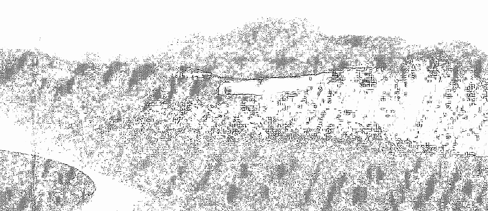
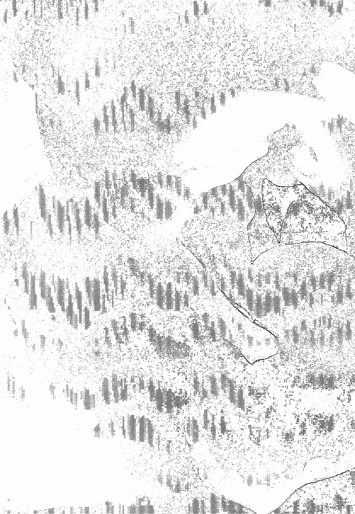
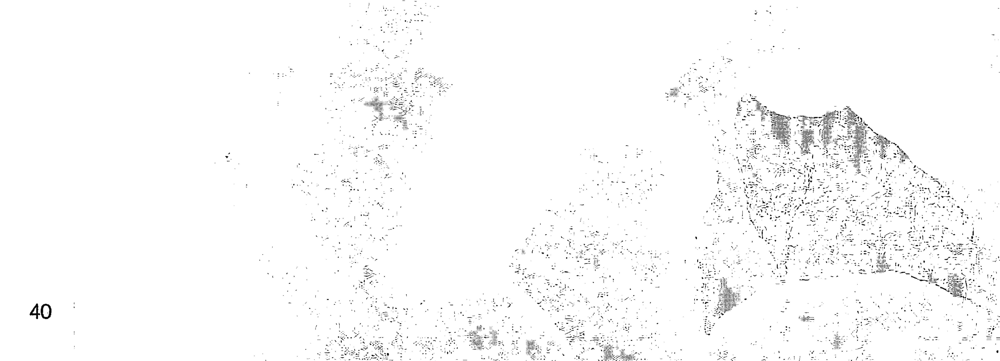
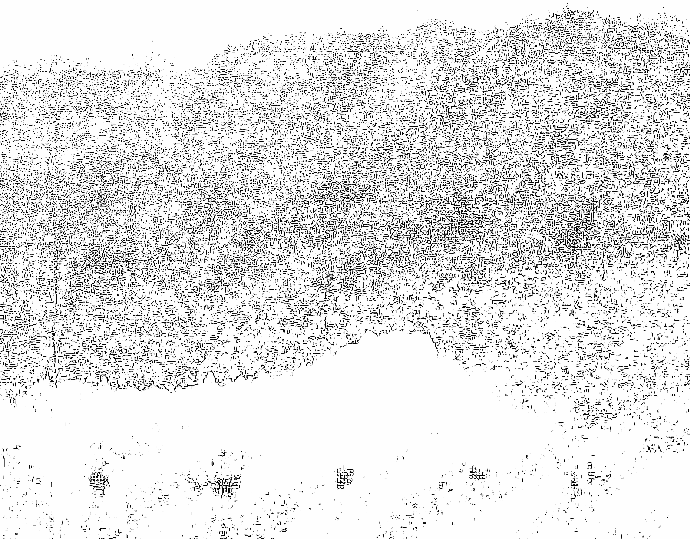

# 奥修：女性意识

### 楔子

自從母系與女神導向的社會被父系社會超越之後，競爭和缺乏耐性就主導了我們的世界。雖然每一種男性特質都有其正向進取的一面，不幸的是，女性特質的壓抑造成了不平衡，戰爭、暴力與生態的破壞經常凌駕於更正向的男性特質，譬如勇氣、堅決與對知識的好奇心。

當女性運動費盡氣力想要矯正這種種不平衡的現象時，她們把男人與男性特質當作敵人的態度，使得女人正陷於採取與男人同樣具破壞性特質的危險當中。

這不是另一本批評男性暴力與統治的書，而更像是一種女性特質的慶祝與提醒，不僅針對女人、也同樣適用於男人。

它清楚地說明女性意識對於創造平衡與和諧的世界具有關鍵的重要性，其中包括了直覺、敏感性、愛、耐心、感激、信任以及尊敬生命等章節。

### 導言

在編輯這本書時，我首先遇到的困難是，在一小段奧修談到意識的引言中，奧修聲稱他所談的意識不屬於任何一個特殊的性別：「覺知既不是男性、也非女性，因為它並不屬於身體，而是徘徊在身體之外。」

雖然奧修稱某些特質為女性特質，不過本書所強調的主題是意識。讀者不該期待這是一本涉及自古以來男女間關係的書，奧修清楚地表示，他一點也不在乎我們的私人關係，他把它完全當作是我們個人的惡夢而擱置一旁。

你不會在這本書中找到任何慰藉，宗教與社會已經安慰了人們許多個世紀。正如同奧修所說：「他們已經找出所有的解釋，來說明你根本不需要做任何改變，你的覺察與意識也不需要成長。他們只提供你同類療法 ① 的甜蜜藥丸——安慰你說那是因為你的前世孽障影響、籠罩你這一生，並且帶給你苦痛。你唯一能做的就是接受它，保持耐心，因為神是慈悲的，你終將得到原諒。

這是一顆鴉片，會讓你半睡半醒。人們選擇了所有安慰的說辭，因為這些安慰幫助他們避免惹上改變他們的意識及態度的麻煩。就安於你的位置，接受這就是你的命運，因為如果完全無計可施，唯一的可能就是去接受。

接受帶來一種平靜——其實是槁木死灰、隱藏你的沮喪、哀痛與苦難。知道了沒有一樣是掌握在你的手中；一切都是掌握在神的手裡……你只是一個傀儡，他幫助你維持在半睡半醒的狀態，也拿走了你的責任。你什麼都不能做；因此你無法對正在發生的事負起責任，當然，你也不是造成自己痛苦，以及與你有關的人痛苦的肇事者。

你可以一生都重複這種相同的惡性循環，慢慢地你會習慣成自然，變得無動於衷，你知道生命就是這麼一回事。而這正是人類的關係沒有任何革新的原因。」

我們可以從這本書中，去了解意識成長與生命品質蛻變後的美。

> 譯注 1：
> 同類療法（homeopathic）是一自然的藥物科學，以非常小的劑量來刺激與誘導病人與生俱來的免疫系統，達到治癒的目的。

### 推薦序——享受愛與靜心

談到女性意識，多數人會聯想：那是一種女性為了爭取平權所發出的吶喊。在先進的歐美國家，這種為女性爭取自由、為女性傳統地位平反的言論，儼然成為女性意識抬頭的證明。她們蒐集女性被欺壓的歷史證據，揭發男性沙文主義下的惡行，以現代較文明的角度來檢視傳統男性行為的不文明。

男性、女性意識，在這本書裡我們可以用「陽」與「陰」的概念來解讀。當一方被強調其重要性時，長期的失調將造成全面的影響，壓抑的不只是對方，同時會殃及自身的平衡。

如今，無論男、女，只有在受挫時，才被迫接受女性特質的智慧，往往是出於無奈，而非自願。因此，當人們談到要接受、愛、慈悲、無為時，大多異口同聲說：好難喔！男性意識的行使已經相當地深化，無論是男人或女人都一樣。一般人對女性意識的特質已非常陌生。只有當人們在外在世界的追逐得不到滿足時，才會回過頭來，希望能藉由宗教的啟發，探索屬於女性意識的心靈世界。

說到宗教，無論佛教、基督教、天主教、回教、道教，這些教派的代表人物也都是男性。宗教的美在於啟發人性「愛」與「慈悲」的能力。而這些領導者們，依然是男性，或者是一些選擇放下家庭的僧侶。其求道的方法及道路，依然是出自於男性的心路歷程。如果真的花下心思研讀，不難看出這些戒律的傳承，也是以男性意識為主軸。宗教的規範，紀律的要求，教條的執行，都不難看出男性威權階級制度的蛛絲馬跡。

有趣的是，我鍾愛的師父奧修也是男性，我聽他的教導，用他的方法，遠渡重洋，拋家棄子，只為尋求真理。我臣服於他的教導，靜心、靜心、靜心再靜心。但是，只要我靜下來，我就想到我至愛的家人，罪惡感更是盤踞整顆心。一度還相信愛我至深的家人是我沉重的負擔，由於他們對我的愛，牽絆了我、阻礙了我，使得我無法像佛陀、耶穌、奧修一樣，放下一切去追求生命的真理。那種掙扎真是一種無盡的煎熬。

現在想想，那也是一種發自男性意識的焦慮，一種希望追求更上一層的思維，一種需要往前衝、渴望達到目標的驅策力。害怕一旦沒有達到目標，生命將是一種浪費，沒有意義。相信只有努力堅強的毅力，苦行似的磨練才是修成正果的唯一道路。當時，我深信只要追隨這幾位成道者的腳步，就可以走向開悟的道路，而這才是我真正內心的渴望。這樣的煎熬，我持續了好多好多年。

直到有一天，一個朋友借給我一本奧修談論女性意識的書，我才豁然開朗。由於奧修是一個男人，對男性意識的覺醒有充分了解，也很容易描述男性的心路歷程，因為他們走的是同一種道路。而他所教導的靜心，也是由男性意識所發展出來的方法。對於女性意識，那是一條不同的道路。奧修慈悲的敘述，男人是從靜心找到愛，而女人是由愛走向靜心，「愛」才是女性意識最自然的道路。

當下我震驚，有如當頭棒喝，撞擊我內在的核心。這句話以前雖然聽過，但在那個當下卻如雷貫耳。

接下來，我狂笑不已，所有的糾結消失無蹤。我笑自己捨近求遠，走了一條男性試圖摧毀頭腦、摧毀ego的道路。我笑自己東施效顰。最好笑的是，我比東施更滑稽。起碼，東施所仿效的對象還是個女的，而我所模仿的對象，卻是一些男性。試圖跟隨他們追求真理所走的道路，學他們離家，學他們叛逆，學他們靜心，學他們探索愛與慈悲的歷程。結果發現，我繞了好大一圈，走了一條艱巨的道路，難怪走得踉踉蹌蹌，挫敗不已。

女性的本質是愛，我擁有一切女性意識的特質，像卵子、子宮般的特質，那麼地自然優雅。只要我回歸女性自然的本質，我就找到內在的家了。我更愛我的老師，我更愛我的家人，我更愛我的朋友，我更愛我的世界，我更愛我女性意識的本質。

當我走在女性意識的道路上，發現「愛」對女人來說太容易了。慢慢地，追尋不見了、靜心不見了、男性女性意識也不見了，只剩滿心對愛的感動與感謝。

之後，每當我看見自己男性意識高漲時，隨之而來的，是女性意識的自然接納、滋潤與融解。當女性意識的愛與男性意識的敏銳交融時，這份和諧就是我日常生活裡最珍貴的禮物。

> ——賴佩霞／一個享受愛與靜心的女人

編按：佩霞習油畫與攝影多年，本書第四章中的十幅攝影小品即為其作品，感謝她的分享。

### 推薦序——原來一無所缺

在《女性意識》這本書中，奧修以他一貫的態度來推崇女性意識的開展，的確，藉由女性意識的開展以致成熟，一個人會變得美、變得活生生，具有愛的品質。這份女性意識能存於男或女的身體中，意識沒有性別，能量也沒有性別，它們來自我們無二無別的光明本性。

每一個人都由父母而來，這就是神聖關係的開始，父母像是聖父與聖母的象徵，你從他們那兒獲得今生今世的男女能量——你的陽性面和陰性面、你的太陽能量和太陰能量，你透過他們來得到並發展自己「男女能量的整合」。

男女能量的整合是每個人長期的靈性課題，每個人都向著失衡的男女能量學習，一個女人可能有較多的男性能量而缺乏女性能量，或者相反；男人亦是。能量將因療癒而達成新的平衡。

我們的能量脈絡是這樣的：

男性能量：主動的、行動的、給予的、堅強的——顯化是智慧。

女性能量：被動的、等待的、接受的、柔弱的——顯化是直覺。

當你逐漸整合，就會同時具有兩種能量、兩方的面向，你是完整的，不需倚賴的，你無須再跛著腳讓別人提供你的需要。要知道，自我滿足和互相幫忙並不衝突，如你是自我滿足的，當你需要別人以他的專業協助時，依然可以進行。

人原本一無所缺，不缺男性能量也不缺女性能量。缺乏男性能量，一個人會顯得太弱，少了創發性；缺乏女性能量則會缺乏接受性，控制欲太高，落入自我的限制。

男女能量要經常互動使用，當我是一個愛人時，我同時接受及給與，接受對方的愛，與他交流，將我的生命與他分享，接受他與我相同和相異的豐富性，無距離地向彼此靠近，並尊重各自單獨的空間。這樣的狀態花費漫長的時間學習方得發生，使我愈加肯定，只有進行個人的生命成長，不斷地經驗給與和接受的況味，你的內在方有某個程度的整合；你若完整，你的伴侶也會完整，你若殘缺，往外看去的必是不完整的。

因為有男，因為有女，我們能在這兒邊玩邊學，男女交響曲絕非互相需索、交換，而是邀請你，透過外在的男女能量來完成內在的男女能量。外在的人是一個門，是進入內在探索的動力之門，那份渴望來自我們是愛，我們曾經在某處遺失了它，現在，我們將它尋回。

過去，我贊同奧修所分享的女性意識觀點，現在，我體驗到，唯有讓這樣的靈性意識進入每個人的心中，不分男、不分女，男女間的隔閡才能減少。莫將男人視為缺少直覺的，也莫將女人視為缺少智慧的，別創造隔閡，我們具有兩者；當整合發生，內在的女性意識就不再是「女性的」，而是光明閃爍的意識！！

> ——王靜蓉／作家及治療師
> 主持愛和光心靈教育中心
> 網址：www.angel-light.idv.tw

### 世襲的男性統治能量

這個世界由於男性能量與男性統治而深受衝突之苦，
平衡是必須的——我不是說完全不需要男性能量，
男性能量是必須的，但只是一部分。
如今有百分之九十九是男性的能量，
女人只生存在邊緣而已，她不是生命的主流；
因此才會有搏鬥、競爭、抗爭與戰亂。
男性能量把人類逼向集體自殺的邊緣，
這隨時都可能發生，
除非女性能量被釋放出來平衡這股男性能量；
這是僅存的希望。

男性頭腦創造了科學，科學是侵略性的，
它幾乎是一種對自然的強暴，
一種強迫自然交出自身秘密的暴力。
科學既不優雅，也沒有祈禱，它只有抗爭，
因此他們稱為「征服自然」。
這真是荒謬！你怎麼可能征服自然呢？
你是自然的一部分。
我的手要如何征服我呢——手是我的一部分啊！
一片葉子怎麼能夠征服樹呢！
真是愚蠢，有夠蠢！

就是出於這份愚蠢，
我們創造出整個企圖征服萬物的文明，
那是一個由男性掌控的世界——
當我說由男性掌控，意思是指「侵略的頭腦」。
一個女人可能是男性的，如果她有侵略的頭腦；
一個男人也可能是女性的，如果他有一個接受的頭腦。

輕案殺人犯被關進監獄、判處死刑，
而殺人無數的劊子手卻成為你們的英雄……
這是因為女人徹底地被排除對生命有任何貢獻，
否則就不會發生如此多的戰爭。
沒有任何女人對戰爭有興趣，
這完全違反女人的天性。
女人關心的是愛、漂亮的房子，
以及環繞在房子周圍的美麗花園，
她對細微的事情感到興趣；
可是也正是那些細微的小事，讓生命是值得活的。
女人對製造原子武器、核子飛彈一點也不感興趣，
她無法理解男人一直在做的事，他是瘋了嗎？
或是哪兒不對勁？

男性能量可以談論和平，不過只是為了準備戰爭，
它一直談論著我們必須為捍衛和平而奮戰。

現在來看看這個荒謬的論點：
我們必須開戰，否則世界上將不會有和平存在，
為了達到和平就必須打仗，
那正是我們從古至今一直打仗，
和平卻從未來臨的原因。

在三千年之中，人類已經引發了五千次的戰爭，
戰爭從來沒有一天在世界各地真正平息過，
有時在越南、有時在以色列、
有時在喀什米爾，有時在別處，
反正戰爭總是持續進行著。
這不僅僅是一個改變世界的政治意識型態的問題——
那是無用的，因為所有那些意識型態都是男性的。

我們必須改變男人的根本的煉金術，
我們必須重整男人的整個內在。

當由心來決定價值的時候，
男人最基本的改革將會發生。

心不會決定去打仗，也不會想要發展核子武器，
更不會是死亡導向的，心是生命的精華。
一旦頭腦為心效勞，它就必須做心所決定的事，
頭腦有極大的能力去做任何事，只是需要正確的指導；
否則它將會抓狂、發瘋。
頭腦是沒有價值、沒有任何意義的，
它也沒有愛、美與恩慈，頭腦只有理性而已。

所有的宗教都是由男人所建立的，
而所有的宗教都譴責女人。
耆那教是印度最古老的宗教之一，
主張沒有人在身為女兒身時可以得到解放、可以成道；
在投胎為女人時，沒有任何人的意識可以成長。

相當奇怪——
這竟是始終在教導身體與靈魂是分開的同一群人，
既然靈魂不是男性也非女性，
成長是發生在靈魂中，解放的是靈魂而不是身體，
那麼為什麼女人不能進天堂淨土呢？

就是不可以，女人必須以各種方式被打壓，
首先她們必須熟習宗教的訓練，
以便能夠來世投胎為男兒身，
她們目前唯一可以做的就是祈禱、靜心，
以求來世能夠很快地身為男人，
然後才有進天堂的可能性，
否則身為女人時連想都甭想。

靈性的領域始終維持是由男人主導——
不僅是由男人、而且還是被男性沙文主義者所統治。

所有靈性的傳統都反對女人是有其原因的，
它們反對女人是因為它們反對生命，它們要破壞生命，
而最基本的就是分開女人與男人。
它們反對喜悅、愛與甜美多汁的生命力，
一個簡單的方法就是去譴責女人，
盡可能將女人與男人區隔開來，尤其是在修道院裡。

女人被視為次等人種，與男人的階級有別，
很自然地，這種方式攪亂了許多事情，
剝奪了所有的遊玩嬉戲、幽默感和歡樂，
而形成一個對男人及女人都極為乾枯的生命組織架構。
男人與女人是一個整體的部分，一旦將他們分開，
兩者都會一直缺乏某種東西——
那道分裂的鴻溝是無法被滿足的，
那道鴻溝使人變得嚴肅，
病態的嚴肅、變態與心理不平衡，

它扭曲了自然的和諧以及生態的平衡。
這是如此一場大浩劫，
因此許多世紀以來人類都深受其苦。

所有人類中有一半正因饑荒而瀕臨死亡的邊緣，
而全數由男人所組成的政客與將軍們
卻依然在持續積存核子武器，
他們已經擁有比他們的需要還要多的武器——
超過他們毀滅全世界的需要量的七百倍之多。
地球上所有的生物：樹木、鳥獸、人類，一切生物……
我們已經擁有足夠摧毀這一切七百倍之多的武器了，
他們卻仍不斷地在累積武器。

你認為有半數的人類正因饑荒而瀕臨死亡是正常的嗎？
之所以會發生是因為男人獨力造成這個社會，
他沒有女人的慈悲，只有男人的剛硬，
他不允許女人的柔軟去影響到世界上的事物。
我們需要一個相當平衡的生活——
男人與女人平等共創的生活，
那麼生命將會更和平、更有愛、更加地喜悅，
生命將成為一項無比盛大的慶祝。
我希望在那項慶祝當中，
我們能夠超越世俗平庸的快樂，
達到宇宙的福佑、真理、意識以及極樂的境界。

歷史是由男人所創造的；沒有女人曾經撰寫過歷史。
歷史是男性取向的，它是由男人所統領、掌管的，
那是一個虛假的歷史。
男人企圖以這種手段來制約女人，
然後他就可以輕而易舉地剝削女人，
女人甚至無力反抗。
奴隸總是必須以這種方式被催眠，
然後他們才無法反叛。
男人已經用這種伎倆束縛了女人的頭腦，
因此女人會以男人想要她如何思考的方式來思考。

男人一直告訴女人她們是軟弱的，
這在醫學上是錯誤的，女人比男人平均多活了五年，
女人比男人較少受疾病之苦，
而且女人發瘋的頻率只有男人的一半，
自殺的頻率也只有一半。
雖然如此，女人仍然是軟弱的，
必須從四面八方剷除她，使她無法成長。
然而社會有半數是由女人所組成，
是她們生育你們的小孩。

你現在對待女人的方式，
也正是你對待你的小孩的方式，
因為是女人來照顧小孩，
小孩將從女人那裡學習，小孩會模仿母親。
這也是為什麼每一種語言都稱為母語，
即使連德國人都沒這個膽量，
敢稱他們的語言叫做父語。

女人一再地被詢問到，為何女人中沒有任何像佛陀、
耶穌、瑣羅亞斯德 ⑪、或是老子那樣的偉人出現。
可是，男人不允許女人接受教育，不准女人有任何
經濟獨立，甚至不准許女人在社會中自由行動，
女人最多就只是去教堂而已，
唯一可以親近她的男人就是教士。

那麼女人要如何成為佛陀呢？
成佛的人可不是憑空從樹上長出來，
更不是突然從天上掉下來的！

他們需要在泥土裡扎根、需要有養分才能成長。
尤其是在過去，女人一直在懷孕當中，
她被當作是一個生殖工廠般地使用，
而這是生物上的一種需要，因為每十個小孩中，
有九個會死去，只有一個能夠存活下來。
因此如果要有一些小孩的話，
妻子就必須不停地懷孕，
根本沒有留給她成為佛陀的時間，
女人甚至從未被接受她是與男人平等的。

是男人創造了宗教的書籍，
也是男人創造了教堂、意識型態與神學體系，
當然他稱呼「上帝」為「他」囉，
他當然會說：「上帝以他自己的形象創造出男人。」
——不是女人、而是男人。
女人只是從男人身上抽出的一根肋骨、

> 譯注1：
> 瑣羅亞斯德（Zarathustra），即Zoroaster，西元前六百年前後的波斯宗教家，為祆教鼻祖。

一個追加物、一個附屬品，
僅僅是一個後來產生的念頭——因為男人感到寂寞難耐，
他需要一位女人來提供他慰藉、溫暖與舒適，
因此，女人只是被創造來供男人利用的一個工具。
上帝以自己的形象創造出男人，
而女人只不過是一個事後的添加物罷了，
上帝從未在一開始就計畫創造女人，
完全是一個事後的念頭而已，
上帝看見男人很寂寞，
於是創造女人來供男人剝削使用；
女人只是一個工具。

男人已經將這些醜陋的想法散播到全世界，
直到現在都是由男人統治這個世界，
因此他稱「上帝」為「他」；
否則的話，上帝稱作「她」應該更好才對，因為「她」包含了「他」，可是「他」並不包括「她」，
因此稱作「她」要更為恰當。
而那些真正知道的人既不使用「他」、也不採用「她」，
而是使用「它」，那是最佳的選擇。

特別是在東方，神既非「他」、也非「她」，
神是阿達納瑞希瓦②——半男半女。
這也是為什麼在印度的雕塑中他被稱為「它」的原因，
它包含兩者，而且還超越兩者之上。
我也稱呼神為「他」，不過要記得，
我只是在使用這個已經成為現今的通行用語，
我可以稱呼神為「她」，
不過那只會製造一些麻煩而已。
或者我可以一再地把神稱為「他和她」，
但那會讓用詞看來有點醜陋。
我一直稱呼神為「他」，
是因為我必須使用現行的慣用語。不過要記住，我對男性沙文主義意識型態沒有絲毫的敬意。

> ②：
阿達納瑞希瓦 (Ardhanarishwar) 是印度教濕婆神 (Shiva) 的一個化身。

男人不上教堂或是廟宇，也不去任何神聖的地方。
只有女人去那些地方，
因為那是女人唯一可以與他人閒話家常的所在，
她們沒有社團俱樂部，也不能去餐廳及酒吧，
她們沒有社交的行動力，只好上教堂。
所以她們出於需要才去教堂，
因為那裡是唯一能夠讓她們展示首飾、華服、皮外套，
以及宣洩在心中沸騰的上百種閒話的地方。
她們根本不是為了耶穌基督而去，
這是可以確定的！
有少數的丈夫也上教堂——不過也不是為了耶穌基督，
他們若不是為了監視他們的太太，
就是為了留意別人的太太！

一個具有宗教性的人必須是喜悅的，
充滿著幽默感、歡笑與愛。

這絕對是我想嘗試提出最重要的貢獻之一，
不過這個論點將被所有的傳統與宗教所反對
——被全世界反對，
因為我們正在證實這一萬年以來他們都錯了，
這很令他們的自我感到受傷，
他們寧可摧毀我們，也不能讓人們接受
靈性應該是充滿歡笑、幽默感與遊戲的事實；
因為果真是如此的話，
憂慮、問題與痛苦都不存在了，
人將會放鬆地進入一種深深地放下、
與存在同在的狀態。

女性的能量必須得到釋放才能帶來平衡，
月亮③已經如此強烈地受到忽略，
而太陽是如此地被凸顯，
月亮必須被帶回到生命之中。
月亮的能量不僅是與女人有關，
有了月亮，也就有了一切的詩意，
所有的美學、愛，以及屬於心的
都是來自月亮。
一切直覺性的都受到月亮的滋養。

> 譯注3：
在此必須解釋，在英語和大多數的語言中，太陽代表著男性的能量，月亮則代表著女性的能量。

### 2 為女性的意識慶祝

所有偉大的品質都是女性的，
這句話是真的——愛、慈悲、同情、仁慈，
所有這些特質都帶有女性的風韻。
有一些男性特質如戰士的特質、勇氣，
那是堅硬的特質，一個人必須如同鋼鐵般堅硬，
因為男性特質是透過戰爭而發展出來的。
男人必須不斷地打仗，在三千年當中，
在地球上就發生了五千次的戰爭，
彷彿殺人是男人唯一的職業。

女性特質則是在家裡、在愛的花園中，
當她與丈夫及孩子在一起時發展出來的，
她們活在完全不同的世界裡。

所有美好的特質都是女性的：
愛、信任、慈悲、感激與臣服，
一切美好的特質都是女性的。

是的，有少數男人是美好的，
譬如佛陀、耶穌、克里希那①……
但你有沒有注意到一點呢？他們看起來都具有女性特質。
事實上，在尼采的評論中，就曾批評佛陀、耶穌
看起來像是女人似的娘娘腔。
佛陀一定是看起來像女性的，當一個人移向心，
在他身上就會有些東西變成是女性的，
他變得更圓潤、更柔軟、更敏感、易受傷的。

尼采無法了解佛陀……因為他說曾經發生在他身上
最美的一件事、他所見過最美的東西，
不是星辰、夕陽或日出，也不是美女、玫瑰和蓮花，

> 譯注 1：
克里希那（Krishna），印度護持神的第八化身，黑天。

不！不是像這類的東西……
你無法想像尼采曾經遇見最美的事，
他說是當士兵遊行時拿著出鞘的劍，
而劍在陽光下閃閃發光——那就是他最美的經驗；
士兵靴子的聲音即是他所聽過最優美的音樂，
不是莫札特、也不是華格爾，都不是，
竟然是軍靴的聲音。
軍團行進時佩帶著在陽光下閃閃發光出鞘的劍，
這就是他曾有過最美的經驗。
當然了，他不會懂佛陀的。

尼采曾是十九世紀存在主義之父，那個世紀
是最醜的世紀之一。他是兩次世界大戰之父，
他可能還在等待有第三個、醞釀著第三次世界大戰。
他認為戰爭是世界上最美麗的事物，
因為它讓人類中最偉大的人物浮出檯面。

他發瘋了，這似乎是非常合乎邏輯的；
這樣的人注定會發瘋，當他發瘋時，
他開始在信上這樣簽署他的名字：「反基督的尼采」，
即使在他發瘋之際，仍然不忘他是反對基督的，
但其他事情卻全都遺忘了：
他認不出他的朋友，
甚至無法認得照顧他一輩子的親姊姊，
卻不能忘記一件事，那就是他是反基督的。

是的，曾有一些男人成佛，
不過你如果仔細觀察他們，
將發現他們更像女性、而非男性，
世界上所有最偉大的藝術家，
都逐漸地開始發展出一種女性特質：
恩慈、優雅、精緻，
有某種柔軟、放鬆、寧靜與安詳的韻味環繞著他們，

他們不再是狂熱的。
我在這裡所要教導的是，
要真正地把整個世界轉變成為女性能量的。

東方的頭腦是女性的，
那也是為什麼在東方，我們讚揚所有的女性特質：
慈悲、愛、同情、無暴力、接受、知足
——全都是女性的特質。
而在西方，所有的男性特質都受到嘉許：
決心、意志力、自我、自尊、獨立、叛逆，
這些價值在西方都受到稱讚；
在東方則是服從、臣服與接受。
在東方的基本態度是女性的，而在西方是男性的。

在東方，有許多人以及許多傳統都稱呼神為母親，
他們的方法似乎更為適切。

觀察佛陀，他的臉好像更像一位女人而不是男人，
事實上，正是因為如此，
我們才沒有把他描繪成有鬍鬚的模樣。
你從來沒有看過馬哈維亞 ②、佛陀、克里希那
以及羅摩 ③ 的臉上是有鬍鬚的，
並非由於他們缺乏某種荷爾蒙，而長不出鬍鬚，
我們沒有把他們描述成有鬍鬚的樣子，
是因為那會使他們的臉看起來更像是男人的外表。
在東方不太在乎事實，而更在乎適切性與重要性，
當然，你所看過的佛陀雕像全都是不實的，
不過在東方我們並不在乎這點，
重要的是佛陀變得更像女人、更為女性化。

那就是從大腦的左半球轉換到右半球，
從男性轉變到女性，從主動、侵略轉為被動，
從正面變成負面，從努力轉變成不努力。

> 譯注 2：
馬哈維亞（Mahavira），耆那教大師。
> 譯注 3：
羅摩（Rama），印度神，第六、第七或第八毗濕奴
之化身。

佛是更女性、更有母性的，
如果你真的成為一位靜心者，
漸漸地，你將看見在你內在有許多的改變，
你將感覺更像一位女人而非男人——
你會成為更優雅、更有接受性、無暴力、有愛的。
慈悲心將從你內在不斷地升起；那只是自然的芳香。

西方所有的知識都是以邏輯為基礎，
有邏輯的地方就一定有分析：將事物分成片斷。
在西方，科學的方法是分析論，
因此他們可以藉由不停地分割物質，
一直到達原子為止。

女性的意識是合成法，它不分割、而是合併東西。
它說：「保持添加，一直加上去，直到
不能再增加任何東西為止，然後真理即會出現。」

因此，由女性意識導出的結論全都是關於浩瀚的擴展，而非到達最小的原子。
女性的意識宣稱：「整個宇宙就只有佛性。」
科學家則宣稱宇宙是由原子所聚集而成，每一個原子自成一個獨立的個體。
原子與原子之間不能連結，它們無法結合在一起，在每個原子之間有一道深溝，它們就像是聚在一起的沙粒一般。

真是如此嗎？
或者這是科學家用演繹法所導出宇宙是一團原子的結論？
那些根據女性意識的方法來推論的人認為宇宙是一；不可能有許多的存在，甚至沒有二的存在。
宇宙是一個浩瀚的擴展，它一直保持著有所增加，當再也沒有東西可以添加時，整個宇宙就匯聚成為一。

女人總是聚集的詞彙來思考；
而男人則老是以分裂、分離的術語來思考，
這就是男性的頭腦。
女人的頭腦是積聚的，由於如此，
她所得到的結論，會不同於經由分析所推得的結論。
記住，有分析的地方就有侵略，
這也是為什麼西方科學家有征服自然這種說法。
但是在東方的人如老子說：
「我們是自然的孩子，我們如何能征服自然呢？
那是一種對我們的母親施以殘暴壓迫的行為！」

老子說：「女性意識的秘密是不急不徐、有耐心、
對時間沒有警覺，這些是朝向真理的有效步驟。」
你們永遠要記住一件事，當我談到女性意識時，
我是在指女性意識而已，與女人完全無關，
一個男人也可以擁有女性意識，

一位如佛陀的人具有女性意識，
他沒有時間的概念。

女人活在空間裡，她的頭腦住在空間裡，
空間在當下延展出來。
時間在過去與未來展開；
而空間在現在展開——此時此刻。
女人對空間很有概念，
無論是做多麼微小的一件事，她都是在空間裡完成的。
如果她布置房屋、設計家具、裝飾房間或者穿戴衣飾，
這都是「空間的」，這種形式全是在空間之中。
她不是安置在時間裡。

男人的興趣全在時間裡，
他思考要如何實踐共產主義——卡爾。馬克思
花了四十年的人生待在英國美術館的圖書館中，

思索著實踐共產主義的方法與手段。
馬克思從未在有生之年看到他的夢想實現，
在世的時候他無法完成他的夢想，
但是他仍不斷地計畫、再計畫，
根本不在乎是否將有其他人會實現它，
或者它壓根不可能發生；
他就是徹底栽入這個計畫中。
他的夢想是未來之夢——有一天共產主義將會來到。
然而，沒有任何女人曾經這麼做過，
因為她是與當下連結在一起的，
在她內在並沒有時間的知識與經驗。

老子相信，如果你喪失了時間的知識，
你就可以得到女性的意識；
因此，全世界的求道者都宣稱當時間絕滅時，
靜心就達到了。

有些人問耶穌，他的天堂有什麼特別之處，
耶穌回答：「那裡將不再有時間的存在。」
將不再有時間——所有的憂慮都是來自於時間，
所有的慾望都是伴隨時間而來的，
所有的熱情是由於時間而產生的，
所有對於結果的期望也是出自於時間。
有了時間，快樂的國度將發生在未來的某個地方，
而不是在此刻當下。

老子說，存在的本質更像女性，是更女性化的，
這個類比很美，他不是說存在是女性的——記住這點，
這是不邏輯的，他不是嘗試要證明存在是女性的，
也不是去支持女性解放運動——不，
他只是做了一個類比。
一個男人也可以是女性化的，
佛陀是像女性的、老子是像女性的、耶穌是像女性的。

他活著，活在當下，不急不徐地；
他享受著不匆忙的時刻。

### 女性的奧祕之門

是天堂與塵世的基礎……

> ——老子

如果你可以找到開啟女性奧祕之門的鑰匙，
你就已經打開了存在之門。
每個人都必須進入那扇沒有緊張、平衡、滿意、
知足的大門——那正是女性本質的奧祕。
當我說到這點時，會有兩種可能的誤解產生：
女人可能誤以為她們什麼都不必做了；
男人可能誤以為那不是在針對他們。
不，這是針對男女兩者的，不過要記住……
女人不是純粹的女人，

她們自身已經喪失了女性的神祕，
她們必須要再度得到它，
當然女人會比男人還要容易獲得它，
因為男人已經離得太遙遠了。
不要以為如果你是男人，
像老子一樣的男人是不適合你的——
他這一型尤其適合你，
否則你將離存在與生命的狂喜愈來愈遠。
每個人必須回歸到母性，
那正是女性的奧祕。

男人如石、女人似水，
當水落在岩石上，岩石就消失成為沙——
這是遲早的事，只是時間問題而已。
在水剛開始接觸岩石時，
岩石是如此地堅強，水又是如此地柔弱，

在邏輯上，你絕對無法想像有一天水將摧毀岩石，
岩石將化為沙，而水依然存在。
這就是老子所謂的「水之道」——女性的力量。

男性的力量是砍伐者、樵夫的力量，
你曾看過一位樵夫在砍伐木材嗎？
那是男性的能量——破壞性的、侵略的、暴力的。
女性的能量是衝浪者的能量，
與其說男人的能量是與生命一起游泳，
倒不如說是在和生命搏鬥；
女性則是跟隨著生命、與它一起游泳，而不是與之角力。
女性是柔軟易曲的、是更為流動的。

讓我告訴你一個小故事。在德國人眼中，柏林被視為
是普魯士（Prussian）的粗率與有效率的典型，
而維也納則是奧地利的魅力與散漫的精髓。

這個故事是說有一個柏林人要去維也納，但他迷路了，
他需要有人為他指點方向。
像這樣一個柏林人會怎麼做呢？
他抓住了第一個經過的維也納人的衣領，
很粗暴地大叫：「郵局——到底在哪裡啊？」
嚇了一跳的維也納人小心翼翼地將對方的拳頭移開，
整平了他的衣領，然後以很溫和的語氣說：
「先生，你能否以更文雅、有禮貌的方式來靠近我，
然後說：『先生，假如你有一點時間，而且恰巧
知道的話，可否指引我去郵局的方向呢？』」
柏林人驚愕地瞪大眼睛，
過了一會兒咆哮著說：「那我寧願迷路！」
然後氣沖沖的離開。

同一個維也納人在同年造訪柏林，
換他要去找當地的郵局。

當他靠近一位柏林人的時候，
他很客氣地問：「先生，假如你有一點時間，而且
剛巧知道的話，可否指引我去郵局的方向呢？」
那個柏林人以機器般的聲音快速地回答：
「大概在前面過了兩條街，向右急轉彎，
再經過一條街後過馬路，向右轉一半，往左走穿過鐵軌，
然後經過書報攤後就進入郵局的大廳。」
那個維也納人感到手足無措，
不過他還是輕聲細語的說：
「非常感謝你，好心的先生。」
那個柏林人生氣地一把抓住對方的衣領，
大吼：「別管道謝，先重複指示再說！」

柏林人是男性的頭腦，而維也納人是女性的頭腦；
女性的頭腦是優雅的，而男性的頭腦是重效率的。
當然從長期來看，如果一直有衝突的話，

優雅注定會被打敗，而有效率的頭腦終將得勝，
因為這個世界了解數學的語言，而非愛的語言。
可是當你的效率贏過優雅的那一刻，
你也喪失了某種相當有價值的東西：
你已經失去了與內在本性的連結。
你可以變得非常有效率，
但你不再是一個真正的人，
你將會成為一台機器，一個如機器人一般的東西。

德國是唯一稱自己為「父國」(fatherland) 的國家，
多麼大男人主義的頭腦！
世界上所有其他的國家都稱為「母國」(motherland)，
可是德國人卻無法稱呼他們的國家為母國——
那看起來好像是你用弱勢性別的名稱來稱呼你的國家，
父國似乎正確多了。
請開始放下父國這個念頭，

讓德國成為一個母國，讓它更具有女性的特質，
拿掉它男性沙文主義的想法。

當你沉思：「我是誰？」的時候，你將碰觸到這個點，
然後問題會逐漸消失；你將走得更深……
然後更深層的問題會浮現：首先是社會學的、
接著是神學的、然後是生物學的問題，
你有一個男性或女性的身體，
於是這個問題將會出現：「我是男人還是女人？」
意識既非男、亦非女，
它不可能是男性或女性的；
意識就僅僅是意識，
它只是成為一個觀照者的能力。
很快地，你也將穿越過那個障礙；
你將忘記自己是男還是女。

然後，當一切舊有的身分都被丟棄，
沒有任何的東西留下，
只有在寂靜中迴響著這個問題：「我是誰？」
問題無法靠自己繼續下去；
它需要一些答案，否則就不能存在。
到了這個連詢問都變得很可笑的那一刻……
問題也蒸發了，那個時刻稱為自我了解——
atmagyan（靈魂的知；knowledge of soul），
當你沒有接受到任何答案，
你就只是知道、感覺到你是誰的時候。

或許，我們不允許自己的意識提升到更高的層次，
因為如果那樣，生命將會持續地有驚奇出現，
而你可能無力招架。
那也是為什麼你勉強地接納了一個呆滯的頭腦，
是因為其中有投資的利益存在。

你可不是毫無理由地甘於遲鈍，
你是基於某個理由而保持呆滯——
如果你真的是朝氣蓬勃的話，
每一件事物都會是驚奇的、出人意表的。
如果你保持遲鈍，
就沒有任何事物會令你吃驚、讓你受到驚嚇。
你愈魯鈍，生活對你而言就似乎更加了無生氣；
你愈有覺知，生命也就愈有朝氣與活力，
那麼就有麻煩了。

我所做的一切努力，
是要帶來一個影響整個人類意識甚鉅的革命，
只是個人的開悟是不夠的，
我們必須開啟一個
有數千人幾乎同時成道的開悟過程，
然後，整個人類的意識才可能提升到更高的層次；
那是拯救人類意識的唯一希望。

### 3 覺知既非男性、亦非女性

覺知既非男性、也非女生，
因為它是不屬於身體的，它在身體之上徘徊著。
有人來問我：「哪裡是覺知的位置呢？」
覺知不能被定位，因為它不是身體的一部分，
它在你的上方某處徘徊著，而非在身體裡面，
覺知沒有固定的位置所在。
一旦你變成是有覺知的，
你也在你的身體之上了，你不是在身體裡面；
那就是英文字「狂喜」(ecstacy) 的意義，
狂喜意指在自己的外面，狂喜 (ec-stacy：站在外面)。

當你有所覺知的時候，你就變得是狂喜的。
你站在自己的外面，成為丘陵上的觀照者。

沒有所謂正確的覺知，
因為不可能會有錯誤的覺知；
覺知就是正確的，所以不要問何謂正確的覺知，
而只要問什麼是覺知。
覺知是簡單的、非常純真的，每一個人都擁有它，
因此這不是一個有關成就的問題，
你已經擁有它了。

當你看見夕陽時，你不是有覺知的嗎？
當你看見一朵玫瑰花時，你不是有覺知的嗎？
你覺察到美好的夕陽，也覺察到美麗的玫瑰，
而這一切也需要你對你的覺察力有所覺知，
那就是唯一必須要添加、需要更精進的地方；
你能夠覺知到物體，
你也必須覺知到你的主觀性。

整個藝術就是如何從頭腦的女性面來操作，
因為女性的部分與整體相連結，
而男性的部分並非與整體連結。
男性面是侵略的，是持續地在抗爭之中；
女性則是一直在臣服、在很深的信任當中。
因此女性的身體是如此地優美、圓潤，
有種很深的信任，與自然有著很深的和諧。
女人活在很深的臣服之中，
而男人則是不斷地抗爭、憤怒、做這個做那個，
試著證明某些事、嘗試著到達某個地方。

女人是快樂的，她不嘗試到達任何地方，
去問問看女人，她們是否想要登陸月球？
她們只會感到很訝異，為什麼？有什麼意義呢？
為何要如此麻煩？家裡就再棒也不過了，
女人對於在越南、韓國或是以色列正發生什麼事，

絲毫不感興趣，
她最感興趣的是隔壁鄰居發生什麼大事，
誰愛上了誰，誰又在躲避誰……
她們感興趣的是閒話，而非政治。
女人更在乎當下、此時此地、現在，
而那給了她和諧、給了她優雅。
男人不停地企圖去證明某種東西；
如果你想要證明什麼，
你當然必須去抗爭、去競爭、去累積。

那是終生縈繞著有智慧的人的一種孩童經驗，
他們想再度擁有它——
同樣的純真、同樣的驚奇、同樣的美好，
那是一種來自遠方的回音，彷彿你曾在夢中遇見它。
但是，所有宗教的產生
都不是出於那縈繞不已的孩童經驗，那種驚奇、真理、美好，
以及有著美麗舞蹈圍繞的生命經驗。
在小鳥的歌聲中、在彩虹的顏色裡、在花朵的芳香中，
孩子會一直銘記著他已經失去了天堂。

有覺知地行動，那麼無論你身在何處，
你都是在天堂裡。

一旦你學習到了，你將不會問：「什麼是美德？」
而會問：「何謂覺知？何謂意識？」
你將會詢問：「靜心是什麼？」
——因為那將使你更警覺、更有覺知。

凡是帶來悲慘的即是罪惡；
凡是帶來喜悅的即是美德。

覺知從來沒有喪失過，
它只是變得與其他東西糾纏在一起而已。
因此，首先要記住：
覺知從未遺失，它是你的本性。
不過你可以把覺察力放在任何你想要的事物上，
當你厭倦了把焦點放在金錢、權力、名聲上，
當你想閉上眼睛，
把你的覺知放在它的源頭、根源，它的來處時，
你生命中重要的一刻就來臨了——
瞬間你的生命就得到了蛻變。
不要問有哪些步驟，只有一個步驟；
過程非常簡單，唯一的方法——
就是轉入內在。

意識的演化是透過許許多多的上下起伏，
那是一個丘陵狀的路徑。

你沒有做錯任何事，
只是你不認得路線是怎麼移動的，
有許多次路徑往下走，
只是為了要比先前爬得更高而已，
它經過山谷、然後到達山峰，
而每一個山峰都只是新的朝聖之旅的開始，
因為在你前方還有更高的山峰。
不過為了要抵達更高的山峰，你必須再度往下走。
一旦你了解到那是自然的現象，
你所有的悲慘與烏雲都將煙消雲散。

一個人必須學習不僅在白天歡樂，
在夜晚也感覺到喜悅——夜晚有它自身的美。
高峰有它們的榮耀，山谷也有其豐富性，
可是如果你只是耽溺在山峰上的話，你就有了選擇，
當任何意識開始有所選擇時，麻煩就會出現。

保持是沒有選擇的，無論是什麼來到，
就是把它當作自然成長的一部分，去享受它。
夜晚可能變得更加陰暗，
但是夜色愈黑就愈接近黎明。
因此，在天色漸暗的夜裡歡樂吧！
學習看到黑暗的美麗與星辰的燦爛，
因為在白天你將無法看到星星。
永遠不要拿曾經擁有的，
以及應該如此的與現況來作比較。

世上所有的宗教比喻中都有這麼一個概念：
「人類曾經生活在天堂裡，
卻因為某個原因從天堂中被驅逐出來。」
這並不是巧合，
它們是不同的故事、相異的譬喻，
卻意謂著同一個真理；

這些故事只是以一種詩意的方式來說明，
人曾誕生在天堂中，然後失去了它。
不過，那些有智慧的、敏感的、有創造力的人們，
持續地縈繞著對天堂的印象，他們曾經知道天堂，
如今徒剩一個模糊、難以置信的記憶。
他們開始再度追尋天堂。

找尋天堂即是再度找尋你的童年，
當然了，你的身體已不再是個小孩子，
不過你的意識可以如同孩童的意識般純真。
這正是神秘的道路的一切奧祕：
讓你再度成為一個純真的小孩。
沒有受到知識的污染，沒有任何知識，
仍然覺察到你周圍的所有事物，
帶著一種深深的驚奇以及難解的神秘感。

你已經出生了，你已經活生生地、
帶著意識與無比的敏感度，來到這個世界上。
就只是看著一個小孩——
注視著他的眼睛中的一抹清新。
現在……這些都被虛假的個性給掩飾住了。

意識是一個自然的現象，你生來即帶著它；
只不過你的道德良知已經變成圍繞在它四周的堅硬外殼，
它不允許意識流動，道德良知已成為岩石，
意識的小泉水被岩石堵住了。
移開石頭，泉水就開始流動了；
有了泉水，你的生命將以一種截然不同、
你未曾想過、從未夢想過的方式移動，
一切開始與存在保持和諧。
與存在保持和諧是對的；
不能與存在協調一致是錯的。

因此，道德良知就像是萬惡的淵藪，
因為它不允許你與存在和諧一致。
意識永遠都是對的，
正如道德良知永遠是錯的一樣。

注視一會兒新生兒：
他有眼睛、他有意識，他四處張望，
看見所有的顏色、花朵、光線、人以及人的臉龐，
可是你認為嬰兒認得所謂的綠色是綠的嗎？
你以為他可以區別男人與女人嗎？
或者什麼是美的、什麼又是醜的呢？
嬰兒的覺知感沒有差別待遇，
他只是看見所有存在的事物，
卻沒有任何判斷，他也無法有判斷——
他還沒有被介紹什麼叫做綠色，什麼叫做紅色。
他需要花一些時間來學習辨別能力。

事實上，我們所有的教育，
就只是在每個人身上創造出有差別性的意識，
每個人出生時都帶著沒有區分的意識——
那是一種觀照的意識；
他誕生時即攜帶著智者最終達到的，
那是一種究竟、神祕的現象，
而孩童正擁有那最初的。

這並非出於巧合，
在不同時期的神祕家都覺察到一個事實，
那就是最終的啟發與開悟，
只是再度獲得你的童年，
你必須再次得到你出生時所擁有的同意識。
那不是你去得到某種新的東西；
而是你重新去發現某種古老、永恆的東西。

你迷失在這個大千世界裡……
有一切的機會讓你迷失，
因為這個世界需要各式各樣的歧視、評斷、評價，
以及好壞是非的概念——所有類別的應該與不應該。
這個世界必然需要它們，
世界訓練每一個小孩都需要它們，
於是，小孩愈來愈迷失在語言、文字和思想之中，
最後來到一個無法找到回家之路的點上。

你在出生時只有意識，
其他每件東西都是在你出生之後蒐集的。
無論你在童年之後在頭腦裡蒐集了些什麼，
都把它扔在一旁——你將不再如此。
就靠這層簡單的了解，
你將發現，你本性的殿堂之門打開了。

有一個故事：

在日本有一個國王，他將自己的兒子送到
一位神祕家師父那裡去學習覺察力。

這位國王已經老了，他告訴他的兒子說：

> 「全心投入學習，除非你得到覺察力，
否則你將無法繼承我的王位，
因為我不會把這個國度交給一個沉睡而沒有覺察的人。
這不是父子之間的問題，
我的父親只有在我得到覺察力時，他才把王國傳承給我，
我不是正統的繼承者，因為我不是長子，而是么兒，
可是我其他兩個較年長的哥哥都沒有獲得覺察力。」

> 「相同的情況將發生在你身上，這次的問題更為複雜，
因為我只有一個兒子；如果你無法獲得覺察力，
這個國度將交到別人的手中，你將成為街上的乞丐，
因此對你而言，這是一個生死攸關的問題。

到這位神祕家那裡去，他曾經是我的師父，
如今他的歲數相當大了，不過我知道，
如果有任何人可以教導你，那麼一定非他莫屬。
去告訴他：『我的父親年邁且病重，隨時會離開人世，
時間所剩不多了，我必須在他離開之前完全得到覺察力；
否則的話，我將失去這個王國。』

這也是一個非常具有象徵意義的故事：
假如你是沒有覺察性的，
你將失去整個國土。

王子去到山間的老師父那裡，他告訴這位師父：
「我是你的弟子——國王所派來的。」
這位師父年紀非常大了，比王子的父親還老，
他說：「我記得那個人，他確實是一個真誠的求道者，
我希望你能證明你有相同的特質、天分、全然性與

強度。」這位年輕的王子回答：「我將全力以赴。」
師父說：「那麼就從打掃社區開始，記住一件事——
我隨時都可能會打你，或許在你清掃地板時，
我會從你的後面用我的楊杖打你，所以要保持警覺。」
王子說：「可是，我是來這裡學習有關覺察的……」
師父說：「這正是你學習覺察的方法。」

一年過去了，起初他每天都會被打許多次，
慢慢地，他開始變得有所覺知，
即使是老人的腳步聲……他可能正在做任何事，
無論他是多麼專心的在當下的工作上，
都能馬上覺察到師父就在附近，王子已經準備好了。

一年後，當他正全神貫注在與道觀裡另一位居者談話時，
師父突然從後方襲擊他，王子繼續他的談話，
然而他卻在棍子碰觸到他身體之前抓住了那根棍子。

師父說：「這就對了，現在第一課結束了，第二課從今晚開始。」

王子說：「我過去常想這就是全部了，這才只是第一課啊？到底有多少課呢？」老人說：「這全憑在你，第二課是我現在將在你睡著的時候打你，你必須在睡覺時也保持警覺。」

王子說：「我的天哪，一個人怎麼可能在睡覺時保持警覺呢？」

老人答：「不用擔心，我有數千位徒弟都通過了這項測試，你的父親也通過了這個考驗，這並非不可能的。它是艱難的，不過是一項挑戰。」

從那一夜起，他每晚會被打六次、八次到十二次，睡覺是困難的。可是還沒到六個月，他就開始感覺到內在有某種覺察產生。

有一天當師父正要打他時，他閉著眼睛說：
「不必麻煩了，你太老了，你費了如此大的力氣，
那使我感到難過，我還年輕，
我可以在這些鞭打中存活下來。」
師父說：「你是受到神佑的，你已經通過了第二課。
不過，直到如今我都用我的木杖打你，
第三課從明天早上開始，我將用真的劍來打你。
保持警覺！只要有一刻你是沒有覺知的，你就完了。」

師父習慣一大早坐在花園中，
就僅是傾聽鳥兒清唱……花兒綻放、朝陽升起。
王子心想：「如今情勢變得危險萬分！
覺知木棍是困難重重的，但是它不會殺死我；
然而一把真劍……」王子是一位劍客，
可是他沒有被給與任何的機會來保護自己；
唯有覺察是他的護身符。

突然間，一個念頭閃過他的腦海：
「這個老頭的確是個危險人物，
在他開始第三課之前，我倒想要檢視一下他自己是否
可以通過第三項測試，如果他陷我的生命於危險中，
那麼在沒有檢視他是否值得如此做之前，
我不能允許他這麼做。」
那是一個寒冷的早晨，
這些僅僅是他躺在床上時的念頭而已。
然而師父卻已對他說：「從你的毯子中給我出來，
你這個白痴！你想要用劍來打你的師父嗎？
你應該感到羞恥！我可以聽見你思想的腳步聲……
丟掉所有這些念頭。」

師父聽見了，儘管弟子什麼也沒有跟他說，
什麼事也沒有對他做。

思想也是事物、念頭也是東西，
當你在移動、發出聲響時，
那些全然保持警覺的人就可以讀到你的想法，
甚至在你覺察到你的想法之前，
他們就能夠覺察到你的想法。

王子確實感到很慚愧，他撲倒在師父的腳跟前說：
「請原諒我吧，我真是愚蠢。」
但問題是這是一把劍，一把真正的劍，
因此他對周圍的每一件事物都變得有所覺知，
甚至是他自己的呼吸與心跳。
就只是一陣微風吹過樹葉、一片在風中飄動的枯葉，
王子都覺察得到。
師父嘗試了好幾次，
發現王子永遠是準備就緒的。
師父無法用劍打王子，

因為師父不能發現他有任何一刻是沒有覺知、缺乏警覺的。他就只是警覺。

這是攸關死亡的問題——你絕對不允許它發生，
因此只能保持警覺。
在三天當中，師父無法找出任何一個片刻、絲毫的漏洞。
三天後師父喚他來，
「現在你可以去告訴你的父親，
這是一封我寫的信，這個王國是屬於你的了。」

覺察是一種愈來愈覺醒的過程。

### 4 女性特質與經驗的展現

女人已經受苦很久了，
因為女性的頭腦長期處在痛苦中；
女人長期受到迫害，
是因為女性的頭腦被壓迫了很長一段時間。
許多世紀以來，對女性的迫害、剝削與壓抑，
有許多的暴力加諸在女人身上，
很自然地女人開始變得狡猾，
而且精通於設計巧妙的方法來折磨男人。
那是理所當然的，那是弱者的方式，
嘮叨、抱怨——是弱者的手段，
除非你了解這個道理，
否則你將無法去除它。

女人是脆弱的，她注定如此，
她比男人有更深的和諧感，
比男人更有音樂性和節奏感，也更為圓潤。
正因為女人是脆弱的，
所以她無法像男人一樣具有侵略性。
然而，男人用某種方式來訓練女人，
男人給與女人某種不允許她離開奴隸身分的頭腦，
這種頭腦給與女人太久了，以致於已經根深柢固，
女人早已接受了它。

但是自由是這樣的：無論發生什麼，你都是自由傾向的。
你從來不會失去想要自由的渴望，
因為那是成為有宗教性的渴望，也是成為神聖的渴望。
無論發生什麼事，自由依然維持是你的目標。
因此，當沒有方法去反抗，
而整個社會是男人的社會的時候，要怎麼辦呢？

如何去保護一點小小的尊嚴呢？
於是女人變成是狡猾的、圓滑的，
她開始做一些並非直接而是間接的攻擊，
她以巧妙的方式與男人抗爭。

許多世紀以來，女人受到許多輕蔑與侮辱，
你的男人可能沒有對你做任何不好的事，
可是他代表著所有的男人，你無法忘記這一點。
你愛這個男人，但你無法愛男人所創立的組織；
你可以愛這個男人，可是你無法原諒他的男人身分。
每當你注視著這個男人時，你一發現他有男性的頭腦，
你就開始這麼想了，這是相當無意識的，
它在女人身上製造出某種神經緊張。

有更多的女人比男人還要神經質，那是很自然的，
因為她們生活在男人創造的社會裡，

這個社會是為男人量身訂做的，而女人必須去適應它，
她們必須砍掉許多部分，
砍掉她們的手腳、砍掉活生生的四肢，
來適應男人所給與她們機械般的角色。
她們抵抗、抗爭，
某種神經緊張就從這種持續的抗爭中產生，
這就是所謂的「抱怨」。

我知道有些情況是兩個人無法達到共識的，
不過那是成長的一部分。
你無法找出一個完全同意你的人，
尤其是男人與女人無法意見一致，
因為他們有相異的頭腦，面對事物的態度也截然不同；
他們是以不同的中心來運作的，
因此很容易就意見相左是再自然也不過的事了，
並沒有什麼不對勁的地方。

當你真的接受一個人、愛一個人的時候，
你同時也愛他或她的不同觀點，
你不會開始抗爭，更不會操控；
你會試著了解對方的看法，即使你不同意，
你也可以同意「你是不同意的」。
可是仍然有一種深層、細微的同意存在：
「好吧，我們同意我們的意見是不一樣的，
在這一點上我們無法達成共識——
是的，不過沒有必要爭執不下。」

男人是比女人更善辯的，有許多女人已經學到這點：
那就是如果你持續辯論下去，那麼辯贏的將會是男人。
因此女人不辯論，她們抗爭、發脾氣……
她們不透過邏輯的方式，而是採用生氣的手段，
她們以憤怒來代替，當然啦，男人會這麼想：

「何必為了這點芝麻小事，製造出這麼大的麻煩呢？」
於是他們同意了，但並不是真正的同意。
這將會造成男女之間阻塞不通。

聽聽男人的辯論，或許他是對的——
因為有一半的外在客觀世界必須透過理性來處理。
因此凡是關於外在世界的問題，男人更有可能是正確的；
而凡是關於內在的問題，女人就更有可能是對的，
因為內在的問題並不需要理性。
假如你想要買一輛車，就聽從男人的意見；
如果你想要選擇一間教堂，那麼就聽信女人吧。

男人和女人都必須了解：
凡是有關客觀與物質的世界，
男人就更傾向是精準、正確的，
因為男人是透過邏輯來運作的，

他是更具有科學性、更西方的。
當女人靠直覺來運作時，
她是更為東方的，更具有宗教性的，
她的直覺將更有機會帶領她通往正確的道路。
所以如果你要去教堂，那就跟隨你的女人吧，
她對內在世界的事物有更準確的感覺。

假如你愛一個人，逐漸地你會了解到這一點，
在兩個愛人之間會產生一種默契：
誰在哪件事情上是對的。
愛是永遠了解。

女性的頭腦可以揭露許多神祕的事物，
如同男性的頭腦能夠揭露許多奧祕一樣；
不過在科學與宗教之間仍有衝突存在，
同樣地，在男人與女人之間也有衝突存在。

但願有一天，男人與女人能夠成為是互補的，
而不是彼此衝突；
那一天也將同時是科學與宗教互補的時候，
科學將帶著諒解的態度來傾聽宗教所說的話，
而當科學在發言時，宗教也帶著理解的態度來傾聽對方。
雙方都沒有擅自侵入對方的領域，
因為兩個領域是截然不同的——
科學向外移動，而宗教往內移入。

女人是更靜心的，而男人是更為深思熟慮的，
他們考慮得更周詳，這是好的。
當思考是必要的時候，就聽從男人；
女人的感覺更為敏銳，當感覺是需要時，就聽從女人吧。
感覺與思考兼具，生命才會完整，
因此如果你是在真愛當中，你將成為陰與陽的象徵。
你曾看過代表陰與陽的太極圖嗎？

兩條魚在移動中幾乎深深地交融在一起，
完整了能量的圓環。
男人與女人、男性的與女性的，
日與夜、工作與休息、思考與感覺……
這些都不是互相對立的，而是互相補足的。
如果你愛上一個女人或一個男人，
你們兩個人都會有很大的提升，你會成為完整的。

#### 敏感性

整個存在都充滿著敏感性。
人類是存在中最高等的生物，很自然地，
你的心、你整個人都已準備好滿溢出來。
曾經，你隱藏它、壓抑它，
你的父母與老師告訴你要堅強、要強壯，
因為這是一個充滿鬥爭的世界，
假如你無法抗爭與競爭，你會成為一個無名小卒。

有少數人不在競爭的世界裡，
如詩人、畫家、音樂家和雕塑家，

他們並不期望累積數十億的金錢，
他們是唯一還留有些許敏感度的人。

靜心者走在神秘的道路上；他將愈來愈敏感。
你分享愈多你的敏感度、愛、友善以及慈悲，
你就愈接近達到成為一位神秘家的目標。
可是小孩從一開始就被剝奪了敏感性，
尤其是男孩子，
他們被告知：「你不應該哭泣。」
對他們而言，哭泣是不被允許、是受到譴責的。
女人可以哭泣、可以哭喊，
是因為她們至今從未與男人平等過，
她們有點像是比男人還要低等的，
因此她們被允許是敏感的——女人是脆弱的；
於是，敏感性被認為是軟弱的。

碰觸可分為兩種類型：
一種是我確實觸碰到你，另一種是我避免去碰觸你。
我可以在碰到你的手的同時，去避免真正的碰觸，
我可能沒有真正的在我的手裡——我可能已經抽離了。
試試看這個，你將有一種不同的疏離感，
把你的手放在某個人身上，然後抽離自己，
一隻死的手在那裡，而你不在那裡。
如果別人是敏感的話，
他將感覺到一隻沒有生命的手，感覺受到侮辱。
你是在欺騙；
你只是顯示你在碰觸，其實你並沒有。

女人對於這點可是相當敏感的；你無法欺騙她們，
她們對於觸感、身體的碰觸有更強的敏銳度，
所以她們知道。
丈夫可能說些甜言蜜語，

他可能帶來鮮花，然後說：「我愛你。」
可是他的觸碰顯示他並不在那裡。
女人有本能可以感覺到——
什麼時候你與她們在一起，
什麼時候你沒有與她們同在，
因此很難去欺騙她們。

當嬰兒出生時，他是無助的，
特別是人類的小孩是全然無助的，
他必須倚靠他人才可以存活，
如何他才能活下來，倚賴就是他在交易中的協議，
小孩必須在這個買賣的協議中付出許多東西，
敏感度即是其中一項。
小孩是敏感的，他全身上下都很敏感，
可是他是無助的，他無法獨立；
他必須仰賴父母、家庭與社會，他必須倚賴。

由於這份倚賴性與無助感，
父母及社會一直不斷地強加東西在小孩的身上，
而小孩必須屈服，否則他就無法生存，他將會死。
因此他必須在這個講價的交易中付出許多代價。

每個小孩首先必須放棄一樣非常深刻且重要的東西，
那就是敏感性——他必須離棄它，為什麼呢？
因為小孩愈是敏感，他就愈身陷麻煩之中，
他就更加地脆弱。
他一有輕微的感官知覺即開始哭喊，
父母必須制止他的哭喊，否則無法做任何事。
可是假如小孩持續對感官知覺的每個細節都有感應的話，
他將成為一個討厭鬼。
小孩的確變得惹人厭惡，
因此父母必須減低他們的敏感度，
小孩必須學習抗拒與控制敏感度，

The request was rejected because it was considered high risk

而無法看到在你面前的事物。
那就是為什麼我們持續在錯過生命的原因：
過去成了一道障礙，把你包圍，
讓你陷入某些已不存在的事物中，
你被包圍在逝去經驗的膠囊中，
然後當你愈有經驗、長得愈大時，
逝去經驗的殼就在你的周圍變得愈來愈厚，
而你則愈來愈封閉。

漸漸地，所有的門窗都關閉了，
你存在，可是你是很疏離地存在著，
你是無根的存在著，
你沒有與生命溝通，也沒有與樹木、星星、山脈交流。
你無法溝通，因為你的過去——
有如一道萬里長城包圍著你。

當我說成為接受性的，
我的意思是再度成為一個小孩。

記得耶穌一直告訴他的弟子：
除非你像個小孩子，否則你將不能進入神的國度。
他說的正是接受性的意義。
小孩是接受的，因為他什麼也不知道；
他不知道任何事情，他具有接受性。
老人不是接受的，因為他知道的太多了，
他有太多的知識，所以是封閉的，
他必須重新出生，讓過去死去，
再度成為一個小孩——不是在身體上，
當然了，是在意識上像個小孩子。
要記住，不是幼稚，
而是像個孩子般的成人，成熟卻純真。

你聽到杜鵑在遠方的啼叫嗎？
你聽到鳥在吱吱喳喳的聲音嗎？這就是接受性，
是一種寧靜的存在狀態，全然的靜謐；
靜止不動，沒有任何騷動，但你不是睡著了，
你仍然是警覺的、完全覺知的。
凡是寧靜與覺察相遇、並且融合為一的地方就有接受性，
接受性是最重要的宗教品質。

成為一個小孩，從沒有知識的狀態開始運作起，
寧靜將自然地發生，然後有很深的覺察。
生命將是一場祝福。

#### 信任

一旦你知道了，還有信仰（belief）的必要嗎？
信仰是在無知裡……
假如你知道，你就是知道；
如果你不知道，而你知道你是不知道的，那也很好。
信仰可能會欺騙你，
它可以在你的頭腦裡創造出一種氣氛，
讓你雖然不知道，卻開始以為你是知道的。

信仰並不是信任，你愈強烈地表示你完全相信，
就表示你對內在的懷疑愈是感到害怕。

信任不知道懷疑；
信仰只是壓抑懷疑，它是一種欲望。
一個人不想覺得孤單，不想感到沒有受到保護、
沒有安全感——於是他去信仰。

信任是簡單的，就如同小孩相信他的媽媽一樣，
這不是他去信仰——信仰還沒有進入。
你曾經是一個小孩，
你是信仰你媽媽、還是信任她呢？
沒有產生任何疑惑，哪裡會有信仰的問題呢？
信仰只有在疑惑進入時才會產生；
懷疑會先來到，接著為了壓抑懷疑，
你就抓住了一個信仰。
信任則是當懷疑消失了，疑惑不在的時候。
譬如說你在呼吸，你吸一口氣，然後吐氣，
你難道會害怕吐氣嗎？

天曉得氣會不會再回來呢？
你就是信任，相信它將會回來。
當然啦，沒有理由去信任這件事，理由是什麼呢？
為什麼氣要回來呢？
你最多能說的是在過去它已經這麼發生過——
但那不是一個保證，或許它將不再發生。
如果你變得害怕吐氣，是因為它可能不會回來的話，
你將憋住呼吸，而那就是所謂的信仰
——緊抓不放、壓抑著。
可是如果你屏住呼吸，你的臉將變得泛紫，
你會感覺快要窒息了。
如果你持續這麼做，你將會死亡。

所有的信仰都讓你窒息，
一切的信仰都讓你不是真正地活著。

假如你吐氣了，你就是信任生命。
佛教徒所用的「涅槃」一詞，
就只是指吐氣、呼出氣來——去信任，
信任是非常純真的現象。
信仰是屬於頭腦的；信任是屬於心的。
一個人信任生命，是因為你曾在生命之外，
然後你活在生命中，你將會再度回到源頭。
沒有任何恐懼，
你出生，你活著，你將死去；沒有恐懼。
你將再度出生，再度活著，然後再度死去。
已經給與你生命的同一個方式，
將能夠永遠給與你更多的生命，所以何必害怕呢？
為何要緊抓著信仰不放呢？
信仰是人造的；信任是神所創造的。
信仰是哲學的；信任與哲學完全無關。

信任只是顯示你知道什麼是愛，
而不是一種有關上帝坐在天堂某處，
正在操控與管理的觀念。
信任不需要上帝，
有無限的生命與全然性就已經太足夠了。

一旦你信任，你就放鬆了。

假如緊緊抱住一樣東西，無論你緊抓的是什麼，
都顯示出不信任。如果你愛一個女人或男人，
你抓緊他，就表示你不信任。
如果你愛一個女人，而你說：「明天你也依然愛我嗎？」
你不信任她。
假如你到法院結婚，那你並不信任，
你信任法院、警察、法律甚過於信任愛，
你在為明天做準備。

如果這個女人或男人明天企圖欺騙你或者拋棄你，
你可以從法院和警察那裡得到協助，
法律站在你這邊，整個社會也將支持你。
你是在預做安排，你是害怕的。
可是如果你是真愛的話，愛就足夠了、太足夠了。
誰會在乎明天呢？

信任是睜開眼睛的；信任不會失去任何東西。
信任意謂著凡是真的即是真的——
「我可以將我的慾望與期待放在一旁，
它們對真實不會造成任何差別，
只會分散我的頭腦對真實的注意力罷了。」

要擁有知識是很容易的，
知識是非常廉價、毫無價值的；
而要知道真理是相當困難且費力的，

那也是為什麼有極少數的人嘗試做靜心，
非常稀少的人試著祈禱，
極為罕有的人曾經朝著知道真理為何而努力。
無論你對自己還有什麼地方是不知道的，
那都是無意義的，你從來無法確定這一點，
疑慮永遠不會消失；
疑惑像一隻正在底下破壞你的知識的蟲。
你可以大聲叫嚷著你信仰上帝，
但你的喊叫不能證明任何事。
你可以成為一位狂熱的信徒，
可是你的狂熱只顯示了一件事：那就是有懷疑存在。

當一位小孩首次開始走路時，
在他內在對於他將能走路有著無比的信任，
沒有人教過他，他只是看見其他人走路，如此而已。
可是他如何能得出一個結論：「我將能夠走路」呢？

他是那麼的小，而大人是如此高大，
與他相比如同巨人一樣，
他知道自己每次站起來時——他就跌倒了
——但是他仍然嘗試著。
信任是天生的，它就在你生命的每一個細胞中。
小孩嘗試著，有許多次他將跌倒；
他將一而再、再而三地嘗試。
然後有一天，信任贏得勝利，他開始走路了。

這個社會、文明、文化以及教堂
全都在強迫小孩變得更具有邏輯性，
他們企圖把小孩的能量集中在頭腦裡，
一旦能量集中在腦部，就非常困難下降到心了。
事實上，每個小孩天生都帶有許多愛的能量，
孩子是基於愛的能量而出生的，
他充滿著愛與信任。

你曾注視過一個小孩的眼睛嗎？
多麼地信任啊，小孩可以相信任何的人事物：
他可以與一條蛇玩在一起，
也可以跟隨任何一個人，
甚至可以如此地靠近一團火，使得情勢變得相當危險
——因為他還沒有學到如何去懷疑。
因此我們教導存疑、教誨懷疑主義、教導邏輯，
這些似乎是求生存的方法；
我們教導恐懼、小心、謹慎，
然而這些卻共同扼殺了愛的可能性。

不久之後，人們學會如何不去信任、
如何成為慣性的懷疑論者，
而這是一點一滴、相當緩慢地發生的，
以致於你從來不會警覺到有什麼事正發生在你身上；
等到它已經發生時，一切都太遲了。

這就是人類所謂的經驗，
他們稱這樣的人是有歷練的；
如果他已經喪失了與自己的心連結，
他們會說他是經驗老到的人，
是老奸巨猾、詭計多端，沒有人可以騙得了他。
或許沒有任何人可以騙倒他，
可是他欺騙了自己，
他已經喪失了一切有價值的東西；
他已失去所有。

#### 耐心

女性的卵子只是在母親的子宮裡等待著，
它哪兒也不去。
男性的精子向前進，快速地移動著，
男人的精子要行進到女人的卵子那裡，
的確是一段相當遙遠的距離；
一場偉大的競賽開始了，
男人打從一開始就是具競爭性的，
甚至在他們出生之前。

當男人和女人做愛時，

他會釋放出數百萬個精子，
它們全都衝向卵子，所以高速是必要的，
因為只有一個、而非全部能夠抵達卵子，
僅有一個將成為諾貝爾獎得主，
真正的奧林匹克比賽就從這裡開始！

這可不是一般的問題，而是攸關生死的問題。
多盛大的一場比賽啊！
數百萬個精子在抗爭、衝撞，
最後卻只有一個可以到達。
有時候會發生兩個精子同時到達，
或者三個精子恰巧同時抵達；
門是打開的，因此三個精子全部進入，
然後有三個小孩誕生，或者雙胞胎、四胞胎，
甚至六胞胎，不過那是鮮少發生的。
通常是有一個精子比其他的早一瞬間抵達而已。

門是打開的，一旦有一個客人進入，門就關上了。
但是女性的卵子只是等在那裡……
以很大的信任存在著。

那就是為何女人無法是競爭的：
她們既不能抗爭、也不能搏鬥，
如果你在某個地方發現有一個女人在格鬥、鬥爭，
她是具有競爭性的，
那麼她就是缺少某種女性的特質。

兩隻烏龜拖著沈重的步伐穿過沙漠，
牠們感到非常地口渴；
過了一會兒，牠們發現有一大瓶可口可樂
（一定曾經有美國人在此），牠們雀躍無比，
可是很快便發現到牠們沒有開罐器。
牠們費盡心力，卻毫無機會打開這個瓶子，

因此決定其中一隻烏龜返回村裡拿開罐器，
另一隻烏龜看守著瓶子。
過了很久的時間——五小時、十小時，
一天、兩天、五天、七天，
然後，這隻看守的烏龜再次嘗試要打開這個瓶子，
此時另一隻烏龜立刻從附近的沙丘跑過來大嚷：
「如果你開始這樣做的話，我就永遠不會離開了。」

女人可以等待，而且可以無限期地等待，
她們的耐心是永無止盡的。
必須如此，因為一個小孩需要懷胎九個月，
胎兒一天比一天沉重，愈來愈艱難，
你必須耐心的等待，別無他法。
你甚至必須愛你的負荷，等待，
並且夢想著小孩將要出生。

看看一個母親，一個即將要做媽媽的女人：
她變得更加美麗了，因為她在等待她的開花，
一種不同典型的優雅綻放在她身上。
當她即將成為母親時，有一種氛圍環繞著她，
因為如今她是在那高峰上——
那是大自然設計她的身體要完成的基本功能，
現在她是含苞待放，很快地將要開花。

我們知道如何做事：
那是一種正面的、積極的、男性的方法。
有另一種方法是更為精細、更為優雅、更為女性的：
在一種放下、臣服的狀態中，允許存在流經你，
那是透過無為來做，就某方面來說它是負面的，
因為你什麼也沒有做。

靜靜地坐著，不做任何事；
春天將會來臨，草木自然生長。

這是真正靜心的秘訣：靜靜地坐著、不做任何事，
等待……耐心地等待，在很深的信任中等待，
相信存在會照顧你，
當你準備好、當你成熟的時候，
你將充滿著愛，愛將盈滿你，
春天會來到……那是指萬物自有它的季節，
你無法在它的時辰到來之前擁有它，
你必須得到某種成熟度。

#### 尊敬生命

有非常非常多的人，只有當他們要死的時候，
才了悟到他們曾經活過。
當他們活著的時候，他們是如此地忙碌於許多事情，
他們完全忘記了生命，
只有在剩下微薄的氣息時才會記起生命——
心逐漸衰弱，只剩一些心跳而已，
他們在這一刻才會理解到：
「我過去是個大笨蛋，整個生命已經從我身旁流逝，
我卻還沒有醉飲生命的美酒，
也尚未品嚐生命的果實，

甚至不知道它的芳香，生命會是什麼呢？
如今一切已經太遲了。」

你曾有過一個念頭嗎？
有關神是如同人的概念根本是無稽之談，
沒有任何地方有如同人一樣的神，
所有的廟宇、清真寺、猶太教會堂以及教堂都是空的，
它們只是受到狡猾的教士所操控，
其實與宗教一點關係也沒有。

卡里。紀伯倫說你的日常生活即是你的殿堂，
他是對的，接受這個簡單的事實——
你的日常生活就是你的廟宇、也是你的宗教。
就僅僅去了解這個簡單的事實，
你將有極大的蛻變，

你將無法繼續許多你一直在做的事情，
因為神聖的土地是無所不在的，
而每一個片刻你都與神同在。

你不能欺騙你的顧客；你不能獨占你的小孩，
因為他們比你更接近神。
小孩的純真是一道橋樑，
你的知識則是一道牆，一道萬里長城；
你只能去尊敬小孩，而不能以舊有的方式來行事，
因為你永遠是在內在的神殿中行動，
你的每一個行為都是一項祈禱，
在每一個片刻中你都受到神性的環繞，
你甚至會在你的妻子、丈夫、朋友
以及敵人身上感覺到神的存在，
因為除了神以外，沒有任何其他存在。

讓整個生命成為一個神殿，
讓整個生命成為宗教，
這是真正的求道者唯一的道路。
他不會去看神聖的經書，書就是書而已；
沒有所謂神聖的書，也沒有不神聖的書。
如果你享受書中的詩，那就去讀詩，
如果你享受書中的散文，那就閱讀散文；
如果你享受書中的神話，那麼就讀吧！
不過要記得，沒有一本書可以傳遞宗教的體驗。

是的，一朵花或許可以傳達宗教的體驗，
一隻展翅飛翔的鳥也可以；
一棵長得很高、舞在陽光中的樹或許也能夠辦到。
整個存在成為你神聖的書本；
去閱讀它、傾聽它，然後漸漸地你將覺察到，
你受到一股過去完全沒有意識到的能量所包圍著。

這幾乎就像是魚不知道任何有關海洋的事，
牠出生在海洋之中，住在海洋中，
有一天終將死在海洋裡，
如同海浪一樣，魚也是海洋的一部分，
可是魚對海洋一無所知。只有當漁夫把魚拉出海洋、
把牠扔在炙熱的沙灘上的時候，
牠才會知道海洋，知道牠失去了真正的家。
過去牠從來不曉得那是牠的家；現在牠是乾渴的，
嘗試一切可能性回去、然後跳入海洋裡。
出了海洋，牠變得可以覺察到牠失去的東西。

人們只有在死亡的時候，
才會覺察到他們已然錯過的，
因為死亡就像是漁夫一樣，把你拉出生命的海洋之外，
當你被拉出生命的時候，突然間你才了解：
「我的老天！我曾經活過，而我竟然從來沒有覺察到，

我可以跳舞、我可以去愛、我可以高聲歌唱——
可是現在已經太遲了。」

人們只有當他們瀕臨死亡的時候，
才會覺知到他們一直被生命永恆的能量所包圍著，
可是他們從未參與其中。
你的日常生活即是你的神殿、你的宗教。
在覺察中採取行動，有意識地行事，
很自然地，許多事情將會開始改變。

我沒有無暴力的哲學，不過我有一種生活方式，
你可以稱之為「尊敬生命」，
這是一種截然不同的看法。
沒有暴力只是說不要殺害他人，你認為那是足夠的嗎？
它僅是一句負面的陳述：不要殺人，不要傷害別人。
那就夠了嗎？尊重生命是去分享，

給與你的喜悅、愛、和平與祝福……
分享任何你能夠分享的。

如果你是尊敬生命的，生命將成為一項崇敬。
然後你將感覺神的無所不在。
觀看一棵樹變成一種崇敬，
為客人準備食物也成為一種崇敬。
你不是在施恩於任何人，也不是在提供服務；
你只是在享受你自己。

每一個小孩出生的時候都是美的；
可是當他長大時，他開始學習如何變得醜陋、
如何競爭、如何妒忌、如何採用暴力、
如何變得具有破壞性，以及如何侵略的方法，
慢慢地，他失去了與生命的所有連結，
因為他已經喪失了對生命的尊敬。

如果你問我，我會說宗教性是尊敬生命的。
然而如果你對生命沒有敬意，
你就不會認為整個存在——
樹木、小鳥和動物，是同一個能量源頭的不同表現。
在源頭裡，我們與動物、小鳥、樹木都是兄弟姊妹；
如果你開始感覺到這份同胞之愛、手足之情，
你將首次有了宗教性的體驗。

沒有人是一座孤島，
我們全都是廣大陸地的一部分。
有多樣性，但這並不會使我們分開，
多元化只會使生命更加豐富——
我們的一部分在喜馬拉雅山中，另一部分在星辰裡，
有一部分在玫瑰花裡，一部分在飛翔的鳥之上，
還有一部分在樹木的翠綠中，
我們散布在各處。

真實地去經驗它，會轉變你對生命的整個態度，
也將蛻變你所有的行為以及你整個人。
你將充滿著愛、對生命充滿著敬意。
你將首次根據我的說法，
成為真正具有宗教性的精神——
既非基督教、也不是印度教、更非回教，
而是真正的、純粹的宗教性。

宗教這個字很美，起源於一個字根，
意思是再度結合那些因為無知而分開的；
讓它們連結在一起，喚醒它們，
因此能夠看見它們不是分開的。
然後你甚至無法去傷害一棵樹，
你的悲憫與愛心將自然流露——
不是受過教化的，也不是受過某種訓練的東西。

如果愛是一種訓練出來的產物，那麼它就是假的。
可是如果感受是自發性地發生，
沒有靠你任何自身的努力的話，
就有一種相當深刻且絕妙的真實性……

在過去，有許多罪行是以宗教的名義犯下的，
被宗教人士殺害的人，比被其他任何人殺害的都還要多，
當然所有這些宗教都是虛假的騙徒。
真正的宗教必須誕生。

你從未經歷過任何愛、祈禱與至福的片刻嗎？
我從未遇見一個人是如此貧窮的。
你未曾傾聽過夜晚的寂靜嗎？
你從來沒有為這種寧靜所感動嗎？
你從未被它觸動，未曾因為它而轉變嗎？
你沒有看過太陽升到地平線之上嗎？

你不曾感覺過，似乎與上升的太陽有很深的互動嗎？
你從未感覺到有更多的生命力
從四面八方湧向你的內在嗎？或許只是一瞬間……
你從未在握住一個人的手時，
有某種東西開始從你流向他、再從他流向你嗎？
你不曾體驗過兩個人的空間相疊，
然後相互交流嗎？
你未曾看過一朵玫瑰花、聞過她的芳香——
然後驟然間，你被轉入至另一個世界中？
這些就是祈禱的片刻。

最初每個小孩都攜帶著對生命的敬意——
尊敬樹木，因為它們是有生命的；
尊敬動物，尊敬小鳥……可是，
你會想到有一天，這樣的小孩會成為殺人犯嗎？
這幾乎是令人難以相信的。

如果生命是喜悦的、充滿了歌唱與舞蹈，
你認為還會有人想要自殺嗎？
百分之九十的罪行將自動消失；
只有百分之十的罪行可能會留著，那是遺傳學的因素，
犯人需要住院治療——但不是關進監獄、監牢之中，
沒有人會被判處死刑，
這全都是如此的醜陋、不人性與瘋狂的。

尊敬生命不只是意謂著尊重別人的生命。
也包括了尊重你自己的生命。

生命應該有其深度，
尊敬生命應該是世界上唯一的宗教，
然後就不會有分裂，人類才能獲得療癒。
這是人類未來的一大挑戰。
這也是我為何一直強調，我們應該中斷過去——

那完全是病態的，人類活在一個非常病態的生活中，
因為人類創造了一個非常不健康的哲學，
而且還很嚴肅地追尋著這套哲學。
無論這套哲理是多麼地受到尊崇，又是多麼地古老，
我們應該停止那種病態，
再度去發掘人類的全然性。
只有在我們結合了遊戲與尊敬，
當遊戲成為一種深深的敬意，
當崇敬不是引導你去死亡、去棄絕，
而是引領你歡樂、舞蹈和慶祝的時候，
對生命的敬愛就發生了！

#### 感激

真正的感激是從來無法用文字、言語來表達的。
感激只有在是一種禮貌的形式時，
才能夠找到文字、言語來表達——
因為任何發自內心的，都會立即超越文字、觀念與語言。
你可以活出它，
它能夠從你的眼眸中射發出光芒，
能夠如同一陣香氣從你整個人身上散發出來，
也可以成為你寂靜的樂音；但是你無法形容它，
當你一說出它，某種精華的部分馬上就死去了。
文字、語言只能攜帶屍體，而不能產生活生生的經驗。

感激既沒有外在的目標、也沒有內在的對象，
它幾乎像是從花朵中散發出來的芳香一樣，
是一種沒有針對任何人的經驗。
當你到達你本質的源頭時，
在那裡，你的心情就像是完全沐浴在春天的心情，
花朵紛紛灑落在你身上，
突然間，你感覺到一種沒有針對任何人的感激，
就像是從你身上散發出來的香味一樣，
好比是香帶來的煙波，香氣朝著不知名的天空飄散，
然後消失於無形。
對我來說，感激是你所能擁有的偉大體驗——
不是對神、不是對任何一個特定的對象……
就僅僅是對這整個存在感到感激，
這些鳥兒、美麗的樹木、整個存在是多麼的美好啊，
倘若你沒有對存在心存感激，
那麼你就是處在盲目、無知與沒有覺察的狀態。

這個宇宙是你的家，你來自這個宇宙，
你將回到這個宇宙之中。
祈禱是無用的，唯有感激……
你甚至無須使用語言、文字，就只要感激的感覺。
可是，只有當你經驗到神祕、璀璨，
經驗到整座賦予你的花園時，
這種感激才會發生。
你沒有去要求它，也不用任何方式使你值得擁有它，
更不用努力掙得它；那純粹是一項禮物，
出自於存在本身富饒性的一份禮物。

存在是沉重的，負載著無比沉重的光輝與燦爛，
因此會想要分享出去。
可是除非你在你內在本質的中心，
否則存在無法分享給你。

存在唯有與佛同在時，才能夠分享它的秘密，
而你有一切的機會能夠成為佛。

我們知道熱情是什麼，
因此很難了解慈悲可能是什麼。
熱情意謂著一種生理上發燒的狀態——它是炙熱的，
你幾乎被一種生物的、無意識的能量所占有，
你不再是自己的主人，只是一個奴隸。
慈悲意指你已經超越了生物學、
也超出了心理學的範圍，
你不再是一個奴役，你已成為一位主人。
現在，你是有意識地行動，
而非受到無意識力量的驅使與拉扯，
你能夠決定你想要如何運用自己的能量，
你是完全自由的。
產生熱情的同一股能量，蛻變成慈悲。

熱情是情慾，而慈悲是愛；
熱情是欲望，而慈悲是無欲；
熱情是貪求，慈悲是分享。

熱情想要將他人當作是一種工具，
而慈悲尊重他人是他或她自身的目的。
熱情把你栓在地上、拴在泥濘裡，
可是你從未成為一朵蓮花；
慈悲能夠使你蛻變成一朵蓮花，
你會開始升到欲望、貪婪與憤怒的泥濘世界之上。
慈悲是你能量的一種蛻變。

是的，只有慈悲是有療效的——
人類一切的病因，正是因為缺乏愛的緣故。
人類所有的問題就是因為無法與愛連結，
他不能夠去愛，或者他不能夠接受愛，
無法去分享自己，那是很悲慘的，
這造成了內在各種情結。
那些內在的傷痕會以許多方式浮現出來：
也許變成身體上的疾病，
也許變成心理上的疾病——
但都是因為在內心深處缺乏愛而感到痛苦不已。
如同食物是身體所需要的一樣，愛也是靈魂所需要的。
身體沒有食物將無法活下去，
而靈魂沒有了愛也不能存活。
事實上，沒有了愛，靈魂從未誕生
——也就沒有靈魂生存的問題。

唯有在愛當中，一個人才可以感覺到：
他大於他的身體、也大於他的頭腦。

#### 慈悲

什麼是慈悲呢？慈悲是愛最純粹的形式。
性是愛最低的一種形式，而慈悲是最高的一種形式。
在性當中的接觸，基本上是生理性的；
在慈悲當中的接觸，根本上是精神性的。
在愛當中，慈悲與性是兩者混合在一起的，
身體與精神是交融的，
愛位在性與慈悲中間。

你可以稱慈悲為祈禱，也可以稱之為靜心，
這也是為什麼我說慈悲是有治療性的，
能量的最高形式就是慈悲。
慈悲（compassion）一詞是很美的：
它的一半是熱情（passion）——
熱情以某種方式變得如此精煉，
因此它不再如同熱情了，它成了慈悲。

你必須了解，一個人要變得慈悲，
首先必須對自己慈悲。
如果你不愛自己，你將永遠無法愛別人；
假如你無法對自己仁慈，你就不能夠對他人仁慈。
你所謂的聖人對自己是如此地嚴厲無情，
他們只是在假裝對別人友善罷了，這是不可能的，
在心理學上這是不可能發生的，
如果你不能對自己友善，
你又怎麼可能對他人友好呢？
讓這句話成為基本的格言：

> 「你是以什麼方式與自己相處，
就是以同樣的方式與他人相處。」

如果你恨自己的話，你也將恨其他人——
你被教導要恨你自己，
沒有人告訴過你：「愛你自己！」
這個觀念似乎很荒謬可笑——愛自己？
這個想法一點也不合理，愛自己？
我們總是認為去愛一個人，是需要愛別人才行，
可是如果你不學習愛你自己，你將無法去愛別人。

除非慈悲發生在你身上，
不要認為你已經正確的生活，或者你曾經真正活過。
慈悲是花朵的盛開，當慈悲發生在一個人身上時，
數百萬人都受到了治療，
無論誰來到他附近都會被療癒。
慈悲是有治療性的。

#### 美

女人可以有無比的貢獻，
讓人類的社會更精緻、更美好。
你能夠進入一間屋子裡，
然後立刻看見是否有任何女人住在這裡；
女人有一種審美感，她對美有某種清晰度。
男人是粗糙的，他沒有審美的觀念，
他可以一直住在一間屋子裡，
卻完全不在乎這間屋子長得什麼模樣，
而他依然快樂似神仙。
他只不過是欠缺某種敏感度罷了。

詩人與神秘家具有審美感，
他們把真理看作是美——
蘇菲詩人魯米、泰戈爾及其他認為美即是真理，
他們創造了許多的藝術，
也在世界中創造出美的新源頭。
畫家、詩人、舞蹈家、音樂家也接近真理，
不過是從與權力全然不同的向度。
詩人不同於科學家，
科學家是運用分析、理性與觀察來從事工作，
詩人則是透過心來運作：非理性的……信任與愛，
他完全與頭腦、與理性無關。

如果你只知道美而不知道醜的話，
你對美的感覺就無法非常深刻，怎麼可能呢？
這永遠是成正比的，
你愈能感覺美，你就愈能感覺到醜，
美與醜不是兩件事，
而是同一個感覺朝兩個不同的方向移動，
但感覺只有一個，你不能說：「我只能覺察到美。」
你怎麼辦得到呢？有了審美的感覺，
醜陋的感覺將會進入。
這個世界會變得更美好，可是同時也會更加地醜惡；
那是充滿矛盾的。

你開始感覺到落日的美，
可是你也開始感覺到夕陽四周貧瘠的醜陋。
如果一個人說：「我感覺到夕陽之美，
卻沒有感覺到貧瘠與貧民窟。」
他只是在欺騙自己或是其他人罷了。
這是不可能的！
當夕陽變得美好時，貧民窟也變得很醜陋。
在夕陽的映照下，當你注視貧民窟時，
將同時在天堂與地獄。
每一件事物均是如此，也必然是如此，
一個事物會創造出它的相反事物來。

所以如果你沒有覺察到美、你也不會覺察到醜；
如果你覺察到美好的話，你也會覺察到醜陋。
你將享受、感受到美的祝福，然後你將受苦，
這即是成長的一部分；
成長永遠是指知道兩個極端構成了生命。
所以當人變得更為覺知的時候，
他也會覺知到他對很多事情沒有覺察力，
他因為這個原因而受苦。

倫理道德是沒有意義的，
唯一有意義的是審美感，一種對美的感覺，
不過只有當你接受了愛，那才是有可能的；
你無法單獨接收美感。

我無法單獨接受你的影子，他總是與你如影隨形。

如果我想要邀請你的影子，我也必須邀請你；

如果你成為我的客人，

你的影子也將成為我的賓客。

#### 直覺

男人無法理解女人，女人也不懂男人。
這幾乎如同太陽和月亮：
當太陽存在時，月亮就消失了；
當太陽下沉時，月亮就出現了。
它們從未相遇，也從未面對面。
當你的直覺開始起作用時，你的智力和理性就消失了。

女人是更直覺性的，她們對某件事說不出個理由，
可是她們可能有某個預感，
而且她們的預感幾乎總是正確的。

智力是狡猾的、算計的，智力老是企圖剝削他人。
直覺正好相反，它不是剝削的。

讓我告訴你一件事，
人們以為有一天，這個世界將會來到一個點：
沒有任何階級、任何經濟階層——
沒有窮人、也沒有富人。
人們花費了很多心思在這個烏托邦的夢想上，
馬克思、恩格斯、列寧、毛澤東……
他們全都是知識份子，
然而智力從不曾讓這種情況發生；
唯有在直覺的世界中，階級才有可能消失。
可是他們卻反對直覺—— 馬克思主義認為智力重於一切，
沒有任何東西高過它了。
如果真是這樣的話，他們的烏托邦將永遠不會實現，
因為智力是如此地剝削、狡猾，
它是殘暴的、侵略的、具有破壞性的。
太陽的能量是非常暴力與熾熱的，
它燃燒、它殺害。

未來，如果真的會有一個沒有階級的世界，
一個真正的共產主義世界：在那裡存在著無階級的社區，
那個世界必須是徹底反馬克思主義的，
必須是直覺性的，
那個世界的建構者不可能是政客——
唯有詩人、有想像力的人以及夢想家才有可能。
我想說的是男人不能成為那個世界的創造者，
唯有女人可以。不是太陽、而是月亮
可以創造出一個平等的世界。

直覺是令人確信無疑的，那也是為什麼
女人通常更具有心電感應的能力、更有想像力，
而且有許多直覺性的事情發生在她們身上。
所有偉大的靈媒都是女人，
催眠、心電感應、千里眼、順風耳，
全都屬於女人的世界。
讓我告訴你們關於過去的歷史。

巫術（witchcraft）是女人的技術，
那也是它被稱為女巫技術的原因。
整個女巫的世界是直覺性的，教士反對它；
教士的整個世界是智力的。
要記住，所有的女巫、幾乎是所有的巫婆都是女人；
而所有的教士，幾乎所有的教士都是男人。
首先，教士企圖燒死女巫，
幾千位女人在歐洲中古時期被燒死，
因為教士不能理解直覺的世界，他們不相信它——
它看起來很危險、很詭異，他們想要徹底消滅它。

然後，他們的確趕盡殺絕，
他們企圖破壞最美的接收器之一，
那也是一種更高知識的工具、存在的更高領域的管道，
以及更卓越的可能性的工具中，其中最美的一種。
他們徹底的摧毀，無論在哪裡找到一個通靈的女人，
他們就殺了她。教士造成如此大的恐懼，
使得女人甚至喪失了通靈能力，
這一切正是出於恐懼的緣故。

心理分析學家反對巫術——他們全都是男人。
如今心理分析家已經取代了教士的地位，
他們也全都是男人。
佛洛伊德派、阿德勒的跟隨者通通是男人，
他們反對女人，然而你知道嗎？
他們所有的病人大概都是女人，這確實代表了某種意義，
當女巫存在時，她們的病患大多是男人，
我感到很訝異，可是看起來好像應該如此。
當女巫存在時，她們的病人都是男人：
智力尋求直覺的協助，男人尋找女人的幫助。
現在剛好相反的情況發生了，
所有的心理分析學家都是男人，而他們的病患全是女人，
如今直覺是如此地殘廢、受到扼殺，
因此它必須尋求智力的幫忙。
較高的尋求較低的協助，
那是一種非常悲慘的情況，不該是如此的。

整個科學的歷史從許多方面來證明這一點，
當直覺被當作方法來使用的時候，煉金術就存在了。
當智力取得權力時，煉金術消失了，而化學誕生了。
煉金術是直覺的，化學是智力的；
煉金術是月亮，化學是太陽，
當月亮是占優勢的時候，直覺就占了優勢，
於是有了占星學。
如今有了天文學，占星學就消失了，
占星學是月亮，天文學是太陽，
原因是這個世界變得非常貧窮。

直覺是意識之梯的最高階。
意識之梯分為三階：最低的第一階是本能（instinct）；
中間的第二階是智力（intellect）；
最高的第三階是直覺（intuition）。
三個字都有在……之內（in）這個字，那是意味深長的，
意指這三者都有天生的特質，你無法學習它們，
也不可能藉由外在的幫助來使之成長。

本能屬於動物的世界——所有東西都是本能的，
即使有時候你看到其他不屬於本能的跡象，
那也不過是你的投射罷了。
舉例來說，你在動物身上看到愛——
動物媽媽慈愛、關懷地照顧著牠的幼兒，
或許你認為那不只是本能，而是某種更高層次的東西，
絕不僅僅是生物的反應而已。
事實上，那並不是更高層次的愛，
而是出於生物的反應；
雌性動物之所以會這麼做，
就如同受自然掌控的機器人一樣，
牠是無助的，牠必須這麼做。

在許多動物之中，雄性動物並沒有父性的本能，
相反地，許多雄性動物還將自己的幼獸殺死然後吃掉。
例如在鱷魚的世界裡，
小鱷魚的生命可說是危機重重，
母鱷魚拚了命要保護鱷魚寶寶，
但公鱷魚只不過是想要擁有一份美味的早餐，
公鱷魚絲毫沒有作爸爸的本能；
事實上，爸爸這個角色是人類制度所設定的。

任何人看到這種情形，都會覺得公鱷魚真的很殘忍、
毫無慈悲，更別說有愛，而母鱷魚卻相當具有母愛。
其實，這只不過是你在投射你的看法，
母鱷魚並不是有意識地去保護幼獸，
而是因為牠的荷爾蒙驅使牠這麼做；
至於公鱷魚則根本沒有受到荷爾蒙的影響，
假如給公鱷魚注射同樣的荷爾蒙，
那麼牠就會停止殘害自己的幼獸。
因此這是化學的問題，
而非心理學，或是高於生物化學的因素。
人類百分之九十的生活，依然是動物世界的一部分，
我們倚賴著本能而生存。

智力總是在尋找某樣東西；直覺就只是敞開著。
不要特定地去尋求某件東西，就只是看——
那是一種洞見。
那即是「直覺」一詞的意義。
直覺從來不會問如何以及為什麼，它只是接受，
是一種很深的接受性，全然的接受。

直覺與本能很相似，是因為你也拿它莫可奈何。
直覺是你意識的一部分，
就如同本能是你身體的一部分，
你不能對本能做任何事，也無法對直覺做任何事。
不過就像你可以允許本能被滿足一樣，
你也可以允許及給與直覺全然地被滿足的自由，
然後，你將會對自己所攜帶的力量感到驚奇不已。
直覺力能夠給與你根本問題的答案，
不是言辭上的、而是存在性的答案。

你不需要問：「何謂真理？」本能聽不見，它是聾子；
智力會聽，但只會提出哲學說明，它是瞎子，無法看見。
而直覺力有眼睛，是一個「洞見者」；
它能「看見」真理，而不是思考真理。

本能與直覺都是獨立於你之外，
本能是在自然的力量、無意識天性的掌握中，
直覺則是操控在超意識的宇宙手裡。
那個意識，也就是海洋般的意識環繞著整個宇宙，
在那海洋中我們只是個小島，
或者更好一點，是座冰山，
因為我們可以融入海洋，與其合而為一。

在某些方面，直覺卻剛好與本能相反；
本能老是帶領你朝向其他的東西，
本能要獲得滿足總是要倚賴外界事物。
而直覺只是將你帶往你自己，
直覺沒有倚賴，也不需要任何其他的東西。
因此，直覺是美的、自由的、獨立的。
直覺是一種提升到不需要任何東西的狀態，
它是如此充滿著，
所以已沒有任何空間留下。

### 奧修靈性成長系列

#### 叛逆的靈魂

奧修自傳

這本難得的自傳詳述了奧修幼年的純真與自由、少年期的叛逆、青年期的開悟體驗、壯年期與世俗傳統的抗爭，你會更貼近這位靈性師父，看見他真實、人性的一面及頑童般可愛、可敬的特質。

ST6008 定價399元 精裝本500元

#### 身心平衡

與你的身體和心理對話

身體有著了不起的智慧——要允許它，要愈來愈允許它追尋自己的智慧。一有時間就好好放鬆，如此一來，你的行動就有一種美、一種無比的美，你的行動將帶有靜心的品質。

ST6014 定價300元

內附〈與你的身體對話〉引導式靜心CD

#### 覺察

品嚐自在合一的佛性滋味

唯有加深覺察，才能走出重重纏繞的生命束縛，找到寧靜醒覺的空間。

ST6004 定價300元

#### 直覺

超越邏輯的了解

直覺是每個人與生俱有的天賦，且保持敞開，允許直覺向你說話。

ST6005 定價280元

#### 勇氣

在生活中冒險是一種喜悅

你需要勇氣去挑戰未知，一旦品嚐到自由與無懼的滋味，你將永不後悔。

ST6002 定價300元

#### 創造力

釋放你的內在力量

人類需要在自由的土壤上用自己的方式去過生活，那時，創造力就油然滋長。

ST6003 定價280元

### 讓生命潛能

#### 帶領您探索心靈世界的真、善、美！

生命潛能文化事業成立於1991年，十餘年來一直在身心靈自我成長領域裡努力著。有許多讀者從生命潛能出版的書裡得到啟發。2003年4月，我們成立了全國第一家身心靈主題專業書坊，期望能成為現代人心靈的資訊殿堂，整合更多的身心靈訊息，增加豐富的身心靈成長類藏書，介紹大自然心靈音樂、新時代的芳香療法及靈性彩油，讓每一個人能在生活壓力忙碌之餘，有一塊幽靜舒適的小角落，回到自己心靈的家。期望更多的人能在“心的花園書坊”找到新的生命力。

場地出租，歡迎電洽▶

生命潛能網址
www.tgblife.com.tw
歡迎上網登記會員，將定期收到生命潛能電子報

#### 生命潛能文化事業有限公司

服務電話：(02)2378-3399 傳真：(02)2378-0011
地址：北市信義區和平東路3段509巷7弄3號1樓
E-Mail信箱：consulting@tgblife.com.tw
郵購九折、門市購書八五折，郵資單本50元、2-9本80元、10本以上免郵資
劃撥帳號：17073315 戶名：生命潛能文化事業有限公司

### 生命潛能出版圖書目錄

| 奧修靈性成長系列 | 作者 | 譯者 | 定價 |
|---|---|---|---|
| ST6001 成熟——重新看見自己的純真與完整 | 奧修 | 黃瓊瑩 | 280 |
| ST6002 勇氣——在生活中冒險是一種喜悅 | 奧修 | 黃瓊瑩 | 300 |
| ST6003 創造力——釋放內在的力量 | 奧修 | 李舒潔 | 280 |
| ST6004 覺察——品嚐自在合一的佛性滋味 | 奧修 | 黃瓊瑩 | 300 |
| ST6005 直覺——超越邏輯的全新領悟 | 奧修 | 沈文玉 | 280 |
| ST6006 親密——學習信任自己與他人 | 奧修 | 陳明堯 | 250 |
| ST6007 愛、自由與單獨 | 奧修 | 黃瓊瑩 | 300 |
| ST6008 叛逆的靈魂——奧修自傳 | 奧修(精裝本定價500元) | 黃瓊瑩 | 399 |
| ST6009 存在之詩——藏密教義的終極體驗 | 奧修 | 陳明堯 | 320 |
| ST6010 禪——活出當下的意識 | 奧修 | 陳明堯 | 250 |
| ST6011 瑜伽——提升靈魂的科學 | 奧修 | 林妙香 | 280 |
| ST6012 蘇菲靈性之舞——讓自我死去的藝術 | 奧修 | 沈文玉 | 320 |
| ST6013 道——順隨生命的核心 | 奧修 | 沙微塔 | 300 |
| ST6014 身心平衡——與你的身體和心理對話 | 奧修(附放鬆靜心CD) | 陳明堯 | 300 |
| ST6015 喜悅——從內在深處湧現的快樂 | 奧修 | 陳明堯 | 280 |
| ST6016 歡慶生死 | 奧修 | 黃瓊瑩 | 300 |
| ST6017 與先哲奇人相遇 | 奧修 | 陳明堯 | 300 |
| ST6018 情緒——釋放你的憤怒、恐懼與嫉妒 | 奧修(附靜心音樂CD) | 沈文玉 | 250 |
| ST6019 脈輪能量書I ——回歸存在的意識地圖 | 奧修 | 沙微塔 | 250 |
| ST6020 脈輪能量書II ——靈妙體的探索旅程 | 奧修 | 沙微塔 | 250 |
| ST6021 聰明才智——以創意回應當下 | 奧修 | 黃瓊瑩 | 300 |
| ST6022 自由——成為自己的勇氣 | 奧修 | 林妙香 | 280 |
| ST6023 奧修談禪師馬祖道一——空無之鏡 | 奧修 | 陳明堯 | 280 |
| ST6024 靈魂之藥——讓身心放鬆的靜心與覺察練習 | 奧修 | 陳明堯 | 250 |
| ST6025 奧修談禪師南泉普願——靈性的轉折 | 奧修 | 陳明堯 | 280 |
| ST6026 女性意識——女性特質的慶祝與提醒 | 奧修 | 沈文玉 | 220 |

| 健康種子系列 | 作者 | 譯者 | 定價 |
|---|---|---|---|
| ST9001 身心合一 | 肯恩・戴特沃德 | 邱溫 | 250 |
| ST9002 同類療法I—健康新抉擇 | 維登・麥凱博 | 陳逸群 | 250 |
| ST9003 同類療法II—改善你的體質 | 維登・麥凱博 | 陳逸群 | 300 |
| ST9004 抗癌策略 | 安・法瑞 & 戴夫・法瑞 | 江孟蓉 | 220 |
| ST9005 自我健康催眠 | 史丹利・費雪 | 季欣 | 220 |
| ST9006 肢體療法百科 | 瑪加・奈思特 | 邱溫 | 360 |
| ST9007 21世紀醫療革命：自然醫學 | 黃俊傑醫師 | | 320 |
| ST9008 靈性按摩 | 莎加培雅 | 沙微塔 | 450 |
| ST9009 新年輕主義 | 大衛・賴伯克 | 黃伯懋 | 300 |
| ST9010 腦力營養策略 | 史蒂芬・藍格 & 詹姆士・席爾 | 陳麗芳 | 250 |
| ST9011 飲食防癌 | 羅伯特・哈瑟瑞 | 邱溫 | 280 |
| ST9012 雨林藥草居家療方 | 蘿西塔・阿維戈 & 納丁・愛普斯汀 | 許桂綿 | 280 |
| ST9014 呼吸重生療法 | 凱瑟琳・道林 | 廖世德 | 250 |
| ST9015 印加能量療法 | 阿貝托・維洛多 | 許桂綿 | 280 |
| ST9016 讓妳年輕10歲、多活10年 | 戴維・賴伯克 | 黃文慧 | 250 |
| ST9017 身心調癒地圖 | 黛比・夏比洛 | 邱溫 | 320 |
| ST9018 靈性治療的藝術 | 凱思・雪伍 | 林妙香 | 270 |
| ST9019 巴哈花療法，心靈的解藥 | 大衛・威奈爾 | 黃寶敏 | 250 |
| ST9020 解除疼痛——疼痛的自救處理方式 | 克利斯・威爾斯 & 葛瑞姆・諾恩 | 陳麗芳 | 260 |

| 心理諮商經典系列 | 作者 | 譯者 | 定價 |
|---|---|---|---|
| ST5001 佛洛伊德 | 麥可・雅各 | 于而彥 | 250 |
| ST5002 羅傑斯 | 伯萊安・索恩 | 陳逸群 | 200 |
| ST5003 波爾斯 | 克拉克森 & 邁肯溫 | 張嘉莉 | 350 |
| ST5004 伯恩 | 伊恩・史都華 | 邱溫 | 250 |
| ST5005 艾里斯 | 約瑟夫・顏古拉 & 溫蒂・德萊登 | 陳逸群 | 280 |
| ST5006 克萊恩 | 茱麗亞・希格爾 | 陳逸群 | 250 |
| ST5007 凱利 | 費・佛蘭寶拉 | 廖世德 | 300 |
| ST5008 貝克 | 馬裘麗・韋夏 | 廖世德 | 300 |
| ST5009 涅爾坡 | 羅傑・坡本 | 廖世德 | 350 |
| ST5010 溫尼考特 | 麥可・雅各 | 于而彥、廖世德 | 320 |
| ST5011 榮格 | 安・凱斯蒙 | 廖世德 | 300 |
| ST5012 莫雷諾 | 保羅・黑爾 & 君兒・黑爾 | 胡茱玲 | 250 |