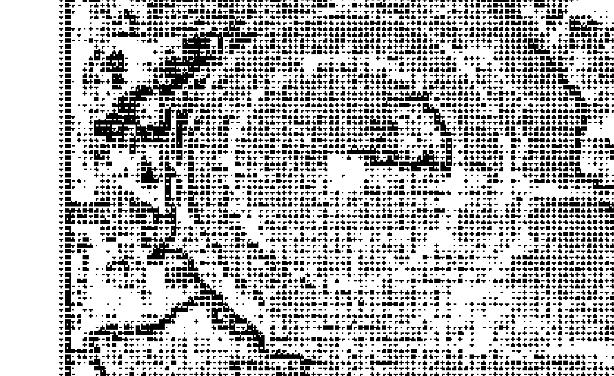

# 奥修：存在之诗

# Tantra-The Supreme Understanding

# 藏密教義的終極體驗

吳圭 著

陳明亮 Gyan Purana 翻

# 奧修靈性成長系列

終極的或許無法諸言語，然而任何可能道破的，都已形諸於此；

奧修與帝洛巴這場不凡的相遇，為我們打開了領悟、接受與超越的大門。

## 第一章 摩訶慕德拉之歌

帝洛巴在《摩訶慕德拉之歌》（Song of Mahamudra）裡提到：摩訶慕德拉是超越一切言語與符號的，但是對最認真和忠誠的你，那諾巴②，這些話必須對你說：無須任何努力，只要保持放鬆與順應自然，你就能夠打破束縛——如此即能得到解脫。終極的體驗（The experience of the ultimate）不是一個體驗——因為那個體驗者已經失了。當體驗者不存在時，還能說些什麼呢？要由誰來說呢？要由誰來敘述那個體驗呢？當主體不存在，客體也就消失不見了——河岸已然消失，只剩下體驗的河流綿延不絕；被知的在那裡，但是知者已然不在。這已經成為所有神秘家的難題，他們已經抵達了終極之境，可是卻無法對追隨者闡明。

他們無法對那些想要得到理智上理解的人闡明。他們已經與之合而爲一，他們的整個存在就 是闡明，但是想藉由理智來傳達是不可能的。倘若你準備好接受，你會得到他們的給與；如果 you 允許、如果你是善於接受和敞開的，他們會允許那樣的體驗在你裡頭發生。然而這是文字辦不到、符號也幫不上忙的，理論和教義在此一無是處。

與存在合一

這個體驗比較像是經歷中的體驗，而不是既成的體驗，它是一個過程，只有開始，永遠沒有結束。你可以進入它，但是你無法占有它。那像一滴水珠落入汪洋裡，或像是汪洋落入水滴中，那是深深的融合、是合而爲一，你就只是消失在其中，不留一物，甚至連一絲痕跡都沒有。因此要由誰來傳遞訊息呢？要由誰回到這個黑暗谷底般的世界？要由誰回到這個昏味的暗夜來對你說說呢？ 對傳遞這件事而言，普世的神秘家始終無能爲力；交流（communion）是可能的，但是溝通（communication）絕無可能，一開始就必須有這樣的了解。

交流與溝通是完全不同的面向，交流是兩顆心的相會、是一場愛情事件；溝通是頭腦對頭腦，交流則是從心到心，是一種感覺。溝通是知識上的，它只帶來言語，它 only 带來言語，只有言語被說出來，而被領會和被了解的也只有言語。由於言語在本質上是如此缺乏生命力，所以沒有事物能夠藉由它活生生地被傳達出來。暫且不論終極的境界，即使是日常生活，即使是你在平凡中經驗到高峰的狂喜片刻，即使是你真的感覺到什麼、成爲了什麼的時候，要以言語敘述也變得不可能。在童年時期，我會一大早到河邊去，河邊有個小村落，那河水流得非常、非常地緩慢，好像一點也没有在流動，當太陽還未升起時，你無法知道它是否在流動，它是如此地慵懶與靜謐。清晨，那裡空無一人、晨泳者還未來到，深沈的寧靜彌漫著，即使是小鳥的歌唱都尚未出現——這麼早，閒然無聲，只彌漫著寂靜，河邊充滿著芒果樹的芳香。我到了那裡，到了河最遠的那一邊，就只是坐著，只是在那裡，沒有必要做些什麼，僅在那裡就夠了，在那裡是多美好的經驗啊！我會洗個澡、游個泳，而後旭日東升，我會到對岸那片廣闊的沙灘上，在陽光下曬乾自己，然後躺在那裡，有時候甚至睡著了。當我回到家後，母親問我：‘你整個早上在做些什麼？’我會說：‘沒做什麼。’上我真的什麼也没做，但是她說：‘這怎麼可能？你有四個小時不在這裡，怎麼可能什麼事都没做？你一定有做些什麼。’她說得對，但是我也沒有不对。

想游泳，記住，是如果感覺想游泳，我就会游泳，但是我並沒有迫使什麼發生；如果我感覺想睡覺，我就睡覺。事情發生著，可是做的人並不存在。我第一次三托歷（satori，譯注：可能原文有误，需要按图片准确

性之詩 Tantra

## 第一章 摩訶慕德拉之歌

見神性）的體驗就是在那河流附近發生的：我什麼也沒做，只是在那裡，然後就有無數的事 情發生。 但是我母親堅稱：你一定有做些什麼。～好吧！我洗了澡，然后 嘯了太 陽。～这样她就滿意了。然而我並沒有做什麼，因為在河邊的發生是無法以言語表達的。 「我洗了澡」——這表達似乎過於貧瘠和遜色。只是说「我去了那裡，在河邊散步，并且坐在那裡～這什麼也沒有表達出來。 即使在日常生活裡，你也会感到言語的不達意；如果你沒有這種感覺，表示你尚未成為 活生生的，表示你活得還很膚淺。如果你所活過的還是能夠藉由言語表達出來，那意謂著你 一點也沒有活過。 一旦某些超越言語的事情首度開始發生，生命已經發生在你身上，生命是在向你敲門。 當那個終極的境界向你敲門時，你完全超越语言——因此你默然无语，你无法语言，甚至连 半个字都无法形成。同时，任何你所说的似乎都非常蒼白，是那般地死寂，那般地无意义、 毫无意义，那好像是對发生在你身上的體驗做了一件不公平的對待。要记住這一點，因為摩 訶慕德拉是最後的、终極的體驗。 摩訶慕德拉的意思就是一個和宇宙同在的全然高潮。如果你爱上一個人，有時候你會感到一種融合和同化——你們不再是两個人；雖然身體依舊是分開的，但是有時候彼此間会形成一座桥，一座金色的桥，然后彼此内在的區隔就消失了，同一個生命能量在不同的两极振動著——唯有当這种境界发生在你身上，你才能夠了解摩訶慕德拉是什麼。無盡的深奧、無比的崇高，就是摩訶慕德拉，它是和整體、宇宙同在的全然高潮，也是融入存在的源頭。這是一首摩訶慕德拉之歌，它很美，所以帝洛巴称之爲一首歌。你可以歌頌它，但是你無法說明它；你可以舞出它，但是你無法講解它。它是如此深奧的現象，所以用唱的或許可以有些微的表達——然而不是你所唱的内容，而是你唱它的風格。許多神秘家在經歷過终極境界后，就只是跳舞，他們別無他法；他們藉由自身的整個存在在和身體來說某些東西，身體、頭腦、靈魂，一切全都參與其中。他們跳著舞，這些舞不是平常的舞；事實上，所有的舞蹈都是因爲這些神秘家才誕生的，那是敘述狂喜、快樂、喜樂的一種方式。某種未知的已经滲透到已知的，某種超越的已经出現在世上——如此你還能做什麼？你可以舞出它、可以歌頌它，這就是一首摩訶慕德拉之歌。那麼谁要来唱它呢？不再是帝洛巴了，那個高潮的感覺會自己來歌頌；它不是一首屬於帝洛巴的歌，帝洛巴已经不在了，那個体驗正在自行振動和歡唱著。對一首摩訶慕德拉之歌、一首狂喜之歌來說，狂喜會自行唱出它，帝洛巴是無足輕重的，帝洛巴已经完全不存在了，帝洛巴已然消失。

了，帝洛巴已然消失。唯有找尋者消失的時候，目標才會達成；唯有經驗者不再存在時，經驗才會存在。找尋 會讓你錯過——因為你的找尋，那個找尋者會被強化；不找尋會讓你尋得。成为阻礙的正是那個找尋、正是那個努力，你愈是找尋，找尋者的自我就愈被強化；不必有所找尋。

这是整首摩訶慕德拉之歌最深奧的訊息：不必找尋，只要保持你本然的样子，別四處遊 走。没有人抵達神，沒有，因為你不曉得他在何處；那么你要往哪兒去？你要到哪兒去尋找 神性？沒有地圖、也沒有方法，沒有人可以告訴你祂在哪裡，沒有，沒有人曾經抵達神。事情始終是反過來的，是神來找你。無論何時，只要你準備好了，他就會来敲你的門；当 you 准备好了，他就會来找你。所謂的準備就緒不過是一種接受性，当 你具有完全的接受性时，自你就不存在了，此时你即成為空無一人的中空神殿。

帝洛巴在詩歌中說，成为中空的竹子，里面空无一物；当 you 是一支中空的竹子，神性之 唇在你身上，中空的竹子成为一支笛子，然后歌曲就開始了——这就是摩訶慕德拉之歌。帝洛巴已经变成一支空心竹子，神性也已来到，于是歌曲就開始了。那不是帝洛巴的歌曲，而是终极体驗自身的歌曲。

在进入这個優美现象之前，我們先來談談帝洛巴。帝洛巴为人所知之處並不多，因為這樣的人事實上是無法被知道的；他們並沒有留下痕跡，沒有成為歷史的一部分，他們存在於 旁边，不是整個人類進展主流的一部分。整個人類懶藉著欲望在進展，而像帝洛巴這樣的人 已经進入了无欲的境界，走出了歷史上人類存在的主流。他們離開主流愈遠，就愈像個神話；他們的存在有如神話，不再是歷史裡的事件。事情本來就會如此，因為他們超越了时间，活在时间之外——他們活在永恆之中。从一个人的角度来看，他們就是不見了，就是消失了。我们記得的也只有他們消失的那一剎那，他們與我们雷同的地方就這麼多了，这就是消失了。我们知道的原因，很少人知道他是谁。存在留下来的只有這首詩歌，这是他的礼物，是给他的门徒那諾巴的礼物，这些礼物无法给所有的人——除非 they 之間存在著深切的、爱的親密，那個人必须 have 接受此等礼物的能力。这首詩歌是献给他的门徒那諾巴的，在它被献给那諾巴之前，那諾巴已经接受过无数次的考验，信任、爱 and 信仰的考验；当 his 内在没有任何怀疑，甚至连一丝怀疑也没有的时侯，当 his 心完全充满着信任和爱的时侯，这首歌才會献给他。我在此也要吟唱出 this song，但是唯有当 you 准备好了，它才能献给你，也就是当 you 内在的怀疑消失的时侯。怀疑不應被压抑，你不該企圖擊敗它，这样 it 将繼續待在你身上。一旦 you 壓抑怀疑，它就會變成你无意识的一部分、而且持续影响 you；不要对抗 you 懷疑的頭腦，别压抑它，相反地，你只需将能量带到信任裡去，你只需对怀疑的頭腦保持漠不關心，除此之外，别无他法。漠不關心是關鍵，你只需保持漠不關心。它就在那裡——接受它。将你的能量日渐導向 more and more 的爱；more 爱无條件的爱。不是只有爱 me，那是不可能的，如果你爱，你只會 爱得更多；如果你爱，你會走在更多爱的路上——不只是爱師父，而是爱存在於周遭的一 切，爱草木和石頭，爱天空和大地。你，你的存在，你存在的本質成了一種爱的現象，於是形成了信任，只有在這般的信任裡，像摩訶慕德拉這樣的歌曲才可能被給與；当 that 諾巴准备好了，帝洛巴就献上 this 禮物。

要記住，跟師父在一起不是要讓你玩弄頭腦的把戲，懷疑和相信都是「頭腦的把戲」。

和師父在一起，你是處在一種「心的歷程」，心不曉得懷疑是什麼，不曉得相信是什麼，心 只曉得信任。心就像個赤子：一個緊抓著父親的手的孩子，隨著父親亦步亦趨，既不是相 信、也不是懷疑，小孩還不是分裂的。懷疑是不完整的，相信也是不完整的，但是小孩依然是完整无缺的，他只是跟隨著父親的腳步。唯有当门徒變得像赤子一樣時，这些意识的高峰经验才有办法獻给他。

当你成为善于接受的深邃幽谷時，这些意识的高峰经验就能夠獻給你；唯有深谷才容受得下高峰。门徒 should 转变得完全陰柔、富於接受，像個子宮一樣，只有這樣，如同 this song 的现象才會发生。

帝洛巴是師父，那諾巴是门徒，而帝洛巴说

### 存之詩 Tantra

人。沙漠遼闊無垠，綠洲時而出現、時而消失；綠洲來自未知，因此需要船錨讓它停留在世上，如果沒了船錨，它將無法停留於此，而那諾巴就是船錨。 同樣的，我也要對你們說：當我還在此稍作停留的時候，別錯過這個機會；不然你會在無關緊要的事情裡錯過——你會依賴被無意義的東西，被心理上的垃圾所占據。你可以繼續思考要贊成還是反對，但是綠洲很快就會消失，你可以稍後再想，就趁現在，啜飲它，因為以後還會有許多來世讓你去思考，不用急；趁它還在的時候，啜飲它。 當你啜飲了耶穌或那諾巴，你會徹底地轉化。轉化是相當簡單容易的，是一個自然的過程，你只需要成為土壤，然後接受播種；成為一個子宮，然後接納種子。 摩訶德拉是超越一切言語與符號的，但是對最認真和忠誠的你，那諾巴，這些話必須對你說…… 它無法被表達，是言語無法形容的，可是還是必須對那諾巴說。每當門徒準備好了，師父就會出現，他必須出現；每當有一個深切的需要發生，就會被滿足，整個存在將回應你深切的需要；但前提是那個需要必須先發生，否則，即使你遇到帝洛巴、佛陀或是耶穌，你也無法領會你遇到的是耶穌這樣的人。

## 第一章 摩诃慕德拉之歌

帝洛巴曾經待在印度，没有人願意傾聽他，但他仍樂意給與這個無上的禮物。究竟怎麼了？這在印度已經發生過很多次了，那背後一定存在著什麼，而且發生的次數比其他地方都來得多，因爲有許多帝洛巴誕生於此。然而爲何帝洛巴必須遠赴西藏？爲何菩提達摩必須去到中國？

學者的國度，在這個屬於博學者和哲學家的國度，要找到一顆心是困難的。他們知道吠陀經典⑤、奧義書⑥，甚至可以憑著記憶背誦整部經典，這是一個屬於頭腦的國度，所以類似的很多事情才會不斷重演。很多次我都有這樣的感覺，就是每當有一個婆羅門出現時，溝通就會變得很困難。一個知道太多的人會變得幾乎沒有可能性，因爲他知道而没有領悟；他蒐羅了許多的概念、理論、教條、經典，但那只成爲他意識上的負擔，而不是一個縱放。那些並不是他的親身體驗，反倒都是借來的，所有借來的全都是垃圾、廢物，你要盡快將它們丟棄。唯有在你身上發生的才是眞實的，唯有在你身上縱放的才是眞實的，唯有在你身上成長的才是眞實與鮮活的。始終要記住，避開借來的知識。

借來的知識成爲頭腦的一個計，它將無知遮掩起來，但是無知從未消失。你愈是被知識所包圍，你內在深處的中心、你存在的本質就愈是無知及愚昧。一個有學識、充塞著借來

的知識的人，幾乎完全封閉在那些知識中，你無法穿透他；所以要找到他的心是很困難的，他完全與自己的心失去了連繫。因此帝洛巴赴西藏、菩提達摩到中國並非偶然，種子必須長途跋涉，是因爲它無法在此找到適當的土壤。記住，要過度沈溺於知識是很容易的，那是一種耽溺、一種毒癮。迷幻藥還沒有這麼危險，大麻也沒有這麼危險；它們在種程度上是一樣的，大麻讓你瞥見某種不存在的東西，給你某些完全是主觀的夢幻——它給你幻覺。知識也如出一轍，帶給你好像已經領悟了的幻覺，例如你會背誦吠陀經，所以你開始覺得你已經知道了；因爲你能夠辯論，所以你覺得你已經知道了；因爲你擁有異常合乎邏輯、非常鋒利的頭腦，所以你爲你知道。別傻了！邏輯無法使任何 人達到真理，理性化的頭腦也只是一個花招而已，所有的論辯都是幼稚的。生命並不憑藉任何的論辯而存在，真理也無須證明——它只需要你的心；論辯是不需要 的，需要的是你的愛、你的信任、你的善於納受。摩訶慕德拉是超越一切言語與符號的，但是對最認真和忠誠的你，那諾巴，這些話必須對你說： 空不需要任何的倚靠，摩訶慕德拉的基礎是無。

這些話必須對你說： 但是對最認真和忠誠的你，那諾巴， 摩訶慕德拉是超越一切言語與符號的， ， 需要的是你的愛、你的信任、你的善於納受。 生命並不憑藉任何的論辯而存在，真理也無須證明——它只需要你的心；論辯是不需要 的，需要的是你的愛、你的信任、你的善於納受。 摩訶慕德拉是超越一切言語與符號的，但是對最認真和忠誠的你，那諾巴， 這些話必須對你說： 空不需要任何的倚靠，摩訶慕德拉的基礎是無。

無須任何努力，只要保持放鬆與順應自然，你就能夠打破束縛——如此即能得到解脫。你無法找到比這更具意涵的言語了，試著去了解帝洛巴想表達的每一個細微差異。空不需要任何的倚靠……如果有什么事物存在，那它必定需要支撑、必定需要倚靠；但是如果没有什麼存在、空無一物，就不需要任何的支撑。这是所有覺者最深奧的領悟，就是：你的存在是一個不存 在。說它存在是錯的，因為它不是什麼事物，它不是如同事物一般的東西，它猶如一片空無，是一片無垠的虛空，沒有邊際；它是阿那特瑪（Anatma）——無我（no-self），並沒有一個自我內在於你。一切自我的感覺都是假的，所有像「我是這個和那個」的認同都是假的。當你達成終極的境界，當你抵達自己最深處的核心時，你會猛然領悟到你既非此、亦非彼——你不是什麼，你不是自我，你只是一片無垠的虛空。有時候如果你坐著，閉上雙眼、只是去感覺你是誰，感覺你在哪裡；盡量深入一些，也許你會害怕，因為你走得愈深，你會感覺自己愈不存在、愈是虛無飄渺。這就是人們害怕靜心的原因，那是死亡，是自我的死亡，因為自我只是一個虛假的概念。放眼望去，即使是對物質領域研究最深入的當代物理學家，也還没有人能夠達到同樣的

眞理，科學界在世界不斷發現佛陀、帝洛巴和菩提達摩透過自身所洞見到的眞理，他們說物質是不存在的，物質是一個與自我類似的概念。一顆石頭存在著，你能感覺到它是非常眞實的存在；你能夠用石頭將人打得頭破血流，甚至致人於死，它是非常實實在在的。可是如果你問物理學家，他們會說石頭是非物質（no-substance），裡頭並沒有東西存在，他們認為那是一種能量現象，是因為許多能量的交量才給人一種物質的感覺；就好像你在一張白紙上塗滿許多線條，當眾多線條交集於一個大上，那個點就產生了，可是那個點並不存在。兩線交集形成一點，許多線交集形成一個點，但是那個點真的存在嗎？或者只是線條交會而形成的錯覺？物理學家認為能量流的交會形成了物質。能量流是什麼？能量不是物質，它們沒有重量，是非物質。非物質線條的交會帶給你物質的錯覺，給你感覺像石頭一樣眞實存在。在愛因斯坦之前的兩千五百年，佛陀就已經闡明內在是空無的，只是因為能量流的交會才給你一種自我感。佛陀說個自我就像一顆洋蔥，你可以一層又一層地剝開它。最後會剩下什麼？整顆洋蔥剝光後，你會發現裡頭空無一物。人就像一顆洋蔥，剝開層層的思慮和感覺，到最後你會發現什麼？空無一物，空無不需要任何倚靠，它自發地存在，所以佛陀說沒有上帝，不需要上帝，因爲上帝是一個倚靠；佛陀說造物主不存在，因爲並不需要去創造出空無。這種概念是最難了解的，除非你證悟它。

## 第一章 摩訶慕德拉之歌

所以帝洛巴才這麼說：

摩訶慕德拉是超越一切言語與符號的。 摩訶慕德拉是一個空無的體驗——就是你不存在。當你不存在，那麼還有誰在受苦？還有誰在深受痛楚和苦惱？還有誰在沮喪和悲傷？還有誰在快樂和忘憂？佛陀說如果你感到喜樂，那麼你會再度成為苦惱的受害者，因爲你依然存在。當你不存在，完全不存在，徹底不存在，那就沒有痛苦和喜樂——而這才是眞實的喜樂，如此你將不會重蹈覆轍；達成空無就 是達成一切。 同樣的，我對你們所下的功夫，只是要引領你走向空無，引你去到全然的眞空。 空不需要任何的倚靠，摩訶慕德拉的基礎是無。 無須任何努力，只要保持放鬆與順應自然，你就能夠打破束縛——如此即能得到解脫。 首先要了解的是，自我的概念是頭腦創造出來的，你裡面並不存在著自我。 強蘭陀（Milanda）國王曾經召見一個偉大的佛教修行者，向他求法，那個佛教和尚名叫那先（Nagasen；註：西元前二世紀後半之印度佛教僧侶、成道者）。當亞歷山大從印度折返時，將部下米南德（Minander）留在那裡統理一切，他的印度名字就叫做彌蘭陀。

彌蘭陀向那先求法，他是眞的感興趣，而且他聽過許多有關那先的傳聞，王宮裡有許多

傳言說著：「這是稀有的！很少有人眞正地開花，他的四周圍繞著某種未知的芬芳，有一

股奧祕的能量；他走在地上，可是他卻不屬於這個世界。」所以國王產生了興趣，於是請

他入宮來。

請，那麼那先會出現——但是請跟他说沒有一個人像那先；如果他邀请，我會出現，但是

要確實告訴他没有一個「我在」，我已經不存在了。使者感到困惑，倘若那先已不存
在，那麼去的是誰？彌蘭陀也被搞混了，他说：「這個人說的話難以理解，不過還是請他
來。」彌蘭陀是希臘人，希臘人的頭腦基本上是邏輯化的。

世界上只有兩種頭腦，就是印度的與希臘的，印度頭腦是不合邏輯的，而希臘頭腦是合
邏輯的。印度頭腦走入隱晦幽微、狂野的深處，它沒有邊界，一切都是不確定、模糊不清
的；希臘頭腦走的是邏輯的、直線進行的，那裡的一切都是被界定和分類好的。希臘的頭腦
走進已知，印度的頭腦則是走進未知、甚至進一步走進不可知；希臘的頭腦是完全理性的，

印度的頭腦則是完全矛盾的。因此如果你發現我說的話有太多的矛盾，別感到困擾，那是一種方式……在東方，矛盾是述說的方式。

## 第一章 摩詞慕德拉之歌

彌蘭陀說：「這個人似乎是瘋了，如果他不存在，那他怎能來到這裡呢？」到了這裡，可是你還是說你不存在。那先說：我還會繼續說明，所以我讓我們在此安坐下來。門口聚集了一群人，王宮中的人全部出現在這裡，那先說：你問吧！」彌蘭陀答：「請先告訴我：如果某個東西不存在，那它怎麼會來到這裡呢？一開始它就不存在了，所以它的來到是不可能的——而你已經來到這裡，因此你是存在的，這是很單的道理。」那先笑著說：「瞧瞧這輛車——一輛車、一輛拖車。一輛車、一輛拖車。」彌蘭陀說：「沒錯。」他吩咐隨從將牛牽離拖車，牛移開後那先問：「這些牛是這輛車嗎？」彌蘭陀說：「當然不是。」然後車上所有的東西、所有的零件一件件被拿開；當輪子被移開時，他問：「這些輪子是這輛車嗎？」彌蘭陀說：「當然不是！」

## 第一章 摩词慕德拉之歌

當拖車的所有零件都被分解開來的時候，那先問：‘我是乘哪一輛車子來的呢？……我們不曾分解過車子，而現在我們這麼做了，你也可以確信車子已然不在。現在車子到哪兒去了
呢？～
那先繼續說：‘那先存在的狀態就像這樣，將每個部分分解之後，他將會消失。～如同
交量的能量線一樣，把線條分解移除後，點就會消失不見；車子只不過是由各個部分所組
成的。
你也是由各個因素所組成，‘我’是各種因素的合成，將這些因素拆解之後，‘我’就
不見了。這就是爲什麼除卻了意識中的思維後，你不可能再聲稱有一個‘我’，因爲‘我’
並不存在——剩下的只是一片真空。當感覺去除之後，自我就完全消失了，你存在、同時也
不存在；你只是一個不在，没有任何界限，是空無的。
這就是最終的達成，是摩訶慕德拉的境界，在如許的境界中，你能夠與整體一起達到高
潮。此刻，已經没有任何疆界，沒有自我存在，沒有界限能夠對你做出劃分。
整體是沒有界限的，你必須成爲沒有界限的，唯有如此，才能夠交會、融合。當你是空
無的，你就没有界限，如此頓時就成爲了整體。當你不在，你成爲了整體；當你還在，你就
成了醜陋的自我。當你不在，你擁有存在廣闊的一切；成就你的本質是祂的目的。

然而這些卻自相矛盾，因此試著去了解，要更接近那諾巴一些，否則這些言語和象徵將
無法帶給你什麼。以信任來聆聽我，當我說以信任來聆聽，我指的是我已經領悟了它，事情
就是這樣，我是目擊者，所以可以證明事情就是如此；也許不可能表達它，但這不表示它就
不存在；

## 第一章 摩訶慕德拉之歌

有時你必須往北，有時卻必須向南，你必須改變方向。如果要讓情境決定你的去向，你必須成爲流動的；你只要曉得如何流動，那就夠了。倘若你曉得如何流動，那麼大海就不會很遠了。因此不要製造出任何模式，然而整個社會卻致力於製造模式，所有的宗教也致力於製造模式，只有極少數的悟道者能夠勇敢地說出真理：就是放鬆下來並順應自然！如果你放鬆，你當然就會順應自然。帝洛巴不會說：「要有道德，」他會說：「要自然。」這完全是相反的兩個面向。一個有道德的人永遠不會自然，不可能，如果他感到憤怒，他將無法生氣，因爲道德不允許他這麼做；如果他感受到愛，他將無法愛，因爲有道德禮教存在。他總是按照道德，從未依循自己的本性行動。我要告訴你：如果你開始依據道德模式，而不是依循自己的本性行動，你將無法到達摩訶慕德拉的境界，因爲它是一個自然的境界，是隨順自然的最高峰。我告訴你：如果你感到憤怒，就生氣——但是必須維持完全的覺知，憤怒不應該壓倒你的意識，如此而已。讓憤怒存在，讓它發生，但是要充分警覺正在發生的。保持放鬆、自然，保持覺知，觀照正在發生的。不久之後，你會發現許多事情就只是不見了，它們不會再發生，而且不需要你的任何努力；你從不想消滅它們，它們只是單純地消失了。

當你覺知的时候，不用很久，憤怒就會消失；它是變成愚蠢的——不是不好，記住，因
爲「不好」帶有價值評判。它只是變得愚蠢！不是因爲它不好，所以你才不那樣，是因爲那
是一椿蠢事；它不是罪惡，只是愚蠢罷了。貪婪消失了，因爲那是愚蠢的；嫉妒消失了，因
爲那是愚蠢的。

是有智慧的，而不是好的；一個不順應自然的人是愚蠢的，而不是壞的。沒有好壞之分，只
有智慧和愚蠢之別。如果你愚蠢，你會傷害別人，也傷害自己；如果你有智慧，你不会傷害
任何人，不只会傷害別人，也不会傷害自己。這裡沒有像罪惡、也沒有像美德這樣的東
西，智慧就是全部。如果你要稱之爲美德，那就稱之爲美德；如果你要稱愚昧爲罪惡的話，
那也是唯一的罪惡。

要如何將你的愚昧轉化成智慧呢？唯一的轉化就是，你不能強迫它發生，轉化只會發生
在你放鬆和順應自然的時候。

保持放鬆與順應自然，你就能夠打破束縛——如此即能得到解脫。

這麼一來，你就成爲全然的自由。一開始，這將是困難的，因爲既有的習性會強迫你有
所作爲；你想要生氣，但是舊有的習性就是會使你強顏歡笑。所以你清楚的知道，有的人在
微笑的時候是生氣的，微笑正好顯示了他們的憤怒；他們有所掩藏，臉上布滿著虛假的笑容，這些人都是偽君子。僞君子是不自然的，如果他憤怒，他將會笑；如果他恨，他會表現出愛；如果有殺意，他會佯裝慈悲。僞君子是完美的道德家，是完全人工化的，是一朵塑膠花，醜陋、毫無價值，只是假装，完全不是一朵花。譚崔是一種自然的方式，保持放鬆並順應自然。不過那是困難的，因爲你必須打破舊有的習性，而且你是活在一個屬於偽君子的社會裡。那是不容易的，因爲你會發現處處都與偽君子有所牴觸，然而你必須經歷它；那會是艱難的，因爲你對不實的、人工的造假已經投資許多。你或許會感到徹底的孤單，但這只是一個過渡時期，不用多久，別人將會感受到你的誠實。要記住，眞實的憤怒比虛假的微笑來得好，至少那是眞實的；至少他是眞實的，眞實的面對自己的存在，不論如何，你都能夠信賴他的眞實。如果一個人無法眞的生氣，他將完全無法眞實。這是我的觀察：眞實的憤怒是美的，而虛假的笑容是醜的。眞實的憎恨有它的美，就如同真實的愛一樣，因爲美與真實有關。美無關乎憎恨、也無關乎愛，美源自於真實。不論是什麼形式，真理都是美的，真實的死人比虛假的活人來得更美，他至少還存有基本的真實。

穆拉·那斯魯丁的老婆去世了，左右鄰居全都聚集在那裡，但是那斯魯丁完全不受影響 地站著，好像什麼事情都沒發生似的。鄰居一邊哭哭啼啼、一邊說著：「你為何呆呆地站 在那裡？那斯魯丁，你老婆死了啊！」 那斯魯丁說：「等一下！她是那麼會騙人——所以我至少要等個三天，好瞧瞧這是真的 還是假的。」

記住——美源自於眞理、誠實，變得更誠實——所以我就會益加綻放；你愈誠實，就會感覺許多東西自然而然地消失了，你不需做任何努力，它們就自行消失了。一旦你領會了簡中巧 妙，你會愈來愈放鬆，愈來愈自然，愈來愈誠實。然後帝洛巴說：……你就能夠打破束縛——如此即能得到解脫。 解脫並沒有很遠遠，它就潛藏在你背後，一旦你是誠實的，解脫之門即為你敞開。可是 你那麼會騙人、那麼會傷裝，你是一個僞君子，你是如此地虛僞，這就是為什麼你覺得解脫 是那麼遙不可及。然而事實並非如此！對一個誠實的存在而言，解脫是再自然不過的一回事 了，就像萬事萬物一般地自然。如同流入大海的水珠、消散於空中的煙霧、爇熱的太陽與沁 凉的月光一樣，誠實的存在即是解脫，不必對此多說什麼，也無須對人說你獲得了什麼。 有人問濟禪師：「你到底發生了什麼事？人們說你已經悟道了。」他聳聳肩說：「發
生？什麼事也没發生。我在樹林裡砍柴，因為冬天快到了，同時打井水挑回寺裡。他聳一聳肩——這是一個意味深長的姿勢。

他說：「什麼也沒發生。你問得很愚蠢！那再自然不過了：打水、砍柴，生命完全是自
然的。～臨濟禪師說：「瞌了就睡，餓了就吃，生命變成徹底的自然。」

解脫就是變得完全的自然，解脫不是什麼值得吹噓的事情；宣稱你已經抵達何等境界，
那沒有什麼偉大，也没什麼了不得，那只不過是變得自然，只是成為你自己。

那該怎麼辦？擺棄惺惺作態、丟掉偽善，拋掉包覆在自性四周的一切教化，然後成為自
然的。剛開始那是很困難的，不過也只有在剛開始的時候，一旦你心領神會，他人也會開始
覺得你的身上有了某些發生，因為一個誠實的存在是如此的一股力量、一道磁力，他們會感
到已經發生了什麼：「這個人已經不再像我們一樣行動，他完全不一樣了。」你絕不會茫然
失措，因為丟棄的只是那些矯揉造作的東西。

藉著拋掉做作、偽裝和面具，到了空被創造出來的時候，自性就會開始流動，因為它需
要這樣的空間。

成為空的，保持放鬆並順應自然，讓此成為你生命最基本的原則。

## 第二章 看見內在的天空

《摩訶慕德拉之歌》接下來是：

當一個人凝視進宇宙，就會看到空無；

但如果攜帶著頭腦，那你就會看到頭腦，
一個打破分別的人，即達成了佛的境界。

遊蕩飄過天空的雲沒有源頭、也沒有歸處，
那些流經頭腦的評判思想也一樣。

一旦自我的頭腦被觀照到，那些偏見就終止了。

形色的空間既不是黑的、也不是白的，
只要是源於自我的頭腦，所有事端都會浮現。

一切難題的根源就是頭腦本身。首先要了解的是頭腦是什麼，了解它的組成要素，不論
它是一個物體或只是一個過程，也不管它是實體的還是如夢一般，除非你領悟了頭腦的本質，否則將無法解答你生命中的任何難題。你或許竭盡心力要解決它們，但是如果你企圖解決單一的、個別的難題，你注定會失敗，這是無庸置疑的，因為個別的難題實際上並不存在，因為頭腦就是難題；即使你解決了這樣或那樣的難題，也不會有所幫助，因為根源依舊未被觸及。樹枝將會滋長——甚至更勝從前，修剪枝葉會讓草木長得更茂盛。除非你知道如何斬草除根，否則你的對抗是毫無根基的、是愚蠢的，你會毀了自己，而不是樹木。在對抗中，你徒然耗費精力、時間與生命，而樹木卻日益壯大，變得愈加粗壯。你會對接下來的發生大感驚訝：你竭盡全力想要解決種種難題，然而它們卻持續增長、壯大，就算解決了一個難題，隨後又有十個難題出現眼前。不要企圖解決個別的、單一的難題，它們並不存在，頭腦才是難題的所在。頭腦潛藏在底下，這就是我稱之為根的緣故，它並不顯而易見；然而凡是遇到難題都存在於地表，你看得見，所以就被騙了。始終要記住，看得見的永遠不會是難題的根源，根源是看不見的、是隱匿的。絕不要與看得見的對抗，否則你是在對抗影子，你可能耗盡了自己，但是卻無法為生命帶來轉化，而
## 第二章 看見內在的天空

### 頭腦是根本難題

在談論任何關於頭腦的理論，而只是陳述它的「實際狀況」，真相是：頭腦必須被解決。

人們來問我：「如何擁有一個寧靜的頭腦？」我對他們說：「沒有像這樣的東西存在，寧靜的頭腦，從來沒聽說過。」

頭腦從來不會寧靜過——沒有頭腦才是寧靜的，頭腦絕不可能是寧靜的、靜默的。頭腦的本質正是緊張的、混亂的；頭腦絕不可能是清醒的，也不可能清晰明瞭，因為頭腦是濫藉著混淆、困惑才存在的。沒有頭腦才可能清晰明瞭，沒有頭腦才可能寧靜，沒有頭腦才可能靜默，因此永遠別想擁有寧靜的頭腦，如果是這樣的話，你將一開始就阻絕任何的可能性。

所以首先要了解頭腦的本質，唯有如此才能對症下藥。

如果你觀察，你絕不會遇見像頭腦一般的實體，因為頭腦不是東西，而是一個過程；它不是物品，反倒像是群眾一樣。個別的思想是存在的，但是它們移動如此快速，以致你看不到它們之間的空隙；因為你不夠覺知與警醒，所以見不到其間的空隙。你需要的是更深刻的
眼光，當你能看得更深，你會頓時目睹一個接著一個的思想——然而卻見不著頭腦。

無數的思想湊在一起，讓你產生彷彿頭腦是存在的幻覺，然而有任何像群體這樣的東西
嗎？除了一群個體以外，你還能找到所謂的群體嗎？可是它們全都聚在那裡，使你覺得好像有類似群體的事物存在；但是只有個體是存在的。這是對頭腦最基本的洞察。注意看，你會發現一群思想，可是你絕不會遇見頭腦；除非那成為你的親身體驗，而不是因為我或帝洛巴這麼宣稱，否則對你不會有太大的助益。如果了解，所以許多形勢也會跟著扭轉。觀照頭腦，看看它在哪裡、它是什麼。你將感覺到思想在浮動，而且思想與思想之間有空隙；如果你觀照得夠久，你會見到那些空隙比思想來得更多，因為每一個思想必須與另一個思想隔開來，事實上，字與字之間必須要有間隔。如果你走得愈深，你會發現愈來愈多的空隙、愈來愈大的空隙；一個思想流過之後，緊接著的是一個沒有思想存在的空隙，然後別的思想出現，另一個空隙也隨之而來。倘若你是無意識的，你就無法見到這些空隙，你將會從一個思想跳到另一個思想，絕對見不著空隙；倘若你變得覺知，你會見到更多、更多的空隙，你若是全然地覺知，那麼無邊的空隙將顯露給你，在那些空隙裡，三托歷就發生了。在那些空隙裡，眞理對你敲門，神已經被實現，隨你怎麼表達都可以；當你處於完全覺知的时候，唯一存在的就只是廣大無垠的空無。

思想好比雲一樣，雲不斷變動著，而且可以厚重到讓你無法見到隱藏於後的天空，浩瀚的藍天已然消失，你被重重的烏雲遮蔽了。因此你要繼續觀照，當一片烏雲離去，而另一片鳥雲尚未進入視野之際，你會突然瞥見浩瀚無垠的藍天。內在也是如此，你是一片無垠的藍天，而思想就像烏雲一般盤旋在你身邊、充塞在你周遭，但空隙是存在的，天空是存在的。瞥見天空是三托歷，成為天空則是三摩地（Samadhi：成道），從三托歷到三摩地，整個歷程就是對頭腦深深的洞見，如此而已。頭腦並非如實體一般地存在——這是第一點，存在的只是思想。其次是：思想是有別於你而存在的，它們來來去去，並不與你的本質同在，你才是持續存在的。你如同天空一般，不來也不去，始終在那裡；烏雲來了又去，只是暫時的現象、不是永恒的。即使你想要緊抓著一個思想，你也無法使它久留，它勢必會離去，它有自己的運。思想不是你的，它們不屬於你，它們是訪客，而不是主人。深深地觀照，那麼你會變成主人，而思想會變成訪客。就一個訪客而言，思想是美的，但是如果你完全忘了自己是主人、而思想反## 第二章 看見內在的天空

纷掉落和變形，此種現象遍及整個英國，這個能量就透過電視傳播；湯匙距離吉勒有十英尺遠，因此在人們家裡距離電視十英尺的範圍內，發生了許多事：物品彎曲、掉落、變形，這真是不可思議！

思想即事物，而且是具有極大力量的事物。在蘇聯有一個女性名叫米凱洛娃娜，她可以從很遠的地方做出許多奇蹟，她能夠將任何東西吸引到身邊來——只是用想的。蘇聯這個國家不相信任何超自然的事情，因爲它是一個共產主義、無神論的國家，他們以科學的方式研究米凱洛娃娜到底怎麼了，實驗中發現，當她在進行的时候，竟然在短短半個小時裡失去兩磅的體重。這代表了什麼？就是——透過思想，你正將自己的能量丟出去，而且你一直在這麼做。頭腦是一個喋喋不休的家伙，終日做些不必要的思想廣播，這麼做等於在毀掉周遭的人，也在毀掉你自己。

你是危險的，你不斷在廣播思想，你正是許多事情發生的原因。思想是一個龐大的網絡，整個世界會變得日益不幸，是因爲有更多的人在廣播愈來愈多的思想。

你愈是向內走，你會發現世界愈來愈寧靜，因爲廣播的人愈來愈少了。在佛陀或是老子的時代，世界是非常、非常寧靜自然的，那時候是個天堂。爲什麼？當時人口很少、很少，思想家也不會太多，人們傾向於感覺而不是思考。人們會時時祈禱，早晨第一件要做的事是祈禱，夜晚要做的最後一件事也是祈禱。在一天中也會常常找個片刻，在自己的內在祈禱。什麼是祈禱？祈禱是將祝福散播給一切，祈禱是將你的慈悲散播給一切。祈禱創造了負向思想的解藥，它是正向的。這是對思想該有的第三個洞見，也就是——思想是事物、是力量，因此你必須非常謹慎地對待它們。平常沒有覺知的时候，其實你持續在思考，無論那是什麼；很難找到一個思想裡沒有眾多殺戮的人，很難找到思想裡沒有作惡多端的人——然後這些事情就一一實現。記住，也許你没有殺人，但是你不斷在殺人的想法或許會創造出那個人被殺的情境，也許有人會感染你的思想，因為脆弱無心防的人比比皆是；思想會如流水一般地往低處流，如如果你不斷地想著某件事，比較無心防的人也許就會感染你的思想而去殺人。這就是為何那些已經悟到內在實相的人會說：世上發生的所有事情，每個人都要負責、每個人都有責任。發生在越南的種種，不只是尼克森有責任，而是每個動著念頭的人都有責任，任，光一個人付不起這麼大的責任的。除非是没有頭腦的人，否則人人皆要為一切的發生負起責任。如果世界成了地獄，你就是創始者之一，你也促成了它。別再將責任推給他人，你也有責任，這是個集體現象。病端會出現在任何地方，災難也許離你千百里遠，但這沒有什麼不同，因為思想是一種無空間性的現象，它不需要空間。因為此思想可以最快地移動，即使光速也比不上，因為光需要空間才能存在，所以思想的移動是

最快速的。
事實上，思想的移動不需要空間和時間，它不需要空間就可以存在。你可能在這裡想著
什麼，然後它就在美國發生了，這樣你要如何負責呢？法院無法制裁你，但是在存在的最終
極法庭裡，你將受到制裁——而你已經受到懲罰了，這就是爲什麼你活得如此悲惨。
人們來到這裡問我：「我們不曾對任何人做過什麼壞事，但是我們依然活在痛苦中。」
你或許沒做壞事，但是你也有在想，而想比做要來得幽微。一個人可以防範自己有所作
為，但是卻無法防止思想；就思想而言，任何人都有弱點。
倘若你要完全免於罪惡、免於惡行、免去周遭一切的苦惱，無思無想是必要的，佛的意
義就在於此。
佛是不憑藉頭腦而活的人，這樣他就沒有任何要負的責任，這就是爲什麼佛東方世界會認
爲他永遠不會累積因果業報，因爲業意謂著行動。然而東方世界也說，即使是佛殺生，他也
不會造業；而一般人即使沒有殺生也會造業，爲什麼？
很簡單，因爲不論佛做了什麼，他都没有引進任何的頭腦，那是自發的、而非行動；他
沒有考量過什麼，只是發生。他不是一個作為者，他像虛空一樣地行進，他毫無念頭，沒有
想過要做什麼。如果存在允許它發生，他也会允許它發生；他不再具有那有所堅持的、想要

有所作為的自我。這就是成為空和無我的意思，只是成為不在、無我，也就是阿那塔（anatta），如此一來，你不再有任何作為，不必為周遭的境遇負任何責任，所以你是超越的。每一個念頭對你和他人都會起作用，要警覺！我所謂的警覺並不是要你升起好念頭，不是的，因為當你升起好念頭的時候，你背地裡也升起了壞念頭。沒有壞的，好的要如何存在呢？如果你起了愛的念頭，那麼背地裡，恨就蟄伏在那裡。沒有恨，你怎能升起愛呢？你也許沒有意識到恨，愛或許在意識面，但是恨則隱藏在無意識裡，愛恨是同進退的。當你升起悲憫之念時，你也生起了殘暴之念；沒了殘暴，你還能有什么悲憫？沒了暴力，你還能想到什麼非暴力？正是在「非暴力」這樣的字眼裡，暴力闖進來了，暴力就在那個概念之中。沒有想到性，你還能想到梵行（brahmacharya）：獨身禁慾的生活嗎？那是不可能的，如果没有性的念頭，那禁慮是什麼意思？如果梵行是奠基於性的念頭，那這是哪門子的梵行？不是這樣的，是一種不源於思想、一種全然不同的存在品質，不是好的，也不是壞的，只是一種沒有念頭的狀態；你只是觀照，只是保持意識，而沒有念頭。倘若某些思想闖入：思想是會來的，因為思想不是你的，它們就是會在空中流動。

我們的周遭到處都是思想的勢力範圍，到處都是，就好像空氣一樣，你的周圍到處都有思想，而且不斷自行來來去去，唯有當你愈來愈覺知，它才會停止。這當中的重點是：如果 you 變得覺知，思想就消失了、融化了，因為覺知比思想更有能量。覺知對思想而言有如一把火，好比你在暗室裡點亮一盞燈，黑暗就無法來到；如果把燈火熄了，黑暗即從四處竄入，不費一分一秒就出現了；而屋子裡若點著燈，黑暗則無從進入；思想就像黑暗，只有當內在沒有光明的時候才會竄入；而覺知是火焰，你若是變得愈覺知，思想就愈進不來。知，思想就愈進不來。如果你真的與自己的覺知合而為一，思想是進不來的，此時你變成一座嚴密的堡壘，百毒不侵。這不是說你是封閉的，要記住——你是全然敞開的，你的堡壘只是那個覺知的能里。當你没有思想的時候，思想會前來，從你身旁經過；你會看見它們來臨，但只是接近你，然後就掉頭走開了。這麼一來，你哪兒都能去，你可以去地獄——可是沒有什麼可以動搖你；這就是我們所說的成道。

### 嬰孩的眼睛

現在讓我們來理解帝洛巴的經文：當一個人凝視進宇宙，就會看到空無；搖你；這就是我們所說的成道。

[PAGE 55]

## 第二章 看見內在的天空

但如果攜帶著頭腦，那你就會看到頭腦，一個打破分別的人，即達成了佛的境界。當一個人凝視進宇宙……這是一種方法，譚崔的方法：看到宇宙裡去，看進天空裡去，而沒有看；用沒有內容的眼睛來看。看，不是要找尋什麼，而是一個空無的觀看。有時候你會在一個瘋子的眼中看到一種空洞的注視，瘋子和聖者在某些方面是相似的。瘋子與你對看，但你會發現他並沒有看著你，他看穿了你，好穿你是玻璃製品、是透明的，他並沒有在看你。對他而言，你是透明的，他看透你、看穿你；他看，但没有對著你看（looking at you），這個「對著」（at）是不在的，他純粹只是看。没有任何祈求的望進天空裡去，因為如果你有某種祈求，鳥雲就一定會出現；這個「某種」即意謂著鳥雲，而「沒有」即意謂著藍天的無限延展。別祈求任何目標，如果你找尋目標，光是那個「找」就製造出目標，那麼鳥雲就出現了，然後你注意著鳥雲。別注意鳥雲，即使它們在那裡，你也不必注意它們——只要看就好，讓它們飄動，讓它們在那裡。當你領悟了這種沒有關注的觀看，鳥雲頓時就煙消雲散，只剩下廣袤無際的天空。這是困難的，因為眼睛是集中注意力的，它們已經習於注意事物。看看剛誕生的的嬰孩，他有著一雙像聖者的眼睛，或者是像瘋子的眼睛：他的眼睛是放鬆與流動的。嬰孩可以同時將兩個眼珠移到內側，也可以同時移到外側，因為他們的眼珠尚
未固著化。他的身體系統是流暢的，他的神經系統還沒有結構化，一切都在流動著。因此一個小孩是不帶注意在看的，那是個瘋狂的觀看。去看看小孩，你也需要這樣的觀看，你必須再次成就第二個童年。

世界，瘋子之所以瘋，是因為他没有固定的角色，他淪落於社會之外。社會意謂著一個屬於角色、競相追逐的固定化
在不同的面向上，聖者也完全退出了社會的潮流，他没有瘋，事實上，他只可能是最正常的。然而整個世界都瘋了、僵化了，這就是為何聖者似乎也是瘋的。去看看瘋子，你需要那
樣的觀看。

在西藏的古老學派中總會有個瘋子，目的是要讓求道者看他的眼睛。瘋子是很有價值的
，他們到處被物色著，因為修道院少不了他們，他們變成了被觀看的目標。求道者要觀察
瘋子、觀察他的眼睛，然後要試著像瘋子一樣觀看世界，那是一段美好的時光。

東方的瘋子從未像西方的瘋子那般受折磨，瘋子在東方是有價值的，他們有著特殊的重
要性。他們被社會照料，受到尊重，因為他們有某些聖者的特質、某些赤子的特質；他們不
同於所謂的社會、文化、文明，他們已經從中退出了。當然，他們是淪落的，而聖者是超脫
的；瘋子是淪落的，那是其間的差異，但他們都是與社會離異的，他們有相同點。看看瘋
子，然後讓自己的眼睛變得沒有焦點。

[PAGE 57]

## 第二章 看見內在的天空

哈佛大學幾個月之前做了一项试验，试验的结果令人惊讶，教人无法置信；他们试图要找出世界是否真的如我们所见到的那般。我们所见的世界其實並非其本然的样子，我們看到的世界是我們對它的期待，我們對它有所投射。這樣的事實發生在太平洋的一座小島上：有一艘巨輪航行到小島附近，岛上的人民不曾见过這樣的東西，没有人见过！這艘船是如此龐大，可是那裡的人們的眼睛已經適應了小船，他們從未见过這樣的東西；他們的眼睛就是無法抓住這種景象，所以完全拒絕接受這艘巨輪存在的事實。哈佛大學在一个年轻人身上做了这样
的实验：他们给一副配有扭曲镜片的眼鏡，要他戴上七天。头三天他处在痛苦不堪的境地中，因為一切都扭曲了，整個世界歪七扭八。这使他產生劇烈的頭痛，以致於無法入睡，就算是閉上眼睛，那些扭曲的影像也會出現……扭曲的臉、變形的草木、歪曲的道路。他甚至無法走路，因為他無法相信：「這路是眞的，還是扭曲了的映象？」但是奇蹟發生了！在第三天之後他適應了，那樣的扭曲變形已然消失。那副眼鏡還是一樣地扭曲，可是他開始以從前既有的方式來看世界；在一週之內所有都不成問題了，頭痛不再、困擾不再。科學家只有驚訝，無法相信竟然會如此，他的視覺完全被遺忘了，那副
眼鏡好像已經不存在，而他的視覺又以從前熟悉的方式來看待世界。沒有人知道你看到的是否真的存在那裡，也許並不存在，也許是以一種完全不同的方式存在。你所看到的色彩，你所看到的形體，一切都是眼睛的投射；只要你固定不變地看，以你既有的模式凝聚焦點，那麼你就是按照自己特有的制約在看待事物。這就是為什麼瘋子擁有流動的視覺、當下的觀看，因為看與不看已經合而為一。這種看是美的，也是譚崔裡最要的技巧之一。當一個人凝視進宇宙……不要看到什麼，只要看。在頭幾天，你會一再一再看見些什麼，那是因为舊有的習性。我們以舊的習性來聽和看，以舊習性來了解事物。鄒賓斯基（P.D. Ouspensky）是葛吉夫最重要的學生之一，鄒賓斯基對學生有某種強調，每個學生都對此痛恨不已，但許多人也因此留了下來。如果有人對鄒賓斯基說：“昨天你會說……鄒賓斯基馬上就會打斷他，“不要這樣說，要說“我了解”，不要重複我所說過的，因為你不可能再次體驗它。談談你所聽到的。對此他異常地堅持，因為我們是如此習焉不察。或許你又会說：“聖經裡頭說……“那麼他会說：“不要這樣說！只要說你了解聖經
[PAGE 59]

## 第二章 看見內在的天空

了些什麼。～他的每一句話都會這麼堅持：始終要記住的是你的了解。我們不斷地忘記，他的學生也再三地忘記，每天都忘記，但他又是那麼堅持，他不會讓你依然故我，他會說：～倒回去，先說我了解你說的，這是我的了解……因為你任憑己意在意間，因為你擁有一套固定的見聞模式。～這些模式必須被## 第二章 看見內在的天空

會降臨頭腦，沒有問題，它們本來就是這個樣子。
如果思想沒有出現，那很美，你只要繼續保持中立的觀照，既沒有贊成、也沒有反對，
既沒有喜歡、也沒有責難，沒有任何的評價，只是坐在裡頭看著，不帶關注地看。
然後事情會這麼演變：就是你愈觀照，你會愈見不著思想；你觀照地愈深，思想就愈消失無形。一旦你領會了，你就掌握了錘匙，這把錘匙能夠解開最神秘的現象，佛性的現象。
遊蕩飄過天空的雲沒有源頭、也沒有歸處，那些流經頭腦的評判思想也一樣。
一旦自我的頭腦被觀照到，那些偏見就終止了。
一旦你能夠看到思想的流動，知道自己不是那些思想，而是那些思想流動的空間，那麼
你就是抵達了自己，已經領悟到自己的意識現象。於是偏見停止了，再沒有好與壞，沒有想
要什麼，也沒有要排除什麼。
你接受，你變得放鬆和順應自然。你只是開始跟著存在流動，哪兒也不去，因為目標不
存在；沒有目的，因為目的不存在。這麼一來，你時時刻刻都享受著，不管存在帶給你什麼
——記住，是來者不拒。你能夠享受，因為你沒有任何欲望和期待；你無所求，所以對任何
待遇都心存感激。慫慫是坐著和呼吸就已經非常美好了，慫慫是存在於此就已經異常美妙
了，生命的每一個片刻皆成為一項奇蹟，一個自有的奇蹟。

形色的空間既不是黑的、也不是白的，只要是源於自我的頭腦，所有事端都會浮現。你會了解形色空間中許多形狀的雲朵：你會看到大象和獅子，看到任何你想看的。在空間中，形體、色彩來來去去……但天空依舊保持原來的樣子，不曾被沾染。早晨的天空像一團火焰，太陽冒出紅光染紅了整片天空，到了晚上，那整片紅呢？整片天空是陰暗的、黑的。隔天早晨，那些黑色又跑到哪裡去了？天空始終是一塵不染、不受影響的。桑雅士就是這個樣子：保持像天空一樣，不論出現什麼、發生什麼，他都不會被沾染。當善念來臨，桑雅士不會誇耀它，他不会說：「我心中充滿對世界的善念、美德和祝福。不，他不会如此自誇，因爲這樣他就有所沾染，他不会宣稱自己是好的；當惡念來臨，他不會爲之沮喪，否則他也被沾染了。善或惡、日或夜，一切皆生滅不已，而他只是觀看著。春夏秋冬他觀看著，生老病死他觀看著，他保持一塵不染。這是成爲桑雅士的最根本核心，如天空、太空一般，這才是事情的真相。你會有自慚形犧的時候，但那只是個念頭；你會有認爲自己是善或是惡，是罪人或聖者的時候，但那也只是個念頭，因爲你內在的天空不可能是任何東西——它只是存在，不可能成爲什麼。所有

外。你是一個存在，你本然如此，所以不需要成爲什麼。看看天空，當春天來臨，整個世間充滿著鳥語花香，爾後秋天降臨，轉眼夏天又來到。時而晴，時而雨，萬事萬物皆不斷在轉變、轉變、轉變，這些在天空裡發生，而天空一壟不染，天空保持深深的距離；到處都會出現雲，但是你都與它保持距離，對一切若即若離。桑雅士就如同天空：他活在這個世界裡——戰了就吃，不管春去秋來，晴天雨天；心情好，興高采烈、狂喜、心滿意足；心情惡劣，沮喪、低落、陰鬱、沈重——一切來來去去，而他保持是一個觀看者。他只是看，了解一切都會消逝，世事來來往往，他不再有所認同。沒有認同就是桑雅士，桑雅士才可能是最高的縱放，無上的開花。當佛陀達成最終的、最終極的覺悟時，有人問他：「你達成了什麼？」他笑著說：「什麼也沒有——因爲一切我所達成的，內在早已俱足。我所達成的不是新的東西，那是永恒的，所以我始終在那裡，那正是我的本質，只不過以前不曾注意到、沒有覺察到罷了，這個寶藏一直都在那裡，只是我將它忘記了。」別，唯一的差別就是，你忘了，那是你的無知。就你的本質而言，佛陀和你之間沒有絲毫差別，本來就是如此，是你忘了，那是你無知。就你的本質而言，佛陀和你之間沒有絲毫差別，本來就是如此，是你忘了，那是你無知。別，唯一的差別就是，你不記得自己是誰，而他記得；你們是一樣的，可是他記得自己，而你記得；他是覺醒的，而你還在昏睡著，但是你們的本質是一樣的。試著將它活出來，帝洛巴說的就是這個技巧：彷彿天空一樣活在世上——讓你存在的風

格成爲這個樣子。有人對你生氣，有人侮辱你，那就觀照；如果你憤怒，觀照；成爲山上的觀照者，繼續觀看、觀看、再觀看。但只是觀看，没有任何關注，沒有被什麼所迷住。當你道的感知變得清澈的時候，刹那間——根本不用一點時間，你會徹底覺悟，你就是佛，你已成佛在這當中得到了什麼？什麼都没有，相反的，他失去了許多：不幸、痛苦、悲惨、慮、野心、嫉妒、憎恨、占有、暴力——這些他全失去了。但是達成了什麼？沒有，他達成了的只是那個本來就在的，他記起來了。

譯注⑪哈塔瑜伽士（Hatha yogis）：此派認爲，合一的境界是由練習「體位：軟骨功」的運動和調身調息的功法而得。

### 存有之詩 Tantra

有人對你生氣，有人侮辱你，那就觀照；如果你憤怒，觀照；成爲山上的觀照者，繼續觀看、觀看、再觀看。但只是觀看，没有任何關注，沒有被什麼所迷住。當你道的感知變得清澈的時候，刹那間——根本不用一點時間，你會徹底覺悟，你就是佛，你已成佛在這當中得到了什麼？什麼都没有，相反的，他失去了許多：不幸、痛苦、悲惨、慮、野心、嫉妒、憎恨、占有、暴力——這些他全失去了。但是達成了什麼？沒有，他達成了的只是那個本來就在的，他記起來了。

## 63 第三章 光與黑暗的本質

### 第三章 光與黑暗的本質

無始以來的黑暗掩埋不了熾熱的陽光——
累生累劫的生死輪迴，
從不能掩埋心靈明亮的光芒。

雖然以言語來闡釋空，然而空是不可能言說的。
雖然我們說「心靈如同火焰一樣的明亮」，
然而那是超越所有語言和符號的。
雖然心靈在本質上是空的，
但是它卻團繞並包含著所有一切。

先讓我們對黑暗的本質靜心冥想一下，它是存在中最奧秘的事情之一，你一輩子都深涉其中，不能不去思考它。你必須與黑暗的本質達成協議，因為那和睡覺的本質一樣，和死亡
的本質一樣，和所有無知的本質一樣。

如果你對黑暗靜心冥想，首先顯露出來的是：黑暗並不存在，黑暗不必藉著任何存在就
在那裡了，它比光更加奧秘，完全不是一個實體；反之，它只是光的不在。黑暗不存在於任何地方，你找不到它，它只是一個不在；黑暗本身是不存在的，它沒有所謂的自我，而只是
光的不在。

如果有光，黑暗就不在；如果没有光，黑暗就存在，它是光的不在，而不是某種東西的
在。因此光來了又去，而黑暗則是持續著；它不在，但是持續存留著。你可以點燃火光，也
可以熄滅它，可是你無法創造黑暗，也無法滅除它；它始終毫不存在的那裡。

其次，如果你深入冥想，你會了解因爲黑暗不存在，所以你對它無能爲力；如果你企圖
對它做些什麼，你會被擊敗。

黑暗無法被擊敗，你怎能夠打敗一個不存在的東西？而當你被打敗時，你會以爲，
「它非常強大，因爲我被打敗了。」這很荒謬！黑暗是毫無力量的，一個不存在的東西怎麼
會有力量呢？你不是被黑暗及其力量所擊敗，你是被自己的愚蠧所擊敗。打從一開始你就對
抗——那是愚蠧；你要如何對抗一個不存在的東西？要記住，你一直在對抗著許多不存在的
[content]
[PAGE 69]

### 第三章 光與黑暗的本質

東西，就如同對抗黑暗一樣。所有的倫理道德正是對黑暗的對抗，這是它愚蠢的原因。倫理道德傾全力對抗黑暗，對抗著那些本身是不存在的事物。憎恨不是眞實的，它只是愛的不在；憤怒不是眞實的，它只是慈悲的不在；無知不是眞實的，它只是所有倫理道德卻持續在對抗那不存在的事物。道德家永遠不會成功，那是不可能的，到頭來必然會失敗，這樣的努力是無意義的。宗教和道德之間的差異是：道德試圖對抗黑暗，而宗教則是要喚醒隱藏在背後的光。宗教不擔心黑暗，它只是要找到內在的光，一旦光在那兒，黑暗就消失了；一旦光在那兒，你不需對黑暗做什麼，它就會不見了。這就是第二個要點，你無法直接對黑暗做些什麼。如果你想要做些什麼，你必須對光下手，而不是黑暗。熄滅光，黑暗即存在；點燃光，黑暗即不在——但是你無法點亮或熄滅黑暗，你無法將之引來、將之排除。如果你要對黑暗做些什麼，你必須藉由光間接地進行。永遠不要與不存在的對抗。頭腦被對抗所誤惑，但那樣的誤惑是危險的，你會耗盡能量與生命，你會揮霍掉自己。別被頭腦所誤惑，只要看，不管那事物存在與否；如果是不存在的就別對抗，去探索它們，如此你會走上正軌。第三個要點是，黑暗以數不盡的方式與你的存在深深地糾纏在一起。

當你憤怒時，你內在的光就消失了。事實上，是因爲你的光消失，所以你才憤怒，然後黑暗才進入。唯有在你無意識的時候，你才可能憤怒，你無法有意識地憤怒。試試看：要嘛你保有意識、然後憤怒沒有出現，你不可能有意識地憤怒。這是什麼意思？意識的本質就好像光一樣，而憤怒的本質就好像黑暗一樣，你無法同時擁有兩者。如果光存在，你就無法擁有黑暗；如果你是有意識的，你就無法憤怒，他們問了一個錯誤的問題，當你問了錯誤的問題，要得人們來問我要如何能夠不憤怒，他們問了一個錯誤的問題，別問要如何消弭黑暗，別問要如何除去憂慮、到正確的答案是非常困難的。要先問對問題，別問要如何消弭黑暗，別問要如何除去憂慮、痛苦、焦慮；一開頭就要去透析你的頭腦，看看它們爲何會在那裡。那是因为你的覺察不夠，所以它們才會存在。因此要問對問題：如何能夠更有意識？如果你問要如何不生氣，你會成爲某些道德家的受害者，而如果你問如何更有意識，那麼憤怒無法存在，色慾無法存在，貪婪無法存在，這壓一來，你即是走在正途上，你會變成一位虔誠的找尋者。道德是一枚僞幣，它行騙世人，根本不是宗教。宗教無關乎道德，因爲宗教無關乎黑暗，它是一種將你喚醒的正向努力。宗教不在乎你的性格，你的作爲是無意義的，而且也改變不了黑暗；或許能夠加以點綴，但是不可能改變黑暗；你也許能夠以種種美麗的方式爲它上色、妝點，可是你就是無法改變它。

只有一種轉化、一種革命，這種革命與你的性格、行動和作爲無關，而是與你的存在有關。存在是一種正向的現象，一旦你的存在是警醒的、覺悟的、有意識的，剎那間黑暗就會消失無蹤，因爲你的存在有著光的本質。在第四個要點之後，我們就可以進入摩訶慕德拉的經文。睡覺就好像黑暗的時候很難入睡，這不是巧合，而是自然的現象。黑暗和睡覺是密切相關的，所以晚上容易睡著，黑暗的周圍製造了易於入睡的環境。睡覺是怎麼一回事？就是逐漸失去了意識。在你確實睡著之前，會有一段做夢期，做夢意謂著你還有部分的意識、半意識，那時候正走在通往完全無意識的路上。從你醒著到完全無意識的途中存在著夢，夢意謂著你是半睡半醒的，所以如果你整晚都在做夢，早上就會感到疲倦；如果你完全沒有做夢，你也会感到疲倦，因爲夢有其存在的理由。在你醒著的時候，你累積了許多事物，思想、感覺，還有許多懸而未決的事情。例如你在街上看到一個美女，內在突然升起一股欲望；但你是一個有個性、有禮貌、有教養的男 人，所以你只能壓抑，你不想面對欲望，只好繼續工作。然而一個未完成的欲望懸在那裡，它必須被完成，否則你無法深入睡眠，它會一再一再地引誘你，它會說：「來吧！那女人眞美，身材眞誘人，你這個傻瓜還楞在這裡幹什麼？去追她——難道你要錯失良機？」懸在那裡的欲望使你無法入睡，因此頭腦創造出夢：你再度回到街上，那個美女走了過
[content]
[PAGE 70]

### 第三章 光與黑暗的本質

如果你不能做夢……在美國有許多睡眠實驗室，他們已經發現這樣的現象：如果一個人
不能做夢，那麼三週內他會發瘋。如果不斷在他開始做夢的時候將他喚醒……你可以試著當
一個人開始做夢的時候喚醒他，明顯的徵兆就是，特別是在他眼球快速轉動的時候，那就是
他正目睹一個夢。當他没有夢的時候，他的眼球是停止轉動的，因為當他見到夢境的時候，他的視覺是運作的。一整個晚上就以這樣的方式喚醒他——每當他開始做夢的時候，就
喚醒他。在三週內，他就会发疯。

睡覺似乎不是那麼地需要。如果你喚醒一個沒有在做夢的人，他會覺得疲倦，但是不會
发疯，这是怎么回事？这意谓著梦

### 第三章 光與黑暗的本質

你記得的時候，你不可能去傷害人，當你記住自己的時候，你馬上就會發現到處都有和你一樣的光、一樣的火焰，在每一個眾生的內在、在每一個細胞中燃燒著。你愈是知道自己的內本性，你就愈洞悉眾生，如此你怎麼會爲了吃而殺生呢？那完全不可能。這不是叫你練習吃素，如果你練習，那就是假的；如果你練習不要當個小偷，那是假的，你還是會找到更巧妙的方式去變成小偷。如果你練習非暴力，你的非暴力背後將隱藏著被施暴力。不，宗教是無法養成的，而道德可以養成，這就是爲什麼道德造就了僞君子、造就了假面具。宗教創造了誠實的存在，它是無法練習的，你怎麼可能練習存在呢？你只能變得更覺知，然後事情就會開始改變，你只要成爲光的本質，隨後黑暗就消失了。無始以來的黑暗掩埋不了熾熱的陽光……無數的前世，無始以來，你一直處在黑暗無知裡，但是別沮喪、別絕望，即使已經到了這種地步，你也可以在片刻裡達到光明。你只要看看：一幢已經緊閉了百年的屋子，伸手不見五指，但是你走進屋子點亮燈火後，黑暗會說：「我已經在此待了一百年，而你這小小爐火！嗎？黑暗會說：「我會消失的，你至少要燒一百年才可以，不然怎麼夠……」不會的，即使是一小盞燈火，再古老的黑暗也不足以面對。爲什麼？已經累積百年的黑暗應該是非常根深柢固的，但並非如此，黑暗

不可能根深柢固，因爲它不存在，它只是在等待光明——當光出現的那一刻，黑暗就消失\了，它不會抵抗，因爲它並非正向的存在。\人們來對我說：「你說頓悟是可能的，那麼我們的前世和業力會如何呢？」不會如何，\因爲它們的本質是屬於黑暗的。你或許殺過人，或許當過賊、強盜，或許曾經是希特勒、成吉思汗，或者某某惡質滿盈的人物，這都不會有任何差別。一旦你記起自己，光明就存在了，於是所有的過去立刻就會消失，一刻也不會停留。你殺過人，但是你無法是一個殺人者，你殺人是因爲你還不存在，還沒意識到自己，你當時尚未意識到自己在做些什麼，據說耶穌被釘上十字架的時候說道：「天父，原諒這些人，因爲他們沒有意識到光的本質，他們不記得自己，完全是在忘記自己的情況下作爲，在黑暗無知中蹣跚而行。原諒他們，他們不必爲其行爲負責。」一個忘記自己的人怎麼有辦法對自己的行爲負責呢？如果一個醉漢殺了人，甚至連法官也會原諒他，這顯示那是完全無意識的行爲。你可以要他對喝酒負責，但是無法要他對殺人負責；如果一個瘋子殺人，他必須被原諒，因爲他不是他自己。責任意謂著記得。對於你的所作所爲，讓我告訴你，你不必擔心，它們之所以發生是因爲你没有覺知；只要點亮你內在的火焰，去發現它、找尋它，它就在那兒——如此，全部的過去頓時就會消失，彷彿全都是夢。事實上，那些確實是發生在夢裡，因爲你不是有意識

的；所有的業全都是發生在夢裡，它們和夢的成分是一樣的。你不需要等候業力的了結，這麼一來你必須永遠等待，而且跳不出業力的輪轉，因為你根本無法永遠等待，在這之中你將會繼續造業，所以惡性循環將永遠無法結束。你會一直轉呀轉，一直繼續造業下去，然後新的業力又使你陷入未來更多的狀況，那什麼時候才會有個了結？不，根本不需要這麼做，只要你更覺知，所有的業力都將終止。傾刻間，在充滿強度的覺知中，所有過去都將煙消雲散，變得一文不值。這是東方世界所發現的最基本的一點。基督教是無法發現它的，他們還在想大審判，想最後的審判日，認為每個人的行為都必須接受審判，因此耶穌說：「原諒這些人，因爲他們不知道自己在做些什麼。～這是没有用的，因爲猶太教徒無法了解他，回教徒也無法了解。印度人確實是最大膽的種族之一，他們洞悉了問題的最深核心：問題並不出在行為，而是存在，一旦你了解了自己內在本性與光，你便不再屬於這個世界，任何發生在過去的種種皆成一場夢。這就是為什麼印度教徒認為整個世界是一場夢，只有當你不再個幻夢，只有當做夢的人不再個夢，否則一切仍舊是夢。看看這個眞理的奧妙：只有當做夢的人不再個夢，做夢的人不可能變成夢，否則夢就无法存在，所以至少要有一個人：做夢者，他必須是真的現象。在白天醒著的時候，你做了許多事，去商店、去市場，在農場裡或工廠裡工作，你做了

無數的事。到了夜晚你有了睡意，便忘了一切，白天的事情消失了——然後一個新的世界出現，一個夢的世界。當今的科學家認爲，應該如同你對待醒著的時候一樣，也給夢境同等的待遇，有多少時間是醒著的，就要有多少時間做夢。在六十年的頭，如果有二十年的時間是來，做夢就不會少於現實狀況，會擁有相同的品質。

獻給工作和醒著的狀態，那麼就要有二十年獻給做夢，必須要給與做夢同等的時間，這麼一來，做夢就不會少於現實狀況，會擁有相同的品質。

你在晚上做夢，忘記了白天醒著的世界；在深睡中你又忘了醒著的世界和做夢的世界。早晨，醒著的世界再度出現，你忘記了做夢和睡著的世界；然而有一個是持續不斷的——那就是你。記得那些夢的是誰？早上說「我昨晚做夢」的人是誰？早上說「昨晚我睡得非常深沈，一個夢都沒有」的人是誰？

沈，一個夢都沒有的人是誰？勢必有一個站在一旁的目擊者，他始終都站在旁邊不斷地看著。醒來、做夢、深睡，有一個人站在一旁不斷地看著，只有這個是真的，因爲在任何狀態中他都存在著；其他的狀態消失，但是他一定在任何的狀態中持續著，他是你內在永恆常駐的事物。

要愈來愈成爲這個觀照，要愈來愈警覺，愈來愈成爲一個觀照；不是成爲世俗裡的行動者，要成爲一個目擊者、旁觀者。其他一切都是一場夢，只有做夢的人是眞實的；他必然是眞實的，否則夢要從何而來？他是夢的基礎，唯有當他在的時候，幻覺才可能產生。

一旦你記了起來，你會感到好笑，這個失憶的生命竟然淪落到這種境地！你會是個醉

漢，跌跌撞撞、迷迷糊糊，無所適從地四處漂泊。但是：
無始以來的黑暗埋葬不了熾熱的陽光——累生累劫的生死輪迴……
生生世世，這個世界恒久的歲月，累生累劫。
……從不能掩埋心靈明亮的光芒。
光永遠存在，它是你的本性。

拋掉幻化物
雖然以言語來闡釋空，然而空是不可能言說的。
雖然我們說「心靈如同火焰一樣的明亮」，
然而那是超越所有語言和符號的。
有一點可以幫助你了解。要抵達實相有三種途徑，一個是經驗主義取向，這是具科學性
質的頭腦取向——實驗，對客觀世界進行實驗，除非藉由實驗獲得證明，否則就不接受。第

二種是邏輯的頭腦取向，它不從事實驗、只是思考、辯論，找尋正反兩面，只是藉著頭腦的
努力來推理，然後做出結論。第三種是詩意的取向，這是屬於宗教的。世上存在著這三種取
向，每一個面向皆可以抵達實相。
科學無法超越客體，因爲這個途徑自行創造了這個限制；科學無法超越外在，因為只可

以有外在的實驗。哲學與邏輯都無法超越主體，因爲那要靠頭腦運作，在頭腦裡解決問題；你無法將頭腦分解，無法超越頭腦。科學是客觀的，哲學是主觀的，宗教是超越的、詩是超然的，是一座珍貴的橋樑，連接了客體和主體。但是如此一來，所有都變得一團混亂，當然，是混亂得很有創造性。事實上，如果没有混亂，創造力就不存在了；可是一切變得雜亂，無章，無法區別。

明，你可以看清當中的不同。邏輯則是夜晚取向，只是以頭腦在黑暗裡摸索，沒有任何實驗的幫助，僅僅是思考。詩和宗教則是黎明與暮色的取向，剛好在中間；白天已經不再，正午的光亮已經消失，事物不再那麼清楚分明，而夜晚尚未來到，天色還沒全部暗下來。黑暗與白書相遇，產生微微的灰暗，不黑也不白，兩者的分野相會並融合，所有的事物都無法辨認、彼此不分。這是一種隱喻的取向。

這就是爲什麼詩以隱喻的方式表達，而宗教是終極的詩，宗教也是用隱喻的方式表達。記住，不能以字面上的意義來理解那些隱喻，否則你會錯失它的要義。當我說「內在的火焰」，這是個隱喻，它暗示了某些東西，可是並沒有輪廓、也沒有定義，是某種具備火焰性質的東西，它不完全是火焰，這是個隱喻。

焰上，別以字面上的意思去思考，不是這樣的。我說「內在像把火炬」，這是個隱喻，它暗示了某些東西，可是並沒有輪廓、也沒有定義，是某種具備火焰性質的東西，它不完全是火焰，這是個隱喻。

了某些東西，可是並沒有輪廓、也沒有定義，是某種具備火焰性質的東西，它不完全是火焰，這是個隱喻。

[PAGE 86]

宗教講隱喻，所以才有了難題，而它也不能另謀他法，因為別無他法。假使我在別的世 界見到這個世界不存在的花，如果我要告訴你那些花，那我該怎麼做？我必須用隱喻的方 式，我會說「像玫瑰一般」，但是它們不是玫瑰，否則我干嘛要說「像玫瑰」，說「玫瑰」不 就得了；它們不是玫瑰，它們有著不同的品質。 「像……一般」意謂著要將我對彼岸的了解連接到此岸你的了解，因此需要隱喻。你知 道玫瑰，但是你不知道彼岸的那些花朵；我曉得那些花朵，我試著將那個世界的東西傳達給 你。我說它們像玫瑰一般，所以當你到了那個世界卻沒有發現玫瑰的時候，別對我生氣，別 到法院告我，因爲我指的不是字面上的意義，只是以玫瑰的特質來作為暗示。那只是個手 勢，是指向月亮的手指，但是別被手指迷住了，那與手指無關——你要看的是月亮，所以 要忘掉手指。這就是隱喻的意義，不要執著於隱喻。 許多人會混淆不清，就是因爲執著於隱喻。我一談論內在的光，馬上就有人來對我說： 「我看到內在的光了！」他們竟然在這個世界找到另一個世界的玫瑰……可是它們並不存在 於這個世界。由於隱喻般的語言，許多人變得充滿想像力。 鄒賓斯基創造了一個新字：「幻化物」（imaginazione）。每當有人對他談論有關內在的 經驗，如「拙火（kundalini）上升；我見到頭裡面有光；脈輪（chakra）打通了。」他會立 刻打斷對方的話說：「幻化物。」因此人們會問：「什麼是幻化物？」他會說：「富於幻想

的病。～隨後他將徹底終結這樣的毛病，馬上說：～停！你就是幻化物的受害者之一。宗

教試圖要在此世界找出類同的，它使用的話語並不切題，可是唯一派得上用場的卻是這些不切題的話語，你必須使用它們。你可以輕易地了解詩，可是要了解宗教是困難的，因爲對詩而言，你早知道那是想像出來的，因此不會有問題。你也能輕易地理解科學，因爲你知道那不是想像，而是經驗上的事實。你能夠輕易地理解詩，你知道那是詩，就只是一首詩，然後就沒了——那是想像力。很好！很美！那能夠使你享受，可是它不是眞理。對於宗教你該怎麼辦？宗教是經驗的，像科學一樣是經驗，但它無法使用科學的概念來表達，因爲它太過客觀了；它也無法以哲學的角度來表達，因爲它太過主觀了。所以它必須以兩者皆非的方式來連接兩者，因此以詩的方式來表達。

來表達。

所有的宗教都是終極的詩、最本質的詩。你無法找到比佛更偉大的詩，當然，他不曾試著寫過一首詩。我在此與你同在，我是個詩人，但我甚至沒有寫過一首詩，不曾寫過一首俳句詩，然而我仍舊以隱喻在表達，我依舊想要將科學和哲學連接起來，我試著獻給你整體的、沒有分裂的感受。

科學是不完整的，哲學也是不完整的，那該怎麼辦？要怎麼給你整體的感受呢？如果你

走進哲學，你會變得像商羯羅②一樣，他說：「這個世界是幻象，它並不存在，存在的只有意識。」這太過片面了。如果你走進科學，你會變得像馬克斯（Karl Marx）一樣，馬克斯與商羯羅是相反的兩極，馬克斯說：「意識是不存在的，存在的只有世界。」而我說他們兩者都對、同時也都錯，對的是因爲他們所說的都是一半的真理，錯的是因爲他們都否定了對方的那一半。因此如果我要談論整體，那該怎麼辦？詩是唯一的方式，隱喻是唯一的出路。記住這句話：雖然以言語來闡釋空，然而空是不可能言說的。這就是為何聖者一直在強調：「不論我們怎麼說，都無法將它表達出來，它是無法言說的，然而我們還## 第四章 空心竹子

餓，可是依舊不斷在吃，那就是活動。這樣的吃有如暴行，你是在摧毀食物，用牙齒磨碎食物爲你帶來一種釋放的快感，釋放掉你內心的焦躁。你不是因爲飢餓而吃，而是由於某種內在的驅力，某種對於暴力的渴望。在動物世界中，暴力永遠與嘴巴和四肢有關，牙齒和爪子正是動物展現暴力的武器。你吃東西的時候，手與嘴巴都同時參與其中，你用手拿起食物、用嘴巴吃，內在的某種暴力因此得到釋放。但如果你不飢，吃就不是行動而是疾病，一種強迫性行爲的疾病。當然，你無法持續不斷的吃，你會撐死，所以人們發明了種種的伎倆，嚼檳榔、嚼口香糖或是抽菸。這些都是假的食物，没有任何營養，但是就宣洩暴力而言，效果還不錯。一個嘴裡嚼著口香糖的人，他在幹什麼？他其實在謀殺某個人。如果他有覺知的话，也許會發現自己頭腦裡正在幻想殺人，所以才嚼著口香糖。嚼口香糖是單純無害又不會傷害別人的活動，但對嚼的人而言卻是件危險的事，因爲他對於自己的行爲幾乎是完全無意識的。當一個人抽菸時，他在做什麼呢？說來抽菸也是個單純無害的行爲，就只是把煙吸進來再吐出去，一種病態的吐納法，也是粗糙的超覺靜坐法。透過抽菸，一個曼陀羅（Mandala）被創造出來了，煙被吸入、吐出、吸入、吐出，某種曼陀羅、某種循環因此產生了。透過抽菸，一個人開始有韻律地吟誦著某種咒語，緩和、釋放了內在的焦躁不安。當你與人交談時要記得，幾乎百分之百可以確定，當對方開始找香菸時，就表示他開始覺得無聊，你應該要走開了；他其實很想把你一腳踹開，但那是不可能的，那大失禮了，所 以只好拿出香菸來抽，他是在表達：「現在給我結束！夠了！」如果是動物的世界裡，他 會撲到你身上制止你，但是他不能這麼做，因爲他是人類，是個文明又有教養的人，所以只 好抓出香菸開始抽菸，只要他一開始抽菸，你說什麼都干擾不了他了，因爲他已經把自己包 裏在吸菸的咒語中，抽菸使他舒緩了下來。 這些活動顯示了你內在強迫性的行為，你無法自己，無法保持平靜、什麼都不做，只好 透過活動不斷地丟出內在的瘋狂與不安。 行動是美的，它是對當下自發性的回應。生命裡需要各種不同的回應，每一個片刻你都 需要有所行動，但這些行動都是來自當下。你餓了，就找食物吃；你渴了，就走到井水邊； 想睡覺了，就去睡覺。你完全是根據情境所需而採取行為，這些行動是當下自發性的，也是 全然的。 活動從來不是自發性的，而是來自過去，它可能已經累積了好幾年，然後突然間在現 在發作了。活動和當下的狀態無關，但狡猾的頭腦總是能夠把它合理化；頭腦會試圖證明那 不是活動，而是行動，是必要的反應。比如說，你的怒火突然開始熱烈的燃燒起來，所有在 場的人都知道你不需要這樣，情況不需要你這麼生氣，你的怒火與情境毫無關連，但只有你 自己無法了解。每個人都覺得：「你在做什麼，根本不需要這麼生氣，爲什麼呢？」你總會 找到合理的藉口把憤怒合理化，說成是必要的反應。合理化讓你無法意識到自己內在的瘋狂，這就是葛吉夫所謂的「緩衝器」，你在自己周圍創造出「合理化」的緩衝器，所以你無法看見事實的真相。通常，緩衝器在兩節車廂之間發揮作用，它會吸收撞擊所產生的震動，讓乘客在火車緊急剎車時不會受到太大的震動。你的各種活動一直都是無關緊要的，但「合理化」讓你無法看清楚事實；緩衝器使你盲目，然後活動就不斷地持續下去。只要活動持續著，你就難以放鬆。你怎能夠放鬆呢？強迫性的需求一直驅使著你，讓你一直想著要做些什麼，不論什麼事都好。這世上到處都充滿了白癡，他們不斷地說：「有做總比沒有好。」再愚蠢不過的人們創造了這樣一個格言：「空的頭腦是惡魔的工廠。」這不是真的！空的頭腦是神的工作室，空的頭腦是這世界上最美、最純粹的。空的頭腦怎麼可能會是惡魔的工廠？惡魔無法進入空的頭腦，那是不可能的！惡魔只能進入充滿活動、執迷不悟的頭腦，只有如此，惡魔才能控制你，才能夠向你展現更多種令你狂熱、著魔的方法。惡魔從來不會你放鬆，他會說：「為什麼要浪費你的時間？做些事吧！」老兄，該上路了！你的生命不斷地流失著，做些什麼吧！但所有偉大的導師——那些已經醒來、已經了解生命真理的人——都知道只有空的頭腦能夠給與空間，讓神性得以進入。

惡魔可以利用活動，卻無法利用空的頭腦。他怎麼能夠利用空的頭腦呢？他甚至不敢接近，因爲空無會毀了他。但如果你充滿欲望，充滿了狂熱活動的欲望，那惡魔就會開始接手，他會引導你，而且會變成你唯一的引導。

要察覺到自己執迷於活動，你必須親自在生活中看到它，因爲無論我怎麼說，帝洛巴怎麼說，對你都不會有太大的意義，除非你自己看到：你的活動是無關緊要的，不是必要的。

那你為何要這麼做呢？

在各地旅行時，我看見人們不斷地重複同樣的事。有一次，我在火車上與某位乘客共處了二十四小時，因為沒有其他事可做，他就把同一份報紙看了一遍又一遍。在密閉的火車車廂裡，確實也沒什麼機會可以活動，所以他反覆地看著同一份報紙，而我在一旁觀察著……

這個人到底在做什麼？

報紙不是《薄伽梵歌》或《聖經》。你或許可以反覆閱讀《薄伽梵歌》，因爲每一次都會有新的發現；但報紙不是《薄伽梵歌》，一旦你讀完它，它就沒有價值了！甚至根本不值得去讀它，可是人們還是繼續在看報紙，看了一次又一次，樂此不疲。這當中有什麼問題？眞的需要一看再看嗎？他們簡直像著了魔，完全無法保持寧靜；要他們什麼都不做是不可能 的，那就像死亡一樣，他們一定得找些活動來做。

多年的旅行讓我有很機會觀察人們。偶爾，整節火車廂就只有我和另外一名旅客，通
常對方會竭盡所能要我和他講話，但是我只回答是或不是，一會兒他就意興闢地作罷，而
我就只是看著——這經驗很美妙，不需要任何代價。

我就只是看著：這名旅客打開旅行箱，什麼也没做，只是看一看，就把它關上；或者打
開車窗，然後關上。接著他又去看看報紙，隨後抽菸，再打開旅行箱整理一下，然後又打開
窗户、看看外面。他在幹嘛？爲什麼一直重複這些事情呢？那是源於他內在的某些部分一直
顫抖著，頭腦處在亢奮狀態，他必須做些什麼，否則覺得會迷失、完全沒有方向。他在日常
生活裡一定是個停不下来的人，所以有了可以放鬆的機會也無法放鬆，舊有的習性仍然在作
用著。

奧朗則布（Aurangzeb）是蒙兀兒（Mogul）的皇帝，據說他將自己年老的父親囚禁起來，被罷來。他的父親是創建泰姬瑪哈陵的沙賈汗（Shah Jehan），他被奧朗則布囚禁起來，被罷
黜了王位。

根據奧朗則布傳記上所記載，幾天之後沙賈汗就不再擔心囚禁一事，因他仍擁有種種的奢
華的享受。他所住的宮殿如往常豪華，並不像個牢獄，他擁有所需要的一切，唯一缺少的
就是活動——他什麼事都不能做，所以就要求他的兒子說：‘很好，你已經爲我提供了一
[content]
## 第四章 空心竹子

餓，可是依舊不斷在吃，那就是活動。這樣的吃有如暴行，你是在摧毀食物，用牙齒磨碎食物爲你帶來一種釋放的快感，釋放掉你內心的焦躁。你不是因爲飢餓而吃，而是由於某種內在的驅力，某種對於暴力的渴望。在動物世界中，暴力永遠與嘴巴和四肢有關，牙齒和爪子正是動物展現暴力的武器。你吃東西的時候，手與嘴巴都同時參與其中，你用手拿起食物、用嘴巴吃，內在的某種暴力因此得到釋放。但如果你不飢，吃就不是行動而是疾病，一種強迫性行爲的疾病。當然，你無法持續不斷的吃，你會撐死，所以人們發明了種種的伎倆，嚼檳榔、嚼口香糖或是抽菸。這些都是假的食物，没有任何營養，但是就宣洩暴力而言，效果還不錯。一個嘴裡嚼著口香糖的人，他在幹什麼？他其實在謀殺某個人。如果他有覺知的话，也許會發現自己頭腦裡正在幻想殺人，所以才嚼著口香糖。嚼口香糖是單純無害又不會傷害別人的活動，但對嚼的人而言卻是件危險的事，因爲他對於自己的行爲幾乎是完全無意識的。當一個人抽菸時，他在做什麼呢？說來抽菸也是個單純無害的行爲，就只是把煙吸進來再吐出去，一種病態的吐納法，也是粗糙的超覺靜坐法。透過抽菸，一個曼陀羅（Mandala）被創造出來了，煙被吸入、吐出、吸入、吐出，某種曼陀羅、某種循環因此產生了。透過抽菸，一個人開始有韻律地吟誦著某種咒語，緩和、釋放了內在的焦躁不安。當你與人交談時要記得，幾乎百分之百可以確定，當對方開始找香菸時，就表示他開始覺得無聊，你應該要走開了；他其實很想把你一腳踹開，但那是不可能的，那大失禮了，所 以只好拿出香菸來抽，他是在表達：「現在給我結束！夠了！」如果是動物的世界裡，他 會撲到你身上制止你，但是他不能這麼做，因爲他是人類，是個文明又有教養的人，所以只 好抓出香菸開始抽菸，只要他一開始抽菸，你說什麼都干擾不了他了，因爲他已經把自己包 裏在吸菸的咒語中，抽菸使他舒緩了下來。 這些活動顯示了你內在強迫性的行為，你無法自己，無法保持平靜、什麼都不做，只好 透過活動不斷地丟出內在的瘋狂與不安。 行動是美的，它是對當下自發性的回應。生命裡需要各種不同的回應，每一個片刻你都 需要有所行動，但這些行動都是來自當下。你餓了，就找食物吃；你渴了，就走到井水邊； 想睡覺了，就去睡覺。你完全是根據情境所需而採取行為，這些行動是當下自發性的，也是 全然的。 活動從來不是自發性的，而是來自過去，它可能已經累積了好幾年，然後突然間在現 在發作了。活動和當下的狀態無關，但狡猾的頭腦總是能夠把它合理化；頭腦會試圖證明那 不是活動，而是行動，是必要的反應。比如說，你的怒火突然開始熱烈的燃燒起來，所有在 場的人都知道你不需要這樣，情況不需要你這麼生氣，你的怒火與情境毫無關連，但只有你 自己無法了解。每個人都覺得：「你在做什麼，根本不需要這麼生氣，爲什麼呢？」你總會 找到合理的藉口把憤怒合理化，說成是必要的反應。合理化讓你無法意識到自己內在的瘋狂，這就是葛吉夫所謂的「緩衝器」，你在自己周圍創造出「合理化」的緩衝器，所以你無法看見事實的真相。通常，緩衝器在兩節車廂之間發揮作用，它會吸收撞擊所產生的震動，讓乘客在火車緊急剎車時不會受到太大的震動。你的各種活動一直都是無關緊要的，但「合理化」讓你無法看清楚事實；緩衝器使你盲目，然後活動就不斷地持續下去。只要活動持續著，你就難以放鬆。你怎能夠放鬆呢？強迫性的需求一直驅使著你，讓你一直想著要做些什麼，不論什麼事都好。這世上到處都充滿了白癡，他們不斷地說：「有做總比沒有好。」再愚蠢不過的人們創造了這樣一個格言：「空的頭腦是惡魔的工廠。」這不是真的！空的頭腦是神的工作室，空的頭腦是這世界上最美、最純粹的。空的頭腦怎麼可能會是惡魔的工廠？惡魔無法進入空的頭腦，那是不可能的！惡魔只能進入充滿活動、執迷不悟的頭腦，只有如此，惡魔才能控制你，才能夠向你展現更多種令你狂熱、著魔的方法。惡魔從來不會你放鬆，他會說：「為什麼要浪費你的時間？做些事吧！」老兄，該上路了！你的生命不斷地流失著，做些什麼吧！但所有偉大的導師——那些已經醒來、已經了解生命真理的人——都知道只有空的頭腦能夠給與空間，讓神性得以進入。

惡魔可以利用活動，卻無法利用空的頭腦。他怎麼能夠利用空的頭腦呢？他甚至不敢接近，因爲空無會毀了他。但如果你充滿欲望，充滿了狂熱活動的欲望，那惡魔就會開始接手，他會引導你，而且會變成你唯一的引導。

要察覺到自己

### 塔那特之詩
Tantra
門王更加光輝耀眼，擁有比所羅門王更美的芬芳。看，仔細看這些百合！-耶穌說的是什麼？他是在說：-放鬆！你不必爲了什麼去努力——事實上，一切都已俱足了。-耶穌是在表達，如果祂連天空裡的小鳥、地上的野獸、草木都照料好了，那你還擔心呢？難道他不會照顧你嗎？這就是放鬆。你何必如此擔心未來呢？仔細想了一想百合，看看她們，讓自己變得像百合一樣——放鬆下來。放鬆不是某種姿勢，而是你的能量的全然轉化。能量有兩種向度。一是有動機、有目的的，想要到達某處、達成某個目標，這個片刻只是一個手段，要達成的目標另在他處。這種能量向度是活動的、目標取向的，一切都是手段，你必須完成某件事，必須達成目標，然後才能放鬆。然而這種能量類型永遠無法達成目標，因爲它不斷將當下的片刻轉變成別的，它永遠朝向未來流動，目標永遠在地平線的彼端，你不斷地追逐，但你與目標的距離依舊沒有改變。還有另一種能量的向度：就是沒有動機的慶祝，目的就在此時此地，不在別處。事實上，你就是目的；除了這個片刻，根本沒有其他要實現的——看看這些百合。當你就是目的的，當目標不在未來，當沒有什麼要達成，這時你當然只能慶祝，因爲你已經達成了，就在這裡。這就是放鬆，一種沒有目標的能量。所以對我而言，人分爲兩種：目標找尋者和慶祝者。目標取向的是瘋子，他們會日益瘋狂，而瘋狂是他們創造出來的；瘋狂自有其能量，且不斷地與日俱增，最後他們終至完全迷失於其中。另一種人不是目標找尋者，他完全不是找尋者，而是慶祝者。成爲慶祝者，慶祝！已有太多東西在那裡了，花朵盛開，小鳥歌唱，太陽高掛在天邊，慶祝這份豐饒吧！你呼吸，你活著，你有意識，慶祝吧！於是緊張消失了，痛苦消失了，你會馬上放鬆下來。祈禱就是這麼一回事，帶著一顆深深感激的心。那就是祈禱。祈禱就是這麼一回事，帶著一顆深深感激的心。身體什麼都不做，就是放鬆。不必爲放鬆做什麼，只要了解能量的運作，了解它是沒有目的的流動。能量只是因爲慶祝而流動著，没有任何目的；它沒有目的的運動，因爲它洋溢著能量。一個小孩四處舞動著、跳躍著，他跑來跑去，如果你問他：「你要去哪裡？」他哪裡也不去，他會覺得你很愚蠢，小孩總是覺得大人很蠢。「你要去哪裡？」是一個無聊的問題，有必要去哪裡嗎？他將無法回答你，因爲他没有要去哪裡，他只會聳聳肩說：「沒有。」於是那個目標取向的頭腦就會問：「那你爲何跑來跑去？」因爲對成人而言，唯有當活動有所目標時，才是有意義的。然而我要告訴你，無處可去，因爲這裡就是全部。整個存在於此到達最高潮，它完全凝聚在這個片刻，存在傾注在這個片刻，就在此時此地。小孩只是享受著能量，他擁有太多能量了，所以流動；他奔跑不是因爲要去哪裡，而是因爲他擁有太多能量，他必須跑來跑去。

沒有目的的行動，只需洋溢你的能量。分享，但是不要計較，不要讓它變成交易；因爲

你擁有而給與，不要爲了有所得而給與，否則你會痛苦。所有生意人都會深陷悲慘世界，如

果你想發現最厲害的生意人和談判者，去地獄找，那裡找得到。天堂不是爲了生意人，而是

爲了慶祝者才設立的。

基督教神學幾百年來一直有個問題，「天使在天堂中做些什麼？好像什麼也没做，什麼也不必做。有人

人是一個關係重大的問題；天使在天堂中做些什麼？好像什麼也没做，什麼也不必做。有人

問艾克哈特（Meister Eckhart）：「天使在天堂裡做些什麼？」他說：「你是哪兒來的蠢

蛋？天堂是慶祝的所在，他們什麼也不做，只是慶祝——因爲天堂的燦爛、天堂的輝煌、天

堂的詩情畫意、天堂的百花齊放，所以他們慶祝。他們歌唱、歡舞、慶祝。「但是我想那個

人不會滿意這樣的回答，因爲對我們而言，唯有當活動有目標的引導著我們的時候，那才是

有意義的。

記住，活動是目標取向的，行動則不是；行動是能量的洋溢，行動是處在當下這個片

刻，是一種自發性反應，無所準備、毫無演練，只是會見整個存在、與它遭遇，然後反應就

出現了。聽見小鳥啁啾，於是你也開始歌唱——那不是活動，而是出其不意就出現了，它的

發生出乎你的意料，接著你就唱了起來——這就是行動。

## 第四章 空心竹子

如果你愈來愈融入行動，愈來愈少被活動占據，你的生命會改變，會蛻變成一個深深的放鬆，你會有所「作爲」，但是你依舊是放鬆的。一個佛永遠不會疲累，爲什麼？因爲他不

是一個作爲者；任何他有的，他會給與，他會四處分享。

放空你的頭腦，什麼都不想。

閉緊嘴巴，保持寧靜；

身體什麼都不做，就是放鬆；

一個活動。嘴巴四周的區域是一切活動的起點：你呼吸，哭泣，開始吸吮母親的乳房。你的嘴巴實在有著很重大的意義，因爲那是你第一個活動的開始處，你的嘴唇開始了生平第

嘴巴總是不斷保持狂亂的活動，所以帝洛巴建議：「了解什麼是活動，了解什麼是行動，放鬆下來，然後……閉緊嘴巴。」

每當你靜坐的時候，每當你想要靜下來的時候，首先就是完全地閉上嘴巴；如果你完全

閉上嘴巴，舌頭便會頂到上顎，嘴唇就完全閉了起來。閉緊你的嘴巴——但那唯有當你真的

明瞭我對你說過的種種之後，那才可能做到，在這之前是不可能的。

這是你辦得到的！閉上嘴巴不需很大的努力。你可以像個雕像一樣地坐著，完全緊閉著

嘴巴，但是那仍無法停止你的活動。你內在深處的思想還是持續不斷著，如果思想不停止，

你會感覺到嘴唇上細微的顫動；別人也許無法看到，因爲那是很細微的顫動，但只要思想持續著，那麼嘴唇就會顫抖，一種很微細地顫動。

當你真的放鬆時，嘴唇的顫抖就停止了。你不再說話，不再製造任何內在的活動。閉緊嘴巴，保持寧靜，然後什麼都不想。

你能做什麼？思想來來去去，就讓它們來來去去，那不是問題。你不必涉入其中，而是保持距離，不與之認同；你只是看著它們來來去去，並不賦予關心。閉緊嘴巴，保持寧靜，漸漸地思想會自動平息。思想需要你的合作才能存在，如果你合作，它們就會存在；如果你抗拒，它們也會存在，因爲兩者都是給與頭腦能量，只不過一個是支持，另一個是反抗，兩者同樣是活動。你唯一需要做的，就只是觀照。

閉緊嘴巴是非常有幫助的。所以，如同我對許多人的觀察，我會建議你先打幾個哈欠：盡可能張開你的嘴巴，盡可能地伸展，直到你甚至覺得有些疼痛。這會有助於嘴巴閉上更長的時間。接下來花兩三分鐘無意義地大聲亂語、胡說八道，大聲說出任何出現在頭腦的事情，享受它，然後再閉上嘴巴。

從相反的另一端開始總是比較容易。如果你要放鬆雙手，最好先盡可能地使它緊繃起來，竭盡所能地緊握拳頭，然後放鬆，這樣你的神經便能進入更深的放鬆裡。所以盡可能的以各種姿勢動你的身體、做鬼臉、運動臉部的肌肉、扭曲它們，打個幾哈欠、再花兩、三分

鐘亂語，然後閉上嘴巴。這種方法可以使你更放鬆嘴巴和嘴唇，能讓嘴巴緊閉，然後只是成 爲一個觀照者，很快地，寧靜就會來到你身上。 寧靜有兩種類型，一種是你可以勉強自己達到，但那不是很優雅，反倒是種暴力，是 對頭腦的強暴與攻擊。另一種是自行降臨在你身上的寧靜，如同夜晚來臨般地來到你身上、 圍繞著你；你只要創造出一個空間，帶著接受性等待，寧靜就出現了。 閉上嘴巴，觀照。別努力要寧靜下來，如果你努力，或許可以勉強達到些許片刻的寧 靜，但那一點價值都没有，你的內在依舊不斷沸騰著。所以別企圖去達到寧靜，只要創造出 適合的空間、土壤，播種，然後等待。 被動的觀照 放空你的頭腦，什麼都不想。 你要怎麼放空頭腦？當思緒出現，你唯一能做的就是觀照，有一點你必須很小心謹慎， 那就是你的觀照必須是被動的，而不是主動的。 被動與主動的差別為何？你等著你的女友或是愛人出現，這就是主動的等待；只要有人 經過門邊，你就會雀躍地瞧瞧是不是她，任何風吹草動你都會覺得或許她已經來了，你持續 地雀躍著，你的頭腦極度的渴望與主動。不，這是没有幫助的，如果你太過熱切、太活躍， 那無法引你到帝洛巴或是我所說的寧靜。讓自己成爲被動的，就像坐在河邊一樣，河水不斷地流著，而你只是觀照，無所渴求、沒有衝動、一點也不急切的觀照。沒有人會強迫你，即使你錯過了，你也沒錯過任何事情，你就只是觀照，就只是看。甚至連觀照這個字都不恰當，因爲觀照帶來一種主動的感覺。你只是看，沒有什麼要做的，就只是坐在河邊看著，而河水流動著；或看著天空，雲朵飄過，而你只是被動地看著。

被動是最重要的精髓，你必須了解，因爲你對活動的耽溺可能會讓你對觀照變得熱切，變成主動的等待，那你就錯過了整個要點，此時活動又從後門再次回來。要成爲一個被動的觀照者，放空你的頭腦，什麼都不想。被動會自然地放空你的頭腦，活動的漣漪、頭腦能量的漣漪將漸漸平息，而意識的湖面會變得平靜無波，没有任何漣漪，變成一面寧靜的鏡子。

像一支空心的竹子般，自在地休息在你的身體裡。這是帝洛巴獨有的方法之一。每位師父都有他自己獨特的方法，他透過這個方法成道，也透過它來幫助別人。這是帝洛巴的獨特性。

像一支空心的竹子般，自在地休息在你的身體裡。

竹子的內部是完全中空的。當你靜止下來，你只會感到自己像根竹子，內部是完全的中空和空無。其實這才是真相：身體像根竹子，內部是中空的，皮膚、骨頭、血液全都是竹子

[content]
## 第四章 空心竹子

的一部分，而內在則是全然的空間，空心的。當你緊閉著嘴唇被動而安靜地坐著，舌頭頂著上顎，不再有思緒而顫動，頭腦被動地觀照著，像個中空竹子一樣，不期待任何發生。突然間無限的能量開始傾注到你身上，你被未知、奧祕、神性所充滿；中空的竹子變成了笛子，而神性開始透過它來吹奏。一旦你成爲無的，就再也没有任何障礙能夠阻止神性進入你。試試看，這是最美的靜心之一：空心竹子的靜心。你不必做些什麼，就只是成爲空心竹子，然後一切自會發生。你會頓時感到有什麼來到你的空無裡，你像是個子宮，某個新的生命正進入你，一顆種子掉下來了。最後的某個片刻，竹子將會完全消失。像一支空心的竹子般，自在地休息在你的身體裡。放鬆地休息著，不需欲求靈性，不必期待天堂，甚至連神都不必欲求。神是無法透過欲求而得到的，當你無所求時，祂自然就來到你身上。最後的自由無法透過欲求而達成，欲求是束縛，當你無所求時你才是自由的。佛的境界無法被欲求，因爲欲求正是障礙；當欲求不存在，佛就出其不意地綻放於你的內在。你早就擁有那顆種子，當你變成空的時候，有了空間，種子就開始萌芽。像一支空心的竹子般，自在地休息在你的身體裡。不予不取，讓你的頭腦休息。沒有什麼要給與，也没有什麼要得到，所有一切都如其所是的完美；無須任何給與或接

受，你本然的樣子就是無比完美了。這個東方的教誨曾被西方深深的誤解，他們說：‘這是哪門子的教誨？人們會因此不勤奮，不會更進一步。這麼一來，他們將不會改變自己的品行。把自己的惡行轉為善行。他們也許會成為魔鬼的受害者。～在西方，‘改善自己’成了口號，不管對世界抑或對別人，一定要要求進步。也就是——怎麼才能更加改善？更偉大、更成功？東方則是有更深入的了解：成為阻礙的正是這個要成為什麼的努力，你的存在已然帶在身上了，你無須成為什麼——只需領悟到你是誰，只需領悟到隱藏在你裡面的是誰。改善？你所做的任何改善會一直使你焦慮和痛苦，因為正是那個努力使你誤入歧途，它使未來變得重要，使目標變得重要，使理想變得重要，它讓你的頭腦產生欲望。一旦你開始欲求，你便錯過了。讓欲望平息下來，讓自己成爲一個無欲的寧靜之湖——時你會大感詫異，因爲它已經在那裡了，然後你會捧腹大笑，像菩提達摩一樣地笑。菩提達摩## 第五章 與生俱來的真理

如此一來，你就不斷地感到罪惡，因爲你怎麼可能消滅與你同爲有機體的一部分呢？你也許稱它爲惡的，也許賦予它一個名稱，可是你與它並沒有任何差別，所以你怎麼可能除掉它呢？它從不是因爲你才產生的，你會發現它原本就存在了。憤怒存在，性存在，貪慾存在——你並沒有創造出它們，它們是生命中已知的事實，就如同你的眼睛和手一樣。你可以賦予它們名稱，說它們是醜陋的或是美麗的，隨你喜歡，但是要滅除它們是不可能的。沒有任何事物可能被趕出存在，沒有任何事物能被抹滅。評崔認爲轉化是可能的，而毀滅呢？不可能。當你完全接受了自己的存在，轉化就出現了，那麼一切將就定位，一切都各得其所；屆時憤怒也會被融化，貪慾也會被融化。不必企圖修整你的存在，它會自行重整，如果你接受而且說是，重整就發生了。之前內在是一片混亂，然而現在旋律和音樂出現了，呈現出一片和諧的樂音。噪音與諧音有何差別？它們其實是以不同的方式排列同樣的聲波。在噪音中沒有中心——同樣的音符，同樣的聲音，可是演奏者是一個瘋子，當中沒有任何重心。如果你讓噪音有一個中心，噪音將會變成樂音，它會凝聚在一個重心上，所有成分都變成有機的整體。如果是一個瘋子彈鋼琴，那他彈的每一個音符都將是支離破碎的，它們只是一堆音符，而不是旋律。如果換成一位音樂家來彈奏同樣的鋼琴，神奇的轉變發生了：同樣的音符已然形成一種圖案，同樣的音符已經連結成一個有機的統合體，有了中心。此刻，音符已非一堆

群眾，而是一個大家族，一股微妙的愛將音符連結在一起，它們已然成爲一體。整個藝術就在於此，將音符引進愛的現象——變得水乳交融。

## 享受生命的豐富

切都會就定位，所有都將美好起來。

葛吉夫生氣的時候是很美的，而當你生氣的時候卻是醜陋的。憤怒其實既不醜陋，也不美麗。耶穌生氣的時候——即使是憤怒也是一陣純淨的樂音；當他手拿鞭子，將猶太寺院裡的生意人趕走時，也有著一種隱約的美。佛陀就少了那樣的美，佛陀似乎是單面向的，他無意扮演憤怒的，所以憤怒的張力和滋味對他而言是不存在的。耶穌身上多些滋味，他可以生氣，甚至生氣也成了他整個存在的一部分，沒有什麼是被他拒絕的，一切都被接受了。

然而帝洛巴是無與倫比的，耶穌不算什麼……譚崔的師父就像是野生的花朵，他們已經擁有了一切。你應該見過菩提達摩的畫像吧！如果没有，去看一看——他非常的凶悍，如果你在夜晚冥想他的畫像，你將無法入眠，他將會擾亂你的睡眠；聽說有些人注視過他的畫像之後，晚上不斷地做惡夢，完全被他極凶悍的眼神給擾亂了。據說菩提達摩和帝洛巴講話時，聲音就像獅子吼一樣，有如雷霆萬鈞、怒海狂濤一般地狂野與凶猛。

## 第五章 與生俱來的真理

如果你再看得深入些，不要太快下評斷，你會發現菩提達摩和帝洛巴其實是最深情的，你會感受到他們身上的音樂和旋律；你會頓時領悟到：他們不拒絕任何事物，他們已然融化了一切，甚至是凶暴。獅子是美的，就算是凶暴，也有凶暴自身的美；如果你將凶暴這個特質從獅子身上奪走，那麼牠只是一頭頹廢的獅子，是乾枯的。譚崔認爲一切都被融化，一切！記住，是毫無條件的融化。性能量必須被融化，這樣它才能變成你身上無窮的力量。佛陀、帝洛巴與耶穌，他們都充滿了吸引力，那是爲什麼？性能量融化了。性能量是人類之間的吸引力，它會讓你突然陷入愛河，一旦你介入其中，就被拉到一個完全不同的世界裡。是什麼力量引領你，從舊有的世界引領到某種新的、甚至是你想都沒想過的世界呢？那是性能量的轉化，轉化成一股吸引力、魅力。佛陀融化了憤怒，使得憤怒完全轉變成慈悲。耶穌揮打著手中的鞭子，是源於慈悲；耶穌激動地講著話，也是同樣的慈悲使然。記住這一點，譚崔接納你的全部。當你來找我，我即接納了你的整體。我的出現不是要幫你去拒絕什麼，我只要協助你重整，讓你獲得全部能量的中心，將能量凝聚於中心。我告訴你，如果你將憤怒融化到中心，你會更加豐富；如果你將性能融化到中心，你會更加豐富——它們是你生命裡的調味料，會加豐富；如果你將憎恨、嫉妒融化於中心，你將更加豐富——它們是你生命裡的調味料，會富饒你的味覺，讓你嚐起來不會感到食之無味。你的生命需要一些味道，憤怒正好符合你的

### 將行之詩 Tantra

需要，但是當憤怒凌駕在你之上時，就變得醜陋不堪了。那就像是飲食的口味太重，容易罹患致命疾病一樣，所以人們對鹽分的攝取有其適當的比例，那是絕對需要的，你要記住。

在人生的路途上，你會遇到許多人想要癱瘓你、切割你、拆解你。他們會說：「這隻手是惡的，切掉它！這隻眼睛是壞的，挖掉它！憤怒是惡的，憎恨是惡的，性也是惡的。」他們會不斷地切割你，到時候剩下的只是癱瘓和無能的你，你將不再擁有生命力。這就是整個文明落得如此殘缺和無能的原因。

除非譚崔成為全人類的心靈基礎，否則人類將無法圓滿，因為沒有一種視野是接納人的全部的。但要再次記得，這樣的接受是能量的洋溢，不是無能為力。

要活過生命、經歷生命，每一個幽暗的部分都要活過，每一種滋味都要嘗過。即使是流浪，即使是誤入歧途，那也是有意義的；因為倘若不曾誤入歧途，你將無法達成豐富多彩的成道，你將無法反璞歸真，而只會是個傻瓜，然而傻瓜並不是純真。

純真的背後需要一個非常深刻與複雜的體驗。傻瓜缺乏體驗，所以只可能成為蠢蛋，而不可能成為聖者。聖者必須經歷生命中所有的罪惡，他從不拒絕什麼，不會認爲什麼是惡的，而是接受任何發生的；他允許一切的發生，隨著每一個浪潮移動；他漂泊，他迷失，他完全墮入地獄之中。

尼采說過：「倘若你想到天堂，必須先去過地獄。」他說得對。如果你要在天堂開出真

## 第五章 與生俱來的真理

實的花朵，你的根必須深入俗世裡最深的地獄。當罪人成爲聖者，就有了一種獨特的美。當聖者只是聖者，不會是個罪人，那他只會是個錯過生命的傻瓜。除非曾經漂泊、誤入歧途，否則不會出現美德。耶蘇曾經說過一則美麗的寓言：有一個父親，他有兩個兒子，小兒子就成了乞丐。大兒子留在他要了一些財，過沒多久，錢財全耗盡在酒和女人身上，小兒子就成了乞丐。大兒子留在父親身邊，在農場努力工作，累積了許多財富。後來，那個誤入歧途、變成乞丐的小兒子，通知他的父親：「我要回家了。我經無知過，花掉了你的財產，原諒我。現在我已走投無路，收容我吧！我要回來了。」於是父親對大兒子說：「這要好好慶祝一下，找來最陳年的好酒、宰一頭最肥的羊，準備美食好好招待全鎮的人。這將是一場盛宴，因爲那個浪子就要回來了。」有些人從別村來到了農場，他們對大兒子說：「你看，這多麼不公平！你跟隨著你父親，像個僕人般地事奉他，不曾悖離過他、違逆過他，但是你不曾被盛大地款待過，也沒有被慶祝過。現在，那個浪子、那個乞丐，那個散盡家財、惡貫滿盈的人要回來了。看看這多麼不公平啊，你的父親竟然要慶祝，竟然要在城裡舉辦大型的宴席。」大兒子聽完覺得非常生氣，他悲傷地回來對父親說：「這是多麼不公平！你不曾爲我宰

### 塔那特之詩 Tantra

殺過羊，也不曾送我禮物。現在那個胡亂散盡家財的兒子要回來，你竟然要爲他慶祝？～ 父親說：～沒錯，因爲你一直跟隨著我，所以沒有必要慶祝。但是他的浪子回頭必須被慶祝：他迷失過，他是那一頭失而復得的羔羊。～ 這個故事至今尚未完全被基督徒所理解。事實上，這即是我表達的，即是譚崔在表達的，它是一個譚崔的故事，意思是：如果你總是走在正途上，你將無法被存在所慶祝，你會是一個傻瓜，無法讓生命富饒起來。你的身上不會有任何滋味，或許是有營養的，但是少了些滋味；你會非常的單純、善良，但善良之中不會有錯綜複雜的諧感。你會是一個單純的音符，而不是摻雜著無數音符的旋律；你會是一條直線，沒有弧度也有棱角；然而弧度和棱角會爲你帶來美感，帶來深度，並使得生命更加奧祕。如果只是聖潔，你會是膚淺的，你身上不會有任何的深度。 這就是爲何譚崔認爲一切皆美的原因，即使罪惡也是美的，因爲罪惡爲你的神聖帶來深度；縱使是誤入歧途也是美的，因爲浪子回頭使人更加豐富。這個世界需要你去深入，以便讓你完全忘掉你自己，然後再回過頭來。 有人問：～如果神反對這個世界，那麼世界爲何會存在？那麼他爲什麼將我們抛到這個世界，他爲何要這麼做？他只要將我們解救不就世界，抛到這個充滿罪惡、業力和錯誤的世界呢？他爲什麼要這麼做？他只要將我們解救不就…

## 第五章 與生俱來的真理

得了。～那是不可能的，因爲這樣的你將是膚淺的、淺薄的；你必須被丟到這個俗世的最近邊緣，然後再回頭。回頭擁有重要的意涵，那就是你存在的結晶。緣，然後再回頭。回頭擁有重要的意涵，那就是你存在的結晶。譚崔接納一切，活過一切。這就是爲什麼譚崔無法被廣泛接受，它始終維持在邊陲、邊疆地帶、社會與文明之外，因爲文明選擇了膚淺——這很好，但卻是膚淺的；文明選擇了否定，拒絕了許多事物；文明沒有足夠的勇氣接受一切，接受一切生命所給與的。世上最大的勇氣是接受生命所帶給你的一切。這就是我努力幫助你去面對的，接受生命所給與你的一切，虛心地接受，好像在接受禮物一樣，甚至那些被社會視爲錯的和惡的，你也接受。接受。接納性慾，接納一切，於是你將會開花，梵行會來到，純潔、天眞會降臨，童眞也會出現，然而這將是一種超越。經驗讓人超越。藉著走過生命的暗巷，一個人的目光會因此練達起來，甚至開始見到黑暗中的光。大白天裡看見光並不算什麼，在最黑暗的夜裡看到光才算美，你於黑暗中練達的目光使你見到藏在背後的黎明。當你能見到無盡黑夜裡的黎明，那就有瞭美，你已然達成；當你能夠在最谷底見到最頂峰，甚至在地獄裡創造出天堂，那麼，你已經成了生命的藝術家。譚崔要你成爲生命的藝術家——不是拒絕者，而是偉大的隨順者。接受，漸漸地，你會覺得你愈是接受，欲望就會愈少。如果你接受，欲望又怎能存在？無論這個片刻發生了什麼，你都接受它，那別的欲望就不存在了；你以深深的接受性活過

### 譚崔說：「成爲你自己。」這是你唯一所能達成的事了。接受，欲望就會凋零；接受，無欲就會自行出現。你無須練習，無須強迫、無須斷斷你的欲望，只要接受，它們就會消
失。當你全然地接受的那一刻，所有欲望將全部消失，悟道就頓時出現，你什麼也沒做，成
道就在剎那間發生了。那是存在能夠給你的最大禮物。

### 這就是譚崔對生命的態度

除了此生，沒有其他來世，除了這個世界以外，沒有別的世界存在；生死就是涅槃。你只需要更了解一些，更有接受性、更像個赤子，少一點自我。

帝洛巴說：

經文和戒律裡的持咒和波羅蜜的修行方法，
還有各種學派與經典的教導，皆無法使你領悟與生俱來的真理。

沒有一部吠陀經、沒有一部聖經能夠幫上忙，誦唸咒語無法有任何幫助，反而會成爲一

種障礙。咒語到底是什麼？當你誦唸咒語時，你是在做什麼呢？當瑪赫西瑜伽士②教人們超覺靜坐的時候，他是在教些什麼呢？他說內心重複一個特定的字彙或咒語：羅摩、羅摩、羅
摩，嗡、嗡、嗡，或是什麼都可以，即使是你的名字，即使是覆誦「水、水、水」，那也可
以——因爲重點不在那個聲音或字彙，重點是如果你持續地重複，那個重複就會有所發生。那是什麼呢？當你持續重複著一個特定的字彙，你的內在會產生一種韻律：羅摩、羅摩、羅摩——會有一種韻律，一種單調的韻律。每當你持續重複特定的字彙，就會產生千篇一律、單調不變的聲音……當你不斷重複一個字彙，你會產生睡意，這就是催眠；自我催眠，誦唸咒語是自我催眠，因爲千篇一律的聲音韻律，你醉倒了。那是好的

## 第五章 與生俱來的真理

它們、經歷它們，那麼你會擁有深沈的睡眠，不是因為你將它們壓到地底下去，而是病狀已然消失。在深沈的「睡眠狀態」中，一種全然不同品質的意識出現了，因此你可以深睡，而依然是警覺的；但那不是催眠，不像是酒醉，也不是嗑藥。所有的咒語都是藥物，盡管它運作得很微妙，卻仍然是藥物，要小心，別成了癮君子。帝洛巴說：經文和戒律裡的持咒和波羅蜜的修行方法，還有各種學派與經典的教導，皆無法使你領悟與生俱來的真理。波羅蜜是佛教的用語，意思是悲慘、服務眾生。普世的基督教傳教士的作為就是波羅蜜。服務！救濟！憐憫！慈悲！但是帝洛巴認為那也不會有幫助。我也觀察到，我認識的許多社會改革者，許多重要的社會服務者，他們畢生犧牲自己，將自己奉獻於人類的進步，但是他們的內在不會有過任何轉化；那是不可能的，因為服務人、群、服務社會占據了他們，他們被占有了。事實上，如果社會突然奇蹟般的發生了轉化，那麼就不會有需要服務的乞丐，不會有需要救濟的窮人，不會有病患，也不會有醫院，如此一來，你能想像那些偉大的社會服務者會怎麼樣嗎？他們會自殺！因為找不到人可以服務，那他們能做什麼？只會不知所措而已。基督教傳教士會怎麼樣？如果沒有人可以讓他們傳教，如果沒有人可以讓他們迫使、引導和誘惑到他們的宗教，皈依他們的宗教，如果每個人都是基督徒，那他們能做什麼？他們偉大的傳教行爲要如何繼續下去？他們勢必會自殺。如果革命真的發生，革命家會怎麼樣呢？他們接下來要幹嘛？他們馬上被革職，失業了，然後就可以聽到他們向神祈禱：請回復到舊社會吧，我們需要爲痲瘋病患和乞丐服務。

除非你已先達成了自己內在的本性，否則你要如何服務他人？要全然地利己！如果你的內在在燃燒著光，或許還可以幫助別人，否則你將以盲導盲。就是因爲有那麼多的革命者、那麼多自以爲是的服務者，所以全世界都深陷在這種誤導裡。他們不但誤人誤己，還製造出混亂，不過那是理所当然的，因爲他們尚未達成自己的眞理就開始去幫助人。如果你的內有著光，那或許可以與他人分享，如果你沒有，那要怎麼分享？你怎能分享你没有的？

有一個人去找佛陀，他是一位很重要的革命份子，像馬庫瑟（ZMarcuse；譯注：新馬克斯主義思想家之一）之類的人，他問佛陀：「告訴我要如何服務人群，我有一股深深的悲

惻，想要使人們快樂。佛陀望著他，據說佛陀變得悲傷起來，只是深深地望著他。那個人說：你怎麼如此悲傷？佛陀說：因爲你自己似乎並不快樂，但是卻有要讓人人快樂的使命，那是很困難的，你怎麼可能分享你所沒有的呢？

首先，你必須存在，一旦你存在了，那就不會是一項使命。一旦你是喜樂的，你就不會偏離自己的正道去幫助人——因爲不論你身在何處，你的存在就是一個幫助，你不會把它弄成一門職業。不論你去到哪裡……如果你坐在一棵樹旁，你的存在就幫助了那棵樹，你並不是刻意的，沒有絲毫的努力，你只是靠近它，它隨即起了反應，剎時間你內在的本性就流進樹裡，同時樹木也流進你——你喚醒了一棵樹。有一天，這棵樹會成爲一個佛，你也會是它的一部分，你參與過它；如果它是一個未來的佛，那麼整個宇宙都會爲之慶祝，你也会慶祝，它是你的一部分，你給與了它，你只是分享。

視，它是你的一部分，你給與了它，你只是分享。你坐在河邊，只是分享、行動，於是那個行動就變成了你的慈悲。沒有什麼要做的，如果你有所作為，那是不恰當的；你怎能「實踐」愛呢？愛不是作為，而是一種存在的狀態。如果你處在愛中，你就有了光，你的門就是敞開的，那麼不論來者爲何，不論是什麼進到你的存在的神殿，所有都是被歡迎的；你已經準備好讓眾生從你身上引光去點燃他們的光。

你絕不會企圖去幫助人。當你有所企圖，就可以確定你不是一個健全的人；當你開始做
些什麼，就可以確定你是在以盲導盲，只是在干涉及別人的閒事。讓別人做他們自己，你不打擾他們就已經很慈悲了，別企圖改變他們，因爲你根本不知道自己在幹什麼。唯有成道的人能對人們有所幫助，這種幫助是自發流露的，就如同綻放的花朵，風兒帶走她的芬芳，然後散播到整個世界。那是幽微和間接的，永遠不會直接碰觸任何人。一個眞正的師父永遠不會企圖直接改變任何人，而是像一陣微微的花香圍繞著你，如果你是敞開的，他會在你的門前等待，甚至連門都不敲一下，因爲那也許會吵到你。那是你的睡眠，你愛睡多久就睡多久，那是你的權利，別人沒有權利將你叫醒。盡管我已經成道了，盡管我想要你也醒悟過來，但那是我自己的事，與你無關。如果你沈睡著，而且美夢連連，我有何權利去打擾你呢？我會等待，我會像一股芬芳圍繞著你。如果那芬芳擄獲了你，如果它將你從沈睡中喚醒，那很好；但那不是一個直接的努力，而是非常間接的。始終要記住，唯有那些徹底間接的才能有所助益；直接的幫助是從政客那裡來的，間接的幫助則來自聖者。

### 回到源頭

……經文和戒律裡的持咒和波羅蜜的修行方法，還有各種學派與經典的教導，皆無法使你領悟與生俱來的真理。

怎麼說呢？它早已在那裡，所以沒有必要將它帶進內在。你所要追求的早就完美地存於
你的內在，所以什麼都不必做，作爲是完全無意義的，你只需回到源頭。客人已經來了，但 是主人卻不在，因爲你不在裡頭。因著種種欲望，你愈來愈移向外在；你想要一幢大房子， 一部大車子，以及林林總總的東西，你愈來愈走向外在，沒有空回到源頭。 靜心只不過是回到源頭，只不過是內在些許的靜止。靜心不是誦唸咒語，甚至不是祈 禱，只是回到源頭，然後靜下來；哪兒都不去就是靜心，只是安住於你所在之處，就是讓你所在的空間占有你。欲望從未帶你回到你的源頭，只 會使你在時空中漫遊，它始終將你帶到別的地方。 當頭腦充斥著想要追求目標的欲望時，光反而被遮蔽了。 你就是如此錯過——由於向外跑，你錯過；由於找尋，你錯過；由於探索，你錯過；由於竭力於獲取，所以你錯過。其實你什麼都不需要，神性已經把能給你的全都給你了，你不 是以乞丐的身分來到世界，而是皇帝。你要做的只是向內看，只要某些時候什麼地方都不 去，無欲無求，不妄想未來，不回到過去，只是停留在此時此地，刹那間，它就出現了—— 它始終在那裡，所以你會覺得好笑。 有人問濟禪師，他成道之後所做的第一件事是什麼。他說：“還能做什麼？我笑了， 然後要了一杯茶。我爲之前的作爲感到好笑——在找尋那個本來就有的。所有的佛都經
感到好笑，而且也要了一杯茶，那還需要做什麼嗎？它本來就在那裡了。你毫無必要地東奔西走，換來的只是疲憊不堪，如今回到源頭，來一杯茶再適合也不過了。當頭腦充斥著想要追求目標的欲望時，光反而被遮蔽了。你的找尋並沒有助益，只是遮蔽了你內在的光。你不斷地跑來跑去，揚起了許多灰塵，使煙霧四處彌漫，你的努力激起了塵沙與煙霧，因此光被遮蔽了。停下來一會兒，讓塵埃落定，如果你別跑得太快，不疾不徐，就不會激起煙霧，漸漸地，一切將沈澱下來，內在的光就顯露出來了。譚崔裡最根本的一件事就是，你已經是完美的。沒有看法像譚崔一樣，它們會認爲你必須去達成、必須前進、必須奮鬥，有許多事等著你去做，路途是艱辛的，因爲目標非常遠，遠，你必須耗費無數的來世才會抵達，完美的狀態必須被達成，所以只有很少人達到目標。譚崔認爲那就是你爲什麼沒有達成的原因，完美不需要被達成，只需要了解它早已在那裡。譚崔是在此時此地向你闡明何謂成道——不花一點時間，不拖泥帶水。譚崔認爲唯有靜下來，只有靜下來才有幫助，因爲焦躁不安只會搞得四處烏煙瘴氣，而且在倉促中你也不可能傾聽。此時如果有人對你說：「停下來。」你會回答：「沒空，我必須達成目標，而且目標遠得很，如果我停下來豈不是會錯過。」譚崔認爲你會錯過是因爲跑來跑去的緣故，你是如此地匆忙，所以才會錯過。

### 履行譚崔經文的人

履行譚崔經文的人不會心存分別，不會悖離三昧耶精神。他停息了所有活動，擄奪了一樣欲望，任由思想來去去，彷彿波浪一般。他永遠不會毀壞無所執和無分別心的原則，這樣就是在護持譚崔的經文。

樣就是在護持譚崔的經文。這非常容易，然而你太複雜了，你的內在太迷惑了，否則一切會很容易。

你要怎麼做呢？如果你坐在岸邊看著海洋，看見波浪起伏、潮起潮落；雖然大海歷經了許多心境，但是你會怎麼樣呢？你只是坐在那裡看著。頭腦如出一轍，它像海洋一樣——潮起潮落，有時起了一陣浪潮，混亂不已，有時浪潮退去，讓你感到些許的寧靜。

事實上正是如此：意識的全體有如海洋，你的頭腦不只是你的，你的頭腦是集體頭腦的一部分，所有圍繞在你周遭的即是意識的海洋。就像海裡的魚一樣，你是意識之洋裡頭的魚——裡裡外外、前後後，上下左右全都是海洋和波浪，然而你以為你是誰，你憑什麼干擾它？憑什麼要它安靜下來？你憑什麼這樣做？

如果一個人變得過度關注、過度熱中於頭腦的平靜，他只會為自己帶來許多麻煩，因為那是不可能的！當你嘗試某些辦不到的事情時，你會受挫，然後為它們想出無數的理由。

實際上很簡單，要停止頭腦是不可能的！譚崔說：‘觀照！思想的生減是與你無關的。’ 思想自生自滅，你何必去洶湧水呢？你憑什麼要它們安靜下來呢？它們不屬於你，它們是圍
繞在你四周的無邊海洋；你不在那裡，是它們在那裡，有一天你會消失，但它們依舊會存續 著。～ 當今科學對此的看法是一致的：任何思想都是一種波動。那就是爲什麼無線電廣播能夠 传播思想，它們可以毫無阻礙地穿透牆壁、山嶽和你的身體；所以某些在紐約廣播的事物， 你可以在印度聽到。 科學家也懷疑，或許不久之後我們可以接收到來自過去的思想，因爲思想從不曾消失 過。或許某一天我們可以接收到帝洛巴對那諾巴的談話：那些無法言說的，但是因爲你： 因爲你的信任，我必須將之說出來。～帝洛巴的這個思想一定還在天邊的某個地方，如果 我們可以接收到……有一天科學或許可以辨到，因爲從紐約傳播一個思想到普那是需要時間 的，雖然只是幾秒鐘，但是終究需要時間，它會繼續傳播，也會遠離地球繼續傳播下去，在 幾百萬年後抵達某些星球，如果我們能夠到達那些星球，你就可以再次聽見。 思想是包圍在你四周的海洋，它們不因爲你而存在——你只是一個目擊者。因此譚崔 說：接受它們！波峰出現，很美；波谷出現，很美。劇烈強大的波濤、無比的能量企圖延伸 到天際，就是觀照它！如此，一切都會平息下來，平靜的海洋將再現，明月映照在海洋 上，多美啊，那就觀照它！如果能夠夠觀照，你會徹底寧靜下來。思想或許繼續湧向岸邊，衝 擊著礁石，但你依然平靜安穩，絲毫不受影響。

### 真正的難題不在思想本身

真正的難題不在思想本身，而是你會受到它們的影響。別害怕思想，只要成爲一個觀照者，你就不會受到影響。那是一種富有內涵的寧靜，記住，譚崔始終贊成豐富的經驗。要創造出枯死的寧靜是有可能的，你可以在墓地找到那種寂靜；你可以極度壓迫頭腦，使神經系統完全癱瘓，那麼思想就不會存在，因爲接收思想需要非常靈敏的神經系統；思想的海洋在那裡，但是你無法接收到，你的接收性將會喪失。

這發生在許多瑜伽士——那些號稱瑜伽士的人身上，他們不斷鈍化自己的神經系統，他們吃得很少，以便沒有能量可以流到頭腦去。在禁食中，能量無法流到頭部，因爲第一個需要能量的是身體。他們就這麼活著，不久以後，他們的頭部系統變得完全癱瘓、完全麻木，而且他們以一種僵化不變的姿勢坐著，覆誦著單調的咒語。如果你花費幾年的時間持續重複一種咒語，神經系統當然會變

## 第六章 追隨偉大的教誨

在摩訶慕德拉裡，一個人的罪愆全數燃燒殆盡；在摩訶慕德拉裡，一個人從世界這個囚籠解脫出來。這就是法的無上光芒，那些對此懷疑的人是傻瓜，他們耽溺在悲傷和痛苦之中。為了奮力達到解脫，你必須信賴上師，當你的心靈接收到他的祝福時，解脫就即將來到。啊！世上的一切都是無意義的，它們只不過是悲苦的根源。渺小的教誨只能引導你去行動——因此人們應該只追隨偉大的教誨。

譚崔相信的不是靈性的漸進發展，而是頓時的成道。瑜伽相信漸進：一點一點，一步一步地提升到最終點。

瑜伽是非常精於計算的，對於自己違犯的罪過，你必須藉由善行來加以彌補，你的功過必須完全了結；對這個世界的功過沒有了結之前，你是無法成道的。那是一種數學概念，是合乎科學的，所以頭腦會說：「當然，事情必然是如此的。你自己犯的罪，誰能代你受罰呢？自己犯的罪當然由自己來承擔，而且唯有透過受苦才能獲得解脫。你會經是邪惡的，所以你必須彌補，你必須為它付出代價，而且改過向善。唯有完成彌補，解脫才有可能；否則，你會不斷地被丟進這個世界，不斷地再生，生而復死，死而復生。」這就是輪迴轉世的哲學。

譯崔認為剛好相反。譯崔是一種非常詩意、而不是算計的門徑；譯崔相信的是愛，不是算術，它信賴頓時的開悟。他認為渺小的教诲教導的是行為，偉大的教誨不會教導你如何行為，它們教導的是成為什麼、如何存在。

行為有千千萬萬種，如果你必須為所有的行為付出代價，那你似乎永無解脫的一天。你已經經歷了無數的過去世，每一世的你都有過無數的行為，倘若要為一切的行為負責和受苦，必須一善還一惡，那會花掉你無數的來世。而且在這一段複雜的生命關係裡，你將引發更多的造作，如此一來，一連串的連鎖反應何時能了？好像没有任何可能，解脫變得幾乎不可能——不可能發生。如果這是正確的，也就是說必須一步一步的提升，那麼提升便成為一場不可能達成的夢。

如果你了解瑜伽的態度，你將感到非常無助。譚崔是一個極大的希望，它像是沙漠中的綠洲。譚崔認為那完全不是重點，行為不是問題之所在，你會作為是因為你的無知，它們源於你的無知。事實上，譚崔認為你不必為它們負責；如果有人必須負責，那便是整體——你可以稱之為神——神必須負責，而你是不可能有責任的。譚崔甚至認為這種擔當是非常自我中心的：「我必須補償，我必須行善，我必須一步一步使自己解脫。」這是非常自我、非常自我中心的態度。

你並非是自己所創造的，你的生命不是自己所賦予的；你的生命是被賦予的，你是被創造的來的，所以該負責的是創造者，不是你。你何必認為自己是有責任的？即使必須負什麼責任，那也是神性本身、整體要負責的。無知之中，你在黑暗中摸索著，你在黑暗中與別人相互衝突，在黑暗中跌跌撞撞，事情不斷如此上演著。譚崔說，唯一需要的只是光、覺知；不需要去解決數不盡的行為，唯一要做的是：別再昏昧下去，要保持覺知。

### 瞬間頓悟解脫

譚崔認為你生生世世一直都是昏迷的——所以你是沒有責任的。這是譚崔給你的第一個解脫。在這個基礎上，很多事情馬上就變得可能，這麼一來你就不必等上千萬萬世，因為這個片刻就可能將大門敞開。那不是一種漸進的過程，而是頓悟——這才是實情。

當一個人試圖在你昏睡的時候將你喚醒，那是漸進的、還是一瞬間的發生呢？即使是從睡夢中醒來，那也是漸進的嗎？這好像是說：最先你有些微的清醒，隨後一點一點更加清 睐，一成、兩成、三成、五成，醒來是這種狀況嗎？不是的，不管你是醒著還是睡著，都沒有所謂的程度可言。如果你聽見有人叫你的名字，你就是醒的，而不是部分地醒著；或許眼 睛開著，但是如果你意識到有人在叫你，你就是醒著。那不是漸進的過程，而是一種瞬間的跳躍。水在一百度時瞬間轉變爲蒸汽，在其中任 何漸進的轉化嗎？水是一成一地轉變成蒸氣嗎？不，水和蒸氣之間是没有中間地帶的。 當一個人死亡的時候，他是漸漸地、以一種漸進的過程死去的嗎？你可以說他是半死半 活嗎？這是什麼意思？人怎麼可能一半是死的、而另一半是活的？要嘛他已經死了，要嘛他 還沒死。半活著意謂著他還沒有死。 當你愛一個人的時候，你是一成、兩成或三成在愛嗎？你要不就是愛，要不就是不愛。 可能對你的愛做出分割嗎？不可能。 愛、生命、死亡，全都是一瞬間的發生。 當一個小孩出生的時候，他不是已經生出來，就是尚未生出來。對成道來說也是一樣 的，因爲那是終極的誕生、終極的死亡、終極的生命、終極的愛——在成道中，一切都來到 最終的顛峰。那是一種瞬間的發生。譚崔認為：別將你的注意力放在行為上，要將注意力放 在那個行為者的身上。瑜伽注意的是行為，譚崔注意的是人、意識、你。

### 將行之詩 Tantra

如果你是無知的，譚崔認為你必然會犯下罪行，就算你努力行善，你的善行也會是一種罪行，因為一個無知昏昧的人怎麼可能行善？無知、無意識怎麼可能引發善行？不可能！你的善行必然是面具一副，那背後有一張眞面目——罪恶的眞面目。你的憤怒、貪婪、嫉妒的一種掩飾。如你的愛是有毒的，深處含藏了憎恨的毒素，會不斷地侵蝕著你。你的愛猶如傷口一樣，會使人感到創痛，無法像朵花一樣。所以，希望從你身上獲得愛的人是傻子，那是你不可能達成的要求；期望你有德行的人也是傻子，你不可能達成，因為你的德行注定是邪惡的。瞧瞧那些有德之人，你們所謂的聖人，仔細觀察他們，你將會發現他們有的是偽善和欺騙的面孔；他們說的是一套，做的是另一套，他們不僅騙著你做著另一套行徑，而且非常善於隱瞞，連自己都可以騙騙過去。在無知中，罪惡是理所當然的；在成道中，德行是理所當然的。一個佛無法犯下罪惡，而你恰恰相反——你只能犯下惡行。善與惡不是你能決定的，它們不是源於你的行為，而是你存在的影子。如果你覺醒，那壓影子就會消失，並且充滿光明。這個影子從未傷害過任何人，它不可能產生任何傷害，它具有一種未知與不朽的氣息，它就只有這麼多了。甚至連一個佛也會對你生氣，那是慈悲的 表現——因為沒有其他可能。你的慈悲不是真的，佛的憤怒也不可能是真的；對於自己的罪過，天生的影子所作所為，你可以妝點它們，在上面大興土木，你可以掩飾它們、美化它們、然而那不會有幫助，在內在深處，你還是會碰見它們，因為那無關乎你做了些什麼，問題在於你處於什麼狀態。

注意這個要點，這是重要關鍵，唯有了解這個轉化的要點，你才有可能了解譚崔。

### 臣服於愛

譚崔是一種順應自然的方式，放開來和自然就是目標。你不必與河流對抗，只需隨著它移動，跟著它流動；河流必將流入大海，所以何必與之對抗呢？隨著河流移動，與它合為一體——臣服。「臣服」是譚崔的關鍵；「意志」是瑜伽的關鍵；瑜伽是一種意志的途徑，譚崔是一種臣服的途徑。

崔是一種臣服的途徑。那就是為什麼譚崔是一種愛的途徑，因為愛是臣服。你必須先有這樣的了解，才能明瞭帝洛巴的話，你必須了解譚崔不同的層面：垂直的層面，臣服的、不抗爭的，放開來和順應自然的層面，放鬆下來——這就是莊子所說的：「容易就是對的。」對瑜伽而言，困難是對的；對譚崔而言，容易是對的。

放鬆自在，不慌不忙，整體會自行帶著你走，你不需要有個人的奮鬥，沒有人要你提前完成什麼，當時機成熟，你將會完成——你只需等待。整體移動著，你何必匆匆忙忙？你何必擔在別人前面呢？

關於佛陀有一段很美的傳說。故事是：他已經到了天堂的大門口，當然，那裡的人民正等著他的到來。他們打開大門迎接著他，但是佛陀轉過身背對著大門，注視著生死輪迴、凡塵俗世——他看到無數的靈魂處在相同的路上，挣扎、悲慘、苦惱，努力想要抵達這扇天堂和喜樂之門。天堂的守門人說：「請你進來吧！我們都等著你。」但是佛陀回答：「其他人都還沒有抵達，我怎能進去呢？似乎還不是時候。當整體都還沒進去，我怎能進去？我還要等，我怎能進去？我還要等，光是手進去是行不通的。」

這是謹崔最深刻的洞見。事實上，謹崔認為成道不可能是單獨一個人的事。我們都是互為彼此的一部分，是彼此的組成，我們是一個整體。也許有一個人登峰造極，也許他成為一個非常偉大的波濤，可是他依然與四周渺小的波濤連接著，他不是單獨的，他與海洋以及波濤仍舊是一體的。一個波浪怎麼可能單獨的成道呢？在這個優美的傳說中，佛陀依然等待著，他必須等待——因為沒有人是一座孤島，我們連結成一片大陸，是不分彼此的。我也許比你走得遠一些，但是我不可能與你脫離的。我深深地知曉，這個傳說對我而言是真的，因為我正等著你；那不只是一個寓言，我已經領悟了個別的成道是不存在的。某些個體可以領先一些，如此而已，但是他們仍然與整體連結。如果連成道者都覺察不到他是眾生的一部分，覺察不到他與眾生是一體的，那麼還有誰能夠知道呢？我們有如同一個存在一起行動著，於是譚崔說：「所以不必匆匆忙忙，不必努力做什麼，同時也不要催促他人，別企圖出人頭地——放鬆下來，順應自然。萬事萬物皆會邁向成道，成道一定會發生，別擔心。一個若你能夠了解，你已經離成道很近了，而且你會放鬆下來。反之，宗教人士則是異常地緊張焦慮，甚至一般世俗之人也沒有像他們那樣。俗世之人為的是世俗的目標，當然會有所緊張，但是卻沒有像宗教人士那樣緊張，因為宗教人士為的是另一個世界，他們的世界非常遙遠，虛無飄渺，而且對其存在與否，他們始終心存懷疑。因此他們有了一層新的苦惱：也許他會錯過現在这個世界，而且另一個世界也不存在；他們始終為此深深苦惱，精神上備受打擊。千萬別成為那樣的求道者。對我而言，修道之人是放鬆和順應自然的，他不擔心這個世界和另一個世界，一點也不擔心，他只是生活和享受人生。這個片刻就是他唯一的片刻，下一個片刻來臨，他也會歡喜、喜樂的接受。一個修道者不是目標取向的，目標取向是世俗的，你的目標也許是成為神——那也沒什麼差別。譚崔確實很美，譚崔是最究竟的了解和最崇高的原則。如果你無法了解譚崔，那麼瑜伽就是適合你的；如果你能了解譚崔，那麼就不要為那些微不足道的技巧所困擾。當巨輪在這裡的時候，誰還會去擔心那些小船？佛教中存在著兩大宗派，宗派這個詞彙的意義是異常深遠的。其中一派是小乘（Hinayana），小型的載運工具，那就是瑜伽的途徑，它是一艘小船，只容得下你一個人，再多就沒辦法了，因為船身太小；所以瑜伽士總是獨自行動，小乘指的就是非常小的船。佛教的另一支宗派是大乘（Mahayana），它是大船，是大型的載運工具，可以容納無數人，整個世界都可以被它所容納。

大乘是譚崔的途徑，小乘則是瑜伽的途徑。帝洛巴是大乘行者，他信賴的是恢弘的方式與原則。小船是給那些自我主義者乘坐的，他們無法容忍別人也在船上，只能獨自一人；他們是最大的責難者，總是用譴責的眼光看世人。“憑你也要到達那裡？不可能，那太難了，只有極少數人能達成。「他們不允許你也踏上這艘船。大乘則是對一切懷有一股深深的愛，事實上，任何人都可以進這艘船裡，而且是毫無條件的。人們來找我，他們說：“你會點化任何人爲桑雅士嗎？”桑雅士從來就不是那樣給與的，我是史上頭一個毫無條件給與桑雅士的人。過去，桑雅士始終是爲那些非常自我中心的人而存在的：來世論者、責難者、毒化者，他們認爲萬事萬物都是錯的，所有人都錯的，今生是個罪惡；他們總是目空一切，始終譴責你們，認爲地獄是專門爲你們設的，他們則是偉大的修道者，他們已經棄俗，擁棄了這個罪惡的、競爭的、毒化的世界，而你們依舊在那裡沈淪。成爲桑雅士的是那些極度自我的人。這是頭一遭，我允許任何人擁有這個可能性，我已經敞開了這道門。事實上，我已然將門已完全丟掉了，它已經不可能再關起來，所有人、任何人都被歡迎的。爲什麼——因爲我的態度是譚崔、而不是瑜伽的。爲了那些無法領會譚崔的人，我也會談論帕坦加利，但我的態度是屬於譚崔的，我歡迎所有的 人。既然神都可以歡迎你，既然整個世界和存在皆扶持著你、容受著你，不只是容 受，還給與你能量和生命，我又何嘗不可？就算你犯下罪惡，存在也不會說：「沒有了，我 不會再給你能量了，你再也得不到任何能源。給我停下來！你做得太愚蠢了。」不會的，你 還是一直被給與能量，不會有任何能源危機，存在不斷支持著你。

一位名叫鍾奈德（Junnaid）的伊斯蘭教神秘者，有一次向神問到他的一個鄰居：「這 個惡人橫行整個村莊，作惡多端，人們來向我說，『你去請問神，向他祈禱，好讓神可以 龍點這個人。』」

隨後鍾奈德在祈禱中聽到：「既然我都接受他了，你又何必拒絕他呢？」

後來鍾奈德在他的自傳裡寫道，『從此以後，我不再這麼問祂，因爲我實在太愚蠢了。 如果他給了那個人生命，如果他依然在幫助他活過來，而且還要使他更豐盛、使他綻放， 那麼我又是何許人也？怎可如此肆無忌憚？』

## 第六章 追隨偉大的教誨

存在毫無條件地帶給你生命，我毫無條件給與你桑雅士。如果存在對你寄予無限厚望，連你自己都無法拒絕的話，那麼我又是何許人也？

譚崔支持一切，但不是有所選擇的支持。它如今會成爲一種具有選擇性的途徑，原因是 每個人都不想了解它，可是它不是有所選擇地支持——而是支持一切，它是爲那些已經準備 好要跳的人而存在的。

現在試著來了解：

在摩訶慕德拉裡，一個人的罪愆全數燃燒殆盡。

罪愆不是藉由善行來敉平的。在摩訶 慕德拉裡，一個人的罪愆全數燃燒殆盡。這個摩訶 慕德拉到底是什麼？到底怎麼了？當你不再與整體離異，摩訶 慕德拉就是你的存在狀態。摩 訶慕德拉有如與整體處在性高潮一般。

當兩個愛人處在深深的性高潮時，他們融入彼此，這麼一來，女人不再是女人，男人也 不再是男人；他們成了如陰陽一般的圓，進入、相互交會、融合，忘卻了各自的認同。

那就是愛之所以如此美妙的原因，這樣的境界稱爲慕德拉（mudra），而與整體一起深處高 湯的終境界就稱爲摩訶慕德拉，無與倫比的高潮。

在高潮、在性高潮中是怎麼了？你必須有所了解，因爲唯有如此，它才會帶給你最終的 高潮。到底怎麼了？當兩個愛人在一起……始終要記住：是兩個愛人，不是一對夫妻，因 爲對夫妻來說，那幾乎不曾發生過，因爲丈夫和妻子的角色變得愈來愈固定，他們不曾融合 和流動。˙丈夫˙成了一個角色，˙妻子˙也成了一種角色，他們扮演著。妻子必須有妻子的樣子，不管她喜歡與否；丈夫也必須有丈夫的樣子。有一次我問穆拉˙那斯魯丁說˙˙你結婚幾年了，那斯魯丁？有一 次 我問穆拉˙那斯魯丁說˙˙你結婚幾年了，那斯魯丁？˙他說˙˙不成對的˙二十年。˙因此我問他，˙你爲何稱之爲˙不成對的˙？˙他說˙˙哪天你見到我老婆，你就知道了。˙夫妻是社會性的現象，是一種制度，而不是關係。那是制度，一種強制性的現象——爲的不是愛，而是別有目的˙經濟保障、安全、子女、社會、文化、宗教，以及其他種種˙除了愛以外。˙高潮幾乎不曾發生在丈夫和妻子之間，除非他們也是一對愛人。也可能這樣˙你同時是丈夫和愛人，你愛你的妻子，如此一來就完全不同了，但是那一點也不是個婚姻，也不再是一個制度了。˙在東方，因爲婚姻已經有數千年的歷史，所以人們完全忘了高潮是什麼。我不曾遇過任 何一個了解高潮爲何的印度女人。在這幾年之中，在過去二十五年以來，已經有一些西方女 人察覺到高潮是某種值得實現的東西，不然的話，女人已經完全忘了她們肉體上任何高潮的 可能性了。 這是身爲人最悲慘的事情之一了。當女人無法擁有高潮，男人也不可能真的擁有，因為 到，而另一位沒有——這是不可能的。得到釋放是可能的，射精是可能的，獲得舒緩是可能 的，但不可能是高潮。那麼高潮是什麼？ 高潮是一種境界，在那裡，你不再感到自己的身體是物質，反而像是能量、像電流在震 動。它從最基礎的地方深地震動著，使你完全忘記它是一種物質；它成了一種電流的現 象，因為它正是一種電流的現象。 當今的科學家認為物質並不存在，因為所有的物質都只是表象，實際上，它們的存在是 電流的狀態，而不是物質。在高潮中，你來到身體最深的這一層，此處物質已不存在，只有 能量的波動。你成了一股舞動的能量、震動著，你不再有任何的界限地悸動著，不再有任何 實體。同時，你的愛人也悸動著。 不久之後，如果他們彼此相愛，彼此臣服於對方，臣服在這個片刻的震動、悸動中，而 不是恐懼……當身體失去界限時，當身體變得飄渺無形時，當身體的物質部分消失於無形， 只留下能量，只剩下隐隐約約的韻律，你會發現自己好像不存在，好像死亡。唯有在深深的愛中，你才能夠深入這種境界。

愛有如死亡：就你的物質形象而言，你死了，就你以爲自己是身體這一點來說，你死了；就身體而言，你死了，但是就能量、就生命力而言，你進化了。

當夫妻、愛人或伴侶的兩顆心開始以一種韻律震動著，身體合而爲一，那成了一種和諧，如此高潮就發生了，他們不再是兩個人。那就是陰陽太極的意思：陰融入陽，陽融入陰；男人融入女人，女人融入男人。現在他們是一個圓，一同震動著，一同悸動著。他們的心已不再分離，他們的心跳已不再是分開的；他們已然成爲一首旋律、一陣和諧。這可能是最偉大的音樂，所有其他的音樂都相形見絀、微不足道。

這種二合一的震動就是高潮。同樣地，當這不是與另一個人，而是與整個存在發生的，那就是摩訶慕德拉，最大的高潮。那是可能的，我願意告訴你如何去嘗試，好讓摩訶慕德拉 最大的高潮變得可能。

### 拉提罕之舞

印尼有一個很稀有的人，名爲巴帕舒布（Bapak Subuh）。他不知不覺發現了一種稱爲拉提罕（Latihan）的方法，是在偶然間發現的，可是拉提罕卻是譚崔最古老的方法之一，並 不僅是一種新的現象。拉提罕是朝向摩訶慕德拉的第一步，它允許身體振動，讓身體變成能 量，成爲非實體的、非物質的；它讓身體融化，解除界限。 巴帕舒布是一位回教徒，但是他的行爲以「舒布德」（Subud）爲人所知。這個是佛教 的詞彙，舒布德源於三個字——「su」意謂著無與倫比（sushila）、「pu」意謂著佛（Buddha）， 這就是帝洛巴所謂的偉大的教誨。 拉提罕很簡單，第一個步驟是，輕鬆地站著，放鬆並順其自然。如果你能單獨站著，不 會被別人干擾，那更好。關上房門，獨自站著。如果你能遇見已經融入拉提罕的人，那麼他 在場會有幫助，他的出現能夠幫助你，就好像催化劑一樣將你開啓。所以這種已經走在前面 的人是可以輕易開啓你的，不然的話，你也可以敞開你自己，只是需要多一點的時間，如此 而已，不然，有一個開啓者在場是好的。 如果一個開啓者站在你身邊，開始他的拉提罕：你只要站在一旁，他的能量就會開始與 你一同脈動，開始圍繞在你的四周，像花香一樣包圍著你——剎那間，你會感覺到音樂。那 種情境就像是一位好歌手，或是有人在演奏音樂，然後你的腳不由自主地打起拍子，或者 是輕敲椅子，或者是和他一起脈動——就像那樣，他裡頭有一股深深的能量流露出來，整個 屋子的氣氛立刻被他改變。

你不用做什麼，你只要待在那裡，放鬆、順其自然，只是等待事情發生。如果你的身體也開始移動，你必須讓它發生，你必須允許它並與之合作。這樣的合作不必太過於直接，不能變成一種強求，應該只是允許它發生。你的身體突然開始移動，好像被占據了一樣，好像有一股巨大的能量從天降臨到你身上，彷彿雲霧將你包圍——你被雲霧占據了，它滲進你的身體裡，然後你的身體開始動了起來，開始細微的舞蹈，姿勢輕柔，你的身體被充滿了。如果你對自發性書寫（automatic writing）略有了解，那麼拉提罕就容易多了。在自發性書寫中，你手握著筆，閉上眼睛，然後等待；突然，你感到手部一陣痙攣：你的手臂被占據了，好像有什麼闖入似的。你什麼也没做，因爲如果你有所作為，那就不是來自彼岸的東西，而只是你的作為。你只需讓它發生。放鬆並順應自然——帝洛巴說得真好，你無法促進它們。放鬆並順應自然，拿著筆、開 起眼睛，當痙攣出現、手動了起來的時候，你必須讓它發生，這就是全部。你不應抗拒，因爲你有能力這麼做。能量是很微妙的，剛開始並不是很強有力，所以如果你阻止它，它就會停下來。能量是不具侵略性的，如果你不允許，它就不會來臨；如果你懷疑，它也不會來臨，因爲若心存懷疑，你的手就會抗拒；心存懷疑，你就不會讓它發生，你會抗拒。那就是爲什麼信任顯得如此重要。你只需信任，將你的手交出去，不久，手會開始動起來，然後開始在紙張上蠕動——讓 臨，因爲若心存懷疑，你的手就會抗拒；心存懷疑，你就不會讓它發生，你會抗拒。那就是爲什麼信任顯得如此重要。你只需信任，將你的手交出去，不久，手會開始動起來，然後開始在紙張上蠕動——讓

爲什麼信任顯得如此重要。你只需信任，將你的手交出去，不久，手會開始動起來，然後開始在紙張上蠕動——讓

[content]
### 靈性的灌溉

那些對此懷疑的人是傻瓜，他們耽溺在悲傷和痛苦之中。

[content]
### 塔那特之詩 Tantra

爲了奮力達到解脫，你必須信賴上師，當你的心靈接到他的祝福時，解脫就即將來到。爲什麼要信任上師？爲什麼要信任師父？因爲未知離你非常遠遠，頂多是夢一場、一個希望、一個有待實現的期待。聽我說：或許我談論喜樂，但是那樣的喜樂還是在文字上打轉而已。你或許渴望著它，但是你不曉得它是什麼，你不曉得它的滋味，它離你非常遠遠。你身陷在悲傷和痛苦中，在其中或許你會開始盼望、期待、欲求喜樂，但那一點也幹不上忙——你需要的是親自去品嘗。誰能夠帶給你這個滋味呢？唯有嘗過的人，他能夠成為一個開啟者，可以像催化劑一樣，他不做什麼，但是只要他在場，未知就會從他那裡流向你，他只是像一扇窗。你的門是封閉的嗎？但他不是；你的窗是緊閉的嗎？你忘了怎麼打開嗎？但他不是。透過他的門窗，你可以見到天空，透過他，你可以有所瞥見。

上師和師父不過是一扇窗，你必須穿過他，必須有一些品嘗——這樣你才可能敞開自己的窗，否則到頭來依舊是紙上談兵。你可以閱讀帝洛巴，但是除非你碰見帝洛巴，不然什麼事情也不會發生。你的頭腦也許不斷想著，‘也許這個人瘋了，也許他有妄想症，在做夢；也或許他是一個哲學家，在思考；或者是詩人也不一定。如此怎麼會有所發生呢？這樣你可能喜樂呢？你只曉得悲傷和痛苦，你只曉得毒藥，不可能相信長生不老藥的存 在

樣你可能喜樂呢？你只曉得悲傷和痛苦，你只曉得毒藥，不可能相信長生不老藥的存 在

在。你不曉得它，所以要怎麼相信它？師父只不過是整體之喜樂現象的具體化而已。整體的喜樂在他裡頭振動著，如果你信任他，他的振動就會延伸到你身上。師父不是老師，他不會教你什麼；師父與教義、信條無關——師父只是一個「在」。如果你信任他，他就能夠夠與你連繫，人人皆可與師父連繫。透過他，你將首次瞥見神性，這麼一來，你就可以繼續你自己的路。爲了奮力達到解脫，你必須信賴上師，當你的心靈接到他的祝福時，解脫就將來到。上師這個字彙含意深遠，「師父」無法表達它的含意。師父似乎是某種事物的能手，他經歷長期的訓練，恪守紀律，然後成為一位師父；‘上師’則完全不同。

## 第六章 追隨偉大的教誨

上師意謂著一團很厚很厚的雲層，它只是準備在你口渴的時候下大雨；它意謂著一朵芬濃濃的花，只是等你將鼻子靠過去，然後散放花香。上師意謂著濃烈、非常濃烈——帶著濃烈的能量與未知，帶著濃烈的神性，濃烈得像一個懷孕的婦人。師父就是懷抱神性的人，那就是爲什麼東方稱他爲上師——神。西方無法了解，因爲他們認爲神指的是這個世界的創造者，在東方的我們則不怎麼擔心造物主的問題。我們稱師父爲上師、神，爲什麼？因爲他懷了神性，他帶著濃烈的神性。他準備好隨時灌溉你，只要你渴了，只要大地渴了。事實上他並沒有主宰著什麼，他沒有歷經過任何的訓練，沒有遵守任何戒律，他不是因爲技藝而成爲師父——不是。他全然地活出生命，不憑藉任何戒律，而是放鬆和順應自然。他不會強迫自己，他隨風飄動，允許自然走出自己的方向。在歷經過無數的煩惱與痛苦、幸福與喜悅後，他成長了，他成熟了。上師就是一顆成熟的、等候落地的果實，非常飽滿。如果你準備好接受，他就會落入你的存在。上師完全是東方的現象，西方世界尚未察覺到它，在西方很難有這種感受。爲何要向一位上師頂禮？爲何將頭放在他的腳上？這似乎是一種侮辱。可是如果你要接收他，你必須頂禮；他很飽滿，你可以灌溉，但是你必須頂禮，否則你接收不到。當一個門徒帶著全然的信任向他的師父頂禮，某種看不見的事情就發生了，一股能量從師父流進門徒，那是眼睛所看不見的。如果你有覺知，你也會見到的——見到師父的氛團，見到他的彩虹，見到他將自己灌溉給門徒，你會看到實際上的發生。師父帶著濃烈的神性能量，他擁有無限的能量，可以將之灌溉給無數的門徒；他有能力單獨對無數的門徒下功夫，永不枯竭，因為他與整體連結在一起，他已經找到萬有的源頭。透過他，你也可以躍進那個深淵。臣服於神是困難的，因爲你不知道神在哪裡，他不曾告訴人祂身在何處，但是你可以找到上師。如果你問我哪裡有上師，我會告訴你，上師就是神的住所。當你的心靈接到他的祝福時，解脫就即將來到。如此一來，你可以確定自己已經領受到了。當你感到師父的祝福灌注到你身上，像花朵一樣濺落在你身上的時候，你已經可以確定——解脫就掌握在你手中。

佛陀有一位弟子名叫舍利弗，有一次在頂禮佛陀的腳的時候，突然感到一陣能量落到身上，他即刻感到一股轉化，整個頭腦產生質變，就好像被毀了，然後再獲重生。他哭了，隨即說：「不，等一下——不要太快！」在一旁的佛陀弟子全都無法體會到底怎麼了，而他卻說：『不，等一下——不要太快！』佛陀說：「為什麼？

舍利弗說：不然的話，我將會遠離這雙腳，等一等。雖然我已握有解脫，但是我還想繼續追隨你。所以別太快將我推走。一旦師父祝福你，解脫就算握在手中了，那麼最後一件要做的事，就是向師父告别。因此舍利弗說：等一等。

過了一會兒，舍利弗成道了，於是佛陀告訴他：現在你離去吧！我已經等得夠久了，所以你去散播任何我給與你的，將它們帶給眾生。

因爲舍利弗必須離去，所以哭泣著。有人問他說：你成道了，怎麼還在哭呢？他說：是的，我已經成道了——但是如果佛陀允許我再追隨他，我願意拋棄成道的喜樂。～
這麼深切的感激——後來不管舍利弗去到哪裡，每天早上他都会朝向佛陀所在的方向頂禮。人們不斷問他：你在做什麼？你在向誰頂禮？他說：佛陀正在南方行腳。～
當舍利弗臨終的時候，他問說：佛陀現在在何處呢？因爲我要向他所在的方向頂禮，然後才死去。～他真的這麼做了。當你接收到能量，當師父最後的祝福降臨，解脫就將到來，此時你就必須告别。～

啊！世上的一切都是無意義的，它們只不過是悲苦的根源。
渺小的教誨引導你去行動——因此人們應該只追隨偉大的教誨。
渺小的教誨引導你去行動——因為人們應該只追隨偉大的教誨。
偉大的教誨不會給你任何戒律，它不關切你的
「做這個，不要做那個。」這是渺小的教導。偉大的教誨不會給你任何戒律，它不關切你的
作為，而是你的狀態：你的存在，你的本質，你的意識——只有這個才是重要的。
帝洛巴說：
啊！世上的一切都是無意義的，它們只不過是悲苦的根源。
這個世界上，所有事物都是悲苦的根源，然而當有一個人成道，那世上就出現了一道光。世上的一切都是悲苦的根源，只有成道者爲它帶來光，跟隨這道光，你就能夠抵達光明
的源頭。
「要記住，」帝洛巴說：「別成爲渺小教誨的受害者。」許多人都落得如此。人們來找我：「我們是素食者，這樣能夠使我們成道嗎？」這是渺小的教誨；他們說：「我們晚上不

再進食，這會使我們成道嗎？～這是渺小的教誨；他們說：～我們獨身禁慾。～這也是渺小的教誨。他們有許多作爲，但就是不會觸及自己的本性。他們修養人格，竭盡所能要成聖成賢，然而從頭到尾都只是在裝模作樣。表面上的戒律是一種矯飾，戒律應該是來自內在，它應該是從核心散播到四周才對，而不是從邊陣強加到核心。偉大的教誨則是：你本來就是你可能成爲的～要領悟這一點，你已經是目標了～要察覺這一點。就在這個片刻，你已經圓滿了，因此，你何必等待呢？別相信那些漸進的步驟～跳下去，要勇敢一點，唯有勇者才能夠領會譚崔偉大的教誨。～害怕、恐懼～害怕死亡，唯恐失去自己，害怕臣服～那麼你會成爲那些渺小教誨的受害者，因爲你有能力操作它們，你有能力控制自己不吃這個，不做那個。偉大的教誨則是要你臣服，要你卸下控制，好讓整體帶走任何你想緊抱不放的。別逆流而行，把自己交給河流，成爲河流～河流早已動身流向大海了。這就是偉大的教誨。

## 第七章 沒有路標的途徑

超越二元性就是高貴的風範，克服心神散亂就是高貴的修持，無所修持的途徑就是諸佛的途徑。這是一條通往佛境之路。短暫無常就是這個世界，如夢如幻，沒有實體。擁棄俗世並離開你的親人，切斷色慾和憎恨的糾纏，到森林和山裡去靜心。倘若不經由努力就能順應自然，那麼你很快就會達到摩訶慕德拉的境界，並成就那不可能達成的。

有兩種途徑：一種是武士、軍人的途徑，另一種是國王的、高貴的途徑；瑜伽是第一種，譚崔則是第二種。所以你必須先了解軍人的、武士的途徑，唯有如此，你才可能了解帝洛巴所說的高貴的途徑是什麼意思。除或征服。瑜伽要在你的內在製造衝突，它明確地告訴你什麼是對的、什麼是錯的，什麼是好的、什麼是壞的，什麼是神那一邊、什麼是魔鬼那一邊。除了譚崔以外，幾乎所有的宗教都採用了瑜伽的途徑，他們使實相對立起來，製造了內在的衝突，透過衝突而前進。比如說你的內在有恨意，武士的途徑就是將之摧毀；你有憤怒、貪婪、性慾，有數不盡的種種，武士的途徑就是摧毀一切錯誤的和負面的，然後發展一切正向和正確的。憎恨必須被摧毀，愛必須被開發出來；憤怒必須完全滅除，慈悲必須被創造；性慾必須遠離，要找個地方修梵行，獨身清修。瑜伽毫不遲疑地將你切割爲二：對的和錯的，對的必須勝過錯的。你會怎麼做呢？若是憤怒存在，瑜伽對此有何建議？他會說你要培養慈悲的習性，培養那相反的，讓它習以爲常，好讓你開始像機械人一般運作——因此才會被稱作軍人的途徑。從古至今，世界各地的軍人皆被訓練得像機械一樣，軍人必須創造出習性。習性不需要意識就可以運作，它們不需要絲毫覺知，不需要你就可以運作。如果你有習性——每個人都有習性——那麼你可以觀察看看。某人從他的口袋取出香菸，觀察他——或許他絲毫沒有察覺到自己在做什麼，只是機械化地將手伸進口袋。如果內在焦躁不安，他會立刻把手伸進口袋，拿出香菸，開始抽了起來；或許他絲毫沒有覺察到自己正在做什麼，然後就把煙頭丢了。我們將軍人教導成機械般的存在，軍人必須服從和執行命令，他不能有覺察的意識。當命令他右轉時，他就必須右轉，不能思考說要不要轉，因爲如果一思考，事情就辦不成了，戰爭就打不下去了。思考對軍人而言是不需要的，覺知也是不需要的，他只需要一點點覺察，就是聽得懂命今，就這麼多。他只需要最少量覺察：接收命令，然後馬上如機械裝置一樣照著做。他並不是收到向左轉的命令就向左轉，事實上，他並沒有在轉，他只是被培養出這個習性；就好像開燈關燈一樣，不管按鈕是開的還是關的，燈並不會思考這回事，你只要按下按鈕，燈就亮了。你只要說，「向左轉！」然後開關就被啟動，人就往左轉。威廉·詹姆士（William James）回憶說，有一次他在咖啡館遇到一個退伍的老軍人，當時他帶著一籃的雞蛋從身旁走過，威廉·詹姆士突然開了個玩笑，他放大嗓門說：「立正！」那個老兵隨即立正不動，雞蛋刹那間落了一地，全破了。後來那老兵非常憤怒地跑過來說：「你在開什麼玩笑？」

可是威廉·詹姆士說：「你不必照著做啊！人人都有叫「立正！」的自由，没有人強迫你照此行事，你應該走你自己的路。」

那男人說：「不可能——因爲那是自動的習性。雖然我已經退伍了二十年，但是這個習性還是根植在我身上。」多年的訓練造成了一種制約反射。

制約反射這個名詞形容得好，它是俄羅斯的心理學家巴夫洛夫（Pavlov）所創立的。他認爲你只是在反射；如果有人朝你的眼睛丟東西，根本不需思考，你的眼睛就毫不遲疑、自動地閉上了。一隻蒼蠅飛到你眼前，你即刻閉上眼睛，完全不必思考，没有必要，那是一種制約反射——就是這樣，它深植在你身體的習性裡，在你的血液裡、骨頭裡。它就是會發生|根本不必爲它做什麼。

|軍人是以完全機械化的方式來訓練的，他必須處在制約反射裡才能存在。瑜伽也同樣在這麼做，當你生氣的時候，瑜伽會認爲：「別生氣，反而要培養慈悲心。」漸漸地，你的能量開始養成慈悲的習性，如果你長時間堅持下去，憤怒就會完全消失，你會慈悲爲懷；但是

你將會死氣沈沈，沒有一點生氣，你會是機械人而不是人類。你慈悲爲懷，完全不是因爲有慈悲心，而只是因爲你已經培養出這個習性。

### 化解習性制約

癮者要住院七天，每當他抽起菸，他將立刻受到自動的電擊。七天後，菸癮戒除了，這個時

一個人開始抽菸時，就給他電擊。電擊的痛苦和抽菸同時加在一起，兩者變成是相關的；菸

俄羅斯的心理學家認爲不必做什麼，也不必向他解釋什麼，他們發展了一種治療法：當

幾乎是不可能的，所以該怎麼辦？

他真的想要，那也很難——因爲那並非是眞不眞切的問題：二十年不斷反覆的習性，要戒掉

根深柢固，已經深入他身體的最深處，那已經是他的新陳代謝。就算他想，就算他要，就算

好的，醫生也說抽菸影響健康甚巨，有可能已經罹癌而不自知。然而，二十年的老習性現已

習性。比如有的人抽菸抽了二十年，你要如何期待他會戒掉？你或許會試著對他說明那是不

現在，特別是在俄羅斯，已經發展出一种治療法：制約反射療法。他們認爲人擺脫不掉

習性來作爲替代品是很廉價的，你可以毫不費力就辦到。

這一點必須細細思量，因爲要養成好習性是非常容易的，而成爲善的卻非常困難；用好

菸癮；有的人培養出壞的習性，有的人培養出素食的習性，但兩者最後是一樣的，都是藉著

習性在活。

[content]

### 超越二元對立

有一次，我在一個肉販的店裡，店老闆是一個非常好的人。那天傍晚他正要打烊，剛好有個客人來向他買母雞。前一刻店老闆才告訴我肉店裡頭的商品都賣光了，只剩下最後一隻母雞，所以老闆非常高興，進去將母雞抓出來，秤了一秤說：「這隻雞要五盧比。」那個顧客說：「那太棒了，不過我將去參加一個舞會，那裡會有許多朋友，這隻母雞好像太小了，我想要一隻更大的。」我知道老闆只剩下這一隻母雞，已經沒有其他母雞了，就把母雞往磅秤上一丟——同樣是那一隻母雞，然後將母雞拎進去，待了一會兒後出來，就把母雞和剛剛那隻雞我都要。」那個顧客做出決定：「好了，這隻雞和剛剛那隻雞我都要。」結果老闆愣住了，不知該怎麼辦才好。譚崔就是這樣令存在陷入窘境，它會說：「我兩邊都要。」這隻雞要七盧比。」「這隻雞要七盧比。」二是不存在的。恨只是愛的另一面，憤怒只是慈悲的另一面，暴力只是非暴力的另一面，譚崔說：「好了，我兩者都要，我接納兩者。」在如此接受的同時，超越突然間就產生了，因為二並不存在。暴力和非暴力是不一的，憤怒和慈悲是不二

的，愛和恨也是不二的。那就是爲什麼你知道，你也有觀察到，然而卻無法認清事實。你的愛可以在瞬間轉變爲恨，因此它們怎麼可能是二呢？這個片刻你愛一個人，下一個片刻你又恨起同樣一個人，甚至連一個片刻都不需要。早上你愛這個人，午後你恨這個人，而晚上你又再度愛這個人，這種愛恨的遊戲不斷地延續著。事實上，愛與恨並不是正確的字彙，應該是愛─恨，憤怒─慈悲，它們是同一個、而不是兩個現象。這就是恨會變成愛、憤怒會變成慈悲、慈悲會變成憤怒─怒的原因。譚崔認爲，是你的頭腦帶來了分別，因此你開始抗争。是你先有了分別，譴責一方而贊識另一方；是你先有了分別，所以你才製造了衝突，身陷困境，因此，你必定會身陷困境的一個瑜伽士會不斷地陷落困境裡，因爲他現時的一切作爲都不會是最終的目的。你可以把憤怒壓抑下去，然後裝得一副慈悲的樣子，但是你自己清楚得很，你把憤怒壓制到無意識中；但是它明明就在那裡─在任何時候，只要有絲毫的不察，它就會迸發出來、浮現出來，因此你必須不斷地壓制它。這種壓抑負向事物的現象是醜陋的，使整個人生命都虛擲掉了，這樣你要如何享有神性？你不會有那樣的空間和時間，你不斷地與憤怒、貪婪、性慾、嫉妒及數不盡的事物抗争著；有無數的敵人存在，所以你必須持續不斷地監視，永遠無法放鬆。你怎麼有辦法放鬆和隨順自然呢？你將始終緊張著、緊繃著，永遠準備去抗爭，永遠憂心忡忡。瑜伽士甚至害怕睡覺，因為睡覺使他們可以過著獨身的清淨生活，但是在夢裡可能就是切會全數浮現，也許在醒著的時候他們可以過無法保持警戒；在睡覺的時候，他們所壓抑的一與美艷的女人翻雲覆雨，這是瑜伽士束手無策的。那些女人不是印度傳說中神派來的仙女，神幹嘛要關照你呢？你不過是個可憐的瑜伽士，不曾做過任何壞事，只是閉著雙眼、坐在喜馬拉雅山裡，對抗著自己的問題而已，神又何必為此關照他呢？他幹嘛派遣天仙美女去擾亂他的清修呢？理由何在？其實根本沒有半個人在那裡，沒有必要為任何人派遣什麼；瑜伽士正創造著自己的夢。任何你所壓抑的都會在夢中浮現出來，那些夢就是瑜伽士所拒絕的部分。你清醒時和夢時所起的作用是一樣的，因此無論你是醒著時愛上一個女人，或是在夢裡愛上一個女人，那都沒有差別；不可能會有差別，因為那與女人存在與否無關，問題出在你身上。你愛上了幅夢幻般的圖像也好，或是愛上一個真實存在的女人也好，其實是沒有差別的；也不可能會有差別，因為一個真實存在的女人也是一幅內在的圖像。你絕不可能知道真實存在的女人，你知道的只是圖像。人，你正在這裡，而你怎麼知道我真的在這裡呢？也許只是夢境一場，你夢到我正在這裡。你是做夢或者是真正看到，這之間有何差別呢？你要如何分辨？標準在哪裡？不論我在這裡或是不在都沒有差別，不管是夢還是眞——你看到的都是你頭腦裡的我；不論是眞實的還是幻夢的，你都是以視覺接收，然後頭腦將之解釋爲某人的存在。你從未看見過任何眞實存在的如幻如夢，這就是世界。—爲什麼，因爲是夢或是眞都沒有差別，在兩者中你都囿限於自己、那就是印度教稱爲馬雅，稱此爲幻象世界的原因。帝洛巴說：「轉瞬即逝、若有似無、的頭腦裡，讓你見到的只是圖像，你從不曾見過任何實相，你辦不到，因爲實相唯有在你成的爲眞實的時候才見得到。你是個若有似無的現象，是個影子——這樣你要如何見到眞實的？影子只可能見到影子。唯有當頭腦停息了，你才見得到實相；因爲頭腦，萬事萬物都變得不眞實。頭腦投射、賦予、渲染、詮釋，於是一切事物都失眞了。因此我才會不斷地強調、一直重視那讓你變得沒有頭腦的方法。詮崔說不要抗争。如果你抗争，抗争也許會延續許多世，然而什麼事也不會發生，因爲在最初的时候你就已經錯過了——你看到的二、事實上是一；如果第一步就走錯了，那你就無法達到目的地，你的旅程從頭到尾將不斷在錯過。第一步就必須完全走對，否則你永遠達不了目的地。然而，什麼是完全正確的？詮崔認爲：在二中見到一，在多中見到一就是完全正確的。一旦你能夠在二元中見到一，超越就已經開始發生了，這就是高貴的途徑。

## 第七章 沒有路標的途徑

現在我們試著來了解這些經文。

超越二元性就是高貴的風範。

是超越，不是戰勝——是超越。超越這個字彙是很美的，「超越」意謂著什麼呢？

那就彷彿一個小孩在玩玩具，你如果叫他別再玩，他會生氣；即使睡覺的時候，他也要帶著那個玩具，母親只能在他睡著以後將玩具移開。到了早上，小孩起床後第一件事就是要知道誰拿走了他的玩具；就算是在夢中，他也會夢到那些玩具。後來他突然有一天，他忘了那些些玩具，它們全都被堆放在房間的一角，然後被移走或丟掉，此後他不曾再過問玩具這回事。這是怎麼一回事？

事。這是經超越了一，他成熟了。那不是一椿勝利的戰役，那不是他在對抗擁有玩具的欲望，不是，而是突然有一天他看到這樣的幼稚，他已不再是個小孩；是突然有一天，他了解那些玩具只不過是玩具，它們不是眞實的生命，而他已經準備去過眞實的生命。玩具被他拋在腦後，從此不再出現在夢裡，從此他也不會再想起它們。如果他見到別的小孩在玩玩具，他覺得好笑，他將心一笑……會心一笑，一個聰慧的笑。他會說：「他還是個小孩子，還是幼稚的玩具。」他已經超越了。

超越是一種非常自發性的現象，而不是培養出來的。你只需更成熟，你只要見到整件事情的荒謬……那麼你就超越了。

有一個年輕人來找我，他非常憂心忡忡。他有一位漂亮的妻子，但是鼻子稍嫌太長，所以他憂愁地說：「該怎麼辦？」即使是做完整形手術後，問題還是没有解決，因為鼻子變得更醜，更狼狽。由於鼻子本來並沒有什麼不正常之處，所以當你企圖改善它，它只會變得更醜，你何必那麼著迷於她的鼻子？因為他的妻子也對自己的鼻子感到不滿意，鼻子似乎是那麼的已，你何必那麼著迷於她的鼻子？因為他的妻子也對自己的鼻子感到不滿意，鼻子似乎是那麼的爲生命中全部的難題。一切的難題都如出一轍！別以為你的難題就比較了不起——所有難題都如出一轍，所有的難題都是因為幼稚、孩子氣，皆是源於不成熟。他太在乎那樣的鼻子，所以甚至不看妻子的臉，因為一看到那鼻子，他就感到不安，而他無法輕易地擺脫不安。如果你因為鼻子而無法面對她，那麼你是心繫著鼻子一事；即使使你極力迴避問題，問題依舊在那裡，你著魔了。所以我建議他對妻子的鼻子靜心冥想。他說：「什麼？我連看都不敢看。」我告訴他：「這可以幫助你——你只要對著鼻子靜心冥想。古時候人們對著自己的鼻尖靜心，所以對你妻子的鼻子靜心又有何不對？那真是太美妙了！你試試看。」他說：「那會怎麼樣呢？」

後來有一天他跑來對我說：「瞧瞧我以前做的蠢事！我突然問超越它了。這整個愚蠢已經徹底現形，它不再因擾我了。」

他並不是贏家，因爲可以去戰勝的敵人根本不存在，你並沒有敵人——譚崔說的就是這個。整個生命與你深深地處在愛中，沒有要摧毀什麼，沒有要戰勝什麼，沒有人與你爲敵、與你作對；整個生命愛著你，處處綻放著愛的花朵。

同樣的，你的內在也没有敵人存在；敵人是神職人員所創造出來的，他們創造了戰場，把你製造成一座戰場。他們說：「對抗這個，這是惡的！對抗那個，那是惡的！他們創造出爲數眾多的敵人，導致你身陷敵陣，與整個美妙的存在失去連繫。

我要對你說：憤怒不是你的敵人，貪婪不是你的敵人；慈悲既非你的朋友，非暴力亦非你的朋友——因爲不管是朋友或是敵人，你依舊是分裂爲二的。

只要留意你的整個存在，你會發現那些是一體的。當敵人變成朋友、朋友變成敵人的時候，所有的二元性完全消失，超越立即出現，醒悟頓時發生。我告訴你，那是剎那間發生的，因爲如果要抗争，你必須一步一步來；但超越完全不是一種抗争，這是國王的方式，是

## 第七章 沒有路標的途徑

帝洛巴說，超越二元性就是高貴的風範。

超越二元性！只需留神看，你會發現二元性是不存在的。

菩提達摩是世間稀有的珍寶，他來到中國。中國的皇帝與他會面，皇帝說：「有時候我備感困擾，我的內在有太多緊張和痛苦。

菩提達摩看著他說：「明天凌晨四點，帶著你的痛苦、焦慮與困擾來這裡。記住，別獨

自一個人來——要將它們全都帶來！」

皇帝望著菩提達摩——他是個長相非常怪誕的傢伙，足以把人噁死——然後說：「你在

說什麼？你的意思是……

菩提達摩說：「如果你不將它們帶來，那麼我要如何替你處理呢？把它們全帶來，我會

平定一切。」

皇帝心想：「我最好還是別去，凌晨四點——太黑了，而且這個人好像有些瘋狂，手上

拿著一根大拐杖，可以用來打人。他說平定一切是什麼意思？

皇帝徹夜難眠，因為菩提達摩繞著他。到了早晨，他覺得還是去赴約的好：「誰知

道？說不定他會在背後搞什麼鬼。」

[PAGE 212]

### 傳奇之詩
Tantra
206

因此他猶豫不決，但最後他還是勉為其難地去了。菩提達摩帶著他的拐杖坐在寺前，黑暗中的他看來更具危險；菩提達摩一開口就問：‘哦！你來了，你所說的其他傢伙在哪裡？’皇帝說：‘你愈說，我愈迷糊了，它們並不是我可以帶來帶去的東西啊！它們都在菩提達摩說：‘好，不管是裡面還是外面，東西終究是東西。你坐下来，閉上眼睛，試著在裡面找到它們，把它們抓住，然後立刻告訴我，我會馬上用拐杖平定它們！’皇帝閉上他的眼睛，他已經束手無策了，所以只好閉上眼睛，雖然心裡還有些害怕，他往裡頭東找西找仔細觀察，隨即突然發現他愈是向內看，就愈發現什麼都沒有——沒有焦慮、沒有痛苦、沒有困擾，於是他進入了深沈的靜心狀態。菩提達摩對他說：‘現在睜開你的眼睛，這樣就夠了！那些傢伙呢？你可以逮住它們嗎？’皇帝笑了，他彎下腰向菩提達摩頂禮，說：‘你真的將它們平定了，因爲我找不到它們。現在我知道事情的原委了，它們打從一開始就不存在，它們會存在是因爲我不曾進入自己內在去找找看，它們會存在是因爲我不在裡面。現在我知道了，是你成就了這個奇蹟。’

事情就是這麼發生的，這就是超越：沒有要去解決難題，而是去發現難題是否一開始就蹟。

在那裡。是你製造了難題在先，然後你才開始尋求解答；是你製造了問題在先，然後才爲了找答案而浪跡天涯。如果你留心地觀察問題，那問題將會消失，那也是我從前的體驗，任何答案都是不需要的。如果你仔細觀察問題，問題將會消失，這就是超越。這不是一個答案，因爲根本就沒有問題需要解決。你沒有病，只要向內看，你會找不到病端，於是，哪裡需要什麼解答呢？每個人都以他本然的樣子而存在，每個人都是天生的國王，沒有絲毫的短少，沒有必要有所改善。那些企圖改善你的人是在毀掉你，其實他們才是問題的禍首。他們為數眾多，好像貓捉老鼠一樣：只要你一靠近，他們就將你一把抓住，馬上動手改革你。世上有許多改革家，這就是世界之所以混亂的原因，有太多人企圖改革你

## 第七章 沒有路標的途徑

們總是走在他人開闢好的路途上。生命是狂野的，愛是狂野的，神也是完全狂野的。神絕對不會到你家的後花園，那裡太過人工化了；他不會進到你的屋子，那裡太小了。神永遠不會出現在你們開闢好的路途上，他是狂野的。

記住，譚崔說生命是狂野的。你必須去經歷所有的威脅和危險，那是美妙的，因爲這樣就有了冒險。別企圖爲生命打造一個不變的模式，允許它走自己的路。接受一切，透過接受來超越二元性，同時允許生命走自己的路——這樣你將會抵達，你必定會抵達。是不去保障你自己才會有「必定」——這才是我的意思。抵達的不是有確定安全感的你，而一直是那些狂野的人。

短暫無常就是這個世界，如夢如幻，沒有實體。擺棄俗世並離開你的親人，切斷色慾和憎恨的糾纏，到森林和山裡去靜心。倘若不經由努力就能順應自然，那麼你很快就會達到摩訶慕德拉的境界，並成就那不可能達成的。……那不可能達成的。這段經文必須很深入地了解，否則你可能產生誤解。帝洛巴的這段經文常爲人深深誤解，在我之前所有對此評論的人全都錯過了要點，這是有原因的。經文說：短暫無常就是這個世界——這個世界是由如夢一般的東西所構成的，夢和世界並沒有什麼不同。不論醒著或睡著，你都是活在你自己如夢一般的世界裡。要記住，世界不是只有一個——而是有多少人，就有多少個世界；每個人都活在他自己的世界裡。有時候彼此的世界相互碰撞和抵觸，有時候相互融合，但我們依舊封閉在各自的世界裡。

短暫無常就是這個世界——這是頭腦創造出來的——如夢如幻，沒有實體。心理學家也是認爲沒有實體，在這三、四十年中，物質這個名詞已經從心理學家的字典裡消失了。六、七十年以前，尼采曾宣稱：‘上帝已死。’他這麼說是要強調只有物質的存在，可是那個世界甚至尚未結束。就在尼采死後的二十五年——他死於一九〇〇年，物理學家已經了解，事實上我們對神是一無所知的，然而確定的是：物質已死。你的周遭並不存在著物質，萬事萬物都只是一種振動；交錯的振動產生了物質這樣的幻覺。

這如同看電影，螢幕上空無一物，有的只是交錯的光線，所以人們產生了電影的幻覺。現在還出現了三度空間的電影，人們創造了三度空間的完美幻覺。整個世界正像是螢幕上的影片，因爲世界完全是個電子現象——只有你才是眞實的，唯有觀照者才是眞實的，萬事萬萬物都是一場夢。而佛境即意謂著，當你超越了所有夢境，沒有一物存留在螢幕上，只有那觀看的人靜靜地坐著；空無一物，沒有要去看的對象，只剩下那個看的人——這個時候，你已經抵達佛境，證得實相。

物都是一場夢。而佛境即意謂著，當你超越了所有夢境，沒有一物存留在螢幕上，只有那觀看的人靜靜地坐著；空無一物，沒有要去看的對象，只剩下那個看的人——這個時候，你已經抵達佛境，證得實相。

## 第七章 沒有路標的途徑

短暫無常就是這個世界，如夢如幻，沒有實體。……擺棄俗世並離開你的親人，這些話被誤解了，因此所有棄俗者都以爲帝洛巴認同他們的信仰。信仰。帝洛巴是不會這麼說的，那完全違背了他的取向。如果世界像夢一樣，那麼拋棄它們的意義何在？你可以拋棄實際存在的東西，但你不可能拋掉夢，那會顯得很愚蠢。你可以拋掉一個實際存在的世界，但是你無法拋棄不存在的幻象。難道你會一大早就爬到屋頂向眾人宣告：「我已經拋棄我的夢了！昨晚我做了許多夢，現在我全將它們拋掉了！」這樣他們會覺得可笑，會覺得你瘋了，因爲沒有人能夠拋棄夢。你只是清醒了過來，沒有人能夠拋棄棄夢。

有一位禪師在早上醒來的時候，問了他的一个弟子：「我昨夜做了一個夢，你能夠拋解夢嗎？不知它的意義何在？」那個弟子說：「等一等！讓我爲您倒一杯茶。」師父將茶接了過來，然后問：「現在來聽你說說那個夢的意義吧？」弟子说：「忘了它吧，因爲夢就是夢，不需要什麼解釋。一杯茶就夠解釋它了——覺醒過來！」

師父说：「正確！完全正確！如果你解釋我的夢，我將會把你趕出寺院，因爲只有傻瓜才會去解釋夢。你做得很好，不然的話，你會被掃地出門，我就永遠不要再見到你。」

當夢還存在的時候，你需要的是一杯茶，然後和夢說再見。佛洛伊德、容格和阿德勒如果知道這個故事，他們一定會很憂愁，因為他們畢生都在解釋別人的夢。夢必須被超越，僅僅是知道那是個夢，你就已經超越了——這才是棄俗。 帝洛巴會被誤解是因為世界上有許許多多的棄俗者，憤世嫉俗者，他們以為帝洛巴說的是棄棄俗世，他不是這個意思，他是說：要認清世界是短暫無常的，這就是棄棄俗世。 摒棄的意思是，認清它是一個幻夢。 離開你的親人——這被理解成「離開你的家人，你的關係，你的母親，你的父親，你的 小孩。不，他不可能是這個意思，他不可能會這麼說，帝洛巴是不可能這麼說的；他是說摻 與人們的內在關連。 你不應該認為某人是你的妻子，那個「你的」就是一個幻象，一個夢。你不應該認為這 個小孩是我的兒子，那個「我的」、我的家屬」就是一個夢。沒有人是你的，沒有人可以 是屬於你的。摻棄這些某人是屬於你的態度——丈夫、妻子、朋友、敵人；把這些態度全部 抛掉，別使用「我的」、你的」這些字彙，丟掉它們。 如果你拋掉這些字彙，你立刻就將你的親人拋掉了——因為沒有人是屬於你的。那不意 謂著你要逃開、逃離你的妻子，因為逃避顯示你認為她是實際存在的；逃避顯示了你依然認 為她是屬於你的，否則你又何必逃開呢？

## 第七章 沒有路標的途徑

曾經有一位印度教修士拉瑪提沙先生，他從美國來到印度，然後待在喜馬拉雅山上。有一天他的妻子來看他，他覺得有些受到打擾。他有一位心思敏銳的弟子沙達普爾辛，正坐在一旁看著，感受到拉瑪提沙受擾的狀況。當拉瑪提沙的妻子離去之後，拉瑪提沙突然將自己橘色的袍子匆匆脫去，沙達普爾辛問他說：「這怎麼一回事？我剛才看到你有點受到干擾，感覺到你並不在自己身上。」這個女人並沒有什麼特別之處，除了曾經是我的妻子以外。那個「我的」仍舊在那裡，所以我我不配穿這些袍子；我還沒拋掉「我的」，我只拋掉了妻子，可是妻子不是問題所在。沒有一個女人有辦法干擾我，我見過所有世面，然而只是我的妻子來到這裡，她和任何女人一樣的平凡——我就意外地被干擾了，那個牽連（bridges）依舊存在。後來一直到他去世之前，他都不曾再穿過橘色的袍子。他說：「我不配穿戴它。」——那才是你要做的事情，跟你的妻子完全沒有關係。如果小孩繼續認為你是他的父親，那是他的問題，他還小，需要時間成熟長大。

帝洛巴不會說要你拋棄妻子、小孩和親人，不會的。他是說要拋棄那個牽連，拋掉它們——她的問題，與你無關；如果小孩繼續認為你是他的父親，那是他的問題，他還小，需要時間成熟長大。

## 第七章 沒有路標的途徑

我告訴你：帝洛巴的意思是說，擺棄內在世界

的幻夢和牽連。
……到森林和山裡去靜心。
這也被誤解了——他不是說逃到山林裡去。這句話一直被詮釋成字面上的意義，所以許
多人拋妻棄子，隱遁到深山裡去，這完全是錯誤的。帝洛巴說的是更深奧的，不是那麼表
面，因為你可以去到深山，但是仍舊身在市場中；問題出在你的頭腦。你也許端坐在喜馬拉
雅山裡，但你還是想著市場、你的妻子、你的孩子，想他們現在發生了什麼事。
曾經有一個男人離棄了她的妻子、孩子和家庭，去了帝洛巴那裡並成了他的門徒。帝洛
巴當時待在城外的寺裡，那個男人來找他，當時只剩下帝洛巴和他兩個人。帝洛巴細細打
量了他，然後說：“你來這裡是沒問題的，但是為何帶了一群人來？”那男人回頭一瞧，
可是並沒有見到半個人影。
帝洛巴說：“不必向後看！要向內看！那群人在那裡。”
那男人閉上眼睛，果然見到裡頭擠著一群人：妻子還在流淚，小孩也悲傷哭泣著，他們
全站在那裡。他們在城邊送別了他——朋友、家人還有其他人，他們全都在那裡。
帝洛巴說：“離開他們，離開群眾，我點化的是個人，不是群眾。”

## 第七章 沒有路標的途徑

帝洛巴不是意謂著你要棄俗，然後跑到山裡去，他不會那麼愚蠢，他不會那麼說的，他是一個覺者。他的意思是：如果你擺棄幻夢、牽連與關係，但不是拋棄連結（relations）—如果你擺棄自己的頭腦，你頓時就處在山林中了。你或許正坐在市場裡，但是市場已經消失；你或許坐在自己家裡，但是房子已經消失。你會頓時身在山林之中，頓時成為單獨的；那裡唯有你存在，別無他人。

這是一種內在的現象，那裡有內在的山與森林，帝洛巴不可能談論任何外在的山林，因為那些也是幻夢。喜馬拉雅山與普那的菜市場一樣都是幻夢，因為喜馬拉雅山與菜市場一樣是外在的現象。森林也是幻夢一場，你必須走入內在——實相在那裡。你必須愈來愈深入你的本性深處，這麼一來，你才能抵達眞實的喜馬拉雅山，你才到得了本性中眞實的山林，才到了你本性中的山谷。這才是帝洛巴的意思。

倘若不經由努力就能順應自然……

他必須這麼說，因為他贊成放鬆與隨順自然。離棄妻小不是自然的，而且那一点也無法

使你放鬆，一個拋家棄子、遠離朋友和世界的人會變得緊張，他不可能放鬆。正是那個棄俗

的努力，緊張才會形成。

順應自然意謂著，要存在於你所在之處；不論你身在何處，你都要在那裡。如果你是個

丈夫，那很好；如果你是個妻子，那也很美；如果你是一位母親，那沒問題，事情注定是如

此的。不論你在哪裡、不論你是誰、不論你有什麼遭遇，接受它們，唯有如此，你才可能放鬆和順應自然，否則你是無法放鬆和順應自然的。那些號稱爲僧侶、娑度的就是逃離世界的
人，事實上，端坐在修道院裡的是一群懦夫，他們不可能是放鬆和順應自然的——因爲他們一定會焦躁不安，他們的作爲是不自然的，違逆了自然之流。
沒錯，這種狀況對少數人來說會是自然的。因此我不是說要強迫自己待在市場裡，因爲這麼一來，你又跑到了另一個極端去了，同時也再次犯下同樣的愚蠢。對一些人來說，待在修道院裡可以是完全合乎自然的，所以他們待在修道院裡；某些人隱居山林可以是完全合乎自然的，因此他們隱居山林。此處要記得的標準就是放鬆和順應自然。如果你在市場中可以是自在的，那很美——因爲市場也是神聖的。如果你在喜馬拉雅山裡能夠感到放鬆和自在，那很美——這沒什麼不對。只要牢記一件事：放鬆和自在。別緊繃著，別企圖在你的本性裡
製造出緊張，放鬆下來……

……那麼你很快就會達到摩訶慕德拉的境界……
保持放鬆和順應自然，很快你可以與存在一同處在高潮的頂峰。
……並成就那不可能達成的。

你將會成就那不可能達成的。爲什麼，爲何說那是無法達成的？因爲它無法變成一個目
標，不可能被一個目標取向的頭腦所達成，不可能被一個有企圖心的頭腦所達成。

## 第七章 沒有路標的途徑

有許多人的頭腦充滿著企圖心，由於他們企圖使那不可能是目標的變成目標，所以他們焦躁不安，這同樣發生在你身上。你可以做的只是成爲被動的、放鬆和順應自然，等待時機的成熟，因爲萬事萬物都自有理路，會自行發生。何必急呢？如果你急急忙忙，你會焦躁不安，這樣你會一直期待著。那就是爲什麼帝洛巴說……並成就那不可能達成的。開悟不是一個目的，你無法使它成爲一個目的，認爲我要達成，你不可能像射箭一樣射中它，不可能，如射箭一般的頭腦是緊張的頭腦。當你準備好的時候，它就突然來臨了——甚至連腳步聲都聽不到。突然間，它就出現了；甚至不必意識到它的來臨，就已經綻放了。剎那間，你發現綻放在發生——你已然充滿了芬芳。

## 第七章 沒有路標的途徑

曾經有一位印度教修士拉瑪提沙先生，他從美國來到印度，然後待在喜馬拉雅山上。有一天他的妻子來看他，他覺得有些受到打擾。他有一位心思敏銳的弟子沙達普爾辛，正坐在一旁看著，感受到拉瑪提沙受擾的狀況。當拉瑪提沙的妻子離去之後，拉瑪提沙突然將自己橘色的袍子匆匆脫去，沙達普爾辛問他說：「這怎麼一回事？我

## 第八章 根除對頭腦的認同

女的时候，尽可能马上逃离她；这一来，你会始终记得她是世上最美的女人，这样幻梦將永遠不會與事實碰觸，所以不會有今人震驚的落差，因此你就可以一直爲那個女人詠歎、歌頌和悲泣——然而，就不要靠近她！時，幻滅的當然是你的幻夢，事實的眞相會益發顯現出來，而當事實的眞相與你的幻夢相牴觸時，幻滅的當然是你的幻夢，事實的眞相是不可能被打敗的。沒有要刻意變得美麗動人，也沒有在周圍編織夢幻，是你編織出來的；你相信這樣的夢幻，接著竟不知所措，因爲幻夢無法持續對抗事實。幻夢是一定會破滅的，這就是判斷那是幻夢與否的標準。在印度有一個眞理的判斷標準：他們認爲眞理會永遠地、無止境地延續下去，而虛假的只是雲花一現，這是唯一的辨別標準。轉瞬即逝的事物是不眞實的，永垂不朽的才是眞理。生命是不朽的，存在是不朽的；頭腦則是短暫的——因此凡是由頭腦引進生命的就是短暫的，頭腦爲生命染色，那只是一種詮釋。一旦詮釋結束，頭腦就改變了。你無法持續那樣的詮釋，因爲下一刻的頭腦狀態不可能繼續上一刻的頭腦狀態；頭腦不斷改變著，思緒是一個流。它已經改變了——當你曉得某人是美的，頭腦就已經改變了。現在你會愛上那些已經不存在的、甚至已經不在你頭腦裡的東西。

譚崔說：了解頭腦的機制，然後根除它。不要選擇，因為當你選擇，你就起了認同。每 當你選擇，你就會與它合為一體。 如果你愛上一部車子，某種程度而言，你會與它合為一體，你會愈靠愈近，如果這部車 子被偷了，你存在的某個部分也將遭竊。如果你愛上一幢房子，你會與它合為一體。愛戀意 謂著認同，意謂著靠得很近，好像兩盞燭火相互靠近、靠近、再靠近，當雙方靠得不能再近 的時候——就合為一體了。 當你有所認同的時候，你已經失去你的靈魂了，你迷失了自己的靈魂，指的是：你已經 認同了無數的事物，因此無數的事物也變成你的一部分。選擇帶來認同，認同帶來一種昏睡 的催眠狀態。 葛吉夫只教導他的學生一件事：不去認同。他的學派、所有的技巧、方法與處境全都獲 基於此，就是不去認同。 你會哭泣，當你哭泣時，你已經與它合為一體，這個時候沒有半個人留意它、觀看它； 要警覺，要覺察到自己已經迷失在哭泣中。你已經變成眼淚，哭紅了眼，你的心已經瀕臨崩 潰。像葛吉夫這樣的導師，他們所謂的不去認同是說，「哭泣，這沒有什麼不好，但是要站 在一旁看著它——別認同。如果你能夠站在一旁，那是很美妙的經驗。哭吧！讓身體哭 泣，讓眼淚汙濁，別壓抑，因為壓抑什麼忙也幫不上，你就是站在一邊冷眼旁觀。

是個作為者的時候，認同就出現了；它從來就不是一个觀照，它從來就不是一個作為者。當你以為它你的內在本性從來就不曾移動過一步；你可以做上千萬次的白日夢，可是你的內在本性永遠不會這麼做，所有的行動都僅止於表面而已，你內在深處的本性沒有絲毫行動。所有的行動都是位處邊陲的，就好像滾動的輪子一樣，可是輪子的中心卻絲毫沒有動過，在那個中心，一切都維持其本來的樣子，輪子藉著中心點而滾動。

要牢記著中心！仔細觀照自己的行為、行動與認同，然後超然就會產生，那個距離就會逐漸出現——觀看者和作為者一分为二。你可以看到自己在笑，可以看到自己在哭，可以看 到自己在走路、吃飯、做愛，你可以有許多行動，不管是什么——你依舊是一個觀看者，不會與你所觀看的混為一談。麻煩就出在這裡，不管發生了什麼，你都會開始發表意見；當你饿了，你會說：‘我饿了。你認同了那個飢餓。但是只要向內看，是你饿了，還是飢餓發生在你身上？是你饿了，或是你覺察到那個發生在你身上的飢餓？你不可能是飢餓，否則，一旦飢餓消失時，你又在哪裡呢？當你填飽肚子，感到飽足時，那麼這個飢的人又跑到哪裡去了？消失了嗎？不

是的，隨後你又變成那個飽足了。在飢餓消失之前，必須產生新的認同，你成了那個飽足。

你小的時候自認爲是個小孩，現在你不再是小孩了，那麼你在哪裡？你已經成了青壯年。

或已經老了，那麼現在你又是誰呢？你再次認同了青年或老年。

內在最深處的本性就好像一面鏡子：不管什麼來到跟前，它就是反映，只是成爲一個觀照。疾病或健康，飢餓或飽足，夏天或冬天，童年或老年，生或死，不論發生了什麼，一切發生在鏡子面前的，永遠不會發生在鏡子身上。

這就是沒有認同，這就是釜底抽薪的作法：成爲一面鏡子。對我而言，桑雅士就是成爲如鏡子一般。不要像一卷高感度的軟片，那是認同，也就是不管什麼來到相機的鏡頭面前，它都會馬上拍攝下來，與對象合為一體。要像面鏡子一樣，事物來來去去，它還是一樣不被占據、空無一物。

這是帝洛巴的無我，這面鏡子沒有要去認同的自我，它僅僅是映現，不會做出反射動作，只會反應。它不會說：「這是美的，那是醜的。」縱使一個醜女當前，這面鏡子也會像美女當前一樣感到高興，不會有任何的差別。它映現一切，但就是不加以詮釋；它不會說：「滾開，你搞得我心神不寧。」或者是：「請靠得更近，你是那麼地美麗。」這面鏡子什麼也不說，只是毫無分別、不分敵我地觀看著。這面鏡子沒有要分別什麼。當有人前來、離去，這面鏡子不會緊抓不放；它沒有過去的糾纏，也不會因爲你的經過 而留下你片刻的殘影，不會企圖延續發生在它上面的映像，不會，當你離去，映像也消失了，一刻都不會停留。這就是一個佛的頭腦狀態，當你來到他面前，你就充滿了他；當你離去，映像也消失來，你也是。鏡子不會停下來說：『現在是誰來到面前？現在我將映現出誰呢？我會比較喜歡這個人，不喜歡那個人。鏡子毫無選擇，它一直都是無選擇的。試著了解這個鏡子的隱喻，因為這是內在意識的眞實境界。別對發生在周遭的事物起認同，保持歸於中心……保持歸於中心，根植於自己的本性。事物發生著，而且會不斷發生下去，但是如果你能夠回歸於自己明鏡般的意識，那麼一切切將不再一樣——事情已經徹頭徹尾改變了。你會維持如處女般的天眞與純淨，沒有什麼能夠染污你，絕對不可能，因為什麼也沒存留下來。你會反映某人出現的片刻，但隨後一切都了無痕跡，你的空性是不受影響的。即使鏡子反映著什麼，鏡子本身也不會有任何的發生，無論如何，鏡子都不會有所改變，它是始終如一的。這就是釜底抽薪的作法。有兩種類型的人。一種是不斷與徵兆在抗争的人，他一直抗争著，不是對事情的根本、而只是在對抗疾病的徵兆。比如說，你發燒了，燒到四十度。你可以這麼做，沖冷水澡，讓身體冷卻下來，降低發燒的溫度——但這只是在對抗徵兆，因為體溫不是病源。體溫僅僅是身體出了某些問題的指標，身體亂了陣腳，所以體溫才會升高。

在生命中，我們不斷地幹著傻事。如果你憤怒，你就開始與它對抗。憤怒只不過是一種發燒，它確實是一種發熱的病。如果你真的憤怒，身體會開始燥熱起來，那顯示你的血液循環系統裡有某些化學物質被釋放出來，可是那不是問題的根本。化學物質會被釋放出來一定是有原因的——因為你自己創造的情境，你不是必須對抗，就是釋懷。

當動物處在危險情境時，牠有兩種選擇：一個是對抗，另一個是逃開。就是釋懷。為了應付危險，血液中需要特定的毒素，因為在你抵抗的時候需要比平常更多的血液循環。當你抵抗時，你 需要緊急的能量源來運作，而身體擁有緊急能源，它將毒素、激素以及許多物質集合在腺體中，當緊急時刻來臨或者有需要時，就會釋放這些物質到血液系統裡去。

不是真的，它們都是因爲你的頭腦、你的詮釋才產生的，憤怒是可以無中生有的。如果你在黑漆漆的街上突然撞見一座燈桿，你可能就會疑神疑鬼——身體馬上在血液裡釋放出某些物質，準備好要對抗或者是逃之夭夭。你的頭腦將燈桿詮釋成鬼——身體馬上就亦步亦趨。你設想某人是你的敵人，然後身體也隨著行動；你以爲某人是你的朋友，身體也隨著行動。

因此根本的原因是出在頭腦、出在你的詮釋。佛陀說：「要把整個世界當成你的朋友。」爲什麼？耶穌說：「即使是敵人都要原諒。」不只如此，甚至要愛你的敵人。」爲什麼？佛陀和耶穌都在試著改變你的詮釋，但是帝洛巴則顯得更高明，他說：「即使你把世界視爲你 的朋友，那依舊是以敵我關係在思考；即使你愛你的敵人，你還是將他視爲敵人，你會愛他是因为耶穌這麼說。當然，這樣會比一般處在憎恨敵人的狀況來得好，憤怒會比較少發生在身上。但是帝洛巴說，將某人視爲敵人或者將某人視爲朋友，那都是分別——於是你已經落到陷阱裡了。没有人是你的朋友，也没有人是你的敵人，這是無與倫比的教誨。

有時候，帝洛巴甚至超越了佛陀和耶穌，這或許是因爲佛陀說法的對象是那諾巴。當你的對象是一個成熟的門徒，你就能夠將無上的往下切入；當你 的對象是群眾，你就必須安協。

我曾經對著群眾持續演講了十五年，不久之後，我覺得必須停止。我曾對著無數人演 講，但是在對著兩萬人演講的時候，你就必須安協，你必須降格以求，否則他們不可能會了 解。因爲領悟到這一點，所以我停止了這樣的活動，現在我只要對那諾巴講話。或許你並沒 有察覺，即使只是一個新人出現在這裡，他也會改變整個氛圍，將你們拖下水，然後我會感 覺必須做出一些安協。

整無缺的時候，時機就成熟了——帝洛巴靜默下來，什麼都不用說，因爲甚至連說都是一種 安協。寧靜就夠了，只要一同坐著就夠了。於是師父與門徒坐在一塊兒，什麼事都不做，只 在一起，只有最高的瞥見發生。

這一切的發生有賴於門徒，有賴於你可能讓我給你多少。不單單是你個人的了解而已，當然那也包括在内，我能夠爲這個世界帶來多少，將有賴於你，因爲你也是那個管道。

以此而言，耶穌的門徒非常的普通、非常平凡，因爲他做了一件事，所以他必須安協——因爲發生了種種蠢事。耶穌即將在晚上被逮捕，他的門徒問說：「師父，請告訴我們：在神的國度裡，你當然會坐在神的寶座右邊——可是我們這十二個門徒將要如何安排呢？我們該怎麼安排座位呢？誰該坐在您旁邊？誰有資格呢？～耶穌即將在晚上被逮捕，他的門徒問說：「師父，請告訴我們：在神的國度裡，你當然會坐在神的寶座右邊——可是我們這十二個門徒將要如何安排呢？我們該怎麼安排座位呢？誰該坐在您旁邊？誰有資格呢？～耶穌當然是第一把交椅，但是第二把交椅是誰呢？這些愚蠢的門徒 竟然還在問這些荒誕不經的事。他們擔心天國裡的位階，擔心誰是第二把交椅。耶穌當然是第一把交椅，但是第二把交椅是誰呢？這些愚蠢的自我。但是耶穌必須對這些人承諾，這就是爲什 耶穌的教誨無法達到像佛陀一樣的高度，因爲佛陀沒有那麼多愚蠢的聽眾，終其一生不會有人問過如此可笑的問題。但是相較之下，帝洛巴又是無與倫比的……他不會對群眾說過法，他找的是個人，一個獨立進展的靈魂：那諾巴。他說：‘因爲你，那諾巴……我要告訴你那些無法言說的，因爲你的信任，我必須這麼做。’就是因爲這樣，他的教誨消失了，消失在天際最遠的一方。現在試著來了解經文：斬斷樹根，枝葉就會凋零；根除頭腦，就不再有生死輪迴——這個世界就是生死輪迴。智慧的光能在頃刻間驅散累世——遠久的時間，千百萬年——的黑暗。斬斷樹根，枝葉就會凋零，可是人們經常都是在修剪枝葉，這不是辦法，樹根不會因此死去。相反的，如果你除去枝葉，將會有更多的枝葉出現，你除掉其一，它們會還以三，因爲除去枝葉，根部會爲了自我保護而更加壯大起來。因此園丁都知道如何使草木更加繁盛——你只需不斷地修剪，草木就會日益粗大、茁壯，因爲你爲

贪婪，但是你也许会开始认同静心、认同慈悲。这样一来，你又落入同样的窠臼了，你从另一扇门走进了同样的囹圄。

有一次，穆拉·那斯鲁丁到城里的酒吧喝酒，喝得酩酊如泥，所以酒保对他 say：「快离开！你已经醉过头，我不能再给你酒了，快回家去！」但是他坚持不离去，所以酒保必须将他轰出去。

为了找另一间酒吧，他走了很长的路。后来他從另一扇门走进了同一家酒吧，带着疑惑的眼神看着那个酒保，觉得很眼熟。那个酒保说：「我已经告诉你今晚不再賣酒给你，你給我滾出去！」那斯鲁丁坚持不走，结果又被轰了出去。

为了再找一间酒吧，他又走了长长的一段路，但是城裡只有一間酒吧。结果他又从第三道门進到了同一间酒吧，看着酒保，又覺得很面熟；於是那斯魯丁说：「這是怎麼一回事？難道城裡的酒吧都是你開的嗎？」

事情就是如此，你从一道门被丟出來，然後又从另一道门走進去。你會經认同你的憤怒、你的色慾，但現在你认同你的靜心。从前你认同的是你的性爱歡愉，現在你則是认同靜心帶來的狂喜；這沒有什麼差異，因為城裡只有一間酒吧。別一而再地進到同樣的酒吧，不 [PAGE 251]

## 第八章 根除對頭腦的認同

管從哪裡進去，你都會遇見同一位當家——那就是觀照。要留意，否則能量會不必要的耗散掉，因爲你已經旅行了很長一段路途，不斷地重蹈覆轉。

執著於頭腦的人無法見到超越頭腦的真理。何謂超越頭腦？就是你。何謂超越頭腦？就是意識。何謂超越頭腦？就是沙祈阿南德（Sat-Chit-Anand）——真、意識、喜樂。奮力修法的人無法領悟超越修行的真理。不論你怎麼修行，記住，修行無法引導你到自然，無法引導你到放鬆和順應自然，因爲修行意謂著練習那些不存在的東西。修行始終意謂著練習某些不自然的东西。自然的不必被練習，沒有那個需要，它已經在那裡了。你可以學習那些不存在的，但是你怎能夠學習那些已經存在的呢？你怎麼可能學習自然、學習道呢？它已經在那兒了！你誕生在其中，不需要找任何老師來教授你，這就是老師和師父的不同處。老師教授你某些東西，師父則是幫助你捨棄一切你所學得的，師父幫助你捨棄，師父讓你品嘗無爲。它已經在那裡了，透過學習你反而會失去它，透過捨棄你才能找回它。不起分別心。真理不是一個新的發現，而是找回。它一開始就在那裡了，從你一到世界開始，它就……

直跟著你；從你誕生之初，它就一直伴隨著你，因爲你就是它，除此之外，別無可能。它不是某種外在的東西，它是與生俱來內在於你的，正是你的本性。因此帝洛巴說，如果你修行，你將無法領悟超越修行的眞理。
行，你將無法領悟超越修行的眞理。
部分，因此你必須超越。要如何超越？就是修行，修行沒有什麼不好，但是要保持觀照；靜
心，但是要觀照，靜心這個字的終意義就是觀照。
所有技巧都是有幫助的，但是它們不完全是靜心，不過是在黑暗中摸索，然後有一天，
你會突然變成觀照者。比如做動態靜心、亢達里尼靜心或旋轉靜心，直到有一天，靜心依然
進行著，但是你突然失去對它們的認同；你將會在後頭靜靜地坐著，看著它——這一天，靜
心就發生了，此時這個技巧不再有所阻礙、也不再有所幫助。如果你喜歡，你可以享受它，
好像運動一樣，它會帶給你一定的活力，可是現在已經沒有那個必要了——因爲真正的靜心
已經發生。
靜心是觀照，做靜心意謂著成爲觀照。靜心完全不是一個技巧；這對你來說是很混淆
的，因爲我不斷給你技巧。在最终極的意義上，靜心不是技巧，而是一種了解、覺察。但是
你需要技巧，因爲那最終的了解離你非常遠，它深藏在你裡頭，依然非常遠，在這個當
下你可以達成它，可是你辦不到，因爲你一直不在，你的頭腦一直運轉著。可能就是這個

[PAGE 253]

## 第八章 根除對頭腦的認同

當下，但是它還不可能發生，技巧可以把這個缺口連接起來，它只是去連接缺口。因此在一開始的時候，技巧就是靜心，但是在結束的時候，你會感到好笑：技巧竟然不後，別以爲它一開始就會發生，否則那個缺口將無法被連接起來。這個問題與克里希納穆提有關，與瑪赫西瑜伽士也有關，他們的看法剛好完全相反。瑪赫西以爲技巧就是靜心，所以一旦你通達了一種技巧，不管是超覺靜坐或是別的，那麼靜心就算是發生了。這是對的也是錯的，對的是，初學者一開始必須使自己通達於某些技巧，因爲他還沒成熟到能夠了解那終極的。因此……技巧幾乎就是靜心。那好像一個小孩牙牙學語一樣，所以我們會告訴他，m就代表你所看到的猴子，monkey以m來作代表；當你使用m的時候，就表示monkey在那裡，小孩就這樣開始學語。monkey和m之間並没有任何的關係，m可以表示千千萬萬種事物，而且也不同於任何事物。但是你必須對小孩有所展示。monkey比較接近小孩，他可以了解monkey，但無法了解m，他可以藉由monkey來了解m——但這只是開始，不是結束。在一開始的時候，瑪赫西瑜伽士是正確的，那可以推你上路，但如果你停滯在那裡，你就錯過了。你必須丟下他，他的程度只限於小學教育，就一開始而言，那是好的，但是你不必一直逗留在小學裡。小學不是大學，你必須通過它。靜心是個技巧，這是個基本的了解。

[PAGE 254]

也因此，克里希納穆提位在相反的另一極，他說沒有技巧、也沒有靜心，只有無選擇的
覺察。完全正確！可是那只能幫你不經過小學而直接進入大學。那可能是有危險的，因為他
談論的是終極的，你無法了解，就現在你而言那是不可能的——你將會瘋掉。一旦你聽了
克里希納穆提所說的，你會茫然失措，因爲理智上，你會認為他是正確的，然而在你的存在
裡，你將知道什麼事也沒有發生。
有許多克里希納穆提的追隨者來找我，我們認為理智可以了解：“那當然是對的，沒
有技巧，靜心就是覺察。但是該怎麼做呢？”我告訴他們：“當你問該怎麼做的時候，那就
意謂著你需要一個技巧。你問“怎麼做？”你是在問一個技巧上的問題，克里希納穆提幫不
了你，你反倒是要去找瑪赫西瑜伽士，那會對你更有幫助。“然而有的人人停滯在克里希納穆
提那裡，也有人停滯在瑪赫西瑜伽士那裡。
我兩者都不是，或者我兩者都是，因此我顯得非常混淆。他們倆人都是清楚明瞭的，他
們的立足點都很簡明，要理解瑪赫西瑜伽士或者克里希納穆提不會有什麼複雜，如果你理解
語言，你就能理解他們，沒有困難。和我在一起才會有困難，因為你們人數眾多，所以我會談論許多面向，但是你只需吸收那些能夠滋養你的，這樣你才能夠消化。 以我必須談論許多面向，但是你只需吸收那些能夠滋養你的，這樣你才能夠消化。 前幾天有一個門徒來找我，他是一位眞誠的求道者，可是卻困惑不已，因爲我談論瑜伽 和譚崔，而且說譚崔是比較高明的教誨，瑜伽是比較低等的教誨，但是他已經練了哈達瑜伽兩年了，而且感覺很好，於是他備感困惑，不知如何是好。別這麼容易就困惑，如果你感覺瑜伽很好，那就順著你天生的傾向，別讓我混淆你。 我可能會混淆你，你只要順著你天生的傾向——放鬆、隨順自然。如果感覺很好，那對你就是好的，所以何必了執高執低而困擾呢？就讓它比較低等吧！自我會浮現，它會說，「如果這比較低等，那我幹嘛跟著走？這對你沒有幫助。跟著走，那對你會有好處，就算是低一等又何妨？因爲經歷低等的，你抵達高等的那一刻將會來到。 暖梯有兩端，一端是最低的，另一端是最高的，所以譚崔和瑜伽並不是相對立的，而是互補的。瑜伽是初階的、基礎的，你必須從那裡出發。但是你不應該緊抓瑜伽不放；你必須
超越瑜伽而進入谭崔的時機一定會來到，而且到最後你必須將整個階梯丟掉——丟掉瑜伽和譚崔，只有你單獨存在，深深地放鬆，忘懷了一切。看看我：我既不屬於瑜伽，也不屬於譚崔。我什麼都不做——沒有修持，也沒有不修持，我不會執著於方法或者執著於沒有方法；我只是單純地靜止在這裡，什麼都不做。階梯現在對我而言已經不存在了，途徑已經消失了；移動是不存在的，只有完全的靜止。當你回到源頭的時候是無爲的，你純粹只是忘懷了一切，靜止下來——神就是最終極的靜止。

伽，是因爲那個片刻有較多的人能夠從中獲益。你只要關心自己的傾向、你的感覺——然后隨著走，我在此是要幫助你成爲你自己，不是要使你心生困擾。我有必要多方談論，因爲我記住，有時候我會談論谭崔，是因爲當時有較多的人能夠從中獲益；有時候我會談論瑜伽，是因爲那個片刻有較多的人能夠从

## 第九章 彼岸與超越

如果你隱遁山林，事情就會這樣發生。你厭倦了城市生活，如孟買、倫敦、紐約，你對城市感到厭倦——有噪音、壅塞的交通、瘋狂從頭到尾不斷在進行著，於是你逃到喜馬拉雅山上。但是在幾年之後，三年、四年、五年，頂多七年，你會開始對寧靜感到厭倦。山嶽是靜默的，草木是靜默的，山谷是靜默的——沒有絲毫令人振奮的感覺，你會開始渴望城市生活，俱樂部、電影院、親朋好友。

遊一般的有益，像生活忙碌之餘的休閒一樣有益。這個時候你靜默下來是好的，你將能享受它，可是你無法永遠享受下去；你很快就被它填滿，你很快就会感到不夠。這無法滋養你，寧靜只能使你免於痛苦、快樂和興奮，但是其中並没有任何的養分，它是一種否定性的狀態。

第四種境界是帝洛巴所指出的——那不可言說的，可是他還是想對那諾巴說，那諾巴的信任、愛和信仰——這是一種喜樂的狀態，寧靜與喜樂，其中含有積極的性質。那不只是寧靜而已，不是藉由對生命的漠不關心而產生的，相反的，是經由對自己本性最深刻的體驗中得來。那不是藉由乘俗才達成的，而是放鬆和順應自然。這其中的差別是很微妙的，但是如果你試著了解並對這些差異靜心冥想，你的整個生命軌跡會更加清晰明瞭，這麼一來，你可以輕而易舉地踏上旅程。

### 塔羅之書

### Tantra

## 262

### 本來面目

絕對不要在達到第四個境界之前感到滿足，因為即使你感到滿足，那個不滿足遲早也將出現。除非你達到沙祈阿南德——絕對的眞、絕對的意識、絕對的喜樂，否則你依然尙未抵達源頭，你還是在旅途中。有時候你會在路旁休息，那沒問題，但是別認為已經到了；旅途必須再走下去，你必須再次站起來，往前走去。

從頭腦的第一個境界去到第二個境界，從第二個境界去到第三個境界，從第三個境界抵達那超越的。

如果你像九成九的人一樣待在頭腦的第一個境界，那麼猶太教的、伊斯蘭教的、基督教的教誨將會有所幫助，它們會把你帶出凡俗的苦海——很好，但還是在半路上，別欺騙自己說已經到達了。現在你必須超越這個階段，超越這個含藏著悲傷的欣喜，超越給與取這兩者，超越慈善。

### 本來面目

你憑什麼給與？你有什么可以給與？你憑什麼去幫助人？你甚至連自己都幫不了，你要怎麼去幫別人？你自己都沒有光，而你還想帶給別人光明？你可能會吹滅了光——因為你的內本性是無知的，你不可能幫上忙，不可能給與什麼，你沒有什麼可以給的。佛教、耆那教、道家、老子、馬哈維亞和釋迦牟尼可以幫助你跳脫出來，但是帝洛巴說，甚至不要滿足於那樣的超然、寧靜，因爲那依然不是個發生，因爲你還是心繫這個世界。帝洛巴可以幫助你超越，他可以帶領你到存在的最深核心，他能助你歸於中心：根植於你自己，不涉入這個世界，甚至連不涉入都沒有。一切都融化了，只剩下了，只剩下你絕對的天眞無瑕，彷彿世界不曾出現過、不曾存在過。你到了這個意識的第四個境界，到了這個你不曾出生過的——本性的絕對源頭；甚至，你連世界都不曾跨進一步，或者說，你已經抵達終點，已經走完了最後一步。這就是禪者所謂的回歸本來面目。禪師對他的門徒說：「去，去找你尚未出生之前的本來面目。」或者是一來，你達成自己本來的無瑕，那就是自然。現在試著來了解帝洛巴：你不必給或取，而是順其自然——因爲摩訶德拉超越所有的接受與拒絕。你不必給或取，因爲當你給與的時候，你已經遠離你自己了；當你取的時候，你也已經遠離你自己了。這兩者皆令人心神不定，把你帶到別處；你變得紊亂，能量向外流瀉。不論你是給還是取，那都不是重點——而是他者一出現，你的目光就往那兒匯聚，當你的眼光放在別的地方，你就忘了自己。

這就是在你身上所發生的一切，你記不得自己，因爲你的眼光事實上是專注、僱滯在他者上面。你一切作爲的目的都在他者，不論你的身分爲何，你都是爲了他者才存在的。縱使你逃離了這個世界，你的頭腦也會繼續轉著：「人們會怎麼想我呢？」縱使你逃到喜馬拉雅山上去坐著，你也會想：「現在人們一定會認為我已經成了一個偉大的聖者，認為我已經拋棄了俗世。報章雜誌一定會大幅報導。」你會等待有人長途跋涉前來告訴你，世上發生了什壓關於你的新聞。

你沒有自己的面目，你有的只是別人對你的看法。有人說你美麗，你就開始覺得自己是美的；有人說你醜，你就感到受傷，然後耿耿於懷——因爲你變醜了。你只是他人意見的一團堆積，你不曉得自己是誰，只知道別人眼中的你。這是奇怪的，因爲那些認爲你是誰的人並不曉得他們自己，因爲他們也是透過你來認識自己。這是個出色的遊戲：我透過你來認識自己，你透過我來認識你自己，但是我們彼此都不曉得自己是誰。

別人已經變得太重要了，你全部的能量全被別人所眩惑——一直考慮著別人，始終不是從別人那裡攫取，就是要給與別人。

帝洛巴說你不應給與取。他是在說些什麼？是說你不應該分享嗎？不是的。如果你以這樣的方式了解，那你會誤解他；他是在說你不應該擠壓著給和取。如果你能夠自然而然的給與，

那很美，那樣頭腦裡就不會有所累積，累積你會經給與過什麼的事蹟。這不同於給和取。一個施予者給與，同時他希望你認清他，給與他一個認可，是的，你已經給與我了。

所以你應該感謝他，應該對他的給與心存感激。這根本不是禮物，而是交易；事實上，他希望你可以給他一些回饋。倘若你真的感激，那沒問題，但是某種程度上，他還是希望那是個交易，他給與的目的是爲了得到。

給與，那就給與，可是那應該是一個分享、一份禮物，這就是贈與（gift）和給與（giving）的差異。贈與不是交易，它不會有所期待，完全沒有，甚至連點個頭致意都不會期待——沒有，什麼都不期待。如果你提都不提，那個給你禮物的人是毫不在意的。事實上，如果你提及，他甚至會覺得有些尷尬，因爲他不會這麼預期過；相反的，他會感激你接受他的禮物。你本來可以拒絕的，這是可能的，你可以不要，但是你是如此友好、沒有拒絕。一個給你禮物的入始終會感激你的接受，你本來是可以拒絕的，那就已經足夠了。

帝洛巴不是說不要給，他也不是說不要取，因爲沒了給和取，生命是不可能延續下去的。連帝洛巴都要呼吸，連帝洛巴都必須去化緣，連帝洛巴都必須到溪邊喝水：他會口渴，需要喝水；他會餓，需要食物；如果只是待在密室裡，帝洛巴會窒息，他需要深呼吸。他時
刻刻都在獲得——沒有獲得，你無法生存下去。會有人這麼試過，但他們是不自然的，他們是無可救藥的自我主義者。自我主義者一直致力於不有任何倚賴，自我主義者一直在嘗試不對任何人產生需要。這是愚蠢的、荒謬的！帝洛巴不可能做這種事，他是一個非常自然的人，你無法找到比他更自然的人了。如果你了解自然，你會大感詫異，你會發現一個深刻的事實，這個事實就是：“沒有人是倚賴的，也没有人是不倚賴的——人人都是相互倚賴的。沒有人可以說：“我是獨立不倚賴的。這是愚蠢的！如果你獨立不倚賴，你連一刻也不可能活下去；没有人是絕對獨立而不倚賴的。這兩極是不存在的。一個倚賴的人同時也是獨立的，而一個獨立的人同時也是倚賴的。生命是一種相互倚賴，是一種互相分享。甚至連皇帝也要倚賴他的奴僕，甚至奴僕也可以不必倚賴皇帝——至少他們可以結束自己的生命，他們也擁有這麼多的獨立性。絕對的東西是不存在的，生命存在於相對之中，這帝洛巴當然知道，他指出了那一條順自然之道。他怎麼可能不知道呢？他知道的：生命是一場給與和取得。你分享，但你應該心繫著它們，不該念念不忘——你應該讓它們發生，允許它們發生是完全不同的一回事。如此一來，你不會要求得更多，也不會想非能力所及地給與，你只是隨順自然、能給什麼就給什麼，你也只是隨順自然，能取得什麼就取得什麼。你不会感謝任何人，也不需要任何人
來感謝你，你只是知道眾生是相互倚賴的。我們彼此共存著，互為彼此的一部分。意識是一片無垠的大海，每個人都不是孤島；我們彼此相會並融合，沒有邊界的存在……所有的邊界都是虛構的。這個帝洛巴是知道的，但是他所說的是什麼意思？自然的施與受你不必給或取，而是順其自然……

意義就隱藏在這裡，順其自然。如果你是順其自然地給與，那很美！如果是順其自然地接受某人的給與，那就是自然的；不要讓給或取變成一種專業，別讓它成爲你的焦慮。……因爲摩訶菩提超越所有的接受與拒絕。老子教你接受，但是帝洛巴教你超越施與受。帝洛巴的確是最偉大的師父之一。當你有所接受的時候，你就變得不自然了——這個我們是能夠了解的。你的內在憤怒著，但是因爲道德禮教的教化，因爲憤怒會把你帶進衝突和暴力之中，所以你拒絕了它。與憤怒共處是不容易的，憤怒的你將無法與別人和平生活，它會製造麻煩，而且道德家總是在一旁準備對你說教：「克制它、拋棄它，不要生氣，拒絕它！」因此你開始排斥它。在你拒絕了部分的你的當下，你將身陷困境，

金。改善、轉換、轉化，改變你自己！～頭腦一再地說：‘更進一步是可能的，還存在
Tantra

272

### 塔那特拉 Tantra

## 268

### 草木自行生長

……因爲摩訶慕德拉超越所有的接受與拒絕。你不接受，也不拒絕，事實上根本不必做什麼。沒有人要你做什麼，你只是被要求放鬆和順應自然而已，成爲你自己，允許任何情況的發生。沒了你，整個世界還是會繼續運轉下去：江水流向大海，物換星移，旭日東升，四季交迭，花開花謝，沒有你，整體還是繼續在運轉——難道你就不能放鬆下來、順其自然，跟著整體走？對我來說，這就是桑雅士。

人們來問我：「請給我們明確的戒律，你只是點化我們爲桑雅士，從不談論戒律。你期待我們怎麼做呢？」我什麼也不期待，我要你們放鬆和順應自然。你只要成爲自己，毫無條件地允許一切發生，不論是好與壞、苦與樂、生與死，任何發生的都允許它發生，你只人不介入，就是放鬆下來。整個存在繼續運轉著，完美無瑕地運轉著，你何必爲自己擔心呢？沒有必要改善什麼，沒有必要去改變什麼。你只要放鬆和順應自然，改善就會自然而然發生，改變就會跟著來，然後你會徹底轉化——但這一切不是因爲你的緣故。如果你企圖做些什麼，那就好比想藉著拉鞋帶把自己提起來一樣……使力往上拉，愚蠢得很！千萬別這麼做，那有如一隻企圖逮住自己尾巴的狗一樣。在冬天的太陽剛升起的時
候，你會發現很多狗在這麼做。牠們靜靜地坐著、享受著，隨後突然見到一旁自己的尾巴
—看來誘人得很；而這些可憐的狗兒，牠們怎麼會曉得尾巴屬於牠們自己呢？
你跟這些狗兒處在相同的困境，你也有同樣的處境：太誘惑了，那條尾巴好像很可口，
將它吃了吧！狗兒這麼做了，一開始時動作很慢，靜悄悄地，所以尾巴也沒有受到干擾，但
是不論狗兒怎麼做，尾巴總是愈離愈遠；牠隨即開始一陣狂亂的追逐，並警告尾巴，「你這
條尾巴自以為是誰啊？」於是一項挑戰形成了，牠爆跳起來，而牠愈是暴跳如雷，那尾巴也
跳得愈厲害；狗兒可能會為此發狂。
所有靈性追尋者就是這麼在對待自己，在冬天的早晨，一切都那麼美好的時候，追逐著
自己的尾巴，自尋煩惱。靜下來！順其自然並放鬆下來——有誰能夠捉到自己的尾巴呢？你
急躁，尾巴也跟著急躁起來，所以你感到挫折。然後你來找我說：「拋火並沒有出現。」對
此，我又能如何？
你追逐著自己的尾巴，於是錯失了美好的早晨。你能夠與自己的尾巴靜靜地共處嗎？許
多蟲兒會自行前來，享用一頓美妙的早餐，然而你卻在捕捉自己的尾巴——蟲兒也因此驚慌
起來，這頓美妙的早餐可能就沒了。停下來，你只須了解一切都不可再改善，事物已經以
最恰當的樣子存在了。你需要的只是去享受，萬事萬物隨時準備好慶祝，什麼也不缺。
別落入荒謬的行動裡——而靈性的改革正是最荒謬的行動之一。

## 第九章 彼岸與超越

順其自然——因為摩訶慕德拉超越所有的接受與拒絕。從此以後，阿賴耶是一個佛教名詞，是處所的意思，是內在的處所、內在的空性、內在的天空。從此以後，阿賴耶就不再萌生，無人能夠玷污或阻礙它。別憂慮，你最深處的本性從來就没有誕生過，它不會死，因爲它不曾出生過，沒有人能夠玷污或阻礙它，它是永垂不朽的。既然整體給了你生命，既然生命源於整體，那麼身爲部分的怎麼可能改善它呢？萬事萬物皆來自於源頭，就讓源頭去滿足它們吧。源頭是無窮無盡的，而你卻自討苦吃，動手催促已經流往大海的江水……無人能夠玷污或阻礙它。你一生可能有過無數的造作，但你不用擔心業的問題，因爲你的作爲絲毫無法玷污、染你的內本質性。這就是耶穢是處女生的這個神話的基礎，那不是指耶穢的母親瑪利亞是一位處女，而是種謙崔的態度。耶穢在印度旅行的時候經過許多謙崔行者——他了解一個事實，就是處女般的純淨無瑕是無法被摧毀的，每一個嬰孩都是處女所生的。基督教神學家一直苦於如何證明耶穢是經由處女出生，沒有這個必要！每一個嬰孩都是處女生的，因爲他的純淨無瑕是無法被污染的。你要如何污染這樣的純淨無瑕呢？只是藉著兩個生命：一男一女，或是一對愛人，一同

進入性高潮——你怎麼可能藉此就玷污了純淨無瑕？最深處的本性一直都是個觀照，不是身體的一部分。身體會交合，能量會相遇，頭腦會相會，因此產生了喜樂，可是最深處的本性依舊是個觀照；那個純淨無瑕是無法被污染的。

西方人一直擔心要如何證明耶穌是處女所生，然而我要告訴你，沒有一個嬰孩不是從處女般的母親所誕生出來的，所有的嬰孩都誕生自處女的純潔無瑕。

任何時刻，無論你在做什麼，你一直都是置身事外的，沒有一個行動在你身上留下痕跡，不可能。一旦你放鬆下來並有此領悟，你就不會擔憂什麼該做、什麼不該做，於是你會允許事物自行流轉，你會像朵白雲一樣飄浮，沒有方向，只是享受這樣的漂浮，美妙的正是這種流浪。

無人能夠玷污或阻礙它。停留在這樣無生的境界裡，一切表象將消失在法性中……

法性正意謂著萬事萬物皆有其基本的性質。如果你事事皆停留在自己內在處所裡，漸漸地，你會融入它本來的源頭，然而你一直是心神不寧的。如果你停留在自己的本性裡，停留

在阿賴耶裡，停留在內在的天空裡，停留在絕對的純淨裡，就如同天空一樣，雲朵來來去去

卻不留一絲痕跡。行動來去，思想來去，林林總總都在發生，然而實際上內在卻什麼也沒發生。你只是在那裡，那裡只有存在，行動無法觸及，思想也無法觸及。如果你放鬆在那裡並順其自然，漸漸地，你會領悟到所有的元素都回歸到它的本質。身體是由四大元素所組成，土歸土，風歸風，火歸火，在你死的时候，所有元素都回歸其自身而安定下來。法性指的就是萬事萬物的根本性質，一切都歸向其本源處。你歸向自己的本源，所有事物也歸向其本源，那就不再有困擾了。活著有兩種方式，死也有兩種方式。一種是像所有人那般活著，和所有事物都混雜在一起，完全遺忘了內在的天空；另一種是在內在安住下來，允許各個基本力量自行運作。如身體飢餓時，就會去尋找食物。成道的人總是安住在內在源頭。在肉體飢餓的時候，他注視著；在肉體起身去找食物時，他注視著；身體找到食物時，他注視著；身體吸收食物、感到飽足，他也注視著。在肉體起身去找食物斷地注視著——他已不再是一個行動者了，他什麼也没做，他不是一個作爲者。肉體渴了，他不注視著，身體站立、行動，这些都是自然力在自行運作。你多此一舉的說：「我渴了。」你並不渴！你混淆了，是肉體渴了，所以它要找出解決方法，去找哪裡有水可以解渴。如果你安住在裡頭，你會了解一切將會自行發生。甚至是沒有自我和頭腦的草木也會找出水源，它們的根會去尋找，有時候甚至是遠達幾百英尺的水源也難不倒它們。這是最令植

物學家感到驚訝的事件之一，一棵樹可以在北邊一百英尺處找到隱藏在地底下的泉水，它怎
麼知道自己要往北邊生根、而不是南邊？而且距離長達一百英尺，樹木沒有頭腦、沒有自

有水的地方。

我，這根本不可能。然而就是憑藉著自然力本身……樹木往北邊生根，爾後有一天就會到達

草木會往天空生長……在非洲叢林裡，樹木會生長非常高大，它們必須如此，因爲叢

林是那麼地稠密，所以如果樹木長得不夠高，那就沒有辦法接觸到陽光和空氣；因此它們愈
長愈高，找尋自己的出路。連草木都找得到水，那你又何必煩惱呢？所以耶穌才會說：

「看，仔細瞧瞧田裡的百合，它們一點也不忙碌。它們什麼也不做，可是一切都會發生。'

當你安住在自己的源頭，你的自然力會以其水晶般的純淨運作起來，你無須介入。當身

體戰了，它會自行採取行動——而且看著身體自行運轉，

自行找到食物和水，那真是最美妙的經驗之一。身體也會對愛的渴求採取行動。

你繼續安住在自己的源頭，然後你會赫然見到那個不屬於你的行動在發生：你不再是一
個作爲者，你只是一個觀照者。有了這樣的領悟，你已經成就了那不可能達成的；有了這樣
的領悟，你已然圓滿了所有能夠實現的。

停留在這樣無生的境界裡，

一切表象將消失在法性中，

我執與傲慢也會消失於無形。當你見到一切都自行在發生，你怎麼會再凝聚自我和傲慢呢？當飢餓能夠自行滿足，生命能夠滿足自身、乃至一死而回歸塵土時，你怎麼能夠再聲稱「我」呢？你憑什麼說「我如何如何」呢？傲慢、自我、我執，全都消失了。如此一來，你什麼也不做，你不會企求什麼——你只要坐在自己最深處的本性裡，草木就自己生長……萬事萬物都會自己發生。這很難了解，因為你被人類扶養長大，被制約成必須有所作為，必須成為一個有為者，要戰戰兢兢、採取行動、抗爭。你必須為生存而抗爭，否則你將失敗，一事無成，你有這樣的背景下長大成人。你是吃野心的毒藥長大的，特別是在西方，存在著一個非常愚蠢的字彙叫做「意志力」，這真是荒謬，意志力這種東西是不存在的——它是一個想像、一個幻夢。不需要任何的意志，事物正自行發生著，那是它們的天性。

臨濟禪師的師父即將辭世，這位師父是廣為人知的，但是臨濟比他師父更廣為人知，因為這位師父是一位沈默的人，實際上他是因為臨濟才有名起來。這位師父死了——臨濟亦被眾人公認是成道的——有數千名的群眾聚集於此，參加這一場告別式。突然間，臨濟嚎啕大哭起來，如喪考妣。人們無法置信，他們認為臨濟已經達成了——可是他卻哭得像個小孩。當你是無知者時，哭泣是可能的，但是當你已經是個覺

場告別式。突然間，臨濟嚎啕大哭起來，如喪考妣。人們無法置信，他們認為臨濟已經達成了——可是他卻哭得像個小孩。當你是無知者時，哭泣是可能的，但是當你已經是個覺……

## 第十章 無上的領悟

來進入社會，接受了規則和標準、道德、戒律及許許多多的訓練之後，放鬆、自然和自發的

人人都是在自由裡誕生，但最後卻死於束縛。生命一開始是徹底地放鬆和自然，可是後

到了中游，就像恆河的水一樣和緩又溫柔； 到了河的盡頭是一片無垠的大海， 母親和兒子的光，在此融爲一體。

一開始，瑜伽士感覺自己的頭腦像瀑布般翻攪； 無上的圓滿就是，領悟無所期待的內在神性。 至高的行動推崇無所罣礙的偉大源頭， 無上的領悟超越了一切。

一開始，瑜伽士感覺自己的頭腦像瀑布般翻攪； 無上的圓滿就是，領悟無所期待的內在神性。 至高的行動推崇無所罣礙的偉大源頭， 無上的領悟超越了一切。

生命一開始是徹底地放鬆和自然，可是後
到了中游，就像恆河的水一樣和緩又溫柔； 到了河的盡頭是一片無垠的大海， 母親和兒子的光，在此融爲一體。

一開始，瑜伽士感覺自己的頭腦像瀑布般翻攪； 無上的圓滿就是，領悟無所期待的內在神性。 至高的行動推崇無所罣礙的偉大源頭， 無上的領悟超越了一切。

## 283 第十章 無上的領悟

來進入社會，接受了規則和標準、道德、戒律及許許多多的訓練之後，放鬆、自然和自發的

人人都是在自由裡誕生，但最後卻死於束縛。生命一開始是徹底地放鬆和自然，可是後

到了中游，就像恆河的水一樣和緩又溫柔； 到了河的盡頭是一片無垠的大海， 母親和兒子的光，在此融爲一體。

一開始，瑜伽士感覺自己的頭腦像瀑布般翻攪； 無上的圓滿就是，領悟無所期待的內在神性。 至高的行動推崇無所罣礙的偉大源頭， 無上的領悟超越了一切。

## 第十章 無上的領悟

本性就不見了。你開始在四周披上一層盔甲，日益冥頑不化，內在的柔軟已不再顯現。在這些束縛裡，一個人製造了堡壘一般的現象，爲了安全和保障，他防衛，變得鐵石心腸、反擊，本性的自由因此蕩然無存。你開始注意起別人的眼色：他們的允許、拒絕，他們的譴責、讚賞變得愈來愈重要；他人已是判斷的標準，所以你開始模仿和遵循別人，因爲你必須與他人生活在一起。小孩是非常柔軟的，能夠以任何方式加以塑造，社會動手塑造他——父母、老師、學校，於是他學會了所有規則，他逐漸成爲一個角色而不是存在。不論他最後成爲歸順者或是叛逆者，那都是束縛。如果他是歸順者，守舊又古板，那是一種束縛。他可以反抗、成爲嬉皮，跑到另一個極端去，然而那也是束縛，因爲反抗有賴於之前同樣的束縛。你也许跑到天涯海角，但你的頭腦實際上還是在反抗著同樣的框架。別人遵循規則，而你反抗，但焦點還是那個規則。不管是保守份子還是革命份子，其實他們都在同一條船上，也許站在相反位置彼此背對著，但他們的命運是一樣的。修道者既不是保守份子、也不是革命份子，他只是放鬆和隨順自然；他不贊成什麼、也不反對什麼，而只是成爲他自己。他没有要遵循的框框，也不要反對什麼框框，他没有任何框架。修道者不受約束地處在自己的本性裡，沒有制約和習俗的框限。他不是被教養出來的，

## 285 第十章 無上的領悟

也不是沒有教養和未開化的，而是文明和文化的最高可能。他在自己的覺知中成長，所以不 需要任何規則，他超越所有規則；他誠實，不是因爲那是規則，而是因爲放鬆並 順應自然， 所以誠實就發生了。他有慈悲心，不是因爲遵循著「要悲慘眾生」的概念，不，只是放鬆並 順應自然，所以他感到慈悲四處洋溢。他什麼也沒做，一切都只是覺知的副產品而已。他 不反對社會，也不贊成社會，他只是超越社會；他再度成爲赤子，一個全然未知世界的赤 子，一個全新層面的赤子——他重生了。 每個小孩都是自然、放鬆的誕生於世，隨後社會介入，爲了某些理由必須介入……這沒有什麼錯，因爲如果把小孩放下不管，那麼他永遠不會長大，而且也絕不可能變得具有宗教 性，他會像動物一樣。社會必須介入，社會必須穿越——有這個必要；社會只是像要被 通過的走廊，你不該在裡頭定居下來。唯一要記住的是：你必須遵循社會，然後再進一步超 越它；你必須學習規則，然後再進一步超越規則。 因爲有別人的存在，規則將會進入你的生活，你並不是單獨一人在過日子。母親子宮裡 的胎兒是絕對自由的，他不需要任何規則；規則只有在他人進入關係時才會出現，規則伴隨 關係而來——因爲你不是單獨一人，你必須爲他人考慮和設想。胎兒是單獨的，所以規則、 道德、戒律、命令都是不需要的；然而從他出生的那一刻起，甚至可以說他的第一口氣就是 社會的。如果一出生的嬰兒沒有哭，醫生會馬上迫使他哭，因爲幾分鐘內沒有哭出來的話，

### 塔那特拉 Tantra

嬰兒將會夭折；他必須

## 第十章 無上的領悟

完整的，他的邪恶是貧瘠的，因為他不曉得良善是什麼；然而生命是兩者兼具的。一個有眞實領悟的人既非善的亦非惡的，他只是領悟兩者，且在那樣的領悟中超越了兩者。你無法將他劃分到任何領域，没有任何位置是適合他的，你無法歸類他，他是無法被描述的、無法被掌握的。你對他的任何想法都是不全的，絕對無法完整。一個聖者也許擁有朋友和追隨者，這些人把他當神看，因為他們只看到好的一面；這個聖者也有敵人和對立者，追隨者會視這些對立者為魔鬼化身，因為他們只看到壞的一面。如果你真的了解聖者，那麼他將兩者皆非——或者兩者皆是，而這兩者意謂著同一個。如果你好壞兼具，那麼你就是兩者皆非，因為雙方相互融解、互相抵銷，只剩下一片空無。西方頭腦很難了解這樣的概念，因為西方的頭腦被徹底分割成神與魔。凡邪恶的皆屬於魔那一方，凡良善的皆屬於神那一方，神魔是洶渭分明的，天堂與地獄也是分離的。這就是為什麼基督教的聖者在譚崔聖者面前會顯得有點貧瘠，異常地貧瘠；他們僅僅是良善、單純，並不曉得生命的另一面。這也是他們一直害怕著另一面的緣故，總是恐懼地顫抖著。基督教聖者始終祈禱上帝保佑他免於邪恶，他極力迴避邪恶，然而它一直在角落等待著，著，當你想要迴避些什麼，它就必定會盤旋在你的腦海，所以他害怕著、顫抖著。一個如帝洛巴的人沒有顫抖、沒有恐懼，他從不會向神祈禱：『保佑我。』他早就被照顧得好好的了。他是如何受到保護的呢？領悟就是他的保護。他已經歷過一切，他到過最邪

惡的那一邊，也經歷過最聖潔的，他已經知道它們是一體兩面，所以他不再擔心好的和壞的，他已經活出了放鬆和自在，他單純地活著，沒有任何既定的概念，他是不可預料的。你無法對一個如帝洛巴的人做出預測，你可以預測聖奧古斯丁，可以預測別的聖人，然而你無法預測譚崔的聖者。你是無能為力的——因為他對每一刻做出回應，而每一刻本來就是不可預料的，所以沒人曉得他是以什麼方式回應，沒人知道，即使他自己也不曉得。這就是美妙之處，因為如果你知道你的未來，那麼你就不是自由之人，你會按照特定的規則行動，你擁有一個預先擬定好的性格，然後為了某些理由而做出反射動作，而不是回應。没有人能夠說帝洛巴會對什麼情境做出什麼回應，那是不可測的，整個情境會決定回應如何產生；同時，他没有什麼喜好、也没有什麼厭惡——既非此、亦非彼：他会行動，但是不會做出反射動作，他不会依循過去來做出反射，也不会按照對未來的概念、按照他的理想來做出反射。不會的，他不会反射地動作，而是根據此時此地來行動，這樣的回應將是全然的，没有人能夠斷定將會發生什麼。領悟超越了二元性。

聽說帝洛巴有一天待在一個洞穴裡，有一個求道者前來拜訪他。那時帝洛巴正以人的頭蓋骨做的鍋子在吃飯，那個訪客害怕起來，太不可思議了——他來找的是聖者，但是這個

人似乎像個巫師一樣；頭蓋骨……他享受著食物，而且還有一隻狗在一旁共享著鍋子裡的

食物。

當這個人來到時，‘進來吧！’帝洛巴邀請他一同加入：‘你及时的到來太好了，因爲

我只 有這些食物，一旦吃完，在一天之內不會再有東西吃，只有等到明天才會有人再來供

養，所以你進來加入我們吧！’

這個人感到非常噁心——頭蓋骨裡頭盛著食物，還有狗在一起吃！所以他說：‘我覺得

很噁心。’

帝洛巴說：‘既然這樣，你就盡快離開這裡，別再回頭，因爲帝洛巴是不適合你的。你

何必怕人的頭蓋骨呢？你已經攜帶著它很長一段時間了，就算拿它來裝食物，又有何不

對？頭蓋骨是最乾淨不過的東西了，你並不需要爲自己的頭蓋骨感到噁心，你整個頭腦、

美妙的思想、道德和良善全都在那裡頭。我只是把食物裝在裡面，但是你的天堂與地獄，

你的神、你的上帝，全都在你的頭蓋骨裡，所以它們一定是完全脫離的，你要噁心的是這

個。你現在就在自己的頭蓋骨裡，何必感到噁心呢？’

這個人企圖迴避問題和合理化，所以他說：‘不是因爲頭蓋骨，而是因爲這隻狗。’

帝洛巴笑著說：‘你的過去世也經身為狗，所有人都必須經歷所有的階段。作爲狗有

什麼不對嗎？你和狗之間又有何不同呢？同樣有貪婪、性慾、憤怒、暴力、侵略性、恐懼

——你憑什麼認為自己比較優越呢？—— 帝洛巴是難以了解的，因為醜陋和美麗對他而言是無意義的，純潔、淫穢、好與壞對他都是無意義的。帝洛巴具有一種全面性的了解；知識是局部的，了解則是全面的。當你仔細地看著全體，所有的區隔都中止了，醜與美又是什麼？善與惡又是什麼？如果你像鳥一樣俯瞰全體，所有的區隔就會中止，一切的界限都會消失。那就好像坐在飛機裡往下望一樣，哪裡是巴基斯坦？哪裡是印度？哪裡是英國？哪裡是德國？所有界限都消失了，整個地球成了一家人。如果你乘坐太空船，你會看到月亮，整個地球會顯得很渺小——俄國、美國在哪裡？誰是共產主義者、誰是資本主義者？誰是印度教徒、誰是回教徒？你飛離得愈高，能夠分別的就愈少；而領悟就是最高的，沒有比它更高的。從那最高峰鳥瞰，一切事物都成為彼此，互相交會、融成一體，界限不見了……只剩下沒有源頭、無邊無際的海洋……無限。無上的領悟超越了一切。至高的行動推崇無所羈礙的偉大源頭。帝洛巴說放鬆並隨順自然，他指的不是懶惰和昏睡，相反的，當你放鬆和順應自然時，你會充滿聰明睿智，你會有無限的創造力。活動也許是不在的，但行動絕對存在；執迷和占

有或許不可能不存在，但是你會有無限的聰明睿智和創造力。你會有無數的作爲，但不是因爲任何的執迷，你只是充滿了能量，所以必須創造。

創造力能夠輕易地來到一個放鬆和自在的人身上，於是，他所做的一切都變成創造性的現象，任何他所觸及的都成爲藝術的一部分，任何他所說的都成爲一首詩，他每一個行動都充滿了美感。

如果你有幸見到一個佛走路，你會覺得他甚至連走起路來都是富有創造力的，甚至透過走路，他也会在周遭創造出一種韻律、一種氣息、一種氛圍；如果一個佛舉起手來，他會立刻改變周遭的氣氛。這不是因爲他做了這些事，他不是一個作為者，而是事情就是這麼發生。他只是平穩鎮靜地安住在裡頭，內在充滿了無限的能量，洋溢著的能量向四面八方傾注，所以每一個片刻他都是充滿創造力的，那是來自宇宙的創造力。

你必須牢記這一點，因為可能有人會誤解，他們可能看到「不用活動了」，就以爲「不必行動了」。活動是病態的，而行動的品質則是完全不同的。

如果你進入瘋人院，你會見到在活動的人，每個人都在做事，因爲那是唯一可以忘了他們自己的方法。你可能會發現某人因爲有潔癖，所以在一天中洗了三千次的手；事實上，你也無法阻止他洗手，因爲他會受不了，那是他逃避的方法。

那些追逐在財富、權力後頭的政客，其實他們全都是瘋子。你無法阻止他們，如果你這

樣做，他們會被拋到自己面前，然後會不知道接下來要做什麼，這超出了他們的限度。

有位朋友告訴我一件事。有一次他們夫妻倆去參加一個舞會，但他們有一個年齡很小、

長得很美的孩子，他也像其他小孩一樣非常好動。

他們將孩子鎖在房間裡，告訴他說：「如果你乖乖的，不要把屋子弄亂，那麼你要什麼

我們都會給你。爸媽一個小時後將會回來。」

這小孩被誘惑了：任何要求都可以，所以他真的乖乖的，真的什麼都没做，只是站在角

落，他心裡想著：「不管我怎麼做都没人知道，他們才不會知道我到底做了好事還是壞事，而且他們的看法也一直在改變。」所以他就閉上眼睛站著，好像在做靜心一樣。

後來他們回來了，那小孩僵直地站在角落。他睜開眼睛瞧著他們，他們問：「你有乖乖

的嗎？」他回答說：「有，我乖到沒有辦法忍受自己。」這太超過了！

那些被活動過度占據的人害怕他們自己，活動是他們用來逃避的方法，他們可以在其中

忘了自己，像酗酒一樣麻醉自己；活動是病態的，必須被擄棄，你生病了。行動則不必丟

掉，行動是美妙的。

行動是什麼？行動是一種自發性的回應，有何需要，你就行動；沒有需要，你就放鬆下

[PAGE 302]

來。你依舊在做一些無關緊要的事情，所以當你要放鬆時卻無能為力。一個行動的人會行動，全然地行動，但事過境遷之後他就放鬆下來。我正在對你說話……說話可以是活動或者是行動。有些人就是無法不說話，他們接連不斷地說著話，即使表面上他們閉嘴了，但是他們的內在還是一直喋喋不休，停不下來。這就是活動，是一種狂熱的耽溺。我在這裡對你說話，可是我甚至不曉得下一刻將會對你說些什麼，除非話已經說出口，否則我還是不知曉接下來會是什麼；不只是你，我也是聽話的人，當我聽到之後，我才知道自己講了些什麼，你無法預料我要說什麼，我也無法預料自己將會說什麼；下一句話是不存在的，那有賴於你的情境來將它引進來。說什麼；下一句話是不存在的，那有賴於你的情境來將它引進來。因此不論我說了什麼，那都不只是我一個人的責任而已，要記住，你也有一半的責任，你我各占一半責任。你創造了這個情境，然後我行動；如果聽話的人改變了，我的談話也會改變，那是不可預期的，因為我沒有任何既定的看法，我不曉得事情將會怎麼發展，對我而言，言，那也是它之所以美妙的理由。那是一種回應、一種行動，一旦你離去後，我就安住在自己裡頭，甚至連一個字眼都不曾漂過我內在的天空，我說話是因為你的緣故。人們有時會來找我：「我們有個問題想問你，請你回答。」這每天都發生，如果你有一個問題，你即在自己周圍創造了那個問題的氣氛，你被那個問題所充滿了。那麼我該怎麼辦呢？我必須回應；你的問題創造了情境，而我必須做出回應，然後許多的問題就這樣被

解決了；如果有問題沒有被解決，那原因一定出在你身上。你也許已經忘了，早上問題還在

你的腦海裡，但是當你到了這裡之後，你就忘了；或是你的問題很多，你不確定哪個問題該

問，你有所混淆、模糊不清。如果你確定了你的問題，那麼答案就會出現。

我這邊什麼也沒有，只是單純地發生。問題是你製造的，而我只是潛進它；我必須如此，因為我沒什麼好對你說的。如果我有什么話要對你說，那麼內容就和你沒有關係，這時候任何你所有的問題都不具意義——因為我早就準備好要告訴你了，就算你不在這裡，也不會有影響。

[全印度廣播電台] 曾經邀請我去電台演講，但是我覺得那很困難，要我在空無一人的現場講話，那真是冷淡無味！所以我說：「那不適合我，因為沒有半個人，反而使我不知道

該做些什麼。」於是他們又做了安排……他們說：「我們找一些職員坐著當聽眾，你覺得怎樣。～但我說：「這樣你就不可以給我演講的主題，因為那些聽眾會給我主題，但這樣就會

文不對題——他們坐在這裡，演講主題卻是由你來指定，沒有一個聽眾和主題有關連，這樣

一來，他們只不過是死的聽眾。」

當你在場，你會製造問題，你會創造出情境使答案流向你，那是一種親身經歷的現

象。後來我再也沒去過那個廣播電台，我說：「這不適合我，不可能，我無法對機器講話，

因為機器不會製造任何使我潛入的情境；我只有辦法對人講話。」

[PAGE 303]

## 第十章 無上的領悟

這就是我不曾真正寫一本書的原因，因爲要寫給誰呢？誰要來讀呢？除非我知道誰要去讀它，除非他創造了情境，否則我寫不出來——要寫給誰呢？我只寫信，因爲我知道對象是誰。那個人或許遠在美國，那也沒有差別，因爲我寫信給他是一種親身經歷的現象；他在那裡使我爲他寫下了信，如果沒了他就不可能了，那是一場對話。這就是行動。一旦你離去，所有語言都從我身上消失無蹤，不會有半句話，不需要。事情本該如此！你用你的腳走路，那當你坐著時，移動腳的意義爲何？那豈不是瘋了！當對話存在的時候，就需要語言；當情境存在，行動就是需要的，然而這要讓整體來決定，你不該是決策者，你不該做決定。這麼一來，罪業就不存在，你就可以一刻片刻接著一個片刻的行動，活生生地活著；於是，過去的都自行消失，而未來的已然

一切完全順遂的時候，何必將明天帶進來？難道你無法保持沒有難題的狀態嗎？現在事事如意，而你卻擔心好景不常。如果今天是美好的，那麼明天從何而來？明天會從今天而來，因為你的擔憂，今天可能就被你毀掉了，然後明天的你將充斥著挫折，你會說：「你看，我料想得沒錯吧——事情果然發生了。」事情會發生是因為你的緣故，原本是不会發生的！如果不是你念茲在茲，它是不會發生的。這就是頭腦的自我毀滅的傾向，那是一種咎由自取，因此頭腦總是會說：「我之前就奉勸過你、警告過你了，但你就是不聽。」於是你會想：「沒錯，那是对的，我沒聽從頭腦之前的警告。」然而事情發生正是因為頭腦的警告。確實有許多事情在發生……如果你去找占星家、曆法家、手相家占卜，他們會對你有所告誡，如果事情眞如此，你會以為他們算到了你的未來。但事實剛好相反，是因為你的頭腦執迷於他們的預測，所以事情才發生。如果有人說三月十三日是你的大限——有這個可能，不是因為他已經知道了你的未來，而是因為他預測了未來。因此三月十三日不斷繞在你的腦海，你時時惦記著它，帶著它入睡、帶著它入夢，沒有它，你無法去愛人。你一天二十四小時都想著：「三月十三日我就要死了。」—這會變成一種自我催眠、一種魔咒，使你魂牽夢繞，三月十三日愈來愈近，死期即將自行實現：三月十三日…… 這種事確實發生過，會有一位德國的手相家預測了自己的死期。他預測過許多人的死期，也真的如期發生了，因此他很確定自己的預言是深具分量的，否則之前爲何那麼準？在他漸漸老了之後，有一些朋友提議他：「你何不預測自己的死期？」於是他窮究了自己的手相和生辰八字等——所有那些愚蠢的玩意兒，然後確定了自己的死期：某年某月某一天的早上六點。然後他終於等到了这一天，六點已經快到了，他五點的時候就準備好了，端坐在時鐘前面；時間一刻一刻過去，死亡愈來愈靠近——在六點之前的最後一刹那，他竟然還活著，這怎麼可能？幾秒鐘之後，當時鐘敲完六下之後，他極度驚訝地跳出窗外……因爲怎麼會出乎意料之外？當然，如他所料的，他死了。頭腦有一種自我實現的機制，你要警覺。當你快樂的時候，頭腦會說，「你現在當然快樂，沒問題——但是明天呢？」於是頭腦就扭曲、摧毀了這個片刻，並將明天帶進現在。因因此，明天就沿襲這種扭曲的頭腦而出現，而不是現有的喜樂片刻。不要有種種的期待、贊成或反對，擺棄一切的期待。身在这个片刻，處在这个片刻，與這個片刻同在，支持这个片刻。除了这个片刻，再也没有其他的了，而且任何發生的都將沿襲這个片刻，因此你何必擔憂呢？如果这个片刻是美妙的，那麼下一個片刻怎麼可能是醜陋的？要從何來呢？只有美會成長，而且會更美——事情必然是如此的，不需要任何的推論。

## 第十章 無上的領悟

一旦你實現了這個，與你天生本有的完美同在……記住，我必須使用文字來表達，而這當中存在的危險，就是你可能會誤解。當我說與你內在的完美同在，你也許會擔憂，因為或許有時候你不覺得自己是完美的——這樣的話，就與你的不完美同在；不完美也是一種完美！那沒有什麼不對，與它同在，不要迴避這樣的片刻，此時此地就是全部的存在。—一切必須被圓滿的都必須在此時此地被實現，不論那是什麼，甚至是全部的存在。美，去感覺它，那就是你的樣子，神就是你要你這個樣子。悲傷，也很美，讓悲傷流瀉，但就是別迴避這個片刻。與這個片刻同在，你會慢慢感覺到，不完美已然融入完美，性已然融入內在的狂喜，憤怒已然融入慈悲。這個片刻，如果你能夠實現自己全然的本性，那麼難題就不存在。這即是無上的圓滿。沒有期待，不需要，因為是如此地圓滿，所以沒有必要期待。期待不是一個好的狀態，期待始終意謂著你有所不對勁——這就是為什麼你有反對現狀、與當下相反的期待。你悲傷，因因此你期待快樂，你的期待表明了你的悲傷；你自慚形穢，所以希望有一個美好的品格，你的期待表明了你是醜陋的。對我表明你的期待，我就可以對你說明你是誰，因為你的期待立刻使你現出原形——你就是那個相反於期待的。擺棄期待，只要存在；如果你一開始只是存在，那麼就會這麼發生：

一開始，瑜伽士感覺自己的頭腦像瀑布般翻攪；到了中游，就像恆河的水一樣和緩又溫柔；母親和兒子的光，在此融為一體。如果你處在此時此地，首先，對成道的首度瞥見——三托歷會發生，這將是個內在情境：一開始，瑜伽士感覺自己的頭腦像瀑布般翻攪。因為你的頭腦開始融解了，就現在而言，它像條結凍的冰河。如果你放鬆、自在，眞實面對這個片刻，眞誠地處在此時此地，頭腦就會開始融解，因為你已經把陽光帶了進來，因為存在於當下凝聚了莫大的能量。沒有未來，也沒有過去，你已然擁有了那麼多，有著無比的能量，那十足的能量融化了頭腦。能量是火焰，能量有如太陽。當你不再四處遊蕩，完全於此時此地平静下來——哪兒也不去，凝聚在自己身上——所有能量的漏失都中止了，因為有欲望和期待才有了漏失。你因為未來而漏失，因為有了動機而漏失：「做點事，成為什麼，擁有什麼，你幹嘛浪費時間坐著？動身！前進！實踐！」如此一來就有了能量的漏失。如果你只是處在這裡，那麼你要如何漏失？能量凝聚著，能量回歸到你身上，成了一團火焰——於是頭腦的冰河開始融化。一開始，瑜伽士感覺自己的頭腦像瀑布般翻攪……

### 躍入無盡的旅程

將茶之語

Tantra

萬事萬物都在墜落，整個頭腦正在墜落、墜落、墜落——你可能會驚恐。在接近第一次

三托歷的時候，你需要一位非常深邃和親近的師父，否則還有誰能夠告訴你：「別害怕，墜

落是很美的。」

只由於墜落這個字眼，恐懼就出現了，因為墜落意謂著掉入一個深淵，失去了立足點，

進入未知；墜落帶有一種死亡的意味，所以你會害怕。

你曾在某些高聳的山巒往下望著深谷與深淵嗎？暈眩、顫抖、恐懼現前，彷彿那深淵就

是死亡，而你要掉下去了。當頭腦開始融解，一切就開始墜落了，我說的是一切。你的

愛、你的自我、你的貪婪、你的憤怒、你的憎恨——截至目前你曾經有過的，突然間都崩解

與墜落，好像房子塌陷一樣。你成了一團亂——不再有秩序，所有的規則都陷落了。

一 直以來，你都以某些方式硬撐著，強迫地克制著自己，但是現在因為放鬆並順應自

然，一切都正在崩解。許多你所壓抑的都一一浮出、現形，你會發現到處是一團渾沌，你就像

個瘋子一樣。

第一個歷程確實是很難通過的，因為所有社會強加在你身上的都將崩解，你所受的任何

制約都將瓦解；所有的習慣、所有的方向——你全部的途徑就是會消失。你的認同會蒸發消

散，無法再知道自己是誰。直到現在你都非常清楚你是誰：你的名字、你的家庭、你在社會

中的位置，你的名望、尊榮以及種種，你知道它們。而現在一切突然融解，失去了認同；你

310

曾經知道許多，但現在你將什麼都不知道。在世俗裡，你曾是聰明的，可是它們會崩解，你將感到徹底地無知。蘇格拉底就是這樣，那是他首次的三托歷。他說：「我只知道一件事，那就是我什麼都不知道；我唯一擁有的知識就是，我知道我是無知的。」這是初次的三托歷。蘇菲宗派對這種人有一個特別的名詞，對這種人所達到的境界，他們稱爲馬施特（mast）——瘋子。他望著你，但是他並沒有在看你；他四處流浪，不知去向。他盡講一些無意義的話，無法在話語中保持意義的連貫性；講了一句，停頓，然後下一句話完全接不上前一句——毫無連貫，所有的協調都不見了。他成了一個矛盾，你無法指望他怎麼樣。這時就需要一所學校了，那裡的人可以照顧你，靈修社區（ashrams）會出現就是這個原因，因爲這個人無法見容於社會，不然他會被當作瘋子送進監獄或瘋人院；社會將戮力壓制他，把他帶回常態。但是他正在成長！他已經挣脫了社會的一切枷鎖，變得一團混亂。因此我竭力主張混亂的靜心，有助於你初次的三托歷。剛開始的時候，你不可能靜靜地坐著；你可以騙自己，可是你就是無法安坐下來，不可能的，那只發生在第二次的三托歷。初次的三托歷你必須變得混亂、充滿動力；你必須允許自己的能量動起來，以便突破所有綁在全身上下的囚衣和鎖鏈。你第一次成了一個局外人，不再是社會的一部分。這時候需要一個學校來照顧你，需要一個師父來對你說「別害怕」，告訴你墮落也可以是很容易的。允許

它發生，別執著於什麼，因爲那只會使事情延緩——墜落吧！你愈快墜落，瘋狂就會愈快消失；如果你延緩，那麼瘋狂會延續更久。全世界瘋人院裡頭有千千萬萬的瘋子，但是其實他們並沒有瘋，他們需要的是一位師父，而不是精神醫師。他們初次的三托歷已經現前，可是精神醫師卻強迫他們回歸常態；他們比你們更正常，他們有了一種成長，然而卻是怪異的——開始必然會如此，他們經歷了初次的 三托歷，但是他們卻使他們感到罪惡地說：「你發瘋了！」所以他們就遮遮掩掩、抓舊的不放，如果他們抓得愈緊，他們的瘋狂就愈揮之不去。近年來，只有一些精神病學家，特別是蘭恩（Laing）等人，才察覺到一種現象，就是某些瘋子並非墜落到常態之下，事實上反倒是超越了常態，西方只有一些非常敏銳的人才對此有所察覺——可是東方世界始終知道，東方未曾壓制過瘋子。東方首先會做的是：那些瘋子必須被送往一個有許多人同心協力在一起，而且有一位活著的師父的學校；首先是去幫助他們達到三托歷。東方的瘋子一直以來都被高度地尊重著，但是西方則只是被譴責，被迫接受電療、注射胰島素、被迫害，即使毀了他們的腦袋也不足惜——現在已經有外科手術在進行了，以手術將部分的大腦摘除；當然，之後他們回歸常態了，可是卻變得愚鈍、癡呆，失去了聰明睿智。他們不再瘋狂，也不再傷害任何人，他們將成爲社會裡沈默的一份子——社會殺死了他
們，一點也不知道他們已經到了一個超越人性的起點。不過，這樣的混亂當然必須被穿越。在一個學校、在一個靈修的社區裡，與充滿愛的師父和充滿愛心的人群在一起，穿越瘋狂。狂會比較容易，因爲每個人都輕鬆地看待它、支持它，這樣你才可以比較容易進入接下來的階段。事情必須如此發生，因爲所有強加在你身上的秩序並非眞實的秩序，所有強加在你身上的紀律也不是你內在的紀律。在你達成內在之前，外在的必須被拋掉；在新的秩序誕生之前，舊的必須中止——但是那裡會有一個間隙，那個間隙就是瘋狂。你會因此感到顫抖，彷彿瀑布落入深淵一樣，好像見不到底一樣。如果這個點被穿越了，如果你順利經歷初次的三托歷，進到了河流的中游，那麼一種全新的秩序將會從你內在出現，那源於你的自性。它已不再屬於社會，不再是由他人所賦予的，不再是個禁錮；這個新的秩序具有一種自由的品質。一種新的紀律自然而發生在你身上，那是屬於你自己的，沒有人對你做此要求，沒有人對你說要這麼做！你只是做那些恰如其分的事。

### 密之禁 Tantra

這是最吊詭的境界，因為那是最難被言說和表達出來的。你必須去親自品嘗，這就是帝洛巴所說的摩訶慕德拉——大高潮、終極的高潮、無上的高潮。你已經回到了起點，旅途已經結束，不只是旅途結束而已，旅者也不存在了；結束的不只是路途，目的地也結束了。現在，無一存在卻一切都存在。記住這個差別：一張桌子可以存在（exist），一間房子也可以存在——但是神不會消失。所以說神存在是不恰當的，神（IS）：因為桌子會消失，房子也會消失，但是神不會消失。說神存在是不恰當的，神只是在，他不會消失，他純然地在，這就是摩訶慕德拉。所有存在的都消失了，剩下的唯有在。身體消失了，它曾經存在過；頭腦消失了，它曾經存在過。旅途消失了，它曾經存在過；過；目標消失了。所有存在過的皆消失了，剩下的只有一絲不染的在——它是一面空鏡，一片空無的蒼天，一個空無的本質。這就是帝洛巴所說的摩訶慕德拉，這是無上的、最後的，沒有比它更超越的了，它是「最最超越」的。要牢記這三個階段，你必須穿越它們。第一個是：渾沌，一切都亂成一團，你不再有任何認同，一切皆恣情縱性、支離破碎——你完全瘋了。看著它，允許它，穿越它，別害怕；你無須驚慌，我曉得事情會過去的，

## 321 第十章 無上的領悟

發生，但是如果你站在一旁，像個漫不經心的遊客一樣的學習，那進一步的發展就不可能。師父時，你不會失去什麼，因爲你没有什麼好失去的。你只會因爲承諾而增長，不會失去什麼，你原本一無所有。沒有什麼好害怕的，可是你依然太過機巧，想要毫無承諾地學習；這種事從來沒發生過，那是不可能的。如果你真的是一位真實誠摯的求道者，那就去找一位可以與他建立深切承諾的人，與他一同冒險，走入未知。若不這樣，流浪了生生世世的你還是會繼續流浪下去；若不這樣，無上的圓滿是不可能的。鼓起勇氣，跳進去！

# 摩訶慕德拉之歌

空不需要任何的倚靠，摩訶慕德拉的基礎是無。

無須任何努力，只要保持放鬆與順應自然，

你就能夠夠打破束縛——如此即能得到解脫。

當一個人凝視進宇宙，就會看到空無；

但如果攜帶著頭腦，那你就會看到頭腦，

一個打破分別的人，即達成了佛的境界。

遊蕩飄過天空的雲沒有源頭、也沒有歸處，

那些流經頭腦的評判思想也一樣。

一旦自我的頭腦被觀照到，那些偏見就終止了。

形色的空間既不是黑的、也不是白的，

只要是源於自我的頭腦，所有事端都會浮現。

無始以來的黑暗掩埋不了熾熱的陽光——

累生累劫的生死輪迴，從不能掩埋心靈明亮的光芒。

雖然以言語來闡釋空，然而空是不可能言說的。

雖然我們說「心靈如同火焰一樣的明亮」，

然而那是超越所有語言和符號的。

雖然心靈在本質上是空的，

但是它卻圍繞並包含著所有一切。

# 附錄 摩訶慕德拉之歌中英文對照

# Tilopa’s Song of Mahamudra

Mahamudra is beyond all words and symbols, but for you, Naropa, earnest and loyal, must this be said:
The void needs no reliance, Mahamudra rests on nought. Without making an effort, but remaining loose and natural, one can break the yoke — thus gaining liberation.

If one sees nought when staring into space; if with the mind one then observes the mind, one destroys distinctions and reaches buddhahood.
The clouds that wander through the sky have no roots, no home; nor do the distinctive thoughts floating through the mind. Once the self-mind is seen, discrimination stops.
In space shapes and colors form, but neither by black nor white is space tinged. From the self-mind all things emerge, the mind by virtues and by vices is not stained.

The darkness of ages cannot shroud the glowing sun; the long kalpas of samsara ne’er can hide the mind’s brilliant light.
Though words are spoken to explain the void, the void as such can never be expressed. Though we say “the mind is bright as light,” it is beyond all words and symbols. Although the mind is void in essence, all things it embraces and contains.

身體什麼都不做，就是放鬆；

閉緊嘴巴，保持寧靜；

放空你的頭腦，什麼都不想，

用身體來體驗空，就只是放鬆，

像一支空心的竹子般，自在地休息在你的身體裡。

不予不取，讓你的頭腦休息。

摩訶慕德拉就像一個不執著的頭腦，

就是去練習，遲早你將觸及佛性。

經文和戒律裡的持咒和波羅蜜的修行方法，

還有各種學派與經典的教導，皆無法使你領悟與生俱來的真理。

當頭腦充斥著想要追求目標的欲望時，光反而被遮蔽了。

履行譚崔經文的人不會心存分別，

不會悖離三昧耶的精神。

他停息了所有活動，擺棄了一切欲望，

任由思想來來去去，彷彿波浪一般。

他永遠不會毀壞無所執和無分別心的原則，

這樣就是在護持譚崔的經文。

在摩訶慕德拉裡，一個人的罪愆全數燃燒殆盡；

在摩訶慕德拉裡，一個人從世界這個囚籠解脫出來。

這就是法的無上光芒，

# 附錄 摩訶慕德拉之歌中英文對照

Do nought with the body but relax; shut firm the mouth and silent remain; empty your mind and think of nought.
Like a hollow bamboo rest at ease with your body.
Giving not nor taking, put your mind at rest.
Mahamudra is like a mind that clings to nought. Thus practicing, in time you will reach buddhahood.

The practice of mantra and paramita, instruction in the sutras and precepts, and teaching from the schools and scriptures, will not bring realization of the innate truth.
For if the mind when filled with some desire should seek a goal, it only hides the light.
He who keeps tantric precepts, yet discriminates, betrays the spirit of samaya. Cease all activity, abandon all desire, let thoughts rise and fall as they will like ocean waves.
He who never harms the non-abiding, nor the principle of non-distinction, upholds the tantric precepts.
He who abandons craving and clings not to this and that, perceives the real meaning given in the scriptures.

# 性之詩 Tantra

那些對此懷疑的人是傻瓜，他們耽溺在悲傷和痛苦之中。

為了奮力達到解脫，你必須信賴上師，

當你的心靈接收到他的祝福時，解脫就即將來到。

啊！世上的一切都是無意義的，它們只不過是悲苦的根源。

渺小的教誨只能引導你去行動——

因此人們應該只追隨偉大的教誨。

超越二元性就是高貴的風範，

克服心神散亂就是高貴的修持，

無所修持的途徑就是諸佛的途徑。

這是一條通往佛境之路。

短暫無常就是這個世界，如夢如幻，沒有實體。

擺棄俗世並離開你的親人，

切斷色慾和憎恨的糾纏，到森林和山裡去靜心。

倘若不經由努力就能順應自然，

那麼你很快就會達到摩訶慕德拉的境界，

並成就那不可能達成的。

斷斷樹根，枝葉就會凋零；

根除頭腦，就不再有生死輪迴。

智慧的光能在頃刻間驅散累世的黑暗，

# 附錄 摩訶慕德拉之歌中英文對照

To transcend duality is the kingly view.

To conquer distractions is the royal practice.

The path of no-practice is the way of all buddhas.

He who treads that path reaches buddhahood.

Transient is this world, like phantoms and dreams, substance it has none.

Renounce it and forsake your kin, cut the strings of lust and hatred, and meditate in woods and mountains.

If without effort you remain loosely in the natural state, soon Mahamudra you will win and attain the nonattainment.

Cut the root of a tree and the leaves will wither; cut the root of your mind and samsara falls.

The light of any lamp dispels in a moment the darkness of long kalpas; the strong light of the Mind in but a flash will burn the veil of ignorance.

Whoever clings to mind sees not the truth of what’s beyond the mind.

Whoever strives to practice dharma finds not the truth of beyond-practice.

To know what is beyond both mind and practice one should cut cleanly through the root of mind and stare naked. One should thus break away from all distinctions and remain at ease.

## 性之詩 Tantra 328

只要強而有力的心靈之光進入，無知的面紗瞬間燒盡。
執著於頭腦的人無法見到超越頭腦的真理，
奮力修法的人無法領悟超越修行的真理，
要領悟那超越頭腦與修行的，
你必須徹底剷除頭腦的根基，一虛不染地凝視著。
你必須破除所有的分別，保持安然自在。

你不必給或取，而是順其自然——
因爲摩訶慕德拉超越所有的接受與拒絕。
從此以後，阿賴耶就不再萌生，
無人能夠玷污或阻礙它。
停留在這樣無生的境界裡，
一切表象將消失在法性中，
我執與傲慢也會消失於無形。

無上的領悟超越了一切。
至高的行動推崇無所羈礙的偉大源頭，
無上的圓滿就是，領悟無所期待的內在神性。
一開始，瑜伽士感覺自己的頭腦像瀑布般翻攪；
到了中游，就像恆河的水一樣和緩又溫柔；
到了河的盡頭是一片無垠的大海，
母親和兒子的光，在此融為一體。

# 附錄 摩訶慕德拉之歌中英文對照

One should not give or take, but remain natural — for Mahamudra is beyond all acceptance and rejection. Since alaya is not born, no one can obstruct or soil it; staying in the unborn realm all appearance will dissolve into dharmata, and self will and pride will vanish into nought.

The supreme understanding transcends all this and that. The supreme action embraces great resourcefulness without attachment. The supreme accomplishment is to realize immanence without hope. At first a yogi feels his mind is tumbling like a waterfall; in mid-course, like the Ganges, it flows on slow and gentle; in the end it is a great vast ocean where the lights of son and mother merge in one.

# 未曾誕生

未曾死亡

只是

從一九三一年十二月十一日

到

一九九〇年一月十九日

拜訪這個星球

# 奧修靜心中心聯絡地址

+   ① 奧修花園
251 台北縣淡水鎮沙崙路156巷8號1樓
電話：(02)2805-7959 ；聯絡人：羅翠英

+   ② 創見堂
100 台北市重慶南路一段75號11樓
電話：(02)2375-1471～2 ；聯絡人：李瑪琍

+   ③ 奧修資料中心
100 台北市臨沂街33巷4號2樓
電話：(02)2395-1891 ；聯絡人：謙達那

+   ④ 奧修靜心協會
241 北縣三重市重新路五段609巷12號9樓之5
電話：(02)2999-4700 ；聯絡人：瑪格那

+   ⑤ 蘇克拉奧修靜心中心
403 台中市美村路一段462號B1
電話：(04)2372-3095 ；聯絡人：瑪格亞

+   ⑥ 台南奧修靜心中心
709 台南市郡安路五段31巷2弄2號
電話：(06)250-9021 ；聯絡人：陳珍漢

+   ⑦ 奧修庫爾希德靜心中心
813 高雄市左營區至聖路161號
電話：(07)558-2745 ；聯絡人：王靜娟

+   ⑧ 普那印度奶茶資料中心
800 高雄市新興區文橫二路143巷1號
電話：(07)272-0811 ；聯絡人：羅懿平

# 成長的路上，你不寂寞

創辦於西元一九八七年八月，十五年以上的歷史

秉持尊重、接納及追求真善美的理念，生命潛能

為您提供完整的潛能開發與成長課程。

課程中結合了東西方思想、哲學、心理學、藝術等領域，

代理備受世界肯定的父母效能訓練 P.E.T.，

並引進推動一系列國外工作坊。

對於希望開創自己生命中更大可能性的人

生命潛能研修中心將是您最佳的選擇

| 課程內容 |
| --- | --- |
| 國內工作坊 | 國外工作坊 |
| ★生命潛能初級班 | ★呼吸工作坊 |
| ★生命潛能中級班 | ★水中化冰工作坊 |
| ★生命潛能高級班 | ★伊沙蘭按摩工作坊 |
| ★PET 父母效能訓練 | ★夢工作坊 |
| ★親密愛人工作坊 | ★繪畫治療工作坊 |
| ★領袖工作坊 | ★表達藝術工作坊 |

激發生命力 變化氣質的最佳選擇

生命潛能網址：www.tgblife.com.tw

歡迎上網登記會員

將定期收到生命潛能電子報

專業諮詢服務電話：（02）2378-3399

傳真：（02）2378-0011

地址：北市信義區和平東路3段509巷7弄3號1樓

E-Mail 信箱：tgblife@ms27.hinet.net

郵購九折、門市購書八五折，郵資單本50元、

2-9本80元、10本以上免郵資

劃撥帳號：17073315

戶名：生命潛能文化事業有限公司

生命潛能

真善美生命潛能研修中心

# 完形治療成長團體
# GESTALT THERAPY GROUP
# 課程內容：
完形治療是由佛列茲·波爾斯博士 (FRITZ PERLS) 及勞兒·波爾斯博士 (LAUL PERLS) 夫婦在一九四○年代所發展出來的，它是一關照到個人整體與身心結合的心理治療方法。完形治療的中心主題在於覺察 (aware-ness) ，人們之所以卡在難題中，乃因他們對於此時此刻 (here-and-now) 的經驗無所覺察，當個人對自己現在的狀態開始有所覺察時，所謂的「改變」就在那一刻發生了改變，並非努力地轉換自己的狀態。此課程透過個人直接的經驗，讓每個人都有機會探索自己，觀察及學習完形治療；此訓練也將提供學員澄清「完形治療」與「藝術治療」的概念與原則。

# 課程目標：
+   - 對我們所作的抉擇，有更深的覺察
- 釋放卡住的能量，完成未完成的事件
- 允許對我們生命的課題，有更多創造性的解決方法
- 運用繪畫、呼吸、冥想及夢等方法，擴展情緒的探索與自我的覺察

真善美 生命醫藥 研修中心

| 心靈成長系列 | 作者 | 譯者 | 定價 |
|-------------|------|------|------|
| ST0101      | 露易絲·賀       | 黃春華 | 200  |
| ST0105      | 娜吉亞         |       | 160  |
| ST0109      | 葛文           | 蕭順涵 | 130  |
| ST0110      | 自我對話的藝術  | 鄧文華 | 270  |
| ST0111      | 如何激發自我潛能 | 山口 彰 | 鄭清清 | 170  |
| ST0113      | 拒絕受傷        | 貝瑞   | 穆怡梅 | 180  |
| ST0114      | 擁舞生命潛能    | 許宜鎖 |       | 180  |
| ST0115      | 做自己的心理醫生 | 費思特 | 蔡素芬 | 180  |
| ST0119      | 你愛自己嗎？    | 保羅   | 蘇晴  | 250  |
| ST0122      | 影響你生命的十二原型 | 皮爾森 | 張蘭馨 | 350  |
| ST0123      | 快樂做自己      | 加藤諦三 | 鄭清清 | 160  |
| ST0124      | 工作中的人性反思 | 柯萬   | 張金興 | 200  |
| ST0125      | 平靜安穩        | 匿名氏 | 李文英 | 180  |
| ST0126      | 豐富年年        | 波耶特 | 侯麗煬 | 280  |
| ST0127      | 心想事成       | 葛文   | 穆怡梅 | 250  |
| ST0128      | 圓融俱足       | 席芙曼 | 黃春華 | 400  |
| ST0131      | 沒有你我該怎麼辦？ | 米勒   | 許梅芳 | 130  |
| ST0133      | 天生我材必有用  | 米勒&梅特森 | 鄧文華 | 210  |
| ST0136      | 一個幸福的婚禮   | 約翰·李 | 區詠熙 | 260  |
| ST0137      | 快樂生活的新好男人 | 巴希克 | 陳蒼多 | 280  |
| ST0138      | 人際雙贏       | 艾丹絲&蘭茲 | 生命潛能 | 200  |
| ST0139      | 通向平靜之路——根絕上癮行為的新認知法則 | 約瑟夫·貝利 | 黃春華 | 180  |
| ST0140      | 心靈之旅       | 珍妮佛·詹姆絲 | 侯麗煬 | 200  |
| ST0142      | 理性出發       | 葵克納 | 陳蒼多 | 200  |
| ST0143      | 向惡言惡語挑戰  | 詹姆絲 | 許梅芳 | 220  |
| ST0144      | 珍愛           | 碧提   | 黃春華 | 190  |
| ST0145      | 打開心靈的視野   | 海瑟頓 | 鄧文華 | 320  |
| ST0147      | 揭開自我之謎    | 戴安   | 黃春華 | 150  |
| ST0148      | 自我親職——如何做自己的好父母 | 波拉德 | 鄧文華 | 200  |
| ST0149      | 擲別傷痛       | 布萊克 | 齋安  | 150  |
| ST0150      | 意識革命——人類心靈的終極探索 | 葛羅夫&奈特 | 方明  | 280  |
| ST0151      | 我該如何幫助你？ | 高登   | 高麗娟 | 200  |
| ST0152      | 戒癮十二法則    | 克里夫蘭&愛莉絲 | 穆怡梅 | 180  |
| ST0153      | 電視心理學     | 早坂泰次郎&北林才知 |       | 200  |
| ST0154      | 自我治療在人生的旅程上 | 羅森   | 齋安  | 200  |
| ST0155      | 快樂是你的選擇  | 維拉妮卡·雷 | 陳逸群 | 250  |

-   ST0156 | 歡暢的每一天 | 蘇·班德 | 江孟蓉 | 180
-   ST0157 | 夢境地圖 | 吉莉安·荷洛薇 | 陳琇/楊玄璋 | 200
-   ST0158 | 感官復甦工作坊 | 查爾斯·布魯克 |  | 180
-   ST0159 | 扭轉心靈危機 | 克里斯·克藍克 | 許梅芳 | 320
-   ST0160 | 創痛原是一種福分 | 貝佛莉·恩格 | 謝青峰 | 250
-   ST0161 | 與慈悲的宇宙連結 | 拉姆·達斯&保羅·高曼 | 許桂綿 | 250
-   ST0162 | 愛的心靈工程 | 露易絲·賀 | 蕭順涵 | 200
-   ST0163 | 曼陀羅的創造天地 | 蘇珊·芬徹 | 游琬娟 | 250
-   ST0164 | 彩繪心靈 | 派特·亞倫 | 江孟蓉 | 280
-   ST0165 | 重塑心靈 | 許宜鎖 |  | 250
-   ST0166 | 聆聽心靈樂音 | 馬修 | 李芸玫 | 220
-   ST0167 | 做開心靈暗房 | 提恩·戴唐 | 陳世玲/吳夢峰 | 280
-   ST0168 | 無為，很好 | 史提芬·哈里森 | 于而彦 | 150
-   ST0169 | 心的嘉年華會 | 拉瑪大師 | 陳逸群 | 280
-   ST0170 | 釋放焦慮七大祕訣 | A.M.瑪修 | 蕭順涵 | 160
-   ST0171 | 催眠之聲伴隨你 | 米爾頓·艾瑞克森&史德奈·羅森 | 蕭德蘭 | 320
-   ST0172 | 量身訂做潛能體操 | 盡兒·克絲&席拉·丹娜 | 黃志光 | 220
-   ST0173 | 你當然可以生氣 | 盡莉·羅塞里尼&馬克·瓦登 | 謝青峰 | 200
-   ST0174 | 幽默醫生的價值教育 | 博文·懷特 | 江孟蓉 | 250
-   ST0175 | 讓心無懼 | 蘭達·布里登 | 陳逸群 | 280
-   ST0176 | 心靈舞台 | 薇薇安·金 | 陳逸群 | 280
-   ST0177 | 把神秘喝個夠 | 王靜蓉 |  | 250 |

# 奧修靈性成長系列
| 奧修靈性成長系列 | 作者 | 譯者 | 定價 |
| ------------ | ------ | ------ | ---- |
| ST6001 | 成熟——重新看見自己的純真與完整 | 奧修 | 黃瓊瑩 | 280 |
| ST6002 | 勇氣——在生活中冒險是一種喜悅 | 奧修 | 黃瓊瑩 | 300 |
| ST6003 | 創造力——釋放內在的力量 | 奧修 | 李舒潔 | 280 |
| ST6004 | 覺察——品嘗自在合一的佛性滋味 | 奧修 | 黃瓊瑩 | 300 |
| ST6005 | 直覺——超越邏輯的全新領悟 | 奧修 | 沈文玉 | 280 |
| ST6006 | 親密——學習信任自己與他人 | 奧修 | 陳明堯 | 250 |
| ST6007 | 愛、自由與單獨 | 奧修 | 黃瓊瑩 | 300 |
| ST6008 | 叛逆的靈魂——奧修自傳 | 奧修(精裝本定價500元) | 黃瓊瑩 | 399 |
| ST6009 | 存在之詩——藏密教義的極致體驗 | 奧修 | 陳明堯 | 320 |

# 親子教養系列
| 親子教養系列 | 作者       | 譯者 | 定價 |
| ------------ | ---------- | ---- | ---- |
| ST0301       | 愛、管教與紀律 | 戈登 | 傳橋 | 190 |
| ST0302       | 52種幫助孩子建立自尊自信的好方法 | 達蓋茲 | 蕭順涵 | 150 |
| ST0303       | 阻礙孩子成長的母親 | 金盛浦子 | 鄭清清 | 190 |
| ST0304       | 阻礙孩子成長的父親 | 金盛浦子 | 鄭清清 | 190 |
| ST0305       | 讓你和孩子更貼心 | 戈登 | 傳橋 | 280 |
| ST0307       | 養育出家孩子的方法 | 愛蜜斯 | 蕭順涵 | 160 |
| ST0309       | 虎父無犬子 | 馬克道威爾&狄克·德 | 李文英 | 290 |
| ST0310       | 孩子為什麼想自殺 | 克魯科 | 侯麗煙 | 170 |
| ST0313       | 會思考的孩子是贏家 | 勞倫斯·葛林 | 黃寶敏 | 260 |
| ST0314       | 創造孩子的快樂天堂 | 詹姆斯·加伯利諾 | 邱紫穎 | 220 |
| ST0315       | 童心創意七十二變 | 露西雅·卡帕席恩 | 黃治蘋 | 180 |
| ST0316       | 作孩子的心靈導師 | 狄巴克·喬布拉 | 游琬娟 | 140 |
| ST0317       | 滋潤的愛 | 哈維爾·漢瑞克斯&海倫·杭特 | 蕭德蘭 | 350 |
| ST0318       | 孩子變壞了嗎？ | 史丹頓·沙門諾博士 | 邱溫 | 250 |
| ST0319       | 孩子不是你的錯 | 羅絲瑪麗·史東斯 | 邱溫 | 160 |
| ST0320       | 協助孩子了解死亡課題 | 喬依·強森 | 陳逸群 | 200 |
| ST0321       | 讓孩子在自信中成長 | 艾迪絲·鄧肯 | 周晴燕 | 250 |
| ST0322       | 激發孩子學習熱忱 | 朵娜·馬可娃&安·波威爾 | 周晴燕 | 220 |

# 健康種子系列
| 健康種子系列 | 作者               | 譯者 | 定價 |
| ------------ | ------------------ | ---- | ---- |
| ST9001       | 身心合一           | 肯恩·戴特沃德 | 邱溫 | 250 |
| ST9002       | 同類療法I—健康新抉擇 | 維登·麥凱博 | 陳逸群 | 250 |
| ST9003       | 同類療法II—改善你的體質 | 維登·麥凱博 | 陳逸群 | 300 |
| ST9004       | 抗癌策略           | 安·法瑞&戴夫·法瑞 | 江孟蓉 | 220 |
| ST9005       | 自我健康催眠       | 史丹利·費雪 | 季欣 | 220 |
| ST9006       | 肢體療法百科       | 瑪加·奈思特 | 邱溫 | 360 |
| ST9007       | 21世紀醫療革命：自然醫學 | 黃俊傑醫師 |  | 320 |
| ST9008       | 靈性按摩           | 莎加培雅 | 沙微塔 | 450 |
| ST9009       | 新年輕主義         | 大衛·賴伯克 | 黃伯慧 | 300 |
| ST9010       | 腦力營養策略       | 史蒂芬·藍格&詹姆士·席爾 | 陳麗芳 | 250 |
| ST9011       | 飲食防癌           | 羅伯特·哈瑟瑞 | 邱溫 | 280 |
| ST9012       | 雨林藥草居家療方   | 羅西塔·阿維戈&納丁·愛普斯汀 | 許桂綿 | 280 |
| ST9013       | 減肥是家庭大事     | 茱蒂·荷莉絲 | 謝青峰 | 250 |
| ST9014       | 呼吸重生療法       | 凯瑟琳·道林 | 廖世德 | 250 |
| ST9015       | 印加能量療法       | 阿貝托·維洛多 | 許桂綿 | 280 |
| ST9016       | 讓你年輕10歲、多活10年 | 戴維·賴伯克 | 黃文慧 | 250 |
| ST9017       | 身心調癒地圖       | 薩比·夏比洛 | 邱溫 | 320 |

# 兩性互動系列
| 兩性互動系列 | 作者 | 譯者 | 定價 |
| --- | --- | --- | --- |
| ST0201 | 讓愛陪你走一段 | 漢瑞克斯 | 蔡易玲 | 290 |
| ST0202 | 滄桑後的天真 | 黃春華 |  | 150 |
| ST0203 | 試婚 | 吳淡如 |  | 180 |
| ST0204 | 寻找心靈的歸依處 | 約翰·李 | 黃春華 | 130 |
| ST0206 | 男女大不同 | 約翰·葛瑞 | 蘇晴 |

# 奧修靈性成長系列09

# 存在之詩—藏密教義的終極體驗

原著書名／Tantra-The Supreme Understanding

作者／奧修Osho

譯者／陳明堯Gyan Purana

主　編／黃寶敏

執行編輯／王美智

發 行 人／許宜銘

行銷經理／陳伯文

出版發行／生命潛能文化事業有限公司

聯絡地址／台北市信義區(110)和平東路三段509巷7弄3號1樓

聯絡電話／(02) 2378-3399

傳　真／(02) 2378-0011

網　址／http://www.tgblife.com.tw

E－mail／tgblife@ms27.hinet.net

郵政劃撥／17073315（戶名：生命潛能文化事業有限公司）

郵購九折、門市購書八五折，郵資單本50元、2-9本80元、10本以上免郵資

總 經 銷／吳氏圖書有限公司．電話／(02) 3234-0036

內文排版／凱立電腦排版．電話／(02) 2776-1201

印 刷／承峰美術印刷．電話／(02) 2225-7055

2003年3月初版

2009年3月二版一刷

定價：320元

ISBN: 957-8292-75-9

Copyright © 1975 Osho International Foundation,www.osho.com.
Originally published as Tantra-The Supreme Understanding
Published by arrangement with Osho International Foundation,
Bahnhofstr. 52, 8001 Zurich, Switzerland
Chinese copyright (c) 2003 by Life Potential Publishing Co., Ltd
through Big Apple Tuttle-Mori Literary Agency, Inc.

ALL RIGHTS RESERVED
行政院新聞局局版台業字第5435號 如有缺頁、破損，請寄回更換
版權所有・翻印必究

# 國家圖書館出版品預行編目資料

存在之詩：藏密教義的終極體驗／奧修( Osho)著；陳明堯譯. --初版. --臺北市：生命潛能文化，2003〔民92〕

面；公分. --（奧修靈性成長系列；9

譯自：Tantra, the supreme understanding : discourses on the tantric way of Tilopa’s song of Mahamudra

ISBN 957-8292-75-9 (平裝)

1.靈修

192.1

92001022