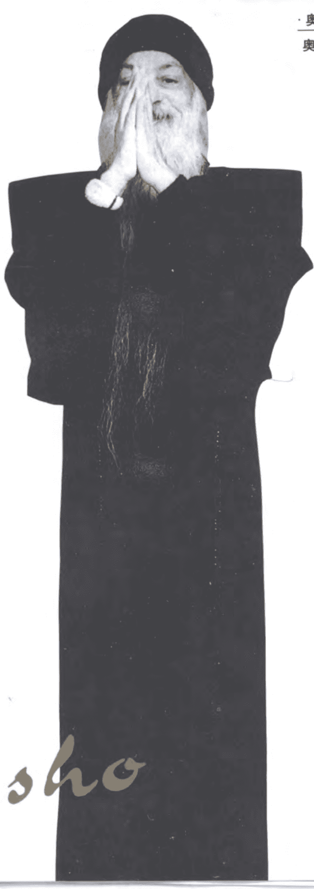

# 奥修智慧金言系列
# 奥修 著 林国阳 译
## 智慧
## 金块

## Osho
## 学林出版社
## 智慧金块 奥修 著 林国阳 译
# 学林出版社 出版 上海文庙路120号
# 新华书店上海发行所发行 上海师大印刷厂印刷
# 开本 850×1168 1/32 印张4.375 插页2 字数70,000
# 1996年1月第1版 1996年1月第1次印刷 印数1 - 7,000册
# ISBN 7 - 80616 - 209 - 7/B·7 定价7.20元
# 出版絮语
我们走近奥修,我们面对他的思想……
我们会怀疑,我们会震动,我们会轻松,我们会充溢爱心,我们会静心下来……
1931年12月11日，奥修出生于印度，早年他以优异的成绩毕业于印度沙加大学哲学系，曾获全印度辩论冠军。以后在印度杰波普大学哲学系担任长达九年的教授。他生前周游印度各地和世界各国，从事学术讲演。到目前为止，根据他的讲演，整理出版了650余种图书，被译成30余种文字，畅销世界各地。他本人于1990年12月21日谢世。
奥修演讲的主题可以概括为一个字：人。他始终
关注于工业文明后的人类生存状况，关注于人本身。
他对落后的封建意识的审视，对资本主义物质肉欲的批判以及对人类终极关怀的追问，是独特的、全身心的。他的演讲亲切、平等、近人，充满智慧、幽默、灵性——我们从他的演讲集中，精选了5种——“奥修智慧金言录”，奉献给读者。
作为一个伟人、一个思想家，奥修的思想有两个鲜明的特征：一是，他在提问和解答中诠释他的思想；在奥修看来，现代人都是“问题中人”，而提问和解答是现代人的重要生存方式。奥修坚持要求人们自己去体验真理，而不是从别人那里获得知识和信念。二是，他反对过分依赖于理性（头脑），提倡关注经验（心的体验过程）。对经验的“体验”来源于人的静心，所以，奥修认为静心是一件很美丽的事情，是现代人热爱生活、勤奋工作、相互信任、充满爱心、精神富有的动因。无疑，奥修的这种“静心”思想，既带有西方存在主义的烙印，又根植于东方神秘主义思想，尤其是中国的老庄思想。如果说，当代西方众多思想家都在寻找现代文明中的心灵的“自然家园”，那么奥修则是积极创造这样一个心灵的“自然家园”的东方思想家。这也
是他的思想(著作)，在西方各国、在东南亚一带，引起很大震动的缘由。有人称他是继泰戈尔以后，印度又一位伟大的思想家。
在当下，物质文明高度发展，金钱肉欲也伴随日趋膨胀。对精神文明的呼唤和重构，已经为世界各国政府和社会各个阶层所关注。奥修的思想(著作)之所以在东西方引起热烈反响，恰好在这方面一定程度地显示其独特的、新鲜的、可供参照的社会批判功能。
诚然，奥修对生命的热爱，对“存在”的关注来自于他个人的经验，因而他的思想的缺陷和思想的矛盾也是无处不在的（如他思想中的虚无主义和唯心论倾向）。诚如奥修自己生前所忠告的，他不希望将他的思想强加于任何人，更不希望将他的思想变为我们的思想；他只希望：人们去分享他的思想，去感受他的经验，而我们每个人都应该有自己的生活经验，自己的存在方式，自己的“头脑”和“心”——这也是我们编者所希望、所要提醒读者的。
只有用审视的、批判的方式走近奥修，用分享、感受的方式进入他的思想，我们才能从他那独特的、新鲜的、充满矛盾的、与众不同的思想中领悟存在的真谛。
在奥修的思想里并没有真理，只有关于真理或走向真理的思考线索，只有关于现代人“存在”的独特体验和新鲜经验……
让我们在理性的此岸，解读奥修，分享他智慧的芬芳……
1995 年 12 月
# 中译本前言
风人
这是一本很特殊的书。
它没有开头，没有结尾，没有目录，没有章节。任何一页都是开头，都是结尾——随时可以拿起，随时可以放下。
在我们每一个人的一生中，对知识的渴望，是每个人都“经验”过的；但对智慧的追求，却是痛苦的。因为你可以花钱去读书，去寻找知识；但你无法花钱去购买智慧。知识是一种外在的东西，智慧是一种内在的东西；知识可以从别人那里取得，智慧只能来自于你自己的存在。也许我们永远无法回答：智慧是什么？而只能追问：如何获得智慧？奥修告诉我们：唯有当你将觉知（悟性）带进任何经验里，才会有智慧的发生。所以智慧只属于个人，知识则可以属于大家。智慧是永恒的，因为它不拥有时空；知识是会变“老”，因为它不脱离时空。
这里想提醒读者，本书不是在谈论智慧，因为知识是可以谈论的，可以传授的；智慧是不可言说的。但本书的每一页却散发着智慧独有的芬芳——这是奥修的智慧，不属于我们,但我们可以分享他带来的智慧芬芳。你不用去捡起这些“智慧金块”,不必拥有这些“智慧金块”,让它在我们的生活里闪光,因为属于你的智慧——只沉静在你自己的存在(being)里面。
这本书很薄、很小,却装下了一个很大、很凝重的人生课题:智慧大门的钥匙在我们每一个人的手上,但并不是每一个人都能打开这扇大门。
是为序。
1995 年 11 月 28 日于上海
## 智慧金块 1
全然地生活、强烈地生活，好让每一个片刻都变成黄金的，好让你的整个人生变成一连串的黄金片刻。这样的人永远不会死，因为他具有希腊麦得斯点物成金的能力：任何他所碰触到的东西都变成黄金。
唯一真正的责任就是走向你自己的潜力，走向你自己的聪明才智和觉知，然后按照这样来行动。
你并不是一生下来就是一棵树，你一生下来只是一颗种子，你必须成长到你会开花的点，那个开花才是你的满足和达成。
那个开花跟权力无关，跟金钱无关，跟政治无关，但它绝对跟你有关，它是一种个人的进步。
# 智慧金块
你必须成为一个对自己的庆祝。
对乌托邦的渴望基本上是对个人和社会和谐的渴望，那个和谐从来没有存在过，你个人和社会一直都是一个混乱。
社会被划分成不同的文化、不同的宗教、不同的国家，而这些都以迷信为基础，没有一种划分是正确的。
这些划分显示出人在他自己里面是分裂的。这些是他自己内在冲突的投射。他的内在并不是一体的，因此他无法在外在创造出一个社会、一个人类。
那个原因并不是外在的。
外在只不过是最内在那个人的反映。
没有人重视个人，这就是所有问题的根本原因。
因为个人似乎是那么小，而社会似乎是那么大，所以人们认为只要我们能够改变社会，个人就会跟着改变。
但是事情将不会如此，因为“社会”只是一个字眼，事实上只有个人，而没有社会。社会没有灵魂，你无法在它里面改变什么东西，你只能改变个人，不管它看起来是多么小。一旦你知道了如何去改变个人的科学，它就可以使用在任何地方的个人。
我的感觉是，有一天我们将会达到一个和谐的社会，而它将会远比几千年来乌托邦理想主义者所提出的一切概念都来得更好。
真正的事实将会远比那个来得更美好。
你从来没有十分满意于现在的你，满意于存在所给予你的，因为你总是注意力分散而心烦意乱。你总是被导引到不是自然要你成为的样子，你并没有走向你自己的潜力。
别人要你成为什么，你就试着去成为什么，但那是无法令人满意的，当它不能令人满意，逻辑就说：“或许那还不够，再多加一点油。” 然后你就再追求更多，你就开始向四处寻找。
每一个人都戴着一个微笑的面具，看起来很快乐的样子，所以每一个人都在欺骗其他每一个人。你也是戴一个面具出现，所以别人认为你比他们更快乐，你也认为别人比你更快乐；篱笆另一边的草看起来总是比较翠绿，而他们看你的草也觉得你的草比较翠绿。它真的看起来比较翠绿、比较浓密、长得比较好，那就是距离所创造出来的幻象。
当你走近一点，你就会开始看出它并非如此。但是人们都跟别人保持距离，即使是朋友，甚至爱人，也都跟对方保持距离，太靠近是危险的，他们或许会看到你的真面目。
你打从一开始就被误导了，所以不管你怎么做，你都将会保持痛苦。你看到某人很有钱，你认为钱或许能够带给你快乐。注意看那个人，他看起来多么快乐的样子，因此我们就去追逐金钱；某人看起来比较健康，那么我们就去追逐健康；某人在做其他某一件事，而看起来非常满足的样子，那么我们就跟着他做。你总是在跟随别人。
社会的操纵使你从来不会想到你自己的潜力，而整个痛苦来自你没有成为你自己。只要成为你自己，那么就不会有痛苦、不会有竞争，也不会担心别人拥有更多，而你没有更多。
如果你想要草变得更翠绿一点，你不需要往篱笆的另一边看，你要使你篱笆这一边的草变得更翠绿。要使草变得更翠绿是这么简单的一件事。
人必须根植于他自己的潜力，不管他的潜力是如何。当你能够如此，世界将会非常满意，满意得令你无法相信。
成为“活生生的”意味着具有幽默感，具有一种很深的爱的品质，具有一种游戏的心情。
我完全反对一切否定生命的态度。长久以来，对神的尊敬被弄成否定生命的。要使它变成肯定生命的。游戏的心情、幽默感、爱和尊敬必须结合在一起。
对生命的崇敬是对神性唯一的尊敬，因为再也没有比生命本身更神圣的了。
人一生下来就带着伟大的宝藏，但是他一生下来同时继承了整个动物的特性。不管用什么方法，我们必须将动物的特性去掉，而创造出一个空间，使得那些宝藏能够进入意识，同时能够分享，因为那些宝藏的品质之一就是：你越是分享它，你就越拥有它。
我们有很多问题存在，因为我们从来没有注意去看它们，我们从来没有将我们的眼睛集中在它们上面，而弄清楚它们是什么。
将生命献给那些美丽的事物，不要将生命给予那些丑陋的事物，因为你没有太多时间和太多精力可以浪费。我们的生命是那么地短暂，我们能量的泉源是那么地小，将它浪费在悲伤、愤怒、怨恨和嫉妒里简直是愚蠢。
将它使用在爱里面，将它使用在一些创造性的行为里面，将它使用在友谊里面，将它使用在静心里面，用你的能量做一些能够把你带往高处的事，当你走得越高，你就会有越多的能量泉源可以使用。
一切在于你的做法。
没有人是一个孤岛，这是人生基本的真理之一，这一点必须被好好记住。我之所以强调这一点是因为我们常常会忘记它。
我们都是同一个生命力的一部分，我们都是一个海洋般存在的一部分。基本上，因为在我们深处的根部，我们是一体的，所以才有爱的可能性。如果我们不是一体的
，那么就不可能有爱。
人仍然带着很多动物本能——他的愤怒、他的恨、他的嫉妒、他的占有、他的狡猾。所有那些在人里面被谴责的东西似乎都属于一个非常根深蒂固的无意识。整个灵性炼金术的工作就是如何去除这些动物的过去。
如果没有去除这些动物的过去，人将会是分裂的，动物的过去和他的人性无法一起存在，因为人性跟动物性具有相反的品质，因此，人所能够做的就是变成一个伪君子。
就正式的行为而言，他会遵循人性的理想——爱和真理、自由、不占有和慈悲。但它仍然只是很薄的一层，那个隐藏起来的动物性随时都会跑出来，任何意外事件都可能将它带出来，不管它有没有跑出来，我们内在的意识都是分裂的。
这个分裂的意识一直都在发出渴望和问题：就个人而言，要如何变成一个和谐的整体？对于整个社会也是一样，我们要怎样才能够使社会变成一个和谐的整体？变成一个没有战争、没有冲突、没有阶级、没有肤色之分、没有社会阶级之分、没有宗教之分、也没有国家之分的整体。
也许我们不应该从简单地改变社会以及改变它的结构来想，还应该多从静心和改变个人来想。
这是将来某一天我们能够放弃社会上一切划分唯一可能的方式。但是首先它们必须在个人里面被抛弃，而
它们是可以被抛弃的。
并没有一个贴上“真理”标签的东西——那一天你可以找到，然后打开那个盒子，看到里面的内容物说：“太棒了！我找到真理了！” 没有这样的盒子。
为什么人们在谈论真理，而却仍然停留在谎言的世界里，那个原因是很清楚的，因为他们的内心对真理有一种渴望；他们不能够很真实，因此他们在他们自己面前感到羞耻，所以他们就开始谈论真理，但也仅止于谈谈而已，按照它来生活太危险了，他们不能够冒那个险。 “自由”的情况也是如此，每一个人都想要自由。他们谈论自由，但是没有人真的自由，也没有人真的想要自由，因为自由会带来责任，它不会单独出现。依靠别人比较简单，你不必负责任，那个责任是在你所依靠的人身上。
所以人们创造出一种精神分裂的生活方式。他们谈论真理，他们谈论自由，但是他们却生活在谎言里、生活在奴役里各式各样的奴役里，因为每一种奴役都可以使你免于某些责任。
一个真正想要自由的人必须接受莫大的责任，他不能将他的责任推到其他任何人身上，不论他做什么，不论他是什么，他都必须负责。
一个真正非暴力的人是一个不杀任何人、不伤害任何人的人，因为他反对杀人和反对伤害。如果有人开始伤害他，他也一样会反对伤害；如果有人开始杀他，他也一样会反对杀害。他不会容许它。
他从来不发动任何暴力，但是如果有人对他发动暴力，他将会拼命抗争，唯有如此，那些非暴力的人才能够保持独立，否则他们将会沦为奴隶，他们将会变得很贫穷，而且一再被抢夺。
成为你自己能够让你感觉满足，能够使你的生命变得有意义。只要成为你自己，按照你的本性来成长，这样就能够带给你命运的满足。
要成为不可预测的，要成为一直在改变的。永远不要停止改变，永远不要停止成为不可预测的，唯有如此，生命才能够成为一件赏心悦事。
当你变成能够预测的，你就变成了一部机器。
机器是能够预测的，它昨天一样，今天一样，明天也将会一样，它是不变的。每一个片刻都在改变，那是人的特权。
你停止改变的那一天，你就以一种很微妙的方式死了。
将每一样东西都赌下去，成为一个赌徒！
将每一样东西都冒险下去，因为下一个片刻是不确定的，所以，为什么要烦恼？为什么要挂虑？
危险地去生活，高高兴兴地去生活，没有恐惧地去生活，没有罪恶感地去生活。生活，但是不要对地狱有任何恐惧，或是对天堂有任何贪婪。只要生活。
每一项错误都是学习的机会。只是不要一再一再地犯同样的错误，因为那是愚蠢的。尽可能犯更多的错误，不要害怕，因为那是自然让你学习的唯一方式。
宗教性只是意味着一种成长的挑战，它是一种挑战，使种子能够达到它最终高峰的表现，使它能够开出千千万万的花朵，而散发出隐藏在它里面的芬芳。那个芬芳我称之为宗教性。
每一个人都过日子过得很痛苦，他想要在某一个地方找到某一个原因来对他自己解释说为什么他或她是痛苦的，因此社会给了你一个很好的策略：判断。首先，很自然地，你会判断你自己的每一件事。没有一个人是完美的，也没有一个人能够是完美的，完美并不存在，所以判断是很容易的。你是不完美的，所以有一些事情会显示出你的不完美，然后你就会生气，你就会对你自己生气，你就会对整个世界生气：为什么我不完美？然后你就只带着一个观念来看——在每一个人里面找到不完美。
然后你想要打开你的心——因为，很自然地，除非你打开你的心，否则在你的生命里将不会有庆祝，你的生命将会变成几乎是死的，但是你不能够直接去做它，你必须从根部摧毁一切你旧有的习惯。
所以第一件事就是：停止判断你自己。
不要判断，要开始接受你一切的不完美、一切的脆弱、一切的错误和一切的失败。不要要求你自己成为完美的，那只是在要求某种不可能的东西，这样做你将会感到挫折。
毕竟你只是一个人。
只要注意看动物，注意看鸟儿：它们没有烦恼、没有伤心、也没有挫折。你不会看到一只水牛在异想天开，它完全满足于每天吃同样的草，它几乎已经成道了！没有紧张，它跟自然非常和谐，它跟他本身、跟每一样东西都保持非常和谐。
水牛不会组党来搞革命，他不会组党来使水牛改变成超级水牛，来使水牛变成具有宗教性的，来使水牛成为具有美德的。所有的动物根本就不会顾虑到人类的这些概念。
他们一定都在笑：“你到底怎么搞的？为什么你不成为现状的你自己？有需要成为其他某一个人吗？”
所以第一件要记住的事就是：深深地接受你自己。
不要谴责肉欲。
整个世界都一直在谴责肉欲，由于他们的谴责，那个能够在肉欲里面开花的能量就转入性格倒错、嫉妒、愤怒和憎恨，那是一种干瘪而没有汁液的生命。
感官性是人类最伟大的祝福之一，那是你的敏感度、那是你的意识、那是你的意识渗透了你的整个身体。
多少年代以来，父母总是带着一个观念，认为小孩子属于他们，小孩子必须成为他们的复制品。复制品并不是一样很美的东西，存在不相信复制品，它只对原创的东西感到高兴。
你必须帮助他们成长而超出你，你必须帮助他们不要模仿你。那真的是父母的职责——帮助小孩不要模仿。小孩子真的很会模仿，很自然地，他们将会模仿谁呢？——父母是最亲近的人。
由于这个错误的观念，当小孩模仿你的时候，你就觉得很骄傲，因此我们创造出 一个模仿者的社会。
服从不需要智力，所有的机器都是服从的，没有人曾经听过一部不服从的机器。
服从也是简单的，它将任何责任的重担从你身上拿下来，不需要去反应，你只要做任何你被告知的。责任在于那个发出命令的源头。就某方面而言，你非常自由，你不会因为你的行为而遭到谴责。
宗教性并不是某种要去相信的东西，而是某种要去活过、要去体验的东西；不是你头脑里的一个信念，而是你整个人的一个味道。
头脑无法成为不判断的，如果你强迫它成为不判断的，那么在你的智力里面将会产生一个阻碍，那么你的头脑就无法很完美地运作。
成为不判断的并不是某种来自头脑领域里的东西。唯有一个超越的人，才能够成为不判断的，否则那些你看起来是事实的东西，是一个健全的描述的东西，也只不过是一个外表而已。
任何头脑所决定或描述的东西都会被它的制约或它的偏见所污染，就是那些东西

## 14 智慧金块

现出来的精神是同样的。它是同一个神性，但带着无限多不同种类的创造。

钱是一种很奇怪的东西。如果你没有钱，它很简单，你就是没有钱，所以不会复杂；但是如果你有了它，它就一定会产生复杂。钱所创造出来最大的困难之一就是：你从来不知道你是值得要的，或你的钱是值得要的，因为它很难想出来，所以有的人宁可不要有钱，至少这样生活会比较简单一点。像钱这样的东西本来可以给你一个很大的快乐，但是它却变成了极大的痛苦，但这并不是因为你的钱，而是因为你的头脑。钱是有用的，拥有金钱并不是罪恶，不需要感到罪恶。

头脑就是这样在产生痛苦。你有钱，你可以享受它。但是如果有人爱你，不要将它提出来，因为你会使那个人陷入一个真的很不好的情况：如果他说他爱你，你将不会相信他，如果他说他爱你的钱，那么你才会相信他，但是如果他爱的是你的钱，那么整个爱的事件就结束了。在内心深处你会继续怀疑说他爱你的钱，而不是爱你。但这并没有什么不对：钱是你的，就好像你的鼻子是你的，你的眼睛是你的，你的头发也是你的，而这个人爱你的全部。钱也是你的一部分，不要将它分开，那么就没有问题。试着去过一种尽可能少复杂、尽可能少问题的生活——它由你来决定。知道整个世界跟知道你自己人生的内在奥秘比起来并不算什么。比较的观念是完全虚假的。

每一个个人都是独一无二的，因为其他没有人像他，如果所有的个人都相像，那么比较是对的，但是事实上他们并不相像，即使双胞胎也并不完全相像，很难找到另外一个人刚好跟你相像，所以我们是拿独一无二的人来作比较，这将会产生困难。人生最困难，但也是最基本的事情之一，就是不要将生命划分为很美的事和愚蠢的事，根本不要划分，它们都是同一个整体的一部分。它只需要一点幽默感。对我而言，如果一个人要成为完整的，幽默感是非常主要的。

一些小事和一些愚蠢的事有什么不对？你为什么不能对它们笑一笑，你为什么不能够享受它们？你一直都坐在一个判断的座位上，那使你变得很严肃。那么花朵就变成漂亮的，但是荆棘要怎么办？它们都是花朵存在的一部分。如果没有荆棘，花朵就不能够存在，因为荆棘具有保护作用，它们具有某种功能、某种目的、某种意义。但是你却去划分它，那么花朵就变成美的，而荆棘就变成丑的。但是在树木本身里面，流进花朵的汁液和流进荆棘的汁液是一样的。在树木的存在里没有划分，也没有判断。花朵并没有比较被喜爱，荆棘也并不是在被忍受，它们两者都完全被接受。在我们自己的生命里，我们的做法也应该像这样。有一些小事情，如果你去判断，它们将会看起来很愚蠢，好像白痴一样，但那是因为你的判断，不然的话，它们也是在履行某种重要的事。

头脑的整个功能就是继续去划分，而心的功能就是去看那个连接的环节。关于这一点，头脑完全不知道。头脑无法了解那些超出文字的东西，它只能够了解语言上和逻辑上正确的东西，它并没有顾虑到存在，没有顾虑到生命，没有顾虑到真相。头脑本身就是一个虚构的东西。你可以不要头脑而生活，但是你不能够没有心而生活。你生活得越深入，你的心就越涉入。

生命在流动，它是一条河流，它是一个经常的流动。人们认为他们自己是静止的。只有东西是静止的，只有死亡是不变的，生命经常都在改变。生命越多，改变就越多，当你有非常丰富的生命，那么每一个时刻都会有很大的改变。没有人是更优越的，没有人是更低劣的，也没有人是相等的，每一个人都是独一无二的。

比较的观念是完全虚假的。每一个个人都是独一无二的，因为其他没有人像他，如果所有的个人都相像，那么比较是对的，但是事实上他们并不相像，即使双胞胎也并不完全相像，很难找到另外一个人刚好跟你相像，所以我们是拿独一无二的人来作比较，这将会产生困难。人生最困难，但也是最基本的事情之一，就是不要将生命划分为很美的事和愚蠢的事，根本不要划分，它们都是同一个整体的一部分。

它只需要一点幽默感。对我而言，如果一个人要成为完整的，幽默感是非常主要的。一些小事和一些愚蠢的事有什么不对？你为什么不能对它们笑一笑，你为什么不能够享受它们？你一直都坐在一个判断的座位上，那使你变得很严肃。

那么花朵就变成漂亮的，但是荆棘要怎么办？它们都是花朵存在的一部分。如果没有荆棘，花朵就不能够存在，因为荆棘具有保护作用，它们具有某种功能、某种目的、某种意义。但是你却去划分它，那么花朵就变成美的，而荆棘就变成丑的。但是在树木本身里面，流进花朵的汁液和流进荆棘的汁液是一样的。在树木的存在里没有划分，也没有判断。花朵并没有比较被喜爱，荆棘也并不是在被忍受，它们两者都完全被接受。在我们自己的生命里，我们的做法也应该像这样。有一些小事情，如果你去判断，它们将会看起来很愚蠢，好像白痴一样，但那是因为你的判断，不然的话，它们也是在履行某种重要的事。

## 16 智慧金块

头脑的整个功能就是继续去划分，而心的功能就是去看那个连接的环节。关于这一点，头脑完全不知道。头脑无法了解那些超出文字的东西，它只能够了解语言上和逻辑上正确的东西，它并没有顾虑到存在，没有顾虑到生命，没有顾虑到真相。头脑本身就是一个虚构的东西。你可以不要头脑而生活，但是你不能够没有心而生活。你生活得越深入，你的心就越涉入。

生命在流动，它是一条河流，它是一个经常的流动。人们认为他们自己是静止的。只有东西是静止的，只有死亡是不变的，生命经常都在改变。生命越多，改变就越多，当你有非常丰富的生命，那么每一个时刻都会有很大的改变。没有人是更优越的，没有人是更低劣的，也没有人是相等的，每一个人都是独一无二的。

相等是心理学上的错误，不可能每一个人都是爱因斯坦，也不可能每一个人都是泰戈尔，但是那并非意味着泰戈尔比较优越，因为你不能够成为他。泰戈尔也不能够成为你。我的整个要点就是：每一个人都是独一无二的呈现，所以我们必须摧毁整个优越和低劣的概念，相等和不相等的概念，而代之以“独一无二”的新观念。每一个人都是独一无二的。只要具有爱心地看，你将能够看出每一个个人都具有某种其他人所没有的东西。只要做任何愉快的事——对你来讲是愉快的，对你的周遭来讲也是愉快的，只要做某种能够带给你欢唱以及能够在你的周围创造出一个庆祝的韵律的事。

这种生活我称之为宗教生活。它没有原则，它没有规范，它没有法律，它只有一个单一的方法，那就是：聪明地生活。

服从是简单的，不服从则需要一些更高的智力。任何白痴都能够服从，而事实上也只有白痴能够服从。聪明的人一定会问：“为什么？为什么我要做这个？除非我知道它的理由和结果，否则我不想涉入它。”这样的话，他就变成负有责任的。

一个圣人绝对不可能成为一个流氓，但是一个流氓却能够成为一个圣人。人还没有学会知道“单独”（aloneness）的美。他总是在渴望一些人际关系，他总是在渴望要跟某人在一起——跟一个朋友，跟一个父亲，跟一个太太，跟一个先生，跟一个小孩……总是要跟某一个人。他创造出社会，他创造出俱乐部——狮子会，扶轮社。他创造出各种党派——政治性的党派，或是由某种相同意识形态所组成的党派。他创造出各种宗教和教会，这一切的基本需要就是要用什么方法去忘掉说你是单独的。跟很多群众联合在一起，你是试着要去忘记那个在黑暗中你会想起的东西——你是单独被生下来的，你死的时候也会是单独的，不论你做什么，你都是单独活着。单独对你的存在而言是某种非常重要的事物，没有办法可以避免它。

过去每一种指向避免单独的努力都失败了，而且它将来也会失败，因为它违反人生基本的东西。所需要的并不是某种你能够在它里面忘记你的单独的东西，需要的是你要变得觉知到你的单独——那是一个事实。去经验它、去感觉它是非常美的，因为离开群众、离开别人是你的自由。免于孤独的恐惧是我们的自由。光是“孤独”（lonely）这个字就会立刻使我们觉得说它好像是一个创伤，需要以某种东西来满足它；好像是一个空隙，令人感伤，需要用某种东西来填满它。“单独”这个字就没有“创伤”和“需要被填满的空隙”的意味在里面。单独只是意味着完整。你是完整的，不需要其他任何人来完成你。因此，要试着去找出你最内在的中心，在那里你总是单独的，你一直都是单独的。在生命当中，在死亡当中，不论你在哪里，你都是单独的，但它是那么地充满，它并不是空的，它非常充满、非常完整，而且洋溢着所有生命的汁液，洋溢着所有存在的美和祝福，一旦你尝到了你单独的滋味，内心的痛苦将会消失，然后将会有一种非常甜蜜、非常和平、非常喜悦、非常喜乐的新韵律产生。

那并不是意味着一个归于他自己“单独”的中心的
人、在他本身里面就完整的人不能够交朋友，事实上，只有他能够交朋友，因为如此一来，交朋友已经不再是一种需要，它只是一种分享。他拥有很多，所以他能够分享。

我们都是同一个存在的一部分，不论你伤害到谁，就长远来看，你都伤害到你自己，或许你现在并不了解，但是有一天，当你变得更觉知，你就会说：“天啊！这个伤害是我加在我自己身上的。”你伤害了其他人，而你以为那不是你。没有一个人是不同的，这整个存在是一体的，是一个宇宙的统一体，非暴力会由这个了解产生出来。

当你生气的时候，你是在谴责你自己。你在燃烧，你在破坏你的心以及它较高的品质，你充满了恨。

如果人跟宇宙保持同一步调，他就充满了，如果他没有跟宇宙保持同一步调，那么他是空虚的，完全空虚，从那个空虚会产生贪婪。贪婪就是要去充满它，用金钱、房子、家具、朋友、爱人、或其他任何东西来充满它，因为你无法以空虚来生活，那是令人恐惧的，那是一种魔鬼般的生活。如果你是空虚的，没有什么东西在你里面，那么你就不可能生活。

只有两个方式能够使你觉得在你里面有很多东西，或者是你跟宇宙保持同一步调，那么你就被整体所充满，被所有的花和所有的星星所充满，这才是真正的满足。但是如果你没有这样做——有成千上亿的人没有这样做——那么剩下的方式就只有用任何垃圾来充满你自己。

贪婪只不过意味着你感觉到一个很深的空虚，而你想要用任何可能的东西来充满它，不管它是什么。一旦你了解到这一点，你就会脱离贪婪，你就已经进入了跟整体的深层沟通，因此内在的空虚就消失了。

整个人类的过去都一直在赞美贫穷，把贫穷看成跟灵性相同，那完全是无稽之谈。灵性是能够发生在一个人身上最伟大的富有，它包含了其他所有的富有，它并不反对其他任何富有，但它反对各种贫穷。一方面，人们会尊敬贫穷，而在另一方面，他们会说：“服务贫穷的人。”那就怪了！如果贫穷是那么灵性的一件事，那么最灵性的事情就是使每一个富有的人都变贫穷。帮助富有的人变贫穷，好让他能够变成灵性的，为什么要帮助那些贫穷的人？你想要破坏他们的灵性吗？生活在富裕里是世界上唯一灵性的事。

金钱是一个搀有杂质的东西，它的理由是因为我们还没有能够做出一个健全的系统，使得金钱能够成为整体人类的仆人，而不是少数贪婪之徒的主人。金钱是一个搀有杂质的东西，因为人心充满贪婪，否则金钱只不过是一个交换物品的工具，一个很完美的工具，它本身并没有什么不对，但是，由于我们对它处理不当的缘故，在它里面的每一件事似乎都是错的。

如果你没有钱，你会遭到谴责，你的整个人生是可恨的，因此你穷毕生精力试图以任何方式来致富。如果你有钱，它并不会改变基本的东西，你会想要更多，而你想要更多的欲望是无止境的。当最后你已经有了很多钱——虽然它还不够，它永远都不够，但它已经比其他任何人都来得多——你就开始觉得有罪恶感，因为你用来累积财富的手段是丑陋的、非人性的、暴力的。你一直在剥削，你一直在吸人们的血，你一直是一个寄生虫，所以，现在你有钱了，但是它使你想起你在获得那些金钱时所犯下的所有罪行。

这种情况会产生出两种人：第一种，他会开始捐款给慈善机构来驱除他的罪恶感，而另外一种人会觉得自己非常罪恶，使得他不是发疯就是自杀。他自己的存在变成一个极度的痛苦，每一个呼吸都变得很重。奇怪的是，他终其一生都努力工作来得到这些钱，因为社会挑起了他对财富和权力的欲望及野心。金钱的确带来权力，除了有几样东西不能够由金钱购买之外，它能够购买每一样东西，但是没有人会去担心那几样东西。静心无法被购买，爱无法被购买，友谊无法被购买，感激无法被购买，但是没有人会去顾虑那些东西。

只要注意看存在以及它的丰富，世界上为什么需要那么多花，只要玫瑰花就够了，但存在是丰富的，成千上亿的花朵，成千上亿种鸟，成千上亿种动物，每一种东西都非常丰富。自然并不是苦行的，它到处都在欢舞——在海洋里、在树木里。它到处都在歌唱——在吹过松树的风中，在各种鸟类里……

为什么需要有成千上亿的太阳系，而每一个太阳系里面又有无数的星星？这些似乎是不需要的，除非说丰富就是存在的本性，富有就是存在的核心；存在不相信贫穷。

我不把贪婪看成一种欲望，它是某种存在性的疾病——你没有跟整体保持同一步调。只有跟整体保持同一步调才能够使你成为神圣的。对我而言，贪婪根本就不是一种欲望，所以你不需要对贪婪做任何事，你必须去了解那个你试着去充满的空虚，然后问：“为什么我是空虚的？整个存在是那么地充满，为什么我是空虚的？或许我出轨了，我跟存在已经不再移向同一个方向，我已经不再是存在性的，那就是我空虚的原因。”因此，要成为存在性的、要放开来，在宁静和和平当中、在静心当中去接近存在。有一天你将会了解你是那么地充满，过分充满，洋溢着喜悦、喜乐和祝福。你拥有那么多，你可以将它给予整个世界，而它还是不会被竭尽。

当这么一天来到，你将会第一次没有感觉到任何贪婪——对金钱、食物、或是对任何东西的贪婪。你将会继续生活，但是不会带着贪婪，那是无法被满足的，也不会带着一个创伤，那是无法被治愈的，你会很自然地生活，任何需要的，你都将找到。

每一个人多多少少在某些方面都会有自卑感，原因在于我们没有接受说每一个人都是独一无二的。没有自卑感或优越感这个问题，每一个人都属于他自己那一种，每一个人都是独特的，根本就没有比较这个问题，我们不允许人们以他们本然的样子来接受他们。一旦你按照你本然的样子来接受你自己，不要有任何比较，那么所有的自卑感和优越感就都消失了，在完全接受你自己的当中，你就能够免于这些自卑感或优越感的情结，否则你将会终身受苦。

我无法想象说一个人能够拥有世界上的每一样东西。人们曾经那样尝试过，但是他们都完全失败了。只要成为你自己，那就够了。你被太阳所接受，你被月亮所接受，你被树木所接受，你被海洋所接受，你被大地所接受，这样你还要什么呢？你被这整个宇宙所接受。你要在它里面欢欣鼓舞。

## 18 智慧金块

希望能够得到别人的认可，希望能够得到别人的认识，这是每一个人的需要。我们整个人生的结构就是被教成：除非我们能够得到别人的承认，否则我们是没没无闻的，我们是没有价值的。我们的工作并不重要，那个承认才重要，这种观念把整个事情都倒转过来了。我们的工作应该是重要的，它本身就应该是一种喜悦。我们应该工作，不是为了要被承认，而是因为我们享受成为具有创造性的，你喜爱工作是因为它本身的缘故。你爱你的工作，所以你才做它。不必要求别人的承认，如果承认来临，你就接受它，如果它没有来临，那么你就不要去想它，你的满足应该是在工作本身。

如果每一个人都学会了这个简单的艺术——喜爱他的工作，不论它是什么，你都去享受它，而不要要求任何承认，那么我们一定会有一个更美好、更喜乐的社会，否则世界已经使你陷入一个痛苦的模式。你之所以认为你所做的事很好，并不是因为你喜爱它，或是因为你

或许性就是分期付款的死亡，而死亡是性的大批发。但是很确定地，它是同一个能量的两个不同的角落运作。为什么不创造出一个性不会成为痛苦经验、不会成为嫉妒、不会成为失败的人生；为什么不创造出一个性只是乐趣——没有比其他游戏来得多，而只是一个生物游戏——的人生。你打网球；那并不意味着你一生都必须跟同一个伴侣打网球。生命应该丰富一点，只需要一点了解，那么爱就不会成为一个难题，性就不会成为禁忌。

头脑只不过是我过去记忆的搜集，而从那些记忆去想象未来。使用人生的每一个机会来培养你的聪明才智和你的意识。平常我们所做的就是使用每一个机会来为我们创造出地狱，这样做只有你在受苦，而因为你的受苦，你也使别人受苦。当很多人生活在一起，如果他们都互相为别人创造出痛苦，那么那个痛苦就会继续相乘，整个世界就是因为这样而变成地狱。

## 32 智慧金块

只要基本的事情被了解，它就能够立刻改变。如果没有聪明才智，就没有天堂。根据我的看法，父母的功能并不是要帮小孩成长，他们没有你也能够成长。你的功能是去支持、去滋养、去帮助那个已经在成长的。不要给予方向，不要给予理想，不要告诉他们什么是对的吗，什么是错的的，让他们藉着他们自己的经验来找出它。认为小孩是你的占有物这整个观念是错误的。他们透过你被生下来，但是他们并不属于你。你有过去，而他们只有未来。他们将不会按照你的意思去生活。按照你的意思去生活几乎等于不生活。他们必须按照他们自己的意思去生活，他们必须在自由当中、在责任当中、在危险当中、在挑战当中生活。一旦你了解你的小孩不属于你，一旦你了解他们属于存在，而你只不过是一个通道，那么你必须感谢存在说它选择了你作为一些漂亮小孩的通道，但是你不要去干涉他们的成长，不要去干涉他们的潜力，你不要硬把你自己的潜力强加在他们之上。他们将不会跟你生活在同一个时代，他们将不会面临同样的问题，他们将成为另外一个世界的一部分，所以，不要以这个世界、这个社会、这个时代的情况来准备他们，因为这样的话，你将会为他们创造出一些困难，他们将会发现他们并不适合，他们将会发现他们资格不符。

残酷是一种误解，它之所以在我们里面产生是因为我们害怕死亡。我们不想死，所以在其他每一个人杀死你之前，你就想要先杀死他，因为最佳的防卫就是攻击，而你不知道谁会攻击你。在动物世界里、以及在人类的世界里，有一个很激烈的竞争，所以人们只是一味地攻击，而不管他们是在攻击谁，或者他是否真的想要攻击他们。但是没有一个方法可以找出要攻击谁，所以最好不要冒险。当你攻击某一个人，你的心慢慢地、慢慢地变得越来越坚硬，然后你会开始享受攻击，这种现象在动物世界里可以看到，因为在动物世界里同样会有食物和权力的竞争……残忍只不过是一种想要成为第一的竞争精神。如果它意味着暴力，那么就让它成为暴力，但是一个人必须成为第一的。动物世界有这样的情形，人的世界也有这样的情形。但是为什么要冲向第一呢？它存在性的原因就是死亡。

## 34 智慧金块

唯有当你知道没有死亡，残酷才能够消失，这就是我所找到的残酷的线索。当你在你里面经验到某种不朽的东西，那么所有的残酷都会消失，那么它就没有关系了，你不需要用跑的，你可以让别人走在你前面，因为那个可怜的家伙不知道世界是无限的，生命是无限的。不会失去任何东西，如果它今天不发生，那么明天或许会发生，如果你能够了解，你不可能会错过任何东西。事实上，在斗争以及相互残酷和暴烈当中，你或许会错过很多东西，因为这整个过程将会使你变得坚硬，将会使你的心变成一颗石头。如果你的心变成一颗石头，那么它将会错过一切伟大的东西、一切美好的东西、以及一切喜乐的东西。这种道理很难解释给动物知道，但是真正的问题在于，我们甚至很难解释给人类知道说透过竞争、透过暴烈的野心和透过处处争取第一，你们是在创造一个疯狂的世界，而在这个世界里，没有人能够得到任何享受，且每一个人的生活都会变得很贫乏。唯一能够使人们了解的方法就是帮助他们去感觉他们不朽的自己，当他们能够感觉到他们不朽的自己，所有的残酷就都会消失。就是因为人生短暂，所以才会有这个麻烦。如果过去和未来两端都是无限的，那么就不需要急急忙忙，甚至不需要去竞争。生命那么丰富、那么充满，你不可能竭尽它。对那些只想到生命、生活和爱的人来讲，过去和未来都非常美，因为他们所看到的过去和未来都是无限的。他们可以装饰他们的过去，使它变得尽可能漂亮，虽然他们从来没有活过它，当它曾经一度出现的时候，他们并不在场，这些都只是影子、只是映象。他们一直在赶路，当他们在赶路的时候，他们看到了几样东西，然后他们就认为他们已经经验过了。在过去，只有死亡是真实的存在，而不是生命。在未来也是一样，只有死亡是真实的存在，而不是生命。那些过去错过生活的人，为了要替代那个空隙，他们会自动梦想未来，他们的未来只不过来自过去的一个投射。任何他们在过去所错过的，他们都把希望寄托在未来，在这两个不存在之间的是很短的存在片刻，那个才是生命。时间被认为是由三个时态所组成的——过去、现在和未来——这是错误的，时间只是由过去和未来所组成。生命才是由现在所组成的。所以对那些想要生活的人而言，除了生活在当下这个片刻之外，没有其他方法。

## 36 智慧金块

只有‘现在’是存在性的。过去只不过...此时此地。‘现在’跟时间无关，如果你只是在此时此地，那么就没有时间。有广大的宁静和静止，没有移动，没有一样东西在经过，每一样东西都来到一个突然的停止。‘现在’给你一个深深地潜入生命水中，或是高高地飞进天空的机会。但是在两边都有危险——“过去”和“未来”是人类语言里面最危险的两个字。生活在过去和未来之间的现在几乎就好像走在一条绳索上，在它的两边都有危险。但是一旦你尝到了“现在”这个片刻的甜蜜，你就不会去顾虑那些危险；一旦你跟生命保持在同一个步调，其他的就无关紧要了。对我而言，生命就是一切。对于那些想要真正去生活——不是去想，而是去爱；不是去想，而是去存在；不是将它哲学化——的人而言，他们除了啜饮现在这个片刻的生命汁液之外别无选择。要完全将当下这个片刻的生命汁液挤尽，因为它一去就不复返了，它一旦走掉就永远走掉了。生命分散在七十年或八十年里面，而死亡只发生在爱。"倒不如开始给予爱，忘掉获得，而只是给予；我向你保证，你将会得到更多。

进化是透过两极来运作的，就好像你无法用一只脚走路，你需要用两只脚走路，存在需要相反的两极——男人和女人、生和死、爱和恨——来创造出冲力，否则就会显得太静了。在一方面，相反的东西会吸引你，而在另外一方面，它会使得你觉得依赖。没有人想要成为依赖的，因此爱人之间就会有一个经常性的争斗，他们互相都试图要支配对方。名义上是爱，但是那个游戏是政治。男人的努力就是要去支配女人，把她贬到一个较低的地位，而不是让她成长，所以她的成长一直都停顿。女人从男人的奴役当中解放出来也是男人可以经验到的一种自由。所以我说女性解放运动不只是女性的解放，它也是男性的解放，两者都会被解放。奴役的方式将他们两个人绑在一起，因此就有持续的争斗。女人找到她自己的策略来扰乱丈夫、来唠叨他、来泄他的气，而男人也有他自己的策略。在这两个战斗营之间，我们一直希望爱会发生。已经过了很多世纪了，但是爱尚未发生，它只是偶尔发生。这就是一般爱的情况，只有爱的名义，而没有爱的实质。

## 50 智慧金块

如果你问我爱的看法……它已经不再是一个正反两面交互运作进行或是对立的问题。男人和女人是不同的，而且是互补的。只有男人是一半，只有女人也是一半，只有当两个人在一起，处于一种很深的统一的感觉当中，他们才首度感到完整、感到完美。好几千年来，男人对女人所做的事实在非常荒唐，她无法想象她自己跟男人平等，她已经受到很深的制约，即使你告诉她，她跟男人平等，她也不会相信。它几乎已经变成她的头脑，那个制约已经变成她的头脑，她认为她在每一方面都比较不足，不管是体力或智力。将女人贬成这种状态的男人也无法爱她，因为爱只能够存在于平等和友谊之中。如果你能够没有嫉妒地爱，如果你能够爱而不要有执著，如果你能够爱一个人爱到他的快乐就是你的快乐——即使他跟别的女人在一起，而他是快乐的，它也会使你快乐，因为你是那么地爱他，他的快乐就是你的快乐。因为他快乐，所以你就觉得快乐。你将会感激那个使你的爱人快乐的女人，你将不会嫉妒，那么，那个爱就变得很纯。这种爱不会产生任何枷锁，这种爱只是将你的心对所有的风以及对整个天空敞开。

嫉妒是非常复杂的，它包含了很多因素。懦弱是其中之一，自我主义的态度也是其中之一，独占的欲望——不是一种爱的经验，而只是占有；竞争的倾向；一个根深蒂固的害怕，害怕比别人低劣等等都是。 有太多的因素跟嫉妒有关。

一个真正的人应该具有冒险的基本精神。 当你看到事情已经固定下来，你就再度搅乱它们。

你是一个群众、一个大众。只要你更仔细地看、更深入地看，你就会发觉在你里面有很多人，而他们有时候都会假装是你。当你在生气的时候，有某一种特定的人格会占据你，而假装这就是你。当你处于爱的情况下，那么另外一种人格就会占据你，而假装这就是你。 它不仅对你而言是混乱的，它对跟你接触的每一个人而言也都是混乱的，他们看不出来，因为他们本身也是一个群众。 在每一个关系当中，并非只是两个人结婚，而是有两个群众结婚。这将会是一个持续的大战争，很少说你里面的爱人在当差。而另外一个人里面的爱人也刚好在当差。除了这种很少发生的情况之外，你们一直都在错过。当你具有爱心的时候，对方是悲伤的、生气的、或是担心的，而当他处于爱的状态下，你并没有同样的心情。很难去驾驭这些人格，它们都各自为政。

在你里面有一种循环，如果你继续注意看——不要干涉这些人格，因为那将会产生更多的一团糟、更多的混乱。只要注意看，因为当你注意看所有这些人格，你将会觉知到也有一个观看者，那个观看者并不是一个人格，这些人格在那个观看者面前走来走去。

它并不是另外一个人格，因为一个人格无法注意看另外一个人格，这是非常有趣的一件事，也是非常基本的一件事——一个人格无法观看另外一个人格，因为那些人格没有任何灵魂。

它就好像你的衣服，你可以继续换你的衣服，但是你的衣服无法知道说它们被换了，它们无法知道说现在另一件衣服已经被使用了。你不是衣服，所以你可以更换它们。你不是一个人格，所以你可以觉知到这些无数的人格。

但这同时非常清楚地突显出一个要点：有一样东西继续在观看你周围的这整个人格游戏。

而这就是你。

所以，要注意看这些人格，但是同时要记住，你的那个观看就是你真实的存在，如果你能够保持注意看你的人格，那些人格将会开始消失，它们无法继续存活下去，它们需要认同来使它们保持活着。如果你在生气，它需要你忘掉观照，而变得跟那个生气认同，如果你不跟它认同，那么那个生气就没有活力，它已经是死的，它已经在垂死，它已经在消失。

所以要保持越来越集中在你的观照，那么所有这些人格都将会消失。当没有一个人格被留下来，那么你真实的存在——那个主人——就回家了。

那么你就能够很真诚、很真实地行动，那么任何你所做的，你都会很全然地去做，从来不会后悔，你总是处于一种欢欣鼓舞的心情。

我们多数的问题——或许是大多数的问题——都是因为我们从来没有跟它们面对面，从来没有真正面对它们；不去注意看它们就是给它们能量，害怕它们就是给它们能量，一直试着去避开它们就是给它们能量，因为你在接受它们。你的接受就是它们的存在，如果没有你的接受，它们就不会存在。

你具有能量的泉源，任何发生在你生命当中的都需要你的能量。如果你将那个能量的泉源切断，换句话说，那就是我所说的不认同。如果你不跟 任何东西认同，它就会立刻变成死的，它本身没有能量。

观照的另一面就是不认同。

习惯是容易的，而意识是困难的，但是只有在刚开始的时候是如此。

## 54 智慧金块

我们从来不去管爱的根，我们只是在谈论花朵。我们告诉人们要成为非暴力的，要成为慈悲的，要成为具有爱心的，要将这些品质发展到你甚至能够爱你的敌人，要## 66 智慧金块

没有人是天生的一对，你只是一直将越来越多的想象投射在那个人身上——无意识地。你在那个人的周围创造出某种气氛，他也在你的周围创造出某种气氛。每一样东西似乎都很美，因为你使它变得很美，因为你在对它做梦，你在避免那个真相，而你们两个人都试着以各种可能的方法不要打扰到对方的想象。

所以那个女人就以那个男人要求她的方式来行动，而那个男人也以那个女人要求他的方式来行动，但是你只能够这样做几分钟，或是顶多做几个小时。一旦你们结了婚，一天二十四小时都生活在一起，那么要再继续伪装下去就变成一个重担。

只是为了要满足对方的想象，你还能够继续演戏演多久？迟早它将会变成一个重担，然后你就会开始报复，你会开始摧毁对方在你周围所创造出来的想象，因为你不想被它所监禁，你想要自由，你只是想要成为你自己。

另外一个人的情况也是一样，他也是想要自由，想要成为他自己。这是所有爱人之间和所有关系当中经常有的冲突。

◇ ◇ ◇

爱允许自由。

爱允许说，任何对方喜欢做的，他都能够做。任何他所感觉的，如果它能够使他喜乐，那是他的选择。

如果你爱那个人，那么你就不要干涉他私人的东西，你会让他私人的东西不被干涉，你不会去侵扰他内在的本性存在。

## 智慧金块 67

基本上，爱必须是：“我以对方本然的样子来接受他。”爱从来不会试图按照一个人自己的概念去改变对方，你不会试图去修剪那个人，使他来适合你想象中的尺寸，然而，全世界到处都有这样的事在发生……

如果你爱，那么就不要附加任何条件。

如果你不爱，那么你又是何许人，而能够附加什么条件？

不管是那一个情况，都很清楚。如果你爱，那么就没有条件的问题，你按照他本然的样子来爱他；如果你不爱，那么也没有问题，因为他对你而言并不是什么人，所以也就没有附加条件的问题，他可以做任何他想要做的。

如果嫉妒消失，而爱仍然保留，那么你的生命就具备了某种具有实质的东西，那是值得去保有的。

◇ ◇ ◇

当你在分享你的喜悦，你并不会帮任何人创造出一个监狱，你只是给予，你甚至不期望对方的感激或感谢，因为你的给予并不是想要得到什么东西，甚至连感激都不想得到。你之所以给予是因为你太充满了，所以你必须将它给出去。

所以如果有人感谢，你也会感谢那个人，因为他接受了你的爱，他接受了你的礼物，他帮助你卸下你的重担，他允许你将爱的礼物洒落在他身上。

你分享越多，给予越多，你就拥有越多，这样它才不会使你成为一个吝啬的人，才不会使你创造出一个新的恐惧说：“我或许会失去它。”事实上，当你失去越多，就会有更多新鲜的水从那个你以前从来不知道的泉源流出来。

## 68 智慧金块

◇ ◇ ◇

如果整个存在是一体的，如果整个存在一直都在照顾树木、动物、山岳、海洋——从最小的草叶到最大的星星——那么它也将会照顾你。

为什么要占有？占有只是显示出一件事：你不信任存在，你必须为你自己安排另外的保障和安全，你无法信任存在。

不占有基本上是对存在的信任。

不需要去占有，因为整体已经是我们的了。

◇ ◇ ◇

忘掉执著和爱是同一件事这个概念。它们是敌人；执著会摧毁所有的爱。

如果你培养执著，如果你滋养执著，那么爱就会被摧毁，如果你培养和滋养爱，那么执著将会自动消失。

爱和执著并不是同一件事，它们是两个分开的实体，它们是互相敌对的。

◇ ◇ ◇

永远都要记住这个生命的基本法测：如果你崇拜某一个人，有一天你将会对他报复。

## 智慧金块 69

你要很有觉知，不要被任何人所控制，不管他们的意图是多么地良善，你必须保有你自己的独立自主，不要听命于那些意图良善的人，那些一直在做好事的人，那些经常在劝告你要成为这样、成为那样的人。听他们讲，然后谢谢他们。他们不想造成任何伤害，但是事实上会有伤害发生。

只要听命于你自己的心。

那是你唯一的老师。

人们判断你，而你没有经过详察就接受了他们的概念，你为了人们的各种判断而受苦，而且你还将那些判断丢在另外的人身上。这个游戏已经失去了平衡，整个人类都在为它受苦。

如果你想要脱离它，第一件事就是：不要判断你自己。很谦虚地接受你的不完美、你的失败、你的错误和你的脆弱。不需要伪装，只要成为你自己，只要说：“我就是这样——充满恐惧。我在黑暗的夜晚不敢走进浓密的森林里。”这有什么不对？这是人之常情。

一旦你接受了你自己，你就能够接受别人，因为你将会有一个很清楚的洞见：他们也有同样的毛病。而你对他们的接受也能够帮助他们接受他们自己。

我们可以把整个过程倒转过来：你先接受你自己，那将能够使你有能力接受别人。而因为有人接受他们，他们也会首度学习到那个接受的美——那个接受令人感到多么地和平——然后他们就会开始接受别人。

如果整个人类都能够发展到每一个人都按照他本然的样子被接受，那么几乎有百分之九十的痛苦都会消失——那些痛苦是没有基础的——然后你们的心就会自己打开，你们的爱就会流动。

## 70 智慧金块

◇ ◇ ◇

真理总是单纯的、赤裸的、单独的。它是非常美的，因为真理就是生命、存在和自然的本质。

除了人类之外，其他没有人会说谎。玫瑰花丛不可能说谎，它一定会长出玫瑰，它不可能长出康乃馨——它不可能欺骗，它不可能成为它本然之外的东西。除了人类之外，整个存在都生活在真理里面。

真理就是整个存在的“宗教”——人类除外。当一个人也决定要成为存在的一部分，真理就变成了他的宗教。

这是可能发生在任何人身上最大的革命，它是一个光辉灿烂的片刻。

◇ ◇ ◇

你并没有按照世界本然的样子来看它，你按照你头脑强迫你去看的方式来看它，这种事情在世界各地到处可见。

不同的人以不同的方式被制约；头脑只不过是制约，它们按照它们的制约来看事物，那个制约具有某种色彩。

## 智慧金块 71

我们会去区分：我们使某些人成为较优越的，而使另外某些人成为较低劣的；男人是比较强而有力的，女人是比较不强而有力的；某人是比较聪明的，而另外某人是比较不聪明的。有某些种族宣称他们是上帝的选民，每一个宗教都宣称他们的圣书是由神本身所写的。所有这些一层又一层的东西造成了你的头脑。

◇ ◇ ◇

除非你能够将整个头脑摆在一旁，而用你的意识直接地、立即地去看这个世界，否则你将永远无法看到真理。

在这个世界里，最大的勇气就是将头脑摆在一旁。最勇敢的人就是不要有头脑的障碍而只是按照世界本然的样子来看它的人，那是非常不同的，那是非常美的。没有一个人是比较低劣的，也没有一个人是比较优越的——没有区分。

◇ ◇ ◇

平常我们认为知识份子是聪明的人，那是不对的。知识份子只是生活在死的文字里。真正的聪明才智是不会这样做的，真正的聪明才智会抛弃文字——那是尸体——而只带走它那活生生的脉动。

聪明之士的方式是心的方式，因为心对文字没有兴趣，它只对包含在文字里面的生命汁液有兴趣。它不会收集容器，它只会饮用里面的生命汁液，而将容器丢掉。

## 72 智慧金块

◇ ◇ ◇

对我而言，宗教之士并不是超越自然的人，而是一个完全自然的人，它已经探索了自然的所有层面，没有留下任何未探索的部分。

+   ◇ ◇ ◇

一个人必须过着自然的生活，而达到自然的死亡。自然的死亡是生命的顶点，是很自然地生活，没有任何抑制、没有任何压抑的生命顶点——就好像动物的生活方式，就好像鸟类的生活方式，没有任何分裂，是一种完全放开来，而让自然流经你的生活，在你的部分没有任何阻碍，就好像你不在，而生命本身自在流动。不是你去过生活，而是生活来过你，你是次要的，然后那个顶点就会是一个自然的死亡。死亡将会反映出最终的顶点——你整个生命的最高潮，它以一个浓缩的形式包含了一切你所生活过的。所以世界上只有非常少数的人能够自然地死，因为只有非常少数的人很自然地在生活。

+   ◇ ◇ ◇

我们都害怕死亡，因为我们知道我们即将会死，而我们又不想死。我们想要把眼睛闭起来，我们想要生活在一种状态：其他每一个人都会死，但是我不会死。这是每一个人正常的心理：我将不要死。谈论死亡是一种禁忌，人们会感到害怕，因为它提醒了他们他们自己的死亡。他们还非常关心一些琐事，但是死亡就逼近了，他们想要那些琐事使他们一直保持忙碌。忙碌给他们一种感觉：他们将会死，但至少不是现在，而是以后。它什么时候会发生，我们等着瞧。

如果你完全接受生命，那么你也同时接受死亡；死亡只不过是一种休息，你整天都在工作，到了晚上你想不想休息呢？每天的睡觉使你恢复活力，使你再度的能够发挥较好的功能，使你再度恢复工作效率。所有的疲倦都消失了，你再度变年轻。

死亡在一个比较深的层面也是在做同样的事，它改变了整个身体，因为现在身体已经无法只是藉着平常的睡觉来恢复活力，它已经太老化了，它需要一个更剧烈的改变，它需要一个新的身体。你生命的能量需要一个新的形式，死亡只不过是一种睡觉，好让你能够很容易地移入一个新的形式。

## 74 智慧金块

◇ ◇ ◇

一个由恐惧来生活的人，他的内在一直都在颤抖，他一直都走在发疯的边缘，因为生命那么浩瀚，如果你一直在恐惧，那么就会有非常多的恐惧。

你可以做出一大张清单，然后你会很惊讶地发现你有那么多恐惧，而你居然还能够活下去！到处都有很多传染病，有很多种疾病，很多种危险，有绑架、有恐怖份子，而我们只有这么渺小的一个生命。到了最后会有死亡，这是无法避免的，你的整个生命将会变黑暗。

抛弃恐惧。那个恐惧是你在孩提时代无意识的状态下所形成的，现在你要有意识地丢弃它而变成熟，然后生命就可以成为一种光。当你继续成长的时候，它就会继续加深。

## 76 智慧金块

责任并不是一种游戏，它是最真实的生活方式之一，它同时也很危险。

对我而言，不服从是一种大革命，它并不是意味着对每一个情况都绝对说不，它只是意味着决定是否要做它，去做它是否有助益，它是将责任扛在你自己的肩膀上。

除非你知道你存在的真理，否则你将永远无法感觉到生命伟大的祝福，你将无法只是因为存在这个单纯的事实而洋溢着喜悦。

如果你无法经验真理，你将无法使你自己跟这个广大的宇宙连接在--起 -- 这个广大的宇宙就是你的家。它把你生出来，它对你有一个殷切的期望，它期望你能够成长到意识最终的高峰，因为存在只能够透过你而变成有意识的，没有其他方式。

智力是思考，但意识必须在一个不思考的状态下才能够被发现，你必须变得完全宁静，甚至连一个思想在移动都会是一个打扰。在那个宁静当中，你就能够发现你的本性，它跟天空一样广大。如果你能够知道它，那么你的确是知道了某种非常有价值的东西，否则你所有的知识都是垃圾。

你的知识或许有用，或许很实用，但是它将不会帮助你蜕变你的存在，它无法带领你到最终的实现，它无法带领你到满足，它无法带领你到成道，它无法带领你到你能够说“我已经回到家”的点。

◇ ◇ ◇

除非你在你里面找到家，否则没有其他的家

◇ ◇ ◇

给予爱是很真、很美的经验，因为这样的话，你就成为一个国王；得到爱是一个很小的经验，它只是一个乞丐的经验。

不要成为一个乞丐，至少就爱而言必须成为一个国王，因为爱是在你里面一个无穷尽的品质，你想给多少，你就有多少，不要提心它会竭尽，不要担心有一天你会突然发觉：“我的天啊！我已经没有爱可以再给予了。”

爱不是一种数量，它是一种品质，爱这种品质会因为你的给予而成长，而如果你抓着不给，它就会死掉。如果对它很吝啬，它就会死掉。所以对爱而言，要成为一个真正挥霍无度的人！不要担心你的对象是什么人。认为我只要将爱给予某些具有特定品质的人，那真的是吝啬头脑的概念。

你不了解你具有那么多，你是一朵带着雨的云，带着雨的云不会担心它会下雨下在哪里。不管它下在石头上，下在花园里，下在海洋里，都没有关系，它只是想要卸下它自己的重担，而那个卸下重担是一个很大的舒解。

所以首要的秘密就是：- 不要要求爱。不要等待，不要想说如果有人要求你，你才要给——尽管给出去吧！

## 78 智慧金块

◇ ◇ ◇

有一件最基本的要记住的事就是，当你觉得很好的时候，当你处于一种狂喜的心情之下，不要认为它将会成为你永恒的状态。

要高高兴兴地去活那个片刻，要尽可能高兴地去活那个片刻，同时要很清楚地知道，目前它来，但是它将会走，就好像微风吹进你的屋子，带着它所有的芬芳和新鲜，然后从另外一个门跑出去。

当你开始想要使你狂喜的片刻变成永恒，你就是开始在摧毁它们了。当它们来临的时候，你要觉得感激；当它们离开的时候，你要感谢存在。保持心灵敞开，它将会发生很多次，不要对它下判断，不要选择，保持无选择的。

是的，有一些时刻你会觉得痛苦，但是又怎么样呢？有一些人一直都生活在悲惨之中，他们甚至连一个狂喜的片刻都不曾知道过，你还算是幸运的。

即使在痛苦之中，你也要记住，它不会永远，它将会过去，所以不要过分被它所打扰，要保持泰然自若。就好像白天和晚上一样，人生当中也会有一些喜悦的片刻和一些悲伤的片刻。“自然”两种情况都有，你要将两者都视为自然的一部分而接受它们，你要将它们看成事情就是这样而接受它们。

你只是一个观看者，既不是你在快乐，也不是你在痛苦。快乐来了又去，痛苦来了又去，有一样东西一直停留在那里，永远永远都在那里——那就是观看者，那就是观照者。

## 80 智慧金块

◇ ◇ ◇

静心顾虑到你存在最主要的核心，它无法被分成阳性和阴性。

意识就是意识。

一面镜子就是一面镜子，它既不是阳性的，也不是阴性的，它只是毫无选择地将所有来到它面前的东西反映出来。意识刚好就像镜子一样，它也只是在反映。

静心能够让你的镜子反映，它只是反映出行动中的头脑和行动中的身体，它不管那个身体是男的或是女的，它不管头脑如何在运作，不管它是很感情化或是很合乎逻辑在运作。不论情况如何，意识只是对它保持警觉。

那个警觉、那个觉知就是静心。

## 82 智慧金块

◇ ◇ ◇

慢慢地、慢慢地，你会越来越归于那个观看者的中心。白天将会来临，夜晚也会来临；生命将会来临，死亡也会来临；成功将会来临，失败也会来临，但是如果你归于那个观看者的中心——因为那是你里面唯一真实的存在——那么每一件事都只不过是一个正在经过的现象。

只要试着感觉一下我所说的；只要成为一个观者，不要因为任何一个片刻特别美而执著于它，不要因为任何一个片刻特别痛苦而将它推开。停止这样做。你已经做那样的事做好几世了，但是到目前为止，你还没有成功，你永远都不会成功。

超越的唯一方式就是要停留在一个超然的地方，要找出一个地方，从那里你可以观照所有这些改变的现象，而不与之认同。

## 78 智慧金块

经验来了又去，不要依靠它，除非你找到那个感觉到喜悦的经验者，除非你找到那个感觉到痛苦、感觉到幸福、感觉到悲伤的经验者，这个经验者就是意识。

你必须用尽一切努力去达到这个最内在的台风眼，你的整个生命是一个变化多端的台风，是一个景色多变、颜色多变的台风，但是就在那个台风的中央，有一个宁静的中心，那个中心就是你。

一旦你跟某些概念认同，你就生病了。

所有的认同都是心理上的病。

事实上，头脑就是你的病。

将头脑摆在一旁，只要静静地洞察真实的存在，不要有任何思想，不要有任何偏见，那就是去熟悉真实存在的一种健康方式，以这样的方式，你将会发现一种完全不同的真实存在。

找出‘那真实的’将会使你免于很多愚蠢的事，免于很多迷信，它将能够清除你内心的各种垃圾，那些垃圾是好几世以来所倾倒给你的。疾病一代接一代地继续流传下去，你承袭了带着各种愚蠢概念的整个过去，如果不是这样的话，就不会有区分，也不会有比较。

一旦你能够免于作比较和作区分，你就是光，你的整个存在就是光，你会失去所有的重量，你会变得非常轻，而能够展翅飞翔。

## 80 智慧金块

每一件事都会经过，但你还是会留下来，你就是那真实的存在。每件事都只不过是一个梦，或许有些是美梦，而有些是恶梦，但不管它是一个美梦或是一个恶梦，重要的是那个看着那些梦的人。

那个看者才是唯一真实的存在。

那个看者是一种绝对永恒的东西。

只要你能够瞥见它一下，你所有的问题就会开始消失，因为有一个完全新的观点将会升起，有一个新的看法、一个新的生活方式、一个新的看事情和看人的方式、一个新的对情况反应的方式将会升起。

那个“看者”一天二十四小时都在，不论你在做什么或不做什么，它一直都在。它在那里已经有无数个世纪了，它永远都在那里，等着你去注意它。或许因为它一直都在那里，所以你就忘了它。明显的东西总是被遗忘---你要记住它。

当你有一种幸福感，你要记住它。

当你处于悲惨和身心的极度痛苦之中，你要记住它。

在不同的气氛之下，在不同的心情之下，你都要继续记住它，不久你就能够保持归于它的中心，那么你就不需要再去记住它，那就是一个人生命当中最伟大的日子。

我要告诉你，世界上没有罪恶，也没有罪恶的力量，只是有些人有觉知，而有些人在睡觉，但是睡觉并没有力量。

整个能量都在成道者的手中，一个成道的人能够唤醒整个世界，一支点燃的蜡烛能够使无数的蜡烛被点燃，而不必失去它本身的光。

痛苦会滋养你的自我，那就是为什么你在世界上可以看到很多痛苦的人。那个基本的中心点就是自我。

要了解爱的话，你必须先变得具有爱心，唯有如此，你才能够了解爱。

成千上亿的人在受苦，他们都想要被爱，但是他们却

以及它的逻辑和理性而言，两者都在一起不可能是对的。

如果头脑是“不是这个，就是那个”，那么心就是“两者都是”。

心没有逻辑，但是有--个敏感性，有一个知觉。它能够看出说不仅两者可以在一起，事实上它们并不是两者，而只是由两个不同角度来看的同一个现象。

如果碰到选择头脑或是要选择心的问题，心永远都是对的，因为头脑是社会的产物，它是被教育过的，它是社会所给你的，而不是存在所给你的。

心是没有经过污染的。

心是纯粹的存在，因此它具有--个敏感度。

从心的观点来看，矛盾就会开始像冰块一样地融解。

要跟宇宙成为一体，你必须消失，而让“存在”存在，你只要“不在”，好让存在能够全然地“在”。但是那个我说要消失的人并不是你真实的存在，他只是你的人格，他只是你里面的一个概念。

事情的真相是，你已经跟存在合而为一，你无法以任何其他方式存在，你就是存在。

但是人格创造出一个假象，使你觉得你是分开的。你可以假定你自己是分开的——存在给你完全的自由，它甚至给你自由去反对它自己。你可以把自己想成是一个分开的实体，是一个自我，那就是你的障碍，它把你抓回来，使你无法融入每一个片刻都包围着你的浩瀚。

## 84 智慧金块

注意看着落日，偶尔一下子，你会忘掉你是分开的，你会感觉到你就是落日，那就是你感觉它的美的片刻，但是当你一说它是一个很美的落日，你就不再感觉到它了，你就已经回到了你那分开的、封闭的实体——自我。这个时候就是头脑在说话了。

这就是奥秘的事情之一：头脑会发言，但是它什么都不知道；心什么都知道，但是它不会发言。或许因为它知道太多，所以很难发言；头脑知道得很少，所以能够发言。语言足够让头脑使用，但是不够让心使用。

但是有时候，在某些冲击的片刻——一个多星的夜晚、一个落日、一朵漂亮的花——有一下子，你会忘记你是分开的，那个忘记能够释放出很多美和狂喜。

在生命里，没有一样东西是永恒的，没有一样东西可能会是永恒的。要使任何东西成为永恒的，那并不是你能控制的。只有死的东西能够是永恒的。越活的东西就越容易飞逝而过。

今天有爱存在，但明天会怎么样不知道，它或许还在，或许已经不在了，那是你无法控制的，它是一种发生，你无法对它做什么，如果它不存在，你无法把它创造出来。它在就在，不在就不在，你是无助的。

石头或许可以是永恒的，但是花朵不可能是永恒的。爱不是一颗石头，它是一朵花，一朵稀有品质的花。

心能够超越二分性，心能够看事情看得很清楚，而爱就是它自然的品质，不需要对它加以什么训练，这种爱没有恨来作为它相对的另一半。

你有能力超越“爱—恨”的二分性。

目前它在你的生命当中是手拉着手一起进行。你爱那个你恨的人，所以在早上的时候它是恨，但是到了晚上它又变成爱，它是一件非常混乱的事。你甚至不了解你是爱那个人或是恨那个人，因为你两者都做，只是在不同的时间。

但头脑就是这样在运作的，它透过矛盾来运作。进化也是透过相对的东西来运作的，但是存在里面那些相对的东西并不是矛盾的，它们是互补的。

恨也是一种爱，只是倒立地站着。

本自头脑的爱总是“爱恨”。它并不是两个字，它是一个字：“爱恨”——中间甚至不需要一个连字号。但是来自你心的爱超越了所有的二分性…… 每一个人都在找寻那个超越爱和恨的爱，但他是用头脑在找寻，因此他是不幸的。每一个爱人都觉得失败，

### 86 智慧金块

都觉得很被欺骗、被出卖，但没有人是错的，事情的真相就是你使用了错误的工具。它就好像某人使用眼睛在听音乐，然后很惊讶地发现没有音乐，但眼睛并不是用来听的，耳朵也不是用来看的。

头脑是一个非常像在作生意、非常精于算计的运作机构，它跟爱无关。

爱将会成为一个混乱，将会打扰头脑里的每一样东西。心跟生意无关，它一直都在休假。它能够爱，它能够爱而不需要将它的爱转变成恨；它不具有恨的毒素。

每一个人都在找寻它，但是他们都透过错误的工具，因此世界才有那么多的失败。慢慢地、慢慢地，人们看到爱只会带来痛苦，所以他们就封闭起来，他们说：“所有的爱都是无意义的。”他们创造出--个很厚的障碍来抵挡爱，但是他们将会错过人生里面所有的喜乐，他们将会错过一切有价值的东西……

友谊是最纯粹的爱。它是爱的最高形式，它不要求什么东西，它没有任何条件。在友谊当中，一个人只是在享受给予，这样做的话，他将会得到很多，但那是次要的，那是自己发生的。

不要去想未来而生活是最大的勇气，只有懦夫才生活在未来里。

人类的过去一直都很怯懦，他们并不是生活在现在，而是生活在未来：“一切必须发生的都会在明天发生。”因此人们就生活在那个希望里，也死在那个希望里，然而他们所等待的从来都没有出现。

"现在"一直都没有被探寻过、没有被生活过，然而它是唯一真实的存在。

你想要在死的时候成为怎么样，那么你在生的时候，你就要完全像那样，因为死和生并不是分开的。

死亡并不是生命的结束，它只是生命的一个改变。

生命会继续，它已经在继续，而且它将永远都会继续下去，但是形体会老化，会变得不堪使用，会变成负荷，而不是喜悦，那么最好给生命一个新的、新鲜的形体。

死亡是一种祝福，而不是一个诅咒。

最简单的静心方式就是观照的方式。有一百一十二种静心方法，但是观照是那一百一十二种静心方法里面很重要的部分，因此就我而言，观照是唯一的方法，那一百一十二种方法只是观照不同的应用。

最重要的核心，静心的主要精神之所在，就是学习如何去观照。

你看到一棵树，你在那里，树也在那里，但是你不能够多找出一样东西吗？----你在看那棵树，但是在你里面有一个观照，那个观照看着你在看那一棵树。

## 88 智慧金块

世界并非只是被分为客体和主体，还有一样超越两者的东西，那个超越就是静心。

成为无家的就是成为自由的，它就是自由。它意味着没有执著，不执著于任何外在的东西；你并不需要从外界得到温暖，那个温暖就在你里面，你具有温暖的泉源，因此你并不需要更多的温暖。所以当你没有家的时候，不管你去到哪里，很奇怪地，你就在家了——处处无家处处家。

那个在寻找家的人总是会失望。到了最后，他一定会觉得：

> > "我们都被欺骗了，生命欺骗了我们。它给了我们一个寻找家的欲望，然而根本就没有家，它根本不存在。"

我们试图以各种可能的方式来建造一个家：一个人将会找到一个先生，或是找到一个太太，然后生孩子……

一个人会试着去创造出一个家——那是心理上的家。

一个人不仅会建造一个房子，而且会试着使它成为几乎好像是一个活的实体。

一个人会按照他自己的梦做出一个房子，那将会使他觉得很温暖，在这个寒冷里……

它是巨大的，存在的寒冷是巨大的。你想要为你自己创造出一个小小的家，使你能够觉得你被照顾，使你

觉得有东西在保护你，使你觉得它是属于你的东西，使你

觉得你是拥有者，而不是一个无家可归的流浪汉，但是整个宇宙对你这种做法非常冷淡、非常漠不关心。

事实上，这种观念将会为你带来痛苦，因为有一天你将会发觉跟你生活在一起的先生或太太是一个陌生人。即使住在一起五十年，那个陌生还是没有消失，相反地，它加深了，反而你们在第一天见面的时候还没有那么陌生。

随着时间的经过，你们在一起的时间越来越久，但是你们却变得越来越陌生，因为你们越来越知道对方——现在你们根本不知道对方是谁。你知道得越多，你就知道得越少，似乎当你越来越认识那个人，你就会越来越觉知到你对方的无知是绝对的，你无法摧毁它。

你的小孩——你认为他们是你的小孩，有一天你会发觉他们并不是你的小孩，你只是他们来到世间的一个通道，他们有他们自己的生活，他们是完全陌生的，他们不属于你，他们将会找到他们自己的方式和他们自己的生活。

谁跟你在一起？

没有人跟任何人在一起。

你总是在群众里，而不是单独的——不管你是单独一个人，或是在群众里，都没有差别；不管你是在家里，或只是一个流浪汉，都没有差别。

### 90 智慧金块

对自我而言，单独从来不是一件喜乐的事，自我唯有在有人从属于它的时候才会觉得高兴，当它能够说‘我比你更高，我比你更大’的时候，它才会觉得高兴。

自我从来不会享受单独，当你单独一个人的时候，自我有什么用呢？

去生活、去爱，而且要爱得很尽致、很强烈，但是永远不要反对自由。自由必须保持是最终的价值。

我们一直被教导说爱是一种关系，所以我们已经习惯于那个概念，但那是不对的，那是最低级的一种，那是非常被污染的。爱是一种存在的状态。

每当一个人了解到某种真理，他的心就会开始跳舞，心是真理唯一的证据。它无法透过文字来证明。心只能够以它自己的方式来证明：透过爱、透过跳舞、透过奏乐、透过一些非语言的东西来证明。它会讲话，但它不是用语言和逻辑来讲话。

时间总是不确定，这就是头脑的困难：头脑想要确定，而时间总是不确定。

所以有时候在偶然的情况下，头脑找到了一个小小的确定空间，它就觉得定下来了；有一种虚幻的永恒包围着它。它倾向于忘记存在和生命真正的本质，它开始生活在一个做梦的世界里，然后它会开始假装很真实的样子。

这样做头脑会觉得比较舒服，因为头脑总是害怕改变，害怕改变的理由很简单，谁知道改变之后会变得怎么样？——变好或变坏？有一件事可以确定，改变将会搞乱你的幻象、期望和做梦的世界。

头脑就好像小孩子在海滩上玩耍，用沙子造出皇宫，有一一下子似乎那个皇宫已经造好了，但它是由流沙所做成的。任何片刻，只要吹来一阵微风，它就瓦解了。但是我们却生活在那个做梦的皇宫里，而我们觉得我们已经找到将会永远跟我们在一起的东西。

然而时间一直在打扰头脑。它看起来很难，但是存在真的非常慈悲，它一直跟着你，它一直跟你在一起。它不允许你从外表做出实体，它不给你机会把面具接受成你真实的脸，或是你本来的脸。

人们认为只要他们的原则保持不变，就能够给他们某种力量，那是错的，它只会吸去他们所有的力量，他
们是世界上最弱的人。

他们就好像小孩子已经长大，但是还穿着婴儿时期的睡衣，如此一来，他们会看起来很笨拙，他们会觉得很困难。他们一直拉着他们的睡衣，因为睡衣一再一多地溜下来，而人们会取笑他们。

不，当你成长的时候，你的睡衣也必须跟着成长，但是因为睡衣不会自己成长，所以你必须去改变它们。

因此我不觉得它有什么困难，但是我却看到不只一个人有这样的情形，而是成千上亿的人都以这样的方式在生活，他们定下一个严格的规范，然后他们就陷入困难。没有人将这个困难加在他们身上，那是他们自己的原则使然。如果他们离开那些原则，他们会觉得不好；如果他们遵循那些原则，他们会受苦。

我要很清楚地教你们一种没有原则的生活、一种聪明的生活——随着周遭的改变，所以你没有一种会在改变当中产生困难的原则。要完全没有原则，只要跟着生命走，那么你的生命将不会有痛苦。

我们必须切断过去，因为过去完全是病态的。人过着一种非常病态的生活，因为他创造出一种非常病态的哲学，而且他又非常严肃地遵循着它。

我们必须切断那个病——不管它是多么令人尊敬，或是多么古老——然后重新发现人类的完整性。

唯有当我们能够带着崇敬来加入那个游戏，唯有当游戏的心情变成很深的崇敬，唯有当崇敬不会引导你到
死亡、引导你到弃俗，而引导你到欣喜、引导你到欢舞、引导你到庆祝，这样我们才能够重新发现人类的完整性。

在一个关系里，具有了解性意味着你可能是错的，而女方可能是对的。不能保证说只因为你是一个男人，所以你就有权力和权威说你对的，同样地，女人也不能够如此。

如果我们稍微有一点人性，稍微友善一点，我们可以互相对对方说：“我感到很抱歉。” 你在争些什么呢？——那么小的事，那么琐碎的事，如果有人问你，你将会很尴尬。

放弃那个每一件事都必须适合的概念，.放弃那个将会完全和谐的概念，因为那些并不是好的概念。如果每一样东西都刚好适合，你们将会互相对对方感到无聊；如果每一件事都很和谐，你们将会丧失在关系当中所有的生命汁液。

东西不适合是好的，事情总是有一个差距，这样是好的，因为这样的话你就会一直有东西可以去探索，可以去跨越，有一些桥可以去搭建。

如果我们能够接受那个差异以及每一个人的基本特性，那么我们的整个生活就能够成为一个进入对方很好的探索，那么我们就不会使爱变成一种奴役，而是一种友谊。

头脑只能够在预期之中的和已知的事物里运作，当
某些东西不是在预期之中的、不是已知的，那么头脑就必须停止，头脑的停止就是一只手在拍手的声音。它是宁静。

谁会教你静静地坐着呢？那是世界上最困难的事。你可以很容易地做每一件事，但是最容易的事——静静地坐着——似乎是最困难的。

爱必须是一种友谊，在它里面没有一个人是比较优越的；在它里面，没有人要去决定事情；在它里面，双方都完全觉知到他们是不同的，他们过生活的方式是不同的，他们的想法是不同的，但是尽管有这些不同，他们还是互相爱对方，这样的话你们就不会有任何问题。问题是我们创造出来的。 不要试着去创造出某种超人的东西，要成为具有人性的一般人，同时也接受对方的人性，虽然人性具有很多弱点。别人跟你一样都会犯错——你们必须学习。 在一起是一种很好的学习——原谅、忘怀和了解别人跟你一样都具有人性的弱点。只要一些宽恕……

当人们在讲话的时候，他们想要改变你，使你符合他们的意见，它是在试图散布一个微妙的帝国。当人们在讲话的时候，他们想要灌输一些观念给你，因为每一
个拥有教条的人在他的内心深处都在害怕说它是不是真的。

他唯一能够感觉到它的真实性的方式就是，如果他能够将它灌输给很多人，而可以从他们的眼睛当中看到信念，和看到他们的转变，那么他就能够感觉到他是真的，那么他会觉得比较安然，因为那个算术就是：“如果有那么多人在我所告诉他们的话里找到那么多慰藉，那么在里面一定有某些真的东西。”

人们将一些事情告诉别人，好让他们本身能够相信他们所说的。

### 朋友关系可以有两种类型。

其中一种就是在它里面你是一个乞丐，你需要从别人那里得到什么东西来帮助你解除寂寞，而对方也是一个乞丐，他也是从你这边要求同样的东西，很自然地，两个乞丐无法互相帮助对方。

不久他们将会了解，他们这种向另外一个乞丐乞讨的行为加倍了他们的需要。现在不是只有一个乞丐，而是有两个乞丐，而如果很不幸他们又有小孩，那么就会有一群在互相乞讨的乞丐——没有人有任何东西可以给予。

因此每一个人都感到挫折和愤怒，每一个人都觉得受骗了，事实上，并没有人在欺骗。没有人在骗你，因为你有什么东西可以给予呢？

另外一种朋友关系，另外一种爱，具有一种完全不
同的品质。它不是来自需要，它是来自你具有那么多，而你想要分享，一种新的分享的喜悦进入了你的存在，那是你以前从来不知道过的，因为你一直都在乞求。

当你分享，就没有执著的问题。

你随着存在流动，你随着生命的改变流动，因为你跟谁分享是无关紧要的，他可以在明天也是同一个人，在你的一生当中都是同一个人，或者他也可以是不同的人。

它不是一个合约，它不是一个婚姻，它只是因为你太充满了，所以你想要给予，所以不管是谁刚好在你身边，你就将它给予出去。给予是这么喜悦的一件事。

人一生下来是无家的，他终身保持无家，死的时候也是无家的。接受这个真理会带来很大的蜕变。那么你就不必再寻找家，因为家离你很遥远，它是异于你的东西。每一个人都在寻找一个家，当你看出家的虚幻，你就不必再寻找家，而会开始寻找你的本性，你的本性天生是无家的，它的命运就是无家。

没有方法可以做出一个家。

这是一项奇迹：当你了解到没有一个方法可以做出一个家，那么整个存在就是家，那么不管你去到哪里，你都是在家。

在习惯的世界里，一切都是重复；在意识的世界里，没有一样东西是重复的。

在生命当中，每一件有意义的事都是没有道理的。

没有一个聪明的人会对支配别人有兴趣。

他首要的兴趣在于知道他自己，所以聪明才智的最高品质会走向神秘主义，而最平庸的头脑会去追求权力，权力可以是世俗的、政治的、或是金钱的……它也可以是掌握着灵性的控制权，控制着千千万万的人，但是基本的动机就是要如何控制更多更多的人。

那个动机之所以会升起是因为你不知道你自己，而你又不想知道你不知道你自己。

你非常害怕觉知到遍布在你存在中心的无知，因此你透过下列这些方法来逃避这个晦黯——对金钱的贪婪、对权力的贪婪、对受尊敬的贪婪和对荣誉的贪婪。一个内心晦暗的人可以做出任何破坏性的事。

对于这样一个人而言，创造力是不可能的，因为创造力要产生的话，你必须成为有意识的，你必须警觉一点，你必须要有光和爱，创造力对控制任何人根本没有兴趣——为什么要去控制别人呢？别人就是别人，你既不想去控制任何人，也不想被任何人所控制。

成为警觉一点的意思就是自由。

自由是你的开花，是你在早晨的阳光下开出来的莲
花。除非这样的事发生了，否则你无法找到当一个人回家时的满足和内心的和平。

每一个人在他自己里面都携带着他的家。

你不需要去到任何地方，你必须停止向外走，好让你能够停留在你现在的地方，好让你能够保持你现在的样子。

只要存在。在你那完全宁静的本性里隐藏着存在的一切奥秘。

爱帮助你达到信任成为可能的地方。没有爱就不可能有信任。爱就像一座桥，它随时都可能垮掉，但它仍然是一座桥。如果你能够使用它，它能够带领你到信任；但是如果没有它，你就无法直接到达信任。

所以爱是必需的，但是只有爱是不够的，它只能够被用来当作手段，而那个目的是信任。

当你的信任放开来的那个片刻，当你停止跟存在抗争，那么你就什么都不需要担心，存在自然会照顾。

人类头脑的整个难题在于它经常在抗争，它一直在试着要逆流而游，它为什么会如此，这有一个原因：唯有当你逆流而游，自我才会被满足。如果只是顺着生命流动，没有任何奋斗，让生命带领你到任何它想要去的地方，这样的话，你的自我将会消失。

你将会存在，你将会

## 100 智慧金块

信任更甜蜜，比信任更自然，但是信任是一个较高的品质。

在字典里面，“信任”这个字的意义几乎都被弄错了。在字典里面，它意味着信任某一个值得信任的人；它比较是客观的——因为那个人值得信任，所以你就信任他。它并不是你的品质，你的信任是根据别人的品质而来的。因为很少有值得信任的人，所以千千万万的人都已经忘记信任是什么，因为他们没有机会信任。一个值得信任的人是需要 的，但是到处都没有值得信任的人。

没有人信任任何人，因此“信任”这个字就变成一个没有实质的字，它从来没有被经验过，它只是一个字，没有生命在里面，也没有什么味道在里面。

当我使用“信任”这个字，它是完全不同的：我并不是说要你去信任任何值得信任的人，那并不是信任。那个人值得信任，所以那并不是你的光荣。当我说“信任”，我的意思是说不管那个人怎样、不管那个人值不值得信任，你都信任，事实上，当他不值得信任，而你信任……唯有如此，你才会首度找到某种新的东西从你的意识升起，然后信任就变成一种非常发光的现象，远比爱来得更高级，因为它不需要任何从别人那里来的东西。

唯有一个独立的、完全自主的、生活在自由当中的人，才能够经验到真理。

当你说：“我爱你。” 就有一个微妙的占有的意思在里面。虽然没有被说出来，但是大家都了解：“现在你是我的占有物，不应该有其他的人再来爱你。”

在信任当中，就没有占有你所信任的人的问题，相反地，你是在说：“请你占有我，摧毁我的自我，帮助我消失而融入你，好让我在跟随你的时候没有任何抗拒。”

爱是一种经常性的奋斗和抗争。

爱会要求。“我爱你”意味着“你也必须爱我”。事实上，我爱你只是因为我想要你爱我。它是一种简单的交易，因此会有害怕说：“你不应该爱其他任何人，也不应该有其他任何人来爱你，因为我不想要其他任何人成为我这个爱里面的合夥人，成为我这爱里面的分享者。”

人类无意识的头脑一直把爱想成是一个数量，他们认为爱有一定的数量：“如果我爱你，那么你就应该占有整个数量；如果我再爱其他一些人，那么那个数量就会被分配开来，你就无法得到它的全数。”

因此才会有嫉妒、暗中监视、吵架和唠叨的事情产生，所有这些丑陋的东西都在“爱”这个漂亮的字背后进行着。

在信任当中就没有任何吵架的问题，事实上它是一种臣服。当你说“我信任你。”它意味着：“从这个片刻开始，我跟你的抗争停止了，现在我就是你的。”

信任没有竞争的意味，因此没有嫉妒。你能够信任我，有千万人都能够信任我。事实上，有更多人信任我，你就会越快乐，你会很高兴说有这么多人在信任。然而在爱的情况下就不是这样了。

信任的确具有比爱更高的价值，信任隐含了爱，但是在爱当中，信任是不被包含的。当你说：“我信任你。” 那么我们就可以了解说你具有爱的。但是当你说你爱，信任与它无关。事实上，你的爱里面包含猜疑，你非常不信任，你非常害怕，你总是在监视着你所爱的那个人。爱人几乎变成了侦探，他们暗中在互相监视对方。

如果爱是信任的一部分，那么它是很美的，因为信任不能能够没有爱。

当你说“我爱你”的时候，它并不是一种臣服，它并不是准备要被溶解，它并不是准备要带进未知和不可知的空间里。当你说“我爱你”，你是站在平等的地位，它具有某种侵略性的平等在里面。

但是当你说“我信任你”，那是一种很深的臣服、一种敞开、一种接受性、一种对你自己和对宇宙的宣称说：“现在即使这个人把我带进地狱也没有关系，我信任他。如果它对我而言看起来像地狱，那一定是我的看法有错误，他不可能带我到地狱去。”

在信任当中，你永远会去找你自己的错误。

在爱当中，你永远会去找你爱人的错误。

在信任当中，虽然没有说出来，但是你一直都处于一种抱歉的状态：“我是无知的、我是昏睡的、无意识的。我有可能说错话或做错事，所以要对我仁慈一点、慈悲一点。”

信任隐含着很多东西，它是如此的一个宝物。

在人生真正的旅途当中，你自己的直觉就是你唯一的导师。

与其去追逐那个被找寻的东西，倒不如去找寻那个追求者本身。当你找到那个追求者本身，你会突然发觉整个存在就是你的家，所以不管你到哪里，你都是在家里。

只要找到你自己，你就会发觉整个存在就是你的家。

“更多”的世界就是一般人的世界。

不追求“更多”的世界，不追求在你前面任何目标的世界，而只是看着你在那里和你是谁的那个片刻，以及跳进你的意识的“在”——这是唯一的革命、唯一的宗教和唯一的灵性生活。

这个你所拥有的小小的生命可以转变成一个天堂。

## 101 智慧金块

这个地球就是莲花的天堂。

这个地球是一个整体。我们应该感到很骄傲，我们的星球在这个广大的宇宙里，在这个包含着无数个太阳系和无数个星球的宇宙里……我们这个星球是唯一有进化的，不仅在生命上有进化，不仅在意识上有进化，它甚至在佛陀、老子、替罗帕、以及其他很多人身上产生出意识最终的开花。

我们应该为地球这个星球感到骄傲。

当我说除了人以外，其他每一样东西都是活生生的真理——海洋、白云、星星、石头、花朵，每一样东西都是真理，每一样东西都没有掺杂其他东西而只是它自己，不戴任何面具，只有人能够欺骗别人和欺骗自己——你必须记住，这是一个很大的机会，它不应该被谴责，它必须被赞美，因为即使一个玫瑰花丛或是一朵莲花想要撒谎，它也做不到。它的真理并不是自由，它的真理是一种枷锁，它无法超越它的界线。

人具有特权，人具有成为不真实的特权，那意味着人可以自由选择。如果他选择成为真实的，那么他并不是在选择枷锁，而是在选择真理和自由。自由是他的特权。在整个存在里，其他没有人有自由，但是当他有机会的同时也是有危险。

当你拥有自由，你也可能会走错。

没有一朵玫瑰会走错，也没有一颗石头会走错，但是你可能会走错，因此对每一个行为、每一个思想、每一个感觉都必须有一个深深的觉知穿透你。

只有人需要追求真理，其他每一样东西都已经有了真理，但是它们没有自由所发出来的光辉。你必须去追求它，你必须去找到它，但是在那个追求和找寻当中，你是光荣的，你是存在的国王。

不幸只不过是因为你选择。你选择爱的经验和狂喜的感觉，但就是因为你选择，你就陷在一种自然的过程里。你将会执著于这些感觉，但它们不是永恒的，它们是一个一直在旋转的轮子的一部分。

就好像白天和晚上一样，如果你选择白天，你要怎么样才能够避开晚上呢？晚上将会来临。晚上并不会带来不幸和痛苦，是因为你选择了白天而谴责晚上，所以才会有不幸和痛苦的产生。

每一种选择都会以不幸和痛苦作为结束。

无选择就是喜乐。

无选择就是放开来。

它意味着白天来临，夜晚也来临；成功来临，失败也来临；光辉的日子来临，谴责的日子也来临——因为你并没有选择任何东西，所以不论什么东西来临对你而言都没有问题，都是好的。

慢慢地、慢慢地，你将会看到在你里面有一个距离产生：那个圆圈将会继续转动，但是你不会陷住在里面，不管它是白天或晚上对你来讲都没有关系。你已经归于你自己的中心，你不执著于其他的东西，你并不是在其他某一个地方创造出你的中心。

整个问题在于你是否能够不作任何选择地生活。不论什么东西来临，你都去享受它。当它走掉了，然后另外的东西来临，你也享受它。白天很美，夜晚也有它本身的美，为什么不享受两者。唯有当你不执著于其中之一，你才能够享受两者。

唯有一个不选择的人才能够将生命的汁液完全挤出来，他从来不会感到不幸和痛苦，不管发生什么事，他都会找出享受它的方式。

这就是整个生活的艺术——找出享受生活的方式。但是一个基本的条件必须被记住：要成为无选择的。唯有当你是警觉的、觉知的、注意的，你才能够成为无选择的，否则你将会掉进选择的圈套。

生活的确是一种艺术，一种伟大的艺术，而最短的处方就是无选择的觉知，它适用于所有的情况和所有的问题。

一旦你完全接受生命——生命包括死亡——那么死亡就没有违反生命，而只是生命的一个仆人，就好像睡觉也是一个仆人一样。你的生命是永恒的，它将会永远永远都存在，但是你的身体并不是永恒的，它必须被改变。它会变老，然后最好换一个新的身体、一个新的形体，而不要拖着这个老旧的身体走。

对我而言，一个具有了解性的人将不会有任何问题，他会看得很清楚，然后问题就会消失，而留下无比的宁静，留下一种非常美和极大祝福的宁静。

## 102 智慧金块

## 103 智慧金块

## 104 智慧金块

## 105 真理是最大的冒犯者

借来的知识是无知。

由经验而来的真理不会使你变得博学多闻，它会使你变谦虚。你越是知道它，你就越不会说你知道它。到了你完全知道它的那一天，你就只能够说：“我是完全的无知，我只不过是一个小孩子，在沙滩上搜集贝壳，我什么都不知道。”

"我不知道"这一句话只能够由完全知道的人说出来。

那些说"我知道"的人是完全无知的，但是他们充满记忆，然而那些记忆是死的，因为他们并没有产生出任何他们自己的经验。

## 106 智慧金块

## 107 智慧金块

## 108 智慧金块

## 109 智慧金块

## 110 智慧金块

## 111 智慧金块

## 112 智慧金块

## 113 智慧金块

## 114 智慧金块

## 115 智慧金块

## 116 智慧金块

## 117 智慧金块

## 118 智慧金块

## 119 智慧金块

## 120 智慧金块

## 121 智慧金块

## 122 智慧金块

## 123 智慧金块

## 124 智慧金块

## 智慧金块 117

是随着时间的经过，文字变得比那个“空隙”来得更重要。

从来没有一个达到静心的人会自杀、会发疯，因为他会变得越来越平衡，他的内在会变得越来越和谐，而到了最后会走向绝对的和谐——那就是“没有头脑”(no-mind；心无杂念）的和谐。

达到“没有头脑”就是达到一切。

没有什么东西比它更多，因为它就是和平，它就是宁静，它就是喜乐。

“没有头脑”就是神性，它就是不朽，它就是永恒。

西方的心理学仍然徘徊在根部的地方，它甚至还没有碰触到叶子、花朵和果实，它们还没有进入“没有头脑”的问题，它们还无法注意到整个头脑的问题，当你还不知道整个头脑，你就无法跳进“没有头脑”。

- '没有头脑' 就是达成。
- '没有头脑' 就是成道。
- '没有头脑' 就是解放。

科学永远无法了解他们头脑那如深渊般的深度、黑暗和神秘的部分。

## 118 智慧金块

如果只有一种科学，那么就可能只有一种宗教。如果一种科学就足够探索客观的世界，那么一种宗教就足够探索人的内在世界，而那一种宗教不需要加上任何形容词，不需要说它是基督教、印度教、道教、或任何其他形容词。

就好像科学就是科学，宗教就是宗教。

事实上，依我看来，只有一种宗教，而它有两个层面：一个层面是在探讨外在世界，另一个层面是在探讨内在世界。我们甚至可以去掉“宗教”这个字。

这是科学的一个基本规则，我们必须使用最少的假设。所以为什么要用两个字呢？只要一个字就够了，而“科学”是一个很美的字，它意味着“知道”。

知道其他的东西是一面，知道一个人内在的自己又是另一面，而“知道”涵盖了两者。

如果你准备要打开一个新的门而进入你的本性，如果你准备要听你自己的内心，那么任何我所说的都非常简单，而不需要去相信它，因为你根本没有办法不相信它。它是那么地简单，所以你根本没有办法怀疑。

因此，我反对所有的相信，理由很简单，因为任何我所教导的都不需要相信。我完全赞成怀疑，因为对，我那些简单的教导，你无法怀疑。

## 120 智慧金块

我们的制约不允许我们成为自然的，我们的制约打从一开始就教导我们说，我们必须成为比自然更多的东西，教导我们说，成为自然的就是成为动物——我们必须成为超自然的。

这种说法似乎非常合乎逻辑，所有的宗教都这样在教导——成为一个人意味着超越自然，他们说服了多少世纪以来的人类要超越自然。

没有人能够成功地超越自然，一切他们所做的事情只是很成功地摧毁了他们的自然和自发性的美，摧毁了他们的天真。

当一个成熟的人再度变成一个小孩子……平常的小孩和再度被生出来的小孩之间有一个差别，平常的小孩是天真的，因为他是无知的，而再度被生出来的天真是生命中最伟大的价值，因为他不是无知，而是最纯的聪明才智。

只有天真的话，会变成无知。

只有智力的话，会变成狡猾。

如果两者加在一起，那么它们既不是无知的，也不是狡猾的，而只是一种接受性、一种敞开……一颗能够对生命中最小的事情感到敬畏的心。

对我而言，那个能够知道敬畏的感觉的人是唯一具有宗教性的人。就是透过他的敬畏，使他知道存在并非

## 122 智慧金块

只是物质，它不可能如此，对他来讲，这不是一个逻辑的结论、不是一个相信，而是一个真实的经验。这么美的一个经验——这么神秘、这么不可测知——表示在它里面具有伟大的聪明才智。

存在是不狡猾的，它非常简单，它是天真的。

所以如果一个人能够保有这两种品质——天真和聪明才智，那么他就不需要其他东西了。这两种品质将能够引导一个人到达自我达成的最终目标。

我想要告诉你们，只有一件事能够决定一个真实的师父，那就是：他的“在”能够使你蛰伏的头脑突然间变成活生生的，他能够使你燃烧起来，他能够使你在一个片刻当中就开成千千万万朵的花。那个片刻变得非常强烈，它几乎等于永恒。这就是唯一的决定方式，其他每一件事都是无意义的。

头脑在看事情不是黑就是白，没有在中间的；只有白天和晚上，没有在中间的；只有在生和死，没有在中间的；只有爱和恨，没有在中间的。

头脑只会划分、只会分裂，它将一样东西切成两个分开的实体、切成两极，使它们看起来非常矛盾，使它们看起来似乎不可能是不分开的，似乎不可能属于同一个真实的存在。

头脑只是采用了同一个实体的两端，它就是如此。就

## 124 智慧金块

逻辑而言，爱和恨是相反的东西，是对立的，但是就存在而言，它并非如此，爱能够很容易地进入恨，没有任何障碍，恨能够很容易地进入爱，就好像一个波浪进入另外一个波浪，中间没有任何障碍。

我们的观念认为光和黑暗是两个互相对立的实体，那是不对的，它们之间并没有互相抵触，最多我们只能够说，光是较少的黑暗，而黑暗是较少的光。我们必须使用某种东西，使它们看起来只是程度上的差别，而不会造成任何对立。

每一天我们都看到生命在移入死亡，生命平静地、宁静地在移入死亡，没有造成任何无谓的纷扰。你甚至听不到死亡的脚步声，不可能有任何对立。那些知道的人同时也知道另外一边——死亡也继续在移入新的生命形式。所有的区分都是人为的，存在是没有区分的。

一旦你开始想到一个没有区分的真实存在——没有区分成二分性——我们头脑里面的十字架就能够消失。其他没有人把你钉在十字架上，你自己本身必须负责，因为你可以把那个十字架从你身上拿掉，你的头脑可以变成一个统一体。

+   思想是觉知的代替品。
+   有一件事必须记住，每当你经验到没有相对之物的东西，你就已经回到了家了。

## 126 智慧金块

当有相反的东西存在，你就会一直被撕裂。在这两种经验当中，你将会成为一个足球——有时候觉得快乐，有时候觉得痛苦，但是从来不知道说有某种超出美丽和抑郁这两者的东西。那就是为什么它无法以文字来表达，因为所有的文字都是二分性的，否则它们就不具任何意义。

语言的本质就是：你不能够创造出一个字，而不要有跟它相对的字。如果没有跟它相对的字，那么那个字就不具任何意义。

两个正在思考的人是两个；两个不思考的人是一个，因为他们之间没有区分、没有界线——两者处于同一个状态。

思想会不同，思想会划出一条分开的界线，但是“无思想”没有界线、没有区分、也没有差别。两个天真的人是一体的。

完全的信任所导致的无名的现象并不是一种关系，它是“一”，“二”消失了……它变成一个圆圈，它变成一极，它的来临一直都没有预先通知，只是很突然地，就好像一阵微风。一旦你尝到了它——爱和信任似乎都很贫乏——你就知道了什么叫做丰富。它或许只有几秒钟的时间，但那是没有关系的。

爱并不非常可靠，但是是有用的。

使用它，然后进入信任。

但信任也并不是百分之百。

要再超越。

然后你不可能会再掉下来，然后就不可能会再退回来，那么它就是某种进入永恒的东西。

超出爱和信任的空间是一个既不是客观，也不是主观的空间，它只是存在。

存在里面有很多东西不能够被冠以名称，而那些才是真实的东西，那些能够被冠以名称的东西是属于较低的品质，是属于较低的层面。

那个无以名状的、宁静的空间……它包含了爱、包含了信任，其他还有。那个“其他还有”的部分非常浩瀚，只能够它来，你无法拉着它。

经验这个片刻就是同时在经验所有已经存在的和所有将会存在的，因为这个片刻包含了两者。

它包含了整个过去，因为，过去跑到哪里去了呢？它一直一直继续进入现在这个片刻。它也包含了整个未来，因为，未来要从哪里来呢？下一个片刻和再下一个片刻，以及整个永恒都将会由这个片刻生出来。

当下这个片刻是一颗种子，它具有一切过去的树木，它具有无数世代的树木。这颗种子并非来自无处，它来自一棵树，而那棵树来自另外一颗种子，那颗种子又来