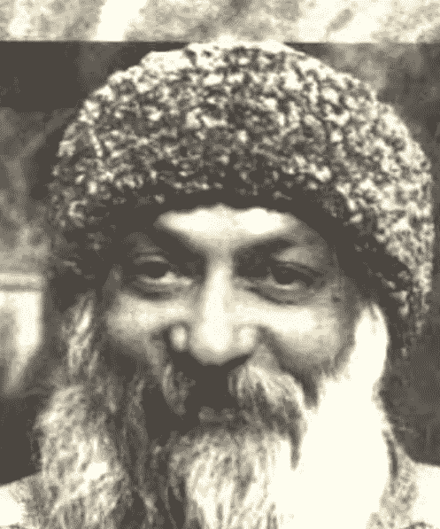
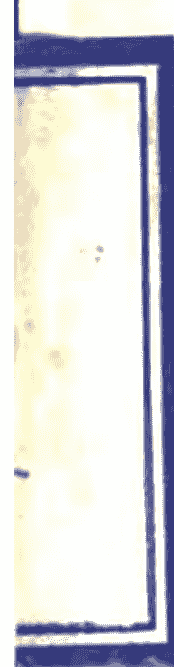
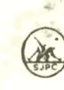

# 死亡
奥修 著 林国阳 译

上海三联书店

![](img/49a87dab4cb509ed70f135b445034ab9_0_3.png]

# 死

奥修 著 林国阳 译

# 亡

上海三联书店

# 死亡

著者/[印度]奥修

译者/林国阳

责任编辑/任关华

装帧设计/姜明

责任制作/钱震华

责任校对/王碧芳

出版/上海三联书店

（200020）中国上海市绍兴路7号

发行/辰羊书庄上海发行所

上海三联书店

印刷/华东师范大学印刷厂

版次/1998年1月第1版

印次/1998年1月第1次印刷

开本/850×1168 1/32

字数/80千字

印张/4

印数/1—11000

ISBN7-5426-1118-6 G·276 定价5.80元

## 译者序

## 献给

+   想要了解死亡奥秘的人
+   对死亡还存有恐惧心理的人

传统上我们总是认为死亡是一个悲剧，是一件悲伤的事，是一个避讳，因此在我们的生活当中，我们强调生命，甚至执著于生命，而排斥死亡。这是一种非常偏颇的心态。试问，如果我们只歌颂白天，而不让夜晚也发挥出它应有的功能，那么我们的生活不是会严重地失去平衡吗？

宇宙的运行需要靠正反两极的交互运作，只有正极而没有负极是违反宇宙法则的。如果生命是正极，那么死亡就是负极，它们两者必须合作无间，人生的进行才会顺利，才会平衡。如果你庆祝生命，那么你也要庆祝死亡，因为生是死的开始，而死是另外一个生的开始，它们是绵绵不断、无始无终的永恒生命长串里的两个极小点。永恒的生命包含生命，也包含死亡。

在本书里面，奥修大师以他成道的智慧将他所洞察到的死亡真相表露出来，让我们对死亡有一个新的、正确的了解。我们常常说要有正确的人生观，我相信了解死亡在生命中的地位对我们建立正确的人生观有很大的帮助。人生中最重要的事情——爱和静心——都跟死亡有关，我们能够忽视这个人生重要的课题吗？

## 死 亡

如果能够藉着了解死亡而免除对它不必要的恐惧，那么一个人将会变得更有勇气，使生命力的开展得以发挥得更淋漓尽致。

死亡是在孕育生命。

希望本书能够帮助你启发出更多的生命力。

谦达那

## 引言

每当有人死了——你所知道的人，你曾经爱过的人，曾经跟你在一起生活过的人，已经变成你存在的一部分的人——某种在你里面的东西也死了。当然，你会想念那个人，你会感觉到有一个真空，那是自然的，但是那个真空可以被转化成一道门。死亡是一道门……

死亡是唯一留下来没有被人类腐化的一个现象，否则人类已经腐化了每一样东西、污染了每一样东西，只有死亡仍然保持是处女般的、没有被腐化、没有被人类所染指。当人们面对死亡，他们会觉得怅然若失，不知所措，他无法了解它，他无法从它做出一个科学，那就是为什么死亡尚未被腐化，那是目前世界上仅存的没有被腐化的事。

多少世纪以来，我们一直都被教导说死亡是反对生命的，死亡是生命的敌人，死亡是生命的终点。当然，我们都因此而变得很害怕而无法放松，无法处于放开来的状态。如果你对死亡无法处于放开来的状态，你在你的生命中将会保持紧张，因为死亡跟生命并不是分开的。

除非你接受死亡，否则你将保持只是一半，只是一部分，你将保持偏颇。当你同时也接受死亡，你才会得变平衡，那么一切就都被接受了——白天和晚上，夏天和冬天，光和黑暗，全部都被接受。当两者都被接受，当生命的两极都被接受，你就会得到平衡，你就会变得很镇静，你就会变得完整。

## 目录

## 第一部分 在生命中唯一能够确定的就是死亡

### 一 停止那个转轮………………………………………………… 2
### 二 为了一个虚构的明天而牺牲今天………………………………………… 7
### 三 达到神性的一道门……………………………………………………… 9
### 四 死亡是一个神话 ………………………………………………………… 12

## 第二部分 你的死是救星

### 五 虚假的宗教:害怕死亡和生命………………………………………… 16
### 六 东方有酵母,西方有面团………………………………………………… 18
### 七 一切恐惧的根源 …………………………………………………………… 22
### 八 一个很容易的剥削 …………………………………………………………… 27
### 九 生命不应该被弄成神话 …………………………………………………… 29

## 第三部分 注意看,你就会知道

## 十 为什么执著? 只要歌唱 ………………………………………… 32
### 十一 生命只是一个挑情,死亡才是性高潮………………………………… 38

## 第四部分 走入你存在的核心

### 十二 静心:到达彼岸之路……………………………………………… 48

### 十三 不必死就知道死亡 ………………………………………………… 54

### 十四 台风眼 ……………………………………………………………………… 55

### 十五 一支古老的黄金钥匙 ………………………………………………… 58

### 十六 无瑕的觉知带来莫大的喜悦 ………………………………………………… 63

### 十七 西藏的巴豆 ……………………………………………………………………… 67

### 十八 超越的王子 ……………………………………………………………………… 69

### 十九 没有兽性的美 ……………………………………………………………………… 76

## 第五部分 全然享受——来自发光顶峰的看法

### 二十 从黑暗到光明 ……………………………………………………………………… 80

### 二十一 不死的真相 ……………………………………………………………………… 84

### 二十二 打破沙锅问到底 ……………………………………………………………………… 85

## 二十三 窥入前世 ……………………………………………………………………… 87

### 二十四 在电影的过程中保持清醒 ………………………………………………… 91

### 二十五 死的权利 ……………………………………………………………………… 97

### 二十六 “庆祝”不知道有死亡 ……………………………………………………………………… 99

### 二十七 当你还有时间,快点学会那个艺术 ………………………………………………… 101

### 二十八 醒过来唱歌……………………………………………… 102

## 附录 死亡面面观……………………………………………… 107

## 第一部分 在生命中唯一能够确定的就是死亡

## 2 死 亡

## 一 停止那个转轮

我的外公突然生病，那还不是他该死的时候，他还不到50岁，或甚至更少，也许甚至比我现在都来得年轻。我外婆只有50岁，还显得很年轻貌美。

我问她说：“他死了，你很爱他，但是你为什么没有哭？”

她说：“因为你的缘故，我不想在一个小孩面前哭，”——她是一个很了不起的女人——“我也不想安慰你。如果我自己开始哭，那么很自然地，你也会哭，那么要由谁来安慰谁？”

我必须描述那个情况：我们坐在一辆牛车上，从我外公的村子要赶到我父亲的村子，因为唯一的一家医院在那里。我外公病得很重，整个人都昏了过去，在那辆牛车上，只有她和我在照顾他。我能够了解她对我的慈悲。就因为我的缘故，她甚至在面对她所钟爱的先生之死也没有哭——因为我是当时唯一在场的人，没有其他的人可以来安慰我。

我说：“不必担心，如果你可以保持不哭，我也可以保持不哭。”很难相信，一个7岁的小孩居然可以保持不哭。

甚至连她都感到大惑不解，她说：“你怎么没有哭？”

我说：“我不想来安慰你。”

在那辆牛车上的那群人真的很奇怪。布拉在驾驶，他知道他的主人死了，但是他并没有往牛车里面看，因为他只是一个仆人，不该干涉家人的私事。这是他所告诉我的：“死亡是一件私事，我怎么可以看？我从驾驶座上听到了你们所说的一切，我想要哭，因为我非常爱他，我觉得我好像变成一个孤儿，但是我不能回头看车内，否则他一定永远不会原谅我。”

我们是很奇怪的一群。他躺在我的大腿上。我当时才7岁就面对死亡，那个时间并不是只有几秒钟，而是持续24小时，那里没有路，要到我父亲的镇上去是很困难的，车子行进很慢，我们跟着他已经过世的身体有24个小时的时间……他是慢慢地死，渐渐地死，我可以感觉到死亡正发生在他的身上，我可以看到它伟大的宁静。

说起来我也算是很幸运，有我外婆在场，或许，如果没有她，我可能会错过那个死亡之美，因为爱和死亡非常类似，或许一样。她爱我，她将她的爱洒落在我身上，而死亡就在那里，慢慢发生。

那辆牛车……我仍然可以听到它的声音——那个轮子压在石头上的嘎嘎声，布拉一直在对牛叫喊着，鞭子打在它们身上所发出来的声音……至今我仍然能够听到那些声音，它是那么深刻地根入我的经验。我想，甚至连我的死都没有办法将那些东西拭去，即使当我正在垂死，我或许都还可以听到那辆牛车的声音。

我曾经听过别人的死，但那只是听到，我并没有看到，或者即使我看到了，它们对我也毫无意义。除非你爱一个人，然后他死了，否则你没有办法真正碰到死亡。下面这句话应该特别强调：死亡唯有在一个所爱的人死的时候才能碰到。

当爱加上死亡围绕着你，就会有一个蜕变，一个很大的突变，好像一个新的人被生出来，你将永远不会再一样。但是人们并没有去爱，因为他们不爱，所以他们无法经验到我所经验的死。如果没有爱，死亡并不会给你进入存在的钥匙；有了爱，它才会交给你进入一切存在的钥匙。

我第一次对死亡的经验并不是一个单纯的遭遇，它就很
多方面来讲都是复杂的。我所爱的人正在垂死，我跟他的关系如同父子，他在绝对自由的情况下把我抚养长大，没有禁令，没有压抑，没有戒律。他从来不会告诉我：“不要做这个”，或是“不要做那个”。直到现在，我才能够了解这个人的美。

我喜爱这个人，因为他喜爱我的自由，唯有当我的自由受到尊重，我才能够爱。如果我必须去讨价还价，藉着牺牲我的自由才能够得到爱，那种爱不适合我，那种爱只适合较差的人，它不适合有知之士。

“我的主，这个生命是你所给我的，我带着感谢将它交还给你”。这些话是我外公过世时所讲的，虽然他从来不相信神，也不是一个印度教教徒。

在他过世之前，有一件事他一再一两地提起：“停止车轮……”我外公正在垂死，而他要求我们停止车轮，这是多么荒谬！我怎么能够停止车轮？我们必须赶到医院去，如果没有那些轮子，我们一定会迷失在森林里。

我外公说：“停止车辆，拉贾（奥修乳名），你没有听到我的话吗？如果我能够听到你外婆的笑声，你一定可以听到我的话。”

我告诉他：“不要担心她的笑声，我知道她，她并不是在笑你所说的，它是我们之间的事，它是关于我所告诉她的一个笑话。”

他说：“好，如果它是关于你所告诉她的笑话，那么她笑是完全没有问题的，但是那个轮子呢？”

现在我才明白，但是那个时候我完全不知道这种用语，轮子代表印度人根深蒂固的生死轮回。几千年来，成千上亿的人都一直只是在做一件事：试着去停止那个转轮。他并不是在讲牛车的轮子，要停止车轮是很容易的，事实上，要使它保持转动才困难。

在那个时候，我无法了解我外公为什么那么坚持，或许是
那辆牛车——因为那个地方没有路——发出很多噪音，每一样东西都嘎嘎作响，而他正处于身心的极度痛苦，所以很自然地，他想要停止那个轮子，但是我外婆笑了，现在才知道她在笑什么。他是在讲生死轮回，它以轮子作为象征，人的生死就好像轮子继续在转动……

那就是为什么我外公说：“停止那个转轮。”如果我能够去停止那个转轮，我一定会去停止它，不只是为他，而是为世界上的每一个人。我不仅会去停止它，我还会永远地摧毁它，使得没有人能够再转动它，但是它并不在我的掌握之中。

为什么要执著于那个观念？在他死亡的那个片刻，我开始觉知到很多事……那些事决定了我的一生。

我靠近他的耳边问他：“外公，在你离开之前有什么事要告诉我吗？有没有任何最后的留言？或者你要给我什么东西作为永久的纪念？”

他脱下他的戒指放在我的手上，那个戒指一直都是一个奥秘，他终其一生都不允许任何人去看它里面是什么，然而他自己却一再一再地去看它。那个戒指两边有玻璃窗，你可以看透它，上面镶有一颗钻石，它的每一边都有一个玻璃窗，他不允许任何人来看玻璃窗里面藏的什么东西。里面是一个马哈维亚的雕像，那个雕像真的很美，也很小，它里面一定是一个很小的马哈维亚的照片，而那两个窗子是放大镜，它们把它放大，使它看起来很大。

他含着眼泪说：“我没有什么其他的东西可以给你，因为一切我所拥有的也会从你身上被带走，就好像它从我身上被带走一样，我只能够给你我对一个已经知道他自己的人的爱。”

虽然我没有保存他的戒指，但是我有满足他的愿望，我知道了“那一个”，而我是在我自己里面知道的。戒指有什么关系？但是那个可怜的老年人，他喜爱他的师父马哈维亚，而他
将他的爱给我。我尊重他对他师父的爱，以及对我的爱，他最后的话语是：“不要担心，因为我并没有死。”

我们都在等待看看他会不会再说其他的事，但是就只有这样，他闭起眼睛，然后就消失了。

我外婆拉着我的手，我头昏眼花的，不知道到底发生了些什么，我完全停留在当下那个片刻，我外公的头睡在我的大腿上，我举起我的手放在他的胸口上，他的呼吸慢慢、慢慢消失，当我觉得他已经不再呼吸，我告诉我外祖母说：“我觉得很遗憾，外婆，他似乎已经不再呼吸了。”

她说：“没有问题，你不需要担心，他已经活够了，不需要再要求更多。”她同时告诉我：“记住，因为这些是不能忘记的片刻，所以永远不要要求更多，已经存在的就足够了。”

我还记得那个宁静，牛车经过了一个河床，每一个细节我都记得清清楚楚，我一句话都没说，因为我不想打扰外婆，她也是一句话都没说。过了一阵子，我开始变得有一点担心她，我说：“讲一些话吧！不要那么沉默，它令人难以忍受。”

你相信吗？她居然唱起歌来！那就是我所学习到的，死亡必须庆祝，她唱出她跟我外公初恋时所唱的歌。

分离有它本身的美，就好像结合时也有一种美一样；分离有它本身的诗，一个人只要去学习它的语言，一个人必须去经历它的深度，那么，从悲伤本身会产生出一种新的喜悦，它看起来几乎不可能，但是它的确会发生，我知道。

摘自《金色的童年》

## 第一部分 在生命中唯一能够确定的就是死亡

## 二 为了一个虚构的明天而牺牲今天

自从我外公死后，死亡变成一个我经常的伴侣，那一天我也死了，因为有一件事变得很确定，不管你是活了7年或70年，那有什么关系？你终究必须一死。

这么好的一一个人，这么美的一一个人，就这样死了，他的人生有什么意义？它变成一个折磨我的问题，那个意义是什么？他达成了什么？有数十年的时间，他都以一个好人在生活，但是那一切究竟有什么意义？它还不是就这样结束了，甚至不留一丝痕迹。他的死使我变得非常非常严肃。

甚至在他过世之前我就变得很严肃。到了4岁的时候，我就开始想一些问题，似乎人们只是在安排继续延缓到最后，我不相信延缓，我开始向我外公问问题，然后他会说：“这些问题！你还有一整个人生，不必急，而且你还太年轻。”

我说：“我看过年轻的男孩死在村子里，他们并没有问这些问题，他们还没有找到答案就死了，你能够保证我明天不死或后天不死吗？你能不能给我一个保证，唯有在我找到了答案之后，我才会死？”

他说：“我无法保证，因为死亡并不在我的掌握之中，生命也不在我的掌握之中。”

“那么，”我说：“你就不应该建议我延缓，我现在就要答
案。如果你知道，你就说你知道，然后将答案给我；如果你不知道，也不要觉得羞于接受你的无知。”

他很快就了解到，跟我在一起是别无选择的，或者你必须说是……但那并不很容易，你必须进入它更深的细节，你骗不了我，因此他开始接受他的无知，接受说他不知道。”

我说：“你已经很老了，不久你就会过世，你一生当中都在做些什么？在死亡来临的那个片刻，在你的手中将只有无知，其他没有。这些是非常重要的问题，我并不是在问你一些琐事。”

“你去到庙里，我问你为什么你要去庙里，你在庙里找到任何东西吗？你在一生当中常常都去庙里，你也试图说服我跟你一起去庙里。”那座庙是他盖的，有一天他终于接受那个事实说：“因为那座庙是我盖的，如果甚至连我自己都不去，那么有谁会去那里呢？但是在你面前我必须承认，它是没有用的，我在一生当中常常去那里，但是我并没有得到什么东西。”

然后我说：“试试别的东西，不要跟着问题死，要跟着答案死。”但他是跟着问题死。”

他最后一次跟我讲话的时候，那大概是他过世之前10个小时，他睁开他的眼睛说：“你说得对，延缓是不对的，我将带着所有的问题一起死，所以你要记住，任何我以前给你的建议都是错的，你说得对，不要延缓。如果有--个问题升起，试着尽快去找到答案。”

摘自《奥修圣经》第三卷 1985年1月21日晚上

## 三 达到神性的一道门

味帕沙那是一个活生生的、气力非常旺盛的门徒，她住在社区里，她是一个音乐家，而且是一个很狂喜的歌手。

她突然生病，每一个人都吓一跳，她生了一个不能开刀的脑瘤……

每当有人死了——你所知道的人，你曾经爱过的人，曾经跟你在一起生活过的人，已经变成你存在的一部分的人——某种在你里面的东西也死了。当然你会想念她，你会感觉到有一个真空，那是自然的，但是那个真空可以被转化成一道门。死亡是达到神的一道门。死亡是唯一留下来没有被人类腐化的一个现象，否则人类已经腐化了每一样东西，污染了每一样东西，只有死亡仍然保持是处女般的，没有被腐化、没有被人类所染指。人类也想要腐化它，但是他无法掌握它，无法占有它，它是那么地捉摸不定，它仍然保持是不可

## 第一部分 在生命中唯一能够确定的就是死亡 11

就得到了平衡，你就会变得很镇静，你就会变得完整。

如果你想要完整，那么你也必须给予死亡公平的待遇。生命是很美的，而死亡也跟生命一样美；生命有它本身的祝福，死亡也有它本身的祝福；生命中有很多花朵，死亡里面也有很多花朵。

一切神所给你的东西，你都必须带着深深的感激来接受——甚至连死亡也是如此。唯有如此，你才能够变得具有宗教性：对一切心存感激而接受，对一切无条件地接受。死亡是最神圣的事情之一，它尚未被人类所腐化，它还是处女。

摘自《除了你的头之外没有什么好失去的》
1976年3月12日晚上

## 四 死亡是一个神话

当你死的时候，在你生命中的一章就结束了，人们认为那是你的整个人生，但那只是整本书的一章，而那本书里面有无数章。一章结束了，但是那本书还没有结束，只要再翻开下一页，另一章就又开始了。

一个正在垂死的人会开始看到他的下一世，这是一个为人所知的事实，因为它在那一章结束之前就发生了。偶尔有人会从那个最后的点回来。比方说他溺在水中，快被淹死，然后被救起来，他已经不省人事，他身体里面的水必须被压出来，而且必须对他施以人工呼吸，然后他被救活了，他正处于要结束他那一章的边缘，这些人可以讲出一些有趣的事实。

其中一个就是，在最后的片刻，当他们觉得他们快要死了，事情快要结束了，他们的整个一生都出现在他们的眼前，一转眼的工夫---从出生到那个片刻。在一瞬间，他们看到了发生在他们身上的每一件事，包括他们记得的和他们从来不记得的----有很多他们从来没有去注意的事，以及那些他们不知道那也是他们记忆中的一部分的事。整个记忆的影片很快地闪过去，它必须在瞬间发生，因为那个人快要死了，并没有3个小时这么长的时间可以来看整部电影。

即使你看了整部电影，你也无法巨细靡遗地叙述一个人一生中的所有事情。但是每一件事都会在他面前经过，那是一个很确定，而且很重要的现象。在那一章结束之前，他会回忆他所有的经验，没有满足的欲望、期望、失望、挫折、痛苦和喜悦等等——每一件事。

那个即将要死的人，当他要再往前走时，他必须看到它的全部，只是作为回忆，因为身体即将要走了，这个头脑将不再跟着他，但是从这个头脑释放出来的欲望会执著于他的灵魂，而这个欲望将会决定他的来生，任何没有被满足的，他都会走向那个目标。

所以，在你死亡的那个片刻你所做的事会决定你将如何出生。大多数的人死的时候仍然执著于生命，他们还不想死。一个人可以了解为什么他们还不想死。唯有到了临死的片刻，他们才会承认那个事实说他们没有真正去生活，生命就好像梦一般地经过，然后死亡就来到了。现在已经不再有时间去生活，死亡正在敲门。当以前有时间去生活的时候，你尽是在做一些傻事，在浪费时间，而不是在生活。

只要注意看人们在临死的时候，他们的受苦并不是在于死亡，死亡本身是没有痛苦的，它是完全不痛苦的，事实上它是舒服的，它就像是一个很深的睡眠。你认为深深的睡眠会痛苦吗？但是他们所顾虑的并不是死亡，也不是那个深深的睡眠，或是那个舒服，他们是在担心那些已知的东西脱离了他们的掌握。恐惧只意味着一件事：失去那已知的，而进入那未知的。勇气刚好是它的相反。对死亡的恐惧的确是最大的恐惧，是对你的勇气最具有破坏性的。

所以我只能够建议一件事，现在已经无法再回到你过去的死亡，但是你可以开始做一件事：在任何事情或任何经验上，永远都准备好从已知进入未知。跳进任何新的事物……它
的新、它的新鲜，是很诱人的，然后就会有勇气。

这样比较好，即使那个未知的被证明比那个已知的来得差，那并不重要。

他们说，一切老的都不是黄金的，而我说，即使一切老的都是黄金的，你也要忘掉它，选择新的，不管它是不是黄金的都没有关系。

以一个简单的练习来作为开始，那就是：永远都要记住，每当有一个选择，你就选择那未知的、那冒险的、那危险的、那不安全的，那么你就不会觉得失落。

唯有如此，这一次的死才能够变成一个具有启发性的经验。

勇气将会来到你身上，只要从一个简单的公式开始：永远不要错过那未知的。永远都要选择那未知的，然后勇往直前，即使你因为这样做而受苦，那也是值得的，它永远都是划算的。你永远都会因之而变得更成长、更成熟、更聪明。

摘自《奥修圣经》第四卷
1985 年 2 月 6 日晚上

摘自《超出成道之外》

## 第二部分 你的死是救星

## 五 虚假的宗教:害怕死亡和生命

钟爱的师父,在其他的宗教里,他们几乎从来没有谈过死亡。当死亡被提及时,他们也都很严肃而害怕,但是在你的宗教里,大家都很自然而且很快乐地在谈论死亡,这是有意义的吗?

它的确是最有意义的事情之一,它可以决定一个宗教是真实的或是虚假的。

虚假的宗教不知道关于死亡的事。

事实上,它也不知道关于生命的事,所以才会有恐惧,对两者都恐惧。只有害怕死亡,那是不可能的,因为死亡跟生命并不是分开的,死亡是生命的一部分,它不是生命的终点,它是生命中的一个事件,生命会一直持续下去。死亡已经发生过很多次、无数次,它只不过是一个事件,但是虚假的宗教对两者都害怕。

虚假的宗教也害怕生活。

你必须先了解这一点,唯有如此,你才能够了解为什么他们害怕死亡。他们都赞成抛弃生活,他们基本上都是反生活的态度,他们认为生命里面有某种东西是错的,生命是由原罪所产生出来的,你在生活是不对的。亚当和夏娃被惩罚,因为他
们想要去生活，他们想要去知道，他们想要去了解，去探索，去探询，这就是他们的原罪。你是亚当和夏娃的后代，你一诞生就有罪了。

亚当与夏娃所犯下的罪，那些宗教试着要去将它调整过来，好让你能够再度被神所接受，能够再度被欢迎进入天堂。宗教害怕生命，害怕去知道——这两者是分不开的。

虚假的宗教教导你也要害怕生命——他们不仅只是害怕死亡，他们不谈论死亡，谈论死亡被认为是不礼貌的。如果你坐在餐桌旁边开始谈论死亡，那并不是一个好的礼节。在餐桌上那是不用说的！即使在坟墓那里，当人们聚集在一起来向死者致最后的敬意，他们也不谈死亡。

尽可能很强烈地去生活，生命的滋味将能够让你了解为什么死亡是不需要害怕的。一旦你知道了你的生命，知道了它的火，你就知道没有死亡。

一个人在强烈的生活当中所知道的生命是永恒的。

那个永恒的感觉会随着你的生活而产生出来。你活得越深、越强烈，你就会越快感觉到没有死亡。

在我的宗教里，死亡是应该被庆祝的，因为没有死亡，它只是进入另外一个人生。

我们在庆祝出生——人们认为我们在庆祝死亡——因为没有真正的死亡，因为没有什么东西会死，只有形体改变，生命由一个形式转变成另外一个形式。当一个人死的时候，它应该是跟所有跟他有关的人一起高兴的一个片刻，因为他只是在表面上死。从我们这一边看来，好像是他在垂死，但是从另外一边来看，他是被生出来。

> 摘自《奥修圣经》第三卷

## 六 东方有酵母，西方有面团

你的制约给你只有一世的概念。认为人生只有一世，这种观念使得西方人疯狂地追求速度，因此每一件事都必须做得匆匆忙忙的，使你无法在做它的时候享受它，也无法将它做得尽善尽美。你还是会想办法去做它，然后再匆匆忙忙换到另外一件事上面。

西方人一直生活在一种非常错误的观念之下，它在人们的头脑里创造出非常多的紧张，使得他们在任何地方都永远无法放松，他们一直都保持活跃，而且他们一直在担心一个人永远无法知道生命什么时候要结束。在生命结束之前，他们想要做每一件事，但是那个结果刚好相反，他们甚至无法把少数几件事做得很优雅、很完美。

他们的生命过分笼罩着死亡的阴影，使得他们无法高高兴兴地去生活。每一件带来喜悦的事似乎都在浪费时间，他们无法只是静静地坐着一个小时，因为他们的头脑会告诉他们：“你为什么要浪费那个小时？你可以做这个，或是你可以做那个。”

就是因为有这个人生只有一世的观念，所以静心的概念从来没有在西方产生。静心需要一种非常放松的头脑，不慌不忙，不担心，没有想去什么地方……只是一个片刻接着一个片刻地去享受，不论遇到什么。

在东方，静心一定会被发现，因为他们具有永恒生命的概念，所以你就可以放松，你可以不要有任何恐惧地放松，你可以享受吹你的笛子，你可以跳舞和唱歌，你可以享受日出和日落，你可以享受你的整个人生，不仅如此，你甚至可以享受你的死亡，因为死亡也是一种伟大的经验，也许是人生当中最伟大的经验，它是一个高潮。

在西方的观念里，死亡是生命的终点，但是在东方的观念里，死亡只不过是一长串生命中一个很美的事件。在生命中有很多很多死亡，每一个死亡都是你生命的一个顶点，在另外一个生命开始之前的一个顶点。另外一个生命意味着另外一个形体、另外一个标签、另外一个意识。你并不是这样就结束了，你只是改变了那个房子。

我想起木拉那斯鲁丁。有一个小偷进入了他的屋子里，木拉正在睡觉，没有真正在睡觉，只是闭起眼睛，在半睁半闭之间他看到了那个小偷，但是他不想去干涉别人的事，那个贼并没有干涉他的睡眠，所以他为什么要干涉他的工作？就让他去吧！

那个小偷有一点顾虑，因为这个人似乎很奇怪。当他在搬东西的时候，有时候某些东西会掉下来而发出声音，但木拉还是保持熟睡，那个小偷开始怀疑，这种睡法只有当一个人醒着的时候才可能：“多么奇怪的一个人，他居然都不吭声，我要把他家里的东西全部搬了出去！”所有的家具都被搬了出去，所有的枕头都被搬了出去，屋子里面的每一样东西都被搬了出去。

当那个小偷在收拾那些东西，要将它们捆好带回家去，他突然发觉：“有人在跟踪我。”他回头一看，就是刚刚在睡觉的那个人，他说：“你为什么要跟踪我？”

木拉说：“不，我没有在跟踪你，我们在搬家，你已经把每一样东西都搬出去了，现在我还待在这个屋子里干什么？所以我就跟来了。”

像这么泰然自若就是东方的方式。即使是面对死亡，东方也把它看成是在换房子。

那个小偷很担心地说：“请你原谅我，你可以把你全部的东西都拿回去。”

木拉说：“不，不需要，我正想要搬家，这个房子已经非常破旧了，你不可能有比这个更糟糕的房子，而我是一个非常懒惰的人，我需要有人来照顾我，既然你已经将每一样东西都搬出来了，为什么把我单独留下来？”

那个小偷变得很害怕……他一生都在偷窃，但是从来没有碰到过像这样的人，他说：“你可以把你的东西拿回去。”

木拉说：“不，我不想有任何改变，这些东西必须由你来带，否则我要叫警察来，我很有绅士风度，我不称你为小偷，我只是把你看成一个帮我搬家的人。”

没有什么好匆忙的，所以你那人生只有短短的一世的概念是危险的。那就是为什么东方虽然很穷，但是他们并不觉得失望，也不觉得痛苦。西方很富有，但是财富对他们的灵性和成长并没有什么帮助，它反而使西方人变得很紧张，它应该是更放松才对，它具有一切舒适生活所需要的东西。

但是基本的问题在于：在内心深处，西方人认为人生是短暂的，我们都在排队，每一个片刻我们都变得更接近死亡。从我们出生的那一天起，我们就开始在走向坟墓。生命每一个片刻都在消耗，它变得越来越短，这种想法造成紧张、痛苦和焦虑。所有的舒适、所有的奢华和所有的财富都变得没有意义，因为那些东西你都带不走。当你进入死亡的时候，你必须是单独的。

东方是放松的，首先，它并没有给予死亡任何重要性，它只是一个形体的改变；第二，因为它是那么地放松，所以你会觉知到你内在的财富，它会跟着你，甚至到死后都会跟着你，死亡无法将它们带走。

## 七 一切恐惧的根源

钟爱的师父，恐惧是什么？

有很多种恐惧和害怕，我并不是在谈论它们，我是在谈论最基本的恐惧，所有其他的恐惧都只不过是这个恐惧遥远的回音，最基本的恐惧就是对死亡的恐惧。生命被死亡所围绕着。你每天都看到有人在死，有某些东西在死，有某些东西在一个片刻之前是活的，但是之后就死了。

每一个死都在提醒你你自己的死。

不可能忘掉你自己的死，每一个片刻都有一个提醒者，所以第一件必须了解的事就是：驱除恐惧的唯一可能性就是驱除死亡。你可以驱除死亡，因为死亡只是一个概念，而不是一个真相。

你只看过别人在死，你曾经看过你自己在死吗？当你看到别人在死，你是一个旁观者，你并没有参与那个经验，那个经验是发生在那个人里面。

一切你所知道的就是他已经不再呼吸，他的身体变冷了，他的心不再跳动了，但是你认为所有这些东西加在一起就等于生命吗？生命就只是呼吸吗？生命就只是心跳和血液循环来使身体保持温暖吗？如果这就是生命，那么这个游戏是不值
得的。如果我的生命就只是我的呼吸，那么继续呼吸有什么意思？

生命必须比这些更多，如果要有价值的话，生命必须具有某种永恒的东西在它里面，它必须是某种超越死亡的东西。你可以知道它，因为它就存在于你里面。生命存在于你里面，死亡只是别人的经验，只是旁观者所看到的，它就好像爱一样，你能够藉着看到一个人在爱某人就了解爱吗？你会看到什么？他们在互相拥抱，但拥抱就是爱吗？你或许可以看到他们手牵着手，但是手牵着手就是爱吗？从外在，你对于爱还能够发现其他什么东西呢？任何你所发现的东西都完全没有用，这些都只不过是爱的表现，而不是爱本身。爱是唯有当一个人在它里面才会知道的东西。

印度最伟大的诗人之一泰戈尔被他祖父一个年老的朋友弄得很窘，他老人家常常来，因为他就住在附近，他从来没有一次不给泰戈尔添麻烦，他会跑去敲他的门，然后问他：“你的诗进行得怎么样？你真的知道神吗？你真的知道爱吗？告诉我，你在诗里面所谈到的这些事情你都知道吗？或者你只是善于言词？任何白痴都可以谈论爱，谈论神，或谈论灵魂，但是我从你的眼睛看不出来你有经验到任何事情。”

泰戈尔无法回答他，因为事实上他说得对。有时候他老人家在街上碰到他就抓着他问：“你的神怎么样了？你找到他了吗？或者你还在写关于他的诗？记住，谈论神并不等于知道神。”

他是一个非常令人难堪的人。在诗人的聚会里，泰戈尔备受尊崇，他是诺贝尔奖得主，而那个老年人一定会在那里，当着所有的诗人和泰戈尔的崇拜者面前，他会抓住泰戈尔的领子说：“它还没有发生是吗？你为什么要欺骗这些白痴？他们是小白痴，你是大白痴，他们不为印度以外的人所知，而你是世界闻名的，但是那并不意味着你知道神。”

> 泰戈尔在他的日记上写道：“我非常受到他的打扰，他有一对非常具有穿透力的眼睛，不可能对他撒谎，他的‘在’使得你必须说出真话，要不然就保持沉默。”

但是有一天事情终于发生了……泰戈尔在作晨间散步，前一天夜里下雨，那是一个清晨，太阳正在升起，海面上一片金黄色，在街道旁边有一些积水，在那些小小的积水的地方，太阳也在升起——带着同样的光辉、同样的颜色、同样的喜悦……就是这个经验——在存在里面没有什么东西是比较优越的，也没有什么东西是比较低劣的，一切都是一个整体——这个经验突然牵动了他里面的某种东西。他生平第一次跑到那个老年人的家敲他的门，洞察了那个老年人的眼睛说：“现在你怎么说？”

他说：“现在没什么好说了，它已经发生了，我祝福你。”

经验到你的不朽、你的永恒、你的完整以及你跟存在的合一，这一直都是可能的，它只需要一些能够牵动你内在的经验。”

所以第一件事就是要驱除死亡，如果你能够驱除死亡，所有的恐惧都会消失，你不必去对每一个恐惧下功夫，否则它将会花上你好几世的时间，而你还是无法驱除它们。”

恐惧是自然的，因为每一个人都知道死亡。罪恶感是不自然的，它是由宗教所创造出来的，他们使每一个人都变得有罪恶感——对很多事情都有罪恶感，被罪恶感压得无法唱歌、无法跳舞，无法享受任何东西。那个罪恶感毒化了每一样东西。”

所有的宗教都共谋来毒害天真无邪的人，使他们带有罪恶感，因为如果不使他们带有罪恶感，他们就无法沦为奴隶，
而奴隶是需要的。为了少数几个人的权力欲，就有成千上亿的人必须被奴役；为了少数几个人要变成亚历山大大帝，就有成千上亿的人必须被贬为次人类。

但是所有这些都只是头脑里的制约，你很容易就可以将它们拭去，就好像你在沙滩上写字那么容易。不要因为你将那些教条视为神圣的——你认为它们来自非常值得尊敬的来源、来自伟大的宗教创始者——你就变得害怕而不敢将它们拭去，那是没有关系的，只有一件事是重要的：你的头脑必须完全被清理干净，完全空掉，完全宁静。

不需要由摩西、耶稣，或佛陀来住在你里面，你需要一个完全宁静和干净的空间，只有那个空间能够带领你到你自己，带领你到存在本身，而不只是带领到我这里。

世界上的宗教带给人类无数的病，其中一个病就是他们使每一个人都对报酬变得有野心——如果不是在这个世界的报酬，那么就是在彼岸的报酬。

他们使人变得很贪婪，而他们同时又在谈论反对贪婪。他们的整个宗教都以贪婪为基础……

宗教作出了这么大的伤害，他们是无法被原谅的，他们带走了人类所有的尊严——他渴望的喜悦和爱的喜悦、他等待的快乐、他对于春天将会来临的信任。他们从你身上带走了每一样东西。唯有当你做了某些仪式——那些仪式跟灵性成长根本无关——你才会得到奖赏。

一个单纯而天真的宗教一定能够改变整个地球，但是狡猾的教士们一定不允许一种纯粹的、天真的、如小孩子般的宗教——带着惊奇的眼光、带着喜悦、不去担心那些天堂和地狱的愚蠢观念，而是每一个片刻都带着伟大的爱来生活。

等待更多——不是欲求，而是等待，使你自己变得创造出
更多更多的空间和宁静，好让春天可以来临。不只是几朵花，而是有很多花……

关于这一点，有一个苏菲的神秘家有一首小诗：“我等待春天已经很久了，它终于来临了，它来得那么丰富，它带来那么多的花朵，所有的空间都被占满了，使我没有地方可以筑我自己的巢。”

生命很丰富地给予，你只要成为一个接受者。

我想要你们完全天真，不要有任何宗教的腐

## 八 一个很容易的剥削

就是因为有死亡，宗教才得以存在，如果没有死亡，根本就没有人会去管宗教。并不是生命启发你成为具有宗教性的，不，是死亡启发你的。死亡促使你去追寻永生。

只要想想一个死亡不存在的世界，一个没有人会死的世界，那么问“死后将会怎么样”这句话就变得没有意义，关于天堂和地狱的问题也会变得没有意义。当你是永恒的，什么神能够比你更了不起？目前他是永恒的生命，而你是一个短暂的现象，就好像肥皂泡沫一样，一下子的光景，你就消失了，因此才会有恐惧。那个恐惧促使你去追寻，你想要知道这个死亡到底是什么，你想要知道死后还有什么留下来。那些说死后没有留下什么东西的人是不具宗教性的，他们不去庙里，他们不上教堂，他们也没有任何神圣的经典。

到目前为止，所有的宗教都是虚假的，他们只是看起来好像具有宗教性，但事实上并不具宗教性，因为他们没有足够的勇气去成为完整的，他们只是一部分。

对死亡的恐惧产生出虚假的宗教，现在整个世界首度接近全球性的死亡，直到目前为止都只是个人的死，社会还会继续，世界还会继续，是的，人们会来来去去——老年人会消失，小孩子会被生出来——但是那个持续一直都存在，生命一直存在。是的，个人的生命是一个问题，但只有个人会去顾虑它。

教士能够很容易地剥削个人。个人是那么地脆弱，那么地渺小，那么地有限，他知道他将会死，他必须去寻求教士的帮助，帮助他找到某种不死的东西或永恒的东西来让他抓住，来带领他超越死亡。教士们一直都对这样的事情作承诺，但那个问题都是属于个人的，它从来不是整个社会所面临的问题。

## 九 生命不应该被弄成神话

除非西方改变只有一世的观念，否则这个伪君子的心态、这个执著和这个恐惧无法改变。事实上，这一世并不是全部，你已经活了很多次，而你将会活更多次，因此每一个片刻都必须尽可能全然地去生活，不需要匆匆忙忙地跳到另外一个片刻。时间并不是金钱，时间是耗用不尽的，它对富人和穷人来讲都一样多。对时间来讲，富有的人并不比较富有，贫穷的人也不比较贫穷。

生命是一个永恒的再具身(不断轮回)。

呈现在西方人表面的情况事实上有它很深的宗教根源，他们非常吝啬，只给你70年。如果你试着去经营它，几乎有三分之一的时间必须耗在睡觉里，另外有三分之一的时间必须浪费在赚取食物、衣服和房子，最后剩下的那一点点必须被用在教育、足球比赛、电影、愚蠢的争吵和抗争等等事情上面。在这70年的岁月里，如果你能够为你自己省下7分钟，我就认为你是一个聪明的人。

但是在你的整个人生当中甚至要省下7分钟都很难，所以你怎么能够找到你自己？你怎么能够知道你本性的奥秘？你怎么能够知道你生命的奥秘？你怎么能够了解死亡并不是终点？

# 死亡

因为你错过了去经验生命本身，所以你也将会错过死亡的伟大经验，否则死亡是没有什么好害怕的。它是一个很美的睡觉、一个无梦的睡觉。在你要很宁静、很和平地进入另外一个身体之前，你需要那个睡觉，它是一个外科手术的现象，它几乎就像麻醉。死亡是一个朋友，而不是一个敌人。一旦你把死亡了解成一个朋友，然后开始去生活，丝毫不害怕它只有短短的70年——你的看法甚至可以拓展到永恒的生命——那么每一件事都会慢下来，不需要太快。

不管做什么事，人们都是匆匆忙忙地。我看到有一些人拎着他们的公事包，将东西塞进去，吻了他们的太太——没有看清楚那个人是不是他的太太——然后跟他们的小孩说再见。这并不是健全的生活方式！你那么匆忙到底是要去哪里？

西方没有神秘主义的传统，这是外向的：向外看，有很多东西可以看。但是他们并没有觉知到内在不仅仅是骨头，在骨头里面还有更多的东西，那就是你的意识。当你把眼睛闭起来，你将不会碰到骨头，你将会碰到你生命的源头。

西方需要跟它自己生命的源头有一个很深的认识，这样他们就不会匆匆忙忙，那么，当生命带来青春，一个人会去享受它；当生命带来老年，一个人也会去享受它；当生命带来死亡，一个也会去享受它。你只知道一件事：如何享受你所碰到的每一件事，如何将它蜕变成一个庆祝。

将每一件事蜕变成一个庆祝、一首歌，或一支舞的艺术我称之为真实的宗教。

## 第三部分 注意看，你就会知道

## 十 为什么要执著？只要歌唱

内在的神不需要其他的神来崇拜，一切所需要的就是一个人自己本质的醒悟、觉知和意识。

一旦他变得意识到他自己，他就不再是必有一死的，他就变成不朽的。他一直都是不朽的，但是因为他的误解，他把自己降级为必有一死的，降级为一个将会死的人。虽然在你里面的生命和意识是永恒的，是不朽的，你还是一直在害怕死亡，因为你每天都看到有人在死，而每一个人的死都会提醒你自己的死。

诗人歌曰:‘永远不要问那个钟是为谁敲的，那个钟是为你敲的……’

他有某些真理要传达给你。每一个死亡都是象征性的，它显示出你跟他们排在同一排，而那个行列变得越来越短，每天你都越来越接近死亡。事实上你生下来的那一天并不是你出生的日子，而是你开始走向死亡的日子。从那一天开始，你就每天都在死，在你的每一个生日，你距离死亡就更近一年。

人们会死，动物会死，树木会死，鸟儿会死，这是一个绝对确定的事实。你怎么能够避开你将会死的这个事实？它也许是明天，也许是后天，问题只是在于时间……

但是那些觉知到他们的本性的人都知道没有人会真正地死。

死亡是一个幻象。

你曾经看过人们在死，但是你曾经看过你自己在死吗？当你看到别人在死，你真的是看到别人在死吗？一切你所能看到的，一切你们的医学所能看到的，就是那个人停止呼吸，他的脉搏消失了，他的心跳不存在了，所以他们宣称说他死了。

就在几天之前，有一个住在巴基斯坦卡希米尔的人，他第三次欺骗了他的朋友、他的同事和他的家人。在135岁的时候，他第三次死。人们感到非常怀疑，因为先前有两次，他都在耍把戏。医生诊断说他死了，也证明他死了，然后他又醒过来，睁开他的眼睛开始笑。所以当他这一次死的时候，人们都非常小心，医生也非常小心，但是他们都很确定这次是真的死了，毫无问题。

他们说：“或许以前他是欺骗了你们，但是这一次他真的死了。就医学所能够知道的，他具备了死人的每一个条件。”当那张死亡证明书由3个医生共同签下了字，那个人再度睁开他的眼睛笑着说：“听着，当我下一次要死的时候，我将会真的死，我只是想再多一次……”

巴基斯坦的卡希米尔那个地方是一个长寿村，一个人活到120岁是很平常的、很正常的，你也可以找到活到150岁的人，它并不是那么正常，但还是有好几百人活过150岁，有非常少数的几个人还活到180岁，而他们仍然很年轻，仍然在田里工作。

全世界各地的新闻记者都来采访他，因为他是一个非常稀有的人，三次被证明死亡，三次他都公然挑衅所有的医学知识和医疗科学，他们都问他：“你一直在做什么？到底是怎么了？”

# 死亡

他说:‘没什么,因为我并不是我的身体,我知道这一点,我不是我的呼吸,我知道;我不是我的心,这一点我也知道。我超越了所有这些,我只是溜进彼岸。心跳停止了,脉搏停止了,你们都被愚弄了,然后我再度溜回我的身体,血液就开始流动,脉搏开始脉动,心开始再度跳动。’

他是一个单纯的人,一个农夫,他不是一个瑜伽行者,他从来没有练习过任何事情,但是当他还很小的时候,不超过七、八岁的时候,他碰到一位苏菲的神秘家,他告诉他说死亡是一个幻象,他非常天真,所以他就接受了这种说法。

那个苏菲神秘家告诉他说:‘有一种很简单的方法可以溜出你的身体,只要从外面来看,观照着你的身体,突然间在你和你的身体之间就会越来越产生出一个距离,不久,身体就会跟你离得很远很远。观照着头脑,同样的情形也会发生在头脑中。’

‘你只要保持是一个观照者,你就能够溜出身体,溜出头脑,溜出你的整个人格,而要回来是你可以控制的。因为你溜了出去……你知道你溜出去的方法,所以你也知道怎么回来的方法,那个方法就是:观照,你就可以溜出去。现在停止观照,变得跟身体认同,说:‘我是身体、我是头脑、我是呼吸、我是心跳。’那个距离就会立刻消失,你就会更接近,很快地,你就会溜回身体里。’

当你跟身体认同,你就变成了身体,那么你就是必有一死的,那么就会有对死亡的恐惧。不跟身体认同,你只是一个观照者,你只是一个纯粹的意识,一个‘没有头脑’,那么就没有死亡,没有疾病,也没有老年。就你的观照而言,它是永恒的,它永远都是新鲜的、年轻的、不变的。

真实的宗教不会教你去拜拜,真实的宗教会教你去发现

## 第三部分 注意看,你就会知道

你的不朽,去发现你里面的神。

每一个人终有一天都要轻过死亡之门,如果你能够记住你只是纯粹的意识——不是身体、不是头脑、不是心、不是你的钱、不是你的声望、不是你的权力,也不是你的房子,而只是纯粹的意识,那么你就能够毫发无伤的通过死亡的障碍,那么死亡甚至无法在你身上留下一个凹痕。

有一个伟大的国王,他的名字叫作亚亚提,当他100岁的时候……他生活过得非常好,他享尽了人间的一切。

死神来临,告诉亚亚提说:‘准备好,你的大限已经到了,我要来带你走。’

亚亚提看到死神,虽然他是一个伟大的战士,打过很多胜仗,但他面对死神还是会颤抖,他说:‘但是现在太早了’。

死神说:‘太早?你已经活了100年,甚至连你的小孩都已经老了,你的大儿子也已经80岁了,你还想要怎么样?’

亚亚提有100个儿子,因为他有100个太太,他要求死神说:‘你能不能帮我一个忙?我知道你必须带走一个人,如果我能够说服我的一个儿子,你能不能再给我100年,而带走我的一个儿子?’

死神说:‘如果有别人要跟我走,那没有问题,但是我不认为……如果你没有准备好——你是父亲,你已经活了比较久,而且你已经享受过每一件事——为什么你的儿子会准备好?’

亚亚提招来他的100个儿子,年龄较大的那些都保持沉默,有一个很大的宁静,没有人说什么,只有一个最年轻的儿子,他只有16岁,他站起来说:‘我已经准备好了。’甚至连死神都为那个男孩感到遗憾,他告诉那个年轻人说:‘也许你太无知了,你没有看到你那99位大哥都不敢吭声?有的已经80岁,有的75,有的78,有的70,有的60,他们都已经活过,但是’

# 死亡

他们仍然想要继续活下去，而你根本都还没有生活过，要把你带走甚至连我自己都觉得难过，你再考虑一下。

那个男孩说：“不，看到这种情形我就能够完全确定，不要觉得难过或遗憾，我作这个决定是带着全然的觉知。我可以看到，如果我的父亲在100年里面都无法满足，那么我停留在此还有什么意义？我怎么能够满足？我看到我的99位哥哥，没有一个满意的，所以，为什么要在这里浪费时间？至少我能够帮我父亲一些忙，在他的老年，让他再多享受100年，但是我可以结束了，看到没有人可以满足这种情况，我可以彻底地了解一件事：即使我活到100岁，我也不会满足。所以，我今天走和90年之后再走是一样的，你现在就把我带走吧！”

因此死神就带走了那个男孩。经过了100年后，死神又来了，亚亚提的情况还是一样，他说：“这100年过得真快，所有我那些年老的儿子都过世了，但是我还有另外一群儿女，我可以再给你一个儿子，你就饶了我一命吧！”

故事就这样继续到1000年，死神来了10次，有9次他都带走其中的一个儿子，然后亚亚提就再多活100年。第10次，亚亚提说：“虽然我还是跟你第一次来的时候同样地不满足，现在，虽然不愿意，但我还是得走，因为我不能够继续要求你帮忙，已经太过分了。对我来讲，有一件事已经变得很确定，如果1000年还无法帮助我满足，那么即使再1万年也是没有办法的。”

那是执著。你可以继续生活，但是当死亡的概念浮现，你就会开始颤抖，然而如果你不执著于任何东西，死亡在这个片刻就可以来，而你将会处于一种非常欢迎的心情，你将会全然准备好跟它走。在这样的一个人面前，死亡就被打败了。死亡只会被那些随时都准备去死而没有任何抗拒的人所打败，他
们变成不朽的,他们变成了佛。

免于执著就是免于死亡;免于执著就是免于生死的轮回;免于执著使你能够进入宇宙的光,而且跟它合而为一,那是最大的祝福,那是最终的狂喜,超出它之外就没有什么东西存在了,你已经回到了家。

> 摘自《评菩提达摩}
1987年7月7日晚上

## 十一 生命只是一个挑情，
死亡才是性高潮

钟爱的师父，当世界上的人突然了解到他们正处于一个无法阻止的、会杀掉大多数人的毁灭性瘟疫之中时，人类的意识会变得怎么样？

它因人而异，对于那些完全有意识的人而言，不会有什么事发生，他将会接受它，就好像他也接受其他每一件事一样，将不会有抗拒或焦虑。

就如他能够接受他自己的死，他也能够接受这个星球的死，而这种接受绝不是一种无助，相反地，他会将它视为理所当然——每一样东西都被生下来，然后活一阵子，之后就必须一死。

这个星球在50亿年以前并不存在，然后它被生下来，不管怎么说，即使人类的头脑想要安排来渡过这个由政客所制造出来的难关，这个星球也无法活得太久，因为太阳正在垂死。再过几百万年之后，它将会耗尽它所有的能量。一旦太阳死了，这个星球就不可能再存活，我们生命全部的能量都来自太阳。

--一个具有完全觉知的人会将它接受成一种自然的现象。

## 第三部分 注意看，你就会知道

就在现在，树叶从树上掉下来；前天晚上有强风，树叶像下雨一样地落下来，你能够怎么样呢？这就是存在的法则，每一样东西都进入形式，然后消失成无形。所以，对--个醒悟的人来讲，他的意识将不会有任何改变，对还没有醒悟的人来讲，将会有不同的反应。

我听说，有一个人正在垂死，他已经很老了，他已经经历过他的人生，所以不需要再担心死亡，因为太阳已经下山，所以天色渐渐变暗，那个人睁开眼睛问坐在他右边的太太说：“我的大儿子在哪里？”

他太太说：“他就坐在我的前面，在床的另一边，不必担心他，在这个时候，你什么事都不必烦恼，只要放松和祈祷。”

但是那个人又说：“我的二儿子在哪里？”

他太太说：“他就坐在你大儿子旁边。”然后那个老年人，他几乎已经走在死亡的边缘，却开始爬起来。

他太太说：“你在干什么？”

他说：“我在找我的第三个儿子。”

他太太和他儿子们都觉得他很爱他们，第三个儿子就坐在靠近脚的地方。

他说：“爸爸，我在这里，你可以放心，我们都在这里。”

他说：“你们都在这里，而你们叫我放心？我那个店谁来照顾？”

在临死的时候，他还在担心他的店。

很难去预测不同人的无意识头脑会怎么反应。他们的整个人生将会反映在他们的反应，这一点是可以确定的。每一个人的生命都走不同的路线，每一个人都有不同的经验，他们高潮的点也都有所不同。

死亡会将你主要的人格带到表面。

另外有一个老年人在垂死，他是一个非常富有的人，他所有的家人都聚集在那里，大儿子说：“在他过世之后我们应该怎么办？我们必须租一辆车将他带到墓地去。”

最小的儿子说:‘他一直都在渴望有一辆劳斯莱斯的车子，在有生之年，他无法享有，但至少在他死的时候，他可以享受一程，当然那只是单程的，开到墓地就结束了。’

但是那个长子说:‘你太年轻了，你不懂事，死人无法享受 anything，劳斯莱斯的 car 或福特车对一个死人来讲都一样，我想我们用福特车就可以了。’

二儿子说:‘我们为什么要那么浪费？尸体只要能够被载走就可以了，我认识一个人，他有一辆卡车，它载起来更舒服，而且也比较便宜。’

三儿子说:‘我受不了这一切的荒谬，为什么要担心劳斯莱斯、福特车或卡车？他又不是结婚，他是死掉了，我们就把他放在平常放垃圾的垃圾堆上，垃圾车就会自动将他带走，根本不需要什么费用。’

就在那个时候，那个老年人睁开他的眼睛说:‘我的鞋子在哪里？’

他们说:‘你要鞋子干什么？你只要休息就好了。’

但是他说:‘我要我的鞋子。’

大儿子说:‘他很顽固，或许他想要穿着鞋子死，就让他穿吧！’

那个老年人在穿鞋子的时候说:‘你们不需要担心费用，我还有一口气在，我可以自己走到墓地去，我们就在那里见！我将会刚好死在坟墓旁边，你们都那么浪费，太令我伤心了。即使在有生之年，我也只不过是在梦想一辆劳斯莱斯的车子，或是其他漂亮的车子，梦想很便宜，你可以梦想任何东西。’

## 第三部分 注意看，你就会知道

据说那个老年人真的自己走到墓地去,他的儿子和他的亲戚们都跟随着他,他刚好就死在坟墓旁边——为了省钱。

一个即将要死的人的最后一个思想是他的整个人生、整个哲学和整个宗教最具有特点的部分,它是那个特点最佳的表现。

有一个克利虚纳姆提的追随者,一个老年人,他在印度备受尊敬,他以前时常来找我,因为他的儿子是马德亚·普拉谍西和杰波普宪兵法庭的首席检查官,他时常来看他的儿子。每当他来到那里,只要我在,他就会来看我。他老人家追随克利虚纳姆提几乎有50年的时间,他已经放弃了所有的仪式和所有的经典,他在逻辑上和理智上绝对相信克利虚纳姆提是对的。我曾经告诉他:“你必须记住:理智上的信念或逻辑的信念是非常肤浅的,在危机的时候,它将会消失、蒸散。”

但是他告诉我:“已经有50年了,它不可能仍然保持肤浅。”

有一天他的儿子跑来告诉我说:“我父亲快要死了,我想不出来在临死前他还想见其他什么人,他非常爱你,所以请你跟我来,我有车子可以载你,不需要花很多时间。”

所以我就跟他去了,当我进入他父亲的房间,他的嘴唇静静地在动,所以我进去,我也是保持肃静,因为我想要听听他在重复念什么,他在念:“南无,南无,南无。”——印度神的名字。有50年的时间,他都一直在说没有神。

我摇动他的身体,他睁开眼睛

## 第三部分 注意看,你就会知道

出来的关系将无法保持完整。事实上,在我们的关系背后,我们都是陌生人。

会使一个人觉得害怕,所以一个人永远不会去洞察它,否则,即使当你在群众之中,你也是单独的;即使你的名字为人所知,那有什么差别吗? 你仍旧是一个陌生人,这是可以看得到的,先生和太太或许生活在一起30年、40年或50年,但是他们越生活在一起,他们就越觉知到他们是陌生人。

在他们结婚之前,他们会有一个幻象说,或许他们是天生的一对,但是当蜜月结束,那个幻象就消失了,他们之间的距离将会变得一天比一天远——虽然他们可能会假装每一件事都很好,都没有问题,但是在内在深处,他们都知道他们是陌生的。

这整个世界都充满了陌生人,如果它将在下一个片刻消失,如果它在所有的广播电台和所有的电视台被宣布,你会突然看到你自己是完全赤裸裸的——完全单独。

有一个小孩跟着他父亲到动物园去,他们看到一只非常凶猛的狮子被关在笼子里,它在那里走上走下的,那个男孩变得非常害怕,他年纪还不到9岁,他告诉他父亲说：“爹,如果这只狮子跑出来,而你有了三长两短,你要赶快告诉我搭几路的公车回去。”

在这种情况下,他是在问一个非常有关的问题。他无法想象如果有什么问题发生在他父亲身上,那些事也会发生在他身上,但是如果他父亲有了意外,而他还活着,他需要知道公车的号码,那个父亲感到很惊讶,他儿子根本没有想到他自己,他会怎么样就会怎么样,他所顾虑的是要知道公车的号码。

死亡的气氛会突然带走你所有的面具,它会突然使你觉知到你是单独的，你所有的关系都是虚假的，都是去忘掉你的单独的方式——以某种方式创造出一个家庭，使你在它里面觉得你并不是单独的。

但是死亡将会暴露出这一切，而这只是关于小的死亡，如果整个世界都面临死亡，你所有的关系都将会在它之前消失。你将会单独走向死亡——一个陌生人，没有名字，没有名声，没有受人尊敬，没有权力，完全无助。但是在这种无助的情况下，人们的行为还是会有所不同。

有一个老年人要去跟一个年轻的女人约会，所以他先去找医生，医生开始给他一种壮阳剂，可以增加和延长他的精力，他带着他的女伴到一家城里最好的餐厅。当他们点完了汤，他叫他的女伴去补妆，然后他把服务生叫到身旁，私下告诉他：“在你从厨房要把我的汤端出来之前，请将这些药丸放进我的汤里。”那个年轻的小姐补妆回来，但是过了15分钟，他们点的汤还没有端来，那个老年人把服务生叫过来，以要求的口吻说：“我的汤呢？"

那个服务生回答：“再过几分钟就会端来，等那些面条不再翘起来的时候就端来。”

在死亡的时候，在那些没有意识的人的头脑里最重要的主题就是性，因为性和死亡是同一个钱币的两面。

当整个世界快要毁灭了，大多数无意识的人，他们一直在压抑他们的性，他们将只会想到性，他们不会想到任何其他的事，所有他们的兴趣、嗜好和宗教都将会消失。世界就要毁灭了，在死亡摧毁每一样东西之前，或许他们能够再作爱一次。他们一直在压抑他们整个生命的能量——他们的性冲动——按照教士们的教导，按照社会和文化所给予他们的指示——现在这些都无关紧要了。每一样东西都即将要消失，他们不需要担心会不会受人尊敬，他们也不管宗教了。

但是它因人而异，依他们怎么生活而定。如果他们过着一种没有禁忌的自然生活，每一个片刻都尽情地去生活，那么或许他们只会去看着它，它将会是世界上最大的悲剧、最大的戏剧。他们将不会做任何事，只会静静地坐着观察，但是人们究竟会怎么做并没有一个通则。

只有对成道的人来讲，可以绝对保证，将不会有任何不同，他们知道这是一种自然发生。这就是佛陀的整个方法——如是的哲学——有一个时间，当秋天来临，树叶就必须离开树木。

当春天来临，花朵就会开放出来，尤其在东方——西方没有这样的概念——在东方，他们认为每一个创造都会退回到它的原点，就好像每一个人在经过了一整天的工作之后，到了晚上就进入睡觉。这是一个非常强而有力的概念，每一个创造，在经过一段时间之后——他们甚至谈到精确的时间，一个创造会维持多久——都会退回到它的原点，它也需要休息，所以，对成道的人来讲，它并不是什么不寻常的事，它是存在本身的一部分。当白天结束，晚上也结束，那个创造就再度苏醒。

现代的物理学已经接近那个概念，首先他们发现黑洞：在太空里有一些奇怪的黑洞，如果有任何星球靠近黑洞，它就会被拉进去而消失。但是科学了解自然界的平衡，所以现在他们说，一定也有白洞。或许黑洞是门的一边，而白洞是门的另一边。一个星球或一个星星从一边进入黑洞而消失，然后从另外一边——白洞，诞生出一个新的星星来。

每天都有新的星星被生出来，也有旧的星星死掉，生和死形成一个连续的循环。如果生命是白天，死亡就是黑夜，它并不反对白天，它只是休息、睡觉，它是一个恢复活力的时间。

一个具有了解性的人将不会被它所打扰，但是无意识的人会疯掉，他们会开始做出一些他们从来没有做过的事。他们一直在控制他们自己，现在控制已经没有意义了，不需要了。

如果能够事先知道——那是不大可能的，因为如果使用核子武器，要摧毁整个世界只需要10分钟，所以不大可能会事先被告知：“准备好！”光是听到广播电台或电视台宣布说10分钟之内世界就要毁灭，这样就够了，那个震惊将会非常大，以前从来没有过。

或许大多数人都会死于这个震惊，而不是死于核子武器。光是听到说整个世界将在10分钟之内就要毁灭，这样就够了，那个震惊将会摧毁他们脆弱的存在，所以预言人们将会怎么做，那只是假设性的。

只有对成道的人而言，我能够绝对保证，以我自己的真知来保证，他们将不会有什么不同。如果他们在喝茶，他们将会继续喝茶，他们的手将不会颤抖；如果他们在洗澡，他们将会继续洗澡，他们将不会感到震惊；他们将不会瘫痪，也不会疯掉，他们也不会放纵在他们所压抑的事情上面，因为一个成道的人没有压抑，他一直都只知道对自然说一句话：“是。”

他们将会对正在消失的地球说“是”，他们将会对最终的死亡说“是”，他不知道“不”这句话。他们将不会有任何抗拒，他们将会是唯一有意识地死的人。一个有意识地死的人将会进入永恒的生命之流，他不会死。

那些无意识地死的人将会被生在另外某一个星球，将会被生在另外某一个子宫，因为生命无法被摧毁，即使核子武器也无法摧毁生命，它只能够摧毁生命所寄居的房子。

## 第四部分 走入你存在的核心

## 十二 静心：到达彼岸之路

钟爱的师父，我感觉到死亡和静心之间有一种很强的关连——一种很强的吸引和一钟恐惧。当我跟你坐在一起，闭起眼睛来静心似乎很安全，但是当我单独一个人，它变得非常令人害怕，请你评论。

静心和死亡之间不仅有一种很强的关连，它们几乎就是同一件事，它们是去看同一个经验的两种方式。死亡把你跟你的身体分开、跟你的头脑分开、跟一切不是你的东西分开，但是它是违反你的意志来分开的，你在抗拒，你不想要被分开，你不愿意，你不是处于一种放开来的状态。

静心也是将一切不是你的东西跟你的存在和你的真相分开，但是没有抗拒，那是唯一的差别。不仅没有抗拒，而且还有一种全然的愿意、一种渴望和一种热情的欢迎。你想要它，你打从内心最深处在欲求它。

那个经验是一样的——分开那真实的和那虚假的——但是因为在死亡当中你有抗拒，所以你变得无意识，你进入昏睡状态。在死亡当中你太执著了，所以你不让它发生，你关闭了所有的门和所有的窗户，你对生命的贪婪达到了最极致，那个死亡的概念从最根部把你吓住。

但死亡是一个自然的现象，而且也是绝对需要的---它必须发生。如果树叶不变黄，不掉下来，新的树叶，新鲜而年轻的树叶就不会长出来。如果一个人继续生活在老旧的身体，他将没有办法进入一个更好、更新、更新鲜的房子，他将不大可能有一个新的开始。或许他将不会走前世的路线，不会像前世一样，迷失在沙漠里；也许他会进入一个新的天空。

每一个死都是一个结束，也是一个开始。

不要过分去注意那个结束，它是旧有的、腐烂的、悲惨的生活形态的结束，它是一个很大的机会去开始一个新的生活，不要再犯旧有的错误。它是一个冒险的开始，但是因为你执著于生命，所以你不想要离开它——就事情的本性而言，它必须发生——因此你就陷入无意识。

几乎每一个人，除了那些少数成道的人以外，都在无意识当中死去，因此他们不知道死亡是什么，他们不知道它是一个新的开始、新的黎明。

静心是你自己的探索。

你在寻求想要知道你是由什么所构成的：什么是你里面虚假的东西，什么是你里面真实的东西。它是一个很棒的从虚假到真实、从必有一死到不朽、从黑暗到光明的旅程。但是当你来到了那个点，那个看到你自己跟头脑和身体分开的点，那个你经验到自己只是一个观照的点，你会发觉它跟死亡的经验是一样的。你不会死……一个静心的人将会很快乐地死，因为他知道没有死亡，死亡存在于他对生命的执著。

你说：“我感觉到死亡和静心之间有一种很强的关连……”的确如此。在印度古代的经典里，甚至连师父都被定义成死亡，因为他的整个功能，他的整个工作就是要教你静心。换句话说，他是在教你死而不死——经历过死亡的经验，但是很惊讶地发现你仍然活着。死亡就像一朵飘过的云，它甚至不会刮伤你，因此它具有很大的吸引力，但是你同时会有很大的恐惧。那个吸引力在于想知道每一个人都必须去经历，而且已经经历过很多次，但都是在无意识当中经历的神秘经验，而那个恐惧是：或许死亡只是一个结束，而不是另外一个开始。

就在这个世纪初年，瓦拉那西的国王要接受手术，那个手术很重大，但是国王非常顽固，他拒绝使用任何麻醉药，他说：“你们可以动手术，但是我要看那个过程，我不想成为无意识的。”

医生们都觉得很困惑，它是违反医疗实务的，这么重大的手术一定会非常痛，那个人可能会死于疼痛，那个手术必须在无意识之下进行。

或许外科手术的科学是从死亡的经验学到了麻醉的艺术，因为死亡是最大的外科手术，它把你从你的身体、你的头脑和你的心分开，而你跟这些东西已经认同了七、八十年，它们几乎快要变成你真实的自己，那个分离将会非常痛苦，而痛苦有一个限度。

你是否曾经注意过？没有不能忍受的痛苦。“不能忍受的痛苦”这个字眼只存在于语言里——所有的痛苦都是可以忍受的，当它变得不能忍受，你就会陷入无意识。你的意识是忍受它的一个方式。

如果他是一个普通人，医生一定不会听他的话，但他是一个国王，而且是一个非常有名的国王，全国都知道他是一个伟大的智者。他说服外科医生说：“不必担心，我不会怎样的，只要在你们进行手术之前给我5分钟的时间，让我安排进入静心状态。一旦我进入了静心，我就会远离身体，然后你们可以将我的整个身体切成几片，而我将只是一个观照，一个离得很远的观照，就好像它发生在别人身上一样。

时效性非常重要，那个手术必须立刻进行，如果它没有立刻进行，它或许会导致死亡。只有两个选择：或者是动手术，让病人保持有意识，或者不动手术，而守住科学原则，但是这样的话，他一定会死。前者还有一些希望，因为或许他真的可以应付过来，而他是那么坚持。在找不出方法来说服他的情况下，他们只好动手术。

那是第一个不用麻醉药而处于静心状态下的手术。国王只是闭起他的眼睛，变得宁静，甚至连那些外科医生都能够感觉到国王有改变——那个气、那个“在”，他的脸部变得很放松，就好像一个刚生下来的小婴孩。5 分钟之后，他们开始动手术，那个手术花了 2 个小时，他们都害怕而颤抖，他们都不敢确定国王能不能存活，因为那个冲击可能会太大，但是当那个手术结束的时候，国王问他们：“我可以睁开眼睛了吗？"

这件事在全世界的医学界广泛地被讨论，大家都认为这是一个很奇怪的个案。那些外科医生问他到底做了些什么。

他说：“我什么事都没有做，静心就是我的生活，我一个片刻接着一个片刻地生活在宁静当中。我要求你们给我 5 分钟的时间，因为你们即将要动这么危险的一个手术，我必须完全入定，不能有丝毫的晃动，然后，你们要怎么做都可以，因为你们并不是在对我做。我是意识，你们无法对意识动手术，你们只能够对身体动手术。”

你说：“当我跟你坐在一起时似乎很安全。”不论你是跟我坐在一起，或是单独一个人坐，它事实上并没有差别，它只是一种头脑的安全，它只是一个概念说有师父在，所以跳下去没有问题，如果有什么不对劲，有人可以照顾。

在静心当中，从来不会有什么东西走错。

没有静心，每一样东西都会走错。

如果没有静心，没有一样东西会走对，你的整个生命都将会走错，你只是生活在希望当中，但是你的希望永远不会被满足。你的人生是一个漫长的悲剧，那个原因在于你的没有觉知和你的不够静心。

静心看起来好像死亡，那个经验刚好就跟死亡一样，但是那个态度和那个方法是不同的，那个差别是那么地大，所以你可以说静心就是生命，而死亡只不过是一个梦。

这就是神秘学院的功能，在神秘学院里有师父在，有很多人在静心，你会觉得比较有安全感，因为你不是单独一个人。如果有什么差错，立刻会有人过来帮忙，但是不会有什么差错。

所以，当你跟我坐在一起的时候，你要静心，当你单独的时候，你也要静心。静心是唯一可以绝对保证不会走错的一件事，它只是将你的存在显示给你自己，怎么会有什么东西走错呢？你并不是在做任何事，事实上，你是停止做每一件事。你停止思考，停止感觉，停止作为——所有的行动完全停止，只有意识仍然保留，因为它不是你的行动，它是你。

一旦你尝到了你的本质，所有的恐惧都会消失，生命变成一个完全新的层面，它不再是世俗的，它不再是平凡的，你首度看到了你自己以及一切存在的神性和神圣。每一样东西都变得很奥秘，生活在这个奥秘之中是生活得很喜乐的唯一方式；生活在这个奥秘之中就是生活在如阵雨般洒落在你身上的祝福之中，每一个片刻都会带给你更多、更深的祝福，并不是你值得那些东西，而是因为生命太丰富了，所以就给出来，它累积太多了，所以它跟任何具有接受性的人分享。

不要存有一个观念说静心就像死亡，因为死亡在你的头
脑里有不好的联想,那样的观念将会阻止你去经验意识,然而事实上它是真正的死。平常的死并不是真正的死,因为你将会再度跟另外的结构或另外的身体结合。静心者以一种伟大的方式死,他将永远不再处于身体的枷锁之中。

在你里面有无数的误解叠在一起,有一些误解很可能伤害很大,在你的头脑里将静心和死亡认为相同是你对自己最大的伤害之一。虽然你并没有错,但是你将死亡的意义跟它联想在一起将会阻止你进入静心。

那就是为什么我想把死亡跟庆祝越来越联想在一起,而不要将它与哀悼联想在一起;越来越跟改变以及新的开始联想在一起,而不要认为它只是一个全休止符或一个终点。我想要改变那个联想,那将能够清理静心的道路。

如果在这里跟我在一起你觉得宁静而能够进入静心状态——你还活着,而且变得比以前更活——那么就不需要害怕。在不同的情况下尝试静心,你将永远都会发现它是伟大治疗的泉源、幸福的泉源、大智慧的泉源、对生命以及它的奥秘的伟大洞见的泉源。

## 十三 不必死就知道死亡

钟爱的师父，为什么在我的一生当中对死亡的恐惧经常都伴随着我？它对我有什么意义？

静心和死亡是非常类似的经验。在死亡当中，你的自我消失了，只有你纯粹的本质存在，同样的情况也发生在静心当中：自我消失，而只有你的本质在。因为那个类似性是那么地深，所以当人们害怕死亡，他们也会害怕静心。就另外一方面而言，如果你不害怕静心，你也不会害怕死亡。

静心能够使你准备好去迎接死亡。

我们的整个教育都只是为了生命，那只是教育的一半，而另外一半——远比前面那一半来得更重要，它以生命的高潮来临——却在所有以前和现在的教育系统里都完全没有。

静心能够使你为另外一半准备好，它帮助你不必死就知道死亡，一旦你不必死就知道死亡，对死亡的恐惧将永远消失，即使当死亡来临，你也能够静静地看着它，你能够很确定地知道它对你的本质无法造成任何伤害。它将会带走你的身体和你的头脑，但是不会带走你。

你属于不朽的生命。

## 十四 台风眼

静心就是将越来越多的意识从黑暗中带出来的整个艺术，唯一的方式就是在一天24个小时里面尽可能保持有意识。当你坐着的时候，你要很有意识地坐着，不要像一个机器人；当你在走路的时候，要很有意识地走，对每一个片刻都很警觉；当你在听的时候，要越来越有意识地听，好让每一句话来到你的耳朵时都如水晶一般地清澈、纯粹和确定。当你在听的时候，要保持宁静，好让你的意识不会被思想所覆盖。

就在这个片刻，如果你很宁静，而且有意识，你就可以听到小昆虫在树上唱歌。黑暗并不是空的，夜晚有它本身的歌唱，但是如果你充满了思想，你就无法听到昆虫的歌唱。这是一个例子。

如果你变得越来越宁静，你可以开始听你自己的心跳，你可以开始听你自己血液的流动，因为血液继续在流过你的整个身体。如果你很宁静，而且有意识，你将能够发现越来越多的清晰、创造力和聪明才智。

西方伟大的哲学家之一乔爱德(C. E. M. Joad）即将要过世，他的一个朋友——戈齐福的门徒——跑来看他。乔爱德问那个朋友：“你一直跟着这个奇怪的家伙戈齐福在做什么？你为什么要浪费你的时间？不仅只有你，我还听说有很多人在浪费他们的时间。

那个朋友笑了，他说：“这很奇怪，那些跟戈齐福在一起的人认为整个世界都在浪费他们的时间，而你却认为我们在浪费我们的时间。”

乔爱德说：“我已经没有多少时间可以活了，否则我就会来跟你们较量一下。”

那个朋友说：“即使你只有几秒钟可以活，它也可以在此时此地做。”乔爱德同意了。

那个人说：“将你的眼睛闭起来，往内看，然后睁开眼睛告诉我，你找到了什么。”

乔爱德闭起眼睛，然后睁开，说：“只有黑暗，其他没有。”

那个朋友笑着说：“这并不是笑的时候，因为你快要过世了，但是我来得正是时候，你说你在你里面只看到黑暗，是吗？”

乔爱德说：“是的。”

那个人说：“你是一个伟大的

## 第四部分 走入你存在的核心

验。当你带着观照、警觉和意识来移动你的手，你将会感觉到你的手有一种优雅和一种宁静，你不必观照也可以做出那个动作，它将会变得比较快，但是它将会失去那个优雅。

佛陀走路经常走得很慢，人们常常问他为什么走路走得那么慢，他说：“这是我静心的一部分；永远都要好像走在冬天寒冷的河流中一样，很慢、很警觉，因为那条河流非常冷；要很觉知，因为那条河流非常急；观照你的每一个脚步，因为你可能会滑倒在河里。”

每一个步骤的方法都一样，只是客体改变。第二步是观照你的头脑，现在你进入了一个更微妙的世界：观照你的思想。如果你能够很成功地观照你的身体，第二步将不会有任何困难。

思想是一些细微的波、电波、无线电波，但它们跟你的身体一样是物质的。它们是看不见的，就好像空气是看不见的一样，但空气跟石头一样是物质的，你的思想也是一样，它们也是物质的，但是看不见。

这是第二步，是中间的一步，你在移向那看不见的，但它仍然是物质的——观照你的思想。唯一的条件是：不要判断。不要判断，因为你一开始判断，你就会忘记观照。

对判断不必怀有敌意，它之所以被禁止是因为你一开始判断说“这是好的思想”，你就没有在观照，你会开始思考，你会变得涉入，你无法保持超然，你无法只是站在路边看着那个交通。

不要变成一个参与者，不要去评估、评价或谴责，不要对经过你头脑的思想采取任何态度。

你应该观照着你的思想，将它视为好像是在天空中飘过的云，不要对它们下判断，这朵黑云非常邪恶，这朵白云看起

来好像一个圣人。云就是云，它们既不是邪恶的，也不是善良的，思想也是一样，它们只不过是一些短波经过你的头脑。

不要有任何判断的观照，你一定会再度有一个很大的惊讶。当你的观照稳定下来，思想就会变得越来越少，那个比例刚好一样：如果你有50％停留在你的观照，那么你50％的思想将会消失；如果你有60％停留在你的观照，那么就只有40％的思想会存在。当你是99％的纯粹观照，那么就只有偶而会有一些孤单的思想，1％的思想会在路上经过，否则那个交通就不复存在了，尖峰时间的交通就不复存在了。

当你是100％的不判断，只是一个观照，它意味着你变成只是一面镜子，因为镜子从来不作任何判断。一个丑陋的女人来照镜子，镜子不会判断；一个漂亮的女人来照镜子，对镜子来讲并没有什么差别。当没有人来照它，那面镜子还是跟有人照它的时候一样地纯。反映不会搅动它，不反映也不会搅动它。观照变成一面镜子。

这是静心里面一项伟大的成就，你已经走了一半的路，这是最困难的部分，现在你已经知道了那个奥秘，只要将这个同样的经验应用到不同的客体，你必须从思想移到更细微的经验——情绪、感觉和心情；从头脑到心，带着同样的情况：没有判断，只是观照。你将会感到惊讶，大多数占有你的情绪、感情和心情……

当你觉得悲伤，你就被悲伤所占有；当你觉得生气，它并不是部分的，你变得充满愤怒，你整个人的每一根纤维都有怒气在跳动。

当你观照你的心，你将能够经验到现在已经没有什么东西占有你。悲伤来了又去，但是你不会变得悲伤；快乐来了又去，但是你也不会变得快乐。不论有什么东西在你的内心移动都根本不会影响你，你首度尝到你能够掌握那些东西的感觉，你不再是一个奴隶，被拉过来推过去，在任何情绪和感情的地方，任何人都可以用很小的事情来打扰你。

当你变成第三步的观照，你将首度变成一个主人，没有什么事会打扰你，没有什么东西会凌驾在你之上，每一样东西都停留在远远的地方，都停留在下面深处，而你高高地坐在山上。

这些是味帕沙那的三个步骤，这三个步骤带领你到那个庙的门，那个门是打开的。

当你能够观照你的身体、头脑和心，观照得很好，那么你已经无法再做任何事，你必须等待。

在这三个步骤里，当你的观照到达很完美的境界，第四个步骤就会自己发生，作为一种报偿，它是从心跳进你的本性——你存在的最核心。你没有办法去做它，它是自己发生的，这一点必须记住。

不要试着去做它，因为如果你试着去做它，你的失败是绝对可以确定的。它是一个发生。你准备好前面三个步骤，第四个步骤是存在本身的报偿，它是一种“跳”，你的生命力、你的观照会突然进入你存在的核心，那么你就回到了家。

你可以称之为自我达成，你可以称之为成道，你也可以称之为最终的解脱，但是已经没有再比那个更多的了，你已经到达你追寻的终点，你已经找到了存在的真理，以及这个真理所带给你的最大狂喜，这个狂喜是跟着真理一起来的。

静心并不是工作。

静心是纯粹的喜乐。

当你进入更深，你会碰到越来越多很美的空间，越来越多发光的点，它们是你的宝物——越来越深的宁静，它不只是噪音的不在，而是无声之歌的“在”——音乐的、活生生的、跳着舞的。

当你到达你本质最终的点——台风眼，你就是已经找到了神，他不是一个人，而是一个光、一个意识、一个真理和一个美，是人类一直在梦想很多世纪的那一切。这些梦想的宝物就隐藏在你自己里面。

它并不是很麻烦、很折磨、很苦的修行，而是非常愉快的、如音乐一般的、诗意的，它继续变得越来越是一种纯粹的喜悦。它不是工作，它是祈祷，是我所知道的唯一祈祷。

对我而言，祈祷意味着当你达成你的本性，你感到一种对存在非常大的感激，那个感激是唯一真实的祈祷，所有其他的祈祷都是假的、制造出来的。这个感激会从你里面升起，就好像芬芳从玫瑰花散布出来一样。

有一个犹大的男门徒带着一个很漂亮的女门徒出去晚餐，他们去到普那最贵的餐厅吃意大利面和日本寿司，并且喝了法国酒，甜点叫德国的巧克力蛋糕，最后还喝了巴西的咖啡，当服务生把帐单拿过来，戈尔斯坦发现他忘了带钱包，所以他就拿出一张奥修的照片递给服务生。

“这是什么?”服务生问。

“我的签帐卡”。戈尔斯坦回答。

静心就是你的签帐卡!

摘自《叛逆者》

1987年6月9日早上

## 十六 无瑕的觉知带来莫大的喜悦

钟爱的师父，几个月之前，我的朋友和我去拜访他即将过世的父亲，有很多人在他的四周，他的身体几乎快要结束了，他对大多数的人都不大理睬，但是当每一个人都离开时，他突然睁开他的眼睛告诉我们说：“我觉得好像我有两个身体，一个身体是生病的，而另一个是完全健康的。”我们告诉他：“很好！那个健康的身体才是真正的你，所以要跟那个在一起。”他说：“好。”然后就闭起他的眼睛。当我们跟他坐在一起，病床周围生病的能量改变了，我们简直不能相信这个新的能量，它就好像我们在“达显”跟你在一起的时候一样，非常美的一个宁静。当我将这些话告诉一个曾经经验过这些事的人，我觉得有一点奇怪。在我们离开之后，他的病情有一些改善，然后他出院回家，很和平地死在他自己的床上。

钟爱的师父，即使我已经跟你在一起有10年的时间，在面对这个带着信任、清晰与和平并准备放掉一切的人，我还是觉得很无知。

在某人即将过世的时候，你所经历过的经验一直都是可能的，一切所需要的就是一些警觉。那个即将要死的人是有觉知的，要有这个经验并不需要那么多的觉知。

在死亡的时候，你的肉身体和你的灵体开始分开。平常它

# 死亡

“不要骗我！告诉我你在干什么！”

在这个时候，乔伊大大地叹了一口气，他捡起一块石头向前面一丢。“我在丢石头。”他说。

“我就知道你一定又在丢石头！立刻给我停止！”

“天哪！”乔伊自言自语：“这年头没有人会让你什么事都不做。”

一定得做些什么……没有人相信，当我说味摩克尔提什么事都没有做，只是存在，你们是不会相信我的。

在他脑溢血的那一天，我对他有一点担心。因此我叫我的医生门徒帮助他停留在身体至少7天。他一直都做得很好，就在这个结束的点，整个工作尚未完成……他就在边缘，只要轻轻地推他一下，他就会变成彼岸的一部分。

有很多人来问我关于“用人工方法来生活”的想法。现在他是用人工在呼吸。他本来当天就会死，他真的几乎死在当天。如果没有这些人工方法，他一定已经进入了另外一个身体，他一定已经进入了另外一个子宫，但是当他再来的时候，我已经不在了，谁知道他能否再找到一位师父？找到一位像我这样疯狂的师父！一旦某人跟我有了很深的连系，其他的师父是不能代替的，他们将会看起来很乏味、很无趣、死气沉沉！

因此我要他再多待一些时间。昨天晚上他成功了——他跨过了从“作为”到“无为”的界线，在他里面仍然存在的“某种东西”放掉了，现在他已经准备好，现在我们可以向他道别，现在我们可以庆祝，现在我们可以给他一个很好的送行。

给他一个狂喜的“祝你一帆风顺”！让他随着你的跳舞和你的歌声走！

当我去看他，这是发生在我和他之间的事，我闭起眼睛在他旁边等待着，他非常快乐，身体已经完全没有用了。外科医生、神经外科医生和其他的医生都在担心，他们一再一问问我到底是什么用意，为什么我还想要他停留在身体里，因为它似乎已经没有意义了，即使他能够勉强活下来，他的头脑也永远无法再正常运作，我一定不想要他处于那种状态下，最好让他走。

他们在担心我为什么要他继续使用人工呼吸，甚至连他的心跳偶尔都会停止，然后再用人工刺激，他的肾脏昨天开始败坏，他的头骨被钻了孔，里面肿得很大，这是先天性的，它一定会发生，那是他身体里面的一个“预定计划”。

但是他处理得很好，在它发生之前，他使用了这一世来作为最终的开花。只剩下一点点，昨天晚上，甚至连那一点点都消失了。

昨天晚上，当我告诉他“味摩克尔提，现在你可以带着我所有的祝福进入彼岸”时，他很高兴地几乎喊了出来：“太棒了！”

我告诉他一个故事：

乌鸦对青蛙说：“天堂将举办一个盛大的宴会！”
青蛙张开它的大嘴巴说：“太棒了！”
乌鸦继续讲：“将会有很棒的食物和饮料！”
青蛙回答：“太棒了！”
“将会有漂亮的女人和滚石大乐团的现场演奏！”
青蛙嘴巴张得更大，喊起来：“太棒了！”
然后乌鸦说：“但是有大嘴巴的人不准参加！”
青蛙紧紧地闭起它的嘴唇，喃喃低语：“可怜的鳄鱼！它一定会很失望！”

味摩克尔提实在太美了，他将不需要再回到身体来，他是在醒悟当中走的，他是处于一种神性的状态下走的。

所以你们都必须高高兴兴地唱着歌、跳着舞庆祝！你们必须学习如何庆祝生命，以及如何庆祝死亡。生命事实上并不能够像死亡所能够的那么伟大，但是唯有当一个人达到了“那第四的”，死亡才能够是伟大的。

通常不跟身体、头脑和心认同是很难的，但是它对味摩克尔提来讲很容易。他必须不跟它们认同，因为身体已经死了，它已经死了5天，脑部已经没有了，心也离得很远。

对他周遭的人来讲，这是一个意外事件，但是对味摩克尔提本身来讲，那是一个经过伪装的祝福。你无法跟这样的一个身体认同：肾脏已经失去了功能，呼吸已经失去了功能，心脏也失去了功能，头脑完全被损毁。你怎么能够跟这样的一个身体认同？不可能。只要有一点点警觉，你就能够跟它们分离，他具备了这样的警觉，他已经培养出这样的警觉，所以他能够立刻觉知到：“我不是身体，我不是头脑，我也不是心。”当你超越了这三者，“那第四的”就达到了，那是你真正的本性。一旦它被达成了，它就永远不会失去。

他以前很喜欢听我讲笑话，这是对他的最后一个演讲，所以我再为他讲一个笑话：

有一对意大利夫妇匆匆忙忙赶到医院去，因为他太太即将生产。在途中发生了一个可怕的车祸，先生昏了过去，被送往医院。

当他最后醒来的时候，人家告诉他说他已经昏过去有3个月了。他太太没事，而且生下一男一女的双胞胎。

当一切手续都办妥，他立刻回家，回到家之后过了一会儿，他问他太太她给小孩取了什么名字。

他太太回答：“为了要遵循意大利的传统，我没有给他们命名，命名的事应该由男人来做，但是因为你当时不省人事，所以这件工作就交给你哥哥做。”

听到了这些话，他先生变得很不安，说：“我哥哥是一个白痴！他什么事都不懂！他到底给他们起了什么名字？”

他太太说：“那个女孩他命名为‘直妮’。”

“嘿！”先生说：“还不错嘛！我那个小王子呢？”

“那个男孩他命名为‘直尔’。”

这些是我哲学里面的三个 I：生命(life)、爱(love)与欢笑(laughter)。生命只是一颗种子，爱是一朵花，欢笑则是它的芬芳。只是被生下来是不够的，一个人必须去学习生活的艺术，那是静心的“甲”，然后一个人必须去学习爱的艺术，那是静心的“乙”，然后一个人必须去学习欢笑的艺术，那是静心的“丙”，静心就只有这三个字：甲乙丙。

所以今天你们必须给咪摩克尔提一个很美的送行，在开怀畅笑当中给他送行……他将会在你的微笑当中，他将会在你们的欢笑当中，他将会在此地的花朵里、在太阳里、在风里、在雨里，因为没有什么东西会失去，没有人会真正地死，一个人会变成永恒的一部分。

所以，即使你想流泪，让那些眼泪成为喜悦的眼泪——为了他的达成而喜悦。不要想你自己，认为你失去了他；要想想他，他已经达成了。

我的整个做法就是庆祝。宗教对我而言就是各色各样的庆祝，是整个彩虹的庆祝，是包括所有颜色的庆祝。使它成为你自己的一个大好机会，因为在庆祝他的离别当中，你们之中有很多人可以达到更高的高处，达到存在的新层面，这是可能的。不应该错过这些片刻，应该尽最大可能来利用这些片刻。

摘自《禅——翻来覆去》

1981 年 1 月 10 日

## 第四部分 走入你存在的核心

## 十九 没有兽性的美

那些知道静心的人同时也知道死亡，那是在死亡之前去知道死亡的唯一方式。

如果我说“在生命当中没有比死亡更有意义的经验”，我之所以这样说并不是因为我已经死过，然后再回来告诉你，而是因为我知道在静心当中你进入了跟死亡同样的空间，因为在静心当中，你已经不再是你的生理状况，你已经不再是你的生物状况，你已经不再是你的化学状况，你已经不再是你的心理状况，所有这些东西都离得远远的。

你进入了你最内在的核心，在那里只有纯粹的觉知。当你过世的时候，那个纯粹的觉知将会跟着你，因为那是无法被带走的。所有其他这些可以带走的东西，我们都在静心当中用我们自己的手带走。

所以静心是在生命中经验死亡。

它非常美，美得难以形容，所以，关于死亡只有一件事可以说：它一定是那个经验乘以好几百万倍。

静心的经验乘以好几百万倍就是死亡的经验。

当你过世，你只是将你的外壳留下来，你是绝对完整的，你首度脱离生理、生物和心理的枷锁。

所有的墙都垮了，而你变成自由的，你首度能够对“那存在的”展开你的翅膀。

摘自《奥修圣经》第二卷 1984年12月3日晚上

## 第五部分 全然享受 ——来自发光顶峰的看法

## 二十 从黑暗到光明

钟爱的师父，能否请你谈论一些关于你父亲昨天的死？

它根本就不是一个死，或者它是全然的死，这两者意味着同样的事，我本来就希望他能够以这样的方式死，他的死是每一个人都向往的：他死于三摩地之中。他死的时候完全跟身体和头脑分离。

在他住在医院的这一整个月内，我只有去看过他3次。每当我觉得他刚好就在边缘，我就去看他。前面两次我有一点害怕，如果他在那个时候死，他一定还得再投胎，对身体的一些执著仍然存在。他的静心每天都在加深，但是有一些跟身体的连结仍然存在，还没有被打破。

昨天我去看他，我感到非常高兴，现在他可以死得很正确，他已经不再顾虑身体。昨天清晨三点钟，他第一次瞥见那永恒的，他立刻觉知到他即将要死，这是他第一次叫我去，其他两次都是我自己去的。昨天他叫我去，因为他很确定他即将要死了，他想要跟我道别，他的道别很美，眼睛里面不含眼泪，对生命也不再渴望。

因此，就某方面而言，它并不是一个死亡，而是进入永恒的一个诞生。他在时间里面死，但是却生在永恒里面。或者我们可以说它是一个全然的死，全然的意思是说现在他已经不必再来了，那是最终的成就，没有什么东西比它更高。

他在完全宁静、喜乐与和平当中离开了这个世界。他像一朵莲花一样地离开这个世界，那是值得庆祝的。这一类的情形可以让你学习如何去生，以及如何去死。每一个死都必须是一个庆祝，但是唯有当它带领你到更高的存在层面，它才能够成为一个庆祝。

他在死的时候成道，我喜欢我的每一个门徒都这样死。如果你没有成道，即使生命也是丑的；如果你成道了，那么即使死亡也是美的。如果你没有成道，生命是丑的，因为它是一个痛苦、一个地狱；如果你成道了，死亡变成一个进入神性的门，它就不再是一个痛苦，也不再是一个地狱。事实上，刚好相反，它是离开所有的地狱，离开所有的痛苦。

我很高兴他以这样的方式死。记住：当静心加深，你就变得越来越远离你的“身体头脑”组合。当静心到达它最终的顶峰，你就可以看到每一样事物。

昨天早上他完全觉知到死亡，觉知到它的来临，他叫我过去，那是他第一次叫我过去，当我一看到他，我就看出他已经不在身体里，所有身体上的痛苦都已经消失，那就是为什么医生们觉得很困惑：身体以一种很正常的方式在运作。医生们无法想象他会死。他本来前几天就很可能死了，因为他处于很深的痛苦之中，他的身体有很多并发症：他的心脏功能有问题，他的脉搏没有了，他的脑部、脚和手都有凝结的血块。

昨天他变得完全正常，他们作了检验，但是他们说那是不可能的，现在变得没有问题，也没有危险，但事情就是这样在发生。按照医生检查危险的那一天事实上并不真正地危险。一个月以前，当他刚入院的那24个小时是最危险的，他们都在害怕说他会死，然而他并没有死，之后的24个小时，他们仍然在怀疑他是否能够被救活。甚至还有一位外科医生建议锯掉他的一条腿，因为如果血液凝块开始发生在其他部位，要拯救他就不可能了。

但是我反对锯掉他的腿，因为一个人总有一天会死，为什么要使身体变形，并且创造出更多的痛苦？只是活着本身并没有意义，只是延长生命并没有意义，因此我说不，他们都感到惊讶，当他继续活了4个星期，他们才认为我是对的。并不需要锯掉他的腿，他的腿已经恢复了，他也能够开始走路了，沙德塞医师认为那是一项奇迹。他们原本不敢奢望他还能够走路。

昨天他完全正常，每一样东西都正常，那使我感觉到现在可能会死了。如果静心在死亡之前发生，每一样东西都会变正常。一个人会在完全健康的状态下死，因为一个人并不是真正地死，而是进入一个较高的层面，身体变成一个垫脚石。

他已经静心很多年，他是一个稀有的人，很难找到像他这样的--位父亲。一个父亲变成他自己儿子的门徒，那是非常稀有的。耶稣的父亲不敢成为他的门徒，佛陀的父亲要成为他的门徒迟疑了好几年，但是我父亲已经静心很多年，每天3个小时，每天清晨3点到6点，他是坐着静心，昨天在医院里也是一样，他还是继续在静心。

昨天它发生了，一个人从来不知道它们什么时候会发生，一个人必须继续挖，总有一天一个人会碰到水的源头、意识的源头。昨天它发生了，它发生在很好的时间。如果他在一天之前离开他的身体，他一定很快就会再回到身体来，有一些执著仍然存在，但是昨天那块板子上是完全干净的，他已经达到没有头脑(no - mind)，他死得像一个佛，一个人还能够比佛性多
些什么呢？

我在此的努力就是要帮助你们所有的人像佛一样地生活，也像佛一样地死。一个佛的死包括这两者！它并不是一个死，因为生命是永恒的。生命并不是由出生开始的，它也不是以死亡作为结束。你已经生和死好几百万次，它们都是那永恒的朝圣旅程的小插曲，但因为你是无意识的，所以你看不出那超越生死的东西。

当你变得更有意识，你就能够看到你原始的脸。昨天他看到了他原始的脸，他听到了一只手拍手的声音，他听到了无声之声，因此它并不是一个死，它是达到了永恒的生命。就另外一方面而言，它可以被称为完全的死，完全的死是指他已经不必再来投胎了。

高高兴兴地庆祝吧！

> 摘自《在宁静中知道》
1979年9月9日上午

## 二十一 不死的真相

永远跟着生命的河流走，永远不要去违反那个流，也永远不要试着想走得比那条河流更快，只要在全然放松的状态下走，好让每一个片刻你都能够好像在存在的家里，很安逸、很和平地跟整个存在在一起。

第二件你必须记住的事是：生命并不是短暂的，生命是永恒的，所以不必匆忙，你的匆忙只会使你错失。在存在里面，你有过任何匆忙吗？——季节不急不缓地来临，花朵按照它们的时间开放，树木并不会因为生命短暂而长快一点，似乎整个存在都有觉知到生命的永恒。

我们一直都在这里，我们将来也会一直都在这里，当然并不是以同样的形式，也不是以同样的身体。生命一直在进化，一直在走向更高的阶段，但它是无始无终的，在任何地方都找不到终点，也找不到起点，你存在于一个无始无终的生命之中，你一直都存在于两个永恒之间。

但是要永远保持融入你的本性。

有些树木成长得比较慢，有些树木成长得比较快。成长得比较快并没有什么特别，成长得比较慢也是一样，在这两种树里面有一个共同点：它们两者都遵循它们的本性。

> 摘自《金色的未来》
1987 年 4 月 27 日

## 二十二 打破沙锅问到底

钟爱的师父，我们怎么能够相信灵魂在死后仍然存在，而转移到另外一个生命的形式或消失在宇宙里？

我从来不要求你们去相信任何东西。灵魂在死后仍然存在，这是我的体验，它会转移到另外一个生命的形式，到了最后，当已经不再有什么东西可以学习，没有问题可以再被回答，没有找寻，也没有欲望——当那个绝对满足、完全达成或成道的最终点浮现，灵魂就会消失而进入存在。要进入轮回的话，你必须要有一个想要去活的欲望，你必须要有一个欲望想要被满足，那是基本上所必需的。

并不是你一而再地被生下来，是你的欲望一直在继续下去，永远没有被满足，你只是像一个影子一样一直跟随着你的欲望。

我并没有说你必须去相信它，我宁可喜欢你对它抱怀疑的态度，然后再去探讨它，我只是引发你去探讨，而不是叫你相信。

我的宗教并不是一个信念。

它是去探索最终的真理。

所以，任何我所说的，它背后基本的理由永远都是要启发你----不是要去相信教条,而是要继续去追寻。

如果我说灵魂在死后仍然存在,它对你来讲只是一个假设。

对我来讲,它是一个经验。

我不是相信它,我是知道它。

当我说灵魂会轮回,对我而言,它是一项经验,我可以记得我的很多个前世,我进入了轮回;对我而言,我一点都不怀疑,但我并不是说你要去相信它。我试着做的是:使你对这个奇怪的探询前世有兴趣。如果我能够知道我的前世——因为它们都印在无意识里,没有什么东西会失去——你可以从那个阶梯下来而进入你的无意识,你也可以开始知道你的前世。当你知道,就不需要去相信,因为你已经知道了;当你不知道,永远不要相信,因为如果你相信,你就永远不会知道。

当你知道某件事,那么去相信它是愚蠢的,相信它有什么意义呢？——你已经知道。

你不会去相信太阳,你不会去相信玫瑰花,因为你已经知道。你相信神,因为你不知道;你相信灵魂,因为你不知道。

摘自《奥修圣经》第三卷

1985 年 1 月 11 日晚上

## 二十三 窥人前世

钟爱的师父，有时候我会有一种很强烈的感觉产生：刚好跟我在那个片刻所处的同样情况以前也曾经发生过。别人曾经告诉过我，他们也经验过同样的感觉，并且说它曾经被定名为“德加无”(deia vu)。我一直想知道这个经验到底是什么，以及它跟静心的关系，你能不能帮助我去了解它？

被定名为“德加无”的经验有它本身的真实存在，因为你并不是第一次处于生命之中，你已经经历过很多世、很多次死亡，因此，很自然地，在好几千世里面，不可能不来到同样的地方，碰见同样的脸，看到某一棵树而觉得你曾经刚好就是这棵树。那个感觉十分确定，没有任何怀疑，并不是你在想象它。你以前曾经看过某一个人，或者你以前曾经处于这整个情形之下，每一个细节都一样。

那是一种非常奇怪的感觉，一个人会觉得头昏眼花，但是它证明，在印度以外的地方所诞生的宗教都非常不完整，它们无法解释“德加无”的经验。除非你有轮回的观念，否则“德加无”是无法解释的。你来到一个城市，突然间你觉得你曾经来过这里，你知道如果你向右转，你就会走到河里，如果你向左转，你就会走到车站，你去尝试，它果真如此！你可以认出途中
的那些树木，你可以认出那条河流，它就好像你曾经在影片或是在梦中看过的。

"德加无"是以前的一些片断，不知道怎么样而进入你的现在，它是一种真实的存在。事实是："德加无"——曾经被确认过很多很多次的前世记忆——使得这个轮回的观念并非只是宗教的理论，而是一个科学的事实。当科学具有一个更加敞开的头脑，它随时都会……

那个困难在于，整个科学的进步都发生在西方

# 死亡

曾经有人问佛陀：“你一一再说，如果你变得完全有意识，你就不会再被生在身体里，你的王国就会是整个存在，但是那些要成道的人和已经成道的人怎么办？我怎么能够单独一个人成为整个王国的主人？”

这个问题似乎很合乎逻辑，但它并不是存在性的。佛陀笑了，他笑了一个非常稀有的笑，那种笑在他一生当中不会超过三、四次，他说：“我可以了解你的逻辑，但是我将告诉你一件事，我将给你一个例子，而不是一个反辩。”

“在一间阴暗的屋子里，你可以点燃一根蜡烛，整个房子将会充满光；你可以再点燃另外一根蜡烛。你认为那两根蜡烛的光会有冲突吗？第二根蜡烛也会用它的光充满整个屋子；你可以再点燃第三根蜡烛，你可以一根接着一根继续点，它们将会保持它们个别的火焰，但是就它们所发射出来的光而言，它们将会占据整个房间。将不会有划分，它并不是说这是我的领域，而那是你的领域。光并不是一样东西，所以1000只蜡烛可以用它们的光来充满整个屋子也不会有所冲突。”

他这样说是对的。没有办法可以反辩，他的例子是完美的，那个情形刚好就是这样：一旦你免于形式，你就会散布在整个宇宙。有无数成道的人用他们的光和意识充满了整个宇宙。在中心的部分，他们有他们自己的一个火焰，但是他们放射出来的光将不会有界线。光不会冲突，因为它们不是东西，同一个空间可以被很多光所占据，没有任何搏斗，也没有任何吵架。意识就是一种光。

## 二十四 在电影的过程中保持清醒

钟爱的师父，为什么耶稣不谈论灵魂轮回的可能性？这似乎是东西方宗教之间的一个差异。

耶稣对轮回的事情知道得十分清楚，有一些间接的暗示到处散布在他的福音里。就在前几天我谈到耶稣的时候才提到：“在亚伯拉罕存在之前我就存在了。”耶稣也曾经说过：“我将会再回来。”在耶稣的话语里面，有一千零一个对轮回的间接暗示，他知道得十分清楚，但是为什么他不明言有一些其他的原因。

耶稣曾经到过印度，他看到了因为轮回理论所带来的影响。在印度，几乎在耶稣之前5000年，轮回的理论就已经被教导了，那是一个真理，而不只是一个理论，那个理论以真理为基础。人有好几百万世，这种说法曾经被马哈维亚、佛陀、克里虚纳或拉玛所教导，所有印度的宗教都同意这一点。当你知道下列这个事实，你可能会感到很惊讶：除了这个理论之外，他们在其他任何事情上面都没有共同的见解。

但是为什么耶稣、摩西和穆罕默德——这三个在印度以外的地区所诞生的宗教——都不直接谈轮回？这是有原因的，那个原因就是摩西知道，因为埃及和印度经常有接触……。

# 死亡

有人怀疑说非洲曾经是亚洲的一部分，但是非洲大陆逐渐从亚洲移开。印度和埃及以前是连在一起的，因此它们之间有很多类似的点。印度南部的人是黑皮肤的，这一点并没有什么奇怪，他们具有一部分黑人的血统，他们是近似黑人的，不是全部，但是如果在那个时候非洲跟亚洲是连在一起的，那么亚利安人和黑人的混合一定会发生，因此南印度的人就变成黑皮肤的。

摩西一定对印度非常清楚。你会感到很惊讶，卡希米尔（Kashmir）宣称，摩西和耶稣都埋葬在那里，他们的坟墓都在那里，有一个坟墓是摩西的，另外一个坟墓是耶稣的，他们都知道因为有轮回的理论而使印度变得怎么样。因为轮回的理论，所以印度变得非常昏睡，他们变得不匆忙。印度人没有时间观念，即使到现在也是如此。即使每一个人都带着手表，他们也没有时间观念。如果有人说：“我傍晚5点钟会来看你”，它可以意味着很多事情，他可以在4点钟出现，他也可以在6点钟出现，或者他根本就不出现，说出这句话的时间并不慎重！并不是说他不履行他的诺言！只是他没有时间观念！当你可以有永恒的时间，你怎么会有时间观念？当你还有那么多世，干嘛要那么匆忙？一个人可以慢慢来，总有一天一定会到达。

轮回的理论使印度变得非常昏睡、无趣，它使印度变得完全没有时间意识，它帮助人们去延缓，而如果你可以延缓到明天，那么今天你将会保持跟你以前一样，但明天永远不会来临。印度人知道要如何延缓，不只是延缓到明天，还延缓到来生。

摩西和耶稣都曾经拜访过印度，他们两个人都知道，穆罕默德从来没有拜访过印度，但他也是十分清楚，因为他跟印度

## 第五部分 全然享受----来自发光顶峰的看法 93

很接近，印度和阿拉伯之间经常有往来。他们都决定说，最好是告诉人们：“只有一世，这是最后的机会——是第一个，也是最后一个——如果你错过它，你就永远错过了。”这是要创造出强烈渴望的一种设计，它可以在人们里面创造出一种强烈，使得他们很容易就可以被蜕变。

然后会有问题产生：马哈维亚、佛陀和克里虚纳难道就不知道吗？难道他们不知道轮回的理论会产生昏睡吗？他们在尝试一种完全不同的设计。每一种设计都有它的适用时间；一旦它被使用了——它无法永远被使用——人们就会习惯于它。当佛陀、马哈维亚和克里虚纳使用轮回的设计，他们是从一个完全不同的角度来使用它的。

在当时，印度是一个非常富有的国家，它被认为是世界上的黄金国家，最富有的。在一个富有的国家里，真正的难题、最大的难题是无聊，这种现象也发生在目前的西方，现在美国也处于同样的情况，无聊变成了最大的难题。人们变得非常无聊，无聊到他们会想死。

克里虚纳、马哈维亚和佛陀都使用了这个情况，他们告诉人们说：“这不算什么，一世的无聊算不了什么，你们已经活了很多很多世，记住，如果你们不听，你们还会再活更多世，你们将会一而再、再而三地感到无聊，同样的生死轮回会一直继续下去。”

他们将无聊的现象抹得很黑，所以那些只有一世就已经觉得很无聊的人，他们会变得深深进入宗教。一个人必须了脱生死，一个人必须脱离这个轮回，脱离这个生和死的恶性循环，因此他们的说法在当时是很合适的。

后来印度变穷了，一旦国家变穷，无聊就消失了，穷不会觉得无聊，这一点必须记住，只有富人会无聊，那是富人的特权。穷人不可能觉得无聊，没有时间让他觉得无聊。他整天都在工作，当他回到家，他已经很疲倦而想睡觉了，他不需要很多娱乐——电视、电影、音乐、艺术和博物馆——他不需要这些东西，他也无法拥有这些东西，他唯一的娱乐就是性，那是一件自然的事，那是与生俱来的，那就是为什么贫穷的国家比富有的国家生更多的孩子，那是他们唯一的娱乐……

当印度变穷的时候，轮回的理论就变成一种逃避和一种希望——不是一种无聊，而是一个希望，一个延缓的可能性。“我在这一世贫穷，不必担心，还有很多世，下一世我将会更努力，然后我就会变得更富有。这一世我娶了一个丑老婆，不必担心，这只是这一世的问题，下一次我将不再犯同样的错误，这一次我是因为过去的‘业’而受苦。这一世我将不犯任何错误，好让我在来生可以好好享受。”它变成了一种延缓。

耶稣看到了这一点，他看到这个设计已经不能够再产生作用，已经无法按照它的原意来产生作用，因为情况已经改变了。所以耶稣必须再创造出另外一个设计：只有一世，所以如果你想要成为具有宗教性的，如果你想要静心，如果你想要变成一个门徒，那么你就立即行动，因为明天是靠不住的，或许没有明天。

因此西方变得过分意识到时间，每一个人都匆匆忙忙地，这个匆忙是因为基督教的缘故，因此那个设计再度失败，没有一个设计能够永远保持有效。

我自己的经验是：某一个特定的设计唯有在师父还活着的时候才有效，因为他是它的灵魂，他会安排使它变得有效。一旦师父走了，那个设计就不适用了，或者人们会开始以新的方式来解释它。

目前在西方，那个设计已经全然失败，现在它已经变成一个难题，人们经常保持匆忙、紧张和焦虑，因为只有一世。耶稣是要他们记住：因为只有一世。所以你们要记住神。而他们怎么做呢？他们看到只有一世，所以他们就大吃大喝，今朝有酒今朝醉，因为已经没有来生了。

如此地匆忙！疯狂地追逐速度，越来越快，越来越快，没有人会去管你要去哪里，但是你必须走得很快，发明更快速的交通工具。

这整个事情的发生都是因为那个设计，它在耶稣那个时候是有效的。他一直在告诉他的的人：“要小心！审判日已经很接近了，你将会在这一世就看到世界的末日，没有来生。如果你错过，你将会永远都被丢进地狱！”他只是在创造一个心理的气氛。当他还活着的时候，他所使用的设计是有效的，当他走了之后，那个有效性还会持续一阵子。它还会继续维持一阵子，因为他最亲近的门徒还带有耶稣的气氛，一些受耶稣影响的气场还在，但是之后就产生反效果了。

它创造出世界上所曾经知道过的最世俗的文明。原来的意思是要藉着那个观念使人们变得更警觉、更觉知，好让他们能够更迫切地去追求神，而放弃其他所有的欲望和所有的占据。使他们的整个人生对神的追求和探询能够变得集中起来，那是当初在那个设计背后的用意，但是最后的结果却是使人们变得很世俗，因为已经没有来生了，只有这一世，那么就尽情享受吧！今朝有酒今朝醉，不要延缓到明天。

印度的设计失败了，因为人们因此而变得昏睡。佛陀在世的时候，他的设计是有效的，他的确创造出世界上最伟大的运动之一，有千千万万的人抛弃了他们的生活来当门徒，那意味着他们奉献出他们所有的能量来追求真理，因为他创造出无聊的气氛——如果你错过了，你就会继续无聊下去。

但是之后所发生的刚好相反，它一直都是如此，师父们一定会被误解，人们非常狡猾，非常圆滑，他们永远都可以找到一些方法来摧毁这个设计。

耶稣知道得非常清楚，生命是永恒的，轮回是一个事实，他以间接的方式来提它，或许只是对他最亲近的门徒才提它，而不是对大众讲，理由很简单：他看到它在印度的失败，所以必须尝试其他的方式。

我创造出很多设计，因为其他的设计都失败了。我知道得非常清楚，只有当我还在这里，我的设计才会产生作用；之后它们将会跟其他设计一样地失败。我不是生活在任何傻瓜的天堂里，认为我的设计将能够永远保持有效。当我不在，人们将会曲解它们，但这是自然的，它必须被接受，没有什么好担心的。

因此那些在这里的人要很警觉，尽可能深入地使用这些设计。当我还在这里，这些设计将会运作得非常好，在我的手上，它们可以对内在的蜕变有很大的帮助，但是一旦我的手不见了，这些同样的设计将会落入学者的手中，然后历史又会重演。

要小心，要警觉，不要浪费时间。

## 二十五 死的权利

人们平常认为，当他们退休，他们就能够好好休息、放松和享受，但是当他们真正退休，他们却发现不可能休息，不可能放松，因为他们的整个人生都处于不断的活动、焦虑、紧张和痛苦之中。现在突然间，就因为他们退休，他们的身体无法改变他们旧有的习惯——60年旧有的习惯。

老年变得越来越长，在欧洲，一个人活到80岁、90岁、100岁或120岁并不稀罕。在高加索有好几千人已经超过150岁，其中有几百个人甚至已经活到了180岁，他们仍然在野地里、在果园里或是在花园里工作——他们要求工作。你不能够叫一个要活到180岁的人在60岁就退休，他只活了他生命的三分之一，还有三分之二可以活，你必须给他一些工作。

但是工作将会由机器来取代，因为它们能够做得更好、更有效率、更快。在需要100个人的地方，只要用一部机器就可以了；在需要用1万人的地方，只要一部电脑就可以了，但是如此一来，闲置下来的那1000人或1万人怎么办？这些人会想要死。

某些文明国家的老年人发起一些运动，要求政府立法准许他们自杀，你不能够说他们是错的。他们说：“我们已经活够了，现在再继续拖着生命走是不必要的折磨，我们想要进到我

# 死亡

们自己的坟墓里去休息,我们已经什么东西都看过,什么东西都经验过了,现在对我们来讲已经没有什么东西可以希望、梦想或请求的了,明日对我们而言是空的,它令我们害怕,最好死掉。”

因此有这么一项运动兴起,我支持这项运动:安乐死。每一个政府都应该在每一家医院提供安乐死的设备。或许你可以设一个标准,比方说在80岁之后,如果有人想要死,你可以帮他在医院里作很好的安排,好让他能够安息,他可以邀他的朋友来,会见他的朋友或老同事,听很棒的音乐,听小说或诗歌,看最好的影片,因为他是他人生的最后一个月。

为什么要不必地扰乱别人?只要给他们打一针,把他们带到越来越深的睡眠,直到最终的死亡。我完全确定,最后政府将会对这件事让步,医学将会对这件事让步,因为它非常合乎人性,如果某人已经活够了——他的小孩已经老了,他的小孩已经60岁了,他们已经快要退休——那么就是应该要走的时候了。

你被生下来并不是你的自由选择,但是至少你应该有自由去死,有自由可以选择你要死的日期和时间,它应该变成我们基本人权的一部分。

> 摘自《查拉图斯特：一个会跳舞的神》

1987年3月28日晚上

## 二十六 ‘庆祝’不知道有死亡

死亡是在服务生命，生命是永远不死的。但是在无意识当中你会继续做一些事，而你自己也不很清楚你为什么要做它们。你继续向前走，因为其他每一个人都在走，但是你并不知道你要走到哪里，或者你是为了什么在走。你继续活下去，因为其他每一个人也都在活，但是你这样做并不带有任何意识。 为什么？为什么你明天早上要醒过来继续呼吸？你的整个过去都证明它并没有什么，只是一种没有用的运动，而你知道得非常清楚，只要你还活着，你还会继续重复这个没有用的运动——除非你无意中碰到一个醒悟的人。醒悟的人已经变得非常少，随着好几个世纪的经过，你或许都还无法碰到一个醒悟的人。

但是只有醒悟的人能够唤醒你，能够给你一些意识，让你知道你在做什么，让你知道这并不是生命，这只是一种慢性的死亡，它将会在70年或75年的时间内完成。你每一天每一个片刻都在死，世界上绝大多数的人都只知道慢性的死，只有非常少数醒悟的人知道生命伟大的浪潮。

这是你的生命。你为什么要做事？你为什么要买东西？你要如何度过你的人生？你根本就不知道。你只是一个梦游症患者，任何人都能够欺骗你——政客们正在这样做，教士们正

## 二十七 当你还有时间，快点学会那个艺术

你悲伤吗？开始唱歌、祈祷、跳舞。不论你能够做什么，你就去做，渐渐地，贱金属就会变成贵金属，变成黄金。一旦你知道了那个钥匙，你的生命就不再一样了，你可以打开任何门的锁。这就是那支总钥匙：庆祝每一件事。

没有一个死是真正的死，因为每一个死都打开一扇新的门，它是一个开始。生命是无止境的，永远都会有一个新的开始、一个复活。

如果你能够使你的悲伤变成庆祝，那么你也能够使你的死亡变成复活。所以，当你还有时间，你就好好地学会那个艺术，不要让死亡在你学会那个秘密的炼金术之前来到，因为如果你能够改变悲伤，你就能够改变死亡。如果你能够无条件地庆祝，当死亡来到的时候，你就能够笑，你就能够庆祝，你就能够快乐。当你能够庆祝，死亡无法杀掉你，相反地，你杀掉了死亡，但是你要去开始，试试看，你不会有什么损失的。

## 二十八 醒过来唱歌

钟爱的师父，当死亡很确定的时候，怎么可能放松？

首先，唯有当死亡很确定的时候才可能放松。当事情不确定的时候，放松是很困难的。如果你知道你今天就会死，所有对死亡的恐惧都会消失，再浪费那些时间有什么意义？你只有一天可以活，那么就尽可能强烈地去活，尽可能全然地去活。

这种事的确发生在一个人身上，他的医生告诉他：“你只能再活6个月，一天都不会多，所以如果你想要完成什么，你就赶快去完成它；如果你想要做什么，你就赶快去做它。”

那个人非常富有，他一直有一个念头想要环游世界，想要去看所有世界上漂亮的地方，但是因为俗事缠身，所以他一直在延缓它，现在已经没有时间再延缓了。他订做了一些漂亮的衣服，人们从来不知道他那么奢侈，他开始吃最好的食物，并且购买市区里面最好的房子，他结束了所有的营业，再保有那些事业有什么意思呢？有6个月的时间，他真的是享尽了一切，活得好像一个国王。

他环游了世界，拜访了所有漂亮的地方，看过了所有世界上漂亮的人。事实上，他已经把死亡忘掉了，等他回到家，那6个月老早就过去了，他到医生那里感谢他。

医生说：“你还活着吗？你怎么安排的？因为那个疾病

## 死 亡

一定会在6个月之内要你的命。

那个人说：“一旦我确定会死，死亡就不再是一个难题，它反而使我的心定下来，我还有6个月可以活，所以我想要尽可能去经验各种不同的人生，而因为我活得那么全然、那么尽致，以致于我忘了应该在什么时候死。”

医生检查他的身体，他的病已经没有了，他的病就消失了！

确定的死亡是最幸运的事情之一，死亡从来没有那么确定，整个人类的死亡都没有那么确定。事实上，人们应该停止制造武器，不要再跟他们的邻居争斗，而应该跟他们一起唱歌跳舞。时间非常短，根本没有多出来可以让你用来战争，人们应该忘掉他们所有的宗教和主义。当你有足够的时间，这些差别是好的，但是时间非常短，你根本没有足够的时间来理会所有这些基督教、印度教或回教之间的差别。

时间的短缺和确定的全球性死亡能够带来蜕变，或许你会发现你自己处于跟那个人同样的情况，那么世界将不会分裂成很多国家、很多宗教，不会一直在战争，我们首度一起来共享这个美丽的星球。

死亡或许不会来临，死亡无法来到那些活得非常尽致、非常全然的人身上。即使它来临，那些生活得很全然的人也会欢迎它，因为它是一个很大的舒解。他们已经厌倦了生活，他们活得那么全然、那么尽致，所以死亡的来临就好像是一个朋友，就好像在整天辛苦工作之后，夜晚的来临是一个很大的放松而能够带给你一个美好的睡眠一样。死亡并不丑陋，你无法找到任何比它更洁净的事。

如果对死亡有恐惧，那表示你在生活中还有一些空缺没有被填满。所以那些对死亡的恐惧可以给你指示，也可以对你有所帮助——那表示你的舞必须跳得快一点，你必须从两端一起来燃烧你生命的火把。

舞跳得快一点，好让那个舞者消失，而只有舞留下来。

那么就不可能有任何对死亡的恐惧来到你身上。

如果你完全在此时此地，谁会去管明天？明天将会照顾它自己。当

## 第五部分 全然享受 --- 来自发光顶峰的看法 105

生活的方式有两种。一种是以单一的直线生活。另外一种方式是佛的方式，他垂直地生活，有高度，而且有深度，那么每一个片刻都能够变成一个永恒。除非你学会了将每一个片刻都变成永恒的艺术，否则你并不算是跟我在一起——你错过了。

世界或许会毁灭，或许不会毁灭，那并不是我所顾虑的，但是我将继续坚持说他将会毁灭，就为了一个简单的理由：要唤醒你们。不要将你的时间浪费在一些琐事上面，而要去生活、唱歌、跳舞，尽情地去爱，不要让恐惧介入来干涉，这样的话，你就不会担心明天会怎样。今天本身就足够了。活过了，它没有留下任何空间让你去想其他任何事；没有活过，那么烦恼就会产生，恐惧就会产生。

并非只有我在强调世界将要毁灭这个事实。目前世界的整个情况相当支持我这个说法，这只是一个巧合。耶稣在2000年前也说过同样的事情；佛陀在2500年前也说过同样的事情。

这是一个要唤醒你的古老设计。除非你知道你的房子失火了，否则你不会跑出来。耶稣和佛陀使用它作为一个设计，这在当时并没有任何可以支持的事实。

我也是使用它作为一个设计，但它并非只是一个设计，整个世界首度真正处于一个可能走向全球性自杀的情况。

你只要生活、爱，使每一个片刻都成为一个深深的狂喜，所有的恐惧或许都会消失。如果整个世界都听我的话，或许世界不会毁灭，或许我们可以继续。旧有的人类或许会死，带着新鲜的价值观的全新的人类或许会诞生来取代旧有的人类。

摘自《金色的未来》

1987年5月24日早上

# 原书空白页

# 附录

## 死亡面面观

没有什么东西曾经被生下来，也没有什么东西曾经死过。所有的东西都只是在显现和不显现之间移动。有时候它们会变成看得见，有时候变得看不见。变得看不见是处于休息状态，就好像在每一天之后，你需要夜里有一个很深的睡眠来使你重新恢复活力，使你再度变得年轻、变得新鲜。同样地，在每一世之后，你需要死亡，死亡只不过是一个更深的睡眠。在每一世之后，你的身体已经变得非常疲倦，所以你需要一个新的身体、新的显现。旧有的波浪已经消失了，但是那个波浪的水仍然停留在海洋里，它将会再度以新的波浪出现。旧的一直在变成新的，你要允许它。让生命按照它的方式去走，而你带着很深的信任跟着它走。

这个信任就是我所说的宗教性。它不是一种相信，相信总是关于教条、信念、理论、哲学和意识形态等等。这不是相信，这是对存在的信任，我们来自它，它是我们的源头。我们并不是外来者，我们是内部的人，我们将会回到源头，存在是我们的源头。从它出来是好的，回到它里面去也是好的，一切都是好的！去感觉说“一切都是好的”会带给你喜乐，那就是信任神的意思——一切都是好的。

> 摘自《我就是那个》

# 死亡

生命里面最大的奥秘并不是生命本身，而是死亡。死亡是生命的顶点，是生命最终的开花。在死亡当中，整个生命都加总起来；在死亡当中，你达到了。生命是一个走向死亡的朝圣旅程。死亡从最开始的时候就来了。从出生的那个片刻起，死亡就已经开始走向你，换句话说，你已经开始在走向死亡。

发生在人类头脑最大的灾难就是他反对死亡。反对死亡意味着你将会错过那个伟大的奥秘，反对死亡同时意味着你将会错过生命本身，因为它们深深地互相牵连在一起，它们并不是分开的两者。生命是成长，死亡是它的开花。旅程和目标并不是分开的，目标是旅程的终点。

死亡必须被视为高潮，那么就有一种不同的看法会升起，那么你就不会避开死亡，你就不会反对死亡，你会被它的奥秘所激动，你会开始去享受它，沉思它，静心冥想它。

死亡以很多方式来临。当你死，那只是死亡的一个形式。当你的母亲死了，那也是你的一种死，因为母亲涉入你，她占据了你整个人一个很大的部分，现在母亲死了，在你里面的那个部分也死了。你的父亲将会死，你的兄弟姊妹将会死，你的朋友也会死，即使当你的敌人死的时候，你里面的某些东西也死了，因为敌人也有涉入你里面。你将会错过某些东西，你将会缺少某些东西，你将永远不会再---样。

所以死亡并不是只有在你死的时候才来，死亡透过很多方式来临，死亡一直都在来。当你的童年消失，你变成一个青年或少女，你难道没有看出来？死亡已经发生了，童年已经不复存在，童年已经死了，那扇门已经关起来了，你无法退回去，你无法再抓住它，它已经永远走掉了，那个小孩子的你已经死掉了。然后有一天，青年会变成老年，他再度死掉。有一千零---种死。

事实上，如果你深入地看，具有穿透力地看，你将会看到你每一个片刻都在死，因为你每一个片刻都在改变，有某种东西从你溜出，有某种东西进入你的存在。每一个片刻都是一个生，同时也是一个死，你就在这两岸之间流动——生和死。只是因为有生和死，所以你的生命之流才可能，它每一个片刻都在发生。

它静静地发生，你听不到它的脚步声，它不会发出噪音。它一直在发生，因为它的发生是那么地连续，所以你就看不到它，它太明显了，那个明显得反而会被忘记，它变成了你生命的一部分。你只会注意那些突然发生的事，你只会注意那些急剧发生的事。死亡是连续的，因此你不会去注意它。

死亡的形式还不止这些，甚至还有更微妙的死亡形式。当你坠入爱河的时候，你就死了。爱是一种死，是最纯粹的死。只有那些准备去死的人才能够爱，如果你害怕去死，你也将会害怕爱，那就是为什么世界上会缺少爱。人们继续在想关于爱的事，他们去想象它，但是却不进入它，因为爱就是死，而死亡会令你害怕。

爱人互相死在对方，只有那些准备死在对方的人能够变成爱人，其他的人只是在玩游戏而已。爱的游戏并不是真正的爱，它是假的。成千上亿的人都一直在虚情假意，因为他们害怕死亡，所以他们也害怕爱。爱永远都会把死亡带进来。爱是到达死亡之门，死亡是到达爱之门。

或者当你静心的时候，你也会死，因为人们害怕进入很深的静心。每一天都有人来找我：“奥修，它发生了，我觉得很害怕，害怕到我的最根部。静心在发生，我感觉到一种消失，请你保护我。”他很想去静心，当它没有发生，他非常担心，现在它发生了，却又跑出另外一种担心。我知道为什么，因为当他读到关于静心的事，或是听到关于静心的事，他变得对它贪婪，但是他不知道它会把你引导到一个很深的死。

或者当你臣服于一个师父，那是最深的死之一：自我死掉了，消失了。这些都是死，死亡一直都在来临。

你一定听过约瀚杜乃的这几句名言：“任何人的死都会削减我，因为我涉入了整个人类，所以，永远不必去问那个钟是为谁敲的——它是为你敲的。”

每当有任何人 anywhere 死，死亡也同时敲着你的门，不只是一个人，当一只狗死、一只乌鸦死或是一片叶子变黄而死掉，从树上掉下来，你也同时在死，因为我们都互相涉入对方，我们每一个人都互相是对方的一部分。人并不是一个孤岛，我们都以某种方式连结在一起。在全世界，死亡每一个片刻都以无数的方式在发生。存在透过死亡来活，存在透过死来更新它自己。死亡是最大的奥秘，比生命更奥秘，因为生命只不过是一个走向死亡的朝圣旅程。

摘自《革命》

当有人死了，你不知道要怎么办，你觉得很尴尬。当有人死了，那是一个可以用来静心的伟大片刻。

我一直在想，每一个城市都需要一个死亡的中心，当某人快要死了，他的死已经非常非常逼近，他应该被送到那个死亡中心，它必须是一个小小的庙，那些可以深入静心的人应该坐在他的周围，帮助他死，应该在他消失成无物的时候加入他的存在。当某人消失成无物时，会释放出很大的能量，本来存在的、围绕着他的能量会释放出来，如果你处于他周围宁静的空间里，你将会进入一个伟大的旅程，没有一种迷幻药可以带你到那里。那个人很自然地释放出很多能量，如果你能够吸收那
个能量，你在某种程度上也会跟着他死。你将会看到那最终的——那个源头以及那个目标，起点和终点。

摘自《般若心经》

死亡在敲门是生命最大的机会之一——最大的、至高无上的机会。只有一件事还能够跟它有一些比较，那就是爱，但它也只能有一些可以跟它比较。

当死亡在敲门，它依你如何反应而定，如果你能够以一种友善的方式、以一种接受性的心情来反应，死亡可以被蜕变成永恒的生命；如果你执著于生命，你就被它所占有，那么你就又错过了一个机会。

死亡将会发生在每一个人身上，不论它是以怎么样的藉口都没有关系，病死或噎死都没有关系，那些只不过是藉口而已。再怎么说，死亡还是会来，死亡是绝对会来的，不管有没有藉口，它都会来。事实上，在我们一生下来的那个片刻，它就已经进入了我们的系统，自从那个时候，我们就已经开始在死了。如果它的来临很突然，那是好的，因为有很多人都慢慢地死，他们从来就没有去觉知，因此他们无法使用那个机会。人们死在他们的床上，他们慢慢、慢慢地消失成很多部分。

你要一下子全部死，你可以使用那个机会，因为那个机会是存在的，现在你知道了，你也可以超越它，那个突如其来的震惊可以成为一个转折点、一个突变，快快乐乐地去使用这个震惊：唱歌、跳舞，并且继续静心。如果你能够很静心地、很有爱心地、高高兴兴地死，你的心中就会有“哈利路亚”！

摘自《放开来！》

# 死亡

当有人过世，它的确是某种非常深的事情在发生，如果你能够只是坐在那里静心，有很多事情将会显露给你，问问题是愚蠢的。当死亡就在那里，为什么不静心呢？问问题或许只是一个想避开那件事的诡计，它或许只是一个安全措施，好让你不要直接去看死亡。

我曾经观察过，当人们去焚化一个人，他们在那个场合讲话讲得太多了。在火葬场，他们讨论很多哲学的问题。在我小的时候，我非常喜欢跟每一个人去看，不论什么人死了，我一定会在那里，甚至连我的父母都觉得很害怕，他们会说：“你为什么要去？我们甚至不认识那个人，不需要去。”

我会说：“那并不是要点，我所顾虑的并不是那个人，死亡是这么美的一个现象，它也是最神秘的现象之一，一个人不应该错过它。”所以当我一听到有人死了，我就会赶过去，我一直都在观察、等待和观照着一切所发生的。

我看到人们在谈论很多事情，谈论很多哲学问题，比方说：死亡是什么？然后就会有人说：“没有人会死，最内在的自由是不朽的。”他们会谈论优婆尼沙经或吉踏经，或是引用一些权威的话。我开始感觉：“他们是在避开，藉着把注意力放在讨论上，他们避开了那个正在发生的现象，他们并没有在看那个死人，而那件事就在那里！死亡就在那里，而你却在讨论它！多么愚蠢！”

你必须保持宁静。如果当死亡在那里的时候你可以保持宁静，你将会突然看到很多事情，因为死亡并非只是一个人停止呼吸，有很多事情会发生。当一个人死的时候，他的氛围（aura）会开始减退。如果你是宁静的，你就能够感觉到它——有一股由能量产生出来的力量、一种生命力的能量圈，渐渐减
退下来，回到了中心……如果你注意看，你将会感觉到有一些微波以逆转的方向退回来。当那些微波完全集中在肚脐，你就可以看到有一股很大的能量，一种很强的光的力量，然后那个中心就离开身体。

当一个人死，那只是呼吸的停止，你就认为他死了，事实上他还没有全部死，还需要一些时间。有时候，如果那个人牵涉到好几百万世，他需要花好几天的死，那就是为什么对于那些圣贤或圣人，尤其是在东方，我们从来不烧他们的身体。只有圣人的身体不被焚烧，其他每一个人都必须被焚烧，因为别人的涉入并没有那么多；在几分钟之内，那个能量聚集起来，然后他们就不再是这个存在的一部分。但是对圣人而言，那个能量需要花一些时间，有时候它会一直持续下去，那就是为什么如果你去到秀尔笛，去到赛巴巴所住的那个城镇，你仍然可以感觉到有什么事在发生，那个能量还一直在出现，因为他涉入很深，所以对很多人来讲，他仍然活着。赛巴巴（Sai Baba）的坟墓不是死的，它仍然活着，但是当你接近其他很多坟墓，你并不会感觉到同样的事情，其他的坟墓是死的。我说它们是死的，我的意思是说他们所有的那些牵连都消失了。

当我死了，不要埋葬我的身体，不要焚烧它，因为我还会涉入你们。如果你们能够去感觉，一个圣人还可以活好几年，有时候是好几千年，因为生命并非只是身体，生命是一个能量的现象，它依那个涉入而定，依他涉入多少人而定。一个像佛陀这样的人不仅涉入很多人，他还涉入树木、小鸟和动物，他的涉入是那么地深，所以，如果他死了，他的死将需要花上至少500年的时间。那个意义就在此，因为有500年的时间，他还会是一个生命力，他需要花500年的时间才能够完全脱离
那个牵连。

当死亡发生的时候，要保持宁静，观照！

在全世界都一样，当你对一个死人致敬，你必须保持沉默两分钟——你不知道为什么，这个传统在全世界都被延续下来，为什么要保持沉默？

那个传统是有意义的，你或许不知道为什么，你或许没有觉知到，你的沉默或许充满着内在的喋喋不休，或者你这样做只是好像一个仪式，那依你而定，但是个中的奥秘是存在的。

> 摘自《百花齐放》

一个物质主义的文化或物质主义的社会会试着去避开死亡，因此他们发明了很多诡计。在西方，当一个人过世，你会在他身上穿上新衣服，你会化妆他的脸。如果她是一个女人，那么唇膏和眉毛等等都会用上，你企图使每一个人觉得那个人并不是死的……漂亮的棺材和花，这种做法只是在避开。

你不想面对面去看某人在一个片刻之前还活着，而现在已经不再是活的，你不想按照死亡本然的样子来看它，你甚至在死人脸上戴上一个假面具。当人们活着的时候，他们戴着假面具在生活，当他们死了，他们也是戴着那个面具，这是一个诡计，一个技巧，好让你不必去面对你自己最内在的恐惧。每一个人都说死人已经上了天堂，已经到神的国度里去了，他将会进入乐园，将会非常高兴。

> 摘自《跳着舞到神那里》

一旦死亡能够被高高兴兴地接受，就没有什么东西能够
挫折你。整个难题,所有难题的重点,就在于死亡。因为我们不接受死亡,所以衍生出一千零一种拒绝,因此接下来就有一大堆问题,你必须拒绝很多事情,因为任何会使你想到死亡的事都必须被拒绝,任何会带走你的安全的事都必须被拒绝,任何会使你变得不安全的事,你都会害怕,然而那些都只是死亡的回声,遥远的回声。

你会抓住或聚藏,因为你害怕死亡。你无法离开一个女人,虽然那个爱已经结束,虽然已经不再有任何喜悦,因为那个离开的概念使你联想到死亡。你要如何单独生活下去?现在那个女人或那个男人已经变成了习惯。如果那个女人离开,某种在你里面的东西将会死掉,因为你已经习惯于跟那个女人生活在一起,那个女人已经变成了你存在的一部分。当那个女人离开,你的某些部分将会死掉,你的某些部分将会消失,那是一种恐惧,那是一种死亡。一旦死亡被接受,每一件事就都被接受了,那么就没有问题。

那是我要给你的讯息:开始学习如何接受死亡。死亡跟生命一样神圣;会合跟分离同样神圣;在一起跟单独同样神圣;年轻跟年老同样神圣。存在是神圣的,不存在也是神圣的,这两者会互相平衡。创造和不创造会互相平衡,就是因为有这两极,整个游戏才能继续下去。

> 摘自《太阳后面的太阳后面的太阳》

我的门徒也庆祝死亡,因为对我而言,死亡并不是生命的终点,而是生命的高潮、生命的顶点,它是生命的极致。如果你活得很正确,如果你很全然地去活每一个片刻,如果你榨干了所有生命的汁液,你的死亡将会是最终的性高潮。

由性而来的性高潮跟死亡所带来的性高潮相比简直是小巫见大巫，但是它只带给那些知道“如何成为全然”的艺术的人。由性而来的性高潮比起死亡所带来的性高潮是很微弱的。在性的性高潮里面到底发生了什么？有一个片刻，你忘掉了一个身体，有一个片刻，两个爱人融合成一个统一体——一个有机的结合。有一个片刻，他们不是分开的实体，他们互相融入对方，好像两朵云变成一朵，但那只是一个片刻而已，然后他们就再度分开。

因此所有由性而来的性高潮都会在之后带来一种消沉，因为你从高处落下来。你到达一个高潮，只有很短暂的一下子，你停留在顶峰，然后那个顶峰就消失了，当你从那个高处降下来，你就掉进了很深的消沉。

这是性的矛盾之一：它给你最大的欢乐，同时给你最大的痛苦。它给你狂喜和很深的痛苦两者。每次你到达一个性高潮的状态，你就知道它将会消失，然后就会有失望和幻象的解除。

死亡能够给你最终的性高潮的喜悦，身体已经永远被留下来，你的存在变成跟整体合而为一，它是无法计量的。只要跟一个人合一就能够给你那么多的喜悦，那么，试想：跟“那无限的”合而为一将会有多么喜悦！但并不是每一个死的人都会有这样的发生，因为那些没有正确地生活的人也无法正确地死。那些生活在深深的无意识之中的人也将会死在深深的无意识之中。死亡只能够给你那些你一生当中都在经验的，它是你整个人生的重要部分。

如果你的生活是属于静心、觉知和观照的人，那么你也将能够观照死亡。如果在你一生当中各种不同的情况下你都保持冷静和归于中心，死亡将给你最终的挑战和最终的试验。如
果你能够保持归于中心、镇定、冷静和观照，那么你将不会在无意识的状态下死，你的死将会带给你最终的意识顶峰，然后，很确定地，它是值得庆祝的。

所以每当有我的门徒过世，我们都庆祝、跳舞、唱歌，我们给他一个很好的道别……

是的，我的门徒庆祝死亡，因为他们庆祝生命。死亡并不反对生命，它并不是使生命终结，它只是把生命带到一个很美的高峰。即使在死后，生命还会继续，它在你出生之前就存在了，它在你死后也将会继续。生命并非局限于生和死之间的小空间，相反地，生和死是永恒生命的一些小插曲。

> 摘自《来