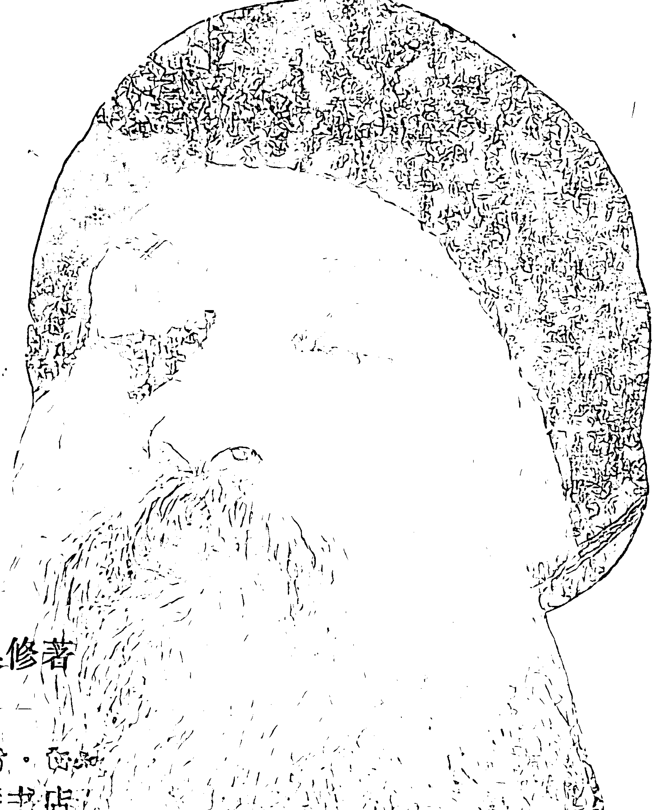

# 奥修：没有水没有月亮
# ——禅的故事

印度]奥修著

稀译——

# 原 序

> “……禅从不给予你任何承诺，它只是给予你此时此地。”

这本书是珍贵的，它是宝藏，它会成为你与开悟大师奥修间的一场对话，它会成为一个极其罕见的现象——一场聚会，一种与存在的分享。

奥修以他的慈悲，让禅所具有的全部美妙与神秘将其自身的精髓，显露无遗。在《没有水，没有月亮》中，你将会为那种荒诞与幽默，难以预料与大吃一惊而感到喜悦，贯穿全部的皆是禅的电击、禅的碰撞和快活的笑，而这些都来自令你自己对真正的你的一瞥的震颤中。奥修在这字里行间，倾注了他对生命、爱、死亡、静心和开悟的独到洞察与明智；在这面沉静的镜子前，你开始看见你自己。

这些基于十个关于禅的故事的讲演，将会成为你对自己生命深入理解的石阶，因为它们都是关于你，它们是讲给你听的，它们就是你！你就是那宝藏，隐藏在自己心里的宝藏。

> “静心(Meditation)正睁着眼睛，静心正是看。”

这本书是珍贵的，它是宝藏，它是存在给你的礼物，召唤着你回家。

# 1. 没有水，没有月亮

尼姑千代野学习了很多年，但仍没能开悟（enlightenment）。一天晚上，她正提着盛满水的旧木桶，当她正走着，她看着映照在水桶里的满月，突然，竹编的水桶箍断了，水桶散了架，水全跑了出来，水中之月消失了—— 而千代野开悟了。她写下了这段诗：

- 这样的方法和那样的方法,
- 我尽力将水桶保持完好，
- 期望脆弱的竹子永远不会断裂。
- 突然，桶底塌陷，
- 再没有水，
- 再没有水中的月亮——
- 在我手中是空。

开悟总是突然的，不会循序渐进地达到，因为所有循序渐进的事都属于头脑（the mind），而开悟并不是头脑的，所有的层次都属于头脑，而开悟是超越它的，因此你不可能逐步地开悟，你只有一下子跳进去，你不可能一步一步地上台阶，那儿没有台阶。开悟就像一个深渊，你或是跳或是不跳。 你不可能部分地开悟，零零碎碎地开悟，它是一个整体——

或者你是在它的里面，或者你是在它的外面，只是没有逐渐地进步。记住这最基本的事之一：开悟的发生不是零零碎碎的，是完全的，整体的，它是一个整体的发生，那便是头脑始终不能理解的缘由，头脑能理解任何可以被划分的事，头脑能理解任何通过一步步达到的事，因为头脑就是分析、划分、零碎，头脑能理解部分，整体总会逃开它。所以，如果你听任头脑的话，那么你将永远不能达成。

那就是所发生的：这个尼姑，千代野，学习了很多很多年，但什么也没有发生。头脑能够学习关于神、开悟、终极，它能够假装已经理解了所有的事。但神不是你所理解的某些东西，即使你知道关于神的一切，你也不认识他。认识不是关于(about)，每当你说“关于”时，那么你是处在外部，你可以一圈圈地绕圈子，但是你没有进入圈子。

当有人说：“我知道神(I know about God)。”其实他是在说他不知道任何事情，因为你怎样会知道任何有关神的事呢？神是中心，不是外围。你能知道事物，但你不能知道意识——因为事物是没有中心的，它只是外围，它没有自己，在里面没有一个中心，事物只是外在，你能够知道它。科学是知识，这“科学”一词的意思就是知识——外围的知识。知识是与中心的存在无关，当你以为中心是通过外围来达到的话，那么你错过了它。

你必须成为它，那是知道它的唯一方法。关于神我们无法知道，你必须成为神。在此只有存在才是真知。对终极而言，“有关”和“关于”意味着错过，再错过，你必须进入和成为它。

那就是为什么耶稣说：“上帝就像爱”——不是在爱，而只是像爱。你并不能够知道任何有关爱的事，或者你能吗？你能够学习再学习，你能成为一个伟大的学者，但是你并没有触及到，你并没有穿透到。只有当你成为一个爱人时，爱才能够被了解。不

## 没有水，没有月亮

心，所有的责任，你只是开始了一种将你自己内部与这个世界区别的方式：梦想，思想。

那些一直在研究睡眠科学的人，说睡眠是需要做梦的。因为在梦里你可以扔掉你的疯狂，整个晚上都是一种宣泄，那么在早晨你便能明智地行动，整个白天你便能以一种明智的方式行动，因为整个晚上都在以一种疯狂的方式行动。

科学家说，如果你好几天被剥夺了做梦和睡觉的权利，那么你会发疯，因为彼时彼地没有得到宣泄，疯狂将会暴发，你将会发作。你晚上做梦——那是一种宣泄，你白天思想——那也是一种宣泄，它会有助于你睡眠，它是一种毒品。你不必担心什么在发生，你只要将你自己关闭在你内部的思想中，你对它们非常熟悉，你会感觉十分安逸舒适，这是你自己的家，无论怎样脏和旧，但你已在里面生活了那样长的时间，以至于你已经习惯于它，你已经习惯于你的监狱。这对囚犯会是如此：如果他们被长期关在监狱中，他们会变得害怕出狱，他们会变得害怕自由，那是对自由的恐惧，因为它将带来新的责任。没有什么能与走出头脑相比——它是完全的自由。

印度教将它称之为“解放”(moksha)，完全的自由。没有什么可以与之相比，所有的监狱都被粉碎了。当你只是在无垠的天空下，恐惧抓住了你：你想回到你的家，安逸舒适的家，有着墙璧，有着篱笆，无限不在那儿，你便不会害怕。

无限看上去总是像死亡，你已经习惯了有限的、轮廓分明的界线，有明确的分别，那就是为什么你不能扔掉思想，你不能扔掉那个桶，甚至，你不断地使那个桶越来越大越来越大，它就像你的肚子一样：你装的思想越多，它也继续扩张。而如果你吃的太多，肚子或许会胀破，但是头脑不会。

一个普通的头脑能容纳世界上所有的图书馆，在你小小的脑袋里有一亿七千万个脑细胞，而每个细胞最起码能携带一百万种信息，计算机的发展也不能与你的头脑相比，在你的小脑袋里，能装下整个世界，并且它正在不断地膨胀。

千代野学习了再学习，她在旧桶里装了越来越多的水，她没能开悟，但一天晚上，她提着装满水的旧桶，当她正走着，她看见映照在桶里的满月，那满月是高挂在天堂上的，而在水中，在桶里，它是影子，她正在看着它。

那正是发生在每个人身上的，这不是一个故事，也不是一段趣闻轶事，它是一个事实——这就发生在你身上。你从未看到过满月，你不会看到，你看到的总是映照在你的水中即在你的思想中的月亮，那就是为什么印度教——实际上商羯罗——曾经说过：所有你知道的都是幻(maya)、幻象，它就好像你看到的水中之月，一个投影，不是真实的月亮，而你以为这就是月亮。

无论你看到什么，你都是通过反射看到的，你的眼睛反映，你的眼睛就像镜子，你的耳朵反映——所有你的感官都只是镜子，它们反映。而所有镜子中最伟大的就是你的头脑，它反映，它不仅反映，它还评论、注释，对映象它同时逐个地给予说明，它在歪曲。

你曾见过哈哈镜吗？不需要到任何地方去看，在你内部就有哈哈镜——它歪曲每件事，至今为止，无论你知道什么是月亮，那并不是天空中真实的月亮，因为在这装满水的旧桶里，你怎么能看见真实的月亮呢？你不断地去看那个投影，而投影是虚幻的，那就是幻的意思，幻象。你所知道的都是幻，它是表象，不是真实。真实的出现只有当桶破了的时候——水流了出来，投影消失时。

突然，竹编的水桶箍断了，水桶散了架。

这突然地发生，好像是一场意外事件，试着去了解这个现象：开悟总是好像意外事件，因为它无法预言，因为你无法把握，你不能安排，以至于它才发生；你不能引导它发生，如果你能引导它发生，那它便不会超越人的头脑，如果你能把握它，让它发生，那它将只是头脑的诡计，许多人努力地想把握它，他们做这做那，制造着原因让开悟发生，但它不是一件有原因的事；如果你能使它发生，那么它便没有你伟大；如果你能使它发生，那它是完全无用的。开悟的发生，它不能被引起，它不是你头脑的连续，它是一个不连续的深渊，突然地你不在那儿，而它却在那儿，你怎样能把握它呢？如果你能把握，那你将在那儿。

乔答摩·悉达多(Gautam Siddhartha)开悟，成为了佛陀时，那他还是与前一样的人吗？不！如果是与前一样的人开悟了……那是不可能的，连续被中断了，原来的那个人便消失了，这是一个全新的人：乔答摩·悉达多，一个离开了他的宫殿、他的妻子和孩子的君主已不在那儿了，那个自我不在那儿了，那个头脑也不在那儿了，原来的那个人死了——旧桶已被打破，现在这是全新的，旧的再也不存在了！那就是我们为什么要给他一个新的名字：我们称他为佛陀。我们抛弃了旧的名字，因为那旧的名字属于另外的性格，属于另外某个人，那旧的名字再也不属于这个人。

它是一个不连续的现象，它不是连续的，因为如果它是连续的，那么它最多只能修改过去，不可能完全是新的，因为过去将延续下去，在这儿或那儿变化一点，修改一些，涂点色彩，上点光亮，但旧的仍将继续，它或许会好些，只是它仍然保留住旧的。

开悟好像一个意外事件，但请不要误解我！因为当我说开悟就像一个意外事件时，我不是说不要对它做任何事！不是那个意思，如果你对它不做任何事，那么意外事件也不会发生，意外的发生是因为那些人为此已经做了很多了，它不发生是因为他们正在做，这便是问题，因为他们正在做它便不会发生，他们不做它将永远不会发生，那做不是使它发生的原因，那种做只是在他们内在制造出易致意外的情景，如此而已！

你所有的静心都将只是创造一种易致意外的情景——如此而已，那就是为什么即使是佛陀也不能预言你的开悟将会发生在什么时候。人们来访问我，并问我，我告诉他们：“快了。”它不意味着什么，“快了”或许是下一个时刻，“快了”或许是过了好几辈子还未到来，因为意外事件不可能被预言，如果它能被预言的话，那么它全然不是一个意外事件，而且它是一种继续。

但是不要停止努力！不要以为如果它要发生，它就会发生，那么它将不再发生，你必须为它作准备，为意外事件作准备，为未知作准备——准备、等待、迎接。此外，意外事件或许会来临或许会错过。你或许睡着了；未知或许会敲门，而你或许没有听见，或者你正在与某人谈话，或者你会解释成它是一阵风在敲门；或许你会想那么多的事情——每个人都是一个伟大的思想家。

为意外做好准备！并且记住：你所做的一切不是作为开悟的原因，你所做的一切只是在你内在创造一个情景，你所做的一切不是一个原因，只是一个邀请，这区别是很大的，因为如果你以为这是一个原因，那你会开始要求，如果你以为它是一个原因，于是你会说：“为什么它不发生？为什么到现在它还不在我身上发生？”它创造了一种内在的紧张，而紧张在那儿……于是它便不可能发生，你必须被无意地撞见，你应该等待着，但不要焦虑——放松，你应该邀请它，但不要肯定这个客人将会到来。

最终是由客人而定，而不是由你而定，但是，不邀请客人，他是不会来的，那是肯定的；有了你的邀请，也不能肯定他会来，但是没有你的邀请他肯定是不会来的，有了你的邀请他或许会来，有可能会来，所以等在门口，但不要焦虑，不要太肯定。

肯定是头脑的，等待是意识的，头脑是肤浅的，所有头脑的肯定都是肤浅的，它可能在任何时候出现，无论何时当你准备去看、去瞧时，你将会知道它一直在边上正在发生，你不是在看着它，你没有看到那个角落。

我曾听说：有一次，穆拉·那斯鲁汀（Mulla Nasruddin）正坐在椅子上休息，他的妻子正在看着街上，而他正注视着墙壁，他们背对背地坐着，就如通常夫妇们这样坐着。

突然，妻子说：“那斯鲁汀，快看！镇上最富的人死了，许多人正在为他送终。”

那斯鲁汀说：“真倒霉！我不再面向它！”

“真倒霉！我不再面向它。”他不去看—只要转过头……但这正是你的情况，真倒霉！你不去看那意外正在经过的地方，那个未知正在经过的地方。

所有的静心都将帮助你去面向那个未知，去面向那非习惯性的事情，去看那个陌生人，它们将使你更加打开，为意外更多地打开，但你不能引发它。

即使你准备好了，你也必须等待，你不能强迫它，你不能将它带给你，如果你能强迫它，于是宗教将只是像科学一样，那就是科学和宗教最基本的区别，科学能强迫事物，因为它能依据原因，不是依据邀请，科学能制造任何事情，因为它找到了原因，一旦原因被知道了，于是任何事情都能被把握。科学知道如果你将水加热到一百度，它会蒸发——那就是原因。你能肯定，一旦到了一百度，水便开始蒸发，你能将水加热迫使它蒸发，你能将氧和氢混合，迫使它们变成水，你知道原因，科学总是试图了解原因。

宗教是不一样的，根本不一样。宗教永远不能变成一种科学的观念。因为它是寻求无原因的（the uncaused），它是寻找那种不连续，它是寻找一个绝对的转化。一种相对的转化是有起因的，部分的转变是有起因的，但是，“绝对”呢？旧的没有了，一切都是新的！ ——于是必须有一个空隙，不能有连续，必须有一个跳跃！所以，突然旧事物从存在中消失，而新的事物进入了存在，而它们没有被连接——之间是空隙。乔答摩·悉达多就消失了，佛陀出现了——有一个空隙。

这个空隙必须要记住，那就是为什么我说开悟就好像一个意外事件，但你必须不断地为之努力。那是一种悖论，听我说，不要变得懒惰，听我说，只要不睡觉，听我说，不要开始思想并编造理由，“如果它是一个意外事件，我们不能引发它，那为什么要静心？那为什么要做这做那？只要等待好了！”不，你的等待必定不是一个懒惰的等待。

你的等待必须是积极的！你必须聚集你全部的能量去等待，你不应该像一个死人一样去等待，你应该以年轻的、新鲜的、活生生的状态激动地去等待，只有那时那个未知才会在你身上发生，当你处于生命的最佳状态，在最佳的接受状态时，当你最活跃时，当你处于顶峰时——只有那时它才发生，只有顶峰才会遇上那个伟大的峥嵘，唯有顶峰——相似才能遇见相同。

不断地尽你所能去努力，但不要因此提出任何要求，不要那样说：“我已经做了，现在它必须发生了。”对此没有必须，它是一个陌生人，你不断地对它发出请帖，但它没有地址，所以你不能将它们寄出，你不断地将你的邀请抛向风中，它们或许被收到，或许没有被收到，神总是“也许”，但正是当事情是也许时才是美丽的，当事情是肯定的，美丽便消失了。

你是否观察到在生活中唯有死亡是肯定的，而一切都是不肯定的？爱是否会发生，没有人知道，你是否会唱歌，没人知道。有一件事是肯定的：死亡。肯定属于死亡，

从来不属于生命。如果你是在追求生命的永恒的话，那么就生活在也许中，开放地生活，并且等待着，但要不断地记住，你不能使它发生，当它发生了，你就消失了。

那就这个美丽的发生的意蕴：突然，竹编的水桶箍断了……突然发生了，但她是正在做着，学习着，静心着，她是一个伟大的尼姑，她起码与师傅一起生活了三四十年，她做了最大的努力。

我必须告诉你们一些千代野的事，她曾经是一个非常美丽的女子——很罕见的美，独一无二。当她年轻的时候，甚至皇帝和君主们都追求她，她拒绝了，因为她想成为一个神的爱人，所以没人能达到她的期望，没人能满足她的期望。

她从一个寺院到另一个寺院去做桑雅士，成为一个尼姑，但即使是很好的师傅也拒绝她，因为她太美丽了，这便给她带来麻烦，那儿有那么多和尚，当然，和尚们是些压抑的人，而她是如此的美丽，以致他们会忘记神和一切。她实在太美丽了，以致每扇门都关上了。师傅说：“你求道是好的，但我必须也期望我的门徒也是如此，五百个门徒在这儿，他们会发疯的，他们会忘记静心、他们的经典、以及一切！你将变成神，所以千代野，不要打扰这些可怜的人，你走吧！”

所以千代野怎么办呢？找不到办法，她灼伤了她的脸，弄伤了她整个的脸，然后找到师傅，师傅甚至不能认出她是男人还是女人，于是她便被留下做了尼姑。

她就是做了这样多的准备，求道是真实的，意外事件是值得的，意外事件是应得的。她不断地学习，静心了三四十年，于是突然，一天晚上，那个陌生人来到了她的门口。

突然，那竹编的箍断了，水桶散了架，水跑了出来，映照的月亮也消失了——而千代野开悟了。

她正看着月亮——它是美丽的，即使是投影也是美丽的，因

## 没有水，没有月亮

的竹箍永远不会断裂，突然，桶底塌陷——这是我不曾做的事，这不是我正在做的。

突然，桶底塌陷，

这是一个意外事件。

再没有水，

再没有水中的月亮——

在我手中是空。

"而水没有了，桶也消失了，在我手中只有空！"

这就是一个佛陀，他是：空在手中。当你空在手中，你就拥有一切，因为空不是一件否定的事情，空是最肯定的事情，因为每件事都来自无(nothi ng)，这一切都出自空，空在手中意味着源在手中。

一粒种子是如此之小，而一棵大树却是由它而生，这棵树由哪儿来呢？看看种子，剖开它，努力去寻找。如果你剖开种子，那么你在那儿会发现空，从那个空产生了这棵大树，从那个空产生了这整个的宇宙——存在来于无。

空在我手中意味着一切在我手中，正是万物产生的源泉，也是回归、转向的地方，空在我手中意味着所有的一切在我手中，万物在我手中。

"而突然它发生了，我不能为此为自己庆贺；突然，它发生了！我却正做着相反的事。"

那就是为什么圣人们总是说——那些相信的人，或那些用神这个术语的人，他们说，都是通过神的恩赐发生的。千代野或佛教徒们并不相信任何神，他们不用那个标签，所以千代野不会说：“来自他的恩赐。”她不会说。埃克哈特会说：“来自他的恩赐——在我这边没有资格，我什么都没有为它做，我不曾引发它。”

米拉(Meera)会说：“克里希那的恩赐。”泰雷兹会说：“耶稣和他
的恩赐。”佛教徒不相信任何人格化的神，他们的看法是完全超越人格化的标签的，他们不是人类中心论的。所以千代野不会说：“恩赐。”她只是说：“突然，它发生了。”但意思是同样的：“突然，它发生了，我倒是正在做相反的事。”

"一切消失：水跑了出来，月亮消失——空在我手中。"

而这就是开悟：当空是在你手中，当一切是空，当那儿没有身体，甚至没有你——因为如果你在那儿，水桶就在那儿，旧的水桶就在那儿，如果你不在那儿，房间纯粹是空的，你的存在一点也没有被充满，你已经成了源泉，你已经得到了你本来的面孔。

这是最大的喜悦的时刻，而这时刻是永恒的，是没有尽头的，这时刻变成了永恒，于是你不再是其他的什么东西，因为你不再存在，谁会悲哀？谁会伤心？谁会失望？谁能渴望或感觉挫折？空不会挫折，空没有渴望，空不期望任何东西，所以这是全然的喜悦，纯粹的喜悦。

如果你在，你将会痛苦；如果你不在，不会有任何痛苦，所以整个问题是：在或不在？

而千代野突然发现她不在：空在手中。

# 2. 为住宿而进行的对话交易

在一些日本的禅院中，有一个旧的传统：那就是一个流浪的和尚与一个当地的和尚要辩论有关佛教的问题，如果他赢了，那么他就能住下过夜，如果输了，他就不得不继续流浪。

在日本的北方，有兄弟俩掌管着这样的一座寺院。哥哥非常有学问，而弟弟比较笨，并且只有一只眼睛。

一天晚上，一个流浪的和尚来请求住宿，哥哥学习了很久，感到非常累，所以他吩咐他的弟弟去辩论，哥哥说：“要在沉默中进行对话。”

过了一小会儿，那个流浪者来见哥哥，并且说：“你弟弟真是个厉害的家伙，他非常机智地赢了这场辩论，所以我要走了，晚安。”

“在你走之前，”哥哥说，“请告诉我这场对话。”

“好，”流浪者说，“首先我伸出一个手指代表佛陀，接着，你的弟弟伸出两个手指，表示佛陀和他的教导；为此我伸出三个手指，代表佛陀、他的教导和他的门徒，接着，你聪明的弟弟在我面前挥动着他紧握的拳头，表示那三个都是来自一个整体的领悟。”随后，流浪者走了。

过了一会儿，弟弟带着一付痛苦的样子跑进来。

“我知道你赢了那场辩论。”哥哥说。

“没什么嬴的，”弟弟说，“那个流浪者是个非常粗鲁无礼的人。”

“噢?”哥哥说，“告诉我那场辩论的主题。”

“嗨，”弟弟说，“当他看见我时，他伸出一个手指头侮辱我只有一只眼睛，但因为他是一个新来的人，我想还是礼貌些，所以我伸出两个手指，祝贺他有两只眼睛。这时，这个无礼的坏蛋伸出了三个手指，表示在我们中间只有三只眼睛，所以我气疯了，威胁地用拳头打了他的鼻子——所以他走了。”

哥哥笑了。

所有的辩论都是没有用的和愚蠢的。辩论原本是很傻的，因为没有人能够通过讨论、通过辩论达到真理，你或许可以得到一个晚上的住宿，但是仅此而已。

传统是美丽的，好几个世纪以来，在日本的任何禅院，如果你请求在某个禅院住宿，你必须辩论，如果你赢得辩论，那么当晚就能住下——这正是一种象征——但只是为了一个晚上，到了早上你就不得不离开。这种通过辩论、逻辑、推理的表述，你从来不可能达到目的，只能得到一个晚上的住宿。你不要自我欺骗，所谓晚上的住宿就是目的，你不得不流浪，你不得不在早上再次开步。

但是很多人总是自我欺骗，他们以为无论如何通过逻辑就能达到目的。晚上的住宿已经变成了终极目的，他们不再离开，很多个早晨已经过去。逻辑能够得出假定的结论，但是从来没有达到真理，逻辑能够引导某些事接近真理，但是从来没有达到真理。

要记住，接近真理的东西也是一种谎言，因为它意味着什么呢？要么是真的，要么不是真的，没有处在两者之间的。要么是真的，要么不是真的，你不可能说这是半个真理，没有事情会像那样——就像不可能有半个圆一样，因为那个“圆”意味着整体，半个圆并不存在。如果它是半个，那么它就不是圆。

不存在半个真理，真理是整体的，你不可能零碎地把握它，你不可能部分地把握它：近似真理是一种欺骗，但是逻辑只能引向这种欺骗。你或许在晚上有了住宿，只是睡觉、放松，但并不能使这住所变成你的家，到了早上你不得不再次流浪，行程并不能在那里结束，每天早上它又将一次又一次地开始。通过逻辑，通过推理而放松，但是这不可能保持住，不可能变成静止的——一直要记住，你必须流浪。

传统是优美的，所以对传统和它的意义首先要了解：它是象征。其次：所有的讨论都是愚蠢的，因为，通过讨论的气氛，你从来不可能了解别人，无论他说什么都是误解。头脑专注于获胜、征服，不可能去了解，这是不可能的，因为了解需要一个没有暴力的头脑，当你正注重着怎样获胜时，你是暴力的。

辩论是一种暴力，你能通过辩论来扼杀，你不可能通过辩论去再生，你不可能通过辩论给予生命，你能通过辩论来谋杀，真理能通过辩论被谋杀掉，但是它们无法复活。这是暴力，这种姿态就是暴力。你并不是真正地在寻求真理，你是在寻求胜利。当胜利是目的时，真理将会牺牲；当真理是目的时，你也可能牺牲胜利。

而真理应该是目的，不是胜利，因为当胜利是目的时，你是一个政客，不是一个有宗教性的人，你是好攻击的，你正在努力设法胜过别人，你正在尽力设法控制别人，成为统治者，而真理从来不可能是一种独裁，它从来不可能摧毁别人。

真理从不可能意味着你胜过别人就是一种胜利：真理带着谦虚、谦恭，它不是一种自我的幻觉——但所有的辩论都是自我
的幻觉，所以辩论从来不可能引导到真实，它总是引导到不真实的、非真理的，因为追求胜利本来就是一种愚蠢的现象，是真理获胜，不是“你”，不是“我”。在辩论中或者你�，或者我�，真理从来不会�。

真正的寻道者将会让真理�。辩论者正是要求胜利应该属于我，它不应该属于别人。在真理中并没有别人，在真理中，我们相遇并成为一体，所以谁能是赢家，谁能是输家呢？在真理中，没有人被击败；在真理中，真理获胜而我们都失败了。但是在辩论中，我是我，你是你，事实上，就没有桥了。

当你反对别人时，你怎样能理解他呢？理解是不可能的，理解需要同情，理解需要参与，理解意味着全然地倾听别人，只有那时理解才会开花。但是如果你在讨论中，在辩论、在争论、在推理。你并不是在倾听别人，你只是假装你在听，在深处，你正在作着准备，在深处，你已经走到了下一步：当别人停下时，你就要说什么，你已在准备着怎样驳斥他，你已经不去倾听他，而是正试图怎样驳斥他！

事实上，在讨论中，在辩论中，真理并不重要，所以辩论从来不是一种交流，不可能通过辩论来共享，你能争论，你越争论……你就越一边倒，你越争论，间隙也就越大，它变成了一个深渊，那不可能是相聚之地。那就是为什么哲学家们从来不会聚合，有学问的人从来不会聚合：他们是伟大的辩论者，有一个深渊存在着，他们不可能与别人聚合，不可能。

唯有爱人能够相聚，但爱人不会辩论，他们能够交流。那就是为什么在东方如此强调雪然达(Shraddha)——信任、信心。如果你与你的师傅争论，间隙较大，那最好是离开，让这个师傅作为晚上的住宿，只要走开。和他在一起并不会有任何出路，而那个间隙将会扩大。如果你是好辩论的，那个间隙也不可能变成
一座桥,不可能。信任意味着同情,信任意味着你不在争论,你来是为了倾听,不是为了争论,你已经去了解,不去辩论,你并不要获胜,反而,你准备失败。

一个真正的门徒总是在寻求被师傅击败,当他完全被摧毁、完全被击败时,那是门徒生命中最伟大的时刻,并非是师傅要�,而是他准备被打败,门徒准备被打败。而当门徒不再在那儿时,完全被打败时,消失时,只有那时间隙才是一座桥,深渊便消失,而师傅便能穿透你。

所以,这便发生了:耶稣漫游了所有他的国家,但所有他能聚集的门徒只是些单纯的人,没有一个受过教育的,没有一个学者。并非那儿没有学者,在那时,那儿有伟大的学者,犹太人正是处在他们荣耀的顶峰,那便是为什么他们能产生如此一个像太阳一般的耶稣。耶稣是顶峰.耶稣能产生,表示着犹太人触及了他们的顶点,他们再也没有到达这样的顶点。那儿有伟大的学者,安排了伟大的辩论。犹太人的会堂是学习的场所,一所真正的大学,人们从国内各个地方前来讨论、来辩论、来争论、来寻找;但这是一场辩论,没有一个学者跟随耶稣。

事实上,所有学者都一致赞同这个人应该被消灭,所有的学者、有学问的人都准备杀死这个人! 为什么? 因为这个人反对辩论,他正在抽掉他们的基础,整个的结构就将垮掉,这个人正在主张反对理性,他正在讲信任,他正在讲爱,他在讲怎样在两颗心之间创造一座桥。

辩论是两个头脑,两个脑袋之间的;爱、交流、信任是两颗心之间的,他开启了一条新的航程——友情的、门徒之情的、成长的;他是在完全不同的层面上思想,品质是不同的,他是在说：“将你的经典扔一边去! 不需要你的圣经,因为它们只是些文字。”学者,有学问的人对此无法忍受,耶稣被钉在十字架上处
死。

他只能找到单纯的人: 渔夫、伐木工人、鞋匠——单纯的人，他的所有的门徒，除了犹大，都没有受过教育，只有犹大真正是有文化的优雅绅士，而他却为了三十卢比出卖了耶稣，这个有文化的、优雅的犹大背叛了。而耶稣知道这事，如果有人出卖他，这人就是犹大。为什么？因为心只能被脑袋出卖，爱也只有被逻辑背叛，再也没别的能出卖。

所以在进入这故事之前，要记住第二件事：通过逻辑、通过脑袋、好争论，你会变得与其他人格格不入、陌生，其中的那座桥消失了。当你不能理解别人时，当你甚至不能够倾听他时，当你的头脑不断地在里面争论着，斗争着，你怎样能达到真理？你是暴力的和进攻性的，这种进攻将是无益的。

所有的争论都是徒劳的，它们从不会有任何出路，即使你感到那个结论已经得出，那结论也是勉强的。它并不是通过讨论得出的。你能使别人哑口无言，但别人从不因此而信服：从不！如果你使用一些逻辑的计谋，你能使别人哑口无言，他或许无法回答你，你知道的比他知道的多，你知道的计谋比他知道的多，你能通过语言和推理将他逼到角落里，而他却无法回答。但这并不是说服他的方法，他在内心深处知道：“将来有一天，我会找到更多的计谋，使你回到你原来的位置。现在我无法回答，好，我接受失败。”他被打败了，但这并不是赢。

这是两件不同的事：当你赢得一颗心时，他并没有被打败——他是高兴的，他是在你的胜利中感受胜利，他在共享，这不是你的胜利——是真理获胜，而你们俩都会庆祝。但是当你击败一个人，他一直没有赢过，他继续是敌人，在内心深处他在继续等待着他能维护自己的那一刻。

辩论不会变成一种确信，如果不能达到确信，那结论又在哪
儿呢?结论是勉强的,它总是早熟的,它就像流产,它不是自然出生,你已经在强迫— 一个死了的孩子出生或者一个残废的孩子出牛,整个生命中他将继续是残废的、虚弱的和死的。

苏格拉底常常说:‘我是一个助产 1 ,我帮助人自然出生。’ 一位大师就是 名助产士,他不足去强迫,因为强迫的出生不可能是真正的出生,它更像死亡而很少像生命。

所以 个师傅从不好争论,如果他有时表现出好争论的,那他只是在与你做着游戏——玩着某种推理的游戏,不要成为一个受骗者,他正在用-一种理由在与你坑。他之所以好争论,只是要发现你的好争论性是否会被引发。如果被引发出来了,那你已经错过。如果你能倾听他的争论,而没有变得好争论,他不会再与你玩这种游戏。他必须看着内在的你,你或许会有意识地听,无意识地好争论,那么他必须将你的无意识引发出来,好让你能对此变得觉知。

有时看起来 -位师傅是好进攻的,他要坚决打败你,但他从来不是要坚决打败你 — 只是要打败你的自我,不是你;只是要摧毁你的自我,不是你。要记住:自我占毒索,它正在摧毁你;一旦毒素被摧毁,你将会首次获得自由和生命活力,你将第一次感到阳光明媚。他摧毁着疾病,不是你。

有时他或许是好争论的。曾经有些师傅们非常好辩论,要打败他们是不可能的,要与他们玩这种文字游戏是不可能的,但他们只是帮助你的意识提升,好让你知边对你的信任是否真实。

这是已发生的:一个苏非庄内德(Junnaid)与他的师傅一起生活,而师傅是如此地好争论,无论你说什么他将立即否定。如果你说:‘这是白天。’他将说:‘这是晚上。’—— 而这不是事实,这是白天。

无论庄内德说什么,他总是发现师傅要反对,而他只是低下
头鞠躬，并说：‘是的，师傅，这是晚上。’’

一天，师傅说：‘庄内德，你已经疯了，我无法在你的内在制造好争论之心，而我是如此明显地在作假，任何人都无可争辩地说：‘真蠢！这是白天，这无须争辩，这是如此明显’。而你却依然说：‘是的，师傅，这是晚上。’你的信任是深入的。现在我不再与你争论，现在我能讲真理了，因为你准备好了。’

当心全然地说：‘是！’那时你准备好了去听，而只有那时真理才能为你揭示出来，甚至如果还有一丝‘不’剩留在你的内在，那么，对你，真理还是没有被揭示，因为那个‘不’，无论怎样小，都是有力的，非常有力的。那时真理即使被说出来，但是，对你，真理还是没有被揭示，这个‘不’将再次把它隐藏起来。

那就是为什么我说所有的辩论是徒劳的，那就是为什么我不断地一次次重复着，哲学的全部努力是徒劳的，它没有得出任何结论——它不可能得出。

我要告诉你一个故事，然后我会进入这个禅的故事。

它曾经发生过：一个非常伟大的皇帝的伟大的大臣死了，这个大臣是很少有的，非常聪明，几乎很智慧，非常狡猾与精明，是一个杰出的外交家，而要找一个替代者是非常困难的，整个王国都在找，所有的大臣都被派去寻找，起码要找三个人，最后在他们中选择一个。

寻找了好几个月，寻遍了整个王国，每个隐蔽处，每个角落都找遍了，于是找到了三个人。一个是伟大的科学家、伟大的数学家，他能解决所有的数学问题。数学是真正的唯一确定的科学——所有的科学都是它的分支——所以他是在根部。

另外一个是伟大的哲学家，他是一个伟大的系统制造者：他能无中生有，只是从文字中，他就能创造出如此美丽的系统——
这是一个奇迹，只有哲学家们能做到。他们手中是空的，他们是最伟大的魔术师，他们能创造神，他们创造创造的理论，他们能创造一切，而他们手中却是空的，但他们是聪明的文字工人，他们就这样把文字拼凑起来，给你一种实体的感觉——而什么也没有！

第三个人是宗教的人，一个信任、祈祷、奉献的人。找到这三个人的那些人们一定是非常聪明的，因为他们找到了三个方面。

这三个人代表了意识的三个层面，这些是唯一的可能：一个科学的人、一个哲学的人和一个宗教的人——这些是基础。一个科学的人关心的是实验：除非通过实验被证实以外，否则它不能被证实，他是经验的、实验的，他的真理是实验的真理。

一个哲学的人是一个逻辑的人，不是实验的人，实验不是主题，只要通过逻辑，他可以证明或不可以证明，他是一个单纯的人，比科学家更单纯，因为科学家必须做实验，于是要有实验室。一个哲学的人工作起来不用实验室——只是在他的头脑中，用逻辑，用数学，他的整个实验是在他的头脑中，他只要通过逻辑的辩论来证明或无法证明，他能解答任何谜，或者他也能制造任何类型的谜。

而第三个人是宗教层面上的人，这个人并不将生命看作是一个问题，生命对一个宗教的人来讲不是一个问题，不要去解决它，只要去活过它。

宗教的人是经验者，科学家是实验者，哲学家是思想者。宗教的人是经验者，他将生命看作是要去活过的，如果有什么答案，就通过经验、通过生活来获得。不能事先通过逻辑来决定，因为生命大于逻辑，逻辑只是浩瀚的生命海洋中的一朵浪花，因此它不可能解释一切。只有当你分离时，才能够做实验，只可能在客体上做实验。

生命不是客体，它是王体的核心。当你做实验时，你是不同的；当你生活时，你是整体。所以

## 没有水，没有月亮

他们进入了一间房间，他上了一把锁，一个数学谜，有许多数字在这把锁上，但没有钥匙，那些数字是用了一种特定的方式组合在锁中的，秘密就在那儿，但必须由人来探寻它并且找到它，如果那些数字能用一种特定的方式排列出，门便会打开。国王进去，对他们说：“这是一个数学之谜，是一个至今人们所知道的最大的谜。现在你们必须去寻找线索，钥匙是没有的，如果你们能找到线索，回答出这个数学问题，锁就会打开。第一个从这间房间出来的人将会被入选。你们现在开始。”他关上了门，走了出去。

那个科学家立刻在纸上开始工作：很多实验，很多事情，很多问题。他看着，观察着锁上的数字，没有时间可以浪费，这是一个生死攸关的问题。那个哲学家也闭上了他的眼睛，开始用数学的方式来思考，这个谜怎样才能被解开，这个谜完全是新的。

那就是问题：用头脑的话，如果某些事情是陈旧的，答案就能被找到；但如果某些事情完全是新的，那你怎能通过头脑找到它呢？对于陈旧的、已知的、常规的事，头脑是十分有效的，而当面对未知时，头脑是完全没用的。

宗教的人从不去看锁，因为他能做什么呢？他一点也不懂数学，他也不知道什么科学实验，他能做什么呢？他只是坐在角落里，他唱了会儿歌，向神祈祷，闭上了眼睛。那两个人以为，他一点也不是竞争对手：“这倒是挺好的，因为事情不得不在我们俩中间决定。”然而，突然间，他们意识到他已经离开了这间房间，他不在了。门开着！

国王跑进来，他说：“你们现在正在干什么？已经结束了！第三个人已经出来了！”。

但是他们问：“怎么出来的？因为他从来没做任何事。”

所以他们问那个宗教的人。

## 为住宿而进行的对话交易

他说：“我只是在坐着，我祈祷，而我只是坐着，在我内在有一个声音说：‘你真笨！只要过去，看看，门没有上锁。’于是我便可走到门那边，它没有被锁住，没有什么问题要解决的，所以我就走出来了。”

生命不是一个问题，如果你想要去解决它，你将会错过它，门是开的，它从没有被锁上。如果门是被锁上的，那么科学家会找到解决的办法；如果门是被锁着的，那么哲学家可能找到一个怎样打开它的系统。但是门不是锁着的，所以只有信任能往前进——不用任何解决的方法，不用任何预先制定的答案，推开门，走出去。

生命不是一个要被解开的谜，它是要去活过的奥秘，它是一个很深的奥秘，信任它并让你自己进入它。辩论不可能有任何帮助——与其他的人或者与你头脑中的自己——不争辩，所有的辩论都是没用的和愚蠢的。

现在我们来进入这个美丽的故事：

在一些日本的禅院中，有一个古老的传统，那就是一个流浪的和尚与一个当地的和尚辩论有关佛教的问题，如果他获胜，那么他就能住下之夜，如果输了，他就不得不继续流浪。

辩论能给你的就这么多——一个晚上的住宿，但仅此而已。

在日本的北方，有兄弟俩掌管着这样的一座寺院。哥哥非常有学问，而弟弟比较笨，而且他只有一只眼睛。

掌管一座寺院需要两种类型的人：一个有学问的人和一个非常笨的人，而这就是所有的寺院是怎样被管理的——两种类型的人：已经成为僧侣的有学问的人，以及跟从他们的愚蠢的人，这就是每座寺院的管理。

所以这些故事并不只是故事，它们在叙述某种事实。如果愚蠢的人从地球上消失，那将没有寺院；如果有学问的人从寺院中消失，那也将没有寺院。寺院的存在是需要这两重性的。那就是为什么你无法在寺院中找到神，因为你不可能在这两重性中找到他。

这些寺院是聪明的人发明用来剥削愚蠢的人的，所有的寺院是发明……聪明人在剥削——他们已经成了僧侣。僧侣是最聪明的人，他们是最伟大的剥削者，他们用你甚至无法背叛他们的方法来剥削，他们是为了对你自己有好处而剥削你，他们剥削你是为了对你好。僧侣是极其聪明的，因为他们从空无中编制了理论：所有的神学，所有他们创造的——真了不起！

创造宗教理论需要聪明，他们不断地创造了如此大的建筑，普通人几乎是不可能进入这些建筑的，他们用这样的行话，他们用这样的技术项目，而你无法理解他们正在说什么。而当你无法理解时，你就认为它们是非常深奥的。无论何时当你无法理解一件事情时，你就认为这是非常深奥的——“它超过我。”记住这点：佛陀是用一种任何人都能理解的，很普通的语言来说话的，不是僧侣的语言。耶稣是用一种小小的比喻来讲的– 任何没有受过教育的人都能懂的 他从来不用任何宗教的术语；马哈维亚讲话时，给予他的教导时，用极其普通和一般的语言。

马哈维亚和佛陀从来不用梵语，从不！因为梵语是僧侣的语言，是婆罗门的语言，梵语是最难的语言，僧侣把它做得如此困难，他们修饰了再修饰，再修饰，梵语正是这个意思，修饰，精炼，他们已经将它精炼到这样的程度，就是只有你非常非常地有学问，你才能懂得他们在说些什么，否则，它是超过你的。

佛陀用人们的语言：巴利（Pali），巴利是人们的语言，是村民们的语言。马哈维亚用的是普来克丽特（Prakrit），普来克丽特是没有经过精炼的梵语形式，普来克丽特是梵语的自然形式——没有语法，不很多，宁者还没有进入，他还没有去精炼这些词，让它们变得不可企及。但是僧侣们已经在用梵语，他们一直在用，现在没有人懂得梵语，但是他们继续在用梵语，因为他们整个的职业依赖于制造一个间隔，不是一座桥——在制造一个间隔。如果普通人不能理解，只有那时他们才能存在；如果普通人理解他们所说的，他们便会失落，因为他们没有在说什么。

一次，穆拉·那斯鲁汀去看医生——而医生已从僧侣那里学会了诡计，他们用拉丁文和希腊文书写，他们用这样的方法写，即使他们自己也必须再看一遍，这很难。不让人理解他们在写些什么，穆拉·那斯鲁汀去看医生，他说：“听着，简单点，只要告诉我真相，不要用拉丁文和希腊文”。

医生说：“如果你坚持的话，如果你允许我坦率的话，那么你一点儿也没有病，你只是懒惰。”

那斯鲁汀说：“好，谢谢你，现在你用希腊文和拉丁文写下来，好让我能给我家里人看！”

聪明人总是在剥削着普通人，那就是为什么佛陀、耶稣和马哈维亚从不受婆罗门、学者们、聪明的人们的尊敬，因为，这些是毁灭性的，他们正在摧毁他们的整个的生意。如果人们懂得的话，僧侣是不需要的。为什么呢？因为僧侣是一个中间者，他懂神的语言，他懂你的语言，他将你的语言翻译成神的语言，那就是为什么他们说梵语是迪波莎(Dev－bhasa)，神的语言：“你不懂梵语？——我懂，所以我变成了中间的连线，我成了翻译者，你告诉我你想什么，我用梵语将它告诉神，因为他只懂得梵语。”当然你不得不为此付帐。

寺院需要两种类型的人。

有这样一座寺院……由兄弟俩掌管，哥哥非常有学问，而弟弟比较笨，而且只有一只眼睛。

在这个故事中，一只眼睛象征的是什么呢？ 个愚笨的人总是集中的：他从来不犹豫，他总是肯定的；而一个有学问的人总是两面的：他犹豫，他不断地将自己一分为二，他总是在内部争论，在内部不断地对话，他知道这两面。

一个有学问的人是两重性的——两只眼睛；一个愚蠢的人是一只眼睛的——他总是肯定的，他没有争论，他不是分裂的。那就是为什么，如果你去看一下一个愚蠢的人，他看上去比一个有学问的人更像一个圣人；如果你去看一下圣人，他有某些方面与他很相似——愚蠢的，傻傻的。品质是不同的，但某些方面是同样的，标签不一样。傻瓜只是在第一个阶梯，而圣人是在最后的阶梯，但两者都是在顶端。傻瓜不知道，那就是为什么他是单纯的，一只眼睛的；圣人知道，那也就是为什么他是单纯的，他也是一只眼睛，他称它为第三眼。两只眼睛已经消失变成了第三只眼睛，他也是一只眼睛——一体！他是一个整体，而傻瓜也是一个整体，但是有什么区别呢？

无知也有它自身的天真，就像智慧有它自身的天真一样。有学问的人只是处在中间，这就是有学问的人的分裂点：他是无知的而以为他是智慧的，他既不在这个层面上也不在那个层面上，他悬在两者中间，那就是为什么他始终处于紧张状态。一个无知的人是放松的，一个智慧的人是放松的，无知的人还没有开始他的旅程，他还在家里；智慧的人已经到达终点，他也是在家里。有学问的人是在两者之间，要在某个寺院里寻找住宿——甚至只是为了一个晚上也好——他正在流浪。

佛教的和尚们曾经是流浪者，而佛陀曾经说：“做一个流浪者除非你到达了，做一个流浪者！不仅是内在，而且外在也是，做一个流浪者——除非你已经到达，不要在到达前停步！”当你已经到达时，当你已经成为一个悉达(Siddha)，一个佛陀时，那时你可以坐下。

无知和智慧有一个品质是相类似的：那就是天真，都不是狡猾的。所以有时它就会发生，一个具有神性的人被当作傻瓜，一个傻瓜——神的傻瓜。圣弗朗西斯(St. Francis)被当作是神的傻瓜，他正是！但是做一个神的傻瓜可能是最伟大的智慧，因为自我失落了。你没有说你知道，所以你是一个傻瓜，因为你不会自称有知识，如果你不说，谁会接受你是一个知者？甚至你声称，也没有人接受。你必须用锤子敲别人的脑袋，你必须去争论使他们为此沉默！当他们无法说什么时，那时出于嫉妒之心，他们接受“也许”，也许你是。但是他们总是会说：“也许”，他们会一直保持那种可能性，直到某一天他们能否认它。

如果你不声称，谁会接受你呢？而如果你自己说：“我是无知的，我什么也不知道。”谁会认为你是一个知者呢？如果你说：“我不知道。”人们会很快地接受，他们会立刻接受，他们会说：“我们以前就知道，我们承认，我们完全赞同你所说的，你是不知道的。”

神的傻瓜！如果你读陀思妥耶夫斯基的……最伟大的小说之一，你才会感觉到这个神的傻瓜的意思。陀思妥耶夫斯基在他的许多小说中，总是有一个人物是神的傻瓜，在《卡拉马佐夫兄弟》中，他就在其中，他是天真的，你能利用他，甚至如果你利用他，他会信任你，你能毁了他，但是你却无法毁掉他的信任——那正是美丽所在。

你会怎么样？如果一个人欺骗了你，整个人类都变成了骗子；如果一个人欺骗了你，你就失去了对人的信任——不是这个人，是整个人类；如果两三个人欺骗了你，你便会断定没人值得相信，所有的信任都失去了。

似乎从开始你就不想相信——只是这么两三个人给你借口。否则你会说：“这个人是不值得信任的……但整个人类呢？——我不知道，所以我必须信任，除非相反的被证实。”

而如果你是一个真正有信任心的人，你会说：“这一刻这个人是完全不值得信任，这个人是不值得信任……但是谁知道下一刻呢？因为圣人会变成罪人，罪人会成为圣人。”

生命是运动的，没有什么是静止的。在这一刻人是软弱的，但下一刻他或许会有把握，他将不再欺骗，所以第二天如果他来的话，你会再次相信他，因为这天是不一样的，这个人也是不一样的。恒河奔流不息，它不是同样的一条河。”

曾经有这样的事发生：一个人来找穆拉·那斯鲁汀，想要借些钱。那斯鲁汀知道这个人，非常清楚这笔钱将不会再归还，但他想这是笔很小的钱，“给他吧，即使他不还也没有什么损失，为这样的数目，为什么说不呢？”所以他给了他钱。”

二天以后，那个人还了钱，那斯鲁汀很惊讶，这好像是不可能的，这个人还了钱，这真是奇迹。过了两三天，这个人又来了，要借一笔大数目的钱，那斯鲁汀说：“老兄！上次你欺骗了我.”他说：“上次你欺骗了我！-- 现在我不再借给你了。”

这个人说：“你说什么啊？上次我把钱还给你了。”

他说：“对，你是还了，但是你骗人——因为我从来不相信这事，你会还钱。但这一次.不！够啦，够啦！上次你的行为与我的期望正相反，但是够啦，现在我不打算把钱借给你。”

这就是狡猾的头脑怎样工作的。”

在这个寺院中，有--个足无知的——单纯的、只有一只眼睛、确信无疑的人；一个是有学问的人，有学问的人总是感觉到很累，因为他为空无工作得如此辛苦，无事也是如此忙忙碌碌，他总是很累。”

一天晚上，一个流浪力和的未请求住宿，哥哥已经学习了好几个小时，已经非常累了；……

去，看看！到卡虚(Kashi)的学者们那里看看！总是累，总是累，如此辛苦地用文字工作着。记亻，即使是 -个劳力者也不会如此累，因为他生活即是工作。当你只用文字，无用的文字，只用头脑工作时，你会很累。生活使人精神倍增！生活使人恢复青春！如果你去花园里劳动，你出汗.但是你会获得更多的能量。你并不失去什么：你去散步，你会获得更多的能量，因为你正活在这一刻中。在你的书房里和在文字中你只是在关闭你自己，你不断地在用文字思考，思考，再思考 这是如此死气沉沉的过程，你会累。一个有学问的人总是会累。 - 个傻瓜总是新鲜的，一个圣人也总是新鲜的，他们有许多质的相似。

……所以，他吩咐他的弟弟去辩论。“要在沉默中进行对话.”哥哥说——因为他知道，这个弟弟是愚蠢的，所以，如果你是愚蠢的，那么沉默是金；如果你是圣人，那么沉默也是金。如果你知道，你会保持沉默；如果你不知道，最好也保持沉默。

一个智慧的人是沉默的，因为他知道，并且他所知道的都无法被说出来。一个愚蠢的人不得不沉默，因为无论他说什么都会被人抓到辫子。一个傻瓜能够骗人，如果他保持沉默，但如果他开口，他便不能骗人，因为无论他说什么都会带着他的愚蠢。这个有学问的哥哥非常知道这个弟弟不是 -个书生，是一个单纯的人，天真的，无知的，所以他说：“要在沉默中进行对话。”

过了一小会儿.那个流浪者夹见哥哥，并且说：“你弟弟真是个厉害的家伙。”

这个人一定也是一个有学问的人，而如果一个傻瓜保持沉默，他能打败一个有学问的人，如果你开口，就要被人抓辫子，因为那时你进入了有学问的人的世界，用文字，你无法赢。

这个人也是一个有学问的人， -个读书人，要他保持沉默并
以此辩论会非常困难。怎样辩论？如果不允许说话……只是用手势，整个事情变得沉默，你所有的聪明失去了，因为如果不允许你说话……那是你唯一的实力，所以如果一个有学问的人是保持沉默的，那么他也能被一个傻瓜击败，因为他的全部的实力失去了，这个实力属于文字上的。

在沉默中，他是一个傻瓜——这就是意思所在。那就是为什么学者们从来不会沉默，他们总是喋喋不休。如果没有人，他们就与他们自己喋喋不休，但是他们就是喋喋不休，他们无休止地说话，说话，再说话，在内在和外在，因为通过这种说话，他们的实力越来越强，他们变得越来越熟练。但是，如果他们一旦遭遇沉默，突然，他们的所有的艺术便消失了，他们比一个愚蠢的人更愚蠢，甚至一个笨蛋也能打败他们。他们脱离了他们的职业环境，他们被搁在一边，他肯定是在一个非常困难的境地中。

他说：“你弟弟真是个厉害的家伙，他非常机智地赢了这场辩论，所以我必须走了，晚安。”

如果你遇到了一个有学问的人，那就保持沉默，对他做手势，你会打败他，因为他对手势一无所知，他对沉默也一无所知。事实上，对他来讲，不用语言文字是非常困难的，他会立即以为他已经被打败了——他必须离开，去找另外一个寺院，不至于太晚，并去找一个能用语言文字的、用头脑的家伙辩论。

手势是活的。当你摆动你的手时，你的整个存在在摆动它；当你用眼睛看时，你的整个存在在倾注于它；当你走路时，你是整个人在走，你的腿不能独自走，但是你的头脑能独自不停地编织着，编织着，脑袋能自主的，身体的其他部分无法变得自主。所以，如果你想要研究一个人，不要听他说什么，而要看他怎样行动，他怎样走进房间，怎样坐的，怎样走的，怎样看的，看看他的姿势，它们会显示其真实面目。

文字是欺骗者，我们所说的并不是在表露，而是在隐藏，所以保持沉默，看着一个人.他怎样站，他怎样坐，他怎样看，他正在摆出什么样的姿势。身体的语言比你脑袋的语言更真实。身体的语言是非常非常自然的，它正是来自本源，所以要通过它来骗人是非常困难的。你或许是说某件事情，而你的脸正在表明着别的事情。你或许在说：“我是对的。”但是你的眼睛，你的神态，你站的姿势，在表示你知道你是错的。你或许通过语言在显示你很自信，但是你的整个身体却在发抖，显示出你不自信。

当一个贼走进时，他是用不同的方式进入的；当一个说谎者出现时，他是用不同的方式出现的；当一个诚实的人走路时，他的走是不一样的，他没有什么要隐藏，他没有什么要骗人，他是真实的，他的走是天真的。正是在你不得不隐秘地做事时，那时看看你自己——你会说一切都不一样了，甚至在你走路时，也在隐藏些什么，你的胃在抽筋，你在警觉，你的眼睛在四处张望：是不是有人正在看着我，我会不会被抓住？你的眼睛是狡猾的，它们不再是天真之池。看看你的身体的动作，它们给了你一幅你自己的更真实的图画，不要去听从语言。

这是我必须一直在做的。人们用了各种各样的欺骗的方法来到我这里，我必须注意他们的姿势，不是他们说的什么，他们或许正在触摸我的脚，他们的整个姿势正在表现自我，所以触摸我的脚是没有用的，他们正在利用它，他们不仅仅在欺骗我，他们也在欺骗他们自己，他们的整个姿势都在说：“自我！”他们无论说什么都是卑下的。

你无法通过身体来骗人，身体比你的头脑更真实。被僧侣们发明出来的所有的宗教告诉你说：“反对你的身体，与头脑保持一致！”因为僧侣生活在头脑中，通过头脑来利用人，通过身体是不可能剥削人的，身体是真实的，好几个世纪的不真实的生活也不能摧毁身体的真实，身体保持着真实，它清楚地显示着你是谁。

"他非常机智地赢了这场辩论，所以我必须走了，晚安。"

"你走之前，"哥哥说，"请告诉我这场

## 没有水，没有月亮

代表某个人。

如果你看见一朵花，你无法直接地看见花，即刻它一定是种代表，所以你说：“你像我妻子的脸。”即使是月亮，你会说：“就像我爱人的脸。”多么荒唐！月亮就是月亮，而这个人，当他看到他爱人的脸，就会说：“就像月亮”。月亮不足以代表它自身，爱人的脸也不足以表示它本身，而一切事物本身就足够了，没有人是代表其他任何人。

每个人足以代表他自身，每个人都是原初的. 独一无二的，没有人是摹拟的。当你说手指代表佛陀时，佛陀是原初的，手指就是摹拟的，不！这是佛陀不能允许的，我不能允许它！手指是如此美丽，不代表任何人，而如果你以为你的手指代表佛陀的话，那么别人的两个手指会代表佛陀和他的达磨——他的教导。

因为你是在理解别人，你不倾听别人，你靠倾听你自己的头脑来理解别人，你注释着别人，当我说什么时，不要相信你听到的和我说的是一样的，当我说某事，你听到某事，但那是与我无关的，他是与你自己的思想过程相关联的。

他的思想过程是：“这个手指代表佛陀。”然后别人正在说两个手指，而他得意忘形地不知道他的意思，如果你内心有语言的话，你不能够理解别人，因为那一切都与你的语言、与你的思想过程相关联，而这已经被上过色了。他以为他正在说两件事，不是一件：佛陀和他的达磨——他的教导，他的法则。

"所以我伸出三个手指。"——看看与内部的连接。

你一点也没有与别人交流，你是在与你自己交流！这就是疯狂的意思，疯狂意味着与别人不相干，只是趋向内心，将你的新的一刻与过去相连，新的经验与旧的经验相关，不断地注解上色。

"所以我伸出三个手指，"因为如果他说："佛陀、达磨，"我就

## 为仨佰而进行的对话交易

说：“佛陀、达磨、僧伽(Sangha) —— 佛陀，他的教导和他的追随者。”

这里的三是：这些是佛教徒的三个庇护所。当一个比丘想要被点化，成为比丘，他说：“Buddham sharanam gachchhami——我去，我将佛陀作庇护，Dhammam sharanam gachchhami，我将教导作庇护，Sangham sharanan gachchhami，我将僧伽，佛陀的追随者作庇护。”这些是三个庇护所，佛教的三块宝石。”

但这个人不是在看别人正在做什么——毫不相干！——所以他伸出三个手指……

“所以我伸出三个手指代表佛陀，他的教导和他的追随者，于是你聪明的弟弟，在我面前挥动着他紧握的拳头，表示那所有的这些都来自一个整体的领悟。”

随后流浪者走了。

一会儿，弟弟进来，一付非常痛苦的样子。

“我知道你赢了那场辩论。”哥哥说。

“嬴什么啊，”弟弟说，“那个流浪者是个粗鲁无礼的人！”

“噢！”哥哥说，“告诉我辩论的主题。”

“嗨，”弟弟说，“当他看到我时他就伸出一个手指来侮辱我只有一只眼睛。”

你根据你自己来理解：你看一本书，你唯一所能理解的就是你已经知道的，你倾听时，你是用过去在注释，你的过去加了进去。只有一只眼睛的人总是觉知到他的缺陷，他一直带着缺陷，他正在到处寻找侮辱，没人为你担心，但如果你自卑，于是你就老是看见有人在侮辱你，你对此深信不疑，并且就会注释，别人或许在说：“佛陀。”你却见到他在说你只有一只眼睛，没有人会在乎你的眼睛，但是我们都根据我们的理解来注释。”

一个人去找贝兹德(Byazid)，一个苏非神秘家，问他……他

## 没有水，没有月亮

说：“一年后再来，因为你现在有病，你的内在是骚动不安的，我无法讲述真理，因为你不会领悟它——你会误解它的。所以一年中尽量恢复健康、宁静、静心，然后再来。如果我感觉你能听时，我会告诉你，否则你就去找别人。”

那人听完，回去了，在一年中努力地恢复了健康、宁静、平和——但是再也没有返回。

所以贝兹德问：“那个寻求者怎么了？”

有人说：“我们问过他：‘为什么你不再来了？’他说：‘现在我不需要来，因为我能在我所在的地方 悟贝兹德能说什么。’”

这是个悖论：当你没有准备好，你询问，但是没什么能告诉你；当你准备好了，你也不询问了，但，有那时才能告诉你。

如果你只有一只眼睛，那么你总在找寻侮辱，而如果你在找寻侮辱，你总能找到——这就是问题。如果你在找寻什么的话，这就是不幸：你会找到的。不是有什么人在侮辱你，是你会找到的，所以不要去寻找这样的事，否则你到处都会找到的。

有人会笑——不是在笑你，因为你是谁呢？为什么你要以为你自己是世界的中心呢？这是自我主义的倾向。你走在大街上，有人笑，而你以为他们在笑你，为什么笑你呢？你是谁？为什么你要将自己看作是整个世界的中心？有人在笑——在笑你；有人侮辱——在侮辱你；有人生气——在对你生气。

在我的整个生活中，我不曾遇到有一个人对我生气!有许多人生气，但没有人对我生气，因为我不是世界的中心，他们为什么要对我生气呢？他们生气——那是与他们自己的存在有关，与我无关。我曾经遇到有人对我使用暴力，但他们并不是对我，这个暴力是发自他们的过去，我不是这个暴力的根本原因，我或许是藉口，但我不是原因。只是藉口——如果我不在那儿，有人也会做同样的事，有人还会成为受害者，所以我在那儿只是一种巧合，逃开！不要想太多，她是在对你生气，她生气，你在场，仅此而已。她会对仆人，对孩子，对钢琴，对任何事生气！

每个人都通过他自己的过去来生活，只有佛陀生活在现在，没有人生活在现在。

这个人以为：“好，他正在表示我只有一只眼睛，他真粗鲁，他在侮辱我只有一只眼睛，但是因为他是一个新来的人，我想还是对他礼貌些。”

但是那时你想你应该礼貌些，你是不礼貌的，你怎么会呢？——有一个念头进入：如果你认为别人是粗鲁的，那么你已经变得粗鲁——现在它并不成问题，因为，“别人是粗鲁的”这个念头本身是由于你的粗鲁已经出现，通过你的粗鲁别人也显得粗鲁，你已经替别人上了色。别人正在用他的手指代表佛陀，他甚至还没有看到你的眼睛，他并不在乎，他只想要一个住处。

一个佛陀——被解释成：“他正在表示我只有一只眼睛，他真粗鲁！”当你认为别人是粗鲁时，反观自身：你是粗鲁的，那就是为什么你解释成这样。

但是为什么你是粗鲁的呢？因为粗鲁是保护自己缺陷的一种方法，那些粗鲁的人总是遭受自卑的折磨。如果一个人一点都没有自卑的负担，他就不会粗鲁，粗鲁是他的保护伞，通过粗鲁来保护他的缺陷。他说：“我不允许你碰我的缺陷，我不允许你击中我。”

他保护，但是保护（protection）成了投射（projection），他认为你是粗鲁的，然后他才能粗鲁，这是多么粗鲁的方式！首先，你必须证明别人是粗鲁的，而你的自我仍然在说：“我要尽量礼貌些。”

当你礼貌时，你的礼貌只是外面的而已，在内在，粗鲁已经进入，不一会儿，它就要爆发出来了。

> "但是我想因为他是一个新来的人，我要礼貌些，所以戍伸出两个手指，祝贺他有两只眼睛。"

这只是虚假的，如果你感觉到别人在侮辱你只有一只眼睛而别人有两只眼睛，你怎样会祝贺别人呢——你怎么会祝贺呢？你会深深地嫉妒，你怎么会祝贺呢？

祝贺怎么会来自嫉妒呢？但是你的所有的祝贺都出自那样的形式，它是一种礼貌的形式，它是文化、礼仪，如果你被人打败了，你甚至还要向他祝贺他的胜利，多么虚伪！如果你是这样的人，你不会进入战斗，当你在战斗时，你是敌人，而你现在被打败了，你去向他祝贺，但是那儿有深深的嫉妒，你愤怒，你想杀死这个人，试试看——将来，你会清楚！

但是社会需要礼仪，为什么社会需要礼仪呢？因为每个人都如此喜欢暴力，如果没有礼仪，我们会互相不停地斗个你死我活。社会制造了障碍，不允许你与别人一直斗争下去，否则生活将是不可能的。

其实，你是在与人不停地相互斗个你死我活。你的礼仪、你的文化、文明的行为、礼貌，正隐藏着事实，这些不允许真正的文明产生。一件虚假的事——那就是为什么每十年需要一次大的战争，在其中，所有的礼仪，所有的礼貌，所有的道义都被扔掉了，你能毫无内疚地杀戮。于是杀人变成了游戏，你杀的越多，你就越了不起；你越粗野，你就越是伟大的战士。

回到你的国家，你被当作英雄。帕达玛布仙（Padma-bhushan），马哈维恰克拉（Mahavirchakra），维多利亚十字勋章，将会被授予你，你会得到奖章，为什么会得到这些奖章呢？变得野蛮，变成杀人犯，因为你已经是一个伟大的杀人犯，所以国家

## 为住宿而进行的对话交易

授予你这奖章，而我们称这些国家为文明，杀人犯被认同，杀人犯被赞赏……

但是这是杀大批人的杀人犯。杀单个人的杀人犯——会坐牢，那是不允许的，只有当整个社会发疯时，那就是战争，一切都被搁在一边，你的真实的本性被准许了，那就是为什么当有了战争时，每个人都感到高兴，应该是正相反的——当有了战争时，没人应该感到高兴，但是每个人都感到高兴，因为现在你被准许成为动物，你总是想成为它，你的文化、礼仪、礼貌，都是将动物隐藏在背后的装饰方法。

这个人说：“所以我伸出两个手指来祝贺他有两只眼睛，这时，这个无礼的坏蛋伸出了三个手指，表示我们之间只有三只眼睛。”

无论你做什么，你的缺陷都会进入，别人在说，“佛陀的三颗宝石。”但是对你来讲，你的伤疤又出现了，你试图礼貌些，你试图不粗鲁，你甚至试图去祝贺，但是你就是你，你的想法继续着。

现在他伸出三个手指，你的头脑再次加入，并说：“这个坏蛋！他正在说我们之间只有三只眼睛。”他再次表示你只有一只眼睛，这太过份了，够了！

“所以我气疯了，威胁地用拳头打了他的鼻子——所以他走了。”

正是从最开始他就疯了，甚至在他们遇到以前他就发疯了，因为你不可能制造出疯狂，如果它不是早已经存在。你能制造仅有的东西早已经在那儿了，你的创造不可能无中生有，它只是将不明显的状态变成明显状态。生气就在那儿，你不需要制造它，某个人变成了藉口——它就出现了，你不是对他生气，他不是原因，你正带着生气——他变成了藉口。疯狂是在里面的，如果你不是已经发疯的话。但是我们总是以为有人使我们生气，有人使

## 没有水，没有月亮

我们忧郁，有人使我们这样，那样。

没有人使你怎样，即使你一个人你也会发疯，你也会生气；即使整个世界消失了，你也会有悲伤的时候，也会有高兴的时候，也会有生气的时候，也会有宽恕别人的时候——尽管没有人。

这是你内在的故事的展开，一个有所理解的人会领悟到：整个的事情是我的展开，你只是给了我机会、情景，但是整个的事情是我的展开。

一颗种子落入土壤，发芽，一棵树开始成长，土地、空气、雨水、太阳，它们都只是给予机会。但是树正隐藏在种子里，你正带着你的展开的整棵树，其他每个人都成为机会，无论何时发生什么，不要向外看，要往内看，因为事情，当它发生时，是与你的过去相关联的，不是与当时的人相关。

“我气疯了，威胁地用拳头打了他的鼻子——所以他走了。”哥哥笑了。

哥哥能明白两种观点，他能明白这个有学问的流浪者从来都没有与这个人对过话，从来都没有跟这个人作过手势；他也能明白这个傻弟弟从来没有理解手势的意义。他们从来没有接触过——深渊就在那儿，没有桥。他们辩论，他们得出结论，一个人输，一个人嬴，而他们从未相遇——哪怕一会儿。他笑了。

这个笑便能开悟，这个笑能成为一个深刻的领悟，一种蜕变。如果这个笑不是对这个弟弟的愚蠢，或是那个流浪者的愚蠢，如果这个笑是对整个情景：头脑有怎样的功能，两个头脑是如何无法相遇，两个人的过去是如何无法相遇，两个头脑总是那样的分离——没有方式使它们相遇、相互融合……如果他是在笑整个情景，不是这个弟弟或有学问的流浪者——因为如果他是在笑这个弟弟或那个流浪者，那么这个笑无法变成开悟，他将

## 为住宿而进行的对话交易

仍然是老样子——但是如果他是在笑整个情景：头脑有怎样的功能，头脑怎样辩论，头脑怎样在内部进行自身运作，从不走出去，头脑怎样老是封闭，它从来不打开的，头脑怎样只是一个内在的梦，一个恶梦……

如果他真正地领悟，这个笑将变成一种脱落，桶，整个桶掉下，水跑了出来——没有水，没有月亮。

## 为仨佰而进行的对话交易

这里的三是：这些是佛教徒的三个庇护所。当一个比丘想要被点化，成为比丘，他说：“Buddham sharanam gachchhami——我去，我将佛陀作庇护，Dhammam sharanam gachchhami，我将教导作庇护，Sangham sharanan gachchhami，我将僧伽，佛陀的追随者作庇护。”这些是三个庇护所，佛教的三块宝石。”

# 3. 是这样的吗？

禅师白鸢被他的邻居们尊奉为一个过着纯洁生活的人。

一天，住在白隐附近的一个美丽的女孩，被人发现怀孕了。父母亲非常生气。起先，女孩不肯说出那个孩子的父亲是谁，费了很多周折，她说出了日后的名字。

父母亲很生气地去找白隐，但是他唯一的回答就是：“是这样的吗？”

孩子出生以后，就派去让白隐照看---这时他已经名誉扫地，尽管他并没有因此而受干折。

白隐对那孩子非常照顾，他从邻居那里弄到了牛奶，食物和一切孩子所需要的东西。

一年以后，那个孩子的妈妈再也无力耐了，所以她将真情告诉了她的父母——真正的父亲是一个在鱼市工作的年轻人。那女孩的父母立即去找白隐，告诉他这事，并表示深深的歉意，请求他的宽恕，将孩子领回去。

当禅师心甘情愿地给他们孩子时，他说：“是这样的吗？”

什么是纯洁的生活？为什么你要称作为纯洁？因为无论什么你称之为纯洁都不是真正的纯洁，你的纯洁是一种算计，是一种道德的算计，你的纯洁不是圣人的纯洁——他的纯洁就是

天真的，你的纯洁是一种狡猾，是一种精明。

这必须首先要被领悟。如果你深深地领悟了它，只有那时你才能知道什么是一个智慧的人，什么是一个圣人，什么是一个有知识的人。因为，如果你的量度是错的，如果你最基本的判断是错的，那么，一切将会跟着它错下去。

真正的纯洁就是像个孩子——天真的，天真对于什么是好，什么是坏，不作任何分别，真正的纯洁不知道什么是上帝，什么是魔鬼。但是你的纯洁是一种选择——选择神来反对魔，选择好的来反对坏的，你已经作了分别，你已经将存在作了划分，而划分过的存在不可能引向天真。

只有当存在没有被划分时，天真才会开花，你以它本身来接受它，你不作选择，你不作划分，你不作任何分别。事实上，你不知道什么是好的，什么是坏的；如果你知道，那你就会算计，于是纯洁就会被制造出来，它将不是一种花开。

我要告诉你一段趣闻。卡历·纪伯伦(Khalil Gibr an)曾写过一个美丽的故事：有 一个教士去一个教堂，在路边，他看见一个人几乎到了死亡的边缘——流血不止，快死掉了，浑身是伤，一直流着血，没在血泊中。

这个教士非常着急，他必须准时赶到教堂，人们一定在那里等着他，但是他是一个有道德的人——我不会说纯洁——他是一个有道德的人，他考虑着要做什么，他算计着，然后他想：“最好是帮助这个快死的人，这就是耶稣曾经说过的。最好是忘了教堂、做礼拜的人们，他们能够等一会，但是这个人必须马上得到救助，否则他会死掉。”

所以他走近这个人，但当他看见他的脸时，他吓了一跳，这张脸看上去很熟悉，长相非常邪恶，于是他突然想起在他的教堂里的一张魔鬼的画像——就是这个人！这是魔鬼，不是别人！于

## 没有水，没有月亮

是他拔腿就向教堂奔。

这个魔鬼叫起来，他说：“教士，听着！如果我死了，你会永远后悔的，因为，如果我死了，如果恶人死了，那么你的神又会怎么样呢？如果坏人死了，那么你又怎样知道什么是好的？你因为我而存在，仔细想想！”

教士停下了，那个魔鬼是对的：如果魔鬼死了，那就没有地狱了，而如果没有恐惧，那么谁又会去崇拜上帝呢？所有祈祷都是基于恐惧，你害怕，你对上帝的热爱是基于对魔鬼的恐惧，你的好是通过恶被度量，上帝需要魔鬼。

魔鬼说：“上帝需要我！没有我，所有的教堂都将倒闭，没有人去做礼拜，如果我不在的话，你不会找到一个宗教的人。我诱惑他们，通过我的诱惑，他们成了圣人，你是否听说过，有哪个圣人没有受魔鬼诱惑过？你的耶稣，你的查拉图斯特拉，你的佛陀——所有的都曾被我诱惑过！是我使他们成为圣人，所以，回来吧！”

教士犹豫了一会儿，但是魔鬼是符合逻辑的——魔鬼总是符合逻辑的，他是逻辑的化身，你无法与他说理，你无法争辩，如果你争辩，你就会失败，你不可能在与魔鬼的辩论中获胜。

教士不得不承认与赞同，他说：“你好像是对的，没有你我们会在哪里呢？”所以他背上魔鬼去了医院。他一直等到能肯定那魔鬼已经没有危险了。魔鬼活下来，所有的教堂、所有的教士和所有的宗教才会生存下去。

这个教士是个有道德的人，但不是一个纯洁的人。他的生活是一种数学计算，而如果你计算的话，那你已经被魔鬼打败了，你不可能算计得比它更好。如果你争辩，如果你划分生活，如果它变成了一个合乎逻辑的问题，那你要赢便毫无可能了，这场游戏已经输了，你是在一场失败的战斗中。

一个天真的人不知道谁是上帝，谁是魔鬼，天真的人的生活来自他的天真，不是来自他的算计，他不是精明的，他是单纯的，他从一个片刻到下一个片刻地生活着，对他来讲，过去没有意义，将来也没有意义，正是此刻就已经足够了。

但是你的道德，你的道德是由教士创造的，是帮助魔鬼的教士，

纯洁则是没有时间性的；道德属于这个社会或那个社会：有多少种社会，就会有多少种道德；纯洁是一体的——无论你走到哪里，它是一样的，就像海水的滋味：无论你到哪里，它都是咸的。

佛陀，或耶稣，或罗摩克里希那（Ramakrishna），如果你品味他们，他们都只是像大海一样的。但是一个有道德的人是不同的，一个有道德的人，如果他是一个伊斯兰教徒，他将是不不同的；如果他是一个印度教徒，那他也不可能一样；如果他是一个基督徒，那他又会是不同的；一个有道德的人必须遵守法规，社会法律，社会有很多种，道德有百万种；社会会变化，道德会变化；纯洁是永恒的 —— 它超越时间、空间。它超越社会氛围、国家，它超越种族，它超越所有人造的一切，纯洁不是人造的，道德是人造的。

现在我们进入这个美丽的故事——它是真实的，它是一个历史事实。

禅师白隐被他的邻居们尊奉为一个过着纯洁生活的人。

他们不知道，他们不明白他们的纯洁的概念是不可能对这个人适用的，他们不明白！他们以为：他是一个有道德的人。而他不是一个有道德的人，他是一个纯洁的人，天真的人—— 但不是一个有道德的人，他是一个有宗教性的人—— 记住这个不同—— 他属于永恒的天真，他就像孩子一样。但是人们尊敬他，是因为他们还不明白在道德与非道德的纯洁之间的区别。

他们以为他是一个圣人，但是他不是他们概念中的那个圣人。他是一个圣人，但他不是你能衡量出来的圣人，你的标准并不适用，你必须扔掉你的尺度去看，只有那时，圣人，一个真正的圣人，才会显现在你面前。

一天，住在白隐附近的一个美丽的女孩，被人发现怀孕了。父母亲非常生气。起先，那个女孩不肯说出那个孩子的父亲是谁。费了很多周折，她说出了白隐的名字。

父母亲很生气地去找白隐，但是他唯一的回答就是：“是这样的吗？”

他不否定，他也不接受，他不作任何许诺，他不说：“不是我的责任。”他也不说：“是我的责任。”他只说了不表示任何意见的话，他说：“是这样的吗？”——好像是与他没有关系的，是这样分开的，是这样完全超出它的——只是说：“是这样的吗？我是孩子的父亲？”这是什么意思呢？这意味着甚至是不需要接受的，也这么全然地接受。因为当你说“我接受”时，在内心深处你已经拒绝了；当你说，“是”时，那时隐含了“不”，即使他不说“是”，由谁来说“是”或“不”呢？如果事情已经发生，如果这是事实，那他只是对此事做一个旁观者。如果人们已经认为他是父亲，那为什么要毫无必要地去打扰他们，去说这说那呢？他不作选择，这就是无选择性，他不是这个或者那个，他不会替自己辩护。

纯洁从来不要辩护，道德总是要辩护的，那就是为什么道德总是非常容易被犯规。你只要去看看一个道德家，一个清教徒，他会感到被冒犯；如果你说些什么，他会感觉被冒犯，他会马上否定，并且为自己辩护，但是这是所有寻求者的一个最基本的心理洞见：无论何时你为什么辩护时，那即意味着你是在害怕。

如果这个白隐是一个普通的圣人，那他就会辩护——而他也是为真实而辩护，对此毫无疑问，这不久就会被证实，孩子从来就不是他的，他不是父亲。一个普通的圣人，一个所谓的圣人，一个有道德的人，即使他是父亲，他也会辩护。而这个白隐——他不是父亲，但他也不会辩护。

天真就是不安全的，那就是它为什么是天真。如果你为此辩护，使它安全，这就不是天真——算计已经进入。

在白隐的内在一定发生了什么? 没有! 他只是去听那个事实:‘人们已经相信我是父亲。’所以他问:‘是这样的吗?’那便是一切,那就是一切! 他不作任何反应—以这种或那种方法。他不会说是,他也不会说不。他不作辩护,他是打开的和不设防的。天真就是不设防的,它是全然地易接受和打开。

无论何时当你辩护时,无论何时当你说这个不是这样的,那么你是害怕的。只有害怕才会辩护,不害怕不可能辩护。害怕总是戴着盔甲。如果有人说你不诚实,你立即就要辩护,为什么?为什么会对此如此担心呢? 为什么要反抗呢? 因为你知道你是不诚实的,那就是你伤痛的原因。真理会很伤人,因为伤口就在那里。你知道你是不诚实的,而如果有人说你是不诚实的,你无法笑,你会变得严肃起来,你不得不辩护,否则人们都会知道,你必须抗争,否则,每个人都会以为这样。

如果人们知道你是不诚实的,那时要不诚实就变得困难了。因为只有人们相信你是诚实的,你才能继续不诚实,这就是数学,人们必须相信你是一个真实的人,只有那时你才能说谎。如果每个都知道你是一个说谎的人——完了! 于是你怎么能说谎呢?甚至说谎也需要在你周围有一种信任,只有人们相信你是一个圣人,你才可能是一个贼,那时做一个贼是非常容易的,因为人们不会为了你而保护他们自己。

一个不道德的人总是要为他的人格辩护,他要证明他是一个有人格的人,但是这却表明他是没有人格的。如果你不是不诚实的,而有人说你是不诚实的,你会说:‘是这样的吗? 可能,也许,谁知道?’你会说:‘我再看看,我会再看看内在的我,你也许是对的。’

但这是诚实的。不诚实的人怎么会说:‘我再看看,我要去找找……你或许是对的。’这是真正的诚实,这个人不可能是不诚实的。但是你是不诚实的，有人说你，你就被冒犯。你的所有的辩护都是因为你被冒犯，你总是准备着，准备去回答。你带着你那人格特征：“我是一个有人格的人。”

恐惧制造出一个盔甲，现在深层心理学已经认识到所有的人格都是盔甲，一个小孩出生，他不知道什么是好的，什么是坏的，然后他必须被教会去区分，如果他一直去做被人们认为是坏的事情，那么他会受罚，在孩子的头脑中会发生了什么呢？在他的意识中会发生什么呢？在他的天真之中，他不可能明白其中什么是坏的，为什么这是坏的。但是爸爸和妈妈——他们是强有力的——他们说：“这是坏的，如果你做坏事，你就得受惩罚；如果你不去做，你会讨人喜欢，会得到奖励。”

他必须听从他们，因为他们是强有力的，而他必须压抑自己，压抑自己的天真，一个盔甲在他周围制造出来。他变得对某些他肯定不应该做的事感到害怕，否则，他会受罚，他应该做某些事，他会因此获得奖励。

贪婪被制造出来了，恐惧被制造出来了，于是他有了许多经验，哪里他要受罚，哪里他会得奖。渐渐地，在他的意识周围制造出一种人格，人格意味着制造出社会认为是好的习惯，消除掉社会认为是坏的习惯——这就是人格。而这个人格就是盔甲，因为如果你没有制造出它，社会会摧毁你，社会不允许你存在。要存在，要生存，你必须制造出一种人格，否则你会坐牢，受罚。

为什么你们要如此反对罪犯？为什么你们要如此惩罚他们？并不因为他们的罪行那样大，并不因为是公正的需要，不，你们是在报复，他们不服从社会，他们不服从你们、社会结构、既成制度，他们是反叛的，你们在说：“这是坏的。”而他们仍在做——社会要报复。而你们的法院和你们的法官，并不是真正公正的人，他们是绞刑官，他们是杜会以公正的名义进行报复的杀人犯，他们谋杀，他们杀人，但是以公正的名义。

一个人偷东西，他是一个贼，他要关在监狱里十年、五年、七年，这会有什么帮助吗？当他出狱后，是不是阻止了他不再去偷了呢？不，正相反，他出来后会变成更加道地的贼，因为在监狱中，他会遇到师傅们，在那里他会学到交易的秘密，在那里他会知道为什么他被抓，他错在哪里，下次就不那么容易抓到他，他会变得更加熟练，他会变得更警觉。

你们的惩罚从来不会改变任何人，但是你们继续惩罚，你们说：“我们是为了改变他们而惩罚他。”

不！你们是在报复，你们内心深处也知道不仅是社会在那样做，而且你也在那样做。你是一位父亲或是一位母亲——你惩罚你的孩子，你是否曾经观察过你的头脑？你为什么要去惩罚？深入地看里面，你会发现那个报复的心态。你们会说：“我们正在教育他，如果他不受罚，他怎样会明白呢？”但是这些只是合理的说法而已。在内在，父亲会感觉到受伤害，因为孩子已经不顺从了，他已经变得反叛了，他已经在做一些不被允许的事了——父亲的自我感到受伤害。

如果你去看一些旧的经典，《旧约全书》和其它的经典，那你会立即感觉到神是非常具有报复性的，他将你投入地狱，不是公正的需要，只是因为你服从。在《旧约全书》中，上面写道服从是美德，不服从是罪孽。这不是一个对你说什么的问题，服从就是美德，不服从就是罪孽。

如果服从是强迫的，那么一种人格就会出现。那时小孩会渐渐地开始学习，他学着，开始算计——做什么，不做什么。天真被毒化了，天真不再存在了，现在算计已经进入，并且他知道怎样来影响你，怎样来操纵你，怎样做好孩子以至于可以得到奖励，怎样不做一个坏孩子。

这个人格的盔甲以双重方式来运作，他要在社会中保护自己，但是内在深处的意识不知道什么是好，什么是坏，所以他不得不一直与他自己作斗争。这个人格成了一种两面锋刃的东西：在外面，它是一种对社会的防卫；在里面，这是一种无休止的斗争。

你爱上了一个女人，而她不是你的妻子怎么办呢？社会已经教导你这是不道德的，但是甚至你的感觉已经投入了爱，因为感觉不知道什么是不道德的，什么是道德的。事情发生了，你对此无能为力，你的人格开始斗争，他说：“这是不道德的，制止它，控制它！不要走上这条路，这是错的。”于是你开始斗争，这个斗争制造出焦虑，你的自发性丧失了，在别人的眼里你是一个有人格的人，你不可能丧失你的荣誉，因为那时自我也会丧失。

在内心，你也认为你是一个有人格的人。你开始感觉到内疚，你开始惩罚你自己。在许多寺院里，很多和尚都有斋戒——不是当作一种宗教的祈祷。而只是惩罚他们自己，他们感到内疚，不停地内疚，非常不容易找到一个没有内疚感的和尚，非常困难——因为一切都是不对的：看一眼美丽的女人是不对的，吃好吃的东西是不对的，享受舒适是不对的——一切都是不对的，不停地内疚，所以现在要做什么呢？

唯一剩下的是……他并不是一个罪犯，因为他什么都没做，于是社会也就无法惩罚他，而你们都给予他尊敬，所以他应该怎么样呢？他不得不惩罚他自己，他会去绝食，他会连续警醒七天：他会不让自己睡觉，他会不让自己舒服，他会不吃好吃的东西，他会对一切美丽的事物不看一下——他不享受任何东西，那就是他怎样来惩罚自己的，他越惩罚自己，在别人眼里也就越光荣，而他只是一个被扭曲的病人。

他是病态的，他是一种病症；他应该被研究，而不是被尊敬，

在他里面出了差错，他的头脑是不轻松的——分裂的、零碎的，他在不停地反对他自己。这就是焦虑的意思：当你是自己反对自己时，你是处在焦虑中，不断地与自己作斗争将会制造出紧张。

你无法让任何事情发生，因为你总是害怕，如果你允许了，那时所有你压抑的事情都会跑出来，你无法放松，你的所谓的圣人不可能放松！甚至在睡觉时，他们也无法放松。因为，他们害怕放松，如果他们放松的话，那时将会发生什么呢？那时身体会说：“要享受!”那时头脑会说：“找好吃的东西，找美味的东西。”那时身体会有欲望：找一个女人，找一个美丽的人来拥抱，找一个你能与她交融融化的人。

如果你放松，那么你所有的压抑也会放松。所以圣人不可能放松，他们害怕放松，他们紧张，不断地紧张，你能感觉到那种紧张。如果你走近一个圣人，在他四周会有一片紧张的氛围，如果你走近一个圣人，你也会变得紧张。但是与一个真正的圣人，一个圣贤在一起，他是一个纯洁的人——不是一个有道德的人——他是我一直放松的，如果你走近他，你会感到放松，但那时你或许感到害怕，因为如果你感到放松，那么你自己的压抑也会开始出现。

很多人来见我，他们说：“好危险啊！因为当我们静心和放松时，许多以前已不再干扰我们的事又开始来干扰了。”

只是在几天前，一个结了婚的男人带着六个孩子来见我，他说：“我一辈子都从来没有去注视过其他女人，从来没有！但是正在发生什么呢？我在静心，而第一次——我现在48岁，有六个孩子和妻子，一切都很好——突然女人变得非常吸引我，怎么办呢?”他在害怕，他一定一直压抑了48年，现在，突然，他学会了怎样放松，但是当你放松时，你就全然地放松了，所以所有曾经被压抑的也都放松了。

他首次变得再度年轻了，“事实上”，我告诉他，“你从来没有年轻过，现在你再次变得年轻了，所以女人也变得有吸引力了，但是不要害怕，现在一切都会变得有吸引力了：树看上去会不一样，花看上去会不一样——何况女人呢？一切将变得不一样。而如果你害怕这样，那么对你来说，存在决不会是美丽的。”

“而当整个存在已经变得美丽时，那时你已经来到了神之门，以前是决不可能的，而你害怕一个女人——当神来临时，你会怎么样呢？他会是如此的美丽，以致于你会完全忘记你的妻子！你会怎么办呢？你害怕一个小小的女人——当神来临时，你会怎样？所以不要封闭……”

但是他说：“你或许是对的，但我的家庭怎么办呢？我已经有了孩子。”

这些就是恐惧。有了一个压抑的头脑，放松是最危险的事。你来找我，你问：“怎样放松？”你不知道你在向什么，因为你的社会已经训练了你怎样不放松，你的社会已经教会了你怎样控制，而这里我正在教你怎样放松，这完全是反社会的，但是神就是反社会的，超越就是反社会的。你的社会是由和你一样的病态的头脑制造的，他们制造了规定和规则——而病态的人们总是非常有效地制定出规定和规则，他们自己是压抑的和痛苦的，他们也想要别人处在压抑和痛苦的状态，他们不允许你如此快乐。”

看看一个小学的校长，用他手中的职权，正在扼杀小孩的自然的快乐——社会还没有摧毁它们——自发性。看看这个校长：悲伤，愤怒，总是愤怒，总是在扼杀天性、道、自然性，只有当这些孩子都变老了，都变得死气沉沉时，他才会高兴，那时他才会舒服，他已经做好他的工作了。

心理学家们说，那些被学校所吸引，成为教师的人是些施虐狂。如果你是一个施虐狂，那么没有什么地方更像学校那样，你能对孩子们做任何事，因为他们是如此地脆弱与无助，你殴打他们，而他们却无法反抗，你做一些事而他们却无法回击，他们不得不忍受，而你这样做是对他们好，所以你可以不受指责，你正在帮助他们成长。

帕斯卡(Pascal)曾说过，整个社会是疯狂的，而那些孩子们便落入了如此疯狂的人们手中，他们本性天真，但一经我们照管，就使他们变成了疯狂的人。其中一些孩子就从后门逃走：他们成了罪犯：其中一些孩子从前门逃走：他们成了圣贤。

圣贤和罪犯有一个相似的品质，那就是叛逆。但是罪犯在他的叛逆中已经走错，他的叛逆是破坏性的，不是创造性的，而圣人也是一条叛逆的路程——但是创造。

父母亲非常生气。起先，女孩不肯说出那个孩子的父亲是谁，耍了很多周折，她说出了白隐的名字。

父母亲很生气地去找白隐，但是他唯一的回答就是：“是这样的吗?”

孩子出生以后，就送去让白隐照看——这时他已经名誉扫地，尽管他并没有因此而受干扰。

对一个圣贤，一个纯洁的人而言，无论你尊敬也好，不尊敬也好，都没有什么两样，你对他怎么想事实上都毫无关系。

别人想什么为什么会如此影响你呢？为什么别人的意见会如此影响你呢？你为什么要如此在意呢？因为你不知道你是谁，你依赖别人对你的看法，那就是你唯一的自我认识。如果他们说你是好的，那么你就是好的；如果他们说你是坏的，那么你就是坏的，全世界都或许像尊敬圣人一样尊敬
我，但是如果我是坏的，我知道我是坏的，而这个荣誉无法变成我的替代者——它是没有用的。如果我是好的，全世界或许会说我是不好的——坏的，邪恶的，魔鬼的化身——这又有什么差别呢?

一个知道他自己的人是从来不受你对他有什么想法的干扰的，但是一个不知道他自己的人——他总是受到干扰，因为他的全部的认识是由你的意见组成的，他的所有的认识只是一堆集中了人们对他的看法所组成的材料。这不是认识，不是自我的认识，这是自我的无知，它是由你用别人的意见所掩藏、所假装的，你的整个认同、你的整个想象是由别人制造的，而你必定是一直处在焦虑中，因为别人会不断地改变他们的意见。

意见就像天气：它从来不是一样的，早上它是多云，而现在云散了，现在阳光明媚，过一会它就要下雨了。意见只是像云，只是像天气，你能怎么办呢？看看理查·尼克松(Richard Nixon)：前一阵他是一切，后一阵什么也不是了，意见已经变了，以前拥护他的人就是反对他的人——是同样的那些人！

这就是如此的美丽：同样的人们会将你推上总统宝座，也会将你拉下马。有一种动力，有一种内在的法则：尊敬你的人在内在外深处并不尊敬你，爱你的人也恨你，因为他们是分裂的，他们不是一个整体。所以当他们帮助你得到了那个宝座，他们中的一部——爱的部分完成了；现在恨的部分会怎样了呢？恨的部分立即开始发生作用了。所以 旦一个人变得可尊敬的，那么天气已经在变化了，一旦一个人当了总统或总理，选民们就已经变化了，事实上，他们投票的那一刻，一部分——爱的部分完成了。现在恨的部分会上升，所以同样的人们将你推上宝座，同样的人们也会使你下野。

只有圣人才会不受干扰。为什么呢？因为他从来不注重你
说什么，你说的其实都是废话，你对自己根本什么都不知道，而你说一些关于马哈维亚、佛陀、基督的话，你对自己什么都不知道，而你如此确信地说耶稣，他是好的或是坏的，这是废话！只有一个就像你一样的人才会去注重你的废话。圣人不像你，而这就是不同之处。

孩子出生以后，就送去让白隐网看——这时他已经名誉扫地。

当然，明显地，以为他是一个圣人的那些人开始认为他是一个魔鬼了，他犯了一个极大的罪行，因为对人而言，性是最大的罪恶。

你是如此反对生命，以至于性变成了最大的罪恶——因为它是生命之源。你是这样死气沉沉，那就是为什么性已经变成了最大的罪恶，因为性是世界上最富有活力的现象，没有其他像性那样如此活跃。你来自于它，树来自于它，鸟来自于它——一切都来自于它，任何事物都是通过它变得富有

## 是这样的吗?

白隐对那孩子非常照顾，他从邻居那里弄到了牛奶、食物和一切孩子所需要的东西。

一年以后，那个孩子的妈妈再也无法忍耐了，所以她将真情告诉了她的父母……

这对她一定是太沉重了，看着白隐的名誉扫地，看着白隐所受的侮辱，看着整个镇子都在反对他，看着他为孩子乞讨，乞讨奶粉、食物，而他总是在吃闭门羹，这对她一定是太沉重了。

……所以她将真情告诉了她的父母——真正的父亲是一个在鱼市工作的年轻人。

他们总是在鱼市工作——真正的父亲们。

那女孩的父母立即去找白隐，告诉他这事，并表示深深的歉意，请求他的宽恕，将孩子领回去。

当禅师心甘情愿地给他们孩子时，他说：“是这样的吗?”

在痛苦中，在快乐中，圣人总是一样的；受人尊敬，遭受侮辱，圣人总是一样的；在生命中，在死亡时，圣人总是一样的。他只是一再地说同样的五个字：“是这样的吗?”——再地不表示意见，一再地不作任何承诺，什么都不说，只是接受一个事实：“如果那是这样的，好。”

这是纯洁的意识。无论生命带来什么，欢迎它。如果它带来痛苦和侮辱——接受它，欢迎它；如果它带来荣耀，快乐——欢迎它，接受它。不要在这两者中作任何分别，如果你作了区分，那么你的平衡就失去了，而平衡就是纯洁。

当你是平衡的，你就是一个圣贤，当平衡失去了，你也失落了，你就成了一个罪犯。罪恶并不是你做出来的，罪恶是当你的内在失去了平衡而发生的，它不是一种行动，它是一种内在的平衡。它就是马哈维亚称之为沙米亚克娃（samyaktva）——内在的平衡，既不是这个也不是那个；优婆尼沙经称之为“内第”

## 没有水，没有月亮

（net1）,内第——不是这个，不是那个，只是在两者之间——既不移向这个，也不移向那个，因为如果你移动的话，即使很少的移动，除了你以外没人觉察到的移动……记住这点，没有人能觉察到你内在的平衡，只有你能觉察到它，它是如此的细微！但是即使一个小小的动，你便不再平静了，你就不再轻松了，你已经失去了神性。

一个细微的偏向意味着什么呢？它意味着你已经选择了，它意味着已经作了区分，它意味着已经说了这是好的，那是坏的，它意味着期望已经进入，它意味着欲望已经发了芽，它意味着现在你有动机了。

如果白隐说：“对！所以你们终于知道了事实！”那便意味着他完全不是圣贤，因为那意味着整整一年他都等待着这一时刻，他并不是活现在，而是为了将来。他会认为：“有某一天或总有一天真相一定会大白，人们会再次尊敬我，当他们终于知道那孩子不是我的，他们会再一次尊敬我，我的名誉将会恢复。”于是他就会等待，但是平衡已经失去……

如果白隐不是一个圣贤，他一定会这样想，并对神祈祷，祈祷神将真相告诉人们，但是为什么呢？如果一个孩子已经属于你，这件事已经发生了，而人们以为它就是你的孩子……他精心照看孩子，就像一个父亲——如果生命已经将孩子带给了你，谁是真正的父亲又有什么关系？没有关系！孩子需要一个父亲，那就是事实，而白隐给孩子那样的父爱，没有一个父亲能那样做，即使孩子是你的，要像他那样照顾孩子也很难做到。

这不是孩子的罪过，他并没有反对孩子。如果你处在白隐的位置，你一定会杀了那个孩子，因为是他导致了你的痛苦，你一定会杀死那个孩子，然后搬到人们能再次尊敬你的另一个村庄，因为他们不认识你，你一定会做一些维护你名誉的事——你的
## 是这样的吗?

整个威望被损毁了。而白隐只是照顾孩子，并不在意所处的村庄，人们说什么都不是问题，都毫无关系。孩了需要一个父亲，所以白隐成了父亲，他不受干扰，他没有反感。

于是，一年以后，当你如此爱护地照看孩子后，情感的联结产生了——一定是如此，即使孩子不是你的也会变成你的了。与一个孩子生活了一年，为孩子承受了如此多的痛苦，为孩子承受了如此多的牺牲——一个深深的联结，一个深入的关系产生了，一个人会变得执著。但是当那女孩的父母再一次来到时，他们告诉了他全部的过程，请求他的宽恕，要将孩子领回去，当禅师心甘情愿交还孩子——没有一点执著的顱动，他只是顺从地交还了孩子——他说：“是这样的吗?”——就好像什么事也没有发生过！这整个一年已经是一个梦，只有梦会破碎，而你是觉醒的。

在这个世界上，一个圣贤生活在你们中间，就好像他是生活在一个梦中，你们是影子，他生活在你们中间就像他是在扮演一个角色，他并不卷入，他在那儿，但又不在其中——他是一个局外人，而如果你保持一个局外人的话，那么迟早你会明白：没有水，没有月亮，因为当你被卷入时，水被制造出来，那时你便与水影生活在一起，于是你无法趋向真实，你与不真实生活在一起。

你的执著造成了错觉，错觉不是在你的外在，这个摩耶（maya:幻觉）不是在你的外在，它是在你的内在，在你的心态中：执著，选择，赞成这，反对那，分别，喜欢和不喜欢，它是在你里面，你制造了你的幻觉，然后你就生活在其中，于是你被云雾所遮蔽，在这个云雾状态中，你能看到的只是投影，你从来无法看见真正的月亮。

这个白隐依然平衡，无论外在发生什么，一点都不会影响到
## 没有水，没有月亮

内在，内在依然平衡 —— 没有波澜，没有外在渗入的震颤，他宁静得好像这是一个梦，无论什么来临，接受它。他不会成为一个做者，一个克塔(karta)，他只是一个观照者。

这五个字：“是这样的吗？”是观照的灵魂，不作任何判断，只是说：“是这样的吗？”而这就是他内在的一切：“是这样的吗？如果是这样，好。

一个圣贤认可一切所发生的，他没有选择。当没有选择时，那也就没有水。没有水 —— 投影消失了，摩耶消失了 —— 没有月亮。

# 4. 死人的回答

间宫以后成了有名的老师,但是当他跟一伫师傅学习时,师傅要他解释一下一手鼓掌的声音。

尽管间宫对此非常用功,但是,一天,他的师傅对他说:‘你还不够用功,你太执著于食物、财富,一些事物 – 和那个声音。如果你死了,那才会更好些。’

下一次,间宫来到师傅面前,师傅再次问他有什么可显示关于一只手鼓掌的声音。间宫立即倒下,就好像他已经死了。

‘你真的死了,’师傅说,‘但是那个声音呢?’

间宫抬起头来回答道:‘噢,我还没有解答出那个问题。’

‘什么?’师傅吼道:‘死人不会说话,滚出去!’

荒诞是将你带出头脑的需要……因为头脑是推理的,通过推理你无法走出头脑,通过推理,你会向前,向前,但是你只是在绕圆圈。

那就是你已经做了好几世的事情,一件到另一件事,但是另一件事与最初的事在圆圈中的部分是一样的.你感觉你正在前进,因为有变化,但你正在绕着圈又一圈地绕着——你无法走出去。你越是想怎样来推理,你也就越是在创造更多怎样推出来的系统、技术、方法,那么你也就
## 没有水，没有月亮

更加被它所束缚。因为根本的问题是：推理无法将你带出来，因为你正在推理的现象中。

需要不合逻辑，需要超越理性、需要荒诞、疯狂——只有它们才能将你带出来，所有伟大的大师们都有过这种设计——他们的设计是荒诞的。如果你去思考这些事，那么你会错过，你必须不用任何推理地跟随他们的路线，那就是为什么哲学不太有用，只有宗教才会有帮助——宗教是全然的疯狂！

德尔图良(TertulLion)曾经说过：“我相信神，因为神是荒诞的。”毫无理由相信它，有什么理由相信神呢？有谁能证明神是存在的呢？没有理由来证明——所以信仰。信仰意味着荒诞，信仰的意思是：没有理由相信，而你相信。信仰的意思是：不用争辩，不用论据来证明——而你将你的全部生命押在上面。没有人能证明神是存在的，而你却纵身跳入这个深渊。任何有理智的人都感到你已经疯了，而那就是所有的理性主义者总是有的那种感觉。佛陀、克里希那、耶稣——他们早已发疯了，他们是在胡说。”

在西方，有一个流派全部都来证明所有的宗教都是荒诞的。我是一个有宗教性的人，我说他们是对的——由于错误的原因，他们是对的，他们以为，如果你保证了宗教是荒诞的话，那么你就会贬低宗教，并且驳斥它，并非如此！

有宗教性的人总是在说：“我们是荒诞的！我们不属于这个理性的世界，我们属于超越的世界，而超越一定是荒诞的。”你能从宗教中得到什么意义呢？如果你能在宗教中得到任何意义，那么你已经错失了，那你是在神学的、哲学的、系统的世界中，但是你从来不曾触及到那个超越理性的纯真。

德尔图良是对的，他是真实的，他说：“我相信，因为神是荒诞的。”相信意味着相信荒诞。你不需要相信这个在你周围的世
## 死人的回答

界——它就在那儿！没人需要去相信它。你怎么能不相信它呢？它是如此这般地存在着，显现着一切都证明它是存在着。有人会向你扔一块石头，这就是证明，因为你会出血，你已经被打中，石头就在那儿。

但是神不可能像石头一样打中你，甚至你无法触摸到他，没有办法！怎样去闻他？怎样看到他？——而你却仍然相信，相信总是意味着相信荒诞。

但是当有人能够相信荒诞时，那会发生什么呢？那他就在理性之外了，突然圆圈停止转动，轮子停了。因为你不再给它任何动力。辩论停止了，思想停止了，突然，你就在它之外了，好像你已经从睡眠中醒来，而最伟大的睡眠就是理性，因为理性创造了如此美丽的梦，它是如此真实，以致每个人都被它欺骗。

一旦你从怪圈中醒来，只有神，没有别的存在，于是也不需要去相信，你已经明白！但是在你明白以前，信仰是必需的。而所有尽了好几个世纪的努力要证明神是存在的那些哲学家们，他们不具有宗教性，他们不是侍奉神的，他们正在帮倒忙。因为当你提出了证据，那么你就把神也变成头脑的一部分，而当有人因为神已被证实而相信的话，那么他就无法走出理性。

所以，所有有宗教性的人，所有的大师们，都设计了怎样将你带出理性的事件。禅有它自身特殊的技巧，那个技巧就是著名的“公案”。公案是一个荒诞的谜，你无法解开它，无论你怎样尝试，你的努力都是不相关的。“努力些，再努力些，”师傅会一直说，“你还不够用功。”而他是在欺骗你，因为无论你做什么都不足以解答那个问题——因为那个问题是无法解答的！这并不是由你是否努力用功而定，但是，如果你做，全然地去做，那么突然，你会觉知到那种荒诞——在此之前从来不会。

你会突然开始笑起来，整个事情是荒诞的！而如果你能笑，

## 没有水，没有月亮

随着那个笑，一切都变了，蜕变了。

这是第一。

第二——然后我们可以进入这个故事——第二：你们都是伟大的模仿者。模仿比本真更容易，因为模仿只是表面的，本质需要你的中心，需要你在你的整体中，那需要太多了，只是在表层你会参与，在深处，你没有进入。模仿是非常容易的，而整个文化和社会依赖于模仿。

每个人都在告诉你要怎样行动，而无论他们教你什么都只是模仿而已。信教的人——所谓的宗教人士，教士们，神学家们——他们也在教导你：要像耶稣，要像佛陀，要像克里希那，没有人会告诉：只是成为你自己。没有人！好像每个人都反对你，没有人允许你成为你自己，没有人给你任何自由，你能够在这个世界上，但是你必须模仿别人。

整个事情是荒诞的；因为他们对佛陀也同样说过，他们正在对佛陀说：要像罗摩(Rama)，要像克里希那。他并不跟随他们，

## 没有水，没有月亮

那就是他怎样成为了一个佛陀，因为他从来都不会成为模仿的牺牲品，所以他开悟了，没有人能模仿，如果你模仿的话，那你只会是假的。

我曾经听说：一头狮子和一只兔子进了一家餐馆，突然每个人都变得警觉起来，他们无法相信他们的眼睛。兔子对侍者说：“给我一个莴苣——不加调料的！”

侍者有些害怕，但他还是问：“你的朋友要些什么？我应该拿什么给他呢？”

兔子说：“不用。”

侍者说：“他不感到饿吗？”

兔子眼睛盯着侍者说：“如果他是一只真的狮子，你以为我会坐在这里吗？他是一个演员。”

整个世界都已经成了不真实的，都成了演员，没有人是真实的，要找到一个真实的人是非常困难的。如果你能找到一个真实的人的话，不要离开他，只要靠近他，他的真实是有感染力的，只要靠近他就足以使你蜕变，不需要做什么。这就是我们所说的“沙特圣”(satsang)：靠近一个真实的人，一个真正的人，一个本真的人，再也不需要什么！只是靠近他，看着并感觉他的存在——那就足够了。

但是社会已经使你们成了模仿者，演员，你们不真实，你们是虚假的，你们从来没被允许成为你们自己，那就是你们能成为的，别的是不可能的。你可以尝试、模仿，但也只会在表面上。在深处，你将仍然是你自己……而那就是所应该的样子。套在你自己身上的虚假并不能成为你的存在，它怎能成为呢？它最多可能是一件外套，一种姿态，一种表面的姿势。

整个世界都在支持你们成为模仿者。所以当你走进寺庙时，靠近师傅时，你又用了在这个世界上你一直在用的旧的方式，在
## 死人的回答

那里，你也开始模仿，在那里，它们会完全没有用.它们会成为障碍。在这个世界上，那是没有问题的，因为整个世界都是模仿者的。如果在那里你是真实的，那你会有麻烦；如果你是虚假的，你会被接受。这个所谓的世界唯一就是要让你成为一个影子，不是一个真实的人，因为一个真实的人是危险的。

只有影子能被征服，影子能顺从，影子会跟随，无论告诉他们什么，他们都会去做。一个真实的人不会总是说是，有时他会说不，而当他说不时，他意思就是不！你不可能征服他，你不可能压服他。

所以，从一开始我们就训练孩子们作假，而这就是我们所谓的人格。如果他们真地变假了，不真实了，我们就赞赏他们，我们给他们奖牌，我们说他们是真实的，这种虚假被称之为真的，完美的；而如果孩子反抗，要成为他自己，那他便是一个有问题的孩子，他必须去做精神分析，或者他必须被送到某个机构，在那里他会得到矫正——在他身上有某些东西不对劲。而他没有什么不对劲，他只是坚持自己的权利，他正在说：“让我成为我自己。”

有一个小孩叫汤米，他第一次参加婚礼。有一个客人问：“汤米，你将来想和谁结婚？在什么时候啊？”

汤米说：“永不！我不想结婚。”

那人惊讶地问：“为什么啊？”

他说：“我已经和结过婚的人在一起生活得太久了，他们是如此的虚假，”而他的爸爸和妈妈都在场，“我不要结婚，因为我要成为我自己。”

妻子不允许丈夫成为他自己，丈夫也不允许妻子成为她自己；没有人允许任何人成为他自己或她自己，因为这种看法是危险的。

## 没有水，没有月亮

压抑！而这已经压抑了社会，如果它是悲哀的，那一定如此，这就是自然的。虚假的人们不可能有幸福，他们最多是悲哀的，至多，在他们的顶点，他们会是悲哀的、压抑的。弗洛伊德曾经说过，对人类而言，幸福是不可能的，没有希望的。他是对的——人类一直是在这条路上走着，如果人类还继续走那条路的话——那只可能有悲伤、压抑、无望的状态，人们只是像背着包袱一样背着自己：没有舞蹈，没有能量的活跃，没有生命力，没有歌唱，什么都没有，没有花儿——只是拖沓地前行。

虚假的人也只能是那种样子，但是当他们实在太厌倦了，对社会极其厌倦时，他们会去大师那里寻找真理，在那里，他们也会用他们的旧的方式，于是他们在那里也会错过。对虚假的人以虚假，那是没有问题的，因为真实地对待他们并不容易。但是当你在寻求真理时，当你来找大师时，一种要知道什么是真实的驱动力发生在你身上，不允许你去模仿，如果你模仿，你是带着旧的形式、你的存在的模式，而那个存在模式会成为障碍。

在宗教中，不允许模仿。但是看看宗教的情形：你会看到教堂、寺庙的、清真寺，那里你会找到最伟大的模仿者们，那便意味着宗教并没有存留——教堂、寺庙现在是死亡的坟墓。与耶稣在一起的人必须是真实的，但是与梵蒂冈教皇在一起，你必须成为模仿者，现在梵蒂冈的基督教是社会的一个部分。

耶稣从来不是社会的部分，他是一个陌生人，所有真正的有宗教性的人们都是陌生人，他们是局外人，当他们死后，教堂将他们的尸体复活起来，那教堂就是社会的一部分，它受社会操作，受社会控制。

社会有很多狡猾的诡计，如果你逃过了市场，你便会落入教堂，因为教堂只是市场的延伸，市场养教堂，市场控制教堂，市场是教堂真正的拥有者。而教士并不代表神圣，他代表市场。

## 死人的回答

教士代表社会经济，当马克思说，宗教已经掌握在资本家，或封建主义者，或那些剥削者和有权势者的手中时，他是对的。宗教已经像一种剥削工具被人们在手中玩弄。对原本的商羯罗查尔雅而言，对耶稣而言，因为他们不属于社会的一部分，他们存在于野外，他们就像陌生人一样地存在着，他们的存在是反对社会和模仿，他们作为神的信使存在着，那就是化身的意思，那就是神的儿子的意思，那就是先知，帕加伯（Baigamber）的意思——他们是作为超越的信使存在着。

记住这两点，然后我们进入这个故事。

间宫以后成了有名的老师……

要记住，只有做过真正的门徒的人才可能成为老师。从来没有做过门徒的人，从来不知道什么是门徒的人，从来没有成为学习者的人，不可能成为老师。在你教人以前，你必须学习，但是每个人都想不做学生就做老师，你的自我想做师傅而不做门徒——于是你会成为一个假师傅，那时不仅你是在险境中，你也会将其他很多人引入险境，一个瞎子领着另外一些瞎子——他们一定会掉进陷阱。

记住这点，因为自我总想教别人，给人忠告，教导别人，这对自然而言是如此之美，有时在你里面你能抓住这个自我，因为你也正在那样做着，你无法放弃教人的机会。你已经错失了上千个学习的机会，但你不可能放弃一个机会……

## 没有水，没有月亮

别人已经被扔到最下面时，你便是在峰巅。那就是为什么世界上有如此多的老师，却很少有真正的师傅，但这将总是如此，已经是这样了。

当马哈维亚出生时，他是一个真正的大师，印度的耆那教教徒们一直在等待一个梯站克拉（teerthankara），等了很多很多年，第二十四个大师会到来，第二十四个大师是要等待的，耆那教有一种数学，在每一个“劫（kalpa）”中——一个宇宙的阶段——二十四个伟大的师傅会出生，所以二十三位已经出生，第二十四位还要等待，对第二十四位有很久的等待，但是怎样知道谁是第二十四位呢？当马哈维亚来到时，他就是第二十四位，而另外八个人声称他们是真正的师傅——而那八个人引领了许多人走向迷途。

他们是伟大的老师，但不是大师。他们能讲，他们会说教，他们会辩论，他们是好辩论的，是辩论家，并且他们影响了许多人——因为你会受辩论的影响，你不会受存在的影响，因为要看到存在，你必须将你的意识不断地提升到更高，更高，只有那时你才能看见峰巅。如果你是在山谷中，你怎样能看到顶峰？你必须提高你自己。

要看清马哈维亚是困难的，但是有古霞拉克（Goshalak），有浦拉布达·克它扬（Prabuddha katyayan），有普恩·克希亚浦（Poorn kashyap）和其他人，他们很平常，但却有超常的头脑，通常意义上，他们还没有变得有意识，他们并没有开悟，但是他们是伟大的学者，比马哈维亚更伟大，他们是伟大的辩论家——他们能使任何人哑口无言——逻辑的斧子，头发的辫发器。当他们声称时，许多人听到他们，而马哈维亚全然保持了12年的沉默。

谁会去找他呢？每个村子都将他赶出去，无论他到哪里，人们都将他赶出去，因为他总是沉默——这是一点——你总会怀疑一个沉默的人，他或许是来自中央情报局、联邦调查局。所以每个村子都怀疑马哈维亚，因为这个人不说话，他甚至都不看人，而且他是赤身裸体的！那样便制造了更多的麻烦，因为人们会问：“你为什么要赤身裸体？”而他仍然保持沉默，所以他不是一个隐藏着的罪犯，就是一个赤身裸体的疯子，因为只有疯子才是赤身裸体的。为什么他是赤身裸体的？——不道德的人，因为社会中赤身裸体是最不道德的事。

然后，没有回答！——他不是愚蠢的，不会回答，就是可疑的：也许他是什么外国的特务，或是其他什么，他们将他驱逐出镇，他被驱逐了12年，而我们却说人们在等待着他。

但是只是等待是不够的，你需要有眼睛去看。犹太人等待耶稣等了几千年了，他们仍然在等待着，而耶稣已经发生了，人类的头脑会怎么处理呢？犹太人仍然在等待弥赛亚的到来，而他已经来了！

20个世纪过去了，他来到他们中间，他敲他们的门，他们拒绝相信他——因为他没有以他们所期待的方式说话，而神的信使怎么会以你期望的方式说话呢？他不是你的一部分，他是从彼岸来的，他不可能用你的语言，无论他说什么都将是要毁灭你的，他将摧毁你。这个样子的你必须被摧毁，只有那时新人才会出生，但是犹太人拒绝相信，他们仍然在等待。

好好地领悟，如果他再次鼓足勇气……我认为耶稣不会再鼓足勇气，因为你对待他的方式，那就足够了！如果他再次鼓足勇气，如果他忘了20个世纪以前所发生的：你们是怎样将他钉在十字架上的，你们是怎样侮辱他的，你们是怎样的粗鲁，如果他忘记了，再次到来，敲响犹太人的门 —— 他们再次等待着——他们会再次拒绝他。

他们能够接受具有超常头脑的普通人，但是他们无法接受超常存在状态的人，因为要看见那种存在，你必须蜕变你自己。像你这个样子是无法看见的，像你这个样子，无法领悟耶稣。

好好记住，自我想成为一个救世主，自我想成为一个梯站克拉，自我喜欢宣扬不是他的东西，自我是一个伟大的宣扬者，什么都没有，但是它宣扬，不断地宣扬。老师多得很——要警觉，否则你可能成为一个牺牲品。

好好记住：不要去给任何人以任何忠告，除非你已经学会了，除非你已经过了门徒的过程，而做门徒是困难的，因为你必须臣服，你必须得放下你的自我，你必须变成无我，而这是一个悖论：除非你成为无我，否则你将永远不能成为你自己，假象必须被放下，只有那时真实才会出现：假的硬币必须被扔掉，只有那时才能开始向真实的，本真的去探索。

问官以后成了有名的老师，但是当他跟一位师傅学习时，师傅请他解释一下一只手鼓掌的声音。

他以后成了一名伟大的老师，但是他必须经历做一个师傅的门徒的生涯，他被要求解答出一个问题：最著名的禅的公案之一，“找出什么是一只手鼓掌的声音！”

头脑立刻会说：“没有用！探寻是没有用的、徒劳的，因为一只手怎样鼓掌呢？鼓掌总是需要另一只手，一只手鼓掌怎么可能有声音呢？——因为声音是由两样东西碰撞才会发出，所有的声音都是由两样东西碰撞才会被制造出来，所以用一只手怎么能行？”所以如果你是一个好的逻辑家的话，你会立刻离开这个师傅，他正在胡说，这是不可能的，无论你怎样做都永远不会成功——这是简单的逻辑，简单的道理，但是你错过了那个点，那正是个点！

在过去的许多世中，你已经离开师傅好多次了，因为他的要求不可能被满足，但是一个师傅总是要求不可能的事，只有那时你才可能变化，而要求可能的事你将仍然是老样子，每当你的头脑以为是可能的，那就是在它里面；每当你的头脑以为是不可能的，那就是超越它的。试着去做不可能的事，宗教就是去达成不可能的事的努力，宗教就是使不可能发生的事发生的努力。

……他攸要求解释一只手鼓掌的声音。

如果他是一个好争论的人，那么他会立刻走开。间宫知道这是不可能的，但是他仍然与师傅在一起。“但是当师傅这样说，那其中一定有道理，或许是不可能的，或许对我来讲看上去是荒唐的，但是当师傅在要求，那一定是有什么，我现在无法看清楚。”这就是忠诚，这就是信任。

如果他们说：“我无法明白，除非你先给我解释，否则我不会做任何努力。”师傅不可能解释给你听，因为没有可解释的，解释是不存在的. 只有你的意识的变化会给你能够明察的眼睛，并且才会与师傅一起笑，那时也不会有解释。

师傅要求不可能的事，因为他要求信任，如果他要求可能的事——不需要信任，你能将它推理出来，你能将它算出来。当你能将它算出来时，你是相信你的头脑，但是当你无法将它算出来时，当你的头脑感到对此无能为力时，只能拒绝做任何事时，而你仍然不走，这就是信任，间宫仍然不走——他相信师傅。

尽管间宫对此非常用功……他开始工作。

只有两种可能性：你不是拒绝师傅就是拒绝你的头脑。斗争不是在你和师傅之间，斗争是在你的头脑和师傅之间. 当头脑被打败时，在你和师傅之间没有障碍——你们合而为一，门徒成了师傅，师傅成了门徒，所有的障碍都破除了，这障碍就是头脑，而头脑会说这个和那个，会试图……这个师傅发疯了：“他正在要求某种不可能的事——没有人能去做，不要浪费时间！去找个通情达理的人！”

但是间宫去尝试，他对此非常用功，他拒绝头脑——拒绝头脑就是信任，而头脑是合理的，所以信任是不合理的。

一天，他的师傅对他说：“你还不够用功。”

而他一直在努力用功，但是师傅们是很难对付的，你永远无法使他们满意，他们会不断地敲打你，努力、努力、努力——因为你不知道你能做多少，你对你自己一无所知。

当你说：“我正在努力用功”时，师傅知道那只是你的一部分在运作。心理学家们说，即使一个非常有天赋的人，即使一个天才，也从来没有用到他能量的15%，甚至爱因斯坦也从来没有用到他的能量的15%，何况普通人呢？他们用了大约3%，最多5%，你的95%的生命能量都被浪费了，所以当你说：“我正在努力用功。”你并不知道你正在说什么，你正在使用着的是零星碎片，或许正在努力用功，但是这只是十分之一的部分，其余的九个部分都睡着了。师傅要你全部投入，因为当你是全然的，只有那时才会蜕变。

“你还不够努力用功，你太执著于食物、财富、一些事物——和那个声音。如果你死了，那才会更好些。”

这个师傅是什么意思呢？这些就是一般人所执著的世界，食物就是一种执著，而当人拒绝了性时，这会变成更大的执著。

在寺院里，在佛教的寺院里，你拒绝性，你过一个禁欲者的生活，当你拒绝了性时，你的整个能量变得越来越执著于食物，这就是要去领悟的问题，因为性和食物是你内在最深刻的两样东西。

如果你太沉浸于性中，那么你就不会太执迷于食物；但是如果你并不太追求于性，那么整个能量会流向食物。所以你的所有的圣人们——那些已经拒绝了性的人们——将总是追求食物。看看印度教的圣人们，印度教的出家人都有大肚子，为什么呢？

吃能给你性的愉悦，因为性中心和嘴两者是连结在一起的，那就是为什么接吻会如此性感，否则，为什么……？如果你热烈地亲吻一个人，立即你会感到性能量的上升，为什么？——因为嘴和性是如此远离，不是，它们是连接的，它们是一种能量的两极。

所以无论什么时候，当你的性的一极饥渴时，整个能量就会移向嘴，所以你必定会吃得更多，嚼口香糖，嚼槟榔或什么东西，或者，没有别的，那你必定会不停地说话，因为说话使嘴动，那就是人们整天不停地在说话的原因，甚至白天讲还不够，如果你晚上坐在他们的旁边，你会看见他们还在不停地说话。

穆拉·那斯鲁汀去看医生，对他说：“请帮帮我！我现在被惹得心烦意乱，我妻子晚上说得太多了。”

医生说：“你妻子在哪里？带她来，我给她看看。”

穆拉·那斯鲁汀说：“你没有理解我的意思，对她没什么可看的，给我看看，好让我保持清醒！这真有趣！我会睡着了……而她一直在说，这真有趣，她说着如此美丽的事，显示了这样美丽的事，当她醒着的时候，从来不会那样说，当她醒时，她一直在讲些废话，所以，请帮帮我，好让我保持清醒，继续听下去。”

如果你观察人，他们整晚都在讲话——不停地，他们的嘴一直动着，他们发着声音，做着各种事情。如果能量的一极停止了，

那时另一极便开始动，因为无论如何能量都必须被释放，你无法容纳它，这就好像你只吃而不拉，会怎么样？你必定会呕吐，没有其它的出路，因为如果你吃进去，那么东西必定要出来。如果你吃进去，那么性能量被制造出来，于是它就必须被释放出去。如果你不用性来发泄，那么另外的发泄的渠道必须被找到。

这个间宫一定变得太执著于食物了，师傅说，你太执著于食物、财富、一些事物——和那个声音。

当一个人被定型，当一个人被执著所制约，他或许会离开这个世界，但是那没有关系，他或许会抛开所有的东西，但是执著还在，会在新的方向上下功夫。你或许会离开皇宫：于是除了两件袍子，你什么也没有，但是你会执著于那两件袍子，整个的执著，整个执著于皇宫的能量，现在就执著在两件袍子上，这没有什么区别，你能继续放弃一些东西，但是执著还是一样。

这个间宫来到了寺院，他已经离开了他原来的生活，他已是一个佛教的和尚，现在已经一无所有了，一个佛教的和尚不允许有很多东西：一只盛食物和水的碗，三件袈裟，一张睡觉的席子——就是这样，没有什么需要烦恼的，他能背在背上行走，因为一个佛教的和尚必须是一个流浪者，他必须带上他所有的东西，没有其他人为他背东西：佛陀制定了这条戒律，好让你无法收集东西。如果能允许别人来背，你或许会不断地收集东西。

就很少的东西——但是执著！师傅说，你仍然执著于食物、财富……他现在已经没有财富了，但是没有财富，执著还可能在，因为不是客观事物的问题，是主观感觉的问题。

……和那个声音——那也变成问题了，如果你太执著于静心，静心成了你的世界；如果你太执著于你的祈祷，祈祷就变成了障碍。

在哈西德文学中有一个美丽的传说。哈西德人物是世界上最美丽的人之一——犹太教的反叛者，他们有一个传说，一个有价值的传统，而那传统就是无论你的头脑要求什么，都不要将那东西给予头脑。等待！如果你想给予的话，只有当那个动念消失时才给予；如果头脑说：“我饿了。”不要给予食物，等待！当那个动念消失了再给予食物，但是不要在头脑要求时给予，不要跟着头脑，你要做主人。

有一次，一个巴尔·谢姆(Baal Shem)的门徒病了，快死了，当一个人快死时，必须做祈祷，最后的祈祷，在人离开他的身体之前，必须做最后的感恩和祈祷，他正躺在病床上，不住地翻着身，非常不安，所以巴尔·谢姆问——他来看他，并作最后的告别，他说：“有什么问题吗？”，

他说：“是的，因为头脑说：‘做祈祷！’而我不能做它，除非那个动念离开了，当那个动念离开了我才会做祈祷，但是我不知道那时我是否是活着还是死了！所以我一再地翻着身，好让我能活着而那个动念离开。”

巴尔·谢姆对其他在场的门徒说：“看！这个人懂得什么是祈祷。”

因为如果执著在那儿，你在做着祈祷，那么祈祷就变成这个世界的，因为执著会把一切改变成物质性的．甚至当你执著着做祈祷时，祈祷也会是一个罪过；当你做祈祷时，并不执著，不是头脑的动念，只有那时祈祷才会成功。

所以师傅说：“那个声音也已经变成了执著，你在不断地想着如何解决它，不要执著，解出它，好，但是不要执著！努力用功，但是不要疯狂。”——你死了才会更好些。

但是间宫误解了，就像通常所有的门徒那样误解了，师傅说，你死了才会更好些。师傅在对谁说：“你死了才会更好些”？对头脑，不是间宫，因为间宫不会死，间宫是不死的，是头脑、自我正在试图解出这个无法被头脑解出的问题。

只有当念头停止时,问题才会被解决,当头脑做了一切所能做的事,然而却是徒劳的,才会说:“没有出路了,我退休了。”当头脑退休时,剩下单独的你,第一次没有念头—— 意识在,观照在,但是思想不在——问题解决了,你听到了一只手鼓掌的声音。

有一种声音,印度教称它为奥姆卡(omkar)，“嗡(AUM)”就是这声音,如果你是完全宁静的话,你会听到它,而它不是由任何两样东西碰撞而产生的,它不是由两只手鼓掌而产生的,它不是通过撞击产生的,它是宇宙的音乐,它正是存在的音乐,它不是被制造出来的,它就在!

印度教说的正相反:宇宙是由这个声音创造的,这个宇宙正是那个声音的蜕变,无始无终……万物之根本,而佛教、耆那教、苏非教、哈西德教的所有那些悟到的人的经验都是一样的,经验是相同的:不断地有一种声音、一种旋律——如果你变得宁静了,念头不存在了,你会第一次听见它,它无处不在!它正在存在的核心,这整个存在正是那个声音的蜕变。

这些神秘家曾经说过,即使物质也只不过默，他正在显示他自身，现在没有必要，师傅会明白并没有真正地要求回答，如果你回答的话，所有的回答都是错的。

同一个公案，发生过很多次了——一只手鼓掌的声音。它发生在临济身上，他被要求参预同样的公案，那时他不断地用功、用功、用功，努力、努力，而师傅不断地激励他，向前、向前。一天，它发生了——头脑消失了，声音被听见了。

临济来到师傅那里，师傅问：“那个声音呢？”临济打了师傅，而师傅说：“对，你已经听见了！”——因为问题是愚蠢的！师傅说：“我正等待着不用打你的时刻，现在你能打我了，现在没事了，现在我不需要打你了，完成了！现在你走吧，去教别人一只手鼓掌的声音。

并不要求回答，你必须通过你整个的存在来显示，但是这只能够当念头已经消失时才会发生——没有水，没有月亮。

# 5. 俱胝的手指

每当禅师俱胝在解释有关禅的问题时，他都会举起一个手指。

一个非常年轻的门徒开始模仿他，每当有人问他，他的师傅在讲道时在说些什么，那个男孩就会举起他的一个手指。

俱胝听了这件事。一天他正巧碰见那男孩正在模仿，他就抓住他，抽出一把刀，削下了他的手指，并将它扔掉了。

当男孩嚎叫着跑开时，俱胝大声喊道：“停！"

男孩停住了，转过身来，透过眼泪看着他的师傅。

俱胝正举着他自己的手指，男孩也开始要举起他的那个手指，而当他意识到手指不在时，他向师傅鞠躬，当下，他开悟了。

这是个非常奇怪的故事，很有可能你会误解它，因为在生命中，最难理解的事就是一个开悟的人的行为。

你有你自己的准则，而你也总是通过那些准则来看。一个开悟的人完全是在一个不同的层面，在那个层面中，他没有准则地生活，没有尺度地生活，没有任何道德地生活，也没有自我地生活，因为所有的准则都属于自我，一个开悟的人只是活着，他不操纵他的生活，他是朵飘浮的白云，他没有什么地方要去，没有什么事情要去达成，对他而言，没有什么是好的，也没有什么

### 没有水，没有月亮

是坏的，他不知道任何神，他也不知道任何魔鬼，他只知道生活，整个生活本身就是美丽的。

神也是丑陋的，因为它是一个部分，不是整体；魔鬼也是丑陋的，因为它是一个部分而不是整体。神不是活的，魔鬼也是死的，因为生活存在于好与坏、神与魔鬼这两极的韵律中，存在于这样的两极中。生命不可能只在一极，这两岸间生命之河在流动。一个开悟的人已经领悟到这点，他既不反对任何事情，也不赞成任何事情，他不带任何评论，只是一刻到下一刻地反应。这就是为什么非常困难，开悟的人总是或多或少地像一个疯子，所以首先需要理解的就是：不要透过你的准则来评价一个开悟的人——非常困难，因为你也只能这样。

我曾经听说：有一次，一个非常了不起的画家请一位医生朋友来看他刚刚完成的一幅画，这个画家在想，这幅画是他曾经渴望的最伟大的作品，这是他整个艺术创作的巅峰，所以，自然想要他的医生朋友来看这幅画。这医生看了好几分钟，从这边看到那边，十分钟过去了，艺术家有点担心，于是他问那医生：“怎么了？你认为这幅画怎么样？”

那医生说：“看起来就像是双侧肺炎！”

每个人都是这样的，因为医生有他自己看事物的态度，他看那幅画——他只能够用他固定的方式来看待事物，不然，他无法看——他做了诊断。那幅画不需要任何诊断，他错过了，美的东西变成了肺炎。

这就是头脑的功能，当你看一样东西时，你用你的头脑给它上了色。不要那样对待一个开悟的人，因为，那对一个开悟的人来说是无所谓的，但是你会错过看见其中的美的机会。

第二：一个开悟的人的行为来自于中心，从来不是来自外围。你总是在外围行动，你生活在外围，在圆周上，对你而言，圆
周最重要，你已经杀死了你的灵魂而拯救了你的身体。开悟的人能牺牲他的身体，但是不可能让他的灵魂失落，他已经准备好死——随时他都准备死——那便不是一个问题，但是他不准备失去他的中心、他的存在的核心。

对一个开悟的人而言，身体只是一种方式，所以如果需要的话，一个开悟的人甚至会告诉你：“离开身体，但是不要离开你的内在的存在。”这就是所有的塔帕斯卡亚(tapascharya)，所有的苦修怎样产生的，圆周是要为中心作出牺牲的，甚至如果需要割掉脑袋——如果那会帮助你，如果同时你的脑袋，你的自我能够消失——一个开悟的人会告诉你放弃脑袋，砍掉它：“如果脑袋帮助自我，就不要带着它，因为你正在白白地失去了一切！”

这必须要记住，当你是在中心生活时，对事物的看法就完全不同，那时没有人死，没有人会死——死亡是不可能的。如果你是生活在外围，那么每个人都会死，死亡就是每个人的终点，永恒的生命无处存在。

克里希那在《吉它经》中与阿朱那(Arjuna)的谈话就是真正的中心与外围的谈话，阿朱那生活在外围：他想到身体，他不知道任何有关灵魂的事。克里希那发自中心地讲话，他说：“不要为这些身体烦扰，它们已经死了很多次了，它们还会死很多次，死亡只是一种变化，就好像有人脱下他的衣服，离开他的旧房子，进入一个新房子，这个身体不算什么。阿朱那，不要为它烦恼，要看内在！”但是如果阿朱那不曾看他自己的内在，怎么能看别人的内在呢？

记住这点：这个禅师倶胝，他就是克里希那，他生活在中心，于是他的行为也是中心的，这件事发生在一个生活在外围的门徒身上。但是要记住，倶胝并不会削下你的手指。那个门徒值得的，他已经该得的——只有那时师傅才会做到如此的程度，到这
样的程度，门徒必须已经领悟，必须已经该得的，否则俱胝不会做到那种程度。甚至阿朱那也不如俱胝的门徒那样有价值，因为克里希那是对他说了——而俱胝是做了。

记住这区别，师傅是只有当你已经该得时，他才会对你做，否则他只是对你说。只能是当你准备好，当这一刻是如此接近而不能错过时才可以做，没有什么可以说了只能做了。因为如果你说，那需要时间；如果你说，那时别人必须要理解，有些事必须立即去做，马上做。只有当师傅看见你正在边缘时，他才会做：现在说话无济于事，现在他必须推你，现在你正在门口，而刹那以后，你可能错过这扇门，可能好几世都不能再来到这扇门前。

生命是非常复杂的，你很少接近那扇门，如果师傅说：“看，门在这里！”并且开始对你解释，到你理解时，那扇门已经不在了，生命是在不断地运动着，师傅必须做，甚至他认为杀了你会有帮助，他就会杀了你。那就是为什么需要臣服。

臣服不是容易的，因为臣服意味着是对师傅说：“从现在起，我的生与死是你的了。”臣服意味着：“我准备好了，如果你说：‘去死！’我就去死，我不会问为什么。”如果你问为什么，那就是没有臣服，没有信任。而在古时候，许多人能够开悟就是因为他们能够臣服，有一种信任的气氛，信赖充满四周，信任遍地开花，你不可能一天不碰到充满信任的人，而当你看见一个充满信任的人时，你会感到嫉妒——他是如此美丽的人。

但是现在要遇到充满信任的人几乎已经是不可能了，那种美已经消失了。你会遇到怀疑者，怀疑论者，沉默不语的人，他们是丑陋的，但是他们到处都是，而渐渐地，你也会被怀疑所滋养。正是从你母亲给你喝奶的第一天起，你便是在喝着怀疑。整个科学的设计便是依赖于怀疑，你必须怀疑、疑惑，只有那样科学才能起作用。

## 俱胝的手指

每当禅师俱胝在解释有关禅的问题时，他都会举起一个手指。

师傅从来不会做任何不必要的事，即使是举起手指。不必要的事已经消失，师傅只是最基本的存在，如果不是基本的，他不会做一个动作、一个姿势，非基本的是与无知同在的，于是，无论你做什么都是琐碎的、不必要的——如果你丢开它，不会有什么损失。

看看你的生活，无论你正在做着什么，如果你丢开它，会失去什么呢？没有什么会通过它获得收益——从早到晚都是些琐碎的事，于是你会厌倦，然后你去睡觉，在早上你又准备去做同样非基本的事——一再地，成了恶性循环：一件非基本的事接着另一件非基本的事，它们是相互连接的，但是你是如此害怕看到生活中的这些琐事，你总是背对着它，因为看着生活中的琐事，你会感到沮丧：“我正在干吗？”如果你看到你正在做的每一件事都是完全没有用的，你的自我会失落，因为只有当你正在做着有重大意义的事时，自我才能感觉到有意义，所以你在琐事上制造一些意义，于是你会感觉到你正在对民族、对家庭、对人类尽着伟大的职责——好像没有你，存在将会失落。无论你在做些什么，没有什么是重要的——但是你必须给它意义，因为通过意义，自我被滋养、巩固。

在无知中，每一件事都是非基本的，无论你做什么，即使你静心，你祈祷，你去寺庙——全部都是琐事，即使在你祈祷时，也未必比你看报时更深入，因为这不是祈祷的问题，这是你的问
题。如果你有深度的话，无论你何时行动，无论你做什么，那个行动都会有深度；如果你没有深度，即使你去寺庙，也毫无差别：你进入寺庙与你进入旅馆是同样的，你是同样的，那么寺庙和旅馆不会有什么很大的差别。

给小孩一个用钻石做成的、最昂贵的玩具——他会把它与普通的玩具一样来对待，因为他是个小孩，他会玩它一会儿，然后将它扔到角落里，自己走开了。

你的深度会使深度进入你的行动中。当一个开悟的师傅甚至举起他的手指，这也是富有意味的，这是非常有意义的，为什么这位俱胝会举起他的手指……每当他解释有关禅的问题时？不是一直，而是每当他解释有关禅的问题时，他会举起一个手指，为什么？因为他在解释，他也在显示，因为无论你问什么有关宗教的问题，一个举起的手指就是回答。

你所有的问题的出现，是因为你不是“一”；你所有的问题的出现，是因为你是破碎的；你所有的问题的出现，是因为你不是统一的，是混乱的——不和谐的。而什么是禅，什么是瑜珈，什么是静心？只是变得一体。“瑜珈”这个词和意思正是一体，是“一”、全部、整体。

所以，俱胝在解释有关禅时：那个解释是次要的，举起的手指是首要的。他正在说着什么，并且他也正在显示着，这就是一个开悟的人的生活：他说并且他显示，他的存在，他的姿势，他的行动，显示着什么是宗教。

如果你无法看见，如果你是瞎子，或者如果你已经失去了领悟的层面，看的层面，那么你听见的只是词语。但是如果你知道怎样看，那就不需要词语，词语是没有用的，可以将它们放弃，它们是次要的，但是举起的手指不能放弃，那是原初的，那是唯一的回答。在世界各地，所有那些已经领悟的人，他们全都举起一个手指:他们正在说“一”,而你正生活在“多”中。

当你生活在“多”中,问题便产生了,因为生活在“多”中,在多个方向上同时行动着,那么你变成了很多部分,你并不是共在,一个欲望引向南面,另一个欲望引向北面;头脑的一个部分是爱,而另一个部分是恨;头脑的一个部分想积累财富,而另一个部分说：“这是没有用的,丢掉!”一个念头想静心,想变得很深,变得平静,而另一个念头说：“你为什么在浪费时间?”

我曾经听说,有一个人,在他年轻的时候,他放弃了尘世,去了喜马拉雅山,他在那里静心了快20年,他快40岁了,他坐着和静心着,坐着,静心着,不做一点事,甚至鸟、野生动物都渐渐地不怕他了,他就在那里,一个非常爱平静的人,只是坐着。动物也会过来坐,而动物必须去狩猎……它们会将它们的孩子留在他身边,接受他的照顾,他的头发长得很长,小鸟会在他的头发里作窝,在那里生蛋,而他必须照顾它们。

20年后,他厌倦了这整个的生活,他说:‘如果我要照顾别人的孩子,动物的、小鸟的——为什么我不去跟一个女人结婚,照顾我自己的孩子呢? 这真荒唐,我哪儿也没去成,我失去了这20年,现在再也不能浪费时间了,因为我40岁了,很快生命将会衰老!’

问题是什么? 他是真正地在静心,问题是什么? 20年是长久的——但是头脑还在不断地分裂着,一个部分在静心着,另一部分在不停地说着:‘没有用! 为什么你要浪费时间? 别人正在享受——跳舞、喝酒、吃饭、做爱,尘世是快乐的,而你在此却像一个傻瓜一样坐着。’20年来不断地听着这另一部分的声音,渐渐地第一部分的声音变得微弱了。

在表面上,他正在重复着咒语:拉姆(Ram),拉姆,拉姆。但是在内在深处另外一个咒语:头脑的另一个部分会不停地说:
"没有用！像一个傻瓜一样坐着，每个人都在享受生命，而现在你的生命正在衰退，很快你再也无法享受了，你正在变老。"这个是真正的咒语。表面上"拉姆，拉姆，拉姆"——深处，这个才是真正的咒语。

当你的头脑是分裂的时候，你无法祈祷，你无法静心，因为一个部分总是在不断地反对它，迟早它会赢。记住这点：忙着的部分每一刻都在损失能量，而闲着的部分，它是紧要的部分，倒不损失任何能量，迟早它更有力量。

你爱一个女人，而另一部分恨她，你或许会隐藏这点——每个人都在隐藏另一个部分——但是除非你开悟了，否则就有另一个部分存在。这个爱的部分迟早会变得微弱，因为它一直在用着，一直在使用能量；另外隐藏着的那个部分，恨的部分，会变得更强。所以，每一个婚姻都导致离婚，无论你离或不离，那是另外一回事——但是每个婚姻都会变成离婚，除非你跟一个开悟的人结婚：那是非常难的。

一天，这个人厌倦了，他从喜马拉雅山下来，他想:"从哪里开始呢?"——他已经完全忘了尘世的道路，他已经离开尘世太久了。"从哪里开始呢?"如果你想进入这个尘世，你会需要一个向导，就像你想进入另一个世界一样，你需要一个向导，这个世界中谁会是好的向导呢？这时，他想起在以前，国王们会派他们的儿子——王子们去找妓女，学习怎样进入这个世界。

没有人比妓女作向导更好——对这个世界而言，她是这个世界的化身，对她而言，即使爱也变成了生意——这是世界上最终的一件事——即使爱也已经成了职业、商品，她销售爱，钱已经变得比爱更加重要，这就是世界上的最终的事，这也可能变成一扇门。

所以他直接跑去找妓女。晚上，妓女正准备到国王那里去。

她说：“欢迎你来，但是国王已经邀请了我，他是个吝啬鬼，我并不期望我们会得到很多，但是还会——谁知道呢？有时即使是吝啬鬼也会给予，来，你跟我们一起去。”所以那个和尚也就跟着她们。”

整个晚上妓女跳舞、唱歌，而国王却静静地坐着，他什么也没有给她，夜色将尽，很快就要天亮了，那个女人非常地累，她用歌来对正在打塔不拉双鼓的丈夫说，她对他说：“能做的我都已经做了。”她用秘语这样唱是为了不让人听懂，她说：“能做的我都已经做了，现在看起来没有希望，最好我们还是走吧。”

那个和尚在想：“我就是在这样的情景中：能做的都已经做了，再没有什么可做了，而我应该离开了。”所以他非常注意地听着。”

那个丈夫说：“所有我们能做的，我们已经做了，但是还有，还有最后一点点夜晚，谁知道呢？我们必须让整个事情完成，再呆一会儿，要耐心一点。”

听到这些，那个和尚想：“现在我应该做什么呢？或许当我离开喜马拉雅山时，我正是在边缘——应该再多一点耐心。”

他只有一条毛毯，他下身是赤裸的，他变得极为喜悦，他将毛毯扔到那个妓女的脚下，撒腿跑出了王宫，国王对他说：“停下！这太无礼了。”这里的习俗是：当富人在场时，富人应该先付钱，否则便是侮辱——国王在场，而这个人已经先付了。”

那个和尚说：“如果这违反了习俗，你可以杀了我，但是她已经救了我的命，对我而言，这是如此喜悦的时刻，我必须给予，我没有其它什么东西，只有那条毛毯，而我无法等你，我要去喜马拉雅山了。”

“这个女人，这个正在打塔不拉双鼓的男人，他们已经给我揭示了一个秘密：更多一点的耐心。”据说那个人当下开悟了，他
再也没有去喜马拉雅山，就在走下王宫的台阶时，他开悟了。

发生了什么？那两个部分第一次变成了一个整体，那就是耐心的意思。耐心意味着：不要让另外一个部分来斗争，耐心意味着你准备无限期地等待，如果你准备无限期地等待，那么另部分不可能说：“它还没有发生。”在此话中毫无见识，“你为什么要浪费你的生命？”如果你准备无限期地等待，那么没有什么是白费的，如果你的等待是永恒的、无限的，那么另外一个部分就不会说什么了。

需要整体——当另一个部分不再继续斗争时。那就是每当俱胝在解释禅时，他总是会用一个手指的道理，他是在说：“成为一！——你的所有的问题都会被解决。”

许多宗教有许多道路许多方式，但是最基本的点是相同的：成为一。无论你选择什么，成为一，如果你能有无限的耐心，你会成为一；如果你能全然地臣服，你会成为一；如果你变得完全地宁静，你会成为一；如果没有思想，你在静心，你会成为一。如果你对神祈祷，而那个祈祷变成如此强烈，以至于祈祷的人已不在了，做祈祷的人已经消融在祈祷中，整体已经在了——那便行了。

在花园里挖土，如果你能用这样一种方式来挖，那就是完全沉浸在那个挖掘中，人却已经不存在了，你已经成了那个挖掘，那个行动者已经成了行动，那个观察者已经成了观察，静心者已经成了静心——突然地，所有幻像的波动消失了，所有的幻想都掉落了。你上升到了一种不同的层面，一种不同的存在的平面，你已经成了“一”。

当你是“一”时，你就到达了整体；当你是“多”时，你是在这个世界中，这个世界是“多## 俱胝的手指

定会出名。模仿者们成了有名的人，但是他们不知道，他们正在自杀，如果人们赞赏你，你会自杀。

我曾经听说有一个演员死了，他的葬礼吸引了许许多多的人，成千上万个人。他的妻子捶着胸，哭着，叫着，而当她看见很多人来了，她说：“如果他知道这点——会有那么多人来——他会死得更早啊。”

如果你被赞赏的话，那么你会自杀，你们都已经自杀了，因为模仿者们总是被赞赏，真实的人从来不被赞赏，因为真实的人是反叛的人，他不会模仿任何人，他会说：“我并不想成为佛陀，我也并不想成为克里希那或者耶稣，一个足够了！一个耶稣足够了，为什么要模仿？”而第二个耶稣，无论怎样美丽，都只是一个复写本——毫无价值。为什么要模仿耶稣？而最终神也并不打算问你，为什么不成为耶稣，他倒会问为什么你不成为你自己。

我曾经听说过有一个哈西德的神秘家：他是一个非常穷的人，他的名字叫麦积德，人们不太知道他，但是他是一个真正的真实的人。他快死了，有人对他说：“麦积德，你有没有向神祈祷过，让你和摩西一样？”

麦积德睁开眼睛，说：“住口！不要在我快死的时候说那样的话，因为神并不打算问我：‘为什么你不成为摩西？’他会问：‘麦积德，为什么你不成为真正的麦积德？’”

别人没有领悟他的意思，他们不理解，因为这看起来是对摩西的侮辱，不是，这不是对摩西的侮辱。摩西成为摩西，那是他的美丽，麦积德必须成为麦积德，那是他的美丽。只能奉献美丽，只能向神奉献存在的花开，神怎么能要求一朵玫瑰说：“为什么你不成为一朵莲花？”神怎么会傻到如此地步去问玫瑰：“为什么你不成为一朵莲花？”不！他并不像你所想的这样傻，他会问玫瑰：

"为什么你不全然地开花？为什么你像一株芽而不像一朵花呢?"

花开才是本质，你是不是一朵莲花，或一朵玫瑰，或什么无名的、普通的花那没有什么关系，你是谁并不是关键，你是否像花一样，开花、打开，到达神圣之门，或者你仍然是关闭的……

一个非常年轻的门徒开始模仿他……

每当你到师傅那里，那就有可能——最先的可能——你会开始模仿他。记住，这并没有帮助，这是危险的，你在自杀，领悟师傅，尽可能地喝他的存在，吃他的存在，但是不要成为模仿者，不要变得虚假。

俱胝听说了这件事。一天他正巧碰见那男孩正在那样做，他就抓住他，抽出一把刀，削下了他的手指，并将它扔掉了。

看起来他是一个非常苛刻的、非常残酷的师傅。师傅们是残酷的，否则他们对你没有任何帮助。他们是残酷的，因为他们有如此深刻的慈悲。师傅为什么削掉手指？不严厉，他就不会对这个男孩有帮助。需要非常严厉，需要直入人心，这点必须要领悟。

你听我讲，如果你只是作为一个有好奇心的人来听，那么这不会进入得很深；如果你的好奇心只是知性上的，要知道我正在说些什么，那么也不可能进入得很深，你一点也不领会我在说些什么。如果生活给了你很多痛苦，你是因为那些痛苦而在这里，要领悟怎样超越它，那么我所说的便会深入，痛苦给你深度，痛苦将你引向中心。

如果你爱上了我，不是一种知性的关系——那一点也不是关系——但是一种爱的关系，如果你是深情地接触我，那会进入更深，因为当你爱一个人时，你是用心来听，而不是用头脑来听。头脑是最腐烂的东西，是垃圾，就像一只废纸篓——没有什么，所有的都是你不断地收集在脑袋里的垃圾，垃圾从来不进入心，它积累在脑袋里。在心中，只有最本质的进入。

所以如果你在此，只是作为一个好奇者，只是出于好奇，那你会听我说，但是只是在表面，并不会对你有太多的作用。如果你在此是因为你受过了痛苦——如果你不是作为好奇者而来到此地，而是作为一个懂得生活的人，知道它的痛苦的人，你已经有了一种成熟，你想真正地蜕变——那时你会从更深的深度来听。

但是那个深度还能更深，如果你爱我，如果你有一种信任，你便会更加打开——因为只有信任才能打开，否则你总是会害怕，你总是会关闭。当你完全打开时——你受的苦，生活给了你一种深度，而那时你信任，你完全地打开——那时便能立即进入心灵，一旦你听到它，你将再也不同了。

俱胝听说了这件事……师傅总是会知道谁是模仿者，没有必要去……他们是这样明显，这样显著。我知道在此谁是模仿者，一个模仿者无法欺骗他正在模仿的人，他能够欺骗别人，但是无法欺骗他正在模仿的人，他的虚假是如此明显。

人们来到我这里，他们重复着我的词，我的姿势，他们以为他们能欺骗我，他们能欺骗别人，他们无法欺骗我，因为他们的用词是这样的肤浅，你能重复同样的词，那没有问题：用词不是问题——你带进词语有怎样的深度，那是来自你的存在，词语能被任何人运用。你能唱下全部的《吉它经》，但是那些词会与克里希那用的时候不一样。

你能复述《圣经》，但是当那些词被耶稣运用时，它们有极大的能量，有一种蜕变的力量，因为耶稣就在那些词语中，在每一个词里面，他的存在正在朝向你。你能用同样的词，在每个基督教的讲坛上数百万教士在重复着同样的词：山上的宝训……而那些词语是如此的肤浅，他们恰恰帮了倒忙，要是他们不去重复还会更好些，因为当你在不断地重复着特定的词语时，它们便会失去那种魅力，它们变得这样平常，人们听着这些词也会习以为常，它们变得几乎毫无用处，成了陈辞滥调。

俱胝一定知道这个男孩正在模仿他，而……一天，当他正在那样做时，他抓住那个男孩，抽出一把刀。削下了他的手指，并将它扔掉了。

太严厉了！但是俱胝这个人一定是非常、非常地慈悲。只有慈悲，你才会如此严厉。很难理解，因为我们以为残酷的行为、严厉的行为总是不慈悲的。不——你并不理解一个开悟的人，如果一个开悟的人没有慈悲的话，那他不会如此严厉地对待你——为什么要在乎呢？但是他如此严厉地对待你，是因为他在乎，他为你担心，他要帮助你，少于这些不行。

怎么一回事呢？当他抽出刀，拿着那个男孩的手指，削下了它并将它扔掉了。发生了什么呢？当那个男孩看到师傅抽出了那把刀，一定发生了什么？如果突然有人拿刀对着你，那会发生什么？——思想停止了。

你无法想象，这是这样的新，这样的奇异，那个旧的大脑只能停下，它无法运作了，正在发生什么呢？没有人会相信俱胝会带着一把刀。你能想到我在某一天会带着一把刀吗？它是如此不可能、不可思议。而俱胝抽出了了一把刀——那个男孩一定吓了一跳：思想停止了，这是一个伟大的休克疗法，而这是俱胝做的，几乎不可能！那个男孩做梦也不会……那时他不仅是抽出了刀，而且还削下了手指。

当俱胝削下了手指，当手指从手上断落，在那个男孩的内在正在发生什么呢？在他的生命中，第一次他没有思想地注意，在这样的时刻，他无法昏昏欲睡，谁会在有人削下你的手指时想睡觉呢？你无法瞌睡。

疼痛是如此剧烈，痛苦是如此强烈，就在那突然中，那个男

## 你为什么还不休息

但是如果你下错了种子，那么几百万世也不会有什么用。徳山从一开始就错了——学习。

学习，他更注重于经典，而不是跟师傅在一起，多么笨！当师傅活着时，你还执著于经典。当钻石遍地时，你却执著于红色的石头，彩色的石头！当师傅还活着时，你却关注着死的文字。

一天晚上，徳山来找龙潭，问了很多问题。

一个跟师傅学习的人总是充满了问题——因为这就是一个人学习的方式，你必须提出问题，因此你也能得到答案，那样你会不断地收集答案，你会变得很有知识。

一个人不是在追求学习而是在追求领悟后，就只有一个问题，而没有很多。要记住：很多的问题是无法回答的，可以回答一个问题。很多的问题是无法回答的，因为如果是那种问很多问题的人，那么任何的回答都只会让你制造出更多的问题——没别的，每一种答案都会给你更多的问题。

你来找我，你问：“谁创造了这个世界？”我说：“神”。那么你会开始问有关神的问题：“这个神是谁？为什么他创造了世界？”如果我说：“就因为这个。”然后你问……每一个回答都会制造越来越多的问题。

但是如果你只有一个问题……那是非常难的，只有非常明智的人才只问一个问题。要到只有一个问题时，那么你已经变得成熟了——因为很多问题显示了你的好奇心；一个问题显示了你的存在已经到了终结，这是生死关头：如果这个问题解决了，一切都解决了。这是个生与死的问题。

问一个问题意味着你已经成了一个点，问一个问题意味着你已经一致了！当你一致时，就能给你答案，否则，你还没有准备好。如果你在问很多问题，那么没有师傅会在你身上浪费时间和能量。问一个问题！

## 没有水，没有月亮

首先要发现有意义的那一个问题是什么，不要在外围绕，进入中心！在外围有许多点可以问，但是在中心只有一个点。当你在外围绕时，你正在不停地绕着圈，一个问题会导致另外一个问题，另外一个问题导致另一个问题，你继续着——趋向无限。但是在中心只有一个问题。

而那个问题即使不用回答也能回答：如果你只有一个问题了，那么师傅会看你一眼，那个问题就已经回答了；师傅会触动你，那么问题已经回答了。因为当你是到了这样的一个点时，你是如此强烈地活着，你的火焰正燃烧着，这样明亮，你的头脑如此清晰——没有乌云遮蔽，只有一个太阳，不是很多云——你是这样明朗，一切是强烈的、清晰的、燃烧着的，只要看一眼就可以了，只要一点触动就可以了。但是如果你充满了问题，即使师傅不断地用答案来敲你，也不会发生什么。

一天晚上，德山来找龙潭，问了很多问题。

这些禅的故事真美，它们的每个字都是很有意义的。一天晚上——不是早上，而是在黑暗中。在早上，你会问一个问题，在晚上，你会问很多问题；在早上，你是清晰的、新鲜的、年轻的；在晚上，你是陈旧的、腐朽的。在晚上意味着你在黑暗中摸索着，即使你来到了门口，你也看不见，即使给予答案，也无法被领悟。

头脑是灵魂的黑暗，是灵魂的夜晚，但是你是这样相信这个头脑，而它除了给你承诺以外，什么也不曾给过，它给你承诺，承诺得很美好——它不断地承诺。

我曾经听说：有一次，穆拉·那斯鲁汀晚上很晚很晚才回家，他敲了敲门，妻子问：“那斯鲁汀，什么时候了？”

那斯鲁汀实事求是地说：“还很早，只有11点15分。”

妻子说：“不要对我撒谎，我看了一下闹钟，不是11点15分，是3点15分，整个晚上都快过去了。”

那斯鲁汀说：“等一下，你是相信一只20卢比的破闹钟，还是相信你所爱的丈夫？这是什么样的婚姻啊？你是什么样的女人啊?”

你总是相信20卢比的破头脑，那是你在旧的用过的头脑商店里买来的——它也不是你的！它已经被倒卖过很多次了，几千次了。在你的头脑中什么是新的呢？一切都是旧的、用过的；在你的头脑中什么是新鲜的呢？其中什么是原初的呢？一切都是借来的。当一个人要买一辆很旧很旧的、被用过的车时，他会考虑很多次是否要买下它。而你从来不会想到头脑也已经被用了很多次了，你的每一个思想都是借来的、旧的、废的，被扔掉了很多次了。”

但是你继续相信它，因为这个头脑已经学会了一个诡计，那个诡计就是怎样承诺。它不断地承诺着：“我会给你一切，你需要上帝吗？我会给你，只要等待，做这个和那个，努力，期望，祈祷，你便会得到它。”它总是延期，它说：“明天就会发生——而明天从来不来，明天无法来，一切来临的总是今天，头脑所做的一切都是让一切转移到明天，它答应你——在将来，是否是天堂，是否是上帝，或是解脱，涅磐——它总是答应你“在将来”。”

静心、禅，从来不给你任何承诺，它只是让你此时此地。头脑总是延期，它说：“会发生，慢慢地会发生，渐渐地，不要着急，现在没有什么可以做的。”头脑说：“需要时间，道路是漫长的，必须做很多事，除非你做它，不然你怎么能够到达呢？”头脑总是划分目的与手段。”

事实上，没有划分，每一步都是终点，而每一刻都是涅磐，现在就是全部的存在，将来是最虚幻的东西：它是头脑的产物。但是你相信头脑，它真是了不起：你甚至不会对它失望！

我曾经听说有关……一个人买了一辆用过的旧车，两个星期以后他又到那家商店，问销售员：“你是不是就是卖给我这辆车的那个人？”那个人说：“是的。”他有一点害怕与担心，因为他知道他卖的是什么类型的车，这个人又说：“再对我讲一遍在你卖给我这辆车时所讲的话——我是如此地灰心丧气，请给我一点点勇气，我来了也会走的，只是要获得鼓励。”

你甚至不会对头脑失望，你会继续听它的。而头脑是黑暗的，是你存在中没有光的黑暗的部分，它是黑夜。

这是对的：一天晚上，徳山来找龙翠，问了很多问题。老师说……

他不回答，他一个问题也不回答，他只是听着那些问题，老师说：“夜很深了，你为什么还不休息？”

看！这么多的问题要问，老师只是说：“夜很深了，黑暗在增长，你正在进入头脑越来越暗的部分了，夜很深了——为什么你还不休息？”

这是对如此多的问题的唯一的回答：“你力什么还不休息？”

你就是那个问题和问题的制造者。你——自我，头脑——你就是疾病，为什么你还不休息？问很多问题——只给一个回答，而那个回答太无法理解了。因为一个问很多问题的人无法理解只有一个回答，他的头脑无法领悟任何属于“一”的东西，他只能理解“多”。“多”总是在外面，“一”总是在里面——因为中心是你的内在，外围就是外在。

师傅说了一句最美丽的话：“夜很深了，你力什么还不休息？这是你应该休息的时候了。”这看起来毫无关系，他应该回答问题……他已经回答了，因为他说：“请你休息。”

如果你在，那么就会不断地产生问题，来自头脑的问题就像树上长出的叶子一样，你不断地给树浇水，叶子便会不断地生长，当然，旧的叶子会落！来而新的叶子会长出来，所以师傅可
以回答问题，而旧的问题去了，新的问题又会来，它会被一再地替换，新的问题会更糟，因为旧的问题——你已经厌烦它了，你或许会扔掉它，你已经与它在一起活够了。

一个新的问题又像一个新的妻子——你又一次恋爱，又一次开始了罗曼史，又是一首诗，又是一次无聊。一个新的思想比旧的更加危险。因为你厌倦了旧的思想，你总是会讨厌它，你想扔掉它。那就是为什么佛陀，或者龙潭，或那样的人们从来不回答你的问题，他们不愿意给你的头脑新的庇护所，他们不愿意给你新的替代物来代替旧的问题。

佛陀常常说：“如果想得到回答的话，不要问；当你不发问的时候，我会回答；如果你问，门是关闭的。”

佛陀常常坚持要新来的人们：“一年中，不问任何问题，与我在一起，如果你要问的话，那么就不允许你与我生活在一起，你必须离开。一年，只是保持沉默。”这不是指用口来提问题——佛陀知道的——如果你内在是不断地问，他会知道。

一天，佛陀的大弟子，摩诃迦叶正坐着，他不曾问任何问题。他只是几个月前才来，佛陀告诉他要保持一年的沉默，不问任何事情。其他的几个门徒也在那里坐着，突然佛陀问：“摩诃迦叶，你提问了”

摩诃迦叶说：“我一句话也没有说。”

其他几个门徒也说：“他什么也没有说。”

佛陀说：“看内在，你已经提问了，你已经违背了诺言。”

而摩诃迦叶看着，接着他鞠了躬并说：“对不起！”——他已经提问了。

他不曾问你所能听见的问题，但是内在深处，问题已经在了。即使你不问，而头脑在问，你已经问了，因为思想是一种微妙的行为，它迟早会变成可见的，气泡在那里，它会在表层泛起，你
能够压抑，但是你无法骗过佛陀。

什么时候能允许你提问呢？在没有问题的时候。这看起来是个反证：如果没有问题的话，你还要问什么呢？那时你只问一个问题，并且不需要将它文字化，你的整个存在变成了一个问题、一种探寻，一种询问，你的整个存在是一种询问。当你站在佛陀面前时，你的整个存在已经蜕变成一种询问，一种渴望，一个很深的饥渴，深到你已经不在了，只有饥渴在——那时佛陀会滋养你，那时会给予回答，否则佛陀，无论他说什么，看上去都是毫不相关的——这些禅的故事都是非常不相关的。

几百万个禅的故事都是完全不相关的，你问A，师傅说Z——没有关系！我们不知道这个德山问什么问题，我们只知道一件事：老师，师傅，从来不回答他们，他只说：“德山，夜很累了——你为什么还不休息？”这就是禅的一切，这就是禅所关注的——休息！

你用头脑用得还不够累吗？那么休息吧！头脑做得还不够吗？头脑在你里面制造的混乱还不够吗？你为什么还要执著于它？什么样的期望、什么样的承诺，使你执著于它？它一直在不断地欺骗着你，它说：“那里——那个目标，在那些财产中，在那爿房子里、在那个女人那里、在那些财富中——就是一切。”你做了，而当你达到了，除了挫折，你手里什么也没有，每一个期望都将你引向挫折，每一个欲望最终都成为不幸的事件、悲伤的结局。

这个头脑一直在给你承诺，还在给你承诺——承诺没有兑现过，但是你从来不对头脑说：“你这个骗子，你停下！”你害怕那样说。

有一次，穆拉·那斯鲁汀从乡村酒店里出来，一个新来的传教士看见了他——他正巧路过，新来的传教士说：“那斯鲁汀，
你，一个信宗教的人，我看见了什么？你正在从这样的地方走出来？我的孩子，喝酒是魔鬼的事。当魔鬼再次邀请你时，拒绝！你为什么不拒绝呢？

那斯鲁汀说：“教士，我想拒绝的，但是魔鬼或许会不高兴，或许就不再发邀请了！”

那就是问题，你想拒绝这个头脑，这个头脑从来不兑现任何事，但是你害怕——头脑会不高兴，不会再给你承诺，那时……？你无法没有承诺地生活，你无法没有希望地生活——这就是机械结构。

除非你准备没有希望地生活，否则你无法成为有宗教性的，甚至你的所谓宗教性也只不过是由头脑制造出来的希望。你是不是准备没有希望地生活？你是不是准备没有未来地生活？那时就不需要休息了——头脑它自己休息了，那时就没有头脑的执著。但是你害怕——头脑或许会不高兴，而头脑就是那个魔鬼，或许它不再给予了，那么你会干什么呢？

人们来到我这里：他们以为他们的探寻就是宗教性的——他们的探寻仍然还是心理的，他们仍然在头脑的黑暗山谷中行动着，他们仍然在听从头脑，他们在希望着，他们将希望寄托在金钱上，而他们失败了；他们将希望寄托于性——他们也失败了；他们以很多、很多方式来希望，而他们都失败了。现在他们将希望寄托于静心，现在他们将希望寄托在一个师傅身上——但是希望还在。好好地记住：如果你将希望寄托在我身上，那么你错过了我，我不会满足你的希望。

为什么不抛开希望呢？你为什么要希望呢？它的基础是什么？不满变成了希望，这是虚假的，因为此时此地你是如此地不满意，如此地痛苦，以至于你需要对未来抱有希望，那个希望会帮助你向前，你无论怎样都能忍受。现在，通过希望你能忍受现
在——希望是麻醉法，现在是痛苦的、烦恼的，希望是酒精，它是毒品，它足以使你无意识到能够忍受现在。

希望意味着此时此地没有满足，但是你曾经看到这整个的现象吗？为什么此时此地首先你是不满的呢？为什么？因为在过去，你就抱着希望，那就是为什么此时此地你是不满的，这个今天是明天的昨天，昨天你寄希望于今天，因为那时它是明天，现在那个希望没有被满足，所以你痛苦、沮丧，而对于隐藏的痛苦，对过去的今天，你再一次将希望寄托在明天。

你是处在一个习惯中，在这样的习惯中，很难从中走出来。明天将同样会发生：你会受到挫折，因为头脑能够承诺，但永远不会兑现。否则，不需要静心，而佛陀就是静心着的傻瓜。

如果头脑能够兑现的话，那么所有的静心者都是愚蠢的，所有的开悟者也都是傻瓜，因为头脑无法兑现，当他们理解了整个结构时，它的全部的痛苦……是这样的结构：昨天头脑答应你明天某样东西就会传到你手上，现在明天已经到了，这就是今天，而东西不曾传到——你便痛苦，你的期望被挫败了，现在头脑说：“明天我会给予。”头脑再次承诺，这是多么地愚蠢，你会再一次听头脑的吗？明天会重复同样的结构——这是一个恶性循环。

你听从头脑，你就会变得痛苦——否则，这个今天就是天堂！而没有其它的天堂；这个今天就是涅磐，如果你不听从头脑……只要不听从头脑，那么你就不会痛苦。因为不抱希望，没有期待，痛苦就无法存在。当有痛苦时，你需要抱更多的希望来隐藏它，以便生活下去。不抱希望地生活——你就是一个当下的人，那么你休息了。

多美丽的文字！师傅说：“夜很深了 —— 你为什么还不休息？你有这个晚上还不够吗？你还不知道你太听从这个头脑了，从它里面出来吧！再也不要听它的了，休息！”

但是德山误解了他，因为一个有如此多的问题的人无法明白那个回答。由于慈悲，龙潭给予了回答，但是徒弟误解了——学者们总是误解。

他想什么呢？他想的是外在的夜晚，根本不是指师傅所讲的——大师们从来不会谈论外在，他们总是谈论内在。师傅正在谈论内在黑暗的夜晚，而徒弟以为：“是的，夜已深了。”他看着外面，他看着外围，师傅正在谈论中心：师傅正在用内在的语言，门徒却用外在的语言来理解，而内在的语言无法翻译成外在语言，没有，没有办法翻译，要么你明白，要么你不明白——没有办法为你翻译。

印度文能被译成英文，英文能被译成中文——但是宗教无法被译成任何种语言，内在无法被译成外在。为什么中文能被译成英文呢？因为两者都是外在的，它们都存在于外围。

"你为什么还不休息?"师傅说。所以德山鞠了个躬，当他撩开门帘走出去时，他看到：外面非常暗。

他懂了，他以为他已经明白了，他鞠了个躬：“是的，是太晚了，夜色越来越暗，太晚了，是回去睡觉的时候了。”

师傅的意思是什么，他是在说：“这是醒来的时候了！”休息的意思……对懂得内在的人而言，休息意思是指这是走出你的沉睡、你的头脑的时候了，因为头脑就是沉睡！

你曾听说过嗜睡症吗？头脑就是那种病，是深沉的睡眠，甚至在你要醒来时，它也不允许你醒过来，你进入了深度催眠，这就是梦游症，你做事就像一个机器，像自动装置，像一台自动化的机器：你吃饭，你说话，你做事，你有效地做着，但是不要以为你是清醒的，你还没有醒。

你有很多种睡觉的方式：有时闭着眼睛睡觉，有时睁着眼睛睡觉；有时你睡在床上，有时睡在寺庙里、睡在街上；有时你是昏
睡着买东西，有时睡着做事情，有时睡着并不做事；有时你睡着时做着梦，有时睡着时思考着——你只是继续你的甜睡。

早上，你不会醒来，一种睁眼的新型睡眠又开始了——梦想飘浮，思想继续，而你却做着仪式。每天做仪式是不需要清醒的，那就是没有人喜欢每天有新的事情发生的原因，因为如果新的事情发生了，那么你必须醒来。对于旧的事情和惯例，你会继续睡觉，不需要清醒。在70年的生活中，如果你有过7个清醒的片刻，那也是够多的了。那就是为什么当乔达摩·悉达多醒来时，我们称他为佛陀，觉醒的人，因为这是如此少有的现象——觉醒。

师傅意思是：“让头脑休息，而你能清醒。”徒弟理解成：“对的，外面非常暗，我现在得去睡觉，我要休息了。”这就是每当师傅给予真理时，在徒弟那里却一直被头脑所歪曲。

于是德山鞠了个躬……只是谢谢师傅，他确实看到了夜已经很深了……当他撩开门帘走出去时，他看到：外面非常暗。

龙潭给德山一根点燃了的蜡烛……师傅给徒弟一根点燃了的蜡烛……来寻找他的路，但是正当德山接过它时……他正要走出去时……龙翠吹灭了它。

在那个当下，德的头脑打开了。

发生了什么？龙潭给了德山一根点燃了的蜡烛，他说：“是的，外面很暗，你拿着这根点燃了的蜡烛好看清路。”

在外在，能够给予蜡烛——不是内在，因为内在你怎样能拿一根蜡烛呢？无法从外在将蜡烛给予内在，师傅无法给予你内在的开悟之光。

事实上，内在的光总是在燃烧着，它就在，但是你一直在看外在。一旦你看内在，光就在，已经在了！你从来不曾有片刻失去它，你无法失去它！它就是你的道，你的本性，你自己——不需
要给内在任何蜡烛，也没有蜡烛能够进入内在。但是在外在可以给予蜡烛。

所以要记住：所有那些供你上路的东西，所有那些蜡烛都只能是外在的，它们可以在这个世界上照亮你的路，不过从来不是神的世界。

看见徒弟还没有明白，师傅又试了一次，他创造了一个情景，一个非常少有的情景：他给德山一根点燃了的蜡烛。

德山问了很多问题，龙潭一根内在的蜡烛也没有给予，他没有给予一个回答。他只是说：“休息！”但是如果黑暗是外在的，那还有办法，你能够得到帮助。如果你的身体病了，那么你能够找个医生；但是
如果你的灵魂病了，

## 你为什么还不休息

所以国王说：“你去通知，明天早上我会来。”

师傅得到了消息。第二天早上，国王带着他的王室、官员、王后、王子一起来了，整个首都变得安静了。好几千人聚集在寺庙的周围。国王来了，他看看四周，他说：“什么！我得知这儿有数百万朵花，而我在花园里只看见一朵牵牛花。”

那个禅师说：“是的，是有数百万朵，但是晚上我们把它们都搬出去了，因为我们只信一朵，而这一朵是花丛中最美丽的，你会错过这朵，所以我们将那些花都搬走了，只有最好的，只有最美的为您留下了。”

国王变得有点儿悲伤，他说：“它看上去如此孤独。”

而那个禅师笑着说：“这不是孤独，这是单独。”

记住这点：当你到达最内在的中心时，你不是孤独，你是单独！而这个单独不是一种空——它是充实的；这个单独不是空的，它是满溢的；这个单独不是空缺，它是全部。

师傅只能使你觉知到这个事实——已经有了。他无法给你新的东西，他只能给你已经有的，你已经是的，你已经在内在拥有的但是却从来不曾警觉的东西。他只是让你对你的存在这个事实有所警觉，他只是使你觉知真理：那里藏隐着宝藏——而你没有看到，你的存在之神已经是事实，师傅只是使你觉知到这个事实，它不是一种达成。

龙潭给德山一根点燃了的蜡烛，他说：“好，如果你无法看内在，你正生活在黑暗中，头脑的黑暗中——我说内在而你却看外在——如果你是这样看，那么我给你一根蜡烛。”

他给他一根点燃了的蜡烛来照亮他的路，但是正当德山接过蜡烛时，他正要走，从师傅的寺庙里迈步时，龙潭吹灭了它。

突然，暗了！用点燃的蜡烛，有了光，甚至还没有给就立即被吹灭了，突然，暗了。

当下……发生了什么？……德山的头脑打开了——他开悟了。

在这个当下发生了什么？许多事情同步发生了，它们发生在一个片刻中，没有时间浪费！这里蜡烛被吹灭了；那儿，立刻，徒弟开悟了。

发生了什么？有一件事：突然他觉知到师傅不是在说外在的黑暗之夜，那就是为什么他吹灭了蜡烛——表示这根蜡烛不要燃烧了，他正在谈内在，内在的黑暗之夜，他不是在谈去休息，去睡觉，他要使你警觉和觉知。当光突然地灭了时，他的头脑也突然地停止了。他不能相信……它是这样无法预言，师傅给了蜡烛又吹灭了它，这是如此荒唐！那么为什么又要给呢？

这是如此的矛盾，头脑当下无法思考——因为当有矛盾时，头脑就无法思考。很多次，我给了你蜡烛又立刻吹灭了它，我说一句话马上反驳了它，只是让你的头脑无法思考它，无法运转，如果你的头脑还能运转，那么错过了机会。

这是如此矛盾：夜是暗的，师傅给了根蜡烛，当他正要走时，他又吹灭了它，他什么意思？这样的不一致！

开悟的人总是不一致的，一致总是头脑的；你能找到一个一致的思想家，但是你无法找到一个一致的佛陀，每一个片刻，他都以新的方式行动——因为他不是从过去来行动，他的行动是对当下的反应。而这是如此偶然，以至于头脑无法运转，突然，那里全暗了。

那个门徒领悟了一件事：师傅不是在谈论外在，他不是在说那里的夜晚，他是在说这里的，内在的夜晚。他给了蜡烛又吹灭了它，他是在说，那对内在没有帮助，你必须进入你自己内在的黑暗，这些蜡烛不会有用，那里没有人能成为一个向导，只是象征……

137

佛陀曾经说过，佛陀们只是指明道路——必须由你去走，他们无法与你一起走。如果他们与你一起去，你会依赖他们，他们会成为你的世界，他们会成为你的执著。他们无法与你一起走。由别人将你带到你的中心，这生来、本来就是不可能的，他能指明道路，佛陀们只是指明道路，必须由你去走。

突然暗了——头脑停止了。头脑不可能相信，头脑无法来协调这个不一致的行为，在头脑中，有了一个空隙、一个不连续——而那个空隙成了静心，突然他的头脑打开了。当头脑无法起作用时，当头脑发现有些事不可能一致起来、不可能解决时，头脑就放下了。

如果头脑能找到逻辑，那么它会继续，所以因为你的头脑，师傅必须是逻辑的。只有那时空隙才有可能。这一刻他以某一种方式行动，而下一刻，他便反对他自己了；这一刻他说某件事，下一刻他说正好相反的事，你无法使它变成一个系统。

那就是为什么在佛陀圆寂后，很多系统出现了，因为每个人开始创造他自己的系统，而佛陀是一个不一致的人，他不是一个系统的创造者. 所以便有了几百万对的矛盾，所以每个人——哲学家们——开始工作着，现在的很多佛教徒有了很多哲学，在那些哲学中，已经排除了矛盾，他们创造了一个一致的整体。

但是当你排除了矛盾时，你也已经排除了矛盾，他也隐藏着同样的惧怕，他也隐藏着同样的欲望，但是他已经颠倒了整个过程，他正逆流而上，那就是这样——但是溪流是同样的，斗争继续着，他或许是一个比你更伟大的斗争者，或许是一个比你更愚蠢的斗争者——因为愚蠢的人们总是充满勇气，他们比其他人更容易逆流而上。白痴通常能做聪明人不能做的事。

傻瓜能够进入到甚至连天使都害怕去的地方。所以如果你看见在寺庙中你们的和尚们、你们的出家人、你们的所谓的圣人们，愚蠢的人们，那是自然的。看看他们的眼睛：你从来不会看到

[PAGE 141]

## 你为什么还不休息

聪明的目光，你不会看见滑澈的目光、你也不会看见火焰，你只会看见愚蠢的、痴呆的人们，愚蠢！笨蛋！他们做这样的事更容易，他们能够倒立，希沙三（Shirshasan），而他们能做好几年——但是他们并没有改变，蜕变没有发生。

禅说，原初的头脑就是开悟的头脑，你不要去任何地方，原初的世界就是天堂，此时此地，一切就在！你不需要去任何地方！

一个人的头脑打开了，妻子也就消失了，不是他走了，逃避妻子，只是妻子消失了，而美丽的存在就在——当没有妻子时，美丽的存在就在；当你使得存在变成了妻子、丈夫时，丑陋便进入了。于是有了一个朋友、一个美丽可爱的朋友——因为期望带来憎恨，是你的头脑、封闭的头脑，制造了许多问题——不是妻子。

你第一次变得觉知到世界的美丽……一切都是年轻的、新鲜的和活生生的，神就在这里！如果你认为神在别的什么地方，那么你仍然在听从你的头脑，因为那是头脑的语言：“在别的地方，在别的地方！从来不在这里！”——而他总是在这里。

静心显示出你的此时此地，而那时那个原初的头脑变得极其特别，而原来的生活也成了至高无上的、极至的。唯一的区别就是封闭的还是打开的头脑，当思想在时，头脑就是封闭的；当思想不在时，云也不在了，头脑打开了。而当头脑打开时，旧桶跌落了，水全跑了出来，映象消失了——没有水，没有月亮。

## 136 没有水，没有月亮

当下……发生了什么？……德山的头脑打开了——他开悟了。

在这个当下发生了什么？许多事情同步发生了，它们发生在一个片刻中，没有时间浪费！这里蜡烛被吹灭了；那儿，立刻，徒弟开悟了。

发生了什么？有一件事：突然他觉知到师傅不是在说外在的黑暗之夜，那就是为什么他吹灭了蜡烛——表示这根蜡烛不要燃烧了，他正在谈内在，内在的黑暗之夜，他不是在谈去休息，去睡觉，他要使你警觉和觉知。当光突然地灭了时，他的头脑也突然地停止了。他不能相信……它是这样无法预言，师傅给了蜡烛又吹灭了它，这是如此荒唐！那么为什么又要给呢？

这是如此的矛盾，头脑当下无法思考——因为当有矛盾时，头脑就无法思考。很多次，我给了你蜡烛又立刻吹灭了它，我说一句话马上反驳了它，只是让你的头脑无法思考它，无法运转，如果你的头脑还能运转，那么错过了机会。

这是如此矛盾：夜是暗的，师傅给了根蜡烛，当他正要走时，他又吹灭了它，他什么意思？这样的不一致！

开悟的人总是不一致的，一致总是头脑的；你能找到一个一致的思想家，但是你无法找到一个一致的佛陀，每一个片刻，他都以新的方式行动——因为他不是从过去来行动，他的行动是对当下的反应。而这是如此偶然，以至于头脑无法运转，突然，那里全暗了。

那个门徒领悟了一件事：师傅不是在谈论外在，他不是在说那里的夜晚，他是在说这里的，内在的黑暗之夜。他给了蜡烛又吹灭了它，他是在说，那对内在没有帮助，你必须进入你自己内在的黑暗，这些蜡烛不会有用，那里没有人能成为一个向导，只是象征……

## 137

佛陀曾经说过，佛陀们只是指明道路——必须由你去走，他们无法与你一起走。如果他们与你一起去，你会依赖他们，他们会成为你的世界，他们会成为你的执著。他们无法与你一起走。由别人将你带到你的中心，这生来、本来就是不可能的，他能指明道路，佛陀们只是指明道路，必须由你去走。

突然暗了——头脑停止了。头脑不可能相信，头脑无法来协调这个不一致的行为，在头脑中，有了一个空隙、一个不连续——而那个空隙成了静心，突然他的头脑打开了。当头脑无法起作用时，当头脑发现有些事不可能一致起来、不可能解决时，头脑就放下了。

如果头脑能找到逻辑，那么它会继续，所以因为你的头脑，师傅必须是逻辑的。只有那时空隙才有可能。这一刻他以某一种方式行动，而下一刻，他便反对他自己了；这一刻他说某件事，下一刻他说正好相反的事，你无法使它变成一个系统。

那就是为什么在佛陀圆寂后，很多系统出现了，因为每个人开始创造他自己的系统，而佛陀是一个不一致的人，他不是一个系统的创造者. 所便

## 黑鼻子的佛

一次，在一个马戏团里，有一个驯狮的女人，极其凶猛的狮子完全在她的控制之下：她命令它们，它们就服从。最了不起的事、令每个人呼吸都快停止的事，就是当最凶猛的狮子接受指令走近时，它走过来，而驯狮者，那个女人将一块糖放在她自己的舌头上，那头狮子走过来，从她的舌头上将那块糖叼起来，每个人都快发疯了-- 真刺激。每个人都鼓掌，表示他们的欣赏。

一天，那斯鲁汀也在那里，每个人都鼓掌了，但是他一点也不为之所动，他说：‘没什么了不起!任何人都能做。’

那个女人，驯狮者，轻蔑地看了他一眼，说：‘你能做吗?’

他说：‘是的，任何人都能做 --就像那头狮子那样做。’

男人是如此害怕女人 --这就是所经历过爱的经验!爱，所谓的爱，就是相互扼杀。不然，为什么这个世界会这样丑陋?这么多的爱人，每个人都是一个爱人。丈夫爱着妻子了，妻子爱着丈夫;父母亲爱着孩子们，孩子们爱着父母亲，以及朋友们，每个人，亲戚们，整个世界都在爱中……这么多的爱 -- 这么多的丑陋，这么多的痛苦?

在某处，某方面看起来已经很深地出了差错 --正是在根部。这不是爱，否则恐惧会消失——你爱得越多，恐惧也就越少。当爱真正地达到了完全时，就没有恐惧。但是在占有中，恐惧会不断地越来越多，因为当你占有一个人时，你总是恐惧他会离开你，他会走掉——怀疑岂在那里。丈夫总是在怀疑着:妻子也许爱上别人了。他们互相成了间谍，他们割断了相互的自由，以至于把它变得不可能。

但是当你割断了自由时，当你割断了未知的可能时，生命就死掉了、陈腐了。每件事情都成了枯燥乏味的、毫无意义的，成了一种厌倦、一种单调，而这发生得越多，你也越是想要占有。当生命在衰落时，当爱在消失时，当某种东西正在从你手中滑落时，

## 没有水，没有月亮

你会变得更具有占有欲，更加执著。你会变得更具有保护性，你制造出更多的墙，更多的监狱，这是个恶性循环。

越监禁，生命的活力就越少，你会更加害怕什么快要发生，而爱正在消失，所以又制造出更大的监狱，那么爱会消失得更多，会需要一个更大的监狱。有许多微妙的方式来达到效果：嫉妒，不停地嫉妒，以及占有到就好像对方已经不再是一个人了，对方只是成了一样东西，一种商品，因为一样东西比人更容易被占有，因为东西不可能反抗，不可能不服从，没有你的允许不可能走开，不可能爱上别人。

当爱成了一种挫折时——而它会成为一种挫折，因为它不是爱——于是你渐渐地开始爱东西。看看人们，当他们在给他们的汽车上光时，他们看车的方式——陶醉的！看看他们看车时脸上洋溢着罗曼蒂克的光—— 他们爱上了他们的车。

特别在西方，爱已经完全被扼杀了，人们爱上了东西或动物：狗、猫、汽车、房子。爱东西或动物更容易些：一条狗比妻子更加忠心，你无法找到比狗更忠心的动物了——它忠心耿耿，毫无危险。妻子是危险的！丈夫是危险的！他随时可能离开，而你毫无办法，当他走掉时，你的整个自我粉碎了，你感到受伤了。为了免于受伤，你开始扼杀丈夫或妻子，好让他们变得就像汽车和房子——死的东西。

不过这就是痛苦：每当你占有了一个人，他就成了一样东西—— 但是你想要爱的是一个人，不是一样东西。因为一样东西可以被占有，但是东西不会有反应。你可以爱一样东西，但是东西不会回答你的爱，你可以拥抱你的车，但是车却不可能拥抱你。你可以亲吻你的车，但是你却无法得到车的吻。

我曾经听说有关毕加索的事。有一个女人，一个女欣赏者，毕加索迷，一次她来找毕加索，她说：“我在艺术画廊里看到了你的自画像，它是这样美丽，我是这样地着了魔，以至于我忘乎所以地吻了那幅肖像。”

毕加索看着那个女人，说：“那幅肖像回吻了你吗？”

那个女人说：“你在问什么？肖像怎么会吻呢？”

毕加索说“那不是我的肖像！”

一个死气沉沉的妻子怎样能回吻呢？一个死气沉沉的丈夫怎样能回吻呢？

这就是痛苦：如果你想要占有，那你就在扼杀。你成功的那一刻，也是整个荣耀丧失的那一刻，因为现在对方无法应答，对方只有在自由中才能应答，但是你无法允许自由，因为你并不在爱中，爱从来不会占有，不可能，因为它的本性就是如此。

不仅仅是在爱一个男人或一个女人：如果你开始爱佛陀，你也会重复这个过程。你会同样那样做，你也会同样的占有。那就是有这样多的寺庙被制造出来的道理——占有。基督徒们认为基督属于他们的，基督不可能属于任何人，但是基督徒们认为他是属于他们的，他们是占有者……

没有人能够占有基督—— 他们是如此之大而你的手是如此之小，他们不可能被占有。爱从来不可能被占有，它是这样的一种生命力，这样的一种无限的力，你是如此渺小，如此微不足道，你不可能占有它。但是基督徒们有他们的基督，印度教徒们有他们的克里希那，佛教徒们有他们的佛陀。

在耆那教教徒中，有两个派别—— 他们已经把他们的马哈维亚分割了。在印度有几个寺庙：寺庙都属于这两个派别，所以总是有斗争，总是有上诉法院的案子，因为有时间上的分歧：早上，斯瓦脱伯们（Swetambers）敬拜；晚上，迪高伯们（Digambers），另一个派别敬拜。他们变化是因为斯瓦脱伯们是将眼光虚设在马哈维亚的塑像上，而迪高伯们则是敬拜闭着眼睛的马哈维亚。所以他们不可能敬拜同一尊塑像。首先，他们必须闭上眼睛，或者将虚设的目光移开，只有这样他们才会安心，那时才是他们的马哈维亚。但是到什么程度才是你的或是我的呢？马哈维亚是一样东西、一幢房子、一家商店、一种商品吗？但是爱人们都是虚假的爱人——他们其实是占有者，不是爱人。

这在宗教中已经很深入地发生了，宗教已经显示的危险更甚于它对这个世界的祝福。通过这种占有，宗教变成了宗派——于是你不断地敬拜死的东西，而在你生命中什么也没有发生，于是你认为宗教有些不对头。宗教没有什么错。马哈维亚能使你蜕变，克里希那能给你他所有的光，但是你不允许他。基督肯定能成为你的救主，但是你不允许，犹太人让他上了十字架，而你——你在教堂里用香料防腐法来保存他，现在是死的东西——好去敬拜，好去占有，但是一个死的基督怎么能蜕变你呢？

而教士们非常懂得这点，那就是为什么我从来不曾遇到一个教士是一个信徒。教士们在内心深处始终不是信徒，因为他们知道整个的生意，他们知道这个基督是死的。当他们敬拜时，这只是一种姿势，为了给人看的。

有一次，这是一个历史的事实，在999年12月31日，整个世界有一种传说，特别在基督教团体中，末日就是即将来临的1月1日。1000年的1月1日，最后的审判日即将来临，而世界将会消失，每个人都要去面神。

所以，999年的12月31日，全世界所有的基督徒都关闭了商店，关闭了办公室——甚至人们分送出他们的东西，因为1月1日早上将没有世界了。人们相互亲吻，相互拥抱，甚至走到他们的敌人面前，请求宽恕，那个晚上，那里完全是不同的世界。一切都结束了，因为明天将不会是未来，所以为什么要做敌人呢？为什么不去爱呢？为什么不去享受呢？人们在庆祝着——末日的来临。

整个世界,基督徒们结束了一切。只有罗马梵蒂冈的办公室打开着——因为教皇非常清楚,传教士们非常清楚,这不会发生,这只是一种迷信,而他们创造了整个的事情。但是教皇连一样东西都没有奉献。

传教士们是知道的,他们知道基督死了—— 而你是一个傻瓜,你在向一样死的东西祈祷。但是他们不可能对你说,因为这是一个商业秘密,只有通过它,才有可能剥削。因为这是对他们有利的,如果基督还活着的话,那么他们不可能成为两者之间的代理人。一个活的基督会直接来到你面前,他不允许有个调停人,一个经纪人。他决不会允许！基督不会允许教士的出现并站在爱人们和他自身的中间——他会面对他们,他会直接出现在你面前。所以对教士而言,一个活的基督是危险的,只有一个死的基督是好的。

当马哈维亚活着的时候,教士们从来不喜欢他;当佛陀活着的时候,他们从来不喜欢他 —— 当他活着的时候,他们总是反对他。当他死了以后,他们立即跑来在他的周围进行组织,建造一个寺庙,开始剥削你。教士们反对马哈维亚、佛陀、克里希那,但教士们知道,当他们死后,他们的名字可以用来剥削。

但是你必须好好地记住,你的爱、你的祈祷、你的敬拜,如果它成了占有的话,那么你正在杀人,而如果你杀死了克里希那的话,他又怎样来使你蜕变呢？他又怎样带给你克里希那的意识呢？不可能！

现在我们进入这个故事,它真美！

有一个寻求开悟的尼姑,雕刻了一尊木头的佛像,并且包上了金箔。佛像非常漂亮,无论她走到哪里,都将它带在身边。

[content]
- 尊塑像意味着对方被制造出来了。没有人存在，但是你无法用空无来满足，必须执著什么东西，所以，有如此多的寺庙和如此多的塑像—— 它们是由女性的头脑制造出来的。那就是为什么每当你去寺庙，你不会发现有许多男人在那里，而很多女人会在那里，如果有 些男人来了，那么那些便是“怕老婆”的丈夫们，他们是跟随妻子而来，他们不是直接来的，只是跟在妻子后面，他们必须来。

当马哈维亚讲道时，四万个人做了他的门徒 三万个是女人，只有 一万个是男人。怎么了？这就是比率，这也是我的比率！如果有四个人来—— 三个女人，一个男人。而男人来得困难而去得非常容易，女人则非常容易地来，但离开却非常困难，她执著，离开对她而言非常困难。

女性的头脑会制造出一些困难、障碍。如果你开始变得占有了，那么你便错过了。你必须记住：必须放下恐惧——只有那时才会出现。恐惧必须被抛弃，因为恐惧是自我的。如果恐惧存在，那么自我也在，那时你会制造一尊塑像并执著于它，这尊塑像不是将你引向终点，因为这是由你制造出来的。你或许用金箔来包装，它或许看起来是漂亮的，但是它是一个死的东西。你或许会制造一尊金的塑像，但是它不会有帮助 ——它是一个死的东西！

佛像非常厚亮，无论她走到哪里，都将它带在身边。

它成了负担，它必须被带着、保护着，她睡不好觉，因为有人或许会将它偷走。她不带上它不能外出，因为别人或许会占有它，它或许已经被人从她那里拿走了。她的整个头脑都在围着它、要占有它，塑像成了中心，成了她占有、恐惧、敬拜的中心，但是这不是爱。

很多年过去了，那个尼姑一直带着她的佛像。她驻留在一个乡村的寺庙里，寺庙里有很多尊佛像，每尊佛像都有自己的神龛。

很多年过去了，什么也没有发生。带着一个佛，什么也不可能发生，因为你怎么能带着一个佛呢？你只能带着一尊塑像。佛必须是活过的，不是被带着的。你必须在佛中融化你自己，不是像你的占有一样带着他。

如果你消融在佛中，那么他是活的，但是那时佛是危险的，因为你再也回不来了！它是一个没有人能够回来的点，一旦你掉下去了，那么你就已经掉入其中了，不再回头。恐惧和颤抖存在着，你害怕你或许会失落。而你的恐惧是真实的，你将会失落。

但是有了塑像，就没有了恐惧，你会带着它。那尊塑像有一天会丢失，但是你不会失落。你可以制造出另外一个，甚至更加漂亮。毫无困难——这是你的创造。进入寺庙：人干了什么
- 制造塑像，他自身的作品！现在他正在它们前面鞠躬、流泪和哭泣。而整个事情是虚假的，因为那个基础是虚假的。你的眼泪、你的祈祷——你正说话的对象是谁呢？你是在谁面前流泪哭泣呢：

你自身的作品、你自身的玩具，无论多么美丽和多么有价值，那都毫无差别，但是你是你的神的创造者，而你在这它们面前哭泣和流泪，你会认为某件事情快要发生了。你只是愚蠢地做着。寺庙里充满了愚蠢的人，他们不知道他们正在做着什么：在他们自己的作品前鞠躬。现在，这会怎样来帮助你呢？

她带着——很多年过去了，或许已经过去了许多辈子——仍然带着她的佛，她无处可待，只是从一个地方到另一个地方地漂泊，从这一生到另一生，从一种心境到另一种心境，从一个头脑到另一个头脑 但是只是漂泊，无处可到达！于是她厌倦了旅行：看起来没有目标可以达到，也没有地方会更靠近目标。

所以……也驻留在一个乡村的寺庙里，寺庙里有很多尊佛像，每尊佛像都有自己的神龛。

但是那儿有很多尊佛像。在中国，在日本，他们建造了一些非常大的佛的寺庙。在中国，有一个寺庙里有一万尊佛，在一个寺庙里，有一万个神龛！一万尊塑像！但是即使一万尊塑像也无济于事。一个佛就足够了，一万尊塑像却并不够。

为什么头脑一直在无聊地运作着？——一尊塑像不起作用，那么就造两尊。这就是算术：两尊起作用就造三尊——一万尊塑像！一个人在一万尊塑像中漫游，什么也没有发生，什么也不发生，因为从一个死的东西中永远不会有生命出现，从一尊死的塑像中，一个人永远不会变。

找一个活佛！如果你无法找到一个活佛的话，那么就闭上眼睛，在那里寻找。如果你外在无法找到他，那么你会在内在找到他，因为佛是永远不死的，他们存在，只要去找——他们总是存在，他们或许只是在你的房子的角落里，而你从来不去看，或者你是这样熟知邻居熟悉那个角落，你感觉你是知道的。没有人知道——你或许在一个乞丐身上遇见了佛。

要睁开眼睛！如果你带着一尊塑像，那么你的眼睛是闭着的。因为这尊塑像，这个女人或已经错过了许多佛，因为她以为她已经拥有了。她已经得到了佛，所以还需要看什么呢于是她就驻留在一座寺庙里。与塑像生活在一起的人总是驻留寺庙里，与塑像生活在一起的人无法到达终极的目标，他们不得不停留在某个道边，路的旁边——一座神龛，一座寺庙。

许多人就驻留寺庙里，他们云游，他们探求，然后他们没有什么可找的，这是不可能的，并不是因为目标非常遥远——目标非常近，近到超过你的想象——但是因为他们正带着塑像。那些塑像已经使他们成了瞎子，他们的眼睛因为他们的塑像而紧闭，他们的心因为他们的塑像、文字、经典——死的东西而有负担。

我曾听说，在古时候，它曾经发生过：一个国王，一个非常有学问的人，想要与一个女孩结婚，但是普通的女孩是不行的，他想要一个完美的女人，从占星术上看是完美的。所以他问了很多占星家，非常地困难——很多年过去了，他的青春也几乎消逝了，他已不再年轻了，因为这些占星家是些笨拙的人，而数学是要花时间的，有时是会找到一个女人，但仍然缺乏一种品质——并不全十美。

事实上，你不可能找到一个十全十美的人，不可能，因为完美总是意味着死亡。如果人还活着，那就意味着不完美——那就是为什么我们说每当一个人完美时，那么他就不会再出生了。因为如果你是完美的，你怎么会出生呢？你已经经过了这个世界，

## 嗅鼻了的佛

会不允许，他会逃走。他会说：“等一下！你正在做什么？你要杀死我！”金子会杀人。生命永远无法用金子来包装——只有死亡，只有死亡会让你做……生命不会允许你这样胡来。但是她称她的木头的佛像为“金佛”。

那个尼姑每天都在她的金装的佛像前烧香。但是出于她的吝啬，香气都飘向其它的佛像。于是她设计了一个漏斗，通过漏斗，烟只传飘向她的佛像。

这就是一个占有者的头脑：甚至不允许香气、香、烟飘向其它的佛像——其它也同样是佛像。“但是我的佛像是佛像，你的佛像什么也不是。”在寺庙里其它都是佛。它不是有的是克里希那，有的是拉姆（Ram）——那样的分别会太多。她并不曾呆在这样的寺庙里，而是佛教徒的寺庙，所以她能呆下去。但是这尊是她的佛像，而那些不是她的。

当真正的爱存在时，它并不在乎给谁。当爱存在时，你爱你的爱人，但是你不可能去设计一个漏斗，好让你的爱只到达你的爱人那里。爱是这样的现象，当它发生时，它会不断地超越你的爱人，总是不断地、一直在超越，它扩展到每一个人，它就像湖中的涟漪。

如果你向湖中扔一块石头，涟漪泛起，尔后它会不断地扩大、扩大直至最终。如果你爱一个人，它不是直线形的，它是圆形的，一种波被创造出来。当你爱一个人时，那你正在扔一块石在爱之湖中。现在每个人都受益了，不仅仅是你所爱的那个人。如果你只爱那个人，你试图对他好，那么你只是在做这个尼姑所做的事。这是不可能的！当有人在爱时，那么他的爱会不断地传到四周。你无法使它管道化，它不是这样的东西——河流可以被管道化——它是海洋，它不可能被管道化。执著能够被管道化，而不是爱。

## 没有水,没有月亮

当你向湖中扔一块石头时,它会落在一个特定的点上,那是没有问题的。于是爱会不断地扩大。当你恋爱时,你便落入了一个特定的点,有一个特定的人。但是那只是开始,不是结束,那时爱会不断地扩大,那时整个世界都受到了恩惠。每当有一个人在爱时,整个世界都受到恩惠。在石头落下的地方有一个中心,波浪会从那儿泛起,一直到最终。那儿会有一个中心--爱者,被爱者。但是爱不可能停在那里,它是在不断成长的东西,没有人能够包住它。所以爱人只是成了门,只要开着——那时整个宇宙都受到它的恩惠。

但是这个可怜的尼姑就像你,就像人类的头脑,通过人类的愚蠢运作着。她不喜欢她的香气飘到其它的佛像上去——而其它的塑像也是佛的塑像。

当我爱一个人时,我在那里找到了神性。爱显示了一个人的神性。一旦它显示了,那么所有的佛像……于是每个人都是神性的:树是神性的,云是神性的,街上的乞丐是神性的,每个人都是神性的。如果爱已经发生了,你已经看到了一个人的本来的面孔——只有在爱中显示——那么每个地方的佛都是佛,所有的塑像都是佛像,那么整个世界就成了一个寺庙。

但是那时你不用担心,那时你不用担心你的香气正飘向别人,你不用担心你的爱人的香气正飘向别人,你会感到快乐:通过你整个世界正在得到恩惠,通过你整个世界正在受到祝福。如果你害怕,你试图包住它,那么它即是占有,它会扼杀爱。不要试图包住它,不要试图占有它!让它成长,帮助它成长,帮助它到达每一个人! 只有那时你会得到它,因为只有当整个世界得到它时,你才可能得到它。

但是这就是问题:每当你爱一个人时,你要包住他,限制他,就好像你将树栽在盆里来限定它一样,不仅仅是根,而且是整个

## 叩鼻了的佛

树——那样你会将它杀死。树必须朝向天空，它必须向天空伸展，它的花会给很多人以芬芳，它的分枝会给很多人以树荫，很多人将会受到它的果实的恩惠。当然，根是在你里面，但树却不断地成长。爱就可能是最伟大的树：它能伸入整个天空，它不可能被限制，它不可能被包任，你不可能使它有限 – 爱的自然本性就是无限的。

可是出于她的意料，香气都飘向其它的佛像，于是她设计了一个扇子，通过扇子，烟只能飘向她的佛像。

那么发生了什么呢？这是一定会发生的：

这样便熏黑了金装佛像的鼻子，使佛像变得特别难看。

这正发生在每一个爱人和情人的身上，那时香气便不再是香气，它只是成了烟——香气需要扩散。那时鼻子被熏黑了，而所有的佛现在都有了黑鼻子。

看看你的克里希那，看看你的佛陀、你的马哈维亚，他们的鼻子都被熏黑了——因为你，你的占有。你的祈祷是占有，它不是真实的。耆那教徒们不允许任何人进入他们的寺庙，因为你不是一个耆那教徒；印度教徒们不允许贱民们进入寺庙，因为你不是更高种姓的。所有的寺庙都被熏黑了，因为他们占有：“我的寺庙！”我认定“我的”那一刻时，那么它就不再是一座寺庙了，因为寺庙怎么能是我的或是你的呢？寺庙就是寺庙！

一次，我因为打开一个教堂的门而被拖上了法庭。那个教堂最起码关闭了20年。教堂里的敬拜者离开了，他们并不在印度——它是为一个英国的基督教宗派所拥有。在镇上没有人，甚至没有人来看管它。这是座美丽的教堂，但是已经完全残破了。那时几个基督徒过来对我说，他们说：“我们并不属于那个派别，但是我们没有教堂，所以你能不能帮助我们？你来打开这座教堂的门，我们要开始敬拜。”我说：“好吧。”所以他们撬开了锁，他们打

## 没有水，没有月亮

扫了教堂 -- 他们清洁了基督的黑鼻子。

我为所有的人打开了它，所以我说.“教堂属于谁并不是一个问题，教堂是那些来敬拜的人的，是他们的。”但是两三个月后，消息传到了教堂的拥有者那里，他们派了一个律师，他将我拖上法庭，因为，“你为什么打开这座教堂?”

地方法官问我：“你为什么打开教堂？它不属于这些人，它不是他们的财产。”

我说：“教堂不可能是任何人的产财，它是那些敬拜的人的，是他们的。教堂不是一种财产，这完全不是法律上的问题！”

地方法官说：“不要将我们引向歧途。我们不可能讨论哲学，这是一个法律上的问题！”

教堂是一个法律上的问题？是的，它已经成了法律上的问题. 导庙是一个法律上的问题？如果寺庙是一个法律上的问题，那么它属于这个世界而不是那个世界。所以，我说：“好吧，你可以关闭它，如果它是--个法律上的问题。你可以关闭它，但是要好好记住，这就是宗教怎样被扼杀、被谋杀的。”它完全不是一种财产！但是所有的教堂、所有的寺庙都已经成了财产，它们是我的或者你的——于是佛的鼻子被黑黑了，使它显得特别难看。所有的寺庙、所有的教堂，已经是丑陋不堪了。

它们必须被真正的摧毁、清扫，好让地球干净起来，只有那时真正的寺庙才能存在——当这些寺庙消失时。它们已经是你们的市场的一部分，你们的法庭的一部分。它们现在已经再也不是超越的象征。

头脑就是这样的东西，它将一切变成占有，因为自我只有占有才能够存在。而自我是障碍，自我只有在水中反射时才能被抓住，自我永远无法知道真实。现在放下这只桶！为什么要等待一次偶发事件？放下这只旧桶，让水流动——没有水，没有月亮。

## 8. 给予者应该感谢

诚拙师傅要建造一个更大的房子，因为他讲述的场地非常拥挤。

有一个商人，梅聿决定捐送500决金子斤来建造新的房子。梅聿拿钱给老师，诚拙说：“好，我收下。”

梅聿给了诚拙大袋金子.但是他非常不满老师的太度.因力他是给了一笔很大数目的钱——一个人全年的生活只要用3块金子。而老师甚至都没有谢谢他。

“那个袋子里有500块金子。”梅聿提醒道。

“在此之前你告诉过我。”诚拙说。

“即使我是一个富有的商人，500块金子也是一大笔钱。”梅聿说。

“你是不是想要我力此谢谢你？”诚拙说。

“你应该谢谢。”梅聿说。

“力什么我应该谢谢呢？”诚拙说，“给予者应该感谢。”

你的生命只有两种活法，只有两种：一种是正确的方法，另一种是错误的方法。正确的方法就是给予、分享和爱；错误的方法就是掠夺、剥削和积累。爱和钱是这两种方法的标志。

爱是正确的方法，钱是错误的方法，每个人都生活在错误的

## 没有水，没有月亮

方法中。为什么会这样呢？它的动力是什么呢？为什么每个人都错了呢？准则在哪儿呢？所以我们必须深入地穿透，只有那时你才能领悟这个美丽的故事。如果你不能领悟这个故事，那么你也无法领悟佛陀、耶稣、马哈维亚---不！这是不可能的，因为他们是行进在爱的道路上，你走在钱的道路上，这两条路永远不会相聚，它们不可能相聚。

有时，你甚至想去领悟马哈维亚、佛陀、耶稣，你想领悟他们在金钱方面的事。耆那教徒一直在不断地讲述马哈维亚放弃了多少财富---多少是关键。如果马哈维亚是一个乞丐的儿子，那么耆那教徒不会去敬拜他。他是一个伟大的国王的儿子，他有一个很大的王国、很多金钱、很多金子、钻石---而他放弃了这些突然间，他变得对你重要了，重要的是在于他放弃了钱，并不是他。

即使你靠近马哈维亚，你也是通过金钱来靠近他。多么荒唐！耆那教徒们一直在不断地强调那个事实，并加以夸张，因为真正的那个王国并不这样大，只是一个小的公国，因为在那个时候，印度有两千个王国，它就像一个小的选区。而马哈维亚的父亲也并不是非常富裕，当然是富裕的。当他们初次看到马哈维亚时，是因为他放弃了金钱，他变得非常重要了。于是他们开始夸张他放弃了的钱的数目，现在已经到了难以至信的、极其荒谬的程度，无论他们说什么都是错的。马哈维亚通过他放弃了金钱而变得重要了。在你的眼中，哪一个是真正重要的呢？

为什么它并不发生在一个来自普通家庭的耆那教的梯桑克拉斯身上呢？——24 个人都是国王的儿子。为什么不是一个穷人成了印度教神的化身呢？为什么只有拉姆、克里希那——国王们呢？为什么不是一个穷人成了佛陀呢？——只是乔达摩·悉达多王子。它是怎样发生的呢？

## 给了者应该感谢

这一种宗教都产生于印度，最了不起！要是一个梯桑克拉斯出生在一个穷人家里，你也不会认识他，要是佛陀出生在一个乞丐家里，如果他是这样，那么你也不会认识他。你的认识也只能通过他放弃金钱。佛陀是没有价值的——他放弃金钱是真实的，那件事吸引你，那件事将你催眠。

一个在金钱道路上的人无法懂得在爱的道路上的人——这是不可能的，他们从来不会相遇。你能够敬拜，但是你会为了错误的理由而敬拜，因为你不可能明白。你的敬拜是基于某种错误的东西 机制是什么呢？

首先要懂得为什么爱变得这样的不可能——因为那是根——为什么你不能够爱。如果你能够爱，那么永远不会执著于金钱，永远不可能。为什么你不能够爱呢？从最开始，在一个小孩的头脑中有某种东西错了，那就是为什么他无法去爱。有一件事：爱是一种自然的现象，你无法操纵它。如果你开始操纵它，那么你就会错过。这是事情的自然状态。自然的事情是美丽的、极其美丽的——但是你无法操纵它们。如果你操纵，它们就会变得不自然，有某样东西错了 – 一个孩子出生了——你就开始操纵着他的爱，你说：“我是你的爸爸，要爱我。”好像爱是一个逻辑的三段论！“我是你的爸爸，所以要爱我。”

“我是你的妈妈，所以要爱我。”
“他是你的爸爸，所以要爱他。”
而爱不知道“所以”，它不足三段论。我们永远不要期待孩子，好让爱在他或她身上发生。我们开始操纵着、控制着，好像我们害怕，如果他抛开他本身的自发性，那么他或许会不爱母亲 – 没有必要，他或许不爱他的父亲——没有必要的事。你无法依赖：他或许爱，他或许不爱。

所以在自然发生之前，我们就开始强迫孩子，而孩子必须服
## 给了者应该感谢

从，因为他是无助的。他开始出卖他的爱。政治便产生了，他成了一个政治家：他笑，但内在深处他是愤怒的；他表示他的爱，而内在深处并没有爱——他恨父亲。每个儿子都恨，那就是为什么每个社会开始强迫孩子要尊敬父亲，要爱父亲。因为每一种文化都知道，儿子恨父亲，所以，“在那种恨爆发之前，制造出那个相返的极！”每个女儿，每个女孩都恨她的母亲，所以，“爱母亲，她是你的母亲，尊敬她！”我们是如此地害怕，我们制造出一个相反的极来作为一种保护。

为什么一个儿子要恨他的父亲呢？不是因为他一定要恨——是一种恶性循环。首先，冲突是必要的，这是成长的自然的部分。一个孩子必定会与他的父母亲斗争，否则他永远不会成长。斗争开始的最初时刻，就是在孩子出生的那一刻，斗争从出生开始。孩子想要出生，母亲想要保持着，那就是会如此疼痛的原因。

现在生理学家们说，疼痛的存在是因为冲突。孩子想要出生，而母亲想要将他保留住----这就是冲突。那就是为什么在生产时有那么痛。而在动物中就没有那么疼痛。在原始社会中也没有那么疼痛。为什么女人越文明，生产也就变得越痛呢？因为你越文明，也就越自我，有着更强的自我。

母亲想将孩子保留在里面——无意识的恐惧，孩子正在离开她。而这会占有整个生命。孩子正在离开她，孩子不得不离开，否则他会死在子宫里。他不得不踢着子宫，并离开子宫——那是自然的。一旦母亲能对此有所了解，那在生产时也就没有疼痛，她会帮助孩子出生。

如果你帮助孩子出来的话，那么他永远不会恨你。这就是问题：如果你不让孩子出来，如果你制造障碍，因为那些障碍，他会恨你。你害怕那个恨，所以你制造了相反的那一面。你强迫孩子

## 没有水，没有月亮

爱你,他是无助的,所以他不得不服从,并不情愿 – 他毫不情愿地服从.于是恨留在内在深处,爱成了一个面具、一种假相.孩子出生后,那么每天他都要离开他的母亲,他必须如此,否则他永远不会独立,永远不会成为他自己,必须离开,每天用各种方法,而母亲不允许:‘不要走出这个范围! 不要跑到尾外! 不要卜街! 不要跟那个男孩玩! 不要走开!’

母亲会制造出越来越多的界限,界限越多,自由也就被扼杀了,孩子便会痛苦——恨就产生了。现在对这个恨要怎么样呢? – – 母亲制造出相反的一面。但是每当你制造出相反的–面,那么你已经走向了错误的方向。

必须要去领悟、接受那个恨,并不要去制造相反的–面。你必须知道这是成长的一部分。孩子 -定会离开,你必须允许有越来越多的自由。当然,你必须非常警觉,因为孩子会伤害到自己。

所以自由并不应该成为 -种混乱- – 那是非常精致的。但是如果你割断了他全部的自由,那么在那个名义下,孩子或许会伤害到自己,那时你正在制造着憎恨的头脑。如果一个孩子开始恨他的母亲,那么他将不能去爱任何其它的女人,因为第--个女人已经让他联想到恨。那就是为什么你恨你的妻子 – 因为右最开始时,你恨你的母亲,你将永远九法与女人安然相处。 –个女人总不是太平的。她会吸引你,她也会背叛你。她会成为你的爱的焦点,但是那个爱将会是表面的,因为如果你无法很深地爱你的母亲,你怎么能爱其他女人呢? 不可能！

在每一个爱的后面,都会有一个奔腾不息的恨之流。爱成了分裂的,相反的一面正隐藏着 – –于是 -切都成了有毒的了。孩子会离得越来越远,有- 天他会爱上另外 -个女人,那就是最后的分离。在那一天,孩子真正地出生了。“出生”是在那天完成的,它持续了20 年,25 年,每天都在疼痛和冲突。那最终的 -步,孩

## 给了者Jy诊感明

会这样快地消失呢？甚至蜜月还没有过完，爱就已经消失了，开始就没有。你只是在试着愚弄别人，也愚弄你自己，你还能愚弄多久呢？如果你继续愚弄太久的话，那么会成为很大的负担，它会重到你再也无法生活下去。你不可能做24小时的演员。做几分钟没有问题——在海滩上，在山上。这非常棒，你会是浪漫的、做戏似的。

做几分钟没有问题，还可以，是一种游戏。但是要24小时？如果你24小时必须做假，那么它会变成一种头脑的紧张状态，会制造出这样的焦虑，因为你会感到被限制、被监禁！当你感觉到你被监禁，在牢狱中，你感觉别人是责任者时，你就要报复、反应，无论你的妻子说什么你都生气，无论丈夫说什么，妻子都会生气，于是沉默便是金，你越沉默就越好。但是它发生是因为从最开始，真实的东西就不在那里。

穆拉·那斯鲁汀爱上了一个女人，那个女人长得很高，她住在离电车终点站差不多还有一里路，所以那斯鲁汀通常每天晚上陪她走回家。有一天，只走了几分钟，那斯鲁汀说：“给我一个吻。”但是她这样高，以致于那斯鲁汀需要一个凳子或者某样东西才行。于是他们看了看四周，看见一家废弃了的铁匠铺，他们在那里找到了个铁砧，他就站在那个铁砧上，吻了那个女人，然后他们又开始向家里走了。走了半里路，那斯鲁汀说：“再吻一个，亲爱的！”

那个女人说：“不！我已经给了你一个了，今晚已经够了。”

所以那斯鲁汀说“那么拿着这个他妈的铁砧干什么呢！”——他正带着那个铁砧！

如果你带着一种负担，迟早……有什么用呢？如果你的爱只是达到某种东西的手段而不是目的，那么它可以是一场游戏，但是无法成为真实意义的存在。那时你只是玩。

## 那斯鲁门送给这个女人一只结婚的钻戒，她看了看，说：“真美，但是在钻石中有一点瑕疵。”

那斯鲁门说：“亲爱的，你是否听说过爱情是盲目的？”

那个女人说：“对，我听说过，我知道爱是盲目的，但并不是完全瞎的。”

狡猾！操纵的头脑！甚至你瞎了你也能玩，但是你怎么会真正地瞎了呢？你能够玩，但是玩无法成为生活，在内在深处你与它毫无关系，于是你开始憎恨。

爱只能是自然的，对此没有其它的方法。无论戴尔·卡内基（Dale Carnegies）说什么，对此没有其它的方法。爱只能是自然的，你无法为它训练，一旦训练，你将永远错过。人必定只能等待，虔诚地等待。应该允许孩子自由，以致于有一天爱会出现，但是需要一个非常勇敢的母亲和一个非常勇敢的父亲。

这就是为什么我总是说，在这个世界上做一个母亲是一件最困难的事。任何人都能生一个孩子，但是要做一个母亲或一个父亲却很少有合格的，因为做一个母亲意味着给孩子那么多的自由，那么多的爱，好让自然的爱在孩子身上产生。

孩子一定会爱上母亲，但他不应该被强迫。它或许会发生，或许不会发生。那就是为什么它是一种非常勇敢的行动，它或许不会发生，没有人知道，没有人能够预言，它不是机械的。如果发生了，那么它将是母亲的美丽，否则，母亲会不断地祈祷，这将发生在别的女人身上——但是不要强迫它。如果你强迫它，那么孩子会学会一种诡计，他会学到一种把戏。现在他会一再地、不断地玩着把戏——跟这个女人和那个女人，跟这个男人和那个男人，整个生活成了一场把戏，它不是真实的，它将是虚假的。

当爱变得虚假时，金钱就变得重要了，这是要领悟的。当爱是虚假的时候，为什么金钱成了重要的呢？因为爱给予你一个内

## 给予者应该感谢

的呢？——甚至他连谢也不谢。

他很不满意。每当你有条件地给予时，由于无法满足，你总是不满意的。

每当你无条件地给予时，你会感到很深地满足，因为没有理由不满足。每当你给予，并享受给予时，每当给予是目的本身时……这个人会舞蹈起来，因为师傅已经接受了——足够了！他应该感谢师傅：“我担心你是否会接受它，因为我非常知道：这对你而言只是泥土，而你接受了，你真好，你的慈悲这样的深。”他一定跳起舞，感谢师傅。他会很深地快乐与幸福。但是不，这不可能，因为这不是目的，它是手段，他想要师傅帮他的忙。

如果这个人到了神那里，那么这人会给神一大袋金子，并等待着神的谢谢。将一切都给予你的神，你能够给他什么呢？而一个师傅他就是一种象征——神的象征，具有同样的品质。那就是为什么我们称马哈维亚为“巴关（Bhagwan）”，为什么我们称佛陀为“巴关”——因为有同样的品质。你能给他什么呢？一切都是通过他来到你身上，起码你正在回家，起码你应该感谢，你已经被接受了。

但是一个拜金狂无法明白这点，他想要师傅帮他的忙，因为他已经这样做了，而这太多了，对他而言，这是这么多，他关心的是他的态度，这是这样大的一笔数目——500块金子。一个人全年只用3块金子——因为头脑在比较，头脑什么都不懂，它只知道比较，这就是他的头脑！

我曾经听说：穆拉·那斯鲁汀死了，很快地去了，或者说很快地被送进了地狱，他到了那里，撒旦已经在那里等了他很久了——他正是他要在那里久等的人，撒旦接待了他，欢迎他，那斯鲁汀对这魔鬼说：“伙计，我在这个天堂里真快乐！”

魔鬼说：“那斯鲁汀，你错了，这不是天堂。”

## 没有水，没有月亮

那斯鲁汀说：“那或许是你的想法，我是印度人——对我来讲，这就像一个天堂！”

头脑就是相对而论的，500 块金了！他是给了他的生命，那颗心正在那袋金子里，那 500 块不是金子，它们是他的心，他已经出卖了他的生命来换取了这个金子，他是为这大袋金子而死的——甚至连谢都不谢，这太过份了，师傅做得不对，他不满意。

如果你对师傅有任何想法，那么你总是会得出是师傅做得不对的结论。记住这点：如果你想——我重复一次 ——那么你总是会得出是师傅做得不对的结论。如果你看，不是想，那么你会知道他做得总是对的。

他思考、计算，他如此盘算：500 块金子 ——他的整个生命都在那个袋子里了，而这个人却只是说：“好，我收下。”

“那个袋子里有 500 块金子。”梅库提醒道。

商人以为：“或许他忘了，或许他正静心在别的地方，因为这怎么会发生，那 500 块金子……而他只是说：‘好，我收下。’他是在胡来！”所以商人提醒道。

“那个袋子里有 500 块金子。”乌梅竹提醒道。

“在此之前你告诉过我。”试批说。

他说：“这不必要，为什么要重复？我已经听见了！”

这更过份了：对来的人没有一点谢意，甚至他也不接受提示，而且还令人感到他有一点生气，因为他说：“在此之前你已经告诉过我，不需要……”

“即使我是一个富有的商人，500 块金子也是一大笔钱。”梅库说。

这个就是头脑的问题。他说：“即使我是一个富有商人 ——我有足够的钱，但是即使那样，500 块金子也是一大笔钱。所以对你而言它是
一个乞丐，这就是整个世界。对我而言它是
一大笔钱。你对待我的态度就好像它无足轻重，你在侮辱我。

一个将焦点集中在金钱上的人无法理解一个具有爱心的人。具有爱心的人总是显得像一个乞丐，一个疯子，不是这个世界的 -- 他不会理解。他是以疯狂的方式来行动。不管怎样，你或许会敬拜佛陀和马哈维亚，如果你在某个地方遇到他们，你会以为他们发疯了。即使你不说-- 因为这是这样的不礼貌--但是你会领悟成这个人坐在树下已经浪费了他的生命，他可能会赚很多钱--这对佛陀来说有过很多次了。

当他离开家，到了另一个王国，只是要回避亲戚和家庭，因为他们在那干扰他，他们不断地来，劝说他，试图要他回去，所以他离开了他的王国，到另一个国去了，那时他才知道那些人到处都有你无法逃避。一个子到了邻国的传言已经流传到了那里，甚至邻国的国王也来了，他说：“我的儿了，你年轻，你不谙世事，你不成熟，我经历过，我是以我的经验来对你说，回家去吧。这真傻！这个年纪的傻念头迷住了心窍。人必须要忍耐任。这个年纪，当个人年轻的时候，人总是理想主义的。但是以后经验会证明它是错的。不要做一个嬉皮士，回去吧！”

佛陀听了，他说：“来自你自己的经验，你或许是对的，但是我在那个世界已经过了好几辈子了，什么也没有达成。好，足够了，我是根据这个经验离开的，不是根据一个年轻人的些浪漫的理想主义”

那个老人不会听进去，他说：“如果你不想回去，那我理解或许有些麻烦，你或许与你的父亲、或与你的家庭感情不和，或有什么不对劲，那么就不回去，到我这里来。我有一个美丽的女儿，与她结婚，这个国就是你的了。”

佛陀说：“我结婚了，我已经离开了一个非常美丽的女人，不可能找到另一个像她那样美丽的人了，但是即使是美丽的女人，
她也不会给我那个终极——而我正在探寻那个终极。”

那个老国王走了，说：“你疯了，不可救药的疯狂。”

无论佛陀走到那里，这都会发生。他是这么年轻、这么美丽，他从来不曾上街。无论他走到哪里，任何人都知道他是一个王子，他不是一个乞丐——于是每个人都会给他忠告，要他回去。”

## 给予者应该感谢

头脑是以它自己的观念存活着，思想是以它自己的观念活着

## 没有水，没有月亮

随着。恰好在那个年代，在希腊有苏格拉底、柏拉图、亚里士多德--这三个人制造了整个西方的大脑。恰好在那个年代，在中国有孔夫子、老子、庄子、孟子。这看起来正在那个顶峰，在全世界，头脑正在它的顶点。

只存在着三种文化：一种是中国的，另一种是印度的、还有一种是希腊的。只有这三种文化存在着，所有其它的都只是副产品。整个西方都起源于希腊雅典的头脑。整个中国的文明有两种完全不同的类型，发源于孔夫子和老子的对抗。而在印度，一切优美的都是来源于佛陀、马哈维亚。而这些人只在历史中出现一个片刻。

历史学家们说，历史的变迁就像一只轮子：有一些片刻，聪明才智是在顶峰，有一些片刻，聪明才智趋向底潮。在聪明才智处于顶峰时，就有许多哲学家，特别是在印度，整个国家都是哲学化的。人们从这个角落到那个角落寻找着真理--数以百万的寻道者！

只有当有数百万的寻道者时，那时才会有几个人开悟，因为这就像金字塔一样，一个金字塔底部是非常宽广的，然后，渐渐地缩小到顶点，佛陀只有当数百万人在底部寻求真理时才会存在，否则他不可能存在，没有可能性，他无法站住脚，他会站在哪里呢？他需要成百上千万个寻求者成为基础。

在那些年代里，每个系统都被创造出来了，如此复杂，再复杂的系统都无法与它们相提并论……哲学和宗教史学家们，他们说，在哲学方面，印度在那个年代已经知道了一切--思想的每一个细枝末节，探讨了每一种方法。印度探寻了所有的道路和一切可能性，而每一种可能性都已经被完成了。现在，在那个年代之后，在哲学方面，已经没有新的东西了。如果你以为有什么东西是新的时候，那么这只意味着你还没有很好地认识印度。在佛陀

之后，没有什么是新的了，因为在那个年代，一切都被探寻过，几乎每一种可能性都已完成。

如果你以为……在西方，很多人开始意识到某样东西，以为他们正在给予某种新的东西，这看上去是新的，因为他们不认识，他们不知道。现在全部的宝藏都隐藏在巴利语(Pali)普拉克利特语(Prakrit)和梵语(Sanskrit)中.那些不说和不用的语言。但是思想的每一个细枝末节……

例如，当西格蒙·弗洛伊德第一次说：“我觉得有意识的头脑并不是全部的头脑，在意识的深处，有一个潜意识的层面，即使在那个之上，我觉得有一个无意识的层面。”这个思想是一个非常革命的发现，但是在佛陀的时代，这已经知道了。不仅如此，佛陀还谈到更高层面，他谈到头脑有七个层面，这三个就如弗洛伊德所说的——但还有四个……如果他这三个是对的，那么非常有可能，他也会超越它们，因为他是在正确的轨道上。

然后，荣格提出，在无意识之上，有一个集体无意识——那就是佛陀的第四个层面。现在，整个心理学已经达到了这第四层——这四层佛陀都提到过——但是还有三层，迟早我们会发现它们。

那时，思想、逻辑从来没有这样被赏识过，钻牛角尖已经到了登峰造极的程度。佛陀谈论头脑的七个层面，普拉布达·伽塔延却谈到头脑的七百个层面，真不可思议！——但是非常有逻辑，头脑是有可能被分成七百层，没有不可能的事。

在那个时代，一个哲学家来找佛陀，试着去领悟佛陀的第一个状况：佛陀的状况是尽可能地反对形而上学，他不是一个哲学家。

事实上，你不可能找到一个比佛陀更加反对哲学的人了，因为他说，一切哲学问题都是胡说八道。这正是目前西方的观点，

伯特兰·罗素（Bertrand Russell），维特根斯坦（Wittgenstein）——西方的最新发现是维特根斯坦——而这就是维特根斯坦的观点：一切哲学的问题，答案都是胡言乱语。如果你问一个问题，一个哲学问题，伯特兰·罗素会回答是或者不足。佛陀从来不回答，因为如果它是胡言乱语，那为什么要回答？

佛陀会保持沉默，所以，这已是惯例，每当佛陀来到一个镇上，佛陀的门徒们(bhikkhus)会跑到镇子里，告诉人们：“请不要问这十一个问题。”他们已经列出了十一个问题的一系列，一切形而上学在这十一个问题中被解决了，你不可能问超过这些的问题，它们包含了哲学 问题的整个领域。

所以，事先，在佛陀到达那个镇上之前，门徒们会去公布消息：“请不要问这十一问题，因为他不会回答。如果你有这十一个以外的问题，你可以来，你会得到邀请——但是没有什么问题会超过那十一个。”所以来干什么呢？

这个人不是一个哲学家，他不是怀疑的，他不相信怀疑，他这样不相信怀疑，以致于他从来都不谈论信任。这点必须要领悟，因为只有你在怀疑中，才需要信任，如果你不在怀疑中，为什么要谈论信任呢？一切谈论忠诚的都意味着怀疑已经进入，他从来不说：“要相信！”因为他说，没有相信和不相信的问题，一个人必定就是存在。这不是一个聪明才智的问题，因为信任和怀疑两者都是聪明的。你从哪里怀疑起呢？从头脑；你从哪里相信呢？从头脑。

所以你的相信也来自同样的根，它已经被毒化了。谁会相信呢？谁会怀疑呢？你是一样的，你正是问题。所以佛陀直指到根部，他说：“不需要信任，不需要怀疑，你只要跟着我，与我同在，不要走向这个极端，也不要走到另一个极端，不要运用任何观点，只要在中道。”那就是为什么他的道路以中道闻名——梅杰

姆·尼卡亚(Majjhim Nikaya)：永远不要走极端。这就是对人类头脑及其它的功能的最原初的一个发现，因为头脑总是喜欢走向对立的面。

你爱一个人，通过爱，你放大了那个人，他成了神，于是爱便消失了，立刻，你开始恨。没有人停留在中间——你做得恰好相反。那个人由于你的恨而缩小了，成了一个魔鬼。在神与魔鬼之间，有没有可以站住脚的路，而不走向对立的面呢？头脑会感觉很容易地从这点到相反的点，那没有问题，你已经正在做着：你怀疑 个人，你也能相信一个人；你相信一个人，你也能怀疑一个人。

佛陀说：停在中間，因為在中間沒有頭腦存在。頭腦只存在於極端。愛？——頭腦在那裡；恨？——頭腦也在那裡。贊成？——頭腦在那裡；反對？——頭腦也在那裡。在中間，頭腦就無法存在。在中間，沒有任何思想的可能性的，因為思想既是懷疑的，又是信任的，既是愛的，又是恨的，既是敵人，又是朋友。你非常了解，在朋友中隱藏著敵人，在敵人中，有可能成為朋友的人。

世界上最狡猾的頭腦之一，馬基雅弗利(Machiavelli)，在他的那本《王子》一書中寫道：“即使對朋友也不要說你不同意敵人說的话，因為一個朋友隨時是一個潛在的敵人；不要說任何你不反對朋友的话來反對敵人，因為，隨時你会遇到麻煩。如果敵人成了朋友，那么你会尷尬。”

这是一个政治家对工了、政治家们的建议，好让政治家们保持警觉。他们变得越老练，你也就是无法抓住他们在反对人或赞同人的用词与陈述上的把柄，他们的用词变得越来越难以捉摸。那么，如果朋友可能变成了敌人，他们就不会遇到麻烦；如果敌人变成了朋友……每天，这就像天气，政治的变化就像天气，你永远都不知道。

我曾经听说.有两个政治家正在谈论第三个旅行伙伴，一个人说：“这个人这么不老实，这么狡猾，这么粗鲁，我从来不知道还有像他那样的人，他是这里最不老实的人。”而这个人说：“我感觉你并不像我那样了解他。”

另外一个人说；“不，你错了.我也非常了解他。”

第--个人说：“你怎么会非常了解他呢？我是他最好的朋友！”

只有朋友之间会相互深入了解。而他正在说，他是最不老实的人，他是最大的流氓。他说：“你怎么会非常了解他呢？我是他最好的朋友。”

友谊或敌意是一 个头脑的两张面孔，停在中间！佛陀停留在中间，他帮助了很多人停留在中间。这就像走在钢丝上。你有没有观察过走钢丝的人？他正在做什么呢？

生活中最深刻的真理之一就在那里显示了，每当他感到他要从左边跌下去了.那么他立刻移向右边。这对你来讲或许是这样不明显，因为你以为他正在移向右边，向右靠，但是每当他向右靠时，他知道他快要从左边跌下去了。只是要平衡，当他感觉到他快要在右边跌下去了，那么他会立刻向左边靠。必须选择对立面来取得平衡。当你在早上爱一个人爱得太多了，那么在晚上你一定会恨他，否则你会从钢丝上跌下去——这就是走钢丝。

如果你爱一个人太多了，你也已经太靠左，现在你快跌下去了，为了取得平衡，你必须向右靠。情人们总是在斗争：那只不过是一种平衡，没别的，没有什么严重的，这是自然的——除非你从钢丝上跳了下来，那是另外一件事。那就是佛陀所说的。

佛陀说：“不要靠右，不要靠左。”那会怎样呢？你会从钢丝上跌下来，那个钢丝就是头脑，那个钢丝就是自我，你必须使它平
衡,不断地使它平衡。所以……这看起来如此矛盾。

每当你恨你的爱人、你的妻子、你的朋友,事实上,你正有努力取得平衡,好让你能够再爱他们。否则,你会从头脑中跌落下来,没有头脑,也就没有爱,没有恨 -- 至少,你还知道那个恨,你知道那个爱,它们并不在那里,一种不一样的慈悲出现,它超越这两者。但是那也只有当你放弃了钢丝、放弃了在钢丝 | 永平衡的努力时,才会出现。当你放弃时,你的自我也消失了自我是一种微妙的平衡。

一天,一个哲学家来找佛陀,向佛陀请教：“不用语言,也不用非语言,你告诉我真理好吗?”

他在问--一些不可能的事,但是靠近了佛陀,不可能的事变成了可能 -- 只有靠近佛陀,不可能的才才会成为可能,于是,切规则.平常的规则都在那甲被打破了。

他正在问什么呢? 他正在问,不用语言和不用非语言,竹告诉我真理好吗? 这已经发生了很多次了。以前,在佛陀那里也发生过一次 另外一个人来,但是那个人一定是有完全不同的品质,因为佛陀表现得也不-·样。

佛陀没有固定的回答,他没有摆脱不掉的念头,因为他是无念的。每当一个人来到他的前面,他只是像- 面镜子 --他映照人。另一个人问同样的问题 – 那个人来问：“先生,你能不能不用语言告诉我真理?”

佛陀说：“那么你 -定不会用语言来问。你问,我答。如果你无法不用语言来问,那么你怎样期望……? 所以走吧,先训练好你自己! 准备好不用语言来问,然后再来。”

但是对这个哲学家,佛陀并没用那种方式来回答。而这个人也的确在问一个不同的问题,因为这个人是不同的。那个问题带着那个人的含义,在语言中,问题没有含义,它带着你,你的品
质。你能问同样的问题，但是不可能是相同的含义。如果你是不同的，那么问题也是不同的。语言是带着人的含义，语言本身是没有含义的。你可以查字典，你或许会知道那些词的意思，但是那不是真实的，活的含义，它是死的当一个人用- 个词的时候，他会给予它一种活的含义、一种真实的含义。意义来自人。

这个人问……他问什么呢？ —— 一个非常微妙的问题。他说，不用语言，不月非语言，伫告诉我真理好吗？

不用语言，这是容易的 —— 你能保持沉默。但是不用非语言，这是不可能的，因为如果你保持沉默。你正在用非语言。那个人已经问了：“不要用语言，不用非语言，告诉我真理。”沉默不会有帮助，语言也不会有帮助。语言不会有太多用处，沉默也不会有太大用处。那么佛陀要怎么做呢？

佛陀保持沉默 —— 但是这个沉默是不同的。

有两种类型的沉默。当你保持沉默时，它是一种勉强的静默。语言还在你里面，噪音还在，沉默只是在表面。你看上去沉默，你并不是沉默的。这是你知道的一种类型的沉默。还有另外一种类型的沉默，在表面上你也是沉默的，你能使得内在也是沉默的。如果你正处在危险中 —— 有人威胁你，他要杀死你 —— 你内在也会变得沉默，但是这种沉默会是无言的。第一种沉默，当你在表面上是沉默的 —— 内在还有语言在喋喋不休——是有语言的沉默。这个沉默是没有语言的沉默，里面没有噪音 —— 因为在危险的状况下，在惊吓中，噪音停止了。

但是这仍然不是佛陀的沉默。佛陀的沉默是第三种类型的沉默，那是你不明白的，它即不是有噪音的，也不是没有噪音。佛陀是沉默的，并不是他强迫他自己不用语言 —— 这不是经过努力的静止 —— 他只是沉默，因为没有别的事要做。这个沉默是正向的，不是语言的反向。这个沉默是在中间，不是在另一个极端。

一个极端是语言，另一个极端是非语言。这个沉默只是在中问：没有语言，没有非语言。他只是沉默——并不反对噪音。

如果你反对噪音，那么你的沉默会非常容易受到打扰。你知道很多在祈祷或静心的人，一个孩子咯咯地笑时，他们便会受到打扰。街上的一些噪音，车辆的噪声，有人在按汽车喇叭时，他们就会受打扰。一种强迫的沉默非常容易受打扰，也只有强迫的沉默才能受打扰。但是如果你真正地处在佛陀意义上的沉默，那么一个小孩咯咯地笑着，一只鸟儿唱着歌，有人在按喇叭——噪音会生，但是你不会受打扰。噪声来了又走了，就像一间空房间 噪声从这个门进来，又从那个门出去，里面没有人会受到打扰。

但是如果你勉强地沉默，那么你在，自我在——只是在驾驭着头脑，只是在强迫着头脑，只是在做着各种努力来达到沉默。这是一种强迫的、勉强的沉默，它很容易被打扰，甚至一个小孩就可以来打扰。那么这是什么样的佛性呢？这不是佛性，这只是一块假的硬币。

记住，这会是你静心时最深的问题。通常你是在喋喋不休，你能很容易地走向对立的一点，你能强迫自己不要在那里喋喋不休。这就像一个小孩正在四处乱跑，做着很多没有用的，你会威吓他说，他会受到惩罚：“坐到那个角落里去！”你是强壮的，小孩是无助的，所以他就坐在角落里，看上去非常像佛陀——但是里面在冒着泡，快爆炸了，准备着一有机会就开始再乱跑。

当你强迫孩子时，看着他：那是第一种类型的沉默，他不在动，如果你过于强迫他，他甚至连身体也不动，他会闭上眼睛——但是他正在做什么呢？强迫他自己，与他自己作斗争，不停地努力，他正在将他自己推倒，坐在他自己的胸脯上，透不过气来，因为他害怕——因为如果呼吸，那又要开始动了。

那就是为什么没有人真正地呼吸，你从小时候被强迫起就
已经丧失了呼吸的层面，每个人只是在肺的上部呼吸，呼吸无法深入，因为你害怕

正是从你小时候开始，你已经被强迫了。看看小孩的睡觉，看看正在发生什么：他的胸部并不存动，他的肚子在动。他的呼吸呼到最深，一直到底部。他的肚子在动，他的胸部不在动，这个孩子还不是社会的- 部分. 他还不是 -个公民，他还是野的。你一定会训练他，那时你也一定会强迫 - 每当你对 -个小孩说：“不要做这个！”他怎样来控制他自己呢？

第一件事就是屏住呼吸。每当你压抑什么东西时. 你会开始浅浅地呼吸。压抑和伐伐地呼吸是同义的。每当你释放你的压抑、你表达出来时，呼吸使趋向深入。只有当你很快睡着时，呼吸才会深入，因为在睡眠中，你无法压抑，自我已经落入无意识中。所以在睡眠中，你是肚子呼吸，那是呼吸正确的类型。或者当做爱时，你的呼吸会深入. 它必须深入. 因为所有的压抑都围绕着性，如果你做爱，如果你允许生，那时一切压抑都会被释放，呼吸会深入，它会到达肚子：你会再 -次像 -个小孩那样呼吸. 你再一次变得野了，你再-次变得自然了，你再一次变得自发性的。

当你威吓一个小孩时，看看他. 再看看寺庙里你的和尚！你也在威吓他们。对地狱的恐惧，对天堂的渴望，他们正坐在那里 -- 压抑。他们的沉默是另外一点. 另外一极：他们沉默不语，他们强迫语言消失，但是他们并不是超越这两者的，

佛陀保持沉默，佛陀是第 =个层面的，他什么也不说：不用语言。他并不是压抑语言，因为也不用沉默不语。他只是在，不在思想，不在静心 - 只是像一棵树--样在那里。

在佛陀之后的500年中，他的塑像并没有被制作出来。一直持续了500年，没有佛陀的画像。每当人们要描述佛陀时，人们只是画一棵菩提树，那是美丽的. 因为他就像 -棵树，你能说这
棵树是沉默的吗？你不能够说，因为这棵树从来不发出噪声.所以它怎么会是沉默的呢？你能说这棵树正在静心吗？它怎么能静心吗?它从来不思想，不曾有过思想，所以它怎么能静心呢?那么这棵树在哪里呢?这棵树并不是喋喋不休地存在着，是在没有喋喋不休地存在的第二个层面上，这棵树是在中间，恰好在中间。

你或许不是佛陀，但是这棵树是一棵菩提树。如果你能坐在棵树下，就像那棵树，那么你会成为佛陀。任何树都能成为棵菩提树，所有的树都是。只有树需要佛陀去发现哪一棵是菩提树。坐在任何一棵树下.如果你是在中间，那么那棵树就会成为菩提树。所有的树都是.只是需要有人去揭示事实，因为树不相信广告 – 否则，它们会显示。

佛陀保持沉默。

那个哲学家向佛陀鞠了个躬，感谢佛陀.说：“你的慈悲使我清除了妄念，走入了真理之道。”

看上去是个奇迹，或者是种荒谬，因为佛陀什么也没有说，而他却已经明白了，而我一直在说，你们却还不明白。也有许多人与佛陀在一起，一直听着佛陀在说啊，讲啊，而他们不会明白 – 而这个人没有通过语言，也没有非语言就明白了。发生了什么呢？在佛陀保持沉默的那刻发生了那种交流呢？

很显然，没有知识被传递 因为你可能不用语言来传递知识，你也不可能用非语言来传递知识。因为有两种类型的知识： 一种

## 没有水，没有月亮

果你在存在中探寻，那么还有可能。

在那个片刻，这个奇迹发生了，佛陀的神秘打开了，它总是在沉默中打开的，就像在午夜开放的一朵花，没有人知道，它在沉默中开放。如果有人在那里能够耐心地等待，那么那朵花能够传授、分享他的存在，佛陀进入了那个片刻。

阿难陀，佛陀的一个主要的门徒，他不明白正在发生什么，因为他追求知识，某方面来说是需要他的——但是他不是一个正确的寻道者——因为这是由于阿难陀——我们知道佛陀所说的一切，他收集了，他是个录音机，但是现在有了录音机了，所以我不需要任何阿难陀。那并不好，如果能用机器来做一件事，那么就不应该让人来做，因为做着，他也会变成机器。

阿难陀能够复述40年来佛陀所用的每一个字，他是这些少有的好记性的人之一。当佛陀死后，他复述了整个40年——几千页——他录了下来。需要他，但是他不是真正的寻道者——一个录音机，一个好的录音机，但是对他自己来讲，他错过了什么。

如果你正在录我所讲的，那么你正在错过什么。在我面前不要成为一种记忆，不要记录——要领悟！因为当你在努力地记录时，你会误会。有很多人会想：“首先记录下来，然后，我们会试着去领悟。”

我已经看见很多人记录。在此，我在讲，而他们在记。在此他们正错过了我，而在家里，他们会看着他们的笔记，然后试着去领悟。有一些人会去喜马拉雅，那么他们会在那里干什么呢？他们只会去寻找好的风景和图画，以及拍照。在那里，喜马拉雅不存在了，只有相机，然后回到家，他们会看着相册来欣赏它们。你能够得到照片，而不需要去喜马拉雅。职业的摄影师在做那事——不需要你去做——你不可能做得比职业的更好，你的照片是蹩脚的。但是那时，你会坐在家里欣赏它们。你错过了喜马拉雅。

## 哲学家请教佛陀

雅，你带回来的只是二手的照片。

好好领悟我正在说什么！试试看！不要记录，没有必要，要忘记我所说的。如果你真正地领悟了，那么它会像芬芳一样跟随着你。不需要将它带在记忆里，它会是你存在的一部分。

在那个时刻，哲学家领悟了，他带着深深的感激，鞠了个躬，他说了什么呢？这些话是非常有意义的。

他说，竹的慈悲……不是说，“你伟大的智慧……”不！不是那样，“你知道得如此之多，你是无所不知的。你的智慧，你的知识!”不，那不是关键——竹的慈悲……

佛陀说.当一个人开悟时，在他里面有两样东西 ——它们同时开花。一样就是卡鲁那(karuna)——慈悲，爱之慈悲。另一样是智慧——般若(prajna)：两样东西在他里面开花。所以如果你是一个跟随知识的寻道者，那么他会通过他的智慧与你交谈，但那是次要的。但是如果你是一个探索存在的寻道者，那么他会通过他的爱之慈悲来与你交谈——通过他的卡鲁那。智慧会错过目标，但是卡鲁那从来不会错过，爱之慈悲从来不会错过。

当这个人说，不用语言，也不用非语言，你告诉我真理好吗？他正在说：“我并不是要知道更多，我已经知道太多了，我已经收集了很多的知识，但它从来不给你自由，甚至，相反，它成了一种监禁。现在我在此要知道关于存在，怎么成为我自己！我要尝的不是语言的滋味，我要进入。”

佛陀保持沉默，以他的整个存在，带着深深流动着的爱和慈悲看着那个人。每当你带着深深的爱来看着某个人时，某种东西会从你这里流向另外一个人那里，就像小河流入海洋。但是另外一个人只需要像山谷一样，只有那时它才能流动，否则就无法流动。

就在那一天，有个人问我：“我来见你，你正坐在椅子上，而”

我坐在地上，为什么？为什么没有另一把椅子给我坐？

我说：“这是可能的，而我也不会有任何损失。你甚至可以坐一把比我的椅子更高的椅子，或者你可以跑到屋顶上，坐在那里，我也不会有任何损失。你会失去很多，因为只是一种象征。”

你必须是一个山谷，只有那时河才能流动，就像水流向山谷一样。你必须是一个山谷——一种很深的谦卑，一种接受性，一个子宫——以至于你能够接收。

这个人在佛陀前保持沉默——谦虚的，准备接收。而佛陀以一种很深的爱，无限的爱看着他，他流到了他里面……他尝到滋味了！他有一个片刻体验到了佛陀，他有了一个瞥见，好像有一个片刻黑暗消失了，有了光明。当佛陀的存在碰触到这个人的那一刻时，就有了光明——一切都变了。

他带着深深的感激，鞠了个躬，说：你的慈悲使我消除了妄念……妄念无法通过理论被清除。哲学不可能有帮助。妄念是非常真实的，它们需要某种更真实的东西来超过它们，只有那时它们才能被消除。

如果你是在性的妄想中，理论不会有任何帮助。只有爱流向了你才能消除它们，因为爱是比性更高的真实。如果你是在这个世界的妄想中，只有佛陀才能消除它们。如果他流入了你，那一刻世界就没有了。就那一刻，甚至连寻道者也不在了。他说：我已经消除了我的妄念而进入了真理之道。

哲学家走后，阿难陀问佛陀……

他一定会迷惑正在发生什么，佛陀什么也没有说。如果他说了，阿难陀会将它记录下来；如果我保持沉默，那么这台录音机会错过。这台录音机，如果能发问的话，它会问：“发生了什么？”——因为录音机只能录下显现的、有声的、有形的东西，精神完全超越了他。

阿难陀深深地迷惑了——“正在发生什么?”他一定已经在准备着：“这个人已经提了一个很大的问题,现在佛陀要说些什么呢?”而那时佛陀什么也没有说。不仅那样 -- 类似佛陀什么也没说的情形已经发生了好几次了,那并不是新的 但是这个人鞠了个躬,好像他得到了什么了东西。他说:”我已经进入了真理之道。”他说:”通过你的慈悲,我所有的妄念已经被消除了。”

阿难陀在场但他却错过了。你怎么来领悟发生了什么呢?阿难陀为什么错过呢? 他不谦虚,那是他全部的问题所在,他是佛陀的堂兄,比佛陀年长的堂兄,那制造了所有的麻烦,他内在深处总是相信他比佛陀年长 -- 而他从佛陀小孩时就认识他了:”他在某种含义来讲已经变得有智慧,他或许稍微走在我前面--点,但是我是他的哥哥。”那继续在他的无意识中,制造着障碍。”

这非常难……如果耶稣出生在你家里

这--直是障碍,阿难陀一直是个瞎子。在哲学家走后,他问那个哲学家达成了什么:”因为我没有看见有什么东西在交流,我没有看见任何事情发生,而这个人说,他已经到达了那条道,他已经进入了。发生了什么呢?”

佛陀回答-- - 那个回答很美:他说

有三种类型的马 —— 所有的类型都在这里! 第一种类型:除
非你打它，否则它一点也不会动，你打它，不管怎样它还会有一点动，你不打它，它就不动，你必须不停地敲它，敲打、鞭策——只有那样才会有一点小进步。另外一种类型的马：不需要这么多的敲打，只要你威吓它，或者你预备打它，它就会动。

第三种类型的马——最好的，只是鞭子的影子，甚至不要鞭打，只是鞭子的影子，你甚至不要举起鞭子，只要有可能……他就会跑。这第三种马会开悟——只要一个片刻。

佛陀什么也没有做，他既没有鞭打这个人，也没有用地狱和天堂来威吓他，他什么也没有说，他保持沉默，在这个沉默中，看见了影子，就足够了。

一次，伟大的蒙古皇帝阿克巴（Akbar）的三个臣相做错了一些事，犯了罪，所以他问其中的一个：“我应该做什么呢？用什么来惩罚呢?”那个人说：“你开口就足够了。”然后就回家自杀了。第二个人被送进监狱，关了两年。第三个送上了绞架。

其他的臣相非常困惑，因为犯的罪行是相同的，他们合伙犯了同一个罪，他们都已经承认了。所以他们问：“这是哪一种公正呢？一个人甚至什么也没说他就回家了？另一个人被判了两年，而第三个人却上了绞架?”

阿克巴说：“他们是三种不同类型的马。对第一种，只要鞭子的影子就足够了，我问他愿意用什么来惩罚他，他说这就够了，他回家自杀了。这太过份了！已经给了足够的惩罚了。”

“第二个人已经被送进监狱，关两年，不能少关。现在他在不断地思考着：’我做不好的事，我一出狱就要好好地做出成绩，将功赎罪。’他没有任何内疚，只是想，他要重新恢复，他在思考着和计划着怎样出狱和怎样……

“第三个人——即使无期徒刑也不够，因为他一点也没有感到已经犯了罪，甚至，正相反，他想，他还不够聪明，所以才被抓
住，下一次他会更聪明些，他要学会那些秘密，他要学会那些诡计——越多越好——就是这样。他不感到内疚，没有一种刑罚能够帮助这个人，这个人必须被驱逐出这个社会。而第一个人他已经自我驱逐了，只是问也已经太过分了。”

佛陀说，一匹好马甚至只是在鞭子的影子下也能跑。

如果你在领悟，那么影子也就足够了。对你来讲不需要地狱，那些是为第三种类型的马制造的：那些听不进的人。对你、对你的贪婪与愿望来讲，也不需要天堂，如果你明白的话，生活就足够了。

如果你去感觉，你通过感觉开始变化，如果你变得对生活越来越敏感，那么一种变异就会发生。正是那种敏感给予帮助。

我曾经听说：穆拉·那斯鲁汀挡住正从办公室里出来的银行家，说：“一杯咖啡两个安那斯(annas)怎么样？”

穆拉看起来这样的忧虑、这样的悲伤，以至于那个人有所触动了，他说：“这里是一个卢比，你拿着，可以喝八杯咖啡。”穆拉夺着走了。

第二天，他又来到了办公室的楼梯口，当银行家出来时，他用拳头猛打他的脸和鼻子。

那个人说：“嗨，你干什么？这就是昨天我给你一个卢比的下场？这就叫感谢吗？”

穆拉说：“就因为你和你那倒霉的八杯咖啡。”接着他又朝他的鼻子猛打一拳说：“它们让我整夜清醒着！”

没有人曾经对他说：“现在去喝八杯咖啡。”

不要以太大的剂量来吸收一位佛陀，它会让你整夜清醒——而你或许会打我的鼻子！要领悟，敏感！依照你的领悟、你的可能性和能力来行动。始终看着鞭子的影子，按照那影子来行动。要更警觉，越来越警觉，否则，即使是宗教也能成为毒药；否
则，你会因为佛陀而掉进地狱。

佛陀不是固定的，他并不保证——最终是你自己的觉知……如果你觉知，渐渐地，你会看到思想越来越少地进入头脑。

旧的捅破了，水流了出来，它无法反映月亮，只有当那个映象消失了，你才能看到天空，看到真实的月亮。没有水，没有月亮。

## 10. 蜷川去了

就在蜷川快要去世之前，一休禅师来看望他。

“要我来引导你吗？”一休问。

蜷川回答道：“我独自一个人来，我也独自一个人去。你能帮我什么忙呢?”

一休回答道：“如果你以为你真的来了又去了，那么这只是你的错觉。让我来指给你看没有来也没有去的路。”

一休的话已经很清楚地显示了那条路，以至于蜷川微笑着，然后去世了。

死亡是新增的，是生命能够达到的最高顶点。在死亡的片刻中，有很多可能。如果你在准备着，一直在准备着，静心着、等待着，那么在死亡的那一刻，非常有可能开悟——因为死亡和开悟是相似的。一个开悟了的师傅很容易在你死亡的那一刻使你开悟，甚至在死亡之前，每当它发生时，你必须准备好去死。

在死亡中会发生什么呢？突然，你在失去你的身体；突然，你在失去你的头脑；突然，你感觉你正在远离自己——一切你相信的是你自己，这很痛苦，因为你感觉到你正在被空所淹没，你现在无处可呆，因为你总是在认同身体和头脑，你从来都不知道超越，你从来都不知道你自己是超越身体和头脑的，你是如此被外
围所吸引和着迷，以至于完全忘记了中心。

在死亡中你一定会遭遇这个事实：身体正在离去，现在再也无法保住了；头脑也正在离开你——现在你再也无法控制头脑了，自我正在消失——你甚至无法说“我”，你在“无”的边缘上恐惧得发抖，你会不在的。

但是如果你一直在准备着，如果你一直在静心着——准备的意思，如果你一直在尽一切努力地运用死亡，运用“无”这个深渊——宁愿不被它所牵引，反而你一直准备着跳进去……这样就会有很多的不同。

如果你一直在被它勉强地牵引——你不想进入，而你又被它抓住了——那么这是痛苦的，极其痛苦！而这种极其痛苦是如此地强烈，以至于在死亡的那一刻，你会变得无意识，你就会错过。如果你准备好跳，那就没有痛苦，如果你接受以及欢迎，那就没有怨言——甚至，你是快乐的，并且庆祝这一刻的降临，现在我能够跳出这个有限的身体，能够跳出这个受局限的身体，能够跳出这个总是在受苦的自我——如果你能够欢迎的话，那就不需要进入无意识。如果你能够变得接受和欢迎——那就是佛教中称为的“真如（thathata）”，去接受它，不仅仅接受，因为“接受”这个词很不好，内在深处还隐藏着一些不接受——不，如果你欢迎的话，如果它是这样的一种庆祝、狂喜，如果它是一种祝福，那么你不需要变得无意识。

如果它是一种祝福，那么你在那个时刻会变得完全有意识。记住，这两个方面：如果你拒绝，如果你说“不”，你会变得完全无意识；如果你接受、欢迎，并且全心全意地说，“是！”你会变得完全有意识。对死亡说“是”会使你完全有意识，对死亡说“不”会使你完全无意识——这就是进入死亡的两条路。

佛陀是完全接受地去死，在他和死亡之间没有抵抗、斗争，

死亡是神圣的……你是抗争着去死。

如果一个人一直在做着准备，准备好，那么师傅就可以在死亡的时刻奇迹般地给予帮助。在合适的片刻只要一个词，内在的火焰便会突然地爆发，你就开悟了——因为那个片刻是如此这般的强烈，你如此强烈地集中在一点上。

这就是这个故事中所讲的。-休是最伟大的师傅之一，一个非常少有的、革命性的、不循规蹈矩的师傅。有一次，他在一个寺庙里：晚上很冷，寺庙里有三尊木头的佛像，所以他烧了一尊来取暖。有一个和尚知道了——他睡着了。这是在午夜，夜里非常冷——他感觉到有什么事正在发生，所以他看了看。

佛陀正在火中燃烧着！——这个人，一休正舒服地坐着，烤着手。那个和尚快疯了，他说：“你在干什么？你是不是一个疯子？——我还以为你是一个佛教的和尚，所以我让你呆在寺庙里，而你竟做了最亵渎的事。”

一休看着和尚说：“可是在我里面的佛陀感觉到非常冷，所以这是个问题，是用活的佛陀来供奉木头的佛陀，还是用木头的佛陀来供奉活的佛陀，我决定供奉活的。”

但是那个和尚是气疯了，一休在讲什么他根本听不进，他说：“你是个疯子，你从这里滚出去！你烧掉了佛陀。”

于是一休开始拨弄被烧着了的佛像——只有灰了，佛像几乎完全被烧掉了。他开始用木棍来拨弄。和尚问：“你正在干什么?”

他说.“我正在找佛陀的骨头。”

那个和尚笑了，他说：“你不是个傻瓜就是个疯子，你完全是疯了！你在那里是无法找到骨头的，因为这只是一个木头的佛陀。”

一休笑了，他说：“那么拿另外两尊来。晚上还是非常冷的，
离早上还早呢。”

这个一休是一个非常少有的人，他立刻走了出去，走出了寺庙，早上他只是坐在寺庙外的路旁——敬拜一块石碑，放上一些花，他祈祷着。那个和尚说：“你这傻瓜！晚上你对佛陀不恭敬，你干了什么？你犯了罪了，现在你又在对这块石碑做什么呢？它又不是一尊佛像！”

一休说：“当你想祈祷时，所有的东西都是佛像。在那个时候，内在的佛陀感到非常冷，在这个时候内在的佛陀感觉到要祈祷。”

这个一休在整个国家中有几千个门徒，他通常都是从一个地方漫游到另一个地方去帮助门徒。这个故事就是讲他的一个门徒，蜷川，他正处在几乎开悟的边缘。但是“几乎开悟”并不算什么——你能够回去，在最后一点，你也可能失败。要么它发生，要么就不发生。就是这最后的时刻，当还有一步时，你将会成为一个开悟的人，你也可能回去。这个蜷川他的一生都在斗争着，静心着，静坐着，运用了很多技巧，尝试着用各种方法来变得镇定、安静和宁静，但是他还是被经典左右着。

他快死的那天，一休来看望他。现在正是将这个人推入到无限深渊的时刻。他或许会错过，因为在死亡的时候，如果经典还在，那么你会错过。

你需要完全的空，你需要完全的虚空，只有那时你才能遇到死亡，因为死亡就是空。只有相似的才能知道相似的，相同的知道相同的。如果你是填满的，哪怕只有一个字，你也会错过，因为这样有头脑在，而死亡没有头脑，死亡没有思想，死亡只是在落入空。

所以一休在最后的时刻跑来推这个门徒，他已经错过了一生——他不应该错过这个最后的时刻。我也要告诉你：如果你错过了一生，那么只有一种可能性和唯一的希望——就是在死亡的时刻。但是没有必要等待它，它可能就在现在发生！如果它并不在现在发生，那么继续尝试。但是要为死亡做好准备！如果你准备好了，我会在那里推你。如果你准备好了，那么这就非常容易：只要一个小小的猛推，头脑就吹掉了。

就在蜷川快要去世之前，一休禅师来看望他。

师傅们总是在看望着，这或许实际上并没有发生，记住那点，这或许实际上并没有发生，或许发生了。这可能是没有其他人而只是蜷川看见师傅来看望他；这或许实际上已经发生了，但那是无关紧要的。有一件事是肯定的，那就是当蜷川快死时，就在最后的时刻，师傅在场。这个对话就发生在蜷川和一休之间。那儿或许有很多其他的人在，他们或许一点也没有听到这个对话。

## 蟻川去了

话,他们或许一点也没有看见一休的到来,这或者是或者不是一种有形的看望,但是发生了,的确发生了……无论需要做什么都已经做了。

“要我来引导你吗?”一休问,蟻川回答……

一个限于经典的人,特别是佛教徒,因为在佛教中,并不接受古鲁(guru)……佛陀是最伟大的古鲁,但是在佛教中,古鲁却不被接受。他们有一个理由,因为人类的头脑是如此的复杂,它到处制造麻烦:古鲁是要解放你,但是你可能由于他受到束缚。印度教一直在教导着,没有古鲁,没有师傅,就没有解脱。这是事实.完全是事实。但是在佛陀那个时候,这成了一种束缚。

没有古鲁,没有师傅就没有解脱,所以人们开始成为师傅们的奴隶,因为没有他们就没有解脱! 看着人类的头脑和愚蠢的人:师傅是要解脱你,而你却成了师傅的奴隶,因为只有他才能解脱,你只要驯服即是。很多奴役被制造了出来,在这个地球上,再也没有别人像印度教一样,制造了如此深的奴役,你不可能看到在整个印度教的历史中有过一次反对教士的革命,不——整个过程是这样的确定,这样的固定和系统化,每一个人都知道,如果你反叛教士,那就没有解脱——他是古鲁,他是师傅。

不可能触及——首陀罗们(sudras)——已经处于最悲惨的境地了,他们是名副其实的奴隶,他们拥有受奴役最长的历史,但是他们从来不反叛,因为这是不可能的。古鲁、师傅、婆罗门(Brahmin)——他是神性之门,你已经错过了这一生,而如果你反叛的话,你也会错过另一生——所以继续做一个奴隶!

那时佛陀出现了,他说: “不需要古鲁。”——并不是因为不需要古鲁:他说不需要古鲁,他意思是不需要成为奴隶——但是那是唯一能说出来的方法。

所以佛陀说: “照亮你自己,不需要有人引导你! 不需要有人

来指引你！你对你自己已经足够了。\n这就是自由的本性和自由的最大可能性。但是你也可能会误用它，这就是问题。于是你认为如果不需要一个师傅，那为什么要听佛陀的呢？如果不需要师傅，那为什么要去找佛陀呢？如果我是完全独立的，那么我自己就是佛陀。通过佛教，那种情形就产生了：不可能产生奴役，但是产生了很深的自我主义。但是两者是两个极端：你不是成为一个自我主义者——因为没有古鲁、没有师傅，没有人要去追随，就是成为一个奴隶——因为没有古鲁也就没有解脱。

你不可以在中间的吗？你不可以不走向极端而只是站在中间吗？如果你能在中间，那么头脑就消失了。\n一休来了，他说：“要我来引导你吗？”\n一休问了佛教的基本问题，而一休知道，如果他仍然还背负着经典，那他会说：“不，谁能引导谁呢？没有人是一个古鲁，每一个灵魂都是完全独立的，我自身就是一道光。”如果他背负着经典，这就是回答。如果他并没有背负经典，那么回答可以是任何的——无限的可能性打开了。

蜷川回答：“我独自一个人来，”这是佛陀说的，“我独自一个人去。你能帮我什么忙呢？”\n每个人独自一个人生，独自一个人去，而在这两者中间，来来去去，你或许在自我欺骗说，你与某个人在一起，但是你仍然还是单独一人。如果你在开始时是单独一人，终点也是单独一人，那么在中间你又如何能与别人在一起呢？妻子、丈夫、朋友、社会，一切都是幻象。你一直是单独的，单独是你的本性。你只能够欺骗，你只能够做梦而已。别人始终还是别人，并没有相聚的点。这就是佛教使人自由的最基本的教导。

那就是为什么佛陀甚至否定神，因为如果有神，那么你怎么

能够单独？他总是存在着，即使当你在洗浴间里时，他也在——因为他是无所不能，无所不在的。你无法从他那里逃开，无论你走到哪里，他都在，他是宇宙的眼睛，宇宙的间谍，跟在你后面，无论你做什么，他都看着！要逃离神是非常难的：如果他在，那么他到处都在。你无法隐藏-- 如果你能领悟的话，那么这是美丽的——有宗教性的人用此来帮助人。

印度教、伊斯兰教、基督教，他们都在运用全在的神，它是有很大帮助的，因为如果你真正地能够感觉到神像一个影子一样地到处跟在你身后，那么你会变得非常、非常地警觉和觉知——因为他就在场！你不是单独的，你无法在罪恶中放松，你无法在无知中、睡眠中放松——他就在场。那个在会使你警觉。

这是正确的用法。但是，要不然呢，也会成为一种束缚，一种沉重的负担和焦虑。

我曾经听说，有一个基督教的修女甚至不愿意光着身子洗浴，不,她甚至一直穿着衣服去淋浴，所以有人问她：“你在干什么？"

她说：“我怎能够赤裸着呢？因为上帝无处不在。”但是如果上帝无处不在——那也在浴室里——他也在这衣服里，你无法逃避！他在你里面！他在每个地方！

这能够变成一种很深的焦虑，就像当你在洗浴时，你开始意识到有人正在通过钥匙孔来偷看你——你会变得焦虑。而神是无所不看的汤姆！——他正坐在每个钥匙孔上，你不可能做他不知道的事，你做爱时，他就在场！

无论你做什么，他都知道，并且一切都被记录下来，这可能变成一种很深的焦虑和神经病，这个能够制造出内疚，那么你已经错过了。要记住：如果你用错，用来开门的钥匙也能够用来毁坏锁。用一种方法，正确的方法使用钥匙，只有那时才

能够开锁。如果你用错了，那么锁就可能被弄坏。当头脑在时，总是用一种错误的方法来用钥匙，于是就需要有某个人来对你说：“扔掉这把钥匙，因为这把钥匙现在没有用了，只会弄坏锁，对你没有任何帮助！”

佛陀说，不需要古鲁——因为在他那个年代，古鲁意味着婆罗门。

克利虚那穆而提(Krishnamurti)也在说同样的事：不需要古鲁。但是也有另外一种给你自由的可能性。如果它给你自由，那就完全没有问题；但是它或许给你自我主义，那就是问题，就是难点。如果它给你自我主义，你或许不会成为别人的奴隶，但是你已经成了你的自我的奴隶。要记住，没有人能像你的自我那样是一个如此危险的师傅，没有人能像你的自我那样使你这样盲目，没有人能像你的白我那样能够将你引向地狱。

一休就想知道这个人是否还在执著于经典，还是他已经领悟到了佛陀。领悟是一回事，执著又是另一回事，执著的是死的字母。如果他已经领悟了，那么佛陀就是最伟大的师傅。如果他没有领悟，那么他便不允许，甚至在死亡的那个点上，他也会执著于经典。

一休在那里站著，并且在问：“我能不能引导你？要我来引导你吗？——因为那条路是未知的，你从来没有经历过它，我走过那条路，我知道怎样去死，我知道怎样来庆祝死亡，我知道怎样将你自己消失在死亡中，于是你是永不消失的，于是真实的自己第一次出生，我知道死亡和再生的秘密，我能引导你吗？”

蜷川回答——他拒绝了——他说：“我独自一个人来，我也独自一个人去。你能帮我什么忙呢？”

不过，他是需要帮助的，如果他不需要帮助，那么他只会笑笑，他会说：“谢谢你。”不需要从经典中引用这些话，为什么你要

引用经典呢？因为它们是合理化的。每当你不能肯定时，你就会用经典，因为经典是非常肯定的。每当你在怀疑时，你引用佛陀、克里希那、基督的话，因为它们能掩饰你的犹豫，它们能掩饰你的实际状况，它们能给你虚假的信心。

每当你在引用别人的话时，你就是在掩饰你的无知。这个人并不是在说，“我独自一个人来。”这并不是他的经验，他不是在说，“我也独自一个人去。”他正在重复着语言，你无法用语言来欺骗一个师傅。

一休回答道：“如果你你以为你真的来了又去了……”这些是最美丽的语言，甚至是完美的，所有的优婆尼娑经的本质、所有的佛教的和马哈维亚的经典的本质——只有一句话。

“如果你以力你真的来了又去了，那只是你的错觉。让我来指给你看及有来也没有去的路。”

这真正是非常难的和微妙的。

一休说：“如果你你以为你真的来了又去了，那么还有自我在。谁来了？谁去了呢？如果你认为你来了又去了，你并没有领悟，你只是在重复着佛陀的话。”——有执著在。

如果你已经开始知道：我独自一个人来，我独自一个人去。那么就没有来也没有去，因为灵魂是从来没有生，也从来没有死的。

生命永恒地不断地绵延，它继续着，从来没有来，从来没有去。这个身体出生了，这个身体也会死掉——但是那个生命、那个能量、那个本身、那个灵魂，或者无论你怎么称呼，在这个身体中存在的意识，它从来没有出生，也从来不会死掉，那个意识是延续的，从来不会有任何断裂。如果你真正地明白了，那么你会明白那是没有来，也没有去。谁来了呢？谁去了呢？如果你不知道，如果你没有认识到这点，那么你会说：“我独自一个人来。”但

是，这个“我”就是自我，这个“我”不是本身。

当你说：“我独自一个人去”时，强调的是“我”——而那个“我”就是束缚。如果没有“我”，突然，你会明白你从来没有生，也不会死；没有开始，也没有结束。

耶稣说……有人问耶稣：“你是不是我们一直等待着的救世主？你是谁？讲讲你的情况。”

耶稣说：“在亚伯拉罕之前，我就是。”

亚伯拉罕肯定活在几千年以前，而耶稣说：“在亚伯拉罕之前，我就是。”这句话的确很荒谬，逻辑上很荒谬，语法上也不通：“在亚伯拉罕之前，我就是。”亚伯拉罕是在过去，耶稣说：“在他之前……”而亚伯拉罕是最初的先知。有种种可能性亚伯拉罕只是换了一个拉姆的名字，因为在古老的希伯来语中，它并不是“亚伯拉罕（Abraham）”，它是“亚伯拉姆（Abram）”。而“亚伯（Ab）”意思只是尊敬，就像“雪瑞·拉姆（Shree Ram）”，它只是表示尊敬，所以，有种种可能性，亚伯拉罕不是别人，而正是拉姆（Ram）。

耶稣说：“在亚伯拉罕之前，我就是。”对亚伯拉罕，耶稣用了过去时：他曾经是，而我现在不是。那就显示了现在不再是。但是“我是（I am）”。因为“我始终是：我过去是，我现在是，我将来还是。”

最内在的意识知道没有生，没有死；知道没有过去，没有现在，没有将来；知道没有时间，它是永恒的。永恒不屈于时间的一个部分。

一休说：“如果你以为你真的来了又去了——如果你以为有来又有去‘的错觉。让我来指给你看及有来也没有去的路。”

佛陀们，都在做什么呢？他们一直在显示给你看，你是

完美的- 就是你这样。不需要改变。你不需去任何地方，不需移动一寸。就你这样，此时此地你就是在你完美的荣耀中，没有来，也没有去，只是觉知你的存在的现象，只是觉知你是谁！只要警觉！那么就没有什么要达成，不要做什么努力，因为从最开始时，在亚伯拉罕之前，你就存在了。你已经看到了世界的产生，你会看到世界的末日，但是对你来讲没有开始，也没有结束。

你就是观照，而观照不可能有任何开始，也不可能有任何结尾。如果你已经警觉了，你会看到你自己的出生。如果你能有意地去死，你会看到死亡一直在身体里发生着，你只是做一个旁观者。身体死了，你只是一个观照者。如果你在死亡中只是一个观照者，那么下一生，在出生时，你也会是一个观照者。你会看见头脑在选择子宫：在整个地球上徘徊着，寻找着一个女人、一对正在做爱的人——你会看见它。

就好像如果你饿了，你就会去市场，你会是一个观照者，你的眼睛、你的头脑在寻找宾馆、饭店，寻找合适的地方吃东西。你饿了，但是如果你太认同那个饿，那么你就无法觉知。不然，那个饿在那里，而你不是那个饿。你怎么会是饿的呢？---否则，谁会知道你是饿着呢？

要知道饿，就需要有某个超越饿的人能看到、知道，能够警觉到。如果你能够警觉到饿，那么你就能看到你的头脑正在如何寻找适合吃东西的地方。同样的情形也发生在死亡之后：你的头脑正在寻找一个合适的子宫。你选择，你看见正在发生的事。如果你在寻找一个特别的子宫，如果你是一个非常好的灵魂或者一个非常坏的灵魂，那么你或许要化上好几年才能找到一个合适的子宫——非常难。

如果你只是一个普通的人，很平常的人，没有什么特别好或特别坏，不是希特勒，也不是甘地，那么你会立即出生，没有必要

等待，因为到处都是平常的、正常的、一般的子宫。于是这一刻你死了，下一个时刻你就出生了——甚至一个片刻都没有耽搁。但是对希特勒来讲，这要化很多、很多年——这很好，我们是幸运的，因为他是一个堕落的灵魂，非常堕落！

你无法想象他的堕落，他败坏一切。每当一个人变得堕落时，堕落的第一件事就是他的爱，因为性一直是你存在的根。堕落的第一件事就是性。当性出了差错时，一切都错位了。当性是自然的时，那么一切都是自然的。

研究一下希特勒的性生活，你简直会大吃一惊，你无法相信他正在做什么。他会去寻找美丽的女人，但是从来不与她们做爱。那他要干什么呢？你无法想象！他会坐下，然后他强迫那些漂亮的女人们……他会坐下，然后他强迫她们在他头上撒尿，什么样的人……？他正在干什么？他乐于此道，不仅是撒尿，她们还应该在他头上大便。女人们感到非常羞愧——他正在干什么呢？——他是这样一个强权的人：如果你不顺从他……他杀了很多人。所有他的情人不是被他杀了，就是自杀了——因为这是如此堕落！但是他感觉非常好，怎么回呢？

他是这样的罪恶，他想惩罚他自己，甚至通过爱来惩罚自己，他是如此罪恶，那个罪恶如此之大……如果你有这么多的罪恶感的话，那你无法去爱，因为爱只能是毫无罪恶感地发自内心，没有感到任何罪恶，只是像一个小孩，天真的——那么爱开花了，那么它成了一种庆祝！如果你有罪恶感的话，那么你会通过爱，开始惩罚自己，或者惩罚别人。你无法享受爱，因为你感到你是如此罪恶、如此坏——你如何来享受爱呢？你通过爱，制造了一个地狱。这看起来几乎是不可能的，因为房间外的希特勒几乎是一个神，人们崇拜他；而房间里的他却感到自己是如此低劣、罪恶，该受到谴责的，以至于他甚至想通过爱来惩罚自己。

这种类型的人不容易找到子宫- 一几乎不可能。他不得不等待好几个世纪，只有那时他才会找到这样的子宫.这样的一个男人和这样的一个女人在做着爱，他们是如此罪恶深重、如此该遭谴责，只有那时才可能选择到子宫。但是这是无意识地发生，所以你不需要对此太担心。你无意识地死，你也无意识地出生——它会自动地发生。只是头脑在黑暗中移动、摸索，并进入子宫。但是如果你有意识地死，那么下一个出生就有意识了。

如果你有意识地死，也就有意识地生，你将会知道，没有生，没有死，只是身体被选择了。你是同样的，只是房子换了。如果你换掉了你的旧衣服，你是不是会说，这是一个新生，我出生了呢？不，因为你只是换了衣服，你还是同样的。

这就是人要怎样变得警觉，要开始知道一切的变化只是衣服、房子、地点、情景、环境的变化，但是你还是同样的。中心从来不变，它是永恒的。

一休说.“如果佪以你以为你真的来了又去了，那只是你的错觉。让我来指给你看没有来也没有去的路。”

那路是什么呢？真的有一条路吗？因为我们不得不用语言，那就是为什么他说：“路。”否则是没有路的，因为路总是引向某个地方。没有路能够引导你，因为你已经在那里了！如果你想要来到我这里，那会有一条路，一定会有；如果你来找某个人，那么你必定得沿着一条路，经过道路、桥梁，某个地方或别的什么地方——因为你是向外走着。

但是，如果你想向内走，那就没有路，你已经在那里了。只需要突然地急推，你就会感到，你就在那里了。

这就好像你晚上做梦：你是在普那睡觉，而在梦中，你回到了你伦敦的家，或者纽约，或者加尔各答，或者东京，在梦中，你完全忘记了你是在普那。那时需要什么呢？只要一个急推，有人

来唤醒你。你会醒在伦敦、东京、纽约或者普那吗？这很难，这会制造一个非常荒谬的世界，如果你做着纽约的梦，有人叫醒你，你醒来时就在纽约！那样这个世界就成为夜晚的恶梦了。但是你醒来就在普那，那个梦就消失了。

佛陀一直在教导着：不需要去任何地方，因为你已经在你想去的地方。但是你是在梦中，在梦中你已经远离了中心——你不可能离开那里。你就在那里。好几百万辈子，你或许一直做着梦，但是并没有远离你的中心。没人能离开。只要一个急推，只要有人给你个震惊……你会变得警觉，那个梦就突然消失了——那个梦乡，纽约和伦敦，它们消失了——你就是在此时此地。

在死亡的时刻能很容易地给予这个急推、这个震惊——因为整个的身体头脑(body－mind)正在进行着很大的变化，一切处于混乱中。在混乱中，你更容易警觉，因为一切都是不舒服的。当一切都是舒适的时候，要将一个人带出梦乡是困难的。没有人真正地想从舒服的梦中走出来。只有当梦成了恶梦时，那时你才会惊叫。

我曾经听说：有一天晚上，穆拉·那斯鲁汀很大声地惊叫起来，以至于邻居们也跑来问出了什么事。穆拉·那斯鲁汀正坐在床上哭着，眼泪不住地往下流，他的妻子正安慰着他，说：“只是一个梦，那斯鲁汀，你为什么要搞这么多的麻烦啊？——邻居们都来了，有一大群人。”

那斯鲁汀说：“可是那个梦是这样的……让我先告诉你那个梦。在梦中，我去了 一个妻子拍卖会——这样漂亮的女人啊！一个女人卖到了一万卢比，另外一个卖到五千卢比，很多人都卖到几千块。”

“我没有钱，我找了又找，可是身上没有钱。我翻了所有的口袋，”——而有一个口袋，他从来不翻——他说：“甚至我找了那

个口袋。

有一个特别的口袋，他从来不翻。如果有什么东西掉了，有人会问：“你找遍了所有的口袋，为什么不在这个口袋里找找呢?”

他会说：“因为那个口袋仍然给我希望，如果那个口袋我也找的话，那么就没有希望了

## 蟻川去了

来，因为我一直在看着一个美丽的梦，它给我很多承诺。把我的眼镜拿来，因为那个地方不太亮，我看不清楚。”

你或许一直在做恶梦，在那些时候你感到：“怎样扔掉这个梦？”——但是你也有美丽的梦，不仅有地狱般的梦，你也有天堂之梦。那就是问题：除非你变得觉知到即使天堂之梦也是一个梦，是没有用的，否则你就不是在临终的床上。你的欲望继续着，你一直在给梦的世界浇灌着，给它养料，帮助它成长。”

蟻川在临终的床上，他快死了，没有未来，他处在混乱中！身体的整个系统、整个协调性，头脑和灵魂正在越来越松，正在分裂，他并不是一体的！恶梦很强烈，因为在死亡中，恶梦是最强烈的，他在那一刻只有痛苦：死亡和没有未来。”

如果没有未来，那么你就无法做梦，因为梦需要移动的空间、时间。那就是为什么死亡看起来是如此危险，因为它没有时间来思想，你不可能有希望，因为没有明天。死亡并没有扼杀你，它只是扼杀了明天，而明天曾经是你的存在，你从来没有活在今天，你总是被明天所延误，而死亡扼杀了明天，它只是烧毁了他的日历——突然间时钟停止了，时间凝固了。”

没有时间你能做什么呢？头脑怎么能思想、欲望和梦想呢？死亡关闭了那扇门——那就是恐惧。”

为什么死亡会使你如此害怕、如此颤抖和如此恐惧呢？因为那看上去无法超越，没有逃避它的可能性，你无能为力，因为你无法思想，而你只知道一件事——思想，没别的。你的整个一生直就是一个思想。现在死亡不允许思想。只有一直在静心着的人，他在死亡之前就已经意识到没有思想，他才不会害怕——因为他知道思想不是生命。”

他知道存在的不同的空间，他知道深度不是存在的广度，他不是从这一刻到那一刻，他不是从今天移到了明天。他只是在此刻走得越来越深，越来越深；在今天，越来越深，越来越深。他此时此地正在进入那个深度！

你接触到这一刻，然后你进入另一刻，你是在水平上运动：从 A 到 B, 从 B 到 C, 从 C 到 D。而--个静心的人是从 A1 到 A2 到 A3-- 在深度中——不是到 B，他没有明大，这个此时此地就是唯一的存在，对他来讲怎么会死呢？这一刻你是活的，下--刻你就会死。这一刻没有人曾经死过，这一刻你是活的，这个静心的人进入了这一刻——他怎么会死呢？

死亡会在外围发生，他开始意识到它. 这就像你开始认识了一个邻居，谁是死亡：他开始意识到它，身体是死的——这还会有一个新的。甚至，他也许会为身体感到悲伤，但是他并不会死。

螭川是一个正在开悟边缘的静心者，但是还有执著。你能一下跳入深渊，可是你却还会执著 F--条藤蔓——你会一直抓着，害怕着。你几乎在深渊里了，迟早你会跌入，但是还有那么一刻，头脑会说：“抓住！” 他在抓着经典、佛陀、语言、教义，他还在重复着知识。只是一根藤蔓 -- 他不得不迟早离开这条藤蔓，因为当生命离开你时，你怎么还能保留着语言呢？它们会离你而去。

由于这个一休的开示，他领悟了. 他放弃了执著，他微笑着，便去世了。

你从来不会微笑，你不是哭就是笑，但是你从来不会微笑。微笑只是在中间，对你来讲这很难。你不是哭就是笑——两极是可能的。要去发现这个微笑的现象是什么。

只有佛陀微笑，因为他就在中间。在微笑中包含着眼泪的悲伤和笑的幸福这两者。微笑中有这两者。微笑从来不只是笑而已：它有笑的广度和悲伤的深度——它是两者。看看佛陀，对着他静心，你会看见在他脸上有悲伤和幸福这两者，他流动着的存在的祝福和一种很深的默然的悲伤。

由于这两种化学成份，所以说，微笑是被制造出来的，当你为每个人感到悲伤时，当你为整个存在感到悲伤时，因为他们没有必要受苦……你无法想象佛陀的悲伤，这对你来讲有难度。你只以为佛陀是快乐的。他就他自己而言是快乐的，但是对于你们呢？你无法相信他的难处 因为他们看见你们，你们也不必要地受苦，却又无法做什么，你们也无法得到帮助。没有病并且无可救药！他知道那只是在角落里，只要你的存在转个向，切都好了。但是你不会转那个向。你会跳，会做很多事，但是你总是错过那个转向。你会在黑暗中摸索，但无论怎样，你总是奇迹般地错过那扇门，你知道怎样错过那扇门，对此你是很完美的：你会怎样错过那扇门而总是一直去摸索。

佛陀很为难，因为他意识到你里面已经有的东西，同样的祝福，同样的美丽和同样的狂喜！他有，你也有，而你 直在哭泣，你一直在捶胸顿足，你 直在这样的痛苦中 而又无能为力。一种悲伤……

据说，当佛陀到达了那扇门时——最终的、超越的无门之门，你无法返回了，那是终极的——当他到达了涅槃之门时，那扇门为他敞开着欢迎他，因为在几百万年中，只有这一次有人到达了终极，但是他转过身，背朝着门，看着世界 他们说，他一动不动地站着，他没有进入那扇门。

门卫问：“你在干什么？你已经为此努力了很多、很多辈子了！现在门开着，进来吧！"

佛陀说：“除非每个人都脱离痛苦而进入这扇门，否则，我不会进入，我会是最后一个进入。”——这就是悲伤

这个故事真美，没有人能够站在终极的门上，那是真的。那扇门并不存在，也没有门卫。你跌倒了，那是你自己无法停止的。那个故事很美，那是用了 一种象征的方法来显示佛陀的意识

# 没有水，没有月亮

--烦恼、他的苦楚、他的痛苦，这并不是他的痛苦，是别人的痛苦使他悲伤。

就好像你已经醒了，而每个人都沉睡着；他们正在做梦，做着恶梦——尖叫着、跳着、哭泣着、流着泪。而你知道这些只是恶梦，但是这些人是如此沉醉，如此酣睡，你无能为力。如果你试着叫醒他们，他们会愤怒。他们说：“为什么你不让我们睡觉？你是谁？”

你无法唤醒他们，你不得不看着他们受苦而痛苦！佛陀是悲伤的——为你们。

佛陀笑得很深，他的整个存在充满了笑——就像一棵已经开花的树，一切都成了一种舞蹈。而这两者在他里而相会了：笑的涟漪一直在洋溢着 —— 而他因为你们仍然无法笑——你们制造出了那个悲伤，它们这两者相遇了，这个相遇制造了一种微笑。微笑是笑和泪这两者的相遇。

你无法微笑——你能够笑，你能够哭。当你哭时，你怎么能够笑呢？因为哭，它总是为自己的，它是-·元的。当你笑时，你就笑，你怎么能够哭呢？ —— 因为笑是为你自己的。就佛陀里面，自我已经消失，现在他不再存在了，那个相遇会与一切共同发生。两种元素相遇了：他的意识已经是完美的，周围所有几百万种的意识是完美的，痛苦 —— 不必要的痛苦，没有理由的痛苦——这两者相遇了，一种悲伤和快乐的微笑浮现在他的脸上。

他无法哭，因为你们正在做的是这样的愚蠢；他也无法笑，因为会给你们打击太大了。他最多只能微笑。就是这样，所以微笑成了一个开悟的人的象征。

一休的话已经很清楚地显示了那条路，以至于蜷川微笑着，然后便去世了。

但是，这并不是一种死亡，只是一种经过——经过另一个世