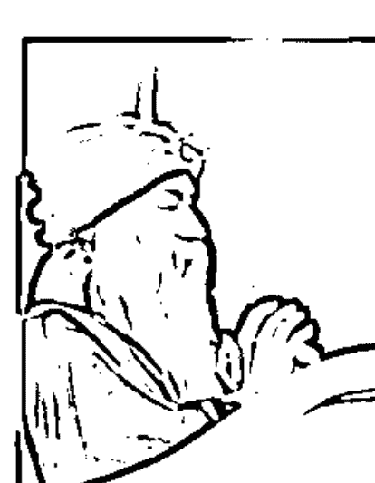

# 奥修：爱与死亡
？

## 序言

你可能不知道 Meditation（靜心）這個字跟 Medicine（醫藥）、Medical（醫療）來自相同的字根，這個字原本的意義是成為完整的技術，恢復健康的技術。醫藥用來醫療，同樣的，靜心也用來醫療；使人得以完整、圓融、健康。

注意，盡可能靜心地傾聽。當你靜心地傾聽時，是在學習。專注地傾聽，你會獲得知識。靜心地傾聽，你會失去知識。這其中的差別非常微妙。

當你專注地傾聽時，專注意味著一種緊繃——表示你處於緊張狀態中，太過熱切想要學習、吸收、知道。你感興趣的是知識，專注的是朝向知識的途徑；意念聚焦在一件事情上，當然能夠學習到更多的東西。

靜心並非聚焦的意念，你只是靜靜地聽，腦海中沒有緊張，不急著想知道或學習，而是在你本性的放下與敞開之中全然地放鬆。

你只是傾聽，而不去知道，只是傾聽就能夠領悟。這是不同的傾聽之道。

如果你試著要知道，你會試圖記住我說的話；在心裡重複我說的話，在心裡做筆記，將之寫在你的記憶庫裡。你想要讓它深植在你心裡，以便不會忘記。於是那些話就變成了知識。

然而，同樣的種子卻有可能變成「不學」(Unlearning)；變成領悟。只是單純地傾聽，沒有興趣累積知識，沒有興趣背誦。你單純地敞開自己傾聽著——宛如傾聽音樂、樹林裡的鳥鳴、風吹過古老的松林聲、瀑布的水聲。沒有什麼要記住或記下來的。不要用像鸚鵡般的頭腦聽，你只是單純傾聽，不帶有任何意念——這樣的傾聽是美妙的，令人狂喜，這其中沒有目標，其本身就是狂喜、極樂。

靜心地傾聽，而不是專注。所有的學校都會教導專注，目的在於記住。我們於此的目標是不要記住，完全不學習，而要忘掉所學。

靜靜地傾聽，不要認為你會忘記。不需要記住，只有糟粕才需要記住，因為你總是會忘掉它們。

當你聽到真理時並不需要記住它，因為你不可能會忘記。你或許記不住那些話，但你會記得其精髓——它不會成為你記憶中的一部分而是你本性的一部分。

知識是一種作為，一種衝突與掙扎，達爾文說：「適者生存」，那是與大自然的爭奪，是人類持續不斷與整體的爭戰。愚蠢——但事實如此。

當你想要學習某些事情的時候，事實上是試圖學習「做」某些事情。所有的知識都是務實、實用性的，你會把它轉換成你的做法，並利用它做事。要不然你會說：「為什麼要學這個？有什麼意義嗎？」你學習某件事情是為了將之當成一個工具。

那就是為什麼在一個務實、以經驗為依據的世界裡，藝術已慢慢地消失不見。

沒有人要聽詩歌或者音樂，問題就在於你能夠靠它「做」什麼嗎？你能夠因此有權勢嗎？你能夠做什麼？你能夠靠聽音樂就會修車或者蓋房子嗎？不，沒有用，音樂是非功利的，它沒有實用性——然而，那就是它的美妙之處。

生命本身是非功利性的，它沒有目的，沒有任何地方要去，而只是單純地存在於此時此地。沒有要達成的目標，沒有命運定數。它是一場以宇宙為法則的遊戲，印度人稱它「Leela」遊戲，就像孩童們漫無目的地玩耍。遊戲的本身就是目標，他們樂在其中——如此而已！

學習總是著眼於做某些事，那是一種技術，可以讓一個人成為了不起的實幹家。

如果你知道越多就能夠做更多。那麼，「不學」呢？它會使你變成一個無為者。

慢慢地，你不再知道任何事情，不再有能力做。當知識漸漸從你身上消失時，作為也會消失。你成為存在(Being)，你「在」(Be)而不是作為者。我並不是說你無所事事——甚至佛陀都得去托缽，老子也要找門路或方法以獲得麵包奶油諸如此類。

## 【第1章】左腦，右腦，內在的衝突

五祖法演（Gosa Hōyen）以前常說：「當人們問我『禪』像什麼時，我就會告訴他們這個故事：兒子留意到自己當盜賊的父親變老了，請求父親教他這門行業好讓他在父親退休之後繼續這項家業。父親同意了，所以那一晚他們一起破門進入一戶人家。當打開一個大櫃子時，父親要兒子進去裡面把衣服拿出來。之後，父親立刻把櫃子鎖上，然後製造出許多吵雜聲把整棟房子的人都喚醒了。然後他悄悄地溜走。被鎖在櫃子裡面的男孩既生氣又害怕，不知道該如何脫逃。後來，他靈機一閃——便發出像貓叫那樣的聲音。大家叫女僕拿蠟燭去查看櫃子。當櫃子上的鎖被打開時，這個男孩跳出來吹熄蠟燭，推開受驚嚇的女僕跑出去。大家追在他後面，這男孩注意到路邊有一口井，於是把一塊大石頭丟進去，然後躲藏在黑暗中。後面追來的人都聚在那口井邊，想看看自己掉下井的盜賊。兒子回去之後對父親非常生氣，試著要跟他說這個故事。但是父親說：『用不著跟我說細節。你能回到這裡，證明你已經學到這門技巧了。』

存在是『一』，世界是『多』。在這兩者之間是分裂的、二元的意念。如同一棵古老的橡樹：原本單獨一枝樹幹後來分成兩個主幹，從這兩個主要的分枝長出無數根樹枝。

存在（Being）就像樹幹一樣：是一，而不是二元性。意念是這棵樹分割成二的第一個分枝點，從此變成二元的，變成二元辯證法：正辯與反辯、男與女、陰與陽、日與夜、上帝與撒旦、瑜珈與禪等等。

世界上所有的二元性基本上是意念上的二元性，在這二元性之下是存在的一元性。如果進入二元性之底層，就會找到『一』——你可以稱它為上帝、涅槃或任何你喜歡的稱呼。如果透過這個二元性往上走，就會來到這個層出不窮的多元世界。

這是必須要理解的最基本洞見之一：意念並非『一』。因此，無論什麼，只要透過意念來看都會變成『二』。就像白光進入棱鏡一樣，立刻分成七種顏色而創造出彩虹。光進入棱鏡之前是『一』；透過棱鏡而分解，使白色消失在七色的彩虹裡。

這個世界是一道彩虹，意念是棱鏡，存在則是白光。

現代研究已經達成一個極具意義的事實，這是本世紀最具意義的成就之一，那就是：人並不是只有一個頭腦，而是有兩個頭腦。大腦分成右腦半球與左腦半球這兩個腦半球。右腦半球與左手連結，左腦半球與右手連結。右腦半球是直覺的、非邏輯的、非理性的、充滿詩意的、柏拉圖式的、想像的、浪漫的、神話的、宗教的；左腦半球是邏輯的、理性的、數學的、亞里斯多德式的、科學的、計算的。這兩個腦半球經常處於衝突中。你或許並不知道，然一旦你開始覺察到，真正要做的事情就在這兩個頭腦之間的某個地方。那麼，世界的基本政治活動就在你裡面，世界上最拿手的政治權術就在你裡面。

左手與右腦有關，關於直覺、想像、神話、詩歌、宗教。左手非常受到指責。這個社會屬於慣用右手的人；慣用右手意味著使用左半腦。百分之十的孩子天生慣用左手，卻被強迫用右手。天生慣用左手的孩子基本上是非理性的、直覺的、非數學的、非幾何的。他們對這個社會而言是危險的，所以社會用盡各種辦法強迫他們慣用右手。這不只是手的問題而已，這是個內在政治的問題：慣用左手的孩子透過右腦運作，而社會不允許，因為那樣會很危險，必須在尚未為時已晚之前就阻止他。

有人懷疑一開始的比例一定是各佔一半：百分之五十的孩子慣用左手，百分之五十的孩子慣用右手。但是慣用右手的一方已經統治這麼久，漸漸地使得百分比降到百分之十比百分之九十。甚至在座的你們之中有很多左撇子，但是你們並不知道。你或許用右手寫字，用右手做事，但很可能當你還是孩童時期就已經被迫使用右手。

這是個詭計，因為一旦你變成右撇子，左腦就會開始運作。左腦是理智的，右腦是超理智的，它的運作並不是數學的——它在瞬間運作，是直覺的，非常優雅得體，但不理性。

左撇子這個少數群體是世界上最受壓制的少數人，甚至比黑人、窮人還更受壓制。如果了解這個區分，就能夠了解許多事情。比方說，中產階級以及無產階級：無產階級總是透過右半腦運作；窮人比較憑直覺。上溯到原始人，他們也是更慣於憑直覺。越窮的人越少用腦筋，這可能是導致他貧窮的原因，因為他的智力較差，無法在這個理智的世界上競爭：就語言、推理、計算而言他幾乎是白痴，同時他的表達能力在這些方面也都較差，這些可能是導致他貧窮的原因。

有錢人透過左半腦運作：他在各方面比較會計算，懂算術；他狡猾、機靈、有邏輯、有計劃。或許是因為這個原因使得他富有。

那麼，無產階級與中產階級就無法透過共產主義的革命而消失，不，因為搞共產主義革命的那些人還是同類型的人。沙皇統治蘇俄；他藉由頭腦的左半腦統治。然後他被同類型的列寧所取代，然後列寧又被一個甚至更同類型的史達林取代。革命是虛假的，因為實質上都是由同類型的人在統治：統治者與被統治者仍然一樣；被統治者是右半腦類型的。所以，不論你在外在的世界做了什麼，實質上也並沒有差別，都是表面功夫。

同樣的道理適用在男女之間。女人傾向右腦，男人傾向左腦。好幾個世紀以來都是男人統治女人。現今有些女性正在反抗，但是令人驚訝的是她們是同一類型的女人。事實上她們就像男人：理智、好辯、重實際。

可能會有一天，就像共產主義革命在蘇俄與中國的成功一樣，有一天在某個地方——或許在美國——女人能夠成功打倒男人。但是，當女人成功時，這些女人就不再是女人了，到時候她們都變成左腦傾向，因為，要對抗就必須要會計算，要跟男人對抗你必須要像個男人，要有侵略性。

那種侵略性就展現在全世界的女性解放運動中。成為解放運動的女人都很具侵略性；她們失去了所有的優雅以及出於直覺的一切，因為，如果你必須與男人抗爭就得學會相同的計謀，如果你必須跟男人爭鬥就必須使用相同的手腕對抗。跟任何人搏鬥都是非常危險的，因為你會變成像你的敵人一樣。

那是人類史上最大的問題之一。一旦你跟某人爭鬥，慢慢地你必須使用相同的手腕與方式。敵人可能被擊敗了，但是在被打敗時你已經變成自己的敵人了。史達林比任何沙皇還沙皇，比任何沙皇還狂暴。當然得如此，要推翻沙皇需要非常暴力的人才有可能，要比沙皇還狂暴。只有他們才會變成革命家，唯有那樣的人才會出頭。當他們出頭的時候自己已經變成了沙皇，而社會也延續著相同的路線。只有表面上的事情改變而已，本質上仍然是同樣的衝突。

這個衝突來自人的內在。除非那裡的衝突解除了，否則不論到哪裡，都不會被解決。政治權術就在你裡面，在你頭腦的兩個部分之間。這之間存在一道非常小的橋樑，如果那道橋樑因為意外、某些生理缺陷或其他原因而損壞，這個人就會分裂，他會變成兩個人而出現精神分裂症或性格分裂的現象。如果這道橋樑斷裂（這道橋樑本身是非常脆弱的）你就會變成「二」，你的行為舉止會像兩個人一樣。早晨充滿愛，令人喜愛，到了晚上卻非常憤怒，完全變了一個人。而你記不得你的早晨，怎麼可能記得住？那是另一個頭腦的運作，而這個人變成了兩個人。如果這道橋樑非常鞏固使得兩個頭腦消失而成為一，就會整合而產生結晶。

葛其夫 (George Gurdjieff) 過去經常說的「存在的結晶」，其實就是兩個頭腦合而為一，是內在男女的相會、陰陽的相會、左右的相會、邏輯與非邏輯的相會、柏拉圖 (Plato) 與亞里斯多德 (Aristotle) 的相會。

如果能夠了解內在生命之樹的這個基本分歧，就能夠了解周圍以及內在所有的衝突。

讓我告訴你一則軼事：

在德國人之中，柏林人被認為是普魯士人（Prussian），是粗魯且講效率的縮影，而維也納人（Vienna）是奧地利人，乃是迷人且懶散的經典形象。

傳說有一位柏林人造訪維也納，他迷路了，需要指引。柏林人會怎麼做呢？他抓著第一個從他身邊經過的維也納人的衣領咆哮著：「郵局，在哪裡？」

受驚嚇的維也納人小心翼翼地撥開對方的拳頭，整理好他的衣領然後很紳士有禮貌地說：「先生，難道你不能優雅一點禮貌地對我說：『先生，如果你有時間也知道的話，可否請你告訴我郵局怎麼走？』」

這個柏林人盯著他愣了一會兒，然後吼回去：「我寧願迷路！」然後跺腳而去。

稍後的同一年，同樣的那個維也納人到柏林去，現在換成他要找到郵局。他找到一位柏林人，很有禮貌地說：「先生，如果你有空，也知道的話，可否請你指點我怎麼去郵局呢？」

這個柏林人如機械般迅速回答：「向後轉，往前兩個街區，馬上向右轉，往前一個街區，過一條街，向右半轉，靠左越過鐵軌，經過報刊的販賣攤進入郵局大廳。」

這個維也納人一臉茫然尚未搞清楚，不過仍然輕柔地說：「萬分感謝，仁慈的先生」，隨之柏林人粗暴地抓著對方的衣領大喊：「不用謝，重複一次路線！」

男性的頭腦，柏林人，女性的頭腦，維也納人……女性的頭腦有一種優雅，男性的頭腦有效率。當然，從長遠看，如果爭鬥持續不斷，優雅一定會被擊敗。有效率的頭腦會獲勝，因為這個世界只了解數學的語言卻不懂愛的語言。可是一旦你的效率勝過優雅的那一刻起，你就已經失去一些極具價值的東西，你失去了與自己本性的聯繫。你或許變得很有效率，但不再是一個真正的人，你會變成一部機器，像機器人一樣的東西。

因為如此，所以女人與男人之間的衝突不斷。他們分不開；必須一次又一次進入關係當中，卻也無法維持在一起。這些爭吵並非來自外在而是你的內在。我的了解是：除非你斷絕內在左半腦與右半腦之間的爭鬥，否則絕對不可能有平和的愛，絕對不會，因為內在的爭吵會反射在外在。如果你的內在正在爭吵，而你正好認同左半腦，認同理智的左腦，一直想要制伏右腦，你會試圖對你所愛的這個女人做出同樣的事情。如果這個女人正不斷地跟她自己內在的理智爭吵，她也會一直跟她所愛的男人爭吵。

所有的關係——幾乎全部，例外少之又少，可以省略不計——都變得醜陋。一開始的時候他們很美好。開始的時候你不會顯現事實，你會假裝。一旦關係穩定下來了，你放鬆了，內在的衝突冒上來開始反映在你的關係中——於是開始爭吵；一千零一種互相挑剔、彼此破壞的方式。因此，同性戀才會有吸引力：只要當社會的衝突變得令人受不了——因為至少男人愛男人不會有太多衝突。愛情的關係或許不會很滿足，可能不會有極樂與高潮的片刻，但至少不像男女之間的關係那麼醜陋。當過分衝突的時候女人就變成女同性戀，因為至少兩個女人的情愛關係衝突不是那麼深。同性間能夠彼此了解。

沒錯，了解是有可能，但是失去了吸引力，失去了磁性，這會付出極大的代價。了解是可能的，但是整個緊繃、挑戰都不見了。如果你選擇挑戰就會有衝突，因為真正的問題就在你的內在。除非你沉澱下來，深入男女意念之間的和諧裡，否則你無法去愛。

人們來找我，問我如何深入關係。我對他們說：「首先，深入靜心。除非你解決自己的內在衝突，否則你會製造出比你原本就有的更多的問題。如果你進入關係中，所有你的問題都只會加倍劇增。」觀照就好。世界上最偉大、最美妙的東西就是愛，但你能找到任何比愛更醜陋，更造孽的事嗎？

木拉·那斯魯丁有一次對我說：「嗯，我已經拖延這邪惡的日子好幾個月了，可是這一次我逃不了了。」

「看牙醫或醫生嗎？」我問。

「都不是，」他說「我要結婚了。」

人們一直在逃避、拖延婚姻。直到有一天他們發現擺脫不了，唯有到了那個時候他們才放手。

問題出在哪裡？為什麼大家那麼害怕深陷其中？糾纏立即造成恐懼；承諾馬上造成恐懼——所以現代人只要性卻不要愛。

有一個女人告訴我，她只想跟陌生人有性愛。在旅途中的火車上，遇見陌生人那很好，但是不要跟朋友或熟悉的人。

我問：「為什麼？」

她說，一旦跟認識你的人做愛就會開始有牽連。在火車上、旅途中，你們相遇、做愛——你甚至不知道對方的名字，他是誰，從哪裡來。車站到了你就下車，他走了，永遠遺忘。他沒有留下痕跡，你保持完全乾淨，不留痕跡的跳脫出來。

我可以理解。這是整個現代社會裡人的困境。所有的關係變得越來越隨便。大家都害怕任何形式的承諾，因為他們知道至少有一件事是苦澀的經驗：當連結太過於緊密時，事實就會暴露出來，而你的內在衝突會開始透過對方反射出來。於是，生活變得醜陋、糟透了、難以忍受。

有一次，我跟幾個朋友坐在大學園區的地上。其中一位教授說：「在婚禮發生(Occurred)的當天……」

另一位教授立刻制止他說：「請原諒我更正，類似像結婚、歡迎會、晚宴這類的事情我們會說：舉行 (Take place)。只有大災難的事情才會說發生 (Occur)。你了解其中的差別嗎？請不要說『在結婚發生 (Occurred) 的當天』或『在婚禮發生 (Occurred) 的當天。』」

他是語言學教授，他的說法無容置疑。然而，第一位教授說：「對，有很多事情……」又開始說。「……就像我剛才說的，在婚禮發生 (Occurred) 的當天，那真是個大災難。」

如果你置身事外，它也許看起來像沙漠中美麗的綠洲，但當你更靠近它，綠洲就開始枯竭消失。一旦你被逮進其中，就是監禁。但是請記住，這監禁並非來自對方面而是來自你的內在。

如果你一直受左半腦操控，你會有非常成功的生活，直到當你四十歲的時候患上胃潰瘍，四十五歲至少一次或兩次心臟病發作，五十歲的時候瀕臨死亡——不過死得很成功。你或許成為偉大的科學家卻從來無法成就偉大的自性。你或許累積了豐足的財富卻失去一切值得的東西。你也許像亞歷山大 (Alexander) 一樣征服了全世界，自己內在的領域卻依然未被征服。

左半腦是一個世俗的頭腦，它比較關心的是車子、房子、金錢、權力、名望，這些事情對其極具吸引力。這種傾向的人在印度被稱之為戶長 (Grihastha)。

右半腦傾向於靜心者，對自己內在的本性、內心的平和與喜樂比較感興趣，相較不關心外物。如果它們輕易出現固然很好，但如果沒有也很好。他比較關心當下片刻，而不擔心未來，比較關心的是生命的詩意，而少關心生活的算計。

我聽過一則軼事：

芬克爾斯坦 (Finkelstein) 在賽馬中大賺了一筆，理解力蠻強的莫斯科維茲 (Muscovitz) 十分羨慕他。

「請問你是怎麼做到的，芬克爾斯坦？」他問道。

「很簡單，」芬克爾斯坦說：「是那場夢。」

「夢？」

「是的，我已經算出一套三匹賽馬連本帶利的押注法，但是我不確定第三匹馬。然後當晚我做了一個夢，有一位天使站在我的床頭一直說：『祝福你，芬克爾斯坦，七乘七祝福你。』我醒過來的時候領悟到七乘七是四十八，而那匹四十八號的馬正是『上天之夢』，我第三匹馬押『上天之夢』，結果大撈一筆，簡直是大賺。」

莫斯科維茲說：「但是，芬克爾斯坦，七乘七是四十九啊！」

芬克爾斯坦說：「所以，你是一個數學家！」

有一種依循算術的生活方式，也有另一種依循夢想與憧憬的生活方式。它們完全不同。

剛好在前幾天有人問：「有鬼、精靈或類似的東西嗎？」是的，有——如果你透過右半腦行動就有，如果透過左半腦行動就沒有。所有的孩子都是右半腦傾向：他們到處看得到鬼魂與精靈。但是你一直對他們說這世界上根本沒有精靈或鬼的同時，亦把他們定位，教訓他們說：「胡扯！哪裡有精靈？只不過是影子而已。」

漸漸地，你說服了這個孩子，一個無助的小孩；漸漸地他也從右半腦傾向移向左半腦傾向。他別無選擇，他得活在你們的世界裡。他不得不忘掉他的夢，不得不忘掉所有的神話、所有的詩歌——他必須學習數學。當然他變成在數學上頗有效率而在生活上卻幾乎是殘廢癱瘓。存在離他越來越遠，他變成只是市場上的一項商品。

他的整個生命變得毫無價值，不過，當然在這個世界的眼中是有價值的。

靜心者 (sannyasin) 是一個透過想像力生活的人，他透過意念的夢想品質生活，透過詩歌生活，讓生命入詩，透過願景展望。所以，他們看到的樹木比你看到的更翠綠，鳥兒更美妙，一切事物都帶著一種燦爛的品質。一般的卵石變成鑽石，普通的石頭不再平凡——沒有任何一件事情是平凡的。如果你從右半腦看，一切都變成莊嚴、神聖。宗教來自右半腦。

有一個人跟朋友坐在自助餐館喝茶。他研究著他的杯子然後嘆口氣說：「唉，我的朋友，生命就像一杯茶。」

另一個人想了一下然後說：「可是為什麼？為什麼生命像一杯茶呢？」

最先說話的那個人回答：「我怎麼知道？我是哲學家嗎？」

右半腦只陳述事實，但是不提供理論。如果你問：「為什麼？」只會是沉默，不會有回應。如果你走在路上看見一朵蓮花，你說：「好美！」這時候有人說：「為什麼？」你會怎麼做？你會說：「我怎麼知道？我是哲學家嗎？」那是一個簡單的陳述，非常單純的陳述，這個陳述的本身已經是全然完整的。沒有前因也沒有後果；它純粹就是一個事實的陳述。

閱讀這本奧義書 (Upanishads) 就是事實的陳述。他們說：「神性如是。」(Godliness is) 不要問為什麼，否則他們會說：「我們是哲學家嗎？我們怎麼會知道？」

「神性如是。」他們說神性是美妙的，神性比你的心更接近、更靠近。但不要問為什麼，他們不是哲學家。

看看福音書以及耶穌的陳述，他們很簡單。他說：「我的上帝在天堂。我是他的兒子，他是我的父親。不要問為什麼。」他無法在法庭上證明這件事，他會直接說：「我就是知道。」如果你問他誰跟他說的，有何根據讓他這麼說，他會說：「我自己說的。沒有別的依據。」那就是當一個像耶穌這樣的人在這個世界上行動時的困難：理智的頭腦無法了解。他不是因為別的原因被釘死在十字架上，他是被左半腦傾向的人釘在十字架上，因為他屬於右半腦傾向的人。他因為內在的衝突而被迫害。

老子說：「整個世界似乎很聰明，只有我糊裡糊塗。整個世界似乎很確定，只有我被搞混亂了而且躊躇不前。」他是右半腦傾向的人。

右半腦是詩歌與愛的腦半球。巨大的轉換是必要的，而且這個轉換是內在的蛻變。瑜珈透過左半腦的努力而達到本性的合一，它使用邏輯、數學、科學，並且試圖超越。禪剛好相反；目標一致，但是禪使用右半腦來超越。兩者都可以被使用，但是跟隨瑜珈需要極其漫長的途徑，幾乎是不必要的奮鬥，因為你試圖從理性到超理性，那比較困難。禪比較容易，因為他是從非理性到達超理性。非理性幾乎就像超理性——它們之中沒有障礙。瑜珈像是在穿牆，禪像是打開一扇門——這扇門可能根本沒被關起來，你只要輕輕一推就開了。

以下這則故事是禪宗最出色的軼事之一。禪宗者透過故事談論。他們必須用故事來談，因為他不能創設理論與教義，他們只能夠說故事。他們是優秀的說故事家。

耶穌一直講寓言，佛陀一直在說寓言，蘇非神秘家也不斷地說寓言——那不是巧合。故事、寓言、軼事都是右半腦的途徑。邏輯、辯論、論證、演繹推理是左半腦的途徑。

聽著……

五祖法演〔Gosa Høyen〕以前常說：「當人們問我『禪』像什麼時，我就會告訴他們這個故事：」

這則故事確實說明了「禪」像什麼而沒有下定義。它是暗示。不可能定義它，因為禪本身的基本品質就是無法定義。你可以品嚐它但是無法定義它，你可以活出它但是語言不足以言喻，你可以展現它卻難以言明。不過，透過故事稍可傳達一點禪的品味。而且這則故事確實完美地道出禪風之相。這只是一個手勢，不要把它當做定義，不要空談哲理。讓它像閃電一般——瞬間的領悟。它不會增強你的知識，可是能夠給你一個移轉、一個棒喝、一個完形的轉換。你可以從意念的這一角落被丟到另一個角落——這就是這則故事的重點。

兒子留意到自己當盜賊的父親變老了，請求父親教他這門行業好他可以在父親退休之後繼續這項家業。

盜賊這個行業不是科學，那是一門藝術。盜賊和詩人一樣都是天生的；你學不來，透過學習是沒有用的。如果你是學來的，你會被抓到——因為警察知道得比你還多，他們已經累積了幾世紀以來的學問。盜賊是天生的；他透過直覺過活——那是一項竅門——他透過預感生活。盜賊是陰性的；他不是生意人，他是賭徒。他幾乎不為什麼而冒盡風險，他的整個生意就是危險與風險。

就像虔誠的修行者一樣。禪宗者說修行者也像盜賊一樣：找尋真理，他們也是「盜賊」。不可能透過邏輯或推理，或是公認的社會、文化、文明達到真理。他們從某個地方破牆，走後門。如果光天化日之下不被允許，他們就在黑夜裡闖入。如果不能跟著群眾上超高速公路，他們會在森林中開闢出自己個人的途徑。的確，是有某種相似點。只有當你是一個「盜賊」的時候才能夠到達真理——一個懂得如何盜火、竊寶的藝術家。

這位父親即將退休，他的兒子請求：「在你退休之前請教我你的本領。」

當打開一個大櫃子時，父親要他的兒子進去裡面把衣服拿出來。當兒子一進去，父親立刻把櫃子鎖上，然後製造出許多吵雜聲叫醒整棟房子的人。然後悄悄地溜走。

他一定是個真正的大師，不是平庸的盜賊。

被鎖在櫃子裡面的男孩很生氣、害怕，不知道如何脫逃。

當然，一定會如此！這是哪門教導？他被丟進一個危險的狀態裡。但是那是教導未知某些重要東西唯一的方法，那是教導某些關於右半腦唯一的方法。左半腦可以在學校中被教導；透過學習是有可能的，透過訓練是有可能的，逐步的課程是有可能的。之後漸漸地從一個年級晉升到另一個年級，你變成了藝術、科學或許多東西的能手。但是不會有任何學校是為右半腦而設：那是直覺，不是漸進的，是剎那間的。像是黑夜中的一道閃電或閃光一樣。一旦出現就出現，如果沒發生就是沒發生——無法對它做任何事情。你只能夠讓自己待在一個更有可能讓它發生的某種狀態中。那就是為什麼我說這個老人家一定早就是一個真正的大師。

被鎖在櫃子裡面的男孩很生氣、害怕，不知道如何脫逃……

這是你的心智會經歷的三個狀況。在我所有的靜心當中同樣也是如此對你。鎖在櫃子裡，把鑰匙丟掉，首先你會感到生氣。很多門徒跑來跟我說他們對我很生氣。我可以了解，那很正常：我強迫他們進入那些舊有的頭腦無法運作的狀態裡。這是他們生氣的根本原因。他們簡直無能為力，他們舊有的頭腦無法運作，他們無法從舊有的頭腦做任何事情：「發生什麼事了？」當你在一個頭腦根本沒用的狀態中，你會對我生氣，先是生氣，然後害怕。當一個人了解到這整個情況，以及你曾經學習的一切似乎根本沒效用的時候，於是會害怕。

好，現在沒有邏輯的方法可以逃出那個櫃子：它從外面被鎖住了，而父親製造出吵雜聲，整棟房子的人都醒過來了，大家到處在尋找，而父親已經逃走了。現在還有什麼邏輯的方法可以逃出這個櫃子嗎？邏輯根本失靈，推理是沒用了。你能夠想到什麼？頭腦突然停止——這就是父親正在做的，整件事情就是如此。他試著迫使他的兒子進入這麼一個邏輯頭腦停止的狀態中，因為盜賊不需要邏輯的意念。如果他跟隨邏輯的概念遲早會被警察抓到，因為警察也沿用相同的邏輯。

這是發生在二次世界大戰期間：希特勒 (Adolf Hitler) 持續贏了三年，原因是他很不邏輯。其他所有跟他打仗的國家都是以邏輯作戰。當然，他們有優秀的作戰科學、軍事訓練、有這個那個，而且他們有專家會說：「現在，希特勒會從這一邊攻擊。」如果希特勒也在他的判斷中，他應該也會這麼做，因為那是敵方在防衛上最脆弱的點。當然，敵人一定會攻擊他最脆弱的地方，這很符合邏輯。所以他們預料希特勒會突擊最脆弱的點，所以他們集結重兵包圍在最脆弱的點，然而他卻出乎意料之外到處突擊。他甚至連自己將軍的忠告都沒聽。

他有一位占星師會建議他該攻打哪裡。這是空前未有的事：戰爭一般都不會由占星師來運作。有一次邱吉爾懂了；有一回情報員回報他們不會贏這個人，因為他完全不合邏輯，有一個對戰事完全不懂的蠢占星師，他從來不曾上前線卻透過星座決定事情——星座跟戰爭、跟地球有什麼關係？

所以邱吉爾立刻指派皇家占星師給國王。於是他們開始聽從這位皇家占星師，然後事情就趨於一致了，因為現在是兩個白痴在預測。事情變容易多了。

如果一個盜賊跟隨亞里斯多德他遲早會被抓到，因為警察也同樣採用亞里斯多德的邏輯。

就在前幾天費丹塔（Vedanta）做了一件很棒的事：他駕駛社區的吉普車逃逸。當然必須通知警方。每個人都預測他會往羌達（Chanda）的方向開去，因為他說過要去羌達重新開始一個以前的舊中心——凱拉須（Kailash）。他如果往那裡去警方可能追捕不到他，但是警方以邏輯推論：「如果他說過要去羌達，現在就不會去羌達，因為他會怕在路上被捕。他不會去那裡。」所以他們並不擔心那條路，當然，費丹塔在羅納法拉（Lonavala）被捕。他正要前往孟買，而警方正是沿著同一個邏輯進行追捕。

如果你依循邏輯，那麼任何沿著邏輯方法的人都可以在任何地方抓到你。盜賊必須無法預測，邏輯並不合適。他必須要不合邏輯，非常不合邏輯以致於無人可預測他。但是，唯有當你的整個能量透過右半腦進行的時候，才有可能不合邏輯。

被鎖在櫃子裡面的男孩很生氣、害怕，不知道如何脫逃……

「如何？」是邏輯的問題，因此他很害怕，因為沒有出路，這個「如何」根本無能為力。於是他靈機一閃。好，這就是一個移轉：只有在危險狀態中當左半腦無法運作時才讓右半腦想出最後一招。當它無法運作，感到無路可走時，它覺得受挫，於是：「為什麼不給頭腦被壓抑、被監禁的那一方一個機會呢？也給它一個機會，或許……況且也無傷！」

突然間……

他靈機一閃——發出像貓的叫聲。

這就不是邏輯。發出貓叫聲簡直是個荒謬的主意。但是管用。

大家叫女僕拿蠟燭去查看櫃子。當櫃子上的鎖被打開時，這個男孩跳出來，吹熄蠟燭，推開受驚嚇的女僕跑出去。大家追在他後面，這男孩注意到路邊的一口井，他丟進去一塊大石頭，然後躲藏在黑暗中。後面追來的人都聚在那口井邊，想看看自己掉下去的盜賊。

這也不是邏輯頭腦，因為邏輯思考需要時間。邏輯頭腦需要時間進行思考，辯論要走這一條路或那一條路，所有可能的選擇——可是卻有一千零一個選擇。當你處在一個沒有時間思考的情況中，如果大家在追趕你，你能夠想什麼？思考是當你坐在扶手椅上的時候還合適，你可以閉上眼睛推究、思考、辯論，贊成這個反對那個，衡量利與弊。但是，當大家正在追捕你，生命正遭受危險的時候，你並沒有時間思考——你活在當下，你會直接變成自然反應。

並不是他決定要去丟那一塊石頭，事情就是這麼發生。那並不是結論，他並沒有思索過要這麼做，他只是發現自己正在這麼做。他把一塊石頭丟到井裡，然後躲在黑暗中。追趕的人停下來，以為這個盜賊把自己淹死在這口井裡面。

兒子回去之後對父親非常生氣，試著要跟他說這個故事。但是父親說：「用不著跟我說細節。你人在這裡，證明你已經學到這門技巧了。」

講這些細節重要嗎？沒有用。就直覺而言細節是沒有價值的，因為直覺從來不會重複。就邏輯而言細節是有意義的，所以邏輯傾向的人一直不停停留在瑣碎的細節裡，萬一有相同的情況再度發生時他們就能夠控制，也知道該怎麼做。

然而，在盜賊的生活中，相同的情況絕對不會重複出現。同樣地，在真實生活中，相同的狀況也絕對不會重複出現。如果你心中有個結論，你會變成一成不變的死物，你會無法回應。在生活中，必須要能夠回應而不要反應：你必須不假思索地行動，心裡沒有定論。你必須在沒有中心思想中行動；必須從未知進入到未知。

這就是五祖法演常說的，當人們問他禪像什麼的時候，他就會說這個故事。

「禪」正好就像盜賊一樣。那是一門藝術，它不是科學，它是陰性的，不陽剛，沒有侵略性，具有接受性，它不是計劃好的方法論，它是一種自發性。無關乎理論、假說、教義、經典——它只跟一樣東西有關，那就是覺知。

這個孩子在櫃子裡的當下發生了什麼事情？在如此的危險中，你不會昏睡，在如此的危險中，你的意識變得非常敏銳。必須如此；生命危在旦夕，你整個人清醒著。

人必須在每一個片刻中保持全然清醒。當你全然清醒時，這個轉換就會發生：能量從左半腦轉移到右半腦。每當你警覺時，就會變得有直覺力，靈感會來到你身上，來自未知的靈感，出乎意料之外。你可能不會跟隨靈感，那麼，你會錯失不少。

事實上，所有科學之中偉大的發現全都來自右半腦而非左半腦。你一定聽過居禮夫人（Madame Curie）的故事，唯一獲得諾貝爾獎的女性。

她在某一個數學問題上努力鑽研了三年卻解不出來。她很努力，從各種向度辯證都沒辦法。

有一天晚上，她筋疲力竭地睡著了；當她睡著的時候還試著解決那個問題。半夜裡她醒過來，在紙上寫下答案，然後回來繼續睡。

次日早晨，她發現答案就在桌子上。她不相信有人解出來了！沒有人能解出來的！是僕人嗎？你不能指望他做這件事，他完全不懂數學。她記得清楚，那一晚她已經盡最大努力嘗試最終還是解不出來。那究竟發生了什麼事情呢？因為那是她的筆跡。所以她試著回憶，然後依稀記得彷彿在夢中，她走向桌子寫下了這些答案。

這個答案從何而來呢？不可能來自左半腦；左半腦已經努力鑽研了三年。而那張紙上並沒有步驟只有結論。如果是來自左半腦就會有程序與步驟。但這像是一道閃光——跟櫃子裡這個男孩的靈光一閃一樣。左半腦累了，筋疲力竭了，無助，尋求右半腦協助。

每當你處於這麼一個邏輯失靈的困境中，不要絕望，不要感到無助。那或許正是你生命中最受祝福的時刻，因為那是左半腦允許右半腦發揮它自己的片刻。於是，陰性的一方、具接受性的一方提供你一個主意。如果你聽從它，就會有許多扇門為你打開。但是，也有可能你會錯過它，你可能會說：「胡扯什麼！」

這個男孩有可能會錯失，因為這個主意並不是很符合常理、正規、邏輯。像貓一樣的叫聲？為什麼？他可能要問：「為什麼？」然後就錯過了。但是他不能問，因為在這種情況下已經沒有其他辦法。所以他想：「試試看。會有什麼不對嗎？」

於是他利用了這個線索。

父親是對的。他說：「不要說細節。那不重要。你回家了；你已經學到這門藝術。」

這整個藝術在於如何透過你女性面的頭腦運作，因為女性與整體結合在一起，而男性與整體不連結。男性是侵略性的，不斷在奮鬥；女性經常處於臣服之中，處於深度的信任。因此，女性的身體才會如此美妙、圓潤；跟大自然有一種深厚的信任以及深切的和諧。女人生活在深度的臣服裡，男人不斷爭戰、憤怒，做這做那試圖要證明些什麼，試圖要到達哪裡。而女人很開心，並不想要到達任何地方。

如果問女人想不想上月球，她們真的會驚訝。「為了什麼？有何意義？為什麼要這麼麻煩？這個家就已經很好了。」女人對越南發生了什麼事情，韓國怎麼了，以色列發生什麼事情都不感興趣。她最感興趣的事情是鄰居發生了什麼事，最感興趣趣誰跟誰談戀愛了，誰跟誰私奔了——喜歡聊八卦，不關心政治。她對於當前、此時此地比較感興趣，那給予她一種和諧、優雅。男人不斷要證明一些事情，如果你想要證明當然就得要奮鬥、競爭、累積。

有一次，一個女人想要讓約翰醫生跟她說話。然而，他似乎不怎麼注意到她。

「為什麼，醫生，」她頑皮地說：「我猜你喜歡男伴勝於女伴。」

「夫人，」約翰回答：「我非常喜歡與女士為伴。我喜歡她們的優美，我喜歡她們的柔軟，我喜歡她們的活潑，而且我喜歡她們的安靜。」

男人一直以來強迫女人要安靜，不只外在，連內在也是——強迫女性面要安靜。

只要看你內在就好了，如果女性面說些什麼你立刻跳上去說：「合邏輯嗎？荒謬！」

人們來跟我說：「我們的心想要成為靜心者，但是頭腦說不」——約翰醫生，試圖要讓這個女人沉默不作聲！然而，心，是女性的。

在生命中你失去很多，因為頭腦一直不斷說話；它不允許。頭腦裡面唯一的品質是更有口才、更狡猾、更危險、更暴力。因為它的暴力，它已經成為內在的領導者，而內在的統御地位已經變成男人外在的統御地位。男人也已經在世界中操控女人——優雅被暴力所掌控。

為了某個功能，我被邀請到一所學校去。那是一個學童大會，大會中隊伍已經安排依照身高排列，從最矮的開始排，一直到最高的學童。但是，我注意到這個格局被隊伍中帶頭的男孩切斷了。他是一位身材瘦長的青年，比其他的人高出一個頭。

「為什麼他會在前面？」我問一個年輕女孩，「他是學校的領導嗎？還是領隊或是類似的地位？」

「不」她低聲說：「他勒索。」

男性的頭腦不斷勒索榨取，製造麻煩。惹麻煩的人變成了領導者。在學校中，聰明的老師會挑選最愛惹麻煩的人當班長或是學生代表——鬧事者，罪犯。一旦他們站在權力的位置上，他們製造麻煩的整個能量就會變成對老師有利。同樣的，這個人會開始制定紀律。

看看世界上的政客就夠了：當有一黨派得權，反對黨就在國內不斷製造麻煩。他們是違法者，革新者。而掌權的黨派就不斷制定規範。一旦他們失去政權，他們就會製造麻煩。一旦反對黨取得權力之後他們就變成規範的守護者。他們全都是惹麻煩的人。

男性的意念是一種惹麻煩的現象，因此它會制伏、操控。然而，事實是，雖然你或許取得權力卻失去人生—內心深處，女性的意念仍舊還在。除非你落回女性面的臣服，除非你的反抗與掙扎變為臣服，否則你不知道什麼是真正的生命，以及生命的慶祝。

我聽過一則軼事：

一位美國科學家有一次去哥本哈根拜訪偉大的諾貝爾物理學得獎者尼爾斯·玻爾 (Niels Bohr) 的辦公室，很驚訝地發現在他的桌子正上方是一個馬蹄吉祥物，被牢牢地釘在牆上，開口向上象徵可以接住好運而不溢出來。

這個美國人興奮地笑說：「想必你不信這個馬蹄鐵會帶給你好運，是不是，玻爾教授？畢竟，身為一位頭腦清晰的科學家……」

玻爾咯咯笑說：「我的好朋友，我根本不相信這種事，我幾乎不可能相信這麼愚蠢的東西。不過，有人告訴我，馬蹄鐵會帶給你好運，信不信由你。」

稍微深入一點看，剛好就在你的邏輯底下，你會找到直覺的清泉、信任的清泉正在流動著。

瑜伽，是利用推理到達真理的方式—這當然很困難，而且是冗長的途徑。如果你跟隨帕坦伽力 (Patanjali)，你是在試圖做那件不做就能夠發生的事；你正努力做一些不需要任何費力現在就能夠發生的事。你正試圖用鞋帶拉你自己——把自己拉上來。

禪是自發性的途徑，無為而為，直覺的道路。

一休禪師，一位偉大的詩人，說過，我能看到千里之外的雲，聽到松林間古老的音樂。

這就是禪。邏輯的頭腦看不到千里外的雲，邏輯的頭腦像鏡片一樣，太骯髒，有太多想法、理論、教義遮蓋在上面。但是，帶著直覺純淨的鏡片；沒有思緒，只有純粹的覺知，你就能看到千里之外的雲。這面鏡子乾淨而且極度清晰。

平庸邏輯的頭腦聽不到松林間古老的音樂。你怎麼可能聽得到古老的音樂呢？音樂，一旦消失就永遠消失。但是，一休是對的。你能聽到松林間古老的音樂——我聽過——但是需要一個轉換，一個全然的改變，一個完型的改變。那麼你就能夠再度看到佛陀的佈道，再度聽到佛陀的開示。你就能聽到松林間古老的音樂，因為那是永恆的音樂，從來不曾消失。

你已經失去傾聽它的能力。這是永恆的音樂。一旦你恢復能力，剎那間它又在那裡了。它一直都在，只不過你不在。待在此時此地，你也可以看到千里之外的雲，聽到松林間古老的音樂。

### 成熟的意义？

你说我的心念不成熟。什么是成熟的心念？
自以为懂就是不成熟。从知识、结论运作就是不成熟。从不知、无定论运作，不从过去运作就是成熟。

成熟是深切信任自己的觉性；不成熟是不信任自己的觉性。不信任自己的觉性，就会信任知识，不过那是替代品，而且是非常粗劣的替代品。

试着了解我说的话，这很重要。活到现在，你阅读过、听过、思考过，经验过很多事情。当某个情况出现时，你可以有两种运作方式。你可以透过所有过去累积的经验运作，也就是我所说的透过一个自我中心、结论、经验而运作——腐旧且没有生命力——那么，不论做什么，你的回应就不会是一种回应（Response），而是一种反应（Reaction）。反应就是不成熟。

如果你能够在此时此刻的当下运作，透过你的觉性、觉察，把你所知道的一切擺在一旁，這就是我所說的透過非知識性的運作（No-knowledge）。透過純真運作——這就是成熟。

我之前讀過一則軼事：

史密斯先生的兒子已經十三歲了，對他而言對一個青春期少年談論生命中應該要知道的事情是很重要的。所以，一天晚上他把兒子叫進書房，小心地關上門，帶著令人印象深刻的嚴肅說：「兒子，我想要跟你討論生命的真相。」

「當然可以，爸，」兒子說。「你想要知道什麼？」

當心念還沒準備好要學習的時候，它是不成熟的。如果你不需要從任何人身上學習任何事情，自我會感覺非常志得意滿；如果自我覺得它都知道了，則會感到非常自大。問題是生命不斷在變化，絕不會一樣——它持續不斷地流動著，它是潮汐——而你的知識總是一樣，並沒有跟著生命進化，它卡在過去的某個點上。只要透過它反應，你就會錯過重點，因為那不會是正確的行動。生命已經改變了，但你的知識維持不變，而你卻透過這個知識行動。這意味著你用昨天的知識面對今天。

你絕對無法充滿活力，越是透過知識運作就越不成熟。

讓我告訴你一則悖論：每一個天真的孩子都是成熟的。成熟跟年齡無關，因為它跟經驗無關。成熟跟反應力、新鮮度、純真、天真有關。所以當我用「成熟」這個詞語，意思並不是說當你更有經驗就更成熟。那是人們使用這個詞習慣有的意義。我的意思不是那樣。越是累積知識，心念就越不成熟。當你到了七、八十歲的時候，就會完全不成熟，因為你會用腐舊的過去運作。

看看小孩子們，什麼都不知道，沒有經驗，他的行動來自此時此地。那就是為什麼孩子比老年人學得多。心理學家說，如果一個孩子沒有被迫學習，沒有被迫自我規範，他可以在三個月內學會任何外語。只要把他丟在知道這種語言的人當中，他就能夠在三個月內學會那一種語言。但是，如果強迫他學習，則會花上將近三年的時間——因為你越強迫，他就越是從他學過的、昨天的知識運作。如果不管他，讓他可以自由且自發性地行動；學起來就很容易，自然就學會。

當孩子八歲的時候，他已經學習了幾乎百分之七十他一生中要學習的所有事情。他或許活到八十歲，但在他八歲的時候就已經學到了百分之七十，只剩下百分之三十還要學習，但是，他學習的能力會一天比一天少。他知道得越多學習得越少。

當人們用「成熟」這個詞語時，意味著更多的知識；當我用「成熟」我的意思是學習能力——不是知道而是學習。那完全不一樣，正好是對立的。

知識是死的。學習的能力是充滿活力的過程：你就是保持學習的能力，單純地保持可能性、開放性，準備隨時接受。學習是接受性，知識使你更沒有接受性，因為你一直認為自己已經知道了，還有什麼好學的？當你知道自己缺少很多，凡事不懂的時候，就不會錯過任何事情。

蘇格拉底年老的時候說：「我現在什麼都不知道！」那就是成熟。臨終前他說：「我什麼都不知道。」

生命如此浩瀚。這個渺小的頭腦能夠知道什麼？頂多能夠有些瞥見就很了不起了；即便如此都太多了。存在是如此浩瀚無限，無始無終——怎麼可能覺性中的這小小的一滴會知道？甚至有一點瞥見，幾扇門打開，出現一些與存在連結的片刻就足夠了。但是，那些片刻無法轉化成知識，然而，你的意念卻有這種傾向，於是越來越不成熟。

因此，首先你應該要具備學習的能力，而且學習的能力絕不應該被知識重壓，不應被灰塵掩蓋。學習之鏡應該保持乾淨、新鮮，好讓它繼續映照。

意念可以以兩種方式運作。它可以像照相機裡面的軟片那樣運作：一旦曝光就完了，軟片立刻變成知識而失去學習的能力。曝光一次它就已經知道它沒用了，不再有學習的能力。如果你一再地曝光，它會越來越模糊。那就是為什麼知道太多的人總是害怕學習，因為他們會變模糊。他們是已經曝光的軟片。

另一種形式的學習是像鏡子那般學習。鏡子暴露一千零一次也不會有差別，你來到鏡子面前就會出現映像，離開映像就會消失。鏡子絕對不會累積。照相機裡面的軟片則會立刻累積；它是守財奴，會抓取，並且緊抓不放。而鏡子是純粹反映：你在它面前，你就在鏡子裡，你走了，鏡子的你也消失了。

這就是保持成熟之道。每個孩子生來就是成熟的，而幾乎每個人都是不成熟地死去的。這看似非常荒謬，然而事實如此。保持天真你就會保持成熟。

第二件事是，不成熟的心念總是關心瑣事。不成熟的心總是對一切瑣事、蠢事有興趣，比如金錢、房子、車子、權力、名望。成熟的心只關心存在、本性、生命本身。因此，你的心念還不成熟，意思是你仍然關心事物而非人，關心外在而非內在，關心客體而非主體，關心有限而非無限。

看看你的念頭，它移動到哪裡，它幻想什麼。如果你在路上發現一顆值錢的鑽石，同時在它旁邊有一朵綻放的玫瑰，你會對什麼有興趣，玫瑰或鑽石？如果你對鑽石感興趣就看不到玫瑰，你會直接跳過玫瑰：「它沒價值。」你的眼睛會因為鑽石而佈滿烏雲。你整個念頭會聚焦在鑽石上而錯失另一顆更鮮活的鑽石——玫瑰。

據說在印度教的天堂，玫瑰並非平常的玫瑰，是由鑽石製造而成的。如果你能夠在這裡看到玫瑰，是地球上的玫瑰——不是在天堂，而是此時此地——它們是由鑽石製造而成的，那麼，為什麼要去到那麼遠？一旦你懂得如何看一朵玫瑰就沒有別的東西比得上它。一旦你能夠看到這朵玫瑰可能就會完全忘了鑽石。

碰巧有一天木拉・那斯魯丁來找我。他非常擔憂地說：「啊，可憐的瓊斯先生，你聽說他的事了嗎？他跌倒，從樓梯頂端跌下來，撞到頭部而死。」

我嚇了一跳說：「死了？」

「死了，」他再強調一次，「還跌破了他的眼鏡！」

不成熟的念頭比較關心眼鏡而不是生、死或愛，比較關心事物、房子、車子。當我說你的心念不成熟，意思是你仍然對那些沒有價值、非精髓的事情感興趣。它頂多是有效用，頂多是生命中的點綴，並不能取代生命，不能成為生命的替代品，它無法成為生命本體。然而，有很多人已經把它建造成人生。

我認識一些有錢人，他們的生活過得像個乞丐一樣，簡直無法想像……。

以前我認識德里的一個人，他有六棟平房，全都租出去，然後他住在一間又小又黑暗的小房間裡，沒有孩子也沒有妻子。

有一次我問他：「你擁有的夠多了。為什麼還住在這樣又小又黑的房間裡？為什麼要強迫自己住在這種牢房裡？你在苦修什麼？」

他說：「不是。我向來這麼生活，而且這樣真的很棒。這六棟平房都有人住。」他只有收房租的時候才會去那些平房。

我問他：「你為什麼不結婚？」

「我是窮人，女人很昂貴，我負擔不起。」他說。

如果你遇見這個人，你看不出來他有六棟房子，而且賺很多錢。這個人怎麼了？

他關心金錢勝過自己；勝過他的愛；他對金錢所帶來的權力更有興趣——但是他絕對不會跟任何人分享任何東西。

這種人不算少，他們很常見。每一個人的內在都有這種傾向，而且人們一直不斷將之合理化。那個人很狡猾，他說：「這不是吝嗇，請不要誤會我。我是一個簡單的人，我過簡單的生活。我是一個修行者，而且儉樸的生活很美。」

如果你過於關心物質，就是不成熟。轉移你的注意力。讓自己越來越關心他人而不是你自己。

我有一個門徒，她總是愛上像乞丐那樣的人，但是她很有錢。

就在前幾天，她問我：「奧修，為什麼我一直不斷愛上那些赤貧的人，那些幾乎就要露宿街頭的人？」

我知道原因：跟赤貧的人在一起她不需要煩惱她的金錢——而且她認為透過食物、一些小惠她是在幫助這些人。事實上，她從來不曾墜入愛河，她太愛錢所以沒有法愛上別人。事實上，她是為了金錢而收買這些人；他們不需要任何成本，沒有任何風險。而且他們因為她提供食物、衣服、住所而覺得感激，他們因為感激所以假裝愛她，而她也繼續假裝她戀愛了。這是保護金錢的一種方法，用這種方法保持封閉、吝嗇。

她正深陷於苦，很痛，她卻看不到這點。她必須學習如何分享，知道如何分享就是成熟。不知道如何分享就是不成熟。

這種分享推廣到所有的層面和向度。不論你有什麼都要分享。這是需要了解的最基本的事情之一：你越是分享，內在就越成長。分享任何你所擁有的，人就會成長；如果緊抓著不放、害怕分享、害怕友誼、害怕愛，就會退縮。生命只知道一個法則，那就是擴展與分享。

看看大自然是多麼揮霍。當需要一朵花時，一千零一朵花都會綻開。當跟女人或男人做愛時，在每一次的高潮中會釋放出數百萬個細胞。一個就夠了，卻釋出數百萬個細胞。一個男人就能夠繁殖整個地球——只要一個男人！一個普通的男人一輩子至少有四千次性交——每一次有數百萬細胞被釋放出來。整個世界，目前存在的總人口透過一個人就能夠生產出來。如果在西方，男人只能是兩三個孩子的父親，在東方會有十二個，十四個，十五個。為了懷胎十五個人要釋放出數百萬細胞。

大自然是揮霍無度的。需要一朵花，卻長出數百萬朵。一棵樹就能長出來……

看這棵火鳳凰（Gulmoh）數百萬粒種子已經準備好。它們都會掉下來，有一些可能變成樹。為什麼要這麼多種子？存在並不吝嗇，如果要一個它會給好幾百萬個。只是要求！耶穌說：「敲門，門就會為你打開，要求，它就會給予。」記住，如果你要一個，它會給予好幾百萬個。

當你一旦吝嗇，就已經封閉了這最基本的生命現象：擴展和分享。當你一開始緊抓不放就已經錯過目標；你錯過了，因為東西不是目標，你以及你內在深處的本性才是目標——不是漂亮的房子而是美麗的你，不是擁有很多錢而是一個豐富的你，不是擁有很多東西而是一個對萬物敞開的本性。

當我說你不成熟，意思是你太過於關注事物卻尚未學習到生命是由覺性、存在所構成，不是事物。事物是讓人使用的，是必須的，但不要依靠它們過活。人無法只依靠麵包而活：一旦只靠麵包、物質過活，你就已經死了。

第三件事：成熟永遠是自發性的；沒有計劃、沒有排練。人們常來我這裡。

就在前幾晚有人來這裡找我，他說：「我來見你的時候準備了許多問題，但是，當我來到這裡的時候就忘記了。你對我做了什麼？」

我什麼也沒做！是你。你準備問題的時候已經在說那是假的。真正的問題不需要準備。生命不需要排練，演戲才需要排練。戲劇是虛假的，如果你準備你的問題，意思是那些都不是你的問題。

如果你正口渴而且為此來找我，你會忘了你口渴且想要解渴嗎？你怎麼能忘記呢？事實上，當你來到河邊會更激發起你強烈的口渴，因為當你看到流水聽到汩汩水聲的那一刻，你所忍下來的一切立刻會冒出來，它會回應。你全身都會說：「我好渴！」如果你口渴，你絕不會忘記。

但你準備了問題。你準備自己要去河邊說：「我很渴。」準備的意義是什麼？如果你口渴，就是口渴。如果你不渴，當你到河邊的時候你就會忘記。

當我說你不成熟，意思是你準備你的問題、疑問。那是來自意念的東西，不是來自你的心。它們跟你無關，它們在你的內在並沒有根。

根據蕭伯納生平的記載，有一次在他一場戲的首演將要結束的時候，他彬彬有禮地出現在舞臺上接受群眾的熱烈喝采。

有一個反對者，他抓到一個喝采聲間歇的時機，用極其洪亮的聲調喊說：「蕭，你的戲糟透了！」

頓時鴉雀無聲，此時蕭從臺上鎮定地大聲喊著：「我的朋友，我完全同意你，但我們倆個算什麼……」他對聽眾揮揮他的手「……反對絕大多數人嗎？」

掌聲再度響起，比之前更響亮。

你無法準備像那樣的東西。不可能。那是一種自發性的回應，因此有它的美。況且生命是一個連續不間斷的過程，不立即行動就會錯過。稍後你可能會找到一千零一種答案——你當時應該可以這麼說或那麼說——但是，都已經沒用了。

馬克吐溫跟他太太正從演講大廳回家的路上，他在那裡發表了一場出色的演講。他的太太並不在場，她只是去接他。

在路上她問：「演講如何？」

馬克吐溫說：「哪一場？我準備好的那場，我講完的那場還是我現在正在想當時應該要講的這一場呢？你指的是哪一場呢？」

準備的結果就會如此。保持意識、醒悟、覺知，然後從你的自發性行動。不只別人能看到鮮活的回應，你也會因為自己的回應而非常興奮。不只別人感到驚訝，你也會對自己感到驚訝。

一個成熟的心念是保持驚奇的能力。如果繼續不斷為別人、為自己、為一切帶來驚奇，那就是成熟的心念。生命是一場接連不斷的驚奇：他不會為它事先做好計劃，沒有事先準備好的回應。他從來不知道會發生什麼事，時時步入未知當中。

他絕對不會跳在自己之前，亦不會落在自己之後。不論在哪裡，他都保持自我。

接下來最後也是最基本的事情：當我說你的心念不成熟，意思是你有一個意念。

意念本身就是不成熟。唯有「無念」才是成熟。

成熟跟意念無關，因為意念意味著你知道的一切；意味著你的經驗、過去，意味著你的排練、準備措施。這一切全都隱含在「意念」這個詞裡。意念不是什麼特別的東西，它是整個累積、整堆垃圾、已逝的全部過去。

當我說：「要成熟。」意思是成為「無念」。如果是自發性的行動，就會出自無念而行動。如果保持學習的能力，就會一再地保持無念的能力；頭腦絕不會被堆積。如果保持醒覺與自發性的能力，能夠因為生命、因為自己而感到驚奇，漸漸地，你會越來越關心最內在的生命，關心生命的最核心。當你看見一個人，你不會只看見他的身體，你的凝視會有穿透力，像X光一樣抓住這個人的實質，抓住他人內在的覺性，抓住別人內在的光。身體只不過是個住所：你見到這個人，握手，但不止是手——你會震動到這個人，與這個人相會。

同時在你的生命中，你會漸漸變得更深切覺知到身體只不過是最外在的衣服：你需要照顧它，不要忽略它，它有其價值但並非究竟。你是主人不是僕人。漸漸地，你越往內穿透，就越懂得這個意念也是最裡面的衣服，比這個身體還有價值，但不比你有價值。「你」是至高無上的價值。

一旦知道自己至高無上的價值，你就成熟了，就會知道一切至高無上的價值。

一切眾生皆有佛性，在聖不增在凡不減，生命之整體是神聖的。你永遠走在聖地上。

據說當摩西到山丘上見上帝時，叢林著火了，隨之他聽到從叢林背後傳來：「停下來！把鞋子脫掉。這裡是聖地。」我一直很喜歡這個故事。不過，遍地都是聖地，所有的叢林都燃燒著神聖。如果你還領悟不到，你已經錯失很多。再看一次：所有的叢林都燃燒著神性，而且每一棵樹都發出這個戒律：「停下來，脫掉鞋子。你正走在聖地上。」

所有的地面，這整個大地，整個存在都是莊嚴神聖的。一旦有那樣的感受進入你的身體裡，你就是成熟的，在那之前都不是。成熟的心念就是虔誠修行的心。

為什麼我要小題大作？

因為「自我」感覺不悅、不自在，有小丘陵卻要大山。即便是不幸也不應該是小丘陵，而應為聖母峰，即便是不幸，自我不要平凡的不幸，它要不平凡的不幸！

根據報導蕭伯納曾經說過：「如果我不是第一個上天堂的人，我寧可下地獄——我就是要第一。」

基督教只有一個地獄，蕭伯納並不知道在印度我們有七層地獄的概念。如果他聽說過印度教的地獄，他應該會選第七層，因為如果在第五層他會感到丟臉：別人都遠在他前面，在第七層。真正的罪人、最重量級的惡棍都在第七層！不論怎樣就是要第一。因此人們一直小題大作。

有一個女人因為憂鬱症而死，因此整個城鎮包括所有醫療同業都終於能安心了，因為她一直讓很多人傷透腦筋。家庭、醫生、治療師——她麻煩過每個人，但沒有人幫得上忙。而且她喜歡這種無人知道她罹患的病從何而來的滋味——那是一個不尋常的疾病。事實上根本沒有病。

然後她死了，那是鎮上值得慶祝的事。但是，當他們打開她的遺囑時，她在遺囑中寫下：必須確實完成她的要求。她的要求是必須在她的墳墓上立碑，刻上這樣的字：「現在你們該相信我是病了吧？」

她用這種方式再次纏住全鎮的人。

人們一再無事滋生問題。我跟數千人談過關於他們的問題，然而，我還不曾遇見過真正的問題。所有的問題都是假造的。你製造出那些問題是因為沒有那些問題會令你感到空虛。那麼就無事可做，無事可爭，無處可去。

人們從一個宗教大師換到另一個宗教大師，從一個上師換到另一個上師，從一個心理分析師換到另一個分析師，從一個心理治療小組換到另一個小組，因為如果他們不去就會感到空虛，會突然感到生命沒有意義。於是，人製造出問題好讓自己感覺生命是一門偉大的功課，一種成長，為此必須努力奮鬥。

自我只有奮鬥的時候才會存在，記住，當它在爭鬥的時候。如果我告訴你：「殺三隻蒼蠅你就會成道，」你不會相信我。你會說：「三隻蒼蠅？這似乎不怎麼樣，然後我就會成道？似乎不太可能。」如果我告訴你必須殺死七百隻獅子，當然那看起來比較像樣！

問題越重大挑戰越巨大。在挑戰中，你的自我升起，飆高。是你製造出問題，問題並不存在。

甚至連小問題都不會有。連那一點小問題也是你的把戲。你說：「對，或許不是什麼大問題，但是小問題……？」不，甚至連小問題也沒有，那都是你製造出來的。首先，你沒事製造出小問題，然後從小問題製造出大麻煩。所以牧師、神父、心理分析師、宗教大師都很開心，因為他們的生意都要靠你而存在。如果你不無事滋生小問題，也不小題大作，大師要幫助你什麼呢？首先你得要是需要別人幫助的樣子。

真正的上師一直談的都是別的事情。他們一直說：「請看看你正在做什麼，你做的事情多沒價值。你先製造出一個問題，然後去尋找解決之道。先看看你為什麼要製造出這個問題。就在你製造出這個問題的開始點，就是解決之道：不要滋生問題！」但這並不會吸引你，因為這麼一來你被突然間狠狠地丟回自己身上。無事可做？沒有成道？沒有頓悟（Satori）？沒有三昧（Samadhi）？而你深感不安、空虛，試圖要用任何東西來填塞自己。

你沒有任何問題。在這個當下你就可以丟掉所有的問題，因為那都是你的創作。再看一次你的問題，越深入看，問題就顯得越小。繼續看著它們，漸漸地，它們會開始消失。繼續凝視下去，突然間你會發現那裡是空的——美妙的空無圍繞著你。不做什麼，不成為什麼，因為你已經本然如是了。

成道不是某種要達成的事情，只不過是活出本然。當我說我成道了，純粹是表示有一天我決定要活出本然！從那之後我就如是生活著。那是一項決定，決定從現在開始不再對製造問題感興趣；決定從現在結束所有製造問題然後再找解決之道的蠢事。

這是你跟自己玩的一個遊戲：你跟自己玩捉迷藏，你扮演雙方——而且你知道！那就是為什麼當我這麼說的時候你微笑，你笑了。我並不是在說什麼荒謬滑稽的事情；你懂的。你在笑你自己，看看你自己的笑。你懂的。必須如此，因為那是你自己的把戲：你躲著，等待去找出自己。你可立刻找到自己，因為是你自己躲起來的。

那就是為什麼禪師會一直不斷敲擊。只要有人說：「我想要成佛，」禪師便會發怒，因為他說的是廢話——他「是」佛。如果一個佛來問：「我如何成佛，我該說什麼？我會打他的頭說：「你以為你在騙誰呀？你就是佛。」

不要製造出無謂的麻煩。如果你能夠觀照自己如何把一個問題搞得越來越大，越來越大，你是如何編造它，如何讓輪子越轉越快，越轉越快，你就會恍然大悟。剎那間，你就在你的悲慘、你需要全世界同情的頂端。

有一位靜心者，瑪嘎（Marga）寫信給我說：「奧修，我很難過，因為當你說話的時候你看著每一個人卻不看我。」唉，我誰也沒看，但是我有眼睛，眼睛得對著某個地方。我並不是看著誰，我誰也沒看。況且你能看到我的眼睛裡，它們是空無，是空的。但是，如果你試圖要從它們身上找到你的投射卻找不到時，莫大的悲傷就會降臨在你身上。

於是新的問題來了，自我受傷了。看別人不看我！看看你是如何讓自己變成例外；你是特別的：我看著每一個人，除了你之外。你變成了獨一無二的人。如果我看著瑪嘎——我不會這麼做；自從收到她的信之後我絕對不會看她——如果我看她，那麼自我會有另一個圈套：我只看著她。這麼一來會惹出問題！

你是一個拿手的問題製造者。了解這一點足已，然後突然間問題就消失了。你絕對是健康的。而且生來就是完美的。你天生完美；盡善盡美是你內在最深處的本性。你只需要下定決心去活出本然。

如果你對這個把戲還不嫌煩，可以繼續，但是不要問為什麼。這個「為什麼」很簡單：自我無法存活在空無之中，它需要有東西與之對抗，即便是你想像出來的鬼也可以，自我就是要跟人搏鬥。自我只存在衝突裡，它不是實體，而是一種緊張狀態。只要有衝突，緊張狀態就會生起，自我就會存在；當沒有衝突的時候，緊張狀態消失了，自我也消失了。自我不是物件，它只不過是一種緊張狀態而已。

當然不會有人喜歡小緊繃，每個人都要大緊繃。如果你的問題不夠大，就開始思考人類、世界、未來；社會主義、共產主義、以及所有無意義之事。你開始思考著，宛如全世界都依靠著你的忠告。於是你想：「以色列會怎樣？非洲會發生什麼事？」於是你不斷給予指導，然後製造問題。

人們變得很興奮，他們睡不著覺，因為有一些戰爭正在進行，他們變得很興奮。他們的生活是如此平凡，必須從其他的來源取得不平凡。國家正處於困難中，所以他們認同這個國家。這個文化正處於危難中，這個社會正處於困境中——好，有大問題在，而你為此認同。你是印度教徒，印度教文化有危難；你是基督教徒，教堂正處於困境中。全世界都危在旦夕——而你藉由你的問題膨脹自己。

自我需要一些難題。如果了解這個部分，就在這個了解中，大事會再度化小，然後小事也會化無。突然間，一片空寂遍佈純粹的空無。成道就是這麼回事：從深切的領悟到並沒有問題存在。

那麼，沒有問題可解決你要做什麼呢？你開始生活、吃、睡、經驗愛、閒談、唱歌、跳舞——還有什麼別的事情要做呢？你已經是個神了，已開始活出本然了。

如果有上帝存在，有件事情是肯定的：祂一定不能有任何問題。那麼祂整天要做什麼呢？沒有問題，沒有精神醫師諮商，沒有宗教導師好去臣服。上帝要做什麼呢？祂一定會發瘋、頭暈眼花。祂要做什麼呢？祂活著；祂的生活充滿著活力。也一定會吃、睡、跳舞、戀愛——就是沒有任何問題。

開始活出這個當下，你會領會到越活出生命就越少問題，因為你的空無正在生活中流動，不需要問題。當你不活出生命，相同的能量會變酸臭。本來可能變成花朵的同一個能量卡住了，無法開花而變成心中的一根刺；那是同一個能量。

如果強迫一個孩子坐在角落裡，對他說要完全不能動。看看會如何。才不過幾分鐘前他還很自在、流動；現在他的臉變得通紅，因為他必須盡力約束自己。他全身僵硬，坐立不安，想要跳脫出自己。你在迫使這個能量；現在這個能量沒有目的、沒有意義、沒有地方可去、無處可開花綻放；它卡住了、凍結、僵硬。這個孩子正忍受著短暫的死亡。如果你不允許孩子可以再度在花園中奔跑、到處動、玩耍，他會開始製造出問題。他會幻想，會在腦海裡製造出問題並開始跟這些問題對抗。他會看到一隻大狗，然後很害怕，或者看到鬼而必須對抗它、逃離它。於是，他開始製造出問題。相同的能量才幾分鐘前還到處流動，四面八方，現在卻卡住變酸臭了。

如果你們能夠多跳一點舞，多唱一點歌，多點瘋狂，他們的能量會更流動，而他們的問題會漸漸消失不見。因此，我非常堅持跳舞。跳到高潮！讓整個能量變成舞蹈，突然間你會看到你沒有頭腦：卡在頭腦的能量開始到處動起來，創造出美妙的花樣、姿勢、動作。而且，當你跳舞的時候會有一個片刻，你的身體不再僵硬了，它變得有彈性、流動，當你跳舞的時候會有一個片刻，你的界線不再如此清晰了；你溶入宇宙之中，界線混合在一起。

看看舞者：你會看到他變成一種能量現象，不再有固定的形式，不再有框架。他跳脫出他的架構、型態而流動開來，變得更鮮活，越來越充滿生命力。但唯有當你自己跳舞的時候才會知道真正發生了什麼事情：內在的頭腦消失了，你再度成為小孩。在那個時候你不會製造出任何問題。

生活、跳舞、吃飯、睡覺——盡可能全然去做。而且要一再記得：當你抓到自己正在製造任何問題時，立刻逃脫出來。一旦陷入問題裡面，就需要有解決之道，即便你找到解決的辦法，又會有一千零一個問題從那個解答中冒出來。一旦錯過第一個步驟就會被套住。每當你看到自己正要陷入問題裡面，就要逮住自己，去跑、去跳、去跳舞，千萬不要進入問題之中。立刻做些什麼事好讓製造問題的能量可以流暢、不凍結，溶解而回歸宇宙。

純樸的人不會有很多問題。我在印度遇見過純樸的部落，他們說他們根本不做夢。弗洛伊德（Freud）不會相信這種事。他們不做夢，如果偶爾誰做了夢——那是很稀有的現象——整個村落要為此斷食、向上帝祈禱。有什麼事情不對了，邪惡的事情出現了——因為有一個人做夢了。

然這在他們的部落中從來不曾發生過，因為他們活得如此全然，以至於沒有任何事情殘留在心頭需要留待睡覺的時候完成。人們任何殘留下來未完成的事情，必須在睡夢中完成，任何尚未活出全然的事情都會像殘留物一樣，會自己在意念中完成。那就是夢。

整天下來，你不斷在思考，這個思考正好顯示出，你擁有比你用在生活上更多的能量，你擁有比你所謂的生活需求還多的能量。你錯失了真正的生命。去使用更多的能量，那麼新鮮的能量會開始流動。不要當吝嗇鬼。今天就用這些能量，全然地把能量用在今天的每個當下；明天自會有明天的新能量，不要擔心明天。這些擔憂、問題、焦慮，全都只不過在顯現一件事：你活得不對，你的生命不是慶祝、不是舞蹈、不是慶典——因此才會有這一切的問題。

如果你活出自己，自我就消失了。生命並不知道自我，它只知道生活本身。生命不知道什麼是自己，沒有中心；也不知道什麼是分別。吸氣的時候，生命進入你裡面，吐氣的時候，你進入生命裡面。沒有分別。吃的時候，樹木透過果實進入你的內在，然後有一天你死了，被埋在土裡，樹木把你吸上來，於是變成了果實。你的孩子們會再度吃到你。你一直都在吃你的祖先，樹木把他們轉換成果實。你以為你是素食者嗎？不要被外表欺騙了——我們全都是食人族！

生命是一。它繼續不斷移動，它進入你，通過你的身體。說它進入你並不正確，因為聽起來好像是生命進入你裡面，然後從你身上穿越出來。你並不存在，只有這個生命來來去去。你並不存在，唯有生命以它無比的形式、以它的能量、以它千千萬萬的欣愉存在。一旦了解這件事，就要讓這個領悟成為唯一的法則。

從這個片刻開始，活得像佛一般。如果你決定以其它方式生活，那是你的決定。但就我而言，這是一個決定：「我不再愚弄自己，從現在開始我要活得像佛一樣，活在空無。我不要試圖去找沒有必要的消遣。我消失了。」

我留意到，我想要像世界上最優秀的人一樣被喜愛、被認同，我要成為最有名的人。所以，當有人拒絕我的時候會令我受傷。該怎麼處理這些夢想？

如果你了解那是夢，那麼先洗把臉，喝一杯茶。有什麼要做的嗎？夢就是夢，為什麼要煩惱？可是你並不了解那是夢。這是藉口，你知道那不是夢，所以你會擔心。否則為什麼要煩惱？如果你在夢中夢見自己生病了，早上醒過來的時候你會去看醫生嗎？「在夢裡我病得很嚴重，所以需要吃藥」嗎？你絕對不會去。到了早上你明白這是一場夢，就此結束了！看醫生有什麼意義呢？

但是，你還不了解那是夢。對你而言那還是真的，因此才會有問題。
「我留意到我想要被愛。」「如果你要被愛，就去愛！」——因為不論你給出什麼都會回到你身上。如果你想被愛，不要管想要被愛的事。去愛，然後愛會以千種方式來到你身上。生命會反映、迴響、回應任何你丟向生命的東西。所以，如果你想要被愛，法則很簡單：去愛。

如果你想要跟世界上最優秀的人一樣受到認同，就先去認同每個人都是世界上最優秀的人，否則他們怎麼會接受你是最優秀的呢？他們都如出一轍，不會接受你最優秀，因為這麼一來他們自己呢？如果你最優秀，那他們是誰？沒有人要當別的。

有一次，木拉·那斯魯丁的一位朋友正在跟木拉說話。他們多年沒見面。兩個過去是死對頭，兩個都是詩人。雙方開始吹噓他們打拼事業的過程。
「你有所不知，那斯魯丁，現在有多少人讀我的詩，」他的朋友自誇說：「我的讀者倍增了。」

「天啊！」那斯魯丁大叫：「我不知道你結婚了！」

大家都一樣，如果你想要人們認同你是世界上最優秀的人，讓這個成為法則：不論你要別人為你做什麼，先為他們做。不過那會是個麻煩。自我要你成為世界上最優秀的人，不能有其他人。這樣的話你會感到受傷，因為大家都在同一條路上。你還不了解這個簡單的道理嗎？他們也在等你認同他們是最優秀的人。

我聽說木拉・那斯魯丁有一次正在發表一場政治演講。

他說：「在這些比我還聰明的聽眾面前演講是有點發抖——我是說所有在座的人加起來的聰明。」

每個人都試圖成為世界的頂尖，那麼你是在跟整個世界競爭。記住，你會被打敗。一個人對抗整個世界——情況就是如此。

如果你看到要點，有兩條路。或者放棄這條路，當一個平凡簡單的人，你是什麼就是什麼。不需要優秀，唯一需要的就是真實。優秀是錯誤的目標。要真實……

我曾經看過一則流行標語：「務實一點，為奇蹟做計劃。」對，就是那樣。如果你真的很務實，你會開始活出奇蹟。這個奇蹟是，如果你是真的，你不會在乎競爭、比較。誰在乎呢？你享受你的食物，享受你的呼吸，享受陽光，享受星辰，享受生命，享受你活著——你完全與整體同調和諧在一起。當偉人有何意義嗎？所謂的偉人幾乎都是騙子。他們不得不如此，他們不能當真實的人。他們是塑膠，因為他們選擇了錯誤的目標。追求偉大優秀是自我的目標，而追求真實是存在性的。

如果你要成為偉人，你會處於持續的衝突中。當然你會被每個人所傷。並不是大家要傷害你，是你們正在他們的路上而你卻擋住他們的路。

放棄這種鼠輩的競爭。坐在路邊的樹下，極其優美且寧靜。否則，就準備好受傷。

有一個政客以前常來找我。他曾經是印度國會主席，是印度的一個人才。

他告訴我：「我是這麼一個簡單的人。為什麼人們一直散播有關我的齷齪事呢？為什麼人們要傷害我呢？」

我告訴他：「沒有人要傷害你。是你擋了他們的路。他們也要當大黨派的首領——而你就擋在他們前面。他們必須把你推開。」我跟他說：「回憶一下你對前主席做了什麼就夠了。他們現在也對你做相同的事——扯後腿。」

一旦你站在權力的崗位上，就會被不斷拉扯和推擠。必須如此。

拉馬克里虛那（Ramakrishna）以前經常講一則很棒的故事：

有一隻鳥叼著一隻死老鼠在飛，二、三十隻鳥在後面追牠。這隻鳥很擔憂。

「為什麼？我沒有對他們做任何事情，我只是叼我的死老鼠而已。為什麼他們全都在我後面追？」然後牠們痛擊牠，在衝突與掙扎中，這隻鳥張開嘴巴丟掉老鼠。所有的鳥立刻飛向這隻老鼠，全都忘了牠。然後牠坐在樹上沉思。牠們並非要對抗牠。牠們也在同一條路上——牠們要這隻老鼠。如果你們傷害你，張開你的嘴。你一定叼著死老鼠！丟掉牠！然後坐下來，如果可能的話，坐在樹上或樹下沉思。突然間，你會發現他們已經忘了你。他們不感興趣了，他們從來都不感興趣。自我即是死老鼠。

瓊斯的大女兒剛生了一個漂亮寶貝，瓊斯正接受人們的祝賀。可是他卻垂頭喪氣，有一位朋友說：「怎麼了，瓊斯？你不喜歡當外公嗎？」瓊斯大嘆一口氣：「不，」他說：「我不喜歡，但這並不太打擾我。只不過得跟外婆上床睡覺很丟臉。」看看你的念頭，看它如何製造出問題。同一個女人，只不過現在她成了外婆，他就覺得丟臉。是你的想法令你感到丟臉。如果你真的關心自己的福祉，不會有人傷害你——只有你自己的想法會傷害你。丟掉它們。

或者，如果你對它們感覺良好，那就不要擔心受傷。嚼著它們。在心中下定決心：如果你要選擇這種自我之路，如果你要成為世界上最優秀的人，那麼，每一個人都會證明你是世界上最差勁的人。所以，要有勇氣和精神去承受一切痛苦。那是徒勞無功的，但如果選擇那條路，那是你的選擇。如果你真的想要你的福祉，內在的平靜、寧靜與喜樂，那麼，這些傷害就是暗示：你的內心有錯誤的信念。丟掉這些信念。

我沒有問題——只不過感到絕望。我不相信我的問題，我有一個感覺，它們脆弱且不真實。

「我沒有問題——只不過感到絕望。」絕望如何產生的？你一定有太多希望，因為有太多希望才會絕望。

如果你不期待，所有的絕望都會消失。如果你期待過多，一定會受挫。如果你試圖要成功，你會失敗。只要你過於費力嘗試，就會出現剛好相反的事。

你一定太過努力試圖要實現一些希望——所以絕望。如果你真的要擺脫絕望——大家都想要擺脫它——就先擺脫掉希望。放下所有的希望，突然間你會看到絕望會跟希望一起消失不見。你來到一個內在平靜的空間裡，沒有希望也沒有絕望。單純的沉穩、安靜且鎮定——在一種深層的能量庫、能量池裡，清涼、沉著。

但是，你必須為此犧牲掉希望。這個問題的核心顯示你還有期待。進一步再深入一點：如果你真的不抱希望，絕望會消失不見。

讓我告訴你另外一個方法。每當有人說他絕望的時候，他其實是在說自己依然緊抓著已經證實沒有意義、完全不可能實現的希望不放。但是，人仍舊一直抓著它不放，在絕望中等待一絲希望。於是依舊絕望。

不要期待任何事情。不需要，因為所有你能夠期待的生命已經給予了。你還能夠期待什麼呢？

你在這裡，一切都在這裡，光是你在就是一切。但是你沒有感激，你要死老鼠，要掌控權力、要炫耀自我、要世人眼中的成功。那些都不會實現的。甚至亞歷山大也失敗了，甚至連亞歷山大也死於貧窮、乞丐，因為你累積的一切都會從你身上被奪走，終將兩手空空地走，空手而來空手而去。

所以，為什麼要在物質或精神上計較成功、富有、權力呢？存在足已。存在是最大的奇蹟。轉回到自己身上，佛陀稱之為回歸內在覺性（Paravritti）。轉動自己——一個根本的改變，完全的迴轉——突然間如此充滿喜悅，你不需要任何東西。事實上，你會多到想要灑在別人身上。

然而，事情總是從這一端移動到另一端。如果你期待，擺錘慢慢地會擺到絕望的那一端。如果過於熱愛生命，擺錘會漸漸擺到自殺那一端。如果太過篤信宗教，慢慢地你會反宗教。擺錘會在對立的兩端繼續擺盪。你必須在中間的某一點停下來。如果你停在中間，時間會跟著你停止。當時間停止，所有的希望和慾望都會停止。你開始活在當下，「此時」是唯一的時間，「此地」是唯一的空間。

讓我告訴你一個故事。很棒的一則猶太軼事。

年輕的薩米・莫斯科維茲 (Sammy Moskowitz) 剛為自己買了一輛摩托車，但是，他是在非常傳統的風氣中長大，根本不確定正統的猶太教徒是否適合騎這種車。他想，最好的解決之道是請他尊敬的猶太教祭司教他 Barucha——一種傳統的祝禱文，騎車之前在摩托車上吟詠祈禱文。這樣肯定適合他騎了吧？

於是，他去找他的祭司說：「祭司，我買了一台摩托車，我希望是否你能夠教我如何念祝禱文，好讓我每天早晨都可以念。」

祭司說：「摩托車是什麼東西？」

薩米解釋著，祭司搖頭說：「就我所知，並沒有適當的祝禱文符合這種場合，而且我強烈懷疑騎摩托車是罪行，我不准你騎。」

薩米悶悶不樂，因為他衷心期盼要騎他的摩托車，那可是花費了他一筆可觀的費用。後來，他冒出一個想法：何不再找另一位，或許會有一個不傳統但只是保守的祭司，他或許會有更開通的見解？

於是，他找到一個保守的祭司，不同於之前磋商的傳統祭司，他根本不穿傳統的長外套而是身穿一套深色西裝。保守的祭司說：「摩托車是什麼東西？」

薩米解釋著，祭司想了一下說：「我認為騎摩托車沒有不對。但我還是不知道有任何適當的祝禱文，如果你的良心因為沒有祝禱文而受傷就不要騎。」

他出外旅行到郊區，遇到里奇蒙·艾利司 (Richmond Ellis) 祭司，穿著他的燈籠褲正要騎摩托車去高爾夫球場。

薩米非常興奮：「猶太教徒騎摩托車沒問題嗎？」他說：「我已經有一輛了，但是不知道可不可以騎。」

「當然可以，孩子，」祭司說：「摩托車根本沒有不對。要身體健康的時候騎。」

「那麼給我一個祝禱文。」

這個改革派的祭司想了一下說：「祝禱文是什麼？」

事情從一端盪到另一端！傳統祭司不知道摩托車是什麼，革新派的祭司不知道祝禱文是什麼。從宗教；太過教條化的宗教，人們變得過於反宗教。他們離開教堂卻跑去娼寮。

需要某個深度平衡的點。它就在兩個極端之間，剛好在兩者之間，那就是超然。

所以，你因為希望而活，現在希望落空，於是妳活在絕望中。那麼，讓絕望也落空：一起丟掉希望與絕望。只要超脫活在未來的態度。要活在當下！活在希望中等於活在未來，那是在拖延生命。那不是生活之道，而是自殺之路。不需要任何希望，不需要感到絕望。活在當下。生命是無比的喜樂，它灑落在此處，而你卻在別處找尋。它就在你眼前，但是，你的眼光卻展望遠處，看向地平線。它就在你裡面，但是，你卻不在那裡。

我不贊成希望，也不贊成絕望。我反對一切極端。所有過度的事情都枉然。

> 佛陀過去常說：「我的途徑是中道 Majjhima nikaya。」這是超然之道。

今天到此為止。

## 【第3章】藥師佛的光環

冬季的某一天，一位流浪的武士來到榮西禪師的寺廟，哀求道：「我又窮又病，我的家人快要餓死了。請幫助我們吧，大師。」榮西禪師依靠微薄的捐款，生活非常清苦，他並沒有東西可給。當要送走武士的時候，他想起大殿上的藥師佛的佛像。他上去扯掉佛像的光環，把它拿給武士。「把它賣了，」榮西禪師說：「應該夠你渡過難關。」武士一臉茫然但又不顧一切拿著光環走了。「師父！」榮西的一個徒弟哭著說：「那是褻瀆聖物！你怎能這麼做呢？」——「褻瀆聖物？呸！我只不過是以佛心為用，可謂充滿愛與慈悲。如果他自己聽到那個可憐的武士身臨絕境，必會切下一隻手臂給他。」

靜心是一朵花，慈悲是它的芬芳。正是如此：花朵綻放，香味在風中向四面八方傳送，直到地球的盡頭。然而，基本的是這朵盛開的花。人的內心也有開花的潛能。除非人內在的本性開花，否則不可能有慈悲的芬芳。

慈悲是練習不來的，它不是一種修行。你拿它沒辦法，它超越你之上。如果你靜心，會有一天，你突然間察覺到一種新的現象，非常奇妙：慈悲從你的本性流向整個存在。四面八方，沒有特定的地方，流向存在的盡頭。

若沒有靜心，同樣的能量會維持在情慾中；透過靜心，同樣的能量會變成慈悲。情慾與慈悲並非兩種能量，它們是同一種能量。一旦透過靜心它會被蛻變、轉形；在本質上變化。情慾是往下流動，慈悲是往上流動。情慾在慾望中運作，慈悲在無慾中運作。情慾是一種佔據，讓你忘掉生活中的不幸，慈悲則是一種慶祝。慈悲是達成、實現的舞蹈：你是如此滿足，因此能夠分享。毫無保留，你已經達成了天命，那是幾千年來潛藏在你內在的一種如同含苞待放的潛力。現在它綻放了，它在跳舞。你達成了，實踐了。不再需要去達成，沒有哪裡要去，無事可做。

那麼，這股能量會如何呢？你會開始分享。同樣的能量，過去在情慾的暗層中運作，現在則帶著光芒向上移動，不受任何慾望的汙染，不受任何制約的沾染，純潔無瑕，不被任何動機所收買，因此我說它是芬芳。花朵會受到限制，但香氣不會。花朵有極限，它根植在某個地方被束縛著。但是，香氣沒有束縛—它就是流動，隨風飄散，在大地上沒有停泊處。

靜心是一朵花，它有根。它在你裡面。一旦發出慈悲，它沒有根，就流動開來，而且一直流動下去。佛陀不在了，但他的慈悲不會消失。花朵遲早會枯萎；它是大地的一部分，塵歸塵土歸土，但是，釋放出來的芬芳會永遠持續下去。佛陀走了，耶穌離開了，但他們的芬芳不會消失。他們的慈悲還持續著，只要有人對他們的慈悲敞開，就會立刻感受到它的衝擊，被它感動，被帶往新的旅程、新的朝聖之旅。

慈悲不會被這朵花限制住；它來自這朵花卻不屬於這朵花。它從這朵花而來，這朵花只是一個通道，但它其實來自於超然。它不可能沒有這朵花而出現，這朵花是必要的階段，但它不屬於這朵花。一旦花朵綻放，慈悲就被釋放出來。

這份堅持與強調必須被深切了解，因為如果你錯過這個重點，就可能會開始練習慈悲，但那不是真正的芬芳。訓練而來的慈悲只不過是同一個情慾的新名詞；同樣是被慾望所毒害、被動機所汙染的能量，而且它可能對別人很危險——因為以慈悲之名你可以搞破壞、俘虜別人、造成束縛。那不是慈悲，而且如果你練習它，那是矯揉造作、拘泥形式，事實上是偽君子。

要牢記的第一件事是：慈悲是練習不來的。這是所有偉大宗師的跟隨者所錯過的要點。佛陀透過靜心造就慈悲，現在佛教徒卻一直在修練慈悲。耶穌透過靜心成就慈悲，但基督教徒，基督教的傳教士卻一直在修練愛、慈悲、服務人類。然而，他們的慈悲已經被證實是這個世界上非常具有破壞性的威力，他們的慈悲只創造出戰爭，已經摧毀了成千上萬的人。他們最終的結果是活在極度的禁錮之中。
慈悲會解放你，使你自由，但那樣的慈悲必須只能來自靜心，沒有其他的途徑。
佛陀說過，慈悲是副產品，是一個結果。你無法直接抓住結果，而必須行動，你必須種下這個因，然後果才能跟著來。所以，如果要了解什麼是慈悲，就必須了解什麼是靜心。不要管慈悲，它會自己來臨。

試著去了解靜心是什麼。慈悲可以成為衡量靜心正確與否的標準。如果這個靜心是正確的，慈悲一定會降臨——自然而然地如影隨形。如果這個靜心不對，那麼慈悲就不會跟著來。所以，慈悲可以作為判斷靜心真正對錯的一個標準。

即使是靜心也有可能不對。人們誤以為所有的靜心都是正確的。並非如此。靜心有可能是錯誤的。例如，任何把你導向深度專注的靜心都不對，那不會導致慈悲。你會越來越封閉而非敞開。如果縮窄你的覺性，如果你專注在某個東西上，排除存在的整體而專注在一點，就會在你身上製造出越來越多的緊繃。因此 Attention（專注）這個字意味著緊繃。Concentration（專注）這個字聽起來會給人一種緊繃感。

專注有它的效用，但它不是靜心。在科學工作、科學研究和科學實驗中，你需要專注。你必須排除一切旁務而專注在一個問題上——非常專注到幾乎忘了其他的世界。你專注的這個獨一的問題就是你的世界。那就是為什麼科學家會心不在焉。

太過專注的人總是心不在焉，因為他們不知道如何保持對這整個世界敞開。

我看過一則趣聞：

一位動物學教授在他的課堂上笑容滿面地說：「我帶來了一隻青蛙，剛從池塘來的，我們可以研究牠的外觀，稍後可以解剖牠。」

他小心翼翼地打開他帶來的盒子，裡面是一塊完整的火腿三明治。這位備受尊敬的教授看著它驚愕不已。

「怪了！」他說，「我確實記得我吃了我的午餐。」

科學家一直會發生這種事：他們專注在一個特定的點上，整個注意力變窄。當然，狹窄的注意力有它的用處：它會更有穿透力，像鋒利的針一樣，正好擊中要點——卻錯過圍繞在你周圍的偉大的生命。

佛不是專注的人，他是有覺知的人。他不會試圖縮小他的覺性，相反地，他試圖要丟掉所有的障礙物，好讓自己能夠對存在全然敞開。看，存在是同步的。我正在這裡說話，而交通的噪音同時存在，還有火車、鳥兒、吹過樹梢的風。在這個片刻，存在的整體會聚合在一起。你正在聽我說話，我正在對你說話，有成千上萬的事情正在發生著——極其豐富。

專注使你集中在一個點上，這使你付出極大的代價：百分之九十九的生命都被摒棄。如果你正在解一個數學問題，你聽不到鳥鳴，牠們會讓你分心。孩子們四處玩耍，狗在街上吠。那會令人分心。妻子在廚房洗盤子也會令人分心。為了能夠專注，人們試圖從生命中逃離，到喜馬拉雅山上、到洞穴中、保持孤立，好讓你專注在上帝身上。但是，上帝並不是一個客體，上帝是存在的整體、是當下的片刻；上帝是全然。那就是為什麼科學絕對無法知道上帝。

科學的終極方法就是專注，也因為那樣，科學從來不知道上帝。它會知道越來越多瑣碎的細節。分子一開始被認為是最小的粒子，之後分子被分解了。然後更細微的原子被發現了，於是專注力又把它再次分解。現在有電子、質子、中子，遲早它們還會被繼續分解下去。

科學越走越細、越小，而這更大、更浩瀚的整體全被遺忘了。「整體」因為「一部分」而完全被遺忘。因為專注，科學從來不知道上帝。所以，當人們來我這裡的時候會說：「奧修，教我們如何專注，我們想要知道上帝，」我真的很困惑。他們並不了解這個探索的基本原則。

科學是針對性的，其探索是客觀性的。宗教是同步性的，宗旨是整體、全體。知道全體等於知道上帝，你必須有一個全方位敞開的覺知意識，不受限制、不站在窗裡面。否則這扇窗的框架會變成存在的框架。你要在敞開的天空中站在陽光下——那就是靜心。靜心沒有框架：它不是窗戶、不是門。靜心不是專注，不是專心。靜心是覺性。

該怎麼做呢？持咒、超覺靜坐都沒有用。超覺靜坐因為其客觀態度、其科學思惟已經在美國變得非常重要。如今它是唯一完成科學研究工作的靜心，因為那是唯一可做科學研究工作的靜心。那正是專注而非靜心。是科學思惟可以理解的。

在大學、科學實驗室的心理研究工作中做了很多有關超覺靜坐的研究，因為那不是靜心。它是專注，是一種專注的方式，它落在跟科學的專注同樣的範疇裡。兩者之間有一個連結，卻跟靜心無關。靜心是如此浩瀚，如此無限，沒有科學研究辦得到。唯有慈悲能夠顯示這個人達成與否。α波不會有多大幫助，因為它們還是受限於頭腦，而靜心不屬於頭腦，它是某種超然的東西。

讓我告訴你一些基本事情。一，靜心不是專注而是放鬆，就是放鬆下來，只是放鬆自己。你越放鬆就覺得自己越敞開、越纖嫩。越放鬆就越不死板，越有彈性，突然間存在開始穿越你。你不再像石頭一樣，你有空間。放鬆意味著允許自己落入一種無為的狀態，因為如果你正在做某件事情，緊繃就會持續。靜心是一個無為的狀態：你單純地放鬆下來，同時也享受放鬆的感受。

放鬆自己。只要閉上眼睛，傾聽周圍一切的發生——不要覺得任何事情都是在分散注意力。當你覺得它讓你分心的當下，你等於在拒絕神性和存在。這個片刻，存在變成鳥兒來到你身上——不要拒絕。它以鳥兒的身分敲你的門。下一個片刻，它變成狗，吠叫著，或者變成哭泣的孩子，或者是狂笑的瘋子。不要否定，不要拒絕，接受它——因為如果你拒絕，就會緊繃。所有的否定都會造成緊繃。要接受。如果你要放鬆，接受是其途徑。接受周遭所發生的一切，讓它成為有機的整體。它本來就是！每件事情都互有關聯。這些鳥兒、樹木、這片天空、太陽、地球、你、我，全都有關聯。那是一種有機的統合體。如果太陽消失了，樹木也會消失，如果樹木消失了，鳥兒也會消失，如果鳥兒和樹木消失了，你就不會在這裡，你也會消失不見。那是一種生態；萬物緊緊地環環相扣在一起。

所以，不要拒絕任何事，因為當你拒絕的那個片刻就是在拒絕你內在的某些東西。如果你否定這些歌唱的鳥兒，那麼你內在的某些東西也被拒絕了。

在一個春天。天氣宜人，我正坐在公園的長凳上，享受著春天、鳥兒、空氣與陽光，聽著一群鳥兒悅耳動聽的啾喳聲。

有一個陌生人也坐在同一張長凳上。我轉向他說：「這鳥兒美妙的聲音很宜人不是嗎？」

但是他一定是個修行者，他正在持咒。他覺得被打擾，覺得我干擾到他。

他皺著眉頭說：「那些笨鳥討厭的叫聲太吵了，我怎麼能聽到你在說什麼？」
如果你否定、拒絕，或者感到被干擾、感到生氣，就是在拒絕你內在的某件事。
只要再一次傾聽這些鳥鳴，沒有任何分神與憤怒的感覺，突然間，你會看見內在的鳥兒的回應。那些鳥兒就不再是陌生人、干擾者。突然間，整個存在成為一個家。本來就是如此。一個了解整個存在是一個家的人，我稱他是虔誠的修行者。他或許不上教堂，或許不到廟裡膜拜，也或許不到清真寺或謁師所祈禱——那並不重要，幾乎沒有關係。如果你做，很好，如果你不做，甚至更好。但是，一個已經領悟到存在是有機統合體的人，等於時常在寺廟裡面對著莊嚴與神聖。
然而，如果你正在念誦一些愚蠢的咒語，你會認為這些鳥兒很蠢。如果你在心中默念毫無價值的東西或者想著一些瑣事——你或許認為那是哲理、宗教——那麼這些鳥兒就成了干擾。牠們的聲音很神聖，牠們不說任何話，單純地流露出歡愉。牠們的歌聲除了是一種能量的滿溢之外並沒其它意思。牠們要跟存在分享——跟樹木、花朵、你分享。牠們沒有什麼要說的，只是在那裡，做牠們自己。
要放鬆下來、接受。對存在的接受是放鬆的唯一法門。如果因為小事情打擾到你，那是你的態度打擾到你。靜靜地坐著，傾聽周遭一切的發生，同時放鬆下來。接受、放鬆——你會感到巨大的能量突然間從你身上升起。那樣的能量一開始感覺像是你的呼吸變深了。通常你的呼吸非常淺，有時候你試著要深呼吸，便開始調息（Pranayam）、開始強迫、使勁做些什麼。但不需要如此用力。只需單純地接受生命、放鬆下來，然後，你會看到呼吸頓時比以前更深沉。越放鬆，呼吸就越深入內在。它會慢下來，有韻律，你幾乎可以享受它；它給人某種歡愉感。然後，你會察覺到呼吸是你跟整體聯結的橋樑。觀照就好，不要做任何事情。

不過你越觀照……此處我所說的觀照，請不要「使勁」觀照，否則你又會變緊繃而專注在呼吸上。只是放鬆下來，悠閒、輕鬆。然後看——因為你還能做什麼別的嗎？你在那裡無事可做，接受一切，不否定、不拒絕、不掙扎、不抗爭、不衝突，深入呼吸——你能夠做什麼呢？只是觀照。記住，只是觀照，不要努力觀照。這就是佛陀說的內觀（Vipassana）；看著呼吸、覺知呼吸，或是四念處（Satipatthana），記住，察覺進入呼吸的生命能量。不要使勁深呼吸，不要使勁吐納——什麼都不做。單純地放鬆下來，保持正常呼吸——自己來，自己走——於是，你開始萬事俱備。

第一件事是，呼吸可以採取兩種途徑，因為它是一道橋樑：一端連著你，另一端連著存在。所以，可以從兩個途徑來了解。你可以當它是自主性的，如果你要大口吸氣就大口吸氣，如果要大口吐氣就大口吐氣。你可以對它做些什麼，有一端跟你連結著。但如果你什麼都不做，呼吸仍然繼續：不需要你做任何事情；它是不是受意志控制的。另外一端跟存在本身連結著。

你可以認為是「你」吸進來的，是你在呼吸它，或者可以逆向思考：是它在呼吸你。這另外一面需要被理解，因為那會引導你進入深度的放鬆。並不是你在呼吸，而是存在呼吸著你。那是一個型態的改變，而且是自己發生的。如果繼續放鬆下去，接受每件事情，放鬆自己，你就會開始漸漸察覺到並不是你在呼吸，它們會自行進進出出，很優雅，高尚而且有韻律，和諧的韻律。是誰在做？——存在正在呼吸你。

它進入你裡面，從你身上出來。每一個片刻，它使你一再充滿活力。突然間，你了解到呼吸就像一個發生。

靜心就應如此成長。你可在任何地方做，也可以在市集中做，因為噪音也是神聖的。如果靜靜地聆聽，即使在市集中也會在噪音裡看到某種和諧，而不再是一種干擾。如果靜下來，你會在其中看到許多東西；巨大的能量潮正四處波動。一旦你接受，不論身處何方都會感受到神性。這個字眼並不重要，但是你會感受到某種極美妙的東西，你會感受到某種聖潔、某種光輝和奧秘。奇蹟不斷在你周圍出現，可是你卻不斷錯過。

一旦靜心在你裡面安定下來，讓你落入存在的韻律裡，其結果就是慈悲。你會感覺到突然間愛上這個整體，別人不再是別人，你活在別人身上。同時，這棵樹不再只是「那一棵樹」，它多少跟你有關聯。事事都息息相關；碰觸小草的一片葉子就等於碰觸到整個星辰，因為萬事萬物彼此關聯，除此之外無它。存在是有機體，它是一，是一個統合體。

因為我們的覺知力不夠，看不到自己一直對自己做什麼。當你碰觸一樣東西，某些你從來沒想過會相關的事情於是開始發生。

就在前幾天晚上，我正在閱讀一些有關嗅覺的東西。這種感官、嗅覺的能力幾乎已經從人類身上消失。動物很敏銳，馬上可以聞到好幾哩之外，比如，狗的嗅覺就比人的強很多。光靠嗅覺，狗就知道牠的主人來了，幾年之後，牠還能認出那是他主人的味道。

人已經完全遺忘了。嗅覺怎麼了？嗅覺遇到了什麼災難？為什麼？似乎找不出為什麼嗅覺如此被壓抑，沒有任何文化曾經刻意抑制過它，但它已經發育不全。它之所以被抑制是因為性。現在，全人類都生活在深度的性壓抑中，而嗅覺跟性有關。

狗在做愛之前會聞牠的伴侶，因為，除非牠能夠在兩個身體之間聞到一種深度的和諧，否則牠不會做愛。一旦這個味道是符合的，牠就知道現在兩個身體是同調的、合適的，可以譜成一首歌；甚至可能會有一個融合的片刻。

因為性在全世界被壓抑，嗅覺也就被抑制。「聞」這個字已經有點譴責的味道。

如果我說：「你聽到嗎？」或者「你看到嗎？」你不會感到被冒犯，但如果我說：「你聞到嗎？」也不應該感到被冒犯，那是同一種語言。嗅覺就像視覺、聽覺一樣，是一種能力。但是，當我問：「你聞到嗎？」人們通常會感到不舒服，因為我們已經完全忘了那是一種能力。

有一則聞名的軼事，是關於一位英國思想家瓊斯博士。他正坐在驛馬車上，有一位女士上來對瓊斯博士說：「先生，你有味道（smell，形容詞）！」

身為一位語言、文字和文法專家的他說：「不，夫人。妳聞到（smell，動詞）。我發臭！」

嗅覺是一種能力。「妳聞到。我發臭。」就語言方面他是對的。根據文法該當如此。但可見這個字已經變得非常受譴責。嗅覺到底怎麼了？一旦你壓抑性，嗅覺就會受到抑制。

在經文中你會讀到：「我看見上帝。」沒有人說：「我聞到上帝。」有錯嗎？如果眼睛是對的為什麼鼻子有錯呢？聖經舊約中說到，你的臉很美麗，你的風姿美妙，但不是你的氣味。氣味並沒有被提及。我們會談論上帝賜福的景象卻從來不曾談論祂賜福的味道。

一種感官完全殘廢了，如果你廢掉一種感官，那麼頭腦的某一部分也殘廢了。

如果你有五種感官，那麼你的頭腦就有五個部分。五分之一的頭腦殘廢了卻從不知情——那意味著五分之一的生命殘廢了！牽連的範圍極巨。

如果你在哪裡碰觸一個小東西，它會全面迴盪。才幾分鐘前我談到性壓抑：因為壓抑性，嗅覺也被壓抑，也因為壓抑性，你的呼吸變淺了——因為如果深呼吸，你的呼吸會按摩身體裡的性中心。人們來跟我說：「如果我們真的呼吸，會更有性慾。」如果你跟一個女人做愛，你的呼吸會變得更深，如果你保持淺弱的呼吸就無法達到高潮。呼吸猛擊性中心深處，從內在按摩性中心。

因為性被壓抑，所以呼吸被壓抑，也因為呼吸被壓抑，於是人們沒有靜心的能力。好，看看我們多愚蠢的舉動！壓抑性所以我們壓抑呼吸——而呼吸是你跟整體聯結的唯一橋樑。

葛其夫說得對：幾乎所有宗教的行為似乎是在反上帝。他們談論上帝卻基本上是在反對祂。他們的行為作風是在違背祂。那麼，呼吸被壓抑住，橋樑被折斷了。你只能進行淺短的呼吸，從來不曾深入。如果你無法深入自己，就無法深入存在。

佛陀讓呼吸變成他終極的基本原則。深入、放鬆的呼吸，帶著覺知，能夠給予你如此極致的寧靜與放鬆，漸漸地，你完全融合、溶化、消失不見。你不再是分離的孤島，終而跟這整體一起震動。那麼，你就不是個別的一個音符，而是這整個交響樂團的一部分。慈悲於是生起。

唯有當你看到每個人都跟你有關聯的時候，慈悲才會生起。唯有當你看到你是大家的一員而且每個人都是你的一員時，慈悲才會生起。沒有人是分隔的，當分隔的虛幻掉落時，慈悲就會生起。慈悲不是一種修行。

在人類的經驗中，母親與孩子的關係最接近慈悲。人們稱之為愛，但它不應該被稱作愛。它比較像慈悲而不是愛，因為這其中並沒有情慾。母親對孩子的愛最接近慈悲，為什麼？因為母親知道孩子是她身上的一部分。她知道孩子是她的一部分，甚至當孩子出生了，而且正在成長，母親會一直感覺到跟孩子有種微妙的韻律。如果孩子在千里之外感到不適，母親會立刻感受得到。她或許並不知道出了什麼事，但是會變得很憂鬱，她或許並不知道孩子正在受苦，但是她也會開始受苦。她會找些理由來合理化為什麼她痛苦：她的胃不舒服、頭痛，或者別的事情。目前，深入研究的心理學家說，母親與孩子總是藉著微妙的能量波連在一起，因為他們持續在同一個波長震動著。母子之間的心電感應比任何別人都容易——或是雙胞胎也一樣。

雙胞胎之間的心電感應也非常容易。

蘇俄已經做過許多心電感應的實驗。當然不是為了宗教的理由。他們只是試圖找出心電感應是否能夠用在戰爭的科技上。他們會利用它，是因為他們正在找出線索：雙胞胎的感應特別強。如果一個雙胞胎感冒，千里之外的另一個雙胞胎也會開始感冒。他們在同一個波長上震動。他們會在幾秒鐘之內受到相同的東西影響，因為他們曾經生活在同一個子宮裡，就像是彼此的一部分一樣，曾經一起生存於母親的子宮裡。

母親對孩子的感覺比較多的是慈悲，因為她覺得他是她自己的一部分。

我讀過一則軼事：

在一次童軍營的初檢中，指揮官在一位小童軍的捲鋪裡發現藏有一把大雨傘，很顯然這並不在裝備項目中。於是指揮官要求這位小伙子解釋。

這位新人很俐落地問：「長官，你有母親嗎？」

「母親」代表慈悲，「母親」意味著感同身受。當一個人進入深度的靜心而達到三昧（samadhi）的時候，他會變成母親。佛陀比較像是母親而不是父親。基督教會用「天父」這個詞不太有意義，也不優美。稱上帝為天父看起來有點男性主導傾向。

如果有上帝的話，祂只能是母親而不是父親。

「父親」太體制化。父親是一種體制。在大自然中父親並不存在。如果你詢問語言學家，他會說：叔叔（Uncle）這個字比父親（Father）這個字還古老。先有叔叔，因為沒有人知道誰是他的「父親」。一旦私有財產制度建立，婚姻變成私人所有權，父權制度才由此進入人類生活。它很脆弱，任何一天都有可能消失。如果社會改變，這個制度也會像其他的許多制度一樣消失。但是，母親會維持下來——因為母親是天生的。

東方有許多人、許多傳統稱神為「母」。他們的態度似乎更恰當。看看佛陀：他的臉看起來比較像女人而不是男人，因此我們並沒有把他的雕像描繪成有鬍鬚。馬哈維亞、佛陀、克里虛那、拉瑪——在他們的臉上絕對看不到鬍鬚。並不是他們缺少某些荷爾蒙；他們一定有鬍鬚，但我們沒有雕繪上去是因為那會讓他們的臉看起來像男人。而且在東方我們比較在乎適宜、含義。你見過的佛像當然都是虛構的，但是，在東方我們不擔心這一點。重要的是佛陀變得更像女人、更女性化。那就是我第一天對你說的：從左半腦轉移到右半腦，從男性轉移到女性，從侵略性轉移到被動，從陽極轉移到陰極，從努力轉移到無為。

佛比較女性化、母性化。如果你真的變成靜心者，漸漸地，你會看到你本性上的很多變化，你會感到更像女人而不像男人——變得更優雅，更有接受性，非暴力，有愛心。而且慈悲不斷從你的本性油然而生，那是一種自然的芬芳。

通常，任何你眼中的慈悲總是包含有你的激情隱藏在其中。甚至有時乍看下是你同情別人，但經過小心、仔細的分析，深入你的感覺，你會在某個地方發現一些動機。看似慈悲的行為中，你總能從根源處找到一些動機。

有一次，一個叫路易的人回到家。很震驚地看到他的太太被別的男人抱在懷裡。

他衝出房間大叫：「我去拿獵槍。」

他的太太儘管衣衫不整，卻急忙跑在他後面抓住他大嚷：「你這個白痴在激動什麼？他是我的愛人，是他為我們最近剛買的新傢俱、我的新衣服付錢，你以為我靠縫紉賺來的錢其實是他給我的，所有我們買得起的這些小奢侈品都是他付的錢！」

但是，路易推開她，自己繼續上樓。

「路易，不要拿槍！」太太吼叫著。

「什麼槍？」路易喊回去。「我要拿毯子。那可憐的傢伙這樣躺著會感冒的。」

即使你覺得路易的慈悲，或你認為你有這樣的感覺，或是假裝你感受到，真正再深入分析它，你總是會找到一些別的動機隱含在其中。那不會是純粹的慈悲，如果不純粹就不是慈悲，因為，純淨是慈悲的基本元素。否則就是別的東西，多少是一種形式。我們學習如何中規中矩：如何對待太太、先生、孩子、朋友、家人。我們學習一切。但慈悲不是學得來的東西，當你丟掉所有的禮節、禮儀、禮貌，它就會在你身上生起。它非常鮮活，沒有禮儀、規矩的味道——跟它相比那些都是沒有生命的東西。它充滿活力，是愛的火焰。

一場競爭激烈的比賽進行到第十二洞，從地面可以俯瞰高速公路，當史密斯和瓊斯來到草坪，他們看到送葬的行列沿路行進。
這個時候，史密斯停下來，脫下帽子放在胸前，同時低下他的頭直到隊伍繞過彎道消失不見了。
瓊斯很吃驚，當史密斯戴回他的帽子重新回到比賽中，瓊斯對他說：「史密斯，你很細緻，值得尊敬。」
「嗯，」史密斯說：「我起碼得這麼做。畢竟我跟這個女人結婚二十年了。」
生命已經變得不自然、造作、拘泥於形式，因為你做的事情是不得不做的。當然會不情願，那是在盡義務。如果你錯過生命的許多東西那是正常的，因為唯有當你是鮮活的，強烈的活著才可能會有生命。如果你的生命火焰已經被禮節、義務、規矩那些不情願卻又不得不做的事情遮蓋住，那麼你只能夠虛耗生命。你或許很舒服地虛耗著，你的生命或許是一個方便的生活，但不是真的充滿活力。
真正活生生的生命，從某個角度而言是混亂的，因為混亂自有其紀律。它沒有規則，因為不需要任何規則。它最基本的規則在裡面，不需要任何外在的規則。
現在，進入禪宗故事：
冬季的某一天，一位流浪的武士來到榮西禪師的寺廟，哀求道：「我又窮又病，我的家人就快餓死了。請幫助我們吧，大師。」榮西禪師依靠微薄的捐款，生活非常清苦，他並沒有東西可給。當要送走武士的時候，他想起大殿上的藥師佛的佛像。他上去扯掉佛像的光環，把它拿給武士。「把它賣了，」榮西禪師說：「應該夠你渡過難關。」武士一臉茫然但又不顧一切拿著光環走了。「師父！」榮西的一個徒弟哭著說：「那是褻瀆聖物！你怎能這麼做呢？」「褻瀆聖物？呸！我只不過是以佛心為用，可謂充滿愛與慈悲。真的，如果他自己聽到那個可憐的武士身臨絕境，必會切下一隻手臂給他。」

非常簡單的一則故事，卻意義重大。

首先，即便你沒有東西可給，只要再看一次你永遠可以找到一些東西可給。甚至當你沒有東西可給，你總是能找到東西可給。那是態度問題。如果你給不出任何東西至少可以微笑，或者可以跟這個人坐在一起握著他的手。問題不在給什麼東西，重點是給予。

榮西禪師是一位窮和尚，如同佛教的和尚一樣。他的生活非常儉樸，所以沒有任何東西可給。通常，把佛像上的光環拆下來給別人絕對是褻瀆神明的行為。沒有任何修行者會想到這麼做，除非是真正的修行者。那就是為什麼我說慈悲不懂規矩，慈悲超越規矩之上。它是鮮活的，不遵循禮節。

然後，這個師父突然想起大殿上的佛像。在日本和中國，在佛像頭上放一個黃金做的光環，正是要顯示他頭上圍繞的靈氣。這位師父突然想到它——他一定每天禮拜這尊佛像。

他上去扯掉佛像的光環，把它拿給武士。「把它賣了，」榮西禪師說：「應該夠你渡過難關。」武士一臉茫然但又不顧一切拿著光環走了。

連武士都感到莫名其妙。他並沒有期待這樣的事。甚至連他也認為這是褻瀆聖物：「這是什麼樣的人啊？他是佛陀的弟子卻破壞佛像。甚至連碰觸佛像都是褻瀆神明的行為，而他卻拿掉光環。」

這就是真正的修行者和所謂的修行者之間的不同。所謂的修行者總是看規矩，總是思考什麼合乎體統什麼不合體統。但是，真正的修行者活在其中，對他而言沒有什麼事情是合乎體統或不合體統的。慈悲是如此恰當，只要透過慈悲，不論做什麼，都自然會變成合適的。

「師父！」榮西的一個徒弟哭著說：「那是褻瀆聖物！你怎能這麼做呢？」

連徒弟都認為這是不對的，那是一件不成體統的事情。

「褻瀆聖物？呸！我只不過是以佛心為用，可謂充滿愛與慈悲。如果他自己聽到那個可憐的武士身臨絕境，必會切下一隻手臂給他。」

領悟不僅僅只是跟隨而已。跟隨的時候你幾乎是盲目的，所以必須跟著規矩。如果你有所領悟，你也會遵循，卻不再盲從。在每個當下做決定，在每個當下由你的覺知意識回應，如此，不論你做什麼都是對的。

禪宗最棒的故事之一是關於一位禪師請求在一個冬天的夜晚可以住在一間寺廟裡。他全身顫抖，因為那個夜晚很冷，而且外面正下著雪。當然，寺裡的住持體諒他告訴他：「你可以留下來，但只有今晚，因為這間寺廟不是居所 (Sarai)。到了早上你就得離開。」

到了半夜，住持突然聽到一陣噪音。他跑出來一看，不敢相信自己的眼睛，這個和尚正坐在火堆旁邊，他在寺裡面生火——有一尊佛像不見了。

日本是用木材做佛像的。

住持問：「佛像在哪裡？」

禪師指著火堆給他看：「我在發抖，太冷了。」

住持說：「你是不是瘋了！你知不知道你做了什麼事？那是佛像，你竟然把佛燒了！」

禪師看著正在燒盡的火堆，用棍子撥弄火堆。

住持說：「你在做什麼？」

他說：「我在找佛舍利。」
住持說：「你真的瘋了。那是木頭佛像，沒有舍利。」
於是，和尚說：「夜還很長，甚至會更冷。為什麼不把其他兩尊佛也拿來？」
當然，他立刻被趕出去——這個人太危險了！
當他被趕出寺廟的時候說：「你在做什麼？為了一個木頭佛像把活的佛趕出去？這尊活佛剛才太受苦，我得展現慈悲。如果佛陀還活著也會這麼做。他自己會把那三尊佛像給我。我知道，我打從心底知道他也會這麼做！」
但是，誰會聽他的？他被趕到雪地裡，門被關上了。
早晨，當住持出去的時候看到這位禪師坐在一個里程碑旁邊，有一些花在里程碑上，他在禮拜。住持走過來說：「你在做什麼？禮拜里程碑？」
禪師說：「只要祈禱的時間一到我就可以到處創造我的佛，因為他們無所不在。這個里程碑跟你寺廟裡面的木頭佛像一樣好！」
這就是態度的問題。當你帶著虔誠的眼睛看，任何東西都會變成神聖的。
記住，榮西的故事比較容易了解，因為這份慈悲是顯示在別人身上。另一個故事甚至更複雜難懂，因為慈悲顯示在自己身上。一個真正有悟性的人，不會對別人冷酷，也不會對自己無情，因為這是同一個能量。一個真正有悟性的人不是一個受

## 【第4章】
### 點亮你自己？

禪是臣服的途徑嗎？那麼為什麼佛陀的基本教導是「點亮你自己」？

實質上的臣服發生在自身裡面，跟外在的任何人無關。基本的臣服是放鬆、信任——所以不要被這個詞所誤導。在語言上，「臣服」意味著對某人臣服。在宗教上，臣服就是信任、放鬆。那是一種態度而不是行為：你活在信任中。

讓我來解釋。你在水中游泳，在河水中游泳。你會怎麼做？——你信任水。優秀的游泳者非常信任水，他幾乎與河水合而為一。他不抗爭，不會抓著水，不僵硬也不緊繃。如果你僵硬緊繃就會溺水，如果你放鬆，河水會照顧你。

那就是為什麼只要有人死了，屍體就會浮上水面。這是奇蹟。很不可思議！一個活生生的人溺水而死，然後這個人就直接浮上水面。發生了什麼事？死人知道一些關於河水的秘密，而活著的人不知道。活著的人在抗爭。把河水視為敵人。他會害怕，而無法信任。但死人已經不在了，他怎麼對抗呢？死人完全放鬆下來，沒有

緊繃。於是，身體馬上就浮上來了，河水會照顧。河水不會淹沒死人。信任意味著不對抗。臣服意味著不把生命想成敵人而是朋友。一旦你信任河流，突然間你會開始享受。無比的歡愉升起：潑水花、游泳、或者只是漂浮、潛水。但你並沒有跟河流分開，你融入其中，並與之合而為一。

臣服意味著順生命之道生活，如同游泳健將在水中游泳那樣。生命是一條河流，你可以對抗或者漂浮，可以推著河流試圖逆流而上，或者順著河流帶你到處去。

臣服不是針對某人，他只不過是生命之道。不需要臣服於神，有些宗教信仰神，有些宗教不信仰神——但是，所有的宗教都信仰臣服，臣服是真正的神。

甚至神這樣的概念可以丟掉了。佛教不信仰任何神，耆那教不信仰任何神。但它們都是宗教。基督教信仰上帝，回教信仰神，錫克教信仰神，他們也都是宗教。

基督教教導對上帝臣服：上帝只是臣服的一個藉口。它有用，因為如果沒有對象，要臣服是有困難的。這個對象只是一個藉口，好讓你奉上帝之名臣服。佛教直接說：「臣服，沒有神。放鬆下來。重點不在客體身上，而是自身的主體。放鬆下來，不要抗爭，接受。」

並不需要信仰神。事實上，信仰 (Belief) 這個字很醜陋，它顯示沒有信任、沒有真誠。信仰幾乎是真誠的極端對立。「Belief」這個字源自於字根「Lief」，意思

是慾望、希望。讓我為你解釋。你說：「我信仰上帝，祂的憐憫慈悲」——你真正說的是什麼？你說的是：「但願有一位慈悲憐憫的上帝。」每當你說：「我相信」的時候，你是在說：「我極度渴望」但是，你並不知道。

如果你知道，就沒有相信與否的問題。你信仰這裡的樹嗎？你信仰每天早晨升起的太陽嗎？你信仰星辰嗎？這當中並沒有相信與否的問題。你知道太陽在那裡，樹在那裡。沒有人信仰太陽，如果有這種人，你會說他瘋了。如果有人說：「我信仰太陽，」你會說：「你瘋了！」

我聽過一則軼事：

有一位女士，路易絲小姐，被美國委任為駐義大利大使。她最近剛受洗為天主教徒，當然，當人們剛受洗的時候是非常熱心的。她讓每個人都感到不耐煩，不管誰跟她聯繫，她就試圖要他成為天主教徒。

當她來到義大利當大使的時候，她去見教宗。隨著冗長的討論不斷繼續下去，一位新聞記者溜了進去越來越靠近他們，想要聽聽到底怎麼回事。教宗從來不給任何人這麼長的時間，而且他們的討論似乎很激昂熱烈。當教宗跟世界上最富有最強大的國家大使談這麼久，一定有什麼新聞。

當他越來越靠近的時候，剛好無意中聽到，他只聽到一句。教宗用結巴的英語

說：「女士，你不了解我。我已經是天主教教徒了！」
她試圖要讓教宗信教！
如果有人對你說：「信仰太陽，」你會說：「我已經是天主教教徒了。我已經信教了。不要擔心。」——因為你知道。
有一個人問室利・奧羅賓度 (Sri Aurobindo)：「你信仰神嗎？」
他說：「不。」
當然問的人非常震撼。他遠從德國而來，他是一位真誠的神的追尋者，他抱著很大的希望而來，但是這個人竟然斷然說不。他說：「可是我以為你認識祂。」
奧羅賓度說：「對，我認識祂，但是我不信仰祂。」
一旦你知道了，相信有何意義呢？相信是因為無知。如果你知道就是知道，如果你不知道，那麼知道自己不知道是件好事。相信可以欺騙你，相信可以在你的意念中創造出一種氛圍，讓你在不知道的情況下開始以為自己知道。相信不是信任，你越堅定地說你完全相信，就越害怕你內心的懷疑。
信任並不了解懷疑，它只是壓抑懷疑而已，那是一種慾望。當你說：「我相信上帝，」你是在說：「沒有上帝我不能活，如果沒有上帝的概念，那麼在黑暗中生存太困難了、會被死亡包圍。」那樣的概念有其用處。人不會感到單獨，不會覺得

沒有保護、不安全——因此才相信。

馬丁·路得 (Martin Luther) 寫說：「我的上帝是偉大的堡壘。」這些話不會出自一個有信任的人。「我的上帝是偉大的堡壘」？馬丁·路得看起來是在防衛。甚至連上帝也只不過是保護你、讓你感到安全的一個堡壘嗎？——既然如此，那就是出於恐懼。「上帝是偉大的堡壘。」這種想法是出於恐懼而不是愛、不是信任。內心深處實際是懷疑與恐懼。

信任很簡單，就像孩子信任母親一樣，並不是他相信，他還沒有相信的概念。你曾經是個孩子，你小的時候是信仰你的母親或是信任她呢？沒有起懷疑哪來相信的問題呢？唯有當懷疑進入了才會有相信，懷疑在先。稍後為了要壓抑懷疑，你抓著相信不放。信任是，當懷疑消失了，信任是，當懷疑不見了。

例如，你呼吸。你吸一口氣進來，然後吐氣出去。你會怕吐氣嗎？因為誰知道這口氣或許能回來或許回不來。你信任它會回來。當然，並沒有理由去信任。有什麼理由？為什麼應該要回來？你頂多可以說過去如此，卻沒有保證。或許在未來不會發生。如果你因為它或許不會回來而害怕吐氣，那麼，你會抓著你的吸氣不放。相信就是這麼回事：抓著不放。但如果你抓著你的吸氣不放，你的臉會發紫，你會窒息。如果一直如此，你會死。

所有的信仰都令人窒息，讓人無法真正有活力。它們麻痺人的本性。
你吐氣，你信任生命。佛教中的涅槃（Nirvana），其簡單的意思是呼出，吐氣，信任。信任是非常天真的現象。相信在腦，信任在心。單純地信任生命，因為你來自生命，你活在生命裡，會再度回到源頭。沒有恐懼，你出生、活著、死亡，沒有恐懼。你會再一次出生、再一次活著，然後死去，那是一個輪迴。給予你生命的同一個生命，會給予你更多的生命，所以，為什麼要怕？
為什麼要抓著信仰不放？信仰是人造的，信任是神造的。信仰是哲學的，信任跟哲理無關。信任單純表明你知道愛是什麼，但它不是來自上帝的概念，坐在天堂某個地方操控、安排。信任不需要神：這無限的生命、這全然就足夠了。一日信任，就會放鬆下來，放鬆就是臣服。
所以，「禪是臣服的途徑嗎？」對。宗教基本上是臣服、放鬆。不要緊抓任何東西不放。緊抓不放顯示你不信任生命。
每天傍晚，穆罕默德總是會把他一整天收集到的所有東西分發出去。甚至連一分錢都不會留到隔天，因為他說：「今天給我的，明天也會給我。如果今天有，為什麼不信任明天也會有呢？為什麼要留著？」
當他快要死的時候，他病得非常重，他的太太開始擔心，甚至在半夜有可能需

要醫生，所以那一晚她留下五盧布。她很害怕，「沒有人知道，他也許會在半夜病得太嚴重，可能需要吃藥，半夜我要去哪裡找？或許需要醫生，那就得給錢。」在沒有告知穆罕默德的情況下，她留下五塊錢。

快到半夜的時候，穆罕默德張開眼睛說：「我覺得有一種不信任在我周圍，好像有東西被留下來了。」

太太非常害怕，她說：「對不起，我想晚上或許有需要，所以留了五塊錢。」

穆罕默德：「拿出去給別人。」

她說：「誰會半夜在外面？」

穆罕默德說：「聽好，讓我死得安詳，否則我會有罪惡感，這違背了我的上帝。如果祂問我，我會感到羞愧，因為在最終一刻我死在極不信任中。出去！」

她的太太於是出去，不可置信，果真有一個乞丐站在那裡。

當她回來的時候，穆罕默德說：「看吧，祂安排得好好的，如果我們需要什麼，施主會站在門外。不要擔心。」

然後他把毯子拉上，立刻死亡。非常放鬆。

緊抓任何東西不放，都顯示出你的不信任。如果你愛一個女人或男人而緊抓不放，那就顯示出你的不信任。如果你愛一個女人，並對她說：「妳是否明天仍然愛

099 點亮你自己？

我？「這表明你沒有信任。如果你到法庭去結婚，說明你並不信任。你比較信任的是法庭、警察、法律，而不是愛。你是在為明天做準備。如果這個女人或男人試圖明天要欺騙你或拋棄你，你可以從法院、警察和法律上得到支持，他們會與你同在，整個社會也會支持你。你在做安排，是因為你害怕。

但如果你真的有愛，那麼光是愛就足夠了。誰會擔心明天？不過，因為心底有懷疑，即使當你認為你在愛之中，懷疑依然繼續著。

據說，耶穌被釘死在十字架上之後復活了，第一位見到他活著回來的是瑪莉·莫德琳（Mary Magdalene）。她曾經深愛著他，她跑向他。在新約全書上據說耶穌說：「不要碰我。」

我對此有一點懷疑，因為耶穌說：「不要碰我，」這看起來不對勁。當然，如果教皇說：「不要碰我，」那沒問題，但耶穌會說「不要碰我」嗎？幾乎不可能！

所以，我試圖找出原著。在原著中有一個字，是希臘文，它可以有兩個意義：碰觸或緊抓。於是我找到了關鍵。耶穌說：「不要緊抓著我不放，」而不是「不要碰我，」然而翻譯者解釋成「不要碰我。」譯者加入自己的意見在裡面。耶穌一定是說：「不要緊抓著我不放，」因為，有信任就不會緊抓不放，如果有愛就不會緊抓不放。單純只是分享，沒有任何執著，而是非常放鬆地分享。

臣服意味著對生命臣服，對源頭臣服；你從那裡來，有一天你又會回歸到那裡去。就像海洋中的一個浪一樣：你來自大海，最終回歸大海。臣服意味著信任海洋。當然，海浪除此之外還能怎麼做呢？海浪必須要信任大海——不論信任與否你都是大海的一部分。如果不信任就會造成焦慮。不會改變任何事情，你只會焦慮擔憂、緊繃、不知所措。如果你信任，你會開花、綻放、慶祝，內心深處清楚知道海洋是你的母親。當累了，你會再度回到她身上休息。休息過後再回來品嚐天空、陽光以及星辰的滋味。臣服就是信任，它無關乎任何上帝的概念或意識形態。那是一種態度。

如此你就能夠了解佛陀最後的遺言：「點亮你自己。」點亮你自己，意思是如果你對生命臣服，就已經點亮了你自己。生命會引導你，你總是生活在啟蒙之中。當他說「點亮你自己。」他是在說，不要跟隨任何人，不要緊抓任何人不放，從每個人身上學習，但是不要抓著不放。要敞開、靈敏，但是要待在自己身上，因為宗教性的經驗終究不是借來的經驗，它必須是存在性的，必須是你自己的，唯有如此才會是真的。

如果我說話你一味去相信，這不會有幫助。如果我說話，你去探究，同時臣服、信任。那麼你也會有相同的經驗——這就點亮了你自己。否則，我的話就只是話，

頂多只能變成信仰。除非你經驗到那些話的真理，否則無法變成信任，無法成為你自己的真理。我的真理不能是你的，否則太便宜了。如果我的真理可以變成你的，那就不會有問題了。

這就是科學的真理與宗教的真理之間的差別。科學真理一旦被知道就變成大家的資產。愛因斯坦發現了相對論，現在不需要每個人一再去探索它。這麼做會很蠢。一旦被發現就是公開的，現在它是大家的理論。一旦被發現、被證實，甚至連學童都可以學習。不需要天才：你不需要是愛因斯坦，只要平庸的智力就可以。你了解，那是你的。當然，愛因斯坦得努力工作很多年才能夠發現它，你不需要。如果你願意了解，並且把注意力放在上面，只要幾個鐘頭的時間你就會懂了。

但宗教的真理並非如此。佛陀發現了，基督發現了，那納克 (Nanak) 和卡比爾 (Kabir) 發現了，但他們的發現無法成為「你的」發現，你得再去探索，從 ABC 開始，你不能只是信仰他們，那沒有用。可是，人類一直以來卻都這麼做：把宗教的真理誤認為科學的真理。它不是科學的真理，絕對無法變成大眾資產。每個個體必須單獨身臨其境，必須一再地身歷其境。它絕對不可能在市場上銷售。你必須經過艱難，必須沿著相同的路徑去尋找、探索。甚至連捷徑也沒有，你必須經過跟佛陀一樣的苦行，跟佛陀一樣的困難，跟佛陀一樣的痛苦與災難，你必須跟佛陀一樣涉險。然

後有一天，當烏雲消散的時候，你會開始跳舞，跟佛陀一樣狂喜。

當然，當阿基米德 (Archimedes) 發現的時候，他在街上裸奔：「我發現了！我發現了！」你可以在幾分鐘、幾秒鐘之內了解阿基米德的發現，但是你不會狂喜，否則每一個孩童都要在街上裸奔大叫：「我發現了！」自從阿基米德之後，就沒有人這麼做了，那只會發生一次。對阿基米德而言，那是一個發現，自始之後就變成了大眾資產。

幸虧宗教的真理無法轉讓到你身上，否則你絕對無法達到跟佛陀、耶穌或克里虛那同樣的狂喜，絕對不能，因為你會在學校的教科書上學到。任何一個白痴都可以把它傳給你。這麼一來，這整個經驗的高潮就會不見。

宗教性的經驗必須親身經驗。沒有人能夠引導你到那裡。人們可以指點方向，而且那些指引非常微妙。不要照字面意思解讀它們。佛陀說：「點亮你自己。」

他是在說「記住，我的真理不能是你的真理，我的光不能是你的光。汲取我的精神，因為我而更渴望真理，讓你的探索更強烈，全然奉獻在那之上。從我身上學習成為一個真理追尋者的奉獻，但是這真理、這光是在你裡面燃燒。你必須從裡面點燃它。」

你無法借用真理，它不能轉讓，它不是資產。它是這麼一種微妙的經驗，甚至無法被表達。它不可言傳，頂多可以試著給一點暗示。

請解釋我們說的「無聊」和「不安」這兩種經驗的本質。
無聊和不安有很深的關聯。每當你覺得無聊的時候，接下來就會感到不安。不安是無聊的副產品。
試著去了解這個結構。只要當你感到無聊，就會想從中逃離。如果有人正在說某些事情而你覺得無聊，你會開始變得不安。這是一種微妙的暗示：你想要離開這個地方、這個人、這個沒有價值的談話。你的身體開始動來動去。當然，基於禮貌你壓抑住，但是身體已經有動作了一一因為身體比意念更真實，身體比意念更誠實、真誠。意念試圖要有教養、微笑，於是說：「好棒，」可是內心說的卻是：「討厭！這個故事我已經聽過好幾次了，他還在說！」

我聽過關於愛因斯坦的太太，愛因斯坦夫人的故事。愛因斯坦的一位朋友以前經常去他們家，愛因斯坦會說一些故事和笑話，然後大家會笑。這位朋友開始好奇一件事情：只要他一來，而且每當愛因斯坦開始要說笑話：……

愛因斯坦是猶太人，猶太人有世界上最棒的笑話。因為他們受苦這麼久是靠笑話活下來的。他們的生命是如此不幸，他們必須逗自己笑，因此有最出色的笑話。在印度，我們根本沒有出色的笑話，因為這個

國家活得非常平和——不需要逗笑。幽默是當一個人經常處於危險的時候才需要：需要去嘲笑每一件事情，任何理由都可以讓你笑。

愛因斯坦會說一些笑話、軼事、故事，然後大家一起笑。但這位朋友開始產生好奇，因為每當愛因斯坦開始要說話時，太太就會立刻開始織毛線或做些其它事。

於是他問：「為什麼只要愛因斯坦一開始說笑話妳就開始織毛線？」

這位太太說：「如果我不做些什麼，會讓我非常難以忍受，因為我已經聽過這個笑話一千零一次了。你偶而來，我總是在這裡。每當有人來，他就會說同樣的笑話，

如果我的手不做點事我會很不安，那會很不禮貌。所以我必須做些什麼好把我的不安轉移到工作上，而我也可以藏在這個工作的背後。」

每當你無聊的時候就會感到不安。不安是身體的一個暗示，身體在說：「離開這裡。去哪裡都好，就是不要在這裡。」但意念一直微笑著，眼睛不斷閃閃發光，

你一直說你正在聽，而且你從來沒聽過這麼棒的事情。意念是有教養的，身體是野性的。意念是人類，身體仍然是動物。意念是虛假的，身體是真實的。意念知道規矩和規則——要如何行動、要怎樣舉止恰當——所以即使遇到一個討厭鬼你也會說：

「真高興見到你！」其實，如果可以的話，你會殺了這個人。他使你想殺人，於是

你變得不安、感到心神不寧。

如果你聽從身體而逃跑，不安就會消失不見。試試看！誰要是無聊，乾脆就開始跳或者到處跑。看，不安消失了，因為不安就是顯示出這股能量不想要待在這裡。能量已經在動了，已經離開這個地方了。現在你跟隨這股能量。

所以，真正要了解的是：無聊不是不安。無聊是一個非常值得注意的現象。只有人類會感到無聊，其他的動物不會。你無法讓水牛無聊——不可能！唯有人類會無聊，因為只有人類有覺知意識。覺知意識是起因。你越敏感、越醒覺、越有覺知意識，就越容易會感到無聊。你會在更多情況下感到無聊。二流的頭腦不會感到這麽無聊。他隨遇而安，不論什麼事都可以接受；他的覺知並不是很深入。當你覺知越是深入、鮮活，就越會感覺到一些只是重複的、對你不利、污濁的情況。你越敏感到越感到無聊。

無聊是敏感度的象徵。樹木不會無聊，動物不會無聊，石頭不會無聊，因為他們不夠敏感。這是對於無聊必須要有的一個基本了解：人有感受性。

不過，諸佛也不會無聊。你無法讓一個佛無聊。

動物不會無聊，諸佛也不會無聊，所以，無聊存在於動物與佛之間的一個中立現象。對於無聊，需要比動物多一點敏感度。如果你要超越它，必須有完全的敏銳度——那麼，無聊會再度消失。但如果處在中間就會無聊。或者你變成動物那樣，無聊就會消失……。

所以，你會發現如動物那般生活的人較不會無聊。吃喝玩樂讓他們不會很無聊，但沒有敏感性。他們活在最低限度裡，只活在日常生活中所需的基本意識而已。你會發現那些高智能、想太多的人比較容易會無聊，因為他們會思考，也因為他們會思考，他們會看到有些事情只不過是了無新意的重複而已。

你的生命是重複的。每天早晨你幾乎以相同的方式起床，你這一生都是這麼起床的。幾乎以同樣的方式吃早餐，然後去辦公室——同一個辦公室，同樣的人，同樣的工作，然後回家——同一個老婆。如果你感到無聊那很正常。在這裡你很難看到任何新的事物，一切似乎是老舊、塵封。

我聽過一則軼事：

瑪莉是有錢的經紀人非常好的朋友，有一天很愉快地打開門，當她發現這位站在門檻上的人正是情夫的老婆時，馬上想要關上門。

這位老婆把身體靠在門上說：「喔，讓我進去，親愛的。我並不想當眾吵架，只是想要有個小小的友善的討論。」

帶著忐忑不安的心情，瑪莉讓她進來，然後很小心地問：「妳要做什麼？」

「沒什麼，」她四下環顧著說：「我只要妳回答一個問題。親愛的，告訴我，這純粹是我們兩人之間的事，你看上那個蠢材什麼？」

每天的同一個丈夫變成了蠢材。每天的同一個老婆——你幾乎忘了她長什麼樣。

如果有人要你閉上眼睛想起你老婆的臉，你會發現記不得了。許多別的女人會進入你的腦海裡，所有的鄰居，卻不是你的老婆。

關係已經是一成不變的重複；做愛、擁抱你的老婆、親吻你的老婆，但這一切現在全都是空洞的動作，燦爛與魅力早在很久以前就已經消失了。

婚姻幾乎在蜜月期結束的時候就已經結束了。然後你一直假裝，可是在你假裝的背後，卻累積著很深的無聊。看看街上行走的人們，你看得出來他們是徹底的無聊，每個人都很無聊，無聊透了。看看他們的臉——沒有欣喜的光彩，看看他們的眼睛——塵封了，沒有內心幸福的微光。從辦公室到家裡，從家裡到辦公室，漸漸地，整個生活變成機械性的例行公事，變成固定不變的重複動作。然後有一天，死了。

人們幾乎都是沒有真正活過就死了。

> 根據記載，羅素 (Bertrand Russell) 曾經說過：「當我回憶時，我記不得一生中有多少真正鮮活、熾烈的片刻。」你記得生命中有多少真正熾烈的片刻嗎？很少。人們夢想著那些片刻，想像、期待著那些片刻，卻從來沒有發生過。即使出現，遲早也會變成重複。當你愛上一個女人或男人的時候，最初感覺像是奇蹟，但是漸漸地，奇蹟消失了，一切沉澱下來而歸於例行公式。

無聊是意識到重複。因為動物記不得過去，所以牠們不會感到無聊。牠們不記得過去所以感覺不到重複。水牛每天同樣開心地吃相同的草。你不能，你怎麼可能同樣開心地吃相同的草？你會感到厭倦。

因此，人們試圖要改變，他們換新家、買新車、跟前夫離婚、找新的戀情。然而，遲早事情又會變成重複。換地方、換人、換伴侶、換房子都沒有用。當一個社會變得非常無聊的時候，人們會開始從一個城鎮搬到另一個城鎮，從這個工作換到另一個工作，從一個老婆換另一個老婆。但遲早他們會了解到全都沒有意義，因為同樣的事情跟每個女人、每個男人、每棟房子、每一輛車，都一再地發生。

那麼，該怎麼做呢？要更有覺知。問題不在於改變狀況，而是蛻變你自己，要更有覺知。如果你越來越有覺知，就有能力看到每個片刻都是新的。不過，這需要非常大的能量，極大的覺性的能量。

這個老婆是不一樣的，記住。你在虛幻中。回家再看一下你的老婆，她是不一樣的。沒有人會一樣，只不過被外表欺騙。這些樹跟昨天不一樣，它們怎麼可能一樣？他們已經成長了，許多的葉子掉落，新的葉子長出來。看看這棵杏仁樹，好多新葉長出來了！每一天老葉凋落，新葉冒出來，但你並沒有意識到。

你或者沒有覺性——這樣你就感覺不到重複性。或者有如此大的覺性使你在重複中看到一些新的東西。這是兩種跳脫出無聊的途徑。

改變外在並沒有用，那就如同在不斷安排佈置房間裡的家具一樣，不論你怎麼做——把它擺這樣或那樣——還是同樣的家具。有很多家庭主婦不斷想著如何佈置、擺設、要放哪裡、不要放在哪裡——不斷改變。但仍然是同一個房間，同樣的家具。

你要用這樣的方式欺騙自己多久？

有一次我看到一段電視短劇，一個石器時代的穴居男和穴居女正歇斯底里地狂吻。他們停下來只說：「哇，太棒了！」然後轉回去繼續狂吻。

終於穴居女推開他說：「聽好，你認為我們發現了這麼美妙的事情，表示我們結婚了嗎？」

穴居男低著他小小的頭思索這件事，終於說：「是的，我猜我們是結婚了。所以讓我們多親幾下。」

突然間穴居女把手放在頭上，極度痛苦的說：「喔，我的頭好痛！」

兩個陌生人相遇，一切如此奇妙、美好，但是遲早他們會彼此熟悉。那就是婚姻的意思，那表示他們定下來了，他們要重複。如此一來同樣的親吻，同樣的擁抱就不再美妙，那幾乎變成一種義務。

有一個男人回家發現他的朋友正在親吻他的老婆，他把朋友帶到另一個房間。這個朋友極度害怕：「出事了！這個友誼會搞砸了。」這位丈夫似乎非常生氣，但是，他關上門問他的朋友：「告訴我，我是不得不，但是你為什麼吻她？」

「我是不得不，但是你為什麼吻她？」當一切漸漸安頓下來，新奇感不見了，而你沒有太多覺性或是覺性的品質，讓你能夠一再地找出新奇的事物。對一個遲鈍的意念而言，一切都是舊的，對一個全然鮮活的意念而言，太陽底下沒有老舊的東西——不可能有。每件事情都在變遷，每個人都在變遷，像河流一樣。人並不是沒有生命的東西——怎麼會一直一樣？你會一樣嗎？

就在你今天早晨來聽我講話到你回家之間，已經有很多改變發生。有些思緒從你的腦海中消失，有些思緒進入你的腦海中。你或許有了新的洞見，回不到像你來的時候同樣的狀況。赫拉克里斯特（Heraclitus）說過，你不能踏進同一條河流兩次，因為河流從來不會一樣。

你已經不一樣，此外，每件事情都在改變。但是，人必須活在覺性的高點。你或者活得像佛那樣，或者像水牛，那樣你就不會無聊，接下來就在於你的選擇。我從未見過任何一個相同的人。你來過我這裡這麼多次，我從未看到舊的你。

我總是因為你每天所帶來的新奇而感到驚奇。你或許沒有覺察到。

保持驚奇的能力。

讓我告訴你一則趣聞：

有個人進入一間酒吧，獨自想著自己的事。他轉向一個剛好經過的女人說：「對不起，小姐，有時間嗎？」

她用一種刺耳的音調回說：「你竟敢挑逗我！」

這個男人在驚嚇中猛然回神，同時因為察覺到這裡的每一雙眼睛都朝向這裡而感到不安。他咕噥著說：「小姐，我只是問一下時間。」

這個女人甚至提高嗓門尖叫：「如果你再說一句我就叫警察！」

他急忙拿著飲料，尷尬得要死，趕緊跑到酒吧裡最遠的角落蜷縮在桌旁，屏住呼吸，想不出辦法要如何儘快溜出大門。

過了不到半分鐘，這個女人走過來用一種平靜的聲調說：「先生，非常抱歉讓你難堪，我是大學心理學系的學生，正在寫一篇關於人類在突然受到驚嚇時的反應的論文。」

這個男人瞪著她三秒鐘，然後靠過身來大聲喝道：「你要為我做整套的，整晚，只要兩塊錢？」

據說那個女人當場昏倒不省人事。

有可能是我們不允許自己提升覺性，因為這麼一來生命將會是接連不斷的驚奇，而你或許沒能力應付它。那就是為什麼你勉強接受遲鈍的意念——這其中有動機，你的遲鈍不是沒有原因的，而是因為某種目的的才遲鈍，因為如果你真的活力充沛，那麼每件事情都是驚訝和震驚。如果你保持遲鈍就不會感到意外吃驚，沒有事情會令人震驚。你越遲鈍，生命似乎也對你越遲鈍。如果你變得更有覺知，生命也會變得更鮮活、更活潑，那會很難把控。

你總是活在無聊的期待中。比方說，每天回家期待著太太以固定的態度對待你。看看你是如何製造出不幸：你期待太太態度固定，同時又希望太太是新鮮的。你是在要求一件不可能的事，如果你真的要你太太持續保持新鮮就不要期待。總是準備好回家的時候大吃一驚，那麼你的太太就會是新鮮的。可惜，她必須滿足你特定的期待。

我們從來不讓別人知道我們那充滿波動的鮮活，對之一直深藏不露。因為別人或許根本無法了解。太太也期待先生對她有特定的態度，當然他們安排好各自的角色。我們並沒有活出生命，而是活在角色中；先生回家強迫自己成為特定的角色，當他踏進家門的時候，就不再是一個活人，他只不過是一個丈夫而已。

丈夫意味著被期待的某種特定型態的行為。這個女人是一位太太，這個男人是一位丈夫。當這兩個人在一起的時候其實是四個人：丈夫和太太——他們不是真的人，只是角色人物、面具、虛假的型態、被期待的行為、義務，諸如此類——而真正的人隱藏在面具之後。是真正的人感到無聊。

你在你的角色、面具上已經投資了太多，如果你想要一個不乏味的生命，就要丟掉所有的面具，真實面對。我知道有時候會有困難，但這是值得的。如果你愛你的太太，就真實地去愛她，否則就直言你沒有感覺。現在的情況是，先生邊跟太太做愛邊想著某個女明星，在想像中他並不是跟太太做愛而是跟別的女人做愛，太太也如此。於是事情變得無聊，因為他們不再有活力，那股熱度與敏銳度消失不見了。

有一次在火車月臺上，瓊森先生在一台老式的投幣機器上秤重，機器會送出一張印有算命的卡片。

瓊森太太從她先生的手上摘下來說：「讓我看看，啊，它說你穩固、堅定，有果斷的性格，是男人中的領導者，而且對女人有吸引力。」

然後她把卡片翻過來研究了一會兒之後說：「而且體重也是錯的。」

沒有哪個女人會相信她的丈夫對別的女人有吸引力。這就是整件事的重點和關鍵，如果他對別的女人沒有吸引力，她如何期望他對她有吸引力呢？如果他對別的女人有吸引力，唯有如此他才會對她有吸引力，因為她也是女人。妻子要求丈夫只對自己有吸引力，對別人沒有吸引力。丈夫要求妻子只對他有吸引力，對別人沒有吸引力。這是無理的要求，好比在說：「只允許我在的時候呼吸，當你靠近別人的時候不許呼吸。你怎敢在別的地方呼吸？」只有太太在的時候呼吸，只有丈夫在的時候呼吸，不要在別的地方呼吸。當然，如果你這麼做會死掉，也就不能在太太或丈夫面前呼吸了。

愛必須是生命之道。唯有當你充滿愛的時候，才能夠愛你的太太、愛你的丈夫。

如果當太太的說：「不，你不可以用迷人的眼神看別人。」你當然辦得到，因為如果你辦不到就會製造出麻煩。你辦到了，但是，你眼神中的微光漸漸地消失了。如果你不能帶著愛的眼神看任何地方，漸漸地你就不能帶著愛的眼神看自己的太太；它就會消失。同樣的事情也會發生在太太身上，還會發生在全體人類身上。於是，生命變成是無聊和令人厭煩的。每個人都在等死，甚至有很多人不斷想著要自殺。

馬塞爾（Marcel）曾經在某個地方說過，面對人類唯一抽象的問題就是自殺。的確如此，因為人們太無聊了。這簡直太令人驚訝了，為什麼他們不去自殺，他們是如何苟且過活的。生命似乎並沒有提供任何東西，一切的意義似乎不見了，但不知為何人們卻依然拖著，希望奇蹟有一天會出現，然後所有的事情都會解決。然而這絕對不會發生，你必須親自去解決它，沒有其他人會解決它。沒有彌賽亞 (Messiah) 會降臨，不要等待任何救世主，你必須點亮你自己。

要更真實地活。丟掉面具，那是心中的負擔。丟掉所有的虛假，暴露自己。當然會有麻煩，但是值得。因為唯有在那些麻煩之後你才會成長、成熟。那麼就沒有什麼東西可束縛生命。生命就會在每個當下展現出它的新奇，一連串的奇蹟會不斷出現在你周遭，只有你還躲在毫無生命的習慣背後。

如果不想無聊那就成佛吧。儘可能完全覺醒地活在每個當下，因為唯有當你在完全覺醒的狀態下，才能夠丟掉面具。否則，你已經完全忘記你的本來面目——甚至即便當沒有別人只有你一個人在浴室站在鏡子前，也無法從鏡子裡看到你的本來面目，因為鏡子裡面的你依然在欺騙。

存在是為那些對存在敞開的人而敞開，而且我要告訴你，沒有無聊，生命是無限量的歡愉。

我非常抗拒靜心，我並沒有你說的那種對上帝的渴望。這裡是適合我的地方嗎？

如果你感到非常抗拒靜心，這正好顯示出你的內心警覺到某些即將完全改變生命的東西正在發生。你害怕重生，你在舊有的習性、個性和認同上已經投資太多。

靜心只不過試圖清理你的本性，使之變回新鮮、年輕，變得更鮮活、更覺醒。

如果你害怕靜心，表示你害怕生命、害怕覺知。會有抗拒，是因為你知道如果進入靜心一定會有事情發生。如果你根本不抗拒，有可能是因為你沒有把靜心當真，你沒認真靜心。那麼你可以玩玩就好——有什麼好怕的呢？

正因為你抗拒，所以這裡適合你。這裡肯定適合你，這個抗拒顯示出有事情就要發生，人絕對不會沒有深層的原因而抗拒。

你一定活在一個非常死氣沉沉的生活裡，所以害怕有些東西變得鮮活，害怕正在改變的東西。所以你抗拒。抗拒是一個跡象，是一個非常清楚的徵兆，顯示你壓抑太多。然而，在靜心中那些壓抑會浮現、釋放出來。你也想要釋放掉這些負擔，但那些負擔中卻有動機。

例如，你手中握著鵝卵石，可是你以為是鑽石，然後我告訴你，「清理自己，丟掉這些鵝卵石。」問題來了，那對我而言是鵝卵石，然而對你而言卻是鑽石。它們已經變成了負擔，你因為它們而動彈不得。你想要卸下重擔，所以聽從我，同時又害怕你的鑽石會消失不見。可是，那不是鑽石，再看一眼你的鑽石：如果真的是鑽石你應該會快樂，如果是真的鑽石你根本不會來我這裡，不需要。如果你來了，表示你正在找尋。

你或許會說你對上帝不感興趣——我對上帝也不感興趣——但你對自己感興趣。

你對自己感興趣嗎？根本不要管上帝，如果你對自己感興趣，那麼這個地方正好適合你。如果你關心自己的身心安頓、自己的完整與健康，或者對變成一朵盛開的花朵有興趣，就完全不要管上帝——因為在那綻放中，你會知道神性，當你的芬芳釋放出來，你就知道神性是什麼。

神性是你終極的綻放和你的命運的實現，神性就是這麼回事。

有一次一位女士看著特納（Turner）的畫說：「大家對他太小題大作了，不是嗎？我完全看不出他有什麼了不起。」

另外一位女士對著特納本人說：「但是你知道的，特納先生，我從來沒見過像你畫的那樣的夕陽。」

她得到一個溫和卻震驚的回答：「是沒有。難道妳不希望可以看到嗎？」

當一個像特納那樣的人畫夕陽，當然，他看到的夕陽完全不一樣，他帶著他所有的感受性、他的全然，看著它。事實上，你或許不曾以一個畫家看夕陽的向度看過它。特納說得對：「難道妳不希望可以看到嗎？」

我知道你不懂我在說什麼，但難道你不希望你懂嗎？我知道我說的許多話對你而言幾乎是胡說八道，因為，要了解那些話必須到達一個不同的眼界，你必須淨化自己、撫慰內在的騷動。我知道你看不見我所看到的樹上的綠意。你看到的綠一定非常灰濁，因為你的眼睛充滿了灰塵。

有一次，一個人跟他的朋友住在某人的房子裡。主人和這位客人站在近窗的地方，窗戶關閉著，而鄰居的衣服正晾在外面曬。

主人說：「這些人很髒，看看他們的衣服。」

這個人靠近窗戶說：「不是衣服骯髒，是你的窗戶的玻璃有灰塵。」

他們打開窗戶，的確如此：那些衣服並不髒。

生命極其美妙，它是神聖的。當我們說生命是神，純粹是說生命是如此美妙而又令人感到敬畏，如此而已。生命是如此美妙，令人感到對它的禮拜。這就是我們說生命是神的意思，當我們說生命是神的時候只是意味著：「不要平凡看待生命，它是非凡的。有驚人的潛力在其中，打開你的眼睛。」我從來沒見過對神性不感興趣的人——雖然他可能不知道——因為我從來沒見過不想要幸福快樂的人。如果你想要幸福快樂，就會對神性感興趣。

不要管任何上帝的事，只要試著讓自己喜樂，有一天當你在內在的喜樂中跳舞時，當內在的津液滿溢出來的時候，突然間，生命不再平庸。某些未知的力量躲在每個角落裡，你會在花、石頭、星辰裡面看到神性。我對你說話只不過是種下一顆種子、一首歌、一顆星星。

如果你變快樂了，你會變得虔誠。一個快樂的人是虔誠的人，讓這句話變成一個定義。虔誠的人不是去教堂或廟宇的人。如果他不快樂就不會虔誠。

虔誠的人是幸福快樂的。不論他在哪裡都是在神殿裡，幸福快樂的人處處帶著他的神殿。我知道，因為我一直帶著它。我不需要到任何殿堂，我所到之處就是我的聖殿。那是一種氣氛，是我內在的津液滿溢出來。神性只不過是你的領悟、到達、實踐。

我從來沒見過對神不感興趣的人。沒有。不可能有那種人。甚至那些說不相信上帝的人、無神論者、對上帝不感興趣的人，他們都關心神。他們的否認，他們說他們不相信，可能只是頭腦要保護自己的一個圈套，因為一旦你允許自己被神性佔有，你就消失了，只有神性留下來。所以那些害怕存在、消失、害怕進入空無的人，那些太過自我，不允許他們的一小滴水掉落大海中的人，會說沒有大海。那是意念為了保護自己所設下的圈套。他們是害怕生命的人。

如果你想要快樂，這個地方就適合你。你已經在這裡，沒有人帶你來，沒有人強迫你來，是你自己來的。是某種或許你不知道的內在探索帶你來這裡，或許是心中的某個東西，而你的頭腦對此完全不懂，那是頭腦完全不知道的渴望，頭腦只關心無關緊要的瑣事。或許是心帶你來這裡。打破這個抗拒，當你已經來到這裡，就不要錯失機會。

在新約全書中，希臘文的罪過 (Sin) 是 Antinomic 或 Anomia，意思是錯失重點或者在箭術中沒有射中標靶。Sin 這個字的字根，意思是錯失重點，錯失標靶。如果你在這裡卻錯過我，那真是罪過。如果你在這裡，為什麼要浪費時間呢？全然在這裡，丟掉你的抗拒。或者，如果你無法全然在這裡，那麼離開這裡——但是要全然地離開。絕對不要再記得我，否則就是罪過。

Sin 這個字很美。這個字已經被基督教嚴重地腐化。它跟罪惡、壞、壞事或邪惡無關。它跟道德完全無關，但跟覺性有關。它跟良知無關但跟覺性有關。如果你在這裡，有意識且全然地在這裡，你潛意識的心已經把你帶到這裡。你在黑暗中摸索來到我這裡，現在不要錯失這個機會。全然在這裡或離開，掉頭就走，絕不再記得我，因為如果離開了還記得我，那麼不論你在哪裡都不會全然。不論你在哪裡，全然地在那裡。那是打開生命秘訣與奧秘唯一的途徑。

不要擔心你是否對上帝的概念感興趣。事實上，對上帝的概念過於感興趣的人無法知道神性。

我偶然讀過一本非常出色的書，是中世紀期間一位叫做戴奧尼修斯 (Dionysius Exegius) 的人寫的。書名是《神秘神學》(Theologica Mystica)。他在書中說，上帝的最高智慧是透過希臘文稱之為未知（Agnostos）而獲得。你一定聽過 Agnostic 這個字，跟 Agnostos 來自相同的根源。Agnostos 的意思是未知。戴奧尼修斯說，唯有透過未知才能知道上帝。不需要擔心有關上帝的概念，不需要累積有關上帝的知識、理論、教義。徹底忘了那些話和理論。只關心你的幸福快樂、你的喜樂，終有一天你會發現神性已經進入你裡面，那是極樂的另一個名字。

我有這種想法：你並不是真的存在。當我們認為有一個人住在你的房子裡，他讓事情在我們身上發生，那根本不是真的你。你可以告訴我們那是什麼嗎？另外，每天早晨在講道的人是誰？

我不知道。今天到此為止。

## 【第5章】
### 劍術的終極秘密

松重豐（Yagyu Tajima no Kami Munenori）是幕府將軍裡的一位劍術師父。有一天，幕府將軍裡的一位私人警衛來找松重豐，請求他指導劍術訓練。師父說：「依我的觀察，顯然你就是這門技術的大師。在我們進入師徒關係之前，請告訴我你屬於什麼學派。」警衛說：「我不屬於任何學派，我從來不曾學習過劍術。」師父說：「欺騙我是沒用的，我的評鑑力絕對不會錯。」警衛說：「請原諒我的違抗，閣下，但我真的一無所知。」「既然你這麼說就一定是真的，但是我確定你是大師，所以告訴我有關你的事。」警衛說：「當我還是孩童的時候，我認為武士絕對不應該害怕死亡。所以我一直努力解決這個問題，現在死亡的想法已經不會打擾我了。」「正是如此！」師父大叫。「劍術最終極的秘訣，就在於釋放掉死亡的思維。你不需要技術訓練，你已經是大師了。」

海洋不只隱藏在海浪底下，它也顯露在海浪身上；海面正如同海底一樣。海底與海面並非兩個分離的東西，它們是同一現象的兩極。核心顯現在周圍，核心與周圍一樣。

神性若隱若現。神性不只是創作者，同時也是創作品。它在此岸一如在彼岸。

就在前幾天夜晚，有一位新的靜心者問我：「奧修，你可以顯現神性的形態給我看嗎？」

我告訴他：「一切形式都是神性。我還不曾見過沒有神性的形態。整個存在都是神聖的——不要把它分成世俗與神聖。

一直以來，我還做什麼別的事嗎？——顯現神性的形態。你還做什麼別的事嗎？

顯現神性的形態。整個存在還發生什麼別的事情嗎？神性遍佈各個地方；在小地方和在大地地方一樣多，在葉片中和在遙遠的星辰裡一樣多。

但意念是以二元性思考的。它認為神性是隱藏的，於是試圖否定這明顯的而去尋找那隱藏的。這是在跟自己製造不必要的衝突。神性就在此時此地，跟任何其他地方一樣多；神性在找尋者的身上與被找尋的對象身上一樣多。它顯現自己本身。

那就是為什麼說海洋就在海浪裡。深入海浪中，深入形態中，你會發現那是無形的。

如果你看不出來，並不表示神性沒有被顯現，那只不過意味著你依然盲目。你還沒有眼睛能夠看見這昭顯的神性。

存在的每一個層次皆如此：不論怎樣，你一直在周圍播放它。你無法隱藏它。絕對沒有什麼可以隱藏。有一句禪語「沒有任何東西隱藏得久，一切都昭然若揭。」但是對你而言，一切都不像黎明般昭然。那並表示黎明不在，簡單地說就是你還閉著眼睛。只要稍微打開你的眼睛，黑暗就會開始消散。打開你的眼睛，不論你在哪裡，馬上就能夠像存在一樣看得那麼深。一旦你睜開眼睛，一切都變得清澈透明。

當你看著我，你只看到表面，看到浪。當你聽我說話，你只聽到話語而不是隱藏在話語背後的寧靜。你看到的剛好是沒有價值的部分，卻錯失了全部具有價值且有意義的部分。當我看著你，並非形體，並不是你從鏡子裡看到的樣子。當我看著你，我看到「你」，你以各種姿勢、各種移動播放自己。你走路的方式、說話的方式、安靜或不說話的方式、吃的方式、坐的方式——一切都在顯現你。任何一個有洞察力的人，都能看到你的內在是否是黑暗的或者是否已經點燃這火焰。

這就像在夜裡經過一戶人家，很容易就能看到房子裡面亮著的燈。會有困難知道那是點亮的燈嗎？不會，因為你從窗戶和門縫都能看到光。或者，如果房子在黑暗中，屋子裡面沒有光，那麼當然你也能知道，那很明顯。

你的內在也一樣：不論你怎樣，每一片刻都在播放。你的精神官能正被播放，你的開悟同樣在播放。你的靜心被播放，你的瘋狂也是。你隱藏不了。所有試圖隱藏自己的努力都是枉然、愚蠢、荒謬。

之前我讀了艾德蒙·卡本特（Edmund Carpenter）的一本書。他當時正在婆羅洲做一項社會學的企劃，是一項研究計劃。

他寫到：「在婆羅洲的一個小鎮上，有些專業的辦事員坐在打開的窗戶前面，閱讀、書寫。因為大家都是文盲，他們不會看也不會寫，所以他們的信、文件、或其他事情都需要專業的書寫員與閱讀員。我非常驚訝，因為我留意到一個人，當他大聲念出聲音的時候會把手指頭塞在耳朵裡。我去查問才知道這麼做是聽的人要求讀信的人不要分享他的信！」

所以讀信的人大聲讀信的時候會把手指頭塞在他的耳朵裡！

不過每個人的生命正是如此。你不斷隱藏，然而每件事情都不斷被大聲地公告出來。每件事情都被播放出來；你是一個持續的廣播站。甚至在沉睡中你也在廣播。如果有一位佛在你沉睡中來到你身旁，他會知道你是誰。甚至在睡眠中你都會做手勢、表情、動作、說些什麼。這一切都會顯示出有關你的某些特徵，你的睡眠一定會附帶你的特徵。

隱藏是徒勞的，很可笑。如果人變得更覺醒一點，就會停止隱藏。也就會放鬆下來。因為隱藏使你持續緊繃，一直害怕誰可能會知道你的事。你從來不袒露自己，不曾坦然過活——我是指在靈性上。你從來不坦然過活，卻總是害怕。這個恐懼殘害了你，使你癱瘓了。

一旦你了解到一切都必會被宣告出來——早已宣告出來了；每一個片刻，核心在周圍顯現，海洋在海浪中波動，神性無處不在，遍佈於存在之中，而你遍佈在你的活動中——隱藏並沒有意義。沒有任何東西藏得久，一切就像黎明般清晰。

既然如此，又何苦呢？不如放鬆下來。焦慮、緊繃、苦惱都會消失不見。突然間你放開了，不再封閉。你是敞開的，變得有吸引力。這是需要了解的重點：一旦你能夠對別人袒露，唯有到那個時候你才會對自己袒露。如果你對別人隱藏，不論你對別人隱藏什麼，都會漸漸被丟進你的潛意識底下。別人或許不知道，而漸漸地你也會忘了它。

但只要你進入一個具有洞察力的人的眼界裡，一切都會被顯露出來。那就是為什麼在東方師徒的關係如此有價值的一個基本原因：因為師父就像一束光，像X光一樣，而門徒會袒露自己。師父越穿透而了解這個門徒，門徒就越能夠慢慢地覺察到自己隱藏的寶藏。因為試圖對別人隱藏自己，他已變成一個善於隱藏的專家，所以他也隱藏自己。

你對自己知道不多。你只知道自己的片斷，僅僅是冰山的一角而已。你對自己的認識非常有限——不只是有限而已，幾乎是無關緊要！非常支離破碎，除非你把它放進你整個生命的脈絡中，否則不具意義。

那就是為什麼你一直過著不認識自己的生活。人怎麼能夠過著不知道自己的生活呢？而且你一直不斷把跟別人無關的事情投射在別人身上；那些或許正是你的內在隱藏的力量。但是你並不知道它們隱藏在你裡面，你把它們投射在別人身上。有人看起來很自負，你也許就是這個自負，而你把它投射出去。有人看起來很生氣，這個憤怒可能來自你的內在，而對方只不過像是一個銀幕——是你投射上去的。

除非你真正認識自己，否則無法知道什麼是真的，什麼是投射。你也無法知道別人。自我了解是所有知識之門；非常基本。沒有這個基礎，所有的知識都只是表面的知識，實際上是無知。

我聽過一則軼事：

瓊斯夫人深受其擾，於是找心理醫生諮詢。

她說：「我的先生確信自己是一隻雞。他經常到處抓，睡在一條寬大的木頭橫桿上；那是他架起來當作棲木用的。」

「我了解，」心理醫生體貼地說。「妳先生被這個糾纏多久了？」

「到現在幾乎兩年了。」

心理醫生微微皺起眉頭說：「但是妳為什麼等到現在才來尋求協助呢？」

瓊斯夫人紅著臉說：「啊，嗯，有一個穩定的雞蛋供應真好！」

唉，這個女人是神經病！她以為她先生是神經病：每當你認為別人如何的時候，小心。不要急，先向內看，原因可能來自你裡面。你不了解自己，所以一直把外在的事實跟自己的投射混淆在一起。除非你已經了解自己，否則不可能了解任何事情。了解自己的唯一方式就是活出一個敞開、率真的生命。不要活在封閉的牢房裡。

不要把自己隱藏在你的意念底下。出來吧。

一旦出來了，你會開始察覺到內在數之不盡的東西。你不是一間套房，你有許多房間。你是一個宮殿，但是你已經習慣住在走廊上，完全忘了這座宮殿。有許多寶藏隱藏在你裡面，這些寶藏常常在敲門、邀請，但是你幾乎耳聾了。

這樣的盲目、耳聾、遲鈍必須被打破——而且他人無法做得到。如果別人想這麼做，你會感到被冒犯了，你會覺得那是一種侵犯。每天都有這樣的事發生：如果我想要幫助你，你感到被侵犯。如果我試圖要說些關於你的真話，你會生氣、會覺得受辱、受傷，自尊心受損。你要從我這裡聽到關於你的謊話；你要聽那些有助於你已經固定印象的話。你對自己有一個絕好的印象，但那是假的。它必須被打碎，因為一旦被打碎，真實就會出現。如果沒打碎，你會一直抓著它不放。

你以為自己是修行者，是偉大的求道者。你或許一點也不虔誠，或許根本就害怕生命。躲在廟宇和教堂裡的都是害怕生命的懦夫。但是，要承認自己害怕生命是非常丟臉的，所以他們會說自己不害怕生命，並聲明放棄：「生命根本一文不值。它只適合心智平庸之輩。」他們為了上帝拋棄一切，去尋找上帝。可是他們在發抖。他們跪著祈禱，可是他們的祈禱不是愛，不是慶祝，不是歡樂。他們的祈禱是出於恐懼，但是恐懼會腐化一切。沒有人會因為恐懼而接近真理。

必須透過無懼才能靠近真理。但如果把恐懼隱藏在虔心修行的背後，就很難粉碎它。你很貪婪、吝嗇，卻一直說你過著非常儉樸的生活。如果你躲在儉樸的合理化背後，就很難看得出你是個吝嗇鬼。吝嗇鬼的損失極大，因為生命支持分享的人，支持充滿愛的人，支持那些不太緊抓不放的人——正因為如此，所以他們能夠對人們敞開。

對某件事緊抓著不放，等於緊抓著低於自己的東西不放。如果你一直抓著低於自己所追求的東西不放，如何能夠高飛呢？那就好比緊抓著岩石不放卻試著要飛向天空，或者扛著岩石在頭上，卻試圖登上聖母峰一樣。你必須丟掉它們；必須丟掉那些岩石，必須卸下自己的負擔。

> 愛德蒙·希拉蕊（Edmund Hillary），首位登上聖母峰的人，在他的自傳中說：「當我們越來越接近登頂的時候，我不得不拋下更多的東西。到了最後，我不得不放下幾乎所有的東西，因為這一切都變成一種負荷。

你爬得越高，就越需要卸下負擔。所以，吝嗇鬼無法高飛。吝嗇鬼無法在愛、祈禱，或神性中高飛。他仍然緊抓大地不放；幾乎扎根在大地上。樹木無法飛翔，想要飛翔就必須被連根拔起。你必須像白雲一樣處處無根，像個流浪者。

但是，你會隱藏自己的吝嗇，會用漂亮、美麗的術語和言語，把你的病隱藏在背後。你非常能言善道，很會合理化。這一切都必須被打破。

而且，如果你繼續隱藏，那麼你不只是隱藏你的疾病，也會隱藏你的寶藏。這個隱藏變成一種固著、習性和固執。而在一個有洞察力的人面前，在一個了解自己的師父面前，你會被 X 光完全透視。你無法躲過一個有眼睛的人，你可以躲過自己，躲過全世界，但躲不過一個已經知道什麼是清晰，什麼是覺察的人。對這樣一個人而言，你絕對是表露無遺的。

我聽說一對美國夫婦漫步在塞那河畔聖母院的倒影下。

他沉浸在寧靜中。她終於說話：「親愛的，你在想什麼？」

「親愛的，我在想如果我們其中一個出了什麼事情，我想在巴黎度過餘生。」

他或許並沒有察覺到他在說什麼，可能是在完全沒有覺知的情況下說出來。讓我重複這句話。他說：「親愛的，我在想如果我們其中一個出了什麼事情，我想在巴黎度過餘生。」他要他太太去死，雖然他沒有明說，但他說了。

我們一直不斷以各種方式播放。

就在前幾天，福特總統為了祝賀埃及駐美大使舉行了一個宴會。當敬酒的時候他全忘了，從潛意識冒出一些話——口誤，我們會這麼說，可是不只是口誤而已。

他舉杯說：「敬祝這偉大的國家以色列。」對埃及人這麼說！

接下來，當然他試著要糾正、修補，但是太遲了。他心裡其實要以色列戰勝埃及，所以從潛意識冒出來，浮現上來。

在一個宴會中，有一個人正要離開，但是他卻很畏首畏尾的。他私下跟主人低聲說：「這餐很美味，就是這麼些菜而已。」

當他留意到主人臉上受傷的表情，客人紅著臉趕緊說：「唉，哦。有很多菜嘛，儘管不怎麼樣。」

這是潛意識的說法；當你一不提防它們就會出現。通常你很警覺，那就是為什麼人們如此緊繃，一直在提防、防備自己。但有些時候當張力過大，人會鬆懈下來。必須放鬆下來，人無法二十四小時防備著。在那些片刻，事情就會浮現上來。

當你稍微多喝了一點時會比較真實，然後事情就開始從你的潛意識浮現上來。

在酒精的作用下，你比平常還更真實，因為酒精會鬆弛你的防衛。於是開始說那些你一直想說的話，你不擔心任何事，也不試圖留下任何印象——你只是真實。喝酒的人很美：更真實，更可信。這很諷刺，只有喝醉酒的人真實可信。

你越聰明狡猾，就越不真實可靠。不要躲在螢幕背後，要晾在陽光下。不要怕你的形象被粉碎，你這個害怕被粉碎的形象不值得保留，最好自己把它粉碎掉，拿一把鐵鎚砸碎它。

那就是成為靜心者（Sannyasin）的意義：手拿鐵鎚砸碎你過去的形象，然後從 ABC 開始新的生命，從最開端重新開始，如同再度出生。那就是一個重生。

慢慢地，如果你放鬆下來，不那麼擔心你在別人眼中的形象，那麼，你真實的面貌、本來面貌就會呈現出來——那是你出生之前就有的面貌，是當你死的時候又會重現的面貌；本來面貌不是培養成的面具。隨著本來面貌，你會看到處處是神性，因為，呈現本來面貌，會讓你遇見原本，遇見實相。

帶著面具，你只會遇見其他的面具，絕對不會與實相有任何對話。帶著面具你仍然是在「我」和「它」的關係中，實相依然在其背後。當面具被拿下來時，你就回到家了，會有一個極大的蛻變出現。與實相的關係不再是「我—它」，而是「我—汝」，那個「汝」就是神性。

實相具有一種特質：當你充滿活力，實相就充滿朝氣。它一直都活力十足，只不過是你死氣沉沉。好比你打了麻醉劑，當甦醒時，麻醉劑的作用力逐漸消失，你感覺如何？那是一種很棒的經驗！如果你從來不曾上過手術臺，那就去吧，只是為了經驗一次。你會完全失去知覺一段時間，然後覺知意識生起。突然間，一切都活起來了，變新鮮了。你從子宮裡出來。如同當你決定要活出真正的生命一樣。這會是你第一次領悟到你誕生了。之前你還以為、幻想著你是活生生的，但你不是。

有一位偉大的數學家，杜林·高思（Herr Gauss），當他的太太生病躺在樓上的時候他一直守護著她。隨著時間過去，他發現自己開始思考數學上一個深奧的問題。人們的意念裡已經形成習慣，他們會一再進入相同的習慣裡。數學家有特定的軌道。太太快死了，醫生說這是最後一晚了，他一直守護著——但意念開始進入他舊有的模式。他開始思考數學問題。你看，太太即將離世，是最後一晚了，但是頭腦卻創造出一個數學螢幕。他完全忘了他太太；人已經不在了，他已經遠遠地消失在一個過程裡。

隨著時間過去，他發現自己開始思考數學上一個深奧的問題。他拿了筆和紙，開始繪製圖表。有一位僕人上前來恭敬地說：「杜林·高思，你太太快要死了。」高思根本沒抬頭說：「好，但是跟她說先等我想通。」

即使如此優秀的頭腦也跟你一樣無意識。就覺性而言，優秀、渺小和平庸，全都航駛在同一條船上。即便是最偉大的頭腦也活在麻醉劑底下。

跳脫出來，讓自己更警覺，把自己湊在一起。讓這件事情成為核心——恆常歸於自己的中心——那就是警覺、覺知。做任何你做的事，要有意識地做，慢慢地，累積覺性而變成一個能量庫。

現在看這則禪宗故事：

松重豐是幕府將軍裡的一位劍術師父。

在禪宗，也唯有禪宗，曾經發生過非常重要的事件，那就是他們完全不區分一般生活與修行生活，反而架起了這兩者間的橋樑。而且，他們使用非常普通的方便法門（Upaya）作為靜心修行的法門。這是極為重要的事，因為如果你不使用一般生活作為靜心法門，你的靜心一定會變成一種逃避。

印度已經如此……同時也飽受痛苦。到處可見的苦難、貧窮，及其可怕的醜態，都是因為印度總認為修行生活跟平常的生活有區別。所以，對神感興趣的人就會棄俗，閉上眼睛坐在喜馬拉雅山的洞穴裡，試圖忘掉這個世界的存在。他們努力創造出這樣的概念：世界本來就是一個假象、一個不實的幻象（Maya）、一場夢。當然，生命會因此而受苦。這個國家所有最有才智的人都變成了逃避者，卻把國家留給平庸的人。科學發展不起來，技術無法成長。

在日本，禪宗已經做得非常棒，那就是為什麼日本成為東西相會唯一的國家：在日本，東方的靜心與西方的理性有一個深厚的綜合。禪宗在那裡創造出整個局面。

在印度，你無法想像劍術可以是一種靜心的方便法門，但日本已經這麼做。他們已經把某些非常新的東西帶入修行的覺性中。

任何東西都可以轉入靜心，因為整件事就在於覺知。當然，劍術比其他東西更需要覺知，因為生命隨時處於緊要關頭。當你以刀劍打鬥時，必須一直保持警醒：一不小心就完了。事實上，真正的劍客不會從頭腦運作，因為頭腦耗費時間——它要思考、計算——當你以刀劍打鬥時，哪來的時間？沒有時間。如果你剎那間稍一閃神在思考，對方不會錯過這個機會：對方的劍會刺穿你的心臟或砍下你的頭。

所以，不可能思考，必須出自「無念」的運作。必須直接運作，因為很危險，你負擔不起如此奢侈的思考。思考需要一張安逸的椅子，你只要在安逸的椅子上放鬆，讓頭腦神遊。

當你在打鬥中，生命危在旦夕，刀劍在陽光中閃爍，什麼時候稍有不慎，對方不會錯失這個機會——你會永遠消失——沒有思考的空間。你必須不假思索地運作。

## 靜心就是這麼回事。

如果你能夠不假思索地運作，能夠出於無念去運作，能夠像一種全然、有機的統合體那樣運作——不是出於意念，能夠以你的膽識運作，靜心也會在你身上發生。

當你在夜色中走路，一條蛇突然經過。你會怎麼做？你會坐在那裡思考這件事嗎？不，你會冷不防地跳開。事實上，你並沒有決定跳開，你不會以邏輯演繹推論：「這裡有一條蛇，只要有蛇的地方就有危險，因此我應該跳開。」那不是辦法，你直接就跳開了！這個動作是全然的，並沒有受到思想的損壞；它來自你本性的最核心，並非出於意念。當然，當你跳脫出危險之後，可以坐在樹下思考這整件事情，那是另一回事。到那個時候你就付得起奢侈。

如果房子著火了，你會怎麼做？你會考慮要不要出去，要不要留下來嗎？你會去討論這麼做是否正確嗎？你會靜靜地坐著靜心冥想嗎？你會直接逃出去。你不會再去顧慮禮貌與禮儀；而會直接從窗戶跳出去。

兩天前的晚上，有個女孩在半夜三點跑進來，在花園裡大喊大叫。阿旭須（Asheesh）從床上跳起跑出來，就在這時他發現自己全身光溜溜的，於是折回去。

那是出於無念的行動，沒有任何思考。他直接跳下床，思考稍後到。思想尾隨在後。他在思想之前。當然，思想追上他了，所以他錯過機會。本來那有可能變成一個頓悟，但是他折回去穿上他的袍子，因此而錯過了！

劍術成了其中一種方便法門，一種基本法門，因為這件事是如此危險，所以不容許思考。它可以把你帶到一種不同的運作型態、一種不一樣的真實型態，一種不同的實相。你只知道一種運作方式：先思考，然後運作。在劍術中，為你開闢存在的另一種型態：先做，然後再想。思考不再是首要的，這就是它的美。當思想不是首要的，你就不會犯錯。

大家都聽過這句諺語：「人非聖賢，孰能無過。」對，只要是人都會犯錯，因為人類的頭腦容易犯錯。但是，當你出於無念的運作就不再是人，你是神性，就不可能犯錯，因為整體絕對不會犯錯，只有部分會犯錯，只有部分會迷路。神性從來不會犯錯，它「無法」犯錯，它是完整的。

當你開始從空無中運作，沒有演繹推論、沒有思考、沒有結論……當然，你的結論有其限制，它取決於你的經驗，可能會犯錯，但是當你把所有的結論擺一旁也等於把所有的侷限擺一旁。於是，你從無限的本性中運作，它絕對不會犯錯。

據說在日本時而有這種事發生，兩位禪修者透過劍術打鬥達到頓悟的境界。他們不會被擊敗，沒人能勝利，因為他們都絕對不會犯錯。在對方攻擊之前，首先他已經準備好接招。在對方的劍要移動砍下他的頭之前，他已經準備好防備這個攻擊。他的攻擊也一樣。雙方已經到達頓悟的禪修者可以一直打鬥多年，但他們不會犯錯。沒有人會被擊敗，也沒有人會勝利。

松重豐是幕府將軍裡的一位劍術師父。有一天幕府將軍裡的一位私人警衛來找他，請求他指導劍術訓練。師父說：「依我的觀察，顯然你就是這門技術的大師。」

師父說：「依我的觀察……在印度，當佛陀還活著的時候，同時代的其中一位聖哲是瑪哈維亞（Mahavira）。兩人的門徒自從那時以來就有一個重要的爭論。這個爭論是關於成道者的覺知。瑪哈維亞的跟隨者耆那教徒說：當一個人成道時，他會知道一切過去、現在、未來的事情。他無所不知，無所不曉。他已經變成整體實相的鏡子。」

佛陀的跟隨者則說並非如此。他們說，如果他觀察就有能力知道一切，如果他試圖聚焦在任何事情上，他會知道有關它的一切。但並非像瑪哈維亞的門徒說的：不論聚焦與否他都知道。

我認為佛教徒的立場似乎更科學。否則，一個像佛陀一樣的人會瘋掉。想想看，知道過去、現在、未來的一切。不，似乎不對。佛教徒的態度顯得比較正確，他有知道的能力。那麼，只要他想要使用這個能力，聚焦，放出他的光芒，把某件事情放在他的靜心之流裡，實相就會顯現。否則，他會無法休息。甚至在晚上他會繼續知道，知道過去、現在、未來——不只是他自己的，而是整個世界。光是想就覺得那純屬不可能。不，不可能。

師父說：「依我的觀察……」。徒弟來請求做武術訓練。師父說：「依我的觀察……」他把他的光芒、他的火炬都聚焦在這個徒弟身上。此刻這個徒弟正在他的靜心冥想之下，他穿透再穿透，徒弟變成透明的。那就是當你來到一位師父面前會發生的事：他的光直接穿透你，進入你核心的最深處。

師父說：「……顯然你就是這門技術的大師。」

他找不出這個人身上有任何錯誤。一切恰如其分，同調、共鳴。這個人是一首美妙的歌，他已經到達了。

「在我們進入師徒關係之前請告訴我你屬於什麼學派。」

這是世界上最高級的關係，比愛情關係更偉大，比任何關係還偉大——因為臣服必須是全然的。即便是在愛的關係中也不是那麼全然：那種臣服是不完全的，有可能會離婚。事實上，如果你一旦成為師父的門徒——如果你真的成為門徒、已經被接受、已經臣服了——就不可能脫離，沒有回頭路。那是一條不歸路，那麼，兩個人就不再是兩個人，他們像是一個人；一體兩面，但不是二。

所以師父說：「在我們進入老師和學生的關係之前，我想要知道你從哪裡學習這門藝術。你怎麼能夠如此協調？你已經是一位大師了。」

警衛說：「我不屬於任何學派，我從來不曾學習過劍術。」師父說：「欺騙我是沒用的，我的評鑑力絕對不會錯。」

聽聽這個悖論：唯有當你放下所有的批判才會提升評鑑力。在靜心之中，必須放下所有的批判：什麼是好，什麼是壞——必須丟掉所有的分別。只是單純地看，沒有任何批判、譴責或讚賞。你不做評估，只是看。這個「看」是純淨的。

當這樣的「看」發生在你身上而變成你本性中一種整合的東西時，你就達到一種永不失敗的能力。一旦你的內在合而為一；超越了道德與二元性——好壞、善惡、生死、美醜——一旦你超越了意念的二元性，你就具備了評鑑力。

必須拋棄一切批判，你才能具備評鑑力。於是永不失敗。你就是知道，而且無可替代。那不是你所能選擇的，不是一項決定。只是單純地顯示出它。

師父說：「欺騙我是沒用的，我的評鑑力絕對不會錯。」警衛說：「請原諒我的違抗，閣下，但我真的什麼都不知道。」——「既然你這麼說就一定是真的，但是我確定你是大師……」

這是個必須被了解的要點：不論你是哪一門師父都沒有差別，精通的品味是一樣的，風味都是一樣的。你可以是箭術大師，或者是劍術大師，或者只是一個普通的茶道大師——都沒有差別。重要的是你已經成為一位大師。這門藝術已經很深入，所以你不再背負它。這門藝術已經爐火純青，已經是不假思索的，它就是你的本性。

「但我確定你是大師……」

「或許你不是一位劍術大師，不過，你是大師……」

「所以告訴我有關你的事。」

「警衛說：『當我還是孩童的時候我認為武士，戰士絕對不應該害怕死亡。所以我努力解決這個問題，死亡的想法現在已經不會打擾我了。』」

然而，宗教就是這麼回事！如果死亡不再打擾你，你就已經成為一位師父了。

你已經品嘗過某些永恆不朽的東西，那就是你內在最深處的本性。你已經知道某些永恆的東西。生命就是在了解、知道這個不朽的一個機會。

「現在死亡的想法已經不會打擾我了。」

「正是如此！」師父大叫。「劍術最終極的秘訣就在於釋放掉死亡的思維。你不需要技術訓練，你已經是大師了。」

因為，當你拿一把劍打鬥時，如果害怕死亡，思考就會繼續下去。

我為你闡明一項基本的真理：思想出自於恐懼。所有的思考都來自恐懼。你越害怕就越思考。一旦沒有恐懼，思考就會停止。如果你愛上某人，當你跟你的摯愛或愛人在一起的時候，思考會停止。只是坐在湖邊，什麼事也不做，手牽著手，看著月亮或星星，或者在暗夜中凝視，有時候思緒就停止了，因為沒有恐懼。愛驅散了恐懼，就像光驅散黑暗一樣。

甚至在你愛上某人的那一片刻，恐懼就會消失，思考會停止。心有恐懼，思考就會繼續。你越害怕就越思考，因為透過思考你創造出安全性，透過思考你會在周圍創造出一座堡壘，透過思考你會設法或者試圖設法要怎麼做。

劍客如果害怕死亡，就無法成為真正的劍客，因為恐懼會令他顫慄。只要內心有一絲顫抖、一絲想法，就無法從「無念」的狀態中行動。

有一則故事：

在中國，有一個人成為了最優秀的弓箭手。他要求國王：「請宣布我是這個國家最偉大的弓箭手。」

正當國王決定要宣布的時候，國王的老僕說：「等等，陛下，我認識一個人，他住在森林裡，從來沒到過城鎮。他是更優秀的弓箭手。請讓這個年輕人去他那裡至少學習三年。他不懂他在要求什麼，他就像一隻尚未越過山頭的駱駝。弓箭手不會生活在京城，真正的弓箭手在山裡。我認識一個，況且我確實知道這個年輕人實力不怎麼樣。」

當然，這個人不相信還有比他更厲害的弓箭手，不過，當他找到這個住在森林裡的老人時，他的確很厲害！

他跟他學習了三年。有一天，當他學完了全部本領，有一個想法從他腦海裡冒出來：「如果我殺了這個老人，我就是最偉大的弓箭手了。」

老人去砍柴，頭上正頂著木頭回來。年輕人躲在一棵樹後面乘機要殺他。他射出箭，老人拿起一塊小木頭丟出去擊中弓箭，同時弓箭轉回去重傷了年輕人。

老人過來取下弓箭說：「我早就知道總有一天你會這麼做。那就是為什麼我沒有教你這個秘訣。我只保留了一個秘密。你不需要殺我，我不是你的競爭者。但是有一點我一定要告訴你：我的師父還活著，在他面前我算不了什麼。你必須進入深山，他已經一百二十歲了，很老，但是只要他還活著沒有人可以假裝，而且甚至不會有人想過要宣告自己是最偉大的弓箭手。你必須至少跟他三十年——他已經很老了，所以快去！找到這位老人家！」

年輕人開始旅行，他現在非常絕望，顯然不可能成為國家最偉大的弓箭手。他找到了老人，他很老——一百二十歲，完全駝背了——他站不直。但是年輕人很吃驚，因為他沒有帶弓也沒有帶箭。

他問：「你是最偉大的弓箭手嗎？」

這個老人說：「是的。」

「但是你的弓和箭在哪裡？」

老人說：「那都是玩具。真正的弓箭手一旦學會這門藝術就不需要弓箭。那只是學習的道具，一旦你學會了就丟掉它們。一個偉大的音樂家，當他了解什麼是音樂之後，就會把他的樂器丟掉。那個時候如果還帶著樂器就很蠢、很幼稚。如果你真的想要成為弓箭手，」老人家繼續說：「跟我來。」

他帶他到斷崖上。有一塊岩石高聳於深谷之上。老人走在年輕人前面，站在最邊緣處。只要絲毫一點顫抖就會栽進深谷裡。他叫年輕人靠近他。

年輕人開始冒汗、發抖。這裡太危險了，僅僅兩呎的距離，他說：「我沒辦法靠那麼近。」

老人笑說：「如果你因為害怕而發抖，如何能夠成為弓箭手呢？恐懼一定要完全消失，不要留下任何痕跡。」

年輕人說：「可是怎麼可能呢？我怕死。」

老人說：「丟掉死亡的想法。找一個人能教導你，什麼是不朽的生命，然後你就會成為最偉大的弓箭手，在這之前絕對不是。」

恐懼創造出顫抖，恐懼創造出思考。思考是一種內心的顫抖。當一個人變得如如不動，覺性之火就會持續，不被分心、不顫抖。

「正是如此！」師父大叫。「劍術最終極的秘訣就在於釋放掉死亡的思維。你不需要技術訓練，你已經是大師了。」

然而，他並不知道自己的精通熟練。他可能一直隱藏很多其他的東西，因此也隱藏了他的寶物。一旦在師父面前曝露出來，他就會開始察覺到。所以師父說：「不需要任何技巧；你已經是一位大師了。」

當我看見你們的內在，每個人裡面都有永恆不朽。你或許知道，或許不知道——這並不重要——但是，你們內在都有。本來就有，只需要對它多一絲了解，你的生命就會蛻變。那麼，就不需要任何技術了。

宗教不是技術。

每個人生來就俱有奧秘的寶藏，卻一直活在彷彿生來是乞丐的生活。每個人生來都是帝王，卻過得像乞丐一樣的生活。領悟它！唯有當你漸漸去掉你的恐懼，這樣的領悟才會降臨到你身上。

所以，每當出現恐懼，不要鎮壓它，不要抑制它，不要逃避它，不要為了忘卻它而忙著做什麼。不！當恐懼出現時，看著它。跟它面對面，領教它。深入看它。

凝視恐懼的谷底。當然，你會冒汗、發抖，會像面對死亡一樣——而且你得熬過它很多次。不過，慢慢地，當眼睛更清晰，覺知更醒悟，當你越把焦點放在恐懼上，恐懼就會像薄霧一樣消散。

一旦恐懼消失不見，偶爾，甚至只是一個片刻，剎那間你就是不朽。

死亡並不存在。死亡是最大的幻象，最虛構的事，是一個謊言。只要有一個片刻你看到自己是永恆不朽的，就不需要靜心，然後活出那個經驗，從那個經驗行動，永生之門就會為你敞開。

因為恐懼，我們錯失很多。我們太過執著於身體，因為這樣的執著而製造出越來越多的恐懼。身體會死，身體是死亡的一部分，身體「是」死亡。但你是超越這個身體的，你不是身體，你是無形體的。要記住，要領悟。喚醒自己，認知到你是超越身體之上這個事實。你是見證者、觀照者。那麼，死亡就會消失，恐懼就會消失，而出現極其榮耀的生命，耶穌稱它為「豐盛生命，天國。」

天國就在你裡面。

今天到此為止。

## 【第6章】瘋子與狂熱者

瘋子與狂熱者 (Devotee) 之間有何不同？

差不多，不過，也差很多。兩者都瘋狂，不過他們的瘋狂有著全然不同的品質。

瘋狂的核心不同。瘋子從頭腦發瘋，狂熱者從心發瘋。

瘋子因為失敗而發瘋。他的邏輯失敗了；再也無法繼續順著頭腦，再也跟不上。

對邏輯的頭腦而言它來到一個必定崩潰的點，因為邏輯可以順利運作到一個極限，然後突然間不再真實。不再忠於實相。

生命是不合邏輯，難以駕馭的。在生命中，矛盾並非矛盾而是互補。生命不相信「不是…就是…」這樣的區分，生命相信兩者。白天變黑夜，黑夜變白天。它們相逢而融合，界線不清。每一樣東西都跟別的東西重疊：你跟你的摯愛重疊，你的摯愛跟你重疊。你的孩子依然是你的一部分然而他也是一個獨立的個體——界線模糊不清。

邏輯造成了界限分明。為了要清楚，它把生命切成二，剖成二元性。清晰的目的達到了，卻失去了生命活力。邏輯為了要清楚而付出了讓生命失去活力的代價。

所以，如果你是二流的頭腦，或許永遠不會發瘋，這意味著你不夠熱心。你講究邏輯，然而卻有許多不合邏輯一直並存於你心中。如果你真的很講究邏輯，那麼最終的結果只會是發瘋。你越講究邏輯就越無法容忍任何不合邏輯的事。然而生命「是」不合邏輯的，所以漸漸地你會無法忍受這個生命。你會越來越封閉，你會否定生命，而不會否定邏輯。於是到最後你崩潰，這就是邏輯的失敗。

幾乎所有講究邏輯的偉大哲學家都會發瘋。如果沒有發瘋就不是偉大的哲學家。尼采 (Nietzsche) 發瘋，羅素 (Bertrand Russell) 從來沒發瘋。他不是偉大的哲學家；就某種程度而言，他是一流的。他一直活在他的常識裡——是一位常識性的哲學家。他並沒有走到最極端。尼采走到最極端了，當然那裡是無底深淵。

發瘋是頭腦的失敗，而生命中有數不清的情況會讓頭腦突然間跟不上邏輯。

我讀到一則軼事：

一位女士打電話給她的新房子的營造商，抱怨三條街道外的火車經過的震動會晃動建築結構。

「太扯了！」他對她說：「我過去檢查。」

當營造商來檢查時這位女士說：「要等到火車靠近，它幾乎把我震到床下。躺在這裡。你就會知道。」

當營造商伸直身體，大字型躺在床上時，女士的先生回家了。

先生質問：「你在我太太的床上做什麼？」

驚恐的營造商像葉片一般顫抖著說：「你相信我正在等火車嗎？」

生命以它完全不合邏輯的方式出現一千零一種狀況。突然間邏輯的頭腦停頓下來，無法運作。當你觀察生命，會發現每天的行動都不合邏輯。如果你太過堅持在邏輯上，那麼慢慢地你會癱瘓掉，你會從生命中被丟出去，會感到一種死寂沉澱在你裡面。總有一天這種「不是...就是...」的區分得爆發出來或是崩潰。

「區分」本身就是假的；生命中沒有任何東西是被分割的。只有在你的頭腦裡有區分，只有在你的頭腦裡才有明確的界線。那就好比你在森林中弄出一小片空地——清潔，有圍牆，有草坪，有玫瑰花叢，一切都很完美有秩序。但是邊界外的森林就在那裡等著。只要幾天不注意，森林就會進入你的花園。如果你放任你的花園無人照顧，過一陣子這座花園會消失不見，然後森林就會在那裡。邏輯是人造的，像一座英式花園——甚至不像日式禪園，它清楚明確。

每天都有難題；慕克塔（Mukta）是我的園丁，她照顧我的花園，不斷修剪。我一直告訴她：「不要剪！讓它像森林一樣！」但是她能怎麼辦呢？她躲著我修剪，而且計劃安排，因為她不容許花園變成森林：應該要有界限。

邏輯的頭腦就像一座小花園，是人造的，而生命是未開發的森林。你遲早會跟生命對戰，到時候，你的頭腦會猶豫而倒地不起。當你把頭腦伸展到邏輯的最極端時就會發瘋。

有一次莫斯科維茲 (Moskowitz) 在機場遇到他的競爭對手列文森 (Levinson)，他刻意假裝漫不經心地問他：「列文森，你正要去哪裡？」

列文森隨意回應：「芝加哥。」

「喔！」莫斯科維茲洋洋得意地搖動他的手指頭說：「好哇，我可抓到你睜眼說瞎話。你說芝加哥是因為你要我以為你要去聖路易斯，但今天早上我才跟你的夥伴談話，碰巧知道你要去芝加哥，你撒謊！」

邏輯的頭腦一直不斷編織它自己的理論、想法，試圖讓現實遵照配合。要讓現實跟隨你的意見，這就是邏輯頭腦。它努力要求現實應該是你的意識形態的影子。

然而這是在試圖做不可能的事，不可能如此。意識形態必須跟隨現實，當情況發生必須聽從現實的時候，你的頭腦的整個架構開始猶豫動搖，於是掉下來了。證明那是撲克牌築起來的房子：一陣現實的微風就可以讓宮殿消失。那就是發瘋。

狂熱者的瘋狂是什麼？狂熱者的瘋狂其中心點在他的心，瘋子的中心點在頭腦。一般的發瘋源自頭腦的失敗，而狂熱者的瘋狂來自心的成功、來自愛的成功。當邏輯失敗的時候，那是一般的發瘋，狂熱者的瘋是不平凡的瘋。

愛是不合邏輯的。愛是不理性的。愛是生命。愛包容一切矛盾在其中。愛甚至能夠包容自身的對立面：恨。你不曾觀察過嗎？你一直恨同一個你愛的人。然而愛更大，大到可以容許恨有自己的角色。事實上，如果你真的有愛，恨不會是打擾，反而提供了色彩與風味。它讓整件事更生動有趣，就像一道彩虹。對一顆充滿愛的心而言，恨甚至不是它的對立：他可以恨的同時繼續愛。愛是如此偉大，甚至恨可以被允許有自己的發言權。愛人變成親密的敵人，他們繼續不斷爭吵。

事實上，如果你問心理分析師、精神病醫師以及心理學家，他們會說：當伴侶不再爭吵時，愛也停止了。當伴侶甚至不再費心爭吵時，彼此就已經漠不關心了，那麼，愛已經停止了。如果你仍然跟你的太太或先生、男朋友或女朋友吵架，顯示生命仍然在運轉，依然有活力和熱情。當愛已經不再，一切歸於死寂時，就沒有爭吵了。當然啦！要吵什麼呢？毫無意義。人於是就會落入一種冷酷，冷漠的地步。

愛像狂野的生命，因此耶穌說：神是愛。他的意思是什麼？他的意思是，如果你有愛，就會知道很多東西具有神的品質：祂包容對立，甚至惡魔也被允許有他的發言權，對立沒有問題，敵人也是朋友；內心深處其實是相互連結的，死亡並非對抗生命；死亡是生命的一部分，生命是死亡的一部分。

整體大於一切對立，而不只是所有對立的總和，它多過總和。這是心更高級的數學。當然，一個具有愛的人看起來像瘋子。對你而言他看起來瘋瘋的，因為你透過頭腦運作而他從心運作；語言完全不一樣。

例如，耶穌被釘在十字架上。敵人等著他詛咒他們，他們有些害怕。朋友等著他顯現神蹟好讓敵人全都斃命。可是他怎麼做？他做了幾乎瘋狂的事：他對上帝祈禱原諒這些人，因為他們不知道他們在做什麼。

這就是愛的瘋狂。想不到自己就要被殺了還祈禱讓這些人得到原諒。理由是他不知道自己在做什麼。他們完全無意識、夢遊；無論做了什麼事都不是他們的責任，怎麼能夠把責任丟給一個熟睡中的人呢？「他們沒有覺知，原諒他們。」這就是那一天發生的奇蹟，但是沒有人看見這個奇蹟——純粹的瘋狂。

愛的語言對頭腦而言是外來語。頭腦與心是「現實」最遠的兩極。點與點之間的距離沒比頭腦與心、理性與愛、邏輯與生命之間的距離更遠。

如果有人因為他的愛而發瘋，這樣的瘋不是疾病。事實上他是唯一健康的人。他是唯一健全、聖潔的人，他透過心再度與生命連結。他不再抗爭，不再有衝突。

他臣服、放下。他信任生命，他有信念，知道不會出錯。他不害怕，即使要死了也會笑著、唱著，狂喜而去，因為在死亡中上帝正等待著他，死亡也成了一道門。

當然，對邏輯的頭腦而言，這個人看起來像瘋子。就某種程度而言他是瘋了，因為不論他做什麼都超出正常的理解力。但是對我而言他不是發瘋。去問耶穌，對他而言他不是瘋子，事實上他是唯一清醒的人，因為他不再思考，他享受生命；他不再分裂而是全面；他的內在沒有二元性，他是一個完整的個體。

這就是瑜珈 (Yoga) 這個字的意義：完整的個體。這也是宗教 (Religion) 這個字的意義：使你統合，再度把你放在一起；你不再分裂。

否則，通常你並不是一個人，你是很多人。你是一群人，你不知道左手正在做什麼，右手正計劃做什麼。早上，你不知道晚上要做什麼。你說一件事，但是真正要說的是別的事，你又繼續說其他別的事情。你不是完整的個體，你是群體。有很多人在你裡面輪流當臨時國王，那個片刻的國王宣稱的事情他無法實踐，因為到了要實踐那些事情的時候，他已經不是國王了。

當你愛上一個女人，你說：「我會永遠愛妳。」等一下！你在說什麼？當下，你性格的某一角色正坐在寶座上，這個角色說：「我會永遠愛妳，」但是半個小時之後你可能就後悔了。再過幾天你會完全忘了你說過的話。

這個女人可不會忘記，她會記得。她會一直提醒你說過的話，你說過你會永遠愛她。你的愛哪裡去了？你會有罪惡感，同時感到無能為力而且無助，因為你使不上力。現在你知道不應該談未來，可是當時你無法抗拒自己，當時看起來似乎你會永遠愛她。那個片刻是真的，但是作出這個宣示的那個角色已經不再是國王了。現在是其他的念頭，另一個角色正坐在寶位上，他愛另一個女人，他選擇另一個女人。

不論你承諾什麼都不會實現。

一個有領悟力的人絕對不會承諾，因為他知道他的無助。他會說：「我想要永遠愛妳，但是誰知道？我或許隔天就不一樣了。」他會謙卑，不會自信滿滿。只有愚蠢的人才會過於自信。有領悟力的人會猶豫，因為他們知道有一群人在裡面，他們並非一個人。

那就是為什麼古老的經典說，如果你有一個善良的主意就立刻去做，因為下一個片刻你或許根本不想做了。如果你有一個壞主意，就稍為延遲一下。如果任何好事出現，不要錯過那個片刻，馬上做！如果你覺得它很好，現在就去做，不要延遲，不妨明天可以再做一次。

然而，平庸的頭腦卻一直做正好相反的事：每當良善的想法從你的內在升起，你就延遲到明天，結果從來沒發生。每當壞的想法從你的內在升起，你就立刻去做。如果生氣，你會立刻生氣，不會延遲。但是，如果你感到慈悲，你會說：「急什麼？明天再說！」然而，明天從來不會來臨。明天不存在。

通常，一個人裡面有一群人。我們不應該把意念（Mind）這個字以單數使用。我們不應該說你有一個意念，那不對。只有少數人有一個意念，一般人都有多個意念，有多重心裡。

心——這美麗的事物——心總是一。它不懂二元性，它不是一群人，它是一個統合體。你越接近心，「一」會升起，「多」會遠遠消失。心不需要承諾——即使沒有承諾也會實現。

頭腦不斷承諾卻從來沒有兌現。事實上，承諾只會製造出幻象而已，因為它知道它不會實踐任何事情。所以，至少藉由承諾創造出一個幻象：「我會永遠愛你。」心絕對不會這麼說，但會這麼做。如果你做得到說出來重要嗎？不需要。

有愛的人是瘋狂的，對於講究邏輯的頭腦而言是瘋狂的，但是他沒有生病。西方的精神病院裡有很多人並沒有發瘋。如果他們在東方國家或許會被膜拜。在西方還分辨不出來：人可以是頭腦導向的瘋或是心導向的瘋。心導向的瘋子不是瘋子，他以如此不同的方式發瘋所以應當要被膜拜、被崇敬、被尊敬。不需要治療他，不需要把他放進精神病院，不需要給他電擊。然而事情卻走到極端，總是如此。

在東方有過許多瘋子被膜拜——那些從頭腦發瘋的人。他們根本就是發瘋了，卻被膜拜，我們膜拜從心發瘋的人，可是很難從普通的群眾中將之區分——他們看起來幾乎一樣。

在西方剛好相反：想想看，過去的聖者如果出生在今天的美國，他會在哪裡？比如耶穌，或者阿西西（Assisi）的聖．法蘭西斯（Saint Francis），他們會在哪裡？會在精神病院。猶太人待耶穌很好：他們殺了他，但是從來沒有把他放到精神病院去。那麼做更有敬意。

但是現在，在現代的世界裡，如果他回到西方世界，就會在精神病院，或者躺在弗洛伊德（Freudian）的診療床上，或者被電擊、吃藥——因為心理分析師說他是神經病，他有神經質的性格，他瘋了。當然，他說的話似乎很瘋狂。他說：「我是上帝的兒子。」——多扯！上帝的兒子？——太誇張了！他在說什麼？他失去理智了，活在夢裡。他談論天國——全是廢話、童話，對兒童書籍有益但是幼稚。他選對了時機降臨。

阿西西的聖．法蘭西斯肯定會在精神病院裡：他跟樹說話，對杏樹說：「姊妹，你好嗎？」——如果他一定會被抓：「你在做什麼？跟杏樹說話？」——他對杏樹說：「姊妹，唱上帝的歌給我聽。」不只如此，他還聽杏樹姊妹唱歌！他瘋了，需要治療！他對河流和魚說話，宣稱魚回應了他。他對石頭和岩石說話。還需要更多證據證明他是瘋子嗎？

他是瘋子，不過，你不想跟阿西西的聖．法蘭西斯一樣瘋嗎？想想看：能夠聽到杏樹姊妹唱歌以及感受到樹裡面兄弟姊妹的心，可以跟岩石說話的心，看見上帝無處不在、無處不以各種型態示現的心——那一定是一顆最充滿愛的心。純然的愛對你揭露奧秘。

然而對講究邏輯的頭腦而言，當然，這些事情都是胡扯。對我，或者對任何知道如何透過心看待生命的人而言，這才是有意義的東西。讓自己發瘋，如果可以的話，從心發瘋。

這個問題的最後一點：如果你的頭腦崩潰了，不要擔心。利用這個解體狀態的機會，在那個片刻，不要擔心你會發瘋，在那個片刻，進入心裡面。

將來有一天，當心理學的時代真正來臨的時候，只要有人從頭腦發瘋，我們會幫助他轉向心，因為在那個片刻，有一個機會敞開了。崩潰可以變成突破。老舊的架構消失了，現在，他已經不再被理智所掌控，他有一個片刻是自由的。現代心理學一直試圖把他調整回舊有的架構。所有現代的努力都在於調整：如何使他回復正常。真正的心理學會做些別的，會利用這個機會——因為老舊的頭腦消失了，有一個空隙在——運用這個間隙，引導他朝向另一個意念，那就是心。它會帶領他朝向本性的另一個中心。

當你開車的時候會換檔。換檔時當排檔經過空檔時會有一小片刻；它必須經過空檔。空檔意味著沒有齒輪。從一檔到另一檔會有一個空檔的片刻。當一個意念失敗的時候你就在空檔狀態。這個時候你彷彿再次誕生。利用這個機會把能量從老舊腐爛、搖搖欲墜的架構中帶離。丟下這個廢墟，進入心。忘掉理智，讓愛成為你的中心、你的目標。每一個崩潰都可以變成一個突破。每一個頭腦的失敗都可以變成心的成功。

頭腦的失敗可以變成心的成功。

在一次達顯（Darshan）的時候，我聽你談到一位造訪者，他是一個合乎正道的靜心行者（Sannyasin）。什麼是合乎正道的靜心行者？

首先，什麼是靜心行者？

靜心行者，是已經領悟到世俗生活的徒然的人。靜心行者已經領悟到一件事：必須立刻去做關於自己本性的某些事。如果他繼續在舊的道路上遊蕩，他會失去這一生的所有機會。靜心行者已經警覺到：到目前為止他已經活錯了，走錯了方向；太在意一些事情而不在意自己，過於關心世俗的名望與權力卻沒有關心自己是誰。

靜心行者是一個轉向自己的人——轉依（Paravrtti）。靜心行者是一個奇蹟——能量轉回到自己身上。

能量通常遠離你而朝向事物、目標、進入世界。能量往離開你的方向移動，因此你會感到空虛。能量走了卻從不回來，你一直不斷把能量丟開。漸漸地，你感到飄泊、挫折，沒有能量回來。漸漸地，你開始感到空虛；能量只會每天滲出去。然後死亡來臨，死亡不是別的什麼而是你耗竭殆盡了。生命中最大的奇蹟在於：領悟到這件事同時把能量轉回家。這是一個轉入，這個轉入，Paravrtti，就是靜心行者。

並不是要你出世離俗。活在人世間，不需要放棄任何東西或到任何其他地方。而是以一種全然不同的方式活在這個世界上：你生活在人世間，但是歸於自己的中心，你的能量會不斷回歸到自己身上。

你不再往外去，已經開始進入。當然，你變成一個能量池，一個貯蓄庫，而且能量是愉快的，純然的愉快。純粹的能量在那裡洋溢著，而你滿心歡喜，所以能夠分享，並且帶著愛給予。這就是不同之處。如果你把能量放進貪婪裡，能量絕對不會回來，如果把能量放到愛裡，它會千倍回來。如果把能量放入憤怒裡，能量絕對不會回來，留給你的是空虛、耗竭、殆盡。如果把能量用在慈悲上，它會千倍回來。

所以，我要告訴你什麼是合乎正道的靜心行者。合乎正道的靜心行者是已經領悟到這個生命的基本法則的人：給予愛，它會以千倍回來。在憤怒中給予，它會一去不復返。在貪婪中給予，也會一去不復返。分享它，絕對不會消失，反而更富裕。

當我說：「合乎正道的靜心行者」。我的意思並非道德或不道德的靜心行者，我說的合乎正道跟道德無關，而是跟佛陀所說的 Ais dhammo sanantano：生命永恆的法則有關。

合乎正道的人是有悟性的人。合乎正道的人有警醒、覺知，如此而已。對我而言，覺知是唯一的價值，其他的一切都沒有意義。所以當我說「合乎正道的靜心行者」，我的意思是：一個覺知的靜心行者。當你有覺知，你會依照這個基本法則行事。當你不覺知，你會不斷破壞自己，不斷自我毀滅。

依照基本法則行事，你會極為豐富。你的生命會隨時越變越豐富。你會成為國王；在外在世界你也許仍然是個乞丐，但是你會變成國王，一個內在豐盛的頂峰。

耶穌說的「天國」就在你裡面。你會成為你內在國度的國王——需要更多的覺知。

所以，不要誤解我。當我說：「合乎正道的靜心行者」我不使用任何道德感的字眼，我採用一個更根本的意義，因為對我而言，道德只不過是覺知的一個副產品，而不道德則是不覺知的影子。我不在乎影子和副產品，我關心這個基本、這個精髓。覺知，你就會合乎正道，不覺知，就是不合乎正道。

我聽過一則小軼事：

老農夫看著他年輕的兒子路加正在點燃晚上出門要用的防風燈蕊。

他問：「為什麼要這個燈籠？」

兒子若無其事地說：「我正要出去把妹，爹，別擔心，我會支付燈油的錢。」

「該死！」父親說：「我當時把妹從來沒拿燈，兒子。」

兒子回答：「可想而知，看看你到手的是什麼！」

如果不帶著覺知的燈，你會在周遭製造出地獄。不論你去哪裡，點亮你的燈，把妹，不把妹，並非重點。不論去哪裡，不論做什麼，總是帶著覺知，從內在的光之中行事。而且，不要擔心善惡的道德與概念。善跟你內在的光如影隨形，照顧好你內在的光。

靜心就是如此：更覺醒。一樣的生活，只不過改變你的覺知，讓它更強烈。吃同樣的食物，走同樣的路，跟同一個女人、孩子住在同樣的房子裡，但是要從你的內在徹底改變。要覺醒！走同樣的路，但要帶著覺知。如果你開始有覺知，突然間這條路就不再一樣，因為你不再一樣。如果你有覺知，同樣的食物不再一樣，因為你不一樣了。同一個女人也不一樣了，因為你不一樣了。一切跟著你內在的改變而改變。

如果有人改變了他的內在，外在也會完全改變。我對世界的定義是：你一定是活在內在深沉的黑暗裡——所以才會有這個世界。如果你點亮內在的燈，突然間世界消失了，只剩下神性。人世間與神性並非兩回事，而是同一個能量的兩個感知。如果你不覺知，這個能量會以世間的樣子呈現：生死輪迴（samsara）；如果你覺知，相同的能量就會以神性顯現。整件事情取決於你內在的覺知與否。那是唯一要做的改變、蛻變與變革。

我討厭懦弱。

一定會有不想當懦夫的慾望。是那個慾望製造出這個麻煩。如果你是懦夫，你就是懦夫。接受它。你能怎樣呢？不論你做什麼，都會製造出更多的問題、弄得更複雜。

更何況，誰不是懦夫？當生命經常處於死亡的危險中，怎麼可能不是懦夫呢？不可能的！當你隨時可能會死，生命可能會從你身上被帶走，怎麼可能在面對這樣的危險還能當勇士？你可以裝，可以設法顯示你很英勇，但在內心深處你還是懦夫。那很正常，看看人類的渺小——如此渺小，而存在是如此浩瀚。我們甚至連對抗這一片海洋的小水滴都不如，怎麼可能不是懦夫呢？

試著了解它、接受它。那是正常的，不要製造出一個目標來對抗它，因為那個目標來自你的懦弱。那個目標幫不了你。頂多，你變得非常緊繃，假裝你不是懦夫而已。你可以移到相反的極端，只為了要對這個世界和你自己證明你不是懦夫。

你們的將軍以及偉大的領導者就是這樣做的，只為了對世人證明他們不是懦夫。也因為他們的努力，整個世界受盡苦難。拜託不要去嘗試任何像那樣的蠢事。接受就好了。必須接受它。一旦你接受它、了解它，你會看到它逐漸消失不見。並不是你變英勇了，而是有一天你突然發現因為接受了，它就消失不見。

沒有抗爭，它就消失。沒有抗拒，你接受它，所以它消失。並不是你變英勇了，只不過你更了解。勇敢不是目標。

然而你從孩童時期開始就被教導「要勇敢！」所以你一直要勇敢。那造成很多焦慮與緊繃。你內在處處顫抖，可是外在卻像一座石雕一樣，很分裂。這造成你心裡生起很多痛苦。

你從孩童時期被教導的目標是很愚蠢的，根本不在真實的基礎上。就好像你對一棵樹上的葉子說：「當強風吹來的時候不要抖動、不要搖晃、不要顫抖。那很懦弱。」一樣。可是葉子能怎麼做？當強風吹來它就抖動，整棵樹都會晃動。樹不會這麼愚蠢，它們不會聽你的，它們繼續做它們的事。

你看過兩隻狗打架嗎？牠們不會立刻打起來。牠們會先做打鬥的假動作，雙方開始吠叫。這只不過是在評估、判斷誰比較強壯的一個花招。牠們不會立刻打鬥，因為這樣很蠢，只有人類才會這麼做。牠們會先咆哮對方，跳到對方身上，展現牠們的全部。一個展現：「我是這樣」，對方也展現：「我是這樣」。然後，牠們馬上判斷：這個判斷不需要別人來說服牠們。馬上就會有一方感到自己比較弱，牠會垂下尾巴離開：「結束了。這個打鬥有何意義？我比較弱，你比較強壯，強者一定會贏！沒有意義。」牠並不是懦夫，牠真的很聰明。我不會說這是懦弱。人即使覺得自己弱也會留下來。越覺得弱就越不敢離開。人家會說你是懦夫，所以你一定要打下去，然後你被痛打一頓，造成沒有必要的受傷。沒有意義。這是一個簡單的算術。比較強壯的一方不會對其他的狗顯示牠贏了。這件事情就此結束。牠也知道自己比較強壯，所以有什麼意義呢？牠不會到處宣傳牠贏了。這場打鬥停止了，牠完全不放在心上。但是對於人類的情況，整件事情已經走到一個非常錯誤的型態，因為你被教導了錯誤的目標。每個孩子都應該被教導要真實面對生命。如果害怕就害怕，為什麼要隱藏呢？為什麼假裝你不害怕呢？如果你想哭就哭，為什麼害怕眼淚呢？但是我被訓練成不可以哭，尤其是男人。母親對小孩子說：「不要娘娘腔，不要哭，只有小女孩才會這樣。」於是，這個男孩變得堅硬。看，男人不許哭。他們已經錯失了生命中最美好的東西。大自然並沒有在男人與女人之間製造出任何差別。男人的淚腺跟女人的淚腺一樣多，這證明當中沒有差別。眼淚是需要的，它們會淨化。可是怎麼哭？大家會怎麼說？他們會說：「你，哭？你的太太死了，而你在哭？要像個男人。要勇敢，面對它。不要哭。」

然而你知道嗎？如果你不哭，漸漸地，你的笑容也會走樣，因為每一件事情都是接連在一起的。如果你哭不出來就笑不出來。如果你不允許眼淚自然流露，當然你也無法讓你的笑容自然流露。每一樣東西都變得造作，每件事情都變得扭曲。一切都是強迫的事，而你幾乎以一種病態的方式行動，所以從來無法自在地跟自己在一起。事情就是這樣，所以你痛苦。

生命是由「流動」構成的。如果你是懦夫，那就是懦夫。當一個老實的懦夫。而且我告訴你，沒有人不是懦夫。幸好人不是那個樣子，否則當他們很無助的時候會很自以為是。如果他們不是懦夫，就會幾乎是死的石頭，他們不會有活力——只會自負、冰冷。

不要煩惱——接受它。如果它在就坦然承認它的存在，那是生命的一個事實。試著了解它，不要聽別人的話，你還被別人操控著。

我讀過一則軼事：

瓊斯夫人穿梭在動物園的人群中追著她的小丈夫，她揮動著傘發出可怕的哭聲。受威脅的瓊斯先生留意到獅子籠的鎖沒有鎖緊，他猛扯下鎖，飛奔進籠子裡，用力把門再關上，使勁推著驚愕的獅子去抵擋門，然後從他的肩膀上偷偷地窺視。

受挫的太太搖晃著傘對他狂怒吼叫：「出來，你這個懦夫！」

這個男人，是懦夫？

不過，每個男人在太太的眼裡都是懦夫。在別人的眼裡你是懦夫。不要太相信別人的見解。如果你覺得自己是懦夫，閉上眼睛，靜下心來想一想。百分之九十九都是別人的看法：這個揮舞著傘的太太：「出來，你這個懦夫！」百分之九十九都是別人的看法，丟掉它，百分之一是事實，接受它，不要製造出任何對立的目標。接受它，那麼你會看到那個懦弱不再是懦弱了。如果拒絕它，就變成懦弱。懦弱（Cowardice）這個字是一種譴責。接受它，會變謙虛、無助。

本來就如此。我們必須謙虛：我們不是全部。我們是巨大浩瀚的整體裡的一部分，很微小的成分，極微小的要素，是一棵大樹上的小葉子。偶爾顫抖很好，沒有什麼錯。它幫助你抖掉灰塵，再度鮮活起來。

我的整個重點是，接受生命本然的樣子，不要試圖改變它成為別的樣子。不要試圖把你的暴力改成非暴力，不要試圖把你的懦弱改成勇敢，不要試圖把你的性慾改成禁慾。不要製造出對立。寧可試著去了解暴力這個事實，慢慢地，你就會變成非暴力。了解懦弱這個事實，懦弱就會消失。了解性慾這個事實，你就會找到一個超越它的新品質從內在升起。不過總是要經歷事實，絕對不要對抗它。

我的父親是族譜迷。有這種嗜好嗎？

一定有，否則你的父親怎麼會著迷？他可能走錯路線，但這當中一定存在某些誘因。人們即使走岔了也有走岔了的理由，雖然他們並沒有察覺到。

例如，讓我先告訴你一則軼事：

八歲的威利有一天跟爸爸說：「爹地，我從哪裡來的？」

威利的爸爸感到不知所措，因為他知道他現在正面臨它。他是現代父親，知道像這樣的問題應該有一個完整且坦白的回答。他找到一個安靜的地方，接下來的一個半小時他小心翼翼地引導威利委婉地進入所謂的「生命真相」，蠻詳細地敘述。

威利全神貫注地入神聆聽，結束的時候父親說：「嗯，威利，這回答了你的問題了嗎？」

「不，」威利說：「沒有，布朗．瓊尼來自辛辛那堤 (Cincinnati)，我來自哪裡？」

如果你的父親對族譜感興趣，表示他誤解了他的探索。這是每個人的本性裡一個正常的問題：我從哪裡來？從哪裡，從哪個源頭？如果你陷在族譜裡面，就無法找到源頭。這個基本問題是宗教性的，跟族譜無關。這個基本問題是：誰是最原本的父母親？到底哪裡是一切的開端？

這並沒有意義。我有一個父親，我的父親也有一個父親，當然，如此類推，你可以繼續找尋，而且製成一份大族譜，但這沒有意義，因為問題還是一樣：誰是那個開端？

研究族譜不會讓你到達最初的開端。總是會有「來自誰？」這樣的問題。我可以回溯到百代千代以前，但問題仍然沒有解答：生命從哪裡來，來自什麼源頭？

你的父親錯過了。他誤解了宗教上的探索。他一直以為那是族譜的問題，並不是。

「我從哪裡來？」這樣的問題不得不被問起，因為除非我知道這件事，否則不可能知道我是誰。

有兩種方式可以知道。一種是問：「我從哪裡來？」那是基督教、回教、猶太教、耆那教、佛教說，很難知道你從何而來。你很有可能迷失在思維與哲學的教條之中。

如果你知道你來自哪裡，知道最終的源頭是什麼、上帝是什麼，就會知道你是誰。印度的宗教有不同的方式解答這個問題，而且是更好、更科學的方式。印度教、更好的問題是：我是誰？如果你知道你是誰，就會知道你來自哪裡。所以他們說，根本不要管上帝。他們不擔心是誰創造這個世界，他們在意的是：「我是誰？」

就某種意義而言這更科學，因為如果我領悟到我本性的品質，會立刻得到這把了解整體及其意義的鑰匙。如果我能夠了解自己——因為這個源頭一定還是以某種方式存在於我裡面。樹木一直存在種子裡面：如果你懂這一粒種子就能夠知道這棵樹，在果實裡，含藏這整棵樹。

如果我們能夠了解自己……當然，這是最近的途徑，因為我比任何其他東西更靠近我自己。只要閉上眼睛就能夠進入你自己。唯一的問題是，如何放掉思緒，然後，突然間沉入到你的本性裡。那裡就是進入整體、源頭的門。

當你回家的時候，告訴你的父親，族譜不會有所幫助。他的內在一定有一些對宗教探索的誤解。一旦覺察到這件事，他的探索就會走在正確的軌道上。

現今的西方正是如此，因為宗教不再是被認同的探索，它是被拒絕的探索，所以大家以替代的方式繼續尋找宗教性的探索。你不能直接承認你在找尋上帝，大家會認為你瘋了！「愚蠢。你在說什麼？你不是現代人。上帝已死，你沒聽說過嗎？你在做什麼？」——但是會生起想要知道源頭的渴望，而你無法以宗教的方式認同它，因為宗教的方式不再被現代的頭腦所接受。所以你必須用替代的方式尋找——於是開始詢問族譜的事情。

宗教才是有效的探索。不論社會接受或拒絕都不要緊。人類是宗教性的動物，也會一直如此下去。宗教是天生的，詢問你從哪裡來是有意義的。問「我是誰？」永遠切題的。但現代人的頭腦已經製造出一種無神論的氣氛，使你不能問這種問題。如果你問，大家會笑。如果談論這種事情，人們會感到無趣。如果你開始這麼探尋，大家會認為你神智不清。宗教不再是一種受歡迎的探索。

告訴你的父親。當然，族譜仍然是一種糾纏，因為那不是正確的探索，不過當他的意識移轉到宗教的層次上，就會從這種糾纏中解放出來。那時就有可能有某些重大的意義。他想知道誰是真正的父親，誰創造了存在，或者，是誰還在像母親一般照料存在。

最後一個問題。要很仔細聽，非常重要。

你怎麼辦到的，總是剛好有恰當的軼事？

讓我用一個軼事來回答你：

一位國王經過一個小鎮，看到他認為是驚人的槍法蹟象。在樹上、穀倉、籬笆上有很多靶心，每個靶心都有一個彈孔剛好在正中央。他無法置信。這必是神射手，要達到如此成就幾乎是奇蹟。他自己是個射擊好手，這一生也見過很多優秀的射擊手，但從來沒見過這樣的事。他要求見這位神射手。原來他是個瘋子。

## 【第7章】
### 入定的心境

當松壽禪師廟宇附近的村莊發現狼群的時候，松壽禪師連續一個星期每天晚上都到墓地去打坐。這停止了狼群的四處覓食。欣喜若狂的村民要他描述他作了什麼秘法。「我不需要玩弄這種把戲，」他說：「我也不會作法。當我打坐的時候，一群狼聚集在我周圍，舔我的鼻尖，嗅我的氣管，但因為我保持入定的心境，我沒有被咬傷。正如我一向對你們的開示一樣，入定的心境能夠使你了脫生死，水火不傷。甚至狼群面對它也無能為力。我只不過是修練我所開示的而已。」

靜心是什麼？是可以練習的技巧嗎？是你必須做的努力嗎？是意念可達成的事情嗎？不是。

所有意念做得到的事情都不是靜心。那是一種超越意念的東西；意念對其絕對沒用。意念穿越不了靜心：意念的終點就是靜心的起點。這必須要記住，因為在我們的生命中，不論做什麼我們都是透過意念行動；不論達成什麼我們都是透過這個意念去達成的。於是，當我們轉向內在，再次開始就技術、方法、作為的方面思考，因為整個生命的經驗都在告訴我們，所有的事情都可以藉由意念達成。

除了靜心之外，所有的事情都可以藉由意念達成。除了靜心之外，每件事情都「是」透過意念完成的，因為靜心不是一種成就。它已經是個事實，它是你的本性。

不需要被達成，只需要被認出來、被記得。它就在那裡等著你——只要向內轉就有了。

你生生世世都帶著它。

靜心是你固有的本質。那是你，是你的本性。跟你的作為無關，你無法擁有它。你無法「不要」有它。它無法被佔有，它不是一樣東西，它就是你，就是你的本性。

一旦你了解靜心是什麼，事情就非常清楚了。否則你一直在黑暗中摸索。

靜心是一種清晰狀態，不是意念的狀態。意念是混亂的。意念絕對不會清楚，它做不到。思緒製造出雲霧圍繞在你周圍，那是微妙的雲霧。它製造出一層霧使你失去清晰度。當思緒消失了，當不再有雲層圍繞在你周圍，當你在你純粹的本性中，清晰度就會出現。於是你能夠眺望遠方，得以看到存在的最盡頭。於是，你的凝視變成穿透力，穿透到本性的最核心。

靜心是清晰度，視野的絕對清晰。你無法思考它，你必須丟掉思考。當我說你必須丟掉思考時，不要匆忙做決定。因為我必須使用語言，所以我說：「丟掉思考」——如果你開始丟棄就會錯過，因為你又會把它貶低為一種作為。

「丟掉思考」簡單而言就是不做任何事情。坐下來。讓思緒自己沉澱下來。讓意念自己掉落。只是坐在一個安靜的角落，盯著牆壁，完全不做任何事情，放鬆、輕鬆、不努力、不去哪裡，彷彿你醒著入睡；你清醒而且放鬆，整個身體落入睡眠中。內在保持警醒而整個身體進入深沉的放鬆裡。

思緒會自己沉澱下來。你不需要跳進裡面，你不需要試圖矯正它們。好比已經渾濁的溪流：你會怎麼做？你會跳進去協助這條溪流變清澈嗎？——那隻會把它弄得更渾濁。

你只要坐在岸邊，等待。沒有事要做，因為不論你怎麼做都會讓溪流更渾濁。

如果有人經過這條溪流，枯葉會浮上來，泥濁會乾。只需要耐心，單純地坐在岸邊，淡淡地看著：溪流繼續流動，枯葉會被帶走——泥土不會永遠在那裡，它會開始沉澱下來。過了一陣子，突然間你發現溪流又變回晶瑩剔透。

每當一個慾望經過你的意念，這個溪流就會變渾濁。只要坐下來，不要做任何事情。在日本，「只要坐下來」稱為打坐 (Zazen)——坐著就好，什麼事也不做。然後會有一天，靜心發生了。並不是你把它帶進來而是它來到你身上。當它來臨時，你會立刻認出它來。它一直都在那裡，只不過你看的方向不正確。這個寶物一直跟著你，可是你卻忙於別的：在思緒中、在慾望中、在一千零一件事情上。只有一件事情你不感興趣——那就是自己的本性。

當能量向內轉——佛陀稱之為轉依（Paravritti）；能量回歸到源頭——突然間，清晰度達成了。你就能夠看到千里之外的雲朵，聽到松林間古老的音樂。如此一來，一切都提供給你。

在我們進入這則美麗的禪宗故事之前，有幾件關於意念的事情必須被理解，因為你越了解意念的機制就越可能不涉入。你越了解意念的運作就越有可能打坐，你能夠單純地坐著——坐著，不做任何事情——能夠允許靜心發生。那是一種發生。

所以，了解這個意念會有所幫助。否則你可能繼續做著助長意念運作、一直跟意念合作的事情。

關於這個意念，首先是它會持續喋喋不休。不管你是否在說話，它會一直竊竊私語；不論你醒著或睡著，這個竊竊私語會像暗流一樣繼續著。你或許正在做事，但這個竊竊私語會繼續。你開車，或是在花園挖土，而這個竊竊私語繼續著。

意念持續在說話，如果這個竊竊私語能夠甚至只是稍微中斷一下，你就能夠有一個無念的瞥見。那就是靜心的一切。無念的狀態就是正確的狀態，那是「你的」狀態。

要如何來到意念不再喋喋不休的片段呢？如果你試圖去做，你又會錯過。不需要努力，事實上這個片段一直都存在。只需要多一點警覺。在兩個思緒之間有一個間隙；甚至兩個字之間就有一個間隙。否則這些字會輾過彼此，思緒就會彼此重疊。

不論你說什麼這些字都不會重疊。你說：「A rose is a rose」兩個字之間有一個空隙；a 和 rose 之間有一個空隙，不論多小，不論多難覺察，就是有這個空隙，否則 a 就會輾過 rose。只要一點警覺，只要一點觀照力，你就能夠看到這個空隙：a...rose...is...a...rose...is...a...rose。這個空隙不斷重現；每個字的後面都會重現空隙。

這個型態必須被改變。通常你看字，不看空隙。你看著 a，看著 Rose，卻不看兩字之間的空隙。要改變你的注意力。

你看過兒童書刊嗎？有很多圖片可以有兩種方式看同一張圖：如果你從一邊看是一個老女人，繼續看下去，突然間圖片換了，可以看到一位年輕、美麗的少女。同樣的線條製造出兩種臉孔——老女人與少女。如果你繼續看著少女的臉，它又會改變，因為意念無法持續保持在任何東西上；它是一種變遷。如果你再繼續看老女人的臉，它會變回少女的臉。

你會留意到一件事：當你看到老女人的臉就看不到少女的臉，雖然你知道它隱藏在某個地方，你知道的，你看過。當你看到少女的臉就看不到老女人的臉，它消失了，雖然你知道它在。但是你無法同時看到兩者；它們是矛盾對立的。她們無法被同時看見：當你看到圖像，背景就消失，當你看到背景，圖像就消失。

意念的了解能力有限；它不知道這種矛盾。那就是為什麼它無法知道神性：神性是矛盾的。那就是為什麼意念不知道你本性最深處的核心：它是矛盾的。它包含所有的矛盾，它是自相矛盾的。

意念只能一次看一樣，而且對立的東西不可能同時看到。當你看到對立的一方，之前的就會消失。意念一直看著字，所以看不到每個字隨後的寧靜。

要改變焦點。只是靜靜地坐著，開始看見空隙——不用力、不使勁；放鬆下來、自在，帶著遊戲的心情，就當作好玩。不需要認真修練，否則你會流於嚴肅。一旦你變嚴肅了，就很難從有字移到無字。如果你保持輕鬆、流暢、不嚴肅、活潑就很容易——彷彿是件好玩的事。

有無數的人錯過靜心，因為靜心的意涵已經被誤解。它看起來很嚴肅、陰沉；有某種教堂的味道在裡面，彷彿只適合死人或幾乎要死的人，他們陰鬱、嚴肅、拉長著臉，他們已經失去歡樂、樂趣、玩樂、慶祝。這都是靜心的品質。一個真正靜心的人是很有趣的，對他而言生命是好玩的。生命是一場遊戲 (Leela)。他盡情享受，他不嚴肅，他是放鬆的。

靜靜地坐著，放鬆，放輕鬆。允許你的注意力流向空隙。從字的邊緣滑入間隙裡。讓間隙更凸顯，允許字消退。這就好像你看著黑板，而我在上面放上一個小白點：如果你看著點，那麼黑板會遠離，或者你看到黑板，那麼點就變成次要的一個背景。

你可以在圖像與背景之間不斷改變你的專注力。

字是圖像，寧靜是背景。字來來去去，寧靜猶存。當你出生的時候你如同一片寧靜般出生——只有片段與片段，空隙與空隙。你帶著無限的空白而來，你帶著無邊無際的空白進入生命裡。然後你開始收集字。

那就是為什麼如果你努力要回憶，也回不到四歲前的記憶。因為四歲之前你幾乎是空的。四歲之後字開始在你的記憶中收集。記憶唯有在字的功能裡才能運作。

空無在你身上沒有留下痕跡。那就是為什麼當你回憶，努力要記起來時，頂多只能到四歲，或者如果你非常聰明，可以回到三歲。但是會來到一個點突然間沒有記憶。

直到那之前你是空白的——純淨的、純潔的，不受到字的汙染。你是晴朗的天空。直至死去的那一天，你的字再次掉落、消散。你會帶著你的空無進入另一個世界或下一世。

空無是你自己。

我聽說香卡拉 (Shankara) 以前經常說這個故事，有一個弟子一直問師父有關本我最終的本性。每一次問，師父總是充耳不聞——直到終於有一天他轉身對他的弟子說：「我一直在教你，但是你不懂。這個本我就是寧靜。」

「意念」代表字，「本我」代表寧靜。意念只不過是所有你累積的字而已。寧靜總是跟你在一起，它不是累積。那就是本我的意義：它是你固有的品質。在寧靜的背景上你不斷累積字，字的總和就是大家都知道的「意念」。寧靜是靜心。重點在改變型態，把注意力從字轉移到寧靜——它一直都在。

每個字就像一個斷崖：你可以跳入寧靜的深淵。你可以從每個字身上進入寧靜裡。那就是咒語的作用。「咒語」意味著一再重複一個單字，當你一再重複一個單字，你會對那個字感到無聊，因為失去了新鮮感。你對那個字厭倦了，你要擺脫那個字。無聊有用，它幫助你擺脫那個字——於是你可以更容易進入寧靜。

寧靜總是在角落環繞著。如果你繼續重複 Ram,Ram,Ram……你能夠重複多久？遲早會感到厭煩、無聊。咒語的作用就是創造出這樣的無聊使你想要擺脫它。那個狀態是美妙的，因為那個時候除了進入寧靜之外別無他法。把字置之腦後，進入空隙裡；把字當成一個跳板，跳入深淵裡。

如果字改變了；它們總是改變……通常，你絕對不會厭煩。新的字總是有吸引力，新的主意總是迷人，新的夢想、新的慾望總是引人注目。但如果你能夠看到這個意念根本是一再重複相同的東西：你不是睡著了就是跳進寧靜裡，有這兩種可能性。我知道大部分的人念咒語念到睡著了。那也是一個可能性，幾世紀以來我們就已經知道了。

母親很懂這一套。孩子如果不睡覺她們就會念咒，她們將之叫做搖籃曲。她們用單調的音調重複兩三個字，孩子就開始睡著了。不斷重複，所以孩子感到無聊了，而且他逃不了，哪裡也不能去，唯一能逃的就是睡覺。他說：「再繼續這麼重複下去，我快要睡著了！」於是他睡著了。

有很多誦咒的人都在睡覺，因此超覺靜坐對苦於睡不著覺的人有用，所以很迎合美國。失眠已經是一件平常的事，失眠越常見的地方就會對瑪赫西瑜珈行者 (Maharishi Mahesh Yogi) 越有吸引力。人們需要一些鎮定劑。咒語是完美的鎮定劑，卻不是它真正的用處。這沒有什麼不對；如果它讓你睡得好，很好——不過那並非它真正的用處。

這就好像把飛機當牛車用一樣。你可以用，可以把飛機放在牛後面當牛車用——沒什麼不對，它有點用，但並非它的真正用途。你可以用它飛到非常高的地方。咒語必須在完全的覺知下使用，這是用來創造出無聊的，而你要記得不要睡著了。否則你就錯過了。不要睡著了。繼續念咒，不要讓自己睡著。所以，念咒的時候最好站著或走著念，這樣就不會睡著。

葛其夫 (Gurdjieff) 的一位很優秀的門徒彼得·鄔斯賓斯基 (P.D. Ouspensky) 就快死了。醫生告訴他要休息，但是他不休息反而整夜不停地走。大家都認為他瘋了。

他就快死了，能量正在消失中，他在做什麼啊？該是休息的時候了，如果繼續這麼走下去，他很快就會死。但是他始終不停下來。

有人問：「你在做什麼？」

他說：「我要很警覺、很覺醒地死去。我不要在沉睡中死去，否則我會錯過死亡的美麗。」於是，他在行走中過世。

那就是念咒的方式：行走。

如果你到釋迦牟尼佛成道的菩提迦耶 (Bodh Gaya)，你會發現在菩提樹附近有一條小徑。佛陀一直走在這條小徑上：他會在樹下靜心一個小時，然後走一個小時。

當他的徒弟問他：「為什麼？」他會說：「因為如果在樹下坐太久，睡意就會上來。」

當有睡意的時候就要起來走，否則你會滑進睡眠裡，整個咒語就白費了。咒語是用來創造出無聊和厭煩感的，好讓你能夠跳進深淵。但是，如果你睡著了，就錯過了這個深淵。

所有佛教的靜心都是交替的：你坐著靜心，但是當你開始感到睡意上來，就馬上起來做行走靜心。當你發現睡意消散了，再坐下來繼續靜坐。如果持續這麼做，會有一個片刻，突然間你滑出這些字之外，就像從舊皮膚鬆脫出來的一條蛇一樣；非常自然地發生，毫不費力。

所以，關於意念第一件要記得的事是：它會持續喋喋不休。如此一來可以讓它保持活力，吱吱喳喳地說對它而言是一種食物。否則，意念就無法繼續下去。所以，脫離意念的掌控，就是脫離內在的喋喋不休。

你可以強迫自己這麼做，不過這麼做你又會錯過了。你可以強迫自己不要在內心說話，就像可以強迫自己外表不說話一樣；你可以勉強安靜。一開始會有困難，但如果一直堅持下去就可以迫使意念不說話。那是可能的。如果你到喜瑪拉雅山上，會發現到很多人已經有這樣的本事，但你會發現他們表情遲鈍，不聰慧。這個意念沒有被昇華，根本已經黯淡昏沉。他們沒有進入鮮活的寧靜中，只是強迫意念而控制它。這就好像一個孩子被迫坐在角落不許動。看看他：他感到不安卻不斷控制自己，他在害怕。他壓抑他的能量，否則會被懲罰。

如此繼續下去——孩子們在學校都坐五、六個小時——慢慢地，他們會黯淡無光，他們的聰慧會消失。每個孩子生來是聰慧的，幾乎百分之九十九的人死的時候是愚蠢的。整個教育鈍化了這個意念，你也可能對你自己做同樣的事情。

你會發現修行者幾乎都很愚蠢。你也許還沒發現這點，那是因為你對修行者的概念蒙蔽了雙眼。如果你打開眼睛，去看看你們所謂的靜心者，你會發現他們愚蠢且白痴，看不到任何聰慧或創造力的跡象。印度已經因為這些人而受很多苦，他們造成如此缺乏創造性的情況，印度已經處於最低限度了。癱瘓、停頓並不是靜心。

有一次，牧師在教堂裡的佈道會上大喊：「所有心中有煩惱的丈夫們站起來！」除了一個人之外，教堂裡的每一個人都站起來了。

「喔！」牧師大呼：「你是那百萬分之一！」

那個人說：「噢，不是那樣的，我只是站不起來，我是癱瘓的。」

癱瘓不是靜心，癱瘓不是健康。你可以癱瘓意念；有數不清的招數可以使它癱瘓。人們躺在荊棘之床上：如果持續躺在荊棘之床上，身體的感覺就會變遲鈍。那不是奇蹟，而是讓身體麻木不仁而已。當身體失去活力就沒有問題了；你根本不覺得是睡在荊棘床上。漸漸地，你甚至會開始感到舒服。事實上，如果有人給你一張合適、舒服的床，你會無法睡在上面。這就是癱瘓的身體。

有些類似癱瘓意念的方法。比如，你可以斷食。那麼意念會繼續說身體很餓，但你不供給食物，不聽意念的話。慢慢地，這個意念就會遲鈍；身體一直感到飢餓，但意念並沒有報導，因為有何意義呢？沒有人聽，沒有人回應。於是意念會有某一定程度的癱瘓。很多長期持續斷食的人認為他們已經達到靜心狀態。那不是靜心狀態，不過是低能量、癱瘓、感覺遲鈍而已。他們像行屍走肉一般沒有活力。

記住，靜心會讓你越來越聰慧；無比的聰慧，一種光芒四射的聰慧。靜心會使你更鮮活、更敏銳，生命更豐富。

看看苦行者：他們的生活好像幾乎已經沒有生命力一樣。這些人不是靜心者。他們是被虐狂；虐待自己也享受這種虐待。意念很狡猾，它一直做些事情然後合理化它們。通常，你對別人是暴力的。但意念非常狡猾：它可以學習非暴力，鼓吹非暴力。結果變成對自己暴力，而你對自己的暴力卻受到人們的尊敬，因為大家都認為苦行者是虔誠的修行者。一派胡言。

存在不是苦行者，否則就不會有花朵、綠樹，只會有沙漠。上帝不是苦行者，否則生命中不會有歌、有舞，只會有墓地。上帝享受生命，上帝比你所能想像的更奢華享樂。如果你想像上帝，那麼請把他想成伊比鳩魯 (Epicurus)。

神性是一種不斷追尋越來越快樂、越喜悅、越狂喜，記住這一點。

但意念非常狡猾：它可以把癱瘓合理化成靜心，把遲鈍合理化成超越，把死氣沉沉合理化成清心寡慾。小心！牢記這件事：如果你走在正確的方向，你會不斷綻放，從你身上散發出許多芬芳，你會有創造力，會感受到生命與愛、感受到存在為你所提供的一切。

在你的意念裡面，要有一個非常具有穿透力的眼光，能夠看見它的動機。當你做某些事情時，要立刻去搜尋這個動機，因為如果錯過這個動機，意念就會一直愚弄你，不斷說其它別的才是動機。例如，你回家很生氣並因此打了小孩。這個意念會說：「這只是為他好，要讓他守規矩。」這就是強辯。再深入一點：你在生氣，要找個人出氣。你不能對公司的老闆生氣，你惹不起他，而且也有風險，有財務上的危險。不，你需要一個無助的人。好，這個孩子最無助，他依靠你。他不能反擊，無能為力，他不能以牙還牙。你找不到比這個更好的受害者了。

瞧：你生氣嗎？如果你生氣，意念就會愚弄你。意念一天二十四小時一直在愚弄你，而你跟它合作。結果是你痛苦，落入地獄。觀照每一個當下那個真正的動機，如果你能夠找到真正的動機，意念會越來越無法欺騙你。你越遠離欺騙就越有能力超越意念，越能夠成為主人。

我聽說：

一位科學家對他的朋友說：「我不懂你為什麼堅持要你的太太在我們出去參加會議的時候穿上貞操帶呢。畢竟——不要說出去——依艾瑪的長相跟身材，誰會？」

「我知道，我知道，」對方回答：「但是當我回家，我可以總是說鑰匙丟了。」

瞧：提防無意識的動機。意念一直在霸凌你、對你作威作福，因為你看不到它真正的動機。一旦人有能力看見真正的動機，靜心就很近了，因為這麼一來意念再也掌控不了你了。

頭腦是一個機械結構，它沒有悟性。它是一台生物電腦，怎麼會聰慧呢？它有技能但沒有悟性，它有運作的效能，卻沒有覺知。它是機器人。它運作良好，但是不要太聽從它的，因為這麼一來你會失去你內在的聰慧。那就好比你要求一台機器指導你、領導你一樣。你在問一台沒有原創性的機器——不可能有。頭腦裡沒有任何一個思緒是原創的，總是重複的。注意看：每當頭腦說些什麼，要發現它又把你放到慣例中。試著做些新鮮事，少讓頭腦掌控你。

在某種程度上，有創造力的人總是容易蛻變成為靜心者，沒有創造力的人最困難。如果你過著重複性的生活，意念會過份控制你：你無法遠離它，你會害怕。每天都做些新的事情，不要聽從老舊的習性。事實上，如果意念說些什麼，告訴它：「我們一直都這麼做，現在，讓我做些別的。」

即使是小小的改變：你只要稍微改變對太太一貫的行為舉止，稍微改變一貫走路的方式，稍微改變一貫說話的方式，你會發現頭腦失去對你的掌控。你更自由了。

有創造力的人更容易進入靜心，也更深入。詩人、畫家、樂師、舞者，都比生意人更容易進入靜心。生意人過著固定的生活，完全沒有創造力。

我聽說，一個父親正在給兒子忠告。這個父親年輕時是個出名的花花公子，他正在討論兒子即將到來的婚禮。

「我的兒子，」他說：「我只給你兩個忠告。堅持保有一週有一晚跟你們出去的權利。」

他停頓下來。他的兒子請他繼續告訴他第二個忠告，然後他說：「不要浪費在男孩們身上！」

他把他自己的慣例、作風移交給兒子。老舊的念頭一直在給當前的意識忠告：父親給兒子忠告。

每個片刻你是新鮮的、重生的。覺性絕對不會老舊，覺性永遠是兒子，意念永遠是父親。意念絕對不是新的，覺性絕對不是老舊的，而意念一直給兒子忠告。父親會在兒子身上製造出相同的模式，那麼兒子會重複同樣的事情。

直到目前為止，你一直過著既定的生活模式，你不想過不一樣的方式嗎？直到現在，你都是以既定的模式思考，你不想在你的本性上有新的瞥見嗎？那麼，就要

The request was rejected because it was considered high risk

一旦丟掉過去，未來也丟掉了，於是，你被留在此時此地：你在存在裡，你是存在的，那是存在的唯一方式。其他別的方法只不過是在逃避生命，你越逃避生命就越害怕死亡。

總之，一個真正活過的人不會害怕死亡。如果你活得正確，就跟死亡了結了，你已經太感謝、太滿足。但是，如果你還沒活過，就會一直擔憂：「我還沒活過，死亡就要來臨。死亡會停止一切，因為死亡所以沒有未來。」因此你擔憂、害怕，試圖逃避死亡。

當一個人試圖逃避死亡時，會不斷錯失生命。不要再逃避，活出生命。當你活出生命時就會免於死亡。當你活出生命時，你會滿足到即使這個當下死亡來臨，未來停止，你也準備好了；很開心地準備好。你已經活出你的生命，你樂在存在之中，你慶祝它，很滿足。沒有抱怨，沒有牢騷，沒有任何怨恨嫉妒；你歡迎死亡。除非你能夠歡迎死亡，否則，有一件事是確定的：你還沒活過。

我聽過一則軼事：

兩位匈牙利貴族爭吵到不共戴天的狀況。但兩個人人都不急著要冒生命危險拔劍或槍，考慮之後決定以無血決鬥。每個人說一個數字，數字較高的人就宣判為贏家。當然時間緊迫，兩位貴族極度興奮與擔心，面對面坐在長桌的兩端，很專心於這個任務，力求想出一個高的數字。被挑戰的一方有優先權先出數字，他花了很長的時間努力思考，太陽穴的血脈噴張，滿頭大汗。

「三，」他終於說了。

另一位決鬥者立刻說：「嗯，這打敗我了。」

當你害怕死亡時，甚至連「三」這個數字也太大。當你害怕死亡，你會一直為了如何活下去找藉口。不論你的生命有無意義，你就是不斷找藉口拖延。

現在的西方有一個關於如何拖延生命的風尚。這清楚地顯示出生命在某個點被錯過了。當一個國家或文化開始思考如何拖延生命這件事，那顯示出一件事：生命沒有被活過。如果你活出生命，即便是一小片刻也夠了。那一小片刻等於永恆。重點不在於長度而在深度；重點不在量而在品質。

想想看：你是要佛陀生命的一個片刻或是你自己生命的千年？這樣你就能夠了解我對品質、強度、深度的意思。一小片刻的成就是可能的，你可以綻放。但是你有可能一千年也綻放不了，而依然隱藏在種子裡。

這就是科學態度以及宗教態度對生命的不同之處。科學態度關心如何拖延：如何延長生命。它並不關心意義。所以你會在醫院看到老人，特別是在西方，只是撐著而已。他們想死，但是文化不允許。他們受夠了只是活著，他們簡直是植物人——沒有意義、沒有重要性、沒有詩意，一切都消失了，他們成了自己的負擔。他們要求安樂死，但社會不允許這麼做。社會很怕死亡，甚至不允許準備好要死的人去死。

「死」這個字是個忌諱，比「性」還忌諱。性，幾乎漸漸可以被接受了。那麼，死亡也需要一位弗洛伊德來讓它被認可，好讓它不再是個禁忌，使大家可以談論它，分享他們對死亡的經驗。這麼一來，就不需要遮掩它，也不需要強迫人們違背自己的意願勉強活著。在醫院、在老人家們，人們根本是硬撐著，因為這個社會、文化、法律不允許他們死。如果他們要求，他們應該被允許去死。看起來好像他們要自殺一樣，並非如此，事實上，他們已經是毫無生命的屍體，他們是活受罪，他們要求要擺脫這個身體——因為，壽命的長度沒有意義，活多久並不重要，而是活得多有深度、活得多有強度、活得多全然，這個品質……。

科學在乎的是量，宗教在乎的是質。宗教關心如何活出生命以及如何結束生命的藝術。七年，七十年，七百年——有何不同？你會繼續一而再，再而三重複著相同的惡性循環。你真的會越來越無聊。

所以，改變你本質的焦點。學習如何活在每個當下，也學習如何死在每個當下，因為兩者是一起的。如果你知道如何死在每個當下，就會知道如何活在每個當下——新鮮、年輕、純淨。放下過去。不要讓它干涉你的當下。當你從它身上經過的那一刻，讓它去吧。它已經不存在，只是不斷存在於你的記憶裡，祇是一個回憶而已。讓這個回憶也被解放掉。不應該允許這種心理上的掛慮。

我並不是說你應該忘掉你知道的一切。並不是說所有的記憶都不好。它有技術上的用處。但你必須知道如何駕駛，你必須知道你家在哪裡，必須認出你的妻兒。但這些並不是心理掛慮。你回到家當然認得出你的太太。這是一個事實的記憶——有用，提升生活，利於生活。不過，如果你回到家，用她所有過去的經驗看她，那是一個心理掛慮。昨天她在生氣，現在你又帶著那個記憶看她，你的眼睛被記憶遮住。前天她難過或脾氣不好而嘮叨——如果你透過所有這些心理印象看，你就看不見現在站在你面前的這個女人。你看到的是不在這裡的某個人，你看到的是不存在的某個人。你看的是鬼——她不是你的太太。可能她也以同樣的模式看著你。

所以，兩鬼相遇，而真人卻是分開的。鬼結婚，真人離婚。然後這兩隻鬼做愛、爭鬥、吵架，做盡一千零一件事，真人則是離得遠遠的。沒有接觸；真人沒有任何連結，也沒有溝通、對話。只有真人有能力愛。鬼只會做那些沒用的姿勢與動作，卻沒有生命在其中。

在每個當下丟掉過去。記得要丟掉它。就好像每天早晨打掃房屋一樣，每個片刻都要去打掃你過去的內在房屋。所有的心理記憶必須被丟掉。留下事實就好，這樣你的意念就會非常乾淨且清楚。

不要超前進入未來，因為那是不可能的事。未來仍然是未知，那就是它的美、它的莊嚴、燦爛。如果未來變成可知就沒有用處了，這麼一來它就失去興奮與驚奇。

不要期待任何未來的事。不要敗壞它，因為如果你這麼做，所有的期待，萬一實現了就會讓你痛苦。你不會因此而快樂，因為那是你的期待，而且實現了。唯有透過驚喜才有可能快樂，唯有當某件你不曾期待的事發生、當某件讓你完全沒察覺到的事發生才有可能快樂。

如果你的期待百分之百實現，你會彷彿活在過去而不是在未來。你回家期待太常很無聊。沒有事情發生，每一件事情都只是重複而已，彷彿看見之前已經看過的東西，聽過之前已經聽過的事情。你會一直看到重複的某件事情，而重複的東西絕對不會令人感到滿足。新鮮、新奇、原創，是生命需要的。

所以，如果你的期待實現了，你會完全得不到滿足。可是如果你的期待沒有實現，你會感到挫折。你會常常覺得好像你計畫好自己的人生卻不斷被上帝擺佈，你覺得上帝是敵人，覺得好像大家都反對你。你的期待從來沒有實現，你為此感到挫折。

深思冥想你的期待：如果期待實現了你感到無聊，如果沒有實現你感到被騙，彷彿有一個陰謀一直在對抗你，彷彿整個存在正在密謀對你不利。你感到被利用、被拒絕，卻不會感到自在。而且因為你的期待，整個問題都冒出來了。

不要超前到未來。放棄期待。

一旦你不再期待就已經學習到如何生活。那麼，一切的發生都滿足你——不論什麼。一來，你絕對不會感到挫折，因為一開始就沒有期待，所以不可能有挫折。

挫折是期待的影子，當期待沒有了，挫折就自動消失了。

你沒有辦法挫敗我，因為我從來不期待任何事情。不論你做什麼，我會說：

「好。」我總是說：「好，」除了只有幾次我說：「非常好！」

一旦沒有期待你就自由了——進入未知，接受未知，不論它帶來什麼，以深切的感謝接受它。抱怨消失了，牢騷不見了。不論什麼情況你總是感到被接受、感到自在。沒有人反對你，存在不是反對你的一項陰謀，它是你的家。

再來，每個不被期待的發生都變成新的。它帶給你的生命一種新鮮；新鮮的微風不斷吹拂，它不允許灰塵積聚在你身上。你的門窗是敞開的；陽光灑入，微風吹入，花香飄入——這一切都是意想不到的。你從來沒有要求過，而存在不斷灑在你身上。你感到神性本在。

『神性本在』並不是一個主張；那是在描述一個活在不期待、沒有任何期待、活在驚奇之中的人。上帝不是一個邏輯的假設，它是一個喜悅的感嘆，就好像『啊哈！』——它並不意味著什麼，它就是『啊哈！』——如此完美、奇妙、新穎、新奇，而且超出你能夠想像的。是的，生命比任何你所能想像的冒險還冒險。而且生命是孕育，它永遠孕育著未知。

一旦你期待，一切都會被摧毀。放下過去，這就是死於每個當下之道。絕對不要計劃未來。這就是允許生命透過你流動之道，那麼你會維持在一種解凍狀態，持續流動著。這就是靜心行者——沒有過去，沒有未來，只是活生生地在這個當下，充滿活力，讓火焰從兩端燃燒、火把從兩端燃燒。這就是放下。

最近，我聽你說過：你看到自己手拿著酒瓶站在市集中。今天，我因為呼吸有酒味而被拒絕達顯（Darshan）。

這是費丹塔（Vedanta）提的問題。

我說的跟你聽到的不一定一樣。我的酒是我的酒，你的酒是你的酒。當我談到酒時，我說的並不是你的酒。我說的是眾佛的酒。沒錯，他們是醉了，醉在神性裡。

不過，我可以了解。你一直聽到你要聽的，你沒有聽到我，你動了手腳。你設法聽你想聽的，你的潛意識不斷干涉、不斷混淆你。沒錯，我說過我在市集中，不只在市集中手上還帶著酒瓶。這是一則古老的禪宗諺語。

禪說，一個終於了悟自己的人會回歸世間——而且完全醉醺醺的回來。但是為何手上有酒瓶？這個意義很清楚，他不只醉了，而且還有東西要給你。這就是手上拿著酒瓶的意義。如果你準備好了，他也能夠讓你醉——他有東西可以給你。不只他醉，他還能夠跟你分享他的醉，因此有酒瓶。他在邀請你。

那就是為什麼他到市集去。你為了要獲得某些東西到市集去，他為了要給一些東西而到市集去。他發現了那些東西，這個發現是不得不分享的東西；分享是它固有的本性。你無法把你的喜樂保存給自己：那就如同一朵花試圖要把它的芬芳保留給自己，或者星星試圖要保存它的光給自己一樣。那是不可能的。當有光的時候，光就會照射開來，照射到別人身上，照在那些甚至沒有要它幫助的人身上。芬芳在風中散播開來，傳給朋友，同樣也傳給敵人。

一旦人達成了就必須分享。並不是他得做些事情來分享，他就是發現自己在分享——他不得不如此。他前往眾人聚集的市集；在那裡人們絆倒在黑暗裡，他把他的光帶給他們，在人們飢渴的地方帶來他自己的酒醉跟他們一起分享。

對，我醉了，而且有一瓶酒在我手上——你沒看到嗎？——但那並不是你的酒瓶。

人們有一種無意識的傾向去聽見一些沒說過的話。

我聽過一則軼事：
穴居女極度激動地跑來找她的丈夫。
「鐵鍋！」她大叫：「發生了一件可怕的事情。一隻劍齒虎剛剛進入我媽媽的洞穴裡，她就在裡面。做點事！做點事！」
鐵鍋正啃著巨大的雞腿，他看向上面說：「為什麼應該做點什麼？我幹嘛要管劍齒虎發生什麼事！」

並非你聽到的是人家說的意思。你的潛意識不斷渲染任何你所聽到的，並且不斷用它的方式解釋。話可能相同，但是意思稍微一轉就全都變了。

十年婚姻之後，一個男人正在跟婚姻諮商師做諮商。
「我剛結婚的時候，」他說：「我好開心。我回家的時候，我的小狗會到處跑吠，我太太會拿拖鞋給我。現在，這幾年過後，我回家的時候，我的狗拿拖鞋給我，我太太對我咆哮。」

「這有什麼好抱怨的？」諮商師問：「你還是得到相同的服務啊！」

沒錯，服務一樣，不過，就是不一樣。你或許聽到我的話，你或許認為意思一樣。
不，所以，請小心。要非常小心拿捏我的話；我的話非常精微。在你決定它們的意思之前，不要急。靜心觀照。否則你不只是錯失也可能會誤解，那麼，我的話不只幫不了你，甚至可能有害處。

## 政客有可能成道嗎？

從來沒聽說過，也從來沒發生過。有一個既定的問題。政客進入的這個層面跟成道相違背。

有幾件事情必須了解。政治跟宗教是一百八十度相反的。科學家可以很容易進入宗教；他的手法不同，但不是對立。他或許在研究物質、客體世界，但是他的工作是一種靜心。為了要研究、探索，他需要在他的意識裡有一個既定、寧靜的空間。從客觀移到主觀並不難，因為相同的空間可以提供給內在旅程使用。

詩人可以非常容易進入宗教。他非常靠近，幾乎是鄰近。畫家或雕刻家可以非常容易進入宗教；他們已經不知不覺地有了宗教性。雖然他們不敬拜，卻已經是敬拜者。他們或許沒想過關於上帝的事，或許一點都沒意識到宗教性，他們或許不上教堂、不進廟宇，或許不關心聖經、可蘭經、吉踏經，但是，那都不重要。畫家一直看見自然界的神性：對他而言顏色是神性的。詩人一直感受到宗教的浪漫圍繞在四周。所有創造性的藝術都有非常緊密的關聯——覺性可以在任何片刻乍現，任何一絲閃光都可能變成一個蛻變。

但政客的行動正好是相反的方向。他的整個培養是反宗教的。

我聽過一則軼事：

國會議員做了一場慷慨激昂的演講去反對一項爭議性法案。當他回到家裡立刻被埋在堆積如山的信件裡，都是選民寫來譴責他的立場的信件。隔天他又回到議院重新站上臺，這次的演講支持這個法案。結束的時候一位同事逮住他。

> 「昨天，」同事說：「你滔滔不絕地解釋啟發你的立場的原則。我不懂，是什麼改變了你的心意？」

> 「總有一天，」國會議員說：「你會學到在每個人的生命當中會來到一個他必須超越單純原則的時候。」

政客是機會主義者；事實上他沒有原則。他談原則，但身為政客並沒有原則。他假裝他有原則，但如果他是名副其實的政客就不能有任何原則。那些原則只不過在愚弄人民而已。他在玩自我的把戲。他利用各式各樣的原則。

我聽過關於一位政客的事。他在一場競選活動中對他的選民演講，有一個關於禁令的重大爭論：應不應該全面禁酒。當他正在演講的時候，有一個人站起來問：

> 「你對禁令的立場是什麼？」

這下子，他開始有點發抖，因為有一半人贊成，一半人反對。無論他怎麼說都會失去半數選票：如果他說「是」，那是一半，如果他說「不」，也是一半。真的很難，進退兩難。

然後他說：「你們都是我的朋友。所以請支持以及反對的人舉手。」有一半的人舉手支持，一半的人反對。

於是他說：「好。我站在朋友這邊，完全支持我的朋友。你們都是我的朋友，我支持你們。」

瞧，他既不說「是」也不說「不」。

這是自我的把戲：如何有權力，如何控制別人。宗教剛好相反，它不是自我的炫耀，而是必須失去自我。沒有試圖有權勢，事實上，人要試著領悟到「一部分」對抗「整體」是完全無助的。學習如何臣服，而不是征服；而且不擔心別人，完全關心自己。如果能做到這麼多：「我可以開始覺察我的本性」——夠了，綽綽有餘了。

政客關心的是外在世界，他是外向的人。宗教性人士是內向的人。他不關心事物、人世間、狀況；他關心的是覺性的品質。宗教性的人嘗試找出如何實踐，政客試圖要對世人展示他是重要人物。他或許並不滿足卻假裝得到滿足；政客選擇做作、虛偽。他只是要全世界的人知道他是重要人物；特別、卓越出眾、非常快樂。

內在深處或許是懷著地獄，但是他相信如果他能蒙騙別人也就能欺騙自己。

那個夢從來不會實現。你可以用虛假的笑容來欺騙別人，但要怎麼欺騙自己呢？

你心裡明白一切都正在變冷、變死；你心裡明白一切都是空的、白費力氣。卻一直認為：「如果我能夠讓大家相信我是重要人物，我就可以讓自己相信我是名人。」

政客是撒謊者。他試圖要騙他自己以及全世界。宗教性的層面是真實、可靠的。

有一次，有一個人進到酒吧說：「酒保，我要你見見我的狗。牠會說話。我要把牠賣給你，只要十塊錢。」

「你在跟誰開玩笑？」酒保說。

這隻狗，眼淚奪眶而出，往上看。「拜託買下我，」牠說：「這個人待我太殘酷。他從來不給我骨頭啃，從來不幫我洗澡。總是到處踢我。我曾經是這個國家最貴重的特技狗，我曾經在總統與國王面前表演。我的名字每天上報，而且……」

「所以，牠真的會說話，」酒保說：「但是這麼值錢的狗為什麼只賣十塊錢呢？」

「因為，」顧客說：「我討厭說謊的人。」

政客是一個撒謊者，而且試圖透過說服別人來說服自己。

政客幾乎是瘋了——為權力而瘋狂。世界上有很多人在精神病院。有些人認為自己是希特勒，有些人以為自己是拿破崙，有些人以為自己是福特或毛澤東。他們都在牢裡、或是在精神病院、或是在醫院裡，因為我們認為他們瘋了。以為自己是希特勒的人被認為是發瘋了，但是希特勒本人呢？唯一的不同是：這個自以為他自已是希特勒的人還無法證明他就是希特勒，如此而已。他是無辜的，他的瘋狂是無辜的。而希特勒，這個向世界證明他是希特勒的人比那個人更瘋狂。他的瘋狂在於對世人證明他是個大人物：如果他不能創造，那麼，他可以摧毀。

只有兩種可能性。成為創造者，那麼你會感到一種當母親生下孩子，或者當詩人吟詠出詩篇，或者當雕刻家創造了某樣東西——一件出色的大理石、岩石或木雕時的滿足感。每當你創造出一樣東西時，你會覺得被向上提升，你登峰造極往高處去。所有具創造力的人都很接近宗教。宗教是最偉大的創造力，因為那是一種努力讓自己誕生、成為自己的父母、再生、透過靜心與覺知的重生。詩歌很好，畫很好，但是當你生出自己的覺性，那就無可比擬了。你等於誕生了終極的詩歌、終極的音樂以及終極的舞蹈。這是創造力的層面。在創造力的階梯裡，宗教是最後一階。它是最偉大的藝術，終極的藝術。那就是為什麼我稱它為「終極煉金術」。

正好相反的這個階梯是破壞的階梯。無法具創造力的人變成具有破壞力，因為藉由破壞他們可以有一個替代性的感受覺得他們是強而有力的。當希特勒摧毀了數百萬人時；當然他有一個很強烈的感覺「我是大人物，我能摧毀整個世界。」他的確幾乎就要摧毀整個世界——他幾乎摧毀了它。

政客有一種毀滅性的意念。他或許談談國家、民族，或許談烏托邦、社會主義、共產主義，但是基本上政客有毀滅的意念，這個毀滅的意念無法成道。

首先，整個能量應該要轉向建設性、創造性。唯有如此才有可能漸漸地參與這終極的創作：涅槃，在這個終極的作品中誕生出神聖、無窮、無盡。你擴展開來，散播到整個存在。那麼你就不再是一個波浪，你已成為海洋。

政客絕對不會成道。我並不是說政客無法往成道的方向去——他可以，但是當他這麼做的時候必須放棄政治。政客也是人，但他必須放棄政治。當他進入靜心時就不再是政客了。如果維持政客的身分，政客無法成道。他的人性尚在，甚至希特勒這樣的人也會成道，那是他的潛能。但是這麼一來，到那個時候他就不是希特勒了。

核子戰爭開始了又結束。只有一隻小猴子在這個世界上一個被孤立的區域存活下來。幾個星期的徘徊流浪之後終於遇見一隻母猴。他伸出雙手擁抱她跟她打招呼。

「我好餓，」他說：「你有找到什麼可以吃的嗎？」

「嗯，」她說：「我找到這顆老蘋果。」

「喔，不，不要！」他破口大罵：「我們不要再像那樣全部從頭來一次！」

甚至連猴子都會擔憂人類。我聽猴子們說過，他們不相信達爾文，他們不說人類從猴子進化而來，他們不認為人是進化的形式，他們認為人類是從猴子墮落而來的。當然——從樹上落下來，從高處落下來，從猴子落下來。

就某個角度而言這是真的，因為人到目前為止還很政治。整個歷史截至目前為止都是政治的，還沒有一個文明是宗教的，甚至連印度文明也不是。沒有一個國家的形成是宗教性的，只有少數個體，相隔甚遠——有些地方出了一個佛陀、一個耶穌、一個查拉圖斯特、一個老子——各自孤立。除此之外，通常人類的主流還是政治性的。

政治基本上是野心的。政治基本上是錯誤的，因為野心是錯誤的。你不是要成為某號人物，依宗教的說法，你已然如此。你不是要變成有權有勢，你已然如此。你是上帝的延伸。你不需要憂慮權力以及成為寶座上的何方神聖，那都是愚蠢的把戲，孩子氣、幼稚、不成熟。你找不到比政客更幼稚的人。

事實上，在一個更適當的世界裡，政客會被留在精神病院裡，而瘋子可以允許進入人間。那些瘋子沒有做過任何錯事。他們或許有一點脫軌，卻無害。政客是危險的瘋子，極危險。

我聽說尼克森 (Richard Nixon) 放棄寶座之前跟他的幕僚召開了一個會議，他威脅說他有權力可以進入另一個房間，按下按鈕，然後整個世界就會在二十分鐘之內被摧毀。

沒錯，他們有權勢。數百萬顆原子彈已經準備好了，只需要按一下按鈕。的威力，還有已經製造出來的氫彈比摧毀這個世界所需要的威力還大七倍——多七倍。可以毀掉七個這樣大小的地球。我們已經對毀滅這麼熟練，超熟練的。沒有人說得準，哪天任何一位美國或蘇俄或中國總統可能會發瘋。而政客幾乎都是瘋子——任何人都有瘋狂、憤怒的時候……這個威脅非常真實。

任何一天，任何一位都有可能按下按鈕。現在，唯一的問題就是按下按鈕，而每個人都有瘋狂、憤怒的時候……這個威脅非常真實。

政治一直是人類的疾病，覺性的癌症。丟掉你內在所有的政治。要記住，當我談論政客的時候，並非特別指從政的那些人，我意味著所有具有野心的人。只要有野心的地方政治就會進入；只要你試圖超越某人，政治就會進入；只要你試圖操控別人——或許是你的太太、妳的先生——政治就會進入。

政治是一個極為普遍的疾病，就像是一般的感冒一樣。

自從來到這裡之後，我已經失去專注的能力。我很難表達出一句有邏輯的話，而且非常健忘。我覺得自己像個愚蠢的小孩。這是妳說的悟性之道嗎？

專注的能力不是好事。那是意念的凍結狀態，意念的極其狹隘的狀態。當然專注的能力是有用的：對別人有用、對科學探索有用、對生意有用、對市場機制有用、對政治有用，但對你絕對沒用。如果過於專注，你會變得非常緊繃。專注是意念的緊繃狀態，你絕不會放鬆。專注就像手電筒一樣：聚焦，覺性就像一盞燈：不聚焦。

我在此的所有努力是教你覺性，而不是專注。要記住這個重點：如果你有覺知，任何時刻當你想專注在一個特定的問題上時，你都能做到。但如果你過於聚焦專注，反之則不然：你會放鬆不下來。放鬆的意念總是可以輕鬆集中注意力。但一個聚焦的意念會變得沉迷、狹隘，不容易放鬆下來以脫離緊繃，它會繼續維持張力。

如果你靜心，專注會先消失，所以你會感到有一點茫然。但如果你繼續下去，漸漸地你會到達一種光的不聚焦狀態——那就是靜心狀態。一旦達到靜心狀態，專注好比是孩子的遊戲。只要你需要，就可以專注，很容易做到而且沒有任何張力。

你現在正被社會所利用。社會要有效率的人，它不在乎你的靈魂，只在乎你的生產力。我不擔心你的生產力：人已經擁有太多生產力了，比他所能享受的還多，不需要再繼續生產。現在更需要的是花更多的時間玩，更需要的是更有覺知。科學發展得夠多了，現在，任何科學的作為幾乎是枉然。上月球根本沒有用，卻浪費了龐大的能量。為什麼？因為科學家已經著迷了，他們必須做些什麼。他們學會了專注的特技：他們得做些什麼，他們得製造；不斷製造出東西。他們無法放鬆下來，他們會上月球、火星，而且說服大家相信他們所做的一切是極為重要的。那些東西絕對沒有價值。

然而就是如此。一旦你熟練於某個特定的東西，你會在那條路上盲目地持續下去，直到進了死胡同而無法再繼續下去為止。但生命是無窮盡的，並沒有死胡同。你可以一直這麼一再繼續下去。瞧，科學行動已經幾乎到了荒謬的地步。宗教性的活動完全不同。它不在乎要更有效率。整個重點是如何更喜悅、如何更慶祝。如果你跟著我，漸漸的，專注會放鬆下來。剛開始的時候你會害怕，因為你看到你的技能消失了，你的效率消失了。你會感到失去一些曾經付出那麼多努力才獲得的東西。一開始會如此，冰正在消融成水。冰是固體，是一種集中的東西，當它變成水——鬆開了、融解了，流向四面八方。不過，任何時候只要你需要冰，水都可以再度結成冰。沒問題，只需要稍微再冷凍就可以了。

幾天，就會失去他們的技能。但是，我認為整個奧運是政治的、野心的、愚蠢的。沒有必要。

競爭是愚蠢的，沒有必要。如果你喜歡跑步，非常好——去跑，享受它。為什麼要競爭呢？競爭的意義是什麼？競爭導致身體不適、不健康，競爭導致嫉妒以及一千零一種疾病。

靜心讓你在任何需要的時候專注，不需要的時候放鬆下來，像流水一般流向四面八方。

> 「我很難表達出一句有邏輯的話……」你要為此感到喜樂，感到有福氣。表達出有邏輯的話有何意義？根本沒有意義：去發出各種聲音、亂語，就像鳥兒、像樹木一樣。看……！

> 「就在這個時候，旁邊的一棵樹順著微風吹過，決定要闡明奧修的話，它搖晃著樹枝，數百片葉子順著響亮的沙沙聲掉落到地上。」

像這樣！這適合邏輯嗎？樹木正在享受、正在高興，完全擺脫掉過去。高興、唱歌、發出聲音，把邏輯全忘了！漸漸地，你會更有活力——當然會少了邏輯。那是必須付出的代價。如果你更合邏輯，就更死氣沉沉，如果少一點邏輯，就更有活力。

生命就是目標。你要邏輯做什麼？如果你餓了，邏輯不會餵飽你，如果你需要愛，邏輯不會擁抱你，如果你口渴，邏輯會告訴你水是H2O，它不會給你真的水，它只會以方程式、箴言的方式運作。

看看生命，漸漸地，你會了解到生命有它本身很合邏輯的邏輯。融入它，那是進入狂喜、三昧(samadhi)、涅槃的門。

「……而且非常健忘。」太好了！如果忘得掉就能記得更多。遺忘是一種偉大的能力，它意味著掃除過去的塵埃。不需要記得每一件發生過的事。幾乎百分之九十九都是瑣事。你卻一直記著……

想想看：你一直記得什麼事？寫下來，然後只要看看你寫的。都是不重要的瑣事。你的腦袋都在想什麼？你不能給你親密的朋友看，因為他會認為你瘋了：你的腦袋一直在想這個？

這很好。忘掉。遺忘是一種很棒的能力，因為那會容許你記憶。它是記憶的一部分。沒有用處的必須被遺忘，好讓有用的被記得——有用的非常非常少，沒用處的太多。在二十四小時裡，頭腦收集了數百萬個訊息，如果你收集它們同時全都記得，你會瘋掉。

我聽說有一個人被介紹給印度總督，因為這個人有罕見的記憶力。他只知道一種語言，拉賈斯坦語(Rajasthani Hindi)。他是個窮人，沒受過教育，不過如果你用任何語言告訴他任何事情，他絕對不會忘記。他會像鸚鵡一樣重複，卻並不知道意思。他被叫到總督官邸，總督聽到他的這種能力時感到很驚訝。還有其他三十個人被叫去，用三十種語言各講幾句話。事情是這麼安排的：這個人先去第一位那裡，第一位先說一句話的第一個字。然後到下一位那裡，下一位用別的語言也說一句話的第一個字。然後到第三個。就這麼完成三十個人。然後他回到第一位那裡，第一位說句子的第二個字。同樣地繼續下去——花了很多輪、很多小時。然後他一句一句說出那些句子。

總督簡直傻眼了。他無法置信。但是這個人後來發瘋了。

這麼多的記憶是很危險的。這種類型的人幾乎都很白痴。有太多的記憶並不是好現象，簡單地說就是你有一個非常機械性的頭腦，那可不是聰慧的跡象。因此你才會聽到這麼多有關偉大的科學家與哲學家恍神的故事。他們沒有很好的記憶力。大智慧跟極好的記憶力無關。記憶是機械的，聰慧是非機械的。它們完全不同。

所以，不要擔心。當記憶放鬆下來，很多事情也會放鬆下來，你的內在會創造出空間來。在那個空間裡，你將會更亮麗、更聰慧、更有悟性。聰慧就是悟性；記憶意味著一種品質，一種重複性的機械式品質。鸚鵡有很好的記憶力。不要擔心你的記憶力，一開始會如此，因為你已經累積很多垃圾。當你靜心時，垃圾會開始消失、遠離。

> 「……我覺得自己像個愚蠢的小孩。」就是這樣，這是到達神的國度之道。老子說：在人世間要像個糊塗人，好讓自己領悟「道」的非常道。耶穌說：要像個孩子，因為唯有像孩子的人才能夠進入天國。不要擔心那些事；不重要的正被丟得遠遠的。要感到開心與感謝，一旦垃圾被丟掉之後，真實才會出現，不重要的走了，本質就會出現。這是到達自己源頭的路。

但是，你會被嚇到很多次，因為你正在鬆手放開一直以來所緊抓和珍惜的一切。我要告訴你一件事：我已經走過相同的路徑，穿越過相同的階段。那些都是階段期，來來去去。可是，你的覺性會越來越被淨化、越純潔、越清澈、越不受汙染。那不受汙染的覺性就是神性。

今天到此為止。

## 【第9章】汝得吾髓

菩提達摩，祖師禪創始人，十六世紀時把禪從印度帶入中國。歷經九年之後，決定返家。他聚集門徒在他周圍，準備要測試他們的洞察力。道副說：「依我所見，超越正反（不執不離），才能將真理活用。」菩提達摩回答：「汝得吾皮。」尼總持說：「依我的理解，如同阿難洞見阿閦佛國——一見便是永恆。」菩提達摩回答：「汝得吾肉。」道育說：「風火水土四大皆空，五蘊非有。依我所見，無一法可得。」菩提達摩答道：「汝得吾骨。」慧可向大師頂禮，保持沉默。菩提達摩說：「汝得吾髓。」

我能看到千里之外的雲，能聽到松林間古老的音樂。
我一直在對你說的音樂是什麼？印度神秘家稱它為 Omkar——最終之音，或者甚至更適切的，他們稱它為 Anahata——無聲之聲；非造之聲，已然存在的聲音，存在本身的聲音。它圍繞在你身旁，在你裡外。你是由它構成的。

現代物理學說：萬物皆由電所構成。而東方的神秘家說：萬物皆由聲音所構成，有件事情是現代物理學與古老神秘家都同意的：物理學說「聲音只不過就是電」，而古老的神秘家說「電只不過就是聲音」。

如果你把這永恆的音樂當成一個客體從外在觀察，它以像電能的樣子出現。如果你由內感受，不把它當成一個客體而是視它為你的最本性、你的主體，那麼，它聽起來就像聲音，無聲之聲；它聽起來就像音樂，這音樂一直都在，除了傾聽它之外你什麼都不必做。傾聽就是靜心的一切：如何傾聽那已然存在的。

在一所小規模的學校裡，一個小男孩坐在教室後面，看起來好像在做白日夢。

「強尼，」老師問：「你聽力 (Hearing) 有問題嗎？」

「不，女士，」他回答：「我有傾聽 (Listening) 的問題。」

我知道你聽得到，但是你無法傾聽。傾聽跟聽覺完全不一樣。傾聽意味著聽的時候不帶著意念，不帶有思想的干涉，彷彿你完全放空。甚至如果內在有一個小思緒的顫動；細微思緒的波動圍繞著你，你就無法傾聽，雖然你可以聽。而且，要能傾聽到這個音樂：這古老的、永恆的音樂，必須要完全安靜，彷彿人不在一樣。當你在的時候，你可以聽，當你不在的時候，你可以傾聽。

宗教的所有問題概括之就是「如何不在」的問題：如何進入一個深度的寧靜中，使得在 (Being) 幾乎等於不在 (Non-being) —— 在與不在沒有兩樣，在與不在的界線消失了。你是，然而在某種意義上你不是；你不是，在某種意義上，你是。

當思緒不干擾你……思緒就像湖面的漣漪，寧靜好比湖面無漣漪，只是在……

突然間你覺知到有一首音樂總是圍繞著你。它從四面八方進入，你被淹沒、被擁有。

這是首先要理解的事。除非你有能力傾聽到「Omkar」的古老音樂，否則不能領悟真理。這個音樂正是存在的心跳，正是存在的門。除非有這個音樂作為橋樑，否則你無法進入神性的廟宇。唯有在這個音樂上，乘著這首音樂才進得去。唯有那些有能力聽到永恆之聲的人才有可能進入天國。

已經有人聽過，我聽過。你聽得到：除了你自己之外沒有人阻礙這條路，沒有人妨礙你。如果你錯過了，只能把帳算在自己頭上。你和音樂之間並沒有牆；即便你覺得有一道牆那也只是你自己的想法，即便如此，這首音樂還是繼續穿透你。你可能聽不到，但是它依然繼續按摩你的整個本性，它一直在滋養你、給予你生命，讓你恢復精神。你的心與整體的心以相同的韻律悸動。

每當你的心掉出整體的界外就會有麻煩，表明你生病了。每當你的心跟整體在同一個節奏上你就是健康的。讓此成為健康的定義：當你跟整體之間沒有衝突；甚至連一點衝突都沒聽過，你就是健康的。成為整體就是健康，成為整體就是神聖。

成為聖潔、健康、完整的方法是什麼？你的心應該要跟整體的心以相同的節奏跳動；你不應該掉出界外、步調不一致。這是美妙的宇宙之舞，極為和諧。當你坐著不動、靜靜地，不做任何事情，靜心地，虔誠地，突然間，你開始融合在整體裡。你越來越靠近，越來越靠近，你的腳步聽起來不再與整體分開。你變成這美妙的交響曲的一部分。突然間，你變得健康、聖潔、完整。

如何與整體同調呢？你為什麼會錯過呢？你常常處於不和諧當中，你的內在有很多矛盾。這些矛盾就像拔河一樣，一直在你內在進行著；不論日夜，醒著或睡著。你常常被拉向對立的兩個方向，這種緊繃狀態不允許你傾聽。

即使在愛之中你也不斷爭鬥，即便在愛之中你也不跟隨整體的腳步。戀人們甚至不斷彼此爭吵。要不然，愛可以變成進入古老音樂的門。因此耶穌說：神是愛。

如果你愛著某人，至少丟掉對他或她的所有衝突——對你的孩子、太太、兄弟、朋友和主人——丟掉！即便如此，衝突依然繼續著，一種微妙的爭鬥持續著。

因為你的內在經常處於衝突之中，所以不論你做什麼都會是同一個衝突的延伸，同一個不和諧的反射。這使得你無法傾聽。

我聽過一則軼事：

在東歐，半世紀以前，當婚姻依然由媒人安排的時代，年輕的賽慕爾被介紹給年輕的女人，媒人對她讚賞有加。
簡短的會見之後，賽慕爾示意媒人到角落去，氣沖沖地對他私語：「你介紹給我的這個女人是什麼東西？她又醜，還有一隻眼脫線，不聰明，有口臭。」
媒人說：「你為什麼講那麼小聲？她也耳聾。」
上帝正在低語。上帝是輕聲細語的，你是聾子，可是上帝不能大叫。祂辦不到，因為祂沒有侵略性，祂不會干預，不會冒犯，祂尊敬你的自由。祂低聲細語，而你耳聾了。整個存在都是低聲細語，很細緻。除非你同調，除非你有能力傾聽到這輕聲細語，否則你不會了解，聽不到這首音樂。
你已經變得很粗魯，甚至即便上帝用喊的你也聽不到。耶穌曾經對他的門徒說：「到屋頂去喊叫。告訴大家你發生了什麼。」他必須叫他的門徒用喊叫的，因為大家都耳聾了。
這需要極大的敏銳度。成為宗教性就是變成極為敏銳。然而諷刺的是：宗教反而讓你更不敏銳。他們透過不斷向你灌輸衝突、對抗、奮鬥、苦修的法門，使你幾乎很粗魯；他們已經讓宗教幾乎變成戰場。耆那教稱他們的渡津者 (Tirthankara) 為馬哈維亞 (Mahavira)。馬哈維亞的意思是「偉大的戰士」——彷彿跟真理有一場打不完的仗，彷彿真理必須被征服似的。

不，真理不是被征服的，是你被真理征服。真理……光就征服它這個角度來思考——真是荒謬。你必須臣服於它。如果你用你的法門、瑜伽、各種技巧來奮鬥，你會越來越粗魯。你會感受不到常常出現在你周遭微妙、精緻的經驗。

你曾經注意過嗎？如果你是一位樂師，你的耳朵會非常敏銳。如果你是畫家，你的眼睛會極為敏銳；你會看到別人從來都看不到的顏色。綠色不只是綠色，有一千零一種綠的色調。那麼，一棵樹上的每一片葉子都不一樣，它們有不同的綠的色調，獨特且具個體性。如果你是詩人，那麼每一個字都有它自己的浪漫，每一個字都有其微妙的音樂，有詩歌圍繞著。有充滿詩意的話語，也有非詩意的話語。如果你是詩人，你就有能力處處看見詩歌：不論你看哪裡都是帶著詩人的眼光看。你看到一些除了你之外別人看不到的東西。不論你做什麼都會對那件事更有感受性。

宗教需要對所有的感官完全充滿敏銳度——眼、耳、鼻、舌、身——因為宗教並非生命的一部分，它是整體。你可以有音樂的音感而同時可能根本沒有眼睛。事實上，盲人更有音感，因為他們的整個能量開始通過耳朵。他們的耳朵變得非常敏銳，因為沒有視覺，而百分之八十的能量是通過眼睛的。當眼睛閉上時，能量就會通過耳朵。盲人變得非常有音感。他們會開始傾聽那些你從來沒聽過的微妙的聲音。盲人透過人們的腳步聲認出他們。

以前，我常常去找一位盲人。每當我進他的房間時，他會立刻認出我來。所以我問他：「你怎麼做到的？」
他說：「因為你的腳步聲。你的腳步聲跟別人不一樣。」
每一件事情都不一樣。就像你的指紋跟這個世界上的任何人都不一樣——不論過去、現在、未來——你的腳步聲也正是如此不同、獨特。過去沒有人那麼走，將來也不會有人那麼走。但我們從人們的腳步聲認不出他們，不可能。
耳朵有可能非常敏銳，如此一來你會變成一位樂師。如果眼睛非常敏銳，你會變成藝術家、畫家、雕刻家。但是，宗教是完整的生命總和，你對所有可能的向度敏銳。房子裡所有的門都必須敞開，好讓陽光進來，新鮮的微風進入，持續讓你有活力、年輕、純淨且充滿生命力。如果你想要具有宗教性，就要具有敏銳的感受性。
我所說的跟你被培訓要尋找的東西幾乎相反。如果你去找宗教人士；那些所謂的聖者，你會發現他們幾乎是枯燥遲鈍的。他們並不敏感，事實上，他們害怕敏銳性。他們一直試著吃東西的時候不要品嚐食物，他們稱為無味（Aswaad）。他們已經把它變成一個重要的法門。甘地（Mahatma Gandhi）以前經常教他的弟子：「吃，但是不要品嚐。」如果你這麼做，漸漸地，你會失去舌頭靈敏的感受性。那麼，你就不能嚐到神性的味道。如果你無法品嚐食物，那麼如何品嚐到神性呢？神性也是食物，而且，在食物裡隱藏著神性。在奧義書 (Upanishads) 裡說：「食物是梵天 (Annam Brahma)」。那麼，如果你無法品嚐食物——你可以讓舌頭變遲鈍，讓舌頭幾乎死了，只是一味填塞自己而不品嚐——就會失去到達神性的一個向度。這麼一來，你就無法了解耶穌說的：「我是你的食物，吃下我。」不可能想像得到：你會吃了耶穌也感受不到他的味道！

回教徒很害怕音樂，因為音樂對人類有極大的影響力，而且有影響力是好的。宗教只要看到對人類有影響力的東西就會競爭、嫉妒。食物對人類有極大的影響力，有很多人為了吃而活，也有很多人為了活著而不吃。宗教於是是很害怕，他們的神嫉妒食物，於是是有競爭。他們說：「滅了這味覺的感官，否則大家會選擇食物而不選擇神。」

音樂有其巨大的影響力——它很迷人。它幾乎可以使你狂喜、陶醉。回教徒很害怕，所以音樂是被禁止的。音樂被認為是不敬神的，因為狂喜必須來自神而非音樂——好像音樂是從別的地方來的一樣。

有一次皇宮來了一位樂師。他是個稀有的天才，他說：「我會彈我的維納琴 (Veena)，我自己的樂器，但是只有一個條件：當我彈琴的時候不能有人擺頭、不可以動身體，大家都要像石雕一樣。」

這位被告知必須遵守條件的皇帝是個瘋子。他說：「放心，如果誰動他的頭，他的頭就會立刻被砍下。」

全城的人都警覺到如果要去聽樂師彈奏，他們深知有風險：「要有準備，不要動，尤其是你的頭。」

有好幾千人想去。他們長久以來都期盼聆聽這個樂師彈奏，而現在他提出這麼一個危險的條件，幾乎是荒謬。有誰聽過有哪個樂師要求履行這種條件的？事實上，如果大家擺頭，同時身體能量開始舞蹈，樂師們都會很高興。他們會很開心，因為他們的音樂迷住了人們，具有影響力，人們受感動。情緒是一種活動，所以才叫 Emotion；這個字是從 Motion（動）這個字延伸而來的。

當大家感動、興奮、激動的時候，樂師會開心，感到有回報、被欣賞。所以這是個什麼樣的人呢？只有很少人來，只有那些瘋狂愛上音樂的人來，他們說：「好吧，頂多就是被殺，但是這個人的音樂不得不聽。」只有很少人來。

國王做了安排：士兵帶著出鞘的劍站滿四周。於是樂師開始彈奏他的維納琴。半個小時的時間沒有人動。人們像瑜伽士一樣，像石佛一樣如如不動，宛如沒有生命似的。之後，突然間人們被迷住了。當樂師越來越深入時，有幾個頭開始搖動，接下來又多了幾個。

當樂師在半夜結束的時候，已經有很多人被抓。他們準備被斬首，但是樂師說：「不，不必殺他們。事實上，這些是唯一有能力傾聽的人。不要殺他們。那些保持像雕像的人必須被丟出去。現在，我要為這些人唱歌。他們是真正的傾聽者。」

國王說：「我不懂。」

樂師說：「很簡單。如果你無法如此著迷到甚至連命也不重要，你就不是著迷。如果你無法冒性命的風險，那麼音樂是次要的，性命是主要的。」

當來到你願意冒著生命危險的那一個片刻，音樂變成主要的，於是音樂變成終極的。然後你就聽到了松林間古老的音樂，在這之前是不可能的。

然而，宗教已經扼殺了你的敏銳度。印度教與耆那教已經扼殺了味覺，回教則是聽覺。而「所有」的宗教都反對視覺。有些故事是關於聖者挖出他們的眼睛，因為他們害怕眼睛會導致他們的慾望、激情。

印度有一則關於蘇達斯 (Surdas) 的故事。他正經過一個城鎮，看見一位美女。他被迷住了，然後他感到有罪惡感，所以回家把眼睛挖出來。

可是，眼睛不是罪犯。事實上看見美女並沒有錯。如果你真的看見一位美女，而且你有一雙真正敏銳的眼睛，你會在那裡有一個神性的瞥見——因為一切美麗都是神性，一切形態都是神性。蘇達斯一直唱著關於克里虛那 (Krishna) 的美麗，但是，如果說克里虛那的美麗是神性，那麼，那位吸引他的美女要怎麼說呢？他是對誰著了迷呢？神性是催眠師。

把眼睛挖出來是反神性的罪行。如果蘇達斯真的這麼做，對我而言，他就不再是一位聖者。他或許是一位偉大的詩人，但不是一位聖者。不過，我一直深入探索他的詩，我總覺得這個故事似乎是被捏造的。一定是某些不懂生命的傳教士、所謂的宗教性的、二流的、愚蠢的人製造出來的。否則，每一個感受性都導向他，條條道路通向他——它們還能去哪裡？如果有問題，那不是眼睛的問題，問題在於你的眼光不夠。所以女人看起來就只是個女人；你的眼光不夠。

如果你是如此，我的建議是清理你的眼睛。讓它更敏銳。訓練你的眼睛，讓它越來越純淨無染——於是女人就會開始蛻變成天賜的，男人就會變成神性，樹木消失變成神性的綠色火焰，河流會消失變成只是自己不斷流動的能量。

所有的宗教一直反對你的感官 (Indriyas)。我不反對，因為我的了解是，不論你反對什麼都是在反神性，因為每一道門都朝向神性，每一條路都導向神性。加強你的感受性，讓你的感官越有活力。讓感官全打開，就會從所有的向度瞥見神性。

因為這錯誤且愚蠢的教導，你的內在經常處於衝突裡。因為這些愚蠢的教導，你愛一個女人同時也因為你愛她而有罪惡感——不知道為什麼那看起來像是一個罪過。你愛她，同時也恨她，因為她是導致你有罪的因。當然，你會報復。正如宗教人士所言，你怎麼能夠原諒一個把你拉入泥沼的女人？你怎麼能夠原諒她呢？

聽聽你們的聖者：似乎沒有人原諒過女人。即便他們已經成為偉大的聖者還不斷在報復。依然如此，在無意識的深處，女人揮之不去。他們仍然害怕，甚至連在愛裡面還是持續抗爭、吵架——所以，要怎麼說其他的事呢？

愛最接近神性，因為你在愛裡面會跟另一個人同調，在愛裡面你不再是單一的樂器。兩個人之間創造出一個小型的交響樂。然後孩子出生之後這個交響樂有了更多的成員。它變成了一個管絃樂團：孩子、家庭、朋友。你不再單獨，你變成某個比你還大的部分。而且得讓它繼續成長，好讓有一天整個存在都是你的家。那就是耶穌說「上帝是我的父親。」的意義。實際上他的字不是「Father」，而是「Abba」，這個字更貼近。「Father」看起來有點像臨床的研究，聞起來就像制度化的味道。

「Abba」，「Bapu」——它們如此靠近、親密。橋樑出現了，神性不是遙遠的東西：

「神是Abba，我是他的兒子。」我是他的延續。如果他是我的過去，我就是他的未來。

那就是身為兒子的意義：在同一條河流上流動著。

如果你繼續在敏銳度上成長，會來到一個片刻，你的家成長為整個存在都變成你的家。但是，目前而言，即使你的家也不是你的家；即使你在家也不是在家。

### 我聽過一則軼事：

在田納西州偏遠的地區有些縣還沒有裝電話。田納西州的林務局最近在其中一個縣裝了一隻電話，線務員試著要找個本地人跟他的太太交談；那是在三十英里外的一個小鎮。

經多番勸說，喬叔終於把話筒放在他的耳朵。就在這個時候，出現一陣可怕的雷鳴，老人家就這麼跌倒下來。

當他爬起來的時候，轉過身說：「那是她的專利。那肯定是我的老女人。」

即便在你家你也不自在。「Wife」（太太）這個字在你的內在創造出一些不自在，在烏都語裡面，丈夫這個字是Kasam。這個字也是「敵人」的意思。原始根源來自阿拉伯語。阿拉伯語的Kasam意思是敵人，在烏都語的意思是丈夫。兩者都是真的，同一個字的兩個意義。

即便是我們所愛的人，我們都愛得不夠。而且，在我們的愛裡面，恨一直不斷持續著。我們從來都沒有合而為一，從來不是一體的；我們是一個分裂的人，分裂自己。這個分裂創造出困惑、衝突、雜音，也因為這個雜音，所以傾聽到永恆的音變得有困難。

如果你繼續傾聽內在的這個雜音，漸漸地，你會完全忘掉在旁邊拐角處還有一些東西。這個內在的雜音會變成你的一生，整天就聽著你內在的雜音——一種厭熱興奮的狀態——到了晚上你還是聽同樣的雜音。

當然，這個雜音會在你周圍一層又一層繼續被創造出來。你幾乎被隔絕起來，變成像一顆膠囊，從四面八方被封起來。

你不是活在我的世界裡，不是活在你妻子的世界裡，不是活在你孩子的世界裡。

你活在自己的世界裡，在一個膠囊裡。你的孩子活在他自己的世界裡，你的太太活在她自己的世界裡。在這個世界上，有多少人就有多少個世界。每個人都把自己封閉起來，一直從這些雜音投射東西出去，不斷聽到那些沒有人說的話、看到那些不存在的東西，一直相信他所看見的一切都是真實的。

到目前為止，你所見過的都不是真的，不可能是真的，因為你的眼睛並沒有以純淨的感受性運作；而是以投影機的方式運作。你一直看見你想看見的東西，不斷相信你要相信的事情。人類活在一種神經衰弱症裡。

我聽說有一次，一個人問精神病醫師：「用簡單的日常用語，不帶科學術語，解釋精神病與神經病之間的不同？」

「嗯，」精神病醫師想了一下說：「可以這麼說：精神病患認為二加二等於五。神經病患很清楚知道二加二等於四，但是這讓他擔心得要命。」

世界上有兩種類型的人：精神病者與神經病者。精神病者已經達成，他已經有結論，他屬於武斷的人。他會說：「只有我的宗教是真正的宗教，只有我的神是真神。」他絕對有把握。那是危險的，他的確信並非來自他的經驗，他的確信是因為心底非常不確定、有許多衝突、騷動。「該怎麼躲避呢？」於是他執著在一個結論上，不會聽任何反對他意識形態的話。他可以是一個共產黨，或天主教徒，或印度教徒、耆那教徒——沒有差別。

精神病者已經達成，他已經有結論。他不再成長、不再學習、不再傾聽。他依靠他的結論過活。當然，他會錯失生命，因為生命是一個過程，生命沒有結論。生命總是在中間，沒有開始也沒有盡頭。而且，生命極其浩瀚，所有的教義可能有某個真理在，但是沒有一個教義是真理——不可能。生命如此龐大，沒有教義可以涵蓋生命的全貌。

所以，真正聰慧的人會猶豫。他絕對不武斷。他願意學習，願意傾聽。

有這麼多人來到這裡。每當我看到誰在聽我說話的時候試圖要跟他的結論比對時，我就知道他有大麻煩了。我從你的臉上看得出來你是在比對或是在聽我說話。有時候你點頭，你是在說：「對，非常正確，這也是我的原則。」你同意我並非因為你在傾聽我的話——事實上，你很開心，因為你覺得我同意你。有的時候，你的頭腦說：「不。」你可能並不知道你在做什麼，可能只是無意識的，但是這個表情正從你的潛意識帶出一些東西。你在說：「不，我不同意這一點。這違反我的結論。這個不符合我。」那麼，你並沒在聽。你是精神病患。你或許沒那麼嚴重，或許還不需要精神科醫師，但是差不多了——那只是程度的問題而已。你隨時都有可能進精神病院。你已經準備好要進去了。

接下來是神經病患者。他一直處於衝突裡——甚至連小事也無法決定。精神病患者甚至連最終的事都決定了。神經病患者卻連小事也無法決定：今天該穿什麼？你見過女人茫然地站在衣櫥前面嗎？她們拿出一件莎麗（Saree，印度傳統女服），然後又放回去，再拿出來放回去——今天該穿什麼？為了幫助你跳脫出這種神經質，我給你一個顏色：橘色。這樣就自由了！不需要擔憂，沒有其他的可選了。

兩者都有麻煩。連最終的事都已經決定的人：他已經不再學習，連瑣事都決定不了的人：他無法學習，因為他處於如此人間煉獄、如此困惑。

在我的村莊裡，就在我家前面住著一位金匠。他是那種你會說他是神經質的人。他會鎖上門，走了幾步之後又折回來搖搖鎖只為了看他是否上鎖了。

這在整個鎮上已經是個笑話。可能當他在市場的時候，會有人問他：「你鎖門了嗎？」

唉，受不了。他會停下他正在做的任何事，他會說：「等一下，我就來，」然後跑回家。有一天，他正在河裡洗澡，某人說了跟門有關的事情。他跳出來光溜溜的往他家裡跑。我觀察過他：他會一再地回來。他幾乎不可能做任何別的事情。這個鎖……可想而知他有多悲慘。通常，你是兩者。這些是極端的例子：通常你是兩者。在一些特定的方面，你是精神病患。你已經有了終極的定論：耶穌是上帝的獨生子，唯一的親生兒子。這是精神病。如果是那樣的話，那佛陀、老子、查拉圖斯特呢？有些事你已經決定了，還有一些事你是完全困惑。你有一部分是神經質，有一部分是精神病。因為這種瘋狂使得你聽不到這首一直都在的古老音樂。靜心就是脫離你的精神病與神經病。直接從那裡跳脫出來，這樣你就不會一邊有最終的結論，另一邊擔心瑣事。你就只是安靜，單純地當自己，沒有決定、沒有結論，沒有自我核心、不擔心小事。如果你能夠待在沒有思緒干涉你的狀態中，沒有思緒經過，突然間你就被淹沒了。這個美麗的故事，是禪宗歷史上最棒的故事之一。當然，這是關於祖師禪創始人菩提達摩的故事。菩提達摩是荒謬、不合常理的天才。從來沒有人勝過他。當他來到中國時，皇帝去迎接他。傳言有偉人將至——他是一位偉人，最偉大的人之一。皇帝去了，但是當見到菩提達摩的時候他後悔了。他開始想：「如果我沒來會比較好。這個人看起來幾乎瘋了！」菩提達摩來的時候一隻鞋在腳上，一隻鞋在頭上。皇帝甚至對於要迎接這樣一個瘋子感到尷尬，當他們獨處的時候，他很有禮貌地問他為什麼這麼做。菩提達摩說：「這才只是開始而已。我必須讓我的徒弟準備好。如果連這樣的矛盾都無法接受，你就無法領悟我，因為我全都是矛盾。這隻鞋子只是個象徵。事實上，我本來要把雙腳放在頭上。」菩提達摩把禪從印度帶到中國。他在中國種下禪的種子。在這個道路上他開創了一個了不起的現象。他是創始人，當然，幾世紀以來，禪一直帶有菩提達摩的禪風。禪宗是最荒謬的宗教之一。事實上，宗教必須荒謬，因為宗教不能是邏輯的，它是超越邏輯的。當我讀到一則軼事的時候，它讓我想起菩提達摩。聽聽看。一位優秀的動物學家告訴一位同事；他正嘗試要讓一隻鸚鵡跟一隻山獅雜交。

「不！」對方驚叫：「你期待生出什麼？」

「我根本不知道，」這位科學家坦言道：「但我會這麼說：如果牠說話了，你最好聽話。」

當我在讀這一則軼事的時候，突然間，菩提達摩浮現在我腦海中。他是人也是獅子。通常，他不說話，但是他的寧靜也很可怕、很嚇人。他會看入你的眼睛裡，絕對寧靜，讓你整條背脊不寒而慄。或者如果他說話——也是一樣像在打雷。你去找一找菩提達摩的肖像看看：很兇，同時很甜美。鸚鵡跟獅子交配的結果——很甜美也很兇。

禪修也帶有相同的禪味在裡面。禪師外表很硬，內心卻非常甜。一旦贏得他們的愛，那就像蜂蜜般甜蜜，但是你必須先通過艱難。

在中國的九年當中，菩提達摩面壁而坐，盯著牆壁看。在中國他是出了名的兇悍，他面壁九年。據說他的雙腿因為盤坐而萎縮，而且只看著牆壁。大家會試圖去說服他：「看我們。你為什麼看牆壁？」他會說：「因為你們也像一面牆。當真的有不像牆壁的人來的時候我就會看。」

然後有一天，他的繼承人來了。這個繼承人砍斷他的手拿給菩提達摩說：「看這裡，否則我就把頭砍掉。」

他立刻一百八十度轉過身來說：「等一下！你終於來了。我已經等了你九年。」

九年之後他回到印度。當他要回來的時候發生了這件事：

菩提達摩，祖師禪創始人，十六世紀時把禪從印度帶入中國。歷經九年之後，決定返家。他聚集門徒在他周圍，準備要測試他們的洞察力：……

……他們從他身上學習到什麼，對真理又有何領悟。所以他問：「簡短告訴我，何為真理？」第一位弟子，道副說：

「依我所見，超越正反（不執不離），才能將真理活用。」菩提達摩回答：「汝得吾皮。」

這位弟子所言是真的，但並非真理。他說的沒錯，不過那是哲學的。不是經驗到的，不是存在性的。他說：「依我所見……」彷彿真理是依你的意見而定。真理獨立於所有的意見之外。你認為真理是什麼都無關緊要；事實上，因為你光用想的，所以無法知道真理是什麼。真理只有當所有的思想停止、當所有的意見被丟到一旁時才能夠知道。所以我說這是真的，但並非真理；這個見解沒錯，見識廣博，不過它仍然是個見解。道副自己本身尚未經驗過。他似乎是哲學傾向。他一直在推敲、思考、編織、繞著理論打轉。

菩提達摩回答：「汝得吾皮。」

如果只是哲學的，菩提達摩甚至也不會說那麼多。可是他說：汝得吾皮——我最外圍、最邊緣的部分。為什麼？——因為他說：真理超越正反。既不能說真理是如此，亦不能說不是如此。他有一些洞見，他透過思考、邏輯在黑暗中摸索，由此得到了一個確切的洞見。這個洞見很棒：真理不可說。

你不能說神存在，也不能說神不存在，因為如果你說神存在，你會讓祂變成如同物品；比如像桌子或房子那樣的東西。那麼，神就變成一個普通的商品，普通的東西。這麼一來，根據語言哲學家的說法，桌子可以被摧毀。任何的存在都可以變成「不存在」。房子可以被拆解。這棵樹木今天在這裡，明天或許就不見了。

那麼神呢？如果你用「Is」（存在）這個字，那麼神呢？神會有不存在的情況嗎？——因為只要用「Is」這個字，「Is not」（不存在）也會有可能性。不能說神存在。但是我們能反過來說：「神不存在」嗎？那也不可能，因為如果祂存在，說「神不存在」又有何意義？你在否定什麼？況且又是為了什麼？如果祂不存在，祂就不存在。否定有何意義？然而，大家如此激烈地否定，他們的慷慨激昂正顯示出「一定存在，神一定存在。」

看看那些無神論者說的：「不，沒有神。」他們準備好要對抗。誰要去對抗不存在的東西？你為什麼要這麼擔心？我知道無神論者一生都在思考，努力要證明神不存在。你為什麼要浪費生命在不存在的東西上面呢？幾世紀以來，大家都在寫書爭辯討論關於神不存在。可是，為什麼要擔心呢？就某個角度而言似乎神是存在的，這讓你感到不自在，除非你證明祂不存在否則祂會持續不斷挑戰你，祂會一直喊你、喚你。所以，為了讓你輕鬆自在，你得創造出一個祂不存在的哲學。這是強辯。

然而神是如此浩瀚。把祂稱為真理好了，菩提達摩也會喜歡。佛教徒不喜歡「神」這個字，就某個角度而言他們是對的，因為這個字被如此訛誤，很多人誤用了它的含意，以至於幾乎成了髒話。真理必須包含兩者，因為在真理之中，存在與不存在必定相會。存在無法單獨，它需要不存在。就像白天需要黑夜、生命需要死亡一樣，存在也需要不存在。所以，那終極的必須包含兩者，那就是道副說的。雖然這是正確的方向，不過還是在哲學的層次，還在邊緣而已。

菩提達摩回答：「汝得吾皮。」

拉普拉斯 (Pierre Laplace) 是一位數學家兼天文學家，他在拿破崙時代寫了五卷關於天體力學的冗長著作。在書中引用了牛頓的引力定律，他煞費苦心非常精細地研究出太陽體系的運行。

拿破崙，自詡為知識份子——沒有充足的正當理由，匆匆翻了前面幾卷就對拉普拉斯說：「我發現當你解釋行星運行的時候，都沒有提到神。」

這位科學家很禮貌地說：「閣下，我不需要那種假設。」

另外一位天文學家拉葛蘭吉 (Lagrange) 聽到這段談論，根據記載他說：「不論如何那都是個美麗的假設。它可以來解釋許多事情。」

對哲學的頭腦而言，神頂多是個美麗的假說，不是真理，只不過是個有用的，可以用來解釋許多事情的假說而已。頂多是個有用的解釋——只是理論上的需要而非存在性的需要。當一個哲學家在談論神的時候，這個神是冰冷的，不夠溫暖。你無法愛上那位神、無法敬拜祂、無法對祂祈禱、無法讓自己臣服於祂——因為祂只是個假說。你怎能臣服於水的理論或相對論之下呢？你怎能臣服？怎能構建一個相對論的廟呢？不論有多棒都不能被敬畏、膜拜，你不可能對祂祈禱。祂仍然是一個假設，是你手中的一個工具，祂可以解釋一些無法用別的東西來解釋的事情。但是，假設可以在任何時候被丟棄；當你找到一個更好的假設，它就會被丟掉。真理不是假設，它是一個活生生的經驗。

這也就是為什麼菩提達摩說：「你只得到我的皮。」皮會一直更換。每七年你的全部皮膚就會更換；你連一個相同的皮膚細胞都沒有。如果你活七十年，你的皮膚會換十次。皮膚是最外面的一層，它可以輕易被取代；它隨時都在被取代。它只是裝你的一個袋子；不是非常重要。它不是你的本性，只不過是你住家的外牆而已。

第二位弟子尼總持說：「依我的理解，就像是阿難洞見阿閦佛國——一見便是永恆。」菩提達摩回答：「汝得吾肉。」

比第一位好一點；比皮深，是肉。好一點，因為這不再是哲學立場，它更接近經驗。不過是借來的經驗。她說：

「依我的理解，就像是阿難洞見阿閦佛國……」

阿難是佛陀的首席弟子，他一直跟隨佛陀生活了四十年，就像是他的影子一樣。所以比丘尼說真理就像阿難洞見佛國——阿閦佛國，光之國。一旦看見便永遠看見。那麼，你永遠不會忘記它，那是一個不回頭的點。一旦知道了就永遠知道，你就不會退轉。

可是，這並不是她自己的經驗，這是阿難的洞見。她還是在比較。她的回答是神學的，不是哲學的——神學的，就像基督教的神學士一直在談論耶穌的經驗一樣，佛教徒也一直談論佛陀的經驗，耆那教徒一直談論馬哈維亞的經驗。這都是一二手的，不是第一手；更傾向存在性，不過仍然是神學的；比第一位更深思——第一位是理論性的，第二位是深思熟慮的——更好，不過還是差遠了。

第三位弟子，道育說：

「風火水土四大皆空，五蘊非有。依我所見，無一法可得。」菩提達摩回答道：

### 「汝得吾骨。」

更深入了，但是還沒到家。這個陳述是真的，不過依然是個陳述而已。真理被表述得比其他兩位更好，但是還是說了——而真理是不可說的。一旦你說了就歪曲了真理。說了便是虛假。他是對的：風、火、水、土四個元素——意思是整個存在——皆空；沒有實體，它就像是一場夢，跟夢幻相同的要素做成的。Maya 幻象，都是虛假的。「無一法可得」——對，不過他試圖要說那不可說的。

維特根斯坦 (Wittgenstein) 說過，會歪曲的話最好保持沉默。既然不可說就閉嘴，因為不論你怎麼說都會違背真理。

菩提達摩答道：「汝得吾骨。」你已經非常接近了，不過還是沒擊中。

最後，慧可向大師頂禮，保持沉默。菩提達摩說：「汝得吾髓。」

「你得到我的核心靈魂」慧可向大師頂禮。那就是他的陳述：頂禮深表感恩，一種感謝的表達，然後保持寧靜。這是一個真實的表述，同時又完全不是陳述。唯有透過寧靜才能讓真理揭示，因為，唯有透過寧靜真理才能被聽到。透過寧靜才能夠聽到松林間古老的音樂。唯有透過寧靜才能夠在不違背真理之下表達它。

慧可做了兩件事。他頂禮：那是一種表達，深深的敬畏、尊重、感激、感謝之意。在那個片刻，菩提達摩看得出來在他面前頂禮的是一個空無。沒有人在這第四個弟子慧可身上。他的內在只有空無。他就是第三位所言的空、非有。他有了第二位所說的經驗：阿難的阿闍佛國。他是第一位試圖要用哲學表達的：超越是非（不離不執）。

只有寧靜才能夠超越正負。只有寧靜才能夠既不無神論亦不有神論。唯有寧靜才是宗教，唯有寧靜才是神聖。為了表達寧靜的神聖性，他頂禮，然後保持寧靜。他真的以不說表達了真理。那是表達真理的唯一方式，沒有其他的方式了。

菩提達摩說：「汝得吾髓。」

你得到了我的自性中內在最深處的核心。

我看得到千里以外的雲朵，聽得到松林間古老的音樂。

你也聽得到。那是你與生俱來的權利。如果錯失它，只有你要為此負責。傾聽松林間……傾聽就好。就在這個當下，它就在那裡。你必須剛好像慧可一樣：在深深的感謝和寧靜中，立刻就在這裡，而且絕對不會有別的方法。需要的是一個轉入，Paravritti。

有人問佛陀：「什麼是最大的奇蹟？」他說：「Paravritti，轉入。」

轉入內在，與內在協調一致，就看得到千里之外的雲，聽得到松林間古老的音樂。

今天到此為止。

超越時代的成道者，本世紀最別具一格的智慧大師

> 死亡是生命的一部分，是一個進行中的過程，
它不在未來，而是在此時此地。
死亡並沒有殺死你，生命並不是被它摧毀的。
因為死亡，生命才能夠時時刻刻自我更新。
每一個片刻死去，同時在每一片刻重生。
新的生命都在你的內在重生、復活。
那是一個恆常的奇蹟。

### 不再活在恐懼中，活在澄明的真相中。

本書啟發我們停止學習、求取、作為，
轉而學會去覺知、領悟、無為，
進入到生命的最核心，了悟存在的奧義。

