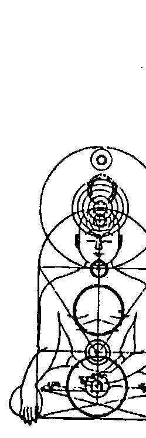

# OSHO
奧修心靈系列 49

## ~個人的誕生~
瑜伽始末1～5卷濃縮版

# 瑜伽

# The Yoga Book, Vol.I

# 書之〈上冊〉

派坦加利一直對人們有很大的幫助，他是無與倫比的。有無數的人藉著派坦加利的幫助經歷過這個世界，因為他並不是按照他的了解來談論，他跟著你一起走。隨著你了解的成長，他會進入到越來越深、越來越深。他會牽著你的手，漸漸地把你帶到最高的頂峰。

奧修 著
謙達那 譯

天使神秘学院

+   ※ 专业占卜预测机构
+   ※ 神秘学培训机构
+   ※ 水晶能量研究中心
+   ※ 神秘学资料库
+   ※ 官方微信：strcdts
+   ※ 微信公众平台：strc2011
+   ※ 官方店铺网址：http://strc.cr.cx
+   ※ 读书交流QQ群：
    占星塔罗占卜师交流群：814594478（加入密码：PDF）
    神秘学其他综合群：659338717（加入密码：PDF）

制作说明：

本书由《天使神秘学院》出重金从台湾购入的原版书籍扫描制作完成。为达到最好阅读效果，特地把原版书全部切开后，再经由专业扫描设备高精度扫描完成，并经过一张張的PS后期处理最终成书，其间花费大量的人力、物力以及时间，只为能给大家提供经济并优质的神秘学学习资料而努力。

本学院强力谴责某些机构和个人，把本学院花心血制作完成的电子书籍，包装后直接放在自家淘宝网上低价倾销的行为，以谋取不劳而获的经济利益。如果长此以往最终将无人愿意再为大家花心思制作电子书，那以后可能大家再无新书可读。

为让大家以后能够读到更多的好书，也为了本学院的良性发展。本学院恳请大家尽量做到如下几点：

+   一、尽量在本学院的网站购买电子书籍。
+   二、请勿用技术手段把电子书内的水印及加密去掉。
+   三、在收到电子书后小范围传阅即可，千万不要公开传播，更别挂到淘宝网上低价销售。

同时为答谢广大支持者，学院电子书将做如下调整：

+   一、学院会把一些早已收回制作成本的电子书折价销售。
+   二、最新制作的电子书籍会开放打印功能，大家购买后有条件的可自行打印成书。

天使神秘学院
2020年1月

# 瑜伽之書(上冊)

# The Yoga Book, vol. I

# 個人的誕生

奧修／原著 謙達那／譯
校對／德瓦嘉塔

奧修出版社

# THE YOGA BOOK, VOL. I

Published by arrangement with
Osho International Foundation
Bahnhofstr. 52, 8001 Zurich
Switzerland

# 1 譯者序

瑜伽行者——潛在的、現在的、未來的 想吸取瑜伽智慧精髓來幫助個人成長的人 奧修講派坦加利利的瑜伽經共有十卷，要看完全部十卷需要花較長的時間，因此有一位資深的德國瑜伽老師將它濃縮成上、下兩冊，本書為上冊，它涵蓋了「瑜伽始末」的第一卷到第五卷。這位瑜伽老師在濃縮的過程當中是以奧修的理念為主，因此在每一章前面，他都特別將奧修重要的觀念以黑體字標示出來，讓讀者對它有更深刻的印象。雖然如此，派坦加利重要的理念在本書裡面也都完整地被包含了。

獻給

获取更多好书，请加微信号：strcdts 店铺：http://strc.cr.cx

## 譯者序 2

看這本書，你會覺得派坦加利的確很偉大，但是那些偉大的經文如果没有 奧修那種鞭辟入裡的解釋，你就無法對它有深入的了解。透過奧修的解釋，派 坦加利的經文活了起来，但是更重要的，它有没有在你裡面活了起来？它有沒 有在你的身體裏面活了起来？它活起来不 是重點，你活起來才是重點。 虔誠地希望這本書能夠幫助你的整個存在活起來。 當我在校對此書時，我發覺，它的內容實在是太精采了，本書不愧為精典 之作，派坦加利深入且實用的智慧可以當成我們畢生的座右銘。

謙達那 二〇〇三年十月 於台北

# 3 目錄

+   - 譯者序／1
+   - 第一章 瑜伽途径的介绍／5
+   - 第二章 正確和錯誤的知識／31
+   - 第三章 不執著並且帶著虔誠的心經常作內在的練習／71
+   - 第四章 全然的努力和臣服／121
+   - 第五章 宇宙的聲音／135
+   - 第六章 培養內在的態度／167
+   - 第七章 很自然地蛻變頭腦的控制／203
+   - 第八章 純粹的看／223
+   - 第九章 三摩地——脫離輪迴／249
+   - 第十章 缺乏覺知會害怕死亡／283
+   - 第十一章 覺知：燒掉「過去」的火／313
+   - 第十二章 瑜伽的八肢／355
+   - 第十三章 死亡和規範／405

# 第一章 瑜伽途径的介紹

我們生活在一種很深的幻象裡，生活在希望、未來、和明天的幻象裡。瑜伽是達到不作夢頭腦的一種方法。相信就好像衣服，沒有什麼實質的東西被改變，你仍然保持一樣。瑜伽是存在性的、經驗性的、實驗性的。不需要相信，只需要去經驗的勇氣。

我們生活在 一種很深的幻象裡，生活在希望、未來、和明天的幻象裡。就 人現在的樣子，他沒有辦法不要自我欺騙；就人現在的樣子，他沒有辦法跟真 理一起存在，這一點必須很深入地被了解，因為如果不了解它，將不可能進入 那個被稱之為瑜伽的探詢。

那個需要被深入瞭解——那個需要謊言、需要幻象的頭腦，那個沒有辦法 跟真實的一起存在的頭腦，那個需要作夢的頭腦。你不僅是在晚上作夢，即使 在你醒著的時候，你也是一直在作夢。 不論白天或晚上，頭腦都一直從沒有夢走向作夢，然後再從作夢走向沒有 夢，這是一種內在的韻律。我們不僅繼續作夢，在生活中我們也是將希望投 射到未來。 現在幾乎一直都是一個地獄，我們能夠延續它只是因為我們把希望投射到 未來。因為有明天，所以你可以生活在今天。你希望明天將會有什麼事發生— |某些天堂的門明天將會打開。它們從來不會在今天打開，而當明天來臨，它 將不會以一個明天來臨，它將會以今天來臨，但是等到那個時候，頭腦已經又再度走開了。你一直都走在你的前面，作夢就是意味著如此。你並沒有跟那真實的合而爲一，你並沒有跟那個在你近處的、那個在此時此地的合而爲一，你在其他地方，你走到前面去了，你跳到前面去了。你以很多種方式來爲明天和未來取名字。有人稱之爲天堂，有人稱之爲莫克夏，但它一直都是在未來。有人以財富來思考，但那個財富是在未來；有人以極樂世界來思考，但那個極樂世界是在你死後——在未來很遠很遠的地方。你爲那個不存在的東西浪費掉了你的現在，這就是作夢的意思。你無法存在於此時此地。停留在當下這個片刻似乎是很費力的。你可以停留在過去，因爲那個也是在作夢——回想那個已經不復存在的東西。或者你會跑到未來，那是投射，那也是從過去來創造出一些事。未來只不過是過去的再投射——更多彩多姿、更美、更令人愉悅，但這兩者都是不存在。只有現在存在，但是你從來不在現在，作夢就是意味著如此。瑜伽是達到不作夢頭腦的一種方法。瑜伽是使你存在於此時此地的一種科學。瑜伽意味著現在你已經準備好不要進入未來。瑜伽意味著現在你已經準備好不要希望，不要跳到你存在的前面。瑜伽意味著按照真相本然的樣子來面對它。

所以，唯有當一個人對他自己現在的頭腦完全失望，他才能夠進入瑜伽或 是進入瑜伽的途徑。如果你仍然希望你可以透過頭腦得到一些東西，那麼瑜伽並不適合你。需要完全的失望，需要了解這個投射的頭腦是沒有用的，這個希
望的頭腦是沒有意義的，它沒有辦法引導你到任何地方。它只是關閉你的眼睛睛，使你醉，它從來不允許真相顯露給你。它掩蓋了你，使你無法看到真相。你的頭腦是一種藥，它反對「那個是的」，所以除非你對你的頭腦完全失望，對你存在的方式完全失望，而且能夠無條件地將它拋棄，否則你無法進入那個途徑。

所以，有很多人有興趣，但是只有非常少數人能夠進入，因為你的興趣或許只是因為你的頭腦。現在你或許希望透過瑜伽而得到一些東西，但是那個想達成的動機是存在的，你認為你或許可以透過瑜伽而變完美，或者你可以達到完美存在的喜樂狀態，或者你可以跟梵天合而為一，或者你可以達到識、和喜樂的三位一體，這或許是你對瑜伽有興趣的原因。如果那個原因是這樣的話，那麼你跟瑜伽的途徑就不可能會合，那麼你是完全反對它的，你走進了一個跟它完全相反的層面。瑜伽意味著現在有希望，現在沒有未來，現在沒有慾望，一個人已經準備好去知道「那個是的」。一個人只對「那個是的」有興趣，因為只有那個真實的能夠解放全沒有興趣！一個人只對「那個是的」有興趣，因為只有那個真實的能夠解放完全的失望是需要的一個人是需要。如果你真的很痛苦，不要希望，因為你的希望將會延續那個痛苦。你的希望是一種藥，它只能幫助你達到死亡，沒有辦法達到其他地方。你所有的希望都只能引導你到死亡，它們正在把你帶到那裡。變成完全没有希望的——没有未來、沒有希望。這很困難，需要勇氣去面對真相。但是這樣的片刻總有一個時候會來臨每一個人身上，當那個時候來臨，他會覺得完全失望，會覺得人生完全没有意義。當他覺知到任何他所做的事事都没有用，不論他去到哪裡，他還是哪裡都没有去到，一切的生命都没有意義——突然間，那個希望消失了，未來消失了，你首度融入現在，你首度跟真
實的合而爲一。

瑜伽是轉入內在，它是完全向後轉。當你不走向過去，也不走向未來，那麼你就開始進入你自己，因為你的存在是在此時此地，它可以進入這個真實的存在。但是這樣的話，頭腦也必須在這裡。這個片刻被派坦加利的第一段經文指出來。

在我們談論第一段經文之前，有其他幾件事必須加以了解。首先，瑜伽並不是一種宗教，這一點要記住。瑜伽並不是印度教的，也不是回教的。瑜伽是純粹的科學，就好像數學、物理、或化學一樣。物理並不是基督教的物理，也不是佛教的物理。如果基督徒發現了物理的法則，那只是一種碰巧，但物理仍不是佛教的物理。瑜伽是一種科學。瑜伽是一種科學，印度人發現它只是一種碰巧，並不是印度人的，它是一種內本質的純粹科學。瑜伽是純粹的科學，而就瑜伽的領域而言，派坦加利是最偉大的名字。這個人是最稀有的，沒有其他的名字可以跟派坦加利相比。在歷史上的第一次，這個人將宗教帶到科學的狀態，他使宗教成為一種科學，只是法則，不需要相
信。 因爲所謂的宗教需要信念。一個宗教和另外一個宗教之間並沒有其他的差別，差別只是在於信念。回教徒有某種信念，印度教教徒有另外的信念，基督徒又有另外的信念。那個差別只是在於信念。就信念而言，瑜伽什麼都没有，瑜伽不叫你相信任何事，瑜伽叫你去經驗。實驗和經驗兩者是一樣的，只是它們的方向有所不同。實驗意味著你可以在外在做的事；經驗意味著你可以在裡面做的事。經驗是一種實驗。科學說：不要相信，盡可能懷疑。但是同時也不要不相信，因爲不相信也一種信念。你可以相信神，你也可以相信沒有神的觀念。你可以很狂熱地說神存在，你也可以完全相反地，很狂熱地說神不存在。有神論者和無神論者都是相信的人，而相信並不是科學的領域。科學意味著經驗某些事，經驗那個是，不需要相信或信念。所以第二件要記住的事是：瑜伽是存在性的、經驗性的、實驗性的。不需要信念，只需要去經驗的勇氣，那就是一般人所缺少的。你很就可以相信，因爲在相信當中你不会被蛻變。信念是某種被加諸在你身上的東西，是膚
淺的東西。你的本質存在並沒有被改變，你並沒有經歷某種突變。你或許是一個印度教教徒，但是隔天你可以變成一個基督徒，你只是從吉踏經變成聖經，你也可以將它變成可蘭經，但是那個以前拿吉踏經而現在看聖經的人仍然保持一樣，他只是改變他的信念。信念就好像衣服一樣，沒有什麼實質的東西被改變，你仍然保持一樣。你將一個印度教教徒解剖開來，將一個回教徒解剖開來，他們的內在是一樣的。印度教教徒會去廟裏，但是回教徒討厭；回教徒會去回教寺院，但是印度教教徒討厭回教寺院，然而在內在，他們是同樣的人。相信是容易的，因爲你並不需要真正做什麼——只要做一些表面功夫，或是做一些裝飾，那些東西是你隨時可以將它擺在一旁的。瑜伽並不是一種信念，那就是爲什麼它是困難的、費力的，而且有時候它似乎不可能。它是一種存在性的方法。你會來到真理，但不是透過信念，而是透過你自己的經驗，透過你自己的達成。那意味著你必須完全改變。你的看法、你的生活方式、你的頭腦、和你的心理狀態都必須完全被粉碎。某種新的東西必須被創造出來。只有帶著那個新的，你才能夠碰觸到真相。

所以瑜伽是死亡，也是真實的生命。就你現在這樣，你必須死掉，除非你死掉，否則新的無法誕生。那個新的就隱藏在你裏面。你只是它的一顆種子，種子必須掉下來，被泥土所吸收。種子必須死掉，唯有如此，那個新的才會從你產生出來。你的死亡將會變成你新的生命。除非你準備死掉，否則你没有辦法再被生出来。它並不是一個改變信念的問題。瑜伽並不是一種哲學。我說它不是一種宗教，也不是一種哲學，它不是你可以思考的東西。它是某種你必須成為的東西，光思考是没有用的。思考在你

## 19 第一章 瑜伽途径的介绍

存在的能力。所有瑜伽的姿势並不是真正顧慮到身體，它們是顧慮到存在的
的能力。派坦加利說：如果你能夠靜坐幾個小時而不要移動你的身體，你存在的
能夠成長，你爲什麼要動呢？你甚至沒有辦法坐著不動幾秒鐘。你的身
體會開始動，你會在某個地方覺得癢，或者是腿變麻，有很多事情會開始發
生，這些都只是你想要動的藉口。
你不是主人，你無法對身體說：現在有個小時的時間我將不要動。身體
會立刻反抗，它會立刻強迫你去動，或是去做些什麼，而且它會給你一些理
由：你必須動，因爲有一隻蟲在咬你。當你看的時候，你或許找不到那隻蟲。
你並不是一個穩定的存在，你是一個顫抖——一個持續發燒的行動。派坦加利
的阿沙那斯瑜伽姿勢並不是真正顧慮到任何生理的訓練，而是存在的內在訓
練——只要存在，什麼事都不必做，没有任何移動，没有任何活動，只是存
在。那個存在將能夠幫助你歸於中心。
身體越是跟著你，你裡面就會有一個更大、更强壯的本質存在。記住，如
果身體不動，頭腦沒有辦法移動，因爲頭腦和身體並不是兩樣東西，它們是同

## 19 第一章 瑜伽途径的介绍

一個現象的兩極。你並不是身體和頭腦，你是「身體—頭腦」。你的人格是心 理身體的——身體和頭腦兩者在一起。頭腦是身體最精微的部分，或者你可以 反過來說，身體是頭腦最粗糙的部分。 頭腦是身體最精微的部分，或者你可以 派坦加利從你的呼吸開始下功夫，因為你的呼吸是你的生命。首先他在身 體下功夫，然後他在你存在的第二層——呼吸——上面下功夫，然後他開始在 思想上下功夫。 有很多方法直接從思想開始，它們並不是那麼科學，或是那麼合乎邏輯， 因為那個你在他身上下功夫的人是根植於身體，他是一個身體。科學的方法必 须從身體開始，你的身體必須先被改變。當你的身體改變，你的呼吸就會改 變；當你的呼吸改變，你的思想就會改變；當你的思想改變，你就會改變。 最粗糙的是身體，最精微的是頭腦。不要從精微的開始，因為它比較困 難，它是模糊的，你無法掌握它。要從身體開始，那就是為什麼派坦加利從身 體的姿勢開始。你或許沒有觀察到，因為你在生活當中非常不警覺，每當你的 頭腦裡有某種情緒，你就有某種身體的姿勢跟它配合在一起。如果你在生氣，你身體的姿勢將會 氣，你能夠很放鬆地坐著嗎？——不可能。如果你在生氣，你身體的姿勢將會 改變，如果你很注意，你身體的姿勢將會改變；如果你想睡，你身體的姿勢將 會改變。 如果你是完全寧靜的，你將會像佛一樣地坐著，你將會像佛一樣地走路。 如果你像佛一樣地走路，你將會感覺到有某種寧靜融入到你的心。有某種寧靜 的橋由你那像佛一樣的走路所創造出來。像一個佛一樣靜靜地坐在一棵樹下， 只要坐著，只要身體坐著，突然間你將會看到你的呼吸在改變，它變得更放鬆、更和諧。當呼吸很和諧、很放鬆，你將會感覺到頭腦沒有那麼緊張。思想會變得比較少，雲會變得比較少，然後會有更多的空間、更多的天空。你在內外都會感覺到一種寧靜，在流動著。 因此我說派坦加利是很科學的。如果你想要改變你身體的姿勢，派坦加利 會說要改變你食物的習慣，因為每一種食物的習慣都會產生出微妙的身體姿勢。如果你是一個肉食者，你沒有辦法像佛一樣地坐著。如果你是一個非素食 者，你的姿勢將會不一樣；如果你是一個素食者，你的姿勢將會不一樣——因
為身體是由你的食物所構成的，它並不是一個偶發事件。不論你將什麼東西放進身體裡，身體就會將它反映出來。所以對派坦加利而言，素食並不是一種道德信仰，它是一種科學方法。當你吃肉，你不只是吃進食物，你還允許那個肉的來源的動物性進入到你裡面。那個肉是某一個特定身體的一部分，那個肉是某一個特定本能模式的的一部分。在幾個小時之前，那個肉是那個隻動物，那個肉是某一個特定身體的一部分，那個肉是某一個特定本能模式的的一部分。在幾個小時之前，那個肉是那個隻動物，那個肉擺帶著那隻動物所有的印象和那隻動物所有的習慣。如果你很敏感，你將會覺知到，每當你吃某些東西，就有某些改變會立刻發生。你喝了酒之後就不一樣了，有一種新的人格會立刻產生。酒精沒有辦法創造出人格，但是它可以改變你身體的模式，它可以改變你的身體化學。隨著身體化學的改變，頭腦就會改變它的模式，當頭腦的模式改變，就有一種新的人格會產生。派坦加利是科學的，因爲他會記下每一件事——食物、身體的姿勢、你覺的方式、你早上起床的方式、起床的時間，以及你上床睡覺的時間。他會記下每一件事，為的是要將你的身體提升到一個比較高的狀態，然後他會記下你
的呼吸。

如果你很悲傷，你會有不同的呼吸韻律。將它記下來，試試看，你可以有一個很美的實驗。每當你在悲傷的時候，注意看你的呼吸——你花了多少時間在吸氣，然後你花了多少時間在呼氣。將它記下來，在你的內在自己數：一、二、三、四、五……你數到五，然後那個呼吸結束。然後你再數，當你數到十，那個呼氣結束了。很仔細地去看它，這樣你才能夠知道那個比率。然後每當你覺得快樂的時候，立刻嘗試那個悲傷的模式——五，十——那個快樂就會消失。

反之亦然。每當你是快樂的，就將你的呼吸記下來，然後每當你覺得悲傷，就試著使用那個呼吸模式，悲傷將會立刻消失，因為它們沒有辦法處於真空之中。它存在於一個系統之中，而呼吸對頭腦來講是最深的系統。呼吸就是思想。如果你停止呼吸，思想就會立刻停止。試一下，停止呼吸，你思想的過程就會立刻斷掉。思想是看得見的呼吸看不見的部分。

說「不要吃肉」，他並不是在說吃肉是暴力的，不，他是說吃肉是自毀的。當我說派坦加利是科學的，我就是意味著如此。他不是一個詩人。如果他有一些詩人說，成為非暴力的的是自私的，你並不是在對別人慈悲，你是在對你自己慈悲。他是顧慮到你，和顧慮到你變。你沒有辦法只是藉著想改變而改變，你必須創造出那個情況。否則全世界都在教導愛，但是愛並不存在於任何地方，因爲那個情況不存在。如果你是一個吃肉的人，你怎能夠夠愛？如果你的愛將只是虛假的，就會有暴力存在。帶著這麼深的暴力，你怎能夠夠愛？你的愛將只是一個夢的形式。或者它可能只是一個夢的形式。派坦加利不會說成為具有愛心是好的，他會幫助你創造出那個愛可以開花的情況。那就是為什麼我說他是科學的。如果你一步一步地跟隨著他，你將會看到你裏面有很多開花，那是你以前無法想像的，你甚至連作夢都想不到。如果你改變你的食物，如果你改變你身體的姿勢，如果你改變你睡覺的模式，如果你改變平常的習慣，你將會看到一個新的人在你裏面產生。然後就可能有一些不同的改變。經過一個改變之後，另外的改變就變得可能。一步一步地，有
很多可能性會打開，那就是爲什麼我說他是邏輯的。他並不是一個合乎邏輯的
哲學家，他是一個合乎邏輯的、實際的人。 所以任何發生在身體的事都會發生在頭腦，反之亦然：任何發生在頭腦的事都會發生在身體。如果身體是不動的，頭腦就會靜下來，頭腦就會靜下來。事實上是頭腦開始移動，然後試著去移動身體，因爲如果身體移動，頭腦就可以移動。當身體不動，頭腦無法移動，它需要一個移動的身體。 如果身體不動，頭腦就不動，你就歸於中心。這個不動的姿勢並非只是理上的訓練。它是在創造出一個情況，使得在那個情況下歸於中心能夠發生，在那個情況下你可以被規範。當你是存在的，當你變得歸於中心，當你知道存在意味著什麼，那麼你可以學習，因爲如此一來你將會成爲謙虛的，那麼你可以夠臣服，那麼就不會有虛假的自我依附在你身上，因爲一旦歸於中心，你就知道所有的自我都是虛假的，那麼你可以彎腰鞠躬，此時一個真正的門徒就誕生了。 一個門徒意味著一個追求者，他不是一個群眾（群眾指一個人的內在四分
五裂，沒有歸於一，沒有歸於中心），他試著成為歸於中心的、結晶的，至少感覺他的本質，想要變成他自己的主人。瑜伽所為一個「個人」（主人），想要去使你成為你自己的主人。就你現在這樣，你只是很多很多慾望的奴隸。有很多很多人在那裡，你只是一個奴隸，你被拉向很多方向。

瑜伽是沒有頭腦的狀態。頭腦（mind）這個字已經涵蓋了一切——你的自我、你的慾望、你的希望、你的哲學、你的宗教、和你的經典。頭腦涵蓋了一切。任何你能夠想到的都是頭腦。一切已知的，一切可以被知道的，都在頭腦。停止頭腦意味著停止那已知的，停止那可知的。它是跳進那個未知的。說未知的是不對當沒有頭腦，你就處於未知之中，瑜伽是跳進那個未知的。說未知的是不可知的，應該說是不可知的。

頭腦是什麼？頭腦在那裡做什麼？它是什麼？通常我們認為頭腦是在頭裡面某種實質的東西。但是派坦加利並不同意這種說法，也沒有一個知道頭腦內在的人會同意這種說法，現代的科學也不同意。頭腦並不是在頭裡面實質的東西，頭腦只是一個功能、一個活動。

你在走路，然後我說你在走路，走路是什麼？如果你停下來，走路在哪裡？如果你坐下來，那個走路跑到哪裡去了？走路並不是實質的東西，它是一個活動。所以當你坐下來的時候，沒有人能夠問：你將那個走路放在哪裡？剛才你在走路，現在那個走路跑到哪裡去了？你將會笑，你將會說：走路並不是實質的東西，它只是一個活動。實質的東西，它只是一個活動。我可以走路，我可以再度走路，我也可以停下來，它是一個活動。

來，它是一個活動。頭腦也是一個活動，但是因為有頭腦這個字，所以看起來好像有某種實質的東西存在。最好稱之為「頭動」——就好像走路一樣。頭腦意味著頭動，頭腦意味著思考，它是一個活動。菩提達摩去到中國，梁武帝來看他。梁武帝說，我的頭腦非常不安、非常受到打擾。你是一個偉大的聖人，我一直在等你，請你告訴我，我要怎麼做才能夠使我的頭腦得到平息。

菩提達摩說：你什麼事都不要做。首先把你的頭腦帶到我這裡來。梁武帝聽不懂他在說什麼，因此他問：這是什麼意思？菩提達摩說：你明天早上四點鐘的時候來，一個人來，記得把你的頭腦帶來。梁武帝整個晚上都睡不著，有很多次他都打消整個念頭，他覺得這個人似
乎是瘋了，他這樣說是什麼意思？把你的頭腦帶來，不要忘記。但是這個
人實在太有魅力了，所以他沒有辦法取消那個約定。在四點鐘的時候，他跳下了床說：不論發生什麼事我都一定要去。這個人或許有一些東西，他的眼睛透露出他是有東西的。雖然他看起來有一點瘋狂，
但我還是要去，看看到底會有什麼事發生。
所以我他就去了，菩提達摩坐在那裡，手上拿著一根很大的棒子。他說：你
來了，那你的頭腦呢？你有没有將它帶過來。
梁武帝說：你在胡說些什麼。當我在這裡，我的頭腦就在這裡，它並不是
我可以放在某一個地方的東西，它就在我裡面。所以菩提達摩說，好，那麼
第一件事已經確定了——頭腦在你裡面。梁武帝說，是的，頭腦在我裡面。菩
提達摩說：現在閉起你的眼睛，看看它在哪裡。如果你能夠找出它在哪裡，
立刻指出來給我看，我會將它平息。
所以梁武帝就閉起他的眼睛，試了又試，看了又看。他越看就越覺知到沒
有頭腦，因爲頭腦只是一個活動。它並不是某種在那裡而你可以指出來的東
西。當他了解到它並不是一樣東西，那個問題的荒謬就暴露出來了。如果它不
是一樣東西，那麼就沒有辦法對它做什麼。如果它是一個活動，那麼就不要做那個活動，就這樣而已。如果它就好像走路一樣，那麼就不要走路。說：那麼我已經把它平息了。每當你感覺到不安，只要向內看，看看那個不安在哪裡？那個看就是反頭腦的，因爲看並不是一種思考。如果你很強烈地看，你的整個努力都會變成那個看，而變成思考和活動的也是那個同樣的能量。這就是派坦加利的定義：瑜伽是頭腦的停止。當沒有頭腦，你就是處於瑜伽之中；當有頭腦，你就不是處於瑜伽之中。所以你也可以做很多瑜伽的姿勢，但是如果你的頭腦繼續運作，如果你繼續思考，你就不是處於瑜伽之中。瑜伽是沒有頭腦的狀態。如果你可以沒有頭腦，那麼不必做任何姿勢你也会變成一個完美的瑜伽行者。它曾經發生在很多不做任何姿勢的人身上，但是有很多人做了瑜伽的姿勢很多世也沒有什麼事發
生。 因爲基本上要了解的事是：當

# 第二章 正確和錯誤的知識

那麼直接的認知是什麼？直接的認知唯有當沒有居間者才可能，甚至連感官都不能有，派坦加利說這樣才是正確的知識。這是正確知識的第一個來源：當你知道某件事，而你不需要依靠任何其他的东西。唯有在很深的靜心當中，你才能夠超越感官，那麼正確的認知就變得可能。當佛陀知道他最內在的本質，那個最內在的本質就是直接的認知。它不涉及和被知者面對面，沒有任何媒介報導它，也沒有一個類似代理人的東西。那個知者和任何感官，沒有任何媒介報導它，也沒有一個類似代理人的東西。那個知者實的。所以第一種正確的知識只可能是屬於內在的自己。你或許知道整個世界，但是如果你不知道你存在最內在的核心，你的整個知識是無稽的，它並非真正 的知識，它不可能是真實的，因為第一個基本的正確知識並沒有發生在你身上，你的整座大廈都是虛假的。你或許知道很多事情，但是如果你不知道你自 己，你所有的知識都是根據報導，由感官而來的報導。但是你怎能夠確定那 些由你的感官所給你的是正確的報導？在晚上的時候你作夢，在作夢的時候你 開始相信那些夢，你認為它是真實的。你的感官在報導那些夢——你的眼睛在

看它，你的耳朵在聽它，你或許還碰觸到它。你的感官報導給你，所以你陷入 了幻象，認為它是真實的。你在這裡……它或許只是一個夢，你夢到我一個夢，你夢到我一個夢。當你在作夢的時候，每一個夢都是真實的。 有一次莊子在夢中看到他變成一隻蝴蝶，到了早上他變得很傷心，他的弟 子問他：你為什麼那麼傷心？ 莊子說：我陷入困難，我以前從來沒有陷入像這樣的困難，這個困惑 似乎不可能，它是沒有辦法解決的。昨天晚上我在夢中看到我變成一隻蝴 蝶。 他的弟子們笑了，他們說：這有什麼呢？這並不是一個謎，這只不過是 一個夢。 莊子說：但是你們聽著，我陷入了困難。如果莊子可以作夢說他變成了 一隻蝴蝶，一隻蝴蝶或許也可以作夢說他現在變成了莊子。所以要如何決定說 我現在是在面對著真相，或者它也是一個夢？如果莊子可以夢見他變成一隻蝴 蝶，一隻蝴蝶為什麼不能夢見牠變成了莊子？

這並不是不可能的，它的相反是可能發生的。你無法依賴感官，在夢中，它們會欺騙你。如果你服用藥物，比方說迷幻藥或類似的東西，你的感官將會開始欺騙你，你將會開始看到不存在的東西。它們會把你騙到使你完全相信幻象，然後你就陷入了危險。感官是不能夠被相信的，那麼直接的認知是什麼？直接的認知就是那個不透過感官而知道的。所以第一種正確的知識只可能屬於內在的自己，因為唯有在那裡才不需要感官，其他每一個地方都需要感官。如果你想要看我，你需要透過眼睛來看，但是如果你想要看你自己，眼睛是不需要的。甚至連一個瞎子也可以看他自己。如果你想要看你自己，在黑暗中就可以了，光是不需要的。即使在最暗的洞穴裡，你也可以知道你自己。任何媒介——光或眼睛，或其他任何東西——都不需要。內在的經驗是立即的，那個立即的經驗是所有正確知識的基礎。

一旦你根植於那個內在的經驗，就會有很多事情開始發生在你身上，現在不可能了解它們。一個根植於他的中心的人，一個根植於他內本質的人，一
個具有那種直接經驗的人，感官是騙不了他的。他是醒悟的，那麼他的眼睛騙不了他，他的耳朵也騙不了他，沒有什麼東西可以騙得了他，欺騙消失了。你可以被欺騙，因為你生活在錯覺裡。一旦你成為一個正確的知者，你就不會被騙。你不会被騙！因為如此一來，每一件事都會漸漸變成正確的知識。一旦你知道你自己，那麼任何你所知道的都將會自動變成正確的，因為現在你是正確的。這個差別必須被記住：如果你是正確的，那麼每一件事都會變成正確的；所以問題不在於在外在做些什麼，問題在於要在內下功夫。你無法欺騙一個佛，那是不可能的。你怎麼可能欺騙一個佛，他根植於他自己。對他來講你是透明的，你無法欺騙他。在你知道之前，他已经先知道你了。甚至在你裡面的一絲思想，他都能夠看得很清楚，他能夠穿透到你的最內在。你能够穿透你自己多深，你就能夠穿透別人多深。如果你能夠穿透視你自
在。

深入外在外，而因為你對你內在的深入甚至連一英吋都沒有，所以任何你在外在所作的都只是好像一個夢。派坦加利說，推論是正確知識的第二個來源。正確的邏輯，正確的懷疑，正確的申論可以給你一些東西，幫助你走向正確的知識，那個他稱之為推論。你並沒有直接看到，但是每一件事都可以證明它，它一定是如此。有一些情況可以證明它一定是如此。邏輯是危險的，它有兩面，你也可能錯誤地使用邏輯，這樣你也会達到某些結論。正確的推論意味著那個能夠使你成長的；錯誤的推論，不論它看起來是多麼地完美，都會封閉你的成長。推論也可以是正確知識的來源，甚至邏輯也可以被用來當成正確知識的來源，但是你必須對你所做的事非常覺知。如果你只是一味地邏輯，你可能会因此而自殺。邏輯可以變成一種自殺，對很多人來講，它就是變成這樣。

就在幾天之前，有一個加州的求道者來到這裡。他旅行得很遠……他是要
來見我的。然後他說：‘在我要靜心之前，或者是在你叫我靜心之前——因為我稱說任何來到你這裡的人，你都把他們推入靜心，所以在你把我推入靜心之前，我有很問題要問。他有一個明細表，裡面至少列了一百個問題。我覺得他已經把所有可能的問題都列進去了……關於神、關於靈魂、關於真理、關於於天堂和地獄，以及每一樣東西——一張滿列問題的明細表。他說：’除非你先解決這些問題，否則我將不要進入靜心。’就某方面而言他是合乎邏輯的，因為他說：’除非我的問題被回答了，否則我怎能夠進入你所指示的方向？你或許是錯的，所以唯有當我的懷疑消失，你才能夠證明你是對的。’然而他的懷疑是不可能消失的。這是一個兩難式：如果他靜心，他們就可以消失，但是他說，唯有當這些懷疑不存在，他才要靜心。怎麼辦呢？他說：’先證明有神。’沒有人曾經證明過它，也有人能夠證明它。但那並不意味著神是不存在的，只是祂沒有辦法被證明。它是這麼有生命力的一件事，你必須去經驗它才能夠知道它，沒
證的小東西。它是這麼有生命力的一件事，你必須去經驗它才能夠知道它，沒 获取更多好书，请加微信号：strcdts 店铺：http://strc.cr.cx

就在幾天之前，有一個加州的求道者來到這裡。他旅行得很遠……他是要
來見我的。然後他說：‘在我要靜心之前，或者是在你叫我靜心之前——因為我稱說任何來到你這裡的人，你都把他們推入靜心，所以在你把我推入靜心之前，我有很問題要問。他有一個明細表，裡面至少列了一百個問題。我覺得他已經把所有可能的問題都列進去了……關於神、關於靈魂、關於真理、關於於天堂和地獄，以及每一樣東西——一張滿列問題的明細表。他說：’除非你先解決這些問題，否則我將不要進入靜心。’就某方面而言他是合乎邏輯的，因為他說：’除非我的問題被回答了，否則我怎能夠進入你所指示的方向？你或許是錯的，所以唯有當我的懷疑消失，你才能夠證明你是對的。’然而他的懷疑是不可能消失的。這是一個兩難式：如果他靜心，他們就可以消失，但是他說，唯有當這些懷疑不存在，他才要靜心。怎麼辦呢？他說：’先證明有神。’沒有人曾經證明過它，也有人能夠證明它。但那並不意味著神是不存在的，只是祂沒有辦法被證明。它是這麼有生命力的一件事，你必須去經驗它才能夠知道它，沒
證的小東西。它是這麼有生命力的一件事，你必須去經驗它才能夠知道它，沒 获取更多好书，请加微信号：strcdts 店铺：http://strc.cr.cx

[PAGE 47]

# 第二章 正確和錙誤的知識

他的來源。如果你有直接的認知，那麼就不需要推論，或是成道者的話語，因 磨你的推論將會是瘋狂的，所以派坦加利說有第三個來源。 你不知道。如果你能夠直接知道，那麼就沒有問題，那麼就不需要任何其 結論。你用你的頭腦來推論，那個推論就會是你的推論，如果你是瘋狂的，那 楚，他們是神秘的。如果你用他們的話語來加以推論，你可以從它們導出任何 似非而是的話，因為真理只能透過似非而是的話語來表達。他們的陳述不清 盾，所以你可以推論出任何你所喜歡的東西。 那些話語非常矛盾，同時不合邏輯。每一個知道的人都要被迫說出矛盾和 法判斷它。我們不知道如何透過他的話語來作正確的推論。那些話語互相矛 了一些話，我們不知道他在說什麼，我們並沒有經驗到那個，所以我們沒有辦 法判斷它。我們不知道如何透過他的話語來作正確的推論。那些話語互相矛了些話，我們不知道他在說什麼，我們並沒有經驗到那個，所以我們沒有辦 識的來源。 Agama 意味著那些已經知道的人的話語。佛陀說了一些話，或是耶穌說 人到達了。他們已經到達了目標，他們已經進入廟裏，他們的話語也是正確知 球上的第一個人，你並不是第一個求道者。已經有無數的人追尋過無數的年 代，不僅是在這個星球上，同時也在其他的星球。那個追尋是永恆的，有很多

為你本身已經開悟了，那麼你可以拋棄其他兩個來源。但如果不是這樣，那麼第三個來源就值得嘗試——成道者的話語。 你沒有辦法證明它們，你也没有辦法反證它們。你只能信任，而那個信任是假設性的，它是非常科學的。在科學裡面如果沒有假設，你也是無法進行。 但假設並不是一個信念，它只是一個操作上的安排。假設只是一個方向，你必須去實驗。如果那個實驗被證明是對的，那麼那個假設就可以變成一個學說； 如果那個實驗無法成功，那麼那個假設就必須被拋棄。成道者的話語必須先被信任，被當成一個假設，然後放在你的生活中去實踐。如果它們被證明是真實的，那麼那個假設就可以變成一個信念；如果它們被證明是虛假的，那麼那個假設就必須被拋棄。 你去到佛陀那裡，他會說：「等一等！要有耐心，先靜心，兩年之內不要問任何問題。」這個你必須信任，沒有其他的方式。 你可能會認為：「這個人或許只是在騙我，那麼我兩年的生命就浪費掉了。如果兩年之後證明這個人只是在自欺欺人，他的成道只是一個幻象，那麼我的兩年就被浪費掉了。」但是沒有其他的方式，你必須冒那個險。如果你停
留在原來的地方，不信任佛陀，這兩年將會變得沒有用，因為除非你信任，否則你無法工作。那個工作非常熱烈，唯有當你有信任，你才能夠很全然地進入它。如果你沒有信任，你繼續保留某些東西，那個保留將會使你無法經驗到佛陀所說的。這是冒險的，但生命本身就是冒險。對於更高的生命將會有更高的情可能會弄錯，所以最好坐在那裡等待，這是唯一的錯誤。你將不會有危險，但是不可能成長。

派坦加利說有些事情你不知道，有些事情你的邏輯無法推論，你必須以信任的方式來進行。因為對於這第三個來源，師父是必要的，一個已經知道的人是必要的，而你必須冒險，我說它是一個冒險，因為它是一個不能保證的。整個事情或許會被證明只是一個浪費，但最好去冒那個險，因為即使它被證明是一個浪費，你也会學到很多，如此一來就沒有人能夠欺騙你，至少你会學到那麼多。如果你帶著信任來做，如果你很全然地做它，像影子一樣地跟隨著佛陀，

事情可能會開始發生，因為它們已經發生在他身上。它們已經發生在佛陀、耶
稣、和穆罕默德身上，他們知他們所經過的路。如果你跟他們爭論，你將會
是輸家。他們不可能輸家，他們只會把你放棄。
在這個世紀裡，這種事也經發生在戈齊福（葛吉夫）身上。有很多人被
他所吸引，但是對於新的門徒，他會製造出一些情況，除非他們能夠完全信
任，否則他們將必須立刻離開——除非他們甚至信任一些荒謬的事，而那些荒
謬的事是經過計劃的。戈齊福會繼續說謊，早上時候他會說一些事，到了下
午他又會說另外的事，而你不可以問！他會完全摧毀你邏輯的頭腦。
早上時候他會說：“挖這個溝，一定要挖！晚上之前一定要完成。”你
一整天都在挖它，你費了很多力氣，既疲倦，又流汗，而且沒有進食，但是到
了晚上，他會來告訴你說：“將那些泥土填回溝裡，在你上床之前它必須被完
成。”
甚至連最平凡的頭腦也會說：“這是什麼意思？我已經浪費了一整天的時
間，我以為它是非常必要的事，晚上以前必須被完成，現在你居然說：“將那
些泥土填回去！”

如果你這樣問，戈齊福一定會說：「你離開！你走！我不適合一起很多年，有一天，他師父說：「一切都很好，你幾乎達成了。」但是師父說：「幾乎。」所以南音就問：「你是什麼意思？」師父說：「我必須把你送到其他師父那裡住幾天，那將能夠給你最後完成的修飾。」南音非常興奮，他說：「立刻把我送去！」因此師父給了他一封信，他覺得非常興奮，因為他是要被送到一個比他師父更偉大的大師那裡，但是當他見到那個人，他發覺那個人並不是什麼人，只是一家旅館的管理員兼守門員。南音覺得非常失望，他認為：「這一定是在開玩笑，這個人將成為我最後的師父？他將給我最後完成的修飾？」但是既然他已經來了，他覺得：「在這裡停留幾天也好，至少可以休息一下，然後再回去，因為路途很遠遠。」所以他就告訴那個旅館的管理員說：「我師父叫我拿這一封信給你。」那個旅館的管理員說：「我不識字，所以你可以將這封信留著，它不需要，但是不管怎麼說，你可以待在這裡。」南音說：「但我被送來這裡是要向你學習的。」

那個旅館的管理員說：「我只是一個旅館的管理員，我不是一個師父，我只是一個旅館的管理員，我只是一個旅館的管理員，我沒有辦法教給你什麼，我什麼都不知道，但是既然你來了，你可以只是觀察我，那或許會有所幫助，只要休息和觀察。」

但是沒有什麼可以觀察的，早上的時候，他会打开旅馆的门，然后客人會來，他就清洗他們的東西——水壺、用具，以及每一樣東西，然後他会服侍他們。晚上的時候，當每一個人離去，而客人已經上床睡覺，他会再度清洗那些東西——水壺、用具，以及每一樣東西，然後到了早上，又是同樣的事情。到了第三天，南音覺得很無聊，他说：「沒有什麼好觀察的，你繼續在清洗用具，你繼續做一些平常的工作，所以，我要走了。」那個管理員笑了，但是他什麼都没說。

南音回來，他對他師父非常生氣，他说：「為什麼？為什麼要把我送上這麼長的一個旅程？而且那是乏味的，那個人只是一個管理員，他什麼東西也沒教我，他只是說：「注意觀察。」但是沒什麼好觀察的。」

但是師父說：「你還是在那裡待了三、四天，即使沒有什麼東西好觀察，你也觀察了，你在那裡做些什麼？他說：「我在觀察！晚上的時候，他會清洗那些用具和水壺，他會將每一樣東西都放好，早上的时候，他會再度清洗那些清澈的水壺，那是什麼意思？因為即使晚上沒有什麼事發生，它們也會變得不清澈，有一些灰塵會落在上面，所以，你或許是清澈的，現在你是如此，你或許是天真的，但是你每個片刻都必須繼續清理，你或許什麼事都沒做，但只是隨著時間的經過，你一個片刻到下一個片刻，只是隨著時間的經過，即使你什麼事都沒做，只是坐在一棵樹下，你也会變得不清澈，而那個不清澈並不是因為你做了某些不好的事或錯誤的事，它只是隨著時間的經過而發生。灰塵會累積，所以你必須繼續清洗。這就是最後的修飾，因為我覺得你已經變得驕傲說你是純潔的，而不去顧慮需要經常努力清洗。一個人必須每一個片刻都死，然後再生，唯有如此，你才能夠免於錯誤的知識。」

# 第二章 正確和錯誤的知識

一個被文字所喚起，而在它背後沒有任何實質的意象就是想像。想像只是透過文字和語言的結構。你創造出一樣東西，但是它不在那裡，它不是一個實相，你透過你的心理意象將它創造出來，你可以將它創造到連你自己都被它所騙，而認為它是真實的。這種事可以發生在催眠裡。如果你催眠一個人，對他暗示一些東西，他就會形成一個意象，那個意象會變成真實的。你可以做它，你正以很多方式在做它。想像是一個力量，但它是一個被喚起的力量，一個想像的力量。你可以使用它，或是被它所使用。如果你能夠使用它，它會有所幫助，但是如果你被它所使用，那是致命的、危險的。想像隨時都可能變成瘋狂，但是如果你能夠透過它而為你的成長和結晶創造出一個有利的情況，那麼想像也能夠有所幫助，但那是透過文字——一種被喚起的東西。對人類而言，文字、語言，以及文辭的結構變得非常有意義，以致於沒有什麼東西比它更有意義。如果某人突然大喊：「失火了！」火那個字就會立

刻改變你，或許什麼火都沒有，但是你也会停止聽我講話，你不必作任何努力去停止，但是你會突然停止聽我講話，然後你會開始跑到這裡或跑到那裡，「火」這個字抓住了你的想像。

你的意象，他們透過文字所影響。做廣告生意的人知道要使用哪些文字來喚起

的文字，它們隨著流行一直在改變。
這一類的文字以及它們的影響必須被深入了解。一個找尋真理的人必須覺

知到文字的影響。政客和那些從事廣告工作的人，他們都在使用語言或文字，他們能夠透過語言或文字而創造出你甚至會將你的性命都賭下去的想像，你會

拋棄你的性命，只是為了語言或文字。
這些是什麼？「國家」、「國旗」、或「印度教」——這些只是文字！你

可以說：「印度教已經演臨危險。」然後，突然就有很多人準備要做些什麼，

或甚至去死，而那只是很少的幾個字！我們的國家受到了侮辱。「我們的

國家」是什麼？只是文字。一面國旗也只是一塊布，但是整個國家可以為

那面國旗而死，因為某人侮辱了它、貶低了它。在這個世界上有很多無意義的事繼續在進行，就是為了一些語言或文字！文字是危險的，它們在你裡面有一個很深的影響源頭，它們會引發你裡面的某些東西，而你可能會被抓住。這樣別人的影響才能夠被拋棄。記住：語言是別人教你的，語言並不是與生俱來的，它們是別人教給你的，透過語言，別人同時將很多偏見教給你，透過語言，宗教、神話，以及每一樣東西都灌輸給你。語言是媒介，是文化、社會、和資訊的傳媒。記住，只有觀照的意識是真實的，其他沒有一樣東西是真實的。任何所發生的事或許很美，值得享受，那麼就享受它！跟克里虛納一起跳舞很美，它沒有什麼不對。跳舞！享受！但是要持續地記住，這是想像——一個很美的夢，不要迷失在它裏面。如果你迷失了，那麼想像就會變得很危險。有很多宗教人士只是處於想像之中，他們在想像的領域裡活動而浪費掉他們的生命。

# 問題：

你說人類只有兩種選擇，發瘋或靜心，但是地球上成千上億的人都没有達到這兩者的其中之一，你認為他們會達到嗎？

到這兩者的其中之一，你認為他們會達到嗎？他們已經達到了！他們沒有達到靜心，但是他們已經達到了瘋狂！瘋人院裡面的瘋子和瘋人院外面的瘋子只是程度上的不同而已。在「質」上面並沒有什麼不同，只是「量」的不同。或許你比較沒有那麼瘋狂，或許他們比較瘋狂，但是就人現在的樣子，他是瘋狂的。

狂，但是就人現在的樣子，他是瘋狂的。為什麼我說：就人現在的樣子，他是瘋狂的？瘋狂意味著很多事情：第一，你沒有歸於中心。如果你沒有歸於中心，你將會發瘋；如果你沒有歸於中心，你將會有很多聲音在你裏面。你是「多」，你是一個群眾，屋子裡面沒有一個人 是主人，屋子裡面的每一個僕人都聲稱他是主人。有一個混亂、衝突、和持續的爭鬥，你處於一種經常性的內戰。如果這個內戰沒有繼續，那麼你就会處於靜心之中，但是它一天二十四小時都在繼續著。很誠實地寫下在你腦裡面進行的，只要幾分鐘就好，很精確地寫下那些正在進行的，你自己將會覺得那是瘋狂的。

禪師說：「找出你原始的臉——那個你出生之前的臉，以及那個你死後將會有的臉。在出生和死亡之間，你的各種臉都是假的。你一直繼續在欺騙，不懂是對別人，當你站在鏡子前面，你也是在欺騙你自己，你從來沒有在鏡子裡面看到你真正的臉，你没有足夠的勇氣來面對你自己，那個鏡子裡面的臉也是假的，你創造出它，你享受它，但它只是一個虛假的面具。」

我們不僅欺騙別人，我們也在欺騙我們自己。事實上，如果我們不是已經欺騙了我們自己，我們也無法欺騙別人。所以，我們必須先相信我們自己的謊言，唯有如此，我們才能夠使別人相信它們。如果連你都不相信你自己的謊言，那麼其他人會被欺騙。

而這整個你稱之為生活的討人厭的東西並不能引導你到什麼地方，它是一個瘋狂的事件，你工作太多了，你過度工作，你不但走路，而且還跑步，你一生都在奮鬥，但是並沒有到達什麼地方。你不知道你從哪裡來，你也不知道你要去哪裡、要走向何方。如果你在路上碰到一個人，而你問他：「先生，你要去哪裡？」他說：「我不知道。」但後你繼續問他：「你要去哪裡？」他再回答：「我不知道。」但是他卻說：「不要阻止我，我很急。」這樣你會怎麼來自何方？

如果你不知道你來自何方，你要去哪裡，那麼匆匆忙忙幹什麼？但是每 一個人的情形都是如此，每一個人都在路上。人生是一條路，你一直都在它的 中間，你不知道你從哪裡來，也不知道你要去哪裡，你不知道來源，也不知道 目標，但是你非常匆忙，用盡一切努力去達到無處。

這算是哪門子的神智健全？經歷過這整個奮鬥，甚至一些快樂的瞥見也沒 有來到你身上——連一些瞥見都没有。你只是希望說某一天、在某一個地方、 明天、後天、或死後、或是在每一個來世，快樂在等著你，這只是一個延緩的 誤計，好讓你現在不會覺得太痛苦。

你甚至沒有瞥見到喜樂，這算是哪門子的神智健全？你經常處於痛苦之 中，而那個痛苦並不是其他任何人所製造出來的。你製造出你自己的痛苦，這

算是什麼神智健全？你繼續製造出你的受苦！這個我稱之為發瘋。神智健全 是：你覺知到你並沒有歸於中心。所以第一件事要做的事是歸於中心。要有一個

中心在你裏面，而你可以從那裡來引導你的生活，你可以從那裡來修行你的人

生；有一個主人在你裏面，而你可以從那裡來指引你的行動。第一件事就是先結晶起來，然後第二件事就是不要為你自己製造痛苦，放棄一切會產生痛苦的東西，一切會產生痛苦的動機、慾望、和希望。但是你沒有覺知，你只是繼續在製造痛苦，而你卻沒有看出是你 在製造它的。在任何你所做的事情裡，你都播下了一些種子，然後樹木就隨之而來；任何你所播種的，你都將會收穫。每當你有收穫，就有受苦，但是你從來沒有看清那些種子是你所播種的；每當痛苦發生在你身上，你認為它是來自其他某一個地方，你認為它是某種意外，或是某種邪惡的力量在跟你作對。你創造出魔鬼，但那個魔鬼只是代罪的羔羊；事實上，你就是那個魔鬼，你創造出你自己的痛苦。但是每當你受苦，你就歸罪於魔鬼，你認為是魔鬼在作祟，這樣做你覺得比較舒服，但是這樣的話你就永遠沒有辦法覺知到你自己愚蠢的生活模式。或者你稱之為命運，或者你說是神在試驗你，但是你繼續在避開一個基本的事實：你就是任何發生在你身上的事唯一的原因。沒有什麼事是偶然的，每

一件事都有一個因果關連，而你就是那個因。比方說你掉進愛裡面，愛給你一種感覺，感覺喜樂就在近處的某一個地方。你第一次感覺到你被某一個人所歡迎，至少有一個人歡迎你，因此你開始開花，即使只有一個人歡迎你、等候你、愛你、關心你，你就開始開花，但這只是在剛開始，然後很快地，你錯誤的模式就開始運作，你馬上想要佔有你愛的人。但是佔有會將整個事情扼殺，當你佔有你的愛人時，你就扼殺了愛，然後你就開始受苦，你開始又哭又泣，然後你認為你的愛人錯了、命運錯了，或是你運沒有支持你，但是你不知道，透過佔有，你已經毒化了愛。但是每一個愛人都這樣在做，每一個愛人都因此而受苦。本來能夠約給你最深祝福的愛卻變成了最深的痛苦，因此所有的文化，尤其是在古時候的印度，都完全摧毀了愛的現象，他們替小孩子安排婚姻，好讓他們不可能掉進愛裡面，因為愛會導致痛苦。這是一個為人所知的現象：如果你讓愛產生，愛將會導致痛苦，因此最好不要有那個可能性，讓小孩子在小時候就結婚，在他們能夠約掉進愛之前就讓他們結婚，那麼他們將永遠不會知道愛是什麼，這樣他們就

不會陷入痛苦。 但是愛從來不會產生痛苦，是你毒化了它。愛永遠都是喜悅，永遠都是慶祝，愛是自然所允許你的最深的狂喜，但是你摧毀了它。 要覺知，不要認為別人是瘋狂的，要深入去感覺你是瘋狂的，你必須想點辦法，立即地！它是一個緊急事件！不要延緩它，因為可能有一個片刻會來到，到那時候你就無法做任何事，你或許會變得非常瘋狂而無法做任何事。 目前你可以做一些事，你仍然處於限度之內，有某些事可以做，有某些努力可以做，那個模式沒有改變，但是有一個片刻可能會來臨，到那時候，你就無法做任何事，你已經變得完全被粉碎，你甚至已經喪失了意識。 如果你能够感覺你是瘋狂的，那是一個非常有希望的跡象，它顯示出你能够覺

## 73 第三章 不執著並且帶著虔誠的心經常作內在的練習

你，或是使憤怒消失，盡管你已經了解，憤怒還是會繼續，因為憤怒存在於你無意識的頭腦的很多層面裡，不懂在頭腦裡，它也在你的身體裡。身體無法只是藉著語言的溝通而了解，只有你的頭能夠了解，但身體還是保持不被影響，除非了解到達身體的根部，否則你無法蛻變，你會保持一樣。或許你的概念會繼續改變，但是你的人格將會持續，然後就有一個新的衝突會產生，你會比以前更混亂，因為如此一來你能夠夠看到什麼是錯的，而你仍然繼續在做它。你繼續在做它，然後罪惡感和自我譴責就產生了，你開始認為你自是一個罪人，你了解越多，你就越會譴責，因為你知道要改變你自己很困難，幾乎不可能。瑜伽不相信理智的了解，它相信身體的了解，它相信整體的了解，在整體的了解當中，你的整體都涉入，不只是你的頭腦改變，你存在深處的源頭也改變。瑜伽花很多功夫在經常的練習上，這個經常練習只是要使你的無意識運作，當無意識開始運作，你就会很自在，不需要努力，事情變得很自然。古時候的經典中有記載說，一個聖人並非是一個有好個性的人，因為即使這樣的一個意識也顯示說那個「相反的」仍然存在，那個相反之物仍然存在。一個聖賢是一個不能做壞事的人，他甚至不會去想它，那個善已經變成無意識，它已經變成好像呼吸一樣，任何他要做的都是善的，它已經非常深入他的存在，所以不需要努力。它已經成為他的生活，所以不能說一個聖人是一個好人，他不知道什麼是善，什麼是惡，在他裡面沒有善和惡的衝突，那個善已經深深地穿入他裡面，所以不需要去覺知它。惡，每一個你都必須進入「有為」（與「無為」相對），你必須選擇：「我必須做好；我不可以做壞。」這個選擇將會成為很深的擾亂、搖扎、經常性的內在暴力、和內在的戰爭，而如果衝突存在，你就不能紮自在，不能紮無拘無束。

現在我們要進入經文。頭腦的靜止就是瑜伽，但是頭腦以及它的變形要怎樣才能紮靜止呢？

有兩種方式可以使頭腦以及它所有的變形停止．第一種是持續的內在練習；第二種是不執著。不執著將會創造出那個情況，而持續的練習就是被使用在那種情況下的技巧。試著來了解這兩者。

藉著做某些事而得到滿足，所以，除非那些慾望被拋棄，否則你的活動無法被拋棄，你有一些投資在那些活動裡、在那些行動裡。人的個性和頭腦的一個兩難式就是：你或許會因為那些行動把你引導到痛苦而想要停止它們。

但是你為什麼要做那些活動？因為你有某些慾望，而如果沒有做那些活動的話，這些慾望就不能被滿足。所以，這就是兩件事：第一，你必須做某些事。比方說生氣，你為什麼要生氣？唯有當在某個地方，不知道怎樣，有某個人阻擋了你，你要去達成某件事，而某人創造出一個阻礙物，你的慾望被阻隔了，所以你才生氣。

你甚至會對東西生氣。如果你在移動，你想要立刻到達某個地方，而一張椅子擺在那裡，你就會對椅子生氣，或者，你想要開門，而鎖壞了，你就會對門生氣，那是沒有道理的，因為對東西生氣是荒謬的，但是任何產生阻礙的東西都會引發生氣。

你有想要到達、想要做、想要達成某件事的慾望，因此，任何介於你和你 的慾望之間的人看起來都好像是你的敵人，你會想要摧毀他，憤怒就是這個意思：你想要摧毀障礙物，但是憤怒導致痛苦，憤怒變成一種疾病，所以你想要 不生氣。

如果你有慾望和目標，你怎麼能夠放棄生氣？如果你有慾望和目標，那麼憤怒一定會存在，因為生命是複雜的，你在这個地球上並非單獨存在，有成千 上億的人都在為他們的慾望努力，而他們都互相交錯在一起，他們互相阻擋對方的路，所以，如果你有慾望，那麼憤怒一定會存在，挫折一定會存在，暴力 一定會存在，任何阻礙你前進路線的人，你都會想要摧毀他。

這個想要摧毀障礙物的慾度就是憤怒，但是憤怒產生痛苦，所以你想要不 生氣，但只是想要不生氣並不會有多大的幫助，因為憤怒是一個更大模式的一 部分

於過去，很難去解釋說崇敬的虔誠是什麼意思。有友誼，有愛，有不同的品質的友諭加上愛，它們被稱為崇敬的虔誠。友誼和愛存在於兩個平等的人之間，愛是指跟異性，友誼是指跟同性，但兩者都是在同一個程度上，你們是平等的。慈悲剛好跟崇敬的虔誠相反，慈悲的存在是一個較高的來源朝向一個較低的來源，它就好像一條河流從喜馬拉雅山流到大海。一個佛是慈悲，不管是誰來到他那裡，他的慈悲就向下流，崇敬的虔誠則剛好相反，它就好像恆河從海洋流向喜馬拉雅山，從較低的到較高的。

愛是在兩個平等的人之間，慈悲是從較高的到較低的，而虔誠則是從較低的的到較高的。有時候慈悲和虔誠兩者都消失了，而只留下友誼，但是如果没有慈悲和虔誠，友誼只是懸在兩者之間，它是死的，因為兩端消失了，唯有在那兩端之間，它才能夠是活的。

如果你處於虔誠之中，那麼遲早慈悲將會開始流向你；如果你處於慈悲之中，那麼某一個較高的頂峰將會開始流向你，但是如果你不是處於虔誠之中，慈悲就無法流向你，因為你沒有對它敞開。

## 93 第三章 不執著並且帶著虔誠的心經常作內在的練習

派坦加利說，這兩者——不執著和修行——會幫助頭腦停止，當頭腦停止，你才真的首度成為那個你應該成為的，你才真的成為命定中的你。

問題：派坦加利強調不執著的重要，那就是戀望的停止、根植於自己裡面，但不執著真的是在旅程的起點嗎？或者它是在最終點？開始和結束並非兩件事，開始就是結束，所以，不要劃分它們，不要以二分性來思考。如果你想要在結束的時候寧靜，你將必須從最初就開始寧靜。剛開始的時候，那個寧靜好像是一顆種子，到了最後，它將會變成一棵樹，但是樹木隱藏在種子裡，所以開始只是種子。不管最終的目標是什麼，它一定是隱藏在此時此地，它從一開始就在你裡。

面。如果它不是從一開始就在你裡面，你就無法在最後達成它。當然，會有不 是一顆種子的時候，你或許認不出它，但是不管你有没有認出它，它都存在， 所以，當派坦加利說「不執著」在旅程一開始的時候是需要，他並不是在 說，到了最後，它就不需要。 不執著在開始的時候需要一些努力，但是到了最後，就不需要意識到它，它將成為你 在開始的時候，你必須意識到它，到了最後，就不需要意識到它，它將成為你 自然的狀態。 在開始的時候，你必須練習它，經常性的警覺是需要，你需要跟你的過 去抗爭，跟你執著的模式抗爭，抗爭將會存在，但是到了最後，將不會有抗 爭，沒有別的選擇，你只是流向無慾的方向，它將會變成你的本性。 但是，記住，不管目標是什麼，它都必須從一開始就練習，第一步也就是 最後一步，所以一個人對第一步要非常小心，唯有第一步走對了方向，最後一 步才會被達成，如果你錯過了第一步，你就錯過了一切。 對於這一點的混亂將會一再地來到你的頭腦，所以，要深入了解它，

### 95 第三章 不執著並且帶著虔誠的心經常作內在的練習

因為派坦加利將會說很多看起來好像是最終的事，比方說，非暴力是終點——愛或非暴力是終點，但是派坦加利會說：從一開始就必須練習它。

暴力是終點，但是派坦加利會說：從一開始就必須練習它。

一個人變得很慈悲，深深地充滿著愛，沒有暴力的可能。愛或非暴力是終點——時候，不執著意味著沒有固置，但是到了最後，不執著意味著無慾——沒有慾望。

望。剛開始的時候是「沒有要求」，到了最後是「沒有慾望」。

但是如果你想要到達這個「沒有慾望」的結果，那麼你要從「沒有要
求」開始。嘗試派坦加利的處方，即使只有二十四小時也可以。在二十四小時
裡面，只要隨著生命流動，不要求任何東西，任何生命所給予的，你都覺得

感激、覺得感謝，在二十四小時裡面，只要以一種寧靜狀態的頭腦來行動——
不要要求、不要強求、不要預期——這樣做，你將會有一個新的敞開，那二十
四小時將會變成一個新的門，你將會感覺到你可以變得多麼狂喜。

但是一開始你就必須很警覺，對於求道者來講，你還不能期待說「不執
著」可以成為一種自發性的行為。

### 瑜伽之書（上冊） 96

# 問題：

練習是一種身體上和心理上的制約，而社會透過制約來使一個人成爲它的奴隸，這樣的話，派坦加利的練習怎麼能夠成爲解放的工具？

我想起一則寓言，有一次佛陀去到他的和尚那裡，他本來是要去講道的，他坐在樹下，手中拿著一條手帕，他看著手帕，聚集在那裡的人也在看他要做什麼，然後他用手帕打了五個結，他問道：‘現在我要怎麼樣做來解開這些結？’結？現在我要怎麼做？’然後他問了另外一個問題：‘這條有結的手帕和原來的手帕一樣不一樣？’有一個和尚說：‘就某種意義而言，它是相同的，因爲那條手帕的品質並沒有改變，即使有了結，它還是一樣，它是同一条手帕，它固有的本質仍然是一樣的，但是就另外一個意義而言，它已经改變了，因为某种新的东西出现，那些結以前並不存在，而現在那些結存在，所以表面上它改变了，但是在深處，它仍然保持一樣。’

### 97 第三章 不執著並且帶著虔誠的心經常作內在的練習

佛陀說：「這就是人類頭腦的狀態，在深處，它是沒有打結的，那個品質將是一樣的。｣當你成佛，當你成道，你將不會有一個不同的意識，那個品質將會維持一樣，不同的只是現在你是一條打結的手帕，你的意識打了幾個結。回答：｢除非我們知道你是怎麼打結的，否則我們無法說什麼，因為那個相反的回答：除非我們知道你是怎麼打結的，否則我們無法說什麼，因為那個相反的過程必須被應用。必須先知道你打結的方式，因為要解開它必須反方向作。所以佛陀說：｢這是第二件事。你如何進入這個枷鎖，這一點必須被了解，因為要脫掉你的約束，你是如何被約束在你的枷鎖裡，這一點必須被了必須用同樣的過程，只是順序相反。｣如果執著是一個約束的因素，那麼非執著將成為脫掉約束的因素；如果期望把你引導到痛苦，那麼不期望將會把你引導到不痛苦；如果憤怒在你裏面創造出地獄，那麼慈悲將會創造出天堂。不管那個痛苦的过程是什麼，它的相反就是快樂的過程。脫掉約束意味著你必須按照本然的樣子來了解人類意識打結的情況，這整個瑜伽的過程只不過是去了解那些複雜的結，然後打開它們，脫掉那些約束。記住：它並不是重新約束，它只是脫掉約束，它是負向的。如果

### 99 第三章 不執著並且帶著虔誠的心經常作內在的練習

它是重新制約，那麼你將再度成爲一個奴隸，一個處於新的監禁之下的新奴隸，所以，這個不同必須被了解：它是脫掉制約，而不是再制約。派坦加利的整個觀點就是：深入去看人類的痛苦，他發現人本身要負責，是他做了一些事來創造出痛苦的，那個作為已經變成習慣性的，所以他繼續做它，它已經變成重複的、機械式的、如機器人一般的，但是如果你變得警覺，你就能夠停止它，你可以只是說：「我將不合作。」那麼那個運作過程就會停止，止運作。某人侮辱你，你只要靜靜地站著，保持沈默，那個運作過程就會開始，它就會將過去的模式引出來。憤怒將會出現，煙霧將會升起，你將會走到盛怒的邊緣，但是你保持靜止，不要合作，只要注意看那個運作過程如何在進行，你將會覺得有很多輪子在你裏面轉動，但那些輪子是無能的，因爲你不合作。或者如果你發現它不可能停留在這樣的一個靜止狀態，那麼就走進你的房間，關起房門，放一個枕頭在你的前面，開始打枕頭，對枕頭生氣。當你在打枕頭，對枕頭生氣的時候，只要繼續注意看你在做什麼，注意看發生什麼，注意

看那個模式如何在重複它本身。 如果你能夠靜靜地站著，那是最好的，如果你覺得這樣做很困難，如果你 被拉走，那麼就進入房間對枕頭生氣。因為當你對枕頭生氣，你可以完全看到 你的盛怒，它會變成透明的，而枕頭不會反應，所以你可以很容易地看，沒有 危險，沒有安全的問題，你可以注意看。慢慢地，會有憤怒產生，然後它會平 息下來。

注意看這兩者的韻律。當你的憤怒消失，而且已經不再想打枕頭，或者你 開始笑，或者你覺得荒謬，那麼就閉起你的眼睛，坐在地板上，靜心冥想發生 過的事，你還覺得對那個人氣嗎？或者那個生氣已經被發洩在枕頭 上？你將會感覺到有一種寧靜降臨到你身上，你將不再對那個人氣，相反 地，你或許甚至會對他心生慈悲。

如果當某種舊有的模式抓住你的頭腦時，你能夠靜靜地站著，那是很好 的，如果你做不到，那麼就讓它以一種戲劇性的方式發生，但是要單獨一個人，不要有人在场，因為每當你在上演你的模式，每當你讓你的模式表現在某一個人身上，它就會創造出新的反應，而變成一個惡性循環。
最有意義的方式就是注意看那個模式，看看你是靜靜地站著，或是將你的
憤怒和恨表現出來，要保持觀照，注意看它如何展開，如果你能夠看見那個運
作過程，你就能夠將它脫掉。
瑜伽所有的步驟就是要脫掉那些你一直在做的事，它們是負向的，不必創
造新的東西，只要摧毀那個錯誤的，那個正確的已經在那裡，所以，不必做什
么正向的事，只要做一些負向的事。那個正向的已經隱藏在那裡，所以，它就好像河
流隱藏在那頭底下，你不是要去創造那個河流，它已經在那裡蠢蠢欲動，它想
要被釋放開來而變成自由的、流動的。有一塊石頭在那裡，那塊石頭必須被移
開，一旦那塊石頭被移開，河流就會開始流動。
喜樂、快樂、喜悅，或不管你怎麼稱呼它，它已經在你裡面流動，只是一
些石頭在那裡，那些石頭就是社會的制約，脫掉那些制約。如果你覺得執著是
石頭，那麼就在不執著上面做一些努力；如果你覺得貪婪是石頭，那麼就做一些不貪婪的努力，
憤怒上面做一些努力；如果你覺得貪婪是石頭，那麼就做一些不貪慾的努力，
只要做它的相反，不要壓抑貪慾，只要做它的相反，做一些不貪慾的事；不要
只是壓抑憤怒，做一些不憤怒的事。做一些事，但是是做它的相反，這不是一個新的制約，它只是解開舊有的制約，當舊有的模式消失，當那個結消失，你做任何事都不必擔心，你可以自然流動。拜拉格亞——沒有慾望——的第一種狀態：用有意識的努力去停止自我放縱在對感官快樂的渴求。有很多事隱含在裡面，必須加以了解，第一，縱情於感官的快樂，爲什麼你會要求感官的快樂？爲什麼頭腦經常想要放縱？爲什麼你一再一進入相同的放縱模式？對派坦加利，以及對那些知道的人而言，那個原因就是：你的內在不快樂，因此才會欲求感官的快樂。以較淺的快樂爲指向的頭腦意味著，就你現在這樣，在你裏面，你是不快樂的，所以你才繼續在其他某個地方追求快樂。一個不快樂的人一定會進入慾望，慾望是不快樂的頭腦追求快樂的方式。當然，

### 105 第三章 不執著並且帶著虔誠的心經常作內在的練習

這樣的頭腦無法在任何地方找到快樂，最多它只能找到一些瞥見，而那些瞥見看起來好像歡樂，歡樂意味著瞥見快樂。錯誤在於：這個追求歡樂的頭腦認為這些瞥見和歡樂來自其他某個地方，然而它們一直都是來自內在。讓我們試著來了解：你愛上一個人，所以你進入性，性讓你瞥見歡樂，它讓你瞥見快樂。有一個片刻，你會覺得很安逸，所有的痛苦都消失，所有心理上的痛苦都不復存在；有一個片刻，你在此時此地，你忘掉每一樣東西；有一個片刻，在那個片刻沒有過去，也沒有未來，因為這樣——沒有過去，也沒有未來，你處於此時此地，所以能量從你裏面流出，就在那個片刻，你內在的有未來，你處於此時此地，所以你瞥見到快樂。但是你認為那個瞥見來自你的伴侶，來自那個女人或那個男人，然而它並不是來自那個男人或那個女人，它來自你！別人只是幫助你進入現在，幫助你離開過去和未來，別人只是幫助你，把你帶進「現在」，現在「這個片刻」。如果你能夠不必藉著性而進入這個「現在」，性將會變得沒有用，它將會消失，那麼它就變成不是一個慾望而進入它，你不是作為一個慾望而進入它，那麼你對它就不會執迷，因為你事而進入它，但不是作為一個慾望而進入它，那麼你對它就不會執迷，因為你

### 107 第三章 不

# 瑜伽之書（上冊） 110

夠享受每一件事，那麼整個人生就變成一個遊戲，一個片刻接著一個片刻，你都能夠繼續慶祝，無限地慶祝。這是第一步，這個努力是第一步。用意識和努力，你可以達成沒有慾望，但是派坦加利說道只是第一步，而即使努力、即使意識也並不是很好，因為它意味著某些慾門、某些潛在的慾門仍然在繼續著。拜拉格亞——沒有慾望——的第二步和最後一步是：藉著知道「至高無上的自己」的最內在本性而停止一切慾求。首先你必須知道，你是所有發生在你身上快樂的源頭；第二，你必須知道你內在的全新本性。第一，你是源頭；第二，這個源頭是什麼？第一，只知道你就是你快樂的源頭就夠了；第二，你必須完全知道這個源頭是什麼，這個內在的自己是什麼，你必須完全知道「我」是誰。一旦你完全知道這個源頭，你就已經知道了一切，那麼不僅是快樂，而是

# 111 第三章 不執著並且帶著虔誠的心經常作內在的練習

整個宇宙都在你裡面，那麼，一切存在的都存在裡面，不只是快樂存在裡面。那麼神就不是坐在雲端的某處，祂存在於你的內在，那麼，你就是那個源頭，你就是一切的根本，你就是中心。一旦你成為存在的中心，所有的痛苦都會消失，如此一來，沒有慾望就變成自發性的，不需要努力，不需要奮鬥，不需要去維持它，它就是如此，它已經變得很自然，你並沒有拉它或推它，如此一來，就沒有「我」能夠拉它或推它。記住，是奮鬥在產生自我，如果你在世界上的奮鬥，它會產生一個粗糙的自我，我，你會覺得：「我是一個有錢、有聲望、有權力的人。」如果你在內在奮鬥，它會產生一個微妙的自我，你會覺得：「我是一個聖人，我是一個聖賢。」但是那個「我」仍然跟奮鬥在一起，所以，有一些很虔誠的自我主義者，他們具有很微妙的自我，他們或許不是世俗的人，他們不是，他們是彼岸的人，但奮鬥還是存在，他們已經達成了某些事，但是那個成就仍然帶著「我」的最後陰影。對派坦加利而言，沒有慾望的最後一步就是自我的完全消失，如此一來，

# 117 第三章 不執著並且帶著虔誠的心經常作內在的練習

就只有本性在流动，而没有「我」，没有有意識的努力，那並不是說你就會變成無意識的，你將會成為完全的意識，但是那個意識裡面並沒有隱含任何努力，將不會有自我意識，只是純粹的意識，你已經就本然的樣子來接受你自己和接受存在。完全接受，這就是老子所稱的「道」——河流流向大海。它並沒有作任何努力，它完全不慌不忙地到達大海，即使它沒有到達，它也不會感到挫折，即使它在幾百年之後才到達，那也沒有問題，河流只是在那流，因為流動是它的本性，沒有任何努力，而它將會繼續流動。當悠望首度被注意到、被觀察到，就有努力產生，一種微妙的努力，即使第一步也是一種微妙的努力，你會開始試著去覺知你的快樂是從哪裡來的，你必须做某些事，而那個「做」將會產生自我，那就是為什麼派坦加利說：這只是開始，你必須記住，這不是結束，在結束的時候，不只是悠望消失，你也消失了，只有內在的本性在流動。這個自發性的「流」是至高無上的狂喜，因為有了它就不可能有痛苦。痛苦來自期待、來自要求，現在，沒有一個人那裡期待，也沒有一個人那裡要求，所以不管發生什麼都是好的，不管發生什麼都是一項祝福，你無法將它跟其他任何事比較，情形就是如此。而因為沒有跟過去或是跟未來比較，因為沒有一個人在那裡比較，所以你無法把任何事看成不幸或痛苦，即使在這種情況下有痛苦發生，你也不會感到痛苦，試著去了解這一點，它是難以了解的。

# 拒，你不想要它，你反對它，所以你就分裂你自己，你站在頭痛，然後你就拒方，而那個頭痛在那裡；你是一樣東西，而頭痛是某種分開的東西，你堅持說那個頭痛不應該存在，這才是真正的問題。

試一次看看，不要抗爭，隨著那個頭痛流動，變成那個頭痛，說：事情就是這樣，在這個片刻，我的頭就是這樣；在這個片刻，其他的情況是不可能
的，未來或許可以不頭痛，但是在這個片刻，頭痛是存在的。～不要抗拒，讓它發生，跟它成為一體，不要分裂你自己，隨著它流動，那麼將會有一種新的快樂突然產生，那是你從來不知道的。當沒有一個人在抗拒，甚至連頭痛也不會讓人覺得痛苦，是那個抗爭在產生痛苦，痛苦意味著一直在跟那個痛苦抗
# 爭，那才是真正的痛苦。

對你來講只有一件事是可能的，你可以隨著它流動，或是跟它抗爭。如果你抗爭，它將會變得更痛苦；如果你隨著它流動，那個痛苦就會變得比較少；
如果你能夠完全流動，那個痛苦就會消失，你就變成那個「流」。

當你頭痛的時候，試試看；當你身體生病的時候，試試看；當你有某些疼
痛的時候，試試看，只要隨著它流動，如果你能夠允許它，即使只要一次，你
就來到了人生最深的奧秘之一——如果你隨著它流動，那個痛苦就會消失，而
如果你能夠完全流動，痛苦就會變成快樂。
但這不是可以了解的邏輯，你在理智上可以了解它，但那是沒有用的，要
以存在性的方式去嘗試它。每天都有一些情況，每一個片刻都有某些事會不對
勁，隨著那個正在發生的事流動，然後看看你如何蜕變整個情況，透過那個蜕
變，你就超越了它。

一個佛永遠都不會處於痛苦之中，那是不可能的，只有自我會處於痛苦之
中，要處於痛苦之中，自我是一定要的。如果有自我存在，你也會將你的快樂

# 115 第三章 不執著並且帶著虔诚的心經常作內在的練習

變成痛苦；如果自我不存在，你能夠將你的痛苦變成快樂，那個奧秘就在於「自我」（ego）。

者，只是藉著知道它！派坦加利說、佛陀說、老子說：只是藉著知道
「自己」，慾望就會消失。這是很奧秘的，邏輯的頭腦一定會問：它怎麼能夠發生？只是藉著知道

「自己」，慾望就會消失，這是怎麼發生的？它的發生是因為所有的慾望都是因為不知道「自己」而產生的，慾望只是對「自己」（本我）的無知，為什麼呢？因為所有你透過慾望在找尋的東西已經在那裡，已經隱藏在「自己」裡面，所以如果你知道自己，慾望就會消失。

比方說，你在要求權力，每一個人在要求權力，權力在每一個人裡面創造出瘋狂，似乎人類社會是以這樣的方式存在：每一個人都在要求權力，權力。

當一個小孩被生下來，他是無助的，這是他的第一個感覺，然後他會一直攜帶著它。小孩子被生下來，他是無助的，一個無助的小孩想要權力，這是很自然的，因為每一個人都比他更強而有力。母親是強而有力的，父親是強而有力的，他的哥哥們也是強而有力的，每一個人都強而有力的，而小孩是完全的，所以，當然，第一個升起的慾望就是去擁有權力：如何變成強而有力的，如何駕馭別人的技術。如何駕馭別人的技術。從那個片刻開始，小孩子就開始成為政治的，他開始學習如果能夠支配整個家，所以他學會哭。女人會一直持續用這種技術，即使當她們不
再是小孩子，她們也會繼續這樣做，她們已經知道了那個奧秘，所以她們就不續使用它，她們必須繼續使用它，因為她們仍然是無助的，那就是權力政治學。小孩子知道那個技術，因此他會製造擾亂，他會吵鬧到使你必須接受，然後跟他妥協。每一個片刻他都深深覺得唯一需要的就是權力，更多的權力。他会學習，他會上學，他會成長，他會愛，但是在每一件事——他的教育、愛、和遊戲——的背後，他都会找出如何得到更多的權力。透過教育，他会想要支配，他会學習如何在班上得到第一名，好讓他能夠支配；如何增加他的影響力和支配領域。在他的一生當中，他都会一讓他能夠支配；如何增加他的影響力和支配領域。在他的一生當中，他都会一
# 117 第三章 不執著並且帶著虔誠的心經常作內在的練習

直追逐權力。有很多世就這樣浪費掉了，即使你得到了權力，那又怎麼樣？只有幼稚的希望會被滿足。如果那個希望被達成，你會感到挫折，它絕對無法被滿足，沒有一個人的權力能夠大到他能達成，你也會感到挫折，它絕對無法被滿足，沒有一個人的權力能夠大到他能達成，希特勒在某些時候覺到絕對的權力不夠，即使拿破崙在某些時候也會覺得權力不夠，所以沒有東西能夠滿足你。但是當某人知道自己，他就知道了那個絕對力量的源頭，那麼對權力的戀望就消失了，因為你已經知道你是一個國王，你以前認為你只是一個乞丐，你在奮鬥要成為一個大乞丐，成為一個更偉大的乞丐，然而你已經是一個國王。突然間你將會了解到，你並不缺少任何東西，你不是無助的，你是所有能量的源頭，你就是生命的源頭。幼兒時期沒有力量的感覺是由別人所創造出來的，而那只是一個惡性循環，他們之所以在你裡面創造出那種感覺只是因為那也是他們的父親在他們裡面所創造出來的，事情就是這樣繼續延續下來。如果你真的愛你的小孩，世界一定會變得完全不同，你一定不會使他成為
获取更多好书，请加微信号：strcdts 店铺：http://strc.cr.cx

# 121 第四章 全然的努力和臣服

無助的，一定不會使他覺得無助，你一定會給他很愛，使他覺得他是強而有力的。如果你給予愛，那麼他將永遠不會要求權力，他將不會成為一個政治領袖，他知道那是沒有用的，他已是強而有力的，只要有愛就夠了。袖，他將不會去參加競選，他將不會試著去累積財富或瘋狂地追逐金錢，因為是權力、金錢、或名望等等，都顯示出有某些東西在你的生物電腦裡被設定了，而你沒有向內看說任何你所要求你的東西都己經存在，就去遵循那些設定。派坦加利的整個努力就是使你的生物電腦安靜下來，使它不干渾，靜心就是如此，它使你的生物電腦在某些時候安靜下來，進入一種不會喋喋不休的狀態，好讓你能夠向內看而聽到你最內在的本性。只要一個瞥見就能夠改變你，因為如此一來這個生物電腦就無法欺騙你。你的生物電腦繼續說：「做這個，做那個！」它一直在操縱著你，告訴你說你必須有更多的權力，否則你將會沒沒無聞。如果你向內看，根本不需要去成為什麼有名的人，你已經就你現在的樣子

# 128 第四章 全然的努力和臣服

被接受了，整個存在都接受你，都為你感到高興，你是一個開花，一個個人的裡，你之所以在這裡是因為你被接受了，你之所以在這裡是因為神愛你、宇宙愛你、存在需要你，你是被需要的。

一旦你知道你最內在的本性，就不需要其他的東西了；那個本性派坦加利稱之為普魯夏，普魯夏的意思就是內在的居住者。身體只是房子，內在的居住者、內在居住的意識就是普魯夏。一旦你知道了這個內在居住的意識，就不需要什麼東西了，只要你就足夠了，太夠了！就你現在這樣，你是完美的，你全被接受、被歡迎，存在變成一項祝福。悠望會消失，因為它們是無知的一部份，當你知道自己，悠望就消失了、蒸發了。

你要一瞥見它，整個世界就變得沒有意義，那麼所有這個世界所能夠給你的都沒有用。

但是這不應該變成一種抗爭的態度，你不應該成為一個戰士，你必須成為一個靜心者。如果你是靜心的，事情將會自然發生在你身上，它們將會繼續蜆
# 128 第四章 全然的努力和臣服

變你、改變你。如果你開始爭鬥，你就開始壓抑，而壓抑將會把你帶入更多更
多 的痛苦，你是騙不了人的。
記住，如果你是痛苦的，那都是你自己所創造出來的，讓「你創造出你自
己的痛苦」這個概念深深地穿透你的心，因為這將成為處方、成為錘匙。如果
是你自己創造出你自己的痛苦，那麼就只有你能夠摧毀它們；如果你的痛苦是
由別人所創造出來的，那麼你是無助的。你創造出你自己的痛苦，所以你能夠
摧毀它們。你透過錯誤的習慣、錯誤的態度、沈迷、和慾望而創造出痛苦。
放掉這個模式！以新鮮的眼光來看！那麼這個生命就是人類意識可能的最
終的喜悅。

# 121 第四章 全然的努力和臣服

# 奧修的經文：

只是好奇的人無法達到神性。

人格是你的外表，個體性才是你的本質。

使這個片刻成為最終的片刻。

如果你準備好去看，在此時此地，每一件事物都按照它應該的狀態存在。

態存在。

# 123 第四章 全然的努力和臣服

有三種求道者，第一種是因為好奇而來到道上，他或許意外地飄進靈性。他或許讀到了一些什麼，他或許聽到某人談論關於神、真理、和最終的解放，然後變得對它有興趣。那個興趣是理智上的，就好像一個小孩對每一件事都有興趣，然後經過一段時間，他們就會飄開，因為有更多更多的好奇一直在打開它們的門。這樣的人永遠無法達成。基於好奇心，你無法達成真理，因為真理需要不## 第四章 全然的努力和臣服

臣服於神是什么？要怎么样才能做到臣服？如果你作了很多努力，而你续续失败，臣服也会变得可能。你作了很多努力，你靠你自己，努力必须依靠自己，它是基于意志力，它是意志的途径，你靠你自己，你失败，再失败，又失败。你站起来，倒下去，然后你又站起来继续走。在你经过了一连串的失败之后，有一个片刻会来到，到时候你会了解到你的努力就是失败的原因，因为你的努力变成了你的自我。自我累积在那里，那么就只有一个是可能：将它交出来！（臣服！）当你带着自我，你是全然地失败，你在很多方面都失败。你做这个、做那个，你尝试去做这个、做那个，然后你一而再，再而三地失败。当到了最后还是挫折，你不知道要怎么办，派坦加利说：“现在臣服於神。”假設出一个神只是为了要帮助你臣服。当你臣服，你就知道实际上并没有神，但那是在你臣服之后才知道的。对派坦加利而言，甚至连神都是要来帮助你的一個假設，它是一个谎言。那就是为什麼我曾經告訴你們，派坦加利是一位狡猾的師父。那個假設只是一個幫助，基本上臣服才是重點，神不是重點。你必須注意這個差別，因為有一些人認為神才是重點，認為因為有神，所以你才臣服。

派坦加利说，是因为你必須臣服，所以才假設出一个神。神是一个被假設出來的东西。当你臣服，你就会笑，根本沒有神！但是还有一件事：有很多神，但是沒有一個神。有很多神，因为每当你臣服，你就變成一個神，所以不要把派坦加利的神跟基督教或猶太教的神混為一谈。派坦加利说，神是每一個人的潛力。人就好像是神的一顆種子——每一個人都。当種子開花，当它達成，那顆種子就變成一個神，所以每一個人、每一個生命到了最後都會變成神。神只是意味著最終的頂點、最終的開花。沒有一個神，但是有很多神——無限多的神。这是一個完全不同的觀念。如果你問回教徒，他們會說只有一個神；如果你問基督徒，他們也會說只有一個神，但是派坦加利更科學，他說神是一個可能性，每一個人都將那個可能性帶在內心裡。每一個人都只是一顆種子，一個可以變成神的潛力。當你達到那個最高的——超出那個之外就沒有什麼東西存在——你就變成一個神。有很多人在你之前已經達到，有很多人將會達到——將會在你之後達到。

神是一種意識狀態。祂不是一個人，真的是這樣，但祂是“個別的”。所以你必須了解“人格”和“個體性”的差別。人格是外團，當你去看別人，你會看到人格，你會说：“一個很好的人格，一個很美的人格，或是一個很醜的人格。”看你是怎麼去看別人。你的人格也是別人對你的意見和決定。如果你單獨一個人在地球上，你會有任何人格嗎？將不會有人格，因為要由誰來說你是一個偉大的領導者？将不是漂亮的，要由誰來说你是愚蠢的，要由誰來说你是一個偉大的領導者？将不會有任何人说任何關於你的事。那些意見將不會存在，所以你不會有任何人格。

人格，他是一個個別的單位。如果你成長，漸漸地，來自別人的意見就變成幼稚的，你不去管它們，他們所說的話是沒有意義的。並不是別人所說的話擱帶著意義，而是你，本然的你才是意義，別人說什麼是無關的。本然的你，真的實的你，才是一個人。

你越是變成一個“個人”，生命就越具有一種不同的品質。一個新的層面打開了——遊戲的層面。你越是顧慮到人格，以及那個外在的、那個外殼、那個外團，你生命的層面就越屬於工作。你會擔心結果，擔心你是否會達到目標，擔心事情是否對你有幫助，擔心明天將會發生什麼。命是一個遊戲，而那是很美的，不需要擔心結果。結果是不重要的，它是無關的，你所做的事本身就有價值。我在對你講話，你在聽我講話，但是你的聽帶有一個目的，而我的談話是沒有目的的。你帶著一個目的在聽，你希望透過聽來得到一些什麼——得到一些知識、一些線索、一些技巧、一些方法，或是一些了解，然後你將會做出它們。你在追求一個結果，而我對你們的談話是沒有目的的，我就只是在享受它。記住“本然的價值”這句話，讓你的每一個行為都具有本然的價值，不要去管結果，因為當你去想結果，任何你所做的就變成手段，而那個結果是在未來。使手段本身變成結果；使道路成為目標；使當下這個片刻成為最終的，超出它之外什麼都沒有。這是神的狀態，每當你在遊戲，你就會對它有一些瞥見。你攜帶著你的命運好幾世都不去看它，因為你的眼睛盯住在未來的某一個地方，它們不看現在。如果你已經準備好去看，此時此地每一件事都按照它所應該的方式存在，不需要什麼，也不需要做什麼。存在每一個片刻都是完美的，它從來不是不完美的，它不可能如此。如果它是不完美的，那麼它要怎麼 變完美？要由誰來使它完美？ 存在是完美的，根本就不需要做什麼。如果你能夠了解這一點，那麼臣服 就夠了。不需要努力，不需要瑜伽的體位法，不需要靜心，什麼都不需要，如果你了解這一點——存在像它現在這樣是完美的。 向內看，向外看，每一件事物都那麼完美，除了慶祝之外沒有什麼事可以 做。一個臣服的人會開始慶祝。

# 第五章 宇宙的聲音

# 奧修的經文：

完美的開花以 AUM 為人所知。

如果你重複頌念 AUM，同時保持覺知，這個 AUM 和它的重複頌念將會變成一種解除催眠的力量。

重複頌念 AUM 將會使你歸於中心。

AUM 是宇宙聲音的一個象徵符號。在你自己裡面你會聽到思想和話語，但是從來不會聽到你本性存在的聲音。當沒有慾望，也沒有需要，當身體消失，頭腦也消失，會發生什麼? 到了那個時候，宇宙本身真正的聲音就會被聽到，那就是AUM。

那個聲音是遍在的。當你靜止，你就可以聽到它。現在因為你在你自己裡面講很多話，噗噗不休，所以你聽不到，它是一個寧靜的聲音。它是那麼地寧靜，所以除非你完全靜止，否則你聽不到它。印度教教徒用一個象徵性的名

# 瑜伽之書（上冊） 148

在決定之前帶著懷疑做任何你所能夠做的事，思考所有的可能性，然後選擇。當然，它將不是一個全然的決定。在剛開始的時候，那是不可能的，它將是個多數決：你頭腦的大部分會說是。一旦你決定了，就永遠不要懷疑。

懷疑會抬頭，你只要說：「我已經決定了！」它就結束了。它不是一個全然的決定，並非所有的懷疑都已被拋棄，但是任何你所能夠做的，你都已經做了，你都已經盡可能完整地去思考它，然後作了選擇。一旦你作了決定，就不要再跟懷疑有任何合作，因為懷疑是透過你的合作才能夠存在於你裡面。你繼續給它能量，你一再去想它，那麼就會產生優柔寡斷。優柔寡斷是非常不好的狀態，你會處於一個很差的狀況。如果你什麼事都無法決定，你怎麼能夠做任何事？你怎麼能夠有所行動？AUM 這個聲音和靜心如何能夠有所幫助？它能夠有所幫助，因為一旦你變得很寧靜、很和平，決定就會變得比較容易，那麼你就不再是一個多頭馬車，不再是一個混亂，不再是很多聲音一起講，而你不知道哪一個聲音是你的。

當你頌念 AUM，並且靜心冥想它，那些聲音就會變寧靜，如此一來你就能夠看清楚，那些聲音並不是你的。是你的母親在講話，你的父親在講話，或許是你的兄弟姊妹在講話，你的老師在講話，那些聲音並不是你的。你可以很容 易就拋掉它們，因為它們並不需要任何注意。 當你頌念 AUM 而變得很寧靜，你是受到庇護的、鎮定的、寧靜的、冷靜的。在那個鎮定的情况下，你可以看清什麼是來自你的真正聲音。

# 149 第五章 宇宙的聲音

它就好像你站在一個市場裡，在那裡有很多人在講話，有很多事在進行，你沒有辦法決定到底發生什麼。在一個很多人集在一起的市场裡，人們一直在大聲喊，他們知道他們的語言，但是你不了解到底是怎麼一回事——他們是不是發瘋了。 有時候懷疑會出現，它會像一隻狗在對你叫一樣，但是如果你不聽，如果你不去注意它，漸漸地，它就會停止。給它一個機會，考慮所有的可能性，但是一旦決定了，就將懷疑拋掉，而練習 AUM 將會幫助你達到果決。在此，懷疑意味著優柔寡斷、不關心。在梵文裡面跟它對等的字是普拉瑪德（pramaq），這個字意味著一種狀態——就好像一個人在睡覺中走路。不關心是它的一部分。精確的翻譯是說：不要變成一個行屍走肉，不要在催眠狀態下走路。

但是你生活在催眠狀態下，而你自己根本不知道。整個社會都試圖要催眠你去做某些事，那會造成普拉瑪德，那會造成你裡面的昏睡。到底發生了什麼事？你並沒有覺知到，否則你對所發生的事將會感到很驚訝，它是那麼地熟悉，所以你不會覺知到。你被很多操控者拉著走，他們操控你的方法就是催眠你。普拉瑪德意味著一種催眠狀態，在那種狀態下，你被操控了，你在昏睡中行事。那麼就一定會不注意，因為你並不是你自己，所以你做每一件事都不注意，你會跌跌撞撞地行進。在跟東西和跟人的關係當中，你會繼續跌倒，哪裡都覺得你是一個醉漢。機會覺得你是一個醉漢。要注意，AUM如何幫助你變注意？它會去除你的催眠。事實上，如果你只是頌念 AUM 而沒有靜心，它也會變成一種催眠，那就是一般的頌念咒語和派坦加利之間的不同。重複頌念它，但是要保持覺知。如果你重複頌念 AUM 並且保持覺知，這個 AUM 和它的頌念將會變成一種解除催眠的力量，它將會摧毀所有存在於你周圍的催眠，那是社會、操控者、和政客們在你身上所創造出來的。

# 第五章 宇宙的聲音

### 「懶惰」：在你裏面累積了很多的懶惰。它的出現有一些原因，因為你看不出做任何事的意義，即使你去做也無法達成什麼；如果你不做，也不會損失什麼，那麼就會有一種懶惰固定在你的心裡。懶惰只是意味著你喪失了對生命的熱情。

小孩是不懶惰的，他們能量洋溢，你必須強迫他們去睡覺；你必須強迫他們保持安靜；你必須強迫他們坐幾分鐘來放鬆。他們並不緊張，那是你的概 念。他們充滿能量——這麼小的個體卻擁有那麼多的能量！這些能量來自哪裡？他們尚未遭到挫折，他們不知道在這個生命裡，不論你做什麼都無法達成什麼。他們不知道——很喜樂地不知道，所以他們有那麼多的能量。

你一直在做很多事，但是並沒有達成什麼，因此就會變成懶惰。它就好像灰塵堆積在你身上，有那麼多的失敗和挫折，每一個夢都酸掉了（未能實 現），那些灰塵會累積！然後你就變懶惰。早上的时候你想：「再度起床是為了什麼？為了什麼！」沒有答案。你必须起床，因為總得賺取麵包。有一個太

### 「肉慾」：為什麼你會覺得喜歡肉慾，或是很有性慾？你覺得很有性慾是因為你累積了能量，沒有被使用的能量，而你不知道要用那些能量來做什麼。

所以，很自然地，它就積聚在第一個能量中心——性的中心。你不知道任何其 他的中心，你不知道它怎麼樣才能夠往上流。 想：｢它有輪子，所以它一定是一架飛機，但你不知道它是什麼，所以你就探究它，然後你 當成馬車來使用，它也可以以這樣的方式來使用！然後有一天，在一個偶然的情況下，你發現馬並不需要，它裏面有引擎，所以你就拿它當汽車來使用。然後你又進一步去探究，你覺得奇怪為什麼會有兩個翅膀？然後有一天，你就按照它應該被使用的方式來使用它——將它當成一架飛機。 當你向內走，你會發現很多東西，但是如果你不向內走，那麼就只有性。 你會聚集能量，然後你不知道要拿它來做什麼，你根本不知道你可以向上飛。 你變成一部馬車，性就是像馬車一樣的行為。你聚集能量，你吃東西，你喝飲 料，然後能量就被創造出來，能量就在那裡，如果你不使用它，你將會瘋掉。 那個能量會在你裏面到處亂竄，它會把你逼瘋，你必須做些什麼，如果你不做 些什麼，你將會瘋掉，你將會爆炸。性是最容易的安全活門，透過它，能量就 退回去而進入自然。

這是愚蠢的，因為能量來自自然。你吃東西，那是在吃自然；你喝水，那是在喝自然；你作了一次日光浴，那是在吃日光。你一直繼續在吃自然，然後你又將能量丟回自然，這整個事情似乎是没有基礎的、沒有用的、沒有意義的。它有什麼用呢？然後你就變得昏睡、變得有氣無力。能量必須走向更高。你必須變成一個蛻變者，你必須從你的自然變成超自然，唯有如此才有意義。你的自然必須達到超自然，最低的必須變成最高的，唯有如此才會有意義，才會被感覺有意義。

### AUM 如何能夠有所幫助？靜心冥想它如何能夠有所幫助？一旦你開始靜心冥想 AUM，其他的中心就會開始運作。當能量向內流，它就變成一個圓圈。那麼性中心就不是唯一在運作的中心，你的整個身體變成一個圓圈。那個能量會從性中心提升到第二個，然後到第三、第四、第五、第六、和第七個能量中心，然後它又會再度來到第六、第五、第四、第三、第二、和第一個能量中心。它變成一個內在的圓圈，它會經過其他的中心。

### 「妄想」：睜開眼睛作夢，但是每一個人都以那樣的方式在作夢。你看到一個女人，你認為她非常美，情形或許並非如此，你或許只是投射一個幻象在她身上。你或許在性的方面很饑渴，有了那個能量存在，你就开始妄想。兩、三天之後，那個女人看起來很平凡，你認為你被騙了。沒有人在欺騙你，是你派坦加利說，如果你很覺知地重複頌念 AUM，妄想將會消失。它是怎麼發生的？因為妄想意味著一種作夢的狀態，一種迷失的狀態，你不復存在，只有夢存在。如果你靜心冥想 AUM，那麼你就創造出AUM的聲音，而且你是一個觀照。你就在那裡！你的「在」，不允許任何夢發生！每當你「在」，就沒有夢；每當有一個夢，你就不在，這兩者無法一起存在。如果你在那裡，夢將會消失，或者你必須消失，夢和你不可能同時存在。夢和覺知永遠沒有辦法會合在一起，那就是為什麼藉著觀照 AUM 的聲音，妄想就會消失。

### 「無能」：無能也是持續地被感覺到。你覺得你自己是無助的，那就是無能。你覺得你無法做任何事，你是沒有價值的，沒有用的。你或許可以假装你是某號人物，但是你的假裝同時顯示：在內在深處你感覺到你是沒沒無聞的。

你或許可以假装你是非常强而有力的，但你的假装只不過是一種隱藏。助，很沒有力量。人是無能的，因為只有整體才是有力量的——不可能是有力量的，只有神才是有力量的，人是無能的。當你頌念 AUM 的聲音，你第一次感覺到你不再是一個孤島，你變成整個宇宙聲音的一部分，你首度覺得你自己是有力量的，但這個有力量不需要是暴力的，不需要是帶有侵略性的。事實上，一個強而有力的人從來不帶有侵略性，只有無能的人為了要證明他們自己，要顯示他們的強而有力，才會變成帶有侵略性的。

### 「不穩定」：你開始做一件事，然後停止。你一下子做，一下子不做；你再度開始，然後又不做。像這麼不穩定的話，沒有一件事是可能的。一個人必須堅忍不拔，在同一個點上繼續挖那個洞。如果你放掉你的努力，幾天之後你又必須再度從頭開始，你的腦就是這樣，它會重新鎖緊發條，然後又自己鬆開發條。你做一件事做了幾天，然後離開它，你將會被丟回第一天的狀態，然後你必須再度從頭開始，那麼你會做很多，但是什麼也沒有達成。AUM 將會

讓你瞥到某些不同的東西。 為什麼你會開始，然後停止？人們來到我這裡，他們說他們靜心冥想了一年，然後停止。我問他們：「你以前在靜心冥想的時候覺得如何？」他們說：「我們覺得非常好。」我問他們：「但是這樣的話你們為什麼要停止？當一個人覺得非常非常好，他不可能停止。」他們說：「我們非常快樂，然後我們停止了。」我告訴他們：「那是不可能的，如果你們很快樂，你們怎麼會停止？ 終後他們說：「並不是真的那麼快樂。」但是他們陷入了困難，他們甚至假装他們很快樂。如果你在某一件事上面很快樂，你會繼續，唯有當那件事變得無聊，變得不快樂，你才會停止。派坦加利說，如果你頌念 AUM，你會首度當到那個融入宇宙的感覺。那個感覺將會變成你的快樂，不穩定就會消失，那就是為什麼他說，藉著頌念 AUM，並且觀照它，所有的障礙都會消失。

### 痛苦、失望、顫抖、和不規則的呼吸是受到困擾的頭腦症狀。

且觀照它，所有的障礙都會消失。

會變成你的快樂，不穩定就會消失，那就是為什麼他說，藉著頌念 AUM，並 且觀照它，所有的障礙都會消失。

痛苦意味著你一直都被焦慮所折磨，一直都是分裂的，一直都帶著一個焦慮的頭腦，一直都很悲傷，一直都處於失望之中。這樣的話，你

有微妙的顫抖、恐懼、和不規則的呼吸，那麼你的呼吸就不可能是有韻律的，它不可能是首歌，它不可能是一個和諧，它是一種不規則的呼吸。

這些就是受到困擾的頭腦症狀，相對於這些症狀的就是歸於中心的頭腦。頌念 AUM 將會使你歸於中心，你的呼吸將會變得有韻律，你身體的顫抖將會消失，你將不會緊張。悲傷會被一種快樂的感覺所取代，被一種喜悅，一種微妙的喜悅所取代，毫無理由地。你就只是快樂：就只是在这裡，你就覺得很快樂；就只是呼吸，你就覺得很快樂，你不會要求太多，那麼你就不会痛苦，而會喜樂。

是 AUM——宇宙的聲音。這些受到困擾的頭腦症狀可以藉著靜心冥想一個法則而除去，那個法則就

### 在練習 AUM 的時候，是像咒語一樣地重複它比較好，或者是試著把它當成一種內在的聲音來聽它比較好？

AUM 這個咒語必須以三個階段來做。首先我們必須非常大聲地重複頌念它，那意味著它必須來自身體——首先來自身體，因為身體是主要的門，用它來充滿你的身體。

所以要大聲地重複頌念它。去到廟裏，或是在你的房間裡，或是找一個你喜歡念多大聲就可以念多大聲的地方。用你的整個身體來重複頌念它，感覺好像你不用麥克風就有好幾千個人可以聽到。你必須非常大聲，好讓整個身體都顫抖起來，搖動起來。有幾個月的時間，差不多是三個月的時間，你不要管其它的事。第一個階段非常重要，因為它是在打基礎，大聲頌念它，好像身體的每一個細胞都在喊它、頌念它。

三個月之後，當你覺得你的身體是完全飽和的，在深處，它已經進入到身體的細胞裡。當你大聲念出它，它不只是來自嘴巴，從頭到腳，整個身## 第五章 宇宙的聲音

現在你還沒有辦法將它當成一種內在的聲音來聽它。那個內在的聲音是存在在的，但是它非常寧靜、非常細微，你還沒有那種耳朵可以來聽它。那種耳朵必須被發展出來。唯有當身體充滿著它，頭腦也充滿著它，你才會有那種耳朵——俗稱的第三耳。那麼你就可以聽到那個一直都存在的聲音。

它是一種遍在的宇宙聲音，它在裡面，也在外面。將你的耳朵放在一棵樹上，它就在那裡；將你的耳朵放在一顆岩石上，它就在那裡。但是首先你的身體頭腦，必須被超越，你必須得到更多更多的能量。那個細微的聲音需要很多很多能量才聽得到。

在很多很多能量才聽得到。在第一步的時候，性會消失；在第二步的時候，愛會消失；在第三步的時候，你所知道的每一件事都會消失。它就好像你已經不復存在——死掉了，消失了，融解了，它是一個死亡的現象。如果你不逃避、不害怕，它就會發生，因為你很容易會傾向於逃避，因為這看起來好像是一個深渊，你掉進了它，而那個深渊是無底的，它似乎是没有盡頭的。你變成就像一根羽毛掉進一個無底的深渊——往下掉，往下掉，再往下掉——似乎沒有盡頭。

你會變得害怕，你會想要逃離它。如果你逃離它，整個努力都會浪費掉。那個逃離將會是：你又開始頌念 AUM 這個咒語，如果你開始頌念 AUM 這個咒語，如果你開始逃離，那將是你會做的第一件事，因為如果你頌念，你又回到了頭腦。如果你大聲頌念，你又回到了身體。所以當一個人開始聽，他就不可以頌念，因為那個頌念是一種逃離。咒語必須被頌念，然後被拋棄，唯有當你能拋棄它，一個咒語才算完整。如果你繼續頌念它，你將會執著於它，把它當成好像一個庇護所一樣，然後每當你害怕的時候，你會再度頌念它。那就是為什麼我要頌念它頌念得很深，使身體飽和，然後就不需要再在身體裡頌念它。如果頭腦飽和了，那麼就不需要頌念它。如果它已經很洋溢，那麼就沒有空間可以再裝進那個頌念，唯有到那個時候才可能聽到那個無聲之聲。

# 瑜伽之書（上冊） 166

# 第六章 培養內在的態度

奧修的經文：

只是藉著跟快樂的人在一起而快樂，你就會創造出一個情況，在

那個情況下，你自己內在的花朵也會開始綻放。

當負向的頭腦自己消失，就會有一種美。

慈悲會帶給你頭腦的平靜。

不要採取任何態度，那就是保持超然的意思。

對一個快樂的人報以友善的態度是人生中最困難的事情之一。平常你會認 為它很容易，其實不然！情形剛好相反，你會覺得嫉妒，你會覺得不幸。你或 許也會表現得很快樂，但那只是一種表面功夫，一個面具，一個表演。如果你 有這樣的態度，你怎麼能夠快樂？你怎麼能夠平靜？ 如果某人很快就樂，第一件來到你頭腦的事是什麼？它就好像那個快樂是從 你身上帶走的，好像他勝利了，而你被打敗了，好像他騙了你。快樂並不是一 種競爭，所以不必擔心。如果某人快樂，那並不意味著你就不能快樂，那並不 意味著他帶走了你的快樂，所以你無法快樂。快樂並不是存在於某一個地方， 而可以被快樂的人用完。 為什麼你會覺得嫉妒？如果某人很富有，或許你很難像他一樣，因為財富 是以數量存在的；如果某人在物質方面很有權力，你可能很難像他一樣，因為 權力涉及競爭。但快樂並不是一種競爭，快樂是無限量存在的，没有人能夠將 它用完，所以根本就沒有競爭的問題。如果某人很快就樂，你為什麼要覺得嫉 妒？地獄會隨著嫉妒進入到你裡面。 派坦加利說：當某人很快就樂，你也要覺得快樂，覺得友善。那麼在你本

身，你也会打开一个走向快乐的門。如果你對一個快樂的人能夠觉得友善，那麼以某種微妙的方式，你也会立刻開始分享他的快樂，它也會變成你的，立即分享它。當一朵花開，你可以分享它；當一隻小鳥在歌唱，你可以分享它；當某人是快樂的，你可以分享它。那個美就是：它並不依靠他的分享，它依靠你的參與共享它。這就是在你的周遭創造出一個天堂的奧秘，唯有在天堂裡，你才能夠平靜。在地獄之火當中，你怎麼能夠平靜？在其他沒有人創造它，它是你創造出來的，所以基本上要了解的事是：每當有痛苦或地獄，你就是它的原因。永遠不要將責任推到別人身上，因為將責任推到別人身上是在逃避基本的真理。如果你是痛苦悲慘的，只有你——絕對只有你——應該負責。向內看，然後找出它的原因。没有人想要痛苦。如果你能夠在自己裡面找到原因，你就可以將它丢出去。没有人阻擋你，甚至連一個障礙都沒有阻止你快樂。

藉著對快樂的人報以友善的態度，你會變得融入快樂。他們在開花，你變得很友善。他們或許不友善，那不是你要顧慮的。他們或許甚至不認識你，那沒有關係。但是不論在什麼地方有開花，不論在什麼地方有開花，不論在什麼地方有喜樂，不論在什麼地方有人，不論在什麼地方有人開花了，不論在什麼地方有人高興與興地在跳舞，在微笑，不論在什麼地方有人開花了，你就變得很友善，你參與分享它，那個快樂就會開始流進你裡面，沒有人能約阻止它。當你的周遭是一片快樂，你就会覺得很平静。藉著培養對快樂的人報以友善的態度，頭腦就會變平静。對於快樂，你覺得嫉妒，那是一種微妙的競爭。跟快樂的人相比，你覺得你自己比較低劣。你一直都選擇跟不快樂的人為伍，你對不快樂的人比較友善，因為跟不快樂的人在一起，你覺得比較優越。你一直都在找尋那些比你更低的人，你你就是害怕那個較高的，而在找尋那個較低的。你越是找尋那個較低的人，你就会降得更低，然後你又需要更低的人。要與那些比你更高的人為伍——智慧更高、更快樂、更平静、更鎮定、更

安靜、更鎮靜的人，永遠都要尋求比你更高的人為伍，因為那是你可以變得更高的方法，那是你可以超越山谷到山峰的方法，那變成了一個階梯。永遠都要尋求與比你更高、更美、更快樂的人為伍，這樣的話，你就会變得更美、更快樂。

樂。

一旦你知道了那個奧秘，一旦你知道一個人如何變得更快樂，如何利用別人的快樂，你也為你自己創造出一個快樂的情況，那麼就沒有障礙，那麼你可以去到盡可能遠的地方，你可以變成一個沒有不快樂存在的神。神是什麼？神是一個已經學會跟整個宇宙，跟每一朵花，跟每一條河流，跟每一顆石頭，跟每一顆星星一起享受快樂的奧秘的人。神是一個跟這個持續的、永恆的慶祝合而為一的人。他會一直慶祝，不管那是誰的慶祝，不論哪裡有慶祝，他都會參加。如果你想要快樂，這個加入快樂的藝術是基礎之一，它必須被遵循。

為什麼你不快樂，而他卻是那麼快樂？這是不公平的。這整個世界都在欺騙你所做的剛好相反。如果某人很快樂，你會立刻感到驚訝，那怎麼可能？你，沒有神存在。如果神存在，為什麼你不快樂，而別人卻那麼快樂？那些快

樂的人，他們是剝削者，他們很狡猾，詭計多端，他們是依靠你的血汗在生
活，他們在吸別人的快樂。
沒有人在外。只是快樂不需要別人那裡吸來，它是一種內在的開
花，它不是來自外在。只是快快樂樂地跟快樂的人在一起，你就会創造出一種
情況，在那種情況下，你自己內在的花朵也會開始綻放。

一個人必須非常非常清楚……對痛苦的人要慈悲，不是友善，而是慈悲。
慈悲是一種跟友善不同的品質。友善意味著你創造出一個情況，在那個情況
下，你想要跟別人一樣，你想要跟你的朋友一樣。慈悲意味著有人從他的狀態
掉落下來，你想要幫助他，但是你並不想要像他一樣。你想要幫他一個忙，你
想要將他帶上來，使他快樂一點，你想要用各種方法來幫助他，但是你並不想
要像他一樣，因為那並不是一種幫助。

有人哭泣，你坐在他的旁邊開始哭泣，這樣你是在幫助他嗎？你是以什
樣的方式在幫助他呢？如果某人在痛苦，而你也變得很痛苦，那麼你是在幫
助他嗎？你也是在加倍他的痛苦。他本來是獨自一個人在痛苦，現在卻變成
有兩個人在痛苦。但是當你在同情那個痛苦的人，你是再度要了一個詭計。在

內在深處，你是在同情那個痛苦的人，但是要記住，同情並不是慈悲，同情是友善。當你對一個沮喪、悲傷、和痛苦的人表示同情和友善，在內在深處，你覺得很快樂。總是有一個快樂的暗流在，它一定是如此，因為那是一個簡單的算術：當別人快樂，你就覺得痛苦，所以當別人痛苦，你怎麼可能覺得不快樂？如果別人快樂，你覺得痛苦，那麼當別人痛苦，在內在深處你會覺得快樂。 總是有一個快樂的暗流在，它一定是如此，因為那是一個簡單的算術：當別人快樂，你就覺得痛苦，所以當別人痛苦，你怎麼可能覺得不快樂？如果別人快樂，你覺得痛苦，那麼當別人痛苦，在內在深處你會覺得快樂。 但是你不會表現出來。或者，如果你仔細觀察，如果你有表現出來，別人將會發現，甚至在你的同情裡也有一個微妙的快樂之流。你能夠站在一個表示同情的地位上你覺得很好，事實上，因為那個不快樂不是你，所以你覺得很欣慰，你是較高的、較優越的。 當人們對別人表示同情時，他們總是覺得比較好，他們總是會因此而覺得心情比較好。在內在深處他們覺得他們並沒有那麼痛苦，感謝神！當某人死掉，在你裏面立刻會有一個暗流出現說，感謝神，你還活著。你可以對他表示同情，它並不花費什麼。對別人表示同情並不會花費什麼，但慈悲是不同的一回事。慈悲意味著你想要幫助別人，你想要做任何你所能夠做的事去幫助他走
出他的痛苦。你對它並不會覺得快樂，但是你也不會覺得痛苦。痛苦，因為那兩者中間存在著慈悲，佛陀是處於這個慈悲當中。他不會跟你一起痛 苦，因為那對任何人都沒有幫助，他也不會覺得快樂，因為覺得快樂是沒有意義的。當別人在痛苦，他怎麼會覺得快樂？但是他也不會覺得不快樂，因為那 是沒有幫助的。他會覺得慈悲，慈悲剛好就存在於這兩者之間。慈悲意味著他想要幫助你走出你的痛苦；慈悲意味著他是為你的，但是反對你的痛苦，他愛 你，但不是愛你的痛苦。他想要把你往上帶，但並不是把你跟你的痛苦一起帶。當你是同情的，你會開始愛那個痛苦，而不是愛那個痛苦的人。如果那個 人突然高興起來說：「不必麻煩了！」你會感到震驚，因為他不給你機會同情時，不給你機會顯示你是一個多麼高，多麼優越，多麼快樂的人。不要跟那個痛苦的人一起痛苦，要幫助他走出來。永遠不要使痛苦成為愛的目標，不要給予痛苦任何鍾愛，因為如果你鍾愛它，使它成為一個愛的目 標，你就是為它打開一扇門，遲早你將會變得痛苦。要保持超然！慈悲意味著 保持超然！伸出你的雙手，但是保持超然！幫助，但是不覺得痛苦，也不要

获取更多好书，请加微信号：strcdts

店铺：http://strc.cr.cx

# 第六章 培養內在的態度

義者，他們說：「當世界上有那麼多的痛苦，你怎能能夠教人靜心和寧靜？」他們告訴我：「這是自私的。」他們想要我教人們去跟那些痛苦的人一起痛苦。他們覺得非常好。如果突然間世界變成天堂，上帝說：「現在每一件事都沒有問題了。」你將會發現那些社會改革者和革命家陷入無比的痛苦，因為他們將會變得沒事可做。

季伯倫（Khalil Gibran）寫了一個小小的寓言。在一個城市裡，一個很大 的城市裡，有一隻狗，他是一個講道的牧師兼傳教士，他會對其他的狗傳道說：「不要再吠了，我們幾乎浪費了百分之九十九的能量在不需要地亂吠，那就是為什麼我們沒有進化，停止不必要的亂吠。」

但是狗很難停止吠叫，那是一個已經根深蒂固的內在過程。事實上，當他

們吠叫的時候，他們才覺得快樂，那是一種發洩。當他們吠叫的時候，他們才覺得寧靜。然而他們聽那個領導者的話——那個革命家，那個烏托邦主義者的話，他在想著一個神的王國，或是一個狗的王國。在未來的那個地方將不會有吠叫，不會有爭門，每一件事都會變得很安寧。但狗就是狗，他們聽他講，然後他們說：「你是一個偉大的人，任何你所說的都對，但我們是無助的，我們沒有辦法，我們是可憐的狗，我們不了解這麼偉大的事。～因此所有的狗都覺得有罪惡感，因為他們不能停止吠叫。他們相信那個領導者的訊息，他是對的，在理智上，他們同意，但是身體怎麼辦呢？身體是非理性的。每當有機會——有一個桑雅士走過，或是一個警察或郵差經過，他們就會吠叫，因為他們反對制服。他們幾乎不可能不叫，他們決定：「那隻狗是一

# 瑜伽之書（上冊） 184

藝妓唱歌跳舞來招待一個修行人是不適當的，但是他不知道有其他的方式。他所知道的是：當你要招待一個修行人，喝酒和跳舞是不可少的。一個完美的修行人，如果他保持漠不關心，那麼就沒有問題，但是他還不能做到漠不關心，他還沒有那麼深入派坦加利。他還是一個年輕人，一個非常壓抑的人，他壓抑他的性和其他每一件事。當他看到那些妓女，他就跑進房間鎖起門不出來。國王跑來要求他的原諒，他說：「我們不知道，我們以前從來沒有招待過任何修行人（桑雅士）。我們常常招待國王，所以我們知道對待國王的方式。我們感到很抱歉，但是現在它將會太侮辱了，因為這是我們國家最有名的藝妓，而且是非常昂貴的，我們已經付錢給她。就這樣叫她走將會侮辱到她，如果果你不來欣賞，她將會覺得很受傷，所以請你出來。到家的修行人。他還無法保持漠不關心，他還在譴責。『妓女？』他非常生氣，他说：『不要！』然後沒有他的欣賞，那個妓女開始唱歌，她唱出一首聖人的歌，那首歌非常美，它的內容是：我知道我並不值得你的關愛，但是其實你可以更慈悲一點。我知道我是路上的泥土，但是你並不需要對我有那麼多 的敵意。我是一個無名小卒，我是一個無知的人，我是一個罪人，但你是一個 聖人，所以爲什麼你要怕我？據說味味克阿南達從他的房間裡聽到了這些。那個妓女一面哭、一面唱，他感覺到了——他感覺到了他所做所爲的整個情況。那是不成熟的、幼稚的。 他爲什麼要害怕？唯有當你被吸引，那個害怕就會存在，唯有當你被女人所吸引，你才會害怕女人。如果你沒有被吸引，那個害怕就會消失。那個害怕是什麼？要在沒有任何敵意的情况下才能夠保持漠不關心。 他忍不住，所以把門打開，他被那個妓女所打敗，那個妓女戰勝了，他必須出來，他出來坐在那裡。稍後他在他的日記中寫道：神性給了我一個新的啟示。我在害怕，所以在我裡面一定還有一些色慾，那是我害怕的原因。那個女人完全打敗了我，我從來沒有看過一個這麼純的靈魂。那些眼淚是那麼地天真，那個唱歌和跳舞是那麼地神聖，我差點錯過了。坐在她的附近，我第一次覺知到，問題並不在於誰在外面，問題在於什麼在你裡面。

那天晚上，他在他的日記中寫道：現在的我甚至可以跟那個女人一起睡在床上而不會害怕。他超越了，那個妓女幫助他超越，這是一個奇蹟。拉瑪克里虛納沒有辦法幫助他，但是一個妓女卻能夠夠幫助他。所以，沒有人知道那個幫助會來自哪裡，沒有人知道什麼是罪惡，什麼是好的，誰能夠決定？頭腦是無能的、無助的，所以不要採取任何態度，那就是保持漠不關心的意義。派坦加利也給了另外的選擇。如果你能夠做到很友善地跟快樂的人一起快樂，對痛苦的人報以慈悲的態度，對美德的人報以喜悅的態度，對罪惡的人報以漠不關心的態度——如果你能夠做到這樣，那麼從頭腦蛻變成超頭腦的修行已經開始了。如果你沒有辦法做到這樣，如果它很困難，不容易做，那麼還有其他的方式，不要感到挫折。排氣和戀氣交互進行，頭腦也可以變平靜。首先是透過頭腦來進入，其次是透過生理層面來進入。呼吸和思想是深深關連的，就好像它們是同一件事的兩極。如果你注意一點，有時候你也会覺知到，每當頭腦改變，呼吸也會改變。比方說，你在生氣，呼吸會立刻改變，那個韻律消失了，那個呼吸變成另外一種品質，它變成不規則的。狂的。當你很寧靜，什麼事都不做，只是覺得非常放鬆，那個呼吸就改變了。它變成發燒的、瘋同的韻律。如果你深入觀察，你可以找出哪一種類型的頭腦。當你覺得友善，那個呼吸是不同的；當你覺得有敵意、生氣，那個呼吸也會有所不同。所以或者是改變頭腦，然後呼吸就會改變，或者是反過來做：改變呼吸，然後頭腦就會改變。改變呼吸的韻律，頭腦就會立刻改變。

變。當你覺得快樂、寧靜、喜悅，你記住那個呼吸的韻律。下一次，當憤怒出現的時候，不要讓那個呼吸改變。保持你快樂時的呼吸韻律，那麼那個情怒就會變得不可能，因為呼吸會創造出那個情況。呼吸會控制身體裡面的腺體，那些腺體會釋放出一些化學物質到你的血液裡。那就是為什麼當你生氣的時候，你的臉會變紅，有某些化學物質進入到血液裡，所以你變得發熱，你的體溫會升高。身體準備抗爭或逃走，身體處於緊急狀態之中。透過呼吸的衝擊，這個改變就會發生。不要改變呼吸，保持跟你寧靜時同樣的呼吸韻律，那個呼吸必須遵循寧靜的模式，那麼你就會覺得不可能生氣。當你覺得很熱情，很有色慾，性就會接管，在這個時候，只要試著將你的呼吸平靜下來，你就會覺得性消失了。每當你覺得頭腦不平静，有緊張，有煩惱，喋喋不休，處於焦慮之中，經常在作夢，那麼你可以做一件事：先深深地呼氣。永遠都要從呼氣開始。盡可能深深
地呼氣，將氣丟出去。隨著氣的丟出，那個不好的情緒也會被丟出，因為呼吸就是一切。盡可能將氣排出，肚子往內縮，停留幾秒鐘，不要吸氣。讓那個氣都排出，停留幾秒鐘，不要吸氣。然後再讓身體吸氣，盡可能深深地吸氣，然后
再停留幾秒鐘，停留的時間跟你排氣之後所停留的時間一樣長。如果你排氣吸入，然後停留三秒鐘，吸氣之後也要停留三秒鐘。將氣排出，然
后停留三秒鐘；將氣吸入，然后停留三秒鐘。但是那個氣必須完全被排出。徹底呼氣，並且徹底吸氣，使它成為一個韻律。吸氣之後停住，呼氣之後再停住；吸氣之後停住，呼氣之後停住，

呼氣之後再停住，你將會立刻覺你的整個人都改變了，那個情緒消失了，有
一種新的氣氛進入了你。 到底發生了什麼？它爲什麼會這樣？有很多原因：第一，當你開始製造這 個韻律，你的頭腦就完全被轉移了。你沒有辦法生氣，因爲一件新的事開始 了，而頭腦不可能同時注意兩件事。現在你的頭腦充滿著呼氣、吸氣、停留，和製造韻律。你很專心地在做它，所以那個跟憤怒的合作就斷掉了，這是一個 原因。 這個呼氣和吸氣會浮化整個身體。當你把氣呼出之後停留三秒鐘或五秒 鐘——你想要停留幾秒就停留幾秒，盡你的可能——你的內在會有什麼發生？ 整個身體會將那個有毒的東西丟進到血液裡。氣跑出去，身體有一個空隙，在 那個空隙當中，所有的毒素都被丟出去。通常你不会給予它們機會聚集在一 起，你會繼續吸氣和呼氣，沒有任何空隙或停留。有了停留，那個空隙就被創 造出來，那是一個空。在那個空當中，每一樣東西都會流入，並且充滿它，然 後你深深地吸進一口氣之後停住，所有那些有毒的氣體會跟那個氣混合在一 起，然後你再度呼氣，將那些東西丟出，然後再停住，讓那些毒素聚集，這是
將東西丟出的一個方式。

瑜伽發現了這個基本的事實：呼吸比思想來得更深。如果你改變呼吸，你
就能夠改變思想。一旦你知道了那個鑰匙——呼吸有這個鑰匙——你就能夠創
造出任何你想要的氣氛，它依你而定，它依你呼吸的方式而定。

研究你的呼吸模式，你就会找到如何改變你頭腦的氣氛，以及如何改變情
緒的祕密鑰匙。如果你從兩方面來下功夫，那將會更好。試著對快樂的人報以
友善的態度，对罪惡的人报以漠不關心的態度，並且同時繼續改變和蛻變你的
呼吸模式，那麼將會產生出特別的感官知覺。

问题：

你說负面的思想是危险的，因为它们可能會變成實际的發生。正面的思想
是不是也能夠變成實际的發生？比方說，如果一個人希望成道，它也能夠發生
吗？

# 第六章 培養內在的態度

那就對正面的思想要求太多了，因为成道是超越二分性的，它既不是负面的，也不是正面的。当這兩極都被拋棄，它就發生了。帶著正向的思想，有很
多事可能會發生，但不是成道。

你可以快樂，但不是極樂。快樂來了又去，它的相反一直都跟著它一起存在。當你很快樂，就在它的旁邊，有不快樂在等待它自己的時候，它站在那裡排隊。當你愛，它是正向的，但是恨也在那裡等待它自己的時機。\n那個正向的沒有辦法超越二分性。就它而言，它是好的，但是要對它要求成道，那就太過份了，永遠不要作那樣的期望。负向的必須被拋棄才能紐達到那個超越的。首先要拋棄那個负向的，然後要拋棄那個正向的，那麼就沒有什麼東西被留下來，那個空無就是成道，那麼就不再有頭腦。\n頭腦不是正向的就是负向的，不是快樂就是不快樂，不是愛就是恨，不是生氣就是慈悲，它涉及白天和夜晚，生和死，這一切都屬於頭腦，但是你不屬於頭腦，你是超越它的——裝在頭腦裡面，但是是超越它的。\n成道不屬於头腦，它屬於你。了解到「我不是头腦」就是成道。如果你
停留在负向的狀態，你就是停留在頭腦的山谷部分；如果你是正向的，你就是達到了头腦山峰的部分。但是這兩者都沒有超越你存在的心理層面，這兩者都要拋棄。很難拋棄正向的，要拋棄负向的比較容易，因為那個负向的讓你痛苦，它是一個地獄，所以你能夠拋棄它。但是你注意看那個痛苦，你甚至都沒有拋棄它，你對那個负向的也很執著，你執著於痛苦，好像它是一個寶物。你執著於你的不快樂，就因為它已經變成一個舊有的習慣，你需要有某些東西來讓你執著，由於找不到任何東西，你就執著於你的地獄。但是，記住，不論它似乎是多麼困難，拋棄负向的總是比較容易，跟拋棄正向的相比，它非常容易，因為它是痛苦。拋棄正向的意味著拋棄快樂，拋棄正向的意味著拋棄所有那麼美的東西。负向的是醜的，正向的是美的是花朵的東西，意味著拋棄所有那些美的東西。但是如果你能夠拋棄那個负向的，這是第一步。首先去感覺那個痛苦，看看你的负向性帶給你多少痛苦。只要注意看，看痛苦是如何由它產生出來，注意看，並且加以感覺。當你能夠真正感覺到那
個负向的在產生痛苦，它就會消失。 但是头腦有一個很深的詭計，每當你在痛苦，它總是說別人應該負責。要 很警覺，因你是這個詭計的受害者，那麼那個负向的就永遠沒有辦法被 抛棄。那個负向的就是這樣在隱藏它自己。你生氣，头腦說是因為別人侮辱了 你，所以你才生氣，那是不對的。別人或許侮辱了你，但那只是一個藉口。你 已經準備要生氣，那個憤怒已經在你裏面累積起來，否則別人侮辱你，你也不 會生氣。 那個侮辱或許可以變成它看得見的原因，但是它並非真正的原因。你的內在正在沸騰。事實上那個侮辱你的人是在幫助你，他幫助你將你內在的鬱動帶 出來，然後結束它。你處於一個很差的狀態，甚至連侮辱都能夠幫助你。敵人 能夠有所幫助，因為他幫助你將所有的負向性帶出來，至少你是暫時卸下了重 擔。

头腦有這個詭計，它總是把你的意識轉向別人。一有什麼事弄錯，你就開 始去看是誰做的，在那個看當中，你就錯過了，真正的犯罪者隱藏在背後。 使它成為一個絕對的法則：每當有什麼事弄錯了，就立刻閉起你的眼睛，

找尋真正的犯罪者。你將能夠看到，因為它是一個真理，它是一個真相。是因為你累積了憤怒，所以你才生氣；是因為你累積了恨，所以你才會感覺到恨意。別人並非真正的原因。在梵文裡面有兩個字，其中一個字是kāran—正的原因，另外一個字是nimita—不真的原因，但它並不是真正的原因，它只是在你愚弄你，它一直在愚弄你已經有很多很多世了。每當你覺得有什麼痛苦的事在發生，立刻閉起你的眼睛向內看，因為那是可以當場抓到犯罪者的時候，否則你將無法抓到它。當憤怒消失，你才閉起你點，使它成為一種靜心。

一旦你了解到是你的負向性在製造困難，它就會自己消失。当负面的头腦自己消失，就會有一種美。如果你試圖拋棄它，它會黏著自己消失，因為那個想要拋棄它的努力就表示你的了解尚未成熟。所有的主動拋棄都是不成熟的，對它
来講，你尚未成熟，所以才需要努力去拋棄它。如果你攜帶著垃圾，你需要作任何努力來拋棄它嗎？或者只要了解說這是垃圾，這樣就夠了？如果你還需要任任何努力去拋棄它，那意味著你用努力在補充你的了解。你的了解不夠，所以才需要努力。所有那些知道的人都說：之所以需要努力是因為你不了解。它或許是在理智上，但是你並沒有真正感受到那個情況，否則你## 第七章 很自然地蜕变头脑的控制

奥修的經文：
頭腦並沒有什麼不對，思想並沒有什麼不對。
頭腦並非真的是混亂；頭腦加上在外團的你才是混亂。
當你歸於中心，頭腦的混亂就消失了。
要像一朵蓮花，就這樣而已。保持不被碰觸到，你就處於控制之中；保持不被碰觸到，你就是主人。

頭腦是什麼？頭腦並不是一樣東西，而是一個事件。一樣東西具有實質在它裏面，而一個事件就只是一個過程。一樣東西就好像是石頭；而一個事件就好像是波浪，它存在，但是沒有實質。它只是風和海洋之間的一個事件，它只是一個過程、一個事件。這是第一件必須加以了解的事：頭腦是一個過程，就好像是一個波浪，或是一條河流，但是它本身並沒有實質。如果它具有實質，那麼它就沒有辦法被溶解掉；如果它不具實質，那麼它可以消失而不留下任何痕跡。當一個波浪消失在海洋裡，它留下什麼？什麼都沒有，甚至連一個痕跡都沒有。所以那些知道的人說，頭腦就好像一雙小鳥飛過天空，它不會留下任何足跡，甚至不會留下一點痕跡。小鳥飛過，但是沒有留下任何路徑或任何足跡。頭腦只不過是一個過程。事實上，頭腦並不存在，只有思想，思想移動得非常快，以致於你認為或覺得有某種東西持續存在那裏。一個思想來，另外一個思想又來，它們就這樣繼續下去。那個空隙太大了，你看不到一個思想和另外一個思想之間的空隙，所以你認為有頭腦。只有思想，沒有頭腦，變成一個連續，因為有那個連續，所以你認為有頭腦。只有思想，沒有頭腦，

就好像有電子，但是沒有物質，思想是頭腦的電子。就好像一個群眾……就某種意義而言，群眾是存在的，但是就另外的意義而言，它是不存在的，只有個 人存在。但是當有很多「個人」聚集在一起，你會覺得它們好像是一體的。一個國家存在，同時不存在，只有很多「個人」存在，「個人」是國家、社 區、或群眾的電子。頭腦，它就消失了。然後會有思想，但是當頭腦消失而個別的思想存在，就有很多事會立刻被解答。首先，你會馬上知道思想就好像雲一樣，它們來了又 去，而你是天空。當沒有頭腦，你會立刻覺知到你不再涉入思想。思想就在那裡，它們像雲經過天空，或是像風吹過樹木一樣地經過你。思想經過你，而它們之所以能夠經過是因為你是一個廣大的空，沒有阻礙，沒有障礙物，沒有牆壁在那裡阻止它們。你並不是一個有牆壁阻隔的現象，你的天空是無限敞開的，思想來了又 去，一旦你開始感覺到思想來了又去，而你是那個觀看者、那個觀照，頭腦就被控制住了。

如果你想要主動地去控制頭腦，頭腦是沒有辦法被控制的。首先，因為它不存在，所以你怎麼能夠控制它？再說，要由誰來控制頭腦呢？超出頭腦之外不存在，所以人存在，當我說沒有人存在，我真的是說超出頭腦之外沒有人存在，只是一片空無。要由誰來控制頭腦呢？如果某一個人控制頭腦，那麼它將只是一部分，它是頭腦的一部分在控制頭腦的另外一個部分，那麼它將只是一頭脑沒有辦法以那樣的方式被控制。它是不存在的，也沒有一個人可以來控制它。內在的空可以看，但是無法控制。它可以看，但是不能控制。但那個看就是控制，那個觀察或觀照的現象變成了控制，因為頭腦消失了。它就好像在一個黑暗的夜晚，你跑得很快，因為你在害怕有人跟蹤你，而其實是沒有人，它只是你自己的影子，你跑得越快，那個影子就離你越近，不論你跑得多快都一樣，那個影子都會跟著你。每當你往後看，那個影子就在那裡，那並不是逃離它的方式，那也不是控制它的方式。你必須深入去看影子，靜靜地站著，深入去看影子，那個影子就消失了，因為影子是不存在的，它只是光的不在。頭腦只是你的「在」的不在。當你靜靜地坐著，當你深入去看頭腦，頭腦就消失了。思想將會留下來，它們是存在性的，但是找不到頭腦。

當頭腦消失，就可能有第二種知覺：你可以看到那些思想並不是你的。當它們會出現，有時候它們會在你裏面停留一陣子，然後走掉。你也不是一個停留的地方，但它們並不是從你發出來的？你是否曾經注意看過，甚至連一個思想都不是從你產生出來的？沒有一個思想是由你產生出來的。它們一直都是來自外在，它們不屬於你。它們是沒有根的、沒有家的，它們就只是盤旋在那裡，有時候它們會停留在你身上，就這樣而已，就好像一朵雲停留在山上，然後後它們會自己移開，你不需要做什麼，你只要看，那個控制就達成了。控制這個字眼並不是很好，因為語言沒有辦法非常好，語言屬於頭腦，屬於思想的世界，語言沒有辦法非常非常具有穿透力，它們是膚淺的。控制這個字眼，但是它暫時可以幫助你了解發生的事。當你深入去看，頭腦就被控制了，突然間你就變成了主人。思想不是好的，因為沒有一個人在控制，也沒有一個人被控制，但是它們沒有辦法對你做什麼，它們就只是來了又去。你保持不被碰觸到，就好像一朵雨中的蓮花：雨水落在花瓣上，但是它們繼續滑落下去，它們甚至沒有碰觸到那個花瓣，那朵蓮花保 義。來自東方最偉大的象徵符號就是蓮花。它攜帶著整個東方意識的意義。它說：「要像一朵蓮花，就這樣而已。保持不被碰觸到，你就處於控制之中；保持不被碰觸到，你就是主人。」

頭腦是意識的一個打擾，就好像一個海洋帶著波浪是一種打擾。某種外來的東西進入了，風進入了。某種外來的東西——風或思想——發生在海洋，或 是發生在意識，然後造成一片混亂。但那個混亂一直都只是在表面上，那些波浪一直都只是在表面上，在深處是沒有波浪的，在深處不可能有波浪，因為風沒有辦法進入到深處。所以每一件事都只是在表面上。如果你向內走，控制就被達成了。如果你從表面走向內在，你就走到了中心，突然間，那個表面或許還是受到了打擾，但是你並沒有受到打擾。 這些都是隱喻，它們只是在幫助你了解內在無法用言語表達的品質。

# 瑜伽之書（上冊） 206

# 第七章 很自然地蜕变 頭腦的控制

這些隱喻是詩意的，如果你試著以同感來了解它們，你就能夠了解，但是如果你試著以邏輯的方式來了了解它們，你將會錯過那個要點。你試著以邏輯的方式來了了解它們，你將會錯過那個要點。整個瑜伽只不過是歸於中心、走向內在的中心、根植於那裡、駐在那裡。以那裡作為出發點的話，整個看法都會改變。那些波浪還是會存在，但是它們不會碰觸到你。現在你可以看到它們不屬於你，只是在表面上跟一些外來的東西產生衝突。當你從中心來看，漸漸地，那些衝突就會停止，然後你就会漸漸地放鬆下來。漸漸地，你就能夠接受說當有強風，就會產生波浪，那是當然的，你不会擔心。當你不擔心，甚至連那些波浪也可以被享受，它們並沒有什麼不你好。問題之所以會產生是因為你也是表面。你乘著一條小船在海面上漂浮，強風吹過來，產生高潮，整個海洋都發瘋了，當然你會擔心，你會噁得要死，因為你處於危險之中，那些波浪隨時都會打翻你的小船，死亡隨時都可能發生。只是待在你的小船裡，你能夠怎麼樣？你要怎麼控制？如果你開始跟那些波浪抗爭，你將會被打敗。抗爭沒有辦法有所幫助，你必須接受那些波浪。事實上，如果你能夠接受那些波浪，讓你的小船——不管它是多麼地小——隨著那些波浪來流動，而不要反對它們，那麼就不會有危險。

# 瑜伽之書（上冊） 210

歸於意識的中心就是頭腦的控制，所以不要試圖控制頭腦。那個用語可能會誤導你。沒有人能夠控制，那些試圖控制的人，他們將會發瘋，他們用語可能得有神經病，因為試圖圖控制頭腦只不過是頭腦的一部分。那一部分。

那個想要控制的你是誰？你也是一個波浪，當然是一個具有宗教性的波浪，卻試圖要控制。有一些不具宗教性的波浪，有性，有憤怒、嫉妒、佔有、和恨，有無數的波浪是不具宗教性的，然後有一些具有宗教性的波浪，有靜心、愛、和慈悲，但這些都只是在表面上，而在表面上，具有宗教性和不具宗教性並沒有什麼差別。如果有什麼事是不對的，那就是停留在表面上，停留在表面上是不對的，因為這樣的話你就不知道整體；你會不必要地受苦，因為你是部分的，因為你
的觀法是部分的。你需要一個整體的看法，而唯有從中心才可能有整體的看法法，因為從中心你可以往所有的層面和所有的方向看——往你存在的整個外圍看。

從另外一個角度來看，頭腦就好像一個旅者在他的衣服上面所累積的灰塵。你已經旅行、旅行、又旅行了好幾百萬世，從來沒有洗澡。很自然地，你已經累積了很多灰塵，這並沒有什麼不對，它一定會這樣，有好幾層的灰塵，而你認為那幾層是你的人格。你已經變得非常跟它們認同，你跟那些灰塵生活在在一起已經過太久了，它們看起來就好像你的皮膚，你已經跟它們認同。頭腦是過去，是記憶，是灰塵。每一個人都一定會累積它。如果你旅行，你就一定會累積灰塵，但是不需要跟它認同，不需要跟它成爲一體，因爲如果你跟它成爲一體，那麼你就会陷入麻煩，因爲你不是灰塵，你是意識。頭腦就好像是透過好幾百萬個旅程所累積起來的灰塵。真正的宗教觀點，最徹底的宗教觀點，就是將那些衣服全部拋掉，不要那麼麻煩還要去洗它們，它們是無法洗的。只要像一隻蛇脫掉舊有的殼一樣，甚至不要往回看。瑜伽剛好就是這樣：如何去除你的人格。那些人格是外衣。人格（personality）這個字非常有趣，它來自希臘文的字根persona。它意味著「面具」——古時候希臘的演員在戲劇裡面用來隱藏臉部的面具。那個面具被稱爲persona，你的人格就是從它來的。人格是面具，不是你。人格是一個虚假的臉，是用來展示給別人看的。透過很多世和很多經驗，你創造出很## 瑜伽之聲（上冊） 220

比較美。在很多非洲的部落裡，他們繼續將嘴唇弄得越來越厚，他們想盡辦法使嘴唇變得越來越厚，尤其是女人，因為他們認為厚的嘴唇比較漂亮，那是他們的觀念。長久以來，他們那個種族就一直持有那種觀念。如果一個女孩生下來是薄嘴唇的，他就會覺得自卑。在印度，他們喜歡薄嘴唇的，如果嘴唇厚了一點，就會被認為是醜的。這些觀念已經深入到頭腦裡，它們已經變得根深蒂固，所以它們會歪曲你的看法。薄嘴唇或厚嘴唇既不是醜的，也不是美的。美或醜事實上是歪曲，它們是你的觀念，然後你將那些觀念跟真相混合在一起。在真相的世界裡，沒有什麼東西是更有價值，或是更沒有價值。評價是由你的頭腦所帶進來的。沒有什麼東西是美的，也沒有什麼東西是醜的，東西就按照它們本然的樣子存在，它們就是這樣存在著，但是當你處於表面，你就会跟那些觀念混合在一起，然後你会開始說：'這就是我對於美的觀念，這就是我對於真理的觀念。' 然後每一樣東西都被歪曲了。當你走到了中心，頭腦被單獨留下來，你從中心來看頭腦，你就不再跟它認同。漸漸地，所有的觀念都會消失，頭腦就變成如水晶般清澈。

# 221 第七章 很自然地蜕变頭腦的控制

在那個鏡子裡，在那個頭腦的三度空間的鏡子裡，整體就被反映出來了：客體、主題、和那個知覺；知覺者、知覺、和那個被知覺的。

获取更多好书，请加微信号：strcdts 店铺：http://strc.cr.cx

获取更多好书，请加微信号：strcdts

店铺：http://strc.cr.cx

# 第八章

# 純粹的看

> 奧修的經文：

如果意識被頭腦所壓抑，那麼真相也會被頭腦所壓抑。解釋是障礙。當你解釋，那個真相就喪失了。不要有解釋，只是純粹地看，那個真相就在那裡。當你試著以你內在那個未知的來了解未知的，那麼就會有上天的啟示。玫瑰只為愛敞開。

頭腦是記憶，它就好像是一部電腦。講得更精確一點，它是一部生物電腦。它會累積所有經驗過和知道的。很多世以來，有無數的經驗，頭腦會累積的儲藏庫。那些記憶。它是一個廣大的現象，有無數的記憶儲存在它裏面，它是一個很大你所有的前世都儲存在它裏面。科學家說，即使在一個片刻裡面也有千千萬萬個記憶持續地被搜集起來，在你不知道的情況下，頭腦繼續在運作。即使當你在睡覺，記憶也在形成，即使當你在睡覺……某人在哭泣，你的感官也是在運作，在搜集經驗。到了早上你或許已經記不得了，因為在那個時候你是無意識的，但是在很深的催眠當中，那個記憶可以被喚醒，在很深的催眠當中，每一件你所曾經經驗過的，不管是在有知的或不知不覺的情況下所經驗過的，那個記憶全部都可以被喚回來，甚至連你前世的記憶都可以被喚回來。頭腦所涵蓋的範圍的確很廣。如果你能夠使用這些記憶，那麼它是好的，但是如果這些記憶開始使用你，那麼它們是危險的。一個純的頭腦就是一個它是自己記憶的主人的頭腦，而一個不純的頭腦

就是一個一直被它的記憶所影響的頭腦。當你去看一個事實，你可以只是看著透過解釋來看，那麼你就沒有直接碰觸到真相，或者你可以透過頭腦或但是如果頭腦變成一個揮之不去的東西，而意識被頭腦所壓抑，那麼你就生活在馬亞（maya）裡，生活在幻象裡。被頭腦所壓抑，那麼真相也會每當你看一個事實，唯有當你很直接、很立即地看它，沒有頭腦或記憶的介入，那麼它才是一個事實，否則它就會變成一種解釋，而所有的解釋都都是假的，因爲所有的解釋都背負著你過去的經驗。你只能夠看到那些能夠融入你過去的經驗的事情，你無法看到那些跟你過去的經驗不協調的事情，然而你過去的經驗並不是一切。生命比你過去的經驗來得更大。不論頭腦有多大，如果你的考慮整個存在，那麼它就只是一個很小的部分——非常小。已知的非常少，而那個未知的是浩瀚的、無限的。當你試圖透過已知的來了解未知的，你就錯過了那個要點，這就是不純。當你試著以你內在那個未知的來了解未知的，那麼就會有上天的啟示。你無法相信神，因爲它不適合你過去的經驗。你無法相信靜心，因爲你一

直都生活在市場裡，你只知道市場實際的情況，你只知道算計的頭腦和生意的頭腦，你不知道任何關於慶祝的事，你不知道那個很單純、毫無原因的慶祝。如果你生活在個科學家的世界裏，你沒有辦法相信會有任何自發性的東西，因為科學家生活在因果關係的世界裏。每一件事都是有原因的，沒有一件事是自發性的。所以我當科學家聽到說有什麼事是自發性的——當我們說自發性，我們們是意味著它是沒有原因，突然間意外地出現的——科學家無法相信。他會說：「它根本不是魚，它是一個謊言，將它丟回河裡。」

但是那些在內在下功夫的人，他們知道有一些現象是無因的。他們不僅知道整個存在都是無因的，它跟科學的頭腦是完全不同的世界。道這個，他們還知道整個存在都是無因的，它跟科學的頭腦是完全不同的世界。不論你看到什麼，甚至在你看到它之前，那個解釋就進入了。我一直在看著人們，我在跟他們說話，如果那些話合乎他們的觀念，即使他們什麼都不說，他們也會給我一個內在的點頭：「是的。」他們會說：「對。」如果它不合乎他們的觀念，他們或許什麼話都不說，但是那個「不」就寫在他們的臉上。在內在深處，他們已經開始說：「不，它是不對的。」

# 227 第八章 純粹的看

印度人說世界是馬亞，是幻象。當他們這樣說，他們並不是意味著事實上存在的世界，他們是意味著你裡面的世界，意味著經過你解釋之後的世界。事實上存在的世界並不是不真實的，它是梵天本身，它是至高無上的真實存在。

但是那個透過你的頭腦和記憶所創造出來的世界——你生活在它裡面，它就像大氣一樣圍繞著你的這個世界是不真實的。你帶著它一起走，你也在它裏面活動。不論你去到哪裡，你將它帶在你的周圍，它是你的氣圍，你透過它來看世界，那麼任何你所看到的都不是事實，它是你的解釋。解釋是障礙，當你加以解釋，真相就不見了。當你不解釋，只是純粹地看，那個真相就在那裡，它一直都在那裡，真相每一個片刻都在那裡，它怎麼可能不是這樣？真相意味著那個真實的，它連一個片刻都不曾離開過它的位置，只是你生活在你自己的解釋之中，而你創造出一個你自己的世界。真相是共有的，幻象是私人的。

為什麼你一直將來自你頭腦的東西投射在真相上面？因為你害怕真相。有一個對真相很深的害怕存在。它或許並不是你所喜歡的，它或許是違反你或許是違反你的頭腦的，因為真相是自然的，它不會去管你是誰。你在害怕：真相或是

# 228 第八章 純粹的看

許並不合乎你的期望，所以最好不要看它，繼續看任何你所欲求的。你就是這樣在浪費掉很多世——胡搞瞎搞。這樣做，你並沒有愚弄到其他任何人，你只是在愚弄你自己，因為透過你的解釋和投射，那個真相是不會改變的，只是你會不必要地受苦。你認為那裡有一個門，但事實上那裡並沒有門，它是一道牆，你試圖要穿過它，那麼你就会受苦，你会撞到牆。

存在的，但是那個門無法按照你的慾望存在。那個門是存在的，如果你拋掉慾望，你就能夠看到它。這就是麻煩之所在：你繼續持著一廂情願的想法，你繼續相信和投射，每一次，信念都粉碎，投射都失敗，這種事一再一再地發生，因為真相沒有辦法滿足你的白日夢。每當一個夢粉碎了，一道彩虹崩潰了，或是一個慾望死掉了，你會受苦。但是你會立刻開始創造出另外一個慾望，另外一道你所希望的彩虹，你再度開始建造一條你和真相之間的彩虹橋。

沒有人能夠走在彩虹橋上面。它看起來好像是一條橋，但它並不是橋。事外一道你所希望的彩虹，你再度開始建造一條你和真相之間的彩虹橋。

# 231 第八章 純粹的看

實上彩虹是不存在的，它只是看起來存在。如果你去到那裡，你將無法找到任 何彩虹，它是一個像夢一般的現象。成熟繁於能夠了解到：「現在不能夠再有 投射和解釋，現在我準備要來看事實的真相。」 線，它並不是無限的，邏輯不可能是無限的。事實上，邏輯拒絕所有的無限 性。邏輯一直都是在一個界線之內，唯有如此，它才能夠保持是邏輯的，因為 那個無限的會進入到不合邏輯裡，那個無限的會進入到神秘的領域，那個無限 的會進入到奇蹟般的，而隨著那個進入，潘朵拉的盒子就被打開了。所以邏輯 從來不談論那個無限的。邏輯說每一件事都是有限的，都是可以被定義的，每 一件事都在界線之內，都是可以被了解的。邏輯一直都害怕那個無限的，它看 起來好像是一個廣大的黑暗，邏輯進入它會覺得害怕。邏輯使自己保持在高速 公路上，它從來不進入野地。在高速公路上每一件事都很安全，你知道你要去 哪裡。一旦你走到旁邊而進入野地，你就不知道你要去哪裡，邏輯是一種很深 的恐懼。 如果你問我，邏輯是最大的懦夫。那些勇敢的人一直都超越邏輯。懦夫 直都停留在邏輯所倫限的範圍裡。邏輯是一個監獄，它裝飾得很美，但是它不 像廣大的天空。天空一點都没有裝飾，它是未經裝飾的，但它是廣大的。它是 自由，而自由有它本身的美，它不需要裝飾。天空本身就足夠了，它不需要畫 家在它上面畫些什麼，它不需要裝潢師來裝飾它。那個寬廣就是它的美，但寬 廣也是令人害怕的，因為它是那麼地浩瀚，腦腦在它的面前會覺得畏縮不前，在它的面前，腦腦似乎顯得非常渺小。自我在它的面前會被粉碎掉，所以自我 創造出一個很美的、邏輯的、有定義的監獄，每一件事都很清楚，每一件事都 是已知的，每一件事都在經驗範圍之內，它將通往未知的門關起來，作成一個 屬於它自己的世界，一個分開的世界，一個私人的世界，那個世界不屬於整 体，它已經被切割。所有跟整體的關係都被切斷了。

那就是為什麼邏輯從來沒有引導任何人到神性，因為邏輯是屬於人的，它 已經切斷了所有通往神性的橋樑。神性是野的，它是奧祕的。它是一個很大的 奧祕，無法被解答。它並不是一個你可以解答的謎，它是一個奧祕。它的本質 就是它無法被解答。但是如果你繼續以邏輯思考下去，那麼有一個片刻會來 到，你會到達邏輯的界線，如果你繼續，那麼邏輯的思考會變成

# 230 第八章 純粹的看

沈思或冥想。 第一步是邏輯的思考，如果你繼續，最後一步將會是冥想。如果一個哲學家繼續探討，不要陷住在某一個地方，某一天他一定會變成一個詩人，因為當那個界線被跨過，突然間就會有詩，詩是沈思或冥想。

以這樣的方式來想：一個邏輯的哲學家坐在花園裡看著一朵玫瑰。他會將它加以解釋，加以分類，他知道這是哪一個品種的玫瑰，它來自哪裡，以及玫瑰的生理和化學，每一件事他都会用邏輯去思考。他會將它分類，定義它，繼續圍繞著它做這個、做那個——而事實上他從來沒有碰觸到玫瑰，只是在它的周圍繞來繞去，繞來繞去，玩弄著玫瑰花叢，而將玫瑰留在那裡。因為邏輯沒有辦法碰觸到玫瑰。它可以分析它，將它縮小在一個很小的範圍來加以探討，將它分類、命名，但是它無法碰觸到它。玫瑰不允許邏輯碰觸到它，即使邏輯想要，它也做不到。邏輯沒有心，而只有心可以碰觸到玫瑰。邏輯只是頭腦的事，頭腦沒有辦法碰觸到玫瑰。玫瑰不允許它的奧秘讓頭腦進入，因為頭腦就好像是強姦。玫瑰只為愛敞開，而不為強姦敞開。科學是強姦；詩是愛。如果一個人繼續，像愛因斯坦一樣，那麼哲學家、

# 232 第八章 純粹的看

科學家、或選輯家就會變成詩人。愛因斯坦在他最後的幾天變成詩人，愛丁頓在他最後的幾天也變成詩人。他們開始談論那些奥秘的事，他們已經來到了選輯的界線。那些一直停留在選輯領域的人是那些沒有走到選輯推理的最終點的人，他們並不是真的很邏輯，如果他們真的非常邏輯，而且一竿子打到底，那麼就有一個片刻一定會來到，到時候選輯會消失，而詩會開始。詩人在做什麼？他会沉思或冥想。他就只是看著花，

# 239 第八章 純粹的看

的，只有處於很深的愛之中才不會有恐懼。當你處於很深的愛之中，存在就變成一個家，你不是一個陌生人，你不是一個外來者，你是被接受的。即使你只是被一個人所接受，某種內在深處的東西也就打開了——在最內在深處有一個像花朵一般的現象會產生。你被某人接受了，你是有價值的，你不是沒有用，的，你變成有意義的。如果在你的生命中沒有愛，那麼你會害怕，到處都會有恐懼，因為到處都是敵人，沒有朋友，整個存在似乎是異地他鄉，你在這裡似乎是偶然的，你沒有根植於此，你沒有在家的感覺。當一個人達到了祈禱的心境，那不曉得要變成能夠給你這麼深的在家的感覺，當一個人達到了祈禱的心境，那不曉得要變成怎樣？

祈禱是最高的愛，是跟整體相愛。那些沒有愛過的人無法達到祈禱。愛是第一步，祈禱是最後一步。祈禱意味著你愛整體，而整體也愛你。當只是因為一個人就有這麼深的開花會在你裏面發生，那麼當你感覺到整體在愛你的時候會變成怎樣？祈禱是你愛神，神也愛你。如果愛和祈禱不存在於你的生命

中，那麼就只有恐懼。

所以恐懼其實就是愛的不在。如果恐懼對你來講是一個難題，那表示你是往錯誤的那一邊看。那個難題應該是在於愛，而不是在於恐懼。如果難題在於恐懼，那意味著你必須去找尋愛。如果恐懼是難題，那個難題事實上是你必須變得更具有愛心，這樣別人才能夠更愛你。你必須更加對愛敞開。但這是困難之所在：當你處於恐懼之中，你是封閉的。你覺得非常害怕，所以你不敢走向別人。你會想要單獨一個人。每當有別人在，你就覺得不自在，因為別人看起來像敵人。如果你過份被恐懼所紫擾著，它是一個惡性循環。因為愛不在，所以在你裏面產生恐懼，而現在因為恐懼的關係，你變得封閉，你變成好像一個沒有窗户的密閉室。當你在害怕，任何人都可能從窗户進來，到處都是敵人。你會害怕把門打開，因為當你把門打開，任何事都可能發生。所以，即使當愛來敲你的門，你也不信任。一個深深地根植於恐懼的男人或女人一直都會害怕墜入情網，因為這樣的話心門就會打開，別人就會進入你，而別人是敵人。沙特說：「別人是地獄。」愛人所知道的是另外一個事實：別人是天堂、是樂園。沙特一定是生活在個根深蒂固的恐懼、痛苦、和焦慮之中。沙特在西方變得非常非常具有影響力。事實上人們應該把他看成一個危險的疾病而避開他。但是他具有吸引力。沮喪、悲傷、痛苦、和恐懼，這些就是沙特的主題，也是整個存在主義的主題。人們覺得這些是他們的問題，所以當我在談論愛，當然你會覺得那不是你的問題。但是我我要告訴你，愛才是你的問題，恐懼不是。 它就好像屋子裏面是暗的，而我在談論光，你說：「你一直在談論光，如果

你談論黑暗會比較好，因為黑暗才是我們的問題。屋子裏面充滿著黑暗，光不是我們的問題。」但是你了解你在說什麼嗎？如果黑暗是你的問題，那麼談論黑暗是不会有所幫助的。你說黑暗是你的問題，但是沒有辦法直接對黑暗做什麼，你沒有辦法將它丟出去，你沒有辦法將它推出去，你沒有辦法將它除排。黑暗是一種不在，你沒有辦法直接對它做什麼。如果你要做什麼的話，你必須從光下手，而不是從黑暗下手。 要更注意光——如何找到光，如何創造光，如何在屋子裏面點亮一根蠟燭？然後，突然間，就沒有黑暗。 記住，愛才是問題，恐懼從來不是問題。你往錯誤的那一邊看，你可以好幾世都往錯誤的那一邊看而没有辦法解決它。永遠都要記住，那個不在的不應該被當成一個問題，因為你没有辦法對它做什麼。只有那個在的才能夠被當成一個問題，因為這樣的話你就可以對它做什麼，然後它就可以被解決。一個問題，因為這樣的話你就可以對它做什麼，然後它就可以被解決。如果恐懼被感覺到，那麼愛才是問題。要變得更具有愛心，向前走幾步朝向別人，因為每一個人都處於恐懼之中，不只是你。你在等著人家來愛你，你可可能會一直等下去，因為別人也在害怕。害怕的人會對一件事非常害怕，那就是害怕被拒絕。是：害怕被拒絕。如果我去敲你的門，你可能会拒絕，那個拒絕會變成一個傷口，所以你覺得最好不要不去，最好保持單獨一個人，最好單獨行動，不要涉入別人，因為別人可能會拒絕。當你主動去愛，第一個會產生的害怕就是：別人會接受你或拒絕你。對方也許會拒絕，那個可能性是在的。那就是為什麼女人從來不敢主動，她們比較害怕。她們一直都會等男人來，她們一直都會保有拒絕或接受的可能性，她們從來不敢將那個可能性給別人，因為她們比男人更害怕，然後有很多女人就這樣等了一生。沒有人來敲她們的門，因為就某方面而言，一個害怕的人會變得非常封閉而將別人推開。只

要靠近一點，那個害怕的人就會在他的周圍散發出這樣的震動，使得每一個靠近的人都被推開。當一個恐懼的人開始行動，甚至在他的行動當中也會有恐懼。你跟一個女人講話，如果你在某一方面覺得對她有愛意，你會想要更靠近她，你會想要站近一點跟她講話。但是你看看女人的身體，因爲身體有它本身的語言。那個女人將會不知不覺地向後傾斜，或者她乾脆就向後退。你在靠近她，但是她卻向後退。如果不可能向後退，如果後面是一道牆，她就會靠著牆。不向前傾，她是在表示：「走開。」她是在說：「不要靠近我。」注意看人們坐著或是走路。有一些人就是會把別人推開，如果有什麼人靠近一點，他們就變得害怕。恐懼就像愛一樣是一種能量，一種負面的能量。一個感覺到愛的人會洋溢著一種正面的能量，當你接近他，它就好像一塊磁鐵在吸引著你，你會喜歡跟這個人在一起。如果恐懼是你的人格，那麼就想你的人格，注意看它，你一定是關閉了對愛的門，就這樣而已。將那些門打開。當然，是有可能被拒絕的，但是爲什麼要害怕？別人只能說不，有百分之五十說不的可能，但是只是因爲有百分之

# 瑜伽之書（上冊） 242

五十說不的可能，你就選擇了百分之百沒有愛的生活。那個可能性存在，但是為什麼要擔心？有那麼多人。如果有一個人說不，不要把它看成一種傷害，不要把它看成一個創傷。只要接受它說愛沒有發生。只要接受它——對方不想跟你互動，你們互相不適合，你們是不同類型的人。事實上並不是他或她對你說不，它不是個人的。只是你們不適合，那麼你就繼續往前走。這個人說「不」是好的，因為如果你不適合一個人，而那個人說「是」，你才真的陷入麻煩。你不知道，對方或許省掉了你一生的麻煩，你要感謝他或她，然後繼續向前走，因為並非所有的人都適合所有的人。每一個人都那是那麼獨一無二，事實上很難找到正確的人來適合你。在一個更好的世界裏，在未來的某一個時候，人們的活動範圍將會加大，這樣他們就可以為他們自己找到正確的女人或正確的男人。不要害怕犯錯，因為如果你害怕犯錯，你就根本無法行動，這樣你將會錯過整個人生。犯錯總比不做好，被拒絕總比一個人在那裡害怕、不敢主動來得好，因為那個拒絕帶來接受的可行性，它是接受的另外一面。如果某人拒絕，另外某人將會接受，一個人必須繼續走，去找到正確的

# 第八章 純粹的看

人。當正確的人碰在一起，有某種東西會「卡剎」一聲，他們是互相爲對方做成的，他們可以搭在一起。並不是說將不會有衝突，並不是說將不會有憤怒和尋門的時候，不。如果那個愛是活的，也會有衝突。有時候也會有憤怒，那是表示愛是一個活的現象。有時候會有悲傷，因爲在快樂存在的地方，悲傷就一種安排，它是一個人爲操縱的現象。當你真正進入生命，那麼憤怒也會存在。但是當你愛一個人，你就可以接受那個憤怒。當你愛一個人，你也會接受他或她的悲傷。有時候你走開只是爲了要一再一再地更靠近一些。事實上有一個很深的運作過程：愛人吵架是爲了要一再一再地掉進愛裡面，這樣他們才能夠一而再，再而三地有小小的蜜月。不要害怕愛，只有一件事你必須害怕，那就是恐懼。要害怕恐懼，而不要害怕其他任何東西，因爲恐懼會使人殘缺，它是有毒的，它是自毀的。向前走！跳出它！做任何你想做的，不要停留在恐懼裏，因爲那是一種負面的情況，如果你錯過愛……

對我來而言，愛並不是一個大問題，因為我看得比你更遠。如果你錯過愛，你將會錯過祈禱，對我來講，那才是真正的問題。對你來講，它或許還不是一個問題。如果恐懼是問題，那麼甚至連愛對你來講都還不是一個問題，所以你怎麼會想到祈禱？但是我看到生命的整個一連串是如何在移動。如果愛被錯過了，你就永遠沒有辦法祈禱，因為祈禱是宇宙的愛，你無法跳過愛而達到祈禱。有很多人這樣去嘗試，但是他們都死在修道院裡。實際上有很多人作這樣的嘗試，因為害怕的關係，他們試圖完全避開愛，他們試圖找到一個捷徑，直接從他們的恐懼去到祈禱。這就是好幾世紀以來和尚們一直在做的。基督徒、印度教教徒、和佛教徒，以及所有的和尚都這樣在做，他們試圖完全跳過愛，他們的祈禱將沒有辦法在任何地方被聽到，宇 宙不會回應他們的祈禱。他們試圖欺騙整個宇宙。不，一個人必須經歷愛，要從恐懼進入到愛，然後從愛，你將會進入祈禱。有了愛，就 不會有恐懼。最終的無懼是在祈禱裏，因為到了那個時候甚至連死亡都完全不會令人害怕，因為到了那個時候就没有死亡。你跟宇宙之間有

# 247 第八章 純粹的看

一種很深的和諧，你融入了宇宙，這樣的話，恐懼怎麼還能夠存在？所以，請不要執著於恐懼，跳出它，勇敢地走向愛。不要等待，因為沒有人對你有興趣。如果你等待，你會繼續等下去。這是我所觀察到的：你不可以規避愛，否則你會毀了自己。但是如果你只是在那裏等待，愛可能會規避你。行動！愛必須是一個熱情，它必須是熱情的、活生生的、有生命力的。唯有如此，你才能夠吸引某人掉進你的愛。如果你是死氣沈沈的，誰會管你？死氣沈沈的，人們會想要除掉你；死氣沈沈，你會變得很無聊。在你的四周圍都會擔帶著無聊的垃圾，任何碰到你的人都會覺得這是一個不幸。要成為具有愛心的、有活力的、無懼的，然後行動。如果你是無懼的，愛有很多東西可以給你，愛比生命有更多的東西可以給你，因為愛是這個生命的中心，從那個中心你可以通往彼岸。生命、愛、和光，我稱之為三個步驟。生命已經存在，愛你必須去達成，你或許會錯過它，因為它並不是已經給了你，一個人必須去創造它，生命是已經給了你的一个現象，你已是活的，自然的進化停留在那裏。愛，你必須去發現，當然會有危險或冒險，但是它們都在成就它的美。

# 第九章 三摩地——脫離輪迴

你必須找到愛，唯有當你找到愛，你才能夠找到光，然後祈禱就會產生。
事實上，當一個愛人處於很深的愛之中，漸漸地，他就會開始不知不覺地走向
祈禱，因為愛最高的片刻就是祈禱最低的片刻，在靠近界線的地方就是祈禱。
它曾經發生在很多愛人身上。當愛人處於很深的愛之中，只是靜靜地坐在
對方的旁邊，互相拉著對方的手，或是一起躺在海邊，突然間他們就會感覺到
有一股衝動，想要走向彼岸。

所以不要太過於注意恐懼，因為那是危險的。如果你太過於注意恐懼，你
就是在餵養它，它將會成長。背棄恐懼，走向愛。

> 奥修的經文：

跟客體在一起，就會有痛苦存在；有慾望，頭腦就會有痛苦。當頭腦完全消失，心靈之光就會乍現，然後就有很多事會發生。愛會留下來：愛人不復存在，被愛的也不復存在；知者不復存在，被知的也不復存在，只有「知」留下來。如此一來，甚至連花朵都是人，樹木是朋友，石頭是睡覺的靈魂，那個強度發生了。

沈思並不是靜心。它們之間有很大的差別，不僅是量的差別，同時也是質的差別。它們存在於不同的層面，它們的層面是完全不同的，不僅不同，而且是一百八十度的相反，這是第一件必須加以了解的事。沈思關係到某一個客體，它是意識走向他人或他體，它是意識走向他人或他物。沈思是向外的注意，走向外圍，離開他人或他物。沈思的箭頭指向他人或他物，靜心則是指向自己。在沈思當中二分性是存在的，有「二」——沈思者和被沈思的，而在靜心當中就只有「一」。英文字的冥想（meditation）這個字並沒有給出靜心或三摩地真正的意思，因為當你用冥想這個字，它會顯得好像你在冥想什麼東西。所以，試著去## 257 第九章 三摩地——脱离轮回

思，不是在沈思關於客體的事，而只是看著它、觀照著它。更深的層面打開了，但是那個客體仍然存在，你仍然執著於客體。你還沒有處於你自己裡面|仍然有他者存在。然後派坦加利來到尼爾唯查拉。

了解的點：在尼爾唯查拉，漸漸地那個客體變得越來越精微。這是最重要的必須加以到精微的客體——從石頭到花朵，從花朵到花香，你走向那個更精微的。漸漸地，有一個片刻會來臨，到時候那個客體變得非常精微，幾乎就好像它不存在一樣。

比方說，如果你沈思空，那個客體幾乎是不存在的。有一些佛學院，他們只強調一種靜心，那就是靜心冥想空。一個人必須去思考、去靜心冥想、去吸收那個沒有什麼東西存在的概念。繼續靜心冥想空無，有一個片刻會來臨，到時候那個客體變得非常精微，以致於它沒有辦法抓住你的注意力，它是那麼地精微，所以沒有什麼東西可以讓你沈思默想的，一個人就這樣一直一直繼續下去，突然間，有一天，那個意識會跳回到自己。在客體裡面找不到任何立足點，找不到任何可以依附的，所以那個意識就跳回它自己。它退回來，退回到

精微，所以沒有什麼東西可以讓你沈思默想的，一個人就這樣一直一直繼續下去，突然間，有一天，那個意識會跳回到自己。在客體裡面找不到任何立足點，找不到任何可以依附的，所以那個意識就跳回它自己。它退回來，退回到

# 瑜伽之書（上冊） 258

它自己的中心，那麼它就變成最高的、最純的，變成尼爾唯查拉。那個最高的，尼爾唯查拉，是當意識跳回它自己。如果你開始想「我已經達到沒有思想，我已經達到空無」，那麼你就再度創造出一個客體，那個意識就跑開了。這曾經有很多次發生在求道者身上。不知道內在的奧秘，有很多次你跳到你自己，有時候你碰觸到你的中心，然後你又走出來。突然間，那個概念產生了：「是的，我達成了。」突然間，你開始覺得：「是的，這就是了，三托歷發生了，三摩地被達成了。」你覺得非常喜樂，所以很自然地，那個概念就產生了。但是如果那個概念產生，你就再度跟客體連結而成為一個受害者。那個主體性再度喪失了，「一」變成了「二」，二分性再度存在。一個人必須很覺知，不要去想那個沒有思想，不要這樣做，每當有像這樣的事發生，你就要停留在它裏面，不要試著去想它，不要從它產生任何概念。你可以享受它，你可以跳舞，那是沒有問題的，但是不要將它化成語言。跳舞不會打擾，因為在跳舞當中，你仍然保持是「一」。

获取更多好书，请加微信号：strcdts 店铺：http://strc.cr.cx

## 259 第九章 三摩地——脱离轮回

在蘇菲的傳統裡，跳舞被用來避開頭腦。在最後的階段，蘇菲宗派的師父說：’每當你來到了客體消失的點，要立刻開始跳舞，這樣能量才會進入身體，而不要停留在頭腦裡。立刻做些什麼，不論你做什麼事都會有幫助。’當禪師達成，他們會開始大笑，真的是捧腹大笑，像獅吼一樣地大笑。他們在做什么？能量在那裡，它首度變成一。如果你允许其他东西停留在頭腦裡，那個分裂立刻又會出現，而分裂是你舊有的習慣，它會持續幾天。跳、跑、跳舞，好好地大笑一番，做些什麼好讓能量進入身體，而不要進入頭腦。因為能量就在那裡，舊有的模式也在那裡，它可能會再度進入舊有的路線。有很多人來到我這裡，每當它發生，最大的問題就產生了，我說它是最大的問題，因為它並不是普通的问题。頭腦會立刻抓住它，然後說：‘是的，你達成了。’自我進入了，頭腦進入了，然後每一件事都完蛋了。只有一個念頭，那個差别就立刻變得非常大。跳舞是好的，你可以跳舞，它不会有什麼问题，你可以成為狂喜的，你可以慶祝，因此我強調要慶祝。

在每一次靜心之後都要慶祝，好讓慶祝變成你的一部分，然後當‘那個最終的’發生，你立刻就能夠慶祝。

# 整個問題在於如何免於他者，免於客體。客體是整個世界，如果有客體存在，你將會一再一再地來，因為有客體就有自我，有客體就會有你的存在。如果客體消失，你也會突然消失，因為客體和主體是一起存在的。它們互相是對方的一部分，只有其中之一是無法存在的。它就好像是一個硬幣，它的正面和反面是一起存在的，你無法只是保留其中的一面而將另外一面丟掉。你無法只是保留正面而將反面丟掉——它們是在一起的。要不然就是你保留兩者，要不然就是你將它們兩者都丟掉。如果留其中的一個，另外一個就被丟掉了。主體和客體是在一起的，它們是「一」，它們是同一樣東西的兩面。當客體消失，主體性的整個房子就立刻倒塌，然後你就不再是舊有的，那麼你就是那個超越的，唯有那個超越的才能夠超越生和死。你將必須死掉，然後再被生出來。當你即將過世時候，就好像一棵樹，你會將你所有的慾望都再度集中在一顆種子裡。你不会直接進入到另外一世，但是那個種子會飛出去而進入到另外一世。一切都你所經歷過的、欲求過的——你的挫折、你的失敗、你的成功、你的愛、和你的恨，當你即將過世的時候，

## 第九章 三摩地——脱离轮回

整個能量都會聚集在一顆種子裡。那是一顆能量的種子，那顆種子會從你身上跳出去，然後進入到一個子宮。那顆種子會再度創造出你，就好像樹木的種子一樣。當一棵樹即將死掉，它會進入一顆種子來保存它自己。透過種子，樹木才得以延續下去；透過種子，你才得以延續下去，那就是為什麼派坦加利稱之為沙比吉三摩地——有種子的三摩地。如果有客體存在，你將必須經歷過同樣的痛苦，同樣的生活地獄，除非你變成沒有種子的。

子的。

什麼是沒有種子？如果客體不存在，那就是沒有種子。那麼你過去所有的，但是你跟它認同，你認為你是身體。

它認同，你認為你是身體。

在沒有種子的三摩地裡，在尼爾唯查拉三摩地裡，當只有意識完全純粹地存在，你會首度了解到整個事情：你從來不是做者。你從來沒有欲求過任何一樣東西。不需要欲求，因為每一樣東西都在你裡面，你就是那個最終的，你的欲求是愚蠢的，而因為你欲求，所以你變成一個乞丐。

# 瑜伽之書（上冊） 262

通常你會有不同的想法，你認為因為你是一個乞丐，所以你才欲求。但是

你變成一個乞丐。你完全倒過來了。如果慾望消失，你立刻就會變成國王。乞

丐從來不存在，是因為你一直在欲求，是因為你想客體想太多了，是因為你太過於被客體所佔據，所以你沒有時間、沒有機會、也沒有空間可以向內看，你

已經完全忘了誰在裡面。在內在的是神性，在內在的是神本身。

那就是為什麼印度人一直在說：「我就是那個最終的。」但只是說說，它

是没有辦法被達成的。一個人必須達到尼爾唯查拉三摩地，唯有如此，優婆尼

沙經才能夠變成真的，唯有如此，諸佛才能夠變成真的。你變成一個觀照，你

說：「是的，他們是對的。」因為現在它已經變成了你自己的經驗。

當達到了尼爾唯查拉三摩地最終的純粹狀態時，心靈之光就會乍現。

什麼是最終的純粹？——在那裡甚至連「想著沒有思想」的念頭都沒有，

那就是最終的純粹。在那裡，鏡子就只是在反映著，但是並沒有反映任何東

# 263 第九章 三摩地——脫離輪迴

西，因為甚至連映象也是不純物。事實上它並沒有對鏡子做什麼，但那個鏡子仍然是不純的。映象沒有辦法對鏡子做什麼，它不會留下任何腳印，它不會在鏡子上面留下任何痕跡，但是當它在那裡的時候，鏡子裏面充滿著其他的東西並不是天真的，有某種東西在那裡，鏡子並沒有處於最終的純粹、最終的單獨；鏡子當頭腦完全消失，甚至連「沒有頭腦」都没有，任何一絲思想都没有，甚至沒有想到你正處於一種非常喜樂的狀態，當你只是處於尼爾唯查拉三摩地最終純粹的狀態，那麼就有心靈之光的乍現，有很多事會發生。這就是發生在須菩提身上的事：突然間花朵毫無原因地如陣雨般灑落下來，而他什麼事都没有做。他甚至沒有覺知到這個空，如果他有覺知到這個空，那麼花朵就會灑落。他完全沒有其他任何東西的概念，他就只是完全是他自己，在意識的表面上甚至連一個微波都没有，鏡子裏面甚至連一個映象都沒有，天空中甚至連一朵白雲都沒有——完全空無。花朵如陣雨般灑落……那就是派坦加利所說的：恩典突然降臨。事實上它一直都在降臨。

# 你並沒有覺知到，就在現在，花朵也是一直灑落在你身上，但是因為你不
# 是空的，所以你看不到它們。只有透過空的眼睛才能夠夠看到它們，因為它們並
# 不是這個世界的花朵，它們是來自彼岸的花朵。
所有那些達成的人，他們都同意一個點：在最終的達成，一個人會覺得每
# 極地。一個人會覺得非常受到祝福，而他並沒有為
# 它做什麼。你做了一些靜心，你做了一些沈思，你做了一些關於如何不要執著
# 於客體的事，你在這些方面做了一些事，但是為了這個祝福的突然降臨你並沒
# 有做什麼，你並沒有做任何事來滿足你的慾望。
有了客體，就會有痛苦存在；有了慾望，頭腦就會有痛苦；有要求、有抱
# 怨的頭腦，就會有地獄。突然間，當客體消失，地獄也就消失了，天堂就降臨
# 到你身上，它是一個神恩的片刻。你不能夠說你達成了它，你只能說你什麼事
# 都沒做。那就是神恩的意思：你不必做任何事，它就發生了。事實上它一直都
# 在發生，但是不知道怎麼樣，你卻錯過了。你太過於專注在客體上，所以你沒
# 有辦法向內看，看看在那裡正在發生什麼。你的眼睛並沒有向內看，你的眼睛
# 總是移向外在。你生下來的時候就己經達成了，你不需要做任何事，甚至連一
# 步都不必走。 有心靈之光乍現。 你一直都被黑暗所圍繞著，當你的覺知移向內在，就會有光，在那個光底下，你會知道事實上一直都没有黑暗，只是你並沒有融入你自己，你並沒有跟你自己搭上線，那是唯一的黑暗。 如果你了這一點，那麼只是靜靜地坐著，每一件事都可能。你不需要踏上個旅程，你就到達目標了。你不必做什麼，一切就都發生了。這很難了解，因為頭腦會說：「它怎麼可能？我一直做了很多，即使是這樣，喜樂也沒有發生，所以，什麼事都不做，它怎麼可能發生？」每一個人在追求快樂，而每一個人錯過它，然後頭腦就會說，當然他很合乎邏輯地說，如果有那麼多的追求，它都不會發生，沒有追求它怎麼可能發生？這樣說的人一定是瘋了。唯有當一個人努力追求，它才可能發生。」頭腦會繼續說：「努力追求，作更多的努力，跑快一點，要加速，因為目標離得很遠。」

# 瑜伽之書（上冊） 266

那個目標就在你裡面，不需要任何速度，不需要去到任何地方，不需要做任何事，唯一需要的就是靜靜地坐著，處於一種無為的狀態，不要有任何客體，只是完全成為你自己，完全歸於中心，那麼甚至連一個微波都不會在表面上產生，然後恩典就會降臨在你身上，祝福就會如陣雨般灑落，你的整個存在都會充滿著未知的祝福。那麼這個世界就變成天堂，生命就變成神聖的，那麼就没有什麼事是不對的，每一件事都按照它應該的方式存在。當你的內有一喜樂，你就會覺得到處都有喜樂。有了新的知覺和新的清晰，就没有另外一個世界，沒有另外一世，也沒有另外的時間，只有當下這個片刻，這個存在就是了。

但是除非你感覺到了你自己，否則你會繼續錯過一切存在作為禮物所給你的祝福。你並沒有捨得它，你無法要求它，事實上，當那個要求者不在，它就突然在了。

意識就是光，意識是唯一的光。你很無意識地存在：你做事，但是不知道為什麼；你欲求，但是不知道為什麼；你要求，但是不知道為什麼，你漂泊在智慧的睡夢裡。你們都是夢遊症患者，夢遊症是唯一的心靈疾病——在睡夢中為什麼；你欲求，但是不知道為什麼；你要求，但是不知道為什麼，你漂泊在智慧的睡夢裡。你們都是夢遊症患者，夢遊症是唯一的心靈疾病——在睡夢中

# 第九章 三摩地——脫離輪迴

活動。過一棵樹，帶著更多的警覺來看那一棵樹。停一下子，看著那棵樹，揉一下你 的眼睛，帶著更多的警覺來看那一棵樹。聚集你的覺知，看著那一棵樹，注意看那個差別。當你是警覺的，那棵樹會突然變得不同，它會變得更綠，它會變得更活生生，它會變得更美。那棵樹其實是一樣的，只是你改變了。看著一朵花，就好像你的整個存在都依靠這個「看」。將你所有的覺知都帶到這朵花，花，就好像你的整個存在都依靠這個「看」。將你所有的覺知都帶到這朵花，突然間那個花朵就變形了，它會變得更發光，它會變得更明亮，它具有「那個永恆的」的榮

# 275 第九章 三摩地——脫離輪迴

能。你的視野怎麼可能比你的眼睛來得大？你的碰觸怎麼可能比你的手來得大？一個聲音怎麼可能比你的耳朵來得深？——不可能！眼睛、耳朵、和鼻子是鎌匙孔，你透過它們來看真實的存在。在尼爾唯查拉裡，突然間你跳出你自點不在那裡，終點也不在那裡。在存在裡面沒有界線，它是沒有疆界的，它沒有任何限制。所有的限制都屬於你的感官，那些限制是感官所給的。存在本身是無限的，在所有的方向你都可以一直一直繼續走下去，它是沒有終點的。當全方位的視野被達成，那麼那個仍然執著於你的最精微的自我就首度消失了，因為存在是那麼地浩瀚，你怎麼可能執著於一個那麼小的自我？有一次，一個非常大的自我主義者，一個非常有錢的政客來找蘇格拉底。他在雅典有一座最大、最美的皇宮，事實上是全希臘最大、最美的。你可以看到當一個自我主義者在走路，你可以看到當一個自我主義者在說什麼，那個自我總是在那裡，跟每一件事混合在一起。他以一種自我主義者在走路。他來到蘇格拉底那裡，以一種高傲的方式跟蘇格拉底講話。蘇格拉底講了幾分鐘之後就說：等一等，有一件緊急的事必須先解決，然後我們才能夠繼續談下去。

然後他叫他的弟子拿了一幅世界地圖來。那個富翁、那個政客、那個自我主義者無法了解有什麼樣緊急的事突然發生，而且他也看不出拿世界地圖來有什麼意義。但是很快地，他就了。蘇格拉底問說：「在這一張地圖裡，希臘在哪裡？」——只是一個很小的地地方，而雅典在哪裡？——只是一個點。然後蘇格拉底又問：「你的皇宮在哪裡？雅典只是一個點。你的皇宮在哪裡，而你又是在哪裡？這張地圖只是涵蓋了地球，而地球並不算什麼。太陽比地球大六千倍，而我們的太陽只是一個普通的太陽。在宇宙間有無數個比我們的太陽更大的太陽。如果我們拿出一張太陽系的地圖，那麼我們的地球會在哪裡？再說，我們的太陽系只是一個非常普通的太陽系，有無數個太陽系。在一個銀河裡有無數個太陽和無數個太陽系。如果我們做出一個我們所屬的銀河系的地圖，我們的太陽系會在哪裡？有無數個銀河系，我們的太陽系會在哪裡？我們的太陽會在哪裡？」現在科學家說，那是無止境的，一個銀河系接著一個銀河系，一直繼續下去。不論我們走向哪裡，它似乎是無止境的。宇宙是如此地浩瀚，我們怎麼可能執著於自我？它會消失，就像露珠在早晨太陽升起的时候就消失一樣。當那個浩瀚呈現出來，你的視野變得全方位，你的自我就會像露珠一樣地消失。它甚至還沒有像露珠那麼大，它是由白痴的傳訊者所給的錯誤的觀念。因為感官那個狹小的孔的關係，比較上你似乎顯得很大，當你來到天空底下，突然間那個自我就消失了。以透過鎗匙孔來看，世界就變得非常小，而你 在它的後面就變得非常大，但是放在廣大的天空下，它就消失了。蘇格拉底說：「在這一張地圖上，你的皇宮在哪裡？你在哪裡？」那個人可以了解那個要點，但是他問：「為什麼它有那麼緊急？」蘇格拉底說：「那個緊急性是存在的，因為如果没有那個了解，我們就不可能有任何對話，你會浪費你的時間和我的時間。現在如果你已經了解那個要點，那麼我們就可以對話了，你可以將你的自我擺在一旁，它是無關緊要的。」在浩瀚的天空底下，你的自我就變得很不相關，它會自己消失。即使主動拋棄它看起來都顯得愚蠢，它甚至不值得那樣做。當那個視野是全方位的，你就消失了，這是必須加以了解的要點，你之所以存在是因為那個視野是狹窄的。那個視野越狹窄，自我就越大；那個人越盲目，自我就越大……當完全沒有視野，就有完美的自我存在。當視野成長，自我就變得越來越小、越來越
小。當那個視野是完整的，自我就找不到了。
這就是我在這裡的整個努力——使視野變得很完整，好讓自我消失。那就
是爲什麼我會從很多方向來打擊你頭腦的牆，這樣的話，在剛開始的時候至少
可以打出幾個鎌匙孔。透過佛陀，有一個新的鎌匙孔會打開，透過派坦加利有
另外一個，透過替羅帕又有另外一個。那就是我正在做的。我不希望你們成爲
佛陀、替羅帕、或派坦加利 的跟隨者，不，因爲一個跟隨者永遠沒有辦法有更
大的視野——他的教條就是他的鎌匙孔。
討論很多觀點，我試圖在做什麼呢？我試圖在做的就只是給你一個更大的
視野。有很多鎌匙孔在牆上，你可以看東邊，也可以看西邊，你可以看南邊，
也可以看北邊。當你看著東邊，你不会說“這是唯一的方向”，你可以看著東邊，你不会說“這是唯一的方向”，因爲這樣的
他的方向。當你看著東邊，你不会說“這是唯一的教條”，因爲這樣的
話，那個視野就變狹窄了。我討論很多教條，這樣你才可以不受限於任何方向
和任何教條。
自由來自了解，你越了解，你就越自由。漸漸地，當你知道，透過這麼多
的孔，你舊有的錘匙孔就變得趕不上時代了，就變得不是那麼重要了，然後就會有一股衝動在你裏面產生：如果你打破所有這些牆而跑出來的話會怎麼樣？即使只是多了一個新的孔，你的整個視野也就改變了，你會知道一些你從來不曾知道過的事，甚至是不曾想像或不曾夢想過的事。當所有的牆壁都消失，而你在敞開的天空下直接跟真相面對面的時候會怎麼樣？當我在敞開的天空下，你要記住，天空並不是一樣東西，它是一個空無。它到處都是，但是你沒有辦法在任何地方找到它，它是一個空無，它就是浩瀚。所以我從來不說神是浩瀚的，神就是浩瀚。存在並不是浩瀚的，因為即使是一個浩瀚的存在也會有界線，不論是如何地浩瀚，在某一個地方也一定會有一個界線。存在本身就是浩瀚。如果你以全方位來看一個客體，那個客體的每一個部分都會跟無限連結，沒有這樣的話它是無法存在的。一個客體是獨立存在的，沒有個體性，個體性只是一個解釋，到處都是整體存在。如果你把部分當成整體，你就被誤導了。那是無知的觀點——當你是無知的，你會把部分看成像它是整體。當你看著部分，然後整體就出現在它裏面，這是一個醒悟意識的觀點。

在尼爾唯查拉三摩地裡所得到的知覺超越所有正常的知覺，不管是在程度
上或強度上都是如此。
「程度」和「強度」這兩個字非常有意義。當你透過感官、腦部、和頭腦
來看世界，世界是非常暗淡無光的。它沒有任何光輝，好像是蒙上一層灰塵，
所以不久，一個人就會感到無聊，一個人就會覺得厭——同樣的樹木，同樣的
人，同樣的行為，每一件事都按照舊有的軌道在進行，但是其實並非如此。
沒有思想，你是赤裸的；沒有思想，你是誰？一個印度教教徒，一個回教
徒，一個基督徒，或是一個共產主義者？如果没有思想，你是誰？是具有宗教
性的，或是不具宗教性的？如果没有思想，你什麼人都不是。所有的衣服都被
拋棄了，你只是一個赤裸、一個純粹、一個空。然後那個知覺就會很清晰，有
了那個清晰就有程度和強度。如此一來，你可以看著存在的浩瀚，你的知覺
已經沒有障礙，你的眼睛已經變成無限的。

[PAGE 281]

# 第九章 三摩地——脫離輪迴

帶著強度，你可以洞察任何事和任何人，因為東西已經不復存在了。如此
一來，即使花朵也變成是人，樹木變成朋友，石頭變成睡覺的靈魂。現那個
個強度發生了。到處都是門，當你去敲門，在每一個地方你都被接受、被歡
迎。不論你從什麼地方進入，你都是進入到無限，因為所有的門都屬於整體。
一個人～可以好像門一樣在沙灘，當你愛一個人，你就進入了無限；當你
看著一朵花，廟宇就打開了。躺在沙灘上，每一粒沙都跟整體一樣地浩瀚，這是宗
教更高的數學。
派坦加利說它仍然是一種控制的狀態。思想已經消失了，現在你可以直接
覺察存在，但是仍然有覺察者和被覺察的，仍然有客體和主體……有身體的
話，那個知識是間接的。現在它是直接的，但是那個知者仍然跟那個被知的不
一樣。最後的障礙仍然存在，那個分裂仍然存在。當甚至連這個都被拋棄，當
這個控制被超越了，客體和主體就消失了，那麼就没有知者，也沒有被知的。
當這個對其他所有控制的控制都被超越了，沒有種子的三摩地就被達成
了，當它被達成，就可以脫離生死輪迴。 對你來講，輪迴已經停止了。那麼就沒有時間、沒有空間。生和死兩者就 像夢一樣地消失。 這就是禪宗所說的：「靜靜地坐著，什麼事都不做，當春天來臨，草木就 自己生長。」超出這個之外，話語無法解釋。一個人必須到達尼爾唯查拉，然 後等待沒有種子的三摩地，它會自己來臨，就好像草木自己生長一樣。那麼， 最後的控制就被超越了，但是沒有一個人來超越它，它就只是被超越。沒有一 個人可以來超越它，因為如果有一個人在那裡來超越它，那麼那個控制就又存在了。所以你沒有辦法對它做什麼。 那麼，剩下來的是什麼？——愛會剩下來。愛人不復存在，被愛的也不復 存在；知者不復存在，被知的也不復存在，只是「知」存在，只是意識存在， 它沒有中心。它跟存在一樣浩瀚，跟存在一樣深，跟存在一樣奧秘。

[PAGE 287]

# 283 第十章 缺乏覺知會害怕死亡

奧修的經文： 缺乏覺知就是將「非自己」看成「自己」。 延緩生活是唯一我可以稱之爲罪惡的罪惡。 對死亡的恐懼基本上是對生命的恐懼。生命一直在從你的手中流失。 忘掉過去，忘掉未來，這是唯一的片刻，唯一存在的片刻——經驗它。

[PAGE 288]

# 瑜伽之書（上冊） 284

往周遭看一下，生命是一個流動，每一樣東西都在移動。每一樣東西都繼續在移動，繼續在改變。革新是周圍一切事物的本質，改變似乎是唯一永恒的事。接受改變，每一樣東西都在改變。它就像海洋中的波浪：它們誕生，存在一下子，然後就消失了，它就像波浪一樣。

你去到海洋，你看到了什麼？你看到波浪，那只是表面，然後你回來說你看到了海洋，那個海洋很美，你的報告是完全錯誤的。你根本沒有看到海洋，你只是看到表面，有波浪的表面。你只是站在岸邊看著海洋，但它並非真的是海洋。它只是最外面的那一層，只是風和波浪會合的介面。

就好像你來看我，而你只看到我的衣服，然後你回去說你看到了我；它說你看到了我。波浪在海洋裡，海洋在波浪裡，但波浪並不是海洋，它們只是海洋的最外層，它們是離海洋的中心、離海洋的深處最遠的現象。

[PAGE 289]

# 285 第十章 缺乏覺知會害怕死亡

心深處離得非常非常遠。它的表面一直在改變，它的外圍一直在移動，但它的中心是不動的，在那裡沒有移動，也沒有改變。中心的部份有某一個東西是不動的，輪子是藉著那個不動的軸在動的。那個輪子或許可以在整個地球上滾動，但它是藉著一個不動的東西在動的。所有的移動都要依靠那個永恆不動的。如果你只看到了生命的移動，派坦加利說：『這是缺乏覺知。』缺乏覺知就是把短暫的看成永恆的，把不純的看成純的，把痛苦的看成快樂的，把自己看成自己。如果你認為某人是一個小孩，然後他變成一個年輕人，然後變成一個老年人，然後死掉——你只是看到輪子。你看到了那個變動：小孩、年輕人、老年人，以及死掉的屍體。你是否看到了在所有這些變動裏面那個沒有動的？你是否看到了那個所
有這些階段所依靠的？你是否看到了涵蓋所有這一切，而一直都保持一樣、一樣、一樣、一樣，從來沒有誕生，也從來沒有死去的？如果你沒有看到那個， 如果你沒有感覺到那個，派坦加利說：「你就是缺乏覺知。」 你不夠警覺，因為你没有辦法徹底地看。你的眼力不夠，因為它們不具穿透力。一旦你有了眼睛，有了洞見，有了知覺，有了清晰，有了穿透力，你將會看到雖然外在有改變存在，但它並不是一切。事實上那個在改變、在移動的只是外團，在內在深處的基礎部分是永恆的。你是否曾經看過那個永恆的？如果你沒有看過，這是缺乏覺知，你被外團催眠了。那個改變的景象催眠了你，你太過於涉入它們了。你需要一些超然，你需要一些距離，你需要多觀察一些。將那個短暫的看成永恆的是缺乏覺知；將那個不純的看成純的是缺乏覺知一知。將那個純，什麼是不純？派坦加利跟你們一般的道德律無關，一般的道德律有差異性。某種東西在印度可能是純的， 但是在英國則是純的。或者，甚至是在這裏，某種東西在印度可能是不純的，但是在中國則是不純的；某種東西對印度教徒來講可能是純的， 但是對著那教徒來講則是不純的；道德律會
有差異性。事實上，如果你開始穿透道德律的各個層面，它們會隨著個人而有值，但是在它裏面並沒有真理。當一個像派坦加利這樣的人在說話，他是在論永恒的事，而不是局部的事。世界上有千千萬萬種

# 瑜伽之書（上冊） 294

旦你知道了意識，你將會發現它一直都是飽足的，從來不餓。它一直都是完美的、絕對的，它什麼都不缺。它已經是那個頂點，它已經是那個高峰，它是最終的成長，它不會餓。意識怎麼可能渴求食物？身體才需要食物。 一個有覺知的人會說：「我的身體在餓。」或者，如果那個覺知又進入到 更深，他將不會說「我的身體」，他會說「這個身體在餓，或者是身體在 餓」。 意識是廣大的天空，是一個空間，你無法打擊它。只有身體可以被石頭打 擊，因為身體屬於物質，物質可以打擊它。身體屬於物質，它會覺得餓，它會 渴望食物。食物能夠滿足它，但是飢餓會殺死它，然而意識並不是身體。 當你將你的身體看成你自己，那就是缺乏覺知。你人生的痛苦有百分之九 十九都是因為缺乏覺知。你將身體看成你自己，然後你會受苦，你在夢中受 苦。身體並不是你的，不久之後，它就不是你的。當你的身體不存在的時候， 你在哪裡？在你出生之前，你在哪裡？那個時候你有什樣的臉？死掉之後你 會在哪裡？你的臉又是怎麼樣？你將會是一個男人或是一個女人？意識既不 是男人，也不是女人。如果你認為我是一個男人，這就是缺乏覺知。意識？意 識既不是男人，也不是女人。如果你認為你是一個小男孩，或是一個年輕人，或是一個老年人，你也是缺乏覺知。你怎麼可能是年老的樣，它不會出生，也不會死，它一直都存在，它是永恆的，它一直都一誠。你將你的頭腦看成你自己。你繼續說：「我、我、我、我。如果某人跟你的想法有抵觸，你就会說：「這是我的想法。」你會為它爭門。沒有人為真理辯論，人們在討論、辯論、和爭門都是為了「我」。「我的觀念意味著我，你好大的膽子，竟然敢跟它抵觸？我將會證明我是對的！」沒有人會去管真理，誰會去管它呢？人們所在意的是誰是對的，而不是什麼是對的。但是這樣的話人們就會有所認同，不僅一般的人會這樣做，甚至連宗教人士也會這樣做。然後有心，它跟意識是最接近的，但還是離得很遠。有身體、思想、和感覺。當你感覺，你必須非常非常地去感覺那個在感覺的並不是你，它也是運作機構的一部分。當然，它跟意識是最接近的。那就是為什麼心跟意識是最 接近的，頭剛好在中間，而身體是離得最遠的。但是心仍然不是你。即使感覺 心情。它存在，然後不存在。你是一個一直都存在的，一直一直都存在，永遠都存在。 永遠都存在。 然後什麼是覺知？覺知就是覺知到你不是身體，並不是因為優婆尼沙經這 样說，或是派坦加利這樣說，因為你可能會將你不是身體的這個觀念塞進你的頭腦裡。你可以每天早晚都繼續重複說：‘我不是身體。’但是那將不會有幫助。問題不在於重複，問題在於深入了解了。如果你能夠了解，重複有什麼意義？ 試著去了解，注意看！當飢餓來臨，注意看它是在你的身體裡，或是在你裏面；當你生病的時候，注意看它是在哪裡，在身體裡或是在你裏面；有一個感覺產生，注意念頭產生，注意看它在哪裡，在頭腦裡或是在你裏面；有一個感覺產生，注意看。藉著變得越來越警覺，你會達到覺知。藉著重複，沒有人能夠達到。

# 第十章 缺乏覺知會害怕死亡

認怎麼可能被劃分成不同的性別？它並沒有性器官。如果你認為你是一個小男孩，或是一個年輕人，或是一個老年人，你也是缺乏覺知。你怎麼可能是年老的樣，它不會出生，也不會死，它一直都存在，它是永恆的，它一直都一誠。你將你的頭腦看成你自己。你繼續說：「我、我、我、我。如果某人跟你的想法有抵觸，你就会說：「這是我的想法。」你會為它爭門。沒有人為真理辯論，人們在討論、辯論、和爭門都是為了「我」。「我的觀念意味著我，你好大的膽子，竟然敢跟它抵觸？我將會證明我是對的！」沒有人會去管真理，誰會去管它呢？人們所在意的是誰是對的，而不是什麼是對的。但是這樣的話人們就會有所認同，不僅一般的人會這樣做，甚至連宗教人士也會這樣做。然後有心，它跟意識是最接近的，但還是離得很遠。有身體、思想、和感覺。當你感覺，你必須非常非常地去感覺那個在感覺的並不是你，它也是運作機構的一部分。當然，它跟意識是最接近的。那就是為什麼心跟意識是最 接近的，頭剛好在中間，而身體是離得最遠的。但是心仍然不是你。即使感覺 心情。它存在，然後不存在。你是一個一直都存在的，一直一直都存在，永遠都存在。 永遠都存在。 然後什麼是覺知？覺知就是覺知到你不是身體，並不是因為優婆尼沙經這 样說，或是派坦加利這樣說，因為你可能會將你不是身體的這個觀念塞進你的頭腦裡。你可以每天早晚都繼續重複說：‘我不是身體。’但是那將不會有幫助。問題不在於重複，問題在於深入了解了。如果你能夠了解，重複有什麼意義？ 試著去了解，注意看！當飢餓來臨，注意看它是在你的身體裡，或是在你裏面；當你生病的時候，注意看它是在哪裡，在身體裡或是在你裏面；有一個感覺產生，注意念頭產生，注意看它在哪裡，在頭腦裡或是在你裏面；有一個感覺產生，注意看。藉著變得越來越警覺，你會達到覺知。藉著重複，沒有人能夠達到。

# 297 第十章 缺乏覺知會害怕死亡

你在你眼睛的背後，只要站著，就好像一個人站在窗子後面向外看。那個從窗子向外看的人就像你一樣，從眼睛向外看向我。但是你會跟眼睛認同，你會跟那個看認同。看是一種能力、一個手段。眼睛就只是窗户，它們不是你。派坦加利說：’透過五種感官，你會跟那些媒介認同，然後從這五種感官會產生自我。’自我是虚假的自己。自我就是所有那個你不是而你認為你是的自我主義就是看者跟那個被用來看的認同。

候你讀了一整頁，突然間你覺知到你雖然在讀，但是一個字都没有讀進去。你記不住你所讀的，所以你必須倒回去。這到底是怎麼一回事？如果你就是眼晴，這種事怎麼可能發生？你並不是眼睛。那個窗子是空的，看著書。在窗子後面的意識並不在那裡，裡，它跑到其他地方去了，那個注意並不在那裡。你或許是閉起眼睛站在窗子裡，它跑到其他地方去了，那個注意並不在那裡。你或許是閉起眼睛站在窗子 那裡，或是你背對著窗子，但是你並沒有從窗子往外看。它每天都在發生，突然間你了解到某件事發生了，但是你並沒有看到，你並沒有聽到，你並沒有讀到。你不在那裡，你在其他某個地方想著其他的事，夢著其他的夢，在另外一個世界活動。這個窗子是空的，只有眼睛在那裡。你知道空的眼睛嗎？你可以去看瘋子，在那裡你可以看到空的眼睛。他看著你，但是其實並沒有在看。你可以看到他在看你，但事實上他根本就沒有在看你，他的眼睛是空的。或者你可以去到一個已經成道的聖人那裡，他的眼睛也是空的。它不像瘋子的眼睛，但還是有一些類似性，他會看穿你。他不会停留在你身上，他会看到超出你之外的东西。或者他不会看著你的身體，他不会直接接著你。他会穿透，他不会停留在你的身體、你的頭腦、或你的心，他会直接自我主義是看者跟那個被用來看的工具認同。如果你拋棄跟那個工具的認同，同，自我就消失了，沒有其他的方式可以拋棄自我。不要跟身體認同，不要跟眼睛、耳朵、頭腦、或心認同，突然間就沒有自我。你會完全純粹地存在，但是沒有自我。你首度全然地在，但是沒有自我，沒有一個是没有自我。你首度全然地在，但是沒有自我，沒有一個過程，沒有一個

# 299 第十章 缺乏覺知會害怕死亡

人可以說：我是。L
那是你的本性，你的純粹，那是你如水晶般純粹的本性——只要超越。你生活在世界裏，但是世界並不在你裡面；你在世界裏活動，但是世界並不在你裡面活動。不論你在哪裡，你都保持不被碰觸到，你變成一朵蓮花。
延緩生活是唯一我可以稱之爲罪恶的罪恶。不要延緩，如果你想要生活，此時此地就去生活。忘掉過去，忘掉未來，這是唯一的片刻，唯一存在的片刻，唯一存在的片刻——經驗它。一旦失去，它就無法恢復了，你沒有辦法再重新將它要回來。
如果你開始生活在現在，你將不會想未來，你將不會執著於生命。當你活著的時候，你已經知道生命，你已經滿足了。你的整個人人都覺得受到祝福。不需要有任何補償，不需要在一百年之後，當死亡來臨的時候還看到你在顫抖和哭泣。如果死亡現在使用來，你已經準備好，你已經生活過，你已經享受過，你已經慶祝過。真正活生生的話，只要一個片刻就夠了，而一千年不真實的生活 也是不夠的。一千年或一百年不真實的生活也是不值得的，而且我要告訴你，一個真正活過的片刻本身就是永恆，它是超越時間的，你碰觸到了生命的靈魂。那麼就不會有死亡，不會有煩惱，也不會有執著。你隨時都可以離開生
命，而你知道並有留下什麼。你已經完完全全地享受了它，你洋溢著它，你已經準備好。一個準備好在很深的慶祝心情之下過世的人就是一個真正活過的人。執著於生命表示你没有好好地生活。把死亡當作生命的一部分來擁抱它表示你有好好地生活，你已經滿足了。現在讓我們來聽一下派坦加利的經文，它是最深奧的經文之一，對你來講非常非常有意義。對死亡的恐懼和對生命的執著一直都在你的生命中流動，它在每一個人身上的都很明顯，甚至連有學問的人也是如此。如果你注意看你的頭腦，如果你觀察你自己，你將會發現，不管你是否有覺知到，對死亡的恐懼一直都存在。不論你做什麼，對死亡的恐懼一直都在。不論你在享受什麼，就在角落的地方，死亡的影子一直都在那裡，持續地。它一直跟隨著你，不論你去到哪裡，你都攜帶著它。它是某種在你裏面的東西，你無法將它留在外面，你無法逃離它，對死亡的恐懼就是你。

# 301 第十章 缺乏覺知會害怕死亡

這個對死亡的恐懼來自哪裡？你曾經知道過死亡嗎？如果你以前從來不曾知道過死亡，你爲什麼會怕它，你爲什麼會怕那個你所不知道的東西？如果你問心理學家，他們會說：「如果你知道什麼是死亡，那麼恐懼是有理由的；如果果你曾經死過，死亡似乎是有關的。」但是你並不知道死亡，你不知道它將會是痛苦的或是狂喜的，那麼爲什麼你會害怕？不，對死亡的恐懼並非真的是對死亡的恐懼，因爲你怎麼可能害怕一個你根本不知道的東西？你怎麼可能害怕一個對死亡的恐懼並非真的是對死亡的恐懼，對死亡的恐懼事實上是要對生命的執著。生命就在那裡，而你知道得很清楚，你並沒有真正去經驗它，它規避了你。河流規避了你，你站在岸邊，而它一直從你的手中流出。對死亡的恐懼基本上是害怕你没有辦法好好地生活，而生命卻一直在流失。不久之後就沒有時候了，而你還一直在那裡等待，一直在那裡準備，你很執著於準備。你認爲必須先做無數的準備，然後你才可以享受，然後你才可以生活，但是等到那個時候，生命已經走掉了。準備已經做了，但是已經沒有人可以來享受它們。那個恐懼就是：你可以感覺到，你在你的內在深處知道，生命在流 失，每一個片刻你都死掉一些，每一個片刻你都死掉一些。 它並不是在害怕未來的某一個地方有一個死亡會來摧毀你，它每一個片刻都在發生。生命在流動，而你是完全無能的、封閉的。你已經在垂死，當你生下來的時候就開始在垂死，每一個生命的片刻也是死亡的片刻。那個恐懼並不是在未來等著的某一個未知的死亡，那個恐懼就在現在。生命一直在從你的手中流失，而你似乎是無能的，你沒有辦法做什麼。對死亡的恐懼基本上是對那個一直在從你手中流失的生命的恐懼。 派坦加利說：「對死亡的恐懼和對生命的執著一直都在你的生命中流動，它在每一個人身上都很明顯，甚至連有學問的人也是如此。「你們那些有學問的人事實上是跟你們一樣愚蠢。那些有學問的人根本沒有學到什麼，他們只是記住一些事情。偉大的學者、博學家，他們知道很多關於生命的事，但是他們並不知道生命，他們一直只是知道關於這個或關於那個。 你可以知道很多關於愛的事，但是卻不知道愛。事實上，如果你知道愛，那麼你知道關於愛的事又有什么需要呢？你可以知道很多關於神的事，但是卻不 于那個。

# 命，但是他們並不知道生命，他們一直只是知道關於這個或關於那個。 你可以知道很多關於愛的事，但是卻不知道愛。事實上，如果你知道愛，那麼你知道關於愛的事又有什么需要呢？你可以知道很多關於神的事，但是卻不 于那麼知道關於愛的事又有什么需要呢？你可以知道很多關於神的事，但是卻不

# 303 第十章 缺乏覺知會害怕死亡

知道神。事實上，如果你知道神，那麼知道關於神的事又有什么需要呢？那將 會顯得很愚蠢。永遠都要記住，知道關於什麼並不是知道，知道關於什麼只是 在那裡繞圈子，永遠沒有辦法碰觸到核心。

派坦加利說：「即使是很有學問的人，即使是那些一生中都通曉經典、神 學，並且可以討論和辯論的人

# 311 第十章 缺乏觉知会害怕死亡

不害怕死亡，然後，事實上你是不存在的，你不复存在。那麼神就住在你裡面，你可以說：「我就是那個神性，我就是存在的基礎。」

获取更多好书，请加微信号：strcdts

店铺：http://strc.cr.cx

# 313 第十一章 覺知：燒掉「過去」的火

每一個人都必須對他自己的存在和行為完全負責。

你可以完全自由地生活在個完全不自由的世界裏。

你只要記住一件事：那個看者並不是那個被看的。

人看起來好像是活在現在，但那只是外表。人活在過去。他經過現在，但是他根植於過去。對一般的意識而言，現在並非是真正的時間；對一般的意識而言，過去才是真正的時間，現在只是從過去到未來的一個通道，只是一個短暫的通道；對一般的意識而言，過去才是真實的，未來也是，而現在是不真實的。未來只不過是過去的延伸，未來只不過是真實的，未來也是，而現在是不真實的時候，它已經是過去了。在一個片刻之前，當你還沒有找到它，因為當你找到它的時候，它已經是過去了。在一個片刻之前，當你還沒有找到它，因為當你找到它的時候，它已經是過去了。對一個佛的意識來講，對一個成道的人來講，只有現在是存在的。對一般的意識來講，對一個不覺知、像夢遊症患者一樣昏睡的人來講，過去和未來是真實的，而過去和未來是兩者都變成不真實的。唯有當一個人開悟，現在才是真實的，而過去和未來是兩者都變成不真實的。為什麼會是這樣？為什麼會活在過去？因為頭腦只不過是過去的累積，頭腦是記憶：一切你所經做過的，一切你所經夢想過的，一切你所經想要做但是無法做的，一切你以前所經想像過的，就是你的頭腦。頭腦是一個死的實體。如果你透视頭腦，你將永遠無法找到現在，因為現在是生命，而生命永遠沒有辦法透過死的媒介來接近，生命永遠沒有辦法透過死的工具來接近，生命沒有辦法透過死亡來碰觸。

頭腦是死的，頭腦就好像灰塵累積在鏡子上，那個灰塵累積越多，鏡子就越不像鏡子。如果那個灰塵累積很厚，就好像在你身上的情況一樣，那麼鏡子就根本沒有辦法反映。

每一個人都會累積灰塵。你不懂會累積灰塵，你還會執著於它，你認爲它是實物。過去已經走掉了，爲什麼你還執著於它？因爲你對它沒有辦法，你沒有辦法退回去，你沒有辦法脫掉它。爲什麼你會執著於它？它並不是一個實物，而如果你執著於過去，而你認爲它是實物，當然你的頭腦就會想要在未來一再一再地去經驗它。你的未來只不過是你經過修飾的過去——多一些裝飾，但它還是一樣，因爲頭腦沒有辦法想到未知的，頭腦只能投射那個已知的，那個你所知道的。

什麼是過去？你在過去做了什麼？任何你所做的，不管是好的、壞的、個、那個，任何你所做的都會創造出它自己的重複，這就是「業」的理論。如果你在前天生氣，你就創造出某種生氣的潛力——再度在昨天生氣。然後你會濃重複它，你會將更多的能量給憤怒、給憤怒的情緒，你會更根植於它，你會濃水給它。然後在今天，你會帶著更多的力量、更多的能量再度重複它。然後明
天你又会再度成爲今天的犧牲品。你所做的或甚至是你所想到的每一個行為都具有它自己一再一等地延續的方式，因為它會産生出個管道進入到你的存在裡。它開始從你吸收能量。你生氣，然後那個情緒走掉，你認爲你以後不再生氣了，如果你這樣想，那麼你就錯了。當那個心情走掉，並沒有什麼事發生，只是那個輪子在轉動，原來在上面輪轉現在轉到下面去了。幾分鐘之前浮上表面的憤怒現在進入到潛意識裡面，進入到你存在的深處。它會等待它的時間再度浮現。如果你按照它來行動，你就加强了它，那麼你就再度跟它訂租約，讓它再繼續，你再度給它力量、給它能量。它就像一顆種子在泥土底下悸動著，等待適當的機會和季節，然後它就會發芽。每一個行為都是自我延續的，每一個思想都是自我延續的。一旦你跟它合作，你就給它能量。遲早它將會變成習慣。你會做它，但是你將不是做者，你做它只是因爲習慣的力量。人們說習慣是第二本性，這樣說並不誇張，相反地，它說得還不夠。事實上習慣到了最後會變成第一本性，而本性會變成次要的。本性變成好像一本書的附錄或註腳，而習慣變成主要的部分，變成書的主體。你透過習慣來生活，那意味著基本上是習慣透過你來生活。習慣本身會延續，它有它自己的能量。當然，它是從你取得能量，但是你在過去跟它合作，現在也跟它合作。漸漸地，那個習慣就變成了主人，而你只是一個僕人，一個影子。習慣會發號司令，而你只是一個順從的僕人，你必須遵循它。一個思想——因為思想也是頭腦裡一個精微的行為——都會變得越來越強而有力，然後你就会被它所掌握，被監禁在習慣裡，而過著一種被監禁、被奴役的生活。那個監禁是非常微妙的，它是被監禁在你的習慣、制約、和你所做的行為裡。它圍繞著你的身體，你被纏繞在它裏面，但是你一直認為是你在做它，你這樣在愚弄你自己。當你生氣，你認為是你在做它，你將它作合理化的解釋，你說是那個情形需要這樣：「我必須生氣，否則小孩就會走入歧途；如果我不生氣，那麼事情就會弄錯，那麼辦公室就會變得一團糟，僕人就不會話，我必須用生氣來控制事情，來規範小孩。為了要讓太太規矩一點，我必須生氣。」這些都是合理化的解釋。你的自我就是以這樣的方式認為你仍然是主
人，但你不是。憤怒來自舊有的模式，來自過去，而當憤怒來臨的時候，你就試著為它找藉口。它在妳裡面。有時候根本就沒有什麼明顯的理由，你就突然悲傷起來，有時候一個人會覺得很幸福、很狂喜。一個完全斷掉所有社會關係的人，一個被隔離在非常舒適的空間裡、各種需要都不缺的人也會經歷各種心情，跟你關係裡面所經歷的一樣。那意味著那些東西是來自內在，而你認為是因為別人所引起的，那只是一個合理化的解釋。你覺得很好，你覺得不好，這些感覺是妳自己的無意識、從妳自己的過去所浮現出來的，除了妳自己之外沒有人必須負責。沒有人能夠使妳生氣，沒有人能夠使妳快樂。妳是自己變快樂的，妳是自己變悲傷的，除非妳了解這一點，否則妳將永遠都是一個奴隸。要成為自己的主人，一個人必須了解到：‘不論什麼事發生在我身上，我都必须無條件地完全負責。我必须負責，完全負責。’剛開始的時候它將會使你覺得很沮喪，因為如果你能夠將責任推給別人，妳就會覺得比較好，這樣妳就没有錯。

每一個人都必須完全為他自己的存在和行為負責。在剛開始的時候它將會使你覺得很沮喪，因為你一直都認為你想要快樂，所以你怎麼能夠夠為你自己的不快樂負責？你一直都欲求喜樂，所以你怎麼會自己生氣？因為這樣，所以你將責任推給別人。如果你繼續將責任推給別人，記住，你將會永遠都只是一個奴隸，因為沒有人能夠夠改變別人。你怎麼能夠夠改變別人？曾經有任何人改變過別人嗎？曾經有任何人改變過別人？世界上最沒有辦法被達成的願望之一就是改變別人。沒有人曾經成功過，它是不可可能的，因為別人是按照他自己而存在的，你沒有辦法改變他。你可以繼續將責任推給別人，但是你沒有辦法改變別人。而因為你將責任推給別人，所以你將永遠無法看到那個基本的責任是你的。需要在你是面作基本上的改變。

都必須負責，在剛開始的時候你會覺得很沮喪，但是如果你能夠夠經歷過那個沮喪，不久你會覺得很輕，因為現在你可以不必透過別人，現在你可以自己來下功夫。你可以成為自由的，你可以成為快樂的。即使整個世界都不快樂、不自由，那也沒有什麼差別。否則一個佛怎麼可能？一個派坦加利怎麼可能？我
怎麼可能？整個世界都是一樣的，它對你來講跟對別人來講都是一樣的，但是一個克里虛納可以繼續跳舞和唱歌，他已經自由了。而第一個自由就是停止將責任推給別人，第一個自由就是知道你必須負責，那麼有很多事都立刻變得可能。整個「業」的哲學就是你必須負責。不論你在過去種下什麼，你都必須收割。你或許找不到那個因果關係，但是如果那個果在那裡，那個因一定是在你裏面的某一個地方。不論什麼事發生在你身上，比方說你覺得悲傷，只要閉起你的眼睛，看著你的悲傷。跟著它走，看它引導你到哪裡，深入它。不久你將會來到那個原因，或許你必須走很長的路，因為你的整個人生命都涉入，不僅是這一世，還有很多前世都涉入。你將會發現你裏面有很多傷口都很痛，因為那些傷口的關係，所以你覺得悲傷。那些傷口還沒有乾掉，它們還活著。這種回溯到源頭的方法，這種回溯到因的方法，將會治療它們。它是怎麼治療的？為什麼它能夠治癒？有什麼現象隱含在它裏面？每當你回溯，第一件你要拋棄的事就是將責任推給別人，因為如果你將責
係，所以你覺得悲傷。那些傷口還沒有乾掉，它們還活著。這種回溯到源頭的方法，這種回溯到因的方法，將會治療它們。它是怎麼治療的？為什麼它能夠治癒？有什麼現象隱含在它裏面？每當你回溯，第一件你要拋棄的事就是將責任推給別人，因為如果你將責
因，或許你必須走很長的路，因為你的整個人生命都涉入，不僅是這一世，還有很多前世都涉入。你將會發現你裏面有很多傷口都很痛，因為那些傷口的關係，所以你覺得悲傷。那些傷口還沒有乾掉，它們還活著。這種回溯到源頭的方法，這種回溯到因的方法，將會治療它們。它是怎麼治療的？為什麼它能夠治癒？有什麼現象隱含在它裏面？每當你回溯，第一件你要拋棄的事就是將責任推給別人，因為如果你將責
任推給別人，你就是向外走，那麼整個過程就錯了：你試圖在別人身上找原因：「為什麼太太是令人討厭的？」然後那個「為什麼」就繼續穿透到太太的行為。你錯過了第一步，然後整個過程都將會是錯的。

為什麼我不快樂？為什麼我會生氣？——閉起眼睛，讓它成為一個很深的靜心。躺在地板上，閉起眼睛，身體放鬆，感覺為什麼你會生氣。把太太忘掉，那是一個藉口，不論有什麼藉口都將它忘掉，只要深入你自己，穿透那個憤怒。將憤怒當成一條河流，你流進那個憤怒，那個憤怒將會帶領你向內走，你將會發現在裏面微妙的傷口。

太太看起來令人討厭，因為她碰觸到你裡面微妙的傷口，那個傷口會痛。你一直都認為你不美，你的臉很醜，你裡面有一個傷口。當太太是令人討厭的，她會使你覺知到你的臉，她會說：「去照照鏡子！她的話會傷人。你一直都對太太不忠，當她變得令人討厭，她會再提起它：「為什麼你對那個女人笑？為什麼你跟那個女人坐在一起的那時候那麼快樂？你的傷口被碰觸到
了。你一直都是不忠的，你覺得有罪惡感，那個傷口還活著。你閉起你的眼 晴，去感覺那個憤怒，讓它完全升起，這樣你才能夠完全看清它，知道它是什 廖。然後讓那個憤怒幫助你走向過去，因為那個憤怒來自過去。當然，它沒有 辦法來自未來，因為未來尚未進入存在，它也不是來自現在。 這是「業」的整個觀點：它沒有辦法來自未來，因為未來尚未存在；它也 沒有辦法來自現在，因為你根本就不知道現在是什麼。只有成道的人才知道現在是什麼。你只生活在過去，所以它一定是來自過去的某一個地方，那個傷口 是什麼。你記憶中的某一個地方。往回走，那個傷口或許不只是一個，那個傷口 或許有很多個，大的，小的。深入它，找出第一個傷口，找出所有憤怒最原始 的源頭。如果你去嘗試，你一定能夠找到它，因為它已經在那裡。它就在那裏， 你的整個過去都還在。它就好像一卷影片，捲起來在內在等著，你可以將 它展開，開始看那個影片，這就是往回走，回到最根本的原因的過程，而這就 是那個過程的美：如果你能夠有意識地往回走，如果你能夠有意識地去感覺一 個傷口，那個傷口就會立刻被治癒。 為什麼它會被治癒？因為傷口是由無意識和不覺知所產生的。傷口是

痕，那是你要做的。我不會攜帶著你昨天憤怒的傷痕。首先，我從來不讓傷痕存在。當你在生氣，那是你在對你自己做的事，不是對我做的，我在那裡只是 一個巧合。我不攜帶傷痕，我不會按照你昨天生氣的那個人來對待你，那個憤怒不會介於你我之間，那個傷痕被擺帶著。 係，這是心理的記憶，有一個傷痕被擺帶著。 存在性的記憶是沒有問題的，它必須存在。一個佛必須記住他的門徒：阿 南達是阿南達，舍利子是舍利子。他從來不會搞混說誰是阿南達，誰是舍利 子。他攜帶著記憶，但它只是他頭腦運作機構的一部分，它是分開運作的，就 好像你有一個電腦在口袋裡，那個電腦可以擺帶著記憶。佛陀的頭腦已經變成 一個放在口袋裡的電腦，它是一個分開的現象。它不會進入到他的關係，他不 會一直擺帶著它。當有需要的時候，他會去查看，但是他從來不會跟它認同。 當一個人帶著全然的覺知活在現在——帶著全然的覺知沒有辦法活在其 他任何地方，因為當你是覺知的，那麼就只有現在存在，過去和未來就不復存 在了，整個生命變成一個現在的現象，那麼就不會有「業」，沒有「業」的 種子會累積。你免於你自己的枷鎖，免於你所創造出來的枷鎖。

# 331 第十一章 覺知：燒掉「過去」的火

你可以是自由的，你不需要等待整個世界先變成自由的；你可以是喜樂的，你不需要等待整個世界都免於痛苦，如果你等待，你將會等不到，它將不會發生。免於枷鎖是一個內在的現象。在一個完全不自由的世界裏，你可以完全自由地活著，即使在監獄裡也不會有什麼差別，因為它是一種內在的態度。如果內在的種子被打破了，你就自由了。你沒有辦法使佛陀成為一個被監禁的人。他將會帶著完全的覺知生活在那裡。如果你處於完全的覺知當中，你永遠都是自由的。覺知就是自由，不覺知就是枷鎖。要變得有覺知，將覺知的能量帶到你的過去，它將會燒掉整個過去：痛苦和喜樂兩者都會消失，當你超越了好多和壞的二分性，你就解脫了。那麼就沒有快樂，也沒有痛苦。那麼就會有寧靜，一個很深的寧靜。在那個寧靜當中，在生新的現象——沙特奇阿南達（真理、意識、喜樂）。在那個寧靜當中，在那個很深的寧靜當中，真理就會發生在你身上，意識就會發生在你身上，喜樂就會發生在你身上。我完全贊成派坦加利。

# 瑜伽之書（上冊） 332

有很多人透過派坦加利達到涅槃，所以要好好地聽派坦加利講，不僅要聽，而且還要試著去吸收他的精神。透過他會有很多可能性產生，他是世界上在內在旅程方面最偉大的科學家之一。

# 問題：

你曾經說過，你要試著發展出第三種類型的心理學——諸佛心理學，但是你要從哪裡得到諸佛來作研究？

作為開始，已經有一個在這裡，而遲早他將會把你們之中的很多人轉變成佛。如果已經有一個存在，那麼很多個就會立刻變得可能，因為那一個可以當成催化劑來運作。並不是說他將會做什麼，而只是因為他在那裡，事情就會開始自己動起來，那就是催化劑的意義。遲早你們之中有很多人將會變成佛，因為每一個人基本上都是一個佛。你能夠延遲多久才認出它？你能夠延緩多久？

获取更多好书，请加微信号：strcdts

店铺：http://strc.cr.cx

# 333 第十一章 覺知：燒掉「過去」的火

很困難。你會盡你最大的力量來延緩、來延遲、來創造出無數的困難，但是你
在那我會以各種方法把你推進深淵，在那裡你會死掉，然後佛誕生出來。
那個困難一直都是要如何找到一個，一旦有一個存在，那麼基本要求就達到了，那麼很多就會立刻變得可能。如果有很多在那裡，那麼千千萬萬個就變得可能。第一個可以當成火花，而一個小小的火花就足以燃燒整個地球，以前就
是這樣在發生。一旦喬達摩變成一個佛，就有千千萬萬個人會漸漸變成佛。因
為問題不在於「變成」，你已經是那個。必須有一個人來提醒你，就這樣而
已。
就在前幾天，我在讀一個拉瑪克里虛納的寓言，我很喜歡它，每當我碰到
它，我就會一再一再地讀它。那是師父成為催化劑的整個故事。
那個故事是：有一隻母老虎在生一隻小老虎的時候死掉了，所以他就被山
羊帶大。當然，那隻老虎也相信牠本身是一隻山羊。那是很自然的，被山羊帶
大，跟山羊生活在一起，所以牠相信牠是一隻山羊。那是很自然的，被山羊帶
大，跟山羊生活在一起，所以牠相信牠是一隻山羊。牠保持吃素，啃著草吃。
牠沒有什麼概念，即使在夢中牠也不會夢到牠是一隻老虎，而事實上牠是一隻

## 瑜伽之蓍（上冊） 334

老虎。有一天，事情發生了，有一隻年老的老虎無意中碰到了這個山羊群，那隻年老的老虎無法相信他的眼睛。居然有一隻年輕的老虎走在山羊群的中間！那些山羊並沒有害怕這隻老虎，同時牠們也沒有覺知到老虎走在牠們中間，那隻老虎走路的樣子也跟山羊一樣。那隻年老的老虎想辦法抓到那隻年輕的老虎，因為很難抓到他。他試圖逃走，他又哭又叫的，他很害怕，他因為恐懼而顫抖。所有的山羊都逃走了，他也試圖想要跟著牠們一起逃走，但是那隻年老的老虎抓到了他，把他拉到湖邊。他不想去，他抗拒，就好像你們在抗拒我一樣。他盡量想辦法不要去，他嚇得要死，又哭又泣的，但是那隻年老的老虎不讓他走。那隻年老的老虎硬是把牠拉到湖邊。湖水靜得像一面鏡子。他強迫那隻年輕的老虎往水中看。他帶著淚水的眼睛看——那個影像並不是很清楚，但是那個影像還是存在——他看起來就像那隻年老的老虎。後來眼淚消失了，一個新的感覺產生了，山羊開始從他的腦海中消失。他不再是一隻山羊，但是牠無法相信他自己的開悟。那個身體還有一點顫抖，他仍然在害怕，他在想：‘或許是我在想像，一隻山羊怎麼可能突
# 335 第十一章 覺知：燒掉「過去」的火

然變成一隻老虎？那是不可能的，它從來沒有發生過。它從來沒有這樣發生過。L他無法相信他自己的眼睛，但是現在第一個火花、第一道光已經進入了過。L他無法相信他自己的眼睛，但是現在第一個火花、第一道光已經進入了過。那隻年老的老虎把他帶到他的洞穴。現在牠已經不再一樣了，牠不可能再一樣。

不願意，不再那麼害怕。漸漸地，他變得比較勇敢，當他去到洞穴的時候，他
開始像老虎一樣走路，那隻年老的老虎給他一些肉吃。那對一隻素食動物來
講是很困難的，幾乎不可能，他開始作嘔，但是那隻年老的老虎不管他，還是
強迫他吃。當那隻年輕的老虎接近那些肉，某件事發生了：從那個味道，某種
深藏在他內在深處的感覺被喚醒了，他開始被那些肉所吸引，然後他開始吃
肉。一旦他嚐到了肉，他就開始吼叫，在那個吼叫當中，那個山羊消失了，那
隻老虎就展現出他的美和雄偉。

這就是整個過程，一隻年老的老虎是需要的。這就是困難之所在：年老的
老虎就在這裡，不論你怎麼閃躲，這樣或那樣，都是不可能的。你不愿意，你
很難被帶到湖邊，但是我還是會把你帶去。你一生都在吃草，你已經完全忘掉肉
的味道，但是我會強迫你去吃它。一旦你嚐到了那個味道，吼叫聲就會迸開
# 瑜伽之書（上冊） 336

來，在那個爆發當中，山羊將會消失，一個佛就會誕生出來。生命是一個奧秘，而生命中第一件奧秘的事就是：你可以活著，但是你可以根本就没有生命。只是被生下來並不表示你就有生命，被生下來只是一個機會，你可以利用它來取得生命，你也可以錯過它。那麼你將會過著一種死氣沈沈的生活，只是表面上看起來好像是生命，但是在你的內在深處並沒有活生生生命必須被達成，一個人必須下功夫去達成它。它就好像在你裏面的一顆種子，它需要很多努力，土壤，適當的土壤，照顧、愛、和覺知。唯有如此，種子才會發芽；唯有如此，某一天樹木才可能開花、結果。除非你達到開花的狀態，否則你只是在名義上活著，但是你錯過了那個機會。除非生命變成一個慶祝，否則它根本就不是生命。狂喜、涅槃、或成道，不論你想要怎麼呼它，那就是開花。如果你保持痛苦，你並不是真正在活。那個痛苦就表示你錯過了生命的步調，那個痛苦就表示生命在裡面奮鬥門想要爆發開來，但是那個蘭太厚了。種子的殼不允許它出
# 第十一章 覺知：燒掉「過去」的火

來；自我太多了，所以那個門被封閉起來。痛苦只不過是生命的奮鬥，想要爆成無數的顏色、無數的彩虹、無數的花朵、和無數的歌。被深入加以了解，否則你將會開始跟痛苦抗爭，而沒有人可以跟一個「不在抗爭。它就好像黑暗，你無法跟黑暗抗爭，如果你跟黑暗抗爭，你是愚蠢的。你可以點一根蠟燭，黑暗就會消失，但是你無法跟黑暗抗爭。你要跟誰抗爭？黑暗是不存在的，它不在那裡，它並不是你可以將它丟出去、殺掉、或打敗的，你沒有辦法對黑暗做什麼。如果你對黑暗做些什麼，你自己的能量將會發散掉，而那個黑暗仍然會存在，不會受影響。如果你想要對黑暗做什麼，你必須從光下手，而不是從黑暗下手。你必須點一根蠟燭，突然間沒有黑暗了。你在痛苦，你一直試圖要解決它。在此，在這個點上，宗教人士和非宗教人士的道路就劃分開來了。非宗教人士會開始跟黑暗抗爭，試著去創造出一些情況使他不會痛苦，或是開始將痛苦推到他看不到的地方，而宗教人士則開始找尋狂喜，開始找尋喜樂，開始找尋沙特奇阿南達——你可以稱之為神。非宗教人士跟「不在抗爭，而宗教人士試著將那個存在的帶出來，試著將光和喜
# 瑜伽之書（上冊） 336

樂帶出來。這兩條路是完全相反的，它們在任何地方都没有辦法會合。它們可能會平行地一起走很遠，但是從來不會合。非宗教人士必須回到這兩條路分開的點。他必須了解到跟黑暗抗爭、跟痛苦抗爭是荒謬的。要忘掉它而努力去找尋光。一旦有了光，其他你什麼事都不必做，痛苦就自然消失了。生命只是以一個潛力存在。你必須下功夫將它帶出來，你必須將它帶到一個實際存在的狀態。没有人一生下來就是活生生的，只有帶著成為活生生的可能性。你以一顆種子活著，一個人繼續像一顆種子一樣活著是有原因的，而有百分之分九十九的人都像種子一樣活著，在它裏面一定有一些什麼東西。像種子一樣活著覺得很舒服。生命似乎是危險的，保持像一顆種子，一個人會覺得比較安全，它有一個安全的殼圍繞著。種子不容易受傷，一旦它發芽，它就變得比較易受傷，它會遭到攻擊，它會被摧毀——有動物在那裏、有小孩在那裏、有人們在那裏。一旦一顆種子發芽而為一棵植物，它就變得容易受傷，不安全，危險就開始了。

# 339 第十一章 覺知：燒掉「過去」的火

生命是一個很大的冒險。躲在種子裡，你是安全的，你是受到保護的。沒有人會殺你，如果你不是活的，你怎麼會被殺？不可能。唯有當你是活的，你才會被殺。你變得越活，你就越容易受傷；你變得越活，就有越多的危險會圍繞著你，一個完全活生生的人生活在最大的危險之中，因此人們喜歡像種子一樣地生活——受到保護，很安全。

記住，生命的本質是不安全，你無法有一個安全的生命，你只能有個安全的死亡。所有的保險都是為了死亡，沒有生命的保險。所有的保險都是為了個安全的死亡。所有的保險都是為了保護、保障、使你保持封閉。生命是危險的，周遭有無數的危險，那就是為什麼有百分之九十九的人決定停留在種子的狀態，但是你在保護什麼？沒有什麼東西可以保護；你在保障什麼？還沒有什麼東西要被保障。一顆種子就像路邊的一顆石頭一樣地死。如果停留在種子的狀態，那麼就一定會有痛苦。一 定會有痛苦，因為它本來就不是要像那樣。成為種子並不是它的命運，它的命運是要走出它。小鳥必須離開蛋殼，飛向廣大的、危險的天空，在那裡每一件事都可能。

在那所有的可能性當中也包括死亡。生命冒著死亡的危險。死亡並不是反
# 343 第十一章 覺知：燒掉「過去」的火

對生命，死亡是生命開花的背景，死亡並不是生命的相反。它就好像是一塊黑板，你用白色的粉筆在上面寫字。你可以寫在白色的牆壁上，但是這樣的話現出來。死亡就像黑板，生命的白線會顯示在上面。它並不是在反對它，只是那個背景。那些想要變得活生生的人必須決定一件事：他們必須決定接受死亡。他們不僅必須接受死亡，他們還要歡迎它。每一個片刻他們都必須為它準備好。如果你不接受死亡，你一開始就是死的

# 347 第十一章 覺知：燒掉「過去」的火

統一個人恨，然後它導致痛苦，簡單的邏輯會說：如果恨導致痛苦，那麼愛一定會導致快樂。然後你愛，而愛也導致痛苦。這到底是怎麼一回事？生命難道就是那麼荒謬、那麼不合理嗎？它難道沒有邏輯嗎？它是一個混亂嗎？不論你從哪裡開始，你可以從右邊開始，從左邊開始，或是從中間開始；印度教、回教、基督教、或是耆那教；男人、女人、知識、無知、愛、恨，每一件事都導致痛苦。如果你生氣，它會導致痛苦；如果你不生氣，它也會導致痛苦，似乎那個痛苦一直都存在，不論你做什麼都無關，到了最後，你會來到痛苦的目标。難道每一條路都通往地獄嗎？這到底是怎麼一回事？事情似乎無可選擇。是的，每一件事都導致痛苦——如果你保持一樣的話。我要告訴你另外一件事：如果你改變，每一件事都會導向天堂。如果你保持一樣，那是你，不是你所做的事，你做什麼是無關的。在內在深處，它是你。不論你恨——你會恨，或者你爱——你会爱，那個到最後創造出痛苦或快樂的人都是你——除非 你改變。只是從恨改變成愛，從這個女人改變成那個女人，從這個房子改變成那個房子，這些都不會有所幫助。你在浪費時間和能量，你必須改變你自己。爲什麼每一件事都導致痛苦？有分辨能力的人會了解，因爲改變、焦慮、和過去的經驗，以及三種屬性和五種頭腦的變形之間所產生出來的衝突，所以每一件事都會導致痛苦。這些話語必須被了解。在生命當中，每一件事都在變動，在這個變動的生 命當中，你無法期待任何事。如果你期待，你將會陷入痛苦，因爲只有在一個固定的、永遠不變的世界裏才可能期待，在一個變動的世界裏，期待是不可能 的。派坦加利說：「因爲改變的關係所以會有痛苦發生。如果生命是完全固 定的，沒有改變——你愛一個女孩，然後那個女孩一直保持十六歲，一直都 在唱歌，一直都很快樂、很開朗，同時你也保持一樣，是一個固定的實體，當 然，這樣的話，你就不是人，生命也不是生命。它將會成爲石頭一般，但是至
少期待可以被滿足，但是這又會有一個困難：無聊會產生，它將會產生痛苦。

改變不會存在，但是會無聊。

……以及三種屬性和五種頭腦的變形之間所產生出來的衝突。

在頭腦的變形和印度人所說的構成你的存在的三種屬性之間會有持續的對抗。他們說沙特瓦（sattva）、拉賈斯（rajas）、和塔瑪斯（tamas）是人類人格的三個構成要素。沙特瓦是最純的，是你裡面所有的善、所有的純潔、所有的聖人風範、和最神聖的成分的要素。然後有拉賈斯，它是能量、活力、力氣、和力量的要素，以及塔瑪斯——懶惰、遲鈍、和維持現狀的要素。這三種要素構成你的存在。

派坦加利說這三種要素會互相反對對方而產生麻煩。這三個要素都在你裡面。有懶惰的要素存在，否則你就沒有辦法睡覺。那些患失眠症的人就是因為在他們裡面沒有足夠的塔瑪斯的要素。所以鎮定劑會有幫助，因為鎮定劑是能夠產生塔瑪斯的化學物質。它能夠在你裡面創造出塔瑪斯——惰性。如果人們

太過於拉賈斯，太過於充滿活力和能量，他們會睡不著。那就是爲什麼在西方，失眠症已經變成一個普遍的問題。在西方有太多的拉賈斯，太多的能量元統治半個世界，他們一定非常拉賈斯。像印度這樣的一個小小的國家居然持續現在還這麼窮，有很多人無所事事，他們變得越來越是一個國家有六億人口，到產，他們是國家的負擔。有了太多的塔瑪斯——惰性。然後有沙特瓦，它反對這兩者。這三種要素組成你，它們各自走向三個不同的層面。它們是需要，它們在它們各自的那一極都是被需要的，因爲是透過它們的緊張你才存在。如如果它們的緊張没有了，如果它們變得很和諧，死亡就會發生。印度人說，當這三個要素處於緊張之中，存在才存在，才會有創造；當這三個要素達到一種和諧，存在就消失了，就會有破壞創造。你的死亡只不過是這三個要素在你體內達到一種和諧，然後你就死掉。如果那個緊張不在，你怎麼能夠活著？這就是困難之所在：如果没有這三種緊張，你沒有辦法活著，你會死掉。你也没有辦法跟它們生活在一起，因爲它們是互相對立的，它們會把你拉向不同的方向。

# 349 第十一章 覺知：燒掉「過去」的火

派坦加利說人是多重心理的。你不是只有一種心理，你有三個頭腦，而透過排列組合，這三個頭腦會變成三千個。你有很多個頭腦，你是多重心理的，每一個頭腦都會把你拉到其他某一個地方。你是一個群眾，所以他怎能夠自 在？你怎麼能夠喜樂？你就好像是一輛多頭馬車，同時有好多匹馬把你拉向不 哪裡都到不了，它會產生出很多噪音，同時有好多匹馬把你拉向不哪裡都到不了，那就是為什麼你的生命是很空虛的。這三個屬性本身互相衝突突，然後有頭腦的變形，它們又會跟這三個屬性衝突。

習慣被形成，頭腦就會產生變形。你很懶惰，但是你必須工作，所以頭腦必須習慣於工作，如此一來，你沒有辦法放鬆，即使你已經退休了，你也靜不下来，你沒有辦法靜心，你沒有辦法休息，你沒有辦法休息，因為休息需要一種不同的態度。如果你很懶惰，而你
去工作，頭腦將會創造出某些東西；如果你不懶惰，那麼頭腦也會創造出某些東西。頭腦和你的那三個屬性一直都有衝突。派坦加利說這些就是人們會痛苦的原因。所以要怎麼辦呢？你要怎麼去改變這些因？它們就在那裡，它們是
無法被改變的，只有你能夠夠被改變。

# 奥修的經文：

世界的存在是爲了你要被解放。

一切痛苦的根本原因就是無知，但知識並不是處方，開悟才是處方。

認同，你就是處於無知之中。

來到那個真實的就是回家；徘徊在不真實的地方就是在世界裏。

一旦你給你的生命一個方向，立刻就會有一個中心開始在你裏面
產生。

# 第十二章 瑜伽的八肢（八个步骤）

### 瑜伽的八肢（八个步骤）

[PAGE 360]

# 瑜伽之書（上冊）

# 產生。

第一件必須加以了解的事就是世界的存在是為了你要被解放。常常那個問
題出現在你的頭腦裡：‘這個世界為什麼會存在？為什麼有那麼多的受苦？為什麼？它的目的是什麼？’有很多人來到我這裡，他們說：‘這是最終的問
題——‘我們為什麼要存在？’如果生命這麼苦，它的目的是什麼？如果有一
個神，為什麼祂不能將所有這些混亂都摧毀？為什麼祂不能摧毀所有生命的苦，為什麼祂不能摧毀這個地獄？為什麼祂一直逼迫人們去生活在它裏面？’

瑜伽有答案，派坦加利說：

它的目的就是為了要提供經驗，這樣那個看者才能夠解脫。

受苦是一種訓練，因為如果没有受苦就不可能變成熟。它就好像火，黃金
要變得很純就必須經過它。如果黃金說：‘為什麼！’那麼黃金就會保持不
純，沒有價值。唯有藉著經過火，所有那些不是黃金的东西才能夠被燒掉，只
有最純的黃金會被留下來。解脫就是這樣：達到最終的成熟和成長，使得只有那個純粹的和天真的能夠留下來，其他一切沒有用的都被燒掉。沒有其他的方式可以了解它，不可能有任何其他的方式可以來了解它。如果你想要知道什麼是飽足，你就必須知道飢餓。如果你想要知道避開飢餓，你也會避開飽足；如果你想要知道很深的解渴是什麼，你就必須知道什麼是口渴、很深的口渴。如果你說「我不想成為口渴的」，那麼你將會錯過很深的解渴那個很美的片刻。如果你想要知道光是什麼，你就必須經過一個黑暗的夜晚，黑暗的夜晚使你準備好去了解光是什麼。如果你想要知道生命是什麼，你就必須經歷過死亡，死亡能夠在你裏面創造出敏感度，使你能夠知道生命。它們並不是相反的東西，它們是互補的。瑜伽說這個世界的存在是用來作為一個訓練的學校，一個學習的學校，不要避開它，不要試圖逃離它。相反地，要去經歷它，很全然地去經歷它，使得你不需要再被強迫去經歷它。那就是當我們說成道者永遠不必回來的意思，因為已經不需要了。他已經通過了所有生命所提供的考試，他不需要再回來。而你必須一再一再地被強迫進入同樣的生活模式，因為你還學不會，你繼續重
複那個經驗，但你還是學不會。你一再一再地重複同樣的經驗——同樣的憤怒。你已經生氣了有幾千次了？數數看，你從它學到什麼？什麼都沒有。每當那個情況產生，你又會再度生氣，同樣的模式，就好像你第一次進入那個生氣一樣。貪婪和色慾佔據你已經有多少次了？它將會再度佔據。你又会再度以舊有的方式反應，好像你已经決定不學習。準備學習就是準備成為一個瑜伽行者。如果你已經決定不學習，如果你想要保持被蒙蔽，如果你想要一再一再也重複同樣無意義的事，那麼你就一定會被丟回來，你將會被送回同樣的班級，除非你已經及格。不要以任何其他的方式來看待人生，它是一個大的訓練學校，是唯一的大學。大學（university）這個字來自宇宙（universe）這個字。事實上沒有一個大學應該被稱為大學，那個名字太大了，整個宇宙才是唯一的大學。但是你們創造出小的大學，而你們認為當你們通過它們，你們就變得有資格，好像你們已經變成一個知者。不，這些小的人造學校是不行的，你必须一生都去經歷這個大學。

# 359 第十二章 瑜伽的八肢（八个步骤）

派坦加利說：它的目的就是為了要提供經驗，這樣才能夠解脫。經驗能夠使人解脫。耶穌也經說過：要知道真理，真理能夠使你解脫。每當你經驗一件事，要很警覺、很覺知，完全觀照著那個發生——參與和觀照一 起——它會使人解脫。立刻就會有某種東西從它產生：你會有一個經驗，那個經驗會變成真理。它不是你從經典借來的，它也不是你從其他任何人那裡借來 的。經驗沒有辦法被借用，只有學說可以，那就是為什麼所有的學說都是辭 的，因為它們已經經過了很多人的手，經過了無數多人的手，就好像辭的鈔票一樣。經驗永遠都是新鮮的，像早晨的露珠一樣地新鮮，像早晨的玫瑰一樣地新 鮮。經驗永遠都是天真的、處女般的，没有人曾經碰過它。你第一次碰到它， 你的經驗是你自己的，不是別人的，也没有人能夠將它給你。佛陀能夠指出那個路，但是你必須自己去走，沒有一個佛能夠為你走，那
[content]

# 第十二章 瑜伽的八肢（八个步骤）

那羅帕的人會變得很醜。那個女人並不是外在的女人，它只是內在的一個投射。它是那羅帕自己的本質透過知識而變醜。只是了解說「我不了解那個意義」，那個醜就立刻變成一個很美的現象。那羅帕開始找尋，因為現在經典已經不能有所幫助了，現在需要一個活的 師父。然後在經過了很長的旅程之後，他碰到了替羅帕。替羅帕也在找這個人，因為當你有東西，你就會想要分享，會有一種慈悲產生。當一個人知道，慈悲就產生了。替羅帕已經知道了，他已经跟那個最終的 面對面，現在慈悲產生了。他在找尋看看有沒有人已經準備好而可以接受，因 為你不能將這個最終的知丟給一個不了解的人，需要一顆具有接受性的心，需 要一個女性化的心。一個門徒必須是女性化的，因為師父是要把他的東西倒出 來，而門徒只是讓它發生。 他們碰面了，替羅帕說：「那羅帕，現在將會說出每一件我一直等著要 說的，因為你，我將會說出每一件事，你來了，現在我可以卸下我的重擔。」 那羅帕的這個洞見非常有意義，這個洞見是一定要的，除非你了解知識是 沒有用的，否則你將永遠不會去找尋智慧。你會攜帶著虛假的錢幣，而認為這 是真實的實物。你必須覺知到知識是虛假的錢幣，它不是真知，它不是了解。最多它只是理智上的，那個文字被了解了，但是那個意義喪失了。一旦你了解到這一點，你就会將所有的知識都拋棄，然後去找尋一個真正知道的人，因為只有跟一個真正知道的人心對心，核心對核心，那個傳遞才會發生。但是如果那個門徒已經是一個擁有知識的人，那個傳遞就會變得不可能，因為知識會變成一道牆。記住「覺知」這個字。就好像早晨你漸漸從睡夢中醒過來，那個睡意消失了的；同樣的情況會再度發生：你從你的昏睡中出來，漸漸地，你的眼睛睜開了，你開始可以看到，你的心開始運作，你的本性打開了，然後你就跟以前昏睡時不一樣了。你是否曾經觀察過，當你早上醒來，你變成一個完全不同的人，你跟睡覺時已經不一樣了？你是否曾經觀察過，在睡覺時，你變成一個完全不同的人，在睡覺時你會相信一些你在清醒時不可能相信的事？在睡覺時，每一種荒謬的事都會被相信。當你醒過來，你就会笑你自己的愚蠢，你就会笑你自己的夢。那就是為什麼印度人一直說世界是馬亞，它是由夢的東西所做成的，它是 不真實的。當你醒過來，你將會發現所有那些圍繞著你的幽靈鬼怪都消失了。

一個完全不不同的經驗的洞見會產生，那是自由，免於幻象的自由，免於昏睡的 自由，免於一切不存在卻看起來好像存在的东西。

回到那個真實的就是回到家，徘徊在那個不真實的裡面就是在世界裏

當無知消失，使得看者和那個被看的之間的關係斷掉，這是可以帶來解脫 的處方。

### 瑜伽的八肢（八个步骤）

第一步就是要記住、要留意，你跟那個被看的是分開的，不論你看到什麼 壓，你都是那個看者。樹木在那裡，它是那麼地翠綠，那麼地美，它正在開 花，但樹木是一個客體，你是主體。要跟它們分開，要知道得很清楚，樹木在 那裡，而你在这裡；樹木在外面，而你在这面；樹木是被看的，而你是看者。

它很難被記住，因為樹木是那麼地美，花朵是那麼地具有磁力，它們會催眠 你。你會想要失去你自己，你會想要忘掉你自己。

事實上你一直都想要忘掉你自己，試圖逃離你自己。你對你自己已經感到 很腻了……没有人想要跟自己在一起。你创造出一条路為的只是要逃离你自己。你說「那棵樹很美」，你已經逃離了，你已經忘了你自己；當你看到一个美女經過，你就忘了你自己——那個看者迷失在那個被看的裡面。不要使看者迷失在那個被看的裡面，它常常會迷失在那個被看的裡面；要重新將它找回來，一再一再地將它找回來。渐渐地，你將會變得很穩定；渐渐地，你將會有個力量。不論有什麼東西經過，任何東西——即使是神經過——派坦加利說：「記住你是那個看者，而他是被看的。」不要忘記這個分別，因為唯有藉著這個分別，你的看法才會變得很清晰，你的意識才會集中，你的覺知才會被強化，你的本質才會著根，才會歸於中心。你的「記住自己」會一再一再地失去。要了解，記住自己並不是記住自的。它並不是記住「我是」，不，它是記住內在是看者，而外在看者是那個被看的。它並不是「我」的問題，它是意識和意識的客體的問題。當無知消失，使得看者和那個被看的之間的關係斷掉，這是可以帶來解脫 的處方。當你更加覺知到圍繞著你的每一樣東西，漸漸地，你將會了解到，不僅是世界圍繞著你，它也是一個客體。我可以看到你的手，我可以感覺 到我的手，所以我一定是分開的。如果我是身體，那麼就一定沒有辦法感覺到身體，誰要去感覺它呢？要知道的話，那個分開是需要的。所有的知識，所有的「知」也是他者，你的意識就固定在家了。然後你會覺知到你的情緒、你的思想——它們也是「他者」，因為你可以看到它們。你一再一再看見它們，但是你不記得你是分開的。你看到一個思想經過頭腦的銀幕，它就好像一朵雲經過天空：你看到一朵雲或是一朵烏雲經過，飄向北方。當一個思想經過，只要看它走向哪裡，它來自哪裡。注意看它，不要涉入，不要跟它合而為一。那個涉入，那個跟它合而為一，被稱為認同，那就是無知。認同，你就是處於無知之中；不認同——分開、觀照——你就是走向覺知。

這就是優婆尼沙經所說的「消除法」：你看到世界，那麼你不是世界；你看到身體，那麼你不是身體；你看到思想，那麼你不是思想；你看到情緒，那麼你不是情緒。按照這樣一直一直繼續下去……有一個片刻會來臨，只有那個看者被留下來，所有被看的都消失了，當所有被看的都消失，整個世 界也就消失了。在的那個意識的單獨當中有無與倫比的美，無與倫比的天真和簡單，無與倫比的天真和簡單。定在那個意識當中，歸於那個意識的中心，就沒有煩惱，一點煩惱都没有——沒有焦慮、沒有痛苦、沒有恨、沒有愛、也沒有憤怒。每一件事都消失了，就只有你存在。甚至連「我是」的那個感覺也不存在，因為如果你有感覺到「我是」，你可能會變得覺知到那個感覺，而它跟你分開的。你存在，就只是你存在。非常單純，而沒有覺知到「我是」，只是「是」、「存在」。這就是「存在」的定義，它不是一個哲學問題——要如何來定義它；它是經驗的問題——要如何來經驗它。一切都被消除了，所有的夢都消失了，整個世界都消失了，你定在你自己裡面，什麼事都不做，甚至連一個思想的微波都没有，甚至連一絲絲情緒的微風都沒有浮現在你身上，每一件事都是靜止的，時間消失了，空間也消失了，這是超越的片刻，在這個片刻當中，首度地，你不再是無知的。你的存在就是這樣在成長，你就是這樣在變成一個知者，而不是一個博學多聞的人。你並沒有搜集任何資訊，相 反地，你已經跟所有在你周遭的東西都分開了，你完全赤裸，你是空。

### 瑜伽的八肢（八个步骤）

派坦加利說這就是從無知中解脫出來。所以第一步就是繼續分辨。不論你看到什麼，永遠都要記住那個看者，記住我是分開的，那麼立刻就有一种寧靜會圍繞著你。當你記住「我是看者而不是那個被看的」，你就立刻不再是這個世界的一部分，你就立刻超越了。你或許會再忘記。在剛開始的時候很難持續記住，但是在二十四小時裡面，即使你只是記住一個片刻，那個滋潤也就足夠了。漸漸地，你可能會記住更多的片刻。有一天會來臨，當你可以經常記住，不需要任何努力，它變得很自然，就好像呼吸一樣——你一呼吸，你就記住。到了那個時候，說「記住」是不適當的，因為已經沒有任何努力，它就只是這樣發生，它已經變成自發性的。很堅定地練習分辨什麼是真實的，什麼是不真實的，將能夠使你的無知消失。

### 瑜伽的八肢（八个步骤）

這是一步，然后还有另外一步，它们两者是 together 运作的。說另外一个是第看的，然后另外一個就會變得可能，因爲另外一個更精微——分辨什麼是看者，什么是被的，什么是不真實的。比方說，在一般的生活裡你完全搞混了，你不知道什么是真實的，什么是不真實的。你弄得一團糟，以致於任何幻想對你來講都可能變成真實的，當它變成真實的，换句話說，当 you 将它看成是真實的，它就開始影響你，而當它開始影響你，它看起來就更真實，因爲它正在影響著 you，它變成一個惡性循環。在晚上 you 夢見有人坐在你的胸部上面拿著一把刀要殺 you——一個惡性夢。你尖叫，而因爲尖叫的關係，你的睡觉就被打斷了。你睜開眼睛，並沒有人坐在你的胸部上面。或許是在睡觉中 you 将你的枕頭拉到你的胸部上面，或者只是 you 自己的手，那個壓力給你那個印象，那個壓力造成那個夢。现在 you 知道它只是一個夢，但 your 心還是跳得很快，你已經完全醒過來，把灯打開，沒有人，什麼都沒有，但 your 身体還是在顫抖，要過一陣子之 后才會安定下來。

一个不真實的梦怎麼会 in your 身体上造成真實的现象？只有兩個可能性，其中一個就是：身体並不是非常真實。那就是印度人對生命的觀點：因為梦能 夢到它，所以它一定是像梦一樣，它不可能是真實的。第二個可能性就是：因為 you 将梦看成真實的，所以它會影響 you，它變成真實的。它只是 you 自己的頭腦：如果你将某件事看成真實的，它就變成真實的；如果你了解它是不真實的，它就會立刻停止在任何方面影響 you。

只要觀照：你覺得餓，它是真實的嗎？是你身体的需要嗎？或者只是 you 每天都在這個時間吃東西，所以時鐘告訴你說现在是吃東西的時間了？時鐘说：「餓了吧！」 you 就立刻遵循那個指令， you 就開始覺得餓。它是真的餓嗎？如果它是真的餓，那麼 you 停留在那個飢餓越久， you 就会更餓。如果 you 每天都在一點鐘吃飯，而 you 在一點鐘的時候覺得餓，等一下，过十五分之後，你可能就不 覺得餓了，然後經過一小時之後， you 完全忘了它，這到底是怎麼一回事？如果那個飢餓是真實的，一小時之後 you 一定會更餓，但是它居然消失了。所以它是頭腦所創造出來的，它不是身体真正的需要，只是一種想像的需要，一種不 [content]
### 瑜伽的八肢（八个步骤）

真實的需要。注意看什么是真實的，什么是不真實的， you 就会觉知到很多事，然后 you 可以将它们理清，那麼 your 生活就會變得越來越簡單。门徒就是 this 意思：找响 you。 you 一了解到「这是不真實的」，它的力量就消失了，那個東西就會再影了，它就不再影響 you。生活就變得越來越簡單、越來越自然。然后，漸漸将其中的百分之九十九的東西都是不真實的，我說百分之九十九，我地， you 會觉知到有百分之九十九的東西都是不真實的，唯将其中的百分之一留給最後一步，因爲在最後一步，那也會變成不真實的而被拋棄，一留下來的真相就是你。漸漸地，每一件事都會被感覺成不真實的而被拋棄，到了最後就只有意識是真實的。 you 是一个年轻人，然后 you 变老，但是那個看者仍然保持一樣。那個在 you 裏面的意識一直都是一樣的，它是那個被看的仍然保持一樣。那個变健康，但是那個唯一的真相，因為印度人把真相定義成那個樣的，它是一个不變的因素，它是唯一的真相，因為印度人把真相定義成那個永恆的。 he 的定義是：「那個永恆的就是真實的，而那個暫的是不實的。」因為有一個片刻 it 在那裏，下一個片刻 it 就走掉了。為什麼要稱 it 為真實的。

### 瑜伽的八肢（八个步骤）

它只是一個夢。任何一下子是具有意義的，然后就變成没有意義的事 是一个夢。印度人說整個人生命是一个夢，因為当 you 死掉，整個人生命都會變得沒 有意義，就好像 it 从來沒有存在過一樣。 渐漸地，将真實的和不真實的分清楚，将 it 理清，那麼就會產生出更清 極、更可靠的觉知。記住，这个理清、这个对真實和不真實的分辨，是創造出 更多觉知的方法。真正的要點並不在於知道什么是真實的，什么是不真實的。 真正的要點是：当 you 試著去了解什麼是真實的，什么是不真實的， your 觉知將 會變得很強。 it 是一种方法，所以不要陷住在它裏面，因為人們可能會陷住在 他們的方法裏。永遠都要記住， it 只是一个方法， it 只是一个設計。当 you 更能 約觉知到什麼是真實的，什么是不真實的，当 you 更能紉穿透这两者之間到底是 怎么一回事？ you 覺知的強度就會越來越增加， you 就会變得更活生生。 your 眼睛 會變得更具有穿透力，更深入生命的现象，那才是真正的要點。 

对瑜伽来讲，每一件事都是一個設計， it 的目標就是要使 you 變得完全覺 知，使得甚至連一點點黑暗都不要留在 your 心，甚至連一個角落都不是黑暗 的，整個屋子都被點亮了。很堅定地練習分辨什麼是真實的，什么是不真實 的

# 第十二章 瑜伽的八肢（八个步骤）

英里之后又改变主意，然后往西边开，然后又改变主意，一直这样继续下去，他将会死在他诞生的地方，哪里都到不了，他永远没有办法觉得满足。你可以继续走在很多条路上，但是除非你有一个方向，否则你的所作所为都沒有用。你将会觉得越来越挫折，其他什么都没有。

自律意味着，首先，给你生命的能量一个方向。生命的能量是有限的，如果你继续很荒唐地使用，毫无方向感，你哪里都到不了，迟早你将会把能量用光，而变成空空的，但那个空并不是佛陀的空，它只是一个负面的空，里面什么东西都没有，一个空的容器，在你过世之前你就死掉了。但是这些有限的能量——它是自然、存在、或神，或是你喜欢怎样称呼它都可以——所给你的，这些有限的能量可以以这样的方式来使用，使得它们可以变成通往“那无限的”门。如果你正确地走，有意識地走，很警觉地走，聚集你所有的能量，走向一个方向；如果你不是一个人群，而是变成为一个个人，那就是yama（自律）的意思。

通常你是一个人群，里面有很多声音。其中一个声音说：“这是没有用的，要走向那个方向。”有一个声音向。”另外一个声音说：“这是没有用的，要走向那个方向。”有一个声音向。”如果你不是一个人群，一个统一的个人，那么不论你在什么地方，你都會错过。你在任何地方都不会觉得自在，你會一直想要去到这里或是去到那里，但是永远没有办法到达任何地方，你將會发瘋，违反yama的生命將會发瘋。在西方，人们认为自律看起来好像是一个奴隶，反对自律看起来好像是自由的、独立的。但是除非你是一个个人，否则你没有办法成为自由的，你的自由將只不過是一个幻象，它將只不過是一种自毁，你在扼杀你自己，你在摧毀你的能力和你的能量，然后有一天你將會觉得，你在一生中作了很多努力，但是并没有得到什么，也没有什么成长。

自律意味着，第一个意義：给生命一个方向。自律意味着变得更归于中心一些，你要怎样才能纲繫得更归于中心一些？一旦你给你的生命一个方向，就會立刻有一个中心在你裏面產生。方向產生中心，然后那個中心會给予方向，它們是相互滿足的。

除非你是自律的，否则第二步是不可能的，所以派坦加利稱它們為步驟。第二步是固定的修持：一个有規範的生活，一个有規律的生活，以一種非常有規範的方式來生活，而不是狂热的。規律……但是對你來講，那個聽起來是我要告訴你，除非你的生活有一個規律，有一個規範，否则你將會成為你本能的奴隶，你或許會認為這是自由，但是你將會成為所有漂泊的思想的奴隶，這並不是自由。你或許沒有任何可以看得見的主人，但是在你裏面會有很多看不見的主人，它們會繼續駕馭著你。唯有一個對自己有規範的人在某一天可以變成主人。

那也還是離得很遠，因為唯有當第八个步驟被達成，真正的主人才會產生，那才是目標。這樣的話，一個人會變成征服者，一個人會變成佛，變成一個開悟的人。第三步是姿勢。每一個步驟都是從前面那個步驟來的。唯有當你的生活是有規範的，你才能夠達到姿勢。嘗試一下靜坐的姿勢，你沒有辦法靜坐，身體會反抗你。突然間你會開始覺得這裏痛，那裏痛，或者是腳麻掉了；突然間你會覺得在身體的很多個地方都變得不安定。你從來沒有感覺到它。為什麼只是靜坐就會有那麼多問題產生？你會感覺到有蟻蟻在你身上爬，但是仔細一看，並沒有蟻蟲，是身體在欺騙你。身體沒有準備好被規範，身體被慣壞了，身體不想聽你的。它已經變成了它自己的主人，而你一直都跟隨著它。現在，即使靜靜地坐幾分鐘都變得幾乎不可能。如果你叫人們靜坐，他們會覺得很困難，好像在經歷地獄一樣。如果將它告訴某人，他會說：“就只是靜靜地坐著，什麼事都不做？”——好像就是一定要做什麼。他會說：“至少給我們一個咒語，讓我們在內在頌念。”你需要在某種佔據。

只是靜靜地坐著似乎很困難，而那是能夠發生在一個人身上最美
# 瑜伽之書（上冊） 386

瑜伽的姿勢意味著一個放鬆的姿勢。你放鬆在它裏面，你在它裏面休息，根本就不需要移動身體。在那個片刻，突然間，你就超越了身體。當身體說：“你看，有很多螞蟻在你身上爬。”或者你突然覺得很想抓癢，那是身體在試圖要把你帶下來，那是身體在說：“不要走那麼遠，回來；你要去哪裡？”——因為意識是往上移動，離開身體的存在，因此身體開始反抗。你從來沒有做過這樣的事，身體會製造困難，因為一旦那個困難存在，你就必須回來。身體在要求你的注意：“注意我。”它會製造痛苦，它會製造癢，所以你會想去抓癢。突然間身體就不再是平常的樣子，身體在反抗，那是身體的策略。你被叫回來：“不要走那麼遠，要被佔據，要停留在這裡。”——保持被綁在身體，被綁在地上。你在走向天空，身體覺得害怕。這樣的話，那個姿勢才可能。然後你就可以靜坐，因為身體知道你是一個有規範的人身上；範的人。如果你想要坐，你可以坐，沒有什麼事能夠反對你。身體可以繼續說些什麼，但是漸漸地，它將會停止，因為沒有人在聽。它並不是壓抑，你並沒有
# 389 第十二章 瑜伽的八肢（八个步骤）

有在壓抑身體，相反地，是身體試圖要壓抑你。它並不是壓抑，你並不是說什壓來讓身體去做，你只是在休息。但是身體不知道有任何休息，因為你從來不處於很深的休息之中。如果你能夠做到這樣，那麼對你來講就有很多事會變得可能。如果你的身體能夠休息，那麼你就可以調整你的呼吸。你已經走向更深，因為呼吸是從身體到靈魂的橋樑，從身體到頭腦的橋樑。在瑜伽的姿勢之後是呼吸的調整（pranayama）注意觀察幾天，將它記錄下來。當你生氣的時候，你呼吸的韻律是怎樣，那個呼氣是否變得比較長，或者吸氣變得比較長，或者吸氣非常短，而呼氣非常長，或者吸氣非常短，而呼氣非常長。注意看那個吸氣和呼氣的比例。當你的性慾被撩起，注意看，記下來。當有時候在晚上靜靜地坐著，看著天空，周遭的一切都很安靜，記下那個時候的呼吸狀態。當你覺得充滿慈悲，注意看你的呼吸，記下來。當你處於抗爭的心情，注意看，記
# 391 第十二章 瑜伽的八肢（八个步骤）

下來。做出一個你自己呼吸的表，那麼你就可以知道很多。

呼吸的調整是沒有辦法被教給你的。你必須自己去發現它，因為每一個人的呼吸有不同的韻律。每一個個人的呼吸和它的韻律就像每一個人的指紋一樣，是不同的。呼吸是一個個人的現象，所以我從來不碰它。你必須去發現你自己的韻律，你的韻律或許並不是別人的韻律，或者它對別人是有害的。你的韻
# 395 第十二章 瑜伽的八肢（八个步骤）

律——你必須自己去發現。

這並不難。不需要去問什麼專家，只要用一個月的時間，將你所有的心情
和狀態下的呼吸記在一張表上，然後你就会知道在什麼樣的韻律之下，你會覺得最放鬆、最平靜、處於很深的放開來；哪一種韻律會使你覺得很喜樂，充滿著某種未知的東西，能
定、很冷靜；哪一種韻律會使你突然覺得很喜樂，充滿著某種未知的东西，能
量洋溢——在那個片刻，你擁有很多，你可以給全世界，它也不會被用完。

當你覺得跟宇宙合而為一，當你覺得那個分開已經不復存在，你們之間有
一個橋樑，感覺和注意那個片刻。當你覺得跟樹木、小鳥、河流、石頭、海
洋、和沙合而爲一，注意看。 醜、最悲惨的地獄類型到最寧靜的天堂類型，各種呼吸都有。然後當你發現了你的韻律，練習它，使它成爲你生活的一部分。漸漸地，它會變成無意識的，然後你只要處於那種呼吸韻律之中，你只要用那種韻律呼吸，你的生活就會跟一個瑜伽行者的生活一樣，你將不會生氣，你將不會覺得有性慾，你將不會覺得那麼充滿恨。突然間你將會感覺到有一種蛻變發生在你身上。 呼吸的調整是曾經發生在人類意識上最偉大的發現之一，呼吸的調整是一個內在的旅程。呼吸的調整是第四个步骤，而全部就只有八個步骤。走到呼吸的調整就已经完成了一半的旅程。一个学會呼吸调整的人，不是由老師教的 | 因为那是虛假的，我不贊成它 | 而是透過他自己的發現和警覺；一个知道他本身韻律的人，已经达成了一半的目標。呼吸的调整是最重大的發現之一。 在呼吸的调整之後是往回走（pratyahara），它的意思是回來 | 進入、融入、回家。在呼吸的调整之後，那是可能的，因為呼吸的调整能夠給你那個
# 392 第十二章 瑜伽的八肢（八个步骤）

韻律。現在你已经知道了呼吸的整個範圍，你知道在哪一種韻律之下你跟“家”最接近，在哪一種韻律之下你離你自己最遠。当你是暴力的、有性慾的、愤怒的、嫉妒的、佔有的，你會發現在那個時候你離你自己非常遠，而當你是慈悲的、有愛的，或者是處於祈禱和感激的心情之下，你會發現你自己很接近“家”。經過了呼吸的调整之後，「回來」就變得可能。然後來到集中精神。当你开始往回走靠近“家”、靠近你最内在的核心時，你就在你自己本性的門口。往回走把你帶到靠近門的地方；调整呼吸是從外到內的橋樑，往回走是有集中精神的可能。现在意識不被允許什麼地方都去，现在意識必须被帶到一個目標，这个目標是集中精神：你将你的意識固定在一個點上。当意識被固定在一個點上，思想就停止了，因为唯有当你的意識在搖晃——从這裏到那裏，从那裏到其他的地方——思想才可能。当你的意識繼續像
# 393 第十二章 瑜伽的八肢（八个步骤）

猴子一樣跳來跳去，那麼就會有很多思想，你的整個頭腦都充滿了群眾，它變成一個市場。现在有一個可能性——在调整呼吸和往回走之后，有一個可能成一個市場。现在有一個可能性——在调整呼吸和往回走之后，有一個可能性——你可以集中精神在一個點上。在集中精神当中，你将你的头腦带到一個點，但是在沉思或静心（dhyana）。拋棄了，现在你已经完全歸於中心，不去任何地方，因为如果你去到任何地方，它總是往外走。在集中精神当中，即使只是一個思想也是外在的東西——有客體存在，你並不是單獨的，有“二”：客體和你。在集中精神之後，客體必须被拋棄。所有的廟宇都只是引導你到集中精神。他們沒有辦法帶領你去超越，因為所有的廟宇都有一個客體在他們裏面：神像是個讓你集中精神的客體；所有 的廟宇都只引導你到集中精神。那就是為什麼那個宗教走到越高，廟裏的神像就會消失。它們必须消失，廟宇必须成為完全空的，好讓只有你在裏面，其他 沒有別人，沒有客體，只是純粹的主體性。Dhyan（沉思、静心）是純粹的主體性，它並不是在沉思什麼東西，因为
# 395 第十二章 瑜伽的八肢（八个步骤）

如果你在沉思什麼東西，那麼它就是集中精神。在英文裏面沒有更好的字可以用來形容。集中精神意味著有某種東西在那裏讓你來專注。Dhyan是静心，沒有什麼東西在那裏，每一樣東西都被拋棄了，但是主體並沒有進入睡覺。深深地集於強烈的覺知狀態下。客體已经消逝了，但是主體仍然存在，你仍然感覺到你的存在。這並不是自我。在梵文裏面我們有兩個字ahankar和asmita。Ahankar意味著“我是”，而asmita意味著“是”。只是那個“是”，沒有自我存在，只是那個影子被留下來。或多或少你仍然感覺到你的存在，它並不是一個思想，因為如果它是一個思想說“我存在”，那麼它是一個自我。在静心當中，思想已經完全消失了，但仍然留有一個“是”，那是一個像影子般的現象，只是一個感覺盤旋在你的周圍，只是一個像霧一般的东西盤旋在你的周圍。在静心當中，它是早晨，太陽尚未升起，它是有霧的：asmita，「是」，仍然在那裏。当那個“是”消失，当你已經不再知道你存在——當然，你是存在的，圍。在静心當中，它是早晨，太陽尚未升起，它是有霧的：asmita，「是」，仍然在那裏。

但是沒有它的映象，那麼一個人就會有三摩地發生，它是一種恍惚或是一種狂喜。三摩地是走到彼岸，那麼一個人就永遠不會再回來。三摩地是一個回不來的點，沒有人會再從那裏下降，一個達到三摩地的人是一個神，因此我們說佛陀是一個神，馬哈維亞是一個神。一個達到三摩地的人已經不屬於這個世界，他或許還停留在這個世界裏，但是他已經不屬於它，他是不屬於它的，他是一個在外面的人。他或許是在這裏，但是他的家是在其他的某個地方。他或許還走在这个地球上，但他已经不走在地球上。人们說一个达到三摩地的人生活在這個世界裡，但是世界已經不生活在他裏面。这些就是八个步骤和八肢在一起。它们是“肢”，因为它們相互之間有很深的關連，而且是有機的關連，它們也是步驟，因為你必須一個一個通過，你不可以任意從某一個地方開始，你必須從自律開始。现在還有幾件事，因為這是派坦加利的核心現象，所以你必須再多了解幾件事。自律是你跟別人之間的橋樑，是你跟社會之間的橋樑，它是一個更有意識的行為，你不会無意識地反應，你不会像機器人一樣地反應，你變得更有意識、更警覺，唯有當有絕對的必要，你才會反應，即使是這樣，你也会試著自
## 396 第十二章 瑜伽的八肢## 第十二章 瑜伽的八肢（八个步骤）

當一個人因為外在的制約和幻象而壓抑或排除他的一部分存在，這樣他還可能爬上更高的階段嗎？不，那是不可能的。你是在問我說：「能否只是以部分來爬上階梯？」你的一部分被留在下面，一部分被留在階梯的某一個地方，而只有一部分的你到達終點，那怎麼可能？你是一個統一體，你是沒有辦法被分割的，那就是「個人」這個字的意義，它意味著那個沒有辦法被分割的。你是一個「個人」，你必須以你的整體去到神性的門，全都都去，不能留下任何東西。那就是為什麼我一再地堅持，如果你壓抑你的憤怒，你將無法進入神的性的廟宇，因為那就是你在做的：你想要將憤怒留在廟宇的外面而進入廟裏。這樣你怎能夠進入呢？因為誰要將憤怒留在外面呢？就是你。如果你試圖壓抑性，那麼你將無法進入神性的廟宇，因為誰是性呢？就是你，你的能量。沒有什麼東西可以被留在外面。如果你將某種東西留在外面，那麼你的全部就要被留在外面。那麼就只有一個可能性：你將會停留在外面，而夢想著你已經進入了，那就是你們很多所謂的「聖雄」在做。他們在廟宇的外面，而夢想著他們已經進入了，他們已經看到神，他們已經處於天堂之中，他們已經解脫了。

你要進入的話就只能全部進入，甚至連一小部分都不能夠被留在外面，那麼要怎麼辦呢？有一些醜的部分，我知道，我也了解你尴尬的情況，你不想將那些醜的部分帶到神性那裡，你不想將那些醜的部分呈現給神。我了解你那些醜和麻煩，你想要拋棄所有的性、所有的憤怒、所有的嫉妒和恨，你想要變成一個純潔的處女，你想要變得天真無邪，很好，你的想法是好的，但是你試著要去做的方式是不可能的。唯一的方式就是蛻變，不要將那些部分砍掉，要蛻變它們，醜可以變成美。

你是否曾經看過發生在花園裡的事？你將牛糞、肥料、很難聞的糞肥灑在花園裡，但是幾個月之後，那些糞肥都消失在泥土裡，現在它變成帶著神聖芬芳的美麗花朵，這是蛻變。那個難聞的氣味蛻變成芬芳；那個難看的糞肥的形狀蛻變成美麗的花朵。生命需要蛻變，你必須以蛻變過的整體進入神性的廟宇。不要壓抑任何東西，倒是要試著找出蛻變它的錘匙。

憤怒蛻變成慈悲。一個沒有憤怒的人永遠沒有辦法成為慈悲的，永遠沒有辦法。所有者那教的二十四個大師生下來的時候都是戰士，這並不是巧合，他們是帶著憤怒的人，但是他們變成了非暴力和慈悲的傳道者。佛陀是一個戰士，他來自一個戰士的家庭，他是一個武士，而他變成了自古以來最偉大的慈悲的花朵，為什麼？他們比你有更多的憤怒，當那個憤怒被轉變、被蛻變，當然它會變成一個很大的能量。你需要憤怒，以你現在的狀態，你需要它，因為它是一個保護殼，而當你蛻變之後，你也需要它，因為那個時候它可以變成燃料、變成能量，它是纯粹的能量。你是否曾經看過一個小孩，有時候他真的很生氣？那個小孩看起來多麼的小的小孩，看起來卻像原子能——滿臉通紅，又跳又哭——只是能量，純粹的能量。如果你不壓抑那個小孩，而教他怎麼來了解這個能量，那麼就不需要任何壓抑，同樣的能量可以被蛻變。你的存在有七個中心，當那個能量往上移，如果你知道如何往上移的訣竅，當它從一個中心移到另外一個中心，你就会感覺到很多蛻變。當能量來到心的中心，你就会變得非常充滿愛，你變成了愛；當能量來到第三眼的中心，你就變成了意識或覺知。當能量來到最後一個能量中心，薩哈斯拉，你就開花了，你的生命之樹就圓滿達成了，你變成一個佛，但那個能量是一樣的。不要謹責，不要壓抑，要蛻變，要變得更了解、更警覺，唯有如此你才能夠全部進入，沒有其他的方式，其他的方式只是在作夢和想像。

# 第十三章 死亡和規範

# 奧修的經文：

當死亡在生命中被吸收，自律（yama）就誕生了：一個有規範的生活。

永遠都要聽你內在的聲音，否則你的整個生命都會被浪費掉。

不要用偷來的東西、思想、哲學、或宗教等來重壓你自己，要讓你內在的空間綻放開來。

瑜伽的第一步，自律，是由下列五個誓言所組成的：非暴力、真實、誠實、性的節制（禁慾）、和不佔有。
非暴力、真實、誠實、性的節制（禁慾）、和不佔有，這五個誓言是最基
本的，是基礎。它們必須盡可能深入地被了解，因為有可能在還沒有滿足這五
個基本要求之前，你就開始行動了。
這五個誓言會完全扼殺你的自我。要不然就是自我能夠存在，要不然就是
這五個誓言能夠被滿足，兩者不可能一起存在。在你進入力量的世界之前
瑜伽是一個力量的世界，無限的力量——在廟宇的外面將自我拋掉是非常非常
必要的。如果自我跟著你，很可能那個力量會被誤用，那麼整個努力就變得沒
有用，它是徒勞無功的，事實上是荒唐的。
這五個誓言是在純化你，使你成為一個工具，讓能量下降到你身上而變成
一個有益的影響，變成對別人的祝福。它們是一定要的，沒有一個人能夠規避
它們。你可以規避，事實上規避它們比經歷它們來得容易，因為它們是困難
的，但是這樣做的話，你的建築物將會沒有基礎。它隨時都會倒塌，隨時都會
垮掉，它可能會殺死鄰居，也可能殺死你自己，這是第一件必須加以了解的
事。 第二件事：前幾天，有人問了一個非常相關的問題：‘在梵文裡面，yama 嗎？死亡和內在的規範之間有任何關連嗎？～有的，這一點也必須被了解。梵文是一種非常有蘊涵的语言，事實上，在目前世界上所存在的语言裡，沒有一種能夠比它更有蘊涵。每一個字的形成都經過很多的關注和努力，梵文（Sanskrit）這個字意味著被創造出來的、精銳的，不是自然的。印度自然的語言被稱為 prakrit （印度方言），prakrit 意味著自然的，它是在使用中形成的。梵文是經過精銳的，它不像自然的花朵，它比較像是經過提銳的要素，每一個字的形成都經過過很多關注和努力，都被深思熟慮過，使得所有的可能性都被隱含在它裏面。yama（自律）這個字必須被了解，它意味著神或死亡，它同時意味著內在的規範。但是死亡和規範有什麼必要的關連呢？似乎沒有，但其實是有的。直到目前為止，地球上曾經存在過兩種類型的文化，但這兩種都是偏頗的、不平衡的。到目前為止還沒有辦法發展出一名全方位的、完整的、神聖的
文化。但是爲什麼呢？它一直都是這樣在發生：每當一個社會壓抑性，它就展現出死亡；每當一個社會壓抑死亡，它就會在性方面有很多的表現，因爲死亡和性是生命的兩極。性意味著生命，因為生命是從它產生出來的。生命是一個性的現象，而死亡是它的終點。如果你將兩者思考在一起，似乎會有一個矛盾，你没有辦法調性和死亡。你要怎麼調和它們呢？忘掉一個而記住另外一個是比较容易的。如果你同時記住兩者，你的頭腦將會很難操作，而它們的確是一起存在的，它們的確是連結在一起的。事實上它們並不是二，而是同一個能量的兩種狀態：活躍的和不活躍的，陰和陽。你是否曾經注意過？當你在跟一個女人作愛的時候，有一個性高潮的片刻產生，在那個點上你會變得害怕、恐懼，你會開始顫抖，因爲在性高潮的最高峰，死亡和生命是一起存在的。你經驗到了生命的高峰，你也經驗到了深度的死亡。在那個片刻，死亡和生命同時呈現，那就是性高潮令人害怕的原因。人們欲求它，因爲它是生命，人們避開它，因爲它是死亡。他們欲求它，因爲它是死亡。

自律（yama）的生活是一個平衡的生活。派坦加利的這五個誓言是要給你一個平衡。但是你可能会誤解它們，你可能会再度創造出一种不平衡的生準備死。~它看起來好像是矛盾的。瑜伽說：~享受，但是要記住，這並不是你的家，這只是一個過夜的停留。~它並沒有什麼不對。享受它，但是不要把暫時居住的地方享受著滿月的夜晚，那也沒有什麼不對。享受它，但是不要把暫時居住的地方當成你的家，因為明天我們就要離開，我們會感謝這個過夜的停留，我們會對它感激，當它還在持續的時候，它是好的，但是不要要求它必須永遠持續。如果你要求它必須永遠持續，那是一個極端；如果你根本不享受它，因為它將不會永遠持續，那又是另外一個極端，在這兩種方式之下你都只是一般放縱的生活是單調乏味的，一般瑜伽的生活也是單調乏味的。一個包含了所有的矛盾，在它裏面有很多音符，但是所有的音符都很和諧的生活，那個生活是一個豐富的生活。對我來講，變成那種豐富的生活就是瑜伽。這五個誓言並不是要使你逃離生活，它們是要你加入生活。這個重點必須被記住，因為有很多人用這五個誓言來使他們逃離生活，它們的用意並不是要這樣，它們的用意剛好相反。派坦加利並不是反對生命的，他是生命的愛好者。那些知道的人沒有一個是反對生命的。那麼非暴力只是意味著非常喜愛生命——對我而言，非暴力就是愛——愛到你不傷害任何人，就這樣而已。但是在生活中有很多事情的發生是你沒有辦法控制的，不必擔心它們，否則你會發瘋，不必擔心它們，只要記住一件事：你並沒有故意殺任何人。即使在非故意的情况下你必須去傷害某人，你也會懷著愛的感覺。去到樹木那裡，如果你必須摘下它的果實，因為你覺得很餓，如果沒有摘下那個果實來吃，你就會死掉，那麼你就感謝那棵樹。首先要要求那棵樹的意說：‘我將要摘下這個果實，這是一種侵犯，然而我快要死掉，所以我必須這樣做，但是我會以很多方式來服務你，我會補償你，我會給你更多的水，我會更加照顧你，所以任何我所取走的，我將會還給你，甚至比那個還多。’喜愛生命，幫助生命，對生命有助益，對每一樣活的東西都成為祝福，而如果你
必須做一些你覺得無法避免的事，首先要避開它，如果没有辦法避開，那麼就 試著加以補償。 這有一個差別，現在甚至連科學家都說這是有差別的。如果你去到樹木那 裡，要求她的同意。事實上樹木不會覺得受傷，它就不再是一個侵犯，因為你已經要 求她的同意。事實上樹木會覺得很好，因為她可以幫助一個需要的人。樹木可以幫助一個需要的人。樹木會變得更豐富，因為你來了，樹木可以分享。 不管怎麼說，果實終究會掉落。樹木可以跟某人分享，你不僅幫助你自己，你 也幫助了樹木意識的成長。 成為非暴力的意味著成為對每一個人有幫助的、有助益的——對你自己， 同時也對別人。這是自律的第一步，第一個自我規範就是愛。 非暴力意味著愛。如果你愛，那麼每一件事都没有問題；如果你不愛，那 磨即使你變成非暴力的，那也沒有用。 為什麼麼派坦加利使它成為第一個規範？愛是第一個規範，是最基礎的部 分。如果在你裏面存有些許想傷害別人的心，那麼當你變成強而有力的，你就
會變得很危險，那些許想傷害別人的心會變成危險。在你裏面甚至連一絲絲想傷害別人的心都不應該有，然而在每一個人裏面它都存在。你以無數的方式來傷害，你以沒有人能夠防衛的方式來傷害。有時候你以「好」的方式來傷害，你有很好的理由，你將它合理化。你告訴別人的話或許是真實的，你說：「我是說真的。」但是在內在深處你想藉著說真話來傷害那個人。那麼真話比謊言還糟糕，它不應該被說出來。如果你沒有辦法使你的真話變得很甜、很好、很美，那麼最好不要說它。永遠都要向內看，看看你是為了什麼而說它？你內在深處的欲求是什麼？你想要以真話的名義來傷害別人嗎？那麼你的真話已經被毒化了，它已經不再具有宗教性的，它已經不再道德的，它已經是不道德的。拋棄那個真話。我要告訴你，如果你說一句話是出自你的愛心，那麼即使是一個謊言也是好的，而如果你的用意只是要傷害，那麼即使是真話也是不好的。這些並不是死的原则。你必須了解它們，你必須了解如何使用它們的訣竅。我經看過一些人為了不好的原因使用很好的原則，為了不好的原因過著很模範的生活。你可以變得非常虔誠，只是為了要展現自我，那麼你的虔誠是很模範的生活。你經看過一些人為了不好的原因使用很好的原則，為了不好的原因過著很模範的生活。你可以變得非常虔誠，只是為了要展現自我，那麼你的虔誠是很模範的生活。

一種罪惡；你可以是一個很有品德的人，為的只是要以此為傲。最好你是一個沒有品德的人，至少這個自我不會存在。如果那個品德只是為了要增強自我，它比沒有品德還糟糕。所以永遠都要往內在深處看，永遠都要深入去探討你內在的核心：你在做什麼，為什麼要這樣做。不要滿足於表面的合理化解釋，那些解釋有千千萬萬個，你可能會說服你自己說它們是對的。非暴力是第一個——愛一直都是第一個。如果你你學會了每一件事。漸漸地，那個愛的現象會變成團繞著你的一個氣氛，每當你行動

# 第十三章 死亡和規範

要對當下這個片刻很真實，那麼你就會是真實的。活在此時此地就是成為真實的。沒有過去，沒有未來，這個片刻就是一切，這個片刻就是整個永恆。當你能夠做到這三件事，你就達到了派坦加利所說的真實。那麼任何你所說的都會是真實的。平常你認為你必須很警覺才能夠說真話，我不是說那樣，我是說：你創造出真實，那麼任何你所說的都會是真實的。一個真實的人不可能說謊，任何他所說的都會是真實的。第三個是誠實、不偷竊。頭腦是一個很大的小偷，它繼續以很多種方式在偷竊。你或許並不是從別人那裡偷取東西，但是你可以偷取思想。我對你說了些話，你走出去之後就假装說那是你的思想，你偷取了它，你是一個小偷，但是你也許並沒有覺知到你在做什麼。派坦加利說：「要處於不偷竊的狀態。」不管是知識或東西都不應該偷竊。你必須是原創的，而且必須一直覺知到「這些東西不屬於我」。保持空空的是比較好的，不要用偷來的東西充滿你的屋子，因為如果你繼續偷竊，你將會喪失所有的原創性，那麼你就永遠沒有辦法找到你自己的空間，你會充滿著別人的意見、思想、和東西。到了最後，它們會被證明並没有任何價值。唯有那個來自你的才有價值。事實上你只能夠擁有那個來自你的，其他的沒有辦法。你可以偷竊，但是你沒有辦法擁有。一個小偷永遠沒有辦法自在，不可能，他一直都會害怕被抓，即使沒有人來抓他，他也知道這不是他的，這會成為他存在的經常性負擔。派坦加利說：「不要在任何方面或任何層面成為一個小偷。」這樣你的原創性才能夠開花。不要用偷來的東西、思想、哲學、或宗教來重壓你自己，讓你內在的空間綻放開來。

第四個是brahmacharya，這個字的確很難翻譯，它被翻成性的節制或禁止，這是不對的，因為brahmacharya是一個很寬廣的字，它是非常浩瀚的。禁止性慾是一件非常狹窄的事，它只是它的一部分，而不是它的全部。Brah-macharya這個字意味著「像神一樣地生活」。這個字本身就是意味著像神一樣地生活，過著一種神聖的生活。當然，當你過著一種神聖的生活，性就消失樣地生活，過著一種神聖的生活。當然，當你過著一種神聖的生活，性就消失了他。Brahmacharya並不反對性，如果它是反對性的，那麼性就永遠沒有辦法消失。Brahmacharya是能量的蛻變，它並不是反對性，倒是將整個能量從性中心提升到更高的中心。當它到達了人的第七個能量中心，薩哈斯拉，那麼brahmacharya就發生了。如果它停留在第一個能量中心，穆拉達，那麼它就是性；如果它到達了第七個能量中心，那麼它就是三摩地。

一個放縱在性裡面的人是自毀的，他在摧毀他自己的能量。他就好像一個人去到市場，給出他的鑽石，而買回石頭，然後高興地回家，以為自己作了一項很棒的交易。在性裡面你達到一個非常短暂的快樂，但是卻失去了很多能量，同樣的這個能量可以給你無比的喜樂，但是要這樣的話它必須走向一個更高的層面。

性必須被蛻變——不要反對它，如果你反對它，你就沒有辦法蛻變它，因為當你對某一件事有敵意，你就沒有辦法了解它。要了解它你必須友善地深入去感覺它，如果你是懷有敵意的，你怎麼能夠去同感它？當你對某件事懷有敵意，你甚至無法觀察，你會想要從你的敵人那裡撤退，你會想要逃離你的敵人。要對你的性友善，因為它是你的能量，在它裏面隱藏著莫大的可能性，它

是神——生的、未加精鍊的。性是三摩地——生的、未加精鍊的。它可以被蛻變，它可以被改變，它可以被變形。整個瑜伽的途徑就是要將賤金屬蛻變成貴金屬，它的整個藝術就是如何將鐵蛻變成黃金。瑜伽是煉金術，是你內本質的煉金術。Brahmacharya（禁慾或無慮）意味著：試著去了解性能量，試著去了解它如何在你的身體裡移動，試著去了解它如何給你歡樂（快感），試著去了解那個歡樂真正來自哪裡，它是來自性的發洩，或者它是來自其他地方。如果你是一個觀察者，不久你就會了解和發現它是來自其他地方。當你在性交的時候，有一個很深的震憾發生在身體，它是一個震憾，因為有很深的能量被釋放掉，整個身體都會在震憾中顫抖，在那個震憾當中，思想停止了，它剛好就像電擊。Brahmacharya就是了解整個現象，看看它到底是怎麼樣在發生。當能量往上移，你就變成一個能量的水壩，那就是禁慾，你繼續累積能量，你累積越多，它就升得越高，就好像在水壩裡一樣，天會下雨，那個水位會漲得越來越高，越來越高，但是如果有一個地方會漏，那麼水位就沒有辦法升高。你的

性是你能量的漏出。 如果不會漏，那個水位就會漲得越來越高、越來越高，有一個片刻會來到，然後它會經過很多個中心。首先它會來到丹田，它會從第一個能量中心，穆拉達，來到第二個能量中心。在那個中心你會有不會死的感覺，你會覺知到沒有什麼東西會死，恐懼消失了。你是否曾經觀察過，每當你覺得害怕，就有某種東西會打擊到你肚臍附近的地方？這是死亡和不死的中心。當能量經過那個中心、來到那個位置，你就覺得不會死。即使當某人殺你，你也知道你不會被殺死——藉著殺死身體，你沒有辦法殺死靈魂。 然後那個能量會升得更高，來到第三個能量中心。在第三個能量中心，你開始變得非常非常平静。你是否曾經觀察過，每當你變得很平静，你就開始從肚子呼吸，而不是從胸部呼吸？因為平静的中心就在肚臍的上方。肚臍之下是死亡和不死的中心；肚臍之上是平静和緊張的中心。如果没有能量，你會覺得緊張；如果没有能量，你會覺得恐懼。如果有能量，緊張就消失了，你會覺得非常非常平静、鎮定、鎮靜、安静、泰然自若。 然後能量會移到第四個中心，心的中心，在那裡會有愛產生。目前你没有辦法愛，任何你稱之為愛的只不過是以「愛」這個美麗的文字來作為掩飾的性。那個字對你來講不是真的，不可能是真的。唯有當能量到達第四個能量中 心，心的中心，愛才可能。突然間，你會處於愛之中，愛整個存在，愛每一樣東西，你就是愛。 然後能量會再往上移到第五個中心，在喉嚨的地方。那個中心是寧靜的中心——寧靜、思想、思考、和說話。說話和不說話，兩者都在那裡。目前你的 喉嚨只是用來說話，它還不知道如何在寧靜中運作，如何進入寧靜。當能量來 到它上面，突然間你就變得很寧靜。並不是你做了任何努力，並不是你強迫你 自己成為寧靜的，你只是發覺你自己變得很寧靜，即使你必須說話，你必須努 力，你也是充滿著寧靜。你的聲音會變成音樂般的，任何你所說的話都變成 詩，有一種微妙的生命之光在你的話語裡，你的話語裏面擁帶著寧靜，話語裡 面和話語的氣氛都含著寧靜，事實上你的寧靜變得比你的話語更有蘊涵。 然後能量來到第六個中心——第三眼。在那裡你會發現光——覺知和意 識。那就是睡覺發生的點、催眠發生的點。你是否曾經看過任何催眠師？他會 叫你將你的眼睛固定在一個點，當你將兩隻眼睛固定在一個點，你的第三眼就

睡著了，那只是一個在你的第三眼創造出睡覺的詭計。當能量到達第三眼，你會覺得充滿光，所有的黑暗都消失，無限多的光圍繞著你，事實上，到了那個時候在你裏面就沒有影子。在西藏古老的說法是：「當一個瑜伽行者達成覺知，他的身體就不會產生影子。」不要就字面上的意義來看它，身體還是會產生影子，但是在內在深處，因為到處都有很多光……沒有來源的光！如果光有來源，那麼就會有影子；如果光有任何來源，就不可能有任何影子。

屬於地球，就好像你可以飛起來一樣。你已經接近佛性，現在花園已經非常近了，你可以聽到那個芬芳。在這個點上，你會變得首度能夠了解一個佛，在這之前，漸漸地，有一些片斷會發生在你身上，但並不是完全的了解。但是在這個點上，你已經接近了，就在門的附近。你已經到達了廟，只要敲一下門，那個門就會打開，你自己就會成為一個佛。在這個點上，因為你已經非常接近佛性，所以你會首度開始感覺到了解是什麼。

然後能量會往上移到第七個中心，薩哈斯拉，在那裡它變成brahmacharya（無慾）——一個神聖的生命。那麼你就不再是一個人，那麼你就是一個神。

你已經達到了神性，這就是brahmacharya（無慾）。

唯有在無慾之後，當你已經圓滿達成，你才能夠不佔有世界就佔有世界。

漸漸地，你必須訓練你自己不佔有。不要成為佔有的，因為每當你是佔有的，

那只是表示你是一個乞丐。每當你試圖佔有，那麼你就沒有辦法擁有它，否
则是不需要努力的。你已經是主人，不需要努力去爭取它。

比方說你愛一個人，如果你試圖去佔有那個人，那麼你就沒有愛，你對他
有沒有愛也不確定，所以你才會創造出各種安全措施，用各種詭計和狡猾包圍
著他，好讓他沒有辦法離開你，但你這樣做是在扼殺愛。愛是自由，愛給予自
由，愛活在自由裡，愛固有的本質核心就是自由。佔有，你將會摧毀整個事
情。如果你真的愛，那麼就不需要佔有，然而你深深地佔有，有什麼需要呢？

你不需要索取，那個索取看起來很庸淺。當你真的擁有，你就變成不佔有的，

但一個人必須訓練自己，必須很覺知，不要試圖佔有任何東西，最多只要使用
就好了，要覺得感激你被允許使用，但是不要佔有。

佔有是一種吝嗇，吝嗇的人沒有辦法開花，一個吝嗇的人一直都會處於心
靈的便祕，他是生病的。你必須敞開、分享，分享任何你所有的，它將會成
長，分享越多，它就會成長越多。繼續給予，你就會繼續被充滿，那個源頭是永恆的；不要成為一個吝嗇鬼。不論它是什麼——愛、或智慧——不論它是什麼麼，你都分享，分享就是不佔有的意思。但是你可能會很愚蠢，就好像很多人一樣，他們認為：離開屋子，到森林裡面去，因為如果你不佔有，你要怎麼住在屋子裡？你可以住在屋子裡，但是不需要佔有它。你會住在森林裡，但是那樣你就佔有森林了嗎？你會說「現在我是這個森林的主人」嗎？如果你能夠住在森林裡而不佔有它，那麼有什麼困難呢？你為什麼不能住在屋子裡或是在店裡而不要佔有它？愚蠢的人說：離開你的太太和你的小孩，逃離，因為你必須實習不佔有。他們是愚蠢的。你要去哪裡？不論你去到哪裡，你的佔有都會跟著你，它沒有什麼差别。不論你在哪裡，只要你了解和拋棄佔有。你太太並沒有什麼不對——我的「太太，將我的拋掉；你的小孩並沒有什麼不對——美麗的小孩，神的

小孩。神給了你一個機會來服務和愛他們，好好地利用這個機會，但是不要說「我的」。他們來自你，但是他們不屬於你，他們屬於未來，他們屬於整體；

。他們來自你，但是他們不屬於你，他們屬於未來，他們屬於整體；

你只是一個通道、一個工具，但你不是所有人。 所以，爲什麼要逃到任何地方去？不論你在哪裡，你就待在那裡；不論神 把你放在哪裡，你就在那裡不佔有地生活，突然間你就会開始開花，能量將會 流動，你將不是一個阻塞的現象，你將會變成一個「流」。一個「流」是很美的，阻塞和冰凍的生活是醜的、死的。 一般而言，宗教非常具有破壞性。他們使整個人類變殘缺。他們使每一個 人都變得有罪惡感，這是能夠加害人們最大的惡行。那整個詭計就是：首先， 你使人們變得有罪惡感，當他們帶著罪惡感在顫抖、害怕、恐懼、被一個東西 重壓著、生活在地獄裡，你就來幫助他們脫離，你就來教他們如何解脫。一開 始是誰創造出這個罪惡感的？當一個人有罪惡感，他會變得非常殘缺、非常害 怕成長、非常害怕行動、非常害怕進入未知的、不熟悉的、奇怪的，所以他就 變成靜止的、死的，然後很多人就會來拯救他。 派坦加利從來不會使你對任何事感到有罪惡感。就那個意義而言，他比宗 教來得更科學，比教士來得更像是一個心理學家。他不是一個傳教士，任何他所說的，他只是給你一個如何成長的藍圖，如果你想要成長，你需要一個規

範。那個規範不應該從外在強加上去，否則它會產生罪惡感。那個規範必須來自內在的了解，那麼它就會變得很美，那個差別非常細微。當別人告訴你什麼現象，了解之後你再去做，你做起來就像是一個奴隸。你也可以接受幫助來了解某一個當你

# 瑜伽之書（上冊） 436

想就好像灰塵一樣。生活在世界裏，你怎麼能夠沒有思想而生活？你必須考慮。身體會累積灰塵而變成髒的；頭腦會累積思想而變成髒的，這兩者都需要好好地清洗一下。它必須變成你生活形態的一部分，它不應該只是被當成一個法則，它必須只是過著很美的生活的一種方式。如果你覺得很純淨，那麼就有其他的可能性會立刻打開，因為每一件事都跟其他每一件事有關連，它是一個連鎖。如果你想要改變生活，永遠都要從最初開始。第二步是滿足，一個覺得健康、完整、很輕、沒有重量、新鮮、年輕、如處女般的人將能夠了解滿足是什麼？一種深深接受的感覺就是滿足，它是一種對整個存在說「是」的感覺——按照存在本然的样子對它說「是」。對整個存在說「是」的感覺——按照存在本然的样子對它說「是」。平常頭腦會說：「沒有一樣東西是對的。」「頭腦會繼續抱怨說：「這是不對的，那是不對的……」平常頭腦是負向的，它是一個說不的機構，它很容易說不。頭腦很難說是，因為一旦你是，頭腦就停止了，那麼就不需要頭腦了。你是否曾經注意過這個現象？當你說「不」，頭腦就會一直一直繼續思考下去，因為「不」並不是終點。「不」還沒有辦法完全停止，它只是一個開始。不～是一個開始的現象；～是～才是終點。當你說～是～，事情就完全停止了，現在頭腦已經不需要再想什麼，頭腦已經不需要再發牢騷、抱怨——什麼都不需要了。一旦你說「是」，頭腦就停止了，頭腦的停止就是滿足——滿足並不是安慰，這一點要記住。我看過很多人，他們認為他们是滿足的，但他只是他們在安慰他們自己。不，滿足並不是安慰，安慰是一個虛假的錢幣。當你安慰你自己，你並不是滿足的，事實上你的內在有一個很深的不滿足，但是你看到那個不滿足會產生麻煩、產生焦慮，看到那個不滿足沒有辦法引導你到哪裡，所以你就說服你自己說：「這不是該走的路。」所以你就將虛假的滿足強加在你身上，你不渴望這個和那個……但事實上你是渴望的，否則這個「不渴望」財富，我不渴望這個和那個……但事實上你是渴望的，否則這個「不渴望」來自哪裡？你渴望，你欲求，但是你發現它幾乎不可能達成，所以你就很狡猾地說：「我不渴望。」在你的內在，你知道它不可能達成，但是你不想覺得被挫敗，你不想覺得無能，你想覺得好像是一個弱者，所以你就說：「我不渴望。」安慰是一種詭計，滿足是一種革新。滿足並不是意味著你到處看到失敗，然後就閉起眼睛說：「這個世界是幻象，我不欲求它。日本最偉大的短詩詩人之一巴索（Baso），他曾經寫下這麼一首短詩，它的意思是：  一個看到露珠消失在早晨的陽光下而不說這個世界是飛逝的、是一個幻 象的人是受到祝福的。」  這是一則非常稀有的短詩，一個人很容易用這樣的法來安慰自己。  如果你很純淨，滿足就會變得可能。滿足是什麼？它是真正地看，看到了 整體——它是多麼地美。如果你能夠看到早晨是多麼地美，下午是多麼地美，  夜晚是多麼地美，如果你能夠看到那個一直都圍繞著你的世界，它是如此的一 個奇觀，一個連續的奇觀，它每一個片刻都是一個奇蹟，滿足就會自然浮現。  但是你已經變得完全瞎眼，花朵盛開，你從來不看；小孩在笑，你從來不聽；  河流在唱歌，你是耳聾的；星星在跳舞，你是瞎眼的；諸佛來，想要喚醒你，  但是你睡得很熟，這樣的話，滿足是不可能的。  滿足就是覺知到一切已經存在的。如果你可以看那個已經發生的，你還要  期待什麼呢？期待更多只是表示你不懂得感激。如果你能夠看到整體，你一定  會很感激，你一定會感覺到有無比的感激從你的內在升起，你會說：「一切都
很美好，每一樣東西都很美，每一樣東西都是神聖的。我覺得很感激，我並沒有去撿取它，但是存在卻給我聽、看、呼吸、和生活的機會——看樹上盛開的花朵，聽小鳥的歌唱。

怨——抱怨的鳥雲和負向性——所以你沒有辦法看，你的眼睛充滿了煙霧，所以以你無法看到火焰。滿足是一種對生命的看，一種不同的看，不是透過你的慾望來看，而是試著去看那個已經存在的。如果你透過慾望來看，你將永遠無法滿足。你怎麼能夠滿足呢？因為慾望會一直繼續下去。當你有一萬塊，你的慾望就會說你需要十萬塊；當你有一萬塊，你的慾望又會往上跳，現在它會欲求一百萬，然後一萬。每當你達到那個點，慾望又一直都會走在你前面，它不會跟著你，你無法在任何地方跟它碰頭。不論你去到哪裡，你都會發現它就像地平線一樣，只是在那裡，總是在未來的某一個地方。它將會一直都是這樣，這樣的話就一定會不滿足。當你欲求，不滿足就是你的狀態，而不滿足是地獄。

定會不滿足。當你欲求，不滿足就是你的狀態，而不滿足是地獄。

# 437 第十三章 死亡和規範

當你了解了這種狀態，你就會看真相，而不是透過慾望的簾幕來看，你會立即地看，你會直接看，你會將慾望擺在一旁而只是看。你會睜開眼睛，只是看，而每一件事似乎都非常完美……我看到了！所以我才這樣告訴你。它是那麼地完美，它沒有辦法再被改善，它已經是完成的作品，那麼滿足就會像夜晚一樣降臨到你身上。太陽，燄熱的慾望的太陽已經下山，夜晚寧靜的微風和寧靜的黑暗降臨在你身上，不久你就被它包進去，在那個夜晚的溫暖裡就是滿足的子宮。

微、非常微妙。你可能會在滿足之前簡樸，那麼你的簡樸就是透過慾望。那麼透過你的簡樸，你也會欲求解脫、天堂、或神，那麼你的簡樸也是一個手段，那就是為什麼派坦加利先談滿足，再談簡樸。當你已經滿足了，那麼簡樸就不是一個手段，它只是很美、很簡單的生活方式。那麼它就不是很只有幾樣東西的問題，如此一來這已經不是問題。有或沒有已經不是問題，那麼它就只是一個簡單的生活方式，不是一個複雜的生活方式。

這很難了解，如果没有滿足，而你試圖簡樸，你的簡樸將會是複雜的。

# 441 第十三章 死亡和規範

沒有滿足，你可以裝出來，你可以受苦，你可以成為簡樸的，你可以變得很簡單，你可以拋棄房子和衣服而變成裸體的，但是在你的裸體裡面會有複雜，它不可能是簡單的。簡單只會以滿足的影子出現，那麼你可以住在一個宮裡，但是很簡單。簡單跟你擁有什麼東西無關，簡單跟腦的品質有關。簡樸就是簡單：過著一種簡單的生活。什麼是簡單的生活？它就好像一個小孩，你享受每一件事，但是你不執著。但是很難。一個人可以住在宮裡，而如果那個宮沒有在他裡面，它是簡樸。你可以住在一個茅屋裡，但是如果那個茅屋進入到你的腦，它就不是簡樸。你可以像一個國王一樣坐在王位上，但你可能是一個門徒。事簡單，不能相信外表太多，你必須往深處看。唯有在滿足之後才可能簡樸，因為在滿足之後，你的簡樸就不是要達到某一個目標的手段，它就只是一種不複雜的生活方式，一種簡單的生活方式。為什麼要簡單？因為它比較快樂。你的生活越複雜，你就越不快樂，因為你必須安排很多事情。生活越簡單就越快樂，因為沒有什麼事情需要安排，你可以就
像呼吸那麼簡單。

然後來到「研究自己」，唯有當一個人達到純淨、滿足、和簡樸，他才能
夠研究自己，因為現在所有的垃圾都被丟掉了，所有腐敗的東西都被丟掉了，
否則不可能研究自己。你裡面有很多垃圾，如果你研究自己，它將不是在研究
自己，因為所有的垃圾都必須被研究。

派坦加利的作法非常非常科學。在簡樸之後，當你已經變得非常簡
單，沒有累積垃圾，當你已經變得很滿足，裡面沒有慾望，當你已經變得非常天
真、很純淨，沒有沈重存在，你已經變成好像香氣一樣，沒有重量，好像張開翅膀在天空飛翔，那麼你可以研究自己。研究自己並不是分析自己，它只是
洞察自己，它只是靜心冥想自己。

在研究自己之後來到第二階段的最後一個步驟，那就是「臣服於神」。派
坦加利的作法的確很棒，他一定考慮每一個步驟都考慮了好幾年，因為它剛好
就是這樣。唯有當你研究過自己之後，你才能夠交出你自己（臣服）。因為如
果不是這樣的話，你要交出什麼？自己必須被交出來，唯有當你知道得
很清楚，你才能夠將它交出來，你才能夠臣服，否則你要怎麼臣服？

# 443 第十三章 死亡和規範

人們來到我這裡，他們說：「我們想要臣服（交出自己）。但是你要交出來，首先要有一個整合的自己才能夠將它交出來，只是口頭上說一說，臣服是不會發生的，你必須有能力做到，它必須被掙取。在研究自己之後，當那個自己像一個光柱一樣在你裏面產生，而且你已經了解它，所有那些非主要的東西都已被切除、被拋棄，你已經通過手術，現在就只有自己存在——很原始、很美地存在，這樣的話，你就可以將它交給神。派坦加利還有一件非常稀有的事要說，那就是：神是否存在並不重要。對派坦加利來講，神並不是一個理論，神不需要被證明。派坦加利說神只不過是一個要臣服的藉口，否則你要向哪裡臣服？如果你能夠不要神而臣服，那也沒有問題，對派坦加利而言，那是沒有問題的。他並不堅持必須相信神，他非常科學，他說神並不是必然需要的，它只是一個臣服的方式。否則不知道向哪裡臣服服你會陷入困難，你會問：「要向誰臣服？」

派坦加利說，如果你能夠不要神而臣服，我們並不堅持一定要有祂。臣服
才是重點，神不是重點。如果你真的了解我所說的，那麼臣服就是神。臣服就 是成爲神聖的，臣服就是達到神性，但是你必須消失。所以，首先你必須先找 到你自己，這樣你才能夠消失；首先你必須整合你自己，這樣你才能夠去到神 龐那裡，臣服在神性的腳下，把你自己倒進海洋，然後消失。 純淨、滿足、簡樸、研究自己、和臣服於神，這些是必須遵循的法則。這 些是讓人成長的法則。它們並不是在抑制一個人，它們是在幫助；它們並不是 限制的，它們是創造的。 當頭腦被錯誤的思想所打擊，那麼你就去思索跟它相反的東西。 這是一個很美的方法，它對你非常有用。比方說，如果你覺得非常不滿 足，要怎麼辦辨呢？派坦加利說，思索跟它相反的東西：如果你覺得不滿足，平衡一下。如果你覺得不滿足，那麼就沉思關於滿足的事，想想什麼是滿足，平衡一下。如果你的頭腦在生氣，將慈悲帶進來，想一想關於慈悲的事，能量會立刻改變。因為它們是一樣的，它的相反是同樣的能量。一旦你將它帶進來，它就會吸收。當有憤怒存在，你
就沈思慈悲 做一件事： 拿出一尊佛像，因为佛像顯示出慈悲的样子。每当你在生氣，進入房間裡，看著佛像，像佛一樣地坐著，感覺慈悲。突然間你將會感覺到內在的蛻變，那個憤怒的能量在改變，興奮消失了……慈悲產生。它並不是不同的能量，它是同樣的能量，同樣那個憤怒的能量改變它的品質，走向更高，試試看。

生氣，如果我去想慈悲，它難道不是壓抑嗎？不，它是昇華，不是壓抑。如記住，它並不是壓抑。人們問我：「派坦加利是不是在壓抑？因為當我在果你在生氣，而你壓住憤怒，不去想慈悲，那麼它是壓抑。你繼續把它壓下去，然後你微笑，你表現得好像你並沒有在生氣一樣，然而憤怒在裡面冒泡、沸騰，準備爆發，這就是壓抑。不，我們並沒有在壓抑任何東西，我們並沒有創造出微笑或什麼，我們只是改變內在的狀態。

沸騰，準備爆發，這就是壓抑。不，我們並沒有在壓抑任何東西，我們並沒有創造出微笑或什麼，我們只是改變內在的狀態。

# 446 瑜伽之書（上冊） 446

它的相反就是我們所要的那一極，當你覺得很恨，那麼你就想想愛；當你覺得有慾望，那麼就想想無慾，以及它所帶來的寧靜。不論那個情況怎麼樣，你就將它的相反帶進來，然後看看內在會有什麼樣的發生？一旦你知道了它的訣竅，你就變成了主人。現在你已經握有了那把鎌匙，隨時你都可以將鎌匙，隨時你都可以將悲傷變成狂喜，那個能量並沒有什麼不同，你只要知道如何導引它。這樣做是沒有壓抑的，因為整個憤怒的能量都變成了慈悲，沒有什麼東西可以留下來被壓抑。事實上，你已經將它表現在慈悲裡。有兩種表達方式。在西方，現在發洩已經變得非常重要。接觸團體

# 奧修連絡地址

(5) 浴光身心靈成長中心
106 台北市和平東路三段79號3樓
電話：(02)8732-8795；連絡人：蔡嘉家(Medhavi)
網址：http://www.light4u.com.tw

(6) 耕心文教中心
300 新竹市中央路267號3樓
電話：(03)535-7546；連絡人：呂秀珍(Anurag)

(7) 蘇克拉奧修靜心中心
403 台中市美村路一段462號B1
電話：(04)2375-5350；連絡人：瑪格亞(Marga)
行動電話：0952-657-646

(8) 聖風靜心教學中心
402 台中市南區仁和路258號2F
電話：(04)2280-5866；連絡人：巫秀卿(Pavanee)
行動電話：0939-754-247
e-mail：pavanee@ms43.hinet.net

(9) 沙緹亞台中靜心中心
403 台中市中美街22號13F之1
電話：(04)2378-5158；連絡人：荷田(Jila)

(10) 還原身心靈工坊 (www.hwanyuan.com)
600 嘉義市國華街123-10號3F之2
電話：(05)222-0905；連絡人：吳心諭
每季舉辦態靜心研習營，歡迎參加。

(11) 奧修台南靜心中心
709 台南市安南區郡安路5段31巷2弄2號
電話：(06)250-9021；連絡人：陳珍漢 教授

(12) 奧修庫爾希德靜心中心
813 高雄市左營區至聖路161號
電話：(07)558-2745；連絡人：王靜娟(Abhaya)

(13) 蘇菲色彩能量工作室
810 高雄市新興區金門街107號3F之5
電話：(07)223-4626；連絡人：李德榮(Gunja)

(14) 奧修新好命藝術工作室
每月第二週、第三週的六、日舉辦奧修活力禪修營
地點：日月譚青年活動中心
網址：www.osho-xiangca.com.tw
部落格：http://tw.myblog.yahoo.com/osho-lonica
電話：0911-176-409；連絡人：陳 靓(Lonica)

(15) 奧修資訊中心
804 高雄市鼓山區美術東二路 60 號 1F
Tel：(07)553-4321；連絡人：郭秀樑
手機：0931-832-789

(16) 雅西妮能量平衡工作室
320 中壢市華美一路 16 巷 3 號 4F
Tel：0928-084-679；連絡人：黃秋微

(17) 奧修全然靜心舍
香港灣仔駱克道 68 號，偉信商業大廈 602 室
電話：852-2528-0678；傳真：2528-0627
e-mail：oshohk@yahoo.com
連絡人：Amira 雅美娃，Sakshin 悉善

(18) 奧修禪意間
香港中環擺花街 40 號 2 字樓
電話：852-8104-0822；傳真：852-2964-9483
e-mail：flowwithu@hotmail.com
連絡人：林森(Surdham)

(19) Osho International
80 Fifth Avenue, Suite 1004
New York, NY 10011 U.S.A.
TEL: +1-212-475-1822 x 101; FAX: 475-5833
Mobile: +1-347-210-1492(worldwide)
e-mail: Klaus.steeg@oshointernational.com
www.osho.com/oshointernational

# 奧修心靈系列

+   1. 道之門 定價 280 元
+   3. 沙的智慧 定價 350 元
+   4. 奧祕之書（第三卷）上冊 定價 280 元
+   6. 草木自己生長—禪的真髓 定價 300 元
+   8. 橘皮書—奧修的靜心技巧 定價 240 元
+   9. 女人與婚姻 定價 250 元
+   10. 成道之路（吠檀多）（上冊） 定價 280 元
+   11. 成道之路（吠檀多）（下冊） 定價 280 元
+   12. 智慧金塊 定價 200 元
+   13. 當鞋子合腳時—莊子的故事 定價 350 元
+   14. 生命、愛與歡笑 定價 200 元
+   15. 靜心冥想—狂喜的藝術 定價 300 元
+   17. 信心銘—禪宗三祖僧璨真言 定價 360 元
+   18. 般若心經 定價 360 元
+   19. 老子道德經（第二卷） 定價 350 元
+   22. 白雲之道 定價 360 元
+   24. 金錢與工作—新人類的生活觀 定價 200 元
+   25. 老子道德經（第一卷） 定價 350 元
+   27. 死亡的幻象 定價 200 元
+   28. 金剛經 定價 360 元
+   30. 放輕鬆些！——休禪詩（第一卷） 定價 350 元
+   32. 莊子—空船 定價 400 元
+   33. 老子道德經（第三卷） 定價 360 元
+   35. 奧修禪卡—禪宗超凡的遊戲 定價 650 元
+   36. 靜心與健康（上冊） 定價 300 元
+   37. 老子道德經（第四卷） 定價 360 元
+   38. 靜心與健康（下冊） 定價 320 元
+   39. 禪宗十牛圖—找尋 定價 360 元
+   41. 醒悟的話語 定價 250 元
+   42. 靜心之路 定價 300 元
+   44. 找尋奇蹟（上冊） 定價 380 元
+   45. 生命的遊戲—奧修禪卡手冊 定價 320 元
+   46. 找尋奇蹟（下冊） 定價 400 元
+   47. 蜕變占卜卡——洞見與寓言 定價 600 元
+   48. 花落綺紛——禪宗小故事，人生大道理 定價 380 元
+   49. 瑜伽之書(上冊)(瑜伽始末1至5卷濃縮版) 定價 380 元
+   51. 先知的愛——奧修談論季伯倫的「先知」 定價 350 元
+   52. 瑜伽之書(中)(瑜伽始末6至8卷上半部) 定價 300 元
+   53. 瑜伽之書(下冊)(瑜伽始末至第10卷結束) 定價 300 元
+   54. 譚崔經典(一)-奧祕之書(第一卷，上冊) 定價 300 元
+   55. 譚崔經典(二)-奧祕之書(第一卷，下冊) 定價 300 元
+   56. 靜心觀照—修行的指引(修訂一版) 定價 360 元
+   57. 芥菜種子(上冊)——耶穌說(上冊) 定價 350 元
+   58. 芥菜種子(下冊)——耶穌說(下冊) 定價 380 元
+   59. 了解性、超越性——從性到超意識 定價 380 元
+   60. 佛卡——發現佛陀 定價 600 元
+   61. 譚崔經典(三)-奧祕之書(第二卷，上冊) 定價 300 元
+   62. 譚崔經典(四)-奧祕之書(第二卷，下冊) 定價 300 元

# 奧修 DVD 目錄 (定價每片 300 元)

+   1. 我來到一個成道者的腳下
(I Go To the Feet of the Awakened One)
奧修大師 1984 年 3 月 21 日成道日的紀念影片。
(25 分 40 秒，中文字幕)
+   2. 早上和晚上的靜心
奧修大師在印度普那帶領門徒們做晨間和晚間靜心的實況錄影。
(41 分 18 秒，中文字幕)
+   3. 「神秘玫瑰」演講系列之四
講題：放開來——基本原則
奧修大師在印度普那於 1988 年 3 月 24 日晚間對門徒的演講實況。
(58 分 02 秒，中文字幕)
+   4. 我把我的夢留給你們(奧修葬禮)
(29 分 10 秒，中文字幕)
+   5. 演講 DVD : 主題(A)男女關係(Relationship)
(B)貪婪(Greed)
(56 分 30 秒，國語配音)
(P.S. 這個 DVD 分成兩段，看完第一段之後要等幾分鐘，接下去看第二段。)
+   6. 演講 DVD : 主題 (A)放鬆(Relaxation)
(B)死亡(Death)
(56 分 21 秒，國語配音)
(P.S. 這個 DVD 分成兩段，看完第一段之後要等幾分鐘，接下去看第二段。)
+   7. 演講 DVD : 主題 : 性(Sex)
(1 小時 32 分 34 秒，中文字幕)
+   8. 印象之旅—奧修普那國際社區
介紹奧修印度社區。
(29 分 15 秒，中文字幕)

# 瑜珈之書（上冊）

作者：奧修(OSHO)
譯者：謙達那(Chandana)
發行人：林國陽
美 編：李宜芝
校 對：德瓦嘉塔
出版者：奧修出版社
10060 台北市杭州南路一段 101 巷 8 號 3 樓
電話：(02)2395-9797
傳真：(02)2395-7722
登記証：局版臺業字第 5531 號
劃撥帳號：12463820(書、CD、VCD、DVD)
帳戶名稱：林國陽
總經銷：聯賀國際文化事業有限公司 （台北富比仕大樓）
營運中心：100 台北市重慶南路一段 57 號 12 樓之 13
電話：(02)2311-2350：傳真：(02)2311-2316
網址：www.book24.com.tw
總公司：702 台南市新義南路 23 號
電話：(06)291-2919(代表號)：傳真：(06)291-4540
印刷所：忠暉彩色印刷有限公司
初 版：2004 年 1 月
三 刷：2007 年 4 月

# 定 價：380 元

版權所有·翻印必究·缺頁或裝訂錯誤請寄回更換

ISBN: 957-8693-54-0 ISBN:978-957-8693-54-8

# 國家圖書館出版品預行編目資料

瑜伽之書(上冊)：個人的誕生/奧修(OSHO)原著
謙達那 譯 – – 初版 – – 台北市：奧修，2004〔民93〕

面： 公分（奧修心靈系列；49）

譯自：The Yoga Book, vol. I

ISBN：957-8693-54-0(上冊:平裝)

# 瑜珈

# The Yoga Book, Vol.I

# 一個人的誕生

# (上冊)

「嘗試派坦加利的處方，即使只是二十四小時也可以。在這二十四小時裡面，只要隨著生命流動，不要要求任何東西，任何生命所給予的，你都覺得感激、覺得感謝，在二十四小時裡面，只要以一種寧靜狀態的頭腦來行動——不要要求、不要強求、不要預期——這樣做，你將會有一個新的啟開，那二十四小時將會變成一個新的門，你將會感覺到你變得多麼狂喜。」

# OSHO