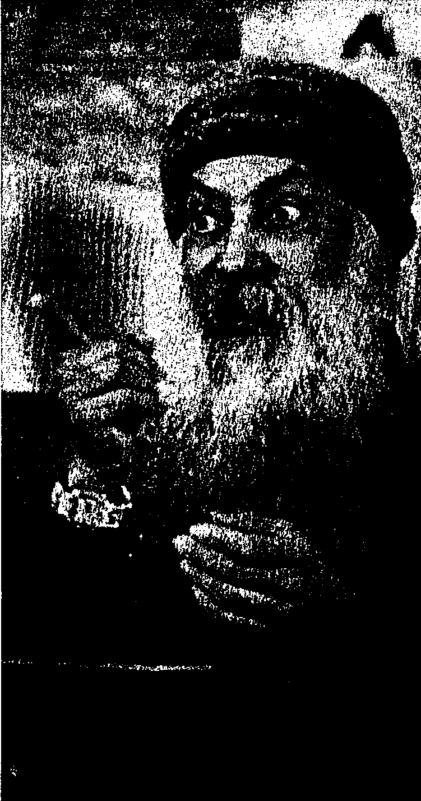
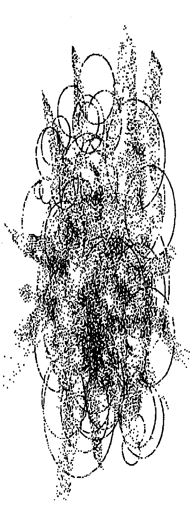
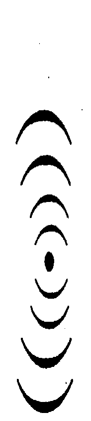
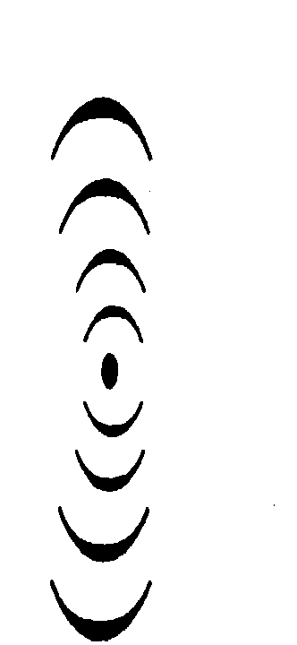
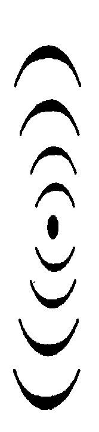

# 奥修：瑜伽之书2（中）

瑜伽是一种完美的科学
它不教你相信，它教你知道
它不会告诉你说：「要变成盲目的跟随者」
它说：「睁开你的眼睛。」
它给你方法，
教你如何睁开你的眼睛，
它说出任何关于你的洞见的事，
以及如何达到那个洞见。

奧修·著 謙达那·譯

## 1 譯者序
## 譯者序
## 獻給
瑜伽行者——潜在的、现在的、未来的
想吸取瑜伽智慧精华来帮助个人成长的人

奥修讲派坦加利的瑜伽经共有十卷，要看完全部十卷需要花较长的時間，
因此有一位资深的德国瑜伽老师将它浓缩成上、下两册，本書应为下册，但是
因为下册太厚了，所以改分成上、中、下三册，本書为中册，它涵盖了「瑜伽
瑜伽和密宗修崔都是一种修行方式，奥修曾经讲过，有些人适合瑜伽的方式，
有些人适合修崔的方式。在翻完这三本「瑜伽之书」之后，也许我可以来
翻译更多的「奥秘之书」—密宗修崔的原始经典。

「瑜伽之书」和「奥秘之书」都是经典之作。吸收它们的精华，并加以实践，它足以撼动你存在的根。

另外刚好有一位朋友很想知道奥修最后一个演讲的内容，所以请我翻译，我想，或许也有很多人想知道奥修在最后一次演讲到底说了些什么，所以就把它翻译出来，放在「附录一」。

在宁静和祈祷之中，謙达那 于台北 二〇〇四年十一月

## 3 目录
## 目录
-   譯者序 …… 1
-   第一章 内在的保健和纯洁的力量…… 5
-   第二章 让那个有限的死掉…… 51
-   第三章 回到源头，你变成主人…… 85
-   第四章 更高意识的光…… 117
-   第五章 内在的内在…… 137
-   第六章 在一个冷的宇宙里…… 159
-   第七章 来自死亡和「业」的奥秘…… 179
-   第八章 观照内在的天文…… 211
-   第九章 太阳和月亮的会合…… 245
-   附錄一 沙瑪沙提（Sammasati）——最后的話語 （本文为奥修生平的最后一个演讲。）…… 269

## 5 第一章 内在的保健和纯洁的力量
## 第一章 内在的保健和纯洁的力量

奧修的经文：
身體需要在一起；而你最内在的靈魂需要單獨。
你越是根植於身體，你就会越悲傷。你越是超越身體，你就会變得越輕。
當身體很純，你將會看到有很多新的能量產生。
你必須知道你不是身體，然後你必須知道你不是頭腦。
在你裡面甦醒過來的最大的力量就是不朽的感覺（覺得你是不會死的）。

当你的本质变成非暴力的、不佔有的、不偷竊的、和真實的，它就變成純潔的。對派坦加利來講，這些並不是道德的觀念，這一點必須永遠牢記在頭腦裡。在西方，它被教成道德；在東方，它被認為是內在的保健，而不是道德。
裡。在西方，它被教成利他的目標；在東方，在它們裡面並沒有什麼利他的東西，它是完全自私的，它是你內在的保健。它們能夠使你純潔，透過純潔，透過純潔，那個不可能的就会變得可能，那個不能達到的就可以被達到。透過純潔，你本質的粗鄙就喪失了，你變成精巧的、精微的、和柔和的；透過純潔，你會變成神性的
一座廟；透過純潔，你就会邀來整體進入你……有一天海洋會來，掉進你這一
滴水裡面。

當它們像在西方一樣被教成道德的觀念——或者在印度也是一樣，像甘地
的一直在教導的——它們的整個品質就改變了。當你說：“你必須成為非暴力的
，因為暴力會傷害到別人。不要傷害任何人，人類是一個大家庭，傷害是犯
罪的行為，你就將整件事情轉移到一個完全不同的層面。派坦加利說：“成
為非暴力的，它会純化你。不要傷害任何人，甚至不要“想”傷害任何人，因
为 you一開始那樣想，你的內在就變得不純潔了。“問題不在於別人，問題在於
你。當然，當一個人是非暴力的，別人將會受益，但它並不是成爲非暴力的目標，它只是一個副產物，只是一個影子。如果你的非暴力是因爲不應該傷害到別人，那麼你並非真的非暴力。那麼，你是一個好的社會公民，你是一個文明人，但是你的宗教性並沒有實質上的改變。你的非暴力將會成爲你和別人之間的潤滑劑。你的生活將會變得更平順，但不是更純潔，因爲那個目標會改變整個品質。那個目標並不是要保護別人——別人會受到保護，那是另外一回事——那個目標是要變純潔，這樣你才能夠知道最終的純潔。東方的宗教是自私的，因爲他們知道沒有其他存在的方式，當某人是自私的，別人將會非常受益。事實上所有的利他主義，真正的利他主義，是從很深的自私所發展出來的，它們並不是相反的，它們並不是對立的：利他的花只能開在一個很深地自私的人身上。成爲自私的是很自然的。強迫人們不這樣是使他們變成不自然的，而任何不自然的並不是神的方式。任何不自然的都是一種壓抑，它無法帶給你純潔。所以，必須記住：這些並不是道德的目標。事實上，在東方，道德從來不
被當成一個目標來教導，它是宗教的一個影子。當宗教發生，道德自然就會發生，一個人根本不需要去擔心它。一個人不需要去顧慮它，它自己就會發生。在西方，道德被當成目標來教導——事實上是被當成宗教來教導。在東方的經典裡沒有像十誡這樣的東西，沒有像它一樣的東西。
過奴役的方式到達天堂，你的天堂也不足以成爲一個天堂，因爲奴役仍然是它的一部分。獨立和自由必須是你成長固有的部分。所以，這些是健康的措施，它們能夠純化你，它們能夠給你內在的健康。

當純潔被達成，在瑜伽行者裡面會產生對他自己身體的厭惡，而且傾向於不跟別人作身體的接觸。

Juqpsa 這個字有一些困難，在所有的翻譯裡，它都被翻成一厭惡，因爲在英文裡沒有對等的字存在，其實它並不是厭惡，根本就不是，那個字是錯的。一厭惡這個字是令人厭惡的。想到一個瑜伽行者厭惡他自己的身體，
這简直是難以相信，因為瑜伽行者比任何人都更照顧他們的身體，他們的身體都很美。仔細看馬哈維亞和佛陀，他們的身體都很美，都具有很棒的比例，就好點必須先被了解。
常愛他們的身體，事實上是已經到了執著的程度。尤其是女人，她們是完全身體導向的。注意看一個女人：她在照鏡子的時候覺得很快樂，其他沒有什麼事比它更快樂。這是一種自戀，她們會花好幾個小時的時間在鏡子前面，抓著不放。照鏡子並沒有什麼不對，但是一直抓著鏡子，在它的前面照好幾個小時，
那不是太執著了嗎？這是第一種類型的人，他們一直執著於身體，執著到忘了說他們的存在是超出身體的，那個超越的部分被遺忘了，他變成只有身體。並不是他佔有身體，而是身體佔有了他，這是第一種類型的人。

第二種類型的人跟第一種類型的人剛好相反：他也是很執著，但是執著於相反的方向。他是反對身體的，他對身體感到很厭惡，他是反對身體的，他厭惡他的身體，他已經將鏡子打破，他繼續以無數的方式來傷害他自己的身體，
他恨它。第一種人喜愛它到執著的程度，第二種人則走到另外一個極端——他恨它，他想要自殺。你可以找到第二種人，他們或許會偽裝成瑜伽行者，但他們不是，瑜伽行者不可能恨。它並不是任何對象的問題，瑜伽行者根本就不可能恨，因為恨會創造出不純潔。它並不是恨其其他某一個人或是恨自己的身體的問題，不論你恨的對象是什麼，恨都會帶來不純潔。瑜伽行者不可能恨他自己棘或釘床上折磨他自己的身體。這跟坐在鏡子前面享受著自戀放縱的女人剛好相反。這是兩種類型，然後在這兩者之間——剛好就在中間——是第三種，對於這種人，派坦加利使用尤奎莎這個字：他並不是厭惡他的身體，他也不執著於身體。他處於很深的平衡之中。他會照顧身體，因為身體是工具，他甚至將身體視為神聖的，它是神所創造出來的，任何神所創造出來的東西怎麼可能是不神聖的？它是一座廟，它不應該被譴責，你也不應該瘋狂地放縱在它裡面，以致於迷失在它裡面。廟宇不應該變成偶像，廟宇不應該變成神龕。神龕是廟宇最內在的核心，
你不應該開始崇拜廟宇的外牆，但是也不需要走到另外一個極端，開始去摧毀廟宇。

越身體的；我處於身體裡，但不是身體；我處於身體裡，但是並不侷限於它；我處於身體裡，但同時是超越它的。一身體不應該成爲一個限制，當然，它是
一個庇護所，一個很美的庇護所，一個人必須感激它，不需要跟它抗爭，跟它抗爭是愚蠢的、幼稚的。它必須被使用——正確地被使用。
JUGUO是說——如果你一定要將它翻譯出來，那麼我會說——那個瑜伽行者已經解除了身體的幻象。他並不是厭惡，他只是解除了幻象。他不認爲透過身體能夠找到靈魂的喜樂，不，但是他也並不認爲它的相反是對的：透過摧毀裡，他將身體視爲一個廟宇來對待它。

當純淨被達成，在瑜伽行者裡面會產生對他自己身體的厭惡，而且傾向於不跟別人作身體的接觸。

當你過份處於身體裡，你總是會渴望跟別人有身體的接觸，會有一種色慾想要和另外一個身體接觸，那個你稱之為愛，然而它並不是愛，它只是一种色慾，因為身體無法單獨存在，它存在於跟其他身體的網狀結構裡。小孩誕生在母親的子宮裡，有九個月的時間，母親的身體養著著小孩的身體成長，就好像樹枝從樹木長出來。當然當小孩準備好的時候，他就会從母親的子宮出來，但是仍然保持跟母親有很深的連繫，他繼續從母親的乳房吸取母奶，並且取得溫暖，那是身體的需要。如果小孩沒有得到母親的溫暖，他就沒有辦法健康，身體將會一直受苦。他或許可以得到他所需要的每一樣東西——食物、牛奶、和維他命等——但是如果没有得到母親的溫暖……而且那個溫暖的給予也必須帶著愛心，因為如果沒有帶著愛心，那麼熱的給予是可能的，它可以從你的身體傳遞到另外一個身體，但那不是溫暖，熱透過愛才變成溫暖。它具有品質上不同的層面，它並非只是熱而已，否則你可以將熱給小孩。現在它們作了很多實驗：小孩被放在一個有中央暖氣的房間裡——但是那並不能有所幫助。母親的身體會給予某種微妙的愛的震動，讓小孩覺得被接受、被愛、被需要，它可以給予根。

那就是為什麼男人終其一生都會一直追求和尋找女人的身體。女人在一生當中也會一直追求男人的身體。異性是具有吸引力的，因為另外一極的身體能夠有所幫助，它能夠給予能量。對立的那一極能夠給予拉力和能量，你會透過它而得到滋養，你會透過它而變得更強壯。這是很自然的，它並沒有什麼不對，但是當一個人變得很純——透過非暴跳到本質，而本質可以保持完全單獨。那就是為## 第一章 內在的保健和純潔的力量

由進入天空，沒有根在地球。他想要跟別人身體接觸的慾望消失了。從身體的純潔會產生出高興、集中精神的力量、感官的控制、和一個可以自我達成的良好狀態。這個人非常喜樂，這個現在已經不需要跟別人有身體接觸的人在他的自由當中非常喜樂，非常高興，他可以慶祝，他的每一個片刻都覺得歡欣無比。越是根植於身體，你就越悲傷，因爲身體是粗糙的，它是物質，它是沈重的。你越是超越身體，你就会變得越輕。耶穌對他的跟隨者說：「來，跟我來，我的擔子是輕的。所有那些擔子很重的人都跟著我來，我的擔子是輕的，沒有重量的。」從身體的純潔會產生出高興……如果你是悲傷的，如果你一直覺得很沮喪，如果你一直覺得很痛苦，沒有辦法直接對你的痛苦做什麼，任何該做到頭來都被證明是無效的。東方後來知道，如果你是悲傷的、痛苦的症狀。那個病是：在內在深處，你一定是身體導向的。所以那個問題不在於如何驅除你的黑暗，如何使你快樂，那不是問題。問題在於如何幫助你變成不是身體導向的，如何幫助你，讓你跟身體的糾纏變得越來越少、越來越少。

人們每天都會來找我，他們說：「我們很悲傷、很痛苦，每天早上似乎都要再度去面對失望的一天。我們還是會起床，但是沒有什麼希望。我們知道，我們已經活很久了……同樣又是那些悲傷日子的重複，所以要怎麼辦呢？你能不能給我們什麼東西，讓我們能夠抽身，能夠脫離悲傷？—沒有辦法直接做什麼，只能間接做什麼，因爲這個現象只是症狀，而不是病因，如果你針對症狀來處理，那個疾病是無法消除的。

那個病的源頭必須被改變，而那個源頭就是：你根植於身體多少，你的悲傷就會有多少；你不根植於身體多少，你的高興就會有多少，它們是成正比的。當你能夠完全免於身體，你就會變成飄浮在天空的芬芳，你就會變成喜樂的，你就能夠變成耶穌所說的受到祝福的人，你就會變成耶穌一直在談論的幸

福，或是佛陀在說的涅槃。馬哈維亞給了一個非常恰當的字，他之爲kaivalya（單獨），你變得完全獨立和單獨。現在已經不需要什麼東西了，你本

身已經能夠自給自足。這就是目標，但是唯有當你能夠很小心地行動，不要糾纏在那些症狀裡，那個目標才能夠達成。永遠不要處理症狀，不要浪費時間在處理症狀，一定要找出根本原因。不是一個哲學家。他假設，也不是一個理論——瑜伽不相信理論，而派坦加利也這樣說是因爲有無數的瑜伽行者經驗過它。没有任何例外，它就是如此。在日常生活中也是，你是否曾經觀察過？當你覺得很高興：如果你在日常生活當中很警覺，你將會覺知到，每當你覺得很高興，你就不可能忘掉身體。每當某人很高興，他就會忘了他的身體；每當某人很悲傷，他不可能忘掉身體。事實上，在阿優維達的醫療系統，他們對健康的定義是非常有意的，世界上任何其他的醫學都不曾給過這樣的定義。事實上，西方的醫學並沒有對健康下定義，最多他們只能說：當沒有疾病的时候，你就是健康的。但這並不是健康的定義。你將疾病帶進定義健康，這算是哪一種定義？你說：一當沒有疾病的時候，你就是健康的。這是一種負向的定義，而不是正向的定義。阿優維達說，當你覺得好像沒有身體的時候，你就是健康的，這種定義的確非常

美。Vidho：當你沒有感覺到身體——你幾乎是沒有身體的。你可以注意看：唯有當頭痛的時候，你才會感覺到頭。否則有誰會知道頭？你從來不會覺知到頭。頭痛會帶來覺知，否則你是沒有頭的。如果你持續地記住你的頭，那麼一定有什麼不對勁，比方說氣喘或是支氣管炎，那麼你就会覺知到它，但是當有什麼不對勁，比方說氣喘或是支氣管炎，那麼你就会覺知到它。你的呼吸會發出更多的聲音，或是有噪音，或是有其他的症狀，使你忘不了它。當你的腳很疲倦，你才會覺知到它們的存在。唯有當某樣東西變得不對勁，你才會覺知到它。如果是健康的定義：當你完全忘掉身體，你就是健康的。誰能夠完全忘掉身體，只有瑜伽行者。從身體的純潔會產生高興、集中精神的力量……當人們仍然根植於身體而試圖集中精神，那麼集中精神是非常困難的，幾乎不可能。你連一分鐘都沒有辦法集中精神。頭腦會搖晃，有一千零一個思想會產生，在你知道之前，你已经又移到另外的地方：一個白日夢開始了。每當你想要集中精神在某件事上……幾乎不可能，但那個原因是太過根植於身體。如果你透過身體來

看，集中精神是不可能的；如果你超越身體來看，集中精神就會變得很容易力量。……感官的控制……这些是結果，這一點要記住。它們是不能被練習的，如果你練習，你將永遠無法達到。它們就只是這樣發生。如果基本的原因被去除了，如果你不再跟身體認同，那麼你就能夠達到「感官的控制」，那麼它就會納入你的控制。那麼如果你想要思考，你就可以思考；如果你不想考，你只要對頭腦說：「停。」它是一個運作機構，你可以掌握它的開關，但是你必須去精通它。如果你不是一個主人，而你想要變成一個主人，你將會製造出更多的混亂和麻煩，而且你將會一再一再地被挫敗，感官將會仍然保持是主人，這並不是戰勝它們的方式。戰勝它們的方式就是不跟身體認同。你必須知道你不是身體，然後你必須知道你不是頭腦。

你必須觀照你周遭的一切。身體就在那裡，它是第一圈；然後有頭腦，它是第二圈；然後有心，它是第三圈，而在這三圈背後的中心就是你。如果你歸

於你自己的中心，所有這三層都將會跟隨著你。如果你不歸於你自己的中心，你就必須去跟隨它們。……感官的控制、和一個可以自我達成的良好狀態。一個人就是這樣在達到良好的狀態，而能夠自我達成。每一個人都想要自我達成，但是沒有人想要經歷規範，沒有人想要成熟，每一個人都想要看看會不會有魔術般的情况出現。人們來到我這裡說：一你能不能祝福我們，好讓我們能夠自我達成？一如果它是那樣容易，只要我的祝福就可以了，那麼我一定會祝福整個世界。爲什麼還要那麼麻煩去祝福每一個人？一整批一起祝福，讓整個世界都成道。如果可以這樣的話，那麼佛陀老早就做了，馬哈維亞老早就做了，那麼就沒事了，所有的人都成道了。它沒有辦法那樣做。沒有人能夠祝福你，你必須去掙得那個祝福，你必須經歷一個很深的規範，你必須改變你本質的焦點，你必須變成有那個能力，你必須變成正確的工具，否則有時候某人在偶然的情況下碰到一「本性」，令他感到很震驚，但它還是没有辦法有所幫助，那會擊垮你的整個人格——你可能會

發瘋。它就好像一個很强的電流流經你，但是你還沒有準備好，每一件事都將會變得不對勁，甚至，保險絲可能會斷掉，你可能會死掉。你必須變成純潔的，變成不跟身體和頭腦認同，你必須達到某種觀照的品質，唯有如此，你才能夠「知道自己」。你無法免費得到它，你必須為它付出代價……依照本性的條件來付出代價。並不是說你可以用錢來支付，除了依照本性的條件來付出代價之外，其他任何東西都不能夠有所幫助。滿足會帶來至高無上的快樂。這個純潔到了最後會帶來滿足。這句話是非常深奧的，你必須了解它、感覺它、吸收它。「滿足」意味著不論那個情況是怎樣，你都接受它，沒有任何怨言。

事實上你不僅毫無怨言地接受它，你還會帶著很深的感激，在它裡面覺得很高興。這個片刻是完美的，當你的頭腦不從它移開，當你不要求任何其他的

時間，當你不要求任何其他的空間，當你不要求任何其他的存在方式，當你不要求任何東西，當要求已經完全被拋掉，你只是高高興興地在此時此地，就好像小鳥在樹上唱歌，花朵在樹上開花，星星在移動，每一件事都被認為—這就是是一切，這就是全部，這就是完美，已經不可能對它有任何改善—當未來被拋棄了，明天消失了……這就是滿足。當現在是唯一的時間，是永恆，這就是是滿足，而在那個滿足當中，派坦加利說：……會有至高無上的快樂。—滿足會帶來至高無上的快樂。所以滿足是瑜伽行者的修行規範，他必須成為滿足的。如果沒有什麼東西能夠在你裡面產生不安，如果沒有什麼東西能夠把你推出你的中心，那麼東西能夠在你裡面產生不安，如果没有什麼東西能夠把你推出你的中心，那麼就會產生至高無上的快樂。鍛錘和修行會摧毀掉不純的東西，隨之而來的，身體和感官會變完美，身體和心理的力量會被喚醒。人就好像是一座冰山，只有一小部分在表面上可以得到，主要的部分都

隱藏在底下。或者，人就像一棵樹，真正的部分是隱藏在地底下的根，只有樹枝可以被看得到。或者，如果你剪掉那些枝葉，新的枝葉還會再長出來，因為那些枝葉並不是源頭，但是如果你將根切斷，樹木就被摧毀了。人也是只有一部分在表面上可以看得到，主要的部分隱藏在裡面。如果你認為那個可以看到的人就是全部，那麼你就大錯特錯了，那麼你就錯過了人的整個奧秘，然後你會錯過在你裡面的門，那個門可以引導你到神性。如果你認為只是知道一個人的名字，只是知道他來自哪一個家庭，知道他是什麼職業，一個醫生，或是一個工程師，或是一個教授，知道他的臉或他的照片，你就以為你知道他，那麼你是處於一個很大的幻象之中。這些只是外表，真正的人離這些非常非常遠。你或許是以這樣的方式知道他，但是你從來不知道這個人。就社會而言，它已經足夠了，已經不需要更多的。在市場上，這些淺淺的知識就夠了，但是如果你真的想要知道那個人，你就必須更深入，而要深入的唯一方式就是要先進入你自己。除非你知道你裡面那個未知的，否則你永遠無法知道別人。要知道人的奧

秘唯一的方式就是要知道你是怎樣的奧秘。在你裡面有很多隱藏的層面，那個隱藏的層面背後還有隱藏的層面。人是無限的，你越深入你自己裡面，你就越深入整個存在裡面，也越深入別人裡面，因為那個中心是「——」。外國是無數的，而中心是「——」。身體被嚴重地誤用，你並沒有好好地對待你自己的身體，你並不知道身體本身的奧秘，它並非只是皮膚，它並非只是骨頭，它並非只是血液，它是一個很大的有機統一體，一個很大的動態存在。有很多很多的奧秘是隱藏的，這個身體只是很多體的第一層——全部有七個體。如果你深入這個身體，你將會碰到一些新的現象，在這個粗糙的身體背後隱藏著微妙體，一旦那個微妙體甦醒，你就会變得非常強而有力，因爲你会達到某種新的層面的力量。雖然這個身體躺在你的床上，但微妙體還是可以移動。對它來講是沒有障礙的，地心引力不會影響它，對它來講沒有時間和空間的障礙，它可以移動，它可以去到任何地方。整個世界對它來講都是敞開的，對粗糙的身體來講就不可能這樣。

[PAGE 25]

# 21 第一章 內在的保健和純潔的力量

粗糙的身體只是表面上的體，是其他體的表皮，然後在微妙體的背後還有 更微妙的體，總共有七個體，它們屬於七個不同的存在層面，你越是深入到你自己的本質，你就越會覺知到這個身體並不是全部。但是唯有當這個身體變得 很純，你才會碰到第二體。 瑜伽不相信折磨身體，它不是一個受虐狂的事件，但是它相信可以純化 它。有時候純化它和折磨它看起來或許是相像的，但還是必須加以區別。一個 人在斷食，他或許只是在折磨自己，他或許只是在反對他自己的身體，是自毀 的、受虐的，但是另外一個人或許也是在斷食，但他可能不是一個在折磨自己 的人，他或許不是一個受虐狂，他或許根本就不是在摧毀他自己的身體，而是在 在純化它，因爲在很深的斷食之中，身體會達到某種純潔。 你每天繼續在吃東西，你從來沒有給身體任何假期。身體繼續在累積很多 死的細胞，它們變成一個重擔。不僅是一個重擔，它們是毒素，它們是有毒 的，它們會使身體變得不純。當身體是不純的，你無法看到隱藏在它背後的 體。這個身體必須成為乾淨的、透明的、純潔的，那麼突然之間，你將會覺知到第二層——靈妙體。當靈妙體是純潔的，你將會覺知到第三體、第四體，然

後以此類推。斷食能夠有很大的幫助，但是一個人必須非常覺知，它不是在摧毀身體。頭腦裡面不能存有譴責的概念，那是一個問題，因爲所有的宗教都譴責身體。他們的原始創辦人並不是譴責身體的人，他們不是毒化身體的人，他們喜愛他們的斷食是一種純化。然後會有一些盲目的追隨者，他們不知道斷食是很深的科學，就盲目地開始斷食，他們享受它，因爲頭腦是暴力的，它享受一種力量的感覺，因爲每當你對別人施

## 35 第一章 内在的保健和純潔的力量

每一個小孩生下來的時候都是透過肚子呼吸。注意看一個小孩在睡覺的時候，他的肚子會一上一下的，從來不是他的胸部一上一下的。沒有一個小孩會從胸部呼吸，他們從腹部呼吸。他們是完全自由的，沒有什麼壓抑，他們的胃是空的，那個空是身體的一種美。一旦胃裡累積了太多的壓抑，身體就被分成兩部分——較低的部分是被擺棄的部分。那個統一喪失了，二分性進入到你的存在，如此一來你就沒有辦法很美、很優雅。你擺帶著兩個身體，而不只是一個，在這兩者之間將永遠都有一個空隙。你沒有辦法走路走得很美，你的腳會變得很重。事實上如果身體是「二」，你的腳會很輕。如果身體被分成兩個部分，你的腳就會變得很重。你必須拖著你的身體走，它變成好像是一個重擔，你無法享受它，你無法享受一個很好的散步，你無法享受一個很好的游泳，你無法享受一個很快的跑步——因為身體不是「一」。為了要能夠享受這些活動，身體需要再度被聯合起來，它必須再度被弄成一致的，胃必須完全被清理乾淨。

為了要清理胃，你需要很深的呼吸，因為當你的吸氣和呼氣都很深。胃會將它所攜帶的東西都丟出去。在呼氣當中，胃會釋放它自己，因此很深的、有韻律的呼吸（pranayama）是重要的。那個著重點必須放在呼氣，這樣的話，胃裡面不必要地攜帶著的每一樣東西才會被釋放掉。當胃裡面沒有攜帶著情緒，如果你有便秘，它將會突然消失。當你的胃裡有壓抑的情緒，你會便秘，因為胃沒有辦法自由活動。你深深地控制著它，你沒有辦法允許它自由。所以如果你壓抑情緒，就會有便秘。便秘比較是一種心理的疾病，比較不是身體的疾病；它比較是屬於頭腦的，而比較不是屬於身體的。但是要記住，我並不是將頭腦和身體一分的為二，它們是同一個現象的兩個面。頭腦和身體並不是兩樣東西，事實上說一頭腦和身體一是不適當的，正確的表達應該是一頭腦身體一。你的身體是一個心理身體的現象。頭腦是身體最精微的部分，而身體則是頭腦最粗糙的部分。它們兩者會互相影響，它們是一起運作的。如果你在身體裡面壓抑某些東西，身體將會開始一個壓抑的旅程。

如果頭腦將每一樣東西都釋放出來，身體也會將每一樣東西都釋放出來，那就是為什麼我非常強調發洩，發洩是一個清理的過程。這些都是鍛錘和修行：斷食、吃自然的食物、深而且有韻律的呼吸、瑜伽的體位法、過著一個更自然、更有彈性、更柔軟的生活、壓抑越來越少、讓身體自然運作、自然開展、跟著身體的智慧走。一鍛錘和修行會摧毀掉不純的東西，隨之而來的，身體和感官會變完美，身體和心理的力量會被喚醒。鍛錘和修行會摧毀掉不純的東西，隨之而來的，身體和感官會變完美，身體裡面有很多隱藏的力量，一旦前打開，新的門和新的可能性會突然打開。身體裡面有很多隱藏的力量，一旦它意味著在身體裡面創造出一把活生生的火，讓你的身體被清理乾淨，就好像你將黃金丟進火裡，所有那些不是黃金的都會被燒燬，只有純粹的黃金會留下來。

## 瑜伽之書（中）

它被釋放出來，你就會相信，身體裡面攜帶著很多東西，它跟你是那麼地親近。當你的眼睛變得很純、很乾凈，那麼你不會只看到事物的表面，你會開始看見它們的深處，一個新的層面打開了。現在，當你看到一個人，你沒有辦法看到發出來的光芒圍繞著身體，每一個人的身體都有個非常微妙的氣圍圍繞著，一個散發出來的光芒圍繞著身體，每一個人的身體都有不同顏色的氣圍圍繞著。當你的眼睛變得很清澈，你就能夠看到那個氣圍，藉著看到那個氣圍，你就会知道關於那個人的很多事情，那是你以其他任何方式所無法知道的。那個人無法欺騙你，不可能欺騙你，因為他的氣圍會透露出他的內在。某人帶著一個不誠實的氣圍來找你，他試著說服你說他是個非常誠實的人，他的氣圍是騙不了人的，因為那個人無法控制他的氣圍，那是不可能的。不誠實的氣圍具有一種不同的顏色，而一個誠實的人，他氣圍的颜色是不同的。一個很純的人的氣圍是純白色的，當一個人變得越不純，那個白色就會變成灰色的，更不純的話，那個顏色就會變得越黑。一個完全不誠實的人，他的氣圍完全是黑色的。一個混亂的人，他氣圍的颜色是會改變的，它不會永遠保持
的。一個很純的人的氣圍是純白色的，當一個人變得越不純，那個白色就會變成灰色的，更不純的話，那個顏色就會變得越黑。一個完全不誠實的人，他的氣圍完全是黑色的。一個混亂的人，他氣圍的颜色是會改變的，它不會永遠保持
获取更多好书，请加微信号：strcdts 店鋪：http://strc.cr.cx

# 39 第一章 内在的保健和純潔的力量

持一樣。即使你只是繼續看幾分鐘，你也會看到那個氣圍在改變。那個人是混亂的，他本身不會固定在一個狀態下，他的氣圍會一直改變。一個靜心的人，他的氣圍是寧靜的、鎮定的，有一種冷靜的氣氛圍繞著他。一個處於很深的焦慮、動盪不安、和緊張的人，他也會帶著同樣品質的氣圍。一個非常緊張的人可能會試著微笑，或是帶著一個假面具，但是當他來到你的面前，他的氣圍將會顯示出那個事實。耳朵的情況也是一樣，就好像眼睛有很深的洞見，耳朵也具有一種很深的聽的品質。那麼你不只是會聽到一個人所說的話，你還會聽到那個音樂。你不會去管他所使用的話語，你會去注意那個音調和他的聲音的韻律……有一些聲音的內在品質會道出很多事情，那是話語所無法欺騙、無法改變的。那個人許試著要成為很有禮貌的，但是他的聲音裡；那個人或許想要成為優雅的，但是他的聲音將會顯示出他的不優雅；那個人或許想要表現出他的確定，但是那個聲音將會顯示出遲疑的品質。

如果你能夠聽到那個聲音的品質，如果你能夠看到那個氣圍，如果你能夠辨識很多事情。這些是非常簡單的感覺到那個靠近你的人的品質，你就有能力辨識很多事情。這些是非常簡單的
## 40

事，一旦你開始鍛鍊和修行，這些事就會開始發生。 然後就會有瑜伽所說的超能力（siddhis）產生——魔術般的力量、奇蹟般的力量。因為我們不了解它們的運作過程，我們不了解它們是如何發揮作用的是奇蹟了。事實上奇蹟是不可能的，一旦你知道了它們的運作過程，它們就不再或是你所不知道的，那麼你就稱之為奇蹟，當那個法則被知道，奇蹟就消失了。 最近電視才剛被帶到印度的村落裡，村民們首度看到甘地在電視上出現。 他們簡直無法相信，不可能。他們繞著電視的四周看，每一個角度都看，甘地是怎麼進入到這個箱子裡的？這是一項奇蹟，不可思議的奇蹟，但是一旦你知道了那個法則，事情就變得很簡單。 所有的奇蹟都是按照隱藏的法則。瑜伽說：世界上沒有奇蹟，因為奇蹟意味著某件事是違反法則的，而那是不可能的。怎麼可能違反宇宙的法則？不可能。它可能只是人們不知道。 當你變得很純、很完美，超能力就會變得可能。比方說，如果你能夠將你
## 45

的星靈體移出你的身體，你就能夠夠做很多奇蹟般的事情。你可以去拜訪人們，講話，你可以看到你，但是他們碰觸不到你，你甚至可以用你的星靈投射來跟他們，別人身上，就會有奇蹟出現，只是圍繞在你的旁邊就會得到治療的力量，不論你去到哪裡，那個治療的力量的都會自動發生，並不是你去做它。光是那個純潔：：：你就能夠夠變成那個無限的力量都的媒介，但是一個人必須向內走，必須去找尋他自己最內在的核心。在你裡面被喚醒的最大的力量就是那個不會死的感覺。並不是說你有一個理論、一個系統、或是一個哲學，所以你可以變成不朽的，不。現在你有一個感覺，你根植於它，你知道它。它並不是任何理論的問題，你已經真的知道沒有死亡。這個身體會消失而成为各種元素，但是你的意識不會消失。頭腦會散掉，思想會被釋放出來，身體會變成物質的元素，但是你——那個觀照的自己，將會繼續保持。

你將會知道它，因為現在你可以從一個很遠的空間來看你的身體，你可以看到你的身體跟你分開的，你可以走出你的身體來看它。現在你知道當你死的時候，身體會被留下來，但是你不会留下來。現在你可以看到頭腦像一個運作機構或一個生物電腦在運作，但是你不會跟它們認同。這是能夠發生在一個人身上最大的奇蹟：他知道他是不会死的。那麼對死者的恐懼就消失了，隨著對死亡的恐懼消失，所有的恐懼也會消失。當恐懼消失，愛就會產生了。當沒有恐懼，愛就會產生了，唯有到那個時候，愛才會產生。在一個被恐懼所折磨的頭腦裡，愛怎麼可能產生？你或許會找尋友誼，你或許會找尋一個關係，但是你的找尋是出自恐懼，你的找尋只是為了要忘掉你自己，把你拉進一個關係裡，它並不是愛。唯有當你超越了死亡，愛才會產生，它們無法一起存在，如果你害怕死亡，你怎能夠愛？你或許會因為恐懼而試著去找尋伴侶，但是那個關係將會含著恐懼。那就是為什麼有百分之九十九的宗教人士在祈禱，但是他們的神是由恐懼而來的。真正的祈禱，它並不是出自愛，而是出自恐懼。他們的神是由恐懼而來的。只
## 47

有很少數的人，只有百分之一的宗教人士能夠了解到不會死，那麼那個祈禱就不是出自恐懼，而是出自愛，出自純粹的感激和一種感謝的心情。

跟神性的結合是透過研究自己（swadhyaya）而發生的 這是一條很重要的經文：跟神性的結合是透過研究自己而發生的 。— 個人必須研究自己，那是要到達神性唯一的方式。派坦加利並不是說：要去做 廟宇。— 他並不是說：要上教堂。— 他並不是說：要作儀式。— 不，那並不是跟神性合一的方式。要進入你自己，要研究自己，因為他隱藏在你的背後，隱藏在你裡面，他是你最內在的核心。你就是廟，向內走，研究你自己。你是一個浩瀚的現象，要好好地研究你自己，研究你的一切，隱藏在你的背後，在你裡面。他就到了一個很完全的地步，他就顯現了。他就隱藏在你的背後，在你裡面。他就是你最內在的本性，所以要研究你自己。

這個「研究」事實上就是戈齊福所說的「記住自己」。派坦加利的「研究 自己」，跟戈齊福的「記住自己」是完全一樣的。記住你自己，繼續觀照。要
## 48

如何跟別人關連——觀照。關係是一面鏡子，你如何跟你的僕人連結，你如何跟陌生人連結，你如何跟面具。注意看你的貪慾，注意看你的嫉妒，注意看你的恐懼，注意看你的焦慮和佔有，只要注意看和觀照。不需要做任何事！那就是這段經文的美。派坦加利亞不是說“要做些什麼一，他說：“研究你自己。”這個研究，這個覺知就行了。當你面對面地知道你的整個存在狀態，變就會發生。在不同的心情之下，當你是悲傷的，注意看；當你是漠不關心的，注意看；當你覺得失望，注意看；當你充滿著希望，注意看；在慾望當中，在挫折當中……有無數的心情團繞著你——繼續觀照。讓每一個心情成為洞察你自己的一個窗户。從彩虹的所有顏色來注意看你自己。當你是單獨的，注意看；當你不是單獨的，注意看。去到山上，與世隔絕，注意看；去到工廠，或是去到辦公室，注意看你怎麼改變的，你在什麼地方改變。如果你繼續觀照……一個片刻都不要放棄這個觀照。佛陀說過：“當你上
## 49

床的時候，繼續觀照，當你要進入睡覺的時候，繼續觀照著你是如何進入睡覺的。一繼續觀照，任何一件事都不要漏掉。就只是這個記住自己，這個研究自已，就可以了，就可以了，就不需要問：「我觀照之後要做什麼？」什麼都不需要。一旦你完全地觀照了你的恨，它就消失了。那個準則就是：那個藉著觀照就會消失的就是罪惡，而那個藉著觀照就會成長的就是美德。一不，罪惡和美德沒有辦法被客觀化。那個藉著觀照就會成長的就是美德。成長的就是美德。那是我所能夠給你的唯一的定義。我不說「這是罪惡，那是美德。」「那個藉著觀照就會消失的就是罪惡。藉著觀照，憤怒將會消失，愛將會成長；恨將會消失，慈悲將會成長；暴力將會消失，祈禱將會成長，感激將會成長。所以，任何透過觀照而消失的就是罪惡，其他什麼都不必做，只要觀照它，它就會消失。它就好像當你將光帶到一個黑暗的房間，那個黑暗就

## 第二章 褒那個有限的死掉

他們並不是自殺的，他們並不是反對生命的，他們贊成更偉大的生命。他們為更偉大的生命而犧牲了他們的生命。他們為一個更偉大的自己而犧牲了他們的自我，他們也為那個至高無上的自己而犧牲了他們自己。他們繼續為那個唯一當你成為空的、當你什麼都沒有才可能的而犧牲掉你所擁有的。

限的而犧牲那有限的。成長就是這樣：繼續為那個唯有當你成為空的、當你什麼都沒有才可能的而犧牲掉你所擁有的。

有抗拒的狀態。這些經文是一個準備，準備一死，以便達到一個更偉大的生命。派坦加利的整個藝術就是：如何達到你能夠自願地死、自願地臣服而沒有

那個姿勢必須是穩定的，同時是舒服的。派坦加利的瑜伽被嚴重地誤解，派坦加利並不是一個體操選手，但是瑜伽看起來好像是一種身體的體操。派坦加利並不反對身體，他並不是一個教你扭曲身體的老師，他教你身體的優雅，因為他知道優雅的頭腦只能存在於優雅的身體，而唯有在一個優雅的頭腦裡，優雅的自己才可能；唯有在一個優雅的自

已禮面，神性才可能。  一步一步地，你必須達到更深、更高的優雅。身體的優雅就是他所說的阿沙那（asana）——瑜伽姿勢。他並不是一個受虐狂，他知道身體是最基礎的  的身體，他一點都不反對身體，他怎麼可能反對身體？他知道身體是最基礎的  部分。他知道如果你錯過身體，如果你不訓練身體，那麼就不可能做更高的  訓練。  身體就像是一個樂器，它必須被調得很好，唯有如此，它才能夠產生更  高的音樂。如果那個樂器沒有處於正確的形狀和秩序，那麼偉大的和諧怎麼可  能由它產生出來？只有不和諧會產生出來。身體是一個樂器。  那個姿勢必須很穩定、很喜樂、很舒服，所以永遠不要試圖扭曲你的身  體，永遠不要試圖達成那個不舒服的姿勢。  對西方人來講，以蓮花的姿勢坐在地上是困難的，他們的身體並沒有受過  這樣的訓練，所以不需要去管那個姿勢。派坦加利不會強加那個姿勢在你身  上。在東方，人們從出生和孩提時代就開始坐在地上。在西方，尤其是在天氣  較冷的國家，他們需要椅子，因為地上太冷了。但是不需要擔心它，如果你看

### 派坦加利對瑜伽姿勢的定義

派坦加利對瑜伽姿勢的定義，你就會了解：它必須是穩定和舒服的。

如果你在椅子上能夠很穩定、很舒服，那完全沒有問題，不需要嘗試蓮花姿勢，不必要地強迫你的身體。事實上，如果一個西方人試圖要達到蓮花的坐姿，它需要花六個月的時間來強迫身體，而它是一種折磨，這是不需要的。派坦加利一點都不會說服你去折磨你的身體。你可以以一種折磨的姿勢坐著，但這並不是派坦加利所主張的瑜伽姿勢。

正確的瑜伽姿勢必須是你可以忘掉你的身體。舒服是什麼？當你可以忘掉你的身體，你就是舒服的。當你一直想到身體，你就是不舒服的。所以，不論你是坐在椅子上或是坐在地上，那並不是重點，要能夠覺得舒服，因為如果你錯過了第一層，所有的身體不舒服，你就無法渴望其他深層的祝福，因為當你錯過了第一層，所有其他的層面就都關閉起來了。如果你想要成為快樂的、喜樂的，那麼打從一開始就必須是喜樂的。身體的舒服是每一個想要達到內在狂喜的人基本的需要。

每當一個姿勢是舒服的，它一定是穩定的。如果那個姿勢不舒服，你就会

變得倜促不安；如果那個姿勢不舒服，你就會一直換邊。如果那個姿勢真的不舒服，那麼倜促不安和一直改變姿勢有什麼用？記住，對你來講舒服的姿勢，對你旁邊的人來講可能不見得是舒服的，所以，請你不要用你的姿勢來教別人。每一個人都獨一無二的，對你來講舒服的東西，對別人來講可能是不舒服的。每一個人一定是獨一無二的，因為每一個人都攜帶著一個獨一無二的靈魂。你大姆指的指紋是獨一無二的，你在全世界都找不到一個人。你大姆指的指紋跟你是一樣的。不僅在今日是如此，甚至在全個過去的歷史裡，你也找不到這樣的一個人，那些知道的人甚至說在未來也找不到這樣的一個人，一個大姆指的指紋並不算什麼，它是不重要的，但它也是獨一無二的。那表示每一個人都攜帶著一個獨一無二的內涵。如果你大姆指的指紋跟別人的是那麼地不同，那麼你的身體，你的整個身體，也一定是不同的。所以，永遠不要聽別人的指示，你必須找出你自己的姿勢。不需要去找任 何老師來學習它，你自己舒服的感覺就是你的老師。如果你嘗試，在幾天之內嘗試你知道的所有姿勢，所有你可以坐的方式，那麼有一天你將會碰到一個

正確的姿勢。當你感覺到那個姿勢對了，在你裡面的每一樣東西都會變得很寧靜、很鎮定。沒有人能夠教你，因為沒有人能夠知道在你身體的和諧，沒有人能夠知道在什麼姿勢之下你是最舒服、最穩定的。試著找出你自己的姿勢，試著找出你自己的瑜伽，永遠不要遵循規則，因為規則是一般標準，是平均數，所有的規則都是為平均數而存在的，你可以藉著它們來了解一些事情，但是永遠不要遵循它們，否則你會覺得不舒服。永遠都要記住，所有的規則和規範都是平均數，而平均數是不存在的。不要試著成為平均數，沒有人能夠成為平均數。一個人必須找出他自己的方式。學習一般標準，那是有幫助的，但是不要使它成為一個規則。讓它只是成為一個默默的了解，只要了解它，然後就可以忘掉它。它可以用来作為一個規則。讓它只是成為一個默默的東西。這個模糊的地圖可以給你某種暗示，但是你必須找出你自己內在的舒服和穩定。應該以你的感覺來作決定因素，那就是為什麼派坦加利給出這個定義，這樣你可以找出你自己的感覺。—那個姿勢必須是穩定的，同時是舒服的。—瑜伽姿勢的定義沒有比這個

### 瑜伽姿勢的定義

事實上我想要以另外一個方式來說它，梵文的方式可以以另外一種方式來 翻譯它：瑜伽姿勢就是那個穩定和舒服的。Sthir sukhm asana：那個穩定和舒 服的就是瑜伽姿勢，那是更精確的翻譯。當你把「必須」帶進來，事情就會變 得比較困難。在梵文的定義裡面沒有「必須」，但是在英文裡面，這個字被帶 進來了。我看過很多派坦加利（可能应为“坦加利”）的翻譯，他們都說：「那個姿勢必須是穩定的， 同時是舒服的。」但是在梵文的定義裡面並沒有「必須」這個字。Sthir 意味著 穩定，sukhm 意味著舒服，asana 意味著姿勢，就這樣而已。「穩定和舒服， 那就是瑜伽姿勢。」 「必須」這個字為什麼要被帶進來？因為我們想要使它變成一個規則。然 而它只是一個簡單的定義，一個指示，它不是一個規則。永遠都要記住：像派 坦加利這樣的人永遠不會給規則，他們並沒有那麼愚蠢。他們只是給予指示或 暗示，你必須將那個暗示解碼，使它成為你自己的存在狀態，你必須去感覺 它，將它發展出來，然後它自然會形成一個規則，但那個規則只是為你存在 的，而不是為別人存在的。

的，而不是為別人存在的。

### 如果人們能夠遵守這個原則

如果人們能夠遵守這個原則，世界將會是一個很美的世界——沒有人試圖強迫任何人做什麼，沒有人試圖去規範別人。因為你的規範對你來講可能是好的，但是對別人可能是有害的，你的醫藥並不見得是大家的醫藥，不要一直想要將它給別人。

但是愚蠢的人一直都按照規則來生活。

要將它給別人。

我聽說木拉那斯魯丁跟一個偉大的醫生學醫藥，他会注意看他的師父來找出暗示。當師父出巡去看病人，木拉就会跟去。有一天木拉感到很驚訝，師父量了病人的脈搏，然後就閉起他的眼睛，很靜心地说：「你吃了太多的芒果。」

木拉感到很驚訝，量脈搏怎麼可能會知道這件事？他從來沒有聽過量脈搏

可以在知道這種事——你吃了太多芒果。他覺得很困惑，在回家的路上，他問：「師父，請給我一些暗示，你怎麼能夠……？」

師父笑著說：「脈搏無法顯示，但是我看到那個病人的床下有很多芒果——有一些沒有吃的，有一些已經吃了，所以我只是推論，它是一個推論。」

有一天師父生病了，所以由木拉去巡視病人，他去看一個新的病人，量了他的脈搏之後，閉起他的眼睛，想了一下——就像他師父一樣——然後說：

### 愛密莉·庫發現了反效應法則

「你吃了太多的馬。」「那個病人說：『什麼！你瘋了嗎？』那個病人說：『什麼！你瘋了嗎？』木拉感到非常困惑，他回到家裡心情很煩亂，同時很悲傷，師父問他：『到底是怎麼一回事？』他說：～我也是看了他的床下，馬鞍和其他的東西都在那裡，但是馬不在那裡，所以我想：～他一定是吃了太多的馬。～愚蠢的頭腦就是這樣在跟隨，不要那麼愚蠢。了解這些定義、說法、和經文，從它們得到一些概念，讓它們變成你了解的一部分，但是不要很死板地遵循它們。讓它們深入你裡面，變成你的聰明才智，然後找出你自己的路，所有偉大的教導都是間接的。要如何達到這個姿勢？要如何達到這個穩定？首先要看看是不是舒服。如如果你的身體覺得很舒服、很放鬆，感覺很好，有一種幸福感圍繞著你，這就是你可以用來作為判斷的準則，這必須成為試金石。當你坐著的時候，這是可能的；當你躺下來的時候，這是可能的；當你坐在地上或是坐在椅子上時，這也可能是可能的，任何地方都可能，因為它是一種內在舒服的感覺。每當它被達成，

你就不會想要再換來換去，因為你越移動，你就越失去它，它發生在某種特定 的狀態。如果你移動，你就移開了，你會打擾到它。 那是每一個人的身體自然的慾望，瑜伽是最自然的事情，自然的慾望就是 要很舒服，每當你覺得不舒服，你就會想要改變姿勢，那是很自然的。永遠都是 要聽你裡面自然的、本能的運作，它幾乎永遠都是正確的。 

### 瑜伽的姿勢

藉著鬆掉你的努力和靜心冥想那個無限的，瑜伽的姿勢就被精通了。 這是很美的文字，是很好的指示：如果你想要達到派坦加利所說的瑜伽姿 势——舒服、穩定，身體處於一種很深的靜止，没有任何移動，身體非常舒 服，所以那個想動的慾望消失了，你開始享受那個舒服的感覺，它變得很穩定 ——第一件事就是要鬆掉你的努力。 當你的心情改變，身體就會隨著改變；隨著身體的改變，心情就會改變。 你是否曾經觀察過？當你去到電影院看電影，你是否注意過你會改變你的姿勢 多少次？你有没有試著去看它的相關性？如果銀幕上的動作很刺激，你就沒有

### 鬆掉你的努力

你是否曾經觀察過？當你去到電影院看電影，你是否注意過你會改變你的姿勢 多少次？你有没有試著去看它的相關性？如果銀幕上的動動作很刺激，你就沒有

### 反效應法則

在的。所以，首先要結束你的政治生涯，然後再來找我。—他說：「那是不可能的，我來學習放鬆是要讓我能夠更努力工作，以便達

获取更多好书，请加微信号：strcdts 店铺：http://strc.cr.cx

在的。所以，首先要結束你的政治生涯，然後再來找我。—他說：「那是不可能的，我來學習放鬆是要讓我能夠更努力工作，以便達

### 愛密莉·庫發現了反效應法則

获取更多好书，请加微信号：strcdts 店铺：http://strc.cr.cx

### 放鬆是一個完全不同的層面

在的。所以，首先要結束你的政治生涯，然後再來找我。 放鬆是一個完全不同的層面，它剛好相反。 你用你的意志在世界上行動，尼采寫了一本書：「追求權力的意志」，派坦加利所說的並不是追求權力的意志，他所說的是要臣服於整體。第一件事是不努力，你只要覺得舒服，不要作太多的努力，讓你的感覺來運作，不要將意 志帶進來，你怎能夠強加舒服在你身上？那是不可能的。如果你讓舒服發生，你可以成為舒服的，但是你不能強迫它。 你怎能夠強迫愛？如果你不能愛一個人，你就不愛那個人，你能怎麼樣 呢？你可以努力、偽裝、強迫你自己，但是這樣做只會得到反效果：如果你努 力去愛一個人，你將會更恨他。唯一的結果將會是，在你的努力之後，你將會 恨那個人，因為你將會報復，你會說：「他是多麼地醜陋，因為我那麼努力去

### 愛無法用意志而達到

記住，我之所以強調要你們作出一切的努力，它的目的就是要讓你們的意志被瓦解，讓你們的意志結束掉，對意志的夢想也結束掉，使你們對意志完全感到脅，以致於有一天就這樣放棄了，你放棄的那一天就是你成道的日子。

### 派坦加利並不是說

所以不必匆忙，因為你現在就可以放棄，不努力，但是那並不會有所幫助，那是狡猾的，藉著狡猾的方式你沒有辦法贏得神性，你必須成為非常天真的

### 這些就只是

## 瑜伽之書（中） 72

並沒有被一分爲二——身體和頭腦。身體和頭腦是一樣東西，你是心理身體的，你是一身體頭腦——。身體只不過是你頭腦的起點，而頭腦只不過是身體的終點。它們兩者是同一個現象的兩個面，它們並不是「二」。所以任何發生在身體的都會影響頭腦，任何發生在頭腦的也會影響身體，它們是平行的。那就是爲什麼要那麼重視身體，因爲如果你的身體沒有處於很深的休息狀態，你的頭腦也無法如此。從身體開始比較容易，因爲它是最外面的那一層。從頭腦開始比較困難，有很多人試著從頭腦開始，但是失敗了，因爲他們的那一層。最好是從最初級的開始，然後慢慢地按照正確的順序。身體是第一步，是起點，一個人必須從身體開始，如果你的身體能夠靜下來，突然間你會看到頭腦也納入了秩序。頭腦會跑來跑去，像老祖父的鐘擺一樣，一下子從左邊跑到右邊，一下子從右邊跑到左邊。如果你注意觀察鐘擺，你就會知道關於你頭腦的一些事。當那個鐘擺移向左邊，在可以看到的部分，它是移向左邊，但是在看不到的部

作事實上是在累積再度向右移的能量，當它向右移，它再度累積向左移的能 量。 你頭腦的情況也是這樣：繼續從一個極端走到另外一個極端——左派，右 派，左派，右派——從來不會在中間。處於中間才是真正存在，處於任何一個 極端都會使你有負擔，因為你沒有辦法很舒服。處於中間是最舒服的，因為在 中間，那個重量會消失。當你剛好在中間，你就變成沒有重量的；當你移到左 邊，那個重量就進入了；當你移到右邊，那個重量也一樣會進入。你繼續在移 動……當你離開中間越遠，你就必須擔帶越多的重量。 要處於中間點。一個宗教人士既不是左派的人，也不是右派的人，一個宗 教人士不會走極端，他是一個不極端的人。當你剛好在中間——你的身體和你 的頭腦都在中間——所有的二分性都會消失，因為所有二分性的存在都是因為 你是二分的，都是因為你繼續從這一邊靠到那一邊。 「當瑜伽的姿勢被精通了，由二分性所引起的打擊就停止了。當沒有二分

性，你怎麼可能會緊張？你怎麼可能會痛苦？你怎麼可能會有衝突？當你裡面有⼀二⼀，才會有衝突，它們會繼續抗爭，它們不會讓你休息。你的家分裂了，你一直都在內戰。你活在一種發燒的狀態下。當這個二分性消失，你就会變成寧靜的，你就会歸於中心，你就会在中間。佛陀稱他的方式為中庸之道，他常常告訴他的門徒：“唯一要遵循的一件事就是：永遠都要處於中間，不要走極端。”世界上有很多極端主義者，有人繼續在追逐女人，有人對所有的追逐已經失望，然後他離開了世界而 成為一個門徒，然後他教導每一個人去反對女人，他繼續在說：“女人是禍水，要小心！女人是陷阱。“每當你發現有一個門徒在談論反對女人的話，你就可以知道他以前一定曾經是一個羅蜜歐。他在說任何關於女人的事，他是在說關於他過去的事。現在在一個極端結束了，他並不是走到另外一個極端。有人瘋狂地追逐金錢，很多人真的瘋了，滿腦子都是錢，好像他們的整個人生就是在堆積越來越多的錢，那似乎是他們這一生唯一的目的，當他們過世的时候，他們會留下一大堆錢，留下比别人更多的錢。那似乎就是他們的整個

意義。當這樣的人變得很挫折，他們就會繼續教導：—金錢是敵人。—每當你看到有人在教導金錢就是敵人，你就可以知道這個人一定曾經是瘋狂地追逐錢的人，他現在仍然是瘋狂的，只是對著相反的極端。你來問我：—你反對金錢嗎？—我只能夠聳聳我的肩，我並不反對，因為我從來沒有偏好過它。金錢是一種實用的東西，它是交換的媒介，不需要對它有什麼瘋狂的態度。如果你有它，你可以使用它；如果你沒有它，那麼你就享受那個沒有它。如果你有它，你就使用它，如果你沒有它，那麼你就享受那個狀態。一個具有了解性的人就是會這樣做。如果他住在皇宮裡，他會享受；如果皇宮不在，那麼他就享受茅屋。不論那個情況是怎麼樣，他都很快樂，而且很平衡。他既不偏好皇宮，也不反對它。一個偏好或反對的人是偏頗的，他是不平衡的。佛陀時常告訴他的門徒：—要成為平衡的，然後其他每一件事都會自動變得可能，只要處於中間。—當派坦加利在談論瑜伽姿勢，那就是他所要說的意思。外在的姿勢屬於身體，內在的姿勢屬於頭腦，這兩者是互相關連的。當身

體處於中間——休息的、穩定的——頭腦也處於中間——休息的、穩定的。當身體在休息，身體的感覺就消失了；當頭腦在休息，頭腦的感覺就消失了，那麼你就只是靈魂，只是那個超越的，既不是身體，也不是頭腦。姿勢完美之後的下一步就是呼吸的控制，它可以透過吸氣和呼氣時的戀氣，或是突然停止呼吸而達成。在身體和頭腦之間，呼吸是橋樑。這三件事必須被了解——身體的姿勢、頭腦融入那個無限的、以及將身體和頭腦連結在一起的橋樑必須處於正確的韻律。你是否觀察過？如果沒有，那麼你就必須觀察，每當頭腦改變的時候，呼吸就會改變，反之亦然：改變你的呼吸，頭腦就會改變。當你處於很深的性熱情之中，你是否觀察過你是怎麼呼吸的？——沒有韻律、很火熱、很興奮。如果你繼續以那樣的方式呼吸，不久之後你就會覺得很疲倦，疲勞力竭。它無法給你生命力，事實上以那樣的方式，你是在失去一些生命力。當你很鎮定、很安靜，覺得很快樂，突然間，有一個早上或一個晚

上，你在看著星星，沒有什麼事做，在休假，只是休息——看，注意看你的呼吸。那個呼吸非常平和，你甚至無法感覺到它，你甚至無法感覺到它有沒有在動。而當你生氣的時候，注意看，呼吸會立刻改變。當你覺得有愛，注意看，呼吸也會呈現出不同的韻律，它是當你覺得悲傷，注意看。隨著心情的變化，呼吸也會呈現出不同的品質。當你的身體是完全健康的，呼吸會有不同的品質。當你的身體不是完全健康的，呼吸也是生病的。當你是完全健康的，你會完全忘掉呼吸。當你不是完全健康的，會一再一再地引起你的注意，有某些不對勁。「姿勢完美之後的下一步就是呼吸的控制……」「呼吸的控制」這句話是不好的，它並不是原文 pranayama 這個字的正確的翻譯。pranayama，prana 意味著呼吸的控制，它只是意味著生命能量的擴張。pranayama，prana 意味著隱藏在呼吸裡面的生命能量，而 ayama 意味著無限的擴張，它並不是「呼吸的控制」。」「控制」這個字有一點醜陋，因為控制這個字會讓你覺得有一個控制者，會讓你覺得有意志進入。pranayama 是完全不同的：擴張有活力的呼吸，使得你變成跟整體的呼吸合而爲一；以這樣的方式呼吸，使得你並不

是是以你自己的方式呼吸，而是跟著整體一起呼吸。試試看，有時候它會發生：兩個愛人手拉著手坐在一起，如果他們真的相
愛，他們將會突然覺知到他們的呼吸是同步的，他們一起呼吸，他們不是分開
呼吸。當那個女人吸氣，那個男人也吸氣，當那個男人呼氣，那個女人也呼氣。試試看，有時候你會突然覺知到。如果你跟一個朋友坐在一起，你們會一
起呼吸。如果有敵人坐在那裡，你想要除掉他，或是有一個討厭鬼在那裡，你
想要擋走他，你們的呼吸將會是分開的，你們永遠不可能以同一個韻律呼吸。
坐在一棵樹的旁邊，如果你是寧靜的、享受的、高興的，突然間你將會覺
知到那棵樹好像以跟你同樣的方式在呼吸。有一個片刻會來到，在那個時候一
個人會覺得他跟著整體在一起呼吸，一個人變成了整體的呼吸，他已經不再抗
爭、不再奮鬥，他已經臣服了，他跟著整體走，因為他完全融入整體，所以不
需要分開來呼吸。
在很深的一起呼吸當中，某種很深的神入產生了，你們變成一——因
為呼吸就是生命。那麼感情可以被轉移，思想可以被轉移。

感的，如果你去會見一個一直都在觀照著他的呼吸的聖人，如果你覺得跟他是同
近他，你的感覺、你的呼吸會進入到他的呼吸系統。不論你有沒有覺知到，那

呼吸一，它是跟著整體一起呼吸。它是完全沒有控制的！如果你控制，你怎麼
能夠跟著整體一起呼吸？所以將 pranayama 翻譯成一控制呼吸一是錯的，它
不僅不正確、不足，它的確是錯的，事實上的情形剛好跟它相反。

跟著整體一起呼吸，成為永恆和整體的呼吸就是 pranayama 。然後你就
會擴張，你生命的能量就會繼續跟著樹木、山岳、天空、和星星擴張，然後有
一天會來到，到了那一天你就變成了佛……你完全消失了。現在你已經不再呼
吸，整體在你裡面呼吸，現在你的呼吸和整體的呼吸永遠不分隔，它們一直都
在一起。這個情況已經是那麼確定，所以說「這是我的呼吸」是没有用的。

氣，或是突然停止呼吸而達成。當你吸氣，有一個片刻會來到，當那個氣完全進入——有一個片刻，那個呼吸會停止。同樣的情形也會發生在你呼氣的時候。你呼氣，當那個氣完全被釋放掉，有一個片刻，再度地，那個呼吸會停止。在那些片刻之下你面對著死
亡，而面對死亡就是面對神。我要再重複：面對死亡就是面對神，因為當你死掉，神就會住進你裡面。唯有被釘死在十字架上之後才會有復活，那就是為什麼我說派坦加利是在教導死亡的藝術。當呼吸停止，當沒有呼吸，你所處的狀態剛好跟死亡時的狀態是一樣的。有一個片刻，你融入了死亡——呼吸停止了。

這些就是找到那個片刻的方式：當氣進入，停止一秒鐘；當氣出去，停止一秒鐘。調整你自己，使你變得越來越覺知到這些停止、這些空隙。透過這些空隙，神會進入你，就像在你死亡時候神進入你一樣。有人告訴我：「在西方，我們沒有死神。」他問我：「為什麼你們把死亡
空隙，神會進入你，就像在你死亡時候神進入你一樣。有人告訴我：「在西方，我們沒有死神。」他問我：「為什麼你們把死亡
稱作是一個神？死亡是敵人，爲什麼死亡會被稱作神？如果你稱死亡爲一個魔 鬼，那是沒有問題的，但是爲什麼你稱之爲一個神？～我說我們稱之爲一個神 是經過慎重考慮的，因為死亡是到達神的一個門。事實上死亡比生命來得更 深，比你所知道的生命來得更深，而你通過了死亡，你將會來到一個不屬於你我，也不屬於任何人的生命，它是整體的生命。死亡是神。 所以當你吸氣的時候，停留稍微久一點，好讓那個門可以被感覺到；當你呼氣的時候，呼稍微久一點，這樣你才能夠更容易感覺到那個空隙，因爲你有多一點的時間可以來感覺。～或是突然停止呼吸。～或者是，在任何時候，突然停止呼吸。～或者是，在任何時候，突然停止呼吸。當你在走路的時候，突然停止！在那個很突然的狀態下，死亡會進入。你隨時隨地都可以突然停止呼吸，在那個停止當中，死亡會進入。

控制呼吸的持續和頻率受到時間和空間的限制，它可以變得越來越長，越來越精微。

[PAGE 81]

# 77 第二章 讓那個有限的死掉

你做這種停止做得越多，那個門就會變得越寬，你會更能夠感覺到它。試看，使它成為你生活的一部分。每當你沒有在做什麼事，讓氣進入：…然後停止它。在那個點上感覺它，在某個地方有一個門，它是黑暗的，你必須去摸索，那個門並不是馬上就有，你必須去摸索，但是你將會找到。每當你停止呼吸，思想就會立刻停止，試試看，突然停止呼吸，立刻就會有一個中斷，思想就停止了，因為思想和呼吸兩者都屬於生命，屬於這個所謂的生命。在另外的生命——神性的生命，呼吸是不需要的。你過活，但是不需要呼吸。思想是不需要的，你過活，思想是不需要的。思想和呼吸是物質的一部分。沒有思想、沒有呼吸是永恆世界的一部分。有呼吸控制的第四個領域，那是內在的，它超越另外三個。派坦加利已經說了三個——吸氣時的停止，呼氣時的停止，和突然停止——然後有第四種是內在的。佛陀非常強調這個第四種他稱之為「阿那帕納沙塔瑜伽」（anapana sata yoga）。他說：「不要試著在任何地方停止，只要觀
照整個呼吸的過程。—當氣進來的時候，你觀照，一個點都不要錯過。那個氣正在進來，你繼續觀照，然後會有一個停止，自動的停止，當那個氣，觀照那個停止，什麼事都不要做，只是成爲一個觀照者，然後那個氣會開始走向外在的旅程，繼續觀照。當那個氣完全出去，停止——也觀照那個停止。然後那個氣會繼續進來、出去、進來、出去——你就只是觀照。這是第四種：只是藉著觀照，你就變成跟那個呼吸分開了。當你跟呼吸分開，你就跟思想分開了。事實上，身體上的呼吸和頭腦裡的思想是平行的。思想在頭腦裡移動，呼吸在身體裡移動，它們

## 第三章 回到源頭，你變成主人

有眼睛在移動，我並不在那裡。—你處於很深的痛苦之中，你的眼睛是睜開的，但是你並沒有在看，它們充滿了太多的眼淚。或者你很快樂，快樂到你對所有的事情都不在乎，突然間，你的眼睛充滿了太多的喜悅，以致於它們無法看。

這個現象必須被深入了解：感官本身是無能的，除非有你的合作。那就是瑜伽的整個藝術。如果你不合作，感官就會關閉起來；如果你不合作，那個「轉變」就會發生；如果你不合作，那些能量就會回到源頭。那就是那些靜坐好幾個小時、好幾年的人在做的是，他們試著要拋棄他們的感官之間的合作。當能量不執著於看、聽、和碰觸，那個能量就會開始向內走。這就是pratyahara —走向源頭，走向你從那裡來的那個地方，走向中心，現在你已經經不再走向外圍。

這只是開始，那個終點將會是在三摩地。Pratyahara 只是能量走回家的開始。三摩地是你已經到家的了，達到了。前面的四個——Yama（自律）、niyama（法則）、asana（阿沙那；瑜伽姿勢）、和 pranayama（呼吸法）是在為

ma（法則）、asana（阿沙那；瑜伽姿勢）、和 pranayama（呼吸法）是在為

法看。

第五個——pratyahara（回到源頭）——作準備。Pratyahara是開始，是轉變，三摩地是終點。

pranayama（呼吸法）。Pranayama是跟宇宙保持同一個韻律的方式，但是你仍然停留在外面。你開始以一種方式呼吸，以一種韻律呼吸，使得你能夠融入整體，那麼你就不跟整體抗爭，你臣服了。你不再是整體的敵人，你變成一個愛人。那就是成爲一個宗教人士的意思，現在他已經不衝突；現在他已經沒有私人的目標要達成；現在他會跟著存在流動，現在他已經跟整體的目標一致，如果存在有目標的話；現在他已經沒有個人的命運，整體的命運就是他的命運。他順著河流漂浮，不跟水流抗爭。當你真的在漂浮，你就消失了，因爲自我只有在校爭的時候才能夠存在。唯有當你有違反整體的私人目標，自我才能夠存在。試著來了解自我是怎麼存在的。人們來找我，他們說：‘我想要才能夠存在。’試著來了解自我是怎麼存在的。人們來找我，他們說：‘我想要拋棄自我。’我告訴他們：‘如果你想要拋棄自我，不能由你來拋棄它，因爲你是何許人而能夠拋棄？是誰在說：‘我想要拋棄？’那就是自我，現在你也

你是何許人而能夠拋棄？是誰在說：‘我想要拋棄？’那就是自我，現在你也拋棄自我。我告訴他們：‘如果你想要拋棄自我，不能由你來拋棄它，因爲

才能夠存在。試著來了解自我是怎麼存在的。人們來找我，他們說：‘我想要

唯有在抗拒的時候，自我才能夠存在。唯有當你有違反整體的私人目標，自我

拋棄自我。’我告訴他們：‘如果你想要拋棄自我，不能由你來拋棄它，因爲

你是何許人而能夠拋棄？是誰在說：‘我想要拋棄？’那就是自我，現在你也

是跟你的自我在抗爭。你或許假装成謙虛的，你或許將謙虛強加在你自己身上，但那個自我是存在的。你或許曾經是一個國王，而現在變成一個乞丐，但那個自我還是存在。它以前是以一個國王存在，現在是以一個謙虛的乞丐存在。你以顯示出它。你會宣佈你走路的方式，你會宣佈你談話的方式，你會宣佈東西的方式會顯示出它。你會說：「我是世界上最謙虛的人。」但是那不會造成任何差別。以前你是世界上最偉大的人，現在你是最謙虛的人。但是那不會造成任何差別。以前你是那個一你還是在那裡。如果你開始跟自我抗爭，你將會創造出一個更微妙的自我，那是更危險的，因為那個更微妙的自我將會是一個值得讚賞的自我，它會偽裝成具有宗教性的。剛開始的時候，它至少是屬於這個世界的，現在它將會是屬於彼岸的——更偉大的、更强而有力的、更微妙的——那個緊抓將會更危險，你很難走出它。你從一個較小的危險移到一個較大的危險，你陷入更深。你已經被關起來了，而且被關得更牢。

Pranayama 一直被錯誤地翻譯成「呼吸的控制」，但它根本就不是控制。 幻象可以被拋棄，因為它們一開始就是不存在的。你只需要了解，然後它們就會消失。一個夢是無法被拋棄的，你只要覺知到它是分開的，夢想說我跟存在是分開的，夢想說我必須達成違反整體的某些目標，夢想說我是一個一個人。當你變得有覺知，那個夢就消失了。你不可能反對整體，因為你是整體的一部分。你無法反對整體而漂浮，因為這樣的話你要怎麼漂浮？它就像我自己的手試著要反對我一樣地愚蠢。不可為這對整體，只有一個方式，就是跟著整體走。能反對整體，只有一個方式，就是跟著整體走。 即使當你在抗爭，你也是無法反對整體，那只是你的想像，即使當你認為你是在反對整體，或是跟整體分開，或是你有自己的層面，那也只是一個夢，你根本沒有辦法這樣做。它就好像湖裡的一個微波想要反對那個湖，這是絕對的愚蠢，一點可能性都没有。湖上的一個微波可能自己跑去某一個地方？再怎麼說它也是那個湖的一部分。如果它要去到某一個地方，它一定是那個湖的意志，它就是這樣在移動。那個湖的意志，它就是這樣在移動。 當一個人了解，他就知道。一個人會開始笑說：我真的是在做一個大

夢，現在那個夢已經消失，我已經不復存在，我是那個夢，也是那個作夢的人，兩者都是，現在就只有整體存在。

Pranayama 創造出一個情況，使「回來」變得可能，因為現在已經沒有什麼地方可以去。那個抗爭已經停止了，敵人已經消失了。現在你開始漂向你自己的本性——它不是「去」，的確，它是漂浮。如果你停止抗爭，如果你停止向外走，你將會開始漂向內在，那是很自然的。

在 Pranayama 之後，派坦加利說：「然後來到了揭開那個把光隱藏起來的覆蓋。」這段經文必須被剖析、被分析、被了解，因為有很多事要依靠這段經文。

派坦加利並不是說在 Pranayama 之後，內在的光就被達成了。有很多評論派坦加利的人採用了錯誤的態度，他們認為這段經文是在說，當那個覆蓋沒有了，一個人就達到光，那是不可能的。如果是這樣發生的，那麼 aharana （集中精神，成為具有包含能力）、ahvana（靜心；禪定）、和三摩地等，這些要怎麼說？如果它在 Pratyahara（回到源頭）的時候你就達到了目標，就達到了你最內在的本性，知道了內在的光，那麼 aharana、ahvana、和三摩地到了你最內在的本性，知道了內在的光，那麼 aharana、ahvana、和三摩地

有什麼意義？之後你要怎麼做？不，派坦加利不可能是意味著如此，而且這段經文說得很清楚。派坦加利是說：「揭開覆蓋。」而不是達到光，這是兩回事。揭開覆蓋是一個負向的達成，它創造出可以達到光的可能性，但揭開覆蓋本身並不是達到光。還有很多事要做，比方說，當你的眼睛開起來，你的眼皮發揮了覆蓋的功能，使陽光進不來，經過了無數世之後，你睜開你的眼睛，那個覆蓋已經不復存在了，但是你將不能夠看到光，因爲你已經習慣於黑暗。陽光在你的面前，你的眼睛已經沒有覆蓋了，但是你看不到。覆蓋已經消失了，但是長久以來的習慣於黑暗已經變成了你眼睛的一部份。粗糙的眼皮的覆蓋已經不復存在了，但是細微的黑暗的覆蓋仍然存在……而如果你有那麼多世都生活在黑暗裡，陽光對你眼睛的刺激太強了，你的眼睛會變得太弱而無法忍受那麼強的光，當那個光的強度超過你所能忍受的，它就會再度變成黑暗的。試著去看太陽幾秒鐘，你將會看到黑暗再度降臨到你的眼睛。如果你嘗試得太過份，你甚至會變瞎。太多的光甚至會變成黑暗。你不知道你已經有多少世都生活在黑暗裡，你不知道任何光，甚至連一絲

光線都沒有穿透到你的存在，黑暗是唯一的經驗。你對光一無所知，所以不可能認出它，只是揭開那個蓋子，你還是無法認出它。派坦加利知道得很清楚，所以他的經文是這樣寫的：一然後來到了揭開那個把光隱藏起來的覆蓋。一但不是達到光，這是一種負向的達成。個把光隱藏起來的覆蓋。一但不是達到光，這是一種負向的達成。派坦加利說，那個覆蓋已經不復存在了，但是那並不意味著你已經知道光，還有三個步驟要做。漸漸地，你必須訓練你的眼睛去感覺、去知道、去吸收光，有時候它需要花上好幾年的時間。一然後來到了揭開那個把光隱藏起來的覆蓋。一所以我不同意所有那些評論家所說的已經達到了內在的光，那個意義並不是如此。現在那個障礙已經不復存在了，但你必須再醒悟一點，現在甚至必須比以前更小心，因為你可能會陷入同樣的錯誤，你可能会認為：一現在每一件事都已经達成了，那個障礙已經消失了，我已经回家了。一然後在目標被達成之前你就停下來了。

有很多瑜伽行者停留在第五個階段，他們不了解到底是怎麼一回事。事實上，如果你是障礙已經不復存在，但他們還是没有辦法得到很深的滿足。事實上，如果你是

一個很強的自我主義者，你將會跟著這一段經文停留在這裡，因為當那個障礙存在，自我有東西可以抗爭。當那個覆蓋存在，你會試著去穿透它、揭開它，當它消失了，你就失去了著力點。它就好像你一直在跟某一樣東西抗爭，突然間它消失了，你整個生命的意義也跟著它消失，如此一來你不知道要做什麼。

世界上有一些人一直在跟別人抗爭和競爭——在生意上、在政治上，這個或那個，然後他們變得很疲倦。如果他們聰明一點，他們一定會疲倦，然後他們開始跟他們自己的自我抗爭，它是一個覆蓋。有一天，連那個覆蓋也消失了，然後就沒有什麼東西可以抗爭了。一旦沒有什麼東西可以抗爭，自我就一點也不能往前走，因為自我的整個訓練就是要跟某人抗爭——或者是跟別人抗爭

，或者是跟自己的自我抗爭，就是一定要抗爭。當沒有什麼東西可以抗爭，當那個障礙消失，一個人就停止了。現在已經沒有什麼地方可以去了……但是還有三個步驟沒有完成。

然後頭腦會變得適合集中精神。

Dharana 並不是集中精神。－集中精神－可以讓你瞥見一點 dharana 的本質，但是 dharana 是比集中精神更大的一个觀念，所以讓我來解釋給你聽。梵文的 dharma 這個字也是來自 dharana 這個字根。Dharma 意味著包含的能力，變成一個子宫的能力。在 pranayama （呼吸法；跟著整體一起呼吸）之後，你已經融入整體，你變成一個子宫，具有很大的包含能力。你可以包含整體，你變成非常廣大，所以可以包含任何東西。但是為什麼 dharana 一直被翻譯成一集中精神－？因為一集中精神－可以稍微瞥見到它。集中精神是什麼？長時間停留在一個概念就是集中精神，長時間包含一個概念。如果我叫你集中精神在一張畫著猴子的圖畫上，只集中精神在猴子這個概念和猴子的圖畫，其他都不要想，它對你來講將会很困難。有一千零一件事會來打擾。事實上就只有猴子不會在那裡，其他每一樣東西都會在那裡，那個猴子會一而再，再而三地消失。頭腦會變得很難包含任何東西。頭腦非常狹窄，它只能包含一樣東西幾秒鐘，然後它就會失去它。它並不是廣大的，它無法長久地停留在一樣東西幾秒面，那是人類最深的難題之一。你愛上一個女人或一個男人，然後隔天頭腦又

跑到別人身上。才一天的時間你就包含不了。你沒有辦法愛同一個人很久，甚至連幾個小時都覺得太多了，你的頭腦會在世界各地到處漂泊。
很多日子以來，你都一直在渴望要有一輛車子，然後你奮門，透過某種方
式，你終於有一輛車子可以開——但是結束了，現在你的頭腦會再度跑到其他
的地方，跑到鄰居的車子。同樣的事情也會發生在那部車子。同樣的模式一再
一等地發生：你無法包含。即使你達到一個點，不久之後你又会失去它。
Dharana 意味著包含的能力，因為如果你想要知道神，你將必須變成能夠
包含祂。如果你想要知道你最內在的本性，你將必須變成一個有能夠孕育它的
子宮，你必須生出你自己。集中精神只是它的一個片斷。Dharana 是一個非常
寬廣的字，它是非常非常廣泛包羅的。它的意涵比集中精神更多，集中精神只
是它的一部分。
「然後頭腦會變成適合成爲一個子宮。」我想要把它譯成：「然後頭腦就變成
一個子宮。」當我說一個子宮，我的意思是說一個女人將一個小孩包含在她自
己裡面九個月，就像一顆種子一樣地擁帶著它。印度人稱女人為大地，因為她
擁帶著小孩，小孩的種子，就好像大地擁帶著一顆大橡樹的種子好幾個月。

當種子開始定下來，進入泥土，失去了所有的恐懼，在泥土裡面不再是一個陌生人，開始覺得好像是在自己的家裡，唯有到了那個時候，那個殼才會裂開來，記住，種子必須先覺得好像是在當種子開始覺得這個大地好像是一個母親，現在已經不需要再保護自己，不需要再攜帶著硬殼的盔甲，它才## 109 第三章 回到源頭，你變成主人

意放置，三個小時之後回來，那個車子一定還在。它沒有擋泥板，沒有喇叭，沒有車鏈蓋，騎它的時候會發出很多聲音，在一英哩之外你可以聽到那個教授授來了。漸漸地，他成了我的朋友，我建議他說：「這太過份了吧！每一個人在笑你的腳踏車，你爲什麼不把它換掉？」他說：「怎麼辦呢？我想要把它賣掉，但是沒有人要買。」「沒有人要買，因爲它已經沒有什麼價值了，你只要將它丟進河裡，如果沒有人把它撿回來，你就要感謝神！」他說：「我會想想看。但是他做不到。所以，在他的生日，我買了一輛最好的、新的腳踏車送給他，他非常高興。隔天我期待他会騎新的腳踏車，但他還是騎那一輛舊的，我問說：「這到底是怎麼一回事？」他說：「你送給我的那一輛腳踏車太漂亮了，我捨不得用。」它變成一個崇拜的東西，他會每天清理它，我會看到他在清理它，然後上光，對它做這個，做那個……一直放在他的家裡當成展示用，而他整天都在騎

# 109 第三章 回到源頭，你變成主人

腳踏車，他要騎四、五英哩到學校，然後騎四、五英哩到市場，整天都在騎，但是不可能說服他用那一輛新的腳踏車。他會說：～今天下雨。～或是～今天太熱了。～或是一我才剛上了光。你知道學生們很會破惡作劇，或許有人會將它刮傷，我必須將它停在學校外面，在那裡可能會有人破壞它。～他從來不使用它，就我所知道，他一定還在供奉它。有一些人會崇拜客體。我告訴那個教授說：～你並不是那輛腳踏車的主人，反而那輛腳踏車變成你的主人。～事實上，我本來以為是我送給你一輛腳踏車，但是現在我必須告訴那輛腳踏車說：～我送給你這個教授當禮物。～那輛腳踏車變成了主人。如果你欲求東西，你永遠都不是主人，那個差別是：你可以住在皇宮裡，但是如果你不使用它，而是如果你使用它，那沒有問題。你或許住在茅屋裡，但是如果你不使用它，而是那個茅屋在使用你，別人從外面看你可能會覺得你很貧窮，但你不是，你執著於你的所有物。一個人可以住在皇宮裡而仍然是一個隱士，一個人也可以住在茅屋裡，但不是一個隱士，是不是一個隱士是依你是不是主人而定。如果你是在使用那些東西，那很好，但是如果你是被使用的，那麼你的行為是很愚蠢的。

## 瑜伽之書（中）

## 110

派坦加利說：「然後會變得可以駕馭所有的感官。—和感官的客體……只是透過回到源頭，當你變成你生命中最重要的事物，沒有什麼其他的事物能夠跟它相比，當為了知道你自己、為了你的本性，每一樣事物都可以被犧牲，當王國變成沒有價值的—如果你必須在你內在的王國和外在的王國之間選擇，你會選擇你內在的王國，在那個時候，首度地，你不再是一個奴隸，你變成一個主人。在印度，我們稱門徒為swami，swami意味著「主人」，感官的主人。否則你們都是奴隸—死的東西的奴隸，物質世界的奴隸。除非你變成主人，否則你是不美的，你是醜的，你將會一直保持是醜的。除非你變成主人，否則你將會停留在地獄裡。成為自己的主人是進入天堂，那是唯一存在的天堂。回到源頭能使你成為那個主人，回到源頭意味著現在你不去追求東西，你不去追逐和獲取物品。本來走向外在世界的那些能量現在轉過來走向中心，當那個能量掉到中心，就有很多很多事情會顯露出來，你變成首度顯露在你自己面前……你知道你是誰，那個知道「我是誰」使你成為一個神。

## 111 第三章 回到源頭，你變成主人

問題：一個人要如何學習認出那個不真實的難題是不真實的？

實的。當你是真實的，所有的難題都會消失，當你是不真實的，就有一千零一個問題會產生。

每當有人要來問佛陀，他總是會告訴他說：請你在一年之內先不要問問題，在這一年裡面，靜靜地跟我在一起，跟著我流動，讓我在你身上下功夫，只要把你的門打開，讓陽光進來，在這一年裡面，什麼問題都不要問，保持沈默，靜心，一年之後你可以問。

有一天，一個人，一個偉大的求道者來，他的名字叫作馬林普塔，他是一個偉大的婆羅門學者，他帶著五百個門徒來找佛陀，當然，他同時帶來很多問題。題。一個偉大的學者一定有很多問題，數不清的難題。佛陀注意看他的臉，然後說：一馬林普塔，我有一個條件，唯有當你能夠履行這個條件，我才回答
你。我可以看到一層又一層的問題圍繞在你的頭部。等待一年，靜心，保持寧靜，當你內在的談話停止了，當你的頭腦不再喋喋不休，那麼不論你問什麼，我都會回答，這是一個承諾。\n馬林普塔有一點擔心——一年的時間，只是保持沈默，然後這個人就會回
答，誰知道那些答案是不是對的？所以，有可能一年的時間會完全浪費掉，他
的回答或許是很荒謬的。怎麼辦呢？他覺得很困惑，他遲遲不能下決定，因為
那是冒險的。\n然後佛陀的另外一個門徒舍利子開始笑（他就坐在旁邊），笑得很大聲、
很瘋狂。馬林普塔變得更困惑，他說：～這到底是怎麼一回事？他為什麼在
笑？～\n舍利子說：～不要聽這個人的話，他是一個騙子，他也騙了我。當我來的
時候，你有五百個門徒，我有五千個。～他是一個偉大的婆羅門，是全國聞名
的，他本身就是一個偉大的老師。～你也有幾千個問題，但是我有好幾百萬
個問題。這個人使我掉進陷阱，他說：～等一年，保持沈默，靜心，然後再問
問題，我將會回答。～但是一年之後已經沒有問題了，所以我從來沒有問，他
也從來沒有回答。如果你想要問，現在就問！我會堅持我的承諾，如果你問了，我就會回答，如果你不問，我能怎麼樣呢？～一年之後，馬林普塔靜心又靜心……他變得越來越寧靜、越來越寧靜……內在的談話消失了，內在的喋喋不休不復存在。他完全忘記已經過了一年，誰會去管它？當問題不存在，誰會去管答案？有一天，佛陀突然問道：‘馬林普塔，這是這一年的最後一天，你就是在去年的這一天來的。我經答答應過你，一年之後，不論你問什麼，我都会回答，現在我已經準備好了！你準備好了嗎？～馬林普塔開始笑，他說：‘你也愚弄了我，舍利子說得對，現在我已經沒有問題了，我越是在內走，我就越發覺沒有問題，所以，我能問什麼呢？我已經沒有什麼可以問了。～事實上，如果你是不真實的，就會有很多問題和難題，它們來自你的不真實，是你的夢和你的昏睡在創造出那些問題。當你變成真實的、寧靜的、全然
的，它們就消失了。

## 115 第三章 回到源頭，你變成主人

不要問一個人要如何學習認出那個不真實的難題是不真實的，你怎麼能夠認出不真實的難題？你是不真實的。就現在的狀態，真實的你還沒有誕生，在你不 在的狀態下，各種難題都會產生。當真實的你 在，那些難題就會消失。覺知是沒有難題，也沒有問題的，不覺知才會有問題和難題——無限的問題和無 限的難題。沒有人能夠解決它們，即使我回答你，你也會從那個答案創造出更多的問題，它將不是一個答案，它將只是一個問更多問題的藉口。放掉內在的 噗噗不休，然後看。在禪宗裡面有一個說法：打從一開始就沒有一件事是隱藏的，每一件事都很清楚，只是你的眼睛是閉起來的。

## 第四章 更高意識的光

# 第四章

# 更高意識的光

## 奧修的經文：

奧修的經文：
一般而言，你活在一個非常漠不關心的心情之下。當你在看，你根本就没有在看；當你在聽，你根本就没有在聽。
任何你所注意的地方就變成你的真相。
在一個沒有被打擾的意識流裡，自我就消失了。
除非你知道那個超出已知的和那個超出知者之外的，否則你就錯過了你的生命。
靜心顯露出意識的品質，讓個人的意識變成宇宙意識。

有一次，一個禪師叫他的學生問問題，有一個學生問：「那些很努力做他們的功課的人將來能夠有什麼樣的報償？」

師父回答：「問一個接近家的問題。」

第二個學生想要知道：「我要如何避免我過去的愚行再度產生來困擾我？」

師父重複說：「問一個接近家的問題。」

第三個學生舉起他的手說：「師父，我們不了解什麼是問一個接近家的問題？」

師父回答：「要看這處，先要看近處。要覺知到當下這個片刻，因為它包含了關於未來和過去的答案。什麼思想剛經過你的頭腦？現在你坐在我的面前，你的身體是放鬆的或是緊張的？你現在是全然地注意我，或者只是部分地注意我？藉著問像這樣的問題來接近家。近的問題會引導到遠的答案。」

題，它不會去管離得很遠的問題，它不會去管前世或來世、天堂或地獄、神，這就是瑜伽對生命的態度。瑜伽並不是玄學式的，它不會去管遠處的問題或那一類的問題。瑜伽所顧慮的是接近家的問題。那個問題越接近，就越可能解決。如果你能夠問跟你最接近的問題，那麼很可能光是藉著那個問題，它就被
解决了。一旦你解决了最接近的問題，你就已經踏入了第一步。然後那個求道的旅程就開始了。然後漸漸地，你會開始解決那些遠處的問題，但是整個瑜伽 的探詢是把你帶到接近家。 這是關於瑜伽必須了的第一件事：它是一門科學。它非常實際，是經驗 性的。它滿足了所有科學的準則。事實上你們所說的科學是離得比較遠一點， 因為科學把焦點集中在客體上。而瑜伽說，除非你了解主體——那是你的本 性，是最接近你的——否則你怎能夠了解客體？如果你不知道你自己，其他 一切你所知道的都一定是錯誤的，因為那個基礎喪失了，你站在錯誤的基礎 上。如果你的內在不是開悟的，那麼任何你外在所攜帶的光都將無法幫助你。 如果你內在攜帶著光，那麼即使外是黑暗的，你也不怕，你的光就夠你用 了，它將能夠照亮你的路線。玄學不能有所幫助，它只會使你混亂。 玄學、哲學、和所有離得較遠的思考只會使你混亂，它無法引導你到哪裡， 反而會混亂你的頭腦。它給你越來越多的東西讓你思考，但是它無法幫助 你變得更覺知。思考是不能有所幫助的，只有靜心能夠有幫助。那個差別就 是：當你思考的時候，你會更顧慮到那些思想；而當你靜心的時候，你會更顧
慮到覺知的能力。 哲學顧慮到頭腦，瑜伽顧慮到意識。頭腦是那個你可以變覺知的，你可以看著你的思考，你可以看著你的思想在經過，你可以看著你的感覺在移動，你可以看著你的夢像雲一樣在飄浮。就像河流一樣，它們一直在繼續，它是一個連續，那個能夠看到這個的就是意識。瑜伽的整個努力就是要達到那個不能被縮減成客體的，那個不能被縮減的，那個只是你的主體性的。你看不到它，因為它是那個看者；你抓不到它，因為一切你所能夠抓到的都不是你。就因為你能夠抓到它，它就跟你分開了。這個意識，它一直都在避開，一直都在往後退，不論你做了多少努力要達到這個意識都失敗。要如何達到這個意識就是瑜伽所要做的。成為一個瑜伽行者就是變成那個你可以變成的。瑜伽是静止那個必須被静止的，覺知那個可以被覺知的，的一門科學。瑜伽是劃分那個一不是你一和那個一是你一的一門科學，使你能夠有清楚的分辨，這樣你才能夠以原始的清晰來看你自己。一旦你瞥見了你的本性，一旦你知道了你是誰，整個世界就改變了。那麼你可以生活在世界裡，但是世界不會使你分心，那麼就沒有一樣東西
可以把你吸引過去，你是歸於中心的。那麼你可以去到任何你喜歡去的地方，但是你仍然保持不動，因為你已經到達和碰觸到那個永恆的，它是永遠都不會動的，它是不會改變的。現在我們來看派坦加利瑜伽經的第三步：Vibhuti Pada（超能力這一章）。它是非常重要的，因為最後的，第四的：Kaivalya Pada將只是達到那個成果。就手段而言，就技巧而言，就方法而言，這個第三步Vibhuti Paa是最终的。那個第四的將只是整個努力的結果。Kaivalya意味著單獨，單獨的絕對自由，不依靠任何人或任何東西——非常滿足，滿足到太夠了，這是瑜伽的目標。在第四部分，你將只會談到結果，但是如果你錯過了第三步，你將無法了解那個第四的，第三步是基礎。（註：Vibhuti 意味著超能力，Paa 意味著章節或步驟。）如果派坦加利瑜伽經的第四章被摧毀，那麼並沒有什麼東西被摧毀，因為任何能夠達到第三步的人都會自動達到第四步。第四章可以被拋棄，事實上，就某方面而言，它是不必要的，因為它是在談論終點或目標。任何遵循那個途徑的人將會達到目標，不需要去談論它。派坦加利之所以談論它是為了要幫助
你，因為你的頭腦會想要知道：—你要走向哪裡？那個目標是什麼？—你的頭腦會想要被說服，派坦加利不相信信任或信念，他是一個純粹的科學家。他只是先讓你瞥

## 第四章 更高意識的光

就是你。

在一個不間斷的意識流裡，自我消失了，你變成一個自己，沒有自我的自己，沒有自己的自己，你也變成了一個海洋。

第二，靜心冥想，它是藝術家的方式。第一，集中精神，它是科學家的方式。科學家願慮到外在世界，而不是願慮到外在世界，而不是願慮到他自己。藝術家則是願慮到他自己，而不是願慮到外在世界。科學家會帶來一些東西，他是從客觀的世界帶來的，而當藝術家帶來一些東西，他是從他自己本身帶來的。一首詩，那是他深入他自己之後所產生出來的；一幅畫，那是他深入他自己之後所產生出來的；不要要求藝術家客觀，他是一個主觀主義者。

有很多關於禪師很美的故事，因為禪師們是偉大的畫家和偉大的藝術家。

那就是關於禪最美的事之一，其他沒有任何一個宗教會那麼具有創造力，而除非一個宗教是具有創造力的，否則它並不是一個完整的宗教——有某些東西失去了。

有一個禪師常常告訴他的門徒說：如果想要畫竹子，你必須變成竹子。一沒有其他的方式。如果你沒有從內在去感覺竹子，你要怎麼畫它？如果你沒有將你自己感覺成一根竹子，畫立在天空下，面對著風，面對著雨，很驕傲地站在陽光下，如果你沒有像竹子一樣聽到了雨下在他身上的感覺，你怎麼能夠畫出竹子一樣聽到了風經過它的聲音，如果你沒有像竹子一樣聽到了布穀鳥的聲音，你怎能夠畫出竹子？那麼你可能只是像攝影師一樣地將竹子畫出來，你或許是一個照相机，但你不是一個藝術家。

照相机屬於科學的世界，照相机是科學的，它只是顯示出竹子的客觀性。

但是當一個師父在看竹子，他並不是從外在看。他會漸漸放掉他自己，他那不間斷的意識流會落在竹子上，然後會有一個會合、一個結合、一個交融，在那個狀態下你很難說誰是竹子，誰是意識，每一樣東西都會合在一起，融合在一
起，那個界線消失了。

## 瑜伽之書（中） 128

第二，Òyana（靜心冥想），它是藝術家的方式。那就是為什麼藝術家有時候會跟神秘家一樣有瞥見。那就是為什麼詩有時候會說出那個散文永遠沒有辦法說出來的，繪畫有時候會顯示出其他方式所顯示不出來的東西。藝術家更
接近宗教人士，更接近神秘家。

如果一個詩人就只停留在詩人的狀態下，他就是卡住了，他必須流動，他必須移動：從集中精神到靜心，從靜心到三摩地，一個人必須繼續往前走。「靜心冥想意味著頭腦對客體的流是不間斷的。一試試看，如果你選擇一個你所愛的客體，那是很好的。你可以選擇你的愛人，你可以選擇你的小孩，你也可以選擇一朵花，任何你喜歡的東西都可以，因為在愛當中比較容易不間斷地將注意力放在客體上。洞察你愛人的眼睛，先忘掉中古世紀，讓你的愛人成為世界，然後洞察她的眼睛，使它變成一個持續的流，不間斷地，進入她，就像油從一個壺被倒進另外一個壺，不分心，突然間，你將能看見你是誰，你將能首度看到你的主體性。但是要記住，這不是終點。客體和主體都是一個整體的兩個部分。白天和黑夜兩者都是一個整體的兩個部分；生命和死亡兩者都是一個整體的兩個部分。客體在外，主體內，而你既不是外，也不是內。這是很難了解的，因為一般會說：「進入內在。」那只是一個暫時的階段，一個人必須甚至要超越那個內和外，兩者都是外，你是那個能夠去到外，也能夠進入內的，你是那個能夠在這兩極之間移動的，你是超越那兩極的，那個第三種狀態就是三摩地。

## 瑜伽之書（中）

130

三摩地是當頭腦跟客體合而為一。

當主體消失在客體裡，當客體消失在主體裡，當沒有什麼東西可以看，也
沒有旁觀者，當那個二分性不復存在，一個非常有蘊涵的寧靜會遍在。你沒有
辦法說什麼存在，因為沒有一個人可以說。對三摩地你無法作出任何陳述，因
為所有的陳述都不足，因為任何你所能夠說的要不然就是科學的，要不然就是
詩意的，宗教是不能表達的、捉摸不定的。

所以宗教有兩種表達方式。派坦加利試著使用科學用辭，因為宗教本身是
沒有用辭的——整體是没有辦法被表達的。要表達的話，它必須被分割；要表
達的話，它必須被說成是一個客體或是一個主體，要說它的是必須分割的。

派坦加利選擇科學用辭，佛陀也選擇科學用辭。老子和耶穌選擇詩意的用辭，
但是這兩者都是用辭，它必須依靠頭腦。派坦加利是一個科學的頭腦，非常根
植於邏輯和分析。耶穌是一個詩意的頭腦，老子是一個完美的詩人，他選擇詩
的方式。但是永遠都要記住，這兩種方式都是不足的，一個人必須超越。

「三摩地是當頭腦跟客體合而為一。」當頭腦跟客體合而為一，那麼就沒
有一個知者，也沒有一個被知的。除非你知道這個——知道這個「知」是超越那個被知的，同時超越知者｜否则你就錯過了你的生命。你或許一直在追逐蝴蝶，一直在作夢，而且可能在这裡或是在那裡得到一些歡樂，但是你錯過了最終的祝福。在海邊搜集石頭和貝殼的當中你可能錯過了你本性裡面極度喜樂的寶物。記住，這是經常發生的，只有非常少數的人有足夠的覺知不會陷住在一般生活的監禁裡。記住，任何你所注意的地方就變成你的真相。一旦它變成一個真相，它就變得強而有力而可以吸引你和吸引你的注意，然後你就会更注意它，然后它就變得更是一個真相。漸漸地，那個由你的頭腦所創造出來的不真實的東西就變成你唯一的真相，而那個真實的就完全被忘掉了。一個客體，第二步就是要放掉所有的分心。第一步就是要拋棄很多客體，只剩下
成為一個不間斷的流，然后第三步就會自己發生。如果這兩個條件都被滿足，

## 第四章 更高意識的光

三摩地就會自己發生。突然間，有一天，主體和客體兩者都會消失—客人和
主人两者都會消失：寧靜遍在，一切都靜止。在那個靜止當中你就達成了生命的目標。
Dharana（集中精神；成為具有包含能力）、dhvana（靜心）和samaah
（三摩地），這三個一起可以構成samyama。

這麼美的samyama的定義。一般而言，samyama被認為是一種規範，
一種個性的控制狀態，但是其實不然。Samyama是當你裡面沒有二分性，當你是不分裂的，當你變成
達到的平衡。Samyama是當你裡面沒有二分性，當你是不分裂的，當你變成
「二」的時候那種鎖定的狀態。

有時候它也會自然發生，因為如果它不是如此，派坦加利就沒有辦法發現
它。有時候它也會自然發生——它也經發生在你身上。你無法找到一個人不
曾有過真實的狀態。偶而，在意外的情况下，有時候你會覺得格外和諧，雖然

## 第四章 更高意識的光

外和諧，它突然間就出現了。有一個人寫信給我說：「今天我達到五分鐘的真相。」我喜歡「五分鐘的真相」那個表達。它是怎麼發生的？我問。他說他有幾天生病。這是難以置信的，但這是真實的，有很多人在生病的时候變得很寧靜，因為在生病當中，日常生活停止了。他有幾天的時間生病，不被允許離開床，所以他很放鬆——沒有事做。在放鬆了四、五天之後，突然間有一天，當他躺在床上看著天花板板的花板的的時候，事情發生了——那五分鐘的真相發生了。每一件事都停止了。時間停止了，空間消失了，沒有什麼東西可以看，也沒有人在看。突然間有「——」，就好像每一樣東西都變得井然有序，變成完整的一片。對某些人來講，它會發生在作愛的時候。一個全然的性高潮，在性高潮之後，每一樣東西都變得很寧靜，每一樣東西都變得井然有序……一個人就放鬆了下來。那個凍結消失了，一個人已經不再緊張，暴風雨已經過了，接下來的就是寧靜……突然間就有真相。著河流流動；有時候什麼事都不做，只是在沙灘上休息，看著星星的時候，它有時候迎著風，在陽光下行走，享受著那個散步；有時候在河裡游泳，跟
## 瑜伽之書（中）

也會發生。

但那些就只是意外事件，因爲那些是意外事件，而且因爲它們並不適合你
全部的生活形態，所以你就忘了它們。你不会太去注意它們。你只會聳聳肩，
然後將它們全部忘掉。否則，在每一個人的生活當中，有時候真相會穿透進來。

瑜伽是達到那種只是有時候會意外地發生的狀態一個有系統的方法。瑜伽
從所有那些意外事件和巧合當中發展出一种科學。

三種在一起構成 samyama（不分裂的鎖定狀態）。這三個——集中精神、
靜心、和三摩地——就好像三脚凳的三隻腳，是三位一體的東西。

精通它可以達到最高意識的光。

那些達成這個三位一體的人，對他們來講，最高意識的光就會發生。

那個旅程是從所在的地方開始，一步一步地爬高，爬遠，你以天空爲目標，以星星爲目的。除非你變成像天空一樣浩瀚，否則不要休息，那個旅程尚
未完成。除非你到達了而變成永恆的光，變成星星，否則不要引以為滿足，不 要覺得滿意。 讓那個神聖的不滿足像火一樣地燃燒，好讓有一天星星會從你所有的努力 當中誕生出來，使你變成永恆的光。 「精通它可以達到最高意識的光。一旦你精通了這三個內在的步驟， 你就可以取得那個光。當你可以取得那個內在的光，你就会永遠生活在那個光 裡面。當你有了內在的光，就不會有黑暗。不論你去到哪裡，那個內在的光都 會跟著你——你會在它裡面行動，你就是它。 記住，不論你在哪裡，你的頭腦一直都會想要使你滿足，頭腦會說，生命 已經沒有更多的了，頭腦一直試圖說服你說你已經到達了。頭腦一直不讓你成 為神聖的不滿足，而且它一直都能夠找到合理化的解釋，不要聽那些合理化的 解釋，它們並不是真正的原因，它們是頭腦的計，因為頭腦不想要你去活 動、去移動，頭腦基本上是懶惰的，頭腦想要固定下來，它想要將任何地方做 成你的家，但就是不肯做出真正的家，它只想要固定下來，不要成為一個漂
泊者。

成爲一個門徒意味著成爲一個意識的漂泊者；成爲一個門徒意味著成爲一個意識的流浪漢，繼續找尋和流浪。—爬高，爬遠，你以天空爲目標，以星星爲目的。—不要聽頭腦的話。瑜伽是自己的努力，瑜伽沒有教士，它只有已經藉著他們自己的努力而達成的師父——在他們的指引之下你必須學習如何達成你自己。避開教士的承諾，他們是世界上最危險的人，因爲他們不允許你成爲真正的不滿足，他們繼續安慰你，如果在你達成之前你被安慰了，你是被騙了。瑜伽並非只是一個概念，它是一種實踐，它是阿伯亞沙（經常性的內在練習）、它是一種規範、它是一種內在蛻變的科學。記住，沒有人能夠爲你開始去走這一條路，你必須從你自己開始。瑜伽教你要信任你自己，瑜伽教你要對你自己有信心。瑜伽教你說那個旅程是單獨的，師父能夠指引出那條路，但你必須親自去走。

必須親自去走。

## 第五章 内在的内在

## 奧修的經文：

永遠不要強加任何東西在你自己身上，那會使你分裂，那會使你失望，那會使你錯過要點。

沒有什麼地方要去，一個人必須了解自己是誰，了解那個已經是的自己。

改變內在的氣氛，不要擔心外在的情況。

把焦點放在空隙，突然間你將會覺知到空隙就在那裡，而思想在消失。

## 內在的內在

[PAGE 142]

## 瑜伽之書（中）

成為自然的，融入宇宙的法則，融入宇宙的法則，那就是派坦加利所說的 samyama。成為自然的，融入宇宙的法則，就是 samyama。samyama 並不是任何強加在你身上的東西，samyama 並不是任何來自外在的東西，samyama 是你最內本性的開花，samyama 是變成那個你已經是的，samyama 是回歸到本性。要如何回歸到本性？什麼是人的本性？除非你深入你自己的內在，否則你將永遠無法知道人的本性是什麼。一個人必須向內走，整個瑜伽的過程就是一個求道的旅程，一個向內走的旅程。一步一歩地，在八步裡面，派坦加利會把你帶到家。前面五步—— yama（自律）、niyama（法則）、asana（阿沙那；瑜伽姿勢）、pranayama（呼吸法；跟著整體一起呼吸）、和 pratyahara（回到源頭）幫助你深入到超出身體之外的你。身體是你存在的第一個外圍，第一個同心圓的外圈。第二步是超越頭腦，那三個內在的步驟 ahara（集中精神；成為具有包含能力）、ahyana（靜心；禪定）、和 samadhi（三摩地）會引導你超越頭腦。超出身體和頭腦之外就是你的本性，就是你存在的中心。那個存在的中心派坦加利稱之為沒有種子的三摩地（kaivalya），那也是他所說的去面對你自己的根，面對你
## 第五章 内在的内在

自己的本性，知道你是誰。所以，整個過程可以被

## 145 第五章 内在的内在

但是并不属于它；在凡尘俗世里，但是不让凡尘俗世在你里面。如果你的头脑能够免于市场，那么你可以身在市场里也没有问题（在尘不染尘）。你可以去到僧院，单独住在那里，但是如果市场仍然在你里面跟着你……它一定會跟着你，因为市场并不是真的在外面，它在那個吱吱喳喳的思想里，它在那个内在思想的噪音里，它将会跟随着你。你怎么可能把你留自己在這裡而逃到其他地方去？你將會跟着你自己，不論你去到哪裡，你都是一樣的。所以，不要尝试逃避环境，倒是要变得越来越觉知，改变内在的气氛，不要担心外在的环境。要继续坚持，因为那個廉價的一直都会引诱你。它會说：「因为你在市场上很担心，所以要逃到僧院，这样所有的烦恼就會消失，由于那些烦恼是因為生意、因為市场、或因為關係。～不，烦恼並不是因為市场，烦恼並不是因為家人，烦恼並不是因為關係，烦恼是因為你，那些都只是藉口。如果你去到僧院，這些烦恼將會找到新的客體来依附，但那個烦恼還是會继续。只要注意看你的头脑，它是多麼地一团糟，而這个一团糟並不是因為外在的環境所造成的，这個一团糟是在你里面，环境最多只是用來作為藉口。”

他說：「samyama（不分裂的鎮定狀態）是一步一步达成的。」不必匆忙，慢慢地做，慢慢地成长，这样的話，在你达成下一步之前，每一件事都會變得很牢固。在每一個成长之後要允許一些間隔，在那天隔當中，任何你所达成的會被吸收、被消化，而變成你存在的一部分，然后继续走。不需要用跑的，因為在奔跑當中，你可能會來到那個你還没有準備好的點，而如果你還没有準備好的，那是很危險的。

貪婪的头脑会想要立刻达到一切。人們來到我這裡说：「你為什麼不給我們一樣東西，讓我們能夠立即成道？」但剛好就是這些人，他們是沒有準備好的。如果他們已經準備好，他們一定會有耐心；如果他們已經準備好，他們一定會说：「不論它什麼時候發生都可以，我們不急，我們可以等待。」他們並不是真實的人，他們是貪婪的人，事實上，他們並不知道他們在要求什麼，他們在邀来天空，你將會爆掉，你將無法容納它。

派坦加利说：「samyama（不分裂的鎮定狀態）是一步一步达成的。」這八個步骤就是他所描述的。首先你必須超越身體，那些是外在的步骤，然后你超越頭脑，這些是内在的步骤，但是當你到達你的本性，甚至连那個内在的

看起來也會像是外在的，甚至连那個也不纽內在。你的头脑還不纽內在，它比
身體更內在，但是如果你變成觀照，它是外在的，那麼你可以抓住你自己的
思想。當你能夠觀照你自己的思想，你的思想就變成外在的。它們變成了客
體，你是那個觀照者。

如果你将 āhāraṇa（集中精神；成为具有包含能力）、āhyāna（静心；禅
定）、和 saṃdhi（三摩地）拿來和 yama（自律）、niyama（法則）、āsana
（阿沙那；瑜伽姿勢）、pranayama（呼吸法；跟著整體一起呼吸）、和
pratyāhāra（回到源頭）相比，那麼它们是内在的，但是如果你将它们跟經驗
相比，跟一個佛或派坦加利的最終經驗相比，它们還是外在的。它们剛好就在
中間。首先你超越身體，那些是外在的步骤，然后你超越头脑，这些是内在的
步骤，但是当你到達了你的本性，即使是那些内在的現看起來也會像是外在
的，即使那個都不纽內在。你的头脑不纽內在，它比身體更內在，如果你變成
一個觀照，那麼它是外在的，那麼你可以觀照你自己的思想。当你可以觀照
你自己的思想。当你可以觀照你自己的思想，你的思想就變成外在的，它们變成客體，而你 是那個觀照者。

派坦加利说： 这三个——aharaṇa（集中精神；成为具有包含能力）、saṃadhī（三摩地）
（禅定）、和saṃadhī（三摩地）——跟没有種子的三摩地相比是外在的。

没有種子的三摩地意味著：將不會再出生，將不會再回到這個世界，將不
會再進入這個時間。没有種子意味著：慾望的種子已經完全被燒燬。 當你還在走向某一個地方，即使是走向瑜伽，當你開始走內在的旅程，那
也是一個慾望——欲求達成自己、欲求達成祥和、喜樂，欲求達成真理，它仍
然是慾望。當你到達了第一個三摩地，在aharaṇa（集中精神；成为具有包含
能力）之後，在āyana（静心；禪定）之後，當你來到了三摩地，當主體和 客體合而為一，即使在那裡，還是有一些慾望的影子在——欲求知道真理、欲
求合一、欲求知道神，或者，不論你要怎麼稱呼它都可以。那個慾望仍然存
在，雖然非常精微，幾乎看不見，幾乎好像不存在，但它仍然是在的。它一定
還在，因為一路下來你一直都在使用它，現在那個慾望也必須被拋棄。

三摩地也必須被拋棄。当靜心必須被拋棄，当靜心可以被拋棄，靜心就變的
動機都停止，那麼慾望就消失了。当不需要去到任何地方，既不要去到外在，也
不要去到內在，当所有想要旅行
的方向了，它就會開始把你推向內在，但那個慾望還是存在。同樣的那個慾望，在外在覺得失望，就開始去尋求內在。那個慾望也必須被拋棄。在三摩地之後，甚至連三摩地都必須被拋棄。然後那個沒有種子的三摩地就會產生，那是最終的。它的產生並不是因為你欲求它，因為如果你欲求，那麼它就不是沒有種子的，這一點必須被了解。它的產生只能因為了解到慾望本身的沒有用——甚至连想要知道一慾望本身是沒有用的，一慾望都沒有，慾望就消失了。你無法欲求沒有種子的三摩地。当慾望消失，突然間，那個沒有種子的三摩地就存在了。它跟你的努力無關，它是一個發生。

直到現在，直到三摩地為止，都有努力，因為努力需要慾望和動機，所以當慾望消失，努力也消失了。当慾望消失，就沒有動機去做任何事，既沒有任
何動機想要做任何事，也没有任何動機想要成為什麼。完全的空，空無，佛陀 所說的「尚雅塔」（shunyata），就產生了——自己產生。那就是它的美，它是 沒有被你的慾望沾到，沒有被你的動機腐化的，它就是純潔本身，它就是天真 本身，這就是沒有種子的三摩地。 Nirodh parinam（完全熟悉思想停止的空隙）是頭腦的蛻變，在那個狀態 下，頭腦瀰漫著nirodh（思想停止的空隙），它短暫地介於一個消失的意念和一 個正要發生的意念之間。

這段經文對你來講非常非常重要，因為你可以立即使用它。派坦加利稱之 爲nirodh。Nirodh意味著頭腦短暫的停止，是短暫的沒有頭腦的狀態。它發生 在你們所有的人身上，但是它非常精微，那個片刻非常短暫，除非你更覺知一 點，否則你無法看到它。先讓我來描述一下它是什麼。 每當一個思想出現在頭腦裡，頭腦就被它所覆蓋，就好像雲出現在天空， 但沒有思想可以是永久的，思想的本質是不永久的，一個思想來臨，然后走
掉，接著有另外一个思想出現來取代它，在這兩個思想之間有一個非常細微的空隙。一個思想走掉了，另外一个思想還沒有來，這就是nirods的片刻——沒有思想的細微空隙。一朵雲已經過去，另外一朵雲還沒有來，天空是敞開的，你可以注意看它。

只要靜靜地坐著看。思想繼續像路上的交通一樣地出現。一輛車經過，另外一輛車正在來臨，但是在兩輛車之間有一個空隙，那個路是空的。不久之後另外一輛車就會出現，那個路就會再度被佔據，它就不是空的，如果你能夠看那個存在於兩個思想之間的空隙，你就跟那個達成三摩地的人處於同樣的狀態——短暫的三摩地，只是一個瞥見。它立刻就被另外一个思想所充滿，那個思想已經上路了。

觀照，仔細地觀照，一個思想走掉，另外一个思想來臨，之間有一個空隙，在那個空隙當中，你跟那個達成三摩地的人處於完全一樣的狀態，但是你的狀態只是一個短暫的現象。派坦加利稱之為 nirods 。它是短暫的、動態的，它一直在改變，它是一個流動的東西。一個波浪走掉，另外一個波浪來
临，在這兩者之間沒有波浪，試著觀照看看。
著，继续觀照。只要注意看那個空隙，刚開始的時候它將會很困難，漸漸地，
你將會變得更警覺，那麼你就不會錯過那個空隙。不要注意思想，把你的焦點
放在空隙，不要放在思想，把你的焦點放在那個路空空沒有人經過的時候，改
变你的意識狀態，通常我們會把焦點放在思想，而不是放在它們之間的空隙。
當你把焦點放在思想，你就沒有辦法注意到空隙，那個空隙一直都存在，
把焦點放在空隙，突然間你將會覺知到那個空隙是存在的，思想在消失，處於
那些空隙之中，第一個三摩地的警覺就被達成了。
為了要继续走下去，那個滋味是需要，因為唯有當你已經營到它的某些
東西，任何我所說的或是任何派坦加利所說的才會變得有意義。如果一旦你知
道這個空隙是很喜樂的，有很大的喜樂降臨——只是一下子，然后就消失了–
|那麼你就知道，如果這个空隙可以变成永久的，如果這个空隙可以變成我
的本性，那麼这个喜樂将會是持續的，那麼你就可以開始努力下功夫。

如果你能夠一再一再地落入那個空隙裡，如果你能夠一再一再地嘗到那個
經驗，如果你能夠一再一再地透過 niros （头腦的靜止）來看，在沒有思想的
情況下洞察你的本性，这个流就會變成祥和的，这个流就會變成自然的，这个
流就會變成自發性的。你就達到了你自己的實物。一開始是瞥見，是小的空
隙，然后是较大的空隙，然后又更大。然后有一天，最後一個思想消失了，沒
有其他的思想來臨，你處於很深的寧靜之中，永恆的寧靜，那就是目標。

它是困難的、費力的，但是是可以達成的。

# 問題：

我的身體病得很重，我的頭腦沈溺在科學裡，我的心大概是個瑜伽行
者，接近小孩的全然和不懂政治手腕，天真和喜愛真理，我這一生有機會成道 嗎？请
你引導我，使我能夠快一點進入神的王國。我已經作了最壞的打算，但
是希望最好的。 如果身體是健康的，它是有幫助的，但它並不是一個絕對必要的條件 — 有幫助，但不是絕對必要。如果你能夠拋棄跟身體的認同，如果你開始覺得你 不是身體，那麼不管身體是生病或健康的都沒有關係。如果你開始超越它， 變成它的一個觀照，那麼就是身體生病也可能成道。 我並不是說你們都要生病。如果你已經生病，那麼不要感到絕望，不要覺 得失望。健康的身體是有幫助的。超越健康的身體比超越生病的身體來得更容 易，因為生病的身體需要照顧。很難忘掉一個生病的身體，它會經常提醒你它的痛苦和生病，它會經常引起你的注意，它需要照顧，它需要注意，很難忘掉 它，而如果你無法忘掉它，那麼就很難超越它。是有困难，但並不是不可能。 所以不必擔心，如果你覺得它是生病的，長期生病，沒有辦法復原，那麼 就忘掉它。你將必須作一些努力，作一些額外的努力，來達到觀照，但它是可
以達到的。穆罕默羅並沒有很健康，佛陀也經常生病，他的身邊必須經常跟著一個醫生。吉瓦克（Jeevak）就是那個醫生的名字，他必須經常照顧佛陀。山卡拉在三十三歲的時候就過世了，那表示他的體況並不是很好，否則他一定會活得長一點。三十三歲並不是死的时间，所以不必擔心，不要使它成為一個障礙。第二，你說：—我的頭腦沈溺在科學裡。—如果它真的沈溺在科學裡，那麼你可以走出它。唯有不科學的頭腦才會繼續重複沈溺的愚蠢。如果你真的有一點警覺，具有敏銳的科學觀察能力，那麼遲早你將會走出它，因為你怎麼可能繼續重複？比方說性，它並沒有什麼不好，但如果一生都繼續在重複它，那表示你有一點愚蠢。宗教告訴你說性是罪惡，我不這樣說，它只是愚蠢。如果你允許它，它並沒有什麼不對，但如果你是聰明的，總有一天你會走出它。你的聰明才智越好，那一天就會越快來臨，你會了解說：—是的，可以了，它有它發生的時間，它在生命的某一個階段是有意義的，但是之后一個人就必須走出它。—它有一點幼稚。

[PAGE 158]

# 瑜伽之書（中） 150

、你越聰明，它就會越快來臨。佛陀還年輕的時候就離開了放縱的世界。他的第一個小孩剛出生，当
他離開的時候，那個小孩只有一個月大。他覺得夠了
的時間太早來到他身上，他的確是一個非常非常聰明的人。那個聰明才智越高，那個超越的點就越早來到。
所以如果你認為你真的很科學，那麼你就可以了解到：夠了。
你說：—我的心大概是個瑜伽行者。—大概是？那並不是心的語言。
—大概是—是頭腦的語言。心只知道全然—這条路或那条路。不是全部就是什
么都没有，心不知道任何像—大概是—這樣的東西。去到一個女人那裡，告訴
她說：—我大概愛你。—那麼你就会知道。
你怎麼可能大概爱？事實上它是意味著什麼？意味著你不爱。
不，心似乎還沒有發揮作用，你或許聽到了來自心的傳聞，但是你並没有
了解它。心永遠都是全然的，不管贊成或反對都沒有關係，但它一直都是全
然的。心不知道分裂

## 瑜伽之謀（中）

在一起還來得更多，它是無限的神性。在起來還來得更多，它是無限的神性。關於這個寓言還有一件事，那個瘋子說：「我來太早了，我的時間還沒有到。一派坦加利的事發生，人們了解真理總是先於他們的時代，有時候甚至早了幾千年。派坦加利仍然在他的時代之前，五千年已經過去了，他的時間還是沒有給出整個結構。那個結構在等待人類接近和了解。讓這個成為你裡面一個經常性的記憶，如果你真的想要成為具有宗教性的，你將必須經歷過無神論的狀態。如果你想要成為具有真實的宗教性，那麼就不要以一個有神論者作為開始，要從一個無神論者開始，先從亞當開始，亞當是基督的開始。亞當是那個圓圈的起點，基督是那個圓圈的終點。從說「不」開始，這樣你的一是一個意義。不必害怕，不要因為恐懼而相信。如果你有一天必須相信，只能因為知道和愛而相信，永遠不要因為恐懼而相信。

## 第六章 在一個冷的宇宙裡

那就是為什麼基督教無法發展出 一種瑜伽，猶太教無法發展出 一種瑜伽，回教無法發展出 一種瑜伽。瑜伽是那些夠勇敢，敢向所有的相信和所有的盲信說不的人所發展出來的，是那些能夠拒絕對他們來講比較方便的相信，能夠準備好進入到他們自己本性的原野去探詢的人所發展出來的。它是一個很大的責任。成為一個無神論者必須負起很深的責任，因為當沒有神，你就被單獨留在一個冷的世界裡。當沒有神，你就被單獨留下來，沒有什麼東西可以讓你抓住，沒有什麼東西可以讓你攀附，那需要很大的勇氣，你必須從你自己的存在創造出溫暖。這就是整個瑜伽的意義：從你自己的存在創造出溫暖。存在是冷的，沒有一個假設的神能夠給你溫暖。你只是在作夢，它也許是一種一層情願的想法，但它不是真實的。保持是冷的，而跟真理在一起，也比被謊言團繞著而覺得溫暖來得好。人們來到我這裡說：「請告訴我們生命的意義是什麼？」就好像那個意義是可以在一個地方被給出來的，意義並不是被給出來的，你必须去創造它。而這是很美的，如果那個意義已經被給出來了，人一定會變成一塊石頭，那麼就不可能成長，不可能發現，不可能去探險——不可能。事實上，每一件事都會被封閉——從每一個層面來講，石頭是封閉的，它已經是那個它可以成為的，但人還不是……他還只是一個可能性，一個可能性，一個令人提心吊膽的可能性，有著無限的未來，有一千零一種可能性，你要變成誰或是變成什麼要依你而定。你必須負責，當沒有神，那個責任就完全落在你身上，那就是為什麼那些弱者繼續相信神，只有很強的人能夠單獨站起來，但這是基本的需要，對瑜伽來講，這是基本的要求，你必須單獨站起來，你必須了解那個意義並不是被給予的，你必須親自去找尋它，你必須去創造它。你將會來到一個意義——生命能夠來到一個意義——但是那個意義必須藉著你自己的努力來發現。任何你所做的事都將會繼續顯露出你，每一個行為都將使你的生命和你的存在變得越來越有意義。唯有當你能夠這樣做，瑜伽才可能，否則你將會繼續祈禱——跪在地上繼續對你自己的概念祈禱，並且繼續解釋你自己的祈禱，繼續生活在幻象之中。各種不同的變是由各種不同的隱含過程所引起的。

你曾經聽過很多奇蹟，派坦加利說不可能有奇蹟，所有的奇蹟都遵循某種特定的法則，那個法則也許不被大家所知道，當那個法則不被大家所知道，人們就因為無知而認為它是一項奇蹟。派坦加利不相信奇蹟，他的了解是非常科學的，他说，如果某件事發生，它一定有一個法則，那個法則也許不被知道，但是你或許不知道它，即使那個做出那一項奇蹟的人也可能不知道那個法則，但是他剛好碰巧懂得如何使用它，然後就加以使用。這是面對所有奇蹟的基本經文：各種不同的蛻變是由各種不同的隱含過程所引起的。－如果你改變那個隱含過程，它的呈現就會改變，你或許不知道那個隱含過程而只是看到它的呈現。因為你只是看到那個呈現，你無法深入，你看不到它隱含的過程，你看不到那個基本法則的暗流，所以你以為那是奇蹟，事實上並沒有奇蹟。蹟，事實上並沒有奇蹟。比方說西方的煉金術士好幾世紀以來都努力嘗試要將賤金屬蛻變成黃金。有一些報導說他們之中的確有一些人成功了，科學家一直否認，但是現在科學本身也成功了，現在你已經不能否認了，現在我們已經知道了它隱含的過程。

現在世界物理學家說整個世界都是由原子所組成的，而原子是由電子所組成的，那麼黃金和鋼鐵之間的差別是什麼？那個差別並不是在於基本的事實，它們兩者都是由電子、由電的微粒所組成的，那麼那個差別在哪裡？為什麼它們會不同？黃金和鐵是不相同的，那個差別在哪裡？那個差別只在於結構，而不是在於基本的物質。於基本的物質。有時候電子多一點，有時候電子少一點——是那個在造成差別。是電子的數量在造成差別，但那個物質是一樣的，只是結構不同。你可以用同樣的磚塊蓋出不同形式的房子，那個磚塊是一樣的，你可以從它蓋出窮人的茅屋，你也可以從它蓋出國王的宮宮——那個磚塊是一樣的。基本的事實是一樣的，如果你想要，茅屋可以被蛻變成宮宮，宮宮也可以被蛻變成茅屋。這是派坦加利的基本經文：「各種不同的蛻變是由各種不同的隱含過程所引起的。～所以如果你了解那個隱含的過程，你就能夠夠做出一般人所無法做的引引起的事。藉著三種蛻變——nioa（頭腦暫時的停止；兩個思想之間的空隙），三摩地（內在的變），和 ekagrata（頭腦定在一個點）——來達到 samyama（不分裂的鎮定狀態），就會通曉過去和未來。如果你集中精神在 nirodh（兩個思想之間的空隙），你會繼續累積那些空隙，你繼續累積那些空隙就是派坦加利所說的三摩地，然後在你裡面會有一個情況產生，在那裡你變成定在一個點（ekagrata），如果這個狀態發生，你會通曉過去和未來。派坦加利說，如果 nirodh（短暫的停止思想）能夠被達成，它就會變成三摩地。如果三摩地被達成，一個人就變成定於一個點，意識變成一把利劍，那麼你就会通曉過去和未來。因為到了那個時候，時間對你來講就消失了，你變成永恆的一部分，那麼過去對你來講就不是過去，未來對你來講也不是未來，那麼對你來講，所有的這三個都可以同時取得，但這不是一項奇蹟，這只是一個簡單的法則，一個基本的法則，一個人必須了解和使用它。如果你集中精神，你會變成——，然後你沒有任何思想，只聽聲音，那個聲音就會顯露給你隱藏在它背後的真理。它並不是了解語言的問題，它是了解寧靜的問題。如果你處於寧靜之中，你就可以了解寧靜。一般而言，如果你知道英文，你就可以了解英文；如果你知道法文，你就可以了解寧靜。一個人在定於一個點當中，一個人會變得完全寧靜，那是整體的語言。件事都會被顯露出來，但它不是一項奇蹟。派坦加利不喜歡一奇蹟一這個字眼，他是一個科學的人，在它裡面沒有像奇蹟的東西，它是單純的。說些什麼，寧靜並非只是空的，寧靜有它本身的訊息。因為你太過於充滿思想，所以你無法了解，也聽不到那個內在小小的、靜止的聲音。傾聽布穀鳥的歌唱，派坦加利的意思是說要很靜心地聽，在你思想消失的狀態下聽，這樣的話，兩個思想之間的空隙就會出現。不只是間隔地出現，而是像三摩地一樣地灑落在你身上，沒有思想干涉，沒有分心，變成定在一個點，突然間你就跟布穀鳥合而為一，你會了解她為什麼在呼喚，因為我們都是同一個整體的一部分。在那個聲音的背後有一個意義隱藏在布穀鳥的心裡，如果你是寧靜的，你將會了解。

派坦加利說：一那個聲音和目的和它背後的概念都以一種混亂的狀態一起存在於頭腦裡。藉著融入聲音，達到 samyama 的狀態，那個分辨就會發生，然後你可以了解任何活的生物所發出來的聲音的意義。—藉著觀察過去的印象，就可以達到對前世的了解。當你變寧靜——派坦加利所說的 okagata parinam（頭腦定在一個點），使你的意識定於一個點的蟄變——當你能夠達到這種狀態，你就能夠洞察你過去的印象。你可以往回走，去到你的前世，那是非常非常有意的，因為一旦你能夠洞察你的前世，你就会立刻變得不同。就是因為你忘掉了你過去所經歷的一切，所以你一再一再地繼續重複舊有的荒唐事。如果你能夠往回看，再度看到那個一再出現的同等模式……看到你曾經是嫉妒的，你曾經是佔有的，你曾經充滿了恨和憤怒，你曾經是貪婪的，你曾經是試圖在世界變成有權力的，你曾經是試圖變成富有的，你曾經有野心、想成功，你曾經是一個自我主義者，但是一直都失敗，死亡一直都會來臨，一切你## 1873 第七章 來自死亡和「業」的奧秘

了，它已經被做了，你無法將它倒回來。死亡尚未發生，所以對它還可以做些什麼。整個東方的宗教都依靠對死亡的洞見，因爲那是將會發生的。如果你能夠預先知道它，那麼就有很大的可能性，有很多門會打開，那麼你可以以你自己的方式死，你可以在你的死亡上面加上你自己的簽名。那麼你可以安排不再出生，這就是整個意義。它並不是病態的，它是非常非常科學的。每一個人都一定會死，如果不去思考死亡、不去靜心冥想死亡、不把焦點放在死亡上面、不對它深入瞭解，那是完全的愚蠢。它將會發生，如果你能夠預先知道，那麼就會有很多事是可能的。派坦加利說，甚至連死亡精確的時刻，哪一天、幾點、幾分、幾秒，都可預先知道。如果你能夠夠很精確地知道死亡將会在什麼時候來臨，那麼你就可以準備，死亡必須像一個貴客一樣地被迎接，它不是敵人，事實上它是神所給的一個禮物，它是一個可以經歷的大好機會，它能夠變成一項突破：如果你能夠夠在死的时候保持警覺、保持有意識、保持覺知，那麼你將不再出生，而且也不會再有死亡。如果你錯過了，你將會再被生出來。如果你繼續錯過，你將會繼續一再一等地出生，除非你學會了死亡的功課。讓我以這樣的方式來說：整個生命只不過是在學習死亡，為死亡作準備，所以死亡在最後才出現，它是頂點，它是高潮，它是最高的頂峰。尤其在西方，現代的心理學家已經覺知到，在很深的性行為裡面會達到某一個頂峰，會有一個性高潮，它非常令人滿足、令人與奮、令人狂喜，你被淨化了，在那之後你會覺得再度被賦予活力，你會覺得變新鮮，再度年輕，再度活生生，所有的灰塵都消失了，好像你徹底洗了一次澡，洗了一次能量澡。但是他們還不知道性是一個非常小的死亡，一個能夠達到性高潮的人是一個允許是他自己在愛當中死亡的人。它是一個小的死亡，跟真正的死亡比起來並不算什麼。死亡的強度是那麼地強，所以幾乎所有的人都變成無意識的，他們無法面對它。當死亡來臨的時候，你非常害怕，充滿了焦慮，所以為了要避開，你就變成無意識的。幾乎有百分之九十九的人都在無意識當中過世，他們錯過了那個機會。

預先知道死亡只是一個可以幫助你準備的方法，這樣的話，當死亡來臨時，你是完全警覺的、覺知的，你在等待著，準備跟著死亡走，準備臣服，準備擁抱死亡。一旦你能夠在覺知當中接受死亡，對你來講就不會再有任何出生，你已經學會了那個功課，因此不必再回到學校來。這一世只是一個學校，一個訓練——一個學習死亡的訓練，它並不是病態的。整個宗教都願慮到死亡，如果某一個宗教沒有願慮到死亡，那麼它根本就不是宗教，它或許是一種社會學、一種倫理學、或一種政治學，但它不是宗教。宗教是在找尋那個不死的，但是那個不死的唯有透過死亡的門才可能。第一段經文說：藉著在兩種「業」—活的和蛰伏的——上面，或是 在預兆和徵兆上面達到 samyama（不分裂的鎮定狀態；修行的極致），你就可以預測精確的死亡時間。東方對「業」的分析說，「業」有三种類型，讓我們來了解它們。

### 「業」的三種類型
第一個被稱為 sanchita。Sanchita 意味著全部，你所有的前世。任何你所曾經做過的，你對任何情況所曾經反應過的，任何你所想過的、欲求過的、達成過的、錯過的——全部——你所有前世全部的作為、思考、和感情等等，這個被稱為 sanchita（這一世和前世所有的「業」）。

第二種類型的「業」叫作 prarabdha。第二種類型的「業」是你在這一世所必須完成的 sanchita。你曾經活過很多世，你已經累積了很多，現在它的一部分將會有機會在這一世裡面做出來、實現、受苦、或經歷。只是它的一部分，因為這一世是有限的——七十年、八十年、或一百年。在一百年裡面，你無法經歷所有過去的「業」——累積起來的 sanchita——只能經歷一部分，那一部分被稱為 prarabdha（這一世的「業」）。

第三種類型的「業」被稱為 kriyaman，那是今天的「業」。首先是累積的全部，然後是屬於這一世的一小部分，然後是屬於今天或這個片刻甚至更小的部分。每一個片刻都有機會可以做什麼或不做什麼。某人侮辱你，你變得生氣，你反應，你做些什麼，或者你是覺知的，你只是觀照，沒有生氣，你只是保持觀照，什麼事都不做，也不反應，你保持冷靜和鎮定，保持歸於中心，那麼別人就无法打擾你。

如果你受到別人的打擾，然後你反應，那麼 kriyaman karma（今天的「業」就會掉進較深的 sanchita 儲藏庫，那麼你就再度累積「業」，你一定曾經在某一個前世侮辱過這個人，現在輪到他來侮辱你，那個帳就結束了。一個有覺知的人會覺得高興說至少這個部分結束了，他變得更自由一些。有人來侮辱佛陀，佛陀保持沈默，他很注意地聽，然後他說：「謝謝你。」說謝謝你？一佛陀說：「是的，因為我在等你，我在侮辱你，傷害你，而你就只是那個人覺得非常困惑，他說：「你瘋了嗎？我在侮辱你，傷害你，我在等待，除非你來了，否則我沒有辦法變得完全自由。現在你是最後一個人，我的帳結束了，謝謝你來。你或許也會等待，你或許這一世不會來，那麼我就必須等你，我不想再說任何話，因為已經太夠了，我不想要再製造另外一個連鎖。一這樣的話，今天的「業」就不會進入儲藏庫，就不會再加進它裡面，事實上那個儲藏庫將會變得比以前少一點。這一世的「業」也是一樣，如果你在這一世裡面繼續反應，你累積越來越多的「業」，那麼你將必須一再一地來。你創造出了太多的鎖鏈，你將會處於更多的「業」，那麼你將必須一再一試著來了解東方自由的觀念。

在西方，自由隱含著政治上的自由。在印度，我們不太管政治的自由，因為我們說，除非一個人在心靈上是自由的，否則你在政治上是否自由並不會造成太大的差別。枷鎖是由一業所造成的。任何你在無意識的情況下所做的都會變成「業」。任何你在不覺知的情况下所做的行為都會變成一業，因為任何在不覺知的情况下所做的行為根本就不是一個行動，它是一種固定式的反應。當你在完全覺知的情况下做一件事，它就不是一个反應，它是一個行動，它是一個反應，它是自發性的、全然的。它不會留下任何痕跡，它本身就完成了，它不是不完整的。如果它是不完整的，那麼有一天它就必須被完成。所以如果你在这一世保持警覺，那麼這一世的「業」就消失了，你的儲藏庫會變得越來越空。不必幾世，那個儲藏庫就會變成完全是空的。

### Samyama 和死亡時間的預測
這段經文說：藉著在兩種「業」達到 samyama……派坦加利所說的兩種「業」意味著 sanchita（全部的「業」）和 prarabdha（這一世的「業」），因為 kriyaman（今天的「業」）只不过是一世的「業」的一部分，因為 kriyaman（今天的「業」）只不过是一世的「業」的一部分，所以他不只將「業」分成兩種。Samyama 是人類意識最偉大的綜合，它是 aharana（集中精神；成為具有包含能力）、dhyana（靜心；禪定）、和 samadhi（三摩地）的綜合。

一般而言，你的頭腦會從一個客體跳到另外一個客體。你沒有一刻融入一個客體，你一直在跳，你的頭腦經常都在移動，它就像是一個「流」。這個片刻，它換到另外一個「東西」上面，再下一個片刻，它又換到另外一個東西上面，下一個片刻，它換到另外一個東西上面，再下一個片刻，它是頭腦一般的狀態。走出它的第一步就是 aharana，aharana 意味著集中精神——將你全部的意識集中在一個客體，不要讓那個客體消失，一再一再地將你的意識帶到那個客體，好讓那個無意識的頭腦繼續流動的習慣可以被拋棄，因為一旦那個繼續改變的習慣被拋棄，你就會達到完整，你會結晶起來。當有很多客體繼續在移動，你就會變成一個女人，你就会保持分裂，因為你的客體是分裂的。人，那將會在你裡面產生分裂。你無法成為「一」，你會變成「多」，你會變成第三個女一個群眾。因此東方堅持要創造出一個盡可能持久的愛。在東方有一些實驗，在那些實驗裡，伴侶在一起很多世。一再一再地都是同樣的女人，同樣的男人，它能夠給你一種完整和廉潔。太多的改變會侵蝕你的本性，會使你分裂。所以，如果在西方，精神分裂變成一件幾乎是正常的事，它也不足為奇，它是自然的，因為每一件事都在改變。這種經常的改變只是在說你的頭腦是發燒的，你無法在任何一件事上停留太久，那麼你的整個生命就變成一直在改變的生命，就好像一棵樹一件再，再而三地被連根拔起，從來沒有時間將它的根送進泥土深處。那棵樹將只是名義上活著，但它將無法開花，不可能，因為要開花的话，那個根必須先被固定下來。所以，集中精神意味著將你的意識帶到一個客體，然後繼續停留在那裡——任何客體都可以。如果你看著一朵玫瑰花，持續地看著它，頭腦會一再一再地跑到這裡或跑到那裡，你要將它帶回來，你要馴服你的頭腦——你要馴服那隻公牛，你要將它帶回到那朵玫瑰花。頭腦會再度跑掉，你就再將它帶回來。漸漸地，頭腦就會固定在那朵玫瑰花較長的時間，一旦你的頭腦停留在那朵玫瑰花較長的時間，你將首度能夠知道玫瑰花是什麼。它並非只是一朵玫瑰花，神在它裡面開花，那個芬芳並非只是玫瑰花的，那個芬芳是神的，但是你從來沒有長時間融入它。

坐在一棵樹的旁邊，真正跟它在一起。跟你的男朋友或女朋友坐在一起，真正跟他或她在一起，要一再一再地保持覺知，否則，到底發生什麼事？即使你在跟一個女人作愛，你也在想其他的事——也許是跑到另外一個完全不同的世界。即使在愛當中，你也並沒有集中精神，你錯過很多。一扇門打開了，但是你並沒有在那裡看它。當門再度關起來，你就退回來。每一個片刻都有無數的機會可以看到神，但是你並不在那裡。祂來敲你的門，但是你不在，你從來都不在，你繼續在漫遊整個世界，這個漫遊必須被停止，那就是 dharana（集中精神）的意義。

第二步是 jhvana（靜心；禪定）。在 jhvana 當中，在集中精神當中，你必須一再一再地將那個客體帶進你的頭腦聚焦——客體是重要的，你必須一再一再地將那個客體帶進你的意識，你不可以失去跟它的連繫。在 aharana 當中，客體是重要的。第二步 是 ahyana，靜心。在靜心當中，客體不再是重要的，它變成次要的。現在你是識之流變成重要的——那個被傾倒在客體上的意識。任何客體都可以，但是你的意識必須持續地投注在它上面，不可以有空隙。你有空隙，但是如果你是倒油的話，就不會有空隙。油具有一種連續性，水則比較沒有連續性。Dhyanā，靜心，意味著你的意識必須持續地落在任何專注的客體上，否則它會搖晃，它經常都在搖晃，它並不是一個持續的火把。有時候它會在，然後就消失了，然後又會在，然後又消失，然後又在。在 ahyana 當中，你必須使它成為一個持續，一個絕對的持續。當意識變成持續的，你就會變得非常強，你首度感覺到生命是什麼，你生命中的洞首度消失，你首度變得整合，你的整合意味著意識的整合。如果你的意識就像水滴一樣不連續，你就無法真正地「在」，那些空隙將會是一個打擊，你的生命將會變得非常暗淡無光，它將不會有力量，它將不會有能量。當意識之流是連續的，就像河流一樣，你就變成了能量的瀑布。

### 三摩地和意識的綜合
這是 samyama（不分裂的鎮定狀態；修行的極致）的第二步，第二個要素，然後是第三個要素，那最終的，那就是三摩地。在 dharana（集中精神）當中，客體是重要的，因為你必須在無數的客體裡面選擇一個。在 dhyana（靜心）當中，心）當中意識是重要的，你必須使意識成為一個持續的流。在三摩地當中，主體是重要的，客體必須被拋棄。你拋棄很多客體。當有很多客體，你就是很多客體，你是一個群眾，一個多心理的存在——不是一個頭腦，而是有很多頭腦。人們來找我，他們說：「我想要當門徒，但是……」那個「但是」帶來第二個頭腦。他們認為他們是同一的，但那個「但是」帶來另外一個頭腦，他們並不是「一」。他們想要做某件事，但是同時他又不想做它——兩種頭腦。如果你注意看，你將會發現在你裡面有很多頭腦，幾平就像是一個菜市場。當有太多的客體，就有太多的頭腦相對於它們。當只有一個客體，就只有一個頭腦——集中的、歸於中心的、根入的、沈穩的。現在這個頭腦必須被拋棄，否則你將會停留在自我裡面。那個「多」已經被拋棄了，現在要將「一」也拋棄。在三摩地當中，這一個頭腦必須被拋棄，當一個頭腦消失，那一個客體也會消失，因

## 201 第七章 來自死亡和「業」的奧秘

藉著在友善或任何其他的屬性（慈悲和愛）上達到 samyama（不分裂的鎮定狀態；修行的極致），在那個品質上你會得到很大的力量。

讓我來告訴你一個故事：
有一次，一個偉大的佛教和尚塔米諾，他很努力、很精進，然後進入到三托歷的狀態——samyama 的狀態，在那裡他覺知到空無。
當你真的覺知，你並不會覺知到任何東西，你只會覺知到覺知，這樣說也是不好的，因為這樣說的話，覺知看起來好像是一個客體，不，你並不會覺知
到什麼，只是覺知。
在那裡，他覺知到空無，他的靈魂就好像空無，這個狀態甚至超越祥和，
他很喜歡永遠停留在他裡面。但是那一天，他去到僧院附近的小森林裡靜心，
當他坐在那裡融入靜心的時候，有一個旅者經過，有一個賊打傷了他，搶走了
他的東西，將他留在那裡要讓他死，他向塔米諾大聲呼救，但是塔米諾無意識
地坐在那裡，什麼都沒有聽到，也沒有看到。

塔米諾坐在那裡，那個人在那裡快要死掉，那個人在求救，但是他進入他眼睛是睜開的，但是他並沒有停留在外圍。吸，但是他並沒有停留在眼睛裡，他進入到存在的最底端，只是身體在呼回到他的感覺，那個人就躺在地上流血。當塔米諾回到地球上來——回到他的身體，塔米諾愣在那裡一段很長的時間，他不了解他到底看到了什麼，也不知道他該怎麼辦。但是現在，當他的生命再度回到他的肉身，他去到那個人的身邊，儘可能地將他的傷口包紮好，但是因為那個人流血過多，所以他看著塔米諾諾，然後就死掉了，塔米諾永遠忘不了他的眼神，那個眼神一直在他的頭腦裡紫攪不去，他受到了很大的打擊，整個三托歷都喪失了，他忘掉了所有關於心中的事，他感到很困惑。在他過世之前，塔米諾在他的眼睛裡看到了他曾經在戰場上看過一次的表情，在那個當下，所有他那費盡心血才得到的祥和都不見了。他回到僧院，爬上了階梯的最高階，坐在一尊佛像的旁邊，那已經是傍晚了，落日照在雕像的
脫上，直到它似乎變成有生命的。

塔米諾洞察了它的眼睛說：—佛祖，你的福音是真實的嗎？—

那個雕像回答：—哪一部分是真的？—真的和假的。—

哪一部分是真的？—塔米諾問。

—慈悲和愛。—

哪一部分是假的？—

—逃離生命，逃走。—

—我必須回到生命嗎？—

但是那個光線已經變暗了，所以那個雕像又再度變成石頭。

這是一個很美的故事。是的，塔米諾必須回到生命來。一個人必須從三摩地回到愛。

因此派坦加利在三摩地經驗到死亡之後立刻又回到：—藉著在友善或任何其他的屬性（慈悲和愛）上達到 samyama（不分裂的鎮定狀態；修行的極致），在那個品質上你會得到很大的力量。—

你創造出你所住的世界。你所創造出來的身體也是你所駐在的；你所創造出來的頭腦也是你所駐在的，你用你的概念將它們創造出來，任何你所想的事情遲早都會變成事實，每一個思想到了最後都會變成一樣東西。一般的頭腦所發生的情形就是這樣，它每一個片刻都繼續在改變客體，繼續在跳來跳去，然而在 samyama 的情况是怎樣？當沒有頭腦，只有友善的概念升起，一個人會變得很融入它，一個人會變成它。（Maitreya）——朋友。它是非常具有象徵性的，不管他是不是會來，那並不是要點，但它是非常具有象徵性的。他是在說，在一個人變成一個佛之後，他必須變成朋友。在一個人達到三摩地之後，他必須展現出慈悲，慈悲是一個準則，可以用來判定你的三摩地是不是真的。記住，不要成為一個吝嗇者，因為習慣會延續。如果在外在世界你是一個吝嗇者，你執著於東西、金錢、這個或那個，那麼當三摩地在你裡面產生，你
就會執著於三摩地。那個執著將會繼續，然而那個執著必須被拋棄。因此，在死亡之後，當你開始感覺到那個不朽的，派坦加利立刻說，要將友善帶進來，現在要開始想到分享。派坦加利說，要將你的 samyama 帶到慈悲、愛、和友善，然後它們將會成長。並不是說你將會變成友善的，而是你將會變成友善的品質；並不是你將會去愛，而是你將會變成愛，你將會變成愛的品質。

變成愛，你將會變成愛的品質。藉著融入大象的力量，達到 samyama 的狀態，你就會達到大象的力量。

不論你想要什麼，你就將你的 samyama 帶到它上面，它就會發生，因為你是無限的。在 samyama 之後，你可以採取任何你所想要的形式，所有的奇蹟都可能，它依你而定。如果你想要變成像一隻大象那麼強而有力，你就可以變成那樣。只要將那個概念像一顆種子一樣保存在你裡面，然後用 samyama 灌落在它上面，你就會變成那個。因為有這段經文，所以有很多人做了很多錯
誤的事。這是一把錘匙，如果你想要變成魔鬼般的，你也可以變成那樣。你可以以誤用瑜伽，就好像你也可以誤用科學一樣。科學釋放出原子能，你可以將原子彈丟在某一個城市來殺人，你可以創造出更多的廣島和長崎，你可以使整個地球都變成一個死的、被燒燬的地方，變成一個墳墓。同樣的原子能也可以被創造性地使用，在幾分鐘之內，世界上所有的貧窮都可以消失。所有需要的食物都可以被創造出來，所有那些只有少數人能夠享用的奢侈品都能夠夠成爲日常生活的一部分。沒有人在阻擋那個路，但是不知道怎樣，人類並沒有那種創造性的了解。瑜伽也是以同樣的方式被誤用了。所有的知識都能夠帶來力量，而力量可以被正向地使用，也可以被負向地使用。它依情況而定，一個祝福可能變成一個詛咒。派坦加利所說的是純粹白色的
魔術，它是一個魔術的公式，你可以將它變成一種魔鬼般的黑色魔術，那麼你就会對別人具有破壞性，同時對你自己具有破壞性。這一點要記住，因此他先說要變成友善的，然後他才談論到力量。

像派坦加利這樣的人是非常小心的，他們之所以要小心是因爲你。他們每一步都很小心。首先他告訴你如何達到 samyama，然後他立刻談到慈悲和友善，然後他談到力量，因爲當你有了慈悲，那個力量就不會被誤用。藉著將光引導到超身體的能力，你就會了解到那個精微的、隱藏的、和遠處的。一旦你知道了如何成爲不存在的，每一個層面都會變得敞開，你會了解到那個精微的、隱藏的、和遠處的。一旦你知道如何成爲沒有任何自我的，一旦你知道如何成爲純粹的意識，沒有主體，也沒有客體，每一件事都會變得可能，你可以知道一切，藉著知道「——」，一切都被知道了。藉著融入太陽，達到 samyama 的狀態，你就會了解太陽系。這段經文有一點複雜，並不是說它本身很複雜，而是因爲那個評註的人。

所有評註派坦加利的人談到這段經文都好像派坦加利是在談論外在的太陽。他並不是在談論那個太陽，他不可能是在談論外在的太陽。他占星學沒有興趣，他對人有興趣，他對於擬出人類意識的地圖有興趣，而那個太陽並不是不是外在的太陽。

以瑜伽的用辭來說，人是一個小宇宙。以一個很微妙的方式，人是一個小宇宙。以一個很微妙的方式，人是一個小宇宙，濃縮成一個小的存在。存在，整個存在，只不過是人被擴大了。這是瑜伽的用辭：小宇宙和大宇宙。任何在外在存在的也剛好一樣地存在於人裡面。

伽的用辭：小宇宙和大宇宙。任何在外在存在的也剛好一樣地存在於人裡面。就妳像太陽一樣，人裡面也有一個太陽；就妳像月亮一樣，人裡面也有一個月亮。派坦加利對於給你整個内在世界、整個人內在的地理有興趣。所以當他說：「藉著融入太陽，達到 samyama 的狀態，你就會了解太陽系。」他
的意思並不是指外在的太陽，他的意思是指內在的太陽。你內在的太陽在哪裡？你內在太陽系的中心在哪裡？它剛好就深深地隱藏在生殖系統裡，那就是爲什麼性是熱的，它是一種熱。我們對動物會有這樣的說法：每當一隻雌性動物準備受孕，我們就說她熟起來了。那個說法是很精確的，性中心是太陽。那就是爲什麼性會使你發熱。當你進入性行爲，你就会變的，性中心是太陽。那就是爲什麼性會使你發熱。當你進入性行爲，你就会變
得越來越熱、越來越熱。你會碰觸到一個幾乎是發熱的高峰，你會流汗，你的呼吸會受到打擾。之後你會覺得精疲力竭，然後你會進入睡覺。當性用完了，月亮就會立刻開始產生作用。當太陽下山，月亮就出來了。那就是為什麼在性行為之後你会立刻進入睡覺。太陽是性中心，藉著融入它，達到 samyama 的狀態，你就能夠超越它，內在的太陽系。藉著融入性中心，達到 samyama 的狀態，你就能夠超越它，你將能夠知道它一切的奧秘，但是它跟外在的太陽無關。但是如果你知道內在的太陽，藉著反省，你也能夠了解外在的太陽。這個太陽是整個太陽系的性中心。那就是為什麼每一樣活的東西都需要太陽。樹木會長得越來越高。在非洲，它們長得比其他任何地方的樹木都來得高，因為那裡的森林很濃密，因此樹木與樹木之間有很多競爭，如果你不長高一點，你將會死掉，你會得不到陽光，你不會有生命的能量灑落在你身上。太陽是生命，性是生命。所有的生命都來自太陽，所有的生命都來自性，所有的生命。

整個世界可以被分成兩種類型的人：太陽型的人和月亮型的人，或者你可
以稱他們為陽和陰。太陽是陽性的；月亮是陰性的。太陽是積極的、正向的；
月亮是接受性的、被動的，你可以將整個存在分成太陽和月亮，你也可以將你
的身體分成太陽和月亮，瑜伽就是這樣劃分。

整個身體都被劃分，你的一邊是陽性的，另外一邊是陰性的。頭腦也被劃分：其中有一部分是陽性的，另外一部分是陰性的。一個人必須從太陽走向月亮，然後超越兩者。

## 第八章 觀照內在的天文

一個人必須變成一個實驗室，一個人必須將他的整個生活蟲變成
一個實驗，唯有如此，真理才能夠被達成。

如果你將你的 samyama，你的觀照帶到丹田的中心，你將能夠知
道你身體裡面所有的星星。

一旦你知道了你的內在世界，有很多事情都會變得可能。

當男人和女人在你裡面取得平衡，你就會達到一種不屬於這個地
球的寧靜。

在二十四小時裡面只有一件事可以是永恆的，那就是觀照者或觀
照，那是你裡面的北極星。

真理無法被思考，它只能被接受。它已經在那裡，沒有辦法去思考它，你越思考，你就会越遠離它。思考是一種遠離，它是在鳥雲裡面漫遊，你一思考，你就已經遠離了。真理必須被看，而不是被思考。派坦加利基本的方法就是如何創造出能夠看到它的那個清晰和那個眼睛。當然，它將會是一件費力的工作，它並非只是詩和作夢。一個人必須變成一個實驗室，一個人必須將他的整個生活蝕變成一個實驗，唯有如此，真理才能夠被達成。所以，當你在聽派坦加利的經文時，永遠不要忘記這一點，他並不在交給你一些理論，他是在給你一種能夠蝕變你的方法論，但是這樣的話就要靠你了。有很多人就只是好奇，他們寫了很多關於派坦加利的書。有很多人就只是學生，他們創造出大本大本的書，並且設立獎學金，他們做出很多傷害。在這五千年来，他們對派坦加利解釋再解釋，不僅如此，他們還創造出很多其他的解釋來解釋那些解釋。整個事情變成幾乎就像一個叢林，在它裡面很難找到派坦加利在哪裡。

## 瑜伽之書（中）

人可以被分成兩種類型：太陽型和月亮型。太陽型的人是積極的、暴力
的、外向的；月亮型的人是內向的、不積極的、被動的、具有接受性的。或者你可以稱他們為陽和陰；或者你可以稱他們為男性和女性。男性是外向的，女性是內向的；男性是正向的，女性是負向的。他們的運作是不同的，因為他們從不同的中心來運作。男人從太陽的中心來運作，女人從月亮的中心來運作。當我使用「男人」和「女人」這兩個字，我並不是意味著所有的男人和所有的男人，因為有一些男人很女性化，而有一些女人很男性化，所以不要混亂。一個男人可能是月亮導向的，而一個女人可能是太陽導向的，它依他們從哪裡得到能量而定，從哪一個源頭得到能量而定。月亮本身沒有它自己的能量源頭，它只是反映於太陽，它是一個反映的機構，所以它是涼的，它將能量從熱的蝕變成涼的。女人也從性中心得到能量，但是它必須經過月亮。藉著融入月亮，達到samyama的狀態，你就會了解有關星星的安排。所以月亮是丹田——在肚臍之下兩公分。如果你用很大的力量打擊那裡，
你將會死掉。甚至連一滴血都不必流出來，你就會死掉，而且不會有痛苦。那就是爲什麼日本人可以很容易地死，其他沒有人能夠像他們這樣做，他們就只是用一支小刀切腹，然後他們就消失了，身體和靈魂就失去了連結，但是他們很清楚地知道那個

出來。它並沒有它本身的能量，它只是反映它，但是完全改變了它的品質。看著月亮，你將會覺得祥和；看著太陽，你將會開始變得越來越瘋狂。看著月亮的成道。事實上，所有那些達成的人總是在晚上達成的，沒有一個人是在滿月的夜晚達到他最終的。馬哈維亞也是在晚上成道的，那是一個沒有月亮的夜晚，那天晚上到處一片漆黑。佛陀是在滿月的夜晚成道的，但他們兩個人都是在晚上成道的，還沒有人是在白天成道的。它將不會發生，因為對成道來講，那個能量必須從太陽移到月亮，因為成道是所有與奮和所有緊張的冷卻，它是一種很大的放鬆——最終的放鬆，在它裡面沒有活動。試著做做看，每當你有時間，就閉起你的眼睛——在剛開始的時候，用你的手指頭壓住你的丹田（肚臍以下兩英吋），感覺它、覺知它。你的呼吸必須達到那個點。當你很自然地呼吸，你的肚子會一上一下。漸漸地，你將會看到你的呼吸剛好碰觸到丹田，它必須碰觸到它。那就是為什麼當呼吸停止的時候，你就会死掉——好像已經不再碰觸到丹田，你跟丹田失去了連結，一旦你跟丹田失去了連結，你就死掉了。死亡來自丹田。

當一個男人年輕的時候，他是太陽的，當一個女人年輕的時候，她是月亮的，當一個男人年老的時候，他變成月亮的。當一個女人年輕的時候，她是太陽的，當一個男人年老的時候，她變成太陽的。那就是為什麼有很多女人在變老的時候開始長鬍鬚，她們變成太陽的，那個輪子轉過來了。有很多男人，當他們變老的时候，他們開始嘮叨，老年人很喜歡嘮叨，容易生氣，一直都在生氣，對每一件事都生氣，因為他們變成月亮的。他們沒有蛻變他們的能量，他們過著偶發的生活（在生命中碰到什麼就是什麼，不知道一道（在哪裡）。女人在年老的時候會變得更積極，因為那個月亮的部分已經没有了。她們已經用掉它，現在他們太陽的部分還是新鮮的，新的，可以被使用。

這兩種能量以不同的方式在運作。月亮的能量，如果生命過得不好，會變成悲傷的；太陽的能量，如果生命過得不好，會變成生氣的。如果一個男人覺得有什麼事不對勁，他會想要採取一些行動，但是一個女人寧可等待。 但是一個完美的人需要這兩種能量——太陽的能量和月亮的能量——的組合，當這兩種能量很平衡，五十五十，一個人就會變得很鎮定。當你裡面的男人和女人是平衡的，你就是變得很寧靜，那似乎是不屬於這個地球的。太陽削弱了月亮，月亮削弱了太陽，但是你保持不為所動……你停留在你的本性，不為所動，沒有動機，沒有慾望。 那就是宗教的整個找尋——找尋那個永遠在你裡面的。如果你一直在顧慮和從事那些不永恆的事物，那麼你就是在世俗裡。當你將你的注意力轉變到那個永遠都在你裡面的，你就變成宗教的。 Sakshin，觀照。你可以觀照你的憤怒，你可以觀照你的悲傷，你可以觀照你的痛苦，你可以觀照你的喜樂，那個觀照保持一樣。或者，比方說，你在晚上睡覺的時候，白天已經過去了，你所擕帶一整天的形象（關於你是誰）也沒有了。你在白天的時候也許是一個很富有的人，在晚上，在夢中，你變成一個乞丐。

所以，任何缺少的會來到你的夢中，你的夢是一種補償作用。如果你研究你的夢，你將會知道在你的生命中缺少什麼。當你的生命中不缺任何東西，夢就消失了。所以一個成道的人從來不會作夢，他不可能作夢，對他來講，作夢是不可可能的，因為他什麼都不缺，他是滿足的，完全滿足。如果他是一個乞丐，丐，他也很滿足於在他的乞丐狀態下，他已經是一個國王。

一個偉大的學者，但是在晚上的時候你就忘了它；你也许是一個國王，而你忘 了它，或者你也許是一個偉大的苦行者，你已經亂俗了，但是你在夢中會有美麗的女人圍繞著你，你忘掉你是一個苦行者、一個和尚，而這樣是不好的。在白 天裡的所有好的和壞的都消失了，因為你已經變成一個完全不同的人，那個心 情已經改變了，那個氣氣已經改變了，但是有一樣東西仍然保持著。在白 天裡，如果你觀照你的活動——走在街上，吃東西，上班，回家，生氣，愛——如果你觀照，那麼在晚上你也可以觀照，你可以續觀照說這是一個夢， 所以在夢中我變成一個國王，那很好，你可以續觀照。

在二十四小時裡面只有一件事可以是永恆的，那就是觀照者或觀照，那是 在你裡面的北極星。

藉著融入北極星，達到samyama的狀態，你就會了解星星的移動。

記住，派坦加利先說融入月亮，達到samyama的狀態，你就會了解有關星星的安排——哪一個星星是哪一個，在哪裡？而藉著融入北極星，達到samyama的狀態，你就不會了解星星的移動。因為唯有當依據一個永恆的東西，那個移動的才能被知道，如果没有一樣東西是永恆的，移動是無法被知道的，如果你每一樣東西都在移動，你沒有一個永恆的基礎，一個不動的基礎，你怎能夠知道移動？

在內在也是一樣，除了觀照之外，其他每一樣東西都在移動。除了你的覺知之外，每一樣東西都經常在移動。一旦你知道了這個觀照，你就能夠看到其他每一樣東西移動得有多快。

現在有一件非常複雜的事必須被了解。直到目前為止，我在談論那些中心頭，在移動，那就是為什麼頭腦變得很有性慾，你會繼續思想和想像；有時候的時候好像將它們視為是靜止的，但它們並不是靜止的，有時候性中心是在

性中心在你的手，你會想要去碰觸一個女人。有時候性中心在你的眼睛，不論你看到什麼，它就立刻被轉變成性的對象；有時候變成性的對象，你變成色情的，不論你看到什麼都會使你變得有性慾。

如果你的性中心是在耳朵，那麼有可能你去到廟裡聽聖歌的時候也會覺得有性慾，然後你就會覺得很擔心：‘這到底是怎麼一回事？’有時候，這也是可能的，你正在廟裡，我是來朝聖的，而這到底是怎麼一回事？～有時候，這也是可能的，你可能在你的女朋友或是你太太旁邊，她是敞開的——不僅敞開，而且在歡迎你，等你——但是你一點都不覺得有性慮：性中心不在它應該在的地方。有時候當你在想像關於性的事，你覺得很享受，而當你在跟一個女人作愛的時候，你卻一點都不覺得享受。

這到底是怎麼一回事？你不知道你的中心在哪裡，當一個人變成觀照，當一個人覺知到他的中心在哪裡，那麼就有很多事是可能的。

當它在你的耳朵裡，它就會給你的耳朵能量，就是在那個時候，你可以訓練你的耳朵而成為一個音樂家；當它在你的眼睛，那是你可以變成一個畫家或
藝術家的時候，那麼你可以看樹木，它們將會比它們現在更翠綠，那麼對他們來講，玫瑰花將會有不同的開花品質，你會投射。當性中心在你的舌頭，你會變成一個偉大的演說家，你可以催眠。有一些正確的時候……如果你的性中心在你的話就可以穿透聽者的心，他們就會被催眠。有一些正確的時候……如果來自你的性中心在你的眼晴，你看著某一個人，他就會被催眠。你會變成一個催眠師，你會具有催眠力量。當性中心在你的手上，當你碰觸任何東西，它就會變成黃金般的，因為性是能量和生命。關於月亮也是一樣。到目前為止，我已經談到了它們靜止的地方，一般而言，它們可以在那裡被找到，但没有什麼東西是靜止的，每一樣東西都在旋轉。如果你死亡的中心在你的手上，而你是一個醫生，當你把藥給出去，那個病人就會死掉。不論你做什麼，你都無法拯救你的病人。在印度，他們說：「那個醫生有醫生的手，任何他所碰觸到的都會變成醫藥。而某些其他的醫生呢？不要靠近他，當你有小病去找他，他就會將那個病情擴大，你會變得比之前還更嚴重。」

瑜伽行者會變得很警覺。在阿儷維達的醫學系統裡，醫生也必須是一個瑜伽行者（阿儷維達的醫學系統是在古時候的印度跟瑜伽一起發展出來的）。除 非你是一個瑜伽行者，否則你無法成為一個真正的醫生，你無法成為一個真正 的治療者。在醫生要看病人和處理病人之前，他必須先觀照他自己內在的狀 態。如果死亡的中心在他的手上，他就不會去看病人；如果死亡的中心在他的 眼睛裡，他就不會去。死亡的中心必須在丹田，而生命的中心在他的手上，這 樣他才会去，這是一種正確的安排。 一旦你知道了你的內在世界，就有很多事情變得可能。有時候你也会注 意到，但是你不知道它到底是怎麼一回事？有時候你什麼都不知道，但是卻一 直都成功；有時候你做了很多努力，但是一點成果都没有，每一件事都失敗， 那是你內在的狀態不對，你透過一個錯誤的中心在運作。 

有 一些人的眼睛固定在生命的中心，他們看，然後你就会感覺到一種祝福；他們看，你就会感覺到被祝福。他們看著你，然後就有某種活生生的東西 會濺落在你身上。

藉著融入肚臍的中心，達到 samyama 的狀態，你就會了解身體的組織。 肚臟的中心是你身體的中心，因為當你在母親的子宮裡，你是透過肚臍的中心在生活，你跟肚臍連結在一起，那是通道，那是橋樑。當臟帶被切斷，你跟母親分離，你就變成一個獨立的存在。就身體而言，你的肚臟是非常重要的。 「藉著融入肚臍的中心，達到 samyama 的狀態，你會了解身體的組織。」身體是一個很大、很複雜的運作機構，非常精細，在你的身體裡有無數的細胞，在你小小的頭裡面有無數的神經。科學家發展出很多複雜的運作機構，但是跟人類的頭腦比起來並不算什麼，他們似乎不可能創造出一個像人類的頭腦這樣複雜，而且又發揮得這麼好的運作機構，它是一項奇蹟，它會很自動地運作，持續運作七十年，甚至一百年。每一樣東西都被做得很完美，它是一個自我延續的系統：每當你飢的時候，就會有飢餓感產生，每當你吃飽了，它就會指示你要停，然後會消化，造出血液、骨頭、和骨髓，而且會繼續清理它自己，因為每一個片刻都有很多細 胞在死，它們必須被丟出。創造、清理、和維持它本身，每一件事都是自動的。如果你遵循自然的方式生活，身體就會運作得很美。如果你知道肚臍的中心，你就能夠夠知道身體的整個運作機構。瑜伽的生理學就是這樣被知道的。它不是從外在被知道的，它不是從屍體解剖知道的，因為的，因為死人跟活人完全不同。現在科學家開始在想，屍體解剖最多只是一種猜测，因為死人身體的運作是一個方式，活人身體的運作又是另外一個方式，所以任何我們從屍體所得到的知識最多只是跟活人的狀態類似，沒有辦法完全一樣。瑜伽從內在來知道，瑜伽用全部的生命和覺知來發現生理學，那就是為什麼瑜伽所談論的很多事情，現代的生理學並不同意，因為現代的生理學是屬於死人和屍體的，而瑜伽則是顧慮到生命。只要想想，當電正在通過電線，你切斷電線，那麼你會有一種經驗；當電線被關掉，你再切斷電線，你將會有另外一種經驗，而這兩種經驗是完全不 死人和屍體的，而瑜伽則是顧慮到生命。只要想想，當電正在通過電線，你切斷電線，那麼你會有一種經驗；當電線被關掉，你再切斷電線，你將會有另外一種經驗，而這兩種經驗是完全不
關掉，你再切斷電線，你將會有另外一種經驗，而這兩種經驗是完全不 同的。你解剖一個屍體，你無法解剖一個活人的身體，因為當你要解剖的時候，它就死了。所以，總有一天，生理學家必須同意瑜伽的研究，如果你想要知道人必須深入自己，然後從那裡，從那個有利的點來知道身體的狀態。當你進入一個屍體，它就好像進入一個屋主已經離開的房子，你也可以碰到一些家具，但是你將碰不到主人。當你進入一個屋子，當那個屋主在，他的在一個會充滿整個屋子。當你在身體裡，你的在一個會使你每一個細胞的品質都變得不同。當你走掉，那麼就只留下一个死的东西，就只是物質。藉著融入喉嚨，達到samyama的狀態，飢餓和口渴的感覺就會停止。這些是內在的探索。瑜伽知道，如果你飢餓，那個飢餓並非剛好在胃裡；當你口渴，它並非剛好在喉嚨。胃會將那個訊息傳給大腦，然後頭腦會將那個訊息傳遞給你，它會有一些指示。比方說，當你覺得口渴，大腦會使你的喉嚨 覺得口渴，當身體需要水的時候，大腦會在喉嚨產生一個徵候，然後你就會覺得口渴；當你需要食物，大腦會在胃裡產生一些徵候，然後你就有飢餓的痛苦。瑜伽知道，藉著融入某一個中心，達到 samyama 的狀態，事情就會開始消失。比方說，如果你融入喉嚨，達到 samyama 的狀態，你將會覺得口渴消失了，飢餓也消失了。那就是爲什麼瑜伽行者可以斷食那麼久。據說馬哈維亞甚至可以持續斷食三、四個月。在他靜心的十二年期間裡，他幾乎斷食十一兩

## 239 第八章 觀照內在的天文

讓它以它的真相存在，什麼都不要說，只是看著它。不僅不要說出什麼，在你

的內在也不要說。不要產生任何關於它的概念，讓它存在，你將會有一個很棒

的了解。

當悲傷來到你身上，不要說它是悲傷。我將這個靜心給很多人，他們都感

到很震驚，我告訴他們說：「下一次當你覺得悲傷的時候，不要說它是「悲

傷」，只要看著它。」「是你稱它為悲傷在使它悲傷，只要看著它，不論它是什

麼，不要將頭腦帶進來，不要分析，不要給它貼標籤。頭腦非常會劃分，它一

直在將東西貼標籤和分類。不要分類，讓事實展現它自己，讓事實存在，而你

只要成為一個觀照，然後漸漸地，你將會說：「看，悲傷並不是悲傷。」「快樂

也不是像你以前所想的那麼快樂。

漸漸地，界線會融合在一起，然後消失，然後你將會說它是一個能量——

快樂、不快樂，這兩者是同一的，是你的解釋在使它變得不同，那個能量是

「——，是你的解釋在使它們變成一「二」。

拋掉解釋，看那個真實的，那個不被解釋的是真實的，那個被解釋的是幻

象的。

你所問的問題是：「我通常處於兩種頭腦……」頭腦永遠都是兩種頭腦，你就是頭腦的運作方式，頭腦就是這樣在發揮和過活的。太陽和月亮，那也必須被了解，因為每一個男人同時也是一個女人，而每一個女人也同時是一個男人。你可以保持內在的分裂——男人跟女人分開，內在的女人跟內在的男人分開，那麼就永遠都會有衝突，它是一種拉鋸戰，這是人類一般的狀態。如果你內在的男人和內在的女人能夠會合，深深地擁抱在一起，互相融入對方，那麼你將會首度變成一——既不是男人，也不是女人，那麼你將永遠都是超越的。如果你在你內在的太陽和月亮之間有衝突，那麼你將永遠都會對外在的女人有興趣。如果你是一個男人，你將會對外在的女人有興趣，你將會被外在的男人所吸引。人所吸引；如果你是一個女人，你將會被外在的男人所吸引。一旦內在的衝突解決了，你太陽的能量進入到月亮的能量，不再有任何裂縫，它們就可以被連結起來，那麼你就不會再被外在的女人或外在的男人所吸引。你將首度變成在性方面是滿足的。我並不是在說你要離開外在的女人，那是不需要的；或是你要離開外在的

男人，那是不需要的。但是現在整個關係將會是完全不同的，將會非常和諧。接近一個女人，那是一種需要，他想要利用女人當成一個工具，那個女人想要利用男人當成一個工具，那就是為什麼所有的女人和所有的男人都一直在吵架，因為基本上他們是在他們自己裡面吵架，同樣的那個吵架被反映在外在。

她被貶為一個工具，沒有一個男人或女人是工具。她覺得她像東西一樣地被使用，她覺得她被貶為東西。她的靈魂似乎喪失了，所以她會生氣。她也試圖將男人貶為一樣東西，她使先生成為一個怕太太的先生，她會壓制他。這種事一直在繼續。

是愛；比較像是恨，而比較不像是愛。這比較像是一個衝突、一個奮鬥，而不是愛；比較像是戰爭，而比較不像和諧的關係，你內在的女人和男人取得一個和諧的關係，突然間你也會跟別人取得一個影子。那麼你可以跟別人連結，你也可以不跟別人連結，你是完全獨立

和諧的關係，你內在的衝突將會消失，外在的衝突也會消失。外在只是內在的

的，那麼一切都可按照你的選擇。如果你想要跟別人連結，你就可以連結，但是將不會有衝突。如果你不想跟別人連結，如果你想要單獨，你也可以單獨，但是將不會有孤單。當一個人達到內在有機的統一，這就是它的美。那就是派坦加利的整個努力：如何將太陽的能量蟄變成月亮的能量。然後，如何成為對這兩者的觀照，會合、融合、變成一，如何超越這兩者。頭腦永遠不會允許你這樣做，除非你拋棄頭腦。頭腦一直都是分裂的，因為分裂就在它的血液裡，它是依靠分裂而存在的。所以你是一個男人，你是一個女人——這是分裂，這是頭腦。一個佛是怎樣的人——一個男人或是一個女人——這是分裂，這是頭腦。一個佛是怎樣的人——一個男人或是一個女人。那女人？我們有一個希瓦象徵性的代表，我們將他畫成一半男人，一半女人。那完美的，它一定是如此，因為你是從一個父親和一個母親生出來的，你的一半來自你的父親，另外一半來自你的母親。所以那個男女間的不同最多只是比例的問題，它不是品質的差異。女人在意識層面是女人，但是在無意識層面是男人，但是在無意識層面是女人，所有的差別就是這樣。非常困難，因為你的頭腦已經被制約成一個男人或一個女人，而且社會非

常強調那個角色。它不允許你成為一個流動的人，它將你固定下來。當男孩和女孩能夠了解，父母就開始強調：「你是一個男孩，不要玩洋娃娃，它對一個女孩是不好的，你要成為一個男人，洋娃娃是給女孩子玩的。」「男人根本不重視女孩，他們會說：「娘娘腔，女孩子氣的。不要這樣做，要成為一個男人。」而小男孩，不知道他被引導到哪裡，就開始越來越把焦點放在成為一個男人。他越來越遠離他原始的統一，那是他本性純粹的統一。他變成男人，那是他本性的一半，而一個女孩變成一個女人，那也是她本性的一半。她被教導不要爬樹；爬樹是男孩子在玩的。這是哪門子的胡說，樹木是為每一個人存在的。不要到河裡游泳，那是男孩子在玩的。河流是為每一個人存在的。男人是一個框架，女人也是一個框架——它不是你的本質，不要跟框架認同，要走出了。一旦你開始鬆掉，開始放鬆，一旦你開始吸收那個被拒絕的部分，你將會變得更豐富，那是你甚至想像不到的，那麼你的整個存在將會變成完整的。

-  [content]
[PAGE 248]

[PAGE 249]

# 第九章

# 太陽和月亮的會合

奧修的經文：
你的整個身體被分成男性和女性，在你裡面太陽和月亮一直在改變。除非你知道你是誰，否則你無法知道性的全部是什麼。除非你在太陽和月亮的能量之間取得一個平衡，否則你無法超越。當所有的聲音都在你裡面消失，你就会聽到那個一直都存在的聲音，那個寧靜的聲音，或是無聲之聲。當科學和詩會合，一個完美的世界才可能。

[PAGE 250]

# 瑜伽之書（中） 246

人是進化，不僅是人在進化，他就是進化的工具本身，他就是進化的。它是

一個很大的責任，但也是值得高興的，因爲那是人類的榮耀。物質是起點，神

是終點，人是橋樑——物質經過人，然後被蛻變成神。神並不是一樣東西，神

也不是在某一個地方等待，神是透過你發展出來的，神是由你變成的，你將物

質蛻變成神。你是真實的存在所做出來的最偉大的實驗，想想它的榮耀，也想

想那個責任。

有很件事要依靠人，但是如果你認為你已經達到了，因為你已經具有人的

形式，那麼你是被頭腦誤導了。你只是具有那個形式，你只是一個可能性。那

個真實的將會發生，你必須讓它發生，你必須對它敞開。

這就是瑜伽在做的：如何幫助你向上移動，走向終點，在那裡你的整個能

量會被釋放出來、被蛻變——整個物質都被蛻變成神性。瑜伽將整個旅程、整

個人求道旅程的地圖都畫了出來——從性到三摩地，從最低的中心——穆拉

達，到最高的中心，到頂峰，到進化的頂點——薩哈斯拉。

在我們進入今天的經文之前，這些事情必須被了解。瑜伽將人分成七層，

七個步驟，七個中心。第一個中心是穆拉達，性中心，太陽的中心，而最後一個中心，第七個中心，是薩哈斯拉，神的中心，終點。（prakriti）。性中心基本上是向下走的。它是你跟物質的連結，瑜伽稱之爲自然果你繼續把你自己侷限在性中心，你無法進化。你將會停留在你所處的地方，你將會停留在跟過去的連繫，但是你將無法跟未來連結，你會陷住在那裡，人們認爲他們了解每一件關於性的事，其實目前所知道的還不多，至少對那些認爲他們知道的人——心理學家——來講是如此。他們認爲他們知道，但是基本的事情還欠缺：性可以變成一個向上的移動，不必一定是向下走，這件事他們還不清楚。它往下走，因爲那個往下走的運作機構存在於人裡面——已經存在於人裡面。它也存在於動物裡面，它也存在於樹木裡面，它存在於人裡面裡面並沒有太大的意義。人的意義是：還有更多的東西存在於人裡面，那是沒有存在於植物、小鳥、和動物裡面的。動植物一定會往下走，他們在他們裡面沒有階梯。

[PAGE 252]

走——如果你這樣選擇的話。如果你不這樣選擇，你將會繼續往下掉。所以現在，對人來講，那個進化是要成爲有意識的。直到目前爲止，你已經得到了幫助，自然把你帶到了這個點，從現在開始，你將必須負起你自己的責任，你將必須變成負責任的。人已經成熟了，人已經成年了，現在自然可以不再照顧你，所以，如果你不有意識地行動，如果你不作一個有意識的努力來進化，如果你不接受那個責任，你將會保持被陷住。這個陷住來自穆拉達，來自性中心——太陽的中心。直到目前對你來講都没有問題，自然一直在幫助，直到目前爲止，自然一直以一個母親的角色在照顧你，但你已經不再是一個小孩，不再是一個嬰孩，自然不能夠繼續用她的乳房來餵你。現在母親說：「離開乳房，靠你自已。一母親在很久以前就這樣說了，那些了解的人，他們已經負起責任而變成佛，他們已經達成了。現在那個路線將是你自己的決定，你必須依靠你自已來行動。這個可能性存在於穆拉達的中心，它可以向上打開，所以今天必須加以了解的第一件事就

[PAGE 253]

是：不要認為你完全了解性，你並不了解它。除非神被達成了，否則你無法完全了解性，因為神是性能量的最終可能性，是性能量最終的蛻變。除非你知道你是誰，否則你無法知道性的全部是什麼。你將無法了解它，只有它的一部分是被知道的，只有那個太陽的部分是被知道的。甚至連那個月亮的部分都還不被知道，女性能量的心理學尚待發展。佛洛依德、容格、阿德勒、和其他人，他們一直在做的或多或少都集中在男人，女人還是一個沒有被開發的領域。那個月亮的中心，甚至連那個月亮的中心，都還不是一個已知的事實。有一些人曾有过一些瞥見，比方說容格有一些瞥見。佛洛依德仍然保持完全太陽導向，容格有些移向月亮，當然，是很遲疑地，因為整個頭腦的訓練是科學的，而移向月亮是移向一個跟科學完全不同的世界，它是進入一個神話的世界，它是進入詩和想像的世界。讓我來告訴你幾件事。佛洛依德是太陽，容格稍微傾向月亮，所以佛洛依德對他的門徒容格很生氣。佛洛依德派的人對容格感到很困擾，覺得他

[PAGE 254]

# 瑜伽之書（中） 250

是出賣了他的師父。太陽導向的人一直都覺得月亮導向的人是危險的。太陽導向的人走在一条很清楚的理智的高速公路上，而月亮導向的人則是開始進入迷宫，他開始進入原野，在那裡沒有一樣東西是清楚的——每一樣東西都是活生生的，但没有一樣東西是清楚的。

樣東西是清楚的。男人最大的恐懼就是女人，不知道怎樣，男人在懷疑死亡將會來自女人，因為生命也是來自她。每一個人都是由女人出來的，當生命來自女人，那麼有可能死亡也將是透過她而發生的，因為終點總是會跟起點會合，唯有如此，那個圓圈才會完整。在印度，在印度的神話裡，我們可以了解到這一點。你們一定看過聖母卡莉的雕像，她是女性頭腦的象徵，她在她的先生希瓦的身上跳舞，她跳舞跳得很可怕，以致於希瓦死掉了，而她是繼續在跳舞。女性的頭腦殺掉了男性的頭腦，這就是那個神話的意義。

為什麼她被畫成黑色的？那就是為什麼她被稱為卡莉（Kali），「卡莉」意味著一黑色。而為什麼會那麼危險？在她的一隻手上，她攜帶著一個剛砍下味著一黑色。

頭腦，這就是那個神話的意義。很可怕，以致於希瓦死掉了，而她是繼續在跳舞。女性的頭腦殺掉了男性的頭腦，這就是那個神話的意義。為什麼她被畫成黑色的？那就是為什麼她被稱為卡莉（Kali），「卡莉」意味著一黑色。而為什麼會那麼危險？在她的一隻手上，她攜帶著一個剛砍下味著一黑色。

[PAGE 255]

# 251 第九章 太陽和月亮的會合

在來的頭，鮮血還在滴。幾乎是一個死亡的擬人化，而她跳舞跳得非常狂野——在她先生的胸部上，他的先生已經死了，她還繼續在極度的狂喜中跳舞。為什麼廢她是黑色的？因為她的先生一直都被認為是黑色的或是黑暗的夜晚。她為什麼殺死她的先生？月亮一直都是黑色的或是黑暗的層面。生，邏輯就死掉了，邏輯就無法保存，理智就無法保存，如此一來，你就達到了一個完全不同的層面。你永遠無法期待一個詩人會很邏輯，你永遠無法期待一個畫家、一個舞蹈家、或是一個音樂家會很邏輯，他們在一個完全黑暗的世界裡行動，他們在暗中行動。理智

## 第九章 太陽和月亮的會合

左腦相連，呈交叉狀，所以才會這樣。右腦是想像、詩、愛、和直覺的中心，而左腦是理智、邏輯、辯證、哲學、和科學的中心。除非你在太陽和月亮的能量之間取得一個平衡，否則你無法超越。除非你的左腦跟右腦連結起來，否則你無法到達薩哈斯拉，你必須變成一個，你必須逢到薩哈斯拉，因為薩哈斯拉是你本性的終點。你無法以一個男人到達那裡，你無法以一個人女人到達那裡，你必須以純粹的意識到達那裡——， 全部的、完整的。「藉著融入頭頂下方的光，達到 samyama 的狀態，你就有能力可以跟所有 完美的人連繫。那個能量必須往上移，而 samyama（不分裂的鎮定狀態； 修行的極致）是去做它的方法。首先，如果你是一個男人，你必須完全意識到 你的太陽，你太陽能量的中心，你的性中心。你必須在穆拉達那裡，將你的意 識集中在穆拉達。當穆拉達被意識所集中，你將會觀照，你將會看到有一股能 量產生，然後進入到丹田的中心，進入到月亮。 當那個能量進入到月亮的中心，你將會覺得非常喜樂。你所有的性高潮跟

它相比並不算什麼——完全不算什麼。當你太陽的能量進入到你自己月亮的能向太陽的中心。如果你是一個女人，將你的意識帶到丹田的中心，你將會看到你的能量走因為不需要失去這個性高潮，這是永恆的性高潮。中心就會合在一起。一個太陽和月亮會合的人會保持愉快、喜樂——持續地，相摩擦，就這樣而已。但是當你太陽的能量進入到月亮的能量，那麼兩個能量個非常膚淺的會合——只是兩個表面的會合，就這樣而已。只是一個外在的女人會合，不管你跟她是多麼地接近，你們還是分開的，它是一個不運作的中心結合在一起，那麼那個不運作的中心就會開始運作。當那個能量會合——太陽和月亮變成——你將會看到現在那個能量繼續往上移，你開始往上掉。在瑜伽的象徵性圖畫裡，穆拉達，性中心，被認為就像一朵四瓣的紅色蓮花。那四個花瓣代表四個方向；紅色代表熱，因為它是太陽的中心。薩哈斯拉

以包含所有顏色的千瓣蓮花作為代表，因為它包含了整體。性中心只是紅色的，薩哈斯拉是一道彩虹，包含所有的顏色，全部都被包含。 一般而言，薩哈斯拉，那朵千瓣蓮花，往下垂，懸在你的頭部。一旦能量候是往下垂的，光是那個重量就會使它向上。它就好像一朵蓮花懸在那裡，沒有能量的時它就往上移，向著彼岸敞開。 透過 pratibha —— 直覺，你就可以知道一切。 pratibha 這個字是一個困難的字，它無法被翻譯成英文。「直覺」是一個非常非常差的代替品，我必須加以解釋來讓你知道。它是無法被翻譯的，我只能描述它。 太陽是理智，月亮是直覺。當你超越了這兩者，pratibha 就出現了，沒有一個名詞可以來翻譯它。太陽是理智、分析、和邏輯，月亮是直覺、預兆、只是一道閃光——突然間你就跳到了結論。理智必須透過方法、過程、和三段論

法來進行，但是直覺一下子就跳到了結論——沒有過程、沒有方法、也沒有三
段論法。你不能夠問直覺說為什麼，在直覺裡面沒有一所以。一個突然的顯
露，就好像閃電突然出現，你看到了某樣東西，然後閃電消失，你不知道它是
怎麼發生的，你也不知道它為什麼會發生，但是它的確發生了，而且你看到了
某樣東西。所有的原始社會都是直覺的，所有的女人都是直覺的，所有的小孩
都是直覺的，所有的詩人都是直覺的。
pratibha 是完全不同的，在所有派坦加利瑜伽經的英文譯本裡，它都被譯
成「直覺」，但是我不要這樣翻譯。pratibha 意味著當那個能量超越了理智
和直覺的二分性，它超越了這兩者。直覺超越理智，pratibha 超越兩者，在它
裡面沒有理智，也沒有突然的閃電——每一樣東西都永遠被顯露。在 pratibha
當中，一個人變成全知、全能、全在。每一樣東西都同時顯露——過去、現
在、和未來——全部。那就是它的意義——「透過 pratibha，全部」。
當你的能量通過薩哈斯拉，一千萬個月亮和一千萬個太陽在你裡面會合，
你變成一個海洋般的性高潮經驗，它一直一直繼續下去，永遠繼續下去，沒有
終點——那就是 pratibha。那麼你可以看，你可以全部看透，你可以全部知
道，空間和時間兩者都消失，完全沒有界線。所以有一種心理學是太陽導向的，另外一種是月亮導向的，但是真正的心理學——真正本質的心理學是導向 pratibha 的。它將不會劃分成男人和女人，它將會是最高、最偉大的綜合，和超越。理智就好像是一個瞎子，它在黑暗中摸索，那就是爲什麼需要那麼多的辯論。直覺並不是瞎眼的，但它就像是一個殘廢的人，它無法移動。pratibha 就好像是一個健康的人，他所有的四肢都是健康的。有一個印度的故事，有一次森林發生了大火，有一個瞎子和一個跛腳的人住在那座森林裡。那個瞎子看不到，但是他可以跑步，然而不知道你要跑去哪裡，跑步是危險的——到處都是火。那個跛腳的人無法走路，但是他看得見。他們達到一個默契：那個瞎子背著那個跛腳的人，幫他看路，這樣他們才能夠逃出森林大火。理智是一半，直覺也是一半。直覺無法跑，它只是一些閃現，它無法成爲繼續顯露的源頭，而理智則繼續在黑暗中摸索。pratibha 是一個綜合和一個超越。

如果你太理智，你將會錯過生命中一些很美的事，你將無法享受詩，你將無法享受唱歌，你將無法在慶祝中跳舞。它們將會看起來有一點愚蠢，有一點在你之下。你將會變得拘泥，你將會退縮，你將會有一點壓抑，你的月亮將會受苦。如果你只是直覺的，你或許能夠享受很多，但是你將無法對別人有太多的幫助，因為你無法溝通。你自己或許可以過著一個很美的生活，但是你將無法在你的周遭創造出一個很美的世界，因為那唯有透過理智才可能。當科學和詩會合在一起，就可能會有一個完美的世界，否則理智一直在譴責直覺，而直覺也一直在譴責理智。你必須在你裡面達到一個綜合，那就是當派坦加利說「透過 pratibha ，全部一的意思。你必須來到一個很深的綜合，使得 pratibha 在你裡面產生，它是邏輯和祈禱會合所成為的「一」，它是工作和崇拜會合所成為的「一」，在它是裡面，科學並不反對詩，詩也不反對科學。那就是為什麼我說人還在蛻變的過程中，他還在進化，人還是一個沒有內容物的形式。那個內容物必須被達成，那個偉大的煉金術必須被達成。你必須

使你自己成為一個偉大的進化實驗室，你必須將你的能量從穆拉達—性中
心，向上提升到薩哈斯拉。
藉著融入心，達到samyama的狀態，可以使你覺知到頭腦的本性。
那也是一個不足的翻譯，但那是困難的。翻譯者陷入一個困難。原文是
Hridaye chitta samvit。首先，當派坦加利使用Hridaye這個字，他並不是意味
著肉體的心。在瑜伽的用辭裡面，在肉體的心的背後有一個真正的心隱藏著，
它並不是肉身體的一部分，肉體的心只是跟真正的心、心靈的心對等，它們之
間有一個同步，但是沒有因果關係。那個心唯有當你達到頂峰才能夠被知道，
唯有當你的能量來到了薩哈斯拉的終點，你才能夠了解真正的心，那是神所住
的地方。
Hridaye chitta samvit——「藉著融入心，達到samyama的狀態，可以使你覺知到頭腦的本性。」那也是不對的。Chitta samvit意著著意識的本性，而
不是頭腦。頭腦消失了，被拋開了，因為頭腦不是太陽的頭腦就是月亮的頭
腦。一旦你超越了太陽和月亮，頭腦就消失了，就被拋開了。事實上chita mind）。頭腦消失了，因為它在分裂的時候才存在，當那個分裂消失，頭腦就消失了。它們是一起存在的，它們是同一個現象的兩面。頭腦會劃分，它同時透過劃分而存在——它們是互相依靠的。當分裂消失，頭腦就消失了；當頭腦消失，分裂就消失了。有兩種方式可以達到沒有頭腦的狀態。其中一種是譚崔的方式：你拋掉頭腦；分裂消失了。另外一種是瑜伽的方式：你拋掉分裂，頭腦就消失了。你可以做這兩種的其中一種，最終的結果是一樣的——你變成「一」。Hridaya chitta samvit。那麼你就会知道意識真實的本性。英文裡面的「意識」（consciousness）這個字好像是跟「無意識」（unconsciousness）這個字是反義字，但是chitta samvit跟無意識並不是反義字。意識包含一切，無意識也是意識的一種睡覺狀態，所以它們之間並不是對立的。當一個人將他的覺知——samyama——帶到心，那麼意識，無意識，一切——意識所有的本性都會被顯露出來。

在瑜伽裡面，心的中心被稱為anahata charka（阿那哈塔能量中心）。你 一定聽過那個有名的禪宗公案。當一個門徒去找師父，師父會給他一個完全荒謬的事叫他去靜心冥想。其中一個很有名的荒謬的事是，師父會告訴他的門徒：「一去聽一隻手拍手的聲音。」這是很荒謬的，一隻手無法拍手，不可能有 一隻手拍手的聲音。需要兩隻手來拍才能夠發出聲音。Ahat 意味著藉著衝突；anahata 意味著沒有任何衝突。Anahata 意味著：一隻手拍手的聲音。

當所有的聲音都在你裡面消失，你就能夠到那個經常在那裡的聲音，它是本性所固有的，它是存在的本性——寧靜的聲音，或是無聲之聲。心被稱為anahata charka（阿那哈塔能量中心），在那裡經常都有一個聲音被創造出來——沒有任何衝突——一個永恒的聲音。印度人稱那個聲音為aum。它必須被聽到，所以那些繼續重複頌念aum、aum、aum……的人是在做一件愚蠢的事。藉著你的重複頌念，你無法達到真正的aum，你無法達到真正的聲音，因為那是你用你的手在拍所製造出來的聲音。 變成完全寧靜的，放掉所有的思想，變成不動的，突然間，它就在那裡，

获取更多好书，请加微信号：strcdts 店铺：http://strc.cr.cx

[content]
## 附錄一 沙瑪沙提（sammasati）——最後的話語

本文為奧修生平的最後一個演講，摘自「禪宗宣言」（Zen Manifesto）一書。鍾愛的奧修，東山禪師有一個問題關於沒有生命的東西是否可以解釋「道」。東山拜訪山禪師，他建議他去找安岩禪師。東山首度從安岩那裡覺知到真理，他作了下列這首打油詩來記錄他的經驗：多麼棒！多麼棒！

[content]
沒有生命的東西居然可以解釋「道」！
這是一個多麼難以形容的真理！
如果你試著用你的耳朵來聽它，
你將永遠無法了解它，
唯有當你透過眼睛來聽它，
你才能夠真正知道它。
安岩問他：「你現在快樂嗎？」
東山回答：「我沒有說我不快樂，但我的快樂就好像一個人從垃圾堆裡面
撿到一顆明亮的珍珠。」
在他成道之後一陣子，東山繼續在中國境內旅行，有一天他去到禮檀，碰
到那裡的住持，朱。朱向東山道賀說：「太棒了！太棒了！那個無法想像的道
和佛的領域！」
東山回應說：「我不知道這些領域，是誰在談論它們？」
朱保持沈默，東山大聲喊說：「說！」
[content]
然後朱說：「不需要為它抗爭，那是錯過的方式。」
東山回答：「如果它沒有被提及，怎麼可能會有抗爭和錯過？」

[content]
朱沒有辦法回答他所說的。
然後東山說：「佛和道——接下來你將會談論經典。」
朱回答：「關於這一點，經典裡面怎麼說？」

[content]
東山回應說：「當一切都了解，話語就被遺忘了。」
朱說：「這是頭腦生病。」

[content]
東山說：「這個病是輕的還是重的？」

[content]
朱無法回答東山。
各位朋友，

在進入經文之前，我們有一些來自門徒的問題。

[content]
葛達·愛托，一個以前很有名的德國女星，是第一個西方的女人被允許進入日本的禪宗修道院，跟隨一個成道的師父一起下功夫。她寫了兩本關於她的修行方法和她對成道的經驗。當我在讀那些書的時候，我有一個印象，覺得他們的方式非常艱難、非常孤獨，跟你在一起，那個情況愉快多了，而且也很好玩，能否請你談論一下這個差別？

[content]
傳統的禪是艱難的，它需要花上二、三十年的時間，經常靜心，將你的能量從所有的地方面收回來，完全投放在靜心上。

[content]
那個傳統來自佛陀本身，他在十二年的辛苦工作之後才成道。

[content]
我完全改變傳統的禪，因為我不認為現代人可以花二、三十年的時間只做靜心。

[content]
如果禪一直都保持那麼艱難，它將會從世界上消失。

[content]
它已經從中國消失，失，它正在從日本消失，而它在很久以前就從印度消失。

[content]
它在佛陀之後只在印度維持五百年。在第六世紀，它到達中國，停留在那

## 279 附錄一 沙瑪沙提（sammasati）——最後的話語

禪不會阻止你做任何事。它打開了你裡面所有的潛力。如果你有成為一個畫家的潛力，禪會打開它——你或許沒有覺知到它。如果你有作詩的潛力，禪會打開那個潛力，你將會開始首度以詩來思考，而不是以散文來思考。

禪都會允許你。它不會阻止任何事，它是肯定的，是生命中最肯定的經驗。它只是使你覺知到一切隱藏在你裡面的，一切你從來沒有去看的。它不僅使你覺知，它還幫助你去探索那個潛力。

禪並不是一種乾枯的、像沙漠般的經驗，它是非常有生命力的，是一座漂亮的花園，是你生命中的春天，在那裡，花朵會突然綻放。一個人從來不知道，當他變得有覺知之後會有什麼樣的事發生。它並不是由你來決定的，它並不是一個選擇，它是一個無選擇的、單純的經驗——你開始進入某一個方向。

突然間那個方向變得非常充滿活力，非常有吸引力，以致於你願意奉獻出你的切。

禪是一個非常具有創造性的經驗，它並不像其他的宗教。其他所有的宗教都是沒有創造力的。事實上，所謂的聖人是什么事都不做的。他們不是偉大的詩人，他們不是偉大的舞蹈家，他們也不是偉大的音樂家。但是真正的聖人，他們是所謂的聖人裡面的極少數……

就在前幾天，我得知一個消息，教皇在他任職的四年期間使超過兩千人成為聖人。它是張證書，他繼續頒發證書給各種人，只要他們能夠捐錢。現在天主教會擁有世界上最大的銀行——美國銀行。天主教會擁有世界上最多的土地，比任何其他的國家都來得多。
過去所使用的方方法是戰爭和殺人。有千千萬萬人被殺害，只是為了奪取他們的財產，或者他們被迫變成天主教徒。光是一個天主教的國王，君士坦丁大帝，在一天裡面就可以殺死一千人。他就只是將那些非天主教徒集中在羅馬的一個大禮堂，然後命令軍隊射殺每一個人：‘我們不想要有不是天主教徒的人。在羅馬。一他強迫所有的義大利人都變成天主教徒……就憑槍桿子。’
整個基督教的歷史就是戰爭，其他沒有——殺戮和暴力。其他宗教的情況也是一樣，只是手段可能沒有那麼兇殘，但他們還是破壞的，他們在很多方面都是破壞的，他們藉著創造出罪惡感來摧毀人們，藉著使他們成為罪人，強迫他們拋棄世界和所有悅的事，不必要地進入艱辛，來摧毀他們。但是那些進入觀辛的人卻得到尊敬，而他們的觀辛根本對世界沒有貢獻，只是病態，只是罪惡感。你們所有的聖人都一起將罪惡感強加在你身上。所以他們以這樣的方式來摧毀人類，而以其他的方式殺死那些不屬於他們教派的人。他們強迫人們——或者是用劍，現在他們用麵包。窮人總是比较脆弱而可以被改變信仰，或者是被強迫，或者是被賄路，但這根本就不是宗教，這是純粹的政治。禪是真實的宗教經驗。它的真實性表現在開啟人類的創造性。禪師從來不殺任何人，他們不會強迫任何人走他們的路線，相反地，你必須去找他們，你可能很難被接受，因為禪師們很挑剔。除非你表現出很大的渴望，否則他們不會點化你，不會有改變信仰的問題。你必須去到井邊，井不會來到你身邊，井甚至不會邀請你，它就只是在那裡，可供取用。

當能量向內走，它就變成思想、感情、和情緒；當能量向外走，它就變成跟萬物和自然的關係，但是當能量不向內走，也不向外走，就只是在那裡脈動、震動，那麼它就跟存在合而為一，跟整體合而為一，這就是坐禪嗎？剛好就是這樣。當能量就只是在那裡，不走到任何地方去，就只是在原始的源頭脈動，就只是在那裡發光，像蓮花一樣開花，既不向外走，也不向內走，就只是在此時此地。當我說向內走，我只是在說不要在頭腦裡面一直移動。整個社會都強迫你的能量走向頭腦，所有的教育基本的技巧就是如何讓能量只是在頭腦裡面脈動——如何使你成為一個偉大的數學家，如何使你成為一個偉大的物理學家。世界上所有的教育都是要把你的能量帶到頭腦。禪叫你要走出頭腦，去到基本的源頭，世界上的教育系統就是從那個源頭取得能量，放進頭腦裡，將它轉變成思想、形象，產生思考。它有它的實用價值。它有它的實用價值。禪並不是不知道頭腦的能量有它的實用價值，但是如果所有的能量都用在那裡。

頭腦裡，你將永遠無法覺知到你的永恆。你或許可以成為一個偉大的思想家 和 哲學家，但是你將永遠無法從經驗中知道生命是什麼，你將永遠無法從經驗中 知道什麼是跟整體合而為一。 當能量只是中心，脈動著……當它不移到任何地方去，既不移到頭， 也不移到心，而就只是在頭腦和心從它取得能量的源頭脈動著，那就是坐禪， 的意義。 坐禪意味著只是坐在源頭，不要走到任何地方去，那麼就會有一股很大的 力量產生，那個能量會被蛻變成光和愛，蛻變成更偉大的生命、慈悲、和創造 力。它可以有很多種形式，但是首先你必須學習如何停留在源頭。然後那個源 頭將會決定你的潛力在哪裡。你可以放鬆在源頭，它將會帶領你到你的潛力。 它並不是意味著你必須永遠停止思考，它只是意味著你必須保持覺知和警覺而 能夠進入源頭。當你需要頭腦，你可以將你的能量移向頭腦，當你需要愛，你 可以將你的能量移到心。 但是你不需要一天二十四小時都在思考。當你没有在思考，你必須放鬆並 退回到你的中心，它可以使禪宗的人經常保持滿足、警覺、和喜悅。有一種喜 樂會團繞著他，它不是一個行動，它只是一種發光。坐禪是禪的一種做法，就字面上而言，它只是意義著坐著，坐在哪裡？坐 在源頭。偶而，如果你一直坐在源頭，你就可以駕馭所有的心理活動而不會受到任何打擾，你可以駕馭所有心的活動而不會有任何困難。每當你有時間，你不需要不必要地思考，你不需要不必要地感覺，你可以只是存在。只要處於坐禪之中。如果你能覺知到你的佛性。就足以使你覺知到你的佛性。在進入經文之前，讓我們來了解一下它的背景。

東山是安岩的門徒，他在西元八百〇七年生於中國，死於西元八百六十九年。他本來是維那亞宗派的一個弟子，後來對禪有興趣，就出發去找師父。

維那亞是一個佛教的宗派，該宗派的人對經典有興趣，對師父的哲學性和  學者型的話語有興趣。他們在理智上很活躍，但是他們不會自己去經驗。他們會累積盡可能多的知識，然後變得非常聰明，他們知道經典裡面所有的答案，但是他們本身連一個經驗都沒有。東山一開始是一個經學者，學習各種文獻，佛學擁有世界上最多的文獻，跟其他的宗教相比，它是文獻最多的。就在佛陀剛過世之後，他的門徒就分成三十二個支派，立刻有三十二派不 同經典和經文的學者，都假装說他們是唯一真實的。問題是在佛陀四十二年的教導當中，從早到晚，有一些人會聽到一些事情，另外有一些人會聽到其他的 事情。在那四十二年當中，他經常從一個地方旅行到另外一個地方。很明顯地，有很多人不同的入會從他那裡聽到不同的事情，然後他們會將那些東西編成經 典，立刻就有三十二個支派形成。佛陀本身並沒有寫下任何一個字，但是每一個支派都假装說他們是真實的——這是佛陀所說的……。現在已經很難找出佛陀到底真 正說什麼，而什麼是他的門徒自己加進去 的。所以在佛學的世界裡，有一些人在從經典裡面找尋什麼是真實的，什麼  不是。就在最近，同樣的學術探討在歐洲興起，有一些教授和學者型的基督徒形成了個特别的委員會—聖經的學者。他們在找尋什麼是真正出自耶穌口中有的話語，什麼是別人加進去的—什麼是虛構的東西，什麼是神話，什麼是真理。就在幾天之前，那個教皇阿斗對世界上所有的天主教徒宣稱：「不要聽信那些聖經的學者。—因為那些聖經的學者將很多被加進聖經裡面不真實的東西拿掉。有一些事件、奇蹟、處女生殖、和復活等等……那些聖經的學者將所有這些東西都拿掉。一般同意，就聖經來講，這些人是在歐洲最具有學者風範的團體。他們每幾個月就會聚會一次，然後他們會討論一些報告。如果你聽他們的話，聖經裡面幾乎有百分之九十的東西都會消失，而他們是完全正確的，因為他們首度去找尋這些話語、這些陳述、和這些福音的由來。有一些是在古代的異教徒經典裡面找到的，那些話語已经被摧毀，這樣才沒有人能夠證明耶穌曾經說過這些事情。

甚至連處女生殖的概念都比耶穌來得更古老。它是一個異教徒的神，一個羅馬的神，他被認為是從一個處女生出來的，那個神也是被釘死在十字架上，那個神也是跟復活的概念有關連。所有那些都被採用而編入聖經裡。那些異教徒被摧毀了，他們的廟宇被焚燒了，他們的經典也被摧毀了。現在這些聖經的學者試圖從現代的文獻裡找出一些辦法來揭開關於耶穌是在什麼時候活著的事實。

其中有有一個福音是在印度寫的——湯姆士第五福音。它沒有被包含在聖經裡，簡單的理由就是君士坦丁大帝不知道，聖經是他編的，是他在決定什麼東西應該被編進去，什麼東西不應該被編進去。就是因為他的緣故，所有這些概念、神話、和虛構的東西都被加進了耶穌的生活。同樣的情況也發生在佛教的文獻裡，佛學裡面有很多東西都是從印度教的文獻裡借來的；有很多是從耆那教的文獻裡借來的，因為這些是同時代的東西。有一些跟佛陀同時代的人沒有留下任何文獻，他們也在佛陀教導的地西有一些跟佛陀同時代的人沒有留下任何文獻，但是他們也在佛陀教導的地方佈道，他們的很多教導都被編入佛陀的教導裡，跟它們混在一起。有一個非常學術的傳統存在於禪宗裡，他們在找出佛陀原始的教導。但是

即使你能夠找出什麼是原始的教導，什麼不是，那也並不意味著你可以成道。你或許可以知道佛陀真正說什麼，但是那對你的意識也不會造成任何差別。東山原來是一個學者，他發現不管你花多少功夫試圖去知道和找出原始的源頭，你還是保持無知。你會變成一個很有知識的人，但是在內在深處你對你自己一無所知。問題不在於知道佛陀說了什麼，問題在於知道你自己內在的佛，你自己內在的意識。在經歷了學者型的維那亞宗派之後，他變得對禪有興趣。他離開了學者的世界，出發去找師父。他曾經跟一些偉大的老師和學者在一起，但是他們之中沒有一個是師父。一個師父不需要是一個學者，那不是一個必要條件。他也許是一個學者，那是偶然的。必要的和存在性的是他自己的真知、他自己的經驗。所以他想要去找一個本身知道真理的人，一個能夠告訴他如何達到真理的人。

# 經文：

鍾愛的奧修，

東山禪師有一個問題關於沒有生命的東西是否可以解釋「道」。東山拜訪仰山禪師，他建議他去找安岩禪師。

他的問題是：世界上沒有生命的東西是否可以解釋「道」——最終的真
理，你是否可以在客觀的世界找到最終的真理。

那就是科學試著在做的一——試圖在客體裡面找出最終的真理。你無法在客
體裡面找到它，但這是禪宗傳統的一部分，在……

仰山本身也是一個師父，但是他看出東山是一個學者，所以建議他去找安
岩。仰山不是一個學者，他是一個師父，知道他自己的佛性，但是看到東山
這個人一定會問一些哲學性的問題，所以就叫他去找安岩，他是一個師父，同
時也是一個學者。

東山首度從安岩那裡覺知到真理，他作了下面這首打油詩來記錄他的
[PAGE 293]

[PAGE 293]

# 289 附錄一 沙瑪沙提（sammasati）——最後的話語

經驗：

多麼棒！多麼棒！沒有生命的東西居然可以解釋「道」！這是一個多麼難以形容的真理！

安岩叫他寧靜，當你變寧靜，每一樣圍繞著你的東西就會開始解釋真理——樹木、山岳……所有的客體都會變得突然燃燒起來，燃燒著真理。如果你靜靜地坐著，停留在你自己存在的源頭，那麼世界上的每一樣東西都指向那最終的。當他找到了他的源頭，他寫出了這首打油詩：

多麼棒！多麼棒！沒有生命的東西居然可以解釋「道」！

這是一個多麼難以形容的真理！

沒有生命的東西居然可以解釋「道」！多麼棒！多麼棒！

這是一個多麼難以形容的真理！

如果你試著用你的耳朵來聽它，你將永遠無法了解它，唯有當你透過眼睛來聽它，你才能夠真正知道它。他是在講第三眼。當你向內走……你的能量在頭腦，首先它必須經過第三眼，當你進入更深，它將會經過心——第四個能量中心，整個能量都在第四個能量中心，從那裡它會向上回到頭上的第七個能量中心。但是如果你一直只停留在第七個能量中心，你將

鍾愛的奧修，哲學家卡爾·雅斯培在他的「哲學」一書第三卷裡面寫到：「要問關於真相真實的問題，一個人必須有思想、研究，並且要懂得分辨……真實的是那個可以被衡量……是可以藉著適當的措施來控制，或者至少可以計算的。是否可以請你評論？瑪尼夏，卡爾·雅斯培是一個偉大的哲學家，但他不是一個師父。他所說的是物質的定義。 Matter（物質）這個字來自梵文的matra。Matra意味著那個可以被衡量……物質意味著那個可以被衡量的，而那個不能夠被衡量的是你……的真相。卡爾·雅斯培將真相和物質混在一起。物質是真實的，但是真相遠比物質來得更多，它也包含意識，它是不可衡量的，你無法藉著任何工具來衡量它。你有多少英呎的意識，或多少英哩，或多少公斤……？物質是那個可以被衡量的，意識則是那個不可以被衡量的。雅斯培把自己兩限在認為物質是唯一的真相。他完全錯誤。就物質而言，他是對的，但是就真相而言，他是錯的，因為真相遠比物質來得更多。即使卡爾·雅斯培也無法說他有多少公斤的意識，意識是無法被衡量的。當然，甚至連卡爾·雅斯培也無法否認他有意識，是誰在否認？我想起一個關於木拉那斯魯丁的小故事……他在一家餐廳裡面談論關於他對朋友的慷慨，那個朋友說：「你只是在談論慷慨，但是我們從來沒有看過你有任何慷慨的行為，你甚至沒有請我們喝過一杯茶。」木拉說：「來啊！你們都被邀請了——餐廳裡面所有的人。來我家用晚餐。」他們簡直無法相信？他們知道他是一個非常吝嗇的人，這一次他栽在他的餐。～吹牛。當他們快要走到他家的時候，那斯魯丁開始覺知到他的太太，以及他不必要地為自己帶來麻煩，現在他要如何說服他太太？首先，他早上出去拿一些蔬菜回來，但是他到了晚上都還沒有回來，現在他居然跟著一大堆人回來。

# 301 附錄一 沙瑪沙提（sammasati）──最後的話語

所以他告訴那一群人說：「你們了解先生和太太之間的困難，你們在外面等幾分鐘，先讓我進去說服我太太說我邀了幾個朋友來。」現在你必须幫我的忙。他太太說：「我要怎麼辦呢？家裡甚至連蔬菜都没有。」家裡面什麼東西都没有，你整天都在外面，木拉那斯魯丁說：「那不是重點，你只要去到門邊，問他們說為什麼他們聚集在那裡，你就拒絕，你只要說：「走開，他不在。」他太太覺得很困惑，但還是要去執行，她把門打開，木拉那斯魯丁從二樓的窗戶那邊在偷看，他太太說：「他不在家，你們在等誰？」他們說：「他跟我們一起來，他先進去屋子裡，我們都看到了，他邀請你們來你家用晚餐，也許你不知道，但是他已經進入到屋子裡。」他太太說：「他沒有在屋子裡。」他們說：「那就奇怪了，我們是跟他一起來的，他叫我們在這裡等，你可
以進去裡面找，他一定在裡面看或是找你。

他太太不讓他們進去，但是那一群人想要進去，他們說：“我們都是你先
生的朋友，讓我們進去看看！

木拉看到了那個情形就從樓上大聲喊說：“這簡直太荒謬了！當她說他不
在，他就是不在！你們這樣難一個弱女子不覺得羞恥嗎？他或是跟著你們
一起來，但是他或許再從後門出去了。”

而這些話是他本人在說的……

只要問雅斯培：“你的意識是可以衡量的嗎？”如果他否認他有意識，那
麼是誰在否認？他不是拒絕就是接受，但不論他是拒絕或接受都證明他有
意識。”

這種奇怪的事不僅發生在卡爾·雅斯培身上，世界上所有的哲學家都有這
樣的情況，他們一直在說只有物質存在，因為物質是可以用眼睛、用耳朵、用
手、或是用你所有的感官來經驗的。它可以被衡量，因此它是唯一的真相。但
那個真理是即使那些拒絕“不可衡量 的存在”的人在他們的拒絕當中也接受了
意識的存在，否則是誰在拒絕？這實在是令人訝異，像卡爾·雅斯培這麼偉大的知識份子，這個世紀一個令人尊敬的哲學家，居然像一個愚蠢的人講話，但是所有的哲學家都像這樣，他說只有那個可以被衡量的才是真實的，這是絕對地錯誤。那個可以被衡量的是物質，那個不能被衡量的也是真實的，但它是意識。我們是在找尋那個不可以被衡量的，那個可以被衡量的可以留给科學家，神秘家所願慮的是那個不可以被衡量的。

現在是沙達·古魯達雅爾·辛的時間……有一天晚上，鱈魚船長——一個老海盜，在醉海鷗酒館喝酒，講一些他在海上的故事給旁邊的人聽。“我以前有一隻鸚鵡，一鱈鱼一面喝著他的酒，一面說：“他是一隻非常
了不起的鳥！他能夠模仿任何東西——卓別林、頂呱呱的傑克、瑪莉蓮夢露、教皇阿斗……甚至南西·雷根！

# 瑜伽之書（中） 304

「哇噻！—酒保易格爾說：—牠現在在哪裡？牠現在怎麼了？」 以我就把他給吃了！— 「啊！—那個老海盜喊了出來：—想起那段艱苦的往事，我變得很餓，所
地走到外面，在街上逛來逛去，試圖想起回家的路，到了最後放棄了，他坐在
街上，向四周看，直到有一輛計程車開到他的旁邊。 「啊！—派迪呻吟著，爬上了計程車的後座，躺在座位上。—你可以帶我
到福格士街五號嗎？」 那個計程車司機往派迪的周圍看了一下，然後回答說：—嘿！先生，這裡
就是福格士街五號！— 「噁！—派迪呻吟：—好吧！但是下一次不要開那麼快！—

註：甚至連死後都能夠模彷火雞。（） 「牠嚐起來像火雞？—鯉魚回答：—那隻鸚鵡能夠模彷任何東西！（譯

派迪在酒館裡面喝酒喝到很晚，當它關門的時候，他精神恍惚，步履蹣跚
一個霧濛濛的早晨，在奧地利維也納，有兩個著名的心理分析學家，席格弗萊·麥德博士和瘋狂的卡爾·康博士，在一家小小的達奴貝咖啡館見面。當他們在喝咖啡、吃奶油蛋糕的時候，康博士突然跳起來，抓住席格弗萊的脖子，搖動他。「這一次我們一定要去！卡爾大聲喊出：我們已經嘗試了七次！我們必須去埃及的金字塔看木乃伊！」「木乃伊？」席格弗萊尖叫，然後就暈過去，垮在奶油蛋糕上面。「來吧！麥德，」康博士將咖啡倒在麥德博士的頭上，直到他醒過來。「我們可以得到！我們必須去探索這個死亡的奧秘！」「死亡？」麥德尖叫，他再度暈過去，倒在奶油蛋糕的盤子上。半個小時之後，在維也納機場，瘋狂的卡爾·康博士拉著席格弗萊·麥德博士的領子乘上了飛往開羅的飛機。「來吧，麥德！」瘋狂的康博士氣喘喘地大聲喊著：「到目前為止，我們
都没有問題，我們一定要去看那些木乃伊！「木乃伊！」席格弗萊尖叫，再度暈倒，躺在女空服員涅莉·妮克斯的身上。」康博士和涅莉拖著麥德到他的座位上，用安全帶拴住他。飛機起飛了，三個小時之後到達金字塔的故鄉。康博士帶著胡言亂語的麥德博士去到承租駱駝的地方，那些駱駝在那裡等著要帶他們去法老王的墳墓。「木乃伊？」麥德尖叫，再度暈倒，直接從駱駝背上摔下來，鼻子先著地，插入一個沙丘。「帶我們到木乃伊去！」康博士對他們的導遊阿布達爾·巴布爾大喊：

「木乃伊？」麥德尖叫，再度暈倒，直接從駱駝背上摔下來，鼻子先著地，插入一個沙丘。「帶我們到木乃伊去！」康博士對他們的導遊阿布達爾·巴布爾大喊：「帶我們到木乃伊去！」康博士對他們的導遊阿布達爾·巴布爾大喊：區。康博士跳下來，點了一支火把，抓住麥德博士的領子，開始將他拖入既黑暗且神秘的地下室。

突然間，在一片黑漆漆當中，康博士不小心踩到了什麼東西。「那是什麼？」麥德尖叫。「噢！沒有關係，那只是一隻死貓！」康博士大叫。

# 307 附錄一 沙瑪沙提（sammasati）——最後的話語

> 「死亡！」麥德尖叫，他又再度暈倒在地上。「振作一點，博士！」康大喊：「我們幾平就要到了！」

康博士抓住席格弗萊的鞋子，把他拖向一個很大的黃金棺材。「站起來！」
> 然後瘋狂的卡爾·康倚身過去，將那個很重的、嚶嚶作響的棺材掀開，那
> 個蓋子掉到地面上發出了一個很大的響聲，當那些塵埃漸漸落定，康博士不由
> 自主地張大嘴巴站在那裡，注視著眼前那個恐怖的景象。

> 他轉過身來抓住那個僵硬的麥德博士的領子，將他的臉往下拉，看進棺材
> 裡面。

> 「就是這個！康博士以勝利的口吻大喊：「這就是木乃伊！」

> 「木乃伊？」席格弗萊尖叫。但是他就只是不相信地注視著，眼睛突
> 出來。

> 「木乃伊？」他再度尖叫：「嘿，這個看起來比較像我爹！」

（接下來是奧修對門徒的催眠。）

（亂語）

（鼓聲）

可以結束了，尼維達諾……

# 309 附錄一 沙瑪沙提（sammasati）——最後的話語

（鼓聲）
靜下來……閉起你的眼睛……感覺你自己完全靜止。
這是可以進入內在的最佳時刻。
匯集你全部的能量，全部的意識，帶著很深的強度和迫切性，衝向內在的中心。
那個中心就在你的體內肚臍下方兩英吋的地方。
越來越快……越來越快……越來越深……越來越深……
當你來到接近你本性的中心時，就會有很深的寧靜降臨到你身上，會有一種祥和、喜樂、和光充滿著你的整個內在，這是你原始的本性，這是你 的佛。

尼維達諾……

获取更多好书，请加微信号：strcdts 店铺：http://strc.cr.cx

# 311 附錄一 沙瑪沙提（sammasati）——最後的話語

在這個片刻，觀照著你不是身體，不是頭腦，不是心，而是純粹的觀照 本身，只是純粹的意識。這是你的佛性，你隱藏的本性，是你跟宇宙的會合。 這些是你的根。

## (鼓聲)

放鬆……只要成為寧靜的觀照。 你開始像冰一樣在海洋裡面融解，佛堂變成一個意識的海洋，你們不再是 分開的，這是你們跟存在的合一。 跟存在合一就是成為一個佛，它是你的本性，問題不在於找尋和追尋，你
放鬆…… 尼維達諾……

# 311 附錄一 沙瑪沙提（sammasati）——最後的話語

就是它，就在現在。

當你回來的時候，帶著你所有的花朵，所有的芬芳，還有那個火焰和火，
以及那個不可衡量的，一起回來。

尼維達諾……

很祥和、很寧靜地回來，把自己看成一個佛。

用幾秒鐘的時間，閉起你的眼睛，記住你所找到的途徑和源頭，以及你所經驗到的佛性。

這個片刻你是地球上最受祝福的人，記住你自個是一個佛，這是最寶貴
的經驗，因為它是你的永恆，它是你的不朽。
