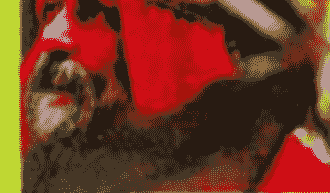
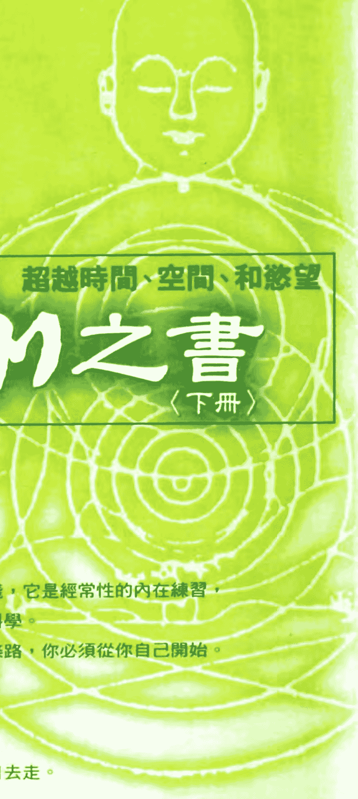
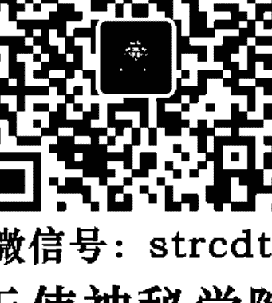
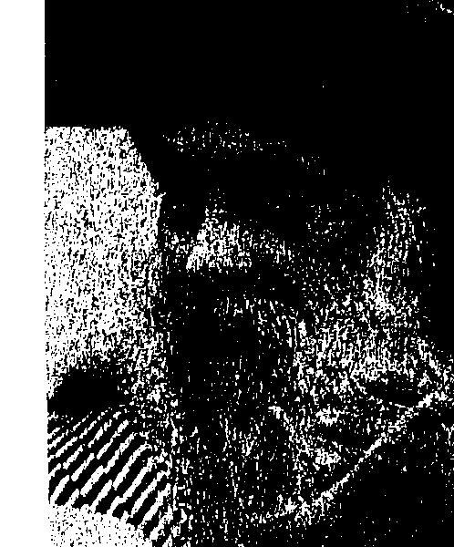
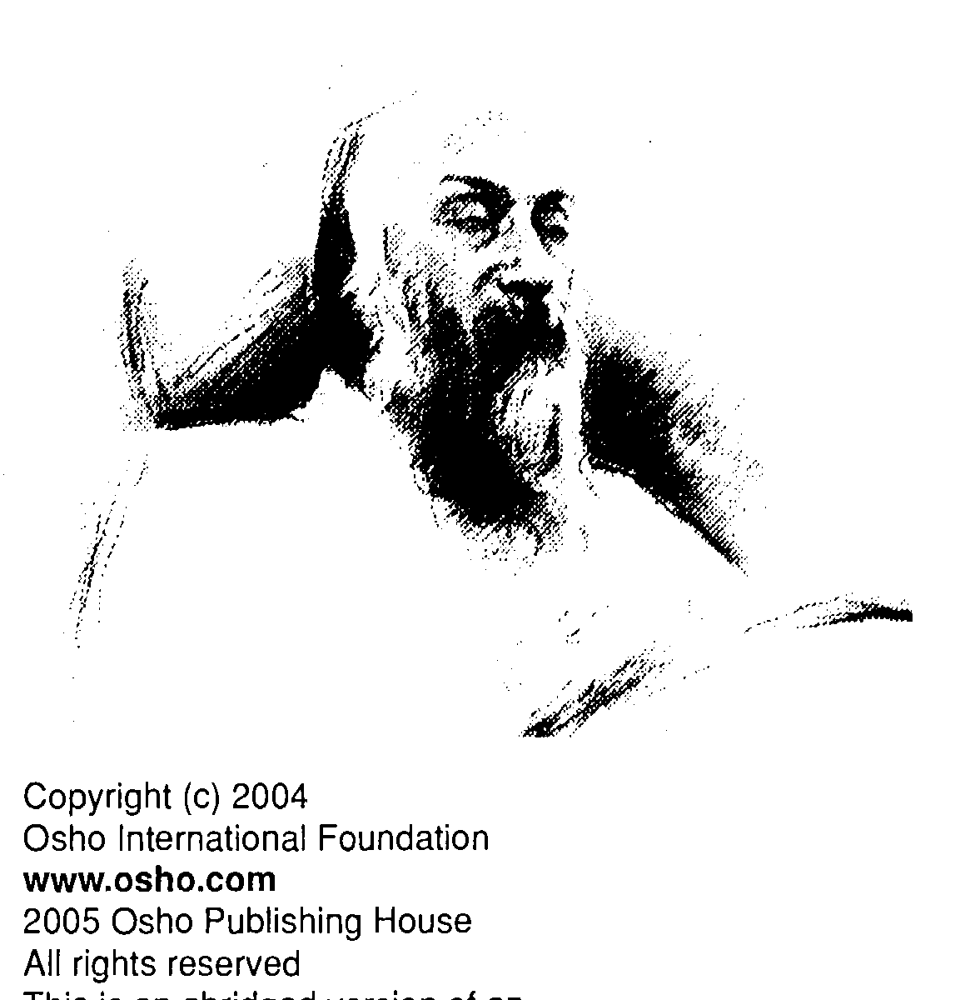

## OSHO
奧修心靈系列 53

## 瑜伽之書

## 超越時間、空間、和慾望

## The Yoga Book, Vol. II

瑜伽並非只是一種概念，它是一種實踐，它是經常性的內在練習，它是一種規範，它是一種內在蛻變的科學。

記住，沒有人能夠為你開始去走這一條路，你必須從你自己開始。

瑜伽教你要信任你自己，

瑜伽教你要對你自己有信心，

瑜伽教你說那個旅程是單獨的，

師父能夠指出那個路，但是你必須親自去走。

奧修·著
諾達那·譯

奧修出版社

校對/德瓦嘉塔

## St. Royal College
天使神秘学院

-   ※ 专业占卜预测机构
-   ※ 神秘学培训机构
-   ※ 水晶能量研究中心
-   ※ 神秘学资料库
-   ※ 官方微信：strcdts
-   ※ 微信公众平台：strc2011
-   ※ 官方店铺网址：http://strc.cr.cx
-   ※ 读书交流QQ群：
    -   占星塔罗占卜师交流群：814594478（加入密码：PDF）
    -   神秘学其他综合群：659338717（加入密码：PDF）

微信号：strcdts
天使神秘学院

微信公众平台：strc2011

## 制作说明：

本书由《天使神秘学院》出重金从台湾购入的原版书籍扫描制作完成。为達到最好阅读效果，特地把原版书全部切开后，再经由专业扫描设备高精度扫描完成，并经过一张张的PS后期处理最终成书，其间花费大量的人力、物力以及时间，只为能给大家提供经济并优质的神秘学学习资料而努力。

本学院强力谴责某些机构和个人，把本学院花心血制作完成的电子书籍，包装后直接放在自家淘宝网上低价倾销的行为，以谋取不劳而获的经济利益。如果长此以往最终将无人愿意再为大家花心思制作电子书，那以后可能大家再无新书可读。

为让大家以后能够读到更多的好书，也为了本学院的良性发展。本学院恳请大家尽量做到如下几点：

-   一、尽量在本学院的网站购买电子书籍。
-   二、请勿用技术手段把电子书内的水印及加密去掉。
-   三、在收到电子书后小范围传阅即可，千万不要公开传播，更别挂到淘宝网上低价销售。

同时为答谢广大支持者，学院电子书将做如下调整：

-   一、学院会把一些早已收回制作成本的电子书折价销售。
-   二、最新制作的电子书籍会开放打印功能，大家购买后有条件的可自行打印成书。

天使神秘学院
2020年1月

## 瑜伽之書(下)

## The Yoga Book, Vol. II

超越空間、時間、和慾望

奧修(Osho)/原著 謙達那/譯
校對/德瓦嘉塔

Osho出版社

Copyright (c) 2004

Osho International Foundation

www.osho.com

2005 Osho Publishing House

All rights reserved

This is an abridged version of an original ten-volume series named:

## YOGA - THE ALPHA AND THE OMEGA, by Osho

The material in this book is selected from a discourse series by Osho given to a live audience over a period of more than thirty years. All of the Osho discourses have been published in full as books, and are also available as original audio recordings. Audio recordings and the complete text archive can be found via the online OSHO Library at www.osho.com OSHO is a registered trademark of Osho International Foundation.

## 1 目錄

+   第一章 超越經驗的錯誤……
+   第二章 精通五種元素……
+   第三章 敏感度——精通感官……
+   第四章 自我的最後攻擊……
+   第五章 單獨——超越二分性的自由……
+   第六章 抛棄人工的頭腦……
+   第七章 回到原始的頭腦……
+   第八章 超越時間和結果……
+   第九章 最終的意識狀態……
+   附錄一 派坦加利—瑜伽經—全文……

## 第一章 超越經驗的錯誤

奧修的經文：

所有的經驗都是一種錯誤，錯誤之所以產生是因為你不会分辨，你不知道誰是誰。當一個人走向內在，所有的力量都會變成障礙。沒有心靈的經驗——不可能有。說一個經驗是「心靈的」是將它虛假化了。那個心靈的只是達到純粹的覺知——普魯夏（puru sha）。

「單獨」（aloneness）這個字必須被加以了解，它不是「孤獨」（lone-\ness）。孤獨是負向的，孤獨是當你在渴望別人，孤獨是感覺到別人的不在；單獨則是自己的達成。孤獨是醜陋的；單獨則是非常美的。單獨是當你非常滿足而不需要別人，別人已經完全從你的意識中消失，別人不會在你身上產生影\子，別人不會在你身上產生夢，別人不會把你拉出去。\很清楚：「別人是地獄。」別人或是地獄，但是地獄會由你對別人的欲求而造成，對別人的欲求就是地獄。\對別人沒有欲求就是達到你本性最原始的清澈，那麼你存在（你是），而旦你就是整體，除了你以外沒有別人存在，這個派坦加利稱之為凱瓦爾亞（kaivalya）。\走向凱瓦爾亞（kaivalya）的第一步，也是最重要一步，就是味味卡（viveka）——分辨；第二個重要的步驟是拜拉格亞（vairagya）——棄俗；第三步是達成凱瓦爾亞——單獨。\你為什麼那麼渴求別人？為什麼會有這個慾望——這個經常的瘋狂，想要

別人？你到底走錯了哪一步？你為什麼對你自己不滿足？你本身為什麼不覺得滿足？你為什麼你會認為你缺少了什麼？認為你不完整這個錯誤的觀念來自哪裡？它來自對身體的認同，身體就是別人。一旦你踏上了錯誤的第一步，那麼你就會一直一直繼續下去，沒完沒了。

派坦加利所說的味味卡（viveka）意味著：分辨出你跟身體是分開的｜了解你在身體裡，但是你不屬於身體；了解你在頭腦裡，但是你不屬於頭腦；了解你一直都是純粹的觀照——沙克希（sakshi），drashta——看者。你從來不是那個被看的，你從來不是客體，你是純粹的主體。這是一種內在的運作機構：只是藉著你的「在」，身體就會活生生地運作；只是藉著你的「在」，「自然」就會變得活生生的；只是藉著你的「在」，頭腦就會開始運作。

是坐在階梯上抽煙，沒有人擔心房子。當主人進來，他們就停止聊天，也不再抽煙，他們將煙藏起來，然後開始工作，他們變得很認真工作，你甚至無法想像就在一個片刻之前他們是在聊天、坐在階梯上無所事事、懶惰、休息。當在瑜伽裡面，他們說這就好像主人出去了，然後他回來。僕人在聊天，或
者好像老師不在教室裡，然後教室裡面就亂糟糟的，等老師回來，所有的小孩就都回到他們的座位上，開始書寫，或是現在科學家已經發現有很多東西跟它是相似的，他們稱它為催化劑的「在」。有少數的科學現象，在那裡面需要有某些東西「在」。它不會參與任何作用，但是它的一在能夠幫助某些作用發生，如果它一在，它會維持原狀，不會參與，只是它的「在」就具有催化發生。如果它一在，它會使其他人或其他地方產生作用。派坦加利說你最內在的本質是不活躍的。在瑜伽裡面那個最內在的本質被稱為普魯夏（Purusha）。你純粹的意識是一種催化劑，它就只是在那裡，什麼事都不做——看著每一樣東西，但是什麼事都不做；觀照著每一樣東西，但是不涉入任何事。只是普魯夏單純的「在」，自然（prakriti）——頭腦、身體、和每一樣東西——就會開始運作。但是我們跟身體認同，我們跟頭腦認同，我們溜出那個觀照者而變成做者，那就是人類的整個病。味味卡（Viveka）是醫藥——如何回到家，如何拋
棄一你是一個做者，這個虛假的概念，如何達到只是成為一個觀照的清晰，那個方法被稱為味味卡（viveka）。一旦你了解你不是做者，你是觀照者，第二件事就會自動發生—棄俗，成為門徒，拜拉格亞（vairagya）。第二步是：現在任何你以前在做的事都無法做。你以前涉入了太多的事情，因為你認為你是身體，因為你認為你是頭腦。現在你知道你既不是身體，也不是頭腦，因此很多你以前在遵循的或瘋狂追逐的都會拋棄，那個拋棄就是拜拉格亞（vairagya），那就是成為門徒，棄俗。

是拜拉格亞（vairagya）。當拜拉格亞被完成，就有另外一個頂峰會產生，那就就是凱瓦爾亞（kaivarya：達到本性最原始的清澈）—你首度知道你是誰。但是第一步的認同會使你導入歧途，一旦你進入了第一步，一旦你忽視了那個分開，你就陷住在認同裡，那麼它就會一直一直繼續下去，第一步會引導到另外一步，然後又到另外一步，然後你就越來越陷入泥淖、陷入混亂。

戈齊福常常告訴他的門徒：「第一件事就是要變得不認同，持續地記住變是觀照，你是意識—既不是一個行為，也不是一個思想。如果這個記住變
外一步，然後又到另外一步，然後你就越來越陷入泥淖、陷入混亂。

是觀照，你是意識—既不是一個行為，也不是一個思想。如
果這個記住變

成你裡面一個結晶的現象，你就達到了味味卡—分辨，然後很自然地，拜拉格亞就會隨之而來。如果你不懂得分辨，沙姆沙拉（samsara；世界）自然就會隨之而來。如果你跟身體和頭腦認同，你就会向外走，進入世界，你從伊甸園被驅逐出去。如果你懂得分辨，你記住你在身體裡，但身體只是一個住處，你是擁有者，頭腦只是一個生物電腦，你是主人，頭腦只是一個奴隸，那麼你就會轉向內在，你不会進入世界，因為第一步已經被除去了。如此一來你就不再跟世界接軌，突然間你開始掉進內在，這就是拜拉格亞—棄俗。當你續一直掉進內在，又更內在，那麼就會來到最後一個點，超出那個點之外已經沒有什麼地方可以去了，那個至善的點被稱為凱瓦爾亞（kāivālya）—你變成單獨的，你不需要任何人，你不需要經常努力用一些什麼東西來填滿你自己。如此一來你可以融入你的空，因為你融入那個空，那麼空就變成一種充滿，一種無限，一種滿足，那是你本性的開花結果。在起點的時候是普魯夏（purusha），在終點的時候也是普魯夏，在這兩者之間只是一個大夢。

## 第一章 超越經驗的錯誤

經驗是沒有能力分辨普魯夏（純粹的意識）和沙特瓦（sɑʁva：純粹的智力）之間的差別，雖然它們是完全清楚而可以分辨的。藉著融入自己的利益，達到 samyama （不分裂的鎮定狀態；修行的極致）的狀態，就會產生普魯夏的知識，它跟來自別人的知識是不同的。

「辨……」所有的經驗都只是一種錯誤。你說：「我是快樂的。」或者你說：「我覺得很飢。」或者你說：「我是痛苦的。」或者你說：「經驗是沒有能力分

很飢。」你 不 飢，是你的身體在飢，你是知道那個事實的人。那個經驗並不是你的，只有那個覺知是你的。那個經驗是身體的，那個覺知才是你的。當你覺得很痛苦，同樣地，那個經驗也可能是身體的或頭腦的——身體和頭腦是同一個運作機構，身體是那個運作機構比較粗糙的部分，而
頭腦則是那個運作機構比較精微的部分，但兩者是有一樣的。說頭腦和身體是不好的，我們應該說一身體頭腦。身體只不過是粗糙的頭腦，如果你注意看你
的身體，你將會看到身體也是像頭腦一樣在運作。當你在睡覺的時候，有一隻蒼蠅飛過來，在你臉部的周圍飛來飛去，你用你的手去揮開它，但是你不必起來，也不必醒來。身體很有頭腦地發揮出它的功用。或者是有什麼東西在你的腳上爬，你就將它甩掉，但你還是睡得很熟，到了早上你已經記不得了。身體以一個頭腦來運作——非常粗糙，但是它以一個頭腦來運作。

所以身體頭腦有著所有的經驗，不管是最好的或壞的，快樂的、不快樂的，都沒有差別，你從來不是那個經驗者，你一直都是那個經驗的覺知。所以派坦加利說出了一個非常勇敢的陳述：「經驗是沒有能力分辨……所有的經驗都是一種錯誤，那個錯誤之所以產生是因為你不会分辨，你不知道誰是誰。」

派坦加利說，所有的經驗都是一種錯誤——是你看法的錯誤。你變得跟客體認同，主體開始認為好像是客體。你覺得飢，但是你並沒有在飢，是身體在飢；你感覺到痛苦，但是你並沒有處於痛苦之中，是身體在痛苦，你只是覺知到那個痛苦。

## 第一章 超越經驗的錯誤

下一次有什麼事發生在你身上——每一個片刻都有一點事會發生——只要
注意看。只要記住「我是那個觀照」，然後看看事情會有什麼樣的改變。一旦到，那是最後一天——成道的那一天，所有的經驗都起不了作用，就會消失。有一天會來
超越了經驗：你不在身體裡，你不在頭腦裡，你超越了這兩者。突然間你開始
像一朵雲一樣地飄浮，在一切之上，超越一切。那個沒有經驗的狀態就是凱

## 15 第一章 超越經驗的錯誤

那個文法學家再度撕破他的衣服，跺腳、呻吟、又大叫。當那段混亂的局面向結束，那個文法學家沒有一絲衣服，那個教主將他視為一個新的入門徒，將水澱在他的臉上，說：「請告訴我，先生，為什麼可蘭經的一段重組的話會引發你這麼大的反應，這到底是怎麼一回事？」「怎麼不會呢？」那個文法學家很熱切地說：「在我的一生當中，在我所有的演講和寫作裡，在所有學者的文章裡，不管是現代的或是古老的，第一人有稱複數一直都是跟shai一起使用，而不是如你所說的：……to him we are return？」那個問題就在≤和s乔——≤是不對的！這看起來很荒謬，幾乎是瘋狂的，但是事情就是這樣發生。如果佛陀來到你的身邊告訴你說：「沒有神。」你將會立刻變得很焦慮、憂心忡忡，他到底說了什麼？他只是說了一些違反你的語言模式的东西，就這樣而已。如果他说：「沒有自己，沒有「我」。—你就会感到困擾，他到底做了什麼？他只是帶走你自我的策略，其他沒有，他只是粉碎你的語言模式。

這種事在這裡每天都在發生。當我說了些什麼，我摧毀了你們裡面的某種語言結構，你們就覺得很困擾，你們會生氣。如果你是一個基督徒，當然，你會有基督教的語言庫；如果你是一個印度教教徒，你會有印度教的語言庫，我什麼都不是，我在此是要摧毀你們所有的語言模式，你們一定會生氣，你們定會覺得很困擾，你們會開始想要怎麼辦，但是我在做什麼呢？我能夠從你身 上帶走什麼呢？如果你知道神，佛陀能夠從你身上將他帶走嗎？如果你知道神，那麼就不會有問題。但是他能夠帶走語言的理論，他能夠從你身上帶走一個假設。

經驗是沒有能力分辨普魯夏（純粹的意識）和沙特瓦（satva；純粹的智力）之間的差別……語言屬於 satva，理論屬於 satva，哲學屬於 satva。 satva 意味著你的智力，你的頭腦，而頭腦並不是你。 基督教、印度教、耆那教、和佛教都屬於頭腦，所以佛教的和尚說：「如果你在路上碰到佛陀，要立刻將他殺掉。」佛教的和尚是在說什麼？他們是在 說：「如果我看到佛陀，要立刻殺掉他。」他們是在說：「將頭腦殺掉，不要 撫帶著關於佛陀的理論，否則你將永遠無法變成一個佛。如果你想要變成一個

## 第一章 超越經驗的錯誤

佛，就要拋棄所有關於佛陀的概念——所有的概念。立刻將佛陀殺掉！他們說：——如果你說出佛陀的名字，要立刻刷牙漱口，那個字是髒的。——佛教徒竟然說出這樣的話！他們是令人驚訝的人……但是真的很棒，而且他們真的是意味著如此。

如果你能夠了解他們的要點，你將能夠了解更多的事。菩提達摩說：——燒掉所有的經典——所有的，包括佛陀的經典。——不僅是吠陀經，法句經也包含——燒掉所有的經典。有一幅非常有名的畫，上面畫出實奇在燒所有的經典。他們非常深入真相，他們是在做什麼？他們只是你身上帶走你的頭腦。你的吠陀經在哪裡？它不在書上，不在書上，它在你的頭腦裡。你的可蘭經在哪裡？它在你的頭腦裡，它不在書上，它在你心理的錄音帶，將那個全部拋棄，走出它。智力，頭腦，是自然的一部分，它只是一個反映，它看起來幾乎就像是那個真實的——，它也一個映象是完美的，但它仍然是一個映象。如果那個映象是那麼地美，

## 瑜伽之書（下） 18

那麼你可以想像那個真實的將會是怎麼樣。不要陷住在映象裡。佛陀所說的是一個映象，派坦加利所說的是一個映象，我所說的是一個映象，不要陷住在它裡面。如果那個映象是那麼地美，那麼嘗試一下那個真實的。離開映象，走向月亮。那個路線跟走向映象的路線是相反的。如果你繼續看著那個映象，被那個映象所催眠，你將永遠無法看到天空中的月亮，因為它是在完全相反的方向。如果你想要看真實的月亮，你將必須離開那個映象——你將必須離開那個映象——你將必須燒掉所有的經典，並且將所有的佛殺掉。你必須走到跟它完全相反的層面，那麼你的頭部會移向月亮，你會看不到映象，那個映象會消失。所有的經典最多只能訓練和規範你的智力，沒有經典能夠引導你走向那個真實的，走向純粹的普魯夏——觀照、覺知。……沒有能力分辨普魯夏（純粹的意識）和沙特瓦（純粹的智力）之間的差別……那就是進入無知的原因，那就是進入暗夜、進入世界、進入物質、喪失了跟你自己真相的連結，而變成你自己的概念和投射的受害者的原因。

億大的概念也是跟你不一樣的——你可以看到它在你裡面以一個客體產生。即使最偉大的看者，往下看著那個概念的一樣東西，你跟它是離得很遠的，你是山上的一個觀致）的狀態，就會產生普魯夏的知識，它跟來自別人的知識是不同的。

知識。一變成自私的，那就是宗教的核心。試著看清你自己真正的利益是什麼，你真正的自己在哪裡，試著分辨你自己和別人。

天也會歸於塵土，它是塵土的一部分。你的呼吸也是他者，你的身體也是他者，它有一裡。它只是暫時給你，你將它借來，它將必須被退還回去。你將不會回到空氣裡，但是你的呼吸將會在這裡的空氣裡；你將不會在這裡，但是你的身體將會在很深的睡眠當中躺在泥土裡——塵土歸於塵土。那個你認為是你的血液的將會流入河裡，每一樣東西都將會退回去。

## 瑜伽之書（下） 20

但是有一樣東西你並沒有任何人那裡借來，那就是你的觀照，那就是你 的覺知。 智力將會消失，推理能力將會消失，所有那些東西就好像天空中雲的形 成，它們聚在一起，然後消失，但是天空依然保持。你將會保持是一個廣大的 空間，那個廣大的空間就是普魯夏（purusha）——內在的天空就是普魯夏。 要如何知道它？融入你自己的利益，達到 samyama 的狀態。將你的集中 精神，ānāna，你的靜心，āyana，和你的狂喜，samaāti，這三者都帶到 你自己的利益——轉入內在。在西方，人們會上緊發條，然後走向外在。但是 在此你要轉入內在，將你的意識集中在知道你是誰，對客體加以分辨。飢餓產 生，這是一個客體，然後你滿足了，你吃得很好，有某種幸福感產生，那也是 一個客體。早晨來了，那也是一個客體；晚上來了，那也是一個客體。你保 持一樣，不管有沒有飢餓，活著或死掉，痛苦或快樂，你都保持一樣是那個觀 看者。 但是即使在看電影，你也會陷住在那裡。你知道得很清楚，它只是一個白 色的銀幕，其他沒有，只有影子在它上面移動，但是你有看到人們坐在電影 院裡面的情況嗎？當銀幕上出現一些悲劇，就有一一些人會開始哭，他們開始流淚。注意看，在銀幕上並沒有真實的生命，但那個眼淚是非常真實的，那個不真實的將眼淚帶出來。人們在讀故事書的時候變得非常興奮，在看到一張裸體女人的照片，性慾就被撩起。注意看，它裡面並沒有什麼，只是一些線條，其它什麼都沒有，只是一點點油墨散佈在紙上，但是他們被撩起的性慾是非常真的。這就是頭腦的傾向：陷住在客體裡，變得跟它們認同。雖可能當場抓住你自己，一再一再地當場抓住你自己，將客體拋棄。突然間，你將會有一種冷靜的感覺，所有的興奮都消失了。當你了解到在那裡就只有銀幕，其他沒有，我為什麼要那麼興奮，為了什麼？整個世界是一個銀幕，一切你在那裡所看到的是你的慾望被投射出來，任何你想要的，你就開始投射和相信，這整個世界是一個幻想的東西。記住，你們都不是生活在相同的世界裡，每一個人都有他自己的世界，因為他的幻想和別人的幻想是不同的。真理只有一個，但是有多少個頭腦就有多少個幻想的東西。

## 瑜伽之書（下） 22

如果你處於幻想之中，你無法跟別人會合，你無法跟別人溝通。他處於他的幻想之中。事情就是這樣：當人們想要關連，他們無法關連。不知道怎樣，他們就是互相錯過對方。愛人、太太、朋友、和先生們互相錯過對方，續錯過。他們很擔心為什麼他們無法溝通，他們想要說些什麼，但是對方卻了解成其他的東西，他們一直在說：‘我從來不是意味著如此。’但是對方卻續聽到其他的東西，他們一回事？對方生活在他的幻想裡，而你生活在你自己的幻想裡，而你生活在你自己的幻想裡，你也投射其他的影片在同樣的銀幕裡，那就是為什麼一個關係會變得很焦慮、很痛苦。一個人覺得單獨是很好、很快樂的，每當你跟別人在一起，你就開始陷入泥淖、陷入地獄。當沙特說‘別人是地獄’，這句話是來自他的經驗，但是別人並沒有在創造地獄，它只是兩個幻想的衝撞，兩個作夢世界的衝撞。唯有當你拋棄了你的幻想世界，別人也拋棄了他的幻想世界，才可能通，那麼就是兩個真實的存在互對方——他們不是‘二’，因為那個‘二’會隨著幻想世界的消失而消失，那麼他們就是‘一’。

## 23 第一章 超越經驗的錯誤

當一個佛面對一個也是佛的人，他們並不是「二」，那就是為什麼兩個佛在一起的时候互相不說話——沒有兩個人可以說話。他們會保持安靜，他們會保持沈默。有一些故事說，當馬哈維亞和佛陀在世的時候……他們兩個人是同一時代的人，他們兩個人在同一個小小的比阿省活動、流浪，那個地方之所以被稱爲比阿（Bihar）是因爲這兩個人在那個地方到處流浪，所以大家都知道那是他們流浪的地方，但是他們從來不碰頭。有很多次，他們都待在同一個城鎮，那個地方並沒有很大；有很多次，他們都待在同一個地方，一個小小的村子裡，甚至有一次他們兩個人還待在同一個宗教社區裡，但是他們從來不碰頭。問題產生了：爲什麼？如果你問佛教徒或者耆那教教徒爲什麼他們不碰頭，他們會覺得有一些尷尬。那個問題似乎是令人尷尬的，因為它顯示出也許他們是非常自我主義的，誰應該去找誰？是佛陀要去找馬哈維亞，或是馬哈維亞要去找佛陀？沒有人可以這樣做。所以耆那教教徒和佛教徒都避開這個問題，他們從來不回答。但是我知不知道，那個理由是：沒有兩個人可以會面！兩個「空」停留在同一個地方，主義的問題，它就只是沒有兩個人可以會面！

## 瑜伽之書（下） 24

所以要怎麼辦？要如何將他們放在一起？即使你將他們放在一起，他們也不會變成一二，他們只會成為一個空。當兩個零會合，它就變成一個零。直覺的聽、碰觸、看、嘗、和聽會隨著這個而來。再度地，pratīhaṇa這個字必須被加以了解。一個達到純粹的注意、純粹的覺知、純粹的內在清晰、和天真的人就是達到pratīhaṇa。pratīhaṇa並不是直覺。理智是太陽導向的，直覺是月亮導向的，但是pratīhaṇa超越了這兩者。男人是理智的，女人是直覺的，但是一個佛——普魯夏（puruṣa），一個已經達成的人，既不是男人，也不是女人。如果你是一個理智型的人，你將會是純極的、帶有侵略性的，理智是純極的，太陽的能量是純極的，那就是為什麼我們從來沒有聽過女人強暴男人，那是不可能的，只有男人能夠強暴女人，因為太陽的能量是純極而帶有侵略性。理智是純極的，直覺是具有接受性的。如果你是具有接受性的，你將會變成直覺的，你將會開始看到一些理智型的人，而月亮的能量則是具有接受性的。理智是純極的，直覺是具有接受性的。

## 第一章 超越經驗的錯誤

但是看不到的东西，因為他不夠敞開。最奇怪的事是：理智型的人在找尋它們，但是可以看到。女人比較是直覺型的，她們靠著預感生活。她們會突然跳到結論，那就是為什麽很難跟一個女人爭論。她已經到達結論，爭論是不需要的，你只是在浪費你的時間。她一直都知道最終的結果是什麽，她只是在等著要宣佈它。你繼續以這樣的方式或那樣的方式來爭論……這一切都是沒有用的，她已經有了結論。直覺是直通結論的，那就是為什麼女人比較能夠紐心電感應，女人比較有更多的洞見，有很多直覺的事情會發生在她們身上，所有偉大的靈媒都是女人，催眠、心電感應、千里眼、和千里耳，都是屬於女人的世界。讓我來告訴你們關於過去歷史的一件事。巫術（mitjorcat）是女人的技術，因此它被稱為女巫術。整個女巫的世界都是直覺的，教士們很反對它，他們的整個世界是理智的。記住，所有的巫師，幾乎所有的巫師都是女人，而所有的教士，幾乎所有的教士都是男人。首先，教士試圖燒燬女巫。在中古世紀的歐洲，有千千萬萬的女人被燒死，因為

## 瑜伽之書（下） 30

教士們無法了解直覺的世界，他們無法相信它——它看起來很危險、很奇怪，他們想要將它完全去除。他們將它完全去除，他們試圖摧毀屬於接受性的、屬於更高知識的、## 第二章 精通五種元素

由電場所構成的，針灸就是以這個為著眼點。第二體比第一體更精微，一個開始從第一體移到第二體的人會變成能量場，非常有吸引力，非常有磁性，具有一種催眠的力量。如果你接近他們，你將會覺得被賦予活力、被充電。如果你接近一個只是生活在他的食物體的人，你常常會碰到一些吸你的能量的人，在他們離開你之後，你的能量被耗盡，能量發散掉，就好像某人剝削了你的能量。你常常會碰到一些吸你的能量的人，在他們離開你之後，你的能量被耗盡，能量發散掉，就好像某人剝削了你的能量。第一體是會吸能量的體，而且第一體非常粗糙，所以如果你過份生活在第一體，如果你是一個身體導向的人，你將會一直覺得有負荷、緊張、無聊、昏睡、沒有能量，一直都處於你能量的最低點，這樣的話你就会沒有能量可以用在更高的成長。這一類的人，第一類的人，食物體導向的人為食物而活，他会一直吃、一直吃，那就是他的整個人。就某方面而言，他保持像一個小孩，小孩在世界上所做的第一件事就是吸空氣，然後吸奶。小孩子在世界上所必須做的第一件事就是幫助食物體，如果一個人一直沈溺於食物，他就會保持幼稚，他的成長會受阻。

第二體，pranamaya kosha（能量體），給你一個新的自由，給你更多的空間。第二體比第一體更大，它不侷限在你的肉身體，它在肉身體裡面，也在肉身體外面，它像一個微妙的氣氛或能量的氣團團繞著你。那就是為什麼瑜伽非常堅持要純化你的呼吸，因為能量體是由精微的能量所做成的，它藉著呼吸在你裡面移動。如果你正確地呼吸，你的能量體將會保持健康和完整，而且活生生。這樣的人從來不會覺得疲倦，這樣的人永遠都準備做任何事，這樣的人永遠都會靈活反應，永遠都準備對當下反應，準備接受挑戰，他一直都是準備好的，你在任何時候都不會發現他沒有準備好。並不是說他會為未來作準備，不，但是因為他有很多能量，所以不論有什麼事發生，他都準備反應，他是能量洋溢的。太極拳是在對能量體下功夫，瑜伽呼吸的調整也是在對能量體下功夫。如果你知道如何自然地呼吸，你將會成長而進入到第二體。第二體比第一體更強壯，第二體比第一體活得更長。

當一個人死掉，幾乎有三天的時間你可以看到他的原生質（iploasma），有時候它被誤以爲是他的鬼魂。肉身體死了，但是能量體繼續在移動。那些對死亡作過深入研究的人說，有三天的時間，那個死掉的人很難相信自己已經死了，因為同樣的那個形式——比以前更活，比以前更健康，比以前更美——圍繞著他。它依你的原生質有多大而定，有時候可以保持十三天，甚至更久——滿能量，父母已經疲倦了，但是小孩還沒有疲倦。那些能量來自哪裡？它來自能量體。一個小孩很自然地呼吸，當然會吸進更多的氣，有更多的氣被吸進去儲存在肚子裡，肚子是儲存的地方，是一個儲藏庫。注意看一個小孩，那就是正確的呼吸方式。當一個小孩在呼吸，他的胸部完全没有受到影響，他的肚子會一上一下，就好像他是從肚子在呼吸。所有的小孩都有一點肚子，那個肚子之所以存在是因為他們的呼吸和能量的儲藏庫。那是正確的呼吸方式，記住，不要太使用你的胸部。有時候它可以被使用——在緊急的時候。當你在逃命的時候，胸部可以被使用，它是一種緊急設置，那麼你可以使用淺而快的呼吸來跑步，但是在一般情况下不應該使用胸部。有一件事必須被記住：胸部只是在緊急的時候要用的，因為在緊急的時況下很難自然呼吸，因為如果你自然呼吸，你將會變得很鎮定、很安靜，這樣你就沒有辦法跑步，你沒有辦法爭鬥，你就沒有辦法保護自己。

如果你繼續從胸部呼吸，你的頭腦將會有緊張；如果你繼續從胸部呼吸，你將永遠都會害怕，因為胸部呼吸只是要在害怕的時候用的，如果你使它成為一個習慣，那麼你將會經常害怕、緊張，一直都處於抗爭之中。敵人並不在那裡，但是你將會想敵人在那裡。妄想症就是這樣產生的。注意看一個小孩，那就是自然的呼吸，你要以那樣的方式呼吸。當你吸氣的時候，讓你的肚子上來，當你呼氣的時候，讓你的肚子下去。讓它處於這樣的一個韻律，使它變成幾乎就像你能量的首歌或一支舞，有韻律，有和諧，你將會覺得很放鬆、很活、很有生命力——你無法想像怎麼可能這麼有活力。

然後有第三體，manomaya kosha——心理體。第三的比第二的來得大，比第二的更精微，比第二的更高。動物有第二體，但是沒有第三體。動物非常
有活力，注意看一隻獅子在走路，多麼美，多麼優雅，多麼莊嚴，人類一直都會覺得覺得嫉妒。注意看一隻鹿在奔跑，多麼輕盈，多麼有能量，人類一直都會覺得嫉妒，但是人的能量走向更高。第三體是心理體（manomaya kosha）。英文字的man（人）來自梵文的
man這個字根。印度文的「人」這個字是manushya，它也是來自同樣的
這個字根，它意味著頭腦，是頭腦使你成為人。但是，或多或少，你並沒有它。你有的只是用來取代它的一個被制約的運作機構。你藉著模仿在生活，那麼你就是沒有頭腦。當你開始依靠你自己來生活，自發性地，當你開始依靠你自己來回應你生活的問題，當你變成負責任的，你的心理體就開始成長，你的頭腦體就開始成長。一般而言，如果你是一個印度教教徒，一個回教徒，或是一個基督徒，你的頭腦是借來的，它並不是你的頭腦。也許基督達成心理體偉大的爆發，然後人們就只是模仿他，那個模仿並不是在你裡面的成長。那個模仿是一個障礙，不要模仿，要試著去了解，要變得越來越活生生，越來越真實，越來越靈活反應，即使可能走入歧途也要走入歧途，因為如果你那麼害怕犯錯，就沒有辦法成長。犯錯是好的，你必須犯錯。永遠不要犯同樣的錯誤，但是永遠不要害怕犯錯。太害怕犯錯的人永遠無法成長，他們會繼續固守在原來的地方，不敢動，他們並不是活的。當你自己去面對事情，頭腦才會成長。你用你自己的能量去解決它們，永遠不要去要求別人的忠告。將你的生命操縱在你自己的手中，當我說要做你自
己的事，我就是意味著如此。你將會陷入困難，遵循別人是比較安全的，遵循社會、成規、傳統、和經典是比较方便的，它非常容易，因為每一個人都在跟隨，你只要變成那一群人裡面一個死的部分，不管群眾要去哪裡，你只要跟著他們走，你不必負責任。但是你的心理體，你的manomaya kosha，將會嚴重地受苦，它將無法成長，你將不會有你自己的頭腦，你將會錯過某種非常非常美的東西，你將會失去走向更高成長的橋樑。然後比心理體更高的，比心理體更大的，是vyanamayakosha——直覺體，它是非常非常寬廣的，在它裡面沒有理智，它是超越理智的，它變得非常非常精微，它是一種直覺的掌握。它是直接洞察事情的本質，而沒有試圖去思考它。柏樹長在庭院裡，你只是看著它，你不去思考它，在直覺裡面沒有「關於」，你只是變得敞開，具有接受性，真相會將它的本質顯露給你，你不投射，你不尋求任何爭論，你不下任何結論，你什麼都不做，你甚至不找尋，你只是等待，真相自然會顯露出來，它是一個天啟。直覺體會把你帶到遠方的地平線，但還有另外一個體。那就是第五體，anandamayakosha——喜樂體。它真的是離得非常遠，
它是由純粹的喜樂所做成的，甚至連直覺都被超越了。

在。這些就只是團繞著你的種子。第一點要記住。超出這五個之外是你真實的存
裡。第二個比它來得更大一些，第三個更大，第四個又更大，第五個非常大，
但這些都是種子，它們都是有限的。如果所有的種子都被拋棄，你赤裸地站在
你真實的存在裡，那麼你是無限的，你就是瑜伽所說的：你就是神——aham
brahma，你就是婆羅門（Brahman）。現在你就是最終真實的存在本身，
現在有所有的障礙都消失了。

試著來了解這個，那些障礙就在那裡，以圓圈狀團繞著你。第一個障礙非
常非常堅硬，要脫離它非常困難。人們侷限在他們的肉身裡，而認為肉身體
就是生命的一切。不要就這樣固定下來，肉身體只是達到能量體的一個階梯，
能量體也只是達到頭腦體的一個階梯，而它依序也只是達到直覺體的一個階
梯，然後直覺體也是達到喜樂體的一個階梯。從喜樂體，你就必須跳——現在
已經不再有階梯——你跳進你本性的深淵，那是無限，那是永恆。

這些是五個種子。相當於這五個種子，瑜伽有另外的教義關於五種
ojutas ——五種元素。就如你的身體是由食物和土所做成的，「土」就是第一
種元素。它跟這個地球或泥土無關，這一點要記住。這個元素只是在說有物質
的地方就是土，物質的就是土，粗糙的就是土。在你裡面，它是身體，在你外
面，它是一切的體。星星是由土所做成的，一切存在的东西都是由土所做成
的。第一層殼屬於土。五種ojutas意著五種偉大的元素：土、火、水、空
氣、和以太（ether）。

土相當於你的第一體——食物體；火相當於你的第二體——能量體，原生
質，與氣，它具有火的品質。第三種是水，它相當於manomaya body ——心理體，它具有水的品質。注意看頭腦，它經常在流動，就像河流一樣。第四種是空氣，它幾乎是看不見的，你看不到它，但它是存在的，你只能夠感覺到
它，它相當於直覺體——viyanamaya kosha。然後有 akasha，以太，你甚
至無法感覺到它，它甚至比空氣來得更精微，你只能夢相信它，相信它的存
在，它是純粹的空間，那就是喜樂。

但是你比純粹的空間來得更純，比純粹的空間來得更精微。你真實的存在幾乎就好像它是不存在 的。那就是為什麼佛陀說 anata — 沒有自己，你的本質（being）幾乎就像是一個非本質（non-being），為什麼是非本質？因為它已經非常遠離所有粗糙的元素，它是純粹的是。對它無法說什麼，對它來講，沒有一個描述是足夠的。這些是五種偉大的元素，它們相當於你裡面的五個體。

五個體。 然後有第三種系統，我想要了解所有這些，因為它們將能幫助我們了解我們即將要討論的經文。然後有七個 chakras。Chakra 這個字並非真正意味著一中心（center），中心這個字無法將它解釋、描述、或翻譯得很正確，因為當我們說中心，它似乎是某種靜止的東西，而 chakra 意味著某種動態的東西，西。Chakra 這個字的意思是「輪子」，轉動中的輪子。所以 chakra 是你存在裡面的一个動態的中心，幾乎就像是一個漩渦，或旋風，或飄風的中心，它是裡面的一个動態的中心，它會在它的周圍創造出一個能量場。

七個 chakras。第一個是一個橋樑，最後一個也是一個橋樑，剩下的五個相當於五種大元素和五個種子。性是橋樑，是你和那個最粗糙的 prokri（自
然）之間的橋樑。Sahasrar（薩哈斯拉），第七个chakra，也是一個橋樑，是你和那個最終的、那個深淵之間的橋樑。這兩个是橋樑，剩下的五個中心相當於五種元素和五個體。這是派坦加利系统的架構。記住，它是按照自己的意思來設定的，它必須被當成一個工具來使用，而不是被當成一個教條來討論，它不是任何神學的學說，它只是一個實用的地圖。你去到某一個地區，去到某一個未知的的地方，所以你帶著地圖去。地圖並不是真的代表那個地方，地圖那一個未知的的地方，所以你帶著地圖去。地圖並不是真的代表那個地方，地圖並不是真的代表那裡，而那個地方那麼大。在地圖上，城市只是一個點，那些點怎麼能夠等同於大城市？在地圖上，那些路就只是線，路怎麼可能只是線？山只是被標示出來，河流也只是被標示出來，細節的部分都沒有顯示出來，只有比較大的地方被標示出來。這是一張地圖，而不是一個學說。它，以此類推。你就像是一個洋蔥，一層又一層，但是這五個可以作為代表。五幾乎是一個完美的數目，因為比五更多覺得太多了，比五少又覺得太少了，五看起來幾乎是完美的，派坦加利是一個非常平衡的思想家。

現在我們來討論一些關於這些能量中心的事。第一個能量中心，第一個動
態的中心，性中心——muahar（穆拉達）。它連結你和自然，它連結你和過
去，它連結你和未來。你是由兩個人的性遊戲所誕生出來的。你父母的性遊戲
成為你出生的原因。你透過性中心來跟你的父母連結，然後再連結到你父母的性遊戲
父母，然後以此類推。你透過性中心來跟整個過去連結，那一條線流經性中心。

如果你生一個小孩，你將會跟未來關連。

性使你成為時間的一部分，一旦你超越了性，你就變成了永恆的一部分，
而不屬於時間，然後突然間就只有現在存在。你是現在，但是如果你透過性中
心來看你自己，你也是過去，因為你眼睛的顏色將會來自你的父母，你身體的
原子和細胞也是來自無數的前世。你的整個結構，整個生物結構，是長久的連
續的一部分，你是一個大連鎖的一部分。

性是一個很大的連鎖。它是世界的整個連鎖，它是你跟別人的連鎖。你是否曾經注意過？當你覺得有性慾，你就开始

## 瑜伽之書（下） 50

來越捉摸不定，到了最後，它就溜出了他們的手指頭。什麼東西都沒有留下來，就只是空，純粹的空間。每一樣東西都是從純粹的空間誕生出來的。這看起來很不合邏輯，但生命是不合邏輯的。整個現代的科學都變成不合邏輯的，因為如果你堅持你的邏輯，你就無法進入真相。如果你進入真相，你就必須放棄邏輯。當然，當必須在真相和邏輯之間作選擇的時候，你怎能夠夠選擇邏輯？你必須拋棄邏輯。

就五十年前，科學家了解到「量子」——電的微粒——的行徑非比尋常，它的行徑就像禪師一樣，非常荒謬，簡直難以置信，有時候看起來像微粒，現在他們默默地理到，一樣東西可以是一個微粒，或是一個微波。同一樣東西不可能同時是兩者，既是微粒，又是微波。它意味著一樣東西可以同時是一個點和一個線。

現在他們在談論黑洞。黑洞是無與倫比的空無的洞，我必須稱它為「無與倫比的一空無的洞，因為那個空無並不只是什麼都沒有，它充滿著能量，但是那個能量屬於空無，在它裡面找不到任何東西，但是有能量。現在他們說宇宙裡面有黑洞存在，它們跟星星是平行的。星星是正向的，而跟每一個星星平行的，有一個黑洞。星星有實體存在，但是黑洞沒有。當每一個星星被燒掉，完

物質；生命變成死亡，死亡變成生命；愛變成恨，恨變成愛。兩極一直在交互 運作。 這段經文說：「藉著融入那個粗糙的、永恒不變的、微妙的、遍在的、和 功能的狀態，達到 samyama 的狀態，就能夠通曉所有的五個元素。」派坦加利是在說，如果你能夠了解你觀照的真實本性，那麼如果你集中精神，將 samyama 的狀態帶到任何物質，你就可以使它出現或消失。你可以幫助東西 物質化，而因為它們來自空無，你也可以幫助東西非物質化。 不論有什麼樣的發生，你都可以找到一些方法和手段來使它發生。如果它 已經在發生，那麼它並不違反真相，你只知道如何使它發生。如果物質變成 非物質，非物質變成物質；如果東西改變它的極性，消失而進入空無，而且從 空無出現，如果這樣的事已經在發生，那麼派坦加利說，你可以透過一些方法 和手段來使它發生。他所說的方式是：如果你能夠認出那個超出五個元素的本性，你就会變得能夠將東西物質化或非物質化。

「能小」（anima，瑜伽的八種法力之一）等等的達成、身體的完美、和移開會阻礙身體的元素的力量可以隨著這個而來。

然後會有瑜伽行者的八種法力出現。第一種是「能小」（anima），然後有「能輕」和「能大」等等。瑜伽行者的八種法力能夠使他們的身體消失，或者他們可以使他們的身體變得非常小、非常小，小到幾乎看不見，或者他們可以使他們的身體變得非常大，大到他們所想要的程度。他們可以控制使身體變小或變大，或是完全消失，或是同時出現在很多地方。這些看起來好像不可能，但是那些看起來不可能的事會漸漸變得可能。

有很多事情已經發生了，它一直以來都被認為是不可能的。我們已經登陸了月球，它是一個不可能的象徵。在世界 上所有的語言裡都有像這樣的法：「不要渴望月球。」那意味著不要渴望那個不可能的，現在我們必須改變那些 表達方式。事實上，一旦我們登陸了月球，現在那個途徑就沒有阻礙了。現在每一件事都變得可能了，只是時間問題。派坦加利說如果 你超越了所有的五個體，你就超越了所有五個元素。如此一來，你已經處於一個狀態，從那個狀態你可以控制你所想要的任何東西。只要藉著你 想變小的觀念，你就可以變小；如果你想要變大，你也可以變大；如果 你想要消失，你也可以消失。並不是說瑜珈行者一定要這樣做。就大家所知道的，諸佛從來沒有這樣做，派坦加利本身也沒有這樣做，派坦加利所說的是在透露出所有的可能性。事實上人已經達到了他最盡致的存在，他爲什麼要變小？爲了什麼？他不可能那麼愚蠢，爲了什麼？他爲什麼要變成像一隻大象？它有什麼意義？他爲什麼 要消 失？他不 可能對娛樂人們和滿足他們的好奇心有興趣，他不是一個魔術師，他對人們的掌聲沒有興趣，爲了什麼？事實上，當一個人達到了他存在的最高峰，所有的慫恿都會消失。當慫恿消失，那些超能力就會消失。這是一個兩難式：當你不使用那些超能力的时候，它們才會出現。一直想要那些超能力的人消失，它們才會出現。事實上，當那個

所以派坦加利並不是說瑜伽行者會做這些事，就大家所知道的，他們從來沒有做這些事，有一些人想做，但他們並不是瑜伽行者。派坦加利這一部分的經文是要使你覺知到這些事是可能的，但是它們從來沒有被實現，因為那個想要這樣做的人，那些一直想要透過這些超能力來炫耀自我的人已經不復存在了。當你對那些奇蹟般的力量有興趣的時候，它們才會發生在你身上。這是存在的經濟學，如果你欲求，你會保持無能；如果你不欲求，你會變得無限地強而有力。

美、優雅、力量、和如磐石般地堅硬構成完美的身體。派坦加利並不是在談論這個身體。這個身體可能是美的，但不可能完美。第二體可能比第一體更美，第三體又更美，因為它們更接近中心。美是屬於中心的，當它離中心離得越遠，它就越受到限制。第四體甚至又更美，第五體幾乎是百分之九十九的完美。

但是你的本質——真正的你，就是美、優雅、力量、和如磐石般地堅硬。

如磐石般地堅硬，同時又像蓮花那麼柔軟。它很美，但是不脆弱；它很強，但不只是堅硬，所有相反的品質都會合在它裡面……就好像一朵蓮花由鑽石所做成，因為男人和女人在那裡會合而超越，因為太陽和月亮在那裡會合而超越。

瑜伽古老的用辭是जोधा（哈達），哈達（जोधा）這個字是非常非常有意涵的。जोधा 意味著太陽，जोधा 意味著月亮，जोधा 意味著太陽和月亮的會合就是瑜伽——神秘的結合。會合。太陽和月亮的會合就是瑜伽——神秘的結合。根據哈達瑜伽的行者所說的，在人體裡面有三個能量的管道。其中一個叫作पिंगाड़（右脈或日脈），它是右邊的管道，跟左腦連結，是太陽的管道，然後有另外一個管道，叫作ओआ（左脈或月脈），它是左邊的管道，跟右腦連結，是月亮的管道，然後有第三個管道सुशुम्ना（中脈），它是中間的管道，它是平衡的，它是太陽和月亮在一起。

來運行，它被稱為亢達里尼（कुण्डलिनी）——能量在兩者（右脈和左脈）之間運行，但是瑜伽行者的能量會開始透過中脈運行。對等於你的脊骨的有這些管道存在，一旦能量從中脈運行，你就会變得 很平衡，那麼一個人既不是一個男人，也不是一個女人，既不是堅硬的，也不
是柔軟的，或者他是兩者——男人和女人，堅硬的和柔軟的。在中脈裡面，所
有的兩極性都消失了，薩哈斯拉（sahasrara·頭頂）是中脈的頂點。
如果你生活在你存在最低的點，那是穆拉達（性中心），那麼你是透過左
脈或右脈，換句話說，你是透過太陽的管道或是月亮的管道在運行，那麼你會
保持分裂。你繼續在找尋別人，你繼續在要求別人，你會覺得在你自己裡面是不完整的，你必須依靠別人。

一旦你自己的能量在你裡面會合，然後產生一個很大的性高潮，一個宇宙
的性高潮，當左脈和右脈都融入中脈，那麼一個人就會很振奮，永遠振奮，那
麼一個人是很喜的，持續地狂喜，那個狂喜沒有終點，那麼一個人就永遠不會
往下掉，永遠不會降到低處，他會一直停留在高處，那個高點變成一個人最內
在的核心，一個人的本性。

我要請你們再度記住，這是架構，我們並不是在談論實際的事。有一些愚
蠢的人甚至試圖解剖人體來看看左脈、右脈、和中脈到底在哪裡，但是他們找不到。這些只是一種指示，是象徵性的。有一些愚蠢的人試圖解剖身體，想要找出這些中心，看看它們在哪裡。甚至有一個醫生根據生理學寫了一本書來證明哪一個中心是在身體的哪一個部分，這些都是愚蠢的作法。瑜伽的科學並不是以那樣的方式，它是寓言式的，它是一個偉大的寓言。它顯示出某些東西，如果你進入內在，你就會找到它，但是用解剖的方式是找不到的。藉著屍體解剖，你將無法找到這些東西。這些是活的現象，這些話語只是指示性的，不要被它們所侷限，不要把它們看得那麼死板，也不要將它們看成固定的學說，要保持彈性。從它們得到暗示，然後踏上那個旅程。

## 問題：

奧修，你叫我漂浮，但是我的身體很重，頭腦也有一個死的重量，我覺得如果我漂浮，我一定會被淹死，所以我繼續在恐懼當中游泳。

漂浮是一種全新的生活方式。你已經習慣於抗爭，你已經習慣於逆水而游。如果你跟什麼東西抗爭，自我就會覺得被滋潤，如果你不抗爭，自我就會蒸發。自我要存在的話，繼續抗爭是非常重要的，不管是這個方式或那個方式，不管是世俗的事情或是心靈的事情，就是要繼續抗爭；不管是跟別人抗爭或是跟自己抗爭，就是要在繼續抗爭。你們所說的心靈的人則是在跟他自己抗爭，但那個基本的事是一樣的。唯有當你停止抗爭，真正的洞見才會產生，那麼你就会開始消失，因為如果沒有抗爭，自我一個片刻也无法存在。那個踏板需要經常踩著，它就好像你在騎脚踏車，如果你停止踩它，它就會倒下來，它沒有辦法維持一下子，因為還有之前所留下的動量。但是自我需要你的合作來使它可以維持一下子，因為那個合作就是透過抗爭和抗拒。當我叫你要漂浮，我的意思是說，你是宇宙中這麼微小的一個部分，你跟它抗爭是完全荒謬的，你在跟誰抗爭？所有的抗爭基本上是反對神的，因為他團繞著你。如果你試圖逆流而走，你是在反抗神。如果祂往下流，流向大海，你要跟著祂走。

一旦你開始跟著河流漂浮，在你裡面就會有一個完全不同的品質產生。某種彼岸的東西將會降臨，你將不會在那裡，你將會變成只是一個空—無與倫比的空，只是一個接受性。當你抗爭，你就會收縮；當你抗爭，你就像一朵蓮花打開它的花瓣，那麼你就能夠接受。你會沒有恐懼地開始流動，跟著生命流動，跟著河流流動。那個問題是：你叫我要漂浮，但是我害怕如果我漂浮，我一定會被淹死。—如果你被淹死，那很好，因為只有自我會被淹死，你不会被淹死。當你在抗爭，事實上是自我在跟你最內在的核心抗爭，你將會被淹死。但是透過那個淹死，你將首度能夠漂浮，你將首度真正存在。選擇，你就選擇了自我，成為無選擇的，讓生命為你選擇，而你變成沒有自我的。選擇，你永遠都會選擇地獄，選擇就是地獄，不要選擇。讓這些耶穌的祈禱在你的內心迴響：—願祢的王國降臨，願祢的意志被執行。—讓祂為你來做。

自我的死亡唯有透過臣服才能夠發生。人們來到我這裡，他們問說：「要怎麼樣才能夠成為不是自我主義的？但是你無法做任何事來成為非自我主義的。你可以嘗試，規範你的自我。當我，但是你無法成為非自我主義的，因為任何你所做的都會增強你的自我。當你變成一個做者，不管是以任何方式……你也是試圖成為謙虛的，但是如果你的謙虛是經過你的練習而來的，是經過你的規範而來的，那麼在你謙虛的內在深處還是有自我存在，它將會繼續說：「看！我是多麼地謙虛。」去到一些所謂的宗教人士那裡，看看他們的臉，他們顯示出各種謙虛的跡象，但是你必須再深入一點，進入到比他們的表皮更深來了解他們。在他們的內在深處，那個自我非常快樂，覺得一沒有人比我更謙虛。如果我跟一個宗教人士說：「我找到一個比你更謙虛的人。」他將會覺得受傷，他將會覺得被侮辱了，那是不可能的，沒有人能夠比他更謙虛，但那就是自我的整個努力！沒有人比我有一個更好的房子，沒有人比我有一輛更好的車子，沒有人比我有一張更好的臉，沒有人比我有更好的知識。在那個比較和覺得很好的地方就是自我。

你無法做任何事來改變它，你只要能夠看清那個要點：在你的部分不需要做什麼。一旦你拋棄了它——或者這樣說可能更好：一旦在你很深的了解當中它消失了——你就對生命敞開了。那麼生命就開始流經你，就像一陣涼風吹過一個敞開的房間。你就像一個沒有窗户的房間，所有的門窗都關起來，沒有一絲光線進入你，也沒有新的風吹過你。你停留在你自己的洞穴裡，把自己封閉起來，當然，如果你開始覺得快要窒息，那也是很自然的。

說：一我不要它，我不想擁有它。一當你說這個女人是醜的，你就有欲求了；當你說這個女人是醜的，你就已經覺得排斥，你已經陷住在好與壞、美與醜的二分性裡，選擇已經進入了你。

說這是好的

## 第三章 敏感度——精通感官

我並不反對金錢，我完全贊成它，但是要使用它。佔有它，擁有它，但是你的所有權只有在你能夠給出它的時候才產生。在喉嚨的中心，這個新的綜合發生了，你能夠接受，你也能夠給予。有一些人從一個極端跳到另外一個極端，首先，他們無法給予，他們只能接受，然後他們改變了，他們走到另外一個極端，現在他們無法接受，那也是偏頗的，一個真正的人既能夠接受禮物，也能夠給予，但是他們無法接受，那也是偏頗的，一個真正的人既能夠接受禮物，也能夠給予，但是變成中脈。兩個半腦在第三眼的中心。在第三眼的中心，右和左會合，右脈和左脈會合而右，另外一隻眼睛代表左，而它剛好在中間。右腦和左腦在第三眼會合，這是非常高的綜合。直到這個點為止，人們還能夠描述，所以拉瑪克里虛納能夠描述到第三眼。當他開始談論那個最後的，那個發生在薩哈斯拉的最终的綜合了，就像洪水一樣，他被帶到了海洋，他無法使自己保持警覺、保持有意識。最終的綜合發生在薩哈斯拉——頂輪。因為這個薩哈斯拉的緣故，世界上所有的國王、帝王、和皇后都使用皇冠，它變成正式的，但基本上它是被接受

## 瑜伽之書（下） 70

怎麼能夠成為一個國王？你怎麼能夠統治人民，否則你怎能夠成為一個帝王，你統治者。皇冠的象徵隱藏了一個奧秘，那個奧秘就是：一個到達頂輪的人，一個達到他的存在最終的綜合的人，才有資格成為國王或皇后，其他沒有人能夠。只有他有能力統治別人，因為他已經能夠統治他自己，他已經變成了他自己的主人，現在他也就能夠幫助別人。最後的綜合再度是客體和主體的綜合，也就是外在和內在的綜合。在性高漲當中，外在和內在會合，但那個時間是短暫的。在薩哈斯拉，它們是永久地會合，那就是為什麼我說一個人必須從性走到三摩地。在性當中，有百分之九十九是十九是性，只有百分之一是薩哈斯拉，而在薩哈斯拉當中，有百分之九十九是薩哈斯拉，只有百分之一是性。兩者加在一起，由很深的能量流連結起來。所薩哈斯拉，只有百分之一是性。如果你享受了性，不要駐在那裡，性只是薩哈斯拉的一個瞥見，薩哈斯拉將能夠給你一千倍、一百萬倍的喜樂和幸福。—那個外在的—和—那個內在的—會合，我和你會合，男人和女人會合，陰和陽會合，而那個會合是絕對的，那麼就沒有分開，沒有分離。

## 71 第三章 敏感度——精通感官

這個被稱為瑜伽，瑜伽意味著二的會合而成本為一。基督教的神秘家稱之為神秘的結合（unio mystica），那就是瑜伽最貼切的翻譯。unio mystica：神秘的心，性是你的起點，三摩地是你的終點會合，它是起點，也是終點。起點是在性中的結合。在薩哈斯拉，起點和終點會合，它是起點，也是終點。起點是在性中個至高無上的結合，否則你將會保持痛苦，除非起點和終點會合，除非你達到這持不滿足，唯有處於這個最高綜合的頂峰，你才能夠被滿足。藉著融入它們認知的力量、真實的本性、自我主義、遍在、和功能，達到samyama的狀態，就能夠通曉所有的感官。第一件必須加以了解的事是，你有感官，但是你已經喪失了敏感度。你的感官幾乎是遲鈧的、死的。它們存在於你身上，但是能量並不在它們裡面流動，它們並不是你這個人的活肢，某種東西在你裡面死掉了，已經變成冷的，阻塞了。它已經發生在整個人類，因為幾千年來的壓抑。幾千年來的制約和反對身體的意識形態使你變得殘缺，你只是名義上活著。

## 第三章 敏感度——精通感官

所以第一件事要做的事是：你的感官必须真正變得很活、很敏感，唯有如 此，它們才能夠被精通。你看，但是你没有辦法很深入地看，你只是看到事情 的表面。你碰觸，但是你的碰觸没有溫暖，在你的碰觸當中沒有什麼東西流 進，也没有什麼東西流出。你也聽，小鳥繼續在歌唱，你聽到了，你可以說： 「是的，我在聽。你這樣說是沒有錯的，你在聽，但是它從來沒有達到你存 在的最核心。它並沒有在你裡面跳舞，它並沒有幫助你內在的開花和開展。 這些感官必須被重新賦予活力。瑜伽並不反對身體，這一點必須被記住。 瑜伽叫你要超越身體，但是它並不反對身體。瑜伽說，要使用身體，不要被身 體所用，但是它並不反對身體。瑜伽說，身體是你的廟，你處於身體裡，身體 是個非常美的有機體，非常複雜、非常微妙，也非常神秘，有很多層面會透過 它而打開，要使它們變得更活生生，讓它們像河流一樣地流動、衝撞，你會有 瘙癢的感覺，你會感覺到有某種東西在 手裡面流動，想要去接觸，想要被連結。 當你有一個男人或一個女人，你將他的手放在你的手中，如果你的手是不 流動的，這個愛將不會有什麼用。如果你的手沒有能量在跳動或悸動，將你的能量倒進你的女人或你的男人，那麼這個愛從一開始就幾乎是死的。唯有愛的流動能夠變成喜樂和滿足的源頭，但是要達到這種狀態，你的感官需要有能量的流動。有時候你也会有那個覺見，每一個人在孩提時代都會有那個覺見。注意看一個小孩在追逐蝴蝶，他的能量是流動的，就好像他隨時都可以跳出他的身體；注意看一個小孩在看一朵玫瑰花，注意看他的眼睛，以及他的眼睛所散發出來的光芒，他的能量是流動的，他的眼睛幾乎在花瓣上跳舞。 這就是存在的方式：成為像河流一樣。唯有如此才可能通曉這些感官。你 的眼睛看，你的耳朵聽，你的鼻子聞，你的舌頭嚐，你的手接觸，你的腳跟地面連結——那就是它們認知的力量。但它們必須是強而有力的，否則你將甚至無法感覺到力量是什麼。這些感官必須充滿力量，充滿著很高的能量，使你能夠達到 samyama 的狀態，使你能夠靜心冥想它們。

## 瑜伽之書（下） 74

現在，當你看著一朵花，那朵花在那裡，但是你有感覺到你的眼睛嗎？你
眼睛看到花朵，但是你有感覺到你眼睛的力量嗎？它一定存在，因為你在用你的
眼睛看那朵花。當然，眼睛比任何花朵都來得更漂亮，因為所有的花朵都必須
經過眼睛。透過眼睛你才能夠覺知到花朵的世界，但是你曾經感覺過眼睛的力
量嗎？它們幾乎是遲鈧的、死的，它們已經變得很被動，就好像窗戶一樣，是
具有接受性的。它們不會去到它們的客體，而力量意味著活躍的，力量意味著
你的眼睛在活動而幾乎碰觸到那個花朵；你的耳朵在活動，幾乎碰觸到小鳥的
歌曲；你的手帶著很多能量，集中精神在那裡，碰觸著你所鍾愛的。或者你躺
在草地上，你的整個身體都充滿著能量，跟地面上的草接觸、會合，跟那些草
對話。或者你在河裡游泳，對著河流低語，也聽著河流的低語，連結、交融，
但力量是需要的。
所以，我想要你做的第一件事就是：當你看，要真正地看，變成眼睛，忘
掉其他每一件事，讓你的整個能量都流經眼睛。你的眼睛將會被清理乾淨，沐
浴在內在的淋浴裡，你將能夠看到這些樹木已經不再一樣了，這些綠色植物已
經不再一樣了。它會變得更翠綠，就好像在它上面的灰塵被洗掉了，那些灰塵
並不是在你的樹木上，它是你的眼睛裡。你將首度能夠真正地看，你將首度能夠真正地聽。 然後你將能夠看出什麼是你感官真實的本性，它是神聖的，你的身體將那個神性具體化了。 靜心能夠讓你精通，除了靜心以外，其他沒有什麼事可以讓你精通。如果 你靜心冥想你的眼睛，首先你會看到玫瑰花，漸漸地，你將能夠看到那個在看 的眼睛，那麼你就變成了眼睛的主人。一旦你看到了那個在看 的眼睛，你就變 成了主人。現在你可以使用它所有的能量，那些能量是遍在的。你的眼睛並不 個限於你所認為的那樣，它們可以看到很多你從來沒有看過的東西，它們可以 穿透很多很多奧秘，那是你以前甚至連作夢都沒有想過的。但你並不是你眼睛 的主人，你只是很隨便地使用它們，不知道你在做什麼。 在瑜伽裡面，當你開始看那個你在看的眼睛，你就会碰到一種微妙的能 量，他們稱之為tanmatra（感官的微妙能量）。當你能夠看到你的眼睛在看， 就隱藏在眼睛的背後，你可以看到一個無與倫比的能量，那就是tanmatra，

## 87 第三章 敏感度——精通感官

響，你明天又會再度陷入同樣的情況。你從來不去看那個教士，他本身也在害怕；你從來不去看那個哲學家，他本身也在害怕。當它是一個生命和死亡的問題，即使是那些你求教於他們的教士或哲學家，他們也沒有真正去經歷生活。很可能他們還沒有活得你盡致，否則他們不可能成爲教士。你去問他們，他們本身也在顫抖，在內在深處，他們本身也在害怕。我不給你任何安慰，我不會告訴你們：靈魂是不朽的，不必擔心，你永遠不會死，只有身體會死。—我知道那是真理，但是一個人必須費力去拚得那個真理，不是別人說了它，你就得到了，它不是一個陳述，它是一項經驗。我知

道它是如此，但是它對你來講是完全沒有意義的，你還不能夠生活時，你怎麼能夠知道永恒是什麼？你甚至還不能夠生活在時間裡，你怎麼能夠生活

在永恒裡？當一個人能夠接受死亡，他才能夠覺知到那個不朽的。透過死亡的門，那個不朽的才能夠顯露出它自己。死亡是那個不朽的將它自己顯露給你的一个方

個不朽的才能夠顯露出它自己。死亡是那個不朽的將它自己顯露給你的一个方

## 瑜伽之書（下） 88

式……但是在恐懼當中，你閉起你的眼睛，你變成無意識的。不，我不給你方法或理論來去除恐懼，因爲它只是一個症狀。那個恐懼一直 在告訴你，你過著一個虛假的生活，所以才會有恐懼，吸取這個暗示，但是不要試著去改變症狀，要試著去改變那個基本的原因。事實上，沒有人能夠引導你到正確的途徑，因爲所有的引導都將會是錯的。沒有一個領導者可以是正確的領導者，因爲這樣的領導是錯的。不管你是錯的。沒來引導都將會對你造成一些傷害，因爲他將會開始做一些事，強加一些東西，給你一個架構，而你必須過著一個沒有架構的生活，一個免於所有的架構和固定的個性的生活，免於所有的框架和參考，免於過去的生活。因此所有的引導都是誤導，當它們消失，你已經相信它們很久，突然間你會覺得空虛，被空虛團繞著，所有的路都沒有了，要去哪裡呢？這個階段是你本性生活的一個革命性的階段，一個人必須帶著勇氣去經歷它。如果你能夠停留在它裡面，不害怕，不久之後你會開始聽到你內在的聲音，它已經被壓抑很久了。不久之後你會開始了解它的語言，因爲你已經忘了那個語言。你只知道那個被教給你的語言，而這個內在的語言，

了那個語言。你只知道那個被教給你的語言，而這個內在的語言，

## 第三章 敏感度——精通感官

並不是一般的通用語言，它是一種感覺。所有的社會都反對感覺，因為感覺是那麼地活生生，它是危險的。思想是死的，它不會有危險，所以每一個社會都是把你逼進頭腦裡，把你從身體的各個部分推進頭腦裡。你只生活在頭腦裡。如果你的頭被切掉，突然間你碰到你那個沒有頭的身體，你將會認不出它。只有臉會被認出來，你的整個身體都萎縮了，都喪失了它的柔軟和流動性。它幾乎是一個死的东西，就好像一隻木頭的腳，你使用了進入頭腦，都停留在那裡，你害怕死亡，因為唯一你能夠活的空間必須是遍佈你的全身，你的生命必須散佈在你的整個身體，你的生命必須散佈在你的整個身體，你的生命必須散佈在你的整個身體，它必須變成一条河流、一個流。一個人必須以一個完整的統一體活著，整個身體必須重新被找回，因為你是透過腳與地面接觸，你是歸根於地的，如果你失去了你的腳和它們的力量，如果它們變成死的肢體，你就不再歸根於地了，你變成好像一棵樹，它的根已經死掉了、腐爛了、或變弱了，那麼那棵樹就没有辦法活很久，沒有辦法很健康、很完整地活著，你的腳必須根植於地，它們是你的根。

## 第四章 自我的最後攻擊

有時候，作一個小的實驗。光著身子在陽光下——開始跳躍或跑步，感覺你的能量流是靠近河流的地方，光著身子在陽光下——開始跳躍或跑步，感覺你的能量流經你的腳，通過你的腳到地面上。跑步，感覺你的能量經過你的腳進入地面，然後在幾分鐘的跑步之後，靜靜地站著，根植於地，感覺你的腳與地面的交流。突然間，你將會覺得非常非常根植於地、非常實在，你會感覺到地在溝通，你也會感覺到你的腳在溝通——在土地跟你之間有一個對話。這個歸根於地已經喪失了，人們已經被拔了根，他們已經不再歸根於地，然後他們就沒有辦法真正生活，因為生命屬於整個有機體，而不只是屬於頭。你的整個身體都變成只是一個機械，只有你的頭是活的，那就是為什麼會有那麼多的夢，那麼多的思想，那麼多頭腦的思想。人們來到我這裡，問我說：一要如何停止它？一問題不在於如何停止它，問題在於要如何停止它，問題在於要如何將它分散在整個身體。當然，它太擠擠了，因為整個身體就在那裡，頭腦不應該擠帶著那麼多的能量，所以你會發瘋，你會爆掉。

發瘋是由我們的文化所產生出來的一種病，它是一種文明病。地球上存在著少數的原始文化，他們根本不知道有瘋子，在他們的部落裡不會有人發瘋。

## 第三章 敏感度——精通感官

你可以注意看，即使在現在，在一些經濟比較不發達、教育比較不普及的社會裡，那裡的人不會只生活在頭腦裡，他們的能量也會散佈在其他部分，也許是片片斷斷的，但是仍然有一些能量在腳，有一些能量在肚子，或者那些能量並沒有什麼連結，它們是散開來的，遍佈在身體各個不同的部位——在那些地方，發瘋的情況很少發生。一個社會越是變成頭腦導向的，就有越多的發瘋。生活，將能量遍佈整個身體，用很深的爱來接受它，幾乎愛上你的身體，那麼就不會害怕老年，你將會開始成熟。你的經驗將使你變成熟，那麼老年就不会像是一種疾病，它將會是一個很美的現象，整個生命都在為它作準備，它怎麼可能是一種疾病？你的整個生命都在走向它，它是一個高潮，它是你將要去做的最後的唱歌和跳舞。永遠不要等待任何奇蹟。頭腦會說，有什麼事將會發生，每一件事都將會沒有問題。它將不會那樣發生，奇蹟不會發生。為了要生存，你出賣了你的靈魂。但是現在不需要再繼續那麼愚蠢，你可以走出它。

## 第四章 自我的最後攻擊

但是現在不需要再繼續那麼愚蠢，你可以走出它。

## 第四章 自我的最後攻擊

你的內在越成長，就有很多事情會開始發生。

每一個能量中心都有它自己的力量，當你經過它們，它們就會對

你敞開。

你不要找尋自我，倒是要試著找出整體。

給你自己一些空間來了解你的本性，那麼突然間你將會看到你對東西不執著。

很難對世界不執著，但是當心靈世界敞開它的門，你要對它不執著更困

難。後者的困難度有一百萬倍，因為世俗的力量並不是真正的力量，它們是無能的，它們從來無法滿足你。事實上，在世界上每一项新的成就都會產生出更多的慾望，它不但不會滿足你，它還會將你的頭腦送進新的旅程，所以任何你在世界上所取得的力量，你都會將它用來創造新的慾望。不論你在世界上累積了多少金錢，你都會想要拿它來投資去賺更多的錢，以這樣的方式繼續下去。一切都只是手段加上手段，從來不會接近目的，所以即使是一個愚蠢的人還早也會覺知到他陷入了一個惡性循環，除了放棄以外似乎沒有辦法走出的來。對一個聰明的人——一個會去思考他的生命的人，一個會去靜心冥想它的‘人’——來講，它是非常明顯的。所以，對於世俗的東西不執著並不是很困難，但是當來到了內在的力量，通靈的力量，它們跟你的核心那麼接近，而且可以給你無限的滿足，幾乎不可能不執著於它們。但是如果你執著，你又再度創造出一個世界，那麼你離最終的解脫還是非常非常遠。因為任何你所占有的都會占有你，那個犧牲必须是全然的、徹底的，你必須拋棄一切你所能佔有的東西——除了你那赤裸裸的本性之外，那個不能夠被犧牲掉的，只有那個能夠被留下來，那個能夠被犧性的都必須被犧牲。

## 第四章 自我的最後攻擊

犧牲掉的，只有那個能夠被留下來，那個能夠被犧性的都必須被犧牲。

當你甚至對這些力量都不執著，那個枷鎖的種子就被摧毀了，然後就會有解脫（liberation·kaivalya）。

在這段經文裡，派坦加利在要求那個幾乎不可能的，但是那個透過了解也會變得可能。具有心靈力量是非常令人滿足的，它能夠給你的自我一種非常微妙的喜悦，它非常純，在它裡面你不会覺得有任何刺，它從來不會讓你覺得挫敗。在世俗的事情裡面會有很多挫敗——事實上就只有挫敗，其他沒有。人們居然能夠無視於這些挫敗，這真的是一項奇蹟；人們居然能夠繼續欺騙他們自己而相信還有一些希望，這真的是一項奇蹟。外在世界是沒有希望的，它是注定會失敗的。

不論你能夠蓋出一個多大的房子，或者你能夠在政治、經濟、和社會上變得多麼有權力，死亡將會把它們全部從你身上帶走，要了解這一點並不需要太

聰明，但是內在的力量是死亡所帶不走的，它們是超越死亡的，而且它們從來不會讓你覺得挫敗，它們是你的力量，是你潛力的開花，似乎不需要犧牲它們，不需要拋棄它們，不須要拋棄它們，但是派坦加利說它們也必須被拋棄，否則你將會開始生活在一個超能力的世界裡，那也是自我的力量的延伸。你不要找尋自我，倒是要試著找出整體，而唯有當各種自我的作為都被拋棄了、犧牲了，才可能找出整體。這是很難想像的，因為要不執著於那些沒有用的垃圾就己經很困難了。你繼續在希望中累積，好像那些你所累積的東西能夠使你滿足。你繼續累積——知識、金錢、權力、或聲望。你繼續累積，你的整個生命都被你所累積的東西所塞滿，當然，如果你變成一個死的重量，那也是不足為奇的。那就是你一直所做的：累積灰塵，卻把它看成好像是黃金。如果你透過自我來看，那麼沒有價值的變成好像有很高的價值，自我很會把事情虛假化，它是一個大騙子，它繼續在對你撒謊，它繼續在創造出幻象、夢、和投射。注意看它，它非常微妙。它的方式是微妙的，而且它非常狡猾。如果你在某一個方向停止它，它就會跑到另外一個方向；如果你在某一條路線停止它，它就會找到另外一條路線，因為它的方式太狡猾了，所以你會想不到另外一條路也是屬於自我。注意看，你是一個世俗的人，然後有一天你感到挫折，總有一天每個人都会感受到它，那並沒有什麼特別，然後你開始進入宗教，你開始在它裡面產生出個自我，你覺得你變成具有宗教性的，你將別人視為罪人，視為世俗的人，而你是具有宗教性的，你變成一個門徒，你拋棄了俗事。只要注意看，那個敵人已經從另外一個門進來了。要被拋棄的不是世界，要被拋棄的是自我，所以一個人必須非常小心，不能讓這樣的事發生。自我無法被壓抑，這一點要記住，它必須被蒸發——透過了解的火來將它蒸發。如果你壓抑它，那是很容易的，你可以變成謙虛的，你可以變成簡單的，但是它將會隱藏在你的簡單背後。你可以繼續欺騙你自己，你可以找到合理化的解釋，在表面上，它們看起來幾乎就像是被證明過的，但是你要深入去看它們。好像很合理，在表面上它們看起來幾乎就像是被證明過的，但是你要深入去看它們。它是無關別人的，這一點要記住，它是你自己要去看的。如果整個世界都

## 第四章 自我的最後攻擊

看到了它，而你沒有看到它，那也是沒有用的。

那就是爲什麼有很多師父一直在教你說：一進入內在，知道你自己。一但

是你從來不去那裡。你會談論它，你會讀它，你會欣賞那個概念，但是你從來

不走入內在，因爲在你裡面就只有黑暗、創傷、和疾病。你一直在隱藏一些事

情，那對你是不好的、不健康的，你不但沒有摧毀它們，你反而在保護它們。

現在你將那個門打開，你開始感覺到它們在發臭，它們很髒、很醜陋，好像是

地獄之門打開了，你立刻將那個門關起來，然後開始想：一這到底是怎麼一回

事？一

佛陀、耶穌、和克里虛納，他們都一直在教導：一進入內在，你將會變得

很喜樂，永遠喜樂。一但是當你打開那個門，你卻進入了惡夢，這個惡夢是由

你的壓抑所創造出來的。在表面上你是簡單的，但是在內在深處你非常複雜；

在表面上你有一張很天真的臉，但是在內在深處你非常醜的。

## 第四章 自我的最後攻擊

因爲有那個壓抑，所以你無法向內看，你一直將你的注意力轉向外在—

聽收音機、看

## 瑜伽之書（下）  
## 106  

他的太太是他的第一個門徒。她向他頂禮，她可以看到他的全身散發出光芒，那不是發燒，而是他氣團的第一次爆發，他覺得好像發燒了，因為它非常熱、非常新，他覺得受到打擾，因為他還沒有準備好，他從來沒有期待過會有這樣的事發生，他從來沒有為它作準備。如果他知道派坦加利經的內容，他就不會這樣。派坦加利對每一件可能發生的事都有註解，他將整個內在旅程的地圖都勾勒出來了。然後他就會了解這段經文，這段經文是需要解的。對於來自掌管著各個層面的「超身體的實體」（superphysical entities）的邀請應該避免任何執著或驕傲，因為這有可能帶來罪惡的復甦。—派坦加利說，要記住，當你變成更高層面的工具，不要開始覺得驕傲，不要開始覺得你是被選擇的少數，或是唯一被選擇的，不要開始覺得你是特別的，否則它將會變成你墮落的原因。如果你已經準備好，立刻就會有很多訊息從更高的層面來到你身上。他們等待某人變成一個接受的中心已經等待很久了。當這樣的事發生，要變成具有接受性的經它們，當這樣的事發生，要變成具有接受性的。  

## 第四章 自我的最後攻擊  

任；第二，不要覺得驕傲。如果你能做到這兩件事，神就會開始透過你來運作，你就變成像一支笛子，一根中空的竹子，祂開始透過你來唱歌。但是一旦你的驕傲進入，那個歌就會開始搖擺不定，它曾經發生在很多人身上，他們已經跟那個更高的世界接軌，跟那個超身體的世界接上線，然後他們開始覺得驕傲，遲早那個連繫將會再度喪失，他們將會恢復到原來的狀態。每當有某件事發生在身上——它將會發生在很多人身上，因為我有教你們很多技巧，如果你們繼續深入那些技巧，就有很多事情會對你們敵開——第一件事就是要保持敵開，第二件事就是不要覺得驕傲，將它視為一般的事實，不要炫耀它。如果它被強加在你身上，那麼就要求那個力量說你必須被當成只是一個影子，你不應該去在意有什麼事透過你發生，因為如果你太在意，那麼很可能你再掉落下来，你可能会開始累積自我——認為我可以做這個，我可以做那個，那麼那個力量就會開始溜出去。  

## 問題：  

## 要如何處理下列的毛病：  

第一，吝嗇。  
第二，唠叨，容易擔心的完美主義。  
第三，演員的性格，那就是，所有的行動一直都好像是在台上表演一樣。  
第四，驕傲。這包括對我最近開始認為的我的祥和的驕傲。  

在它們裡面，達到極端的程度，或者試著忽視它們，或是有意識地避開它們？ 靜心就可以處理這些問題嗎？或者其他還需要什麼，比方說有意識地放縱  

吝嗇幾乎已經變成你固有的習慣，這是整個社會的模式所創造出來的，它想要你從別人攝取什麼，而不是給予什麼，它使你成為具有野心的，一個有野心的人會變成吝嗇的。不管那個野心是什麼——世俗的或非世俗的，一個有野心的人就是會變成吝嗇的。因為他一直都在為未來作準備，他們沒有辦法真正去生活和分享，他從來不在此時此地。如果他有錢，他的錢是未來要用的，而  
不是現在要用的。當你將它放在未來，你要怎麼分享？分享只有現在才可 能。他的錢是要留在老年用的。或者有一些人，他們的美德是要用在來世或是 用在天堂，現在他們怎麼能夠分享？他們在累積，準備在未來有某種偉大的事 發生，但現在他們是貧乏的。 所有具有野心的人都是貧乏的，因為他們的貧乏，所以他們變得很吝嗇。 他們繼續抓住每一樣東西，連那些沒有用的東西也一直抓著。你們或許沒有在 家裡這樣做，但是在你們的心裡都這樣在做。如果你進入到你的心，進入到你 的頭腦，你將會發現它就像是一個垃圾場，你在那裡累積了很多沒有用的 東西。你從來沒有去清理它，只是一直將垃圾丢進去，然後你就變得很重，覺得很有負擔，覺得很受打擾，然後你的內在就變得很醜。 試著來了解吝嗇的根本原因，它就存在於那個想要生活在未來的概念裡。 如果你生活在此時此地，你永遠都不會吝嗇，因為你可以分享。為什麼要搜集 東西呢？為什麼要累積東西呢？明天不一定會存在，它也許不存在。為什麼 壓不現在就分享？為什麼不現在就享受？就在這個片刻，生命就在你裡面開 花，享受它！分享它！因為藉著分享，它就會變得更強烈；藉著分享，它就會
變得更有活力；藉著分享，它就會增加和成長。所以整個重點就是要了解，未來是不存在的，未來是由野心的頭腦所創造出來的。未來是時間的一部分，它是野心的一部分。 因為野心需要空間來創造，你無法立刻達成你的野心，你可以立刻滿足生命，但是無法立刻滿足野心，野心是反對生命的。  

心，野心是反對生命的。只要看看你自己和别人。人們一直在準備：某一天他們將會好好地生活，但是那一天永遠都不會來臨，因為如果你過份進入準備，它將會變成一種執著，你只會一直準備、準備、又準備。就好像一個人繼續在為未來累積食物，然後繼續保持飢餓，飢到快要死掉，那就是發生在無數人身上的情況。他們死後留下一大堆來可以被使用的東西，他們本來可以活得很美。  

## 第五章 單獨——超越二分性的自由  

## 奧修的經文：  

當你跟身體認同，你就是不純的；當你跟頭腦認同，你就是不純的；當你不認同，兩者都變成純的。你是那個觀照，永遠不要喪失那個觀照的點，那麼有一天，那個內在的覺知就會產生，它就像千千萬萬個太陽一起升起。當時間消失而永恒圍繞著你，你會變得有能力進入事物，同時不要有任何外在的定義也能夠知道。突然間你會爆發而進入空無——絕對的單獨——凱瓦爾亞（Kaivalya）。  

## 第五章  

時間是什麼？現在派坦加利在問一個無時間性的問題，永久的問題。在瑜伽經的第三部分有關超能力的這一章（<Iphuti Paqa>）即將結束的時候，他來到了這個問題，因為他知道時間是最大的奇蹟。知道時間是什麼就是知道真理是什麼。在我們進入這些經文之前，有很多事情必須被了解，它們將會變成進入這些經文的介紹。  

平常我們所說的時間並不是真正的時間，它是編年代的時間。所以要記住，時間可以分成三種。第一種就是屬於年代的時間，另外一種就是心理的時間，第三種是真實的時間。屬於年代的時間是鐘錶上的时间，它是實用的，但並不是真實的，它只是一種社會所公認的信念。我們同意將一天分成二十四個小時，地球自轉一圈需要花二十四個小時，這是我們決定將每一個小時分成六十分，這樣劃分並沒有本質上的必要性，其他的文化或許會以不同的方式來劃分鐘，這樣劃分並沒有本質上的必要性，其他的文
鐘，這樣劃分並沒有本質上的必要性，其他的文或許會以不同的方式來劃分它。我們也可以將一個小時分成一百分鐘，沒有人能夠阻止我們。然後我們將一分鐘分成六十秒，那也是隱私意的，只是為了實用上的需要，它是鐘錶上的时间，它是需要的，否則社會將會脫序。  

當一個社會走向更高——當我說一更高，我的意思是說它變得更複雜——它就會變得越來越執著於屬於年代的時間。原始社會的人不必用手錶，如果你送他手錶，他會覺得很困惑，要這個幹什麼？他要拿它來做什麼？而一個文明人就不能沒有手錶而生活，在一個文明社會裡生活幾乎不可能沒有手錶，因為整個社會都是根據鐘錶的時間運作的，有時候甚至到了很荒謬的程度。一旦你以鐘錶的時間來思考，你就忘了說它只是實用性的，它並不是真實的時間。實，那是心理的時間。在你裡面有一個時鐘，生物時鐘，女人比男人更能夠覺知到它。她們也常常沒有覺知到它，因為她們在每一方面都想要模仿男人，但是她們的身體是一個內在的時鐘在運作，它是一個生物時鐘。如果你注意觀察，你將會了解到飢餓每天都在某一個特定的時間出現。如果你的身體是健康的，那麼那個需要會落入某一個模式，而那個模式是重複出現的，當你身體不好的時候，那個模式才會被打破，否則身體會順順地運作，按照一個幾乎固定的模式。如果你覺知到那個模式，你將會比那個按照時鐘來
生活的人來得更活生生，你比較接近真實的存在。  

年代的時間是固定的，它必須被固定下來，因為它是社會上的需要，但是
心理的時間是流動的，它沒有那麼固定，因為每一個人都有他自己的心理狀態，他自己的頭腦。  
時鐘並不會走得比較快，時鐘跟你無關的，它還是按照它原來的步調在走
—經過六十秒，它就會移動一分鐘；經過六十分鐘，它就會移動一個小時。  
不管你快不快樂，它都會繼續。如果你是不快樂的，你的頭腦將會處於一種不同的時間。如果你
同的時間；如果你是快樂的，你的頭腦又會處於另外一種不同的時間。如果你不
的愛人突然出現，沒有預期地來敲你的門，那個時間將會幾乎停止。幾個小時
經過，你們或許並沒有做什麼事，只是互相握著手，坐在一起欣賞月亮—過
了幾個小時之後，它將會看起來好像只過了幾十分鐘。當你是快樂的，時間過
得非常非常快，而當你不快樂的時候—某人死掉了，你所愛的人死掉了
—那麼時間就會過得非常非常慢。  

心理的時間是你內在的時間，但是我們一起生活在年代的時間—格林威
治時間—它不是個人的。心理時間是個人的，每一個人都有他自己的心理時
間。如果你是快樂的，你對時間的感覺會慢下來；如果你是不快樂的，時間就會拉長；如果你深入靜心，時間就停止了。事實上，在東方，我們一直透過時間嚴重地慢下來，那麼那個狀態是痛苦的。心理時間是個人的，你有你的，你的太太有她的，你的兒子也有他的，每個人都不同。那就是在世界裡面衝突的原因之一。你一直在按喇叭，太太從窗户那邊說：‘我來了！’然後她繼續在鏡子前面梳粧打扮，然後你繼續按喇 叭說：‘一時間快到了，我們將錯過火車。’然後她開始生氣，你也生氣。這到底是怎麼一回事？每一位先生在駕駛座上按喇叭都覺得很煩，而太太還一直在那邊準備，她還在選擇要披哪一條圍巾。火車不會管你披哪一條圍巾，它們會準時開走。先生一直不了解，他太太到底在搞什麼鬼？兩個不同的心理時間在衝突。男人已經進入年代的時間，女人還停留在心理的時間。就我所看到的，女人使用手錶，但它們是裝飾性的。我看不岀她們有真正在使用它們，尤其是在印度更是如此。我還碰到過有一些女人戴著很美的金錶，但是不知道如何看裡
面的時間。  
小孩子的生活在個完全不同的世界。小孩有他自己的心理時間，他完全不匆 忙，幾乎是活在夢裡。他無法了解你，你也無法了解他，你們離得很遠，連接 不起來。當一個老年人在跟一個小孩講話，他好像是從另外一個星球在講話， 它從來達不到小孩，小孩無法了解為什麼要那麼匆忙，為了什麼？  

心理時間是完全個人的，那就是為什麼年代的時間變得那麼重要，否則要 在哪一個點上會合，要如何運作，要如何成為有效率的？如果每一個人都按照 他自己的感覺來上班，那麼公司就沒有辦法營運；如果每一個人都按照的 時間來到車站，那麼火車就永遠開不了。那個時間點一定要被固定下來。  

年代的時間是歷史，心理的時間是神話，那就是歷史和神話之間的不同。 在西方，歷史被寫下來，而在東方被寫下來的則是神話。  
年代的時間相當於身體，心理的時間相當於頭腦，而真實的時間則相當於你的本性。年代的時間是外向的頭腦，心理的時間是內向的頭腦，而真正的時間則相當於你的本性。  
真正的時間並不是一個過程，它是一個同時發生。未來、過去、和現在並

## 125 第五章 單獨——超越二分性的自由

不是三件不同的事，所以不需要將它們連結在一起，它是永恆的現在，它是永恆。它並不是時間在你的旁邊經過，它要去哪裡？它將需要另外一個媒介來經過，而它要去哪裡，以及它要從哪裡來？它就在那裡，或者應該說，它就在這裡。時間存在，它不是一個過程。因為我們無法看到全部的時間——我們的眼睛是有限的，我們從一個小的縫隙往外看，那就是為什麼似乎你在一個時間只能看到一個片刻。它是你的限制，而不是時間的劃分。因為你無法看到如時間所是的整個時間，因為你尚未完整，所以才會這樣。刻將會帶來由覺知到最終的真相所產生出來的知識。如果你將三摩地的意識帶到時間的過程——帶到當下這個片刻，帶到消失的那個片刻，帶到那個即將來臨的片刻——如果你將你的三摩地带出來，突然間，你就會了解最終的真相，因為當你用三摩地來看，現在、未來、和過去

## 瑜伽之書（下） 126

分別就消失了，它們會融解掉，那個分別是虛假的，突然間你會覺知到永恆，那麼時間就是一種同時發生，沒有什麼事在經過，也沒有什麼事在來臨，每一件事就只是這樣存在著。如果你能夠透過三摩地的眼睛來看時間，時間就消失了。但這是最後的奇蹟，在這之後就只有凱瓦爾亞（kāṇḍava）——解脫。當時間消失，每一件事都會消失，因為整個慾望、野心、和動機的世界之所以存在是因為錯誤的時間觀念。時間被創造出來；作為過程——過去、現在、和未來——的時間由慾望所創造出來。這是東方的聖賢最偉大的洞見之一：時間，那個過程，事實上是慾望的投射。因為你欲求某一樣東西，所以你創造出未來；因為你執著，所以你創造出過去；因為你無法離開那個已經不復在你面前尚未出現的，因為你創造出未來。未來和過去是心理的狀態，而不是時間的部分。時間是永恒的，是不可分的，它是一一，它是完整的。一個知道當下這個片刻是什麼、時間的過程是什麼的人就可以覺知到那最終的。為什麼？因為那最終的以終的；覺知到時間，一個人就可以覺知到那最終的以

## 127 第五章 單獨——超越二分性的自由

真實的時間存在。從這個可以產生出分辨的能力，分辨那個無法藉著類別、特性、或地方來認出的類似客體。一旦你知道那個最終的，就有一种完全不同的「知」會在你裡面產生。目前你只能從外在知道事物。某一個人來，你看他的衣服，你認為：「是的，她是一個女人—或者「他是一個男人」。你看看一棵樹，你認出「它是一棵松樹一，因為你知道松樹長什麼樣子。你看到一個人，你知道他是一個醫生，因為他拿著聽診器，但這些都是外在的指標。他或許不是一個醫生，他或許只是一個偽裝的人，而那個松樹或許不是松樹，它或許只是長得像松樹。那個女人或許不是一個女人，她的女性特質也許是演出來的，她或許是一個男人，她或許是一個他。你無法完全確定，因為你只是從外在知道。當時間消失，永恒圍繞著你，當時間不再是一個過程，而是一個能量池，是永恒的現在，那麼你就有能力不要有任何外在的定義，直接進入事物的核心

## 第五章 單獨——超越二分性的自由

去知道它。由覺知到真相所產生出來的最高知識是超越的，它可以同時認知所有的客體和所有過去、現在、和未來的過程，它超越了所有世界的過程。透過眼睛，我們只能看到真相的一部分，因為那個部分，所以生命看起來好像是一個過程。比方說，你坐在一棵樹下，那個路是空的，然後突然間有一個人出現在路上，從左邊移動到右邊，在走了一小段距離之後，他再度消失。有一個人坐在樹上，在那個人出現在你的視線之前很久，他就已經看到了。當那個人對你來講已經消失，那個在樹上的人還可以看到他，但是在經過一段時間之後，那個人對他來講也會消失。但是有一個人乘著一輛直昇機，他的視野更遠，那個人繼續走，在你看到他之前和之後很長的時間裡，他都可以看到他。這到底是怎麼樣？對於事物的看法也是這樣。你升到越高，你就越接近薩哈斯拉——你在往上爬生命的樹。薩哈斯拉是你可以從那裡看的最終的點，沒有比它更高的。當你從薩哈斯拉來看事情，每一件事都一直在續著，沒

## 第五章 單獨——超越二分性的自由

有一件事是停止的，也沒有一件事是消失的。它非常困難，它就好像物理學家要解釋最終的電子——量子——一樣地困難，它既是一個微波，也是一個微粒，它既是一個微粒，也是一個點，也是一條線。這段經文說：一由覺知到真相所產生出來的最高知識是超越的……它超越所有的二分性和所有的兩極性，超越波浪和微粒，超越生命和死亡，超越過去和未來——所有的二分性和所有的兩極性，它超越所有知識的客體。

## 两極性，它超越所有知識的客體。……它可以同時認知所有的客體……對於這個意識，‘全知’（omnis- cient）這個字被使用，對它來講，每一樣東西都同時存在。這很難了解，幾乎不可能了解。它意味著，對一個具有最終了解的人來講，如果他看著你，他將會看到你在你母親子宮裡的時候，同時，在你要被生出來的時候，同時，在你成長的時候，當你變成一個小孩，然後變成一個年輕人，然後戀愛、結婚，然後你的小孩誕生，然後你變老，然後你死掉，人們來參加你的喪禮——全部都同時看到。這一切都將會同時呈現。

## 很難理解，因爲它怎麼可能？一個小孩被生下來，他怎麼可能立刻在這個

## 瞬刻就死掉?他是一個小孩，同時是一個年輕人，同時是一個老年人，同時在
## 子宫裡，在棺材裡，在搖籃裡，又在墳墓裡。但這是你的劃分，因爲你無法看
## 到全部。

## 一般而言，我們是以漸進的方式看到每一件事——在一「業」裡面漸進——
## 個小孩變年輕，一個年輕人變老——漸漸地，好像影片慢慢地被投射在銀幕
## 上，我們就是這樣在看，但是最終的「知」是全部的、絕對的，在一個片刻裡
## 面候，所有的事情都顯露出來。

## 我們一棵樹，其他的樹木還隱藏在黑暗裡。當那根火把移到另外的樹木，第一
## 棵樹已經進入黑暗，你只能夠看到那個路的一小塊，但是最終的知識就好像閃
## 電：突然間，你可以一次看到整座森林。

## 但這些都只是象徵性的，不要將這些象徵延伸得太過份，它們只是給你一
## 些微妙的指示，看看它的發生情況是怎麼樣，事實上它是沒有辦法說出來的。

## 年代的時間是政治、歷史、經濟、金錢、事情、理智、市場、和華爾街等
## 等，而心理的時間是夢、詩、愛、藝術、直覺、繪畫、舞蹈、和戲劇等等，但

## 获取更多好书，请加微信号：strcdts 店铺：http://strc.cr.cx

## 真正的時間是存在、科學、和靜心。科學試圖透過客觀的方式來穿透存在；宗教試圖透過主觀的方式來穿透同樣的來穿透同樣的那個最終的；而瑜伽是最高的綜合，瑜伽是兩者，科學和宗教在一起。瑜伽是超科學和超宗教，瑜伽既不是印度教的，也不是回教或基督教的，它是超宗教的。當然，它也是超科學的，因為它是人的科學，它是科學家本身的科學，它碰觸到那最終的，那就是為什麼我稱之為起點和終點，神秘的結合，最終的綜合。求道者的第一個品質就是要成為真實的，不要偏離真理，不能以任何方式欺騙。因為如果你欺騙別人，到了最後，你會被你自己的欺騙所騙。如果你說

## 瑜伽之書（下） 132

謊太多次，它對你而言將會看起來好像是真理。當別人開始相信你的謊言，你也會開始相信它們，「相信」是會傳染的。我們就是這樣在陷入我們所處的一團糞之其中。被我門接受成真理的第一個謊言是「我是一個身體」，每個人都以一個身體來作固定式它。你誕生在一個相信我們是身體的社會裡，每個人都以一個身體來作固定式的反應，沒有人以一個靈魂來自然反應。要記住一固定式反應和「自然反應」之間的差別，固定式的反應是機械式的；自然反應是警覺的、覺知的、有意識的。當你按下一個按鈕，電風扇就不會開始思開始轉動，它是一種固定式的反應。當你按下一個按鈕，電風扇不會開始思考：「我要不要轉動？」當你開燈，電不會自然反應，它只能固定式地反應，它是機械式的。在你按下按鈕和電的運作之間是沒有空隙的，沒有一點思想、覺知、或意識的空隙。如果你在你的生命中繼續作固定式的反應——某人侮辱你，你就生氣，某人說了一些什麼，你就變得傷心，某人說了一些什麼，你就變得很快樂——如果果它是一個固定式的反應，一個按下按鈕的反應，那麼漸漸地，你將會開始相

## 第五章 單獨——超越二分性的自由

信你是身體。身體是一個運作機構，它不是你，你住在它裡面，它是你的住處，但你並不是它，你是完全不同的。這是破壞生命的第一個謊言，然後有另外一個謊言：我是頭腦。這個比第一個來得更深，很明顯地，因為頭腦比身體更接近你。你繼續在思考著一些想法，作一些夢，它們非常接近你，幾乎可以碰觸到你的本性，剛好圍繞著你，你會開始相信它們。然後你變成了頭腦，頭腦也會開始作固定式的反應。當你開始自然反應的那個片刻，你就變成一個靈魂。自然反應意味著現在你不会機械式地反應。你沉思，你靜心冥想，你給你的意識一個空隙來決定，你是決定因素。某人侮辱你，在固定式的反應當中，他是決定因素，你只是固定式地反應，他会操纵你。在自然的反應當中，你是決定因素，某人侮辱你，那並不是主要的，那是次要的。你可以加以思考，你可以決定要不要這樣做，你不會被它所壓服，你保持不被碰觸到，你保持超然，你保持是一個觀照者。記住，你越是涉入謊言，不管它在一開始的時候可以帶給你什麼樣的利益，到了最後你將會發現它們毒化了你的整個存在。

## 瑜伽之書（下） 134

要成為真實的，如果你是真實的，遲早你將會發現你不是身體。因為真實無法繼續相信謊言。那個清晰會出現，你的眼睛會變得更有覺察力，然後你就可以看清：你在身體裡，這是一定的，但你不是身體。當你的腳骨折，你並沒有骨折；當有一個頭痛，你知那個頭痛，沒有斷掉；當你覺得餓，你知道那個餓餓，但你不是那個頭痛本身；當你覺得餓，你知道那個餓餓，但你不是你在餓。漸漸地，那個基本的謊言都被破壞掉了，然後你就可以進入更深，你可以看到你的思想和夢飄浮在你的意識裡，那麼你可以分辨——派坦加利稱之為ivities——那麼你就可以區別什麼是雲，什麼是天空。思想就好像雲一樣，在空的空间裡移動，那個空的空间才是真正的天空，不是雲，它們來了又去。不是思想，而是那個空的天空，在它裡面那些思想出現和消失。現在讓我來告訴你一個非常基本的，你本質的瑜伽結構。就好像物理學家認為整體只是由電子或電的能量所組成的，瑜伽認為整體是由聲音的電子所組成的。對瑜伽來講，存在的基本元素是聲音，因為生命只不過是一種震動。生命只不過是一種寧靜的表達。我們來自寧靜，也將會再度融入寧靜。除非你達到那個寧靜，達到那個除了你純粹的本質以外沒有其
## 他東西存在的空間，否則你並沒有達到解脫，這是瑜伽的架構。
他們將你的本質分成四層。我在對你們講話，這是最後一層。瑜伽稱之為
vaikhari，這個字意味著「結果、開花。但是在我對你們說話之前，在我說出
一些什麼之前，它以一種感覺或是一種經驗呈現在我裡面，那是第三階段。瑜伽
伽稱之為madhyama，「中間」。但是當某件事在我裡面被經驗到之前，它以一
個種子的形式在移動，通常你是無法經驗到它的，除非你非常靜心，除非你完
全寧靜，寧靜到甚至連還沒有發芽的種子在擺動你都可以覺察到；它非常精
微。瑜伽稱那個為pashyanti，這個字意味著「往回看」，向源頭看。超出那個
之外就是你基本的本質，每一樣東西都是由基本的本質所產生出來的。它被稱
為para，這個字意味著「那超越的」。
當你使用一個咒語，你很有韻律地重複頌念 aum、aum、aum……一開
始，它必須被大聲地念出來：vaikhari。然後你必須閉起你的嘴巴，在你的內
在重複頌念 aum、aum、aum……不能出聲：madhyama。然後你甚至必須放棄內在的頌念，它會自己重複。你已經非常融入它，所以當你放棄那個頌

## 瑜伽之書（下） 142

念，它還會自動繼續—— aum、aum、aum……現在你已經變成一個聽者，而而不是在重複頌念它。你可以聽、觀照、和看，它已經變成 pashyanti——往回看，看向源頭，現在你的眼睛轉向源頭。然後## 143 第五章 單獨——超越二分性的自由

你是帶著覺知起來的，你將會是敏感的，你將會帶著一種清晰來看事情，那麼每一件事都將會是美的。在經過了一段長時間的休息之後，在所有的感官都休息了之後，它們再度變得活生生，更活生生。灰塵消失不了，每一件事都變得更清楚。休息，深入到你的σσσ（那超越的），你的彼岸，你進入睡眠——所有的思想都被推開，身體被遺忘了，它們都離你遠遠的——你回到了你的家。你從那裡回來的時候變成新鮮的，重新被賦予活力。但如果它只是一個習慣，那麼它跟其他任何習慣同樣地沒有用。你變得越清楚，你就越能夠讀出寫在每一個地方的訊息——在每一片葉子上，在每一朵花裡面，那個訊息是神的訊息，到處都是祂的簽名，你不需要進入吉踏經，你不需要進入聖經和可蘭經。可蘭經、吉踏經、和聖經被寫在存在每一個地方，你只需要具有穿透性的眼睛。當普魯夏（purusha，純粹的意識）和沙特瓦（sattva，純粹的智力）都同樣地純粹，解脫就達成了。

瑜伽將存在一分為二。那個沒有顯現的是「一」，但是那個顯現的是「二」，因為在那個顯現的過程中，東西就變成「二」。比方說，你看一個玫瑰花叢，裡面有很美的花，你就只是看，一句話都不要說，你只是看著那些玫瑰花，甚至在你裡面也不要說一句話。那個經驗是「二」。現在如果你想要告別別人說：「那些花很美，」當你說出：「那些花很美，」你也說出了某種醜。那些花並不是醜的，醜會隨著美進來。如果有人問：「什麼是美？」你將必須使用醜來解釋它。如果你看著一個女人，没有任何話語在你裡面產生，那麼那個經驗是「二」，是非二分的。但是當你說：「我愛你，」你就將恨帶進來了，因為愛如果是沒有恨是無法解釋的。白天如果没有黑夜是無法解釋的，生命如果没有死亡是無法解釋的，那個相反的必須被帶進來。在∀ak∫nai（第四層的本質；結果、開花）這個點，每一件事物都非常清楚，每一件事物都非常清楚，都是二分的，夜晚跟白天分開，死亡跟生命分開，美跟醜分開，光跟黑暗分開——每一件事都以亞里斯多德的方式來劃分，都非常清楚，沒有橋樑。深入一點，在ma∫yama（本質的第三層：中間），那個劃分已經開始，但是還入一點，

沒有那麼清楚，夜晚和白天會合在一起，混合在一起，就好像在傍晚或早晨。再深入一點，在 pashyanti（本質的第二層；往回看、向源頭看）這個點，它是種子的狀態，二分性還沒有產生，你還沒有辦法說出什麼是什麼，每一件事物都還沒有被分化。再更深入一點，在 para（本質的第一層；那超越的）這個點是沒有劃分的——不管是看得見的或看不見的都沒有劃分。在表達的點，瑜伽將真實的存在一分為二：普魯夏（prakriti）。prakriti 意味著「物質」，purusha 意味著「意識」。當你跟身體頭腦認同，跟 prakriti 認同，跟自然認同，跟物質認同，兩者都被污染了，污染一直都是雙重的。

你這個觀察還不純，那個水也同樣變得不純。因為水是免費的，所以沒有人會擔心，那是另外一回事，但是當你將水和牛奶混合，兩者都會變得不純。這是有關係的，因為這兩者原來都是純的——水是水，牛奶是牛奶，兩者都是純的。這是一項奇蹟，當兩個純的東西會合，兩個都會變得不純。

不純並沒有什麼好譴責的，它只是在說有另外的元素進入，它只是在說某種不屬於它最內本質的東西進入了，就這樣而已。這段經文很美。這段經文說，當你跟超能力這一章的最後一段經文，它是一個頂點。這段經文說，當你跟身體認同，你就變成不純的，身體也變成不純的；當你跟頭腦認同，你就變成不純的，頭腦也變成不純的；當你不認同，兩者都變成純的。這看起來好像是一個似非而是的真理。一個悉達，或是一個佛，一個達成的人，他的頭腦會在很純的狀態下運作，他的天才會在很純的狀態下運作，他的意識也在很純的狀態下運作，兩者是分開的所有的才能都變得很純。他的意識也會在很純的狀態下運作，兩者都再度變成純的。——牛奶就是牛奶，水就是水，兩者都再度變成純的。這段經文說：「當普魯夏（prusha：純粹的意識）和沙特瓦（sattva：純粹的智力）都同樣地純粹，解脫就達成了。」沙特瓦（sattva）是prakriti（自最微妙的連結，因為它們非常相似。智力和覺知是那麼地類似，所以你常常可能會認為一個智力好的人是一個有覺知的人，但是事實並非如此。但是要如何達到解脫？首先，你必須先達到智力的純粹。所以要深入一點，vaikhar（第四層的本質；結果、開花）是顯現出來的智力：madhyama（本質的第三層；中間）是智力只顯示給你，而沒有顯示給世界；pashyanti（往回看，向源頭看）是智力處於種子的形式，para（那超越的）是覺知。漸地，要使你自己抽離，要分辨，開始將身體視為一個工具、一個住處，並且儘可能地記住它，漸漸地，那個記住就可以定下來，然後開始對頭腦下功夫，記住你不是頭腦，這個記住將能夠幫助你變成分開的。一旦你跟身體頭腦分開，你的智力就會變得很純。你的普魯夏一直都是純的，只是跟物質的認同使它顯得不純。一旦這兩個鏡子都變得很純，沒有什麼東西可以被反映出來，這兩面鏡子互相面對對方，沒有什麼東西可以被反映出來，它們保持是空的。這個絕對的空的點就是解脫。解脫並不是從世界解脫出來，解脫是從認同解脫出來，不要認同，不要跟任何東西認同。永遠都要記住你是觀照，永遠不要失去那個觀照的點，然後有一天，內在的覺知就會產生，就像千千萬萬個太陽一起升起。這就是派坦加利所說的凱瓦爾亞（kaivalya）——解脫。

凱瓦爾亞（kaivalya）這個字必須被加以了解。在印度，對於最終的事，不同的先知會使用不同的字。馬哈維亞稱之為莫克夏（moksha），正確地翻譯的話，它意味著「絕對的自由」，沒有枷鎖，所以有的監禁都垮掉。佛陀使用涅槃（nirvana）這個字，涅槃意味著「停止自我。當你將一個燈熄掉，那個光就消失了，自我的光也是以同樣的方式消失—你不再是一個實體。那一滴水已經融入海洋，或是海洋融入那一滴水，它是溶解、絕滅。派坦加利使用kaivalya，這個字意味著「絕對的單獨」。它既不是莫克夏，也不是涅槃，它意味著絕對的單獨—你已經來到一個點，在那裡沒有其他人存在，也沒有其他東西存在，就只有你，只有你。事實上不可能稱你自己為一「我」，因為一「我」必須有一「你」來作為參考，而那個一「你」已經消失了。已經不可能說你處於莫克夏或絕對的自由當中，因為所有的枷鎖都消失，自由有什麼意義？如果監禁是可能的，自由才可能。你是自由的，因為監獄就存在於你的附近。你並沒有在監獄裡，有其他的人在監獄裡，但是理論上有那個潛在的可能性，你隨時都可以被關進監獄裡，所以你是自由的。但是
如果監獄完全消失，那麼稱自己是自由的有什麼意義？Kaivalya就只是單獨的，但是要記住，這個單獨跟你的孤單是無關的。在孤單裡面，「別人」是存在的，別人有被感覺到，別人的不在有被感覺到，所以以孤單是一件悲傷的事。你是一「孤單的」，這意味著你覺得需要別人。「單獨」是你對別人的需要消失了。你本身就足夠了，絕對地你自己，沒有需要，沒有慾望，也沒有要去哪裡，這就是派坦加利所說的「你已經回家」。這就是他所描述的解脫，這就是他的涅槃或莫克夏。那些瞥見也會來到你身上。靜靜地坐在，先使你自己從客體抽離。閉起你的眼睛，忘掉世界，即使它是存在的，也將它視為一個夢。然後看著你的思想，記住你並不是它們，它們是飄浮的雲。從它們抽離，它們消失了，然後有一個概念會產生：你是超然的。那就是pashyanti（往回看，向源頭看）。現在，連那個也要拋棄，因為如果果不是這樣的話，你將會懸在那裡。連那個也要拋掉，只要也觀照這個概念，突然間你會爆發而進入空無，它或許只是一瞬間，但是你將會嘗到道的滋味，

你將會嘗到瑜伽和韻崔的滋味，你將會嘗到真理的滋味。一旦你經驗過它，它就會變得越來越容易達到，讓它發生，成為具有接受性的，對它敞開，每一天，它都會變得越來越容易，越來越容易。你越是去經歷那個途徑，那個途徑就會變得更清楚，然後有一天你進去之後就不再出來了——kaivalyam。

這就是派坦加利所說的絕對的解脫。這是東方的目標，東方的目標比西方的目標高很多。在西方，天堂似乎是終的，但是在東方並非如此。對基督教、回教、和猶太教來講，天堂是最終的，超出它之外就沒有什麼了。但是在東方，我們下功夫下得更深，我們更深入真實的存在，我們鑽到了它的最終點，突然間我們進入到空無，已經没有任何東西可以再鑽下去了。天堂是一個欲求，欲求快樂；地獄是一個害怕，害怕不快樂。地獄是累積的痛苦，天堂是累積的快樂，但它們並不是自由。自由是當你既不痛苦，也不快樂，自由是當所有的二分性都被拋掉。自由是當沒有地獄，也沒有天堂：kaivalyam。那麼一個人就達到了最終的純粹。這一直都是東方的目標，而我觉得這也是整個人類的目標。

## 第六章

## 抛棄人工的頭腦

奧修的經文：

人工頭腦的中心是自我。

解脫的藝術只不過是脫掉催眠的藝術。

瑜伽的整個努力就是要除去障礙，透過負向的做法。沒有什麼真的要被做，因為你什麼都有了，它只是不流動。

一現在一是唯一的真相，一這裡一是唯一的存在，慾望會把你帶離此時此地。

你就只是在天空底下，完全赤裸，完全跟存在交融。在你跟存在之間沒有什麼東西存在。

人幾乎是瘋了——瘋了是因為他在追尋某種他已經有的東西；瘋了是因為他並沒有覺知到他 是誰；瘋了是因為他希望、欲求，然後到了最後，覺得折。挫折一定會存在，因為藉著追尋，你無法找到你自己，你已經在那裡了。那個追尋必須停止，那個找尋必須放棄，那是必須去面對的最大難題。那個難題是你已經有了那個東西，而你還在追尋它，這樣的話你能夠找到它？你太過於執著於追尋了，你看不到那個你已經有的東西。除非所有的追尋都停止，否則你無法看到它。追尋使你的頭腦聚焦在未來的某一個地方，而你所追尋的東西已經在這裡，現在就在這裡，當下這個片刻就在這裡。那個你所追尋的就隱藏在追尋者本身裡面：追尋者就是那個被追尋的。因此會有那麼多的神經病，那麼多的發瘋。一旦你的頭腦聚焦在某一個地方，你就有某種意圖，那麼立即地，你的注意力就不再自由了。一意圖」會使你的一注意力」變殘缺。如果你執意找尋某種東西，你的意識就會被窄化，它會將其他每一樣東西都排除在外，它只會包含你的慾望、你的希望、和你的夢，而要了解那個一你所是的並不需要任何意圖，只需要注意，純粹的注意，不是意圖要去到任何地方，是沒有聚焦的意識，是此時此地的意識，而不是停留在其他任何地方的意識。這是基本的問題：狗在追逐牠自己的尾巴。它一定會帶來挫折，它會變得令你發瘋，因為每一步都沒有辦法得到什麼——只有失敗、失敗、和失敗。

問題是整個人類都好像存在於某種催眠之下。就好像你們都被催眠了，而你們不知道如何跳脫它。你們所有的生活形態是發瘋的、神經病的。它們所創造出來的痛苦比快樂還多；它們所創造出來的挫折比滿足還多。你的整個生活方式越來越把你帶進地獄，使你越來越接近地獄。天堂只是一個慾望，地獄則幾乎是一個事實。你生活在地獄裡，而你在夢想著天堂。事實上天堂是一種鎮定劑：它給你希望，但是所有的希望都會導致挫折。對天堂的慾望只是創造出挫折的地獄。這一點要記住，唯有如此你才能夠了解派坦加利的最後一章——kaṇḍapaḍḍa（解脫篇）。

什麼是解脫的藝術？解脫的藝術只不過是解脫催眠的藝術：如何拋掉這個頭腦的催眠狀態；如何變成脫掉制約的；如何單純地看，眼睛裡面不要有任何慾望；如何出於你和真相之間的障礙；如何單純地看，眼睛裡面不要有任何慾望；如何能夠沒有任何動機地存在。瑜伽就是關於所有這些，然後突然間，那個在你裡面的，那個打從一開始就一直在

## 161 第六章 抛棄人工的頭腦

你必須拋掉社會強加在你身上的所有障礙。那就是為什麼我強調動態的方法，它們將能夠融解掉你的障礙。如果你是生氣的，那麼你就尖叫、大喊，不需要對任何人尖叫或大喊，只要一個枕頭就可以了。你可以打枕頭、摔它、殺它——不需要殺任何人。只要你把枕頭殺死的那個概念就夠了，只要進入那個憤怒、進入那個盛怒就夠了，那個障礙就會被破除。如果你想要殺死某人，或者你想要對某人生氣，你永遠沒有辦法很全然地進入它，不可能，因為別人將會受到傷害，而你是一個人，你也有慈悲和愛，所以一個人可能會有所保留。打枕頭，或甚至用一支刀子來殺枕頭。當枕頭死掉，將那個屍體埋起來，然後將它結束掉。突然間你將覺得在你裡面的某種東西破掉了，那個石頭已經被移開了。跳、接近、或跑步，如果有性慾產生，幫助它產生，忘掉所有社會所教給你的，享受那個在你裡面所產生的慾望，跟它合作，不要萎縮，也不要抗拒，要跟它合作，不久之後你將會看到那個慾望在蛻變。當那個池子是滿的，它就會開始洋溢，肉慾的洋溢會變成敏感度。那些壓抑他們的性的人會變成不敏感的、無趣的，他們沒有生命力，他們變成木頭人。

## 瑜伽之書（下） 162

瑜伽的整個努力就是要除去障礙，透過負向的做法。沒有什麼事真的要被做，因為你什麼都有了，它只是不流動。有一些石頭被放在路上，你分心了。它就好像一個農夫在灌溉田地，你曾經看過一個農夫在灌溉田地嗎？水在一個管道裡流動，他會將一些泥土移開，那個水就開始流進那個道路。當那一部分已經被灌溉好了，他就會將一些土放回那個門，那個水就不會再往那個水道流，然後他又會打開另外一個水道，水就開始流向那裡。水已經在那裡，它只需要被引導。你已經有能量，你就是能量，它只需要一些引導，好讓它可以達到蘭哈斯拉，達到你存在的最頂峰。人造的頭腦只從自我主義來進行。

我們都具有人造的頭腦，那就是我所說的社會對你的催眠。所有的頭腦都是人為創造出來的頭腦，人造的頭腦只從自我主義來進行：我是一個印度教教徒，我是一個回教徒，我是黑人，我是白人，我是這個或那個——這些都是人造的頭腦。原始的臉，原始的頭腦，那個不是由人所創造出來的，必須被知道、被了解。團，像一塊石頭團繞著你的頭部，它變成了自我。它必須被了解，你没有辦法對它做什麼，每一個小孩都必須進入人造的頭腦，但是當你變得很警覺、很覺知，當你開始去思考和靜心冥想你的人生，那麼這是它可以漸漸被拋棄的時候。拋棄自我，因為自我只不過是人造的頭腦。人造頭腦的中心就是自我。唯有當你繼續增強你的自我，人造的頭腦才能夠持續。人造的頭腦是透過自我在生活的，所以如果你開始拋棄你的自我，人造的頭腦就會開始瓦解。或者，如果你拋棄你人造的頭腦，自我就會開始瓦解。如如果你真的想要去除這一塊石頭，那麼就雙管齊下。永遠不要以任何方式來增強自我，它的運作方式是很微妙的。記住，原始的頭腦是没有自我的，它並不知道「我」，因為「我」是一種萎縮，而原始的頭腦是無限的，就好像天空一樣。就自我而言，有一個問題會一直產生。一開始的時候，你試圖愚弄別人關於你自己，但是漸漸地，你是在愚弄你自己。當你開始說服別人說你是某某特別的人物，你也同時在說服你自己。你越是試著去愚弄別人，去證明你是某某特别的、不平凡的人物，這個和那個——所有那些神經病的概念——你就越能夠成功地向別人證明它，同時你也會越成功地愚弄你自己，注意看它的整個荒謬。沒有人是不平凡的，或者每一個人都是不平凡的；沒有人是特別的，或者每一個人都是特別的，但不管用哪一個方式來證明任何事都是沒有意義的——每一個都是特別的，不需要。人造的頭腦只從自我主義來進行，所以如果你想要來到原始的頭腦——那是瑜伽、譚崔、和禪的整個努力，那麼你就必須拋棄人造的頭腦，拋棄那個由社會所創造出來給你的頭腦，拋棄那個從外在所創造出來強加在你身上的頭腦。漸漸地，拋棄它。你看得越清楚，你就越能拋棄。每當你開始覺得執著於人造的頭腦，每當你說我是一個印度教教徒，我是一個印度人，我是一個美國人，或者我是一個英國人，或是這個那個，要在那個當下抓住你自己。內在深處擱你自己的臉，說：一這是多麼荒謬！～漸漸地，不要被社會所定義，那麼你就可以找到那個無法被定義的——你真實的本性。雖然很多人造頭腦的活動是各有不同，有一個原始的頭腦控制著它們全部。所以，不管你的人造頭腦是怎樣，事實上是有一個原始的頭腦隱藏在背後控制著它們全部。找到那個原始的臉，你將會再生，你將會變成一個真正的婆羅門——一個真正知道的人。然後每一件事物都將顯露給你，就像在你出生的時候它也顯露給你一樣，因為你將再度生出来。但是這一次將會有一個很大的不同：你將會是警覺的。第一次你錯過了，這一次你將不會錯過。第一次它是很自然地發生，這一次的發生將會帶著你的覺知和警覺，你將會意識到它，你將會看到你自己再度被生出來，從過去、從那些烏雲和混亂｜思想、偏見、自我、頭腦、和制約等等，再度被生出來，處女般的、純潔的。然後你將會再度看到那個你所是的力量，那個你所是的本性。

## 問題：

前幾天，在回答我的問題的時候，你說要很全然地生活 和享受生活，但什麼是生活？——進入性，賺錢，滿足世俗的慾望，以及那一切嗎？如果是這樣的話，那麼一個人就必須依靠別人，同時依靠一些世俗的東西，但久而久之，它們一定會變成一個枷鎖，而且它不會使那個找尋變得很長很長嗎？

它們一定會變成一個枷鎖，而且它不會使那個找尋變得很長很長嗎？

是的，生活就是所有那些你可以想像和欲求的。它包含性、包含賺錢、包含每一樣人類的頭腦所能夠欲求的事物。但是你生活在一種宿醉裡面，即使在

你形成問題的當中，你的譴責也非常清楚，格外地清楚。

你說：「前幾天，在回答我的問題的時候，你說要很全然地生活和享受生活，但什麼是生活？——進入性，賺錢，滿足世俗的慾望，以及那一切嗎？

那個譴責是很清楚的。你在問問題之前似乎已經知道了那個答案。你的想法

非常清楚：切掉性、切掉愛、切掉金錢、切掉人們。那麼剩下的是什麼樣的

生活？這件事必須被了解：如果你繼續切掉每一件事，「生活」這個字本身是沒

有意義的。每一件事都可以被譴責。享受食物是生活，任何人都可以譴責：「多

麼荒謬！只是將食物嚼一嚼，然後吞進去，這算是生活嗎？然後呼吸——只

是將空氣吸進去，然後吐出來，吸進去，再吐出來——多麼無聊！為了什麼？

然後一早起床，晚上睡覺，上班，或是去到店裡，以及一千零一種痛苦的事，

這就是生活嗎？然後跟女人作愛？只是兩個航艦的身體！吻一個女人——只

不過是唾液和無數細菌的交換。想想那些細菌，它甚至是不衛生的，當然它是

不合乎宗教性的，它也是不衛生的。」

所以，生活是什麼？如果你將每一件事從整體的架構拿出來，它看起來是

沒有意義的、荒謬的。長久以來，所謂的宗教人士就是這樣在譴責生活。你給他們任何事物，他們就能夠夠譴責它。他們說：「身體是什麼？只是在個皮膚的袋子裡，裡面有無數肮髒的東西，只要打開袋子看一看。」你將會發現他們所說的是對的，但是你是否問過另外一個問題？這些人一定是在期待現他們所沒有找到的東西。你是在期待那個皮膚的袋子裡面有黃金嗎？或是期待裡面有鑽石？這樣的話事情就會更好嗎？問另外一個問題：他們在期待什麼？你無法找到一個比你所擁有的更好、又更美的身體，但是你卻繼續在看肮髒的那一面，你沒有看它繼續在做的很美的工作。整個身體繼續默默地的、有效率地在工作七十年、八十年，或甚至一百年，注意看在身體裡面悸動的能量，和那個能量的脈動，但有些人就是一直能夠找出一些不好的東西，不論它是怎麼樣，他們就是能夠找出一些不好的東西。你指著一朵玫瑰花給他們看，他們就會將它從那一株植物摘下來，然後說：「它是什麼？它將會在幾個小時之後都死掉，是的，它將會凋萎，這樣所有的美就都消失了的。你指著一道美麗的彩虹給他們看，他們就會說它是虛幻的：「你去到那裡就什麼也找不到，它只是看起來好像是那樣。這些人就是專門會譴

責的人，他們是毒化生命的人。他們毒化了每一樣東西，而你太聽他們的話了，現在你發覺你變得幾乎無法享受生活，但是你從來沒有想過這種無法享受

在吻一個女人，他們也繼續在裡面告訴你：「你在幹什麼？在它裡面並沒有什麼。即使當你在吃東西，他們也一直在說：」「你在幹什麼？在它裡面並沒有什麼。一那些謹責的人實在是太了不起了！這是基本的難題之一：欣賞是非常困難，因為你必須主動證明某些東西，唯有如此，你才能夠欣賞。

謹責是非常容易的。欣賞非常困難，因為你必須主動證明某些東西，唯有如此，你才能夠欣賞。

的，謹責是容易的。欣賞非常困難，因為你必須主動證明某些東西，唯有如此，你才能夠欣賞。

有講出對生命有利的說詞，因為很難對生命說出任何正向的事——它對語言來講太難了。謹責的人一直都非常振振有詞，他們一直在謹責和否定，他們在你裡面創造出一种頭腦，那種頭腦繼續從裡面來運作，繼續毒化你的生命。現在

你問我說：「生命是什麼——進入性嗎？賺錢嗎？滿足世俗的慾望，以及所有那些嗎？一世俗的慾望有什麼不對？事實上，所有的慾望都是世俗的，你曾經碰過任何不是世俗的慾望嗎？你欲求神幹什麼？——你將會發現整個世界都隱

藏在那裡。那些知道的人說慫望就是世界，他們不說「世俗的慫望」。佛陀從來沒有說一世俗的慫望。——慫望是世俗的。—對三摩地的慫望和對成道的慫望也是世俗的。有慫望就是處於世界裡，沒有慫望就是脫離世界。

所以，不要譴責世俗的慫望，試著去了解它，因為所有的慫望都是世俗的。這是一種恐懼：如果你譴責世俗的慫望，你將會為你自己創造出新的慫望，那個慫望你稱之為不俗的，或彼岸的。你會說：「我並不是一般人，我不追求金錢，畢竟，它是什麼呢？當你死的时候，那些錢也帶不走。我在找尋和追尋某種永恒的財富。」所以，這樣你就是不俗的嗎？或者你是更世俗？那些滿足於這個世界的財富的人，他們是世俗的，因為這個世界是短暫的，死亡將會帶走一切，而你在找尋某種永恒的財富，這樣你就是不俗的嗎？所有的慫望都是世俗的，當我這樣說，我並不是在譴責它們，我只是在陳述一項事實：有慫望就是世俗的。它並沒有什麼不對，在了解慫望當中，就在那個了解當中，慫望就消失了。因為慫望是在未來，慫望是在其他某一個地

方，而你是在此時此地。你想要在此時此地，真實的存在就在此時此地，存在

就是發生在此時此地，每一件事都匯集在此時此地，當你有了慾望，你就跑到

其他某一個地方，所以你繼續錯過。你一直都保持飢餓，因為那個能夠滿足

你的是在此裡，而你卻在其他某一個地方。

「現在」是唯一的真相，「這裡」是唯一的存在，慾望會把你帶離此時

此地。

試著來了解慾望：它是如何繼續在欺騙你，它是如何繼續把你帶到下一步

的旅程，使你一直在錯過。所以每當你記住，就要回來，回家。

不需要跟慾望抗爭，因為如果你跟慾望抗爭，你將會創造出另外一個慫

望。在了解當中，慾望就消失了，因為當你點燃一盏燈，黑暗就消失了。

所以要不要稱這些為世俗的慫望，不要成為一個謹責的人，要試著去了解。「如果是這樣的話，那麼一個人就必須依靠別人，同時依靠一些世俗的東西，但

久而久之，它們一定會變成一個枷鎖。」「但是依靠別人有什麼不對？自我不想

要依靠任何人，自我想要成為獨立的。但是依靠別人，你跟存在是分不開的，

你是它的一部分，每一樣東西都連結在一起，我們是一起存在的，我們是在一

起的。存在是一種在一起，所以你怎能夠變成獨立的？那麼你就不呼吸了嗎？你就不吃東西了嗎？如果你要吃東西，你就必須依靠樹木或植物，它們提供食物給你。你就不喝水了嗎？——那麼你將會死掉。你怎能夠夠變成獨立的？——獨立是一個

## 第七章 回到原始的頭腦

然後地球被某些行星系裡面的磁力所支持著，然後那些行星又被其他某一個超級太陽的磁力所支持著。但是整體不可能有任何支持，因為那個支持要來自哪裡？整體無法有任何基礎。要如何達到這個原始的頭腦？現在有一個最重要的問題必須被了解：原始的頭腦是没有慾望的，而達到它的方式就是變成無慾的。對於思考的頭腦來講會有一個問題產生：什麼是首要的？是否我們必須拋棄慾望，然後我們才能夠達到原始的頭腦？但是這樣的話就有一個問題會產生，如果只有在我們慾望被拋棄的時候才能夠達到原始的頭腦，那麼在它被達成之前，我們怎麼能夠拋棄慾望？或者，如果原始的頭腦必須被達成，然後慾望才能夠自己消失，那麼我們無法達成的，所以會有一個矛盾產生。但這個矛盾只是因為你的頭腦在劃分。無法達成的，所以會有一個矛盾產生。但這個矛盾只是因為你的頭腦在劃分。事實上，原始的頭腦和沒有慾望並不是兩件事，它只是同一個現象以兩種方式來討論。它只是一個能量，你可以稱之為沒有慾望，或是稱之為原始的頭腦——它並不是兩樣東西，它是同時發生的。除非原始的頭腦被達成，否則你沒有辦法成為完全沒有慾望的，但是你可

以變成百分之九十九點九的沒有慫望，那就是你要走的路。你開始了解你的慫，透過了解，就有很多慫望會消失，因爲它們是很愚蠢的，它們除了把你引導到越來越挫折之外，並沒有辦法把你引導到哪裡。它們只是將地獄之門打開，其他沒有——更多的苦惱、更多的焦慮、更多的痛苦。只要注意看它們，它們就會消失。首先，那些引導你到挫折的慫望將會消失，然後你將會達到更敏銳的覺察力，然後你將會看清那些直到目前爲止你一直在思考的慫望，那些帶領你到歡樂的慫望也並沒有引導你到歡樂，因爲那些似乎是歡樂的，到了最後都會變酸、變苦。所以歡樂似乎是慫望的一個計：把你騙進痛苦裡。首先那個痛苦的將會被拋棄，然後你將會看清那個歡樂是虛幻的、不真實的、是一個夢。透過了解，有百分之九十九點九的慫望都會消失，然後那個最終的就會發生。它的發生是同時的：百分之百的慫望消失，原始的頭腦也產生了，它們並不是因果關係，而是同時一起發生的。

必須使用語言，否則它們是同一的，它們是同一個硬幣的兩面。如果你透過了理解和靜心來看，你將會稱之爲原始的頭腦；如果你透過你的愁望和熱情來看，你將會稱之為沒有愁望。當你稱之為原始之為沒有愁望，它只是表示你將它跟愁望相比，而當你稱之為原始的頭腦，它只是表示你將它跟機械的頭腦相比，但你所談論的是同樣的一件事。不論你在哪裡，你都是處於機械的頭腦裡面，被監禁了，不要為你自己覺得遺憾，那是很自然的。每一個小孩都必須學習一些事，那會創造出頭腦，每一個小孩都必須學習在世界上存的活，那會創造出頭腦。不要對你的父母或是對社會生氣，那是不會有所幫助的。他們是基於愛心來幫助你的，那是很自然的。頭腦是你的生存所需要的，每一個社會都試圖強迫每一個小孩，因為所有的小孩生下來的時候都是野的，他們必須被馴服，他們必須被放在一個架構裡。他們很難生活在一個有很多生存競爭，需要很多奮鬥的世界裡，在某些方面他們必須變得有效率才能夠保護他自己。他們必須被教導像別人一樣的行為，他們必須

被教導去模仿。機械式的頭腦是透過模仿所產生出來的，而原始的頭腦是透過

拋掉模仿所產生出來的。

沒有辦法避開頭腦，但是有一個辦法可以走出它。它必須被接受成被父母

生下來、誕生在一個社會裡必要的罪惡。它是必須被忍受的必要的罪惡。當

然，要使它變得盡可能鬆，就這樣而已；要使它變得盡可能有彈性，就這樣而

已。一個好的社會是一個給你頭腦，但是同時使你保持警覺說有一天這個頭腦

也必須被拋棄的社會——一這並不是最終的價值，它必須被經歷，但是也必須

被超越。它必須被超越。一頭腦必須被給予，但是不需要跟頭腦認同。如果那

個認同能夠鬆下來，當人們長大，他們就能夠鬆更容易走出它——比較不痛苦、

比較不必花太多的力氣。

不管你是富有的或貧窮的，不管你是白皮膚或是黑皮膚的，不管你是受過

教育或是沒有受過教育的，它都没有差別，我們都在同一条船上——人造頭腦

的船。但那就是問題之所在，所以你可以從貧窮變富有，或者你可以拋棄你的

財富而變成一個乞丐、一個佛教的和尚，但是那將不會改變你，你還是停留在同一條船上，你只是改變角色，你外在的人格會改變，但是你的本質還是被侷限了。

這在西方非常非常難了解，因為在西方只有兩種存在：純的和不純的，神聖的和罪惡的，神性的和魔鬼的，天堂和地獄，黑和白。整個西方都遵循亞里斯多德的邏輯，它還沒有覺知到那個超越這兩者而不屬於這兩者的。西方的頭腦很難了解像這樣的經文，因為頭腦有一個固定的架構，那個架構說：「它怎麼可能？——一個人要不然就是好的，要不然就是壞的！一個人或一個頭腦怎麼可能兩者都不是，你只能是好的或壞的。—那個二分性在西方的頭腦裡是非常清楚的，它是分析的。」另外一般人在做的——我所說的一般人是意味著那些沒有達到他們內在本

性的人，那些生活在他们的頭腦裡的人，他們帶著他們的觀念、思想、經典、和意識形態在生活，不管他們做什麼——不管他們的行為是純的或是不純的，或者他們的行為是混合在一起的，他們的行為都不是自發性的，不是原始的。他們會做出固定式的反應，而不是按照自己的本性來行動。他們的反應是一種固定式的反應，它不是能量的洋溢，他們沒有對當下這個片刻敞開。有人問濟禪師說：“如果有有人攻擊你，你會怎麼做？”他聳聳肩說：“讓他來，然後我會看，我無法預先準備，我不知道，我也許會笑，或者我也許會哭，或者我也許會跳上去殺那個人，或者我也許根本不管它，但是我不知道，讓那個人來，那個片刻將會決定，不是由我決定；整體將會決定，不是由我決定，我怎麼能夠說我要怎麼做？一個成道的人不透過頭腦來生活，在他的周圍沒有一個框架，他不會干渉——就這樣而已——因為沒有一個人可以來干渉。頭腦會干渉，而他已經不再是一個頭腦。他不會試圖去做他認為好的事，他也不會試圖避開他周圍不好的事，他也不會試圖做任何事，他只會把自己交在神性的手中，讓事情發生。不論發生什麼，他都不會將它解釋成好的或壞的。不，一個成道的人從來不會往回

都會讓那個片刻來決定。在那個片刻，每一件事都匯集在一起，整個存在都會

看，從來不會評估，從來不會往前看，從來不會計劃。不論當下發生什麼，他

加入，所以沒有人知道會怎麼樣。

當情況對這三重的「業」的達成有利，戀望就會從它們產生。

如果你做了一個純潔的「業」，一個好的行為，一個神聖的行為，那麼戀望

望當然會產生，想要再做更多好的行為。如果你做了一個不純的行為，戀望將

會產生，想要做更多不純的行為，因為任何你所做的事都會在你裡面產生一個習慣，想要重複它。人們一直繼續在重複，任何你所做的事，你在做它的時候都會變得更熟練。如果你做一個混合的行為，當然那個混合的戀望將會產生，

在它裡面好的和壞的兩者混合在一起，但這些全部都是人造的頭腦，甚至連聖人的頭腦也是一個頭腦。所以你必須變得很覺知。習慣無法被拋掉，有兩種方式可以拋掉它們：其中一種就是用一個代替的習慣來改變那個習慣，但那只是從一個問題改變到另一個問題，它並沒有太大的幫助，另外一種就是變得更覺知。每當你重複一個習慣，你就要覺知，即使你必须重複它，你在重複它的時候也要保持警覺、保持覺知、保持觀照，那個覺知將能夠使你跟那個習慣分開，而你就在不知不覺當中給予那個習慣的能量就不會再給出去了。漸漸地，那個習慣就會萎縮，永遠不要試著將一個習慣改變成另外一個習慣，因為所有的習慣都是不好的，即使好習慣也是不好的，因為好習慣也是習慣。不要試圖將不純的習慣改變成純的習慣。你將壞習慣改變成好習慣對社會來講是好的。不要每天上酒館，你變成每天上教堂或是去廟裡，這對社會來講是好的，但是就你而言，它並沒有太大的幫助，你必须超越習慣，这才是有幫助的。

社會想要你變成有道德的，因為當你是沒有道德的，你會製造麻煩。一旦你變成有道德的，社會就沒有用武之地了，如此一來，社會就不再管你了。如果你是可以道德的，社會會管你，他們必須對你做些什麼。一旦你變成有道德的，社會就沒有用武之地了。社會會表揚你，道賀你，說：「你是一個非常好的人。」然後就結束了，社會就不再找你的麻煩，但是你本身還有很長的路要走，那個旅程還沒有完成。壞習慣是反社會的，但習慣是違反你原始的本性的。

深處的問題是：要如何變成有覺知的，要如何變成有意識的。要從哪裡裡開始？不要試著跟根深蒂固的習慣抗爭，你將會被打敗，習慣沒有那麼容易就可以離開你，所以要從中性的習慣開始。比方說，你去散步，要覺知到你正在散步，它是一件中性的事，你在它裡面並沒有什麼投資。你在看著一棵樹，只要看著那棵樹，同時保持覺知。不要帶著被遮蔽的眼睛來看，拋開所有的思想，甚至只幾個片刻，只要看著樹木，只要看。看星星，或者是當你在游泳的時候，只要覺知到當你在游泳的時候發生在身體內在的感覺，感覺它，或者當你在作日光浴的時候，感覺你內在的感覺

觉：溫暖的、安定的、放鬆的。當你快要進入睡眠的時候，注意看你內在的感覺。裡面和外面——試著去覺知被單的涼意，房間的黑暗，以及外在的寧靜，或是外在的嘈雜。突然間，有狗的吠叫聲——中性的事情，先將你的意識帶到那些事上面，然後，漸漸地，再繼續進行。然後試著來覺知你的好習慣，因為好習慣並沒有像壞習慣那麼根深蒂固。好習慣需要你作很多犧牲，所以很少人會試著去培養好習慣。甚至連那些試圖培養好習慣的人也只會嘗試少數幾種好習慣，而就在它的下面有很多壞習慣。存在。首先嘗試那個中性的，然後嘗試好習慣，然後再漸漸換到壞習慣。到了最後，記住，每一個習慣都必須被覺知到。一旦你能夠覺知到你所有的習慣模式——那個習慣模式是你的頭腦——跳變隨時都會發生，突然間，你將會進入沒有頭腦。當你能夠覺知到你所有的習慣，你不在無意識當中做它們，你不会在無意識當中跟它們合作，那麼，隨時，當那個情況的點來臨——已經到一百度了，突然間，跳變就會發生，你將會覺你自己處於空無之中，那就是原始的頭腦，它既不是純的，也不是不純的。

任何你所做的事都会像一颗种子停留在你裡面。每当有一个可以幫助你的情况產生，那個種子就會發芽。有时候我們攜帶著種子有很多世，但是那個正確的問題。突然間你在路上碰到一個人，你覺得非常非常排斥，但是你從來不知道那個人，你甚至沒有想過他或聽過他，他對你來講是一個完全陌生的人，而突然間你覺得很排斥，或者你覺得被吸引，突然間你覺得好像你以前碰過這個人，突然間你覺得好像有一股很深的對這個陌生人的愛的能量升起，好像你們一直都很親近。一顆種子從另外一世帶過來，當它碰到某一個情況，那個種子就開始發芽。突然間你覺得很痛苦，毫無理由地，你在想：為什麼我會那麼痛苦？為什麼？在看得到的世界裡似乎找不出原因，你或許攜帶著一顆這個痛苦的種子，而那個正當的時機出現了。一個達到原始頭腦的人會保持一樣。不論發生什麼，他都會保持觀照，在他身上已經没有任何來自過去的慾望的種子，他會由他的過去來行動，他只是反應，他的反應來自空無。有时候你也会以那樣的方式行动，但是那种情况

很少。每當你以那樣的方式行動，你就會覺得非常滿足，它有時候會發生。

有一個人快要死了，在河裡快要被淹死，你立刻毫不思索地跳下去。你没
有去說要不要救這個人，也沒有去想說他是一個印度教教徒或是一個回教
徒；是一個罪人或一個聖人，或者為什麼你要替他擔心。不，你什麼都不想，

突然間它就發

## 瑜伽之書（下） 198

一个地方爆发。只是跟果抗争是没办法将它摧毁的，所以瑜伽不是一個道德系统，它是一個覺知的系统。真正的原因必须被找到，如果你继续修剪枝叶，那對树木是不会有影響的，新的叶子將會长出來，你必须找出它的根——它的因。如果你想要摧毁一棵树，你必須摧毁它的根。當那個根被摧毁，那棵树就會消失，但是如果你只是切掉那些枝叶，你將無法摧毁那棵树。事實上，在你切断樹枝的地方，就有新的樹枝會长出來。修剪一棵树木，它就會變得更濃密，要切斷那個根，樹木才會消失。瑜伽說：道德律继续在跟那些果抗爭。你是貪婪的，而你試圖成為不貪婪的，但是那個結果會怎麼樣？唯有當你的貪婪被轉向不貪婪，你才能夠成為不貪婪的。假定有人說：如果你變成不貪婪的，你就可以進入天堂，而如果你保持貪婪，你就會入地獄，那麼他是在做什麼？他是在給你一個新的貪婪的客體，他是在說：「變成不貪婪的，你將會上天堂，然後你將永遠永遠都很快樂。」「如此一來，那個貪婪的人就會開始想要練習不貪婪，這樣他才能夠上天堂。你在害怕，有恐懼存在，要如何去除那個恐懼？如果

## 199 第八章 超越時間和結果

恐懼，你將會變得更害怕，那是不會有所幫助的，你將會變得更害怕，有一種新的害怕會產生，你會害怕那個恐懼。你生氣時，你的生氣是很自然的，很難抗拒那個誘惑。你為什麼會生氣？每當你的自我受傷，你就會生氣。社會會教你，一個能約制情怒的人會受氣？尊敬，一個不容易生氣的人被認為是一個很棒的人，然後你的自我就被增強了：變得更自制一點，不要那麼容易生氣。但是這樣做，你的自我並沒有被摧毀，它反而被增強了。那個疾病或許改變了它的形式和名義，但是那個疾病仍然保持。記住，瑜伽並不是一個道德系統，因為它不會去管那些果，所以在它裡面並沒有像十誡這樣的東西。人們續在互相教導，但是他們並不知道那個根本原因，除非你知道那個根本原因，否則你没有辦法對它做什麼，那個人格仍然保持一樣，也許只是在某些地方被修飾一下而已。

## 200

當你在生氣的時候，要試著覺知。突然間，你將會看到，要不然就是你可以覺知，你無法同時兩者都是。當性慾產生的時候，以生氣，要不然就是你可以覺知，你無法同時兩者都是。當性慾產生的時候，

## 201

試著覺知，你將會看到，要不然就是你可以覺知，要不然就是你成為有性慾的，你無法同時兩者都是。那將能夠幫助你看清事實：覺知才是解藥，控制不是解藥。如果你變得越來越覺知，能量將會開始進入一個完全不同的層面。那個進入憤怒、進入貪婪、或進入性的同樣能量將會開始進入一個完全不同的層面。那面移動。那個覺知是人類進化的最高狀態。當一個人是有覺知的，他就變成一個神。除非你達到那樣，否則你的生命是一個浪費。我們都好像喝醉酒一樣在

## 202

當一個人開始靜心，他就會走出累世以來的好像喝酒的狀態。首度地，一個人甚至無法相信他是怎麼活到現在的，它似乎就像是一個惡夢，非常恐
## 203

那就是為什麼他們甚至不想要成為有覺知的，因為第一個覺知的瞥見將會摧毀掉他們的整個生活，摧毀掉他們直到目前為止認為有意義的生活，他們的
## 204

整個生命將會變得沒有意義、不重要。對覺知的害怕就是在害怕它可能會證明你的整個生命是錯誤的，那就是為什麼只有非常勇敢的人會試著去靜心，會試
## 205

著去變成有覺知的。否則人們就只是繼續活在同樣的惡性循環裡，帶著同樣的
## 206

生命繼續在挫敗你，那是一項祝福，生命繼續一再一再地挫敗你，生命是
## 207

在說：一要進入內在。所有的挫敗只是在告訴你，你看錯方向了。唯有在正確的方向才可能得到滿足。生命使你挫敗，因為生命是一項很大的祝福，如果 你滿足於外在，你將會永遠迷失，那麼你就不会往內在看。但是儘管有那麼多 的挫折，你還是繼續心存希望。 除非你達到沒有頭腦的狀態，否則無知是沒有辦法被摧毀的。覺知是反對 無知的，知識並不是反對無知的。所以，不要成為鷗鷗，不要依靠記憶，不要 將知識硬往自己裡面塞，要睜開眼睛看。變得更有能力按照事物本然的樣子來
## 208

看它們。吠陀經、優婆尼沙經、可蘭經、或聖經無法有太大的幫助，你可以變成偉大的博學多聞的學者，但是在內在深處，你將仍然是一個傻瓜，而當無知被知識所裝飾，一個人就會執著於它。一個人會不想要摧毀它，事實上，自我會覺得很高興。你必須選擇，如果你選擇自我，你將會保持無知；如果你想要覺知，你將必須覺知到自我繼續在耍你的謊計。今天早上，沈思你所知道的和你所不知道的，不要太容易滿足，儘量深入你所知道的和你所不知道的，如果你能夠決定什麼是你所知道的，什麼是你所不知道的，你已經向前走了一大步，那一步是一個人所能夠走的最重要的一步，因為在那之後，求道的旅程就開始了，走向真理的旅程就開始了。如果你不知道的，你將繼續相信你知道很多事，但是其實你並不知道，那麼你是在欺騙你自己，你將會繼續被你的知識所催眠，你將會在喝醉酒的狀態下浪費掉你的整個生命。一般而言，人們生活就好像他們是處於很深的睡覺當中，在他們的睡覺當中做事——夢遊症患者。

## 209

路，在他們的睡覺當中做事——夢遊症患者。

## 210

注意看你自己，靜心冥想它，然後看看你是否生活在睡覺當中。如果你生在睡覺當中，那麼就走出它。 靜心只不過是一種努力，將你已經有的意識匯集在一起，使它結晶，用各種努力來使它越來越增加，減少無意識。漸漸地，意識將會變得越來越清明，越來越不作夢，思想變得越來越少，寧靜的空隙變得越來越多。透過那些空隙，到達神性的窗户就會打開。有一天，當你真正有能力說：「我可以存在幾分鐘而沒有任何思想或夢來干擾我，」那麼你將首度能夠知道，那個目的已經達到了。 你必須從很深的睡覺來到很深的覺知，當很深的睡覺和很深的覺知會合，那個圓圈就完整了。

## 211

那就是三摩地，派坦加利稱之為凱瓦爾亞（kaivalya）——純粹的意識，單獨；非常純粹、非常單獨，沒有其他的东西存在。唯有在這個單獨當中，一個人才會知道真理。真理是你的本

## 212

性，它就在那裡，但你 是昏睡的。醒過來吧！

## 213

問題：

## 214

題，但是我跟人在一起，我就覺得好像我進入了瘋人院，為什麼會有這個差別？

## 215

當你跟樹木、天空、河流、石頭、和花朵在一起，你覺得沒有問題，它跟 你無關，它跟樹木、河流、和石頭有關。那個沒有問題來自它們的寧靜。當你 接近人類，你開始覺得瘋狂，好像處於瘋人院裡面，因為人是鏡子，他們可以 反映出你。你一定是發瘋的，所以當你跟人們在一起，你覺得好像處於瘋人院 裡。我從來不這樣覺得，即使跟像你這樣的瘋子在一起，我也從來不會那樣 覺得。

## 216

覺得。

## 217

## 218

## 219

## 220

## 221

## 222

## 223

## 224

## 225

## 226

## 227

## 228

## 229

## 230

## 231

## 232

## 233

## 234

## 235

## 236

## 237

## 238

生在你身上。 對於最終的真相要說什麼的可能性和這裡結束，超出這個之外 就只有經驗。他之前以及在他之後從來沒有人發展出個這麼包羅萬象的系統。人並不是一個單純的存在，人是一個非常複雜的有機體。一塊石頭是單純的，因為石頭只有有一層，實體的那一層，那就是派坦加利所說的annamaya kosha：最粗糙的，只有一層。當你進入石頭，你將會發現一層又一層的石頭，其他沒有。注意看一棵樹，你也会找到身體之外的东西。樹木並非只是它的身體，還有某種微妙的東西發生在它上面，它並不像石頭那麼死，它是更活的——一個微妙的體進入了它的存在。如果你像一塊石頭一樣地對待一棵樹，那麼你的做法是不對的，你並沒有把樹木比石頭更進化的微妙部分考慮進去。樹木是更高度進化的，它更複雜，然後，當你面對一隻動物，它又更複雜，有另外一層更微妙的體已經在他身上發展出來。

## 219 第九章 最終的意識狀態

人有五個體，五個種子，所以如果你真的想要了解人和他的頭腦——如果你不了解他的整個複雜性，你就沒有辦法超越——那麼你就必須很有耐心，同時很小心。如果你錯過一步，你就無法達到你最內本性的核心。你在鏡子裡面所能夠看到的身體是你的存在最外層的殼，很多人誤以為它就是全部。甚至連身體都還沒有完全被了解，我們的了解是片片斷斷的，人的科學尚未存在。派坦加利的瑜伽是曾經被發展出來的最接近的努力，他將身體分成五層，或是分成五個體。你並非只是一個體，你有五個體，在這五個體的背後是你的本性。發生在心理學的同等情況也發生在醫學上。對抗療法只相信肉身體，最粗糙的身體，它跟行為主義是平行的。對抗療法是最粗糙的醫藥，那就體，最粗糙的身體，它跟行為主義是平行的。對抗療法是最粗糙的東西。要進入更深。是為什麼它變成科學的，因為科學的工具只能處理最粗糙的東西。要進入更深。中國的針灸更深入一層，它針對你的能量體（pranamaya kosha）下功夫。如果你的肉身體有什麼不對勁，針灸不會去碰觸肉身體，它會在你的能量體上面下功夫，它會在生物能或原生質上面下功夫。它會固定一個東西在那裡，然後肉身體就會立刻變好。如果你的能量體出了問題，對抗療法會針對你的肉身體來處理。當然，以對抗療法來講，它是一個上坡的任務，但是針炙來講，它是一個下坡的任務，它是比較容易的，因為能量體比肉身體來得高一些。如果能量體被處理好，肉身體就會跟隨著它，因為那個藍圖存在於能

量體裡，肉身體只是能量體的工具。

同類療法又進入得更深一些。它在你的心理體上面下功夫。同類療法的創始者哈尼曼（Hahnemann）發現了一件曾經被發現的最偉大的事情，那就是：那個醫藥的數量越少，它就進入越深。他稱這種同類療法的配藥方式為「增強法」。他們繼續減少藥物的數量，他會這樣操作：他會將某一個劑量的藥跟十倍的乳糖或水混合。一份藥和九份水混合，然後他再從這個新的溶液裡取出一份，再跟九份的水或乳糖混合。他會繼續以這樣的方式操作：從新的溶液再拿出一一份，再跟九份的水混合，那個強度會減少。漸漸地，那個醫藥會達到微量的程度，它變得非常精微，你甚至不能相信它會產生作用，它幾乎已經消失了。同類療法的書上就是以這樣的方式來記載它的強度：十倍的強度，二十倍的強度，一百倍的強度，或一千倍的強度。那個藥量越少，強度就越強。在一萬倍強度的藥裡面，原來的藥物就只剩下一百分之一，它幾乎是沒有了，它幾乎是已經消失了，但是這麼一來，它能夠進入到心理體最深的核心，它能

鈎進入到你的頭腦體，它比針炙進入更深。它幾乎就像你已經達到了原子的層面，甚至是次原子的層面，那麼它不會碰觸到你的身體，它不會碰觸到你的能量體，它就只是進入，它非常精微、非常小，所以它不會碰到障礙，它會溜進心理體，然後開始從那裡產生作用。你已經找到了比能量體更大的權威。阿優維達（Ayurveda），印度的醫藥，是上述這三種的綜合，它是最綜合性的醫藥之一。催眠治療又進入更深，它碰觸到直覺體（vignanamaya kosha）——第四體，意識體。它是不使用醫藥的，它什麼東西都不用，它只是用建議的，就這樣而已。它只是將一個建議放進你的頭腦，你可以稱之為動物的磁力、催眠，或者你喜歡怎麼樣稱呼它都可以——但它是透過思想的力量來運作，而不是透過物質的力量。即使是同類療法也是透過物質的力量，雖然它的用量很少。催眠療法完全擺棄物質，因為不管同類療法的用量是多麼地精微，它也是物質的。一萬倍的強度，但它還是一種物質的強度。而催眠療法直接跳到思想的能量，直接跳到意識體。如果你的意識接受某一個概念，它就會開始產生作用。催眠療法有很棒的將來性，它將會變成未來的醫藥，因為如果只是藉著改變你的思想模式，你的頭腦就可以被改變，透過頭腦，你的能量體就可以被改變，透過能量體，你的肉身體就可以被改變，那麼為什麼要去管那些粗糙的醫藥？為什麼不透過思想的力量來運作？但是還有一個體，那就是喜樂體（anandamaya kosha）。催眠療法可以達到第四體，靜心可以達到第五體。靜心（meditation）這個字的字根是一樣的，它們兩者都是來自同樣的字的字根跟醫藥（medicine）這個字的字根是一樣的，它們兩者都是來自同樣的字根。醫藥和靜心是由同一個字所演變出來的，那個字意味著「那個會治療的一，那個能夠使你健康和完整的就是醫藥，而在最深的層面，它是靜心。靜心甚至不給你建議，因為建議是從外在給予的。建議是由別人所給你的一，建議意味著你是依靠別人的，它們無法使你成為完全有意識的，因為你還需要別人，那麼就有一個影子會投放在你的本性上。靜心能夠使你成為完全有意識的，沒有任何影子——絕對的光，完全没有黑暗。現在甚至連建議都被認為是粗糙的事。某人給你建議，那意味著某種東西來自外在，而在最終的分析裡，那個來自外的是物質的，它不只是一件事，那個來自外的是物質的，甚至連一個來自外的是物質的形式，甚至連催眠也是唯物的。

## 223 第九章 最終的意識狀態

靜心拋棄了所有的支撐，那就是為什麼了解靜心是世界上最困難的事之 一，因為什麼都沒有留下來，只是一個純粹的了解，一個觀照，這段經文就是 在說這個。

一個團繞著你的大旋風，經常都在改變，經常都在蛻變它自己，經常都在動， 它是一個過程。在這個過程的背後是你觀照的靈魂——永恆的、永久的，一點 都不改變。它是從來不改變的，它像永恆的天空：雲來了又去，聚集起來， 然後散掉——天空保持不被碰觸到，不被影響，不留痕跡。它保持是純淨的、 處女般的，那就是主人，那就是在你裡面的那個永恆的。

頭腦繼續在改變，就在一個片刻之前，你有一個頭腦，一個片刻之後，你 有另外一個頭腦；就在幾分鐘之前，你在生氣，現在你在笑；就在一個片刻之 前你是快樂的，現在你是悲傷的。變形、改變，一直在上上下下，就好像你繼在你裡面有兩件事在發生。一個人是個思想、感情、和希望的飄風——主人一直都知道頭腦的改變，因為普魯夏——純粹的意識——是常在的。

在說這個。

頭腦續在改變，就在一個片刻之前，你有一個頭腦，一個片刻之後，你 有另外一個頭腦；就在幾分鐘之前，你在生氣，現在你在笑；就在一個片刻之 前你是快樂的，現在你是悲傷的。變形、改變，一直在上上下下，就好像你繼續在玩扯鈴。但是在你裡面有某種東西是永恆的：那個續續在觀照著這個遊戲的意識是永恆的。那個觀照者是主人，如果你開始觀照，漸漸地，你將會越來越接近主人。開始觀照客體。你看到一棵樹，你看着那棵樹，但是你並沒有覺知到你看著它，那麼你就不是一個觀照。你看着那棵樹，同時你看着你在看，那麼你就是一個觀照。意識必須變成雙箭頭的：一個箭頭指向樹木，另外一個箭頭向你的主體性。它是困難的，因為當你覺知到你自己，你就会忘掉樹木，而當你覺知到樹木，你會忘掉你自己。但是漸漸地，一個人會學會平衡，就好像一個人會學會在鋼索上保持平衡。在一開始的時候是困難的、危險的、冒險的，但是漸漸地，一個人就學會平衡，只要續續嘗試。不論你在什麼地方有機會成為觀照，地，一個人就學會平衡，只要續續嘗試。不論你在做一件事的時候：走路或不要錯過它，因為沒有比觀照更有價值的事。當你在做一件事的時候：走路或吃東西或洗澡，也要成為觀照。讓那個淋浴濺落在你身上，但是你的內在保持警覺，看著那個正在發生的——那個水的清涼，那個全身癢癢的感覺，有某種寧靜圍繞著你，有某種幸福感在你裡面產生——但是你繼續觀照。你覺得很快樂，只是覺得快樂是不夠的——要成為觀照。繼續觀照——我是快樂的……

是分開的，不快樂也是。一切你所能夠觀照的都是跟你分開的，這就是分辨（viveka）的方法。

所有跟你分開的都能夠被觀照，所有能夠被觀照的都是跟你分開的。你無法去到主人的背後，你就是那個主人，你法觀照那個觀照者，那是主人。你無法去到主人的背後，你就是那個主人，你是存在最終的核心。

頭腦並不是自己發光的，因為它本身是可以被覺察的。頭腦本身是可以被看的，它可以變成一個客體，它可以被覺察，所以它不是覺察者。一般而言，我們認為是頭腦在看著花朵，不，你可以超越頭腦，你可以看著頭腦，就好像頭腦看著花朵。你越深入，你就越會發現那個觀察者本

者就是那個被觀察的。那就是為什麼克利虛納姆提一再一等地說：那個觀察者就是那個被覺察的。當你進入深一點，首

者就是那個被觀察的；那個覺察者就是那個被覺察的。

## 瑜伽之書（下） 220

先你看樹木、花朵、和星星，你認為是頭腦在觀照。然後閉起你的眼睛，現 在，看著頭腦裡面的印象——玫瑰 花、星星、或樹木。現在，誰是那個覺察 者？那個覺察者已經進入深一點，頭腦 本身已經變成一個客體。

覺察的。當你從肉身體移到能量體，你會立刻從能量體看到肉身體可以以一個客體被看到。它在能量體之外，就好像房子是在你的外在，當你站在能量體裡面，你自己的身體就好像是一個牆壁圍繞著你。然後你再從能量體移到心理體，同樣的情況也會發生。現在甚至連能量體也是在你的外面，就好像一個離圍繞著你，它可以以這樣的方式繼續下去，它可以繼續走到最終的點，在那個點上就只有觀照者存在，那麼你不会以一我是喜樂的～來看你自己，你會把像一個氣氛一樣圍繞著主人，但是那也必須被知道。即使在那個最後的點，當你是非常狂喜、非常喜樂的，到了那個時候你還是必須作最後的努力，努力去分辨，看出那個喜樂跟你是不分開的。

最後一個體是喜樂的觀照。它是最難分開的，因為它非常接近主人，它幾乎就像一個氣氛一樣圍繞著主人，但是那也必須被知道。即使在那個最後的點，當你是非常狂喜、非常喜樂的，到了那個時候你還是必須作最後的努力，努力去分辨，看出那個喜樂跟你是不分開的。

## 223 第九章 最終的意識狀態

那麼你就解脫了——凱瓦爾亞。那麼你就被單獨留下來——只是觀照者——每一樣東西都被貶為客體：身體、頭腦、和能量。甚至連喜樂，甚至連狂喜，甚至連靜心本身都不復存在。當靜心變得很完美，它就不再是一個靜心。當靜心者真正達成目標，他就不靜心了，他無法靜心，因為現在也是像走路和吃東西一樣是一個活動。他已經變得跟每一件事物分開，那就是靜心和三摩地之間的差別。靜心屬於第五體——喜樂體。它仍然是一種治療，一種醫藥，你還是有一點生病，生病是因為你將你自己跟某種不是你的東西認同。所有的疾病都是認同，而絕對的健康是透過不認同。三摩地是當甚至連靜心都被拋在背後。

個地方，在這種狀態下，透過自我認知而來的它自己的本性就被了解了。當意識呈現出一個形式，在那個形式之下，它不會從一個地方移到另外一個地方，在這種狀態下，透過自我認知而來的它自己的本性就被了解了。

瑜伽說，觀照是一種自己發光的現象。它就好像一個光，你有一個小小的蠟燭在你的房間裡——那根蠟燭會照亮房間、家具、牆壁、和牆壁上的畫。是

誰在照亮那根蠟燭？你並不需要另外一根蠟燭來照亮這根蠟

## 235 第九章 最終的意識狀態

為你剝的是神。很靜心地剝，不要變成一個受虐狂，不要開始為你自己創造出痛苦，不要享受那個受苦，如果你開始享受那個受苦，你就会變成一個受虐狂，不要開始為你自己創造心謹慎，同時具有創造力，你是走在聖地上。一個人必須非常非常小心謹慎，同時具有創造力，你是走在聖地上。永遠都要記住這一點，這樣神經病才不會抓住你。保持平衡和鎮定，走在中道上，你將永遠不會迷失，你將永遠不會不會不平衡或有所偏頗。瑜伽是平衡，瑜伽必須是一個平衡，因為它將成為走向一切存在最終的統一和最終和諧的路。佛陀稱這個最終的意識狀態為「沒有自己」（anatta）或空無，它很難理解。佛陀曾經說過最後一個要拋掉的慾望就是想要存在的慾望。有無數的慾望，世界只不過是慾望的客體，但是基本的慾望就是想要存在的慾望。基本的慾望就是想要繼續、想要持續、想要留下來。死亡是最大的恐懼，最後一個要拋掉的慾望就是想要存在的慾望。當你的慾望就是想要存在的慾望。當你的覺知變得很完美，當分辨能力（viveka）已經被達成，當你已經變成一個純粹的觀照，觀照任何發生在你的外在和你的內在的，當你不再是一個做者，你就只是觀照著：

小鳥在外面歌唱……你觀照；血液在你裡面循環……你觀照；思想在你裡面移動……你觀照——你在任何地方都不認同。你不說：“我是身體。”你不說：“我是頭腦。”你保持是一個純粹的主體，你只是記住一件事：你是那個觀照者，那個觀照。當這個觀照確立，那個想要存在的慾望就會消失。
當那個想要存在的慾望消失，死亡也消失了。死亡之所以存在是因為你想
要持續下去；死亡之所以存在是因為你不想要死；死亡之所以存在是因為你在跟整體抗爭。當你準備一死，死亡是沒有意義的，因為現在它已經不可能了。當你準備一死，你怎麼會死？在那個準備一死，準備消失的當中，所有死亡的
可能性都被克服了。
那些想要存在的人會被摧毀，並不是有一個人在那裡摧毀你，你那個想要
存在的努力就是具有破壞性的，因為當“我必須持續”這個概念產生，你就違
反整體了，它就好像一個波浪試圖要反抗海洋，那個努力將會產生煩惱和痛苦，然後有一個片刻將會來到，那個波浪將必須消失。但是現在，因為那個波
浪在跟海洋抗爭，所以那個消失將會看起來好像是死亡。但是如果那個波浪已經準備好，而且那個波浪覺知到：我只要不過是海洋，所以想要持續有什麼意義？我一直都存在，將來也會一直存在，因為海洋一直都存在，將來也會一直存 在。我或許不會以一個波浪存在——波浪只是我所採用一下子的形式，那個形 式將會消失，但是我的內容物不會消失。我或許不會像一個波浪一樣存在，我或許 或許像另外一個波浪一樣存在，或者我也許不會像一個波浪一樣存在，我或許變成海洋的深處，在那裡不會有波浪產生……

但是最內在的真相將會留下來，因為整體已經穿透了你，你只不過就是那個整體，你是整體的一個展現。一旦那個覺知被確立，派坦加利說：一當一個人看到了這個分別：‘我既不是這個，也不是那個。’當一個人變得有覺知， 而不跟任何東西認同，想要停留在自己的慾望就會停止。一那麼最後一個慾望 就消失了，而那個最後的是基本的。最後一個要拋掉的慾望就是想要存在的慾望。

慾。

解脫是從自己解脫出來，看清楚那個差別：它並不是為你；解脫之後你將會存在，解脫之後你將會消失。佛陀說：—只有枷鎖會存在。—讓我試著來解釋給你聽。你是否曾經碰過健康？你曾經健康很多次，但是你能夠說健康是什麼嗎？只有疾病存在，健康是不存在的，你無法將它指出來。如果你頭痛，你知道它 是存在的，但是你曾經知道過頭痛的不存在嗎？事實上如果有頭痛，那個頭也消失了，你就不再感覺到它。如果你繼續感覺到你的頭，那只是表示內在 一定有某種緊張、某種壓力。一定有某種頭痛在持續著。如果你的整個身體是健康的，身體就消失了，你會忘掉身體的存在。在禪宗裡面，當靜心者靜坐好幾年，只是漸漸地坐著，什麼事都不做，有一個片刻會來到，到時候你會忘掉幾年，只是漸漸地坐著，什麼事都不做，有一個片刻會來到，到時候你會忘掉體不存在，身體存在，但是沒有緊張，所以要如何感覺到它？如果我說了些什麼不存在，身體存在，但是沒有緊張，所以要如何感覺到它？如果我說了些什麼，你可以聽到我，但是如果我保持沈默，你怎能夠聽到我？寧靜就在那裡 — 它有很多可以傳達給你的 — 但是寧靜無法被聽到。有時候你會說 — 是的，我聽到了寧靜，那麼你是聽到一些雜音，也許它是黑夜的雜音，但它仍
然是雜音。如果它是完全寧靜的，你將無法聽到它。當你的身體是完全健康的，你不會感覺到它，如果有一些緊張在身體裡面產生，有一些毛病或一些疾 病，那麼你會開始聽到。如果每一樣東西都很和諧，沒有痛苦、沒有不舒 服，突然間，你是空的。空無會瀰漫著你。凱瓦爾亞（Kāṇḍavya）是最終的健康、完整，所有的傷都被治癒了。當所 有傷都被治癒，你怎麼能夠夠存在？自己只不過是沒有被滿足的慾望，遭到挫折的希望，期望和夢全部都破滅、破碎。它只不過是累積的疾病，那個你稱之為「自己」。或者從另外一面來看：在和諧的時候，你會忘掉你的存在。稍後，你或許會想起，它是多麼地美，多麼地棒，多麼地爽。但是在那個真正爽的片刻，你是不在那裡的。某種比你更大的東西凌駕在你之上；某種比你更高的東西佔有了你；某種比你更深東西浮現了，你消失了。在很深的愛的片刻，愛人消失了；在很深的寧 靜的片刻，靜心者消失了；在很深的唱歌、跳舞、和慶祝的片刻，慶祝者消失 了。這將是最後的慶祝，最終的，最高的頂峰——凱瓦爾亞。

當一個人看到了這個分別，想要停留在自己的慾望就會停止。

沒有完全敞開，某些東西仍然是關閉的，當你完全敞開，只是成爲一個山上的觀看者，只是成爲一個觀照，甚至連死亡的慾望都消失，隨著這個慾望的消失，某種全新的東西就會發生在你的生命中，有一個新的法則會開始產生作用。

你聽過地心引力的法則，但是你沒有聽過神恩的法則。地心引力的法則是每一樣東西都會往下掉，神恩的法則是東西開始往上升。那個法則一定存在，因爲在生命裡面，每一件事物都有跟它對立的事物來加以平衡。科學發現了地心引力的法則：牛頓坐在花園的長椅上看到一顆蘋果掉下來——它有沒有這樣發生並不是要點——但是看到了那個蘋果掉下來，他的腦海中就產生了一個想
法：一爲什麼東西永遠都是往下掉？爲什麼不走到旁邊？爲什麼不走到其他的路線？成熟的水果爲什麼不往上升而消失在天空？爲什麼不掉到旁邊？爲什麼永遠都往下掉？——他開始沈思又沈思，後來他發現了一個法則。他碰到了一個非常基本的法則：地
開始沈思又沈思，後來他發現了一個法則。他碰到了一個非常基本的法則：地
球會將每一樣東西拉向它自己。它有一個引力場，就好像一塊磁鐵，它將每一樣東西往下拉。派坦加利、佛陀、克里虛納、和基督，他們都覺知到一個基本法則——地心引力更高的基本法則。他們都覺知到，在內在意識生活的當中，有一個片刻會來到，意識會開始向上提升——剛好就像地心引力一樣。如果蘋果掛在樹上，它並不會掉下來，樹木會幫助它不掉下來。當水果離開樹木，它才會掉下來。

完全一樣地，如果你執著於你的身體，你將不會往上走；如果你執著於「自己」的那個概念，你將會受到地的頭腦，你將不會往上走；如果你執著於你的身體，你將不會往上走；如果你執著於你心引力的影響，因為身體會受到地心引力的影響，頭腦也會。頭腦是微妙的身體，身體是粗糙的頭腦，它們兩者都會受到地心引力的影響，但是你執著於某種會受地心引力影響的東西。它就好像你帶著一塊大石頭想要在河裡游泳，那塊石頭將會把你往下拉，它不會讓你游泳。如果你離開那一塊石頭，你就能順利地游泳。

我們都執著於會被地心引力影響的東西——身體或頭腦。派坦加利說：”—旦你覺知到你既不是身體，也不是頭腦，突然間，你就開始向上提升了。在天空高處的某一個中心會把你往上拉，那個法則被稱爲—神恩的法則—。那麼神會把你往上拉。那種法則一定存在，否則地心引力無法存在。在自然界裡面，如果有正電存在，負電就一定會存在；有男人存在，女人就一定會存在。一定會存在；有理智存在，直覺就一定會存在；有晚上存在，白天就一定會存在；有生命存在，就一定會有死亡存在，每一樣東西都需要它的相反之物來平衡它。現在科學已經覺知到一個法則：地心引力的法則。科學還需要一個派坦加利來給它另外一個層面，往上提的層面，這樣生命才會變完整。你是地心引力和神恩會合的地方，在你裡面，神恩和地心引力是交錯在
一起，在你裡面有某種地球的東西和某種天空的東西，你是地和天空的東西，你是地和天空的東西，你是地心引力和神恩會合的地方，在你裡面，神恩和地心引力是交錯在線。如果你太過於抓住地球，那麼你將完全忘記你屬於天空，屬於無限的空
間，屬於彼岸。一旦你不再執著於你裡面那個地球的部分，突然間你就開始往上升了。

那一個新的地心引力會開始產生作用。解脫只不過是進入神恩的「流」。你無法解放（解脫）你自己，你只能拋掉那些障礙，解脫就會發生在你身上。你會開始慢慢往上升，你生命的能量會開始升高——一個上升。當它發生的時候，它是難以置信的，因爲它違反了你直到目前爲止所知道的一切法則。它是上提法則，而不是往下掉的地心引力法則。在你裡面的某種東西會開始往上移，沒有障礙。沒有什麼東西會阻礙它的路線。只要放鬆一些，不執著一些——這是第一步——然後，自發性地，自動地，你的意識就會變得越來越能分辨，越來越覺知。讓我告訴你另外一件事，你曾經聽過「惡性循環」這個片語，讓我來告訴你另外一個片語——「美德的循環」。在惡性循環裡面，一件壞事會引導到另外一件壞事。比方說，如果你生氣，那麼一個生氣會引導你到更多的生氣，而當一件壞事。如果你生氣，那麼一個生氣會引導你到更多的生氣，而當然，更多的生氣將會引導你到又更多的生氣，如此一來你就陷入了惡性循環。每一個生氣都會使你生氣的習慣變得更固定，然後會創造出更多的生氣，而更
多的生氣會使生氣的習慣變得又更固定，然後繼續下去。你落入一個惡性循環裡面，它的力量會變得越來越強、越來越強。

讓我們來嘗試一個新的片語：美德的循環。如果你變得有覺知，也就是派坦加利所說的「νιθκσ，覺知；如果你變得有覺知，你就會來到ναισαγια（拜拉格亞；棄俗），分辨會導致棄俗。如果你變得有覺知，突然間你就會看清你不再是身體，並不是說你拋棄身體，而是說在那個覺知當中，身體就被拋棄了。如果你變得有覺知，你就會覺知到這些思想並不是你。在那個覺知當中，那些思想就會被拋棄。你已經開始拋棄它們，你不再給它們任何能量，你不會再給它們任何能量，你不再跟它們合作，你的合作停止了，它們沒有你的能量無法存活，它是靠你的能量在存活的，它們在剝削你。它們沒有它們自己的能量，每一個進入你的思想都會用你的能量，而因為你是凱瓦爾亞，願意給出你的能量，它就生活在那裡，它將它的住處設在那裡。當然，之後它的小孩會出現，還有朋友、親戚等也會來，事情就這樣繼續下去。一旦你有一點覺知，νιθκσ會帶來ναισαγια（拜拉格亞），覺知會帶來棄俗。棄俗會使你變得更覺知，當然，更多的覺知會帶來更多的棄俗，然後就這樣繼續下去。

ναισαγια，覺知會帶來棄俗。棄俗會使你變得更覺知，當然，更多的覺知會帶來更多的棄俗，然後就這樣繼續下去。

這就是我所說的「美德的循環」：一個美德會引導到另外一個美德，每一個美德又會變成產生更多美德的基礎。

派坦加利說：「這個會繼續下去，直到最後一個片刻。」——他稱之爲「aharma megha samadhi。稍後我們還會再討論這個。他稱之爲「美德的雲灑
落在你身上」。這個美德的循環——viveka 引導到 vairagya，vairagya 引導到更多的 viveka，viveka 再創造出更多 vairagya 的可能性，然後繼續下去——會來到最## 瑜伽之書（下） 252

他們不知道如何進入它。他們所作的努力還不夠，或者他們走錯了方向，或者他們就只是迷失在痛苦裡，然後接受說生命就是這樣，或者他們已經非常挫折、非常洩氣，所以他們已經不再做任何努力。瑜伽就是要努力達到那個我們已經跟它失去連繫的真相，再度取得那個連繫就是成爲一個瑜伽行者。瑜伽意味著再度連結，再度結合，再度融入。當意識的客體變成空無，三種屬性就消失了，隨之而來的就是凱瓦爾亞（kaivalya）——成道的狀態。在這種狀態下，普魯夏（purusha，純粹的覺知）就確立在它真實的本性裡，它是純粹的意識。結束。凱瓦爾亞是成道的狀態，它隨著三種屬性的消失而出現。當世界停止，當你變得能夠看到在兩個片刻之間的，或是在兩個物質的原子之間的，當你夠進入空間，而且你能夠看到每一樣東西都是從空間產生，子之間的，當你能夠進入空間，而且你能夠看到每一樣東西都是從空間產生，然後又回到空間，當你已經變得非常覺知，突然間那個虛幻的世界就像夢一樣地消失，那麼你就達到了凱瓦爾亞，那麼你就變成純粹的意識——沒有認同、

## 第九章 最終的意識狀態

没有名字、没有形式。那麼你就是純粹的裡面最純的，那麼你就是最基本的、最主要的、最存在性的，你確立在這個純粹和單獨當中。

就是凱瓦爾亞（kaivalya）——成道的狀態。在這種狀態下，普魯夏（purusha；純粹的覺知）就確立在它真實的本性裡。

你已經回家了，那個旅途很長，很辛苦，很费力，但是你已經回家了。魚
已經跳進了純粹意識的海洋。關於它，派坦加利並沒有說得更多，但是也沒有
辦法說更多。當派坦加利說「結束」，他並非只是意味著瑜伽的經文在此結
束，他是說：「所有表達的可能性都在這裡結束。」

關於最終的真相，所有能夠說的都在這裡結束，超出這個之外就只有經
驗。表達在此結束，沒有人能夠超越它——沒有人。在人類意識的整個歷史裡
沒有一個例外。

有很多人嘗試，很少人達到派坦加利所達到的境界，但是沒有人能夠超越
派坦加利。那就是爲什麽我說他是起點，也是終點。他從最起點開始，沒有人能夠找到比他更好的起點。他從最起點開始，然後來到了最終點。當他說「結束」，他只是在說表達結束了，定義結束了，描述結束了。如果你真的一直跟他走到現在，那麼再來就只有經驗，再來就只有存在性的，一個人可以在它裡面，但是無法說它；一個人可以活在它裡面，但是無法定義它。語言是無法有所幫助的，超出這個點之外，所有的語言都是無能的。就只是說：一個人達到了自己真實的本性，派坦加利就停止了。那就是目標：知道一個人的本性，然後生活在它裡面，因爲除非我們達到我們自己的本性，否則我們將會生活在痛苦之中。所有的痛苦都是在指出我們的生活或多或少是不自然的。所有的痛苦都只是症狀，它指出我們的本性或多或少是沒有被滿足的，或者我們並沒有跟我們真實的存在保持和諧的關係。痛苦並不是你的敵人，它只是一個症狀，它指出一些現象，它就好像是一個溫度計，它只是表示你在某個地方走錯了。將它導正，將你自己導正，使你自己變和諧，回家，把你自己調好。當所有的痛苦都消失，一個人就融入了他
自己的本性，那個本性老子稱之為「道」，派坦加利稱之為「凱瓦爾亞」，馬哈維亞稱之為「莫克夏」，佛陀稱之為「涅槃」。但是不論你想要稱它為什麼，它是沒有名字，也沒有形式的，它就在你裡面，「在」，就在當下這個片刻。你失去了海洋，因為你走出你自己。你太過於在外在世界活躍了，向內走。現在，讓這個成為你的求道旅程：走向內在。問題不在於要去哪裡找到真理，問題在於：你是如何失去它的？問題不在於要去哪裡，你已經在那裡了。停止繼續走。（下冊結束）

## 257 附錄一 派坦加利「瑜伽經」全文

派坦加利的「瑜伽經」共分成四個部分：

第一部分：三摩地（Samadhi） 這一部分有五十一段經文。

第二部分：不斷努力靈修（Sadhana） 這一部分共有五十五段經文。

第三部分：超能力（Vibhuti） 這一部分共有五十六段經文。

第四部分：凱瓦爾亞（Kaivalya；單獨，涅槃，解脫） 這一部分共有三十四段經文。

四個部分加起來總共有一百九十六段經文。

## 第一部分：三摩地（Samadhi）

# 經文：

+   1、瑜伽的修行就此開始。
+   2、瑜伽是頭腦的停止。
+   3、那麼，觀照就在它本身建立起來。
+   4、在其他狀態下，有跟頭腦的型式認同。
+   5、頭腦的型式有五種，它們可以是痛苦的根源，也可以是没有痛苦的根
+   6、它們是：正確的知識、錯誤的知識、想像、睡覺、和記憶。
+   7、正確的知識有三個來源：直接的認知、推論、和開悟者的話。
+   8、錯誤的知識是一個虛假的觀念，它不等於事實本然的樣子。
+   9、一個被文字所喚起，而在它背後没有任何實質的意象就是想像。
+   10、没有任何內容物的頭腦型式就是睡覺。
+   11、記憶就是過去經驗的喚起。
+   12、它們的靜止是藉著持續的內在努力和不執著而發生的。
+   13、在這兩者裡面，阿伯亞沙——內在的修行，就是牢固地定於自己本身
的勵力。
+   14、它變成牢固地根植於自己的本性，持續一段很長的時間，沒有中斷，
而且帶著虔誠的奉獻。
+   15、拜拉格亞（Vairagya）——沒有慾望——的第一種狀態：用有意識的
努力去停止自我放縱在對感官歡樂的渴求。
+   16、拜拉格亞（Vairagya）——沒有慾望——的最終狀態：藉著知道「至高無上的自己」
（purusha：普魯夏）的最內本性而停止一切欲求。
+   17、三普拉吉那塔三摩地（Samprajnata Samadhi）是伴隨著推理、反
省、喜樂、和一種純粹存在的感覺的三摩地。
+   18、在阿沙姆普拉吉那塔三摩地（Asamprajnata Samadhi）裡，所有的
心理活動都停止，頭腦只是保留未顯現的印象。
+   19、維德哈（Videhas）和普拉克里提拉亞（prakritilayas）達成阿沙姆普
+   20、其 他 達 到 阿 沙 姆 普 拉 吉 那 塔 三 摩 地 的 人 是 透 過 信 仰 、 努 力 、 回 憶 、 集 中 精 神 、 和 區 別 而 達 到 的 。 成 功 最 接 近 那 些 他 的 努 力 很 強 烈 而 且 很 真 誠 的 人 。 按 照 努 力 程 度 的 不 同 ， 成 功 的 機 会 也 會 有 所 不 同 。 那 些 臣 服 於 神 的 人 也 能 夠 達 到 成 功 。 神 是 至 高 無 上 的 ， 他 是 一 個 神 性 意 識 個 別 的 單 位 。 他 不 會 被 生 活 、 行 動 、 以 及 它 的 結 果 所 產 生 出 來 的 痛 苦 所 碰 觸 到 。 在 神 裡 面 ， 那 個 種 子 被 發 展 到 它 最 高 的 程 度 。 超 出 時 間 的 界 線 ， 他 是 師 父 中 的 師 父 。 他 以 AUM 為人 所 知 。 重複頌念和靜心冥想 AUM 。重複頌念和靜心冥想 AUM 。重複頌念和靜心冥想 AUM 會使所有的障礙都消失，並且有一種新的意識會醒悟過來。
+   23、那些臣服於神的人也能夠達到成功。24、神是至高無上的，祂是一個神性意識個別的單位。祂不會被生活、行動、以及它的結果所產生出來的痛苦所碰觸到。
+   25、在神裡面，那個種子被發展到它最高的程度。超出時間的界線，他是師父中的師父。他以 AUM 為人所知。
+   26、他以 AUM 為人所知。
+   27、重複頌念和靜心冥想 AUM。
+   28、重複頌念和靜心冥想 AUM。
+   29、重複頌念和靜心冥想 AUM 會使所有的障礙都消失，並且有一種新的意識會醒悟過來。
+   30、疾病、無精打采、懷疑、不關心、懶惰、肉慾、妄想、無能、和不穩
+   31、痛苦、失望、顫抖、和不規則的呼吸是受到困擾的頭腦症狀
+   32、要除去這些，必須靜心冥想一個法則
+   33、藉著培養對快樂的人報以喜悅的態度，對友善的態度，對痛苦的人報以慈悲的態度，對美德的人報以喜悅的態度，對罪惡的人報以漠不關心的態度，頭腦就會變平靜
+   34、排氣和憋氣交互進行，頭腦也可以變平靜
+   35、當靜心產生特別的感官知覺，頭腦會得到自信，這對毅力有幫助
+   36、也要靜心冥想內在的光，它是安詳的，而且超越所有的愛傷
+   37、也要靜心冥想一個已經達到無慾的人
+   38、也要靜心冥想睡覺的時候所浮現的知識
+   39、也要靜心冥想任何吸引你的事物
+   40、就這樣，瑜伽行者變成一切的主人，從無限小的到那無限的
+   41、當頭腦的活動受到控制，頭腦會變成好像純粹的水晶，平等而且沒有
至曲地反映出覺察者、覺察、和那個被覺察的。
+   42、在沙唯塔卡（savitarka）三摩地的狀態下，瑜伽行者仍然沒有辦法分
+   43、當記憶被純化，頭腦就能夠夠看到東西真實的本性，沒有障礙，尼爾唯
+   44、對於沙唯塔卡（savitarka）三摩地和尼爾唯塔卡（nirvitarka）三摩地
+   45、的解释也可以解释更高的三摩地狀態，但是在這些更高的沙唯塔卡三
+   46、跟這些較細微的客體連結的三摩地的範圍可以延伸到精微的能量無形
+   47、這些從靜心冥想一個客體所產生的三摩地是帶有種子的三摩地，它沒
+   48、當達到了尼爾唯查拉三摩地最終的純粹狀態時，心靈之光就會乍現。
+   49、在尼爾唯查拉三摩地的狀態下，意識充滿著真理。
+   50、在尼爾唯查拉三摩地的狀態下，一個客體是全方位地被經驗到，因為
+   51、在這種狀態下，知識是不必使用感官而直接被得到的。在尼爾唯查拉三摩地裡所得到的知覺超越所有正常的知覺，不管是在程度上或強度上都是如此。

## 經文：

# 第二部分：不斷努力靈修（Sadhana）

+   1、實踐瑜伽（Kriya - Yoga）是一種實際的、初級的瑜伽，它包含嚴格的 修行、自我學習和臣服於神。
+   2、練習實踐瑜伽會減輕痛苦，並導致三摩地。
+   3、痛苦起因於缺乏覺知、自我主義、吸引、排斥、執著於生命和對死亡 的恐懼。
+   4、不管那些痛苦是處於蜷伏、減弱、改變、或擴張的狀態，其他痛苦的 原因要透過缺乏覺知才能夠運作。
+   5、缺乏覺知就是把短暫的看成永恆的，把不純的看成純的，把痛苦的看 成快樂的，把「非自己」看成自己。
+   6、自我主義就是看者跟那個被看的認同。
+   7、吸引，以及透過它而產生的執著，是朝向能夠帶來歡樂的東西。
+   8、排斥是針對那些會引起痛苦的事物。
+   9、對死亡的恐懼和對生命的執著一直都在你的生命中流動，它在每一個人身上都很明顯，甚至連有學問的人也是如此。
+   10、五種痛苦（1、缺乏覺知；2、自我主義；3、執著；4、排斥；5、貪生怕死）的源頭可以藉著往回走到它們的起點來解決它們而廢掉它們。
+   11、五種痛苦的外在表現可以透過靜心而消失。
+   12、「業」的經驗（沒有覺知的行為）不管是在現在或是在未來所履行
+   13、只要那個根源都在，「業」在來世還是會透過很多很多種不同的方式被履行。
+   14、美德會帶來快樂，邪惡會帶來痛苦。
+   15、有分辨能力的人會了解，因為改變、焦慮、和過去的經驗，以及三種屬性和五種頭腦的變形之間所產生出來的衝突，所以每一件事都會導致痛苦。
+   16、未來的痛苦必須被避免。
+   17、「看者」和那個「被看的」之間的連結會造成痛苦，那個連結必須被斷掉。
+   18、那個「被看的」是由各種元素所組成的，感官的本質是穩定性、行動、和惰性，它的目的是為了要提供經驗，這樣那個「看者」才能紋解脫。
+   19、三種屬性——穩定性、行動、和惰性——有四個不同的階段：被限定的（物質）、沒有被限定的（頭腦）、被指出的（自己）、和沒有顯示出來的（沒有自己）。
+   20、那個看者雖然是純粹的意識，也是要透過頭腦的

## 273 附錄一 派坦加利「瑜伽經」全文

達到 samyama（不分裂的鎮定狀態），就會通曉過去和未來。

那個聲音和目的和它背後的概念都以一種混亂的狀態一起存在於頭腦裡。藉著融入聲音，達到 samyama 的狀態，那個分辨就會發生，然後你就可以了解任何活的生物所發出來的聲音的意義。

藉著觀察過去的印象，就可以達到對前世的了解。

透過 samyama，佔據別人頭腦的意象可以被知道。

但是透過 samyama 而來的知覺沒有辦法知道支持別人頭腦裡的意象的心理因素，因為那不是 samyama 的客體。

藉著融入使接收能力暫停的身體形式，觀察者的眼睛和來自身體的光之間的連續就會斷掉，身體就會變得看不見。（瑜伽行者可以把自己的身體變得好像看不見。）

同樣的原則也可以用來解釋聲音的消失。

藉著在兩種「業」——活動的和蟄伏的——上面，或是預兆和徵兆上面達到 samyama（不分裂的鎮定狀態；修行的極致），你就可以預測精確的死亡時間。

24、藉著在友善或任何其他的屬性上達到 samyama（不分裂的鎮定狀態；修行的極致），在那個品質上你就會得到很大的力量。

25、藉著融入大象的力量，達到 samyama 的狀態，你就會達到大象的力量。

26、藉著將光引導到超身體的能力，你就會了解到那個精微的、隱藏的、和這處的。

27、藉著融入太陽，達到 samyama 的狀態，你就會了解太陽系。

28、藉著融入月亮，達到 samyama 的狀態，你就會了解有關星星的安

29、藉著融入北極星，達到 samyama 的狀態，你就會了解星星的移動。

30、藉著融入肚臍的中心，達到 samyama 的狀態，你就會了解身體的組織。

31、藉著融入喉嚨，達到 samyama 的狀態，飢餓和口渴的感覺就會停

32、藉著融入呼吸神經——kurna-nadhi，達到 samyama 的狀態，瑜伽

33、藉著融入頭頂下方的光，達到 samyama 的狀態，你就有能力可以跟行者就能夠夠變得完全不動。

34、透過 pratibha，直覺，你可以知道一切。 所有完美的人連繫。

35、藉著融入心，達到 samyama 的狀態，可以使你覺知到頭腦的本性。 經驗是沒有能力分辨普魯夏（純粹的意識）和沙特瓦（satva；純粹的智力）之間的差別，雖然它們是完全清楚而可以分辨的。藉著融入自己的利益，達到 samyama （不分裂的鎮定狀態；修行的極致的狀態，就會產生普魯夏的知識，它跟來自別人的知識是不同的。 直覺的聽、碰觸、看、嘗、和聞會隨著這個而來。 這些是頭腦轉向外在時的力量，但是是到達三摩地之路的障礙。 緩掉枷鎖的因，同時知道那個管道，可以讓頭腦進入別人的身體。（釋註：枷鎖的因是指認同，管道是指透過覺知而知道從哪裡離開身體以及再度進入身體的管道。參看瑜伽始末，第八卷，第二四一至二四五頁。）

36、經驗是沒有能力分辨普魯夏（純粹的意識）和沙特瓦（satva；純粹的智力）之間的差別，雖然它們是完全清楚而可以分辨的。藉著融入自己的利益，達到 samyama （不分裂的鎮定狀態；修行的極致的

37、直覺的聽、碰觸、看、嘗、和聞會隨著這個而來。

38、這些是頭腦轉向外在時的力量，但是是到達三摩地之路的障礙。

39、緩掉枷鎖的因，同時知道那個管道，可以讓頭腦進入別人的身體。（釋註：枷鎖的因是指認同，管道是指透過覺知而知道從哪裡離開身體以及再度進入身體的管道。參看瑜伽始末，第八卷，第二四一至二四五頁。）

體以及再度進入身體的管道。參看瑜伽始末，第八卷，第二四一至二四五頁。

40、藉著精通uaana，瑜伽行者可以將身體提起，通過水、泥沼、或莢棘等等而不必碰觸到它們。（譯註：uaana是瑜伽的一種氣，它使你跟地心引力連結，精通uaana意味著用這種特殊的方式呼吸。）

41、藉著精通samana，瑜伽行者可以使他胃部的火燃燒起來。（譯註：samana是瑜伽的一種氣，它跟消化和提供身體熱量有關，精通samana意味著用這種特殊的方式呼吸。）

42、藉著融入以太和耳朵之間的關係，達到 samyama 的狀態，就可以有超身體的聽覺。

43、經驗融入身體和以太之間的關係，同時將你自己跟輕的東西——比方說像棉絮——認同，達到 samyama 的狀態，瑜伽行者就能夠通過空間。

44、接觸意識狀態的力量是在心理體（mental body或manomaya shar-er）之外，所以是無法構思的，它被稱為mahavideha（大無形）。

45、藉著融入那個粗糙的、永恆不變的、微妙的、遍在的、和功能的狀態，透過這個力量，光的覆蓋就被摧毀了。

46、“能小”（anima，瑜伽的八種法力之一）等等的達成、身體的完

47、美、和移開會阻礙身體的元素的力可以隨著這個而來。

48、藉著融入它們認知的力量、真實的本性、自我主義、遍在和功能，

49、達到 samyama 的狀態，就能夠紉通曉所有的感官。

50、只有在覺知到智力（satva）和覺知（purusha）的區別之後，才能對

51、各種存在的狀態有最好的了解和主權。

52、對於來自掌管著各個層面的一超身體的實體（superphysical entities）

53、的邀請應該避免任何執著或驕傲，因爲這有會帶來罪惡的復甦。

54、從這個可以產生出分辨的能力，分辨那個無法藉著類別、特性、或地

55、由覺知到真相所產生出來的最高知識是超越的，它可以同時認知所有...的客體和所有過去、現在、和未來的過程，它超越了所有世界的過程。

56、當普魯夏（purusha·純粹的意識）和沙特瓦（sattva·純粹的智力）都同樣地純粹，解脫就達成了。

## 275 附錄一 派坦加利「瑜伽經」全文

# 經文：

# 第四部分：凱瓦爾亞（Kaivalya，單獨，涅槃，解脫）

1、那個力量在出生的時候都顯露出來了，或者是透過藥物、重複頌念神聖的話語、嚴格的修行、或三摩地而得到。

2、從一個階級或種類蛻變到另外一個是藉著自然的傾向或潛力的洋溢。

3、偶發的原因並不會攪動進入活動的自然傾向，它只是將障礙移開，就好像農夫在灌溉田地，他會將障礙移開，然後水就會自己自由地流動。

4、人造的頭腦只從自我主義來進行。

5、雖然很多人造頭腦的活動各有不同，有一個原始的頭腦控制著它們全

6、只有那個由靜心所誕生出來的原始頭腦可以免於慾望。

7、瑜伽行者的一業一既不是純的，也不是不純的，但是其他所有的人都

8、當情況對這三重的「業」的達成有利，慾望就會從它們產生。

9、因為記憶和印象會維持同樣的形式，所以因和果的關係會繼續，即使被種類、地點、和時間所隔開。

10、這個過程是沒有起點的，因為求生的慾望是永恆的。

11、「因-果」是連結在一起的，當因消失，果就消失了。

12、過去和未來存在於現在，但是它們並不是在現在經驗，因為它們在不同的層面。

13、不論是顯現的或是沒有顯現的，過去、現在、和未來都屬於穩定性、行動、和惰性這三種屬性。

14、任何客體的本質繁於這三種屬性獨特的比例。

15、同樣的客體以不同的方式被不同的頭腦所看。

16、一個客體並不依靠一個頭腦。

17、一個客體被知道或是不被知道依那個頭腦有沒有被它所影響而定。

18、主人一直都知道頭腦的改變，因為普魯夏——純粹的意識——是常在

19、的。 20、頭腦並不是自己發光的，因為它本身是可以被覺察的。 21、頭腦不可能同時知道它自己和任何其他的客體。 22、如果假定有第二個頭腦來照亮第一個頭腦，那麼也必須假定可以認知 另外一個認知，那麼記憶就變得混亂了。 23、當意識呈現出一個形式，在那個形式之下，它不會從一個地方移到另 外一個地方，在這種狀態下，透過自我認知而來的它自己的本性就被 了解了。 24、當頭腦同時知道那個知者和那個被知的，它就全部都知道了。 25、雖然有無數的慾望使頭腦變得很多樣化，但它是為另外的東西在行動 的，因為它依靠聯想在行動。 26、當一個人看到了這個分別，想要停留在自己的慾望就會停止。 27、在分辨能力暫停的片刻，其他的觀念會透過先前印象的力量而產生 這些必須跟其他的痛苦一樣被除去。

28、一個能夠經常保持無慾狀態——甚至對最狂喜的成道狀態也沒有慾望，而且能夠發揮出最高的分辨能力的人就能夠進入「美德的雲灑落」的狀態。

29、那麼你就能免於痛苦和「業」。

30、跟成道所能得到的無限的知識相比，那些透過頭腦所能得到的知識是非常少的。在成道的狀態下，所有的罩紗、歪曲、和不純物都被移除了。

31、完成了他們的目標，三種屬性的改變過程就來到了終點。

32、那個過程是一個片刻接著一個片刻所發生的連續改變，在三種屬性被蛻變的終點，它就變得能夠被了解。

33、當意識的客體變成空無，三種屬性就消失了，隨之而來的就是凱瓦爾亞（kaivalya）——成道的狀態。

34、在這種狀態下，普魯夏（purusha，純粹的覺知）就確立在它真實的本性裡，它是純粹的意識。（結束）

## 關於奧修

奧修是一位當代的神秘家，他的生活和教導影響著全世界來自不同層面無數的人，他的存在是無時間性的。倫敦的星期日時報說他是一造就二十世紀的一千個人之一，印度的星期日日報則將他視為改變印度命運的十個人之一，與甘地、尼赫魯、和佛陀並列。關於他自己的工作，奧修說他是在幫忙創造出能夠使新人類誕生的情況。他常常將這個新人類描述成一佛陀的左巴——既能夠像希臘的左巴一樣，享受人間的宴樂，也能夠像佛陀一樣，享受寧靜的安詳。奧修的洞見涵蓋了東方無時間性的智慧，以及西方科學和科技最高的潛力，它就像一條無形的線，串起了所有這些層面。他對內在蛻變的科學具有革命性的貢獻，他的靜心方法有考慮到現代生活加速的腳步。他一動態靜心技巧一的設計先將身體和頭腦所累積的壓力釋放掉，好讓你比較容易可以經驗到沒有思想的靜心放鬆狀態。

## 奧修國際靜心休閒度假中心

奧修國際靜心休閒度假中心著落在印度孟買東南方約一百英哩處的普那（Pune），離孟買車程約四個半小時。普那本來是印度國王和富有的英國殖民的避暑勝地，如今已經發展成一個現代的都市，孕育著幾所大學和一些高科技工業。該度假中心佔地三十二英畝（約四萬坪），該區被稱爲可利工公園（Kor-egaon Park）。每年大約有來自一百個不同國家的一萬五千人參訪這個度假中心，他們可以住在附近的旅館或私人公寓。度假中心節目的安排是根據奧修對有品質的新人類的洞見，訪客可以高高興興地參加每天的活動，或是放鬆進入寧靜和靜心。大多數的活動都是在有空調的現代建築設施裡進行，活動內容包括靜心、個案、短期工作坊、和長期訓練課程。有很多治療師都是他們個別領域的世界領導者。課程內容從創造藝術到完整的健康治療、個人成長、奧祕科學、以及帶有一禪一味的運動和娛樂，課程中還會討論到男女關係和重要的人生轉變過程。整年都有課程在進行，同

## 奧修連絡地址

(1) 奧修資料中心

100台北市臨沂街33巷4號2F(捷運忠孝新生站)

電話：(02)2395-1891；聯絡人：謙達那(譯者)

傳真：(02)2396-2700

郵撥帳號：12463820；帳戶名稱：林國陽

流通項目：原文書、中文書、錄音帶(音樂帶、演講帶)、

錄影帶、奧修照片、CD(音樂CD、演講CD)

(2) 奧修台北靜心中心

241三重市重新路五段609巷12號之5，9樓

(湯城園區)(靜心活動為主)

交通：聯營235，指南1，3，9 味全工廠站下車

電話：(02)2999-4700

每三個月有奧修新訊，歡迎索取

(3) 奧修資訊中心(創見堂)

100台北市重慶南路一段75號11樓

(離台北車站不遠)

電話：(02)2375-1471; 連絡人：李瑪琍(Vismaya)

上班時間：14:00～21:30 p.m.

每三個月有創見雜誌，歡迎索取

(4) 奧修花園靜心中心

251台北縣淡水鎮沙喬路156巷8號

電話：(02)2805-7959；連絡人：阿瑪

## B. CD 靜心音樂
+   1. 動態靜心 Dynamic 早上六點的靜心音樂
+   2. 亢達里尼靜心 Kundalini 下午五點的靜心音樂
+   3. 亢達里尼靜心／動態靜心 Kundalini／Dynamic 二合一包裝，雙 CD 820 元
+   4. 能量中心的呼吸 Chakra Breathing
+   5. 能量中心的聲音 Chakra Sounds
+   6. 那達布拉瑪靜心 Nadabrahma
+   7. 那塔拉吉舞 Nataraj 跳舞的靜心
+   8. 無邊無際 No- Dimensions
+   9. 金色花的奧祕 The Secret of the Golden Flower 奧修世界非常有能量的靜心音樂
+   10. 曼達拉靜心 Mandala
+   11. 戈利仙卡靜心 Osho Gourishankar

## C. 奧修演講 CD（附英文原稿）
+   1. 靜心與喜悅 Meditation and Joy
+   2. 靜心—唯一的藥方 Meditation : The Only Medicine
+   3. 生活的藝術 The Art of Living
+   4. 無選擇的覺知 Choiceless Awareness
+   5. 情緒(喜怒哀樂等) Emotions
+   6. 護崔 Tantra（雙 CD）

## 丹麥進口心靈音樂 CD
1.  內在的收穫 Inner Harvest – 滋潤身體和靈魂的優美音樂
2.  吻著森林 Kiss the Forest – 將你帶入神秘夢境的音樂
3.  禪的升起 Zenrise – 吉他音樂，心靈提升
4.  按摩的音樂 Music for Massage – 靜心和按摩用的音樂
5.  旅程 Journeys – 進出生命和創造力的音樂
6.  內在的心流 Notes from the Inner Stream – 柔和、漂浮，深深地放鬆
7.  森林散步 Forest Walk – 安撫和放鬆的音樂
8.  溫和的火 Gentle Fire – 柔和音樂，適合睡前聽
9.  森林小溪 Woodland Stream – 水聲、鳥叫聲、大自然的聲音
10. 海浪聲 Ocean Waves – 回歸自然、舒緩神經
11. 自然之道 Nature's Way – 以大自然聲音爲背景的特別推薦曲
12. 來自彼岸的歌 Songs from the Beyond – 優美的旋律、聲波、吉他獨奏
13. 心之光 Light at Heart – 吉他音樂，將喜悅、快活和無爲帶入心田
14. 心靈 Spirit – 帶你進入放鬆的親密氣氛，紓解工作壓力
15. 飛翔的夢 Flying Dreams – 喜悅、提升精神、新時代的古典音樂
16. 太陽之旅 Journey towards the Sun – 温和而有力、心靈治療、擴展愛和提升覺知

17. 手 Hands – 最佳的心靈治療音樂
18. 廖祝的時光 Times of Celebration – 輕快、高雅的鋼琴獨奏
19. 歸於中心 Centering – 靜心、漂浮於柔和的氣氛之中
20. 一個晴朗的早晨 One Fine Morning – 非常柔和、溫馨的音樂
21. 更遠的路 Wayfarer – 彿似有著神仙故事般的神奇和芬芳
22. 蝴蝶門 The Butterfly Gate – 讓人感覺很好而能恢復冷靜的聲音從蝴蝶門傳出
23. 和諧的回音 Harmonic Resonance – 水晶清脆的聲音和水晶錘的共振
24. 風中美樂 Music for Mother & Child, Wind Chimes – 爲孕婦、胎兒和嬰兒所創造出來的輕盈、旋律優美的音樂
25. 海洋的故事 Music for Mother & Child, 0 – 1 Year, Tales of the Ocean – 海豚之歌和澎湃海浪聲，是 0 – 1 歲嬰兒反應最正面的聲音
26. 催眠曲 Music for Mother & Child, 1 – 2 years, Lullabies – 這是爲 1 – 2 歲嬰兒所全新製作的催眠曲，父母也很適合欣賞
27. 放鬆1 Relax I – 丹麥心靈音樂精選，第一集
28. 放鬆2 Relax II – 丹麥心靈音樂精選，第二集

## 奧修心靈系列
+   1. 道之門 定價 280 元
+   2. 從性到超意識—到達真愛的旅程 定價 240 元
+   3. 沙的智慧 定價 350 元
+   4. 奧祕之書 （第三卷） 上冊 定價 280 元
+   5. 奧祕之書 （第三卷） 下冊 定價 280 元
+   6. 草木自己生長—禪的真髓 定價 300 元
+   8. 橘皮書—奧修的靜心技巧 定價 240 元
+   9. 女人與婚姻 定價 250 元
+   10. 成道之路 （吠檀多）（上冊） 定價 280 元
+   11. 成道之路 （吠檀多）（下冊） 定價 280 元
+   12. 智慧金塊 定價 200 元
+   13. 當鞋子合腳時—莊子的故事 定價 350 元
+   14. 生命、愛與歡笑 定價 200 元
+   15. 靜心冥想—狂喜的藝術 定價 300 元
+   17. 信心銘—禪宗三祖僧瑤真言 定價 360 元
+   18. 般若心經 定價 360 元
+   19. 老子道德經 （第二卷） 定價 350 元
+   20. 靜心觀照—修行的指引 定價 400 元
+   22. 白雲之道 定價 360 元
+   24. 金錢與工作—新人類的生活觀 定價 200 元
+   25. 老子道德經 （第一卷） 定價 350 元
+   27. 死亡的幻象 定價 200 元
28. 金剛經 定價 360 元
30. 放輕鬆些！——休禪詩（第一卷） 定價 350 元
31. 放輕鬆些！——休禪詩（第二卷） 定價 280 元
32. 莊子—空船 定價 400 元
33. 老子道德經（第三卷） 定價 360 元
35. 奧修禪卡--禪宗超凡的遊戲 定價 650 元
36. 靜心與健康 （上冊） 定價 300 元
37. 老子道德經 （第四卷） 定價 360 元
38. 靜心與健康 （下冊） 定價 320 元
39. 禪宗十牛圖—找尋 定價 360 元
41. 醒悟的話語 定價 250 元
42. 靜心之路 定價 300 元
44. 找尋奇蹟（上冊） 定價 380 元
45. 生命的遊戲—奧修禪卡手冊 定價 320 元
46. 找尋奇蹟 （下冊） 定價 400 元
47. 蜕變占卜卡——洞見與寓言 定價 600 元
48. 花落縷紛——禪宗小故事，人生大道理 定價 380 元
49. 瑜伽之書(上冊)(瑜伽始末1至5卷濃縮版) 定價 380 元
50. 生命的教導——解除痛苦・進入真愛 定價 450 元
51. 先知的愛——奧修談論季伯倫的「先知」 定價 350 元
52. 瑜伽之書(中)(瑜伽始末6至8卷上半部) 定價 300 元
53. 瑜伽之書(下冊)(瑜伽始末至第10卷結束) 定價 300 元
54. 護崔經典(一) 預定2005年6月出版

## 簡介奧修大師對「素食」的看法
奧修大師認為素食進入體內之後所產生出來的能量比較輕，比較能夠往上提，而葷食進入體內之後所產生出來的能量比較重，比較會向下流。向上的能量比較朝向愛，比較有利於修行，向下的能量則比較朝向暴力。因此在印度普那的奧修國際社區裡面只提供素食。另外奧修大師曾經說過，動物在被殺的時候會因為恐慌而分泌出一些毒素到體內，如果我們吃了牠的肉會受到一些不好的影響。奧修大師認為吃素是基於美感的理由，因為殺動物來吃是一件醜陋的事。然而由於奧修大師一向不講求戒律而強調覺知，所以他並沒有硬性規定門徒一定要吃素，但是當一個人的修行越深入，他就自動會吃得越來越素。

## VCD’s & DVD 目錄
+   VCD 1. The Real Celebration(600 元)(兩片) 真正的慶祝
+   2. Love Knows No Fear(390 元) 愛不知道有恐懼
+   3. Head, Heart & Being(390 元) 頭腦、心、和本質
+   4. Living Spontaneously(390 元) 自發性地生活
+   5. Accept Yourself(390 元) 接受自己
+   6. The Joy of Witnessing(390 元) 觀照的喜悅
+   7. Being Real(390 元) 成爲真實的
+   8. Understanding Power and Responsibility(390 元) 了解權力和責任
+   9. The Futility of Power(390 元) 權力是沒有用的
+   10. Beyond a Superficial Life(390 元) 超越膚淺的生活
+   11. Transforming Power of Love(390 元) 愛的蛻變力量
+   12. Innocence Regained(390 元) 返璞歸真
+   13. Silent Explosion(介紹奧修社區)(300 元) 寧靜的爆發
+   DVD 14. The Transforming Power of Love(650 元) 愛的蛻變力量
P.S. 存貨有限，所以購買時請先電話確認(Tel: 2385-1891) 。 上述 VCD 和 DVD 為英文版，隨片附上英文原稿，但是沒有中文翻譯。

## 找尋奇蹟（下冊） - 神秘的經驗 -
邪靈和神靈之間有什麼關係？什麼是虛假的師父？分身到底是怎麼一回事？通靈和神通到底是怎麼一回事？男性的能量和女性的能量如何在體內運作？內在的七個體以及它們之間的關係。從這本書你可以了解到：當你深入你的能量儲藏庫（亢達）喚醒那浩瀧的能量，當你有很豐沛的能量，你會突然發覺這個能量已經開始走向一個截然不同的旅程，身體裡面很多未知的、關閉已久的門會被這個奔流過來的能量所衝開，這個時候你會開始有超感官的經驗。那個超感官的門一打開，你就会開始覺知到身體的無體部分，也就是俗稱的靈魂。定價 400 元

## 找尋奇蹟（上冊） - 神秘的經驗 -
定價 380 元

## 先知的愛 -奧修談季伯倫-
喜愛生命的唯一方式就是創造出更多的生命，使生命變得更美、更有成果、更有活力。除非你能夠將這個世界變得更好一些，否則不要離開這個世界，這是我唯一所知道的宗教，其他的宗教都是虛假的。我教導創造性的宗教，藉著創造出更多的生命，你將會被蛻變，因為一個能夠創造出生命的人已經變成神的一部分。定價 350 元

## 花落繽紛 -禪宗小故事-
生命可以被經驗，死亡也可以被經驗，它們是經驗，一個人可以去經驗它們而知道它們，沒有人能夠回答你的問題。但是有很多答案被給出來——你要記住，所有的答案都是虚假的，只有經驗能夠回答，答案是無法回答的。定價 380 元

## 白雲之道
信心銘—禪宗三祖僧瑤真言 -
白雲真的沒有它自己的道路，它只是飄泊，它沒有想要到達任何地方，沒有目標，沒有命運要履行、沒有終點。你無法挫折一朵白雲，因為它所到之處就是目標。沒有人能夠像僧璨描述得那麼好，他是無與倫比的，你無法找到另外一個人能夠將寧靜以那麼美的方式化為文字，即使佛陀也會感到嫉妒。僧璨真的是一位大師——寧靜的大師和文字的大師。定價360元

## 瑜伽之書(下)
作 者：奧修(OSHO)
譯 者：謙達那(Chandana)
發行人：林國陽
美 編：點石工作室
校 對：德瓦嘉塔
出版者：奧修出版社
100 台北市臨沂街 33 巷 4 號 2F
電話：(02)2395-1891
傳真：(02)2396-2700
登記証：局版臺業字第5531號
劃撥帳號：12463820(書、錄影帶、VCD、CD)
帳戶名稱：林國陽
總經銷：聯寶國際文化事業有限公司 （台北富比仕大樓）
營運中心：100台北市重慶南路一段57號12樓之13
電話：(02)2311-2350(代表號)；傳真：(02)2311-2361
網址：www.book24.com.tw
總公司：702台南市新義南路23號
電話：(06)291-2919(代表號)；傳真：(06)291-4540
印刷所：卡樂彩色印刷有限公司
初 版：2005 年 3 月
定 價：300 元
版權所有·翻印必究·缺頁或裝訂錯誤請寄回更換
ISBN 957-8693-58-3

## 國家圖書館出版品預行編目資料
瑜伽之書(下) (奧修心靈系列：53)
奧修(OSHO)原著：謙達那 譯 -- 初版 --
台北市，奧修出版社，2003-2005[民92-94] 冊： 公分
譯自：The Yoga Book, Vol. II
ISBN 957-8693-54-0(上冊：平裝)
ISBN 957-8693-57-5(中冊：平裝)
ISBN 957-8693-58-3(中冊：平裝)
1. 瑜伽
411.7
92021309