**生命、爱与欢笑**

**osho** **著**

**译者的话**

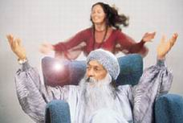

这是一份邀请，

一份来自整个宇宙的邀请，

一份来自整个存在的邀请，

它带着存在的芬芳、生命的琼浆、爱的欢乐、心的喜悦……

来吧，来吧！

花儿在招手，鸟儿在欢唱……

美妙的旋律近了，近了……

你只需一下跃入的那一点点勇气。

跃入那宇宙的盛会、存在的狂欢！

来吧，来吧！

让我们唱一首存在之歌，

跳一曲存在之舞，

来吧，来吧！

除了爱与欢笑，

生命注定别无出路。

除了舞蹈与歌唱，

生命注定别无选择。

让我们从今天开始，

不，就从现在开始：庆祝！

庆祝生命、庆祝永恒！

请好好的领悟这份来自存在的邀请与祝福。

陶稀

1995 年 3 月 10 日

# 生 命

“ 生命是某种不可能的事，

它不应该存在却又存在着；

我们的存在、树的存在、鸟的存在是一个奇迹

这真的是一个奇迹，

因为整个宇宙是死的。

无数个星系是死的。无数个太阳系是死的，

只有在这个小小的星球上，生命却在此发生了。

如果按照你想像中的比率来算，

它是那样渺小，

就抑同一粒小小的尘埃这便是全部存在的最幸运的地方：

鸟儿在欢唱村儿在生长、在开花；

人们在这儿相爱、歌唱、欢舞；

一些不可思议的事就此发生”

                              —— 奥修

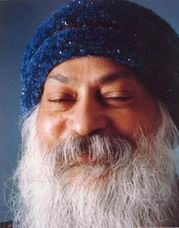

## 疯狂就是明智

**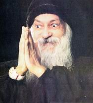**

在这个世界上人们知道有这样一些美丽而疯狂的人，

事实上，在这个世界上所有伟大的人在一般人眼里都有那么点疯狂。

他们的疯狂的表现，是山为他们不悲伤，他们不忧虑，他们不怕死，他们不为琐事烦恼，

他们每时每刻都尽致而热情地活着。

正因为尽致而热情，于是他们的生命变成一朵美丽的花

—— 它们充满芬芳—— 爱、生命与欢笑。

但是，这样当然伤害了你周遭的许许多多的人，

他们不能接受你所成就的恰恰是他们队错过的那种观念、

他们将试着用一切方式使你悲伤。

他们的责难除了力图使你悲伤，摧毁你的欢舞剥夺你的欢乐以外没别的

—— 这样才能使你回到他们中间。

人必须要鼓起勇气，假如人们说你疯狂那么赞它，告诉他们：

你是对的。在这个世界上只有疯狂的人才是幸福和快乐的，

我选择了欢乐的、幸福的和雀跃的疯狂；

你选择悲伤的、痛苦的和地狱般的明智。

我们的选择不同，你可以继续作的明智，保留你的悲伤；

也让我独自继续我的疯狂，请不要干扰我，

我也不会感到被这个世界上你们所有如此明智的人所干扰，

我不会感到被干扰。”

这仅仅是一个很短的时间问题

— 一不久，一旦他们接受上你的疯狂，他们将再也不会干扰你，

那么你便能完完全全地表现出你原本的存在你将抛弃你所有的虚伪。

我们整个儿童朗的教育使我们的头脑产生了分裂：

我们必须对社会、对大家对世界是一副面孔—— 而这不是一副你真实的面孔。

事实上，它必定不是你的真实的面孔，

你必须表现出人们喜欢的，人们赞赏的，人们能够接纳的一副面孔

－－取决于他们思想方式和他们的文化传统，而你必须将你原来的面孔藏起来。

这种分裂变得如此无法愈合，

因为在部分时间你生活在人群中，和他们在一起与他们交往，

很少一个人独自，自然地，你的假面变得比你的自身本性越来越成为你的一部分。

社会在每个人的心中制造了一种害怕心理

，害怕被拒绝，害怕被人嘲笑，害怕失去尊严，害怕人们将会怎么说，

你不得不调整自己来适合所有盲目的、无意识的人们，你不能成为你自己。

这是从古到今我们整个世界的一个基本传统，

即是没有人被允许成为他自己。

当某一刻有他人在场的时候，你便很少关心你自己，

却更关心地你将会有什么样的病人。

当你一个人在浴室的时候，你几乎就像个小孩子，有时你在镜子前做个鬼脸，

但是，一旦你突然觉察即使是一个小孩从钥匙孔里在看着你时，

你立即便会改变，你双会变为平常的、陈旧的你，严肃正经，就和人们所期望的一样。

最令人吃惊的事就是你的那些人，他们也害怕你。人人都害怕别人。

没人允许他去感觉，去表现本真，去流露真情，

可是，每个个都想这么做。

因为继续压抑你原来的面貌正是一种自杀的行为。

你唯一的责任是对你自己的本性负责，不要反对它，

因为你反对它，等于是在自然，是在摧毁你自己。

那么，你又将会得到什么呢？即使人们尊敬你，

人们认为你是一个非常正统的，受人尊重的、高尚的人，

而这些根本无法滋养你的存在，无法使你对生命及其它非凡的美有更多的洞察。

你是独自一个人在这个世界上；

你独自来到这个世界，独自一个人生活在这个世界，你也独一个人离开这个世界。

别人所有意见都被留下来，只有你原本的感觉，

你真实的体验将伴随着你甚至到你死后。

即使死亡也无法带走你的欢舞，你的泪水，

你自身的纯洁，你的宁静，你的安详，你的狂喜。

死亡无法从你身上带走的是你唯一的真正的宝藏，

那些能够被别人带走的东西不是珍品，而只是你受到了欺骗。

你唯一应该关心的是：

照顾和保护好当死亡摧毁你的身体，你的头脑的时候你能带走的那些品质。

因为这些品质是你唯一的伴侣，它们是唯一真正有价值的。

只有那些成就它们的人才是真正地活着，

其他的人只能是假装的活着。

## 对生命的态度

**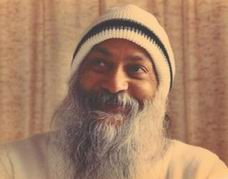**

*奥修，对生命有某种态度是不是很重要？*

对待生命有某种态度正是错过生命的最佳方式，态度来自头脑，但是生命却超越头脑。态度是我们的捏造品，是我们的偏见，是我们的发明物，而生命不是由我们创造的，恰恰相反，我们只是生命之湖中那阵阵涟漪。

海洋中的一朵浪花对海洋能有什么样的态度呢？一片草叶对地球、月亮、太阳、星星又能有什么样的态度呢？所有的态度都是自我中心的，所有的态度都是愚蠢的。　　

生命不是一种哲学，不是一个问题，而是一个奥秘。你无法按照一定的形式生活，无法按照你曾被教导的有节制的生活，你不得不重新开始，从新的起跑线开始。　　

每个人都应该将自己想成是这个地球上第一个人；他是亚当或她是夏娃，于是你便可以打开，你对无限的可能性打开，你将变得勇于冒存在之险，变得可见存在之性，你越勇于冒存在之险，便越能见存在之性，这样，生命巨大的可能性在你身上发生了。　　

你的态度的功能就是障碍：如果你按照你的哲学、宗教、意识形态，生命本身不能触到你。当生命必须适应你的哲学、宗教和意识形态时，而正是在那种适应它的某些品质已经死了，你得到的是一具死尸：它看上去活着，其实是死的。　　

人们自古以来一起是在这样做着，印度教徒按照印度教的态度生活，回教徒按照回教徒的态度生活，某某主义者按照某某主义生活。但是，请记住一个最基本、最根本的事实：态度不允许你去触及生命本身，它扭曲生命，曲解生命。　　

有一个古老的希腊故事。一个狂热的国王有一张漂亮的金床，非常珍贵，上面镶嵌着数千颗钻石。每当宾客来到皇宫，他都用这张床来招待他们，但他有一个特定的态度：客人必须适合这张床，如果客人太高了，那么就要将他切掉些来适合这张床。当然，这张床是无价之宝，它不能有任何改动，但客人必须按床的大小来削切或拉长，就如床不是为人而存在，倒是人为那张床而存在！　　

要找到一个人来适合一张现成的床是非常罕见的，几乎是不可能的，记住，平均标准的人是不存在　，平均标准的人是人们虚构的。而这张床则是为平均标准的人准备的，那位国王是一个数学家，经非常精确的计算才作出了那张床，他量了首都全体市民的身高，然后将总数除以市民的人数，他便得出了一个平均值。   

首都有小孩、年轻人、老人、侏儒、巨人，但是平均值则是完全不同于这些个体的自然现象，在整个首都没有一个人真正合乎平均值。我从来没有遇见过合乎平均值的人，平均值的人是一种虚构。　　

因此，不管什么样的人作为国王的客人都要遇到麻烦。如果他比床短，那么国王就让粗壮的角力士将客人拉成和床一样长。这一定是罗福按摩（一种将身体重新排列的按摩）的发源处，爱得 · 罗福按摩的创始者一定是从这个国王那里学来的。当然，所有的客人都死了，但那不是国王的错，他是带着世界上最好的意图做的每一件事的。　　

当你对生命有了某种态度，你将错过生命本身。生命是广袤无垠的，无法被任何态度所容纳，用某一个定义来界定生命那是不可能的。的确，你的态度可能涵盖了生命的某个方面，但这也仅仅是一个方面，头脑的倾向往往将一个方面看成全部，当某一方面被看作全部时，你便失去了与生命的联系。你的生命被你的态度所包围，作茧自缚，划地为牢，你将过得很悲惨。那么你的所谓的宗教将会非常高兴，因为那就是他们一起告诫你的：生命就是痛苦的。

佛说，出生是痛苦，年轻是痛苦，年老是痛苦，死也是痛苦。整个人生即是一幕幕漫长的悲剧。如果你从态度开始，你将发现佛说得完全正确，你本身即是个证明。　　

但是我想告诉你生命不是痛苦，我一点也不同意佛的观点。生命变得痛苦，但那是你自己造成的，否则，生命是永恒的欢乐。但是要知道永恒的欢乐，你必须敞开心扉，松开你的手。　　

不要用紧握拳头的方法来靠近，松开你的手，要极其天真地步入生命。态度是狡猾的。你不用尝试，不用经验，不用生活便已决定了，你已经得了某些结论，当然那些结论早已事先在你那儿了。那么你将会发现它们将被生命所证实，其实并非生命证实那些结论，而是你的整个思想力图去发现种种方法，各种意义，各种证据来支持那些结论。　　

我要教给你一个没有任何态度的生命。这是我经验中的一个最基本的原理；如果你真的想知道生命的本真的话，那么你得抛开所有的哲学和所有的主义，然后，松开你的手。完完全全赤裸裸地进入阳光，去看它是什么。

在过去，人们的感官是门户，真实的存在就是通过我们的感官到达我们的内心深处的存在。而最新研究表明：我们的感官不仅仅是门户，它们同样也是卫兵。只有百分之二的信息被允许进入，百分之九十八的信息被拒之门外，任何与你人生观相抵触的东西都遭拒绝，而只有百分之二的信息渗入。　　

这样过只有百分之二的生活根本不算是在生活。当一个人能过百分之一百的生活，为什么要过百分之二的生活呢？　　

你问我：   

对生命有某种态度是不是很重要？　　

它不仅不重要，而且对生命持任何态度都是危险的。为什么不允许生命拥有它自身的欢舞、歌唱，而不必有任何期望呢？为什么我们不能没有期望地活着呢？为什么我们不能直观存在、即是在它的纯在中呢？为什么我们要将我们自己强加在生命之上呢？没有人会成为损失者，如果你强加于生命之上，那么你就是唯一的损失者。　　　

最好不要给生命帖上标签，最好不要给它一个框架，最好让它没有结论，最好不要去规范它，不要去标定它，那样你便会有更多更美丽的经验，更宇宙性的体验。因为事物并不是真正分开的，存在是一个性高潮的整体，它是一个有机的整体。最小的一片小草，枯树上的最小的叶子，与最大的星星同样重要。　　

最小的东西同样也是最大的。因为存在是一个整体。它是光谱，一旦你开始将它分开，你就开始制造出武断的界线、定义，这样的方法便使人错过了生命和它的奥秘。　　

我们所有的人都有各种各样的态度，这是我们的痛苦。我们所有的人只是站某一个立场来看待事物。因此，我们的生命变得贫乏，因为，每一个方面最多也只能是一个层面，而生命是多层面的，你必须变得更流动、更善变、更易融化、更易吸取；你不要成为一个观察者，没有什么事情需要解决！

不要将生命看作是一个问题，它是一个极其美丽的奥秘。去喝它，它是清醇的的酒！成为一个喝生命之酒的醉汉！

## 生命是一张空白的画布

**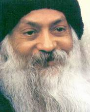**

 *奥修，生命不是一种痛苦吗？*

这都由你而定，生命本身是一张空白的画布，无论你在上面怎么画，你可以将痛苦画上去，也可以将幸福画上去。

    这自由是你的荣耀。

    你可以用一种将你的整个生命变成地狱的方式来运用这个自由，或者用一种将你的生命变成美丽的东西、变成祝福、变成极大的快乐、变成天堂似的方式来运用这个自由。这全由你自己而定，人拥有所有的自由。

    那就是为什么有如此极大的痛苦。因为人们很愚蠢，他们不知在画布上画什么。

    一切都由你而定：那是人的荣耀，这是神给你的最伟大的礼物之一，没有其它动物拥有这份礼物。每一种动物都已有固定安排，所有的动物都已经被排定。除了人，狗只能成为一只狗，永远是条狗，没有其它的可能，它们没有自由，它已被安排好了，每件事都是固定的，蓝图已在哪儿，它将只能按照那张蓝图，对它来说，没有其它的选择，没有变化的可能，它是一个完完全全被设定的实体。

    除了人，每样东西都是被安排好的，玫瑰花只能是玫瑰花，莲花必定只能是莲花；鸟将会有翅膀，动物将只能用四只脚走路。

    人是绝对自由的，那正是人的美丽，人的荣耀。

    神的最大礼物就是自由。你没有被设定，你没有带一张蓝图，你必须创造你自己，你必须是你自己的创造。所有这一切都由你而定：你能成为佛陀，布赫丁。或者你也能成为阿道夫。希特勒、墨索里尼，你能成为杀人凶手或是静心者。

    你可以让自己成为一个意识开出美丽之花的人，或者你也可以变成一个机器人。

    但是，记住，你是有责任的，只有你自己对自己负责，没别人替你负责。

    一个乐观主义者是一个这样的人，早上他走到窗口说：“ 上帝，早上好！”

    一个悲观主义者是一个这样的人，他走到窗口说：“ 我的天啊，又是早上了吗？”

    这一切都由你而定，这是同样的早晨，或许是同样的窗口，或许悲观主义者和乐观主义者呆在同一间房间，但这要看情形而定，当你说：“ 上帝，早上好！” 当你说“ 我的天啊，又是早上了吗？” 这二者是多么不同！

    我曾经听说过一个古老的苏非寓言：

    大师的两个信徒在大师家的花园里散步，大师让他们每天早上或晚上散步。散步是一种静心的方式，散步时的静心正如习禅的人做散步静心一样，你不能二十四不时都坐着，双腿需要一些活动，血液需要一些循环，所以在禅和苏非教中都是如此，你在静坐了几个小时之后，你就得开始散步静心，但静心仍然在进行着。无论散步或静坐，内在的觉知是相同的。

    他们俩都是吸烟的，他们都想请求大师允许他们吸烟，他们决定：“ 明天，大师最多说不，但我们得去问一下，在花园里抽烟似乎也不是亵渎神的行为，我们并不在他的屋子里吸烟。

    第二天，他们在花园里碰面，一个人非常愤怒，因为另外一个人在抽烟，于是他说：“ 怎么回事？我已经问过了，但大师很直率的拒绝了，说不。你怎么还在抽烟呢？难道你不在遵守他的命令?"

    他回答说：“ 但是大师对我说可以。”

    这看起来很不公平，那么第一个人说了：“ 我要去而且马上就去问问为什么他对我说不可以而对你却说可以。”

    另外一个人说：“ 等一下，请告诉我你是怎样问大师的。”

    他回答说：“ 我怎么问呢？我只是简单地问，‘ 当我在静心的时候能抽烟吗？’ 大师说：‘ 不行。’ 他看上去非常生气。”

    另外一个开始笑起来了，他说：“ 现在我知道是怎么回事了。我是问：“ 在我抽烟的时候能不能静心？‘ 大师说：行。”

    这一切都要看情形而定，只有小小的一个差别，人生便完全因此有了很大的不同，问：“ 当我在静心的时候能抽烟吗？” 这话听上去很丑陋不雅；但问：“ 当我抽烟的时能静心吗？” 这便完全没有问题，很好！至少你将仍然在静心。

    生命既不是痛苦也不是幸福，生命是空白的画布，人必须非常艺术的画它。

    一个流浪汉在敲一个旅馆的门，这个旅馆的名字叫“ 乔冶与龙” 。

    他问来开门的女人：“ 你能不能分一口饭给我这个可怜的人吃？”

    “ 不！” 女人在叫着，用力将门一关。

    几秒种之后，流浪汉再次敲门。那个女人又来开门。

    流浪汉说：“ 我能不能要一口饭吃？”

    那女人大声道：“ 滚开，你这没用的东西！你不要再来了！”

    过了几分钟后，那流浪汉再次敲门，女人来到门前。

    流浪汉说：“ 请原谅，这次我能不能跟乔治说几句话？”

    生命就是叫乔治与龙的旅馆，你也能要求与乔治说几句话。

## 除了生活没有其他的神

**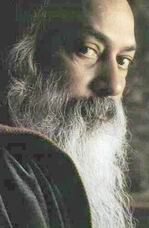**

*奥修，人怎样才能过自由的生活？* 　　

我的信息非常简单：过尽可能危险的生活。完全地、强烈地、热情的地生活。因为除了生活，没有其它的神。

    尼采说，上帝已经死了。那是错的。因为从来就不曾在哪里有过上帝，那么，怎么会死呢？生命存在着，始终存在着，而且将继续存在下去，允许你...... 我再重复一遍：允许你自己被生命拥有。

    这与过去所谓的宗教所告诫你的正相反，他们说：“ 弃俗。” 我说：‘ 快乐地生活。“ 他们否定生活，而我则肯定生活。他们说生命是某种错误，是虚幻，他们创造了一个关于神的抽象的概念，而这个抽象概念只不过是他们头脑中的一个投射，他们崇拜那个投射。这是如此的不明智，如此极端的愚蠢，它会让人觉得奇怪，竟然有成千上万的人相信如此全然的荒唐的事！真实的存在被否定，而头脑中抽象的概念却被肯定，神只是一个词，但他们却说神是真实的。

　　生命才是真实的：在你的心跳时你可以感觉到它，在你血脉中可以感到它的震颤，生命遍地都是－－在花中，在河流里，在星星中。但他们说这都是摩耶（maya), 都是虚幻，他们说生命是和构成梦的材料是一样的，于是他们创造了一个神。当然，由此每个人都按自己的模样创造了一个神，这样就有也成千上万个神。

    这是你的想象，你能创造一个有四个脑袋的神，你也能创造一个有一千只手的神，这是由你而定的。这是你的游戏，这些人一直在告诫..... 在毒化另外一些人的头脑。

　　我要对你说，生活是唯一的真理，除了生活，没有其它的神。所以你要让生命以其所有的形势、色彩、层面来拥有你。整个彩虹，所有的音符。如果你能掌握这一简单的事.... 这样简单是因为只是放开的问题，不要去催促河流，让河流带着你进入海洋。已经在发生了，你要放松，不要紧张，也不要试图精神化，不要在物质和精神之间创造任何分裂，存在是一个整体，物质和精神只是同一个硬币的两面，放松、休息、跟着河流走。

　　做一名赌徒，不要做一个商人，你将会懂得更多的神性。因为赌徒能冒险，赌徒从不精打细算，他能将他所拥有的下注，当他下了全部的赌注，然后等待着，这时，赌徒会有一种兴奋感..... 现在将会发生什么呢？正在这时刻窗户可能打开，也正是那一刻能够变成一个内在的蜕变。

　　做一个醉汉，醉于生命，醉于存在。不要那么严肃，严肃的人没有活力。喝生命之酒，它有那么多的诗，那么多的爱，那么多的生命源泉。你能在任何一刻拥有春天，只要你呼唤春天，那么阳光、风和雨就可走进你。

　　就因为这个信息，那些神灵主义者反对我，因为他们认为我是在否定神。我并没有否定神。我是第一次将神带进真实的情景中，我使他活起来了。我带他靠近你，比你的心更接近，因为他就是你的存在，不是分开的，不是远离的，不是存在于天空中，就是此时此地。我在力图摧毁彼时彼地的概念，我的观点是此时和此地，因为除了此地没有任何其它的空间，除了此时没有任何其它的时间。

## 无聊是一个伟大的开始

**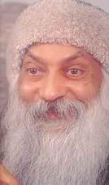**

*　　奥修，我发现我对我自己感到很无聊，我感到没有生命的源汁，你告诫我们无论我们怎样，我们要接受自己，我无法接受生活，我知道在内心，我正在失去一些欢乐，该怎么办呢？*

　　我们听说过有一种新的镇定剂并不能使你放松，反而使你更紧张。

　　试试看！试一试再试一试，成为一个美国人，但不要超过三次，试试看，试试看，再试试看，然后停止。因为继续下去是没有意思的。

　　你问我：

*我发生我对我自己的感到很无聊.....* 　　

这是一个伟大的发现，真的。我说的是真的，很少人知道他们无聊。他们的确无聊，极其无聊，除了他们自己以外，别人都知道他们多么无聊，知道一个人是无聊的，这是一个伟大的开始，现在有一些含义必须要去领悟。

　　人是唯一会感到无聊的动物，这是一个伟大的特权，这是人类尊严的一部分。你曾见过一头牛或驴子感到无聊吗？它们是不会无聊的。无聊的简单意思就是你生活的方式是错误的。因此它能变成一件伟大的事情，应该将它理解成“ 我是无聊的，必须想些办法，一些变化是必须的” 这样就不要认为你感到无聊是不好的。这是一个好的信号，一个好的开端，一个非常吉利的开端，但不要就此止步。

　　为什么人会感到无聊？人感到无聊是因为人生活中别人给予的没有生气的模式中，抛弃这些模式，走出这些模式！开始过你自己的生活。

　  只有真实的人才不会无聊，伪装的人一定是无聊的。基督徒将会感到无聊，耆那教徒会感到无聊，帕西教徒会感到无聊，某些‘ 主义’ 者会感到无聊。因为他们将他们的生活分裂成两个部分，他们的真实的生活被压抑，而开始过假装的不真实的生活，这种不真实地生活产生了无聊，如果你正在做你想做的事，你将永远不会感到无聊。

　　当我离家上大学的那一天，我的双亲，我的家人，他们都想要我成为一名医生，或者是一名工程师，我完全拒绝了。我说： “ 我要去做我想做的事，因为我不想过无聊的生活，作为一名科学家，我可能会成功，我也许会受到尊敬，获得金钱、权力、声望，但我将会深深地感到无聊，因为那不是我想做的事。”

　　他们感到震惊，因为他们不能看到学习哲学有任何前途，哲学是大学里最冷门的科目。他们勉强同意了，知道我的前途将会被我荒废掉，但是他们最终承认他们错了。

  　这不是一个关于金钱、权力、声望的问题，这是一个关于你本身想做什么的问题。你去做，不要考虑其结果，你的无聊便会消失。你一定是在按照别人的想法去做：一定是在用一种合适的方式做事，你一定是在按事情应该的样子去做，这些就是无聊的基石。

　　整个人类都在无聊，因为一个人可以成为一个神秘学家却成了一个数学家，本应成为数学家的却成了一个政治家，本应成为一个诗人的却成了一个商人。每个人都是在别处，没有人是在他该在的地方。人必须冒险，如果你准备去冒险，无聊将在那个时刻消失。

你问我：　

*我发现我对我自己感到无聊.....* 　　

你自己感到无聊是因为你没有真诚地对待自己，对自己没有诚实，你没有尊重你自己的存在。

你还说：　

*我感到没有生命源汁。* 　　

怎样才会感到生命源汁？只有当你正在做你想做的事，无论什么事，你就会感到生命源汁在流动。

　　梵高只要画画就感到莫大的幸福。但他生前却一幅画也没卖出去，没人了解并欣赏他。他饥饿，他快死了，因为他的兄弟只能给他很少一笔钱，这样至少能让他勉强地生存下去，一个星期中他四天不吃，另三天吃一点，他必须得禁食四天，否则他到哪里可以得到他的画布、颜料和画笔呢？但他却是非常幸福的，他的生命源汁在流动。

　　当他只有三十三岁时，他死了，他自杀而死。但他的自杀远比你的所谓的生命要好得多，因为，他之所以自杀只是当他画完了他所想画的东西，那天他完成了长期以来一直渴望的那幅落日，他写了一封信：“ 我的工作完成了，我很满足，我将非常满意地离开这个世界。” 他自杀了，但我并不称之为自杀，他生活得很完全，他以一种巨大的强度从生命之烛的两端同时燃烧。　

　　你或许可以活一百年，但你的生命或许只是一根干骨，一点重量，一点死的重量。

你说：　　

*奥修，...... 你曾经说要接受自己，无论我们怎样。我无法接受生活，我知道在内心，我正在失去一些欢乐。* 　　

当我说接受你自己，我并没说要接受你的生活方式－－ 请不要误解我的意思。当我说接受你自己时，我是说抛弃其它的一切—— 接受你自己。但你一定用了你自己的方式解释它　，事情就是这样...... 我所说的并不是你已经理解的。 抛弃所有外加给你的东西，当你无条件的接受你自己时，突然欢乐便迸发出来，你的生命源汁开始流动，生命真正变成狂喜。

　　有一个年轻人，他的朋友们以为他死了，但他只是处于昏迷状态，正好在未被埋葬之前，出现了生命的迹象，朋友都在问他死亡的感觉如何？

　　“ 死亡！” 他大声说道，“ 我没死，我一直知道事情是怎样进行的，我也知道我没死，因为我的脚是冷的，我的肚子是饿的。”

　　“ 但是这些事是如何使你认为你仍然活着呢？” 有一个好奇的人问道。

　　“ 我知道如果我在天堂，我的肚子将不会饿；如果我在别的地方，我的脚将不会冷。”

　　人能肯定自己还没有死: 你的肚子是饿的，你的脚是冷的。那么，马上站起来，稍稍跑动一下！　　　　　　　　　　　　　　　　　　　　　　　　　　　　　　　　　　　　　　　　　　　　　　　　　　　　　　　　　　　　　　　　　　　　　　　　　　　　　　　　　　　　　　　　　　　　　　　　　　　　　　　　　　　　　　　　　　　　　　　　　　　　　　　　　　　　　　　　　　　　　　　　　　　　　　　　　　　　　

    一个缺乏教育和所应具有的社会礼仪的穷人。爱上了一个百方富翁的女儿，她邀请他到她优雅的住宅去见她的父母，当他面对着那些富丽的家具，那些仆人和所有财富的象征，感到非常压抑，一直到吃晚饭时，他才尽力使自己显得放松了些、他坐在宽大的餐桌旁，由于酒的作用，他变得自在了些，他放了一个很响的屁。

    女孩的父亲巡视了一下，然后盯着他那条躺在穷人脚边的狗，罗浮！—— 他用一种威胁的语调。

    那个穷人心里感到轻松，因为主人是在责怪那条狗，于是，过了几分钟他又放了个屁。

    主人看了看那条狗，又更大声地喊“ 罗浮”

    又过了几分钟，穷人放了第三个屁，那富翁皱起了眉，很愤怒，他吼叫着：“ 罗浮，快跑开，要不他会将屎拉在你头上！”

    趁还有时间，赶紧从你现在生活的监狱中跑出来！这只需要一点儿勇气，就是一点赌徒的勇气，记住，你不会损失什么东西，你只会损失你的枷锁—— 你只会损失你的无聊。你内心常有的失落感也会就此消失，其它还有什么可失去的呢？摆脱陈规陋习，然后才能接受你自身的存在，接受你自己— 一拒绝摩西、耶稣、佛陀、马哈维亚克里希那，接受你自己，你不是向佛陀、查拉图斯特拉或伽比尔或是那纳克负责，你只对你自己负责。

    要负责—— 一当我用“ 负责’ 一词时，请记住不要误解它。我不是在说义务或职责，我只取这个词的愿意；对真实的反应就是负责。

    你一定要过一种只对你自己负责的生活，不必去满足别人对你要求的一切职责。那会损失什么呢？你很无聊—— 这是一个好的状况，你正在错过生命之源，还要什么才能使你摆脱这禁锢？马上跳出采，不要回头！

    他们说：在你跳之前想两次、我说：先跳，然后你再去想，随你想多少次就想多少次！

## 佛陀卓巴

**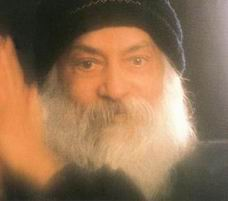**

 *奥修，有时在你讲道的时候，我便得到一个希腊卓巴式的生活方式的见地，即吃、喝寻欢作乐和充满热情，我以为这即是生活之道。  另外一些时候，我又感到你所说的生活方式是静坐着，警醒的和不动的，就像一个僧侣。*

*所以我们究竟要成为什么样的人呢？是卓巴或是僧侣？两者怎样混合才是可能的呢？我感到你已在整合这两者相反品质，但我们能既成为为热情与欲望所激动的卓巴又能成为不为情动、冷静的与镇定的佛陀吗？*    

那是最终的融合—— 当卓巴成为一个佛陀时，我在此试图创造的不是希腊卓巴而是佛陀卓巴。卓巴是优美的，但缺少某种东西，尘世是他的，但缺少天国的东西，他根植于尘世，就像一棵巨大的西洋杉，但他没有翅膀，他不能飞入天空，他有根却无翼。

    吃喝、玩乐就其本身完全是好的，本身没有什么错，但这是不够的，很快你将对它感到厌倦。人不可能不停地吃喝玩乐，玩乐会很快地转变成悲伤，因为它是重复的。只有一个很平庸的头脑才能继续对此保持快乐。

    如果你稍微有点聪明，迟早你会发现这些是完全没有意思的。你能一直吃喝、玩乐多久呢？问题迟早都会冒出来，所有一切有什么意思呢？为什么？这是不可能被长久回避的问题，如果你非常明智，这将始终存在着，固执地存在着，它撞击你的心以求回答：给我答案！为什么？

    要记往：并非是那些穷人、挨饿的人对生活产生出挫折感。不是的，他们不可能产生挫折感，他们还没有去生活，他们怎么会产生挫折感呢？他们拥有希望，一个穷人总是抱着希望，一个穷人总是期待有奇迹的事情将会发生，希望着有某件事发生，如果不是今天那么将是明天，或者就是后天。如果不是这辈子那么就是下一辈子。

    你以为如何呢？那些将天堂描绘成花花公子俱乐部的是哪些人呢？那些人是谁呢？饥饿、贫穷，他们错过了他们的生活，他们将他们的渴望投射到天堂，天堂里有酒河— 一那些想象酒河的人是谁呢？他们一定是错过了这样的生活、有满足希望之树，你坐在树下，许愿，当你许愿的这一刻，它马上就能实现。在你许愿和实现之间没有一点时间间隔，在两者之间没有阴影，这是立刻的、马上的。这些人是谁呢？饥饿使他们没有能过他们的生活，他们又怎能对生活感到挫折呢？他们没有经验—— 这只有通过经验才会知道所有的一切都是全然无意义的。只有卓巴才知道所有的一切是全然无意义的。

    佛陀地自身就是个卓巴，他拥有全国所有美丽的女人，他的父亲将所有美丽的少女安排在他的身边、他拥有最美丽的宫殿，不同的季节有不同的宫殿。他拥有那个时代所有的奢华，他过着希腊卓巴式的生活，所以，当他年仅二十九岁的时候就对生活感到全然挫折了。他是个非常智慧的人，如果他是个平庸的人，那么他也就沉溺在其中了，但是很快他就看到了关键，这一切是重复的，这是相同的，你每天吃，你每天和女人作爱— 一并且他每天有新的女人与他作爱，但要多久…… ？很快他就厌倦了。

     生活的经验是非常痛苦的，只在想象中是甜蜜的，实际上它是非常痛苦的。

　　他逃离宫殿、女人、财富、奢华和所有的一切……

　　所以，我不反对希腊卓巴，因为希腊单巴正是佛陀卓巴的基础。佛陀是来自那种经验，所以我完全适应此岸世界，因为我知道彼岸世界只能通过此岸世界的经验才能达到，因此我不主张逃离这个世界。我不会要你成为一名僧侣，僧侣是反对卓巴的人，他是一个逃避者，是一个懦夫，由于不明智，他所做的某些事太快，他不是一个成熟的人，僧侣是不成熟的、贪婪的— 一对彼岸世界的贪婪，但是想要得太早了，季节还没有到，果子还没有成熟。

    生活在这个世界里，因为这个世界让你成熟，成长，完整。这个世界的挑战让你归于中心，给你觉知，而觉知是一步梯子。然后你便能从卓巴到达佛陀。

    但是让我再重复说只有卓巴才能成为佛陀，而佛陀从来不是僧侣。僧侣是一个从未做过卓巴的人，他只是成为一个被佛陀一词所蛊惑的人，他是一个模仿者。他是假的、虚伪的，他模仿佛陀，他或许是一个基督徒，或许是一个佛教徒，或许是一个耆那教徒 — 一那没多少区别，他只是模仿佛陀。当一个僧侣远离世界时，那么他还在与这个世界作战，这不是一种轻松的离开，他的整个存在仍被拉回这个世界，他奋力反对它，他变得分裂，他的存在的一半适合着这个世界，而另一半则成了对另一个世界的贪婪，他被撕成两个。僧侣基本上是个精神分裂症患者，是一个分裂的人，分成了较低的部分和较高的部分。较低的部分一直在拉着地，而已较低的部分越来越吸引他。这种吸引力就越是被压抑，因为他不曾在较低的部分生活，他就无法达到较高的部分。

　　只有当你在较低部分生活过，你才能进入较高的部分；只有通过较低级的极大的痛苦和极大的喜悦，你才能得到较高级的。在一朵莲花成为一朵莲花之前，它必须通过泥土，那泥土就是这个世界，僧侣逃离了泥土，他将再也不会成为一朵莲花。这就如同一颗莲花的种子害怕落入泥土，或许自我在说：“ 我是一颗莲花的种子！我不能落入泥土。” 这样的话，它也就仍然是一颗种子，它将再也不会开花成为一朵莲花。如果它想像莲花一样盛开，它必须落入泥土，它必须生活于这个矛盾中。没有这一生活于泥土中的矛盾，那便无法超越。　　

　　我是最不愿意将你变成一个僧侣的，否则，为什么会有这么多的和尚和尼姑反对我呢？我希望你变得根植于尘世。我完全同意尼采所说的“ 我恳求你，我的兄弟，保持对尘世的忠诚，不要相信那些谈论希望另一个世界的人！” 信任尘世来作为你学习信任的第一课，它正是你现在的家！

　　不要渴望另一个世界，活过这个世界，带着强度，带着热情，活过这个世界，带着全部的、你的整个存在活过这个世界，以那种全部的信任，通过那种热情的生活、爱和欢乐，你将会有能力 达到彼岸世寻。

     另一个世界隐藏在这个世界中。佛陀是沉睡在卓巴中的，它必须被唤醒，除了生活本身，没人能唤醒他。我在此帮助你变得完整，无论你在何处，无论你处在何种状态—— 完全地活过那个状态，只有当你全然地体验那件事，你才能超越它。 首先成为一个卓巴，一朵尘世的花，通过它获得资格便能成为佛陀—— 另一个世界的花朵、另一个世界不是远离这个世界的。另一个世界不反对这个世界；另一个世界隐藏在这个世界中，这个世界只是另一个世界的显示，而另一个世界是这个世界未显视的部分。

## 悲伤有它自身的美

**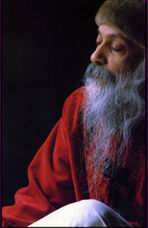**

*奥修，庆祝悲伤是可能的吗？*    

不要认同悲伤，应成为一个观照者，欣赏那悲伤的时刻，因为悲伤有它自身的美。

    你从来没有注视过，你认同悲伤以致你从来未曾看透那悲伤时刻的美丽，如果你观照到，你将惊讶地发现你错过了什么样的宝藏。

    看，当你快乐的时候，你从来不会感到像悲伤那样深刻。悲伤有它的深度，而快乐有它的肤浅；去家看一下快乐的人们，那些所谓快乐的人们—— 花花公子和花花公主们，在俱乐部里，在旅馆里，在戏院里，你可以找到他们，他们总是在笑，总是在得意洋洋，你总会发现他们的肤浅、表面化，他们没有任何深度，快乐就像波浪，只是在表面的你过着一个肤浅的生活；但是悲伤有它的深度，当你悲伤时，它不像表面的波浪，它像太平洋那样深沉— 一有好几哩、好几哩那么深。

    进入那个深度，观照它。快乐是嘈杂的，悲伤有它的宁静。快乐或许就像白天，悲伤就像黑夜。快乐或许就像光，悲伤就像黑暗，光来了又去。黑暗驻留—— 它是永恒的，光有时候才产生，黑暗却始终在那儿。

    如果你进入悲伤，所有的这些事你都将会感觉到，突然你将会意识到悲伤就好像一样乐西在那儿，你注视着，观照着，突然你开始感到快乐，如此美丽的悲伤！—— 一朵幽暗的花，一朵永恒深刻的花，好像一个无底的深渊，如此宁静，如此富于音乐性 …… 那里完全没有噪音，没有干扰，人便可以一直无底地堕入进去，然后人能从中走出。觉得完全充满活力，这是一个休息。

    它由你的态度而定，当你变得悲伤的时候，你以为那些不好的事就在你身上发生了，这只是一种解释。然后你便开始试着逃避它，你从来不曾以此来静心。你想去找某个人，想去参加舞会，去俱乐部，或者打开电视机或收音机，或者去看报—— 只要去做某件事你才能将它忘却、你接受了一个错误的态度。认为悲伤是一个错误，悲伤本身没有任何错，它只是生命的另一极。

    快乐是一个极端，悲伤则是另一端；幸福是一个极端，痛苦是另一端，生命就是由这两部分组成、只有幸福的生命将是一个侧面的延伸，但将不会有深度；只有痛苦的生命将会有深度。但将不会有扩展，既有痛苦又有幸福的生命是多层面的。它在所有的层面上一起扩展。

    看着佛的雕像，或者注视着我的眼睛，然后你会发现两个侧面是在一起的，幸福、宁静与悲伤同在。

    你将会发现幸福中同时包含着悲伤，因为悲伤给它深度。看着佛的雕像 —— 幸福的，但仍然是悲伤的。

    正是那个“ 悲伤” 一词给你错误的暗示—— 某些事是错误的，这是你的解释。对我而言，完整的生命是好的，当你以生命的整体来理解的时候，只有那时你才能庆祝，否则是不可能的、庆祝的含义是无论发生什么都无关紧要，我都将庆祝、庆祝是无条件的“ 当我快乐，我就庆祝、” 或者，“ 当我不快乐时，我就不庆祝、” 庆祝是没有条件的，我庆祝生命，它带来不快乐，好，我庆祝它，它带来快乐，好，我庆祝它；庆祝是我的态度，无论生命带来什么，庆祝是无条件的。但是问题又会出现，因为无论什么时候我得用词。而这些词的含义已在你的头脑中，当我说，“ 庆祝” ，你认为必须要快乐，当人在悲伤的时候怎么会庆祝呢？我没有说人必须要快乐的时候才去庆祝，庆祝是一种对无论生活给予你什么的感激。无论神给你什么的感激。庆祝是一种感谢，一种感激、我已经告诉你， 我将再次告诉你……

    一个苏非的神秘家非常穷困，饥饿，被人拒绝，旅途疲劳。他在一天晚上，他到了一个村庄，那个村庄不欢迎他，那个村庄属于那些正统的人们，当那些正统的回教徒在那儿的时候，要说服他们是很困难的，他们甚至连镇上的可以庇护他的一小点地方都不给他。

     那晚很冷，他又饿又累，穿得又单薄，一直在那里颤抖。他坐在镇外的一棵树下，他的门徒也坐在那儿，非常悲伤、沮丧，甚至愤怒。

    然后他开始祈祷，他对神说“ 你真是太神奇了！你总是给予我，无论我需要什么。” 这看起来有点太过份了。

    一个门徒说“ 等一下，现在你做得太过份了，特别在今天晚上，这些话是假的、我们挨饿，疲劳，没有衣穿，一个冰冷的夜晚正在降临，许多野兽在我们周围，我们被这里的人拒绝，我们没有避难所，为什么你还要感激神？当你说‘ 你总是给予我，无论我需要什么’ ，你这是什么意思？”

    那个神秘家说“ 是的，我要再重复一遍；无论我需要什么，神总是给予我。今晚我需要贫困，今晚我需要被人拒绝，今晚我需要饥饿、危险，否则他为什么要给我这些呢？这一定是需要的，这是需要的，而我必须感激，他如此美妙地顾及我的需要，他真是奇妙至极！” 这是与境遇无关的一个态度：境遇是毫无关系的。

    庆祝吧。无论什么情况，如果你是悲伤的，那么你就去庆祝，因为你是悲伤的，试试着，给它一种尝试，你将会感到惊奇—— 它会发生，你是悲伤的吗？开始舞蹈，因为悲伤是如此之美，是一朵如此宁静的存在之花！舞蹈，享受，接着你将会突然感到那悲伤正在消失，一种距离被创适出来，渐渐地，你将会忘掉悲伤，你将继续庆祝，你已经改变那个能量。

    这就是点金术：使那种贱金属转变成高贵的金子、悲伤、愤怒、嫉妒—— 铁能转变成金子，因为它们是由与金子一样的基本元素构成的。在金子与铁之间没有任何区别，因为它们有同样的成份，同样的电子。你是否曾经想到过一块煤与世界上最高贵的钻石也是一样的呢？它们没有任何区别，事实上，煤在数百万年的地层压力下变成了一块钻石，正是压力的不同，使它们成为煤或钻石，但它们两者都是碳，都由同样的元素组成。 较低贱的可以变成较高贵的，低践本身并没缺少什么东西， 只是需要重新安排。重新组合，这就是点金术的全部含义。

    当你悲伤的时候，庆祝它，你就给悲伤以新的组合。你将某些东西带给了悲伤，这些东西将使悲伤蜕变。你将庆祝带给了悲伤。愤怒吗？跳一个优美的舞，开始是愤怒的，你将开始跳舞，那舞蹈也将是愤怒的、攻击性的、猛烈的，不久，它将变得越来越柔和，越来越柔和，突然间，你将忘记愤怒，那个能量已经转变成舞蹈。但是当你愤怒的时候，你不可能想舞蹈，当你悲伤的时候，你也不可能想唱歌，为什么不将你的悲伤变成一首歌呢？唱吧，吹起你的笛子，拜始那音符是悲伤的。但是悲伤的音符没有任何错误。你可曾听到，在某个下午，天气非常热，报炎热，如同火在四周燃烧，突然间，从芒果树丛里，你能听到一只杜鹃开始唱歌。开始，音符是悲伤的。她正在呼唤她的情侣，她的钟爱。一个炎热的下午，一切都在四周燃烧着，她正渴望着爱情，一个非常伤感的音调，但很优美，渐渐地，那忧伤的音调变成快乐的，她的情侣开始从另外一个丛林中回答她，于是炎热的下午再也不热了，一切都在心中凉爽起来，音调也不一样了，只要情侣有了回应，一切都已发生了变化，这就是点金术的变化。

    你悲伤吗？开始唱歌、祈祷、跳舞，无论你想做什么，就去做，不久，那平凡的铁就会变成高贵的金子了。一旦你知道这把钥匙，你的生命将不再一样，你能打开任何一道门。

    这是一把万能钥匙：庆祝一切。

    我曾听说过三个中国神秘家，没人知道他们的名字，他们是以” 三个笑圣” 而闻名，因为他们从来不做任何别的事，他们只是笑— 一他们从一个镇笑到另一个镇，他们会站在市场中央好一阵大笑— 一整个市场的人都围着他们，所有的人都会来，商店将会关门，顾客忘了他们为什么到市场来，这三个人的确优美，一直在笑，笑得连他们的肚子都在颤动。

    然而他们的笑变得有传染性，其他人也开始笑了，接着整个市场都在笑，他们已改变了整个市场的品质。如果有人说；“ 跟我们说嘛” ，他们会说“ 我们没什么可以说的，我们只是以笑来改变生活的品质。” 就在这一刻之前，这个地方一直被人们认为只有金钱的丑恶的地方，人们都在此渴望获得金钱，贪婪、金钱充斥四周，突然这三个疯疯颠颠的人来到这儿，他们笑，他们改变了整个币场的品质。

    于是没有人是一个顾客了，现在他们忘记了他们是来买和卖的。没有人想到贪婪，他们一直围着这三个疯疯颠颠的人在笑着、舞蹈着，就这几秒钟，一个新的世界被打开了。

    他们走遍了全中国，从一个地方到另一个地方，从一个村庄到另一个村庄，只是帮助人们去笑。悲伤的人，愤怒的人，贪婪的人，嫉妒的人，他们都开始和他们一起笑，很多人都感受到那把钥匙—— 你能够蜕变。

    以后，在一个村庄里，一个人中的一个死了，村民们聚集在一起，他们说“ 现在有麻烦了，现在我们要看着他们怎样笑，他们的朋友死了，他们一定要哭了。” 但当他们来时，那俩人在跳舞，在笑，在庆祝那个朋友的死。村民们说了；“ 现在这样太过份了，这太不合礼仪了。当一个大死了，笑和舞蹈是一种亵读。” 他们说：“ 你们根本不知道发生了什么！我们三个人都一直在想谁会第一个死，而这个人赢了，我们输了，我们一生都在与他一起笑，我们怎么能以其它方式来给他最后送别呢 7 我们必须笑，我们必须欣赏，我们必须庆祝，这是唯一的能够对笑了一生的人的辞行。如果我们不笑，他将会嘲笑我们，他会想：‘ 你们两个笨蛋，你们又落入圈套了。’ 我们并不以为他死了，笑怎么会死？生命怎么会消逝？”

    笑是永恒的，生命是永恒的，庆祝继续着，演员变换了，但是戏照样进行，浪潮变换着，但海洋依旧。你欢笑，你变化，然后还会有人欢笑，欢笑始终存在；你庆祝，别人也庆祝，庆祝永无止境。存在继续着，它是一个延续，其中没有一点空隙，但是村民们不能够理解，他们不能参加那天的笑。当遗体要被焚化时，村民们说：“ 我们要按照仪式的规定给他洗个浴。”

    但那两位朋友说：“ 不，我们的朋友已经说过‘ 不要举行任何仪式，不要为我洗浴，不要给我换衣服，你们要按照我原来的样子将我放在火化台上。’ 所以我们只能按照他的嘱咐。”

    然后，突然间，一件伟大的事发生了，当遗体放到火上，那老人开了最后的玩笑，他在衣服里藏了许许多多的烟火，突然间，焰火闪烁就如同一个庆祝会！

    此时整个村庄开始欢笑了，这两位疯狂的朋友跳起了舞，整个村民也开始了舞蹈，这不是死亡，这是一个新的生命。

    没有一个死亡是死的，因为每一个死亡都打开了一扇新的门—— 它是一个开端。对生命而言没有终点，总会有新的开始，有一个复兴。

    如果你变你的悲伤为庆祝，然后你也将会能变你的死亡为复活。所以趁还有时间，学会这门艺术，在你学会点铁成金这个秘密的点金术之前，不要让死亡到来，因为如果你能够改变悲伤，你就能改变死亡。如果你能无条件地庆祝，当死亡来临时，你将会欢笑，你将会庆祝，你将会快乐地走；而当你能庆祝时，死亡便不能扼杀你，而恰恰相反，你消灭了死亡。

    但你要去开始，去试试看，没有什么会损失，而人们是如此的愚蠢，即使那时不会有任何损失，他们也不去尝试，会有什么损失呢？

## 你不享受生活就是罪孽

**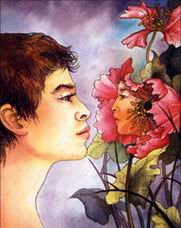**

*奥修，请给我们解释一下生活的艺术。*

人出生就要成全生命，但这一切要取决于他自己。

他可能错过生命，他不停地呼吸，不停地吃，一直在变老，一直在走向坟墓，但这不是生命，这是从摇篮到坟场的慢性死亡，一个七十年之久的逐渐死亡。

由于你周围的成千上万个人都在逐渐死亡。慢慢地死亡，所以你也模仿他们，小孩子从他周围的入学习每件事情，于是我们被死气沉沉的人所包围。

因此首先我们必须懂得我所谓的‘ 生命” 的意思。生命不只是应该变老，它必须成长。

这是两件不同的事。衰老，任何动物都会衰老，成长却是人类的特权，只有很少一部分人取得这权利，成长意味着每前进一步都更深入到生命的规则，它意味着远离死亡—— 不是走向死亡，你越是深入生命，你就越能领悟到你生命中的不朽— 一你在不断地远离死亡。当那一刻到来时，你会看到死亡不过是换衣服，或是换间房子，或是换个形式，没有什么死了，也没有什么会死。死亡是最伟大的幻影。

要了解成长，只要观察一下树的成长，在树生成的同时它的根也在不断地深入，这里有个平衡性，树长得越高，它的根也将越深，你不可能发现一百五十尺高的树只有很小的根，它无法支撑一棵巨大的树；在生命中，成任意味着你内在的深入，你生命的根在那里。

就我而言，生命的首要原则就是静心。其它任何事都是第二位的。孩童时代是最佳的时候。当你长大了，这意味着你正越来越接近死亡，也越来越难进入静心状态。静心意味着进入你的不朽状态，进入你的永恒状态，进入你的神性状态。

小孩是最合格的人，因为他还没背上知识的包袱，没有宗教的负担没有教育的负担，没有各种各样垃圾的负担，他是天真的。但是，他的天真不幸地被谴责为无知。无知和天真有点类似但它们是不一样的，无知也是一种不知道的状态，正和天真一样，但却有很大的分歧，这点至今一直是被整个人类所忽视的。天真是没有知识，但也并没有对知识的欲望，它是完全的满足、充实。

一个很小的小孩没有野心，也没有欲望，他是如此全神贯注在某一刻上—— 一只飞翔的小鸟便完全地吸引了他的视线，一只蝴蝶，它的绚丽的色彩便会令他万分欣喜天空的彩虹，他无法想象还有什么比这彩虹更灿烂，更丰富，还有布满星星的夜空，星星连着星星— 一天真是富有的，它是充实的，它是纯洁的。无知是贫穷的，它是一个乞丐，它想要这个。它想要那个，它想要获得知识．它想要受人尊敬，它想要获得财富，它想要获得权力。无知是在欲望的小道上行走。天真是一种没有欲望的状态。但是因为它们两者都没有知识，因此我们往往将两者的本质混为一谈，我们已经认为两者一样，这是理所当然的。

生活的艺术的第一步将在无知与天真之间，划出一条分界线，天真必须得到支待，必须受到保护，因为孩子拥有最伟大的宝藏，那是智者经过艰苦努力才发现的宝藏。智者们曾经说过，他们要再次成为孩子，他们要再度出生。

在印度，真正的婆罗门，真正的智者，将自己称为 dwij 第二次出生。为什么要两次出生呢？第一生发生了什么呢？第二生需要的是什么呢？在第二生中他将获得什么呢？在第二生中他将获得所有在第一生中被社会、双亲、周围的人所排挤的、所摧毁的东西。

每个孩子正被知识充塞着。他的单纯必须设法被改变，因为单纯在这个竞争的世界中对他毫无帮助，他的单纯被这个世界看起来好像他是一个傻瓜；他的天真将在每一个可能之处被利用；惧怕社会，由于惧怕由我们自己创造出来的世界，我们尽力使每个孩子精明、狡猾、博学多识，使他处在有权阶层，而不是处在受压迫和无权阶层。孩子一旦在这种错误方向下开始成长—— 那么他会继续接着这种方向成长，他的整个生命便走向那个方向。

无论何时当你懂得你已经错过了生命时，回归的第一个原则就是天真。扔掉你的知识，忘记你的圣经、你的宗教、你的理论、你的哲学，再度出生，变得天真—— 这是在你手中的、净化你头脑中一切不为你所知的，所有借来的，所有来自传统、文明的，所有其它的人，双亲，老师，大学给你的东西，将这些扔掉。再度变得单纯，再度变成一个小孩。这个奇迹通过静心便成为可能。

静心就是一个独特的外科手术的方法，它能摘除所有不是你的东西，拯救那只属于你的真实的存在；它能燃烧所有的东西，只剩下你赤裸裸地站着，一个人在太阳下，在风中，这就好像你是降临地球上的第一个人，他什么也不知道，他必须去发现一切，必须成为一个探索者，必须走上朝圣的旅程。

第二个原则就是去朝圣。

生命必须是一种探寻，不是一种欲望，是一种探索，不是野心勃勃地成为这个，成为那个，一个国家总统或是国家总理，而是一种探寻，去发现“ 我是谁？”

这是非常奇怪的，人们不知道他们自己是谁，却要尽力成为某个人，他们现在连他们自己是谁都不知道？他们不知道他们的存在，却已经有了要成为什么的目标。

成为（Becomng ）什么是一种心灵的疾病。存在（BEING ）就是你。发现你的存在是生命的开始，于是，每一个时刻就是一个新的发现，每一时刻都带来新的欢乐，一个新的难解之谜打开了它的门，一种崭新的爱开始在你心中滋生—— 一个你以前从来感到过的新的慈悲，一种对美、对善的新的敏感度。你是那样敏感，甚至连一片最小的草叶对你来说也是至关重要的，你的敏感使你对此很清楚，这一片小小的草叶就存在而言与最大的星球一样的重要，没有这片小小的草叶，那整个存在就比现在要少了，这片小小的草叶是独一无二的，它是无法替代的，它有它自身的个体性。这种敏感将为你创造新的友情，与树、与鸟、与动物、与山、与河、与海洋、与星星的友情，随着爱的增长，友情的增长。生命变得越来越丰富了。

在圣弗兰西斯的一生中，有一段美丽的插曲，在他快死的时候他总是骑着驴子从一个地方到另一个地方传播他的经验，他的所有的门徒都聚集在一起聆听他最后的遗言，一个人的最终遗言总是在他所有讲话中有着最重要意义，其中包含着他整个一生的经验，但是门徒们听见的是什么。他们简直不能相信— 一圣弗兰西斯没有对门徒说话，他却对驴子说话，他说“ 兄弟，我对你深感歉疚，你驮着我从一个地方到另一个地方，从来不抱怨不发牢骚、在我离开这个世界以前，我所想的就是得到你的宽恕，我没能善待你。”

这些就是圣弗兰西斯的最后的遗言，极其敏感地对驴子说。“ 驴子兄弟” ，并请求获得宽恕。当你变得越敏感，生命也就变得越弘大，它不是一个小小的池塘，而变成了海洋，它并不受你、你的妻子和你的孩子的限制，它不受一切限制，这整个存在成为你整个的家庭，除非整个存在是你的家，否则你不会知道生命是什么、因为没有人是一座孤岛，我们都是联系在一起的，我们是一整块大陆，以千百万种方式连接着，如果我们的心中没有充满对这个整体的爱，那么我们的生命将按同样的比例被削减。

静心将带给你敏感，一个属于这个世界的伟大的感觉、这是我们的世界—— 星星是我们的，在此我们不是外来者、我们本来就属于这个存在，我们是它的一部分，我们是它的心。

其次，静心将带给你深深的宁静，因为所有的知识垃圾已消除，思想那部分的知识也已去除——— 一个巨大的宁静，接着你会吃惊—— 这宁静是唯一的音乐。所有的音乐都是平方百计地将这宁静显示出来的一种努力。

古代东方的先知们都非常强调这点，即所有伟大的艺术，音乐，诗歌，舞蹈，绘画，雕塑都来自静心，他们是在用某种方法努力将未知的东西带入到已知的世界，是为了给那些没有准备去朝圣的人— 一正是给这些没有准备去朝圣的人的礼物。或许是一首歌能触发去探根寻源的渴望，或许是一尊雕像下次你进入释伽牟尼和马啥维亚（舍那教创始人筏驮原郡，尊  改为马哈维亚，意为大雄一译者注）的寺庙中，就静静地坐着，注视着雕像，因为那雕像已是用了这样的方式塑成：用了很相称的方法，就是如果你注视着它，你将会感到宁静，它是一尊静心的雕像，这与释伽牟尼佛和马哈维亚无关。

那就是为什么所有的这些雕像着上去都很相像，马哈维亚，释伽牟尼佛，南弥那萨，阿弟那萨— 一二十四尊耆那教的雕像— 一在同一个寺庙中你将会发现二十四尊雕像都很相像，非常相像。

在我的孩提时代，我常常问我的父亲：“ 你能给我解释一下二十四个人怎么可能会这样相象？同样大小，同样的鼻子，同样结构的面孔，同样的身体— 一” 他也常常告诉我“ 我不知道，我自己也总是迷惑，那没有丝毫的差别，还几乎没有听人说过在这个世界上会有两个相同的人，何况是二十四个人？’

但当找的静心开花时，我找到了答案—— 这不是别人告知的，我找到了答案；这些雕像与人是毫无关系的。这些雕像与这二十四个人的内在变化有关，而其内在的变化是完全一样的。

我们不要被外表所干扰，我们要坚持，唯有内在应该引起重视，外表并不重要，有些人年轻，有些人年纪大，有些人是黑人，有些人是白人，有些人是男人有些人是女入，这都没有什么关系、主要是内在拥有一个宁静的海洋，在那海洋般的状态下，身体便会现出某一种姿态。

你曾观察过自己，但你并没有警觉到，当你愤怒的时候，你垦否观察到？— 一你的身体显出某种姿态，在愤怒时你无法使你的手张开，愤怒时是捏紧拳头的，在愤怒时，你不会微笑，或者你会吗？由于某种情绪，身体也不得不跟着出现某种姿态，只是小小的事情也深深地触及到我们的内在。

因此那些雕像用了这样的方式制作，如果你静心地坐着井注视着，然后你印上眼睛，一个相反的影像便进入了你的身体，你开始感受到你以前从未感受到的某种东西。那些雕像和神庙不是为膜拜而建造的，而是为了体验而建造的、它们是科学试验室，它们与宗教无关。这样的一种秘密科学已经用了好几个世纪，如此下一代的人便能接触到上一代人的经验，不是通过书本，不是通过文字，但要通过某种乐西通向生命的深处—— 通过宁静，通过静心，通过平和。

当你的宁静增长时，那么你的友情、你的爱也随之滋长，你的生命便成了一个即时即刻的舞蹈，一种欢乐，一种庆祝的。

你听见外面的鞭炮声吗？你曾经思考过为什么整个世界，在每种文化中，在每个社会中，一年中总有那么几天用来庆祝？这几天的庆祝只是一种补偿，因为这些，社会将你生命中的所有的庆祝都已经拿走了，如果再不给你生命一点补偿，那么很可能对这个文化造成危险。每一种文化都不得不给你一些补偿，以免梗你完全地感觉到迷失在悲哀和忧伤中，但这些补偿是虚假的，这些外面的鞭炮和这些外面的灯光并不能使你喜悦，它们只能哄哄小孩子，对我而言，它们正是一个累赘，但是在你的内在世界里却能拥有一个连续不断的光芒、歌唱与欢乐。

请始终记住，社会给你的补偿，是当它感到被压抑的部分如不给予补偿的话，就可能爆炸而造成危险的情形时，社会发现了一些使你摆脱压抑的方法，但这不是真实的庆祝，它不可能是真的。

真实的庆祝应该来自你的生命，在你的生命中，真正的庆祝不可能按照日历，例如十一月一日就将庆祝，真奇怪！整个一年你都很悲哀。十一月一日突然你摆脱悲哀，跳起了舞。不是悲哀是假的就是十一月一日是假的。两者不可能都是真实的、一旦十一月一日过去了，你又将回到你的黑暗的洞穴里，每个人都沉浸在他的悲哀中，每个人都沉浸在他的焦虑中。

生命应该是一个接连不断的庆祝，全年都拥有节目的光芒，只有那时你才能成长，你才能开花结果。让一些小事变成庆祝。

比如，在日本他们有茶道的仪式，在每一个禅寺和每一个支付得起的家里，他们都有一个小小的庙作为饮茶用的地方，现在，茶已不是普通的、凡俗的事情，他们将它变成了一个庆典。

饮茶用的寺庙是用一个特定的方式做成的。在一个美丽的花园里。有美丽的池塘，天鹅在池塘里，四周开满着花…… 宾客来临时，他们必须将鞋脱在外面，这是个神庙，就像你进入神庙一样，你不能说话，你必须将你的思考、思想和态度与你的鞋子一起放在外面。你用静心的姿态坐下，然后主人，一位女士为你准备彻茶，她的动作如此优雅，就好像她是在舞蹈，移动着准备彻茶，在面前放好茶杯和碟子，就好像你们是神，她用非常尊敬的态度向你鞠躬，你也将用同样的尊敬来接受它。茶是用一种持制的水壶准备的，它能发出一种优美的声音，一种它自身的音乐，这是茶道仪式的一部分。即每个人首先得听茶道音乐，所以每个人静默，倾听— 一鸟儿在外面的花园里鸣唱，水壶发出特殊的声音— 一茶道创造着它自己的歌，宁静在四周环绕……

当茶准备好以后，彻到每个人的茶杯里．你不能用人们平常在其它地方那样的方法去喝，首先你得先闻一闻茶的香气，你将呷一口茶就好像它是来自另外的世界，你要花时间，不能着急，有人会开始吹起笛子或弹起锡塔琴一件平常的事—— 只是饮茶—— 他们使它成了一个优美的宗教节日，每个人从茶道中得到滋养，感到新鲜．感到更加年轻，感到更加滋润。

茶道能做的事也能用其它任何的东西来做，用你的衣服，用你的食物，人们几乎是沉睡着生活。否则，每一件织物，每一块布都有名它自身的美，有它自身的感觉、如果你是敏感的话，那么衣服就不再仅仅是遮盖你的身体，而是某种表达你的个体性的东西，是某种显示你的品味，你的文化，你的本性的东西。

你做的每件事都应是你的显现。在它上面应有你的签名，于是生命就成了一个持续的庆祝。

即使你病了，你躺在床上，你也会使躺在床上的那一刻变成优美与欢乐的时刻，变成放松与休息的时刻，静心的时刻，听音乐与感受诗意的时刻。没有必要为你生病感到悲伤，你应感到高兴，每个人都在办公室，而你却像个国王一样在床上，放松一下—— 有人正在为你准备茶，水壶正在唱一支歌，朋友将为你而来，为你吹笛子— 一这些事比任何药都更为重要。

当你病了。请一个医生。但是更重要的是去请那些爱你的人，因为没有一种药比爱更为重要，请那些能在你的周围制适美丽、音乐、诗歌的人来，因为没有什么东西会像庆祝的心境那样使人更快地康复。

药物是最差劲的治疗方法，但这看起来我们将一切都忘记了，所以我们不得不依赖药物，并巨脾气暴躁，心情悲伤，就好像我们错过了在办公室的欢乐！在办公室作是悲伤的，即使一天工作完毕下班了，你也仍然执着手悲哀，你无法放开这种心情。

使每件事都有创造力，把最坏的变成最好的，这就是我所谓的“ 艺术” 。

如果一个人生活了一生，能使他的每一刻，每一个阶段成为美丽、爱、欢乐，那么自然的，他的死将是他整个生命过程的峰巅。

这最后的感觉— 一他的死不是趋向丑陋而是像每天发生在每个人身上的最普通的事一样。如果死是丑陋的，那么它便意味着你的整个生命是种浪费、死应该被宁静的接纳，带着爱意进入到未知。带着快乐告别老朋友，告别这过去的世界，其中不应该有任何悲剧。

有一个禅师，临济（lin chi ）快死了，数千名门徒聚集在一起聆师最后的布道，可临济只是躺着，快乐地，带着微笑，不说一句话、看着他快死了，却不说一句话，有一个人提醒临济，一个老朋友，一位有着他自己权利的大师— 一他不是临济的门徒，那就是为什么他能对他说：“ 临济，是否已经忘了你必须说你最后的遗言？我总说你的记忆力不好，你快去世了，你是否忘了？

临济说道；“ 请听....” 这时屋顶上两只松鼠在奔跑着，尖叫着 ，他说。‘ 多美’ 然后他死了。

就在那一刻，当他说“ 请听— 一” 那是全然的宁静。

每个人都以为他会说些伟大的事，但是只有两只松鼠在屋顶上打架尖叫着，奔跑着— 一然后他微笑接着便去世了— 一但是他已经发出了他的最后的信息；不要将事情办成小的和大的，不重要的和重要的，每件事情都是重要的。在这一刻临济的死与屋顶上两只松鼠在奔跑同样重要，那没有区别，所有的存在都是一样的！那就是他的整个的哲学，他的一生的教诲—— 一没有什么东西是伟大的，也没有什么东西是渺小的，这全由你而定，是由你来界定的。

从静心开始，许多东西将不断地在你内心增长—— 宁静、安详、幸福、敏感，无论什么来自静心，尽量将它从生命中净化出来，分享它，因为与人分享一切都会加速成长。然后，当你快到达死亡那一时刻，你将会懂得并没有死亡，你会说再见，不需要任何眼泪和悲伤，或许是快乐的泪，但不是悲伤的泪。但是，你必须从天真起步。

所以，第一，扔掉你身上所带的全部的垃圾。每个人都带着如此多的垃圾，有人会奇怪，为什么？正是因为人们在不断地告诉你这些是伟大的思想、原则— 一你对自己很不明智。要明智地对待自己。

生命是非常简单的，它是一个欢舞，整个世界可以充满欢乐和舞蹈。

但是有人严肃地沉溺于他们的既得利益中，没有人应该享受生命，没有人应该微笑，没有人应该欢笑，生命是一种原罪，它是一种惩罚、当你是处在不断地被人告知这个惩罚的气氛中，你怎样能够早受生活呢？你正在受苦，因为你做错了事。作被扔进这个监狱来受苦，那么你怎样能够享受它呢？

我要对你说，生命不是一个监狱，它不是一种惩罚，它是一种报酬，它只给予那些能够获得它的人，值得受贫的人、现在，享受是你的权利，如果你不享受，那么这将是一种罪孽。如果你不美化它，如果你还让它和你发现它时一样的话，那么这是在与存在对抗。

不，不要这样，

让它更快乐一点，

更优美一点，

更芬芳一点。

## 一个非常危险的情况

**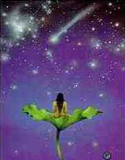**

*奥修，*

*我被你在美国的罗杰尼希保兰的社区所吸引，在我内心深处知道，它就像一块磁铁一样。在这个星球上，没有其它的地方能够完完全全地体验生命，我从没读过你的书，也没读过任何寻求真理的书，或者是关于觉知的书，或是使意识上升的书．我很奇怪，当我甚至还没有感到渴，至少我尚未经验到这种渴，我却再次来到你的泉源。*

生命是一个奥秘，

它并不总是能找到解释的，什么会发生在你身上，或者为什么会这样、首先，你为什么会在这个世界上？这个问题是没有答案的；为什么事先并没有通知你爱却突然便会在你内心产生？这也没有理性的答案；为什么对你来说玫瑰花看上去那么美丽？你无法解释它。你说；“ 我被你的社区所吸引，它像一块磁铁，我无法理解为什么我会在那儿” 没有人能理解它。

你以为所有这些人都理解为什么他们会在这儿吗？是否你们以为我知道我为什么会在这儿吗？最多只能说：我在此是因为你，而你在此也是因为我、但这并没有解释任何东西，“ 我在内心深处知道，在这个星球上，没有其它的地方能够完完全全地体验生命— 一” 被磁铁般地吸引已经足够了。

每个人都在内心渴望充分地生活，但社会并不允许你，文化阻碍你，宗教控制你，家庭折断了你的翅膀、在你的周围，拘泥于利益中的那些人使你无法充分地生活、令人惊奇的是为什么他们如此有兴趣地看着人们无法充分地生活；他们对人类的整个剥削就依赖于此。

一个充分地生活的人不需要酒精，或其它任何药物。自然的。那些从酒精和药物上赚取数百万元金钱的人就不能允许你充分地生活，充分地生活是如此地快乐以至你不想饮酒来摧毁你的快乐，酒精是痛苦的人才需要。是陷入困境的人才需要，是想设法忘记他们的问题、他们的焦虑的人才需要，至少可以忘记几个小时，酒精不会改变任何事，但即使休息几个小时，看起来对于百万人而言似乎也是完全必要的。

如果一个人充分地生活那么他的每一刻是如此满足以至你将看不到电影院前的大队长龙，当你自己能作爱，谁想去看别人作爱呢？为什么要去电影院，当你自己的生命是如此的神秘，如此面对发现的巨大的挑战— 一那么谁还会对三流电影故事感兴趣呢？

充分地生活的人会变得没有野心，因为地现在是如此的快乐，他不能想象还有更多的可能性、一般人的头脑的疯狂，欲望越来越多，这是因为你没有充分地生活．那里总有一个空隙，某些东西在错过，你知道事情应该会更好些，出自这部分的生活，所有的野心开始上升，然后社会的整套游线继续着有人想变得富有。有人想成名，有人想成为政治家，有人想成为总统或总理。

直到今日，人类制造了所有各种各样的障碍来阻止入充分地生活，这样，他们才能赖以为生，因为完全的人将摧毁这个世界如此之多的既得利益者，完全的人是对既得利益者最危险的人，你不能使一个充分而完全地享受生命的人变成奴隶，你不能强迫他参军去杀人或被人杀掉，你的社会的整个结构将崩溃。

当完全的人来到时，那会有一个不同的社会结构—— 没有野心却拥有巨大的快乐，并且没有伟大的人、或许你从未想到这点：伟大的人之所以能够存在，只是因为有千百万人是不伟大的。否则谁会记得释伽牟尼佛陀呢？如果存在着干百万个释伽牟尼佛陀，千百万个马哈维亚，千百万个耶稣基督。谁还会去理这些人呢？这些少数人能成为伟大的人，恳因为千百万人没有被允许充分地生活、谁会去教堂，如果人们不痛苦— 一会寺庙，去犹太教的会堂，去清真寺，谁会去那儿？谁会去烦扰神，会在乎天堂或地狱？一个人生活的每一刻都是那么强烈以至生命的本身已经是一个天堂，生命本身已成为神，他不需要成为一个对那些无生命的雕像，那些死的经典，那些腐朽的思想方式，那些愚蠢的迷信的膜拜者。

完全的人在这个世界上对你的现存的制度是最大的危险。这你能看得见，为什么我被整个世界毫无理由地谴责，如果他们将我钉在十字架上，我将不会对神说“ 请宽恕这些人，因为他们不知道他们在干什么。首先，不存在我要对他说什么的那个神；其次。我不能说他们正在做他们并不知道的事情，我只能说；他们的确在做他们想做的事，他们正有意地在做它、’ 他们的整个生活方式处在危险状态，他们的生活方式可能没有给他们快乐、幸福，不过这是他们的生活方式，甚至他们的痛苦也是他们的痛苦、这些痛苦的人们是如此地占绝大多数，他们无法容忍那些一无所有的人却如此快乐，如此满足，有如此巨大的欢乐，那些一无所有的人内心充满着歌，他们随时都准备狂舞一阵。

美国的律师在新闻发布会上发表演讲时说；“ 我们首先考虑的是摧毁奥修的社区” 、人们会奇怪为什么一个拥有如此多的权力的伟大的民族竟然会担心一个只有五千人，生活在完全游离于美国的沙漠中的一个小小的社区？离那儿最近的美国的城市也要相距二十里。为什么他们如此担心？为什么在每个基督教堂里他们要谴责我？只是为了一个简单的理由，就是那五干个人毫无禁忌地生活着、他们真正过着完全自由的生活，他们已抛弃了所有的障碍，他们工作着，或许是整个世界上最艰苦的，一天工作十二个小时，有时候一天工作十四个小时，但他们仍然在晚上精力充沛地去跳几小时舞，唱几小时歌、他们在第二天早上又充满精力，早早地醒来，静心几个小时。

这造成了一个非常危险的情况，如果这些一无所有的人生活得如此快乐，那么为什么拥有一切的所有的美国基督徒和所有的美国犹太人会感到痛苦呢？我们甚至于庆祝死亡，而他们甚至无法庆祝生命，每当某个门徒死了，这是一个欣喜的机会，跳着舞，唱着歌向他好好地告别，他是踏上了永恒的旅程，或许我们将不会再见面，这不是哀悼、痛苦、哭泣和流泪的时刻。这对美国而言成了问题，那就是为什么它成了他们得首先考虑摧毁社区的理由，他们做了一切不合法的、犯罪的、违反宪法的事，但这五千个人是无助的，他们从来没想到过得快乐对他们的生活可能是一个危险，在这个痛苦的世界上，你的行为应该像其他人一样，当每个人都在伤心流泪时，你不应该笑；否则，那些伤心流泪的人会将作杀掉。

你被社民所吸引，因为你不曾读过任何书。你没有被借用的知识所累、你还没有去寻找真理，否则你会去研究那些经典。去找犹太教教士，去找主教，去找有学识的人，因为你对寻求真理没有兴趣，你没有读我的书或别人的书，你有一个天真的头脑，所以你没有负担。那就是你感到社区对你的吸引的本质，当你在社区时，你能看到完全不一样的生活方式，那是最明智的方式、人简直在浪费一个伟大的契机，能够发现你自己的契机，发现新的生活空间的契机，发现新的幸福之花，新的爱，一种并不使你变成奴隶的爱，而是一种使你变得比以前更加自由的爱，一种给你自由的爱。

这是历史上第一次，你一定知道，5 千个人中包含所有的民族，所有的宗教信仰，来自几乎世界上所有的国度，所有的肤色，他们生活得就像一个庞大的家庭．去看看五千个人在一个地方吃饭，在节日里两万门徒在一起用餐，没有人关心谁是基督徒，谁是犹太教徒，谁是回教徒，甚至没人会间“ 你的宗教信仰是什么？” 每个人都知道我们的宗教是充分地、完全地生活，并且允许每个人都允许别人按照他自己的方式生活，按照他喜欢或不喜欢的—— 不会用任何方式干涉任何人的生活，并且不允许任何人去干涉你的生活，五千个个体，生活得就像他们是一个有机的整体。

你来到这个泉源是因为你的明智和你的天真．无论你是否渴一－那是你头脑中意识不到的渴，它们是如此深的隐藏在你的潜意识深处，但当你来到这个泉源，你将会获得巨大的满足。你可能不知道渴，但你将知道，在你内心的某种渴望被解除了。

## 冒一切险

**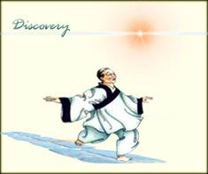**

生活需要巨大的勇气，怯懦的人只是活着，他们并非在生活，因为他们的整个生命朝向恐惧，而朝向恐惧的生命要比死更加糟糕。他们生活在一种妄想中。他们害怕一切。不仅害怕真实的事，而且也害怕虚假的事，他们害怕地狱，他们害怕幽灵，他们害怕神，他们害怕一千零一件他们自己所能想象的事，或者其它类似的事，害怕之多，使得生活变得毫无可能。

只是具有勇气的人才能生活，首先要学的就是勇气，人要不顾所有的恐惧，开始生活、为什么生活需要勇气呢？因为生活是不安全的，如果你太有安全感。可靠感，那么你将被局限于一个非常小的角落中，几乎就是你自己造的一个监狱，它将是很安全的，但却不是活的，它将是很保险的，但它却没有冒险，也没有狂喜。

生命在于探索，它进入不知，它伸向星空. 在生命的每一刻里，充满勇气和具有牺牲一切的精神，没有什么会更有价值，不要为小事，如为钱、为可靠、为安全，牺牲你的生命，没什么东西是有价值的，人应该尽其可能充分地过他自己的生活，只有这样快乐才会出现，只有这样完美的幸福才会变成可能。

那些真正想生活的人必须要冒许多险，他们必须不断地进入到不知的领域，他们必须学会一项最基本的课程—— 没有家、生命是一个朝圣的旅程，没有开端，没有终点。是的，没有你能休息的地方，但那些人只能在夜晚停留，早上你必须再次启程，生命是一种不断的运动，它从来不会到达终点，那就是为什么生命是永恒的。

死亡有一个开始和一个结束。但是你不是死亡，你是生命。死亡是人们的一种误解，因为人们渴望安全便创造了死亡，创造死亡让人害怕生命，让人对进入不知的领域感到犹豫就是为了得到可靠与安全。

生命唯一的养料就是冒险；你越是冒险，你也就越富于活力、一旦你明白这一点—— 不是出自绝望，不是出自无助，只是来自静心的觉知—— 一旦你明白这一点你就会被它的可能性的那种纯粹的美所激动。

人在绝望中会接受无家可归，而人错过整个的关键，那也是存在主义错过的。他们非常接近，非常接近—— 真理就在那个拐角处，他们与佛一样的相近，但他们错过了，他们将幸福变得非常非常的悲伤，他们认为生命没有意义，生命没有目的，生活没有安全，他们变得非常动摇，这是非常具有毁灭性的。

佛陀们也得出了同样的结论，但他们进入了不知的领域不是变得悲哀他们超越了所有的界线，他们接受了生命就是这样的，他们接受了这就是生命的自然状态。没有必要有受挫感，他们理解没有安全感的生命是美丽的，因为只有那样生命才有探索的可能性，才有创造的可能性，才有跨越新领域的可能性，才有令人惊奇的可能性。如果所有的这些事都是安全的、肯定的、有保证的，预定的，那将不会令人激动，令人欢资。

佛陀们都曾经跳过舞！看见那难以置信的事发生，看见奇迹的发生，他们就会欣喜若枉，耶稣一遍又一遍地对门徒说：“ 快乐起来，快乐起来！！！我一遍又一遍地说．快乐起来！！！”

那就是我全部的忠告我没有给你一个目标，我甚至没有给你一个方向感，我只是让你感知到生命的真相，它是什么。它是怎样的，与它协调，与它作伴，不要有个人的、私下的欲望，不要有它应该是怎样的想法，让它就像它本来的样子，而你就放松了。你的房子更像坟墓，你太关注安全，太关注安全便会扼杀生命，因为生命是不稳定的，就是如此！你对它无可奈何，没人能使生命安全、所有的安全都是虚假的，所有的安全都是想象的，一个女人今天爱你；谁又能知道明天将怎样呢？你怎样能保障明天呢？你可以去法院登记，签订一个法律契约，使她明天依旧是你的妻子，由于法律的契约．她可以仍然是你的妻子，但爱情却可能消失了，爱情是没有法律的，当爱情已经消失，妻子仍然是妻子，丈夫仍然是丈夫，但他们之间的关系已经死气沉沉。

为了安全，我们创造了婚姻，为了安全我们创造了社会，为了安全，我们总是行进在狭小的路途中。

生命是野的，爱是野的，神也完全是野的，他从来就不会光顾你的花园，它过于世俗化，他也不会光顾你的屋子，它太小，他不会与你在狭小的路途中相逢，他是野的。请记住：生命是野的！

# 爱

“ 我将不懂得爱的艺术的人称作为一个物质主义者、不相信神的人，我不将他称作为一个物质主义者，我也不将相信神的人称作为宗教性的人。我称之为宗教性的人是他的爱，他的信任在不断成长，并且不断在他的周围散播着他的狂喜的人。”

                                        — — 奥修

## 心灵的音乐

**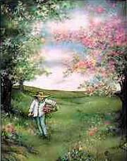**

人的心是一个乐器，正蕴涵着伟大的音乐，它沉睡着，但它就在那儿，等待着被撞击，被表现，被歌唱，被舞蹈的那个时刻，它是通过爱，那个时刻便到来，一个没有爱的人将永远不会懂得他内心拥有的那种音乐，它只有通过爱，那音乐才开始变得有生命，才被唤醒，由潜在的开始变成一个真正的音乐。

爱触发了那个过程，爱是一种催化剂、如果爱不能引发你内心的音乐这个过程，那么它一定是某种伪装成爱的东西，它不是爱、它或许是欲望，它或许只是性欲、肉欲。性欲和肉欲并没有什么错，欲望也并没有什么错，我并不是在谴责它们，它们本身是好的，但它们并不是爱，它们能假装成爱，它们能欺骗人，使他将它们想象成爱。从此可以知道判断的标准是；如果你内在的音乐开始流动，那便是爱，突然间你感到自己处在一个深沉的和声中, 你再不是一个噪音，你变得和谐了，你再不是一种纷乱，你变成了一个秩序井然的宇苗、于是生命便开始出现了一个新的品质—— 欢欣鼓舞的品质，哈利路亚的品质！那是唯一的判断标准；不断地探索，不断地深入深入到爱。

有一天你将发现你内在的音乐，那以后生命就再也不一样了。事实上，那以后，生命才开始。

## 爱是什么？

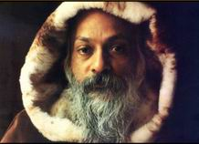

*奥修，爱是什么？为什么我如此害怕爱？*

*为什么我感到爱好像是一种不堪忍受的痛苦？*

你问“ 爱是什么？它是使人要与整体在一起的很深的驱动力、这种很深的驱动力融合我和你变成一个整体．爱就是因为我们与我们自身本源的分离，出自这种分离。要回归到那个整体的渴望产生了，渴望与它融为一个整体。

如果你将一棵树从土壤里拔出，如果你将它连根拔起，那么那棵树将产生一个巨大的渴望，要使根再回到土壤里，因为那是它的真正的生命，不然它会死去，与土壤分离，树将不能存在，它必须在土壤中生存．和土壤在一起，通过土壤，那就是爱。

你的自我在你和你的土壤即整体之间变成了一个路碍，于是人快窒息了，他不能呼吸，他已失去了他的根，他不再得到滋养，爱是对滋养的渴望，爱就是要在存在中获得根。如果你落入相对的一极，这样的现象就比较简单了，那就是为什么男人被女人吸引，女人被男人吸引。男人通过女人能发现他的土壤，他通过女人能再次土壤化。而女人通过男人也能土壤比，他们相互补充，单独的男人只是一半，他极其渴望需要变成一个整体，单独的女人也只是一半，当这两个一半相遇，融合和合并，此时，人第一次感觉到根植入神，感觉到深入土壤，巨大的快乐在人的内心中升起。这不只是你根植于女人，而是通过女人根植入神。女人只是一扇门，男人也只是一扇门，男人和女人是通往神的门，渴望爱就是渴望神、你可能理解它，你也可能不理解它，但是对爱的渴望确确实实地证明了神的存在，没有其它的证明，

因为人们爱，所以神才存在，因为人没有爱是无法生活的，所以神才存在。爱的驱动力只是说我们单独的时候，我们会痛苦，我们会死，当我们在一起的时候，我们成长，我们被滋养，我们就充实，我门就满足。

你问“ 爱是什么？我为什么如此害怕爱？” 那也就是为什么人会害怕受，因为你进入到女入的那一刻，你就失去了你的自我，女入进入到男人中，她也就失去了她的自我。

现在这一点必须要理解：只有当你失去你自己，你才能根入整体，没有其它的方式，你被那个整体所吸引。因为你感到没有被滋养，于是当你消失在整体中的那一刻，你开始感到非常非常害怕，因为你失去了你自己，于是巨大的恐惧产生了，你想退缩，这是个进退两难的境地，每个人都必须面对它，遭遇到它，经历它，领悟它，超越它。

你必须懂得那两件事都是来自同一件事，你感到你的消失一定很美，没有担心，没有焦虑，没有责任，你将会象树和星星一样变成整体的一部分，这想法多棒！它打开了门，打开了进入你的存在的神秘之门，它产生了诗歌，它是多么罗曼蒂克！但实际上当你走进它时，恐惧便产生了，就是“ 我将要消失，谁知道下一步将会发生什么？” 就像一条河进入了沙漠，听到沙漠的细语— 一他犹豫，地想要超越它，想要去追寻海洋，他感到有一种渴望，有一个微妙的感觉和确定感，并有：“ 我的命运就是要去超越” 的确信感、没有可见的理由能够提供，但有一种内在的确信，就是“ 这儿不是我的终点，我必须去寻求某种更大的东西。” 某种东西在心灵深处说“ 试一下，努力地试一下! 超越这沙漠。” 然后沙漠说“ 听我说；唯一的方法就是蒸发到风中，它们将带着你，它们将带着你超越这沙漠。” 河流想去超越沙漠，但问题是非常自然的“ 那么有什么说明和保证那风将会让我再度成为一条河流？

一旦我消失了。我将无法把握，那么有什么保证我将再度成为同样的河流，同样的形式，同样的名字，同样的身躯？谁知道？我又怎样相信一旦我臣服于风，那么它们将会允许我再  次离开它们吗？那就是爱的恐惧。

你知道，你确信，没有爱就没有快乐，没有爱就没有生命，没有爱你就会对某种不知的东西感到饥渴，你会感到不完美，感到空虚。你是空的，你没有任何东西，你只是一只没有容物的容器，你只感到它的空洞、空虚和痛苦，你确信会有许多方法能满足你。但是当你靠近爱时，巨大的恐惧就出现怀疑就出现如果你放松如果你真的进入爱，那么你是否还能够运回？你还能保护你的身份、你的个性吗？冒这个险是值得的吗？头脑决定不冒这样的险，因为最起码你是存在着—— 缺乏滋养．没有食物饥饿、痛苦— 一但最起码你是存在着、如果你消失在某个爱中，那么谁知道会怎样呢？你将消失，什么能保证那儿将有快乐，有幸福，有神呢！

一粒种子会有同样的恐惧感，当它开始死去并葬入土壤，它是死的，种子无法想象那儿将有生命是来自死亡。

## 爱是你生命的舞蹈！

**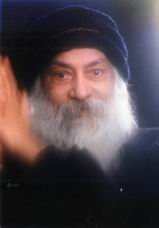**

生命是一种机遇：它是爱之玫瑰盛开的土壤。

爱，就其自身有着非常的价值，它没有目的，它没有意图，它有巨大的意味，它拥有巨大的快乐，它有它自身的狂喜，但是那些不是它的意图、爱不是一项有目的有目标和物质性的生意。

爱总是有某种疯狂。那疯狂又是什么呢？疯狂是因为你无法证明为什么你要爱，你无法有任何理由来回答你的爱。

你能说你做某项生意是因为你需要钱，你需要钱是因为你需要一栋房子，你需要房子是因为没有房子你怎样生活？

在你的日常生活中，每件事都有某种目的，但是爱，你却无法想出任何理由，你只能说；“ 我不知道，我只知道去爱就是经历人生中最美丽的空间。” 但是它不是一种目的，那个空间不是属于大脑的，那个空间无法转变为商品。那个空间是转变成一株玫瑰花蕾。上面有一滴露珠，闪耀着．像一颗珍珠，在早晨的微风下，在太阳下，玫瑰花蕾正在舞蹈。

爱是你生命的舞蹈。因此那些不知道爱是什么的人，已经错过了生命的舞蹈，他们已经错过了培育玫瑰花的机会。那就是为什么对一个世俗的头脑，对一个精于算计的头脑，对一个计算机型的头脑，对一个数学家，对一个经济学家，对一个政治家而言，爱显现的是一种疯狂。但是对那些懂得爱的人而言，爱是独一无二的明智。没有爱，一个人或许富有，健康，有名望，但他不可能心智健全，因为他不懂得任何一件事的内在价值。明智就是在你心中盛开的玫瑰的芳香，除此之外，它什么也不是。

相爱中的人们不需要心理治疗，事实上，爱是生命中最伟大的康复力、那些错过了爱的人只剩下空虚，不充实。平常的疯狂是没有理智的，但是爱的疯狂其中具有某种理性，那理性是什么呢？它使你快乐，它使你的生命成为一首歌，它带给你最大的恩赐。

你曾经观察过人吗？当某个人坠入情网时，他不需要对此声明，你就能看见他的眼睛里，有一个新的深度出现，你能看见他脸上新的表情、新的美丽，你能看见他走路时有微妙的雀跃，他是原来的那个人，但又不是原来的那个人，爱已经进入了他的生命，春天已经来到他的内心，在他的心灵中，花儿已经盛开。

爱使人立即蜕变。不能爱的人也就不可能是智慧的，也无法优雅，也无法美丽，他的生命只是一出悲剧。

所有宗教的导师告诉过你：“ 你的生命是徒劳的，因为它只是一个肥皂泡，今天它在那儿，明天就消失了，你的生命在这个世界上、在这个身躯里。是没有任何价值的，因为它是暂时的，它的唯一的用处就是你能否定它，放弃它，你就能达到在神看来的那种善人。” 真是奇怪的观念！但是它却已经统治了好多个世纪的人们的思想，没有受到任何挑战．尤其是在东方，他们认为世界是虚幻的，为什么是虚幻的呢？因为它是变化着的，任何变化的事情是无用的是无价值的，只有恒久的，始终保持一样的，才是最重要的。你无法发现在这个世界上始终保持一样的任何东西。这整个的推论是要强调世界是一个幻像，因为它不是恒久的。“ 寻求恒久的，抛弃不恒久的” 或多或少，那就是世界上所有宗教的态度。

除了变是不变的以外，每样事情都在变，除非你想变为神— 一因为那是在世界上唯一永恒的东西，除此之外，你无法发现任何东西能给出一个永恒的神的暗示。

热爱生命，因为生命是一个变化着的东西，它每一刻都在流动、当你进入这大厅时，你是另外一个人；当你离开这大厅时，你将不再是同一个人。你只是外表看起来是同一个人。在这两个小时中，你有那么多的变化，这就好像在两个小时里，恒河之水已经奔流了好几里— 一尽管它看上去仍然是同样的那条河，但它是与两个小时以前的河流已经不一样了。

赫拉克利特说，生命是一种流动，是一条河流，“ 并请记住，你不能两次跨入同一条河，因为它将是下一样的。”

那些懂得幸福最多的人是那些与变化着的生活紧密相关的人，甚至他们能够爱那些在太阳下闪烁，创造小小的彩虹的肥皂泡，那些人是懂得幸福最多的人。

你的那些圣人们知道的只有痛苦—— 只要去看看他们的脸，看上去生命已经从他们身上消失，他们是僵死的化石，在他们身上没有什么变化，他们过着一种仪式般的生活，他们是所有变化着的事物的谴责者。

愉快为什么会遭到谴责？因为它是变化着的，爱为什么会遭到谴责？因为它是变化着的、为什么这些宗教在爱的领域制造了婚姻？这是因为通过法律，通过协约，通过社会，通过对失去尊敬的恐惧，通过对我们的孩子将会发生什么的担忧，至少可以给予婚姻一个虚幻的永恒，因此，他们力图使婚姻变成某种永恒的事，那就是为什么所有的老式的宗教都反对离婚，因为离婚再次显示了婚姻并非是某种永恒的事，它是能够改变的。

数千年来，都有很小的小孩结婚，甚至据记载小孩尚未出生，还在他们母亲的腹中，就定婚了，两个家庭之间会作出决定，如果一个小孩是男孩，另一个是女孩，那么就决定结婚。  甚至在当今的印度，就有七岁、八岁的小孩结婚，尽管这是违法的，但它不违犯习俗，为什么如此匆忙地让尚未知道婚姻的含义，不知道发生了什么的孩子结婚？理由是在他们成人之前，在他们内心产生爱以前，就应该结婚，如此，当爱在他们心中产生的时候，他们已经有了一个妻子或已经有了一个丈夫，童婚在整个世界上的蔓延就是为了摧毁爱。

婚姻在世界上创造的痛苦比任句事情创造的痛苦更多，这不是巧合，因为它摧毁了唯一幸福的可能性，摧毁了爱的产生，内心从来没有欢舞，人们不懂得爱，就那么生活着，然后死去看着肥皂泡。看着蝴蝶，看着在风中舞蹈的玫瑰花蕾，那是使人感动得要落泪、激动得歌唱的，那眼泪是快乐的、那生命如此充满活力，它不会恒久—— 只有死的东西才可能永恒— 一你的神能跳舞吗？你的神能爱吗？你的神能歌唱吗？你的种能追遂蝴蝶吗？你的神能采集野花，能欣赏它们吗？能流泪，能歌唱吗？这样的神将是生命的真正代表，这样的神才是生命本身。而不是别的。

## 关于爱的四个步骤

**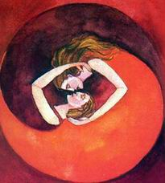**

爱是一个聚会，是生与死激情高潮的聚会，除非你懂得爱。否则你便错过了，你出生，生活，然后死去—— 但是你便是错过了，你大大地错过了．你完全地错过了，你彻底地错过了，你错过了生与死的间隔，那个间隔是最高的峰巅，顶点的经验。

要达到它，这儿有四个步骤要记住。

第一步就在此时此地。因为爱的唯一可能性就是此时此地，你不能在过去爱，许多人只生活在记忆中，他们爱在过去。还有另外一些人爱在将来，这同样也是无法做到的。这些是逃避爱的方式，过去和将来是逃避爱的方式，或者你爱在过去，或者你爱在将来，但是爱只可能在现在，因为只有在这一刻死和生是交会着…… 幽暗的间隔是在你内在交会着，那幽暗的间隔总是现在的，总是现时的。总是即刻的，它从来不是过去，它从来不是将来。

如果你想得太多，想象总是关于过去或关于将来的，你的精力将会从情感中转移出去、情感是此时此地的。如果你的精力正在进入思考的形式中，那么你将没有足够的精力注入到情感中，那么爱也将是不可能的。

如此，第一步就是活在此时此地．将来和过去带来的是思想，而思想毁灭情感、一个人太多地被思想所占据的话，渐渐地也就会完全地忘记他还有一颗心。一个人进行太多的思考，渐渐地便会开始进入一种情感无权发言的境地。不去倾听情感，渐渐地情感就开始遗弃地。

有千百万人处在这种不知道心的含义的状态之下，他们认为心只是一个器官，他们的整个的集中点是在头脑，头脑是一个极端，它被需要，它是一个好的工具，但是它必须被当作奴隶来使用，它不应该是主人，一见头脑变成了主人，那么心被留在其后，你会生活，也会死亡，但你将不知道神是什么，因为你将不知道爱是什么。

一开始接触到那同样的幽暗的间隔，看上去像爱— 一当你完全地迷失进去的时候，它变成了神，爱是神的开端，或者神是爱的最终的顶点。

趋向爱的第二步就是学会将你的毒累变成蜂蜜。因为许多人去爱，但他们的爱往往被恨、嫉妒、生气、占有的毒素所污染，一千零一种的毒素包围着你的爱，爱是一个精细易碎的东西，好好想想，生气、憎恨、占有、嫉妒这样爱如何能生存？

首先，人们往往用头脑，而忘了心，他们属于大多数人，而一小部分人生活中还用着一点心，但就那小部分人也还犯着另一个错误，爱的微弱之光被嫉妒、憎恨、生气这一千零一种毒素包围着，于是整个旅程变得痛苦，爱是介于天堂和地狱的一把梯子，但这梯子总是有两个方面；你能向上爬。你也能往下走。如果那儿有毒素，那么那梯子便使你往下。你将进入地狱．不是进入天堂，不是获得美妙旋律，而是你的生命变成了一种令人厌恶的噪音。一种冲突的、交通上的噪音，一种疯狂的噪音，一种没有和谐的一切噪音的杂烩，你将处在疯狂的边缘。

因此第二件事要记住的是学会将你的毒素变成蜂蜜。它们是怎样被蜕变的呢？这是一个非常简单的过程。事实上，称它蜕变并不正确，因为你不做任何事情，你只需要耐心，这是我告诉你的最大的秘密之一，试试看，当你开始生气体不要做任何事；只是静静地坐着，看着它，不要反对它，也不赞同它，不要与之合作，也不要压抑它，就看着它，耐心地．看看它发生什么— 一让它上升。

记住一件事；当毒素占有你对，不要带着情绪做任何事，只是等待。等毒素开始变换成它的另一面— 一这是生活中一个最基本的法则，每一件事不断地变换成它的另一面，正像我告诉你的男人变成了女人，女人变成了男人，在你的内在有同期性的变化，好人变成坏人，坏人变成好人，圣人有罪人的一刻，罪人有圣人的一刻，人只要等待。

当生气到达顶点时，不要行动，否则你将后悔，你将制造出一条反应链，你将陷入到因果报应中，那就是陷入因果报应的全部含义、当你处在否定状态下做任何事，你将陷入一条锁链中，而那些是无尽的锁链。当你处在否定状态下做某些事时。那么其他人也会变得否定起来，也准备去做某些事，否定的心境制造出更多的否定的心境，否定的心境引起更多的否定心境，越生气会越加生气，越敌视会越加敌视，而事情就不断地继续下去—— 人们好多世就这样被相互纠缠在一一起。他们还在不断的继续下去…… 等待。当你生气的时候，这是静心的时刻。不要浪费这时刻。生气在你内在创造了如此巨大的能量— 一它能够摧毁。但是能量是中性的—— 同样的能量能够去摧毁，也能够去创造。等待着，同样的能量能粉碎生命他能沐浴生命。只要等待，等待着，不要急于去做任何事，有一天，你将会惊奇地看见你内在的变化。你充满气愤，接着气愤不断地继续着，一直到达顶点…… 然后轮子转动了，你能看见那个轮子正在转动着，气愤的情绪正在松弛，能量被释放了，现在你处在积极的情绪状态下。创造的情绪状态下，现在你能去做某些事了，现在就去做、你总是要等到那积极的状态。

我所说的并非是去压抑，我不是说要压制那种否定状态。我是说去注视着那种否定状态。记住这个区别，这有一个很大的区别，我不是说处在否定状态的峰巅，忘掉否定状态，做某件事来反抗它，不，我不是这个意思、我不是说当你气愤的时候去微笑，不，那种微笑是假的，丑的和虚伪的、当你气愤的时候不要笑，你可以关起房门，将一面镜子放在你面前，看看你自己气愤的脸，这不需要让任何人看，这是你的事情，这是你的能量，这是你的生命，而你必须等待恰当的时刻，继续照着镜子，看着那通红的脸，红红的眼睛，这是一个杀手。

你是否曾经想过每个人里面都藏着一个杀手？你也总是在里面藏着一个杀手，不要以为那个杀手存在在别的地方，或者别人是犯有谋杀罪的杀手，不，每个人都有可能犯谋杀罪，你里面带着自杀的本能。

只要去照照镜子这些就是你的状况，你必须从识它们，这是关于自我从识和成长的一部分。

从苏格拉底到今天，你已经听到了这么多；“ 认识你自己” 。

但这就是认识你自己的方法。“ 认识你自己” 不是意味着静静地坐着，重复道。“ 我是婆罗门，我是灵魂，我是神，我是这个” ，这些都毫无意义。“ 认识你自己” 意味着旧知道你所有的状况，所有的可能性，你里面的杀手、罪人、罪犯、匪徒、圣人，以及美德、神性、魔鬼，了解所有的状况，了解它整个的系列，凭藉对它的了解，你将发现秘密，发现钥匙。你将会看见气愤不能永远在那里，或者它能永远在那儿；你没有去试，你去试试，它不会水远在那儿、如果你不做任何事，那将会发生什么呢？气愤会永远永远在那儿吗？没有什么会永远悬在那儿，幸福来了又去了，不幸来了又去了，你不能看见这简单的法则吗？那就是每作事物都在变。

没有什么事物会保持永久。所以为什么要着急呢？气愤已经来了，它还将会走掉。你只要等待；只要一点点耐心，只要去照一下镜子和等待，让气愤在那儿，让你的脸变得丑陋和凶残，但是只要等待、只要看。不要压抑，不要按照气愤的情绪去行动，然后很快你将看到你的睑变得较温和了，眼睛变得较平和了，能量正在变化—— 男人转变成女入…… 很快你将充满光彩，气愤时的那种红润，现在是某种光彩，是一种美丽出现在你的脸上，显现在你的眼睛里。现在走出去，这是你可以行动的时候了。

当你处在积极状态下行动，不要强迫积极，要等待积极它自身的到来，这是个秘密，当找说“ 学会将你的毒素变成蜂蜜。” 这就是我所说的意思。

第三步：分享、无论什么时候处在否定状态，你要自己承受；无论什么时候处在积极状态，你就要分享。通常地，人们往往会与别人分担他们的否定情绪，他们不与人分享他们的积极情绪，人类非常愚蠢，当他们幸福时，他们不分享，他们是非常吝啬的；当他们不幸时，他们却非常非常地浪费，他们准备多多地与人分享；当人们微笑时，他们笑得非常非常地节约，就是这样。就是如此，但当他们生气肘，他们便全然地生气。

这第三步就是要分享积极的情绪，那将让你的爱如奔流的河水从你心中升起，当你分享时，你心中的困境便开始移动。我曾听到过博尔赫斯（JOfge LuiS borgeS ．1899 －1986 ，阿根廷诗人，小说家— 一译者注）的一个非常奇怪的说法，请听；将那个神圣的给狗，将你的珍珠抛在猪的面前，因为重要的是给予。

你曾听到的是相反的说法；不要扔给拘，不要将珍珠抛在猪的面前，因为它们什么也不懂。真正重要的不是你给予什么，珍珠、神圣、爱，你给谁，那不是关键，关键的是你给予，当你拥有时，给予。

戈杰福(Gurdjieff ，1872 ～1949 ，俄国秘家一译者注) 过去常说“ 所有我贮藏的都失去了，所有我给予的都是我的。” 的确，你只拥有你与人分享的东西、爱不是被收藏的财产，它是一种要被分享的光芒，沁人的芳香，你与人分享越多，你也就拥有越多，你与人分享越少，你也就拥有越少、你分享越多，从你内在核心中升起的也就越多—— 这是无穷的，更多的将喷涌而出，从井中取水，以后会有更多的新鲜的水涌入井内，如果不从井中取水将井关起来，变成个吝啬鬼，不久源泉的功能便破坏掉了，逐渐地，泉源将会枯竭，被堵塞，井中的水将是死水，将会变臭，变脏，流动的水是新鲜的— 一流动的爱是新鲜的。

所以这朝向爱的第三步就是分享你的积极的情绪，分享你的生命，分享你拥有的一切、无论你有什么样的美丽，不要把它贮藏起来，你的智慧，分享它；你的祈祷，分享它；你的爱，你的幸福，你的快乐，分享它、是的，如果你无法找到什么人，就与狗分享，只要分享；与岩石分享，只要分享．当你拥有珍珠时。扔掉它们，不管他们是猪或是圣人，扔掉它们，因为重要的是给予。

贮藏毒化你的心，所有贮藏的都是有毒的，如果你分享。你的系统将没有毒素，当你给予时，不管得到回报与否甚至不要期待别人的感激，要对允许你分享给他的那个人感到感激。就是那样— 一不要等待，不要在内心深处说因为你与他分旱，他就应该感谢你、不，你自身要感到感激。感激他准备听你说与你分享某些能量，要听你的歌，要看你的舞蹈，当你要给他的时候他没有拒绝— 一他本来可以拒绝。

分享是至高的精神美德之一，是最伟大的精神美德之一。

第四步成空。一旦你开始以为你是了不起的人的时候，你就停止了，爱就不流动了，爱的流动只是出自于无自我的人，爱只在虚空中驻留。当你是空的时候，那儿就有爱。当你充满自我的时候，爱就消逝了。爱能与神共存，但不能与自我共处，因为爱与神是同义的，而爱与自我是不可能共处的，所以要成空、空无是万物之源，空无是无限之始…… 空无就是神，空无意味着是涅般。成空，在成空无时，你将达到整体；在成为某种东西时，你将错失；在成空无时，你就回到了家园。

## 具体的爱

**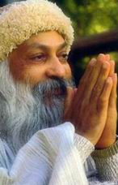**

一个人在铺一条新的水泥道，不一会他一转身，就有一群小孩跑过来，在所有正在变硬的地面上留下了脚印。一个邻居听到了他的诅咒便责备他：“ 乔奇，我以为你喜欢孩子。”

“ 我是喜欢他们的，” 他回答道：“ 但是在抽象上而不是在水泥 （in the concrete ）上。”

在抽象意义上爱人是非常容易的。而真正的问题出现在具体中。记住：除非你爱人—— 具体的、真实的人，否则，所有你对树木和鸟的爱都是假的，只是无聊而已。如果你能爱人，那么有一点将在你的意识中产生，那就是你也能爱鸟、树木和山，但那还只是后来的事，如果你不能洞察一个靠得如此近的实体，那么又怎么能够洞察如此遥远的实体呢？你又怎样与一块岩石沟通呢？那儿不存在共同语言，不是你必须变成一块岩石，就是岩石必须变成一个人，否则距离是如此之远，无法连接。

首先是与人连接。我知道爱一棵树是可能的，但那只有当你很深地、很完全地爱人，那时你才会在人的里面找到树，只有到那个时候。你才会在人们用面找到动物—— 只有到那个时候，那你才会在人的里面看见鸟—— 只有到那个时候，因为一个人已经是所有的这些东西，在他的无意识中或者在集体无意识中他仍带着这些烙印。

你曾经是一棵树一只鸟，一个动物，一块岩石，你曾经是所有的东西，你曾经是成千上万样东西，所有那些经历仍然在你里面，与外界树的联系的唯一方式就是首先与一个人里面的树相联系。

去爱人，冒险而勇敢地去爱。承受爱的痛苦和狂喜，更深地进入到人里面，很快你发现人不只是一个人，一个人是人与整个存在的总和，因为一个人是进化的终极，过去所有存在的人现在仍然在，只是一层一层地进化。

你不曾感觉到女人—— 她是一只猫吗？你不曾注视女人的眼睛。突然感到那只猫在里面吗？没有猫的话，没有女人能成为一个女人，你也将发现那是条母狗；事情也同样地发生在男人身上。你将会发现那是只狼。

人已经经过所有的存在而进化了。正如你是一个小孩，然后变成了一个年轻人，你会认为你的孩提时代完全地消失了吗？

你可能会变老，但年轻就这样简单地从你身上消火了吗？它在那儿，你已经聚集到了另外一个层次。就像去砍倒棵树，你将会发现在树里面一层又一层，层层叠叠，树龄就是这样被判断出来的，如果它是六十岁，那么就有六十层，每年都要脱掉一层皮，新的一层就产生了、如果你去凿石的话，岩石也有层次；如果你去深入到人里面，你将会发现层次，就像树和岩石一样：你越深入，你将会发现更多的奇怪的事情发生。

当作和你女人作爱时，如果你能完全地放弃你自己，你将是在和动物作爱，将是和树作爱，将是和岩石作爱，将是和存在本身作爱。

每一个单个的个人就是一个小小的世界，一个小小的宇宙包含了一切，它包含了整体。包含了大宇宙，但是你不能躲避人，你不能说“ 我会爱树，但是不爱人” 那样的话，你的树将是假的，你没有用正确的方法接近它们。首先，它们必须在人里面被爱，首先他们必须要在人里面被发现，只有如此，你才会懂得它们的语言。

## 爱是一朵非常脆弱的花 .

**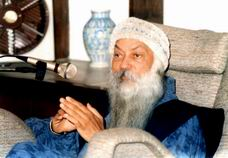**

*奥修，为什么我们如此不会爱？*

每个小孩生来就有一个人所具有的爱，甚至超过一个人所拥有的爱，所充溢着的爱，一个孩子出生就是爱，一个小孩就是用被称为爱的材料做成的．但是父母却不能给予爱，他们有他们自己的遗传—— 他们的父母从来没有爱过他们，父母只能装假，他们能够谈论爱，他们会说‘ 我们非常爱你。” 但是他们所做的一切都是非常不爱的，他们的行为方式，他们对待孩子的方式是非常侮辱的，没有尊重，父母没有尊重孩子，谁曾想过要尊重一个小孩呢？一个小孩根本就没有被人认为是一个人，一个小孩被从为是一个问题、如果他保持安静，那么他就是好的；如果他不是一个吵闹的人、一个原始治疗家，那就是好的；如果他不麻烦地父母，那么更好，那就是一个孩子应该成为的样子。

但是那儿没有尊重，没有爱。父母不知道爱是什么，母亲没有爱丈夫，丈夫也没有爱妻子，爱并不存在。控制、占有、嫉妒，以及所有各种各样的毒素在摧毁着爱。

爱是一朵非常脆弱的花，爱必须受保护，它必须受强化，它必须被浇灌，唯有如此它才能变得强健。孩子的爱是非常脆弱的。这是自然的，因为孩子就是脆弱的，他的身体是脆弱的、你认为孩子自己会有能力生存？只要想想人是多么无助，如果让孩子自己独立，他几乎不可能生存，他将会死。那就是爱的情形，爱被冷落，父母不能爱，他们不懂得爱是什么，他们从不流露爱，记住你们自己的父母，记住：我不是说他们要负责，他们是受害者，就和你们一样是受害者，他们自己的父母也是一样，就这样类推— 一你能够推到亚当、夏娃和天父。

这看起来甚至天父也未对亚当与夏娃非常尊敬，没有足够的尊敬，那就是为什么从最初他就开始命令他们“ 做这个” ，“ 不要做那个” 、于是他就开始了做所有父母做的一切无聊的事，“ 不要吃这棵树上的水果” ，当亚当吃了那水果，天父便显出如此生气，他将亚当和夏娃逐出了乐园。那个驱逐行动始终在那儿了，每个父母威胁要驱逐小孩，要将他扔出去，“ 如果你不听话，如果你行为不检点，你将被扔出去。”

很自然，一个小孩子便会害怕，扔出去！扔到这生命的荒野中！他便开始妥协，小孩子逐渐变成了一个扭曲的人，他开始控制了。他不想笑，但是如果母亲来了，他想喝牛奶，他就笑，这就是政治，是政治手腕的起点，是政治手腕的 ABC 、在内心深处，他开始憎恨，因为他没有受到尊重在内心深处，他开始感到挫折，因为原本的他没有被爱。他被期望着去做某事，只有那样做他才会被爱，爱有某些条件，原本的他是没有价值的，首先他必须变得有价值，那样父母的爱才会有可能。这样他开始变得有价值，开始变得虚假，他失去了他内在的价值，他对自己的尊敬也逐渐地失去了，他开始感到他是没有价值的。在孩子的头脑中会颁繁地出现这样的想法：“ 这是我真正的父母吗？我可能是被他们领养的？可能他们在欺骗我，因为看上去没有爱。” 并且他无数次看见他们眼中的愤怒，在他们父母脸上丑陋的愤怒、父母常为很小的事情愤怒，以至于他无法看清事情的轻重比率。只为了很小的事情，他看见父母狂怒，他不能相信。这是如此不公正和不公平，但是他不得不降服，不得不屈从，不得不作为一种必须来接受、渐渐地，他的爱的能力被扼杀了。

爱，只有在爱的环境中才能成长，爱需要一个爱的环境，那是要记住的最基本的事情。只有在爱的环境中爱才会成长、它需要四周有同样的脉动，如果母亲在爱，如果父亲在爱。不仅仅只是爱孩子，如果他们也相爱，如果家里有一个爱的氛围，爱在流动，小孩子会开始成为有爱心的人，他将不会问；“ 爱是什么” ，他会从一开始就知道爱，爱会成为他的基础。

但是那并没有发生，这是很不幸的，甚至它至今还没有发生。而你学会了你父母的方式；他们的不断挑剔，他们的争执、只要继续观察你自己，如果你是一个女入，观察一下，你或许在重复，几乎确实在重复作母亲过去的行为、当你和你的男朋友或你的丈夫在一起时。观察一下。你正在做什么？你没有重复你母亲的行为吗？如果你是一个男人，观察一下，你正在做什么？你不是和你的父亲一样吗？你不是在做他过去所做的同样无聊的事吗？在某一天你也曾惊讶过：“ 父亲怎么会做这样的事？” 而你也正在做同样的事，人们继续在重复着，人是模仿者，人是猴子，你正在重复着你父亲或你母亲的那些必须被抛弃的行为。只有那样你才会懂得爱是什么，否则你将会继续腐败。

我不能解释爱是什么，因为爱是没有定义的，它像生、像死、像神、像静心一样，是无法定义的，它是无法定义的东西之一，我不能定义它。

第一步就是摆脱你的父母，但如此并不是意味着我对你的父母有任何的不尊敬，不，我是最不可能这样说的，我的意思不是要摆脱你肉体上的父母。我的意思是摆脱你里面的父母的声音，你里面的模式。你里面的录音带，抹掉它们…… 如果你从你里面的存在中摆脱你的父母，那么你将会感到惊奇你变得自由，你将会第一次能够感到对你父母的慈悲。否则，你将会继续怨恨他们，每个人都怨恨他的父母。当他们做了那么多伤害你的事后，你又怎么能不怨恨他们呢？尽管这么做是不自觉的、他们希望你一切都好，他们为你的幸福愿做任何事情，但是他们能做什么呢？单单愿望是无济于事的，单单好的期望，也是无济于事的。他们是善良的希望者，那是真的，那是毋庸置疑的，每个父母都想让孩子拥有生活中所有的快乐，但他又能做什么呢？他本身不懂得任何快乐，他是一个机器人，自觉或不自觉地，有意或无意地，他都将创造出一种让孩子迟早会变成一个机器人的气氛。如果你想成为一个人而不是一部机器的话，摆脱你的父母。

你必须观察。这是艰难的工作，费劲的工作。你不能立即做到，你必须在你的行为中非常小心，观察着，当你的母亲在那儿并影响着你时，制止它，远离它，去做一些你母亲无法想象到的完全新意的事情。

比如。你的男朋友正带着非常赏识的眼光去看另外的一些女人时，这时观察一下你正在做什么，是否你同样在做当你父亲用欣赏的眼光看着另一个女儿时你母亲所做过的事？如果你那样做了，那么你将不会懂得爱是什么、你只是在重复着一个故事，它将只是同一个角鱼由不同的演员来扮演，那就是全部：同样的腐烂了的角色一而再再而三地被重复、不要做一个模仿者，摆脱它，做些新的事情，做些你母亲无法想象的事，做些你父亲无法想象的事。

这种新鲜的东西必须被带入到你的存在中去，那么你的爱开始流动。这样首先最基本的就是摆脱你的父母，其次最基本的是— 一人们以为只是当他们发现了一个有价值的人，他们才能够爱，胡说！你将永远不会找到一个那样的人，人们以为只要当他们找到一个完美的男人或一个完美的女人，他们才会爱，胡说！你将永远找不到他们、因为完美的女人和完美的男人是不存在的，如果他们存在的话，他们也不会在意你的爱，他们将不会对你的爱感兴趣。

我曾听说有一个男人，他一辈子独身，因为他在寻找一个完美的女人、当他七十岁的时候，有人问他“ 你一直在到处旅行，从喀布尔到加德满都，从加德满都到果阿，从果阿到普那。你始终在寻找，难道你没能找到一个完美的女人吗？甚至连一个也没找到？”

那老人变得非常悲伤，他说：“ 是的，有一次我碰到了一个，有一次我碰到了一个完美的女人” 那个发问者说“ 那么发生了什么？为什么你们不结婚呢？’ 他变得非常非常伤心，他说“ 怎么办呢？她正在寻找一个完美的男人。”

爱的流动和成长不需要完美，爱和另外一个人没有关系，一个有爱心的人只是去爱，就象一个活着的人要呼吸、喝水、吃饭和睡觉似的，完全像一个活着的人一样，一个有爱心的人就是要爱，你不会说；“ 除非那是完美的空气，没有被污染过的，否则我将不呼吸、” 既使你在洛杉矶你还是要不停地呼吸，在孟买你也要继续不停地呼吸，无论你在哪望，那里空气污染，有毒，你都要不停地呼吸，不停地呼吸，你不会因为空气不清纯你就不呼吸。如果你饿了，你就要吃点什么东西—— 一无论它是什么。在沙漠中，如果你快渴死了，你会去喝任何东西，你不会要求喝可口可乐，任何东西都好，任何饮料。只要是水，甚至是脏水。

一个活着的人就会爱，爱是一个人的自然功能。

所以，第二讲要记住的事；不要要求完美，否则你将不会发现有任何爱在你内心流动，相反。你将变得非常没有爱心，那些要求完美的人是非常没有爱心的人，是神经过敏的人，即使他们能够找到一个爱人或一个情人，他们也要求完美，那么爱也会因为那个要求而被摧毁。

一旦一个男人爱上一个女人或者一个女人爱上一个男人要求马上介入，女入开始要求那个男人应该完美，只是因为他爱她，好像他犯了什么罪！现在他必须是完美的，现在他必须突然地抛弃他的缺点，只是因为这个女人，现在他不可能是人，他不是必须变成超人，就是必须变成虚伪的、虚假的，一个骗子，自然地，成为超人是非常困难的，于是人们就成了骗子，他们开始伪装、演戏和要把戏，人们只是在爱的名义下耍着把戏。

记住，水远不要要求完美，你无权向任何人要求任何东西，如果某个人爱你，你要感谢，但不要要求任何东西，因为他没有义务爱你。如果某个人在爱，这是一个奇迹你会被这个奇迹所感动。

但是人们不感动，为了一些小事，他们将摧毁所有爱的可能性、他们对爱和爱的喜乐没有大多兴趣，他们对自我的其它路途更感兴趣、你要关心你的喜乐，其它任何事情都不是重要的。

爱像你呼吸一样是一个自然功能、当你爱一个人，不要开始提要求，否则你从一开始就关掉了那扇门，不要期望任何事，如果有某些事情来到你的面前，要怀着感激，如果没有什么事来临，它不需要来，它没有必要来临，你也不能期待它但是看见人们，看见他们是怎样相互视其为当然，如果你的女人为你准备了食物．你从不感谢她，我不是说你要用言辞表达谢意，而应该用你的眼睛，但你不注意，你视其为理所当然—— 那是她的工作，谁告诉过你？如果你的男人出去，去为你挣钱，你从不感谢他，你从未感到任何感激，那是男人应该做的，那是你的想法，爱怎样能成长呢？爱需要一个爱的气氛，爱需要一个感谢和感激的气氛，爱需要一个无所要求的氛围，一个无所期待的氛围，这是要记住的第二件事。

第三件事是；与其想怎样获得爱，不如开始给予、如果你给予，你便会得到，没有其它的办法、人们对如何攫取和获得更感兴趣，每个人都对获得感兴趣，没人看起来会欣赏给予，人很不情愿给予，即使他们给予，他们的给予也只是为了得到，他们好像几乎是在做生意，这是一项交易，他们总是不断地注视着，他们应得到的比给予的多—— 这才是一项好的买卖，好的生意，但是别人也同样在这么做。

爱不是一项生意，所以不要像做生意那样，否则你会错过你的生命，错过你的爱，错过其中所有美的东西。因为所有美的东西一点也不像做生意那样，生意是世界上最丑陋的事，是一个必要的罪恶。但是存在不知道生意，树木开花，它不是一项生意群星闪烁，它不是一项生意，你不必要为它付钱，也没有人从你那里要任何东西。

一只小鸟来了，停留在你的门前，唱了一首歌，它不会要你给它一张证书或别的什么东西，它唱完了歌便快乐地飞走了，不留任何踪迹，那就是爱的成长。给予，不要等待着去察  看你能攫取多少。

是的，爱会来的，爱会一千倍地到来、但它是自然地到来的，它自己会来．没有必要要它来，当你要时，它就再不会来，当你要时，你已经扼杀了它、所以给予，开始给予，开始时它比较困难，因为你的整个一生被训练成去获得而不是给予，开始你将必须与包裹住你的心的坚硬的盔甲作斗争，你的肌肉已经变硬，你的心已经成了冰，你已经变得冷淡，开始它将是困难的。但是第一步将引导你走向下一步，渐渐地爱之河开始流动。

首先摆脱你的父母，你摆脱了你的父母你就摆脱了社会，摆脱了你的父母，你也就摆脱了文明、教育、一切—— 因为你的父母是所有那些事物的代表，你变成了一个个体，你第一次不再是大多数人的一部分，你拥有～个真实的独立存在的个体，你就是你自己，这就是成长，这就是一个成人应该成为的样子、一个成年人是一个不需要父母的人，一个成年人是能够在单独中享受快乐的人，他的单独是一首歌，是一个庆祝，一个成年人是一个能独自享受快乐的人，他的单独不是孤单，他的独处不是孤寂，它是静心。他是完全不受父母的影响，而这美丽就是只有这样的人才能对地的父母深怀感激。

相反的是也只有这样的人能原谅他的父母，他对他们感到慈悲和爱，他对他们有极深的感受，因为他们以同样的万式在受苦，他不生气，没有，一点儿也没有。他也许眼里有泪，但他不会生气，而他会做一切来帮助他的父母趋向如此富足的单独，如此深入的单独。

第一件事：变成一个个体；第二件事：不要期待完美，不要请求。不要要求，爱普通人。普通人没什么错，普通人是非凡的，每一个人是如此地独特，必须要尊敬那种独特。第三件事：给予而且是无任何条件地给予。那么你便会懂得爱是什么，我无法定义它，我能给你指出爱的成长之路，我能告诉你如何种下这玫瑰树丛，如何浇灌它。如何给它养料，如何爱护它，然后有一天。出其不意地，玫瑰花开了，你的屋里充满芳香。爱就是这样产生的。

## 婚姻就是卖身

**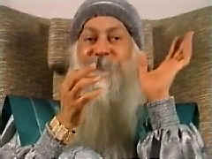**

“ 爱” 这个字是有两种完全不同的意思，不仅仅是不同，而且是完全相反，一个意思是爱作为一种关系，而另一个意思是爱是一种存在状态。

当爱变成了一种关系时，那么它就成了一种束缚，因为那有期待，有要求，有挫折，双方都努力想控制对方，爱便成了争得权利的斗争。

关系不是正确的事，至少对我的人而言，但是作为存在状态的爱则是完全不同的字，它的意思就是你正在爱，你不是通过爱刨造出～种关系，你的爱正像一朵花的芬芳，它不创造关系，它不要作变成某种方式，用某种方式去行为，用某种方式去扮演，它什么也不要求，它只是分享，在分享中也不要求有任何回报，分享本身就是回报。

当爱对你而言变成了一种存在状态时，它极其美丽，它就是某种远远超过所谓的人世的东西，它是已拥有某种神性的东西。当爱是一种状态时，你无法对它作任何事，它将放射出爱，但它不会对任何人创造出任何监禁，也不允许你被任何人所监禁。

关系就是如此，真实的或是想象的，是一种非常精巧的心理上的奴隶．不是你奴役别人，就是你变成你自己的奴隶。

另外一点要注意的就是，你自己不变成奴隶，你就无法奴役别人，奴役是一把双刃的剑，一边或许强一些，一边或许弱一些，但是在每一个关系中，你变成了看守，另一个人则成了囚犯，从他这一边而言，他是看守，而你是囚犯。这就是引起人类生活过得如此悲哀．处于如此忧伤状态的基本原因之一。

当你的爱成为你的存在状态，不是你坠入爱河，而是你就是爱，这就是你的本性。对你而言，爱只是你存在的芬芳，即使你是单独一人，你也被爱的能量所包围，即使你触摸一样没有生命的东西，像椅子。你的手也在传送着爱—— 一爱与对象无关，爱的状态是没有方向  的。

但是你要能进入到爱的状态，只有你就抛弃掉的将爱视作关系的思想方式，爱不是一种关系。两个人在一起能非常相爱，他们越是爱，任何关系的可能性也就越少，他们越是爱，在他们中间也就存在的自由越多，他们越爱，任何要求，任何控制，任何期待的可能性就越少，自然地也就不存在任何挫折的问题。

我是反对所有各种各样的关系的，比如，我不喜欢“ 友谊” （friendship ）这词，但是我爱友情（friendliness ），友情是你内在的一个品质，友谊则会成为一种关系。爱是如此的宝贵，以至于它必须受到保护，以免被各种各样东西污染、弄脏，被各种各样东西毒化。关系就是毒化了它，我要一个由许多个人组成的世界，甚至就用“ 一对” （couple ）这个词，也使我难过，你已经摧毁了两个人，而一对并不是一件美丽的事。

让这个世界就只是成为个人的，无论什么时候，当爱之花自然地开放了，为它歌唱，为它舞蹈，享受它。不要为它创造出锁链，既不要试着去奴役别人，也不允许任何人来奴役你．只是由自由的个人组成的世界，才是真正的自由世界。被需要是人的最大的需要之一 ，所以我无法想象任何爱不存在的时候、只要人类存在，爱将永远是他们最珍贵的经验，它是某种能够在尘世间获得，但却又不属于尘世的东西，它给你翅膀，就像飞鹰一般跨越太阳，没有爱，你也就没有翅膀。但是正因为它是如此的一种滋养品，如此的一种需要。

因此所有的问题也就因它而出现了，你想要你的情人或你的爱人明天对你也还有用，今天它是多么美丽，于是你便为明天而担心了，所以婚姻便进入了存在，它只是一种恐惧，担心或许明天你的情人或你的爱人会离开你，于里便在社会和法律面前订一个合约，但这是丑陋的，是极其丑陋的，令人厌恶的。

制订一个爱的合约意味着你是将法律置于爱之上，它意味着你是将集体的大众置于你的个体之上，你是在寻求，法院、军队警察、法官的支持，使你的束缚完全确定和安全。

明天早上— 一人从来不会知道，爱像一阵微风吹来，它或许会再来，它或许再也不来，之所以不再来，也正是由于法律，由于婚姻，由于社会的习俗，世界上所有的夫妇几乎都是在卖身。

和一个你不爱的女入生活，或者和一个你不爱的男人生活，为了安全而生活在起，为了可靠而生活在一起。为了经济支持生活在一起，除了爱可以为了任何理由生活在一起，这就将爱变成除了卖身以外什么都不是。

我愿这种卖身现象从这个世界上完全消失，所有的宗教都认为卖身的现象不应存在，但是人类又是多么的愚蠢，这些同样认为卖身不应存在的宗教，正是导致卖身现象出现的原因，因为在一方面，他们支持婚姻，而另一方面，他们又反对卖身。

婚姻本身就是一种卖身，如果我确信我的爱。那么为什么我要结婚呢？结婚的这种想法正是一种不信任．而正是这种不信任丝毫无助于使你的爱变得更深刻些和更高大些，它只是要摧毁你的爱。

只有当爱给予自由的时候，爱才是真实的。就让这成为判断的标准吧。只有当爱不妨碍另一个人的个人空间，爱就是真实的，它尊重他的个体性，尊重他的个人空间，但是在你周围的世界里，你所看见的恋人们，他们的所有的努力就是没有任何东西应该是私有的，所有的秘密都应告诉他们，他们害怕你的个体性，他们相互摧毁着对方的个体世，他们希望他们相互摧毁，他们的生活就将变得满意、满足他们只是变得越来越可怜、要有爱心并记住：任何真实的东西总是在变化着的，你已经被灌输了真正爱是水恒不变的这一错误观念，一朵真正的玫瑰花不会永远不变的，一个活着的人自身也会有一天不得不死去。

存在就是一种不断的变化。但是那个观念，那种思想，就是如果爱是真实的，那么它应是永恒的…… 如果有一天爱消失了，那么自然的推论就是它是不真实的。

我要你们懂得爱突然来临，它并不是因为你的任何努力，它的来临是自然给予的一件礼物，如果你担心有一天它会突然地离去，那么当它来临时，你就不要接受它，它是这样地来，也是这样地走。但那是没有必要担心的，因为如果一朵花凋谢了，另外的花将会来临，花将会永远不断地来临，但是不要执着于一朵花上，否则很快你就将执着于一朵死花上。那真实的状况是人们正执著于曾经活着的而现在已死去的爱，现在它只是一个记忆，一种痛苦，而由于社会地位，由于法律，你被粘住了。

卡尔· 马克思有这一种思想，正确的思想，那就是在共产主义社会里将没有婚姻。当俄国发生了革命，在最初的四、五年中，他们曾尝试着使爱变成一种自由，但很快他们就知道了马克思没有意识到实践的困难，马克思只是思想，而最困难的就是如果没有婚姻，家庭便会消失，而家庭是社会和国家的中坚与脊梁，如果家庭消失，那么国家也不可能长久。革命五年以后，俄国共产党改变了整个思想，婚姻再次得到支持，离婚是允许的，但非常难，他们为离婚设置了种种障碍，因此家庭单位保留下来。从此以后他们再也不提起它了—— 马克思基本观念之一就是婚姻的存在是因为私有财产的存在，所以当私有财产消失，婚姻也不得不消失。

我不希望家庭的存在，我不希望国家的存在—— 我不希望将整个世界分成很多部分，我希望整个世界是由那些自由的人组成，他们过着能够自发地爱的生活，过着宁静玩乐的生活，没有任何对快乐的谴责，没有任何对地狱的恐惧和没有任何在天堂得到回报的渴望，因为我们在此就能创造天堂。我们拥有所有的潜力来创造它，但我们并没有运用潜力，相反地，为了使尘世不会变成一个天堂，我们制造了所有的障碍。

我并不反对爱，我是相当赞成爱的，那就是我为什么要反对关系，反对婚姻。两个人或许可以一辈子生活在一起，那是可能的，没有人说你必须分离，但这种一起生活将只是出自爱。互不干涉和侵犯各自的个体性、各自的个人的心灵，那就是他的尊严。

我是将爱作为一种精神现象来谈论的，而不是生物现象、生物现象不是爱，它是色欲。生物现象是对所有的种族延续感兴趣；爱的概念只是一种生物的贿赂，当你在与一个女人或一个男人作爱以后，突然地你会发现你不再对此有兴趣了，至少二十四小时内。这由你的年龄而定，当作变老一些了，那么会是四十八小时，七十二小时……

有一个法国外籍兵团基地的新任司令，上尉带他视察所有的建筑物，视察了各处以后那个司令看了一下上尉说：“ 等一下，你没有让我看那边的那个蓝色的小房子，那是作什么用的？

上尉说：嗯，长官，你瞧，那是我们养骆驼的地方，无论什么时候，当男人感到需要个女人……’

“ 够了！” 司令官厌恶地说。

两个星期以后，司令官自己开始感到需要一个女人，他就去找那个上尉，说：“ 上尉，请告诉我、” 他压低了嗓音，偷偷摸摸地瞥了一下四周，问道；“ 骆驼是否很快就有一些空闲的时间？”

上尉说；“ 嗯，让我着一下。” 他打开了他的本子：是的，长官，骆驼明天下午两点是空闲的。”

司令官说“ 把我的名字写在本子上。”

所以第二天下午两点司令官去了那蓝色小房子。打开门，在里面地找到了他曾经见过的最可爱的骆驼地关上了门。

上尉听到了大声的咆哮和尖叫，因此他跑了过去，破门而入，他发现司令官光着身子，被骆驼的毛发和泥土所覆盖着。

“ 啊，长官对不起，’ 上尉说，“ 但是为什么不像其它所有的男人一样去做，—— 骑着骆驼到镇上去找一个女人不是更好吗？”

## 爱的真正敌人

**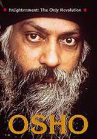**

去体验爱来代替害怕，它们是相对的两极，人们一般以为爱与恨是相反的两极，那是错的，它们不是相反的，爱和恨是相同的能量，爱与恨是一种能量，爱能变成假恨，恨能变成爱，它们是可以变换的，所以它们不是相反的，它们是互补的。

事实上，我们爱的和恨的是同一个人，它们总是在一起。它们不是敌人，他们是朋友、真正相对的是在爱与害怕之间，它们是从不在一起的，如果你变得过份地执着于害怕，那么爱便会消失，害怕不能转变成爱，爱也不能转变成害怕，它们是不可以变换的。

只有爱能使一个人富有，害怕使人残缺、麻痹。你变得越麻痹，你也就越害怕，所以这是个恶性循环、爱给你翅膀，它帮助你放松地生活，它给你勇气以各种不同的方式去体验生命，它给了你整个一生，它是多层面的，它是整个彩虹，是生命的全部，所队第一件事；丢掉害怕，吸取更多的爱，用爱来代替害怕。

第二件事；想想天空，天空的无垠；想想自由，自由的无限。不要想小东西，琐碎的事情。害怕总是想小东西，爱从不想小东西，爱是准备牺牲所有一切，爱只想广袤的事物，它是一只在风中飞翔的鹰，它要去探寻不知。

## 爱自己

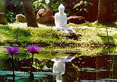

*奥修，你教导人们在想要关心别人之前先关心自己，这似乎是与这个世界上许多宗教所倡导的为人类服务的精神相反，对许多宗教而言，这必然显得是非常自私的态度，你能否就这一点谈一谈它。*

这不只是与许多宗教相反，而是与世界上所有的宗教相反，它们都倡导为他人服务。不自私，但对我而言，自私是一个自然的现象。不自私是硬加上去的。自私是你本性的一部分。除非你达到了你的自我溶入了宇宙的境界，否则你不能真正地不自私，你能假装，你将只是一个伪君子，找不希望我的人变成伪君子，所以它有一点点复杂，但它是能够理解的。

首先，自私是你的本性的一部分，你必须接受这点，如果它是你的本性的一部分，它一定是在做着最基本的事情，否则它就根本不曾存在过。因为自私。你才活着，你才关心你自己。否则人类在很久以前就已经消失。

只要想想一个不自私的小孩，生下来不自私的话，他将不能够生存，他将会死掉，因为即使呼吸也是自私的，吃东西是自私的当成千上万个人正在挨饿，而你在吃东西。当成千上万个人不健康、生病、死亡，而你却是健康的。

如果一个小孩的出生没有他的本性固有的一部分自私的话，那么他将不能生存下去、如果一条蛇靠近他。为什么需要躲避蛇呢？让它咬吧。这是你的自私保护着你，否则你会走到蛇的前面。

如果一只狮子扑到你面前，要吃掉你，那么你就被它吃掉。那是不自私，狮子饿了，你提供食物，你有资格来干涉吗？你不应该保护你自己，你不应该博斗，你只要将自己变成狮子的盘中餐，那将是不自私。

所有这些宗教都在不断地倡导不自然的事，这只是其中之一。

我教你自然，我教你变得自然，完全自然，毫不惭愧地自然。是的，我教你自私，在我之前没有人曾这样说，他们没有勇气说，而他们都是自私的！这是整个故事令人吃惊的部分。

为什么一个和尚要折磨他自己呢？那里有一个动机，他希望进入天堂，在那儿获得所有的快乐，他不是在牺牲任何东西，他只是在进行着交易，他是一个商人，他的经典上说；“ 你将得到一千倍。’ 这生命是真正地非常地渺小，七十年并不算多，如果你牺牲七十年的快乐而获得永恒的快乐，那么这是一笔好的交易，我认为这并不是不自私。

那么为什么这些宗教要教导你为人类服务呢？是什么动机呢？是什么目的呢？你将会从中得到什么呢？你或许从不曾问过这个问题，这不是服务…… 所有这些宗教谈论的服务是有某种兴趣的，那就是人类继续贫困，人们继续需要服务，有孤儿、寡妇、无人照顾的老人、乞丐。这些人是需要的，完全需要的，否则，这些人的伟大的仆人将做什么呢？所有的这些宗教该做什么呢？他们的倡导又是什么呢？人们又将如何进入神的王国呢？这些人必须被当作梯子。你是否称之为不自私的呢？传教士是不自私的吗？他拯救他人是为了他自己，在深处它仍然是自私，但目前它被一个美丽的词所掩盖着：不自私，服务。但是为什么有服务的任何需要呢？为什么要有任何需要呢？我们不能摧毁这些服务的机会吗？我们能，但是这些宗教将会非常生气，他们的整个地基将会失去—— 这是他们的整个生意，如果没有人穷，没有人挨饿。没有人受苦，没有人生病，科学能使之变成可能，今天这完全是掌握在我们自己手中的，如果这些宗教不曾阻止每个不断地贡献知识的人— 一能够摧毁服务的所有的机会，这早就已经做到了，但是这些宗教是反对所有的科学进步的，但他们会谈论服务。他们需要这些人，他们的需要并不是不自私，恰恰相反，正是极其自私，这就是动机，他们要成就一个目标。

所以我要对你说：服务是一个低级肮脏的词，永远不要用它，是的，你能够分享，但是你水远不要因为为他人服务而羞辱这个人，这是羞辱。当你为某个人服务，于是你就感觉很了不起— 一你已经把别人贬低为一条寄生虫，一个次等的人，而你却如此的优越，你牺牲了你自己的利益，你在为穷人服务其实你只是在贬低他们。

如果你拥有了某种东西，它给了你快乐、宁静、狂喜，那么分享它，记住，当你分享的时候，没有动机，我不是说分享它你将会进入天堂，我不给予你任何目的。

我要对你说，只要分享，你就会有巨大的满足，处在分享中就是满足，除此之外没有目的，它不是朝向终点，它自身就是终点。你会对与你分享的人感到感激，你不会感到他会感激你，因为你没有服务，只有这些相信以分享取代服务的人，才能摧毁所有的那些服务的机会，那些包围了整个世界的丑陋的机会。所有的宗教都在用那些机会剥削着，但他们却给了剥削以好的名声— 一在几千年里他们在给丑事冠以好的名声中已经变得非常精于此道，而当你开始给一件丑事取漂亮的名字时，你自己可能忘记了它只是一个封面，就内在而言，事实是一样的。

我们并不需要公仆、传教土和他们这一类人，我们需要更多的智慧。所以我教导自私。

首先，我希望你自己的花儿开放。是的，它看上去显得自私，我没有反对这种自私的表现，这与我没有关系。

但是当玫瑰花开的时候，它是自私的吗？当莲花开的时候，它是自私的吗？当太阳放出光芒的时候，它是自私的吗？所以你为什么要担心自私呢？

你出生了，这只是一个机会，只是一个开端，不是终点，你必须开花，不要将它耗费在任何一种愚蠢的服务上。你的第一位重要的责任就是要开花，要变得具有完全的意识、觉知和警觉，在那样的意识中你将能看清你有什么能够与人分享，怎样能解决问题。

世界上百分之九十九的问题能够被解决。或许百分之一的问题无法解决，那时你就可以与那些人分享所有你能分享的东西，但首先你必须具有能分享的东西。

所有这些宗教到现在为止还没有帮助人类解决一个问题。只要看看我所说的：他们曾解决过一个问题吗？他们做服务这项生意已经有好几百万年了。

穷人仍然是穷，而目越来越穷，病痛还在，老人还在，所有各种各样的灾难还在，所有各种各样的犯罪还在，并且，它们还在不断地增长，每年在全世界范围内的犯罪率都比上一年有增无减，奇怪— 一监狱不断地增加，法庭不断地增多—— 他们以为它们是在制止犯罪，但有了它们，犯罪仍在不断地增长。

在某些地方，有某些事情肯定是完全错了．他们所做的事与问题毫无关系，犯了罪的人并不是罪犯，他只是一个病人，他不需要被扔进监狱去受折磨，他必须被安置到一个精神病治疗医院，在那儿得到尊重和治疗的服务，这不是他的错。

我们现在拥有足够的才智能使任何一个人变成一个尊贵的人。服务并不被需要，所需要的是分享你的意识—— 你的知识、你的存在、你的尊严—— 但是首先你必须拥有它。

对我而言人类的最大的问题就是他们一点也不懂得静心，对我来讲，那是最大的问题，最大的问题不是人口，不是原子弹，不是饥饿— 一不，这些都不是基本问题，它们能很容易地凭藉科学加以解决。科学无法解决的唯一基本问题就是人们不知道怎样静心。

我对我的人说；“ 首先你要自私。完全地自私—— 开花，达到开花和芬芳，然后散播它，然后和那些不幸的人分享它，他们和你一样有着相同的潜力，只是生活没有给他们进入到内在的机会，能够尝到他们自身的神性。”

我反对所有的宗教，因为对我而言，他们所做的都是毫无用处的，但是他们用漂亮的词来“ 做” ，他们将事情隐藏在漂亮的词中。

我教你要自然。我教你要接受你的自然。我很肯定地知道一件事：那就是当你开花的时候，你要去分享，那是无法避免的，当花开的时候，是没有办法留住它的芳香的，无法将它禁闭起来，芳香会四溢，会散播到四面八方。因此首先要丰满自身，变得自在，先成为真正的你，然后在你的存在中会有芳香散发到许多地方，它不是一种服务，它将是一种纯粹的喜悦的分享，没有比分享你的喜悦更喜悦的事了。

## 爱是一种奢侈

**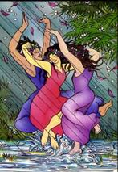**

*舆修，如果没有什么东西，没有人来认识和品尝爱，那么又会怎样呢？*

当一个人开始去爱而不是需要的时候，他便成熟了：他开始充溢、分享，他开始给予，这两者强调的是完全不同的，前者强调的是怎样获得更多，后者强调的是怎样给予，怎样给予得更多，怎样无条件地给予，这就是你成长了、成熟了。

需要怎样才是爱呢？爱是一种奢侈，它是丰富的，它使你拥有如此多的生命，而你不知道对她去做些什么，所以你就分享她，在你的心中有那么多的歌，你不得不歌唱她们—— 无论人们听还是不听都无关紧要。如果没有人听，你也会歌唱她，你还会不得不跳起你的舞蹈。

别人可能拥有她，可能错失她—— 但就你而言，她是流动的，她是充溢的。河流并不是为你而流，它们不管你是否在那儿都在流动，它们并不因为你口渴而流动，也并不为你的干涸的农田而流动，它们只是流过那儿，你可能因此而解渴，你也可能会错失— 一那是由你而定的。河流的确不是为你而流，它只是流动着，你能够用水来浇灌你的农田，这只是偶然的，你能够用水来满足你的需要，这也是偶然的。

当你不拥有爱时，你要求别人给你爱，你是一个名丐，而别人也要求你将爱给他或她，现在，两个乞丐在各自面前伸出他们的手，两者都希望对方有爱— 一自然地两者最终都将感到失败，都会感到被欺骗。

这是目前的一个似是而非的命题：那些坠入情网的人不拥有任何爱，那就是为什么他们会坠入情网，而正因为他们不拥有任何爱，他们也就不能给予。

还有一个命题，一个不成熟的人总是与另一个不成熟的人坠入情网，因为唯有他们能够懂得各自的语言，一个成熟的人会爱上一个成熟的人，一个不成熟的人会爱上一个不成熟的人。

爱的最基本的问题是首先要变得成熟，然后你将会找寻一个成熟的伴侣，而不成熟的人将一点也不会吸引你，这就好像是如果你是二十五岁，你不会与一个两岁的婴儿坠入情网，你不会的，的确就是那样、当你是一个心理上、精神上成熟的人，你不会爱上一个婴儿，这不会发生。这不可能发生，你能明白那是毫无意义的。

事实上，一个成熟的人是不会坠入爱河的，他是在爱情中升华，“ 坠入” 一词并不确切，只有不成熟的人会坠入，他们步履蹒珊，跌倒在爱中，他们企图设法支撑和站稳，他们却不能支撑住，她们无法站稳—— 他们找到一个女人，他们就倒下了，她们找到了一个男人她们就倒下了，他们随时准备倒在地上，准备爬行，他们没有支柱，没有脊梁，他们没有那种单独站立的完整性。

一个成熟的人是有单独存在的完整性的，当一个成熟的人给予爱，他所给予的爱不带有任何附带条件：他只是给予。当一个成熟的人给予爱，他会感到感激，因为你接受了他的爱，而不是相反，他并不期待你为此感谢他，不，一点也不，他甚至不需要你的感谢，他要感谢你接受了他的爱。

当两个成熟的人相爱时，生命中最伟大的反论之一便出现了，一个极其美丽的现象；他们在一起，但还是非常地独立的，他们是那样的在一起以至于他们几乎成为一体，但是他们的一体并没有摧毁他们的个体性，事实上，它增加了他们的个体性。他们变得更加个体化，两个相爱中的成熟的人相互帮助对方变得更加自由，没有权术的加入，没有外交手腕，没有努力想控制对方，你怎样能控制你所爱的人呢？

当你回到了家，当你已经了解了你是谁，然后爱就在你的存在中升起了，芬芳飘向四方，你就能将爱给予别人。若你不拥有某种东西，你怎样能给子呢？要给予，首先最基本的条件就是拥有它。

当你不拥有礼物时，你又怎样能够给子呢？你听见这个，并理解它，但是问题也会出现，因为理解是智力上的、如果你已经穿透了你的存在，如果你已经看到了它的真相，那么就没有问题会产生。

以后你将会忘记所有你依赖的关系，你开始在你自身的存在上下功夫了：清除，净化，使你的内在核心更加清醒，更加觉知，你将开始以这样的方式工作，你越是开始感觉你正在趋向某种完整性，你越会发现爱也随之在成长—— 它是一个副产品。它不需要被认同，它不需要被认识，它不需要证书，它不需要有人来品尝它。别人的认识是偶然的，这对爱而言不是主要的，爱会继续流动着、没人品尝它，没人认识它，没人感到幸福、喜悦，因为它—— 爱还是会不断地流动，正是因为在流动中你会感到非常地幸福，你会感到非常地快乐，正是在流动中…… 当你的能量正在流动着……

你坐在一间空房间里，能量正在流动着，以你的爱充满着空房间，没有人在那儿—— 墙壁不会说“ 谢谢你”—— 没有人认识它，没有人品尝它，但那毫无关系，你的能量释放着，流动着— 一体将会感到幸福，花是幸福的，当芳香散发到风中，风是否知道芳香并不是关键。我存在，我存在，无论门徒们是否在那儿—— 那是无关紧要的，我并不是依赖你们而存在，在此我整个的努力就是令你们也变得能独立于我。

我在此给你们自由，我不想用任何方式来削弱你们，我希望你们只是成为你们自己，当有一天你们独立于我，你们将能真正地爱我—— 在这一天到来之前则是不可能的。

我爱你们，我不得不这样，这不是一个我是否能爱你们的问题，我就是爱你们，如果你们不在这儿，这个礼堂将充满我的爱，它不会有任何两样，这些树将仍然会得到我的爱，这些鸟也将不断地获得它，然而即使所有的树和所有的鸟都消失了，那也不会有什么两样— 一爱将仍然会流动，爱存在着，所以爱在流动着。爱和静心具修，在我内心深处有一种对永久的爱的渴望，那是愚蠢的吗？

爱能存在于两个度量中；水平的、垂直的。我们所熟悉的爱是水平的，那也是属于时间的度量中的，垂直是属于永恒的度量的。心并不渴望永久，那是你误解了，但那几乎是所有人的误解，因为我们仅仅只知道一个平面水平的、时间的度量，在那个度量中只有两种可能性；某些事情不是暂时的就是永久的，但是那种永久也只是许多片刻组成，那也有开始和结束。永久不是永恒，它也不可能是永恒的，在时间的度量中没有什么东西能够是水恒的，在时间中产生的东西，也一定会在时间中逝去，如果有开始，那么便会有结束。

你的爱牙始了，它始于时间中的某一时刻，那么它也必定会结束，是的，它能结束得早些或者晚些，如果它很快地结束了，你就称之为暂时的，如果它过了较长的一些时间才结束，你就称之为永久的，但永久也不能满足人的心灵，因为人的心灵渴望绝对没有终点的乐西，那就是永恒的东西，这就是对神的渴望，“ 神” 是永恒的爱的另一种名称。但是头脑并不懂得永恒，心灵却渴望水恒，然而心灵正在不断地披头脑来解释，头脑只知道极短暂的爱或稍长的爱，但即使爱立生命稍长些，害怕也总是在那儿，害怕它将会结束，你的害怕是对的，它是要结束的，事实上，如果你不聪明的话，它将会更长些，如果你非常非常愚笨，非常非常不聪明，你将花很长很长的时间来理解它的全部的无意义，如果你非常地聪明，它能很快地结束，因为你将明白那里没有什么大不了的东西。

一个人越是聪明，他的爱的寿命也就越短暂—— 这个爱就如你所知的爱，那就是为什么当人类变得愈加聪明的时候，爱也愈变成一个短暂的现象。在过去，它几乎是水久的，没有离婚这类现象，在没有受教育的国家里，仍然不存在离婚这类现象，一个国家中受教育越多，文化越繁荣，人们越聪明，离婚率也就越高，几乎以同样的比率增加、理由很简单，人们能够看见他们已变得相互厌倦，没有理由继续拖下去，于是最好将它结束。

但是头脑能结束一件事情，很快地另一个幻像取而代之，一而再，再而三，头脑是一个不会学的东西，即使聪明人也是一个不会学的人，头脑已经变得如此强有力，以致于任何来自心灵的东西不通过头脑的阐释就永远无法到达你，到达你的本质。

心灵说水恒，而头脑解释成永久，那就是你错失的关键。心灵的渴望属于垂直的度量，那就是静心的度量。你并不是因为心灵的渴望才是愚蠢的，只是你误解了它。你想要的爱是来自于静心的，不是来自头脑的，那就是我不断地谈到的那个爱，那是耶稣所谈到的那个爱那爱就是神。它不是你的爱，你的爱不可能是神，你的爱只是一种头脑现象，它是生物的，生理的心理的。但它不是永恒的。

我的建议是：如果你真正地准备满足你心灵的渴望的话，那么就忘掉所有的爱，首先进入到静心状态，因为爱将来自静心的芬芳，静心是那朵花，让它释放，让它帮助你进入到垂直的领域，没有思想，没有时间，然后忽然间，你将会见到那芬芳就在那儿，那么它就是永桓的，那么它就是无条件的没有梦会是永久的，而作的爱就是一个梦，头脑只会做梦。它无法给你真实的东西。摆脱头脑，忘掉所有的爱，你对爱没有任何理解—— 你也无法对爱有任何理解，只有通过静心，它将使你改变体存在的领域，从水平的变成垂直的，从生活在过去和将来— 一为什么要这个水火呢？水久意味着试图预计出将来的状况，你希望它将来和现在一样。但是为什么呢？事实上它肯定已经不存在了，唯有这样人才会开始去考虑到永久。

当两个爱人真正地进入到幻象中时，他们不会去考虑永久，去问任何两个在度蜜月的爱人，他们不会介意，他们知道他们将永远地在一起但是当它开始从你的手中溜走的时候，头脑会说‘ 现在要抓住它，使它水久，尽一切力量使它水久，不要去看那正在出现的裂缝，别看避开它们，忘掉它们的一切一定要想个办法，继续将它们掩盖起来、’ 但是你是在要求不可能的事。

我能教你静心，来自静心，会有一个爱的不同的品质产生，它不是在那儿做蠢事，它是智慧，不是愚笨，于是你将不会陷于爱中。你将在爱中升华，那么，爱便是你的一个品质，就如光围绕着火焰，爱也围绕着你你正在爱你就是爱。于是它就获得了永恒，它是没有指向的，无论准靠近你都将从中汲取到它无论准靠近你都将被它所陶醉，被它所丰富。不管是一棵树，一块岩石，一个人，一只动物。都没有关系，即使你独自一个人坐着— 一佛陀独自一人坐在树下散括着爱。爱正不断地在他周围散发着，那就是永恒的，那是心灵真正的渴望。

## 爱和静心

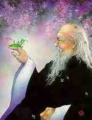

*奥修，在我内心深处有一种对永久的爱的渴望，那是愚蠢的吗？  　*

爱能存在于两个度量中；水平的，垂直的。我们所熟悉的爱是水平的，那也是属于时间的度量中的，垂直是属于永恒的度量的。

内心并不渴望永久，那是你误解了，但那几乎是所有人的误解，因为我们仅仅只知道一个平面：水平的、时间的度量，在那个度量中只有两种可能性；某些事情不是暂时的就是永久的，但是那种永久也只是许多片刻组成，那也有开始和结束。永久不是永恒，它也不可能是永恒的，在时间的度量中没有什么东西能够是永恒的，在时间中产生的东西，也一定会在时间中逝去，如果有开始，那么便会有结束。你的爱开始了，它始于时间中的某一时刻，那么它也必定会结束，是的，它能结束得早些或者晚些，如果它很快地结束了，你就称之为暂时的，如果它过了较长的一些时间才结束，你就称之为永久的，但永久也不能满足人的心灵，因为人的心灵渴望绝对没有终点的乐西，那就是永恒的东西，这就是对神的渴望，“ 神” 是永恒的爱的另一种名称。

但是头脑并不懂得永恒，心灵却渴望水恒，然而心灵正在不断地披头脑来解释，头脑只知道极短暂的爱或稍长的爱，但即使爱之生命稍长些，害怕也总是在那儿，害怕它将会结束，你的害怕是对的，它是要结束的，事实上，如果你不聪明的话，它将会更长些，如果你非常非常愚笨，非常非常不聪明，你将花很长很长的时间来理解它的全部的无意义，如果你非常地聪明，它能很快地结束，因为你将明白那里没有什么大不了的东西。

一个人越是聪明，他的爱的寿命也就越短暂—— 这个爱就如你所知的爱，那就是为什么当人类变得愈加聪明的时候，爱也愈变成一个短暂的现象。在过去，它几乎是水久的，没有离婚这类现象，在没有受教育的国家里，仍然不存在离婚这类现象，一个国家中受教育越多，文化越繁荣，人们越聪明，离婚率也就越高，几乎以同样的比率增加、理由很简单，人们能够看见他们已变得相互厌倦，没有理由继续拖下去，于是最好将它结束。

但是头脑能结束一件事情，很快地另一个幻像取而代之，一而再，再而三，头脑是一个不会学的东西，即使聪明人也是一个不会学的人，头脑已经变得如此强有力，以致于任何来自心灵的东西不通过头脑的阐释就永远无法到达你，到达你的本质。心灵说水恒，而头脑解释成永久，那就是你错失的关键。心灵的渴望属于垂直的度量，那就是静心的度量。你并不是因为心灵的渴望才是愚蠢的，只是你误解了它。你想要的爱是来自于静心的，不是来自头脑的，那就是我不断地谈到的那个爱，那是耶稣所谈到的那个爱，那爱就是神。它不是你的爱，你的爱不可能是神，你的爱只是一种头脑现象，它是生物的，生理的心理的。但它不是永恒的。

我的建议是：如果你真正地准备满足你心灵的渴望的话，那么就忘掉所有的爱，首先进入到静心状态，因为爱将是来自静心的芬芳，静心是那朵花，让它释放，让它帮助你进入到垂直的领域，没有思想，没有时间，然后忽然间，你将会见到那芬芳就在那儿，那么它就是永桓的，那么它就是无条件的没有梦会是永久的，而你的爱就是一个梦，头脑只会做梦。它无法给你真实的东西。

摆脱头脑，忘掉所有的爱，你对爱没有任何理解—— 你也无法对爱有任何理解，只有通过静心，它将使你改变你存在的领域，从水平的变成垂直的，从生活在过去和将来…… 为什么要这个永久呢？永久意味着试图预计出将来的状况，你希望它将来和现在一样。但是为什么呢？事实上它肯定已经不存在了，唯有这样人才会开始去考虑到永久。

当两个爱人真正地进入到幻象中时，他们不会去考虑永久，去问任何两个在度蜜月的爱人，他们不会介意，他们知道他们将永远地在一起。

但是当它开始从你的手中溜走的时候，头脑会说“ 现在要抓住它，使它永久，尽一切力量使它永久，不要去看那正在出现的裂缝，别看，避开它们，忘掉它们的一切，一定要想个办法，继续将它们掩盖起来。” 但是你是在要求不可能的事。

我能教你静心，来自静心，会有一个爱的不同的品质产生，它不是在那儿做蠢事，它是智慧，不是愚笨，于是你将不会陷于爱中。你将在爱中升华，那么，爱便是你的一个品质，就如光围绕着火焰，爱也围绕着你，你正在爱，你就是爱。于是它就获得了永恒，它是没有指向的，无论谁靠近你都将从中汲取到它，无论谁靠近你都将被它所陶醉，被它所丰富。不管是一棵树，一块岩石，一个人，一只动物。都没有关系，即使你独自一个人坐着— 一佛陀独自一人坐在树下散播着爱。爱正不断地在他周围散发着，那就是永恒的，那是心灵真正的渴望。

# 欢   笑

 “ 对我而言，幽默感应该成为人类未来宗教性的基石。”

        — 一奥修

一个漂亮的纽约职业妇女嫁给了一个名叫斯坦苏诺的英俊年轻的意大利农民，她对他的杜会礼仪不太满意，于是便马上开始要去改进他。

整个婚礼的接待过程，她都在不停地修正他的错误，告诉他说些什么，在桌上要用哪把刀，以及怎样传递奶油，最终，仪式结束了，他们终于到了床上。

斯坦芬诺在被单上烦躁不安，无法确定自己，但是最后他转向他的新婚的妻子，结结巴巴地说：

“ 能不能请你把你的私处送过来？”

## 你不会看见驴子在笑

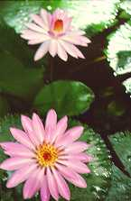

你不会看见驴子在笑，你不会看见水牛在欣赏笑话，只有人才能欣赏笑话，只有人才会笑。你们的那些圣人就像水牛和驴子！他们已经落到人类之下了，他们已经丧失了某种有着很大价值的东西，一个没有欢笑的人就好像是一棵没有花的树。但是社会需要严肃的人，总统、总理、校长、教授、主教、印度教领袖、回教领袖、祭司。所有各种教士、教师、县官、税收官、省长…… 每个人必须是严肃的，如果他们有幽默感，那么社会便会担心效率将会丧失，如果他们有幽默感他们将会变得有人性，他们被期待成就像机器人一样。

阿道夫· 希特勒的走路方式就是机械化的，只要看看他的照片— 一他站的方式，他走路的方式，他答礼的方式，他敬礼的方式，看起来几乎是机械化的，就好像他不是一个人而是一个机器人，他的脸、他的姿势，所有的都像机器人，他使整个德国都像机器人。他摧毁德国要比他摧毁其他更甚，但是他创造了一个非常有效率的军队，只有当人丧失厂所有的智慧和所有智慧所包含的东西，那么有效率的军队才是有可能的。

幽默感是智慧中最基本的因素之一。当你失去了它的时候，你也丧失了智慧，你越幽默，你也就越聪明。

不存在怎样触发幽默感的问题，你只要扫除那些障碍，它已经在那儿了，它已经是那么回事了，你只要搬掉那些你父母、你的社会用来防止幽默感的石头，社会教导你要自我控制，而幽默感则意味着放松…… 你不能在你的长辈面前笑，你不能在你的老师面前笑，你不能在你的教土面前笑；你不能在教堂里面笑。

基督徒说耶稣是从来不笑的。我不能够相信，他不是一头水牛！他是曾在这个世界上走过的最伟大、最智慧的人之一，他肯定笑过，他肯定享受过笑，他是一个远比佛陀更属于这个世界的人。他比任何所谓已成道的人生活得更加热情、更加强烈。他爱与女人作伴，他有漂亮的女门徒，甚至是当时最有名的妓女，玛丽· 玛格坦丽。他爱吃，他爱喝，他是唯一爱喝酒的成道的人，一个真正的人！他非常喜欢宴会，每天晚上都有一个宴会，并且宴会会持续好几个小时。

耶稣是一个现世的人。他重复过很多次。他说“ 我是人的儿子” 比说“ 我是神的儿子” 的次数更多，他接近尘世比接近天堂更近，他是一个非常现世的人，他肯定笑过，享受过。

但是那些教土、教皇和教会是非常严肃的，进入教堂就好像进入墓地一样，你不得不严肃，不得不紧张。所有的那些都必须被抛弃掉。

在伦敦，阿什克罗夫女士决定举办一个豪华的宴会，她雇用了一位新近刚刚移民到英国的斯凯比莎小姐作女仆。

“ 别忘了准备糖果夹子，’ 英国管家命令道。“ 当男人们走进洗手间，他们将他们自己拿出来又放回去，这不太好，然后他们不得不用他们的手来放糖块。”

“ 是，女士” 意大利姑娘回答道。

那晚待宾客们都走了以后，阿什克罗夫女士说“ 斯凯比莎小姐，我想我曾告诉过你关于那把糖果夹子的事！”

“ 我将它们拿出来了女士，我发誓！”

“ 我没看见它们在桌上！”

“ 在桌上？我将它们放在了洗手间！”

布瑞姆比拉给了他儿子阿尔多两百美元作为结婚礼物，两个星期以后他问他儿子“ 你怎样花那些钱？”

“ 我买了一块手表，爸爸。” 那男孩回答。

“ 笨蛋！他父亲吼道，“ 你应该买一支来福枪”

“ 一支来福枪？为什么？”

“ 假定某一天你回到家，发现一个男人在和你的妻子睡觉，”

父亲解释道，“ 你将会做什么呢？叫醒地并告诉他现在几点了吗？”

## 生命是一个宇宙的笑话

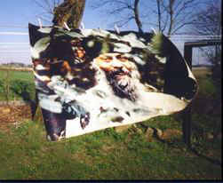

整个生命是一个伟大的宇宙笑话，它不是一个严肃的现象—— 严肃地对待它，那么你就将继续错失它，只有通过欢笑才能理解它。

你不曾观察过人是唯一会笑的动物吗？亚里斯多德说过，人是理性的动物那或许并不是真的。因为蚂蚁是非常理性的，蜜蜂是非常理性的，事实上，与蚂蚁相比，人看起来几乎是非理性的，计算机是非常理性的，与计算机相比，人是极其非理性的。

我对人的定义就是人是会笑的动物。计算机不会笑，蚂蚁不会笑，蜜蜂不会笑，只有人会笑、那是成长的最高点，通过笑你将达到神—— 因为只有通过你内心的最高处，你才能到达终极，欢笑必须成为桥梁。

## 笑   佛

笑是宗教的真正本质，严肃从来不是宗教的，也不可能是宗教的。严肃是属于自我的，是病态的一部分，笑是没有自我的。

的确，当你笑时与一个有宗教感的人的笑是不一样的，区别就是你总是笑别人，有宗教感的人笑他自己或者是笑人的存在的整个的荒谬。

宗教只能是生命的庆祝，不可能是其它任何东西。

严肃的人变得残废；他自己创造了障碍物，他不能跳舞，他不能唱，他不能庆祝，那种庆祝的空间从他的生活中消失了，他变成就像沙漠一样。如果你是沙漠，你能继续想象和假装你是具有宗教性的，但是你不是。

你或许是一个教派的人，但并不是宗教性的；你可能是一个基督徒，一个印度教徒，一个佛教徒，一个耆那教徒，一个回教徒，但你不可能是具有宗教性的，你相信某种东西，但你不知道任何东西，你相信理论，一个人背着过重的理论负担就变得严肃了，一个没有负担的人，没有理论的负担压在他的本性上，他就会开始笑。

存在的整个戏剧是如此的美丽，以至于笑可能是对它的唯一的回答，笑可能是唯一真正的祈祷和感化。

在日本，有一个伟大的神秘家，名叫布袋和尚，被人称为笑佛，他是日本最受人爱戴的神秘家之一，他从不说一句话。当他成道的时候，他就开始笑，无论什么时候当有人问他“ 你为什么笑？” 他会笑得更厉害，他从一个村落笑到另一个村落。

一群人聚集在一起看他笑，渐渐地，他的笑变得非常有传染性— 一人群中的一些人开始笑了，接着另外一些人也开始笑了，接着整个人群都在笑，笑是因为…… 他们为什么笑？

每个人都知道：“ 这是荒谬的，这个人真奇怪，但是我们为什么笑呢？” 但是每个人都在笑，每个人都有点担心：“ 人们将会怎样想？那是没有理由笑的。” 然后人们会等待布袋和尚，因为在他们的整个生命中从未笑得那样尽兴，笑得那样强烈，当他们笑过以后，他们发现他们的每个感觉都变得更加清晰，他们眼睛看得更清，他们的整个存在好像如释重负，变得轻松了。

人们会要求布袋和尚；“ 再回来” ，他要走，笑着到另外一个村落。他的整个一生，成道后几乎四十五年的生涯，他只做了一件事，那就是笑，那就是他的信息，他的信条，他的经典。

值得注意的是，在日本没有谁像布袋和尚那样被人在记忆中如此地尊敬，你将会在每一间屋子里看到布袋的塑像，他除了笑不曾做过任何事，但是就是这个发自内心的如此深刻的笑，驻留在每个听见笑声的人的心中，扣动了他的本性，创造出了一种共鸣。

布袋是独一无二的，在整个世界上，没有另外一个人能使那么多的人发出没有任何理由的笑，然而，每个人都被笑所滋养，每个人都被笑所净化，感受到他从未感受过的幸福。某种来自不可知的深处的东西，开始在人们的心中鸣响出音乐。

这个布袋和尚是非常有意义的，在这个尘世中很少有人像布袋和尚那样走过，这是不幸的，更多的人应该像布袋和尚那样，更多的寺庙应该充满欢笑、舞蹈、歌唱，如果严肃消失，那么没有什么会丢失—— 事实上、人会变得更加健康和完整。但是如果笑消失了，那么一切都将消失了，突然地你就丧失了你存在的欢乐，你变得没有色彩、单调，在某种程度上你已经死了，你的能量不再流动了。

但是要理解布袋和尚是困难的，要理解他，你必须要在那个欢乐的层面来理解，如果你背上过多的理论、概念、观念、思想方式、神学、哲学的重担，那么你将不能懂得这个布袋是什么人，他的意义是什么—— 因为他会看着你，他会笑。

他会笑，因为他不能相信一个人会是如此的愚蠢和如此的荒谬，就好像一个人只是企图靠着烹任书来生活，却忘记了做饭，他只是不顾研究书中的食物和怎样准备它们或怎样不准备他们，以及从这个方向或那个方向争论—— 而他在这所有时间里一直饿着，一直都快饿死了，完全地忘记了人是不能靠书生活的、那就是经常所发生的：人们已经完全忘记宗教必须要被体验（be lived ），必须被消化，必须要在你血液里流通，变成你的骨头，变成你的骨髓，你不能只是思考它，思想是你的存在的最肤浅的部分，你必须吸收它！

但是无论什么时候一个真理诞生，一束光的出现，突然地学者们就聚集在一起，知识分子、教授、哲学家、理论家，他们都跳到真理之上，他们压碎了它，他们将它变成僵死的理论和经典，那个活的东西就变成了纸上谈兵的事，真正的玫瑰便消逝了。

我曾经呆在一个基督促朋友的家里，我开始研究他的《圣经》：那里有一朵玫瑰，一定是他将它放在圣经里，很多年了—— 干枯了，死了，被圣经的纸页夹碎了，我开始笑了，他从洗浴间跑出来，他说；“ 为什么，你为什么笑？发生了什么？”

我说“ 发生在真理上的情形同样发生在这朵玫瑰上，夹在你的书页里，那玫瑰已经死了，现在只是某一天它曾活过的某种东西的一种记忆，只是一个记忆，所有的芳香已逝，所有的活力殆尽，它正是与塑料花或纸花一样是死的，它拥有历史，却没有未来，它有过去，却没有新的可能性，发生在真理上的也是同样的；它在经典的书页中已经死了。”

当真理发生的时候，它是非语言的，它是沉默的，它是如此深奥，它无法通过语言来表达，然而人们迟早都会将它变成语言，并将它系统化，也正是在它们的系统化的过程中，它被杀死了。

布袋和尚过着与一般增人完全不一样的生活，他的一生除了不停地笑什么也不做，据说布袋和尚有时甚至在睡觉的时候也在笑，他有一个大肚子，并且那肚子会颤抖，人们会问他“ 你为什么笑？甚至在睡觉的时候！” 笑对他而言是那么自然，以至于任何事情，每件事情都有助于他笑，于是整个生命无论醒着或沉睡着都是一出喜剧。

你将人生变成了一出悲剧，你将你的生命变成了一堆悲伤的事，即使当你笑的时候，你也没有笑，即使当你假装笑，那种笑也只是被迫的，被操作的，被设计的，它不是来自心灵的，也根本不是来自肚子，它不是来自于你中心的某种东西，它只是某种涂在表面的东西，你笑是为了某种与笑没有关系的理由而笑的。

我曾听说过……

在一个很小的办公室里，老板正在讲他曾经讲了好几遍已经陈腐不堪的某件趣事，办公室里每个人都在笑—— 人们不得不笑！他们已经对此厌烦透了，但是老板总归是老板，当老板讲笑话时，你就必须笑，这是工作的一部分，只有一个女打字员没有笑，她坐得直直的，很严肃，老板问“ 你怎么了？为什么你不笑呢？”

她说：“ 我这个月就要离开了。”—— 那就没有必要再为了老板而笑了。

人们有他们自己的理由，即使笑也好像在做生意，即使笑也是经济的、政治的，即使笑也不只是笑，所有的纯洁性丧失了，你甚至不能单纯地笑，简单地笑，像孩子那样笑，如果你不能单纯地笑的话，那么你便正在丧失你的童贞，你的纯洁，你的天真。

观察一下小孩子，看看他的笑—— 如此深奥，它来自他的核心。当一个孩子出生，他学会的第一个社交活动—— 或者说“ 学会” 可能是不对的，因为这可能是与生俱来的—— 就是笑，这是第一个社交活动，凭着笑，他成了社会的一部分，这看上去是非常自然的、自发的，另外的一些事也随后到来—— 当他笑时那就是他在这个世界上的生命本质的第一个火花，当一个母亲看见他的孩子的笑，她会感到巨大的幸福—— 因为那个笑显示了健康，那个笑显示了智慧，那个笑显示了那孩子不是个傻瓜，智能没有迟钝，那个笑显示了那孩子将继续活着，会快乐，母亲就会很兴奋。

笑是第一个社交活动，并已是应该一直保持的最基本的社交活动。人应该在他的整个生命过程里继续笑，如果你能在所有的场合下都能笑的话，那么你将会变得有相当的能力来对付它们，并且那些遭遇将带给你成熟。

我不是说不哭泣，事实上，如果你不能笑的话，你也就不能哭，它们总是在一起，它们是人的真实的和原本的存在的同一现象的两个方面。

有成千上万的人已将眼泪哭干，他们的眼睛失去了光泽和深度，他们的眼睛已经失水了，因为他们不能够哭泣，他们不能哭喊，眼泪不能够自然地流。” 如果笑受到损害的话，那么眼泪也会受到损害。一个人只有笑得好时才能哭得好，假如你能哭笑自如，那么你便是活生生的。

死人不能笑也不能哭。死人却能很严肃。看看：去看着一具死尸— 一死人所表现的严肃比你更加成熟，只有一个活人才能笑、哭、泣。这些就是你内在本质的情绪，这些就是丰富的气质。但是，渐渐地，每个人都忘记了，那种在开始是自然的变成了不自然的了，你需要有人刺激你才笑，有人搔痒你才笑—— 只有那时你才笑，那就是为什么在这个世界上会有如此多的笑话。

你或许不曾观察到，在这个世界上，犹太人拥有最好的笑话，原因就是他们生活在比其他任何种族更深的痛苦中，因此他们不得不创造笑话，否则他们早已经死了，他们经历了如此多的痛苦，他们几个世纪倍受伤害，他们受压迫、遭暗杀—— 他们不得不创造出一种荒诞可笑的感觉，那是一个拯救的策略，所以，他们拥有最优美、显滑稽、最深刻的笑话。

我想告诉你们的就是这个，我们笑只是在有了某种理由来迫使我们笑的时候才笑，听到了笑话，你才笑—— 因为笑话引起了你某种兴奋，笑话的格个结构是：故事向着一个方向发展，突然它转了一个向，这个转向是如此突然，如此激烈，以至于你意想不到，兴奋在增长，你在等待着结尾，然而突然间，无论你期待什么都不会发生。而是某种完全不同的东西，某种非常荒诞可笑的东西出现了，从来不会满足你的期望。

笑话是从来没有逻辑的，如果笑话有逻辑的话，那么它便失去了笑的所有的感觉，笑的所有的品质，因为这样你就能预测了，到时笑话被讲出来后，你就已经知道结果，因为它将被推论出结果，它将只是一种算术，但那便没有任何可笑了。笑话拐了急转弯，如此之急，你几乎不可能想象它，推断它，它需要一次跳动，一个逾越，一个量的突变—— 那就是为什么它释放了如此多的笑素，这是以一个微妙的心理方式来搔你的痒。

我必须讲笑话，因为我担心你们都是宗教的人，你们倾向于严肃，我必须搔你们的痒，有时好让你们忘掉你们的宗教性，忘掉所有你们的哲学、理论、体系，于是你们便可回到地面，我必须带着你们一次又一次回到地面，否则你们将变得倾向于严肃、越来越严肃。严肃是一种类似癌症的扩散。

你们可以向布袋和尚学习很多东西。笑会带来力量，现在即使医药科学也承认，实是自然提供给人类的最基本的药物之一，如果当你病了的时候，你能笑的话，那么你便会很快恢复健康，如果你不能笑的话，即使你是健康的，迟早你也会丧失你的健康，你将会生病。

笑能从你的内心源泉中引出一些能量到你的表面，能量开始流动，就像一个影子一样跟在笑后面，你是否曾注意过它？当你真正笑的时候，在那个片刻，你处在深深的静心状态，思想停止了，笑和思想同时出现是不可能的，它们是全然相反的：要么你笑，要么你想。如果你真正地笑了，那么思想就停止了，如果你仍然在思想，那么笑也只不过如此，它便会拖拖拉拉，落在了后面，这将是一个残缺不全的笑。

当你真正笑的时候，突然间，思想消失了。整个禅的方式就是如何进入无念（no －mind ）。笑就是进人无言的最美妙的门径之一。

就我所知，舞蹈、欢笑是最好、最自然的、最易进入的门。如果你真正地舞蹈，思想就停止了，你就一直继续舞蹈，你继续旋转、旋转，然后你变成了一个漩涡，所有的界线，所有的分界都消失了，你甚至不知道你身处何方，以及何处是结束，何处是开始，你融化在存在之中，存在也融化在你之中，边界会重复，如果你真正地舞蹈，不是控制它，而是让它来控制你，让它来占有你，如果你被舞蹈所占有，思想就停止了，而与此同时笑就发生了。如果你被笑所占有，思想也就停止了。如果你了解了那些没有思想状态的片刻，那些时刻将会令你越来越想进入，你只会变得越来越属于那个样子，越来越拥有那种品质，越来越进入没有思想的状态，越来越多的思想不得不抛弃。

笑可能是达到无思想状态的一个美丽的向导。据说那个布袋和尚不想称他自己为禅师，或者要一群门徒聚集在他的身边，相反他总是走街串巷，背上背着一个布袋，里面装满了糖果、水果和油炸圈饼，他用这些来给围在他身边玩耍的小孩。

有时这些小孩是真的小孩，有时这些小孩是年轻人，有时这些小孩是老人，所以不要被" 小孩” 一词所局限，其实老人，比布袋和尚本身还要年纪大的人，他们对布袋和尚而言同样也是小孩，事实上，要与布袋和尚接触，你必须是一个孩子，必须是天真的，他会发一些东西给你，玩具、糖果、甜食，他常常是以象征的方式来说出某些事情：那个宗教的人带给你这个信息，不要过于在意生活，它只是一个玩具；不要太在意生活，它只是一块甜食，只是品尝它，但不要被它所困扰，其中没有什么营养，其中没有什么真理，你不能靠它生活。

你曾经听过耶稣的话：一个人不能只靠面包过活，一个人能只靠甜食过活吗？最起码面包里面还有一些营养，甜食里面就没有，吃起来味道好，但是长久下去就可能会有害。不管小孩和老人，他都始终像待孩子一样待他们，他会发给他们玩具，有其非常的指示作用，你不可能找到一个更好的方式来说明，世界只是一种玩具似的东西，你所认为的“ 生活” 的生活不是真的，它只是一个假象、一个梦幻，是短暂的，不要大执着于它。

如果你是一个静心的人，那么你给予，你分享—— 你不要贮藏。你不要吝啬，你不要占有，你怎样能占有这个世界呢？世界存在的时候，你还不存在呢，你将在某一天会不再存在，而世界会继续存在下去、你怎样能占有呢？你怎样能声称“ 我是所有者” 呢？你怎样能拥有一切呢？如果你是静心的，那么你的整个生命将变成一种分享，你将给子任何你能给予的—— 你的爱，你的觉悟，你的慈悲—— 你将给予任何你能给予的—— 你的能量、身体、思想、灵魂—— 无论什么，并享受它。没有比分享更大的享受了。你是否曾经将什么东西给予某些人吗？那就是为什么人们会那么喜欢给予礼物。这是一种纯然的喜悦，当你将其样东西给予某人时，或许它是没有价值的，或许是价值不高，但是那只是一种方式，只是一种姿态，它能给予你巨大的满足。只要想想，一个人他的整个生命就是一件礼物！他的每一刻就是一个分享，他是生活在天堂里，没有任何其它天堂能超过那种情形了。那就是布袋和尚的整个的旨意：分享！给予！其它还有什么能够说？还有什么能够教呢？

禅相信真理不能够被语言所表述，但能够被姿势、行为所表示，有关某件事能够去做，但你无法说出它来，然而却能显示出它。

不要执著，但就是在此地—— 因为没有其它的地方可以存在，这是唯一的世界—— 没有另外一个世界，所以你们坐在寺庙里、修道院或是在喜玛拉雅山山洞里的僧侣们只是逃避主义者！

只是放弃！但没有必要逃避或放弃，你仍然在此存在着，要在这个世界上但不要属于这个世界，留在人群中，并保持单独，做一千零一件事，做所有需要做的，但永远不要成为做者，始终无为，不要堆积自我—— 就是这样。

存在于世俗中并没什么不对，要世俗化，但仍然保持脱俗，那就是非常艺术的，生活是在两个相反的两极中的艺术，是生活在这相反两极中求得平衡的艺术，这是一条非常狭窄的道路，就像剃刀边缘，但这是一条唯一的路。如果你失去了这个平衡，那么你就错失了真理。

就驻留在此时此地的这个世界，继续走你的路，继续在你的本性中拥有深深的欢笑，欢舞着奔向神！歌唱着走向种！

## 唯一的爱与欢笑的游唱诗人

*奥修，在这个受着恨和敌视、悲哀和忧伤所控制的世界里，你看上去就是唯一的爱和欢笑的游唱诗人，这不是令人欢欣吗？*

是的。它是令人欢欣的，但必须要始于某个人。

我们希望世界上少一些严肃，多些敏感，当然是虔诚的，而再也不要严肃。我们想要世界懂得，幽默感是一个宗教的人的最基本的品质之一。

如果你不能笑，那么你将错失生命中的许多东西，你将错失许多神秘的东西。你的欢笑会将你变成一个天真的小孩子，你的欢笑令你进入到整个存在—— 进入到咆哮的海洋中，进入到星星中和它们的宁静中。你的欢笑令你变成世界上唯一智慧的部分。因为只有智慧的人才能笑，那就是为什么动物不能笑，因为它们没有那么多的智慧。

因为通常被倡导的严肃，几乎是为了得到尊敬所必需的，这便要使每个人都变得严肃，他们的严肃并没有任何理由，但现在它已经变成了他们的第二自然，他们已经完全忘记了严肃是一种病，它意味着你的幽默感已经死了，否则整个人生将拥有如此丰富的令人欢欣的事情，如果你有幽默感，你将会吃惊，你没有时间悲哀，每一刻这样或那样的事会到处发生。

我的天职确是将已被人忘却的欢笑带给整个人类— 一当你忘记了笑时，你总是忘了唱歌，忘了爱，忘了舞蹈—— 你不只是忘了笑，欢笑有它自己的品质组合，正如严肃有它自己的品质组合一样。忘了笑，你也将忘了爱。

带着一张沮丧的脸，你怎样对一个女人说“ 我爱你” ？你必须得带点微笑。带着一张严肃的睑，你甚至连最小的事也无法说。人们对待任何事都如此的严肃，以至于它变成了一个压在身上的负担。学会多笑一些。

对我而言。欢笑和祈祷是同样的神圣。

## 公牛或阉牛

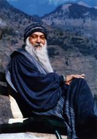

对人类而言，最残忍的事之一就是使他变得悲伤和严肃，这是必须要做的，因为不能使人悲伤和严肃，就不可能使人变成一个奴隶—— 在所有奴隶状态层面上的一个奴隶，在精神方面，是某个虚构的神的奴隶，是某个虚幻的天堂和地狱的奴隶；在心理方面，也是一个奴隶，因为悲伤和严肃变得不自然…… 它们必须被强迫进入头脑，而头脑就变成了支离破碎的，崩溃了的…… 所以也是生理上的一个奴隶，因为一个不能笑的人，就不会有真正的健康和完整的。

笑不是单一的层面，它拥有人类存在的全部的三个层面：当作笑的时候，你的身体参加进来了，你的头脑参加进来了，你的本性参加进来了，在欢笑中，各种差异消失了，各种界线消失了，精神分裂的人格丧失了。

但是它是反对那些想剥削人的人— 一国王教土、狡猾的政治家，他们的整个努力都设法使人变得更孱弱，使人生病使人变得很可怜，这样的人将永远不会造反。将人的欢笑夺走就是夺走了他的生命。将欢笑从人身上夺走，是精神上的阉割。

你是否曾注意过公牛与阉牛的区别吗？ 它们出生时是一样的，但是阉牛被阉割了，除非它们被闭割，否则你不可能像奴隶一样地用它们来帮你负重，替你拉车，你不可能将公牛套在你的车前，因为公牛是如此的有力，你不可能将它控制，它有它自己的个体性。但是阉牛却是它的真实本性的一个非常遥远的回声。只是一个影子，你已经摧毁了它。

要造就奴隶，人也是被同样的方式所摧毁、欢笑一直被谴责为孩子气、病癫的。最多你只能被允许微笑，微笑和笑之间的区别就好像与阉牛和公牛之间的区别一样，笑是全然的，微笑只是嘴唇的操练而且，微笑只是一种礼貌。笑却没有礼貌．它是没有礼节的。它是野的，而它的野性拥有所有的美丽。

但是既得利益者，无论是金钱上的，宗教组织上的，或统治者方面的既得利益者，他们都赞同一件事：人必须被弱化，使他们变得可怜，变得恐惧—— 都被迫生活在一种妄想狂状态下，只有这样。他才会跪在木头或石头的雕像前，只有这样，他才准备为任何有权力的人服务。

欢笑将你的能量带回给你，你存在的每一根纤维都会变活了，你存在的每一个细胞都开始欢舞。在尘世间曾经被做过的反对人类的最大的罪恶，就是人被禁止笑。这个隐喻是深刻的，因为当人们被禁止笑的时候，当然也就被禁止了欢笑，被禁止了唱一首庆祝的歌，被禁止了只是由于纯然的狂喜而跳的舞。因为禁止笑，凡是在生命中所有美丽的，凡是使得生命更活、更可爱的，凡是给予生命以意义的，都被摧毁了，这是反对人类的最丑恶的策略。严肃是一项罪恶，记住，严肃不是意味着真诚—— 真诚是一个完全不同的现象，严肃的人不会笑不会跳舞，不会玩，他始终控制着自己，他是被用如此的方式教养大的，他将他自己变成了一个狱中看守。

来看住自己；真诚的人能够真诚地笑，能够真诚地舞蹈，能够真诚地欢乐。真诚与严肃无关。严肃只是灵魂的病，只有病态的灵魂才可能转变成奴隶，所有的既得利益者都需要一个没有抵抗的、非常情愿的、几乎从一开始就乞求做奴隶的人类。

事实上，只有孩子们才喜欢格格地和大声地欢笑。大人们认为他们是无知的孩子，他们是可以原谅的，他们还未腐化，还处于原始状态，父母、社会、教师、教士的整个努力就是如何使他们文明，如何使他们严肃，如何使他们的行为像奴隶，不像有独立个性的人。你不该有自己的意见，你只须做一个基督徒，或者一个印度教教徒，或者一个回教徒，你必须是一个这个主义，或者那个主义者，你不该有你自己的意见，你不该成为你自己，你只被允许成为一群人中的一个部分—— 成为一群人中的一部分就是变成齿轮上的一个轮齿，你已经自杀了。

在社会上笑得很尽情的人，开怀大笑的人是不受尊敬的，你必须看上去是严肃的，那显示你是文明的和明智的，笑只是为小孩子、为疯癫的人、为没有文化的人而存在的。

只要走进教堂，看看十字架上的耶稣，自然地他是严肃的，并且他的严肃充满了整个教堂。在那里笑，似乎是搞错了地方，从来没有人听到过神也曾经笑过。

小孩子能笑，因为他们不期待任何事情，正因为他们不期待任何事情，他们的眼睛就能清楚地看见一些事情，并且这个世界上充满了如此之多的荒谬和可笑，有那么多“ 被香蕉皮滑倒’ 的事情，那是一个小孩子无法回避去看到的！—— 但是我们的期望的功能就像我们眼睛前的眼帘。

因为所有的宗教都反对生活，他们不可能赞同笑，笑是生活和爱的最基本的部分，宗教反对生活，反对爱，反对笑，反对欢乐，他们反对一切能使人生好得祝福和恩赐的东西。因为他们的反生活态度，他们已经摧毁了整个人类，他们将人类内在的所有的生命源汁全部夺走了，他们的圣火已经变成了别入学习的楷模，他们的圣人由于斋戒已变得干枯，他们用许许多多的方法来折磨自己，并不断地找寻新的方式、方法来折磨他们的身体，他们越是折磨他们自己，他们也就越受人们的尊敬，他们已经找到了一把梯子、一种方法能使他们变得越来越受人尊敬：只要折磨你自己，人们就会崇拜你并且你就能流芳百世。

自我折磨是种心理上的病，没有什么值得崇拜，它只是慢性自杀，但是我们支持这种慢性自杀已有好几个世纪了，因为视身体和心灵是互为敌人的这种观念，已经被固定在我们的头脑中，你越是折磨身体，你也就更精神化，你越允许身体拥有欢乐、享受、爱、欢笑，你的精神也就越弱化，这两重的分裂就是为什么欢笑会从人身上消逝的最基本的缘由。

我曾看见过中世纪欧洲教堂的图片，传道者的功能就是让人感到非常恐惧的地狱之火，害怕他们必须在那里受尽折磨。他们的描述是如此地逼真，以至于许多妇女常常晕倒在教堂里。人们在当时认为：最伟大的传道者就是能使最多的人晕倒的人，那就是发现谁是最伟大的传道者的一个方法。整个宗教就是建立在一个简单的心理上；害怕，并用地狱之名将它放大；贪婪，并用天堂之名将它放大。那些在尘世中享受的人将会进入地狱，自然地人便会变得恐惧，只为了小小的快乐，只为了七十年的生命，他必须在地狱里永远受苦。这就是罗素（Bertrand Russell ）离开基督教的原因之一，他为此写了一本书，书名叫《为什么我不是一个基督徒》，他说‘ 首先让我作出那个决定的事情是：为了我的小小的罪过，我要被永远地惩罚，那是全然不合理的。” 他说“ 如果按照经典来计算我犯的所有的罪，如果再包括我想象的罪—— 但还没有犯—— 最严厉的法官也不能判我超过四年半的监禁，但是就因为这些小小的罪，我必须永远受苦，这又是算哪种正义呢? 似乎犯罪和惩罚之间没有关系。” 然后他开始更深入地研究基督神学，他惊讶地发现有这么多的事这么多荒谬可笑的事，最后他决定了，继续做一个基督徒就会显出你的胆小怯懦，他便放弃了基督教，并写下了那本非常有意义的书: 《为什么我不是一个基督徒》。此书问世至今几乎已有六、七十年了，任何基督教神学家都还没有回答那本书。事实上，那是无法回答的，你怎样能证明它合理呢？教皇和全世界的最伟大的基督起神学家也只能保持沉默。他们谴责罗素，说他将下地狱，但那不是在争论，如果真有地狱和天堂的活，那么地狱是比天堂更健康的地方。因为在天堂，你会发现都是骨瘦如柴、丑陋的被人称为圣人的人在折磨自己，那是个不值得造访的地方。在地狱你会找到所有的诗人，所有的画家，所有的雕塑家，所有的神秘家，所有的那些人，做他们的伴侣是一种幸福。你会在那里找到苏格拉底；你也会在那里找到佛陀—— 印度教教徒将他扔到地狱，因为他不相信吠陀经，而它是整个印度教的基础，你也会找到马哈维亚。因为他不相信印度的神性制度，他谴责它；你还会找到菩提达摩、庄子、老子；你还会找到所有对人生  有贡献的伟人—— 所有使得这个地球变得更美丽一些的伟大的科学家和艺术家。

你的圣人贡献了些什么呢？他们是最无用的人，最没有用的人。他们已经成为人们的一种负担，他们是寄生虫，他们一直在吮吸可怜的人的血，他们折磨他们自己，也教其它的入也折磨自己，他们在散潘心理上的病。

如果这个地球看上去是如此的病态，如果人类看上去是如此的悲伤，那么整个的“ 荣誉” 要归功于你的圣人们。在天堂里你将会遇到所有的那些丑陋的生灵，所有那些不知道怎样去爱，怎样去笑，怎样去唱，怎样去舞而只会谴责别人的人，并且他不允许人类拥有任何欢乐，无论多么小的快乐，只有痛苦似乎才是精神世的，欢乐似乎只是物质性的。

现在，现代精神病治疗学完全知道，那些圣人是精神分裂症者，不需要崇拜他们，如果你能够在某个地方发现他们，赶紧将他们送到精神病治疗医院，他们需要医治，他们是不健康的，他们的存在是令人作呕的，但是他们是人类的领导者，他们使得整个人类成员有一种恶心，他们创造了一种令人恶心的氛围。

人忘记了去笑的那一天，人忘记了游戏的那一天，人忘记了去舞蹈的那一天，他就已经不再是人了，他已经下降到次等人类了。嬉戏使人轻快，爱使人轻快，笑给人翅膀，使人能兴高采烈地舞蹈，这样的人能接触到最遥远的星星，能参透那生命的奥秘。

“ 这些就是四个‘L’ ：Life 生命，Iove 爱，Laughter 欢笑——Iight 光，它们确是按照这样的顺序发生的。”

# 后记　

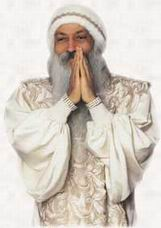

这是一个奇迹！奥修（OSHO ）说：生命是一个奇迹，那么，能够在中国大陆翻译出版（生命· 爱与欢笑）也是一个奇迹。

一切都来自于偶然，偶然中包孕者必然。我很想向读者们说说这本书的翻译出版就像把多少颗偶然的珍珠串在一起了。   

那是 1986 年农历三月三的前一天。我和上海（解放日报）的施志兴先生受云南省科协的邀请，从昆明坐车前往大理参加每年三月初三的“ 三月街” 。   

座很紧，我年轻，拣了个加座，挤在中间，左边是老施，右边靠窗是一位美籍华人—— 许光汉。许先生手提照相机，一有空隙就抓拍云南那秀色旅旅的自然风光，一路上谈笑风生，我得知他此行中国是为意大利的一家出版社写一本—— （中国素食）。   

同车就是偶然，同座也是偶然。下车了，我们分了手，谁也不会想到几年后会发生一个奇迹。在第二天的“ 三月街” 上，那天，整个大理市都被人海淹没了，足足有十几万人！我们首先来到赛马场地，在内场的一个斜角位站着观看。

忽然，一个荡悉的身影走来—— 那是许光汉！今天，他换了一身新鲜 T 恤衫，头为一顶大草帽，我差不多认不出昨天的他了。

他给我拍了好几张照，还说可能要到上海去。我欢迎他到上海，表示可以陪他去尝尝上海的中国素食。回到上海，就收到他的来信和几张三月街赛马的照片，正巧我的老朋友—— 《当代体育》杂志的自辑部主任田新民先生来我处，说起云南一行，他拍板定下要我写一篇—— 三月街赛马，中间用了两张许先生摄的照片。许先生真来上海了，我转给他登在《当代体育》上照片的稿酬—— 八块人民币，他显得很高兴，对于这么低的稿拉，他毫不介意。

几天后，他要去印度，我想送件东西作纪念，提笔铺纸给他写了一首诗，许先生惊呼，你还是个书法家。

一年后，针先生又来上海了，他让我不要称他许先生，而称他为阿洛克，说是那是他最尊敬、最伟大的老师—— 巴关给他题的名，还拿出一幅幅似画似书的画片让我欣赏。我也惊呼，这是非常高级的签名书法，而作者把它书写成一幅幅括彩无比的画面．我追问那是谁的杰作，阿洛克答是“ 奥修” 。我说；“ 奥修是个伟大的书法家！”

我写了一幅“ 醉” 给奥修，我看奥修的书法醉了。

一年后，阿洛克又回上海，他把“ 醉” 给了奥修，奥修看了我的十多幅书法后，接连三次说“ 很好！”   

上海的车很挤，阿洛克让我坐他的摩托车，前方红灯一亮，车停下，阿洛克突柱说：“ 正平，你该去印度，今年会去！”   

我作为中印建交后四十年第一次访问印度的书法家，我在奥修（这时他已改称为和尚）的社区内聆听他的讲道，虽然是英文听不懂，但觉得奥修讲道是一股祥和、慈爱的暖流，妮娓而动人心脾……

我在舆修艺术学院办了一次书法班，40 多位学生 5 天内把中国书法学得维妙维肖，我想这真是在这个活动中心内才有可能发生的奇迹。   

我想单独拜见奥修，但他的秘书说奥修的身体已不能单独会见，只能和千万个学生一起见，他让我坐在摄影师的身旁，这样，他也能见到我这个来自中国大陆的书法家。   

我终于在近离他一二米处清晰地看到了奥修，我觉得一切似梦，是生命的升华，是热血的奔腾……12 天后，这位当代世界最伟大的哲学大师之一的奥修离开了这个斑斓深邃的世界，我成了中国大陆唯一见到奥修的人，我为我的幸运感到高兴，同时为奥修的离开而感到深深的怀念。

在印度，我开始多读一些奥修的书，其中，一本《生命· 爱与欢笑》深深打动了我的心。

回上海，友人介绍我第一次会见陶稀君，她问我在印度最大的感受，我说是见到奥修，我说见了奥修会发生许许多多的生命的奇迹，我觉得生命由此而再一次开花。— 一陶稀君也借了一本《生命· 爱与欢笑》去读。几天后，她说她被倾倒了，她愿意再一次认真翻译这本书，并谈了许多新的感觉。   

我到了法国，阿洛克从德国赶来会我，并再一次邀我访印。在印度，我得知陶稀的译书已脱稿，并由湖南文艺出版社在中国大陆第一次出版。从而使奥修的书逼近了一千种，成为世界上著作最丰的学者。现在，上海三联书店将出版此书的修订本，我感到非常地高兴。我感受到，奥修是一位当代的佛陀，他的许多哲学思想也同时来自中国的老子，他把他的家命名为“ 老子屋” ，命名他的图书馆为“ 老子图书馆” 。

我想，总有一天，许许多多的中国人会主瞻仰这位世界的佛陀。我记下这个地址：17Koregaon Park ，Poona 411001 （MS ），India ，大家都有可能去这个爱和欢笑的世界，创造生命的奇迹！

**整理者的话**

“ 生命爱与欢笑” 是奥修翻译演讲中最棒、最美的一本小书之一。讲述的三个部分都是密切关于我们自身与生活的。希望通过阅读，你也能走上朝圣的路程。

整理了“ 生命爱与欢笑” ，每一篇都有一些收集的图片。感谢扫描上去的那位朋友，我只做了一些很小的工作。