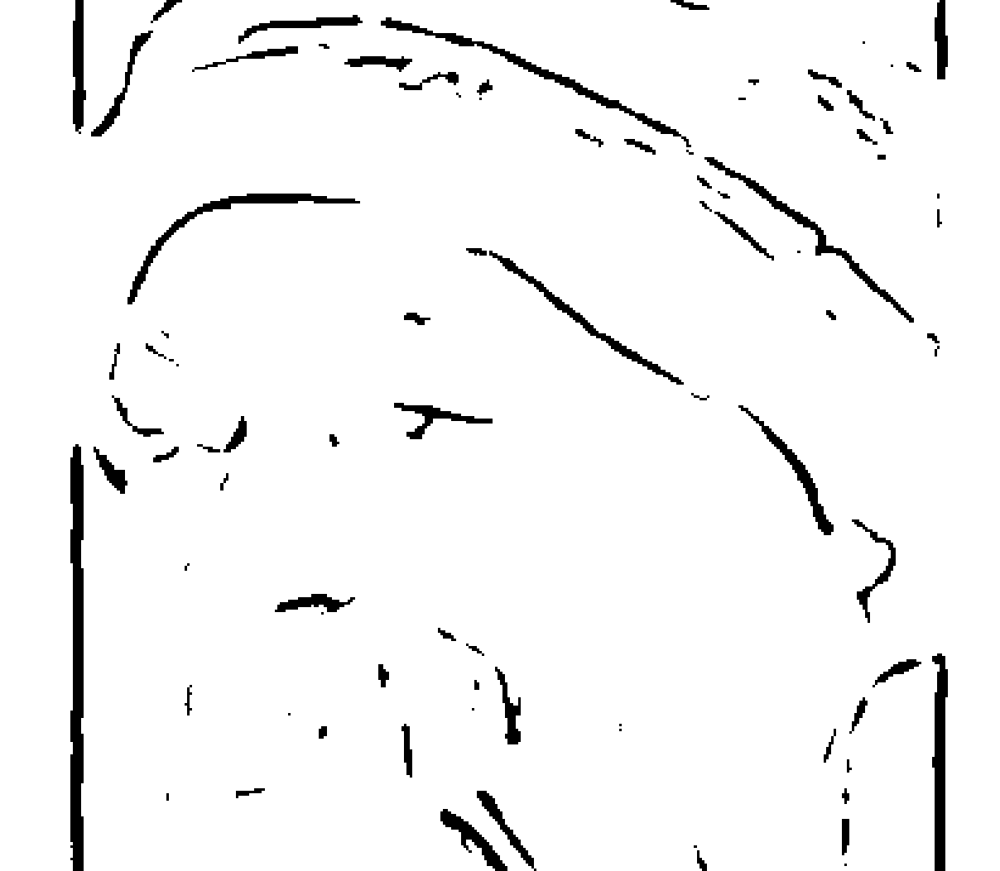
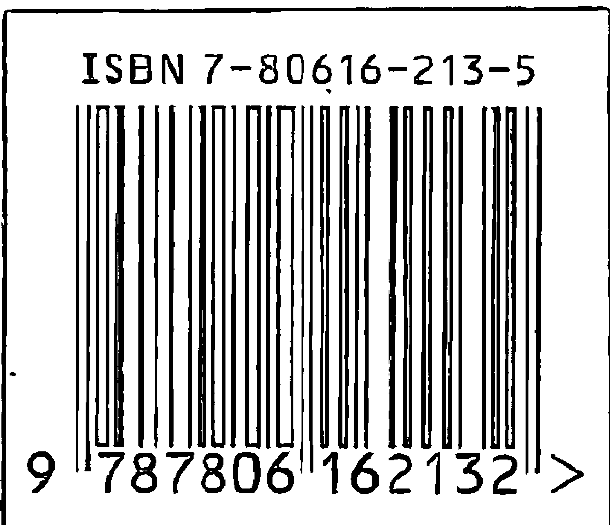

## ·奥修智慧金言系列·

奥修 著 林国阳 译

## 生活

## 智慧

+   ——放轻松些——

+   休禅诗

学林出版社

奥修 著 林国阳 译

学林出版社

责任编辑：温小伟

封面设计：娄明

# 版权提供：

Osho International Foundation

17. Koregaon Park

Poona 411001, MS

India

# 生活智慧

奥修 著 林国阳 译

河北女出版 上海文庙路120号

与女版社 上海发行所发行 上海天华印刷厂印刷

开本 850×1168 1/32 印张15.25 扫页2 张数 280,000

1996年1月第1版 1996年3月第2次印刷 印数 7,001—27,000册

ISBN 7-80616-213-4/B.11 定价 22.50 元

# 出版絮语

我们走近奥修,我们面对他的思想……

我们会怀疑,我们会震动,我们会轻松,我们会充溢爱心,我们会静心下来……

1931年12月11日，奥修出生于印度，早年他以优异的成绩毕业于印度沙加大学哲学系，曾获全印度辩论冠军。以后在印度杰波普大学哲学系担任长达九年的教授。他生前周游印度各地和世界各国，从事学术讲演。到目前为止，根据他的讲演，整理出版了650余种图书，被译成30余种文字，畅销世界各地。他本人于1990年12月21日谢世。

奥修演讲的主题可以概括为一个字：人。他始终关注于工业文明后的人类生存状况，关注于人本身。

他对落后的封建意识的审视，对资本主义物质肉欲的批判以及对人类终极关怀的追问，是独特的、全身心的。他的演讲亲切、平等、近人，充满智慧、幽默、灵性——我们从他的演讲集中，精选了5种——“奥修智慧金言录",奉献给读者。

作为一个伟人、一个思想家，奥修的思想有两个鲜明的特征：一是，他在提问和解答中诠释他的思想；在奥修看来，现代人都是“问题中人”，而提问和解答是现代人的重要生存方式。奥修坚持要求人们自己去体验真理，而不是从别人那里获得知识和信念。二是，他反对过分依赖于理性（头脑），提倡关注经验（心的体验过程）。对经验的“体验”来源于人的静心，所以，奥修认为静心是一件很美丽的事情，是现代人热爱生活、勤奋工作、相互信任、充满爱心、精神富有的动因。无疑，奥修的这种“静心”思想，既带有西方存在主义的烙印，又根植于东方神秘主义思想，尤其是中国的老庄思想。如果说，当代西方众多思想家都在寻找现代文明中的心灵的“自然家园”，那么奥修则是积极创造这样一个心灵的“自然家园”的东方思想家。这也
是他的思想(著作)，在西方各国、在东南亚一带，引起很大震动的缘由。有人称他是继泰戈尔以后，印度又一位伟大的思想家。

在当下，物质文明高度发展，金钱肉欲也伴随日趋膨胀。对精神文明的呼唤和重构，已经为世界各国政府和社会各个阶层所关注。奥修的思想(著作)之所以在东西方引起热烈反响，恰好在这方面一定程度地显示其独特的、新鲜的、可供参照的社会批判功能。

诚然，奥修对生命的热爱，对“存在”的关注来自于他个人的经验，因而他的思想的缺陷和思想的矛盾也是无处不在的（如他思想中的虚无主义和唯心论倾向）。诚如奥修自己生前所忠告的，他不希望将他的思想强加于任何人，更不希望将他的思想变为我们的思想；他只希望：人们去分享他的思想，去感受他的经验，而我们每个人都应该有自己的生活经验，自己的存在方式，自己的“头脑”和“心”——这也是我们编者所希望、所要提醒读者的。

只有用审视的、批判的方式走近奥修，用分享、感受的方式进入他的思想，我们才能从他那独特的、新鲜的、充满矛盾的、与众不同的思想中领悟存在的真谛。

在奥修的思想里并没有真理，只有关于真理或走向真理的思考线索，只有关于现代人“存在”的独特体验和新鲜经验……

让我们在理性的此岸，解读奥修，分享他智慧的芬芳……

1995 年 12 月

# 中译本前言

风人

## 一

这个世界上，有人活得很累，有人活得很轻松。活得累的人大都是聪明人。活得轻松的人则有两种人：一是孩子；二是智者（傻瓜的轻松自然除外）。奥修是属于后者。

奥修是属于后者。

## 二

每一个人都有许多关于自己和别人的故事。奥修也不例外。

奥修在本书中讲了许多故事。这些故事：生动、平凡、世俗，却让人叫绝、听绝——因为融入了他的智慧。我想说，奥修的思想是藏在这些故事里的，奥修的智慧是隐含在这些故事里的。

如果你倾听奥修的话语，你进入他的思想，你会被他的话语的“奇观”所打动，你会被他思想的“光芒”所穿透——一种深深的宁静由然升起——那就是智慧的力量。

## 三

本书是奥修对一休禅诗的解读。

一休是很纯真的，就像一簇稀有的花朵；一休的禅诗是很自然的，就像累累的硕果。奥修的解读是很独特的，犹如把一休的芬芳带给我们，让我们分享那一片刻——智慧大门的开启。

## 四

没有智慧的人生，是充满欲望的人生。

生活中什么是不可能的？是理想？是金钱？还是爱情？也许都需要，但奥修提醒我们：智慧是不可或缺的。

## 五

现代文明带来的生活是充满着“悖论”的，充满着“异化”的。许多西方哲人对现代文明带来后果的批判，让人惊讶、惊醒；奥修对现代文明的审视却有独到之处：让人静心，让人入“睡”——Take It Easy(放轻松些)——这是一件多么喜悦的事情。奥修试图寻找到摆脱现代文明带来的种种“悖论”、种种“异化”的途径。

读奥修的书，会让人想起镜子的功能，也许每个人都能从他的书中发现自己存在的影子，从而端详自己，进而改变自己。

1995 年 11 月 26 日于上海

# 原 序

你有没有经验过全然的空？空无有没有进入到你里面过？它听起来似乎不可能，但是跟奥修在一起，不可能的事常常会变得可能。如果有任何人可以给你空无，那就是他，这些演讲就是充分的证明。

"空无，"你会说："那听起来很好，很柔软……"要小心！当你听到一休禅师那类似耳语的、捉摸不定的诗，你将会认为："多么迷人！"突然间，在几个片刻之后，在奥修的手中，那些诗就会打击到你。他会来到你身上，使你觉知到说你从来没有去洞察"你是空无"这个事实，接受这个事实将会改变你的整个存在。只要听一下或读一下这些话语，你就不可能保持是同一个人。

我们这些直接听他演讲的人会发现在进行当中颇为震惊。“放轻松些！奥修，"我们说：“这是很伤人的！够了……不要再讲了，够了！你在摧毁我们的梦，你在带走每一样我们所相信的东西，以及所有我们毕生受苦去保护的东西。”我们会让整个演讲厅都被烧掉、都被打烂——相对于奥修的天真与和平地离去——还不知道到底是什么东西打击了我们，而隔天我们又会回来要求更多。对于这些演讲，每一个人的反应都很强烈，不管是正面的或是负面的。有一件我们都可以同意的事是：那个信息非常重、非常深，直接打击到我们存在的核心。

我就是很喜欢这些演讲的其中之一，我的抱怨只是表面上的。在我内心深处，我知道奥修所说的空，所说的在一休里面空无一人这件事是真理。当我去确认这件事，某种在我里面的东西就放松下来。我开始从里面发光，而最棒的事是：那个放松和那个满足并不是暂时性的，它已经成长得更深。现在，四个月之后，当我再度阅读这些文字，我发现那个空的感觉已经不再让我震惊或觉得不舒服，相反地，它带给我很大的喜悦。没有头脑的存在已经不再困扰我，结果生活变得很容易、很单纯，某种新的东西在我里面升起，那是一休诗歌的品质，那是他的话语所指的宁静。

奥修使这一切变得可能，因为他就是他所谈论的。当他谈到空无，我的确感觉到他在消失，并召唤我去跟随。当他谈到宁静，我可以听到他的宁静，那个宁静唤醒了我，使我在惊醒之余变得更觉知。当他谈到“原始的不活动”的地方，我知道他生活在那里；当我去感觉他，我可以知道它的本质。当他谈到“你出生之前的脸”，我在他的“在”里面看到可以谈论禅的权威。

那个真实的人站在那里
只要瞥见他一眼
我们就进入爱

莎卡布利亚

# 目录

+   中译本前言……………………………………………… 风人 1

+   原序……………………………………………………………………… 1

# 上篇

+   第一章 从会漏的路回来………………………………………… 1

+   第二章 自我之死就是爱之生 ………………………………………… 37

+   第三章 谎言和无稽之谈 ………………………………………… 68

+   第四章 冒着危险去生活…………………………………………… 100

+   第五章 ……我们就进入爱…………………………………………… 134

+   第六章 一切万物的宇宙性同时间……………………………… 167

+   第七章 小石头的髭须……………………………………………… 202

+   第八章 找寻一个灵魂……………………………………………… 237

# 下 篇

+   第九章 你有闻到月桂树的味道吗⋯⋯⋯⋯⋯⋯⋯⋯ 277

+   第十章 只有人会无聊⋯⋯⋯⋯⋯⋯⋯⋯⋯⋯⋯⋯⋯ 311

+   第十一章 道中的莲花⋯⋯⋯⋯⋯⋯⋯⋯⋯⋯⋯⋯⋯ 345

+   第十二章 高高兴兴地超越任何经验⋯⋯⋯⋯⋯⋯⋯ 379

+   第十三章 达摩、猫和勺子 ⋯⋯⋯⋯⋯⋯⋯⋯⋯⋯⋯⋯ 408

+   第十四章 我也是一个修水管的工人⋯⋯⋯⋯⋯⋯⋯⋯ 444

# 上 篇

# 第一章 从会漏的路回来

1978年4月11日

从会漏的路回到不会漏的路途中休息

如果它下雨,那么就让它下雨

如果它吹风,那么就让它吹风

很久以前的我自己
在自然里面是不存在的

当死的时候没有地方可以去
根本什么都没有

当被问到的时候,他回答

当没有问题的时候,就没有回答

达摩祖师的头脑里面一定什么东西都没有

我们的头脑没有终点,也没有起点

虽然它生下来,虽然它死去
但它的本质是空！

在三个世界里所犯下的一切罪行
将会随着我自己凋谢和消失

宗教是非理性的，它藉着非理性，同时赞成非理性。理智无法包含它，理智是那么地狭隘，而宗教是存在的广阔天空。理智是一个渺小的人的现象。理智必须失去，必须被抛弃。唯有藉着超越头脑，一个人才能够开始了解“那个是的”，那是基本的改变，没有哲学能够带来那种基本的改变，只有宗教能够。

宗教是非哲学的、反哲学的，而禅是宗教最纯的形式。禅是宗教的本质，因此它是非理性的，它是荒谬的，如果你试图用逻辑来了解它，你将会感到很迷惘，它只能够用非逻辑的方式来了解，它必须用很深的同感和爱来接近，你无法透过实验性的、科学的和客观的观念来接近它，所有的观念都必须被抛弃。

它是一种心的现象，你必须去感觉它，而不是去思考它，你必须成为它才能够知道它。成为它才是真正知道它，没有其他方式可以真正知道它。

那就是为什么宗教必须选择一种不同的语言。宗教必须用寓言、用诗、用隐喻、或是用神话来谈论，那些是暗示真理的间接方式——只是暗示真理，而不是直接指明；只是耳语，而不是高声喊。它必须在一种很深的交融当中才会来到你身上。

这些一休禅师的短诗非常重要。记住，它们并不是伟大的诗，因为那并不是他。一休没有意思要创造出伟大的诗，他不是一个真正的诗人，他是一个神秘家，只是为了某种原因，他不用散文来讲，而用诗来表达。

那个原因就是：诗对于事情具有间接的暗示作用。诗是女性化的，散文是男性化的。散文的结构本身就是逻辑的，而诗基本上是不合逻辑的。散文必须很清楚，而诗必须是模糊的，那就是它的美和它的品质。散文只是说出它所说的，而诗能够表达很多事情。散文在日常的世界里是需要的，在市场上是需要，但是每当有某种属于心的东西要被表达，散文总是觉得不足，一个人必须退回到诗的使用。

在语言里面有两种语言，每一种语言都由两种语言所组成：一种是散文，另外一种是诗。散文变成主要的表达方式，因为它很实用，诗已经渐渐消失，因为它不具实用价值。唯有当你坠入爱河，它才需要；唯有当你谈到爱、死亡、祈祷、真理和神，它才需要，但它们并不是商品，它们不在市场上出售，它们也无法被购得。

我们的世界已经渐渐变成直线状的，另外一种语言、较深的语言对我们而言已经丧失了它的意义。由于第二种语言的消失，亦即诗的语言的消失，因此人变得非常贫乏，因为所有的丰富都属于心。头脑非常贫乏，头脑是一乞丐，头脑透过一些琐事来生活。心可以通往深奥的生命、存在的深处和宇宙的奥秘。

记住：在语言里面有两种语言，两种表达的方式，两个层面的语言使用。有一种是很清楚的真理、观念和公式的语言，那是纯逻辑的语言，那是客观资料和精确科学的语言，但它并不是心的语言，它并不是爱的语言，它也不是宗教的语言。

科学和宗教完全相反，它们属于不同的存在层面，它们的领域互相不重叠，它们就是碰不在一起！它们互相不交叉。现代人的头脑被训练成以科学方式来思考，因此宗教已经变成几乎过时了，变成是属于过去的，对宗教来讲似乎没有未来。

弗洛伊德宣称说，对于被称为宗教的幻象没有未来，但如果

## 10 生活智慧——放轻松些！

你没有诗，你要如何来表达那个不能够被说出的？它是那种无法真正被说出的东西的语言，它是那种为了不必完全保持沉默才说出的语言，它是情感和狂喜的语言。

这些一休禅师的短诗或许并不是那么地富有诗意，事实上，博莱斯(R. H. Blyth)在评论一休禅诗的时候说：“一休禅师的短诗并没有太大的价值，但是它却勾划出一个具有很深的真诚的人，或许就是因为他太诚实了，而无法成为一个伟大的抒情诗人。”

那个目的并不是诗，那个目的是要传达某种无法透过一般语言来传达的东西。诗被用来当成一种工具，这一点要记住。不要以文学的角度来思考它，要以狂喜的角度来思考它。

有时候狂喜可以透过一些简单的文字来表达。就在前几天，我在阅读威廉·沙缪尔(William Samuel)的作品，他写道：

有一天，我在我那乡下小山的地方沉思那沟通之迹，我亲眼目睹一个父亲和一个在森林中走失好几个小时的五岁大儿子的快乐重聚。我知道那个小孩一定会被找到，我知道我知道，但是尽管我很确定地知道，我也无法去缓和那个父亲的恐惧，或者带领他去了解所看到的真理，然后当我在思考的时候，当我很想表达而穷于措辞的时候，我看到了那个小男孩找到了他的父亲。

噫！多么棒的一个重聚！一个打赤脚的流浪儿跑出森林，使尽他所有的力量高声喊出：“爹！爹！”我同时看到他父亲毫不觉得羞耻地啜泣，飞快地抱住那个小孩，一切

## 第一章 从会漏的路回来 11

他所能够说的就是：“哈利路亚！赞美神！”一再一多地，“哈利路亚！赞美神！”

有些时候，有某些东西必须被说出来，但是却说不出话来；有些时候，眼泪可以比语言说得更多；有些时候，笑声可以比语言说得更多；有些时候，姿势可以比语言说得更多；有些时候，沉默可以比语言说得更多。所有的笑声、所有的眼泪、所有的姿势和沉默，它们都包含在第二种语言——诗的语言里。

威廉沙缪尔还写道：

有一次在中国，有人给了我一首简单的诗去读，然后要我解释，我本来准备好要立刻回答，但是他们告诉我说我有二十八天可以思考。“为什么要那么久？”我问，带眷一般西方人的缺乏耐心。

他们回答说：“因为一次读不到什么，至少要读十二次。”然后我听到了一个旋律，那是如果我没有一直读所无法听到的。自从那次以后，我就知道说为什么《圣经》或任何其他书本里面的句子，已经被读过无数次了，却在某一天再读一次的时候会突然跑出一个全新的意义。

这就是咒语的整个奥秘，咒语是一首浓缩的诗，它是诗的主要部分。只是读它，你无法了解它，并不是说你无法在理智上了解，理智上的了解很容易，那个意义很明显，但是明显的意义并不是真正的意义，明显的意义来自第一种语言，隐蔽的意义必须被等待，你必须以一种很深

## 12 生活智慧——放轻松些!

的爱和祈祷的心境来重复诵念它……有时候它会突然从你的无意识迸出来，它会显露给你，你会听到一个旋律，那个旋律就是它的意义，而那个意义并不是你第一次阅读所了解的意义。一个人从来不知道它将会在什么时候发生。

因此，在东方，人们一直在重复诵念《可兰经》、《吉踏经》、或《法句经》，他们继续在重复诵念，每天早上和晚上，他们都继续重复诵念，尽可能念很多次，甚至多到不去算几次，算几次有什么意义？但是随着每一次的重复诵念，就有某种东西会更深入你里面，那个沟槽会加深，有一天，那个旋律就会被听到。

当你听到了那个旋律，你才算是知道了真正的咒语，你才算是碰触到了第二层隐藏的层面，那是它里面真正的诗，它是无法被了解的，它只能够被听到；它无法被了解，它只能够被经验。

这些一休禅师的短诗就好像咒语一般，不要试图用理智去了解它们，而要用很深的爱、同感和交融来跟它们玩，那么，慢慢、慢慢地，就好像芬芳一样，就好像一个旋律一样，某种东西将会在你里面产生，你就能够了解这个人想要传达的。他想要传达那个不能够被传达的，他想要说出那人没有办法被说出的，而他能够将它传达出来。

一休这个人是一个奇怪的师父，禅师们都是奇怪的师父。一个宗教人士一定会变得很奇怪，因为他以一种完全不同的方式在生活，他生活在一种不同的真实存在里，他以一个外来者存在于此，他对于这个平常的世界来讲是一个陌生人，因为他虽然在这里，但是他不属于这里，

## 第一章 从会漏的路回来 13

他虽然生活在这里，但是不被它所碰触、不被它所污染。他虽然生活在这里，但是他以一种无法被碰触的方式在生活。他不逃离世界，他以一种不寻常的方式生活在寻常的世界里。

我听说过一休禅师的一些故事，其中一个就是如此，它能够让你尝一下这个人。在我们进入他的诗之前，最好能够尝一下这个人。

在一个夏天的日子里，一休禅师正在工作，或许是在清除杂草，他感到非常疲倦，而且天气又很热，因此他跑到那座庙的阳台上去吹凉风，他觉得很舒服，所以他就跑进庙里，将佛像从宝座上拿下来，把它绑在外面的一根竹杆上，说：“现在你也使你自己凉快一下！”

这看起来很荒谬，将一个木头做的佛像绑在一根竹杆上，告诉佛像说：“现在你也使你自己凉快一下！”但是你看……有很深的东西在那里。对一休来讲，已经不再有死的东西，甚至连木头做的佛像对他来讲都不是死的，一切都是活的，他开始感觉每一样东西就好像他在感觉他自己一样，那些我和你之间的界线已经不复存在，他已经达到了“一”。

还有另外一个故事，情形跟上面这个故事完全相反：

有一天晚上，天气非常冷，他住在一座庙里面。突然间，在半夜的时候，庙里的住持听到一些噪音，而且又看到光，所以他就跑过来问说：“到底发生了什么事？”

## 第一章 从会漏的路回来 14

他看到一休坐在那里，他在烧一个木头做的佛像，那个住持吓了一跳，他说：“你疯了吗？你是怎么了？你在干什么？这是渎神的，没有比这个更大的罪恶，你居然烧了我的佛像！”

一休拿了一根棒子，开始挑那些灰烬，住持说：“现在你在干什么？你想要干什么？”

一休说：“我想要看看有没有佛的骨头。”

住持说：“你一定是完全疯掉了，你怎么能够在一个木头做的佛像里面找到骨头?!”

一休笑着说：“夜晚很长，而且很冷，而你有那么多木头做的佛像，为什么不再多拿几个来？你也可以藉此来暖身。”

这个人的确是一个奇怪的人。有时候他会在一个炎热的夏天将一个木头做的佛像绑在一根竹杆上说：“现在你也使你自己凉快一下！”有时候他会焚烧一个木头做的佛像，因为夜晚太冷了，他告诉住持说：“你注意看我，我里面的佛正在颤抖。”事实上，这两个故事是一样的，从两个不同的角度来看同样的东西。

一个达成的人，一个有了解的人，没有分别心，那个区别丧失了，那个分别消失了，所有的界线都变得没有意义。一个达成的人生活在没有界线之中，生活在无限之中。

现在，让我们来看这些短诗：

从会漏的路回到不会漏的路途中休息

如果它下雨，那么就让它下雨

如果它吹风，那么就让它吹风

每一个字都必须带着同感力来穿透它。“会漏的路” 意味着这个世界——欲望的世界。透过欲望，我们会漏掉我们的能量；透过欲望，我们是在浪费我们的生命；透过欲望，我们就消失在排水管里。

这个世界是会漏的路，人只是在这里浪费他自己，从它无法得到任何东西，永远都无法得到任何东西。事实上，你以一个国王来，但是却以一个乞丐死，这是一条会漏的路！每一个小孩被生下来的时候都是一个国王，但是不久那个王国就失去了，那个清纯、那个天真就失去了。每一个小孩都是伊甸园里的亚当，每一个小孩都必须被逐出伊甸园，然后他开始进入欲望的世界。

有千千万万个欲望存在，它们是没完没了的，它们无法被满足，它们只会带来挫折和更多的挫折，每一个欲望都是一个新挫折的陷阱。你再度希望，然后你又掉进陷阱，而每一个欲望只会带给你更大的挫折，但是到了它来的时候，你又会再度去欲求，你从一个欲望走到另一个欲望，你可以继续走好几百万世，事实上，我们就是一直这样在走。

一休称之为会漏的路，至于永远不会漏的路是什么呢？是那个在我们和它诞生之前的世界，或者是当我们和它都不复存在之后的世界。

在禅宗里面，这是最基本的静心之一：去找寻那个在你出生之前的脸，或者是去找寻那个在你死后还会

## 第一章 从会漏的路回来 16

存在的脸。只是去想它就会带给你很大的达成，只是继续静心冥想它，一个人就会开始感觉到某种没有脸的东西。这就是你原始的脸：没有脸。在你出生之前，你是没有脸的，你也没有身体、没有头脑、没有名字、没有形体——既无名亦无形。你存在，但是你没有跟任何东西认同。

在所有这些会漏的路的噪音当中，在所有这些一个欲望接着一个欲望去追逐的人当中再度去了解它；去认出并且去了解那个当你既不是身体，也不是头脑，而只是一个纯粹的意识或是观照时的原始的脸，就是所有静心的目标，那个被称之为永远不会漏的路。如果你能够停留在那种状态下，你生命的能量将不会漏掉。

回家的路就是回到源头，回到那个原始的脸。所有的宗教都是要往回走的路，宗教意味着一百八十度的向后转，一个绝对的向后转。我们正在急速离开原始的源头，我们正在急速离开我们自己，我们必须回来，我们必须来到我们原始的源头，因为只有在那里才有和平、满足和喜乐，只有在那里才有达成。

源头就是目标，它们是从来不分开的，只有源头可以成为目标！当一个人回到他原始的源头，一个人就算达成了一切生命所能给予的，一切生命所要给予的。

人生是失去乐园，而宗教是重新拾回它。冲进欲望的世界是亚当从上帝的恩典堕落下来，而回头就是基督，他们是同一个人！亚当和基督并不是两个不同的人，他们是同一个人，只是他们的方向改变了。亚当走在会漏的路上，他离开了源头，离源头越来越远，而基督是回过头来，

## 第一章 从会漏的路回来 17

他已经转回来了。

基督教的用语“改变信仰”刚好就是意味着那样：回过头来。“改变信仰”并不是意味着一个佛教徒变成一个基督徒，或是一个道教徒变成一个基督徒。“改变信仰”意味着亚当变成基督，它跟基督教无关，而跟基督的本性有关。藉着变成一个基督徒，你并没有改变信仰，没有什么东西被改变。你以前是一个佛教徒，你冲向欲望的世界，然后你变成一个基督徒，你还是继续冲向同一个世界，只是贴在你身上的标签改变了，现在你不再被称为佛教徒，你被称为基督徒，或者你可以是一个基督徒，而你转变成一个佛教徒，那也不是真正的改变信仰。”

“改变信仰”意味着一个一百八十度的转变——亚当回过头来。

佛教徒甚至有一个更美的字来形容它，它被称为“帕拉夫里提”，它的意思刚好就是一百八十度的向后转，比那个更少是不行的，如果你只是错过一度，你还是会冲进世界。

这也是我弟子的意义：回过头来。

那个“休息”意味着我们短短的人生，它是那么地短，所以下雨或刮风，忧伤或热情，都只是短暂的，或是只有很小的意义。

现在，让我们来听听这首短诗：

+   - 从会漏的路回到不会漏的路途中休息
- 如果它下雨，那么就让它下雨
- 如果它吹风，那么就让它吹风

我们的人生是那么地短暂，受它打扰是没有意义的。

有人侮辱你，你就觉得受到了很大的打扰，而它是那么地短暂！它是不会继续停留的，一切都将会失去。或者有人成功了，然后发疯；或者有人累积了很多财富，然后就没有办法走在地面上，而开始飞了起来。

在古时候的罗马有一个传统，一个很美的传统，它应该在每一个国家被遵循。每当一个罗马的征服者回来——他已经征服了一些新的国家，他成为一个伟大的战士，他带着很大的成功和胜利回来——群众就会对他高声欢呼，他会像一个神一样地被道贺。那个传统是：有一个仆人会走在他的后面，继续提醒他说：“不要被那些人所欺骗，先生，不要被那些人所欺骗！不要被那些愚蠢的人所欺骗，否则你将会发疯。”就在那个征服者回来的时候，有一个仆人或是一个奴隶必须继续重复这句话，好让他能够记住，否则当成功来到的时候，一个人很容易就会发疯。

这种做法应该在每一个国家都被遵循。必须有一个人跟随着卡特总统或印度总理莫拉吉德赛，提醒他们说：“不要被成功所欺骗，它是短暂的，它只是一个泡沫，一个肥皂泡沫，不要让它进入你的头脑。”

成功会进入头脑，失败也会进入头脑，它会伤害一个人，而这一切都是短暂的，这个休息是短暂的。只要去想想那个无限性……在你出生之前有无限的时间，在你之前的时间是没有起点的，而且在你死后也将会有无止境的时间跟随在你之后，在这两个无限之间，你是什么？你的人生是什么？只是一个肥皂泡沫，一个片刻的梦。

## 第一章 从会漏的路回来 19

不要让它来影响你。如果一个人能够保持觉知，不要被成功或失败所影响，不要被赞美或侮辱所影响，不要被敌人或朋友所影响，那么一个人就会回到原始的源头，一个人就变成一个观照。

+   从会漏的路回到不会漏的路途中休息
如果它下雨，那么就让它下雨
如果它吹风，那么就让它吹风

你不会受它所打扰，思考它，沉思它，它是一个很大的奥秘，它是诸佛最大的奥秘之一。只要觉知到，一切都是微不足道的琐事、都是短暂的，只是一个仲夏的梦。它正在走掉，它已经在走掉，你无法抓住它，不需要去执著于它，不需要去推它，不管它是好是坏，它都会自己走掉，不管它是什么，它正在走掉，一切都正在走掉，河流正在流，你保持不受打扰，你保持超然，只是一个观照，这就是静心。

+   很久以前的我自己
在自然里面是不存在的
当死的时候没有地方可以去
根本什么都没有

再度地，试着去了解每一个字：很久以前的我自己……在出生之前我们是不存在的，在死后我们也会再度是一样的，没有自己在那里，在死后也将不会有自己在那

## 第一章 从会漏的路回来 20

里。

佛陀非常坚持这个“没有自己”的洞见，因为我们所有的欲望都围绕在“自己”的观念周围，那个“自己”意味着“我是”或“我存在”。如果我存在，那么有一千零一## 第一章 从会漏的路回来 25

话不仅是凡俗的，它还是渎神的，但是在佛教里面你可以问，没有问题。

弟子问师父说：“狗具有跟佛同样的本性吗？

师父的回答非常奇怪，而且非常令人困惑。好几世纪以来，人们一直都在沉思它，它已经变成一个用来静心冥想的公案。

师父回答说：“穆。”

“穆”意味着什么都没有，问题是：他说“穆”是意味着什么？它也可以意味着“不”。它可以意味着什么都没有，它也可以意味着“不”。他是不是在说狗不具有跟佛同样的本性？禅师不可能会这样说。那么他说“穆”是意味着什么？他不是意味着“不”，他是意味着什么都没有，他是在说：佛是空无，狗也是。他藉着说“不”来说“是”。

他是在说：是的，狗具有跟佛同样的本性，但佛是空无！狗也是。不论在佛里面或是在一只狗里面都没有“自己”，没有人在里面！佛是空的，狗也是。只是那个形式有所不同，那个梦有所不同。狗在梦想说它是一只狗，就这样而已。你在梦想说你是一个人，有人在梦想说他是一棵树，但是在内在什么都没有，只是纯粹的宁静。

这个宁静就是三摩地。当你开始瞥见这个宁静，你的生命就会开始改变，那么你就会首度以一种诗意的方式生活，那么死亡就不会在你里面产生恐惧，那么就没有什么东西能够打扰你或使你分心。

师父的回答“穆”真的是意味着“是”，但是他不直接说“是”是有原因的，因为那个“是”会被误解。这样的话，那个人一定会认为狗跟佛一样都有“自己”，就是因为这样，所以他没有使用“是”这个字，他说“不”，但他并不是意味着狗不具有同样的本性，他是意味着两者里面都是空无，只是外表的形式有所不同。

对一个佛教徒而言，尤其是对禅宗的佛教徒而言，没有什么东西是凡俗的，也没有什么东西是神圣的。

让我们来听听下面这个故事：

那是一个很严肃、很庄重的聚会，有一些深深关心的人聚集在一起学习真理。他们聚集在一起要听宇宙最终的奥秘，他们相信一定可以听到。等了很久，到了最后，他们终于要跟“那绝对的”和“那最终的”面对面，他们认为他们可以听到。当师父走进来，你可以想象那一切的庄严肃穆，期待的气氛充满了整个房间，全场鸦雀无声，整个房间变成一个大教堂，每一只眼睛都盯着师父看，有一些人认为他们看到了他的氛围(aura)，有一些人看到天使在头顶上盘旋。

师父坐下来准备讲话，听众的身体都往前倾，屏住自己的呼吸，准备去抓住他的每一个字句，最后，似乎过了一段非常漫长的时间，那个择善固执的师父张开了他的嘴巴，教导他们说：“今天，就在当下这个片刻，我穿着有绒毛的内衣。”那就是他那一天全部的教导。

禅对生命有一种完全不同的做法，它不相信那神圣的，它也不相信那凡俗的，它什么都不相信，一切都是“一”。狗和神，一切都是“一”；不管是佛或不是佛，一切都
是“一”；无知的人和聪明的人，一切都是“一”；罪人和圣人，一切都是“一”。

当被问到的时候，他回答
当没有问题的时候，就没有回答
达摩祖师的头脑里面一定什么东西都没有
试着进入每一个字。头脑在很纯的时候只是一面镜子，一面空的镜子，里面什么东西都没有。它是一面镜子，因为它是空的，因为只有空能够如镜子般地反映，如果在里面已经含有某些东西，那么你的反映将不会是真正的反映。当镜子是完全空的，它是最完美的镜子。

在静心当中，头脑会变得越来越像镜子，慢慢、慢慢地，所有思想的灰尘都会消失，所有欲望的云都会消失……然后没有什么东西会留下来，“阿那塔”、“没有自己”、空无、稔。当头脑很纯的时候，它只是一面镜子，不被热情所打扰，不被思想所遮蔽，每一样东西都按照它本然的样子呈现出来。

当菩提达摩被问到的时候，他就回答；当他饿的时候，他就吃；当他疲倦的时候，他就睡。那是一个圣人真正的生活，头脑里面什么东西都没有；涅槃。

听着：

当被问到的时候，他回答……。

成道的人没有预先准备好的答案，他没有思想准备
要丢进你的头脑，他只是反应，他的说话就是他的反应，他是一面镜子。弟子来到师父面前，他就反应，他反应于弟子的需要，他并没有固定的概念。他不会想要把什么东西端出来分给每一个人，他只是像一面镜子在那里等待，你来就会看到你的脸。

因此一个师父是矛盾的。老师是前后一致的，但师父一定是矛盾的，前后不一致的。镜子必须是前后不一致的；一下子它反映出一只猫，另外一个片刻，它反映出一个人；另外一个片刻，它反映出眼泪，又另外的片刻，它反映出笑脸。镜子怎么可能前后一致？你不能够告诉镜子说：“要前后一致！昨天我看到你在流泪，今天我看到你在笑；昨天我看你的时候，你很悲伤，而今天你看起来很快乐；昨天我看你处于很深的静心之中，今天你看到你在唱歌和跳舞，这是不一致的！”

只有照片可以是前后一致的，镜子没有办法这样。照片就是照片。如果在他里面有眼泪，它们将会永远都在那里。照片是死的，它不会反映。如果一只猴子来，那张照片将会继续显示出它的眼泪；如果一个圣人来，情形也是一样。但是记住，一个师父是不同的。如果你是一只猴子，那么师父将会显示出你的脸，他的回答将会反映出你的存在。他反应，而不是回答，他是反应。

当被问到的时候，他回答
当没有问题的时候，就没有回答……

那就是为什么有一次卡比儿和法利得这两个伟大的
印度师父会面的时候，他们有两天的时问都坐在一起，一句话都没有交谈，两面镜子相互反映，他们能够反映什么呢？只要将两面镜子面对面放着，其中一面镜子将会反映出另外一面镜子，然后就这样继续下去……反映、反映、再反映，但是没有什么东西被反映出来，什么东西都没有。

两个宁静坐在一起，法利得和卡比儿，互相洞察对方，在那个当中没有人发问，因此没有回答，没有一个人在那里，因此没有反应。

- 当被问到的时候，他回答
- 当没有问题的时候，就没有回答
- 达母祖师的头脑里面一定什么东西都没有

是的，这就是一个师父的头脑，他的头脑里面什么东西都没有。头脑里面有什么就是还没有成道，头脑里面没有东西就是成道。即使你有成道在你的头脑里，你也是还没有成道。头脑里面没有东西就是成道，这一点要记住。

让我再重复一次：如果你带着那个概念说你已经成道了，那么你就是还没有道。甚至只要有这个概念就足够使你仍然系在那个会漏的路上；甚至只要有这个概念就足够使你仍然系在欲望的世界里。

就在前几天，有人写一封信给我，他认为他已经成道了，所以他想要来跟我握手。要握手完全没有问题，但是那个成道的概念将会使你保持不成道。等着……当你准备好，我将会跟你握手。你只要等着，耐心一点，让所有的
概念都消失,甚至连那个成道的概念都要消失。

到了你像一面镜子而来的那一天,我将会用我的本性来跟你的本性相握,为什么要用手呢? 手是不行的。

## 达摩祖师的头脑里面一定什么东西都没有

平常我们会提出很多答案来解答那个不存在的问题。每一个人都是如此,你为了那个不存在的问题而携带着千千万万个答案,而你称之为知识,它是在阻碍你去知道的能力,它并不是知识。

抛弃一切你所携带的答案,只要保持宁静,每当有一个问题产生,你就会从那个宁静听到答案,那将会是真正的答案。它将不会来自你,它将不会来自经典,它将不会来自任何地方,它将不会来自任何人,它将会来自你最内在的空。

其他的宗教称那个空为“神”。佛陀时常强调“空”这个字——它实际上的意义就是如此。因为一旦你使用了“神”这个字,人们就会开始执著于它,然后他们就会有一些概念,他们会问说神看起来像什么,但是你不能够问说空看起来像什么,你能够吗? 一旦你有了“神”这个字,你就会开始问:“如何造出那个形象?如何创造出一座庙?如果崇拜? 如何祈祷? 要给他什么名字?”然后就会有很名名字、很多形象……那么接下来就会有很名抗争。

那就是为什么佛陀那么地强调“空”这个字,因为它真的很美,它不允许任何游戏来跟它玩,它不允许它自己被你所腐化,但是如果你了解正确的话,空意味着神,神
意味着空。

我们的头脑没有终点，也没有起点
虽然它被生下来，虽然它死去
但它的本质是空！

头脑必须以两种方式来被了解。第一，当你用大写的M来表达头脑这个字，那是宇宙的头脑，整体的头脑，它是整体本身，它是弥漫着整个存在的意识，它是一个有意义的存在，它是活的，彻头彻尾地活，每一样东西都是活的，你或许知道它，你或许不知道它，你或许触摸不到它，你或许看不到它，但每一样东西都是活的，只有生命存在。

死亡是一个神话，死亡是一个幻象，无意识也是一个幻象。甚至连石头都不是无意识的，它以它自己的方式而有意识，那个方式或许是我们所不知道的，我们无法知道它是不是有意识的，因为有意识有无数个方式，人的方式并不是唯一的方式。树木以它们自己的方式有意识，小鸟以它们自己的方式有意识，动物和石头也一样。

意识能够以尽可能多的方式被表达，这个宇宙的每一个表达都有无数个方式。

冠上大写M的头脑(Mind)是宇宙的头脑，那个必须被达成，那就是佛陀所说的空，那就是他所说的如镜子般的空。

还有另外一种我们一直在谈论的，用小写m来表达的头 脑，小的头脑。就这个小的头脑而言，我的头脑和你
的头脑是不同的，人的头脑跟树木的头脑是不同的，树木的头脑也跟石头的头脑不同，会有不同存在，每一个头脑都有它本身的限制，它是微小的。

一个人微小的头脑必须消失而成为无限的，小写的m必须融入大写的M。

小写的m，小的头脑，是时间的一部分，而大写的M，宇宙的头脑，是永恒，小写的m也是大写的M的一部分。永恒穿透进入时间，就好像月亮被反映在湖里，不是真的在那里，只是被反映出来。

我们的小头脑只是大头脑的反映。当月亮升起，当满月的时候，地面上有无数的湖都会将它反映出来，还有海洋、河流和小池塘也都会将它反映出来。不论在什么地方，只要有一点水，它就会被反映出来。月亮只有一个，但是它的反映却有无数个……我们的小头脑也是如此。大头脑只有一个，你可以称之为佛的头脑，你也可以称之为整体的头脑，宇宙的头脑，或是称之为神的头脑，这些都只不过是同一个真相的不同名字。

这个小头脑有一个开始和一个结束，而那个大头脑没有开始，也没有结束。

现在，让我们再来听一次这些话：

我们的头脑没有终点，也没有起点 虽然它被生下来，虽然它死去 但它的本质是空！

一个非常矛盾的陈述。在一方面，一休说：我们的头
脑没有终点，也没有起点……他是在说大写 M 的头脑。

然后他说：虽然它被生下来，虽然它死去……现在他是在谈论小写 m 的头脑，小的头脑。小头脑会生下来，然后死去，而大头脑会继续。小头脑只是一个反映，反映会被生下来，然后死去。

作为一个反映，你会被生下来，然后你会死去，如果你过分执著于那个反映，你将会受苦。受苦就是这样，地狱就是这样。如果你不过分执著，如果你不执著于那个反映……身体是一个反映，这个头脑是一个反映，这个生命也是一个反映。如果你静静地看着它，你将会看到所有这些反映都在经过，然后你就会觉知到那个所有的反映都在它里面经过的镜子。

那个镜子就是永恒，达到那个镜子就是知道真理是什么。

在三个世界里所犯下的一切罪行
将会随著我自己凋谢和消失

三个世界就是指过去、现在和未来的世界，它是属于时间的世界。这段经文具有非常大的革命性意义。

在三个世界里所犯下的一切罪行
将会随著我自己凋谢和消失

当你知道你不存在的那个片刻，一切你在过去所做的，在现在所做的，以及将来会做的，都将一并消失。当那
个做者消失，那些作为也就消失了。

在东方，人们对“业”（karmas）或作为太过于顾虑了。他们非常害怕，因为任何他们在过去所做的坏事，他们都必须为它们付出代价，他们都必须为那些事受苦。

一休给你一支伟大的钥匙：不要害怕，因为你不存在，所以你并没有做任何事！你怎么能够做呢？因为一开始你就不存在。他从你的脚下将那个基础拿掉，随着它的被拿掉，一切就都消失了。

在三个世界里所犯下的一切罪行
将会随着我自己凋谢和消失

所以唯一的事情就是要深入你自己去看你的空。你不需要去做善事来抵销你所做的坏事。你不是要做善事，因为不管你做好或做坏，你仍然停留在那个“做者”的幻象里，看清那个差别！

一般的宗教会教你成为有道德的人、要行善、要避开罪恶。记住那十诫，它们是由一般的宗教所组成的：不要做这个，要做那个。而特别的宗教说：“做者”消失，不要去担心做好或做坏。何况由谁来评判什么是好的，什么是坏的？

事实上，没有什么东西是好的，也没有什么东西是坏的，因为存在是“一”，怎么可能有“二”？一切都是“一”。好会变成坏，坏会变成好，一个人从来不知道什么是什么是，事情继续在互相改变，你可以注意看……

你在做一些好事，然后有某种坏事跑出来。一个母亲
试图要保护她的小孩，使其免于世界上所有的坏事，但是就因为她在保护，所以事实上她是在逼他进入那些坏事，因为她在制造那个诱惑。

记住那个古老的故事：神告诉亚当说不要吃这棵树上的水果——它制造了那个诱惑。他一定是一个好父亲，但是他毁了那个小孩。就是藉着说“不要吃知识之树上的水果”，他创造出了那个诱惑和欲望，不可抗拒的欲望：想要去吃那棵树上的水果。

他想要做好事，但事实是怎么发生的？原罪发生了。

所有那些继续行善的人都被证明是非常有害的，那些行善的人是世界上最有害的人，世界上所受的很多苦都是来自他们，他们的意图是好的，但是他们不了解，只有良好的意图是没有用的。

那些了解的人说，那并不是好或坏的问题，问题在于“做者”的消失。或者我们可以以这样的方式来说：保持是一个“做者”是不好的，“做者”消失是好的。不存在是美德，存在是罪恶。

这是佛陀的理解，一切我们的作为都只是梦。当一个人成道，他会开始笑：一切的好和坏都只是梦。

让我们来听下面这个故事：

从前有一个上班族的人，他厌恶咖啡，但是他太太并不知道，他从来没有告诉过她。她非常喜爱咖啡，所以她每天早上都高高兴兴地为他准备一个热水瓶的咖啡，跟他的午餐摆在一起。

他一直都带着那份午餐和热水瓶去工作，但是因为
他很节俭，所以他在晚上会将那个热水瓶带回家，里面的咖啡完全没有动到。然后为了要省钱，因为他太太很喜欢咖啡，她喜欢的程度跟他厌恶的程度是一样的，所以当她没有看到的时候，他会将没有喝的咖啡倒回咖啡壶里。晚上的时候他会用喝咖啡使他睡不着的理由将它推掉。

有一天晚上，他太太梦到说她先生对她不忠，隔天晚上，她又作了同样的梦，这件事令她非常生气，但是她并没有说什么。大约一星期之后，那个梦第三度发生，引发出她很大的嫉妒和痛苦。

“那是真的，”她想：“那一定是真的，这家伙一定对我不忠！”所以她就动手报复，她每天早上放少量的砒霜在他的热水瓶里，直到最后她毒死了她自己。

在她先生被判无罪的审判当中，法官说：“事情总是一样：那些相信梦的人到头来都杀死他们自己。”

最大的梦就是“我存在”，那变成了我们的自杀，它听起来非常似非而是，那个“我存在”的概念被证明是非常自毁的。如果你的自己能够消失，如果你做了那个心灵的自杀，你将会首度开始生活，你将会首度诞生在永恒的生命里，你将会首度知道某种不属于时间的东西。

那么就没有什么东西是好的，也没有什么东西是不好的，那么当一个人饿的时候，他就吃，当一个人疲倦的时候，他就睡，当有人问问题，他就回答，那么一个人就没有要如何去生活的概念，那么一个人就是不用头脑而生活，那么一个人就是带着空无在他里面而生活，这就是佛学的目标。以空无来生活就是涅槃。

## 第二章 自我之死就是爱之生

1978年4月12日

## 第一个问题：

昨天你说科学和宗教完全相反。在西方有很多学派教导科学的神秘主义，而且坦陀罗和瑜伽的途径也是非常系统化的。你的演讲也是具有很深的理性和很艺术化的理性。在理性的科学和非理性的宗教之间似乎存在着一个桥梁。请你评论。

那个桥梁是可能的，而那个桥梁之所以可能只是因为它们是完全相反的。那个差距存在，所以那个差距可以用桥梁联结起来。相反的东西可以会合在一起，就是因为他们是相反的东西，所以它们可以会合在一起。相反的东西会互相吸引，整个生命就是这样在进行的，它具有一种动态，它是正反两面交互运作进行的，它是透过相反的两极——男女、阴阳、物质和头脑、地和天、这个和那个——来运作的，有一种经常的联结，但只因它们是相反的两极，那个
联结才可能，如果它们不是相反的两极，就需要有任何联结。

所以，第一件必须加以了解的事是：科学和宗教是完全相反的，但是将它们联结起来是可能的。那个联结将不会使它们成为一样的。事实上，那个联结将不会使它们成为一样的。事实上，那个联结将会使它们的对立变得更明显、更清楚。

宗教能够具有科学的味道，它可以是系统化的，但是它从来不会变成科学，它仍然保持是神秘主义的，它穿上了科学的外衣，它使用了科学方法和科学名词，但是它仍然保持是神秘主义的，它仍然保持是诗。

你可以将诗翻译成散文，你也可以将散文翻译成诗，但只要藉着将散文翻译成诗，你无法使它变成诗，它将会仍然保持是散文。只是藉着将诗翻译成散文，它也不会变成散文，它将会仍然保持是诗。佛陀以散文来讲，但他所说的话是诗意的。

我不是一个诗人，我讲散文，但我所说的话是诗意的，它的灵魂是诗意的，它仍然保持是诗意的。

宗教可以使用科学的系统化，坦陀罗和瑜伽就是这样在做。科学也可以使用神秘主义作为方法来探索真相，所有伟大的科学家都使用过这样的方式，便它仍然保持是科学。它基本上是对理智信任。宗教的基本信任并不在于理智。在外围的部分，宗教可以变成科学的，

## 40 生活智慧——放轻松些!

师父是一个门槛，因此他能够说服你，他能够使用所有的逻辑争论，但他的目标仍然保持是不合逻辑的。一旦你被说服了，他就会将你丢进那神秘的，那是一种量子跳跃（quantum leap），那是一种“跳”。

我想要再多谈一些那个古代的传统；中古世纪的建筑师手册，在印度所有的手册，都载明说所有的庙宇门口均须有男女交合的雕像（maithuna）。Maithuna 是一个梵文字，它具有很深的含义，它并不是意味着一般的性交，它并不是意味着平常伴侣的相爱，它意味着“神秘的一”，它意味着两个人深深地互相陷入对方，以至于他们已经不再是“二”，它并非只是一对伴侣在做爱，它就是爱，而那对伴侣已经消失在它里面，它是一种互相消失在对方的状态，是一种“一”的状态。

其他的建筑师手册说，庙宇必须是天和地的会合。地是看得见的、逻辑的、物质的，而天是模糊的、云雾状的、未界定的。庙宇必须是那个被界定的和那个不被界定的会合的地方，庙宇必须是那个已知的和那个未知的会合的地方。

男人是逻辑的，男人代表逻辑、数学、系统化和科学；女人是不合逻辑的、直觉、感觉和诗，是模糊的、未被界定的和不能界定的。男女交合的雕像代表这个逻辑和非逻辑的会合，头脑和心的会合，身体和灵魂的会合——所有阴和阳的会合。当阴和阳会合，融合在一起而变成“一”，一座庙就被创造出来了。爱就是那座庙，就是那个性高潮的状态，在那个状态下，你不知道你是谁，你不知道你是男人或是女人，你不知道任何认同，所有的认同都消失了，你处于一种全然忘记和全然记住的状态……忘记一切你所知道的你自己，而记住你真正是的；忘记自我，而记住你是整体。这就是麦苏那(maithuna)——男女交合一——的意义。

麦苏那意味着爱人处于一种很深的“一”的状态，处于一种内在结婚的状态——不只是外在结婚。如果你知道的话，你一定会感到惊讶，只有人类能够达到那种内在的结婚的状态，动物没有办法。你是否曾经看过动物在做爱？你永远无法在它们的脸上或是在它们的眼睛里找到任何狂喜，不可能。它们以一种很实际的方式在做爱，以一种生物学的现象在做爱，它们几乎将它看成一件累赘的事在做。

生物学家和生理学家都同意一个事实说，除了人类以外，所有的雌性动物都根本不知道性高潮，没有一种雌性的动物知道性高潮，知道性高潮是人类的特权。性高潮意味着内在的结婚，甚至在男人里面……

在过去，有百分之九十的女人不知道性高潮，那意味着他们对内在的结婚一无所知，他们的爱仍然停留在生物的层面，他们被自然使用来繁殖，但是在它里面没有静心。我自己的观察是：因为有这个现象，所以所有古老的宗教都反对性，因为性代表动物，但是他们不知道说人类可以超越性——唯有透过性，那个超越才能够发生——人类可以透过外在而达到内在的某些东西。动物不可能的事，人可能。人可以进入一种性高潮的状态，进入一种狂喜，在那个状态下，性变得不相关，它被抛在背后，在那个状态下，身体变得不相关，头脑变得不相关，一个人会直接进入本质的最深处，当然，那可能只有短暂的片刻，但是在那个片刻你可以碰触到神。

麦苏那意味着那个爱非常深，深到你可以瞥见神。

麦苏那意味着伴侣已经不再是伴侣，从外在看起来是一对伴侣的状态，但是从内在就只有“一”——它单独存在。有一个片刻，那个二分性被超越了，有一个片刻，那个和谐达成了，那个一致性发生了，因此，性高潮是非常令人放松的。威尔罕姆·雷克(Wilhelm Reich)说得对：如果一个人能够达到性高潮的喜悦，那么疯狂和所有的神经症或心理症都将会从地球上消失。

这也是坦陀罗所经验到的，但是要将男女交合的雕像放在庙宇的门口需要很大的勇气，踏出那一步是很深的革命，那些人一定非常勇敢，他们藉着它来宣称某些东西，他们说：唯有透过爱，相反的两极才能够被联结起来。

一个师父就是爱，一个师父经常处于一种性高潮的状态下，他是“一”，他的二分性消失了。他知道只有“一”存在，在那种状态下，相反的两极可以被联结起来。

一对伴侣在深爱的状态下缠绕在一起，站在庙宇的门口，处于一种合一的高度狂喜之中，消失了、融入了，带着比两者都更深、更高的某种东西而成为“一”。

你必须爱上一位师父，师父是进入神的门槛，你必须学习如何跟师父融合，如何跟师父合而为一，唯有透过那个，你才知道那个联结。

## 第二章 自我之死就是爱之生 41

他们站在那里,被称之为爱的神所占有,那刚好就是弟子与师父之间的关系:被很深、很大的爱所占有,它是非性的(non-sexual),它也是非身体上的,但它跟两个爱人所达成的是一样的。它是一样的！那个顶峰是一样的。两个爱人透过生理和透过生物层面来行动,他们经历过一段很长的路才达到顶峰,而弟子和师父可以立刻达到那个顶峰,他们不必绕圈子,他们不必经过身体或头脑,那就是臣服或信任的意思。

他们的爱打开了一个新的知觉之门——一个新的去看真相的方式。那个新的去看真相的方式能够将相反的两极联结起来,他们从寻常的进展到不寻常的,从散文进展到诗,从逻辑进展到爱,从分离进展到结合,从自我进展到无我的状态。

你没有看过它发生吗？在深爱之中,自我消失了,你找不到它,因此我坚持说:在做爱的时候,永远都要记住,至少有一次,当你在达到顶峰的时候,要向内看。有任何自我吗？那个经验可以变成一个三托历(瞥见神性)。

平常你不会向内看,你会很专注于那个爱的乐趣或爱的喜悦,所以你会忘记静心。如果你能够在你融解的时候记住,如果你能够记得向内看,你将不再是一样的人。从爱出来,你将会变成一个完全新的人,一个新的本质诞生了,你将会有新的知觉方式,以及新的看真相的方式。

一旦你看到说自我不存在,你就无法再度聚集那个自我,即使你能够聚集它,你也知道它是虚假的,现在那个了解已经深深地穿透进入了你。

## 42 生活智慧——放轻松些！

爱人从时间进展到无时间。观察，当到达顶峰的时候，时间消失了。有一个片刻，时间停止了，整个世界都停止，所有的活动都停止，那个活动和时间的停止就是我们所说的顶峰、或顶点、或性高潮。

跟师父在一起，时间也可以停止，它的确可以停止！每天都有很多人在这里经验到那个停止。有一些片刻，你就只是融入我，你不再在那里，我也不再在这里，我们两者都消失了，有某种超出两者的东西存在，你已经进入了庙宇，你已经联结了相反的两极。

真实的存在没有办法真的被分开，它没有办法被分成逻辑和爱，被分成时间和永恒，被分成身体和灵魂，被分成神和物质——它无法被分开。虽然有相反的两极存在，但它们并不是敌人，它们是互补的，它们互相支持对方，如果没有其中一个，另外一个不可能存在。

如果没有逻辑，你能够想象有诗吗？或者如果没有爱，你能够想象有逻辑吗？它们看起来是对立的，但是在深处的某一个地方，它们互相支持对方，互相喂养对方，互相增强对方。

所以，那个联结是可能的，但它一直都是透过爱而发生，它一直都是透过一个门槛而发生，我称师父为门槛。

在一个爱或信任的片刻，你只是在此时此地！永恒的此时和绝对的此地，你就在门口。

记住：门口是开口的地方。波菲拉斯写道，“门槛是神圣的东西。”门槛是联结相反两极的东西。一座庙真正是什么？一个门槛。它将世界和彼岸联结在一起，它将市场和静心联结在一起，那就是为什么庙宇存在于市场之中，它必须存在于那里。

那就是为什么我坚持说：不要抛弃世界，要在那里！要停留在那里找寻对方，你将会找到它。它隐蔽在市场的某一个地方。如果你注意去听市场的噪音，你将会感到惊讶，在它里面有隐蔽的音乐！在它里面有伟大的音乐！只要抛弃喜欢和不喜欢，注意听，跟它保持和谐的关系，在每一个知道的地方，你将会找到那未知的，在每一个看得见的地方，你将会找到那看不见的。

当波菲拉斯说门槛是神圣的东西，他是对的。门槛是这个和那个之间的界线，是平凡的、世俗的世界和彼岸神圣的世界之间的界线。门槛是我们从一个模式进展到另外一个模式的点，从一个意识水平进展到另外一个意识水平的点，从一种真相进展到另外一种真相的点，从一种生命进展到另外一种生命的点。进入一座庙象征进入一个人自己的深处或高处。就存在性而言，它们意味着同样的事。你可以称之为深处，或者你可以称之为高处，它们意味着同样的事，它是垂直的层面。

有两个层面：水平的层面和垂直的层面。门槛联结这两个层面。一般的世俗生活是水平的，宗教的生活是垂直的。让我提醒你关于基督教的十字架，它是这两个层面的代表——水平的和垂直的。十字架是一个很美的象征符号，十字架是一个门槛。十字架是一个桥梁，水平的和垂直的在那里会合，寻常的和不寻常的在那里会合。

很明显地，“开口”和“开启者”嘏自然的隐喻就是做爱的状态。根据另外一个古时候的记载，“在母牛和公牛嬉戏的地方,由年轻的小牛所陪伴，或者是漂亮的女人跟她们的爱人嬉戏的地方,那个地方是作为一个庙宇适当的地方。

这是一个很奇怪的陈述,再听一次,你将会很震惊,尤其是印度教教徒、基督徒和佛教徒,他们都会震惊。但这是来自一个古时候东方的记载,它说:‘在母牛和公牛嬉戏的地方,由年轻的小牛所陪伴,或者是漂亮的女人跟她们的爱人嬉戏的地方,那个地方是作为一个庙宇适当的地方。’

很奇怪,但是非常有意义,它就是应该这样。一座庙必须是一个会合、一个联结。

你问说:昨天你说科学和宗教完全相反。

是的,它们完全相反,因此它们就像男人和女人一样,互相吸引,它们可以相爱,它们也是互补的;所有相反的东西同时也是互补的。

在西方有很多学派教导科学的神秘主义,而且坦陀罗和瑜伽的途径也是非常系统化的。

是的,有一个方式可以来教导科学的神秘主义,但神秘主义一直都是超越科学的,那就是我在这里所做的!我教你们逻辑的非逻辑、科学的神秘主义和世俗的宗教性。记住:每当真正有什么事发生,就会似非而是的状态,因为那个联结是需要的,但神秘主义还是神秘主义,科学可以被用来当作一个设计,但是神秘主义从来不会变成科学的。最终的飞翔仍然保持是非科学的、超越的。

坦陀罗和瑜伽非常系统化,但它们的系统化只是在中间过程,一旦你遵循它们够久,它们就把你推入混乱之中,把你推入存在的混乱之中,在那里,所有的系统都必须被抛弃,因为所有的系统都非常小,所有的系统都是由头脑所做出来的小监狱。

监狱非常系统化,你看过吗? 你有去过监狱吗? 只要去看一下,那是世界上最系统化的地方,你的家并没有像监狱那么系统化,在那里,每一样东西都非常系统化,每一样东西都遵循固定的规则,绝对要遵守。人们一大早在固定的时间起床,用早餐、洗澡,几乎就像机器人一样在行动,每一样东西都很系统化。

事实上,当每一样东西都很系统化,你就被监禁了,自由就被摧毁了,自由需要混乱的状态。

心理学家在观察一件很奇怪的事,那件奇怪的事是：在军队里,人们被教导要非常系统化,而他们的目标是制造战争,他们的目标是制造混乱,他们的目标是死亡,是杀人和被杀,他们的目标是摧毁,他们的目标是广岛和长崎。但是军人非常系统化,军队的生活是为了要制造无秩序,看看那个补偿作用:军队的生活是为了要制造无秩序。

你是否看过另外一个极端? 艺术家由无秩序创造出秩序,但是他们的生活非常邋遢、非常懒散、非常无秩序。如果你看到一个艺术家在生活,你将会开始想要自杀,非常差劲! 根本就没有系统。你可以去看柴坦亚哈利,看看他什么时候睡觉,什么时候起床,他是没有秩序的,但是
他创造出很美的音乐，他创造出秩序。

艺术家创造秩序，因此他们必须在他们的生活当中藏着无秩序来作为补偿。军人创造无秩序，因此他们必须在他们的生活当中藏着秩序来作为补偿。事情会走向平衡。

诸佛的谈论都非常合乎逻辑，因为他们的目标是不合逻辑。你可以看到现代的物理学家谈话非常不合逻辑，相对论是不合逻辑的；不确定的理论（theory of uncertainty）是不合逻辑的；非欧几里得的几何学是不合逻辑的；高等数学是不合逻辑的。他们以非常不合逻辑的方式来谈，但是他们创造出逻辑，他们的目标是逻辑，他们走向秩序。

你将会一直发现有这种平衡作用在发生，生命不可能只有一面，否则它将会消失，它需要白天和黑夜，夏天和冬天，生和死，它需要爱和恨。

所以我说科学和宗教是完全相反的，但我并没有说那个联结是不可能的，那个联结一直都在发生，继续在发生，它从科学这一边来发生，它也从宗教这一边来发生。当它发生，你们就会有一个伟大的师父、一个佛、或一个爱因斯坦。每当它发生，你们就会有一个超级的现象。

## 第二个问题：

你不告诉我们关于梦的享吗？我梦到说我在做梦，或者经历了过去或未来痛苦的情况，并以不同的方式来处理它们。有时候我在半夜醒来，或者在小睡之后醒来，带着一种极度恐惧和脆弱的感觉，我觉得我只有五岁。

你一直在我的梦中出现，自从我来此之后的每一个梦都有你的出现。

你一直在我的梦中出现，自从我来此之后的每一个梦都有你的出现。

这一切新的发展到底是怎么一回事？我知道你不很重视我们的梦，但那些梦不也是我们在找寻“我是谁?”的一部分吗？

沙维塔，不论你是在做梦，或者没有在做梦，你都是在做梦。不论你是闭着眼睛做梦或是睁开眼睛做梦都没有问题。你不只是在晚上做梦，你在白天也做梦，有晚上的梦，也有白天的梦，你只是继续从一个梦转变到另一个梦，从一种梦转变到另一种梦。

听着……你在晚上做梦，然后你的睡眠立刻被打断，然后你觉得害怕，那也是一个梦。现在你梦到恐怖、脆弱和惧怕，然后你再度进入睡眠，你又开始做梦。到了早上，你睁开眼睛而开始睁着眼睛做梦。你的做梦是一个持续的现象，你的头脑是由梦所做成的，你的头脑是由梦所组成的。

记住那个看到梦的人，去觉知那个观照，不要过分去注意那些梦。

那就是东西方的不同。西方的心理学过分沉溺于梦和梦的解析；一个人必须深入梦。

沙维塔是一个治疗师、一个心理分析学家，所以很明显地，当我不重视你们的梦，她会觉得被冒犯。不要觉得被冒犯，这是一个完全不同的方法。藉着分析梦，你永远无法将它们结束掉。藉着分析梦，你或许会对梦有多一点了解，但是觉知无法透过它而发生。藉着分析梦，你或许甚至会开始去梦一些较好的梦，但是较好的梦也一样是梦。藉着分析梦，一个人怎么能够知道他是谁?梦是客体，而你是主体，你必须做一个转换，你必须做一个一百八十度的转换，你必须停止去注意那些梦，你必须去注意那个一直在做梦的。

东方所顾虑的是那个观照，而不是它所观照到的东西。你也许是看到一棵真正的树，或者你也可能是看到一棵梦中的树，那都没有差别。不论那棵树是真实的，或者只是一棵梦中的树，就东方的方法来讲，那都没有差别。在这两种情况下，它都是客体，在这两种情况下，你都不是它，所以或者它是真的在那里，或者它是你所想象的，有什么差别呢?

唯一有差别的是树木在它里面反映出来的那个——那一面镜子，不管那棵树木是真实的或不真实的都没有关系。重要的是它从那里反映出来的在你里面的那个纯净的水池……注意它，着重在那个观照，深入那个观照。

那就是我在此的目的，为的是要帮助你，而不是要分析你的梦。要分析梦的话，你可以在西方以一种更科学的方式来做。西方在梦的解析方面已经有非常好的技巧，但是东方从来不去担心那些技巧，因为东方说：一切都是梦，所以去分析它有什么意义?

而它是无止境的，如果你继续分析，而那个制造梦的源头还在，它将会继续制造新的梦，它们将会一而再，再而三地出现……那就是为什么没有一个人能够很完全地被心理分析，世界上没有一个人能够真正完全被心理分析，因为完全心理分析的目标就是梦必须消失，那样的事并没有发生，它甚至没有发生在弗洛伊德或杨格身上，他们还是继续在做梦，那意味着他们还是继续有压抑，那意味着他们继续保持跟以前一样，梦还是会出现，因为那个根源并没有彻底被转换。

那个放映机继续在运作，而你继续在分析银幀上的映像，你继续在思考要如何来分析它，然后你们的分析会有所不同，因此有很多心理分析的学派产生。弗洛伊德所说的是一回事，杨格所说的是另外一回事，阿德勒所说的又是另外一回事，还有其他人等等，有多少个心理分析学家就有多少种心理分析，每一个人都有他自己的意见，没有一个人可以真正被反驳，因为一切都是梦的东西。

不论你说什么，如果你能够说得很大声、很有说服力、很有权威、很有逻辑、论点很好，它就会吸引人，因为人们会因此而认为那一定是真的。它们似乎都是真的，所有那些解释似乎都是真的，因为没有一种解释具有任何价值，所有的解释都是错的！

东方有完全不同的处理方式：观照，不要分析。在分析当中，你会变得过分集中在那个梦上面，对它过分有兴趣。要忘掉梦，只要去看那个观照者，那个观照者是经常存在的。在晚上的时候，它能够看到梦，在白天的时候，它也能够看到梦。沙维塔，你先看到梦，然后你立刻醒过来而看到恐怖，然后你再度入睡，你或许会看到很美的梦、甜蜜的梦、快乐的梦，或者又是一个恶梦，这种情形会一
直继续下去，但是有一样东西是经常存在的：那个看者、那个观看者、那个观照。

将那个注意力转到那个观照者。那就是我试着要告诉你们的，当你们在白天或者是在晚上做梦的时候，关于那些梦只有一个很好的点，那就是你所说的：

你一直在我的梦中出现，自从我來此以后的每一个梦都有你的出现。

那很好，至少有一样东西经常在那里，它将能够帮助你进入你自己。要去强调那个经常性的“在”。

戈齐福以前常常

## 54 生活智慧---放轻松些！

进入。梦从一个门消失，真相就从另外一个门进入，而真相是宁静的、安静的、和平的、喜乐的……

## 第三个问题：

为什么当你进入爱之中会觉得好像快要死掉一样？掉进爱里面是不是一种自杀的欲望？或者只是一种自毁的本能，就好像北极的旅鼠集体投海自杀，或者像飞蛾扑向火焰一样？它很奇怪。

爱就是死，但是那个死在爱里面的从来没有真正存在过。那个死掉的是不真实的自己，是一个自我的概念。

所以爱就是死，它是自杀，它是危险的，那就是为什么有无数的人决定要反对爱，他们过着一种没有爱的生活，他们决定要支持自我，但自我是虚假的。你可以继续执著于那个虚假的，但那个虚假的永远不会变成真实的，所以一个自我主义者的生活一直都停留在不安全之中。你怎么能够使不真实的东西变成真实的？它一直在消失，你必须去抓住它，你必须经常一再一再地去创造它，它是一种自我欺骗，它会产生痛苦。

痛苦是那个不真实的东西的功能，那真实的是喜乐的——satchitanand。真理是喜乐的，真理是觉知。sat意味着真理，chit意味着意识，anand意味着喜乐。这三样东西是真理的品质。它就是如是，它就是觉知，它是喜乐的。

不真实是痛苦。地狱就是那个不存在，而由你创造出
来的东西，天堂就是那个存在的东西，但是你不接受。乐园就是那个你真正存在的地方，但是你没有足够的勇气去进入它。地狱是你私人创造出来的，但因为它是你所创造出来的，所以你执著于它。

人从来没有离开过神，他生活在神里面，但是他仍然在受苦，因为他在他自己周围创造出一个小的地狱。天堂不需要被创造，它已经存在，你只要放松而享受它，而地狱必须被创造。

以一种放松的心情来过生活，不需要去创造任何东西，也不需要去保护任何东西，不需要去执著于任何东西。“那个是的”将会继续保持，不管你有没有执著于它，“那个不是的”无法保持，不管你有没有执著于它。那个不是的，不是；那个是的，是。

你问说：
为什么当你进入爱之中会觉得好像快死掉一样？

那是因为那个不真实的自我(ego)死掉的缘故。爱打开了那个到达到真实的门，爱是庙宇的门槛，爱把你打开，使你走向神，它带来很大的喜悦，但是它同时带来很大的恐惧：你的自我在消失。你有很多投资在自我，你为它而活，你被教导和被制约去为它而活。你们的父母、你们的教士、你们的政客、你们的教育和你们的学校：专校和大学，他们都一直在创造你的自我，一直在创造野心，他们是创造野心的工厂，有一天你会发觉你自己被你自己的野心弄得变成残缺，被你自己的自我所监禁。你受了
很多苦，但是你毕生都被教导说它是有价值的，所以你就执著于它，你受苦，便是你执著于它，你越执著，你就越痛苦。

有一些片刻，神来到你的面前敲你的门，那就是爱——神敲着你的门。或许是透过一个女人、透过一个男人、透过一个小孩、透过一个爱、透过一朵花、或者是透过日出日落……神能够以无数的方式来敲门，但是不论神在什么地方敲门，你都觉得害怕。教士、政客、父母和那个被创造出来的自我，这一切都濒临危险，你开始觉得你快要死掉一样，你拉回来，你缩回来，你闭起你的眼睛，你关起你的耳朵，你不去听那个敲门，你退回到你自己的洞里，你关起你的门。

爱感觉起来好像死亡一样，它的确是如此。那些想要真正喜乐的人必须经历过那个死，因为唯有经历过死，才可能复活。

当耶稣说，你必须将你的十字架扛在你自己的肩膀上，他这样说是对的。你将必须一死，他说，“除非你再度被生下来，否则你将无法看到我的王国，你将无法看到我所教给你的。”他还说：“爱就是神。”他这样说是对的，因为爱就是那个门槛。

死在爱里面，它远比生活在自我里面来得更美，它远比生活在自我里面来得更真实。自我之生就是爱之死，自我之死就是爱之生。记住：当你选择自我，你是在选择真正的死，因为它是爱之死，而当你选择了爱，你只是在选择不真实的死，因为自我死掉你并没有损失什么东西，你打从一开始就什么都没有。

那就是昨天一休禅师的整个重点。你根本就不存在，所以你为什么要害怕呢？是谁会死呢？没有一个人可以去死！你在执著于谁？你想要使谁安全？你想要保护谁？根本就没有 个人，只有空……空……全然的空。

听一休的道歌，接受这个空，那个恐惧就会消失。当你发现那个爱的火燃烧得很明亮，你就成为那只飞娥！跳进它里面，你将会失去那个虚假的，而得到那个真实的；你将会失去梦，而得到那最终的；你将会失去某种不存在的东西，而得到那个一直都存在的东西。

## 第二章 自我之死就是爱之生 55

## 第四个问题：

为什么印度男人和西方女人的关系不能够成功？它总是到了某一个点就断掉了，真正介入的困难是什么？是什么东西阻止了那个关系的成熟？请你谈论一下。

维旦特巴提，所有的关系在某一个点都会断掉，都必须断掉。你不能够将你的房子盖在门槛上，你不应该如此。爱是一个门，要通过它。当然要通过，不要避开它。如果你避开它，你将会错过庙里的神性，但是你不应该将它的房子盖在门槛上，或是盖在门口，不要停留在那里。

门只是一个开口，你必须向前走！

爱的关系是一定要的，但它并不是你的命运之所在，它并不是终点，它只是起点。我完全赞成爱，但是要记住，爱也是必须被超越的。

有两种类型的人，这两种类型的人都会变成神经病。

其中一种就是那个非常害怕爱的类型，因为他们害怕死掉。他们抓住自我而避开爱。他们或许称之为宗教，但它不可能是宗教，它只是纯粹的自我，其他没有。那就是为什么和尚们——天主教徒、印度教教徒、或佛教徒 ——他们都有很强的自我，那个自我很微妙，但是非常强，那个自我是隐藏起来的，但是非常强，他们的谦虚只是表面上的，只是那个有毒的自我外表的糖衣。他们具有虔诚的自我，但那个自我是存在的。一个虔诚的自我比一个普通的自我来得更危险，因为普通的自我很明显，你无法隐藏它，但是那个虔诚的自我非常隐藏，你可以永远永远都以很微妙的方式携带着它。

所以这会造成一种神经病：那些避开爱的人会认为他们在走向神。你无法走向神，因为你避开了那个门本身。

然后有另外一种神经病，他们看到了爱的美，鼓起勇气跳进去，将自我融解掉几个片刻……因为在爱当中，它只能够有几个片刻，爱的狂喜不可能是永恒的，因为它是两个部分会合并互相融入对方所产生出来的狂喜。除非你跟整个融合，否则你无法达到永恒的狂喜。只跟部分融合——跟一个男人或一个女人融合——你将只是跟一小滴的神融合，它不可能是海洋般的。是的，有一个片刻，你会尝到那个滋味，然后那个滋味就消失了，这会造成另外一种神经病：人们会执著于爱情事件。如果跟一个女人的爱结束了，他们就换到另外一个女人或另外一个男人，一直继续下去。他们开始生活在门槛上，他们已经忘掉了神性，他们已经忘掉了那个庙。爱必须被超越而进入祈祷
(宁静)。

永远不要处于第一种神经病里面，也永远不要执着于第二种神经病，要继续往前走。

有一个伟大的国王阿克巴，他在印度创造了一个小小的、很美的首都。那个首都从来没有被使用过，因为它在它完成之前，阿克巴就过世了，因此他的首都从来没有从德里搬过去，那个地方的名字叫作费特普西克里，它是曾经被计划出来最美的城市之一，它从来没有被任何人使用过。

每一个细节都被照顾到。那个设计曾经咨询了当时伟大的建筑师和伟大的师父。阿克巴请教了当时印度伟大的导师，要他们给他一句话用来写在门上。有一个桥通往费特普西克里——有一条河横跨那里——阿克巴在桥上做了一个很漂亮的门。有一个苏菲徒建议了一句耶稣所说的话，他很喜欢。有很多人建议了很多其他的话，但是他最喜欢那一句话，所以那一句话就被写在门上，那句话很美，它没有被记载在《圣经》里，它来自另外一个口头的来源，它说：人生是一座桥，经历过它，但是不要将你的房子盖在它上面。

爱也是一座桥，要经历过它。

所以，没有一个爱情事件曾经成功过。它给你希望，给你很大的希望，便是以挫折作为结束。那个挫折是内含的；就好像狂喜是内含的，挫折也是。在开始的时候，它是狂喜，在结束的时候，它是挫折。那个挫折将会引导你去
超越,否则你要怎么超越? 如果你执着于那个门,那么你要在什么时候才能够去找寻庙里真正的神性? 如果你说“门已经足够了,我很满足”,那么就没有人会再向前走。

耶稣说,人透过爱去达到神,爱就是神。但这只是真理的一半,另外一半是:人从来没有透过爱而到达,唯有藉着超越爱,人才能够到达。当这两者一起被理解,你才算是理解了爱的现象。爱就是神和爱不是神。在刚开始的时候它是,在结束的时候它不是。在刚开始的时候,它会带来狂喜,那些蜜月的日子,然后每一个婚姻都会以挫折和无聊作为结束。

只要想想两个人无聊地坐在一起,一切都已经被探索过了,已经不再有什么东西可以探索了,这就是机会。或者你可以再去找另外一个男人或女人,或者你可以开始去超越爱。你已经经历过爱,你已经看过了它的美和它的丑;你已经看过了它的喜悦,也看过了它的痛苦;你已经看过了它的天堂和它的地狱。它并不是纯粹的天堂,不,否则没有人会去到神那里。它是纯粹的天堂和纯粹的地狱,它两者都是。地狱和天堂是它的两个面。在刚开始的时候是希望,而结束的时候是挫折。

一再一再地经历过那个希望和那个挫折.有一天那个了解就会产生:“我在门槛上做什么? 我必须超越!”不是由于愤怒,而是由于了解而超越。

所以第一件事是:没有一个关系曾经成功过。没有一个关系曾经成功过,那是很幸运的,否则你什么时候才会跟神关联? 你为什么要去想到神? 人之所以会想到神是
因为爱给予一个瞥见；人之所以会想到神是因为爱给予希望。人必须去想到神，因为爱带来挫折，所有的希望都变成绝望。

如果没有爱，就不会去寻找神，因为人将不会经验到希望、意义和壮丽。爱让你瞥见到彼岸……不要执著于它。吸取它的暗示，然后去找寻更多，继续找寻，使用爱作为垫脚石。

你问：
为什么印度男人和西方女人的关系不能够成功？

所以，第一件事：没有一个关系是成功的，不管是在印度男人和西方女人之间，或者是西方男人和西方女人之间，或者是印度男人和印度女人之间。它不可能成功，它的本质就是会去阻止它成功。有时候觉得好像它正在成功，但是它从来没有成功过。它非常非常接近成功，但是它从来没有刚好达到那个点。它带领你进入伟大的旅程，但是它从来没有提供你那个目标。它使你的希望燃烧起来，但是只是希望，然而这是很好的，至少它把你带到了门槛。已经踏出了一步，有一半的旅程已经完成了，但是还有另外一半的旅程。

第二件事：在印度男人和西方女人之间，或者是西方男人和印度女人之间，那个情形更困难。那个困难并不在于男人和女人之间，那个困难在于东方和西方之间。男人和女人就只是男人和女人，东方和西方并没有什么不同，但是有头脑存在，那些头脑会产生问题。

印度人有一种头脑，而西方人发展出一种不同的头脑，所以当一个印度男人跟一个西方女人在一起，或是反过来，他们之间没有沟通。他们说不同的语言，不只是他们说不同的语言——英语、德语、法语、或意大利语——他们或许说同样的语言，但他们还是说不同的语言，因为他们具有不同的头脑，他们的期望是不同的，他们的制约也是不同的。印度男人说一件事，而西方女人将它理解成另外一件事。那个女人说了一件事，而印度男人将它理解成另外一件事。除非他们抛弃头脑，除非他们变成纯洁的男人和女人，否则将会有很大的困难。

维旦特巴提问这个问题一定是出自他自己的经验。有一天晚上，我偷听到维旦特巴提的对话：

维旦特巴提说：“嗟！我漂亮的、甜蜜的爱人！我是你第一个上床的男人吗？”，

那个美国女孩说：“当然是罗！为什么你们印度人总是问同样愚蠢的问题。”

不同的头脑……印度人的头脑非常男性主义，现在西方的女人已经是解放过的女人，她生活在一种完全不同的环境之下，她已经不是好几世纪以来的你在印度跟她们生活在一起的那种女人，现在已经不可能去占有一个西方女人，她已经不再是人家的资产，你跟你一样地自由。

在印度，女人被当成资产，男人可以占有她。不仅是一般的男人，甚至在印度的一些伟人也将女人视为占有
物。你或许听过有名的马哈巴拉塔的故事，在那个故事里面，一个印度历史上非常有名的男人优迪许提拉——他被认为是非常具有宗教性的，他被认为是一个宗教之王——他在玩、在赌博，他甚至连他太太都赌下去。他将她赌下去，因为当时认为你太太是你的资产。他赌下了他的王国，他赌下了他的宝藏，他什么东西都赌下去，然后只剩下他太太，最后他连太太也赌下了下去，但是在印度，他仍然被认为是最伟大的宗教人士之一。这算是那门子的宗教人士？只要想想，将一个活生生的人赌下去？但是在印度，女人被视为资产，你是占有者，是全部和唯一的占有者。

在西方，奴隶制度已经不复存在，它已经消失了，那是很好的，它也必须从印度消失。没有人可以占有任何人，不管是男人或女人都一样。没有人可以被占有，没有人可以被贬为资产！这是很丑陋的，这是罪恶！还有比这个更大的罪恶吗？

你可以爱一个人，但是你不可以占有，占有的爱并不是爱，那是自我。

在印度，男人非常男性主义，印度的女人尚未争取到她们的自由，在印度没有女性解放运动，女人还是继续以旧有的方式在生活中。

所以当一个印度人爱上一个西方女人，那个问题就产生了，他会开始占有。印度人的头脑非常执著于性，那也会产生问题。当我说印度人的头脑非常执著于性，你一定会感到惊讶，因为你认为印度是一个非常有宗教性和道德的国家。是的，它是如此，但是它的道德律和宗教都
基于压抑，那个压抑在内在深处是对性的执著。

如果一个女人只是去牵别人的手，她先生就会很生气！只是牵手而已！牵手可以只是友谊的表示，不需要给它任何性的色彩，但是印度的男人无法这样想。如果他的女人去牵别人的手，那意味着她跟他有性的联系，他会非常生气，他会睡不着，他会想要杀死那个男人、或是那个女人、或是他自己，这种事太离谱了。

西方人以不同的方式来看这件事。一个人可以牵别人的手，而只是代表友谊、爱和分享，它不需要有任何性的含义在它里面，或者，即使它有性的含义，别人也管不着，那是那个人的自由。一个人必须去决定他的生活，看看他要如何生活，要跟谁在一起生活，其他没有人可以成为决定因素，但是那样会产生问题。

西方人并没有像东方人一样把性想得那么重要。性几乎已经变成一种能量的分享，一种爱的游戏，或是一种乐趣，它已经不再像过去的情况那么严肃。但是在印度，它仍然非常非常严肃。记住，当某件事是严肃的，一定是有自我的涉入。自我一直都是严肃的，它使每一件事都变得很严肃。每当某一件事是游戏的，那只是表示自我已经不再涉入。所有的游戏状态都是好的，因为它是解放。

当你坠入情网……如果是一个印度人坠入情网——在这里，它将会一而再地发生——当一个印度人坠入情网，他是很严肃地坠入，那就是困难之所在。那个女人或许根本就不把它看得很严肃，她或许认为这只是暂时的，在这个片刻，你吸引她，在它里面没有承诺，它没有明天，但是印度人的头脑不仅把朋友带进来，甚至将一生都
带进来，或者有一些人甚至想到来世，那些是隐藏的部分，你不会去谈论它们，但是那个冲击将会发生。

她爱上你，因为她享受那个爱，那是一个很美的经验，她并不是特别爱上你，她是爱上那个爱本身，那是差别之所在。你并不是爱上那个爱本身，你是爱上这个特别的女人，它对你来讲是一个生死问题。如果明天她开始去找别人，你将会疯掉，但是你误解了，那是个片刻的表达。

有一个美国女孩去英国渡假回到纽约，跟她的好朋友在聊天。

“玛贝儿，自从离开英国之后，我一直想到凯斯，现在我回到家之后，我不认为我应该写信给他，因为我们的友谊很浅。”

“但是，温蒂，你不是答应跟他结婚吗？”

“我知道，但就只是这样。”

婚姻已经不再像东方的情形一样那么严肃，婚姻只是一种友谊，没有什么特别。

如果你不了解这些不同的头脑，它将会有困难，沟通会变得不可能。东方的男人一直在享受着自由，他们说：“男孩子嘛！”但是女人并没有被给予任何自由，现在在西方已经没有性别歧视，男人和女人两者都是自由的。任何男人在做的，现在女人也在做，她具有充分的权力去做它。

在东方，我们耍了一个诡计，那个诡计就是我们把女人捧得很高，把她摆在宝座上，我们崇拜女人，那是监禁她的一个诡计，我们透过崇拜来满足她的自我，我们说：

[PAGE 78]

# 66 生活智慧——放轻松些！

"女人是一个女神，女人代表纯净，女人不属于这个尘世，女人在婚前必须是处女，婚后必须终身保持一夫一妻。" 我们对这件事给予很多尊敬，对这件事，我们给予女人很多制约，使她们变得沉溺于那个自我，因此她们就停留在那个宝座上，被监禁在那里，被锁在那里！而男人却享受着各种自由，男孩子嘛！西方的女人已经从宝座上下来，她说："要不然就是你也上到宝座来，要不然就是我下来，我们双方都必须站在同一个基础上。"事情就是应该这样。

"我说，老朋友，"克里夫告诉宴会的主人说："有一个长得蛮甜的年轻女子，我跟她处得很不错，你应该知道我的意思。"他使了一个眼色，然后继续说："我不知道可不可以用一下你那个空房间？"

"可以，我不

## 第三章 谎言和无稽之谈

1978年4月13日

如果在我们旅途的终点没有最终休息的地方，怎么可能有一条会让我们在它里面迷失我们自己的路？

释迦牟尼那个恶作剧的家伙出现在世界上，误导了，唉唷！多少人！

头脑，我们要怎么来称呼它呢？它是在印度昼画里面吹过松树的微风的声音。

头脑停留在它刚出生时的状态，不必任何祈祷，它就变成佛。

撒了一个谎，你就掉进了地狱，那么那个构想出一些不存在的东西的佛陀会有什么下场？

真理并不是一个人们想要的商品。他们认为他们已经知道它，即使他们认为他们不知道它，他们也会认为：“谁需要它呢？”他们的需要是在他们的人生当中有更多的魔术、更多的幻像和更多的梦。

平常的头脑经常在找寻新的梦和新的感受，事实上，它害怕真理。真理或许会摧毁它的魔术，它或许会摧毁它的欲望，它或许会摧毁那个人们一直在经历的美梦。

真理不被人们所需要。当一个人开始对真理有兴趣，他就不再是群众的一部分了，他变成一个个人。那个对真理的兴趣会创造出个体性，否则你仍然保持是群众的一部分，这样的话，你并没有真正存在。唯有当你开始找寻真理，你才开始存在，但那个找寻是费力的，它需要勇气，它需要聪明才智，它需要觉知。

佛教并不是一般的宗教，它并不是一种群众的宗教，它是属于少数个人的宗教。它不是平庸之士的宗教，它是那些真正聪明的人的宗教，其他没有一种宗教像佛教那么个人化，而那个似非而是的真理就是：佛陀说没有自己。那个似非而是的真理就是：佛陀不相信个体性……但他的宗教是属于个人的。

只是对佛陀所说的话有兴趣就是一个伟大的冒险，因为在他之前或之后从来没有一个人像他一样，是一个彻彻底底的革命家。

今天这些一休的经文具有无比的重要性。

## 70 生活智慧——放轻松些！

## 第一段经文：

如果在我们旅途的终点没有最终休息的地方，怎么可能有一条会让我们在它里面迷失我们自己的路？你必须去静心冥想它，慢慢、慢慢地，那个意义将会浮现在你的意识里。

首先：人生没有目标，所以没有人会走入歧途——让这个理解穿透你的心，让它像一支箭一样地穿过你。人生没有目标！所以不可能错过它。所有其他的宗教都依靠它，所有其他的宗教都一直在告诉你说：“你错过了。”那就是“罪”这个字的意义——错过、错过目标。“罪”这个字的原始希伯来语字根的意思就是错过目标，无法达到目标，那就是“罪”。

根据佛陀所说的，不可能有“罪”，你不可能错过它！因为没有什么东西可以错过。目标并不存在，目标就是假想的，它是你所创造出来的。你先创造出目标，然后你再创造出美德和罪恶。那些走向目标的人是美德，而那些不走向目标的人是罪人。你创造出目标，然后你将人类分成圣人和罪人。放弃目标，那么圣人就会消失，罪人也会消失，那个划分也消失，那个较高的和较低的也消失，评价也消失，那么就没有天堂，也没有地狱。

看清那个要点！就是那个目标的概念创造出天堂和地狱。那些走向目标的人、顺从的人、好人，他们将会被用天堂来奖赏，而那些不走向目标的人、罪人、不好的人，他们将会被用地狱来奖赏。你先创造出目标，然后每一件事都跟随而来……那么天堂和地狱就被创造出来，圣人和罪人就被创造出来，然后就有害怕产生，害怕会失去目标，然后自我就被创造出来，要去达到目标的自我就被创造出来。这整个一团糟和整个头脑的神经病都是你所创造出来的。

佛陀悟到最根部，他说：没有目标。光是“没有目标”这个简单的陈述就可以变成一种解放的力量。那么一个人就不需要去到任何地方，他一直都在这里，他从来不到任何地方去，没有什么地方要去，也不需要去找任何人，一切都一直在这里，一切都一直是随时可有的。

目标意味着未来，这样的话，你会开始变得对未来更有兴趣，你会开始忘掉现在。目标造成紧张、痛苦和恐惧——“我是否能够达成它？”如此一来，竞争、嫉妒、冲突和阶级意识就会介入。那些比较接近目标的人是较高的，那些比较不接近目标的人是较低的。

整个基督教会都依*一个单一的现象：不服从。佛陀说，没有一个人在下命令，也没有办法去服从。

人生没有目标。生命本身就是它自己的目标，那个目标是固有的。生命的价值就在它本身，它不是来自任何其他的东西。生命并不是到达未来某一个地方某一个目的的手段，生命就是它本身的目的，它本身的手段，生命就是一切……

一旦你了解到这一点，你就不能够说生命是没有意义的。

苏格拉底在西方发起了一个概念，那个概念在萨特逻辑的完美当中达到了最高峰。苏格拉底说：一个没有意义的生活是不值得过的。这是一个种子，从苏格拉底到萨特，这个种子一直在西方继续成长。现在萨特说：因为没有意义，所以生命是没有意义的，根本不值得去过。

卡缪(Albert Camus)说：人类唯一必须去解决的难题就是自杀，那是唯一的玄学问题。为什么呢？因为他说生命是没有意义的，所以为什么要活下去。如果苏格拉底是对的，那么唯有当生命具有某种意义、有某个目标，当它走向某一个地方、到达某一个地方、达成某种东西，那么它才值得去活，而如果没有什么东西要达成，没有什么地方要去，那么生命就没有意义。如果是这样的话，为什么要活下去？为什么不自杀？

佛陀的了解完全不同，他说：生命就是它本身的意义。你不需要再去创造其他任何意义，所有被创造出来的意义将会变成只是焦虑的来源。花园里面的玫瑰花开并不是为了其他的东西！河流流向大海也不是为了其他的东西而流，那个流动本身就是一个喜悦。那个开花就是庆祝。

你处于爱之中——静心冥想那个现象。爱有引导你到什么方向吗？爱就是它本身的喜悦，它不需要有任何其他的目标，它本身就足够了。

当你抛弃了意义和目标的概念，就会有一个奇怪的现象发生，那个没有意义的概念也同时消失。跟那个“意义的概念”紧邻在一起的、平行的，有一个“没有意义的概念”存在着。佛陀连根拔除。他说没有意义要被达成，因此不会有觉得没有意义的问题，生命本身就是它的价值。

--休给这个很美的存在性的直觉一些评语：

如果在我们旅途的终点没有最终休息的地方，怎么可能有一条会让我们在它里面迷失我们自己的路？

不可能有。没有一个人曾经走入歧途！亚当从来没有离开过伊甸园，他还住在伊甸园里，但是他已经变得有目标指向，所以他看不到它。他开始去想未来，由于有那个对未来的思想，所以他的头脑被遮蔽了，而看不到周围的东西。

当你太过于未来指向，你就会开始变得忘掉现在，而现在是唯一真实的存在。

当你开始以要达成什么来思考，这些小鸟的吱吱喳喳声……那只远方的布谷鸟……当下这个片刻……这个此时此地……就被遗忘了。当那个想要达成的头脑升起，你就跟你所处的乐园失去了联系。

这是最令人解放的方法之一：它在当下就解放你！忘掉所有的罪恶，同时忘掉所有的圣人风范，这两者都是愚蠢的，这两者都破坏了所有人性的喜悦。罪人觉得有罪恶感，因此他的喜悦丧失了。如果你一直觉得有罪恶感，你怎么能够享受生命？如果你一直跑到教堂去自白说你做了这个错和做了那个错，错误，错误，错误……你的整个人生似乎都是由罪恶所做成的，这样你怎么能够很喜悦地生活？

它会变得不可能在生命中有喜悦，你会变得很沉重、负有重担。罪恶感就像一块石头一样压在你的胸部，它把你压伤，它不允许你去欢舞。你怎么能够欢舞呢？罪恶感怎么能够欢舞呢？罪恶感怎么能够歌唱呢？罪恶感怎么能够爱呢？罪恶感怎么能够生活呢？所以一个认为他做错什么事的人是有罪恶感的，是负有重担的，他在死亡之前就已经死了，他已经进入了坟墓。

一个认为他自己是圣人的人无法生活，也无法很高兴，因为他会害怕，如果他高兴起来，他或许会丧失他的圣人风范，如果他笑，他或许会从他的高姿态掉下来。笑是世俗的，喜悦是平凡的，圣人必须很严肃、非常严肃，他必须拉长着脸。他无法跳舞，因为跳舞或许会使他分心。他不能够去牵任何人的手，因为这样做他或许会坠入情网而变得执著。他无法去看漂亮的女人或男人，因为谁知道，或许在潜意识深层的某个地方藏有一个欲望或色欲。他无法放松，因为如果你放松下来，你压抑的欲望就会开始浮现，他必须继续压抑它们！一个圣人从来没有假日，他不可能有，因为假日意味着他必须让一切他所控制的事发生。圣人无法放松，而如果你无法放松，你怎么能够享受？你怎么能够庆祝？你怎么能够感激？

罪人的失败是因为罪恶感，而圣人的失败是因为自我，虔诚的自我，两者都是失败者，两者都是同一个游戏的一部分，都是同一个游戏的参与者，而那个游戏是由目标所创造出来的。给人类一个目标，人类就会停留在痛苦之中，目标是制造痛苦的。

想要达成的头脑，经常想要达成的头脑，就是所有疾病的根源。

佛陀说：没有什么地方要去，放松。你打从一开始就不可能错过，放松。你怎么会错过呢？没有目标！错误的事从来没有被做过，对的也是，对的事从来没有被做过。没有什么事是对的，也没有什么事是错的，事实上是没有“做者”，你怎么能够做错或做对。没有“做者”，你怎么可能是一个罪人或一个圣人？在内在深处，你只是一支中空的竹子，存在流经你，没有其他的动机，只是纯粹的喜悦，只是高高兴兴地流动。

存在流动，因为它在流动当中很喜悦，没有实用的目标。

那就是为什么我说宗教只能够说诗的语言，它不能够说数学的语言，它不能够说逻辑的语言，它只能够说爱的语言。逻辑总是目标指向的，数学总是目标指向的。注意看玫瑰花和草叶和河流和山川，跟大自然生活在一起。慢慢、慢慢地，你就会了解，没有什么东西要到任何地方去。每一样东西都在动，但是没有任何特别的方向要到一个特别的目标。

活动就是喜悦。

那就是西方伟大的神秘诗人威廉·布雷克(William Blake)所说的：能量就是喜悦。

如果没有路线可以迷失你自己，没有路线可以去犯罪，没有办法可以变成一个圣人，也没有办法去觉得罪恶感，那么所谓的宗教就消失了，教会变得没有意义，教条和仪式就丧失了所有的重要性。那么生活就变成宗教，那么超出生活以外就没有其他的宗教，除了生活以外就没有其他的宗教。那么生活就变成了唯一的经典，变成了存在的全部。

透过生活来知道，透过生活来感觉，透过生活来存在。

佛陀的宗教是一种没有宗教的宗教，禅是它的最高峰，禅是它的芬芳。在佛陀里面是种子的东西在禅里面变成一种芬芳。禅是佛陀的心里最纯的本质。乔达摩悉达多这个人所了解到的、所看到的被禅表达得最美，它是非常少发生的。

一般来讲，事情的发生是：耶稣来到，而他本身就是他所经验到的事情最伟大的表现。渐渐、渐渐地，那些跟随者就比较没有那么聪明，比较平庸。等到教会建立起来的时候，它就变成了群众的一部分，变成了最差的人——在聪明才智、觉知和爱等方面最差的人——的一部分。它丧失了它的光辉，它丧失了它白雪盖顶的山峰，它走入了黑暗的山谷。

在佛陀的情况，所发生的现象完全不同，他是人类历史上最幸运的师父之一，因为他所发现的东西一直在它的表达、它的诗、以及它的韵律方面继续走向更高更高。在禅里面，它达到了它最极致的开花。禅是纯粹的精髓，只是芬芳。只有那些真正聪明的人才能够了解它，其他平庸的人会觉得被冒犯，甚至连平庸的佛教徒都觉得非常被冒犯。

只要来听一休的话语……平庸的人在那些话语里面找不到任何安全。他透过目标来生活——平庸的罪人和平庸的圣人，他们两者都透过目标来生活。只有绝顶聪明的人能够不要目标而生活，只有聪明才智能够生活在这时此地，只有聪明才智能够生活在当下这个片刻，而不要从外界带进任何东西。

耶稣说：看那原野的百合花，它们不会想到明天。它们不会辛苦。甚至连所罗门王穿着他最昂贵的衣服都没有像这些可怜的百合花那么美。

在这些百合花里面有什么东西那么美？因这它们活在当下这个片刻，它们不去想明天。

一个绝顶聪明的人会变成一朵花，他生活在此时此地，他没有过去，也没有未来。因为他没有过去，也没有未来，所以你也不能够说他生活在现在，因为现在只不过是从过去移向未来的一个中途站，现在只是那个路上的一个站。当过去和未来消失，现在也就消失了，剩下来的就是一种无时间性。现在是一个没有时间的片刻，它是永恒，佛陀称之为静心。

如果罪恶感消失，宗教就消失了；如果目标消失，罪恶感就消失了。罪恶感是目标的影子。

基督教不喜欢它，伊斯兰教不喜欢它，印度教也不喜欢它，它们都依靠目标在生活。他们不喜欢这种飞翔的彼岸，他们不喜欢这种诗意的、美学的宗教，他们已经习惯于一种非常平常的宗教，像生意一般的，它是他们市场的一部分。

佛陀有非常大的翅膀，他飞到了最远的天空，他也想
要你来到那些存在的高处和深处，这一切在此时此刻都是可以享有的！所以要- -再一再地记住：他并不是在给你未来某一个地方的某一个目标，他只是在使你觉知到说一切你所需要的现在都可以享有。不需要更多的东西，将不会有更多的事发生，不可能有更多的事发生。如果你想要去生活，现在一切都正在发生，变成它的一部分，融入它。为了要帮助你融入它，他强调说“没有自己”，因为如果有一个自己，你就无法融解。唯有当没有自己，你才可能融解。

用他的剑一挥，佛陀使所有的宗教都消失——教士、圣人、罪人、亚当和夏娃、那个不服从和那个原罪等。用他的剑一挥，它们都消失。它们都被弄成虚无的。人单独被留下来，和大自然。而因为在你里面没有自己，所以在内和外在之间没有划分，在外和内在之间没有界线，外在就是内在，内在就是外在。

那就是为什么禅宗的人作出一个奇怪的似非而是的陈述：山姆沙拉(Samsara: 娑婆世界)就是涅槃——这个世界就是成道，这个地球就是诸佛的莲花净土，这个身体就是佛(即身是佛)。

## 第二件事：这个了解不须要被练习。你无法练习它，因为练习隐含着目标。要不然就是这个了解存在，要不然就是这个了解不存在，没有方法可以去练习它。

练习意味着你再度想要在明天做什么事，或者至少你明天可以做它，你明天可以收获那个成果，但是这样的话，明天已经进入了你潜意识的某个深处，它已经回来了。没有任何练习可以给你这种了解，这个了解并不是练习的问题，这个了解只是一个你有没有了解的问题。

所以，佛陀和他的教导在印度被摧毁并不是偶然的，因为平庸的头脑无法忍受他，无法忍受他的洞见，它太过分了，他们无法了解它，他们想要别人给他们一些方法来练习，但是佛陀却在谈论纯粹的本质，他说现在就是解脱。

有一个很奇怪的现象会发生：如果没有罪恶，也没有圣人风范，任何你一直在做的事都会开始改变——并不是你去改变它。事实上，要去犯罪，首先它必须是一个罪。深入它……那个罪的诱惑来自拒绝，犯罪的喜悦之所以产生是因为它是一个罪，如果它不再是一个罪，那个诱惑就消失了。

如果亚当没有被告知说：不要吃这棵知识之树上的果实，他一定不会去管它。那个戒律产生了诱惑。

注意看你自己的头脑，看看它是如何在运作的。如果有人告诉你说：“不要做它！”就会有一个很大的想去做它的欲望升起。一个人会觉得被那个戒律所冒犯，一个人会想要叛逆，一个人会想要主张他自己，一个人会想要说：“我就是我自己，我将要按照我自己的方式去做，我将不听任何人的话。”

每一个小孩都会经历到那个阶段，每一个男人和女人都会陷住在那个阶段。任何你父母叫你不要去做的事，你都一直在做。事实上，当他们经常告诉你不要去做，他们是在制造诱惑。自由是非常不具诱惑力的，这一点要记住。如果在世界上做事有自由，罪恶将会自动消失，用不著你去使它们消失。

多少年代以来，人们试着去使它们消失，但是并没有成功，同样愚蠢的恶性循环还在继续。人类一再一再地试图要将律法硬加在自己身上，那些律法越被强制执行，就有越多人会叛逆。他们必须变成叛逆的，因为那似乎是保护他们的自由和他们的存在唯一的方式，否则他们将会被转变成奴隶，被贬为奴隶。

亚当做得很好，否则他一定还会在乐园里，但是是一个奴隶。在乐园里当奴隶有什么意义？那对你内在意识的尊严并不吸引，在地狱里成为自己还比较好，虽然受苦，但是能够成为自己还比较好。虽然受苦，甚至受苦到极点，但是没有失去一个人的立场、一个人的自由和一个人的尊荣，那还比较好。

亚当做得很好。如果他生活在乐园里而没有叛逆，没有吃知识之树上的果实，他一定是一个无能的人，他一定是没有脊梁骨的，他一定是没有骨头的，他一定是死的。然而他做得很好，他走出了，他冒了险，他很勇敢。为了自由而失去那个乐园是值得的。

这种事发生在每一个人身上，但是社会尚未了解到这个简单的现象，人们还是继续在禁止：不要做这个！不要做那个！就是那个相同的戒律在创造出去反对它的冲动。罪恶之所以存在是因为有那些圣人。

我听说：

一个小男孩看到一个小女孩带着一个苹果，他告诉那个女孩说：“你要不要跟我玩一个游戏？”

那个女孩回答说：“什么游戏？”

他说：“亚当和夏娃的游戏。”

那个女孩说：“好啊！要怎么玩？”

那个男孩说：“你吸引我，你说:‘不要吃这个苹果!’然后我就吃它。”

人类的头脑就是以那样的方式在运作。

佛陀说:如果目标消失，美德和罪恶都将会自动消失，而人们将会被蜕变！因为将不会有诱惑要去做什么事，因为将不会有戒律。只要去看它的要点，只要去看你内在的情况，你一直都在做什么？

我自己对千千万万个弟子所观察到的是:他们还一直继续在跟他们的父母抗争。他们很深的难题是:他们的父母叫他们不要做某些事，如果他们做了它，他们就会觉得有罪恶感；如果他们不去做它，他们又会觉得他们不自由，在这两种情况下，他们都掉进了陷阱，因此他们继续抗争。

唯有当一个人不再反应于他的父母，当那些父母的声音从意识上消失，当它们已经不再对你有影响，当它们不再在你里面产生出赞成或反对，你才变成自由的。当你几乎能够忽视它们，对它们漠不关心，你才算是变成一个成熟的人。

## 第三章 谎言和无稽之谈 83

有一次：

一个年轻人想要自杀，他是我的朋友，他的父母非常担心，他将他自己关在房间里，他父亲跑来找找，首先他们试着说服他从房间出来，但是他不听，也不回答。所有的邻居都聚集在那里，他们都试着去说服他，他也不跟他们讲话，他变得很安静，完全安静。他们敲他的门，但是他都不回答，他们非常害怕：“他是不是自杀了？或者他即将自杀？或者到底发生了什么事？”他们都很恐慌。

他父亲跑来找我，说：“请你过来，事情很紧急，要赶快想办法，他有生命危险。”

我去那里，他们都在哭。他母亲一直在哭，因为他是独子，他父亲也在哭，有一些朋友聚在那里，所有的邻居也都跑过来。我到门边，敲了他的门，然后说：“听着，如果你真的想要自杀，不是用这种方式，为什么要惹来一大堆人？为什么要造成那么大的纷扰？我开车来，我可以带你到纳玛达河河边一个漂亮的地方，你可以从那里跳下去。”

他把门打开，用一种很怀疑的眼光注视着我，他不相信！我说：“你跟我来。”

因此他就跟着我。我问他说：“在你自杀之前，你还有什么事要做？想不想吃点东西，想不想吃点意大利菜或意大利面？或其他的东西？想不想看一场电影？想不想去看你的女朋友，或任何事？因为这是你最后的机会。我还有其他的事要做，所以最好快点把要做的事做完，我想要在晚上十二点以前回到家，所以在十一点的时候我们就

## 84 生活智慧——放轻松些！

要离开，你跳下去，我跟你说再见，事情就结束了！为什么要做出那么多无意义的事？何况死在这里也不是一个好地方，这里是嘈杂的市场。”

以前我住的地方——杰波普，是一个很美的地方，如果有人想要自杀，我还没有碰过比那里更美的地方。有三四英里路的地方都是大理石的小山，只是大理石的小山，在那些小山之间流着纳马达河。人们说，世界上没有一个地方像那里那么美。相较之下，印度的名胜塔吉玛哈尔并不算什么。那个地方简直难以相信。当你在一个满月的夜晚乘船进入河里，你简直不能相信你的眼睛说会有这样的事存在。”

有很多次，当我带一些没有去过的人到那里，他们都无法相信。曾经有一个年老的老师跟我去，然后他就开始哭，他告诉我说：“我想要去碰触和感觉那些石头，因为我不能相信它们存在，这比我曾经做过的梦都来得更美。”

所以我说：“在这个嘈杂的市场，你想要死在这里吗？别傻了！”

渐渐地，他只是听我讲，不置可否，他说：“我没有什么事要做，但是我很累，我想要睡几个小时。”

我说：“好，你就睡在我房间，我也要睡，然后我们可以用闹钟定时间，到时候我们就去。”

所以我就拨好闹钟，我看到他睡不着，他在床上翻来翻去，当闹钟一响，他立刻将它按掉，我说：“你在干什么？”

他说：“我非常累！”

我说：“我不累，这是我的问题，因为我去了还要再回

## 第三章 谎言和无稽之谈 85

来。你只要去这最后一次，所有的事情就一了百了了。疲累、这个、那个，这些都不是一个要死的人该有的问题，疲累或休息得很舒服有什么关系？你就上车吧！

他变得非常生气，说：“你是我的朋友还是我的敌人？我不想自杀！你为什么要逼我自杀？”

我说：“我并没有逼你，是你自己想要自杀的，我只是一个朋友在帮助你，我只是配合你，如果你不想自杀，那是你的事，但是每当你想要自杀，你就来找我，我会在这里！”

结果他一直都没来，不仅如此，他还开始避开我，有好几年我没有看到他。

诱惑来自拒绝。所有那些人在叫嚣、在高声喊、又哭又泣的，那些都会帮助他去死，他们这样做是在诱惑他，他会越来越进入那个概念。当很多人说“不”的时候，他很自然就会被诱惑。

只要注意看你的内在：你一直在做什么？你是否仍然在跟你的父母抗争？在反对他们？或是做一些他们从来不想要你去做的事？或是做一些他们会非常生气的事？你是否在跟你的教士和你的政客抗争？这样的话，你将仍然停留在他们的权力里。

佛陀说：一旦那个拒绝消失，那个诱惑就跟着它消失。诱惑是那个拒绝的影子。

所以要记住，不要以为佛陀是在说要去自杀、要去犯罪，要做这个或要做那个。不，他只是在说：了解它！透过了解，你将会看到生命有一个新的转变，有一种蜕变
## 86 生活智慧——放轻松些！

发生了,你会开始以一种完全不同的方式来生活,那是你以前从来没有经验过的。你会开始很宁静地、很喜悦地、很庆祝地去生活。

## 第二段经文：

+   * 释迦牟尼那个恶作剧的家伙
+   * 出现在世界上
+   * 误导了,唉唷! 多少人!
这样的话只有禅宗的师父说得出来。它是带着全然的尊敬和爱来说的。释迦牟尼是佛陀的名字,一休是佛陀的追随者,他非常爱佛陀,他本身也是一个佛,现在,他开玩笑地说：
+   * 释迦牟尼那个恶作剧的家伙
+   * 出现在世界上
+   * 误导了,唉唷! 多少人!
他在说什么? 基督徒无法了解它,印度教教徒也无法了解它,这是一种完全不同的语言,是一种爱的语言,是一种具有了解性的语言。佛陀会了解,一休本身也知道。其他诸佛也会了解,这一点一休也知道,因此这样的话可以被说出来。
他是在说:没有目标,也没有途径。那么你是在教给人们什么? 如果没有目标,也没有人会走入歧途,那么你
## 第三章 谎言和无稽之谈 87

持续四十年的时间都在做些什么？在引导人们吗？你这个恶作剧的家伙，出现在世界上……打从一开始就不需要你出现在世界上，因为佛教徒说——传统的佛教徒，而不是禅宗的佛教徒——佛教徒说佛陀出现在世界上是要引导人们去拯救灵魂。一休是在说那一点。

佛教徒说，佛陀出现在世界上是要引导那些无知的人走向成道。而一休是在说：多么荒谬！佛陀说没有目标，没有成道，也没有什么地方要去，那么一开始他为什么要出现？有四十年的时间一直在教导人们，很自然地，这是恶作剧的，因为所有的引导都是误导。既然没有什么地方要去，那么引导有什么意义？

+   释迦牟尼那个恶作剧的家伙
出现在世界上
误导了，唉唷！多少人！

有无数的人在追随佛陀，他们都不了解，如果他们了解了，他们就变成佛了，而不是追随者。

跟我在一起，你们必须记住这一点。成道，而不要试着去成道。那个尝试就是在错过整个要点。我在此并不是要来引导你的，我在此是要将所有的引导带走，我并不是来这里引导你进入某一个彼岸的，我在此是要使你觉知到说没有什么地方要去，没有人要引导，也没有人要被引导。

看到了那个要点，就会有一个笑产生，那个笑就是成道。看到了那个要点，一个人就会放松下来，那个放松就
## 88 生活智慧---放轻松些！

是成道。

一休用开玩笑的方式在嘲弄他的师父,他说:
释迦牟尼那个恶作剧的家伙
出现在世界上
误导了,唉唷! 多少人!

看看它的美,看看那个爱,以及无比的尊敬。如果有基督徒用这样的话语来说耶稣——恶作剧的家伙——所有的基督徒都会觉得非常被冒犯,那个人将会立刻被逐出教会,他将会被谴责成一个罪人。你不可以称耶稣为恶作剧的家伙,因为你从来没有爱他那么深,你会害怕,但是爱不会害怕。你并没有真正尊敬耶稣。你害怕说如果你说出了那样的事情,你的尊敬将会被摧毁,但是一休知道说那个尊敬是那么地深,所以它不可能被任何东西所摧毁。他可以在寒冷的夜晚烧佛像而不觉得害怕,没有一个基督徒可以这样做,没有一个印度教教徒可以这样做,也没有一个耆那教教徒可以这样做。那只是表示还有一些恐惧,你害怕说它或许会不尊敬,但是唯有当你在某一个地方还有一些不尊敬,那个恐惧才会产生。

一休是那么地确定,那么绝对地确定,那么毫不犹豫地确定,所以他能够烧佛像,能够将佛像绑在一根竹杆上而对他说：“现在你也使你自己凉快一下!”
## 92 生活智慧——放轻松些！

那么就不需要去祈祷,不需要做任何事,不需要任何方法或技巧。只要深入去看那个原始的头脑,那个没有内容物的头脑,那个没有灰尘的镜子,那个没有思想、没有云的头脑,这样你就到达了,你就是一个佛。

你跟佛之间的差别只是:你有的比佛更多,佛有的比
## 96 生活智慧——放轻松些！

你更少,因为佛只是一个纯粹的头脑,而你有一千零一样东西加在那个纯粹之上。所以,要记住,佛比你更穷,我比你更穷,你远比我来得更富有。我缺很多东西:痛苦、没有意义、挫折、愤怒、热情、贪婪……以及一千零一样东西,你可以数数看。你真的很富有。

当佛陀成道的时候,有人问他:‘你得到了什么?’

他笑着说:‘我并没有得到什么,我反而失去很多,我远比以前来得更贫穷,我失去了所有的无知、所有的幻象和所有的梦,现在我只是我最原始的状态。’

撖了一个谎,你就掉进地狱

那么那个构想出一些不存在的东西的佛陀会有什么下场?

又来了,一休一再一再来嘲弄佛陀,他说:撖了一个谎,你就掉进地狱……佛陀说过:不要撒谎。佛陀说:撖了一个谎,你就掉进地狱。一休问说:那么佛陀本身呢?他一直在说各种谎言。

首先,真理是不能够被说的,所以任何你所说的关于它的事都是谎言。佛陀谈论了四十二年,整天都在谈,从早谈到晚,一直都在谈,而他说真理是不可以被说的! 那么在这四十二年里面,这个人在做什么? 他疯了吗? 真理不可言说,而他却一直继续在说……那也是我正在做的。

我说真理不可能被说出来,从来没有被说出来过,将永远无法被说出来,所以任何我所说的都不可能是真实的。

一休说:
## 第三章 谎言和无稽之谈 97

撅了一个谎，你就掉进地狱

那么那个构想出一些不存在的东西的佛陀会有什么下场？

佛陀不仅对真理说了一千零一件事，他还一直设计一些方法和静心，比方说味帕沙那(静坐静心)和阿那潘沙提瑜伽，而他说没有方法可以去做任何事，不需要做任何事，但他还是教人们要做什么，要如何去做。他说没有目标，但是他却在谈论途径。他说没有什么地方要去，但是他还说：我将教导你去到那里的途径。这到底是那一种胡说八道？它是荒谬的，但它还是有很大的意义。

透过持续讲道四十二年，而且一一再说真理是不能够被说出来的，他使很多人觉知到真理不能够被说那个现象。他使很多人觉知到真理不能够被说而只能够被经验那个现象。藉着设计出一些方法和静心，他帮助很多人来到了一个点，在那个点上，一个人能够知道说静心是不需要的，在开始的时候也不需要静心。

但是人们就是这样，即使他们要来找真理，他们也是很慢很慢地来，很勉强、很犹豫地来，他们必须一寸一寸地被推进来。那个现象可以在一个“跳”之下就发生，但是他们必须一寸一寸地被推进来。为了要去推他们，师父必须发明出一千零一个谎言。我一直在发明谎言，你们要同情我，否则我将会下地狱！

注意听，并了解我所说的，否则我将必须发明更多的谎言。如果你们不听，那么我除了继续发明谎言之外别无他法。它就像是这样——佛陀讲了一个故事：

## 98 生活智慧——放轻松些!

有一个人从市场回家，当他回到家，他突然看到他的房子失火了，他的小孩在里面玩耍，他叫他们，并且大声喊说:‘房子失火了，你们赶快出来!’但是小孩子们不了解房子失火是什么意思。事实上，他们变得很好奇，他们又跳又叫，享受着房子四周的火焰。他们从来没有看过这么美的景象。小孩就是小孩，父亲非常担心，他无法进去，整个房子都被火包围住，他只能大声喊。

他设计了一个方法。小孩子们并没有准备好要了解，他们不解说火是危险的，他们无法了解，他们对它没有经验。他想起说他要到市场去的时候，他们说:‘带一些玩具给我们。’

所以他就大喊说:‘我有带回来一些玩具要给你们，你们赶快出来!’因此他们就都冲出来。他并没有带玩具回来，但是孩子们都跑出来了，那才是重点。

那就是师父的整个工作。你来找我，我就给你玩具：去参加接触团体、去打太极拳、或是其他的治疗团体……这些都是玩具。你不想走出房子，所以我必须创造玩具，但这些都是谎言。

一休只是开玩笑地说出了下面这段话：

> 撅了一个谎，你就掉进地狱

> 那么那个构想出一些不存在的东西的佛陀会有什么下场？

如果你去静心冥想这些话语，它们将会给你很大的启示。只要是必须使用话语，所有的教导，包括佛陀的教

## 第三章 谎言和无稗之谈 99

导、一休的教导和我的教导，都是谎言，都是虚假的，因为真理一被说出来，它就变成了谎言。它只能够被经验，但是不能够被表达。

佛陀告诉我们拯救的道路，但是没有道路，也没有拯救！那么他是在说什么？他只是在说没有道路，也没有拯救。看清它！那个拯救就发生了。看清它，你就到达了！问题只是在于看清它。

如果你开始看清，你的整个梦的生活都会消失。

前一阵子我在读卡拉威(Tucker N. Callaway)的作品，他在他的回忆录里面写道：

> 在一个黄昏的时光，我漫步经过一个禅寺宽广的地面，那个禅寺名叫南忍吉，座落在日本的古城京都。头顶上有一条砖块砌成的输水道，上面盖满了长春藤，流水声夹杂着来自高大松树树枝的风声。闻着燃烧的松针所散发出来的芬芳，我走向在树荫深处一堆小火所发出来的红光。有一个穿黑色长袍的和尚在那里清理一些沙子，在经过了很久的蕴酿的沉默之后，我说：“你在禅里面的意图是什么?”

> “成为这个烟。”他回答。

> 一切都被说出来了。

如果你了解一休所告诉你的，你那梦的生活就会像烟一样地消失。你将会像烟一样地消失，然后所剩下来的就是真理，就是涅槃。一个人从来不会成道，当他不存在，才有成道。

## 第四章 冒着危险去生活

1978年4月14日

## 第一个问题：

今天你说成道之路是漫长而费力的,而它也是在此时此地,不是现在就是永远不会。

如果它是此时此地,它怎么可能是漫长而费力的?

那就是为什么它是漫长而费力的,因为你并没有在此时此地。你离此时此地离得很远,你必须来,你必须旅行来到此时此地。

当我说真理并不是离得很远,我的意思是说真理就在此时此地,我并不是说你没有离真理离得很远。你离真理离得很远,但是真理并没有离你离得很远。神不可能离你离得很远。神以“你”存在于你里面。神以永恒存在,而不是以过去或未来存在。神只是存在,神怎么可能离得很远? 没有地方可以让他离得很远,他到处都是,他在每一个地方……在你的呼吸里,在你的心跳里,但是你不在这里。

## 第四章 冒着危险去生活 101

神并没有走开，是你离开了他。

你必须了解这一点，比方说，在晚上你睡觉的时候，你做梦，你梦到说你去到了月球。你在这里，但是那个梦把你带到很远的地方。到了早上，当你醒来的时候，你发现你并不在月球上，你是在印度普那这里，但是在梦中，你非常远离你真实的存在，你必须从你的梦中回来……

那个旅程是很费力的，因为你已经投资了很多在那些梦里，你希望从那些梦得到很多，你已经活在那些梦里有很长的时间，以至于它们已经变成了真实的存在，变成了“你的”真实存在。

东方称这个做梦的头脑状态为“马亚”——幻象。你可以继续在你的幻象里找寻神，但是你将找不到他。你必须很清醒，而变清醒是费力的，因为你那一千零一梦将会被粉碎。在那些梦里面，你所有的喜悦、你一切所谓的成功和野心都涉入在里面，你的整个自我都涉入在里面，那个自我将会被粉碎。

你在这里，但是那个自我已经去到了月球，自我只能够透过梦来生活，它只能够透过幻象来生活，它被幻象所滋养。你有越多的幻象，你的自我就越夸大；你的幻象越大，你的自我就越大，很难抛弃那些梦。

在东方，这个被称为弟子（Sannyas）：抛弃那些梦。当他们说“抛弃世界”，它并不是意味着实际上的世界——先生、太太、小孩、房子和市场，不，根本不是这样，真正的意思是抛弃这个做梦的世界。在这个做梦的世界里，你一直在离开你自己、离开真实的存在。抛弃那些梦！那是很费力的。

## 102 生活智叡——放轻松些！

现在，让我再读一下你的问题：

今天你说成道之路是漫长而费力的——它的确是——而它也是在此时此地——是的。如果它是此时此地，它怎么可能是漫长而费力的？

就是因为它是此时此地，所以它是漫长而费力的。 你不需要去到任何地方，你必须来这里！你已经去到某一个地方，你已经远离了你最内在的核心，你从来没有回家，而神就是存在于那里，但是你却将神抛在你的背后。你的眼睛漫游到远方的星星，它们从不回来，你一直继续从一个星星跳到另外一个星星，你的头脑是一个流浪汉。

所以它是费力的，但它也是容易的，那个矛盾很明显。它之所以费力是因为你，而它之所以容易是因为神。如果你想到神，你就可以做得很容易，你就可以放松，但是如果你依靠你自己，它就会非常费力。

那就是为什么我说如果你依靠你自己，如果你依靠你的努力，你可能永远回不来，因为就是透过努力你才走开的。你必须臣服。就在那个臣服当中，就在那个你把自己交出来当中，神的恩典才会降临。

你能够交出什么呢？你拥有什么呢？为什么你那么害怕把自己交出来？你所拥有的只是梦，其他没有，只是肥皂泡沫。

交出你的梦，那么真理就在此时此地，那就是为什么我说不是现在就是永远不会，因为存在总是存在于现在，

## 第四章 冒着危险去生活 103

而头脑存在于彼时。存在就在这里,而头脑总是在那里,它们从来不相会。这里和那里从来不相会,现在和彼时从来不相会。只要深入去看你的头脑,很少能够碰到一个同一时代的人。

有人生活在五千年前,他仍然是《吠陀经》时代的一部分,他还在读《吠陀经》,他还在遵循《吠陀经》的仪式。五千年已经过去了,但是他还没有来到此时此地,他仍然生活在那里——在那个死去的、在那个过去的、在记忆中。

为什么你称你自己为一个印度教教徒、或一个基督徒、或一个伊斯兰教徒、或一个耆那教教徒? 称呼你自己为这些东西只是意味着你执著于过去,这些是来自过去的名字。在此时此地,你只是一个意识,既不是印度教教徒,也不是佛教徒,也不是基督徒。如果你跟过去纠缠在一起,那么你可能是一个印度教教徒、或一个佛教徒、或一个婆罗门、或一个首陀罗(印度四大阶级之最低者)。或者有一些人,他们认为他们非常前进,是社会民主主义者。他们都涉入在未来,因此他们认为他们非常前进。但是停留在过去和停留在未来都是同样地远离现在,它并没有什么差别。

世界上有两种头脑,其中一种就是涉入在过去,是因袭传统的头脑,另外一种就是涉入在未来,是所谓革命的头脑,但这两者都是头脑。因袭传统的头脑认为黄金时代已经过去了;而革命的头脑,认为黄金时代一定会来临,乌托邦一定会发生,他的眼睛摆在远方的未来,但这两者都没有差别的,他们是同一种人,他们两者都在避开现

## 第四章 冒着危险去生活 104

在,他们两者都逃离现在,他们两者都拒绝真实的存在。所以,对我而言,不论是一个共产主义者,或是一个基督徒,一个社会民主主义者,或是一个印度教教徒,他们都乘坐同一条船——时间之船。

我会称谁为宗教人士? 那个不再存在于时间之船的人,那个开始生活在永恒里面的人,那个生活在现在的人,那个没有过去,也没有未来的人,那个不执著于《吠陀经》,也不执著于《圣经》,而只是进入他自己的人。那个看着地平线上的太阳,听着鸟儿正在歌唱,看着树木正在开花的人。只要去看那个“在这里”的品质,那个镇定、那个完整和那个归于中心,这个我称之为宗教性。

宗教并不是意味着加入某一个宗派。宗教意味着处于真实的存在里,而不要有任何梦。梦或者是来自过去,或者是来自未来。一个宗教人士是一个空的人,是一根空的竹子,他让真实的存在透过他来生活,他随着它流动,他没有目标,他没有要到任何地方去,他就只是在这里,就好像神也只是在这里一样……因此会有会合。

那就是为什么我说不是现在就是永远不会。现在即永恒。当我说“永远不会”,我是在拒绝时间,我是在说你不会在时间里面找到神。

现在并不是时间的一部分,这一点必须被记住。平常你被教导说时间有三个时态:过去、现在和未来。那是完全错误的,那是对时间的不了解。时间只有两个时态:过去和未来。现在并不是时间的一部分,现在是永恒的一部分,现在是那个永驻的,是那个一直都是的。放松地进入

## 第四章 冒着危险去生活 105

它就是静心，或者可以称之为祈祷。知道它就是庆祝。有无限的喜悦会开始洒落在你身上，有很大的祝福会降临，因为所有的烦恼和所有的梦都会随着过去和未来而消失。

那就是当一休说原始的头脑是洁净的、没有任何概念附着在它上面时的意思。它是一面没有灰尘的镜子，它只是反映出“那个是的”。

## # 第二个问题：

根据我的经验，宗教的经验似乎是比较超逻辑，而不是那么地不合逻辑。那就是说，它似乎超越了只是来自头脑的更限制的和令人产生畏惧的逻辑，因为它包含了属于心和彼岸的逻辑。因为事情一直都是：每当我允许我自己去感觉，而不是去思考，所浮现的东西对我那个很严格地限制我的看法那一方面的头脑而言，似乎是不合逻辑的。但是每当我给我自己很大的自由去直接深入那个感觉，那么我那特别需要表达的宇宙逻辑理智一直都以出生之后、出生、出生之前和前世的创伤被显示出来。有没有什么东西比那个广大的空的无限互相联结更逻辑的？它怎么可能是任何其他的方式。如果它不可能是任何其他的方式，那么它一定是全部都以超逻辑的方式凑在一起。事实上它很明显地是这样。

从这样的一个分析来看，作出下面的结论似乎一定是合乎逻辑的，就好像神秘家们也一直都这样在做——头脑对于“跳”进那个更广大的逻辑的恐惧就是问题之所

## 第四章 冒着危险去生活 106

在，而不是那个问题在于逻辑本身。

这个问题是阿南达帕拉德所问的，那个答案就在问题本身，所以我的弟子们在笑，那些问题已经被回答了，它们并没有留下任何东西来让我回答，它全部都是逻辑，逻辑的诡辩。

记住，逻辑是非常狡猾的，狡猾是逻辑所固有的，它可以假装，它可以以超逻辑来谈论，但是那个超逻辑只不过是同样的逻辑头脑的延伸。

让我们慢慢来进入这个问题：

根据我的经验，宗教的经验似乎是比较超逻辑，而不是那么地不合逻辑。

现在逻辑试着要去护卫它自己。逻辑害怕那个不合逻辑的，如果它被称为超逻辑，那没有问题。只是藉着改变标签就可以吗？一朵玫瑰就是一朵玫瑰……不论你怎么称呼它都不会有什么差别，它还是一朵玫瑰，只是以别的名字来称呼它而已。为什么只是藉着称之为“超逻辑”，你的头脑就会觉得比较好？因为称之为超逻辑是头脑所称呼的。它说：““它在我的范围之内，或许是‘超逻辑’的，但它还是在我的范围之内，我可以涵盖它，我可以掌握它，你不需要超越我。”

你只要变得更逻辑一点，你只要使你的界线再弄得大一点。

你的监禁还是一样，那个监狱变成一个超级监狱。它

## 第四章 冒着危险去生活 107

的范围变得更大，你把那个界线推得更远。你可以把它们推得很远很远，以致于你看不到它们，那就是发生在世界上的情形，那就是一直发生在世界上的情形。你所说的那种国家，它是什么？它是一个超级的监狱。那个界线很远很远，以致于你无法看到它们，但是当你从一个国家越过边界而跑到另外一个国家，你就会记得说你是一个囚犯，你就是一个囚犯，你需要签证，你需要护照。你不属于地球，整个地球不属于你，它是一个大监狱。地球上有很多监狱，但它们是那么地大！除非你靠近疆界，否则你不会知道。

你没有感觉过它吗？跨越过一个国家的疆界，你就会觉得有很大的不安，你觉得你自己是一个囚犯，你不是一个自由的人，那个自由似乎只是口头上的。

除非国家消失，否则地球上不可能有自由存在。国家不允许自由。世界上所有的宪法，甚至所谓民主的宪法，都在谈论“迁移的自由”，但他们只是在谈论而已。这算是那一种迁移的自由？你一定经历痛苦的经验而知道，因为你在这里遭受所有各种侮辱。警察在赶你，政府在赶你：“你必须离开这个国家，你六周的签证已经到期了，或八周的签证已经到期了。”这算是哪一种自由？你称之为迁移的自由吗？但一个人不能从一个国家迁移到另一个国家。

那个监狱很大，它是一个超级监狱。

如果你不是一个印度教教徒，你不能够进入印度教的庙宇；如果你不是一个耆那教的教徒，你不准进入耆那教的庙宇，这也是监狱。有很多很多种监狱，各种监狱都有，头脑非常狡猾，它很会欺骗自己。

## 第四章 冒着危险去生活 108

那就是为什么我不称之为超逻辑,我只是称之为不合逻辑——这是有原因的。那个原因就是:藉着称之为不合逻辑的,我想要粉碎所有的围墙。称之为超逻辑的,那么那个围墙还存在,它会退到更远的地方,它或许会变成几乎看不见,但它还是存在,因此我坚持说它是不合逻辑的。跳进神里面是不合逻辑的,它不是逻辑的。

我同意基督教的神秘家特图里安所说的,他说:“我相信神,因为神是荒谬的、不合逻辑的、非理性的。”一个理性的神是不怎么样的一个神,它将只是一个观念。一个逻辑的神或一个逻辑的宇宙不可能是一个真实的宇宙,因为逻辑是强加上去的,它是人类所发明的。树木不知道它,星星也对它一无所知,只有人会硬加上某一个特定的模式。

所有的模式之所以被强加上去都是出自恐惧。那个恐惧就是人总是要给事物贴标签,一旦他对一件事物贴上了标签,他就觉得很舒服,如此一来,他会认为他知道,这个给名字的做法已经进入到非常深。

有人问说:“这是那一种树?”你就告诉他说:“这是松树。”他就满意了,好像说只是藉着称之为松树,他就知道了它是什么。他认为他知道。如果对方没有回答他说这是那一种树,他就会觉得不舒服,因为那个不合逻辑的,那棵超出人类的语言和了解的树,竖立在那里是一个挑战,将它固定下来! 贴个标签在它上面! 你就满意了。藉着将一个标签贴在上面,你又知道了什么?

有千千万万有才能的人只是继续在做这种给名字的工作,他们称之为研究。这算是那门子的研究? 这根本就

## 第四章 冒着危险去生活 109

不是研究，它甚至连找寻都谈不上，它只是在使头脑觉得舒服一点。小孩子一直在问说：“这是什么?”你就随便给一个回答，他们就满意了，然后他们又会问其他的东西：“这个又是什么?”他们继续就只是在问：“这是什么?”所有给名字的做法就是从那个好奇心而来的。

当我说生命是不合逻辑的，我的意思是说它是不可以命名的。试着去了解我的意思，我的意思是说它是不可以命名的，你无法很明确地说出它是什么。称之为超逻辑的，你就是明确地说出它是什么，你就是将它固定下来，如此一来，它就不再是活生生的蝴蝶，它是一只贴在标本簿上面的蝴蝶，它是死的。你已经完全改变了它的品质，你已经摧毁了它。

当我说它是不合逻辑的，我的意思是说它是不可以命名的，我的意思是说语言文字没有办法来表达它。

老子说：真理是不可言说的。你一说出它，它就变成不真实的。

那就是我说真实的存在是不合逻辑的、是非理性的意思。它超出头脑的了解。称之为超逻辑的，你就觉得比较舒服，你就不再害怕它，你就觉得你已经知道它。

不知道会产生很深的不安全感，还有一些事情我们不知道，它必须被知道！或许会有危险。你是否在你碰到陌生人的时候曾经有过这样的感觉？那个立即产生的好奇就是：他是谁？他叫什么名字？他信什么宗教？他来自那一个国家？你会立刻开始发问，问了四、五个问题之后，你就可以将这个人定型了吗?他是一个印度教教徒，一个印度人，在一个办公室当职员。薪水多少？在印度，他们

## 第四章 冒着危险去生活 110

甚至会问这个，甚至还问有多少津贴，没有人会觉得有任何侮辱，没有人会去感觉到底被问了什么，他们就只是回答!

一旦你知道了对方的经济状况、地位、名字、宗教和阶级，你就放心了。这样你就可以放心，因为你已经知道这个人。你以前就曾经知道过这一类型的人，但他们是其他的佛教徒，这个佛教徒是一个完全不同的现象，你无法藉着了解其他的佛教徒来了解他。你或许知道其他的职员，但这个人是完全不同的。

透过这些问话没有办法了解他。如果你想很真实地去了解一个人，你将必须深入这个人的奥秘，而那是不合逻辑的。你将必须进入爱，当我说不合逻辑，我的意思就是指那个。

根据我的经验，宗教的经验似乎是比较超逻辑，而不是那么地不合逻辑。

帕拉德，你还没有经验到宗教。你不知道你在说些什么，你或许感觉到一些情绪，很高昂的情绪，但那并不是宗教。任何像这样的经验都不是宗教，宗教并不是一种经验。试着去看清那个点。宗教并不是一个经验，因为没有经验者被留下来，它是一种溶解，一个人会消失而进入它，一个人无法去

## 第四章 冒着危险去生活 113

年轻人以非逻辑思考，而父母以逻辑思考，因此产生代沟。年轻人勇敢，生命未将他吓倒，仍渴望冒险，拥有进入未知的能量和生命力。老一辈则认为生活已过，知道冒险危险，主张理智和逻辑。婚姻是逻辑的产物，扼杀了爱情。印度是最逻辑的国家之一，逻辑是童婚，认为在人对爱一无所知时就结婚，让他们像兄弟姐妹一样成长，避免爱上条件不好的人或其他困难。印度人贬低自由，唯一可自由选择的关系是婚姻，但他们也摧毁了这种自由，孩子甚至不能选择配偶，四岁或五岁时就结婚。

我母亲七岁时结婚，她不知道发生了什么，只是很高兴有事情发生，对仪式、乐队和马很感兴趣。父亲只是享受骑马。当年轻人一起长大，自然会产生喜欢，但爱被拒绝、被扼杀，因为所有罗曼史都被摧毁了。

心不合逻辑，头脑是逻辑的，不要称心为超逻辑，这是恐惧。有些人声称“想”恋爱，但他们的感觉来自思考。我告诉他们，要么在恋爱，要么没有，不能“想”恋爱。

感觉是危险的

> 你说：
> 因为享情一直郊是：每当我允许我自己去感觉,而不是去思考……
> 我的感觉是你还在思考——你在想说你在感觉。
> ……所浮现的东西对我那个很严格地限制我的看法那一方面的头脑而言似乎是不合逻辑的。但是每当我给我自己很大的自由去直接深入那个感觉……
> 那个进入感觉深处的是谁? 是头脑、思想和逻辑。是的,如果你用逻辑来进入感觉……逻辑习惯于把事情系统化,不论它去到哪里,它都会将事情系统化,它都会开
> 始将事情归类，它不允许混乱，混乱似乎就像死亡，因此它会立刻将事情弄得很有秩序。
>
> 帕拉德，谁是这个深入感觉的人？你在谈论的是谁？你跟头脑认同，感觉是你偶尔进入的东西，你并不是那个感觉，你是头脑，你仍然保持是头脑，那么，很自然地，迟早你会去系统化，如果你无法将那个一直在违抗系统的东西加以系统化，你就会拒绝它，你会说它不存在，你会忽视它，你会忘掉它，没有人会允许那个经常给你紧张的东西存在。
>
> 那就是为什么有无数的人拒绝神，因为神的“在”和那个神存在的概念是令人害怕的，那意味着迟早你必须去碰到他，迟早你必须去面对他，那使人们非常害怕，他们会开始颤抖，要去面对神那个概念会令人颤抖！如果你必须去面对神，那么你会开始想，你在做什么？值得吗？你能够对神说你就是一直在做这个吗？说你就是将你的生命浪费在这个事情上面吗？说你曾经是一个首相吗？说你非常愚蠢，而将你的整个生命都浪费在权力政治上面吗？说你是一个很富有的人，你浪费掉你的整个生命在搜集垃圾？你能够去面对神吗？

一切你在生活中所得到的都将会被留在这里，你带不走你的金钱和你的权力，你将会十分害羞地赤裸裸地站着。

有一个很美的故事：

当亚历山大大帝去印度，他在途中碰到一个怪人——戴奥真尼斯。戴奥真尼斯是人类意识稀有的开花之一。亚历山大对他很有兴趣，他听过很多有关他的故事，他很害怕去找他，因为这有失他的身份，而且违反了他的自我。但当他去印度时，在途中听到说他就住在河边，他无法抗拒那个诱惑，他说：“在我回到家之后，没有人会知道我曾经去看过戴奥真尼斯，我可以说我只是路过无意中碰到他。”

他去看戴奥真尼斯，那是一个冬天的早晨，凉风正在吹，戴奥真尼斯光着身子躺在河边的沙滩上在作日光浴，他是一个很美的人。当有一个很美的灵魂，就会有一种不属于这个世界的美产生，那是不合逻辑的。如果亚历山大看起来很美，那是合乎逻辑的，记住，因为他拥有一切你认为一个人应该拥有的，他拥有权力和金钱，他拥有一切一个人可以想象得到的东西，他的美是属于占有的。”

现在，躺在他前面的是一个裸体的人，什么东西都没有，甚至连一个乞丐碗都没有。佛陀至少还有一个乞丐碗，戴奥真尼斯甚至连一个乞丐碗都没有，因为有一天他拿着他的乞丐碗到河边取水，他看到一只狗冲到河边，当然，那只狗先到，那只狗跳进河里喝水，戴奥真尼斯笑着说：“这只狗给我上了一课，如果它能够不要用碗而生活，那么我为什么不能呢？”因此他就将那个碗丢掉，他也像那只狗一样跳进河里喝水，自从那时之后，他就什么都没有了。这只狗一定对戴奥真尼斯也有某种感觉，因为他们变成了朋友而住在一起。”

亚历山大来到，他无法相信那个人的优雅，他从来没有看过这么优雅的一个人，这么美的人，有某种来自未知的东西，有某种不合逻辑的东西……没有理由的。你无法将他定型，你无法说出它来自哪里，他感到很敬畏，他说：“先生……”。他一生当中从来没有对任何一个人称呼过“先生”。他说：“先生，我深深地被你整个人的存在所感动，我想要为你做点事情，我能够为你做些什么吗？

戴奥真尼斯说：“只要站旁边一点，因为你挡住了阳光，就这样而已，其他我不需要什么东西。”

亚历山大说：“如果我有另外一次机会可以来到这个地球，我将会要求神把我生成戴奥真尼斯，而不是把我生成亚历山大。”

戴奥真尼斯笑着说：“那个你不必要求，因为现在有谁阻止你呢？你现在就可以变成戴奥真尼斯。你要去哪里呢？好几个月以来，我一直都看到你的军队在调动，你要去哪里呢？又为了什么呢？

亚历山大说：“我要去印度征服整个世界。”

“然后你要做什么？”戴奥真尼斯问。

亚历山大说：“然后我就会休息。”

戴奥真尼斯再度笑着说：“你疯了，因为我现在就在休息，而我并没有征服世界，我看不出有什么需要。如果到了最后你想要休息和放松，为什么不现在就这样做？征服世界和放松有什么关联？是谁告诉你说在休息之前你必须征服世界？我要告诉你：如果你现在不休息，你就永远无法休息。你将永远无法征服世界，因为总是有一些东西还要被征服……生命很短，时间飞逝，你将会在你的旅程当中死掉，每一个人都在旅程的当中死掉。”

亚历山大说：“我将会永远都把你的话记在脑海里，但是现在我还不能这样做，不管怎么说，我还是非常感谢
你给我的忠告。”

亚历山大果然死在途中，他从来没有回到家，他死在途中。当他从印度回来的时候，他死在途中。在死的那一天，他想起戴奥真尼斯，只有戴奥真尼斯出现在他的脑海里。他一生中都没有办法休息，而那个人却休息了。”

然后有一个奇怪的故事一直被流传下来，戴奥真尼斯也死在同一天，他们在要去做神那里的途中相遇，就在那个要跨过界河的地方，亚历山大走在前面，领先他几步路，他听到有脚步声跟在他的后面，他回头一看，他感到很惊讶，不但惊讶，而且害羞，那个人居然是戴奥真尼斯，同样是那么美的那个人。”

亚历山大试着去隐藏他的羞耻，他说：“我们终于再度碰面了，国王和乞丐。”

戴奥真尼斯说：“你说得没错，但是你误会了一件事：你不知道谁是乞丐，谁是国王。你是乞丐，而我是国王，因为我很全然地去过我的生活，我很享受它。我可以去到神那里，我可以面对他，但是你无法面对他，因为我看得出来，你甚至无法面对我！你在颤抖，你感到羞耻，你不敢看我的眼睛，当你必须去面对神的时候，你将会是怎么样？你的整个生命是一个浪费。”

人们拒绝神，他们必须拒绝，因为神的“在”使他们变得非常不安。我自己的经验是：那些非常害怕的人，那些深深地害怕的人，他们会拒绝神，他们会拒绝一切对他们来讲无法理解的东西。他们总是想要一切事情都很系统化，因为一旦你将某件事情系统化，它就纳入你的控制，

它就在你的掌握之中，你就变成了主人。当事情继续脱离你的系统化，你就开始疯了。

生命是不合逻辑的。如果你不了解神秘家，那么你可以问物理学家，他们也碰到了同样的事实。问爱因斯坦或爱丁顿，问这些人，因为现在他们也看到了非常奇怪的现象，奇怪而且不合逻辑。

很深入地去洞察物质，物理学家也碰到了同样的不合逻辑的现象。电子的轨迹是不合逻辑的，没有办法去预测电子的行为。它的行为是矛盾的，因此它被称为“量子”——从量子这个字引申出“量子跳跃”（quantum leap）——量子的意思就是说一个微粒表现出很奇怪的现象，有时候你可以认为它是一个微粒，有时候你可以认为它是一个波。两者同时在一起！那是不可能的，那非常违反欧基米德的几何学。一样东西要不然就是一个点，要不然就是一条线；要不然就是一个微粒，要不然就是一个波，一样东西不可能两个都是，但它就是如此。

有人问海森伯格说：“你怎么可以这样说？你怎么可以说它是不合逻辑的？”他说：“它就是不合逻辑，我有什么办法，我们无法命令那些量子很正确地按照逻辑来行动，我们无法控制它们，它们就是这样在移动。如果它是不合逻辑的，那么你可以改变你的逻辑，但是我们无法改变量子，我们没有办法叫警察去告诉它们说：‘听话一点！按照逻辑来移动！按照道德来移动！’”

因此会有“不确定”的理论产生。物理学家已经变成几乎神秘主义者，因为他们也碰到了那个现象，它是不合逻辑的，它是不能理解的，这就是一个奥秘的意思。如果
那个奥秘变成可以理解的，那么它就不再是一个奥秘了，你已经解决了它。

人由于恐惧而一直试着要去解决所有的奥秘。如果他无法解决，那么他就拒绝，那就是为什么科学家一直在拒绝灵魂，因为他们无法解决它。它会产生出很多难题，光是那个灵魂的概念就会使他们变得无法解决，因此他们说没有灵魂。

有一些事情是不能理解的，但是是可以经验的。假定有两个人去听音乐会，其中一个是音乐家，而另外一个人不是音乐家。两个人都听同样的音乐，那个音乐家将会听到和谐和旋律，而那个非音乐家将只会听到一些单一的音符和个别的音符，他将会听到噪音——一个音符，另外一个音符，又另外一个音符……一个音符接着一个音符，但是他听不到串起那些音符的那一条线，他听不到从那些音符所产生出来的旋律，他的耳朵听不到那个旋律，但是那个音乐家能够听到那个旋律，虽然他不能够证明它——它是不能理解的。

旋律是什么？那就是神。旋律是什么？旋律就是说音乐比它的各个部分来得更多。比部分的总合来得更多的就是旋律。那就是灵魂的意义：比身体头脑的总合来得更多的就是灵魂。神是什么？比宇宙来得更多的，比所有部分的总合来得更多的。但那是不可理解的，那也不是超逻辑的，因为超逻辑也是同一个头脑的理解，是同一个头脑试着要变得越来越聪明。

从这样的一个分析来看，作出下面的结论似乎一定
是合乎逻辑的,就好像神秘家们也一直都这样在做——头脑对于“跳”进那个更广大的逻辑的恐惧就是问题之所在,而不是那个问题在于逻辑本身。

逻辑就是恐惧,它们是同样的东西。逻辑是出自恐惧!出自那个对于不能理解的东西的恐惧,出自对于混乱无秩序的恐惧,逻辑创造出一个小小的世界,事情都弄得清清楚楚。逻辑就好像是一个你所培养出来的花园,甚至不像一个禅宗的花园,而比较像一个英国人的花园——清清楚楚的、很对称、很理性。那就是为什么英国人的花园非常丑,因为它们非常人工化,非常不自然。在自然界里面没有对称。如果你到一个丛林,在那里没有对称,树木以它们自己的方式成长,每一棵树都做它自己的事,但那就是丛林的美,你可以在那里感觉到神的某些东西,但是你在英国人的花园里感觉不到任何属于神的东西。你可以感觉到某种维多利亚的东西,但是感觉不到神的东西。那是禅宗花园的美。

有一次:一个伟大的国王跟一个禅师学习禅宗的园艺,他学了三年,他造出一座很漂亮的花园,他雇用了好几千个园丁帮他工作。他从师父那里学习,他使用了他所学来的每一样东西。三年之后师父来,那是一个测验。那个国王在颤抖,因为这三年以来他已经知道了这个人,他是很凶的,而你骗不了他,他用尽了一切努力,任何他所说的都被用上了,但他还是感到害怕,因为他还没有学到
那个奥秘，他还是很逻辑，他还是将事情系统化，虽然他造出了一座非常不对称的花园，但是那个不对称本身还有一个逻辑，还有对称隐藏在背后。

师父来，他往周遭一看，他一直都没有笑，他在花园里面走来走去走了好几个小时，他注意看着整个花园，国王一直在流汗，他失败了。师父一句话都没说，到了最后他才说：“我在花园里看不到一片枯叶，所有那些枯叶都跑到哪里去了？这么大的一座花园为什么可以没有枯叶？”

国王说：“因为你要来，所以我叫我的仆人把所有的枯叶都拿走。”

他说：“叫他们把所有那些枯叶都拿回来！”

他们跑到花园外面，将所有的枯叶都拿回来，师父将所有的枯叶丢在花园里。风开始跟那些枯叶在玩，它带着它们飙往各个角落，然后他笑了，他说：“现在可以了，现在它变得很自然，但是你失败了，三年之后我再来。”

量子跳跃(“跳”)是什么？量子跳跃就是从系统跳到没有系统，从井然有序跳到无秩序，从有限跳到无限，从可知的跳到不可知的。量子跳跃不可能从逻辑跳到超逻辑，那算什么跳呢？根本就没有跳。有一个联系，它是一个连续。逻辑和超逻辑是一个连续，那有什么“跳”。“跳”是当你从那个连续脱离出来，当那旧有的消失，而新的突然存在，在这两者之间有一个空隙，没有联系。那需要勇气。

那就是为什么我一再一强调：宗教只是为那些勇敢的人。宗教只是属于那些够勇敢的人，那些喜欢冒着
危险去生活的人。

# 第三个问题：

我不相信鬼，但是我却怕鬼。当夜里我单独一个人，我会觉得他们在那里，想要跟我说话……

事实上，你拒绝那个你所害怕的东西，你的拒绝只是显示出你的害怕。你说：我不相信鬼。如果你真的不相信鬼，那么那个害怕是从何而来？你为什么要害怕？为什么？你的不相信只不过是把你的害怕的一个方式。

记住：你的相信是出自恐惧，你的不相信也是出自恐惧。如果你生活在恐惧之中，任何发生在你身上的事都会出自恐惧。我看到一些宗教人士由于恐惧而到庙宇、寺院和教堂去，我也看到一些无神论者由于恐惧而拒绝神。如果我深入地去看，我看不出在有神论者和无神论者之间有任何差别，他们两者是一样的，虽然反应有所不同，但那个情况是一样的，那个恐惧是一样的，他们的不同只是在表面上。

在每一个无神论者里面隐藏着一个有神论者，而在每一个有神论者里面隐藏着一个无神论者，那就是为什么很容易就可以转变他们，你是否听过季伯伦（Khalil Gibran）那个很有名的故事？

有一次在一个城市里：

有两个伟大的哲学家，其中一个人是有神论者，另外一个是无神论者。整个城市的人都对他们感到很厌烦，因为他们两个人都一直试着要说服城里的人。他们使每一个人都感到很迷惑，因为他们会到处逛，跟人们讲话，有时候一个人会跟其中一个哲学家讲话而变成一个有神论者，然后在另外的日子里，他又会碰到那个无神论者，他会说服他相信无神论，诸如此类的事层出不穷……整城的人都被搞得很混乱，生活简直过不下去。

人们想要生活，他们对有神论和无神论并不太关心，这些只是他们欺骗他们自己的方式，但是那个混乱变得太过分了，因此那个欺骗变得不可能，因为另外一个总是在那里，而他们两个人都非常具有说服力。

城里的人决定：“让他们两个人去讨论、去辩论，然后决定，不管谁赢，我们就跟着他，我们总是跟随胜利者。”

人们总是跟随胜利者。

所以在那个城里，人们聚集起来，他们说：“今天晚上是满月的夜晚，我们将彻夜不眠，你们两个去讨论、去辩论，然后决定，不管是谁赢，我们就跟随他，我们总是跟随胜利者。”

在印度，我们有一句古老的谚语：真理永远都会胜利。事实上，那个情形刚好是颠倒过来：那个胜利的就变成真理。人们总是跟随胜利者。

所以就在那个满月的夜晚，那两个哲学家开始讨论和辩论，他们两个人都是非常伟大的逻辑家，但是到了早上，整个城市陷入了更大的混乱，他们互相都说服了对方，所以那个无神论者变成了有神论者，而那个有神论者变成了无神论者，那个难题还是继续存在。

[PAGE 138]

# 126 生活智慧——放轻松些！

这并非真的是两件不同的事。

你说：
我不相信鬼……

其实你相信，你只是试图要欺骗你自己，因此才会有那个恐惧。你知道说当你在晚上单独一个人的时候，他们在那里。但你是很不必要地在害怕那些可怜的鬼。跟人比较的话，他们是非常天真的人。你是否曾经听过有任何鬼变成希特勒？或成吉思汗？或铁木儿？你是否曾经听过有鬼创造出广岛和长崎，或是在准备第三次世界大战？你是否曾经听过鬼作出任何伤害？如果你偶尔会听到一些故事，他们的伤害都是很小的，微不足道的。

我听说有一个年轻的鬼，当他的朋友告诉他很多关于人的故事，他变得非常害怕。

我也听说：然后那个鬼就从此不相信人。

我也听说：鬼父亲告诉他的儿子说：“唯有当有人跟你讲话的时候，你才可以现身。”

你不必担心，你担心太多了，他们也怕你。鬼是单纯的人，非常单纯。事实上，他们跟你是同样的人，只是他们没有身体，所以他们无法做出太多的伤害。

但那个恐惧并不是来自鬼，那个恐惧本来就存在，然后由于那个恐惧才有鬼的出现。你在害怕，你想要将你的恐惧投射在某一个地方，因为没有理由而害怕会使人变
得更害怕。光只是害怕，这样会受不了，你无法忍受，你需要有某一种东西来让你怕，所以人们就创造出他们的鬼。

每一个人都在害怕其他每一个人。男人害怕女人，女人害怕男人。小孩害怕他们的父母，父母也是深深地害怕他们的小孩。学生害怕他们的老师，老师们也是非常害怕，甚至内在在颤抖，为了他们的学生。

那是恐惧，有恐惧存在，去知道那个纯粹的恐惧就是去超越它，所以，不要去理会鬼的事情。如果有人说服你说没有鬼，或者有人说服你说鬼是很美的人，那并没有办法解决问题，你只是把你的恐惧投射到其他东西，那个恐惧还是存在，你将会去找另外一个理由。

那并没有什么差别。多少年代以来，人一直在改变他的哲学和他的理由，但是基本上人的真相仍然保持一样。

比方说，在过去人们会害怕鬼，他们的心神会被鬼抓住。耶稣替很多人解除了

## 128 生活智慧——放轻松些!

必须跟那些鬼生活在一起。没有意义……为什么不去享受它们？但是如果你有钱，那么就会有一个很大的问题，那么那个了解就永远不会产生。在富有的人里面，那个了解永远不会产生，因为他们付得起。了解只在穷人身上产生，因为他们付不起，他们必须去了解，他们被迫去了解。

那就是为什么心理分析在贫穷的国家行不通，谁能够付得起那个长期治疗的费用？躺在长椅上五年，面对一个眼睛看着你的傻瓜，讲一些没有意义的话，却一点帮助都没有。但是在西方，人们有钱又有时间，要怎么打发呢？

沟通已经变得很不可能，没有人想要跟你讲话，所以你就去找职业的听者，那些人就是心理分析学家。那些人是职业的听者，你付钱让他们来听你讲话。你讲话，他们听，你就觉得很好，至少你有一个听众，而且是一个专家。他会很专心地听，至少他表现出他很专心地在听。它会让你觉得很好，至少有一个人了解你，愿意听你讲，会去注意你所谈论的那些垃圾。你会觉得很好，被提升了，你的自我会觉得很好，但问题还是停留在原来的地方，没有改变。

唯有当你能够直接去了解它，立即去了解它，问题才能够被改变。恐惧存在，不要带进任何原因说那个恐惧为什么会存在，不要将它解释成鬼、疾病、老年、肥胖、坠入情网、被谋杀、或是成为一个谋杀者。听了千千万万人的描述，我看到了所有各种恐惧。有的人害怕说如果他控制他自己控制得不够，他将会自杀，有那个恐惧存在；有的人害怕说如果他没有控制他自己，他将会杀人；有的人害怕说他在变老，有的人害怕说他在变胖，人们在害怕一千零一件。如果你没有变胖，你会害怕说或许你在变瘦。一个人就是一定要害怕，很难找到一个什么都不怕的人。

所以，对我来讲，那些事情是不相关的，害怕本身才是那个基本的东西。人为什么会害怕？不要进入原因和解释，要直接进入那个害怕，不要去管鬼，只要进入那个害怕。如果颤抖来临，就让它颤抖，不要找任何解释说你的颤抖是因为鬼，那只是一种解释，用来排开那个恐惧。只要进入那个颤抖，毫无理由地颤抖。如果你觉得想要尖叫，那么就毫无理由地尖叫，但是要进入那个恐惧本身，不要带进其他任何东西在你和那个恐惧之间，那是头脑的诡计。如果你能够深入那个恐惧，你将会感到很惊讶，你进入得越深，那个恐惧就越消失，当你碰触到那个最核心，那个最底下的核心，它就全部都消失了，你就只是在那里，完全宁静，并没有鬼在那里，甚至连你都不在那里，一切都很宁静，完全宁静，绝对宁静。那个宁静就是喜悦，那个宁静就是无惧。

## 最后一个问题：

你的一个老弟子说有三个步骤可以到达成道——观照、无选择的觉知和如是。你认为呢？

问这个问题的人没有署名，我不喜欢没有署名的问题，因为那个对他的问题不署名的人非常怯懦。你不想说出你有问题，你想要隐藏那个事实。

## 130 生活智慧——放轻松些!

它总是发生在博学多闻的人，他们不想问问题，因为那会显示出他们的无知。但如果你是无知的，你就是无知的！要接受那个事实。透过那个接受，就可能有超越。

## 第四章 冒着危险去生活 129

第二，你没有提到说这个老弟子是谁。你应该讲出来，因为在这里我是针对个人在下功夫，而不是针对大众，我想要跟你个人关联。这个年老的傻瓜是谁？你应该讲出来！因为所有这三个字都是意味着同样的事情，它们并不是到达成道的三个步骤。到达成道没有步骤，成道是一种爆发，它是一个“跳”！

## 第四章 冒着危险去生活 129

步骤意味着连续，你仍然保持一样。你变得更被磨光一些，但是你仍然保持一样；你变得更被装饰一些，但是你仍然保持一样；你变得更被修饰一些，但是你仍然保持一样。成道没有步骤。那些步骤之所以被创造出来也是出自恐惧，你不想跳，所以你需要步骤，但是只有“跳”才是需要的。

## 第四章 冒着危险去生活 129

你将必须凌足勇气去跳进深渊，跳进存在的混乱，跳进爱的混乱，跳进那个我一直在谈论的非逻辑。

## 第四章 冒着危险去生活 131

你说：

## 第四章 冒着危险去生活 131

有三个步骤可以到达成道——观照、无选择的觉知和如是。

这三个都一样。观照和没有选择的觉知之间有什么不同？观照就是无选择的觉知。如果你选择，你就没有在观照，你有好恶，你有选择，你变得跟外界的事物认同。

## 第四章 冒着危险去生活 131

比方说，在你的头脑里面有一些思想在移动。观照意味着你只是站在那里看着它们在移动，就好像云在天空移动，或者是车子在路上移动，你没有任何选择，你不说：“这是好的，让我保有它，那是不好的，让它走。”如果你以这样的方式来思考，你就是没有在观照，你变得涉入了，你变得认同了，你在创造“爱与恨”的关系。当你去关联，你就无法成为一个观照。

## 第四章 冒着危险去生活 131

观照意味着没有选择的觉知！

"如是"是什么？当你不选择，事情就按照它们本然的样子存在。那么愤怒经过……所以就有愤怒。有一个观照，同时有愤怒。你并没有在生气，如果你选择，你就是生气的，如果你选择反对它，你就变成对它压抑。你只是在看。愤怒来临、贪婪来临，然后它们经过，它们来了又去，你只是在看，你不选择，所以事情就按照它们本然的样子存在！你不给予价值，你不说这是较高的，这是较低的；这是心灵的，这是物质的；这是罪恶的，这是非常神圣的行为。你不带进任何评价，你放弃了所有的评价，你只是像一面空的镜子一样地看，不论什么东西经过，镜子就反映，这就是观照。

## 第四章 冒着危险去生活 132

镜子从来不选择，因为镜子并不是一块照相板，照相板会立刻选择，它会被抓住、被套住，但是镜子保持洁净，你经过之后，镜子再度保持洁净，保持空。事实上，当你经过的时候，镜子只有映像，镜子里面并没有任何内容物，它只是一个影子，一个影子经过。

## 第四章 冒着危险去生活 132

当你不选择，事情就按照它们本然的样子存在，那就是“如是”，那就是“塔沙塔”。

## 第四章 冒着危险去生活 132

"观照"(Witnessing) 这个字来自《优婆尼沙经》的"沙克希"(sakshi) 这个字，那是优波尼沙经的先知们所使用的字。“无选择的觉知”来自克利虚纳姆提，它是那个同样的老东西的一个新字。“如是”是一个佛教的用语——“塔沙塔”，它来自佛陀，但是它们都意味着同样的事情！不要被文字抓住，不要透过文字而开始变得累积很多知识。

## 第四章 冒着危险去生活 132

但这些问题的产生是因为你从来没有进入任何实务，你从来没有进入任何经验，每一件事都保持只是理论性的。

## 第四章 冒着危险去生活 133

我听说：

有一对稍微担心的父母问他们的儿子看看他那一天所上的关于性的课程进行得如何，他们希望那个老师没有太“前卫”。

## 第四章 冒着危险去生活 133

那个男孩给了一个蛮无聊的回答：“嘿！”他说：“那没什么用，今天我们只谈理论的部分！"

## 第四章 冒着危险去生活 133

记住，只有理论是不会有所帮助的，事情必须被经验、被练习，有些事情必须变成你的生活体验，唯有如此，你才能够了解。

## 第四章 冒着危险去生活 133

如果你有观照一些，你就会知道，不谮要去问问题，你就会知道它是无选择的觉知，你就会知道这就是如是，那么所有文字与文字之间的区别就会消失。因为你没有经验过任何静心状态，因此才会有那个问题产生。

## 第四章 冒着危险去生活 133

你提到某一个老弟子，他或许已经老了，但他不可能是一个弟子，他或许是生活在这里，但是他并没有跟我生活在一起，否则这是不可能的。

## 第四章 冒着危险去生活 133

人们继续在读书，继续在填鸭式地读经典，然后他们变得非常非常熟悉于文字，然后他们就开始使用那些文字而不知道它们是在干什么。

## 第四章 冒着危险去生活 133

我听说：

> 一个医生告诉他的女朋友说：“我用我的整个心和我的肾脏、肝脏、软骨和脊髓等等来爱你。”

## 第四章 冒着危险去生活 133

这就是那些继续填压文字的人所发生的情形。

## 第四章 冒着危险去生活 133

醒过来一些，从你文字的模式里醒过来，不要再迷醉在文字里面，这样的话，事情将会变得非常容易。事情本来是很容易的，事情是很简单的，真理是很简单的，只有你是复杂的。真理就在此时此地，只有你是远离的，迷失在文字里、在经典里、在理论里、在系统里、在哲学里……回家吧！

## 第五章 ……我们就进人爱

1978年4月15日

在我们所存在的天堂或地狱里

没有回忆，也没有知识

我们必须变成我们出生之前的状态

两、雹、雪和冰是互相分开的

但是在它们落下来之后

它们同样都是山谷小溪里的水

## 第五章 ……我们就进入爱 135

你必须去追求佛陀之遒吗？

整个漫漫长夜里，你一直在找寻

## 第五章 ……我们就进入爱 135

你将会进入你自己的头脑

当他们问你：“你的国家在哪里？你的原生地在哪 里?”

回答：“我是一个来自原始无为的人。”

## 第五章 ……我们就进入爱 135

那个真实的人站在那里

## 第五章 ……我们就进入爱 135

# 只要瞥见他一眼

## 第五章 ……我们就进入爱 135

# 我们就进入爱

人可以以两种方式来生活：自然的方式和不自然的方式。那个不自然的有很大的吸引力，因为它是新的、不熟悉的、冒险的，因此每一个小孩都必须离开他的本性，而进入那个不自然的。没有一个小孩能够抗拒那个诱惑，去抗拒那个诱惑是不可能的，那个乐园必须失去，那个失去就包含在它的本质里，它是无法避免的。

## 第五章 ……我们就进入爱 137

当然，只有人能够失去它，那是人的狂喜和极度的痛苦，那是他的特权、他的自由，也是他的堕落。

## 第五章 ……我们就进入爱 137

萨特说得对，他说：人遭到谴责去成为自由的。为什么说是“谴责”？因为有了自由就可以选择，选择要成为自然的或是成为不自然的。当没有自由，就没有选择。

## 第五章 ……我们就进入爱 137

动物仍然存在于乐园里，它们从来没有失去它，但是因为它们从来没有失去它，所以它们无法觉知到它，它们无法知道它们在那里。要知道你在那里，你必须先失去它。藉着失去，才可能知道。

## 第五章 ……我们就进入爱 137

唯有当你失去一样东西，你才知道它，如果你从来没有失去过它，如果它一直都在那里，你很自然地会将它视为理所当然，它变得那么明显，以至于你会忘记它。

## 第五章 ……我们就进入爱 138

树木仍然处于乐园之中，山岳和星星也是，但是它们不知道它们在那里，只有人可以知道。一棵树不可能变成一个佛，并不是说一个佛的内在本性和一棵树的内在本性有什么不同，而是一棵树不可能变成一个佛。一棵树已经是一个佛！要变成一个佛，树木首先必须失去它的本

## 第五章 ……我们就进入爱 138

性，它必须远离它。
你只能从某一个角度来看事情，如果你太接近它们，你就无法看它们。佛陀所看到的，树木从来没有看到。树木和动物也都可以享有，但是只有佛会意识到它——那个乐园失而复得。

## 第五章 ……我们就进入爱 138

唯有当乐园失而复得，它才存在。唯有当你回到家，大自然的美和奥秘才会显露给你。唯有当你违反了你的本性，当你远离你自己到了极点，有一天那个返回的旅程才会开始。当你变得渴求本性，当你没有它的时候变得快要死掉，你才会开始回来。

## 第五章 ……我们就进入爱 138

那就是原始的堕落。人的意识就是他原始的堕落、他原始的罪，但是如果没有原始的罪，就不可能有一个佛或一个基督。

## 第五章 ……我们就进入爱 139

第一件必须加以了解的事是：人可以选择。他是在存在里面唯一能够选择的动物，唯一能够做不自然的事，唯一能够做不该做的事，唯一能够违反他自己和违反神，唯一能够摧毁他自己以及他所有的喜乐，唯一能够创造出地狱的动物。

## 第五章 ……我们就进入爱 139

藉着创造出地狱，那个对照就被创造出来了，然后一个人就可以看到天堂是什么。唯有透过那个对照，才可能知道。

## 第五章 ……我们就进入爱 139

所以要记住，有两个方式：一个人可以自然地生活，也可以不自然地生活。

## 第五章 ……我们就进入爱 139

当我说一个人可以自然地生活，我的意思是说一个人可以不要以任何方式来改善他自己而生活。一个人可以生活在信任之中，自然就是这样。一个人可以自发性地

## 第五章 ……我们就进入爱 139

生活，一个人可以不要成为一个做者而生活，一个人可以生活在无为里，那就是道家所说的“为无为”——透过不行动来行动。

## 第五章 ……我们就进入爱 139

自然意味着你不做任何事，它已经在发生。河流在流，并不是说它们在做什么事。树木在成长，并不是说它们必须去担心它，并不是说它们必须去问任何引导的人看看要如何成长；树木开花，并不是说它们必须去思考和计划说花要什么颜色和什么形状，这一切都是发生。

## 第五章 ……我们就进入爱 139

树木开出一千朵花，它一点都没有担心，一个思想都没有，一个投射都没有，也没有任何蓝图，它就只是开花！就好像火是热的，树木就是自然会成长，它是自然的，事情的本性就是如此。种子变成芽，芽变成小树，小树变成大树，那棵树有一天会充满枝叶，然后会开始有花蕾出现，然后开花结果……这一切只是发生！

## 第五章 ……我们就进入爱 139

在母亲的子宫里成长的小孩并没有做任何事，他处于无为的状态，但并不是说没有什么事在发生，事实上，有很多事在发生，比在随后的生命当中所发生的都来更多。在母亲的子宫里那九个月所发生的比你在这后九十年的生命当中所发生的来得更多。

## 第五章 ……我们就进入爱 139

有无数的事情在发生。小孩子在怀孕之初只是一个看不见的细胞，然后事情就开始发生，开始爆炸。小孩子并不是好像一个微小的人呆在那个小细胞里思考、计划和担心，并受失眠之苦。里面根本就没有人！

## 第五章 ……我们就进入爱 139

理解这个就是理解佛——事情不要你担心也能够发生。事情已经一直都在发生，即使当你变成一个做者，你的变成一个做者也只是在表面上，在深处，事情还是继续

## 第五章 ……我们就进入爱 139

在发生。

## 第五章 ……我们就进入爱 139

当你在熟睡的时候，你认为你有试着去呼吸吗？它是一个发生。如果人本身必须去呼吸，必须经常保持觉知去呼吸，那么就没有一个人能够活下去，甚至连一天都活不下去，你一忘掉呼吸，你就完蛋了，那么你要如何睡觉？ 你必须经常警觉，你必须在夜里把你自己叫醒很多次，看看你是否还在呼吸。

## 第五章 ……我们就进入爱 139

吃了东西之后，你就忘掉它，然后有无数的事情在发生：食物被消化、被分解、被摧毁、被化学改变，它变成你的血液、你的骨头和你的骨髓，有伟大的工作在进行。血液继续在循环，将所有死的细胞丢出身体。

## 第五章 ……我们就进入爱 139

有多少事情在你里面进行，而那些事情的进行根本都不需要你的作为。

## 第五章 ……我们就进入爱 139

作为仍然停留在表面上，人可以以一种人为的方式生活在表面上，但是在深处最内在的核心，你一直都是自然的。你人为的部分只是你本性上面的一层，但是那一层每天都在加厚——更多的思想、更多的计划、更多的活动、更多的作为。当那个做者或自我的现象：这是丧失本性，违反本性，远离本性。有一天等到你离本性离得非常远，你就会开始觉得窒息，你已经远离得太厉害了，以致于变成精神分裂。你的外围开始从中心散开来，这就是一个转变的点，在这个点上，宗教会变得有关，到了这个点，你会开始去找寻出路；到了这个点，你会开始去思考：“我是谁？”到了这个

## 第五章 ……我们就进入爱 139

点,你会开始往回看:“我来自哪里? 我原始的脸是什么? 我的本性是什么?我已经离得太远了,现在该是回来的时候了。再往前一步,我就会变得四分五裂。我已经切断了所有的联结,只有一个小小的联系还保持着。”

## 第五章 ……我们就进入爱 139

所有的神经症只不过是这个,那就是为什么心理学本身无法治好神经症。它可以给你很美的解释,它可以满足你、安慰你、慰藉你,它可以教你如何跟你的神经症生活在一起,它可以帮助你不要对它太烦恼,它可以给你一个生活模式,在那个模式之下,神经症可以存在,你也可以存在,它可以教你一种“共同存在”,但它不能够解决它,只有宗教能够解决它,除非心理学能够“跳”到宗教的层面,否则它将会保持是部分的。

## 第五章 ……我们就进入爱 139

为什么宗教能够治好神经症? 为什么宗教能够治好精神分裂?因为它能够使你变成一个整体,使得外围不再反对核心,它们可以互相握手、互相拥抱,它们是一体的,它们在同一个韵律之下运作,它们一起震动,那才是真正的健康,那才是完整和神圣,佛性就是在这样的状态下产生——一个人再度变健全。

## 第五章 ……我们就进入爱 139

除非你是一个佛,否则你将仍然保持多多少少是疯的。疯狂一定仍然保持是存在的一部分,你可以试着用一些方法去跟它生活在一起,但是那个在一起是勉强凑合的,它是一种刻意安排,你对它无法放松。

## 第五章 ……我们就进入爱 139

你难道没有注意到吗?每一个人都害怕发疯,一个人会控制他自己,但是那个恐惧一直都存在。“如果有什么事情变得不对劲了,如果再有一件事弄错了,那么我或许就不再能够控制我自己。”每一个人都处在它的边缘,人

## 第五章 ……我们就进入爱 139

们差不多就是有百分之九十九在那个边缘，再多百分之一，或是再多一根草的重量，比方说银行倒了、你的女人离开你而跟别人逃走、或是生意萎缩，你就不再健全了，所有的健全就都跑掉了。那么容易就跑掉的健全，它一定只是一个表面，它一定非常单薄、非常脆弱，事实上，它并不存在。

## 第五章 ……我们就进入爱

道。成道就是一种自然的状态，它并不是某种像成就一样的东西。

当你想到成道，你总是会认为它是一项成就。人们来到我这里问我说：“奥修，我们要怎样才能够达成成道？”它并不是一种成就的状态，因为任何你所达成的或是你可以达成的都将会是人造的。“自然”不需要被达成，它已经在那里！它从来不会是其他的状态。

你不必去达成成道，你只要抛弃那个想达成的头脑。你必须放弃而进入它，它是随时可有的。从一开始，它就是随时可有的，放松而进入它。

成道的人并不是一个已经达到了顶峰的人，并不是一个已经达到了阶梯的最上层的人。你们都是在爬阶梯的人，你需要一个阶梯，那个阶梯或许是在市场，或许是在修道院，那并没有什么差别，你就是需要一个阶梯。你携带着你自己的阶梯，不论你在哪里找到一个地方，你就把你的阶梯挂上去而开始爬，没有人问说：“你要爬到哪里去？这个阶梯将会引导你到哪里？”一阶爬完又有另外一阶，你觉得很好奇：“或许有什么东西在那里！”所以你就再往前进一步。有另外一阶在等待着你，你变得很好奇，就又开始爬。

人们就是这样在金钱的世界里活动，人们就是这样在政治的世界里活动。不只是你必须去移动，因为有很多人都在走同样的阶梯，所以你必须去推别人，你必须去拉他们的脚，你必须为你自己找出一个地方，你必须为你自己腾出一个空间，你必须很积极，你必须成为暴力的。当有很多暴力和很多抗争存在，谁会去管你要到哪里去？当

那么多人都有兴趣，他们一定要去到某一个地方。

如果你想太多，你将会输掉那个比赛，所以，没有时间去想它，没有时间去想说：“这一切有什么意义？”思想者是失败者，所以一个人必须不要去思考，一个人只要继续往前冲就可以了。 .

那个阶梯是没有终点的，一阶又一阶，一阶又一阶的。头脑可以继续投射出新的阶梯。当你进入修道院，同样的事情又会再继续。现在变成心灵的阶梯，然后你又开始去爬那个阶梯。你变得非常严肃，然后同样的竞争心情又介入了。

这只是个自我的游戏。自我只能够在人造的层面、玩它的游戏。不论你在哪里看到一个阶梯，你都要小心，你处于同样的陷阱里。成道并不是阶梯的最后一阶，成道是从阶梯下来，永远地下来，永远不再问任何阶梯，变成自然的。 .

我必须使用“变成”这个字，但它是不对的，它不应该被使用，但语言就是这样，它是那些爬阶梯的人所制造出来的。你不能够变成自然的，因为不论你变成什么，那都会将是不自然的。“变成”就是不自然的，“存在”才是自然的。所以，原谅我，我必须使用语言，同样的语言，那不是要给自然的东西用的。所以，你必须了解它，不要陷在语言里。

当我说变成自然的，我只是在说：停止“变成”什么，降下来，放松进入本性，你已经在那里了！

为什么人们一直在绕圈子？

首先，他们对它已经培养出非常非常好的技术，没有人想要抛弃他的技术，因为那个技术给你一种自信的感觉，它给你一种力量的感觉。世界上有无数的人都继续走在同样的轨迹上，一再一等地走，因为他们已经变得很有技术。如果他们改变，在新的地方，他们或许就没有那么有技术——他们将不会那么有技术，因此他们继续绕圈子，他们继续变得很无聊，越来越无聊，但是他们越在那个圈子绕，他们就变得越有技术，然后他们就无法停止。他们的无法停止也有因为别人，因为别人也在旁边追赶。如果他们停止，他们就会被打败，这真的是一个疯狂的世界。

然后一个人一再一等地重复同样的事情就会觉得很好。单调是非常令人慰藉的。那些被太多改变弄得很昏乱、很害怕的人会发觉单调是一个舒解，那就是为什么十几岁的人会喜欢打击乐，而一些心理病患者会一再一等地重复同样的行为或话语。

你可以去疯人院看一看，你将会很惊讶地知道，所有的疯子都在念某种咒语，他们有他们自己的咒语。有人一直在洗他的手，一天二十四小时就只是在洗他的手，那就是他的咒语，它使他保持忙碌，它使他保持被占据，它使他保持不害怕，他知道怎么样来做它，它是一个简单的行为。如果他停止这样做，他就会变得很害怕，没有东西可以让他抓住。如果他停止做它，他就空掉了，没有东西可以让他执著；如果他停止做它，他就不知道他是谁，他把自己认同成一个洗手的人。当他在洗手的时候，他非常清楚地知道他自己，他知道他是谁，一旦他停止，困难就产生了。

在疯人院里，那些在行为上或是在语言上设计出他们自己的咒语的人只是在安慰他们自己。这就是超觉静坐在整个奥秘，以及它在美国成功的主因。今日的美国是一个人的疯人院，它需要某种东西来重复，很单调地、很持续地，它对人们有帮助。只是同样的姿势、同样的咒语，那个领域你知道得很清楚，你只要继续在它里面重复地动，它使你保持远离你自己。

超觉静坐(Transcendental Meditation)并不是静心，它也不是什么超觉，它只是一种慰藉，它使你不觉知到你的疯狂。只是疯狂的人可以被说服去重复一个咒语，否则没有人会这样做。

所以人们继续做同样的事，那是好几世纪以来、好几世以来他们一直在做的。注意看你自己：你坠入一个情网，又坠入另外一个情网，然后又另外一个……这是同样的行为在重复。你知道第一次是一个挫折，第二次也是一个挫折，第三次也是一个挫折，然后在第四次之前你就预先知道它也将会是一个挫折，但是你不想去看它，你不想深入去洞察它，因为如果你深入去洞察它，那么你就被单独留下来，没有什么事可做。

那个坠入情网使你保持忙碌，使你继续保持在动，至少你可以避开你自己，你可以逃离你自己，你不需要去洞察那个最深的问题：你是谁？你知道你是一个伟大的爱人，所以你继续数着你曾经爱过多少女人。有一些人会去记那个数字，他们继续在数：三百六十，三百六十一，三百六十二。他们从来没有爱过一个女人。有一些人会继续数他们的咒语，看看他们已经重复那个咒语有多少次了；

有一些人继续在书上写：拉玛、拉玛、拉玛……他们继续一直写它。

有一次，我住在一个人家里，我感到非常惊讶，那是一个很大的图书馆，我问说：“你都藏些什么经典？”

他说：“只有一种经典：我继续写拉玛、拉玛、拉玛——那是我的咒语，从早到晚我只做一件事，我已经写无数次了，这些都是我的记录。”

那个人备受尊敬，事实上，他只是一个疯子，完全疯了。如果他被阻止去做这件荒谬的事，他将会立刻发疯，这个疯狂的举动使他勉强保持在某方面健全。

你们百分之九十九的宗教都只不过是一种设计，使你保持多多少少是健全的。

佛陀是完全不同的一种人，他是那种表演事业的头号敌人，他是一个想要说出真理的人，他想要按照事情本然的样子来说出它，他粉碎了所有那些垃圾般的宗教意识，他令你震惊到最根部。如果你对他敞开，它可以变成一个门，一个回家的门——一个门、一个门槛，它可以使你能够退回到自然。

在每一个复杂的文化里，在每一个复杂的文明里，都有一些职业的说谎者和职业的说真理的人，但是他们并没有非常不同，他们是同样的人。职业的说谎者被称为律师，而职业的说真理的人以教士为人所知，他们只是在重复经典上所说的话。

佛陀既不是一个说谎者，也不是一个职业的说真理的人，他只是使他的心对你敞开，他想要分享，因此整个印度的教士团体都反对他，他被逐出他自己的国家，他的
寺庙被烧毁，他的雕像被摧毁。有很多佛学的经典现在只有中文或藏文的翻译本，它们的原稿已经丧失了，它们一定是被烧掉了。

在这个非暴力的国家里，有千千万万个佛教徒被杀死，他们活活地被烧死。佛陀震惊了那些职业的说真理的人非常深，他致力于摧毁他们的整个生意，他只是使它成为一个公开的秘密。

且听一休的这些话语，它们很深奥地描述了佛学的方法。

+   - 在我们所存在的天堂或地狱里
- 没有回忆，也没有知识
- 我们必须变成我们出生之前的状态

每一样东西到了最后都会回到它的源头，那是自然的法则。自然走在一个完美的圆圈上，所以每一样东西都必须回到它的源头。知道了源头，你就可以知道目标，因为目标从来不可能跟源头有所不同。

你播下一颗种子，然后长出一棵树，经过了几年，树将会将## 第五章 ……我们就进入爱 157

无，而且会走向空无，那么在中间的部分，我们也可以是空无，那就是佛性。只要成为空无……没有什么东西是特别的，也没有什么东西是不寻常的。那就是为什么禅宗的和尚是世界上最平凡的人。砍柴、挑水，而他说：“多么棒！多么妙！”他继续做一些生活上的小事，那就是它的美，但是人们会……人们在找寻一些不平凡的东西。

就在前几天，我在读一个优吉克里(U. G. Krishnamurti)的演讲，他说他去看拉玛纳马赫西(Ramana Maharshi)，而他并没有被他所吸引，因为他在切菜。是的，拉玛纳马赫西就是那种人，非常平凡，切菜！优吉克里一定是想去看一个不平凡的人，坐在一个黄金宝座上或什么的，而拉玛纳马赫西只是坐在地板上切菜，在为厨房准备菜！因此他觉得非常失望。

另外有一天他去，他看到他在读笑话书。算了！这个人什么事都不知道，这个人非常平凡，因此他就离开了那个社区，它不值得。但是我要告诉你：这个人——拉玛纳马赫西是曾经被生在这个世界上最伟大的佛之一，那就是他的佛性表现在行动中！

优吉克里一定是在寻找一个会伪装的人，他看不到那个平凡，以及它的美和它的优雅，而同样这个人——优吉克里——跟西瓦南德那笨家伙住在一起有七年的时间，跟他一起练瑜伽。在七年之后，他终于认出他没有什么，但是要到了七年之后，他花了七年的时间。那只是表示他的头脑跟他一样是超级钝的。要花上七年的时间才能够看出西瓦南德并没有什么。七秒钟已经太够了！反

对拉玛纳马赫西，他却只用七秒钟就够了，因为他看到他在切菜或是在读笑话、在看卡通。一般的头脑或是自我主义的头脑就是这样在运作。

自我总是在找寻某种更大的东西、或更大的自我，而真正的圣人是没有自我的，他是一个平凡的人，他非常平凡，那就是他的不平凡！

你必须去追求佛陀之道吗？
整个漫漫长夜里，你一直在找寻
你将会进入你自己的头脑

你必须去追求佛陀之道吗？
整个漫漫长夜里……

一般的头脑对外界有兴趣，外在是吸引人的、很棒的、值得探索的，所以我们就为了钱、为了声望、或为了其他的事情而去探索它。然后有一天，当我们结束了所谓世俗的事情，我们就开始再度去寻找一个师父、一个佛、或一个基督——这仍然是外在！我们开始去寻找那个路，但这仍然是外在，佛在外在是找不到的，那个路在外在是找不到的。

在外在找寻就是越来越远离那个路，因为那个路是在内在，佛是在内在。

你必须去追求佛陀之道吗？
整个漫漫长夜里……

你可以在整个漫漫长夜里、在这好几百万世的黑夜 里继续找寻，但是你将找不到什么东西——除了这个真理之外。如果你碰到它，你算是幸运的。

找寻，你将会进入你自己的头脑

如果你能够在所有各种挫折当中发现一件事——在外界没有什么东西可以被找到，根本什么都没有——看清它、了解它，你转向内在，那么这一切都是你自己的头脑，你的内在就是一切：找寻，你将会进入你自己的头脑。 渐渐、渐渐地，当你深入你自己的头脑，当你从头脑穿透到没有头脑。表层属于头脑，但是内在的内容物属于没有头脑；表层属于自我，内在的内容物属于无我。如果你进入，首先你会碰到头脑、思想、欲望、幻想、想象、记忆、梦、以及所有那些东西。但是如果你继续穿透，不久你就会来到宁静的空间，没有思想的空间。不久你就会越来越接近你本质最内在的核心，那是无时间的，那是无地方的，那是没有时间也没有空间的。

当你来到了一个点，在那个点上，你看不到任何时间，也看不到任何空间，那么你就到达了，但是这个到达是到达回去你自己的本性。你并没有到达什么新的东西，你是到达那个已经被给予的，到达那个一直都是你的。

当他们问你：“你的国家在哪里？你的原生地在哪 里？"

回答：“我是一个来自原始无为的人。”

当你到达了这个点,你就可以了解说不需要做任何事,一切都正在发生。从来就不需要去做任何事,一切都已经在发生,你是不必要地在担心。你背负着所有那些重量,因为你是无知的,否则事情已经在发生。

世界进行得非常顺利、非常美、非常完美,但是因为我们认为我们跟它是分开的,所以会有困难产生;要如何经营我们的生活?如果你知道你是它的一部分,那么就不需要烦恼。这个宇宙,这么无限的一个宇宙,进行得那么完美,你难道不能够不要有任何烦恼地停留在它里面吗?但是你跟它的分开却是存在的。

你将一件事视为理所当然:你跟它是分开的。深入内在,那个分开就会消失。

那就是当我说“无我产生”时的意义。自我意味着分开,自我意味着:”我跟整体是分开的。”自我意味着部分按照自己的意思宣称说它就是整体。自我意味着部分在宣称说:”我有我自己的中心,我必须为我自己求生存、奋斗、抗争。如果我不为我自己抗争,谁要来为我抗争? 如果我不试着去求生存,我将会被杀掉。”

因为有自我,所以会有不安全感产生,当自我消失,就会有安全感,事实上并没有不安全感和安全感,所有那些二分性都消失了,生活在那种状态下就是经验到涅槃、就是经验到成道。

当他们问你:”你的国家在哪里? 你的原生地在哪里?”

回答:”我是一个来自原始无为的人。”

它的意思并不是说你什么事都不做。比方说，我在讲话，这是作为，但我还是要告诉你说：我并没有在做它，因为在它里面没有做者。谈话的发生就好像树木在开花，或是小鸟在歌唱，就好像新的叶子来到了树木。看到你们，听到了你们的发问，新的回答是进入了我，否则在我的头脑里面什么东西都没有。它是一种反应；你叫我，我就反应。

我所告诉你们的就是你们在我里面所挑起的。没有一个人在说它，没有人……当我在走路的时候，没有人在走路；当我在吃东西的时候，没有人在吃。吃在发生，走路在发生，讲话在发生，听在发生，但是没有一个人在它背后，只有纯粹的空无，一个如明镜般的空无。并不是说活动消失了，而是那个做者再也找不到了。

当佛陀四十岁的时候，他消失了，但是他还活到八十二岁，他多活了四十二年。他做了所有的事，但是没有做者，一切都很自然。“自然”意味着事情是自己发生的。

那就是为什么禅宗的人说：当你觉得饿，你就吃；当你觉得疲倦，你就睡。

有一个伟大的师父过世了，他的大弟子——他是一个举国皆知的人，大家都知道他本身也是成道的——开始哭。有很多人聚集在那里，那件事对他们来讲非常震惊，因为他们一直认为这个人是成道的。事实上，就是因为有这个人，所以他师父才变得很有名，否则没有人会知道他。他是一个非常沉默的人，很少开口说话的人，常常隔了很久才说几句话。就是因为有这个弟子——这个弟
子有一种个人特质，这个弟子有一种磁性的拉力——年老的师父才变得为人所知。

而现在这个弟子却在哭，人们觉得这是不对的，他们告诉他说：“请你不要哭，否则人们会怎么想？有很多人来看老师父，给他最后的送行，看到你，一个成道的人，竟然在哭……这将会对他们有一个非常非常不好的影响。”

但是那个成道的人说：“但是我能怎么样呢？眼泪流下来，我已经不在那里而可以去阻止它。当笑来临的时候，我就笑；当眼泪来临的时候，它就来了！当它发生，它就发生了，我不在那里阻止，我不在那里操纵，那个做者已经不在了。”

这个状态，这个自然的状态，这个完全平凡的状态——拉玛纳马赫西在切菜，或者是这个禅宗的人在哭，或者是普提达摩在笑——没有人在它背后！你只要去看……当没有人在它背后的时候，你也会做一些事，而那些就是带给你喜乐唯一的事情。

在你的一生当中，你难道不曾观察过有一些片刻是你不在的时候吗？早晨的时候，太阳在升起，天气蛮凉的，小鸟在歌唱……突然间，你失去了跟自己的联系，你变得非常专注于那个上升的太阳，以及那个美丽的早晨，因此有一个片刻，你忘了你是存在的，突然间，就有美的存在。

那个美并不是来自日出，因为有很多人都同样经过那条路，而他们并没有在看日出。它之所以发生在你身上是因为你不在那里。

在做爱的时候，有时候你消失了。当你消失的时候，

就有性高潮，有很强的美和很大的喜悦，以及很大的祝福和狂喜，但是唯有当你消失的时候，这些才会发生。如果你在寻找性高潮，那么就不会有美，也不会有恩典，因为你一直继续在那里阻挠。当你在那里的时候，性高潮怎么可能发生？当你不在的时候，性高潮才在；当你不在的时候，狂喜才在；当你不在的时候，美才在；当你不在的时候，神才在；当你不在的时候，爱才在。

这些片刻会来到每一个人身上，因为这是一个自然的现象。你可以避开，但它并非一直都是这样。有时候管不了你，它就发生了。一个小孩在格格地笑，突然间有某种东西在你里面打开。当你无所事事的时候，坐在你的房间里，突然间有某种好像是一个重量的东西从你的头部落下来，它就在那里！

> 是的，我称之为“它”——它就在那里！那个祝福。这就是原始的无为。一休说：让这个成为你的土地，这就是你真正所属的地方，你应该放松而存在于那里。

+   那个真实的人站在那里
+   只要瞥见他一眼
+   我们就进入爱

这是一段非常美的经文。真实的人：这就是真实的人——原始无为，没有“做者”地做，不在那里而在那里。行为在流动，但它是自然的，它是一个发生，而不是一个作为。这个流动、这个自发性、这个自然反应、这个跟整体的
合一,就是一休所说的真实的人。

你是不真实的,就现在的你,你是不真实的。让我提醒你。人可以以两种方式来生活:真实的和不真实的;自然的和人为的。每一个人都变得不真实。要保持不真实需要很大的努力,因此不真实是令人痛苦的。要保持不真实是非常费力的。它是一个经常性的工作,因为你必须违反自然。它是逆流而游,它是推着河流,用你那细小的手推着那巨大的河流,你会觉得很疲倦,你会觉得精疲力竭,你会觉得很消散,迟早你会觉得被打败,河流将会占有你,你将会被河流冲走。

成为真实的意味着跟着河流走,随着那个流流动,让那个流流经你。

那个真实的人站在那里

一旦你看到了在你里面的真实的人……它一直都站在那里,等待你往回看。

那个真实的人站在那里

只要瞥见他一眼

我们就进入爱

只要瞥见他一眼……突然间,所有的恨、所有的愤怒、所有的侵略性和所有的暴力都消失了。只要瞥见那个真实的人……瞥见你真实的存在、瞥见你的真实本性、你的自然……我们就进人爱。事实上,我们就是爱,那么生
命就有了新的色彩、新的芳香、新的芬芳、新的味道，那个味道被称之为爱。

佛陀曾经说过，当一个人达到了洞见，从外在只有一个指标可以知道他是否有达到——那就是爱。

我想要告诉优吉克里：他应该洞察拉玛纳马赫西的眼睛。他只看到切菜的手，他应该洞察他的眼睛——他是带着怎么样的爱在切菜，他应该洞察他的眼睛，看看他是什么样的爱，他是那个真实的人。

只有一个指标，那就是爱，但是要了解爱的话，你必须宁静一点、具有爱心一点、敞开一点。如果你充满了偏见说一个成道的人应该是怎么样，那么你将会继续错过。你不应该有任何偏见。

只要洞察那个真实的人的眼睛，突然间，有某种东西将会开始也在你的心中搅动。眼泪将会来到你的眼睛，你的能量将会有一个很大的喜悦，你的心将会带着新的活力来跳动，你的灵魂将会张开它的翅膀。

只要瞥见他一眼

我们就进入爱

一个瞥见就能够蜕变整个人生。一旦你洞察了你最内在的核心，你就永远不会再一样，那么你的生命就只是爱，那么你就经验到了爱，你就是爱。

那个爱并不是你所知道的爱。你所知道的只不过色欲被伪装成爱，你所知道的是一种剥削，是一种两个无法独处的人的相互剥削。他们互相剥削，并互相帮助对方
跟他在一起。唯有当你洞察了那个真实的人，当你碰触到了那个真实的人，真正的爱才会产生，那么爱就是一种存在的状态，而不是一种关系。那么你就会给予，因为你不能够做任何其他的事；你会分享，并不是说你决定要去分享，是你发现那个分享在发生。你会在爱里面开花，伟大的莲花会开出来，那个芬芳会被释放出来。

佛陀讲了两个字：普拉格杨（pragyan）和卡鲁那（karuna）。普拉格杨意味着三摩地、智慧、或成道；卡鲁那意味着爱、或慈悲。这两者是碰触到了那个真实的人那个同一现象的一体两面。

向内看！你已经向外看够了，你已经向外找寻够了。你已经生活在黑夜里有很多很多世了，现在该是向内看的时候了，向内看的时机已经成熟了，你已经变得非常人工化，非常不自然。

让我把你自己介绍给你……再度认识你是谁，只要一个瞥见就能够使你蜕变，永远地蜕变。

我想要再度重复：这个蜕变并不是什么特别的东西，它是非常平凡的，因为它只是你的本性。敲门，那个门就会为你打开；要求，存在将会给你；找寻，你将会找到……

## 第六章 一切万物的宇宙性同时间 1978年4月16日

# 第一个问题：

你说生命和存在没有目标，它们就是它们本身的目的。其他的师父，比方说斯里阿鲁宾多(Sri Aurobindo)，他教导说进化是世界的目标，进化一直在走向更高的意识阶层——从无生物界走入植物界、动物界和人类，从现在的人走向成道的人。

这些教导是错误的吗？或者有一个桥梁可以通到无目的(或者跟无目的有一个关联)？

沙德菩提，斯里阿鲁宾多是一个伟大的哲学家，但根本就不是一个师父，他非常聪明，非常具有学者的风范，是一个伟大的知识分子，但并不是一个成道的师父。他谈论关于神的事，谈得非常好，但全部都是谈论，全部都是抽象的东西，它不是一个达成。

如果它是一个达成，那么就不可能有任何目的。比方说，如果世界以进化作为目的，那么进化的目的是什么？

为什么要进化？一开始为什么要进化？你将必须去创造，另外一个抽象的东西，它将变成一个无限的回归。

不论你将什么东西固定下来作为目标，就会有一个相关的问题产生，为什么？

如果达成神是进化的目的，那么达成神的目的是什么？只要问那个问题，你就退回到原来的地方。如果成道是生命的目的，那么成道的目的是什么？然后你就可以看到那个要点——成道是没有目的的。如果“那最终的”本身没有目的，那么说生命有目的、世界有目的有什么意义？如果“那最终的”是无目的的，那么那个最终的就涵盖了一切。

这个目标指向来自自我，自我不能够接受说没有目标，自我不能够接受说没有阶梯。自我无法接受说矿物、树木、动物，与人类和成道的人全部都存在于一个伟大的同时间，没有等级之分。你想要成为更高的，你想要成为某一个人——你是人，而不是矿物。但是成为一个人有多伟大？成为一只动物有多伟大？成为一个成道的人有多伟大？为什么要创造出那些阶级？

到了最后，整个事情就会全部落到平地，那么，到了最后，神没有目的，神就是一切。

那些有经验过的人，那些不只是在谈论神，而是真正有经验过的人将会说神只不过是一切万物的宇宙性同时间。矿物刚好就是在人所在的地方——以它们自己的方式，以一种不同的形式。树木刚好就是在成道的人所在的地方，以它们自己的方式，以它们自己的形式。没有人是较高的，也没有人是较低的。自我无法接受那个，因为如
果没有人是较高的，没有人是较低的，自我根本就无法存在。它只能够透过比较而存在，它必须将某人放在较低的位置，而将另外的某人放在较高的位置。它只能够存在于这两个虚假的中间。它必须将某人放在较低的位置，好让它能够觉得：“很好，所以我是特别的。”然后它必须将某人放在较高的位置，好让它能够继续努力，好让它能够继续达成，好让它能够继续爬阶梯。

但是如果“那最终的”没有目的……成道有什么目的？佛是无目的的，只要想想看，你是有目的的；神是无目的的，而你有目的的。如果神是无目的的，你就是无目的的，因为你跟神并不是分开的。谁存在于树木里面？是谁在树木里面长出树来？是谁隐藏在石头里？是谁在小鸟里面歌唱？是谁在我里面说话，谁在你里面听？一切都是一。那个说者和那个被说者是一；那个知者和那个被知者是一，那个爱者和那个被爱者是一。

一旦你能够了解到这个，你就放松了——你放松在宇宙的同时间里。那就是我说要自然的意思。自我将你不自然的欲望带出来，它把你逼疯。生命是简单的，但是要成为简单的，一个人必须成为无目的的。只要有任何目标，你就无法成为简单的；只要有任何目标，你就无法在此时此地；只要有任何目标，那个欲望就会摇动你；只要有任何目标，那么你就是还在途中，继续往前走……你无法享受当下这个片刻，无法享受当下这个片刻的恩典，无法享受此时此地的祝福。

一旦你了解到这一点，所有的目标都将会消失，随着所有那些目标的消失，你也消失了，然后留下来的就是成道。知道没有目标就是成道。要知道一切都按照它本然的样子就是好的，我们都加入同一个真实的存在。没有人是较高的，也没有人是较低的，不需要比较。

哪一个较高？冰较高或者是水较高？水蒸气较高或者是冰较高？我们知道没有什么东西是较高或较低的——冰、水、水蒸气，全部都是被称之为H₂O的同一个真实存在的呈现。H₂O有这三种形式。神有无数的形式：男人、女人、美的、丑的、愚蠢的、聪明的、罪人和圣人等等。没有人是较高的，也没有人是较低的。看到它就是被蜕变，从看到它的那个片刻开始，你就开始消失、开始融解。

像斯里阿鲁宾多这样的人将会给你一种新的自我、一种心灵的自我。你会开始努力想去达到超心理状态、或是超意识状态，那么你就再度进入同样的旧路线。那个竞赛就再度开始了。本来它是为了金钱、权力和声望，现在它是为了超心理状态。那一切由它衍生出来的影子都将会存在，那么就会有竞争，那么就有人比你更高，而你就落在后面，或者你比别人走得更高。每一个人都必须去证明他是更高的，他必须继续去跟那些竞争者抗争……然后那整个无意义的东西就再度进入了，然后你就再度进入市场，当然，是进入心灵的市场，但是那有什么差别呢？在平常的市场里，某人比你

## 172 生活智慧——放轻松些！

著于理想，否则你将会失去一个机会。

沙德菩提问说：

你说生命和存在没有目标，它们就是它们本身的目的。

是的，它是如此。它不是一个哲学性的陈述，我只是在分享我的经验，我不是在说任何我没有看到、没有感觉到、或是没有经验到的东西，我只是对你打开我的心。它是如此。

它不是一个争论，我根本就没有试图要说服你什么，我只是使你很清楚知道发生在我身上的事。我要告诉你：你也可以享有这个——就在当下这个片刻。一个片刻都不需要延缓，因为成道是一种自然的状态。

放松，不要对目标产生紧张，因为所有的目标都会造成紧张和压力，因为你必须一直向前看，你必须往远处看。你必须去想未来的事情，你必须为它们计划，你必须努力，很自然地，紧张就会产生、焦虑就会产生、痛苦就会产生，你就被撕裂了——你真实的存在在这里，而你的心却在别的地方，你变成精神分裂的。

当我说放松，我的意思是说要抛弃所有的目标，抛弃所有的欲望。放松地进入当下这个片刻，倾听这个片刻，经验这个片刻，尝一尝它。被那个已经在这里的真实存在所包围，突然间，你将会有跟我所谈论的一样的感觉，它是一种存在性的经验，它不是空想。

你说：

## 第六章 一切万物的宇宙性同时时间 173

其他的师父，比方说斯里阿鲁宾多（Sri Aurobindo），他教导说进化是世界的目标……

我不教导把你任何东西作为世界的目标，我只教你生命、爱和喜悦。我不想要你执著于未来，我教导“现在”——如果它能够被称之为教导的话。与其说是称之为教导，我宁愿喜欢称之为分享。我不是那种老师，我不是在给你一个教条，好让你能够去适应那个教条而变成一个跟随者。我想要你变成你自己，而不是变成一个跟随者。

但是你非常吝啬，不仅在给予方面非常吝啬，甚至在取得方面也非常吝啬，为了要隐藏那个吝啬，你在很多方面都将事情哲学化了，这是一种策略。你害怕放松，所以你先是为金钱，为了一个更好的房子、一个更好的工作、或一个更漂亮的女人而紧张，而现在你为进化而紧张——要如何成道？要如何成为一个佛？

你需要人家好好地踢你一下，曾经刚好就是有这样的事发生……

有一个伟大的求道者、一个哲学家、一个思想家，来找马祖，马祖是稀有的禅师之一。那个哲学家问说——他是一个大学教授——他问说要如何成道，要如何变成一个佛。马祖说——他就坐在庙里一座大佛像的旁边——他说：“谈论这么严肃的事情，让我以正确的方式来作为开始：你先向佛像鞠躬。”

当我们要谈论佛学和有关成道的事，他这个建议看起来是对的……而且马祖是带着非常严肃的口气来说的：“你向佛像鞠躬。”所以那个哲学家就鞠了躬，马祖狠狠地踢了他一脚，踢在他的屁股上。某件事发生了……不只是你在笑，那个哲学家看到了这整个荒唐的事也开始笑。他的第一次三托历(瞥见神性)——他在那个片刻尝到了一些佛性。

到底真正发生了什么？他没有想到一个这么伟大的人、一个这么成道的圣人居然会踢他，你从来不会想到会有这样的事发生，它是如此的一个震憾。一下子，他的思想停止了；一下子，他根本就无法思考，这件事来得太突然了。

就在他向佛像鞠躬的那个片刻，马祖出其不意地踢了他一下，它就好像一个电击，它一定是进入到了他头脑最深处的核心。一下子，所有的思想都停止了，所有的时间都停止了……而他正在看那个佛像。就在那个片刻，就在那个静心的片刻，他开始笑了。

之后几年里面，他一再一再地告诉别人——人们会问他：“到底是什么事发生在你身上？因为你已经跟以前不一样了。”然后他会说：“某种奇怪的事发生了，自从马祖踢我的那一天到现在，我的笑一直都没有停止过，每当我再度向佛像鞠躬，我就会再度想起马祖，然后那次的踢又会再度存在。一下子，我的思想停止了，我就可以了解到他的意思。他不费片言只字就教了我。”

那刚好就是你所需要的：往屁股一踢——狠狠的一踢。你是佛！只是你忘记了。你只需要记起来，不需要进化！并不是说你必须去变成一个佛，你就是一个佛，只是你睡着了，需要有人来踢你一脚，需要有人来喊你一声，需要有人来敲你一下，那就是师父的目的。马祖是一个师父。

## 第六章 一切万物的宇宙性同时时间 175

斯里阿鲁宾多并不是一个师父，斯里阿鲁宾多只是在将事情哲学化，只是在给人们慰藉。有很多人去找他，有千千万万人变得对他有兴趣，因为对哲学有兴趣很容易，它不会失去什么，也不需要冒险，你会学到一些漂亮的文字，你会开始去梦想一些事情，有人会把整个事情都系统化起来。他是一个很会将事情系统化的人，他会将东西定名，并加以归类，他把系统搞得那么好，所以会对逻辑的头脑和现代的头脑有很大的吸引力，但是他的吸引力只是表示他适合现代的头脑，而任何适合现代头脑的东西将无法改变它。

你需要一个能够出其不意地抓住你的人，能够粉碎你的概念的人——能够粉碎你，并且从你的脚下将你立足的地方抽走的人。只有非常勇敢的人才会对一个师父有兴趣。跟一个师父在一起是危险的，一个人从来不知道他要做什么，一个人从来不知道他要说什么，他自己本身也不知道！事情在发生，他融入了整个存在的步调，所以任何发生的事情就发生了。

记住：马祖并没有踢这个人，如果是马祖踢了这个人，那么这并不算什么，或许是一个打架。是神透过马祖来踢的，马祖只是像一支中空的竹子。

圣人的方式是奇怪的、不合逻辑的、似非而是的。斯里阿鲁宾多不可能是一个圣人，他是那么地系统化，那么地合乎逻辑。他那么地逻辑化就足以证明他什么都不知道。他善于言词，他是一个文辞方面的天才。我认为在这个世纪里没有其他人能够像他那么善于言词，同时有
## 176 生活智慧---放轻松些!

那么好的逻辑才能，以及学术、阅读和研究的才能，但是在所有那些术语的背后并没有什么。

另外一个跟斯里阿鲁宾多活在同一个时代的人——拉玛纳马赫西。他具有那个经验，只有很少人去找他，非常少，但是那些去找了的人都受益了，然而要去看拉玛纳马赫西需要一种全然不同的方法。他不会谈很多，他不会试图去说服你，他会坐在那里，如果你是敞开的，他是随时可被享有的。他的方式非常简单，除非你有一颗心能够去感觉那个震动，否则你将会错过他。

事情并非总是如此。有克利虚纳姆提（J. Krishna-murti）这个人，他会讲道，他用很聪明的方式来讲。记住，我并不是说很逻辑地讲，我是说他用很聪明的方式来讲，他分析任何问题都分析得非常深入，一个人可能做到的，他都做到了，但他也不是一个哲学家。他所有的讲道就好像在拔花园里的杂草，他透过他的分析来摧毁你的问题，他并不给你任何东西，他只是带走一切你携带在你头脑里面的东西。有一个片刻，你会完全迷失，就在那个片刻，你就可以看到他的真相，他的经验会开始流进你里面。人们也可能会错过他。

人们以前常常会错过拉玛纳马赫西，因为他很沉默，他不会说很多话。就在前几天，我提到优吉克里，当他看到拉玛纳马赫西在读笑话的书和看卡通影片，他感到非常挫折。不仅如此，有一个人来问关于神的问题，优吉克里刚好在那里，他非常严肃，整个身体都弯下来，因为有人在问关于神的事。你知道拉玛纳马赫西怎么做吗？他给了他一本笑话的书，然后告诉他说：“读它！”

## 第六章 一切万物的宇宙性同时间 177

很自然地，优吉克里觉得非常受到冒犯。这是正确的方式吗？给他一本笑话书，这对那个来问一个这么严肃的问题的人而言似乎是不尊敬的。这事实上跟踢屁股是一样的，它们具有异曲同工的效果。

他在说的是：“你在说些什么荒谬的事！神？它并不是可以拿来谈论的，最好读一本笑话书，好好地笑一笑。”

“如果你能够笑，或许你就可以知道神——不是藉着我所说的话来知道。但是如果你能够笑一个会心的笑、或是一个捧腹大笑，在那个片刻，思想就停止了。”

现在，他一句话都没有说就给出了一个伟大的讯息。你难道没有注意到吗？当你笑的时候，你就离开了头脑，有一个片刻，你不再处于头脑里。笑把你带到另外一个地方，它把你带到什么地方去呢？它把你带到静心所带你去的同样的地方。所以，如果你看到一个很严肃而且悲伤的人，他说他在静心，你就可以知道得很清楚，他并没有在静心。静心一直都是在跳舞，它从来不是严肃的，也从来不是悲伤的，它是真诚的，那是当然，但它从来不是悲伤的，它是喜悦的，它是快活的。”

你一定听过古老的谚语：“笑，那么整个世界就会跟着你笑；哭，那么你就单独地哭。”现在他们将那个谚语改变了一些，现在他们说：“笑，然后整个世界就会跟着你笑；哭，那么你就单独一个人睡。”但它是一样的。

在那个笑的片刻，突然间你就跟存在的和谐合而为一。哭……那么你就跟存在的和谐分开了，你就不再是它的一部分。在悲伤当中、在严肃当中、在失望当中，你并没有跟存在处于同一个韵律。在笑当中、在跳舞当中、在歌唱当中、在爱当中，你就跟存在处于同一个韵律。·

## 178 生活智总 放轻松些!

没有进化，只有韵律或没有韵律。这是两种状态，现在它们两者都有。你可以处于韵律之中，你也可以不处于韵律之中，那就是人的自由。树木一直都处于韵律之中，小鸟一直都处于韵律之中。人可以选择。这些是不同的呈现。因为你可以选择，所以你就选了那个错误的。那个错误的具有一种吸引力，因为选择了那个错误的，你就变得很重要；选择了那个对的，你就消失了。从孩提时代开始，你就被教导说要成为重要的，成为世界上第一的。你被教导野心，你被毒化到最核心的部分，所以你一直都想要成为重要的。

这个优占克里错过了拉玛纳马赫西，然而有某种伟大的事情在发生。几乎就像佛陀把花给摩诃迦叶，拉玛纳马赫西把一本书给了那个在问神的人，或是马祖狠狠地踢了那个人一脚。优吉克里错过了拉玛纳马赫西，然后他也错过了克利虚纳姆提。他跟克利虚纳姆提生活在一起很多年。

克利虚纳姆提的表达完全不同，他非常逻辑、非常理性。他的工作总是从头脑开始，然后渐渐、渐渐地，他会引导你去超越头脑，但是在那里，优吉克里认为那一切都是抽象的东西和哲学。他不再去那里，因为“它全部都是抽象的东西。”他离开拉玛纳马赫西，因为在那里没有哲学；他离开了克利虚纳姆提，因为在那里有太多的哲学，在那两种情况下，他都错过了。

他跟西瓦南达住在一起有七年的时间，做瑜伽的姿势。在那里有七年的时间，他认为：“那里有东西可学。”其
## 180 生活智慧——放轻松些！

实那里什么都没有！西瓦南达是一个非常平凡的老师，你可以在印度找到好几打像这样的老师，教人家如何倒立，教人家一些愚蠢的事情。他在那里停留了七年的时间，变成了他的弟子。

他错过了两个顶峰……事情一直都是这样在发生。你有一个头脑，一个特定的头脑。当你去到一个师父那里，你从你的头脑来看，如果它适合你的头脑，你就觉得很高兴，你就开始执著，但这不会有所帮助的，因为它适合，所以它将会增强你原来所携带的同样的头脑。如果你偶尔碰到一位真正的师父，没有什么东西会适合，他会瓦解所有你认为一个师父应该是怎么样的观念，他会破坏你的头脑系统，他会带走你所有的期望，他会以各种可能的方式来挫折你，来使你失望，因为这是真正的工作能够开始的唯一方式，如果你还能够跟他在一起，那么……那么你将会被唤醒。

睡觉是容易的、廉价的；醒悟是费力的。你必须抛弃你的梦，你必须抛弃很多舒适和便利；你必须抛弃很多你一直认为很有价值的观念。

我的方式是：没有进化在发生。世界刚好就在它一直都在的地方，而且它将会一直停留在那里。我的意思并不是说事情将不会有所改变——牛车必须消失而换成汽车，汽车迟早也会消失，某种私人的飞行机器不久将会出现。

有很多东西改变了，但是事实上并没有什么东西改变。在核心的部分，每一样东西都跟原来完全一样。你认为如果你今天成道，你将会比佛陀更成道，因为已经过了
## 184 生活智慧——放轻松些！

二十五个世纪，人类已经进化了，是吗？你认为佛陀那个时代的人比你们更不成道吗？或者再往回看……摩西的时代……或者又更往回看……克里虚纳的时代。你认为五千年前克里虚纳的时代比起现在有更少成道的人，而有更多不成道的人吗？它刚好是一样的。

时间不会造成任何差别！当你成道，在那一天并不是一个决定因素。当你成道，你就成道了！你只是变觉知，不再昏睡。你记住你的真相，你认出你的真相，你跟存在融合。或许是汽车经过，或许是牛车，你认为它会造成任何差别吗？如果汽车经过波得加亚，或者是火车发出尖叫声，或者是飞机从一个机场冲到另外一个机场，你认为佛陀会变得更成道、更醒悟吗？二十五世纪以前在波得加亚发生在佛陀身上的事一定会是一样的，牛车、汽车、飞机、或太空船并不会造成任何差别，当时不醒悟的人跟现在的人是同样地不醒悟。

## 186 生活智慧——放轻松些！

在最深的核心，没有什么东西会改变，没有一样东西会改变，事情只有在外围的部分才会改变。

其他的师父，比方说斯里阿鲁宾多（Sri Aurobindo），他教导说进化是世界的目标……

这些人具有吸引力，因为你想要一些渴望、野心、或
## 188 生活智慧---放轻松些!

欲望，你想要一些热情，而这些人能够将它提供给你。任何有需要的东西都被提供了。因为你想要某种东西来执著，所以他们就给你心灵的产品。你无法保持没有欲望，所以你说：“现在已经不再对世界有兴趣。”因此他们给你另外一个世界的欲望。

他们说：“好，你现在就拿这个，现在就担心这个，你对世界的烦恼已经够了，现在来烦恼静心和成道。你已经做了够多的竞争要去达到德，现在忘掉德，去达到莫克夏、涅槃和乐园……反正必须继续去达成就对了！”

你觉得很高兴，他们给了你一个新的玩具，你就开始去玩那个新的玩具，迟早你会对那个玩具感到腻，然后他们就又给你其他的玩具。

就在前几天，有人写了一封信给我。在德国，有人发明了一种新的……远比成道来得更优越——它被称为“蜕变”。你已经玩“成道”这个字玩太久了，现在一定会来告诉你说：“那没有什么，采用蜕变吧！成道意味着你保持一样，而光来到你身上，蜕变意味着你变成完全新的。”

这样的东西会具有吸引力。一个新的玩具，然后又有人会来给你另外一个字，人们继续在玩文字游戏，要小心！

我真的想要在这里做一些实质的工作，我不想给你更多的玩具，我想要摧毁所有的玩具，它将会是一件吃力的工作，它将会是痛苦的，但是只要你能够跟我走一步，我只要求一步，你的梦和你的昏睡就会永远都消失……

## 190 生活智慧——放轻松些!

然后真实的生活就会开始。真实的生活是跟着整体，不真实的生活是单独的。

沙德菩提问说：

这些教导是错误的吗？

它们并不是对或错，它们只是幻象的。我甚至不能够说它们是错的，它们不是对的，它们也不是错的，它们只是幻象的，它们跟真理无关，它们跟你的头脑有关，你的头脑需求那些东西，因此有人来提供给你，它是一个共同的游戏。

## 第二个问题：

有任何事或任何人需要改正吗？它困惑着我。

普雷姆·塔希尔，没有人需要改正。要由谁来改正呢？当你说某人需要改正，迟早就需要有人来驾驭你、来操纵你、来奴役你。

那就是为什么多少年代以来领导者都一直在从屋顶上高喊说每一样东西都需要改正，每一样东西都需要被改变、被改善。如果没有什么东西需要被改正，他们就不再是领导者了。他们依靠着事情需要被改善、需要被革命那个概念在生活，这样的话，他们才能够成为伟大的领导者。

## 192 生活智慧——放轻松些!

没有什么东西曾经被改善过，没有什么东西能够被
## 194 生活智慧——放轻松些!

改善，你只能够是熟睡的，或者是清醒的，而醒悟并不是一种改善，这一点要记住。它并不是在改正你的睡觉。如果是睡觉被改正，那将是意味着注入你一些镇定剂，好让你能够睡得更好，那才是改正。新的枕头，更舒适；新的床，更方便；一个较好的卧室……这些都是改正，好让你能够以一种更好的方式继续睡觉，好让你能够几乎保持在不省人事的昏睡当中。

睡觉不需要改正。醒悟并不是睡觉的改正，它只是抛弃睡觉，它是进入另外一种真实的存在，跟存在有一种完全不同的关系。

道德家、政客、清教徒和教士，他们一直都在追着你要改正。每一件事都需要被改正，每一个人都需要被改正，那就是他们的权力。就是因为这样，所以整个世界都被政客驾驭，他们总是继续在找说什么可以被改正，他们总是继续在欺骗你说现在可以改正了，但是只有一个方法：只有由他们当权，事情才可以被改正。

首先他们说服你说那个改正是需要，然后很自然地，当你被说服了，那个改正就需要了。你为什么会被说服呢？因为你在受苦，而你的受苦是因为睡觉，而不是因为不道德；受苦并不是因为罪恶，而是因为你是无意识的。他们会来告诉你说：“你就是因为这样而受苦。采用一个更好的道德律、一个更好的行为规章、更好的行为、更好的个性，你的痛苦就会消失。”

因此你就开始改正你自己，但是你无法改正，你需要帮助，你需要一个教士或一个引导的人来引导你。你需要一个领导者！首先他们说服你说改正是需要，然
## 196 生活智慧——放轻松些！

后很自然地，他们就从后门进来，带着所有的装备要来改正你，你就变成了奴隶。多少年代以来，那个诡计一直都是如此。人们被驾驭，被贬为物品。人们被谴责，或是被赞美，但这两者都是一样的，他们透过谴责和

## 186 生活智慧——放轻松些！

“那么你一定住在那附近。”

“是的，我住在墨菲街。”

“天啊！”那个老年人大声叫出来：“我也住在那里！”

“太令人惊讶了，”提莫希向酒吧的侍者讲：“在那里那两个家伙住在同一条街，但是刚刚才第一次碰面。”

“你相信吗？”那个酒吧侍者说：“事实上他们两个人是父子，但他们总是喝得太醉了而无法认出对方。”

不需要改正，只需要觉知，要变得更警觉一些。不需要性格，因为如果你不是有意识的话，所有的性格都是假的；如果你不是在意识的话，所有的性格都是一个枷锁。所有的性格都只不过是锁链，它不会带给你自由。所有的道德戒律都是伪善，如果你不觉知的话，如果你不是有意识的话。

所以对我而言，宗教只意味着一件事：成为更有意识的，更有意识地去生活。

有任何事或任何人需要改正吗？它困惑着我。

多少年代以来，它一直困惑着每一个人。忘掉改正，将你们所有的能量放进醒悟。存在只有两种方式：无意识或有意识。选择………

## 第三个问题：

“成道是我真实的本性，不需要做任何事。”

## 第六章 ·切万物的宇宙性同时间 187

“唯有当努力完全耗尽，而一个人觉得完全没有用的时候，恩典才会降临。”

这一切是什么？我觉得很混乱。我应该做什么？我应该继续静心吗？或者我只要坐着而让事情自然发生？请你引导我。

西甫普力亚南德，如果你还很混乱，那么你必须继续静心。混乱是一种病，而静心是医药。静心（meditation）和医药（medicine）这两个字来自同样的字根。如果你很混乱，你将必须继续静心。当你看清了那个要点而不会有任何混乱，那么就不需要了，但是静心将会使你准备好，静心将会强迫你去看清那个要点说不需要做任何事。只有静心能够做到这样。

只是听我讲……我告诉过你们说成为自然的就是成道。那么你会想：“那太好了！我可以静静地坐着，什么事都不做。”但是你真的能够静静地坐着，什么事都不做吗？如果你真的能够静静地坐着，什么事都不做，那么就不会有这个问题产生。你一定会坐着而知道，你一定会向我鞠躬而感谢我，一定不会有问题产生，你一定会跳着舞来我这里，不是带着问题和带着一个混乱的头脑来。

如果你能够静静地坐着，什么事都不做，其他还需要什么呢？那就是佛陀在陪提树下所做的——静静地坐着，什么事都不做……然后它就发生了，它也是这样发生在我身上！它一直都是这样在发生！

但是什么事都不做并不是那么容易，因为你已经非常习惯于做些什么，甚至连静坐对你而言都是一种作为。

## 188 生活智慧——放轻松些！

你会强迫你自己以一种瑜伽的姿势坐着，你会有内在紧张地坐着，你会去控制或持住，试图静静地坐着，什么事都不做，但是内在在沸腾，想要做一千零一件事，而且有千千万万个思想会在那里叫嚣，会使你分心。

你能够只是坐在而什么事都不做吗？那是最终的，涅槃就是那样，三摩地就是那样。

它可能发生。只是听我演讲，它也可能发生，但是要这样的话需要很高的聪明才智。然后，很简单地，你就可以看到那个要点——成为自然的就是一切。那么混乱在哪里？它会来自哪里？那么混乱是什么？要不然就是你有看到它，要不然就是你没有看到它。如果你有看到它，那么所有的混乱都会消失……那么你将会静静地坐着，你将会静静地走路，你将会静静地吃东西，你将会静静地谈话，你将会变成一个无为的人，你将会变成一个自然的人。

但是如果你没有看到它，你将需要多一些疯狂的事，你将必须去经历它们，那些静心将会逼你去看那个要点。要不然就是你能够只是坐在我的旁边听我演讲就看到，要不然就是你必须以困难的方式去看。

> 佛陀静心六年，强烈地静心，全然地静心，然后这个了解在他里面升起：“我到底在干什么？树木完全快乐，小鸟也完全快乐，而我到底在干什么？这些树木并没有在静心，这些小鸟从来没有想过静心，他们也没有读派坦加利的瑜伽经，或是做做瑜伽的练习，或是颂念任何咒语。整个存在都是那么地狂喜！我还要去倒立、断食以及做那些荒谬的事，我到底在干什么？”

## 第六章 一切万物的宇宙性同时间 189

他看到了，但是他需要花上六年的时间才看到这个，而且他并不是一个普通的人，他非常聪明。他花了六年的时间才看到了那个要点。但是他一看到它，他就放松在菩提树下。他睡着了，隔天早上，他被叫醒，不仅在身体上，他睁开了他的眼睛，在心灵上，他的眼睛也睁开了。隔天早上，当他睁开他的眼睛，他变成一个完全不同的人——一个真实的人诞生了，一休说：只要瞥见那个真实的人，你就进入爱。当他看到了他真实的人，他就开始过着一种慈悲和爱的生活。现在已经没有其他的方式，没有选择，他变成一个自然的人。

所以，如果你觉得很混乱，那么就要继续静心。静心并不是为了成道，静心是为混乱的人。静心不会引导你到成道，它只是使你对你的混乱感到赋。只要看清那个要点：静心并不是走向成道的方法，它只是驱除混乱的方法。当没有混乱，成道就会自己来临。

静心的功夫是负向性的，它将一些东西从你身上带走，它并不是给你任何东西，它只是继续从你身上带走东西。愤怒消失、贪婪消失、欲望消失，你开始丧失任何你所有的东西，你每天都变得越来越贫乏。

那就是当耶稣说：“精神上贫乏的人将会受到祝福”时的意思。

愤怒不存在，贪婪不存在，野心也不存在。慢慢、慢慢地，你存在的一大块就从你身上被切除，突然有一天就什么都没有了，只有空无存在。就在那个片刻，光就穿透了你。所有那些东西——贪婪、愤怒、势情、色欲、恨、野心和自我等，它们都在阻碍你的路线，它们不允许光穿透你，

## 194 生活智慧——放轻松些!

它们的运作就好像一块石头，介于你和神之间，当所有那些都被移开……突然间，神就进入了你，你就进入了神。

如果你了解我，那么就不需要任何静心，但是如果你不了解我……要了解我需要静心，所以就继续做它。

我了解你的混乱和你的问题。唯有当它引导到成道，你才会做它. 那就是你的困难。你并没有讲得很清楚，但那刚好就是问题之所在。如果我强调说它将会引导你到成道，你就会做它，但是我不能这样做，因为那是不真实的。你想要我对你承诺，好让你能够继续做静心。你想要我来催眠你，你想要我继续支持你想要成道、想要变自然的欲望和目标，现在让我们来看看这整个想要“变自然”的荒谬！--个人怎么能够“变自然”？你现在就是自然的。所有的“想要变成什么”都将会引导你走向不自然的结构。“想要变成什么”无法带领你成为自然的。“变成什么”意味着变成不自然的。

你是自然的，但是你想要我支持你，因为你无法静静地坐着，你真的不能够就只是坐着，你需要一些事情来想，或一些事情来做，你想要有一些目标，如果我把你的目标带走，你会问说：“如果不需要的话，我为什么要做静心？”它还是需要的，它的需要并不是为了成道，它的需要只是为了要摧毁你头脑里面经常性的噪噪不休。

它就好像是这样：如果你住在一个房间里，把门关起来，阳光就没有办法射进来，虽然把门打开并没有办法创造阳光。藉着把门打开，你并没有创造出阳光，阳光本来就在那里。但是藉着把门打开，你就变得对阳光敞开。静心就好像是把门打开。

## 196 生活智慧——放轻松些!

所以如果你现在去静坐，你的思绪将会很乱，如果你继续坐下去，你的思绪将会越来越乱。你的混乱会累积起来而变得几乎无法忍受，你将必须去看电影、或是听收音机、或是看电视、或是去俱乐部，你将必须去到某一个地方。

静心是发泄性的，它们帮助你丢掉你里面所累积的垃圾，它们会净化你，它们将门打开，而且将眼睛打开，而阳光就在那里。一旦你是敞开的，它就开始穿透你。

那么你就永远不会说：“我变成自然的。”你会说：“我是自然的。问题并不在于如何变成自然的，问题在于如何不要继续变成不自然的。”

## 第四个问题：

昨天你说没有目标，也没有途径，没有人在引导，也没有人在跟随。这个陈述也是一个谎言吗？你昨天是不是在跟我们开玩笑？

那就是我每天在做的，那是唯一可能去做的事。所有的陈述都是谎言，真理保持不被说出，真理不能够被缩减成一个陈述，它无法被缩减成一个公式，它是那么地广大！你怎么能够将它缩减成一个陈述？当你去陈述任何关于真理的事，那个表达就变成一个障碍。语言就好像锁链一样地附着在真理的周围。

真理只能够在宁静当中被传递，所以那些真正在听我讲的人，他们并不是在听我所说的，他们是在听我是什
么。他们是在听那个空隙，他们是在听那个间隔。语言并不重要，但是在语言跟语言之间有一些小的空隙，你跟我之间的会合就发生在那些空隙之中。

那些空隙属于静心，渐渐地、渐渐地，语言会移到周围的地方，而我跟你的会合和融通就变成核心的现象。语言就在那里，离得远远的，就在周围的地方。宁静开始发生。

如果你在听我讲话的时候能够进入宁静，那么你就是真的在听讲。如果在听我讲的时候，你的头脑停止，有一些片刻你没有思想，一切都是静止和肃静的，那么你就是在听我讲。

"听到"我讲是一回事，"听"我讲又是完全不同的另一回事。那些第一次接近我的人，他们只是听到。那些跟我在一起比较久的人，那个蜕变会渐渐发生，"听到"开始改变成"听"。

"听"是非语言的，那么我的"在"就被"听"了，那么在你我之间就有某种东西被联结起来了，那么我的心和你的心就开始以同一个韵律一起跳动，那么它就是一首歌，或是一个能量的跳舞。

这就是东方所称的"沙特桑"(satsang)——处于师父的"在"之中。它根本就不是一种语言的沟通。那么为什么我要继续演讲？为什么我不能够静静地坐在这里？那么多的宁静你吸收不了。你只能够吸收同种疗法的剂量，只能够偶尔来一下子。

我的话语能够有所帮助，它们无法陈述真理，但是它们能够有所帮助，它们能够指出，它们是指向月亮的手
指，它们并不是月亮本身，只是指向月亮的手指，只是指向月亮的箭头。不要一直去想那个手指，不要开始执著于那个手指，不要开始崇拜手指，因为你就是这样在错过月亮。忘掉手指，看月亮。

那个月亮就是宁静、全然的宁静，在那里甚至连一个字都不曾被说出过。

在你里面有那个空间，我已经跟它合而为一，你并没有跟它合而为一，但是当你跟着我走，当你跟着我流动，当你听到我的话语，当你在听我的宁静，它偶尔会发生，那些片刻是属于恩典的。在那些片刻当中你第一次尝到神。渐渐、渐渐地，你会变得越来越有能力，那就是为什么我继续在演讲。

有一些新的人一直都会来，我必须为他们讲。对于那些旧有的人，他们渐渐不会去管我的话语。那个“听到”会完全消失，他们会听我的话语就好像他们在听瀑布的声音，他们不会在它里面找寻任何意义，他们不会在它里面找寻任何真理，他们甚至不会在它里面找寻任何一致性，他们不会经常去看那个一致性或矛盾，逻辑或不逻辑，不，所有这些东西都会渐渐消失。他们听我的话将会好像在听小鸟的歌唱，或是在听风吹过松树的声音。你不会去问说那个意义是什么，你只是听……在那个听当中，你变成了那个声音吹过松树，你变成了那个风。

任何我所说的都是一个设计，所以它是一个谎言。真理从来没有被说出，它不可能被说出。真理是不可言说的，但是你可以去听它。它是不可言说的，它不能够被说出来，但是它可以被听。

## 198 生活智慧——放轻松些!

让我再度重复：它不能够被说出来，但是它能够被听。你能够抓住它——在宁静之中、在爱之中、在融合之中。我不能够将它说出来，但是你能够去听它，因此我才会设计每天都对你们演讲，一年到头都是如此。这只是一个瀑布……听它，不要只是听到它。

我的安排非常矛盾，这是我故意安排的，因为如果我非常一致，你将无法真正“听”我讲，你将只会继续“听到”我在讲。我非常矛盾，迟早你会感到疲倦，你会说：“有什么意思呢？这个人今天说一件事，明天又说另外一件跟它抵触的事。”看到它一再一多地发生……你会执著于我的陈述的某一个地方，然后明天我会讲一些话来抵触它，我必须抵触它。每当我看到有人执著于我任何陈述的某一个地方，我就必须立刻去抵触它，使他放下那个担子，使他放掉他的执著，使他放掉他累积在他自己里面的话语。

所以我会继续弯来弯去，抵触我自己一千零一次。渐渐、渐渐地，那个了解就会在你里面浮现，执著于这个人的任何话语是没有意义的，不需要去管他说什么。但是到了你爱上我的时候；到了你跟我处于一种你跟别人从来没有过的完全不同的关系时；到了那个时候，你就会开始享受我的“在”；到了那个时候，你就会开始吸收我；到了那个时候，你就会开始感觉到那个滋润，如此一来，你就不会再去管我所说的，现在你会更关心我所是的，那么那个“听”就开始了。

唯有藉着“听”，你才能够了解我。唯有当你忘掉想要了解我所说的，你才会了解我。所有的陈述都是谎言，老子说得对，他说：道是不能够被说出来的，你一说出它，你
就出卖了它。他说得完全对。

真理是那么地无限，而语言是那么地有限，唯有当你在你里面有某种无限的东西——宁静是无限的，没有界线的——它才能够包含真理。爱是无限的、没有界线的，它能够包含真理；信任是无限的、没有界线的，它能够包含真理。

在这里跟我在一起要很自然，很自发性，要活在当下，就好像所有的时间和空间都消失了，就好像整个世界都停止了。头脑停止了，突然间就有真理存在，带着它所有的光辉、壮丽和光芒。

它就在这时，就在当下这个片刻。如果你有耳朵，你就去听，如果你有眼睛，你就去看，如果你不能够看，也不能够听，那么就不要一直不必要地执著在这里。我在赶时间，我不想要有任何杂草在这里，我会找出每一种可能的手段和方法将那些只是像石头一样地坐在那里的人抛掉。要不然就是跟我一起悸动，要不然就滚蛋；要不然就是跟我在一起，要不然就不要在这里，因为我真的要做生意！

## 最后一个问题：

我看到我并没有百分之百地信任生命。除非我去做它，否则我不觉得有什么尊是可能的。有一些时候会有信任发生，但是在另外的时间，当我没有感觉到它的时候，我应该怎么做？假装信任甚至更糟糕，生活在恐惧之中也觉得不好。

咎帕，我们就是这样在继续创造新的目标。我继续将目标从你身上带走，而你继续在创造新的目标。现在是百分之百的信任，现在那个变成了目标，如果只有百分之九十九，那么你就会担心。

你难道就不能够按照你现在的样子存在吗？为什么．要去烦恼百分之百的信任？当你不是百分之百的时候，而你却试着要去成为百分之百的，那一定会创造出伪善，你将会变成人造的，你将会变成不自然的。

你知道百分之百的信任意味着什么吗？百分之百的信任意味着甚至在你的不信任当中，你也信任，那就是百分之百信任的意思。如果有一个片刻的不信任，你也信任那个片刻！你能怎么样呢？有时候你信任我，那很好，有时候你不信任我，那很好，这就是百分之百的信任。当一切都是好的，那就是百分之百的信任。

现在你试图再度替自己制造出一些烦恼和焦虑。有时候你信任我，你觉得很好，然后在另外的时刻有不信任产生，你就开始担心了，你会觉得必须想办法把这个不信任改变成信任，那么你就再度开始了一个新的阶梯。

现在你会比较：“某人有百分之百的信任，他从来没有不信任过；另外某人甚至比我的信任还来得少。”你开始比较，你变成了一个阶梯的一部分。你创造出了野心和狂热，当它不发生，你要怎么办呢？因此你所做的事都变成不自然的，你变成人工化的，当它不在那里，你就假装，至少你会相信说它在那里——至少在表面上。你会害怕深入你自己，因为如果你深入你自己，你就知道说它不在
那里。

百分之百的信任意味着：不论生命带给你什么，你都接受——信任、不信任、爱、恨、魔鬼、好的、或坏的，全部都接受。你不试图去改变任何东西，你不试图去改正任何东西，处于一种放开来的状态下，那就是百分之百的信任。

让我再度提醒你，否则隔天鲁帕又会来这里说：“有时候我可以允许放开来，但是有时候它不会发生；那个放开来并不是百分之百。”放开来的意思也是一样：当它发生，它就发生了；当它不发生，它就不发生。你不应该做任何事。

不论你做什么事，你都会变成人工化的，人们已经变得非常人工化，很少能够看到在一个人里面有一小部分是不人工化的，非常少。这件不幸的事之所以发生是因为你是一个大改善者，你一直在改善你自己，更正又更正。从你的孩提时代开始，你的父母就在改正你，接下来你的老师改正你，接下来你的教授也改正你，你的教士也改正你，整个社会都一直在改正你。很自然地，在经过了二十五年被每一个人改正之后，你自己就变成一个大改正者，然后你就开始改正你自己。

事实上，唯有当你开始自己做父母、老师、教授和教士们的工作，他们才允许你离开大学，然后他们会说：“好，现在已经没有危险，这个人将会做任何我们在做的事，而且会做得更好，因为他会从内在知道，他知道内在的故事。”

你难道没有观察过吗？有时候当你在做些什么的
时候，突然间你听到你母亲的声音：“不要做它！”如果你没有听到，试着去听看看，你将会发现你的母亲还在说：“不要做它！”实际上，你可以听到你母亲或是你父亲的声音在说：“这是错误的，这不是做那件事的方法，改正它！”或者你可以听到你老师改正的声音，他们在你里面创造出一个很大的裂缝，使你变成两半。

整个社会都存在于一种精神分裂的状态，每一个人都是分裂的。这个社会使用了分裂和规则的诡计，将每一个人都分裂成为“二”：改正者和那个

## 200 生活智慧---放轻松些！

感到很惊讶。

但是你从孩提时代开始就深深地被训练去成为虚假的、成为不真实的、成为形式化的。

有--个英国女人和她年轻的儿子到纽约去旅行，坐上了一辆计程车，当那辆计程车经过了特别破旧的那一区，那个小男孩被一些浓妆艳抹的女孩所吸引，她们正沿街在跟一些路过的男人搭讪。

"那些女孩子在干什么?"那个男孩问。

她母亲一阵脸红，然后有一点尴尬地说：“我想她们可能是迷路而在问路。”

计程车司机无意中听到，就大声地说：“你为什么不老实告诉你儿子，她们是妓女。”

那个女人的脸变得更红，她儿子进一步问说：“妓女是什么？她们跟其他女人一样吗？她们也有小孩吗?”

"当然有小孩，"他母亲回答：“纽约的计程车司机就是她们的小孩。”

真理在任何地方都不被接受，人们对真理感到很困扰，虚假的伪装非常非常被接受。我们已经生活在谎言里面有太长的时间，所以真理变得很困扰。苏格拉底被下毒并非只是一个意外事件，他唯一的罪恶就是他试图使人们觉知到真理，他的罪恶并不是什么其他的东西，他是一个很单纯、很天真的人，他是无害的，完全无害的，他并没有以任何方式伤害任何人，但雅典人还是很生气，他们为什么生气呢？他试图使人们对他们的谎言觉得不安，他试

图强迫他们去看真理。

任何试图使人们觉知到真理的人都会被社会认为是敌人。社会生活在谎言里面，它依靠谎言在生活。

我在此并不是要帮助你的谎言的，我不能够叫你说要百分之百地信任，至少不是你所说的百分之百。如果是这样的话，那么你不能够信任的那些片刻将会是怎么样？你要怎么办？你将会把它们掩盖起来，你会假装说它们不存在，你会把它们丢进无意识。丢进你存在的地下室，然后永远不再去看那里。它们将会累积在那里，然后有一天它们就会爆发。不，不要这样做。当不信任来临，就让它来临，要知道它是存在的，接受它，它一定具有某些意义。如果它存在，它一定具有某些意义。

它就好像玫瑰花丛里面的刺，并非一切都是玫瑰花，有一些刺在那里，它们可以保护玫瑰花。在刺和玫瑰花之间一定存在着某种很深的和谐，在信任和不信任之间的情况也是一样。接受相反两极之间的和谐，这就是我所说的百分之百的信任，这是从我边来说的。信任每一件发生的事，包括不信任和怀疑，没有一件事被排除在外。

我教导你在生命中要全然，有时候当你不是很全然，那个也要被包括在全然之中，那个也要接受，这将会是一个解放，那么你就不会再创造出枷锁，不会再制造出谎言，不会再压抑。一个不压抑的人一定会瞥见那个真实的人。

只要瞥见那个真实的人，一休说得对，你就进入爱。

## 第六章 一切万物的宇宙性同时间 201

任何试图使人们觉知到真理的人都会被社会认为是敌人。社会生活在谎言里面，它依靠谎言在生活。

我在此并不是要帮助你的谎言的，我不能够叫你说要百分之百地信任，至少不是你所说的百分之百。如果是这样的话，那么你不能够信任的那些片刻将会是怎么样？你要怎么办？你将会把它们掩盖起来，你会假装说它们不存在，你会把它们丢进无意识。丢进你存在的地下室，然后永远不再去看那里。它们将会累积在那里，然后有一天它们就会爆发。不，不要这样做。当不信任来临，就让它来临，要知道它是存在的，接受它，它一定具有某些意义。如果它存在，它一定具有某些意义。

它就好像玫瑰花丛里面的刺，并非一切都是玫瑰花，有一些刺在那里，它们可以保护玫瑰花。在刺和玫瑰花之间一定存在着某种很深的和谐，在信任和不信任之间的情况也是一样。接受相反两极之间的和谐，这就是我所说的百分之百的信任，这是从我边来说的。信任每一件发生的事，包括不信任和怀疑，没有一件事被排除在外。

我教导你在生命中要全然，有时候当你不是很全然，那个也要被包括在全然之中，那个也要接受，这将会是一个解放，那么你就不会再创造出枷锁，不会再制造出谎言，不会再压抑。一个不压抑的人一定会瞥见那个真实的人。

只要瞥见那个真实的人，一休说得对，你就进入爱。

## 第七章 小石头的髭须 1978年4月17日

如果它下雨，那么就让它下雨

如果它不下雨，那么就让它不下雨

但是即使它不下雨

你也会带着湿的袖子来旅行

注意看樱花！

当花谢时，它们的颜色和芬芳就随之而去

永远地去

但是当没有意识的时候

春天就再度来临

# 佛学

+   是锅子被削掉的部分

+   是小石头的髭须

+   是伴随着画中之竹的声音

玩木偶戏的人吊着木偶

围绕着他的颈子,但不是他的心

他可以拿出魔鬼

也可以拿出一个佛

如果他说:‘关于它没有什么特别的东西。’

他这样说就已经逾越了

这个达摩一休其他没有什么可以说的

宗教是什么?它并不是狼群在对着月亮叫嚣,但是对大多数人而言,它已经变成如此。如果群众是对的,那么动物算是有很好的宗教意识——狼群在很远的地方对着月亮叫嚣,狗在很远的地方对着月亮在吠。

保罗·蒂里希(Paul Tilich)将宗教定义为最终的顾虑,它刚好相反,它是立即的顾虑,而不是最终的顾虑,事实上,那个立即的就是那个唯一存在的最终的。

宗教并不是对那个远处的东西的欲望,并不是对那个远处的东西的好奇,它是进入一个人自己的本性的一个探询。

那就是为什么佛学根本就不去顾虑到神,它顾虑到你,顾虑到你真实的存在,它的整个过程就是好像在剥洋葱。佛学继续在剥你整个人的存在,一层又一层地,它继续在摧毁那个幻象和梦。刚好就像你在剥洋葱一样,到了最后只有空无留在你的手中。

那个空无就是一切的源头。一切都是由那个空无所产生出来的,然后再慢慢、慢慢地消失而退回到那个空无。

## 204 生活智慧——放轻松些！

现在物理学家已经非常接近它，他们称那个空无为“黑洞”——物质消失而进入黑洞，完全被虚无化，变成空无。现在，在发现了黑洞之后，科学圈也在谈论白洞。物质从白洞产生出来。似乎黑洞和白洞只是同一个真实存在的两面，就像一个门一样。在门的一边写着“入口”，而同一个门的另外一边被称为“出口”。

当东西从空无的子宫显现出来，那个门就被称为白洞——称之为白色的因为它生出，因为生命从它出来，称之为白色的，是因为我们重视它，我们认为它有价值。有一天，每一样东西都消失而进入同一个门，那么我们就称之为黑色的，我们总是称死亡为黑色的。人一直都在害怕黑色的、黑暗的和死亡。

但它是同一个真相！从一边来讲，它是“黑洞”，从另外一边来讲，它是“白洞”，佛陀称之为“尚雅塔”——空。

现代的物理学非常有可能一天比一天接近佛陀，它一定会如此，它必须承认佛陀对真相的洞见，因为其他从来没有人敢称空无为一切的源头。佛陀是怎么碰到那个事实的？他并不是一个物理学家，他并没有在研究物质最深的真相，但是他研究了他自己的心理最深的真相。

我同时必须提醒你：佛陀也不是一个玄学家。玄学一直都顾虑到那个最终的。玄学（metaphysicc）的meta意味着超越——超越物理学、超越那个能够被看到的、超越地球、超越那个看得见的、摸得到的、感官的。玄学意味着总是离得很远，远方的真相，或神。

佛学基本上是一种纯粹的心理学，它并不顾虑到玄学，它顾虑到头脑的真相，看看头脑怎么运作，看看头脑

是由什么东西所组成的，它继续更加深入地穿透了头脑的各个层面，到了最后了解到那个最深的，在最底端的核心是空无。

佛陀并不被人们所相信，因为有谁能够相信空无？再说，谁会想要空无？现代的物理学也是使人们困惑，把他们迂疯，但是真相就像它本然所是的那样，你喜不喜欢，那并不是问题，你的喜欢或不喜欢并不会改变它。你的喜欢或不喜欢只会使你停留在幻象之中。真相必须按照它本然的样子被看到，去看它的能力就是成为具有宗教性所需要的全部——去看赤裸裸的真相的勇气，去看那个没有掩饰、没有掩盖、没有穿上任何外衣的真相的勇气。

一旦你按照真相本然的样子来看到它，一旦你瞥见了那个真实的人，就会有一种很大的蜕变自己发生，那个洞见会蜕变你、改变你，你将永远不会再一样，因为所有的幻象都消失了。看到了那个真相，你怎么能够继续再欺骗你自己？你怎么能够继续再做梦？你怎么能够继续处于你的偏见之中？你怎么能够继续保持虚假的意见？你怎么能够继续携带着教条、哲学和经典？看到了真相，一切就都消失了，只有真实的存在会在那里，跟那个真实的存在在一起就是解脱。

当耶稣说“真理能够解脱”，他这样说是对的。真理就是解脱。很可能耶稣是透过佛教的师父而学习到那个真理的奥秘；很可能在他进入以色列开始他的工作之前，他是在印度和那兰达跟佛教的师父在一起。那兰达是最古老的佛教胜地之一，是一个很大的和尚大学，在它之前和在它之后都不曾有像那样的地方存在过。

## 206 生活智慧 放轻松些！

我希望再度创造出一个像那样的地方，而且我希望那个规模又更大。那兰达是一个伟大的实验，是一个真理的实验，是按照真理本然的样子来看它的一个实验。有一万个和尚一直在静心、在工作、在穿透，不带着偏见，也没有预先设定的观念，他们并不是致力于证明任何事情，他们是真正的追求者。

不真实的追求者就是那个从最开始就致力于要证明什么的人。不真实的追求者是一个说“我在找寻神”的人，有一件事他接受了，他接受说神存在。他不知道神就接受了吗？如果他知道，那么为什么要找寻？如果你不知道，那么你怎么能够找寻神？谁晓得？神或许存在，或许不存在。那个找寻已经基于一个先置的信念。

在那兰达，那一万个和尚并不是在找寻神，他们并不是在找寻任何天堂，他们并不是在真实的存在里找寻某种先置的东西，他们只是在找寻进入他们自己的本性，不带有任何概念说他们在找寻什么。他们在找寻是纯粹的，他们只是在洞察真相……看看有什么在那里。因为他们不被任何观念预先占据，因此他们无意中碰到了空，他们知道了空。

如果你被某种观念预先占据，你一定会在那个空无之中创造出一个属于你自己的观念的幻象，而那个空无能够支持任何观念。你携带在你里面的任何梦都能够被投射到那个空无的银幕上。如果你在找寻克里虚纳，你将会找到他，但它将只会是一个投射。如果你在找寻一个犹太教的神，你将会找到，如果你在找寻一个印度教的神，你将会找到。不论你在找寻什么，你都将会找到，但它将

不会是真理，它将不会解放你，它将会是你的想象。

记住，这是生命里面最重要的事情之一，如果你带着一个固定的观念或一个固定的态度去开始找寻，你一定会找到它，然后就会有一个恶性循环。当你找到它的时候，你就会想：“当然，那是因为我找到它。”然后它就会更加地增强你的信念，然后你又会开始更加地去找寻它，然后以此类推……它变成一个恶性循环。你越相信，你就会找到它；你越是找到它，你就越相信。你继续将真实的存在注入一个梦里面，一个人可以一直这样继续下去，浪费掉很多世的生命。

不要有任何概念地去找寻，那是佛陀的讯息。看，只要将你的眼睛清除干净，然后看，不要特别找寻什么东西，只要看，很纯粹地看，看事情本然的样子。眼睛必须很干净、很纯，否则你可能会投射，即使只是一小粒的灰尘，它也会显示在空无的银幕上。只要有一点点的喜欢或不喜欢，只要有一一点点的选择，你就会创造出另外一个真实的存在。

佛陀的方式是一个非常绝对的试验，一旦你了解，它非常简单，不复杂，但是如果你不了解，你可能会继续欺骗你自己。

耶稣很可能住过那兰达，那就是为什么在新约里，他的生平都没有被说明。当他在十二岁的时候你看到他，有一次他被提到了，然后当他三十岁的时候，他才再看到他，在新约里面的耶稣的故事，有十八年不见了，他那十八年在哪里？他在做什么？为什么那些日子没有被说明？它似乎是一个很大的空档。而他的生命很短，他只活了三十三年，超过他人生的一半不见了。

那个故事是片断的，有某些东西蓄意被抛掉了。不可能说那些在写的故事的人会没有觉知到那个事实说有十八年不见了，而且那些是最重要的年。因为直到十二岁为止，一个小孩是一个小孩。到了三十岁，他突然跟施洗约翰一起出现，那个时候他已经是一个成熟的人，成道了，达成了，已经变成一个“西达” ——一个达成的人，一个看到的人，成就了，达成了。这幅画是不完整的。

在《圣经》里面所陈述的那三年只是关于他在别人身上下功夫的事，但是他在他自己身上下功夫的事呢？他在那里静心？跟谁在一起静心？他在做什么？他如何变成后来的他？那些最重要的年代不见了。到了三十三岁的时候，他被钉死在十字架上，所以事实上只有三年的故事存在。首先是他出生的故事，然后当他十二岁的时候，他在耶路撒冷跟犹太教的法学专家争论，然后就是这三年。最重要的部分，他的准备，他在自己身上下功夫的事，似乎是刻意被抛掉了。但是他在那三年里面的教导就足以证明他一定跟佛教团体有接触。

有足够的证明说他曾经旅行到印度，也有足够的证明说他曾经住在印度，他在那三年里面所说的、所传授的跟佛法完全可以融合。当然，他是将它翻译成犹太的辞令，他谈论爱、谈论慈悲。犹太教的神是一个非常嫉妒的神、非常生气神，准备要惩罚，准备要摧毁。它根本就不是一个爱的神！这个爱的神的观念是从那里跑到耶稣身上的？他一定跟那些很认真下功夫而且知道说当一个人成道后，他的整个能量就会变成爱的能量的人有接触过。

## 212 生活智慧——放轻松些！

如果这样的事发生在人身上,那么最终真实的存在也一定是如此。神只可能是爱。

然后耶稣谈论到,如果有人掴你一边的面颊,你要给他另外一边的面颊,那是一个全然佛教的方式:原谅! 那也根本不是犹太教的观念。如果有人向你丢一块砖,你也必须向他丢一块砖,那才是犹太教的方式,以牙还牙。如果有人摧毁了某人的一只眼睛,他的两只眼睛都必须被摧毁——正义、而不是慈悲。

耶稣带着慈悲,他带来的不是正义,而是爱的价值。

犹太教的观念太道德化了,自从十诫被教导以来有三十五个世纪,它一直萦绕着犹太人的头脑,耶稣带来一个新的戒律,他说:我给你们一个新的戒律 - - 就好像我爱你们,你们也同样地去爱其他每一个人,爱是一个新的戒律,但那是佛陀的味道。

再度记住,一休说:只要瞥见那个真实的人,你就进入爱。你就是爱。

佛教的观念一直都是不要带着任何观念去洞察真相,好让那个真相能够显露出它自己。让真相显露出它自己,不要强加任何东西在它上面。所有其他的宗教都一直在强加些什么东西,因此他们都继续错过,他们的工作变成玄学的,事实上. 他们的工作变成一种自我催眠。佛法解除人的催眠,佛陀的工作是在解除催眠：如何抛弃各种催眠、各种社会和人们所给予的建议。当你完全宁静而没有制约的时候. 真理就知道,那个真理可以解放。

现在让我们来看经文：

## 210 生活智慧——放轻松些！

+   - 如果它下雨，那么就让它下雨
+   - 如果它不下雨，那么就让它不下雨
+   - 但是即使它不下雨
+   - 你也会带着湿的袖子来旅行

在佛陀对生命的方式里有一句非常宝贵的话：“沙马塔”(samata)，沙马塔意味着镇定、均衡、平衡、无选择。不要走到极端，避免极端。痛苦和快乐是两个极端，不要选择。不要避开其中之一，也不要执著于其中之一，只要停留在它的中间，观照，看着它，不执著。

痛苦来临，让它来临，你只要成为一个观照的意识，你只要成为觉知。当有头痛，你只要观照着它，不要对它说不，不要开始跟它抗争，不要拒绝它，不要避开它，不要使你自己忙于其他的事而忽视它，让它存在，你只是观照。在观照当中会有一个很大的革命发生。

如果你能够观照它而不要有喜欢和不喜欢，突然间，它会在那里，但是你已经脱离它，你已经不再在它里面，你站在那里，但是跟它没有联结。无选择会脱掉你跟各种情绪和各种头脑的联结，那就是“沙马塔”。

快乐来临就让它来临，不要执著于它，不要说：“我想要永远永远都拥有你。” 如果你执著于快乐，那么你将会避开痛苦。不要走到另外一个极端，不要开始拒绝快乐，不要开始逃离快乐，因为那也是一样的。如果你开始逃离快乐，你将会开始执著于痛苦，苦行者就是这样在做。

放纵的人执著于快乐而避开痛苦，苦行的人避开快
乐而执著于痛苦，这两种方式都是错的，在这两者里面，你都会失去平衡。佛法既不是放纵，也不是苦行，它不教导任何事，它只是说观照！

那也是耶稣一再一再强调的：观照！要成为观照的！要保持警觉，要保持清醒。

你去尝试它！这是一个心理学的实验，跟神无关。你将会感到惊讶，而且非常受益。你能够看到你既不是痛苦也不是快乐的，那一天在是一个伟大的日子，是最伟大的日子，因为从那一天开始，事情将会变得不一样。

如果它下雨，那么就让它下雨……

如果它痛苦，那么就让它痛苦。

如果它不下雨，那么就让它不下雨……

如果没有痛苦，那么就让它没有痛苦。如果有快乐，那么就让它快乐，但是你不跟任何东西认同。

但是即使它不下雨

你也会带着湿的袖子来旅行

但是要记住一件事：即使你的人生一直都很顺利、很舒服、很快乐，没有很大的痛苦或不幸，那么你也会带着湿的袖子来旅行。为什么呢？有一天你还是会变老，你还是会死。所以，一个人可以过着一个非常快乐的生活，但
是

## 第七章 小石头的髭须 215

所以，不要被你舒适的、方便的生活所欺骗，因为死亡将会来摧毁掉这一切，要好好准备你自己！

而唯一的准备就是平衡。

注意看樱花！

当花谢时，它们的颜色和芬芳就随之而去，永远地去。

但是当没有意识的时候，春天就再度来临。

生命没有意识地在重复它自己，除非你变得有意识，否则它将会像轮子一样地继续重复，那就是为什么佛教徒称之为生和死的轮子——时间之轮。它就像轮子一样地在转动：出生跟随着死亡，死亡跟随着出生；爱跟随着恨，恨跟随着爱；成功跟随着失败，失败跟随着成功。只要看！

如果你能够看几天，你将会看到有一个模式在浮现，一个轮子的模式。某一天，一个很美的早晨，你觉得非常好，非常快乐，另外一天，你觉得非常无趣，死气沉沉，你开始想到自杀。就在前几天，你是那么地充满生命力，那么地喜乐，你觉得很感谢神让你处于一种深深感激的心情，而今天却有很大的抱怨，你看不出一个人为什么要继续活下去的意义。明天那个喜乐的片刻再度出现，樱花再度绽放，芬芳再度散布，小鸟歌唱，阳光普照……然后又是多云的日子，以及灵魂黑暗的日子，它一直这样在继续着，但是你没有看到那个模式。

## 216 生活智慧——放轻松些！

一旦你看到了那个模式，你就可以跳出它；一旦你看到了那个模式，看到它一直没有意识地继续下去，它并不需要你……人们一般认为当他们生气，是某人在他们里面制造了愤怒，这是全然的错误！即使你是单独一个人，其他没有人在，你也会在那个时候生气，那跟你内在的轮子有关，跟你内在的周期性或内在的韵律有关，它跟外面的人无关。

外界只是一个藉口，因为去想说“我自己制造出我的愤怒”，这样是很丑陋的，找个藉口让你觉得比较好，它能够减轻你的负担。然后有一天，当你碰到一个朋友，你觉得很高兴，你认为：“明天的来临使我变得很高兴。”那也是假的。在那个片刻，即使你单独一个人坐着，你也会觉得很高兴。

那也是去隐居几天的人所得到的一个很好的了解，那是一种很好的静心——去隐居几个礼拜，或者只是保持单独几个礼拜。你将会感到很惊讶！不知道从那里来的……有一天你会突然觉得很好，没有人在那里，也没有人对你做什么；然后有一天，你会觉得很不好。有时候你会跳舞，有时候你会哭泣，然后你就可以看到你在创造出你自己的状态。

一旦你看到了这个，你就不会再将责任推到别人身上，然后你的生命将会变得不同，否则我们都习惯于将责任推到别人身上。我们都使别人觉得有罪恶感：“就是因为你，所以我才生气或伤心。”很自然地，别人必须去接受它，因为他们自己也在做同样的事，他们必须接受还有另外一个原因，因为有时候他们也会因为使别人快乐而被赞美。

一旦你知道说你无法使任何人快乐，你从来没有使任何人快乐过，没有人能够使你快乐，也没有人能够使你不快乐，一旦这个洞见能够深入到你的内心，你就再也不会将责任丢到别人身上，所有的抗争，所有那些没有用的抗争都会消失，那么你就知道，你有一个内在的轮子在继续转动，有时候一个轮辐在上面，有时候另外一个轮辐来到了上面。

它是没有意识地在移动，这一点要记住。所以要脱离它的唯一方式就是变得有意识。它是一个机器人，它是一个机器的东西，它是一个自动化，因此所有的静心都只不过于是解除自动化，所有那些在你里面都已经变成自动化的过程必须被解除自动化，任何能够解除自动化的事都会有很大的帮助。

比方说，你以一定的步伐在走路。佛陀告诉他的弟子说：走慢一点，改变那个步伐，走得非常慢。突然间，你将会感到很惊讶，如果你走慢一点，你就会觉知到你的走路。事实上，唯有当你保持觉知，你才能够走得很慢，当你失去了觉知，你就会增加速度，然后你就会再度变成自动地。

佛陀的静心是要使你觉知到生活的各项活动。当你吃东西的时候，要带着全然的觉知来吃，要带着觉知来咀嚼；当你走路的时候，每一步都要带着全然的觉知来走，看看有什么事在发生，看看你在做什么。不是在语言上！而是必须有一个意识在背后：“我正在举起我的左脚。”并不是你必须去重复述说：“我正在举起我的左脚。”那是愚蠢的，不需要去重复述说它，但是你可以观照它：“我正在咀嚼。我站在俗室的莲遶头底下。水是凉的。或者是水太热了，我的身体在流汗。”并不是说你必须去重复述说那些话，你只要保持观照，然后慢慢、慢慢地，就会有一个新的整合发生在你身上，有一个意识会产生，那个意识可以带你走出那个轮子，其他没有什么东西可以。

- 注意看樱花！
- 当花谢时，它们的颜色和芬芳就随之而去
- 永远地去
- 但是当没有意识的时候
- 春天就再度来临

它不是发生在你身上很多次吗？你爱上一个女人或一个男人，然后有很大的挫折和很大的痛苦，你受了很多苦，你认为你已经永远结束了它，以后再也不再恋爱了！但是在经过几天之后，那个春天又再度来临，你再度觉得爱在你里面开花，你再度掉进同样的轨迹，你再度对另外一个女人说同样愚蠢的话，你再度耳语一些甜蜜而空洞的话，你你也听到那些甜蜜而空洞的话，你再度进入一个做梦的世界，你完全忘掉旧有的经验。

这种事会一再一等地发生！春天会继续来临。不要认为你跟樱桃树非常不同。比方说你在生气——你所有的情绪都是如此——你在生气，你感觉到它的火、它的毒素、以及它的破坏性，因此你受苦，然后你决定说：“以后不再生气了，它是丑陋的，它是愚蠢的，它是纯粹的浪费能量，所以，为什么我要再生气?”你不但决心，而且下了很大的决心说：“这是最后一次，从今以后我将要避免。”然后有一天，当你不注意的时候，它又来临。只是一件小事就引发了它，你再度发火，再度面红耳赤，再度做一些破坏的事，稍后，你又会记起来，你又会意识到，但总是在稍后，这样并没有什么意义，这是无能。

你的记住或是你的“意识到”必须在当下。当那个片刻过去了，每一个人都变得很聪明。然而真正的聪明是在当下聪明的人。当某件事发生，比方说你在悲伤，这是你要去观照的时刻，好让你跟你的悲伤有一个距离，好让你跟你的悲伤失去联结；悲伤在那里，而你在这里，之间没有联结，你不再跟它认同，你只是看着它。

你并不是那个悲伤，你是那个看着悲伤的人，这样的话，你就是聪明的。

当悲伤消失之后，你才想说：“悲伤不好，事情那么小，那么愚蠢，它没有什么意思，下一次我将不要变得那么悲伤，那是没有意义的。”但是你将会再度悲伤，因为觉知只能够在当下练习，这个懊悔并不是走在正确的途径上。

每一个人都会懊悔，但事情还是跟以前一样继续在发生。有一个很深的恶性循环，有时候你认为你在做相反的事，但你并不是真正在做相反的事，而是同样的事。

一个生气的人可以决定说：“我以后永远不再生气。”可以继续压抑愤怒。藉着压抑愤怒，有一天他会累积了太多的愤怒而变得无法控制，它会爆发。如果他没有压抑，他或许不会那么生气。现在他变得更生气，因为他试图不 要生气。

人的行为是那么地无意识.你简直无法想象。就在前几天.我正在读 一个舒穆里安所写的故事：

从前有 一个嬉皮,他的人生哲学就是一个人不应该达成什么.讲得更清楚一点.他相信会落在一个人身上的三种最大的罪恶是:获得名声、获得财富和获得地位。然而他的父母 一直都坚持说他必须达成什么。好几年以来,他们 一直在恳求他、哄骗他、威胁他、跟他争论、以及做尽一切在他们的力量范围之内所能够做的事来驱除他这个幼稚的观念说 一个人不应该达成什么,但是那个嬉皮跟他的父母同样地坚定和固执,他就是拒绝去达成任何事。

他对于只是他本身不去达成任何事并不满足,别人也需要被拯救,因为他知道那个拯救的秘密,所以他就更变成一个伟大的传道士。他的任务就是去拯救整个世界,使他们不要去达成什么,他变成 一个热情的传道者,传他自己的福音.很快地,他就被其他嬉皮认为是一个伟大的先知。他到处旅行.发表演说谈论为什么人们不应该达成什么,他的演说口才是一流的,因此他的理念很快地就散播开来,散播到很远的地方,到了最后,有一个大出版商来 赫他的门.他说:“你的观念非常独特,你为什么不干脆写一本书?”这个提议吸引了他,因此他就写了一本书:《为什么你不应该达成什么》。

那本书像野火一样散布到整个世界,不仅世界上所有的嬉皮都买了那本书,而且所有那些害怕他们的小孩变成嬉皮的人也买了那本书,毕竟,那本书里面的论点是
那么地有创意、那么地聪明、那么地具有说服力.所以父母们必须彻底精通它们，好让他们能够提供反论给他们的小孩。

不管怎么说，就在几个星期之内，那个男孩就变成一个超级的百万富翁，然后有一天，那整个情形的恐怖就像一把刀刺进了他的胸膛.他大声地喊了出来：“我的天啊！我的天啊！这到底是怎么一回事？我，在众人之中，我，我不是突然达成什么了吗！讲得更清楚一点，我得到了无比的名声、无比的财富和无比的地位，我出卖了我的整个人生！噫！亲爱的上帝，我要怎么办？我要怎么办？”

这种事会发生，你可以继续想说你在做其他的事，其他相反的事，但是如果你不小心，相反的情况就会发生。

你的生活并不是由你来过的，它是经由一个非常无意识的过程在过的。你并不是真正在过它.你是被一个无意识的存在过的。你被生下来，之后变年轻.人变老；你有一些感情和思想，它们都好像樱花一样发生在你身上，你继续重复同样的事情，一年到头都是如此.你继续遵循一个轮子在转动。去看它，全部地去看它.按照它本然的样子去看它，就是佛陀的变成觉知的方式。

那个生和死的恶性循环必须被打破.但是唯有当你对发生在你身上的事情以一种超然的、非热情的方式来看它，它才能够被打破。科学家所说的“超然的观察”事实上就是佛教徒的发现，科学家尝试这件事只有三百年——在他们的实验室里，他们就只是观察，没有任何偏 见，没有任何赞成或反对，他们只是记下事实，但这是一个古老的佛教的静心：一个人必须以这样的方式来观照自己的头脑，以及自己头脑的运作和结构。慢慢、慢慢地，你就会开始觉知到一个继续在你里面移动的轮子。并不是你在移动那个轮子，它是自己移动的，唯有当在这个生命的机械过程里有某种觉知的东西穿透了它，那个轮替才能够被打破。

要使你自己解除自动化。

## 佛学
佛学不是一个学说，它不是一个哲学，它并没有给你任何概念说真相是什么，因为一旦那个真相像什么的概念给了你，你就会立刻跳进它，而开始执著于它，你会使真相变成好像你的概念，你会去创造它。

佛学将所有的概念从你身上带走，它是负向的，它不给你任何正向的观念，它不说真理是什么，它只是说真理不是什么。它排除，它继续排除，它非常严格。它不让你执著于任何一个角落，它带走一切，它从你身上带走每一件你所拥有的东西，只有一样东西留下来，那是无法被带走的，那就是你的觉知。然后那个未被污染的觉知被留下来，你变成一面镜子。在那面镜子里，真相被反映出来，所以一休说：

## 佛学
佛学是一个姿势，只是一个画出来的图画。在它里面没有声音，没有风在吹动，只有印度的油墨在那里，其他什么都没有，没有声音，也没有风。你只是想象声音和风，你只是在想象那个移动，事实上并没有什么东西在那里移动，所以，人们是由他们自己的想象创造出佛学。

以佛学的名义存在的宗教只是一个画出来的宗教，佛陀从来没有传递这个东西给世界，它是人们所创造出来的，因为人们无法跟空无生活在一起，所以他们就创造出一些东西。

我所告诉你的，你或许没有听到它，它或许对你来讲太多了，你或许听到某些我根本就没有说的东西，因为你可以这样安排，你或许听到了一些片断，你或许删除了某些东西，你或许增加了某些东西，你或许从我所说的创造出某些东西，你或许是从它创造出一些完全属于你自己的东西。

佛学就是这样来的，基督教就是这样来的，所有的宗教都是这样来的。在那个解释当中，原来的表达都丧失了。以佛学的名义存在的并不是佛陀所说的。唯有当你变成一个佛，佛陀所说的才能够被经验到，没有其他的方式。

唯有在同样的头脑状态下，在同样的觉知状态下，我所告诉你的才能够被经验到。不可能去传达它。一旦它离开了一种意识状态而进入到另外一种状态，它就被变形了，它就被翻版了，它就被污染了，它就不再跟原来一样了。

如果你也能够变得很宁静、很安静、没有偏见、在你
的头脑里没有意见，那么事情可能会发生，但是人们会携带着很多意见在他们的头脑里——如此的意见！令人惊讶的意见！

就在前几天，我在读阿修卡的一篇文章，他对我的成道感到怀疑，因为有时候我会看时钟。“一个成道的人怎么会看时钟？难道他不知道现在是什么时间吗？如果他连现在是什么时间都不知道，他还能知道什么？”这一类的事情会一直继续，它不只在阿修卡的头脑里，它也在很多人的头脑里，因为头脑就是头脑。

但是你并没有不带任何偏见地去看它，你有一些概念认为一个成道的人应该怎么样。你有某些概念，在那个概念里，它隐含着说他不要看时钟就可以知道现在是什么时间，但是事实刚好相反。

你或许能够不要看时钟就知道现在是什么时间，但是一个成道的人不能够这样，因为对他来讲，时间已经消失了，对他来讲已经不再有时间！对他来讲只有永恒的现在，没有什么东西在移动，一切都停止了，他的时钟已经停止了！现在他里面已经不再有日历存在了，他必须去看才知道现在是什么时间。你可以感觉到时间，因为你的时钟、你内在的时钟还有在运作，你有一个推断可以知道现在是什么时间。在几分钟之内，你可以推断得蛮正确的，在十分钟之内，你可以推断得蛮正确的，你的头脑可以计算，你可以知道时间是什么，你可以知道经过一个小时是什么样的感觉。

但是对于成道的意识来讲，没有什么东西会经过，一切都只是存在，一直都存在，没有办法可以推论现在是什
么时间,因此,我必须一再一看时钟。

有时候我的私人秘书会感到非常困惑,因为就在五分钟之前我才看了时钟,现在又要看。她说:‘就在五分钟之前你才看,现在又要看。’我可以了解她的困惑,因为任何人都可以推断,任何小孩都可以推断说只过了五分钟,但是对我来讲没有什么东西在经过。即使对日子来讲,我也必须问今天是哪一天。

但是你有你的头脑和你的概念,所以,很自然地,你会只由你的头脑和你的概念来看,以那样的方式,你将会继续错过,你必须抛弃你的偏见,你必须抛弃所有的概念。当一个成道的人跟你在一起,为什么要去管说一个成道的人应该怎么样? 为什么不直接看? 与其说要有一个概念,为什么不直接看?

你有某一个概念,认为一朵玫瑰应该是怎么样,或许你从来没有看过一朵黑玫瑰,而你认为玫瑰应该只是红色的。当有一朵黑玫瑰时,你将会说:‘这不是一朵玫瑰,因为玫瑰必须是红色的,必须是玫瑰色的,这不是一朵玫瑰! 它不是玫瑰色的,它是黑色的,它怎么可能是一朵玫瑰?’

抛弃那个概念,接近它,闻一下那朵花,静静地跟那朵花在一起,让它的芬芳给你那个讯息,让它跟你有一个交融!然后你就会知道,那将会来得更好、更真实,否则这种事将会继续发生。

佛陀在那里,他所说的,人们并没有在听,他们听到了其他的东西,他们在转述成别的形式,拜托,不要转述我,否则迟早我将会只是小石子的髭须,或是锯子镞削
的部分，或是伴随它画中之竹的芦音。

不要创造出一个图画！当真相在这里，为什么你不能够跟真相接触？为什么你不能将你自己跟真相联结？是什么东西在阻止你？一个先置的偏见，或是你所累积的意见。

有一个基督徒来，他看着我，他想要在我里面找到基督，如果他无法找到基督，他就说：“这个人不可能是成道的！”一个佛教徒来，他在我里面找寻佛陀；一个耆那教教徒来，他在我里面找寻马哈维亚，如果他找不到……他一定找不到，因为我就是我自己。

这朵玫瑰花是黑色的，那朵玫瑰花是黄色的，另一朵玫瑰花是红色的，有千千万万种玫瑰花，不要过分顾虑颜色、形状、或形式，那个玫瑰的性质是一样的，那个开花是一样的。

有一些人在佛陀的时代遵循耆那教哲学，他们会看他，因为他并没有裸体，所以他们会认为他没有成道，因为耆那教有一个观念，认为当一个人成道，他会抛弃所有的衣服，它是一个很美的观念，但衣服并不是意味着实质上的衣服。他抛弃了所有的衣服，他变成裸体的，完全赤裸，但那并不是实质上的，不过要由谁来阻止人们，使他们不以实质上的衣服来作解释？而佛陀并不是裸体的，所以他不是一个成道的人。

佛陀是一种玫瑰花，耶稣是另外一种。菩提达摩，佛陀的弟子，是第三种。佛陀是宁静的，而菩提达摩在笑，但是我要告诉你：菩提达摩笑的滋味跟佛陀的宁静是一样的，但是如果你看过佛陀静静地坐在他的菩提树下，你将## 第七章 小石头的髭须 229

不会相信菩提达摩，因为他会在地上滚，这么疯狂的笑！你将会说：“到底是怎么一回事？这个人一定是疯了，他怎么可能是成道的？成道的人一直都坐在菩提树下，从来不看时钟！”

你的观念会一直干涉，你可能会错过这个机会，它全部都依你而定，你可以利用这个机会，你可以藉这个机会来蜕变……

+   玩木偶戏的人吊着木偶
+   围绕着他的颈子，但不是他的心
+   他可以拿出魔鬼
+   也可以拿出一个佛

佛陀曾经说过，头脑是一个魔术师，一切它所创造出来的都是魔术的玩意儿。你一定看过我们的弟子魔术师阿维那许，他可以从空盒子变出东西来……头脑是一个魔术师。一旦你在头脑里面有某种概念，它就会变成一颗种子，然后那颗种子会开始成长，不久它对你来讲将会变成一个真实的存在。

就在前几天晚上，尼尔格兰塔有一次心脏病发作，他说，六个月以来，他一直觉得他的心脏病快要发作。那个情形刚好是反过来，因为六个月以来他一直在想说它可能会发作，结果它就发作了，并不是说他真的知道会发作，它不是他对未来的一个洞见，是他创造出那个未来。有六个月的时间他一直在想说它可能会发作，它必然会发作。头脑是一个魔术师，它会创造，它可以创造出任何东西！

现在有很多人在研究这种现象，有一种新的治疗正在兴起，他们称之为宽心剂治疗。宽心剂（placebo）是一种假的医药，在它里面没有医药的品质，但是它的给予必须以一种方式，使得病人认为它是医药，甚至连医生本身都必须认为它是医药，否则他的态度或许会表现出来，或许会显露出真相。必须连医生都不知道，别人只是给他水来注射，或者只是给他糖做的药丸，做成跟真的药丸一样，上面印有一切的记号、名称和标签。他认为这是真的药，病人也认为这是真的药，而那个奇迹是：它竟然有效——事实上在它里面并没有药，但是病人被治好了。医生认为它是药的那个信念创造出一个气氛、一个心理、一个催眠，以及整个医院的设备……以及那个病人想要去除他的病。当一个有名的医生开出了药方，它一定会有所帮助，不管它是不是医药并没有太大的关系。

他们发现医药或不是医药的功用几乎是相同的比率。如果有百分之七十的人被真正的医药所治愈，那么也有百分之七十的人被假的医药所治愈、被宽心剂所治愈，它在医学界造成一个很大的震憾，到底是怎么一回事？

真正发生的情况是：首先那个病是被创造出来的，它是一种头脑的现象，再者，如果头脑被说服说它将会被治愈，那么它就会被治愈。那就是为什么如果医生的费用不是很高，那个药就不会有很大的效果。费用越高，那个药就越好。如果治疗师的费用很高，你必须付出一大笔钱，那么它将会影响你更多，因为如此一来，你就会想要被影响。当它是免费的，谁会去管说它有没有效？“如果它有效，那很好;如果它无效，那也没有问题，反正我们并没有付钱。”当你付了钱，你就会想要它有效，那么它就真的有效!

佛陀说头脑是一个魔术师,它会创造疾病,它也会创造治疗。头脑会创造出各种幻象——美和丑,成功和失败,富有和贫穷……头脑继续在创造。一旦那个观念固定在你里面,你整个生命的能量就会开始运作去创造它,去使它成为一个真实的存在。每一个思想都会变成一件事,而每一件事在开始的时候只不过是一个思想,其他没有。你生活在一种催眠的状态下。

佛陀说这个催眠必须被打破,其他没有一个宗教有这么努力去打破这个催眠。人必须被解除催眠,人必须被训练成觉知到说一切都是头脑;痛苦和快乐两者都是头脑,生和死两者都是头脑,一切都是头脑。

一旦这个现象被看得很清楚,那个魔术师就消失了,然后剩下的就是真理,那个真理能够解放。

+   玩木偶戏的人吊着木偶
+   围绕着他的颈子,但不是他的心
+   他可以拿出魔鬼
+   也可以拿出一个佛

这是一段非常重要的陈述。你可以变成魔鬼,也可以变成一个佛,一切都是头脑的游戏。你可以变成一个罪人,也可以变成一个圣人;你可以变成一个罪犯、一个希特勒,或者你可以变成一个伟大的圣雄,这一切都是头脑的游戏，在这两者里面都是头脑在玩游戏。

那么谁是真正的佛？如果魔鬼是头脑的东西，佛也是头脑的东西，那么谁是真正的佛？真正的佛是一个不再是头脑的人，他已经看到了一切都是头脑的游戏，所以已经从一切头脑的游戏退出来。那就是弃俗，那就是弟子：从一切头脑的游戏退出来，不再玩新的游戏。

禅宗的人说佛陀从来没有被生下来，从来没有活过，从来没有说过一句话，从来没有死去，也从来没有达到成道。他们这样说是对的，但也是很明显地错误，因为佛陀有被生下来，他活了八十二年，他是历史上的一个人，他并非只是一个神话。他有被生下来，他成道了，他说过无数的话。有四十二年的时间，他一直都在教诲，这些是明显的事实。

当禅宗的人说佛陀从来没有被生下来，从来没有活过，从来没有说过一句话，从来没有死去，也从来没有达到成道，他们并不是在否认这些历史性的事实，这一点要记住。他们是在说一些更有价值的东西。他们是在说：是的，他说了很多东西，但是他从来没有说过一句话，他真实的存在保持完全宁静。是的，他被一个母亲生下来，被一个父亲生下来，生在某一个地方，但那个出生只是一个他所经历的头脑现象或一个梦。就他真实的存在而言，他从来没有出生过。

就真相而言，你也从来没有出生过。就真相而言，他也从来没有死去，因为如果你没有出生，你怎么可能会死？谁会死？谁会在那里死掉？当然，当你没有出生，也不可能死，那么你怎么能够成道？谁会在那里成道？没有一个人，没有人可以变成一个佛。

有佛性，有成道：看到了那个事实说没有人，那个房子是完全空的，在那里不曾住过一个人，我们只是在玩头脑的游戏，我们只是在创造影子，他们只是在熟睡、在做梦……那么一切都消失了。

当你早上醒来，不仅恶梦是错误或虚假的，好梦也是虚假的。不管在夜里你梦到说你是一个贼，或是你梦到说你是一个瑜伽行者，到了早上，那些都不重要了，两者都是虚假的。不论你梦到你是希特勒，或者你梦到你是一个佛陀，到了早上，那些都不重要了。当你醒过来，一切都结束了，希特勒没有了，佛陀没有了，一切都没有了，留下来的一直都在那里作为根基的、那个永恒的、那个无形的、那个没有属性的、那个没有制约的，就是你真实的存在。在那个没有制约之上，各种制约都被硬加上去，在那个没有制约之上，一千零一种制约都被放在一起，那些制约加在一起就被称为头脑。脱离头脑的唯一方法就是去看着那个头脑，就是去觉知它。

渐渐、渐渐地，你变得越觉知到那个梦，那个梦就开始消失，那个梦就开始退回去。当那个觉知很完美，梦就消失了，那么你既不是一个佛，也不是一个男人，也不是一个女人，既不是这个，也不是那个，那么你是谁？关于它没有什么话可以说，关于它只有一件事可以说：只要瞥见那个真实的人，你就进入爱，你就是爱。

如果他说：“关于它没有什么特别的东西。”

他这样说就已经逾越了

这个达母一休其他没有什么可以说的

一休说：我曾经说过佛学只不过是伴随着画中之竹的声音；我曾经说过，佛学只不过是一个梦；我曾经说过，关于它没有什么特别的，它是完全的平凡，它是自然，但是他觉得，即使这样说也是逾越了，因为甚至连那些话也不应该被说。

关于它没有什么话可以说，你一说就错了，你一说就违背了它。

如果他说：“关于它没有什么特别的东西。”

他这样说就已经逾越了

不能够说佛教是一个特别的宗教，是一个伟大的宗教，不能够说在它里面没有什么特别的东西。

佛教徒分两派，其中一派说佛教是最伟大的宗教，是曾经发生过的最深奥、最高的宗教。就好像基督徒所说的，或者是印度教教徒所说的，或者是耆那教教徒所说的，每一个人都在标榜他的宗教，其实是透过宗教来标榜他的自我，所以，大多数的佛教徒都说佛教是最伟大的宗教，佛陀是最伟大的人。

然后有禅宗的人，他们说它并没有什么特别，它非常平凡，没有什么好吹嘘的，没有什么好立称的，但是一休说：即使说它没有什么特别，你也是说了一些关于它的特别的事，这样说就是使它变特别！

基督徒说基督教是特别的，佛教徒说佛教是特别的，

而禅宗的人却说关于它没有什么特别的，你这样做是在使它变得非常特别。所有的别人都宣称他们是特别的，而你说：“我们并不特别。”—— 你这样说就变成特别的，你就是这样在变成特别的，这是宣称特别的一种方式。当每一个人都在宣称“我是不平凡的”，那个说“我很平凡”的人真的是在宣称不平凡。

只要想想：有一万人在那里宣称，每一个人都说“我是不平凡的”，然后你站在那里，很谦虚地说：“先生，我非常平凡。”你在做什么呢？你在宣称真正的不平凡，你是在说：“你们这些傻瓜，你们这一万个傻瓜！你们都宣称你们是不平凡的，这全部都是自我，看看我，这个谦虚的人，这个默无闻的人，我只能够说我非常平凡。”但是只有这个人是不平凡的，所有那些都是平凡的，因为他们都宣称同样的事情，每一个人都在宣称它。

一休说得对：

如果他说：“关于它没有什么特别的东西。”

他这样说就已经逾越了

这个达母一休其他没有什么可以说的

达摩是禅宗的鼻祖，他是第一个从印度旅行到中国去传递这个超越文字的讯息，传递这个没有宗教的宗教的人，因此所有的禅师都觉得非常感激达摩。

一休说：这个达摩一休，这个达摩的追随者，这个达摩的弟子，一样东西都不能说。我不能够说佛教是特别的，我也不能够说关于它没有什么特别的，我就是什么都不能说。

在那个宁静之中，他在说出某种非常美的东西。当你不能够说什么，那表示有某种很重大的东西在那里，任何言语都不足以去形容它。佛陀就具有那个——那个无法被包含在任何语言里的浩瀚。.

没有一个弟子能够说任何关于他师父的话。如果他能够说一些关于他师父的话，而且觉得他能够说得很正确，觉得他表达得很充分，那么他就不是一个弟子，他根本就没有了解师父，因为去了解师父就是要失去所有的语言，以及所有表达的能力，因为你面对了一个如此巨大的真实存在，你会变得哑口无言。

弟子在师父面前一直都是哑口无言的，只有他知道谁是哑口无言的。一个能够说的人并不知道，而一个不能够说的人知道。

## 第八章 找寻一个灵魂.

1978年4月18日

### 第一个问题：

当我比较年轻的时候，我常常觉得有一种拉力要走近打开的窗子，在很高的建筑物上面的窗子，现在还有很多跟我在一起工作的人也是这样，那感觉是：“如果我再走近一些，我或许就会跳下去。”

我的经验是：它并不是要自杀。它到底是什么？能否请你说明一下。

是的，迪瓦巴克塔，我可以说明，因为当你走近我的时候，我也能够感觉到在你里面有同样的恐惧。你在害怕，那个害怕并不是要自杀，或者可以说是一非常不同意味或是以一种心灵意味来讲的自杀。

你并不会害怕平常的死，你会害怕禅宗的人所说的“伟大的死”。你害怕消失，你害怕融解，你害怕失去对你自己的控制，每一个人多多少少都会害怕那个。

那就是为什么我们一直都生活在控制之中。控制并非只是由社会加在个人身上，即使社会拿掉所有的控制，人们还是会继续生活在控制之中，他们会创造出他们自己的控制，他们自己的规范。即使社会决定要使每一个人都绝对地自由，人们也不会自由，人们也不会接受自由，他们会创造出他们自己的枷锁，他们会创造出他们自己的监禁，他们会创造出他们自己的锁链，他们会变成他们自己的狱吏。

自由令人害怕，因为自由意味着你将不会在那里。并不是说你将会成为自由的，而是你将会免于你自己。你就是那个枷锁，当那个枷锁消失，你就消失了。

有时候当你靠近高楼的窗户，或是靠近山上的深渊时，那个感觉可能会抓住你，那个情况可能会触动到你的内在，它可能会给你那个概念说你可能消失。

记住：有恐惧，也有吸引力，它一直都是如此。每当你被某样东西所吸引，你也会害怕它，那就是为什么男人会被女人所吸引，同时又会害怕女人。

那就是为什么我说你们所谓的圣人仍然害怕女人，也仍然爱女人，他们的确是如此，他们的心神一直围绕在那里，因为恐惧和爱一起存在。他们或许搬到喜马拉雅山的山洞里，坐在山洞里，他们或许根本不会想到他们对女人有任何兴趣，但是他们会害怕，如果谣言传来说有一个漂亮的女人要到山上来拜访他们，就有某种东西会触动到他们的内在，将会有恐惧！但是恐惧表示有吸引，恐惧表示你仍然有涉入。

那些反对女人的经典是那些心神仍然萦绕在女人的人所写的。他们或许已经弃俗了，但是他们并没有改变，他们还是同样的人。有时候他们会冲向女人，有时候他们会逃离女人，但它是以不同的方式在玩同样的游戏，女人仍然对他们有吸引力，同时也令他们害怕。

当你被男人所吸引，那个情况也是一样。当一个女人被一个男人所吸引，就会有恐惧，所有的爱都会产生恐惧，都会立刻带来恐惧。

所以，这两件事是一起存在的。你被打开的窗子所吸引，因为有一个很大的吸引想要挣脱出这个生活的笼子。但这是你所知道的唯一生活。然后会有恐惧产生，谁知道？到底有没有另外一个生命？你或许只是就你现在这样而消失，而你或许不会在另外一个层面或另外一个存在出现，那么要怎么办？

当你跟一个女人或一个男人做爱，同样的恐惧也会抓住你，那就是为什么性高潮是那么地不可能，那么地困难。不要认为只有女人会发觉性高潮是困难的，它对男人而言与对女人而言是同样地困难。对男人而言，有一件简单的事能够帮助他去伪装，他的射精能够帮助他，他认为他已经达到了性高潮，因为他能够看到某种看得见的事在发生。而女人没有明显的射精，所以她会觉得很困惑、很担心说她是否有达到性高潮。

射精并不是性高潮。性高潮意味着你使用别人作为一个窗子而跳进那未知的，别人也同时使用你作为窗子而跳进那未知的……这样才会有性高潮。当你消失，性高潮就发生了。性高潮是一种极度扩张的状态，它是意识的扩张，它是一种不受界限的状态，你变成跟天空合而为一，你变得不再渺小，你不再处于限制之中

你不复存在！因为只要你存在，就会有限制，就会有界线，就会有限定。当所有的限定都被打破，你只是存在，不被限定的，无法表达的，那么就有某种神的壮丽发生在你身上，有一个片刻，你融解了，你知道了，你尝到了。

同样的情况会发生在一个弟子接近师父的时候——会有恐惧。因此，多少年代以来，人们谈论了很多关于信任的事。信任是什么？信任意味着去“跳”的勇气。它是危险的，它是一个赌博，因为有可能没有保障。跟我在一起有什么保障呢？臣服于我有什么保障呢？我并不能给你任何保证！不能够说将会发生什么，因为它无法被说出来，你必须在黑暗中行进，你必须带着很大的信任来行动，唯有如此，你才能够行动。

你想要有--一些神的客观证明，那就是为什么人们会要求证明神。你会想要有一些三摩地或佛性的客观证明，你会想要有某种有形的东西，某种你可以触摸、可以看、可能抓在你手上、可以感觉和可以判断的东西，这样的话，信任就会很容易，但是这样的话，信任就不需要了。

你不会去信任太阳，你不会去信任月亮，它们就只是在那里。没有人会要求证明太阳或月亮，它们就只是在那里，是一个非实，不需要信任，那就是为什么科学不需要信任，因为科学在找寻事实。

在宗教里面，信任是需要，因为信任能够使你对“那最终的”敞开，信任也使真理对你敞开。信任是一扇门，是到达真理的一个窗子，但勇气是需要的。

迪瓦巴克塔，那个对窗子的恐惧和吸引显示出一件事：从很小的时候，你就在找寻了。或许那个找寻从好几世以前就开始到现在，那是我对你的感觉。你一直在探索和找寻，你一直继续在找寻，因此才会有那个恐惧和吸引。有吸引是因为有那个找寻存在，有恐惧是因为谁知道？如果你太靠近窗子，在一个突然的疯狂片刻，你或许会被那个概念抓住，然后你或许会跳下去，然后怎么办呢？所以最好不要太靠近。

当你来到这里，我一直在观察你。

即使在德国，你也没有穿橘红色的衣服和戴串珠，那也是那个恐惧的一部分，你不想太多涉入我，你想要保持一个安全距离。当你来到这里，你会允许一些亲近，但是当你离开，你就会开始避开我。我一直试着要跟你联系，但是你并没有敞开。唯有当你涉入我，我才能够跟你联系，我想要帮助你，但是你并没有跟我联系。．

所以如果有人试图要欺骗我，他事实上是在欺骗他自己。我一直试着去接触我的人，但是我只能接触那些真正跟我在一起的人——不论在任何情况下，喜悦或痛苦，狂喜或悲惨，生或死，都愿意跟我同甘共苦的人。我只能跟那些人有联系。

所以，要变得更警觉一些，有很多事可能发生，我也是窗子。不需要害怕，害怕是很自然的，但还是不需要害怕。不要管害怕，接近我，有一种自杀将会发生：自我将会自杀，弟子的一切就是关于这个。

有吸引力存在，所以你成为弟子，有恐惧存在，所以你仍然试图要避开。你很迟疑地走向我一步，然后又离开我一步，那个迟疑可能会摧毁这个机会。从高楼的窗子跳下来将不会有所帮助，但是现在那个窗子就在那里，那是你一直在渴望的，你可以跳，你可以死，然后再生。

### 第二个问题：

臭修师父，我不了解你所说的，但是当我单独一个人坐着，或是在听你演讲的时候，有一些事发生在我身上，然后眼泪就开始流出我的眼睁。这一切到底是什么？喔！我的师父。

所以你已经开始在听我讲话了，西瓦南达，那就是听我讲话的方式——透过眼泪；那就是听我讲话的方式——透过爱、透过心。跟我一起脉动，让我的话语被你的眼泪所淹没，你将不会失去什么，因为我所说的并不重要，远比那个来得重要的是围绕着那些话语的某种其他能量。

不要过分注意那些话语，如果你的心是敞开的，那个能量将会被释放出来而进入到你的心，我的话语只是那个能量的携带者，它们是容器，那个内容物是完全不同的，那个内容物是截然相反的。那个容器是话语，但是那个内容物是无言的宁静，它是我的爱。话语只是一个胶囊，胶囊并不是药，

## 244 生活智慧——放轻松些！

成为佛教徒就是一种避开佛陀的方式。如果你真的爱佛陀，你一定会想要成为一个佛，而不是成为一个佛教徒。为什么一个人会成为一个基督徒？要不然就是成为基督，要不然就是将它全部忘掉！但基督是危险的，他并不是被不道德的人或坏人所杀死的，他是被好人所杀死的，被令人尊敬的人所杀死的。这一点要永远记住。

佛陀并不是被罪犯所攻击的，他是被那些你从来不可能认为是罪犯的人——好人、有道德的人和清教徒——所攻击的，为什么会这样？耶稣是被犹太教的律法专家、宗教人士、学者和教士等所谓的好人所杀死的，那些人的生活非常干净，是有人格的人，而他被没有人格的人所爱——莫达拉的马利亚。

就在几天之前，有一个年轻的女人从瑞士来，她的名字叫作马利亚娜，我没有改变她的名字，我喜欢马利亚娜那个名字。一个妓女会跟随耶稣，而律法专家却杀了他！小偷、醉汉和赌徒跟随耶稣，而律法专家却杀了他。所有所谓的圣人都反对他，而所谓的罪人却拥护他，这到底是什么样的世界？这到底是什么样的矛盾现象？为什么它一直都是这样在发生？它是有原因的。

每当有一个新的宗教或新的天命来到地球上，每当有一个新的瞥见神来到地球上，每当有一扇新的窗子或门对神启开，它一开始都是被那些不是非常令人尊敬的人所接受，为什么呢？因为他们没有什么东西好失去，他们可以接受，他们甚至可以接受真理，他们没有什么好失去。莫达拉的马利亚有什么好失去的呢？

## 第八章 找寻一个灵魂 245

但是犹太教的首席律法专家有很多可以失去，他对于旧有的宗教有很多投资，对于那个腐烂的宗教，对于那个已经死掉，而且死了很久，已经在发臭的宗教有很多投资。旧有的宗教只是一具尸体，但是他对它已经有很多投资，他是那里的首席教士！如果他跟随耶稣，他就不能够再当首席教士了，然后他当首席教士的一切特权都将会失去。他拥有最漂亮的房子，他享有最好的薪水，他是最受尊敬的人，为什么他要去跟随这个流浪汉，耶稣？他对他来讲只会有损失。

莫达拉的马利亚可以跟随耶稣，她没有什么好失去的，她只会获得。一个赌徒或一个醉汉，他们也没有什么好失去的，而只会获得。所有伟大的宗教都从叛逆的人开始，所有伟大的宗教都从年轻人开始，因为年老人已经有了投资，他们的一生都在祈祷、在崇拜，他们无法突然停止，如果他们停止，那意味着他们的整个人生都是错误的，去接受这样的事有违他们的天性，有违他们的自我，所以只有非常少数勇敢的老年人能够跟随耶稣或佛陀。那些非常勇敢的人，他们可以看到那个要点。他们可以说：“好，以前是错误的，我抛弃它。我的整个人生都是错误的，所以我重新来过。”到了老年再重新来过是非常困难的，非常非常困难，因为在前面的就只有死亡，已经没有时间了，而你还在重新开始一件事？这需要很大的信任——对生命很大的信任，以及对神很大的信任和冒险犯难的精神。

所有伟大的宗教都是由敢冒险的人开始的，由年轻人、被践踏的人、被压制的人、罪犯和罪人开始的。而当他

## 246 生活智慧——放轻松些！

们变成令人尊敬的，当圣人来到，当教会兴起，那些宗教就死了。

一朵新的花在这里开花，所有那些所谓的宗教人士都会反对它，他们都会反对，他们必须反对。他们有很多投资、很多特权、很多慰藉，他们怎么能够冒那么多险？他们将会执著，他们将会跟我抗争，他们正在跟我抗争，他们已经替我制造了很多麻烦。你们或许不知道，因为我从来没有去谈论它，因为谈论它有什么意义呢？我对它从来不说什么，你或许根本不知道有什么样的麻烦继续在被创造出来。

一年以来，我一直试图要找一个可以搬去的地方，但是他们继续在制造麻烦——一些法律上的麻烦和一些其他的麻烦。政客都跟他们站在同一边，教士们和那些受人尊敬的人也是跟他们站在同一边。他们拥有权力，他们可以创造出一千零一种麻烦，他们不想让我的社区成立，因为他们非常害怕，一旦社区成立了，而那个工作真正开始进行——因为这是一个介绍——当真正的工作开始进行，那么所有那些散布在世界各地的勇敢的人都将而来，有千千万人将会来，将会被蜕变，我只需要一个适当的环境、一个佛境。所以他们就以各种方式来制造出各种麻烦。

我的工作越散布开来，就有越多的麻烦会产生，因为他们会变得越担心、越害怕。

你问我说：

为什么你的教导没有被社会接受成宗教或宗教的？

## 第八章 找寻一个灵魂 247

它们怎么能够被接受成宗教或宗教的？它是纯粹的宗教，那就是为什么它无法被接受成宗教的。我不是印度教的，否则他们一定会非常高兴。如果我是印度教的，他们一定会爱你们所有的人。他们一定会说：“看！我们的宗教多么伟大，有那么多来自世界各地，来自各个种族，都被转变成印度教。”他们一定会崇拜你们，他们一定会邀请你们去他们家住，他们一定会在他们的报纸上吹嘘，或是在他们的杂志、书本、电台、或电视台上面吹嘘，他们一定会夸张说：“看！印度教有多么美、多么壮丽、有那么多人都被转变成印度教！”但我不是一个印度教教徒。

他们必须去镇压每一件发生在这里的事，这里发生的每一件事都不应该传出去，没有一个人应该听到发生在这里的事，或者，如果有人听到，那么就必须给他们错误的消息，使得没有人会被吸引到这里来。

我不是一个印度教徒，我不是一个耆那教徒，我不是一个基督徒，我不是一个佛教徒，所以很自然地，所有那些人都会反对我。至少他们都参加一件事：他们都反对我。关于那一点，他们并没有什么差别。那些印度教教徒和佛教徒，基督徒和耆那教教徒，他们对于这一件事都采取一致的看法，至少他们都同意一件事，至少我给了他们一件事去同意：这个人是错的。

我所说的话是一种叛逆，它将会摧毁他们的基础，因此他们不能够接受它作为宗教，他们会拒绝，他们会抗争，他们会试图去压扁这朵正在绽放的花蕾。他们将会反对你们，你们将必须去面对一千零一件困难，那是你们跟

## 248 生活智慧——放轻松些！

我在一起必须冒的险，那也是一种挑战，那个挑战将会变成你们的一项祝福。

那些能够接受挑战而跟我在一起的人，那些非常爱我而能够为我受苦的人，他们将会成长，他们将会成长到无限的高处。他们将会知道一些平常人所不知道的事，它在教会里面找不到，在寺庙里面也找不到。唯有当一个师父还活着，当一个弟子允许他自己对师父非常敞开，师父也开始活在弟子里面，当那个能量的传递发生，那些不为平常人所知的事才会被找到。

他们认为他们知道宗教是什么，他们有特定的定义，我不适合他们的任何定义，因此，很自然地，他们怎么能够称之为宗教？

只要去看，你就会明白。基督教无法相信佛教是一种宗教，因为他们有一个定义，而佛教并不适合那个定义。怎么可能有一种没有神的宗教？所以基督教无法称佛教为一种宗教，最多他们只能够接受它作为一种道德律，而不能接受成一种宗教。怎么可能有一种没有神的宗教？然后你问佛教徒：“基督教是一种宗教吗？”他们会说：“不是，当人们愚蠢到去相信神，一个宗教怎么能够存在？他们根本什么都不知道，一个宗教人士怎么可能相信神？”佛教有它自己的定义。相信神意味着一个被欺骗的人、一个处于幻象之中的人、一个病态的人，他需要心理治疗。

你去问耆那教教徒，他们将不会同意说基督教是一种宗教，或佛教是一种宗教；你去问伊斯兰教徒……没有人会同意说其他的宗教是一种宗教。问题在哪里？他们有一个特定的定义，一个固定的概念，如果某样东西适合

## 第八章 找寻一个灵魂 249

那个概念,它就是宗教,如果它不适合,它就不是宗教。

所以每当有一个新的洞见产生……新的洞见继续在产生。它们必须产生,因为旧有的洞见会慢慢生很多锈,盖上很多灰尘,被加诸很多解释和术语,因此它们丧失了活力,新的洞见必须继续出现。当一个新的洞见出现,它一定没有办法适合现有的定义,那么它就没有办法被称为宗教。

每一种新的宗教都必须去创造它自己和它的定义。记住,当我那些穿橘红色衣服的弟子散布到整个世界——我们有无数的穿橘红色衣服的人——那么它就会成为一种宗教,因为就什么是宗教而言,我们将会创造出我们自己的定义。

定义是稍后才出现的,首先宗教必须先来,首先宗教必须先穿透人们的心,然后慢慢、慢慢地,定义才会产生,定义并不是预先就准备好的。每一个佛都必须创造出他自己的宗教,以及它的定义、它的弟子和它的能量场,它总是必须从ABC开始,从起跑点开始,旧有的寺庙无法被它所使用,新的寺庙必须被建立起来。

不仅如此,旧的寺庙必须被消除、被摧毁,因为唯有当在人们的眼光里,旧有的寺庙已经不再是一个寺庙时,他们才会开始再去寻找,他们才会开始再去探索新的。

因此,我的方式不被视为宗教或宗教的,那是很自然的。它依你而定,如果你开始去经验我所说的,你将会创造出那个定义,它依你而定,它完全依你而定!我所说的,如果你跟它合而为一而开始全然地去经验它,迟早那个定义就会随之而来,但是谁管它! 只要去经验我所说的!

## 第四个问题：

为什么你的陈述对我来讲似乎很自大？

它一直都是如此，它也将会一直都是如此。当耶稣说：“我跟我的天父是一体的。”你认为人们会想说他是一个非常谦虚的人吗？当耶稣说：“我是真理、我是道路、我是门。”你认为那些犹太教的律法专家会跑过来拜在他的脚下说“这么谦虚的一个人！以前从来没有看过”吗？他们说：“这个人很自大，这个人是自我主义者。”

就逻辑上而言，他们看起来是对的——这个样子看起来好像是自大！当克里虚纳告诉阿朱纳：“将所有的宗教都摆在一旁，来拜在我的脚下。”你认为人们会想说这是一个谦虚的陈述吗？“将所有的宗教都摆在一旁，来拜在我的脚下！”这是纯粹的自大。

你将会感到惊讶，据说佛陀所讲的第一句话……据传说中所言，当佛陀被生下来的时候，他就大声喊说；“在天之上及在天之下，只有我是被荣耀的——只有我是被荣耀的。”当他被生下来的时候，尚且还是一个婴孩，他的第一个断言——并不是说他成佛之后才这样宣称的。那个传说很美！第一天的新生儿，第一个片刻的断言或表达，他向世界宣称：“在天之上及在天之下，只有我是被荣耀的。”

这个你认为如何？它是纯粹的自大。

## 第八章 找寻一个灵魂 251

真理就是真理，它既不是自大的，也不是谦虚的，它必须按照它本然的样子被宣称。如果你了解的话，它对你而言可能会显得很谦虚，但是如果你不了解，它对你来讲将会显得很自大。如果你不了解，那么就不需要去听这些看起来很明显地是自大的话。不了解的人或是不想了解的人到处都可以找到自大。

有一次，当我读这些老子的话给一个教授听：“当上乘的人听到道，他们会很努力去依照它来做；当中乘的人听到道，他们会好像知道又好像不知道；当下乘的人听到道，他们会大笑——如果它没有被笑，它就不是真正的道。”(老子《道德经》原文：上士闻道，勤而行之，中士闻道，苦存若亡。下士闻道，大而笑之；不笑，不足以为道。)

你知道那个教授怎么说吗？他说：“老子多么自大，他以为他是谁？他知道什么？他认为他是上乘的人吗？是圣人吗？他认为他知道吗？宣称他知道‘道’，这是多么地自大！所以，”他说：“老子认为他是真正了解道的上乘之人，而其他较差的人会忽视或取笑它，是吗？多么自大！”

它并不是很明显，你可以不以这样的方式来想，但是它也可以以这样的方式来被解释。

看看那个教授的抗拒，我引述耶稣的话给他听，耶稣说：“天父，请你原谅他们，因为他们不知道他们在做什么。”

你知道他怎么说吗？他说：“这些话语也是自大的，耶稣这个家伙认为他是谁？居然采取这么高的姿态、这么自大、屈尊降贵和原谅的态度。”

它并不是很明显，但是它也可以被认为如此。如果你

## 第八章 找寻一个灵魂 252 生活智慧—放轻松些！

去挑剔,你可以说这个人是自大的,他认为他是谁?“天父,原谅他们……"你是何许人而可以原谅?

那刚好就像尼采在批评和反对耶稣一样,他说:"他是最自大的人,他告诉神说:原谅这些愚蠢的人,因为他们不知道他们在做什么,他们都很愚蠢,原谅他们! 他在侮辱他们,他甚至不允许他们有尊严知道他们在做什么,他不认为他们是人。他把他们看成好像软虫一样来对待——原谅他们——这是‘比你更神圣’的态度。

尼采常常提到耶稣说过当有人打你一边的耳光,要给他另外一边,尼采说这是非常非常不合乎人性的,因为那会使你看起来非常优越。从尼采的观点来看,当有人打你一边的耳光,你就给他另外一边,这是不合乎人性的。合乎人性的方式是:打回去!这样做至少能够给他一些尊敬说:

我的陈述既不自大,也不谦虚,因为它们不可能自大,也不可能谦虚。平常你认为谦虚是自大的相反,其实不然,谦虚和自大两者是一样的,它们就好像冷和热,它们是同一个能量不同的程度。

谦虚的人跟自大的人是同样地自我。自大的人说:"我是特别的。"谦虚的人说:

当你真正看到你的本性,自我就消失了,随着自我的

## 第八章 找寻一个灵魂 253

消失,自大和谦虚两者也都会消失。耶稣既不是自大的,也不是谦虚的,佛陀既不是自大的,也不是谦虚的,他们只是在陈述事实,现在,它依你而定,看看你要如何解释它。

你说：

为什么你的陈述对我来讲似乎很自大？

那一定是某种在你里面的东西在制造麻烦,某种在你里面的东西在抗拒、在抗争。深入你的内在去看你自己,一旦你看到了是什么东西在你里面创造这个概念,你就能够免于它,然后事情将会非常简单。

## 第五个问题：

你为什么攻击西瓦南达(Sivananda)? 你怎么知道他的方法没有效? 你有什么权利判断他?

说一只猪是一只猪并不是在攻击它,我并没有攻击任何西瓦南达,我只是说出真实的情形,但是你一定对西瓦南达有某种执著,是你的执著在觉得受伤,它跟西瓦南达无关! 某种在你里面的东西在觉得受伤,要洞察你自己的创伤。

你说:你怎么知道他的方法没有效? ---因为没有一种方法是有效的,问题不在于“他的”方法,甚至连我的方法也是……没有一种方法是有效的! 因为他相信方法

## 248 生活智慧—放轻松些！

有效，所以我说他是一个愚蠢的人。

我们会使用方法，因为有一些人就像你一样，他们需要方法，他不能够很单纯、很容易地直接进入真实的存在，他只能够用困难的方式。如果你叫他们静静地坐着，他们无法理解。他们会说：“只要静静地坐着吗？只要静静地坐着就会有什么事发生吗？”他们无法静静地坐着，但是唯有当你静静地坐着，一切才会发生。

+   - 静静地坐着
+   - 什么事都不做
+   * 当春天来临
+   * 草木就自己生长

这是最终的真理。但是你无法让它生长，你说：“我无法只是坐着而让草木自己生长，我必须将草往上拉一点！”所以我说：“好，那么就去跟随西瓦南达，做些什么事，去跳- -跳，或是做亢达里尼静心，或者如果你觉得还不够，那么就去做动态静心。或者如果你有其他的‘业’要去受苦，那么就参加接触团体（Encounter）。”

这些方法之所以在这里被使用是因为你们的愚蠢。它们的整个功能就是使你非常厌倦作为，使得有一天你会来找我说：“奥修，我能不能只是静静地坐着？”就是这样而已。我继续把你送进团体里面，并且叫你做静心，折磨你，然后继续等待……有一天你会哭哭啼啼地爬到我面前来告诉我说：“太够了！我难道不能只是静静地坐着吗？”然后我会说：“我一直都在等待这个片刻的来临。”

+   - 静静地坐着
+   - 什么事都不做
+   * 当春天来临
+   * 草木就自己生长

没有一种方法曾经能够有所帮助，方法能够帮助你创造出某种不自然的东西。自然是不能够被创造出来的，它已经存在了，它必须被经验、被享受、被跳舞、被歌唱，它已经存在！你不需要去做任何事。草木已经在生长，春天已经来临了！但是你无法静静地坐着，你非常不安，那个不安需要方法。

我给你方法，并不是透过那些方法你就可以成道，而是透过那些方法你会知道你是多么地愚蠢，那是很大的醒悟！

我曾经听说有一个政客，他去找一个师父，一个苏菲宗派的师父，他问他说：“你叫我静心和祈祷，这个和那个，我都做了，但是并没有启示发生。”

那个师父看着他，然后说：“到外面去站在街上十分钟。”当时正下着很大的雨。

那个政客说：“雨下这么大，你叫我站在街上？”

师父说：“你就去吧！那个启示将会来临。”

那个政客想：“如果那个启示会来临，那么它值得一试，站在雨中十分钟并不是什么大不了的事。”

他站在那里，他看起来很愚蠢，因为人们在路过，他们想：“我们的院长在做什么？”但是他把眼睛闭起来，他一而一而地看着他的观照，十分钟是一个很长的时间，因

## 248 生活智慧—放轻松些！

为有一群人围过来，人们开始笑，他们都感到很疑惑：“院长到底怎么了？”

然后他冲到屋子里去告诉师父说：“什么事都没有发生！你欺骗了我。”

师父说：“告诉我你的感觉如何？”

他说：“我觉得好像是一个傻瓜站在那里，笨死了！”

师父说：“这是一个很大的启示！你认为呢？只有在十分钟之内，你就知道你是一个大傻瓜，你就不认为那是一个很大的启示吗？”

这就是发生在静心、在瑜伽、或是在治疗团体里面的情况，这个了解会慢慢、慢慢地穿透你的心：“我在干什么？在那里大喊、尖叫、抗争，我到底在干什么？”有了那个启示，你就可以看到要点，然后你就可以静静地坐着，一切你所需要的已经有了。

那就是为什么我说他的方法没有效，并不是说别人的方法有效，没有一个方法是有效的。

你有什么权利判断他？

我并没有判断他，我只是说出他

## 258 生活智慧——放轻松些！

服的人自认为很聪明，所以不能够臣服，但是你曾经听过有任何白痴在臣服吗？傻瓜无法臣服，智障的人无法臣服。

要臣服需要很高的聪明才智，要看到那个要点说“我一直在绕圈子。如果我继续依靠我自己，我将会继续一再一再也地绕同样的圈子”需要很高的聪明才智。要脱离那个轮子的唯一可能性就是要抓住别人的手，抓住那个已经在恶性循环外面的人的手，臣服就是取得那个支持。

多少年代以来一直都被认为是聪明的人无法臣服，容易受骗的人才会臣服。但事情并非如此，现代的研究有不同的看法：只有非常非常聪明的人能够臣服，容易受骗的人会相信，但是不会臣服；而聪明的人会臣服，但是不会相信。那个差别是很大的。

你可以不要臣服而相信，那么那个相信只是表面上的。你在表面上说是，但是在内在深处，你继续做任何你在做的事。

臣服意味着你从外围到核心都彻底地说是，你从核心到外围都变成一个是，只有一个意识的品质：是。在这个“是”当中，你会立刻跳出自我，因为自我要依靠“不”来存在，自我依靠“不”为生。你越是说“不”，自我就越被增强。“不”是自我的食物，“是”是无我的食物。

它是一个简单的现象！但是只有非常非常聪明的人才能够了解它。

你是否曾经观察过？每当你说“不”，你就很清楚地觉得你存在，那就是为什么人们会喜欢说“不”。小孩问妈妈说：“我可以到外面去玩吗？”她说：“不行！”根本就不需要说“不”，而且她知道得非常清楚，小孩也不会听她的话，那个小孩也知道得很清楚，如果他发一些脾气，她就会说“好”，所以他就发脾气。但是母亲会说“不”，她说“不”觉得很好，然后小孩也会开始对母亲说“不”，因为他就是这样在创造他的自我。

那就是为什么父母和小孩经常在冲突，老师和学生也经常冲突。世界上到处都有大学被纵火，那并非只是偶然的，那个冲突就是老师说“不”，学生也说“不”。两个“不”在抗争。先生和太太一直在抗争——两个“不”在抗争。每一个人都必须说“不”。自我觉得非常受伤。注意看：每当你必须说“是”，你就觉得你被打败了，别人成为胜利者，然后你会试着去找到一个你可以再度说“不”的情况，然后停留在你的“不”，而强迫别人说“是”。

自我就是这样在存在的。当小孩子学会说“不”的那一天就是自我的开始，在那之前是原始的天真，在那之前小孩子处于信任之中，他没有任何概念说他是谁，只有全然的宁静和平、喜悦和庆祝。当他说“不”的那一天开始，某种东西就关闭起来了，他变成防卫的，他创造出一个铁甲，现在他开始尽可能地说“不”。

如果父母说“不要抽烟”，他就会去抽烟；如果父母说“不要做这个”，他就会去做它，那个叛逆已经开始，他必须变成一个自我。

臣服意味着：你已经经历过自我，你已经了解了它的没有用，你已经看到了它的全然痛苦。你已经经历过自我，你知道说你没有办法透过它而生活。它不允许你去生活，因为它不允许你有任何扩张，它使你变得越来越小，越来越小，它使你越来越深地关进笼子里，它把你放进一个没有窗户的状态，所有的开口都消失了，你开始生活在一种坟墓里。臣服意味着看到这个！然后找到一个人，跟他在一起，你很容易就可以说是；找到一个人，他已经瞥见真实的人．对他来讲，爱已经发生了，他已经变成了爱。

如果你能够找到一个跟他在一起你很容易就可以说“是”的人，你就是找到了你的师父。这是你可以决定你是否碰到一个师父的准则：如果你跟他在一起可以很容易地说是，很单纯、很天真地说是，那么他可能就是你的师父。那个人的“在”使你觉得想说“是”。“不”变得很困难，即使你因为旧有的习惯和性格结构而想要说“不”，你也会迟疑，你会发觉它很难开口，而“是”来得很容易，就好像洪水一样地冲出来。每当你说“是”，就有很大的喜悦会产生；每当你说“不”，你就会觉得很痛苦，就好像你伤害了你自己。

每当你发现了一个人，跟他在一起有这样的事开始发生，你就是找到了师父，然后就将整个世界忘掉，不要管他们怎么说这个师父！你已经找到了师父，他或许不是别人的师父，但他是你的师父，消失而进入他。

完全臣服和成为一个没有头脑的机器人之间有什么差别？

机器人永远无法臣服，即使部分臣服也没有办法，只有十分聪明的人才能够臣服，当然，在刚开始的时候只是部分的，渐渐、渐渐地，一个人会累积越来越多的勇气。一个人越是尝到了它的喜悦，他就越敢去冒险进入它、去探索它。十分聪明的人可以全然臣服。

在那个臣服当中，自我就消失了，并不是说在那个臣服当中，你变成了师父的奴隶，不，没有人会使你成为奴隶，事实上，因为没有人使你成为奴隶，所以你在对那个人说的时候会觉得很美。如果有人在使你成为奴隶，那么很自然地，你一定会觉得不可能说“是”，他的自我一定会触犯到你的自我，在自我与自我之间有一个微妙的互动关系。

如果那个人帮助你臣服，那只是意味着没有人在触犯你。只有纯粹的爱，没有人试图要占有你，你并没有被压下来。一旦你交出了你的自我，你会觉得很惊讶，并没有人在占有你——只是自我消失了。师父和那个臣服只是一个设计，你已经达到了原始的天真，现在你可以走你自己的。

当师父看到你已经全然臣服，他就会使你变得全然自由，他会说：“现在已经不需要了，现在已经没有臣服的问题了。”一旦臣服了，就不需要再有任何臣服，臣服的需要是因为自我，一旦那个病消失了，那个药就必须被抛弃，师父会自己将它拿走。

然后你就免于自我，也免于无我，那就是一休所说的真正的空，你变成空无一物，而且连那个空也没有了。自我消失了，无我也消失了，如此一来就没有人……绝对的空无。它的纯粹和它的祝福就是如果你在这一世没有尝到它，那么你就再度浪费了它。

## 第八章 找寻一个灵魂 259

## 260 生活智慧 放轻松些！

## 第七个问题：

如果我消失了，要谁来付房租？

让别人来烦恼，你为什么要担心？但我的感觉是：你并没有很正确地问出那个问题。你一定是在担心那些必须付房租给你的人，如果他们消失了。

有一次，一个人去到一个心理分析学家那里，他非常担心，担心到发疯，那个心理治疗家问说：“你真正的问题是什么？”

他说：“我很担心，那个担心是我必须付一万美元给我欠他的那个人，似乎没有办法！我想要自杀，因为这件事变得太沉重了，我没有办法带着这个沉重的心情来生活。”

那个心理分析学家说：“不必担心，只要看看我，我必须付一千块给一个人。我只是将那个付钱的概念抛掉，所有的烦恼就消失了。”

那个人说：“我知道，这件事我知道，你再告诉我其他的方法吧！”

那个心理分析学家说：“你怎么知道那件事？”

他说：“我就是那个你要付给我一千块的人，那也是我担心的一部分，你这个方法不会有所帮助！请给我另外的方法。”

你为什么在担心说如果我消失了，要由谁来付房租？房租有那么重要吗？你来此只是为了要付房租吗？

## 第八章 找寻一个灵魂 263

我听说：

有一个苏格兰人到伦敦去观光，他去到伦敦有名的案和街找一个爽身女郎，在参加了她身体的喜悦之后，他给了她三百英镑。

"你为什么对我那么慷慨！"那个女郎很惊讶地叫了出来."从你的口音听起来，你好像是苏格兰人，这使它变得更难以相信，你来自苏格兰的哪一个地方？"

"爱丁堡。"那个苏格兰人回答。

"太棒了！我父亲也在爱丁堡工作。"

"我知道，"那个苏格兰人说："当你父亲听到说要来伦敦，他就托我带三百英镑给你。"

你也是来自苏格兰吗？苏格兰的哪一个地方？你还在想着要付房租吗？没有人要付房租，也没有人要收房租，事实上也没有房租、没有房子，那就是一休所说的——一切都是梦。

你难道没有听过这个吗？有人问一个疯子说："心理学家、心理分析学家和心理治疗家之间有什么差别？"

那个疯子回答说："心理学家在空气中建起城堡，心理分析学家住进去，而由心理治疗家来收房租。"

你在说些什么？全部将它忘掉！消失！

记住，当你的自我消失，那并不是意味着你必须从世界消失,世界还是会继续。卡比儿的自我消失,但还是继续当一个织布的工人,继续工作,但是现在它已经不再那么严肃,现在它变成只是一个梦。如果别人在享受,为什么要去打扰他们? 你可以消失而仍然付房租,不必担心它,除非你不想要付房租,而你只是为了那个理由而想要消失,那是另外一回事,否则,有什么问题呢?你可以消失而仍然付房租!

如果我消失了,要由谁来付房租?

昨天,你谈到自然和不自然。金钱似乎是属于不自然的这个范畴。如果有自我和头脑,要处理它比较容易,但是如果我们生活在市场上,而且很自然地去生活,金钱不会变成一项难题吗?

金钱根本就不是一项难题,除非你想要使它变成一项难题。多少年代以来,所谓的宗教人士都一直非常担心金钱。像金钱这么愚蠢的东西！你还那么担心。你可以用它来玩!如果你有它,那么你去享受;如果你没有它,那么你也是去享受。当你没有钱的时候,你还能够做什么呢? 享受! 不要因为它而制造出不必要的麻烦。金钱是一种玩具,有时候你有它,那么就用它来玩。

但我的感觉是:那些不能用金钱来玩的人,他们抛弃金钱,他们对它非常严肃,然后他们变得非常害怕金钱,因为在内在深处,那个对金钱的执著仍然存在。

你知道吗? 圣雄甘地的大弟子维诺巴帕维不能够看金钱。如果你拿出一张一块钱的小钞——它并没有什么价值,它根本就没有钱在里面——他会闭起他的眼睛;这算是哪一种态度?这个被认为非常圣洁,它在全国各地备受赞扬,认为他已经超脱金钱。如果你真的已经超脱金钱,为什么你要把眼睛闭起来?是不是那一块钱的钞票那么有吸引力,所以你必须闭起你的眼睛?是不是有某些恐惧说如果你不闭起你的眼睛,你或许就会跳到那个人身上去?一定有什么东西在那里,这个看起来太过于执著了一些。有很大的恐惧,否则为什么要闭起眼睛?有那么多东西在经过,你都不闭起眼睛——只对那可怜的金钱。

金钱并不是什么东西,只是一个交换东西的设计。但是人们在内在深处真的是贪婪的人或是执著的人,因为他们的执著和他们的贪婪,他们非常失望、非常痛苦。最后,有一天,他们会想说就是金钱引起他们的痛苦,其实并不是金钱引起他们的痛苦。金钱怎么能够引起你的痛苦?是贪婪在引起你的痛苦。认为金钱在引起痛苦,因此他们就抛弃金钱,逃离金钱的世界,然后他们就继续害怕,然后在梦中,他们一定会梦到他们走进银行,打开金库,或者诸如此类的事,然后跟金钱做爱,那种事一定会发生。

金钱并不是一个难题!它可以被使用!如果你有钱,那么你就使用它;如果你没有钱,那么就使用那个当你没有钱时的自由,这就是我的方式。如果你很富有,那么你就去享受那个富有;财富有一些东西是穷人享受不到的。我曾经富有过,也曾经贫穷过,我要老实地告诉你,有一些事只有富有的人能够享受,当你富有的时候,你就去享受它。我要再度告诉你,我曾经富有过,也曾
[content]
[PAGE 273]

# 第八章 找寻一个灵魂 261

贫穷过，有一些事情只有穷人能够享受，没有办法两者一起享受。

所以，不论是什么时候，只要是当时所发生的，你就去享受它。穷人有一种自由。贫穷有一种洁净、放松和满足。头脑不会太操心，没有什么东西好操心的，你可以睡得很好，穷人不可能失眠，所以你就睡好一点，还可以打鼾，享受那个来自贫穷的自由。

有时候当你发觉你自己很富有，你就去享受那个富有，因为有一些事情只有富有的人能够享受。你可以在你家的墙壁上挂一幅名画，那是穷人做不到的；你可以在家里摆一套最好的音响，那是穷人做不到的；你可以在你家周围做一个禅宗的花园，那是穷人做不到的。你可以读诗，你可以画画，你可以弹吉他，你可以唱歌，你可以跳舞，你可以静心，你可以做很多很多事。

我的方式是：不管那个情形是怎么样，就看看你能够由它做出什么。如果它是贫穷，那么就跟佛陀一样，开始流浪，拿一个乞丐碗，享受那个只有乞丐能够享受的美。他不属于任何地方，今天他在这里，明天他就走了。他是一个流动，他不执著于任何一个地方，他没有家，他不必担心说下雨天要修理屋顶，他不必担心说有人偷他的东西，因为他什么东西都没有。

当你很穷的时候，你就去享受那个贫穷；当你很富有的时候，你就去享受那个富有，变成一个国王，享受来自金钱所能拥有的一切美。

我的方式是涵盖一切的，我不教你选择，我只是说：不管那个情形是怎么样，聪明的人都会将它做得很美，而不聪明的人会受苦。如果他有钱，他会因为钱带来烦恼而受苦，他不会去享受金钱所带来的音乐、金钱所带来的跳舞、或绘画。如果他有钱，他不会去喜马拉雅山上休息，去静心、去唱歌、或是在山谷之间大喊，或是跟星星讲话，他会担心，他会失眠，他会失去胃口——当他有钱的时候，他会选择那个错误的一面。这个人如果有一天贫穷，藉着神的恩典，如果有一天他变贫穷，那么他也会因为那个贫穷而受苦，他会一直担心说：“我没有这个，我没有那个。”你有贫穷！你就享受它吧！

但是有一些人在每一种情况下都会搞得不好，不论他们在那里，他们都会去选择它负面的部分，他们都将会受苦；另外有一些人，我称那些人为聪明的人，我喜欢我的人都成为聪明的人……不论他们在哪里，他们都会试着去享受它。

在我的孩提时代，有一次我父亲非常生气，我把我关在浴室里，我就在那里面静心！除了静心以外还能怎么样呢？……过了三、四个小时之后，他变得很担心。他在店里，但是他变得很不安，他开始担心我会怎么样，家里没有传来任何消息，我母亲没有传给他任何消息，也没有仆人跑来说我到底怎么了，我是不是消失了？或是怎么样？或者有人打开了浴室，因此，他没有办法继续在店里工作，他必须来。

我走到浴室门边，听到里面静悄悄的，我告诉他说：“不要吵我。”那是最后一次他以那样的方式来惩罚我。这样惩罚我是没有意义的！他说：“我变得很担心，我无法继续在店里工作，我必须回家来看一看。”

[PAGE 274]

# 第八章 找寻一个灵魂 261

我说：“这是没有意义的！我享受它。”

当我上小学二年级，那个时候我还小，我们那个老师很严格，他常常惩罚学生，告诉他说：“绕着学校跑七圈。跑！”他给我这个惩罚——跑七圈——我说：“为什么不说十七圈？”他说：“你疯了吗？”我说：“这是一种很好的运动，我喜欢每天都做它。”

然后我开始每天早上做，他会看着我，他会打他自己的头，他会说我把它当成一种运动这样做是在破坏他的惩罚。我利用它！结果他就停止惩罚我。

不论它是什么，为什么不利用那个机会呢？如果你很警觉，你到处都可以找到机会，即使你被关在监狱里，你也可以利用它作为一个很大的机会。有一些人就在天空底下，非常自由，但是却不会利用那个机会。

有钱没钱，有房子或没有房子……问题不在于你应该拥有什么，问题在于你应该做什么，不管你拥有什么。

看，我的着重点是完全不同的。你消失……然后让事情发生。如果你在市井之间觉得很好，那么那是很自然的，因为有一些天生的开店的人。不要认为只有天生的诗人，那是错误的，也有天生的开店的人。不管你怎么样来对待他们，他们都会变成开店的人，不管他们去到哪里，他们都会开一家店，他们无法避免它。

你有没有听过关于一个犹太人的故事：

有一艘船在走，突然被一只鳄鱼所攻击，一只很大的
[PAGE 275]

# 第八章 找寻一个灵魂 269

鳄鱼,一只非常大的鳄鱼。他们开始将东西丢进她的嘴巴里——椅子和其他东西,桌子和一些袋橘子,到了最后,连船上的犹太人也把他丢进去,但是那只鳄鱼还是一再一再地来攻击。最后他们决定说：“这样做不是办法,我们一直喂他东西,几个片刻之后,那只鳄鱼又变得很生气,然后又来。”所以他们合力还击,将那只鳄鱼的肚子切开,你知道他们看到什么吗? 那个犹太人坐在那张椅子上,那张桌子就摆在他的前面,他已经将那一袋橘子打开,正在卖给那些先前被鳄鱼吞下去的人。

你逃不掉……你要逃到哪里去呢有一些人天生就是开店的人。所以如果你天生就是开店的人,即使当你消失,你也还会在市场里.但是如此一来,它将会有一种完全不同的品质,你将会去享受它。它是神的世界! 它是一个很美的梦。你将会知道那些顾客是梦中的顾客,你所给他们的东西都只是梦,你所收的钱也只是梦,但是为什么不去享受它呢? 那个享受并不是梦。

让我再度提醒你:每一样东西都是梦,但是如果你能够很有意识地去享受它,那个喜悦并不是梦,那个喜悦是所有宗教的目标。如果每一样东西都是梦,你就可以更加去享受它,没有什么好担心的。如果成功来临,那很好;如果失败来临,那很好。

## 最后一个问题：

我知道我不是我的身体,但是我仍然想要爱和被爱。

在这个败坏的世界里，心灵的爱是可能的吗？

这个世界并不败坏，这个世界充满了神，或者以佛陀的措辞，这个世界充满了空无，这样说也一样。如果有什么东西是败坏的，那就是你的头脑，是的，用一个败坏的头脑很难去找到爱。

永远不要以心灵的或物质的爱来思考，爱就是爱，它既不是物质的，也不是心灵的。爱怎么可能是物质的或心灵的？爱就只是爱。爱意味着“跟别人分享你的生命”的喜悦。是的，你的身体可以被分享，你的存在可以被分享，但分享就是爱，而不是你分享什么。分享就是爱，因此所有的爱都只是爱。

但是我可以看出那个问题一定是来自你的成长过程：我知道我不是我的身体……这是谁告诉你的？你更是你的身体而较不是你的头脑；你更是你的身体，而较不是你所谓的自我，那就是一休所说的：自我是虚假的实体，是败坏的，而头脑只是一个被社会所制约的现象，你的身体比你的头脑和你的自我来得更真实，你的身体属于存在。

但是你一定被教士们所污染说你不是身体，他们在每一个人身上

## 272 生活智愚——放轻松些！

真实的人，你就进入爱。即使在最终的阶段，爱也会爆发，爱也会停留，你会真的变成完全有爱心。

所以你无法抛弃那个，那是你的命运，那个必须被满足。但是如果你谴责你的身体，它就变得非常困难。你想要到彼岸去，但是你却谴责那座桥；你想要到彼岸去，但是你却谴责那艘船，这样的话，你要如何来操作它？桥可以带领你到彼岸，桥可以带领你超越那个桥，船可以带领你超越那个船，但是唯有船能够带领你。

爱你的身体，接受你自己是你的身体，带着感激来接受它，它是一个礼物，否则它将会不可能。即使有人爱上你——这个问题是由一个女人所问的——即使有人爱上你，你也不会允许他来爱你。如果他想拉你的手，你将会缩回来，你将会想说：“这里来了一个享乐主义者，或是一个物质主义者，他想要拉我的手！他应该只拉我心灵的手，而不是拉我真正的手，这只是败坏的身体。”当他想要拥抱你，你会逃开，因为这是那同样败坏的色欲，你不允许任何人来接近你。

很自然地，当一个人想要跟你交融，他会想要拉你的手，并非他只是想拉你的手，而是透过手，其他的东西会被接触到，并不必然说它将会被接触到，而是也没有其他的方式去接触它。当他拉住你的手，他是拉住你的某些东西，如果没有拉住你的手就没有其他方式可以拉住它。如果他拥抱你，他是在拥抱你的灵魂，但身体是灵魂看得见的部分，你是透过身体来跟对方沟通的。

即使宁静必须被沟通，话语也必须被使用。话语是那个宁静的身体部分，而宁静是那个灵魂，甚至连我也必须使用话语,佛陀也必须使用话语。

抛弃那个制约,抛弃那个概念说这个世界是败坏的,因为如果它是败坏的,那么就没有什么东西会在它里面发生,你已经变成有偏见的。

静心冥想这个逸事:

库斯伯特跟一个非常高雅的处女结婚,她来自一个无懈可击的家世背景,他带她到突尼斯去渡蜜月。

第一天晚上在旅馆里面,库斯伯特很快地将他的衣服全部脱光,跳到床上,然后在那里看着他太太慢慢地脱掉她的衣服。

但是当她完全赤裸地爬到床上,库斯伯特感到很惊讶,因为她仍然带着她的白手套。

“为什么你不把手套也脱掉?”他问。

“因为妈妈说我可能必须实际去碰触那个兽性的东西.”她回答。

这种类型的头脑将无法知道爱是什么,这种类型的头脑是封闭的、完全封闭的,但这种类型的头脑多多少少都存在在每一个人里面,要抛弃这种头脑。

一切都是好的,一切都是神圣的——包括身体,整个身体都包括。永远不要对较低的身体和较高的身体作出任何区分,没有什么东西是较低的,也没有什么东西是较高的,整个身体都是一体的,它是一个统一体。接受它、欢迎它,你将会开始开花,你将会开始发出爱的光芒,那个爱的光芒将会吸引别人走向你。

## 第八章 找寻一个灵魂 273

你不必刻意去吸引；你一定已经变得非常非常具有排斥性。那个认为这个世界是败坏的观念，那个“我不是我的身体”和“我想要某种心灵的爱”，这些都是错误的观念，它们将会毒化你的整个生命。

我知道有那种远超过一般形式的爱，但是那种爱并不反对一般形式的爱，它是基于一般形式的爱，它根植于一般形式的爱。树木长得很高，伸入天空，开始跟星星低声耳语，但是它仍然保持根入泥土。树木开出很多漂亮的花朵，但是它仍然保持根入泥土，根入黑暗的泥土，有无数看不见的根。

神根植于物质，心灵根植于物质，永远不要反对物质。一旦你创造出这个二分性——物质和心灵——你将永远保持精神分裂。

要将你自己联结起来，凑在一起！变成一体，从那个变成一体将会有和平产生，有爱流动，生命就变成一道芬芳。

## 274 生活智慧——放轻松些！

你不必刻意去吸引；你一定已经变得非常非常具有排斥性。那个认为这个世界是败坏的观念，那个“我不是我的身体”和“我想要某种心灵的爱”，这些都是错误的观念，它们将会毒化你的整个生命。

我知道有那种远超过一般形式的爱，但是那种爱并不反对一般形式的爱，它是基于一般形式的爱，它根植于一般形式的爱。树木长得很高，伸入天空，开始跟星星低声耳语，但是它仍然保持根入泥土。树木开出很多漂亮的花朵，但是它仍然保持根入泥土，根入黑暗的泥土，有无数看不见的根。

神根植于物质，心灵根植于物质，永远不要反对物质。一旦你创造出这个二分性——物质和心灵——你将永远保持精神分裂。

要将你自己联结起来，凑在一起！变成一体，从那个变成一体将会有和平产生，有爱流动，生命就变成一道芬芳。

## 下篇

## 原书空白

## 第九章 你有闻到月桂树的味道吗？

1978年4月19日

我住的地方没有柱子,也没有屋顶

但是雨淋不到它,风也打不到它

当它吹风,山里的风很猛烈

但是当它不吹风,它就只是不吹风

虽然它没有桥,但是云却能够爬上天空

它并没有要求佛陀经典的帮助

当那个无形的、没有身体的人从那口没有被凿的井提水

有微波出现在那口没有被凿的井的没有被累积的水上

头脑,既然事实上并没有像头脑这样的东西

它的成道是什么成道？

## 278 生活智慧——放轻松些！

# 一个故事：

禅师说：“我在此有一样东西，但是我没有一样东西，你要如何解释它？”

犹太人的新手回答说：“我不要解释！”

师父说：“不得无礼！如果你真的如你所说的想要成道，你有义务要想出每一种可能的答案来回答这个问题。”

新手说：“好，我猜是从一边看起来你有一样东西，而从另外一边看起来你没有。”

师父说：“不，那根本就不是我的意思！我的意思是说从同一个方向来看，我有一样东西，同时我没有一样山，你要如何解释它？”

新手说：“我放弃！”

师父说：“但是你不应该放弃！你必须竭尽所能来解开这个问题的奥秘。”

新手说：“关于我应不应该放弃这一点，我不跟你争论。存在的事实就是我已经放弃了。”

师父说：“但是你不想达到成道吗？”

新手说：“如果达到成道意味着去考虑这么愚蠢的问题，那么去它的！我很抱歉令你失望，但是再见！”

十二年之后。

新手说：“我回来了，喔！师父，我处于一种十二万分后悔的状态。有十二年的时间，我一直在四处徘徊，我觉得我的懦弱和没有耐心非常可怕。现在我已经了解我无法一直逃避生命，迟早我必须去面对宇宙最终的问题。所以现在我已经准备好要强化我自己，试着去研究那个你以前给我的问题。”

师父说：“那个问题是什么？”

新手说：“你说你有一样东西，但是又没有一样东西，看看我要如何来解释它。”

师父说：“那真的是我曾经说过的吗？为什么？我是多么地愚蠢！”

禅没有教导，禅没有教义，禅没有给你任何引导，因为它说：没有目标。它说：你不要进入一个特定的方向；它说：你已经在那里了，所以，你越是试图要达到那里，你就越不可能达到。你越去找寻，你就越会错过。找寻就一定会错过。

得到它意味着得知那个要点说它已经没有了，它已经发生了，它就是存在的本性。

成道并不是一个目标，而是处于此时此地的那个品质。它怎么可能是一个目标呢？因为目标从来不是在此时此地，它一直都是在彼时彼地，它一直都是某一个其他的地方，它就好像是地平线一样，一直都在远处，但是看起来好像很近。一个人会觉得：“如果我再走近一些，我就可以到达地平线。”但是一个人从来不会到达，因为你越是去接近地平线，那个地平线就越向后退，因为事实上在那里什么都没有，只是一个幻象。

地和天并没有在任何地方会合，它们不会合，因为它们并不是“二”，它们不可能会合，因为它们是“一”。地只是天空的空间的具体化，它是天空的海洋的一个波
浪，它们怎么会合？要会合的话，至少要有“二”，但它们并不是“二”。地平线只存在于人的头脑里，它并没有存在性的真理在里面，但是你可以继续找寻又找寻，你越是觉得你得不到它，你就越渴望去找到它，你可能会变得疯狂地去追逐它。

禅说：没有什么地方要去，所以不需要引导。那么禅师的目标是什么？他的目的就是要把你带到此时此地，他的目的就是要把你敲得很重，使你在当下就醒过来。你已经睡着了，你生活在梦中。

# 另外一个故事：

习禅的学生说：“所以，师父，灵魂是不朽的吗？或者不是？我们在身体的死之后还能存活吗？或者我们会被化为乌有？我们真的会再来投胎转世吗？我们的灵魂会分裂成好几个部分，然后继续循环运转，或者我们会以一个单一的单位进入一个有机生物体？我们会不会保留我们的记忆？或者投胎转世的学说是虚假的？或者，也许基督教生存的观念更正确？如果是这样的话，我们的身体会复活吗？或者我们的灵魂进入一个纯粹的柏拉图式的心灵领域？”

师父说：“你的早餐已经变凉了。”

那就是禅的方式：把你带到此时此地。早餐比任何乐园来得更重要；早餐远比任何神的观念来得更重要；早餐远比任何轮回、灵魂、再生以及所有那些无意义的话来得更重要，因为早餐是此时此地。

对禅来讲，那个立即的就是那个最终的，那个迫近的
就是那个超越的。这个片刻就是永恒……你必须在当下这个片刻醒悟。

所以禅并不是一个教导，而是一个设计——一个打扰你做梦头脑的设计，一个设法使你进入一种非常警觉的状态，而你必须马上爬起来看的设计，一个在你的周围创造出一种极度紧张，使你无法保持舒舒服服地昏睡的设计。

这就是禅的美，也是禅带给世界的革命，其他所有的宗教都只是慰藉，它们帮助你睡得更好一些。禅试图把你唤醒，它完全没有慰藉，它不会谈论一些伟大的事情，并不是说那些伟大的事情不存在，而是说谈论它们将不会有所帮助。

人们有一个非常愚蠢的观念，他们认为……我们最喜欢的诡计之一就是假装说借着谈论一件事情，我们就是在对它做些什么。那就是为什么心理分析变得那么重要，它只不过是在谈论。病人继续谈论他的难题，他认为借着谈论他的难题，他就是在解决它们。

人们继续在问问题，然后得到答案，他们认为借着问问题和得到答案，他们就是在解决他们真实的难题。别人所给你的答案并不能够有所帮助，它们或许只能够作为慰藉来帮助你。

你问某人说：“死亡之后还能够存活吗？”他说：“可以。”你就免除掉一个恐惧——对死亡的恐惧。然后你就开始想说灵魂是永生的。

只要看看那些相信灵魂永生的人，你将会发现他们是最大的懦夫，在印度就有这样的事发生。多少年代以来，至少有五千年的时间，这个国家一直在相信灵魂永生，但是有一千年的时间，这个国家仍然停留在奴隶制度之下。人们已经变得非常怯懦，他们不敢起来反抗它，在印度从来没有发生过一次革命。

相信灵魂永生的人应该是非常非常勇敢的，他们能够面对死亡，因为他们将不会死，但是情形却刚好相反。事实上，他们相信灵魂永生只不过是一种保护，是围绕在他们怯懦周围的一个铁甲。他们害怕死亡，因此他们相信灵魂永生的观念，他们继续执著于那个观念——来对抗死亡。事实上他们并不知道。

如果你问一个禅师说：“灵魂是永生的吗？”他将不会回答，因为他知道那是你的恐惧在要求回答，你的恐惧想要被平息，你需要一个慰藉，你需要一个有权威的人来告诉你说：“是的，不要害怕。”你需要一个父亲形象。

基督徒把神看成父亲，或者天主教的教士被称为神父，那并非只是巧合。由于恐惧，人们在找寻父亲，他们需要此地的父亲，他们也需要天上的一个伟大的父亲，这些人是幼稚的、不成熟的，他们不能够自己站起来，他们不能够依靠他们自己来过他们的生活，他们需要有人来依靠。

禅不谈论神，并不是说神不存在！而是神并不是一个父亲，神也不是一个母亲，你无法用任何文字来想象神，你所有的文字都是不相关的。神只能够在全然的宁静当中、在绝对的宁静当中被经验，光谈论它是没有意义的，因为在谈论它的当中，人们会开始认为他们在做伟大的工作。然后他们读经典，他们将它哲学化，他们继续相信，
然而在他们的生活当中什么都没有改变，他们的相信从来没有带给他们的生活任何光，事实上，他们的相信反而阻止了光。

禅并不是一个相信系统，它是一个醒悟的方式，禅师一定会很严厉，那就是他的慈悲，他必须敲醒你，他会继续找出一些设计来敲醒你。

且听下面这个故事：

一个禅师在拜佛像，一个和尚来到他旁边说：“你要拜佛？
“我喜欢拜佛。”
“但是我以为你说过一个人无法借着拜佛而达到成道，不是吗？
“那么你为什么要拜佛？你一定有原因！
“什么原因都没有，我喜欢拜佛。”
“但你一定是在找寻什么，你一定有什么目的！
“我拜佛并不是为了任何目的。”
“那么你为什么要拜佛？你拜佛的目的是什么？
就在那个时候，师父跳上去给那个和尚打了一个重重的耳光！
它看起来很粗野，完全出其不意。那个和尚并不是在问任何不相干的问题，他只是出自好奇而在问一个简单的合乎人性的问题，他不应该这样被对待，根本就不需要打他。没有一个印度教的教士会打他，也没有一个基督教的牧师会打他，他们的目的是不同的，只有禅师会打他，
他的目的是不同的。
为什么他不一开始就打他？为什么他要那么麻烦回答他那么多问题之后才打他？他是在制造那个情况，在制造适当的情况。他创造出那个热，他使他的好奇心变得越来越强，他将那个和尚带到一个状态，在那个状态之下，那个捆打会令他震惊而产生出一种觉知。
他帮助那个和尚去想它，想得越来越激烈，把他带到一个思想的顶峰，因为唯有从那个顶峰，那个捆打才会有帮助，但这个捆打既不是粗野的，也不是傲慢的，它并不是出自愤怒，这一点要记住。我在一本书里面所发现的这个故事是一个美国人所写的，他认为那个师父后来生气了，因为那个和尚一直质问，然后由于愤怒，他才打他，这是愚蠢的说法，他错过了整个要点，它并不是出自愤怒！他并没有被那些问题所冒犯，他在享受那个问题。借着使问题增强，而不是回答问题，他把那个和尚带到一个越来越狂热的状态。看看那个差别。

平常你会回答那个问题，好让那个问题结束，但是禅师的回答是在使那个问题变得更尖锐、更强烈，他在帮助那个问题的产生变得更全然。他给了那个和尚一个概念说他的问题非常重要，师父无法回答它，他在帮助那个和尚的自我变成一个大气球，所以稍微刺一下，那个气球就爆破了。
它并不是出自愤怒，它跟愤怒无关，他并不是对那个和尚生气，他并不是觉得那个和尚很烦，那个和尚来问问题他一定觉得非常高兴，他给了师父一个机会，但那是一个设计，他并不是在回答。
甚至那个掴打也不是回答，这一点要记住。有一些人会开始想说好像那个掴打就是回答，那也不是回答，那个掴打只是给你一个急拉，只是要动摇你的基础，使得即使只有一个片刻你可以溜出你的思想，你也会瞥见真相，那么你就会忘掉神，忘掉佛，也忘掉拜拜……你只会看到你的早餐在变凉了，你会进入此时此地。
禅对生命是以一种存在性的方式来接近，而不是以一种哲学性的方式来接近，它非常有帮助，它使很多人醒悟。
禅不相信分析问题，因为它不相信任何问题可以在它本身的层面上被解决。除非你的意识被提升到比那个问题更高一点，否则没有问题可以被解决，这个必须被了解，这是非常基本的。
你问了一个问题，我可以回答它，但是你仍然保持在同样程度的意识，我的回答无法提升你的意识。你问说：“神存在吗?”我可以说是或不是，但是你仍然保持一样！不管我说是或不是都无法在任何方面帮助你变得更有意识，它无法给你更多的本质，它只能给你更多这个方面或那个方面的知识。
如果你是一个无神论者，而你问说：“有神吗?”我说没有，你就会觉得很高兴，你会说：“所以我是对的。”或者如果我说有，你会说：“这个人是错的，他什么事都不知道，他只是一个瞎子，我已经论证过，我已经很深入地调查过这件事，我找不出任何对神的证明。”
不管我说有或没有，不管你是一个有神论者或是--
个无神论者，要不然就是你会去累积那个知识，如果它适合你，你就接受它，要不然就是，如果它不适合你，你就拒绝它。那就是你在你的头脑里继续在做的，但是你的意识并没有被提升。除非你的意识被提升，否则没有问题可以被解决。首先那个问题之所以被创造出来是因为你的意识，这无法借着任何回答而解决，它只能够借着帮助你的意识变得比原来更提升一点才能够被解决。
那就是禅的工作，它并不是知识的传递，它是意识和本质的传递。
借着捆打那个和尚，那个师父只是帮助那个和尚变得更警觉一些。如果那个和尚变得更警觉一些，那个打耳光就不只是一个打耳光，它是师父的本质跳进了那个弟子，但是要这样的话，你需要对师父有很大的爱，否则你将会错过那个捆打，你需要对师父有很深的信任。
这种事每天都在发生。
如果我打某一个人，如果我说了一些比较重的话，如果我打击到某一个人的自我，那么一百个人里面有九十个人会开始以敌对的方式来反应，他们错过了那个要点！他们错过了一个大好机会。如果有时候我批评你，这是打你一个耳光；如果有时候我对你很严厉，那是打你一个耳光，很微妙地打耳光。
但是人们对真理的兴趣并没有像对自我那么有兴趣，你会立刻准备离开，认为这个人并不适合我。只是打一个耳光，你就忘掉了所有关于找寻的事。不变得更觉知、更警觉，不去接受更多的意识和本质，你反而把你自己封闭起来。
禅需要一种特殊的气氛和环境——一种爱和信任的环境。那就是为什么我坚持说除非你是一个弟子，否则我的工作无法在你身上开始。
就在前几天，有人写了一封信给我，一封很美的信，它一定是来自一个非常好的心，他问：“我不能不要成为一个弟子而跟你关联吗？我不能只是成为一个朋友吗？一定必须成为一个弟子吗？”这个问题是有关的，你可以成为我的朋友，这没有问题。但是这样的话，你将会跟敌人同样确定地错过，敌人将会跟

## 第九章 你有闻到月桂树的味道吗 289

断别人手指的圣人？而且对象又是一个这么单纯的年轻男孩，他只是出自他的天真来模仿师父，难道师父生气了吗？但是如果你往深处看，那个男孩被蜕变了。

如果你看到了那个蜕变，那么它是值得的，即使那个师父砍断了那个男孩的头，那也是值得的。一根手指并不算什么？那个男孩完全被蜕变了。

同一个禅师，据说他的师父在找寻的时候，他变得非常有名，他的有名是因为小鸟会飞来栖息在他的肩膀上和他的头上。有一次甚至当他在一棵树下静心的时候，有一只小鸟在他的头发上筑巢。他闻名全国，人们像一个佛一样地崇拜他。

很自然地，他的自我就变得很膨胀，这么大的一个成就。他的师父来，看了非常生气，他说：“这只鸟在你的头上干什么？抛弃所有这些无意义的东西！”他觉得受伤，但是很了解，自从那一天开始，小鸟就不再来了。

人们会跑来看，便是并没有小鸟来，他们都感到很惊讶。他们问师父说：“你的弟子到底是怎么了？以前会有小鸟来，也会有动物来坐在他的旁边，便是现在它们已经不再来了。”

师父说：“现在他消失了，他已经不再是特别的了，他已经达成了，现在小鸟不会注意他了，动物也只是从他旁边经过，他并不在那里！刚开始的时候，他有在那里，他变成一个特别的人，他达到一种特别的自我，现在甚至连那个也被抛弃了，他以前正要成道！现在甚至连成道也被抛弃了，所以小鸟已经不再来找他。当没有一个人的时候，它们为什么要来？动物为什么要来坐在那里？它们可以坐在任何地方都一样，已经不再有一个人了。”

现在看那个要点！禅对生命有一种完全不同的接近方式。现在师父非常高兴说那个弟子已经完全消失了，因为一个人甚至会变得执著于那个成道的概念，你必须对它很警觉。

就在几个月之前有一次，我告诉索曼徳拉说：“你有一个很小的三托历（短暂地瞥见神性）。”自从那一次之后，我就没有看他笑过。自从那一次之后，他就变得很严肃，他已经成道了！他将它放在他的心上，他变得很特别，他不能够笑，他不能够享受，他不能够成为平凡的。

现在，如果这个概念过分进入他，它将会变成在他周围的一个硬壳，他必须抛弃它，他必须再度变成未成道的，他必须忘掉那个三托历。并不是说它不存在，它曾经存在，但是在最终的三托历发生之前有很多三托历会发生。最终的三托历就是抛弃所有的三托历和所有的三摩地（永恒地进入神性）。最终的成道就是当你忘掉那个成道的概念，那么就有天真，那么就是单纯的本性。

我跟索曼徳拉开了一个玩笑，他就陷住了。

我在这里创造出一种工作气氛，有很多事正在发生，有很多事将会发生，你必须准备好，第一个准备就是：当我打你，当我震撼你——现在索曼徳拉将会被震撼——当我震撼你，利用那个震撼来变得更警觉一点、更觉知一点。

禅是一个设计，而不是分析生命。

永远都要记住，宇宙是不可知的，绝对不可知，因为它是活的。分析会将它扼杀。同时要记住：只有死的东西可以被知道，生命保持是未知的，而且是不可知的。

当你知道，你就扼杀了某些东西。人们继续在扼杀。他们扼杀爱——一旦他们去分析它，它就被扼杀了。人们是那么地暴力，甚至在爱里面，他们的暴力也是那么清楚地存在，那么强烈地存在。

送花是为了要表达崇高的敬意而牺牲生命的一个形式。当你送一朵漂亮的玫瑰花给你的女朋友或男朋友，你是在说什么？这并不是了解。当你用一朵花来表达的时候，你是在说什么？你给你的女朋友一朵玫瑰花，你是在说：“我将为你而杀，宝贝！我准备要杀，我可以谋杀，看，我已经谋杀了这朵玫瑰花。”

甚至连你的爱都只不过是一种权力的旅程。权力永远都会去杀。培根曾经说过：知识就是权力。它一定是如此，因为知识也会去扼杀。当你能够杀一样东西，你就觉得有很大的权力。

每当人们想要展示说他们是强而有力的，他们就去杀。希特勒必须用杀人来展示他的权力。那个杀可以在很多层面上进行。知识也是一种微妙的杀死东西的方式。

禅宗的人对知识没有兴趣，因为他们对权力没有兴趣，他们对早餐有兴趣，而对神没有兴趣，对天堂、灵魂、前世和来世等没有兴趣。就只是早餐，他们把重心完全摆在那个立即的。

我们只知道那个我们所杀掉的，所以永远不要成为一个知识的仆人，否则你将会成为一个“杀手”，你将会成为一个“谋杀者”，那就是科学一直在做的。在所有的科学实
验室里都只不过“谋杀”。他们“谋杀”了自然，他们一直继续在“谋杀”，它是一个把暴力隐藏起来非常美的设计。

只要到科学实验室里去看一看，看看他们设计了多少方式来折磨那些单纯而天真的动物——以实验的名义！以探询的名义，以真理的名义。无法想象的折磨，但当它是为了真理的缘故，它是被允许的，没有人认为科学家是暴力的。

没有人认为哲学家是“暴力”的，但他也是“暴力”的，他继续分析每一样东西。

禅对杀没有兴趣，甚至连杀死一个字都没有兴趣，它对知道没有兴趣，它对存在的本质才有兴趣，这些经典将能够帮助你去看到那个要点。

我住的地方没有柱子，也没有屋顶

但是雨淋不到它，风也打不到它

用很深的爱和很深的同感进入每一个字。首先：

我住的地方没有柱子………

内在没有界线、没有支撑、没有柱子，它是无限的空间，它是纯粹的空间，它是没有东西、没有人在那里，它是完全宁静的，没有一个声音曾经穿过那里，从来没有人走过你内在本质的海滩，在那里没有脚印，这是一块处女地。

如果你深入去看那个内在的空间，你将会开始消失，

你越往内看，你就越会消失，那就是为什么人们不想往内看。他们谈论对自己的了解，他们谈论如何向内看，他们谈论技巧，但是他们不看，而事实上是没有技巧。

向内看是一个非常简单的现象，它跟向外看一样地简单，你可以只是闭起你的眼睛，然后向内看。但是会有恐惧产生，在向内看的时候会有很大的恐惧产生，因为那个空会压倒你，你会开始消失，你会开始觉得你即将要死掉一样，你会冲回来，然后开始想很多。

你没有观察过吗？每当你静静地坐着，然后向内看，头脑就会立刻产生很多思想。为什么呢？它是你的设计，它就好像章鱼，每当它看到有敌人过来，她就释放出黑墨，像云一样地围绕着自己。那个黑墨的云会立刻围绕着它，好让敌人看不见它在那里。

当你进入内在，你的头脑就会立刻放出很多思想，你的能量会立刻冲进思想，这就好像章鱼释放出黑墨在它自己的周围——创造出一个云，好让你无法看到最内在的空无。你不想去看，向内看就等于自杀——杀死你的自我。

> 一休说：

我住的地方没有柱子，也没有屋顶

它只是广阔而敞开的天空……没有柱子，没有屋顶，它是无限。

但是雨淋不到它，风也打不到它。

如果没有屋顶，也没有柱子，又没有地面，雨怎么能够淋到它？你认为当下雨的时候，天空是湿的吗？天空保持就像它本然的样子，雨淋不到它。你认为当天空有很多云的时候，那些云会对天空有任何影响吗？你认为天空会被云所污染吗？你认为它会变黑吗？你认为会有任何记号留在天空上吗？没有什么东西会留在那里。

你怎么能够碰触到纯粹的空无？就好像有一个外在的天空一样，也有一个内在的天空。“外在”和“内在”只是凭自己的意思所创造出来的文字。当你知道的那一天，你就知道只有一个天空——外在和内在都是同一的。一个人必须非常勇敢地进入它。一旦你有勇气去看你的真相，所有的恐惧就都消失了，因为所有的恐惧都是为了自我，所有的恐惧都是因为自我。“我还会不会存活？”——所有的恐惧都是这样。但是一旦你看见了内在的天空，那个恐惧就无法保持。你不存在，所以要怎么办呢？你从来不曾存在过，你以后也将永远不会存在，既没有被生下来，也永远不会死，“那个是的”一直都会在那里，而且将永远都会在那里，但你并不是那个！

唯有当你不存在，当你消失，它才会出现。那个做梦的人也是梦的一部分，当梦消失，那个做梦的人也会消失。生活在这个内在空间里，你不会害怕安全的问题，那么不安全就是安全。

那就是当阿伦瓦蚩(Alan Watts)说“不安全的智慧”时的意思。只有一个方式可以真正安全，那就是：不要有任何屋顶，不要有任何柱子。只要进入敞开的天空，然后如果它下雨，那么就让它下，你将不会被淋湿。你将会是
那个天空，你怎么会淋湿？那么如果死亡来临，就让它来临，你将不会死，因为你怎么可能死？你从来没有被生下来过，你不以一个东西或一个实体存在。

生活在不安全之中，一个人就安全了。试图去成为安全的，一个人就会保持不安全，这就是相反效应的法则。如果你想要某样东西，你就会错过它——就因为你想要它。你越想要，你就创造出越多的困难，然后就会有一个恶性循环。你想要成为安全的，你不想死。如果你不想死，你就必须死一千零一次，你将必须每天都死；如果你不想死，那么每一样东西都会变成一个死亡的讯息，那么你就会持续地颤抖和害怕，从每一个地方，你都会看到死亡在来临。

如果你忘掉所有关于死亡的一切，而你接受死亡，那么即使在死亡当中，你也不会死，即使在死亡当中，你也将会成为一个观照者。死亡将会来了又去。你将会看到它来，你也会看到它经过，但是你将会仍然存在，你将会一直都在。那个永远长驻在你里面的并不是一个实体，而是一个意识。它不是一个灵魂，它是觉知，它是纯粹的觉知，那个觉知是宇宙觉知的一部分。

我住的地方没有柱子，也没有屋顶

但是雨淋不到它，风也打不到它

有一个禅师跟他的弟子去旅行，他们碰到了一条小河，它并不很深，是一条浅的河流，他们开始涉水而过，那个师父一直都告诉他的弟子们说：“当一个成道的师父经
过河流，他的脚从来不会变湿。”他们都等机会要看。他们都感到很困惑，因为师父的脚变湿了，他们变得非常混乱：“是不是我们的师父还没有成道？

当他们站在河流的中央，师父开始笑出一个狂野的笑、一个捧腹大笑，他们都问说：“到底是怎么一回事？

他说：“你们这些傻瓜！我曾经说过，成道者的脚永远不会变湿，而我的脚并没有变湿，变湿的脚并不是我的脚。你们不需要混乱，你们不需要那么困惑、那么疑惑，这些水并没有碰触到我！没有什么东西能够碰触到我，因为我不存在。这些河水并没有碰触到天空，它并没有使天空变湿，它怎么能够使我变湿？我是天空的一部分。”

但是雨淋不到它，风也打不到它。

所以当你在跟一个师父沟通的时候，你要记住，你是在跟一个他是“无人”的人沟通，你是在跟一个不是一个实体而只是一个“在”的东西沟通。一个人会变湿，但是那个“在”不可能变湿，那个“在”仍然保持不被污染。

那个“在”就是你，一个人只要去将它找出来，就是这样而已，但是你过分纠缠在关于你自己的观念里——认为你是一个印度教教徒、一个佛教徒、一个基督徒、一个男人、一个女人、一个白人、一个黑人或是这个、那个——你过分纠缠在那些认同里，以至于你从来不往内在看，去了解说你只是一个纯粹的天空，而不是其他的什么东西。没有印度教教徒存在于那里，没有基督徒、没有佛教徒、没有男人、没有女人、没有男人，也没有白人。这些都是认
同。

想想一个跟这些东西认同的人，然后再想想内在的天空。这些都是云——印度教教徒、基督徒、佛教徒——这些都是云，不要过分执著于这些云。继续记住天空。

当它吹风，山里的风很猛烈

但是当它不吹风，它就只是不吹风

一旦这个内在的空无被看到了，一个人就会变成一个如是。在佛陀的经验里、在佛陀的途径上，“如是”这个字具有无限的价值——“塔沙塔”(tathata)或“如是”(suchness)。当没有人，会有什么事发生？有一些事会发生……

首先，如果没有人，那么就没有人可以来控制你的生活，没有人可以来操纵，没有人可以来规范。所有的控制、所有的规范和所有的操纵都消失了，那就是自由，那就是“莫克夏”(moksha)。它并不是某种远在天边的东西，而是某种此刻就在你内在深处的东西。

当你不在那里，你怎么能够控制你的生活？所有的控制都消失了，随着控制的消失，各种紧张也都消失了；随着控制的消失，所有的拘泥也都消失了；随着控制的消失，所有的焦虑也都消失了。你变成了一个敞开的流，你是那么地敞开，所以，

当它吹风，山里的风很猛烈

但是当它不吹风，它就只是不吹风

那么任何发生的事就发生。一个禅宗的人跟一个瑜伽的人完全不同,那个差别必须被加以了解。

一个瑜伽的人非常控制。整个瑜伽的方法就是如何控制你自己,如何绝对地控制。瑜伽的人不会被打扰是因为他处于完全的控制之下,而禅宗的人不会被打扰是因为他没有控制,但那个差别是非常大的。

瑜伽的人并不是处于绝对的控制之中,没有人能够如此,有时候他也会失去控制,你只要挑起那些可能性,他就会失去控制,因为所有的控制都是比较级的,它只是到某一个程度。

观照你的控制:如果有一张十块钱的钞票,你或许不会去偷它,但是一万块呢?你会觉得有一点倾向。如果是一百万呢?那么你就会开始思考,那个概念似乎值得去思考,你会开始做梦……一百万? 只要一次,人们做了那么多的罪恶,你就只要做这么一次,然后你可以捐一半给教会或寺庙。况且那件事也不是非常错误,因为那些钱并不是一个乞丐所拥有的,它是某一个非常有钱的人所拥有的,少一百万或多一百万对他来讲并没有多大关系,况且他那些钱也都是由剥削别人所得来的,现在你已经累积了能量要去做它! 但如果它是一亿? 那么你就不会再想第二次,你会抓着就跑。

所有的控制都有一个程度,超过了那个程度,你就控制不了了。没有人能够处于绝对的控制之中,因为控制是一件不自然的事,没有一件不自然的事可以是绝对的,只有自然可以是绝对的。不自然的事必须被维持,它需要能量、冲突和奋斗。当你在控制你自己,你的内在有一个人
在反对它,否则为什么要控制?

控制永远都具体地说使你分裂:那个控制者和那个被控制的;那个支配者和那个被支配的。那个被支配的会等待它的机会.这两个力量会一直在你的内在争斗,我知道它!有一些片刻你可以控制你的愤怒,有一些片刻你控制不了.有一些片刻你可以控制任何事,有一些片刻你无法控制,有时候那个支配者比较强而有力,有时候那个被支配的比较强而有力。

那个冲突会继续,那个胜利永远无法绝对。没有人会胜利,因为对方一直都存在着,或许疲倦了,或许在休息,或是在等待它的时机。每当一个人处于控制之中,另外一方就借着休息来得到力量,因为控制意味着能量在消耗、在散失,迟早那个控制者将会变得很虚弱,而那个被控制的将会变得强而有力,这种事会继续,这是一个轮子。

瑜伽的人似乎控制得很好,但是无法绝对控制。他压抑了,一切他所压抑的都在他的下面等着,就好像一个火山一样,它将会爆发。当它爆发,他将会被炸成碎片。

禅宗的人不会被打扰,但是那个理由完全不同。并不是说他处于绝对的控制之中,他不会被打扰是因为他不存在。

然后还有一件事必须被加以了解:因为他不存在,所以没有分裂。他只是一个自然的人,但是你携带着来自瑜伽系统的控制的观念,所以自然的人总是会被误解。比方说:

有一个师父过世了,他的弟子开始哭,有很多眼泪开始流出来。那个弟子本身也是成道的。别人说:‘这是不
对的，你不应该哭，你不应该流眼泪，人们会怎么想：一个成道的人居然还会哭，这样对吗？

那个弟子说：“没有所谓对和错的问题，如果眼泪流出来，它们就流出来了，没有人可以阻止它们。”

这是一个完全不同的洞见，这是自然的人。

他们说：“但是你一直都在告诉我们说只有身体会死，那么为了师父的身体之死，你为什么要哭呢？只有身体死掉，而身体只是物质，它本来就会死——尘归尘，土归土。”

他说：“你们在说些什么？我并不是在为灵魂而哭，灵魂从来不会死，好，所以我并不是在为灵魂而哭！我是在为身体而哭，因为他的身体是那么地美，我将永远无法再看到这么美的一个人的走路，我将永远无法再听到他的声音。”

他们说：“但是你不应该执着！”

但是他说：“我并不是执着！只是一朵花凋谢了，然后眼泪就跑到我的眼睛来，我并没有执着，这些眼泪并不是来自执着。”

这个非常困难了解，因为我们只知道来自执着的眼泪，我们不知道自然的眼泪，我们已经忘掉了一切自然的东西。我们知道执著的眼泪，但是我们不知道天真的眼泪。

一个禅宗的人是一个自然的人。

当它吹风,山里的风很猛烈

这是在描述一个禅宗的人。

但是当它不吹风,它就只是不吹风

当他笑,他就笑了;当他哭,他就哭了,它是一个单纯的现象,就好像小马在歌唱,禅师也是很自然地讲话;就好像花朵在绽放,他也是很自然地在生活,但是他的生活并没有外在的动机或目标。他的话语并不是教导,而只是由喜悦所发出来的断言——哈利路亚!他对存在的庆祝。而那个也是,当它发生的时候,它就发生了;当它不发生,它就不发生。

有一些禅师一生都在讲道,有一些禅师从来不讲道。有时候歌曲用语言被唱出来,有时候歌曲用宁静被唱出来,但是并没有一个人在做什么,任何所发生的事就是这样在发生。

这就是佛陀所说的自由:没有人在控制和操纵,所有的控制都消失了——自由诞生了。免于自己的自由是真正的自由;自己的自由是虚假的自由。瑜伽试着去达到自己的自由,而禅只不过是免于自己的自由,然后一个人就变成好像一棵树、好像一只动物或是好像一个小孩。

圣人就好像一个小孩,而不像一个瑜伽行者,不像一个圣雄。圣雄试图持续地去控制他自己,一天二十四个小时都控制——抑制,抛弃这个,创造那个。他的整个生命就是他自己的努力。很自然地,所谓的圣雄看起来非常疲
倦、非常悲伤、非常绝望，

## 304 生活智慧——放轻松些!

这是佛陀经常在重复的一句话：一切都是梦。没有什么事曾经发生过，也没有什么事将会发生，但是头脑生活在希望之中，而且透过希望来生活，它继续想着有什么事将会发生。没有什么事曾经发生过，也没有什么事将会发生。一切都已经存在，因此师父提醒弟子关于早餐。

一切都已经存在，你必须经常被提醒这一点，因为你继续在冲向别处，在远离它。一切的追求都是梦，不管你是追求金钱或是追求神都一样，不管你是想到身体或是想到灵魂都一样，不管你是想变得很富有、很有名或是成道都一样。一切都是梦，想要变成什么就是梦。

深入去看那个你是的，而不要继续去找寻那个你想要成为的。希望是头脑的秘密，头脑透过希望来生活，头脑用希望来滋润它自己。--一旦你停止希望，--一旦你放松，而只是让希望消失，突然间你就醒悟了，你就可以很清醒地看到真理——你存在的真理，整个存在的真理。

有微波出现在那口没有被凿的井的没有被累积的水上

这就是你的生活。你没有在你的梦中一再一再看到的吗？有一个湖在那里，湖上有微波出现，还有一只船，你坐在船上——但事实上是没有湖、没有微波、没有船，也没有旅行者坐在船上。到了早上你发觉你自己只是躺在床上，没有湖，没有水，也没有船，什么东西都没有，但是这一切都曾经出现。

让我提醒你一个很有名的庄子的梦：

## 第九章 你有闻到月桂树的味道吗 305

有一天晚上他梦见说他变成一只蝴蝶，隔天早上，跟他的弟子们坐在一起，他开始笑得很疯狂。有一个问徒说：“到底是怎么一回事？我们从来没有看过你笑得这么疯狂。”

他说：“有这么一个难题，我不认为我可以解决它，我陷入了一个很大的谜。”

他们说：“告诉我们，或许我们能够有所帮助。”

庄子说：“昨天晚上，我梦见说我变成一只蝴蝶。”

他们说：“这并不是什么大的谜，我们都会做梦，而我们都知道它是一个梦。”

庄子说：“那不是要点，那个问题是：或许现在是蝴蝶在睡觉，而且在做梦说她变成了庄子。”

“那么是谁对呢？是庄子梦见他是一只蝴蝶是对的，或者是蝴蝶梦见她是庄子是对的？”

“而我是谁？我是否只是蝴蝶的头脑里的一个梦？因为如果庄子在梦中能够梦成一只蝴蝶，那么一只蝴蝶为什么不能在梦中变成庄子？”

只要想想有一群蝴蝶坐在树荫底下睡觉，然后梦到说她们是弟子……穿橘红色的衣服，在静心，在静坐，在想一些伟大的事情，你也会感到很困惑，或许庄子说得对。

谁是对的呢？蝴蝶梦见庄子是对的呢？或者庄子梦见蝴蝶是对的？

佛陀的回答是两者都不对，只有那个觉知到那个问题的人，他是对的，而他并不是他们之中的任何一个——他既不是庄子，也不是蝴蝶。那个这些梦从那里反映出来

的镜子,那个这些戏剧在上面演的银幕……那个观照,才是对的。

头脑.既然事实上并没有像头脑这样的东西

它的成道是什么成道？

这是一段最重要的经文,只有那些一直跟随着经文到现在的人才能够了解它。现在一休敲得很重,他说：

头脑,既然事实上并没有像头脑这样的东西

因为头脑只不过是所有做梦的过程。你称一个头脑为物质主义的头脑,因为他在梦想金钱,你称一个头脑为心灵主义的头脑,因为他在梦想三托历(短暂地瞥见神性),但头脑就是做梦,头脑生活在梦里,它一直在想一些远处的东西,它生活在想象和记忆里,这两者都是想象的一部分。它从来没有进入真相,真相对它来讲会受不了。当面对真相、遭遇真相,它会融解和消失,就好像露珠在早晨的阳光下消失一样。每当头脑来到了此时此刻,来到了早餐,它就突然蒸发了。 试试看:吃早餐,就只是吃早餐,而不要去想神、魔鬼、金钱、女人、男人和爱,以及一千零一件其他的事——不要想。就只是吃早餐,就只是在那里,完全在那里,完全投入,不要走到这里或那里,完全“在”,那么头脑在哪里?你将找不到头脑。

头脑从来没有被找到。那些有真正去看的人,他们总

是发现没有头脑。

头脑,既然事实上并没有像头脑这样的东西

它的成道是什么成道?

那么问题就会产生:如果没有头脑,那么为什么会有这个关于成道的谈论?如果没有头脑,那么就没有什么东西会成道,没有人会成道;如果没有头脑,没有幻象,那么要如何走出幻象?如果没有头脑,那么要如何变成某种超出头脑的东西?如果头脑不存在,那么说一个人必须达到没有头脑有什么意义?
头脑本身是不存在的……一个人不能够再谈论关于成道的事,但事实上是有成道。成道并不是走出头脑.成道是看到头脑不存在,然后你就突然成道了。

有一个很有名的事件,那是关于一个孔夫子学派的学者在向一个禅师找寻成道。那个学生经常不断地在抱怨说师父的解释不完整,师父有保留一些重要的线索,师父向他保证说他并没有保留任何东西。但是那个学生坚持说师父一定有保留一些东西不让他知道,而师父则坚持说他对他毫无保留。
后来,他们两个人到山上小径去散步。师父突然问道:“你有闻到月桂树的味道吗?”
那个学生说:“有。”
师父说:“看,我并没有保留任何东西不让你知道。”
[PAGE 319]

# 第九章 你有闻到月桂树的味道吗 307

这个故事很奇怪,但是非常有含义。师父是在说什
么？月桂树的味道……他对弟子说：“你有闻到月桂树的味道吗?”他们总是把你带到那个立即的：带到早餐，带到月桂树。他们不会去管哲学性的问题。

那个弟子闻到了，他说：“有!”

师父说：“你看！我并没有保留任何东西不让你知道。就像你能够闻到月桂树的味道，你也能够在当下这个片刻就闻到佛性，它就在月桂树里面，它就在这个山上的小径上，它就在小鸟里面，它就在太阳里面，它就在我里面，它就在你里面，你是在说什么钥匙和线索？你是在说什么秘密?”

据说禅没有秘密，禅的一切都是散开的。禅不是一个拳头，它是一只张开的手，它没有奥秘的意识形态，它是很朴实的、很俗世的、很单纯的。如果你错过了，那只是表示说你有一个非常复杂的头脑；如果你错过了，那只是表示说你一直在找寻复杂的意识形态，而禅只是把你拉回到真实的存在，拉回到早餐来，拉回到月桂树来，拉回到这个小鸟的叫声，这是佛在叫！拉回到这个全然的宁静，这是佛的“在”，拉回到这个你我之间的交融，这个我不存在，你也不存在的片刻。一切都是敞开的，一切都是随时可享有的。

有人问一个禅师说：“真实存在的最终本性是什么?” 师父回答说：“去问那根柱子!” 那个人反应说：“师父，我不了解!” 师父说：“我也不了解.”

## 第十章 只有人会无聊 1978年4月20日

# 第一个问题：

无聊真正是什么？如果我不做一些事，即使是一些不需要的事，就会有一个恐慌产生，就会有一个很大的恐惧。是什么东西引起这个一直想要动的狂乱？为什么我会对这种感觉得很不舒服？

当我想到说我要做的事也同样是一种没有意义的狂乱，我那无聊的挫折就会增加。我觉得我被陷住了。

无聊是人生当中最重要的事情之一，只有人会无聊，其他没有一种动物会无聊。唯有当头脑开始越来越接近成道，无聊才会产生。无聊是成道相反的那一极。动物无法成道，因此他们也不会无聊。

无聊只是表示你觉知到生命的没有用，以及它那继续不断地在重复的轮子。那些事你以前都做过了，没有什么事发生；所有那些旅程你以前都经历过了，也无法导出什么东西。无聊是第一个指示，指示说已经有一个很好的

理解在你里面产生，理解到生活以及它的方式是没有用的，是没有意义的。

现在，你可以以两种方式对无聊反应，其中一个就是平常在做的：逃离它，避开它，不要跟它眼睛对眼睛地看，不要去面对它。将它抛在脑后，然后逃掉，进入那些能够占据你的事情，进入那些能够使你的心一直保持忙碌的事情；进入那些能够把你带到很远很远的地方，使你远离生命的真相，好让你永远不会再看到无聊产生。

那就是为什么人们发明了酒精和药物，它们是逃避无聊的方式，但是你无法真正逃开，你只能够逃开一阵子，那个无聊将会一而再一而再地来临，而它将会一而再一而再地变得越来越强烈。你可以逃进性里面，你可以逃进吃很多东西里面，你也可以逃进音乐里面，你可以逃进一千零一种事里面，但是那个无聊会一而再一而再地出现，它并不是某种可以避开的事情，它是人类成长的一部分，你必须去面对它。

另外一个反应就是去面对它，去静心冥想它，去跟它在一起，去成为它。那就是佛陀在菩提树下所做的，那就是自古以来所有禅宗的人在做的。

静心真正是什么？面对无聊就是静心。一个静心者一直在做什么？静静地坐着，看着自己的肚脐，或者是观照着他自己的呼吸，你认为他用这些事情来娱乐吗？他是全然的无聊！那就是为什么禅师拿着一根棒子在中，在那边走动，因为那些无聊的人一定会睡着。已经无处可逃，所以只剩下一个地方可以逃：至少他们可以睡觉。他们不能逃，他们是出自自己的意愿来参加禅的训练和规
范的,所以他们不能逃。但是有一个地方一直都可以逃：你可以睡觉,那么你就将它全部忘掉。那就是为什么在静心当中,一个人会觉得想睡。

静心的整个努力就是:无聊,但是不要逃离它,保持警觉,因为如果你睡着,你就逃掉了。保持警觉! 看着它、观照它。如果它在那里,那么它就是在那里,它必须被深入地看,看到它的最核心。

如果你继续洞察无聊而不要逃避,就会有爆发产生。有一天,突然地,当你深入去看你的无聊,你就穿透了你自己空无。无聊只是那个外表,那个容器,在里面包含着你内在的空无——“尚雅塔”。如果你逃离无聊,你就是在逃离你自己的空无。如果你不逃离无聊,如果你开始跟它生活在一起,如果你开始接受它、欢迎它……静心就是关于所有这些事:欢迎无聊自己去进入它,不是等待它来临,而是去找寻它。

以一种瑜伽的姿势坐好几个小时,只是在看着你的呼吸,一个人会变得非常无聊。整个静心的训练就是在帮助无聊。在禅寺里面,你必须每天早上在同一个时间起床,在一整年里面,每天都一样。不管是夏天或冬天都一样,你必须起得很早,三点钟就起床,你必须洗澡,你必须喝同样的茶,你必须静坐……同样的姿势一再一等地被遵循,整天所做的事情也都是非常固定的例行公事:你必须在固定的时间吃早餐,然后你必须再静心,然后在固定的时间你再用餐——吃同样的食物!

每一件事都在帮助你变得无聊。

同样的衣服,同样的寺庙,同一个师父每天拿着一根
棒子在巡视，每天晚上必须跟师父聚会，他所给的问题也是非常无聊，而他会叫你去静心冥想它：一只手拍手的声音是什么？只要去想它，它将会把你逼疯！一只手拍手的声音是什么？它是没有答案的，这一点你知道，每一个人都知道它没有答案，但是师父一直坚持说：“继续重复，继续静心冥想它。”

它一切都被安排得好好的。无聊必须被创造出来——极度地被创造出来，无聊必须尽可能地被允许，必须从各方面被支持、被帮助。同样的夜晚、同样的工作、同样的颂念咒语。每天同一个时间你必须睡觉……这种事就这样一直继续下去，就好像一个轮子继续转动，几天之内，你就会变得十分无聊，但是你不能逃开，没有路可以让你逃，你不可以去看电影，你也可以看电视，你不能有任何可以帮助你逃避的东西，你必须一再一再地被丢进它里面。

要面对它需要很大的勇气，它似乎就像死亡一样，事实上，它远比死亡来得艰难，因为死亡是在你变得无意识的时候来临的，但你是在搅动各种无聊，这到底是怎么样？所有的静心有一个共同的秘密：如果你继续观照、观照、又观照，无聊就会变得越来越大、越来越强烈，然后到了顶峰……没有一样东西可以永远继续下去。有一个点会来到，从那个点，轮子会转变。如果你能够走到最极端，走到最顶峰，那么就会有改变、有蜕变、有成道、有三托历或者不管你要怎么称呼它的事发生。然后，有一天，突然间，那个无聊会变得太过分，你会觉得快要窒息，你几乎就要被它所
淹没，因为它的强度和它的全然性使得那个轮子转变,突然间那个无聊消失了,然后就有三托历或三摩地(永恒地进入神性)。你就进入了你的空无。

那么就不会再无聊了,你已经看到了生命的空无,你已经消失了,那么有谁会无聊呢?要用什么来无聊呢?你已经不复存在,你被虚无化了。

你问：

# 无聊真正是什么?

是一个伟大的心灵现象,那就是为什么水牛不会无聊,它们看起来非常快乐,而且很享受的样子,只有人会无聊,而在人里面,只有那些非常有才华、非常聪明的人会无聊,愚蠢的人不会无聊,他们非常高兴地做他们的工作、赚钱、存更多的钱、养他们的孩子、继续繁殖、吃东西、看电影、逛街、参加这个、参加那个。他们很享受! 他们不会无聊,他们是最低的形式,他们事实上是属于水牛的世界,他们还不能算是人。

当一个人开始觉得无聊,他才变成具有人性的。你可以看到,最聪明的小孩是最会无聊的小孩,因为没有一件事可以使他保持长久的兴趣。迟早他会碰到那个事实,然后问说:

# 第二个问题：

虽然目前的社会似乎是拒绝你，但是渐渐地，它将会接受你。请你评论。

西达沙，你为什么要担心社会？担心它拒绝我或接受我？忘掉社会！事情一直都是当像我这样的人走掉之后，他们才被接受；事情一直都是当诸佛死掉之后，他们才被接受。唯有当诸佛已经不能够再做什么事，他们才被接受;当诸佛变成只是理论,他们才被接受。那个火焰已经消失了,现在只剩下回忆,然后他们才接受,不仅接受,他们还会崇拜,那就是他们一直在做的,以后他们也一直都会这样做。

基本上并没有什么改变,不成道的人仍然保持不成道。

他们为什么拒绝? 他们的拒绝是由于恐惧。只是听我演讲,比方说刚刚我在谈一些关于无聊的事,一般人无法接受它,一般人无法接受说一个人必须进入无聊,他会害怕,他会说:"这个人在谈些什么荒谬的东西?"甚至只是听到这样的说法,他都会感到害怕,因为谁知道? 那个概念或许会进入他的头脑,认为人生是无聊的,然后把所有的喜悦……他日子过得很快乐,他玩那些小玩具玩得很高兴。所有那些玩具都将会被打破! 他不会想要这样做,因为他太执著于那些玩具了,他不想要听这样的事情。当我走掉,那么他就可以崇拜我,因为我已经不会再向他大声喊了。

崇拜是廉价的。跟一个活的师父在一起是艰难的、费力的,它需要勇气。崇拜是一个礼貌的姿势,崇拜说:"你或许是对的,但是我们还没有准备好去做它。你一定是对的,我们甚至没有准备好要去争论它,因为,谁知道?如果我们去争论它,你或许会被证明是对的。所以我们不争论,我们会崇拜你,你一定是对的! 你怎么可能是错的的呢?但是我们还不想追随你。我们将会在寺庙里面为你做一个很美的雕像,我们会把花带到你的脚下,我们会重复颂念你的名字,但是我们会继续做同样愚蠢的事,那是我们

## 第十章 只有人会无聊 319

以前一直在做的。你将只是一个装饰,我们会在家里摆一张你很美的照片,它将会使客厅看起来很漂亮,但就是这样而已,偶尔我们还会在你的照片上摆上花圈,但就是这样而已。

这是一种很礼貌的避开方式,这是一种很礼貌的方式在说：“不,我们不能跟着你走,至少还不是现在。最终来讲,你或许是对的,但是我们不担心那个最终的,目前请原谅我们,让我们生活在我们的喜悦当中。生命是那么地迷人,谁会去管成道?”

任何来到这里向你的玻璃屋丢石头的人看起来都好像是敌人,任何来到这里扰乱你的睡眠和摧毁你的梦的人看起来都好像是敌人。所以当一个佛在世的时候,他必须被拒绝,如果他没有被拒绝,那么他就不是一个佛;当他死后,他就会被崇拜,如果他死后没有被崇拜,那么他就不是一个佛。

我们一直都是这样在对待诸佛、诸位克里虚纳和诸位基督.那是我们一般的程序。我们找到了一个非常非常狡猾的方式,我们不想说不,因为这样的话我们就必须跟这些人进行争辩,而这些人是很善辩的。去面对他们是危险的,因为他们或许会说服你,他们的存在就具有说服力。一个人不会想要去接近他们,当他们死后,那就完全没有问题。当基督在世的时候,他们就把他钉死在十字架上——就是这些将他钉死在十字架上的人,现在他们变去上教会。同样的人! 如果基督再世,同样这些人将会再度把他钉死在十字架上。俗人就是俗人,他们不是犹太教教徒,不是基督徒,也不是印度教教徒,他们只是同样的

## 320 生活智慧 —— 放轻松些！

俗人。

只可能有两类：成道的和不成道的。不成道的人都一样，成道的人也都一样，他们的味道没有什么不同。

并不是犹太教教徒将耶稣钉死在十字架上，那是平庸的头脑所为的，平庸的头脑害怕面对真相，平庸的头脑害怕进入全然的无聊，而全然的无聊是一个通道，它能够引导你到庆祝的庙堂。

但是，西达沙，不要担心别人，为什么你要担心呢？是否在你的头脑里有某种怀疑？你是不是在寻求别人的支持？它一定是在你里面产生某种不安：“如果有那么多人反对奥修，他怎么可能是对的？”你会觉得在你里面产生一些动摇、害怕和颤抖。当你在这里跟我那些穿橘红袍的人在一起，你会觉得很好：“奥修一定是对的，有那么多穿橘红袍的人。”但是当你去到普那街上，很自然地，你就会开始想：“我在这里干什么？全部都不是穿橘红袍的人，不仅他们不穿橘红袍，他们还非常反对。”

会有恐惧在你里面产生，会有怀疑在你里面产生：“或许我陷入一个魔术师的陷阱？或是一个催眠师的陷阱？像我这么聪明的人，我在这里干什么？为什么我要陷在这些静心里？其他没有人在静心！我来自那么远的地方，反而住在普那的人一点都不关心。”有某些事似乎还未定下来，你会变得动摇，你会颤抖。现在，在你头脑的深处，你喜欢跟我在一起，但是对于那些反对我的群众要怎么办？现在你在为你自己找慰藉。

你问：

## 第十章 只有人会无聊 321

虽然在目前社会似乎是拒绝你，但是渐渐地，它将会接受你。

你并不是真的在关心社会，你想要从我这听到我说：“是的，西达沙，不要担心，这些人将会追随我。”这样你就会觉得很好。“这些人将会接受我，你等着！所有这些人都将会变成穿橘红袍的人，只要等一等，只需要一些时间。”你想要有来自我的保证，好让那些反对我的人的存在不会打扰你。

深入去看这些事情，当你问一个问题的时候，要觉知到有什么事发生在你的头脑里，为什么你要问这个问题，这个问题或许并没有显示出你的任何真相，但是你无法隐藏它，你没有办法不让我知道。我并不是那么重视去回答你的问题，我比较重视回答那个原因说为什么那个问题会在你里面产生。所以有时候你会觉得我并没有直接回答你的问题，有时候你甚至会感到惊讶，我有一点在绕圈子，不直接。有时候你或许甚至想说我在避开你所问的问题，但它并不是如此。我在此的整个努力并不是要在表面上回答问题，而是要在深度上回答，看看那个问题来自哪里，看看那个问题为什么产生。

有一些人问问题，然后他们附带说明：“这并非真的是我的问题，我是帮别人问的。”但是为什么不由别人来问？为什么你要去担心别人？那个人想要问，又不想表示说那个问题是他的。

有一天一个人来找我，他说：“我有一个朋友突然变
得性无能，我是为他来的，能不能给他一些帮助?

我告诉那个人说：“为什么你不告诉你的朋友？他可以自己来告诉我说他的一个朋友突然变得性无能，因为我可以看得很清楚，你就是你的朋友。”

他变得很担心，他开始冒汗，我说：“不必冒汗！何必呢？为什么你不能够去面对一件事？如果你变得性无能，也不要无能到甚至连问问题都没有办法，至少要保有那个能力，去面对问题。”

有一些人一直在想……并非只是他们在欺骗，他们甚至认为他们在问是为了帮助别人。索马亚常常问问题说：“这是为了帮助别人。”在深处，那个问题是他的，但是他无法接受说：“那是我的问题。”那会使他受伤：“我在问这样的问题？我不应该问这样的问题，我已经跟奥修在一起很久了，我不应该问这样的问题。”但是那个问题已经存在，它必须被问出来，所以一个人会去找似乎是聪明的方式来问它。

现在西达沙在担心杜会，表面上它似乎是如此，但是在深处，他是在担心他自己，他想要有一个绝对的承诺说：“西达沙，你已经走在正确的道路上，别人是错的，只要等待！他们将不仅会崇拜我，他们也将会崇拜你！你们将会成为我的使徒，你们就是我的路加、托马斯和马可。等一等，只要等一等！借着成为一个疯子的弟子，你们已经做了一件非常伟大的工作。只要等一等，那些愚蠢的人将不仅会崇拜你们的师父，他们也将会崇拜你们，然后他们将会承认，他们将会了解他们错过了一个大好机会。”

## 第十章 只有人会无聊 323

只要深入你自己的恐惧、让那个恐惧在你的问题里清楚地表达出来。至少找出你问题的原因。如果你能够找到你问题的原因，一百个问题里面有九十九个将会消失，因为就在那个原因里面，你将会找到答案。深入一个问题，直到它的最根部，就是去找到它的答案。而那个无法从你身上找到答案的问题……问出来将会有很大的意义，它将会成为你我之间的桥梁。

永远都要进入你问题无意识的根源。

## 这里还附带有另外一个问题：

在你上次的演讲里,你说尤迪徐拉是一个非宗教人士,就只是因为他在一次赌博里输掉他太太。但是你的一个追随者疯狂地追求酒和女人，对于他要怎么说？不仅如此，他还毫无顾忌地抽印度烟。在什么样的意义之下，我们可以说他所遵循的宗教优于尤迪徐拉所遵循的宗教？请你解释。

这个问题是索汉巴提所问的。他是一个新的弟子，就在几天之前他才接受弟子点化，他一定具有一个非常非常强的印度头脑，深深地被制约。

将一个女人作为赌注，这种事他居然说：“就只是因为他在一次赌博里输掉他太太！”太太在印度只是一样东西或一件家具，所以那有什么不对。事实上，尤迪徐拉和他的兄弟所表现出来的态度都认为太太是他们的所有物。他们有五个兄弟，五个人共同分那个太太，换句话说，

## 324 生活智慧 ——放轻松些！

那个太太有五个先生。你不能够像物品一样来分一个人，这种事想起来就可怕，一个女人被五个男人所瓜分，就好像她是一块土地！

然后，到了最后，他在一次赌博当中以她作为赌注而将她输掉。你可以想象有任何女人会在赌博当中将她先生作为赌注吗？你会说“这又怎么样？只不过是一个先生，有什么不可以”吗？但是在印度没有这样的故事，你一定永远都不会原谅那种状况，你无法想象会有那种状况。

先生在印度被称为“史瓦米”——主人，而太太被称为“达西”——仆人、奴隶。这是很丑陋的。但是当我说它的时候，索汉巴提的印度头脑一定受伤了，因为尤迪徐拉这个人被认为是一个伟大的宗教人士，是印度教伟大的宗教领袖之一。对我而言，他甚至不能被称为一个人！更不必说他具有什么宗教性。他甚至不能被称为一个人，他是没有人性的。

他问：

但是你的一个追随者疯狂地追求酒和女人，对于他要怎么说?

他完全具有人性！关于它并没有什么不合乎人性的！疯狂地追求女人有什么不对？那是很自然的。是的，一个人可以超越它，但是唯有当一个人经历过它，他才能够超越。

每一个人都在找寻某种酒，某种麻醉剂，来淹没一个人的痛苦和焦虑。

## 325

莫拉吉德赛试图要在印度禁止酒类产品，现在他本身却醉在权力里，那种醉还比一般的酒来得更危险，因为当你喝酒，你只伤害到你自己，你不会伤害到其他人，但是当你喝权力的酒，你会伤害到无数的人。

如果一个人毫无顾忌地抽印度烟，他只是在伤害他自己. 是的，他是在伤害，但他只是在伤害他自己，那是他与生俱来的权利——伤害他自己。他是在慢性自杀，但那是他与生俱来的权利，他并没有在伤害任何人，他并没有去强迫别人抽。

但是莫拉吉德赛试图将他的概念强加在整个国家之上！那是霸道的，那是不合乎宗教的。你算老几而可以指挥每一个人的生命？不应该有人那么自大。你可以说出你的感觉。我也知道酒糟不好，但是你必须去教导人们、告诉人们说酒糟不好，不应该有人用暴力来强制执行。使它成为一项法律是一种暴力，它意味着警察将会作为它的后盾，子弹将会作为它的后盾。

当你制定一项法律，它意味着什么？它意味着你没有能力去改变人们、去说服人们，你试图用力量、用权力，或是用暴力来做事。

没有人看到那个权力的运作过程——权力的酒醉状态。每当有人进入权力，他就喝醉了！

我并不是说人们应该喝酒或抽烟，但我是说那是每一个人与生俱来的权利。一个人必须至少被允许一件事：去伤害他自己——如果他想要的话，如果他决定要这样的话。你可以说得很清楚，说那是有害的，就这样而已，其他不能做什么，你不能够成为决定因素。

## 所以，如果你问我：“你的追随者是在追随什么更高的宗教?”我还是会说他比尤迪徐拉来得更好，至少他没有在赌博当中拿他太太下注。他或许是将他自己下注，他或许是愚蠢的，但是我不能够说他在伤害别人。尤迪徐拉不尊重女人，如果你不尊重，你怎么会有任何爱？爱和尊重是在一起的。

如果你不尊重你的女人，不要假装说你爱她。唯有当你尊重，你才会爱，如果你不尊重，你只是在剥削她，你们的关系是属于色欲，而不是爱。尤迪徐拉一定是在剥削这个可怜的女人。只要想想那个概念，那个可怕的概念……将她视为好像一样东西。她原来就像东西一样地被使用，现在她像东西一样地被下注。如果……事情就是那样在发生：尤迪徐拉输掉了她。那个赢得她的人立刻试着当场要脱掉她的衣服，然后尤迪徐拉和他的四个兄弟静静地坐在那里看着它：“现在你没有办法怎么样，现在她是别人的财产，不论他们想要怎么做，他们就可以做。”这算是哪门子的尊重？这算是哪门子的爱？

这是丑陋的，这是不合乎宗教的，这是不合乎人性的。

记住，我并不是在说我的追随者……我不知道这个追随者是谁，它或许只是你想象中的虚构之物。如果他在做这些事情，他并没有做得很好，但是如果你将他跟尤迪徐拉相比，他还是远比他来得好——他只是在伤害他自己。

别人必须以一个目的被尊重，永远不可以被使用成一个工具。女人跟男人平等，但是对印度人的头脑来
讲，很难接受女人跟男人平等。多少年代以来，印度有很多所谓的圣人一直在谴责女人，他们所使用的言语似乎叫人难以相信说这些人有尊重、爱、同感和慈悲的知觉。

印度的圣人一直在说女人是到达地狱之门。女人并不是到达地狱之门，它依你而定。如果你决定去地狱，她可以是到达地狱之门；如果你决定到天堂去，她也可以是到达天堂之门。

不要忘记说你的情形也是如此。不只是男人去到地狱，那么女人要去哪里？她们要怎么去？因为她们将找不到任何门。男人一定是对她们来讲也是作为一个门。

没有人是到达天堂或地狱的一个门，你创造出你的天堂和地狱，但是这些所谓的圣人非常害怕女人，他们的恐惧表现在他们的谴责之中。

我听过一个故事，有一个犹太教的律法专家常常去到那个有名的被谴责的城市索顿的周围，他会从每一个角落、在每一条街上对人们大声喊：“停止你们的罪恶！不要做这个！不要做那个！避开性，避开这个，避开那个……”他继续这样做有几年的时间。

有一天，那个律法专家的一个弟子问他说：“你从来不会疲倦吗？没有人在听你讲，也没有人在注意你，但是你却继续不断地在城市周围呐喊。人们已经对你感到疲倦了，但是你却继续不断地城市周围呐喊。人们已经对你感到疲倦了，但是你却继续不断地在城市周围呐喊。人们已经对你感到疲倦了，但是你却继续不断地呐喊。人们已经对你感到疲倦了，但是你却继续不断地在城市周围呐喊。人们已经对你感到疲倦了，但是你却继续不断地呐喊！我继续不断地在城市周围呐喊。人们已经对你感到疲倦了，但是你却继续不断地呐喊！我继续不断地在城市周围呐喊。人们已经对你感到疲倦了，但是你却继续不断地呐喊！我继续不断地在城市周围呐喊。人们已经对你感到疲倦了，但是你却继续不断地呐喊！我继续不断地在城市周围呐喊。人们已经对他感到疲倦了，但是你却继续不断地在城市周围呐喊。人们已经对他感到疲倦了，但是你却继续不断地呐喊！我继续不断地在城市周围呐喊。人们已经对他感到疲倦了，但是你却继续不断地呐喊！
## 327

你们那些一直在反对女人的所谓圣人,他们都在害怕,他们知道说如果他们不喊,如果他们不继续谴责,他们将会掉进跟女人的某种关系,他们害怕他们自己的欲望,他们害怕他们自己的性意念。借着谴责女人,他们只是在他们自己周围创造出一个气氛,他们只是试图在压抑他们的性意念,其他没有。

但是印度人的头脑已经非常习惯于这个,所以你会问这样的事情：

在你上次的演讲里,你说尤迪徐拉是一个非宗教人士,就只是因为他在一次赌博里输掉他太太。

索汉巴提对待他太太一定不是很合乎人性,如果他具有这种观念,他怎么能够尊重他自己的太太?深入去看你的问题,如果你无法尊重女人,你就无法尊重其他每一个人,因为你是来自女人。女人怀你九个月,然后她照顾一切,她爱你好几年,然后,再度地……你不能没有女人而生活,她是你的慰藉、你的温暖。生命非常冷,女人变成
## 329

你的温暖；生命非常平淡，女人变成你的灵感，生命非常数学化，女人变成你的诗，她将优雅给到你的生命来，她照顾你，她爱你，她继续爱，非常地爱你，全然地爱你。你说：

就只是因为他在一次赌博里输掉他太太吗？

他一定是一个没有心的男人。不是一颗心，而是一颗坚硬的石头。

## 第三个问题：

“我是生命、爱和喜悦，在此，我给你生命、爱和喜悦。”奥修，当我在两天前听到你说这些话，我的身体带着惊奇而颤抖，同时有一种像死亡一样的、害怕迷失在你里面的恐惧，或者是害怕完全错过机会。为什么我发觉很难从你那里接受这个生命、爱和喜悦？

秦塔那，每一个人都会发觉它很难，因为接受喜悦、接受光和爱违反你的自我。自我想要成为捐赠者，而不是接受者，自我一直都想要给予，而不是接受。给予爱比较容易，要接受它则非常困难。处于接受的那一方，自我会觉得非常受伤。它一直都很困难，而且如果你是跟一个佛、一个基督或一个克里虚纳在一起，那又会更困难，因为你没有什么
## 330 生活智慧 放轻松些！

东西可以给他们。你可以从他们身上带走一切，但是你没有什么东西可以给予他们作为回报，因此你的自我觉得被虚无化了。

如果你能够给我一些东西作为回报，它将不会觉得那么差，但是你能够给予什么呢？任何你所能够给予的将会只是一个名义，其他没有，因为任何你所拥有的都不算什么。

就在前天晚上，有一个弟子给我一个贝壳，我喜欢那个心态。他一定是在某一个海滩上捡到的，它并不算什么，但是它显示了对我很大的爱，不仅是爱，而且还有其他的东西。你从我这里接受到很多东西，你会想要给予一些东西作为回报，好让它保持平衡，而一切你所能够给予的一一我说一切——也不可能比贝壳来得更多。

所以，秦塔那，那个恐惧在每一个人身上产生，你必须抛弃那个恐惧，因为当你从我这里接受东西，你并不是真的从我这里接受任何东西，因为我并不存在，我只是一个通道。如果你有从我这里接受到任何东西，你是从神接受到的，而不是从我接受到的。忘掉一切关于我的事！你甚至不需要跟我道谢。

每当有弟子来到我这里说“奥修，谢谢你为我们所做的一切”，我就觉得有些尴尬，因为他是在说什么呢？没有人可以来接受这个感谢。

记住耶稣，他正在经过一群人，有一个可怜的女人，一个生病的女人，冲到他的后面去触摸他的衣服，然后她就被治愈了——立即地，因为她的信任是那么地深。她从
## 331

很远的地方来,她处于很深的悲痛和痛苦之中,但是她的信任使她相信说只要她能够触摸到耶稣的衣服,一切就都会被治愈一一而一切居然都被治愈了。

耶稣回头看,那个女人说:‘我要怎么感谢你,主人?你治愈了我!我来的时候生病,现在我很健康、很完整。’

耶稣说:‘是你的信心治愈了你,不要感谢我,要感谢神。’

永远都不必担心,不要觉得说你要感谢我,我只是·个工具、一个通道、一个窗子,如果阳光从窗子穿过去而照射到你身上,要感谢太阳,忘掉窗子的框.我只是那个框框,其他没有,你可以尽可能从了我这里接受,尽你所要的、尽你所敢的、尽你所需要的从了我这里接受。

永远都要记住,你是从神在接受,因为不管我们是从哪里接受,我们都是从神接受,它是唯一的给予者,没有其他的给予者。

你问我;

“我是生命、爱和喜悦,在此,我给你生命、爱和喜悦。”奥修,当我在两天前听到你说这些话,我的身体带着惊奇和颤抖，同时有一种像死亡一样的、害怕迷失在你里面的恐惧，或者是害怕完全错过机会。

为什么我发觉

## 334 生活智慧---放轻松些！

秦塔那，你的问题是：你是一个女人，但是你陷入了一个错误的族群。她是一个天主教的修女。那就是困难之所在，她也忘了她生物学上的子宫，一个修女必须忘掉，一个修女必须忘掉她生物学上的接受性，一个修女必须变成一个非女人。

所以秦塔那已经几乎变成一个男人，所有的修女都会变成这样，她生活在一个错误的族群里，那些人强加某一个结构在她的存在上。在内在深处，她是一个柔软的女人，但是在外在，那个修女的个性和铁甲使她变得很坚硬，她来到这里是很幸运的。慢慢、慢慢地，那个坚硬会消失，她的女人会浮现，她的子宫会再度占有她。那个修女正在消失，但是当你实行一件事好几年，它需要一些时间。它会逗留一阵子。

那个基督教的修女，那个基督教修女的影子还围绕着秦塔那，那就是为什么她要作最终的“跳”时还很迟疑。事实上，她一定有很大的宗教欲望，否则他为什么要成为修女？她一定是一个追寻者，有很多世了，否则没有人会去当和尚或修女，它是出自人们的找寻，但是她的找寻在那里得不到满足，所以很自然地，她会走到另一个极端。

我的弟子跟天主教的修女或僧侣是完全不同的极端。现在，在这里，她可以放松，但是有那个制约存在，它将会慢慢地被释放掉。不要跟那个制约合作。它已经上路了，它将会死掉，就让它死掉。

一旦那个修女从秦塔那的意识消失，她将会开成一朵很美的花，那一天已经离得不远了……

## 第十章 只有人会无聊 335

## 第四个问题：

昨天你说佛教和基督教与印度教等之间主要的不同是前者没有一个先置的观念，而后者有一个预先设定的神的形象制约着一个人对神的经验，然后它又会增强那个最初的形象，这是一个恶性循环。

然而，在佛教没有抓住先置形象的方式里——抓住没有形象——很明显地仍然制约着一个人去将神经验成空无，然后它又会增强那个最初的没有形象，它仍然是一个恶性循环。

请你评论。

不要玩文字游戏，只要去看那个简单的事实。佛教并没有给你一个空无的形象，不可能有任何空无的形象，你可以想象空无吗？试试看，你要怎么想象空无？空无是什么形象？空无只是意味着没有东西、没有形象，你没有办法做出一个没有形象的形象。这是第一件事。

佛教并没有说要创造出-个空无的形象，再说，它也不可能被创造。如果你创造出一个空无的形象，那么当然你就再被制约了，那么神将会看起来好像是空无，但是佛教并没有说要创造出一个空无的形象，佛教只是说要避开所有的形象。如果你能够创造出一个空无的形象，那也是包含在佛教所要避开的所有形象里。

避开所有的形象，只要使你内在的空间保持洁净、敞开、像镜子一样……然后再去看任何被看到的东西。

佛教只是在说：不要在真正知道之前作决定。那就是

## 336 生活智慧 --放轻松些！

不要有一个先置形象的意思。让那个真知发生，让那个决定透过真知而来，不要预先相信，因为你的信念将会污染你的真知，因为这样的话你将永远无法知道说你所知道的真正在哪里，或者是因为你的信念才在那里。你的信念可能会创造出它。

人的头脑有很大的潜力可以去创造相像，那就是为什么催眠会有效，你有没有看过一个催眠师在工作？他可以催眠一个人，然后他可以只是放一个小石头在那个人的手上说：“这是一块正在燃烧的煤炭，炽热的煤炭。”那个被深深催眠的人就会相信它，因为深深的催眠意味着你怀疑的能力被弄得睡着了。他相信，然后那个信念会创造出真实的存在，他的手将会被那颗冷的石头给烫到！他将会痛得不叫，他将会把石头丢掉，不仅如此，他的手掌还会起泡。

到底是怎么一回事？当这个人的催眠被解除，那个泡泡还会存在，这是一个足够的证明说一块燃烧的煤炭曾经放在他的手上，但是我知道说没有燃烧的煤炭，没有像那样的东西，只是一颗平常的冷的石头，但是那个信念能够创造出它真实的存在。

反过来的情况也会发生：你可以将一块煤炭放在一个深深被催眠、处于很深的恍惚状态之下的人手上，然后你可以说：“这是一颗冷的石头。”之后将不会有泡泡产生，那个人不会尖叫，也不会有痕迹被留下来，那就是为什么有人可以走在火堆上面。

佛教所说的是：信念能够创造出某种真相——不存在的真相。佛教并不是在说要相信完全无，因为那也可以

## 337

被创造，当然。但是一个人怎么能够相信空无？你无法创造出空无的形象。

空无只是意味着没有形象！所以，不要玩文字游戏。就逻辑上而言，它听起来好像是相关的，你的问题听起来好像是相关的——佛教创造出那个“空无的形象的信念，然后神就以空无出现，所以它也是同样的恶性循环”，它并非如此。佛教只是将所有的信念都带走，它并不创造出任何信念，它让你处于一种没有信念的状态下。

记住：它也没有创造出不相信！它只是让你处于一种没有信念的状态下。没有信念并不是不相信。佛教并不是无神论者，佛教也不是有神论者。关于神，佛教并没有说任何事，佛教说：保持沉默，完全沉默，完全没有形象，空的，你的眼睛是完全洁净的，没有任何尘埃。

现在你可以说：“这个洁净将会是眼睛里面的尘埃。”那么你就是在玩文字游戏。如果我说：“让你的眼睛成为洁净的，然后你就能够看得更清楚。”。你可以说：“但是洁净将会在那里，我怎么能够看得更清楚？洁净将会是一个打扰，就好像任何尘埃一样！”

就逻辑上而言，就语言上而言，你是对的，但是就存在上而言，你是不对的。洁净并不是意味着什么东西，洁净只是意味着没有尘埃，一切都干干净净。当我说：“这张纸上没有写什么。”你会说“那么‘没有什么’被写在这张纸上，所以算是有什么被写下来”吗？你会说“你说‘没有什么’被写在这张纸上，所以至少那个‘没有什么’被写在纸上”吗？这样的话，你是在为你自己创造出一个不必要的困惑。

## 338 生活智慧 放轻松些！

当我说这张纸上没有写什么,我只是在说没有什么东西被写在这 一张纸上,那张纸是空的。但是你可以开始去进行一·场哲学辩论：“至少那个‘没有什么’被写在纸上,所以那张纸并不是空的,因为‘没有什么’在那里。”

没有什么就是没有什么,先生。

有一个很美的故事：

爱丽丝去到国王那里.当她去到国王那里,国王问她：“我在等 ·个传讯者,你在来我这里的路上有没有碰到什么人?”

爱丽丝想：“没有人,先生。”

国王以为她有碰到--个人,那个人叫做“没有人”。爱丽丝只是说：“没有人,先生。”她是在说：“我没有碰到任何人。”但是那个国王一定是一个伟大的语言学家或哲学家,他想：“所以她在路上碰到了‘没有人’。”

几分钟之后他问说：“但是似乎那个‘没有人’走得比你慢,否则他现在应该到了。”

爱丽丝想：“他说：‘没有人走得比你慢。’”这么说,他是在谴责她,所以她说：“不.先生,没有人走得比我快！”

国王说：“但是这么说使我感到很困惑,如果那个‘没有人’走得比你快,那么为什么他还没有到?”

爱丽丝失望地说：“先生,没有人就是没有人！”

国王说：“当然,‘没有人’..一定是‘没有人’,但是为什么他还没有到呢?”

事情就这样继续下去。

## 339

佛教并不是在说“没有人”在里面，并不是国王所认为的意思，佛教只是单纯地说没有人，它是空的。

但是有一些信念会聚集在周围，然后你就开始透过那些信念来看，然后那些信念就会改变真实存在的颜色，然后你就开始不按照事情本然的样子来看它。

抛弃所有的信念系统。记住：佛教并不是一个信念系统，你不是要去替代它，并不是说你要抛弃基督教，而用佛教来替代它，这样的话，你并没有改变，你只是选择一种病来代替另外一种病，那么你只是从一个监狱搬到另外一个监狱，从一个枷锁跳进另外一个枷锁。

那就是为什么一休说佛教并不是一个学说，它并不是一般所认为的宗教，它不是一个教会，它是一个洞见；它不是一个组织，它是一种了解；它不是一个哲学，它是一项达成。

一旦你了解了那个要点，这个问题就不会产生，但是如果你具有一个哲学化的头脑，你可以继续创造出这种不必要的问题，然后再去解决它们，你会被搞得很混乱。

有一次：

雄纠纠的年轻人爱德华有一下午走过公园。他听到有一个女性的声音喊出来“下来，你这个禽兽！如果你将你那肮脏的手爪再一次放在我身上，我以后就不带你到草坪来。”

他匆匆忙忙地跑到篱笆后面声音传来的地方，希望能够救出一个美丽的少女，使她脱离魔掌。但是不然，他冲过去之后发现了一个个子娇小，年纪很老的女人在她身边的那只狗讲话。

## 340 生活智慧---放轻松些！

这些都是你的概念、你的解释……抛弃所有的概念，抛弃所有的解释。

--休也并不是在说你要来接受佛陀的解释。听听看他所说的：释迦牟尼，这个恶作剧的家伙，他误导了多少人！并不是佛陀误导了任何人，而是人们被误导，那才是真正的情形——就像你这样的人被误导！他们开始创造出空无的形象，他们开始相信“无人”，他们开始相信空无，他们在空无的周围创造出一个信念，然后那个空无就丧失了，然后你的空无就不再是空的，它变成充满了空无，然后你就错过了那个要点。

当马祖禅师达到了空，他跑到他的师父那里，向他鞠躬说：“师父，现在已经达到了空。”他已经等待这个片刻有好几年、好几年了.等着有一天要去告诉师父，现在那个片刻终于来到了，他已经达成了，但是师父掴了他一巴掌。

他说：“你在胡说些什么？到外面去将你头脑里的那个空清掉。清掉你头脑里的空！出去！你怎么能够有空在你里面？因为这样的话，空就变成了某种东西。”

马祖了解了，就在那个片刻，那个启蒙发生了。他弯腰鞠躬说：“是的，我已经开始执著于空，我很珍视它，将它看成是某种伟大的东西，因此自我再度从后门进来，现在它在宣称说‘我达成了空。’”

一个人必须将那个空也清除掉，一个人必须只是没有任何信念，然后真实的存在就像它本然的样子，然后你

## 341

就知道它的如是。

## 最后一个问题：

我非常强烈地相信神，为什么你会谴责信念？

我并没有在谴责信念，我只是在向你解释说信念是到达神的障碍。信念并不是一个桥梁，而是一个障碍，是你的信念在阻止你，使你无法接触到神。如果信念被抛弃，你就立刻进入神里面，你就是神。

为什么需要去相信呢？你不会去相信太阳，你会吗？你不会去相信地球，你会吗？你知道地球存在，所以相信它是没有意义的，你只相信那些你所不知道的东西。相信来自无知。佛陀并不相信神，因为他知道神！你不知道神，所以你相信神，如果你继续相信，那么你要小心，你将永远不会知道。

相信只是意味着你在隐藏你的无知，不是在摧毁它，而是在隐藏它、装饰它，使它变得舒服一点、方便一点、可以接受一点。你在担心你不知道神，所以你执著于一个信念，你使你自己觉得说，是的，你知道。继续不断地重复你的相信，一再一再地重复你的相信，你会开始创造出一种自我催眠说：“我知道，我相信！”

看看你的问题：我非常强烈地相信神。只有相信不行吗？它必须是强烈的吗？而且还必须非常强烈吗？它是在表示什么？你无法隐藏。真理会显现出它自己：你非常害怕你的无知。在深处，你知道说：“我不知道。”你必须去

## 342 生活智慧 放轻松些！

推开那个无知，你必须去跟它抗争.所以你必须很强烈地去相信它。

只要想想：有人来到你这里告诉你说：“我非常强烈地爱你！”他是在意味着什么？爱还不够吗？它一定要非常强烈吗？如果爱存在.那就够了，如果爱存在，那么甚至连去说它都不需要。沉默就是它的表达。

但是当有人说：“我非常强烈地爱你，非常非常强烈。”那么有一件事是可以确定的，他在害怕他的爱不存在。他多多少少在操纵它，多多少少在创造它，他用了很大的努力在创造它，那就是为什么他说它很强，因为他知道他缺乏爱心的本性很难压抑，他必须跟他那缺乏爱心的本性抗争。

你的每一句话，“我非常强烈地相信神”，显示出你根本就不知道神，否则并不需要强烈，也不需要相信！神就只是存在，你怎么能够相信或不相信？它不需要由你来相信或不相信，但是我们继续在隐藏。

让我们来听下面这个故事：

农夫吉姆非常担心他那只珍贵的公牛会表现得不好，那是他付了--笔天文数字的钞票买来的。每一次上街的时候他就跟他的朋友谈起这件事。有一天，从他的一个表弟那里知道说有一个很棒的兽医住在很远的西村。

他对那只公牛觉得很失望，所以他决定说答案就在这个最后的办法，因此他就远赴康尔城去找那个兽医，最后他找到了那个家伙，他叫他每天给他的公牛吃.一颗很大的药丸。

## 343

几个月之后他碰到了他的表弟,他的表弟问他说那件事怎么样了。“喔!太棒了!”他说:“他给了我这些药丸要给公牛吃,我刚一给它吃,它就中奖了,事实上,”他说: “我从当地的农夫赚来一大笔钱.他们都来不及把他们的母牛牵到这里来!”

“那些药丸是什么?”他表弟问。

“喔!”农夫吉姆说:“很大一颗绿色的东西,就好像炸弹一样---带有薄荷的味道!”

你了解那个要点了吗? 你清楚了吗? 你无法隐藏它——那个薄荷的味道就说明了一切。非常强烈地相信吗?那就是薄荷的味道。

你不知道任何关于神的事,所以你在担心说我为什么在谴责神,你的信念一定是在动摇。如果那个信念消失了,你将会再度成为无知的,那就是你的恐惧,但那就是我在此地要做的工作。请原谅我,但那就是我在此地要做的工作——使你十足成为本然的你。如果你是无知的,那么你就是无知的。最好成为你所是的样子,因为唯有从那个真实的存在,你才能够跟最终真实的存在联结,带着你虚假的信念……所有的信念都是虚假的。信念本身就是虚假的。“知”才是真实的,“相信”是虚假的。

我在此是要使你再度变得无知,如果你跟我合作,这将会发生,你将会变成无知的、天真的。你的知识将会消失,在那个消失当中,你将会首度发现生命的奥秘在你的周围跳舞,以及发现那个奥秘所给你的祝福。那个奥秘就是神。

## 344 生活智慧——放轻松些！

神永远不可能是一个观念，神不能够被缩减成一个观念，神不能够被缩减成一个信念。

我从来没有听说过博学家或学者达到神，曾经知道有罪人达到，但是不曾知道有学者达到。

要一再一再地记住《圣经》的故事，它是人类历史上最宝贵的寓言之一。亚当被逐出伊甸园，因为他吃了知识之树上的果实。他的罪恶就是他的知识！

你必须将你的知识吐掉，将那个苹果吐掉！再度变成天真的和无知的！你将会达到第二度的小孩状态，那些能够达到第二度小孩状态的人是幸运的，因为透过它，唯有透过它，一个人才能够跟神联结，但是这样的话就没有信念。一个人只是知道。

记住，知道和知识是不同的。知识是由信念所构成的，而知道是由经验所构成的。

## 第十一章 道中的莲花

...

1978年4月21日

可怜的是那些不知道涅槃和它永恒的幸福的人！
面对生、死和无常，他们是多么地悲痛！

释迦和阿米达原來都是人
我不是也有人的形体吗？

太棒了，真的，那个道中的莲花！
不论经过多少年代
它仍然保持同样的颜色

新月，变成满月，然后又变缺
没有留下什么东西
但是在破晓时分
又是那个新月！

不论何时我们看到它们
一切都按照它们所是的样子存在

## 346 生活智 - - 放轻松些！

柳树是绿色的

花是红色的

## 一则寓言：

从前有一个土耳其的老师，他并非真的是一个老师。他去到一个国家，开始教别人，当然，那些人都不懂土耳其语，但是那个人讲话的样子好像很有权威，而且又很会表演，所以很快地就有很多追随者和很多献身者。然后有一天，一群土耳其人刚好经过，当他们听到他的谈话，他们了解他所说的——瞎扯！因此他们就把他轰出城外。

之后，当那个人回到了家乡，人们问他说这一趟旅行去得如何，他说：“很棒……直到那些土耳其人来，然后了解我所说的话之前。”

这个故事的教训是：有可能对人们讲一些他们不了解的话，但是当他们了解，那些瞎扯的垃圾就永远停止了！

佛陀的出现是人类意识上最非凡的事件之一。任何在他出现之前以宗教的名义在进行的东西都永远停止了。他把真理带到一个很简单、很适切、很优雅的境界，他以成道者在谈话的方式来谈论，他透过他的本性来谈话，他不是一个学者，他也不去理睬空论，他没有抽象的概念，他非常朴实。

自从那时之后，禅宗的人就携带着那个火焰一代一代地传下来。他们谈话，并不是说他们有一个哲学要提出，他们谈话是因为他们看到了某些东西，而它必须被传达出来。他们以先知的身份来谈，而不是以思想家的身份来谈；他们以师父的身份来谈，而不是以相信者的身份来谈。

佛陀蜕变了宗教的品质。在他之前，它是神学，在他之后，它变成了人类学。神被推翻了，而人被拥上王位。对佛陀来说，“神”并不是一个相关的字，“人”才是。他说：一切所需要的都隐藏在人的意识里。人不需要向上面去看天空，也不需要从任何地方去要求任何恩典，他必须成为他自己的光。

而那个光就在那里，它就是你生命的核心，只是有一件事发生了：你将它忘掉了。并不是说你失去了它，只是忘掉而已。这一点要记住，因为那是最基本的佛陀之道。

人生就是一个忘记和一个记住，就是这样而已，那就是整个故事。一个人睡着了，然后梦到一千零一件事，到了早上他醒过来，所有的梦都消失了，这就是人生。我们都睡着了，我们都睡着了而看不到我们内在的本性，我们已经忘记我们是谁，因此会有世界，会有娑婆世界，娑婆世界意味着有一万件事的世界。

我们继续从一件事冲到另外一件事，去找寻一个自己。因为我们已经丧失了跟我们自己的接触，我们继续在找寻它。如果你深入去看人类的痛苦，那就是人类的痛苦。他已经忘掉他是谁，他一直在找寻，一直在问，问每一个人说：“我是谁？”他这样做或许并不是很有意识地……

那就是当你坠入情网的时候你在问的，你在要求你

##

## 第十一章 道中的莲花 349

困难，尤其在西方，情形更是如此。每隔一段时间，你就会换一个女人，每隔一段时间，你就会换一个男人，你必须一再一再去找寻那个认同。

在过去，人们惯常一生都是做同样的事情，那是传统的。你祖父是一个木匠，你父亲是一个木匠，你也是一个木匠，你的小孩也将会成为木匠——你知道你是谁。但是现在已经不可能知道，人们继续在改变他们的工作，事情的改变很快……

在过去你知道你属于哪里，你是一个印度人、一个基督徒、一个印度教教徒、一个中国人或是一个佛教徒。现在你已经不再知道了，世界已经变得很小，那个界线已经变成虚假的，世界已经变成一个小的村子，一个地球村，现在你变得不知道，现在印度教教徒、基督徒或伊斯兰之间已经没有太多的差别，那个认同已经不再有任何帮助了。

你是谁？这个问题是最基本的问题之一，现代人非常困惑，他们几乎瘫痪了。

佛陀说：如果你创造出一个虚假的认同，它将不会有任何帮助，你可以终身都跟它生活在一起，但你还是不知道你是谁。要知道你是谁的唯一方式就是带着觉知，带着很深的记住、很深的留意进入你自己的内在。如果你从外在要求，任何所得到的都是虚假的东西。你的女人、你的男人、你的国家、你的宗教、你的教会——他们都将给你某种认同，他们将会创造出一个人虚假的自己，但那并不是真实的，只有平庸的人会被它所骗，只有愚蠢的人会被它所骗，聪明的人迟早将一定会看到那个要点说这些认同

## 350 生活智慧-- 放轻松些!

都是来自外在：“事实上，我并不知道我是谁，我成为一个先生并没有说出任何关于我的事，我成为一个父亲或一个母亲并没有说出任何关于我的事，我成为一个基督徒或一个印度教教徒并没有说出任何关于我的事，我仍然处于黑暗之中。”

这些标签或许在外在世界有某些帮助，但是你的身份证并不是你，你的名字并不是你，甚至连你的照片也不是你，因为你继续在改变，而那张照片仍然保持固定。它只是代表你生命中的一个片刻，它并不能代表你，它只是你生命中的一个姿势，而那也是非常表面的。比方说你在笑，而那张照片被拍下来，但你或许只是面对着摄影师在笑。

我听到：有一个摄影师在对一个看起来非常非常严肃的人说：“先生，只要笑一下就好，然后你就可以恢复你原来的样子。”

现在，“这个严肃的人在笑”这张照片是完全虚假的，那个笑只是在表面上，照片无法穿透你的内在。事实上，甚至连X光也无法穿透你的内在，它或许能够照出你骨头的照片，但是它无法照出“你的”照片。

没有办法从外在看出你是谁，只有一个方法，那就是内在要变警觉，内在要醒悟，要对内当下很大的功夫，好让你不会在那里睡觉，唯有如此，你才能够首度瞥见那个真实的人。

记住一休所讲的话：只要瞥见那个真实的人，一个人就进入爱。一个在找寻他的认同的人无法进入爱，他的爱也只不过是在找寻那个认同，是众多找寻认同其中的一个。

## 第十一章 道中的莲花 351

你写了一本书，你变成一个有名的作者，或者你画画变成一个画家，或者你唱歌而变成一个歌唱家，但这些都是努力要去定位你，要去认同你是谁。·

有一个古代的故事关于一个哲学家，他很容易忘记事情，因为他非常容易忘记，所以在晚上他会穿上他所有的衣服睡觉，甚至连他的鞋子都穿着。有人建议他说：“不应该这样睡觉。一个人怎么可以穿着鞋子睡觉？怎么可以戴着帽子，并且穿着所有的衣服睡觉？”

但是他说：“事情非常困难。如果晚上睡觉的时候我将那些东西摆在一旁，那么到了早上我就会忘掉说我把我的鞋子摆在那里，我把我的外套摆在那里。而什么是外套？什么是鞋子？什么是我的帽子？每一样东西都会变得一团糨，要费很大的力气来找出这些东西，并将它们理清，因此我决定永远不要这样做，因为那会浪费掉我大半天的时间。”

那个人是一个很实际的人，他说：“这很简单，我知道你是一个非常健忘的人，但是你可以做一件事，你可以写下来，你可以在每一样东西上面贴上一个小小的标签：“这是我的外套”，“这是我的鞋子”。你也可以记一本日记：看看你把鞋子放在哪里，比方说放在床下；你把外套放在哪里，内衣放在哪里……你可以作一些笔记。”

这种说法吸引了那个哲学家，因此他就按照这样做。隔天早上他真的是一团糨，他从来没有这样乱成一团。每一样东西都没有问题。他找到了他的鞋子，它就放在床铺底下，他找到了他的外套，它就挂在衣橱里，他也找到了衬衫，每一样东西他都找到了，但是最后他望着天空大声喊出来：“我的天啊！现在我在哪里？因为我忘了把它记下来！”

他往床上一看，但是他并不在那里，你可以想象那可怜的家伙有多痛苦，他找遍了整个房子，他翻遍了每一个角落，但是他都不在那里，他冲到房子外面去大声喊：“拜托，什么人来告诉我我在那里，其他每一样东西我都找到了，只有一样东西我忘记，我没有写在笔记簿上说我要在那里找到我自己，我以为我在床上，但床上是空的。”

这个故事看起来好像是虚构的，其实不然，它是你的故事，它是每一个人的故事，它是人的故事。你知道你的房子在那里，你知道你的电话号码，你知道谁是你太太，你知道谁是你儿子……你知道你是一个印度教教徒、一个基督徒或是一个佛教徒，你知道你是印度人或日本人，但是你真的知道你是谁，你在哪里吗？当你被问到这个问题，你几乎会像那个古代的哲学家同样地迷惑。

但是人们不会去问这个问题，因为这个问题会造成不安，因此他们避开它，他们继续避开它而生活。

佛陀改变了宗教的品质，佛陀的宗教变成以人为导向，在佛陀之前是以神为导向，现在，神根本就不是问题。神是谁是问题呢？你要如何去顾虑神呢？这似乎是一个虚假的问题，跟人无关。或许教士们有一些投资在它里面，或许政客们有一些投资在它里面，但事实上它并不是一个存在性的问题

存在性的问题是：我是谁？

## 第十一章 道中的莲花 353

随着佛陀，宗教改变了它的品质，它变成真实的，它变成实际的。佛陀说：不需要去担心神，让它自己去担心它自己，如果它想要知道它是谁，它可以问：“我是谁？”为什么要轮到你来操心？

一开始，神是由你创造出来的，那是你最终的努力想要去避开你自己，你继续在创造虚构的问题。关于虚构的问题有一件很美的事：它们可以被解决，它们可以很容易地被解决。事实上，那个问题是虚构的，所以任何虚构的答案都可以。那个病是虚假的，所以任何虚假的“药方”都可以。

人们变得对虚假的问题非常有兴趣，他们认为他们是伟大的求道者，佛陀重重地打击他们，佛陀粉碎了他们的自我——成为一个求道者的自我。他说：如果你追求和找寻神，你只是在愚弄你自己。

神并不是任何人的问题！只要看清那个要点，神怎么可能是你的问题？但人们认为它是一个问题，借着使它成为一个问题，他们就可以避开他自己的问题，他们的心神变得过分被神所占据。他们开始思考，他们开始搜集答案，他们开始将它哲学化，开始推测，他们进入经典，他们迷失在文字的森林里。他们忘记了简单的问题，而那才是他真正的问题：我是谁？神可能是最大的逃避。

心理学家曾经注意到：在痛苦、悲惨、战争和有麻烦的时候，人们会开始想一些抽象的东西，比方说神、真理、天堂和来生等等。在有压力的时候，当人们在这个地球上非常不安，他们会开始望着天空，他们将他们的问题集中在那里，好让他们能够避开地球上真正的问题，这种事一再一再地被看到、被观察到。在每一次战争之后，就会有很大的宗教——所谓的宗教——的复生。

从你个人的经验，你也知道，每当你很悲惨的时候，或是很痛苦的时候，你也会记住神。每当你很快乐的时候，每当你的能量在流动，而生命是一个庆祝的时候，你一点都不会去顾虑到神的事情，你不会去记住它。这是一个简单的经验，不需要心理学家来观察它，每一个人都可以在他自己的日常生活当中观察到。它到底说了什么？它只是说，当你处于痛苦之中，你必须去避开痛苦，所以你必须创造出一个个虚假的问题来使你远离它——一个能够非常占据你的问题……

你会开始祈祷，而你从来没有祈祷过。事实上，当事情进行得很顺利，你从来不会去找教士。当事情进行得很美，你在生活当中做得很成功，生命是一大片的玫瑰，那个时候你不会记住神，但是当生命变成神经症的温床，你就会突然想起神。

神是一种逃避。

罗素说得对，他说，如果地球上的生活变成真的很喜乐，人们将会忘记一切关于神的事，那么就不会有宗教。他说得对，因为他不知道佛陀的宗教，他知道基督教，是的，像基督教和印度教这样的宗教将会消失，但是如果地球上的生活真的很喜乐，像佛陀这样的讯息将会变得非常非常普遍。

当生活进行得很顺利、很美，一切都在流动、都在开花，这个问题就会在你存在最深的核心产生：“现在是我必须去知道‘我是谁？’的时候了。”当生命不流动，一切都被阻塞了，只有痛苦加上痛苦，一切都是地狱，你怎么能够问说：“我是谁？”那么接近你自己是危险的，因为只有地狱的火，其他没有。你怎么能够那么接近？你怎么能够闭起眼睛静静地坐着去深入看你自己？你必须避开，你必须逃避，你必须逃掉，不管怎么做都可以。

事情就是一直这样在发生。每当一个社会在动荡不安，人们就会对秘教以及一些奥秘的事情有浓厚的兴趣。他们会开始去看幽浮，他们会开始去看外星球的东西，他们会开始去思考将会发生的大事，他们会开始去找占星学家……以及各种荒谬的事。

佛陀带给世界一个非常理性的宗教，经验性的、存在性的。在佛陀的方式里没有神，也没有祈祷。

想想你那可怜的神，如果它存在的话，它的情形将会是怎么样！只要去想想它，所有的人都对它祈祷、对它高喊、对它抱怨，像这样的事一再一再地继续着。要不然就是它根本不去听，要不然就是它现在已经疯了。

有一个伟大的心理治疗家被他的学生问倒……那个学生看着那个伟大的老年人从早工作到晚，继续在对疯子作心理分析，他面对各色各样的疯子，听他们讲话，到了晚上，他已经累垮了，而他是一个年轻人，但是那个老年人却跟他早上来的时候同样地新鲜。

有一天，他忍不住他的好奇，他问说：“到底是怎么一回事？你是怎么操作的？整天都在听这些可怕的故事和恶梦，但是我看你从来不会疲倦。”

那个老年人回答说：“谁在听？”

神一定是避开你。

我听说：

有一个人一生都非常虔诚，他持续地每天都对神祈祷至少十个小时，后来他死了，不像他那个无神论的弟弟，他死得很凄惨，而且身无分文。他太太离家出走，他的合伙人欺骗了他，他的房子烧掉了，他所有的小孩都变坏，但是他弟弟在一生当中从来没有祈祷过一次，反而非常富有、非常健康，有一个很棒的太太，而且孩子们也都有出息，简而言之，一切都很棒。

当那个虔诚的人最后来到神的面前跟它面对面，他问说：“主啊！我不是在抱怨。你知道我不是在抱怨。当你带走了我的房子，我带着感谢的心情向你祈祷，我知道它有一个好的理由；当我太太离家出走，我再度以感谢的心情来祈祷，因为我知道你一定有一个好的理由；当我所有的小孩都反对我，我再度带着感谢的心情对你祈祷，既然我知道说没有一件事会没有经过你的允许而发生，我必须向神圣的智慧鞠躬。但是为什么所有这些事情都发生在我这个每天对你至少祈祷十个小时的人身上，而没有发生在我那个主张无神论的邪恶弟弟身上？

“因为，”神很呕气地说：“你太烦了！”

你是如此一个令人厌烦的人，这个人一定是在折磨神——每天十个小时。只要想想那可怜的神！

佛陀从人身上免掉神的麻烦，也从神身上免掉人的麻烦。佛陀的做法是：如果尼采生在佛教的地方，他就不
会去写说上帝已死，从现在开始，人是自由的。他不需要这样写。

佛陀帮助神没有任何流血就消失，而尼采必须去杀。尼采说：上帝已死。并不是说他自然死掉，而是我们必须去杀掉它，为了要解放它。带着神，人类怎么可能自由？如果神存在，那么宗教就变成只不过是顺从。如果神存在，那么宗教就被贬为顺从。

那就是为什么在基督教里面，你不谈论自由，你不谈论莫克夏，莫克夏意味着绝对的自由。绝对的自由包含免于神的自由！否则它怎么可能是绝对的？如果有一个人你必须对他负责，那么你不可能是自由的。

尼采的陈述说“上帝已死，我们必须谋杀它”，这只是由基督教以及它对顺从的执著所造成的一个反应。基督教在世界上创造出奴隶。尼采必须说出那些话，必须发出那个陈述。如果尼采没有这样做，那么一定有别人会去做它，它是一个需要，它是不可避免的。

基督教不让你有选择的余地……或者应该说它只留给你两种选择：要不然就是自杀，丧失你所有的自由，在神的名义之下变成一个行尸走肉，要不然就是把神杀掉而变成自由的，但是这两者都很丑陋——自杀或谋杀？

佛教不给你那么丑陋的选择。它只是说神并不是问题，问题在于人。神是从那个问题逃离。深入去看人，从内在找出你的源头，那么一切都将被解决。

再度记住，佛陀并不是一个无神论者，他并不是在说没有神，但是他对神的观念是完全不同的。当你来到了你存在最深的核心，当你来到了你的最源头，你将会知道你
就是上帝。

再度记住，佛陀并不是一个无神论者，他并不是在说没有神，但是他对神的观念是完全不同的。当你来到了你存在最深的核心，当你来到了你的最源头，你将会知道你就是神。

## 358 生活智慧——·放轻松些!

基督教说：你是神的儿子。佛教说：当你知道你自己，你不是儿子，你就神性本身。除了你之外没有神，除了宇宙之外没有神。因此佛陀从来不谈论神，因为除了这个以外没有神，除了这个以外没有那个，这个就是那个，存在是神性的。

但是要知道这个，任何祈祷都不会有所帮助；要知道这个，任何哲学都没有办法有任何支持。要知道这个，一个人必须完全进入他自己，只用一个问题，像一支箭一样地穿透你的心：我是谁？你越深入，你就能够明白得越深说你并非以一个个人存在。

那就是佛陀“无我”论的意义。你在你里面将不会看到任何自己。整个“一个人”的观念将会慢慢融解，将会有一种“在”，但是没有人格。个人将会消失，然后将会有那宇宙般的。你将不会跟存在分开，你将会发现你跟整体是合一的。

现在让我们来看经文：

可怜的是那些不知道涅槃和它永恒的幸福的人！面对生、死和无常，他们是多么地悲痛！

人们之所以受苦是因为他们忘掉他们最内在的“无”
我”。因为他们忘掉了他们最内在的“在”，因此他们也忘掉说他们跟整体是合一的。他们是怎么忘掉它的？它是一个自然的韵律。任何被给予的东西都会变得非常明显，所以一个人会倾向于忘记它。那个新的会被记住，因为它会让你很有感觉。你一而再，再而三地经过同一个花园，很自然地，你会倾向于忘记。树木在那里，但是你不会去看它们，你将它们视为理所当然。小鸟在歌唱，但是你带着你内在的喋喋不休走过去。 ”

只要想想：如果你生活在一个沙漠里，突然间，有一个很美的早晨，你无意中碰到了一个很美的花园，有树木，也有小鸟在歌唱，你会以你每天经过你花园同样的方式来经过它吗？你会跳起舞来，你会很高兴地喊出来，你会唱歌，你会心花怒放！它一定是一个伟大的经验，你一定会变得非常非常觉知和警觉。所有内在的喋喋不休都会停止，但是当你每天经过同样的花园，你会倾向于忘记。 ”

回想起第一天你看到你的男人或你的女人，你当时是多么地被吸引！多么地兴奋！多么地高兴！而现在你跟同样的这个女人坐在一起，你却根本都不看她的脸。这是一个众人皆知的事实：先生们记不住他们太太的脸。试试看，试着去回想看看你太太长什么样子，你就会感到非常困惑。你可以记住邻居的太太长什么样子，她今天早上披什么围巾——你邻居的太太，不是你太太。你对你太太已经有好几年不去看她了。如果她的脸突然被一个魔术师改变，你或许要在几个月或几年之后才会察觉到，因为谁会去看他自己的太太？

有多久的时间你没有带着兴奋的心情去拉她的手，没有在你的内心唱着歌去拉她的手？你跟她手牵手，那是一个空的姿势，你必须这样做。

有一天，一个男人来到他同伴的家，看到他在吻他太太。那个同伴很怕那个人会惹麻烦，但是那个人将那个同伴拉到一边说：“你令我感到困惑，我必须去吻那个女人，但是你何必这样做？我看不出那个意义。我必须去吻那个女人，但是你何必这样做？你难道疯了或怎么样？”

迟早你会忘记那个你有的。别人知道你住在一栋多么漂亮的房子里，但是你不知道；别人知道你有多么漂亮的房子，但是你不知道，别人认为你很幸运，这个和那个，但是你不知道。

这就是我们的问题：因为我们是我们自己，我们一直都是那样，从恒久以来一直都是那样，因此很自然地会将它全部忘掉。由于这个自然的倾向，一个人就忘了他自己，一个人变得对别人有兴趣，对那娑婆世界的一万件事有兴趣。你继续从一种新的感受冲向另外一种新的感受，你没有任何时间可以坐下来静心。人们来到我这里，如果我叫他们去静心，他们会说：“但是我完全没有时间。”他们有足够的时间可以去看电影，可以去打牌——你可以发现他们聚在朋友的家打牌，他们有时间聊天，但是要静心，时间就突然短缺了。他们有时间吵架、生气，他们有时间读那些愚蠢的报纸——他们读那些报纸读得多么详细！那些报纸已经变成他们的福音，他们从头到尾每一行
都读,但是当你谈到静心,他们的立即反应是:"但是我们没有任何时间!"

他们真正是在说什么? 他们是在说他们对他们自己没有兴趣,他们对静坐一个小时来洞察他们自己的本性没有兴趣。为了什么呢? 他们可以利用那个时间来赚钱,他们可以照顾他们的店,或者他们可以做一千零一件事,为什么要继续凝视着你的肚脐? 为了什么? 似乎没有人对他自己有兴趣。一个人已经在那里,所以为什么要再麻烦? 一个人已经是那个,所以为什么要再麻烦?

每一个人都向外求……但是唯有当一个人走入自己的内在,他才能够知道真理是什么。

一休说：

可怜的是那些不知道涅槃和它永恒的幸福的人!

是的,他们必须

## 第十一章 道中的莲花 363

阳光从落日发出来，落日的光辉染红了云朵。那些红色的光线透过浓密的树叶射在佛陀的脸上，他很放松地坐在那里。

瓦拉那西的国王乘坐着他的马车来。无意间他看到了这个人坐在路旁，看起来是那么地美，散发出光辉。那个国王拥有每一样一个人可能会欲求的东西。你知道他要去哪里吗？他要去自杀！因为他觉得很疲倦，他觉得精疲力竭，而且非常挫折。他看到了一切的没有用，因为他决定说：“够了，太够了!”他坐在马车上要到山里去自杀。

然后他在路上看到了这个漂亮的人，这个乞丐，那么放开来地坐在那里，甚至连落日都无法跟他的美相比，他看起来是那么地金碧辉煌，有一个很深的宁静围绕着那棵树，当然，那并不是树的宁静，因为国王曾经看过很多树。

当一个佛坐在那里，他会创造出他自己的空间。东方的经典说：不论一个佛住在什么地方，就会有某一个空间在他的周围被创造出来。那些住在那个空间里面的人会开始不由自主地成长，他们会被那个潮流带着走，他们会开始乘坐着那个佛的波浪，那就是“佛境”的意义。

它是全然地宁静！那个国王从来没有看过这样的宁静、这么有蕴涵的宁静、这么活生生的宁静。他看过存在于坟墓的宁静，因为他从来没有看过像佛陀这样的一个人，他没有任何概念说真正的宁静应该是怎么样。它首度出现在那里，几乎可以触摸得到，你似乎可以去碰触它，你似乎可以将它拿在你的手上，你似乎可以去尝它，你似乎可以将它贴在你的脸颊去感觉它的冷静，它就在那里，

## 364 生活智慧——放轻松些！

是那么地看得见。

他叫马车停下来，他告诉他的马车夫说：“停！我必须再思考一下，如果这个人能够这么喜乐，而且这么宁静，或许人生还有某些东西是我没有去找寻的，忘掉我的自杀！这个人改变了我的头脑，这个人改变了我的存在，这个人的在就足以证明说生活也可以以其他的方式来过，虽然我还不知道它是什么样的方式……”

他告诉佛陀说：“我只有一个问题要问：我在你的周遭并没有看到什么东西，只有一个乞丐碗，只有一个乞丐碗你怎么能够这么快乐？我拥有一个那么大的王国我都还不快乐！而你却看起来那么全然地快乐，那么终极地快乐。”

佛陀睁开了他的眼睛，他那莲花般的眼睛……国王简直不能相信，他立刻弯下身来向他顶礼。有某种东西发生在他里面——只是那个看，那两只眼睛。在那两只眼睛的背后没有人，而只有“在”，只有一种发光。那两只空的眼睛，但是却充满了存在。空空地没有自我，但是却充满了本性。那两只有知的眼睛一定是像两道光一样穿透了国王的整个人，他觉得被感动。

佛陀说：“你现在所处的情形，我也曾经处于那样的情形，我也可以了解你，我本身也是一个伟大的国王的儿子，我曾经住在皇宫，享受尽荣华富贵，因此我知道，我知道拥有一切，但是却什么都没有的痛苦，我可以了解你——没有人能够了解你，但是能够了解你，我以前跟你完全一样！我也曾经有很多次想自杀，很多很多次。”

“但是我要告诉你：深入地看我的眼睛，从前有一天，

## 第十一章 道中的莲花 365

我所处的状态跟你现在所处的状态完全一样，而我要告诉你，你有一天也可以处于像我现在一样的状态，每一个人都有一个内含的爆发、开花或者变成一朵莲花的可能性。

可怜的是那些不知道涅槃和它永恒的幸福的人！面对生、死和无常，他们是多么地悲痛！

人们的悲痛是什么？他们的痛苦是什么？他们的痛苦就是他们创造出了一个自我。他们必须去创造它，因为他们不知道他们的自己，而一个人如果不知道他是谁，他便无法生活，无法存在，所以要怎么办？他们创造出了一个虚假的自己。

找寻那个真实的似乎非常困难，而创造出一个合成的、人造的自己似乎非常容易。我们创造出自我来作为代替，它是一个虚假的中心，它给我们一个感觉说我们知道我们是谁，但是这个虚假的自己经常处于危险之中。它是虚假的，它必须持续地被支持。

永远都要记住，如果你必须继续去支持某一样东西，那么它就是虚假的。真实的能够自己存在，而虚假的必须被支持。如果你必须继续提醒你自己说如果你不支持它，它就会走掉，那只是表示它是虚假的。

真实的不可能走掉，它无路可走，那真实的会停留。只要想想：你没有深入去看你自己已经有好几百世了，但它还是存在，它不需要你的支持，它就是你的基础，它支持你！它怎么会需要你的支持？但是自我需要你的支持。

所以如果你有一些钱在银行里，你必须继续增加那个数目，否则你的自我会开始觉得窒息；如果你在社会上有一些名望，你必须继续去增加它，你必须继续吹大你的自我，如果你停止吹大，它就会开始死掉，它就好像在踏脚踩车一样，你必须继续踩，如果你停止踩它，你就会倒下来。自我需要持续的努力，它必须一再一等地被创造出来。

那就是为什么每天你都在等待别人来支持你。你的女人昨天说：“你是一个很美的男人。”一而一而地说它是没有意义的，因为它已经说过一次，但是今天你也在等她说你是最美的男人之一，它只是一个重复，再这样说是没有意义的，她已经说过了！但是你在等待，它会再度使你兴奋，然后明天你又会再度等待，它又会使你兴奋。继续踩。

有人尊敬你，他必须继续尊敬你，事实上，他必须继续增加他对你的尊敬，唯有如此，你的自我才能够获得支持。

问题是，当你快要死的时候，你无法继续保持这个自我，因为当你快要死的时候，你怎么能够支持什么？因此当死亡来临，自我会开始消失，你就不能够再继续踩了，当你快要死的时候你怎么能够继续踩？

因此会有对死亡的恐惧，因为死亡将会摧毁你的自我。死亡无法摧毁你，但是死亡将会摧毁你的自我，因此会有对死亡的恐惧，每一个人都害怕死亡。

要留意：你不仅害怕死亡，你也害怕生命。自我也害怕生命，因为在很深的生命经验里，它也会死掉。当你真的掉进爱里面……为什么你称之为“掉进”？因为你从自我掉下来。当你掉进爱，自我就被粉碎了，那就是为什么真正的自我主义者从来不会爱任何人，他不可能爱，因为他必须从他自我的高塔降下来，他必须下来，他必须去拉一个平凡的女人或一个平凡的男人之手，他必须以一般的方式来自动。

有很多人变成禁欲者，并不是因为他们具有宗教性，而只是因为他们是自我主义者。当你不需要任何人，你觉得很好，自我会觉得很好，你不需要向任何人低头。在爱当中，一个人必须低头，一个人必须臣服，一个人必须以一种合乎人性的方式来行动，一个人必须成为一个具有人性的人。爱对自我来讲是危险的。

但爱就是生命！如果你害怕爱，你就是害怕生命，所以在生命的情况下，自我也是继续害怕。它是一个虚假的东西，它是被操纵的、被控制的，它需要一千零一种支持，但它还是继续保持害怕，因为生命继续在改变，没有一样东西会保持一样，它是一条河流。

所以你怎么能够相信说今天人们尊敬你，明天他们也将会尊敬你？你怎么能够相信说明天你也能够保持你的自我？谁知道？今天你是一个首相，明天你或许就不是了。昨天你不是一个首相，今天你是，明天是不能确定的。就好像你从别人那里夺来首相的位子，别人也将会从你手中夺取那个位子，因为有无数的人试图想要变成首相，每一个人都用他自己的方式在尝试，你怎么能够安全？当每一个人都做出各种努力想要变成首相，你怎么能够安

## 378 生活智慧——放轻松些！

常不具有创造力，非常缺乏生趣——那个生命的味道缺失了，他们没有帮助人们去跳舞、去歌唱、去画画、去游戏。

直到目前为止所发生的，禅似乎是最好的。

我对宗教的看法也是要有创造力，透过创造力，你会更接近神，透过创造力，你会更接近造物者。创造力必须是一个宗教人士最基本的准则之一。

创造！让创造力成为你的宗教，你就永远不会再迷失。你创造越多，你就会越会向内成长。它是双向发生的，如果你创造越多，你就会越会向内成长；如果你向内成长越多，你就会创造更多。

如果宗教只是负面的、拒绝生命的，那么这就变得很丑，它就变成一个怪物。当宗教是具有创造力的，而且能够帮助你去看世界的翠绿，玫瑰的红润，帮助你很清晰地听到这些鸟叫声，帮助你变得很敏感，而能够去感觉那些宁静、那些存在中的休止，以及那些声音……帮助你处于高度的和谐之中，使你能够感觉到整体的和谐……去感觉整体的和谐就是变成神圣的。

## 第十二章 高高兴兴地超越任何经验

1978年4月22日

## 第一个问题：

虽然你昨天的演讲非常严肃，而且很深，还是有一些奇怪的醉狲和笑声在我里面产生。在内在深处的某一个地方有一个微妙的幽默感的暗流。眼泪常常流下来！

是否在清晰和洞见的时候会产生幽默感？而那些眼泪是什么？

是的，秦马亚，清晰一直都会带来幽默感，一个人会开始笑，不是笑别人，而是笑自己，笑那整个“自我”游戏的荒唐，笑那人类头脑所有的愚蠢。当有笑声，眼泪并不会离得很远，它们是同一个能量的不同面，它们并不是完全相反的，它们是互补的。

每当有很深的笑，就一定会有眼泪随之而来；每当有很深的眼泪，笑不久就会出现，它们是在一起的，它们是同一个气氛的两个部分——清晰、深度和高度的气氛。

你或许会感到惊讶，精神分裂的人不能够笑，而一个

不能够笑的人具有某种精神分裂在他里面，他的心理有病。唯有当精神分裂症患者脱离了他们的精神分裂，他们才会开始笑。有一件事被观察到，一旦心理分析学家看到了精神分裂症患者在笑，他就可以结束那个治疗。这是一个很重要的事实。

有很多所谓的圣人事实上都是精神分裂的，他们不能够笑。如果你不能够笑，你怎么能够哭？你怎么能够泣？两者都变得不可能。当笑和哭都不可能，你的心就完全关闭了，你没有任何感情，你只生活在头脑里。你的整个存在都由思想所组成。思想是干枯的，它们不能够带来笑声，它们不能够带来眼泪。眼泪和笑声来自心。清晰并不属于头脑，清晰属于心，混乱属于头脑。

所以，秦马亚，它是一个很好的经验。你的精神分裂正在消失，我可以结束那个治疗。笑得更多，哭得更多，再度变成一个小孩子，严肃是你的病，抛弃严肃。

永远不要在严肃和真诚之间混乱，严肃并不是真诚，真诚可以笑、可以哭、可以泣。严肃是头脑的一个阻碍状态，在那个状态下你不能够流动，它是一种不流动的状态、停滞的状态。严肃的人是病态的人。

宗教被严肃的人所摧毁。关于严肃的人有一件事你必须一再一再地被提醒：严肃的人非常能言善道，因为他们生活在头脑里，他们很会强词夺理，他们可以表达得很好。因为他们没有心，因为他们不能够感觉，所以他们非常权威。一个有感觉的人不可能很权威，慈悲怎么可能是权威的。

一个用感觉的人一直都在迟疑，他不能够作出武断的陈述。一个用感觉的人会低声耳语，会婉言说服；一个用感觉的人不会用逻辑来说服，他会变得很间接，就好像细微的微风，但是严肃的人，生活在头脑的人，精神分裂的人，他非常能言善道、非常逻辑、非常理性、非常大声、非常有权威。因为有这些品质，所以他会开始聚集一些追随者。

所有的政客都是精神分裂的。群众会因为他们武断的陈述而跟随他们，他们武断的陈述可以说服人.人们非常模糊、不确定、不安全，他们需要有人来使他们觉得安全。他或许是一个傻瓜，他或许只是一个像希特勒这样的人……

为什么希特勒——一个平庸的人，一个智商低于平均值的人——能够说服像德国这样一个理性的国家、聪明的国家，一个充满着教授、哲学家和思想家的国家，这种事对于那些思考人类问题的人来讲是一个很大的困惑。希特勒这个白痴型的人怎么可能说服人们？而德国人又是这么聪明的一个民族！

对我来讲，它根本就不是一个难题，我可以很透彻地看出它是怎么发生的。希特勒非常武断，任何他所说的，他都说得非常绝对，只有愚蠢的人可以那么武断。

> 老子会迟疑。老子说：我就好像一个走在一条冰冷河流的冷水里的人。（古之善为士者……豫兮，若冬涉川。）除了我之外，每一个人都很确定，我不确定、我迟疑，我不能够宣称知识，因为一切都是那么地神秘。

这样的话，老子无法说服人。如果你迟疑，没有人会跟随你。人们处于很深的混乱之中，人们需要有人对着他的耳朵大声喊，喊得很大声来让他们信服说：“这个人一定是真的，这个人一定知道一些事情，要不然他怎么能够喊得那么大声？要不他怎么能够争论得那么大声？只有真理可以这么大声。”然而他们误解了。

这些武断的人会继续重复，希特勒会继续重复同样的主题。渐渐、渐渐地，当一个非真理被一再一再也重复，它就开始显得好像是一个真理。人们需要有人来依靠。他们不确定，他们需要有一个绝对确定的人。

政治被那些精神分裂的人所操纵，宗教也是被那些精神分裂的人所操纵。因为这些人非常非常能言善道，非常具有说服力，所以他们会领导群众，因此宗教就被建立起来，教会就被建立起来，组织就被建立起来。

耶稣无法安排去领导很多人，你知道吗？据估计，跟随他的不会超过五百人，当他被钉在十字架上，有好几千人聚集在那里嘲弄他，他只有十二个亲近的弟子，只有十二个——一个具有像耶稣那样的品质的人！到底是怎么一回事？他不具说服力吗？

他说服的方式并不是人们所需要的。他以神秘的方式来表达——以寓言、隐喻和诗来表达，他并不逻辑，他完全不用逻辑，他很模糊，他在暗示、在指出，但是他不会断言。

基督教并不是随着基督而诞生的，它是随着圣保罗而诞生的，他一定是一个精神分裂的人。首先他反对基督——他的名字叫作索尔（Soul）——他非常反对，所以他想要摧毁所有的基督徒和所有的跟随者。他走向耶稣的跟随者慢慢在聚集的地方，慢慢在变勇敢，慢慢开始在教
导人们、在散布讯息的地方，他去到那里要争论、要讨论、要打败别人。

在途中有一件事发生了，他被基督的灵给抓住了——故事是这样说的。他倒在路上，尘土跑进他的嘴里，他简直不能相信！他看到了耶稣，他要求原谅，他改变了信仰，他的名字也从索尔(Saul)改成保罗(Paul)，这个人就是基督教的创始者。

现在，以心理学的名词来讲，他实际上到底是怎么了？这个人一定是具有一个分裂的人格，他一定是一个精神分裂症患者。没有人出现，没有基督出现，但是他非常反对基督，他头脑的一部分反对，但是他完全没有觉知到另外一个部分，当他深入那个反对基督的部分，那个钟摆就从一个极端跑到另一个极端，事情一直都是这样在发生。

他本来要去迫害基督徒——少数的一些人，他们谈论基督，他们记得一些耶稣在世时所发生的旧事，和耶稣——这个人和耶稣这个人的美，以及他为他们所受的苦，和他给他们的讯息。慢慢、慢慢地，那些话语被传开来。这个人本来是要去迫害这些人的，他很会辩论，耶稣的跟随者没有办法说服他，他一定会说服他们，因为他们都是一些单纯的人、天真的人——农夫、渔夫和木匠等——也没有受过很多教育。

但是当你走到一个极端，那个钟摆就会自己摆动，它会走到另外一极，他存在的另外一部分会抓住他，事情实际上就是这样在发生。他作了一个梦，他有一个影像，没有基督，但是他看到了他，他被说服了，因此他改变信仰。这个精神分裂的人创造出整个基督教，他创造出了教会。

它一直都是如此。每当一个宗教诞生，迟早就有精神分裂的人会抓住它。他们是伟大的领导者，他们会说服人们，他们的冲击很大，他们的口号会改变人，他们很喧哗、很逻辑，他们会去搜集证明，他们会去争论。

就是因为有这些人，所以没有一种宗教能够长久保持很纯。真正的宗教人士是那些不是很能言善道的人，是那些天真的人。他们很单纯、很静心、很具有爱心，他们无法说服任何人，他们只是去体验宗教，但是他们无法创造出伟大的宗教，他们无法创造出大的宗教帝国。

幽默在秦马亚身上产生是很好的，让它产生，不要摧毁它，帮助它来临、让它浮现。幽默将会把你分裂的部分联结起来，幽默将会把你分裂的片断粘成一个整体。你没有观察过吗？当你有一个真心的笑，突然间所有的片断都消失了，你变成了“一”。当你笑的时候，你的灵魂和你的身体是合一的，它们一起笑。当你在思考，你的身体和灵魂是分开的。当你在哭，你的身体和灵魂是合一的，它们很和谐地一起运作。

永远都要记住：所有那些事都是好的，都是为那个好的而准备的，它们能够使你变成一个整体。笑、哭、跳舞、唱歌——所有那些事都能够使你变成“一”，在那些事里面，你以一个和谐的整体运作，而不是分开的。思想可以在头脑里面进行，而身体可以继续做一千零一件事，你可以继续吃东西，但是头脑继续想它的，这是分裂。你走在路上：身体在走路，但是你在思考。不是在想那个路，不是

在想周围的树木，不是在想太阳，不是在想路上的行人，而是在想其他的事情，其他的世界。

但是笑，如果那个笑真的很深，如果它并非只是一个虚假的笑，如果它并非只是一个表面的笑，突然间你会觉得你的身体和你的灵魂一起在运作，它并非只是在身体，它深入到你的核心，它从你内在的本性产生，然后散布到周围，你在笑里面是一体的。

或者在哭里面，或者在跳舞里面，或者在唱歌里面！任何能够使你感觉一体的都是好的，都是静心的，都是祈祷的。

## # 第二个问题：

治疗团体的目的是要把参加的人带到他们自然的自己吗？如果是这样的话，那个努力要去成为自然的不是不自然吗？如果不是这样，那么自然和不自然之间的主要差别是什么？

治疗团体的目的不是要把参加的人带到他们自然的自己——根本不是。治疗团体的目的是要把你带到一个点，使得在那个点上，你可以看到你的不自然。没有人可以把你带到你自然的自己，没有一种方法、技巧或设计可以把你带到你自然的自己，因为一切你会去做的那将会使你变得越来越不自然。

那么治疗团体的目的是什么？它只是使你觉知到在你里面所发展出来的不自然的模式，它只是帮助你看清你生命的不自然，就这样而已。看到它，它就会开始消失，看到它就是使它化为乌有，因为一旦你看到了在你里面某种不自然的东西，你就无法再在它里面持续下去。看到了某种不自然的东西，你也会感觉到那个自然的，但那是间接的，那是模糊的，那并不很清楚。清楚的是：你看到某种在你里面不自然的东西。看到了那个不自然的，你就可以感觉到那个自然的，看到了那个不自然的，你就无法再继续支持它。它的存在是因为你的支持，没有什么东西能够没有你的支持而存在，你的合作是需要的。

如果有你的合作，那么某些事就会存在，当然，那个不自然的如果没有你的合作是无法存在的，它要从哪里取得能量？那个自然的没有你的合作也能够存在，但是那个不自然的无法存在。那个不自然的需要经常的支持，它需要经常的照顾，它需要经常的控制。一旦你看到了它的不自我，你对它的抓住就会松掉，你的拳头就会自动打开。

治疗团体并不是一个要打开你的拳头的设计，它只是帮助你看清说你正在做的是不自然的。在那个看当中，就是蜕变。

你问：

治疗团体的目的是要把参加的人带到他们自然的自己吗？

不，那并不是目的。那个目的只是要使你觉知到你在哪里，你对你自己做了什么，你一直在对你自己做什么样
样的伤害,你现在还在做。你在你的存在里面制造出什么样的创伤,每一个创伤都有你的签名——那就是治疗团体的目的:使你觉知到你的签名。它是由你签名的,没有其他的人在做它。在你周围的一切枷锁都是由你所创造出来的。你所生活在里面的监狱是你自己的作品,没有人对你这样做。

看到说“我在创造出我自己的监狱”,那么你还能够继续创造它多久?如果你想要生活在监狱里,那是另外一回事,但是没有人想要生活在监狱里。人们之所以能够生活是因为他们想说:“别人在创造监狱,我们能怎么样呢?”他们都一直继续将责任丢给别人。从以前到现在,他们有找到一些新的不同的方法,但是那个目的仍然保持一样:将责任丢给别人。

你一定会感到很惊讶说人们竟然试图去找那么多的借口。在古时候,人们通常这样想:“神造成我们这个样子,所以那个责任是神的,我们能够怎么样呢? 我们只是神的创造物,我们是它所造就出来的,我们必须去经历这个痛苦,这是命中注定的。”

那是一个诡计,你是在解除你自己所有的责任,但事情的发生是:当一个诡计被用了很久,它就变成陈腔滥调,它就不再有效了,人们对它已经腻了,因此他们会开始找寻新的概念,但是那个目的仍然保持一样。

弗洛伊德说那是因为你的成长过程。在你的孩提时代,你被以错误的方式带大,你能怎么样呢? 它已经发生了,现在已经没有办法再将它恢复原状了,最多你只能够去接受它,然后去经历它,或者你可以继续不必要地抗
争，但那是没有希望的。

弗洛伊德是有史以来最大的悲观主义者之一，他说人类已经没有希望，因为在孩提时代那个模式就定下来了——永远都定下来了，然后你会继续去重复那个模式，如此一来，那个责任又再度丢给别人，你的母亲必须负责。母亲会认为她能够怎么呢？她自己的母亲应该负责……然后以此类推。

这些都是设计，但那个目的是一样的——为了同一个目的的不同设计。那个目的是什么？将责任从你的肩膀上拿走。

团体治疗过程一直在强调这个简单的事实：你要负责。这个强调有一个很大的意义，因为一旦你了解到说：“这是我，是我对我自己做错了。”那么那个门就打开了，那么就有希望，那么可能就会有什么事发生。

透过责任，透过个人的责任，革命就会变得可能，你可以改变，你可以抛弃那些旧有的模式，它们并不是你命中注定的，但是如果你接受它们作为你的命运，它们就变成你的命运。这一切的问题都是在于你有没有去支持它们。

我并不是说父母没有对你做什么，这一点要记住。我也并不是说社会没有对你做任何事——我也不是这样说。社会对你做很多，父母对你做很多，教育和教士，他们都对你做了很多，但那个最终的钥匙还是在你手上，你可
以抛弃它,你可以抛弃所有的制约。任何他们所做的,你都可以将它抹掉,因为你内在深处最核心的意识永远都保持是自由的,那就是治疗团体的目的:将“你必须负责”这个真理带回到它原来的家。

"责任"这个字是团体治疗过程里面最重要的字,没有人想要负起那个责任,因为它会令人受伤,只要看到那个要点说"我就是我痛苦的原因",这是非常令人受伤的。如果别人是原因,那么一个人就可以接受,因为他是无助的,但如果我是我痛苦的原因,那是令人受伤的,它违反自我,它违反自尊。

那就是为什么团体治疗是一个艰难的过程,很难。你会想要逃离,逃离接触团体,逃离道的团体,逃离原始治疗团体,你会想要逃离。为什么你会想要逃离?因为你一直都相信说你是完全正确的,你是非常好的,是别人一直在伤害你。

现在整个事情都必须被改变,你必须将每一样东西都倒过来,没有人在对你做任何伤害,如果他们对你有任何伤害,那是透过你的合作,所以到了最后你必须负责,是你选择了它。你说:"我先生在伤害我。"但是这个先生是你所选择的,事实上,唯有如此,他才能够伤害你。你想要被伤害,所以你才选择了这个先生或这个太太。

只要去看那些继续换太太的人,你将会感到很惊讶,他们一再一再地都找同一类型的女人。很难找到同一类型的女人,但是他们都可以找到,然后在六个月之内,他们又会再度抱怨,而那个抱怨刚好都一样。

我听说有一个人,他结了八次婚,他一再一再地去安
排找到同一类型的女人。看那个要点:那个要点就是他有某种头脑、某种制约。在那个制约之下,只有某种女人会吸引他。一个金发女郎,或是一个褐发女郎——某种特定的女人会吸引他。鼻子尖的、黑眼睛的,或是其他什么特征。他总是被某种特定的女人所吸引,然后那个女人又开始做同样的事情,他觉得大惑不解,他以为他已经换了一个不同的女人。

你是改变了那个女人,但是你并没有改变你的头脑!所以你的选择仍然保持是旧的。它将不会有所帮助,你还是掉进同样的陷阱。那个陷阱的颜色或许改变了,那个陷阱的材料或许改变了,但是那个陷阱仍然存在,你会一而再地掉进去,然后同样的痛苦又会产生。

团体治疗是一个去了解“我一直在对我自己做什么!”的伟大过程。如果你进入更深一点……那是所有的治疗团体都不曾到过的,甚至连原始治疗团体都没有到过。但是佛陀走得更深,他说:“如果你选择了某种父母,那也是你的人选择。”

看清那个要点。当你在那边盘旋要投胎的时候,有无数愚蠢的人在做爱,但你还是选择了某一对夫妇,为什么呢?你一定具有某种概念,那是你的选择,然后你说：“我的父母伤害了我。”一开始你为什么要选择他们? 然后你的太太、你的先生……你认为他们伤害了你吗? 然后社会,是谁创造出这个社会? 是你们创造出这个社会! 它并不是无中生有的。

街上的乞丐并不是毫无理由地突然出现的,是我们
创造出了他们。如果你想要变富有，就有人必须变成乞丐。看到乞丐，你觉得非常难过，你想骗谁？你仍然携带着想要变富有的概念。如果你想要变富有，就有人会成为乞丐。如果你想要变成某某显赫的人物，就有人无法达到那个名声。这是一个竞争的世界，你不需要战争，但你是暴力的，你在每一件事上面都是暴力的，但是你谴责战争。

这到底是怎么一回事？这些人是暴力的人，战争只是一个借口，他们的抗议只不过是他们暴力的表达，他们并不是真正在顾虑战争，他们是在使用它作为一个借口。

这个社会是由你们所创造出来的，然后你们说社会应该负责。

除了你以外没有人应该负责。这是最难接受的真理之一，但是一旦你接受了它，它就会带来很大的自由，它就会创造出

## 第十二章 高高兴兴地超越任何经验 393

自己身上的东西，神会在你的存在迸出一千朵花。

有人问耶稣说：“你的基本讯息是什么？”他说：“问小鸟，问鱼儿，问花。”

他说“问小鸟，问鱼儿，问花”是什么意思？他是在说：问自然！

我的讯息是：让自然占有你，不要试图去创造任何个性。所有的个性都是错误的，要成为没有个性的。不要创造出任何人格，所有的人格都是虚假的，不要成为一个人格。

然后慢慢、慢慢地，你将会看到某种东西从你存在最深的核心升起，那就是自然，它具有无比的芬芳，它是好的，它从来不是坏的，它不是培养出来的，根本就不是，因此在它里面没有紧张、没有焦虑，你不需要去维持它。

真理不需要被维持，只有非真理必须被安排、被维持，需要很多照顾和维修，即使如此，它们还是不真实的，它们永远无法变成真理，而只有真理能够解放。

在此地的治疗团体并不是要使你成为自然的，没有人能够使你成为自然的——这件事神已经做了。问题不在于学习如何成为自然的，问题在于如何脱掉那些不自然的。

## 第三个问题

要如何成为全然的？要如何给出每一样东西？

维达亚，唯有当一个人不存在，他才能够成为全然。只有空能够成为全然的。如果你还存在，那么你就无法成为全然的，你的“在”将会打扰到你的全然，你的“在”将会继续干涉你的全然。

那就是为什么佛陀说：变成一个空无。深入去看你自己，让自我的云消失，让空荡荡的天空存在……在那个空荡荡的天空里面没有分裂。云会使你分裂，当没有云，天空是不分裂的，是“一”。思想会使你分裂，当在你里面没有思想，就有全然。记住，即使你只是想到要分裂，那个思想也是一个分裂的因素。

现在你问说：

## 要如何成为全然的？

这是一个概念。听我讲话，你会一再一再地看到那个“全然”的壮丽，然后就会有一个贪婪在你里面产生：要如何成为全然的？但是你错过了整个要点，你怎么能够问这样的一个问题？“全然”并不是某种你必须去成为的一件事。如果你去做些什么，你将会保持是部分的。作为（doing）永远无法成为全然的，只有“无为”能够成为全然的。当你是一个无为的人，当没有一个人在做任何事，就有全然。

“全然”是所有作为、所有思想和所有会使人分裂的东西都不在。全然是宁静，是完全静止。

不要问说：要如何成为全然的？只要问说：要如何看出为什么我不是全然的？

记住，那就是为什么佛陀的途径是透过负向性的，它不会去谈论正向的东西，它只是谈论那个负向的。

不要问说要如何成为自然的，只要问说要如何不去成为不自然的。不要问说要如何成为全然的，只要问说要如何不去成为不全然的或非全然的。问题只是在于看清。有时候你是全然的，只要看看在那些片刻有什么事发生。

当你在做爱的时候，有时候你会很全然。那个全然被称为性高潮。一下子，头脑停止了。爱的狂热，两个能量会合并且融入的那个疯狂，突然间头脑被超越了，头脑被推到一旁，在那个空间之下，头脑不再需要了，所有的思想都消失，时间停止了，突然间你就成为全然的。

那就是为什么人们那么喜欢恋爱，尽管有所有那些圣人的阻挡。他们不去管那些圣人。人们继续去爱，他们对那些圣人只是表面上给予尊重，但他们还是继续去生活，继续去爱，他们并不遵循他们，他们知道他们只有一个狂喜的片刻，那就是爱。

如果你去到印度的卡丘拉荷（Khojuroho）神庙，你一定看过那些互相拥抱在一起的爱人雕像脸上狂喜的表情，甚至连石头都变成狂喜的。那些石头雕像有伟大的诗，它们非常柔软。那些创造者一定有过很美的经验，将石头变成爱的狂喜是伟大的艺术。我曾经看过很多东西，但是没有一样东西能够跟卡丘拉荷相比。卡丘拉荷仍然保持是地球上最大的奇观——将石头蜕变成狂喜。那些脸表现出某种超越的东西，时间停止了，头脑里面没有思想，所有的分裂都消失了。

这些片刻是神圣的片刻，因为它们来自整体。

你问我说：

## 要如何成为全然的？

只要去看你很全然的那些片刻，只要去尝一下那个全然的滋味。有时候它会在听音乐的时候发生，或是在看日落的时候发生，或是在听我演讲的时候发生。如果你深深地爱上我，它就会发生，它每天都一再一两地发生，我可以在你们的脸上看到跟卡丘拉荷的雕像同样的神情。你消失了，在人的内在深处有某种东西停止了，没有任何活动，每一件事都完全静止，你是全然的。

我每天都让你尝到全然的滋味。而维达亚，你问我说：要如何成为全然的？只要越来越让这些片刻呈现，一个机会都不要错过。看着树木，看得非常深，以至于你消失在那个看当中。听鸟叫声完全忘掉你自己，以及诸如此类的事情……

每一个片刻都有可能成为全然的。不论你在做什么都要完全投入，使得头脑什么都不想，就只是在那里，就只是一个“在”，那么那个全然就会越来越呈现出来。当你尝到了那个全然的滋味，你就会变得越来越能够成为全然的。

试着去看你不全然的时候，那些就是你必须慢慢抛弃的片刻。当你不是全然的，每当你停留在头脑里——在思考、在沉思、在计算、在狡猾的时候，你并不是全然的。你要慢慢、慢慢地溜出那些片刻，它只是一个旧有的习惯，习惯很难死掉，但是它们一定会死掉，如果一个人继续坚持，它们一定会死掉。

## 我听说有一个人，他的太太死了，他在酒吧里面坐到很晚，有人问他说：“为什么你还是要坐到那么晚？因为你以前告诉我说是因为你太太的关系，所以你才呆在酒吧里那么长的时间．但是现在你太太已经死了！”

那个人突然站起来，他说：“谢谢你！我完全忘掉了，那只是旧有的习惯！”

就在几个月以前，有一次，印度的国防部长杰格吉凡拉姆在南部的某一个地方演讲，他用了一个小时的时间批评国大党和甘地夫人。他本身一生都在国大，他同时也是甘地夫人政府底下的一个国防部长。后来他加入了另外的党，变成麦那塔党的一员。有一个小时的时间，他都在讲一些反对国大党的话，到了最后他向听众要求说：“请把票投给国大党。”

只是旧有的习惯，他一定是一直在这样做有五十年的时间了：“投给国大党！”

习惯很难改掉。成为不全然的只是一个习惯，有时候管不了你，那个全然就发生了，所以只要去看那些片刻——它在什么时候发生，它是如何发生的，从那些片刻学到一些秘密，越来越进入那些片刻。看看它什么时候不发生，脱离那些片刻，溜出来，它不是一个科学，它是一个诀窍，它是一种非常非常微妙的艺术。你问说：

## 要如何成为全然的？

不存在就是成为全然的。

## 第二件事你问说：

## 如何给出每一样东西?

知道说你什么都没有,然后等待……静静地等待,耐心地等待,某种东西将会开始由你的存在流露出来,它将会使你不知不觉,它将会是一个很大的惊讶——你已经开始分享了!

世界上最困难的事情就是去看到说你什么都没有——最困难的，因为去感觉你是空的，你是一个乞丐，那种感觉非常不好。人们继续伪装说他们有……

就在前几天晚上，大普蕾姆的妈妈来看我，她住在这里已经有几个月，现在，再过两三个礼拜她就要离开，所以她第一次来看我。她在这里已经有了几个月的时间，但是她都避开，保护她自己，采取防卫姿态。听我演讲，但是并没有真正在听我讲。看到我，但是是闭着眼睛。在这里跟我的人在一起，但是是保持疏离。

昨天晚上她来看我，我叫她成为弟子，时机已经到了，但是她说：“我不能够成为弟子，因为我是一个罗马的天主教徒，我相信神，但是你却反对信念，我无法脱离我的信念，神对我很好。”

光是那个想要成为弟子的概念就非常打扰她，她立刻变成防卫的，那就是为什么我要叫她当弟子的原因——要将她的整个防卫机构带到表面上来。

现在她说：“我相信神，而我不能够抛弃这个信念。” 我问她说：“你相信你自己的信念比你想要知道神的动力来得更强吗？似乎神并不是那么重要，你对神的信念更重要。我是在告诉你说，如果你抛弃了你的信念，你就能够看到神！”

但是她说：“不，我不能够抛弃我的信念，我怎么能够抛弃我的信念？我为什么要抛弃的信念？神一直都对我很好。”

就好像神没有对其他每一个人都很好似的。神就只是好的！神这个字的意义就是：无条件地好。并不是说只有当你相信神，它才是好的。如果是这样的话，那么它算

## 是那门子的神？如果你相信，它就是好的；如果你不相信，它就变成坏的。如果你相信，它就带给你祝福；如果你不相信，它就带给你诅咒。

约瑟芬认为因为她相信，所以神一直很好。其实神本来就是很好！相信或不相信并不会造成任何差别。太阳照耀在有神论者身上，也照耀在无神论者身上。当月亮出现，它跟每一个人分享它的喜悦，不管他是共产主义者或是资本主义者都一样，没有差别，神就是好的！但是人们继续以这样的方式来思考。

事实上她是在说：“如果我抛弃我的信念，那么我害怕说神将不会是好的。”这算是哪一种信任？她说：“我无法抛弃我的信念。”

我告诉她说：“你的手是空的，我看到你的手是空的，你手上并没有什么东西。”但是她不听。

神对她来讲不重要，害怕信念才重要。信念是什么？只是在隐藏你的无知，只是在假装说你知道。很难去知道说你不知道。很难去看出你什么都没有，你的手是空的。这是我试着要在你里面创造出来的勇气——去看出你什么都没有，你的手是空的，你是空的，里面什么都没有，所有的信念都只不过是一些诡计，想要创造出一种感觉说你有什么东西。

当一个人变得完全赤裸、完全空，一切都消失，一切都从你的手中抛掉，那么就会有很大的、彻底的改变，一个人就被蜕变了。在你的空当中，有一天你就变成充满的，那个充满会从那个空诞生出来，那么分享就变成不可避免的，没有人能够阻止它，没有一个人可以去阻止它。

## # 第四个问题：

你说你想要新的社区跟其他的世界分开，但是我所看到的你的社区就是市场，请你评论。

沙姆维达那，社区必须跟其他的世界分开，那并不是意味着说它一定就不是市场，那并不是意味着说它必须是某一个其他的世界，它将会是这个世界，但是带着不同的品质，它将会是市场，但是在它里面有静心和爱。

我并不反对市场，我并不反对世俗的东西，我完全赞成它，但是那个世俗的可以充满着那个神圣的品质。我并不反对那个平凡的。那个平凡的，如果很正确地去生活它，就会变成不平凡的。

我的社区将不会是一个修道院，是的，它将会是一个市场，但是会有一个不同。它将不会是一个修道院，但它也不会是平常的市场，它将会是某种超越两者又包含两者的东西，它必须像那样，因为人是身体和灵魂在一起。身体需要市场，灵魂需要一个修道院。

直到目前为止，修道院的存在都反对市场——灵魂反对身体。而市场的存在反对修道院——身体反对灵魂。但是我不想分裂你，我想要在这里创造出个人，而不是分裂的人格。我接受一切，世界是很美的，修道院必须变成一个市场，市场必须变成一个修道院。

它将会是跟这个世界分开的，并不是因为我反对世界，而是因为现在这个世界不允许新的潮流产生，它会把它压碎，但是新的潮流必须受到保护。社区是一个育儿室，一旦我的弟子变得够强壮，那么就没有问题了，他们可以进入世界，他们可以去到世界而呆在那里，但是唯有当他们已经变成强壮的树木才可以，如果他们还是非常柔弱的小植物，只是在发芽，他们将会被世界压碎。

社区将会成为一个育儿室，社区也将会成为一个市场，因为你所有的需要都必须被满足。我并不反对你的需要，我并不反对任何事，我并不是否定生命的，我面对生命的方式跟苦行者不一样。我的社区将会创造出由佛陀和享乐主义融合在一起的人，他既可以享受生命，也可以享受神，而不会造成任何分裂。

当静心散布出来，市场就变成寺庙，你也可以在此地看到它的发生，那些在这里工作的人，他们的工作就是他们的敬拜。

约瑟花提到她的女儿，大普蕾姆，她无法相信她每天工作十小时，打字，打字，又打字，没有休假日！而她还似乎非常快乐，她不能相信自己的眼睛，她已观察她好几个月了。

对你来讲，她好像是一天打字打十个小时，在表面上它是如此，但是在内在深处有其他的事在发生，它是跟我的一个爱情事件，她所打的字是我所讲的话，它是一种敬拜，它是她的祈祷，它是她的奉献。

如果你喜爱你的工作，就没有任何休假的问题，每一天都是休假日，每一个片刻都是神圣的。

我的社区将会属于这个世界，但也是对另外一个世界的开口。它必须根入在地球上。事实上，唯有当某种东西根入在地球上，它才能够成长到天空。一棵树如果要耸入天空，要跟风儿低语，要跟阳光共舞，要跟星星对话，它必须先深入泥土，它必须将它的根散入到最深层的泥土。

你不会对树木说：“你是矛盾的，你想要耸入天空，为什么还要将你的根散入地下？这是一个矛盾。”是的，就逻辑而言，它是一个矛盾，但生命并不是逻辑。树木将会嘲笑你的逻辑，而且会说你很笨，因为如果没有根入地下，就没有空中的枝叶，树木只能够按照同样的比例来生长，它的根能够进入多深，它的枝叶就能够长多高。深度带来高度——依同样的比例。它永远都是平衡的。

市场就是地面的泥土，我的社区将会是一个市场，它将会根入在泥土里，它将会有根深入泥土，但它还会跟风儿跳舞，跟阳光歌唱……它会高高升起而进入神。

在神和世界会合的地方就有真正的宗教存在。

所以，沙姆维达那，你对于市场一定有某种谴责的概念。市场不应该被抛弃，而必须被蜕变。没有什么东西要被抛弃，每一样东西都必须被蜕变。任何给你的东西之所以给你都有一个目的，它可以被使用。同样的东西可以变成粪肥，也可以创造出玫瑰的芬芳。如果你没有办法这样做，如果你继续把粪肥堆放在你家里，它将会发臭，而它是同样的粪肥。如果你将它堆起来，它会发臭；如果你将它散布在泥土里，它会长出千千万万朵玫瑰，以及那个不属于这个世界的芬芳，和那个不属于这个世界的新鲜。

每一样东西都必须被蜕变。

## # 第五个问题：

迪卡儿说：“我思故我在。”有另外一个陈述在西方并不流行：“我爱故我在。”或者：“我性交，故我在。”这两个陈述之间有什么不同？

首先，这两个都是错的。因为“我思故我在”是把事情倒过来。你的存在应该先来，然后才会有思想产生，你的思想不能够变成你存在的证明。存在在前，思想在后。

迪卡儿根本就不知道东方的方式，他不知道说有一个思想可以被抛弃，而你仍然存在的片刻，那就是发生在静心当中的情形：思想不复存在，但是你仍然存在。所以思想是凭一已之意的，是非必要的，它对于“我存在”来讲并不是必要的。

他说：“我思故我在。”不：“我在故我思。”但那只是一个层面。“我在，所以我感觉。”这是另外一个层面。“我在，所以我爱。”……每一件事都以“我在”作为先导。那个纯粹的存在，那个“在”，是一切的先导。

所以这两个陈述都是虚假的，而不是真实的，但是如果你必须在这两者之间作选择，那么第二个还比第一个来得更好。第一个是：“我思故我在。”第二个是：“我性交，所以我存在。”第二个还比第一个来得更好，因为思想属于头脑，它是非常片断的，性交更全然、更高潮。

第二个陈述可以被坦陀罗的整个哲学所同意。第一个是寻常的，第二个是不寻常的，但是一个人必须记住，存在是一切的先导。你将会在起点，你也可以在终点，其他的一切都在中间，就好像梦一样，事情来了又去。

## 我听说有一个年老的村夫坐在他家的围墙上看着交通。有很多轿车经过，也有卡车和巴士经过，他在享受那个观看。有一个司机看到这个老年人——他已经很老了，他一定至少有八十岁或更多——只是坐在围墙上就那么享受，因此他把车子停下来，问他说：“怎么回事，老阿公？你看起来非常快乐，我无法坐在围墙上超过几分钟，我会变得很浮躁，但是你看起来是那么地快乐、那么地宁静，我一直在动来动去，从一个地方到另一个地方，从一个城市到另外一个城市。唯有如此，我才能够快乐。我是一个旅行者，一个天生的流浪汉，而你刚好相反。”

那个老年人笑了，他说：“孩子，这并没有太大的差别，你坐在你的车子里看着围墙在经过，我坐在围墙上看着车子在经过，这并没有太大的差别，它完全一样。”

在刚开始的时候我存在，在结束的时候我也存在，在中间，有一千零一件事发生。禅宗的人说“有一万件事”发生，但它完全都一样。悲惨、快乐、狂喜、兴奋、痛苦和欢乐——这些都只是途中的梦，那个源头仍然保持不被污染。回到源头就是来到真理的整个过程。

## # 第六个问题：

没有什么事要做，没有什么地方要去，你说得很清楚。你的话语像水晶般清洁的瀑布掉落在我的头上，有些还在我的心中继续飞舞，但是我怀疑，我们在这里做什么？

普拉吉塔，我也在怀疑，因为在这里我们并没有真正在做任何事，那就是我们在做的：我们在学习如何处于一种无为的状态。

## # 最后一个问题：

奥修师父……有些地方我从来没有走过，高高兴兴地超越了任何经验，你的眼睛有它们的宁静，在你那脆弱的姿势里有东西围绕着我，或者那是我碰触不到的，因为它们太接近了。

你那最轻微的看很容易揭开我，虽然我像手指头一样地关闭我自己，你一直都一瓣一瓣地打开我，就好像春天很有技巧地、很神秘地打开她的第一朵玫瑰。

或者如果你想要关闭我，我和我的生命将会很美很突然关闭起来，就好像当这朵花的心很小心地想象着到处在降临的雪。

我们在这个世界上所感知到的东西，没有一样能够跟你那强烈而脆弱的力量相比，它的质地用它的乡土颜色在逼迫我，使得在每一个呼吸都是死亡或永恒。

(我不知道你那开和关的东西是什么，只有在我里面的某些东西了解你眼睛的声音，它比所有的玫瑰花都来得更深。)没有人有这么小的手，甚至连雨都没有。

依·依·卡敏氏 上

谢谢你，卡特亚。

## 第十三章 达摩、猫和勺子

1978年4月23日

既然人生的旅程是那么短暂，而且又是悲伤和痛苦，为什么我们那么不愿意回到我们原始地方的天空？

写下一些东西，然后将它抛在脑后。它只不过是一个梦。当我们醒过来，我们知道说甚至没有一个人会去读它。

虽然我们没有教导学说，那些花朵没有被要求就在春天开花。

它们掉落满地，它们归于尘土。

我们被生下来，然后我们死掉，所有的都一样。佛陀、达摩、猫和勺子都一样。

变硬而成为一个佛是错误的。当我注意看着一个石头佛像，我就越认为如此。

有一则寓言这样说：

有一只蜈蚣得了关节炎，它去向聪明的老猫头鹰寻求忠告。猫头鹰说：“蜈蚣老弟，你有一百只脚，全部都肿起来，如果我是你的话，我一定会把我自己变成一只鹳鸟。只有两只脚，你就可以减掉你百分之九十八的痛苦。如果你使用你的翅膀，你就可以完全不必用到你的脚。”

蜈蚣觉得很高兴，它说：“我毫不犹豫地接受你的建议，现在请你告诉我，我要怎么去改变？”

“喔！”那只猫头鹰说：“我不知道那个细节，我只是拟定一般性的策略。”

佛学对一般性的策略没有兴趣，它对哲学的空论没有兴趣，它对人生的细节，以及它的痛苦和那些痛苦的原因才有兴趣。它不给你奇奇怪怪的答案，它不提供你新的梦，它只是直接去面对生活，它不把神或天堂和地狱带进来，它根本就不会去创造出一个神学，因为所有的神学都是逃离人生真正问题的一种努力。

所以有时候哲学家和神学家认为佛教似乎根本就不是一个宗教，因为它不谈论乐园，它不谈论永恒的灵魂，它谈论人生的疾苦、悲惨、挫折、焦虑和痛苦。

有很多人认为佛教是悲观的，其实不然。它只是想要就人生本然的样子来面对它，而人生是悲惨的，人生是痛苦的。简单的逃避方法就是逃进抽象里，进入某一个梦境，开始去想一些其他的东西，去编织一些理论，好让你能够隐藏那个事实，隐藏人生的创伤。

佛学非常世俗化，它走进尘世，它非常实际。它要你去面对生活，因为唯有透过跟人生的痛苦接触，才有可能超越。但是人们不想去面对生活，他们害怕，他们恐惧，在内在深处，他们知道人生是烦恼，去面对它意味着要变成焦虑的、烦恼的；去面对它意味着将会变得不可能去生活；去面对它意味着你将会变得瘫痪——被恐惧和死亡弄得瘫痪，因为生命就是死亡，其他没有。

每一样东西每一个片刻都在死，一切都在消失而进入死亡。

佛学说逃进抽象概念将不会有所帮助。进入人生的细节才真正会有所帮助，它是很难的，它是费力的，它需要勇气，但那是去面对它的唯一方式。

多少年代以来，教士们一直在剥削人们，他们一直在给予人们容易的逃避路线，他们一直在欺骗人们，教士们从来不让人们变成识字的、变成聪明的，因为如果人们变成聪明的，而且又识字，他们将能够看穿教士们到处在玩的整个游戏。

教士们是依靠人类的愚蠢，他们试图尽可能保持人类的愚蠢。宗教的经典不应该被允许，人们不应该去阅读它们。在印度，只有婆罗门被允许去读《吠陀经》，因为如果人们被允许去读《吠陀经》，那么你能够伪装多久说它里面有什么东西？里面什么都没有！人们将会看到它。一旦他们看到它，你要如何来欺骗他们？你要如何来剥削他们？

教士们和政客们的权力要依靠人们的愚蠢。佛学带进来一道完全不同的光。

佛学说：忘掉《吠陀经》和《优婆尼沙经》，不要去担心他们。你的生活本身就足够你去进入，那是真正的《吠陀经》，唯一必须去读的书就是生活的书，而且唯一可能的智慧就是透过读生活的书，要变聪明。

佛教是聪明的宗教。佛(Buddha)这个字来自buddhi这个字根，buddhi意味着聪明才智。唯有透过聪明才智，一个人才能够变成有觉知的。

教士们对佛陀非常生气、非常反对，他们在这个国家拔掉了他宗教的根。自从教士们在这个国家很成功地拔掉了佛教的根之后，这个国家就从聪明才智掉落下来，变成愚蠢的，而且从那个时候到现在一直保持愚蠢，因为这个国家最大的开花就是佛陀，它是好几个世纪的工作和努力的高潮，它是一个高潮、一个顶点。佛陀的时代是这个国家最顶盛的时代，这个国家曾经到达阳光普照的顶峰，一旦佛陀和他的根在这个国家被摧毁，它就从那些阳光普照的顶峰掉落到黑暗的山谷。

但是教士们非常高兴，人们再度变无知，人们再度问他们说要怎么做或不要怎么做，然后他们就端出那些旧有的，从来不曾奏效过的方法。

我听说：

有一个不识字的亿万富翁决定将他的钱留给当地一家小型的专科学校。他儿子不想被排除在遗嘱之外，他知道他父亲是一个无知而且规规矩矩的人，所以有一天他就告诉他老头说：“爸，我希望你知道说你决定要将你的钱捐赠给他的那所专科学校是男女生‘兼收’的！”他父亲露出了惊讶的表情，然后他儿子继续讲：“不仅如此，而且男男女女都使用同样的‘课程’！

现在他父亲的脸开始变黑，那个儿子靠过去，在父亲的耳边低语：“最糟糕的是，爸，在一个女孩可以毕业之前，她必须将她的‘论文’给教务长看！

他父亲大声吼了出来：“好了！那个学校休想从我身上拿一毛钱！

多少年代以来，教士们都依靠那个在生活——只是一些耸人听闻的话。人们不知道那些话的意义，那些话被很严肃、很庄重地讲出来，使得人们认为有什么伟大的事在发生，事实上并没有什么事发生！人们仍然保持无知，人们仍然保持痛苦。透过神、天堂、灵魂以及那一切的观念，并没有什么事发生，人们仍然保持不具宗教性。事实上，人们变得越来越愚钝。他们越是去相信那些耸人听闻的话，他们就变得越来越愚钝。

佛学带来一个完全不同的层面。它说宗教并不在书本里，它说宗教并不在那些话语里，在那些冠冕堂皇的话语里，或是在那些复杂的哲学里。宗教跟语言学家无关，跟语言的专家无关，宗教跟你生命的品质有关。如果你能够将你的聪明才智带进你的生命，宗教就会爆发。

没有人能够将它给你，只有你能够将这个礼物给你自己，只有你能够将聪明才智这个礼物给你自己。每一个人都携带着潜力，那个潜力必须被雕琢，那个潜力必须被发展出来，必须被滋养。每一个人生下来都是聪明才智的种子，每一个人生下来都是一个佛。不需要去乞求知识或智慧，你已经包含了它，只要向内去找寻。

但是教士们对它没有兴趣，因为如果一个人开始向内找寻，他将会停止去寺庙，或是上教堂。如果他开始向内看，他将不会去问教士，问教会的律法专家，或是问博学家。他问别人要干什么？他将会有他自己的光，他将会成为照在他自己身上的光。

那就是为什么教士们对佛陀那么生气、那么反对，他们对马哈维亚并没有那么生气、那么反对。耆那教在印度还在继续，但是他们非常反对佛陀，这到底是怎么一回事？这个人一定是带来了某种新的光，这个人一定是人类意识上的一个突破。他的贡献是什么？他的贡献就是：每一个人都能够成为他自己的光，没有人需要去遵循任何人，或是去模仿任何人，没有人需要去接受别人的指示或是别人的告诫。如果你继续采用别人的告诫，你将会保持比一个人更不如，你将会保持是一个机器人。

宗教并不是顺从，宗教是叛逆。透过顺从的宗教有什么样的事会发生？人们变得越来越老练，越来越有教养，越来越是一个伪装者，越来越是一个伪君子，但是在内在深处，他们仍然保持是一样的。没有什么事会真正发生，只是表面变得越来越光亮，某种像装饰的东西发生了，但是人类的意识仍然保持很原始，没有进化。

我听说：

有一个来自世界各地的传教士会议，每一个人都报告说他如何用他激昂的演说、他先驱的工作和他模范的行为来使当地居民转变成基督徒。

在那些报告的人当中有一个传教士来自非洲的食人族区域。他也是夸口他在当地的进展。在那些报告都交出来之后，有一个问题指向那个来自食人族区域的传教士：他是否有停止那些食人族的人继续吃人肉？

那个传教士回答说，他并没有停止他们继续吃人肉，但他们以前在吃人肉的时候是用他们的手，而他达成了一个伟大的目标——使他们用刀叉来吃。

宗教所达成的就是那样，人们还是保持一样，他们仍然在吃人肉，但现在不是用手吃，而是用刀叉吃。

佛学想要改变你的根，它是一种蜕变，它是一种生活在另外一个意识层面的方式。这些经文只是给你对那些细节有一些瞥见。

## 第一段经文：

既然人生的旅程是那么地短暂，而且又是悲伤和痛苦

为什么我们那么不愿意回到我们原始地方的天空？

人生是一个从无处到无处的旅程。没有什么东西透过它而达成，没有人曾经透过生活而达成任何事。人们在人生之道上一直跑，跑得很快，继续增加速度，但是他们从来没有到达任何地方。他们工作得很辛苦，他们努力做工，但是透过那些工作从来没有什么事发生，从来没有什么东西被创造出来。

在你之前有无数的人生活过，他们现在在哪里？消失而归于尘土，尘土覆盖在尘土之上，迟早我们将会消失而变成同样的尘土。一切我们的成就都将会归于尘土而消失。有千千万万个文明曾经存在过，然后消失得毫无痕迹。

人生似乎并没有达成什么，它是无谓的纷扰，它是一个白痴所讲的故事，充满了愤怒和噪音，但是一点意义都没有。

这是一个人必须去经历的第一个接触。如果你想要了解佛陀，你必须深入地去面对生活，不要逃避，不要往旁门左道看，要直接进入生活去面对它。人生的意义是什么？它达成了什么？它到了最后达到哪里？什么都没有。就好像一个大梦——梦中的漂亮皇宫，梦中的一个伟大王国，但是当你早上醒过来，一切都消失了，而且永远地消失，事实上，它以前根本就不存在，你只是相信它存在。

你的成功是你的相信……

就在前几天，我在读关于一个人的事，他是一个疯子。他被放进一家医院治疗，他的问题就是他相信他是亚历山大大帝。经过了三年的治疗、心理分析、心理治疗、电击、胰岛素治疗和其他治疗等等，有一天，医生来到病人的面前说：“现在你被治好了，你可以回家了。”

那个人开始哭，他说：“是的，我知道我被治好了，但这算是哪一种治好？当我来的时候，我是亚历山大大帝，现在我是一个无名小卒，只是一个无名小卒！这算是哪一种治好？当我来的时候，我非常高兴；当我来的时候，我是一个特别的人物，现在你把我贬成无名小卒！而你说它是‘治好’？请你再治疗我，使我恢复原来的状态，至少我是一个赫赫有名的人。”

你的成功就是你的相信，你的名声就是你的相信，它们是投射的爱。

目前那些深入研究人类头脑的人有一个共同的看法，认为所有的人都是神经病的，并不是说只有少数人是神经病的，所有的人都是神经病的，差别只是在于程度。

据说帕斯卡(Pascal)曾经说过，人是疯狂的动物，是唯一发了疯、脱了线、并且走入歧途的动物。帕斯卡说那是原罪——人已经不再是一个自然的动物，有某种不自然的事发生在他身上，某种不自然的事发生在他存在的核心，他变得跟自己疏离了，他变得跟他自己的源头分开了。

你所看到在街上走，或是在办公室、在工厂做事的正常的人，他只是名义上是正常的人。没有人是正常的。只有偶尔有一个佛陀、一个基督或是了一个克里虚纳是正常的——偶尔。所有的人都是不正常的。

那个不正常是什么？他们继续相信这个梦的人生，他们继续相信新的梦。如果一个梦破碎了，他们就立刻再创造出另外一个，他们从来不给一些空隙。一个欲望使你挫折，你就再度准备要进入另外一个欲望。事实上，在一个欲望开始要失败之前，你就开始创造出一个新的欲望，好让你有一个房子可以住进去。一个希望消失，你就再创造出另外一个希望，但你还是继续在希望。你继续看到死亡发生在每一个地方，但你还是继续在希望，用希望来面对所有希望的破灭，这是神经病。看到每一样东西都归于尘土，然后消失，你还是想要变成有名的、成功的。

人生是一个从无处到无处的旅程，是一个恶性循环，是一个梦的旅程，而那也不是一个很美的梦，而是一个恶梦。欲求和悲痛，伤心和痛苦，受苦又受苦——你达成了什么？只要看你舌头的滋味，你达成了什么样的滋味？只是一再一等地受苦。

所有的喜悦都只是一个希望。受苦是真相，而喜悦是一个希望。那个希望从来没有发生。那个希望就好像地平线，它只是发生在那里的某一个地方，但是它从来没有发生在你身上。你继续冲向地平线，但是那个地平线继续远离你，它是不存在的！它只存在于你的概念之中。

对人生完全失望是智慧的开始。看到了人生的没有用是一个全新旅程的开始——向内的旅程。否则你会继续迷恋这件事或那件事。

只要看看：你已经活了三十年、四十年、五十年或六十年，你得到了什么？看你的手，它们是空的。

当亚历山大过世，他告诉他的首相说：“当你扛着我的身体经过市街，将我的手放在棺材的外面。”

他们都感到很疑惑，他们说：“为什么？从来没有人听过有这样的事，从来没有人这样做。”

他说：“但是你们一定要这样做。”

他们问说：“为什么？”

亚历山大说：“好让人们可以看到说我也是两手空空地走了。我工作很努力，我很努力奋斗，但是在我的舌头上唯一的滋味就是什么都没有，我两手空空的，我要人们看到说亚历山大死的时候是全然的失败！”

每一个人都是以那样的方式死，但是到了那么晚才认出这样的事实是没有意义的。在有生之年当中认出它是非常重要的，因为这样的话，那个根本的改变才可能。佛陀在只有二十九岁的时候就了解到这一点，那个时候他还年轻，才刚结婚没几年，他的小孩才出生一个月。突然间有一天，他看到那个梦在消失，它是怎么发生的？

他乘着马车走在路上……他要参加一个庆祝会，要去参加该国年轻人的年度庆祝会，在途中他发现一个老年人，他问他的马车夫说：“这个人怎么了？”

马车夫回答说：“先生，这种事迟早都会发生在每一个人身上，每一个都会变老。”

佛陀说：“所以我也会变老，是吗？”

看，他并没有去顾虑到老年的哲学——为什么老年会发生，它要如何避免——他立刻顾虑到他自己的存在。他问说：“所以我也会变老，是吗？”

那个马车夫说：“先生，我很难启口，但是我也不能对你说谎，每一个人都会变老，包括你在内，没有一个人可以是例外。”

佛陀说：“那么将马车开回皇宫。我去参加年轻人的庆祝会是为了什么？我已经变老了。如果我将会变老，那么我已经变老了！我已经不再年轻了，那个年轻只是一个”，梦，如果它将会像那样消失，去想它是没有意义的，去执著于它是没有意义的。”

在回家途中，他们碰到了一个死人，那个死人被扛着.佛陀问说：“这个人怎么了?”

那个马车夫说：“下一步就是这样，在老年之后就会有这样的事发生，一个人会死。”

当时的佛陀是那么地年轻，那么地容光焕发，但是他身体的化学状态立刻改变，他的脸变是很苍白，他闭起他的眼睛。那个马车夫非常害怕。佛陀说：“如果生命将会像那样消失，在它消失之前，我必须去找寻，现在我一个片刻都不能再浪费了。”

当他们要进入皇宫的门之前，他们碰到了一位弟子，一位穿红色衣服的弟子，佛陀问说：“这个人怎么了？他为什么穿红色的衣服？”

那个老年人说：“这个人觉知到老年，觉知到死亡，因此他抛弃了所有那些每一个人都在经历的愚蠢，他变成了一个弟子，他已经抛弃了希望，他在向内找寻。在死亡来临之前，他想要知道这个生命是什么，它来自哪里，它会走到哪里。”

就在当天晚上，佛陀逃离了皇宫，他变成一个弟子。弟子是什么？弟子是在人生当中就认出说人生是一个飞逝的梦。”

## 既然人生的旅程是那么地短暂，而且又是悲伤和痛苦

为什么我们那么不愿意回到我们原始地方的天空？

人生是一个从无处到无处的旅程。没有什么东西透过它而达成，没有人曾经透过生活而达成任何事。人们在人生之道上一直跑，跑得很快，继续增加速度，但是他们从来没有到达任何地方。他们工作得很辛苦，他们努力做工，但是透过那些工作从来没有什么事发生，从来没有什么东西被创造出来。

在你之前有无数的人生活过，他们现在在哪里？消失而归于尘土，尘土覆盖在尘土之上，迟早我们将会消失而变成同样的尘土。一切我们的成就都将会归于尘土而消失。有千千万万个文明曾经存在过，然后消失得毫无痕迹。

人生似乎并没有达成什么，它是无谓的纷扰，它是一个白痴所讲的故事，充满了愤怒和噪音，但是一点意义都没有。

这是一个人必须去经历的第一个接触。如果你想要了解佛陀，你必须深入地去面对生活，不要逃避，不要往旁门左道看，要直接进入生活去面对它。人生的意义是什么？它达成了什么？它到了最后达到哪里？什么都没有。就好像一个大梦——梦中的漂亮皇宫，梦中的一个伟大王国，但是当你早上醒过来，一切都消失了，而且永远地消失，事实上，它以前根本就不存在，你只是相信它存在。

你的成功是你的相信……

就在前几天，我在读关于一个人的事，他是一个疯子。他被放进一家医院治疗，他的问题就是他相信他是亚历山大大帝。经过了三年的治疗、心理分析、心理治疗、电击、胰岛素治疗和其他治疗等等，有一天，医生来到病人的面前说：“现在你被治好了，你可以回家了。”

那个人开始哭，他说：“是的，我知道我被治好了，但这算是哪一种治好？当我来的时候，我是亚历山大大帝，现在我是一个无名小卒，只是一个无名小卒！这算是哪一种治好？当我来的时候，我非常高兴；当我来的时候，我是一个特别的人物，现在你把我贬成无名小卒！而你说它是‘治好’？请你再治疗我，使我恢复原来的状态，至少我是一个赫赫有名的人。”

你的成功就是你的相信，你的名声就是你的相信，它们是投射的爱。

目前那些深入研究人类头脑的人有一个共同的看法，认为所有的人都是神经病的，并不是说只有少数人是神经病的，所有的人都是神经病的，差别只是在于程度。

据说帕斯卡(Pascal)曾经说过，人是疯狂的动物，是唯一

## 第十三章 达摩、猫和勺子 423

永远都要记住：那么多人不可能是对的！很少有一个人是对的，所以很多人不可能是对的。每当你看到有一群人走向同一个地方，你就可以完全忘掉它，抛弃那个概念，那么多人不可能是对的，大多数人是由非常非常平庸的人所组成的，但是一个人会开始去相信群众。

我听说：

有一个石油承租权的投机者死了，然后去到天堂，他发现那个地方非常拥挤，在门里面几乎找不到空间，那个投机者突然想到一个诡计，他希望能够舒解那个拥挤，他从他的口袋拿出一枝铅笔和一张纸，草草地写下一张便条：“在地狱发现石油。”他将那一张纸丢在地上。

不久那一张便条就被捡起来读，那个读到它的人偷偷告诉一些其他人，然后就溜掉了，那些被告知秘密的人也同样再偷偷告诉别人，然后大家都跟着他走，有一大批人涌向那个据说是新发现的油田方向。

看到那整排的人，那个发起谣言的人变得越来越不安，最后他已经按捺不住了。“这件事里面或许有某些东西，我想我最好再去看一看。”他一面说着，就一面加入了那个大逃亡的行列。

即使你创造出一个谣言，然后有很多人开始去相信它，到了最后，你自己也会去相信它，它是一个严重的相互欺骗。创造出一个谎言，让人们去相信它，到最后你也会相信它。既然有那么多人都相信它，一定有什么东西在它里面，你认为它是一个谎言一定是错的。你一定无意中碰到了一个真理，否则不可能有那么多人会去相信它。

在早晨的阳光下，街上有那么多人冲向一颗彩色的宝石，他们都认为那是一颗钻石，一颗非常有价值的钻石，但是当你到达……如果你没有到达，当然你会受苦，你将会永远携带着那个创伤；如果你到达了，那么它只是一颗彩色的宝石，这样的话，你也会受苦。

失败是失败，成功也是失败。看到了这一点就是让希望消失。不管你死的时候是很贫穷或是很富有都没有关系；不管你死的时候是一个罪人或是一个圣人都没有关系；不管你死的时候是为人所知或不为人知，是颇负盛名或声名狼藉，都没有关系，死亡的来临将会摧毁每一样东西。

死亡是非常民主的，它不相信阶级，它不去管说那个人是一个工人或是一个首相，它一定会来！尘土堆在尘土之上而消失。不管你是多富有，它都无法对你有任何帮助；不管你是多有名，它都无法对你有任何帮助；不管你是一个伟大的国王，这个或那个，它都无法对你有任何帮助。

如果在你还活着的时候你就能够看到这一点，那么某种超越生死的事是可能的。

我听说：

有一个家伙，一个军人，驻扎在南太平洋时，他染上了一种很严重，而且非常恼人的性病，还有，它并不是一般的性病，而是在各方面都跟一般性病完全不同的那一种。

## 第十三章 达摩、猫和勺子 425

刚开始的时候,这家伙的私处肿得很厉害,所以他必须穿比平常大两号的裤子。患部的颜色变成非常奇怪的紫色,还有一部分是橘红色的,上面还有很多圆点和条状的东西! 简单一句,就是一团糟就是了,没有人知道要怎么办。他所咨询的医生们都不知道要如何处理,他们所能够提供的最好的建议就是将它切除,但是那家伙坚持不肯这样做。所以后来他决定回到他染上这个怪病的那个岛上,因为他想说他们可能会比较熟悉这种病,他的想法果然被证明是对的,他们知道得很清楚它是什么,哇噢! 他终于可以放下内心的那一块大石头!

“你的意思是说你不必将它切除吗?”他问岛上的那位医生。

“是的。”医生回答。

“我就知道,我就知道那些美国医生都是胡说八道!”他告诉医生说:“他们都说它必须被切除。”

“喔! 不!”那个医生安慰他说:“几天之后它就会消下去。”

但这算是哪一种安慰?

成功是失败,失败也是失败,一切都是失败,到了最后就是死亡。你死的时候很富有,那并不是一种慰藉;你死的时候很有名,那也不是一种慰藉,它并没有什么差别。乞丐或国王,贫穷或富有,死亡的来临都将会毁掉你的整个人生。

那就是一休经文的意义：

## 第十三章 达摩、猫和勺子 426 生活智慧---放轻松些!

既然人生的旅程是那么地短暂，而且又是悲伤和痛苦

为什么我们那么不愿意回到我们原始地方的天空？

他提出了一个非常贴切的问题，既然人生是悲惨、痛苦和全然的失败，为什么我们那么不愿意回到我们原始地方的天空？

一个人应该会想说，既然人生是如此的一个失败，人们一定很容易就会开始转向内在，但是情形并非如此。有一个很奇怪的内部运作过程在进行。我自己的观察是：如果人生没有那么痛苦，人们就会比较容易走入内在；因为人生是那么地痛苦，所以他们的希望变得越来越多。为了拒绝痛苦，他们创造出更大的希望，他们无法退回去。为了拒绝痛苦，为了使痛苦看起来小一点，他们创造出更大的希望，那些希望继续拉着他们往前走，又往前走。

这个奇怪的现象必须被了解。每当你在受苦，你就需要一个很大的梦来走出它，一个很大的希望，或是某种灵感，某种未来的憧憬，某个地方的什么乐园，好让你能够再度鼓起精神而跳出那个痛苦。但是那个大希望将会再度变成一个大痛苦，然后你又必须走出它，你又必须去创造一个更大的希望，一个人就是这样在继续下去，越来越远离自己。

注意看人们，也注意看你自己，非常困难抛弃那个痛苦，非常困难。一个人会执着于它，难道没有其他的可能吗？只要注意看你自己，如果你可以有两种选择，其中一个是：成为空的，然后不会有痛苦，也不会有喜悦；另外一个是: 不要成为空的, 而成为某个显赫的人物, 成为什么东西, 但是你必须受苦, 那个痛苦会存在。你一定会选择痛苦, 而不是选择空。

"空"比痛苦更吓人, 而最内在的核心是空。空比受苦更令人害怕。没有人想要成为空, 而我们最内在的本性是空, 因此我们无法接受它。我们继续在找寻, 我们一直试图要变成某某显赫的人物, 或是变成什么。如果我们不能够有喜悦, 至少我们可以有痛苦。如果我们不能够有欢乐, 我们可以抓住痛苦, 总算有一个慰藉, 至少有某种东西可以抓住, 我们并非只是空的。

那就是为什么人们那么不愿意。

我每天都在观察……有很多伴侣来到我面前, 他们两个人都很痛苦, 但是他们还不打算离开对方。至少生命似乎是充满的——充满痛苦, 但至少是充满的; 充满毒素, 但那个杯子是满的。一个空杯子, 甚至连毒素都没有可以来填满它, 这似乎更难接受。女人是单独一个人比跟一个只会给她制造痛苦的男人在一起更难接受; 男人觉得单独一个人在黑暗的夜晚, 旁边都没有人, 比跟一个唠叨而会把他逼疯的女人在一起更痛苦, 至少还有人可以唠叨他, 还有人在那里让他期待, 还有人在那里让他害怕, 还有人在那里让他逃离……至少有一个人在那里。你可以跟一个人做些什么。你可以深夜坐在旅馆里享受那个时间, 就因为那个在家里的女人——你可以逃离她。但是如果没有一个人, 即使要逃离都变得很困难, 甚至连那个逃离的喜悦都不再有了。

我看到他们在痛苦, 他们也说他们在痛苦, 他们也说他们已经痛苦了七年或十年，一天快乐的日子都没有，他们已经很疲倦、很疲惫了，但是当我叫他们分手……事情非常简单！为什么要互相替对方制造痛苦？但是他们说：“不，我们不能分开，我们不能够离开对方。”突然间，他们开始想说他们爱对方，这是很奇怪的！

如果你们有爱对方，为什么要替对方制造痛苦？但是当有人建议分开的时候，突然间就有一个很大的欲望升起，同时有一个很大的了解说：“不，我爱那个女人，而且她也非常爱我。”他们开始去想那些已经消失的日子以及那些已经不存在的美，他们开始再度希望，或许明天事情将会不一样。

在过去十年当中，他们都很努力去尝试，然而并没有什么事发生，但是他们说：“再试看看……谁知道？”人们继续在希望，这个希望到了最后只会引导你到死亡，没有其他的地方。

放弃希望就是变成具有宗教性的。达到心灵的没有希望就是变得免于痛苦，记住：没有希望（hopelessness）这个字是非常美的，它并不是希望的不在，它是希望和失望两者都不在，因为当希望消失，你怎么可能失望？要失望的话，希望是需要，它是希望的影子。当希望完全消失，你已经彻底地看透了它而将它抛弃，失望也会自己消失，你就被留下来，没有希望，也没有失望——以及它的纯粹和它的祝福。

唯有到了那个时候，一个人才知道他内在的天空，它就跟外在天空一样地空，那就是我们原始的地方，我们就是从那里来的，那也是我们应该去的地方，那也是我们应该存在的地方，处于那个状态里就是免于痛苦。

记住：唯有当希望不存在，才有快乐；当希望存在，就没有快乐。快乐总是会消失，所以我们必须一直去找寻它，那就是原罪。不要去尝苹果，因为尝过之后我们将必须去找另外一个，那么就没完没了。一件事引导到另外一件事，然后就这样一直继续下去，你变得被纠缠在千千万万件事里面，然后它就变得非常非常困难回到家。你把你自己投资到很多事情上面，它变得几乎不可能脱离那些纠缠。

一个宗教人士就是一个在任何地方都没有纠缠的人，他没有希望，也没有未来，他不生活在明天，他生活在此时此地。看，在一开始的时候我就告诉你，人生是一个从无处到无处的旅程，对于一个宗教人士而言，人生变成一个从无处到此时此地的旅程。

我想起一个小故事：

有一个大无神论者，他在客厅里面写下几个大字：神不在任何地方(God is nowhere)。然后他生了一个小孩，那个小孩渐渐长大，开始学写字，对小孩子来讲，nowhere 这个字太长了，他试着去拼出那个句子，所以他说：God is now here(神就在此时此地)。他将nowhere 这个字拆成now和here两个字，但是它变成他父亲生命中的一个蜕变。

听到那个小孩读出神就在此时此地，他父亲达到了一种三托历，他从来没有想到那样。无处就是无处！“无处居然可以变成此时此地？”突然间他醒悟过来而进入一种完全不同的空间。那个小孩的天真变成一个门、一个开口。

人生是从无处到无处，但它也可以是从无处到此时此地。所有的静心就是关于这个：将无处转变成此时此地。

停留在此时此地……突然间你就从时间被移到永恒，然后生命就消失了，死亡也消失了，那么你就首度知道“那个是的”，你可以称之为神，你也可以称之为涅槃，那些都只是文字，但是你可以知道“那个是的”，知道它就是解脱，从所有的痛苦解脱，从所有的受苦解脱，从所有的恶梦解脱。

处于此时此地就是成为清醒的，处于其他某一个地方就是处于梦中。彼时彼地是梦的一部分，此时此地并不是梦的一部分，而是真相，是真相的一部分，是存在的一部分。

写下一些东西,然后将这抛在脑后 它只不过是一个梦 当我们醒过来,我们知道说甚至没有一个人会去读它 它
几乎每一个人都想要留名青史，那是一种代替性的不朽，你想要透过别人的记忆来生活。你知道死亡正在来临，现在唯一的生活方式就是透过别人的记忆来生活，做些什么事，即让别人能够记住你。如果你能够做一些好事，那很好，不然的话，你就做一些坏事，但总是要做一些会让别人记住你的事。

这会给你一种安慰：“我将会走掉，但是我将会被记住。”但是这有什么意义呢？即使人们记住你好几个世纪，那有什么意义？一旦你走了，你就走了！他们的记忆将不会创造你，他们的记忆将不会给你任何生命，谁会麻烦去记住什么人？

我听说在学校里老师在讲亚当和夏娃，有一个小男孩对这整个故事感到很兴奋。那一堂历史课，老师从头开始讲历史，从亚当和夏娃开始讲，她问那个男孩说：“小约翰，你看起来对那整个故事感到很兴奋，到底是怎么一回事？

小约翰说：“我喜欢成为亚当。”

老师说：“你对现在的你觉得不满意吗？为什么你会喜欢成为亚当?

他说:‘至少有一件事,如果我是亚当,我就不必读历史。’

谁会想要去读历史? 谁会有兴趣? 一些愚蠢的国王,一些愚蠢的首相,谁会想要去管他们? 你曾经是一个首相,你认为有人会去管你吗? 只有小孩子们会被强迫去读关于你的事,他们必须被强迫、被威胁、被惩罚或是被奖赏,即使是这样,一旦他们考过试,他们也会全部把你忘掉,还有,他们会对你生气,他们永远无法原谅你。

你难道不能就像一个平常人一样地生活吗? 为什么你要变成一个首相? 只是为了要折磨小孩子吗?

但是每一个人都有想要留名青史的想法,都想在时间的沙滩上留下脚印。这一切都是无意义的。生活在当下这个片刻,很真实地生活在当下这个片刻,生活在此时此地,忘掉一切的未来,没有其他的时间,任何明天都是没有意义的。

+   - 虽然我们没有教导学说
- 那些花朵没有被要求就在春天开花
- 它们掉落满地
- 它们归于尘土

一休说,佛陀并没有教导学说,他只是将它显示出来,而不是说出来。虽然我们没有教导学说……因为最终的真理是无法被教导的,它可以被显示出来,但是不能够被说出来，它可以被指出来。它到处都是！它到处都在发生。

枯叶从树上落下来，它是一个传道，它传出整个生命的道，也传出关于死亡的道。早晨的露珠消失，在阳光下蒸发掉，那是在传生命的道！生命就是这样在消失，不要过分执著于它，不要去抓住它，它也将会发生在你身上，你并没有比草叶上的露珠来得更多。

你是否曾经看过露珠从草叶上滑落下来……一直滑、一直滑，然后掉落下来而消失？马哈维亚刚好就使用那个隐喻，生命就是如此：在草叶上的一颗露珠，慢慢、慢慢地滑落下来，上一个片刻它还在那时，下一个片刻，它就消失了；上一个片刻，我们在这里，下一个片刻，我们就消失了。

在这上片刻里，我们制造出多少无谓的纷扰——多少暴力、野心、奋斗、冲突、愤怒和憎恨，就在这个短暂的片刻里！就在车站的候车室里面等火车，就制造出这么多无谓的纷扰：抗争、伤害别人、试图去占有、试图去成为首领、试图去支配——所有那些政治。然后火车一来，你就永远地走了，以后别人再也听不到你，再也看不到你，你也没有机会再看到那些你跟他们抗争的人，或是你试图去占有的女人，或是你一直对他唠叨至死的男人。

看清它。

佛学并不是一个学说，它只是一种努力将生命按照它本然的样子一五一十地说出来，它只是将生命之书打开来让你去读，而它到处都是！

## 虽然我们没有教导学说

那些花朵没有被要求就在春天开花

它们掉落满地

它们归于尘土

那就是佛学的整体，那就是佛学的整个味道。花朵开花一下子，然后就谢了，归于尘土……消失了。我们来到地球，春天来临，我们开花，然后我们就消失了，只留下尘土。所有的那些喋喋不休，所有的那些悲惨，以及所有那些痛苦……我们都不必要地受苦。所有那些挫败和胜利的恶梦，那些失败和成功的恶梦，以及所有那些骚动……根本就没有什么目的。

佛学很单纯地指出生命，佛陀说：注意看生命。“道”每一个片刻都在教导，它就在每一片草叶里，在每一颗星星里。只要看：生命是短暂的，然后死亡就来临了，死亡一定会来临，不可避免。看到了它，你怎么还会想占有？看到了它，你怎么还会嫉妒？看到了它，你怎么还会有一直想钱的头脑？看到了它，你怎么还会变成一个吝啬者？看到了它，你怎么还会继续互相残杀？

看到它将会是一个蜕变，看到说生命是那么地短暂，就有一种宁静会突然降临，那并不是一种练习出来的宁静，不需要去练习。只要看到那个要点，就会有一种宁静降临到你身上，就会有一种和平在你身上产生。在那个宁静和和平的片刻，你将能够看，你的眼睛将会变得很清晰。

## 虽我我们没有教导学说

那些花朵没有被要求就在春天开花
它们掉落满地
这们归于尘土

我们生下来，然后我们死掉
所有的都一样
佛陀、达摩、猫和勺子都一样

我们生下来，然后我们死掉，所有的都一样。死亡是最民主的，一切都平等。生命会分化，但是死亡从来不会。生命使人们变得不同，死亡将它们转变成一，转变成相像的。生命要依靠界线、区分和定义，但是死亡一来就将全部都抹掉。

我们生下来，然后我们死掉，所有的都一样。没有差别。佛陀、菩提达摩、猫和勺子，所有的都一样，没有差别，一只狗死掉或是一个佛死掉并没有什么差别。

看这个死亡的穿透，它将一切都带走，那么为什么要执著？执著有什么意义？当死亡就要带走一切，为什么不要不执著于你自己的东西？在那个不执著当中，你将能够看到某种具有绝对价值的东西。如果你不执著于任何东西，不执著于身体、头脑、财产、土地、太太、先生、小孩、国家、宗教或教会，如果你不执著于任何东西，那么死亡又能够带走什么呢？你已经自己将它们抛弃了，你已经自愿将它们抛弃了，那么还有什么东西可以留给死亡呢？已经没有留下什么了。

## 这个死，这个放掉一切，这个不执著，就是弟子的意思，就是弃俗的意思。那么就没有什么东西可以留下来给死亡，你已经抛弃了它。没有工作留下来给死亡做，你已经征服了死亡。现在死亡已经无法从你身上带走东西，任何它能够带走的都已经被抛弃了，现在在你里面还剩下什么呢？只是一个观照，一个宁静的觉知，不被占有所污染，不被欲望和渴望所污染。

这个觉知就是佛性，这个觉知就是最终的经验，只有这个觉知才是我们所要找寻的，但是我们却在错误的方向找寻。这是醒悟。

## 变砭而成为一个佛是错误的

当我注意看着一个石头佛像
我就越认为如此

但是要记住，不要使你自己变硬，这一点必须被记住，因为它可能会发生。如果你看到生命在飞逝，死亡正在来临，一个人不需要执著于 anything，你就开始变硬，因为你认为如果你够硬，你就能够抛弃。你并不是借着了解来抛弃，你是借着变硬来抛弃，你错过了那个要点。然后自我就又产生，因为所有的坚硬都是自我。

那就是为什么和尚们变得过分自我主义，他们认为他们已经抛弃了世界，就好像他们已经做一件

## 438 生活智慧——放轻松些！

性欲产生，是因为如果你吃得很好，很自然地，能量就会被创造出来，你的身体就会继续制造出性荷尔蒙。他害怕食物，所以他断食。他害怕去看女人，因为他知道他的头脑。看着一个漂亮的女人，他的内在就会再度搅动，有某种东西会产生，他知道那些欲望是存在的。他已经抛弃了外在的客体，但那些欲望是在内在。外在的客体可以被抛弃，但是你怎么能够抛弃欲望？它们是你存在的一部分。

所以他害怕。如果他跟一个欲望的客体接触，那个客体的在或许会帮助那个欲望浮现或冒出来，他不能够很安然地跟一个女人单独坐在一起，他会觉得非常不安，这算是哪一种解脱？这并不是一个较高的阶段，这是比一般更低的阶段！这是一种病态的阶段。很自然地，为了要保护他自己，他就使他自己变坚硬，他变得很厚。

那就是为什么在所谓的圣人里面，你根本就找不到聪明才智。他们变得很厚，他们必须变厚，因为甚至连聪明才智都是一个危险。他们必须变得越来越不聪明，他们退回到某种白痴的状态。他们吃得较少，他们时常断食，也睡得很少，他们以各种不同的方式来折磨他们的身体。如果天气很冷，他们会故意脱光衣服，好让皮肤变硬；如果天气很热，他们会坐在火的旁边，好让所有的敏感度都慢慢、慢慢地丧失，因为如果有敏感度的话，人们会害怕说感官的欲望随时会出现。如果你很敏感，感官的欲望就隐藏在它的背后。他们变成好像石头，而不是变成好像花朵。

一个佛必须像一朵花——无限地敏感，无限地敞开。一个佛不能够保持在一种关闭的状态，关闭是一种病态。

## 第十三章 达摩、猫和勺子 439

一个佛是完全敞开的，对风、对太阳和对月亮敞开……对整体敞开。因为他已经看到了人生的没有用，现在已经没有恐惧了，他已经彻底看透所有的梦，他仔细看过，静心冥想了它们，而且已经超越了它们。一个佛唯一的象征就是他的柔软、他的细微——十分细微。

一休说得对，这段经文非常重要，要记住它：

变硬而成为一个佛是错误的

当我注意看着一个石头佛象

我就越认为如此

我曾经听说过关于一休的故事：

有一个年轻的和尚跑来看他，师父问他说：“你对我有什么欲求？”

那个年轻的和尚说：“我来找寻成道。”

一休说：“你曾经去过哪里？你是否曾经找过别人？”

他说：“是的，我曾经跟过一个师父。”

“你在那里学到什么？”

那个和尚说：“我表演给你看，我学到了瑜伽的姿势。”他以佛陀的姿势坐着，眼睛闭起来，一动也不动。

一休笑了出来，他重重地蔽了他的头，说：“你这个傻瓜！我们不需要更多的佛，在这里我们已经有很多石头佛像，你走吧！在此我们不需要更多的石头佛像！”

他是说真的，因为他所住的那座庙有一万个石头佛像，他说：“我们照顾那一万个佛像已经够累了，现在我们已经不想要再有更多的佛像，你滚！”

## 440 生活智慧——放轻松些！

但那就是人们以宗教的名义所学到的，他们变成了石头佛像。

我所强调的是你必须成为柔软的、敞开的、女性化的、像花一样的、流动的。你越流动，你就越敏感、越活生生、越能够处于此时此地。处于此时此地就是真正成为一个佛。

佛性并不是一种硬化，所以每当你发现一个人很坚硬，每当你发现一个圣雄十分坚硬，你就可以知道得很清楚，你来错地方了。寻找柔软、爱和慈悲，因为从一个坚硬的人只会有暴力产生。

有时候会有这样的情形：那个人或许是相信非暴力，但是从一个坚硬的人身上只可能有暴力，非暴力是不可能的。我对智那教和尚的了解是——我看过很多——他们教导非暴力，但是他们却生活在很深的暴力之中。当然，他们不会去杀别人，但是他们在杀他们自己，那是一样的。他们并不会对别人具有侵略性，但是他们将他们的侵略性转向他们自己，他们变成了他们自己的敌人，他们折磨他们自己，而他们享受那个折磨。他们是被虐狂，他们需要心理治疗。

一个真正醒悟的人是不坚硬的，他是不冻结的，他已经融化了，那个冰已经变成了水，最后水消失而变成蒸气。佛性的第一阶段就是冰融解成水，第二阶段就是更加消失，从水变成水蒸气，那么一个人就变成了天空的一部分，那么一个人就回到了家。

## 变硬而成为一个佛是错误的

## 第十三章. 达摩、猫和勺子 441

当我注意看着一个石头佛像

我就越认为如此

记住这一段经文，因为你在找寻佛性，所以你才会来到我的周围，所以你才会来到这里！不论你是知道或不知道，不论你是刻意地，或是出于偶然，你来此的唯一目的就是要成佛。记住：不要变成坚硬的。

那就是为什么我那么坚持在歌唱、跳舞、唱颂和爱方面，那个强调是为了要使你保持流动、融解。自我想要冻结，唯有当你是坚硬的，自我才能够存在，如果你融解，自我就消失了，因此，所有那些能够帮助融解的都是好的，所有那些能够帮助变硬的都是不好的。

要保持警觉，因为把你自己冻结成某一个特定的模式是非常容易的，把你自己冻结成某一个特定的个性是非常容易的。没有个性地生活，将自己融解掉，是非常困难的，但那是真正的挑战。一个真实的人会接受那个挑战说：“我将不要创造出一个个性，我将要一个片刻接着一个片刻去生活，没有个性，由我的意识来生活，而不是由我是非之心来生活。”

一个透过是非之心来生活的人会变得很坚硬，一个透过意识来生活的人会保持柔软，为什么呢?因为一个具有某种概念说要怎么去生活的人很自然地就会变硬，他必须继续携带着他的个性在他身上，那个个性就好像一个铁甲，那是他的保护和他的安全，他的整个生命都投资在那个个性上，他对情况的反应在总是透过个性，而不是直接反应。如果你问他一个问题，他的回答是已经准备好

## 442 生活智慧---放轻松些!

的,那是一个坚硬的人的象征——他是没有生趣的、愚蠢的、机械式的。他或许是一部很好的电脑,但他并不是一个人。你做了一些事,他会以一种既定的方式来反应,他的反应是可以预测的,他是一个机器人。

真实的人会很自发性地反应。如果你问他一个问题,你的问题会得到一个自然的反应,而不是一个固定的反应。他打开他的心来面对你的问题,他露出他自己来面对你的问题,他对它自然反应。你首度听到那个答案,他也是首度听到那个答案,它并不是被安排的,它也不是准备好的。你的问题搅动了它,你的问题创造出那个情况使它发生,以及类似这样的情形……他所有的反应都是自发性的,他不按照一个意识形态来生活,他只是没有意识形态地生活,就好像一条河流。

河流并不会带着一本旅行指南,它也不会带着一张地图,它不知道海洋在哪里,只有一个模糊的对海洋的渴望就足够了,然后它就开始流动,它慢慢、慢慢地找出它的路,有时候往北走,有时候往南走,有时候往东走,有时候往西走……弯来弯去。它不像铁路,它每一个片刻都在决定,不论在什么地方,只要它能够找到一个较低的空间,它就进入它,然后感觉它越来越靠近海洋,因为海洋是最低的地方。寻找一个低的地方,它就流向海洋。海洋离得很远,你看不到它,但是河流可以到达它。

、 你是否曾经听过有任何河流错过了海洋？没有旅行指南,也没有地图,但是却没有一条河流会错过它,这真的是一项奇迹！没有一条河流会错过它。

意识就是一条河流,不必携带旅行指南,不要成为一

## 443 生活智慧——放轻松些！

个基督徒，或一个佛教徒，这些是在携带旅行指南。只要慢慢、慢慢地行动，很自发性地、很警觉地、很敏感地，很活生生地去面对每一个片刻，完全活生生地，因为没有明天，没有下一个片刻。以这样的方式，一个人有一天会回到家，一个人会蒸发，一个人会消失，那就是一个人回家的那一天。

你的消失就是那真实的在你里面出现的开始，你的消失就是神的出现，记住它。这是必须记住的最重要的事情之一，否则所谓追求心灵的人迟早会变硬，当他们变硬的时候，他们就摧毁了所有可能性，那么他们就不是变得越来越聪明，越来越觉知，而是变得越来越没有生趣，越来越死气沉沉。

永远不要变成一个没有生趣、死气沉沉的圣雄，要成为活生生的，变成没有任何个性、没有任何意识形态、没有任何完美主义者的概念。一个完美主义的人一定会变成一个神经病的人，所有那些坚硬的人都是神经病的人，只有柔软的人是神性的，越柔软就越有神性。

那就是为什么你无法看到神，因为它是那么地柔软，柔软到它是看不见的。你看不到神，因为它是那么地柔软，你无法碰触到它。你可以变成神，但是你看不到它，你无法碰触到它。

## 第十四章 我也是一个修水管的工人

1978年4月24日

## 第一个问题：

一个神秘家是什么？

我不知道,波尔那,其他也没有人知道。所以神秘家才被称为神秘家。某种不能被定义的东西,某种非常捉摸不定的东西,某种无法被掌握的东西,无法被充分了解的东西。并不是说它很特别,事实上它非常平凡,那个平凡使得那个神秘变成一万倍。

一个神秘家处于一种自然存在的状态,他是最平凡的人,他已经抛弃了所有不平凡的欲望。所有的欲望基本上都是要变成不平凡的,要变成某号人物。一个神秘家就是一个只是存在,而没有欲望想要变成其他任何人的人。一个神秘家是一种完全满足的状态,一种没有移动的状态,他没有要到任何地方去,他没有目标,没有动机,他只是存在,他已经停止了所有想去知道的欲望,他已经开始真正去生活。

## 第十四章 我也是一个修水管的工人 445

有一些人继续在找寻知识，他们是反神秘家，他们的整个努力就是要如何揭开生命的奥秘，知识就是意味着如此。知识意味着如何去知道每一件事和所有的事，好让生命的奥秘可以被揭开，好让生命的奇观可以被扼杀，而人可以变成一个绝对的主人或操纵者，好让人可以控制每一件事。

知识是一种想要去控制的努力，知识就是权力。所有对知识的好奇或欲望都是对权力的欲望。

科学是非神秘的，科学家跟神秘家刚好相反，他是另外一极，他试图进入真相，要找出它的秘密，他试图要脱掉真相的外衣，他试图要去了解真相，好让真相可以被操纵。

神秘家是一个已经了解到那个点说没有办法知道真相，因为我们是它的一部分——那个知者怎么可能知道它自己？那是不可能的，那是一种不可能的追寻，它注定会失败。

一个神秘家是一个已经够成熟，而可以不要知识而生活，可以生活在无知当中，准备真正去生活的人，他不会去担心要知道，他不会使它成为一个条件说：“首先我必须知道，然后我才去生活，我怎么可以不知道而生活？如果我要爱，首先我必须知道爱是什么，唯有如此，我才能够爱。如果我要去享受，首先我必须知道享受是什么，否则我怎么能够享受？"

他从简单的现象作出问题，他继续制造问题，他将每一样东西都转变成问题，这就是非神秘家的状态。

神秘家是一个已经放松下来的人，他说：“不需要去

## 446 生活智意——放轻松些！

知道爱是什么，你也可以爱。”知识无法有所帮助，相反地，它会阻碍。如果你知道了关于爱的每一件事，你将永远不能够爱。你还没有能力知道爱是什么，那是一项祝福。神使它成为一个十足的奥秘，那是一项祝福，否则将没有人能够爱。一旦你知道，爱就消失了。惊奇(Awe)将会从生命中消失。你的眼睛将不会知道那个惊奇的品质，你将会变得沾沾自喜，你将会变得满意于你的知识，你将会变得很没有生趣——知识使人变得没有生趣，一个人的知识变得越渊博，他就变得越没有生趣、越不敏感。

神秘家已经了解到那个点说知识是不可能的。生命、存在、神，或者不管你怎么称呼它，基本上不只是未知的，而是不可知的。一切想要去知道的努力都是没有用的，放松下来，然后去生活。

神秘家直接进入生活，而非神秘家喜欢用思考。非神秘家会去想说：“要如何生活？如何爱？如何存在？”而神秘家就只是存在。他完全被生活所占据，所以他没有能量去知道。而那个似非而是的实际状况是：因为他不去管知不知道，所以他以一种较深的方式知道。它并不是知识，它是经验。

那个试图去知道的人永远不会知道，他的努力是自我主义的。那个追寻知识的人是一个强奸者，他是暴力的，他是具有侵略性的。

神秘家喜爱生命，在那个喜爱当中奥秘就打开了，一层又一层的纱就被拿掉了，但是那个奥秘会加深，它并没有就此结束。一个门打开，你就看到另外一个门，那个门打开，你又看到另外一个，你越来越深入，但那个深度是无止境的。

我读到一则逸事：

有一个南斯拉夫的农夫在看报纸,他常常看到dialectics(辩证法;正反两面交互运作进行)这个字;他想要知道这个字的意义,但是没有人能够告诉他……

共产主义者谈论很多关于辩证法——唯物辩证法或进化论辩证法。黑格尔派的人也谈到辩证法——生命透过正论、反论而进行,每一样东西都透过跟它的相反之物奋斗、冲突而进行,每一个综合都再度变成一个正论,然后一直继续下去……

所以这个农夫就跑去找一个牧师,他说:‘这很简单,我用一个具体的例子来解释给你听。有两个人,其中一个很干净,另外一个很脏,他们两个都走向河流,哪一个人会下去洗澡?’

‘那个脏的。’农夫说。

‘不,他为什么要洗?他已经习惯于他的脏,是那个干净的人想要保持干净。让我们再看一次。有两个人,一个脏的,一个干净的,他们走向河流,哪一个人会下去洗澡?’

‘很简单,'农夫回答说:‘那个干净的,因为他会想要继续保持他的干净。’

‘不,'那个牧师说:‘他为什么要洗,既然他已经干净了?是那个脏的人想要变干净。让我们再看一次。两个人走向河流,哪一个人会下去洗澡?’

[PAGE 463]

## 451 生活智意——放轻松些！

"两人都会下去。"那个农夫说——他很有自信说他终于抓到了"辩证法"的要领。

但是那个牧师说："两个人都不会下去，因为他们为什么要下去呢？那个干净的已经干净了，而那个脏的已经习惯于他的脏。"

故事就这样继续下去……

一个找寻知识的人就是这样在运作——这个方式，那个方式；那个方式，这个方式——他弯来弯去，他一直正辩，然后又开始反辩，然后又开始正辩，因为每一个正辩都会导致反辩，每一个反辩都会导致正辩。

无神论者变成有神论者，有神论者变成无神论者。基督徒变成印度教教徒，印度教教徒变成基督徒……这样的事一直在继续，这个知识的找寻一直在继续。西方人到东方，东方人去到西方，看看它的荒谬。东方的知识追求者去到西方的大学，他向往牛津、剑桥或哈佛，而西方的知识追求者来到了东方，来到了喜马拉雅山。

这些无意义的事到底是在干什么？正论变成反论。每一个人迟早都会改变成另外一极，因为你厌倦于一个位置，然后你就会开始想到相反的位置，相反之物似乎很有吸引力，它是新的、不被熟悉的，似乎就像一个冒险。然后你厌倦于那个，所以就再度开始移动，到了那个时候，你已经忘掉你以前曾经呆在第一个位置，人们就是这样在继续移动。

我现在所假设到的是：如果你在这一世是一个男人，非常可能你在上一世是一个女人；如果你是一个女人，非常可
## 452 生活智慧——放轻松些！

能你在上一世是一个男人。一个男人会厌倦当男人，然后会开始想说一定有某种喜悦是男人享受不到而女人可以享受得到的，女人也会厌倦当女人……人们一直在改变。

现在科学已经使它变为可能，即使在同一世，你也可以改变。或迟或早，到了这个世纪末了，人们不会等那么久要到下一世，为什么要那么麻烦？你当男人当了三年，够了，现在何不试试当一个女人？现在它在化学上和生理上都已经变得可能，你可以被改变，你可以试试当女人，然后几年之后你厌倦了，你又开始想当男人，事情就是这样在进行。

人们厌倦于异性恋，因此他们变成同性恋。同性恋者变成对同性恋厌倦，因此他们变成异性恋。正论、反论，还有综合的——双性恋。

人以各种可能的方式从一极走到另外一极，有时候他对两者都厌倦了，所以他就去尝试综合。

神秘家是一个已经抛弃了所有的追寻和这整个计划的人，他不去寻找任何真理，他只是享受生活当中一些简单的事情。上午的早餐、淋浴、晨间散步、一个小孩在街上的格格作笑、一只狗、一只乌鸦在叫——他享受这些小事情。他不会顾虑到远方的事，他的整个顾虑是立即的。

那就是禅的整个方法。了解禅，你将会变成一个神秘家，然后每一个片刻都是那么地喜悦、那么地光辉、那么地灿烂，每一个片刻都是那么地宝贵。一旦对知识的渴望被抛弃了，每一样东西都会显得很壮丽，只是一颗沙滩上的小石头就显得很美……

注意看原野的百合花，它们是多么地美，即使盛装的
## 453 生活智慧——放轻松些！

所罗门王带着它所有的光辉都没有像它们其中的一朵那么美。

那么这个片刻就是一切。神秘家就是一个不知道有时间的人，时间已经从他的头脑消失，他生活在当下这个片刻和生活在永恒里，他不担心出生，也不担心死亡，他不担心变成什么。就是那个想要变成什么使你远离你自己，他已经抛弃了所有想要变成什么的概念。他不试图去变成什么，他只是存在，当那个想要变成什么消失，本性就流露出来了，那个本性的流露就是成为一个神秘家的状态。

人们在尝试那个不可能的，想要变成什么是最不可能的事。你存在，你怎么能够变成什么？你怎么能够变成那个你不是的？有什么需要去变成“那个你是的”？只要去了解它的不可能。你不能够变成那个你不是的，你不需要去变成那个你是的。A 就是 A，A 不可能变成 B，当然，A 不需要去变成 A，因为它已经是 A，因为它已经是 A，这个简单的了解就是神秘主义。

我听说：

从前有一个人，他拥有一座漂亮的花园，有一天他抓到了一只蜂鸟，它正在吃他最好的水果，那只鸟答应要给他三个最聪明的教导来作为释放它的代价，那个人同意了。

当它飞到一个比较安全的地方，那只鸟说：“不要对那个不能挽回的事懊悔，不要相信那个不可能的，不要追寻那个## 第十四章 我也是一个修水管的工人 453

女人对福音(gospel)没有兴趣,对聊天(gossip)比较有兴趣,这两个字来自同样的字根。当它是关于离得很远的事,那是福音;当它是关于很近的事,那是聊天。当它是密切的,它是聊天;当它是最终的,它是福音。

男人无法没有女人而生活,因为如果没有女人的话,他会失去根,他会变成一个流浪汉,那么他就不属于任何地方。注意看一个没有女人的男人,他不属于任何地方,他没有家,他变成一块飘浮的木头,随着流水将他带到任何地方,除非他在某一个地方跟一个女人纠缠在一起,才会有家产生。

研究这一方面的人说家是由女人们所创造出来的。如果男人单独生活,那么就不会有家,也不会有文明,他一定会变成一个流浪汉或是一个猎人,他一定会从一个角落跑到另外一个角落。看,男人试图要去到另外一个星球,现在他已经登陆了月球,女人只会在一旁取笑这个整个疯狂。男人一定是疯子,他们对登陆月球很有兴趣,究竟是为了什么?你也不能够在那里逛街购物,似乎根本就没有意义!在那里没有人,也没有聊天,完全没有像这类的东西,只是空的沙漠。

男人如果没有女人,他是一个流浪汉、一个漂泊者,因此,他迟早都需要归根,女人变成他的地。除非男人在他里面找到某种可以变成他的地的东西、除非男人找到他自己内在的女人,否则他将必须去寻找外在的女人。

是的,有一些男人可以不要女人而生活——一个佛陀或一个耶稣,但他们也不是真正没有女人在生活,他们在他们自己的存在里找到了一个更深的女人,因为男人

既是男人,也是女人,女人也同样既是男人,又是女人,它一定是如此,因为你是来自两个人——你父亲和你母亲。你父亲贡献了那个男人在你里面,而你母亲贡献了那个女人在你里面,每一个人都是百分之五十的男人和百分之五十的女人。

除非你转入你自己的内在去找到你的女人或男人,否则你将必须向外看,外在是一个代替品。

你问我说：

为什么我允许女人来驾驭我？

因为如果没有她们,你将会发疯。女人的情况也是一样,如果没有男人,他们将会太明智,太明智也是一种不同的疯狂。太明智会变得很沉重,太明智的话,那么你就不能歌唱、不能跳舞。所以女人需要一个能够替她做梦的人,而男人需要一个能够替他成为一个家的人。

除非你已经在你自己里面找到了你的另外一极,否则这是一定要的。当一个男人在内在找到了另外一极,他就变成一个全然的性高潮,那么就不需要向外看。你还可以继续爱女人,但是你将不会执著,你将不会变成占有对方,或是被对方所占有。当你在你的内在找到了统一,你还是会爱男人,但它将不会是一个挥之不去的经常想念,它将会只是一个分享,那么爱就是一种喜悦,那么爱就具有一种完全不同的品质,否则它将会具有某种狂热在里面。那个狂热一定会存在,为了某种心理上的原因。

如果你无法独处,那么很自然地,在一个女人面前或是在一个男人面前你将会觉得没有力量。如果你无法独处,那么你的女人是你的需要,那么你是依赖他的,你会觉得很困扰,因为你的独立丧失了。你会觉得困扰,因为她可以凌驾在你之上。你不能够原谅她,那个女人也不能够原谅你,因为如果没有你,她只是地。那个天空消失了,那个星星消失了；如果没有你,她只是地——很黑暗,在等待某一个人,等待某人在她的存在里开花,等待某人来释放出她的芬芳。

你是否曾经看过一个没有爱的女人和一个恋爱中的女人？她们闻起来是不一样的,她们的确闻起来不一样,她们的芬芳是不同的。当一个女人是单独的,她的周遭笼罩着一股悲伤的气氛——沮丧、孤独、落寞、失望以及焦虑,但是当她坠入情网,她就开始开花,有某种东西立刻打开,那么她就具有一种美。

一个没有爱的女人会萎缩、封闭,她会开始生活在一种关闭的状态,她会把门和窗子都关起来。没有人可以等待,为什么要把窗子或门打开？她开始生活在一种坟墓里,她不再是那么活生生,她会开始垂死,她变成自毁的。只有数学、只有算术、只有明智是不够的,需要有某些诗来保持平衡。

男人单独一个人会看起来很失落,他不知道他是谁,除非他在一个爱他的女人眼睛中看到他自己,否则他将永远无法知道他是谁,他可以继续做阿米达的“成道密集课程”,继续问：“我是谁？我是谁？”也不会有答案出现,除非他洞察了爱的眼睛,唯有如此,他才会被反映出来,唯有如此，他才能够镜子里面看到他是谁。

女人给他外型和内容,女人使他觉知到他是谁。借着她的爱,她创造出了男人。你并非只是在你母亲的子宫里被创造出来,每当你坠入情网,你就被每一个女人创造出来。每当你坠入情网,女人就给你形状、颜色和磨光。她使你具有人性,否则你将会是非常非常野蛮的、暴力的、富有侵略性的、不体贴的、不慈悲的。

但是那个困难在于,双方都互相依靠对方,双方都觉得受到伤害,没有人想要依靠。对于你所依靠的人,你将永远无法原谅他或她,你将会采取报复。

那就是为什么情人继续在抗争,那个抗争只不过是在显示说：“我仍然是独立的,你认为如何？”那个抗争只是在感觉说：“我仍然是独立的,如果我要的话,我可以离开她。”那个抗争只是……女人想说：“我并不是那么依靠他,我仍然可以单独开花,没有你,我还是可以过得很快乐,你对你自己觉得如何？

因此他们会抗争,只是在试验他们的独立,但是在几个小时之内,那个抗争就消失了,他们就互相拥抱对方,因为当他们开始互相分开,他们就感觉到快要窒息、饥渴。他们开始丧失任何他们所有的,那个温暖没有了,男人开始觉得冷清,如果没有人抓住那个女人,她会开始觉得非常孤单。

如果没有爱,我们都是单独的,如果不可能有爱,那么孤单就是真实的情况,它必须被接受,只有爱能够让你瞥见到孤单并不是最终的。

你问我说：

为什么我允许女人来驾驭我？

这并不是一个私人的问题,阿比亚那。每一个男人都允许那个力量存在,但是会抗拒它,每一个先生都变成怕太太的——我说每一个,没有另外一种先生,不管再怎么伪装,唯一真正存在的那一种就是怕太太的先生。

当树木从地上吸取那么多的养份,它就变成依靠的,它无法保持独立,这是一个简单的现象。当大地看到了它自己的喜悦、它的庆祝和它的潜力被树木表达出来——绿色的叶子和红色的花,以及树枝高高地耸入天空——那是大地一直想要的,想要有翅膀;现在它们就在那里——大地怎么还能够保持独立呢?

男人和女人相互依赖地存在着,独立的时候,他们只有一半——渴望着对方。互相依赖才是真理,但是这样的话,那个独立就丧失了。

多少年代以来,世界上所有的和尚都逃离女人,那并不是偶然的。女人代表世界。他们事实上是在逃离那个他们必须依赖的感觉,他们想要成为独立的。

这是一般人的现象,而不是个人的现象。

女人没有男人无法觉得快乐，没有男人的话,她无法流进梦里面。一个被迷惑的男人比一个一般的男人更具有吸引力，那就是为什么女人会爱上那些对他们自己有很大的幻象的人。一个平常的人是一个没有幻象的人，没有一个女人会被一个平常的男人所吸引。一个被迷惑的男人看起来如魔术般的，他具有一种魔术般的力量，他的眼睛燃起某种未知的光，那是对女人的欲望。他具有一种可能性的感觉，那个可能性的感觉给他一种魔术的品质。

注意看自然界的现象：最会跳舞和最会歌唱的鸟可以赢得最好的雌鸟，人类的情况也是如此。你是否曾经观察过，有很多漂亮的女人围绕在音乐家、歌唱家和演员的周围？为了什么？某种魔术般的东西，某种不属于这个地球的东西，某种属于彼岸的东西——她们会立刻被吸引。这是一种自然的吸引，双方都互相满足对方，这种情况将会继续保持。

你告诉我说：

我想要走出来。

你必须走进去。你无法那么容易就走出来，每一件事都必须付出代价。尽可能深地进入，不要匆匆忙忙。如果你走出来，而你还不够成熟就走出来，你将必须再度进入。经历全部的事，走到最终点，彻底看透它。

同时，继续静心去看那个现象，不要将它视为个人的，它并不是个人的。如果你将它视为个人的，你一开始就误解了整个事情。它是某种介于男人和女人之间的事，而不是介于你和你的女人之间的事。它是某种介于男性能量和女性能量之间的事，它是某种介于阳性能量和阴性能量之间的事。

只要作为一个超然的观察者来看它，不要将你狭小的自我放进去，它是无关的，它会把事情弄得一团糟，它不会对了解有任何帮助，只要去看看你能量所发生的状态。慢慢、慢慢地，那个静心将会帮助你去找到你内在的女人，她就在那里。

当那件事发生而你开始转入内在的时候，你就能够走出来。进入你自己的深处，在那里你可以找到你内在的女人，它就在那里。如果你是一个男人，那么你的意识是男性的，你的无意识是女性的。如果你是一个女人，那么你的意识是女性的，你的无意识是男性的，只要深入你的无意识。

静心的一切就是关于这个。继续去爱，继续去经验爱所带来的喜悦和痛苦，它们都是使你成熟所需要的，同时继续静心。爱和静心这两个过程，如果它们能够同时进行，慢慢、慢慢地，它将会命名你觉知到，任何你在外在所找到的都能够以一种好很多的方式在内在找到。

一旦那样的事发生，那么你的无意识和意识就会合了，你就变成了“男女同体”，那么就有一个差别，一个完全的差别，你的品质就不再一样了，那么你仍然可以爱一个女人，但它就不再是一个依赖，现在它是一种分享。你还是可以爱一个男人，但它只是纯粹的喜悦，它只是洋溢的能量。你拥有那么多，所以你必须将它给别人，但是你也可以单独——跟在一起的时间同样地快乐。

当一个人单独时可以跟在一起时同样地快乐，那么他就永远不会落入别人的掌握。他将不会觉得：“别人在驾驭我。”那么你就不会跟你的女人或男人抗争，因为如此一来就没有抗争的问题，那么你们就是两个独立的人出自你们的独立在分享，出自你们无比的自由在分享，但是那个分享并不是必然需要的，它是为了其他的动机，只
是因为你们是能量洋溢的。那么你们就不会觉得受伤，也不会觉得你们变成一个奴隶，那么你就保持是一个主人，她也保持是一个主人，没有人占有任何人，所有的占有都消失了。

为什么这个占有会一再一再也进入头脑？为什么你会那么嫉妒和那么占有？那个原因是：你是依赖的，所以你害怕。如果你的女人明天离开你，你害怕说你将会失去你的地。在寒冷的夜晚孤零零的一个人你要怎么办？你无法想象你自己一个人很孤单的状态，它令人畏惧，因此你害怕。如果你的女人跟别人笑，跟别人讲话，你就会怀疑。或者如果你的男人跟别的女人去看电影，你就跳脚，你就发火。你坐在一个火山上，你随时准备爆发成为丑陋的，为什么呢？为什么要有那么多的占有和嫉妒？因为有恐惧。谁知道？他爱你，他也可以爱别的女人。他爱你是一个女人，他对女人的爱仍然存在，他可以再去找另外的女人。或许新的比旧的来得更有吸引力，很自然地，不熟悉的会比那个熟悉的更有吸引力。他已经完全知道你，现在它已经变成一种重复，这是你所知道的。他仍然爱你，但那是一种重复，它已经丧失了那个魅力，它已经丧失了。当初那些很美的日子，那些蜜月的日子已经不复存在了，事情已经变成了例行公事，现在你害怕，他或许会爱上别人，然后或许会再度出现那些蜜月的日子，你就被单独留下。

有恐惧产生，有死亡在你里面产生，你必须去停止它，你必须在你的男人或你的女人周围筑起一个中国长城，你必须不让他或她跟任何人有任何关系或任何友谊，好让你能够确定明天他还在你身边。

但是当你变得越占有，那个关系就变得越丑陋，那个关系就变得越令人厌恶。你变得越占有，它就变得越无聊。至少那个男人已经开始去梦想别的女人，而那个女人开始去想别的男人。在内在深处，他们已经不再在一起了，只是在身体上，他们还在一起。

你越是看到它在发生，你就变得越恐慌，然后你就越会想要占有。占有是扼杀所有的爱的毒药，但那似乎是一定会发生的，几乎是不可避免的。在这种依赖的状态下，它一定会发生。

唯有当一种不同的爱在你里面产生，那种爱不再是依赖的，它不需要任何人，它只是继续在洋溢，你才能够成为不占有的、不嫉妒的。如果有人跟你共享，那很好，你会觉得感激；如果没有人跟你共享，那很好，你自己一个人也是非常快乐的。

# 第三个问题：

昨天你谈到佛教的创造力。自从我来到你这里，我创造的冲动已经慢慢消失了，然而我变得更敏感、更敞开、更活生生，我觉得每一样事物按照它现在的样子都很好，都很足够，任何增加或修改似乎都好像在画河流。

也许，你说得对。你们一般所知道的创造力并不是我所说的创造力。一般的创造力只不过是一个自我的旅程。你想要展示给世界说你是某号人物——一个画家、一个雕刻家、一个诗人或是一个音乐家，你想要展示给世界说你是某号人物。你的创造力并不是真正在创造，它只是在支撑自我。

当你来到我这里，那种创造力将会开始消失，因为一开始它就不是真正的创造力。所有那些创造力将会从你的头脑消失，但是你将会变得更敏感、更敞开、更活生生，只要等待，从这个活生生、敏感和敞开，不久将会有另外一种创造力来占有你，你将会被某种来自彼岸的东西所占有，它将不是你自我的旅程，你将会变成只是一个工具，一支中空的竹子。音乐将会流经你，它将不属于你，它将只是流经你，你将只是一支中空的竹子，一支笛子，你只要允许它。

我就是为了那个在准备你。那个敞开、那个活生生和那个敏感只不过是你这支竹子变得尽可能中空，好让神在开始透过你来歌唱的时候，你不会阻碍它。

神是唯一的创造者。平常的创造来自自我：“我是创造者。”那就是为什么你会看到一般的诗人和画家都非常自我主义，很难找到比艺术家更自我主义的人，他们非常自我主义，一直都互相在斗来斗去，就好像狗一样，互相批评、互相争斗、互相叫骂，每一个人都假装说是唯一真实的原创者，而别人都是假冒的，为什么会有这样的事发生在艺术家们身上？

理由很简单：那个创造力尚未来自彼岸，它并不是属于超越的，它非常狭小，他们只是在吹嘘他们自己。

这种事每天都在这里发生在很多人身上。有很多人来到我这里，他们说：“我们想要成为治疗师，我们想要变成治疗者,我们想要变成这个和那个……"看到说治疗师是重要的人物,他们在做一些不寻常的事,每一个来到这里的人迟早都会开始想说他必须变成一个治疗师。

这并不是创造力,这只是找出一个方式或一个工具来满足自我。如果有自我存在,你不可能成为一个真正的治疗师,真正的治疗师非常少。真正的治疗师是一个准备让神透过他来工作的人,那就是一个真正治疗的定义。一个治疗师并不是一个治疗师,一个治疗师只是一个通道,让神的治疗力量可以流经他,他不能够宣称他自己。

所以,如果你带着“我必须成为一个治疗师,我才能够成为重要人物,我才能够做出伟大的奇迹”这样的观念来走向治疗,你将永远无法成为一个治疗师。你怎么能够成为一个治疗师呢? 因为成为一个治疗师的条件就是要抛弃自我。

很少能够找到一个治疗师,我在训练我的治疗师时,整个训练的重点就是他们必须消失,他们不应该在那里,他们应该变成不在。透过自我的不在,就有某种在、某种未知的在,开始透过你来运作,那会给生命带来奇迹,那才是一个真正的奇特现象,而不是一件被创造出来的、被相信的事。

所以当你来到我这里,任何你一直在做的,如果它不是真实的,那么它将会消失,它的消失是好的。如果它是真实的,那么它将会立刻被增强,那也是好的,但我在此并不是要支持任何不真实的东西。

这个佛境将会从你身上带走每一样自我中心或自我导向的东西,然后慢慢、慢慢地,有一天你将会感到惊讶，有一股新的能量来敲你的门。太阳已经升起，你不会被找到，诗产生了，绘画发生了。你甚至无法在它上面签名，你不能够说：“这是我的。”最多你只能够感谢说：“神选择了我作为一个工具，作为一个媒介。”

# 第四个问题：

一只满足的猪、一个不满足的苏格拉底和一个禅宗自然的人之间有什么差别？

你必须去了解这五类。第一，满足的猪，它跟真正的猪无关，记住，这五类都是人。满足的猪是以一种无意识的方式在生活的男人或女人，他只是像植物般地生活，他没有觉知，因此没有不满足，要不满足的话必须先有一些觉知。

如果在你无意识的状态下有人对你动手术，你将不会感觉到任何疼痛，你怎么会觉得痛呢？要觉得痛的话，意识是需要的，那就是为什么在动手术的时候，我们必须施以麻醉，好让那个人完全昏迷，那么你就可以在那个人的身上切割而不会引起任何疼痛，否则那个痛将会是不能忍受的。

一只满足的猪说法是那种完全像机器人一样地生活，或是像行尸走肉一样地生活的人。他们吃东西、走路、工作、回家、做爱、生小孩，然后死掉，从来没有觉知到真正在发生什么，只是在一种迷迷糊糊的状态下由一件事走到另外一件事。

第二种是不满足的猪。他仍然是无意识的，百分之九十九无意识，但是有百分之一的意识在产生。意识的第一道光已经穿透了，一个人开始觉知到生活的痛苦和焦虑。人们会避开第二种状态，他们想要生活在第一种状态。

第一种状态属于物质主义。不要思想，不要沉思，不要去静心冥想任何东西，不要变成有意识的，有意识是危险的。保持无意识。如果有时候不在你的控制之下有某种意识发生了——因为人生有很多痛苦，有时候那个痛苦可以给你意识——那么你就服用药物来镇定你自己，或者喝酒，或其他可以麻醉你的东西，只是要再度钝化你，使你退回到你无意识，再度陷入那个麻醉状态。

不满足的猪是一个正在走出这个麻醉状态的人。你是否曾经陷入麻醉状态？慢慢、慢慢地，当你开始走出它，你会开始听到周围有一些噪音——交通的噪音，医生在走路声音，或是护士在讲话的声音。慢慢、慢慢地，你会回来。

不满足的猪是一个已经走出生活的麻醉状态的人，他正在变成一个人，那是痛苦的，成为一个人是痛苦的，保持是一只猪就不会有痛苦。有无数的人决定要保持是一只猪。

当不满足产生，你就变成具有宗教性的，那是走向神的第一步。

第三种状态是不满足的苏格拉底。你对痛苦完全有觉知，但是你是分裂的，你

## 第十四章 我也是一个修水管的工人 467

清除干净，所有的毒素、过去和记忆以及制约等都已经被纯化了，你已经回到家。

猪是完全无意识的，禅宗自然的人是完全有意识的。在这两者之间是其他的三种状态。这五种状态必须被仔细思量，找出你在哪里，然后从那里开始行动。

目标并不会离得很远，有时候它可以在一步之间就到达，或是一跃之间就到达，一切所需要的就是勇气。就是因为恐惧，所以人们会退回到旧有的轨道上。

如果能够教给你勇气，那么我已经算是教给你所有的了。如果能够帮助你成为勇敢的，那么我就算是使你成为具有宗教性的。对我而言，勇气是最重要的宗教品质。比真理来得更重要，比诚实来得更重要，比任何其他东西都来得更重要，因为如果没有勇气，所有的事都不可能——真理不可能、爱不可能、神也不可能。

## 第五个问题：

头脑什么时候会反对它自己？

一直都是。

## 最后一个问题：

在你昨天的演讲里，你谈到我们如何可以从像冰一样变成像水一样，然后蒸发。你的话语激起了我的一个感觉，那个感觉是我在几个月以前就有了——感觉对水非
常有亲和力，而且被这所吸引。我真的很喜欢淋浴。游泳在我的想法里是乐园。我想要变成水，跟它融合，但是我在离开水的时候觉得有挫折感，我无法真正做到。

那个情况跟我在看着一条河或一个湖的时候一样。那个想要结合的欲望是存在的，但是那个达成似乎离得很远，而且那个门是关闭的。

这种情形是否可以告诉我任何关于我自己的情况？且说，我是一个修水管的工人。

柴坦雅·萨特瓦，隐喻就是隐喻，不要就字面上来看它们。当我说：融解，让你的冰变成水，然后蒸发，让你的水变成水蒸汽，我是用隐喻的方式在谈论。所有我告诉你们的都是隐喻的，因为那是说出它的唯一方式，但是不要过分执著于隐喻，否则你将会错过那个要点。

水是很美的！喜爱游泳也是很美的，但是如果你把那个隐喻看得太严肃，如果你将它延伸得太远了，你将会替你自己制造麻烦，那就是发生在你身上的情形，那也是发生在这里的很多人身上的情形。他们听我讲，他们抓住某一个吸引他们的隐喻，然后他们就开始想说他们得到了某种真理。

隐喻必须被了解，然后被抛弃！被忘掉！隐喻是危险的，如果你把它看得太严肃，你就错过了那个要点。隐喻只是一个指示的东西，它是一种说明的方式。

如果你了解我所说的“融解”的意思，那很好。你并不是冰，当然不是，如果你是冰的话，那么事情将会非常容易，你一定会在普那的大热天之下自动融掉！但你并不是
冰，所以事情比较困难。

隐喻很简单，它们必须很简单，因为它们想要叙述某种不能够以任何其他方式来叙述的事。融解的意思必须被了解。我所谓“融解”是意味着变成具有爱心的，因为爱会融解。爱的温暖——不是普那的热——爱的温暖可以融解你。

"变成水"——我这样说是意味着什么？我的意思是说变成一个流，就好像河流一样，但并不是说你必须变成一条河流。好几百万世以前，你曾经是某个地方的一条河流，你已经丧失了那个，你已经非常远离它，不需要再回到它，你已经进化很多了。

因此那个欲望带在，当你去到海洋，你会觉得海洋有很大的吸引力，几乎就像地心引力一样，是一个很强的拉力，你知道它来自哪里吗？好几百万世以前，你曾经在海洋里，你曾经是一条鱼，生命从那里开始的，我们的身体尚未忘掉它，它们从来不会忘掉任何事，它们的记忆是绝对的。

身体知道海洋的兴奋、自由和流动，所以当你看到海浪，你无法抗拒。有某种东西拉着你：“进入到海洋来。”那是你内在的鱼在作祟。

你知道不知道，在母亲的子宫里九个月，你游在一种几乎跟海水一样的水里——它含有同样的化学物质，而且具有同样的比例？你知道吗？在你的身体里面有百分之八十是海水。如果你几天不吃盐，你将会觉得非常疲倦，因为那个海水无法得到它所需要的盐，那个鱼觉得口渴、疲倦、担心。

在你里面仍然有百分之八十是水！那个水跟海水完全一样，那就是为什么当满月的时候，你会觉得你里面的能量高涨，刚好就像海洋一样。当满月的时候，海洋就受到了影响，你有百分之八十也是海洋！你一定会受影响。

在你的小海洋里，在你的茶杯里，有暴风雨产生。满月的夜晚比其他的夜晚有更多更多的人发疯，这只是故事的一边，在同样的夜晚也有更多更多的人成道！佛陀就是在满月的夜晚成道的。他诞生在一个满月的夜晚，他在满月的夜晚成道，他也在满月的夜晚过世，他一定曾经是一条大鱼。

所以当你被海洋所吸引……某种在你记忆深处的东西是根深蒂固的，那就是当你去到湖泊、去到河流或是去到游泳池时所发生的，或者如果你什么地方都去不了，那么就只是坐在你的淋浴之下，那些掉落在你身上的水也会挑起身体里面的记忆。身体会觉得很放松、很高兴，身体会觉得受到滋润、归根、归于中心。

但那并不是我的意思。享受所有这些事情，这些是很美的事，我并不反对它们，我完全赞成它们，但是我的隐喻具有某种其他的意义。当我说“融解”，我是意味着爱。尽可能在你里面创造出很多爱的热量，只有那个能够融解你。当我说“变成水”，我的意思是说变成一个流。不要保持停滞。移动，就像水一样地移动。

老子说：道的方式就像水的方式。它就像水一样地流动。水的流动是怎么样？或者河流的流动是怎么样？关于它的流动有几件很美的事。第一，它永远都流向深处，它永远都往最低的地方流，它是没有野心的，它从来不渴
望成为第一，它想要成为最后的。

记住，耶稣说：那些在这里最后的人将是我王国里面第一的，他是在谈论道所呈现出来的水的路线，虽然他并没有提到水，但他是在谈论它。成为最后的，成为没有野心的。野心意味着往上坡走，而水是往下坡走，它找寻最低的地方，它想要成为一个非实体，它不想宣称它自己是独一无二的、特别的、不平凡的，它并没有自我概念。

当我说变成水，我的意思就是这样：抛弃自我。抛弃野心，不要奋力想达到顶峰，不要开始往上游走，要顺着流往下走，找寻那最低的，因为唯有在最低的地方，你才会找到和平、平静和宁静。唯有在最低的地方，你才能够找到我这些日子以来一直在谈论的内在的空。当你开始努力去成为某号人物，你将不会成为空的，你将会变得充满牛粪，你将会变成垃圾。

往下走，找寻最低的深处，然后消失在那里……这是第一件事。

第二：水是柔软的、女性化的。水是没有侵略性的，它从来不抗争，它不用抗争就走出它的路。中国人就是从水那里学到了柔道或柔术。不用抗争就嬴得胜利，透过臣服而征服——为无为。

从水那里可以学习到一件事：它可以越过很大的石墙或花岗石墙。它不抗争，它只是继续静静地流。如果那个石头太大了，它就找另外的路线，它就绕过它，但是花岗石会慢慢、慢慢溶入水里而变成沙。问海底的沙看看它们来自哪里，它们来自山里，它们将会告诉你一个伟大的秘密：“水是最终的胜利者，我们以前是很坚硬的，我们知
道……水怎么会敌？我们本来非常非常稳定，我们简直不能相信那个可怜的水，那么柔软、那么没有伤害性、那么非暴力……它怎么能够摧毁我们？但它真的是摧毁了我们。

这就是女性能量的美。不要像一块石头！要像水一样，很柔软、很女性化，那么胜利就是你的。

再度记住耶稣的话：柔和的人是受到祝福的，因为他们是神的王国。

柔和的？——水的方式——他们会敌。它需要时间，但是他们有耐心。他们没有想敌的概念，所以他们敌了。想敌的人就是被他们那个概念所打败，因为他们会开始奋斗，在奋斗当中，他们会消耗掉他们的能量。

那就是我说要“变成水”的意思——融解，变成水。

当我说“蒸发”，我是意味着什么？那是最终的，那就是学习如何不存在，那就是学习“不在”的艺术。水蒸气就只是消失，你抓不住它，你甚至看不到它。唯有当它正在转变成水蒸气的时候，你才可以看到它，不久它就消失了，不久它就看不见了。

一个佛唯有当他还在肉身的时候，他才能够被看得到，一旦那个身体被抛弃了，我就不能够抓住他，他就这样走了，他变成了最终天空的一部分，那是最终的——消失。佛陀称之为“阿那塔”——没有自己。“尚雅塔”——空；无物。涅槃——停止。

所以当我使用这些隐喻，永远都要记住说它们是隐喻，那是以诗意的方式将那些无法以其他任何方式说出来的事说出来。

你问说：

在你昨天的演讲里，你谈到我们如何可以从像冰一样变成像水一样，然后蒸发。你的话激起了我的一个感觉，那个感觉是我在几个月以前就有了——感觉对水非常有亲和力，而且被它所吸引。

让水来吸引，感觉对水有亲和力，感觉对自然界的东西——水、火、天空、大地和空气等——有吸引力，这是非常有帮助的，但那并不是我的意思。

我真的很喜欢淋浴，游泳在我的想法里是乐园。

萨特瓦，你是一个好人，因此你才会想到乐园。你知道耆那教的和尚吗？他们是不洗澡的，永远不要到耆那教的乐园去，否则你将会有困难，在那里没有淋浴设备，当然，修水管的工人也是不需要的。他们非常反对身体，甚至连洗澡这样的赏心悦事似乎都太奢侈了。

．看看那个病态的头脑，看看它是如何运作的。害怕说如果他们洗澡，他们将会享受身体——那个喜悦将会来临，那个舒服将会散布到整个身体。他们非常反对身体，他们怎么能够洗澡？他们的身体会发出臭味，他们也不刷牙，因为那也是一种对身体的美化，为了什么呢？身体必须被抛弃，越快越好。身体必须被感觉成可怕的，所以使它变得尽可能可怕。使它变得对你来讲可怕，对别人来讲也可怕！

以前常常有吠那教的和尚或尼姑来看我，现在他们变得太害怕了，所以他们已经不来了。即使他们想要来，他们的追随者也不允许。他们以前时常来，跟他们讲话的确非常困难，因为他们呼出来的气很难闻，一个人真的会觉得那个身体很可怕，他们身体很难闻。

人们在这个世界上到底在做什么？在否定生命。

我的方式是肯定生命，我爱生活。它是飞逝的？但你还是可以爱它，你甚至可以更爱它，因为它是飞逝的。你可以注入你所有的爱，因为明天它或许就不在了。

继续爱，继续尽可能地庆祝，以各种可能的方式来庆祝。

你说：

我真的很喜欢淋浴。游泳在我的想法里是乐园。我想要变成水，跟它融合。

这是把那个隐喻应用得太过分了，很好！当你在河里游泳的时候，要感觉跟那个河流合一，感觉那个河流流经你，但是请你不要变成那个水本身，否则你要怎么回来？要由谁来做社区的水管工程？请你不要那样做，你也必须回来。

而那也不是真正的事。如果有人认为他已经变成了水，他只是发疯罢了。如果有人认为他已经变成树木，他是发疯了。那是一样的，有人认为他变成拿破仑，有人认为他变成亚历山大大帝……那是一样的！现在你用水来耍同样的诡计，但那是享受那个跟水的结合、亲和、和谐
和共鸣！但是不需要变成水——不需要。

我想要变成水，跟它融合，但是我在离开水的时候觉得有挫折感……

很自然地，如果你想要跟它融合，那么你就必须脱离它，因此会有挫折产生。是你想要跟水融合的概念创造出那个挫折。就好像你进入它一样，你也必须走出它！享受跟它在一起，但是不要变成执著，那么那个挫折将会消失。

我无法真正做到。

不需要。

那个情况跟我在看着一条河或一个湖的时候一样，那个想要结合的欲望是存在的，但是那个达成似乎离得很远，而且那个门是关闭的。

它一定是如此。你试图要去经验一个隐喻。隐喻必须被了解，而不是被经验！经验生活！但是要了解隐喻。“神”这个字并不是神，不要开始去经验“神”这个字——人们就是这样在做。“爱”这个字并不是爱，不要开始去经验“爱”这个字——人们就是这样在做。“爱”这个字只是一个象征符号，它指示出某种比那个字本身所能够包含的更复杂、更完整、更大、更无限的东西，只有宁静可
以包含它。

这种情形是否可以告诉我任何关于我自己的情况？

当然，它说明了一件事——你把文字看得太严肃了，你不了解那个隐蔽在文字背后的东西，你不了解那个介于两个字之间的东西，那个处于间隔或空隙之间的东西。你抓住了那个文字，然后试着将它们带入你的生活，这样的话，你的生活将会变成虚假的、虚伪的。要避免它。你又说：
且说，我是一个修水管的工人。

且说，我也是一个修水管的工人，我修入你们存在的深处。当有人开始漏，我就必须去修他们。当有人的接头松掉了，我就必须再将它们栓紧，或者当有人的接头太紧了，我就必须使它们变松。且说，我也是一个修水管的工人……

# TAKING IT EASY, VOL. II
