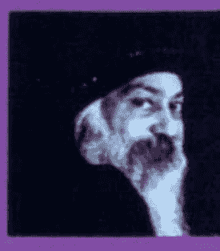
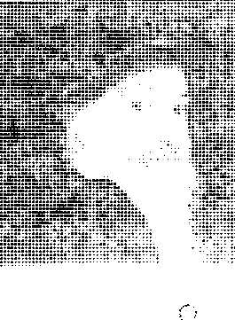

# OSHO

# 神

# THE GOD CONSPIRACY

奥修 莎薇塔 Sevita 譯

如何免於迷信，找到喜樂之境！

the path from superstition to superconsciousness!

one of the most inspiring spiritual teachers of our time

# St. Royal College
天使神秘学院

- 专业占卜预测机构
- 神秘学培训机构
- 水晶能量研究中心
- 神秘学资料库
- 官方微信：strcdts
- 微信公众平台：strc2011
- 读书交流QQ群：
  - 占星塔罗占卜师交流群：814594478（加入密码：PDF）
  - 神秘学其他综合群：659338717（加入密码：PDF）

微信号：strcdts 天使神秘学院

天使神秘学院 院长QQ：715104687

微信公众平台：strc2011

# 制作说明：

本书由《天使神秘学院》出重金从台湾购入的原版书籍扫描制作完成。为达到最好阅读效果，特地把原版书全部切开后，再经由专业扫描设备高精度扫描完成，并经过一张张的PS后期处理最终成书，其间花费大量的人力、物力以及时间，只为能给大家提供经济并优质的神秘学学习资料而努力。

本学院强力谴责某些机构和个人，把本学院花心血制作完成的电子书籍，包装后直接放在自家淘宝网上低价倾销的行为，以谋取不劳而获的经济利益。如果长此以往最终将无人愿意再为大家花心思制作电子书，那以后可能大家再无新书可读。

为让大家以后能够读到更多的好书，也为了本学院的良性发展。本学院恳请大家尽量做到如下几点：

+   一、尽量在本学院的网站购买电子书籍。
+   二、请勿用技术手段把电子书内的水印及加密去掉。
+   三、在收到电子书后小范围传阅即可，千万不要公开传播，更别挂到淘宝网上低价销售。

同时为答谢广大支持者，学院电子书将做如下调整：

+   一、学院会把一些早已收回制作成本的电子书折价销售。
+   二、最新制作的电子书籍会开放打印功能，大家购买后有条件的可自行打印成书。

天使神秘学院
2019年1月

# 神

# THE GOD CONSPIRACY

one of the most inspiring spiritual teachers of our time

如何免於迷信，找到喜樂之境！

the path from superstition to superconsciousness!

# 前言

# 目次

## 第1章 神已死，而人自由了……爲什麼？

005

## 第2章 神無法解決任何問題

103

# 第3章 神是你的慰藉

159

## 第4章 神是一個謊言

207

## 第5章 神是你的不安全感

261

# 第6章 神是你的空虚

# 第7章 神是傳教士的生意

321

365

# 前言

擁有一個懷疑的頭腦是這個世界上最美好的事情之一。宗教總是譴責懷疑的頭腦，因為
他們無法回答那些被質疑的問題；他們想要的只是信徒。

一個懷疑的頭腦和信徒是剛好相反的兩回事。
一個懷疑的頭腦和信徒是剛好相反的兩回事。不要相信任何事情，除非你自己曾經經驗過。不要相信任何事
情——持續的質疑，不論那要花上多久的時間。
真理並不廉價。它不屬於那些信徒；它只屬於那些質疑的人。

只要記得一件事：不要只是敷衍式的質疑。要成為一個全然的懷疑論者。當我說成為一
個全然的懷疑論者時，我的意思是你「懷疑」的這個想法也要像其他信念一樣的經過檢驗。

一個懷疑的頭腦，當它徹底時，也會把它自己燃燒殆盡，因為你也需要懷疑你自己的懷疑論點。你不能只留下你的懷疑而不加以質疑；否則那你距離神秘家也就是一種信徒式的觀點。

如果你能夠質疑你內在的懷疑論而不加以質疑；那麼你距離神秘家也就不遠了。

什麼是神秘家？——他是一個知曉沒有答案的人，他是一個曾經問過各種問題，卻發現沒有什麼問題能夠獲得解答的人。了解這一點之後，神秘家放下了問題。不是因為他找到了
解這一點之後，神秘家放下了問題。不是因為他找到了解答，而是他了解到一件事情：那就是答案根本不存在——生命是一個奧秘，不是一個問題。不是因為他找到
的奧秘，一個值得熱愛以及歡舞出來的奧秘。

題。它不是一個需要被解決的謎題，也不是一個等待被解答的問題，而是一個需要親身經歷
一個全然質疑的頭腦注定會成為一個神秘家；因此，我的門是向所有的人敞開的。我接
受懷疑論者，因為我知道如何讓他轉變成一個神秘家。我邀請有神論者，因為我知道如何帶走他的無神論。我的門不拒絕任何
擺毀他的有神論。我也邀請無神論者，因為我知道如何帶走他的無神論。我的門不拒絕任何人，因為我不給予你任何信念，我只提供你方法，提供你靜心，讓你自己去發覺什麼才是真的。

實的。

我已經知道答案是不存在的。所有的問題都是沒有意義的，而所有的答案也只是徒勞。

所有的問題都是由那些傻瓜所提出來的，而偉大的哲學卻因為這些問題而產生。這些哲學其
實都是由那些聰明和狡猾的人所創造出來的。如果你想要與現實保持和諧一致，你不能是個傻子，也不能是個精明的人。你必須是天真的。所以不論你帶了些什麼到這裡來——不論它是懷疑論、無神論、有神論、共產主義、法西斯主義，還是任何一種鬼扯理論，你都可以到這裡來——我的藥方都是一樣的。不論你來到這裡，你的頭腦塞滿了什麼樣愚蠢的理論。我都會毫無區別的切掉你的頭。是誰盤據在你的腦袋裡並不重要——重要的是我都会把它們砍掉。我就只是一個伐木的人。問題能否請你談談懷疑和否定？它們有什麼差別？

處它們的差異是非常大的。它們看起很像；表面上它們有著同樣的顏色，但內在深處
懷疑和否定之間的差別非常大。它們看起很像；表面上它們有著同樣的顏色，但內在深處

首先，懷疑不是否定；也不是肯定。懷疑是一種敞開的頭腦狀態，它没有任何偏見。它是種探詢的方式。懷疑沒有做出任何陳述，它就只是提出一個問題而已。而這個問題是爲了能夠找到、知道真理是什麼。

懷疑是一種朝聖之旅。它是人類諸多價值裡最神聖的一項。懷疑並不意味著「不」。它只是說，我不知道，而我準備好要去了解。我願意盡可能的深入了解，除非我自己真的知道，否定则我是如何能夠說是呢？——它已經有結論了。只不過一個人說神存在；他的陳述是肯定的。另外一個人說神不存在；他的陳述是否定的。但是兩者都在同一艘船上，他們沒有什麼差别。兩者都不是在詢問。不論是有神論者還是無神論者，他們兩者都不曾質疑過；兩者都接受借來的知識。但是懷疑論者是具有決定性的。「我想要知道，而且除非我自己知道了，那不是知識。只有我自己的經驗才是具有決定性的。他不是傲慢，也不是否定任何事情。他只是保持敞開的心去探尋。懷疑不是不相信——這點是宗教一直企圖在混淆人心的。他們把懷疑混淆成不相信。事實上，不相信和相信是完全一樣的。兩者都是接受來自他人、書本或是上師的知識。記得一件事，對於任何你不懂的事情，當你開始相信或不相信的時候……你就錯失了一個探索的絕佳機會。透過你的「是」或「不」，你已經關上了門。你哪裡都沒去過。說「是」是比較容易的，說「不」也是比較容易的，因為你什麼都不需要做。但是懷疑是需要勇氣的。懷疑需要勇氣才能夠讓自己保持在一種不知道的狀態，然後繼續質疑每一件事情，直到自己發現真實。當你發現真實的時候，那時既不是否定也不是肯定。你就只是知道——那是
來自於你自己的經驗。我不會說那是一種肯定，因為肯定總是伴隨另外一極的否定而存在。經驗是超越這兩者的；經驗超越了整個世界上所有的二元性。這才是真正的智慧。懷疑是到達真理的方法。`不`或`是`都不`都是一樣的時候，你或許會覺得很奇怪。因為字典上它們的意義是相反的，但是事實上它們並不是相反的。它們只是看起來是相反的，它們兩者都不曾質疑過。兩者都不曾試著去尋找真實到底是什麼。共產主義的相信，跟天主教的相信是一樣的。共產主義相信神不存在。你可以說它是一種不相信，但那是它的信念。因為他不曾質疑過，他不曾靜心沉思過；他不曾做過什麼事情。兩者都不曾試圖向真理來發現神的不存在。有神論者說神存在。但是他不曾做過任何事情。兩者都不曾試圖向真理前進一步，但是兩者都做出了選擇。那也就是為什麼有時候會發生這種很奇怪的事情：一個有神論者，一個相信的人有可能会在瞬間變得不相信，變成一個無神論者；而且反之亦然。在俄國大革命之前，俄國人是世界上最相信神的存在、最具有宗教性的國家。在蘇俄，上百萬人可以為了神犧牲自己的生命。但是俄國大革命之後，政權改變了，教士改變了，當《聖經》被馬克思的《資本論》所取代之後，整個國家在十年之內全都變成了無神論者。這是不可思議的！那些一輩子都相信神存在的人開始變得不相信了。甚至連共產主義都
無法相信這群人和之前那些可以為神而死的人是同樣的一群人——而現在他們居然願意為神
實的不存在這個主義而死？到目前為止從來没有人分析過這種情況，到底哪裡發生了問題。事
懷疑是反對這兩者的。懷疑是一個獨立個體的堅持，他想要自己去品嚐、去經驗真理。

他不準備從別人那裡接受真理，不論是哪一種形式。

那些懷疑的人是非常非常稀有的人。但是讓我告訴你：這些懷疑的人都是被祝福的人，
因為他們將到達真理的王國。懷疑是艱辛的，懷疑是冒險的，懷疑是危險的。他就只是一個人進入未知裡，没有任何準備、没有任何偏見。他進入到黑暗的洞穴裡，甚至不相信在洞穴
通道的盡頭會有出路，他自己還能走出黑暗。這其中没有任何信念；他就只是接受了挑戰。

這其中有的是懷疑、問題。他自己變成了一個問題。

擁有答案是非常令人感到安慰的事情，而且如果答案還是隨手可得的話，就像是……

耶誤說過：「只要相信我，然後你不需要煩惱：我會照顧一切。我會在審判日的那一天選擇
你。我會向神推薦你：「這些是我的人——他們應該被允許進入天堂。」而你唯一需要做的
就是相信。這是一條真正的捷徑——只要相信就夠了。那就是為什麼世界上成千上萬的人
開始相信，也有成千上萬的人不相信。他們的源頭或許不同，但是他們的基本取向都是一樣的。

在印度有一個非常古老的哲學——無神論教派（charvaka）。這個哲學認為世界上沒有
神、沒有天堂、沒有地獄，你做惡的行為不會被懲罰，你行善的行為也不會有獎賞。當時有上千個人相信這個哲學。這個哲學是否定式的，它是絕對負向的，但是它讓那些相信的人感到非常舒服。你可以偷竊，你可以殺人，你可以做任何你想做的事情；而沒有任何事情會在死亡後存留下來。在許多方面，西方是落後於東方的，特別是宗教、哲學和文化。無神論教派是一個擁有五千年以上意識型態；而卡爾·馬克思才剛在上個世紀末提出「神不存在」。這個說法。他並不知道無神論教派，他認為自己提出了個偉大的發現。但是無神論教派已經抱持這個信念五千年了；只是他們也沒有探詢過。經做出無神論教派這個哲學的人叫做布瑞哈斯帕提（Brihaspati）——他必然是個富有魅力的。他讓人們相信他們可以做任何他們想做的事情，因為不論是小偷、謀殺者還是聖人，最終都會走向一樣的死亡終點。而在死亡之後沒有什麼會留存下來；聖人消失了，罪人也消失了。所以不需要擔憂任何關於死後的生命，那根本就不存在。这不是什麼探詢後的結論，因為無神論教派和他們的師父布瑞哈斯帕提從來不曾超越死亡。根據他們的哲學，如果他們曾經超越死亡，他們也無法再回來——所以他是根據什麼來說「死後没有任何東西會留存下來」？沒有人曾經拜訪過死亡之境。但是要相信是很容易的。布瑞哈斯帕提最有名的陳述是：「Rinam kritva ghritam pive。這句話的意思是：「如果你向人借了錢，那就借了，然後盡你可能的喝酥油。——因為在你死後你不会遭到任何質
疑、處罰。那個借你錢的人沒有辦法把你拖到神的法庭上；因為這種事情根本不存在。布瑞哈斯帕提的整個哲學很簡單，就是「吃、喝，還有享樂」。你可以相信這種哲學——雖然那些有神論者會說那是一種不信任。這就是卡爾·馬克思對共產主義所做的事。他說沒有靈魂，沒有意識；這些都只是物質的衍生物，所以當身體崩毀後，沒有什麼會留存下來。這是一種非常危險的態度，因為共產主義者可以因此而不加思索的殺人。他們的信念是殺人不是什麼罪。因為沒有人身體裡；沒有所謂的內在。一個人只不過是化學、生理和生理合成物而已——其沒有靈魂。所以以約瑟夫·史達林可以在大革命之後殺掉上百萬人，卻對自己的行為沒有任何一絲的懷疑。在蘇聯，人們被物化成機械。你可以殺戮——卻沒有被殺掉，因為一## 前言

怒，没有歉意。他不存在，我能怎么办呢？那不是我的错。

但是人的头脑想要的是极端的说法呢？这一点值得我们了解。

为什么人的头脑想要极端的说法呢？你如果不是一个有神论者，那么就是一个无神论者；你如果不赞成，就是反对。头脑不让你有第三种可能。理由很简单：第三种可能会造成头脑的死亡。头脑存活在极端主义里；那是它最主要的养分。

完全的中庸之道会讓两个极端消融不见，让矛盾开始融合，而這会讓头脑失去作用。头脑没有办法想像矛盾的双方如何能够相融，相反的两极如何能够合一體。但是在存在裡它们是相融的，它们是一體的。你曾经见过生和死是分离的吗？是你的头脑把它加以分類，成为不同的字眼。但是看看整个存在——生命變化成为死亡，死亡變化成为生命。其中没有區隔，它们是同一個整體。

头脑创造出了美和醜这种概念。但是在存在裡……试著想一想，如果所有的人類头脑都從這個地球上消失——還會有任何事情是美麗的嗎？或任何事情是醜陋的嗎？玫瑰還仍然會是美麗的嗎？不，當头脑消失時，没有人會在那裡做任何評判，而美和醜是來自头脑的評判。

玫瑰還是在那裡，就像那些刺也會在那裡一樣，但是不會有任何評判出現，因為評判的人消失了。玫瑰和刺兩者會同時存在，而它们之間没有任何階級高低的差別。玫瑰不會比刺來得更高尚。然後金盞花也不會是一種貧窮的花，玫瑰花也不再是一種富裕的花；它们會有著相同的地位。

所有的階级都是头脑所創造出來的：低等的，高等的，贊成的，反對的……。

现在试著用另外一种方式來思考：讓头脑仍然在那裡，但是暫時放掉評判——這會有一點困難。你可以想像头脑消失後的狀態，你也可以清楚的知道在那之後不會有所謂的美醜可言。所有一切事物就只是他們自己本來的樣子，没有任何比較、評判和標籤。

现在再试著用另外一种更困難的方式。讓头脑在那裡——所有的头脑都還在，但是没有人在做評判——一個小時，不做任何評判。那麼還會有所謂的美和醜嗎？還會有所謂道德不道德嗎？還會有聖人和罪人嗎？在那一個小時裡，所有這些分類都會消失，而你會第一次真正如實地接觸到真實，不再是經由你的头脑的投射。你的头脑持續不斷地製造分裂；否則，誰是聖人誰又是罪人呢？

人類的头脑很輕易就接受任何極端的部分，因為極端是头脑的生命能量。当两个极端会合，它们彼此抵消之後只會剩下空白。那就是中庸之道的意思：让两个极端的事物来到一个彼此抵消的點上，然后突然間你被留下來，你既不是一个无神论者，也不是一个有神论者。

这些問題会變得完全無關緊要。但是人類的头脑還沒有準備好要放下——不論是宗教、哲學，或者甚至在科學上。

最近我看了個關於數學演進史的紀錄片。整個數學的歷史可以被視為是人類头脑的問題的歷史。西方用了超過兩千年的時間，而東方則花了五千年到一萬年的時間，兩邊的數學家都試著尋找最終極的科學。在他們的眼裡有一件事情是很明確的，那就是只有數學可以成為最終極的科學，理由很簡單，因為在你周圍沒有關於數學事物的存在。它是純粹的科學。 你不會看到數學的事物：像是這是一張數學的椅子，那是一棟數學的房子。數學就只是一種純粹觀念上的遊戲。它純粹由概念所構成，其中沒有其他任何實質的東西。而因為概念是屬於头脑的財產，所以你可以把它們琢磨精煉到它最終極的純粹狀態。所以人們普遍接受數學是最純粹的科學這件事情。但是它仍然還是有問題。那些數學家們沒有注意到你的头脑本身 就是一個問題，头脑會不斷地嘗試創造一個沒有問題、沒有矛盾和衝突的科學。 你可以玩這個遊戲。你可以製造出一個龐大的體系，但是每當你看著它的基礎時，你會知道它最根本的問題仍然是懸而未決的。比如說，歐幾里德的幾何原理……我沒有辦法深入其中的理由非常簡單，我無法同意它最基本的假設。我的幾何老師曾經這樣對我說，一你的 問題與我無關。去找歐幾里德——離開我的教室，去找歐幾里德，跟他把事情搞清楚！我只 是一個教師，在這裡賺一份薪水；我和他最根本的數學邏輯没有任何關係。不論書上寫些 什麼，我就教些什麼。我對於他最根本的邏輯假設是對是錯有任何興趣。你出去！他甚至不讓我待在教室裡。

# 前言

我說：「可是在你知道它最根本的原理是如此荒謬之後，你怎麼還能夠夠年復一年的繼續教下去？」

他說：「我從來就不知道它是荒謬的；是你把“它是荒謬的”這個概念打進我的腦海裡。我從來就不在意；我既不是個科學家也不是數學家，我只是個窮教師。而我以前從來就不想當一個老師。我試著應徵其他的工作；可是到處都沒有空缺，我是被迫在這裡當一個老師的。所以不要煩我，你的問題跟歐幾里德有關，不要把我扯進去。如果你想要知道那些書上所寫的東西，我可以教。但是如果你跟我說它根本的原理是錯的……」

我說：「除非我確定它的基礎，否則我沒有辦法繼續，因為這是危險的：在房子缺乏基的情況之下，你要我繼續往上到高樓大廈裡？我甚至沒有辦法移動一吋。首先我必須知道它是否有足夠的基礎來支撐這整個大樓。你會摔下來的——那是你的問題——但是我不會和你一起摔下來。如果你要自殺的話，請繼續！」

他說：「這很奇怪！跟著歐幾里德，沒有人會自殺。你在說些什麼？」

我說：「我說的就是我字面上的意思。這是一種自殺。歐幾里德有任何一個假設是有道理的。」

道理的。

兩千年以來，歐幾里德原理不僅被認為是幾何學的基礎，還是所有其他科學的基礎，因為它也被應用在其他的科學上。比如說，他說一條線只有長度——只有長度。

我問我的老師：「你畫一條只有長度的線給我看。當你畫一條線的時候，它還是會有寬度，不論那寬度是多麼的小。而一個點——根據歐幾里德的說法——是沒有長度也沒有寬度的。我說：「你畫一個沒有長度也沒有寬度的點給我看。然後同一個歐幾里德，他還說過線是由點所構成的——一個點接著一個點，一排的點。現在，他說線只有長度，而點既沒有長度也沒有寬度——這麼一來線怎麼會有長度呢？因為線是由一排的點所構成的。它的長度是哪裡來的？」
他就只是把雙手交疊在一起，對我說：「離我遠一點。我跟你說過我只是個窮教師，你已經超越我了。」我說：「這不是什麼回答。你可以就只是接受這些數學邏輯是沒有道理的。但是頭腦有一種瘋狂的衝動，它要每一件事情都是說得通的……如果有什麼是無法解釋的，那麼至少要能說得通。任何矛盾或困惑的事情都會不斷干擾著你的頭腦。哲學、宗教、科學和數學的整個歷史都有著同樣的根源、同樣的頭腦，也有著同樣的痛處。你可以用自己的方式來擺脫，其他人或許會有其他的方式，但是你需要了解這個痛處。這個痛點來自於認為一整個存在不是一個奧秘——這個信念，只有當存在不再那麼奧秘時，頭腦才能夠覺得自在。

# 前言

宗教透過創造神、聖靈和唯一的聖子而達到了這一點；不同的宗教創造出不同的事情。

這些都是他們用來掩蓋那個無法掩蓋的缺陷；不論你做些什麼，那個缺陷都會在那裡。事實上，你越是試圖掩蓋它，反而越是強調了它。你整個試圖掩蓋的努力顯示出你害怕有人會看到那個缺陷的恐懼。

到我小的時候這種事情每天都不斷的發生，因為我喜歡爬樹：樹越高，我得到的快樂就越多。所以很自然地我常常從樹上摔下來；到現在 我的腳、膝蓋和身體到處都還有著傷痕。

因為我持續不斷地爬樹又不斷地從樹上摔下來，所以我的衣服每天都會被扯破，而我的母親會告訴我：‘不要穿著有破洞的衣服出去。讓我修補一下。’

我說：‘不，不要做任何修補。’

她說：‘可是人們會看到你是這個鎮上最好的服飾商人的兒子，卻老是穿著有破洞的衣服服在鎮上晃來晃去；没有人照顧。’

我說：‘如果你修補的話，它會變醜。現在每個人看到它都是新的。我出門的時候衣服上沒有洞，它是新的，我才剛從樹上掉下來。但是你一修補……它就變成是我試圖隱藏的老東西。你的修補會讓我看起来一副很窮的樣子，我這件有破洞的衣服只會讓我看起来很有勇氣。別擔心這些洞了。’

整個人類的头脑，不論來自於哪裡，都曾經做著類似修補的工作——特别是在數學上，

因為數學是一種純粹的头脑遊戲。雖然有些數學家認為不是如此，就像那些神學家認為神是 一個事實一樣。神只是一個概念，如果馬有概念的话，那麼他們的神會是一匹馬。你可以確定那絕對不會是個人，因為人對馬是這麼地残忍，所以人只會被認為是惡魔，而不是神。但是這麼一來，所有的動物都會有牠們自己關於神的概念，就像每一個種族都有他們自己的神 的概念一樣。 概念只是一種填充替代物，当生命是奧秘的，而你又發現其中有許多空隙是無法被事實 所填補時，你就用各種概念來填充這些空隙；這麼一來你至少可以開始感到滿足：生命是 可以理解的。 你曾經想過「understand(了解)」這個字嗎？任何你可以立足於其上(stand under) 的東西，都是在你的拇指底下，在你的力量底下，在你的鞋子底下，你是他的主人。那些試著了解生命的人其實是用同樣的方式，讓他們可以把生命踩在腳底，然後宣稱：「我們是主人， 沒有什麼是我們無法了解的。」 但是這是不可能的。不論你做些什麼，生命就只是一個奧秘，而且它會一直保持是一個奧秘。就算你終於了解整個生命，另一個新的問題也會出現：「這個人是谁？這個头脑、這 個意識，這個可以了解所有一切的人是谁？他是從哪裡來的？」 有一部紀錄片，談到一個二十世紀初的數學家——那是一個非常有名也是有史以來最偉 大的數學家之一。他的名字是佛瑞格(Freger)，他把他的一生都用來創造一個能夠解決所有矛盾、奧秘、疑惑和問題的數學系統——一個最終極的解決之道。在那部紀錄片裡，他才剛要出版這本書——現在它已經出版了，而佛瑞格他真的完成了一個了不起的任務。當時另外有一個叫做伯特蘭。羅素的——也對數學很有興趣。後來羅素寫了一本在數學上極具重要性的一本書《數學原理》（Principia mathematica），那本書裡的三百六十二頁都在證明“一加一等於二”這個事實。這本書簡直是一件奇蹟——光是要閱讀它就足以把任何人逼瘋！甚至羅素自己也承認：“在寫完這本書之後，我再也不曾那麼清晰過；我所有的明晰度都消失了。可以確定的是他在其中投注了太多的能量，而且還是一種奇怪的能量；沒有人閱讀過那本書。”羅素對數學很有興趣。當他知道佛瑞格當時即將要出版這本能夠解決所有矛盾、奧秘和數學難題的書時，他送了一個小小的謬論（paradox）給佛瑞格——那是一個簡單的謬論。而當佛瑞格收到它的時候，他感到極度的驚愕，他覺得他所有的熱誠都消失了。那本書已經準備好要出版了一—書有兩卷，那是他畢生的工作——但是這個人送來一封附有一個小小謬論的短信，裡面寫著：一在你出版之前，請想一想這個謬論。這個謬論後來成為有名的羅素謬論。

它非常的簡單，但是佛瑞格卻沒有辦法回答它。他在世的时候始終沒有出版那部書；書 在他過世之後才出版的。這部書是一部極具歷史意義的書，但是就解決所有難題的目的而言，言，他失敗了。他没有辦法解決羅素寄給他的這個簡單的論。這個論非常簡單：一個國家裡的所有圖書館員被要求條列出圖書館裡的所有書籍，然後把這本圖書目錄送到國家圖書館時，他的腦海裡出現了一個問題：一我是否該把這本目錄列在我的圖書目錄送到國家圖書館時，他的腦海裡出現了一個問題：一我是否該把這本目錄列在我的圖書目錄裡？——因為它現在也是我的圖書館裡的一本書了。而命令很清楚要圖書館裡所有的書籍都條列出來。所以我關於這個部分我該怎麼辦？它是圖書館裡的一本書，所以根據收到的命令，把它條列進來似乎是對的。——這個問題必然也出現在許多圖書館員的腦海裡。所以結果是被送到國家圖書館的目錄有兩種。一邊是包含了目錄本身的目錄，而另外一邊則沒有。這個國家圖書館的館員被要求把所有那些沒有包含自己的目錄編成一本目錄，所以他把那些沒有包含自己的目錄編列成目錄。但是當他結束時，他也困惑於該拿它自己這本目錄怎麼辦。如果他不把它條列進去，那麼這本目錄就不再是不含括自己的目錄了。壓他這本目錄就少了一本沒有含括自己的目錄。但如果他把它條列進去的話，那麼這本目錄就不再是一本不含括自己目錄的目錄了。所以羅素寄出這個簡單的論：一這個圖書館員該怎麼辦呢？在你解決其他較大的問題之前，請解決這一個！這個圖書館員碰到困難了。—

現在，不論你做什麼都是錯的。如果你不把這個目錄列進

那創造了極大的一股同情的波浪。這股波浪是自然的現象。那十二個老糊塗開始發現以往從來不聽他們師父演講的人現在開始傾聽他們了。慢慢地人們開始聚集起來。他們創造出《聖經》，他們創造出教會。他們編造出故事、神蹟——這一點在耶穌離開之後變得比較容易。在當時，這些事情都只是謠言。但是當謠言不斷的口耳相傳之後，它變得越來越大，因為每個人都會加點料進去。經過三百年的時間，耶穌變得比當時的他要大上一千倍；他變成了一個神話。原本的他只是一個在城牆邊說話的平凡木匠的兒子，但是經過三百年的時間，人們的想像力完成了所有的工作。

然後在這兩千年裡，所有學者、教授、神學家和哲學家又盡其所能的強化這個神話——闡述耶穌的話語、意義、哲學和神學等等，而這些都是那個可憐的傢伙自己都一無所知的。

我不反對神或耶穌基督——我不反對任何人。但是我支持真理。如果這一點打擊到任何人的話，我是無能為力的。

問題 當你說神不存在時，那是否表示你是一個無神論者？

神不存在，但是那並不表示我是一個無神論者。當然，我也不是一個有神論者——我說的

是神不存在——那並不表示你就要跳到另外相反的那一端，無神論者也說神不存在

在，但是當我這樣說的時候，我的陳述和無神論者的陳述有著截然不同的差別——因為我同時也說神性(godliness)是存在的。

無神論教派不會同意這一點；伊比鳩魯、馬克思和其他無神論者也不會同意這一點。對他們來說，否定神意味著否定意識。對他們來說，否定神意味著這個世界就只是物質而已，而所有你認為是意識的部分只不過是物質組合在一起之後的衍生物，只是一種副產品。一旦把那些物質拆解開來，這個衍生物也會消失。

以問：「這還是一輛牛車：你可以把輪子拿掉，你可以把輪子拿掉時，答案當然是「它不是」。没有任何一部份會是整體。你可以拿掉每一個部分，一件一件地拿掉，直到整個東西都不見了，而沒有任何一個部份有拿掉牛車，在這個過程裡没有任何一樣被拿掉的东西叫做牛車。」何一個單獨的部分可以說是牛車。到最後你可以問：「現在看，牛車在哪裡？——因為我們沒

「意識是一個附帶現象」的意思：一旦你拿掉了身體，拿掉了大腦，拿掉了所有構成一個人類的各個部分時，你不会找到任何像是意識一樣的東西。而一旦你去除所有這一切之後，不會有意識被留下來；它只是一個綜合體。你把這整個綜合體拆解掉了。

所以當我說神不存在的時候，我並不同意馬克思和伊比鳩魯的看法。我當然也不同意耶

鮮、克里希納、摩西、默罕默德他們所說的一神存在一這種說法，因為他們把神看成是一個人。現在，認為神是一個人的這個想法只是你的想像。中國的神會有中國人的臉，非洲的神會有非洲人的臉，當然猶太人的神也必然會有猶太人的鼻子；他不可能其他的樣子。這些都只是投射而已。把神人格化是你的—種投射。當我說神不存在時，我否定的—是神被人格化的那個部分。我說神不存在，但是卻有著無比的神性存在。神性是非個人的能量，它是一種純粹的能量。把任何形式加諸在它上面都是醜陋的，你其實是把自己強加在它上面。基督教的神實在基督教的教義消失時跟著消失，印度教的神會在印度教的教義消失時同時消失。你了解我所說的嗎？那是你的投射。如果你持續投射，它會持續存在。如果你不在那裡投射了，如果投射器消失，神也就消失了。我不喜歡這種神，我不喜歡這種被人類渺小頭腦所投射出來的神。而且這種渺小的頭腦當然會把它自己的品質加諸在神身上。猶太法典裡的神說：「我是個憤怒的人。我不是什麼好人；我不是你的叔父。」就當時猶太人的處境來說，這句話是完全有意的，但是對印度教徒來說，神說「我是一個憤怒的神—這一點是絕對不可能的事。憤怒和神？—他們是不會合的。猶太人的神是憤怒的神—這一點是絕對不可能的。如果你不敬拜他，如果你違背他，他會摧毀你。這一點不會吸引印度教的人，那是不可能的。這也不會吸引回教的人，因為回教徒每天的新禱是「神，慈悲的教的；它非常人性化。如果你不敬拜他，如果你違背他，他會摧毀你。這一點不會吸引印度教的人，那是不可能的。這也不會吸引回教的人，因為回教徒每天的新禱是「神，慈悲的

人正在變老；生命正在變化成為死亡；死亡正在變化成為生命。每件事情都持續不斷的進行著，持續不斷的變化著；那是連續性的。從來沒有什麼是停止的，全然的停止。停止只出現在語言裡。存在裡沒有什麼是全然停止的。從來沒有什麼時候結束不再是個孩子的。你記得你是什麼時候結束不再是一個孩子的？——什麼時候？你的童年是什麼時候結束，然後你才成為一個年輕人的？沒有這樣一個時間點，沒有這種劃分，沒有全然的結束。那個孩子仍然遲在你的內在流動著。如果你只是閉上你的眼睛，往內看，你會發現每件事情都仍然遲在那裡，流動著。你後來吸收到越來越多的事物，但是所有那些部分仍然遲在那裡。河流變得越來越寬廣，新的溪流加了進來，但是最初的部分仍然遲在那裡。如果你曾經看過印度的恆河，你會了解它是最美的河流之一。而它的發源地是如此的 小，小到只有一頭牛的臉——它的發源地的石頭被水切割成牛的臉型——而恆河就從這個牛的臉裡開始流動，開始它的旅程……這塊地小。然而當你在海邊看到恆河時，當它到達和洋的會合點時，它自己看起來像是海洋一樣……如此巨大。但是從牛口（Gangotri，印度恆河的源頭）這塊小小的一道溪流，在喜瑪拉雅山千里之遠的地方，從一個像牛嘴的石頭開始——那個溪流現在那裡。中間有許許多多河流匯入其中，讓它變得像海洋一樣。它仍然是活生生的。甚至當它進入海洋時，它仍然是活生生的，它還在不断地流動著。或許它會變成一朵

雲；或許它會再度成為雨。它會不斷地持續著。存在不斷地持續綿延著；它從不曾結束。它也不曾間歇。沒有任何地方你可以說它結束了。沒有任何事情會結束，你會找到起點，你卻
不會找到終點，它是一個永遠流動的過程。

當你說「神」的時候你用的是一個名詞，意味著某種靜止的、死寂的事物。當我說「神性」的時候，我用的是一個活生生的字眼，它是流動著、移動著的。所以你需要清楚這些要
點。我不是和耶穌或默罕默德、克里希納一樣的有神論者，因為我没有辦法同意一個死寂的神這種概念。

神——是完美的、絕對的、全能的、全知的、無所不在的；所有這些宗教用來描述神的
字眼——都是死的，它不可能活生生的，它沒有辦法呼吸。不，我拒絕這種神，因為這樣
一個死寂的神只會讓整個存在都變得死寂。

神性是全然不同的一種向度。如此一來，樹上的綠意、玫瑰的綻放、飛翔中的鳥兒——
都是其中的一部分。如此一來，神和整個存在不再是分開的。它是這個宇宙最根本的靈魂。

這個宇宙正隨時振動著、脈動著、呼吸著……神性。
所以我不是我一個無神論者，但我也不是一個有神論者。

## 第1章

## 神已死，而人自由了……爲什麼？

一個玩偶無法爲自己的行爲負責。

責任是屬於那些能夠自由行動的人。

神和自由只有一項能夠存在，他們無法並存。

這是尼采的論述中最基本的涵意：

「神已死，因此人自由了。」（一般譯爲「上帝已死」，本書「God」皆譯爲「神」。）

唐代禪師青原行思與石頭希遜第一次會面時，青原行思問石頭希遜：「你從哪裡來？」

希遜回答：「我從曹溪來。」

行思舉起豎拂問：—你在那裡有發現這個嗎？—

希遜回答：—不，不只是那裡沒有，連西方也沒有。—

行思問：—你到過西方，是嗎？—

希遜回答：—如果我到過那裡，那我應該已經找到了。—

行思說：—還不夠，繼續說下去。—

希遜回答說：—你也應該說一說你這裡的情況，你怎麼光是催促我呢？—

行思說：—要我回答你是沒有問題的，但是沒有人會同意這一點。—

行思繼續問：—當你在曹溪時，你在那裡得到了些什麼？—

希遜回答：—就算在曹溪之前，我也没有少了什麼。—

然後希遜問：—當你在曹溪時，你知道自己嗎？—

行思問：—那你呢？你現在認識我了嗎？—

希遜回答說：—是的，我認識你了。我要如何才能多認識你一點？—

希遜繼續說：—師父，自從你離開曹溪後，你在这裡已经待多久了？—

行思回答：—我也不知道。你呢？你什麼時候離開曹溪的？—

希遜說：—我不是從曹溪來的。—

行思回答：—好，現在我知道你從哪來了。—

[PAGE 41]

希遜說：「師父，你是一個了不起的人，不要浪費時間。」

(青原行思：唐代禪宗大師，六祖慧能大師座下五大弟子之一。)

石頭希遜：唐代禪宗大師，江西青原行思禪師的法嗣。)

朋友們，一個新的系列演講將從今天開始：神已死，禪是唯一現存的真理。這個系列是

獻給尼采的，他是歷史上第一個宣稱「神已死，因此人類自由了」的人。

那是一個不得了的聲明，其中蘊藏著許多含意。首先我想要討論一下尼采說過的這句話。

所有的宗教都相信是神創造了這個世界和人類。但是如果你是由某人所創造的，那麼你只會是一個玩偶，你不會有自己的靈魂。而且如果你是由某人所創造出來的，那麼他也可以在任何時候結束你這個東西。他從來沒有問過你是否想要被創造出來，所以他也不會問你：「你是否想要結束？」

如果你接受他創造了世界還有人類的這個謊言，那麼神就是最大的獨裁者。如果神的存

在是事實，那麼人類就是奴隸，就是玩偶，而操縱這個玩偶的線都在他的手裡，甚至包括你

的生命。這麼一來根本沒有所謂開悟不開悟的問題，也沒有所謂成為佛的這種問題，因為人

類根本就沒有任何自由可言。他拉一拉線，你舞蹈：他拉一拉線，你哭泣：他拉一拉線，你開始殺人、犯罪、掀起戰爭。你只是一個玩偶，而他是那個操縱玩偶的人。這麼一來也沒有所謂善與惡、聖質和罪犯的問題。如此，沒有什麼是好的，也沒有什麼是壞的，因爲你只是一個玩偶。一個玩偶無法爲自己的行爲負責。責任是屬於那些能夠自由行動的人，神和自由這者只有一項能夠存在，他們無法並存。這是尼采「神已死，因此人自由了」這句話最基本的涵意。沒有任何一個神學家或宗教創始人曾經思考過這一點，如果你接受神是造物主，那麼你就摧毀了整個意識、自由以及愛所具有的尊嚴，你剝奪了人類所具有的責任，你也剝奪了人類所有的自由。你把整個存在簡化成那個被稱爲神的 一時興起之作。但是尼采的這句話只是鋼板的其中一面而已。他說得完全沒錯，但是他只說出了鋼板的其中一面。他提出了意義深遠且重要的宣言，但是他忘記了一件事，而這件事是一定會發生的，因爲他的話語是根據理性、邏輯和推理而來，不是根據靜心而來的。

類所有的自由。你把整個存在簡化成那個被稱爲神的 一時興起之作。但是尼采的這句話只是鋼板的其中一面而已。他說得完全沒錯，但是他只說出了鋼板的其中一面。他提出了意義深遠且重要的宣言，但是他忘記了一件事，而這件事是一定會發生的，因爲他的話語是根據理性、邏輯和推理而來，不是根據靜心而來的。人類是自由的，但是人類是爲了什麼而自由呢？如果神不存在，而人類是自由的，那麼這意味著人類現在可以做任何事情，不論好壞；然後没有人可以評判他，也没有人可以原諾。這就是鋼板的另一面。你除去了神，然後把人類留在全然的空無裡。當然，你宣布了人

這意味著人類現在可以做任何事情，不論好壞；然後没有人可以評判他，也没有人可以原諾。這就是鋼板的另一面。你除去了神，然後把人類留在全然的空無裡。當然，你宣布了人

類的自由，但是人類是爲了什麼目的而自由呢？他要如何以一種具有創造性與責任感的方式來運用這種自由呢？他要如何避免把自由貶低成爲放縱呢？

尼采從來不曾覺知過任何一種形式的靜心——而靜心正是銅板的另一面。人是自由的，但是唯有以靜心爲根基，人類的自由才會是一項祝福以及令人喜悅的事情。除去神的存

一些意義、一些創意、一些敬重、還有一些通往不朽存在的道路，所以禪宗是銅板的另外一個面。

禪宗裡没有任何神，那是它所具有的美。禪宗是一種無與倫比的科學，它能夠變你的意識，爲你帶來如此深的覺知，以至於你根本無法犯罪。而這不是來自任何外在的戒律，而是來自你內在最深的存在。一旦你知道了自己存在的核心，一旦你知道你和這整個宇宙是一體的——而且這個宇宙從來不曾被創造出來，它始終都在這裡，它還會繼續無窮無盡地存在，從永恆到永恆——一旦你知曉了自己光輝燦爛的存在、知曉了你內在潛藏的佛，那麼## 神已死，禪是唯一現存的真理

他們甚至連一神不存在這件事都不曾提過，因為那不是重點。他們不是無神論者，也不是有神論者。神就是不存在，所以也根本沒有無神論或有神論的問題可談。但是我沒有發瘋。你们都是我的證人。這一點並沒有在我的內在創造出空虛；相反的，神的不存在讓我獲得一個自由個體所擁有的尊嚴——能夠自由的成為一個佛。而這就是自由最終的目的。除非你的自由讓你的覺知真正地綻放，除非這份自由的經驗引領你進入永恆，引領你來到你的根，進入宇宙和存在，否則你遲早會發瘋。因為你的生命會是無意義的、無足輕重的。不論你做什麼都沒有差別。

根據這些所謂的存在主義者，也就是那些創始人尼采的追隨者的論點，整個存在是絕對愚蠢不聰明的。他們去除了神，所以他們認為——就邏輯而言，這看起來確實是如此——如果神不存在的話，整個存在便是死寂的，沒有聰慧可言，也沒有生命可言。過去神就是生命，神就是意識。神是我們存在裡最有意義也是最重要的部分，因此當神消失時，這整個存在也就變得沒有靈魂、沒有意義，生命變成只是物質的衍生物而已。所以當你死亡時，這一切也跟著死亡，沒有什麼會留下來。

也因此不會有所謂好壞的問題。存在是全然無動於衷的，它一點也不在乎你。過去神在乎你。但是一旦神被去除了，一種巨大的陌生感開始出現在你和存在之間。你們之間沒有任何關係，存在不在意你，它也沒有辦法在意。因為它不再具有意識，它不再是一個有智慧的宇宙，而是跟你一樣只是一個死寂的物質。而你所知道的生命也不過是個衍生物罷了。而當衍生物跟創造出它的元素分開的時候，衍生物馬上就會消失。比如說，某些宗教相 信人類是由五種元素所構成的：土、風、火、水和天空。一旦這五種元素分離時，生命也就消失了。當這五種元素聚集在一起時，生 命就像是衍生物一樣的產生。當這五種元素分離時，生命也就消失了。說的更清楚一些……當你一開始學騎腳踏車時，你會跌倒很多次。我也曾經學過如何騎腳踏車，但是我學習的過程中從來沒有跌倒過，因為我先觀察其他的初學者，觀察他們為什麼會跌倒。他們跌倒是因为他们没有自信。要能夠待在兩個輪子上，你需要絕佳的平衡感，只要你一猶豫……那就像你走鋼索一樣。如果你稍有瞬間的猶豫，那兩個輪子便會讓你無法安穩的坐著。只有保持在某種特定的速度，那兩個輪子才能保持平衡。而初學者向來移動的很慢。很明顯地——就一般邏輯而言——如果你剛開始學騎腳踏車的話，你不應該騎的太快。我觀察過所有的朋友如何學騎腳踏車，他們總是對我說：「你為什麼不學一學呢？」我說：「我先進行觀察。我觀察你們為什麼會跌倒，還有為什麼幾天之後你們就不再跌倒了。一旦我抓到這個要點之後，當我第一次騎腳踏車的時候，我就盡可能的騎得飛快。一個我所有的朋友都很驚訝。他們說：「我們從來沒有看過哪一個初學者騎得這麼快。」初學者是注定會跌個幾次跤，然後才會學到如何找到平衡。我說：「我已經先觀察過，所以我找到了竅門。那個竅門是你們不夠有自信，你們沒有警覺到要保持平衡，你需要維持著某種特定的速度。你不可能停下腳踏車而坐在上面不跌倒，它需要某種動能，所以你必須不斷的騎。」一旦我知道問題在哪裡之後，我就騎得飛快，結果我們村子裡的每個人都在想：「他會發生什麼事，他根本還不會騎腳踏車……而他居然騎得那麼快！」對我來說，難的是如何停下來；如果我一停下來，那麼腳踏車也會跟著跌下來。所以我騎到火車站附近一棵巨大的菩提樹那裡，那裡距離我家幾乎有三公里遠。在那三公里的過程裡，我衝的飛快，所以每個人都讓出道路站到一旁去。他們說：「他簡直是瘋了！」所以我把車騎進那棵中空的樹裡面，讓腳踏車的前輪卡在樹裡面。這麼一來我就可以停下來，而沒有所謂跌倒的問題。我們村子裡當時有一個人正在他的田裡工作，看到這個情況時，他說：「這就奇怪了。」他問我：「如果沒有一棵像這樣的樹在這裡的話，你要怎麼停下來呢？」我說：「我現在已經學會如何停車了，因為我剛剛辦到了；我以後再也不需要任何一棵樹了。這是我第一次騎腳踏車。我從來沒有看過其他人是怎麼停下來的，我只有看過他們跌樹了。

當我開始學開車時，我是從一個叫做瑪吉德的 人那裡學的，他是一個回教徒。他是那個城市裡最好的駕駛，而且他非常喜歡我。事實上，我的第一輛車是他幫我選的，所以他對我說：一我會教你開車。一我說：一我不喜歡被教導。你只要開慢點，好讓我可以看和觀察。一他說：一你的意思是什麼？一我說：一我只透過觀察來學習。我從來不想要任何老師。一他說：一但是這很危險！腳踏車還好。頂多你就是傷到自己或別人，而且不會太嚴重。但是車子是一個危險的東西。一我說：一我自己就是一個危險的人。你只要開慢一點，然後同時告訴我所有的事情，像是腳踏板在哪裡，加速器在哪裡，煞車又在哪裡……你只要告訴我就好。然後你慢慢的前進，我會走在你旁邊，觀察你是如何進行的。一他說：一如果你想要用這種方式學習的話，我可以這樣做，但是我實在很害怕。如果你用騎腳踏車的方式來開車……我說：一那就是爲什麼我會試著觀察得更仔細些。一在我獲得某些概念之後，我就叫他下車。然後我用我學騎腳踏車時同樣的方式開車。我開得飛快。我的老師瑪吉德在我後面追著、吼著：一別開這麼快！一在那個城市裡是需要到處掛著速度限制的，因爲在印度的街道上，你的速度不可能超過五十五公里。所以街上不但是那可憐的傢伙實在是太害怕了。他在我的車子後面追，他是一個賽跑冠軍，當時他很有可能成爲整個印度的冠軍，甚至哪一天進入奧運競賽中。他當時努力的在我後面追，但是我很快就消失在他的視線裡了。當我回來時，他正待在一棵樹下祈禱，向神祈禱我的安全。而當我在他身邊停下來時，我停的很近，所以他整個人跳了起來，完全忘記了祈禱這回事。我說：一別擔心。我已經學會開車這件事情了。你又在那裡做什麼呢？一新禱神忙你，因爲你根本不知道怎麼開車。你第一次坐在駕駛座上，而且根本没有人知道你開到哪裡去了。你是怎麼轉彎的？你從哪裡轉回來的？一我說：一我根本不知道怎麼轉彎，因爲剛才我走在你的車子旁邊時，你只是把車子往前開，所以我只能在市區裡到處開著。我根本不知道怎麼轉彎，還有要打什麼燈號，因爲你之
前沒有打過任何燈號。但是我設法辨到了。我飛快的經過整個市區，所有的車子、行人都讓出道路。然後我就回來了。

他說：「Khuda hafiz」，這句話的意思是「神救了你。」

我說：「別把神帶進來。」

一旦你知道在否定和肯定之間需要某種平衡之後，那麼你就已經把自己的根深植在存在裡了。相信神是兩極中的其中一端；不相信神則是另外一端，而你必須待在中間，絕對的平衡。然後無神論會變得無關緊要，有神論也會變得無關緊要。而你的平衡會為你帶來一種新光亮、新的喜悅、新的喜樂，還有一種不屬於頭腦的新的智慧。這種不屬於頭腦的智慧會讓你覺知到整個存在是如此的美明。它不只是充滿了生命力，它還有著敏感度，有著無與倫比的智慧。

一旦你知道自己的內在是平衡、寧靜與平靜的，突然間那些因為思想而關閉的門會開始開啟，而整個存在會少了些什麼，而這是沒有任何人能夠取代的。

在會少了一些什麼，而這是沒有任何能夠取代的。

賦予你尊嚴的也正是這一點，整個存在會想念你。那些星辰、太陽與月亮，樹木、鳥兒和地球——宇宙裡的每一樣東西都會感覺到某個小小的地方少了些什麼，而是除了你以外沒有人可以滿足的。你和存在的聯繫以及存在對你的照料為你帶來一種無與倫比的喜悅和滿
足。一旦你是清澈、清晰的，你会看到這無比的愛從四面八方來到你身上。 
在存在的物種裡，在智性上，你是演化最高的生物，而一切都取決於你。如果你繼續成 
長，超越頭腦以及它所擁有的聰慧，朝向沒有頭腦（no - mining）以及沒有頭腦所能夠擁有的智 
慧繼續成長時，存在會為你慶祝：又有一個人到達那最終極的最高峰。如此整個存在裡的某一 
部分會突然間往上升，來到每個人內在潛能裡所能夠到達的最高峰。 
有一個寓言說，佛陀開悟的那一天，他身後的那棵樹，在没有任何風吹的情況下突然開 
始移動了起來。佛陀非常驚訝，因為當時没有任何風吹動著，而且旁邊其他的樹也没有任何 
移動，連一片葉子都没有移動。但是在他背後的那棵樹卻移動著，像是在舞蹈一樣。它沒有 
腿，它的根是如此深深的扎在土壤裡，但是它至少可以表達它的喜悅。 
這是非常奇怪的一個現象，某種能夠讓你變得更聰明，讓你的頭腦變得更好的化學物質 
在菩提樹裡要遠比其他樹木都來的多。所以，佛陀成道時所在的那棵樹被稱為菩提樹並不是 
一個意外，它是根據佛陀的名字命名的。菩提的意思是開悟。而這種樹，科學家發現它的智 
力遠比世界上其他樹木都來得高。它的特殊化學物質多到四處洋溢。 
當文殊菩薩——佛陀最親近的弟子之一——開悟時，據說當時他所在的那棵樹突然間開 
始灑落下花朵，而當時並不是它開花的季節。 
這可能只是一個寓言。但是這些寓言顯示出我們與存在是密不可分的，我們的喜悅甚至

會感染到樹木、岩石，對整個存在來說，我們的開悟是一個歡欣的慶典。

唯有靜心能夠滿足你的內本性。滿足以往由神這個大謊言，還有其他諸多相關謊言所
填補的空虛。

如果你停留在否定的狀態裡，你遲早會發瘋，因為你失去了所有和存在的聯繫，你失去
了所有的意義，也失去了每一個能夠尋找到意義的可能性。你確實需要放棄這些謊言，這是
一件好事，但是光是這一點還不足以讓你找到真實。

放棄謊言，並且花一點功夫回到內在找到真理。這就是整個禪宗的科學。而這就是爲什
麼我把這一系列演講命名爲：一神已死，禪是唯一現存的真理。如果神已經死了，而你又
不去接觸禪的經驗，你會變得瘋狂。你的清醒與否現在只能仰賴禪，這是唯一能夠找到真理
的道路。唯有如此，你才能夠真正地與存在有所連結，不再是個玩偶，而是一個主人。

而一個知道自己和存在有所連結，而且是深厚連結的人沒有辦法做出任何違反存在、違
反生命的事情。那是不可能的事情。這種人唯一能做的就是把所有你能夠接收的喜樂、善美
與優雅傾注在你身上。而且這種人的源頭是無窮無盡的。所以當你發現自己無窮無盡的生命與
喜樂泉源時，是否有個神一點也不重要。天堂和地獄是否存在也不再重要。它們一點也不重
要。

所以當那些宗教人士閱讀禪宗的典籍時，他們非常的錯愕，因爲其中沒有談到任何他們
與優雅傾注在你身上。而且這種人的源頭是無窮無盡的。所以當你發現自己無窮無盡的生命與

喜樂泉源時，是否有個神一點也不重要。天堂和地獄是否存在也不再重要。它們一點也不重
要。

所以當那些宗教人士閱讀禪宗的典籍時，他們非常的錯愕，因爲其中沒有談到任何他們
從小就被灌輸的概念。其中有的只是奇怪且空無一物的對話……其中沒有神、天堂、地獄可
以存在的空間。禪是一個科學化的宗教。它探求的方式並不奠基於信念，而是奠基於經驗。
就像科學是客觀地奠基於實驗一樣，禪是主觀地奠基於經驗。一門科學走向外在，另外一門科學走向內在。

尼采對於回到內在沒有任何概念。西方不是一個適合尼采這種人的地方。如果他來過東方，那麼他會成爲一個偉大的師父，一個絕對清醒的人。他會是和佛陀被歸類於同一種類型、同一個家族的人。

但是不幸的是西方到現在還沒有學習到這一課。它持續努力地達成物質上的成就。但只要其中十分之一的精神就足以讓他們找到內在的真理。甚至連愛因斯坦過世時都帶著深深的挫折。他的挫折是這麼地深，以至於有人曾經在他過世之前問他：「如果你再度誕生的話，你會想要成爲一個什麼樣的人？」他說：「絕對不會是一個物理學家。我寧願當一個水電工。」
人。一

這個世界上有史以來最偉大的物理學家帶著如此的挫折離世，以至於他再也不想做任何跟物理和科學有關的事情。他想要的是一份簡單如水電工的工作。但是即使如此也不會對他有什麼幫助的。如果物理不曾對他有任何幫助，如果數學對他不曾有任何幫助，如果像愛因斯坦如此聰明的人都在挫折中過世，那麼當一個水電工人也不會有什麼幫助的。因爲你仍然
還是在外在。或許一個科學家對於外在投入較深；

在那個沒有任何一點光亮、火焰的時代裡——想一想人類所在的那個時期——到處都是野生動物，黑暗的夜晚裡沒有火光，天氣極度的寒冷，沒有衣物，而野生動物在夜裡尋找牠們的食物，人類則隱藏在洞穴裡，或是坐在樹上試圖避開這一切……白天的时候，至少他們還可以看到獅子靠近了，他們可以努力逃生。但是到了夜晚，他們完全落入野生動物的掌握裡。

他們沒辦法了解到底發生了什麼事情。這個人之前還在說話、呼吸、行走，完全沒有問題。然後突然間他就不再呼吸，不再說話了。對那些古老原始的人類而言，這是如此巨大的題。然後突然而成一個禁忌：絕對不可以談論它。甚至連提及死亡都會帶來恐懼，害怕自己遲早也會站在同樣的行列裡，而且這個行列還不斷地變得越來越短。每當有人過世時，你又多接近死亡一分；當另外一個人過世時，你和死亡又更近了一些。

甚至連談論死亡都變成是一種禁忌，而且不只是那些古老的原始人，甚至連那些受過高度教育的人也一樣。精神分析的創始人佛洛伊德沒有辦法忍受「死亡」這個字眼。沒有人可以在他面前提到這個字，因為光只是提到死亡這個字眼，他就会昏倒，他会失去意識而開始口吐白沫。精神分析學派是由一個有著如此恐懼的人所創立的。

有一次佛洛伊德和卡爾容格——另外一個偉大的精神分析學家——一起從歐洲旅行到美國,他們到許多大學裡進行演講。有一天在甲板上,容格提到了死亡這件事。佛洛伊德馬上昏倒在甲板上。那就是為什麼佛洛伊德後來把容格驅逐出精神分析學派,而容格必須自創另外一個學派的原因。容格被這個新學派稱為分析心理學。這兩個學派只有名字不一樣,但是它們的過程是一樣的。容格被驅逐的原因就只是因為他提到了死亡。在這個世界上有兩件事情一直是禁忌,而這兩件事情則是同一股能量的兩個極端。其中一個是性,它也一直是個禁忌,是一個禁忌,是「絕對不可談論」的事;另外一個禁忌則是死亡,也是「絕對不可談論」的。然而這兩者是互為關聯的：性是起點,死亡是終點；是性把死亡給帶進來的。只有一種生物不會死亡,那就是阿米巴原蟲。而關於這一點你知道的很清楚,因為普那這裡充滿了阿米巴。我當初特別選擇了這個地方,就是因為阿米巴是永恆的存在。而牠們的不死有賴於牠們是無性繁殖生物的這個事實。牠們不是性的產物,所以他們也沒有死亡可言。性和死亡是絕對相關的。試著了解這一點。性把你帶進生命裡來,而生命最終結束於死亡。性是開始,死亡是終點。而在這兩者之間的則是你所謂的生命。阿米巴是無性生物,牠是這個世界上唯一的單身和尚。牠們以一種全然不同的方式繁殖後代。神——如果他真的存在的话——一定對阿米巴感到非常的高興；因為牠們全都是聖人。阿米巴就只是不斷的吃，然後牠會變得越來越胖，當牠們胖到某個程度時，牠們就一分爲二。當單一個阿米巴變得越來越胖，胖到牠沒有辦法移動時，牠就分裂變成兩個。

分裂後的兩個阿米巴就只是再度開始吃。然後很快的牠們又會再度胖到可以進行分裂。

所以阿米巴繁殖的方式是一種非常數學式的方式。其中沒有死亡，一個阿米巴原蟲是永遠不會死的——除非牠被殺死！如果醫學沒有殺死阿米巴原蟲的話，牠可以從永恆活到永恆。牠們的不死仰賴於牠們的無性繁殖。任何出於性行爲而繁衍後代的生物是注定會死亡的，他沒有辦法永恆的待在身體裡。

有辦法永恆的待在身體裡。

所以在這個世界上有兩個禁忌：性和死亡。這兩者都必須被隱藏起來。我在世界各地遭到譴責，就只因爲我毫不壓抑的談論每一個禁忌，因爲我要你們知道生命從性到死亡的每一件事情。唯有如此，你才有可能超越性和死亡。透過你的了解，你才能開始邁向那個超越性和死亡的狀態。那是你的永恆，那是你的生命能量，純粹的能量。

透過性，你的身體誕生了，但是那不是你。

透過死亡，你的身體死亡了，但是那不是你。

所以談論這兩個禁忌是絕對必要的。但是每個宗教對於在你內在創造出焦慮、恐懼和苦悶有著莫大的興致，更何況大自然已經在你內在製造這些感受了。

每個宗教和它們底下那些散布於全世界的教士——不論他們有著什麼樣的名稱——都曾經利用人類的恐懼進行刿削，他們把神這個謊言、這個虛構物塞給人們，而他也至少暫時性地掩蓋住了傷口。不需要害怕，神會照顧你。不需要任何憂愁和焦慮，神在那裡，一切都没有問題。你唯一需要做的就是相信神，相信神的代言人，相信那些教士，還有相信神傳送給這個世界的神聖經典。你唯一需要做的就是相信。這份信仰曾經掩蓋了你的焦慮、恐懼、憂愁與苦惱。

所以當你聽到神已經死了的時候，光只是他死亡的這個想法就讓你產生了劇烈的焦慮。這意味著你的傷口一直被掩蓋著。但是一個被掩蓋住的傷口不是一個被治癒的傷口；事實上，就痊癒的過程而言，這些掩蓋需要被拿掉。只有在太陽的光亮底下，在開放的空氣裡，傷口才會開始痊癒。一個傷口從來不需要被掩蓋，因為掩蓋住它只會讓你遺忘它的存在。但是你自己也想要遗忘它。所以一旦它被覆蓋住的时候，不只是別人無法看到它，你自己也會看不到它。一旦那些傷口被掩蓋起來的時候，它們會開始轉變成癌。

每一個傷口都需要被療癒，而不是被掩蓋。掩蓋不是適當的方法。過去神是那個掩蓋住傷口的東西，那就是為什麼光是神會死亡的這個概念就會帶來恐懼。不論出現在頭腦裡的這些事情都在以往被教士們以「神」這個字眼所掩蓋住。

蓋住。

但是透過這些掩蓋，他們也阻止了人們朝向佛的狀態演進，他們阻止了人們痊癒的過程，他們也阻礙了人們去追尋真實的機會。當一個謊言被當成事實交給你之後；很自然地，你就不需要去追尋真實了，因為你已經有了。

所以我會說，神從來不曾誕生過。他是一個虛構，一個被捏造出來的東西，而不是一項發現。但你了解捏造和發現這兩者之間的不同嗎？真實是經由發現而來，而捏造則是你所製造出來的。它是人為的虛構。

的。它是人為的虛構。

神確實提供了一些慰藉，但是這份慰藉是錯的！慰藉是一種鴉片。它持續地讓你無所覺知於事實，而生命不斷地從你身旁流逝——很快的七十年就消逝了。

任何一個給予你信念的人都是你的敵人，因為這個信念會遮蔽你的雙眼，讓你看不見真實。它讓你那渴求發現真實的慾望消失不見。

但是一開始當你所有的信念都從你身上被去除時，那是非常苦澀的。那些被你壓抑了千年的恐懼和焦慮，會在那裡活生生地浮現上來。沒有任何神能夠摧毀它，只有對真理的追尋與經驗——而非信念——能夠治療你所有的傷口，讓你成為一個完整的存體。而一個完整的人對我來說就是神聖的人。

所以如果神被去除了，而你開始感受到恐懼、憂愁、焦慮和苦悶的話，這只表示神不是
你真正的解藥。他只是一個讓你閉上眼睛的詐計。他只是一種盲目的措施，他讓你保持黑暗裡，持續地期望著死後的天堂。為什麼要等到死亡以後呢？那是由為你害怕死亡，所以傳教士創造出死後的天堂，就只是為了解除你的恐懼。但那些恐懼並沒有消失，它只是被壓抑到你的潛意識裡。而它被壓抑的越深，你也就越難以擺脫它。所以我們要摧毀你所有的信念，你所有的神學，你所有的宗教。我想要打開你所有的傷口，好讓它們得以被治癒。信念不是你真正的解藥；真正的解藥來自於靜心。你知道醫藥（medicine）和靜心（meditation）這兩個字眼其實是來自於同一個字根嗎？醫藥治癒身體，靜心治癒靈魂。它們的作用是一樣的，就是治療。一旦你放掉神，你會是自由的。但是在那份自由裡，你會被焦慮、恐懼、憂愁和苦悶所充滿。除非你開始走向內在，找到你真實的存在，你最初的臉孔，你的佛，否則你會感到顫抖，你的整個人生會被摧毀，你會走向瘋狂，就像是尼采一樣。而尼采不是唯一一個發瘋的人。許多哲學家之所以自殺就是因為他們發現生命裡空無一物，而這些人從不曾往內看。他們覺得生命有意義、毫無道理……所以為什麼要活著呢？有一本偉大的小說，或許它在所有語言裡都是最偉大的一本小說，那就是杜斯妥也夫斯基的《卡拉馬助夫兄弟們》（The Brothers Karamazov）。閱讀這本書比閱讀《聖經》、《可蘭經》、《吉它經》（Gita，印度教經典）或三本經典加起來都還重要。《卡拉馬助夫兄弟們》這本書對每一件事都有著深刻的見解……但是杜斯妥也夫斯基最後還是發瘋了。他創造了世界上最偉大的小說，但是他自己卻過著一種極為悲慘、哀傷和恐懼的人生。他不是一個快樂的人，但是他有著無比的見解——智性上的——他洞悉人們注定會面臨的每個問題。他觸及了所有的問題。《卡拉馬助夫兄弟》是如此長的一部巨著，以至於現在再也沒有人去閱讀它了；人們只喜歡看電視。這本書將近有上千頁，其中充滿了激烈的辯論。最小的弟弟——這本書裡有三個兄弟——是最虔誠、有信仰也最畏懼神的個，他想要成為修士，進入修道院。老二則是全然的反對神，反對宗教，在他和他小弟的談話裡，他們不斷地討論到所有的問題。老二說：一如果我我有機會遇到神的話，我要做的第一件事就是把票還給他還有告訴他：你自己留著它。我不想要你的生命，它是無意義的。只要告訴我出口在哪裡，我不想待在這個世界上。我只想要離開這整個存在；死亡對我來說遠比你所謂的人生平靜的多。就是把票拿回去，我不想待在這個火車上進行這趟旅程。而且你從來不曾問過我；你違背我的意願。你強迫我上了這輛火車，讓我现在遭受著不必要的痛苦。我沒有任何選擇的自由。為什麼你要讓我生下來呢？他說如果遇到神的話，他會向神提出問題：一基於什麼樣的理由，你讓我誕生下來？在沒有我的同意之下，你創造了我。這根本就是一場奴役。然後有一天，在沒有問過我意見的
過我；你違背我的意願。你強迫我上了這輛火車，讓我现在遭受著不必要的痛苦。我沒有任何選擇的自由。為什麼你要讓我生下來呢？他說如果遇到神的話，他會向神提出問題：一基於什麼樣的理由，你讓我誕生下來？在沒有我的同意之下，你創造了我。這根本就是一場奴役。然後有一天，在沒有問過我意見的

成為修士，進入修道院。老二則是全然的反對神，反對宗教，在他和他小弟的談話裡，他們不斷地討論到所有的問題。老二說：一如果我我有機會遇到神的話，我要做的第一件事就是把票還給他還有告訴他：你自己留著它。我不想要你的生命，它是無意義的。只要告訴我出口在哪裡，我不想待在這個世界上。我只想要離開這整個存在；死亡對我來說遠比你所謂的人生平靜的多。就是把票拿回去，我不想待在這個火車上進行這趟旅程。而且你從來不曾問過我；你違背我的意願。你強迫我上了這輛火車，讓我现在遭受著不必要的痛苦。我沒有任何選擇的自由。為什麼你要讓我生下來呢？他說如果遇到神的話，他會向神提出問題：一基於什麼樣的理由，你讓我誕生下來？在沒有我的同意之下，你創造了我。這根本就是一場奴役。然後有一天，在沒有問過我意見的
情況下，你又會殺了我。你在我身上種下了各式各樣的疾病，你也種下了各式各樣讓我現在
遭受譴責的罪行，而這一切都是因為你。
是誰在你身上種下了性？那必然是神，那個創造了人，還告訴亞當和夏娃到世界上去繁
衍後代，盡可能生養後代的人。很明顯的，是他讓亞當和夏娃變得有性慾，是他創造了這一
對伴侶。
依凡卡拉馬，也就是持無神論的那個兄弟說：「如果我找到神的话」——誰知道呢，說
不定尼采是錯的，說不定神其實還活著——「那麼我一定會殺了他。我會是第一個讓全體人
類免於這個獨裁者的人；這個人一方面把性、暴力、憤怒、貪婪、野心以及各種毒素植入人
心，而另一方面，他的各個代言人又不断地抨擊你，說性是一種罪，你必須禁慾。真是奇
怪。～ 
葛吉夫（George Gurdjieff）曾經說過：「所有的宗教都反對神。」這就是他這句話的意
思。葛吉夫不是一個沒經過深思熟慮就輕易做出定論的人。當他說所有的宗教都反對神的
時候，他說的是神給了你性，但是宗教卻教導你要禁慾。他們這是什麼意思呢？神給了你貪
貪婪，而宗教教導你不要貪婪。神給了你暴力，而宗教教導你不要暴力。神給了你慾怒，而宗教教導你不要慾怒。這實在是再清楚不過的論點了：所有的宗教都反對神。
依凡卡拉馬說：「不論我在哪裡碰到他，我都会殺了他，但是在殺他之前，我會向他提出所有這些問題。這整部小說就是一場了不起的辯論。三兄弟裡的老三並不是他

## 證人繼續說了一些關於這個人的事情：這個男人是個奇怪的人。他可以毫無理由的做任何事情。

他的話語絕對符合邏輯，但是缺乏人性。
所以這個證人繼續說了一些關於這個人的事情：這個男人是個奇怪的人。他可以毫無
理由的做任何事情。這個人說：「我看不出生命本身有任何理由。殺人有什麼罪嗎？我只
是讓他從束縛中解脫。我沒有做錯任何事情，我沒有犯任何罪。我只不過是幫助一個太懦
弱而不敢自殺的人死去而已。」

## 這就是否定式的哲學帶來的結果。一個否定式的哲學基本上會帶領人類走向瘋狂，而它
最終的結局只會是自殺。

希臘有一個偉大的否定式哲學家芝諾（Zeno），事實上他終其一生都在宣揚自殺是生命唯
一的出路。而他有上千個門徒自殺。他說：「生命是無意義的，没有任何重要性可言。人們
持續活著是因為他們的懦弱。他們沒辦法鼓起足夠的勇氣跳下去，結束一切。不要當個懦
夫。只有自殺能夠證明你不是個懦夫。」

## 他在當時非常地具有說服力。他看起來非常有說服力是因為如果有人對你說：「只有自
殺能夠證明你不是個懦夫，因為活著有什么意思呢？你到目前為止做了些什麼呢？你已經活
了一半的人生，又有什么結果？你有什么樣的成果呢？在剩下一半的人生裡你會用同樣的方

## 這個男人說你沒有辦法控制你的出生，但至少不要讓死亡也成為你的主人。你可以成為自己死亡的主人，自殺！他的論點非常深刻。他說：就你的出生而言，你是完全無能為力的，你没有辦法做任何事情。它已經發生了，但是對於死亡你是可以選擇的：你可以像個動物一樣的死亡，也可以像個人類一樣的自殺。自殺賦予人類尊嚴，因為他可以自由的選擇自己的死亡。他說服了許多年輕人自殺。就在他九十歲即將死亡之前，有人問他說：數以千計個人因為你的論點和哲學而自殺了，為什麼你自己沒有自殺呢？為什麼你活了這麼久呢？這個男人說：我必須活著，就只是為了教導我的哲學。它是一種負擊，但是出於慈悲，我必須活著！否則誰會來教導這一切呢？面對生命唯一正確的方式就是死亡。我終其一生都一直痛苦著。由於我沒有自殺，我已經放棄了我的尊嚴，而這是因為我必須照顧我的人，特別是我的門徒。我非常高興他們全都自殺了。現在我可以平靜的死亡，我已經完成了我該做的事。

## 這就是否定式的哲學帶來的結果。禪是唯一能夠讓人活下來的方法，肯定式的方法，因為它給予你一種方向感，一種滿足感，一種永恆感，還有一種超越生、死、身體的感覺，以及一種和這個美好而無比聰慧的存在合而為一的感覺。

## 問題 人能夠沒有神而活嗎？ 是的。事實上，沒有神是人唯一能夠活下去的方法。一個有神的人沒有辦法活下來，他會在每一個活著的時刻猶豫，他無法全心全意地活。 他會在做愛的時候擔心關於地獄的事情。當《聖經》不斷說著女人是通往地獄的道路，他怎能能夠愛一個女人呢？他會在做愛的同時想著《聖經》上的話語還有禮拜天的傳道：「女人是通往地獄的道路。你到底在做什麼？所以他既無法愛，也無法沒有愛而生活著。 神讓人變得極度的精神分裂，在每件事情上都敷衍了事。 

## 你賺錢，然而賺錢的同時你知道你的貪婪是一種罪。如果你不賺錢，你會餓死。你的自然本性反對飢餓，迫使你去賺錢養活自己。自然的本性在一邊拉扯著，神和他的代言人在另外一邊拉扯著，你處在一個奇怪的情境裡。 

## 印度文裡有一個很美的諺語。在印度，洗衣工人通常靠驵子把衣物載到河邊。然後洗完衣物後，他又會再度靠驵子把衣物載到那些他早上收集衣物的家庭裡。所以這句諺語說：「你的生命就像是洗衣工人的驵子一樣。他既不在房子那邊也不在河邊，他總是在這兩頭之間，從房子到河邊，從河邊到房子。 之間，從房子到河邊，從河邊到房子。 

## 「你的生命就像是洗衣工人的驵子一樣。他既不在房子那邊也不在河邊，他總是在這兩頭

## 這個洗衣工人的驢子意味的就是分裂。你在每個行動裡從來不是全心全意的，但是因爲整個人類都精神分裂了，所以你沒有意識到這一點。你愛、但是你也恨著你愛的這個人。是什麼製造出恨意來的呢？因爲你愛這個女人，而這個女人卻是通往地獄的門。你是注定會恨她的。你們晚上交了朋友，但是到了早上你們成了敵人。你們不斷地遠離然後又不断地靠近。這種情況不斷地持續著——就像洗衣工人的驢子。你問：一人能夠沒有神而活嗎？一只有在沒有神的情况下，人才能夠全然地活著、靜心地活著、完整地活著。佛洛伊德所說的話是值得記住的。因爲他的一生都在性這個主題上工作，他認爲性是所有問題的根源。但是他從來不了解問題不在於性，問題在於人們對性的壓抑。問題在於那些教士，問題在於神，問題在於那些神聖的經典；性從來不是問題。性是如此單純的一件事。所有的動物都享受性；他們從來不需要躺在精神分析師的沙發上。我從來沒有聽過任何一種動物因爲覺得自己精神分裂而去找精神分析師。他們活著也享受著，沒有任何問題。那些沒有宗教信仰的人在宗教出現之前都非常喜悅地生活著，特別是基督教，它摧毀了地球上的這群人。他們過去從來没有任何關於罪惡的概念。他們熱愛女人，他們舞蹈，他們暢飲，他們演奏音樂。他們的一生就是純然的喜悅。

## 佛洛伊德說過這樣一句我接下來要告訴你的話：「教士沒有辦法摧毀性。」但是他們成功的毒化了性。他們沒有辦法摧毀性，否則人類已經消失了。性雖然還存在，但是他們摧毀了其中的喜悅，他們讓性成為一種巨大的罪惡。所以你認為你是有罪的，然後你認為女人是你犯罪的原因。但是事實是全然相反的；讓你有罪的是神。而神只是一個虛構，他没有辦法做任何事情。教士是神的代表，是神的代言人，他們在你內在不斷創造出各種罪惡感。那些罪惡感讓你没有辦法活下去。每件事情都是錯的，每件事情都是有罪的。所以對於你的問題：一人能夠沒有神而活嗎？——我要對你說：只有當人沒有神的時候，那是他唯一能夠活下去的方式。但是這還不是全部。這個虛構的神必須被一種靜心裡的真實經驗所取代；否則你會發瘋。問題所有的宗教都奠基於神。他們的道德，他們的戒律，他們的祈禱，他們的神聖——他們每件事情都指向神，而你说神已經死了。那麼所有這些依賴神這個概念所產生的事情會變得如何呢？概念所產生的事情會變得如何呢？所有那些依賴神這個概念所產生的事情都是虛假的；傀君子就是由所有這些事情所製造

## 第2章 神無法解決任何問題

當你在曹溪時，你知道自己嗎？

行思問：「那你呢？你現在認識我了吗？」

希遷回答說：「是的，我認識你了。我要如何才能多認識你一點？」

希遷繼續說：「師父，自從你離開曹溪後，你在这裡已經待多久了？」

行思回答：「我也不知道。你呢？你什麼時候離開曹溪的？」

希遷說：「我不是從曹溪來的。」

裡來？這個問題的一種表面式回答。現在兩個人的對話變得越來越深。

希遷這裡完全改變了他回答的話。「開始的時候他來自曹溪。那只是針對「你從哪

他來自於永恆。這一路上曾經有過許多駐足處；曹溪只是其中一處。

希遷這裡的意思是他來自於永恆。曹溪只是路上的其中一站而已；他不是來自於曹溪，

行思回答：「好，現在我知道你從哪來了。」

希遷說：「師父，你是一個了不起的人，不要浪費時間了。」

經接受你是一個師父了。那就是爲什麼他突然間稱呼他爲師父。他其實是說你是否接受我

成爲門徒一點也不重要，我已經接受你是我的師父了。師父，你是一個了不起的人，不要

浪費時間了。一讓我們開始真正的工作吧。

這是一個誠實求道者的回應。不要浪費時間在这种質詢和回應。就是讓我們開始真正的

工作。而真正的工作是跟隨內在的道路回到你最深的中心。

一句禪宗的俳句，山頭火(Taneda)寫著：

爲了什麼而追尋？

我行走於風中。

他的意思是說：「我不知道自己在尋找什麼。在我找到它之前，我怎麼能夠說我在尋找的是什麼呢？在我找到它之前，我沒

麼呢？真理只是一個字眼而已。我怎麼能夠說我在尋找的是什麼呢？在你找到真理有辦法說我在找的是什麼。這是很奇怪但是很美的一段話。他的意思是說，在你找到真理

之前，你甚至沒有辦法說你在尋找真理。你就只是尋找，而你不知道你在尋找什麼。如果你知道的話，那麼也就沒有尋找的必要了。所以你就只是摸索著。

山頭火是完全正確的。一個追尋者就只是 在黑暗中摸索著，希望能夠找到某些路。存在不可能那麼残忍的。

為了什麼而追尋？我行走於風中。我就只是到處飛翔著，在風裡行走著。但是我不知道我在尋找些什麼。只有當我找到它之後，我是知道它是什麼。山頭火的意思是說：如果一個追尋的人在他找到之前就已經有了某種信念的話，那麼它必然是錯的。而這正是所有宗教所做的事，它們在人們有所發現之前就製造出各種信念；在人們什麼都還不知道時就已經把人們轉變成信仰者，轉變成忠實信徒。而他們的整個追尋也因此被摧毀了。

我不會問你在追尋些什麼。我只會向你指出一條方向。我只會不斷地說「繼續！繼續！」繼續！你是一定會找到的，因為它在你的某一處。如果你帶著一種迫切性和全然性，

繼續！你是一定會找到的，因為它在你的某一處。如果你帶著一種迫切性和全然性，我會問你在追尋些什麼。我只會向你指出一條方向。我只會不斷地說「繼續！繼續！」

追尋的夠深入的話，你是注定會找到的。而且只有透過找到它，你才會知道你在追尋的是什麼。這種方式和世界上所有的信念系統是全然不同且全然相反的。問題望？人們對於一個全能、全在、全知的神的幻想是否顯示了人們對於力量的慾望？這是兩件事情。首先，那是一種對於生和死的深沉恐懼，一種對於無知的恐懼，一種不知道自己的恐懼。但是也因為這份恐懼，人們對於力量的慾望永遠奠基於一種自卑情結。力量的慾望永遠奠基於一種自卑情結。那就是為什麼我會說所有的政治家以及所謂的偉大宗敎領袖都飽受自卑情結之苦。這種自卑情結對他們來說是一種折磨。他們想要擁有崇高的地位和巨大的權力。這些權力至少可以幫助他們暫時從自卑情結裡解脫出來。現在，他們知道自己是舉世聞名的人。現在，有上百萬的人跟隨他們，所以他們怎麼可能是差勁的呢？他們可以說服自己：如果我擁有這麼多的權勢，我怎麼可能是差勁的呢？但是不論你是否擁有權勢力量，你的自卑感是無法因此被化解的，它只會被掩蓋。所以一方面有神掩蓋著恐懼、憂愁和死亡。而另一方面當你相信神是一個全能，無所不

能；全在，無所不在；全知，無所不知的存在時，對於這種神的信仰某種程度幫助你把自己

和神認同為同一件事。你是一個基督徒，你認同於基督——而他是神的兒子。所以就關係上

而言，你跟神的距離也跟著變近了。

你得非常接近力量。你或許沒有力量，但是你相信著一個有力量的化身，一個完美的化身。當你相信他的時候，你也變

量的渴望。但是你為什麼會想要力量呢？那是因为你覺得虛弱，你覺得自己無力，你覺得自

己是差勁的。

所以宗教創造出自卑感，創造出恐懼，創造出貪婪，而由於這一切，你準備好去接受神

是全知、全在和全能的，然後在你的忠誠、信仰和新禱之中，你是如此靠近他，你也分享了

神的某些力量。你變成了一個迷你神。但是這些全都是心理上的疾病，而神並不是治療的藥

方。

現在來點笑聲吧……笑聲是比神更好的一劑藥方。

小亞伯特第一天上學，當他母親把他帶到教室然後離開時，他馬上大哭了起來。

即使經過老師、校長、護士甚至是校門看守員這麼多人的努力，亞伯特還是不斷地哭

著。最後，就在午餐之前，老師受不了了。

老师大吼说：—看在老天的份上，孩子，就是閉嘴！现在是午餐時間，再過幾個小時你就可以回家，再度看到你媽了。—

突然間，小亞伯特停止哭泣。他说：—你為什麼不早說呢！我以为我必須在這裡待到十六歲！—

有一天派第和西蒙從酒吧穿過公園走在回家的路上，他们在進行一場深沉的哲學性討論。將近一個小時的時間，他們討論著神是否掌控了他們的人生。當派第開始感到厭煩時，他說：—啊，神沒有辦法告訴我該做些什麼—我決定要去海邊度假！—

西蒙回答說：—你的意思是—如果神允許的話—你要去海邊？—

派第固執地回嘴說：—不！不管神準不准，我都要去海邊！—但就在那時候，天空傳來一陣響亮的雷聲。西蒙害怕的用手遮著頭，摔倒在地上。當他再度張開眼睛時，他四處張望，然後發現派第已經變成了一隻黏稠的綠青蛙。

有七個星期的時間，派第這雙青蛙被迫住在公園的池塘裡，西蒙每天都帶著一堆死蒼蠅去餵他。

終於，在他的處罰結束後，派第變回他原來的老樣子。他馬上回家開始整裝打包。

西蒙驚訝地大喊著：—嘿，派第！我的老天啊，你回來了！但是你現在要去哪裡？—

[PAGE 95]

派第大吼說：「就像我之前說的，我要去海邊！」

西蒙回說：「你的意思是——如果神允許的話——你要去海邊？

派第火大的吼著說：「不！我要嚎就是去海邊，要嚎就是回到那個該死的青蛙池塘！」

一家大型香腸製造公司的經理把他的員工叫進辦公室。他兇狠地對他說：「讓我們直接進入主題吧！你最近的工作實在太不像話了。你不懂每天遇到，你的計算更是錯的離

譜。你為我工作也有十五年了，但是最近你的樣子看起來像是連香腸和香蕉都分辨不出來

了。」

員工回答說：「嗯……先生，我試著不要讓我的工作受到影響，可是我家裡的情況實在

是越來越糟。」

老閨道歉說：「喔！我很抱歉聽到這一點，我希望我没有干涉及多，但是如果你告訴我

你的狀況，或許我能夠幫得上忙。」

那個不快樂的員工發出哽咽的鼻音說：「先生，你人真好。你知道我結婚兩年了，從六

個星期前開始，我的太太開始不斷地嘮叨。你知道的，就是嘮叨！嘮叨！嘮叨！我不知道

該怎麼辦才好。她快要把我給逼瘋了！」

老閨說：一歐！這我可以幫得上忙。你看，女人需要覺得自己是被需要的。你過去大概

[PAGE 96]

忽略了她的需要。比如说，当我工作完回家後，我會擁抱我太大，熱情的親吻她，一件一

件地脫掉她的衣服，抱她到樓上的床上。—

員工大喊：—那聽起來實在是太棒了！—

而一點驚訝總是會讓事情變得更好！—

員工說：—先生，你人真好。那麼你家在哪裡？—

現在……是靜心的時候了：

安靜，閉上你的眼睛，感覺你的身體全然的凍結住。

這是回到內在的最佳時刻。聚集你所有的生命力——你必須是全然的——帶著絕對的意

識奮向你存在的中心，帶著這種迫切的感覺，就好像這個片刻是你在这個地球上最後的一

刻。只有如此的迫切性能夠帶領你來到你內在最深的中心。

越來越快，越來越深……

當你越來越接近你的中心時，一種偉大的寧靜會降臨到你身上，就像是一陣溫柔的涼雨

一樣。你可以感受到它，它是實質的。

[PAGE 97]

再靠近一點，你會發現你的周圍繞放著平靜的花朵。

只要再多一步，你就到達了你存在最深的核心。這是你第一次看到自己最初始的臉孔。

你最初始的臉是一張佛的臉。

我用「佛」這個字作為全然覺醒、全然開悟的一個象徵。

一種巨大的光輝會圍繞在你身旁，那是一種你從來不曾見過的光亮。

這個片刻你唯一需要記住的就是觀照。那是佛的整個存在。

觀照著你不是這個身體。

觀照著你不是這個頭腦。

觀照著你只是這一份觀照。

爲了讓這份觀照能夠變得越來越深……

放鬆……

放下，但是持續地記得你是一個佛，而且這個佛只由一股能量所構成，那就是觀照。

在這個片刻裡，你開始像冰一樣融化在海洋裡。這個佛堂變成是一個意識的海洋。一萬

個佛消失在這片海洋裡。

[PAGE 98]

所有的分離都是一個幻象，只有這份融合是真實的。

你必然是這個地球最受到祝福的人，因爲所有的人都在擔憂著枝微未節的事情。你卻

在尋找著那最終極、永恆的事物，而你非常的接近了。

一種莫大的喜悅沉澱在你最深的中中心裡，花朵開始灑落在你身上。整個存在和你一起歡

欣著。

聚集這所有的經驗。

你必須把它們帶回到你每天的日常生活裡——這份平靜，這份祥和，這份寧靜，這份喜悅，首音樂，這雙舞蹈。你的生命必須變成是一個不間斷的慶祝。唯有如此你才是完整的。

而且不要忘記你仍然要去說服那個佛靠近些。你已經非常的接近了。他是你的自然本

性。

這個靜心有三個步驟。

首先，佛像一道影子般地來到你的身後，但是這個影子非常的實質且金光爛爛，他帶著無比的光輝，他在你身旁創造出一種新的氣氛，一種祝福的、慈悲的、幸福的氣氛。

第二步，你變成一道影子，而佛來到你的前方，然後你這道影子慢慢地消失。

第三步，你消失在那個佛裡面，現在只剩下佛還存在，而你消失了。當這一點發生時，

[PAGE 99]

你就來到了存在的最高峰。你回家了。你到了。

現在，沒有什麼地方要去。 你和存在本身已經合為一體。

這就是為什麼我說我的哲學比西方否定式的哲學更是一種真實的存在主義。我試著讓東

方和西方能夠匯聚在一起。

我所有的努力就是讓人變得更豐盛，不論是內在還是外在，並且達到一種無比的平衡。

這種平衡就是禪。

然後記得：神已死，禪是唯一現存的真理。

你是一個新時代的先驅，一個新人類的先驅，一種新人性的先驅。

……現在，在你回來之前，說服那個佛，因爲那是最根本的一步。他已經變成了你的一

道影子。

回來……像個佛一樣地回來，帶著同樣的優雅，帶著同樣的寧靜，散發著同樣的喜悅。

靜靜的坐著一會兒，只要記得你曾經歷過的金色道路，還有那份如此接近你的超越性經驗，你內在世界的奧秘，那個無窮的空間，永恆的時光。

然後感覺佛就在你的後方。

[PAGE 100]

這讓尼采的宣言得以完整。

沒有禪，它是不完整的，它會驅使著人們瘋狂。

有了禪，它變得完整，而且會驅使著人類來到他所能夠到達的最高意識狀態。

[PAGE 101]

# 第2章 神無法解決任何問題

在希遷受戒之後，他的師父行思問他：「現在你已經受過戒了，你想要聽律(Vinaya)。」

「不是嗎？」希遷回答說：「没有必要聽律。」

希遷回答：「那麼你想要念戒嗎？」行思問：「那你能送封信到南嶽懷讓那裡去嗎？」希遷回答：「也没有念戒的必要。」

希遺說：「當然。」行思說：「現在就去，早點回來。如果你回來晚了，你會錯過我。如果你錯過我，你就

無法得到我椅子底下的大斧頭。」很快的，希遷到了南嶽。在交出信之前，希遷鞠躬之後問：「師父，當一個人既不追隨先賢聖者，也不表露自己內在最深的靈魂，該做些什麼？」南嶽說：「你的問題太傲慢了。何不問得謙卑些？」對於這一點，希遷回答說：「那麼寧願永墜地獄，也不希冀先賢聖者所知的解脫。」希遷覺得自己和南嶽懷讓不投契，在沒有交出信的的情況下快速離去。當希遷回來時，行思問：「他們是否交託了什麼給你？」希遷說：「他們沒有交託什麼給我。」行思問：「那麼必然有些回應。」希遷說：「一如果沒有交託什麼事物，也就沒有什麼回應

## 关于佛陀与灵性的讨论

狗在他的面前。—
你认为这些批评非常的灵性吗？不論是马哈维亚的批评还是佛陀的批评，两者都與灵性无关。都只是琐事。
所以我我要告诉这个佛教学者，重新考虑一下谁是谁悟的人。

曾有过另外一个佛教学者对我说的：“我看过你谈论佛陀的書，我非常欣赏那些书。”
但是他从来没有写过任何信给我，也没有写过信投书给任何一家报纸。
但是我从来没有写过任何信给我，也没有写过信投书给任何一家报纸。
认为我所说的正是佛陀经典上的真正意義。它不是！那些意義是我所赋予的，而我也可以把它拿走。我可以一点一点地驳斥你所有的经书！

这个佛教学者投书在报纸上。他说我不可能有三摩地（samadhi）——开悟——因为我没有品性（sheel），我只有般若（pragya）。他实在了一个也不了解——不論是佛陀还是我。般若是三摩地、开悟的衍生物。般若意味著智慧。除非你开悟成道了，否则你没有办法拥有智慧，你有的只是知识。而般若指的不是知识，它指的是智慧。而它是三摩地、开悟的衍生物。

但是他没有经验过三摩地，他只閱讀过经书。而你会在接下来的这段经文裡看到，一个真诚的追尋者根本就會认爲sheel有任何重要性。Sheel指的是品性（character）。现在他在意的是我的品性，他说我没有品性，所以我不可能开悟成道。关于我的品性，他到底知道些什么呢？他曾經思考过关于佛陀的品性吗？有长达二十九年的时间，佛陀沉溺在性裡面，不只是跟他的妻子，他还有许多妾。他的父親被告知他要不是成為全世界的國王，就是放棄整個世界成為一個开悟的人。这是他唯一的兩种出路。当然他的父親想要他成為全世界的國王，就是放棄整個世界成為一個开悟的人。这是他唯一 所以他詢問该如何避免这个兒子成为一個开悟者：—我要他變成全世界的國王。—他的父親是一個小國度裡的國王。阿若才剛从尼泊爾带回一幅畫，那是佛陀所誕生的宮殿的廢墟 图。即使是廢墟，你也可以看得出來那個宮殿不怎麼宏偉。它看起來就像是一個普通的大房子。它座落在印度和尼泊爾邊界的一個小村落裡。所以很自然地佛陀的父親有著不小的野心，他希望佛陀能夠成為一個偉大的世界征服者。 而星象師建議他：—如果你想要避免他成為一個开悟者。那麼讓他盡可能的生活在舒適 和奢華裡。他應該要在奢華和放縱中長大。他不能看到任何年老的 人，任何過世的人。甚至 连那些即將凋謝的花朵都要從樹上摘下，不要讓他看見它們。而所有即將枯萎的葉子也要從樹上摘除。—還有他應該在不同的季節裡住在不同的宮殿裡，好讓他永遠不會覺得任何一個季節是不愉快的。—所以他們在三個不同的地方建造了三座宮殿：一個是夏天居住的宮殿，一個是 冬天居住的宮殿，一個則是雨季時使用的宮殿。而每座宮殿旁邊都有著巨大的花園。然後他 是一樣的。而在你發現了自己开悟之後，这个开悟所散發的氣息就变成是你的品性。你的开悟讓你變得天真，而出於這份天真，智慧開始浮現。但是智慧不是知识，而是一種對於萬事萬物的清澈了解，不論內在還是外在。但是这些充滿知识的天才只證明了一件我一直不斷告訴你的事：那就是不要投入學術研究，不要投入學術事業裡。这些都是开悟的最大障礙，因為那只會讓你充滿過多的知识，而所有的知识都是屬於頭腦的。开悟不屬於頭腦的向度，它是來自於沒有頭腦（no-mind）的芬芳。沒有头腦並非根基於任何的品性。正好相反的：所有的品性是從沒有头腦的明澈當中浮現的。所以它不是任何加諸於外在的紀律。它是一種自發性的回應。你就只是再也無法為惡。問題不在你決定不再為惡，而是你就是沒有辦法這麼做了。當你充滿了光亮時，你怎么能夠像個在黑夜裡蹣跚而行的人一樣的行事呢？呢？当你是如此地充滿光亮时，你怎么能夠像個在黑夜裡蹣跚而行的人一樣的行事呢？所以品性會浮現，智慧會浮現，還有其他一千零一件事情會浮現：喜悅、歡欣、祝福、慈悲。那是無止盡的；越來越多的花朵會持續不斷的縱放。但这就是一個充滿知识的人会碰到的困難。他已經接受了某種既定的程式。我要你絕對清楚的知道一點，那就是每件事情都在不斷的擴展和成長，甚至开悟也会隨著時間的流逝而變得越來越清晰、越來越深，越來越高。經過二千五百年的時光之後，我不 會是佛陀的複製品。我沒有什麼要向他學習的。如果有一件事情應該發生的話，是他需要向 我學習某些東西。二千五百年的時光不是一種耗費。正如每件事情都会不斷的發展和演進， 意識也是一樣。

但是每一個學者都被完完全全的毀了！他們只會根據他們經文上的文字來思考，而那些 經文已經是二千五百年前的东西了。我是一個現代人，我不屬於任何一種類別。我自己就是 一種類別。我根據我自發性的回應來決定事情，而不是根據任何戒律、任何規範。不論這個 戒律是來自佛陀還是馬哈維亞、基督還是克里希納，那都不是重點；他們都過時了。但是這些 學者還活在過去。

我在每一個片刻都不断的朝著未來前進。我已经把佛陀留在二千五百年前了。他的开 悟也同樣已經是二千五百年的老舊。他累積了許多的灰塵。而我意識的鏡子是絕對鮮明的， 我不会受到任何人的動搖。没有人是我的主人！没有人有權利告訴我什麼是品性，什麼是智 慧，又什麼是开悟。没有人有這個權利。

我是一個絕對自由的人。我根據我自己的光亮來生活。我不是任何人的跟隨者，我也不 依據任何經文來過我的人生。这些笨蛋應該住嘴！因為他們的關係，我被刺激地開始貶損佛 祖、馬哈維亞、克里希納和每一個人！而他們沒有辦法反駁我的。

这些人怎么能够说佛陀不關注瑣事呢？他非常的關注。而且我所關注的也不是什麼瑣 事。
我在意的是第三次世界大戰已經就在前方不遠了。任何時刻这个星球上的生命都可能会消失，有可能是再也不會有任何佛的出現！而你把這稱爲瑣事。
小心那些學者。他們是這個世界上最蠢的人們。

## 关于神的存在

现在關於你們的問題。
問題 神已經死了，但是這帶來一個問題：是誰開始這個宇宙的？
不需要由誰來開始這個宇宙，因為這個宇宙是沒有開始，也沒有盡頭的。
这个問題一直受到所有宗教的不當利用，因為每個人都想知道是誰開始了這個宇宙。你 的头腦是如此的小，它沒有辦法想像一個沒有起始的宇宙，一個沒有止盡的宇宙，就只是 從永恆到永恆。因為你沒有辦法想像那種寬廣無限的狀態，所以你才會提出這樣一個問題：「誰創造了這個宇宙？誰開始了這個宇宙。但是如果這個宇宙真是某個人所開始的話，那麼必然已經有一個宇宙在那裡了。你有看到這個簡單的數學問題嗎？如果已經有某個人在那 裡開始這個宇宙的話，那麼你不能把它稱爲「開始」，因為已經有某個人在那裡了。
如果你認爲神是必要的……它帶給你一種慰藉，因為神創造了這個世界，所以你有一個 開始。但是又是誰創造了神呢？再一次你又会掉進同樣的問題裡。壓對存在本身來說不能是永恆的存在；沒有誰創造了神。如果這對神來說是事實的話，為什因為那個創造者會需要另外一個事實呢？存在是自主的，它自行存在著。它不需要任何創造者，從A追溯到Z，但又是誰創造了Z呢？問題仍然在那裡，你只是不斷地追根到底。但是問題是 不会解決的，因為你提出了一个錯誤的問題。这个宇宙沒有開始。它不是由誰所創造的。它也沒有止盡。而且記得一點，如果它有任何開始的話，那麼它也必然會有結束的時候。每一個開始都是結束的開始；每一次誕生都是死亡的開始。所以很好！放掉神吧，因為如果他可以創造這個世界，他也可以摧毀這個世界，任何一個被創造出來的世界是遲早會被摧毀的。如果誕生存在，死亡也會存在。只有一個沒有起點的宇宙可以是無止盡的。所以你的問題來自於头腦，而头腦所能夠了解的是如此的有狀態。那就是為什麼我要你超越头腦。只有沒有头腦的狀態可以想像這種沒有起點、沒有終點的狀態。只有在有头腦的狀態，這種不可理解的事情才會變得如此清晰；完全沒有任何問題。那些已經超越了头腦的狀態，這種不可理解的事情才會變得如此清晰；完全沒有任何問題。那些已經超越了头腦的狀態，這種不可理解的事情才會變得如此清晰；完全沒有任何問題。那些已經超越了头腦的狀態，這種不可理解的事情才會變得如此清晰；完全沒有任何問題。脑所能理解的事物極為有限。这个問題會出現因為你脑本身的限制，它是無能的。人也同時超越了神的這種概念。头腦需要神，因為头腦沒有任何辦法理解無限、永恆的事物。头

## 关于宗教的虚构性

你問說：「神已經死了，但是這帶來一個問題：是誰開始這個宇宙的？但是你曾經想過嗎，光是神的存在是無法解決問題的？相反的，它把問題往後推了一步：「誰創造了神？」任何無法摧毀這個問題的假設性答案都是徒勞無用的。任何只會把這個問題繼續往後退一步，而沒有觸及核心的答案都不是答案。你只能從你自己內在永恆的經驗裡發現這唯一的答案。然後你會知道沒有誰創造了這個宇宙。它沒有開始，沒有止盡。你沒有任何開始，你也没有任何止盡。當你從自己身上經驗到這一點時，你會知道這個存在是自主的，它不是被創造出來的。一個被創造出來的事物頂多只是一個機器；它沒有辦法是一個有機體。車子可以被創造出來，人無法被創造出來。如果人也是被創造出來的話，那麼他會變成一個機器，一個機械人。你可以拆除一輛車子，把車子所有的零件都拿掉，不論是輪子還是任何零件，然後你可以把它們再重新組裝在一起，而這輛車子會是毫無問題的。但是如果你把一個人切成片段，再把他組合在一起——這個人仍然無法恢復。一個有機的現象是無法被支解的。當你支解它的時候，它根本的奧秘也就消失殆盡了。你可以把那些局部重新組合在一起，但是你只會得到一個屍體，而不是一個活生生的人類。存在不是被創造出來的，這是存在所具有的尊嚴。人類不是被創造出來的，這也是人類所具有的尊嚴。神是對於存在、人類、意識以及所有一切事物的一種侮辱。神是一種羞辱。

神無法解決任何問題；事實上，他在這個世界上只會創造出更多的問題。他從來沒有解決過任何問題。這個世界上有超過三百種以上的宗教，而這些宗教都彼此爭戰著。這些宗教都是根據神這個概念而被創造出來的，人們根據他們自己的概念創造出宗教。

## 关于祈禱的虚無性

問題 如果沒有神的话，還會有祈禱的空間嗎？

不會有祈禱存在的餘地，因為祈禱是一種以神為取向的行為。如果没有神，你要向誰祈 禱呢？所有的祈禱都是假的，因為没有人能夠回應這些祈禱，没有人在那裡聽到這些祈禱。

所有的祈禱都是一種侮辱、羞辱和退化的行爲。所有的祈禱都是令人作嘔的！你向一個不存的虛構人物下跪。還有你祈禱中做的是什麼呢？你在乞討：「給我這個，給我那個。」——全然的乞憐——一神，請賜給我每日的麵包！你不能一次要個夠嗎？爲什麼你必須每天都要呢？而且有五十億人在要求著，只有一個人在傾聽——你認爲他能保持神智是清醒的嗎？請賜給我每日的麵包！爲什麼不一次要求你這一聲子的份量，然後結束你的祈禱？這樣的話，你只要祈禱一次就夠了。但是你每天都去打擾他，像個妻子一樣地早晚嘮叨他。還有回教徒一天必須祈禱五次。他們更是不得了的嘮叨者。我過去常常到烏代普爾（Udaipur）帶領靜心營。那裡距離我住的地方捷布坡（Jabalpur）很遠。旅程要花上三十六個小時，因為當時這兩個地方沒有飛機往返。雖然捷布坡有一個機場，但是那是陸軍機場，它是不對外開放的。所以我必須搭火車，並且換很多次車。首先我必須在肯特尼（Karni）換車，然後我會在比納（Bina）、亞格拉（Agra）、區塔革（Chittaurgarh）換車，最後我才会抵达烏代普爾。而當火車到達區塔革的時候已經是晚上了，而亞日米爾（Aimer）非常接近區塔革。亞日米爾是回教的一個大本營，所以在火車上會有很多回教徒。我搭的那輛火車會在亞日米爾車站待上一個小時，等待其他的火車到達，再把乘客載到烏代 爛普爾。 在那一個小時裡，我通常會在月台上散步。月台上所有的回教徒都排列成行，坐著祈禱 著，我會在一旁享受地觀察他們。有時候我會到某個人身邊說：「火車要開了。 然後那個 人會跳起來。之後他會非常生氣的對我說：「你打擾了我的祈禱！」 我會說：「我沒有打擾任何人的祈禱。我就只是在進行我自己的祈禱。火車開車是我衷 心的慾望。所以我不是在對你說話；我甚至不知道你叫什麼名字。」 他會說：「這真是奇怪了……在我祈禱到一半的時候？」 我會說：「那不是祈禱，因為我在觀察——你一次又一次的看向火車的方向。那個人 會承認：「這是事實。」 而整個月台上都是同樣的情況。我會走

## 名字，因為他做了一項愚蠢的行為。這不是一個聖人的方式。

我不需要任何人認可我的開悟或佛的身份。我自己申明這一點！我不需要任何人的證明。誰可以證明我呢？甚至佛陀也没有辦法證明我。誰又證明過他？

英文裡「聖人」的概念是錯的。它來自於這個字 sanctus（聖哉）。

所以那個蘇俄主教非常生氣：「這些聖人是誰？我已經好幾年都没有認可過任何聖人了。這些聖人是從哪裡冒出來的？但是人們不斷地去探望那些聖人，來教會的人變得越來越少。

最後那個主教決定去看一看那些人是誰。他搭了小船到小島上。那三個村民……他們是三個單純、未受過教育而又全然天眞的人。那個主教是一個有權有勢的人；在蘇俄他的權勢僅次於沙皇而已。他對那三個村民感到非常生氣，他說：「是誰讓你們變成聖人的？」

他們看一看彼此。然後說：「沒有人。而且我們也不認為自己是聖人，我們只是微不足道的人。」

主教說：「那為什麼會有這麼多人來你們這裡？」

他們說：「這你需要問他們了。」

主教問說：「你們知道教會裡希臘正教的祈禱文嗎？」

他們說：「我們沒唸過書，而那個祈禱文太長了；我們記不住。」

主教說：所以，你們用的是什麼樣的新禱文？

他們三人看著彼此。其中一個人說：你告訴他。另外一個人說：你告訴他。他
們三個人覺得很困窘。而主教則變得越來越傲慢，因為他看到的是三個絕對的笨蛋，他們甚至不知道新禱文。他們怎麼可能是聖人呢？

所以主教說：你們任何一個人都可以告訴我——現在就告訴我！

他們說：我們覺得很不好意思，因為我們編造了我們自己的新禱文。因為我們完全不
知道教會裡經過認證的新禱文。所以我們編造了自己的新禱文，而它非常的簡單。請原諒我
們沒有事先獲得你的允許就這樣做，但是對於我們沒有去拜訪你的這件事情，我們真的覺得
很不好意思。

他們說：神是三個，我們也是三個，所以我們編造出這樣一個新禱文：“你是三，我
們是三，請憐憫我們。這就是我的新禱文。

那個主教真的發火了：“這不是新禱文！我從來沒有聽過這種東西。”然後他開始笑了
起來。

那些可憐的傢伙說：“那你教我們如何真正的新禱吧。我們過去認為這個新禱文完全沒
問題：神有三個，我們有三個人，還需要什麼呢？就是憐憫我們吧。

那個主教唱誦出希臘正教的新禱文，那非常的長。當他結束時，他們說：“我們已經忘
記前面是什麼了。所以他又重新唱誦了開始的部分。然後那三個人又說：我們已經忘記後面的部分了。現在主教開始變得不耐煩。他說：你們到底是什麼樣的人？你們甚至沒有辦法記得一篇簡單的祈禱文？他們說：它太長了，我們沒有念過書，而且其中又有艱深的字眼。我們真得沒辦法……請對我們有耐心一點。如果你你再唸個三遍，或許我們就可以抓住它的竅門了。所以那個主教又重複了三遍。他們說：好，我們會試試看，但是我們害怕這個祈禱文可能不會是完整的……可能會漏掉些什麼……但是我們會嘗試看看。但是主教非常滿意自己解決了這三個聖人的問題，他現在可以回去告訴他教會裡的人：那些人根本就是笨蛋，你們為什麼要去見他們呢？然後他就搭船離開了。過了一會兒，他突然看到那三個人在水面上奔跑著追在他的船後面。他没有辦法相信自己的眼睛！他揉了揉眼睛……而那三個人已經來到他的船邊了，他們站在水面上說：再唸一次就好，我們又忘記了。但是看到這樣一個情況——這三個人在水面上走路，而我坐在船裡。——這個主教明瞭了。他說：你們就繼續你們原來的祈禱文吧。不要理會我跟你們說的那些話。原諒我，我太傲慢了。你們的單純、天真就是你們的祈禱文。你們就是回去，你們不需要任何認可

但是那三個傢伙說：一你大老遠來一趟。就是再重複一遍吧！我們知道我們很可能再度忘記它，但是只要再一遍，或許我們就可以記住它了。一但是主教說：一我已經重複這個祈禱文一輩子了，而它從來沒有被聽到過。你們正在水面上行走著，而我們只有在耶穌的奇蹟裡聽過他能夠在水面上行走。這是我第一次看到這樣的奇蹟。你們就是回去，你們的祈禱是完全沒問題的！一重點不在於祈禱，因為沒有人傾聽它——但是他們那份全然的天真和信任把他們蛻變成一個全新的個體，如此的鮮活，如此的童真，就像是那些在清晨陽光下綻放的玫瑰，展現了它所有的美。現在那個主教的傲慢消失了，他可以真的看見他們的臉，他們的天真，他們的優雅和喜樂。那三個人從水面上回去了，他們手牽手地跑著回到他們的樹下。

托爾斯泰被諾貝爾文學奬所否定的也正是因為這樣的故事。他曾經獲得諾貝爾文學奬的提名。諾貝爾文學委員會每十五年公布他們的記錄。當他們在一九五〇年公布記錄時，那些研究員爭相去看哪些人獲獎，而哪些人又被刷下，以及被刷下的理由。托爾斯泰曾經獲得提名，但是他從來沒有得到過諾貝爾文學奬。因為他不是希臘正教的教徒。他寫出這麼美的故事，這麼美的小说……雖然他是一個基督徒，但是因為他不是希臘正教教徒，所以諾貝爾
文學獎不可以頒給他。但是諾貝爾獎只能頒發給希臘正教教徒這件事從來沒有公布於世過。托爾斯泰是最單純而天真的人，也是這個世界上曾經出現過最富有創造力的人之一。他的小說是如此的美。雖然他是一個伯爵，但是他的生活卻非常的單純。他的祖先是皇家貴族裡的一員，他有著龐大的領地和上千敵的田地，還有上千個奴隸和佃農。他的妻子對他一直很憤怒——而他一輩子都一直深受其擾——只因為他生活的像個佃農一樣，也像佃農一樣的在田裡工作著。他對那些佃農非常友善。他晚上睡在他們貧瘠的草屋裡，吃著跟他們一樣的食物。那些佃農沒有辦法相信。他們說：「老爺，你是我們的主人。」他說：「不，我們全部一起分享。我和你們一起工作，我可以和你們一起吃飯，我也可以以睡在這裡。」他的妻子非常生氣。她是一個女伯爵；她自己也來自於一個非常富有的家庭，另一個伯爵家族，而她沒有辦法相信托爾斯泰是這樣一個人：「他和那些貧窮的人住在一起，他吃他的食物，他不停地在田裡工作。他根本不需要那樣工作！」而如此單純、天真又富有創造性的人被諾貝爾所拒絕，只因為他不是希臘正教所

# 第3章 神是你的慰藉

樣。自我不存在，這個「我」不存在；存在的只有光、意識、觀照。這整個存在就像你一樣的寧靜，一樣的喜樂。沒有什麼是較高的，也沒有什麼是較低的。共產主義和無政府主義這兩種運動某種程度來說都消失了，因為他們缺乏最根本的主要品質。只有一個靜心者才知道所有一切是平等的，因為我們都是這整個宇宙裡的一份子。不同的型態和不同的形式創造出各種多樣性，創造出這份美。但是所有一切的內在深處都有著同樣的汁液；是這同樣的養分在樹木裡流動著，然後它變成花朵，也是這同樣的養分在你的內在流動著，讓你成為一個佛。你綻放成為一個佛方式和一朵蓮花的綻放是完全一樣的，那其中没有任何差別。没有人是較高的，也没有人是較低的。尼采是對的。如果人們沒有靜心的话，當他們放掉神這個概念時，他們自己會變成神，因為誰能夠阻止他呢？他們的自我會極度膨脹，他們會變得越來越自我主義。當神在那裡時，他們是謙卑的，他們害怕來自地獄的懲罰。現在神不在了——誰能阻止他們變成自我主義者呢？義者呢？曾經有人反對拿破崙說：「你在做什麼，你居然違反了國家的憲法？」拿破崙說：「我就是法律。扔掉任何憲法。我說的就是憲法。」這種情況是注定會發生的。這些自我主義者會變成神。會變成法律。這些自我主義者會變成神。第二次世界大戰之所以對日本會造成如此的一場震驚，不是因為廣島和長崎，而是因為

太陽帝國的失敗。日本人相信他們的天皇是太陽神，而不是一個人類，他們認為他是不可能被打敗的。因為天皇從來沒有被打敗過，所以這個概念一直持續下來，並且變得越來越根深柢固：一他是不會被打敗的，沒有任何力量能夠打敗他。他不再是個人類，它是神，一個太陽神。一但是所有的帝王和君主都相信他們分享了神的力量。如果沒有神的话，你的國王，你的帝王還有那些擁有權勢的人都能開始認為：一我是神，而其他人都只是普通人。一 所以尼采是對的。如果你不熟悉靜心的话，頭腦是一種危險的現象。沒有神，它會變得極度膨脹。它會開始認為自己就是神。我想起一個很美的事件。它是發生在巴格達哈里發。歐瑪（Caliph Omar）時期的事。有一個人宣稱他帶來神的個新訊息，而這個訊息會大大地改善《可蘭經》。所以他馬上就被逮捕並且被帶到哈里發。歐瑪的宮廷裡：一這個人宣稱他來自於神，並且帶了一個新的訊息給人類，這比回教的《可蘭經》更精粹。一 回教徒沒有辦法接受任何比《可蘭經》更精粹的東西，那是神最後的話語。每個宗教都說著同樣的話。對著那教而言，馬哈維亞的話語就是最終的話語，它是不可以被改變的，沒有什麼比那更精錄的。對佛教徒來說，佛陀的話語是最終的話語。然後這同樣的事情也發生耶誤、摩西身上，世界上每個宗教的創始者都試著建立起這種情況：一我是最後一步，所有

一切到我為止；再也不會有任何演進了。但是演化根本不在乎這些人，它仍然不斷地進展著。

知？—

歐瑪非常的生氣。他說：「你是一個回教徒，而你居然宣稱自己是比穆罕默德更好的先

這個男人說：「當然，因為我是在這麼多世紀之後才來的。這個世界已經變了，時代不

同了；我們需要一個新的《可蘭經》。我已經把它帶來了。」

歐瑪非常生氣。他告訴士兵：「好好招待他一頓。把他赤身裸體的綁在監獄的柱子上鞭

打七天。不要讓他睡覺，也不要給他任何食物。七天之後，我會來看看他是否改變了這種想

法。—

那個男人被連續折磨了七天：沒有睡覺，沒有食物，持續不斷地被鞭打。到了第七天，

歐瑪來到了監獄，那個男人已經全身被血所覆蓋，整個身體都是傷痕和血跡。

歐瑪問說：「你現在的想法如何？你改變主意了嗎？」

那個男人笑了起來。他說：「當我從天堂把這個新的訊息帶來給人類的時候，神已經告

訴過我，我會受到人們的折磨。因為每一個先知都受過摧殘。所以這七天只是完全證明了我

是一個先知。神是對的。」

歐瑪沒有辦法相信他的耳朵。而在這同時，另外一根柱子上突然傳來一個男人的聲音，

那個男人是一個月前來到監獄裡的。他當時宣稱：我就神！所以他在監獄裡被折磨了一個月。歐瑪已經完全忘記那個男人了——現在他的興趣放在這個先知身上——但是這時候那個男人突然說：歐瑪！我是神！記得這一點！在穆罕默德之後，我從來沒有送任何先知來到這個世界上！那個男人在說謊！你能對這些人做些什麼呢？他們就是瘋了。沒有任一個精神分析學家——如果他真的忠於他科學性的分析——能夠說耶穌是神智清醒的。這個人說他是神的孩子——他其實需要的是進醫院！他不需要被釘死在十字架上；這是絕對錯誤的做法。他没有犯任何罪，他只是宣告了自己的瘋狂而已。而你是不會把一個瘋狂的人釘死在十字架上的，你會同情他；因為他需要精神方面的治療。但是不幸的是當時沒有精神科學也沒有心理學。那要等另外一個猶太人——佛洛伊德來發明它。但是佛洛伊德德出現的太晚了，他在第一個猶太人——耶穌——被吊上十字架的兩千年後才出現。這其實是一種誇大。如果神不存在了，很有可能每一個自我的頭腦都會發展到極致。一開始的時候他是跪在神的面前。現在，他知道神不存在了，他移動到另外一端。現在他宣稱：我是神。似乎不論哪一種形式，神都一定得存在。但是尼采的這種說法只是來自那種知道頭腦而不知道任何超越頭腦事物的人。因為當你超越頭腦時，你也消失了。不會有人在那裡宣稱：我是神的兒子「或」我是神。不會有人稱：我是神。

在那裡宣稱：我是人類的救世主、我是一個先知或「我是神的化身」。所有這些人都是瘋子。而你們卻一直敬拜這些瘋狂的人，只因為他們宣稱自己是神。所有這些所謂的宗教創始人需要的其實是精神治療。另外還有一些人……當賈瓦哈拉爾·尼赫魯（Jawaharlal Nehru）是印度的首相時，當時全印度至少有一打的人認為自己就是賈瓦哈拉爾·尼赫魯。我認識其中一個，因為他過去住

在鄰近的一個鎮上，而我每隔一段時間就會去那個鎮上的大學演講。我是在那裡碰到他的，因為他來聽演講。當時學校的校長笑著把他介紹給我：「這位是潘迪特·賈瓦哈拉爾·尼赫魯（Pandit Jawaharlal Nehru），也就是我們的首相。」而那個人的穿著就跟賈瓦哈拉爾·尼赫魯·赫魯完全一樣。我說：「他看起來像是潘迪特·賈瓦哈拉爾·尼赫魯·尼赫魯。」那個男人說：「看起來像是？我就是！」後來校長告訴我那個男人不斷地傳送電報給各地的政府巡視處，通知他們首相會在某月某日到達那裡，要他們保留最好的房間給他：「首相會待上兩天。盡可能地通知所有的公務人員。很多人都被他騙了，因為在一個小村落裡不會有人直接認識賈瓦哈拉爾·尼赫魯。他們有著同樣的髮型，戴著同樣的人們只見過他的照片，而那個人的穿著和尼赫魯一模一樣。他們有著同樣的髮型，戴著同樣

人員。很多人都被他騙了，因為在一個小村落裡不會有人直接認識賈瓦哈拉爾·尼赫魯。他們有著同樣的髮型，戴著同樣

[content]
# 第3章 神是你的慰藉

行思曾對希遷說：有人說智慧來自於嶺南。

希遷說：～沒有這種來自於他人的智慧。～

行思說：～如果不是的話，那《三藏》從何而來？～

希遷說：～它們盡皆來自於此地，其中沒有任何念想。～

行思過世後，希遷於南嶽山上尋了一塊平坦的巨石，蓋了一座草屋，從那時候起他以石頭而聞名，之後當他成為師父時，人們稱他為「石頭和尚」。～

當南嶽懷讓聽到希遷住在石頭上時，他讓一個年輕和尚到希遷那裡，他說：～去山的東面細查一下那個石頭上的和尚。如果他是我們過此地的和尚，你就和他對話，如果

他回應的話，你就誦唱出下面這首歌：『你如此驕傲地坐在石頭上，你最好來找我。』

那個和尚去了希遷那裡，誦唱了那首歌，希遷回答說：『即使你悲傷地哭泣，我也永遠

不會越過這座山。』和尚回去告知南嶽這段話。

在南嶽說：『這個和尚確實會讓人們的嘴顫抖上好幾代。』

在我們討論經文之前，先回答幾個問題。

問題 我最深沉的痛苦就是身爲一個局外人，我這一生沒有什麼歸屬感，我覺得

自己從本質上就是錯的，好像死亡毫不仁慈地在那裡等著要奪走我的生命。

我現在这种歸屬於這裡，珍惜自己，同時也被存在所珍惜的狀態讓我因此活
了下來並且全然地慶祝著，這種情況讓我覺得迷惑。我的這種感覺是否是由

那個以神爲主的宗教所造成的？

以神爲主的宗教是注定會製造出這種感覺的，這是一種必然的情況，因爲它們給了你一

個謊言作爲慰藉。而當人類超越他原始的意識狀態時，他開始變得聰明，他開始能夠看到關
於神的迷思。過去他曾經把這個謊言當成真理般地生活著，他曾經爲此感到滿足。但是現在
他開始懷疑這個謊言，並且開始尋找其他的慰藉來源。以神爲主的宗教給了你這個謊言作為慰藉，而當人類超越他原始的意識狀態時，他開始變得聰明，他開始能夠看到關
於神的迷思。過去他曾經把這個謊言當成真理般地生活著，他曾經爲此感到滿足。但是現在
他開始懷疑這個謊言，並且開始尋找其他的慰藉來源。

## 他變聰明了

他變聰明了，他可以看見這整個宗教謊言裡的虛假，也因此一個嚴重的問題出現了。神死了，人類的慰藉被摧毀了，因此他和存在不再有任何關係，而這開始讓人感到全然的神的空虛。過去，神是人生命裡的滿足與慰藉，因為神讓人覺得有人在那裡關心我，有人在那裡原諒我，有人是如此慈悲的在那裡。一旦沒有了神，突然間你覺得自己是這整個存在的局外人。但是，這是一個好的開始，不要誤解這一點。每一個謊言被去除時都會留下一段時期的空虛感。你可以因為這個空虛而覺得苦悶、焦慮、煩惱、難過，你也可以因為這個空虛而讓自己變得痛苦；痛苦可以填補這個空虛。你可以因為這個空虛而覺得苦悶、焦慮、煩惱、難過，你也可能以讓這個空虛成為一個新的開始，一道新的門。這些都取決於你。神已經死了，現在你必須自己去尋找真理；没有人能夠給你真理。這種空虛應該成為一道你通往內在的門。當你進入自己內在的那個片刻起，你不再是局外人（outsider）了，你開始第一次成為局內人（insider）！神過去一直讓你保持在真理之外，存在之外。神讓你感到安慰，但是安慰沒有辦法帶來任何幫助。你需要的是一種本質上的蛻變，你需要以一種喜悦的方式來運用你的這種空虛感。因為它為你打開了一道通往永恆的大門；它為你打開了一道通往你內在深沉根源的這大門，而你的根是扎根於存在裡的。它會讓你突然間覺得自己和這些樹木、這些鳥兒、人類、星辰同在，和你身邊的所有事物同在，你就像是在家裡一樣。這整個宇宙就是你的家。所以這完全取決於你要如何運用這份空虛感。西方所謂的存在主義以一種錯誤的方式來運用它，他們用煩惱、焦慮、繫繩、擔憂、痛苦、苦悶與不安來填補它。

一開始的時候你充滿了謊言和虛假；但是至少它們還是一種慰藉，至少他們給予你某種希望，讓你覺得自己和存在是有關聯的。但是存在主義運用你這份空虛的方式比宗教曾經用過的方式還更糟。

宗教過去利用這份空虛感來剝削你。他們給了你一些慰藉，然而每件事情都是需要付出代價的，所以他們剝削你。但是你好幾個世紀以來都覺得滿意的不得了，因為有神在天堂裡，所以每件事情都没有問題——神會照顧你的。

這種慰藉是虛假的；它不會為你帶來任何改變，它不會讓你成為一個佛，它不會讓你覺醒、開悟。它對於你的靈性成長没有任何興趣，但是至少它讓你不再感到焦慮、苦悶與無意義。過去你覺得自己有種在家的感覺，雖然那種感覺比較像是一場夢。然後現在這個夢被摧毀了，突然間你發現自己是孤單的，神不見了，而你也不知道還有其他任何方式能夠與存在有所聯繫。你舊有的程式再也不管用了。

你現在需要的是一種新的視野。你需要的不只是祈禱，而是靜心；你需要的不只是神，而是意識。意識能夠滿足你的存在，而那不是一種慰藉，那是一種真實的滿足；它讓你與存在有所連結，你不再覺得自己是個局外人。

你覺得我有任何一點覺得自己是個局外人嗎？我以一個人類所能夠深入的方式與這整個存在深深地在一起。這整個存在已經成為我的存在，我的心和這個宇宙的心一起舞蹈著。神過去阻礙這種狀況的發生，阻礙這種無與倫比的蛻變現象發生。神從來不是你的朋 友；神是你最大的敵人。而那些傳教士則一直在剝削你。現在，人的聰慧讓他知道神不存在了，所以一個空隙是注定會出現的，而你如果不是選擇西方的存在主義——雖然它不是真正的存在主義，而是一種偶發主義——那麼就是像每個曾經覺醒的人一樣，開始往內看。你必須停止仰望天空，你需要的是閉上你的眼睛，然後看向你的內在。在那裡你和整個存在是連結的，很快地那份空虛感會消失，而且不只那份空虛感會消失，你也会跟著消失，只有一種舞蹈會被留下來，而那是來自整個宇宙的慶祝歡。直至你則是全然地與存在合而為一，甚至沒有所謂局內人的這種問題。一種巨大的一體 舞。至於你則是全然地與存在合而為一，甚至沒有所謂局內人的這種問題。一種巨大的一體 感會出現，你會突然間看到自己以各種不同的形式體現著：在樹木裡，在花朵裡，在浮雲裡，在星辰裡，你無處不在。當你消失的那個片刻，你就是這整個存在，你繞放著、飛翔 著；在所有的綠意裡，在所有的山巒裡，在所有的冰雪裡，在所有的河川裡，在所有的海洋裡裡——你散布於各處。而這種狀態就是一個佛的狀態。這是真的解脫。 所以你覺得自己是一個局外人——這很好！這是一種暫時性的過渡；現在你需要非常警 覺地不要用痛苦和煩惱來填塞自己。現在神再也不存在了，還有誰會來安慰你呢？不，你不 需要任何安慰。人類已經成年了。現在就成為一個男人，成為一個女人，然後站在你自己的

## 神是你的慰藉

神是你的慰藉

數千年以來，你因為神，因為所有那些傳教士而變得殘障難以行動，他們從來不要你是健康和完整的。他們的整個工作完全仰賴於你的痛苦和煩惱。是他們掩蓋了你的痛苦並且給予你希望，而希望是一個空洞的字眼。馬克思說的沒錯，他說宗教是無望裡的希望。但是那個希望不過是個懸掛在你面前的紅蘿蔔。你永遠摸不到那根紅蘿蔔，可是它看起來是如此近，好像你馬上就可以碰到它一樣，如果不是今天，那麼就是明天，如果不是明天，那麼後天你一定可以碰到它。那根紅蘿蔔一直懸掛在你的眼前。蘇菲裡有這樣一個故事：一個人買了一頭母牛，而他不知道該怎麼處理這頭牛，所以他捉住牛角試圖把他拖走。結果那頭牛非常的抗拒，因為很顯然地，牠碰到了一個新手，所以牠想要回牠自己的家，牠想要回到牠舊的主人那裡。一個蘇菲神秘家在旁邊看著這一切，他對那個人說：「看起來你是一個新手；你不知道如何照顧牛，你用錯方法了。」那個人說：「我該怎麼辦呢，我沒有牠強壯，這頭牛比我有力多了；根本就是牠在拖著

## 一神論(monotheism)的宗教

一神論(monotheism)的宗教是人類演化上必要的一步，還是它只是傳教士們的發明？

的發明？

一神論比多神論更是傳教士們的一種恐怖策略。在一神論的宗教裡完全沒有佛誕生的機會。會。一神論不是人類演進的一部分；相反的，它阻止了你的演進。會。一神論不是人類演進的一部分；相反的，它阻止了你的演進。所出現在印度以外的宗教，像是猶太教、基督教和回教都是屬於一神論的宗教。回教給了一神論一個完美的定義：一個神，一位先知，一部《可蘭經》。那是一種非常獨裁式的宗教，所以很自然地它是危險而可怕的，因為其中沒有任何寬容性可言。就像是猶太人的神說過：一我不是一個寬容的神，我非常的嫉妒，我不會允許你去敬拜其他的神。一

## 無神論教派(charvakas)

無神論教派(charvakas)這個偉大的哲學在印度傳播了好幾個世紀。無神論教派認為神不無妨。

印度從來不知道任何宗教戰爭，一個人要不要敬拜神是他自己的個人選擇；就算是無神論也無妨。

無神論教派是絕對的無神論主義者，因 為沒有地獄、沒有天堂、沒有神，所以他們的整個哲學就是吃、喝還有享樂。而且你完全不 需要擔心，因為沒有所謂的審判日，也不會有人在那裡接受審判。不論罪人還是聖人，最後 都會消失成為五種元素。 你在印度會看到人們嚼檳榔。而布瑞哈斯帕提就用檳榔作為他們的象徵。當你只咀嚼檳 榔的時候，你的嘴唇不會變紅，如果你分別咀嚼那些放在檳榔葉裡的東西，你的嘴唇也不 會變成紅色。但是如果你把它們混在一起咀嚼的話，那你的嘴唇曾被染紅。你嘴唇上的紅色 是那五種檳榔元素合成在一起的衍生物。檳榔本身不是一個獨立的實存體，它是由五種成分 組合在一起的合成物。因此無神論教派採用這個簡單的例子來說明他們的教義，而他們受到 相當的敬重。連《吠陀經》都說布瑞哈斯帕提是一個偉大的師父，一個宗教導師。 只有在多神論的宗教裡才會有如此的包容性。當一個宗教有許多神同時存在時，你有各式各樣的選項可以選擇，你有某種程度的自由。當一個宗教只有一個神的时候，你是沒有任何自由的。對我來說，一神論要比多神論來得糟多了。印度教的多神論毫無疑問地允許佛陀存在，允許耆那教的二十四先知存在，允許無神論教派存在。雖然後者全都反對印度教，他即使如此也從來沒有人因此被釘死在十字架上。甚至連布瑞哈斯帕提都沒有被送上十字架，他反而得到了《吠陀經》極大的敬重。他可以自由地思考、發言以及創造他自己的哲學。而且charvakas(無神論教派)以前的名字並不是charvak，而是charuvak。這兩個字有著極大的差異。charuvak指的是甜美的話語。布瑞哈斯帕提的哲學是一種甜美的話語。他去除了人們所有的恐懼——沒有神、沒有天堂、沒有地獄——他去除了所有的憂愁和煩惱。死亡是終點，出生是起點，而在这兩者之間的則是短暂的人生。所以好好地享受它，甚至向別人借錢你也要好好享受它。而且你完全不用擔心，因為死亡之後不會有人來找你說：一把我的錢還給我。他的格言是：Rinam kritva ghitam piver。這句話的意思是：即使你必須去借錢，也不用擔心，就是去借錢，然後好好享用印度酥油。印度酥油是牛奶精煉到最後的成品。當奶油繼續提煉時，出現的就是印度酥油。再也没有什麼比它更精煉的東西了，它是最終的成品。而你也没有辦法倒退還原，它既無法前進，也無法倒退還原的。那是一個全然的終點。

## 生命与宗教的思考

所以，很显然地，布瑞哈斯帕提认为生命是一个完全的结束。你不會到任何地方去了，所以就是好好的享受它。至於你用的是什麼樣的方法並不重要；重要的是你是否享受它。生命是如此短暫，不要把它浪费在「我將會在地獄裡受苦」这种不必要的贪婪上。不要擔心什麼是正確或錯誤的。你唯一應該做的事就是享受它！縱使這個人備受尊敬的。但是後來慢慢地，charuvak(甜美的話語)這個字在許多人心理變成了charvak，它是指一個不斷進食的人，就像是牛不斷吃草一樣——因為這正是布瑞哈斯帕提的教導：吃、喝還有享樂。另外佛陀也没有被吊在十字架上，雖然佛陀說所有的《吠陀經》都是假的。他說婆羅門教和印度教的教士們都在剝削人們，他也說印度教的種姓制度是錯的，因為每個都是生來平等的。但是即使如此他也没有被人吊在十字架上。甚至不少印度教的哲學家還常常會去聽他演講。事實上，他所有的門徒過去全都是印度教徒，不然他要到哪里裡找到上千個門徒？當時常常會有一些偉大的印度教學者來和佛陀進行辯論，當他們發現自己擁有的只是話語，而佛陀擁有的是經驗時，他們變成了佛陀的門徒。而這是因為渴望發現真理的慾望是如此迫切，因此真理是來自哪一方變得一點也不重要。

### 一神論與多神論

基督教、耆那教和回教這种一神論的宗教是世界上最危險的宗教。兩千五百年来，從來有任何一個人因為佛教而被謀殺。佛教徒從來不曾攻擊過任何人，但它卻傳遍亞洲，光只透過簡單的經驗，它就傳變了整個亞洲。

要面對菩提達摩是一件很困難的事情。即使是中國的梁武帝也没有辦法在菩提達摩面前 挺直身體。菩提達摩對梁武帝說：一你是一個笨蛋！他把中國的皇帝稱為笨蛋，只因為梁 武帝問達摩說：一我投入了所有的心血，所有的力量和金錢在佛教上。我找了上千個和尚把 佛陀的經典翻譯成中文，他們全都是我供養的，而且我建造了許多的寺廟和僧院。我會因此 得到什麼樣的福報呢？ 光是一報酬這個字就夠了，達摩對武帝說：一你是一個笨蛋，如果你所做的這一切都 只是為了回報，你將會墜入最深的地獄。一武帝非常震驚，然後達摩繼續說：一回報這個想 法只意味著一件事情，那就是貪婪。而你比一般貪婪的人還更貪婪。因為那些累積財富的人 清楚地知道他們過世時，他們的財富和金錢是無法帶走的。而你則是絕對的貪婪——貪婪 到你試圖在另外一個你根本一無所知的世界裡製造財富。你根本就是一個笨蛋，我是不會去 你的宮廷裡的。原本我來的時候確實有這樣一個想法，但是如果連皇帝都是如此一個笨蛋的 話，那已經證明了你會有什麼樣的人民。 達摩拒絕進入梁武帝的國度。他一直待在邊界以外的一個小寺廟裡。當武帝過世時，他 告訴他的人民和宰相：一在我的墳墓上寫下“我是笨蛋”。一當偉大的佛以菩提達摩的形式來 我的面前時，我却沒有辦法了解他。菩提達摩是對的，我一直以一種錯誤的方式生活在貪 夢和恐懼裡。

佛的話語散布了全亞洲，從斯里蘭卡到韓國。沒有衝突，沒有戰爭。頂多只有一些美好 的辯論，而這些辯論非常的優美、文明且富有文化。

### 耶穌與果陀

想……猶太人有著這麼多了不起的猶太教教士和學者，他們難道沒有辦法證明耶穌是錯的。我總是在 只有三十三歲的年輕人嗎？不過，問題就在於他們全都只是學者；他們沒有一個人真正地知 道真理。而耶穌所說的話語是他們無法辯駁的，因為他們無從辯駁起。

耶穌當時說：「我就是你們所等待的先知。」而他們確實一直在等待；到現在他們仍然 還在等待著；他們會永遠等待下去，就像是等待果陀一樣。

當我第一次拿到《等待果陀》這本書時，我當時認為果陀（Godoc）這個字看起來像是在模 仿神（God）這個字。當時我最早的德國門徒哈瑞達達司（Haridas）也在場，所以我就問他：「你 認為果陀在德文是神的意思嗎？」

他說：「不，德文裡的神用的是Gott這個字！（Gott的發音類似英文的got it，得到了的意思）」

我說：「那很好！已經得到了，所有没有必要再等待了。這真是不错，当你已經得到 時，為什麼還要等待呢？」

我喜歡這個主意，神不是那麼地遙遠，Gott有吸引力多了。

### 一神論的危險性

你問一神論是否是人類演進中必要的一步——不，一點也不。一神論是完全沒有必 要的，而且它不只是不必要，它還是危險的。因為它創造出各種暴力和謀殺；許多活生生的 人因為一神論的名義而被焚燒死亡。單一的神是不會允許你去相信其他任何神的。 多神論也是教士們的發明，但是它要寬容多了。一神論是教士們的發明，但是他是獨裁 的，它給你許多戒律，就好像你是士兵一樣地需要戒律。 佛陀沒有任何戒律，馬哈維亞也沒有任何戒律。他們說服你，他們不命令你。他們也不 會羞辱你，事實上他們敬重你，因為他們知道你內在隱藏的潛能和他們是一樣的。 關於這一點，佛陀在他的前世曾經有過經驗。當時他聽說了這樣一個已經開悟的人。他 雖然不是很感興趣，但是出於好奇心……再加上這個開悟者剛好來到他所住的鎮上。當時的 佛陀非常年輕，而且對於開悟或靈性這些事情沒有絲毫興趣，但是出於好奇心，他想知道開悟 是什麼，所以他去見了這個開悟的人。 當時的佛陀原本没有任何一點要向對方鞠躬敬拜的意思，但是當他看到那個人的時候——他是如此的充滿著光輝，如此的優雅，有著如此的存在感——所以即使原本他没有這 樣的想法，他還是去接觸了對方的腳。當他碰觸到對方的腳的時候，他開始意識到自己的行 為，他心想：「我這是在幹什麼？我只是來當個旁觀者的。」

當你真正遇見一個已經覺醒的人時，一種感激會自然而然的出現，那不是什麼需要努力的事情。那是毫不費力的，光只是看到這個人就夠了。當時的佛陀忘記了自己。對方的存在感是這麼地具有淹沒性。他是如此的美！他的眼睛像是湖水般的深沉，如此的清澈，如此的明凈。在他碰觸到對方的腳之後，他馬上就愛上了對方。原本當他碰觸時，他心裡還在想：「我這是在幹什麼？這種行為居然自己發生了。」但是後面還有更大的奇蹟在等著他。當佛陀站起來之後，那個已經開悟的人開始向他敬拜並且碰觸他的腳。當時的佛陀說：「你在做什麼？你是一個偉大的開悟者。我碰觸你的腳是絕對正確的事情，雖然我原本沒有這樣的慾望——它就這樣自己發生了，你感動了我的心——但是你為什麼要碰觸我的腳呢？我什麼也不是，我甚至不知道任何一點關於開悟的事情。那個人說：「這一輩子你確實不知道。但是我曾經就像現在的你一樣。當時的我對於情。」我是誰，也毫無概念。現在我知道了，我已經來到了我縱放的階段。而我知道你也將會來到你縱放的階段。不要忘記這一點！我碰觸你的腳是為了讓你在將來某一天成佛之後，仍然能夠記得每個人都是一個佛。只是有的人已經縱放，有的人則還在等待他適當的季節而已。」每個人的春天都會按照他自己的時機來臨。佛陀一次又一次的提醒他的門徒：「永遠不要認為你比我低下。我們是平等的。我們之

間唯一的差別——這個差別是如此的細微，以至於它沒有多大意義——只在於你是睡著的，而我是清醒的。但是我曾經也是沉睡的，而你將來也會有清醒的一天，所以這有什麼差別呢？——這其中的差別只在於時機而已。我在早上清醒了，而你晚上清醒——那不過是十二個小時的差距而已。這個差距不會造成任何優秀或低劣的分别。每個人只能按照他自己的步伐前進。有些人在小跑著，有些人跑得飛快。有些人慢慢地走著，還有些人中間常常停下來休息、喝茶，或許還睡個午覺。但是每個人在這條路上。只是有的人走在前面，有的人走在後面，但是這不會帶來任何差勁或優秀的分別。在後面，但這不會帶來任何差勁或優秀的分別。佛教沒有傳教士，耆那教也沒有傳教士，因為他們都沒有神。如果你沒有神這個概念的人。所以傳教士當然會偏好一神論，而不是多神論。話，你就不可能有傳教士。傳教士是神這個虛構物的代言人；傳教士是你和神之間的經紀人。所以傳教士也會經試著讓印度教變成一神論的宗教，但是他們失敗了。印度教有著印度教的教士也經試著讓印度教變成一神論的宗教，但是他們失敗了。印度教有著四個香卡拉（shankaracharyas，亦有人另譯為商羯羅）。最早的香卡拉（Adi Shankaracharya）指派了另外四個香卡拉。他是第一個試圖把印度教稍加組織的人。在他之前印度教没有任何領袖可言；它是完全自由的。他指派了四個香卡拉，每一個方向一個，所以每一個香卡拉都可以掌管一方。但是在他過世之後，另外四個香卡拉出現了——因為方向其實是有八個，而不是四個。

所以另外四個香卡拉自己出現了，而印度教有了八個香卡拉。

我經告訴其中一個香卡拉：「你們應該還要再增加兩個。」

他說：「什麼？」

我說：「一方向其實總共有十個，你們已經有了八個，你們還需要有一個香卡拉掌管上方，一個香卡拉掌管下方。」

他說：「這個好主意，那麼我們可以再多兩個香卡拉。」

但是這些香卡拉並沒有中央組織集團——他們也沒有辦法有中央組織集團，因為有的人敬拜濕婆，有的人敬拜毗濕奴，有的人敬拜克里希納，有的人敬拜梵天。除此之外還有上百個比較小的神祉為人們所敬拜著。甚至有的人敬拜樹木，有的人敬拜石頭。如果你把一顆石頭塗上紅色，然後放到一旁去，你很快就會發現一些印度教的人來敬拜這顆石頭。

當英國政府第一次建造好道路和路標時，他們把路標塗上紅色的顏料，因為你可以從很遠的地方就看到紅色這個顏色，沒有其他任何顏色比紅色更鮮明了。所以他們把路標塗成紅色，然後他們密切注意著這些路標。結果他們發現印度教的人會在這些路標旁邊擺上花朵和椰子，然後敬拜這些石頭。

英國人對他們說：「這些只是路標。」但是那些村民說：「这不重要，任何紅色的石頭都代表神。」

### 神的概念與期待

受到天堂永恆歡愉的希 望裡。因此，要放掉神這個概念是一件很困難的事。

實的。你只不過是活在一種「希望裡，希望明天會更好的」希望裡，你活在一種「期待死後我能夠享 沒錯，要一個人放掉期待，放掉希望是很困難的，因為在你的生命裡没有任何事情是真 困難的一件事。 沒錯，要一個人放掉期待，放掉希望是很困難的，因為在你的生命裡没有任何事情是真 困難的，並且隱約猜測到這些期望最終帶來的可能是失望，但是似乎要放掉期待是很 所以所以要人們放掉神變成是一件困難的事情？就算是有些人已經知道這一點， 接和整個存在及宇宙有直接的連結。 問題 是否因為神是人們唯一的希望，而且人們還把所有的期待都投注在神身上， 教都是危險的、具破壞性的。 如果你能够避免宗教，你才能夠真正具有宗教精神；如果你能夠避免宗教，你才能夠直 你會看到有些人敬拜樹木，有些人敬拜石頭。人們有著全然的自由去敬拜任何事物。 這遠比一神論要好太多了，但即使如此我仍然不支持多神論。因為或許它比一神論好一些， 但是它仍然是有毒的，只不過是稍微稀釋過的毒。它還是會緩慢地扼殺你，它還是會讓你致

但是事實上，神正是那個阻止你此刻就享受所有這些喜悅、快樂和歡欣的原因。在你對未來的種種希望裡，你正錯失了當下這個片刻，而未來是不確定的，明天永遠不會來。你曾經見過明天來臨嗎？神就像是明天一樣，它永遠在周圍晃蕩著，看起來它像是要來了，它就 要來了，但是真正來臨的永遠是今日。明天永遠不會來臨。所有關於未來的希望也永遠不會實現。所有那些種種期待最終都會變成挫折。為什麼你看到的有人都比窮人還更挫折呢？你去看一看印度內陸那些真正貧窮的區域，在那裡你不會找到任何一個失望的人。因為他們對神懷抱著希望。他們認為自己的貧窮是一種火焰般的測試，而且只有窮困的人才能進入神的國度。那就是為什麼基督教對世界上那些窮困的人有著如此的吸引力。它給你莫大的慰藉。它讓你有所期待，它幫助你忍受當下的痛苦和悲憫，忍受當下的貧窮和奴役。所以你的眼睛總是注視著未來，而當下不斷地在痛苦中流逝。也因為你的目光再也不放在當下這個片刻，所以那些慰藉讓你活下去。但是，它也就只是讓你像個植物人一樣地「活著」而已，它把你變得像個植物人一樣。一個無法舞蹈的生命不是生命。它只是維持著最基本的生存而已。一個無法歌唱出愛和喜悅的生命不是生命。所以讓你難以放棄神的是你的期待和希望，但是你必須鼓起勇氣，並且了解正是這些希望和期待在摧毀你的人生。神是虛構出來的，它無法實現任何事情。神不存在於任何地方，而你存在於這裡。神不存在。這個宇宙存在，而神不存在。

### 洞察自身与宇宙

所以深入去洞察事物的存在，洞察在這裡的這個片刻，洞察你自己。這是通往宇宙最近的

未來只是你的希望和期望。當你覺得生命不滿足的時候，你就開始看著未來，看著死後的世界。然而所有這些都只是一種虛構的東西，只是為了讓你誠你某種程度能夠存活下來。但是這種存活不是你應該的生活方式。存在讓你誠生下來不是為了讓你生活在希望裡。在這個片刻裡，你就可以是真正歡喜悅的，再也不有其他的片刻了。靜心和禪，都是生活在此時此地。現在來到經文裡：行思曾對希遷說：「有人說智慧來自於嶺南。」希遷說：「沒有這種來自於他人的智慧。」智慧來自於你的內在。它永遠不會來自於外在，或來自於任何其他人、其他地方，不論是南方還是北方，東方還是西方。智慧與外在無關，它是你內在的一種縱放。行思說：「如果不是的話，那《三藏》從何而來？」如果智慧不從外在而來的話，那佛陀名為《三藏》的經書是從哪裡來的？關於這一點你

# 要怎麼說呢？

> 希遷說：「它們畫皆來自於此地……」

記得這個字眼：「此地」。

我們才剛剛談到這個字眼。

> 希遷說：「它們畫皆來自於此地，其中沒有任何念想。」

一旦你在此地，你的內在不會有什麼不滿足感。每件事情都變得如此的滿足，一種深沉的心滿意足，以至於你再也不需要任何事物了。你已經實現了自己的潛能。你的花朵已經放出它的花瓣，春天已經來臨。智慧全都來自於此地，全都來自此時。佛陀沒有辦法把它給你，也没有任何其他人可以把它給你。

頭而聞名，之後當他成為師父時，人們稱他為「石頭和尚」。

南嶽山就是他之前去見南嶽懷讓師父的地方。

當時有這樣一個風俗，那就是當一個師父住在某座山裡時，皇帝會用這個師父的名字來命名這座山，以這座山來紀念這個師父。然後在接下來的好幾個世紀裡，人們都會記得這座南嶽山曾經是一位偉大的師父南嶽的寺廟與庇護所。

希遷曾經去見過南嶽懷讓，替行思傳遞過一項訊息、一封信。當時希遷必然從南嶽懷讓所在的地方——也就是南嶽山頂——觀賞過這座山的美。因此當行思過世之後，希遷去了南嶽山。當時在他經過的路途上，他必然見識過了那座山的美。

雖然南嶽懷讓不適合他，但是並不表示這個人錯的。那只意味著他們沒有辦法感受到某種契合。南嶽懷讓對某些人可能是適合的，只是他不適合希遷，或者說希遷不適合懷讓，這其實是同樣一件事。但是希遷不是對懷讓的一種譴責，這只是意味著兩個人之間沒有任何事情可以做為橋樑。但是希遷在他往返途中必然觀賞過這座山；那是一個美麗的地方。南嶽山的山頂是南嶽懷讓的僧院，而希遷在南嶽山上個小小的地方，找到一塊平坦的岩石。「蓋了一座草屋，從那時候起他以石頭而聞名，之後當他成為師父時，人們稱他為「石頭和尚」。因為他的頭和每一個佛教和尚的頭一樣都是光頭，而他的光頭讓他看起來就像是他所

獲山的山頂是南嶽懷讓的僧院，而希遷在南嶽山上個小小的地方，找到一塊平坦的岩石。「蓋了一座草屋，從那時候起他以石頭而聞名，之後當他成為師父時，人們稱他為「石頭和尚」。因為他的頭和每一個佛教和尚的頭一樣都是光頭，而他的光頭讓他看起來就像是他所

坐的那塊石頭一樣。

當南嶽懷讓聽到希遷住在石頭上時，他讓一個年輕和尚到希遷那裡，他說：一去山的東

面細查一下那個石頭上的和尚。如果他是最前曾經來過此地的和尚，你就和他對話，如果

他回應的話，你就誦唱出下面這首歌：你如此驕傲地坐在石頭上，你最好來找我。

那個和尚去了希遷那裡，誦唱了那首歌，希遷回答說：一即使你悲傷地哭泣，我也永遠

不會越過這座山。

希遷非常清楚南嶽懷讓不是能夠當他師父的那個人。他們之間沒有默契，他甚至沒有送

出行思的那封信。

和尚回去告知南嶽這段話，南嶽說：一這個和尚確實會讓人們的嘴顫抖上好幾代。

南嶽的評估是正確的，當這個傢伙來見他的時候，他已經跟他會過面了。你還記得南

嶽懷讓當時說了些什麼嗎？南嶽說：一你不應該這麼傲慢的問這個問題，你應該更謙卑一

些。一希遷告訴他：一我寧願經歷永恆的地獄之火，也不會改變我的問題。一他的理由是沒

有任何一個問題會是謙卑的。每一個問題的深處都是一種質疑，而每一個問題都會干擾到師

父的寧靜，那都是一種傲慢。因此希遷馬上離開那裡，而沒有交出那封信。

南嶽見過這個希遷，所以他對傳訊者說：一小心點，如果他和之前來過這裡的傢伙是同

一個人的話，你就誦唱出這句話：告訴他最好來見我，而不是坐在那顆石頭上。然後回來告

訴我他有什麼樣的回應。一而希遷說了什麼呢？他說：一即使你帶著淚水前來這裡，我也不

會離開這個地方的。一

就是爲什麼南嶽懷讓做出了這樣一句評論：

一這個和尚確實會讓人們的嘴顫抖上好幾代。

希遷後來成爲一個引領上百個門徒開悟的師父。他是一個非常強硬的師父，他對門徒來

說幾乎是危險的，但是他所有的強硬來自於一顆充滿愛的心，一份深深的慈悲。他要他的門

徒開悟，他不允許他們離開。偶爾隔上一段時間就會有一個門徒逃跑，而希遷會在他後面追

上好幾里路，把他拉回來：一你要去哪裡？回來！一那個門徒說：一請原諒我吧，我已經

累了。因爲他會毆打他的門徒，他會跳到他們身上。有一次他甚至把一個門徒從兩層樓高

[PAGE 197]

的窗户丢出去，然后跳到对方身上。那个门徒身上有著多重性骨折，而希遷還坐在他的胸口 上問說：一懂了嗎？一那個門徒也真的了悟了，他開悟了。誰在乎多重性骨折呢，開悟才是 真正重要的事情，不論付出什麼樣的代價，它都必須要發生！ 人們從來沒有見過像希遷這樣的人，他的慈悲是如此地深。他會去做任何事情。甚至當 他年老時，他曾經因為太過用力打門徒以致傷了自己的手。他的門徒對他說：一師父，你 現在已經老了，你不應該打人打的那麼用力，他們還年輕，而你已經老了。你每天都變得越 來越脆弱。一 他說：一我知道，我的手痛了一個晚上，但是我没有辦法忍受看到有人在黑暗中摸索。 如果打一下能夠幫助他清醒的話，我的手痛上整晚也沒有關係。遲早這雙手會消失在塵土 裡，但是如果這雙手能夠幫助某人覺醒的話……你認為我越來越老了；這是事實，但是對我 而言，就算我死了，如果看到有人在黑暗中跌跌撞撞的話，我也會從墳墓裡跳出来，盡我所 能的接他。一 這個人是一個罕見的師父，他外表上看起來非常的強硬，但是內在深處卻是非常的 柔軟。他願意從墳墓裡跳出來。我的感覺是如果他曾經那樣做的話——當然他没有那樣做 過——如果他真的從墳墓裡跳出來，光是他的骷髏就足以讓那個人開悟了。他不需要用揍 的。那個人一定會馬上大吼著：一我懂了！你還是回去你的墳墓裡吧。一

[PAGE 198]

# 小林一茶(Issa)寫過這樣一句俳句：

珍珠般的露珠！

我在每一顆

露珠裡

看到我的家。

這些禪宗的詩超越了世界上所有的詩，因為所有的詩都是來自於頭腦的編織；只有俳句是來自於沒有頭腦的狀態。

當你可以每一顆露珠裡看到你的家時，你怎麼可能會覺得自己是個局外人或局內人

看到我的家。

露珠裡

我在每一顆

珍珠般的露珠！

[PAGE 199]

呢？你就是和整個存在合而為一了。 整個存在的內在深處，所有的一切都是一體的。只有在外圍，我們才是不同的。 你畫一個大圓，在圓的外圍你可以畫下不同的點。然後從每個點朝著中心畫一條線。當那些線越來越靠近中心時，你會發現它們也越來越接近彼此。最後，所有的線都會匯聚在中 心點。 所以當我說回到你的中心時，我不只是把你送回到你的中心裡，那同時也是整個存在的 中心。在那裡，我們全都會合在一起，在那裡有的一份海洋般的意識。 問題 尼采在他《反基督》這本書的前言裡是這樣開始的：這本書屬於那些極爲少數 的人，或許他們甚至還沒有誕生。或許這些少數人可以了解我的“查拉圖斯特 拉如是說……只有明天以後的日子是屬於我的。有些人死後才誕生的。 爲了讓人們了解他，尼采繼續說，一個人必須擁有……一雙新的耳朵來聆聽 新的音樂，一雙新的眼睛來看到那最遠遠的事物……你在我們身上是否發現了 這種一新的耳朵一與一新的眼睛所具有的能力。 每個人都有這樣的能力，但這份能力還沒有被銳變成事實。它還只是一项潛能。而我

[PAGE 200]

的工作就是讓你蜕變，讓你潛在的耳朵成為你真實的耳朵，讓你潛在的眼睛成為你真實的眼
睛。
或許尼采所說的就是你們。現在他所說的「明天以後的日子」。而你們的靜心會讓你們的耳朵擁有足夠的敏感能度，讓你們的眼睛擁有足夠的清晰度。
如果你能夠了解我的話，那麼了解尼采對你來說不會是困難的，因為尼采他只是待在
頭腦的向度裡，而我則是處在一種沒有頭腦的向度。如果你能夠了解我的話，你所擁有的耳
朵和眼睛要遠比尼采所認為的要好得多。你的靜心將會打開你所有的敏感能度，你所有的接受
性。對你們來說，了解尼采不會是困難的事。
靜心不只是會讓你有能力去了解尼采，也讓你有能力去了解那些還未誕生的偉大諸佛。
你將會有能力了解所有過去、現在和未來的佛，因為他們只有一首歌曲，他們的音樂只有一
種，而那是從深深的寧靜裡所浮現出來的音樂。
這個地方是一個科學實驗室，是專門創造新人類的地方——根據尼采的看法，也就是超
人。但是我使用一新人類「這個字眼，因為一超人」暗示了一種優越性。否則一超人」這個字眼
是美麗的，但是因為超人這個字眼可能誤導人們；所以我寧願用一新人類」或是「佛」這個字
眼，因為這種新人類將會是一個全然覺醒的人。如果一個全然覺醒的人沒有辦法了解尼采的
話，還有誰能夠了解他呢？你們正在這條路上，你們甚至能夠了解某些更為深奧、更為高遠

[PAGE 201]

的事物。

現在是從那些高遠的事物來到笑聲裡的時候了。

當小歐尼開始變得調皮時，為了限制他，他的母親會說：「神不會喜歡你那個樣子

！—而當小歐尼完全脫離控制時，她的母親則會說：「神會生氣的！」

但是有一天晚上在餐桌上，歐尼看著放在他眼前的一盤梅乾說：「噁！我才不要吃那種

又黑又皺巴巴的東西！」

母親說：「歐尼！神不會喜歡你這個樣子的！」

歐尼頂嘴說：「我不在乎，我不會吃那種東西的！」

母親吼著歐尼的全名威脅地說：「歐尼司特！神會生氣的！」

歐尼大吼說：「嘁！去他妈的神！」

這時候，歐尼的母親要他回到自己的臥室裡。

幾分鐘之後，突然有一陣猛烈的雷擊，震撼了整個屋頂，連牆壁都發出霹靂啪啦的聲音。歐尼的母親上樓去提醒歐尼關於神的憤怒這回事。但是她非常驚訝地發現歐尼正看著

窗外那陣恐怖的風暴。

母親說：「你看，歐尼，每當你讓神生氣時，就會有這種事情發生！」

[PAGE 202]

這時候歐尼回答說：「嗯，如果你問我的話，我會說只爲了一盤梅乾，這實在是太小題大作了。」

洛杉矶的警察首長接到警務署的一則命令，要他們去突襲菲菲女士位於好萊塢市區的「情色歡愉之屋」。但是這一則命令讓警察首長和他的屬下落入一種困窘的情境，因為他們都是那裡的常客，而且還跟菲菲女士非常熟。所以他打電話去警告她們，但卻發現菲菲女士和所有的小姐姐都外出郊遊野餐了，只剩下一個清淵工在那裡接電話。首長說：「聽著，把這個消息告訴菲菲女士：今晚，我們必須對你們進行意外突襲。但 是當我們到的時候，我們會大聲發出警報，然後從街口開過去。我們會這樣進行三次——

然後我們會突然衝進來。到那時候，我們希望你們每個人都已經安全地離開那裡了！了解嗎？」那個清淵工回答說：「沒問題，沒問題！」然後放下電話。但是當她結束打掃工作時，

她完全忘記傳遞消息就回家了。那個晚上的生意跟平常一樣，菲菲女士的「情色歡愉之屋」再也没有辦法擠進更多的人了。就在午夜時分，警察首長和他的下属開著警車來了。他們大聲按著喇叭，經過街口時

[PAGE 203]

車子還發出尖銳的聲音。當他們第二度出現時，他們同樣大聲按## 神是一個謊言

獎賞你，而是當你與存在和諧的時候，你會感到如此地平靜，如此地喜悅，如此地善美，你已經得到獎賞了。除此之外，沒有什麼其他任何獎賞了；而那些與自然不同調的人也己經得到懲罰了。你可以看看你們所謂的聖人；他們無法微笑，他們無法開懷的大笑，他們無法享受任何事情。他們是最醜陋的一群人，他們從人性中墮落到無止盡的黑暗裡。他們自我折磨，他們自虐，他們是痛苦的。而他們的痛苦不是任何人所造成的，是由他們自己所造成的。這就是標準：如果你痛苦的话，那表示你與自然是不同調的。因此，當你覺得痛苦、煩惱、苦悶的時候，試著縮短你和存在之間的距離，讓自己靠近存在，然後突然間你會發現那裡有著光亮和喜悅，也有著歌曲和舞蹈。與存在和諧同調本身就是一種獎賞了；與存在不同調本身就是一種懲罰了。所以我的是老舊過時的；他會永遠落後於人類的意識。如果你跟隨那些由傳教士，而非神所創造出來的經典……關於那些經文不是由神所創造的這一點，我們可以找到本質上的證明。印度教說《吠陀經》是由神所撰寫的，可是我沒有辦法想像這麼愚蠢的事情。上千年來從來没有人反對過這個說法。那些經文裡有一些本質上的證明可以說明《吠陀經》是由傳教士所創造出來的，它不需要任何外在的證明。我會告訴你它本質上的證明是什麼。《吠陀經》裡百分之九十八的祈禱文是由傳教士所寫的。神是不會說任何一句祈禱文的。因為沒有其他的神；所以他要向誰祈禱呢？只要看看這一點就可以理解。神不可能向他人敬拜；神不可能向他人祈禱；神不可能向任何人要求任何東西，因為沒有什麼比他更高的了。而《吠陀經》裡除了祈禱文以外，什麼都没有，而且那些祈禱文的内容是如此的无謀，没有人提出任何質疑真的是一項奇蹟。像是其中有一個所謂的先知祈禱文——當然那是對神的祈禱文——這樣寫著：「只要讓你的雲在我的田裡下雨，而不要在我的敵人的田裡下雨。」你認為這會是由神所撰寫的吗？另外一篇祈禱文要求神：「請讓我的母牛生產多一點牛乳，而讓我的敵人的乳牛停止供奶。」這種東西是神寫的吗？這些就是本質上的證明，說明《吠陀經》是由一般的敬拜者、文人、傳教士所寫的，而他們上千年來一直宣稱它是由神所撰寫的。所有的宗教都試著證明他們神聖的經典是由神所撰寫的，再不然至少是由神的使者所撰寫的，而訊息則來自於神。一旦你接受了神這個虛構物，你就必須接受那些神聖的經文，同時接受它的批判。而神的批判是絕對違反自然的，因為那些經典、經文要求你去過一種不正常、愚蠢且神智不清的生活：不要根據你身體的需要來進食，你要斷食。不要生活在這個塵世裡，你要放棄它，去喜馬拉雅山的洞穴裡生活。人類歷經了多少艱辛才脫離穴居生活。人類經過上千年的掙扎才終於得以脫離洞穴，而這些所謂的神聖經典卻要把人類再送回去：一住在洞穴裡！一在這些規範的背後其實隱藏了某些心理學上的因素。因為如果你斷食的話，你會開始產生幻想。而且很明顯的是你會開始想像食物；那是第一個出現的幻想。你會整晚幻想著自己被國王所邀請，享用著大餐。這種情況是一定會發生的。就像是如果你性飢渴的話，你會做春夢一樣。所以如果你身體飢餓的話，你會開始做跟食物有關的夢。如果你渴了，你則會夢到水。你的夢顯示出你的需要，顯示出你正在否定你自己。這些夢顯示出你的自然本能，顯示出你正不必要地違反自然，以至於你感到痛苦。但是所有的宗教都說斷食是一種美德，崇高的美德。原因就在於斷食有助於幻象，這是科學上的事實。如果你持續斷食三個星期，而你又單獨生活在喜馬拉雅山的洞穴裡的話，你一定會開始產生幻覺。當你斷食設法從兩方來會開始和自己說話。而當第三個星期結束時，你會開始跟神說話。而且你還會設法從兩方來進行對話。你會提出問題，然後你會回答問題，並且覺得那是來自神的答案。到了第四週結束時，你將能夠看到你的神，不論你的神是耶穌基督、克里希納還是佛陀，不論你相信的是誰。當你斷食到第四個星期時，你會開始失去所有的聰明智慧，失去所有對於現實的掌握能力。你再也沒有辦法區別什麼是事實，什麼是夢；你會退化到幼兒的狀態。

年幼的孩子一开始的時候無法分辨事實和夢之間的差別。他在夢裡玩著一個玩具，然後當他早上醒來時，玩具不見了，他會開始哭開我的玩具到哪去了？因為他無法分辨那個玩具只是一個夢。他需要發展出更多的成熟與智力，才能夠分辨事實和虛幻。可是只要四個星期的斷食，你就會失去所有的分辨能力。

話，你會和對方說話。那會是一種釋放。但是如果你是單獨生活的話……而所有的宗教都要你單獨生活，不論是在僧院裡，在你的小房間裡，還是在洞穴裡。你要單獨生活。為什麼要單獨呢？單獨是為了讓你無法跟任何人說話，這麼一來你整個頭腦會沸騰著想要說話的慾望，以至於你開始跟自己說起話來。

他們正匆忙地趕向辦公室或者回家，但是他們的嘴唇不停地震顫。有時候他們卻是單獨的。些姿勢，好像扔掉什麼束西一樣。這些人怎麼了呢？他們像機械人一樣地在回家的路上，因為那已經變成一種慣性的行為。他們不需要思考哪裡要右轉，哪裡要左轉，所有這些動作都由雙腿自行完成。我還看過有人手指頭上在數錢的同時，嘴巴還能不停喃喃自語。

有一個我很喜歡的故事。

一個男人在火車轉接站的休息室裡成爲一群人注目的焦點。火車已經遲到了，因此所有的人都熱切地等待著火車，可是每個人的注意力都被一個正在椅子上休息的男人所吸引。

這個男人的嘴巴動個不停，還不時發出微笑，或者偶爾發出某些癲笑的聲音，甚至有時候他會做出扔掉某個東西的動作。最後，旁邊的人再也沒有辦法抗拒詢問他。

有個人問他：「發生了什麼事？有時候你會發出笑聲，有時候你微笑，有時候你又一副扔掉什麼東西的樣子。」

他說：「沒什麼，我只是在說笑給自己聽罷了。當我聽到一個真正好笑的笑話時，我會微笑。如果那個笑話非常新鮮有趣時，我就會笑出聲。如果我聽到的是一個老掉牙的笑話時，我就會把笑話扔掉。」

話時，我會把它扔掉。在享受好時光，而我們卻不必要地擔憂火車延遲的時間會越來越晚。」

那麼所有的笑話必然都是老舊的。在場的每個人說：「你正
在印度常常有這種事情發生……有一一次我因爲火車延誤而卡在阿拉赫巴德（Allahabad）。開始的時候他們宣布火車會延兩個小時。我說：「問題不算大。我還是可以及時趕到我要去的地方。但是兩個小時之後，我去詢問火車的情況。他們卻說：「現在還要往後延遲四個小時。」

後兩個小時。我說：「問題不算大。我還是可以及時趕到我要去的地方。但是兩個小時之後，我去詢問火車的情況。他們卻說：「現在還要往後延遲四個小時。」

[PAGE 215]

我說：「火車難道往回開了嗎？怎麼可能還要等上四個小時呢？之前你們說火車延後兩個小時到達。那兩個小時已經過了；火車應該已經抵達月台了才對。現在你們的意思是火車延遲六個小時才到達。發生了什麼事？難道火車往回開了嗎？」
總共會延遲六個小時才到達。發生了什麼事？難道火車往回開了嗎？ 因為我的問題是絕對符合邏輯的。」
那個男人一臉驚驚的樣子。他沒有辦法回答我的問題，因為我的問題是絕對符合邏輯的。」
「火車到底發生了什麼事？我可以了解火車遲到了，但是它不可能往回開。下一次我來詢問的時候，火車可能延後了十二個小時，它是往回開了嗎？你必須回答我的問題。」
可是印度，這種事情每天都在發生……為了要保持人們的希望。即使他們不知道火車到底會延遲多久，他們也會說火車延後兩個小時到達。如果火車提早到了，那很好。如果火車沒有提早出現，那表示它會更晚一點到達。但是如果直接告訴人們火車將會延遲十二個小時，車沒有出現，那會讓人們感到震驚。所以，為了讓事情容易些，他們會說遲到兩個小時，四個小時，再等兩個小時……或是火車再一個小時就會來了。結果到最後，它就變成延遲十二個小時，四個小時，是他們根本不知道火車會延遲多久。」
是他們根本不知道火車會延遲多久。」
我曾經坐在候車室裡觀察人們……我曾經看過人們無事可做；我看到他們開始動起嘴巴，對自己說起話，就只為了讓自己保持忙碌。否則只要一想到自己被卡在某個地方，而沒有人知道會持續多久，這其實是一種令人感到苦悶的事情。有時候火車會遲到十二個小時
時，而我曾經見過甚至遇到了四十八小時的火車。我不知道這種事情是怎麼發生的。但是有一次我發現了答案。當時我搭乘一班很小的火車從羌達(Ganda)到剛迪亞(Gondia)。現在這些小火車幾乎已經消失不見了，只剩下幾個地方還有而已。這種火車當時都是客車；在那些短程路線上，火車只承載旅客，而且這種火車會在每一站停留。我的一個朋友，一個非常富有的人說服我跟他一起旅行。他說：「這個火車所經過的地方非常的美，火車兩側都有著美好的景色，山巒、河水和原始森林。」所以我同意了；否則我會選擇搭乘飛機，因為火車要花上十二個小時的時間，而搭乘飛機只要五十鐘而已。我說：「好吧，因為你跟我說過許多次這列火車經過的鄉村有多美，所以這次我們就搭火車吧。」那裡幾乎是一個沒有人跡的地方，一片完全原始的區域，人們都居住在森林深處。當我們到達中途某一站時，他告訴我：「下車。」那時正是產芒果的季節。火車停下的那個地方，車站外面到處都是美麗的芒果樹，綿延將近數里，那些芒果的味道……還有上百隻杜鵑鳥製造出美麗的歌曲，那是如此美妙的聲音。他帶著我下車，我說：「你要做麼？」他說：「跟我來。你在別的地方永遠找不到這麼棒的芒果。」所以我爬上一棵芒果樹，然後要我跟在他後面。我說：「但是火車怎麼辦？」
他說：「別擔心，那是我的責任。除非我下來，否则火車不會開動的。」

我說：「這就奇怪了——你下車時沒有跟任何人說過，不論是火車站長還是火車駕駛
員。」

他開始笑了起來，說：「你只要往上看，火車駕駛正在我們的上面。除非我讓他下來，
否則火車不會開動的。你不用擔心了。」
而那個駕駛員也笑了起來，說：「沒錯。」

所以我們花了將近一個小時享用那些芒果，每當那個駕駛員試著要往下離開這棵樹的
時候，我的朋友會說：「如果你移動的話，我會扯住你的腳，把你丢下去。你就只是待在那
裡，等我們吃完了，你才能去開車。你只要在那裡多吃些芒果，沒有問題的。」

所以我們讓駕駛一直待在樹上，火車上所有的乘客都在想發生了什麼事情。那是這條
路線上唯一的火車。往返也只有這一班車，所以不會有其他火車出現。火車站的站長也在尋
找駕駛員去哪了。車掌也在到處尋找駕駛員……我們看到每個人在尋找駕駛員，而駕駛員
則完全被監禁了，因為他没有辦法越過我們離開這棵樹。我們會把他推回去說：「回到上面
去！」那時候我終於知道那些火車為什麼會遇到了。這種事情只會發生在印度。

所有的宗教都提倡斷食，並且告訴你：「保持單獨，並且不斷地想像著你的神，讓他變
得視覺化。經過四個星期的斷食，即使最聰明的人也會開始把現實和想像混淆在一起，這已經是心理學上的一个事實。所以，你說那些智力不超過七歲的一般大眾會發生什麼事呢？他們的頭腦一直停滯在七歲到十四歲之間，他們的身體會持續生長到七十歲、八十歲，但是頭腦卻停留在七歲到十四歲之間；很少有人的心智年齡可以超過十四歲。所以這些人有著一個發育遲緩的頭腦——而也只有一個發育遲緩的頭腦才會隸屬於某一個宗教組織，才會相信神這個虛構物，相信天堂和地獄，並且對著空曠的天空祈禱——這些人因為恐懼或貪婪而放棄了這個世界，然後當他們單獨時，頭腦會開始進行各種想像。就想像這個部分而言，斷食是絕對必要的，斷食不只是讓你變得虛弱，它也讓你的頭腦變得虛弱。你曾經想過為什麼没有任何一個印度的素食者曾經得到諾貝爾獎嗎？事實上，他們應該是得到最多諾貝爾獎的人才對，因為他們認為自己吃的是最純淨的食物，他們的頭腦比那些非素食者要來得

有兩個朋友在聊天。其中一個說：「昨天晚上真是個不得了的晚上。在我的夢裡，我這一輩子從來沒有見過這麼大的魚。光只是抓住那隻魚，還有把他拖回岸上，我就覺得自己已經沒有力氣了。那條魚是這麼的巨大，而且海邊有這麼多魚，一隻接一隻……我只能擺在海灘上，而整個海灘都擠滿了魚。你實在應該去看一看那種情況，你應該去那裡看一看那種另外一個朋友說：「那不算什麼。昨晚我夢到兩個赤裸裸的女人躺在我身旁，一個在我的左邊，一個在我的右邊。看到左邊的那個時候，我驚訝的不得了：因為她居然是瑪麗連夢露。而我右邊那個居然是蘇菲亞羅蘭，而且兩個都是光溜溜的。結果你居然在談論魚的事情，你真是個笨蛋。」另外一個人氣了，他說：「如果是這樣的話，你爲什麼沒有馬上打電話給我呢？你和那兩個女人做了什麼？」那個朋友說：「我打了，我打給你太太，而她跟我說：「他去釣魚了。」你沒有辦法分享你的夢，你沒有辦法分享你的幻象。所以一個克里希納的跟隨者會看 到克里希納，而不會看到基督。一個基督的跟隨者會看到基督，而不會看到克里希納。而且當他看到基督的時候，即使你在那裡，你也不會看到任何事情，因為那只是一個投射，一種睜著眼睛的夢。而要能夠睜著眼睛作夢，你需要斷食來摧毀你的智力，而且你還必須是單獨的，以便不會受到任何人的干擾或譴責，因為他們可能會說你是一個笨蛋，並且告訴你：「那裡根本沒有任何人，我只看到平坦的牆壁。你的克里希納在哪裡？我没有看到任何人，而且我可以帶其他人來作證：没有人看到你所看見的東西。因此你必須是單獨的，不讓其他人來打擾你的投射、你的幻象。神曾經是人類演進上最大的干擾，因為他讓人們產生幻想，他摧毀了人們的智慧，摧毀了他們成為一個佛的可能性。存在有它自己的智慧，存在有它自己的愛。你只需要去做些實驗。關於這一點，現在的科學已經清楚而明確的證實了。事實上，當科學家第一次開始意識到樹木有敏感度和智力的時候，他非常地震驚，因為他覺得：「我們人類沒有這種敏感度和智力；這是一種完全不同的向度，這是我們從來沒有想過的。我們和樹木生活了上千年、上萬年，但是我們從來沒有想過那些標木是否有著任何智力和敏感度。這是科學家最近才剛剛覺知到的事實。現在它們有一種特殊的儀器，一種類似心電圖的儀器；它運用類似的機制。他們把這種類似心電圖的儀器安装在樹幹周圍，然後心電圖會開始畫出圖形，顯示樹木的感覺。那些圖形非常和諧——太陽升起了，一陣涼風吹拂著，樹木在風裡、在陽光裡舞蹈著；它非常地快樂。出現的圖形非常的和諧，在那棵樹的頭腦裡沒有問題，沒有焦慮。圖形一直是和諧的……直到一個園丁帶了一把斧頭走過來，這時候圖形馬上開始顫抖起來，它不再是和諧的
很奇怪，因為他們發現影響到樹木的不是那把斧頭；影響到樹木的是園丁的意圖。當科學家
發現這一點的時候，那讓他們感到極度的震驚。
一開始的時候，他們以為是斧頭讓樹木產生這種反應。雖然樹木沒有眼睛，但是它必然有
某種接收訊息的方式。但是後來他們發現原因不在於那把斧頭，而在於那個人的意圖。第一
次實驗時，他們讓園丁帶著斧頭來砍伐樹木，包括了正在實驗的這棵樹。園丁計畫著要
砍掉這棵樹的某一節枝幹，結果這棵樹木的反應變得很激烈。圖形顯示這棵樹完全反對那即
將要發生的事情。這是一種令人震驚的發現……因為樹木沒有眼睛，而且園丁和他的斧頭還
在一段距離之外。後來他們試著讓園丁帶著斧頭過來，但是園丁没有任何砍伐樹木的意圖。
結果圖形保持是和諧的。
所以問題不在於斧頭，而在於慾望，在於園丁的意圖，那棵樹木某種程度上接受到了園
丁的意圖。後來科學家做了更進一步的研究。他們把那棵樹木旁邊的樹也纏繞上儀器，然後
他們發現不只是被砍伐的那棵樹會有反應，其他的樹也會對那棵樹產生同情；它們的圖形雖
然沒有變得那麼瘋狂，但是它們的圖形卻變得不和諧。它們知道自己的某一個朋友，其中一
個鄰居會遭受到砍伐。不過，這種現象只發生在有砍伐意圖的時候。如果没有砍伐的意圖，

個鄰居會遭受到砍伐。不過，這種現象只發生在有砍伐意圖的時候。如果没有砍伐的意圖，

就算是國丁帶著斧頭經過，也没有任何一棵樹木會顯示出擔憂、焦慮、苦悶的徵兆。翰莉莉（John Lily）曾經在海豚身上進行過研究。海豚有著一種非常不同的語言。從來沒有人想過除了人類以外，還會有其他任何生物會使用語言。而海豚的頭比人類的頭還要大；牠擁有比人類頭腦更多的神經組織。所以或許牠有著比人類更高的智力。海豚使用的是一種被稱為聲納的系統，它會在水裡創造出某些聲音。那些聲音能夠在水裡傳遞好幾里，傳送到另一隻海豚想要交談的海豚身上——牠們之間没有任何線路，那是一種無線系統！而在那個區域裡有著上千隻海豚，但是或許牠們是男朋友或女朋友吧……而海豚傳送的訊息是一種人類無法聽到的聲音，它超過了我們的聽力範圍。只有透過某些儀器放大之後，我們才能夠聽到那些聲音，那是一種很美的聲音。這些聲音一定是傳送給另外某一隻海豚的——或許那隻特定的海豚有著特定的名字或地址吧。當聲音傳送出去之後，很快你會發現另外一隻海豚飛快地來到傳送出「快過來！」這個訊息的海豚旁邊。
約翰莉莉幾乎把她的的一生都用來研究海豚。海豚是一種非常具有愛心的動物，牠們非常快的樂、喜愛玩耍。牠們從來不會攻擊任何人類或其他的海豚——沒有爭執，沒有口角。如果你在游泳的話，牠們會和你一起游泳。如果你和牠們一起玩耍，牠們也會跟你一起玩。牠們喜歡和人類在一起，對牠們來說，那不是什麼問題。這整個存在……

我曾經有過一個園丁，他是一個很老的男人。我發現偶當他認為我沒有在觀察他的時候——有時候我會從房子裡透過窗户看著他——他會跟樹木說話。有一天我發現他的手是紅色的，我說：“你在做什麼？”他說：“不要跟任何人說，因為他們可能認為我瘋了。但事實上我可以感受到某種聯繫……我這一生都在照顧樹木；我總是跟它們說話，而且讓我驚訝的是，如果我種下兩棵高度一樣的樹木，如果我只跟其中一棵樹木說話，而不跟另外一棵說話的話——即使我給予同樣的灌溉，同樣的照顧，同樣的水分，同樣的陽光和同樣的肥料，但是那一棵我用雙手撫摸過，我帶著愛意跟它說話的樹木會長得比較快。雖然每件事情都是一樣的，但其中一棵少了一樣東西——那就是我的愛。每年他都會贏得花卉方面的獎項。他種出我有史以來見過最棒的玫瑰，最棒的大理花。而他們的方式就是跟那些花卉說話：“不要讓我失望，比賽很快就到了。你要給我一朵最大的花，一朵你能夠開出的最大的花朵。”我和他後來變得相當親密，而他知道我不會跟任何人說這件事。我能夠了解他……而且我不認為他瘋了。他的工作非常好。這個可憐的傢伙，如果他曾經受過任何教育或任何科學方面的訓練，他會發現更多關於樹木的秘密。他的事情是我親眼所見的，因為他跟我在一起
將近九年的時間。當我離開的時候，他想要跟我一起走。不過我跟他說：「在孟買，我没有花園。」當我在美國的時候，他甚至曾經寫信給我：「現在你有一個這麼大的地方，爲什麼不找我去呢？雖然我已經老了，沒有多少用處了——但是我对树木所做的事情是其他人無法辦到的。」的。」

的。」用「存在」取代了「神」。不！神不存在，只有存在才是真實存在的。那就是爲什麼我把它稱爲「存在」。

## 神是一個謊言

從一個監獄換到另外一個監獄是比较容易的。因為新的監獄看起來比較好。要從某一個
鎖鍊、奴役換到另外一個鎖鎖鍊是比较容易的，因為任何一種奴役，不論它跟舊的奴役
看起來多麼的不同，內在深處它們是一樣的——而這也正是人們不斷在做的事情。從印度教
變成基督教，從基督教變成印度教。他們只是改變了自己被奴役的方式。他們只是換了一個

監獄，換了一副手鐐、鎖鍊而已。沒有什麼真正實質的改變。

所以當你聽到神已死的時候，你智性的部分說服你神從來不存在，你智性的部分告訴你
不會在任何地方找到神……但是這只是智性上的相信。而你不只是智性而已；你同時也是情
緒性的，你擁有情感，你是有感覺的，而這些都遠比智性來得更為深沉。一「神」的這個概念
早已經進入到你情緒的層面，進入到你情緒的層面，進入到你的感覺裡了。智性不過是你頭
腦裡最表層的部分，所以你或許只是在邏輯、理性的層面上被說服了，認為神不存在。

我有一個朋友，他年紀很大也很聰明，他過去曾經跟隨過克里虛納穆提，他跟克里虛納
穆提有著同樣的年齡。我認識他的時候，他已經很老了，但是他開始來見我。他是一個智性
上的巨人，他認為神不存在，沒有地獄，沒有天堂，也沒有道德這些事情，他認為這些都是
為了社會便利而出現的事情。

有一天他的兒子跑來找我，他們就住在離這裡不遠的地方，他對我說：「我父親的心臟
病發作，很嚴重，醫生擔心他可能還會再度發作。他現在很虛弱，然後他突然想到你，他希望……（他沒有說完）

[PAGE 235]

望你能夠在那裡陪他。所以我去了，我是跟著他一起跑過去的。當我到那裡的時候……他們襯整個房間都是一
片漆黑，那是一間冷氣房。我站在門口，我聽到一些聲音。我那個老朋友在反覆唸著：「哈
瑞克里希納，哈瑞克里希納。「我没有辦法相信我所聽到的。因為他的一生一直都在否定、

否定和否定，而現在他居然反覆唸著：「哈瑞克里希納，哈瑞克里希納。」

我慢慢地走過去，我並沒有打擾他，然後我坐在他旁邊仔細的傾聽。他不斷地重複著：「你在
「哈瑞克里希納，哈瑞克里希納。」我搖一搖他的身體。他張開他的眼睛。我問說：「你在
做什麼？只是一場心臟病而已，而你的整個哲學卻因此都消失不見了。」

他說：「現在不是討論這個的時候，現在也不是冒險的時候。不要管我；只要坐在我旁
邊，讓我向神祈禱。理智上我知道神不存在。但是誰知道呢？這會帶來任何傷害嗎？反正我
快要死了。最好唸一唸他的名字。萬一他存在的話，也許會有一些幫助的；就算他真的不存
在，又會有什麼傷害呢？我就只是重複幾遍他的名字，就這樣而已。」

我說：「問題不在於唸幾遍他的名字，問題在於你這個人的完整性。你現在是一個分裂
的人。他所擁有的只是智性上的相信而已。這也是我一次又一次對你說過的，所有這些都
只是智性上的合理化而已。而那也是克里虛納穆提失敗的地方。他只在智性的向度上和人們
談話，在智性的向度上說服人們，但是他沒有提供任何方法、任何靜心，讓人們能夠經驗到
[PAGE 236]

那些比感覺更深的向度。人們有能力深入到比心還深的向度，人們有能力深入到達自己的本
性，也唯有如此，一種無與倫比而毫不動搖的光亮才會從他們內在升起；然後不論死亡來臨
與否，不論心臟病發作與否，都不會造成任何差別。

那個人後來復原了。幾天之後當他來看我的时候，他對我說：「不要告訴任何人。」

我說：「我會告訴每一個人，我還會寫封信給克里虛納穆提。」

我也確實那樣做了，我對他說：「這些人是你的追隨者，終生的追隨者，而你過去也
直依靠這些人。」

克里虛納穆提在他過世前最後的話語中，他同意了我的話。他最後的話語是：「我是
挫折地離開這個世間的。人們一直把我當成是一種娛樂。没有人真正傾聽過我。但是那不
是人的錯。那是他自己的錯。他只在智性的向度上對人們說話；他從來沒有給人們任何可
以更深入內在的指引。

除非你更深入，否則你只是把你的投射從一個轉移到另外一個。如果神不存在，你可以
把我變成你的神。而我當然不是神。我從來沒有創造出你在世界各地看到的這些醜陋與混亂
事件。我從來沒有製造出希特勒、成吉思汗、帖木兒、納迪爾·沙阿（Nadirshah）和墨索里
尼·我從來沒有製造過這些人。不要叫我為這些事情負起責任！而且我不是全能的。我只是
坐在我的椅子上，僅僅如此而已。全能意味著我會需要一張能夠容

## 生命的奥秘与涅槃的真谛

的。只要观察一下那些婴儿——他们的手都是握成拳头！再观察一下那些过世的人；他们的手都是敞开的，因为他们是全然放松的。在他的生命里那是第一次没有任何的系绳。那個和尚又问了另外一个问题：“什么是浮土？”只是在同一件事情上打转而已。

希迁回答说：“谁玷污了你？“为什么你要烦恼关于浮土的事情？”
和尚问：“什么是涅槃？”
希迁说：“谁给了你生和死？”
体也将会死亡。但是你从来没有被诞生下来；你来了，你经历过许多个身体，许多次诞生，许多次死亡，然后你持续不断地从开始到结束——从永恒到永恒。你是一道永恒的光。所以有很多问什么是涅槃吗？涅槃的意思就是摆脱了生与死；而生与死两者都是虚构的。

甚至连说“摆脱”这两个字都是错误的。真正正确的方式是深入洞察每一件事情，洞察你的束缚，然后你会发现在你创造出来。你认为自己是有罪的、污秽的，这是你的想法。或许是你从其他人那里借来的想法，从那些宣导者、传教士、还有那些所谓的宗教圣人那里借来的想法。他们让你觉得自己是污秽的、有罪的，觉得自己是要下地狱的。他们把各式各样的幻象加诸在你身上，而人人们持续不断地倾听着那些幻象。

从我非常小的时候，我就非常反对方那些经过我们村落的圣人。我的父母亲非常担心我，
我的家人也很担心我，他们说：「你每一次都破坏我们的聚会。当圣人来的的时候，大家都会
聚过来听圣人演讲，可是你每次都从中阻擋。「我的父亲会敲着自己的头说：「又来了，
他又挡在那裡，他又打扰大家了！」

我当时候提出的论点是：「当你称人人为罪人时，你正在羞辱他们。你只要告诉我这里有
谁是无罪的，还有他犯了什么样的罪。当你说「你们都是罪人」时，这只是一種概論。只要告
诉我这里谁是罪人。」

那些圣人会对人说：「不要执著于女人，因为她们什么都不是，她们只不過是一堆包
覆在皮膚底下的骨頭、肌肉、黏液和血液而已。为什么要执著于女人呢？」

这種时候我会马上站起来说：「那你呢？你认为自己是由金子構成的嗎？如果女人只
是一堆骨頭、血液、肌肉和黏液；好，那你自己呢？而且如果這些血液、黏液和骨頭彼此擠
抱的話，那有什么不對嗎？皮膚彼此互相摩擦，这有什么問題吗？为什么你要這麼大驚小怪
呢？他们还能做出什麼事呢？」

但是所有神圣的经典裡都充滿了这種描述——而且只用來描述女人，從來不會提及男
人。真是奇怪！男人和女人都是由同樣的物质所構成的，事實上男人還是來自於女人。女人
從來不會是來自於男人。在美国某些州，他们现在允许女同性恋者结婚，所以女人可以和另外一個女人结婚。现在同性恋不是什麼问题，它是合法的。但這種情況帶來的結果是有上千个嬰兒从這些女同性戀者的婚姻裡誕生。如果兩个伴侶中有人愿## 第5章 神是你的不安全感

希遺寫道： 天竺偉大聖賢之識密傳至中國。人有聰慧和弩鈍的分別，但是道沒有南北導師的區分。 奧祕源頭清晰而閃亮，支脈流經黑暗。執著於相對事物是一種幻象，但是把自己視為絕對也並非開悟。 一切主觀與客觀的領域互有關聯又各自獨立；互有關聯卻又作用不同，它們各有其位置。 形式帶來不同特性與外貌；聲音、滋味、嗅覺，舒適與不舒適。

黑暗讓萬物合一；光亮讓萬物分離。四種元素回歸本質，如孩子回歸於母親。火熱，風動，水濕，土硬。眼見，耳聽；鼻聞，舌嘗，一咸一酸。它們都各自獨立，但不同的枝葉卻又根歸同源。朋友們，讓我們先回答問題。問題能否請你說明以神為主的宗教和宗教精神的品質之間的差異？以及「外在的評判」、預設的良知與內在意識觀照之間的差異？

以神為主的宗教和沒有神的宗教這兩者之間有著巨大的差異。以神為主的宗教只是一種虛構。但是謊言經過一次又一次、一次又一次的流傳之後，它開始看起來像真的一樣。神這個最根本的謊言隨後製造出了許多相關的謊言，因為沒有任何一個謊言可以是單獨存在的。沒有任何一個謊言是不證自明的，它需要許多其他謊言來支持它；因此，所有以神為主的宗教後來都製造了許多謊言來支持神。真理可以立足在自己的根基上，但是謊言沒有辦法。真理不需要辯論，謊言沒有辦法；一個謊言需要許多的辯論，許多捏造出來的證明，以及許多想像出來的據。真理則是全然赤裸的——你要嘛是知道，要嘛就是不知道。以神為主的宗教是靈魂的—種疾病，是頭腦的一種疾病，因為神只是你的恐懼、你的害怕、你的焦慮以及你的不安全感。由於這些恐懼，祈禱出現了，傳教士出現了，有組織的宗教出現了，教會也出現了。宗教精神性沒有辦法是以神為主的。真正的宗教精神性來自於你自己的內在，你內在的空間。而你可以從這兩種不同的人身上看到這種差異。你在那些跟隨以神為主的宗教—的人身上不會看到任何慈悲、不會看到任何喜悅和任何歡欣。相反的，他們非常的暴力，他們對自由。他們一直害怕人們會質疑、反對他們的謊言，然後他們將難以回答，因為他們所擁有的只是一套信念系統。一套信念系統可以幫助你忘記自己的無知，但是它不會摧毀你的無知。所以以神為主的人生活在無知當中，但他們卻認為自己已經知道了。然而光只是話語、理論與假設是無法改變你的性格的。它們頂多讓你變成一個偽君子。他們可以給你一個漂亮的面具，但是那不會是你最初的臉孔。它們可以創造出一個極度便利的人格個性，但是它們沒有辦法創造或發掘你美好的個體性。而那個人格，不論它是多麼的便利，它都是壓在你胸口上、壓在你心上的一個沉重負擔，因為你生活在謊言裡。當一個人生活在謊言裡的時候，他是沒有辦法自在的。

一個沒有信念並且已經接觸到真理的人，他會發現自己突然間變成一個全新的人。這其中沒有什麼是需要努力的。一種優雅會自然來到他身上，慈悲也會自然來到，而暴力會消失，恐懼會消失，生和死也會消失。他會開始覺得自己正置身在這個宇宙的家園裡。他没有任何緊張，他是全然放鬆的。而這就是我們的家。他會停止尋找和追尋，而開始生活、愛、舞蹈。當一個人知道了自己內在最深的中時，他也知道了這個宇宙的中心，然後所有一切的奧秘之門會開始開啟——並不是你會開始得到答案，而是你會開始變得奧秘。所有的答案都是頭腦的產物。問題來自於頭腦，答案也來自於同樣的頭腦。不論是問題還是答案，兩者都無法帶領你到達真理、真實。答案只會壓抑你的問題，但是那些問題會一次又一次的出現。一個沒有神的人會發現自己是全然單獨的。除了往內以外，他再也没有別的地方可以去。所有通往外在的道路都是沒有意義的：他們無法帶領你到任何地方，因為外在没有任何人在那裡。沒有神，沒有天堂。心靈，讓他們徘徊在自己的意識之外。而且，由於神是虛構的，所以你的祈禱也是假的，而你所謂的宗教精神是從外在強加在你身上的。也因此所有的宗教都會要求你：一做這個，不做那個。一每件事情都是從外在強加在你身上。但是不論何時當事情是從外在強加在你身上時，你的尊嚴就被摧毀了，你的個體性也被破壞了。你的自由變成一種奴役，而最醜陋的奴役，就是靈性上的奴役。和神在一起，你只能是一個奴隸。和神在一起，你永遠沒有辦法解脫。只有當你讓自己從神那裡解脫出來，從那些與神相關的謊言裡解脫出來時，你的自由才會真正的開始。自由能夠引領你來到自己最根本的中心，而在那裡，你會發現一種全然不同於頭腦的經驗；那是一種純粹的寧靜，真和美，那是一種永恆的經驗，一種歡慶生命的經驗。而當你經驗到自己內在這場歡慶時，它會開始從你身上洋溢出來。你的行為舉止會開始變得優雅，你的眼睛會開始閃爍著愛與深度；你的每個行動會顯示出一種歸於中心、平衡而和諧的存在你的語言會開始攜帶著某些超越語言的東西。你的寧靜會帶著一種心跳，它是一項純粹覺知的寧靜舞蹈。它是一充滿生命力的、悸動的。你的寧靜會帶著一種心臟，它是一項純粹覺知的寧靜舞蹈。它是一充滿生命力的、悸動的。你的寧靜會帶著一種心臟，它是一項純粹覺知的寧靜舞蹈。它是一充滿生命力的、悸動的。首無聲的寧靜之歌，但卻有著無比的生命力。任何從外在強加的東西都會摧毀你，摧毀你的自由，摧毀你的個體性。你內在的空間會因此而封閉起來，它封閉的方式看起來相當的美好，以至於你從來沒有想過你的父母、師長、傳教士和警察等各種所謂的有智之士其實正在毒化你。帶著所有的善意，他們毒化了每個孩子。而神是那最初的原罪，因為我們創造了一個巨大的謊言，一個終極的謊言。你會很驚訝的發現印度的基督教是世界上最古老的基督教。因為耶穌最親近的一個門徒聖多馬(Thomas)，當時是直接來到印度的。〈聖經〉裡面沒有他的福音，因為他的福音是用印度文寫的，但是那是最美的福音。即使是《新約聖經》裡的那四個福音也比不上它。聖多馬在印度開始變成另一個人，因為他開始看到「以神為主的宗教」和「沒有神的宗教」這者之間的差異。一個沒有神的宗教讓人從負擔中解脫，而那些負擔正是來自於那些以神為名的傳教士。識。一個沒有神的宗教讓人從負擊正是來自於那些以神為名的傳教士。

你問說：「能夠說明「以神為主的宗教」和「宗教性的品質」之間的差異嗎？還有「外在的評判」……在以神為主的宗教裡沒有評判，也就沒有宗教精神可言，那些都只是一種神學理論，都只是頭腦的投射而已。它不是實存的，也不是經驗性的。首先你要記得：那些以神為主的宗教只是一個名稱而已。神是虛構的，所以任何以神為主的事物除了謊言以外，它什麼都不是。那些所謂以神為主的宗教其實没有任何宗教精神可言。它有的只是某種道德戒律，某種違反了自然的戒律。神是自然的敵人，因為自然是真實的，而神是謊言。但是這個謊言卻操控了上百萬人，並且讓他們遠離自然，而自然卻是唯一的真理。所以在一個以神為主的人身上不會有什麼宗教精神可言。他所擁有的只是道德規範，而道德規範不過是因應社會便利而出現的產物。這種道德規範在每個地方、每個國家和每個種族裡都不同一樣。對某一群人而言具有宗教性的事情，對另外一群人來說則不然，因為每個社會有它自己的風俗，有它自己的遺產，有它自己的過去——這些讓它變得和其他社會有所不同。

比如說，在印度教的概念裡，天堂是一個有中央空調的地方。當然他們不會用「中央空調」來描述天堂，這不是他們的習慣用語，但是他們說「天堂裡一整天都吹著涼風，充滿了芬芳；天堂從來不炎熱。所以我很明顯的，你可以知道投射出這個天堂謊言的人生活在個炎熱的國家裡，所以他們不想要永遠住在一個炎熱的地方。」
### 西藏人則讓他們的天堂非常溫暖，沒有任何冰雪；他們的天堂裡沒有冬天。西藏人一直受到冬天和冰雪之苦，所以他們投射的是某種他們能夠永遠忍受的事物。這一世是短暫的，但如果永遠都要遭受同樣的痛苦，那就太過分了。人的頭腦實在是太過淺薄和脆弱了。
只要觀察一下每個國家宗教裡的思想。在印度，你必須在早上日出之前沐浴，然後進行祈禱，唯有如此你才能吃早餐——在那之前是不行的。而西藏的經文裡則說你一年至少應該沐浴一次。這些問題就在於人們持續地帶著他們自己的概念，即使他們已經遷移到不同氣候的地區。
我有一個朋友，他是一個滿腹學識的婆羅門，他一直都想要去西藏旅行。因為他對西藏的語言和經文非常感興趣。
我告訴他：「你可以在这裡找到所有那些經文，你不需要去西藏。你沒有辦法在那裡待超過兩天以上。」
他說：「為什麼？」
我說：「一你要如何設法在日出之前沐浴呢？而沒有沐浴你是不能吃早餐的。除非你進行完新禱，否則你不能吃任何東西，可是新禱之前你一定要先沐浴。」
但是他不聽我的話。他出發去了西藏，兩天之後他就回來了。他甚至沒有辦法抵達拉薩，他到蘭達那裡就回來了，而蘭達還位於印度和西藏之間而已。連蘭達都已經讓他無法忍受了。在蘭達，光是早上洗個澡就足以讓你致命。因為實在太冷了！所以他回來了，他没有繼續他的旅程。
我說：「怎麼了？才兩天而已，你就回來了。」
他說：「一你說的沒錯，我是一個婆羅門，我跟隨我的宗教，我没有辦法一天不洗澡。」
不少西藏喇嘛在中國入侵時跟著達賴喇嘛逃離西藏。當時至少有上百個喇嘛跟著他離開。我曾經在寶格亞（Bodhgaya，位於印度東部，重要的佛教徒朝聖中心）——佛陀開悟的地方——舉辦過靜心營。我在同一個園區，同一棵樹旁舉辦靜心營，而當時正好有一群西藏喇嘛到那棵佛陀開悟的樹下表達敬意。
過靜心營。我在同一個園區，同一棵樹旁舉辦靜心營，而當時正好有一群西藏喇嘛到那棵佛陀開悟的樹下表達敬意。
你根本沒有辦法相信……你從大老遠就可以聞到他們身上的臭味。他們居然保持「你應
### 穆罕默德對回教徒說：「你可以娶四個女人。」他會這麼說是因爲在一千四百年前的沙烏地阿拉伯，男人和女人的比例是四個女人對一個男人。而情況之所以會如此是因爲男人不斷的戰爭，阿拉伯是部落社會，每個部落不斷地和其他部落征戰。男人在戰爭裡被殺掉，只留下女人。男人的比例到後來就變成了四個女人對一個男人。所以我會責穆罕默德，他只是讓當時的社會能夠便利行事罷了。否則，另外三個女人該怎麼辦呢？她們會干擾到整個社會秩序。她們會開始和那些已婚男士產生感情，她們會變成妓女，而這麼多數量的妓女只會創造出更多的醜事和性錯亂。所以最好還是讓一個男人娶四個女人。 奇怪的是……我曾經跟幾個回教徒有深厚的情誼，我們都是朋友。而我過去一直感到很訝異，因爲我認爲就理論上而言，一個女人就足以讓一個男人不是發瘋就是開悟——只有這兩種可能性。那麼四個女人跟一個男人在一起會發生什麼樣的事情呢？但是我跟回教那些有著四個妻子的男人接觸過後，我發現情況完全不一樣。 那就是爲什麼我總是說，某些事情從理論上來說可能非常符合邏輯，但是生命從來不會根據你的邏輯運作。 我很驚訝這些回教徒家庭裡的爭吵不像一男一女之間有那麼多的嘮叨、爭執和嫉妒。原因在於，那四個女人她們自己就吵個不停了；所以男人根本就可以置身事外。那些女人不那麼在意那個男人，所有的爭執都來自於那四個女人。所以那個男人比任何只有一個妻子的男人
人要快樂得多。 我問過那些朋友：～～怎麼回事？通常一個女人不是逼得男人發瘋，就是逼得他放棄整個世界│其實他真正想放棄的是那個女人│然後因此而開悟。～現在我知道為什麼從沒有任何一個回教徒開悟過。他們非常平凡，他們不會發瘋。原因就在於那四個女人之間已經吵翻天了，所以男人完全不在那場遊戲裡，而不需要成為其中的一部分。但是現在的男女比例和當時不一樣了。像在印度這樣的國家裡，男人和女人的比例是完全一樣的，現在甚至連沙烏地阿拉伯的男女比例也是一樣的。因此如果現在還繼續允許一個阿拉伯男人娶四個女人的話，那會為社會創造出許多問題和不便，因為這麼一來會有三個男人找不到妻子，而那三個男人將會因此製造出許多麻煩。他們會和其他人的妻子產生感情：～而且你要記得，別人的妻子永遠比自己的妻子來得更美麗、更鮮嫩│就像鄰居## 那把鎖的鑰匙

那個朋友說：～不用擔心。但是就在那個武士上馬離去五分鐘之後，那個武士看到他的朋友騎著馬從後面追過來。武士停下來說：～發生什麼事了？那個朋友說：～你給的鑰匙是錯的。～才五分鐘而已！當男女的比例不平衡時，穆罕默德所提出的方式是適當的；那沒有什麼不對。但是那只適用於他那個時代以及當時的處境。可是現在它已經變成回教徒裡的一種規矩了，所以當現在的回教徒無法找到這麼多與自己同樣宗教的妻子時，他們就開始去綁架別人的妻子。在印度，這是一種遊戲。你可以去抓別人的妻子……而印度教徒非常在意這種遊戲。一旦一個女人在外面過夜，她就完了。她無法回到先生的家裡，因為她先生不會允許她回家。她也没有辦法回去自己父母親的家裡，她的父母會把她扔出家門，因為她讓他們蒙羞、丟臉。他們會說：～你自殺吧！沒有其他方法了。～結果與其自殺，那個女人會回到搶她的回教徒那裡去。那看起來是比較合乎邏輯也比較清醒的一種做法。女人只要在外面過夜一個晚上就會如此，至於她是否跟別人做愛一點也不重要。所以這就變成了印度回教徒擴展人口的方式。因為很明顯的，一個有著四個女人的男人一年至少可以生出四個孩子。如果是四個男人一個妻子的話就不會有這種情況發生了。他們可能連一個

获取更多好书，请加微信号：strcdts

店铺：http://strc.cr.cx

都生不出来——因为那四个先生可能会在孩子生下之前就殺了他。所以請記得，你那些以神為主的宗教都只是为了社会的便利而存在的。他們不应该被稱為宗教，他們有的只是一些維持社會運作的道德觀念，而這些道德觀念只是为了減少不便而已。那不是宗教精神。真正的宗教精神只能從你自己的意識裡縱放出來。以神為主的宗教會不斷的創造出一种「良知（conscience）」，但是良知不是「意識（consciousness）」。許多人誤以為良知和意識是同一回事。他們有著同樣的根源，但是它們是相反方向的两个枝幹。良知是別人強加在你身上的。意識是一種演化，它從你的內在深處升起，然後來到它最終極的高峰。良知就像是一種塑膠花一樣。

曾經我有過這樣一個鄰居。當時我有一個很美的花園，其中有各式各樣的花朵和樹木。當然我這個鄰居非常嫉妒我的花園，所以他做了一些事情……我只能從他的某扇窗户裡看見他做的事情。從我的房子裡，我没有辦法看到他的整個房子。因為花園裡一些較高的樹擋住了他的房子，不需要浇水，但是為了要騙我，他會每天替它浇水，好讓我知道他也有一些花。可是我注意到了那些花始終都是一樣的。六個月過去了，那些花還是保持原來的樣子。我說：「他已經找到了一棵永遠縱放的植物。

塑膠花是一種永恆的花。事實上，科學家們擔心塑膠是這個地球上無法消化的東西之一。但是現在卻有這麼多的塑膠製品被扔在海洋或土壤裡，它們會破壞地球生態。塑膠是某
種永恆的東西。

樹從大地裡生長出來，人類在大地上生長；當你讓樹回歸到大地時，它会消失回到它
最基本的元素。但是塑膠是人造的東西，你可以把它埋到土壤裡，許多年後當你把它挖出來
時，你會發現它還是一樣，没有任何變化。

而這都是因為美國人有這種用過即丢的觀念，它或許比較乾淨，但卻也是危險的。美國
周圍的整個海底都充滿了塑膠製品：各種塑膠袋、塑膠注射筒、塑膠容器、塑膠玩具。全部
都是塑膠製的。而那一層又一層的塑膠製品已經製造出奇怪的现象。它們所造成的水污染已
經殺掉了上百萬雙魚。海洋不再富有生命力，它已經變得死寂。而可怕的是每天還有越來越

多的塑膠製品被扔到海裡、河裡、土壤裡，它們會讓所有一切都變得死寂；讓所有一切都
變成塑膠。

我敲了那個鄰居的窗户。他出來後，我對他說：`你的花很棒，我的花實在很可憐；早
上它們開花了，但是到了傍晚它們就消失了。而你雖然只有一盆花，它卻比我的整個花園都
要好。`

他看起來一臉困窘的樣子。我說：`你是非常聰明的人，你一直在替那些花澆水……`

他甚至連一句話都說不出來。這時候他的妻子來到他身後說：‘你說他聰明？他是一個笨蛋！我一直告訴他塑膠花不需要澆水。’我告訴他的妻子：一你不知道。他不是在替那些塑膠花澆水，他是試著在騙我。那些塑膠花在那裡已經六個月了，它們會永遠的持續下去。這個人有一天會死亡，你也會死，但是那些塑膠花會一直持續下去。它們是永恆的存在。不過，它們是死的，那就是為什麼它們是永恆的——因為它們已經是死的。’你沒有辦法殺掉一個已經死掉的人，你能嗎？一旦一個人死了，他就變成不死的。你沒有辦法殺掉兩次。復活這種事情只發生過一次，而那次還是假的。一旦一個人死了，就再也没有死亡了。這就是外界所加諸的道德、宗教和內在意識成長之間的差別，他們是全然不同的。或許只有在外文裡，良知和意識是相同的。我不完全確定這一點，我不懂法文。但是我的感覺是法文裡的這兩個字沒有差別的：conscience同時代表了‘良知’和‘意識’這兩個意思，但是這是絕對錯誤的。法國的語言學家必須改變這種情況。良知是以神為主的；意識則是你內在最深存在的綻放。唯有如此，你才能夠自發性地回應各種情境。以神為主的道德教條没有任何自發性可言。它們研究的是那些神聖經文說了些什麼，摩西說了些什麼，耶穌又說了些什麼；它必須諮詢它所有的記憶系統。但是自發性是

有辦法殺掉他兩次。復活這種事情只發生過一次，而那次還是假的。一旦一個人死了，就再也没有死亡了。這就是外界所加諸的道德、宗教和內在意識成長之間的差別，他們是全然不同的。或許只有在外文裡，良知和意識是相同的。我不完全確定這一點，我不懂法文。但是我的感覺是法文裡的這兩個字沒有差別的：conscience同時代表了‘良知’和‘意識’這兩個意思，但是這是絕對錯誤的。法國的語言學家必須改變這種情況。良知是以神為主的；意識則是你內在最深存在的綻放。唯有如此，你才能夠自發性地回應各種情境。以神為主的道德教條没有任何自發性可言。它們研究的是那些神聖經文說了些什麼，摩西說了些什麼，耶穌又說了些什麼；它必須諮詢它所有的記憶系統。但是自發性是

應各種情境。以神為主的道德教條没有任何自發性可言。它們研究的是那些神聖經文說了些什麼，摩西說了些什麼，耶穌又說了些什麼；它必須諮詢它所有的記憶系統。但是自發性是

不需要諮詢任何人的——不論是摩奴(Manu，印度神話中的人類祖先)、摩西、穆罕默德還是任何
人。自發性的行為就是自然而然地從你的內在升起，也因為它是由你的內在所升起的，所以
它有著一種真誠、一種誠實。唯有如此，你是以一個獨特個體的身分行動著，而不是一頭綿
羊。你是以一個有尊嚴、榮耀、輝煌的人類身分行動著。
一個以神為主的宗教奪走了你身上一切美好的部分，只留下一個破爛的人類，一個各
方面都已經被各種寄生蟲剝削過的殘障人類。神是最大的寄生蟲，他不断地威脅你。當然，
因為神並不存在，所以傳教士就是他的傳聲筒，而他們不斷地威脅你：一如果你不聽從我的
話，你會被扔進地獄之火裡。我代表神。一這是全世界的傳教士發明出來用以控制人們、剝
削人們的看法。不過他們自己都不相信他們所說的話，他們怎麼能相信呢？他們知道那是
一個虛構。但是那是一個很好的職業，一項很好的生意。

最近耶路撒冷——那是猶太教、基督教和回教三個宗教的聖地——這個神聖城市的大主
教在倫敦被捕，因為他在一個火車站的廁所裡行為不軌，他對別人暴露自己的性器官。一
個耶路撒冷的大主教！你沒有辦法相信這些人一直在教導人們要禁慾，而他們自己卻做出如
此愚蠢的行為。

但是這些傳教士、主教也是受害者，他們被宗教、修道院長和教宗持續的勢擾，而這三
者——全都是違反自然的。

所有的道德規範都是違反自然的，它們偏好某種特定類型的社會架構。而社會架構是一種人為的東西，它是不完美的，它需要改變。但是所有的道德規範，所以神為主的宗教都
在保護這種特定的社會架構。他們反對任何一種形式的革命。他們沒有任何意識。他們創造了虛偽的良知來代替意識，但是那是一種塑膠般的意識。他們所謂的良知是從外在輸入的，

那變成你內在的一種程式。你根據它來行動，但是你內在的本性並不喜歡它。這種二元對立的情况都是由你那些以神為主的宗教所創造出來的。

人們正受苦於精神分裂、神經質、精神病——等等各式各樣的心理疾病——只為了一個他無法放掉的虛構事物。只要放掉神，然後你會發現自己變得比較清醒，比較自然，而某種只會出現在自然生命身上身上的美也會開始出現在你身上。

如果你相信神，那麼你注定會害怕他的批判。但是如果沒有神的話，也就不會有批判。你只會擁有一份觀照，而觀照不是批判。觀照只是一面鏡子。它清楚的顯示出當下的情況，

然後它能夠自發性地回應。在這種情況下，你的回應會有著無比的美與和諧，而你的生命不會有任何的悔恨。你不會回顧，你會保持待在當下這個片刻裡，只是根據你自己的意識照著、行動著、回應著任何來到你面前的事物。

識觀照著、行動著、回應著任何來到你面前的事物。記得一件事情：就算你墜入地獄，如果你曾經根據自己的意識自發性地生活過，你將不
會有悔恨。相反的，如果你因為別人的強迫，而遵循某種既定的概念、既定的戒律，並因此而進入了天堂，那麼就算是在天堂，你也会後悔自己不曾按照自己的自然本性生活過。這個世界上只有一種喜樂，那就是與自己的自然本性及存在保持和諧。不要擔心任何規範，不要擔心任何道德。只要根據你自己的意識生活，並且不斷地滋長律，不要擔心任何規範，不要擔心任何道德。只要根據你自己的意識生活，並且不斷地滋長這份意識。然後很快你就会看到春天的來臨，所有的花朵會為你帶來一種清晰的視野，一種行動的範定，讓你能夠全然地待在每個回應裡。而你的回應會是美好的，因為它來自一份不斷滋長的意識。良知是外借來的，意識是你的自然本性。這其中的差別是無法衡量的。問題 看起來生命並不是最終的價值與意義，因為機械化的人類是沒有價值的。而神又不過只是一種病態的幻想，所以很顯然的他也不可能是最終的價值與意義。這麼一來，我們還剩下什麼呢？什麼都沒有——你只剩下你自己。一旦神不在了，你就存在，你將變成單獨且具有責任的。人們會依附於神是有原因的。因為這麼一來他們可以把所有的責任都丟到神身上；神會
照顧所有一切。然後我們唯一需要的就是每個週日去教會一趟——那就夠了——然後神會照顧所有一切。但是你不知道的是：從你把責任交給神的那個片刻起，你也把自己的自由交到了他的手裡；你變成了一個玩偶。一旦你知道神只是一種病態的幻想時，這份深刻的了解會讓你變得健康而完整。而你的完整、你的單獨是如此美好的一種經驗，以至於你不需要任何最終的價值與意義。你自己就是那最終的價值與意義。當你全然發掘自己最深的存在時，那就是佛。你不需要以任何其他 的價值或意義刺激你去達成目標。你唯一需要的就只是放掉所有病態的幻想。如此一來你的宗教會從這個地球上消失，而那會讓你變得完全健康。出於這種健康與單獨，出於這份自由，你會發現你最終極的高峰與深度。這是唯一一件有意義、真正重要且具終極價值的事情。你就是那最終極的價值與意義。那些病態的幻想讓你現在無法看著自己，只能仰望天外的星辰。問題 原始社會一直把神這個概念視為整體環境裡的一部分，就像河流、樹木、太陽和月亮一樣。但是當社會變得越來越文明時，他們開始把神視為某個分離的個體。為什麼會這樣？

問題 原始社會一直把神這個概念視為整體環境裡的一部分，就像河流、樹木、太陽和月亮一樣。但是當社會變得越來越文明時，他們開始把神視為某個分離

原始社會沒有私人財產。原始社會沒有家庭，他們是部落聚居式的。所以沒有人知道自
己的父親是誰，他們只知道母親和一叔叔一。原始社會是母系社會：母親是他們唯一認識的
人，父親這種概念還不存在。

當社會開始從打獲進入到農耕時期後，他們不再像吉普賽人一樣的生活；不然他們會一
致不斷遷移到可以獲捕較多動物的地方面。獲捕生活讓他們沒有辦法停留在一個地方太久，因
為食物很快就會結束。當動物遷移時，他們也必須跟著動物遷移。他們整個生活重心就在於
如何找到食物。他們沒有房子，沒有城市，只有暫時的帳棚。私有財產這回事還沒有出現。

當農耕生活開始之後，私有財產開始出現

## 他不是无敌的。他变得年老，然后很快他会过世。你知道他不是无所不能的。当他在老板面前时，他會摇尾乞怜，摆动他那根看不见的尾巴。好几百年前，在你脊椎上的某处，就在脊椎末端那裡曾经有过一节尾巴。到现在这个地方仍然還在那裡，达爾文就这一点有过絕佳的論點：如果过去那裡没有尾巴的話，为什么會有那樣一個地方呢？如果沒有尾巴的話，它是不會存在的。現在那個尾巴已經不見了，但是那個連结之處還留著，那個過去連著尾巴的地方還留著。为什么當你看到老板的時候，你就開始微笑？你不會對你的僕人微笑；需要微笑的是你的僕人，不是你。事實上你根本不會注意到他，你會繼續看你的報纸；你知道他走過你身边，微笑著，但是你根本不會去看他。而你的老板也對你做著同樣的事情，你對他微笑，而他繼續寫著他的東西。或許本來他不需要寫什麼東西的，但是看到你過來了，他開始忙著翻他的檔案，做出一副忙碌的樣子。

### 我曾經跟一個國會議長迪跋(Debar)住在一起過。他對我非常感興趣。過去他常常會來參加我的靜心營，他政界的朋友們曾經試著阻止他，他們說：‘不要去找那個男人。’但是他不是一個政客，他不狡猾，他是一個很簡單、很真誠的人。他會成為議長其實是一件很意外、偶然的事情。很多狀況都顯示，他之所以被選為議長是因為他是一個非常有禮貌的人——一個從來不會說不的老好人。而尼赫魯需要一個總是說是的人。尼赫魯是當時的首相，如果議會不是由他自己親自掌控——那會讓他看起來很獨裁——那麼他會讓某個老好人來掌控。迪跛是個非常簡單的人，不論尼赫魯要怎麼樣，他都會說好。所以真正獨斷決定每件事情的人是尼赫魯。

有一次我待在迪跛新德里的家裡，當時他正在和我閒聊，聊著當時印度的政治首領；他跟我提到過各式各樣的笨蛋。其中有一個是穆拉納·阿扎德（Maulana Azad），他是一個回教徒，他完全不懂英文，只懂印度文。他是研究阿拉伯和波斯方面的學者。也是印度當時的教育部長。有一次，尼赫魯去倫敦開會，那是大英國協的一項會議。當時印度還是大英國協的一部份，現在再也不了；穆拉納·阿扎德是內閣裡的第二閣員。他之所以會取得這個位置是因為他是個回教徒，這是為了要滿足印度的回教徒。你會很驚訝的知道印度是回教徒最多的國家。没有任何其他一個國家像印度一樣有著這麼多的回教徒。甚至在巴基斯坦和孟加拉獨立之後，印度仍然有著最多的回教人口。要滿足這些回教徒，內閣的第二位閣員必須是個回教徒。

但是不論人在哪裡，首相就是首相。沒有所謂「代理首相」這回事。如果一個總統，也就是政府首長出國的話，那麼副總統會變成是代理元首。但是根據印度或英國的憲法，首相並不是國家的元首。首相不是什麼首領，所以也不需要有什麼代理首相。但是根據首相的位置；只有代理總統的位置。

認為。迪跋告訴我：「雖然我們告訴他那絕對是違反憲法的。在憲法裡，没有任何關於代 理首相的位置；只有代理總統的位置。」 但是阿扎德不願意聽這些勸言。他馬上打電話給尼赫魯的專屬司機：「把他的禮車開到 我這裡來；當他出國時，我就是代理首相。「然後他乘著那輛車到國會去，車上插著首相的 旗幟，還有兩輛摩托車在前，兩輛摩托車在旁，兩輛摩托車在後。每個人都在笑他……

迪跋對我說：「居然會有這種笨蛋！結果尼赫魯必須從倫敦打電話回來告訴他：「不要 幹這種愚蠢的事情。這是絕對違反憲法的。沒有這種所謂代理首相的事情。」這時候電話 突然響起。迪跋拿起電話後說：「我现在很忙，而且我七天之內都没有辦法跟你碰面。」然 後他放下了電話。

我對他說：「你不必碌啊，你只是在跟我閒聊而已。」 他說：「這就是政治界的麻煩。你必須假裝你非常忙碌，忙碌到完全沒有時間——即使 你有著全世界所有的時間。你也必須讓人們以為你很忙碌，你不是一個可以隨時接近的人。 所以我告訴他七天之後再打電話過來。如果我有的話，我到時候會見他。雖然我现在就 非常空間……可是因為你在這裡，所以我取消了所有的活動。當你住在我家時，我不想浪費 t時間在其他人身上。我想要和你在一起。這是非常難得的機會。因為在靜心管理，我沒有多 少時間可以和你相處。現在建大的機會，所以我告訴每個人，包括我的警衛，不要讓任何 人打擾我。我說：一這很奇怪。那個打電話給你的人可能有什麼重要的事情。一
他說：一誰在乎啊？没有人在乎任何人。一這麼好的一個好人，一個極度文明且飽受教 育的人：一說著：一誰在乎啊？一
當他對我那樣說的時候，我說：一這是一種非常粗魯、不敏感的行為。虧你還每天對 神祈禱。一他家有一個小小的廟，裡面有著克里希納的雕像。因為他是克里希納虔誠的奉獻 者。我說：一你的祈禱是沒有意義的。你最好到外面對著一叢玫瑰花祈禱。至少那叢玫瑰花 是活的！你祈禱的這個克里希娜是人造的，只是石頭雕成的雕像而已。你難道看不到你克里 希納雕像裡的那份死寂嗎？看一看外面，整個世界都是活生生的。鳥兒在歌唱著，花朵盛開著，太陽正在落下。很快這整片天空會充滿了星辰。

原始人類以身為宇宙其中一份子的方式生活在這個宇宙裡，而光只是活著就讓他們覺得 感激。他們的感激比那些以神為主的宗教對神的感謝要真誠許多。你感謝的是一個虛構的事 物。

### 英國作家強納生，他同時也是一個有名的語言學家，他有一種奇怪的習慣，而那種習慣幾乎是神經質的。那就是每當他早上出門散步的時候，他一定得碰觸一下每一盞路燈。如果他忘記碰某一盞路燈，他就會再回頭去碰它一下，然後再繼續往前走。那些跟他在一起的人會問：一你這是在幹什麼？一他說：一我能怎麼辦呢？我覺得非常需要這樣做。我知道這看起來很愚蠢，我也知道自

己這樣不對勁，但是我能怎麼辦呢？如果我忘記碰某一盞路燈，我會開始覺得煩躁而變得非常情緒化：一你在幹什麼，回去！所以我一定得走回去。只是一盞路燈而已！一

過去我經常會在清晨散步，有一個已經退休的老教授也常常會在那時候散步。他後來成了我的朋友，他開始跟我一起散步。但是他有一個習慣……在印度，你到處都可以看到各種廟宇。每經過幾間屋子你就會發現一座廟。就算不是一座廟，你也會在某棵樹下看到一個代表猴神的紅色石頭。碰到這種時候，這個老教授會向每一座廟宇和紅石頭鞠躬敬拜。

我對他說：一這對我是一種折磨。你要嘛離開我，要嘛離開你的神。這是多麼荒謬的情況，每個地方！……整個城市充滿了各種神祇的廟，而你每次都要敬拜一番……然後我必須在旁邊等著，那看起來實在很窘，我常常心裡想著：一我到底給自己找了一個什麼樣的同 伴？所以你要不是停止跟著我一起散步，自己去散步，不然就是停止那些愚蠢的習慣。所
有那些石頭都是死的。如果你想要的話，去看一些活的東西吧。你從來沒有好好看過那些樹木、那些花朵，或是看看那消失在清晨裡的最後一顆星辰。在逐漸消失。就是在這樣一個片刻裡，在這樣一個時刻裡，佛陀成道了。那是最後一顆星星正消失的時刻，當那顆星星消失時，佛陀內在在某些東西也消失了。突然間他發現天空在那裡，一片空無，而當他看向內在時，那裡也是一片空無：兩個天空——一個外在的天空，一個內在的天空——以及一片寂靜。然後他第一次拜倒，但是他不是向任何一個人拜倒，而是向整在的天空以及一片寂靜。這就是感激，這就是真實的敏感度。個存在拜倒。這就是感激，這就是真實的敏感度。當私有財產出現時，父親開始變得重要。而當孩子看見父親真實的狀況——看到他不是全能、全知和全在的；看到父親不是一個神的时候——他就必須創造一個神來取代自己的父親。所以當耶穌倒在地上時，他用阿拉米語喊出「阿爸(Abba)」……耶穌從來不用希伯來文說話；希伯來文是受過高等教育的學者、有錢人和知識分子所用的語言。阿拉米語則是沒有受過教育、一般村民的語言；它仍然還是一種希伯來文，但是它不是那麼複雜精細。在阿拉米語裡，Abba的意思是父親。但是當耶穌倒在地上看向天空喊出「阿爸」時……那顯示了他還沒有從他的童年長大成人。他還是幼稚的。

而且你要記得「如孩子般的「與幼稚」之間的差別。一個已經覺醒的人會變得像是孩子一樣，但他不是幼稚的。而一個以神為主的人會變得幼稚。他的行為就像一個在市場裡走失的孩子一樣，不停地尋找著他的父親。阿爸！」他哭泣著。「我的爸爸在哪裡？沒有父親，他是沒有安全感的，他無法感到安心。

所有這些祈禱顯示了你的恐懼，所有這些祈禱顯示了你對父親的失望。所以你創造了一個幻象，而這個幻象是病態的。在我們討論經文之前，一點小小的傳記：希遷是在他閱讀《肇論》時開悟的，《肇論》是由僧肇於西元四百年所寫下的。當僧肇寫下這篇著作時，他正在監獄裡等待死刑。《肇論》裡敗發希遷開悟的那一段是：「那個讓自己成為整個宇宙萬物的人，難道不是一個真正的聖人嗎？」（釋僧肇，西元三八四－四一四，長安人。鳩摩羅什門下著名弟子，著名的漢傳佛教理論思想家，將般若中觀思想中國化，為三論宗的先驅人物。）一個讓自己成為整個存在的人，難道不是一個真正的聖人嗎？就是這句話讓希遷內在突 然發生一個偉大的革命。他從無知的狀態，有了一個大躍進而進入開悟的狀態。他從無知的狀態，有了一個大躍進而進入開悟的狀態。這就是我一直告訴你的：沒有神的宗教精神意味的是感受自己和這個宇宙的合一。就是這段話：當時希邏必然已經在開悟的邊緣。所以當他讀到這段話：一那個讓自己成為整個宇 宙萬物的人，難道不是一個真正的聖人嗎？——光只是讀到這段經文，一種質變發生了。 他成為了一個全新的人。他舊有的人格消失了，而他第一次成為一個獨立的個體，變得與整 個存在和諧一致。 僧肇也是一位偉大的師父。但是當一個師父越是偉大時，社會也就越是反對他。他之所 以被監禁是因為他說了一些反對中國舊有宗教的話——而那其實不算是什麼宗教。它就像是 印度教、回教、基督教等一般的宗教。其中没有任何真正的精神與重要人物。 當真正的天才和巨人出現時，人群中的小人開始憤怒，開始自卑，他們覺得被激怒。正 是這種人殺了蘇格拉底，殺了耶穌，殺了曼蘇爾（Mansoor）。他們也殺了僧肇。因為整個群 眾都開始反對他，所以當時的帝王必須逮捕他。他的言論在當時造成一股鬱動。但是他的話 語是如此的美，以至於光是一句話就讓希遷開悟了。 僧肇的《肇論》包含著極度的精華，那是他在自己死刑之前所寫下的。那是一本很短的經文。但是你在其中不會找到 語是如此的美，以至於光是一句話就讓希遷開悟了。 僧肇的《肇論》包含著極度的精華，那是他在自己死刑之前所寫下的。這是什麼樣的一個人啊！——完全不受到死亡的影響，對死亡無所畏懼與質疑地寫下他最後的文字。這篇 《肇論》就是在他即將接受死刑之前所寫的。那是一本很短的經文。但是你在其中不會找到 苦難的痕跡。如果你不知道的話，你根本不會想到或想像這篇經文是在他死刑之前所寫的。

這顯示了他所具有的品質；這顯示了他開悟的深度和高度；這顯示了他的偉大與光輝。

這篇經文裡的一句話讓希遜開悟了。而且由於這篇《肇論》的啟發，希遜寫下了一篇叫做《參同契》的經文。它和《肇論》一樣的美。

這種情況很少會出現在現代社會。雖然尼采的《查拉圖斯特拉如是說》確實啟發了紀伯倫寫下《先知》這本書。當紀伯倫寫出《先知》這本書的時候，他才二十一歲，他一生之中至
少寫了五十本書。他試圖在後來所寫的書籍上超越《先
知》，但是他沒有辦法做到，因為《先
知》是一本經由啟發而產生的書。他當時被尼采的洞見所啟發，那些見解引領他也進入了一
個新的空間。

《先知》是一本偉大的書，但是他其他的書……他後來寫了《先知的花園》，試圖超越《先
知》，但是他失敗了。他至少寫了五十本書，其中三十本是用英語寫的，另外二十本則是用
他的母語黎巴嫩文。在他後來所寫的所有書籍裡，甚至沒有一本能夠接近《先知》的水準。

《先知》是在他受到尼采洞見的深遠啟示之下所寫的，它無法和《查拉圖斯特拉如是說》相提
並論，但它也算是非常接近了。

同樣的事情也發生也在僧肇的《肇論》和希遜的《參同契》這兩篇文章上。但是不同的是
這兩個人都已經開悟，所以《參同契》到達了和《肇論》一樣的高度。

不論是尼采還是紀## 神是你的不安全感

這種相對性被稱為幻象是因為那是你自己創造出來的東西，它不存在於任何地方。不然的話你一定會瘋掉，你會在經過一棵美麗的樹木時想著：我為什麼不是綠色的。當你經過一個美女身邊時，如果你自己也女人的話，那個比較馬上出現了，然後憤怒和嫉妒也會跟著出現。但是這其中真的有什麼問題嗎？她不過是鼻子長了一點而已。而你要一個長鼻子做什麼呢？在黑暗裡，每個女人都是一樣的。你只要把燈關掉了！這也就是為什麼人們總在黑暗中做愛。他們一定會把燈關掉，如此一來每個女人都是蘇菲亞羅蘭。有什差别嗎？同樣的骨架、同樣的骨頭、同樣的血液、同樣的黏膜、同樣的氣味、同樣的汗液, 同樣都氣喘吁吁的……

黑暗擁有一種了不起的品質。它讓每個人都是平等的。誰會在意呢？在黑暗裡，你可以跟一個醜女做愛，卻認為她是個絕世美女。

不論何時，當你開始比較，那個比較就會把你帶入幻象裡。

……但是把自己視為絕對也並非開悟。

這就是哲學家所走的路徑。他們認為世界是虛幻的，所以神是絕對的，神是没有相對性的……但是把自己視為絕對也並非開悟。

這就是哲學家所走的路徑。他們認為世界是虛幻的，所以神是絕對的，神是没有相對性的，神是超越相對性的。世界是相對性的，它無時無刻不在改變當中；沒有什麼是永恆的，沒有什麼是穩定的，它是流動的。神是絕對的，這個絕對就是神的另外一個名字。他從不改變，他是一致的，他永遠都是同樣的狀態，從永恆到永恆。這就是哲學家的想法：因為有這樣一個虛幻的世界，所以他們創造了一個截然相反的極端——一個絕對的神。

我有一個教授叫羅伊——他現在已經是一個退休的老人——一個絕對的神。以我進了他擔任教授的那所大學。他一直不斷地試圖說服我……當時我原本在另外一所大學，但是我經常會去他那所學校進行辯論、討論等競賽。當我們第一次碰面時，他第一眼就非常喜歡我。也因為他所就非常喜歡我。他是當時的裁判——比賽總共有三個裁判——而他在一百分裡給了我九十九分。我拿到第一名；我贏得了獎章，當我正要帶著獎章離開時，他走過來對我說：‘等一下，我必須向你道歉。’

我說：‘為什麼？’他說：‘我原本想要給你一百分的，但是又覺得這樣做別人會認為我偏心，所以我減了一分。只給了你九十九分。請你原諒我，我其實是想給你一百分的，只是我沒有那樣的勇氣。我知道其他教授說我太過偏心了。’

我說：‘那沒有任何妨礙。無論如何我贏到了獎章，而其他裁判也給了我很好的分數。’有一個給了我八十分，有一個給了我八十五分。所以完全沒有問題。其他參賽者的分數要比我低許多，所以你有没有給我這一分沒有差別。

他說：一這一分對你來說確實沒有差別，但是它對我有差別，因為我違背了我自己。我是想要給你一百分的。

我說：一下一次吧。我會一次又一次的來這裡參賽的。當時不論哪裡有辯論比賽，我
都會去舉行比賽的大學或學院參加競賽。

我只拿過一次第二名，不然我有上百個獎章，它們全都是第一名。我拿到第二名的那
一次，那所大學裡所有的聽眾都難以相信。我當時站起來，對著校長，也是競賽的主席說：

「我知道我為什麼會拿到第二名，你一定也覺得很困惑。當時拿到第一名的是一個女生。

我說：‘我必須澄清這整個情況，因為我知道發生了什麼事情。」

「裁判中有一個教授愛上了那個女孩，所以他給那個女孩很高的分數。而另外兩個裁判
完全不知道這回事。他們兩人都給了我最高分，但是因為那個教授給那個女孩的分數過高，
所以我比我一分。「我說：一你應該問一問那個教授。因為我知道他們兩個人曾經晚上到
公園裡去散步。」

「那個公園就在我家前面，所以我知道得很清楚。而且我還可以提供證人，因為所有公
園裡的國丁都知道他們兩個人常常會在晚上公園關門後出現。他們賄路國丁，然後進入公
園，因為那是晚上最安全的地方。」

那個女孩和教授兩個人都開始不停的流汗。我說：一看看他們身上的汗水！這整個大
廳裡沒有人在流汗。一——當時那個大廳裡至少有上千人——只有這兩個人在流汗。他們
為什麼會流汗呢？我對他們說：一站起來！我的聲音是如此地響亮，以至於連那個教授
也站起來了。

判。一

我說：一你必須取消這整個競賽；比賽必須重新舉行，而且這個教授不應該再擔任裁
那個教授覺得非常丟臉，所以他當晚就從學校辭職，並且逃離那個城鎮。二十年後我在
火車上遇到他時，我說：一嗨！一

他說：一老天！我希望永遠都不會再見到你。一

我說：一生命是一場奧祕。那個女孩到哪去了？一

他說：一你還沒有忘記啊？一

我說：一我既沒有遺忘，也沒有原諒。那個女孩呢？一

他說：一那個女孩因為你的關係拋棄我了！她覺得非常丟臉，再也不願意跟我見面。一

我說：一那很好！現在我原諒你了，而且我會忘記你。我想要結束那場關係，因為你對
我做了不公平的事情。你以為我會保持沉默。一

從那天開始，每一個裁判都很小心的不做任何事情，因為他們認為一這個人很奇怪。一
當時每個人都覺得那是一件不公平的事。因為那個女孩甚至不應該拿到第四名！說：一我會替你安排好所有的事，包括獎學金，不論你要什麼，我都可以安排；你只要轉學過來。一他當時是哲學教授。所以我轉學了。他是一個非常有名的學者，也是專門研究印度哲學家向克拉(Sankara)的專家。向克拉的整個哲學就是，這個世界是一個幻象，而神則是絕對的真理。另外一個英國哲學家布萊德雷(Bradley)也有著同樣的哲學觀：這個世界是個幻象，神是絕對的真理。羅伊教授的博士論文就是關於向克拉和布萊德學雷這兩個哲學家的。

當我第一天進他的教室時……當時是他邀請我去的，可是他根本不知道這樣做其實是自找麻煩。當時他正在談論關於幻象和絕對，世界和神。我告訴他：一如果神是不会改變的，那麼他必然是死的。任何活的东西是不可能毫不改變的。你可以看看這個世界上所有活的東西，每一件活的东西都在變化著、成長著、移動著。它不停地流動著。生命是流動的。如果神是活的，那麼他不可能穩定不變。所以，你要如何區辨一個死的神和活的神呢？一只要告訴我。如果兩個神都坐在你面前的話，一個活的神跟一個死的神。不論是活的還是死的都不會改變的話，你要如何知道哪一個是活的神呢？他說：一我的老天！我根據這個假設拿到了我的博士學位，可是我從來沒有想過這一
點。I 我說：「絕對這個字眼本身就是一種反彈。首先你說這個世界是個幻象，可是它不 是。你很清楚知道你不會隨便進到別人的家裡。如果它个幻象的話，那有什麼關係呢？你 為什麼要每天回自己的家呢？那根本沒有差別，你可以去任何人家裡。」 他說：「你這種哲學討論是很危險的。我在討論問題，而你卻告訴我去別人家裡？」 我說：「沒錯，因為如果世界只是一個幻象，只是一個夢的話，那麼對方是你的妻子 還是別人的妻子有什麼差別嗎？那些孩子是你的孩子還是別人的孩子又有什麼差別呢？都只 是幻象而已。你的神只是一種哲學上的概念：你說因為這個世界一直不断地改變，神必須是 不變的。但是那只是一種邏輯推論而已，那不是事實。如果神存在的話，他必然是不断變化 的，否則他就是死的。」 當我第一次進他教室的那一天，我就告訴他：「你的神是一個死的神，那就是為什麼他 從不改變。」 神這個概念只是一種哲學上的概念，那就是為什麼希遷說：「對相對事物的執著是一種 幻象……」 他並不是說這個世界是個幻象，他說對於這個世界的執著是個幻象。讓你自己是不執著 的，這個世界是完全真實的。那份執著才是幻象，這個世界不是幻象；女人不是幻象，而是
那份對於女人的執著是幻象；金錢不是幻象，是那份對於金錢的執著才是幻象；身體不是幻象，是你那份對於身體的執著才是幻象。說世界是虛幻的。而希遜做出了清楚的區別：虛幻的不是世界，而是對於這個世界的執著，對於那些相對性的執著，那才是幻象。也因為哲學家認為世界是虛幻的，所以他們來到了另外一個極端：神是不虛幻的，神是最真實的，絕對真實的。而希遜馬上反駁了這些哲學家，他說：：：但是把自己視為絕對也並非開悟。絕對的，但是它一直一直在變化當中，它永遠不會來到一個完全的停止，因為一個完全的停止就是死亡。當存在變得絕對完美的那一天，它也就無處可去了，那是一個完全的停止。而完美就是死寂的。成為絕對的就是成為死寂的。希遜所說的話只是一個神秘家會說的話，只有佛才會說：甚至連佛的經驗都不斷地成長著，那個成長是没有止境的。並不是一旦你成佛了，你就來到一個完整的點。不，道路
是無止盡的，這趟旅程是無限的，這趟朝聖之旅是持續著的。而這也正是存在所具有的
美：没有任何事情會結束。每件事情都永恆不斷地變化著。所以關於「絕對」的概念是屬於哲學家的概念，而不是那些開悟者的概念。

所以關於一絕對一的概念是屬於哲學家的概念，而不是那些開悟者的概念。

一切主觀與客觀的領域互有關聯又各自獨立……

他的意思是外在和內在的世界兩者是獨立卻又互相關聯的，它們各有著不同的功能。內在和外在是互相關聯的，它們無法個別存在。外在無法沒有內在而存在，內在也無法沒有外在
而存在。所以它們是互相關聯的。但是他們各有著不同的功能：外在是朝向客觀移動，內在則
朝向主觀移動。它們的方向不同，它們的體現方式也不同，但是他們有一點是互相關聯的。

希遜的陳述有著無與倫比的意思，而只有當你來到自己的中心時——當你是絕對的清
晰，你的眼中毫無塵埃時——你才能清楚了解這段陳述。然後你會發現客觀世界有它自己的
美，有它自己的真實性，有它自己的生命，有它自己的暗藏的意識，就像內在世界有它自己的
星辰，有它自己的天空，有它自己的邊闊，有它自己的宇宙一樣。你的外在有一個無窮盡的
宇宙，而你的內在也同樣有著一個無窮盡的
宇宙。這兩者是互有關聯的，這兩者是互相依賴
的，但又有著不同的功能。

如果你走在外在的道路上，你會發現自己變得越來越科學化。如果你走在內在的道路上，你會發現自己變得越來越奧祕。

互有關聯又作用不同，各自有其位置。形式帶來不同特性與外貌；聲音、滋味、嗅覺，舒適與不舒適。

黑暗讓萬物合一；光亮讓萬物分離。但是這些差別都只是外表而已。你沒有辦法在黑暗裡看見事物，因此所有事物看起來都
是一體的。你可以在光亮中看見東西，因此每件東西看起來都是分離的。但是這些分離的事物他們深處的根源是會合在一起的。我們在這個宇宙裡的中心都是會合在一起的。當我們是那些樹葉、枝幹時，我們是分離的，但是當我們來到根源深處時，所有的樹葉、花朵和枝幹
都從同一個根源得到滋養。存在平等地滋養著你、樹木還有那些山巒和鳥兒。所以存在能夠以這麼不同的方式體現實在是一種奧祕。這些不同的表達形式讓生命變得美好。這些變化讓生命一點也不無聊。這種多樣化是一種豐盛，而這份一體性又讓所有生命
命是平等的。沒有什麼比較低劣，沒有什麼比較高等，因此也沒有比較的必要。

四種元素回歸本質，如孩子回歸於母親。

這就是我曾經告訴過你的。當生命的源頭成為生命的目標時，那個循環就完成了。不論何時，當那個循環完成時，你再也不需要進入誕生和死亡，然後再一次的誕生和再一次的死
亡。你已經在這個生死輪迴當中經歷了上百萬年。现在是跳出這個循環的時候了。而跳出這個循環就是開悟。

火熱，風動，水濕，土硬。眼見，耳聽；鼻聞，舌嘗，一鹹一酸。它們都各自獨立，但不同的枝葉卻又根歸同源。

你的滋味來自於你的舌頭，你的視覺來自於你的眼睛，你的接觸來自於你的手。你所有的
感官都是不一樣的：你沒有辦法用你的手來觀看，你沒有辦法用你的眼睛來品嚐滋味，你
也沒有辦法用你的耳朵嗅聞氣味。這些感官都是各自分離的，但是它們會合在同一個大腦裡，然後它們也從那個大腦像枝幹一樣地分離出來。它們全都餵養著同一個大腦，而這同一
個大腦也滋養著它們。不論手從接觸上得到什訊息，它會傳遞到大腦。不論鼻子從氣味上聞到什麼，它也會傳
達到大腦。眼睛也會把它們對於世界的觀察送到大腦。這些感官就像不同的枝幹一樣，朝著各個方向散布，收集不同的經驗，它們讓大腦變得更為豐富。但是它們都源自於同一個大腦。

我們必須是

## 觀照

佛只有一個品質是你需要記得的。佛只由一個品質所構成：觀照。

這個小小的字眼：「觀照」含括了整個靈性的世界。

觀照你不是這個身體。

觀照你不是這個頭腦。

觀照你只是一份觀照。

當這份觀照變得越來越深的时候，你會開始沉醉在神性裡。這就是所謂的極樂。

讓這份觀照變得更深，更放鬆……

放掉你的身體和頭腦。

只要記得一件事：你是一個佛、一份觀照、一份純粹的覺知。然後一點一點你會開始感受到某種融合；所有的區隔消失了。海洋般的意識就是禪最根本的精髓，也是一個真誠宗教的精髓。

收集你所能經驗到的極樂，所有那些神性的沉醉、那些灑落在你身上的花朵、那份優雅、那份美、那份真實與神性。你必須帶著它們，你必須在日常生活裡表達出它們最極致的美。

砍伐木柴時，你是一個佛。你就只是優雅地和樹木在一起，因為它也是一個潛在的佛。

從井裡汲水時，你也是一個佛。

你的每一個行動必須成為優雅的，帶著感激的。唯有如此，那個佛才會越來越靠近你。

在一起。

在他的存在將會成為你變的煉金術。

這有三個步驟：第一步，佛來到你的後方，你感受到他的溫暖、他的愛、他的慈悲、他的善美；第二步，你成為影子，而佛來到你的前方；第三步，你這個影子開始消失在佛的存

在裡。你消失了，只剩下佛存在。你消失了，只剩下存在本身。

神已死，而禪是唯一現存的真理。

回來，以一個佛的身分回來。

甚至你的移動都應該是優雅、美好、喜悅，且散發著你的意識與覺知。

靜靜地坐著一會兒，回憶那個剛才經歷過的金色道路，還有你碰觸到的內在空間，那份

來自彼岸的芬芳仍然團繞在你周圍。你背後那個佛的存在，幾乎正碰觸著你。

讓佛成為你最根本的現實，而你讓自己消失，完全的消失。

你是疾病；佛則是藥方。

你是生和死；佛則超越了生死的循環。

你是暫短的，就像泡沫一樣；而佛則是你的永恆。

# 第6章 神是你的空虚

希遺寫著：
因與果皆來自於這偉大的真實。─高─與─低─是相對的字眼。光亮裡有著黑暗，不要執

走時一腳在前一腳在後。萬物各有他們本質上的價值，在功能和位置上與其他事物互
有關聯。這種關聯就如同盒子與蓋子：它們互有關聯地發揮作用，就像在空中會合的兩支
箭。
閱讀上面這些話語，你應該已經捕捉到這份偉大的真實。不要用任何標準來評判，如果

你沒有看到路的话，你就是尚未了解它，即使你正行走在這條路上。當你在這條路上前進時，它不近，也不遠。但是如果你受到欺騙的話，你就距離它千山萬水。我帶著敬重對那些想要開悟的人說，不要徒勞無用地浪費時間。我們先開始第一個問題。

問題 看起來，對於那些敬拜神的人，神的反義詞並不是「魔鬼」，而是「自然」。教士以及他們觀念中的神是如此的敵視生命，是什麼讓人這麼輕易地被他們所提出這個問題的人非常清楚，也非常正確。表面上看起來，基督教的神學似乎是說和神相反的是魔鬼，但是如果你深入探討的話，你會發現跟他相反的不是魔鬼，而是自然。所有的宗教都反對自然，不是只有基督教而已。爲什麼宗教都反對自然呢？這其中有著一種絕佳的心理策略。這個策略就是如果你被灌輸了違反自然的程式，那麼你的人生會是悲慘痛苦的，你會生活在焦慮、苦悶、病態和罪惡裡。而你之所以會如此，就是因爲你被灌輸了違反自然的程式。如果你是自然的，那麼你會

像所有鳥兒一樣的快樂，像所有動物一樣的快樂。牠們從來不敬拜神，牠們沒有任何教堂，牠們沒有任何神學，牠們也沒有任何罪惡感，牠們就只是自然的。在人類歷史上，那些傳教士很早就發現只有當他們迫使人們違反自然時，他們才能夠迫使人們接受神這個概念。一旦你開始違反自然，你會變得分裂。你整個人都是自然的一部分；只有你的頭腦反對自然，也只有頭腦能夠被輸入程式，而不是你的身體。所以你可能許下禁慾的誓言，但那不會改變你的生理狀態；那不會改變你的心理狀態。那只是一種頭腦的觀念，只是一些話語罷了。你的血液還是會持續製造出性能量，你的身體還是會持續製造出性慾爾蒙。你曾經看過佛、馬哈維亞和耆那教二十四個先知的雕像嗎？你會很驚訝。他們全都沒有鬍鬚，他們沒有任何鬍子。你認爲這些人真的都沒有鬍鬚嗎？這些雕像是由那些狡猾的傳教士製造出來的，只是爲了讓你認爲這些人是沒有性慾的，因爲鬍鬚來自於某種特定的賀爾蒙。而這種賀爾蒙只有男人才有，女人沒有。那些雕像只是爲了讓人們認爲那些大師連生理機能都改變了，所以他們去除了雕像上的鬍鬚。以前沒有相片，那些師父的雕像又都是在他們死後三百年才製造出來的，没有人知道他們到底是什麼樣子，没有人見過那些人。但是你可以知道他們的想法。克里希納沒有鬍鬚。拉瑪沒有鬍鬢。這些人到底發生了什麼事？你可以去看看那些禁慾

的和尚，他們還是會長鬧鬧。他們的禁慾失敗了，這些鬧鬧顯示出你的男子氣息没有任何改變，即使你曾經在耶穌或其他神的雕像前面承諾你將會禁慾。禁慾只停留在你的頭腦裡，而你整個人仍然是自然的。所以你分裂成兩個部分，而一個分裂的房子是隨時會倒塌的。這些宗教除了製造出荒謬與瘋狂以外，沒有什麼作用。這種瘋狂、荒謬、分裂的意識與人格是那些宗教對於這個世界唯一的貢獻。還有一點——那就是頭腦沒有掌控身體的力量。它沒有辦法改變身體上的任何事情，由於某些既定的觀念，頭腦被輸入了程式，而當頭腦發現身體的行為違反了這個被輸入的程式時，它會覺得有罪惡感，它會覺得痛苦。它擔心某種巨大的懲罰會在死後降臨，自己將被丟入永恆的地獄之火中。你的身體有需求——這是很自然的，身體需要食物，身體需要養分，身體也需要愛。愛也是一种養分。如果没有人愛你的話，你將會枯萎而死。經有些科學家在猴子身上進行過實驗。其中有一個實驗經過反覆驗證，被證實已經是個事實：他們把小猴子帶到實驗室裡，實驗室提供了兩隻母猴子。那兩隻母猴子都是人造的。其中一個純粹由鐵絲所構成，上面有一根管子，小猴子可以經由管子喝到牛奶。但是小猴子沒有辦法擁抱那些鐵絲，所以當牠從這根管子裡喝到牛奶時，牠也没有辦法感受到這隻母猴子的愛和溫暖。另外一隻小猴子的人造母親則稍微有所不同。那隻假母猴子的鐵絲外面包覆著毛料和毛髮。它也是假的，是人為製造出來的，但是這個它有著像母親一樣的溫暖。當然這些溫暖是

由電流所維持的，讓小猴子能夠因為這些溫暖的布料而感受到一個溫暖的身體。這隻母猴子也有著提供牛奶的管子，它也經由電流維持著某種溫度。所以它有一個可以給小猴子吸吮的胸部，不是只有管子而已，那個胸部看起來幾乎就像真的一樣——它雖然是塑膠的，但卻是溫暖而有奶水的。而且這隻小猴子可以抱著這個母猴子。很奇怪的，在所有這些實驗裡，那個得到溫暖而且覺得自己擁有一個真的母親的小猴子活下來了；而另外一隻小猴子死了。雖然他也得到了養分和照顧，但是不到三個月的時間，這隻小猴子死了。他少的只有一件事：那就是母親溫暖的胸部。他少的只有一件事：那就是

某種愛的感覺。即使是假的，但是人為的溫暖仍然幫助那些小猴子繼續生長。在美國，印第安人幾乎全部都被殺光。只有少數的印第安人仍然生活在保護區裡，他們會拿到一些津貼補助——因為美國使用他們的土地，整個美國的土地原先都是屬於印第安人的。這些印第安人的數量非常少，所以他們不是什麼大問題。美國認為他們一些津貼、一些金錢補助，要比讓他們有機會製造出任何叛亂要好得多。然而沒有工作卻能得到金錢是一件非常具有破壞性的事。因為工作讓你覺得自己做了些事情，讓你覺得自己是有價值的，讓你覺得自己對生命、對整個存在是有貢獻的，你照顧了你所愛的人。但是這些印第安人沒有得到任何工作。那讓他們覺得自己是完全不被需要的群人。如果他們死了，政府會很高興，國家會很高興，因為他們可以省下一大筆津貼。

而一個沒有工作的人要拿那些錢怎麼辦呢？他會去喝酒，去賭博，去嫖妓。然後他喝醉的時候會開始跟別人打架，強暴他人或是殺人。而當他們犯罪時，美國政府會馬上送他們去坐牢。

我現在告訴你的是一個奇怪的事實，凡是那些被迫入獄的印第安人，幾乎每一個後來都能被宣布自殺了。但是我知遠美國的監獄——我曾經在美國待過五個監獄——其中沒有任何能夠讓你自殺的東西。你甚至不能攜帶自己的手銬到牢房裡。牢房是絕對空曠的，裡面甚至沒有可以讓你敲擊頭部的桿子，那裡面什麼都没有。而且他們會進行絕對的看護，讓一個人根本無法做出任何自殺的事情。但是我可以了解為什麼那些印第安人會死亡。他們要不是被謀殺，不然很有可能是萎縮而死。他們死於萎縮——因為生命是没有用的。生命以前是無用

的，現在則更加無用。而且他們被判了三十年、五十年的徒刑，有些甚至是無期徒刑。在那樣一個沒有愛的牢房中生活——即使他們得到食物——卻沒有人把他們當人看待，他們完全失去了尊嚴。

我的感覺是一個人是有可能因為萎縮而死的；那裡沒有任何讓人可以自殺的東西。很可能是警察和監獄看守員認為他們自殺了，但是他們其實不是自殺。而是當你強迫他們來到一種覺得自己毫無作用，既不被愛、也不被受到尊重——
種覺得自己毫無作用，既不被愛、也不被受到尊重——沒有任何尊嚴可言的時候。他們萎縮了。因為生命再也不有任何意義，再也不有任何必要了……為什麼還要繼續生活在這種奴役

當中，在這種毫無尊嚴的羞辱當中呢？由於所有的宗教不斷地教導你違反自然，所以人類已經開始萎縮了。你是沒有辦法違反自然的，你唯一能做的就是變成雙重人格。在你家前門，你是一個基督徒、印度教徒或回教徒，你在人前戴著一張面具，一張假的臉孔。而在你家後門你是自然的。所以你開始感受到自己心裡的掙扎。你的這些掙扎就是傳教士可以剝削你的根本原因；因為你覺得自己是如此的和痛苦，你需要某個更有智慧的人來指導你，給你某種能夠脫離焦慮的方法。所以宗教先是製造出各種焦慮、苦悶、痛苦和煩惱。而他們製造出這種狀態的方式就是讓你的頭腦違反自然——這是最容易的方式。然後光只是違反自然，你就會變得非常痛苦、空虛而不被需要，你會開始失去所有求生的慾望。這種狀況下，很自然地人們會往外尋求建議，而傳教士一直自誇他們知道如何脫離痛苦：祈禱。他們說：如果你相信神的話，他會照顧你的。这就是所有宗教所使用的策略。首先他們製造出痛苦、苦悶與罪惡感，然後人們一定會去找這些傳教士，因為好幾個世紀以來，這些教士們還一直保有著神聖的經典。雖然其實那些經典一點也不神聖，那不過是他們的獨佔事業。比如說在印度，只有在大英帝國來到這裡時，印度教的經典才有機會被印刷出來。而且
# 神是你的空虛

[PAGE 330]

當時的印度教非常反對印刷出版這些經典，因爲一旦你把它們印刷出來之後，任何人都可以擁有它們。

他們一直保持著手寫的經文；而且只有某些特殊家族擁有這樣的權力——這種權力像是遺產一樣地由父親傳給兒子——那是他們的財產。一般大眾從來不被允許知道那些神聖經文上寫著些什麼。唯有如此他們才能保有智者的地位。

印度有一半以上的人口，也就是女人，是不被允許閱讀宗教的神聖經文的。這一半的女性人口和另外四分之一未受教育的人口是不可以進入廟宇，或傾聽婆羅門誦唱《吠陀經》的。如果他們犯錯的話，他們會被處死。

其中到底有什麼秘密呢？它的原因在於如果每個人都知道這些神聖的經典，那麼會有兩種情況發生。一是你會發現其中沒有什麼神聖之處。其中百分之九十八的内容只是纯粹的胡扯，或許只能從其中的百分之二找到一些具有啟發性的話語、或某些美。所以這會徹底暴露出他們的情況，人們會說：“你們一直藏著那些經典，結果其中什麼都没有。”第二就是他們會開始失去原有的特權。人們爲了尋求慰藉而自行去閱讀那些經典。

印度教的傳教士非常反對出版他們的經文。最後他們之所以同意是因爲在英國的統治之下，他們不得不同意；他們沒有反對的力量。那些傳教士同意了，但是他們只同意以梵文來出版這些經文，而梵文不是一種活的語言，只有傳教士了解梵文，只有婆羅門了解梵文。梵
[PAGE 331]

文從來就 不是一項大眾流傳的

## 生病時醫生的酬勞

生病時，醫生的酬勞應該要減少。因為他没有提供足夠的照顧。實際的情況應該跟現在是相反的：醫生應該透過讓人們保有健康而獲得酬勞，而一旦有人生病了，他的酬勞便要減少。這會為整個醫療工作帶來一種完全不同的情况。這就是一個開悟的人為人們帶來的新觀點，人們一開始沒有辦法了解。他們不了解為什麼自己必須為健康付出費用。他們認為健康是自己的，跟醫生有什麼關係？而且如果你生病，醫生會因此而損失金錢？雖然這看起來很奇怪，但它卻是絕對正確的。傳教士也是同樣的情況。如果每個人都沒有罪惡感的话……那些傳教士認為我是一個危險的人——因為我所有的努力就在於讓你免於罪惡感，免於道德觀念。我只要你學習一件事：情，那就是一種超越頭腦的清晰。然後你會讓所有事情都從這樣一種清晰裡自然發生：你的愛、你的道德和你的行為。這種方式會完全摧毀那些傳教士。摧毀掉那些宗教和教堂，摧毀掉那些神。如果你是充滿喜樂的話，誰還會向神祈禱呢？如果你是充滿喜樂的話，誰還會對神祈禱呢？還有什麼必要嗎？如果你能夠保持健康，如果你一直是養分充足的……如果你能夠擁有長壽的人生，活到一百五十歲還仍然是年輕的……这些都是可能的。

## 科學家的觀點

你應該還記得數學。在七十五歲時死亡的，人比較多，在八十五歲時死亡的人少一點，在九十五歲時死亡的人又更少了。超過一百歲死的，你大概就會死了。一種簡單的數學！有誰聽過有人在死亡的人更是罕見。超過一百八十歲，你大概就會死了。一種簡單的數學！有誰聽過有人在一百八十歲以後死亡的嗎？從來沒有這樣的前例。 科學家說如果每件事情都是自然的话，人類身體的存活能力至少有三百年。讓人們生活在痛苦中是一種違反自然的事，而讓人們的壽命從三百歲減少到七十五歲更是一件違反自然的事。有的人甚至在六十歲左右就已經開始覺得：「活著有什麼意義？我最好還是死了吧。」

## 老人的故事

人的兩個兒子——分別是七十歲和六十歲——兩個兒子都告訴他：「这不是你該結婚的時候，不要讓我們丟臉。每個人都會嘲笑我們的。」 那個老人說：「這件事跟你们無關。我戀愛了，我要結婚。」然後他結婚了，那個長期照顧他健康的醫生說：「你要結婚了……這對你的年齡來說是一件很危險的事。你家裡最好有一些寄宿的學生。」醫生的意思是說他要他留一些能夠照顧他妻子的年輕男人在家裡，這是可以理解的。

九個月後，醫生在市場上碰到了這個老人，他問說：「情況怎麼樣？」 他說：「很好！我太太懷孕了。」 醫生說：「那個寄宿學生怎麼樣了？」 他說：「她也懷孕了。」 這就是人生！

## 全然的生活

全然的生活，自然地生活，那麼你不需要宗教，你不需要傳教士，你不需要神。

然後也不會有任何人能夠刿削你和摧殘你的聰慧、你的人生，或是讓你生病。

現在，你能夠了解為什麼我是危險人物了嗎？

## 為什麼神這個謊言這麼成功？

問題 為什麼神這個謊言這麼成功？

因為你失敗了。是你的失敗讓神這個謊言變得如此成功。在你的生命裡，你不曾全然地

愛，你不曾全然地活，你不曾全然地做過任何事情；這就是你失敗的地方。

我所說的失敗不是你認為的那種失敗。在你的想法裡，你認為如果自己不是超級巨富，

那你就是失敗的。如果你不是一個有名的政客、一個首相或總統，你就是失敗的。如果你沒

有聞名全球的話，你就是失敗的。但是這些都不是失敗，這些都只是一種充滿自我與競爭的

人生罷了。

而那種人生是極度痛苦的，因為你持續不斷地門爭、爭戰，不斷地扯別人的後腿，爬到

他們頭上去，把人們當成你往上爬的墊腳石。你的生命是暴力的，而一個充滿暴力的人生不可能是美好的。你是無情的；因為唯有如此你才有可能成為巨富。你不可能是慈悲的；否則你怎麼能夠把上百萬個人刳削到飢荒的地步，而你仍然囤積著你用不完的金錢？國積更多的財物是毫無意義的；但是這種囤積已經變成了一種習慣。現在這個世界上最有錢的人在日本；他有二百六十億元。你要拿這二百六十億元做什麼呢？你没有辦法拿這二百六十億元做什麼，但是他仍然持續忙碌在追逐著。那些你認為成功的人還在不斷地忙碌追逐著更多的東西。但內在深處他們並不成功。我曾經聽說有一個和朋友一起歡度七十五歲生日的人。當所有的人都在歌唱、跳舞、飲酒享樂時，這個人突然不見了。其中他最好的一個朋友同時也是一個成功的大律師去花園裡找他。他發現這個人正難過地坐在一棵樹下。律師走向他說：‘奇怪了。我們都在慶祝你的生日。我們為你安排了整個慶生會，而你卻在黑暗裡坐在樹下。到底怎麼回事？’他說：‘就是因為你！’律師說：‘因為我。我做了什麼事情嗎？’他說：‘你還記得嗎，五十年前我去找你時，我跟你說我想要殺了我的妻子，我問你

## 極致的自然

如果一個人真的跟隨自然的方式生活，並且盡可能全然地生活，他就是成功的。如果你想要成為一個樂師，你不会變成一個非常富有的人。如果你想要成為一名長笛演奏者，你不會變成一個樂師，你不会變成一個非常富有的人。或者你有你的只足夠你生活，但是能夠演奏笛子，誰在乎呢？你會消失在你的音樂裡。你的笛子會成為你的靜心。你的歌曲，你的舞蹈會成為你的靜心。不論什麼事情，只要它是全然的，它就是靜心。你不再需要其他的靜心。而一個能夠一個片刻接著一個片刻生活的人，一個能夠根據自己的方式自然生活的人是不會有任何悔恨的，他是一個成功的人。所以一個快樂的人，一個喜樂的人是不需要神的。是你的痛苦，是你無法遵循自然的這份失敗讓神這個謊言變得如此成功。神填补了你的空虛，但是一個全然

生活的人是不會空虛的。

# 神是你的空虚

我不需要任何神——並不是因為我在哲學上是一個無神論者，不，我就只是不需要神而

已·我自己的內在是如此地滿足，以至於我不需要任何宗教，我不需要任何祈禱，我也不需

要任何靜心。每一個片刻已經是如此的絕妙，如此的喜樂，誰還會去在意那些關於神、天堂 和地獄的愚蠅問題呢？那些問題是神智不清的人才會問的問題，而這些神智不清的人是注定 會被傳教士以神的名義所剝削的 。 所以他們先逼得你發瘋，然後你必須奉獻一些東西給他們。這是一個奇怪的遊戲。傳教 士玩的是這個世界上最醜陋的遊戲。他的成功與否完全來自於你的失敗，而你的失敗則來自 於你的不自然。 如果你了解的話，我的方式是非常清楚、清晰的：只要讓自己是自然的，那麼神根本就 不是什麼問題，天堂、地獄和那些傳教士也不是你的問題。每一個片刻你會是如此地與存在 同調，你會像花朵一樣地盛開，你會像孔雀一樣地舞蹈，你會像夜鶯一樣地歌唱。你的生命 會有著一種全然不同的芬芳。這種芬芳來自於一個滿足於自己也滿足於存在現況的人，他沒 有慾望去做任何的改變，他沒有慾望試圖把這個存在變得更好，也沒有慾望去擔憂死後的事 情 。 關於這一點，蘇格拉底的話有著非常大的意義。當他面對死亡時，有人問他：「你會在 今天落日之後被毒死，你害怕嗎？」 他說：「我爲什麼要害怕呢？無論如何只會有兩種情況：一種是我死了，這樣的話，不

## 蘇格拉底的態度

當他面對死亡時，有人問他：「你會在 今天落日之後被毒死，你害怕嗎？」 他說：「我爲什麼要害怕呢？無論如何只會有兩種情況：一種是我死了，這樣的話，不會有人在那裡感到擔憂，再不然就是沒有死——這樣的話，我又有什麼要擔憂的呢？只有這兩種可能而已：要嘛就是我完全的離開了，當我完全離開後，不會有人留下來；所以是誰要擔憂呢？是誰會痛苦呢？再不然就是我會死。而如果我沒有死的話，那我為什麼要擔憂呢？我知道如何過我的生活。我已經如此喜悦的活過我的這一生。如果有任何死後的人生，呢？我知道如何過我的生活。我已經知道生活的藝術。而如果沒有死後的人生，那麼我會安息。我會繼續的活下去，我已經知道生活的藝術。而如果沒有死後的人生，那麼我會安息。我知道如何全然、永恆的休息。這也不是問題。所以我 要不是繼續舞蹈就是會安息，而我知道知道如何全然、永恆的休息。這也不是問題。所以我 要不是繼續舞蹈就是會安息，而我 知道這兩者都是美好的。安息有它的美——那是一種永恆的休息，沒有擔憂、沒有絕望、沒有苦問。再不然我會持續地舞蹈下去，我了解這項藝術。我的舞蹈可以永遠地持續下去。一個真正成功的人會有著和蘇格拉底一樣的態度。誰會在意死亡呢？只有那些不曾真正活過的人會擔憂死亡。

## 延遲生命的人

這是一件很奇怪的現象。那些從來沒有真正活過的人，他們總是希望自己未來某一天能夠好好地活，不論是明天、後天或甚至死後在天堂裡——那些一直在延遲生命的人是唯一害怕死亡的人，因為他們還不知道生活的藝術。

生活的藝術其實很簡單。就是讓自己成為自然的。你不需要擔心摩奴、摩西、馬哈維亞、穆罕默德那些人——你不需要受到任何人的干擾。他們活過了他們的人生，他們從來不曾擔心其他人。

## 佛陀和蘇格拉底的偉大

佛陀活過他自己的人生，他不曾根據任何經典、任何《吠陀經》、任何戒律來生活。他完全是根據他自己的洞見來生活。這也是他的偉大之處。也因為如此，他成為一朵美麗的花，像一朵蓮花美好地綻放在陽光下、在雨裡、在風中，他舞蹈著、享受著。馬哈維亞也活出了他自己的人生。所有那些人都全然地活出了自己的人生，沒有任何罪愆，不受任何教士的干擾，他們都是成功的人。

## 我只知道一種成功的方式

我只知道一種成功的方式，那就是你的人生必須是你的人生；你的人生必須是你自然存在的方式。但是如果你失敗了，如果你無法是真實自然的，那麼神的謊言就會成功。如此一來，你需要尋求某人來照顧你。如此一來，你會擔心死後的世界。你會認為或許神是存在的；如果你不敬拜他的話，你將來要如何面對他呢？所以最好是敬拜一下，就算神真的不存在，那也無妨；如果神存在的話，你永遠可以說：「我有敬拜過你。」可是這種人是膽小的鬼；他們其實不能被稱為是人類。

## 真實且自然的

讓你自己成為真實且自然的，只要誠實地待在你的每一個行動裡。只有當你回到內在，找到自己的中心時，你才能夠真實且自然的活。這個世界上只有一種成功，那就是找到你自己的中心，並且讓那個中心引領你。然後會有一種光亮從這個中心散發出來，從你身上散發出來，而你會變成一個自然的人類。一個自然的人就是佛。一個不自然的人是病態的、生病的。這麼一來，他是一定會被那些傳教士或是心理分析

## 傳教士和心理分析學家

學家所剷—心理分析學家是一種新的傳教士。他們無法給你任何東西。他們的心理分析就像宗教一樣的虛假。他們是新的猶太法學專家、新的主教、新的教宗。他們無法給你任何東西，他們只是剷削你而已。傳教士從來不曾為人類帶來任何貢獻，他們只是剷削你，他們是存在裡最大的寄生蟲。

## 一神論的來源

問題 看起來，一神一這個概念來自於一種一這世界上有些什麼大於我們一的感觉。這種一大於我們一的感覺是來自於沒有頭腦（no-mind）的狀態還是其他狀態？這世界上沒有什麼是大於你的。沒有什麼是大於你自己的，因為你就是這個宇宙。你就是存在，沒有什麼事情比你更偉大。有人把一聖人比你來得神聖一這種觀念輸入到你的內在。但是他們到底做了什麼讓他們變得比你神聖偉大呢？只因為他們一天只吃一餐嗎？但是看一看他們的肚子吧。他們可能只吃一餐，但是那其中有多少卡路里？我不認為有任何聖人只吃一千六百卡的食物——一千六百卡是我一天食物的卡路里，只有一千六百卡。甚至連你的早餐都可能有两千大卡！而你的早餐可能還要再加上一千卡。

## 比較不同的人

然後那些人譴責我，他們說我是一個享樂主義者。一千六百卡路里的食物和享樂主義！

每餐只有兩小片麵包和一碗湯。然後是同樣的早餐，同樣的午餐，同樣的晚餐——全都是同樣的兩片麵包和一碗湯。

沒有哪一個聖人是靠一千六百卡的食物而存活的。然後他們說我是一個享樂主義者，

我是一個物質主義者，我是一個沒有品性的人！只有你們知道我的品性。那些從來沒有見過

我，從來沒有來過這裡，從來沒有智慧、勇氣或膽量進入這個社區的人，他們認為我沒有品

性，只因為我没有按照他們的經文來生活。

## 根據自己的意識生活

我根據我自己的意識來生活。而根據我的了解，所有世界上那些偉大的人物——蘇格拉

底、佛陀、老子、莊子、閻察(Rinzai, 禪師, 著有《臨濟錄》)或希遷——他們全都是根據他們自己

的光亮來生活的。而也是這一點讓他們變得偉大，並且為他們的生命帶來無比的光輝。他們

所處的時代非常地反對他們，就像是我現在

# 第7章 神是傳教士的生意

可以安靜的享受電視而不受其他人的干擾。我們從來沒有覺知到有許多事情正發生在我們的周圍。我們甚至沒有覺知到自己的存在，以及發生在我們內在的事情。 希遷是正確的。 光亮裡有著黑暗，不要執著於那個黑暗。黑暗裡有著光亮，也不要去尋求光亮。光亮 和黑暗是成雙成對的，就像行走時一腳在前一腳在後。萬物各自有他們本質上的價值，在 功能和位置上與其他事物互有關聯。這種關聯就如同盒子與蓋子；它們互有關聯地發揮作 用，就像在空中會合的兩支箭。 這整個存在和你一起運作著。如果你能夠和存在同在，就像是兩支箭在空中會合一樣， 那么你就成功了。如果存在在這裡，而你的那一方並沒有靠過來卻走向了其他的方向，這就 是你的失敗。你可以去任何地方，但是除非你和存在相逢、會和，並且讓你的心跳成為這整 個宇宙的心跳，否則你是不會感到滿足的。與存在會和就是一種成功，就是開悟。

那麼你就成功了。如果存在在這裡，而你的那一方並沒有靠過來卻走向了其他的方向，這就 是你的失敗。你可以去任何地方，但是除非你和存在相逢、會和，並且讓你的心跳成為這整 個宇宙的心跳，否則你是不會感到滿足的。與存在會和就是一種成功，就是開悟。

閱讀上面這些話語，你應該已經捕捉到這份偉大的真實。不要用任何標準來評判，如果 你没有看到路的话，你就是尚未了解它，即使你正行走在這條路上。
你可能沒有覺知到自己是一個佛，但是你一直攜帶著這個佛。你可能不知道自己正朝著 終極的方向前進，但是你正不自覺的走在這條路上。唯一的差別只在乎知道和不知道。如果你 不知道的話，你會是痛苦的；如果你知道的話，你會帶著喜悦和慶祝舞蹈著。
當你在这條路上前進時，它不近，也不遠。但是如果你受到欺騙的話，你就距離它千山 只有當你受到欺騙時——在你頭腦的虛構、幻象裡——它是遙遠的，千山萬水般的遙 遠。但如果你沒有受騙的話，如果你就只是沒有念頭地保持寧靜，你就在其中了。你和真實 之間是沒有距離的，你和存在之間是沒有距離的。就在這個片刻，只需要一些覺知，然後突 然間你會發現自己消失在這個遠闊的光輝裡，消失在這個存在的偉大奇蹟裡。
希遷說：我帶著敬重對那些想要開悟的人說，不要徒勞無用地浪費時間。

## 希遷的最後一句話：如果你想要開悟的話，不要浪費你的時間。不要延遲到明天。 就是現在，就是這裡，投入你所有的精力，然後你將會開悟。開悟是你自然的一部分，你不會在其他任何地方發現它。你不需要相信任何神學、任何宗教。你只需要走上任何朝聖之旅。你也不需要去探訪任何聖地。在。突然間你會發現整個生命開始湧現。然後你會極度訝異地發現自己就在其中～佛就在你的內在，而不在任何廟宇之中。你一直都在正確的道路上，在你的本性當中，你內在的子宫一直都攜帶著佛。只是你從來不曾看著他。我對你所有的教導就是往內看，找到你的中心，那也正是整個存在的中心。無村（Buson）寫著：我日漸年老——甜美的鳥兒，你消逝在秋日的晨曦裡。

## 無村的話語：我日漸年老，就像一雙甜美的鳥兒消逝在秋天的晨曉裡一樣；你曾經看見牠在那裡，然後牠消失在藍天裡……。他是說：我也正在日漸年老，甜美的鳥兒，我秋日的晨曉也將會來臨。我也將消失在存在的藍天裡。這是來自於一個領悟者的話語。死亡是一道通往神聖的大門，死亡是一道通往存在最深奧秘的大門。你只需要消失，「你」是唯一的問題，「你」是唯一的障礙。只要放掉這個問題，放掉這個障礙，然後所有一切只是純粹的歡欣和喜樂。問題尼采認為人類的能量就像湖泊一樣，而這個湖泊一直是「朝著神而流動的」。他期待有一天這個湖泊能夠停止流向外在，然後創造出一個水墜，讓能量能在其中提升得越來越高。看起來尼采的方向是對的，因為他認為人類需要往內。但是這種讓能量在水墜中不斷累積的方式聽起來很危險，好像某種苦行一樣。能否請你就這一點做一些評論。尼采是一個思想家，一個哲學上的巨擊。但是不論他說了些什麼，那都只是一種邏輯、理性和哲學上的陳述。那不是存在性的。所以試著去了解這一點，一個還沒有超越頭腦的人 仍然可以做出某些非常接近真理的陳述。但是即使它非常的接近，它還是有一段距離。

## 尼采的觀點：他說到目前為止，人類的能量像是湖泊一樣朝著神的方向往外流動。一他期待有一天這 個湖泊能夠停止流向外在，然後創造出一個水壩，讓能量能夠在其中提升得越高。一他距離靜心非常的近了。

你的能量往外流向物質、金錢和權力——如果最後你走向宗教的話，你的能量會流向天 堂和神，但是所有這些都是外在的。所以你的能量是不断流失的，最後的結果就是一種絕對 的空虛、空無、失敗與無價值感。尼采只是思考著遲早有一天人們必然會開始樂起一道水壺 來避免這種能量的流失，讓整個能量能夠在內在聚集起來。讓能量與其淺薄地散布於外在， 不如讓它像水柱一樣地向上升起。

他說的沒錯，但是那並不是他自己的經驗。他只是想像著或許——【有一天】。 而我在这裡提供的就是他想像的那一天。靜心是什麼呢？靜心就是把你所有放在外在的 能量帶回到內最深的空間。而當能量持續不斷的累積時，它們不只是往上提升，它們同時 會越來越深入，就像一棵大樹的根一樣。當樹木的根不斷地越扎越深時，它也將不斷地越長 越高。

## 靜心的概念：你的意識，你的生命能量完全就是這樣地同時往上提升和往下深入著。它碰觸到地球的 最深度——那是你物質的部分。它也碰觸到星辰——那是你靈性的部分。就像樹木不能沒有 根一樣，任何無法扎根於大地的靈性是注定會失敗的。東方清楚知道它靈性的部分已經失敗了，但是它們仍然繼續堅持物質是違反靈性的。因爲這種觀念，整個東方一直飽受貧窮、饑荒之苦，東方從來無法發展出任何能夠有助於人們的科學與科技。而西方的痛苦則在於它們認爲只要有根就夠了，不需要有樹木、花朵和果實。但是這麼一來，你要那些根做什麼呢？西方在科學、科技和客觀研究上有著深植於大地的根，但是內在卻全然的空虛。東方有著巨大的樹木以及朝向星辰伸展的枝葉，但是它們不斷地失敗，因爲沒有根基你是無法讓樹木保持挺直的。兩者都需要某種會合。東方和西方，物質和靈性，內在和外在，較高和較低——這兩者必須達成某種融合，唯有如此人類才會是完整的。而你的擔憂是沒有必要的。你說：“但是這種能量在水壺中不斷累積的方式聽起來很危險，好像某種苦行一樣。”尼采從來沒有意識到任何關於靜心的事情，所以他用的是“水壺”這個字眼。關於他所用的一“水壺”這個字眼，你必須把它看成是一個仍然還在頭腦向度裡的哲學家所使用的象徵。尼采的頭腦必然是有史以來地球上曾經有過的偉大頭腦之一，因爲即使生活在頭腦的向度裡，他卻仍然能夠在他的夢想中想像著日出。他並沒有真的看見過它。他可以在他的夢裡想像美好的花度裡，他卻可以想像某種超越頭腦的事物。生活在一個沒出路的黑暗斗室裡，他卻仍然能夠在他的夢想中想像著美好的花

## 尼采的想像力：朵——想像那些他從來沒有見過的花朵。他的想像能力是偉大且值得被讚揚的。不，他不是一個苦行者。他完全反對苦行的方式，所以他的意思不是你所擔心的那一種。雖然把你的能量積聚在內在聽起來像是爲能量創造了一個牢籠，讓它們無法往外流動。但那只是他没有辦法找到適當的象徵字眼，只是因爲他從來沒有過經驗。當你讓能量像水柱一樣地上升，而同時深入到最極致的深處時，你會同時擁有這兩個世界——內在的世界和外在的世界，因爲內在和外在是同一股能量的兩種向度。當然你不会朝著神的方向流動，因爲神是虛構的。你會朝著真正的意識海洋流動；你會消失於其中。那不是一種苦行。尼采絕對不是一個苦行者，所以那不是他的意思。但是一個沒有眼晴卻談論著光亮的人——而且他是如此地接近它了！——是絕對值得讚揚的。他没有眼睛能夠看，所以他對於光亮毫無概念，但是光透過思考，他已經非常接近了。同樣的，他没有辦法做出正確的陳述，那些陳述是大約正確的，但是從來没有任何哲學家曾經如此地接近過真實。尼采的美是偉大的。现在該是來點笑聲的時候了。有一天下午在天堂珍珠色的大門邊，聖彼得正在檢查二十個剛剛抵達，即將要接受審判的已婚婦女。

## 聖彼得的審判：聖彼得說：現在，各位女士們，如果你們有任何人在地球上對先生不忠的話，請往前 走一步！還有記得，不要說謊，不要作弊！我總是有辦法可以檢查出來的。頭，然后走道电话旁邊。他撥了通往地獄的電話。
馬上，十九個婦女往前跨了一步，只有一個女人單獨待在原地。聖彼得沉默地點了一下
聖彼得說：嗨，撒旦。我现在把二十個不忠的婦女送到你那裡去——但是小心一點。
其中一個已經完全聾了！

有一天早上，謝爾比醫生辦公室的電話響了。醫生拿起電話，很高興的說：早安！
布倫達在电话另外一端急促的說：對你來說，這或許是個美好的早晨，但是自從你替 我先生進行治療后，我就没有哪一天早上是安寧的。一
醫生說：布倫達女士，我很抱歉賴到這一點。是有什麼問題嗎？一
布倫達發牢騷地說：在我先生去找你之前，他是一個完美的先生和父親。但是現在他 簡直就像個流氓一樣。以前他會告訴我我有多美——現在他總說我是一個又老又醜的惡婆娘！他以前熱愛我們的家庭生活，但是现在他老是批評我做的家事，他痛恨孩子，而且不
## 謝爾比醫生的治療：停追著路上那些走過的單身婦女！我認為是你替他注射的賀爾蒙完全改變了他的人格！一
謝爾比醫生說：嗯，我只是想讓你知道，我沒有替你先生進行任何一種注射。我唯一 就是幫他換了一副隱形眼鏡而已！

## 靜心：

安靜下來…… 開上你的眼睛，感覺你的身體全然的凍結。這是你回到內在的最佳時機。聚集你的能量，你全然的意識，帶著一種迫切性衝向你存 在的中心，就好像這是你生命中的最後一刻。唯有帶著如此的迫切性，人們才會開悟。越來越快…… 越來越深…… 當你越來越接近中心時，一種偉大的寧靜會來到你身上。它就像是細雨一般地落在你身 上，如此涼爽、如此真實，又如此奧祕。這個大佛堂已經成為絕對的寧靜，就好像沒有人在这裡一樣。再深一點，更加靠近你的存在。突然間你會很驚訝的發現一股巨大的平静之泉在你的周圍湧現出來。

## 靜心的經驗：團湧現出來。

再靠近一點，然後一種神性的沉醉感第一次出現在你身上，那是你從來沒有經驗過的深
沉喜樂和歡欣。

再往前一步，你就到達了最深的中心。突然間你會看見自己不存在了。
在這個中心裡有的是你隱藏起來的本性，你最初的脈孔。
我們以佛陀的臉為象徵，他代表了每一個人最初的脈孔。所以讓我這麼說，你會消失，
而只有佛存在。換句話說，你不在了，只有存在還在。而這是一種偉大的經驗，它同時是意
識的最高峰和最深之處。
你在這裡唯一需要記得的是佛只由一種元素所構成，那就是意識、覺知與觀照——這些
都是觀照的不同名稱。
就像是鏡子映照般地觀照著——沒有批判，沒有欣賞，沒有認同。
觀照你不是這個身體。
觀照你不是這個頭腦。
觀照你只是一份觀照。
放鬆下來……但是持續盡可能清楚的觀照。
佛曾經把這份觀照稱為sammaṭṭhi——正確的記憶。你必須記得你是一個佛。你不是這
個身體，你不是這個頭腦。你只是一份純粹的意識。

## 佛陀的觀照：個身體，你不是這個頭腦。你只是一份純粹的意識。

而當你的觀照越來越深時，你開始像冰塊一樣地溶解在海洋裡。這個大佛堂會變成一片汪洋，而你像冰塊一樣地消失在其中。沒有波浪，沒有漣漪——如此地寧靜！\n你是這整個存在的中心。現在你可以感受到你的心跳和整個宇宙的心跳是同步的。\n全然的未知，陌生的花朵灑落在你身上。\n整個存在正歡欣於你進入這個屬於超越的世界。超越頭腦就是進入這整個宇宙裡。\n頭腦是你的監獄。超越它就是你的自由。\n盡可能收集更多的經驗：所有這些花朵，這些芬芳，這份寧靜，這份安詳，這份澄澈，\n這份安寧，這份平靜，以及這份神聖的喜樂與光輝，顯示了你就是佛，你與這個存在是合一\n的。

## 成為佛的經驗：在這個片刻裡，你是這個世界上最幸運的人。因為全世界的人都只在意是我。而每一次你做出相反的事情時，你都必須給我一些獎勵。所以不要再說謊了。如果你不要那個人來拜訪你的話，你應該直接告訴他你没有時間陪他，而且你不喜歡聽他那些無聊的話語，因為他總是一再重複同樣的事情。你到底在害怕什麼？你為什麼要說謊呢？

他說：「問題在於他是我最好的顧客。」

我父親擁有一家很美的服裝店，而那個人個有錢人。他常常會買許多衣服給他的家人、親戚和朋友。他是一個很大方的人——他唯一的問題就是他很無趣。

所以我父親說：「我必須忍受他的無聊，因為他是我最好的客戶，我不能失去他這個顧客。」

我說：「這是你的問題，不是我的問題。你之所以說謊是因為他是你最好的客戶，我會去告訴他這一點的。」

我父親說：「等等！」

我說：「我不能等，因為我必須馬上讓他知道，你之所以忍受他的無趣，是因為他是你最好的顧客——而且你必须因為我的實話而給我一些獎勵。」

我父親說：「你真是一個麻煩的孩子。你會毀了我最好的顧客，而我還必須獎勵你？千萬別這樣做。」

但是我做了。而我得到了兩份獎勵——其中一份來自於那個無趣的人，因為我告訴他：

事實是值得被鼓勵的，所以給我一些獎勵，因為我毀了我父親最好的顧客。

那個人給了我一個擁抱，還給了我兩個魯比。我說：記得，繼續去我父親的店裡買東西，但是不要讓他感到無趣。如果你想要說話的話，你可以對著牆壁說話，對著樹木說話。

整個世界都在那裡。你可以把自己關在房間裡對自己說話。然後你會開始覺得無趣的。

然後我告訴我父親：別擔心。你看我從你這裡拿到一個魯比，我從他那裡拿到兩個魯比比。現在我還缺一個魯比；你要給我一個魯比，因為我說了實話。但是不用擔心。我讓他變成了一個比較好的顧客，他再也不會來煩你了。他答應過我的。

我父親說：你製造了一個奇蹟！自從那一天起，那個人從來沒有來找我父親，就算他來了，也只會待上一兩分鐘，打個招呼然後就離開了。而他還繼續在我父親的店裡買東西。

西。

他對我父親說：因為你的兒子所以我繼續來這裡買東西。不然我其實是覺得很受傷的，但是那個小男孩做到了兩件事情。他讓我不再來煩你，而且他要求我：繼續在我父親的店裡買東西，他需要你的生意。他從我這裡拿到了兩個魯比——而且他告訴我一個讓我如此震驚的事情。從來沒有人有膽子告訴我：我是一個無趣的人。

他是鎮上最有钱的人，每個人多少少和他有些關係。有的人跟他借钱，有的人跟他租借田地來耕作。他是鎮上最有錢的大地主。每個人多少都受惠於他，所以沒有人有勇氣告訴他：他是一個無趣的人。他說：「我覺得非常驚驚，但是我知道那是事實。我知道自己很無趣。我甚至對我自己的念頭感到無聊。那就是為什麼我去別人那裡擺攬他們，就只為了擺脫我自己的念頭。如果我對我自己的念頭都覺得無聊了，我知道別人一定也會覺得無聊的。但是每個人都接受過我的幫助，只有這個男孩沒有人情上的問題，也不害怕結局。而且他有膽量！他要求我獎勵他。他對我說：「如果你不獎勵真實的話，你就是在鼓勵結誡言。」這就是為什麼這個社會處在一個如此瘋狂的狀態裡。每個人都教你誠實，但當你誠實的時候，卻沒有獲得獎勵，他們製造出這種精神分裂的情況。印度政府有這樣一句座右銘：「Satyameva Jayate——真實永遠會勝利」。那是他們的座右銘。「Satyameva Jayate——真實永遠會勝利」。那是他們的座右銘。但是每一個政客都持續不斷地對人們說謊，持續做出那些他知道自己沒有辦法達成的承諾。每一個法院裡都寫著是那些比較有效率、比較善於辯論的律師。至於他是支持還是反對罪犯一點也不重要。我曾在新德里，一間在北京。他是這個世界上最厲害的法律專家。他有三間辯公室，一間在倫敦，一間在新德里，一間在北京。他總是不断地在每個國家裡來回穿梭，而他從來沒有輸過任何一場官司。他處理的都是牽涉到上百萬美元的官司……印度各地區的國王都是他的客戶；但是他卻是一個酒鬼。

有一次，他在倫敦的樞密院為一場法律訴訟進行辯論，那是大英帝國底下的印度最高法院。印度的高等法院位於印度，但是如果你要到最高法院的話，那就必須到英國倫敦的樞密院。這個副校長是樞密院裡的一員；他不斷地在樞密院進行法律辯護。有一天他在舞會上喝太多酒了。因此隔天他有宿醉的情況，而且是醉醺醺的。但是那一天他必須到法院去，那場訴訟牽涉到印度的兩個行政區，烏代普爾（Udaipur）和齋浦爾（Jaipur）——為了某一塊地的歸屬問題而進行訴訟，那塊地廣達上千英畝。而他因為宿醉的關係，忘了自己到底是為哪一方——烏代普爾還是齋浦爾——進行辯論。他不斷的批評齋浦爾那一方；他所有的辯論都在反駁齋浦爾那個行政區。他的秘書告訴次試著拉他的外套，但是他根本不理會。到了午餐時間，法院休息一個小時，他的秘書告訴他：一你毀了這整個訴訟，你是替齋浦爾這一方辯論的人，而你剛才所說的完全是反對齋浦爾爾的話。而且你為對方的律師製造了一個大麻煩，他原本應該要反駁你的，但是那個優秀的律師完全不知道該怎麼辦才好。所有他準備好的辯論詞，都被你用來反對齋浦爾了。一那時候，他的宿醉已經清醒了；他說：一別擔心，我們還有時間。一午餐之後，他對法庭說：一午餐之前，我提出的所有辯論都是對方可能会提出的。現在我要開始對方的辯論進行反駁，透過反駁來辯論，因為我站在這裡代表了齋浦爾。一然後他非常聰明地反駁了自己之前的辯論內容。

當他告訴我這個事情時……我過去時常會去看他。他非常喜歡我。他總是對我說：「你應該加入法律系，而不是哲學系。」我說：「那不是我的領域。」但是他喜歡我的各種辯論。他說：「這會是法律界和法律組織的一項重大損失。你有著如此的辯才，你可以成為世聞名的法律專家的。」我說：「我會變成全世界惡名昭彰的非法專家。你不要擔心我了。」但是他很喜歡我，所以他告訴我這件事情。說，每個政府、宗教和傳道者都不斷地說：「你應該說實話。」但是社會並不獎勵實話。那些訴訟跟事實一點關係也沒有，它的問題在於誰是比较好的辯論員而已。就某方面來我最近收到馬德拉斯一家法律事務所的威脅信函，信上說我冒犯了他们客户的宗教情感。我對我的法律秘書說：寫信告訴他們，第一，沒有宗教情感能這回事。宗教是超越情感、超越思想也超越頭腦的。只有宗教迷信這回事。一個真正具有宗教精神的人是不會受傷的。因為他知道真理。讓你受傷的是你生活裡的那些謊言。真理永遠會讓謊言受傷。所以你該告訴你的客户成為一個真正具有宗教精神的人。超越頭腦，超越那些感情用事、情緒和思想，這麼一來他就不會覺得受傷了。但是如果你要上法院的話，你可以去。我這一生一直在

获取更多好书，请加微信号：strcdts
店铺：http://strc.cr.cx

法院上就一人们的宗教情感受到傷害這一點進行辯論。我一直告訴法官：一如果我說的是
事實，而某人的情感因而受到傷害，你認為我必須因此而受到懲罰嗎？是對方需要進行心
理治療。如果對方的宗教情感受是如此脆弱的話，那表示他所擁有的不過是信念而已。他根
本還不知道宗教是什麼。而如果真理讓人們受傷，你會做什麼樣的建議呢？我應該開始說謊
嗎？—通常這時候那些法官會開始左顧右盼—因為他們能怎麼辦呢？他們沒辦法對我說
應該開始說謊，所以他們變得完全不知如何是好。
於哪一個宗教。然後他們要求我拿著我選擇的那本經書—所有那些書當時都放在桌上—
宣誓說我只會說實話。
我說：一有一個理由讓我沒有辦法這樣做，因為這三本書裡都充滿了謊言。而要根據一
本充滿謊言的書來進行宣誓是一件絕對荒謬的事；你是個聰明人，你知道我的意思。第二，
我沒有辦法宣誓，因為我一直都說實話。如果我宣誓的話，那意味著除非我發誓，否則我不
會說實話。這其中的暗示非常清楚。你在暗示我：我是一個不誠實的人。你這是在侮辱我。
如果我侮辱你的話，你會說這個法庭受到侮辱。但是透過你要求我發誓，你正在侮辱我。我
不能做這個宣誓，因為我只會說實話。根本不需要宣誓。一
那個法官看著我說：一我可以了解你的意思，但是這帶來一個麻煩。因為如果不進行宣
誓的話，我們沒有辦法開這個庭。

我說：「那不是我的問題。誰想要開這個庭呢？這場訴訟是對方想要的。我可以現在就

回家。」

他說：「我會給你一個特例，因為你說你待會說實話。」

我說：「我沒有這樣說過，我說的是我只說實話。而那就是問題所在，這些人對實話
感到受傷。我說神不存在，而他們相信神。所以應該是他們要證明神的存在，這是他們的問
題，不是我的問題。我再說一次：神不存在。現在他們必須提出證據證明神的存在。」

我問法官說：「你的看法如何？你相信神嗎？你有任何證據，任何證人曾經見過神嗎？」

你能夠說你見過神嗎？

他說：「看起來你像是這裡的法官，而我是這裡的犯人。」

我說：「一真理永遠獲勝。這句話就在你背後。你看一看它。」

他們放棄了那個訴訟。我有上百個訴訟是這樣結束的。但是這個社會不斷地奮勵那些安

慰你的人。即使他們是用謊言來安慰你。

曾經有一次有個人過世了，他太太非常的絕望難過，她一直不停地哭。我的一个鄰居

去看她時說：「不要擔心，靈魂是不朽的。你的先生没有死，死的只是他的身體而已；他的

靈魂是不朽的，不會死的。所以你不需要這麼難過、絕望地哭泣，這是没有必要的。 我站在他旁邊聽著。我當時想：「讓我等著看吧。當這個傢伙的家裡有人過世時，我會去看看他的情況。」兩年之後，這個人的父親過世了。我馬上去他家裡。 我父親問我說：「你要去哪裡？」我說：「我去的地方和你要去的地方一樣。」因為他正要去參加他們的喪禮；那個鄰居過世了，而那是他的老朋友。我父親對我說：「他是我的老朋友。但是你為什麼要去呢？」 我說：「我要去照顧他的兒子，因為那個笨蛋曾經告訴過一個先生過世的女人「靈魂是不朽的」。現在，我要去看看他是否在哭泣。」 哭，靈魂是不朽的。現在他確實在哭泣。我說：「停止你的眼淚。你曾經告訴過那個可憐的女人「靈魂是不朽的」。現在怎麼了？你父親的靈魂難道不是不朽的嗎？停止你的眼淚。」 他說：「你是一個奇怪的人。我現在是這麼的難過。」 我說：「那兩年又是怎麼回事？當別人的先生過世時，你卻告訴她一些偉大而動聽的話。那些都是謊言！你現在的淚水證明了你當時在說謊。如果你當時說的是實話，那麼你是不會有這些淚水的。你父親的靈魂是不朽的。」 他說：「我知道這一點。但是能怎麼樣呢？我覺得難過。」 我對他說：「當時那個女人也同樣知道這一點。」 

所有的知識都是外借來的：所有外借來的知識都是謊言。在你的內在深處，你並不同意 它們；在你的內在深處，你懷疑它們。 所以你現在問我：一人類似乎喜歡被告知該怎麼辦。就算我們沒有一個「神」，我們也 會找其他人來告訴我們什麼是好的、壞的，什麼又是對的、錯的。而你覺得并且認為會有 這種情形發生是因為人們抗拒為自己思考。不，事情和你想的不一樣。問題不在於抗拒思 考。因為思考是没有辦法解決問題的。 比如，一個人掉進了井裡。现在把他拉出來是好還是壞？你可以透過思考來決定嗎？ 你可能認為拯救那個人是一件好事；但如果你救了他，而明天他殺了另外一個人的話，那麼你 是有責任的，至少你要为那個謀殺負百分之五十的責任。如果你沒有救起那個人的話，不會 有謀殺事件發生。 印度有一個宗教叫做特往盤斯（Terapanth），它的教義說：「不要干涉他人的生命。如果 有人溺水，你仍然繼續前進。不要傾聽他的呼救。那個人可能高喊著：「救我！」但是你不 要去傾聽，因為他現在和痛苦是來自於他過去邪惡的行為。如果你介入的話，你會犯下雨 種罪。首先，你干渉了他個人的生命。他的痛苦是因為他個人邪惡的行為。他必須因此而受 苦；如果你現在不讓他受苦的話，未來有一天他會再度掉下去。最好现在就讓他結束他過去 的惡行。第二點，透過拯救他，你承擔了無比的責任。他可能會去強暴某個女人，他可能會去謀殺某個人。他可能變成一個小偷，而你必須為這些事情負起

## 處女，你卻稱他是聖靈，這是什麼樣的一種邏輯？但是人們卻因此而覺得受傷，因為他們不知道什麼是真正的宗教精神。你帶著種種外借來的概念生活著，所以當神不在了，耶穌不在了，教宗不在了，還會有誰來指引你呢？如果神不存在，那麼印度教裡那些所有神的化身都是假的。當神自己都不存在時，他又被證實的。從來没有任何一個神的化身能證明他自己，或是提出理由說明他為什麼是神的化身。這些自稱是神的化身，自稱是先知和彌賽亞的人製造出了你的道德規範、你的宗教，而你也一直依靠著他們。你認為真理能透過這些人而出現嗎？真理只能夠從你的內在升起。没有任何人能夠給予你真理。而隨著真理，美與善會隨之而來。這才是一個真正宗教人士的聖三體：真、美、善。當你進入你自己的主體之中，開始探索你自己存在的內在世界時，你會開始經驗到這三種經驗。你一直生活在你自己存在的大門之外；你從來不曾進入。一旦你進入其中，你會在那裡發現你的佛性、你的覺知以及你不作選擇的意識。這麼一來，你不需要決定什麼是好的，什麼是壞的，這一份毫不選擇的意識會帶領你毫不費力地朝向善的方向。那是毫不費力的，也因為它是毫不費力的，所以它將為你帶來莫大的喜悅。當你努力的時候……你曾經想過這一點嗎？努力就只意味著壓抑，否則你沒有必要做任何的努力。你需要努力去感覺飢餓嗎？還是你需要努力去感覺飢渴呢？當你渴的時候，你知道你口渴了，當你飢的時候，你知道你飢了。但是你卻必須努力去禁慾。所有這些努力都是徒勞無用的，是違背自然的。我可以對你說從來沒有任何一個人是無慾的，除非他是無能的。但是無能不算數。我之所以能夠說是因為沒有人能夠違反自然。

但是無能不算數。我之所以能夠說是因為沒有人能夠違反自然。那些試圖違反自然的人必須努力。所有的努力都是違反自然的，而所有的放鬆都是與自然同調的。與自然同調就是虔誠的，與自然同調就是與這個宇宙同調。你不需要尋求任何引導。當你與自然的頻率越來越一致時，那會讓你轉變成為一朵美麗的花，充滿芬芳的花。那不是來自你的努力；而是一種自然的成長。

所有的宗教都是違反自然的。奇怪的——你從來沒有想過這一點——所有的宗教說是神創造了這個大自然。但是，如果神真的創造了這個大自然，那麼違反自然意味著違反神。這是多麼簡單的論點啊，不需要多少聰明才智也可以理解。如果神創造了這個存在，那麼與存在同調就是唯一讓自己具有宗教精神的方式——與神的存在同調。

但是很奇怪的，所有的宗教都教導你違反自然。他們都要你斷食——斷食是不自然的。如果你偶一為之或是自然的，但是如果你需要偶爾斷食一下的話，那也是因為你先前以一種不自然的方式對待你的胃。如果你曾經不必要的填塞你的胃，那麼你每隔一段時間或許會需要斷食一段時間。但是如果你一直是自然的，你一直都只攝取你身體所需要的食物，不多

吃任何東西的話，你一輩子都不會需要斷食。 所有的宗教都教導你不要睡滿八個小時，而八個小時是自然的睡眠時間。他們教導你減少睡眠，像聖人就只睡三個小時或兩個小時；越是偉大的聖人，他睡眠的時間越少。

> 有一天一個女人來找我，她是一個錫克教徒的妻子，她說：「我先生瘋了。」

> 我說：「一你先生怎麼了？」

> 她說：「一他一直跟隨一個所謂的聖人，那個聖人教導他各種愚蠢的事情，而他就一直照 著做……」

那個聖人告訴她先生：「首先，你應該只吃純淨的食物。」

根據印度教的頭腦，什麼是純淨的食物呢？唯一純淨的食物是牛奶。但是事實上這是達反自然的。你曾經見過任何成年動物依靠母乳為生的嗎？通常只有當動物剛生下來的時候才 需要母乳，因為大部分的動物幼兒沒有辦法消化固體食物，但即使如此，他們也只需要依靠 母乳幾週而已。一旦他們能夠開始攝取固體食物時，他們會完全忘記母乳這回事。所以那只 是一種暫時性的現象。只有人類在可以攝取固體食物後還仍在喝牛奶。而且那個奶水不是 來自自己的母親，因為母親無法提供你一輩子的奶水。只要餵食母乳四、五年就足以毀掉一 個母親的胸部，更別說一輩子了。你已經七十歲了，如果你還要喝母奶的話……你會殺了那個可憐的女人！所以你不會這樣做，而其他女人也不會讓你這樣做，即使是你自己的妻子也 不會允許這一點。
你喝的奶水是其他動物的奶水——像是牛、羊之類的奶水。而你不了解其中的化學成

分，牛奶其實是給小牛喝的，不是給你喝的。所以那個可憐的女人跟我說：‘那個聖人要他
只喝牛奶度日，然後還要禁慾。所以他的整個性慾都跑到頭部去了，他整天除了想著性以

外，再也沒有其他事情可做了。’
這就是你那些聖人的頭腦。你只需要在他們頭上開一扇窗户，然後你會在裡面看到瑪麗

蘭夢露赤裸裸地站在那裡，蘇菲亞羅蘭赤裸裸地站在那裡，還有其他一成串的女人……我希
望有一天我們能夠在頭上開一扇窗户，讓人們能夠夠往內看。

當你壓抑性的時候，它就會變成一種頭腦的東西。它會進入你的頭腦，因為真正性的中
樞位於你的腦部。它會開始創造出各種幻想和性的幻象……這麼一來你又會需要再一次去找

那個聖人尋求其他的建議：‘怎麼辦呢？我的頭腦成天想的就只有一件事情：女人。’然後

那個聖人會告訴你減少睡眠時間。

所以那個聖人告訴這個可憐女人的先生：‘減少你的睡眠時間。然後他開始每天只睡
兩個小時，結果一整天他都處於一種昏昏欲睡的狀態。他没有辦法去工作，因為他的工作是

危險的。他在一家製造槍枝的工廠裡工作，如果他打瞌睡的話，他可能會被周圍的機器弄
死。或者做錯什麼事情而把整間工廠給炸掉，所以連他的上司都對他說：一你先想辦法治好你身上不對勁的地方。你整天看起來都昏沉沉的。我們不會讓你這樣操作機器的。一因此他又再一次去找那個聖人——這就是你為什麼不斷地尋求引導，不斷地尋找那些傳教士、老師和聖人的原因。他們一直告訴你一些無法解決問題的意見，而這些意見事實上還製造出越來越多的疾病。那個聖人告訴他：一如果你覺得整天都昏昏欲睡，那意味著你的前世（tamas）出現了……在印度哲學裡，tamas指的是你那些黑暗的前世；當那些黑暗浮現了，你的前世也開始出現了。這種時候你必須整天重複拉瑪的名字——拉瑪是印度神祇的名字。所以這個男人開始不斷地重複唸著「拉瑪、拉瑪、拉瑪」，甚至當他在街上走路時，他也必須持續重複著。到後來，這些重複性的唸誦變得如此地機械化，以至於他根本聽不見路上卡車和公車的喇叭聲音。他整個人只充滿了「拉瑪、拉瑪、拉瑪……」的聲音。他的妻子很害怕他會因此意外死亡。因為已經有人說他們看見他直接走在卡車前面，卡車一直發出喇叭吠聲，但他根本聽不見。她對我說：一所以我才來找你。你一定要幫幫我。還有他現在根本就不讓任何人睡覺，我們全都開始生病了。他會在早上三點鐘起床。而在他一點鐘上床之前，他會一直誦唱著「拉瑪、拉瑪、拉瑪……」，大聲到整個房子都聽得到，孩童們跟我們哭說：一我們就要考試了，可是他根本就不讓我們睡覺。然後清晨三點鐘他起來之後又繼
續開始誦唱，甚至連鄰居都來跟我說：“這太過分了，我們再也無法忍受了。清晨三點鐘他 就開始大吼著：“拉瑪、拉瑪、拉瑪……“她說：“這種情況不能再持續下去。”

瑪、拉瑪……“我說：“閉嘴！” 但是他根本無法聽到任何外在的聲音，因為他在我面前一直持續不斷的誦唱著：“拉

我說：“當然。你把他帶來找我。”

他說：“但是這是神的名字。”

我說：“誰跟你說的？”

他說：“我的聖人告訴我的。”

我說：“你可以確定拉瑪就是神的名字嗎？”

他說：“這是他的師父跟他說的。”

我說：“這不過是一個笨蛋把某一個神話傳到另外一個笨蛋身上罷了……而你是這一列
笨蛋裡的最後一個。這其中沒有什麼特別神聖或神性的部分；它只是一個名字而已。印度有
上百萬個人有這個名字——難道你認為他們都是神嗎？

他說：“不。”

我說：“你的名字是什麼？很巧的是他的名字是沙達拉瑪錫克。我說：“你真是個笨
蛋！你只不過在重複你自己的名字而已。”

[PAGE 391]

他說：我從來沒有想過這一點。

我說：你從來沒有想過任何事情！你的師父還告訴你什麼事情？因為你沒有好好的
睡覺，所以你整天都昏昏欲睡。還有因為你試著禁慾，所以你的頭腦不斷地想著性的事情。

也因為你滿腦子都是性的念頭，你的師父說你吃的食物一定不夠純淨，所以你只能喝牛奶。

事實上牛奶只會讓你性慾更高；你只會變成一頭公牛！很快的，沙達拉瑪錫克，你會變成一
頭公牛！

他說：我的老天啊！所以我該怎麼辦呢？

我說：首先，停止以牛奶為主食。只要當一個平常人。你可以在早上喝茶的時候加一
點牛奶，但不是整天只喝牛奶。你喝了多少牛奶？你的身體看起來已經過胖了。

他的妻子說：他整天都在喝牛奶，好讓他能夠禁慾。他的工作沒了，而所剩不多的
點存款也浪費在兩頭母牛身上，然後他還喝掉那兩頭母牛生產的所有牛奶。

我說：你帶他來的正是時候，不然很快他就會變成一頭公牛了。他剛好就在邊緣。

所以我對他說：賣掉那兩頭牛，開始像正常人一樣的吃東西、睡覺。另外，你不需要持續
不斷的重複拉瑪、拉瑪……

我說：你可以做一件事情。早上你說過一次“拉瑪”之後然後說“Dirto——適用二十四
小時”，這只是一件小事。你可以把它寫下來：“Dirto”適用二十四小時。然後你隔天再說
[PAGE 392]

一次“拉瑪”和“Ditto”。

他說：“這個祕訣太好了！我已經開始疲倦厭煩了，當我持續不斷誦唱、誦唱、誦唱時，我變得再也聽不到任何其他的聲音。連睡覺的那兩個小時我都不斷地在內在重複著“拉瑪、拉瑪……”。因為當你一天重複二十二個小時的時候，你在那兩個小時的睡眠裡也沒有辦法放掉它；它會像暗流一樣的持續著。”

我說：“兩個星期之內，你會恢復正常。你不需要做太多事情，只要讓自己正常和自然。然後停止去找那個你認為是聖人的笨蛋。”

他說：“那麼，我可以來找你嗎？”

我說：“不，你不需要任何外在外的人；你需要回到自己的內在。第一步，這兩個星期你讓自己恢復正常；然後你可以來找我，我會教你如何靜心。而且你也不需要整天靜心；你只需要傍晚靜心一個小時。此外你也不需要用吼的，因為你並不需要祈求鄰居的幫助，而且不論你多大聲，也沒有神在那裡傾聽著。你曾經得到任何回答嗎？”

他說：“不，我從來沒有得到任何回答，我得到的只是大家的譴責。我的孩子反對我，我的太太反對我，我所有的鄰居反對我。我的老闆也反對我。這個宗教已經讓我惹出許多麻煩……

[PAGE 393]

每個人多多少少都有同樣的情況。所有的宗教都在逼瘋人們。而他們給你的建議看起來好像非常有意義，因為所有那些經典已經這樣傳述了好幾個世紀。它是這麼的古老，你沒有辦法質疑它。你不需要任何人來告訴你什麼是好的，什麼是壞的。你唯一需要的是喚醒你內在的意識，然後讓自己看見事物本來的面貌。這麼一來，再也沒有什麼選擇的問題了。沒有人會選擇不好的意識。它只是無意識的，是你內在的黑暗選擇了邪惡的部分。人的事情。也沒有辦法做出任何傷害自己的事情。你會突然覺知到你和整個宇宙是合而為一的。所以你的行動會是善、美、優雅的；你的話語會開始有著某種詩意，你的寧靜會變得如此地深、如此地喜悅，以至於你的喜悅會開始四處洋溢感染著人們。這份洋溢出來的喜悅是一個開悟者唯一有意義的徵兆。當你和這樣一個人在一起的時候，光只是他的存在就足以讓你體會到那種超越性的滋味。但這並不仰賴於其他任何人，這完全取決於你自己的覺知。所以我說神已經死了，你唯一剩下的就是你自己的意識。而你的意識是圍繞在你周圍這

識，然後讓自己看見事物本來的面貌。這麼一來，再也沒有什麼選擇的問題了。沒有人會選擇不好的意識。它只是無意識的，是你內在的黑暗選擇了邪惡的部分。人的事情。也沒有辦法做出任何傷害自己的事情。你會突然覺知到你和整個宇宙是合而為一的。所以你的行動會是善、美、優雅的；你的話語會開始有著某種詩意，你的寧靜會變得如此地深、如此地喜悅，以至於你的喜悅會開始四處洋溢感染著人們。這份洋溢出來的喜

## 他說：「我看過。」
他說：「哪裡出了問題呢？」
我說：「不要煩我了。我已經被我太太騷擾過了，現在你又搬到我家隔壁來騷擾我。」
我說：「我不會騷擾你。我只是想知道你是否相信你自己的占星術。」
他說：「我是一個誠懇的人，他對我說：「不要跟任何人說。雖然這是我的工作，但是我一點也不相信它。事實上有時候有些出生圖根本就不相合。但是男方很有錢，只要我告訴他他的婚姻會成功的話，他就會給我至少一百魯比。所以有時候我會改變出生圖。我把女方的出生圖改得跟男方的出生圖是相合的。」
那些傳教士們很清楚知道神不存在。他是唯一知道這一點的人。但是那是他的工作；他透過剝削人們為生。所以他持續堅持著神的存在，神是他的生意。那是他賴以維生的方式。有上百萬個教士屬於各種不同的宗教。在每一個國家或許都有著不同的傳教士，但是他們所有人都靠著安慰人們來剝削他們。「這一棟婚姻會很棒。」而結果每一棟婚姻都是一場悲劇，我還沒有碰到任何一棟婚姻是喜劇的。
只有當人們沒有婚姻時，他們才能夠夠是快樂的。因為唯有如此他們才是自由的。也唯有如此，人們在一起是出自於自由，而不是因為一份契約、一棟生意或是社會的強迫。不是因為法律的規定而是因為愛——因為愛，你們在一起。而當愛消失時……

的愛不是永恒的愛，那些詩人所知道的爱不是永恒的愛；它是會消退的。只有當愛人不在一起時，那個愛才會持續。整個歷史上只曾經有過三對或四對令人讚嘆的情侣——因為他們從來無法相聚。所以他們不會有爭吵，他們的愛也不會出現失望這種問題。當時的社會讓他們無法在一起，他們的父母讓他們無法在一起。在印度，我們有一個關於萊拉(Laila)和馬弩(Mainu)、施羽(Shiri)和法海德(Farhad)的故事。這些情人從來無法在一起，因為社會不允許他們在一起。他們的婚姻是不可能的。他們被認為是偉大的情侣，他們的愛永不褪色——那是因为它從來不曾開始！一旦它開始了，它的終點也就不遠了。每一個開始都有終點。甚至當你出生時，死亡也不遠了。它每天每天都越來越近。但是一旦你結婚之後，問題就會變得更複雜。原本你是出於自由而和某人住在一起，因為你知道你是出於自由而決定住在一起；你任何時候都可以搬出來。你仍然帶著對彼此的友誼和感謝：你曾經給予我如此美好的時光，如此美好的白天與黑夜。我們曾經生活在詩裡，我們曾經生活在音樂和歌曲裡。這些相聚的日子是金色的時光，但是現在這些時光已經過去了，春天結束了，蜜月結束了。我們最好分開。一你能夠帶著感謝分手……其中沒有報復，沒有怨恨，沒有生氣。雙方都付出了他們所能夠給予對方的；他們兩人都變得比以前更為豐富。這段經驗讓他們變得更豐富。

## 只有當愛褪色時，那是沒有辦法欺騙彼此的。或許你可以透過每天買冰淇淋來欺騙對方幾天，但是你能夠騙多久呢？事實上，當你開始買冰淇淋的時候，就是一個徵兆了，這表示那老而溫暖的愛已經結束了，現在出現的是冰涼的冷意了。

## 只有像戴爾卡內基(Dale Carnegie)那樣的人……而且那種狀況也只會出現在美國這個國家，別的地方不會有這種狀況。戴爾卡內基是美國唯一的哲學家。他的書籍銷售量僅次於《聖經》。而那本書的書名是《如何贏得朋友以及影響人們》。那本書裡所提到的每件事情都是虛假的。他說：一每個先生在他去辦公室之前應該要親吻自己的妻子。一他是否愛她並不重要，但是他應該要親吻他的妻子並且說：一親愛的，我愛你。一然後當他回到家時，他應該要帶回一束玫瑰，再一次擁抱她說：一親愛的，我愛你。一整天都想著你。一然後平時他也要常常讓他知道他愛她，白天至少要三次，晚上也至少要三次。同樣地，太太也應該如此對待先

## 出於深沉的靜心，一種喜悅會自然升起，然後你整天、整夜是如此地快樂……没有任何理由的快樂。它從你的內在湧現。它是你的自然本性，你的法（dharma）。這麼一來，你不需要任何神，你不需要任何傳教士，你也不需要生活在任何一種痛苦和牢籠裡。當你覺得有些事情變得虛假，有些事情變得不再真實，有些什麼變成只是一個面具時，你就放掉它。你終對你自己的意識保持著一份真實——這是你唯一的責任。然後其他的自然會隨之而來，而你的生命將會是一個喜悅的人生。不只是你的人生會是喜悅的，連你的死亡也會是喜悅的。死亡不會摧毀任何事情。身體裡的五種元素會回歸它本來的根源，而意識只會有兩種可能：如果它從來沒有品嚐過靜心的話，它會來到另外一個子宮裡；如果它曾經品嚐過靜心的話，如果它知道自己的永恆與不朽，它會回歸宇宙而消失在這寬廣的存在裡。這種消失是生命裡最偉大的片刻。因為你已經和你最初的源頭合而為一。你已經回歸源頭，並且消失其中了。

## 真正的宗教不需要任何神，不需要任何传教士，不需要任何祈禱。它唯一需要的就是探索你内在的世界。

## 為Zen，但是這些指的都是同樣的意思。回到內在，到達你內在深處的那一點，從那裡你能夠觀照，在那裡有著一道通往神性的大門。駐立在那一點上，你就是佛。而且你的整個生命將會有所改變；那是一種本質上的改變。你成爲了一個新人類。

## 我們迫切地需要這種新的人類。我們對於這種新人類的需求從來沒有像現在這樣地迫切。因爲這種新人類是人類唯一的希望。如果這種新人類不及早出現的話，舊的人類將會準備好自殺，一種全球式的自殺。

## 問題  曾經，我聽過一個基督教基本教義派的人說：「你有發現奴隸要比主人來得自由嗎？這是因爲主人肩負了所有的責任，而奴隸則沒有任何俗世的煩憂。我們很幸運有神是我們的主！——你是否願意就此有所評論？

## 這句話在某種程度上是完全正確的，因爲當你讓某人變成奴隸的時候，你也開始變得依賴他。你必須照顧他，你必須照顧他的健康。你必須肩負起巨大的責任。

## 但是當奴隸失去了他自己的責任時，他也失去了自己的自由；他也失去了自己的尊嚴 與人性。他變成一種像是牲畜一樣的負擔；他就像是一個機械一樣。你需要照顧你的機械 。你清洗你的車子，你整理你的車子，你也需要照顧你的奴隸 。就像是你照顧你的機械一樣，你也需要照顧你的奴隸 。這一點是事實。但是告訴你這句話的那個基督徒並沒有發現他這句話裡的暗示：如果神是他的主人的話；那意味著神也是他的奴隸。這是他所說的話；他說：「你有發現奴隸要比主人來得自由嗎？所以神比你更不自由！」 但是一個比你更不自由的神變得比你更差勁，一個比你更不自由的神無法為你帶來由。他自己都不自由了。所以為什麼要去打擾一個在自由度上無法與你平等的神呢，更不要說就自由道一個優勢而言——他比你更不自由。 但是那些狂熱份子不了解邏輯，不了解辯證。那些狂熱份子只是一群盲目的人。否則這個人不會說：一這是因為主人肩負了所有的責任，而奴隸則沒有任何俗世的煩憂。我們很幸運有神是我們的主！他會說：我們很幸運有神是我們的奴隸，因為他照顧所有一切，承擔所有責任；他創造這個世界，他創造了罪，他創造了各種麻煩，他創造了各種解決之道，他還把自己的兒子送來拯救這個世界。」 然後他還送了一個又一個的先知來對抗彼此，殺害人們——他涉入了這麼龐大的 一椿生

## 如果神真的存在的話，人類不只是奴隸而已，人類根本無法存在。人類只會是玩偶 人類只是被神製造出來的人偶而已，而這個人偶所有的繩子都掌握在神的手裡。只是在某一個異想天開的片刻裡，神創造了人……那麼這之前他在做什麼呢？一個人只需要問這個問題就好，因為根據基督教的說法，神是在六千年前創造這個世界的。但是這根本就是胡 脚，因為在印度，我們發現過偉大的古老文化與文明——莫汗佐達羅（Mohejo Daro）與哈拉巴（Harappa），而那是由基督教的探險家所發掘的。那些探險家自己都没有辦法相信這項發 現——神難道在七千年前，在他還沒創造這個世界之前，就摧毀了那些古老城市！還有在中 國，有人發現北京人的骨骸，而那些骨骸有八千年之久。

## 那個法學專家知道這些事實之後就瘋了，因為所有這些事實都違反了《聖經》的內容。所以他發明了一個理論——這就是為什麼我說宗教狂熱份子看不到任何事實；他只會試著在謊言裡堅持他的信念，試圖找出各種理由和藉口。這個法學專家的藉口值得我們去了解樣，但是因為神的全能，所以他創造了海洋動物，並且把他們安置在喜馬拉雅山頂。而且神是刻意創造了那些海洋動物，讓他們看起來像是有億年之久。另外神也創造了莫汗佐達羅與哈拉巴廢墟，讓它們看起來像是七千年之久；他也創造了北京人，讓他看起來像是有九千年之久……神之所以如此，就只是為了測試基督徒對他的信心！這是多麼偉大的遷輯啊！神看起來像是個騙子：“這只是你的信心問題。”根據科學顯示，地球事實上已經有四十億年之久。而人類至少已經有一百萬年之久，人類歷經各種不同 的階段來到佛陀的狀態，那是意識的最高峰。這個基督教基本教義派的人說：“我們很幸運有神做為我們的主人。”那神本身呢？他是否也幸運的是他的責任呢？如果神必須為所有一切負責的話……而且他必須如此；如果他要負責呢？如果他創造了這個世界，那麼他必須為希特勒、第二次世界大戰、廣島和長崎負責。不然是誰要負責呢？如果他是在廣島和長崎投下了原子彈。現在杜魯門變得是沒有責任的——因為是神身上的繩子，讓他在廣島和長崎投下了原子彈。現在杜魯門變得是沒有責任的——因為是神

## 神對於所有這些人偶在這個世界上所製造出來的紛爭感到滿意嗎？這些全是他的責任！

## 但是宗教狂熱份子不會看到任何邏輯的部分。這個基督教基本教義支持者的論點顯示了神是 他自己奴隸的奴隸；他不是主人。你是主人；而他照顧你。 與其直接看見事物的實相，人們不斷的製造各種假設、謊言、虛構、想像、幻象。頭腦擁有所 有這些能力。

## 除非你超越頭腦，否則你沒有辦法確定你所看見的是否是真實。一旦你超越了頭腦，你 才有可能覺知到什麼是真實。而真實是沒有人發現過神。

## 佛陀找不到任何神。在他最終的開悟狀態，他沒有發現任何神，而且他也没發現這 個宇宙有任何起點。馬哈維亞在他最終的開悟裡沒有發現任何神，他也没有發現任何創造 者。這個世界、這整個存都是沒有起點也沒有終點的。耆那教的另外二十三個先知，當他 們在三摩地狀態時也沒有發現任何神。當他們超越頭腦時，他們沒有恐懼、沒有憂愁；他們

## 神就像是頭腦的陰影一樣消失了。就像當你清醒時，你的夢會消失一樣……開悟什麼都不是，它就只是一種覺醒，然後你所有的夢都會消失。有超過上千個開悟者已經證實神只是一個夢。只有無知的人會相信神。只有那些對於尊嚴毫無所覺的人會相信神。那些已經實現潛能的人，那些已經像蓮花一樣綻放的人，全都否定神的存在。

## 這個世界上有三個宗教：一個是由佛陀的啟發而出的宗教，另外一個是出於埃狄納納(Adinata)的啟發而出的宗教，第三種則是出於老子的啟發而出的宗教。這三種宗教是人類有史以來意識的最高峰，這三種宗教裡都没有神。和這三種宗教相比，回教、基督教、印度教、耆那教都顯得非常的幼稚。他們就像玩具一樣，只是一種慰藉而已，他們無法解決任何問題，他們也不會給你任何的自由。他們不會帶領你超越生死。他們只會讓你成為奴隸。我痛恨奴役，我的整個努力就是讓你從各種束縛當中解脫、自由。只有當你免於各種束縛，你才會擁有一種無與倫比的美與光輝，而那是連一個帝王都會感到嫉妒的。現在來到經文：

## 當隱峰向馬祖辭行時，馬祖問他：一你要去哪裡？_

## 馬祖是一個偉大的開悟師父；而且他不只是偉大，他還非常的怪異。不論在哪裡，都沒有人可以跟他相比。他的行為是一種絕對怪異的行為。據說他像動物一樣用四肢走路，因為他是如此地與自然同調，以至於他放棄了用雙腳站立的想法。他說：「用雙腳站立創造出頭腦。也因為如此，所以動物沒有任何宗教和神祇。動物比人好太多了；他們不會去任何教會，他們不會向任何石頭雕成的神像敬拜。動物就只是路過而已；驢子不會在意這些東西。只有人看起來是愚蠢的。西。只有人看起來是愚蠢的。如果動物能夠笑的話——有一些科學家們懷疑；動物其實是有一些符號，有一些特定語言的，只是不同於人類的語言——那麼他們必然會大笑。他們一定會私底下對著彼此眨眼說：「一看看那個對著猴神

## 隱峰說：一我有一根雜耍的竿子……

你必然見過一些走鋼索的人。每當有人走在鋼索上時，為了保持平衡，他手裡一定會拿著一根竿子。走鋼索的人必須不斷地保持平衡，否則他會從鋼索上掉下來。整個走鋼索的祕訣就在於平衡，而這種平衡需要某種助力……有時候當你太過傾向右邊時，你就把竿子往右移，竿子可以幫助你保持平衡。而當你覺得太過傾向左邊時，你就把竿子向左移。那根竿子只是為了幫助你保持左右平衡，讓你能夠持續地待在中間。沒有任一個雜耍者可以在沒有竿子的情况下走在鋼索上。這根竿子就是整個秘訣所在。它是走鋼索的人的一種支持；否則當他向左傾斜，而又沒有任何東西能夠幫助他保持重心平衡時，他會從鋼索上掉下來。隱峰說：一我有一根雜耍的竿子。他的意思是：一不用擔心。不論石頭路是多麼的滑，我帶著一根竿子，我可以走在鋼索上。不用擔心；我會完美地保持住我的平衡。一我 可以隨時作一場表演。一然後隱峰帶著竿子離去。當隱峰到了希遷那裡，他續著希遷的禪座走了一圈，呼喝著用竿子敲著石座問說：一什麼是此性的宗旨？這是一個很重要的問題。他問的是：一什麼是這個（this）的意思？一透過用竿子擊打希遷所坐的石頭，他在問說：一什麼是此性（thisness）的本質？一就佛陀的語言來說：一什麼叫做如是（tathata）？一佛陀的整個教導可以歸納成一個字眼：如是、此性（thisness）、在（isness）、當下。

## 神是傳教士的生意

获取更多好书，请加微信号：strcdts  店铺：http://strc.cr.cx

## 當下。而這個當下的意思是什麼呢？

當他這樣說呢？他這樣問這個問題，他這樣說是因爲如果你知道「此性」，你就不會問這個問題。而如果不知道「此性」的話，你也無法問這個問題。

你看到這其中的問題了：如果你知道「此性」——如果你不知道這個當下、這份如是、這份寧靜——如果你知道這一點的話，你不會提出這個問題。而如果你不知道它的話……你又怎麼能夠在不知道它的情況下提出這個問題呢？

## 難過啊！難過！

這就是為什麼說：「難過啊！難過！」你只知道這個問題，但是你不了解你在問的是什麼。這個問題是無法被提出來的，它只能夠被體悟。看起來你似乎是個飽學之士，你必然讀了一些經文上的描述。佛陀一次又一次地說：「這個當下就是一切。」如果你可以了解這個當下的奧秘，你就了解存在的每一件事情，因爲存在永遠都只在這個當下。它從來不在過去，也不在未來。過去是你的記憶；未來是你的想像。存在永遠只在這個當下。它沒有過去，沒有未來。

## 希遷的回應

所以如果你了解「是」，了解這個當下的存在，那麼你就了解了所有的奧秘、所有的祕密。再也没有其他任何事情了。

隱峰是以一個學者的方式提出這個問題，而不是以一個靜心者的方式。那就是為什麼希遷說：「難過啊！難過！你知道這個對的問題，但是你尚未知晓這個對的經驗。沒有這樣的一份經驗，這個問題是無意義的。而如果你有過這種經驗的話，那麼你也不會提出這個問題了，你就只會坐在我 的旁邊經驗這份如是。它圍繞著這座山。這份寧靜、這份難得的平靜與安寧……你打在我石座上的竿子打擾了它。那是唯一打擾這山上寧靜的事。否則它是如此地寧靜。我替你感到難過，你是一個仍停留在頭腦向度的人，你還不知道那個「沒有頭腦」的奧秘。」

## 頭腦與體悟

物。頭腦所有的知識都是外借來的。它沒有辦法知道任何直接的體悟，而唯有直接的體悟能夠讓你解脫、自由。「難過啊……」隱峰無話可說，他不知道該說些什麼。他從來沒有想過這個人會說：「難過啊！難過！」希遷沒有回答他的問題！而他現在開始覺得困窘。

隱峰無言以對，他回去告訴馬祖整個情況。馬祖說：「你再去一次，然後當希遷要開口說「難過啊！」的時候，你就開始哭。」馬祖在玩一個遊戲，就像是希遷也在玩一個遊戲一樣。在他們兩個人之間的這段過程裡，他們試著讓隱峰覺知到這個片刻。馬祖說：「你惹上麻煩了。我從一開始就告訴你石頭
路滑。現在你知道了。你居然馬上就回來了。只是一個問題而已，你就忘記了你的竿子！現在再去一次，再問一次同樣的問題。這是馬祖的策略。他再一次把隱峰置於困難之中。他告訴他：「再去問一次同樣的問題，然後當希遷說：「難過啊！」的時候，你就開始哭。」
所以隱峰又回到希遷那裡，又問了一次：「此性的宗旨是什麼？」
那個時候，希遷開始哭起來。

## 兩位師父的策略

這是兩個師父之間的偉大策略，他們沒有彼此交談過，他們不認識彼此，他們從來不曾
會面過！但是兩個人都已經開悟。

## 隱峰的困難

隱峰和尚不了解開悟的語言。當馬祖給他這個答案，把他送回去時，他非常清楚知
道希遷不會重複同樣的回應一難過啊！難過！，因為一個開悟者從來不重複任何事情。他
總是以一種鮮活的方式回應新的情境。

## 情境的改變

現在，這是一個新的情境。當隱峰第一次來的時候，他不知道自己會說些什麼；現在當他第二次來的時候，他非常清楚知道自己要說什麼。這改變了整個情況。這個人來了，他知道希遷先前是如何回應他的，這個舊的回應方式不再適用了。而別人的答案無法成為你的答
案。

## 馬祖的答案

所以馬祖給隱峰這個答案：你再去一次。當希遷說：難過啊，難過……—雖然馬祖清楚知道希遷不會這樣說！—當希遷這樣說的時候，你就開始哭。—他還是給隱峰這樣一個答案。

## 事先準備好的答案

但是任何由他人所提供的答案都是沒有用的，因為開悟者總是鮮活地回應每個片刻。所以以當希遷再度被問道：—此性的宗旨是什麼？—時……

那個時候，希遷已經在哭了。現在在他的意思是：—這太過分了！我之前已經感到難過了；而似乎這個難過一點也沒有
影響到你。你居然還是問著同樣的問題！這讓我哭泣！—再一次，可憐的隱峰無言以對的離開了，因為他被告知的答案是：—你要哭泣。—但是

## 馬祖的再次指導

現在希遷已經在哭了，他能怎麼辦呢？隱峰再一次無法應對而離開，回到馬祖那裡。馬祖說：—我已經告訴過你：石頭路
滑。—

## 隱峰的再次受挫

「你的竿子到哪裡去了？你滑了兩跤！你讓我丟臉！——那是馬祖的意思——「當我的門徒，你滑了兩跤，而你沒有辯法回應。」這讓我想起一個能夠讓你了解這種情況的小故事。在日本有兩座廟彼此水火不相容。其中一個廟宇屬於神道，另外一個廟宇屬於禪宗。他們彼此爭吵、辯論了好幾世紀。兩邊都有師父，也都有年輕的男孩追隨者，因為兩邊的師父都已經年老了，他們都需要有人幫忙他們準備蔬菜還有烹煮食物。這些都是由年輕的男孩們來進行。兩邊的師父都跟他们的男孩說：「不要跟另外那一邊的男孩說話——永遠不要！我們好幾世紀以來都是敵人，我們沒有誤話的交情。」但是男孩子就是男孩子，因為兩邊都受到禁止，兩邊都很焦慮……所以有一天，當他們到市場上去購買蔬菜的時候，他們在路上碰到了。其中一個男孩——來自神道寺廟的男孩——問另外一個男孩：「你要去哪裡？」禪宗的男孩說：「不論風把我帶到哪裡去。」他聽過他的師父談論各種事情，所以他也了幾分禪意。他说：「不論風把我帶到哪裡去。」

## 禪宗男孩的回應

神道的男孩被這個答案嚇了一跳。這是什麼答案啊？他原本想要交朋友，但是這個男
去——因為他還能說什麼呢？對方說的是：「不論風把我帶到哪裡去……」
這個神道的男孩非常難過地回到他師父那裡，並且告訴他：「我很抱歉我沒有聽你的
話。我只是對另外那邊的男孩感到好奇而已。我覺得孤單，我想他一定也覺得孤單。你們
雙方的寺廟或許好幾世紀都是敵人，但是我們只是兩個男孩子，我以為我們可以當朋友。
「但是你是對的；我不應該開口詢問他的。那些人確實是很危險的。我只是問那個男
孩：「你要去哪裡？」他卻回答說：「不論風把我帶到哪裡去。」
這個師父說：「我警告過你的。明天，你再去一次，站在同樣的地方，然後當那個男
孩經過時，你再問他一次：「你要去哪裡？」如果他說：「不論風不吹的話，那……？」
那個男孩去了。他站在同樣一個地方。禪宗的男孩經過時，他問他：「你要去哪裡？」
禪宗男孩說：「不論我的腳帶我去哪裡。」
現在，這個神道的男孩無法按照師父告訴他的答案問說：「如果風不吹的話……」那樣
的回應會很荒謬。所以他更難過的回到他的師父那裡去，他說：「那些人很奇怪！那個男
孩完全改變了他的方向！我問他同樣的問題，但是他回答：「不論我的腳帶我去哪裡。」

## 師父的再次指導

師父說：一我警告過你的。結果你現在遭到這種不必要的失敗，這也代表了我們這座寺廟的失敗。這不好。你再去一次！明天你站在同樣的地方，當那個男孩經過時，你問：『你要去哪裡？』然後當他說：『如果你殘廢了，那麼你還會去任何地方嗎？』所以那個男孩非常高興的再次離開，他又站在原來的地方，觀察著。當禪宗的男孩從廟裡出來的時候。他問說：一你要去哪裡？一同時他很高興自己知道要如何回應。而那個男孩說：一我要去市場買一些蔬菜。一現在情況再一次變得完全不同。神道的男孩沒有辦法接著問一如果你殘廢的話……一，他也没有辦法問一如果風不吹了……一，所以他回去了，他非常生氣地對他的師父說：一那些人真的很奇怪！甚至連那個男孩都很奇怪怪。一師父說：一我之前告訴過你，但是你當時無法了解。一這是一模一樣的故事。其中的意義在於每一個片刻是如此地嶄新，如此地鮮活，你無法重複任何事情。那個禪宗的男孩從他的師父以及師父和門徒之間的對話裡了解到這一點：你無法重複任何事情，因為情況永遠在改變。所以你必須出於你的意識鮮活地回應每一個片刻——就像一面鏡子一樣。如果有一面鏡
子在那裡，你看著鏡子，那麼你會看見自己的臉。如果是一隻猴子看著鏡子，那麼那隻猴子會看見他自己的臉。如果是一隻猴子看著鏡子，那麼那隻猴子會看見他自己的臉。鏡子的工會看見他自己的臉。如果是一隻猴子看著鏡子，那麼那隻猴子會看見他自己的臉。作只是映照著，它沒有任何意見。你没有辦法說那面鏡子是自相矛盾、前後不一的：有時候它呈現的是人的臉，有時候是猴子的臉，有時候又是瞎子的臉，那是一面什麼樣的鏡子啊？它應該是前後一致的！禪不會和過去是一致的，但是它絕對和這個當下是一致的。禪的一致是一種截然不同的一致，它和世界上其他地方所發生的現象都截然不同。它是獨特的。哲學家和他們過去的話語是一樣的。不論他們之前說過什麼話，他們的回答終其一生都是一樣的。但是這種一致性是死寂的。當他們第一次說出那番話的那一天，它就死了。然後即使情況改變了，他們還是持續不斷地重複同樣的話語。禪的一致性不在於時間，而在於存在。它就只是觀看著存在，不論出現的是什麼就是什麼。那不是製造出來的反應。當那個男孩第一次說，一不論風要帶我去哪裡一時，那是他當下的回應。當然他下一次無法再重複這句話，因為另外那個男孩必然帶了事先準備好的反應而來，而這種事先準備好的反應不適用於禪宗的世界。雖然他還只是一個男孩，但是他他生活在一种禪的氣氛裡，他從中了解到了一件事情：永遠不要重複，因為存在不重複。你在世界上不會找到兩個同樣的人。你不会在一棵树上找到兩片一樣的樹葉；你也不會找到兩朵完全一樣的玫瑰。存在從來不重複，它永遠是原創
的；它不相信任何複製。

## 禪師的回應

事先準備好的答案在禪的世界裡是不適用的。

## 禪的一致性

所以你可以猜想禪師的每一次回應都是鮮活的。他永遠是年輕而鮮活的，而且他總是回
應著當下的情況。他不會在意他記憶中過去的答案，他和那些記憶没有任何關係。他總是對
當下保持敞開，就像是一面鏡子一樣。

## 燕村的俳句

燕村寫下：

我離去，

你留下——

兩季秋天。

## 俳句的意義

這個俳句的意思是什麼呢？在日本秋天是很美的一個季節；因此秋天一次又一次的出
現在各種俳句裡。因為那是一年裡最美的季節。燕村是一個禪師，一個已經覺醒、開悟的
禪師。當他說：我離去，你留下～的時候，他是在對秋天說話。這個秋天正在消逝，而秋天的消逝是一件讓人難過液開始從手和腿上緩慢的流出來，因為他們只用四根釘子，兩根釘在手上，兩根釘在腿上。時的凝結；所以需要有人把凝結的血液剝除，新的血液才會再次流出來。那個刑罰至少需要花上四十八個小時，但是耶穌在十字架上只待了六個小時——從十二點到六點。當太陽落下時，他就從十字架上被帶下來，鎖到洞穴裡了，因為星期六是不能做任何事情的。所有一切活動都必須停止；甚至連釘上十字架的這種刑罰也必須停止。一個三十三歲的年輕人是不會在六小時裡死亡的，這是科學上的事實。而且當時沒有猶太人願意去看守那個洞穴，因為那違反了他們的宗教；即使看守也是一種工作，一種職責。所以看守洞穴的是一個羅馬人——而這實在是再好不過了。所以耶穌的跟隨者搬開了洞穴口的石頭，帶走了耶穌的身體。他們還然後他們建議他不要再回到猶太地區：“他們明年還是會把你送上十字架的，他們不會放過你的。所以他到了印度。

耶穌曾經到過印度——那就是為什麼他知道印度這個國家——在他十三歲到三十歲的這段時間。《聖經》上從來沒有說過耶穌那十七年裡發生過什麼事情，或是他人在那裡。他當時是在印度的那爛陀（Nalanda）、塔克西拉（Takshsila）、拉達克（Ladakh）學習著，或許還有西藏。

當時佛陀才剛過世五百年；他的芬芳仍然還在。那爛陀、塔克西拉有兩座大學，那是世界上最古老的大學，那裡絕大部分的教導都是靜心，因為佛陀的整個教導就是靜心。所以耶鮮在那裡學習著東方的方法。這少掉的十七年從來沒有被記錄在基督教的《聖經》上。但是在那爛陀一座佛教僧院裡記載著耶鮮第二次的到訪。一百五十年前，有一個蘇俄探險家在那爛陀的一座佛教僧院裡見過關於耶鮮清楚的記錄：他到訪過這個僧院，他待了三到四個月，他是一個猶太人，他來自耶路撒冷，他曾經被吊上十字架，然後在六個小時之後逃離……那裡記載了所有一切。這個蘇俄人後來來寫了一本書，你還可以找到這本書，書上寫著這個過程。但是當基督徒知道這件事情——當時印度正處在英國的統治之下——他們摧毀了那爛陀那座僧院裡記載耶鮮事蹟的那幾頁。少的剛好就是那兩頁。而你知道少的是哪兩頁，因為所有的頁面都標記著頁碼，而那個蘇俄人的書裡正好提到了記載耶鮮事情的頁面，就是缺少的那二頁。大英帝國摧毀了那兩頁記錄，以確保沒有人能夠證明耶鮮曾經到過印度、那爛陀或西藏。但是在喀什米爾接近帕哈岡（Pahalgam）的地方有一座墳墓……而且非常巧合的是那裡也有一座摩西的墳墓，它剛好就在耶鮮的墳墓旁邊。兩個人都來到了印度。摩西是在他年老之後，為了尋找猶太人迷失的那一群族人而來到印度的，他後來到喀什米爾之後就在那裡安頓了下來。因為他年紀太大以至於無法回到耶路撒冷，而喀什米爾看起來真的是神的土地一樣，它是那麼地美。全世界没有其他地方能夠跟喀什米爾相比了。摩西後來在那裡過世。耶穌也來到這裡，而且待了相當長的一段時間……他一直活到一百一十二歲。所有這一切都寫在他的墳墓上。那兩座墳墓是猶太人在印度的唯一兩座墳墓，因為在印度沒有其他猶太人。而墳墓；印度人會直接火化身體。而回教徒的墳墓總是朝著麥加的卡巴聖殿（Kaba）；他們的头必須朝向卡巴聖殿。即使過世，他們也不可以用腳對著卡巴聖殿；那會是一種侮辱。所以所有回教徒的墳墓總是頭朝著卡巴聖殿。只有這兩座墳墓不是如此，因為他們不是回教徒的墳墓。在印度所有的墳墓裡——我曾經看過許多的墳墓——只有這兩座不是朝向卡巴聖殿，因為除了他們以外再沒有其他的猶太人了。而所有其他曾經在印度安頓下來的猶太人都被強迫成為回教徒。當回教統治者來到印度時，他們把所有的猶太人轉變成回教徒。只有一個猶太家庭被留下來照顧那兩座墳墓，只因為他們對摩西和耶穌的敬重。所以那個家庭一代又一代地延續著傳統，照顧那兩座墳墓。那附近的村落叫做帕哈岡；在喀什米爾語裡它的意思是牧羊人。耶穌曾經自稱是牧羊人，把人類稱為綿羊。所以帕哈岡的名字是說得通的；那是一個牧羊人的村落。而那兩座墳墓墓就在帕哈岡的外圍地區。耶穌從來不曾在十字架上過世，也從來不曾復活過。所有這些都只是由基督教所虛構

標誌：對於生命的歡欣、勇氣與愛。

尼采的三位一體是美好的：對於生命的歡欣、勇氣與愛。這也可以說是每一個追求者的感。你可以上法院去反對那些宗教經典——他們全都應該被摧毀才對。

們的宗教情感受到傷害——但是我能怎麼辦呢？是你自己的那些宗教經典傷害了你的宗教情

這是絕對的神話故事，一種醜陋而下流的神話。當我這樣說的時候，有些人會覺得他

官，但是三個頭各有自己的妻子？他們是怎麼辦到的？

這三個頭都各有妻子……我實在無法理解，因為他們只有一個身體，所以也只有一個性器

頭想走到那邊，第三個頭想要去另外一邊，除非他們全都同意，否則他們哪裡都去不了。而

擁有三個頭的人——那只會是不斷的困擾和麻煩而已！其中一個頭想要往這一邊，另外一個

一點。而印度教的三位一體甚至連這百分之之一的真實性都没有。它是完全虛構的東西。一個

所以在所謂的三位一體中只有其中的百分之一是事實，那就是木匠的兒子耶穌基督這耶穌的名字。

獻、所有的報紙都會提到這個人的。這種人不可能被忽略的。但是當時的文獻甚至沒有提過

能夠聽到聲音，讓死人復生，你認為那整個國家的人不會大肆討論這些事情嗎？所有的文

個人能夠在水面上行走，能夠用雙手接觸治療人們，讓盲眼的人開始看到東西，讓耳聾的人

的。耶穌那個時代的文獻甚至沒有提過他的名字。你沒有辦法相信這一點——因為如果有一

在如此嚴肅的討論之後，一些笑聲是絕對必要的。

瑪芬一直受到神經緊張的困擾。所以在經過一段長期的酗酒和憂鬱之後，他終於決定去看精神科醫生。

那個醫生問瑪芬幾個問題之後開始了解他大致的狀況。

醫生說：「瑪芬先生，你的問題大了。你和某個恐怖、邪惡的東西生活在一起——那個

東西從早到晚都糾纏、佔據著你。你需要找出那是什麼，然後摧毀它！」

瑪芬非常小聲而緊張地说：「噁。不要這麼大聲——她就坐在外面等著我。」

由於教士性醜聞的影響，天主教教會的成員變得越來越少。而所謂傳教士的禁慾已經變成是一種大話。

所以波蘭教宗找來了他的媒體秘書，要他製造一些宣傳活動來掩盖這些醜聞。

祕書說：「教宗陛下，這個部分我已經進行過相當的思考。我認為我們需要改變我們

穿著的方式。現在，人們看到我們時，他們只看到一堆惡習！」

教宗說：「沒錯，你或許是對的。所以我們該怎麼辦呢？」

媒體祕書說：「簡單，我們認為我們應該將我們的形象做個徹底的改變。我們將用一個穿

[PAGE 438]

著比基尼的修女海報來貼滿這整個城市。— 波蘭教宗說：「什麼？一個穿著比基尼的修女？這要如何鼓吹世人禁慾呢？」 秘書解釋著：「關於這一點，這張海報的模特兒會長得跟泰瑞莎修女(Teresa)一樣。」 現在來到靜心： 安靜下來。閉上你的眼睛，感覺你的身體全然地凍結住。這是你回到內在的好時機。帶著你全部的能量，你全然的意識，衝向你內在的中心— 帶著一種迫切性，就好像這個片刻是你生命裡的最後一刻。除非帶著這樣一種迫切性，否則沒有人能夠到達自己的中心。 越來越深……這全都仰賴於你的強度，這的不是距離。 當你開始越來越接近你的中心時，一種偉大的寧靜會降臨到你身上，就像一陣細雨一樣。你可以感受到它的清涼。 再靠近一點，你會開始被一種莫大的平靜所環繞，神秘家把它稱爲超越理解的平靜。 只要再一步，你就到了那個中心。 突然間你覺得自己沉醉在神性裡。一種無比的喜悅從你的內在升起；你變得光亮，所有

[PAGE 439]

的黑暗消失了。你再也不存在了，突然間你領悟了你最初始的臉孔。

在東方，我們把佛的臉孔當成是每個人最初始的臉孔。他只是一個象徵。而你現在正在

和這個佛會面，這不是一種外在的會面，而是來自於他內在深處的根源。你已經變成了他的

心。

只要記得一件事情，那就是觀照。佛的存在就是由觀照所構成。你可以稱呼它為覺

知，你可以稱呼它為觀照，你可以稱呼它為全然的意識，或是按照佛陀的法把它的為

sammasara——正確的記憶，但是觀照是其中最重要的一個字眼。

只要成為一份觀照，觀照你不是這個身體。觀照你不是這個頭腦。還有最後觀照你只是

一份觀照，除此之外，你什麼都不是。

在這個片刻裡，你進入了你中心裡最奧秘的部分。

這讓你開始了一個漫長的朝聖之旅，那就是消失進入這個宇宙裡。這是通往宇宙的大

門。我們和這個整體是一體的。

只要不斷的觀照，而每件事情都變得越來越深，越來越深……。

為了讓這份觀照變得更清楚……。

放鬆。放下。但是持續的觀照。

當你的觀照變得越來越清晰時，你會開始像冰塊消失在海洋裡一樣地溶解在這個意識

[PAGE 440]

裡，在這個宇宙性的意識裡、永恆的意識裡、不朽的意識裡、這個超越了生與死的意識裡。

這是你最真實的存在。

消失的只是人格的部分。現在，只有那個最本質、最實存、經驗性的部分被留下來。而

這個實存的意識不只是你的，它也屬於這整個宇宙。你就只是一顆從蓮花葉片上掉落到海洋

裡的露珠。

在其中歡欣著。

你是這個世界上最幸運的人。這個片刻裡，當所有人都只關心那些枝微末節時，你在採

索著最莊嚴、最輝煌的經驗；你所進入的是那個最具神性、最神聖的空間。

集合所有這些經驗——這份喜悅、這份觀照，這份寧靜……就是這個。抓住它，還有說

服那個佛和你一起回來。

他是你的本性，他是你的法，他是你最終極的奧祕。

把他帶在你身邊。

開悟有三個步驟：首先，佛會以一種存在感的方式來到你的後面。你會感受到他，他會

團繞著你，他是一種能量場；他會改變你的整個行為，他會給予你的人生一種新的方向感。

他會給予你一種新的道德，一種屬於你自己自發性的存在。他會給予你對生命的熱愛，一種

你不知道的歡欣，還有勇氣。當你知道你是永恆的那一刻，所有的弱點都消失了，所有的自

[PAGE 441]

卑感也消失了。

在第二步的時候，佛會來到你的前面——你變成一道影子。

第三步，你的這道影子將逐漸消失。你不在了，只剩下佛存在。他是你的永恆，他是你

的真實，他是你的美，他是你的神性。

現在……回來，但是帶著那同樣的優雅，同樣的寧靜，同樣的平靜回來。靜靜的坐著一會兒，只要記得你內在所經歷過的那個道路。它是一個金色的道路。你所到達的中心不只是

你自己的中心，它也是整個存在的中心。

我們全都會合在這個中心裡。那些鳥兒、樹木、河川、山嵐，所有一切都會合在這個中

心裡。在外國，我們是不同的，但是在中心，我們是一體的。

知道這份一體性就是開悟。

[PAGE 442]

# THE GOD CONSPIRACY by OSHO

Copyright © 2009 OSHO International Foundation, Switzerland.

Through Big Apple Agency, Taiwan.

Chinese copyright: 2011 rye field Publications, a division of cite publishing ltd.

All rights reserved.

OSHO is a registered trademark of Osho International Foundation.

For further information please go to osho.com/trademark.

The material in this book is selected from various talks by Osho given to a live audience. All of Osho’s talks have been published in full as books, and are also available as original audio recordings. Audio recordings and the complete text archive can be found via the online OSHO Library at www.osho.com

# 奧修靈性智慧 4

# 神 THE GOD CONSPIRACY

作 者奧修 OSHO

編 翻 項 問 舞鶴

譯 者莎薇塔 Sevita

責 任 繪 輯 林秀梅

副 總 繁 輯 林秀梅

編 帳 總 監 劉麗貞

總 經 理 陳逸瑛

發 行 人 涂玉雲

出 版 賴田出版

發 行 英屬蓋曼群島商家庭傳媒股份有限公司城邦分公司

電話：（886）2-2500-7696 傳真：（886）2-2500-1966、2500-1967

客服服務專線：(886)2-2500-7718 ; 2500-7719

24小時傳真專線：(886)2-2500-1990 ; 2500-1991

服務時間：週一