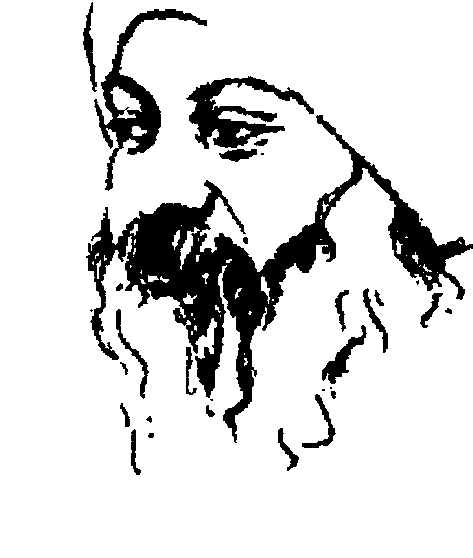
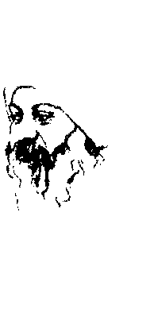
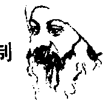
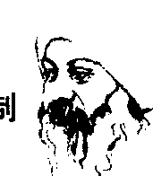
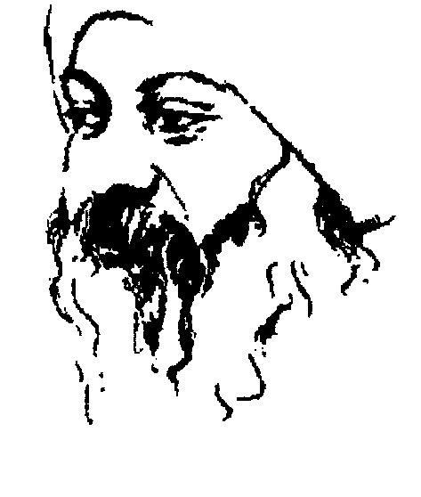
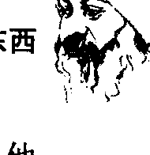
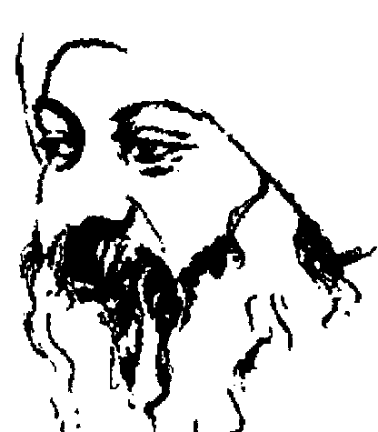
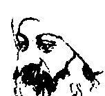

# 奥修：老子心解
[印] 奥修/著
## 序 言
奥修每天的演讲是奇怪而且很棒的现象;流动的、音乐的、不合逻辑的、具有爱心的。它们并不是争论，也不是博学的解释，它们是一个成道头脑的流动，带着爱心，以一种幽默的方式自然流露出来，那些讯息来自一个醒悟的人，倾倒给在睡梦中跋涉人生的一般人。

他使用老子、耶稣或佛陀的话语，不是以固定的理性评论的主题来使用它们，而是按照它们原来活生生的、仍然在那些大师口中的样子来使用它们，按照这些话语尚未被埋葬成严肃的经典之前的样子来使用它们，因为一个成道的人并不是在谈论“关于”老子，而是直接谈老子，差别在哪里呢？当奥修谈话的时候，他就是老子，老子就是他。他的谈论来自所有成道者所共同居住的天堂。当你能够抓到这些师父们所共有的那个瞥见，他们所存活的年代和语言的不同就变得不重要了。奥修将我们一直在奋斗的头脑带进这个神秘的领域。

奥修不仅要你听他的话语，以及这些话语的清晰、慈悲和了解，而且还要让你去听这些话语与话语之间的宁静。他要你注意话语与话语之间的宁静，那是不受可能会误导的话语所限制的，在那个宁静当中，他成道的意识放出光芒，那是他和老子都知道的，他们将这些无限丰富的宝贵的光照射在围绕在他们周围那些幸运的人身上。他说: “我的谈话只是为了不要让你们走开，事实上，我比较喜欢你们来分享我的宁静。”

一个人的头脑会去编织，它那冷静的西方观念会被遗忘，它会抓住怀疑论，然后隔天的演讲会打击你，那个编织就加快了；它会去尝试犬儒主义，然后那个编织就会倒转过来；它会试着去分析和反驳，他会笑你的方向，然后那个编织会缩紧；它会抓住一个错误的参考架构，或一个极端不正确的东西，然后他会用一个软性的结论来作为演讲的结束，使得一个扮演从事破坏工作的理性主义者觉得很尴尬，有时候甚至会流泪。头脑到了最后还是会粉碎，然后一个人会被赤裸裸地留下来，而开始觉知到超出头脑的神秘领域，那个领域通常被逻辑和理智保护着，但是有了奥修的引导，我们可以考虑进入。

在朋友的说服之下，我有点紧张地来到了印度普那，手中仍然紧握着我的回程机票，充满着对印度师父传统性的负面看法。如果要去想象普那的话，我会想到紫色鼻子的、猎杀野猪的皇族上校，而不是想到穿着橘袍的加州求道者。我每一条带着怀疑的神经都振奋起来，想要来对付外来的攻击，但是并没有任何攻击来临，只有接受、了解和幽默，以及竭尽个人之所能去尝试那个只能够被称之为“爱”的东西。

只是借着这个人的在，问题就被遗忘了，反对就被溶解了。他似乎是无法被定义的，他超越了快乐和不快乐、欲望和挫折、爱和恨的二分性，而我们却是用这些二分性的东西在衡量一个人，这种衡量有其限制，而也就是因为有这些东西，我们在我们的周围筑起了一道墙，但奥修是没有墙的。就好像一架太空船碰到一个未知的力量，所有的仪器都走样了，都超出了仪器的刻度，而留下不可能的仪表图。在这种情况下，我所感受到的并不是对即将来临的灾难的害怕，而是一种惊畏、高兴和兴奋，就好像一棵植物感受到光和热，除了转向奥修之外别无选择。作这种决定没有什么可怕，只是去承认那个似乎是自然的法则。

因此我就当上了门徒，奥修还轻轻地揶揄我想要去延缓那个不可避免的事——加入他那不寻常的家庭——的最后企图。千千万万人，他们来自各种不同的年龄、性别、肤色、国家和背景，表面上除了带着一个末端有一个小匣子的串珠项链，以及穿着橘红色衣服之外并没有共同点，但是有一个看不见的连结——每一个人都让他的心被一个活的师父所感动，而且他们都或强或弱地反应于那个古老的邀请：“来，跟着我来。”

一个成道的人或许相当于一个神秘的太空黑洞：一个无所不包的空、一个没有物质的力量、一个纯粹的万有引力、一个纯粹的存在。在这样一个人的口中，带有灰尘的“宗教”这个字变得能够自己抹去它的灰尘而变成活生生的。西方那些胡搞瞎搞而走上穷途末路的陈腔滥调和不得不认错的自由主义，以及东方那些虚张声势的钟声、气味和偶像都被遗忘了，跟着被遗忘的还有政治学和其它的宣传。这是一个活生生而且很美的宗教。

当你在读这些演讲时，同时想象一下当时发生的情景。时间是早上八点钟，太阳刚开始变温暖，但是还不强。奥修花园里的树木和不规则的绿色植物之间透出雾光。由大柱支撑的礼堂四周是敞开的，强度越来越强的太阳渐渐爬进来，穿越这个礼堂。小鸟飞过，它们对那两、三百个穿着橘红色衣服聚精会神地听奥修演讲的门徒一点都不在乎，那两、三百个门徒形成一片橘红色的地毯，倾听着一位穿着白袍，坐在大厅后面一个小小的、高举的平台上的人物。那个大厅似乎是花园的一部分，而花园也似乎是那个大厅的一部分。不必刻意去想象，那个花园和小鸟也可以被看成是听众的一部分。偶尔有麻雀无礼地突然停在他的麦克风支撑杆上，过分的假装虔诚也偶尔会遭到低空飞行的印度空军军机震耳欲聋的扫射。远处有火车的鸣笛声和冲撞声，然而，虽然二十世纪离我们并不远，但是总有一个感觉，在这一块有红花绿叶的净土上所发生的事是不同的、是享有特权的。至少到九点半为止，某种不寻常的事情都在进行着，某种比二十世纪来得更大的事情在进行着，那些事能够驱走一切噪音。

传说中有这样的事情，常佛陀经过，树木虽然不合季节，但也会开花，而当马哈维亚讲话的时候，连蛇都会跑来听。那些传说只是在说：当一个成道的人在的时候，情况就会变得不一样。飞机和火车并不会为奥修保持宁静，麻雀也不会为他停止吱吱叫，但是就某方面而言，它们都变得更温驯，因为它们都被包括在这整个气氛里，它们跟这整个气氛是分不开的。

一切都包含在这个人里面，他散发给周遭一切事物的那个宁静是无法被打破的，因为它是最最终的。就是因为它是最最终的，所以它是无法被分裂的；就是因为它是最终的，所以如果他所讲出来的没有被听到或甚至被拒绝，他也不会受打扰。他已经在他自己里面找到喜悦的泉源，所以他不需要从别人那
里得到什么，他的喜悦从他的本性流露出来，它是否掉进在他面前那个人的心里面，或是溅在地面上，然后消失，那都没有问题，他整年、整月、整日都在庆祝，他除了邀请别人来跟他一起庆祝之外，他不对任何人要求什么东西。只要你能够经得起他游戏的步调，他就可以邀你一起来庆祝。他说：生命就是为了庆祝，其它没有什么事要做。

据说在法国的派里歌尔德区，当农夫们要找一只新的“特拉福猪”，他们就会拿一片特拉福菌类植物在一窝刚生下来的小猪面前挥动，如果其中有一只离开它母亲的乳头，举起鼻子来嗅，那么它就是一只“特拉福猪”。

一个成道的人就是带着那种稀有的美味。奥修谈及围绕在成道周围的芬芳：有一些神秘，可能具有心灵的超能力，芳香围绕着一个已经在他自己里面达成最深真理的人。它可能被错过，因为它那么地精微，但凡是可以感觉到空气中有某种有趣的东西的“特拉福猪鼻”都可以嗅得出来。它就在这本书的文字当中，所以，你们就开始嗅吧！但是要留意：如果你能够抓住它，那个芳香也能够抓住你。就好像奥修很高兴地说：“你被钩住了。”在未来的日子里，不论以怎么样的方式，你都将会去找寻那个“特拉福猪”。

## 序 言
奥修大师在讲老子《道德经》之前所讲的话：

我谈论马哈维亚(Mahavir: 耆那教的创始者)，我将它视为我责任的一部分，我的心从来没有跟着他，他太数学化了，他不是一个神秘家，他的本性没有诗意，他是伟大的、成道的，但就好像是一片广大的沙漠，在他里面你无法碰到一个绿洲，然而因为我生为一个耆那教的教徒，我必须偿一些债，我谈论他是基于责任，但是我的心不在里面，我只是以头脑来谈。当我谈论马哈维亚的时候，我是以一个局外人的身份来谈的，他不在我里面，我也不在他里面。

同样地，在摩西和穆罕默德的情况也是如此，我不觉得喜欢谈论他们，因此我没有谈论他们。如果我不是生为一个耆那教教徒，我也绝不会谈论马哈维亚。有很多次，我的回教门徒和犹太教门徒来到我这里说：“为什么你不谈论穆罕默德和摩西？”我很难跟他们解释，有很多次，看着他们的脸，我决定要讲，有很多次，我一再一再地详细看摩西和穆罕默德的文字，然后我就再度延缓它，在我的内心里，那个钟还没有响。如果我去谈论，我一定不会是活生生的，那一定是一件死气沉沉的事，对于它们，我甚至不觉得像我对马哈维亚一样，是一个责任。

他们都是属于同一类的：他们太过于计算，是极端主义者，他们错失了相反的那一端，他们是单一的音符，不是和声，不是交响乐。单一的音符有它本身的美，有一种朴实的美，但它是单调的，偶而一次还可以，但是如果一直持续，你会觉得无聊，你会想去停止它。马哈维亚、摩西和穆罕默德的人格就好像是单一的音符——简单、朴实，有时甚至是优美的，然而如果我在路上碰到马哈维亚、摩西或穆罕默德，我会向他们表示我的尊敬，然后逃之夭夭。

我谈论克里虚纳，他是多层面的，他是一个超人，他是奇迹般的，但他似乎更像是一个神话，而比较不像是一个真实的人，他太不寻常了，以至于他是不可能存在的。在这个地球上，这么不寻常的人是不可能存在的，他们只有在梦里才存在，而神话只不过是个体的梦，整个人类都一直在梦想它们……很优美，但是不能令人相信，我谈话克里虚纳，谈得很高兴，就好像一个人在享受一个优美的故事，以及享受谈论一个优美的故事，但那不是非常有意义的，那是一个宇宙的闲聊。

我谈论耶稣基督，我对他感觉有很深的共鸣，我想要跟他一起受苦，我想要在他旁边帮他背一下他的十字架，但我们是平行的，我们从来不碰头，他是那么地悲伤，那么地重负，重负着整个人类的悲惨，他不能够笑，如果你跟着他一起走太久，你将会变得悲伤，你会丧失欢笑，有一种尤郁的气氛会围绕着你。我为他感觉，但是我不想像他一样，我能够跟着他走一阵子，分担他的负担，但是之后我们就分开了，我的方式是不同的方式，他是好的，但是太好了，好到几乎不像是人。

我谈论查拉图斯特，谈得很少，但是我爱他就好像一个朋友在爱另外一个朋友，你可以跟他一起笑，他不是一个道德家，不是一个清教徒，他能够享受生活，以及每一样生活所给予的东西，他是一个好朋友，你可以永远跟他在一起，但他只是一个朋友，友谊是好的，但还不够。

我谈论佛陀，我爱他，多少世纪以来，多少世以来，我都爱着他，他非常优美，特别优美，棒极了，但是他不在地球上，他不走在地球上，他在天上飞，没有留下脚印，你无法跟随他，你从来不知道他在哪里，他像一朵云，有时候你会碰到他，但那是偶然的，他是那么地精微，他无法在这个地球上植根，他的存在是为了某种更高的天堂，他是单面的，地和他里面会合，他是天堂的，但是地球的部分失去了，他好像是一道火焰，绚丽辉煌，但是没有灯油、没有容器，你可以看那个火焰，但是它一直向上窜升，没有什么东西将它拉住在地上。我爱他，我从我的内心来谈论他，但是我们之间仍然有一个距离，它一直停留在爱的现象里，你会走得越来越近，但是再怎么近也有一个距离，那是所有爱人的不幸。

我谈论老子，那是一个完全不同的情况，我不是与他关连，因为即使是关连也需要一个距离，我不爱他，因为你怎么能够爱你自己？当我谈论老子，就好像我在谈论我自己，我的存在跟他的存在合而为一；当我谈论老子，就好像我在看着一面镜子，我的脸被反映出来；当我谈论老子，我完全跟他在一起，即使说“我完全跟他在一起”也是不对的，我就是他，他就是我。

历史学家在怀疑他的存在，但是我不可能怀疑他的存在，因为我怎么能够怀疑我自己的存在？我变成可能的那个片刻，他对我来讲就变成真的。即使历史证明他从来没有存在过，那对我来讲也没有什么差别，他一定存在过，因为我存在，我就是证明。在随后的这些日子里，当我谈论老子，那不是我在谈另外一个，我是在谈论我自己，就好像老子透过一个不同的名字、不同的具身在谈。

老子不像马哈维亚，他根本不是数学的，但是在他的疯狂里，他是非常非常合乎逻辑的，他有一个疯狂的逻辑！当我们贯穿他的话语，你就会感觉到它。它不是那么明显、那么清楚，他有一个他本身的逻辑：荒谬的逻辑、似非而是的逻辑、一个疯狂人的逻辑，他会当头棒喝。

即使瞎子也能够了解马哈维亚的逻辑，但是要了解老子的逻辑，你将必须去创造眼睛，它非常微妙，它不是逻辑家的一般逻辑，它是一个隐藏的生命，一个非常微妙的生命逻辑，任何他所说的在表面上是荒谬的，在深处却活着一个非常伟大的一致性，一个人必须去贯穿它，一个人必须改变他自己的头脑来了解老子，你可以根本不必改变你的头脑就能够了解马哈维亚，他跟你走在同一条线上，不管在你前面有多远，他或许已经达到了目标，但他还是跟你走在同一条线上、同一条轨道上。

当你试着去了解老子，你会发现他左弯右拐，你会看他有时候走向东方，有时候走向西方，因为他说，东就是西，西就是东，它们两者是一起的，它们是一体的，他相信相反两极的联合，生命就是如此。

所以老子只是一个生命的发言人。如果生命是荒谬的，那么老子就是荒谬的；如果生命有一个荒谬的逻辑，那么老子对它也是有同样的逻辑。老子只
是反映生命，他不加任何东西在它上面，他不从它里面选择，不论事实是怎么样，他只是接受。

一个佛的灵性很容易就可以看到，非常容易，不可能错过它，他是那么地不平凡，但是要看到老子的灵性是困难的，他是那么地平凡，就像你一样，你将必须在悟性上成长。一个佛经过你，你会马上认出有一个超人经过你，他在他的周围带着超人的魅力，要错过他是很困难的，几乎不可能错过他，但是老子……他或许是你的邻居，你或许一直在错过他，因为他是那么平凡，他是那么不平凡地平凡，那就是它的美。

要变成不平凡是容易的：只需要努力、只需要精炼、只需要培养，那是一个深的内在训练，你可以变得非常非常洗炼，你可以变成某种完全不属于尘世的东西，但是要成为平凡真的是最不平凡的一件事，努力是帮不上忙的，需要的是不努力，练习是帮不上忙的，没有办法、没有工具可以帮上任何忙，只有了解，甚至静心也无法帮上任何忙。要变成一个佛，静心是有帮助的，但是要变成一个老子，甚至静心也帮不上忙，只要了解，只要按照生命本来的样子来了解它，还着勇气来生活，不要逃避它，不要把自己隐藏起来，带着勇气来面对它，不论它是怎么样，好或坏，神圣或罪恶，天堂或地狱。

成为一个老子或认出一个老子是非常困难的，事实上，如果你能够认出一个老子，你已经是一个老子。要认出一个佛陀，你不必成为一个佛陀，但是要认出老子，你必须成为一个老子，否则那是不可能的。

据说孔子去看老子，老子已经老迈，孔子比较年轻，老子默默无闻，而孔子则名满天下，各地君王大帝不时传他进宫，智者也经常来求教于他，他是当时中国最具有智慧的人。但是渐渐地，他一定是感觉到他的智慧或许对别人有所帮助，但是他并不快乐，他并没有达成任何东西，他已经变成一个专家，或许对别人能够有所帮助，但是对他自己并不能够有所帮助。

于是他开始了一个秘密的找寻，想要发现某一个能够帮助他的人。一般的聪明人是不行的，因为他们以前都来求教于他，伟大的学者也不行，因为他们以前来问过他关于他们的问题，但生命是浩瀚的，一定在某一个地方有某一个人，于是## 老子心解

只是吸取他的存在，他们试着在靠近他的时候对他敞开，他们试着在靠近他的时候不要去想任何事情，靠近他，他们变得越来越宁静，在那个宁静当中，他会触及他们、他会来到他们、他会敲他们的门。

有九十年的时间，他拒绝写任何东西、拒绝说任何事情，这是他的基本态度：真理是不可言说的，真理是不能教的，你一说出关于真理的那个片刻，它就已经不再是真实的了，说出它就等于将它虚假化了。你无法教它，最多你只能够去指出它，而那个指出应该就是你的存在、你的整个生命，它无法用语言来指出。他反对文字，他反对语言。

老子生活在沉默里，他总是在逃避他所达成的真理，他总是拒绝他应该为未来的人写些什么这个概念。

九十岁的时候，他离开他的门徒，向他们道别说：“现在我要到山上去，到喜马拉雅山上去，我要到那里去准备死。当你活着的时候，跟人们生活在一起是好的，生活在世界上是好的，但是当一个人接近死亡的时候，进入完全的单独是好的，这样你可以在你绝对的纯粹和孤独里移向那原始的泉源，而不为世界所污染。”

门徒们觉得非常伤心，但是他们能够怎么样呢？他们跟着他跟随了几百里路，但是老子渐渐地劝他们回去，然后他单独越过边界，边界的警卫说：“除非你写下一本书，否则我不让你走出边界，你必须为人类做这件事——写一本书，这是你必须偿还的债，否则我不让你通过。”所以老子被他自己的门徒囚禁了三天。

这是一个非常优美而令人喜爱的故事。他被强迫——老子的《道德经》这一本小小的书就是这样诞生的，他必须写，因为门徒不让他通过，他是警卫，他有权，他可以不让他通过，所以老子必须写那本书，而他在三天之内完成。

## 第一章

## 了解永恒的道

[PAGE 15]

人们一个片刻接着一个片刻去生活，就好像明天不存在。

[PAGE 16]

## 第一章 了解永恒的道

## 译文：

达到被动性的最极致，紧紧地守住宁静的基础。

万物形成，然后进入活动，我观照着它们退回到静止状态。就好像植物茂盛地成长，然后又回到它所长出来的根部(泥土)。

回到根部就是静止，它被称为回到一个人的命。回到一个人的命就是找到永恒的道，知道永恒的道就是成道。不知道永恒的道就会招致灾难。

## 原文：

致虚极，守静笃。万物并作，吾以观其复。夫物芸芸，各归其根。归根曰静，静曰复命。复命曰常，知常曰明。不知常，妄作凶。

死亡就是命运，它必须如此，因为它就是一切的来源，你来自死亡，也回归到死亡。生命只是两个空无之间的一个片刻，只是一只小鸟在两个不存在的状态之间的飞翔。

# 老子心解

如果死亡就是命运，而它的确如此，那么整个生命就变为它的一个准备或一种训练——训练成如何死得很正确、如何死得很全然。整个生命都在学习如何去死，但是不知道怎么样，有一个关于死亡的错误观念已经进入了人类的头脑，那个错误的观念认为死亡是敌人，这是所有错误观念的基础，这是人类远离永恒的法则、远离道而走入歧途的基本原因。这到底是怎么发生的？它必须被加以了解。

人类把死亡看成生命的敌人，好像死亡是要来摧毁生命的，好像死亡是反对生命的。如果你持这样的观念，那么当然你必须跟死亡抗争，然后生命就变成一种对抗死亡的努力，这样的话，你就是在跟你自己的来源抗争，你就是在跟你自己的命运抗争，你就是在跟某种将会发生的事情抗争。这整个抗争是荒谬的，因为死亡是不可避免的。

如果它是某种外在于你的东西，那么它是可以避免的，但它在你里面，你一生下来就携带着它。事实上，当你开始呼吸的时候，就在同一个片刻，你就已经开始在走向死亡。说死亡到最后才来是不正确的，它打一开始就一直跟着你，它是你的一部分，它是你最内在的核心，它跟着你一起成长，然后有一天它走到了顶点，有一天它达到了开花。死亡的那一天并不是死亡来临的那一天，它是一种开花。在你有生之年这一段期间，死亡一直在你里面成长，现在它已经达到了顶峰，而一旦死亡达到了顶峰，你就消失而退回到源头。

但是人类探取了一个错误的态度，那个错误的态度会产生奋斗、抗争和暴力。一个认为死亡是反对生命的人永远无法成为非暴力的，他不可能如此，一个认为死亡是敌人的人永远无法安逸，永远无法好像在家里一样，那是不可能的。当敌人随时都在等着你，你怎么能够安逸呢？它将会跳到你身上，将你摧毁。当死亡就在角落那边等着你、当死亡的影子一直罩在你身上，你怎么能够不紧张呢？它随时都可能发生。当死亡就在那里，你怎么能够休息呢？你怎么能够放松呢？敌人是不允许你放松的。

因此人们会有紧张、焦虑和痛苦。你越是跟死亡抗争，你就会变得被焦虑所折磨，你一定会变成如此，那是一种自然的结果。如果你跟死亡抗争，那么你一定会遭到挫败，对于一个到最后一定会遭到挫败的人生，你怎么快乐得起来呢？你知道，不论你作任何努力，你都不可能成功地免于死亡，在内在深处你只能确定一件事，那就是死亡。只有一件事可以确定，而在那个确定当中，你却有一个敌人。你在跟那个确定的抗争，而在希望那个不确定的，这样的话，你怎么能够安静下来呢？你怎么能够放松下来呢？你怎么能够镇定下来呢？不可能。

人们来到我这里，他们说他们想要得和平、他们想要能够生活得很安逸、他们想要宁静、他们想要放松，但是当我洞察他们的眼睛，他们的眼睛里带着对死亡的恐惧，或许他们试图要放松只是为了能够在跟死亡抗争的时候变得更容易；或许他们试着要找到安静，好让他们在面对死亡的时候能够变得更强壮，但是如果死亡就在那里，你怎么能够放松？你怎么能够宁静？你怎么能够和平？你怎么能够安逸？如果死亡就是敌人，那么基本上整个生命就变成你的敌人，那么每一个片刻、每一个地方，那个阴影都会降临；每一个片刻，从每一个地方，死亡都会有它的回声。整个生命就变成富有敌意的，然后你会开始抗争。

整个西方头脑的观念就是要努力去生活。他们说“适者生存”或者“人生是一个奋斗”，为什么它是一个奋斗呢？因为死亡被看成相反的东西，所以生命就变成一个奋斗。一旦你了解说死亡并不是相对于生命的，而是生命的一部分，是它固有的一部分，它跟生命是分不开的，一旦你接受死亡成为朋友，突然间就会有蜕变发生，你就被改变了，你的看法就会带着一种新的品质，如此一来就没有抗争、没有战争，你并没有在跟任何人抗争，这样的话你就能够放松，你就能够变得很安逸。唯有当死亡变成一个朋友，生命才能够变成一个朋友，这种说法听起来好像似是而非，但是它的确如此，它的似是而非只是表面上的。如果死亡就是敌人，那么在内在深处，生命也是敌人，因为生命会引导到死亡。

每一种生命的形式都会导致死亡——穷人的生命、富人的生命、成功者的生命、失败者的生命、智者的生命、愚者的生命、圣人的生命、罪人的生命，所有各种生命，不论它们是如何地不同，都会导致死亡。如果你反对死亡，你怎么能够爱你的生命？如果你反对死亡，那么你的爱只不过是一种占有，你的爱只不过是一种执着。因为反对死亡，所以你就执着于生命，但是你可以了解到，这个生命每天都在接近死亡，所以你是一定会死的，你所有的努力都会引导到死亡，因而有焦虑的产生，你的整个人会颤抖，你生活在颤抖当中，然后你就变成暴力的和疯狂的。

西方疯子的比例比东方来得更高，那个理由很清楚，因为西方把死亡看成是和生命对立的，但是东方的观点完全不同，生和死是一体的，它们是同一个现象的两面，一旦你接受了死亡，就有很多东西会立刻被接受，事实上如果你把死亡接受成生命的一部分，那么所有的死亡都会被接受成友谊的一部分，因为基本的二分性消失了——生和死的二分性、存在和不存在的二分性消失了。如果基本的二分性消失，那么所有其它的二分性都只是表面上的，它们也会消失。突然间，你就会变得很安逸，你的眼睛就会变得很清澈，你的眼睛里面就不会有烟雾，你的知觉就会变得非常清晰，完全没有晦暗不明的地方。

但是为什么，为什么会有这样的事情发生在西方？同样的事情也发生在东方，因为东方每天都在转变成西方式的。在所有的教育里，在科学的态度里，东方已经不再是纯粹东方的了，它已经被污染了。东方现在也变得很焦虑、很害怕，你是否曾经观察过？西方人有较强的时间意识，但是东方人的时间意识就没有那么强，即使东方人具有同样的时间意识，那也只是存在于那些有教养的人，或是受过较多教育的人身上。当你去到乡村，他们是没有时间意识的。事实上，时间意识就是死亡的意识，当你害怕死亡，时间就会变得很短。有那么多的事要做，而时间又那么少，你会意识到每一秒钟都在经过，生命变得越来越短，因此你变得很紧张，你到处跑来跑去，做很多事，试着想要去享受它的全部，你从一个地方跑到另外一个地方，你从一个享受跑到另外一个享受，然而你却什么都没有享受到，因为你太过于具有时间意识。

在东方，人们比较没有那么强的时间意识，因为他们已经接受了生命。你或许不知道，在印度，他们把死亡称作时间。我们把死亡称作kal，我们也把时间称作kal；kal意味着时间，kal也意味着死亡，使用同一个字来代表这两者意味着有一种很深的了解，它是非常有意义的。时间就是死亡，死亡就是时间，你越是具有死亡意识，你就会变得越有时间意识。当你具有较少的死亡意识，你就具有较少的时间意识，那么就没有时间的问题。如果你完全将死亡吸收到生命里，时间意识就会消失。西方人，现在东方人也一样，为什么会对死亡有那么多焦虑？焦虑到人们根本无法享受生命。

生活在一个没有时间的世界里，石头比人来得更快乐；生活在一个不知道有死亡的世界里，树木比人来得更喜乐，并不是说它们不会死，只是它们不知道死亡。动物们高高兴兴地在庆祝，小鸟在歌唱，除了人类以外，整个存在都是喜乐的，因为它们不知道有死亡。只有人类觉知到死亡，这种觉知会产生出所有其它的问题，因为它就是一切问题的来源，它就是基本的裂缝。

它不应该如此，因为人类是最高的、最精炼的，它是存在的最高峰，为什么人

# 老子心解

如果头脑害怕，它会变成一个思想的旋风。如果你是一个过分思考的人，整天从早上到晚上，从晚上到早上，一直在思考，白天的时候思考、思考、又思考；夜晚的时候做梦、做梦、又做梦——你的河流已经冻结了。你的河流太冻结了以至于你无法移动，所以海洋仍然离得很远，这也是恐惧的一部分。如果你移动，你将会掉进大海。

静心就是解除你的冻结的一种努力，思想会像雪一样渐渐地融解而再度开始流动，头脑就变成一条河流，如此一来就没有什么东西能够阻止它，它就能够毫无阻碍地流向大海。

如果意识能够进入静心状态，那么你就能够接受死亡，那么死亡就不是分开的东西，它就是你，你会把它看成一种休息，把它看成最终的放松，把它看成一种退休，你退了下来。整天你都辛勤地工作，到了晚上你回家，然后你上床睡觉，你退了下来。生命就好像白天，死亡就好像夜晚。你将会再度来临，有很多个早晨将会来临，你将会一而再再而三地以很多不同的形式出现在这里，直到那绝对的死亡发生。只有那些变得完全没有思想的人才能够尝到绝对的死亡，只有那些完全了解死亡和生命是同一个钱币的两面的人才能够尝到绝对的死亡，只有那些已经不再害怕死亡——一点都不害怕——而且不再执着于生命的人才能够尝到绝对的死亡。

因此最终的消失有两个阶段，第一个阶段就是不害怕死亡，一旦你不害怕死亡，接下来的第二阶段就是对生命没有任何贪婪，那么你就超越了。

老子说，这就是永恒的道——知道它就是成道，不知道它就会招致灾祸。现在让我们来进入经文：

达到被动性的最极致，紧紧地守住宁静的基础。

万物形成，然后进入活动，我观照着它们退回到静止状态。就好像植物茂盛地成长，然后又回到它所长出来的根部(泥土)。

回到根部就是静止，它被称为回到一个人的命。回到一个人的命就是找到永恒的道，知道永恒的道就是成道。不知道永恒的道就会招致灾难。

## 第一章 了解永恒的道

有很多事必须加以了解。

第一，被动性的最极致。

死亡就是一种被动性，死亡就是被动性的最极致，你什么事都不能做。当一个人不能够呼吸、不能够睁开眼睛、不能够讲话、不能够动，我们就判断说他是死的。你要如何来判断一个人怎么样才算是死的？他什么事都不能做，他成为被动性的极致。死人是绝对被动的，他无法做任何事。

我想起一个故事，有一次木拉那斯鲁丁自言自语说：有些人看起来好像是活的，但其实是死的，另外有些人虽然看起来是死的，但其实是活的，你怎么能够判定一个人是死的还是活的？他在讲最后一句话的时候讲得很大声，所以被他太太听到了，她告诉他说：你这个傻瓜！如果手脚都是冰冷的，那么你就可以知道他是死的。

几天之后，那斯鲁丁正在森林里砍柴，他发现他的四肢几乎都被那严酷的寒冷冻僵了，因此他说：死亡似乎已经来到我身上，但是死不会砍柴，他们应该被尊敬地躺下来，因为他们不需要身体的移动，因此他就在一棵树下躺下来。

就在那个时候，有一群严冬之下的饿狼经过，它们认为木拉已经死了，所以就攻击他的驴子，将它吃掉。

木拉心想：“这就是生活，一样东西被另外一样东西所牵制，如果我活着的话，它们就不敢乱动我的驴子。”

死亡就是被动，你无法做任何事。如果一个人试着要学习如何去死——那跟其他的学习是一样的——那么一个人就必须学习成为被动性的最极致。你一直都在做些什么，你的头脑从来不让你成为被动的。你的头脑渴望行动，因为透过渴望，头脑才能够保持活生生的。每天试着用几分钟的时间成为被动的，如果你每天能够有一小时的时间成为被动的，就有一个不同的意识层面会显露给你。

就技巧上而言，静心就是：用几分钟的时间成为被动的。用二十三小时做任何你想要做的事。生命需要工作和活动，但生命也需要在活动和不动之间取得一个平衡。所以偶尔要完全不活动，要像木拉一样地想：在这个小时之
内,我是死的。让世界做任何它正在做的一切,而在一个小时之内,对它来讲你完全是死的。

为什么老子要说被动性的最极致? 被动不就够了吗? 老子说“最极致”是有其意义的: 当你开始成为被动的,你甚至会努力去成为被动的,因为你不知道要怎么去成为被动的。

人们来到我这里问说要如何放松,如果我告诉他们一些事,如果我告诉他们说这就是放松的方式,他们将会去做它,但是任何作为都是违反放松的,不可能有任何“如何”,因为“如何”意味着你必须去做些什么。事实上放松是当你什么都不做的时候才会来临,甚至连努力去放松都不必,因为那个努力将会成为一个障碍。那些无法很容易入睡或遭受失眠之苦的人,其中有百分之九十九是因为他们的头脑,只有百分之一或许是因为身体上的毛病。有百分之九十九都是因为心理上的毛病: 他们具有一个概念说他们无法入睡,所以他们做尽一切努力来帮助睡眠,然而他们的努力正是他们失败的原因。如果你做些什么,那个“做”本身就不会让你进入睡眠,那就是为什么当你很兴奋,当你的头脑正在忙,你就无法入睡,但是当你不兴奋,而且头脑也没有什么事可以做的时候,你只要将你的头放在枕头上,就可以睡着了,其他不必做些什么,只要这样就可以了。你只要将你的头放下来就可以入睡,但是一个遭受失眠之苦的人无法这样相信,他会认为别人在谋害他。他们说他们只要将头放下来就可以入睡,但是他一直这样试了好几年,事情却从来没有发生,所以他们一定是隐藏了某些秘密。

没有人在隐藏任何东西, 那只是一个简单的现象——当你什么都不做,就自然会进入睡眠。你无法强迫使它来临,如果你这样做,你将会得到反效果。如果你甚至不用去等待它的来临,只要躺下来,不要去管它,将它忘掉。只要享受那个躺下来: 享受那个冷的被单,或是享受那个温暖,享受那个床的感觉,只要享受。

有时候只要呼吸就觉得很美而值得享受——你是活的,而你正在呼吸。并非每一个人都那么幸运。相对于每一个活在世界上的而言有三十个死人,因为地球已经活很久了。对一个活着的人而言,有三十个人已经死了,已
经理在九泉之下，你能够在地面上而没有在地面下算是很幸运的。很快你就会进入地下，但是在这个时候,你大可去享受说你能够呼吸。有时候只要呼吸就觉得很美，它能够给你非常好的休息。

被动的最极致意味着甚至连要去成为被动的努力都没有，这样的话，它才是最极致，那是静心所能够引导你到达的最深的点。

人们来告诉我说，我在谈论被动，但是我所有的静心都是活跃的，为什么？在它的背后有一个原因或一个逻辑，即使它对你而言看起来好像很疯狂，那个疯狂的背后是有方法的，而那个方法是除非你进入全然的活动，否则你无法达到被动的最极致。

如果你整天都很努力工作，那么到了晚上当你回到家的时候，你已经很想睡了，你已经快要睡了，你已经准备进入睡眠。穷人，甚至乞丐，从来不会患失眠症，只有非常富有的人会患失眠症。失眠症是非常奢侈的，它并不是每一个人都负担得起的。只有那些根本不工作，整天都在休息的人才无法入眠。他们的逻辑很愚蠢，但是他们的逻辑是非常合乎逻辑的，他们以为如果他们整天都训练他们自己睡觉，睡觉应该会来得更容易。他们整天都在做这种训练，但是到了晚上，他们发现他们无法入眠，那是不可能的。如果你整天都在放松，你晚上怎么能够入睡呢？

生命会进入两极，因此我说：如果你想要成为单独的，那么你去爱；如果你想要完全单独，你就要进入别人。如果你想要成为被动的，你要先成为主动的，不要害怕两极性，生命本身就是一种两极性，那就是为什么生命既是生命，也是死亡——死亡就是生命的另外一极。

达到被动的最极致，学习如何成为被动的，不要永远都是一个做者，有时候也要让事情自己发生。事实上，所有伟大的事情都是自然发生的，它们从来不是被做的。爱是自然发生的，没有人能够“做”爱。如果有人命令你去爱，即使他是希特勒，你要怎么办呢？你可以假装、你可以演戏，但是你怎么能够因为命令而真正地爱呢？那是不可能的。根据我个人的观察：那些去爱但是没有真正坠入情网的人，他们能够变成它的观察者，他们能够达到某种程度的观照。尤其是妓女，她们能够变成观照，因为她不爱那个人，她并
有投入，只有她们的身体在动，她只有姿势，只有空的爱的姿势，她们总是置身事外，整个事情在进行着，但是她却置身事外。她们能够很容易变成观察者，爱人是比不上她们的，因为爱人会涉入那个事件里，他们会在那个事件里忘掉他们自己。

记住，要进入两极，如果你真的想要觉知，我告诉你，有时候要完全忘掉你自己，完全融入，融入到你不复存在，而当你回来的时候，你就完全在那里。忘掉，记住；活着，死掉；醒着，睡觉；爱，静心——要进入两极，要使用相反的极端，要像一部车的两个轮子，或是像一只鸟的两只翅膀。不要只停留在一极，因为这样的话，你将会瘫痪。

达到被动性的最极致，而且要永远记住，所有美好的事都是自然发生的：爱是自然发生的，你无法去做它，静心是自然发生的，你无法去做它，事实上，生命也是自然发生在你身上的，关于它，你并没有做任何事，它也并不是你去挣得的。同样地，死亡也将会发生，而你也无法对它做任何事，一切很美的、深奥的事都是自然发生的，只有那些微不足道的事是由人做的。

你甚至连呼吸都无法做，呼吸也是自然发生的，你要跟那自然发生的世界进入同一个步调。

如果你问我的看法，我认为物质世界是“做”的世界，而灵性世界是“自然发生”的世界。当你做，那么你只能达到物质的世界，当你只是存在，而让事情自然发生，那么你将能够达到存在的本质。神从来不是经由努力而达成的，神是一种自然发生。你必须让他发生，你无法强迫他，你无法攻击他，你无法对他使用暴力——所有的活动都是暴力——你只能够让他发生。

那就是为什么老子说，那些想要达到最终真理的人必须先达到女性的头脑。女性的头脑就是无为：男人做，而女人等待；男人穿入，而女人只是接受，但是最伟大的事发生在女人身上，而不是发生在男人身上——是她怀孕。事实上，并没有什么事发生在男人身上，他可以被任何的注射所取代，他可以被一个小小的注射器所取代，它并不是生命中一个基本的部分。

每一件事都发生在女人身上，她变成一个新生命的新家。一个新的神要被生出来，她变成那个庙。男人保持是局外人——男人是做者，女人只是站在
接受的那一端。那就是为什么老子说，如果你想要接受那最终的，那么你就要成为女性化的、成为具有接受性的、成为被动的。

紧紧地守住宁静的基础。

如果你是被动的，你将会停留在深深的宁静、冷静、镇定和平静之中，你要紧紧地守住它。一旦你知道了它是什么，你就能够紧紧地守住它。目前你还做不到，因为你根本不知道在你里面是否有任何东西存在。有一个很小的、宁静的声音在你里面，那个非常小的、极其微小的台风眼就在那里，如果你保持被动，那么你就会渐渐掉进它里面。突然间，有一天，你将会了解到，整个世界的大旋风可以继续，但它并不会打扰到那个中心。那个打扰离得很远，它甚至一点都不会碰触到那个中心。

有一次一个禅师被邀请到某一个人家里做客，有一些朋友聚在一起，当他们正在吃东西和讲话的时候，突然来了一个地震。他们所处的建筑物是七层楼的，而他们就在第七层，所以他们有生命危险，每一个人都试着要逃走，那个主人一边跑一边注意看师父会怎么样，然而师父就坐在那里，脸上一点焦虑的表情都没有，他眼睛闭起来坐在椅子上，就跟原来一样。

主人觉得有一点罪恶感，他觉得自己好像是一个懦夫，而且当客人还坐在那里，主人就先逃走，这样似乎不大好。其他二十个客人都已经下楼了，虽然他本身还在因为恐惧而颤抖，但他还是停了下来，然后他坐在师父旁边。

那个地震来了又去，师父睁开眼睛开始继续讲，因为刚才的谈话被地震打断了。他刚好从原来那一句话接下去，好像那个地震根本就没有发生一样。

主人现在已经没有心情听师父讲话，也没有心情去了解，因为他的整个人都很烦乱、很害怕，即使现在已经没有地震了，但是那个恐惧还在，他说：“现在请你什么都不要说，因为我已经听不进去，我已经魂不守舍。那个地震太打扰我了，但是我有一个问题要问。其他所有的客人都逃走了，我也已经下了楼梯，几乎快要逃走了，但是突然间我想到你，我看到你坐在那里，眼睛闭起来，一点都没有受到打扰，一点都不慌张，我觉得自己好像是一个懦夫——我是
主人，我不应该先跑，因此我就回来坐在你的身旁。我想要问一个问题，我们都试着逃走，但是你到底怎么了？你觉得那个地震如何？

师父说:‘我也是逃走了，只是你是外在逃走，而我是内在逃走。你的逃走是没有用的，因为不管你逃到哪里，地震都存在，因此那是没有意义的，它产生不了作用，你或许可以跑到第六层、第五层，或第四层，但那里还不是一样有地震。我逃到我内在的一个点，在那里地震从来不会到达，它不可能到达，我进入了我的中心。’

这就是老子所说的:紧紧地守住宁静的基础。如果你是被动的，渐渐地你将会觉知到你内在的中心，你一直都携带着它，它一直都在那里，只是你不知道而已，只是你没有觉知到而已，一旦你觉知到它，你的整个生命将会变得不同。你可以停留在世界里，但同时又在它的外面，因为你一直都跟你的中心保持联系，你可以进入地震而保持不受打扰，因为没有什么东西能够碰触到真正的你。

在禅宗里面有这样的说法，当一个禅师达到了他内在的中心，那么他可以走过一条河，而那个水不会碰触到他的脚。这种说法很美，它并不是说外在的水不会碰触到他的脚——水会碰触到他的脚——它是在说关于内在世界的东西，关于内在超越的东西，关于那个东西，没有什么东西能够碰触到它，每一样东西都将会停留在它的外面或它的周围，而那个中心仍然保持不被碰触到、很纯洁、很天真、如处女般的。

万物形成，然后进入活动，我观照着它们退回到静止状态。

老子说:我看，我观察生命，我看着那正在发生的。

就好像植物茂盛地成长，然后又回到它所长出来的根部(泥土)。

每一样东西都会回到它的根部。一颗新的种子发芽，然后春天来临，它变得很茂盛，充满生命力，然后有一天它将会退回去，那个圆圈就算完成了，然后它
就再度消失而进入泥土。

人并不是一个例外，没有一样东西可以是例外。就好像动物会退回去，树木会退回去，河流会退回去，人也是一样。

回到根部就是静止。

生命是一种活动、一种行动，而死亡是被动。回到根部就是静止。这是很美的。一个生活得很正确、对人生了解得很正确的人过世，你将会在他的脸上看到安详，而不是痛苦；狂喜，而不是痛苦。你可以看到他的整个人生都写在他的脸上——他生活得很好、爱得很好、了解得很好，现在他已经到家了。没有抱怨、没有遗恨，只有感谢和感激，那个圆圈是完整的，因此而有安详。一个没有生活得很好的人，一个只是用一半的心在过生活的人，当他过世的时候，他的脸上将会有痛苦，他的脸将会变得很丑。死亡是可以来判断的准则。如果你死得很美，那么虽然我不知道你的人生，我只知道你死的时候的脸，我也能够写下你的整个传记，因为在死亡的时候你无法欺骗——活着的时候你可以欺骗。活着的时候，当你在生气，你可以微笑，你可以呈现出一个虚假的外表，但是在死亡的时候就没有人那么狡猾，死亡会把那真实的显露出来，死亡会把你的真相带到你脸部的表面，所以当死的时候，你的死亡将会显示出你是怎么过活的，它将会显示出你所过的生活是一个真实的生活，或是一个丑陋的、不真实的生活。活着的时候你不知道谁是圣人，因为人可以伪装，唯有在死的时候，你才能够知道他是不是圣人，因为在死的时候他无法伪装。

回到根部就是静止。

圣人会死得很优雅，死亡会变成他整个生命的最高峰——最终的完成。

它被称为回到一个人的命。

每一样东西都会回到它的根部。

在西方，他们对于进展的观念是直线状的；而在东方，我们对于进展的观念是圆圈状的，这是完全不同的观念，有很多事依靠着这些观念。在西方，他们认为每一样东西都按照直线在进行，它一直都按照直线在进行；而在东方，我们认为每一样东西都按照圆圈在进行，按照轮子在进行，“山什”(Sansar)，或曰世界，这个字就是轮子的意思。每一样东西都会一而再再而三地回到它的源头。季节就是这样在进行的，地球就是这样在运行的，大阳就是这样在运行的，整个天空和星星都是这样在运行的——绕着圆圈在运行。圆圈是一切进行的基础，圆圈是生命的永恒法则，它不是直线状的。如果事情依照直线来进行，那么历史就变得非常重要，因为同样的事将永远不会再发生，那就是为什么在西方，历史变得那么重要。然而在东方，我们从来不去管历史，事实上我们并没有写下历史，我们只有写下神话，神话并不是历史，因为我们不去管历史。

如果每一样东西都依圆圈来进行，那么同样的事将会一再一而再地发生，所以我们只关心那个重要的部分，而不去管事实。没有人会去管说佛陀什么时候诞生，但是西方人却非常注意这一点，注意看他是哪一天生的。我们不会去管这一点，因为我们知道以前曾经有千千万万个佛诞生过，以后也将会有千千万万个佛诞生，所以日期并不重要，因此佛陀就变成只是所有佛的一个象征——是主要的佛性。

所以我们把佛陀的故事写成神话，写成一个模式，我们不写历史。历史是关于一些细节：他什么时候出生，什么时候过世，他做了些什么，这些对我们来讲并没有什么意义。所发生的事情对我们来讲才有意义；不是他做了些什么，而是发生了什么，至于他在哪一天出生，那都没有关系，即使他从来没有被生出来，那也没有关系，那根本不是要点。对我们来讲，他是以前曾经被生下来和以后将会被生下来的所有佛的象征。他是一个象征，他是一个轮子。

我们只抓住那主要的，那主要的变成神话，而那些非主要的变成了历史。历史是没有用的。亨利福特曾经说过，历史是胡言乱语，它的

# 老子心解

道在行事；如果你觉得快乐，那么你也可以知道得很清楚，不管你知不知道，你是跟着道在走。

试着在你的人生里面找出喜乐的片刻和痛苦的片刻，分析它们，你将会发现，每当你觉得很快乐、很喜乐，那就是因为你跟着道在走，而每当你觉得很痛苦，那就是因为你违反道在行事。

知道永恒的道就是成道。不知道永恒的道就会招致灾难。

只有你自己一个人必须负责，其他没有人必须负责。如果你受苦，那是因为你自己的缘故，如果你觉得喜乐，那也是因为你自己的缘故。你是你自己的地狱，你也是你自己的天堂。

## 第二章 无选择

你处于它里面,就像一滴小水滴完全溶入大海,这样的话,你就能够感觉到我的“在”。

## 第二章 无选择

# 第一个问题：

小西达沙有一次很聪明地说奥修是一个女孩子，我的感觉也是如此，关于这一点你也提过很多次，而且你臣服和被动的方式反映出老子里面主要的阴性部分。如果可能选择的话，你为什么在最后呈现的时候要采取男人的形式？

第一件事：小西达沙并没有那么小，他是最古老的其中之一。他的语言或许是小孩子的语言，但他的智慧则不然。当你注意看小西达沙，你就能够了解为什么老子一生下来就被认为是老的。西达沙一生下来就是老的，当他说些什么，他是真的了解才说的。

他是对的，最后的呈现一定是属于女人的，身体的形式是没有关系的。内在存在的形式永远都是属于女人——不论是佛陀、查拉图斯特、基督，或老子都一样，最后的呈现永远都是女性的。所有的侵略性都消失了，所有的暴力都消失了，一个人变成完全的接受性，女人就是如此。

她会变成一个子宫，她会变成如此无限的一个子宫而能够包含整个宇

宙。那就是为什么印度人对神的观念比较像一个母亲，而比较不像父亲，这种观念是有其意义的。

如果可能选择的话，你为什么在最后呈现的时候要采取男人的形式？

事实上选择总是男性的：选择就是成为男性的，不选择就是成为女性的。接受任何发生的就是成为女性的，带着感激来接受任何被给予的就是成为女性的。抱怨、发牢骚、怨恨、选择、有自己的方式，就是成为男性的。每当你想要某一件事按照你的方式来进行，你就是男性的，因为你的自我已经进入了，而自我就是男性的。所以事实上选择是不可能的，女性化意味着臣服——一个人就像白云一样地飘浮，没有自己的想法，他只是接受，而且是高高兴兴地接受，他之所以高兴是因为所有的方向都是他的，所有的形式都是他的。

要如何选择呢？要选择什么呢？选择同时也意味着拒绝，在选择某些东西的时候，你就同时拒绝了某些东西，在每一个选择里都有拒绝。如果你想要成为整体的，你怎么能够选择？你必须成为无选择的。

记住，你越是加以选择，男性的头脑就越进入你；你越少选择，而停留在无选择的状态下，只要将一切都交在存在的手中，你就会变得越女性化。它的奥秘就是当你变得女性化，“全部”就会发生在你身上，而不只是部分。你就不再以一个片断来生活，你会以整体来生活，那就是为什么对我来讲是没有选择的。

不久对你来讲也将会没有选择，把你自己准备好，准备进入无选择。如果你想要整体以一个整体洒落在你身上，那么你不要选择；如果你选择，你将会保持是一个乞丐，如果你不选择，你就变成国王。

## 第二个问题：

有时候我觉得我们并不是真正的听者。你是否有其他看不见的，或者我们所不知道的，比我们不昏睡的门徒？

## 第二章 无选择

如果我说有，它对你来讲并没有什么意义；如果我说没有，那是不对的。这样说你大概已经可以了解。我再说一次：如果我说有，它对你来讲并没有什么意义，如果我说没有，那是不对的。

## 第三个问题：

我什么都不知道，我甚至不知道要问什么。有什么问题呢？当那个唯一的答案已经那么明显——要清醒、要全然，还有什么语言可以用来回答一个昏睡灵魂的问题呢？我的问题所寻求的是你的“在”，而不是你的反映。

这是一个复杂的问题，它来自一个非常复杂的头脑。这个问题看起来似乎很简单、很直接、很率直，但其实不然。一开始的时候，发问者说：我什么都不知道。如果这句话是对的，那么就没有后面这个部分，它一定是在讲完这句话的时候就结束了。如果你真的觉得你什么都不知道，那么你有什么好说的呢？你一定会立刻停止，因为这样就够了，但事实并非如此，因为你的知识介入了。

我什么都不知道，我甚至不知道要问什么。有什么问题呢？当那个唯一的答案已经那么明显——要清醒、要全然，还有什么语言可以用来回答一个昏睡灵魂的问题呢？

所有这些都是你的知识。如果你真的听了如你所说的你有的——那个唯一的回答已经那么明显——如果你真的听到了它，那么你就不是无知的。如果你真的听到了它，那么你怎么能够说你还在昏睡呢？在昏睡当中，你是无法听到它的。

要清醒、要全然。要了解这个，你必须脱离你的昏睡。你一定是在做梦说你听到了那个答案。

一开始的时候你说：我什么都不知道。你认为这一点还需要更多的解释吗？它本身不就解释得很清楚了吗？不需要更多的东西，不需要加进任何东西来使它变得更清楚。事实上，不论你加进什么东西都将会使它变得更晦暗不明、更困惑。我什么不知道是很单纯的，但其实不然，你知道得很清楚，那只是一个诡计。你知道你在玩一个无知的游戏，使你看起来显得很聪明，因为你听过一些聪明的人说他们什么都不知道。你这样做只是一种狡猾，这种狡猾将会扼杀你，这种狡猾将不能够有所帮助。

如果你什么都不知道，那么你就是什么都不知道，而如果你什么都不知道，而且还能够保持无知，那么你将能够感觉到我的“在”，因为当某人是无知的、天真的，他是广大的、无限的。无知是没有界线的，只有知识有界线，只有知识有限度，无知是无限的，无知是无限的。知识是封闭的，而无知是一种敞开、一种无限的敞开，知识是吵闹的，而无知是宁静——没有什么东西可以吵闹，没有什么东西值得大惊小怪，一个人只要变无知、变天真——够了！

当你真的变得很无知，你再来的那些话就不会跑出来了，它们跟无知是无法并存的，但是我所看到的并非如此，我觉得你是试图要成为聪明的。你说：我甚至不知道要问什么。有什么问题呢？这些话是来自哪里呢？是来自你的无知吗？还有什么语言可以用来回答一个昏睡灵魂的问题呢？你已经什么事都知道了。你是一个昏睡的灵魂，没有什么话可以用来回答你的问题。当那个唯一的答案已经那么明显。你也已经听到了那个答案，因此你已经知道了那个答案：要清醒、要全然。

我的问题所寻求的是你的“在”，而不是你的反映。如果你是无知的、天真的，那么就不需要寻求我的“在”，它已经存在了。在你无知的无限里，在那个没有界线的情况下，你就可以会见我、你就可以会见整体、你就可以会见神、你就可以会见“道”。

你还不知道无知或天真的美，不，你只是试着去假装成为无知的，但是你的知识不让你这样做。它会介入，它总是包围着你。即使你说你是无知的，你也会使那个无知显得很有知识的样子，你会用知识来装饰那个无知。无知是赤裸裸的、裸体的，你无法装饰它，只有知识才是经过装饰、经过粉饰的。知识就好像是一个妓女，一直都在市场上等着要出售，而无知呢？谁要来买无知呢?你能够将无知卖给谁呢?没有人需要它,事实上每一个人在他里面都已经有了,不需要再去装饰它,它就好像夜晚:黑暗的、宁静的、一动都不动。语言无法跟无知一起存在,所以你在第一个部分所说的,你在后面那个部分就推翻了它,而在你问题结束的时候,你已经完全摧毁了它。

不要跟你自己玩把戏,因为除了你自己之外,其它没有人会被它所骗。

从前有一个门徒跟一个禅师在一起很多年,但是什么事都没有发生,他试着去做任何师父叫他做的事,但还是什么事都没有发生,因为事实上他并没有真正去尝试,他只是假装去尝试,他只是表现出尝试的样子,他只是在耍把戏,而没有很真诚,然后他开始问其他人说:要怎么做?我已经做了任何师父所说的,但是什么事都没有发生。然后有人说:它将不会发生,它是很困难的,它几乎不可能。如果你真的想要它能够发生,唯一的方式就是死掉。那个人已经变得很会假装,所以说:我将要按照这样来做。然后他就跑去看师父。

当师父看到他,他就突然躺在地上,眼睛闭起来,假装已经死掉,师父捧腹大笑,因为你什么都可以假装,但是你怎么可以装死呢?那是最荒谬的事。师父说:好,你做得很好,但是在你完全消失之前,我还有一个问题,我要你解决的那个公案呢?

师父给了他一个问题去冥想,那是一个非常基本的问题,那个问题是:如果你想要用一只手发出声音,那么用一只手发出的声音听起来如何?

那个伪装者睁开一只眼睛说:师父,我还没有解决那个问题。师父重重地打他、踢他,然后说:你这个伪君子,你难道不知道说死亡不会回答任何问题吗?你已经死了,而你又在回答问题。

如果你是真的无知,那么所有你写下来的那些话都是虚假的、没有用的、徒然的、无意义的、乱讲的,而如果你所说的那些话是有意义的,那么你在一开始所说的那些话就是一种伪装,那就是为什么我说你的问题很复杂。

然后你想要我的“在”,“在”是不能够被欲求的,你必须去等待它,你无法要求它,它是一个免费的礼物;每当你准备好的时候,它就被给予。然而你的知识不会让你接受我的反映。这个人是在说他对我的回答根本就没有兴趣,因为他已经知道了答案,他是一个有知识的人,他想要我的“在”,但是你要怎
么做才能够赢得它呢？只是借着欲求，你就觉得你能够赢得它吗？

那么别人为什么要试着去得到我的反映呢？难道除了你以外他们都是傻瓜吗？事实上经历过反映就是一种要到达“在”的训练。你问了一个问题，然后我回答你，那么你的问题就会渐渐抛弃，并不是你将会变得越来越有知识——如果你变得越来越有知识，那么将有更多的问题会升起。不是这样，如果你有真的听我讲，如果你试着来了解我，不只是了解我的话语，而是了解话语与话语之间的空隙，不只是了解一行一行的字，而是了解一行字与一行字之间的空隙，不只是了解我所说的，而是了解我所意味的——如果你能够了解，那么你就能够准备好，然后你的问题就会渐渐被抛弃。当一个没有问题的头脑产生出来的时候，突然间我的“在”就会在你身上迸出来。这些回答是要使你变无知、变天真；这些回答是要去除你的知识，是要帮助你脱离知识，但是这一切都要依你而定。你可以只搜集我的答案而不要去听那个意义，你可以搜集那些文字，但是它们将会在你的头脑里造成越来越多的知识重担，然后就会升起更多的问题，因为每一个答案都会创造出更多的问题，那么你就错过了那个要点，那么事实上你并没有在这里跟我在一起，你还是停留在你自己的旅程里，停留在你自己的自我旅程里，那不是我的旅程，那是你自己的旅程，你并没有跟我在一起。

如果你真的在听，只要借着这个听，你的问题就会消失，当有一天这样的事情发生，当有一天你的头脑里面一个问题都没有，这就是你能够说“我什么都不知道”的时候了。

你甚至将会不知道如何问问题，因为问问题表示你已经知道了某些事。当你什么都不知道的时候，你怎么能够问问题？即使要问一个问题也需要某些知识，否则那个问题无法升起。一个小孩不会突然间说：神在哪里？不，首先他必须学习说神存在，神创造了这个世界，透过这个学习，那个问题才会升起。问题不是来自无知，问题是来自知识。当问题消失，你就具有无限的天真，就像一个黑暗的夜晚、很美的、如天鹅绒般的、无限的。你处于它里面，就像一滴小水滴完全溶入大海，这样的话，你就能够感觉到我的“在”。知识是障碍。

你说你对我的反映没有兴趣，这样的话你就破坏了那个桥梁，这样的话你将不能够感觉到我的“在”——不可能。首先你必须让我杀掉一切你所知道的，让我摧毁一切你所知道的，让我粉碎那些在你里面已经走错路的东西，唯有如此，我才能够创造。“在”是一种创造的现象。我的回答是具有破坏性的，它们是用来摧毁的，它们是用来重新发现你的“天真”以及跟天真在一起的“无限”的。如果你能够变得全然天真，你就已经踏上了变成全然聪明的第一步。全然性就是它的桥梁。如果你是全然的天真，那么全然性已经发生了，而全然性就是桥梁，那么要从无知达到智慧就不是什么大问题，因为那个桥梁已经打开了，那个桥梁已经准备好了。所以，要成为全然的。在这个片刻你只能够是全然的无知，然后下一个片刻将会是全然

[PAGE 44]

![](img/0087dbfd21dcc4453963c0035bb11d84_44_0.png]

## 第二章 无选择

的智慧，然而你却一直执着于那么一点点的知识。

不要试图在我的面前表现出很聪明的样子，要真诚。如果你是无知的，那么就成为无知的，这样的话你就能够碰触到我的“在”，这样的话，你将能够进入我，而且你也能够让我进入你。但是如果你无法感觉到我的“在”，那么你就先试着去感觉我的反映，让我粉碎你、摧毁你，使得那个具有创造力的爆发能够发生。

## 第四个问题：

我已经不再有欲望去做任何事。对我来讲似乎什么东西都已经不重要了。生命是那么多的努力: 身体需要食物，而且会经常遭受肉体上的不舒服。自我想要被注意，头脑继续不停地转动。我常常想说死掉该有多好。自杀难道就是在逃避生命吗？人不应该自杀是基于什么理由？

有很多事必须加以了解，这个问题非常细微，首先，如果你已经不再有欲望去做任何事，那么你怎么会有欲望去自杀呢？自杀也是一种欲望，你怎么能够不欲求自杀就自杀呢？事实上它是最终的欲望。

对我来讲似乎什么东西都已经不重要了。

如果什么东西都已经不重要,那么自杀也不能够有任何意义。你要怎么选择呢?你要如何在生和死之间选择呢?它将会是一种逃避、一种对生命的逃避,而一个逃避生命的人也同时在逃避死亡,那就是为什么我说它非常细微。如果你已经对生命感到腻,如果你真的厌倦生命,如果你已经很无聊,如果你已经不欲求任何东西,那么你的自杀将会具有一种负面的品质,它将会只是一种无聊、一种腻,它将不是一种真正的自杀,它将会是负向的,它将会是徒然的,而且你将会再来投胎,因为生命是一种训练,你是来这里学习的。如果你是狂喜的,如果你一直在庆祝生命,如果你的生命非常满足,如果你跳着舞进入死亡,那么它就不再是一种自杀,那么它就是三摩地,它就是涅槃。佛陀也是同样进入死亡,但他并不是厌倦生命,他是已经在生命中得到满足。试着去了解那个不同。

世界上只有一种宗教允许自杀,那就是耆那教,马哈维亚是一个最鼓吹非暴力的人,他允许他的门徒自杀,但只对那些不是对生命感到腻、不是对生命感到无聊、不是对生命感到厌倦的人才允许,只对那些很完全、很完美、很全然地经历过生命,而且已经知道了一切生命所能够给予的,已经经验过这一切的人才允许。他们在生命中已经得到满足,他们并不是因为反对生命才毁灭他们自己,而是因为他们已经满足了,生命的任务已经完成了,所以他们回到源头。

马哈维亚真的非常勇敢,其他的宗教导师没有一个能够像他那么有勇气敢允许门徒自杀。

但他的允许是有条件的：不可以在任何负面的心情之下自杀？因为这样的话你就错过了那个要点,而你将会再度进入轮回,因此它必须是绝对正向的。另外一个条件就是一个人自杀的时候不可以服用毒药,不可以从山上跳下来,不可以跳河,也不可以跳海,因为这些方式一下子就会死,所以不可以。一个人必须断食,直到死亡——它需要花上七十天、八十天、九十天,甚至一百天,有好几百万次的可能可以一而再再而三地让你去想。

如果你还有一点点不满足,你还会再回来。停留在一个决定里一百天对头脑来讲是很困难的;只有一个没有头脑的人能够在一百天当中持续地停留在一个决定里,否则在断食三天、四天,或五天之后的任何片刻,整个身体和头脑都将会说:你这个傻瓜! 赶快开始吃东西! 你在干什么? 生命那么宝贵,而你还有很多事没做,你还有很多事没有经验,赶快去经验! 谁晓得? 你或许不会再回到生命中来。如果你还没有真正满足,你将会再回来。

要停留在一个决定里一百天,然后高高兴兴地进入死亡,你需要完全没有头脑。

在一个片刻当中自杀是不行的,因为在一个片刻当中,你可能会被欺骗,你可能处于幻象之中。如果你服用毒药,它也可能一下子就死掉。我的感觉是,如果那个要自杀的人稍微延迟一下子,他们将永远不会去做;只要延迟一下子,他们就会改变想法。

他们在一种疯狂的状态下自杀,他们对生命已经感到非常腻,因此他们选择快速的自杀方法,当他们做下去之后,他们已经没有机会按照他们自己的决定再退回来,因为已经来不及了,他们已经跳下去了,他们或许会在大海中受苦,他们或许会哭喊着说:“救救我! ”但是已经太晚了。他们的整个人都想要回到生命来,而他们将会很快地回到一个子宫里,而且更糟糕的是,那个自杀将会围绕在你的周围,它将会变成一个“业”,它将会好像一个黑色的影子,或是一个阴霾的影子围绕在你的脸部或你的周围,你将会带着死亡的气氛进入生命,那是不好的。

我可以允许你们完全的自杀,这就是我的目的,这就是我在此地正在做的——教导完全的自杀。“完全”意味着不再回来,这唯有透过深层的静心才可能。有一个片刻会来临,到时候所有的欲望都会真正消失。

你说:我已经不再有欲望去做任何事。那是骗人的,如果有人提供你美国总统的职位——你不需要作任何努力、不需要参加选举、不需要奋斗,只是单纯的提供——你将会接受它。你并没有对生命感到腻,你是对奋斗感到腻。你

[PAGE 47]

# 老子心解

并不是处于无欲的状态下，你是处于挫折的状态下，你有欲求，但是你无法达成，因此现在你感到挫折。

如果有一个从神那里来的天使出现，告诉你说：“现在已经准备好，只要将你的欲望告诉我，你的任何欲望都能够被满足。”那么将有一千零一个欲望会冲进你的头脑，而如果他说你只能选择其中的三个欲望，你将会不知道要选择哪一个，留下哪一个，你将会发疯。

挫折并不是无欲——永远都要

## 第二章 无选择

物的存在是两端都关闭起来，人的存在只有一端敞开，而迪瓦士处于较高的意识状态，他的两端都是敞开的，他们能够进入生命，也能够脱离生命——进口出口两端都是敞开的。他们具有更多的自由，他们具有多一点的自由。

如果你想要自杀，那么你就想一想，看看你的想要自杀是不是因为无欲，如果它是因为无欲，那么那个想要自杀的欲望又是来自哪里呢？如果它是因为无欲，那么你一定不会问我，你一定会直接去做。如果你有真正去生活，那么你已经满足了，你还需要这么麻烦跑来这里问我吗？这又是为什么呢？或许你是遭到挫折，而你想要有什么东西或什么人来慰藉你；或许你就是害怕自杀这个概念，所以你想要我说：“不，不要自杀。”好让你能够将责任推到我身上，而不是放在你自己身上，但我不是那种类型的人，我说：如果你真的想要自杀，那么你就去做——但你又为什么要来问我呢？

有一个年青人跑来问我说他是否应该结婚或是保持单身，这个问题跟自杀一样，是同样的问题。一个人应该自杀或是应该继续活下去？保持单身是一种自杀，因为有一半的生命被切断了，你已经决定要保持一半。结婚是一个完整的生活。所以我问那个年轻人：你为什么要问我？如果你对女人没有欲望，那么这个问题又是来自哪里呢？你根本不必去管这个问题！没有问题，不需要结婚，但是如果那个欲望升起，那么你就去结婚。

然后他问说：那么你为什么不结婚？我告诉他：因为这是我的决定，但是我从来没有去问任何人，我从来没有问过任何人任何事，一个人必须自己负责，我从来没有问过任何人关于生命的问题，有什么需要呢？如果我能够看清楚，我就按照我的看法来做，而即使我犯错，那也表示我的生命就是应该如此——透过错误或透过失误来进行，但是我从来不将责任推到别人身上。

如果你想要自杀，那么你就去自杀，但事实并非如此，你并不想要自杀，你只是想要我告诉你说：这是非常不好的，这是一项很大的罪恶，不要自杀。如此一来，你就可以依靠我。

你遭到了挫折，每一个人都遭到了挫折，但是如果你因为挫折而逃离生命，你将会再度被丢回来。如果你真的想要逃离，那么你必须去了解生命、去经历它，经历到最尽头，好让整个幻象都能够变成已知，然后你就会发现整个

不舒服可能会消失,但是随着它的消失,所有的舒服也都会消失。痛苦也会消失,现在这种事几乎已经快办得到了,而且我认为科学家将会把这种东西做出来,因为头脑有一种倾向或是一种执着想要去完成某件事。现在这种事几乎已经快办得到了,人们可以完全免于痛苦、不舒服、生病、疾病,甚至死亡,因为塑料的身体永远不会死。当你能够继续更换它,就不可能有死亡。

只要沉思一下,只要想想说你有一个塑料的身体,你将如何以一个塑料的身体来成佛?你将会保持是一个白痴,因为相反之物将会消失,而相反之物是给你机会让你成长的东西。痛苦和快乐;舒服和不舒服;挫折和满足——它们给你成长的机会,不要逃避。

身体需要食物,而且会经常遭受肉体上的不舒服。自我想要被注意,头脑继续不停地转动。那么就让自我死掉,为什么要由你去死呢?你执着于自我——你准备摧毁身体,但是你并没有准备摧毁自我。如果自我是难题之所在,那么就放弃自我。身体并没有对你做什么事,身体是一件很美的东西,身体就好像一座庙,它是存在里面最伟大的奇迹之一,享受它、庆祝它,因为透过它,所有的庆祝才可能,如果没有它,你将会成为存在于机器里的鬼魂。

我常常想说死掉该有多好。你说:该有多好!那表示你的欲望仍然存在。事实上,你是想要有一个美好的生活，“美好”意味着植物般的生活,什么事都不做就能够得到每一样东西,不必作任何努力就能够得到每一样东西。你是多么地不懂得感激。你已经得到很多,而你并没有为它做什么,但是你从来不感激,相反地,你却升起了自杀的念头。自杀是对神最大的抱怨,你是否曾经那样想过?自杀意味着:你给我们的生命不值得要,把它拿回去;自杀意味着:你所给我的是一个多么烂的生命!我不想要。

自杀是你对存在和神最大的抱怨。

不,不是那样,那将不会有所帮助。如果你是在寻求一个美好的现象,自杀将不会有所帮助,因为它是最痛苦、最丑陋的现象之一,它并不美好。你认为它将会在一分钟之内结束,所以你想:即使它是地狱,它也将会在一秒钟之内结束,然而你根本就不知道任何关于时间的事。在一秒钟之内,你可能会因此而遭受永恒的痛苦，因为在一秒钟之内，你也能够有永恒的享受。

时间是相对的，我不是在说时钟上的时间，因为由一个活人变成一个死人在时钟上的记录或许只有一秒钟，但是在一秒钟之内你并不知道他遭受了什么痛苦。或许以这样的方式来说可以有助于你的了解：有时候你坐在桌子旁边，然后睡意来临，当你醒过来，你手表上的时间只过了一分钟，但是你已经做了一个很长的梦，那个梦甚至在一分钟之内都讲不完，你要描述整个梦的细节需要花上一个小时。或许你已经过了一生，从出生到死亡，结婚、生子，然后又看着他们结了婚等等，但是在时钟上只过了一分钟。做梦的时间是在一个不同的层面上移动。

有一件事是真实的，那些被水淹死的人——不管是意外事件或是故意跳水——在一秒钟之内可以看到他们的整个人生。他们的整个人生，有无数的细节，从最初到最终，到他们溺毙的这个片刻，他们都能够在一刹那之间看到。

怎么可能在一刹那之间？怎么可能在一个片刻之间？但它是可能的。注意看自然，有一些苍蝇被生下来，一小时之内就死了，或许你会在你的头脑里认为：这些可怜的苍蝇。你不知道任何关于时间的事，它们是在一个不同的时间层面上移动。它们在一个小时之内所生活的跟你七十年内所生活的一样：它们被生下来、恋爱、结婚、生子，所有的痛苦、挫折，以及每一件事都发生了——争斗、诉讼、选举，以及其它每一件事——它们在一个小时之内就死了……而你连晚餐都还没有吃完。

你开始用晚餐，晚餐还没有用完，它们的整个一生就结束了，它们所经历的人生跟你七十年里面所经历的一样，它们所经历的是一个非常浓缩的生命。事实上，如果你能够在一个小时之内过完整个七十年的人生，那么要花上七十年的时间来过完这个人生似乎是一种时间的浪费。是人应该被称为可怜虫，而不是苍蝇。苍蝇似乎比较聪明，它能够在一个小时之内就过完整个人生，而同样的人生你却需要花上七十年，你并没有像苍蝇那么聪明。

在自杀一个单一的片刻里，你就遭受了整个地狱之苦；在三摩地一个单一的片刻里，你就能够庆祝整个天堂。时间并不是问题，因为时间有很多层面。

如果是因为挫折而自杀，那么它永远不可能是美好的。如果它是一种开
花,如果你是从生命成长出来,如果你已经达到了一个点,在那个点上生命已经没有其它什么东西可以提供给你,你已经学会了整个事情,那么就马哈维亚的方式而言,就有一个自杀的可能性。当这种情况发生,他会允许你自杀,但即使是这样,我也不允许,因为我的感觉是,如果你真的每一件事都学会了,那么自杀又有什么意义呢?你为什么不能等待?你在赶什么?如果你已经完全满足了,为什么要那么匆匆忙忙去结束你自己?你为什么不能等待?如果你无法等待,那么至少有一件事你还没有学会,那就是耐心。

所以我并不赞成马哈维亚，那些试图想要自杀的人至少是缺乏耐心,他们将必须再被丢回生命,因为那是一个必须学习的重点——耐心、等待。他们缺乏那个品质,否则那么匆忙干什么?如果你在四十岁的时候成道,而你将要在七十岁的时候死,你难道不能等三十年吗?如果你连这个都不能等,那么你算是哪门子的成道?

这是一个紧张的状态,你似乎非常受到焦虑的折磨,你似乎并没有真正快乐和开花。一个具有成道意识的人会接受生命,同时接受死亡。当死亡来临的时候,他不会要求它再多等一分钟;当它还没有来,他也不会去邀它提早一分钟来。有什么需要呢? 死亡今天或明天出现,对他来讲都是一样的。

这个耐心就是最终的开花。我认为马哈维亚的态度或许是勇敢的,但那是错的。勇气并非永远都是对的,只有勇气本身是不对的,有很多隐含在它里面的事必须加以了解。

自杀难道就是在逃避生命吗? 是的。人不应该自杀是基于什么理由? 没有理由,但是,同样的,也没有理由说为什么一个人应该自杀。生命是非理性的,没有理由去生,也没有理由去死,生命并不是一个因果关系的现象,它是一个奥秘,没有理由继续活下去,但是也没有足够的理由去死,没有理由去自杀。

所以要怎么办呢? 只要漂浮。就那一个方向而言都没有理由,所以不要选择,保持无选择的。如果你选择,你将会一而一而地被丢回这整个生和死的轮回;如果你保持无选择的,你就会从这个轮回消失而进入宇宙,这才是真正的自杀,这才是真正的现象,那么你就不会再被强迫回到这个物质世界
来，你就不会再被强迫进入身体，那么你就可以活在一个无体的状态下，莫克夏(moksha)——完全的自由——就是意味着如此。

# 第五个问题：

我知道我不应该执着，可是现在我对我的作法加以判断，我买了一些漂亮的橘红色衣服，而不是像有些人很有勇气地穿着脏兮兮的破烂衣服到处跑。

至少现在你已经有勇气穿那些漂亮的橘红色衣服。我不反对漂亮，也不赞成破烂，但是我也不反对破烂。如果你喜欢破烂的衣服，那是你可以决定的；如果你喜欢漂亮的衣服，那也是你可以决定的，关于这些事情，一个人必须有完全的自由。

对于这些小事，社会也不让你自由。如果可以由我决定的话，我一定会让你完全自由，如果你想要光着身子走路，你也应该可以这样做。如果我可以自由决定的话，我只有一个规则，那就是你不可以影响到别人的自由，就这样而已。唯有当你影响到别人的自由，你才算是犯罪。如果你只是自己在做一件事，而没有关系到别人，你应该享有完全的自由。

政府应该保障每一个人本身的自由——自由去做他自己的事情。政府不应该扮演积极的角色，它应该只是一个消极的角色。消极的意思是说，你应该享受你的生活，但是还有其它人的存在，他们也必须享受他们的生活，你不应该干涉他们的生活，他们也不应该干涉你的生活。一切政府所要做的就是这样的事，它并不是要创造出秩序，它只是要创造出一个情况，使得在那个情况下无秩序可以被避免，就这样而已。

所以如果有人喜欢破烂的衣服，或是他认为破烂的衣服很美，那么别人就不应该干涉，而如果你喜欢漂亮的衣服，那有什么不可以？你为什么要害怕去享受那些漂亮的衣服呢？这是你可以决定的。

要勇敢。我只支持一种勇气，那就是成为自己的勇气。要勇敢，要有勇气去成为你自己，而不要去管其他任何人，除非你干涉到他们的自由，那么你就
应该避免。

现在，如果你穿漂亮的衣服，你并没有干涉到任何别人的生活，那是你可以决定的，但是头脑已经受到很多制约，它总是往社会看，看看别人在做什么。如果你生活在一个设置得好看的世界里、一个四四方方的世界里，你就必须遵循某些规则。事实上没有人曾经告诉你要去遵循那些规则，但你还是会去遵循，只因为那是传统，只是为了要顺应社会。你必须穿某种类型的衣服，你必须剪某种发型，你必须使用这个或那个，你一直都遵循一个模式，然后如果你变成嬉皮，你的头脑就会开始再去遵循另外一个模式，如此一来，你就必须留长头发，如果你不留长头发，人们就会笑你，他们会说你是正正方方的，因此你必须穿着破烂的衣服，而如果你不这样做，他们就会说：你来这里干什么？你已经不再属于我们，你是一个外来者，你是一个闯入者。

所以，有两种类型的顺从：对社会制度的顺从和反社会制度的顺从，这两种都是顺从。有些人留短头发，有些人留长头发，但是这两种人都一样，一点差别都没有。

如果你生活在嬉皮的世界里，但是你并没有闻起来像地狱一样，那么你就不是一个嬉皮，那么你就不是一个真正的嬉皮，你将会遭到拒绝。你必须是脏兮兮的，你必须是不清洁的，否则你就不是叛逆的。如果你进入一个非常制度化的世界，你就必须使用香水或刮胡液，或是这个那个的，如果你去到那里而看起来不够清洁，你将无法被接受。

头脑是一个顺从主义者，所以我只知道一种叛逆，那就是一个静心头脑的叛逆，在这种叛逆之中，你抛弃了头脑而依你自己来进行，但是要永远记住，不可以干涉到其他任何人的生活。

比方说，如果你想要变成脏兮兮的，那么你可以到喜马拉雅山上去，因为你的脏可能会影响到别人的生活，当你很脏、有臭味，你或许没有用你的手去攻击别人，但你却是用你的气味在攻击别人，那是一种侵犯。如果别人认为这对他们是一种打扰，那么那就是侵犯到别人。如果你想要变成脏兮兮的——变成脏兮兮的并没有什么不对——不过你要搬到喜马拉雅山上去，搬到最远的角落，使得没有人会跟你接触，那么你就可以享受你自己的臭
味,高高兴兴地享受,你没有权利将你的肮脏和臭味丢到别人身上,不可以,这样做是不好的。

没有人可以以任何方式干涉其他人的生活,也没有人应该允许其他任何人来干涉他的生活,一个人就是应该如此:不要试图去奴役别人,也不要让任何人来奴役你。一个人应该过着自由的生活,同时他也应该允许其他人过着自由的生活。不要害怕,如果你喜欢漂亮的橘红色衣服,你就穿它,它是好的。只有一个条件,那就是,如果它不干涉到别人,那么它就是很美的,它就是道德的。

# 第六个问题：

我有一个问题,但是我想不出来它是什么。

我也有一个答案,但是除非你把问题想出来,否则我也想不出来,是吗?

# 第七个问题：

我们来自空无,然后再回到它里面去。如果死后身体被埋葬,灵魂还会停留在身体的周围,但是如果身体被焚化,灵魂就会立刻离开身体。灵魂跟空无如何相关连?

你错过了整个要点,灵魂就是空无,它并不是跟空无关连。灵魂就是空无,身体是一样东西,而灵魂是空无。

身体是充满的,而灵魂是空的,那就是为什么身体有一个形状,而灵魂是无形的,但“空”这个字使你害怕、使你畏惧。如果灵魂是“空”,那么你的自我要站在哪里?如果灵魂是“空”,那么你就没有立足点了,然而事实上你并没有立足点,自我的存在就好像是一个梦的存在,它并没有自我的立足点,在它里面没有实质,自我的存在就好像海市蜃楼。

当你进入内在，你将会越来越感觉到空无，越来越感觉到有一个广大的空间，你将不会碰到任何人，你在那里无法找到任何人，你将不会找到那个被称为“阿特玛”(atma; 自己)的东西，不，它只不过
是“自我”的别名，或许是宗教的名字或灵性的名字，但仍然是“自我”的别名。你在那里将无法找到任何人，没有人在那里，而那就是它的美，当你碰到那个空无，你就变成绝对的宁静，你就变成那个空无。

那就是进入内在时所产生的恐惧，那就是为什么你一直一直都走向外在，你走到远处，而从来没有走到近处——从纽约到卡布尔，从卡布尔到德里，从德里到普那，从普那到果阿，从果阿到加德满都，你绕了世界一周，但是你从来没有进入内在。 ^

那是最近的海滩、最近的山、最近的麦加、最近的卡西、最近的庙宇、最近的修行场所，但是你从来没有去到那里，因为如果你去到那里，你就会害怕，它是一种死亡，你会死在那里。

你要问关于自杀的事吗？进入内在，那么自杀就会发生，不必你去做它。进入内在，你将不会找到你自己：你会消失，你会蒸发。在那个“不在”当中，一切就都“在”了，在那个空无当中就是整体。

# 第八个问题：

似乎能量和自我是一样的，与其要抛弃自我，倒不如学着来使用它，可以吗？

那就是抛弃它的意思，如果你能够使用自我，那么它就是已经被抛弃了。目前是自我在使用你，自我变成了主人，而你变成了仆人或奴隶。在你里面，事情是倒过来的。放弃自我只是意味着将自我从王位请下来。当然一个人必须使用它，甚至连我也必须一直使用“我”这个字。一个人必须使用它。

如果你能够使用它，它就已经被抛弃了，但是如果你被它所使用，那么它就是一个问题。抛弃自我并不是意味着抛弃“我”这个字，不，但是当你使用它的时候，就没有自我在它里面。自我唯有当它被奉上王位，当它坐在高位，当它变成你整个生活的中心时，才可能是自我。使用它，它就会被抛弃；抛弃它，你就能够使用它。

# 第九个问题：

那一天我们是不是可以跟你一起喝茶，而不是听你讲道？

你认为我的讲道是别的事吗？那么你就错过了我所提供给你的茶。茶是觉知的象征，因为它不让你睡觉，这也就是一切我所提供给你的。你来到我这里？然后我告诉你说：请用茶。这就是我一直在告诉你的所有事情的整个意义——一杯茶。

# 最后一个问题：

当你死的时候，你会邀我们跟你一起走吗？当你走的时候，我不想被留下来。

为什么要等我的死来临呢？我现在就可以马上邀请你！

记住，如果你这个片刻跟我在一起，你就会永远跟我在一起，为什么要等到我死的时候呢？如果你今天延缓它，那么明天我死的时候，你将会再度延缓它，所以必须记住的是，如果你想要跟我在一起，那么你就要在此时此地，不要管死亡和明天，这不是要点之所在，这完全无关。要在此地跟我在一起，你已经接受了我的邀请，那么你就可以永远跟我在一起。

这根本不需要讨论，如果你此刻有在这里跟我在一起，你将会永远跟我在一起，因为这个片刻包含了永恒。除了这个片刻以外没有其它的片刻，除了现在以外没有其它的时间。

## 第二章

争胜是没有用的

![img/0087dbfd21dcc4453963c0035bb11d84_58_0.png]

如果你想要把恨和爱分开，你可以将它们切开，但是它们两个都会死掉。

## 第三章 争胜是没有用的

![img/0087dbfd21dcc4453963c0035bb11d84_60_0.png]

曲则全，枉则直，洼则盈，敝则新，少则得，多则惑。

是以，圣人抱一为天下式。

不自见，故明；不自是，故彰；不自伐，故有功；不自矜，故长。夫唯不争，故天下莫能与之争。

古之所谓“曲则全”，岂虚语？故诚全而归之。

老子是一个充满矛盾的人，他的整个教导都是似非而是的，除非你了解似非而是的本质，否则你将无法了解老子。

似非而是的本质是什么呢？第一件事就是：它不是逻辑的，它是不合逻辑的。表面上你看到两个相反的东西被迫会合在一起，两个相反的东西被放在一起。逻辑是前后一致的；非逻辑是似非而是的。你只能够有两种方式在这里：你可以以一个逻辑的头脑在这里，或者你可以以一个似非而是的生命在这里。如果你能够了解似非而是的真理，头脑就可以消失，因为头脑无法应付它；似非而是的真理对头脑来讲是一种毒，它必然会杀掉头脑。

那就是为什么老子使用似非而是的东西来彻底杀掉头脑，一旦头脑不存在，你就达到了整体，一旦头脑不存在，成道就发生了。所以对老子来讲，了解似非而是的真理就是整个静心的过程，那是他的方式，那是他用来静心的设计。

逻辑对头脑具有吸引力，因为它是由头脑所创造出来的，它是由头脑所制造出来的。头脑可以很安全地停留或执着在逻辑上。进入逻辑思考的每一个步骤都能够越来越增强头脑，所以那些认为他们能够用逻辑来证明神的人简直是愚蠢。神是无法用逻辑来证明的，他只能够用逻辑来反证。你可以尝试，表面上，你的逻辑或许具有某种吸引力，但是如果你深入它，你一定会发现漏洞。逻辑只能够拒绝神，因为神是整体的，而且是似非而是的，你怎么能够用逻辑来证明一个似非而是的真理呢？你必须将你的头脑摆在一旁而直接去看整体。如果你能够抛弃头脑，你就已经抛弃了一切没有价值的东西；如果你能够观察人生而不要用头脑，突然间，它就是一项祝福，你从来不缺任何东西，也从来没有什么东西被隐藏起来，每一样东西都是一个公开的秘密，只有你躲在你逻辑的背后，而且你的眼睛被它所蒙蔽了。

在希腊神话里有一个很美的故事，那个故事是关于一个人，他的名字叫做普罗克拉提斯，他一定是曾经被生下来的最伟大的逻辑家，希腊人的头脑
非常逻辑指向的，这个故事表现出希腊头脑的整个意义。

普罗克拉提斯是一个非常慷慨的人，但是非常逻辑化，他是一个非常富有的人，但是非常逻辑化，一个逻辑化的人怎么能够同时非常慷慨呢？他的慷慨也被他的逻辑所毒化。他很富有，很多贵宾经常去拜访他，但是从来没有来宾从他的皇宫回来过，那些贵宾到底发生了什么事？

普罗克拉提斯有一张黄金做的床，旁边还镶有很多珍贵的宝石，世界上没有一张床能够比这张床更有价值，那张床是给客人用的。每当有贵宾躺在那张床上，普罗克拉提斯就会来看。如果客人比那张床更短，他有四个壮丁会将那个客人从两端拉长，使他变得跟那张床一样长，而不是比它短。当然那个来宾一定会死掉……如果那个客人比那张床还长，有时候也会有这样的情形发生，那么他就将那个人的头或脚切掉一点，因为那张床太珍贵了，所以客人必须去适合那张床，而不是那张床去适合客人。

这就是逻辑的整个要点：生命必须调整它自己来适合逻辑，而不是逻辑去适合生命。逻辑自己存在，而生命必须调整它自己去适合它；逻辑不是为生命而存在，而是生命为逻辑而存在。

从来没有客人能够活着走出他的皇宫。从来没有客人能够活着走出“逻辑之屋”——那就是那个故事的意义。

逻辑的模式是头脑所创造出来的，而你想要生命来适合它。如果你觉得生命短了一点，你就将它拉长；如果你觉得生命长了一点，你就将它切掉一点，它必须去适合你头脑所梦想的逻辑模式。然而如果你进入生命，你将永远无法找出有逻辑在任何地方成长，它只是人类头脑的一个噩梦。树木非常不合逻辑地活着、鸟类非常不合逻辑地活着、河流也非常不合逻辑地流着——它们都遵循老子之道。事实上整个宇宙的存在是不用任何逻辑的。它或许是一首诗，但它并不是一个逻辑的三段论法，因此它是非常美的。逻辑的三段论法是一个死的现象。

如果你真正进入生命，你将会发现它里面尽是所有诗人曾经写过的诗，你可以发现卡里达斯和布鲁普迪，你可以发现莎士比亚和密尔顿，你可以发现雪莱和拜伦。如果你进入生命，你将会发现所有曾经被写过的诗在某一个
地方活着、在某一个地方成长、在某一个地方开花，但是你无法在任何地方找到逻辑的论文、你无法在任何地方找到亚里士多德。

生命是矛盾的，一个人必须将逻辑的头脑稍微摆在一旁，然后再去看它。你将会看到相反的东西毫无困难地会合在一起。生和死会合在一起——在生命里面，它们并不是“二”，它们是“一”，但是逻辑使它们看起来好像是“二”，不仅看起来好像是“二”，它看起来还好像是相反的东西，因此逻辑在你里面创造出一个恐惧——对死亡的恐惧。如果你恐惧死亡，你怎么能够生活？死亡包含在生命里，所以，如果你害怕死亡，你也将会害怕生命，那么你的整个存在就变成一种病、一种疾病、一种恶心、一种深深的焦虑，其他没有。

如果你爱，恨就隐藏在里面。如果你想要把恨和爱分开，你可以将它们切开，但是它们两个都会死掉，那就是没有客人能够活着走出普罗克拉提斯宫这个故事的意义。如果你想要生命——活生生的、光芒四射的、明亮的，那么你就不要去切它，不要去解剖它，不要成为一个外科医生来对待它。生命是一个罗曼史，一个人必须尽可能地矛盾，逻辑是没有意义的，它之所以没有意义是因为头脑无法创造出任何意义。头脑不会发明、不会创造，你必须了解这一点，头脑最多只能够去发现某些东西，而无法创造出任何东西。

头脑并不是创造者，它能够帮助你找到已经存在的东西，但是它无法创造出不曾存在过的东西。头脑创造出逻辑，而逻辑是存在里面最虚假的东西，除了在书本以外，你永远无法在任何地方碰到它，但是它已经变成一个占有重要地位的因素，那是没有意义的，因为每一个论点都可以被用来反对它自己。

我听过关于一个犹太学者的趣闻。在希特勒的时代，有一个犹太的学者写了一篇博士论文，他非常努力工作了六、七年，然后参加学位考试。

准考证问他：你能不能证明说以你是一个犹太人，而能够毫无偏见地写出一篇关于犹太传统的论文？以你是一个犹太人，你怎么能够用没有偏见的眼光、以一个旁观者、以一个不偏不倚的观察者来写出一篇关于犹太传统的论文？那个学者说：是的，我能够证明——如果你能够证明说，以一个非犹太人能够毫无偏见地审核一篇关于犹太传统的论文的话。

同样的论点可以很容易地被转变成它的相反之物，你只需要一点敏锐的逻辑头脑，那个逻辑是一样的，它能够很容易地被转变过来反对它本身，所以要怎么办呢？

所有的逻辑论点都被转变成它们的相反之物，任何你试着去证明神的东西都可以被转变成反对神。你说，如果没有一个创造者，宇宙就不可能存在。如果是这样的话，那么无神论者会说：是谁创造出你的神？因为如果宇宙不可能没有一个创造者，那么神怎么能够没有一个创造者而存在？如此一来，整个事情就迷失了。如果你说神是由另外一个神所创造出来的，而另外一个神又是由另外一个神所创造出来的，它就变成一个无限的回归，那是没有意义的，最后你必须来到一个点，在那个点上，你必须说：是的，这个最后的神不是由任何人所创造出来的，那么这个宇宙为什么不能够如此，这个宇宙到底有什么不对？

所有的论点都能够被用来反对它们自己，这些争论只不过是在游戏。逻辑是一种很美的游戏，如果你想要玩它，你就去玩它，但是不要认为它就是生命。所有的逻辑规则都只是像在玩牌时的规则，如果你想要玩牌，你就必须遵循某些规则，但是你知道得很清楚，它们只是人为创造出来的，在生命里面是找不到的。没有人规定说它们一定要如此，它们是由头脑所创造出来的，如果你想要玩那个游戏，你就必须接受那个规则；如果你不接受那个规则，你就必须离开那个游戏，因为这样的话你就不能够玩那个游戏了。逻辑是学者在玩的游戏，好几世纪以来，他们都一直在争论，但是什么也没得到，因为逻辑尚未达到任何一个结论。好几世纪以来，他们都一直在争斗和争论，而人们一直在等待，等待说某一天他们能够有所寻得，等待说某一天他们或许可以发现真理。

他们甚至还没有找到一个关于真理的洞见，连一个瞥见都没有，他们将永远无法有瞥见。不要再等了，因为逻辑跟生命无关。

生命是不合逻辑的，如果你太逻辑化，那么你就对生命封闭起来了，这样的话，你就进入了心理的方向，而不是进入存在的方向。老子是不合逻辑的，他是一个非常非常单纯的人，他根本就不是一个学者，他不是一个婆罗门，他
不是一个博学家，他不需要任何关于争论的事，他只是看着生命，他是一个伟大的生命观照者、旁观者。他到处走动，跟树木、河流、和云生活在一起，注意看着生命，只是试着去了解生命是什么，而不用任何他自己的模式强加在它上面，他只是让它发生，他睁开他的眼睛——纯洁的、处女般的眼睛，没有任何逻辑的污染，只是单纯地去看事实，然后他发现生命是一个矛盾的现象。

如果你不了解它的矛盾，你将会继续错过生命。他所观察到的是，他所找到的是，如果你的野心太大，你将会失败，因为野心永远都会失败，完全失败。一个人越具有野心，他的失败就会越大。如果你想要成功，到了最后你将会遭到完全的挫败，不可能有其他的结果。

这似乎是不合逻辑的，因为如果一个人想要成功，他应该会成功，这才合逻辑。如果一个人想要成功，但是失败了，我们可以了解他如果没有把事情做对，可能是因为这样才失败，但是老子说，想成功的概念本身就是失败的致因。在生命当中，如果有十个人努力想求得成功，我们可以依照逻辑来解说，其中有一些人会失败，因为他们无法克服困难，无法继续战斗，对那个欲望来讲，他们的聪明才智也许不够，或者他们的体力也许不足，而且外在有别人来竞争，那些人或许更聪明、更有体力、更能投入，他们将会成功，所以我们说有一些人将会成功，因为他们符合了所有成功的条件，而其它人将会失败，因为他们无法符合那些条件，这是合乎逻辑的说法，但是老子说，所有的人都将会失败，所有人都一定会失败，因为那个想成功的概念就是失败的种子。

这是不合逻辑的，你将会说：这样的话有什么逻辑可言？这是似是而非的。他说：如果你拥有太多，那么你将会贫穷；如果你抗拒，你就会瓦解；如果不谦让，你就无法存活。如果达尔文有碰到老子，那一定很好，达尔文说：适者生存。这是合乎逻辑的，这是简单而清楚的逻辑和数学，每一个人都能够了解，即使一个小学生也能够了解。这是简单的：生命是一个奋斗的过程，最适合的人就会继续生活下去。如果达尔文在什么地方碰到老子……他错过了，因为老子一定会放声大笑，他会说：最谦虚的人才会继续活下去，而不是最适合的人——他们注定会失败。

这就是整个基础：任何你的逻辑所说的都将不会发生，生命不会听命于
你的逻辑，它会不受打扰地走它自己的路线。你必须听命于生命，生命不会听命于你的逻辑，它不会管你的逻辑。老子是最敏锐的人之一，他之所以敏锐是因为他非常天真，他用小孩子的眼睛来观察生命，他没有加进任何他自己的概念，他只是观察事实，然后将它讲出来。

当你进入生命，你看到了什么？暴风雨来临，大树倒了下来。按照达尔文的说法，它们应该存活，因为它们是最适合的、最强的、最有力的。注意看一棵古老的树，高三百英尺，已经活了三千年，光是它的“在”就会产生一种力量，就会给予一种强而有力的感觉，有无数的根散布开来，而且深入土壤里面，那棵树带着强大的力量矗立在那里，当然那棵树会抗争，它不想退让或臣服，但是经过暴风雨之后，它倒下来了，它死掉了，它已经不能够再活下去，所有的力量都消失了。暴风雨的力量太大了，暴风雨的力量一直都很大，因为暴风雨来自整体，而一棵树只不过是一个个体。

然而有一些小树和一般的草——当暴风雨来临，草就让步，暴风雨无法对它造成任何伤害，最多它只能够使它变得更清洁，就这样而已；所有聚集在它上面的泥土都被洗掉了。暴风雨让它洗了一次很好的澡，当暴风雨过后，小树和草就再度抬起头来跳舞。草几乎是没有根的，甚至连一个小孩都可以将它拔起，但是暴风雨却遭到挫败，这到底是怎么一回事？

小草遵循着老子之道，而大树遵循着达尔文之道。大树非常合乎逻辑，它试图抗拒，它试图显示出它自己的力量。如果你试图显示出你自己的力量，你将会遭到挫败。所有的希特勒、所有的拿破仑、所有的亚历山大都是大树，都是很强壮的大树，它们都将会遭到挫败。而老子就好像小树，没有人能够挫败它们，因为它们总是准备要让步。你怎么能够挫败一个已经让步的人呢？你怎么能够挫败一个说：“我已经被挫败了”的人呢？你怎么能够挫败一个说：“先生，你享受你的胜利，不需要再去创造任何麻烦，我已经被挫败了”的人呢？在一个老子面前，甚至连亚历山大都会觉得无用武之地，他无法对他怎样。有一次，那个情形刚好就像这样……

在亚历山大的时代，有一个印度的门徒，名字叫做丹达尼，亚历山大的朋友告诉他说，当他去到印度，回来的时候要带一个门徒回来，因为那个稀有的
花只开在印度。他们说：带一个门徒回来。你将会带很多东西回来，但是不要忘记带一个门徒回来，我们想要看一下门徒到底是怎么样，看一看它是什么。

他非常投入在战争、奋斗和争斗之中，因此他几乎忘了这一件事，但是就在他要回来的时候，在印度的边界，他突然想起来，他正要离开最后一个村庄，所以他叫他的士兵到村子里面去问看看附近是否有门徒，刚好丹达尼在那个村子里，他坐在河边。村子里面的人说：你问的时间很对，而且你来得正是时候。门徒有很多，但是真正的门徒一直都很稀少，现在他刚好在这里，你可以去拜访他。亚历山大笑了出来，他说：我不是要来这里拜访名师的，我会叫我的士兵去把他抓来，然后将他带回我的首都、带回我的国家。村民说：恐怕没有那么容易。

亚历山大不相信——可能会有什么困难呢？他曾经征服过很多皇帝、很多伟大的国王，所以对一个乞丐——一个门徒，会有什么困难呢？他的士兵跑去看丹达尼，他光着身子坐在河边。士兵们告诉他说：我们亚历山大帝请你跟他一起回到他的国家。他将会好好地侍候你，他将会提供你任何你所需要的东西，你将会成为皇帝的贵宾，那个赤裸的乞丐说：你去告诉你的主人说，一个人如果自称伟大，他就不可能是伟大的。没有人能够把我带到任何地方，门徒像云一样行动，他是完全自由的，我不让任何人来奴役我。士兵们说：你最好把你的主人请来，或许他能够了解我在说些什么。

既然如此，亚历山大就必须亲自去，因为士兵们回来报告说：他是一个很稀有的人，他的存在会散发出光芒，在他的周围有一种很特别的气氛，不知道要怎么描述。他全身赤裸，但是当你看到他的时候，你不会觉得他的身体是赤裸的——到后来你才会想起来。他非常强而有力，你一看到他就会忘掉整个世界；他具有一种磁性，有一种非常宁静的气氛围绕着他，整个周遭好像都在为他高兴。他是值得一看的，但是这个可怜虫似乎即将会有麻烦，因为他说没有人能够将他带到任何地方，他说他不是任何人的奴隶。

亚历山大手持一把利剑去看他，那个门徒笑着说：把你的剑放下来，它在
这里是没有用的，将它放入剑鞘里面，它在这里是没有用的，因为你只能够用剑砍到我的身体，而我在很久以前就已经离开了身体。你的剑不能够砍到我，所以请你把它收起来，不要那么孩子气，听说那是亚历山大第一次听取别人的命令，就因为那个人的“在”就使他忘了他是谁。他将他的剑收到剑鞘里面说：我从来没有碰过这么美的一个 人。当他回到家里，他说：很难去杀死一个准备要死的人，因为将他杀死是没有意义的。你可以杀死一个抗拒的人，这样的话，杀他还有一些意义，但是对一个已经准备要死，而且说“这是我的头，请你把它砍掉”的人，你是无法杀他的。丹达尼真的是说：这是我的头，请你把它砍掉。当头掉下来的时候，你将会看到它掉在地上，我也会看到它掉在地上，因为我不是我的身体，我是一个观照。

亚历山大告诉他的朋友说：有一些门徒是我可以带回来的，但他们并不是真的门徒，然后我碰到一个人，他真的非常稀有，你所听到的没错，这种花非常稀有，而且没有人能够强迫他，因为他不怕死。当一个人不怕死，你怎么能够强迫他做任何事呢？

是你的恐惧使你成为一个奴隶——是你的恐惧。当你是无惧的，你就不再是一个奴隶；事实上，也是你的恐惧促使你在别人要把你当成奴隶之前，你就先使他们成为你的奴隶。

一个没有恐惧的人既不会怕任何人，也不会使任何人怕他，在他的身上，恐惧完全消失了。

老子看尽了生命所有的层面，他发现生命里面没有奋斗，那个奋斗的概念是虚假的、是人为的，是人的头脑在说生命必须奋斗，是人的头脑看到说生命里面有暴力，事实上那些东西是不存在的，那是一种误解。

狮子跳到它的猎物上面去吃它，但是没有暴力，因为那个暴力的概念并不存在，猎物屈服了，然后狮子就吃它，这是一种自然的合作——猎物变成了狮子，就这样而已。当狮子不饿的时候，它从来不会去攻击任何人，甚至连一只老鼠都可以爬到它身上去跟它讲话

## 第三章 争胜是没有用的

在自然界里面有的一些东西只是存在，比方说一只狐狸，现在狐狸已经不复存在，狐狸已经被狮子吃掉了，狐狸已经变成狮子的一部分，这事实上是一种蜕变，狐狸在狮子里面达到一种较高的阶段，其它没有，这不是一个问题。树木吃了泥土，然后变成花朵，红色的花朵，这是一种蜕变，这是很美的，它并没有什么不对。

老子进入生命，静静地观看，仔细地观察，他看到很多事物，但是它们的基础都是：每一样东西都在移向它相反的极端。河流流到大海而消失在大海，死在大海里，但它并不是一个死，事实上河流是变成大海，因此可以有两个观点，你可以认为说河流死掉了，因为它已经掉进了大海，被吸收了，被大海吃掉了，这是一个观点；还有另外一个更深的观点，那就是河流再度变成了大海。一开始的时候它是大海，然后它会一直移动又移动而再度变成大海，这是一个循环，它将会随着阳光升上天空，它将会变成云，云将会移动，它们将会变成雨再下到喜马拉雅山上，然后再流到恒河，然后恒河又会流进大海。

以前它已经发生过无数次，将来它也会一再一再地发生，生命是一种再发生，一种永恒的再发生，每一样东西都进入它相反的极端。你整天工作，然后到了晚上你休息，本来活跃的能量现在变得不活跃，行动进入不行动。你过了一生，然后死掉，曾经活生生的能量现在归于沉寂，就好像河流进入大海，你将会再来，一再一再地来，这就是印度人再投胎观念的意义。相比之下，回教、基督教、和犹太教就显得比较贫乏一点，因为他们没有再投胎的观念，他们的视界似乎比东方的视界来得更狭小一点，东方可以看到全部——一种永恒的再发生。这是很美的，因为这样的话你就不必害怕死亡，因为你将会再来，如此一来，你也不会害怕生命，这样的话，你就不会再去管逻辑；你已经看到了存在的矛盾，因此你可以很坦然地生活在与它相反的层面里。

现在我们来进入经文：

谦让就是保持完整。

你所被教的刚好相反——永远不要退让，要努力奋斗，要尽可能抗拒，因

# 老子心解

他不显露他自己，所以是明亮的；他不自以为是，所以名声远播。

他不自以为是。他从来不说：我是对的。他知道他是对的，所以再去辩护有什么意义？感觉到自己错误的人总是试着去辩护说为什么他们是对的。你可以从一个人的辩护来判断谁是有罪的，因为他总是害怕别人会发现，所以最好先辩护来作为准备。

有一个古老的苏菲谚语说：如果有偷窃的事情发生，然后人们开始喊抓贼，而如果那个贼也在那里，他会喊得最大声：贼在哪里？是谁偷了这个东西？这是很差劲的、不道德的！赶快把他抓起来！赶快把他找出来！他会喊得最大声，这是他的保护措施，因为你怎么会想到说一个刚刚才行窃的人会这么反对小偷？但是永远都要记住，每当有一个人喊得最大声，你就立刻将他抓住，他就是贼。每当一个人辩护，他就将他的罪显示出来，他知道他需要辩护。

他不自以为是，所以名声远播。你无法摧毁他的名声，你无法摧毁他的善，你无法摧毁他在不知不觉当中散播给别人的善，因为你无法反驳他。他从来不争辩，所以你怎么能够反驳他？不可能说这个人是错的，因为他一开始就没有说他自己是对的。

他不夸张他自己，所以人们会荣耀他；他不骄傲，所以成为众人之首。因为他不争胜，所以世界上没有人能够跟他竞争。

古人所说的“谦让就是保持完整”难道不对吗？所以他被保持得好好的，整个世界都对他表示敬意。

试着去了解这个矛盾的法则，遵循这个矛盾的法则，因为矛盾就是生命的逻辑。不要听头脑的逻辑，它会给你一个虚假的方向，它会产生出一个梦的世界。

是的，它的确是真的，就好像古人所说的：谦让就是保持完整。

## 第四章

## 佛和傻瓜

充满惊奇的感觉是很美的，但是你要保持觉知，因为那个感觉很快就会失去。

## 第四章 佛和傻瓜

## 第一个问题：

有时候你把我们叫成“傻瓜”，有时候你把我们叫成“佛”。对你来讲，傻瓜和佛是一样的吗？

对我来讲，它们是不同的，但是它们两者目前在你里面相会。你的过去是傻瓜，你的未来是佛，目前它们两者都在你里面。

佛是你的命运，傻瓜是你的真实情况；有些东西是实际上的，有些东西是潜在的。当我谈到你的实际情况，我就叫你傻瓜，当我谈到你的潜力，我就称你为佛——它们是不一样的，但是它们能够存在于同一个人里面。事实上，傻瓜只不过是混乱了的佛，而佛只不过是整合过的、归根的、归于中心的傻瓜。傻瓜能够变成佛，那个可能性是存在的，只是需要重新安排，不缺任何东西，只是需要重新安排。一切所需要的都已经有了，但是它处于一种深深的混乱状态，有一大堆噪音在那里，情况尚未达到和谐。

那一堆噪音我称之为“傻瓜”，但是当那一堆噪音消失，当各种不同甚至相反的音调都进入了一个很深的模式，当混乱的情况变得井然有序，当无秩
序变成有秩序，群众就不复存在了，只有“一”存在。当那个和谐发生，你就变成一个佛。

傻瓜和佛是不同的，它们是你成长的两个阶段。傻瓜是梯子最低的那一阶，而佛陀是梯子最高的那一阶。那个梯子是一样的，但是那个层面却完全不同，除非你觉知到你的傻瓜，否则你永远无法变成一个佛。

在梵文里面这两个字很像，在梵文里面，傻瓜叫做buddhu，而成道的人叫做buddha，buddhu这个字来自buddha本身，它们来自同样的字根。一个傻瓜是一个倒转过来的佛，他用头站着，而一个佛是一个已经回到家的人。

有时候我叫你们傻瓜是要你们觉知到你们真实的情况，但是我立刻反驳我自己而把你们叫做佛，这样你们才不会认同于其中之一——你或许会跟你们实际的情况认同。不，你是一个有潜力的人，你必须成长，你必须成为在你存在最内在的核心里面那个已经是的。

你的中心是佛，你的周围是傻瓜，我必须对这两者来讲——你的傻瓜必须被劝走，而你的佛必须被劝进来。所以当我叫你们傻瓜，不要觉得受伤，而当我称你们为佛，也不要高兴。当我叫你们傻瓜，你们要记住，我同时也称你们为佛，而当我和你们为佛，你们也不可以忘记我同时也叫你们傻瓜，在这两种记住之间，有某种东西将会在你里面结晶起来。

## 第二个问题：

当我观照我的思想和感情，我产生了一种惊奇，我不知道它们来自哪里，又会去到哪里。

充满惊奇的感觉是很美的，但是你要保持觉知，因为那个感觉很快就会失去。如果你开始去想说，这个思想是来自哪里，然后又会走到哪里去，那个惊奇的感觉就消失了。停留在惊奇的感觉里，不要让思想进入，这就是静心。

耶稣一再一再说：只有那些像小孩的人才能够进入我神的王国。他说这个话是什么意思？他所说的“像小孩”是意味着什么？他是意味着“惊奇”的
感觉。小孩子仍然保持着“惊奇”的感觉，记住“保持”这个字，它意味着你不会从这个感觉移开，他们只会从一个惊奇移到另外一个惊奇，但是那个惊奇的感觉仍然保持着。你的头脑会立刻将惊奇加以歪曲，刚开始的一下子你会处于惊奇的状态，但是下一个片刻，思想就进入了，你就开始思考：这些思想来自哪里？而它们又会去到哪里？如此一来，那个惊奇的感觉就没有了。问题会扼杀惊奇的感觉，因为问题一发出就已经在走向回答了。问题是一支箭，而答案是目标，如果你能够接受答案，惊奇就死掉了。如果你发问，你就已经开始移动了，你就已经开始移向答案，而如果你得到了答案，那个惊奇就已经丧失了。那就是为什么当人们得到越多的科学答案，他们就越失去惊奇的感觉。

事实上，目前要找到一个会惊奇的人似乎已经不可能了。即使你认为你在惊奇，那或许也只是你在想的而已，很可能只是你想到惊奇，真正惊奇的感觉存在于一个完全不同的层面，它具有一种完全不同的品质——惊奇的感觉是保有一双惊奇的眼睛、一颗惊奇的心，而内在没有问题升起。

花朵存在、蝴蝶存在、树木存在、云在移动，整个世界都是令人惊奇的，只是你丧失了惊奇的感觉。只要用完全宁静的眼睛来看，头脑里面没有问题在徘徊——这个意思就是说你不寻求任何答案。如果你在寻求答案说你到底是在干什么？你就是在扼杀惊奇的感觉。

你无法很放松地停留在惊奇的状态下，所以你必须问问题，你想要知道。

从惊奇可以产生两个可能性：一个是哲学的，另外一个是宗教的。如果惊奇变成发问，那么你就是进入了哲学的层面，这样的话，你就迷失了，因为它无法带领你到达任何地方，它只会摧毁你。一个问题会引导你到一个答案，而一个答案又会引导你到一千个问题，然后以此类推；你问越多问题，而且有了越多答案，你就会变得越分裂，那个“一”就丧失了，那个“一”就变成了“多”。

从这个同样的点也可以走到另外一条路，那就是宗教的路。你停留在惊奇的感觉里，你不发问，你不将那个惊奇的能力转变成问题，你让那个惊奇存在，你很放松地跟它在一起，完全放松地跟它在一起。你停留在那个惊奇的感觉里，它变成你的朋友、你的同伴，你动的时候跟着它，你睡的时候也跟着它，早上你睁开眼睛，那个惊奇就在那里，晚上你闭起眼睛，那个惊奇也在那里。

你吸气的时候吸进惊奇，你呼气的时候也呼出惊奇，它变成了你的整个存在，这样的话你就是一个具有宗教性的人。

一个具有宗教性的人是一个跟惊奇生活在一起的人，他能够很放松地跟惊奇生活在一起，他不会有任何匆忙想去摧毁它。他不知道答案，他只知道到处都是神秘，神秘并不是一个答案。唯有当你停止发问，你才会跟神秘面对面碰头。惊奇导致神秘，那个惊奇的感觉成长、成长、再成长，然后整个生命就变成一个神秘的罗曼史。如果你想要为它取一个宗教的名称，那么它就是神。

如果你不喜欢“神”这个字，那么你可以忘掉它，只要用“神秘”这个字就可以了。因为神并不是一个人，神是一个无法解答的奥秘，它是某种你可以存在于它里面的东西。就某种感觉而言，你可以知道他，而那种感觉跟一般的知识是完全不同的。你的心能够知道他，你能够爱他，透过爱，你能够知道他，但是透过发问是不行的。你生活在它里面，你也让他生活在你里面，那么每一样东西都是神秘的，甚至连草叶都是神秘的，到处都是神性的签名，不论你走到哪里，你都会碰到神。

要停留在惊奇的感觉里是很困难的，几乎不可能，因为你的头脑已经被训练成去发问，它就好像是一个痒，你无法跟它在一起，你会想要去抓痒，但是你要去尝试，从身体上的痒作为开始。如果那一天你发觉你的脚在痒，不要去抓它，只要等待，让它痒，看它能够维持多久？它将会渐渐消失而不留下任何痕迹或任何疤痕。

即使那需要很大的耐心，你也要停留在惊奇的感觉里，因为整个头脑将会觉得不安定，它将会说：赶快问。为什么会有这个惊奇？它来自哪里？它又会去到哪里？它是怎么样？它是为什么？有一千个问题会升起，但是要停留在惊奇的感觉里？不要让这些问题来打扰你，即使那些问题存在，你也要对它们保持漠不关心：集中注意力在惊奇的感觉里，而不要去注意那些问题，很快地，你将会看到那个惊奇的感觉消失而成为神秘的感觉。那个惊奇的感觉就好像一个小小的波浪，而那个神秘的感觉是海洋般的，它是整个海洋。波浪消失了、消退了。

当你仍然带着惊奇的感觉时，“你”还在那里，当那个惊奇的感觉消失而变成神秘，你就不在那里了，只剩下一种海洋般的感觉，只剩下一种跟整体合一的感觉，那个分开已经消失了。

这是很美的，发问者说：当我观照我的思想和感情，我产生了一种惊奇。要保持在这种感觉里！跟它停留在一起，使它成为一个经常性的伴侣。世界上已经找不到更好的朋友，已经找不到更伟大的引导者——惊奇引导到神秘。惊奇是进入神秘的门，而神秘会引导到你那无限的、那神性的，或神——或是看你喜欢用什么名称来称呼它，但是你不要马上进入思考。我知道这很费力，但我也知道它是可能做到的——我曾经做过，所以我知道。它是很费力的，它几乎不可能——你努力去做，但是问题会一再一地进入，然后你就忘记了，你是那么地昏睡，所以要记住某件事是非常困难的。

就在前几天晚上，我在讲一个苏菲的故事，有一个伟大的国王在一生当中都非常成功，但是到了最后他开始感到挫折。

这种事是很可能发生的，它是自然的，当每一件事都成功，突然间你会觉得你失败了，因为当你还没有成功，你还存有希望说当你成功的时候，每一件事都将会没有问题，每一件事都将会很美，但是当你完全成功的时候，你就全然失败了，因为如此已经没有希望了，你所要的每一样东西都已经有了，但是在你里面仍然有不满足，现在这个不满足要怎么办？

一个失败的人可以希望说，某一天当他成功的时候，这个内在经常性的空虚就可以被充满。他可以希望、可以做梦；穷人可以希望、可以做梦，但是对一个富有的人来讲，所有的梦都已经被满足了，他已经变成没有希望了。

那个国王觉得非常挫折，就好像只有国王们才能够感觉到的一样。那就是为什么我说：没有像成功那么失败的，成功所导致的失败是全然的失败。因此他开始找寻，他碰到一个苏菲宗派的师父。当他跑去看那个师父的时候，他说：我是一个从来没有失败过的人，不论我做什么事，我都成功。那个苏菲宗派的师父说：你或许在世俗里面是成功的，但是那个成功证明说你在这里或许不会成功，因为你所问的这个世界适用不同的法则。一个人如果能够完全忘掉他自己，那么他就能够在世界上成功，准则就是如此。一个政客如果能够完全忘掉他自己，他就成功了——因为这样你就无法跟他竞争。如果他很执
着，执着到几乎发疯，他就成功了。如果一个人完全发疯，而且十分执着，执着到几乎发神经，那么他就能够成功地赚很多钱。你无法跟一个发神经的人竞争。如果你还有一点知觉，你将无法在世界上成功，在市场上只有疯狂能够成功，一个人必须完全忘掉自己，这就是准则、这就是法则。

"但是，"那个苏菲宗派的师父说："在我们这里这个世界适用相反的法则：一个人必须记住他自己。"国王笑了，他说：不管那个法则是什么，我从来没有在任何事情上面失败，你说了，然后我就会照做。那个苏菲的门徒说：好，那么你必须通过这个考试，只需要五分钟的时间，如果在这五分钟里面——只有五分钟，你能够记住我告诉你的这一件事，你就可以成为我的门徒。

国王说：要怎么做？那个苏菲的门徒说：再来的这五分钟里面我所说的，你都必须说："是的，先生，我相信你。"国王说：好，开始吧！那个乞丐说：我是世界上最伟大的人。国王的头脑升起了一阵怀疑，但是他在表面上说：是的，先生，我相信你。然后那个乞丐说：当你被生下来的时候，我有在那里。这件事甚至更值得怀疑，因为国王比那个乞丐更老，那个乞丐还年轻。现在事情已经很确定，他在撒谎，但他还是试着去记住，那是很难的，现在他已经脱离轨道了，但他还是说：是的，先生，我相信你。然后那个乞丐说：你的父亲是一个乞丐。国王已经完全忘记，他说：你这个骗子！我一点都不相信你所说的！

五分钟太长了，只过了一分钟。那个乞丐说：你已经忘记了。你甚至连五分钟都没有办法记住吗？

我知道，即使只要记住一分钟都是困难的，但是如果你能够记住，即使只有一分钟，它也是非常有价值的。所以下一次你感觉到惊奇的时候，要跟它停留在一起，要维持住它，它将会很困难，但是即使只要一分钟的时间你能够维持住它，它也能够带给你很多东西。有一个深深的宁静将会围绕着你，渐渐地，当你尝到越多的滋味，你就越能够让它发生，而且也将有更多的可能性会打开。有这么一天会来到，到时候那个惊奇的感觉就会消失而成为神秘。随着那个惊奇感觉的消失，你也消失了。

是的，耶稣是对的：只有小孩子，只有那些具有惊奇感觉的人，只有那些
像小孩的人，才能够进入神的王国。

有一个诱惑会促使你去想，你的头脑会想要把你的惊奇缩减为思考，但是你要抗拒那个诱惑。如果你能够做到？你就握有了那个钥匙。

## 第三个问题：

你说我们必须一再一再地回来，直到我们了解为止，但是如果没有“我”，那么谁要回来呢？

这是一个玄学的问题，一个非常逻辑化的问题，如果你变得更存在性一点，这个问题就会解决。如果你能够在这里而不要有“我”，为什么你不能够在其它生命里不要有“我”呢？如果你能够存在七十年而不要有“我”或“自我”，那么你为什么不能够存在很多世而不要有“我”呢？问题会在脑海升起——如果没有我的话，当身体死掉之后，要由谁来进入另外一个子宫？

这只是一堆思想，其它没有。思想是东西；思想并非空无。你的“本性存在”是一个非实体，但思想是物质，思想是东西，所以思想可以被记录下来——它们是东西；思想也可以被读出来——它们是东西。即使你并没有将一个思想表达出来，它也能够从外在被读出来，它是你头脑里面的东西，它是活的，具有实质的。

思想是一样东西，一堆思想就是自我。当你过世的时候，只是一堆思想被释放出来，而那一堆思想和欲望和感情，以及每一样你所做的和你认为你有做的，加上你的梦、你的希望和你的挫折——那一堆东西会进入另外一个子宫里。

这一堆东西有一个中心，这个中心就是自我。如果你不想再被生出来，那么你这一世还活着的时候就必须知道这一堆思想并不是一个“统一的现象”，它只是一个群众，在它里面没有中心。你必须知道如原子般的思想。思想就好像原子：如果你很警觉地看着它们，你就能够看到每一个思想跟另外的思想
是分开的。在两个思想之间有一个间隔、一个空间，它们并不是连在一起的。因为你并没有很警觉，所以它们看起来好像连在一起，它就好像一个人拿着一个火把，然后手很快地转动，一直转动，你就能够看到一个火圈。那个火圈事实上并不存在，因为火把在一个时间只停留在一个点，而在另外一个时间就停留在另外一个点上。那个火圈是不存在的，但是因为火把移动得太快了，所以你看不到那个空隙，你只看到一个圆圈。

思想移动得很快，它们的快让你觉得它们是连在一起的，让你觉得它们是一个圆圈，但这只是一种感觉。只有两种方式可以超越这种情况，其中一个就是将思想的步调放慢，不要让它们移动得太快，让它们慢一点，那就是为什么我坚持说：不要急急忙忙、不要紧张。步调放慢一点，不要紧张，不要匆忙，因为如果你不匆忙，它们就不会跟你对抗，它们是你的一部分。如果你非常有耐心，思想就不会移动得比你快，它们也会慢下来。当思想慢下来，当那个火把的移动慢下来，你就能够看到说那个圆圈并不存在，它只是一个表面。当思想移动得很慢，你就能够看到空隙，你就能够看到说思想是原子，没有什么东西将它们连结在一起。

所以其中一个方式就是慢下来，而另外一个方式就是变得更觉知。如果你变得更觉知，你就会具有更穿透性的看法、更穿透性的洞见，你可以在两方面同时下功夫。要变得更觉知，不要像一个睡觉的人，不要成为一个梦游的人。每一个人都这样在做。你在日常生活当中做事就好像你在睡觉一样；你做事，但是只有一部分的你是醒的，百分之九十九的你是睡的，你不知道你在做什么，你也不知道你为什么要做，而它又为什么会发生，你一直继续在做一些事，就好像被催了眠一样，它是一种很大的催眠。

没有别人在催眠你，它是一种自我催眠，是你在催眠你自己，你可以很容易这样做——只要坐在一面镜子的前面，然后注视着你自己的眼睛，你就会被你自己所催眠。你将会进入睡眠，你将会进入一种昏睡状态，同样的过程已经发生过好几百万世：不警觉、没有耐心、跑得越来越快、同时变得越来越昏睡——你根本就不能够看。

只要变得更有耐心一点。所以来到东方是有帮助的，因为在西方很难慢
下

# 老子心解

世纪的初期，有人宣称上帝已死，但是上帝并没有死。所有发生在这五十年里面的一切是物质已死，他们拼命去追踪物质，从分子到原子，从原子到电子，突然间，他们就站在空无里面——没有物质。

同样的事情已经发生在东方：我们从来不去管物质，我们管灵魂，我们追踪灵魂从身体到头脑，从头脑到本性存在。然后有一个片刻来临，在那个片刻，每一样东西都消失了，只有空无，这就是当我说“你是一个非实体”时的意思，而那也就是佛陀所说的：没有什么东西存在于你里面，只有无限的空无。

物理学也达到了玄学在先前就已经达到的同一个点——空无。似乎那个空无并不是绝对的没有东西，相反地，我们现在可以了解，空无是一种“每一样东西都是”的状态，非存在是一种存在的状态——不显现的和显现的。当一样东西变成显现的，它就是物质；当它变成不显现的，它就是空间。当某一样东西变成显现的，它就是自我，当某一样东西变成不显现的，它就是非实体——阿那塔(anatta)

物质是一堆原子，自我是一堆思想。如果你深入物质，物质就消失了；如果你深入思想，自我就消失了。那是谁在移动呢？没有人，但那个移动是存在的。从一个生命到另外一个生命，那个移动是存在的，但是没有一个移动者在那里，只是一堆思想。

你是否曾经看过一个人正在垂死？你一定看过。下一次你听到有人正在垂死，或是有人死了，你就立刻去坐在他的旁边，试着去感觉看看有事正在发生。如果你注意看那个人正在垂死，你将会感觉到有很多事发生在你身上，因为那个垂死的人会释放出他所有的思想。现在这个房子已经不再安全了，思想开始离开，就好像那个巢已经不再安全，所以小鸟都飞走了。那个房子已经没有用了，在里面是危险的，它可能会垮掉，它随时都会垮掉，所以每一个人都要离开，所有的思想都已经展开翅膀。如果一个好人正在垂死，而你靠近他坐着，你就会感觉到在你里面的善突然被唤醒了；如果一个坏人正在垂死，你就会感觉到在你里面的恶突然被唤醒；如果一个非常坏的人正在垂死，你就会觉得你变得很邪恶；如果一个圣人正在垂死，你会突然感觉到一种天真在你里面升起，那是你以前从未知道过的。那个死人会在你的周围创造出整个气氛——他的思想在移动；有一堆思想在移动，就好像一群鸟在飞走。不久它们将会降临在另外一个子宫里——在某一个地方有一对伴侣正在做爱。在全世界，每一个片刻都有无数的人在做爱，它们都是这一堆思想进入子宫去得到一个新家的机会。如果你在过世之前就了解说思想是分开的，它们在你里面有无限的空间或间隔；如果当你还活着的时候，自我就已经溶解了，你就已经知道没有自我，你就已经知道在你里面没有像“我”这样的东西存在，那么在你死的时候就没有再被生出来的欲望，因为你知道那是没有用的。当你知道说没有自我，所有的欲望就都消失了，你就不再欲求，你只是单纯地死。如果没有欲望的凝聚力量，思想会被释放出来，但是它们不会形成一团。

那个凝聚的力量就是欲望，它将每一个思想跟另外的思想连结在一起，使它们成为一个整体。如果欲望不存在，思想将会消失，它们将会进入无限的天空，不是以一团东西，而是以分开的原子进入，那么你就完全消失了。

这个消失就是涅槃，但是一个人必须在过世之前知道它。一个人必须在过世之前就死。整个宗教的艺术就是如何去死，但是这同时隐含了如何去生，因为唯有当你能够正确地活，你才能够正确地死。当我说正确，我并不是意味着一个好的生活，而是意味着一个静心的生活；当我说正确的生活，我并不是意味着一个道德的生活，而是意味着一个非常非常具有了解性的生活，很有觉知的、很警觉的。

除非你进入到你自己里面去知道说没有人在那里，否则它是很困难的；除非你进入到你自己里面，否则不可能了解说里面一个人都没有，你是如何经历过那么多世的？

你是否曾经看过火烧城市？你是否曾经看过火从一个房子跳到另外一个房子？它是如何从一个房子跳到另外一个房子的？只是因为风的缘故。如果没有风，它不可能跳到另外一个房子。一个没有燃料的火焰能够从一个房子跳到另外一个房子。只需要风，只需要流动的风，火焰被风的翅膀携带着。火焰完全是非物质的，在一秒钟之内，它将不复存在，它跳过去抓住另外一个房子，然后那个房子就被烧掉了。

同样地，任何你称之为灵魂的东西也只不过是一个欲望的火焰。当一个人过世，那个想要再被生出来的欲望、那个不想死的欲望就是风，而乘着这个欲望之风的这一堆思想就跳到另外一个子宫、另外一个房子里。

当你还活着的时候，如果你能够了解这一点，那么就没有风能够把你带到任何地方去，那个欲望已经不存在了。思想将会进入存在而成为个别的原子，你就不会再被生出来。那么，你就跟宇宙合而为一，那么就不需要一而一地分开、不需要一而一地受苦——分开就是受苦。

## 第四章 佛和傻瓜

据说门徒必须以很尊敬和很有礼貌的态度来面对师父，但是我常常想要问你一些游戏的、开玩笑的淘气问题，这是不是表示说我缺乏尊敬和信任？

它不是依问题而定，而是依发问者而定，问题是无关的。你可以带着很深的尊敬来问一个游戏的、开玩笑的，或淘气的的问题，这是没有问题的。事实上如果没有很深的尊敬，你怎么能够问这样的一个问题？如果你爱师父，而且爱得非常深，你尊敬他，而且尊敬得非常深，那么你可以自由问任何问题。

它依发问者而定，而不是依那个问题而定。如果发问者对师父有很深的爱和信任，那么每一件事都可以被允许，他能够问任何问题，但是如果发问者没有信任，那么你可以问一个非常严肃、非常尊敬的问题，但那也只不过是形式上的尊敬——在深处并没有尊敬。

试着去了解那个发问的心的质量。

如果有信任，那么任何你所问的都是好的；如果没有信任，那么任何你所问的都是不好的。你可以问任何你想问的问题，但是在你问之前，要试着去看你的内在，看看你为什么要问。如果有信任，信任使每一件事都变得很神圣。在东方，信任是一个非常根深蒂固的现象，所以门徒所问的问题在西方甚至无法想象，在东方人们问佛陀的问题，西方人无法想象会有人问耶稣这样的问题。

有一个叫做木蒙的禅师问他的师父说：你认为一只狗里面的佛性怎么样？狗也是一个佛吗？狗可能成佛吗？你知道师父怎么回答吗？他开始用四肢走路，然后学狗叫，这就是他的答案：是的，狗也是佛。那个可能性一直都在，不管它现在离佛有多么远，有一天它也会到达那个目标。

你可以问任何问题，但是在你要问之前，你必须找出它是来自哪里——它是不是来自你的爱和信任？如果是的话，那么每一件事都是好的。你或许很正式、很严肃，问问题的时候问得很温和、很斯文，但是如果你的心不在那里，那么它就是死的。

事实上，那就是不尊敬。

## 第五个问题：

你能否告诉我关于接受的事，以及如何学习接受，因为我觉得我里面有一部分很愚笨，有没有什么方法可以使我对那一部分的我看得更清楚？

第一件事就是去了解接受是什么意思。你说：你能否告诉我关于接受的事，以及如何学习接受，因为我觉得我里面有一部分不想接受。那个部分也要接受，否则你并没有了解。你里面的一部分在拒绝，连那个拒绝的部分也要接受，否则你并没有了解。不要拒绝那个部分，要接受它，这才叫做全然接受。你也必须接受那个拒绝的部分。

你说你想要知道你里面那个那么愚笨的部分。当你称它为愚笨的时候，你就已经拒绝了它。你为什么要称之为愚笨呢？它也是你的一部分，你为什么要把自己分裂成两个部分呢？你是一个整体。所有你学来的分裂的诡计都必须停止。你学会了把你自己分裂成神圣的部分和魔鬼般的部分，好的和坏的，高的和低的。放弃所有的划分——接受就是意味着如此。如果你具有某些东西，你就是具有那些东西，为什么要称它为愚笨呢？你又是谁而能够称它为愚笨呢？

在称它为愚笨的时候，你就已经拒绝了它，你就已经谴责了它。接受意味

# 老子心解

## 第五章 道家的品质

要听每一个人的话，但是永远都要做你自己的事。

## 第五章 道家的品质

## 译文：

当上乘的人听到道，他们会很努力去依照它来做；当中乘的人听到道，他们好像知道又好像不知道；当下乘的人听到道，他们会大笑——如果它没有被笑，它就不是道。

所以，古人有言：那些了解道的人看起来好像不了解，那些在道里面很精进的人看起来好像在后退，走在平坦的道上的人看起来好像一上一下。

具有上乘之德的人看起来虚怀若谷，清清白白之德看起来好像褪色，心胸宽广之德看起来好像不足，很确定的德看起来好像不确定，纯洁无瑕之德看起来好像是被污染了。

## 原文：

上士闻道，勤而行之。中士闻道，若存若亡。下士闻道，大而笑之；不笑，不足以为道。故，建言有之：明道若昧，进道若退，夷道若类。上德若谷，大白若辱，广德若不足，建德若偷，质德若渝。

# 老子心解

我所碰到过的最大的神话就是‘人类’这个神话，其它没有一样东西像它。有多少人就有多少种人类，而不只是一种。每一个人都跟其它每一个人非常不同，所以事实上‘人类’并不存在，它只是一个抽象名词而已。

你们看起来好像类似，但是其实不然。那个神话必须被抛弃，唯有如此，你才能够进入人的真相。没有一种古老的心理学会相信说有人类存在。事实上，如果我们将它加以分类，那么所有古代的心理学家都将人分成三类。在印度，我们将人类分成三种：沙特瓦(satwa)、拉加斯(rajjas)和塔马斯(tamas)。老子没有给予什么名字，但他也是将人类分成三种，跟印度的分法完全一样。

这三种分类也是任凭私意的，我们必须对它加以分类才能够了解，否则有多少人就有多少个人的种类，每一个人在他本身里面都是一个世界。这个分类可以帮助我们了解很多事情，如果没有这个分类，有很多事情将无法了解。

试着尽可能清楚地来了解这个分类。

当最上乘的人听到道，他们会很努力去依照它来做；当中乘的人听到道，他们好像知道又好像不知道；当下乘的人听到道，他们会大笑——如果它没有被笑，它就不是道。

第一种就是沙特瓦，第二种就是拉加斯，第三种就是塔马斯。

当最上乘的人听到道，他会马上觉得跟它很能够融合。对他来讲，这不是一种智性上的了解，他的整个存在都随着这首新歌在震动；有一种新的音乐被听到了。当他听到真理，他就马上有感应，他就已经不再相同了——只要听到，他就变成完全不同一个人。并不是说他必须用他的理智去了解它，如果是这样的话，那个了解反而会延缓。最上乘的人能够马上了解，一点时间差都没有。如果他听到真理，只要一听到，他就能够了解，并不是说他将他的理智带进来去了解，不，这样就太迟了，是他的整个存在都了解它，而不只是理智的部分了解。不只是他的灵魂，不只是他的头脑，甚至连他的身体都以一种新的未知的方式在震动。一种新的舞蹈进入了他的存在，如此一来，他就变得不一样了。

一旦他听到了真理，他就不可能再跟以前一样，一个新的旅程就开始了。现在已经没有办法了，他一定要前进。他已经听到了光，而他一直生活在黑暗里，现在除非他达成它，否则他一定不罢休，他一定会深深地不满足。他已经听到说一种不同形式的存在是可能的，那么除非他达到它、除非他达成它，否则他一定无法释怀，他一定走到哪里都会觉得没有回到家的感觉。不管他走到哪里，都会有一种来自未知的经常性呼唤一直在敲他的门，醒着的时候他会听到它，睡觉的时候他也会听到它，做梦的时候，那个敲门也会在，他也会听到它。吃东西的时候他会听到它，走路的时候他会听到它，在店里、在市场上，他也会听到它，它将会继续萦扰着他。

只是听到就会这样吗？马哈维亚说有两种类型的人，但是耆那教教徒根本就没有了解他的意思，因此一个非常革命性的思想就因为被误解而完全丧失了。他说：有两种类型的人，其中一种会变成穆克塔(mukta)，只是借着听到就被解放，他们被称为斯拉瓦卡(shravaka)，这个字的意思就是：“一个听到了的人，只是听到就被蜕变了。”然后有第二种类型的人，他们没有办法只是借着听到就被解放，他们必须去练习，他们被称为沙德呼(sadhu)，如此一来就有一个很大的误解存在：斯拉瓦卡必须在沙德呼的面前鞠躬，但事实上事情应该是反过来，因为斯拉瓦卡是一个比较伟大的灵魂，他只要借着听到就能够达成，而沙德呼还必须练习，他无法只是借着听到就达成，他的接受性还没有那么敏锐，他的敏感度还很迟钝，他不是一个一流的头脑，他是二流的头脑、平凡的头脑。

这种情况你是看得到的，如果你去看耆那教的沙德呼，你会立刻感觉到他们是迟钝的，他们缺乏某些聪明才智，他们的知觉并不是全然的，他们花很多年的时间去练习一件能够马上就了解的事情，他们以一种很困难的方式来做，因为他们没有聪明才智能够很简单、很自然地去选择直接而容易的方法，他们做了一千零一件事去达成一件只要具有一个觉知的头脑就什么事都不必做而能够立刻达成的事。

# 老子心解

事实上，一个借着只是听到就能够觉知的人比一个必须下好几年的功夫、必须练习很多才能够觉知的人具有更好的意识质量。那个必须下很多功夫的人是一个愚钝的人，是一个平庸的头脑。我一直在观察千千万万的人，我碰过各种类型的人，但是沙德呼总是显得比较愚钝一点，我总是在担心说到底是怎么一回事？为什么他们看起来比较愚钝、比较平庸？他们的聪明才智不是属于最上乘的品质——后来我渐渐了解，他们不能够借着只是听到就达成的原因是因为他们没有那个聪明才智。

那就是为什么克利虚纳姆提一直在说不需要做任何事。事实上，对一流的头脑来讲是不需要做任何事的，只要借着听到，只要借着正确的听，他就达成了，但是要到哪里去找一流的头脑呢？那是非常稀有的，除非有一个克利虚纳姆提来听克利虚纳姆提演讲，否则事情将不会发生，但是一个克利虚纳姆提又为什么要去听克利虚纳姆提演讲呢？这是没有道理的，这是没有意义的。一个具有那种知觉力的人只要借着听小鸟的歌唱，只要借着听微风吹过树木，只要借着听流水声就能够醒悟，就足够了，因为神性到处都在，如果你具有知觉的能力，不管你听到什么，你都是听到神性。

其它没有什么东西存在，所有的声音都是它的声音，所有的讯息都是它的讯息，到处都是它的签名。对一流的头脑来讲，根本就没有什么途径，他不需要任何途径，也不需要任何桥梁就可以进入庙里。

老子说：当最上乘的人听到了道，他就会马上觉知到而立刻了解。只是借着注视着一个成道大师，只是借着听他的话语，或者只是借着听他的呼吸，静静地坐在他的旁边，他就能够了解。

当他们了解，他们不会试着去达成真理，他们只是试着去修行。他们已经了解了真理，它是存在的，他们已经听到了。印度人把他们的经典叫做斯鲁提斯(shrutis)，这个字的意思就是“那个被听到的”。所有的经典都是“那个被听到的”。

一旦一个具有一流聪明才智的人听到了真理，他就能够立刻了解。

从前有一个苏菲宗派的师父，他突然把一个门徒叫来，有很多门徒坐在大厅，但是他只叫一个，他说：过来。他坐在靠近窗户的地方，那是一个满月的夜晚，所有的门徒都惊讶地看着，为什么他要叫那个人来？师父指着窗外的一样东西给那个年轻人看，他说：你看！自从那一天以后，那个年轻人就完全改变了。其它人问说：到底发生了什么？当时并没有什么东西，我们都知道，只有满月的夜晚，当然满月是存在的，但是所发生的事情似乎十分不寻常，你完全被蜕变了，到底发生了什么？

那个年轻人说：我听到了师父的声音，因为他叫我，所以我变得非常宁静、非常和平，完全没有思想，当他指着月亮给我看，有某种东西在我里面打开了，一道窗户打开了，我经验到了从来没有过的知觉，我用新的眼睛来看月亮，我用一种新的内在来看着月光。当然，我是从一个离我的头脑离得很远的状态来看那个情景，我必须很努力才能够达到那个状态，但是现在它已经存在了，现在我已经很确定地知道了它，所以不会再有怀疑，但是我还必须去达到那种状态，因为我是透过师父的眼睛来看的，而师父的眼睛并不是我的眼睛；有一下子的时间，他将他的眼睛给了我，我借用了他的眼睛。

我透过他的内在来看，那不是我的内在，那个窗户并不是我的窗户，那是他的窗户，是他让我透过它来看。

但是现在我已经知道有一种不同形式的存在是可能的，不仅可能，而且绝对确定。我或许必须花上好几世的时间才能够达到那个目标，但那个目标是确定的，现在在我里面，怀疑已经不存在了，已经没有任何怀疑能够再打扰我，我的旅程已经变得很清楚。

当上乘的人听到道，他们会很努力去依照它来做。

他们听到，他们了解，然后他们就努力去依照它来做。他们透过师父的窗户来看，然后他们变得很确定，现在它变成一个绝对的事实，它已经不再是一个哲学或玄学，它是存在性的，他们已经感觉到它，他们已经知道它，但是要使那个同样的知觉变成他们自己的之前，他们还必须走一段很长的路。

他们已经听到了真理，他们已经了解了它，但是在真理要变成他们的真实本性之前，他们还必须走一段很长的路。

# 老子心解

上乘的人努力去依照它来做——并不是说借着依照它来生活，然后努力去做，一个人就可以达到，不，只是借着努力去做，没有人能够达到它，但是借着努力去做，一个人会渐渐感觉到，在蜕变的最后阶段里，努力本身就是一个障碍。借着努力去做，一个人会知道说甚至努力去做也是一个障碍，然后他就会放弃努力。因为当你很努力去依照道来生活，那个生活就不可能是一种自发性的生活，它只能够是一个强迫性的现象，或是一种规范，而不是一种自由，它将会变成一种枷锁。借着努力，没有一个人能够达到那个已经存在的，但是借着努力，一个人能够达到一种了解，即使努力也是一种障碍，一种非常微妙的障碍，因为所有的努力都属于自我。即使想要去达成真理的欲望也是来自自我，一个人必须将那个也抛弃。

但是你要记住，唯有当一个人努力到最极点，他才能够放弃努力。你不能够说：如果是这样的话，那么我应该从一开始就放弃努力。为什么要努力呢？如果你这样说，你就错过了整个要点。那些听克利虚纳姆提讲道的人所发生的情形就是这样。他说——他所说的完全正确——不需要努力，那是对的，只是对那些曾经全心投入做过最大努力的人来讲是正确的，只有对那些人来讲是正确的，只有他们才能够放弃努力。

对于那些没有经过任何训练的人来讲，要在艺术上完全脱离规则的束缚而达到出神入化的境界是不可能的。一个艺术家到了最后必须完全忘掉他的艺术，完全忘掉他所学的，但是你只能够忘掉那个你已经学到的。如果一个艺术家的艺术仍然带有努力的成分，那么他的艺术还不够完美。

在禅宗里面，他们使用很多方法来教导人们静心，他们也使用艺术，比方说绘画、书法和其它的艺术。学生必须先学习绘画十年到十二年，直到他的技术非常纯熟，一点瑕疵都没有。当他的技术已经非常完美，师父就会说：现在你放弃它。在未来的两、三年里面，你完全忘掉它，将你的画笔丢掉，忘掉任何你所知道的关于绘画的事，当你完全忘掉它，然后再来找我。

需要两年、三年、四年、五年，有时候甚至需要更久的时间来忘掉它，那是非常困难的。首先要学习一件事就已经很困难了，而一旦你学会了它之后又要把它忘掉，那就更困难了。第二部分是非常非常重要的，因为如果不这样的
话，你将会成为一个技匠，而不是一个艺术家。

据说有一个伟大的弓箭师训练他的门徒训练到非常完美的地步，然后告诉他说：现在你将这一切完全忘掉。有二十年的时间，那个门徒经常去到师父那里，但是师父一句话都不说，所以他必须耐心等待，渐渐地，他已经把弓箭术完全忘掉——二十年是一段很长的时间，他几乎已经变成一个老人。

然后有一天他来，当他进入师父的房间，看到一个弓，但他认不出那是什么。师父走近他，抱住他说：现在你已经成为一个完美的弓箭手了，你甚至连弓都忘记了，现在你只要去到外面看着正在飞的鸟，只要想说它们应该掉下来，它们就会掉下来。那个弓箭师走出去，他简直不能相信，他看着那些小鸟在飞——差不多有十二只小鸟在飞——然后那些小鸟就立刻掉到地面上。师父说：已经不能再比这个更好了。我要显示给你看，唯有当一个人忘掉了技巧，他才能够变得很完美，现在弓和箭都已经不需要了，只有业余的人才需要它们。

# 老子心解

我碰过一个非常老的音乐家，现在他已经死了，他活到一百一十岁。拉维山卡(Ravi Shankar)是他的门徒。他能够用任何东西创造出音乐，比方说，他经过两块石头，然后他就用那两块石头来创造出音乐，他会找一根铁棒，然后用那根铁棒来奏出音乐，然后你就会听到很美的音乐，那是你从来没有听过的，这才是真正的音乐家。现在甚至连他的碰触都带着音乐。如果他碰触到你，你会看到说他碰触到你内在最深处的乐器，突然间你会开始震动。

当任何事情变得很完美，你去学习它所作的努力必须被忘掉，否则那个努力本身会重重地停留在头脑里。

并不是说很努力去依照道来生活，最上乘的人就可以达成它，不是这样。他们很努力去依照它来生活，然后他们会渐渐开始了解到，依照自然来生活是不需要努力的。它就像在水里漂浮；没有人能够只是漂浮，首先你必须学习游泳；不要一开始就到河里去，你会被淹死。一个人必须先学游泳，等到游泳技术纯熟的时候，他就不需要游泳，他可以只是在河里漂浮，他可以躺在河里就好像躺在床上一样。如此一来，他已经学会了顺着河流的性子走，现在河流已经不会再淹没他，现在他跟河流已经没有敌意，事实上他已经不再跟河流分开存在。一个完美的游泳能手已经变成河流的一部分，他是河流里面的一个波浪。河流怎么能够摧毁波浪？现在他已经能够随着河流漂浮，他已经不会再去抗争，抗拒，或做些什么。他跟河流保持非常融合，他能够只是漂浮，但是除非你知道怎么游泳，否则你不要去尝试，要不然你会被淹死。

同样的事也发生在你跟道的关系里。你做了很多努力去依照道来生活，然后你渐渐了解到，你费了那么大的努力只能够帮助一点点，但是阻碍却很大。依照道来生活就是生活在一种放开来的状态下，它并不是跟自然抗争。依照自然来生活就是跟自然融合为一，不需要去奋斗。努力是一种奋斗，努力意味着你试着按照你自己的意思去做些什么。科学是努力，而宗教是不努力。

科学是对自然的一种暴力，那就是为什么科学家一直以冲突和征服的口吻来谈论自然，即使像英国罗素这样聪明的人，他也写了一本关于自然被科学所征服的书，名之为《征服自然》。那是一种争斗，就好像自然是你的敌人，而你必须去驾驭它。科学是对自然一种很深的控制、一种很深的战争、一种敌意。宗教根本就不是一种抗争，事实上宗教是去了解说你就是自然的一部分。部分怎么能够跟整体抗争呢？如果部分试着去跟整体抗争，然后被烦恼压得透不过气来，那么你还能够期望什么呢？失败将会是自然的结果。如果部分试图要去跟整体抗争，如果我的手试图要去跟我的整个身体抗争，手将会生病。手怎么能够跟身体抗争呢？身体提供血液，身体提供营养，它怎么能够跟身体抗争呢？手居然想跟身体抗争？那简直是愚蠢。

人跟自然抗争是愚蠢的，你只能够按照自然来生活。宗教是臣服，而科学是一种战争。科学强化自我，而整个宗教的问题就是要如何抛弃自我；透过努力，自我是不可能被抛弃的。

所以要记住：

当上乘的人听到道，他们会很努力去依照它来做。

# 老子心解

当上乘的人听到道，他们会很努力去依照它来做；当中乘的人听到道，他们好像知道又好像不知道。

## 第五章 道家的品质

平庸的头脑就是这样——有一点觉知，有一点了解，有一点不了解，有一部分是明亮的，一部分处于黑暗之中，是一种分裂的状态。

成为分裂的就是平庸的，成为分裂的来反对你自己就是平庸的，因为这样会散发你的能量，它永远无法使你成为能量洋溢的、庆祝的。如果你用你的右手来跟你的左手抗争，这样你怎么能够快乐呢？那个抗争将会杀死你，而它将不会有什么结果，因为左手怎么能够赢呢？或者右手怎么能够赢呢？两只手都是你的。

任何形式的冲突都会使你变得平庸，那些教你分裂的人是你的敌人，他们说：这是不好的，那是好的，然后分裂就马上进入了；他们说：这是较低的，那是较高的，然后分裂就马上进入了；他们说：这是罪恶，那是美德，然后分裂就马上进入了，你就变成分裂的。整个人类都是精神分裂的，因此每一个人都变得很平庸。

成为“一”就是成为喜乐的，成为分裂的就是处于痛苦之中；成为“一”就是处于天堂之中，成为分裂的就是处于地狱之中。那个分裂越厉害，你越是处于地狱之中——你是一个群众，不只是“二”，而是“多”。心理学家说，人已经变成多心的，现在他不仅只有一个头脑，他有很多头脑。

在一些事情上面，你也是有很多种想法——吃这个，或是吃那个……坐在餐厅里，你也是多心的——要点这个或是点那个？好像你已经丧失了作决定的能力，好像你已经丧失了果断力，因为唯有当你是“一”的时候，你才可能有果断力。当一个声音说这样，而另外一个反对的声音立刻说那样；当一个声音说：“向东。”而另外一个声音说：“向西。”你怎么能够有果断力呢？你被拉往很多不同的方向，这种情况是对你不利的，因此你的整个生命将只不过是一个悲伤的失败，一个很长很长的挫折的故事，其它没有。就像一个白痴所讲的故事，充满了气愤和噪音，一点意义都没有。唯有当内在和谐一致，才可能有意义。最上乘的人能够达到统一，最下乘的人也具有某种统一，但是一般类型的人，中乘的人，却处于最大的危险之中。

你可以看到一些聪明的人，比方说像佛陀或老子，他们都能够处于统一之中——有一种喜乐围绕着他们，他们的行动举止有一种微妙的狂喜围绕着

- 他们, 如果你注意看他们, 你可以看到他们好像醉在神性里, 他们虽然走在地面上, 但是他们并不在这里。

然而有时候你也可以在一个白痴、一个傻瓜, 或一个非常愚蠢的人周围感觉到同样的气氛。有某种天真围绕着他, 当他笑的时候, 你也可以在白痴里面瞥见一个圣人, 因为他也是“一”。他不是一个圣人, 他并没有达成任何东西, 但是至少他没有分裂。

圣人已经超越了头脑, 而白痴是在头脑之下, 但是他们有一个共同点: 他们两个都没有任何头脑。他们两个有天壤之别, 但是也有这个类似之处。所以, 如果你不了解, 圣人有时候会看起来像白痴, 而且有时候, 在你的无知里, 你会把一个白痴奉为圣人。我碰过很多白痴在被崇拜——他们具有某种品质, 至少他们是“一”。他们并没有很多头脑, 他们根本没有头脑, 他们没有思想。

我生活在一个镇上很多年, 就在那个城镇附近有一个圣人非常有名, 人们都从印度各地来看他。他是一个十足的白痴, 但是在他的周围有一种美——没有焦虑、没有问题。本来他是有一些问题的, 但是因为人们开始崇拜他, 所以甚至连那些问题也没有了。人们会带很多食物以及很多其它的东西给他, 所以甚至连那个问题也没有了。他们甚至为他盖了一间很漂亮的房子, 所以对他来讲什么问题都没有。

他是一个十足的白痴, 如果你看他, 你就能够了解说他根本什么都不了解, 他的身体几乎有一半是瘫痪的。白痴常常会有这样的情形, 他们甚至不能够控制他们自己的身体。有时候会在他所坐的地方大便, 但是人们会认为他是一个伟大的灵魂, 他已经达到了一个任何区别都不存在的最高境界。有时候会在大便的地方吃饭——没有区别。我去看过那个人很多次, 我很仔细地观察他, 他是一个十足的白痴, 他连一句话都说不出来, 但是人们认为他已经发誓终身保持沉默。

他的眼睛一点警觉的光都没有——但还是有一个类似性。人们常常会被骗, 当然白痴是不可能骗你的, 你之所以被骗是因为你具有容易受骗的性格——你是被你自己所骗。

另外一种情况也常常发生，有一些非常非常稀有的灵魂被认为好像白痴，因为在他们身上你也可以看到某些像白痴的东西。有一部分人是白痴，一部分人是超人，但是世界上绝大多数的人都是在中间。

你或许会对科学家的发现感到很惊讶，那就是：就整个人类而言，几乎有百分之九十八的人都是平凡的人，只有百分之一的人是天才，而有百分之一的人是白痴。似乎有一种平衡：百分之一是白痴，百分之一是天才，而有百分之九十八的人就只是在中间，绝大多数的人都是平凡的。

老子说：那些中等资质的人似乎知道，又似乎不知道。如果你谈论真理，那些中等资质的人理智上可以了解它，但是无法全然了解它。他会说：我能够了解你在说些什么，但我还是抓不到，你是意味着什么？话语是被听到了，但是意义却丧失了。他觉得他在理智上能够了解，因为他是一个受过教育的人。他或许是一个研究生，甚至是一个博士，他能够了解任何你所说的，因为他了解语言，但他还是觉得漏掉某些东西。他能够了解话语，但那些话语并不是那个讯息，那个讯息是很微妙的，它能够随着语言而来，但它并不是那个语言。

语言就好像一朵花，而意义就好像围绕着它的芬芳。如果你鼻子的功能不是很好，那么我可以给你一朵花，但是我无法给你那个芬芳；如果你头脑的功能不是很完整，那么我可以给你那些话语，但是我无法给你那个意义，因为意义必须由你本身来测知，必须由你本身来解开。我可以给你那个花朵，那是没有问题的，但是我怎么能够给你那个芬芳呢？如果你的鼻子是死的、是不敏感的，那么我是没有办法的——我可以给你一千零一朵花，但是那个芬芳将不会发生。

平凡的人能够了解话语，但是会错过意义。他会继续去听道——如果有一个道中之人，他会被他吸引，他会感觉到他有某些东西。他似乎知道一些，他已经觉察到有某些东西，但是他还不能确定，他似乎了解，但是又不了解。

有很多人来到我这里说：任何你所说的我们都了解，但是却没有什么事发生，我们已经了解你所说的每一件事，我们已经读过你的书有很多很多次，几乎每一行我们都了解，但是却没有什么事发生。

我能够给你花朵，但是我怎么能够给你那个芬芳呢？你必须将你的鼻子清理干净，你必须变得更敏感，静心能够帮助你达到这样的情况，它会使你变得更敏感、更警觉。它会把你看向第一类型的人——沙特瓦，然后你会渐渐开始感觉，不只是了解，而是开始感觉。当我说一些关于爱的事，你可以了解那个话语，你可以了解我所说的，但是你的心没有反应。如果你的心没有反应，你怎么能够了解关于爱的事呢？感觉是需要。我并不是说你要变得多愁善感，不。多愁善感并不是感觉，多愁善感是一种虚假的感觉。有些人能够毫无理由地又哭又泣，而他们认为他们是感觉型的人，他们不是，他们是多愁善感，但多愁善感并不是感觉。感觉是一种非常成熟的品质，而多愁善感是一种非常不成熟的品质。

一个凭感觉的人会做一些有建设性的事，而一个多愁善感的人会制造出更多的麻烦。比方说，如果某人生病，或是某人快要死了，那个凭感觉的人会赶快跑到医院去，试着去帮助那个快要死的人，而那个多愁善感的人会开始又哭又泣，他会为那个快要死人制造出更多的麻烦，他甚至不会让他死在宁静当中。

多愁善感是一种混乱，而感觉是一种非常非常重要的成长。当我在谈论爱，如果你有感觉，那么不仅是你的头了解，你的心也会开始以不同的方式跳动，这样的话，那个芬芳就能够传达到你身上。

静心能够有所帮助，因为它们是发泄性的，它们能够将你收集在你里面的所有灰尘和垃圾都丢出来，就是那些东西在阻碍你的敏感度。在你里面所有的知觉之门都覆盖着灰尘。你想要看清楚，但是你里面积压了很多眼泪，它们使你的眼睛模糊。你想要闻花朵的芬芳，但是你做不到，因为整个文明都在压抑鼻子。你或许没有觉知到，鼻子是身体里面最受到压抑的部分，人类几乎已经完全丧失了嗅觉。

甚至连马和狗都比人来得更敏感。人类的鼻子到底是怎么了？它为什么会死掉呢？有一个很微妙的过程在它的背后运作，因为嗅觉跟性有很深的关系，跟性连结在一起。你有没有看过动物在做爱之前会互相闻一闻对方？除非它们先闻一闻，否则它们就不做爱，因为它们是透过闻来感觉它们的身体能量要不要会合，来感觉它们要不要对方，那个闻就是它们用来感觉的工具。一
- 只狗到处走动，闻来闻去，唯有当母狗适合它的感觉和嗅觉，它才会作一些努力，否则它们就各自走自己的路，它就不再去麻烦，就这样结束，那只母狗不适合它，它也不适合那只母狗。

嗅觉是身体里面跟性最有关系的感觉，当文明决定要压抑性的时候，很自然地，文明也决定同时压抑嗅觉。每当一个女人想要做爱，她就会立刻在她的周围放出一些很微妙的气味，在一个性不被接受的文明世界里，这样是危险的。如果你跟你的太太走在街上，然后她看到某一个男人，就开始放出气味，你就会立刻闻到那个气味，这样的话，你太太就骗不了你，她不能够说她根本没有去注意那个男人。在文明的世界里，太太本身闻不出说她的身体放出某种气味，那个吸引她的男人也闻不出那个气味。你们的鼻子已经完全关闭了，你们已经不用嗅觉了，事情就这样很美地安定下来，不会产生任何困难。

所以如果你真的想要嗅出花香，如果你不仅想要携带花，而且还要去享受那个气味，那么你必须回到一种比较没有性压抑的自然状态，否则那是不可能的。如果你所有的五种感官都被灰尘和泥土覆盖着，都遭到了压抑，那么就会产生出一个平庸的头脑，因为头脑只不过是你这五种感官所集合起来的储藏库。当你的感官被灰尘所覆盖，你就变成平庸的，你可以变得越来越像学者，但你还是一个傻瓜，因为你并不是活生生的。你是否观察过一个现象？博学家是你所看过的人里面最死气沉沉的。教授、学者，他们是最死气沉沉的人。他们不会看、不会闻、不会尝，他们几乎是死的，他们所有的感官都死掉了，只有他们的头脑单独在运作，没有任何来自身体的支持。

如果你切掉他们的身体，他们并不会担心，只要不打扰到他们的头就可以了。相反地，如果头能够不要有身体而运作，他们将会很高兴，这样的话，他们就可以继续他们学者的旅程，而没有身体上的麻烦，没有疾病会打扰，也没有饥饿会打扰。

我听过一些关于爱迪生的事，他具有一个非常伟大的理智头脑，但是在感官上完全是死的。有一天他正在做一些数学工作，他太太来叫他吃早餐，但是他曾经下令过，当他很专心在工作的时候，别人不可以打扰他，所以她就把早餐放在他的旁边，好让他做完工作的时候可以吃。

然后有一个朋友来，但是爱迪生还在工作，他非常投入工作。那个朋友也知道说他不喜欢被打扰，所以要怎么办呢？他看到了早餐，所以他就吃了那份早餐，然后将那些东西摆在一旁等待。然后爱迪生看着他，又看着那一份被吃过的早餐，他告诉他的朋友说：你来晚了一点，我已经用过早餐了。

一个学者甚至不知道他的饥饿，他生活在头脑里。学者总是很平庸，完全平庸，而他的问题在于他以为他知道——这个想法欺骗了他自己。因为他认为他知道，所以事情就结束了。事实上他一点都不了解，他仍然保持不知道，他的了解只是在头脑里，而不是他的整个人在了解，除非那是整个人在了解，否则根本就不是了解；理智上的了解根本就不是了解；那是一种错误的说法。

当中乘的人听到道，他们好像知道又好像不知道；当下乘的人听到道，他们会大笑。

下乘的人认为这个真理、这个道是一种笑话。它非常俗气、非常肤浅，所以有深度的东西不吸引他，他的笑是一种保护作用。当肤浅的人、最低那一类型的人听到真理，他会笑，他之所以笑是因为你显得很奇怪，他知道得很清楚，根本就没有真理，根本就没有像真理的东西存在，那只是狡猾的人发明出来剥削别人的。他会笑得很大声，那个笑是一种保护作用，因为他也在害怕，害怕说那个东西或许存在。透过笑他可以将它刷掉、将它丢掉；透过笑他是在表达他的轻视和谴责，他是在说整个事情是荒谬的。最多你只能够笑它，其它没有。你到处都可以碰到最下乘的人。如果下乘的人看到门徒，他会笑说：这个人已经发疯了，又有一个人失去了人性，又有一个人发疯了。

如果最下乘的人看到你在静心，他会笑，他会认为这个人似乎有一点奇怪。你到底在做什么？你为什么要浪费你的时间？有时候下乘的人会来到我这里，他来只是为了要看别人静心，好让他可以笑，好让他能够觉得他本身非常好，好让他觉得他并没有像这些人那么疯狂或愚蠢。

# 老子心解

如果它没有被笑，它就不是道。

当第三类型的人听到真理，如果他没有笑，那么它就不是真理。所以这是一个很明确的指示：每当真理被讲出来，最下乘的人就立刻会笑。它很确定地显示出两件事情：第一，真理被说出来了；第二，那个第三类型的人、那个最下乘的人听到了它。在真理和第三类型的、最下乘的人之间，笑发生了；在平庸的人和真理之间，理智型的了解发生了；在第一类型的人和真理之间，有一种对他的整个人深深的了解发生了。他的整个人都随着一个未知的冒险在脉动，有一扇门打开了，他正在进入一个新的世界。

对第二类型的人来讲，那个门打开了，但只是在头脑里，它是一个思想的门，而不是一个真实的门，你无法真正进入它，最多你只能够将它哲学化，你只能够去想它。第一类型的人会进入门里面，第二类型的人最多只会去想它，他会继续思想，而第三类型的人甚至连想都不想，他会笑得很大声。当他笑的时候，每一件事就都结束了，然后他就将它忘掉。

第三类型的人是塔马斯。如果第三类型的人想要到达真理，他必须先变成第二类型的人，而第二类型的人必须先变成第一类型的人，要不然是没办法的。

所以，古人有言：那些了解道的人看起来好像不了解。

第三类型和第二类型的人占人类的大多数，而第一类型的人是稀有的花朵。因为有这些大多数的人存在，所以那些了解道的人看起来好像不了解。在第三和第二类型的人看来，那些真正了解道的人好像是不了解。

那些在道里面很精进的人看起来好像在后退。

那些朝着真理的方向在前进的人看起来好像在后退。世俗的人会说：你
- 在干什么？我达成了很多事情，而你却在往后退。你正要被选上内阁总理，而你却在这个时候当门徒？你是越活越回去了。你已经接近目标了，你马上就可以得到很多财富、权力和声望，而你现在到底在干什么？你在摧毁你自己的人生，你在往后退。

那些在道里面很精进的人看起来好像在后退，走在平坦的道上的人看起来好像一上一下。

对大多数人来讲，一个属于真理的人是一个不对劲的人，是一个不正常的人。耶稣是不正常的、老子是不正常的、克里虚纳也是不正常的，他们都不符合正常的标准。

如果绝大多数人是正常的，那么老子当然是不正常的。如果世界上只有第一类型的人存在，那么一定不会有政府，因为不需要政府；那一定是一个无政府状态，不需要去规范，因为人们一定会依照他们自己内在的规范来生活，也不需要政府和警察，事实上，根本不需要去管理一个具有了解性的人，他会依照道来生活。

因为有第二类型的人存在，所以世界上才会有民主；因为有第三类型的人存在，所以世界上才会有独裁。如果第三类型的人过分强而有力，那么任何民主随时都会变成独裁，目前的印度就是如此。加亚普拉卡西吸引第三类型的人，他只吸引第三类型的人，如果英迪拉变成独裁者，他就会谴责她，但他是那个肇因，因为是在招惹那些第三类型的人——社会里面最低层的人；他在招惹那些流氓。如果那些人被激怒，那么任何民主都必须变成独裁，因为对第三类型的人而言，只有独裁能够维持秩序，则是不行的。民主对他们来讲太好了。

记住：如果第一类型的人存在，那么民主将会自然转变成一种无政府状态的政府。那是最好的世界：不需要政府，或是几乎不需要政府。它的需要只是为了一些小事情，否则是不需要的。比方说，邮局的服务、铁路局的服务，这些事情需要有政府，因为有这样的组织才会有效率，否则是不需要的。

## 老子说：

- 具有上乘之德的人看起来虚怀若谷。

它不是空的，它充满了“那无限的”，但是你看不出那个无限，所以对你来讲，它好像是空的。一个具有神圣性格的人看起来好像是空的——他什么都没有。因为任何你所能够计算的，他都没有：他没有银行存款，他在这个世界没有权力，他是完全没有力量的，你看不出他内在的力量，他具有一种全然不同的、属于另外一种品质的光辉，他具有一种光、一种财富、一种宝藏——你必须变成第一类型的人才能够看出他。甚至只要能够瞥见他们，你至少也必须变成第二类型的人。对第三类型的人来讲，一个道中之人是一个中空的容器，其它什么都没有。

清清白白之德看起来好像褪色。

他是那么地纯洁，所以你无法感觉到他，因为你只能够感觉到那个你有的——同类能够感觉同类。

我听说有一个印度的国王，他是一个醉汉，他整个晚上都跟舞女和妓女泡在一起，很放纵地喝酒，然后到了早上再睡觉。他会整天地睡觉——这是一个没有例外的规则，国王都是这样。

有一天他突然觉得没有睡意，那是一个清晨，太阳还没有出来，他走出他的皇宫，这种情形是很少有的，花园里的警卫从来没有看过他出来，因为早上是他睡觉的时间，但是他觉得没有睡意，所以就走了出来。

他闻到了一股奇怪的味道，所以他就问那个警卫：这是什么味道？这个臭味，这个臭味来自哪里？那个警卫说：国王陛下，我的主人，这个臭味是来自早

上新鲜的空气。

一个只有过着夜生活，被烟、酒以及那些又脏又丑的女人围绕着的人，他不知道新鲜空气的味道，它闻起来好像是臭味。

如果你过分生活在黑暗里，你就会对光过敏；如果你过分生活在不纯洁里，你就会对纯洁过敏，所以老子说：

纯洁无瑕之德看起来好像是被污染了

按照每一样东西的性能来使用它，而不是按照你的梦来使用它，那么你就是一个健康的人。

## 第六章 修行与控制

# 第一个问题：

你说那些想要达成的人在刚开始的时候需要修行和努力，那不是一件属于自我的事吗？这样的话，自我不会被增强吗？我对我自己一直都很严厉，因而错过了很多生命中的喜悦。请你解释一下修行和控制的差别。

不仅有差别，而且差别非常大，修行和控制是两个相反的极端。

控制是来自自我，而修行是来自非自我；控制是支配你自己，而修行是去了解你自己；修行是一种自然的现象，而控制是不自然的；修行是自发性的，而控制是一种压抑。修行只需要了解——你了解，然后你按照你的了解来行动。修行不需要遵循理想，修行不需要遵循教条，修行不是完美主义的，修行会渐渐引导你朝向完整。

控制是完美主义的，它有一个理想要去达成；你头脑里面有一个概念，认为你应该怎么样。控制有很多应该和不应该，但是修行没有。修行是一种自然的了解，是一种开花。

"修行"(discipline) 这个字来自一个字根，那个字根意味着"学习"，它跟"门徒"(disciple) 这个字来自同样的字根。门徒就是一个准备好要去学习的 人，而修行就是那个敞开而能够帮助你学习的能力。

修行跟控制无关，事实上，一个修行的头脑从来不会想到控制，它不需要如此。一个修行的头脑不需要控制，一个修行的头脑是完全自由的。

一个没有修行的头脑需要控制，因为一个没有修行的头脑觉得如果没有控制的话就会有危险。一个没有修行的头脑不能够信任它自己，所以需要控制。比方说，如果你不控制你自己，你或许会杀人——在愤怒当中、在盛怒当中你可能会成为一个谋杀者，你需要控制，因为你害怕你自己。

一个具有了解性的人、一个了解他自己同时也了解别人的人，总是会感到慈悲。即使某人是一个敌人，一个具有了解性的人也会对他有慈悲心，因为他一个具有了了解性的人也能够了解别人的观点。他知道说别人为什么会这样感觉，他知道别人为什么会生气，因为他知道自己本身，当他知道他自己，他就能够知道所有的别人。他很慈悲、很了解，而且按照他的了解来行事。

当我这样说的时候，请不要误解我——事实上了解是不需要被遵循的。“遵循”这个字给予一个概念，好像说你必须去做些什么：你了解了，然后你必须去做些什么——遵循。不，当你了解，每一件事就都自己就绪了，你不需要去遵循，它会开始自然发生。

所以第一件要了解的事是控制和修行之间的差别。控制是一种虚假的金钱，社会将它创造出来作为修行的代替品。它看起来跟修行完全一样：每一种虚假的金钱看起来都是那样，否则它就无法流行，它就无法在市面上流通。关于内在的生活有很多虚假的金钱，比方说，控制就是修行的虚假金钱，知识就是真正了解的虚假金钱。

对宗教来讲，宗派是一种虚假的金钱，为了要满足你宗教的需要，有很多人提供你一些宗派——基督教、印度教、耆那教等等。所有的宗派都是虚假的，宗教没有教派，它不是一个教条，它是在你里面的开花，而不是由外面强加上去的。永远都要注意虚假的金钱，因为它们一直都在市面上流通，它们已经流通很久了，所以人们几乎已经把真实的金钱忘记了。宗教既不是基督教的、不是印度教的、也不是回教的，宗教就只是宗教，它是一种人们必须成长出来的态度，一个人无法生下来就具有它。

没有人一生下来就具有宗教性，它必须透过创造性的努力才能够产生，它必须透过受苦和经验才能够产生，它必须透过流浪和回到家才能够产生，它必须透过误入歧途和回到正确的道路才能够产生。经过很多受苦和经验，渐渐地，某种存在的品质才会在你里面结晶起来，那个结晶起来的人就是具有宗教性的，而那个围绕在结晶起来的人周围的芬芳就是宗教，它是无法定义的。

关于控制和修行的情形也是一样，要小心你的控制，永远不要试图去控制你自己。事实上，是谁要来控制呢？如果你了解，那么就不需要控制，如果你不了解，那要由谁来控制呢？这就是整个问题的关键。

如果你了解，有什么需要控制呢？既然你了解了，你就会做任何正确的事。并不是说你必须去做它，你只是这样做，因为你怎么可能去做那个错的呢？如果你在饿，你不会去吃石头，因为你了解石头是不能吃的，就是这样！不需要给你一个戒律说：“当你饥饿的时候，永远不要吃石头。”这样说将会显得很愚蠢。当你的口在渴的时候，你就喝水。为什么要做出任何应该或不应该呢？

当你了解的时候，生活是很简单的，不需要有什么规则或规定，因为你的了解就是所有规则里面的规则。只有一个金科玉律，那就是了解；其它的规则都没有用，都可以被抛弃。如果你了解，你就可以放掉所有的控制，你就可以很自由，因为任何你所做的，你都是透过了解来做。

如果你要我定义说什么是对的，我会说：那个透过了解来做的事就是对。对和错没有客观的标准，没有所谓正确的行为和错误的行为，只有透过了解来做的行为和透过不了解来做的行为，所以有时候一个行为可能在这个片刻是错的，但是在下一个片刻就变成对的，因为情况已经改变了，现在那个了解已经有了另外的看法。了解就是带着敏感的反应一个片刻接着一个片刻去生活。

你没有一个固定的教条来告诉你说你要如何行动，你环顾周遭、你去感觉、你去看，然后你由那个感觉、那个看、那个知来行动——那个行动自己会产生。

一个控制的人无法洞察生命，他对生命不敏感。当路就在他的前面，敞开的，他还是会去看地图；当那个门就在他的前面，他还是会去问别人说：门在哪里？他是瞎的，然后他必须去控制他自己，因为门每一个片刻都在改变。生活并不是死的或是静止的，它不是如此，它是动态的。

所以适用于昨天的规则将不适用于今天，更不可能适用于明天，但是一个透过控制来生活的人具有一个固定的意识形态，他会遵循他的地图。路每天继续在改变，生命每天继续在进入新的层面，但是他却继续携带着他旧有的意识形态。他注意看他的概念，然后照着做，因此他总是弄得不对劲。

那就是为什么你觉得你错过了很多人生里面的喜悦。你一定会错过，因为生命所能够给予的唯一喜悦就是具有了解性的反应，这样的话你才能够感觉到很多喜悦，但是要这样的话，你就不能够有任何规则、任何概念和任何理想，你就不能够遵循某种法规，你只是去生活，然后去发现你自己的生活法规。

当你觉知到你自己的生活法规，你就能够看出它并不是一个不变的东西，它跟生命本身一样地动态。

如果你试着去控制，那是自我；自我以很多方式在控制着你。社会透过自我来控制你，而透过社会，那些已经死去的人、所有那些现在已经不在人间的人都在控制你。每一个活着的人，如果他是在遵循死的意识形态，那么他就是在遵循死人的作法。

查拉图斯特是很美的，佛陀是很美的，老子是很美的，耶稣是很美的，但是他们已经不再适用。他们活过他们的生活，他们开花开得很美，我们可以透过他们来学习，但是不要成为愚蠢的跟随者。要成为一个门徒，不要成为一个学生。

学生学习文字，死的文字，但是门徒学习了解的奥秘，当他有了他自己的了解，他就按照他自己的方式来做。他将会向老子表示尊敬，然后说：现在我已经准备好了，我很感激你，但是我必须按照我自己的方式来做。他将会永远感激老子——这就是矛盾之所在：那些很死板地遵循耶稣、佛陀，或穆罕默德的人永远无法原谅他们。如果你因为他们的缘故而错过了你生命中的喜悦，你怎么能够原谅他们？你怎么能够真的感激？事实上你会很生气，如果你碰到他们，你将会宰掉他们，你将会谋杀他们，因为就是这些人强迫你进入一个控制的生活；就是这些人不让你按照你所喜欢的方式来过生活。你无法原谅他们，你的感激是假的，你生活得那么悲惨，你怎么能够感激？不，唯有当你很喜乐的时候，你才能够感激。

当你有一种内在的祝福，一种经常性的福气的感觉，感激才会好像影子一样地跟随而来。

要成为一个修行的人，而不要成为一个控制的人，这样的话，你怎么能够被规范呢？你只知道一种规范，那就是被控制——被你自己控制或是被别人控制。放弃所有的规则和规定，用一种深深的警觉来生活，这样就可以了。了解应该成为唯一的法则。如果你能够了解，你将会爱，如果你爱，你就不会伤害任何人；如果你了解，你就会很快乐，如果你很快乐，你就会分享；如果你了解，你就会变得非常喜乐，然后就会持续地，好像河流一样地，从你的整个人产生出一种对存在的感谢，那就是祈祷。

试着去了解生命，不要强迫，永远保持免于过去，因为如果过去存在，而你在控制，那么你就无法了解生命。生命转瞬即逝，它是不会等待的。

人们为什么要订出那些规则呢？他们为什么要掉进那个陷阱呢？他们之所以掉进陷阱是因为了解的生活是一种危险的生活，你必须依靠你自己，而控制的生活是很舒服而且安全的，你不需要依靠你自己，你只要依靠摩西就可以了，你只要依靠圣经就可以了，你只要依靠可兰经就可以了，你只要依靠吉踏经就可以了，你不必去担心那些问题，你可以逃离它们。你在那些古老的文字、规范和思想里得到庇护，你执着于它们，你就是这样在维系一个舒服的生活、一个方便的生活，但是一个方便的生活并不是一个喜乐的生活。这样的话，你会错过喜悦，因为唯有当你很危险地去生活，才可能会有喜乐，没有其他的生活方式。

危险地生活，当我说“危险地生活”，我是说不管要付出什么代价，你都要按照你自己的本性去生活，不论处于什么样的危险之中，你都要按照你自己的意识、按照你自己的心和感觉去生活。

如果所有的安全都失去了，所有的舒服和方便都失去了，那么你还是会会很快乐。你或许会变成一个乞丐，你或许不是一个国王，你或许穿着破破烂烂的衣服在街上流浪，但是没有一个国王能够比得上你，即使国王也会对你感到嫉妒，因为你会有一种富有，不是物质的富有，而是意识的富有，你将会有一种微妙的光围绕着你，而且你将会有一种微妙的感觉，甚至连别人也能够碰触到那种感觉——它是那么地显而易见，那么地真实，别人将会受到它的影响，它将会变成一种磁性。

外表上你或许是一个乞丐，但是内在你已经成为一个国王。

但是如果你过着一种方便、安全、和舒适的生活，你将会避开危险，你将会避开很多困难和痛苦，但是借着避开那些困难和痛苦，你也会避开所有生命里面的喜乐。当你避开了痛苦，你就避开了喜乐，这一点要记住；当你试着去逃避一个问题，你同时也逃避了那个答案；当你不想去面对一个情况，你就使你的生活变残缺了。永远不要过着一种控制的生活，那是逃避主义者的生活，但是你要修行。修行并不是依照我的意思，也不是依照任何人的意思，而是依照你自己的本性之光。“要成为你自己的光。”那是佛陀在过世之前的最后一句话；他临终之前所说的最后一句话就是：“要成为你自己的光。”这就是修行。

# 第二个问题：

佛陀曾经叫一些怕死的人到墓地去静心，使他准备好进入真正的静心，我觉得我对死亡的恐惧是我对静心的障碍，你要叫我到那里去？

不需要，你已经来到了墓地。英文的“坟墓”这个字是很美的，它来自梵文的“三摩地”这个字。在印度，“三摩地”意味着两者：它意味着坟墓——埋葬死人的地方，同时意味着最终的达成，因为两者都是一种死亡。

当你过世的时候，那是一种普通的身体之死，但是有一团头脑会继续活下去、继续找到新的生命、继续轮回、继续进入生死之轮。普通的死并不是一种完全的死，它是部分的死，只有一部分的你死掉，但是剩下的部分仍然非常强而有力，它能够再创造出已经死掉的部分，它能够再塑造一个新的身体，有一个新的身体会再度结晶起来。

然后有最终的死亡。只有佛——那些已经知道的人，那些已经知道生命的奥秘的人，那些已经达成一切生命所能够给予的东西的人——能够达到最终的死亡，如此一来，就没有留下什么需要他再回来完成的东西，他已经通过了测验，所以就不必再回来了。不仅是他的身体死掉，他的头脑和自我也同时死掉。他完全死掉，只留下内在的空间，它跟外在的空间合而为一；内在和外在之间的墙消失了。

我们称那个为“三摩地”。英文字的“墓地”那个字就是来自“三摩地”这个字。我不准备叫你到任何地方去，在这里，我就是你的“三摩地”、你的墓地，你可以死在我里面……一般的墓地是不行的，因为你会习惯于它。有些人在墓地工作，生活在那里，但是他们并没有成道，因为他们已经习惯了，因此整个情况就变成例行公事。每天都有人来，尸体被抬进来，他们替那些尸体埋葬和焚化，事情就是那样，他们在那里吃东西、睡觉，过着一种普通的生活。

如果我把你送到墓地，你会很惊讶，但那只是刚开始的时候，你或许会害怕，因为那是一项新的经验，但是渐渐地，你就会安定下来，它将无法给你太多的改变，所以我叫你来我这里，如果你洞察我，你就会找到你最终的墓地，所以现在并不需要把你送到其它任何地方去。

# 第三个问题：

这几年以来，我在治疗和静心当中有很多发泄，但是我从来没有“失去控制”，我总是有一种感觉，那就是我觉得进入了感觉，但是同时又在观照它。这是不是分裂或不完整？请你解释这到底是怎么一回事？我有一个概念：我觉得一个人应该失去他自己，完全放开来，失去控制……

有两种方式可以脱离这种情况：完全失去控制或是完全控制。这是两个途径，其中之一是完全涉入，涉入得很深，深到没有任何东西留下来。比方说，苏菲徒在跳舞时完全融入，完全消失在那个舞里面。

但是有另外一个层面——觉知的层面。禅宗的人一直都保持警觉和觉知。从井里挑水、在森林里砍柴，吃、坐、走路、睡觉，或铺床，不论他们做什么，他们都保持完全警觉。

这就是两种方式，或者是变成完全觉知，好让任何正在发生的事都变成客体性的，你本身完全跟它分开，你变成一个观照，或者，完全涉入，使得根本就没有观照，你变成任何正在发生的——如果你在跳舞，你就变成那个舞，没有对它的观照。这两者都会导致同样的结果，因为在深处，真正要的事并不是你在它里面消失或保持觉知？真正要的是“全然”——全然消失或全然觉知。在这两种情况下，你都满足了那个“全然”的条件。

所以，不要认为它们是相反的东西。

有两种类型的人：那些很容就能够失去自己的人——感觉类型的人；和另一类型的人——理智型的人。所以，一个人必须记住他自己的类型，然后找到适合的方式。如果要完全失去你自己对你来讲很困难，那么你就忘掉它，不要跟它抗争，放弃那个概念，或许你是理智型的人，那么适合你的途径就是：变觉知。忘掉失去或溶解，那不适合你，你要的是觉知，不要认为说你错过了什么，你会从不同的途径达到同样的点。你将可以达到同样的顶峰，但是你的途径将会不同。

只有两种类型的人，所以只有两种途径。

其中一种是奉献的途径，在印度，这个被称为巴克提瑜伽 (bhaktiyoga)；那是爱和奉献的途径。一个蜜拉、一个柴坦亚，他们在唱歌跳舞，完全在那个行动中失去他们自己。当蜜拉在跳舞的时候就只有舞，没有蜜拉，舞者完全融入那个舞里面；当柴坦亚在唱歌跳舞的时候，他已经完全跟那个行动合而为一。

另外有佛陀和马哈维亚，他们在任何他们所做的事情里面都很觉知、很警觉。由于他们非常警觉，所以那个做变成是外在的，它从来没有碰触到他们，他们保持未被碰触到。他们经历过水，但是水从来没有碰触到他们，他们保持没有涉入、没有承诺、没有认同。

对我来讲，两者都对，因为我是不分宗派的。如果你去到佛教徒那里，他们会说：不要遵循奉献的途径，你将会迷失，如果你去到柴坦亚的跟随者那里，他们会说：不要听佛陀的话，因为除非你失去你自己，否则你怎么能够达成？你将会变成自我主义者。

但是我要告诉你，这两个途径都能够引导你。真正的问题不在于要选择那一个途径，真正的问题在于你是那一类型的人，要去感觉你自己的类型。如果你在很多年的静心和治疗的发泄当中你还不能够失去控制，那么至少现在你要抛弃那个失去控制的概念，试着保持警觉。

# 第四个问题：

你曾经说过只有人类是暴力的，他们会为了兴趣而去猎杀动物，而动物只有为了食物才会去猎杀其它动物，但是我却曾经看过狗为了兴趣而杀死一只狐狸，将它撕开；还有一只狐狸杀死九只小鸡，但是只吃了一只，更不要说那些红色的蚂蚁在我们静心的时候恶意地攻击我们。像这种情形，动物跟人不是一样吗？

你一定是碰到一些非常进化的动物，那些动物在下次轮回的时候会诞生成人，它们几乎跟人一样。

狗已经被人所腐化。那些跟人生活在一起的动物几乎都已经被腐化了，它们已经变得几乎跟人一样，比方说狗和猫以及其它动物。如果你碰到很多为了兴趣而使用暴力的情形，那么它们已经算是人类了，不久你就会在某个地方碰到它们以人的形式出现。

但是我要告诉你，只有人类是暴力的。你或许不了解其它动物，它们或许猎杀了比它们所能够吃得下的更多的动物，但那只是表示它们算错了，就这样而已。它们或许猎杀了比它们所能够吃得下的来得更多，但那只是表示它们不懂得如何预先计算，那不是一种兴趣，它们并不是为了它们的享受而这样做的。

当你在静心的时候，蚂蚁在你身上爬，他们并不是恶意的，他们根本就不知道你在静心，它们根本就不知道你的存在，它们或许是在办它们自己的正事——蚂蚁做事很像在办公！它们或许正在旅行，而你挡到了他们的路，就这样而已。事实上，是你打扰他们，而不是他们在打扰你。你坐在那里像一块石头一样，你认为你在静心，事实上你是挡住了他们的整条路。蚂蚁很跟随它们的领导者，领导者走哪一个方向，所有的蚂蚁就跟着走那个方向，它们总是控制得非常好，就好像军队一样，因此它们必须从你身上经过。

你认为它们挡到你的路，你认为它们在打扰你，而它们认为是你档到它们的路，是你打扰它们，它们并不是恶意的。除了人以外，没有人会是恶意的，没有人能够有恶意，因为要恶意的话需要很多思想的能力。如果要成为恶意的，一个人必须去想未来，一个人必须去算计未来。要成为恶意的，一个人必须去成为马基雅维利或柴坦亚的门徒。

马基雅维利在他的《君王论》一书中提到：在别人攻击你之前，你就要先攻击他，因为那是

## 第六章 修行与控制

们也会这样做。

它们的确如此。有一次我停留在沙那斯，那是佛陀第一次讲道的地方。佛陀只有在印度一小部分的地方走动，他只有在比阿省走动，所以在四十年的流浪生涯里，他经过每一个村庄很多次，但是他从来没有再回到沙那斯，他只去过那里一次，就是第一次，以后从来没有再回到那里。

所以我问沙那斯和尚庙的住持说到底是怎么一回事，为什么佛陀从来没有再回到这个镇上？他沉思了一下子，然后说：或许是因为蚊子的关系……沙那斯的蚊子是全印度最大的。

蚊子是不偏心的，它们不管你是一个佛，它们也不管你是否在静心，或是在杀人，它们只是在找寻它们的食物。当你找寻食物的时候，你从来不觉得你有什么恶意，为什么这个必须被认为是恶意的呢？没有人是恶意的，即使那些能够杀死你的细菌也是没有恶意的，它们也只是在找寻他们的食物。即使在你体内产生癌症的细菌——它们会杀死你，医药救不了——它们也不是恶意的，它们不是马基雅维利，它们不是政客，它们是很单纯的人，它们只是在找寻食物，它们很高兴能够在你体内找到一个家。它们并不是故意要伤害你，它们就像你一样在享受生命。

一旦你能够了解……我并不是说你要光着身子坐在那里让它们来吃你，那不是我要说的意思。你可以保护你自己，但是不要认为它们是恶意的，你要保护你自己。如果树木能够保护它自己，那么它就必须保护她自己来对抗你，所以你也要保护你自己。即使蚊子本身也在保护它自己，即使蚊子也会对杀虫剂免疫。每一个人都必须保护他自己，我并不是在说你应该成为牺牲品，然后设想说因为蚊子在找寻食物，而它们并没有恶意，所以你就要光着身子让他它们来叮你，如果你这样想的话，你就陷入了另外一个极端，你就进入了另外一种愚蠢。

你必须保护你自己，每一个人都在保护他自己，即使蚊子也会保护它自己，但不要认为它们是恶意的，因为认为你周遭的生命怀有恶意这个概念是非常危险的。这个概念比所有的动物、所有的蚊子和所有的蚂蚁加起来都对你更有害，因为这个概念将会给你一个跟生命分开的感觉，这个概念将会使你对生命有敌意，这个概念将永远无法使你对整体臣服。

## 第五个问题：

钱是什么？为什么大多数的人都会在某方面对它觉得非常不舒服？

这是一个棘手的问题，因为金钱并不是像它所表现出来的那样，金钱所涉及的是更深的部分，金钱并非只是表面上的流通工具而已，它跟你内在的头脑和态度有关。金钱是你对东西的喜爱，金钱是你对人的逃离，金钱是你面对死亡的安全，金钱是你想控制生命的努力，金钱代表一千零一件事，金钱并非只是流通的工具，否则事情就容易多了。

金钱是你的喜爱——对东西的喜爱，而不是对人的喜爱。最舒服的爱是对东西的爱，因为东西是死的，你可以很容易就拥有它们。你可以拥有一间很大的房子，或是一座皇宫，甚至连最大的皇宫你也可以很容易就拥有，但是即使一个最小的婴儿你都无法拥有，甚至连那个婴儿都会拒绝，甚至连那个婴儿都会为他自己的自由而抗争。一个婴儿，不管他是多么小，对一个想要占有的人来讲都是很危险的，他会反抗，他不让任何人来拥有他。

那些不爱的人会开始爱金钱，因为金钱是占有东西的一个工具。当你有了越多的金钱，你就能够拥有越多的东西，而当你能够拥有越多的东西，你就越能够把人忘掉。你将会拥有很多东西，但是你将不会有任何满足，因为唯有当你爱一个人，你才能够有深层的满足。金钱不会反抗，但是它也不会反应，那就是问题之所在。那就是为什么那些吝啬的人变得非常丑，因为从来没有人对他们的爱有所反应。如果没有爱降临在你身上，你怎么美得起来呢？如果没有爱像花一样洒落在你身上，你怎么美得起来呢？你一定会变丑，你一定会变得封闭。一个拥有金钱或是试图去拥有金钱的人是吝啬的，他将会永远都害怕人，因为如果你跟人们亲近，你就必须开始分享。如果你允许某人亲近你，你就必须同时允许某些分享。那些喜爱东西的人会变成像东西一样——死的、封闭的，没有什么东西在他们里面震动，没有什么东西在他们里面唱歌跳舞，他们的心已经失去了跳动，他们过着一种机械式的生活，他们拖着生命在走，他们背负了很多东西，但是他们没有任何自由，因为只有爱能够给你自由；唯有当你给爱自由，爱才能够给你自由。

## 第六章 修行与控制

那些害怕爱的人会想要拥有金钱，而那些能够爱的人就会变得不占有，金钱对他们来讲就不会那么重要。如果有钱，那没有问题，它可以被使用；如果没钱，那也没有问题，因为爱本身就是一个王国，那是金钱买不到的。爱本身是一种很深的满足，如果有爱，你可以在街上当乞丐都没有关系，如果有爱在你的心中，你就可以唱歌；如果你有爱，而且也有被爱，那么爱能够加冕于你，使你成为一个国王。金钱只会使你变丑。

我并没有反对金钱，我并不是说：“把你的钱拿去丢掉。”因为那又是另外一个极端，这也是吝啬头脑的最后一步。一个为了钱而受很多苦的人，一个执着于金钱而不能够爱任何人或者不能够敞开心灵的人，到了最后会感到非常挫折而将所有的钱都抛弃，放弃世俗而跑到喜马拉雅山上去，进入西藏的僧院去当喇嘛，这种人就是没有了解。如果你能够了解，金钱是可以被使用的，但是那些不了解的人不是成为吝啬鬼而变得无法使用金钱，就是将所有的金钱都抛弃，因为在抛弃当中，他们也保存了同样的头脑。如此一来，在使用这个头脑的时候就不会有困难，你可以全部抛弃，然后逃掉，但是他们就是无法使用金钱，他们在使用的时候会觉得害怕。

他们可以抛弃，记住这一点，我曾经看过一些吝啬鬼将所有的金钱全部抛弃、完全抛弃。有一个人在印度的沙卡创立了一所大学，我是那个学校的学生，这个人是一个稀有的典型，他的名字叫做哈利新高博士，我从来没有碰过一个比他更吝啬的人，他在两方面都做得很完美。在他的一生当中，他从来没有给过任何人一毛钱，没有一个乞丐曾经从他那里要过任何东西。

在他的镇上，如果有乞丐要去向他要钱，别人一定会笑，他们会说：这似乎是本镇最新鲜的一件事。从来没有人从他那里拿过任何东西，他从来没有为任何理由捐过一毛钱，不管是为人道主义或是为任何其它的事。为了印度国家的自由运动，他也从来没有捐过一毛钱，那不是他的作风。他是一个完美的吝啬鬼，他是世界上最伟大的律师之一，他有三个办公室，一个在印度，一个在中国，一个在英国。他每年在英国工作四个月，在印度工作四个月，在中国工作四个月。他是世界上最好的律师之一，他累积了很多财富，到最后，他将他一生的积蓄全部捐出来，整座沙卡大学都是由他一个人的捐献所盖起来的，那是最美的大学之一。

# 老子心解

当他捐献,他就全部都捐出来。当你知道说他全部都捐献出来连一毛钱都没有留给他的孩子,你将会觉得很惊讶。现在他们在法庭上抗争,他们什么东西都没有,他们在街上当乞丐。吝啬鬼到了最后还是吝啬鬼,即使当他抛弃一切,他还是一个吝啬鬼,他连一毛钱都没有留给他的孩子,但是他却能够放弃全部。

首先你可以像疯子一样地累积金钱,然后有一天你会了解到你已经浪费掉你的整个人生。当你了解到这一点,你会害怕,但是旧有的习惯会持续下去。你可以将全部都给出去,然后忘掉它,然后逃掉,但是你无法分享它。

如果一个具有了解性的人有钱,他会分享,因为钱并不是为它本身而存在的,它是为生命而存在的。如果他觉得生活需要它、爱需要它,他可以完全将它抛弃,但它不是一种弃俗,他也是在使用它。对他来讲,爱就是目标,金钱从来不是目标,金钱只是工具,然而对那些追求金钱的人来讲,金钱就是目标,爱变成只是一个工具,甚至连他们的祈祷都是为了钱,甚至连祈祷都变成求得金钱的工具。

金钱是一个非常复杂的现象,为什么人们会那么投入它,为什么会有那么多人追求它?它的确具有吸引力,它的确具有磁性。金钱具有一种催眠性的吸引力,那个吸引力就是你可以完全占有它。钱非常听话,它可以变成你的奴隶,自我可以觉得非常满足。

爱并没有那么听话,爱是叛逆的,你无法占有爱。你可以占有一个女人,你可以占有一个男人,但是你永远无法占有爱。如果你占有一个女人那个女人就变成金钱,或是变成一样东西;如果你占有一个男人,那个男人就变成金钱,或是变成一个东西、一个工具。唯有当一个人的存在是为了他自己本身,而不是作为其它任何东西的工具,这样的话,一个男人才能够算是一个男人,一个女人也才能够算是一个女人。金钱是工具,而执着于工具就是能够发生在一个人身上最大的愚蠢,也是最大的祸因。

金钱不应该变成目标,但我并不是说你必须将它抛弃而变成乞丐——使用它,它是一项很好的工具。我并没有反对金钱,我对它没有什么反对的话可以说,我是在说关于你和关于你的占有,而不是在说关于金钱。如果你不占有,如果你不执着于它,它可以是很美的,金钱就好像血液在身体里面循环;

## 第六章 修行与控制

金钱在社会的身体里循环，它相当于血液，它帮助社会变得更丰富、更活生生，它就好像血液一样。

你一定听过关于血液凝固而无法循环的疾病，血块堵住血管造成身体里面的血液无法流通，然后你就瘫痪了，如果那个血块堵住心脏，你就死掉了。

如果金钱能够流通，从一个人的手中流到另外一个人的手中，继续流动，流动得越快越好，那么血液就能够循环得很好，身体就变得很健康，但是当一个吝啬鬼进来，他就变成一个血块；某一个地方有人在累积，不分享，他就成为血液循环里面的一个血块。那个人会打扰到整个系统，不但他自己没有好好生活，而且因为他的阻碍，别人也受到他的不良影响，金钱就停止循环。血液循环就是生命，血液停止了、受阻了，就是死亡；金钱循环就是生命，金钱停止了、受阻了，就是死亡。

我赞成金钱流通很快的社会，没有人执着于它，每一个人都使用它。你们要记住，金钱的简单法则就是：你使用越多，它就越有价值。比方说，我们坐在这里，如果十个人有一百块钱在他们的口袋里都不花，那么这十个人加起来也只不过是一千块，那是死的，但是当那些钱开始流通，如果它们流通两次，一千块就变成两千块；如果它们流通三次，它们就变成三千块；如果它们流通四次……流通越多，钱就变得越多，因为当一百块只被一个人所拥有，那一百块是死的。如果他将它使用出去，那些钱就跑到别人手中，但是那些钱又会再回到他的手上，因为别人也在使用它，他就变成有两百块，然后会变成三百块、四百块、五百块……当你使用越多，就有越多的钱会流通、会循环，社会就变得越富有。

美国是最富有的国家，因为美国是世界上最不吝啬的国家，金钱流通很快，每一个人都在使用他手头上所拥有的钱，甚至连未来可能有的钱，他们也在使用，这样的国家一定会很富有，而像印度这样的国家一定会保持贫穷，因为人们执着于金钱，如果你执着于金钱，国家一定会贫穷，当没有人使用它的时候，金钱就变成好像血液里面的凝块。

印度有两种人：吝啬鬼和弃俗的人。这两种类型的人都是错的、有病的、不正常的、神经病的。一个人必须有钱，必须赚钱，然后使用它。一个人拥有钱就是为了要使用，而一个人使用就是为了要拥有，它变成一个循环，然后一个

# 老子心解

人就变成两者，既是吝啬的人，也是弃俗的人，当你既是吝啬的人，也是弃俗的人，你就两者都不是，你只是享受任何金钱所能给予的。金钱能够给予很多东西，金钱也有很多东西不能给予，当你使用它的时候，你就知道金钱能够给予什么。金钱能够给予一切外在的东西——这个世界上东西，这并没有什么不对。拥有一间漂亮的房子并没有什么不对，拥有一座漂亮的花园并没有什么不对，金钱能够给你这些东西，但是金钱无法给你爱，如果你要求它给你爱，那么你就是对这个可怜的金钱期望太多了。

一个人应该只期望那个能够被期望的，一个人不应该进入那个不可能的东西。当你要求可怜的金钱给你爱，那可怜的金钱是做不到的，但这并没有什么不对，不要对金钱生气！不要将它烧掉，或是将它丢到河里，然后跑到喜马拉雅山上去。你在要求一个具有了解性的人从来不会要求的东西，你这样做是愚蠢的，就这样而已，金钱并没有什么不对。

两三年前，有一个流浪的和尚来看我，他非常反对金钱，他甚至不敢去碰钱——这是一种神经病。有些人整天都只有在算钱，而且到了晚上在头脑里还继续在算，他们那具有爱心的手只用来摸钱，他们从来不用具有爱心的手来碰触任何人。当他们注视着他们的钞票，你注意看他们的眼睛，他们的眼睛会发亮，好像被金钱催了眠一样，这种人是神经病的，另外还有一种人也是神经病的……这个和尚来到我这里，他不敢碰钱，所以我说：你一定有很大的困难，你是怎么来到孟买的？他说：没有什么困难。他指着两个门徒说：他们可以摸钱，因为他们还没有进化到那么高。这是多么愚蠢的一件事！他们可以买车票，他们可以拿钱，至于他，他说：我从来不碰钱，我已经远远地超越了。

我说：这到底是怎么一回事？现在你不仅使用金钱，你还用了两个人来作为你的口袋，你将两个活生生的人贬为口袋；你谋杀了他们两个人。将钱放在你自己的口袋有什么不对？

他说：看起来似乎你是赞成金钱，是吗？金钱能够给予什么呢？金钱能够给予爱吗？金钱能够给予神吗？我说：如果你从那可怜的金钱要求爱和神，那么你就太愚蠢了，你的期望是虚假的，金钱从来没有承诺过能够给你那些东西，但是金钱所能够承诺的，它都能够给予。它从来没有承诺说它能够给予爱，如果你这样期望，那么你就是一个傻瓜。

## 第六章 修行与控制

那些对金钱期望太多的人终有一天会成为金钱的敌人，然后他们就会逃开，连碰都不碰。如果你带钱去维诺巴那里，甚至连他都会把眼睛闭起来，他连看都不看，这是多么荒谬！金钱有什么不对？似乎里面还有某种吝啬的成分，某种类似创伤的东西，否则你为什么要闭起眼睛？钞票有什么不对？它只是一张纸，而且这些灵修的人还一直在说，那只不过是一张纸。如果你将一张普通的纸放在他们的手中，他们可以拿着，但是如果你将钞票放在他们的手中，他们就会将它丢掉，好像它是一只毒蝎，或是什么致命的疾病。

有神经病的人会从一个极端走到另外一个极端。

使用金钱，就金钱所能够做的来讲，它是很美的，它所能够做的事也够多了！就俗事而言，它所能够做的已经够多了，但是不要期望爱，因为它是属于内在的，它是属于内在的本性，同时也不要要求神，因为他是超越的。

按照每一样东西的性能来使用它，而不是按照你的梦来使用它，那么你就是一个健康的人，成为健康的就是成为神圣的，不要有任何不正常，要很正常、很平凡，只要有多一点的了解，让你自己能够看清楚。钱能够被使用，它应该被使用，它能够给你一个很美的世界。

否则如果你反对金钱，迟早你将会创造出像印度这么脏的国家。在印度，每一样东西都很脏，但是他们认为他们是伟大的灵性主义者，每一样东西都变得很丑，但是他们认为是伟大的灵性主义者，因为他们已经弃俗了，因此情况变得很糟糕，他们认为一个人必须把眼睛闭起来，不要看外在。

看外在是好的，因为外在是神的创造；看内在是好的，因为那个创造者就住在内在。两者都是好的。眼睛需要一睁一闭，它们不应该一直都睁着，也不应该一直都闭着。它们需要眨眼——一睁一闭，一睁一闭，那是一个韵律——外在、内在；外在、内在。

向外看，那里有很美的创造；向内看，那里有很美的神。渐渐地，你将能够了解，内和外能够会合在一起，融合在一起，它们是一体的。

第六个问题：

被动和懒惰之间，或是阴的状态和惰性之间有什么差别？有时候我觉得

如果没有使用一些意志的力量，我就永远起不了床。

懒惰和被动之间有非常大的差别，被动是警觉的，懒惰是呆滞的；被动是能量，懒惰是没有能量，是一种没有能量的状态。永远不要将被动和懒惰混淆在一起，懒惰是一种病态，而被动是非常健康的。

被动是因为太健康了，所以不需要活动，因为那个活动的需要或许也是一种执着。你无法保持静止，你害怕静止；你无法独处，你害怕孤独，所以你必须进入活动。活动是一种逃避，经常需要被占据并不是一种很好的情况，一个人必须能够成为被动的而享受，享受什么呢？享受微风吹过，享受云在流动，享受树木是那么地快乐、那么地青翠，享受鸟儿在歌唱，或者只是享受你的吸气和呼气，那也是非常美的：只要能够静静地呼吸，只要能够活着，就是一个很棒的现象。“去感觉自己”是一项奇迹：我就在此时此地。就在这个片刻，我是活生生的！我可以看，我可以听，我可以摸，我可以尝，就在这个片刻，生命发生在我身上，生命之流流经我，只要去感觉它……

被动是警觉的能量。当我说“警觉的能量”，我的意思是说：被动随时都可以变成活动。能量是存在的，你随时都可以将它转变成活动，不需要任何预先通知，你可以从被动起来，然后跑几英里——事实上你可以跑得比一个一直在活动的人更多。他或许跑不了几英里，因为活动散发能量。一个被动的人充满能量，他是一个能量的储藏库，他是警觉的。

如果你注视一个被动的人……不要找人算了，因为很难找到一个人能够让你注视；注视一只猫，她静静地坐着，但她是多么警觉！即使她把眼睛闭起来，或者即使你看到她在做梦、在打瞌睡——她正在作一个吃老鼠的美梦，你可以看到她的嘴唇在动，以及她在吃老鼠那种享受的情形——如果有一点点声音，她也会很警觉，猫跟佛一样地觉知。突然间，如果有人进入房间，猫就会立刻警觉到，一个片刻都不差。

注意看一只猫在老鼠洞的附近注视着，等待老鼠出来，她是多么地宁静，她完全不动地在那里等着，你无法找到一个像她

# 老子心解

人们只是在伪装。如果医生无法帮助你，那么你就来找我，你或许是害怕去生活。

情形几乎总是如此，比方说，有一个人做生意失败，然后心脏病突然发作，人们会认为那是因为他生意失败，但那并不是真正的原因。现在几乎已经没有办法再回到生意上，所以为了要保存面子，他就创造出这个疾病。心脏病并不是因为生意的情况而产生出来的，心脏病是一种心理上的防卫，现在他至少可以躺在床上，将他的情况作合理化的解释说，他能够怎么样呢？他的心脏病那么严重，生命濒临危险，所以生意失败了。因为他生病，所以他濒临破产。

现在躺在床上，他可以合理化地解释说，那不是他的错，他能够怎么样呢？他要如何来对抗命运呢？他的太太也不能够说：到市场上去，到店里去。没有人能够这样说，如此一来，他就有完美的借口可以继续躺在床上。

他害怕去到市场，你害怕进入生活。你无法面对生活的情况，所以最好生活在床上，这是自杀式的。如果是头脑的问题，那么你还可以想点办法；如果是身体的问题，那么你不必担心，可以由医生来解决，你不需要做很多努力。

首先去检查一下你的身体，然后如果是头脑的问题，我们可以来解决它，我们可以将所有无意识的恐惧都带出来，我们可以帮助使那些东西浮现，一旦它们浮现，一旦它们被意识到，它们就消失了，起床之后就会有勇气，所以可以不需要再使用意志来起床。意志并不很好，一个人必须透过能量来起床，而不是透过意志的努力来起床，一个人的起床应该是因为整个晚上睡得很美，使你充满能量，那个能量使你起床，而不是来自任何意志的努力。起床之后你整天工作、生活，以及经验一千零一件事，然后你觉得很疲倦，一天结束了，那个状态再度把你带到床上，使你放松；你不需要拖着生命走。生命不应该是拖着走的，它应该是一种自发性的流动。

但是首先要解决身体上的问题，如果没有办法透过身体而得到解决，那么一定可以在头脑上面下一点功夫。

## 最后一个问题：

> 耶稣说: 当有人打你的右脸时，你要将左脸也让他打，这种态度还适用于

## 第六章 修行与控制

今日的普那这里吗？或者我们应该以牙还牙，或者我们应该按照我们的感觉予以适当的反应？

不，我不给你任何教条，我不给你任何公式来让你遵循，因为所有的公式都是虚假的，所有的公式都是死的，所有的公式都会在你的周围创造出一个架构，那个架构会渐渐变成你的枷锁。我不给你任何公式，甚至连耶稣的公式也不给你。

我要你了解、警觉和觉知，让这个成为你行动的唯一来源。

或许有时候将另外一边的脸给对方是好的，但只是有时候，它是相对的。有时候最好是打得重一点，但那也只是有时候，一个人永远无法预测，你必须看当时的整个情形，然后用你全然的反应来做。

如果你携带着一个公式，你就不自由了。

我听过一个趣闻。一个基督教的圣人平常都一字不漏地遵循耶稣的话，有一次一个敌人重重地打了他的右脸，当然他就将左脸也让他打，因为耶稣就是这样说的，那个人又重重地打了他的左脸。

那个所谓的圣人等待着这种情形使那个人转变，所有的基督徒都认为如果你将另外一边的脸也让他打，那个人就会被你的慈悲、爱和兄弟情所感化，他一定会被你这么美的举动所感召，然后拜在你的脚下当你的门徒，但是这样的事并没有发生在生活里，生活并没有那么容易。

那个人看到那个圣人将左脸也让他打，就再重重地打下去，比第一次打得更重，如此一来，那个圣人感到有一点怀疑，不知道要怎么办，因为耶稣并没有说：要再将右脸让他打。现在那个公式已经用完了，所以他有一点不知所措，他试着以他自己的方式去决定要怎么做，所以他就还击那个敌人，那个敌人感到很惊讶，他说：你在干什么？你不是一个基督教的圣人吗？首先你遵循耶稣的规则，那是我所期待的，因此你证明了你是一个基督教的圣人，但是你现在在干什么呢？那个基督教的圣人说：但是那个公式已经用完了。此刻之前是耶稣，现在轮到我了。

即使当耶稣在世的时候，也有人问他这个问题。当他说：如果有人打你的右脸时，你就要将左脸也让他打。有人就问说：要让他打多少次？七次可以

## 第七章 最柔软的东西

恨是毁灭;爱是创造。

## 第七章 最柔软的东西

## 译文：

世界上最柔软的能够穿透那最坚硬的。那个无形的能够穿透那个无缝的.透过这个,我知道了无为的好处.不用言语的教导和无为的好处是宇宙间没有能够比得上的。

## 原文：

天下之至柔,驰骋天下之至坚。出于无有,入于无间。吾是以知,无为之有益。不言之教,无为之益。天下希及之。

前天晚上我在读一个苏菲的故事,我喜爱那个故事,我看了觉得很高兴,它非常美,我想将它跟你们分享。

有一个苏菲的托钵僧在寻找神, 他从一个国家流浪到另外一个国家,他碰到很多老师,但是没有一个能够满足他,他找不到一个地方能够臣服他的心,在失望之余,他决定进入森林里,单独一个人,听命于内在的主人,而忘掉
# 老子心解

外在的主人。他去到一个很美的橡树林里，有很多橡树，有些已经很老了，它们形成一个树丛，枝叶交错，形成了一种自然的保护，在里面可以免于雨水、阳光和暴风雨的侵袭。附近有一个湖，那个树丛里面非常宁静，因为它位于很深的森林里，所以从来没有人经过。

那个苏菲徒进入那个树丛里，他很喜欢它，那个地方本身就有一种魅力，他开始在那里静心。每星期里面有几个小时，他会到附近的村子去买一些食物，然后再来七天的时间，他就会消失在他的静心里。

苏菲宗派的人继续在重复神的名字“阿拉”。回教徒的咒语是：“除了神以外没有神”，但是苏菲宗派的人将它缩减成一个字，“阿拉”或“神”，因为他们说有可能某一天当你在念咒语的时候，你或许就死在那个当中。如果你在重复颂念那个咒语，而你刚好死在那个当中，当你念出“没有神”的时候，你死了，你就变成一个无神论者而过世。在最后的片刻，你没有观照到那个神性，相反地，你在一一种负向性当中过世。他们说，那是危险的，所以他们 在念那个咒语的时候没有将整句都念出来，他们只是念“阿拉、阿拉、阿拉”，这样的话，在最后的那个片刻，他们的心才能够是充满的，他们的气才能够充满阿拉的名字，同时惦记着他，这就是他们所说的“吉克拉”。

那个苏菲徒颂念他的咒语“阿拉、阿拉、阿拉”颂念了好几个月，他开始觉得非常宁静、非常安静、非常冷静、非常镇静，树丛的周围非常宁静、非常和平，而且同样的那个和平开始充满他的内在，开始充满他存在最核心的部分，但是他并不快乐，因为那样还不够。成道、涅槃还离得很远。

已经过了好几年，那个树丛几乎已经变成一个神圣的地方，橡树成长得很茂盛，那些树木好像突然变年轻了，有新的叶子发出来，整个树丛变得很美，但是那个苏菲徒的心却带着悲伤，但他还是在等待，他做尽一切所能够做的，他经常充满着祈祷和静心。十八年过去了，但他还是跟以前一样离涅槃离得很远，当然现在他已经变得很宁静、很和平，但是尚未有喜乐，某些东西已经溶解了，但是还没有什么东西降临；某些东西已经离开了，他变成是空的，那个空当然是宁静的，但是他并没有被充满，那个洞仍然保持是空的，现在已经没有更多的事要做。

## 第七章 最柔软的东西

在一个阴暗的夜晚，就在半夜，突然间有一个怀疑在他的脑海升起，他开始怀疑，因为十八年是一段很长的时间，他已经做尽一切的努力，他已经毫无保留地将他所有的心血都投放进去，所以如果它没有立刻发生，那么它似乎将永远不会发生。怀疑在他的内心升起，他开始想：是不是这个橡树的树丛不让我的祈祷传出去，就好像它不让雨水和阳光进来一样？那个树叶非常厚，或许我的祈祷只能够达到树叶的下方，而没有让它跑出去，所以神并没有听到我的祈祷。就好像阳光从来没有穿透这个树丛，或许我的祈祷也没有穿透外在的宇宙。这个树丛是一个剥削者、一个吸血者。

他变得很害怕那个树丛，所以就在半夜逃离那个地方。

但是就在那个时候，在离开树丛好几英里的一条路上，有一个乞丐经过，他刚好要到另外一个镇上。突然间，不知道怎么搞的，有一股内在的力量催促他走到森林里面去，他抗拒那股力量，因为那是危险的，森林里面到处都是野兽，没有理由要进去那个地方，因为他必须在隔天早上之前赶到另外一个村庄去，而他还走不到一半的路，他为什么要进入森林呢？但是好像有某种东西在拉着他，他是无助的，他不能够怎么样，他开始往森林里面跑，好像疯了一样，有时候他会想：我在搞什么？但是身体却一直在移动，他无法控制，他想要逃走，因为那非常危险，他害怕、颤抖，但他是无助的，当他走近树丛的时候，他才了解。

有一个微妙的呼唤来自树丛：来到我这里！那个声音别人听不到，但是在他里面有某种东西能够听得到，那个树丛简直难以相信！整个森林里面都黑漆漆的，但是那个树丛却发出一种微妙的蓝光，好像它是属于另外一个世界，好像有一个佛坐在树下，好像有人在那棵树下成道了，那个成道的光、那个涅槃的和平和喜乐弥漫了整个周遭，他可以感觉到有一种微妙的波动弥漫着整个树丛，它变成一个具有磁性的地方。这时候，他的恐惧消失了，他进入了那个树丛，光是一进入，他就被蜕变了，他变成一个完全新的人。他无法相信他自己：他只是一个平凡的人，不特别好，也不特别坏，只是一个平凡的人。

在日常生活中他觉得很混乱、在日常生活当中他陷入了很多困难，他既不是一个有神论者，也不是一个无神论者，事实上，他从来没有特别想到神，
# 老子心解

关于宗教，他从来没有作过任何决定，事实上他对宗教是漠不关心的。生活上有很多问题……但是突然间，当他进入了那个树丛，他就陷住在一个旋风里，他坐在树下，但是他不能够相信，他从来没有以这样的姿势坐着，他像一个苏菲的托钵僧一样地坐着，然后他的内在开始有一些搅动，他的存在最内在的核心被搅动了，有一个声音开始响起，他无法相信到底发生了什么事，它真是叫人难以相信，然后有一个声音迸出来，他认不出那个声音，但是渐渐地，当整个事情定下来，当那个兴奋消失，他开始能够听到那个声音，那个模糊的声音开始变得比较清楚，那个无形的开始变有形，现在他已经能够听到——它只不过是“阿拉、阿拉”，他发觉他不由自主地一直在重复这个名字，他并没有去做它，他不是一个做者，他只能够去观照它，它是自己发生的。

它就好像他只是宇宙海洋的一个岸，潮水冲上来溅湿了他的整个身体——“阿拉、阿拉、阿拉”——潮水在岸边破灭；他只是那个海岸。他经过了潮水的洗礼，他被蜕变了，当天晚上他死了无数次，也再生了无数次。

有十八年的时间，那个托钵僧一直都待在那里，什么事都没有发生，而他什么事都没做。

我喜欢这个故事，老子也一定会喜欢它，老子一定能够了解它，它的奥秘到底在哪里？它看起来有些不合理性：一个祈祷了十八年的人什么事都没有达成。要用什么奥秘的钥匙来解开这个故事呢？

老子讲过一句话，那句话就是“无为”，它的意思是：没有行动的行动，它的意思是：好像没有行动一样地行动；它的意思是：活跃同时不活跃。这就是那个奥秘的钥匙。那个托钵僧做得太过火了，他做到一半就无法再持续下去了。他做得太过火了，做得太过火一直都是失败的致因。

生命是一种平衡，他无法达到平衡，在他想要达成的贪婪里、在他想要达成的野心里，他走到了极端而变得太活跃。每当你太活跃，每当你只是活跃，那么属于世俗的事或许会发生在你身上，但是彼岸的事情是不可能这样发生的，因为你太兴奋了、太狂热了，你还不是一个良好的接受器。一个良好的接受器是一个平衡的人，在活跃和不活跃之间平衡，在主动和被动之间平衡，在所有的两极之间平衡。

## 第七章 最柔软的东西

那个托钵僧太好了，那个好成为不平衡。他避开了整个世界，他达到一个极端，他弃俗了，然后他变得有期待，他一直在期待。那些漂亮的树叶并不是障碍，他自己那个“期待”的树叶才是障碍、才是阻碍。是的，那些祈祷无法达到神，但并不是因为橡树的缘故，那些橡树是完全无辜的。那些祈祷之所以无法达到神是因为他被期望覆盖着。他的祈祷很美，但是在深处有期望的臭虫存在。他能够持续地记住神，但是就在那个记住的背后有贪婪、欲望、和野心的影子，那些东西摧毁了整个事情。

连橡树也从他的祈祷得到利益和祝福，但是他却无法从他自己的祈祷得到祝福。橡树变得更美，达到了一个新的青春和新的生命，好像被永恒碰触到了，即使在那些橡树黑暗的角落也有光开始在燃烧，但是那个托钵僧仍然保持是空的，他无法被充满，因为他一直无法忘记他自己。

记住神是好的，但是直到你忘记你自己之前，那个记住都不是全然的。神和你两者怎么能够一起存在呢？那是不可能的。

然后，突然之间，当他离开，这十八年的经常记住，以及经常重复颂念那些咒语，给予那个橡树树丛一个新的磁场，如此一来，那个橡树树丛就变成宇宙能量和意识的一个漩涡，现在那个橡树树丛已经准备好要给予、要回馈，因为生命是给和取、取和给。你不能够只是一直取，你也必须给，在生命里面是没有吝啬的，生命只有取和给。现在橡树已经开始要给予：它就好像一个怀孕的女人准备要生产。橡树开始在森林的周围为任何来到他那里而能够接受那个礼物的人产生出他自己的震动，那个乞丐就是被那个旋风所慑住了。

那个乞丐是一个平凡的人，不是很好，也不是很坏，没有什么特别，但是他比那个托钵僧来得更平衡一点。那个托钵僧是一个好人，是一个圣人，而这个乞丐有时候是一个罪人，有时候是一个圣人，没有什么特别，他从来不敢期望，因为他甚至从来没有祈祷过，他甚至不是一个相信神的人，他完全投入在世俗一般的活动里，他的贪婪从来没有想到彼岸。

当他进入那个树丛，他是很单纯的，而且很天真，就好像一个小孩。然后，突然间，他就蜕变了。他没有那个自我意识，那就是重点之所在。事实上，他并没有在寻找神。当你有在寻找，你将会错过，如果你寻找得太热心，你就一定
## 第七章 最柔软的东西

会错过，但是如果你只是很放松，你或许就能够碰见它，因为当你没有特别在追求神的时候，它才会来到你这里，当你在追求它的时候，你就太积极了一点。当你比较像女性的存在，而比较不像男性的头脑，神才会来到你这里，这就是老子所谓“阴性的存在”的意思，你只是等待。

在西方，在这个世纪有一个非常非常稀有的女人，她的名字叫做西蒙威儿，她写了一本书叫做“等待神”。这是正确的态度，其它你还能够怎么样呢？其它你还知道什么呢？你只能够等待。你只能接受，不能攻击。

那个乞丐是一个乞丐，他本来就很习惯于接受。乞丐通常都很习惯于接受，他一直都带着他的乞丐碗，它是一个接受器。乞丐是女性化的，这是印度人观念里面的一个奥秘：除非你变成乞丐——毕克夫——否则你无法达成。并不是说你真的要变成一个乞丐，穿着破破烂烂的衣服在街上走，变成一个讨人厌的东西，不是这样。那个意义是说：乞丐知道如何接受，毕克夫知道怎么样不侵犯到别人，他知道如何只是在门口，只是等待。如果你没有给他任何东西，一个真正的乞丐也不会对你有任何抱怨，因为有什么可以对你抱怨的呢？要不要给是由你来决定的。一个真正的乞丐、一个毕克夫——佛陀称呼他的门徒为毕克夫——一个真正的毕克夫会感谢你，你有没有给他什么东西并不重要。如果你给予，他会感谢你，如果你没有给予，他也会感谢你，因为如果当你没有给予的时候，他不能够感谢你，那么他就不是一个接受器，他里面还有一些侵略性，这表示他的等待里面还带着期望说别人会给他东西，这表示他在内心里面想着：如果他有给我东西，我将会感谢，如果他没有给，我就要骂人。

在印度的语言里，我们有两个字用来称呼乞丐：“对”的乞丐我们称之为毕克夫，“错”的乞丐我们称之为毕克哈利。它们来自同样的字根，但是毕克哈利并不是毕克夫，毕克夫也不是毕克哈利。一个“对”的乞丐在乞讨的时候没有期望，他没有要求，你怎么能够要求呢？如果你没有要求，那么你就是不具侵犯性的，如果你没有侵犯性，你就会感谢，别人是否有给你东西是无关紧要的。

那个人是一个乞丐，但他一定是一个毕克夫，而不是一个毕克哈利，他一
## 第七章 最柔软的东西

定是一个“对”的乞丐,他进入了那个树丛而达到成道,在十八个小时里面就成佛。

这就是无为之美。在他自己的部分,他什么事都没有做,他只是让他自己存在,他只是保持在那里,随时可以被取用,就这样而已。任何发生的事都自然发生,他只是一个观看者,他只是一个观照。那个乞丐不能够说:我达成了佛性。他怎么能够这样说呢?没有一个达成者,没有一个到达者,没有一个人试图要去达成任何东西。他在未知里面移动,他在不熟悉的和陌生的里面移动,他甚至认不出来那个声音是什么,这一切都是自然发生在他身上的。

因为有这样的现象,所以神圣的地方和庙宇变得非常重要,因为有时候,当你不是一个做者的时候,某件事可能发生在你身上。由于那个地方充满了别人的磁性,所以你就被慑住了,他变成一个接受器,某种东西开始发生在你身上,去知道某种东西不需你的作为而发生那个美是世界上最伟大的事;去

# 老子心解

到达世界上最空、最低的地方——海洋，海洋变成了它的家。爱也是移向空的地方，那就是为什么自我主义者无法爱，也无法被爱。他们欲求很多，他们要求爱，他们做尽一切能够做的事想要去达成爱，但是他们仍然保持是一个失败者。他们完全失败，因为重点不在于如何达成爱，重点在于如何变成中空的，如何变成空的。爱不应该被直接追求，它无法被直接追求，你只能够间接地随时准备好，让它来眷顾你。你只要变成空的，然后看——有一千零一条河流将会开始流向你，未知的陌生人将会爱上你——不仅人们会爱上你，星星、石头、沙子、海洋、树木、和鸟类等都会爱上你。不论你去到哪里，爱都会突然开始流向你，因为爱就好像水一样，它找寻中空的地方，好让它能够休息。当你经过一棵树，如果你是空的，突然间那个树的爱将会开始流向你，那是很自然的，它并不是一项奇迹，它就好像水一样：你将水倒出来，它会找到最空的地方停下来。爱就是内在存在的水。

> 老子说：

> 世界上最柔软的能够穿透那最坚硬的。

他们说，在七千年之内，尼加拉瓜大瀑布将会完全溶解它周围所有的山，直到目前为止，已经有七英里的山和石头被它所溶解。在七千年之内，尼加拉瓜大瀑布将会消失，因为将不再有山可以让它落下来。最坚硬的石头被最柔软的水所溶解。它从来不做任何事，它真的并没有试图要去做任何事，它只是继续流动。当你第一次看到一块石头和一个瀑布碰在一起，你一定会说这块石头不可能被溶解——它那么坚硬，但是所有海洋里面的沙也只不过是过去的喜马拉雅山。水将它们带到地面上，喜马拉雅山消失了，而水继续在流动，它虽然很柔软，但是却持续不断，它非常柔软，但是却一直在继续着，渐渐地，那些坚硬的物质就溶解了，不知道是怎么一回事。

到底是怎么一回事？为什么柔软的东西会溶掉坚硬的东西？因为那个坚硬的会抗拒，因为那个坚硬的会抗争，因为那个坚硬的打从一开始就在防卫——那个防卫使它疲倦。而那个柔软的从来不抗争，打从一开始那个柔软的就没有想要去溶解或摧毁任何人，它只是按照它的本性流动，流向中空的地方，就这样而已。打从一开始，它就不是一个敌人，但是那个坚硬的是觉知的、警觉的，它处于一种抗争的心情，它一直在抗拒——那个抗拒会散发能量，那个抗拒就是在杀自己。抗拒就是在走向死亡。

耶稣有一个非常非常美的说法，美得几乎难以相信，而且看起来似非而是，他说：不要抗拒罪恶。基督教的神学家无法解释它，也无法自圆其说，它对他们来讲是一个难题，是一个谜。不要抗拒罪恶？耶稣到底在教导什么？耶稣在教导道，耶稣在教导无为的奥秘。他说：不要抗拒罪恶，罪恶就会消失，而你将会存活，因为罪恶一直在自我保护，一直在防卫，它总是有罪恶感，它一直在保护自己，一直都是有意识的，一直都在对事情作合理化的解释，一直都在作新的防卫措施，只要你不抗拒，它将会自动消失。目前它或许是一块石头，非常坚硬，一块花岗石，但是你的不抗拒就好像是水，你是那么地柔软，你从来不会想到你会赢，但是……

在印度我们有一个谚语，那是一个非常非常深的谚语：“真理永远都会胜利；非真理从来不可能胜利。”有人问佛陀说：我们在世界上所看到的刚好相反。你说：“真理会胜利，真理永远都会胜利”，但是我们在世界上所看到的刚好相反。我们看到谎言胜利了，而跟着真理走的人却被打败；我们看到狡猾的、不诚实的人胜利，而诚实的、真诚的人永远都成为牺牲品，永远都被打败；我们看到解放运动的女人并不柔软，她非常硬，因此她将会被打败，她试图用男人的方法来对付男人，她将会被打败，即使她不被打败，她也将会被单独留下来——没有爱。我看过很多解放运动的女人来到我这里，我总是看到她好像沙漠一样，枯干了，爱的气氛已经从她们的生命中消失，她们变成了战斗者，她们丧失了水的光辉和柔软，她们变得很坚硬。

我读过一个妇女解放运动分支机构宣言，那是一个叫做 SCUM 团体的宣言,它的全名是“消灭男人的团体”(Society to Cap up Men),消灭男人?在那个宣言里面说,所有的男人都必须被消灭,他们应该被杀掉,他们应该从地球上被扫除,他们是不需要的,而如果女人想要爱,她们永远都不要爱男人,她们应该变成女同性恋者,她们应该爱上其它的女人。

写这个宣言的女人就在几年前自杀了,她无法杀死男人,但是她杀死了她自己。如果你跟男人抗争,如果你使用男人所发明的方法来跟男人抗争,那些方法将会完全榨干你的女性风采,她里面那些柔软的东西将会消失。那些方法适合男人,因为男人很硬,男人是花岗石,它们根本就不适合女人。一旦她试着去使用那些方法,她将会好像男人一样,当然你将会觉得更强而有力,但是你这样做是愚蠢的,因为你不知道说到了最后,力量永远无法胜利,到了最后只有谦逊会胜利。

我一直以无数的方式在观察男人和女人,以及他们之间的关系,纵使男人有很多伪装——那些并不值得考虑——如果女人保持是一个女人,她几乎不可能不会赢。女人可以让男人假装说他是胜利者,但是所有的女人都知道说她们是胜利者,事实上,说任何一个先生怕太太是错的,因为所有的先生都是怕太太的。

不可能有另外的情形,因为女人是那么地柔软,就像水一样,完全准备好要去适应,你怎么能够摧毁她呢?她的柔软会渐渐地战胜你。

亚历山大在他自己的家外面或许是一个伟大的战士,但是当他进入了他的家,他只是一只普通的老鼠。没有女人相信你是一个伟大的战士,即使她这样说,即使她说服你去相信说你是家里真正的主人,你也不是,那是不可能的。并不是女人在玩弄政治手腕来反对你,不是这样,那只是一个自然的现象——柔软的会赢,而女人比男人更柔软。硬的东西有它们本身的用途,但是就最终的胜利来讲,那个胜利是属于柔软的。当然如果男人是女性化的,你也无法战胜他。一个佛不会被一个女人所打败,那是不可能的,因为一个佛比任何女人都来得更女性化。老子不可能被打败,他比任何女人都来得更谦虚。按照老子的说法,如果你想要胜利,你就必须是柔软的、谦虚的、不抗拒的。

## 第七章 最柔软的东西

世界上最柔软的能够穿透那最坚硬的。

你曾经爱过某一个人吗？爱是那么地柔软，你不可能想到爱会赢，但它一直都是胜利的。男人总是遭到挫败，但是女人从来不会遭到挫败。如果一个女人遭到挫败，那么你可以确定，一定有男人的成分进入了她，而如果男人胜利，你就可以确定说他里面具有某种女性的特质、柔软的特质，因为柔软的会胜利，坚硬的不会胜利。

你可以打击你所爱的女人，你可以强迫她去做事，你可以对她使用暴力，但是最后她将会胜利。如果她爱你，那么她将会胜利；如果你爱她，那么你将会被打败，她从来没有真正去抗争。如果她开始抗争，她将会被打败，因为这样的话她就丧失了整个柔软的质量，这就是在西方所发生的情形。

新的、解放运动的女人并不柔软，她非常硬，因此她将会被打败，她试图用男人的方法来对付男人，她将会被打败，即使她不被打败，她也将会被单独留下来——没有爱。我看过很多解放运动的女人来到我这里，我总是看到她好像沙漠一样，枯干了，爱的气氛已经从她们的生命中消失，她们变成了战斗者，她们丧失了水的光辉和柔软，她们变得很坚硬。

我读过一个妇女解放运动分支机构宣言，那是一个叫做 SCUM 团体的宣言,它的全名是“消灭男人的团体”(Society to Cap up Men),消灭男人?在那个宣言里面说,所有的男人都必须被消灭,他们应该被杀掉,他们应该从地球上被扫除,他们是不需要的,而如果女人想要爱,她们永远都不要爱男人,她们应该变成女同性恋者,她们应该爱上其它的女人。

写这个宣言的女人就在几年前自杀了,她无法杀死男人,但是她杀死了她自己。如果你跟男人抗争,如果你使用男人所发明的方法来跟男人抗争,那些方法将会完全榨干你的女性风采,她里面那些柔软的东西将会消失。那些方法适合男人,因为男人很硬,男人是花岗石,它们根本就不适合女人。一旦她试着去使用那些方法,她将会好像男人一样,当然你将会觉得更强而有力,但是你这样做是愚蠢的,因为你不知道说到了最后,力量永远无法胜利,到了最后只有谦逊会胜利。

我一直以无数的方式在观察男人和女人,以及他们之间的关系,纵使男人有很多伪装——那些并不值得考虑——如果女人保持是一个女人,她几乎不可能不会赢。女人可以让男人假装说他是胜利者,但是所有的女人都知道说她们是胜利者,事实上,说任何一个先生怕太太是错的,因为所有的先生都是怕太太的。

不可能有另外的情形,因为女人是那么地柔软,就像水一样,完全准备好要去适应,你怎么能够摧毁她呢?她的柔软会渐渐地战胜你。

亚历山大在他自己的家外面或许是一个伟大的战士,但是当他进入了他的家,他只是一只普通的老鼠。没有女人相信你是一个伟大的战士,即使她这样说,即使她说服你去相信说你是家里真正的主人,你也不是,那是不可能的。并不是女人在玩弄政治手腕来反对你,不是这样,那只是一个自然的现象——柔软的会赢,而女人比男人更柔软。硬的东西有它们本身的用途,但是就最终的胜利来讲,那个胜利是属于柔软的。当然如果男人是女性化的,你也无法战胜他。一个佛不会被一个女人所打败,那是不可能的,因为一个佛比任何女人都来得更女性化。老子不可能被打败,他比任何女人都来得更谦虚。按照老子的说法,如果你想要胜利,你就必须是柔软的、谦虚的、不抗拒的。

# 老子之解

## 第八章 在存在里面没有问题

你越是试图成为不寻常的,你看起来就越平凡,因为每一个人都在追求不寻常,这是一个非常平凡的欲望。

## 第一个问题：

我从你这里听到, 整个存在是一个答案, 而不是一个问题, 所以当答案存在, 而问题不存在, 为什么问题会来自答案?

它不是来自答案, 而是来自你, 而它之所以来自你是因为你还没有看到那个答案, 你还没有听到那个答案。

要知道存在, 你必须成为存在性的, 目前你还不是存在性的, 你生活在思想里, 你生活在过去或未来, 从来没有生活在此时此地, 而存在就在此时此地。你并没有在此地, 所以那个问题才会升起。问题之所以升起是因为你没有真正在生活; 你认为你在爱, 但是你并没有真正在爱, 你只是在想“关于”爱, 你只是在想“关于”生活, 你只是在想“关于”存在, 那个“想”就是问题之所在, 那个“想”就在障碍。放弃所有的思想, 只要看, 你将找不到一个问题, 只有答案存在。

那就是为什么我一再一两地坚持, 那个找寻并不是真的为了答案, 那个找寻并不是为了你的问题能够被解答, 不, 那个找寻只是为了要如何抛弃那些问题，如何用一个不发问的头脑来看生活和存在，那就是信任的意义。这就是信任最深的层面：你以一个不发问的头脑来看存在，你只是看，你不带着任何观念说要如何来看它，你不强加任何形式在它上面，你不带着任何偏见，你只是用赤裸裸的眼睛来看，完全没有覆盖着任何思想、任何哲学，或任何宗教。用类似小孩子的眼睛来看整个存在，这样的话，突然之间就会有答案存在。存在里面没有问题，问题是来自你，那些问题会继续来临，而你可以继续累积答案，你要累积多少答案，就可以累积多少答案，但那些答案是不会有什么帮助的，你必须去达到那些答案，而要达到那些答案的话，你必须放弃所有的发问。当头脑里面没有问题，那个视界是清晰的，你的知觉非常清澈，那个知觉之门非常洁净，而且是敞开的，每一样东西都顿时变得很透明，你就可以进入到最深处。每当你看，你的看就穿透到最深的核心，在那里，你会突然找到你自己。

你在每一个地方都可以找到你自己。如果你看得很深，如果你看得够深，你将能够在石头里面找到你自己，然后那个观看者、那个观察者就能够变成那个被观察者，那个看者就能够变成那个被看的，那个知者就能够变成那个被知的。如果你看一块石头、一棵树、一个男人，或一个女人看得够深的话，如果你继续很深地看，那个看就变成一个圆圈，它从你开始，经过其它的东西，再回到你身上，每一样东西都变得非常透明，没有什么阻碍，那个光线发射出去，变成一个圆圈，然后再退回到你身上。

因此才会有优婆尼沙经里面那个最伟大的奥秘句子之一：“你就是那个。”或者“那个就是你。”那个圆圈已经完成了，现在那个献身者已经跟神融合为一，那个追求者已经跟那个被追求的融合为一，那个发问者本身已经变成了答案。

在存在里面没有问题，我已经生活在它里面够久了，但是我从来没有碰过一个问题，甚至连一个问题的片断都没有，一个人只是很单纯地去经验它。

那么生活就有它本身的美，头脑里面没有怀疑升起，没有怀疑包围着你，没有问题存在于你的人里面——你是不分裂的、你是完整的。

## 第八章 在存在里面没有问题

## 第二个问题：

老子和你都一直在说:‘只要变得很平凡。’——然而你似乎非常不平凡,不管是你的外表或是你的生活形态看起来都非常不平凡。一个师父和一个平凡的成道者之间有很多差别吗?

没有差别——任何东西对你来讲似乎不平凡,那只是因为你不了解平凡是什么。

因为你从来没有经验过平凡,所以平凡本身对你来讲就变得不平凡。你在我里面有看到什么不平凡吗?我过着一种最平凡的生活,当饿的时候,我就吃,当困的时候我就睡,我不练习任何东西,我甚至连什么事都不做,任何发生的事情就发生,我跟着它走,我随着河流漂浮。

但是对你来讲,这样可能看起来不平凡,因为你不知道平凡的味道,一旦你知道了那个味道,你就会了解。

每一个人都在追求要成为不平凡,那是在追寻自我——成为某一个特别的人,成为某一个独一无二的、无与伦比的人。这是一个矛盾:你越是试图成为不寻常的,你看起来就越平凡,因为每一个人都在追求不寻常,这是一个非常平凡的欲望。如果你变得很平凡,那个成为平凡的追寻就是不平凡,因为很少有人想要默默无闻,很少有人想要只是成为一个中空的空间。

就某方面而言,这真的是不平凡,因为没有人想要这样,当你变得很平凡,你就是不平凡的,而且,当然,你会突然发现到,在没有追寻的情况下,你就变成独一无二的。

事实上,每一个人都是独一无二的。只要你能够停止那个经常对目标的追求,你就能够了解到你是独一无二的。它并不是某种要去发现的东西,它已经在那里了,情况本来就是如此:只要存在就是成为独一无二的,没有其它的存在方式。树上的每一片叶子都是独一无二的,岸边的每一颗石头都是独一无二的,没有其它存在的方式,你无法在整个地球上的任何地方找到一颗类似的石头。

独一无二就是独一无二，更多或更少是不适用的，你已经是独一无二的。唯有当一个人准备好要变成平凡的，他才会了解到这一点，这是似非而是的真理。如果你了解，那么就没有问题，那个矛盾是存在的、是很美的，但是没有问题。矛盾并不是一个问题，如果你不了解，它看起来好像是一个问题；如果你了解，它是很美的，它是一个奥秘。

变成平凡的，那么你就会变得不平凡；试图去变成不平凡的，那么你就会仍然保持平凡。

# 老子心解

两个类似的东西根本就不存在，所以不需要去成为某某显赫的人物，你只要成为你自己，你就马上是独一无二的，无与伦比的，那就是为什么我说这是一个矛盾：那些努力追寻的人失败了，而那些一点都不担心的人却能够很快达成。

但是你不要让这些语言混乱了你。让我再重复一次，想要成为不平凡的欲望是非常平凡的，因为每一个人都是这样；能够了解而变成平凡的是非常不平凡的，因为它很少发生——佛陀、老子、耶稣都能够做到这样。每一个人都会试着想要成为独一无二的，但所有那些人都失败了，而且是全然的失败。

你怎么能够比你已经是的来得更独一无二呢？独一无二已经存在了，你必须去发现它，你不需要再去创造它，它已经隐藏在你里面，你必须将它显露出来，就这样而已。这个独一无二不需要再去培养，它是你的宝藏，你一直都携带着它，它是你的本性，它是你存在的核心，你只要闭起眼睛来看你自己；你只要停下来休息，然后看。

但是你跑得那么快，你那么急着想要去达成它，所以你将会错过它。

老子的一个伟大的弟子列子曾经说过，有一个傻瓜手上拿着一根蜡烛在找火。列子说：如果他知道火是什么，他一定能够早一点把饭煮好。他整个晚上都饿着肚子，因为他在找火，而他找不到——但是他手上拿着一根蜡烛，因为在黑暗中如果没有蜡烛，你怎么找？

你在追寻独一无二，但是事实上你已经是独一无二的；如果你能够了解，你就可以早一点把饭煮好。我已经把饭煮好了，所以我知道。你不必要地在挨饿——火在那里，蜡烛也在那里，蜡烛就是火，不需要再拿着蜡烛去找。如果你手上拿着蜡烛，而你继续找，那么即使你找遍了全世界，你也无法找到火，因为你不了解火是什么，否则你一定能够了解，因为蜡烛就在你面前，你自己拿在手中。

这种事有时候会发生在戴眼镜的人，有时候他们戴着眼镜在找眼镜，他们或许找得很急，当他们很急，他们就到处找，他们完全忘记说他们已经戴着眼镜了。有时候你会陷入恐慌，平常你或许有类似的经验，因为那个找寻，你变得很恐慌、很担心、心情很混乱，因此你的视界变得不清楚，以至于某种在

你面前的东西你却看不到。

情形就是这样，你不需要找寻独一无二，你就是独一无二，没有办法使一样东西变得更独一无二。“更独一无二”这句话是荒谬的，“独一无二”就够了，没有所谓“更独一无二”的东西存在。它就好像“圆圈”这个字，有很多圆圈存在，没有比圆圈更圆的东西存在，这样说是荒谬的，圆圈本来就很完美，不需要更多，圆圈是没有程度的，圆圈就是圆圈，更多或更少是无意义的。

独一无二就是独一无二，更多或更少是不适用的，你已经是独一无二的。唯有当一个人准备好要变成平凡的，他才会了解到这一点，这是似非而是的真理。如果你了解，那么就没有问题，那个矛盾是存在的、是很美的，但是没有问题。矛盾并不是一个问题，如果你不了解，它看起来好像是一个问题；如果你了解，它是很美的，它是一个奥秘。

变成平凡的，那么你就会变得不平凡；试图去变成不平凡的，那么你就会仍然保持平凡。

## 第三个问题：

经过两年跟你在一起之后，我似乎已经变成一个白痴，我已经不知道我要走到哪里，或者我要什么，或者甚至我喜欢什么。我发觉这样的状态很痛苦。在所有的这些受苦当中，我觉得我成长得越来越离开你，而不是越来越亲近你。

这刚好就是我所想要的，你必须变成一个白痴，这就是你所能够完成的最伟大的成就，这就是智力所能够达成的顶点或高峰。

这就是整个努力：你必须成为无知的，你必须放弃所有来自累积文字、理论和教条所产生出来的知识、信念和垃圾。它们给你一种权力的感觉，一种你是某号人物的感觉，一种你很聪明的感觉。当你停止携带这些经典、教条和纯理论的重担，你就会立刻了解到你是一个白痴，因为如此一来，自我就不再稳固了，它就开始颤抖了，事实上，我是试着在将地面从你的脚移开，有一个片

刻会来临，到时候你将会了解到你是一个白痴，如果你能够了解，那将是一个很美的片刻。

你可能会错过它，你很可能会错过它，这样的话，你可能会再度退回到你的知识，然后执着于它。如果你能够了解，蜕变就会立刻发生，因为无知意味着一种清理，如此一来，你那一块板子就很干净，没有什么东西写在它上面，如此一来，你的头脑就是空的，没有什么东西充满着它，如此一来，你的头脑里面就没有家具，房子里面就有空间。在这个空间里，有很多事可能发生。但是当你称之为白痴，或者你告诉你自己说：“我觉得我好像是一个白痴。”你就已经在谴责它了。

你很快就会碰到老子所说的：在这个世界上，只有我是白痴。每一个人看起来似乎都很聪明，每一个人都知道他来自哪里，他要去哪里，只有我似乎很迷惘。每一个人都非常聪明，只有我似乎很昏庸无能，我们很快就会看到老子的那个说法。

所以，试着去了解这个状态，这个状态是一个伟大的必经过程，现在你从那个你称之为知识的垃圾进入了本性和存在的世界，在这个中间，在这个中间阶段，你会觉得好像是一个白痴。去感觉和享受它，不要受到它的打扰，成为一个白痴有什么不对？

自我会受苦，因此你会觉得痛苦。我已经不知道我要走到哪里，或者我要什么，或者甚至我喜欢什么。美得很！那意味着你没有地方可以去，你可以只是停留在此时此地，目标消失了，现在你已经不确定你要走到哪里去。多么美！当目标消失，你无法走到任何地方去，你只能够在这里——此时此地就是目标。你觉得这个状态很痛苦，因为自我必须死掉，自我想要成为一个博学多闻的人，而不是一个无知的人，自我想要执着于单纯的文字，里面不必有任何内容物，因为这样仍然可以给你一个感觉说你知道某些东西，而你知道说你要走到哪里去。如果你被自我所说服，你将会觉得很痛苦，如果你没有被自我所说服，你将会觉得很快乐，你将会庆祝，你将会觉得很快乐说你已经达成了某些有价值的东西。

不要为你自己创造出痛苦，试着用一种完全不同的眼光来看这个无知。

## 第四个问题：

我常常觉得你不关心我们，你不是以我以前所知道的方式来关心我们。一个佛是以什么样的方式在关心？

你必须成为一个佛，否则你没有办法知道它。

佛以一种完全不同的方式在关心，他的关心并不是担心。当你关心某一个人的时候，你就会担心他，佛不可能担心，这一点必须记住。当你关心某一个人的时候，你就变得很紧张、很焦虑，佛不可能焦虑，所以佛不可能以你的方式来关心。当佛关心的时候……说他关心是错的，因为他就是关心，他本来就是关心的。说他关心是不对的，因为那会给予一种感觉说有时候他不关心。不，对佛来讲，关心并不是一个行动，它是他的本性，它是他的整个方式：他本来就是关心的。当他关心，关心和爱对他来讲是自然的，它不会在他里面产生任何紧张和焦虑。

它会在你里面产生紧张和焦虑，因为它对你来讲是不自然的。这一点必须被了解——它是不自然的。当你爱的时候，当你关心的时候，它对你来讲是不自然的。恨似乎比较容易、比较自然；愤怒似乎比慈悲来得更容易，不关心对你来讲似乎比关心来得更自然、更容易，所以每当你关心的时候，它就会产生紧张，它是一件不自然的事——你假装要成为一个佛。那个伪装会产生紧张，因此你的关心变成有毒的。如果你带着紧张和焦虑来关心，你的紧张和焦虑也会进入你的关心，你将会有意无意地或直接或间接地强迫别人对你觉得感激。你做了一项伟大的工作，你变成一个烈士，你会去吹嘘它，你会想要别人感觉、表示，而且说出他对你非常非常感激。

这是一种自我的把戏。记住，如果这是你关心的方式，别人或许会表示说他很感激，但是在内心深处，他将永远不会原谅你。你关心、你爱、你非常帮忙、你服务他，但是他将永远不会原谅你。事实上，如果有一天机会来临的时候，他一定会想要报复。那不是一种纯粹的关心，那是有毒的，你的爱一直都带着恨，你的同情也是带着敌意，你的关心带着一种漠不关心在里面。

你很难了解一个佛是怎么样关心的，他不是以你的方式，根本就不是。如果那是你所知道的唯一关心的方式，那么佛并不关心，但是我要告诉你，他是关心的，他不但关心，而且非常关心，它已经不再是一个活动，它是他的本性存在，它就好像花朵的芬芳。事实上，如果你不在，而一个佛单独坐在那里，他也照样是关心的，它对他来讲就好像呼吸一样。并不是说他关心你……他本来就关心。那就是问题之所在，你会想要他来关心你，这样你的自我才会被满足。如果他只是关心每一个人，关心就是他的本性——他关心石头、关心树木、也关心你——那么你并不是特别的。如果你有所渴望，你将无法了解一个佛的关心。

对他来讲，整个存在是一体的，对他来讲，个体性已经消失了，你并不是以一个岛屿存在，有一个意识的大陆存在，你只是一个部分。

他关心，但他并不是特别关心某一个人，即使有时候他看起来似乎是如此，那也是因为你自己的态度所使然。有时候一个对他的关心具有很高的接受性的人能够接受得更多，那不是因为关心得更多，而是对他的关心和爱更敞开的人才能够接受得更多，一个封闭的人根本就不能够接受，然后那个封闭的人把责任推到佛的身上，他将会说他对某甲的关心比较多，而根本就没有关心我。但你从来就没有看到你自己的封闭。

一个佛就好像是一个公开的邀请，它是对每一个人的公开邀请，他就好像一条流动的河流，任何人如果感到口渴都可以来跟他分享。

但是河流不会跳进你的嘴里，你必须弯下身子，用你的双手捧着水，这样它才能够满足你，它才能够解除你的口渴。但是，当然，它要依你而定，它要看你能够从河里拿多少水而定。河流并不会给任何人更多或更少，河流只是给予，河流只是分享。如果你对河流封闭，如果你对河流有敌意，如果你对河流怀疑，如果你站在河边而不要弯下身子，如果你不放松、不臣服于河流，而一直站在那里，你将会保持口渴，而那些准备臣服的人，他们的口渴将会被解除。

所以它要依你而定。当我说佛关心每一个人，事实上对他来讲没有一个人存在，只有一个人存在，只有一个意识，一个海洋般的意识，即使是这样，还是有一些人会受惠多一点，有一些人会受惠少一点，而有一些人根本就不会受惠，但那是因为你的缘故，而不是因为佛本身的缘故。

当佛性之光进入了你的存在，你就能够了解这整个现象，那么就只有你能够了解那个语言，这整个现象跟你所了解的在品质上非常不同，因此一切我们所用的语言是不够的。

## 第五个问题：

我常常觉得你的手在对我们说话，它们所说的东西跟你的话不同，你是在指着月亮吗？

你当场抓到了我，你抓对了。试着去了解。如果你能够解开它的密码，我不仅用我的手，我还用我的每一个姿势在说。当我在说话的时候，我是在说一些事，当我没有在说话的时候，我同样也是在说一些事；当我的手在移动的时候，我是在说一些事，而当我的手没有在移动的时候，我也是在说一些事。你必须变得越来越警觉才能够听到我的全部。

## 第六个问题：

当你注视着我们，你看到了什么？

这个问题是普拉提玛所问的。我看到了第一层，看到了不真实的普拉提玛——那个伪装，那个想要显示出不存在的东西的努力。

然后在第二层，我看到了另外一个普拉提玛，那是存在的，但那是第一层想要去隐藏、去压抑的，第一层想要将它压进黑暗里。

然后我看到了第三层，那是无意识的，那是第一层和第二层完全将它遗忘的。

第一层是意识，第二层是潜意识，第三层是无意识——你并没有觉知到

## 第八章 在存在里面没有问题

我不是说你要让它完全自由，这样做的话，你将会发疯，或者你将会变成一个罪犯，你将会被抓去关在监牢里。

首先要对它觉知，然后当你变得够成熟，你就可以渐渐让它更自由一点，那个自由将不会使你陷入混乱，然后渐渐地，当你变得觉知到第一层和第二层，你的意识将会有足够的强度来穿透第三层——无意识层。

要穿透第三层是非常困难的，因为它是由你所有的前世、所有无数的你曾经活过的前世所组成的。你曾经以石头活着，然后溶解而变成一棵树；你曾经以一棵树活着，然后死掉而变成一个人——无数的前世，印度人说每一个人都一共经历过八亿四千万世。第三层是由所有这些前世、由这整个累积的效果——所有的制约、所有的“业”——所组成的。

当你已经处理了前面两层，而变得很觉知，不仅觉知，而且已经精通了它们，现在它们已经不再是你的主人，而是你的仆人——作为仆人，它们是很美的，它们有很多用处，但是作为主人，它们是危险的——那么你的意识就能够穿透第三层。第三层是真正的奋斗，如果没有经过第三层，如果没有经历过它，一个人永远无法到达最内在的核心，那才是你真正的存在。

我看到所有这四层在你里面，那就是为什么我有时候叫你傻瓜——当我在对你的第一层讲话的时候；有时候我称呼你为佛——当我在对你的第四层讲话的时候。第四层事实上并不是一个层，它是你存在的基础。

## 第七个问题：

你说猫跟佛一样地觉知，但是为什么猫不像你一样每天演讲？

猫一直都想这样做，但你必须准备好成为老鼠。猫只能对老鼠演讲，当你变成老鼠，猫就会演讲，它们一直想要这样做，但是整个要点在于你是不是有那个层面的接受性。树木也在讲话，当你变成一棵树，你就能够了解。如果你没有变成一个佛，你就无法了解我。

我在演讲，但是你不要被它所骗，不要认为你了解它。我在讲话，那是可以确定的，但是你有听到我在讲吗？那就没有那么确定了。你看起来好像有在听我讲，但那多多少少只是表面上的而已。有时候我讲了一个半小时，但是你很少听，有时候你只听了一秒钟、两秒钟，或三秒钟，然后你又再度陷入昏睡，只是那些话继续跑到你的耳朵里。

你表面上好像有在听，但是如果你不了解，那个听也是没有用的。如果你不了解，那个听就不是真正的听。如果你没有透过它而被蜕变，听了又有什么用呢？录音机也一直在听我讲，而且它记录得比你好，但是录音机不会变成一个佛。

只是借着听我讲话，你是不会成佛的。那个听必须穿透，它必须很全然，全然到当你在听的时候，你是完全融入它里面，这样的话，每一句话都能够进入你最核心的部分，都能够打击到你的深处，都能够穿透你。了解就是透过那个穿透而产生的，它不是用语言的。

## 最后一个问题：

这里有一些华纳爱哈德(Werner Erhard)的经文，摘自他的《谎言之书》(Book of Lies)一书，你能不能对它里面的某些部分加以评论？

第一段经文很美。

第一段经文：

真理并不是意味着什么，它只是存在。

它就好像一朵花，它并不意味着什么，一朵花意味着什么呢？它只是存在。

意义是属于头脑的，意义是由头脑所强加上去的。真理并不属于头脑，当头脑不复存在，真理就存在了，所以真理怎么能够意味着什么呢？它只是存在。

如果你去经验它, 它就是真理, 同样的东西如果你去相信它, 它就是一个谎言。

是的, 完全正确。唯有当你去经验它, 它才是真理, 因为真理是一种经验, 而不是相信。相信意味着你不知道, 你具有借过来的知识, 你知道某些关于它但不是它的东西。关于它的东西是某种离得很远的东西, 它是一个谎言。对真理的一切描述都是谎言, 只有真理才是真实的。

真理不能够被说出来, 它只能够被经验, 所以, 师父一直在做些什么呢? 他们引导你由一个谎言走到另外一个比较接近真理的谎言。然后他们再引导你从另外一个谎言走到另外一个谎言, 那个谎言又更接近真理, 但是所有的谎言都是谎言, 不管是比较接近或是比较不接近都没有什么差别。当你跳开所有的谎言, 那就是跳开头脑——那个说谎者。当你跳开头脑, 真理就存在了, 它只是存在, 唯有到了那个时候, 它才是真理。

耶稣所说的对他本身来讲是真实的, 但是对基督徒来讲呢? 所有那些美丽的句子都是死的谎言, 都是让人家去相信的。只是借着相信, 你无法达成真理。如果你去经验它, 它就是真理, 同样的东西如果你去相信它, 它就是一个谎言。

很明显地, 真理就是如它所存在的那样; 而不那么明显地, 它也是“是什么呢? ”

让我再重复一次, 好让你能够抓到那个意义:

很明显地, 真理就是如它所存在的那样。

对于真理没有什么话可以说, 它就是这么多, 它就是这样。它无法被比较, 它不可能有类似的东西。你不能够说: 它就好像这个。真理只像真理, 但这变成了逻辑的重复句: 说真理就是真理就好像说 A 就是 A, 它并没有加进任
何东西到你的知识里面,然而这是事实。真理是一个重复句,因为存在里面没有一个能够变成像它的东西。我们不能够说：“真理就好像那个。”因为只有真理存在,没有其它的东西存在。很明显地,真理就是如它所存在的那样。

所以要记住：真理就是真理,神就是神,爱就是爱。如果你要求定义,这些并不是定义,因为定义意味着你说出某些东西,而那个东西能够变成一个类似。关于爱能够说什么呢？关于真理能够说什么呢？关于神能够说什么呢？任何你所说的都将会变成一个套套句,你并没有说出任何新的东西,你只是重复说神就是神,所以,这样重复有什么意思呢？如果一个不知道神的人问说：“神是什么？”而你回答他说：“神就是神。”这对他有什么帮助呢？他将会认为你是一个傻瓜,但这就是所有那些伟大的经典在做的,其它也不能怎么样,在这个地方,每一个人都是无助的,所有的语言、所有的逻辑都不足。

很明显地,真理就是如它所存在的那样;而不那么明显地,它也是“是什么呢？”

如果它很明显,那没有问题;如果它没有那么明显,那也没有问题,因为两者都是真理,当你经验到它,就有很多东西会变得很明显,也有很多东西会不是那么明显,没有人完全了解真理,没有人曾经完全达成真理,它是一个非常浩瀚的海洋。

我要告诉你一个小小的趣闻,那是关于一个苏菲宗派的师父,他的名字叫做鲁米。他骑着一匹马从学校回家,他的门徒一路上跟着他,他一定是一个很有爱心的师父。

突然间来了一个托钵僧,他把马拦下来问了一个问题,那个托钵僧所问的问题是：我听说你已经开悟了,我走了很远的路来问你一个问题：你认为回教的创始者穆罕默德和伟大的苏菲神秘家喜拉吉,哪一个比较伟大？

喜拉吉是被回教徒杀死的,因为他被认为是一个反对崇拜偶像的人、一个叛逆的人、一个渎神的人,因为他宣称：“我就是真理。”回教徒认为,说“我就是真理”这样太自我主义了。如果他生在印度,我们一定会以一个耆那教的

先知或是以一个佛来崇拜他，但是在回教的国家里，他被谋杀了。

他是最伟大的苏菲徒。问鲁米这个问题真的是在制造麻烦，因为鲁米本身就是一个苏菲徒，他遵循跟喜拉吉同样的途径。

鲁米问那个托钵僧：你为什么要问？那个托钵僧说：在穆罕默德过世之前他说——这些几乎是他在这个地球上所说的最后的话语——他说：“我的神，我并没有如你应该被知道的来知道你，我还嫌不足。”那个托钵僧说：这就是穆罕默德最后的断言——他无法完全知道神。这是他自己说的，他自己有观照到那个事实说他是不足的。而喜拉吉说：“当我看到神，我就变成他，而他变成我，我们互相融入对方，我完全知道他，我完全看到他，我完全变成他。”所以，到底谁比较伟大？这就是我为什么要问的理由。

鲁米给了一个非常美的答案，那个答案一定不会有人怀疑。他说：穆罕默德比喜拉吉更伟大。

那个托钵僧不相信，他说：为什么？你为什么这样说？鲁米回答说：因为穆罕默德的口渴非常严重，虽然他知道了神，虽然他知道他很多很多，很多很多，但是因为他的口渴非常严重，所以还是不能够被止渴。喜拉吉的口渴不可能有那么严重，只要有一滴的神就能够完全满足他，因此我说穆罕默德比较伟大。

如果你问我，我也会说，那些知道他的人将永远都会知道还有一些东西要知道。神永远无法全部被知道，他的本质就是不可知的。你碰触了他，你去感觉他，你变成他，但是他那不可知的奥秘仍然包围着你，不可能每一样东西都变得很明显，仍然有很多根本不明显的。它也是“是什么呢？”

快乐就是接受“那个是的”所产生出来的一种性质。

多么美的一句话！

快乐就是接受“那个是的”所产生出来的一种性质。

如果你接受“那个是的”，你不可能不快乐。

我一直在观察千千万万的人，他们之中有些是求道者，有些不是求道者，有些很世俗，有些想求得彼岸的东西，每天我都会碰到那个现象——我并没有看到人们真的对快乐有兴趣，似乎没有人对快乐有兴趣，因为他们准备为任何无意义的东西而牺牲掉快乐：为了嫉妒、为了占有、为了愤怒、为了恨——他们准备为任何无意义的东西而牺牲掉快乐，但是他们并没有准备为快乐而牺牲掉愤怒、占有，和嫉妒，所以我怎么能够说人们对快乐有兴趣呢？他们对不快乐有兴趣，至于他们怎么说，那并不重要，我看到他们一直试着去成为不快乐的，一直去找到一些方法和手段，看要如何成为不快乐的。这真的是一个可怕的现象——在一个不快乐并不存在的世界里，人类居然创造出那么多不快乐。他真的是一位创造者。

在不快乐不可能存在的地方，你是怎么将它创造出来的？你简直棒极了，你真的是创造不快乐的能手，你真的很有创造力——你还创造出地狱。

快乐是一个单纯的现象，要去做它并不需要什么，一个人只需要存在而快乐，这样就行了。

快乐就是接受“那个是的”所产生出来的一种性质。如果你不接受“那个是的”，你将会不快乐。你一直在说你想要快乐，但是你却继续在拒绝，这样你怎么能够快乐呢？只要接受，然后看看不快乐会从哪里升起，你或许会等上好几世，而不快乐仍然不会升起，因为你已经切断了它的根。

你想要快乐按照你的情况和你的条件。事实上你对快乐并没有兴趣，否则你为什么要对它设下条件呢？你可以说：“不管我会怎么样，我都准备要快乐，因为我想要快乐。”但是你说：“不，必须符合我的条件。”然而你设下那些不可能的条件，它们是不可能被满足的。

你有一个爱人，你现在就可以快乐，但是你有一个条件说爱人必须永远永远都爱你，为什么要将这个条件带进来？怎么可能有人承诺？没有人知道未来。你的爱人并不是神，他怎么能够承诺？甚至连神也无法承诺，因为承诺意味着现在就要定下未来，然而未来并不是固定的，它一直以无数的方式进行，所以那个人必须说出一些不可能的事，他说：“我发誓。”但是你知道，因为你也是一个人，而你知道说你本身也无法承诺未来。

你在要求一些不可能的东西，你一要求，你就摧毁了快乐。如果他承诺，你就知道说这个承诺是假的，他怎么能够承诺呢？你先要求——如果他没有承诺，你就不高兴；如果他承诺了，那么你也会不高兴，因为那个人在说谎，这样的话你就必须一直去找寻要如何来证明你被骗了，那个承诺是假的。

当我观察得越多，似乎没有人对快乐有兴趣这个事实变得越来越明显，为了任何无意义的东西，你都准备要放弃快乐，你会为一些没有用的概念而牺牲掉快乐。

然而你永远都不需要为快乐而牺牲任何东西，那个数学是很简单的！

快乐就是接受“那个是的”所产生出来的一种性质。爱是沟通所产生出来的一种性质。

爱是沟通所产生出来的一种性质。什么是沟通？沟通是一种对话，在那个对话里面，两个人都深深地跟对方有同样的情感，在那个里面，两个人都试着去了解别人是什么、别人意味着什么。如果你看到爱人、先生、太太，和其它人，你将会发现他们一直在争斗，从来没有在沟通。他们说他们相爱，但是他们却一点都不了解，一件在他们之间很简单的事都无法免于误解。先生说了一些事，太太就立刻将它了解成其它的事，然后先生就继续解释说他的意思并不是这样，但她还是不会听，因为任何她所了解的，她就会说那是你真正的意思，她会继续证明说那是你真正的意思，先生也是如此，任何太太所说的，他都会立刻以某种方式来解释它，然后说成其它的事……这种事会一直继续下去，这就是你们所谓的沟通！

这根本不是沟通，这是在避免沟通，这是在冲突。沟通是两个人真正去了解对方。它不需要一直都是语言的，如果它一直都停留在语言的层面，那么它将会是肤浅的。有时候两个人静静地坐在一起，手拉着手，什么事都不必做，只是在宁静当中会合、融合，那么这个沟通就是一种深层的沟通，那么它就是本性对本性的沟通。

所以，情况是这样的：讨论、争论和冲突，这是头脑与头脑之间的；沟通是心与心之间的；深层的沟通是本性与本性之间的。深层的沟通是宁静的，沟通是诗意的，讨论是逻辑的。

逻辑是世界上最多余的、最肤浅的东西。当你越深入，你将会发现有诗和同感，以及心对心的感觉——每一种要去了解对方的努力。用头脑的话，每一种努力都会误解对方，所有的能量都被放进误解里面。用本性的话，所有的语言都会停止，只有宁静在两个存在之间流动。

爱是沟通所产生出来的一种性质。健康是参与所产生出来的一种性质。你越是参与到存在里面，你就会越健康，你越是站在岸边而不托付出去、不参与、只是当一个旁观者，你就越不健康。成为健康的就是成为整体，就是跟整体在一起，就是去参与。

健康是参与所产生出来的一种性质。自我表现是责任所产生出来的一种性质。

平常人们把“自我表现”(Self-expression) 误解成“自我的表现”(ego-expression)。自我的表现是不负责任的，自我表现是负责任的。自我表现是对整体负责，因为你了解到你是它的一部分，你参与了它，不论你做什么，整体都会受到影响，而自我从来不会去担心别人或整体。自我认为：我是一个孤岛，我的整个关心都集中在我里面，我为自己存在，整体也必须被强迫来为我存在。

自我是不负责任的，而自我表现是负责任的，因为你有参与、你有去感觉，不论你做什么，你总是去感觉说要怎么样来适合整体，它会如何影响到整体，它将会带来祝福，或者它将会变成一个祸因？

马要走到哪里，你就跟着它骑到那里，这样是比较容易的。

完全正确。那就是放开来的方式——顺着河流走。

你甚至不需要学习如何骑马。当你想要马按照你的路线来走的时候，你就必须去学习怎么骑。

有一次木拉那斯鲁丁骑着他的驴子要到某一个地方去，他骑得很快，当他经过市场，人们问他说：那斯鲁丁，你骑那么快要到哪里去？他说：你要问我的驴子。我已经学会说跟它抗争是没有用的。如果我要到其它地方去，它会抗拒，但它是一只驴子，所以可以被原谅，而我是一个具有了解性的人。如果它不能够按照我的路线走，我可以按照它的路线走，所以你要问我的驴子。

所有聪明的人都这样说：“问我的驴子。”让驴子走到它所想要去的地方，你只要跟着走就可以了，你的身体就是驴子、就是马。问你的身体，跟着它漂浮，你就会到达，不要跟身体抗争。身体只是象征性的；世界就是你的身体，不要跟它抗争，要漂浮。甚至不要游泳，因为那也是一种微妙的抗争，只要跟着河流流动。

当你想要去得到你所要的，生命就是一种偷窃；当你选择你所得到的，生命就会运作得很好。事实上，你所得到的就是你所选择的，所以，你就这样继续去选择。

当你想要去得到你所要的，生命就是一种偷窃。当你开始期待、要求、欲求，你就产生了困难，那意味着现在你没有跟着你的马走，你有你自己的目标，你有你自己的私人的游戏要玩，你没有跟着整体走，那么就会有困难，就会有毛病，就会有神经病，这样的话，各种苦恼都会从你里面升起。

当你选择你所得到的，生命就会运作得很好。当你喜欢任何你所得到的，生命就会运作得很好。表面上似乎只有很小的差别，但那个差别是非常大的。任何你所得到的，你就去喜欢它、接受它、享受它，在它里面感到高兴，这样的话，生命就会运作得很美，它会发出一种很美的嗡嗡声。

事实上，你所得到的就是你所选择的，所以，你就这样继续去选择。如果你了解生命秘密的运作过程，你就会了了解任何你所得到的，都是你在过去的某一天、某一个地方、某一个时间选择了它。所以，不要跟它抗争，继续这样走下去，选择它、喜欢它。如果你能够喜欢那个你所得到的，那么就不会有麻烦升起、不会有问题升起、不会有焦虑升起，事情就会变得很容易、很单纯，所有的问题都会消失。

如果以你现在的样子你过得并不好，你就需要花很多努力来变得更好；如果你能够了解说以你现在的样子你就很好了，那么你将会很自然地变得更好。

如果以你现在的样子你过得并不好，你就需要花很多努力来变得更好。不，我不同意这样的说法，即使用很多努力，你也不会变得更好。这一点是我不同意的，即使用很多努力，你也不会变得更好。

如果你能够了解说以你现在的样子你就很好了，那么你将会很自然地变得更好。这是要变得更好的唯一方式。唯一可能的改变就是不管你现在是怎么样，不管你现在在哪里，你都接受。革新是透过接受而不是透过努力。试着去了解，要由谁来作这个努力？将要由你来作这个努力，而你现在并不好，所以那个努力将会是由一个错误的人来做的，这样的话，那个努力怎么可能是对的？透过它，你将会变得更是一团糟。

一个人本身是暴力的，而他想要变成非暴力的，要由谁来作这个努力呢？将要由那个暴力的人来作努力去变成非暴力的。你是有性欲的，而你想要变成一个禁欲者，要由你这个具有性欲的人来做吗？那个具有性欲的能量要努力去变成禁欲者吗？这样的话，你的禁欲将会变成一种歪曲的性，其它不可能。

接受，接受你的性欲，

# 老子心解

戏里——佛不会再回来，为什么要回来呢？那个游戏已经结束了。

所以，人生是一个比赛性质的游戏，在这个游戏里，那个“不是的”比那个“是的”来得更重要。那就是为什么你一直都在渴求那个“不是的”。如果你拥有了它，它就立刻变得没有意义，然后你就再度移向那个你不是的。人生是一个游戏，那个游戏是透过你对那个“不是的”的欲求而存在的。如果你已经拥有它，那个游戏就结束了。让好时光继续滚动下去！

这就对了！当一个比赛性质的游戏变成一个纯然的游戏，而好时光被允许继续滚动——这就对了！

没有隐藏的意义。不管是隐藏的或是不隐藏的，事实上是没有意义。意义是没有用、没有意义的一个字，它是一种头脑的创造物。不要问说生命有什么意义，它没有意义。它是一个没有目的的游戏。

没有隐藏的意义，所有神秘的东西就只是“那个是的”，一个师父就是一个已经找出这个的人。

完全正确。没有隐藏的意义。当你找到说人生没有意义，你就成道了。事实上，当你发现没有什么东西要达成，你就成道了；当你了解到没有什么地方要去，你就到达了。

一个师父就是一个已经找出这个的人。师父并不是一个达成任何事的人，师父是一个找出说没有什么东西可以达成的人，即使你们在这里跟我在一起，你们也是想要在这里达成什么，达成某些灵性上无意义的东西。

而我在这里是要渐渐引诱你变成一个不求达成的人，因为这样你才会成道。

如果你能够真正接受说你并不好，那么你就可以停止证明你是好的；如果你能够停止证明你是好的，你就能够了解说不好是没有问题的；如果你能够了解说不好是没有问题的，你就能够了解说你现在的情况是没有问题的。你是没有问题的，你了解吗？

## 第九章 清静

一个真正完美的人从来不是一个完美主义者，一个完美主义者从来不会是一个完美的人。

## 第九章 清静

最高的完美看起来好像不完美，不管你怎么用都无损于它。最大的丰富看起来好像是贫乏的，不管你怎么用都用不完。最直的东西看起来好像弯曲；最伟大的技巧看起来好像有点笨拙；最伟大的辩才看起来好像结结巴巴。活动能够克服寒冷，保持静止能够克服热。清静是宇宙间的引导。

大成若缺，其用不弊。大盈若冲，其用不穷。大直若屈，大巧若拙，大辩若讷。躁胜寒，静胜热。清静，为天下正。

人是瞎眼的，虽然他具有完美的眼睛；人是聋的，但并不是说他没有耳朵；人是死的，虽然他是完全活的。他们看、他们听、他们生活，但是那个内容是不同的，那个内容可能是截然不同的。

眼睛能够看，但是眼睛无法了解，而如果你不了解，那么看又有什么用。

耳朵能够听，但是除非耳朵也能够注意到它们所听到的，否则它们并非真的有能力听。你活着，但是如果你没有穿透你的“存在”或“非存在”的最内在核心，你的生活将只停留在表面上。你将永远无法知道，你将永远无法了解到你事实上是一个多么强大能量的现象。你将会到死都无法了解生命是什么。

如果你以这样的方式活着：你的眼睛视而不见，你的耳朵听而不闻，你的心在跳动，但是它好像一块石头，这样的话，就生理上而言、就医学上而言，你是活着，但是就存在上而言，你并没有活着。这样会怎么样呢？这样的话，你所有的了解都好像误解，这样倒不如你不要有眼睛，至少你不会忘记你是瞎眼的这个事实，至少你知道说你是无法看的，至少没有误解的可能。

最好你没有耳朵，最好你真的是死的，而不是活的，这样的话，至少在里面还有一些真实性。一个真正死的人至少真的是死的，但是一个“不是真的”活着的人并不是真正活的，他处于边缘地带，他既不是活的，也不是死的，他拖着生命在走，他是不存在的，他没有内在的层面，他在边缘地带移动，从来没有碰触到中心。

当我在说关于人的时候，我是意味着你。我的人是具体的，不是抽象的；我的人不是一个观念，我的人是指你而言的。这就是你过了好几世的生活，好几世以来，你一直都过着一种死气沉沉的生活，那就是为什么你是那么地无聊，无聊到了极点，你已经很厌倦了，厌倦存在。有一千零一次，你都想到自杀，好让你能够从所有这些无意义的东西解脱，但是即使这一点你也做不到。即使这一点也不可能做到，因为在你里面总是有一个怀疑，你总是怀疑说你错过了生命里面的很多东西，你在你内心深处的某一个地方知道说你目前所过的生活并非真正的生活。

有一个可能性总是像影子一样跟随着你，你或许会将那个可能性缩减成一个天堂、一个乐园，或是一个莫克夏的观念，但那个可能性只不过是你真正变得活生生。如果你以这样的方式去生活，你生命里面的每一件事都会倒转过来。你看，但是你的眼睛里有眼泪，因此你的眼睛被遮蔽了；你看，但是你的眼睛里充满了思想，因此你并没有真正看得很清楚，因为你的思想会介入。如果你看，而你的眼睛被很多偏见围绕着，那么那些偏见将会变成障碍——你

看，但是你无法真正地看。

你一直在听我讲话，但是我 knows 你很少真的在听我讲，很少有了解的片刻在你里面升起，否则为什么你一直在听我讲，但是它却显得那么无趣；在它里面没有强度，在它里面没有存在的悸动。那些话语一直掉进你的耳朵，但是里面却没有什么事发生，那些话语并没有穿透到你里面，你并没有真的把你的注意力、你的能量、和你的觉知给予它们，它们只能够借着你的注意力和觉知来向内穿透。你只是听着，你好像在睡觉当中听，你好像一个死人一样在听。

我要告诉你一个趣闻，这个趣闻发生在一个苏菲神秘家的身上，那个人并不为人所知，他过着一种与世隔绝的生活，事实上大家都称他为“陌生人”，因为没有人知道他的名字，他从来没有告诉任何人说他来自哪里或他是谁。他到处搬来搬去，因此人们开始觉知到他是一个“陌生人”，在他的周围没有什么可以用来辨认的，他是一张原始的脸，没有任何面具。

他死在鲁米(Jalaludin Rumi)所住的那个小镇上，事实上他是因为鲁米才死在那里的。当他过世的时候，有一些仪式必须进行：在一个人被埋葬之前，人们必须帮他洗一个正式的澡，所以他们请来一个专门替死人洗澡的人，他帮那个圣人的尸体洗澡，当他洗到那个圣人的私处时，突然间那个尸体变成好像是活的，它抓住了那个洗澡的人的手，好像用一只铁手抓住了他。

当然那个帮他洗澡的人立刻害怕起来，简直吓死人了，那个尸体居然还会抓住他的手，他开始哭、开始尖叫，然后有很多人围过来，他们做尽一切努力，但是那个死人抓得非常紧，所以那个人无法从那个死人的手中挣脱开来，因此有人想起来说：最好去叫鲁米来，他或许知道要怎么办。整个镇上的人都围了过来，鲁米也来了，他在那具尸体的耳朵旁边小声讲了一些话，他说：他只是一个专门帮死人洗澡的人，他不知道你存在的状态，他也不知道你是谁，请原谅他的无礼。当他说完这几句话，那个死人的拳头立刻张开。

苏菲宗派的人一直在谈论这个故事，谈论了好几百年，当时到底发生了什么？我不知道这个故事是不是真的，但是那并不重要，这个故事本身很美，它带着一个讯息说，一个醒悟的人即使在死的时候也是活的，这是这个故事

对我的意义。一个不警觉、不觉知的人，即使当他活着的时候，他也是死的——那个尸体并不是尸体，而你那活的身体也不是活的。

生命意味着生命的强度，而你以一种很稀释、很不专注、很分散的方式活着，你从来不知道你所说的生活是什么。然后你会继续做一件事，那就是继续误解——你所有的了解都是误解。

有一个人来看我，他谈到他的师父，他说：这个人非常谦虚，有时候他甚至向我行顶礼，他非常谦虚、非常单纯……

我告诉他一个故事，有人问一个苏菲的神秘家朱耐德说——人们都知道朱耐德在求道的过程中几乎跟那个时代所有伟大的师父都一起住过——他怎么知道说这些是真正的师父呢？因为假的师父有千千万万个，但是真的师父只有一、两个。他具有一种能力，能够立刻判断出谁是真的，他会避开那些假的，而永远都跟着那个真的。

当他本身成道的时候，有人问他说；我们有一件事不了解。当你本身还没有成道，你怎么能够知道谁有没有成道？你判断的准则是什么？几乎每一次你的判断都是正确的，你到底有什么诀窍，你只是具有那个灵感而能够知道，或是你有方法？

朱耐德说：我有方法。我会去到一个被称为师父的人那里，我会非常谦恭，完全将我自己抹煞，我会向他行顶礼，然后流下眼泪，我会整个身体倒在地上，完全将我自己抹煞，然后我会看。如果当他看到我的谦虚和卑微，那个人变得很自大、很专横，我就会逃离他，好像一个人在逃离瘟疫一样，我会尽快逃离他。

那个人又问：如果那个人并没有变得很专横、很霸道、很气势凌人、很自大呢？朱耐德说：如果当我在自我抹煞的时候，我看到那个师父也开始自我抹煞，也变得很谦虚——当我向他行顶礼的时候，他也向我行顶礼，那么我也会尽快逃走。

那个发问者变得更迷惑，他说：我是来解决问题的，而你却使问题变得更困难。在那两种情况下你都会逃走，那么到底在什么样的情况下你才会待在那里？那个师父要怎么反应你才会继续待下去？朱耐德说：他必须根本就不反应。如果他变得很自大，那是一种反应——看到一个谦卑的人，他想要凌驾在他之上；如果他本身也变得很谦虚，那意味着他想要跟那个他所看到的谦卑的人竞争，他想要证明他比他更谦卑，那也是一种自大，非常微妙，但那也是自我，它是在说：你不能够证明你比我更谦虚，所以他会开始自我抹煞。

我会逃离这两种类型的人，而我会跟那个不反应的人在一起，跟那个只是看着我，但是仍然保持他自己的人在一起，因为他已经达到了平衡，他已经达到了印度人所说的史提斯柏拉格亚：一个内在意识的火焰已经不动的人，一个内在已经不摇晃的人。他不会反应，他没有头脑可以来反应，对他来讲，你怎么做都一样，你无法以任何方式来打扰他，这样的人我才会跟他在一起。

所以当那个人告诉我说他师父是多么地自我抹煞，当他向师父行顶礼的时候，师父也向他行顶礼，我就告诉他说，你再去找他，这一次不要向他行顶礼，要表现得很自大，要以你比他更高的口气来谈话。他说：这很困难，很多年来，我一直都是一个献身者，我说：你不用担心，你试试看，唯有如此，事情才会明白，然后你再回来我这里。

因此他就去了，刚好一个星期之后他回来，他说：每一件事都变了，当我没有向他行顶礼，他也没有向我行顶礼，而以一种谴责的眼光来看我，就好像说，如果可能的话，他就会把我丢进第七层地狱。当我表现得很自大，开始以我比他知道得更多更多的方式来谈论，他就叫他的门徒把我赶出来，我是被他们赶出来的。我问那个人说：现在你认为怎么样？

当你去到一个人那里，如果他按照你的想法来举止，你将会误解，如果他没有按照你的想法来举止，你同样也会误解，你有一些固定的概念，那些概念让你无法了解。你有一些公式，而一个具有了解性的人对他自己没有公式，他生活在当下那个片刻，他很自然地去经历当下那个片刻，不遵循任何意识形态，意识形态只是为那些不觉知的愚蠢的人而存在的，那些意识形态是觉知的代替品。

因为你是瞎眼的，因为你无法了解，所以必须要有一些代替品来调整你的生活，来规范你的生活。如果你了解，你就可以将那些代替品都丢掉，因为现在你已经拥有了真正的东西，你已经用觉知来生活。

但是你怎么能够了解一个自由的人呢？你是奴隶，你是这样的奴隶或是那样的奴隶，即使当你叛逆，你也是奴隶，你变成了叛逆的奴隶，但仍然是奴隶。你怎么能够在你的奴役当中了解一个自由的人？那个奴役将会好像烟幕一样地围绕着你，因此你将会透过那个奴役来看一个自由的人，任何你所看的都将会是一个误解。任何你所了解的将永远都不是真正的了解，除非你的眼睛完全没有烟幕、完全没有意识形态、完全没有固定的概念、形象、理论、和观念。除非你以一个自发性的存在来到一个自由的人那里——当然必须很有觉知，但是不带着概念，也不带着头脑——唯有如此，你才能够判断。

有一次朱耐德路过一个森林，他看到一个人在河边，那个人看起来好像一个醉汉，他旁边还有一个女人，当然头脑会立刻开始想，为什么这个人会跟一个女人在一起？然后他从一个玻璃酒瓶倒出一些东西，看来一定是酒。酒加上女人，然后又在一个荒郊野外的森林里？经过解释，事情就变得很清楚，他认为他已经了解了。

然后来了一阵暴风雨，有一只小船在正要划过这一岸的当中沉下去了，那个圣人无法凑足勇气跳进那个暴风雨的水中，但是那个醉汉马上跳下去救那些人，他救出了七个人里面的六个，然后他已经精疲力竭，他告诉朱耐德说：你是一个伟大的圣人，你为什么站在那里？你为什么不帮个忙？现在只剩下一个人，请你去救他，否则那个人的血债将会算在你身上，我已经做尽一切我所能够做的。

突然间朱耐德觉知到说他本来认为这个人是一个醉汉、一个喜欢玩女人的人、一个腐败的人、一个罪人，但是他却做出一些比他所曾经想象过的更神圣的事，他本身都没有勇气去做这件事。当时的情况很危险，那是一个冒险，他甚至没有勇气去救第七个人，因此那个醉汉再度跳进去将第七个人从河里救出来。

然后他开始笑，朱耐德说：你在笑什么？他说：你过来看看。他揭开那个女人的面纱——她是一个很老很老的妇人，朱耐德看了之后才知道她是那个人的母亲，而那个酒瓶里面所装的只不过是用纯粹的水。

一切你所能够做的只是从外在来判断。当你看到一个情景，你的头脑就会立刻开始编织，一点时间差都没有，你的头脑会开始编织，然后创造出一个解释，你的解释并不是真相。你是不真实的，你的解释怎么能够是真实的呢？来自一个不真实的人只能够有不真实的解释。你要放弃所有的解释、所有的判断。如果你想要知道一个真实的、有觉知的人、一个佛或是一个基督，那么你就要抛弃所有的判断。

要抛弃判断非常非常困难，要停留在不判断的情况下而只是看、只是让事情按照它们自己的路线去发展，这样是非常困难的，但是如果你不这样做，那么老子所说的情况就会发生。

老子说：

> 最高的完美看起来好像不完美。

对你来讲当然是这样。如果你去到一个完美的人那里，他将会看起来好像不完美，为什么呢？这个事情非常微妙，但是你试着去了解它。一个真正完美的人从来不是一个完美主义者——这一点必须加以了解——一个完美主义者从来不会是一个完美的人。一个完美的人是全然的，而一个完美主义者是片片断断的，一个完美主义者已经选择了一种生命形态，而他继续使得它变得越来越有修养、越来越精炼，他可以变得越来越完美，但是他将保持不完美，因为他避开了很多事情，而那些事情必须被加进来，否则生命就无法完美，唯有一个完整的生命才可能完美。

比方说有一个人，他一直试图不犯任何罪，而他也未犯任何罪，他过着一种纯粹的、道德的生活，这样的一个人，不管他是多么地完美，他也是不完美的，因为他不知道罪恶。罪恶必须搀杂一部分在完美里，它也具有一些实用上的需要，否则它就不会存在。魔鬼是来服务神的，否则根本就不需要他，魔鬼的作为或许违背神，但那也是整出戏的一部分，魔鬼必须被加进来。如果你拒绝它，你里面的一部分也就被拒绝了，而它是你里面的一半。

比方说，如果你拒绝愤怒、拒绝恨，你就拒绝了一切道德家认为错误的东西，如果你拒绝了那些东西，你就拒绝了一切道德家认为错误的东西，你就拒绝了一切道德家认为错误的东西，如果你拒绝了那些东西，那么你一半的存在就被拒绝了——那个夜晚的部分，那个黑暗的部分被拒绝了，你只接受白天，但晚上也是存在的，不管你接受与否，它都是存在的，它将会停留在无意识里，被压抑在那里。

圣人总是在梦想罪恶，不要只看圣人的表面，而要去洞察他的梦，你将会发现有罪人隐藏在那里，那些一直试图成为禁欲者的人一直都梦到性，他们必须如此，要不然那些试图只用白天来驾驭他们生活的人要将他们黑夜的部分放在哪里呢？你无法只是将它摧毁。在存在里面，没有一样东西是可以被摧毁的。每一样东西都是永恒的，它必须被吸收，它必须被做成你较大和谐的一部分。

如果你过着一种当然的生活，你里面将不会有任何盐份，你将会是无味的；如果你过着罪人的生活，你将会只是盐，不能吃；如果你过着一种全然的生活，圣人和罪人会合在一起，在你里面互相拥抱，白天和夜晚会合在一起、混合在一起而变成一体，就像它们所应该的那样，那么就会有第三种类型的存在产生：和谐的、宁静的、平衡的，它跟白天和夜晚是截然不同的东西，它是第三种，它来自两个极端的会合。

当氢和氧会合在一起，水就产生出来了。水与氢和氧是截然不同的，它是一个新的存在，它是一样新的东西进入了存在。如果你口渴，氧气无法替你解渴，氢气也无法替你解渴，因为水的品质不在氢气里面，也不在氧气里面，水的品质是一种新的品质，是一种和谐。当氢和氧以某一特定的比例结合在一起，能够止渴的品质就产生了。

整个瑜伽、道、以及诸如此类的宗教艺术就是白天和黑夜必须以某一特定的比例结合在一起；就是如何在魔鬼和神性之间、在生和死之间取得和谐；就是如何在它们里面创造出一个和谐，使得能够产生出第三种品质——那就是梵天、那就是道。

在英文里面没有对等的字。你们有神、魔鬼、天堂和地狱等字，但是你们没有跟莫克夏、梵天，或道相等的字，因为基督徒、犹太教教徒、和回教徒都过着一种完美主义者的生活，而不是完美的生活。他们试图切掉那些较低的、摧毁那些

# 老子心解

亚那么完美，但是他比他们更完整，而且他爱你更多，因为他非常爱你们，所以有时候如果需要的话，他就会生气。马哈维亚并没有爱你们，他只是非暴力的，试着去了解这一点，马哈维亚并没有爱你们，也没有恨你们，他对你们是漠不关心的。耶稣爱你们，而且爱你们爱得很深。基督教在世界上变成那么有生命的一个力量，而耆那教并没有什么大的发展，那是不值得惊讶的，为什么会有这样的情况呢？因为耶稣有爱，因为他的爱非常大，所以他并不害怕生气，他知道你们会了解。如果一个父亲在生气，而他真的很爱他的小孩，那么他的小孩将会了解而不会觉得受伤，事实上，情形刚好相反：如果父亲从来不对孩子生气，他将会觉得受伤，因为父亲太冷淡了，他将永远不会原谅这样的父亲或这样的母亲。

在你的人生当中每天都常常会有这样的事情发生，有时候人们来到我这里……就在前几天，有一个年轻人说，他是由继母养大的，而他仍然觉得对她非常非常生气，他无法原谅她，他无法忘掉她，除非那个冲突得到解决，否则他无法进入静心，因为即使在静心当中，他也会想到他的继母，以及她如何地虐待他，而他又如何地仍然深深觉得受伤。他带着一个创伤，他问我要如何治愈这个创伤。

我一直都感到很惊讶，这种事每次都发生在一个人跟继母之间，但是我从来没有看到任何继母比其它的亲生母亲来得更生气，亲生的母亲甚至比继母来得更生气，而且亲生的母亲打孩子的情形也比继母来得更多，她们经得起这样的情况。为什么会有这么大的差别呢？有一个不同，亲生的母亲会同时爱她的孩子，那个爱能够改变生气的品质。如果她生气打他，小孩子会知道说她同时也是爱他的。事实上小孩子会渐渐知道，她是因为爱之深而责之切。当一个继母打她的孩子或羞辱她的孩子，他会伤得很深，孩子终身都会觉得有那个创伤在，这到底是怎么一回事？继母的侮辱和愤怒是冷淡的，她并没有爱。只有地基存在，那个建筑物并不存在。

爱能够蜕变成恨、愤怒，以及每一样东西。慈悲能够变成一支雨伞，它能够改变每一样来到它里面的东西。

你会认为一个道德家、一个清教徒、一个按照规则来生活而且严格执行

## 第九章 清静

的人是完美的，因为你将永远不会在他身上看到任何愤怒，你将永远不会在他身上看到任何你对你自己谴责的东西，他非常纯，但是那个纯显得很抽象，只是一个观念，他只是一个空气的泡沫，没有实质，因为他没有基础，事实上他是不好的，他只是“看起来好好的”。要真的好的话，要实质上很好的话，反之物是需要的，完整性是需要的。

木拉那斯鲁丁在一家公司服务，有一次老板给他一瓶白兰地，他等了两、三天，看木拉都没有反应，甚至连一个感谢都没有，因此他就问说：我给你的那一瓶白兰地怎么样？好喝吗？木拉那斯鲁丁说：不错。老板说：你说“不错”到底是怎么个不错法？木拉说：刚好。老板说：我不了解。你说“不错”或“刚好”是什么意思？木拉说：如果它再好一点的话，你就不会将它送给我了，而如果它再差一点的话，我就送给别人了，所以我说它刚好、还不错。

刚好并不算什么，它是非常平凡的头脑状态。所有你们所谓的师父几乎总是完美主义者，但是他们对你有吸引力，因为你无法看得很清楚。任何你对你自己谴责的东西在他身上都找不到，他们是热的气泡，在他们的生命中没有实质、没有基础。他们只是一半，他们是不完整的，他们是不全然的。他们拒绝了很多，而他们所拒绝的东西仍然停留在他们的潜意识或无意识里面，在那里面挣扎得很厉害，想要跑出来。

那就是为什么你们的圣人，你们所谓的圣人一直都在颤抖，他们一直都在害怕他们所没有犯过的罪恶，这真的是一件很奇怪的事，想一想，罪人并不害怕他所犯下的罪恶，但是圣人却非常害怕他所没有犯过的罪恶，因为那些罪恶从内在在敲他们的门，叫圣人把门打开，让它们出来。圣人总是在害怕，因此他们常常搬出城市或脱离社会而跑到喜马拉雅山上或修道院去。

修道院（monastery）这个字很美，它来自一个希腊的字根，那个字根的意思是“成为单独的”，它跟独占（monopoly），一夫一妻制（monogamy）和单调（monotony）等字来自同样的字根，那个mon变成monk（和尚）和尚意味着一个想要单独生活的人。修道院是一个人们单独生活的地方，即使有人在，每一个人也都是单独生活在他的自己的小房间里。

为什么要那么害怕世界呢？对世界的害怕就是对无意识的害怕，因为如

果你生活在市井之间，谁晓得，任何片刻，那个诱惑可能会变得太大，但是如果你去到远方喜马拉雅山上的修道院，即使对女人的幻想打扰着你，你也不能够怎么样，因为那里没有女人，等到你再回到普那（奥修大师在印度的社区），那个幻想已经消失了，你就会再回到控制之中。

脱离世界就是在真正的世界和你想象的世界之间创造出一个距离，因为如果你待在市井之间，而那个幻想接管了，你将会控制不了。

所有的完美主义者都会变成逃避主义者，他们必须如此，但是你能够在他们里面看到完美。他们不是真实的花，他们是塑料花，他们可能很完美，但是他们是塑料花，他们可能很完美，但是他们没有芬芳，芬芳永远都属于那些完整而且活生生的人，它属于一个吸收了生命所给予的每一样东西的人，它属于一个蜕变过他的整个存在，而没有拒绝任何部分的人，但是这样的话，他对你而言看起来就不是那么完美。

那就是老子所说的意思，他说：最高的完美看起来好像不完美。那个完美的程度越高，你就越不能够看出它，那个完美的程度越低，你就越能够看出它。

事实上，你只能够看到那些跟你比较接近的人、像你的人——你能够了解他们。就某些方面而言，他们或许比较好，但是他们就像你。你或许比较生气，而他们或许比较不生气，那个差别只是在于数量，而不在于品质。你是一个罪人，而他们是一个圣人。

一个圣人只是意味着一个也将一切你所谴责的东西谴责成罪恶的人，而他将那些东西都丢入他自己的无意识，这样的话，他就只用一半的心生活在表面上，他一直都在害怕里面的根，一直都在颤抖和祈祷，祈求神使他免于诱惑，这样的人你可以了解的，因为他跟你非常接近，那个界线并不很大或很明确，它蛮模糊的，然而真正的完美、一个真正完美的人对你来讲是非常超越的，他跟你非常不同，所以你无法了解他，对他你只会误解。

最高的完美看起来好像不完美，不管你怎么用都无损于它。

不管你怎么用都无损于它，因为一个完整的人从来不会结束，他一直都继续在成长又成长。他的完美并不是一个死的、陈腐的东西，他的完美是一个过程，他的完美是一个持续，他一直在成长、成长、又成长，永无尽头。真正的生活没有尽头，在生命当中，所谓的开始和结束都是假的，没有什么东西开始，也没有什么东西结束。在真正的生命里，每一样东西都继续在成长……继续、继续、又继续。

你的完美是死的，是一个人走到一个死的尽头，如此一来，他就好像一个石头雕像，他已经不是一个人。

我听过一个趣闻。有一个佛教的和尚来到印度，在经过很多年之后，他回到日本去，他的师父问他：你在印度学到了什么？那个和尚以佛陀的姿势坐着，眼睛闭起来，变得完全镇定、完全静止，师父笑着说：我们这里已经有太多石头做成的佛像，你可以滚蛋！不需要再有更多的石头佛像。

他们那个僧院里已经有一千尊佛陀的雕像，那座庙被称为“千佛寺”。那个师父所说的是对的——太够了，你不必再加进来。如果这就是他所学到的一切，那么他只是在浪费他的时间，因为一个人可以像一个佛一样地坐着，但是内在却持续在动荡不安。

你可以在你的周围创造出一层类似石头一样的不动性：那就是你所称的个性。个性是一个如钢铁般的现象——你在你的周围创造出一个死的、如钢铁般的架构，那就是你们所谓的个性。一个真正完美的人没有个性，他不可能有，他也不需要有。只有那些害怕的人才会有个性，个性是一个防卫机构，个性是一个铁甲。并不是说一个有个性的人在害怕别人，他是在害怕他自己。某些东西或许会松开来，而随时都会跑出来。

一般认为有两种人应该保持沉默：有智慧的人应该保持沉默，因为他没有什么话要说；白痴也应该保持沉默，因为他可能会说出一些他将会后悔的话。

一个有个性的人总是在害怕做些什么，因为任何你所压抑的都必须一再一再地被压抑。他总是在害怕他或许会做出一些他会后悔的事，这样的生活会变成一个内在的地狱。一个完整的人很平衡……

当我说平衡，请不要误解我。语言里面有一个问题，因为每当平衡这个字被使用,那个事情就觉得好像结束了,如果它很平衡,那么在它里面就没有移动、没有进步了。

整个语言是由完美主义者所创造出来的,有少数几种语言是很全然的,比方说,缅甸语是一种很全然性的语言,因为它在佛教传到缅甸之前就被创造出来了。宗教先来,它给整个人的存在一个新的动力,然后语言才随之而来,它是一种完全不同的语言。

当圣经被翻译成缅甸文的时候曾经碰到很多困难,因为那个语言完全不同。缅甸语是一种活的语言,每一个字都暗示着进步、过程,或移动,那些文字是动态的,而圣经里面的文字,不管是希伯来文或英文,都是死的。比方说,在英文里面我必须说‘平衡的',但是在缅甸文里面它就是‘使平衡’;在英文里面,我们说‘经验',但是在缅甸文里面它就是‘正在经验’。

几乎不可能翻译圣经,因为你要怎么说‘神存在’呢？在缅甸文里面,它将会变成‘神正在变成',或者它将会变成‘神变成',因为没有像‘存在’的东西,每一样东西都是正在变成、正在移动。你说河流‘存在',你曾经看过任何一条河流是‘存在’吗？它一直都在移动,它是‘正在流动的河流',生命是‘正在开展的生命’。“生命”这个字给予一个死的观念：“生命”就只是生命,好像那个圆圈已经完成了。

所以,永远都要记住,英文或其它语言——比方说印度文或梵文,它们跟生命都不是相等的,它们已经创造出一些死的观念。每一样东西都是正在变成,一个完整的人一直都是正在变成,一直都是在途中。事实上对他来讲是没有目标的,只有道路。

佛陀的话语被搜集在一本叫做法句经(Dhammapada)的经典里,它的意思是‘道之路或宗教之路’。有人问我,为什么它被称为路,而不是被称为目标？我告诉他,对佛陀来讲没有目标。他并没有一个地方要去到达,而到达之后一切就结束了,它总是在路上,你一直都是一个旅人、一个旅行者。佛陀曾经将一些意味着旅行者的名字给他的门徒,他常给的一个名字是帕里布拉杰克(Paribrajak),这个字的意思是‘流浪的人',一个人一直都在流浪、流浪,又流浪,当你变得越能够流浪,你就会变得更有惊奇的能力,这两个字来自同样字根，唯有一个流浪者能够成为一个具有惊奇能力的人，因为每一天都会有新的事情出现，他总是在移动，事情总是新的、新鲜的，每一样东西都是未知的、不熟悉的、陌生的，那个惊奇会继续下去。

佛陀常常给他的门徒另外一个名字，他称呼他们为‘阿奴卡’(anugar)，它意味着‘无家的’，那个意思就是说没有家，你一直都继续在走。佛陀说：继续、继续、再继续，生命是一个正在进行的过程。

所以如果完美意味着完成，那么一个真正完美的人是从来不完美的，他一直都在进入平衡，一直一直都是如此，从来没有一个他能够说‘我已经达成了’的片刻会来到。如果你说：‘我已经达成了。’那么你现在已经没有用了，你已经没有意义了，你是没有用的，你已经不再是这个正在进行的全部的一部分。

最高的完美看起来好像不完美，不管你怎么用都无损于它。它对你来讲将会看起来好像不完美。它具有某种不完美在里面，因为不完美的东西会移向完美，完美也一直在移动。它具有某种不完美

# 老子心解

诗是完全不同的。固定形式的诗有一个形式，而纯粹的诗是无形的，它或许是散文的形式，诗也可以是散文的形式，但是固定形式的诗就不能够是散文的形式。诗可以处于宁静之中，但是一个固定形式的诗无法处于宁静之中。

伟大的音乐家忘掉每一样他所学的东西，他也忘掉他的乐器——他本身变成了音乐，然后当他宁静的时候，他的存在就好像是一首歌；当他在走路的时候会有一首诗在它里面，当他坐着的时候会有舞在它里面，在他的活动当中有一个舞，在他的不活动当中也有一个舞，他已经跟它合而为一了。

那就是为什么老子说：最伟大的技巧看起来好像有点笨拙。

那对你来讲很难了解。要了解米开朗基罗是很容易的，任何愚蠢的人都能够了解，但是要了解毕加索是困难的，只有少数几个人能够了解。疯狂需要聪明的人来了解——来了解他的疯狂和聪明两者。

最伟大的辩才看起来好像结结巴巴。

最伟大的辩才总是在犹豫。生命那么微妙，你说话怎么能够不结结巴巴呢？生命那么深奥，你怎么能够将它化为文字？生命具有如此的深度，只有愚蠢的人能够毫不犹豫地说出一些什么，只有愚蠢的人能够很确定，聪明的人总是不确定。

他的走路就好像在走过冬天的河流；他很小心地走路，就好像每一步都可能有死亡。他讲话，但是他同时知道得很清楚，那些能够被说出来的都是垃圾，而那些不是垃圾的东西是不能够被说出来的，他知道得很清楚，真理是不可能被说出来的，因为当你一说出它，它就变成了谎言，文字会扼杀真理，它们是有毒的，唯有在宁静当中，它才能够被说出来，但是没有人能够了解宁静，所以聪明的人也必须讲话。

但是他会结结巴巴，他会犹豫，就某方面而言，他一直都在害怕——不是害怕他自己，而是害怕别人。每当我对你说话，我知道说有百分之九十九的机会它会被误解，而只有百分之一的机会能够被了解，这样我怎么能确定地说呢？我必须犹豫，但是为了那百分之一，我必须冒险。为了有百分之一

## 第九章 清静

人能够了解,我必须冒那个险。

那首歌必须被唱出来,虽然知道得很清楚,或许没有人会去了解它;那幅画必须被画出来,虽然知道得很清楚,或许没有人会去欣赏它。

这种事曾经发生在伟大的荷兰画家梵高的身上,他作画的时候完全是自发性的,没有人能够了解他在画什么,没有准则可以用来判断他的画,事实上,在梵高存在之前怎么可能有准则存在?准则必须依据梵高而存在,它们不可能存在于他之前。世界上有其它的画家,但是从来没有一个梵高,所以,怎么可能有准则、有评判标准来判断一个梵高呢?

梵高将一个新的世界带进了这个世界,他画了一些画,而那些画从来没有卖出去,但那并不是重点,他从来不因此而感到沮丧。如果他碰到老子,他一定会说:如果人们买了它,那么它就不是真正的画。因为没有人买它,所以它里面一定有某些东西,没有人能够搞清楚它里面是什么东西。

他的生活由他弟弟来供应,但是他弟弟所供应的钱很少,只够他买一些生活上的必需品——食物、衣服和住处,一毛钱都没有剩。所以,他会吃四天,然后断食三天,因为他必须用那些钱去购买颜料和画布来作画,这就是他的整个生活状态,他活得并不长。

这个世界不适合那样的人生存,他们会一直保持是外来的人或陌生人,他们会觉得没有回到家。他画得很疯狂,因为他知道生命很快就会衰退。当你一个礼拜只吃四天,而且又吃得不好,接着又是三天的断食,你怎么能够活得很长?但他还是一直在作画,而他觉得很高兴。

他的弟弟西奥•梵高非常非常沮丧,因为一张画都卖不出去,他本身是一个伟大的绘画评论家,他支持梵高,他试着去卖他的画,但是一张画都卖不出去。为了要使梵高高兴一下,有一次他送钱给一个朋友,哄他去买至少一幅梵高的画,那个人来,梵高觉得很高兴,至少他的画已经有人欣赏了,他将他所有的画都展示出来,几乎有两百幅,那是他毕生的努力,但是他越展示,他就越知道说那个人并不了解,他只是很匆忙地,想要随便买了就走,所以梵高说:我不想卖,我怀疑,是我弟弟拿钱给你的。他将那个客人赶出去,那算是最后一次,他说:我以后再也不卖我的画,他只是将他的画到处送人——比方

说，他会到街角的茶馆，将他的画送给他们——但是在他死后，人们开始搜寻他的画。

他为自己创造出那个准则，真的很了不起。像梵高这样的人必须作画，同时创造出判断绘画的准则，因为没有其它的准则存在。

像老子这样的人必须创造他的真理，以及那个真理要怎么样才能够被看出来或是被了解的方法。

梵高过世之后，他的画变得很有名，整个欧洲都在搜寻他的画，任何他住过的地方——小镇、旅馆、茶馆、咖啡馆等，全部都被搜遍了。人们将他的画当成垃圾丢掉，他们已经完全忘掉那些画。现在世界上几乎有一百张重新被发现的画，每张画至少价值四千万美元以上，但是梵高的一生却过着像乞丐一样的生活，没有人曾经向他买过一幅画。

问题到底出在哪里？对那个最伟大的来讲，有一个困难，因为那个最伟大的跟一般大众之间存在着一个距离，而且那个距离非常大。只有两个可能性：或者是那个伟大的人下降到大众的层面——那是不可能的，因为它不可能发生，它是不自然的——或者是一般大众达到较高的层面，那是唯一的可能，但那需要花一些时间，那就是为什么即使在几千年之后，佛陀、老子、和克里虚纳仍然保持是一个谜，那个奥秘并没有被解决。

最伟大的辩才看起来好像结结巴巴。活动能够克服寒冷。

那是你可以观察得到的。如果你去到生理学家或医生那里，他们将会说，是的，活动能够克服寒冷。那就是为什么当天气很冷的时候，你的身体就开始颤抖，那是身体自己产生移动来克服寒冷。颤抖只不过身体克服寒冷的一种自然反应。当你开始颤抖，全身都活动起来，那个活动能够给你热，那是每一个人都知道的，他们或许并没有觉知到它，但是每一个人都知道，如果你觉得很冷，那么你走路走快一点就能够克服它，而如果你跑步，你就会开始流汗。

即使一个想象的活动也能够克服寒冷。西藏有一种特殊的方法，他们称之为“热瑜伽”，你只要想象。有时候你可以试试看，在一个寒冷的冬天夜晚，你打赤膊坐在房间里，感觉那个冷，然后闭起眼睛，在内在视觉化想象说你跑得很快，绕着房子一直跑，不是真的跑，只是在想象中跑，渐渐地，你的身体就不会觉得冷。如果你真的跑得很快，或者你想象你在爬喜马拉雅山，那个山很难爬，而且你又带着很重的背包，你将会开始流汗，那就是为什么西藏的喇嘛能够几乎光着身子住在冰冷的终年积雪的喜马拉雅山上。他们光着身子坐在那里，但是他们会开始流汗，只是用想象的。

即使假想的活动也能够克服寒冷，同样地，相反的情况也存在。这个你必须记住，那就是静心的整个奥秘。

活动能够克服寒冷，保持静止能够克服热。

你的内在很热、很紧张、很不安，你的内在处于一种发烧的状态。保持静止能够克服热——你只要保持静止，那就是为什么有很多方法都叫你只要静静地坐着，让你的呼吸变得越来越宁静、越来越镇定、越来越安静，其它不必做什么。

在日本，他们有一个方法叫做“坐禅”，一个人只要静静地坐着，让体内所有的活动都安定下来，从呼吸开始，你将呼吸的速度尽可能放慢，渐渐地，你会达到一个点，到了那个时候，你已经几乎不呼吸了，或者你的呼吸已经变得很浅，突然间你会了解到，随着呼吸速度的放慢，以及身体的静止，头脑也跟着停止了，那个发烧也就停止了，你里面的猴子就不会再跳得那么厉害，你已经克服了灵性上的发烧。

或者，你只是想象——这种方法也可以做。你走路，但是你想象说你的内在并没有在走路，你在工厂、在办公室，或是在店里工作，但是你的内在想象说你并没有在工作，只有身体在工作；你尽可能地跑，但是内在你保持宁静和镇定，你感觉你在观照着跑步，而你并不是跑者，这样做，你将会克服热、紧张和内在的不安。

## 第十章

每一个佛都会使宇宙变得更丰富

## 第一个问题：

当一个成道的人溶入宇宙,他的独特性也跟着溶解吗?

一个成道的人,即使当他还活在身体里,他也已经溶解了,他知道他已经不复存在了,他是一个空,那个瓦解已经发生了。事实上并没有什么东西溶解,因为打从一开始就没有什么东西是分开的,分开只是一种幻象。

感觉“我跟存在是分开的”,这只是一个幻象,这不是真相。成道的人能够了解到,他以前从来没有存在过,他现在不存在,将来也不会存在。只有整体存在,部分是不存在的。

你或许会认为你是分开的,但那只是一个梦。只有梦会溶解,其他不会,只有无知会失去,其他不会;只有昏睡会溶解,其他不会。

但是你所问的问题是有关的。一个佛陀、一个老子,或是一个耶稣的独特性会变成怎样?它会跑到哪里去。宇宙透过它而变成独一无二的,每一个佛都会使宇宙变得更丰富——就好像每一个昏睡的人都会使它变得更贫乏。每一个昏睡的人都会使宇宙的一部分变得昏睡、无趣,或死气沉沉,当有成千上亿个无知的人存在，整个宇宙就变得悲伤、严肃、生病。

一个佛帮助世界再度花开到最鼎盛的状态；帮助世界再度歌唱到它的最极致；帮助它跳舞跳到它最大的可能，将它的整个潜力全部表现出来，将它的整个潜力带到庆祝的状态。所以，当一个佛溶解——因为在语言里面没有其它方式可以用来说它——当一个佛溶解，他的独特性就变成整体的独特性。

然后整体就被充实了，然后整体就永远不会再一样，它将永远不会再一样。

那就是基督徒决定用耶稣的生日来作为历史分界点的意义。整个基督教和非基督教的日历都以耶稣的生日作为基础，它非常具有象征性，它意味着历史从现在开始将永远不会再一样。因为耶稣被生下来，因为耶稣被钉死在十字架上，因为耶稣克服了死亡而再生，如此一来，整个世界就完全不同了！你或许知道，或许不知道。如果你生在耶稣诞生之前，你一定是诞生在一个完全不同的世界。耶稣将他的品质给予这个世界，那是一个历史性的片刻。

马哈维亚、佛陀和老子等都是历史性的片刻，透过他们，整个宇宙一直在提升得更高更高，整个宇宙提升到一个高峰。

透过他们，整个宇宙已经在到达，透过你，它尚未到达。整个宇宙是一个非常广大的现象，很可能说虽然我的头已经碰到了屋顶，但是我的脚根本不知道，很可能我的脚必须花很长的时间来确认说我的头碰触到了屋顶，而我是一整个身体。

整体是一个身体。在佛陀里面、在基督里面、在查拉图斯特里面，某些东西已经碰触到了顶点，但是在你里面，它还远远地落后。你还没有听到那个消息，你还不知道发生了什么，但是渐渐地、渐渐地，有一些人会逃离昏睡的监狱，然后他们会知道。某一天，整个存在都将会成道，因为每一个成道的人都会继续将他的成道、他的独特性、他的味道和芬芳给予整体。

有一个很美的故事——它是一个故事，但是意味深长。它不是一个事实，在宗教里面，我们从来不担心事实，在宗教里面，事实是虚构的，在宗教里面，我们担心事实的含意，我们担心它的价值因素，而不是事实本身，因此宗教会用寓言、故事、隐喻、类比或比喻的方式来说。

据说佛陀在最后到达了涅槃之门，那个门以及那个门房一直在等他等了好几千年，他一直都正在来临，但是最后那个消息传来说佛陀已经到达了。那个门打开了，门房在那里欢迎他，但是佛陀说：把门关起来，我不进去，那个门房说：为什么？你那么努力奋斗去达成，现在你已经达成了，你为什么要拒绝？在那个故事里面佛陀回答说：我并没有拒绝，但是我必须等待我的同伴们，直到每一个人都进入这个门，除非每一个人都进入这个门，否则我将必须等待。我的慈悲不允许我单独一个人去，这样太自私了，既然我已经无我，我怎么可以这么自私呢？

那个故事说佛陀仍然在等待所有你们这些同伴。你或许甚至没有听过这个消息，但他还在等待、等待、又等待。当每一个人都进入那个门，他才要进去，他要最后一个进去。

这个故事是很有意义的。如果脚没有跟着来，只有头怎么能够进入。如果我们是一个有机的统一体，怎么能够只有部分进入而将所有其他的都留下？如果我们是一个真正的统一体，一个有机的统一体，他就必须等待。头已经到达了，但是他必须等尾巴到达。

当一个成道的人溶解了，他会将他的芬芳给予整个存在，因为他的缘故，你也会变得更开悟一些。每一个佛都加进了一些东西到你身上。你或许没有觉知到，但是每一个佛都一直在将他的财富倒在你身上。存在以一千零一种方式在累积速度，因为每一个佛都会将他自己的成就给予存在，因为有耶稣、查拉斯特和佛陀，因此你已经变得完全不同。

因此宗教人士对他们的师父都会怀着很深的感激，因为如果没有一个佛，他们一定不可能像他们现在这样。

如果没有我，你们一定不会在这里，如果没有以前的诸佛，甚至连佛陀本身也是不可能的。这是一个很大的连环，每一样东西都跟其它每一样东西连结在一起，这是一个很大的模型，没有一样东西是分开的。

即使佛陀也尊敬先前的诸佛。有人问他，为什么？你为什么要尊敬他们？你已经成道了，已经没有人比你更高了，你是在向谁致敬？佛陀说：因为有了他们,所以我才会成为现在的我。如果没有他们,那么就一定不可能,他们创造出那个梯子,他们变成了阶梯,我经由那些梯子而进步,它们是我的过去,这个成道的片刻之所以来临是因为有那整个过去。

你是过去——要对它感激；你也是未来——要对它怀着希望。你是一个连结的环，在你里面，整个存在就在这个片刻进入未来。

## 第二个问题：

你曾经谈过关于戈齐福和奥斯盘斯基所说的七种类型的人。你说你目前透过我们在研究这七种类型的人，你能不能给我们关于这些的例子，他们的心理，以及你必须如何在我们身上下功夫来帮助我们达到我们的佛性？

戈齐福以一种很美的方式将人分类。每当有人问他关于人的事，他一定会立刻停止，然后说：不要问关于人的事，先告诉我号码，第一号人？第二号人？第三号人？第四号人？或第五号人？当你谈到人，你是在指哪一号的人？

他有七种人，他的方式完全正确。关于人是不能够说什么的，因为没有像人这样的东西存在，有一些人是一号人，有一些人是二号人，有一些人是三号人。

前面这三种人很容易了解，因为你们都属于这三种。一个生活在身体层面的人是一号人，你到处都可以找到这样的人。他为身体而活，他吃东西不是为了维持生命，他活着就是为了吃。这是第一号。

第二号人是感情化的，他透过他的感情来生活，他一直都很兴奋或很沮丧，心情总是上上下下。当人们来到我这里，我问他们说，事情进行如何？他们说：“上上下下。”这是二号人。有时候他觉得非常非常好，很幸福，有时候他觉得很无趣，几乎要死掉；有时候他在地狱，有时候在天堂，有时候笑得很美，有时候在哭。

这种第二类型的人也是到处都有，你不需要走很远，他或许就在你里面。

我正在读一本字典——我喜爱字典，因为我喜爱文字以及它们的解释——我看到maudlin(容易感伤的)这个字，那就是第二类型的人：感情化的

## 第十章 每一个佛都会使宇宙变得更丰富

停止逾越，让身体作为身体来运作；让感情作为感情来运作；让头作为头来运作，不要让它们互相干涉，否则你将会变成一个混杂的人，你不会有一个中心。这样的话，你将会活在混乱之中，你将会死在混乱之中，你将会是一个纯然的浪费。

当所有的中心都在它们自己的领域里面运作，互不侵犯，第四种类型的人就诞生了，这需要长时间的努力。

你很少能够找到第四种类型的人，但是在一些瑜伽行者，或是在一些苏菲神秘家里，你可以找到第四类型的人，他们还是存在的。

第五类型的人更少。第四类型的人已经将那三个层面都分开来，使它们按照它们原有的本质来运作，一点都不加以干涉，或是加以外在的控制。第五种类型的人是已经觉知到它。第四种类型的人可以不必有觉知而运作，第四类型的人能够透过老师来运作，或是透过规范来运作，或是透过方法来将它们分开，不需要太多的觉知，只需要一点了解就可以了。

第五种类型的人是一个有觉知的人，他觉知到了整个现象——三个不同的中心，以及第四个努力，将它们带到它们自己的领域。第五个变成一个观看者、观照者。很少能够找到一个第五类型的人。

戈齐福最伟大的弟子奥斯盘斯基属于第五类型，但他只是觉知，觉知有时候会存在，有时候会失去，他无法经常觉知，因为一个经常性的觉知需要一个整合的中心，这是第五类型的人所欠缺的，那就是为什么奥斯盘斯基走偏了，他变觉知了，但是在他里面没有一个整合的中心，所以他只是有时候觉知。当他觉知的时候，他是一个人，但是当他不觉知的时候，他是完全不同的人，他变成一个好的老师，但是他无法成为一个师父，因为一个师父需要全然的觉知，一天二十四小时都要觉知，即使在睡觉当中也要觉知。

第六种类型的人更是非常非常稀有，要经过好几世纪才会有一个第六种类型的人，第六种类型的人是一个不仅能够觉知，而且已经归于中心的人，是一个已经达到他的中心的人。第五种类型的人能够观照；第六种类型的人从一个永恒的中心来观照：他已经达到一个内在的塔，他的觉知从来不摇晃，他内在的火焰保持不动。

第七类型的人是绝对的神秘，是不平凡的平凡，他很单纯，但是却非常神秘。一个佛陀、一个老子、一个戈齐福，他们是第七类型的人，但是关于他们是没有什么话可说的。

属于前面三个类型的人几乎是相像的，属于第四类型的人也或多或少有相像，属于第四类型的人跟前面三种类型的人不一样，但是他们本身相互之间不会有太大的不同。瑜伽行者和托钵僧跟前面三种类型的人非常不同，但是他们相互之间非常类似。第五种类型的人开始变得很独特，他会变得很稀有，你会发现两个第五类型的人非常不同。第六种类型的人已经十分完整，他已经变得绝对独特。

对于第七类型的人，所有独特的可能性都已经被达成了。它是最高的高峰，它是理智无法知道也无法定义的。要知道第七类型的人只有一个方式，印度人称之为“沙特桑”(Satsang)，它意味着存在于那一类型的人的“在”里面。

如果你很幸运地能够找到第七类型的人，只要让他的存在来穿透你的存在，你变成接受的那一端，这样你就会感觉到它是什么，它是世界上所有的存在里面最伟大的钻石。

# 老子心解

我不知道颜色是怎么样，没有起点，也没有终点，只有空，橘红色——太阳的颜色和门徒的颜色——是怎么样呢？

门徒是最终的游戏、最后的游戏。超出它之外已经没有游戏了，所以它必须是彩色的。那些持家的人，他们玩一个游戏，但那只是一个黑白的游戏，那是很贫乏的。门徒在玩一个游戏，但那不是黑白的，是彩色的，门徒必须成为一道彩虹，因为一旦你知道说每一件事都是空的，每一件事都会变为可能，因为那个空里面是全部。

对我而言，门徒并不是相对于放纵的一种弃俗，不，它是脱离放纵。门徒并不是离开这个世界，它是生活在这个世界，但是你并不在它里面；你进入世界，但是你从来没有踏进它里面一步；你停留在世界里，但是你不让世界进入你。

印度人称之为莲花的现象——莲花出污泥而不染。早上的时候，你去看莲花，在夜里露珠聚集在花瓣上，在早晨的阳光下，它们看起来非常美，好像珍珠一样，但是你注意看，那些露珠好像是停留在花瓣上，但其实不然，因为它们从来没有碰触到花瓣的任何部分，它们跟花瓣好像非常接近，但是却又离得很远，似乎有碰触到，但是其实并没有碰触到，只要吹来一阵微风，它们就会掉落下来，花瓣并没有抓住它们，它们也没有黏在花瓣上。

门徒生活在世界上就好像莲花一样，他并不执着于任何东西，他没有执着，只是享受；事实上，只有他在享受，只有他能够享受，因为没有任何欲望的负担，没有任何想要执着的贪念，所以不会有障碍，他能够庆祝，他能够很高兴，他能够跳舞，他的欣喜是无条件的。

那就是为什么我称门徒为最后的游戏，表面上它看起来好像很严肃，但是在核心的部分，它是一个很深的笑。我的门徒并不是严肃的人，并不是说他们不真诚，他们只是不严肃，事实上，一个真诚的人是从来不严肃的。严肃是骗人的，严肃给你一种真诚的感觉，但是事实上那个真诚并不存在。一个真诚的人可以笑，但是仍然保持真诚，一个严肃的人无法笑，因为只要一笑，那个严肃就瓦解了，而真诚永远不会瓦解，它是很扎实的，严肃只是一个面具。

我的门徒是不严肃的，那就是必须加以了解的整个要点，所有其他类型的门徒都是严肃的，在他们里面没有欢笑，他们害怕世界，事实上，他们是懦夫，他们是逃避主义者。如果世界真的是一个幻象，那么为什么要逃离它呢？如果事实上你已经了解到整个世界是一个幻象，那么你要走到哪里去呢？而你又为什么要走呢？从来没有人可以抛弃梦，因为你怎么能够抛弃某种不存
在的东西呢？当你抛弃世界，那意味着你过分进入了它的真实存在。你或许可以称之为幻象，但是你不了解你在说什么。你称呼它为幻象，那只是在安慰你你自己说你并没有离开一个真实的存在——它只是一个幻象，但是这些慰藉是行不通的。你知道它是真实的，否则你为什么要离开它？

对我而言，门徒是醒悟，而不是逃避，它是觉知到生命的现象说它只不过是一个游戏。

如果它是一个游戏，那么就好好地玩，就这样而已。将它玩得很美，在进行的当中享受它，不要执着于它，因为它是一个游戏，不要对它发狂，因为它是一个游戏，当你了解它是一个游戏，为什么不让它多采多姿一点呢？

红色是一个基本的颜色，在自然界只有两种颜色存在，红色和绿色。它们是基本的颜色，印度教教徒选择了红色，而回教徒选择绿色，只有两种基本的颜色存在。

所有的树木都是绿色的，所有的花都是红色的。

当我在想说我要给我的门徒们什么颜色，我同时也有考虑绿色，绿色也是我想要选择的一个颜色，但是最后我决定用红色，因为在红色里面，绿色也有掺杂进去，而在绿色里面，红色并没有掺杂进去。

我必须再向你们解释一下：树木可以不要花朵，但是花朵不能够没有树木。在每一朵花里面，整个树木都涉入了。所以在我的红色背后有绿色；在我所有的教导里面，即使那个内容是印度教的，回教也是隐藏起来的。所以当我在谈论优婆尼沙经的时候，我也会举一些苏菲宗派的例子。我给你一个静心，其中有三个步骤来自印度的世界，有一个步骤来自回教的世界。

我给你们“护”这个咒语。“护”只不过“阿拉护”的后半部。如果你一直重复颂念“阿拉、阿拉、阿拉、阿拉”，你将会开始念出“阿拉护、阿拉护、阿拉护。”然后渐渐地，“阿拉”的部分被抛弃了，而只有“护、护、护”的声音被留下来，然后整个人就充满了它。

我选择了红色，因为红色是整棵树的高峰，红色是开花，是最终的事。你无法打败印度教，他们是世界上最先开始的宗教。他们选择了最好的，他们没有留下什么东西——他们选择了红色。

## 第十章 每一个佛都会使宇宙变得更丰富

红色是花、红色是血液、红色是太阳。红色从每一个地方来包围你，在红色里面，每一样东西都隐含在里面，每一样东西都涉入，因为它是开花。

让你的生活变得多彩多姿，我不希望你变成没有颜色的，不，我希望你变成好像彩虹一样，所有的七个颜色都有。当所有的七个颜色都存在，有一个片刻会来到，到时候它们都会合在一起而变成一体，那就是白色的光。这是一项奇迹，白色的光能够被分成七种颜色，而这个彩虹的七种颜色如果会合在一起，如果这个炼金术发生，它们就变成白色，当所有的七个颜色会合在一起，它们就变成白色，当所有七种类型的人会合在一起，他们就变成白色的——只是一个白色的光，其它没有。

将那个游戏玩得尽可能地美，但它只不过是一个游戏，不要对它太严肃，即使有时候需要严肃，也要让它成为一个游戏，这样就好了。严肃有时候是需要 的，它加进一些滋味到生命里面，有时候严肃也是需要的，当你该严肃的时候你就严肃，但是永远不要刻意去变严肃，让严肃也成为一个游戏，让每一件事都成为一个游戏。

门徒是最后的游戏，超出它之外整个游戏世界就消失了，再来就是真实的存在了，所以这只是你要去做的最后一件事，尽可能将它做得很完美，在它里面觉得很高兴，在它里面欢舞，让它成为一个很深的欢唱和欣喜。

## 第四个问题：

多年来，我跟鼓有一段很长的罗曼史，我也碰过很多弟兄妹们透过鼓而进入静心，为什么舞者会喜欢鼓？

这里有一个关于鼓的故事，是否能够请您阐明一下这个小小的剧？几乎两千年前在中国，有一个女人梦到说有一个很棒的鼓从天上掉下来，当天晚上她就怀孕了。她生下了一个儿子，将他命名为天鼓，它的意思就是天上的鼓。几年之后真的有一个鼓从天上掉下来，每天天鼓在打这个鼓的时候，它就产生出很美的音乐。

国王要求要那个鼓，但是天鼓将它带到森林里面藏起来，他被抓到之后被杀死，那个鼓被带到国王的皇宫，但是它却发不出声音。

天鼓的父亲来到皇宫，摸了一下那个鼓，然后它就再度能够唱出歌来。国王很懊悔，所以他为他的儿子举行一个追思会，天鼓的灵魂出现，跳着舞感激他们的祈祷。

鼓有一个特别的吸引力，那个原因是非常根深蒂固的，你必须加以了解。

一个小孩子在子宫里受孕之后，他会成长，但是他不能够呼吸，他必须透过母亲来呼吸，事实上是母亲在帮他呼吸，持续九个月的时间，他一直听到母亲的心在跳动，那是跟音乐和韵律的首度会合。

有九个月的时间，小孩子一直在听母亲的心跳，这就是他碰到的第一个鼓，它深深地根植于小孩子的存在，他的每一个孔都充满了它，他身体的每一根纤维都随着它震动，除了母亲的心之外，他并没有其他的生命，那个跳动持续了九个月……你想想看。

然后小孩子被生下来，整个身体系统和头脑系统都带着那个向往“心之跳动”的欲望，向往母亲“心的韵律”的欲望。母亲们或多或少都知道，每当一个小孩变得不安，或是在哭，或是变得不可控制，她们只要将他的头放在她们的胸部，小孩子就会立刻入睡。当他再度听到那个心跳——那个心跳具有催眠作用——他就会立刻入睡。

不仅小孩如此，甚至连一个年青人，当他靠在女人的心上，他也很快就会入睡，因为那个女人变成了母亲，而她的爱人或她的先生就再度变成小孩子。心继续保持吸引力。

如果你觉得没有睡意，只要把眼睛闭起来，将灯关掉，然后听时钟的声音，滴答、滴答、滴答……那也可以，不需要镇定剂，因为它几乎给你跟母亲的心跳同样的感觉。一个关闭的房间——就好像一个关闭的子宫——然后时钟的滴答、滴答。一定要选一个能够真的给予“心”的感觉的时钟——不是金属的声音，而是要更富有人性。老祖父的时钟常常就是那样，现在的时钟效率比较好，但是比较不富于人性。挂在墙上的老祖父时钟很美，它们能够创造出一个气氛。

所以，被鼓声所吸引就是来自小孩这个很深的生物经验。鼓是最古老的乐器，其它每一种乐器都是在它之后才发展出来的，所以每当有人在打鼓，产生了很大的吸引力，你就开始移动你的脚或摆动你的身体。如果那个人很会打鼓，如果他真的知道如何透过鼓声来创造那个气氛，那么听到的人没有不受影响的，即使佛也会想要跳舞，那是很自然的，那就是为什么每一个人都很喜欢鼓声，那是很原始的，不是很老练的，当你进入只有土著居住的非洲丛林里，或是深入印度的森林里，你将会发现到处都有鼓声。

鼓是最原始的乐器，当你去感觉那个鼓声，你的身体就会有所反应，你的身体就会摆动，你会开始掉进那个鼓声里，你会随着那个鼓声移动，顿时你就变成一个原始的人、自然的人——所有的文明都消失了，你就不再在这个二十世纪以及它里面所发生的杂七杂八的事里，你已经回到了几乎一万年以前。

就在前几天晚上，我们衣索匹亚的门徒尼拉吉来我这里跳一些衣索匹亚的舞，简直棒极了，他以一种非常原始的韵律在跳舞，非常非常原始。衣索匹亚是地球上最古老的地方，它是所罗门王的国家，自从所罗门王开始，他们就一直以很原始的韵律在跳舞，它具有一种很深的吸引力，不需要去了解它，你的身体将会了解它，没有人能够了解那个随着韵律而来的歌曲，但是每一个人都了解那个韵律。有一些美国人在这里，有一些英国人在这里，也有一些印度人在这里，每一个人都能够跟着它，鼓声的语言是世界性的。

它非常不老练，很简单，没什么大不了，任何人都可以学，事实上，每一个人都会打鼓。不管有意无意，当你坐在桌子旁边，你就会开始敲桌子；当你觉得很好，你就会开始敲桌子，它是原始的。你自然的本性再度被引出来，然后它就有所反应，多少世纪以来的文明就在一秒钟之内消失，突然间你就再度处于星星之下，你就退回到好几千年以前，每一样东西都变得很自然、很晦涩不明、很神秘，那就是它的吸引力。

一个对鼓声没有反应的人是没有心的，他缺乏了某些东西。他已经变成一个机器人，他已经完全成为二十世纪的模型，他已经跟历史、跟过去、跟从前的世世代代完全脱离了。在他的内心里已经不再有任何自然的东西存在，它已经死了。

这个故事非常非常美：

几乎两千年前在中国，有一个女人梦到说有一个很棒的鼓从天上掉下来。

当然，人怎么能够发明鼓？这么美的一个现象，它存在于地球上已经很久了，没有人能够看到说曾经有一段时间人存在，而鼓不存在，所以，神一定是将它们一起创造出来的，很可能他先把鼓创造出来，后来才创造人，因为人一存在就需要那个跳动、那个震动，否则他怎么活？每一个小孩都是稍后才来的，母亲的心先跳动。

心先准备好跟着爱跳动、跟着爱流动，然后小孩才出现，鼓一定是在人类被创造出来之前就存在了。

它在基督教创世纪的历史里并没有这样说，因为那个故事并不完整，没有一个被创造出来的故事是完整的，创世纪的故事如果要完整的话，它将会跟创造本身一样地浩瀚。

这个故事是象征性的，它说：在中国，有一个女人梦到说有一个很棒的鼓从天上掉下来。很好，完全正确，人做不出鼓来，那个鼓声的律动是生物学上的，它在人存在之前就存在了。

当天晚上她就怀孕了。现在这个故事的路线已经十分清楚。首先她梦到一个鼓将要从天上掉下来，然后她就怀孕了。

她生下了一个儿子，将他命名为天鼓，它的意思就是天上的鼓。几年之后真的有一个鼓从天上掉下来，每天天鼓在打这个鼓的时候，它就产生出很美的音乐。

人来自天上，鼓也是来自天上，那个意义是象征性的；人来自天上，音乐也是来自天上，当你知道了如何打开音乐之门的钥匙，你就同时打开了天堂之门。那个奥秘系于音乐之中。如果必须在哲学、宗教、科学和音乐之间作选择，如果你要我在这些里面只选择一个，那么我会选择音乐，因为如果有音乐，宗教将会随之而来，它不可能消失。

如果有音乐，宗教怎么可能消失？音乐将会给予每一个人一种很神秘的感觉，人们会开始想说这个奥秘是什么。如果音乐存在，哲学不可能消失；如果音乐存在，科学不可能消失；如果音乐存在，文学不可能消失。

但是可能有哲学存在而没有音乐。如果你选择哲学，那么哲学将会存在，但是音乐将不需要存在。

音乐是最原始的现象，因为它就在自然界里面，它存在于吹过树木的微风里，它存在于歌唱的小鸟里——你永远无法找到一只鸟是一个哲学家，但是所有的鸟都是音乐家。如果你去找，你将无法找到一条河流是具有宗教性的，但是所有的河流都是音乐的。如果你去问这些经过树木的风，它们或许从来听过圣经、可兰经和吉踏经，但是它们知道音乐。音乐涉入了生命本身，它是存在性的。

所以如果我必须作选择的话，我将会选择音乐而放弃所有其它的，因为我知道它们将会再恢复回来。音乐是那么地浩瀚，它将会再度创造出其它的一切。音乐是上天的。

她生下了一个儿子，将他命名为天鼓，它的意思就是天上的鼓。几年之后真的有一个鼓从天上掉下来，每天天鼓在打这个鼓的时候，它就产生出很美的音乐。

如果你真的想进入音乐，你将必须进入跟音乐的存在一样深。音乐是最伟大的神秘训练。回教完全拒绝了音乐，因此回教一直都是一个残缺不全的宗教，怎么可能不要有音乐而有宗教呢？它将会显得非常贫乏。苏菲徒再度将音乐恢复过来，他们必须将它恢复过来，因此回教徒一直对苏菲徒怀着很深的敌意，因为在回教徒完全拒绝音乐之后，他们再度将它恢复过来。

有一个故事，从前有一个莫格哈的国王阿蓝卡杰普，他是一个非常狂热
而且正统的回教徒，他非常反对音乐，所以在他的首都里，音乐开始式微，人们会害怕唱歌、跳舞，或玩乐器，因为那被视为有罪，他用法律明文禁止。

有一天，住在首都的那些音乐家都聚在一起，他们开始示威游行。他们扛着一个棺材，上面标示着音乐，打算将它扛到墓地去。那是一个很长的游行行列，因为在首都里面充满了音乐家，而他们都又哭又泣的，他们制造出很多噪音，使得阿蓝卡杰普## 第十章 每一个佛都会使宇宙变得更丰富

可以学习那个技巧，但是你将会错过那个音乐。

如果你有爱，你或许不知道那个技巧，但是你不需要担心，那个音乐将会出现。生命对爱反应；神对爱反应，每当你变得很技术化，你就错过了生命，你就错过了神，你就错过了一切美的事物。

因为那是那个国王的宫廷，所以一定有一些技匠，但是你无法用暴力抓住音乐的重心。你不能够以侵犯性的态度来朝向真理或朝向爱，你不能够攻击神所居住的地方，不，这样你将会错过，你必须以臣服的态度去到他那里，你必须很谦虚地去到他那里。

国王要求要那个鼓，但是天鼓将它带到森林里面藏起来，他被抓到之后被杀死，那个鼓被带到国王的皇宫，但是它却发不出声音。

一个很深的爱是需要的。你或许看过印度的音乐家，在他们开始吹奏乐器之前，他们会先向乐器鞠躬。这在西方人的眼里看起来是很荒谬的。对他们自己的乐器鞠躬，这到底是在干什么？然而这是很神秘的，你必须得到它的同意：你允许我来吹奏你吗？我有被接受吗？

我听说有一个音乐家，他会真的问他的七弦琴说：我有被允许吗？然后他会等待。有时候他会说：不，七弦琴还没有准备好。在这个片刻我还不够纯，我必须等待，今天我不能弹。

这种情形很难被西方的头脑所了解。你在说什么呢？七弦琴只不过是一个乐器，你并不需要问它。你可以强迫，你可以命令，但是这样做你就错过了。你可以强迫，它也会发出某种音乐，但是它将不是一种自然的反应，它将会是一种死板的反应，死板的反应是对女人的强暴，而自然的反应是你爱人的自然反应，它们是完全不同的。

天鼓的父亲来到皇宫，摸了一下那个鼓，然后它就再度能够唱出歌来。国王很懊悔，所以他为他的儿子举行一个追思会，天鼓的灵魂出现，跳着舞感激他们的祈祷。

# 老子心解

每一个对生命使用暴力的人都将会后悔。不要对生命使用暴力，要说服它，说服是需要的。不要具有侵犯性，不要使用暴力，否则所有的音乐都会消失。

我要告诉你一个故事。在一个人家里有一支非常古老的七弦琴，多少世纪以来，它一直都在那里，经过了好几个世代，家中的人已经渐渐地完全忘记为什么会有这支七弦琴，它是作什么用的，它变成了一个会打扰的东西，因为它体积很大，很占空间，不仅如此，小孩子有时候会去弹它，他们会打扰到整个屋子的宁静。有时候在晚上，猫会跳到它上面去，或者是老鼠会从它上面跑过去，所以它变成一个会打扰的东西，总是在制造噪音，扰乱睡眠，吵到屋子里面的人，也吵到邻居。

终于有一天，他们想：我们为什么要将它摆在这里？丢掉算了。每天我们都必须帮它擦灰尘，帮它清理干净，而它却没什么用，所以他们就将它丢在房子外面。

有一个乞丐经过，他看到有一支七弦琴放在那里，所以他就开始去弹它，它发出一种非常神圣的音乐，所有的邻居都围过来，即使那个将它丢掉的人也从屋子里面跑出来，他们都被吓呆了，好像被催了眠似的，他们不相信说这支七弦琴能够发出这么美、这么神秘的音乐。它创造出一个气氛，使得所有路过的人都会停下来，附近的房子都空了，所有听到的人都跑过来。整个镇上的人都围了过来，当那个乞丐停止弹奏，那个原来拥有七弦琴好几个世纪的人家立刻对他说：将这支七弦琴还给我们，这是我们的。

但是那个乞丐回答说：这支七弦琴属于会弹的人的。它不是占有，它是一种爱。如果你能够弹它，你就弹它，那么它就是属于你；如果你不能够弹它，那么你就不要占有，它属于我。我一直在等这支七弦琴，这支七弦琴也一直在等我，既然我们终于相遇，现在已经没有人能够将我们分开。如果你坚持，你可以将它拿回去，但是它将成为一支死的七弦琴，而我将成为一个死的音乐家。在我们两者之间有某种东西会合在一起，而且混合在一起，在我们两者之间有某种东西成为一体，成为一个有生命的东西。我只是一半，这支七弦琴也只是一半，当我们会合，我们就成为“一”——那么就有音乐、就有爱、就有生命。

## 第十章 每一个佛都会使宇宙变得更丰富

## 最后一个问题：

我常常觉得你的能量流经我。我回到西方的时候跟我在这里的时候，那个感觉同样地明显，但是当我在这里，我怀疑那个你跟我在一起的感觉是不是我的想象？

如果它是你的想象，那又怎么样？为什么不去享受它呢？想象有什么不对，想象跟其它任何东西一样神圣。如果你觉得很快乐、很喜乐，那么你就去享受它，让它存在。

都是头脑一直在制造麻烦。这种事一再一等地发生，如果人们觉得很好，如果他们觉得很美，他们就会来我这里说：我们在担心，或许它只是想象，但是当他们在受苦，当他们处于痛苦之中，他们从来不会来找我说：或许我们的受苦只是一种想象。

这事情未免太美了一些！你那么沉迷于受苦，以至于你认为受苦一定是真实的，而喜乐看起来是值得怀疑的——它或许只是想象。

这有什么关系呢？如果它是想象，那么就让它成为想象，享受它，高高兴兴地接受它。永远都要记住，真理的准则就是快乐和庆祝，对我来讲，没有其它真理的准则。一件给你和平、给你喜乐的东西就是真实的；任何给你痛苦、使你受苦的东西就是不真实的，这是唯一的准则，没有其它的准则。

所以如果你觉得快乐，不要被头脑所打扰，头脑是一个大毒害者，它会立刻产生怀疑说有某些东西是错误的。头脑会说：“你——会快乐？不可能！那一定是不真实的。”

你已经生活在那么多的痛苦里有那么长的一段时间，所以你会认为受苦似乎是真实的。当你在受苦，那是没有什么好怀疑的，你将它视为理所当然，它是真实的，但是当你很喜乐，你就会立刻怀疑：你会快乐？不可能！一定有某些东西在什么地方弄错了。

> 奥修给这个国家和这个世界带来一种眼光，任何人都可以为此感到骄傲，奥修给我们带来巨大的力量，我要向他顶礼以纪念他给我们的这种力量。 ——印度前总理 钱德拉·谢卡尔

> 我非常高兴，奥修，我们印度的伟大的哲学家，一个以他强有力的哲学在这一生中获得成功的人，知识界很了解他，但是他的思想需要被更多的人进一步地了解。 ——印度前总统 吉亚尼·宰尔·辛格

> 在哲学、艺术和科学的领域里，有一些人是碰巧成了天才人物，而这个世界也很偶然地给了他们荣耀。但奥修是独一无二的、无与伦比的。他是一个以他的存在给这个世界、这个国家带来荣耀的人。 ——著名女诗人、印度议会上院议员 阿姆瑞塔·伊瑞蒂姆

> 在任何领域里，奥修都是一流的。他的思想早已成为国家的瑰宝，而且已经登上国际舞台。 ——印度著名电影音乐导演、作曲家 卡尔亚吉

建议上架：畅销书、人文社科、哲学

ISBN 978-7-5613-3701-1

定价：29.80元

[General Information]

书名=老子心解

SS号=11853107