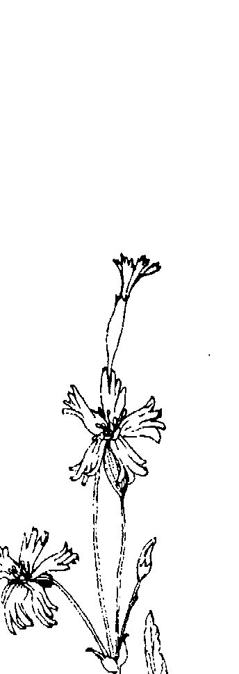
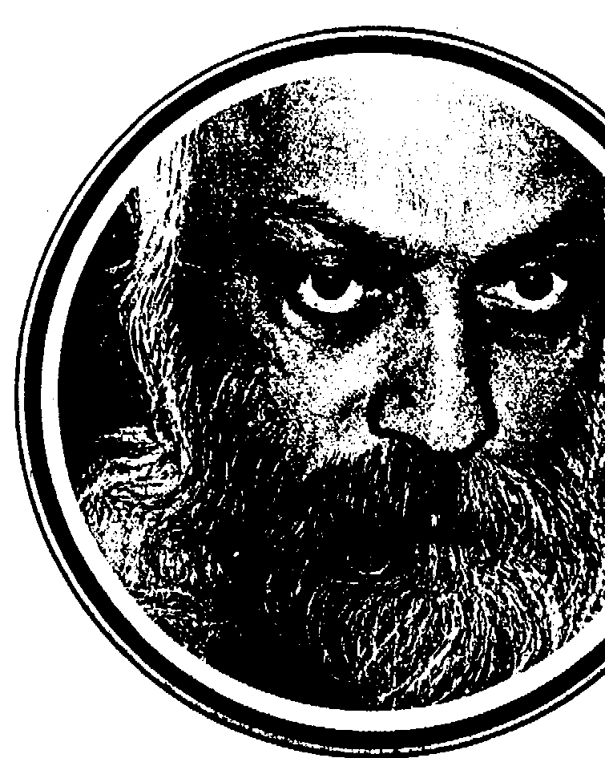
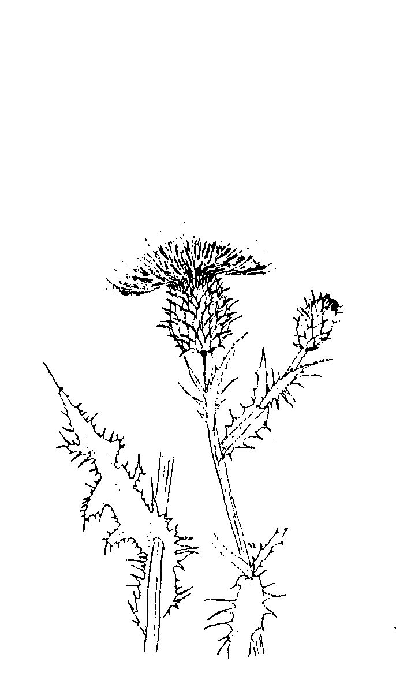

## OSHO
奧修心靈系列 54

## 譯崔經典【一】

## The Book of Secrets
奧秘之書（第一卷上冊）

除非一個愛人能夠將你丟回你自己，否則它並不是愛；
除非當愛人在場的時候你成你自己，否則它並不是愛；
除非當愛人在的時候，頭腦完全停止運作，否則它並不是愛。

作者：奧修(OSHO) 譯者：謙達那

## St. Royal College
## 天使神秘学院

- 神秘学资料库
- 神秘学培训机构
- 水晶能量研究中心
- 专业占卜预测机构
- 官方微信：strcdts
- 微信公众平台：strc2011
- 官方店铺网址：http://strc.cr.cx
- 读书交流QQ群：
  - 占星塔罗占卜师交流群：814594478（加入密码：PDF）
  - 神秘学其他综合群：659338717（加入密码：PDF）

微信号：strcdts
天使神秘学院

## 制作说明：

本书由《天使神秘学院》出重金从台湾购入的原版书籍扫描制作完成。为达到最好阅读效果，特地把书全部切开后，再经由专业扫描设备高精度扫描完成，并经过一张张的PS后期处理最终成书，其间花费大量的人力、物力以及时间，只为能给大家提供经济并优质的神秘学学习资料而努力。

本学院强力谴责某些机构和个人，把本学院花心血制作完成的电子书籍，包装后直接放在自家淘宝网上低价倾销的行为，以谋取不劳而获的经济利益。如果长此以往最终将无人愿意再为大家花心思制作电子书，那以后可能大家再无新书可读。

为让大家以后能够读到更多的好书，也为了本学院的良性发展。本学院恳请大家尽量做到如下几点：

一、尽量在天使神秘学院的官方网站购买电子书籍。
官网电脑访问地址：http://strc.cr.cx

二、在收到电子书后小范围传阅即可，千万不要公开传播，更别挂到淘宝网上低价销售。

同时为答谢广大支持者，学院电子书将做如下调整：

一、学院会把一些早已收回制作成本的电子书折价销售。
二、最新制作的电子书籍会开放打印功能，大家购买后有条件的可自行打印成书。

天使神秘学院
2020年5月

## 譚崔經典(一)

The Book of Secrets, Vol. I

奧修之書（第一卷）上冊

奧修(Osho)/原著 謙達那/譯 校對/德瓦嘉塔

## 譚崔經典（一） 2

获取更多好书，请加微信号：strcdts

店铺：http://strc.cr.cx

## 3 譯者序

## 譯者序

献给

真實的求道者

探讨人生最終究真理的人

想要透過技巧而成就人生最終究真理的人

瞬達已久的譯崔經典（一）終於出爐了。

本書是偉大的希瓦（Shiva，或曰濕婆）的原始經典，很難想像在五千年
前就有這樣的經典誕生。

這部一譯崔經典一是由八十個演講所組成的，初次問世的时候分成五卷，
內容包含適合各種不同類型的人的一百一十二種靜心技巧及相關的問題。想要
了解譯崔的人，這部經典應該是最具有代表性的。一譯崔一是什麼？譯崔即密
宗，因此本書的原名叫作「奧秘之書」；譚崔意味著「技巧」—修行的技
巧，探究內在核心本質的技巧。

本書是這部經典的最前面八個演講，亦即只有這部經典的十分之一。藉著
談論這部經典，在這八十個演講的開展過程中，奧修事實上是融入了幾乎所有
他對真理的教導。筆者在一九九〇年曾經翻譯過此書的第三卷，定名為「奧秘
之書」，如今捲土重來，從頭開始翻譯，已經打定主意，要將這部偉大的經典
全部呈現給讀者，雖然也許可能需要花上幾年的時間，請耐心等待。

在譚崔裡面有很多革命性的觀念其實是非常棒的，真的是太棒了！但我們一般愚蠢的、世俗的社會常常無法了解，導致它可能受到一些詆謗，甚至是
譴責，但是真理具有永恒的力量，這部經典既然能夠存在五千年至今，相信此
後它必然能夠繼續存在五千年，直到永遠。

在人生的道路上，能夠有機會親近真理的源頭是一件很幸運的事，一定要
有信心。虔誠地祝福你能夠藉著真理而解脫和超越。

謙達那

## 5 原 序

## 原 序

當我們死的时候會有什麼樣的事發生？
它幾乎是所有人類心靈追尋的核心問題，它的答案常常劃分出一個宗教教
義和另外一個宗教教義之間的界線。不論一個人是否相信輪迴或復活，天堂或
地獄，煉獄或償付一個人的「業」債，死後會有什樣樣的事發生這個問題佔據
了宗教領域裡面特別多的空間。
在豐富且複雜的印度神話世界裡，希瓦（shiva）在一個三位一體裡代表
死亡和破壞的神，另外兩個神是梵天（brahma，創造之神，眾生之父）和護
持神（vishnu，掌管維持）。這本具有五千年歷史的「譯崔經典」（vigan
Bhairav Tantra）是屬於希瓦的，為什麼是這樣？要了解的話必須先知道更多
關於他來自哪裡。
希瓦是一個很複雜的人物，他有很多面。那個故事是這樣的，有一次，梵
天和護持神有緊急的事要來跟希瓦講，但是發現他在跟他的太太作愛。希瓦很
須像傻瓜一樣在那裡站好幾個小時，直到希瓦終於注意到他們，所以他們覺得
無數希瓦的廟都採用這個象徵圖象，他們稱之為希瓦林格（shivalinga）。在另
外一方面，他也是代表在男女的永恒之舞裡面的男性面。在這本「譚崔經典」
裡，他對他的伴侣德微（Devi）講話，在整個演講的過程中，她都坐在他的大
腿上！

性和死亡，男性和女性，陰和陽……這個似非而是的世界不僅是屬於印度
教，同時也屬於東方所有主要的心靈傳統。

靜心能夠解決所有這些矛盾，使頭腦的主人離開這些矛盾而踏進到自我發
現的道路，關於這一點，奧修曾經提到：

死亡永遠都發生在現在。死亡、愛、和靜心——它們都發生在現在，所以
如果你害怕死亡，你就無法愛；如果你害怕愛，你就無法靜心；如果你害怕靜
心，你的生命將會變得沒有用。沒有用並不是以任何目的來說的，而是以你將無法在生命裡面感覺到任何喜樂，生命將會變得徒勞無益來說的。將愛、靜心、和死亡連結在一起似乎是奇怪的，但是其實不然！它們是類似的經驗，所以如果你能夠進入其中之一，你就能夠進入到其他的兩個。還有一件事必須加以了解：希瓦、梵天、和護持神都是某一個「最終的」的展現，那個「最終的」甚至比他們自己還來得更高；都是某一個「超越的」的展現，那個「超越的」超出他們自己還來得更高；都是某一個「超越的」最有人性的。梵天已經做了他創造的工作，現在或多或少處於退休狀態，等到很久很久以後，當這個世界被摧毀，那個時候或許會再度需要他的服務。護持神照顧每天因果關係的事情，就某方面而言，那只是像會計師一樣，帶著不含感情的準確性來做居家的雜事。但是希瓦帶著他可怕的面孔和洋溢的生命，是一個渴望跟他原始的源頭再度結合的角色，他醉心於他那依稀可見的最終的家。希瓦的經文是一個地圖，告訴那些口渴的人如何去到井邊。這本一譯崔經典一是個現代的神秘家奧修評論希瓦那部有五千年歷史的
「味格揚·拜拉·譚崔」（Vigyan Bhairav Tantra）——就字面上的解釋，這本書的名字意味著「超越意識的技巧」。事實上一「譚崔」（tantra）這個字只是意味著一技巧或一方法，當大家知道這個事實一定會感到驚訝。譚崔在現代的應用上幾乎都跟性聯想在一起，事實上在這本書裡面所描述的一百一十二種技巧裡只有不到半打是直接跟性行為有關的。在接下來的章節裡面，我們將會發現譚崔的重點並非只是要提供人們更好的性生活，而是要利用人類日常生活裡面無數的情況，包括性，來作為經驗靜心的通道，就如奧修在第一章裡面所講的：

希瓦的這些經文是最古老的技巧，但是你也可以說它們是最新的，因為你已經無法在它們上面再加上什麼了。它們已經將所有的可能性，所有清理頭腦和超越頭腦的方法都放進去了。沒有一個方法可以被加進希瓦的這一百一十二種方法裡，它是最古老的，也是最現代的、最新的。它們就像古老的山那麼老——因為這些方法似乎是永恆的——而它們也像陽光底下的露珠一樣新，因為它們是那樣地新鮮。

## 9 原序

## 原序

這一百一十二種靜心方法構成了蛇變頭腦的整個科學。 注意奧修使用「科學」這個字眼。他一再一再地強調，不僅在這本書裡面，而是幾乎在他所有的演講裡，靜心並不是一個相信的系統，或是一個問題的答案。靜心是一種內在的狀態，在那種狀態下，所有相信的系統、學說、和既成的答案都消失了，只留下純粹的、沒有思想的覺知，唯有這個覺知能夠按照真相本然的样子來覺察它。但是靜心的技巧也不是靜心，所以不要犯那個錯誤。技巧就只是地圖，就好像科學公式一樣。重點不在於只是知道它們，而是要能夠應用它們，在一個人內在空間的實驗室裡面來實驗它們，靜心是實驗之後能夠發生的結果。但是等一等——所有這些跟偉大的性有什麼關係？那些能夠將靜心帶入他們的作愛的人可能會叫你丟掉所有你們那些「如何做」的手冊，改成學習將你們的注意力帶到此時此地，在那之後，每一件事都會照顧它自己。 法給你一個精確的答案，但是他們可以告訴你，他們已經經驗過，而且知道他
們內在那個不朽的，從那個經驗出來之後知道說死亡只是一個夢。

性、死亡、和靜心——有誰比希瓦這個既是破壞者也是愛人的神，這個最
兒將這三者連結在一起。有誰比奧修更能夠將希瓦的奧秘帶到今日。奧修堅
持，所有的生命，從性到超意識，從心靈到科學，都必須從我們那個好與壞、
較高和較低的黑暗觀念重新被喚回，然後恢復到發光的完整，那是我們作為人
類與生俱來的權利。

奧修在前面兩章的介紹裡給出了十分詳細的指導方針，有一些在此已經提
過，另外有一些是關於這本書是在什麼樣的情況下被創造出來的，這些將有助
於讀者對這本書的使用。

這本書的每一章都是從奧修對一些朋友和門徒的即興演講所錄下來的。奧
修在演講的時候除了一份參考的經文和一些笑話或逸事是預先準備的之外通常
並沒有什麼特別的準備。

對於那些習慣於閱讀「如何做」和「自己來」的書的人來講，這本書在一
開始可能會讓你覺得不知所措。在這個演講裡，你不會找到第一點、第二點、
[PAGE 15]

# 11 原序

第三點，記下來之後再重複；在這個演講裡沒有註腳、副標題、或圖表，如果你有這樣的期待，你很快就会失望。當你在閱讀的時候，最好把它當成故事、詩、或是一首歌的抒情詩來看待，帶著耐心和接受性的態度，相信在這個例如行雲流水般的漸次開展中，一切都將會顯露出來。

在這本書開始的時候，奧修鼓勵他的聽眾要去實驗他所論論的每一個靜心技巧，就如他所说的：「只要玩它玩個三天。」他強調「玩」（play）這個字，不要太嚴肅，不要一太費力的努力一或是一嚴格地規範你自己一，只要「玩」。當你在嘗試一個技巧而發覺它真的跟你很契合，你可以享受它，而且它似乎可以帶給你的生命一些新的東西，那麼你可以更深入地探索它。在這種情況下，身為一個讀者的你就比當初的那些聽眾處於一個更好的位置。在你進入到下一章之前，你可以給每一章足夠的時間來玩每一個技巧。

當然，如果某一個特別的技巧真的引起你的注意，你覺得想要立刻嘗試它，你也可以直接進入這本書的任何一個點。你必須覺知到，在談論經文的每一章之後的那一章是奧修回答聽眾的問題。

題。在幾乎所有的情况裡，那些問題都跟前面那一章裡面所論論的問題有關，當然，如果某一個特別的技巧真的引起你的注意，你覺得想要立刻嘗試
進入到下一章之前，你可以給每一章足夠的時間來玩每一個技巧。

## 譚崔經典（一） 12

所以，當你開始實驗的時候，如果你順便看一下緊接著你所玩的技巧的下一章，那是有幫助的，你很可能会找到一些額外的暗示，或是得到更深入的了解，或是你的某些問題可以被解決。

的答案，它是一套錘匙。奧修在一開始的時候就告訴我們，這一套錘匙是完整的的，它連一個門的錘匙都没有漏掉，要打開你自己的門的錘匙就隱藏在這裡面的某一個地方，一切你所要做的就是去嘗試這些錘匙，一支接著一支，直到你找到一支適合的，然後將門打開，自己看看在它裡面的是什麼東西。

> 莎莉托·卡羅·尼曼
> 於印度普那
> 西元一九九七年

## 17 第一章 護崔的世界

給出一個技巧。如果德微去經歷這個技巧，她就會知道。所以那個答案是迴迴的，你不是直接的。他不會回答：—我是誰？—他會給你一個技巧，你做了它，你就會知道。對譚崔而言，做就是知道，沒有其他的知道。除非你做了某些事，除非你改變，除非你從不同的角度來看，除非你用不同的方式來看，除非你進入一個跟理智完全不同的層面，否則是沒有答案的。答案可以給予，但它們都是謊言，所有的哲學都是謊言。你問了一個問題，而哲學給你一個答案，它滿足你或不滿足你。如果你滿足了，你就變成一個改信哲學的人，但你還是保持一樣；如果它沒有滿足你，你將會繼續找尋其他可以讓你相信的哲學，但你還是保持一樣，你根本就沒有被碰觸到，你根本就沒有改變。所以，不管你是一個印度教教徒，一個回教徒，一個基督徒，或是一個那教教徒，都沒有差別。隱藏在印度教教徒、回教徒、或基督徒背後那個真正的人是一樣的。只有話語改變，或者是只有衣服改變，那個上教堂，或是去廟裡，或是去回教寺院的是同一個人。只有臉改變了，而那些是虚假的臉，它們是面具。在面具背後，你將會找到同樣的人——同樣的憤怒，同樣的具有侵略性，同樣的暴力，同樣的貪婪，同樣的色慾——每一件事都一樣。回教的性跟印度教的性有什麼不同嗎？基督教的暴力跟印度教的暴力有什麼不同嗎？那個真相仍然保持一樣，只是外衣被改變。是有一樣的！那個真相仍然保持一樣，只是外衣被改變。譚崔不關心你的衣服，譚崔關心你。如果你問一個問題，它會顯示出你在哪裡，它也會顯示出，不論你在哪裡，你都是看不到的，所以才會有問題產生。一個瞎子問：「什麼是光？」——哲學將會開始回答什麼是光，而譚崔只知道：如果我們問：「什麼是光？」——它只是表示他是瞎眼的。譚崔會開始對那個人進行手術，開始改變那個人，好讓他能夠看到。譚崔不會說什麼是光，譚崔會說要如何達到洞見，如何達到看的能力，如何能夠看到。當你能夠看到，當那個洞見出現，答案就出現了。譚崔不會給你答案，譚崔會給你技巧來達到那個答案。現在，這個答案將不是理智的。如果你對一個瞎子說關於光的事，那是理智的；如果那個瞎子本身變成能夠看到，那是存在性的。當我說譚崔是存在性的，我的意思就是這樣。所以希瓦將不會回答德微的問題，但他還是回答了——這是第一件事。

## 19 第一章 護崔的世界

第二件事：這是一種不同類型的語言。在他們進入它之前，你必須先對它有一些了解。所有譚崔的經文都是希瓦和德微之間的對話，德微問話，希瓦回

答，所有譚崔的經文都是以那樣的方式開始的。爲什麼？爲什麼會以這樣的方

式？這是非常重要的。這不是一個老師和一個學生之間的對話，這是兩個愛人

之間的對話。譚崔透過它來表達是非常有意義的：除非在門徒與師父之間有

愛，否則較深的教導是無法給予的。門徒和師父必須變成很深的愛人，唯有如

此，那個較高的，那個彼岸的東西才能夠被表達。

為朋友也可以是愛人。譚崔說一個門徒必須具有接受性，所以門徒必須處於女

性接受的一方，唯有如此，事情才可能發生。要成爲一個門徒，你不需要是一

個女人，但是你需要帶著女性接受性的態度。當德微問，它意著女性的態度

在問。爲什麼要強調這種女性的態度？

男人和女人不只是身體上不同，他們在心理上也是不同的。性並非只是身

體上的不同，它也是心理上的不同。女性的頭腦意味著接受性——完全的接受

性、臣服、和愛。一個門徒需要一種女性的心理狀態，否則他無法學習。你可

以問，但是如果你是不敞開的，你無法被回答，你可以問了一個問題之後仍然 保持封閉，那麼那個答案就無法穿透你，你的門是關閉的，你是死的，你不 敞開。

女性的接受性意味著在內在深處像子宮一樣地具有接受性，這樣你才能夠 接受。不僅如此，它還有更多隱含的意義。一個女人不只是接受某些東西，當 她接受的時候，它就變成她身體的一部分。一個小孩被接受了，一個女人受 孕，當她受孕的時候，那個小孩就變成女性身體的一部分，它並不是異物，它 並不是外在於她的，它已經被吸收了，現在小孩並不是以一種加在母親身上的 東西在生活中，而是成為母親的一部分，就跟母親一樣。小孩不僅被接受，女性 的身體還會變成具有創造性的，小孩會開始成長。

一個門徒需要一種像子宮一樣的接受性。任何被接受的應該像死的知識一樣被搜集起來，它必須在你裡面成長，它必須變成你裡面的血液和骨頭，它必須變成你的一部分，它必須成長！這個成長將會改變你、蛻變你，那就是為

什麼諾崔使用這個設計。每一段經文都是從德微問題開始，然後希瓦回答 它，德微是希瓦的配偶，是他的女性部分。

## 第一章 護崔的世界

還有一件事……現在的心理學，尤其是深度的心理學，說一個男人既是男
人，也是女人。沒有一個人只是純粹的男人或純粹的女人，每一個人都是雙
性的，兩種性別都存在。這是西方最近的研究，但是對譯崔來講，好幾千年以
來這就已經是最基本的觀念之一，你一定看過一些希瓦的照片，照片上所顯示
出來的是一半男人，一半女人，一半女人，在整個人類的歷史上沒有其他的觀念像它一
樣，希瓦被畫成一半男人，一半女人，
所以德微並非只是希瓦的配偶，她是希瓦的另外一半。除非門徒變成師父
的另外一半，否則不可能傳遞更高的教導，不可能傳遞奧秘的方法。當你們變
成一一一，那麼就不會有懷疑。當你跟師父變成一一一——完全合一，深深地合
一——那麼沒有爭論、沒有邏輯、沒有理智，一個人只是吸收，一個人就
變成一個子宫，然後那個教導就會開始在你裡面長而改變你。
那就是為什麼譯崔是以愛的語言來寫的。關於愛的語言還有一些事必須加
以了解。有兩種類型的語言：邏輯的語言和愛的語言。這兩者之間有一些基本
的差別。
選輯的語言是具有侵略性的、爭論的、暴力的。如果我使用選輯的語言，

## 諾崔經典（一） 20

我就變成對你的頭腦是具有侵略性的，我試圖要說服你，改變你，使你變成一個傀儡。我的論點是「對的」，而你是「錯的」。邏輯的語言是以自我為中心個傀儡。我是對的，你是錯的，所以我必須證明我是對的，你是錯的。—我並沒有顧慮到你，我顧慮到我的自我，我的自我永遠都是對的，—。愛的語言是完全不同的，我並不會顧慮到我的自我，我會顧慮到你，我不想證明什麼來強化我的自我，我所顧慮的是如何幫助你，它是想要幫助你成長、幫助你蛻變、幫助你再生的一種慈悲。第二，邏輯永遠都是理智的。觀念和原則是重要的，論點是重要的。但是就愛的語言來講，說了什麼並不是那麼重要，倒是那麼重要的，倒是你表達的方式是重要的。那個容器，那個話語是不重要的，那個內容物、那個訊息，是更重要的。它是一個心對心的談話，不是一個頭腦對頭腦的討論。它不是一個辯論，它是一個交融。所以，這是稀有的：德微坐在希瓦的大腿上問，而希瓦回答。它是一種愛的對話——沒有衝突，就好像希瓦在對他自己說話。為什麼要強調這個愛和愛的語言？因為如果你愛你的師父，那麼整個意識形態都會改變，它會變得不一

## 第一章 護崔的世界

同，那麼你就不只是在聽他的話語，你是在喝他，那麼話語是無關的，事實上，話語與話語之間的寧靜變得更重要。他所說的話或許是有意義的，或許是沒有意義的……但他的眼神、他的姿勢、他的慈悲、和他的愛是有意義的。

開始，而希瓦回答，沒有爭論，也没有浪費的話語，就只有簡單的事實陳述，如電報一般的訊息，沒有想要說服，只是陳述。

如你，首先你的封閉必須被打破，那麼他將必須是積極的，那麼你的偏見、你的先入之見都必須被摧毀。除非你將你的過去完全清除，否則沒有辦法給你什麼東西，但是他的配偶德微並不是這樣，對德微來講是沒有過去的。

記住，當你進入很深的爱之中，你的頭腦就停止了。沒有過去，只有當下這個片刻變成一切。当你處於爱之中，现在是唯一的時間，现在就是一切——沒有過去、沒有未來。所以德微是敞開的，沒有防衛——沒有什麼東西要被清除，沒有什麼東西要被摧毀，那個地已經準備好了，只是歡迎的、接受的，要求受孕。

除，沒有什麼東西要被摧毀，那個地已經準備好了，只是歡迎的、接受的，要求受孕。

## 因此，所有這些我們即將要討論的說法都是如電報一般的，它們就只是經文，但是希瓦所給的每一段經文、每一個電報的訊息都具有跟吠陀經、聖經、和可蘭經一樣的價值。每一個句子都可以變成一部偉大經典的基礎。經典是邏輯的——你必須提議、護衛、和爭論，而在這裡是沒有爭論的，只是單純的愛的陳述。

## 第三，「味格揚·拜拉·諂崔」（Viryan Bhairav Tantra）這幾個字意味著

超越意識的技巧。Viryan 意味著意識，Bhairav 意味著超越意識的狀態；而Tantra則意味著方法：超越意識的方法。這是至高無上的學說——沒有任何學說。

我們是無意識的，因此所有的宗教教導所願慮的都是如何超越意識，如何成為有意識的。比方說，克利虛納姆提和禪，他們都願慮到如何創造出更多的意識，因為我們是無意識的。所以，要如何變得更覺知、更警覺？要如何從無意識走向意識？

但是諂崔說：這是一種二分性——無意識和意識。如果你從無意識走向意識，那麼你是從二分性的一部分走向另外一部分。要超越兩者！除非你超越這

## 雨者，否则你永遠無法達到那最終的，所以，既不要成為無意識的，也不要成為有意識的，要超越，只要存在，既不要成為有意識的，也不要成為無意識的，也不要成為無意識的，也不要成為——只要存在！這就是超越瑜伽、超越禪、超越所有的教導。詞，是一個護崔的名詞，它意味著意識，而拜拉（Bhairava）是一個特別的名Bhairava 聞名，而德微以Bhairavi 聞名——那些已經超越二分性的人。在我們的經驗裡，只有愛能夠給予瞥見，那就是為什麼愛變成傳授護崔智慧非常基本的設計。在我們的經驗裡，我們可以說只有愛是可以超越二分性的。當兩個人相愛，他們進入那個愛越深，他們就越來越變成一——有一個點會來到，有一個頂峰會達到，到了那個時候，他們就只有表面上看起來是「二」，就內在而言，他們是「一」，那個二分性被越了。唯有在這種意義之下，耶穌所說的「神就是愛」才會變得有意義，否則這句話是没有意義的。在我們的經驗裡，愛是最接近神的。並不是說神是愛人
的，就像基督徒一直在解釋的——神對你有一種父愛。荒謬！神就是愛——是

## 第一章 護崔的世界

譚崔的陳述，它意味著在我們的經驗裡，愛是達到最接近神、最接近神性的唯 一真相。為什麼？因為在愛裡面，一一被感覺到了。身體仍然是兩個，但是 某種超越身體的東西融合在一起而變成一一一。” 那就是為什麼人們對性有那麼多的渴望。真正的渴望是在追求合一，但那 個合并不是一一一，它們只是連在一起。但是有一下子，兩個身體互相在對方裡 個去到宇宙的門。你的好奇可能是屬於科學的，那麼你就必須透過邏輯的方式來做，你就不能去想那個無形的，對於那個無形的就要小心，要滿足於形式。科學一直都願慮到形式，如果有一個無形的，對於那個東西被提出來給一個科學的頭腦，就会將它化成形式，除非它有一個形式，否則它是沒有意義的。首先要給它一個形式，一個明確的形式，那個探詢才能夠開始。在愛裡面，如果有一個形式，那麼它還不是終點。融解掉那個形式！當東西變成無形的、令人暈眩的、沒有界線，每一樣東西都進入另外一樣東西，整個宇宙變成一個「一一」，唯有如此，它才是一個充滿驚奇的宇宙。種子是由什麼所組成的？然後德微繼續，她繼續從宇宙來問：種子是由什麼所組成的？這個無形的、充滿驚奇的宇宙，它來自哪裡？它是從哪裡起始的？或者它是沒有起點的？那個種子是什麼？

## 誰是宇宙輪子的中心？ 德微問，這個輪子繼續不地在轉動著——這個大改變，這個經常的變 動。但誰是這個輪子的中心？那個軸在哪裡？那個中心、那個不動的中心在 哪裡？

她並沒有停下來等任何答案，她繼續問，就好像她並不是在問任何一個 人，就好像她是在跟自己講話。

這個超越形式的生命是什麼？我們要如何超越空間和時間、名稱和描述， 而完全進入它？讓我的懷疑被解除！

那個著重點並不是在問題，而是在懷疑：讓我的懷疑被解除！這是非常重 要的## 35 第一章 護崔的世界

蜕變她的頭腦，因為不管你給出什麼樣的答案，一個懷疑的頭腦還是一個懷疑的頭腦，你將會懷疑它；如果我給你另外一個答案，你也会懷疑它。你有一個懷疑的頭腦，你將一個懷疑的頭腦意味著你會對任何事物加上一個問題號。所以答案是沒有用的，你問我說：「誰創造出這個世界？」我告訴你說，「A」創造出這個世界，然後你一定會問：「誰創造出「A」？」所以真正的問題並不在於如何回答問題，真正的問題在於如何改變那個懷疑的頭腦，如何創造出一個不會懷疑的頭腦——或者，如何創造出一個信任的頭腦，所以德微說，讓我的懷疑被解除！還有兩、三件事情……當你問一個問題，你之所以這樣可能是有很多原因，其中一個可能是你想要一個確認。你已經知道答案，你已經有了答案，你只是想要被確認你的答案是對的，那麼你的問題是假的，它並非真的是一個問題。你問一個問題可能不是因為你已經準備好要改變你自己，而只是出自好奇。頭腦續發問。在頭腦裡面，問題的出現就好像藥子從樹上長出來。發問是頭腦的本性，所以它就繼續發問。你問什麼是不重要的，不論你給頭腦任何東西，它都會創造出一個問題。它是一部製造問題的機器，所以不論你給它什麼就會從那個答案創造出很多問題，整個哲學的歷史一個問題被解答了，然後頭腦素（Bertrand Russell）記得，當他是一個小孩的時候，他說：「現在我可以說我自己的問題仍然存在，跟我是一個小孩的時候一樣。現在還有其他問題產生，因為又加上了這些哲學的理論。所以一個問題會產生出一個答案和很多問題，懷疑的頭腦是問題之所在。德微說：「不要管我的問題，我問了很多事情：你的真相是什麼？這個充滿驚奇的宇宙是什麼？種子是由什麼所組成的？誰是宇宙輪子的中心？這個超越形式的生命是什麼？我們要如何超越空間和時間而完全進入它？但是不要管我的問題，讓我的懷疑被解除。我問這些問題，因為它們在我的頭腦裡，我之所以需要，我的需要是……讓我的懷疑被解除！」問它們只是要顯示出我的頭腦，不必太注意它們。事實上，答案無法滿足我的需要，我的需要是……讓我的懷疑被解除！

## 第一章 譚崔的世界

但是那些懷疑要如何被解除？這是任何答案可以做得到的嗎？有任何答案可以解除我的懷疑嗎？頭腦就是懷疑！除非頭腦消失，否则懷疑是無法被解除的。爲最新的，因爲沒有什麼東西可以再加進它們。它們是完整的——一百一十二種技巧，它們已經將所有的可能性——所有清除頭腦和超越頭腦的方式——都考慮進去了。沒有一個方法可以被加進希瓦的這一百一十二種方法裡，而他的書一味格揚·拜拉·譚崔（Vigyan Bhairav Tantra）已經有五千年的歷史。沒有什麼東西可以被加進去，不可能加進任何東西，它是完整的、徹底的、沒有遺漏的，它是最古老的，同時也是最新的。像山岳一樣古老——那些方法似乎是永恆的——同時像陽光下的露珠一樣新，因爲它們是那麼地新鮮。這一百一十二種靜心方法構成了蛻變頭腦的整個科學。我們將會一個一個來進入它們，我們將試著先用理智來了解，但只是使用你的理智作爲一個工具，而不是作爲一個主人。使用它作爲工具來了解事情，但是不要一直用它來製造障礙。當我們要來談論這些技巧，先將你過去所知道的知識擺在一邊，不

論你以前所搜集到的是什麼樣的資訊。將它們擺在一旁，它們只是在這個道路 上所累積的灰塵。 用一個新鮮的頭腦來面對這些方法，要帶著警覺，那是當然，但是不要爭 論，不要以為爭論的頭腦就是警覺的頭腦，那是錯誤的，它不是，因為當你進 入爭論，你就喪失了覺知，你就喪失了警覺，那麼你就不在這裡。 這些方法並不屬於任何宗教。記住，就好像相對論並不會因為它是愛因斯 坦所想出來的，所以就是猶太教的，收音機和電視機也不是基督教的。沒有人 會說：一你為什麼在使用電？這是基督教的，因為它是由一個基督教徒所想出來 的。一科學不屬於任何種族或任何宗教，而譚崔是一種科學。所以要記住，這 根本就不是印度教的。這些技巧是由印度人所想出來的，但這些技巧並不是印 度教的，那就是為什麼這些技巧不會提到任何宗教的儀式。不需要廟宇，你本 身就足夠成為一個廟宇，你本身是實驗室，整個實驗會在你裡面進行，不需要 什麼信念。 這不是宗教，這是科學。不需要什麼信念，不需要相信可蘭經或吠陀經或 佛陀或馬哈維亞，不，不需要什麼信念，只要有勇氣去實驗就夠了，這就是它 什麼信念。

## 39 第一章 譚崔的世界

## 譚崔並不是顧慮到你所謂的道德律，或是你們社會的形式等等。那並不能叫你成為不道德的，譚崔給你科學的方法來改變頭腦，一旦頭腦變得不同，你的個性就會變得不同，一旦你結構的基礎改變，整座大樓都會變得不同。因為這個非道德的態度，所以那些所謂的聖人無法忍受譚崔，他們都反對它，因為如果譚崔成功，所有那些以宗教為名的荒謬的事都必須停止。

科學進步，那麼同樣的科學將會穿透到心理和心靈的世界，那個時間並不會離注意看：基督教非常反對科學的進步。為什麼？只是因為如果物質世界的 進步，那麼你要知道你可以透過技巧來改變頭腦的時間就沒有離得很遠 改變物質，那麼你要知道你可以透過技巧來改變頭腦的時間就沒有離得很遠 了，因為頭腦只不過是精微的物質。 這是譚崔的主張——頭腦只不過是精微的物質，它是可以被改變的。一旦 你有一個不同的頭腦，你就會有一個不同的世界，因為你是透過頭腦在看的。 你所看到的世界是透過某一個特定的頭腦在看的。如果沒有頭腦……那是譚崔 最終的目的——把你帶到一個沒有頭腦的狀態，那麼你就可以不要透過一個媒 介來看世界，當媒介不存在，你就会碰到那個不真實的，因為現在已經沒有一 個東西介於你和那個真實之間，那麼就沒有什麼東西可以被歪曲。 所以，譚崔說，當沒有頭腦，那就是拜拉瓦（σπαιρανα）的狀態——沒有 頭腦的狀態，你首度以世界本然的样子來看它。如果你有一個頭腦，你会繼續 創造出一個世界，你会繼續投射，或是用你自己的意思來解釋。所以，要先改 變頭腦，然後從頭腦改變到沒有頭腦，這一百十二種方法可以改變每一個 人。某些方法或许对你没有用，所以希瓦繼續敘述很多方法。選擇任何一種適 合你的方法，要知道哪一種方法適合你並不困難。

## 47 第一章 護蓋的世界

##  我們將試著來了解每一個方法，以及如何選擇一個可以改變你和改變你的頭腦的方法。這個了解，這個理智上的了解是基本上需要的，但這不是終點。

頭腦的方法。這個了解，這個理智上的了解是基本上需要的，但這不是終點。

任何我在此所討論的，你要嘗试看看。

事實上，当你在尝试一个正確的方法，它會立刻让你觉得很对味。所以我 每天会继续在此谈论那些方法，你们就试试看。用那些方法来玩一玩，回家试 看。当你碰到了适 hợpный 的方法，你就会觉得很对味。有某種东西会在你裡面 爆發，你會知道～这是适 hợpный 我的方法～。但努力是需要 的，你或許会感到驚 訝，突然间有一天，某一個方法会抓住你。

所以当我在这里讨论，你要同时继续玩这些方法。我說玩，因为你不需 太严肃，只要玩！某個方法或許会适 hợpный 你。如果它适 hợpный 你，那麼就认真一點，深入它～强 烈地、诚实地，用你所有的能量，用你所有的头腦，但在那之 前只要玩一玩。

我发現，当你在玩的時候，你的头腦是比较敞开的。当你严肃的時候，你 的头腦是不敞开的，它是封闭的，所以只要玩一玩，不要太严肃，只要玩一 

## 第一章 譚崔的世界

## 選一個方法，至少玩個三天。如果它给你某種亲和力，如果它给你某種幸 福的感覺，如果它讓你觉得它很适 hợpный 你，那麼你就對它认真一點，那麼就忘掉 其他的是，不要再玩其他的方法。坚持做它，至少三個月，奇蹟可能會發生，唯 一要注意的是那個技巧必須适 hợpный 你。如果那個技巧不适 hợpный 你，那麼就不會有什 廢事發生，那麼你可以继续做它好幾世也不會有什麼事發生。如果那個方法适 hợpный 你，那麼即使只有三分鐘也就夠了。 所以这一百一十二種方法对你来講可能會是一種奇蹟般的經驗，或者你們只是聽聽就算了，它依你們而定。我會继续从盡可能多的角度来谈論每一個方 法。如果你們觉得對它有任何亲和力，那麼就玩它玩个三天。如果你們觉得它 很适 hợpный 、很對味，那麼就持續做三個月。 生命是一個奇蹟，如果你不知道它的奧秘，那只是表示你不知道如何接近 它的技巧。 希瓦建議了一百一十二種技巧，這些都是可能的方法。如果你覺得這裡面 沒有一種适 hợpный 你，你沒有發現哪一種特別對味，那麼對你來講就沒有方法了 —这一點要记住。那麼就忘掉心靈，只要快樂就好，它不适 hợp你。

## 第二章 瑜伽之路和谭崔之路

問題： 瑜伽和譚崔之間有什麼差別？ 在臣服的途徑上，如何來到正確的技巧？ 要如何知道我們所練習的技巧將會成功？ 有很多問題，首先： 傳統的瑜伽和譚崔之間有什麼不同？它們是一樣的嗎？

## 第一章 瑜伽之路和谭崔之路

## 譚崔和瑜伽基本上是不同的。它们会达到同樣的目標，然而它们的途徑不僅不同，而且是相反的。所以这一點必須被很清楚的了解。瑜伽也是一種方法、一種技巧。瑜伽並不是哲學，就好像譚崔一樣，瑜伽依靠行動、方法、和 技巧。一作爲—会引導到本性，在瑜伽裡面也是如此，但那個過程是不同的。

在瑜伽裡面，一個人必須抗争，它是戰士的途徑。在譚崔的途徑上，一個人根本就不需要抗争，相反地，一個人必須放縱—但是要帶著覺知。

瑜伽是帶著覺知壓抑，譚崔是帶著覺知放縱。

譚崔說，不論你是怎樣，那個最終的跟它並不是對立的，它是一種成 長，你可以成長到那個最終的。在你和真相之間是没有對抗的，你是它的 分，所以不需要奮鬥，不需要衝突，不需要對抗。你必須使用自然，你必須用任何你所是的來超越。

在瑜伽裡面，你必須跟你自己抗争來超越。在瑜伽裡面，「世界」和「莫 克夏或解脫——「現在 你」和「你可以成爲的你」——是兩個對立的東 西·壓抑、抗争、融解掉現在的你，這樣你才能夠達到那個你能夠成爲的你。

在瑜伽裡面，超越是一種死亡，你必須一死，那個真正的本性才會誕生。

## 諾崔經典（一） 54

量都是自然的，它可以被用來幫助你，也可以被用來反對你。你可以使它成為一個障礙，你也可以使它成為一個階梯，它可以被利用。如果它被正確地使用，它可以變成友善的，錯誤地被使用，它就變成一個敵人，但它兩者都不是，能量就只是自然的。就一般人使用性，它變成一個敵人，它會摧毀他，他只是在性裡面將能量散發掉。

瑜伽採取相反的觀點——跟一般的頭腦相反。一般的頭腦被它自己的慾望所摧毀，所以瑜伽說，停止欲求，要成為沒有慾望的。跟慾望抗爭，在你裡面創造出一個沒有慾望的整合。

諾崔說，要覺知那個慾望，不要有任何抗爭。帶著全然的意識進入慾望，當你帶著全然的意識進入慾望，你就能夠超越它。你進入它，但是你並不在它裡面；你經歷過它，但是你仍然保持在它之外。

瑜伽具有很多吸引力，因為瑜伽跟一般的頭腦剛好相反，所以一般的頭腦可以了解瑜伽的語言。你知道性是如何在摧毀你，你如何在它的周圍繞來繞去，就像是一個奴隸，就像是一個傀儡。你從自己的經驗知道這件事，所以當瑜伽說要跟它抗爭，你立刻就了解那個語言。那就是它的吸引力，那就是瑜伽。

## 第二章 瑜伽之路和諾崔之路

比較容易吸引人的地方。 諾崔沒有辦法那麼容易吸引人，它似乎很困難：要如何進入慾望而不要被 怕，它似麼服？要如何有意識地、帶著全然的覺知進入性行為？一般的頭腦會害 個危險。你知道你自己，你知道你怎麼欺騙你自己，你知道得很清楚，你的頭 腦是狡猾的，你可以進入慾望、進入性、進入每一件事，然後欺騙你自己說你 是帶著全然的覺知，那就是為什麼你會覺得它很危險。 那個危險並不是在於諾崔，那個危險是在於你。瑜伽的吸引也是因為你， 因為你那一般的頭腦，因為你的性壓抑、性饑渴、和性放縱的頭腦。因為對性 來講，一般的頭腦是不健康的，所以瑜伽會具有吸引力。如果人性變得更好， 性變得更健康、更自然、更正常，那個情況一定會變得不一樣。我們並不是正 常的、自然的，我們極度地不健康，真的是發瘋了，但是因為每一個人都跟我 們一樣，所以我們從來不會去感覺到它。 瘋狂是那麼地正常，所以不瘋狂看起來似乎是不正常的。處在我們裡面， 一個佛是不正常的，一個耶穌是不正常的，他們不屬於我們。我們一般所謂的

「正常」是一種病，這種「正常」的頭腦產生了瑜伽的吸引。如果你很自然地
來看待性，不要用什麼哲學來圍繞著它，不要用什麼哲學來贊成或反對它，如
果你看待性就好像你在看待你的手和你的眼睛，如果它完全被接受成一件自然
的事，那麼諾崔就會具有吸引力，唯有到那個時候，諾崔才會對很多人來講變
得有用。

但是諾崔的時代已經來臨了——遲早諾崔將會首度爆發在多數人身上，因為
這是第一次，時間已經成熟了——成熟到可以很自然地來看待性。有可能那個
爆發會來自西方，因為佛洛依德、容格、和威爾罕姆·雷克的關係，他們已經
將那個基礎準備好。他們對於諾崔一無所知，但是他們已經準備好那個基礎可
以讓諾崔來發展。西方的心理學已經來到一個結論，認為人基本的疾病圍繞在
性的某一個地方，人類基本的瘋狂是以性為導向的。

除非這個性的導向消失，否則人類無法成為自然的、正常的。人類走錯了，
就只是因為他對性的態度。不需要什麼態度，唯有如此你才會自然。你對
你的眼睛有什麼態度呢？它們是邪惡的，或者它們是神聖的呢？你贊成你的眼
睛或是反對你的眼睛？沒有什麼態度！那就是為什麼你的眼睛是正常的。

當你探取一個態度，認爲眼睛是邪惡的，那麼你的一看一將會變得困難，那麼你的看將會跟性一樣變得有問題，那麼你就會想要看，那麼你對看就會有慾望、有渴望。但是每當你看的時候，你就会覺得有罪惡感，好像你做錯了什麼事，好像你犯下了什麼罪，你會想要扼殺你看的工具。而當你越想要摧毀它們，你就越會變成以眼睛爲中心，然後你就会開始一項非常荒謬的行為：你就會想要看更多更多，同時你會覺得那個罪惡感也越來越多，同樣的情況就發生在性中心。諾崔說，不論你是怎樣都要接受你自己，這是基本上要注意的——全然的接受。唯有透過全然的接受，你才能夠成長，然後用上你所有的能量。你要如何才能夠使用它們？接受它們，然後找出這些能量是什麼——性是什麼，這個現象是什麼？我們並不認識它。我們知道很多關於性的事，那是由別人所教給我們的。我們或許有經歷性行為，但是是帶著一個罪惡感的頭腦，帶著一種壓抑的態度，在匆忙之間完成。為了要釋下擔子，所以必須去做那件事。性行為並不是一個愛的行為，你在它裡面並不覺得快樂，但是你又離不開它，你越是試著要離開它，它就變得越有吸引力。你越想要否定它，你就越覺得它在

種壓抑的態度，在匆忙之間完成。為了要釋下擔子，所以必須去做那件事。性行為並不是一個愛的行為，你在它裡面並不覺得快樂，但是你又離不開它，你越是試著要離開它，它就變得越有吸引力。你越想要否定它，你就越覺得它在

## 諾崔經典（一） 58

邀請你。 你無法否定它，但是這個否定的態度，這個想要摧毀它的態度，會摧毀能夠了解它的頭腦、覺知、和敏感度。性繼續在進行，但是你在它裡面是不敏感的，那麼你就無法了解它。唯有很深的敏感度才能夠了解任何事。唯有當你進入性的時候能夠像一個詩人在欣賞花朵，你才能夠了解性，唯有這樣才能夠了解任何事。唯有當你進入性的時候能夠像一個詩感，你或許會經過花園，但是經過的時候你的眼睛是封閉的，你將會是匆匆忙的，瘋狂地趕路，內在一直覺得想離開那個花園，這樣的話你怎麼能夠覺知？所以諾崔說，不論你是怎麼樣都要接受你自己。你是一個具有多重能量的大奧秘，接受它，帶著很深的敏感度、帶著覺知、帶著愛、帶著了解來進入每一個能量，跟著它走！那麼每一個慾望都會變成超越它的工具，那麼每一個能量都會變成一個幫助，那麼這個世界就是涅槃，這個身體就是一座廟宇——一座神聖的廟宇，一個神聖的地方。瑜伽是否定，諾崔是肯定。瑜伽是以二分性來思考，因此會有一「瑜伽」

（yoga）這個字，它意味著將兩樣東西放在一起，將兩樣東西～連結～（yoke）在一起。但是當有兩樣東西存在，那個二分性是存在的。諾崔說沒有二分性，如果有一二分性，那麼你就無法將它們放在一起，不論你以什麼方式試著去做，它們都將會保持是一二，那個抗爭將會繼續，那個二分性將會保持。

真的是一二，唯有當它們只是看起來好像是一二，它們才能夠成為一二。如果你的身體和你的靈魂是一二，那麼它們就無法被放在一起；如果你和神是一二，那麼它們就不可能被放在一起，它們將會一直保持是一二。

諾崔說沒有二分性，它只是外表看起來是這樣，所以為什麼要幫助這個二分性的外表成長得更堅固？在當下這個片刻就可以將它融解掉！成為一二！透過接受，你就變成一二，而不
是透過抗爭。接受世界，接受身體，接受它裡面所固有的一切，不要在你裡面創造出一個不同的中心，因為對諾崔而言，那個不同的中心只不過是自我，不
要創造出一個自我，只要覺知你是怎麼樣。如果你抗爭，那麼自我將會存在。所以很難找到一個瑜伽行者不是自我主義者。一個瑜伽行者或許會繼續談
論無我，但他不可能真的無我，他們所經歷的過程就會創造出自我。那個過程是抗爭，如果你抗爭，你一定會創造出一個自我，你越抗爭，那個自我就越被強化。如果你戰勝你的抗爭，那麼你就会達到很高的自我。諾崔說，不要抗爭！那麼就不可能有自我。如果我們了解諾崔，那麼將會有很多問題，因為對我們而言，如果没有抗爭，那麼就只有放縱。對我們而言，言，沒有抗爭意味著放縱，然後我們就會變得害怕。我們已經放縱了好幾世，而我們並沒有到達任何地方，但是對諾崔而言，那個放縱並不是我們所知道的放縮。諾崔說放縮，但是要帶著覺知。你在生氣……諾崔不會叫你不要生氣。諾崔會叫你全然地生氣，但是要帶著覺知。著覺知。生氣，但是帶著覺知，這就是這個方法的奧秘——如果你帶著覺知，那個憤怒就被蛻變了，它會變成慈悲。所以諾崔說，憤怒並不是你的敵人，它是種子形的慈悲。同樣的那個憤怒，同樣的那個能量，將會變成慈悲。如果你跟它抗爭，那麼將不可能有慈悲，所以如果你的抗爭或壓抑成功，你將會成為一個死氣沈沈的人。將不會有憤怒，因為你已經將它壓了下
來，但是也不會有慈悲，因為只有愤怒可以被蛻變成慈悲。如果你壓抑成功——那是不可能的——那麼將不會有性，但是也不會有愛，因為當性死掉，就沒有能量可以成長為愛，所以你將會沒有性，但是你也將會沒有愛，然後整個要點就錯失了，因為如果沒有愛，就沒有神聖；沒有愛，就沒有解脫；沒有愛，就沒有自由。愛，就沒有自由。諾崔說同樣的這些能量必須被蛻變。它可以以這樣的方式來說：如果你反對世界，那麼就沒有涅槃，因為是世界本身要被蛻變成涅槃，如果你這樣做，那麼你，就會在反對那個源頭的基本能量。所以諾崔的煉金術說，不要抗爭，要善待自然所賦予你的所有能量，歡迎它們，要覺得感激說你有憤怒，你有性，你有貪婪。要覺得感激，因為這些是隱藏的泉源，它們可以被蛻變，它們可以被開啟。當性被蛻變，它就變成愛，那個毒素沒有了，那個醜消失了。種子是醜的，但是當它活過來的時候，它會發芽和開花，那麼它就會變得很美。不要將種子丟掉，因為這樣做你也是把花一起丟掉。花還沒有長出來，

它們還沒有顯現出來，所以你還看不到。它們是未顯現的，但它們是存在的，

## 諾崔經典（一）
62

要好好地利用這個種子，這樣你才能夠達到花朵。所以要先接受，並且帶著具有敏感度的了解和覺知，這樣的話你就可以被允許放縱。還有一件事真的非常奇怪，但它是諾崔最深的發現之一，那就是：任何你將它們視為敵人的，比方說貪婪、憤怒、恨、性，或不論是什麼，那個你將它們視為敵人的態度就會使它們成為你的敵人。要將它們視為神聖的禮物，以一種非常感激的心情來接近它們。比方說諾崔發展出很多技巧來蛻變性能量。接近性就好像你在接近神聖的廟宇，將性行為當成好像是一種祈禱或是一種靜心，感覺它的神聖。那就是為什麼在卡丘拉荷、普利（Puti）、和科那拉克（Konarak），每一座廟宇都有性姿勢的雕像。把性行為放在廟宇的牆壁上似乎是不合邏輯的，尤其是對基督教、回教、或者那教來講更是如此，它似乎是難以想像的、矛盾種可以想得出來的性交姿勢都用石頭雕出來，為什麼？廟宇應該沒有任何地方可以容納這樣的東西，至少在我們的頭腦裡不應該有。基督教無法想像在一個教堂的外牆會有像卡丘拉荷這樣的圖畫，不可能！

現代的印度人也覺得有罪惡感，因為現代印度人的頭腦是由基督教所創造出來的，他們是印度的基督徒，因為成為一個基督徒是好的，但是成為一個印度度的基督徒就很奇怪。他們覺得有罪惡感，有一個印度的領袖坦頓（Tanaon）甚至建議將那座廟摧毀，認為它不屬於我們。事實上，它之所以看起來好像不屬於我們是因為諾崔已經有一段很長的時間、已經有好幾個世紀不在我們的心中，它已經不是主流。瑜伽成為主流，而對瑜伽來講，卡丘拉荷是無法想像的，它必須被摧毀。諾崔說，進入性行為，就好像你進入一座神聖的廟宇，那就是為什麼他們將性行為的圖象放在他們的聖廟。他們說，進入性，就好像你在進入一座神聖的廟。所以，當你進入聖廟的時候，性也在那裡，為的是這兩者可以在你的頭腦裡連結起來，那麼你可以感覺到世界和神性並不是兩個互對抗的元素，而是同一的。它們並不是相反的，它們只是互相幫助對方的兩極。就是因為有這個兩極性，所以它們才能夠存在，如果那個兩極性喪失了，整個世界就喪失了。注意看，有一個很深的——-流經每一樣東西，不要只看兩極，要看那個使它們成為一一的內在之流。

## 諾崔經典（一） 66

對諾崔來講，每一件事物都是神聖的。這一點要記住：對諾崔來講，每一件事物都是神聖的，沒有什麼東西是不神

## 諫崔經典（一） 72

廢還需要這一百一十二種方法？為什麼要不要地進入它們？——頭腦會這樣問。那麼，好了！如果臣服是有效的，那麼臣服就好了，為什麼還要繼續渴求其他的方法？誰知道某一個特定的方法是否適合你？它或許需要花很多世的時候去找出來，所以臣服是好的，但它是困難的，它是世界上最困難的事。方法並不困難，它們是容易的，你可以訓練你自己，但是就臣服來講，你無法訓練你自己……它是無法訓練的！你不能詢問：要如何臣服？那個問題本身是荒謬的，你怎麼能詢問要如何臣服？你能詢問：要如何愛嗎？要不然就是有愛，要不然就是沒有愛，但是你無法詢問要如何愛。如果有人告訴你，教你如何去愛，記住，這樣你就永遠沒有能力去愛。一旦一個愛的技巧巧給了你，你會執著於那個技巧，那就是為什麼演員是無法愛的，因為他們知道了很多技巧、很多方法——而我們都是演員。一旦你知道了如何愛的計，那麼愛就不會開花，因為你可以製造出一個假象，有了那個假象，你就脫離它了，你不涉入了，你已經受到了保護。愛是全然敞開的，是具有接受性的，它是危險的，你會變得不安全。我們不能詢問要如何愛，我們不能詢問要如何臣服，它是自己發生的！愛發生，臣服發生，愛和臣服深深地結合在一起，但它是什麼？如果我們無法知道如何臣服，至少我們可以知道我們是如何在維持我們自己，我們是如何在阻止我們臣服。那是可以知道的，而且那是有幫助的。

## 第二章 瑜伽之路和譚崔之路

面，那麼真正的問題並不是如何去愛，真正的問題是挖深一點來找出你沒有進入愛裡怎麼可以生活，你的計是什麼？你的技巧是什麼？你的防衛機構是什麼？你如何能夠不要有愛而生活？那是可以被了解的，而且它必須被了解。

第一件事：我們跟自我生活在一起，我們生活在自我裡，我們集中在自我裡。我是，而不知道我是誰。我繼續宣稱「我是」，這個「我是」是虛假的，因為我不知道我是誰，除非我知道我是誰，不然我怎能夠說「我」？這個「我」是一個虛假的「我」，這個虛假的「我」就是自我，這就是那個防衛，是這個自我在阻止你臣服。

你無法臣服，但是你可以覺知到這個防衛措施，如果你能夠覺知到它，它就消失了。漸漸地，你就不會再去強化它，有一天你會覺到「我是不存在的」，臣服就發生了。所以，試著找出你是否存在。

## 谭崔經典（一） 74

在。事實上，在你裡面有任何一個中心是你可以稱之為你的「我」的嗎？深入 你自己裡面，繼續試著找出這個「我」在哪裡，這個自我駐在哪裡？ 臨濟禪師去到他的師父那裡說：「給我自由！」 師父說：「把你自己帶來，如果你存在，我就會使你自由，但是如果你不 存在，我怎麼能夠使你自由？你已經自由了，而自由，「他的師父說：「並不 是你的自由，事實上自由是免於「你」自己，所以，先去找出這個「我」在哪裡，你在哪裡，然後再來找我。這是靜心，先去靜心。 所以門徒臨濟就開始去靜心好幾個星期，好幾個月，然後他來，說：「我 不是身體。我只找到這麼多。」 師父說：「那麼你就只有這麼多是自由的，再去，試著找出來。」 他繼續嘗試，靜心，然後他發現「我不是我的頭腦，因為我可以觀察我的 思想，所以那個觀察者和那個被觀察的是不同的——我不是我的頭腦。「他跑 來說：「我不是我的頭腦。」 所以他的師父說：「現在你已經解脫四分之三了，再去找出你是誰。」

## 谭崔經典（一） 76

所以他想：我不是我的身體，我不是我的頭腦。他再去讀書、研究，增加了很多了解，所以他想：定是我的靈魂，我的阿特瑪（atma）。但是他不續靜心，然後他發現並沒有阿特瑪，沒有靈魂，因爲這個阿特瑪只不過是你心理的訊息——只是教條、語、和哲學。

## 谭崔經典（一） 77

所以有一天他跑去告訴他的師父：現在已經不復存在了！然後師父說：現在我還要教你自由的方法嗎？臨濟說：我已經自由了，因爲我已經不復存在，沒有一個人可以處於枷鎖之中，我就只是一個廣大的空，一個空無。只有空無可以是自由的，如果你有什麼，你會處於枷鎖之中。如果你存
在，你會處於枷鎖之中。只有一個空，一個空的空間，可以是自由的，那麼你就無法綁住它。臨濟跑過來說：我已經不復存在了，不論在哪裡都找不到我。這就是自由，他首度向他的師父頂禮——首度地！—
## 谭崔經典（一） 78

臨濟問說：「你爲什麼說這是我第一次向你頂禮？我已經向你頂禮很多次。」師父說：「但是你在那裡，所以當你已經在那裡，你怎麼能夠向我頂禮？那個「我」永遠無法向任何人頂禮，即使在那裡，只是以一種迴的方式。—你首度向我個人頂禮，它也只是在向他自己頂禮，只是以一種迴的方式。—你首度向我頂禮，—師父說：—這是第一次，也是最後一次。」 這：—這是第一次，也是最後一次。」 當你不存在的時候，臣服才會發生，所以—你—是無法臣服的，—你—就是障礙。當你不存在，臣服才存在，所以你和臣服無法同時並存，要不然就是你存在，要不然就是探詢是臣服存在，兩者無法同時並存，所以要找出你在哪裡，你是誰，這個探詢會創造出很多很多令人驚訝的結果。 拉曼·瑪赫西（Raman Maharshi）常說：—要問「我是誰？」—它被誤解了，即使是他的最近門徒也不了解它的意思。他們以爲這是一個要找出你真正是誰的探詢，它並不是！如果你繼續問—我是誰？—你一定會來到—你不
## 谭崔經典（一） 79

存在一的這個結論。這並非真的是要找出「我是誰？」的問話，事實上，這是一個要讓你消失的探詢。我將這個技巧給了很多人，叫他們在內在問「我是誰？」然後一、兩個月之後他們回來找我說：「我們還沒有找到「我是誰？」那個問題仍然保持一樣，沒有答案。」所以我告訴他們：「繼續問，某一天，那個答案就會出現。」將不會有答案，只是那個問題將會融解掉，將不會有一個答案說：「你就是這個。」只是那個問題將會融解掉，將甚至不會有一個人可以來問：「我是誰？」然後你就會知道。當「我」不存在，「真正的我」就敞開了。當自我不存在，你將首度碰到你的本性，那個本性是空無，那麼你可以臣服，那麼你已經臣服了，現在你就是臣服，所以不可能有技巧，或者只是像詢問「我是誰？」這種負向的技巧。臣服是怎麼樣在運作？如果你臣服，將會有什麼事發生？我們將會了解方法如何在運作，我們將深入方法，然後我們將會知道它們是如何在運作，它
## 谭崔經典（一） 80

們的運作有一個科學的基礎。 當你臣服，你就變成一個山谷；當你是一個自我，你就像是一個山峰。自 我意味著你在其他每一個人之上，你是某某顯赫的人物。其他人或許會認出 你，或許不會認出你——那是另外一回事。你認為你自己在每一個人之上，你 就像是一個高峰，沒有什麼東西能夠進入你。 當一個人臣服，他就變成好像是 一個山谷，他就變成一個深處，而不是一 個高處，然後整個存在就會從每一個地方倒進他。他就只是一個真空，一個深 處，或是一個深淵——無底的深淵。整個存在會開始從每一個地方倒進來，你 可以說神從每一個地方跑向他，從每一個孔進入他，完全充滿他。 這個臣服，這個變成一個山谷或一個深淵可以以很多方式被感覺到。有一 些次要的臣服，也有一些主要的臣服。即使在次要的臣服裡面，你也会感覺到 它。臣服於一個師父是一個次要的臣服，但是你會 立即開始流進你裡面。如果你臣服於一個師父，突然間你會覺得他的能量流進 你裡面。如果你無法感覺到能量流進你裡面，那麼你可以知道得很清楚，你 甚至沒有達到次要的臣服。
## 谭崔經典（一） 81

如果你無法感覺到能量流進你裡面，那麼你可以知道得很清楚，你 甚至沒有達到次要的臣服。

## 谭崔經典（一） 82

有很多故事對我們來說是沒有意義的，因為我們不知道它們是怎麼發生 的。摩訶迦葉來找佛陀，佛陀只是用他的手去碰觸他的頭，事情就發生了。摩 訶迦葉開始跳舞，所以阿南達問佛陀：—他到底是怎麼了？四十年以來，我一 直都跟你在一起！他瘋了嗎？或者他只是愚弄別人？他到底是怎麼了？我向 你頂禮過千千萬萬次。— 當然，對阿南達來講，這個摩訶迦葉看起來不是發瘋就是在騙人。阿南達 跟佛陀在一起四十年，但是有一個問題，他是他的長兄，是佛陀的哥哥，問題 就是在那裡。當四十年前，阿南達來跟隨佛陀的時候，他跟佛陀所講的第一件 事就是：—我是你的長兄，當你點化我，我就成為你的門徒，所以在我成為你 的門徒之前，你要答應我三件事，因為之後我就不能夠再要求了。第一件事， 我將永遠跟你在一起，你要答應我，你不能叫我去其他地方，我要一直跟隨著 你。— 第二，我要跟你睡在同一個房間，你不能叫我出去，我將要像影子一樣 跟隨著你。第三，如果我在任何一個時間帶一個人來，即使是在午夜，你也必 须回答他，你不能夠說：—現在時間不對。當我還是你的長兄的時候，答應
## 谭崔經典（一） 83

我要這三件事。一起，但是佛陀就答應了，這變成了難題。有四十年的時間，阿南達都跟佛陀在一起，但是他從來就沒有辦法臣服，因為這不是臣服的精神。

阿南達問了很多很多次：「我什麼時候會達成？」

佛陀說：「除非我死掉，否則你不會達成。」

阿南達只有在佛陀死後才能夠達成。

## 谭崔經典（一） 84

——對摩訶迦葉偏心？他沒有偏心！他是流動的，經常在流動，但是要接受

他的能量無法來到你身上，你會錯過它，所以要彎下身子。如果你在他之上，你要怎麼接受？那個流

動的能量無法來到你身上，你會錯過它，所以要彎下身子。即使在個小的臣

服當中，在臣服於一個師父當中，那個能量也會開始流動。突然間，你就会立
## 谭崔經典（一） 85

即變成一個偉大力量的傳達工具。

有千千萬萬個故事……只是藉著一個碰觸，或者只是看一眼，某人就成道
了。它對我們來講似乎是不合理性的，它怎麼可能？它是可能的！即使師父只
是深入地看一下你的眼睛，也会改变你的整个存在，但是唯有当你的眼睛是空的，就像山谷一样，那个改变才可能。如果你能夠吸收师父的那个「看」，你就会立刻變得不同。

## 第三章 呼吸——一個通往宇宙的橋樑

# 最後一個問題：

什麼是精確的指示可以讓我們知道一個人在練習的某一個特定的技巧將會引導到一那最終的—？

## 第三章 呼吸——一個通往宇宙的橋樑

### 經文：

## 希瓦回答：

+   1、發光的人，這個經驗可能會出現在兩個呼吸之間。在氣進入之後，以及就 在它要出來之前——那個恩典。

+   2、當呼吸從吸氣要轉為呼氣，然後當呼吸再度要從呼氣轉為吸氣——透過這 兩個轉折，了解。

+   3、或者每當進來的氣和出去的氣融合，在這個瞬間，碰觸那個沒有能量的、 充滿能量的中心。

## 第三章

# 呼吸——一個通往宇宙的橋樑

[PAGE 94]

4、或者，當氣全部呼出而自己停止，或者當氣全部吸入而停止——在這個宇宙的停止當中，一個人渺小的自己就消失了。只是對不純的人來講是困難的。真理一直都在這裡，它已經是了，它並不是某種要在未來達成的事。就在此時此地，你就是真理，所以它並不是某種要被創造出來的東西，或是某種要被設計出來的東東，或是某種要被追求的東西。當你清楚地了解這一點，那麼這些技巧就會變得容易了解，也容易做。頭腦是一個欲求的運作機構，頭腦一直處於欲求之中，一直都在找尋什麼麼，要求什麼。那個客體一直都是在未來，頭腦根本沒有顧慮到現在。在當下這個片刻，頭腦無法移動——沒有空間可以讓它移動。頭腦需要未來才能夠移動，它可以移向過去或移向未來，它無法在現在移動，現在沒有空間可以讓它移動。真理一直都是在現在，而頭腦一直都是在過去或是未來，所以頭腦和真理永遠無法會合。當頭腦在找尋世俗的東西，它並沒有那麼困難，那個問題並沒有那麼荒謬，它可以被解決，但是當頭腦開始找尋真理，那個努力就變得很荒謬，因為真理一直都是在此時此地，而頭腦一直都是在彼時彼地，它們從來不合。所以以第一件要了解的事是：你無法找尋真理。你可以找到它，但是你無法找尋它，那個找尋就是障礙。當你開始找尋，你就離開了現在，離開了你自己，因為「你」一直都是現在。那個找尋者一直都是現在，而那個找尋是在未來，—你—一直都是任何你在找尋的。老子說：「不要找尋，否則你將會錯過。不找尋，你就會找到。—所有這些希瓦的技巧只是將頭腦從找尋轉變成不找尋。它是困難的，如果已經在那裡，它已經是了，頭腦必須從找尋轉變成不找尋。它是困難的，要如何將頭腦從找尋轉變成不找尋？—因為這樣的話，頭腦就會使不找尋本身成為目標！那麼頭腦會說：「不要找尋。—頭腦會說：「我不應該找尋。—頭腦會說：「現在不再找尋就是我的目標，現在我要欲求無慾的狀態。」如此一來，那個找尋就再度進入了，那個標，現在我要欲求無慾的狀態。所以有一些人在找尋世俗的目標，然後有一些人認為他慾望再度從後門進來。

## 諾崔經典（一） 92

們在找尋非世俗的目標。所有的目標都是世俗的，因為找尋就是世俗，就是 世界。 所以你無法非世俗地找尋任何東西。當你開始找尋，它就變成世俗的，它 就變成世界。如果你找尋神，你的神是世界的部分，你的解脫並不是超越世界的 東西，你的解脫是世界的一部分，你的解脫並不是超越世界的東西，因為找尋就是世界，欲求就是世界。所以你無法欲求涅槃，你無法欲求沒有慫 望。如果你試著用理智來了解，它將會變成一個謎。 希瓦並沒有對它說什麼，他立刻就開始談論技巧，它們不是誤諸理智的。 他並沒有告訴德微：“真理就在這裡，不要找尋它，你就会找到它。”他立刻 給出技巧。那些技巧並不是理智的。做它們，頭腦就會轉變，那個轉變只是一 個結果，一個副產物，而不是一個目標。那個轉變只是一個副產物。 如果你做一個技巧，你的頭腦將會從進入未來或過去的旅程轉出來，突然 間你將會發現你自己處於現在，那就是為什麼佛陀給予技巧，老子給予技巧， 克里虛納也給予技巧，但是他們一直都是用理智的觀念來介紹他們的技巧，只 有希瓦是不同的，他什麼都不說就立刻給出技巧，沒有理智 的了解，沒有理性

## 第三章 呼吸——一個通往宇宙的橋樑

93  因為它們無法移動。—現在—沒有空間可以讓頭腦移動，你無法思考。如果你 能的。就在現在，如果你在此時此地，你怎麼可能是一個頭腦？思想會停止， 現在，它就停止了，它就不復存在了。在現在，你無法是一個頭腦，那是不可 巧。如果遵循那些技巧，你的頭腦將會突然轉變，它會來到現在。當頭腦來因為這樣，所以希瓦直接進入技巧，不作任何介紹。他立刻開始談論技 样，但是現在它們的慾望變得更容易誤導。
—不欲求—。只是那個目標改變，他們還是保持一樣，他們的慾求還是保持一 體改變了。他們原來在欲求金錢，欲求名聲，欲求權力，而現在他在欲求 要如何成為沒有欲求的。他們的頭腦在耍詐計，他們仍然在欲求，只是現在客 就不會有受苦。因此他們的頭腦渴望達到那種沒有痛苦的狀態，所以他們問， 欲求，你就会達到喜樂；如果你不欲求，你就会變成自由的；如果你不欲求， 告訴他們，或者他們在哪裡聽到，或者他們聽到一些心靈的閒聊，說如果你不 的介紹，因為他知道頭腦很狡猾，是可能的最狡猾的東西，它會將任何東西轉 變成難題，—不找尋—將會成為難題。
—不欲求—。只是那個目標改變，他們還是保持一樣，他們的慾求還是保持一 

## 第三章 呼吸——一個通往宇宙的橋樑

處於當下這個片刻，你怎麼可能移動？腦腦會停止，你會達到沒有腦腦。所以，真正的事是要如何停留在此時此地。你可以嘗試，但努力也許是沒有用的，因為如果你使停留在當下成為一個點，那麼這個點就已經進入未來。當你問要如何停留在現在，你就已經在問未來了。在詢問：「要如何停留在現那個時候，你會變熱。你是一個運作機構，但是，當然，不只是一個運作機構，你比那個還多，但是那個「更多」的部分必須被找到。當你進入一個檔，內在的每一件事都會改變。當你換檔的時候會有一個轉折。希瓦說：當呼吸從吸氣轉為呼氣，然後當呼吸再度要從呼氣轉為吸氣——透過這兩個轉折，了解。在轉折的時候要覺知，但它是一個非常短的轉折，所以需要非常細微的觀察。然而我們觀察的能力非常不足，我們無法觀察任何事。如果我們告訴你：「觀察這朵花，觀察這朵我給你的花。」你無法觀察，你會看它一下，然後你會開始想其他的事，它也許是關於那朵花，但它將不是那朵花。你也許會去想關於那朵花的事，會去想它是多麼美——那麼你就移開了。如此一來，那朵花已經不在你的觀察之中，你覺知的領域已經改變了。你或許會說它是紅色的、藍色的，或是白色的……那麼你已經移開了。觀察意味著保持無言，不要將它化為語言，不要在裡面冒泡——只是跟它在一起。如果你能夠完全跟一朵花在一起三分鐘，頭腦一點都不動，事情將會發生——那個恩典。你將會了解。但我們根本不是觀察者，我們並不覺知，我們並不警覺，我們無法注意任
[/content]## 第三章 呼吸——一個通往宇宙的橋樑

何東西，我們只是繼續在跳，這是我們傳統的一部分，是我們那個猴子傳統的一部分。我們的頭腦是由猴子的頭腦變來的，所以那個猴子還繼續存在，牠繼續從這裡跳到那裡，猴子沒有辦法靜靜地坐著。那就是為什麼佛陀非常堅持只是靜靜地坐著，不要有任何移動，因為這樣的話那個猴子的頭腦就不被允許繼續走它的路線。

在日本有一種特別的靜心，他們稱之為坐禪（Zazen）。Zazen 這個字在日文裡面意味著只是坐著，什麼事都不做，不可以動，一個人就像雕像一樣地坐著——完全定在那裡，一點都不能動，但是不需要像雕像一樣坐好幾年。如果你能夠觀察呼吸的轉折而保持頭腦不動，你就會進入，你將會進入你自己，或是進入你裡面的彼岸。

這些轉折點為什麼那麼重要？它們之所以重要是因為在轉折的地方，氣離開你而去到一個不同的方向。當它進來的時候，它是跟你在一起的，而當它出走的時候，它也會再度跟你在一起，但是在轉折點的地方，它並沒有跟你在一起，你也有沒有跟它在一起。在那個片刻，氣跟你是不相同的，你跟它也是不同的，如果氣就是生命，那麼你是死的；如果氣是你的身體，那麼你是沒有身體的，如果你沒有跟它在一起。

## 譯崔經典（一）

## 110

的；如果氣是你的頭腦，那麼你是沒有頭腦的……就在那個片刻。 你現在就停止呼吸，你的頭腦也會突然停止，頭腦也會突然停止。如果 你現在就停止呼吸，你的頭腦也會突然停止，頭腦無法運作。當呼吸突然停 止，頭腦就會停止，為什麼？因為它們被拆開了。只有當呼吸在進行，它跟腦 和身體才有連結，當呼吸停止的時候，它們就被拆開了，那麼你就處於空檔 之中。車子在轉動，那個電流是通的，車子會發出聲音，它已經準備向前走， 但是它並沒有在某一個檔裡面，所以車體和車子的機械裝置並沒有連結在一 起，車子被分成兩個部分，它準備要移動，但是那個移動的機械裝置並沒有跟 它連結在一起。 當氣處於轉折點，那個情況也是一樣，你並沒有跟它連結在一起，在那個片刻，你很容易就可以覺知到你 是誰。這個人的存在是什麼？它是怎麼樣？誰 在這個屋子裡面？誰是主人？我只是 這個屋子嗎？或者還有一個主人？我只是 這個運作機構嗎？或者是其他的東西也參與了這個運作機構？在那個轉折的 空隙，希瓦說，了解。他說：只要覺知到那個轉折點，你就會變成一個了解的 靈魂。

## 111 第三章 呼吸——一個通往宇宙的橋樑

3、觀照兩個呼吸的融合點。 第三個呼吸技巧：或者每當進來的氣和出去的氣融合，在這個瞬間，碰觸那個 沒有能量的、充滿能量的中心。 我們被分成中心和外圍。身體是外圍，我們知道身體，我們知道外圍，但是我們不知道中心在哪裡。當出去的氣跟進來的氣融合，當它們變成一，當你不能夠說它是出去的氣或是進來的氣……當很難劃分界線或定義那個氣是 要出去或是要進來，當那個氣穿透進來，然後開始要出去，在那裡有一個融合 候，它是動態的；當它向內移的時候，它也是動態的。當它向外移的時候，它是靜止的。不動的，在那個時候，你很靠近中心。那個進來的氣和出去的氣的 融合點就是你的中心。 以這樣的方式來看：當那個氣進來，它去到哪裡？它去到你的中心，它碰 是靜止的，不動的，在那個時候，你很靠近中心。那個進來的氣和出去的氣的 融合點就是你的中心。 以這樣的方式來看：當那個氣進來，它去到哪裡？它去到你的中心，它碰 候，它是動態的；當它向內移的時候，它也是動態的。當它向外移的時候，它是靜止的。不動的，在那個時候，你很靠近中心。那個進來的氣和出去的氣的 融合點就是你的中心。 以這樣的方式來看：當那個氣進來，它去到哪裡？它去到你的中心，它碰 候，它是動態的；當它向內移的時候，它也是動態的。當它向外移的時候，它是靜止的。不動的，在那個時候，你很靠近中心。那個進來的氣和出去的氣的 融合點就是你的中心。

## 為什麼當氣處於轉折點，那個情況也是一樣，你並沒有跟它連結在一起，在那個片刻，你很容易就可以覺知到你 是誰。這個人的存在是什麼？它是怎麼樣？誰 在這個屋子裡面？誰是主人？我只是 這個屋子嗎？或者還有一個主人？我只是 這個運作機構嗎？或者是其他的東西也參與了這個運作機構？在那個轉折的 空隙，希瓦說，了解。他說：只要覺知到那個轉折點，你就會變成一個了解的 靈魂。

## 115 第三章 呼吸——一個通往宇宙的橋樑

4、要注意呼吸停止的時候。 第四個呼吸技巧：或者，當氣全部呼出而自己停止，或者當氣全部吸入而停止 ——在這個宇宙的停止當中，一個人渺小的自己就消失了。這只是對不純的人 來講是困難的。 但是這對每一個人來講都是困難的，因為他說：這只是對不純的人來講是 困難的。 但誰是純的人呢？它對你來講是困難的，你無法練習它，但是你有时候會 突然感覺到它。你在開車，突然間你覺得將會有一個意外發生，你的呼吸會停止。如果它正在呼出，它將會保持我們呼出的狀態；如果它正在吸進，它將會保持吸進的狀態，在這種意外的情况下，你無法呼吸，你承擔不起。每一件事都會停止、分離。

## 宙的停止當中，一個人渺小的自己就消失了：你小小的自己只供你作日常的使用，在緊急情況下，你不会記住它。你是誰——名字、銀行存款、聲望，以及其他每一件事——都會消失。你的車子正在衝向另外一輛車，下一個片刻你將會死掉。在這個時候將會有一個停止，即使對不純的人來講也會有一個停止。

## 突然間呼吸停止了。如果在那個當下你可以保持覺知，你就能夠紅達到目標。日本的禪師花很多精神在練習這種方法。那就是為什麼他們的方法似乎非常奇怪、非常荒謬，他們做出很多不可思議的事。一個禪師將一個人丟出屋 子，突然間師父會擠門徒，莫名其妙地，没有任何理由。你跟師父坐在一起，每一件事都很好，你們只是在聊天，他會突然打你，為了要創造出那個停止。如果有任何原因，那麼那個停止就沒有辦法被創造出 來。如果你們只是聊天，他會突然打你，為了要創造出那個停止。如果有任何原因，那麼那個停止就沒有辦法被創造出 來。

## 如果你辱罵師父，然後他開始打你，那是有因果關係的，你的頭腦會了解：一我辱罵他，所以他打我。

## 無論如何，你無法了解，如果你無法了解，頭腦會停止，而當頭腦停止，呼吸就停止了；或者，當呼吸停止，頭腦就停止了；如果頭腦停止，呼吸也會停止。

## 你在證美師父，你覺得很好，你認爲：一現在師父一定會很高興。一突然間他拿起他的棒子開始打你——很殘酷無情地，因爲禪師都是殘酷無情的。他開始打你，你無法了解到底是怎麼一回事？在那個當下，頭腦停止了，有一個靜止。如果你知道那個技巧，你就可以達成你自己。

## 有很多故事說，某人達到佛性，因爲老師突然打他，你無法了解，這是多麼荒謬！一個人被別人打或是被別人丟出窗外怎麼可能達到佛性？但是如果你了解這個技巧，那麼它就變得很容易了解。

## 尤其在西方，在最近的三、四十年裡面，禪已經變得非常普遍，它變成一個時尚。但是除非他們知道這個技巧，否則他們無法了解禪，他們可以模仿它，但模仿是没有用的，它反而是危險的，這些並不是可以模仿的事。必須從日本進口禪，因為我們已經喪失了那整個傳統，我們並不知道它。希瓦是這個方法最卓越的專家。當他跟他的隊伍來跟德微結婚，整個城市一定有感覺到那個停止……整個城市！

## 德微的父親並不願意將他的女兒嫁給這個「嬉皮」——希瓦是原始的嬉皮。德微的父親完全反對他。沒有一個父親會同意將他的女兒嫁給希瓦，所以我們不能夠說德微父親的不是。沒有一個父親會同意將他的女兒嫁給希瓦，但是德微堅持，所以他必須同意——雖然很不願意，也很不高興，但是他同意了。

## 然後整個婚姻的行列來，據說人們看到希瓦和他的行列就開始跑掉，整個行列一定是服用了迷幻藥或大麻，他們非常亢奮（？）。事實上迷幻藥和大麻只是初級的。希瓦知道，他的朋友和他的門徒也知道最終的迷幻狀態定名為soma rasa。赫胥黎將最終的迷幻狀態定名為soma是因為希瓦。他們非常亢奮，在那裡跳著舞、尖叫、大笑。整個城市的人都逃掉了，他們一定有感覺到那個停止。對於不純的人來講，任何突然的、不能預期的、難以置信的事可能會創造出那個停止，但是對純的人來講，這些事是不需要的。對純的人來講，呼吸常常會停止。如果你的頭腦是純的——很寧靜地純，很天真地純，那意味著你不欲求、不渴望、不追求任何東西——很寧靜地純，很天真地純，那麼當你在靜坐的時候，你的呼吸會突然停止。記住：頭腦的移動需要呼吸的移動。頭腦移動得很快需要呼吸移動得很快，那就是為什麼當你在生氣的時候，呼吸會移動得非常快。那就是為什麼在阿優維達（印度的草藥醫學系統）裡說，吸會移動得非常快。那就是為什麼在阿優維達（印度的草藥醫學系統）裡說，如果你從事太多的性行為，你的生命將會縮短。根據阿優維達醫藥系統的說法，你的生命將會縮短，因為阿優維達是以呼吸來衡量你的生命。如果你的呼吸太快，你的生命將會縮短。現代的醫藥說，性能夠幫助血液循環，性能夠幫助放鬆，而那些壓抑性的人可能會陷入麻煩，尤其是心臟的問題。他們是對的，阿優維達也是對的，但
它們似乎是矛盾的。但阿優維達是在五千年前所發展出來的，在那個時候每一個人都做很多勞動，生活就是勞動，所以不需要放鬆，不需要為血液循環創造出人為的設計。但是現在，對於那些沒有做很多身體勞動的人來講，性是他們唯一的勞動，那就是為什麼現代的醫學對現代人來講也是對的。他並沒有做任何身體的動，所以性可以給予那個活動：心跳會跳得快一點，血液會循環得更快，呼吸會變得更深而去到中心，所以在性行為之後你覺得很放鬆，你可以很容易入睡。佛洛依德說性是最好的鎮定劑，它的確是，至少是對現代人來講。在性行為當中，呼吸會變快，在生氣的時候，呼吸也會變快。在性行為當中，頭腦會充滿著慾望、色慾、和不純物。當頭腦是純的——在頭腦裡面沒有慾望，沒有找尋，沒有動機，你哪裡都不想去，只是停留在此時此地，成為一個天真的池子……甚至連一個微波都没有，那麼呼吸就自動停止了，因為已經不需要它。在這個途徑上，小我消失了，你到達了更高的自己，至高無上的自己。今天到此為止。

## 127 第四章 克服頭腦的欺騙

## 第四章

## 克服頭腦的欺騙

## 問題摘要：

覺知到呼吸之間的空隙如何能夠帶來成道？

要如何同時工作和練習呼吸的覺知？

## 問題：

只是覺知到呼吸過程中的某一個點，一個人怎麼可能達到成道？只是覺知到呼吸之間一個這麼小、這麼短暫的空隙，怎麼可能變得免於無意識？

這個問題是很有意義的，這個問題可能曾經發生在很多人的頭腦裡，所以有很多事必須加以了解。首先，一般認為心靈性是困難達成的，它兩者都不除，你已經是盡可能地完美。並不是說你將會在未來變成完美的，並不是說你心靈的。沒有什麼東西要被加在你的本性上，也沒有什麼東西要從你的本性去必須做一些費力的事才能夠成為你自己。它並不是去到其他某一個地方的某一個點的旅程。你已經在那裡了，那個要被達成的已經被達成了。這個概念必須進入很深，唯有如此，你才能夠了解為什麼這麼簡單的技巧能夠有所幫助。如果心靈性是某種達成，那麼當然它是困難的，不只是困難的，事實上是不可能 的。如果你不是已經是心靈的，那麼你就不可能是心靈的，你永遠都是不可能是心靈的，因為一個不是心靈的人怎麼可能成為心靈的？如果你不是已經是神聖的，那麼就不可能。不論你作了多大的努力，由一個不是已經是神聖的人所作的努力不可能創造出神性。如果你不是神聖的，你的努力不可能創造出神性，它是不可能的。但是整個情況完全相反：你已經是那個你想要達成的，那個渴望的結果已經存在了，它就在你裡面，就在此時此地，就在當下這個片刻，你就是那個神性。那個最終的就在這裡，它已經是了，簡單的技巧就能夠有所幫助。它並不是一個達成，而是一個發現。它是隱藏的，它隱藏在非常非常小的事物裡面。

地，你的心靈性就在這裡，隱藏在某種衣服裡面。這些衣服是你的人格，你可在在此時此地就成為裸體的，同樣地，你的心靈性也可以是赤裸的。但是你不知道那個衣服是什麼，你不知道你是如何隱藏在它們裡面，你不知道如何成為赤裸的。你已經隱藏在衣服裡面太久了，很多很多世以來，你都一直隱藏在衣服裡面，你已經非常跟身體認同，現在你已經不認為這些是衣服，你認為這些衣服是你，那就是唯一的障礙。

是衣服是你，那就是唯一的障礙。比方說，你有一些實物，但是你已經忘記，或者你還沒有認出說這就是實物，因此你繼續在街上乞討……你是一個乞丐。如果你有人說：一去你家裡面看，你不需要成為一個乞丐，你在當下這個片刻就可以成為一個國王。一那個乞丐一定會說：一你在胡說些什麼？我怎麼可能在那個片刻就成為一個國王？我一直在乞討已經有很多年了，我現在仍然是一個乞丐，即使我繼續乞討

很多世，我也不會成為一個國王，所以你的說法是多麼地荒謬和不合邏輯。它是不可可能的，那個乞丐無法相信它。為什麼？因為那個乞丐的頭腦是長久以來的習慣。但是如果那個寶物就隱藏在屋子裡，那麼只要稍微挖一下，將泥土移開一些，那個寶物就會出現，他就立刻不必再當乞丐了，他就會變成一個國王。對於心靈性也是一樣，它是一個隱藏的寶物。並沒有什麼東西要在未來的某一個地方達成。你還沒有認出它，但是它已經在你裡面，你就是那個寶物，但是你卻繼續在乞討。所以簡單的方法能夠有所幫助。挖一下土，將那些土移開一些，它並不需要很大的努力，你就可以立刻變成一個國王。你必須挖一些土，然後將它移開。當我說將土移開，我這樣說並非只是象徵性的。你的身體實際上是土的一部分，而你卻跟身體認同。將這個土移開一些，在它裡面挖出一個洞，你就會知道那個寶物。那就是為什麼這個問題會出現在很多人身上。事實上，這個問題會出現在每一個人身上：像這樣這麼小的一個技巧，只是覺知你的呼吸，只是覺知吸氣和呼氣，然後了解這兩者之間的空隙，這樣就足夠了嗎？—這麼簡單的一件事！這樣就可以成道了嗎？這是你跟佛陀之間唯一的差別嗎？—你不了解兩個呼吸之間的空隙，而佛陀了解它，那個差别就只是這樣嗎？它似乎是不合邏輯的。一個佛跟你之間的差距是很大的，那個差距似乎是無限的。一個乞丐和一個國王之間的差距是無限的，但是如果那個寶物不是已經隱藏起來，乞丐無法立刻變成國王。佛陀以前就跟你一樣是一個乞丐，他並非一直都是一個佛。在某一個點上，那個乞丐死掉了，然後他變成國王。這事實上並不是一個漸進的過程，並不是說佛陀繼續累積，然後有一天他不再是一個乞丐，他變成了國王。不，如如果它是一個累積的話，乞丐永遠無法變成一個國王，他或許可以變成一個有錢的乞丐，比一個貧窮的乞丐更是一個乞丐。突然間，有一天，佛陀了解到內在的寶物，然後他就不再是一個乞丐，他變成了主人。喬達摩·悉達多和喬達摩·佛之間的差距是無限的。那個差距跟你和一個佛之間的差距是一樣的，但是那個寶物隱藏在你裡面跟它隱藏在佛陀

你和一個佛之間的差距是一樣的，但是那個寶物隱藏在你裡面跟它隱藏在佛陀

裡面是一樣的。拿另外一個例子來說：有個人生下來就是瞎眼的，眼睛生病了。對一個瞎眼的人來講，世界是不同的。一件小小的事可能會改變整個事情，因為就只是那個眼睛必須被弄好。當眼睛被弄好，那個看者就隱藏在背後，他將會開始從眼睛來看。那個看者已經在那裡，只是缺少一個看出去的窗户。你可以在牆上打一個洞，突然間你就可以看出去。我們已經是那個我們將要成為的，我們已經是那個我們必須成為的，未來已經隱藏在現在，整個可能性都以種子的形式存在於此，只是那個窗户必須被打破，只需要一個小小的眼科手術。如果你能夠了解這一點——心靈性已經存在，它已經是了，那麼你就不会有“為什麼這個小小的努力就能夠有所幫助”這個問題。事實上並不需要大的努力，只需要小小的努力，那個努力越小越好。如果你能夠不努力地下功夫，那又更好，那就是為什麼常常會有這樣的事發生：越是努力嘗試，它就越難達成。你的努力、你的緊張、你的被佔據、你的渴望、或你的期望變成了障礙。但是用一個非常小的努力，一個如禪宗所說的

## 「不努力的努力」——好像沒有在做一樣地做——它就能夠很容易地發生。你越是瘋狂地追逐它，那個可能性就變得越小，因為在一個需要針的地方，你卻用了劍。劍將不會有所幫助。它或許是比較大，但是在一個需要針的地方，劍是派不上用場的。

那裡，你將會看不到這麼大的工具被用在腦部的手術。如果你能夠看到這麼大的工具，那麼你要立刻逃走！一個腦部的外科醫生並不是一個屠夫，他需要非常小的工具，越小越好。

心靈的技巧更細微，它們並不是粗糙的，它們不可能如此，因為那個手術更精微。腦部的手術仍然是在處理一些粗糙的東西，但是當你在心靈層面下功夫，那個手術會變得越來越是審美的，沒有粗糙的東西存在，它會變得很細微——這是一件事。

第二，那個發問者問說：「如果某件事是比较小的，透過它怎麼可能跨出很大的一步？一個觀念是不理性的、不科學的。現在科學已經知道，那個微粒越小，越是原子般的，那個爆炸的威力就越大。那個粒子越小，那個效果就

越大。在一九四五年之前，任何詩人或夢想家能夠想到說兩顆原子的爆炸能夠完全摧毀日本的兩個大城市——廣島和長崎嗎？就在幾秒鐘之內，二十萬人就這樣被摧毀了。所使用的爆炸力量是什麼？就是原子！非常小的微粒炸掉兩個大城市。你無法看到原子，不懂你用肉眼無法看到它，你透過任何方式也無法看到它。原子無法藉著任何工具而看到，我們只能夠看到它的效應。所以不要認為因為喜馬拉雅山有一個很大的體，所以它就是比較大的。在原子彈的爆炸威力之下，喜馬拉雅山是無能的。一顆小小的原子彈能夠摧毀整座喜馬拉雅山。粗糙物質的體積並不必然是力量。相反地，那個東西越小，它就越具有穿透力。那個東西越小，它就越充滿著力量。這些小小的技巧是如原子般的。那些操作比較大的東西的人不知道原子個在操作喜馬拉雅山的人看起來非常大。希特勒在操作廣大的群眾，毛澤東也在操作廣大的群眾，而愛因斯坦和普蘭克（Планк）在他們的實驗室裡操作小的物質單位——能量微粒。但是到了最後，在愛因斯坦的研究出爐之前，那些政客是無能的。他們在操作一個較大的畫布，但是他們不知道小單位物質的

## 奧秘。道德家一直都在大的層面上運作，但這些是粗糙的。那個事情看起來很大，他們奉獻了他們的一生來將事情道德化，練習這個和那個，並加以控制。他們繼續在控制，整座大樓看起來非常大。諾崔並不顧慮到這個，諾崔顧慮的是人類本質、人類頭腦、和人類意識裡面原子的奧秘。這些方法是原子般的方法，如果你能夠達成它們，他們的結果是爆炸性的、宇宙般的。

一個人怎能夠成道？—你之所以會這樣說是因為你沒有做那個練習。如果你有做它，你就不會說這是一個小小的、簡單的練習。它看起來好像是這樣，因為在兩、三個句子裡面，整個練習就交代清楚了。你知道原子方程式嗎？就只是兩、三句話，整個方程式就交代清楚了。只用這兩、三句話，那些能夠了解的人，那個能夠使用它的人，就能夠摧毀整個地球。那個方程式是非常小的。這些也是方程式，所以如果你只是看這個方程式，它將會看起來非常非常

地球。那個方程式是非常小的。這些也是方程式，所以如果你只是看這個方程式，它將會看起來非常非常

## 諾崔經典（一）

136

小、非常非常簡單，但是不然！試著去做看看，當你做了，你就會知道，它並不是那麼容易。它看起來很容易，但是它是最深的事情之一，我們將會來分析那個過程，然後你就會了解。

個過程，然後你就會了解。

當你吸氣的時候，你從來不會感覺到那個氣。你從來沒有感覺到那個氣，

你會立刻拒絕這個，你會說：～不是的，我們或許沒有持續地意識到，但是我們有感覺到那個氣。～不，你並沒有感覺到那個氣，你只是感覺到那個經過。

注意看海洋，海面上有波浪，你可以看到那些波浪，但那些波浪是由空氣和風所造成的，你並沒有看到風，你只是看到它們對水的影響效果。當你將氣吸入，它會碰觸到你的鼻孔，你有感覺到鼻孔，但是你從來不知道那個氣。然後它往下走，你感覺到那個經過，它會再回來，然後你會再度感覺到那個經過。

過，但是你從來沒有感覺到那個氣，你只是感覺到那個碰觸和那個經過。

當希瓦說：要覺知，他並不是意味著這個。首先你會覺知到那個經過，唯
有當你變得完全覺知到那個經過，你才會漸漸開始覺知到那個氣本身。當你變
得覺知到那個氣，那麼你就能夠覺知到那個空隙、那個間隔，它並不像它所看起來的那麼容易。

對譚崔來講，對所有的求道者來講，覺知有很多層面。如果我擁抱你，首先你會覺知到我碰觸到你的身體，但是你並沒有覺知到我的愛，我的愛並沒有那麼粗糙。通常我們從來不會覺知到愛，我們只是覺知到身體的移動，但是我們從來不知道愛本身。如果我吻你，你會覺知到我們的愛，因為那個愛是非常精微的東西，除非你覺知到我們的愛，否則那個吻是死的，它並不意味著什麼。唯有當你能夠覺知到我的愛，你才能夠覺知到我，因為那是一個又更深層面。氣進入，你覺知到那個碰觸，但是你並沒有覺知到那個氣。然而你甚至沒有覺知到那個碰觸。唯有當有什麼事情不對勁，你才會覺知到它，否則你不会覺知到它。第一步是要覺知到那個經過，覺知到氣的碰觸，然後你的敏感度會成長。它需要花上好幾年的時間，你才會變得更敏感，使得你不僅能夠覺知到那個碰觸，你還能夠覺知到氣的移動。然後，譚崔說，你就知道了氣（prana）——那個生命力。唯有到那個時候，你才知道那個氣停止的空隙，或是那個氣不動的點，或是那個氣所碰觸到的中心，或是那個融合的點，或是由吸氣變成呼氣的轉折點。要達到這樣是
很費力的，那麼它就不是那麼簡單。 唯有當你真正去做，當你進入到這個中心，你才會了解它是多麼困難。佛陀花了六年的時間才進入到這個超出呼吸之外的中心。要來到這個轉折點，他點上了十二年的功夫，然後它才發生。但那個公式是簡單的，就理論上而言，言，它在當下這個片刻就可以發生——記住，那只是理論上。在理論上沒有障礙的，所以為什麼它不在這個當下發生？一你一就是障礙。如果沒有你，它在那個當下就可以發生。那個實物就在那裡，那個方法你也已經知道了，你可以挖進去，但你就是不挖。即使你所問的這個問題也是一個不挖的詭計，因為你的頭腦說## 145 第四章 克服頭腦的欺騙

的、有活力的、充滿著能量。

你不可以將靜心放在你每天行事計劃的最後一項，要使它成為第一項，然後當你感覺到現在它不是一種努力，當你能夠靜坐一個小時，完全融入呼吸 ─覺知、觀照──唯有當你知道這種狀態，唯有當你能夠不要有任何努力就能夠注意到呼吸，當你是放鬆的、享受的，沒有任何強迫，那麼你才算是達到了。

然後再加進其他的事，比方說走路。記住兩者，然後繼續加進其他的事。

在經過一段時間之後，你就能夠持續地覺知到你的呼吸，即使在睡覺的時候也可以。除非你在睡覺的時候也能夠保持覺知，否則你無法知道那個深度。這種狀態一定會出現，漸漸地，它會出現。

一個人必須有耐心，而且一個人必須以正確的方式開始。這一點必須知道得很清楚，因為狡猾的頭腦一直都想要給你一個錯誤的開始，然後在兩、三天之後你就不想做了，你就覺得：─這是沒有希望的。─頭腦會給你一個錯誤的開始，所以永遠都要記住，必須以正確的方式開始，因為好的開始是成功的一半，但是我們常常會以錯誤的方式開始。

我們都知道得很清楚，保持注意是一件困難的事，那是由於你是完全昏睡你的。所以如果你開始一面做事，一面注意呼吸，你會覺得很困難。你不会離開你的工作，但是你會離開注意呼吸的努力。所以不要為你自己製造不必要的麻煩。在一天二十四小時裡面，你可以找到一個小小的角落，四十鐘也可以……就在那裡做這些技巧。但是頭腦會給你很多藉口，頭腦會說：「我哪有時間？……每天都有很多工作要做，哪有時間？」或者頭腦會說：「現在不可能，以後再說，當將來情況好一點的時候再來做。」要小心你的頭腦對你說的，不要太信任你的頭腦，然而我們從來不懷疑，我們要懷疑每一個人，但是我們從來就不懷疑我們自己的頭腦。即使那個一直在談論懷疑主義、懷疑、和理智的人也從來不懷疑他們自己頭腦。是你的頭腦。是你的頭腦把你帶到你現在的狀態。如果你現在處於地獄之中，是你師、任何師父，但是你從來不懷疑你的頭腦。帶著斷然的信念，你可以懷疑任何老為師，而你的頭腦把你帶到你現在的一團糟，把你帶到你現在的痛苦。如果你要懷疑什麼的話，先懷疑你自己的頭腦。每當你的頭腦說些什麼，要想兩次。

要懷疑什麼的話，先懷疑你自己的頭腦。每當你的頭腦說些什麼，要想兩次。

你真的沒有時間嗎？真的嗎？你沒有時間靜心嗎？你沒有時間擺一個小時來靜心嗎？想雨次。一再一再地問你的頭腦：情況真的是這樣嗎？我真的沒有時間可以靜心嗎，我沒有看過一個時間不紧行的人。我一直看到人們在玩牌，他們說：我們在殺時間。他們去看電影，而他們說：不然要做什麼？他們在殺時間、聊天，一再一再地讀同樣的報紙，談論一些他們一生當中都一直在談的同樣的事情，而他們卻說：我們沒有時間。但是做那些不必要的事他們就有時間，為什麼？當你在做那些不必要的事的時候，頭腦沒有任何危險，但是當你在想靜心的時候，頭腦就會開始警覺，現在你已經進入了一個危險的層面，因為靜心意味著頭腦的死。如果你進入靜心，你的頭腦遲早將必須融解，將必須完全退休。頭腦會開始警覺，然後它會對你說很多事：哪有時間？即使有時間，還有更重要的事要做，先延緩一下，以後再說，你隨時都可以靜心，先賺錢比較重要。先累積一些錢，然後有空的时候再靜心。沒有錢要怎麼靜心？所以，先注意錢，以後再靜心。

靜心很容就可以被延緩，你會這樣覺得，因為它不會立即影響你的生計。麵包不能延緩，它是你基本的需要。靜心可以被延緩，沒有它，你也可以存活。事實上，你很容易可以不要它而存活。當你深入靜心，至少你並沒有活在這個地球上——你將會消失。你會從這個生命的循環、這個輪子消失。靜心就好像死亡一樣，所以頭腦會害怕；靜心就好像愛一樣，所以頭腦會害怕。—延緩吧！—它會這樣說，然後你可能會繼續無限期地延緩下去。你的頭腦一直都會說像這樣的事，不要認為我是在說別人，我就是在說你。我碰過很多聰明的人，他們繼續對靜心說一些不聰明的事。有一個人從德里來，他是一個政府的高官，他來這裡的目的是為了要學習靜心，我叫他去參加孟賈裘帕提海灘的晨間靜心課程，但是他说：—這很困難，我没有辦法起那麼早。—他從來不會去思考他的頭腦在告訴他什麼，這難道有那麼困難嗎？現在你会知道：那個練習可以很簡單，但是你的頭腦並沒有那麼簡單。頭腦會說：—我怎麼可能在早上六點鐘起床？我待在一個大城市，那個城市的收稅員在晚上十一點跑來找我，我正要上床睡覺，他跑來說：～不！這是很緊急的，我的心情很亂，這是生死問題，～他告訴我說：～請給我至少半個小時的時間，教我靜心，否則我可能會自殺。～我的心情非常煩亂，而且我覺得非常挫折，我一定要在內世界做些什麼。我的外在世界已經完全失敗了。～我告訴他說：～明天早上五點來。～他說：～這是不可能的。～這是生死的問題，但是他無法在五點鐘起床。～他說：～這是不可能的，我從來沒有那麼早起床。～「好，～我告訴他：～那麼十點鐘來。～他說：～那也很難，因為我十點半必須上班。～他請一天假都不行，而那是一個生死的問題，所以我告訴他說：～那是你的人，他是紐明的，這些詭計是非常聰明的。～的生死問題或是我的生死問題？到底是誰的問題？～而他並不是一個不聰明的，所以不要認為你的頭腦不會玩同樣的詭計，它非常聰明，而因為你認為它是你的頭腦，所以你從來不懷疑它。它並不是你的頭腦，它只是一個社會的產物，它不是你的！它是別人給你的，它是由外在強加在你身上的，你以某種方

式被教導、被制約。從孩提時代開始，你的頭腦就由別人創造出來，由父母、社會、或老師創造出來。過去創造出你的頭腦，影響著你的頭腦。死的過去繼續將它自己強迫性地加在活人身上。老師們只是代理人，是那個「死」的代理

人，來反對那個「活」的，他們繼續強加一些東西在你的頭腦，但頭腦跟你是那麼地親近，我們之間的空隙是那麼地小，因此你會跟它認同。

你說：「我是一個印度人。」再想一下，再思考一下，「你」並不是印度人，你被給了一個印度的頭腦。你被生下來的時候只是一個單純的、天真的

——不是一個印度教教教徒，也不是回教徒，但是別人給了你一個回教徒的頭腦，或是一個印度教教徒的頭腦，你被迫進入一個特定的制約，你被監禁在一個特定的制約裡，然後生活繼續加進這個頭腦，這個頭腦就變得很沈重——重壓在你身上。你無法做任何事，頭腦開始將它自己的方式強加在你身上。你的經驗被加進你的頭腦裡，你的過去經常在制約你的現在。如果我對你說了一些事，你並不會以一種新鮮的、敞開的方式來思考它。你舊有的頭腦、你的過去會介入，會開始贊成或反對。

記住，你的身體並不是你的，它來自你的父母。你的頭腦也不是你的，它

也是來自你的父母，那麼你是誰？你會跟身體或頭腦認同。你認為你是年輕的，你認為你是年老的，你不
[content]
## 第四章 克服頭腦的欺騙

是一個印度教教徒，你認為你是一個純粹的意識，這些都是監禁。這些看起來很
簡單的技巧對你來講並沒有那麼簡單，因為你的頭腦會經常創造出很多複雜的
問題。

就在幾天之前，有一個人來找我，他說：「我在嘗試你的靜心方法，但是
請你告訴我，它是從哪一部經典出來的？如果你能夠說服我說它是從我的宗教
經典出來的，那麼我要做它就會比較容易。但是為什麼如果它有寫在經典裡，它對他就會變得比較容易？因為這樣的話頭腦就會不會製造問題。頭腦會說：「一好！它屬於我們，所以可以做它。如果它沒有寫在任何經典裡，那麼
頭腦就會說：「你在幹什麼？」頭腦會反對它。

我告訴那個人說：「你一直在做這個方法已經有三個月了，你的感覺如何？」

他說：「很棒！我覺得很棒。但是請你告訴我……給我一些來自經典的權
[content]
## 第四章 克服頭腦的欺騙

威。—他自己的感覺根本就不是權威。他說：—我覺得很棒，我變得更寧靜、更祥和、更有愛心，我覺得很棒。—但是他自己的經驗並不是權威。頭腦要求
一個來自過去的權威。”

我告訴他說：—它並沒有寫在你經典裡面的任何地方，反而你的經典裡面
所寫的有很多是反對這個技巧的。—

他的臉變得很悲傷，然後他說：—那麼我將很難繼續再做它。—

爲什麼他自己的經驗沒有任何價值？

過去—制約和頭腦—經常在塑造你，並摧毀你的現在。所以要記住，
要覺知，要對你的頭腦存疑，不要信任它。唯有當你能夠紮成熟到不信任你的頭
腦，這些技巧才能夠變成真的很簡單、很有幫助，而且能夠發揮出它們的作
用。它們會做出奇蹟，它們可以做出奇蹟。”

這些技巧、這些方法根本就無法用理智來了解。我是在嘗試那個不可能

的，但是我爲什麼要這樣嘗試？如果它們無法用理智來了解，那麼爲什麼我要
告訴你們？它們無法用理智來了解，但沒有其他的方式可以讓你覺知到某些可
以完全改變你的生命的技巧。你只能了解理智，這是一個問題，你無法了
[content]
## 第四章 克服頭腦的欺騙

解任何其他的，你只能了解理智，而这些技巧無法用理智來了解，所以要如何溝通？
到一些方法使得這些技巧能夠被做成理智可以了解的。第二種方式是必須找的，但第一種是可能的。
你必須從理智開始，但是不要執著於它。當我說：「做。」你就試著去做。如果有某些事開始發生在你身上，你就能夠將你的理智拋開，直接來接近我—不用理智、不用任何努力，也不必有媒介。但是不管怎麼說，就是要開始去做。我們可以繼續談論好幾年、好幾年，你的頭腦可以被塞滿很多東西，但是那將不會有所幫助，它反而可能會傷害你，因為你將會開始知道很多事情，而如果你知道很多事情，你將會變得很混亂，知道太多是不好的，最好是只知道一些，然後去練習它，一個簡單的技巧就能夠有所幫助，做些什麼總是有幫助的，做它有什麼困難呢？
在內在深處的某一個地方有一個恐懼，那個恐懼是，如果你做它，可能有某些事會停止發生，那就是恐懼之所在。它也許看起來有一點矛盾，但是我曾

[content]
## 第四章 克服頭腦的欺騙

經碰過很多人，他們認為他們想要改變，他們說他們需要靜心，他們要求很深的蛻變，但是內在深處，他們同時在害怕，他們是二分的—雙重的，他們有兩個頭腦。他們繼續在問要怎麼做，但是從來不去做它。那麼他們為什麼要一直問呢？只是要欺騙他們自己說他們真的對蛻變自己有興趣，所以他們這個給予一個虛假的表面，好像他們真的是對改變自己有興趣，所以他們才會問問題，或是去找這個或那個師父。找尋，試探，但是從來不做任何事，因為在內在深處，他們是害怕的。佛洛姆（Eric Fromm）寫了一本書叫作「逃避自由」。那個書名似乎是矛盾盾的。每一個人都認為他們喜歡自由，每一個人都認為他們在努力爭取自由，在這個世界，也在一「彼岸」。—我們想要莫克夏（解脫），我們想要免於所有的限制，免於所有的奴役，我們想要完全自由。—他們這樣說。但是佛洛姆說人是害怕自由的。我們想要它，我們繼續說服我們自己說我們想要它，但是在內在深處，我們是害怕自由的，我們並不想要它！為什麼？為什麼會有這種雙重性？

自由會產生恐懼，而靜心是可能的最深的自由。你並非只是免於外在的限 制，你也免於內在的奴役——免於頭腦，那是奴役的基礎。你可以免於整個過 去，當你變得沒有頭腦，過去就消失了。你已經超越了歷史，如此一來就沒有 社會、沒有宗教、沒有頭腦，過去就消失了。因為它們都是駐在頭腦裡面的。如此 一來就沒有過去，也沒有未來，因為過去和未來都是頭腦的一部分，它們是記 憶和想像。那麼你就在此時此地，如此一來就沒有任何未來，就只有現在、現在、 現在——永恒的現在，那麼你就完全自由了，你就超越了所有的傳統、所有的 歷史、身體、頭腦、和每一樣東西，一個人變成免於恐懼。如此地自由，那麼 你會在哪裡？在如此的自由之下你還能夠存在嗎？在如此 的浩瀚之下，你還能夠有你那小小的「我」——你的自我——嗎？你還能夠說 「我是」嗎？你可以說：「我處於枷鎖之中，因為你知道你的界線，當

## 163 第四章 克服頭腦的欺騙

你不必去到任何其他的地方，你要進入你自己，而「進入」在當下這個片刻就可能。如果你能夠將你的頭腦擺在一邊，你在此時此地就可以進入。這些技巧是要將你的頭腦擺在一邊。這些技巧並非真的是為靜心，這些技巧是要將頭腦擺在一邊，一旦頭腦不在，你就「在」了！巧是要將頭腦擺在一邊，今天到此為止，已經很夠了。

## 譚崔經典（一） 164

获取更多好书，请加微信号：strcdts

店铺：http://strc.cr.cx

## 第五章 五種注意的技巧

### 經文：

5、將注意力放在兩個眉毛之間，觀照著思想。讓形式充滿著氣的本質，直到頭的上方，在那裡以光灑落下來。

6、當處於世俗的活動之中，將注意力放在兩個呼吸之間，以這樣的方式來練習，在幾天之內就會重新誕生。

7、在前額的中心有看不見的呼吸，當這個在睡覺的時候到達心，就能夠指引夢和指引死亡本身。

8、帶著最大的虔敬，集中在兩個呼吸連接的地方，就能夠知道那個知者。

### 諾崔經典（一）

### 166

9、好像死掉一樣躺下來。展現出非常生氣的狀態，就保持這樣。或是不眨眼。

地注視著，或吸吮某種東西而變成那個吸吮。

當偉大的希臘哲學家畢達哥拉斯去到埃及要進入一個學校——一個秘密的神秘主義的奧秘學校——他被拒絕了。畢達哥拉斯是曾經出現在這個世界上最

好的頭腦之一，他無法了解，他一再地申請，但是他被告知，除非他經歷

一個特別的斷食和呼吸的訓練，否則他無法被允許進入那個學校。

據說畢達哥拉斯說：—我是來尋求知識的，而不是要接受任何訓練。—但

是那個學校當局說：—除非你變得不同，否則我們無法給你知識，事實上，我

們對知識並沒有興趣，我們對實際的經驗才有興趣。沒有一種知識可以被稱為

知識，除非它被經驗過，所以你必須進行一個四十天的斷食，繼續以某種方式

呼吸，對某些特定的點保持覺知。—

沒有其他的方式，所以畢達哥拉斯必須經歷這個訓練。在四十天的斷食、

呼吸、覺知、和專注之後，他被允許進入那個學校。據說畢達哥拉斯說：—以

前你們不允許畢達哥拉斯進來，現在我是一個不同的人，我再生了。你們是對

的，我是錯的，因為那個時候我的整個觀點都在理智上。透過這個純化，我的

個訓練之前，我只能夠透過理智或透過頭腦來了解事情，現在我可以感覺，現

真理對我來講已經不只是個觀念，而是一個生命，它將不是一個哲學，而

是一個經驗——存在性的。~

他所經歷的訓練是什麼？這第五個技巧是他們給畢達哥拉斯的技巧。它在

埃及被給予，但這個技巧是印度的。

5、將你的注意力放在第三眼。

第五個呼吸技巧：將注意力放在兩個眉毛之間，觀照著思想。讓形式充滿

著氣的本質，直到頭的上方，在那裡以光灑落來。這就是他們給畢達哥拉斯的技巧。畢達哥拉斯帶著這個技巧到希臘，事實

上，他變成西方所有神秘主義的源頭，他是所有西方的神秘主義之父。

### 這個技巧是非常深的方法之一。試著來了解：將注意力放在兩個眉毛之間……現代的生理學和科學研究說，在兩個眉毛之間有一個腺體，那是身體最神秘的部分。這個腺體被稱為松果腺，也就是西藏人所說的第三眼——Shiv-aNtra：希瓦的眼睛、譚崔的眼睛。在兩個眼睛之間存在著一個第三眼，但它是不運作的。它就在那裡，隨時可以運作，但是它不會自然運作，你必須對它做些什麼來打開它。它並不是瞎眼的，它只是關閉起來，這個技巧就是要打開第三眼。將注意力放在兩個眉毛之間……閉起你的眼睛，將注意力放在兩個眉毛之間間。集中焦點在剛好中間的地方，閉起眼睛，就好像你用你的兩隻眼睛在看，將你所有的注意力都放在它上面。這是專注最簡單的方法之一，你無法那麼容易地專注在身體的其他任何部分分。這個腺體具有很強的吸收注意力的能力，如果你注意它，你的兩隻眼睛都會被第三眼所催眠，它們變成固定的，它們無法移動。如果你試著專注在身體的其他任何部分，它都會很困難。這個第三眼會抓住注意力，會強迫注意，它對注意力具有磁吸效應，因此全世界所有的方法都使用它。它是訓練你專注最

好的方法，因為不僅你會試著去注意，那個腺體本身也會幫助你，它是具有磁吸效應的。你的注意力會被一個力量帶到那裡，它會被吸收。在古老的譚崔經典裡面說，注意是第三眼的食物，它是飢餓的，它已經飢了很多很多世，如果你注意它，它就會變得活起來，它會活起來！因為你將食物給了它。一旦你知道注意力就是食物，一旦你覺得你的注意力被拉去、被吸引過去，對它的專注就會變得不困難，一個人只需要知道正確的點。所以只要閉起你的眼睛，讓你的兩隻眼睛移到中間，感覺那個點。當你接近那個點，突然間你的眼睛就會固定下來。當它變得很難移動，那麼你就知道你已經抓到了正確的點。將注意力放在兩個眉毛之間，觀照著思想……如果這個專注存在，你將會首度經驗到一個奇怪現象，你將首度看到思想在你的前面跑，你會變成那個觀照。一旦你個觀照。它就好像是一個影片的銀幕：思想在跑動，而你是個觀照。一旦你的注意力集中在第三眼的中心，你就会立刻變成思想的觀照。通常你不是那個觀照，你会跟思想認同。如果憤怒存在，你就變成憤怒；如果思想在移動，你並不是那個觀照，你變成跟思想合一、認同，你跟著

### 這段經文說，當你把焦點集中在兩個眉毛之間，你就可以感覺到氣的本

質，讓那個形式充滿。現在想像這個本質充滿著你的整個頭，尤其是頭部的上方——薩哈斯拉——最高的通靈中心。當你想像，它就會被充滿。在那裡——

在頭部的上方——以光濾落下來。這個普拉那的本質以光從你頭部的上方濾落

下來。它會開始濾落，在那個光的濾落之下，你會變得恢復新鮮，重新被生下

來，完全新的，那就是內在再生的意思。

所以有兩件事：第一，把焦點集中在第三眼，你的想像就會變得強而有

力。那就是為什麼他們非常強調要變得很純。在做這些練習之前，要變得很

純潔。純潔並不是譯崔的一個道德觀念，純潔是非常重要的，因為如果你集中焦

點在第三眼，而你的頭腦是不純的，你的想像可能會變成危險的：對你危險，

對別人也危險。如果你想要謀殺一個人，如果在你的頭腦裡面有這個概念，只

是藉著想像或許就可以殺掉那個人，那就是為什麼必須非常強調要先變成純

潔的。 舉達哥拉斯被告知要進行斷食和進行特別的呼吸——這種呼吸——因為在 此，一個人走在一個非常危險的地方，因為每當有力量就會有危險，而如果 頭腦是不純的，當你得到力量，你那個不純的思想就會立刻抓住它。 你想像過很多次要殺人，但是很幸運地，你的想像力發揮不了作用。如果 它能夠發揮作用，它立刻就會被實現，那麼它就會變得很危險，不僅對別人危 险，對你自己也危險，因為有很多次你也會想要自殺。如果頭腦集中在第三 眼。只是想自殺就會變成真的自殺。你將不會有任何時間去加以改變，它立刻 就會發生。 你可能看過有人被催眠，當一個人被催眠，不論催眠師說什麼，那個被催 眠的人就會立刻跟著做，不論那個命令是如何地荒謬，如何地不合理，或甚至 是不可能，那個被催眠的人都會跟著做，這到底是怎麼一回事？這個第五個技 巧就是所有催眠的基礎。每當一個人被催眠，他就會被告知要將他的眼睛集中 在某一個特定的點，比方說某一個光，或是牆上的某一個點，或是其他的，或 是集中在催眠師的眼睛。

當你將你的眼睛集中在任何一個特定的點，在三分鐘之內，你內在的注意力就會開始流向第三眼。當你內在的注意力開始改變。催眠師會知道你的臉在什麼時候開始改變。突然間你的臉會失去所有的活力，它變成死的，就好像進入很深的睡眠一樣。催眠師會立刻知道你的臉在什麼時候失去光澤、失去活力，它意味著現在個注意力已經被第三眼的中心吸去了。你的臉已經變成死的，整個能量都跑向第三眼的中心。如此一來，催眠師會立刻知道任何他所說的事都會發生。他說：「現在你進入很深的睡眠。」——你就立刻進入。他說：「現在你變成無意識。」——你立刻變成無意識。現在催眠師什麼事都可以做，如果他說：「現在你變成拿破崙。」——你就立刻變成拿破崙，你會開始像拿破崙一樣行動，你會開始像拿破崙一樣說話，你的姿勢將會改變，你的無意識會聽取那個命令，然後將它實現。如果你正在受某種疾病之苦，催眠師可以告訴你說那個疾病消失了，然後它就會消失，或者也可以創造出任何新的疾病。

只要將一塊普通的石頭放在你的手上，催眠師就可以說：「這是火在你的手上。—你就會感覺到強烈的熱，你的手就會被燙傷——不只是在頭腦裡，而

是實際上被燙傷，是你的皮膚真的被燙傷，你會有一個被燙到的感覺，這到底 是怎麼一回事？沒有火，只是一塊普通的冷的石頭，怎麼會有這個燙 傷發生？你集中焦點在第三眼，你的想像接受了催眠師的建議，它們被化爲實 際。如果催眠師說：～現在你是死的。～你就會立刻死掉，你的心跳將會停 止，它會停止。 之所以會有這樣的發生是因為第三眼。在第三眼，想像和實際並不是雨回 事。想像就是事實；想像，它就是如此。在夢和事實之間沒有空隙，在夢和事 實之間沒有空隙！夢想，然後它就會變成真實的，那就是為什麼山卡拉說這整 個世界只不過是神性的夢：：：神性的夢！這是因為神性集中在第三眼～一直 都是，永遠都是～所以任何神性所夢想的都會變成真實的。如果你也是集中 在第三眼，任何你所夢想的也會變成真實的。 舍利子來找佛陀，他已經很深入靜心，然後有很多事情、很多洞見開始發生，任何深入靜心的人都會有那樣的發生。他開始看到天堂，他開始看到地 狱，他開始看到天使、眾神、和魔鬼。它們非常真實，所以他急急忙忙地跑去 告訴佛陀說有如此這般的洞見來到他身上，但是佛陀說：～這沒有什麼，這些

### 但是舍利子說：—它們非常真實，我怎麼能夠說它們是夢？當我在我的洞見裡面看到一朵花，它比世界上的任何花朵都來得更真實。那個芬芳就在那裡；我可以碰觸到它。當我看到你，—他告訴佛陀：—我並沒有把你看成真實的，那朵花比你在我面前更真實，所以我怎能夠分辨什麼是真實的，什麼是夢？— 佛陀說：—現在你集中在第三眼，夢和事實是同一的，任何你所夢想的都會是真實的，反之亦然。— 對一個集中精神在第三眼的人來講，夢將會變成是真實的，而整個事實將會變成只是一個夢，因為當你的夢可以變成真實的，你就知道在夢和事實之間沒有基本的差別。所以當山卡拉說這整個世界只是一個「馬亞」，一個神性的夢，它並不是一個理論的主張，它並不是一個哲學的陳述，它是一個集中精神在第三眼的人內在的經驗。

當你集中精神在第三眼，只要想像普拉那的本質從頭頂灑落下來，就好像你坐在一棵樹下，然後花朵灑落下來，或者你只是在天空底下，突然間，雨開

始瀧落，或者你早晨在靜坐，太陽升起，光線開始瀧落。想像，然後就立刻會有如陣雨般的光從你的頭頂瀧落下來，這個如陣雨般瀧落的光重新創造你，給你新生，你再度被生出來。

6、在你的日常活動當中，集中精神在那個空隙。第六個呼吸技巧：當處於世俗的活動之中，將注意力放在兩個呼吸之間，以這樣的方式來練習，在幾天之內就會重新誕生。當處於世俗的活動之中，將注意力放在兩個呼吸之間……忘掉呼吸，保持注意在兩個呼吸之間。一個氣吸進來，在它要回轉之前，在它要變成呼氣之前，有一個空隙、一個間隔。或是一個氣已經跑出去，在它要轉變成吸氣之前，會有一個空隙。在世俗的活動之中，將注意力放在兩個呼吸之間，以這樣的方式來練習，在幾天之內就會重新誕生。但這個必須持續地做。這個第六個技巧必須持續地做，所以它才說：在世俗的活動之中……不論你在做什麼，都要保

持注意在兩個呼吸之間的空隙，但它必須在活動當中練習。我們已經談論過一個類似的技巧，現在就只是這個差别：現在這個技巧必須在你做其他事情的时候練習。當你在走路，繼續走路，同時保持注意在那個空隙。當你要進入睡覺——躺下來，讓那個睡覺來臨，但是你繼續注意那個空隙。爲什麼這個技巧要在活動當中做？因為活動會分散你頭腦的注意力，活動會一再續，你將會有兩層的存在——作為和本質。繼續，你將會有兩層的存在——作為的世界和本質的世界；外圍和中心。繼續在外團工作

## 第五章 五種注意的技巧

西達琴被偷了，拉瑪在哭泣，他問那些樹木說：—我的西達琴跑到哪裡去了？誰將她帶走了？—但這是必須加以了解的點。如果拉瑪真的在哭，而且問那些樹木，他就變得認同了，他就不再是拉瑪，他就不再是一個神聖的人。這是必須記住的點，對拉瑪而言，他真正的生活也只是一個角色。你曾經看過其他的演員扮演拉瑪，但拉瑪本身只是在扮演一個角色——在一個大的舞臺上，那是當然。 印度有一個關於它很美的故事，我認為那個故事是獨一無二的，在世界上的其他任何地方都没有像這樣的東西存在。據說衛爾米其（Valmiki）在拉瑪誕生之前就寫下了拉瑪亞納（Ramayana），然後拉瑪必須照著做。所以，事實上拉瑪的第一個行為也只是一個戲劇。那個故事是在拉瑪誕生之前寫的，然後拉瑪必須照著做，所以他能怎麼樣呢？當一個像衛爾米其這樣的人寫了那個故事，拉瑪就必須照著做，所以就某方面而言，每一件事都被固定了。西達琴必須被偷，那個戰爭必須被打。 如果你能夠了解這個，那麼你就能夠了解命運的理論，它具有很深的意 義，那個意義就是：如果你認為每一件事對你來講都是固定的，那麼你的生活 就變成一齣戲。如果你在那個戲劇裡面扮演拉瑪的角色，你無法改變它，每一件事都是固定的，甚至連你的對白都是固定的。如果你對西達琴說了些什麼，它只是在重複固定的東西。如果生命已經被固定下來，你無法改變它。當你將會在某一個特定的時間死，它是被固定的。當你即將過世的時候候你會哭，但它是固定的，然後某某人會來到你身邊，那也是被固定的。如 果每一件事都是固定的，每一件事都變成了一齣戲。如果每一件事都是固定 的，它意味著你只是在演出它，你並沒有被要求去經歷它，你只是被要求去演出它。這個技巧，這個第六個技巧只是使你自己成為一個心理劇——只是一齣戲。你集中在兩個氣之間的空隙，生活還是繼續在進行，在外圍進行。如果你 的注意力擺在中心，那麼你的注意力並沒有真的在外圍——那只是次要的注意，它只是發生在接近你注意的某個地方。你可以感覺到它，你可以知道它，但它並不是重要的，就好像它並沒有發生在你身上。我要再次重複：如果你練 習這個第六個技巧，你的整個生活將會好像它並沒有發生在你身上，而是發生在別人身上。

## 7、一個要在夢中覺知的技巧 第七個呼吸技巧：在前額的中心有看不見的呼吸，當這個在睡覺的時候到達 心，就能夠指引夢和指引死亡本身。 道第三眼，那麼你就知道那個看不見的呼吸，那個在前額中心看不見的呼吸……如果你知 那，那麼你就知道那個能量和光的瀧落。當這個到達心……當這個瀧落到達你 的心……在睡覺的時候，就能夠指引夢和指引死亡本身。 將這個技巧分成三個部分。第一，你必須能夠感覺到氣裡面的普拉那— 它無形的部分、看不見的部分、非物質的部分。如果你將注意力放在兩個眉毛 之間，它會出現，它很容易就會出現。如果你將注意力放在兩個呼吸之間的空 隙，那麼它也會出現，但是就比較沒有那麼容易出現。如果你將你的覺知放在 你肚臍的中心，在那裡會有氣進來，碰觸之後再出去，它也會出現，但是又更 不容易。最容易的方式就是集中在第三眼來知道那個氣看不見的部分。但是不論你集中在什麼地方，它都會出現，你會開始感覺到普拉那流進來。 如果你能夠感覺到普拉那在你裡面流動，你就可以知道你什麼時候會死。如果他能夠感覺到氣看不見的部分，那麼在你過世之前的六個月，他就開始知道。為什麼有那麼多的聖人能夠宣佈他們死亡的日子？它是很容易的，因為如 果你能夠看到氣的內容物，看到普拉那流進你裡面，那麼當那個過程倒過來，普拉 時候，你就可以感覺到它。在你過世之前的六個月，那個過程會倒過來，普拉那開始從你流出。那麼那個氣就不是將它帶進來，而是將它帶出去——同樣的那個氣。 你無法感覺到它，因為你不知道那個看不見的部分，你只知道那個媒介，那個媒介是一樣的。現在，那個氣將普拉那帶進來的部分，你只知道那個媒介，那個媒介回去的時候是空的，然後它再度充滿著普拉那來，將它留在那裡，然後那個媒介回去的時候是空的，然後它再度充滿著普拉那那之後再進來，所以進來的氣和出去的氣是不一樣的，這一點要記住。進來的氣和出去的氣就那個媒介來講是一樣的，但是進來的氣充滿著普拉那，而出 的氣則是空的。你已經將普拉那吸進來，然後那個氣變成空的。 

## 譚崔經典（一） 184

當你快要過世的時候，它的相反會發生。進來的氣是空的，裡面沒有普拉那了。整個過程倒了過來，當那個氣出去的時候，它會將你的普拉那帶出去。一個能夠看到那個看不見的部分的人能夠立刻知道他死亡的日子。在六個月之前，那個過程會倒過來。 時必須被練習，只能在那個時候練習，不能在其他任何時間練習。只有在你要進入睡覺的時候，這個技巧必須被練習，只能在那個時候練習，不能在其他任何時間練習。只有在你要進入睡覺的時候才是練習這個技巧的最佳時機。你正要進入睡覺，漸漸、漸漸地，睡眠即將來臨，在幾個片刻之內，你的意識就會消失，你就不會有覺知了。在那個片刻來臨之前要變覺知，覺知到氣和那個看不見的部分——普拉那，感覺它來到心。 續感覺它來到心。普拉那從你的心進入到身體，續感覺普拉那進入到心，當你續在感覺它來臨的時候，讓睡覺來臨。你續感覺，讓睡覺來臨，然後把你淹沒。 

如果這種情況發生——你感覺到看不見的氣進入到心，同時睡覺降臨到你們在作夢，當你在作夢的時候，你將會知覺，你將會知道你在作夢。通常我們並不知道我 生。你是否曾經看過任何人作夢的時候，你認為那是真實的。那也會因為第三眼而發眼。如果你不會經看過，那麼你就去看看。你的小孩在睡覺……只要將他的眼睛打開，然後看看他的眼睛在哪裡？他的瞳孔往上移，集中在第三眼。我說要看小孩，不要看成人，他們是不可信的，因為他們的睡覺不深。他們只是認為他們在睡覺。注意看小孩，他們的眼晴 的眼睛會往上移，它們變成集中在第三眼。因為這個集中在第三眼，所以你會將你的夢看成真實的，你沒有辦法感覺到它們是夢——它們是真實的。當你在早上醒來的時候，你將會知道：「我在作夢。」但這是後來回顧時的了解，你無法在夢中了解到你作夢。如果你能夠了解到了它，那麼就會有兩層：夢在那裡，但你是醒的。對一個在夢中變覺知的人來講，這段經文是很棒的，它說：就能夠指引夢和指引死亡本身。 

### 185 第五章 五種注意的技巧

如果你能夠覺知到夢，你就能夠做兩件事，你可以創造夢，這是第一件。 一般而言，你無法創造夢，人類是多麼地無能！你甚至無法創造夢，如果你想要夢一件特別的事，你無法夢到，它並沒有掌握在你的手中，人是多麼地無力！甚至連夢都沒有辦法被創造，你只是夢的受害者，而不是創造者。夢發生在你身上，你無法做什麼，你既不能停止它，也不能創造它。 但是如果你進入睡眠，同時記住心被普拉那所充滿，持續地在每一次的呼吸都被普拉那所碰觸，你將會變成你夢的主人，能夠精通這個很稀有的，那麼你就可以作任何你喜歡的夢。只要在你想睡眠的時候許願說「我想要作這個夢」，那個夢就會來到你身上。只要在你想睡眠的時候說「我不想做那個夢」，那個夢就不會進入到你的頭腦。 那個夢就不會進入到你的頭腦的。一旦你變成了你夢的主人，你就永遠不會作夢，這是很荒謬的。當你變成了你夢的主人，你不需要了。當作夢停止，你的睡眠就會有一種不同的品質，那個品質跟死掉的品質是一樣的。 死亡是很深的睡眠。如果你的睡眠能夠變得跟死亡一樣深，那意味著將不會有作夢。作夢會使你的睡眠變得比較淺，你會因為作夢而走到表面，因為停 留在夢中，所以你就走到表面。當沒有夢，你就掉進了海洋，它的深度被達到了。死亡跟那個情況是一樣的，那就是為什麼印度人一直在說睡眠是短暫的死亡，而死亡是長眠，就品質上而言，它們是一樣的。睡眠是每天的死亡，死亡是每一世的現象，是一世到另外一世之間的睡覺。每天當你疲倦的時候，你就進入睡覺，你在早上重新得到活力，你再度被生出來。在經過七八十年的人生之後，你完全疲倦了，如此一來，短暫的死亡已經不夠了，你需要一個大的死亡。經過了大的死亡和大的睡覺之後，你再度被生出來，換了一個全新的身體。一旦你能夠知道沒有夢的睡覺，而且能夠在它裡面保持覺知，那麼對死亡就不會有恐懼。沒有人曾經死過，没有人會死——那是唯一不可能的事。就在幾天之前，我告訴你們說死亡是唯一可以確定的事，而現在我告訴你們說死亡是不可能的。沒有人曾經死過，没有人會死——那是唯一不可能的事|因爲宇宙就是生命。你會一再一再地被生出來，但是那個睡覺太深了，以致於你會忘掉你舊有的認同。你頭腦裡的記憶會被洗得很乾淨。 

## 195 第五章 五種注意的技巧

以這樣的方式來思考它，今天你要進入睡覺：它就好像有一些運作過程——不久之後你們就可以這樣——好像錄音帶可以被洗掉一樣，所以那個被錄很深的錄影或錄音。遲早我們將會有一種機器可以被放在頭上，它可以完全將頭腦洗掉。到了早上，你將不再是一個人，因為你已經無法記住你要睡覺之前的那個人是谁，那麼你的睡覺將會看起來好像是死亡。 將會有一個不連續，你將無法記住誰進入睡覺。這種事會自然發生，當你過世之後，你會再度被生出來，你記不得是誰死掉，你重新開始。用這個技巧，首先你會變成你夢的主人——那就是，夢將會停止。或者如果你想要作夢，你也可以作夢，但是作夢將會變成自願的，它將不是非自願的，它不被強加在你身上，你將不會是一個受害者，那麼你睡覺的品質就會變成好像死亡一樣，那麼你將會知道死亡只是一個長的睡眠，它是很有幫助的、很美的，因為它給你新的生命，它讓你一切都翻新，死亡就停止了……隨著夢的停止，死亡就停止了。 

## 193 第五章 五種注意的技巧

覺，你就能夠指引它。如果你能夠指引你的夢，你也能夠指引你的死亡，你能够夠選擇你要在哪裡再度被生出来，由誰生出来，什麼時候被生出来，以什麼樣的形式被生出来，你也能夠夠變成你出生的主人。 佛陀過世……我並不是在說他的最後一世，而是他最後一世的前一世，在他即將過世之前，他說：「我將由某某父母所生，我的母親將會是誰，我的父親將會是誰。但是我的母親將會立刻死掉，當我被生出來的時候，我的母親將會立刻死掉。在我誕生之前，我的母親將會作什麼夢。一你不僅能夠夠駕馭你的夢，你也能夠夠駕馭別人的夢。所以佛陀，作為一個例子，說：「將會有某些夢。當我在子宫裡，我的母親將會作某些夢，所以當一個女人以這個順序作了這些夢，那麼你就可以知道我會被她所生。」 它確實發生了。佛陀的母親夢到了同樣系列的夢。那個系列的夢在印度是眾人皆知的，因為它並不是普通的陳述。它是眾人皆知的，尤其是那些對宗教和對生命奧秘的事情有興趣的人。它是為人所知的，所以那些夢被解釋了。佛洛依德並不是第一個解夢的人，而且，當然，也不是最深的，只是在西方他是 和對生命奧秘的事情有興趣的人。它是為人所知的，因為它並不是普通的陳述。它是眾人皆知的，尤其是那些對宗教那個系列的夢在印度是 眾人皆知的，因為它並不是普通的陳述。它是眾人皆知的，尤其是那些對宗教 那個系列的夢在印度是 眾人皆知的，因為它並不是普通的陳述。它是眾人皆知的，尤其是那些對宗教 那個系列的夢在印度是 眾人皆知的，因為它並不是普通的陳述。它是眾人皆知的，尤其是那些對宗教 那個系列的夢在印度是 眾人皆知的，因為它並不是普通的陳述。它是眾人皆知的，尤其是那些對宗教 那個系列的夢在印度是 眾人皆知的，因為它並不是普通的陳述。它是眾人皆知的，尤其是那些對宗教 那個系列的夢在印度是 眾人皆知的第一個。 所以佛陀的父親立刻召來夢的解釋者——當時的佛洛依德和容格——他問說：—這一系列的夢意味著什麼？我很害怕。這些夢是稀有的，而且它們繼續以同樣的順序在重複。有一、二、三、四、五、六個夢繼續在重複，它們是同樣的夢，就好像一個人一再一再地在看同樣的影片，這到底是怎麼一回事？所以他們就告訴他：—你將成為一個偉大的靈魂的父親——那個偉大的靈魂將成為一個佛。但是你的太太將會陷入危險，因為當這個佛被生下來，母親很難存活。—父親問說：—為什麼？—那

## 保持這樣。你已經死了，你無法做任何事，所以就保持這樣。不論有什麼東西來到你的頭腦，因為身體是死的，你無法做任何事，所以就保持這樣。不論有什麼東西來到你的頭腦，因為身體是死的，你無法做任何事，所以就保持這樣。那個一保持一是很美的，如果你能夠保持幾個片刻，突然間你會覺得每一件事都改變了，但是我們會開始動。如果在英文裡面我們稱情緒為emotion（使動）——它創造出身體的動。如果你是悲傷的，你的身體會開始動。但是當你感覺你是死的，不要讓情緒移動你的身體，讓它們存在，但是你保持這樣——固定的、死的。不論你的內在是怎麼樣，都不要動，保持！不動！

或是不眨眼地注視著。這是梅賀師父（Meher Baba）的方法。有好幾年的時間，他都只注視著他房間的天花板，不眨眼地注視著天花板。他会躺下來好幾個小時，只是注視著，什麼事都不做。用眼睛注視是好的，因為你變成再度固定在第三眼，即使你想要眨眼，你也做不到，它們變成固定的。

梅賀師父就是透過這個注視的方法而達成的，而你說：一這些小小的練習怎麼可能……？一但是有三年的時間，他都只是注視著天花板，什麼事都不做，三年是一段很長的時間。做它三分鐘，你就会覺得好像你已經躺在那裡三年了，那三分鐘會變得非常非常長，它將會看起來好像時間沒有在經過，好像時鐘已經停止了。梅賀師父一而再，再而三地注視著，漸漸地，思想停止了，移動停止了，他變成只是一個意識，他變成只是一個注視著，然後他一生都保持沈默。透過這個注視，他的內在變得非常寧靜，因此話語不可能再度形成。梅賀師父在美國，在那裡有一個人能夠讀別人的思想，他能夠讀別人的思想，他能夠作腦的解讀，他的確是最稀有的腦解讀師之一。他會坐在你的前面，閉起他的眼睛，幾分鐘之內，他就會融入你，然後開始寫下你在想的。他被試驗了千千萬萬次，一直都是對的，一直都正確，所以有人帶他到梅賀師父那裡。他坐在那裡，一直都是對的，一直都正確，所以有人帶他到梅賀師父那裡。他試了又試，然後他開始流裡，這是在他一生中唯一的失敗——唯一的一次。他試了又試，然後他開始流汗，但是他連一個字都抓不到。筆就在他的手中，他停留在那裡說：一這到底是哪一種類型的人？我無法解讀，因為沒有什麼東西可以讀，這個人是完全空的，我甚至忘了有人坐在那裡。在閉起我的眼睛之後，我必須再度呼開眼睛來看看那個人是否還在，或是已經跑掉了，所以很難集中精神，因為當我閉起我的眼睛，我覺得好像我被騙了——好像這個人跑掉了，而沒有人在我面前。我必須再度睜開我的眼睛，然後我發覺這個人還在那裡，但是他一點思想都没有。—那個注視，那個經常的注視完全停止了他的頭腦。或是不眨眼地注視著，或吸吮某種東西而變成那個吸吮。這些只是一些變化，任何事都可以……你是死的——這樣就夠了。

## 203 第五章 五種注意的技巧

你處於憤怒之中，躺下來，停留在憤怒之中，不要從它移開，不要做任何事，只要保持靜止。克利虛納姆提一直在談論這個，他的整個技巧就是依靠這一件事：展現出非常生氣的狀態，就保持這樣。如果你在生氣，那麼就讓它生氣，保持生氣，不要動。如果你能保持這樣，憤怒將會走掉，當你離開那個憤怒的時候，你將會變成一個不同的人。如果你處於焦慮之中，什麼事都不要做，就停留在那個狀態下，那個焦慮將會走掉，當你離開那個焦慮，你將會變成一個不同的人。一旦你能夠看著那個焦慮而不為它所動，你將會成為主人。或是不眨眼地注視著，或吸吮某種東西而變成那個吸吮。這最後一個是身體上的，比較容易做，因為吸吮是小孩必須做的第一件事，吸吮是生命的第一個行動。當一個小孩被生下來，他會開始哭，你或許沒有深入去知道他為什麼會哭。他並不是真的在哭——他看起來好像是在哭，事實上他只是在吸空氣。 如果小孩不能夠哭，在幾分鐘之內，他就會死掉，因為哭是吸空氣的第一個努 力。當小孩在子宮裡的時候，他並沒有在呼吸。他活著，但是沒有呼吸。他所 做的事跟瑜伽行者在地底下所做的事是一樣的，他只是得到普拉那，但是沒有 呼吸——從母親那裡得到纯粹的普拉那。 那就是為什麼小孩和母親之間的愛跟其他的爱是完全不同的，因為純的普 拉那——能量——連續著兩者。這種事不可能再發生，有一種很微妙的普拉那 的關係。母親將他的普拉那給小孩，小孩一點都沒有在呼吸。當他被生下來， 他從母親的身體被丟出來，進入到一個未知的世界，現在那個普拉那，那個能 量沒有辦法那麼容易就可以給他，他必須自己呼吸。 第一個哭是吸吮的努力，然後他会从母親的胸部吸奶，这些是你一开始必 须做的基本動作，任何其他的事在稍後才會出現，这些是生命最初的行動，它 們也可以被練習。這段經文說：或吸吮某種東西而變成那個吸吮。吸吮某種東 西｜只要吸吮空氣，但是忘掉空氣，而變成那個吸吮。這意味著什麼？你在吸吮某種東西，你是那個吸吮者，而不是那個吸吮，你停留在那個吸吮的背後。這段經文說，不要停留在背後，要進入那個行為而變成那個吸吮。嘗試任何有效的事。你在跑步，變成那個跑步，不要成為那個跑者。感覺裡面沒有跑者，只是那個跑的過程。你裡面，裡面是安靜的，只是一個過程。吸吮是好的，但是你將會發覺它非常困難，因為我們已經完全忘了它，並不是真的完全忘記它，然而，我們一直在用其他的事來作為代替。母親的胸部並由香煙來代替，你續吸它，它只不過是人工的乳頭，母親的胸部和乳頭。當熱的空氣流進裡面，它就好像熱的奶。所以那些沒有真正被允許吸吮母親的奶的人以後可能會想要吸煙，這是一種代替品，但是代替品也可以，當你在吸煙的時候，變成那個吸吮，忘掉那個煙，忘掉那個吸煙者，變成那個吸吮。

## 205 第五章 五種注意的技巧

種代替品，但是代替品也可以，當你在吸煙的時候，變成那個吸吮，忘掉那個煙，忘掉那個吸煙者，變成那個吸吮。有一個你所吸吮的客體，有一個在吸吮的主體，以及在這之間吸吮的過 程。變成那個吸吮，變成那個過程，試看看。你必須嘗試很多事，然後找出哪一種對你來講是好的。你在喝水，冷水流進你裡面——變成那個喝水的过程。變成那個喝水，不要去想水，忘掉那個水，忘掉你自己和你的口渴，只要變成那個過程中的吸吮。觸、那個進入、和那個過程中的吸吮。這樣做會有什麼樣的事發生呢？如果你變成那個吸吮，會有什麼樣的事發生呢？如果你能夠變成那個吸吮，你將會立刻變成天真的，就好像第一天剛生下的嬰兒，因為那是第一個過程。就某方面而言，你將會回歸，但那個渴望是存在的，在人的本質裡面有對吸吮的渴望。他嘗試了很多事情，但是沒有一件事能夠有所幫助，因為那個要點被錯過了。除非你變成那個吸吮，否則其他沒有什麼事能夠有所幫助，所以，試看看。我經將這個方法給一個人，他嘗試過很多事，他嘗試過很多很多方法，然後他來找我，所以我問他：「如果我在全世界裡面讓你選擇一件事，你要選擇哪一件事？」我叫他立刻閉起他的眼睛來告訴我，不要想。他變得害怕、遲疑，所以我告訴他說：「不要害怕，不要遲疑，要很坦白地告訴我。」

## 211 第六章 超越作夢的設計

他說：一這是很荒謬的，但是一個胸部出現在我面前。 然後他開始覺得有罪惡感，所以我說：一不要覺得有罪惡感，胸部並沒有什麼不對，它是最美的東西之一，所以爲什麼要那麼有罪惡感？ 但是他說：一這件事一直總攙著我。一他告訴我說：一請你先告訴我這件事，然後再談你的方法；請先告訴我爲什麼我對女人的胸部那麼有興趣？每當我看一個女人，我第一個看到的就是胸部，整個身體是次要的。一 不懂他是如此，每一個人都是如此——幾乎每一個人都是如此，這是很然的，因爲母親的胸部是你第一個跟宇宙的接觸，它是基本的。跟宇宙的第一個接觸就是母親的胸部，那就是爲什麼胸部那麼具有吸引力，它們看起來很美，它們很吸引人，它們具有一種磁性的拉力，那個磁性的拉力來自你的無意識，那是你第一個接觸的東西，而且那個接觸很棒，感覺起來很美，它給你食物、立即的生命力、愛、和每一樣東西。那個接觸是柔軟的、具有接受性的、邀請的，在男人的頭腦裡，它一直都是保持這樣。所以我告訴那個人：一現在我將給你那個方法。一而這就是我所給他的方法——吸吮某種東西而變成那個吸吮。我告訴他：一只要閉起你的眼睛想像你 母親的胸部和任何其他你所喜歡的胸部。想像，然後開始吸吮，就好像有一個真的胸部，開始吸吮。—他開始吸吮。在三天之内，他吸吮得很快、很瘋狂，他變得被它所迷惑，他告訴我說：「它已經變成一個難題，我想要整天都吸吮，它是那麼地美，透過這個動作，我的內在變得很平静。—在三個月之內，那個吸吮變成一個非常非常寧靜的姿勢。嘴唇的動作停止了，你甚至看不出他在做什麼，但是內在的吸吮開始了，他整天都在吸吮，它變成一個咒語—語的重複。三個月之後，他跑來告訴我說：「有一件很奇怪的事發生，有一種很甜的東西一直從我的頭掉到我的舌頭，它是那麼地甜美，那麼地給予能量，所以我變成不需要任何食物，我變成不餓，吃東西變成只是一個形式，我吃東西只是一個變成不需要在家裡造成麻煩，但是有某種東西一直來到我身上，它非常甜美，並且賦予活力。—我叫他繼續，再過了三個月，有一天他跳著舞來，他簡直是瘋了，他告訴我說：—那個吸吮消失了，但是我已經變成一個不同的人，我已經跟來找你的那個時候不一樣了，在我裡面有某一扇門打開了，有某種東西斷掉了，沒有留 下慾望，現在我什麼東西都不想要，甚至連神也不想要，甚至連莫克夏或解脫也不想要，我什麼都不想要，現在每一件事物就它現在的樣子都沒有問題，我接受它，而且覺得很喜樂。試看看，只要吸吮某種東西，而且變成那個吸吮，它可能對很多人有幫助，因為它是非常基本的。今天到此為止。

## 211 第六章 超越作夢的設計

問題：
如何作夢的時候保持有意識？
如果我們只是一個既定的舞台上的演員，我們爲什麼要努力？
有一個朋友問：
能否請你跟我們解釋一下，能夠使一個人在作夢中保持有意識的還有其他什麼因素？

## 譚崔經典（一） 212

這個問題對那些有興趣於靜心的人是非常重要的，因為靜心事實上就是超越作夢的過程。你經常都在作夢，不僅是在晚上睡覺的時候作夢，你整天都在作夢，這是第一點必須加以了解的。當你醒著的時候，你仍然在作夢。在一天裡面的任何時間，只要閉起你的眼睛，放鬆身體，你將會感覺到夢的存在，它從來沒有消失過，它只是被我們白天的活動所壓抑。它就好像白天時候的星星。在晚上的時候你可以看到星星，但是在白天的时候你看不到它們，然而它們一直都在那裡，只是被陽光所壓抑。如果你進入一個很深的井，那麼即使在天你也能夠看到天上的星星。要看到星星需要某種程度的黑暗。所以，進入一個很深的井，從底端來看，那麼你在白天的时候也能夠看到星星。那些星星就在那裡，並不是說在晚上的時候它們在那裡，而白天的時候它們就不在那裡，它們一直都在那裡。在晚上的時候你很容易就可以看到它們，在白天的時候你看不到它們，因為陽光變成一個障礙。作夢也是這樣，並不是說只有你在睡覺的時候才作夢。在睡覺的時候，你很容易就可以感覺到夢，因為白天的活動已經不復存在，所以你可以看到和感覺到內在的活動。當你在白天醒來，開始在外在活動的時候，那個作夢仍然在內在繼續著。

晴，放鬆在搖椅上，突然間你可以感覺到：那些星星是存在的，它們並沒有跑到其他地方去。那些夢一直都存在，作夢的活動是持續的。

## 第六章 超越作夢的設計

第二點：：如果那個作夢是持續的，你就不能夠說你是真的清醒。在晚上 的時候，你睡得比較深；在白天的时候，你比較沒有睡得那麼深。那個差別是相對的，因為如果作夢仍然存在，你就不能夠說你是真的清醒。作夢在你的意識裏上一層紗，這一層紗就好像煙霧一樣，你被它所圍繞著。不管是在白天或 在晚上，當你在作夢的時候，你沒有辦法真正清醒。所以，第二件事：唯有当你完全沒有在作夢，你才能夠說你是清醒的。

## 第六章 超越作夢的設計

我們稱佛陀為醒悟的人，這

## 第六章 超越作夢的設計

你。在這兩者裡面所看到的並沒有什麼不同。當我真正看到你的时候，我在做什麼？你的影像反映在我的眼睛裡，我並没有在看你，是你的影像反映在我的眼睛裡，然後那個影像透過一個神秘的過程被變形，科學家還沒有辦法說出它是怎麼形成的。那個影像以化學的方式被變形，然後被攜帶在頭腦裡面的某一個地方，但是科學家還沒有辦法說出在哪裡，還沒有辦法說出它發生的精確位置，它並不是發生在眼睛裡，眼睛只是窗户。我並不是「用一眼睛看你，我是「透過」眼睛看你。你被反映在眼睛裡。你也许只是一個影像，你也许是一個夢。記住，夢是三度空間的。我可以認出一張照片，因為照片是二度空間的。夢是三度空間的，所以他們剛好像你一樣，眼睛看不出那個被看到的是真的或不真實的，無法判斷，眼睛沒有那個判斷能力。然後那個影像被轉變成化學的訊息，那些化學的訊息就像電波一樣，它們會進入到頭腦裡面的某一個地方。眼睛跟那個一看一的介面的接觸點在哪裡至今仍然是未知的。只是一些波到達我，然後它們就被解碼了，然後我將它們解碼，以這樣的方式，我就知道到底是怎麼一回事。

我一直在裡面，你一直都在外面，沒有會合。所以你到底是真實的或者只是一個夢，這是一個難題。即使在當下這個片刻也沒有辦法判斷我是在作夢或者你是真的在這裡。聽我講話，你怎麼能夠說你是真的在聽我講話而不是在作夢？沒有辦法。那就是爲什麼你整天所持的態度被帶到晚上。當你在作夢的時候，你認爲它是真實的。

嘗試一下它相反的情況，那就是山卡拉的意思。他說整個世界是一個幻象，他說整個世界是一個夢——這一點要記住。但是我們很愚蠢，如果山卡拉說：一這是一個夢。一然後我們說：一有需要做什麼嗎？如果這只是一個夢，那麼就不需要吃東西。我們繼續在吃，同時想著這是一個夢，這不是很奇怪嗎？不要吃！一但是這樣的話，你也要記住，當你覺得餓，這也是一個夢，或者在你吃東西的時候，當你覺得你吃太多了，記住，這也是一個夢。

於一個虛假的信念，認爲它是真實的，否則就不需要去改變什麼。山卡拉只是基於一個虛假的信念，認爲它是真實的，否則就不需要去改變什麼。山卡拉只是記住：不要想要做任何事去改變它，只要經常記住它。嘗試持續地記住三個星期，記住任何你在做的都只是一個夢。在剛開始的時候它將會非常困難，你將會一再一迴地掉進舊有的頭腦模式，你將會開始認為這是一個事實，你必須經常喚醒你自己，提醒你自己說：「這是一個夢。」如果持續三個星期你都能夠保持這種態度，那麼在第四或第五星期，在某一天晚上，當你在作夢的時候，你將會突然想起「這是一個夢」。這是用意識或是用覺知穿透夢的一個方式。如果在晚上作夢的時候你能夠記住說這是一個夢，那麼在白天的時候，你將不需要任何努力就可以記住這也是一個夢，到了那個時候你就會知道它。當你剛開始練習這個的時候，它將會只是一個假装，你以一個信念開始……這是一個夢。但是當你在夢中能夠記住說這是一個夢，它將會變成一個事實。然後在白天的時候，當你起床，你將不會覺得你是從睡夢中醒來，你會覺得你只是從一個夢換到另外一個夢，然後它將會變成一個事實。如果一天二十四小時都能夠變成在作夢，同時你能夠感覺到它，而且記住它，你將會停留在你的中心，那麼你的意識將會變成雙向的。你在感覺夢，如果你將它們感覺成夢，你將會開始感覺到那個作夢的人——那個主體。如果你將夢看成是真實的，你就無法感覺到主體。如果那個影片變成真實的，你的真相就會迸出來，就會突圍而出，你就能夠感覺到你自己，這是不真實的方式。這是最古老的印度方法之一。那就是為什麼我們一直堅持說世界是不真實的，的，所以我們並不是以哲學的意味來這樣說的，我們並不是說這個房子是不真實的，所以你能夠通過牆壁，我們並不是意味著那樣！當我們說這個房子是不真實的，它是一個設計，這並不是一個反對房子的論述。所以柏克莱提議說整個世界只是一個夢。有一天，在早上的时候，他跟強森博士在一起走路。強森博士是一個堅定的事實主義者，所以柏克莱說：一你有一個過我的理論嗎？我正在研究它，我覺得整個世界是不真實的，它無法被證明說它是真實的。那個證明它的擔子落在那些說「它是真實的」的人。我說它是強森不是一個哲學家，但是他具有一個非常精明的邏輯頭腦。他們剛好在作晨間散步，走在一條寂靜的街道上。強森拿起一塊石頭砸柏克莱的腳，血液頓時流出，柏克莱尖叫。強森說：一如果那個石頭只是一個夢，你為什麼要尖叫？不論你怎麼說，你相信石頭是真實的。你所說的是一回事，你的行為又是另外一回事，而且是互相矛盾的。如果你的房子只是一個夢，那麼你要回到哪裡去？在晨間散步之後你要回到哪裡去？如果你的太太只是一個夢，你將不會再碰到她。－

事實主義者一直都是以這樣的方式來爭論，但是他們無法以這樣的方式來跟山卡拉爭論，因為他的東西並不是一個哲學理論，它並不是在對事實說什麼麼，而是一個改變你的頭腦的設計，改變基本的、固定的態度，好讓你能夠以一個完全不同的方式來看世界。這對印度人的想法來講是一個難題，一個難題，因為對印度人的想法來講，每一件事都只是一個靜心的設計，我們並不在乎它是真實的或不真的，我們所在乎的是它能夠使人蛻變的這個事實。這跟西方的頭腦所重視的是不一樣的。當他們提出一個理論，他們會顧慮到這是真實的或不真實的，以及它能否被邏輯所證明。當我們提議任何事，我們並不在乎它是不是真實的，我們在乎的是它的實用性，我們在乎的是它蛻變人類頭腦的能力，它也許是真實的，也許是不真實的，事實上它兩者都不是，

## 譚崔經典（一） 224

我看到了外面的花朵，在早上的时候，当太陽升起，每一樣東西都很美。你從來沒有去到外面，你從來沒有看過花朵，你也從來沒有看過早晨的太陽。你從來沒有看過敞開的天空，你不知道美是什麼。你生活在一個封閉的監獄裡，我想要把你引導出來，我想要你來到敞開的天空底下跟這些花朵相會，我要怎麼做呢？你不知道花朵，如果我談論花朵，你會認為：他瘋了，並沒有花朵。如果我談論早晨的太陽，你會認為：他是一個有內景的人，他看到內景和夢，他是一個詩人。～如果我談論敞開的天空，你會笑，你會開始笑說：「敞開的天空在哪裡？四處就只有牆壁、牆壁、和牆壁。～所以我怎麼做呢？我必須設計一些你能夠了解的東西來幫助你走出來，所以我說房子失火了，然後我開始跑，它會變成傳染性的，你會跟著我跑，然後就跑出來了，然後你將會知道我說的既不是真的，也不是假的，它只是一個設計，然後你可以知道花朵，那麼你可以原諒我。佛陀就是這樣在做，馬哈維亞也是這樣在做，希瓦也是這樣在做，山卡拉也是這樣在做。在那之後我們可以原諒他們。我們一直都會原諒他們，因爲旦我們走出來，我們就知道他們在做什麼，然後我們就會了解，跟他們爭辯是沒有用的，因爲它並不是一個要爭辯的問題。並沒有什麼火，但是我們只能夠了解那個語言。花朵存在，但是我們無法了解花朵的語言，那些符號對我們來講是没有意義的。

## 譚崔經典（一）

## 226

所以，這是一種方式。然後在另外一端有另外一個方法。這個方法是端，另外一個方法構成了同樣這件事的另外一端。一個方法就是開始感覺和記住每一件事物都是一個夢。另外一個方法就是不要去想任何關於世界的事，只要繼續記住你存在。

要繼續記住你存在。戈齊福有使用這個第二種方法。這個第二種方法來自蘇菲的傳統，來自回教系統，他們在上面下很深的功夫。不論你在做什么都要記住「我存在」。你在喝水，你在吃东西，記住「我存在」，不要忘記它！它是很困難的，因爲你已經認爲你知道你存在，所以爲什麼還需要繼續記住這個？你從來沒有記住它，但它是一個非常非常強而有力的技巧。

當走路的时候，記住「我存在」。讓走路存在，繼續走路，但是經常固定在這個記得自己，記住「我存在、我存在、我存在。」不要忘記它。你在聽我講話——就在這裡做。你在聽我講話，不要那麼融入，那麼涉入，那麼認同。任何我說的，要記住，繼續記住。那個聽講存在，話語存在，有人在說話，你存在——我存在、我存在、我存在。」讓這個「我存在」成爲一個經常覺知的因素。

前，看著它的指針移動，一秒、兩秒、三秒……繼續看著它。做兩件事：看著指針移動，它顯示出秒數，同時持續記住「我存在、我存在」。隨著一秒一秒的經過，繼續記住「我存在」。在五秒或六秒之內，你會覺得你忘了。突然間，你將會想起「已經過了很多秒，但是我並沒有記住「我存在。」即使只是記住完整的一分鐘也是一項奇蹟。如果你能夠記住一分鐘，這個技巧適合你，那麼就去做它，透過它，你就能夠超越夢，而且能夠知道夢是夢。

它是怎麼運作的？如果整天你都能夠記住「我存在」，那麼這個也將會穿透你的睡覺。當你在作夢的時候，你將會持續地記住「我存在」。如果你能夠

在夢中記住—我存在—，突然間那個夢就變成只是一個夢，那麼那個夢就無法欺騙你，那麼夢就不會被感覺成事實。那個運作過程就是：夢被感覺成事實，會變成事實；如果有記得自己，沒有記得—我存在—。如果沒有記得自己，那麼夢就會變成事實；如果有記得自己，那麼事實，所謂的事實，就變成只是一個夢。這就是夢和事實之間的差別。對一個靜心的頭腦來講，或是對靜心科學來講，這是唯一的差別。如果你存在，那麼整個事實就只是一個夢；如果你不存在，那麼夢就變成事實。講，這是唯一的差別。如果你存在，那麼整個事實就只是一個夢；如果你不存在，那麼夢就變成事實。那卡珠那說：「現在我存在，因為整個世界不存在，當我不存在，世界就存在，只有一個能夠存在。那並不意味著世界已經消失。那卡珠那並不是在談論這個世界，他是在談論作夢的世界。要不然就可以存在，要不然就是夢可以存在，不可能兩者同時存在。所以第一步就是繼續記住—我存在—，經常記住，就只是一個存在—。不要說—拉瑪—，也不要說—西岩—，不要使用任何名字，因為你並不是那個，只要使用—我存在—。在任何活動當中嘗試它，然後去感覺它。你的內在變得越真實，周遭的世

說—拉瑪—，也不要說—西岩—，不要使用任何名字，因為你並不是那個，只要使用—我存在—。在任何活動當中嘗試它，然後去感覺它。你的內在變得越真實，周遭的世

## 229 第六章 超越作夢的設計

界就變得越不真實。那個事實的真相變成一我，而世界變成不真實的。要不

你現在覺得你只是一個真實的，要不然就是一我一是真實的，不可能兩者都是真實的。要不

的，那麼世界就變成不真實的。

戈齊福一直在這個方法上下功夫，他的大門徒烏斯賓斯基描述，當戈齊福

用這個方法在他身上下功夫，他持續練習了這個記住「我存在、我存在、我存

在一長達三個月，在三個月之後，每一件事都停止了，只有一個音符停留在裡

面，就像永恆的音樂：「我存在、我存在、我存在、我存在。」但是在那之

後，它變成不是一個努力，這是一個自動繼續進行的活動：「我存在。」然後

戈齊福叫他出來。有三個月的時間，他都一直被監禁在一間屋子裡，不准出去。

然後戈齊福說：「跟我來。」他們住在一個蘇聯的城鎮，提福裡斯

(Tiflis）。戈齊福把他叫出來，他們去到街上。烏斯賓斯基在他的日記上寫到：

「我首度能夠了解耶穌所說的：人是昏睡的。整個城市在我的眼中看起來都

好像在睡覺。人們在睡覺中行動，夢遊者在他們的睡夢中買東西，顧客也在他們的睡夢中買東西，整個城市都在睡覺，他們在生氣，他們在抗爭，他們在

[PAGE 234]

愛、在賈、賣，以及做每一件事。為斯賓斯基說：“現在我可以看清他們的臉，他們的眼睛，他們是昏睡的，他們並不在那裡，沒有內在的中心，那個中心不存在。—烏斯賓斯基告訴戈齊福說：—我不想再去那裡了，那個城市到底怎麼了？每一個人似乎都在睡覺，或是好像吃了迷幻藥似的。—戈齊福說：—那個城市並沒有怎麼樣，是你自己改變了，你已經不再昏睡，而那個城市還是跟原來一樣，它跟你在三個月前搬進來的時候是一樣的，你可以看見，因為但是你看不出其他的人在睡覺，因為你本身## 239 第六章 超越作夢的設計

造，每一樣東西就只是這樣存在。花朵存在、星星存在，你也存在，每一樣東西都只是存在的一種洋溢、一種喜悅、和一種慶祝，沒有任何目的。但是這個命運預先被決定的理論創造出問題，因為我們將它視為一個理論。我們認為每一件事都被決定了，但是沒有什麼問題，然而這個對你說的一個理論，它的目的是：如果你將生命看成是一個戲，是被決定的，

對你們談話，我在今天會講什麼話也是被決定的，如果它是那麼固定，不可能被改變——我不能夠講出一句新的話——那麼突然間我跟這整個過程就沒有連結了，因為這樣的話我就不是這個行為的源頭。

的，或者是神性，或是不管你要用什麼名稱，所說的，那麼我就不再是它的源頭，那麼我可以變成一個觀察者——一個單純的觀察者。

如果你將生命視為已經預先被決定了，如果你成功，它也是預先被決定的。如果你將生命視為已經預先被決定了，那麼你可以觀察它，那麼你是不涉入的。如果你失敗，它是預先被決定的；如果你成功，它也是預先被決定的。

如果兩者都是被決定的，那麼兩者就變成具有同等的價值，是同義詞，那麼一個是拉瓦納，一個是拉瑪，每一件事都是預先被決定的。拉瓦納不需要覺得有罪惡感，拉瑪也不需要覺得有優越感。每一件事都是預先被決定的，所以你只是演員，你只是在舞台上扮演一個角色，讓你覺得你是在扮演一個角色，讓你覺得你是在履行的只是一個預先被決定的是演員，你只是在舞台上扮演一個角色，讓你覺得你是在履行的只是一個預先被決定的是演員，你只是在舞台上扮演一個角色，讓你覺得你是在履行的只是一個預先被決定的模式，讓你有這樣的感覺，好讓你能夠超越它，這就是那個設計。這非常困難，因為我們已經習慣於將命運視為一個理論——不只是一個理論，而且 是視為一個法則。我們無法了解這種將這些法則和理論視為設計的態度。我將加以解釋來讓你知道。先用一個例子來說明是有幫助的。我去到一個城市，有一個人來，他是一個回教徒，但是我不知道。他的穿著看起來好像是 一個印度教教徒，他不僅看起來好像是一個印度教教徒，他的談話也好像是印度教教徒，而不是像回教徒的樣子。他問我一個問題，他說：「回教徒和基督徒都說只有一世。印度教教徒、佛教徒、和耆那教教徒說有很多世——一長串的生命，所以除非一個人解脫了，否則他將會一而再，再而三地被生出來，你認為如何？如果耶穌是一個成

道的人，他一定知道，或者穆罕默德，或摩西，他們一定也知道有很多世而不只是一世。如果你說他們是對的，那麼馬哈維亞、克里虛納、佛陀、和山卡拉怎麼辦？有一件事是可以確定的，不可能他們都成道。“

就是錯的，而如果馬哈維亞、克里虛納、和佛陀都是對的，那麼穆罕默德、馬哈維亞、和摩西就是錯的，所以，請你告訴我，我覺得非常困惑、非常混亂。不可

能他們兩者都是對的，怎麼可能他們兩者都對呢？要不然就是有很多世，要不

然就是只有一世，怎麼可能兩者都對？他是一個非常聰明的人，他研究過很

多事情，所以他說：“你不能夠逃避問題而說兩者都是對的，不可能兩者都

對，就邏輯而言是如此——不可能兩者都對。”但是我說：“不需要這樣，你的方式是完全錯誤的，這兩者都是設計。“他無法了解我所說的

有一個是對的，也沒有一個是錯的，這兩者都是設計。設計是意味著什麼。”

穆罕默德、耶穌、和摩西，他們是在對一種類型的頭腦說話，而佛陀、馬
哈維亞、和克里虛納，他們是在對一種非常不同類型的頭腦說話。事實上是有
兩個宗教來源——印度教和猶太教。因此，所有那些在印度誕生的宗教，所有那些由印度教衍生出來的宗教都相信來世，都相信有很多世，而所有那些由猶太太教衍生出來的宗教——回教和基督教——都相信只有一世，這是兩種設計。太教衍生出來的宗教——回教和基督教——都相信只有一世，這是兩種設計。試著來了解它，因為我們的頭腦是固定的，我們會將這些事情視為理論，而不是視為設計。所以常常有人跑來告訴我說：「某一天你說那是對的，但是不可能兩者都對。當然，不可能兩者都對，但是沒有人說兩者都對。我一點都不關心哪一個是對的，哪一個是錯的，我只關心哪一個設計有效。在印度，他們使用「有很多世」這個設計，為什麼？有很多點要說明。所有誕生在西方的宗教，尤其是來自猶太教思维的宗教，是窮人的宗教。他們的先知都是沒有受過教育的，耶穌是沒有受過教育的，穆罕默德是沒有受過教育的，不老練的，單純的，摩西也是沒有受過教育的。他們都是沒有受過教育的，不老練的，他們並不富有。對一個貧窮的人來講，一世已經太夠了，太夠了！他在飢餓，快要死掉，如果你告訴他有很多世，他會一再一再地被生出來，他會有一千零一世的輪

迴，那個窮人一定會對這整個事情感到很挫折。—你在說什麼？—一個窮人會給我們在這一世之後就可以立即到達的天堂。—唯有當神能夠在這一世之後立問：—一世已經太多了，所以不要談論一千零一世，或無數世，不要這樣說，即被達成，他才會變成一個事實。佛陀、馬哈維亞、和克里虛納，他們是在對一個非常富有的社會說話。在今日，它變得很難了解，因為整個輪子都倒轉過來了，現在的西方是富有的，東方是貧窮的，而在那個時候，西方是貧窮的，東方是富有的。所有印度的阿梵達（神的化身），所有那教的大師——世界的導師，所有的佛——開悟的人——都是王子，他們屬於皇室。他們是有教養的，受過教育的，洗鍊的，在每一方面都是經過琢磨的，你無法再琢磨佛陀更多，他已經完全被琢磨過，他是很有教養的、受過教育的，沒有辦法在他身上再加上什麼。即使佛陀在今天出現，也沒有辦法在他身上再加上什麼。所以他們是在對一個富有的社會講話。記住，對一個富有的社會來講，歡樂是沒有意義的，天堂是沒有意義的；們有不同的問題。對一個富有的社會來講，歡樂是沒有意義的，天堂是非常有意義的。如果那個社會生活在天義的；對一個貧窮的社會來講，

## 242

堂裡，天堂就變得沒有意義，所以你不能提出這個，你無法用天堂來引誘他們做什麼，他們已經在它裡面——覺得無聊。

## 243 第六章 超越作夢的設計

論彼岸快樂的世界，他們談論一個超越的世界，在那裡既沒有痛苦，也没有快樂。耶穌的天堂對他們一定沒有吸引力，他們已經在它裡面。

講，要答應他未來的歡樂。對一個貧窮的人來講，真正的問題是無聊，而對一個貧窮的人來
的人來講，受苦不是問題，對一個富有的人來講，無聊才是問題，他已經對所有

的歡樂都感到無聊。馬哈維亞、佛陀、和克里虛納都使用這個無聊，他們說：一如果你什麼事
都不做，你將會一再一再地被生出來，這個輪子將會轉動，記住，同樣的生活
將會重複。同樣的性、同樣的財富、同樣的食物、和同樣的皇室將會一再一再
地出現，你將會在一個輪子裡面轉一千零一次。—

對一個很富有，而且已經知道了所有歡樂的人來講，這是一種受苦。你想要一些新的
好的前景，這個重複是一個困難，對他來講，這是一種受苦。你想要一些新的
東西，而馬哈維亞和佛陀說：沒有什麼新的東西，這個世界是舊的，天底下沒有什麼新的東西，每一樣東西都是舊的。這些東西你以前都嘗過，以後你也將會繼續嘗它們，你就在一個輪子裡面轉動。要超越它，要從那個輪子跳出來。對一個富有的人來講，唯有當你創造出一個設計來加強他無聊的感覺，他才會走向靜心。對一個貧窮的人來講，如果你談論無聊，他會覺得你在說無意義的事。窮人從來不會覺得無聊——從來不會！只有富有的人會覺得無聊，窮人從來不會覺得無聊，他一直都在想著未來。將會有什麼事發生，每一件事就會變得沒有問題。窮人需要一個承諾，但是如果那個承諾離得非常遠，它就變得沒有意義，它必須是立即的。據說耶穌曾經說過：在我們的有生之年，在你的有生之年，你將會看到神的王國。那個陳述綬著整個基督教長達二十世紀之久，因為耶穌說：在你的有生之年，你將立刻可以看到神的王國。然而神的王國甚至到現在都還沒有來，所以他到底意味什麼？他說：世界的末日即將來到，所以不要浪費時間！時間很短。耶穌說：時間很短，浪費它是愚蠢的。世界末日即將費時間！時間很短。

沒有來，所以他到底意味什麼？他說：世界的末日即將來到，所以不要浪費時間！時間很短。耶穌說：時間很短，浪費它是愚蠢的。世界末日即將費時間！時間很短。

## 244

來到，你將必須為你自己負責，所以，超快懺悔！維亞也知道，任何他們所知道的都沒有被說出來，大家所知道的都是他們所設計出來的。這是要創造出立即性和緊迫性的一種設計，這樣你才會開始行動。印度是一個古老的國家，很富有，沒有要承諾未來的立即性問題，要創造出立即性只有一個方式，那就是創造出更多的無聊。如果一個人覺得他必須一再地被生下來，無限地延續下去，就会立刻跑來問：要如何從這個輪迴解脫出來？這太過份了，我已經無法再續，因為任何能夠知道的，我都知道了，如果它必須再被重複，它是一個惡夢，我不想要再重複它，我想要一些新的東西。所以佛陀和馬哈維亞說：一天底下沒有新的東西，每一件事物都是舊的，都是在重複，你已經重複了很多很多世，你還會重複很多很多世，要小心那個重複，要小心你的無聊，要跳脫這個重複。那個設計是不同的，但那個目的是一樣的，要跳脫！要開始行動！蛻變你自己！不論你現在是怎麼樣，要從它蛻變出來。

## 250

如果你將宗教的設計視為設計，那麼就不会有矛盾，那麼耶穌、克里虛納、穆罕默德、和馬哈維亞都意味著同樣的事，他們為不同的人創造出不同的路線，為不同的頭腦創造出不同的技巧，他們對持不同態度的人有不同的吸引，但那些東西並不是要被抗爭的原則，它們是要被使用、被超越、和被丟掉的設計。今天到此為止。

## 251

## 第七章 能夠使你安逸的技巧

### 經文：

+   10、當在被愛撫的時候，甜蜜的公主，進入那個愛撫，將它視為永恆的生命。
+   11、當感覺到一隻蟻蟻在爬的時候，關閉各種感官的門，就在那個時候。
+   12、當躺在床上或是坐在椅子上的時候，讓你自己變成沒有重量的，超越頭腦。

人有一個中心，但是他離開那個中心在生活，那會產生一種內在的緊張、一種經常的動盪不安和痛苦。你並沒有處於你應該在的地方，你並沒有處於你正確的平衡狀態下，你已經失衡了，這個失衡、這個離開中心就是所有心理緊張的基礎。如果它變得太過份，你就發瘋了。瘋子就是一個已經完全脫離自己

## 252

的人。成道的人則剛好跟瘋子相反，他集中精神在他自己。

你處於中間，你並沒有完全脫離你自己，你也没有在你的中心，你在中間

## 253

的空隙中游走，有時候你離得非常非常遠，所以有些時候你是短暫地發瘋，在你

那個時候，你和瘋子之間並沒有差別，那個差別只是：他是永遠在那裡，而你

## 254

是暫時在那裡，你會回來。

當你在生氣，它是發瘋，但它並不是永久的。在品質上是沒有差別的，只
是在數量上有差別。那個品質是一樣的，所以有時候你會碰觸到瘋狂，有時候

## 255

當你放鬆下來，在完全安逸的狀態下，你也會碰觸到你的中心，那些是喜樂的

## 256

片刻，它們會發生，那麼你就像是一個佛，或者像是一個克里虛納，但只是暫
暫地，你不会停留在那裡。事實上，當你了解到你是喜樂的，你就移
開了。它是那麼地短暫，等到你認出那個喜樂，它就結束了。

## 257

我們繼續在這兩者之間移動，但這個移動是危險的。這個移動是危險的，

## 258

因為這樣的話你就無法創造出一個自我形象，一個固定的自我形象，你不知道
你是誰。如果你經常從瘋狂移到歸於你自己的中心，如果這個移動經常發生，

## 259

你就無法對你自己有一個固定的形象，你將會有一個流動的形象，那麼你就不
知道你是誰，它非常困難，那就是爲什麼如果你期待喜樂的片刻，你甚至會害怕，所以你試著將你自己固定在中間的某一個地方。

不，那個所謂的正常人——他從來不去碰觸那個完全的自由，那個狂喜。他從來不去碰觸他憤怒中的瘋狂，他也從來以，那個所謂的正常人事實上是一個死的人，生活在這兩個點之間。那就是爲什麼所有那些例外的——偉大的## 257 第七章 能夠使你安逸的技巧

什麼？一頭腦已經開始運作，當頭腦開始運作，你就再度進入了一想要變成什麼的狀態，同樣地，一個人也會被丟回自己，當你沒有遠離你自己，你就停止欲求，那在你自己，不管它的原因是什麼。當一個人完全疲勞，精疲力竭，當一個人甚至不想思考或欲求，當一個人完全挫折，没有任何希望，那麼突然間，一個人就會覺得在家。如此一來，他無法去到任何地方，所有的門都關閉了，所有的希望都消失了，隨著希望的消失，慾望也消失了，一想要變成什麼一也沒有了。它不會維持太久，因為你的頭腦有一個運作機智，它可以離開幾個片刻，但是突然間它又會再度活過來，因為你無法在絕望中存在，你將必去找到某種希望。你無法沒有欲求而存在，因為你不知道如何沒有欲求而存在，你將必須創造出某種慾望。不論在什麼情況下，當它發生的時候，突然間，頭腦會停止運作，你就会處於你的中心。你在休假，在森林裡，或是山上，或是在海邊，突然間你那個頭腦會覺得一時無法適應。那個情況是那麼地新，你完全放鬆下來，因此你掉進了你的中心。在那些片刻之下，你變成一個佛，但這些將只是幾個片刻，然後它們將會紫攝著你，然後你會想要再度重複那個情況。但是記住，它們是自然發生的，所以你無法重複它們，你越是試著想要重複它們，它們就越不可能來到你身上。這種事會發生在每一個人身上，你愛一個人，在第一次會面的時候，你的頭腦會停止幾個片刻，然後你們結婚，你們為什麼要結婚？為了要一再一等地重複那些美麗的片刻，但是當它們發生，你是沒有結婚的，它們無法發生在結婚當中，因為整個情況已經變得不同。當兩個人首度會面，那整個情況是新婚當中，他們的頭腦無法在它裡面運作，他們被那個情況壓服了，他們充滿著新的經驗、新的生命、新的開花！然後頭腦會開始運作，頭腦會想：一這是多麼美的一個片刻！我想要每天都重複它，所以我必須結婚。—

## 論譚崔經典（一）

## 258

頭腦會摧毀每一件事，結婚意味著頭腦。愛是自發性的，結婚是算計的。結婚是一種數學的事，然後你會等待那些片刻，但是它們再也不会來，那就是為什麼每一個結了婚的男人和女人都感到挫折，因為他們在等待某些過去發生的事，為什麼它們不再發生？它們無法發生，因為你錯過了整個情況。現在你是已經不是新的，現在已經沒有自發性，現在愛是一種例行公事，現在每一件事都被期待、被要求，現在愛已經變成一項責任。責任無法給你樂趣所能給你的同樣的喜樂，那是不可能發生！你越期待，它就越不可能發生。這種事到處都在發生，不只是在婚姻裡面發生。你去找一個師父，那個經驗是新的，他的一、他的話語、和他的生活方式都是新的，突然間，你的頭腦停止運作，然後你想：一這個人適合我，所以我必須每天都去。一然後你跟他結婚，漸漸地，那個挫折感就介入了，因為你已經使它成為一項責任，或是一個例行公事，如此一來，那些同樣的經驗將不會出現，然後你就認為這個人欺騙了你，或者你被愚弄了。或者你會想：一第一次的經驗是幻想的，我定是被催了眠或是怎麼樣，它並不是真實的。’

## 259 第七章 能夠使你安逸的技巧

它是真實的，是你那例行的頭腦使它變得不真實，然後頭腦會期待，但是 在第一次發生的時候你並沒有在期待。你來的時候並沒有任何期待，你是敞開 的，你可以接受任何發生。 現在你每天來都帶著期望，帶著封閉的頭腦，因此它變得無法發生，它的 發生一直都是在頭腦敞開的時候，它的發生一直都是在新 的情況下，那並不是 意味著你必須每天改變你的情況，它只是意味著：不要讓你的頭腦創造出一個 模式。那麼你的太太將會每天都是新的，你的先生將會每天都是新的，但是不 要讓頭腦創造出一個期待的模式，不要讓頭腦進入未來。那麼你的師父將會每 天都是新的，你的朋友將會每天都是新的。除了頭腦之外，世界上的每一樣 東西都是新的，頭腦是唯一舊的  东西，它一直都是舊的。 太陽每天的升起都是新的，它並不是舊的太陽。月亮是新的；白天、夜 晚、花朵、和樹木……每一樣東西都是新的，除了你的頭腦之外。你的頭腦一 直都是舊的——這一點要永遠記住——因為頭腦需要過去，需要累積的經驗、 投射的經驗。頭腦需要過去，但是生命需要現在。生命一直都是喜樂的，但是 頭腦從來不是。每當你允許你的頭腦介入，痛苦就介入了。

## 譚崔經典（一） 260

那些自發性的片刻將不會再重複，所以要怎麼辦？要怎樣才能夠一直處於放鬆的 狀態？這三段經文就是為了這個。這些是有關安逸的感覺的技巧，是放鬆你的神經的技巧。

## 273 第七章 能夠使你安逸的技巧

那個時候。

這看起來非常簡單，但是它並沒有那麼簡單。我再讀一次：當感覺到一雙螞蟻在爬的時候，關閉各種感官的門，就在那個時候。這只是一個例子，任何事都可以。當感覺到一雙螞蟻在爬的時候，關閉各種感官的門，然後就在那個時候，事情就會發生。希瓦是在說什麼？你的腳上有一根刺，它是痛苦的，你在受苦，或是有一雙螞蟻在你的腳上爬，你覺得很癢，突然間你想要將它甩掉。你可以使用任何經驗！你有一個傷口，它是疼痛的；你的頭在痛，或是身體上有任何疼痛，任何事都可以用來作爲一個客體，螞蟻在爬——這只是一個例子。希瓦說：當感覺到一雙螞蟻在爬的時候，關閉各種感官的門。不論你感覺到什麼，停止所有感官的門。

要怎麼做呢？閉起你的眼睛，將你自己想成是瞎子，看不到。閉起你的耳朵，將你自己想成是聾子，聽不到，將所有的五官都關閉起來。要如何關閉它們？它是容易的。停止呼吸一下子，你所有的感官都將會被關閉。這個螞蟻在爬的感覺在哪裡？螞蟻在哪裡？突然間你被移開了，你被推得很遠。

我有一個朋友，一個老朋友，他的年紀已經很大了，他從階梯上摔下來，醫生說他可能要在床上躺三個月，他必須休息三個月，而他是個很好動的人，躺三個月對他來講是一件很困難的事。我去看他，他說：「請為我祈禱，祝福我，讓我早一點死，因為這三個月比死更難過，我無法保持就像石頭一樣，而別人都說：「不能動。」我告訴他說：「這是一個很好的機會，只要閉起你的眼睛，把你自己想成一塊石頭，你是一塊石頭，你怎能夠動呢？你是一塊石頭——就只是一塊石頭，只是一個石頭，你怎能夠動。你怎能夠動呢？你是一塊石頭，或是一個雕像。閉起你的眼睛，感覺現在你是一塊石頭，或是一個雕像。他問我說這樣會有什麼發生，我告訴他說：「試試看，我就坐在這裡，，沒有什麼事可以做。沒有什麼事可以做！不管怎麼說，你都必須在這裡待三個月，所以試試看。」他本來是不想嘗試的，但是那個情況變得非常困難，所以他說：「好吧！我試試看，因為或許會有什麼事發生，但是我不相信它。」他說：「我不相信說只是藉著把自己想成只是一塊石頭，或是一個死的雕像就會有什麼事發生，」

### 275 第七章 能夠使你安邈的技巧

但是我會試試看。因此他就試了。於一個不可能的情況，在絕望的情況下，事情可能會開始發生。他閉起他的眼晴，當你處晴，我在那裡等著，因為我在想，在兩、三分鐘之內他就会呼開眼睛，然后說：一沒有什麼事發生。一但是他或许並沒有呼開他的眼睛，然後過了三十分鐘，我可以感受到，同時看到他已经變成一個雕像。所有在他前額的緊張都消失了，他的臉改變了。

我必須離開，但是他不肯呼開他的眼睛，他變得非常寧靜，就好像死掉一樣。他的呼吸慢下來了，而因為我必須離開，所以我告訴他：一現在我想要走了，所以請你呼開你的眼睛，告訴我發生了什麼事。

他呼開他的眼睛，變成一個不同的人，他說：一這是一項奇蹟，你到底對我做了什麼？

我告訴他說：一我根本就沒有做什麼。

他說：一你一定是做了什麼，因為這是一項奇蹟。當我開始想說我就像一塊石頭，就像一個雕像，突然間，有一個感覺來到我身上，即使我想要移動我
的手，我也做不到。有很多次我都想要睜開我的眼睛，但是它們就像石頭一樣，所以我睜不開。—他說：—我甚至在擔心你會怎麼想，因爲它太久了，但是我能怎麼辦呢？在那三十分鐘裡面，我無法移動我自己，當每一個動作都停止，突然間，世界就消失了，我變成單獨一個人，深深地在我自己裡面，就只有我自己，然後那個痛苦就消失了。—我問他說當那個痛苦消失，他覺得如何。本來很痛苦，他如果不用鎮定劑晚上就無法安眠，但是那個痛苦消失了，他說：—首先我開始覺得它離得很遠，那個痛苦就在那裡，但是離得很遠，就好像發生在別人身上，然後漸漸、漸漸地，就好像那個人一直在走開，走得越來越遠，遠到你看不到了它，它就消失了。那個痛苦居然消失了！至少有十分鐘，那個痛苦已經不復存在，一個石頭的身體怎麼可能有痛苦？—這段經文說：關閉各種感官的門。變成就像石頭一樣，自開於世界。當你自開於世界，事實上你也自開於你自己的身體，因爲你的身體並不是你的一部分，它是世界的一部分。當你對世界來講是完全關閉的，你對你自己的身體來
講也是完全關閉的。然後，希瓦說，那麼那個事情就會發生。

所以，用身體來嘗試。任何事都可以，你並不需要一定要有蟻蟻在你身上爬，否則你會想：一當蟻蟻在爬的時候，我就要靜心。一這種能夠有幫助的蟻蟻很難找到，所以，任何事都可以。你躺在床上，感覺那個冷冷的床單—變成死的。突然間那個床單將會離得很遠，越來越遠、越來越遠，然後它們將會消失，你的床將會消失，你的無聊將會消失，整個世界都將會消失。你是關閉的、死的，就像一塊石頭，或是像萊布尼茲的一個原子，對外完全沒有窗户— 沒有窗户！你無法動！

然後，當你無法動，你就被丟回你自己，你就歸於你自己的中心。然後你首度能夠從你的中心來看，一旦你能夠從你的中心來看，你將會變得完全不同，你就不可再一樣了。

### 12、讓你自己變成沒有重量的。

第三個放鬆的技巧：當躺在床上是坐在椅子上的時候，讓你自己變成沒有重
量的，超越頭腦。

你坐在這裡，就感覺你變成沒有重量的。你會覺得在某一個地方有一個重
量，但是繼續感覺那個沒有重量的。當沒有重量，它會出現。有一個片刻會來到，到時候你會
覺得你是沒有重量的。當沒有重量的時候，你就不算是身體，因為那個重量屬
於身體，不屬於你，你是沒有重量的。

那就是為什麼有很多人做了很多實驗。某一個人即將過世……世界各地有
很多科學家都嘗試要去秤那個人，如果有些微的差别，如果當一個人活著的時候，那個重量是更多的，而當一個人死掉，那個重量就變得較少，那麼科學家
就可以說有某些東西已經從他的身體被移開，一個靈魂，或是「自己」，或是
什麼東西本來是在的，但是現在已經不在了，因為對科學家來講，沒有一樣東
西可以是没有重量的，沒有一樣東
西！

重量基本上是對所有物質來說的，即使陽光也是有重量的，它非常非常精
微，非常非常微細，很難衡量，但是科學家曾經量過它們。如果你在一個五英
哩平方的地方搜集了所有的陽光，它們的重量將會跟一根頭髮類似，但是陽光
[PAGE 283]

的確有重量，它們曾經被秤過。對科學家來講，沒有一樣東西可以是没有重量的在這二十或二十五年裡面，科學家相信除了物質以外沒有什麼東西。的。如果某樣東西可以是没有重量的，那麼它就不是物質，它不可能是物質。所以在這二十或二十五年裡面，科學家相信除了物質以外沒有什麼東西。的。如果某樣東西可以是没有重量的，那麼它就不是物質，它不可能是物質。所以當一個人死掉，如果有什麼東西離開身體，那個重量一定會變得不一樣，但是它從來沒有變得不一樣，那個重量仍然保持一樣，有時候它甚至變得更多——那是一個問題。活的人比較沒有那麼重，死人變得更重，那產生出新的問題，因為他們事實上是要試著看看有沒有失去一些重量，然後他們就可以說有某些東西離開了，但是那個情況似乎剛好相反，有某些東西進來了，這到底是怎麼一回事？重量是物質的，但你不是一個重量，你是非物質的。如果你嘗試這個沒有重量的技巧，你必須把自己想成沒有重量的，不僅想像，有一個片刻會來臨，到時候你會突然了解到你是沒有重量的。你只需要創造出一個情況，在那個情況下你可再度覺得你是沒有重量的。你必須對你自己解除催眠，相信「我是一個身體，所以我會覺得有重
[PAGE 284]

## 諾崔經典（一）

量一，這是一種催眠，如果你能夠對你自己解除催眠，了解說你不是一個身體，那麼你將不會感覺到重量。當你没有感覺到重量，你就超越了頭腦，因此希瓦說：當躺在床上或是坐在椅子上的時候，讓你自己變成沒有重量的，超越頭腦。然後那件事就會發生。頭腦也有重量，每一個人的頭腦有不同的重量。對的，但並不是絕對的，因為有時候一個人頭腦的重量越重，他就越聰明。一般而言，它是些愚蠢的白癡的頭腦卻非常重。但是一般而言它是對的，因為當你的頭腦有一個更大的運作機構，秤起來就會變得比較重。頭腦也是一個重量，但你的意識是沒有重量的。要感覺這個意識，你必須感覺沒有重量。所以試試看：不論走路、坐著、或睡覺時，你都可以嘗試。有一些觀察：為什麼屍體有時候會變得更重？因為當意識離開身體，身體就會變得缺乏保護，有很多東西可能會立刻進入它，它們在之前沒有進入是因為有你。有很多震動可能會進入屍體——它們無法進入你。當你在的時候，身體是活的，它可以抗拒很多東西，那就是為什麼一旦你生病了，它就開始成為一連串的，一個病會導致另外一個病，然後又另外一個病，因為一旦你生
[PAGE 285]

## 第七章 能夠使你安逸的技巧

病，你就變得不被保護、比較脆弱、沒有抵抗力，然後任何東西都可能進入你。你的一在可以保護身體，所以有時候屍體的重量會增加。你的一離開它，任何東西都可能進入那個身體。第二，當你快樂的時候，你一直都會覺得比較沒有重量，而當你悲傷的時候，你一直會覺得有更多的重量，就好像有種東西把你往下拉，地心引力變得更多。當你是悲傷的，你就變得更重，而當你是快樂的，你是輕的，你可以感覺到它，爲什麼？因爲當你是快樂的，你會感覺到它的重量，而當你是悲傷的，在受苦，你就忘不了你的身體，你會感覺到它的重量，它會把你往下拉——拉向地球，好像你是有根的，那麼你就不能動，你有根在地球。在快樂的時候，你是沒有重量的；在憂傷或悲傷的時候，你變得很沈重。在很深的靜心當中，當你完全忘掉你的身體，你可以往上提，甚至連身體都可以跟著你往上走，它發生過很多次。科學家一直在觀察一個玻利維亞的女人。在靜心的時候，她會上提四英呎，它以科學的方式被觀察，有很多照片被拍下來。在無數的觀察者面前，突然間那個女人會往上提，地心引力變得不存
[PAGE 286]

## 譯崔經典（一） 282

在。到目前為止，科學家還沒有辦法解釋這到底是怎麼一回事，但是同樣的那個女人，當沒有在靜心的时候就没有辦法往上提。如果她的靜心受到打擾，她就會突然掉下來。

這到底是怎麼一回事？在深入的靜心當中，你會完全忘掉你的身體，那個認同被打破了。身體是一個非常小的東西，而你是非常大的，你有無限的力量，身體跟你相比的話並不算什麼。

它就好像一個國王變得跟他的奴隸認同，所以當奴隸去乞討的時候，國王就跟著乞討；當奴隸在哭泣，國王就哭泣；當奴隸說：「我是一個沒沒無聞的人。」一旦國王認出了他自己的本質，一旦他認出他是國王，而這個人只是一個奴隸，每一件事都會立刻改變。

你是無限的力量跟非常有限的身體認同，一旦你了解你自己，那麼你就可以往上提，身體可以變得更沒有重量，身體的重量就會變得更少，那麼你可以往上提，身體可以往上提。

有很多很多故事科學還沒有辦法證明，但是它們將會被證明……因為如果有一個人能夠往上提四英呎，那麼就是沒有障礙的，另外一個人可以往上提一千
[PAGE 287]

## 283 第七章 能夠使你安逸的技巧

英呎，又另外一個人可以完全進入宇宙。就理論上而言是没有問題的：四英呎或四百英呎或四千英呎是没有什麼差別的。有一些關於拉瑪和其他很多人的故事，他們的身體可以完全消失。他們的屍體在這個地球上找不到。穆罕默德德完全消失——不僅他的身體消失，據說連他的馬也跟著一起消失。這個故事聽起來是不可能的，它們聽起來好像是神話，但它們並不必然是如此。

一旦你知道了那個沒有重量的力量，你就變成地心引力的主人，你可以使它，它必須依靠你，你可以跟著你的身體完全消失。但是對我們而言，沒有重量將會是一個問題。佛陀的坐姿——西達沙那（Siddhasana）這個技巧，是變成沒有重量最好的方式。坐在地上，不要坐在椅子上上面或任何東西上面，就只是坐在地上，那個地面最好不是水泥的或是任何人工材料的東西。就只是坐在地上，這樣你是跟地面最接近的，如果你能夠光著身子來坐是好的。身體赤裸，以佛陀的坐姿——西達沙那——坐在地上，因為西達沙那是要成為沒有重量最好的姿勢，為什麼？因為不管你的身體
向哪邊靠，你都會感覺到有更多的重量，這樣的話，你的身體就會有更多的地
[PAGE 288]

方會受到地心引力的影響。如果我坐在這張椅子上，那麼我的身體就有更多的地
方會受到

## 諺崔經典（一） 292

花園。唯有當他們滿足了再度變天真的條件，他們才能夠進入神的王國。這整個故事就是人類的故事，每一個小孩都被逐出花園，不只是亞當和夏娃。每一個小孩在孩提時代都是天真的故事，每一個小孩都屬於無知，它無法持續，除非它變成有智慧的純，否則是靠不住的，它將會失去，遲早你將必須吃知識的果實。每一個小孩都必須吃知識的果實，在伊甸園裡面，它是容易的，因為那棵樹就在那裡。作為那棵樹的代替，我們有學校、學院、和大學。每一個小孩都必須通過，都必須變成不天真的，都必須喪失他的天真。這個世界需要知識，這個存在需要知識，你沒有知識無法生存，但是知識一介入，劃分就進入了，你開始劃分什麼是好的，什麼是壞的。所以對諺崔而言，劃分成好的和壞的就是不純。在它之前，你是純的，在它之後，你也是純的，在它裡面，你就是不純的。但知識是一個必要的罪惡，你無法逃離它。一個人必須經歷過它，那是生命的一部分，但是一個人不需要一直停留在它裡面，一個人可以超越它。超越使你再度變成純的和天真的。如果分辨好與壞的知識不復存在，你就會再度從一個天真的態度來看世界。耶蘇說：—除非你變成好像小孩一樣，否則你無法進入我神的王國。—除非你變成像小孩一樣……這就是諺崔的純粹。老子說：—一點點劃分，就會有天壤之別。—不劃分就是聖人的頭腦—根本不劃分！—個聖人不知道什麼是好的，什麼是壞的。他也不像他們，因為他已經通曉了這種劃分，他已經經歷過這種劃分，而且超越了它。他已經知道了黑暗和光，但是現在在他已經超越了它，現在他在視黑暗為光的一部分，光也是黑暗的一部分，現在已經沒有劃分，光和黑暗兩者已經合而為一——是同一個現象不同的程度。現在他視每一樣東西為同一個東西，不論它們是多麼地相反，它們並不是—二—。生命和死亡，愛和恨，好和壞，每一件事物都是同一個現象、同一個能量的部分。那個差别只是在於程度，它們永遠無法被分開，它們無法被劃界線說—從這個點分開—，沒有劃分。什麼是好的？什麼是壞的？你可以從哪裡界定它們是分開的？它們一直都是同一的，它們只是同一個東西不同的程度。一旦你知道這個，同時感覺到

获取更多好书，请加微信号：strcdts

店铺：http://strc.cr.cx

[PAGE 297]

# 293 第八章 「譚崔的純粹」意味著全然的接受和不劃分

它，你的頭腦就再度變成純粹的，這就是諺崔所說的純粹。所以我要將諺崔的
純粹定義為天真，而不是定義為善。
但天真也可能無知的是無知的，那麼它就沒有用，它一定會喪失，你必須被丟
出它，否則你無法成熟。放棄知識和超越知識兩者都是成熟的，一部分，都是成
為一個真正的成人的有一部分，所以，要經歷它，不要停留在那裡，走！繼續
走！有一天你會超越它。

那就是為什麼諺崔的純粹很難了解，而且可能會被誤解，它是非常微妙的
！所以要認出一個諺崔的聖人事實上是不可能的。一般的聖人可以被認出，
因為他們跟著你走，跟著你的標準、你的定義、和你的道德律走。一個諺崔的
聖人很難被認出，因為他們超越了所有的劃分。所以，事實上在整個人類成長的
歷史裡，我們對諺崔的聖人一無所知。關於他們沒有什麼事被提及或是被記
錄，因為很難認出他們。

孔子去找老子，老子的頭腦是一個開悟的諺崔聖人的頭腦，他從來不知道
諺崔這個字眼，對他來講，一「諺崔」這個名詞是沒有意義的，他從來不知道
崔，但是任何他所說的關於我的事都將會是一個誤解。他認為他可以在世界上創造出秩序，但是你無法在世界上創造出秩序，你就會創造出無秩序。～老子說：～他會認為我是在創造無秩序，但是事實上，是他創造出無秩序。我反對所有強加的秩序，因為我相信自然的規範，那些規範會自動出現和成長，你不需要強加它。～諺崔就是以這樣的方式來看事情。對諺崔而言，天真就是自發性～成為自己，不要有任何強加的東西，就只是成為自己，像一棵樹一樣成長。並不是你花園裡的樹，而是你們森林裡面自然成長的樹，沒有引導，因為每一個引導都是誤導。對諺崔而言，每一個引導都是誤導。沒有引導、沒有保護、沒有指導、沒有被激發，而只是成長。內在的法則就足夠了，不需要其他的法則。如果你需要某些其他的法則，那只是表示你不知道內在的法則，你已經失去了跟它的連繫。所以，真正的事情並不是要強加某些東西，真正的事情是要再度取得那個平衡，再度進入中
心，再度回到家，這樣你才能夠取得真正的內在法則。 但是對道德律來講，對宗教來講 ─ 所謂的宗教 ─ 秩序和善必須從上方或是從外面加上去。宗教、道德的教導、教士、和教皇，他們都認為你本來是壞的 ─ 這一點要記住。他們不相信人的善，他們不相信任何內在的善。他們相信你是邪惡的，除非你被教成好的，否則你不可能好的；除非那個好從外面強加上去，否則它不可能來自內在。

所以對教士、對宗教人士、或是對道德家來講，你基本上是壞的，好是從外面加上去的規範。你是一個混亂，他們必須把秩序帶進來，他們會帶來秩序。他們把整個世界都變得一團糟，都變得很混亂，變成一個瘋人院，因為多少世紀以來他們一直都在規範，他們教導很多，以致於那些被教的人都瘋掉了。

譚崔相信你內在的善，記住這個差別。譚崔說每一個人生下來都是好的，那個好是你的本性，它本來就是這樣！你已经是好的！你需要一個自然的成長，你不需要任何強加的東西，那就是為什麼沒有一樣東西被認為是壞的。如 果憤怒存在，如果性存在，如果貪婪存在，譚崔說，它們也是好的。唯一缺少
的就是你沒有歸於你自己的中心，所以你無法使用它們。憤怒並不是不好的，事實上，問題是你沒有在裡面，所以憤怒會造成壞。如果你有一在一裡，憤怒會變成一種健康的能量，憤怒會變成好的。任何存在的都是好的。譚崔相信每一樣東西固有的好。每一樣東西都是神聖的，沒有一樣東西是不神聖的，沒有一樣東西是神聖的，沒有一樣東西是不神聖的，沒有一樣東東西是邪惡的。對譚崔來講，沒有魔鬼，只有神性存在。宗教無法沒有魔鬼而存在。他們需要一個神，也需要一個魔鬼，所以如果你在他們的廟裡只看到一個神，不要被誤導了，就在那個神的背後，有魔鬼隱藏著，因為沒有一個宗教能夠沒有魔鬼而存在。有一些事必須被譴責，有一些事必須被抗爭，有一些事必須被摧毀。沒有辦法全部被接受，只有一部分能夠被接受，只有一部分能夠被接受，只有一部分能夠被接受，只有一部分能夠被接受，只有一部分能夠被接受，只有一部分能夠被接受，只有一部分能夠被接受，只有一部分能夠被接受，只有一部分能夠被接受，只有一部分能夠被接受，只有一部分能夠被接受，只有一部分能夠被接受，只有一部分能夠被接受，只有一部分能夠被接受，只有一部分能夠被接受，只有一部分能夠被接受，只有一部分能夠被接受，只有一部分能夠被接受，只有一部分能夠被接受，只有一部分能夠被接受，只有一部分能夠被接受，只有一部分能夠被接受，只有一部分能夠被接受，只有一部分能夠被接受，只有一部分能夠被接受，只有一部分能夠被接受，只有一部分能夠被接受，只有一部分能夠被接受，只有一部分能夠被接受，只有一部分能夠被接受，只有一部分能夠被接受，只有一部分能夠被接受，只有一部分能夠被接受，只有一部分能夠被接受，只有一部分能夠被接受，只有一部分能夠被接受，只有一部分能夠被接受，只有一部分能夠被接受，只有一部分能夠被接受，只有一部分能夠被接受，只有一部分能夠被接受，只有一部分能夠被接受，只有一部分能夠被接受，只有一部分能夠被接受，只有一部分能夠被接受，只有一部分能夠被接受，只有一部分能夠被接受，只有一部分能夠被接受，只有一部分能夠被接受，只有一部分能夠被接受，只有一部分能夠被接受，只有一部分能夠被接受，只有一部分能夠被接受，只有一部分能夠被接受，只有一部分能夠被接受，只有一部分能夠被接受，只有一部分能夠被接受，只有一部分能夠被接受，只有一部分能夠被接受，只有一部分能夠被接受，只有一部分能夠被接受，只有一部分能夠被接受，只有一部分能夠被接受，只有一部分能夠被接受，只有一部分能夠被接受，只有一部分能夠被接受，只有一部分能夠被接受，只有一部分能夠被接受，只有一部分能夠被接受，只有一部分能夠被接受，只有一部分能夠被接受，只有一部分能夠被接受，只有一部分能夠被接受，只有一部分能夠被接受，只有一部分能夠被接受，只有一部分能夠被接受，只有一部分能夠被接受，只有一部分能夠被接受，只有一部分能夠被接受，只有一部分能夠被接受，只有一部分能夠被接受，只有一部分能夠被接受，只有一部分能夠被接受，只有一部分能夠被接受，只有一部分能夠被接受，只有一部分能夠被接受，只有一部分能夠被接受，只有一部分能夠被接受，只有一部分能夠被接受，只有一部分能夠被接受，只有一部分能夠被接受，只有一部分能夠被接受，只有一部分能夠被接受，只有一部分能夠被接受，只有一部分能夠被接受，只有一部分能夠被接受，只有一部分能夠被接受，只有一部分能夠被接受，只有一部分能夠被接受，只有一部分能夠被接受，只有一部分能夠被接受，只有一部分能夠被接受，只有一部分能夠被接受，只有一部分能夠被接受，只有一部分能夠被接受，只有一部分能夠被接受，只有一部分能夠被接受，只有一部分能夠被接受，只有一部分能夠被接受，只有一部分能夠被接受，只有一部分能夠被接受，只有一部分能夠被接受，只有一部分能夠被接受，只有一部分能夠被接受，只有一部分能夠被接受，只有一部分能夠被接受，只有一部分能夠被接受，只有一部分能夠被接受，只有一部分能夠被接受，只有一部分能夠被接受，只有一部分能夠被接受，只有一部分能夠被接受，只有一部分能夠被接受，只有一部分能夠被接受，只有一部分能夠被接受，只有一部分能夠被接受，只有一部分能夠被接受，只有一部分能夠被接受，只有一部分能夠被接受，只有一部分能夠被接受，只有一部分能夠被接受，只有一部分能夠被接受，只有一部分能夠被接受，只有一部分能夠被接受，只有一部分能夠被接受，只有一部分能夠被接受，只有一部分能夠被接受，只有一部分能夠被接受，只有一部分能夠被接受，只有一部分能夠被接受，只有一部分能夠被接受，只有一部分能夠被接受，只有一部分能夠被接受，只有一部分能夠被接受，只有一部分能夠被接受，只有一部分能夠被接受，只有一部分能夠被接受，只有一部分能夠被接受，只有一部分能夠被接受，只有一部分能夠被接受，只有一部分能夠被接受，只有一部分能夠被接受，只有一部分能夠被接受，只有一部分能夠被接受，只有一部分能夠被接受，只有一部分能夠被接受，只有一部分能夠被接受，只有一部分能夠被接受，只有一部分能夠被接受，只有一部分能夠被接受，只有一部分能夠被接受，只有一部分能夠被接受，只有一部分能夠被接受，只有一部分能夠被接受，只有一部分能夠被接受，只有一部分能夠被接受，只有一部分能夠被接受，只有一部分能夠被接受，只有一部分能夠被接受，只有一部分能夠被接受，只有一部分能夠被接受，只有一部分能夠被接受，只有一部分能夠被接受，只有一部分能夠被接受，只有一部分能夠被接受，只有一部分能夠被接受，只有一部分能夠被接受，只有一部分能夠被接受，只有一部分能夠被接受，只有一部分能夠被接受，只有一部分能夠被接受，只有一部分能夠被接受，只有一部分能夠被接受，只有一部分能夠被接受，只有一部分能夠被接受，只有一部分能夠被接受，只有一部分能夠被接受，只有一部分能夠被接受，只有一部分能夠被接受，只有一部分能夠被接受，只有一部分能夠被接受，只有一部分能夠被接受，只有一部分能夠被接受，只有一部分能夠被接受，只有一部分能夠被接受，只有一部分能夠被接受，只有一部分能夠被接受，只有一部分能夠被接受，只有一部分能夠被接受，只有一部分能夠被接受，只有一部分能夠被接受，只有一部分能夠被接受，只有一部分能夠被接受，只有一部分能夠被接受，只有一部分能夠被接受，只有一部分能夠被接受，只有一部分能夠被接受，只有一部分能夠被接受，只有一部分能夠被接受，只有一部分能夠被接受，只有一部分能夠被接受，只有一部分能夠被接受，只有一部分能夠被接受，只有一部分能夠被接受，只有一部分能夠被接受，只有一部分能夠被接受，只有一部分能夠被接受，只有一部分能夠被接受，只有一部分能夠被接受，只有一部分能夠被接受，只有一部分能夠被接受，只有一部分能夠被接受，只有一部分能夠被接受，只有一部分能夠被接受，只有一部分能夠被接受，只有一部分能夠被接受，只有一部分能夠被接受，只有一部分能夠被接受，只有一部分能夠被接受，只有一部分能夠被接受，只有一部分能夠被接受，只有一部分能夠被接受，只有一部分能夠被接受，只有一部分能夠被接受，只有一部分能夠被接受，只有一部分能夠被接受，只有一部分能夠被接受，只有一部分能夠被接受，只有一部分能夠被接受，只有一部分能夠被接受，只有一部分能夠被接受，只有一部分能夠被接受，只有一部分能夠被

## 你的寧靜是什麼？愛因斯坦曾經說過，我們的和平只不過是在為戰爭作準備。在兩個戰爭之間，我們有一個和平的空隙，但那個和平並不是真正的和平，它只是兩個戰爭之間的空隙，所以它就變成冷戰，所以我們有兩種戰爭——熱戰和冷戰。在第二次世界大戰之後，蘇聯和美国開始冷戰。他們並沒有真正保持和平，只是在準備另外一次的戰爭，他們正在準備。每一次的戰爭都會完全打擊和摧毀，你必須再度準備好，所以你需要一個空檔。但是如果戰爭真的完全從世界間消失，這個我們稱之為和平的冷戰也無法繼續。你的寧靜是什麼？只是兩個憤怒之間的準備。當你看起來似乎很安詳，它是什麼？你真的很放鬆、很安詳嗎？或者你只是在準備下一次的爆發？憤怒是能量的浪費，所以你也需要時間。當你生氣，你無法立刻再度生氣。當你進入性行為，你無法立刻再度進入，你需要時間，所以你需要一段憤怒的時間，至少兩天、三天，它依你的年齡而定。這個憤怒並非真的憤怒，你只是在作準備。在兩次性之間不可能有憤怒，你們一直稱介於兩餐之間的期間為斷食。

## 譚崔經典（一） 306

（fast），所以你們稱早餐為breakfast（打破斷食），但是斷食在哪裡？你們只是在準備，你們無法繼續將東西塞進自己裡面，你們必須有一個空隙，但那個空隙並不是一個斷食，事實上它只是為下一餐作準備，而不是斷食。所以當我們是寧靜的，它一直都是在兩個憤怒之間。當你很安詳，它一直都是在兩個緊張的高峰之間；當你在禁慾，它一直都是在兩個恨之間——這一點要記住。你在愛，它一直都是在兩個恨之間——這一點要記住。所以當佛是寧靜的，不要認為這就是你的寧靜。當你的憤怒消失，你的寧靜也會消失，它們兩者是一起存在的，它們無法分開。所以當佛是一個禁慾者，不要認為這是你的禁慾。當性消失，禁慾也跟著消失，它們兩者是同一件事的一部分，所以它們兩者一起消失。對一個佛來講，他的存在狀態是非常不同的，它超出你的想像，你只能想像你所知道的二分性，你無法想像他是哪一種類型的人，你無法想像他的情況是怎麼樣。整個能量都來到一個不同的程度，不同的存在層面。污泥已經變成蓮花，但是它仍然在那裡。污泥已經被蓮花拋棄，它已經被蛻變了。所以譚崔接受你裡面所有的能量，譚崔不丟棄任何東西，它只是將它蛻變。

## 307 第八章 「譚崔的純粹」意味著全然的接受和不劃分

變。譚崔說，第一步就是接受。你或許一天生氣好幾次，要接受你的憤怒非常困難。要生氣很容易，但是要接受你的生氣是很難的，爲什麼？你並不覺得要生氣很困難，所以爲什麼要接受它你覺得很難？生氣似乎並沒有像接受它那麼困難。每一個人都認爲他是一個好人，生氣只是暫時的，它會來了又去，它不會破壞你的形象，你繼續維持你是一個好人的形象，你說「它只是偶而發生，它不會破壞你的形象，你繼續維持你是一個好人的形象，你說「它只是偶而發」，它不會破壞你的自我。

## 第八章 「譚崔的純粹」意味著全然的接受和不劃分

所以那些狡猾的人會立刻懺悔，他們會生氣，然後他們會懺悔，他們會要求原諒。爲什麼我說他們是狡猾的？因爲他們的憤怒會讓他們的形象遭到質疑，他們會開始覺得不安，他們會開始覺得：「我生氣？我很不好，所以我生氣？」一所以那個好人的形象就遭到質疑，他必須試著再度使它確立。所以他會馬上說：「這是不好的，我將永遠不會再這樣做，請原諒我。一藉著要求原諒，他的自我形象又再度確立。他是沒有問題的，他可以再度回到他先前沒有憤怒的狀態。他藉著要求原諒來刪除他的憤怒，他說他自己是不好的只是爲了要保持自己的好形象。那就是爲什麼你可以繼續生氣、繼續從事性行爲、繼續佔有、繼續做這個

和那個好幾世，但是從來不接受，這是頭腦的說計。任何你所做的只是在外團，在中心，你保持是好的。如果你接受說—我有憤怒—，在中心你就變成好的。那麼它就不只是生氣的問題，那麼它就不是短暫的，那麼憤怒就變成你的組成的一部分，那麼它就不是某人惹你生氣，即使你是單獨一個人，那個憤怒也存在。當你没有在生氣，那個憤怒也存在，因為憤怒是你的能量，是你的有一部分。並不是說有時候它燃燒起來，然後爆開來—不！如果它不可能是燃燒起來。你可以開掉這個燈，你也可以打開這個燈，但是那個電流一定是一直在那裡，如果那個電流不在那裡，你無法隨意將它打開或關掉。那個個電流，那個憤怒的電流，一直都在那裡，那個性的電流一直都在那裡，那個貪婪的電流一直在那裡，你可以將它打開，也可以將它關掉。在不同的情況下你會有改變，但是你的內在仍然保持一樣。接受意味著憤怒不是一個行為，而是，你就是憤怒；性並非只是一個行為，你就是貪婪。接受這個意味著丟掉那個自我形象。每一個人都建立了一個很美的自我形象—非常美，任何你所做

的事都從來不會碰觸到它，你繼續在保護著它。那個形象受到了保護，所以你覺得很好，所以你可以生氣，你可以變成有性慾的，但是你也不會受打擾，但是如果你接受說「我是性，我是憤怒，我是貪婪」，那麼你的自我形象就會立刻倒塌。

## 309 第八章 「譚崔的純粹」意味著全然的接受和不劃分

譚崔說，這是第一步，而且是憤怒的第一步：接受任何你是的。有時候我們試圖接受，但是每當我們接受，我們也是以一種很算計的方式在這樣做，我們們的狡猾是很深，而且很微妙的，頭腦有一種很巧妙的方式來欺騙。有時候你接受說：一是的，我是憤怒。一但是唯有當你在想要如何超越憤怒的時候，你才接受這個，所以當你接受的時候你會說：一是的，我是憤怒，現在告訴我要如何超越它。一你接受性只是為了要成為沒有性的。每當你試圖想要成為其他你的，你就能夠接受，因為你的自我形象再度由未來所維持。

的，你是暴力的，但是你努力成為非暴力的，所以你接受說：一是的，我是暴力的，今天我是暴力的，但是明天我將成為非暴力的。一你要如何變成非暴力來思考——非暴力、愛、和慈悲的理想。那麼你就是處於未來，這個現在只是

## 譚崔經典（一） 310

的？你將這個自我形象延緩到未來，你不是去想你的現在，你一直都是以理想

## 311 第八章 「譯崔的純粹」意味著全然的接受和不劃分

要變成過去，你真正的自己是在未來，所以你繼續用理想來認同你自己，那些理想也是不接受事實的方式。你是暴力的，那才是真實的現況，過去和未來都是不存在的，你的理想只是一個夢，它們是頭腦延緩的詭計——將頭腦聚焦在一個暴力的，那個暴力的頭腦不可能成為非暴力的，所以就接受它。不要試圖成為非暴力的，深入去看它，你是暴力的，所以你怎麼能夠成為非暴力的？任何你所做的都是由暴力的頭腦所做的，所以你怎麼能夠成為非暴力的？任何事都是！即使當你努力想要成為非暴力的，那個努力也是由暴力的頭腦所做的。你是暴力的，所以當你試圖用各種暴力。個想要成為非暴力的努力當中，你將會嘗試用各種暴力。所以，當你去看那些努力想要成為非暴力的人，他們或許不會對別人用暴力，但是他們會對他們自己施以暴力，他們對他們自己非常暴力——謀殺他們自己。他們越是瘋狂地摧殘他們自己，他們就越被推崇，當他們變得完全瘋掉，幾乎自殺，那麼社會就會說：這些是聖人。但他們只是改變了暴力的對象，其他沒有。他們本來是對別人用暴力，現在他們對他們自己用暴力，但

## 317 第八章 「譚崔的純粹」意味著全然的接受和不劃分

那個暴力都是存在的。當你對別人用暴力，法律會加以保護，法院會來幫助，社會會譴責你，但是當你用暴力摧殘你自己，那是沒有法律的，沒有法律可以保護你，使你不摧殘你自己。當人們在摧殘他自己，他是得不到保護的，沒有辦法做什麼，沒有人會管你，因為那是你自己的事，沒有其他人涉入，那是你自己的事。所謂的和尚，所謂的聖人，他們都是用暴力在殘害自己，沒有人會去管，別人會說：「好吧！你繼續做，那是你的事。」如果你的頭腦是貪婪的，你怎麼能夠成為不貪婪的？那個貪婪的頭腦將會保持貪婪，任何由它所做出來的想要超越貪婪的行為都是沒有幫助的，當然，我們可以創造出新的貪婪。問一個貪婪的頭腦：「你一直在累積財富要做什麼？你將會過世，而那些財富你也帶不走。」這是所謂的宗教傳教士的選輯

## 319 第八章 「譚崔的純粹」意味著全然的接受和不劃分

「你的財富是帶不走的，但是如果有人能夠將它帶走，那麼那個選輯就會瓦解。」貪婪的人當然也會去感覺那個選輯，他會問：「我要如何才能夠帶著我的財富走？他真的想帶走它，所以教士就變得有影響力。他會告訴他說累積那

些死後帶不走的東西是沒有意義的，他會說：我將教你如何累積那些可以帶走的東西。美德是可以被帶走的，善行是可以被帶走的，但財富是帶不走的，所以要捐出你的財富。~但是對他的貪婪的一個吸引，這是在告訴他說：~現在我們將給你更好~貪婪的人會覺得：~你是對的，死亡是存在的，每一個人都可以逃不過，所以我~必須做些什麼，好讓它們可以被帶到彼岸去。我必須在彼岸也創造出某種銀行存款~存款。這個世界、這個銀行存款無法永遠跟著我。~他會一直以這樣的方式來~談論。~細讀這些經典：……它們對你的貪婪具有吸引力。他們說：~你在幹什麼？浪費你的時間在短暫的歡樂。~他們強調~短暫~，所以要找到永恆的歡樂，這樣才可以。他們並不反對歡樂，他們只是反對它們的短暫，注意看那個~貪婪！~有時候你會在那些享受短暫歡樂的人裡面找到不貪婪的人，在他們裡面找到不貪婪的人，但是你無法在那些要求永恆歡樂的人裡面找到不貪，夢的人。他們也想要歡樂，但是他們的貪婪更大，他們的貪婪只能用永恆的歡樂來滿足，無限的貪婪要求無限的歡樂——這一點要記住。有限的貪婪可以滿足於有限的歡樂。他們會問你：—當你在愛一個女人，你是在做什麼？她只不過是骨頭和血液，深入去看你所愛的女人，她是什麼？—他們並不反對女人，他們反對骨頭，反對血液，反對身體。但是如果一個女人是由黃金打造的，那麼就沒有問題，他們在要求一個黃金打造的女人。他們不在這個世界裡，所以他們創造出另外一個世界。他們說：—在天堂裡面有金色的少女，她們很美，而且從來不變老。在印度的天堂裡，那些天堂少女永遠都保持十六歲，她們從來不變老，她們永遠都是十六歲——從來不會更少，也不會更多。所以你浪費你的時間在這些一般的女人身上是在幹什麼？想想天堂。—他們並不反對歡樂，事實上他們是在反對短暫的歡樂。如果，透過某種突發的念頭，神給這個世界永恆的歡樂，你們整個宗教的大樓都會立刻倒塌，那整個吸引力都將會喪失。如果不管用什麼方式，銀行存

## 321 第八章 「譚崔的純粹」意味著全然的接受和不劃分

款可以被帶到死後，那沒有一個人會對在另外一個世界創造銀行存款有興趣，所以死亡對教士們是一大幫助。

一個貪婪的人一直都會被另外一個貪婪所吸引。如果你告訴他、說服他，說他的貪婪就是他痛苦的原因，一旦他離開貪婪，他就會達到喜樂的狀態，他可能會去嘗試，因為如此一來你並不是真的在反對他的貪婪，你在給他的貪婪新的歡樂，他可以進入新的貪婪的層面。

## 316

所以譚崔說，一個貪婪的頭腦無法變成不貪婪的，一個暴力的頭腦無法變成非暴力的。但是這似乎非常令人失望，如果事情是這樣的話，那麼就没有辦法法做什麼，那麼譚崔代表什麼？如果一個貪婪的頭腦無法變成不貪婪的，一個暴力頭腦無法變成非暴力的，一個被性綁擾的頭腦無法超越性，如果没有辦法做什麼，那麼譚崔代表什麼？譚崔並不是說沒有辦法做什麼，有一些事是可

## 315 第八章 「譚崔的純粹」意味著全然的接受和不劃分

以做的，但那個層面是完全不同的。

一個貪婪的頭腦必須了解它是貪婪的，而且要接受它，不要試圖成為不貪婪的。貪婪的頭腦必須深入它自己的內在去了解它貪婪的深處，不是從它移開，而是跟它在一起，不是進入理想——進入跟它相反的理想——而是停留在

## 319 第八章 「譚崔的純粹」意味著全然的接受和不劃分

貪婪的

我形象可能會被摧毀，所以你對性行為加以控制，而控制它的方式就是停留在頭腦裡。讓性行為存在，但只是局部的。試著來了解這個「局部的」和「一般的」。譚崔說，當只有你的性中心涉入，那麼那個性行為是局部的。它是局部的，它是一種局部的釋放。續積累能量，當它變得洋溢，你就必須釋放它，否則它將會造成緊張，它將會變得很沈重。你釋放它，但它是一個局部的釋放。你的整個身體，你的整個自己都沒有涉入。非局部的、全然的涉入意味著身體的每一根纖維和每一個細胞都涉入——不論你是怎麼樣。你的整個存在都變成有性慾的，不僅是你的性中心，你的整個存在都變成有性慾的，不僅是你的性中心，心，你的整個存在都變成有性慾的。但是如此一來你會害怕，因為任何事都可能發生，你不知道會發生什麼，因為你從來不知道那個全然，你也許做出一些你想像不到的事。你的無意識將會爆發，你將會變成不只是一隻動物，而是很多隻動物，因為你經歷過很多世，經歷過很多動物的身體。你或許會開始狂吠，你或許會開始像獅子一樣地怒吼，你不知道。任何事都可能，那會產生恐懼，你需要保持控制，這樣你才不會在任何事始尖叫，你或許會開始像獅子一樣地怒吼，你不知道。為你經歷過很多世，經歷過很多動物的身體。你或許會開始狂吠，你或許會開始像獅子一樣地怒吼，你不知道。任何事都可能，那會產生恐懼，你需要保持控制，這樣你才不會在任何事

# 323 第八章 「譚崔的純粹」意味著全然的接受和不劃分

裡面失去你自己，那就是爲什麼你從來不知道任何事。除非你知道，否則你無 法超越。接受、深入，進入到最根部，這就是譚崔。譚崔代表深入的經驗，任何真正被經驗的事都可以被超越，而任何被壓抑的事永遠無法被超越。今天到此爲止。

# 奧修國際靜心休閒度假中心

奧修國際靜心休閒度假中心著落在印度孟買東南方約一百英哩處的普那（Pune），離孟買車程約四個半小時。普那本來是印度國王和富有的英國殖民的避暑勝地，如今已經發展成一個現代的都市，孕育著幾所大學和一些高科技工業。該度假中心佔地三十二英畝（約四萬坪），該區被稱爲可利工公園（Kor-eaon Park）。每年大約有來自一百個不同國家的一萬五千人參訪這個度假中心，他們可以住在附近的旅館或私人公寓。度假中心節目的安排是根據奧修對有品質的新人類的洞見，訪客可以高興興地參加每天的活動，或是放鬆進入寧靜和靜心。大多數的活動都是在有空調的現代建築設施裡進行，活動內容包括靜心、個案、短期工作坊、和長期訓練課程。有很多治療師都是他們個別領域的世界領導者。課程內容從創造藝術到完整的健康治療、個人成長、奧秘科學、以及帶有一種一味的運動和娛樂，課程中還會討論到男女關係和重要的人生轉變過程。整年都有課程在進行，同

度假中心内的餐廳和咖啡屋提供傳統的印度食物和各國的食物，由社區自
己栽種的有機蔬菜所做成。度假中心裡面所飲用的水是經過自己過濾的，可以
安心飲用。

閣下如果有興趣前往參訪奧修國際靜心休閒度假中心，可以上網查資料
www.osho.com，或是來電奧修中心。

關於靜心，請參看「靜心觀照」一書，奧修心靈系列之二十。

# 奧修連絡地址

+   (1) 奧修資料中心(奧修出版社 www.osho-publishing.com.tw)

10062台北市臨沂街33巷4號2F
(捷運忠孝新生站, 2號出口——忠孝公園)
電話：(02)2395-1891；聯絡人：塔棒(Tabaan)
傳真：(02)2396-2700
流通項目：原文書、中文書、CD(音樂、演講)、
DVD、奧修照片、Aura-Soma(靈性彩油)
上班時間：10:00 a.m. ~ 18:00 p.m (星期一 ~ 星期五)

+   (2) 奧修台北靜心中心

10557台北市延吉街50巷6號1樓
電話：(02)2577-8655
聯絡人：巴克提(Bhakti)

+   (3) 奧修資訊中心(創見堂)

10045台北市重慶南路一段75號11樓
(離台北車站不遠)
電話：(02)2375-1471; 連絡人：李瑪琍(Vismaya)
上班時間：14:00 ~ 21:30 p.m.
每三個月有創見雜誌，歡迎索取

+   (4) 奧修花園靜心中心

25155台北縣淡水鎮沙崙路156巷6號1F
電話：(02)2805-7959
傳真：(02)2805-4822
e-mail : osho@oshogarden.org

+   (5) 奧修庫瑪洛資訊中心

33042桃園市北新街62號
電話：(03)338-1126; 連絡人：許 文(Khumal)
手機：0922-936-426
服務項目：靜心活動、身體個案、團體課程、精油

获取更多好书，请加微信号：strcdts

店铺: http://strc.cr.cx

+   (6) 浴光身心靈成長中心
10845 台北市昆明街 142 號 4 樓之一 B 室
電話 : 0956-041-520 ；連絡人 : 蔡嘉家(Medhavi)
網址 : http://www.light4u.com.tw

+   (7) 耕心文教中心
30041 新竹市中央路 267 號 3 樓
電話 : (03)535-7546 ；連絡人 : 吕秀珍(Anurag)
網址 : www.osholove.idv.tw

+   (8) 秘密花源
35341 苗栗縣南庄鄉東村中正路 3 巷 2 號
電話 : (037)822-325 ；連絡人 : 飛 魚
網址 : www.mysticgarden.tw

+   (9) 蘇克拉奧修靜心中心
40359 台中市美村路一段 462 號 B1
電話 : (04)2375-5350 ；連絡人 : 瑪格亞(Marga)
行動電話 : 0952-657-646

+   (10) 聖風靜心教學中心
40254 台中市南區仁和路 258 號 2F
電話 : (04)2280-5866 ；連絡人 : 巫秀卿(Pavanee)
行動電話 : 0939-754-247

+   (11) 沙綫亞台中靜心中心
40349 台中市中美街 22 號 13F 之 1
電話 : (04)2378-5158 ；連絡人 : 荷田(Jila)

+   (12) 奧修台中資訊中心
40763 台中市西屯區福雅路 111 巷 32 號
電話 : (04)2462-6692 ；連絡人 : Parjata 帕兒佳塔

+   (13) 還原身心靈工坊 (www.hwanyuan.com)
60042 嘉義市國華街 123-10 號 3F 之 2
電話 : (05)222-0905 ；連絡人 : 吳心諭

+   (14) 奧修台南靜心中心
70460 台南市北區北成路 80 巷 22 弄 19 號 4F
電話 : (06)251-0026 ；連絡人 : 陳珍漢 教授(Namito)

+   (15) 奧修身心靈工作坊
81357 高雄市左營區忠貞街 65 號 7 樓
電話 : 0936-407-824 ；連絡人 : 阿嘉娜(Agyana)

+   (16) 蘇菲色彩能量工作室
80043 高雄市新興區金門街107號3F之5
電話：(07)223-4626；連絡人：李德榮(Gunja)

+   (17) 奧修新好命藝術工作室
網址：www.osho-dynamic-zen.com.tw
電話：0911-176-409；連絡人：陳 觀(Lonica)

+   (18) 奧修資訊中心
80457 高雄市鼓山區美術東二路60號1F
Tel：(07)553-4321；連絡人：郭秀樑
手機：0931-832-789

+   (19) 奧修全然靜心舍
香港灣仔駱克道68號，偉信商業大廈602室
電話：852-2528-0678；傳真：2528-0627
e-mail：oshohk@yahoo.com
連絡人：Amira 雅美娃，Sakshin 悉善

+   (20) 奧修禪意間
香港中環擺花街40號2字樓
電話：852-8104-0822；傳真：852-2964-9483
e-mail：flowwithu@hotmail.com
連絡人：林森(Surdham)

+   (21) 香港新時代中心
香港鯨魚涌英皇道1065號東達中心9樓906室
電話：852-3184-0974
e-mail: info@hknewage.hk
網址：http://www.hknewage.hk/

+   (22) 香港清水觀 Shimizu Meditation Center
香港九龍鑽石山大有街2-4號，旺景工業大廈B座9/F, 9室
電話：852-3853-1990 連絡人：Miss Sea

+   (23) Osho International
410 Park Avenue, 15th Floor
New York, NY 10022
TEL: +1 212.231.8437; FAX: +1 212.658.9508
Mobile: +1-347-210-1492(worldwide)
e-mail: Klaus.steeq@oshointernational.com
www.osho.com/oshointernational

# 奧修心靈系列

www.osho-publishing.com.tw

1. 道之門 定價 280 元

3. 沙的智慧 定價 350 元

6. 草木自己生長—禪的真髓 定價 300 元

8. 橘皮書—奧修的靜心技巧 定價 240 元

9. 女人與婚姻 定價 250 元

12. 智慧金塊 定價 200 元

13. 當鞋子合腳時—莊子的故事 定價 350 元

14. 生命、愛與歡笑 定價 200 元

15. 靜心冥想—狂喜的藝術 定價 300 元

17. 信心銘—禪宗三祖僧瑤真言 定價 360 元

18. 般若心經 定價 360 元

19. 老子道德經（第二卷） 定價 350 元

22. 白雲之道 定價 360 元

24. 金錢與工作—新人類的生活觀 定價 200 元

25. 老子道德經（第一卷） 定價 350 元

27. 死亡的幻象 定價 200 元

28. 金剛經 定價 360 元

32. 莊子—空船 定價 400 元

33. 老子道德經（第三卷） 定價 360 元

35. 奧修禪卡—禪宗超凡的遊戲 定價 650 元

36. 36 & 38 靜心與健康（上、下冊） 定價 300 & 320 元

37. 老子道德經（第四卷） 定價 360 元

39. 禪宗十牛圖—找尋 定價 360 元

41. 醒悟的話語 定價 250 元

42. 靜心之路 定價 300 元

44. 46. 找尋奇蹟（上、冊） 定價 380，400 元

45. 生命的遊戲—奧修禪卡手冊 定價 320 元

47. 蜿變占卜卡——洞見與寓言 定價 600 元

48. 花落績紛——禪宗小故事，人生大道理 定價 380 元

49. 瑜伽之書(上冊)(瑜伽始末 1 至 5 卷濃縮版) 定價 380 元

获取更多好书，请加微信号：strcdts

店铺：http://strc.cr.cx

# 奧修心靈系列

51. 先知的爱——奧修談論季伯倫的「先知」 定價 350 元

52. 瑜伽之書(中)(瑜伽始末6至8卷上半部) 定價 300 元

53. 瑜伽之書(下冊)(瑜伽始末至第10卷結束) 定價 300 元

54. 54 至 55. 譚崔經典(一) & (二) 每冊 定價 300 元

56. 靜心觀照—修行的指引(修訂一版) 定價 360 元

57. 57 至 58.芥菜種子(上、下冊)耶穌說定價 350 & 380 元

59. 了解性、超越性——從性到超意識 定價 380 元

60. 佛卡——發現佛陀 定價 600 元

61. 61 至 68. 譚崔經典(三) ~ (十) 每冊 定價 300 元

69. 奧修演講 DVD 主題：靜心是什麼？ 定價 350 元

70. 奧修演講 DVD 主題：觀照、覺知、警覺 定價 350 元

71. 奧修演講 DVD 主題：愛與恨 定價 350 元

72. 奧修演講 DVD 主題：破碎的家庭 定價 350 元

73. 奧修演講 DVD 主題：靜心的奇蹟 定價 350 元

74. 奧修演講 DVD 主題：生活有任何意義嗎？ 定價 350 元

75. 奧修演講 DVD 主題：非暴力哲學 定價 350 元

76. 奧修演講 DVD 主題：存在並非只是物質 定價 350 元

77. DVD 主題：壓抑–所有宗教的基本策略 定價 350 元

78. DVD 主題：那個沒有對錯的地方 定價 350 元

79. DVD 主題：死刑–不是懲罰而是報復 定價 350 元

80. DVD 主題：成為你自己和知道自己 定價 350 元

81. DVD 主題：神並不是答案，而是難題 定價 350 元

82. DVD 主題：沒有神 定價 350 元

83. DVD 主題：經文冗長，良夜苦短 定價 350 元

84. 與奧修交融—奧修身邊的趣聞逸事

## 性是天真的能量 ——生命在你裡面 流動，存在活生生 地在你裡面，不要使它變殘缺！要讓它移向高處，那就是，性必須變成愛。有什麼差別呢？當你的頭腦是具有性慾的，你是在剝削別人，別人就只是一個被使用，然後被丟掉的工具。當性變成愛，別人就不只是一個工具，別人就不是用來剝削的，別人就不是真的是別人。當你愛，它並不是以自己為中心的，反而別人變成重要的、獨特的。