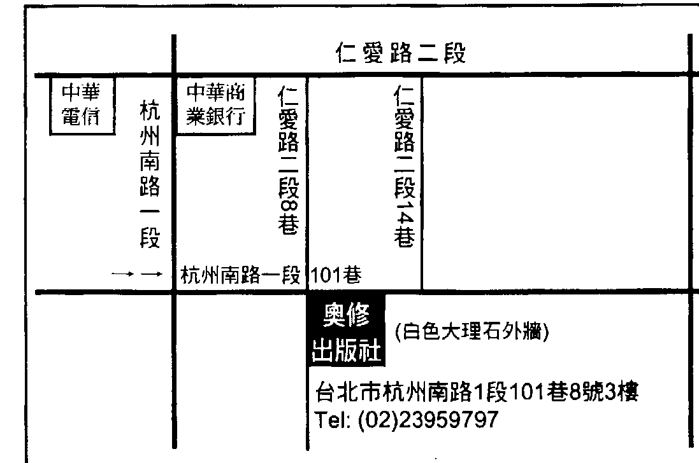

# OSHO
奧修心靈系列 62

## 譚崔經典（四）

# The Book of Secrets
奧秘之書（第二卷下冊）

本書為奧修談論古印度希瓦的譚崔經典

作者：奧修(OSHO)
譯者：謙達那

天使神秘学院
## 天使神秘学院

-   * 神秘学资料库
-   * 神秘学培训机构
-   * 水晶能量研究中心
-   * 专业占卜预测机构
-   * 官方微信：strcdts
-   * 微信公众平台：strc2011
-   * 官方店铺网址：http://strc.cr.cx
-   * 读书交流QQ群：
    *   占星塔罗占卜师交流群：814594478（加入密码：PDF）
    *   神秘学其他综合群：659338717（加入密码：PDF）

制作说明：

本书由《天使神秘学院》出重金从台湾购入的原版书籍扫描制作完成。为达到最好阅读效果，特地把书全部切开后，再经由专业扫描设备高精度扫描完成，并经过一张张的PS后期处理最终成书，其间花费大量的人力、物力以及时间，只为能给大家提供经济并优质的神秘学学习资料而努力。

本学院强力谴责某些机构和个人，把本学院花心血制作完成的电子书籍，包装后直接放在自家淘宝网上低价倾销的行为，以谋取不劳而获的经济利益。如果长此以往最终将无人愿意再为大家花心思制作电子书，那以后可能大家再无新书可读。

为让大家以后能够读到更多的好书，也为了本学院的良性发展。本学院恳请大家尽量做到如下几点：一、尽量在天使神秘学院的官方网站购买电子书籍。官网电脑访问地址 : http://strc.cr.cx

天使神秘学院 2020年5月

## 譚崔經典(四)
The Book of Secrets
奥秘之書，第二卷（下冊）

奧修(Osho)/原著 謙達那/譯 校對/德瓦嘉塔

奧修出版社

获取更多好书，请加微信号：strcdts

店铺：http://strc.cr.cx

Copyright © 1975

Osho International Foundation

Switzerland

www.osho.com

2006 Osho Publishing House

All rights reserved

Originally Published in English as:

# THE BOOK OF SECRETS

OSHO is a registered trademark of

Osho International Foundation,

used with permission/license.

The material in this book is a transcript of an original discourse series THE BOOK OF SECRETS by Osho given to a live audience. All of the Osho discourses have been published in full as books, and are also available as original audio recordings. Audio recordings and the complete text archive can be found via the online OSHO Library at www.osho.com

获取更多好书，请加微信号：strcdts

店铺：http://strc.cr.cx

## 1 目錄

## 目錄

-   第二十五章 從話語到純粹的聲音到本性 3
-   第二十六章 接受山峰和山谷…… 45
-   第二十七章 無聲、聲音的本質、和全然的覺知…… 79
-   第二十八章 靜心：解除壓抑…… 113
-   第二十九章 抛掉頭腦的方法…… 151
-   第三十章 在性裡面臣服和臣服於一個師父…… 189
-   第三十一章 從聲音到內在的寧靜…… 225
-   第三十二章 「不抗爭」是核心的教導…… 265

## 3 第二十五章 從話語到純粹的聲音到本性

## 第二十五章

## 從話語到純粹的聲音到本性

> 經文：
> 37、德微，在這些充滿甜蜜的覺知焦點當中想像梵文的文字，首先將它想像成字母，然後更細微地，將它們擺在一旁，成為自由的。後，將它們擺在一旁，成為自由的。
> 38、沐浴在聲音當中，就好像在持續的瀑布聲裡，或者，用手指頭塞住耳朵，聽罷音的聲音。
> 沙特寫了一本自傳，他稱之為「文字」(Words)。那個名字非常有意義，它是每一個人的自傳——文字和文字和文字。你充滿著文字，這個文字的過程整天都持續著，甚至在頭腦裡。當你在睡覺的時候，你充滿著文字和思想。對自己的了解變得越來越不可能。～自己～是超越文字的，或是在文字的背後，或是文字之下，或是文字之上，但是從來不在文字裡。你不存在於頭腦裡，而是在頭腦之下，頭腦之後，或頭腦之上～從來不在頭腦裡。你集中精神在頭腦裡，但是你並不在那裡。你特別集中精神在頭腦，因為這個經常的聚焦，所以你變得跟頭腦認同，認為你就是頭腦，這是唯一的問題，基本的問題，除非你覺知到你不是頭腦，否則沒有意義的事會發生在你身上，你將會生活在痛苦裡，這個認同就是痛苦，它好像一個人跟影子認同，那麼整個生命就會變成虛假的。你的整個生命是虛假的，而基本的錯誤就是：你跟頭腦認同。你認為被融解。你可以變得非常聰明，你可以變展你的頭腦，但是無知無法以那樣的方式天才，但是如果那個跟頭腦的認同存在，基本上你仍然是平庸的，因為你仍然在跟虛假的影子認同。它是怎麼發生的？除非你了解它發生的運作過程，否則你無法超越它，所有的靜心只不過是超越的過程——超越頭腦。
> 靜心技巧並不反對世界，它們反對頭腦——事實上並不是真的反對頭腦，而是反對認同。你是如何地跟頭腦認同？那個運作機制是怎樣？頭腦是一種需要，很大的需要，尤其是對人類，那是人類跟動物基本的差別。人類會思
> 想他使用思想作為武器來奮鬥和求生。他能夠存活，因為他能夠思想，否則
> 他基本上是比任何動物更無助、更虛弱的。就身體上的能力而言，他是無法存
> 活的，他之所以能夠存活是因為他能夠思想。因為有思想，所以他變成了地球
> 的主人。
> 如果思想能夠有那麼多的幫助，那麼事情就變得很容易了解為什麼人類會
> 變得跟頭腦認同。你並沒有那麼地跟身體認同。當然，各種宗教都一直在說：
> 「不要跟身體認同。」但是沒有一個人真的跟身體認同——沒有一個人！你們
> 都跟頭腦認同，而不是跟身體認同，這個跟身體的認同並沒有像跟頭腦認同那
> 那麼致命，因為身體更真實。身體存在，它深深地跟存在關連，而頭腦只是一個
> 影子。
> 跟頭腦認同比跟身體認同更精微，但是我們卻是跟頭腦認同，因為頭腦對
> 生存有那麼大的幫助——它不僅可以對抗動物，對抗自然，也可以對抗其他的人類。如果你具有一個敏銳的、聰明的頭腦，你將會勝過其他人，你將會成功，你將會變得更富有，因為你將會變得更算計、更狡猾。它可以被用來對抗其他人，因為頭腦是武器，那就是為什麼我們對它那麼地認同——這一點要記住。 對抗死亡，對抗疾病，對抗自然，對抗動物，對抗其他人，頭腦一直是你的保護、你的安全。頭腦做了很多，所以很明顯地，我們會把我們自己想成是頭腦。如果別人說你的身體是生病的，你並不覺得被冒犯，但是如果別人說你 的頭腦似乎有病，你就覺得被冒犯。如果你的身體生病，你並不會覺得被冒犯，但是如果你的頭腦生病，心理上生病，發 犯，為什麼？因為你不跟身體認同。但是如果你的頭腦生病，心裡上生病，發瘋，你就覺得被冒犯。現在它是關於你的事，而不是關於你的身體。 這樣。對頭腦來講，你就是頭腦；對身體來講，你是主人。身體是一個奴隸，你對身體的做法好像它是一個工具，是你所佔有的東西，但對頭腦就不是 你佔有它。 頭腦也在你的存在裡面創造出一种分裂，那是為什麼你跟它認同的第二
> 个
> 基本原因。你並非只是想關於外在的事，你也会想關於内在的事。比方說，身體有很多本能，你也会去想你的本能。你不僅會想，你還會跟你的本能抗爭，所以會有經常性的內在抗爭。有性，頭腦會跟它抗爭，或是試著將它塑造成符合頭腦自己的方式。它會壓抑它，使它變得異常，或是試圖控制它。頭腦也會在內在抗爭，那個抗爭在你和你的身體之間創造出一個分裂。事實上，你會開始認為身體是某種敵對的東西，而不是一個朋友，而不是一個朋友，因為身體繼續在做一些頭腦所反對的事。身體不聽頭腦的，所以頭腦覺得被冒犯、被挫敗。它會攻擊身體，然後分裂就產生了。你一直都跟頭腦認同，從來不跟身體認同。頭腦是你的自我，那是你的「我」。如果身體感覺到性，你可以劃分，你可以說：一這是身體，不是我，我反對它。我已經發誓要禁慾，我反對它，這是身體，這不是我。一那麼你是誰？是那個發誓的頭腦嗎？頭腦是你的自我，你反對身體，因為身體在摧毀自我。任何你所決定的，它從來不聽。所有那些苦行的荒謬都是因為這個身體不聽你的話而產生的。身體是自
> 然，身體是宇宙整體的一部分，身體有它本身的法則，那些法則是無意識的，它會按照那些法則來運作，頭腦試圖創造出它們自己的法則，想要凌駕在身體
> 之上，然後衝突就產生了，然後頭腦就開始跟身體抗爭，然後頭腦會讓身體飢餓，它會試圖以每一種方式來扼殺它。這就是在過去所發生的：所有的宗教人士真的很瘋狂地反對他們的身體。任何他們所做的比較不是為神，而比較是在反對身體。事實上，找尋神變成跟反對身體是同義詞。宗教人士採取這樣的態度：「扼殺身體，摧毀身體，身體是敵人。」事實上這並不是一個宗教的態度，而是最沒有宗教的態度之一，因為它是最自我主義的。這是自我，是自我覺得被冒犯。你決定不再生氣，然後憤怒出現，你覺得這是來身體。你決定反對性，然后水中，然后憤怒出現。当憤怒来臨，你觉

## 第二十五章 從話語到純粹的聲音到本性

—但是每一種語言或多或少的某一個地方都跟ma這個聲音有關。小孩最容容易發出ma的聲音。小孩子發出ma的聲音。小孩能夠發出的第一個聲音是ma。然後整個結構就基於在任何地方，在世界上的任何一個部分，任何時間，那個情形都是這樣。只是因為喉嚨和身體的結構，ma是最容易發出的聲音。母親是第一個最接近同時具有意義的人，所以第一個聲音會跟第一個有意義的人連結在一起，從mother，mater，mata，和ma再延伸出所有其他的字。但是當小孩首度發出ma的聲音，他並不知道它語言上的意義，雖然那個感覺是存在的。因為有那個感覺，所以那個字變成跟母語連結在一起，那個感覺是比聲音更基本的。

所以這段經文說，首先想像那個梵文的字母，任何語言都可以。因為希瓦是在跟帕瓦提說話，所以他說梵文，你可以使用英語、拉丁語、或阿拉伯語，任何語言都可以。除了因為希瓦是以梵文在跟帕瓦提說話之外，梵文並不重 要，並不是梵文比其他任何語言都來得更優越，任何語言都可以。首先在內在感覺，在你的意識裡感覺，在那些充滿甜蜜的覺知焦點當中充滿著字母，A，

如果你想要做它，閉起你的眼睛，只要在內在看你的意識充滿著文字。將意識想成是一塊黑板，然後A，B，C……將這些字或字母視覺化，首先以字母來看它們。A：將它看成你所寫的A。用意識來寫它，同時看著它，然後漸漸地，忘掉A那個字母，只記得A那個聲音——只是聲音。從視覺化開始，因為對我們來講，眼睛是主要的，耳朵並沒有那麼主要，我們是眼睛導向的，以眼睛為中心的。再度地，那個原因是一樣的，因為眼睛比其他任何東西都能幫助我們存活，我們的意識有百分之九十都在眼睛裡。想像你自己是沒有眼睛的，那麼你的整個生命都會死掉，就只有次要的部分被留下來。所以，首先將它視覺化，使用你內在的眼睛看那個字母。字母比較跟耳朵連結，比較不跟眼睛連結，因為它是聲音，但是對我們而言，因為我們一直 在閱讀、一直在閱讀，所以它們變得跟眼睛連結。基本上，它們是跟耳朵連結的——它們是聲音。從眼睛開始，然後漸漸忘掉眼睛，然後從眼睛移開到耳朵，首先將它們想像成字母，然後看它們，更細微地以聲音來聽它們，然後將它們想像成最細微的感覺，這是一個很美的練習。

當你說A，那個感覺是什麼？你也許並沒有覺知到它。在你裡面是什麼感覺，所以覺？每當你使用任何聲音，你會有什麼樣的感覺？我們是那麼地沒有感覺，所以以我們都把它給忘了。當你使用一個聲音，你的內有什麼樣的發生？你續續在使用它，而那個聲音甚至被忘掉。你續續看它，如果我說A，你會看到它。在你頭腦裡，A 會變成可以看見的，你會看到它。當我說A，你會看到它。嗎？只要聽A那個聲音，然後找出在你感覺的中心有什麼樣的事發生？沒有什麼事發生嗎？希瓦說，從字母移到聲音，透過字母來揭開聲音。揭開聲音，然後，也透過聲音來揭開感覺。要覺知你的感覺。他們說現在不敏感，他是世界上最不敏感的動物。我在閱讀關於一個詩人的文章，一個德國的詩人，他在描述他孩提時代的

一件逸事。他的父親很喜歡馬，所以在家裡養了很多匹馬，有一個很大的馬廠，但是他不允許這個小孩去馬廠。他害怕，因為那個小孩很小，但是當他父親不在，那個小孩有時候就會潛入馬廠去找在那裡的一個朋友——一匹馬。每當那個小孩進入，那匹馬就會發出某種聲音。

當那個小孩進入，那匹馬就會發出某種聲音。

那個詩人寫道：「然後我也開始對那匹馬發出聲音，因為不可能用語言。 然後，在跟那匹馬的溝通當中，我首度覺知到聲音的美和它們的感覺。」 語言。牠有純粹的聲音，牠充滿著牠的心，而不是充滿著牠的頭腦，所以那個 詩人回憶：「我首度覺知到聲音的美，以及它們的意義；這不是語和思想的 意義，而是充滿著感情的意思。」如果有別人在那裡，那匹馬就不會發出那些 聲音，所以那個小孩能夠了解那匹馬的意思：「不要進來，有人在那裡，你父 親會生氣。」 當沒有人的時候，那匹馬就會發出聲音，它意味著：「進來，這裡沒有 人。」所以我向那個詩人想起，「那是一個共謀，牠幫助我很多，那匹馬幫助我很 多。當我去向那匹馬表示我的愛，牠也會以一種特定的方式來搖動他的頭，表 示牠喜歡，而當牠不喜歡的時候，牠就不會以那樣的方式來搖動他的頭。當牠 喜歡的時候，牠一定會表達，而當他不處於那種心情之下，牠就不會以那樣的 方式搖動他的頭。」 這個詩人說：「這種情形持續了好幾年，我會去愛那匹馬，那個愛很深，

我從來沒有感覺到跟其他任何人有那麼深的親和力。然後有一天，當我在撫摸牠的頸部，牠很狂喜地搖動著和享受它，突然間，我首度變得覺知到我的手，覺知到我在撫摸，而那匹馬就停在那裡，牠的頸部變得不動。～那個詩人說：～然後有好幾年的時間，我一再一再地嘗試，但是都没有反應，那匹馬都不回應。後來我才覺知到，因為我變得覺知到我的手和我自己，自我介入了，所以那個溝通就斷掉了，我無法重新拾回跟那匹馬的溝通。～這到底是怎麼一回事？那是一種感覺的溝通。當自我介入，語言介入，思想介入，然後那一層就完全改變了。現在你已經在聲音之上，以前那個時候你是聲音之下。那些聲音是感覺，那匹馬能紮了解感覺，現在牠無法了解，所以以那個溝通就斷掉了。那個詩人一再一再地嘗試，但是沒有一次努力是成功的，因為即使是你的努力也是你自我的努力。他試著忘掉他的手，但是他忘不掉，他怎麼能夠忘掉呢？那是不可能的。他越是試圖忘掉它，他就越記住。所以，你無法用努力來忘掉任何事，努力將只會加重那個記憶，那個詩人說：～我變得固定在我的手，我無法牽動那匹馬，我會去到我的手，然後沒有移動，那個能量不會進入那匹馬，牠變得覺知馬，我會去到

當你從聲音移到感覺，你就進入了一個非常非常狂喜的世界，一個存在性 的世界，你離開了頭腦。感覺是存在性的，那個字就是意味著如此——你感覺到它們。你無法看到它們，你無法聽到它們，你只是感覺到它們。當你來到了 這個點，你就可以跳，這是最後一個步驟，現在你已經站在深淵的旁邊，你可 以跳。

 如果你從感覺跳，你就跳進了你自己。那個深淵就是你——不是你的頭腦，而是你的存在本質；不是你累積的過去，而是你的現在——此時此地。 你從頭腦移到存在的本質，而那個橋、那個連結就是感覺。但是要來到感 覺，你將必須離開很多東西——語言、聲音，以及那整個頭腦的欺騙。然後， 將它們擺在一旁，成為自由的。 你是自由的，成為自由的這個說法並不是意味著你必須做些什麼來成為自 由的。—然後，將它們擺在一旁，成為自由的—意味著你是自由的！存在就是 自由，頭腦就是枷鎖，那就是為什麼頭腦就是娑婆世界。

 不要離開世界——你無法離開它。如果有頭腦存在，你將會創造出另外一 個世界，那個種子就在那裡。你可以搬到山上去隱居，但是你將會帶著你的頭 腦，你無法將它留在這裡。世界會跟著你走，你會創造出另外一個世界。即使
在你的隱居當中，你也會開始再度創造出它，因為那個種子就在那裡。你將會
再度創造出關係，它也許是跟樹木，也許是跟小鳥，但是你將會再度創造出關
係，你將會再度創造出期望，你將會繼續將那個網散播出去，因為那個種子還
在，你將會再度處於世界裡。
頭腦就是世界，而你無法將頭腦留在任何地方，唯有當你走入內在，你才
能夠離開它。所以，唯一的喜馬拉雅山就是這個，其他的喜馬拉雅山是不行
的。如果你走向內在，從語言走向感覺，從感覺走向存在的本質，你就離開了
世界。一旦你知道了這個內本質的深淵，你就可以處在任何地方，甚至在地獄裡，那麼它就不會造成任何差別。它不會造成任何差別！如果你沒有頭腦，地獄無法進入你，而如果有頭腦，那麼就只有地獄會進入。頭腦是進入地獄
的門。
將它們擺在一旁，成為自由的。但是不要直接用感覺來嘗試，你將不會成
功。首先用語言來嘗試，但是如果你不離開哲學，如果你不離開思想，你將不
會成功。語言只是單位——如果你賦予那些語言意義，你就無法離開它們。

要知道得很清楚，語言是人類所創造出來的，它是實用的、必要的，而我們給予聲音的意義是我們自己創造出來的。如果你能夠很清楚地了解這一點，那麼你就可以很容易地進行。如果有人說了一些反對可蘭經或反對吠陀經的話，你會有什麼感覺？你會一笑置之，或者你會覺得內有某種糾結？你可以一笑置之嗎？某人在侮辱吉賴經，或者某人在毀克里虛納或拉瑪或基督，你能夠一笑置之嗎？你能夠看透那些語言，認為它們只是語言嗎？不，你將會受傷，那麼就很難將話語丟掉。

將那些語言視為只是語言——只是一些雜音，同時具有大家同意的意義，其他 沒有，要相信它是這樣，而它的確是這樣！首先要從那些語言文字抽離，如果你能夠從那些語言文字抽離，那麼就可以了解這些就只是噪音。

它就好像在軍隊裡面，你們使用號碼。一個士兵是一百零一號，他可能會變得跟一百零一號認同。如果有人說了一些毀一百零一號的事，他就會覺得受到侮辱，他會開始抗爭，而一百零一號只是一個號碼，但是他已经變得跟它認同。你的名字只是一個號碼，一個索引的號碼，如果不這樣做，事情會變得比較困難，所以我們把你貼上標籤，那只是一個標籤，任何其他的標籤也能夠夠

做同樣的工作。但是它對你來講並非只是一個標籤，它已經進入到更深，你的名子已經變成了你自我的中心。所以他們說，所謂的智者說：「為你的名字而活，要讓你的名字保持純潔，你的名字必須受到尊敬，即使你死掉了，你的名字還會活下去。它從來就不存在，它只是一個號碼。你將會死掉，而你的名字將會活下去……當你本身都活不了了，那個標籤怎麼可能繼續活下去？此，你才能夠做這個技巧。注意看那個文字，看它的沒有用和無意義，不要執著於任何文字，唯有如用手指頭塞住耳朵，聽眾音的聲音。第二個聲音的技巧：沐浴在聲音當中，就好像在持續的瀑布聲裡，或者，這個技巧可以很多方式來做，其中一個方式就是，在開始的時候可以坐

在任何地方。聲音一直都會在，它也許是在一個市場，或者它也許是在一個喜馬拉雅山的僻靜處，會有聲音在那裡。靜靜地坐著，對於聲音，有一件事非常特別，每當有聲音，你就是在中心，所有的聲音會從每一個地方、從各個方向來到你身上。對於你的視力，對於你的眼睛，那個情形就不是這樣。視力是直線的，我看你，然后

## 譚崔經典（四） 32

聲音並不是在耳朵裡面被聽到的，耳朵無法聽到它們，耳朵只能做傳遞的工作，在傳遞當中，它們排除掉很多你沒有用的東西，它們會選擇，然後那些在深處的某一個地方來聽的，耳朵只是送給你經過選擇的聲音，你在哪裡？你的中心在哪裡？

在頭部，它看起來好像是在頭部，因為你從來沒有聽聲音，你只聽話語。對語言來講，頭部是中心，對聲音來講，它並不是中心，那就是為什麼在日本，他們說人並不是透過頭在想，而是透過肚子在想，因為他們用聲音下功夫已經有一段很長的時間。你在一座廟裡面都看到一個銅鐘，它放在那裡要在求道者的周圍創造出聲音。有人在靜心，銅鐘被打響，或是鐘被敲響，隨著那個鐘的聲音，似乎有一個打擾被創造出來。某人在靜心，這個鐘聲或鐘聲似乎是一種打擾。在廟裡，每一位訪客都會來敲鐘或撞鐘。有人在那裡靜心，這似乎是種經常的打擾，其實不是，因為那個人在等待這個聲音。

所以每一位訪客都能夠有所幫助，那個鐘一再一等地被撞擊，那個聲音被創造出來，然後那個靜心者就再度進入他自己。他看著那個中心，這個聲音在那裡進入更深。有一個撞擊在那個鐘，那是訪客所做的，現在第二個撞擊將會在靜心者裡面，在靜心者內在的某一個地方。它在哪裡？那個聲音一直都打擊在肚子或肚臍，從來不是在頭部。如果它打擊在頭部，你就可以了解得很清楚，它不是聲音，它是話語，那麼你就是開始在想那些聲音，那麼那個純淨就喪失了。現在他們研究很多在子宮裡的小孩，他們也會受到聲音的打擊，然後他們會對聲音反應，他們無法對語言反應，他們還沒有頭，他們還沒有理智，他們還不知道語言和社會共同認可的習俗。他們不知道語言，但是他們能夠夠聽到聲音。每一個聲音對小孩的影響比對母親的影響更多，因為母親聽不到那些聲音，她只能聽到話語。我們創造出瘋狂的聲音，混亂的聲音，那些聲音在打擊著未出生的小孩。他們生下來的時候將會是瘋的，因為你已經打擾他們太多了。甚至連植物都會受到聲音的影響。如果你放一些音樂給它們聽，它們就會成長得更好，如果周遭的聲音很嘈雜，它們就比較不會成長，你可以幫助它們成長，你可以透過聲音在很多方面幫助它們。

## 33 第二十五章 從話語到純粹的聲音到本性

所有的咒語都是無意義的聲音，如果某一個師父說：這就是這個咒語的意義。那麼它就根本不是一個咒語。一個咒語必須是沒有意義的，它有一些作用，但是沒有意義，它必須在你的內在做一些事，但是它不具意義，因為它必須只是在你裡面一個純粹的聲音，那就是為什麼我們發展出αυм這個咒語，它是沒有意義的，它只是一個純粹的聲音。如果這個純粹的聲音在你裡面被創造出來，如果你能夠在內在創造出它，那麼同樣的這個技巧也可以被使用。沐浴在聲音當中，就好像在持續的瀑布聲裡，或者，用手指頭塞住耳朵，聽眾音的聲音。你可以只是用手指頭，或是用任何可以強力蓋住你的耳朵的東西來創造出聲音，然後你就可以聽到某種聲音。那個聲音是什麼？為什麼當耳朵被蓋住或是被塞住的時候你就可以聽到它？

## 35 第二十五章 從話語到純粹的聲音到本性

有一次，在美國，有一輛火車在夜裡大約兩點鐘的時候經過一個地方。現象發生了，住在火車停止的地方附近的居民向警方抱怨，在夜裡兩點鐘，他們聽到了很奇怪的聲音。關於這件事有很多報導，所以它必須被調查——到底是怎么一回事？在兩點鐘的時候，他們聽到了奇怪的聲音，當火車在經過的時候，他們從來沒有聽到，那些人已經習慣於火車的聲音。現在看車突然停止，他們在睡覺當中等著要聽它，他們已經變得習慣於它，他們已經被制約了。他們在等待，但是那個聲音並沒有出現。那個‘不在’被聽到了，而那個‘不在’是新的東西。他們對它感到不安，他們睡不著。所以它首度被了解到，如果你經常都在聽某種聲音，然後它停止了，你將會聽到它的不在。所以要認為你不會聽到它，你會聽到那個‘不在’，它負向的部門會被聽到。

## 第二十六章 接受山峰和山谷

## 問題摘要：

## 第一個問題：

我們必須有意識地引導和調整本能嗎？如何將可怕的噪音轉變成正向的聲音？

人是一雙動物，但不僅是一雙動物，他也是更多。但是那個一更多一不能 約拒絕那個動物，它必須吸收它。人比動物更多，但是那個動物不能被拒絕， 它必須創造性地被吸收。你不能夠將它擺在一旁，它就在你的根裡面，你必須 的態度，一旦你以負面的方式來思考它，你就會變得對你自己造成傷害，因為 你百分之九十九是動物。 如果你創造出分裂，你是在打一個必輸的仗，你無法勝利。你抗爭的結果 將會適得其反，因為百分之九十九是動物，只有百分之一的頭腦是有意識的， 而這百分之之一無法勝過百分之九十九，它將會被打敗。那就是為什麼會有那麼多的挫折，因為每一個人都被他自己的動物所挫敗，你永遠無法成功。你必定 會失敗，因為那百分之之一無法贏過百分之九十九，它甚至無法跟那百分之九十 九分開。 它就好像一朵花：它無法反對根，它無法反對整棵樹。當你在反對你的動 物傳承，你還在被它所餵養。你之所以能夠活著是因為它。如果你的動物現在 死掉，你也会立刻死掉。你的頭腦以一朵花存在，而你的動物傳承是整棵樹。

## 第二十六章 接受山峰和山谷

面。你可以發誓禁慾，它對你的性本能並不會造成任何差別。那個性本能會進入地下，當它出現，你那禁慾的誓言就會被證明只不過是由非常夢幻的東西所做成的，它們無法面對真實的東西。所以這是兩種態度，或者是你可以壓抑性，那麼你將永遠無法超越它，或者個很深的是一，不要將它逼入地下，而是用它在地面上創造出一個結構，那麼你將會成為一個真實的人。很明顯地，它將會很困難，所以我們選擇比較容易的路。用虛假的結構是比較容易的，因為它並不需要什麼，只有一件事是需要：欺騙你自己，就這樣而已。如果你能夠欺騙你自己，你就能夠很容地創造出一個虛假的結構。事實上並沒有什麼改變，但是你將會繼續認為每一件事都改變了。創造出一個幻象是很容易的，要創造出一個事實則是一件困難的工作，它是費力的，但是它是值得的，因為一旦你用真實的能量創造出某一件事物，你的結構就不可能被打破。如果性是在地面上，那麼你可以由性創造出什麼——比方說，愛。如果性被蛻變了，它就會變成愛；如果它被壓抑了，它就變成恨。

如果你壓抑性，你就會變得害怕愛，一個壓抑性的人一直都會害怕愛，因為當愛出現，性就會跟著來。愛是靈魂，而性是身體，所以愛不能夠被允許發生，因為如此一來，性就會跟著來，它就在附近的角落。所以一個壓抑性的人不可能成為有愛的，他也許可以顯示出有愛的樣子，他也許可以假装出他非常愛，但他不可能是這樣，因為他非常害怕。他不可能用愛的手來碰觸你，因為那個害怕一直都存在。愛的手可能隨時都會變成性的碰觸，所以他會害怕，他不會讓你碰觸他。

他也許會說出很多理由，但真正的情况是害怕——害怕他所壓抑的本能。他將會充滿恨，因為任何壓抑的能量都會倒轉而進入它原始的本性。

性很容易可以走向愛，那是一個自然的流。如果你阻止它，如果你在它的路線上製造出障礙，它將會變成恨，所以你們所謂的聖人和道德的導師，如果你深入去看他們，你將會發覺他們充滿著恨，它一定會如此，那是很自然的。

性隱藏在那裡，它隨時都可能迸出來，他們坐在一個危險的火山上。如果你將能量往下壓，你只是在延緩一個任務，它越被延緩，它就會變得越困難。

谭崔說，用真實的能量來創造你的生命，而真實的能量都是動物的能量，但是當我說動物，我對它是沒有譴責的，一動物一這個字對我來講是沒有譴責的，雖然它對你是有譴責的意味。動物本身是很美的，動物本身並沒有什麼好的，譴責的。你裡面的動物是純粹的能量，按照自然的法則在進行。你們問：一我們應該怎樣有意識地做？我們不應該控制，你的意識不應該控制，你的意識不應該引導，你的意識只能做控制嗎？一不！你的意識不應該控制，你的意識不應該引導，你的意識只能做一件事：你的意識要了解，那個了解本身就会變成蛻變。譚崔會說，了解性，不要試著去引導它。如果你不了解它，每一個努力都一定會失敗，而且會是有害的，所以什麼事都不要做，首先要了解它，透過了解，你解，那個路就會被顯露出來，你不要強迫你的能量走什麼路線。透過了解，你解一個法則，就好像在科學裡面一樣。在科學裡面你是怎麼做的？你了可以創造性地使用那個能量。解一個法則，然後自然的奧秘就顯露出來了。一旦自然的奧秘顯露出來，你就了解那個動物，因為在那個動物裡面隱藏著你未來的潛力。事實上，它可以被說如果你不知道它固有的法則，所有的努力都註定會失敗。所以譚崔說，了解那個動物，因為在那個動物裡面隱藏著你未來的潛力。事實上，它可以被說

成，神隱藏在那個動物裡面。動物是你的過去，神是你的未來，但是未來以種子的形式隱藏在你的過去裡。了解你所有的自然力量，接受它們，了解它們，你的頭腦不需要在那裡掌管，不需要在那裡控制它們，跟它們抗爭，只要了解它們。的確，如果你了解它們，那麼你是正確地在使用你的頭腦。了解性，了解憤怒，了解貪婪，警覺，試著去找出它們的方式——它們是如何在運作的，它們的功能是怎麼樣。要經常覺知這些內在動物本能的運作狀態，如果你能夠意識到這些動物本能，就不會有分裂，你就不會有一個無意識的頭腦。如果你能夠跟著這些內在深處的本能走，你就會有一個有意識的頭腦，而不会有無意識。無意識之所以存在是因為壓抑，因為你的害怕，所以你分封閉起來，不讓它被意識到，你無法看見你自己的真相。你非常害怕，所以你已經離開了你的屋子，你只是生活在走廊。你從來沒有進入，因為害怕，如果你跟你自己面對面，那麼所有你對你自己的想像和所有你的幻象都會垮掉。你認為你自是一個聖人，你認為你自是一個宗教人士，你認為你自是一個

是這個和那個。如果你去面對你的真相，所有這些幻象都會消失。每一個人都創造出自己的一個形象，那個形象是假的，但是我們執著於那個形象，這個執著變成走向內在的障礙。

所以第一件事就是要接受那個動物，它就在那裡，它並沒有什麼不對，它是你的過去，你不能夠拒絕你的過去，你只能利用它。如果你很聰明，你將會利用它來創造出一個更好的未來；如果你很愚蠢，你將會跟它抗爭，而透過抗爭，未來就被摧毀了。跟一個種子抗爭，你將會摧毀它。利用它，給它土壤，幫助它，保護它，這樣種子才能變成一棵樹，一棵活的樹，然後未來就能夠紉透過抗爭，過它而開花。

動物是你的種子，不要跟它抗爭，譚崔對它沒有譴責，只有愛，因為整個未來都隱藏在它裡面。要知道它知道得很清楚，然後你就可以利用它，然後你可以感謝它。

我聽說當聖法蘭恩斯過世，當他在垂死的时候，突然間他啟開他的眼睛感謝他的身體。在進入到彼岸之前，他感謝他的身體，他說：「有很多東西隱藏在你的裡面，你幫助我很多，而我非常無知，有時候我甚至會跟你抗爭，有時候在裡面，你幫助我很多，而我非常無知，有時候我甚至會對你有敵意的想法，但你一直都是一個朋友，就是因為有你，所以我才能夠進入這樣的意識狀態。—這個對身體的感謝是很美的，但是聖法蘭息斯只有到了最後才能夠了解它。諂崔說，試著在開始的時候就了解它，如果你只能夠在垂死的时候才感謝你的身體，那是沒有用的。你的身體是隱藏的力量或神秘的可能性的寶庫。諂崔說，整個宇宙以迷你的狀態存在於你的身體裡，它是一個迷你的宇宙，不要跟它抗爭。如果你的身體是一個迷小的宇宙，那麼你的性是什麼？如果它的確是如此，你的身體是一個迷小的宇宙，那麼在宇宙裡面的創造就是你裡面的性。如果在它裡面有個宇宙裡，每一個片刻都有創造在進行——那是你裡面的性。如果在它裡面有那麼多的力量，那是由於你需要成為一個創造者。如果性是那麼地強而有力，那麼對諂崔來講，它只是意味著你不能夠被允許被允許成為不創造的，你必须創造。如果你無法創造出更偉大的東西，那麼至少要創造生命；如果你無法創造出比你更好的東西，那麼至少也要創造出個在你死的時候來取代你的人。性非常強而有力，因為宇宙不允許你成為沒有創造力

的，而你竟然在跟它抗争，不要這樣，要利用它。\n麼一個偉大的詩人或是一個偉大的畫家也許不會感覺到有那麼多的性衝動，但\n那個理由並不是因為他是一個聖人，那個理由只是他在創造出更偉大的東西，\n所以那個需要被滿足了。\n一個偉大的音樂家在創造音樂，沒有一個父親能夠像一個音樂家在創造出\n偉大的音樂時那麼滿足，沒有一個兒子能夠給予父母像偉大的音樂所能夠給\n予音樂家或偉大的詩能夠給予詩人那麼多的快樂，因為他在一個更高的領域裡\n面創造，所以自然可以不要在他較低的領域創造，那個能量已經移向更高，\n那個能量移向更高，有很多更高的領域和更高的\n譚崔說，不要跟能量抗爭，讓那個能量移向更高，有許多更高的\n層面。\n佛陀既不是一個畫家，也不是一個音樂家，也不是一個詩人，但是他超越\n了性。到底有什麼事發生在他身上？最高的創造是創造出自己，最高的創造是\n創造出整個內全然的意識，創造出整個內在，創造出那個——，那是最高峰，\n是喜馬拉雅山的頂峰。佛陀就是那個頂峰，他創造出他自己。當你進入性，你「那些狗就在那裡，牠們在吠叫，不要抗拒，不要抗爭，也不要試著去忘掉那些噪音。接受它們，聽著它們，它們很美，夜晚很寧靜，牠們叫得很有活力——只要聽。這就是咒語，正確的咒語——只要聽它們。」

法，所以我試試看。—他睡著了，那些狗還在吠叫。到了早上，他說：—這真的是奇蹟般的，我接受了它們，我撤回我的條件，我就這樣聽著，那些吠叫聲變成音樂般的，那些噪音變得不打擾，相反地，它們變成一種搖籃曲，我因爲它而陷入深睡。—它依你的頭腦而定，如果你是正向的，那麼每一件事都會變成正向的；如果你是負向的，那麼每一件事都會變成負向的，每一件事都會變酸。所以請你們記住這一點，不僅對噪音是如此，對生命中的每一件事也都是如此。如果你覺得有某種負向的事物存在於你的周遭，那麼就到你裡面去找尋那個原因。它是你，你一定是在期待某種東西，你一定是在欲求某種東西，你一定是做出了某種條件。存在無法被強迫按照你的方式來進行，它會遵循它自己的方式。如果你能夠跟隨著它，你就是正向的；如果你跟它抗爭，你就變成負向的，然後你周遭的整個宇宙就轉變成負向的。它就好像一個人試著往上游漂流，那麼那個河流似乎是負向的，你會覺得那個河流在跟你抗爭，那個河流在把你往下壓。河流把你往下帶，而不是往上帶，所以它將會看起來好像是河流在跟你抗爭。河流完全不知道你，很喜樂地不知道，而那是好的，否則河流將必須進入瘋人院。河流並沒有在跟你抗爭，是你在跟河流抗爭，你試圖往上游漂流。

# 第二十六章 接受山峰和山谷

河流並沒有在跟你抗爭，是你在跟河流抗爭，你試圖往上游漂流。

我要告訴你一則逸事……有很多人聚集在木拉那斯魯丁的屋子周圍，他們說：「你在做什麼？你太太掉進了河裡，那條河正在氾濫，趕快去，否則那個河流將會把你太太帶到海裡。海離得不遠。」所以木拉就跑到岸邊，跳進河裡，開始往上游要去找他太太。群眾在那裡尖叫：「你在幹什麼？那斯魯丁，你太太不可能往上游，她已經經到下游去了。」木拉說：「不要打擾我，我非常了解我太太，如果別人掉進河裡，他一定會往下游走，但是我太太不會這樣做，她一定會往上游走，我非常了解我太，我已經跟她生活在一起有四十年了。頭腦一直都會想要往上游走，跟每一件事抗爭，你會在你的周遭創造出一個負向的世界。很明顯地，它一定會這樣發生。世界並沒有在反對你，但是因為你沒有跟世界在一起，所以你覺得它在反對你。往下游漂流，那麼河流將會幫助你漂流，那麼你的能量是不需要的。那個河流將會變成一條船，它將會帶領你。當你往下游漂流，你不會喪失任何能量，因為一旦你往下游漂流，你就接受了那個河流，它的流和它的方向——每一件事都被接受了，那麼你對它就變成正向的，而當你是正向的，河流對你也是正向的。唯有當你能夠使你自己對生命變成正向的，你才能夠使每一件事變成正向的，但是我們對生命並不是正向的。為什麼？為什麼我們要成為負向的？為什麼要經常都在奮鬥？為什麼我們不能對生命完全放開來？那個恐懼是什麼？你也許沒有觀察到，你在害怕生命——非常害怕生命。說你在害怕生命也許聽起來很奇怪，因為一般而言，你覺得你是在害怕死亡，而不是在害怕生命也

命。这是一般的觀察，每一個人都在害怕死亡，但是我要告訴你們，你們害怕死亡只是因為你們在害怕生命。一個不害怕生命的人將不會害怕死亡。爲什麼我們會害怕生命？有三個原因。首先，唯有當你的自我是往上游走，它才能夠存在。向下游漂流，你的自我就無法存在。唯有當你的自我在抗爭，在說不，它才能夠存在！如果它是，一直都說是，它就無法存在。自我是對每一件事說不的基本原因。注意看你的方式，看看你是如何在躬行和反應。注意看那個「不」是如何地立刻來到你的頭腦，以及那個「是」是如何地非常非常困難，因為用「不」的時候，你是以一個自我存在；用「是」的話，你的認同就喪失了，你變成海洋裡面的一滴水。一沒有自我在它裡面，那就是爲什麼很難說「是」——非常困難。你了解我嗎？如果你往上游走，你覺得你存在；如果你放開來，開始隨著那個流漂浮到它所帶領你去的地方，你就不會感覺到你的存在。那麼你就變成了那個流的一部分。這個自我，這個自我認為你自己是一個分離出來的「我」，會在你的周遭創造出負向性，這個自我會創造出負向的微波。

那個已知的、那個可以預測的裡面。頭腦一直都害怕那個未知的。這有一個原 因：因為頭腦是由已知的所組成的。頭腦是由任何你所知道的、經驗過的、和 學到的所組成

## 第二十七章 無聲、聲音的本質、和全然的覺知

你就超出了聲音，那麼就沒有聲音。Ａ-Ｕ-Ｎ：這三個是最後的，它們是存在的邊界。超出這三個之外，你就進入了那未知的，進入了那絕對的。物理學家說，現在我們已經來到了電子，似乎我們已經來到了極限，因為電子不能被說成是物質。電子是看不見的，它們沒有物質的特性，它們也不是鈎被稱為非物質，因為所有的物質都是由它們所組成的。如果它們既不是物質，也不是非物質，那麼要如何稱呼它們？沒有人看過電子，它們只是被推論出來的，它在數學上被假設它們是存在的。它們的效應已經被知道，但是它們並沒有被看到。這麼一來，我們無法超越它們。三的法則是極限，如果我們超過了三的法則，我們就進入了那未知的，那麼就沒有什麼可以說的。甚至關於電子，我們所能鈎說的也非常少。就聲音而言，ＡＵＮ是極限，你無法超出它。那就是為什麼ＡＵＮ在印度和全世界都被廣泛使用。基督教和回教的「阿們」只不過是ＡＵＮ的不同形式，裡面所包含的是同樣的基本音。英文字母的 omnipresent（全在）、omnipotent（全能）、和omniscient（全知）也包含它，那個接頭字omni就是由ＡＵＮ演變過來的，所以 omnipresent就是指那個在整個ＡＵＮ裡面的，在整個存在裡面。

## 第二十七章 無聲、聲音的本質、和全然的覺知

聲，但是譚崔使用正向的辭令。譚崔的整個思考方式是正向的，那就是為什麼說聲音的本質（soundfulness），聲音的本質是正向的辭令。佛陀一定會說無聲（soundlessness），他說無聲，但是譚崔使用正向的辭令。譚崔的整個思考方式是正向的，那就是為什麼說聲音的本質（soundfulness），聲音的本質是正向的辭令。佛陀一定會說無聲（soundlessness），他說無聲，但是譚崔使用正向的辭令。譚崔的整個思考方式是正向的，那就是為什麼說聲音的本質（soundfulness），聲音的本質是正向的辭令。佛陀一定會說無聲（soundlessness），他說無聲，但是譚崔使用正向的辭令。譚崔的整個思考方式是正向的，那就是為什麼說聲音的本質（soundfulness），聲音的本質是正向的辭令。佛陀一定會說無聲（soundlessness），他說無聲，但是譚崔使用正向的辭令。

## 第二十七章 無聲、聲音的本質、和全然的覺知

在這裡使用一聲音的本質一這個字：進入聲音的本質。佛陀以負向的辭令來描述那絕對的：尚雅（shunya），空無。優婆尼沙經將同樣的那絕對的描述成 梵天—絕對性。佛陀會使用空無，而優婆尼沙經會使用絕對性，但它們兩者 的意思是一樣的。 當文字喪失了意義，你可以使用負向的，也可以使用正向的，因為所有的 文字不是負向的就是正向的，你必須選擇其中一個。對於一個解脫的靈魂，你 可以說他變成了整體，這是一種正向的看法，或者你可以說他不復存在了— 他變成了空無，這是負向的看法。 比方說，如果一小滴水碰到了海洋，你可以說那滴水變成空無，那滴水已 經喪失了它的個體性，那滴水已經不復存在了，這是佛教徒的看法，它是很好 的，就它所能及的，它是對的，因為語言文字本來沒有辦法很深入，所以， 就它所能及的，它是很好的。—那滴水已經不復存在了— —那就是涅槃的意 思。那滴水已經變成不存在了，或者你也可以使用優婆尼沙經的看法，優婆尼 沙經說那滴水已經變成了海洋。他們也是對的，因為當那個界線被打破，那 滴水就變成了海洋。

## 第二十七章 無聲、聲音的本質、和全然的覺知

所以這些就只是態度，佛陀喜歡負向的辭令，因為當你說出任何正向的，它就變得受限了，它看起來好像是受到限制的。當你說那滴水已經變成了海洋，佛陀會說，海洋也是有限的。那滴水仍然保持是一滴水，它變得大一些，就這樣而已。不論變得多麼大都沒有差别。佛陀會說，它變得大一些，仍然保持，那個有限的並沒有變成無限的，那個有限的仍然保持是有限的，所以所有什麼差别？一小滴和一大滴……對佛陀來說，那是海洋和一滴水之間唯一的差别，而那是對的，就數學上來講，它的確是如此。

## 第二十七章 無聲、聲音的本質、和全然的覺知

成了一個神，那麼並沒有什麼事發生，你只是變成一個較大的人。如果你變成了梵天，那麼並沒有什麼事發生，你仍然是有限的，所以佛陀說，你必須變成空無，你必須變成尚雅——所有的界線和屬性都變成空無，你能夠想到的每一樣東西都沒有了，就只是空。但是優婆尼沙經的思想家會說，即使你是空的，你還是存在。如果你變成了空，你還是在那裡，因為有空存在。空無也是一種存在的方式，所以他們說，為什麼要強調那個點，為什麼要不必地使用負向的辭令？成為正向的是比較好的。

## 第二十七章 無聲、聲音的本質、和全然的覺知

成了一個神，那麼並沒有什麼事發生，你只是變成一個較大的人。如果你變成了梵天，那麼並沒有什麼事發生，你仍然是有限的，所以佛陀說，你必須變成空無，你必須變成尚雅——所有的界線和屬性都變成空無，你能夠想到的每一樣東西都沒有了，就只是空。但是優婆尼沙經的思想家會說，即使你是空的，你還是存在。如果你變成了空，你還是在那裡，因為有空存在。空無也是一種存在的方式，所以他們說，為什麼要強調那個點，為什麼要不必地使用負向的辭令？成為正向的是比較好的。

## 第二十七章 無聲、聲音的本質、和全然的覺知

那是你的選擇，但諧崔幾乎一直都是使用正向的辭令，諧崔的哲學是正向的，它說，不要允許「不」，不要允許「否定」。諧崔行者是最偉大的一說是的，他們對每一件事都說是，所以他們使用正向的辭令。這段經文說，發出一個聲音，比方說 AUM，慢慢地。當聲音進入聲音的本質，你也一樣……發出一個聲音，比方說 AUM，慢慢地。發出一個聲音是一個非常微妙的科學。首先你必须大聲發出它，向外地，這樣別人才能夠聽到它。剛開始的時候大聲一點是好的，爲什麼？因爲當你大聲發出它，你也能夠夠聽很清楚地聽到它，因爲任何你所說的都是給別人聽的，這已經變成了一個習慣。每當你在對別人說話，你才會聽到你自己在說話，所以你就是在對別人說話，唯有當你在對別人說話，你才會聽到你自己在說話，所發出 AUM 的聲音，然後漸漸地，感覺融入那個聲音，當你發出 AUM 的聲音，要被它所充滿，忘掉其他每一樣東西。變成那個 AUM，變成那個聲音，要變成那個聲音很容易，因爲聲音能夠震動到你的身體、你的頭腦、和你 的整個神經系統。感覺 AUM 的回響，發出它，感覺好像你的整個身體都被它所充滿，每一個細胞都受到它的震動。

## 第二十七章 無聲、聲音的本質、和全然的覺知

發出聲音也是融入，使你自己融入那個聲音，變成那個聲音，然後，當你感覺到在你和那個聲音之間有一種很深的和諧，你發展出一种很深的對它的愛，那個聲音非常美，非常具有音樂性：ΔUΣ——然後你越發出它，你就越覺得你自己充滿著一種微妙的甜美。有一些聲音是比較苦的，有一些聲音非充滿。當你開始覺得跟它很和諧，你就不必再大聲發出它了。然後閉起你的嘴唇，在內在發出它，但是也在內在發出聲音，但是大聲一點，這樣那個聲音才能夠散佈到你的整個身體，碰觸到你身體的每一個部分，每一個細胞。你將會覺得被它弄得很有活力，你將會覺得恢復青春，你將會覺得有一種新的生命進入你——因為你的身體是一個樂器。它需要和諧，當那個和諧受到打擾，你就受到了打擾。那就是為什麼當你聽到音樂的時候，你會覺得很好，為什麼你會覺得好？音樂只不過是一些和諧的聲音，當有音樂圍繞著你的时候，為什麼你會覺得受打擾？你本身得有一種幸福感？而當有混亂和噪音的時候，為什麼你會覺得受打擾？你本身

## 第二十七章 無聲、聲音的本質、和全然的覺知

有很深的音樂性，你是一個樂器，那個樂器會產生回應。

在內在發出 ΔUM 的聲音，你將會覺得你的整個身體都跟著它跳舞，你將

會覺得你的整個身體都在經歷一個浮化的洗澡，你的每一個孔都被浮化了。但

是當你覺得它越強烈的時候，當它越來越穿透你的時候，繼續變得越來越慢，

因為那個聲音越慢，它就能夠進入到越深。它就像同類療法，那個藥量越少，

它就能夠穿透得越深，因為如果你想要進入更深，你就必須變得更精微、更精

微、更精微……

生硬的、粗糙的聲音無法進入到你的心。它們可以進入到你的耳朵，但是

它們無法進入到你的心。那個通道非常狹窄，而心是那麼地纖細，唯有非常慢、非常有韻律、極其微小的聲音能夠被允許進入它。除非一個聲音進入到你

的心，進入到你存在

的心，否則那個咒語並不完整。唯有當那個聲音進入到你的心，進入到你存在

的最核心深處，那個咒語才算完整。然後繼續變得更慢、更慢、又更慢。

為什麼需要使這些聲音變得更慢、更精微還有一些其他的原因：那個聲音越

精微，你就需要更強烈的覺知在內在來感覺它，那個聲音越粗糙，你就越不需要覺知。一個粗糙的聲音會打擊你，你會覺知到它，但是這樣的話，它是一

## 第二十七章 無聲、聲音的本質、和全然的覺知

種暴力。 如果一個聲音是音樂的、和諧的、精微的，那麼你就必須在內在聽它，你將會睡著，然後錯過了整個要點。覺。它是一種微妙的鎮定劑。如果你持續地重複任何聲音而對它不警覺，你將這就是使用咒語、使用聲音、或是使用任何頌念的難題：它會讓人覺得想睡會睡著，因為這樣的話那個重複就會變成機械性的，「AUM、AUM、AUM … 一變成機械性的，那個重複會變成機械性的。那個重複會產生無聊。無聊是睡覺的基本需要，除非你變得無聊，否則你無法睡著。如果你很興奮，你會睡不著，那就是為什麼現代人已經變得不能睡觉，那個原因是什麼？因為有很多的與奮，那是以前從來沒有的。在昔日，在過去的世界，生活是一種很深的無聊，重複的無聊。如果你去到一個隱藏在山區的村子，在那裡的生活是很無聊的。它對你來講也許看起來並不是那麼無聊，因為你不住在那裡，在假日的時候，你也許覺得非常興奮，但那個興奮是因為你住在城市，你住在孟買，而不是因為那些山。那些山是完全無聊的，那些住在那裡的人是無聊的、昏睡的。在那裡就只有同樣的事

## 第二十七章 無聲、聲音的本質、和全然的覺知

情，同樣的例行事務，沒有什麼改變，沒有什麼興奮，沒有一樣東西在改變。

## 第二十七章 無聲、聲音的本質、和全然的覺知

沒有新聞，事情一直都一樣，繼續在重複，繼續在循環。就好像季節在重複一樣，就好像大自然在重複一樣，在那個古老的村子裡移動，白天和夜晚在循環，每一樣東西都在村子裡移動，在那個古老的村子裡移動，周而復始。那就是為什麼那些村民可以很容易入睡，因為每一件事都很無聊。

現代的生活已經變得很刺激——沒有一樣東西是重複的，每一樣東西都續在改變，繼續在變成新聞。生活已經變得不可預測，你變得非常興奮，所以你睡不著。你每天都可以看到新的影片，你每天都可以聽到新的演講，你每天都可以讀到新的書，每天都可能會有新的事情發生。

## 第二十七章 無聲、聲音的本質、和全然的覺知

這個經常的興奮一直在持續著，當你上床，那個興奮仍然存在，頭腦想要保持清醒，睡覺似乎是没有用的。有一些思想家認為這是純粹的浪費——如果 you 活了六十年，其中有二十年是浪費在睡覺裡，這是純粹的浪費！生命有那麼多的興奮，為什麼要浪費它裡面的任何東西？但是在舊有的世界裡，在舊有的日子裡，生命並不是一個興奮，它是同樣的事情周而復始。如果有任何東西使你興奮，它意味著那是新的。

## 第二十七章 無聲、聲音的本質、和全然的覺知

如果你重複一個特定的聲音，它會在你裡面創造出一個圓圈，它會產生無聊，它會讓你覺得想睡覺，那就是為什麼瑪赫西瑜珈行者的超覺靜坐在西方便被認為是非醫藥的鎮定劑。那是由於它是在重複一個簡單的咒語，但是如果你的咒語變成只是一個重複而在內在沒有一個警覺的「你」，一個警覺的「你」經常來聽你所發出來的聲音，它也許能夠幫助某件事弄错了，否则我们不会脱离昏睡，我们继续在昏睡当中做事，所以我们从来不会感觉到昏睡。你去到你的办公室，你开车子，你回到你家，你爱你的小孩，你跟你太太说话，所以你认为你根本就没有昏睡，你怎么能够在昏睡当中做所有这些事？你认为那是不可能的，但是你知道任何关于梦游症患者的事吗？他们眼睛是睁开的，但他们事实际上是在睡觉，而他们可以做很多事，但是到了早上，他们已经记不得他们曾经做过什么。他们可能会去警察局报案说发生了什么事，说有人在夜里侵入他们的屋子恶作剧，然后要他们负责。但是在晚上，在他们睡觉当中，他们走路和做事，然后他们回到床上继续睡，到了早上，他们已经记不得曾经发生过什么。他们会把门打开，他们会使用钥匙，他们会做很多事，他们的眼睛是睁开的，但他们是在睡觉。在一个更深的意思上，我们都是梦游症患者。你可以去到你的办公室，你可以回到家，你可以做一些事，你會重复一些你一直在重复的事，你会告诉你太太说：我爱你。但是并没有真正的感情在里面，那个话语将只是机械式的，你甚至没有觉知到你正在告诉你太太说：我爱你。你只是就好像你在睡梦中做事一樣。对一个已经醒悟的人来讲，这整个世界是一个梦游症患者的世界。一个佛陀会这样感觉，一个戈齐福也是这样感觉——每一個人都睡得很熟，但是仍然在做事。

## 第二十七章 無聲、聲音的本質、和全然的覺知

戈齐福曾經說過，任何發生在這個世界上的事是完全可以被預測的——戰爭、抗爭、暴動、謀殺、和自殺。有人問戈齐福：能不能做些什麼来停止戰爭？他說：沒有辦法做什麼，因為那些抗爭的人都在睡覺，而那些和平主義者，他們也是在睡覺，每一個人在睡夢中做事，這些發生是自然的、不可避免的，除非人是清醒的，否则沒有什麼事可以被改變，因為這些都是他昏睡的副產物。他將會抗爭，他無法被阻止抗爭，只有那個抗爭的原因可以被改變。

變。——以前他為基督教抗爭，為回教抗爭，為這個抗爭，現在他不為基督教抗爭，現在為共產主義或民主抗爭。那個藉口會改變，但是那個抗爭將會繼續，因為人是昏睡的，你無法期待他會有所不同。

這個昏睡可以被打破，你必须使用某些技巧，這個技巧說，在剛開始和漸將任何字母的聲音精練當中，醒過來。用任何聲音來嘗試，用任何字母，比
方說AUM。在開始的時候，當你還沒有創造出那個聲音，醒過來，或是當聲音進入無聲，然後醒過來。 你要怎麼做？去到一座廟宇，那裡會有鐘或鐘。將一個鐘放在你的手中，然後等待。首先變得完全警覺，會有聲音，你不要錯過那個開始。首先變得完全警覺，就好像你的生命都要依靠這個，就好像某人在當下這個片刻就要殺你，然後你就很清醒。保持警覺，就好像這會是你的死亡。如果有思想，那麼就等一等，因為思想是昏睡，有思想你無法保持警覺，當你很警覺的時候，是沒有思想的，所以，等一等，當你覺得現在頭腦是沒有思想的，沒有雲，你是警覺的，那麼就跟著聲音走。當沒有聲音的時候，觀照，然後閉起你的眼睛，然後當聲音被創造出來，當那個鐘被敲擊的時候，觀照，然後跟著聲音走。那個聲音將會變得越來越慢、越來越精微、越來越精微，然後它就不復存在了。在那個時候，繼續跟隨著聲音，保持覺知，保持警覺，跟隨著聲音到最終點，看聲音的兩端——起點和終點。以外在的聲音來嘗試，比方說一個鐘或一個鈴，或任何東西都可以，然後

和終點。

閉起你的眼睛。在內在發出任何聲音—AUM 或任何聲音—然後用它來做同樣的實驗。它很困難，那就是爲什麼我們先在外在做它。當你能夠在外在做內在創造出那個聲音，感覺它，跟著它走，直到它完全消失。直到你能夠做這個……這需要花一些時間，需要幾個月的时间，至少三個月。在這三個月裡面，你將會變得越來越警覺。在聲音之前的狀態和在聲音之後的狀態都必须注意觀照，不能錯過任何東西。一旦你變得非常警覺而能夠觀照聲音的起點和終點，透過這個過程，你將會變成一個完全不同的人。

個人都會覺得很困惑，這些方法似乎非常簡單，它們就好像是詭計，如果你去到克利虛納姆提那裡告訴他說这就是方法，他將會說：「這是一種心理的詭計，不要被它給愚弄了，忘掉它，拋掉它！」這麼簡單的方法就被蛻變？但是你不知道，它們是不簡單的。當你做它們的時候，你就知道它們是非常費力的。如果你只是聽我描述，它們是簡單的。如果我告訴你們說：這是毒藥，只要你吃下一滴，你就会死掉。如果你不知道任何關於毒藥的事，你將會說：你在說些什麼？只要一滴這種液體，一個像這麼健康強壯的人就會死掉？一如果你知道它，你就不会這樣說。

這似乎非常簡單：發出一個聲音，然後覺知它的起點和終點，但覺知是非常困難的，當你去嘗試的時候，你就知道它並不是小孩子的遊戲。你是不覺知的，當你去嘗試它，你將會首度知道你一生都一直在昏睡，現在你認為你已經覺知了，試試看，對於任何小的事情，試試看。

告訴你自己說：對於我的十個呼吸，我將保持清醒和警覺。然後開始數你的呼吸。只要十個呼吸，告訴你自己：我將保持警覺，我將保持清醒和警覺，我將從一數到十，吸氣、呼氣、吸氣、呼氣，我將保持警覺。

你將會錯過，兩、三個呼吸之後，你會跑到其他地方去了，然後突然間你會覺知到——我錯過了，我並沒有在數呼吸。或者你可以數，但是當你數到十，你將會覺知到——我在我的昏睡當中數，我是不警覺的。

警覺是最困難的事之一，不要認為那個方法很簡單，不論那個技巧是什
麼，警覺是必須達成的事，其他的都只是一個幫助。

你可以設計出你自己的方法，但是只要記住一件事：必須保持警覺。你可以
在昏睡當中做任何事，那麼那是沒有問題的，唯有當你必须很警覺地做它，
問題才會產生。

# 41、聽一個弦樂器。

第五個聲音的技巧：當在聽弦樂器的時候，聽它們合成的中心的聲音，就
這樣，遍在。

這是一樣的！你在聽一個樂器——一個西達琴或任何東西。有很多音符
在那裡，要保持警覺，聽它的中央核心、它的脊骨，所有的聲音都團繞著那個
中心在流動，聽那個最深流的，它將所有的音符都串在一起——那個中心的，
就像是你的脊骨。整個身體都由脊骨串在一起。聽那個音樂，保持警覺，穿透
那個音樂，找出它的脊骨——中心的東西，它繼續在流動，將每一樣東西都
串在一起。音符來了又去，然後消失，但是那個中央的核心繼續在流動，要覺知它。基本上，就它的來源而言，音樂是用來靜心的，尤其是印度的音樂是被發展來作為靜心方法的，印度的跳舞也是被發展來作為靜心方法的。對做者來講，它是一種很深的靜心，對觀眾來講，它也是一種很深的靜心。一個舞者或是一個音樂家可以是一個技術人員，如果没有靜心在它裡面，他是一個技術人員。他可以是一個偉大的技術人員，但是這樣的話，那個靈魂不在那裡，只有有身體。唯有當那個音樂家是一個很深的靜心者，那個靈魂才會出現。音樂只是外在的事情，當在彈他的西達琴時，一個人不只是在彈他的西達琴，他也是在彈他內在的覺知。西達琴繼續在外在進行，而他強烈的覺知繼續在內在進行。音樂向外流出，但他是警覺的，經常覺知到它最內在的核心。那可以給予三摩地，那變成狂喜，那變成最高的頂峰。據說當音樂家真的變成音樂家，他將會毀掉他的樂器，因為它已經沒有用了。如果他仍然需要他的樂器，那麼他還不是一個真正的音樂家，他還在學習。如果你能夠真的玩音樂，同時靜心，那麼遲早內在的音樂將會變得更重
要，而那個外在的將會變得不僅比較不重要，到了最後，它將會變成一個打擊。如果你的意識往內移而能夠找到內在的音樂，那麼外在的音樂將會成為一種打擊，你會將西達琴丟掉，你會將樂器丟掉，因為現在你已經找到了內在的樂器。但是如果沒有外在，它是無法被找到的，有了外在的東西，你就能夠比較較容易變警覺。一旦你變警覺，那麼就離開那個外在的而走向內在，對於聽者，那個情況也是一樣！

但是在使用音樂作為某種像酒精的東西，你是在用它來放鬆，你是在用它來忘記你自己。這是很不幸、很悲慘的，被發展來提升覺知的技巧竟然被用來幫助昏睡，人類就是這樣繼續在危害自己。
如果有人的給你某種可以使你清醒的東西，你將用它來使你自己變得更昏睡。那就是為什麼幾千年以來，那些教導都被保密，因為他們認為將這些技巧給昏睡的人是沒有用的，他將會使用它們來幫助昏睡，他無法以別的方式來使用它。所以那些技巧只給一些特定的門徒，只給那些準備好要搖醒他們的昏睡的人。睡、準備好要被粉碎而脫離他們的昏睡的人。

烏斯賓斯基奉獻一本書給戈齊福，那本書的書名是「一個打擊我的昏睡的人」。所以那些人是打擊者，像戈齊福、佛陀、或耶穌這樣的人是打擊我的昏睡的 以我們會報復他們。任何打擊我們的昏睡的人，我們也許是在作很美的夢，然後他來打擊我們 的睡眠，我們想要殺死他，因為那個夢非常美。 那個夢也許很美，或者也許不美，但有一件事是確定的：它是一個夢，是 沒有用的！如果它很美，那麼它就更危險，因為它可能會對你有更多的吸引， 它可能會變成一種藥物。 我們一直在使用音樂或跳舞來作為一種藥物，如果你想要使用音樂或跳舞 來作為藥物，那麼它們不僅會變成昏睡的藥物，它們也會變成性意念的藥物。 所以，要記住這一點：性和昏睡是連結在一起的。那個人越昏睡，他就越有 性；那個人越清醒，他的性就越少。性基本上是根植於昏睡。當你是清醒的， 你就會有更多的愛，整個性的能量會被蛻變成愛。 這段經文說：當在聽弦樂器的时候，聽它們合成的中心的聲音——它們完 整的中心的声音——就這樣，遍在。然後你就会知道那個要知道的，或是那個值得知道的，你將會變得遍在。對於音樂，找出那個合成的中央核心，你將會變清醒，帶著那個醒悟，你將會遍在。

現在，你在某一個地方，在一個我們之為自我的點上。如果你變清醒，這個點將會消失，然后你將會在任何地方，你將會在每一個地方，就好像你已經變成了一切，你會變成海洋，你會變成那個無限的。

那個有限的是跟著頭腦。

那個無限的是跟著靜心進入的。

# 113 第二十八章 靜心：解除壓抑

# 問題摘要：

# 靜心：解除壓抑
第二十八章

當壓抑在我們裡面自動運作，要如何分辨在我們裡面那個虛假的和真實的？
能否請你解釋咒語點化的過程，以及為什麼咒語必須保密？
能否請你比較在你的動態靜心裡面所使用的混亂音樂和西方的搖滾樂？
第一個問題：
壓抑已經變成了我們身體和頭腦裡面的自動反應，那些壓抑是我們甚至沒有覺知到或是不想改變的。我們要如何學習分辨在我們裡面的虛假形象和真實

形象？

有很多事必須被加以了解，第一，你所有的臉都是虛假的，你並沒有任何
真實的臉。那就是為什麼會有哪一個是虛假，哪一個是真實的問題產生。如果
你有真實的臉，你就会知道，那麼就不會有那個問題產生。所有的臉都是不真
實的、虛假的，所以你不需要做任何比較，你不知道什麼是真實的，需要很
難之所在。你没有看過那個真實的，那個真實的無法很自然地被看到，需要很多努力才能夠找到它。
在禪宗裡面，他們說，真正的是原始的臉——你出生之前的臉和你死後的
臉。那意味著所有在所謂的生命中的臉都是虛假的。要如何找出什麼是真實的
臉？你將必須回到你出生之前，那是唯一能夠找到真實的臉的方式，因為你一
出生，你就開始成為虛假的。你開始成為虛假的，因為成為虛假的可以帶給你
好處。
小孩子被生下來，他開始成為一個政客。他一開始跟世界關連，跟父母關
連，跟家人關連，他就處於政治裡。如此一來，他就必須開始注意他的臉，他
將會以微笑來作為賄路，他會試著找出他必須採取什麼樣的行為，他才會更被接受、更被愛、更被贊識。遲早那個個小孩將會找出什麼是父母或家人所譴責的，他會開始壓抑它，然后那個虛假的就進入了。

臉，它們都是假的，類似地虛假的，它們是有用的，所以它們才被採用——很實用，但不是真實的。而最深的欺騙是，每當你覺知到你的臉是虛假的，你就会創造出另外一個臉，然后你就認為那個臉是真實的。

比方說，一個人過著一般的生活，在一般的世界裡，有一個生意，一個家庭，然後他了解到他的整個虛假，他生命的整個不真實，所以他就拋棄了它。

他變成一個門徒而離開世界，他許會認為現在那句是真實的，但它也是

## 習慣。

第一件必須了解的事是：機械式的習慣是生命中所必需的，你的身體有一個內在的運作機制。科林·威爾森稱之為內在的機器人，你的內有一個機器裡，你可以稱之為記憶，你也可以稱之為頭腦，不論你怎麼呼它都可以，但機器人這個用辭是好的，因為它是完全機械式的、自動的，它以它自己的方式在運作。

你在學習開車，當你在學習的時候，你必須很警覺、很覺知。有一個危險在那裡，你不知道如何開車，任何事都可能發生，所以你必須很警覺，那就是為什麼學習是那麼地痛苦，一個人必須經常保持警覺。當你學會開車，那個掌控已經給了你頭腦的機器人部分，現在你可以繼續抽煙、唱歌、聽收音機，或是跟朋友聊天，或者甚至愛撫你的女朋友，你可以繼續做任何事，你那個機器人的部分將會開車。

你將不被需要，你可以卸下重擔，那個機器人會做每一件事。你甚至不需要要記得在哪裡轉彎，那個機器人將會知道在哪裡轉彎，在哪裡停，哪裡不停，要做什么麼，以及不做什么麼。你是不需要的，你可以卸下那份工作，機器人會做每一件事。

唯有當某件事發生得非常突然，有某一個意外事件，或是某一個機器人無法應付的事，因為那個部分它並沒有被訓練，那個時候才需要你。突然間你的身體會有一個抽動，那個機器人就會被取代，你就去頂替它的位置。你可以感覺到那個抽動，當突然間你感覺到有一個意外事件即將發生，你的內在就會有一個抽動。那個機器人離開了，它將那個位置讓給你。如此一來，變成你在開車，但是當那個意外事件被避開了，那個機器人就再度接管，你會放鬆下來，然後那個機器人就會開車。

這是生活上所必需的，因為有很多事情要做——很多事情！如果没有機器人來做它們，你將會應付不了，所以機器人是需要的，它是必要的。

我並不反對機器人，將任何你所學到的事交給機器人，但是你保持是主人，不要讓機器人變成主人。這是問題之所在：機器人會試圖成為主人，因為機器人比你更有效率。遲早那個機器人會對你說：一你可以完全退休了，你是不需要的，我可以把事情做得更有效率。－

保持是一個主人，你能夠做什麼來保持是機器人的主人？只有一件事是可 能的，那就是：有時候，在没有任何危險的時候，將那個韌纜握在你的手中， 叫機器人放鬆，你回到座位上開車——沒有任何危險，因為在危險當中，那個 抽動是自動發生的，那個由你來取代機器人的動作是自動發生的。 你在開車，突然間，沒有任何必要，叫機器人放鬆，你回到座位上開車。 你在走路，突然間想起來，告訴身體說「現在我將有意識地走路。機器人是被允許的，我是主人，我將有意識地移動我的身體。」你在聽我演講，它是機 器人的部分在聽我演講，突然間，給它一個抽動，不要讓頭腦介入，直接有意 識地聽我講。 當我說有意識地聽，我是意味著什麼？當你無意識地聽，你只是把焦點放 識的，你並沒有覺知到你自己。我存在，演講者存在，但那個聽者是無意 和聽者，你就變成了第三者——那個觀照。 這個觀照將能夠幫助你保持是主人。如果你是主人，你的機器人不可能打 我是意味著覺知到兩個點：演講者和聽者。如果你覺知到兩個點——演講者和聽者。如果將那個韌纜握在你的手中，

## 第二十八章 靜心：解除壓抑

擾你的生活。目前它正在打擾你的生活，你的整個生命都因爲這個機器人而變成一團糟。它能夠有所幫助，它是有效率的，但是它繼續從你身上帶走每一樣東西，甚至連那些不應該給它的東西也帶走。你墜入愛河，在剛開始的時候它很美，因爲你還沒有將它給機器人。你在學習，你是活生生的、覺知的、警覺的，那個愛有一種美，但是遲早機器人將會接管，你將會變成一個先生或一個太太，你將那個職責給了機器人。然後你會對你太太說：「我愛你。」但那並不是「你」在說的，那是機器人在說的，是唱片在說的，它是一個錄音帶，你只是一再將它播放出來，你太太將會了解它，因爲每當你的機器人在說：「我愛你。」它並不意味著什麼，因為一個由唱片所播放出來的句子只會產生噪音，它是沒有意義的。然後你會想要做每一件事，但是「你」並沒有在做它，那麼愛就變成一個重擔，一個人甚至會想要逃離愛。你所有的感情和所有的關係現在都由機器人來指導，那就是爲什麼有時候你堅持不要做某件事，但是機器人堅持要你做它，因爲機器人已經被訓練成去做它，你一直都是一個失敗者，而機器人永遠都是成功的。

你說：—我將不再生氣。—但是你這樣說是没有意義的，因為那個機器人

已經被訓練了，那個訓練已經很久了，所以只是你腦裡的一句話說—我將不

再生氣—無法產生任何作用，這個機器人已經被訓練很久了，所以下一次，當

某人侮辱你，你不生氣的決定將無法有所幫助，那個機器人將會立刻接管，然

後它將會做出任何它被訓練去做的，然後，到了最後，當那個機器人做完它，

你將會懊悔。

但是那個困難，那個最深的困難就是，甚至連這個懊悔也是由機器人所做

的，因為你一直都是這樣在做—在憤怒之後你就懊悔。機器人也學會了那個諺計，它將會懊悔，然後你將會再度做同樣的事。

那就是為什麼有很多次，你都覺得你做了一些事，說了一些話，以某種方

式舉止，但都不是出自你的意願，—不是出自你的意願—意味著什麼？它意味

著在你裡面有另外一個可以行動的自己，它可以不管你而做些什麼，那個自己

是誰？就是機器人！

要怎麼辦呢？不要發誓說—我將不再生氣—。它們是自我挫敗的，它們無

要怎麼辦呢？不要發誓說—我將不再生氣—。它們是自我挫敗的，它們無

[PAGE 131]

# 第二十八章 靜心：解除壓抑

法引導你到任何地方，倒是，不論你做什麼，你都要有意識地做它。從機器人那裡接管過來——對於任何一般的事都這樣做。當你在吃東西的時候，有意識地抽，不要機械式地做它，就好像你每天在做的一樣。當你在抽煙的時候，有意識地抽，不要讓你的手無意識地伸到你的口袋，不要將煙無意識地掏出來，要成為有意識的、警覺的，然後就會有所不同。

我可以機械式地舉起我的手，沒有任何覺知；我也可以帶著全然的覺知來舉起我的手，試試看！你將會感覺到那個不同。當你是有覺知的，你的手將會舉得非常慢，非常寧靜，你將會覺得那雙手充滿著覺知，你的頭腦將會是沒有思想的，因為你的整個覺知都已經移到了那雙手，已經沒有能量可以用來思考。

當你是有自動地、機械式地舉起你的手，你繼續在思考，同時你的手繼續在移動，是誰在移動那雙手？你的機器人。要由你自己來移動！在白天的時候，隨時當你在做任何事的時候都要這樣做。從機器人那裡接管過來，不久之後，你就能夠夠成為機器人的主人，但是不要用困難的情況來嘗試，但是因為有困難，所以你從來不會贏。從我們一直都會用困難的情況來嘗試，但是因為有困難，所以你從來不會贏。

[PAGE 132]

# 譯崔經典（四） 128

簡單的情況開始，在那裡，即使你不是那麼有效率也不會造成什麼傷害。我們一直都用困難的情況來嘗試。比方說，有一個人想：「我將不再生氣。一憤怒是一個非常困難的情況，那個機器人將不會把它交給你。最好是由機器人來做它，因為它比你更知道。你決定關於性的事——做什麼或不做什麼——但是你無法徹到底，機器人將會接管，那個情況非常複雜，需要比你現在最能夠的更有效率的掌管。除非你能夠變得完全覺知，覺知到能夠處理任何困難的情況也不必機器人的幫助，否則機器人將不會讓你做它。這是一個非常必要的防衛機制。如果它不是這樣，如果你繼續在困難的情況下將事情帶離機器人，你的生活將會被弄得一圈糟。試看看！從簡單的事情開始，比方說走路。用這個來嘗試，它不會有什麼傷害。你可以告訴機器人說——這將不會有任何傷害，我只是在走路，在散步，我並沒有要去到任何地方——就只是在走路。所以不需要你，我可以沒有效率。— 然後保持覺知，慢慢走。整個身體都要充滿覺知，當一隻腳在移動，就跟著它移動；當一雙腳離開地面，就跟著它離開地面；當另外一雙腳碰觸到地面，就跟著它碰觸到地面。要完全覺知，不要用頭腦做任何其他的事，只要將整個頭腦轉變成覺知。嘗試，同時說：「你在幹什麼？我可以做得比你好。」他能夠做得比較好。所以以，用不重要、不複雜、簡單的事來嘗試。佛陀叫他的弟子要帶著覺知來走路、吃東西、和睡覺。如果你能夠做這些簡單的事，那麼你也会知道如何帶著覺知來進入困難的事，如此一來，你就可以做困難的事。但是我們一直都想用困難的事來嘗试，然後我們就被挫敗。然後那個挫敗的感覺將會使你對你自己產生很深的悲觀。你會開始覺得你無法做任何事，那對機器人來講是非常有幫助的，當你陷入困難的時候，機器人一直都會幫助你做事，因為在那個時候你是被打敗的。然後機器人就可以對你說：「讓我來做，我永遠都可以做得比你好。」從簡單的事開始。有很多禪宗的弟子或禪宗的和尚一直都在做這個。有人

## 第二十八章 靜心：解除壓抑

問芭蕉禪師：「你的靜心是什麼？你的心靈練習是什麼？」他說：「當我覺得飢，我就吃；當我覺得想睡，我就睡，就這樣。」那個問的人說：「但我們也都是這樣在做，那有什麼特別？」芭蕉禪師再度重複地說：「當我餓的時候，「我」就吃，當我覺得想睡的時候，「我」就睡。」那就是差別。當你覺得想睡的時候，是你的機器人在睡。芭蕉禪師說「我」，這就是差別。如果你在你每天的工作上、在你的日常生活裡變得更覺知，那個覺知將會成長。有了那個覺知，你就不只是一個機械式的東西，你首度變成一個人，現在你還不是一個人。一個人有一張臉，而一個機械的東西有很多面具，沒有臉。如果你是一個人——活生生的、警覺的、覺知的——你就會有一個真實的存在。每一個片刻存在。如果你只是一個機械裝置，你就不可能有任何真實的存在。每一個片刻都會改變你，每一個情況都會改變你，你將只是一個漂浮的東西，沒有內在的核心，沒有內在的本性。覺知給你內在的「在」，如果没有它，你覺得你存在，但實際上你並不存在。有人問佛陀：「我想要服務人類，請你告訴我，我要怎樣才能夠服務？」佛陀很深入地看著他，帶著很深的慈悲說：「但是你在哪裡？是要來服務人類？你尚未存在，首先要存在，而當你存在，你就会做一些剛好發生在你身上而值得做的事。」在，你就不需要來問我。當你存在戈齊福注意到，每一個來的人都很覺得他存在，都覺得他已經存在。有人來找戈齊福，然後問他：「我的內在非常瘋狂，我的頭腦繼續在衝突、矛盾，所以請你告訴我，我要怎麼做才能夠融解掉這個頭腦而達到內心的平静。」戈齊福說：「不要去想頭腦，你無法對它做任何事，第一件事就是要「在」，首先「你」必須存在，然後你才能夠做一些事，但是現在「你」不在。」他所說的一「你不在」是意味著什麼？它意味著你是一個機器人，一個機械的東西，按照機械的法則在運作。要變得警覺，將覺知帶到你所做的每一件事上面——從簡單的事開始。

第二個問題：請你解釋咒語點化的意義、準備、和過程。爲什麼一個人必須對咒語保密？

[PAGE 136]

首先試著來了解點化是什麼，狄克夏（oεεksha）是什麼。它是一種很深的交融，一種很深的能量傳遞，從師父到門徒。能量一直都是往下流，每一種能量都往下流，就好像水往下流一樣。師父——一個已經達成的人，一個已經知道的人，一個已經成道的人——是處於最高的能量頂峰，是純粹的能量……

能量的埃弗勒斯峰。這個能量能夠往下流到任何一個具有接受性、謙虛、和臣服的人。這種臣服的態度——接受的態度、一種很深的謙虛——是要變得能夠接受，否則你本身是一個山峰，你不是一個山谷，那麼能量就無法往下流到你身上。

你是一種不同的頂峰，自我的頂峰——不是能量的，不是本性的，不是喜樂的，也不是意識的。你是一個濃密的自我或「我」，你是一個頂峰，當你帶著這個頂峰，點化是不可能的。自我是障礙，因為自我會使你封閉，你就變得無法臣服。

要成為一個門徒，要被點化，一個人必須完全臣服。沒有部分的臣服，臣服意味著全然的，你不能夠說：「我部分臣服。」這樣說是沒有意義的。當你這樣說，你仍然是帶著你的自我在那裡。那個自我必須被交出來，當你臣

你在一起，你不能叫我到别的地方去。当我在世，我将成为你的影子，你不能叫我离开。给我这个承诺，因为以后我将只是一個门徒，如果你叫我离开，我就必须按照你的话去做。这是给长兄的一個承诺——我将一直跟你在一起。你不能够叫我到别的地方去，我将成为你的影子，我將跟你睡在同一個房間裡。

「第一，每當我說：『见這個人。』你就必須见他，不論你有什么理由不見他，你都必须同意。如果我想要某人來參加你的达顯（心靈的在，師父與門徒的聚會），你就必須讓他參加。」

「第二，如果你說你必須见他，不論你有什么理由不見他，你都不能夠叫我到別的地方去，我將成為你的影子，我將跟你睡在同一個房間裡。」

「第三，如果我說你必須點化某人，你不能拒絕。同意我這三個條件，答應我，然後再點化我，我將不再要求任何事，因為之後我將只是一個門徒。」

當他想起這個，當他在那個委員會的門前又哭又泣的時候，在他回到他的記憶之後，他突然覺知到那個點化並不存在，因為他是沒有接受性的。佛陀同意了，他說：「好！他終其一生都遵守這三個條件，但是阿南達錯過了，那個最接近的錯過了。」

當他了解到這一點，他就成道了。那個跟佛陀在一起時無法發生的在他復存在的时候發生了：他臣服了。

如果有臣服，甚至連一個不在的師父也能夠幫助你。如果沒有臣服，甚至連一個活生生的在的師父也無法幫助你。所以在點化當中，在任何點化當中，臣服都是需要的。

咒語的點化意味著當你臣服，師父就進入你——你的身體、你的頭腦、和你的心靈。他將會進入你來為你找出一个聲音，所以每當你頌念那個聲音，你將會是一個不同的人處於一個不同的層面。

除非你完全臣服，否則咒語是不能給予的，因為咒語的給予意味著師父已經進入你，然後感覺到你本性那個很深的和諧和內在的音樂。然後他給你一個象徵性的聲音，它能夠跟你內在的音樂保持和諧。當你頌念那個聲音，你就進入了你內在音樂的世界，那個內在的和諧就被進入了。

那個聲音只是一把鑰匙，而除非那個鎖被知道了，鎖匙是無法被給予的。所以，除非我知道你的鎖，否則我無法給你鎖匙，因為唯有當那把鎖匙能夠打開那個鎖，它才是有意的。並不是任何鎖匙都可以的，因為每一個人都是一個特殊的鎖——你需要一把特殊的鎖匙，那就是為什麼咒語必須被保密。

如果你將你的咒語給別人，他可能會去實驗它，但是那把鎖匙並不適合那個鎖。有時候，當你強力用一把錯誤的鎖匙進入一個鎖，你可能会破壞那個鎖。你可會過份打擾它，以致於甚至在正確的鎖匙被找到的時候，它也許會打不開。那就是為什麼咒語必須完全被保密，不可以將它告訴別人，這是你必須承諾的。師父給你一把鎖匙，那把鎖匙是為你量身打造的，你不能夠將它分給別人，對很多人來講，它可能是有害的。唯有當你的鎖是完全敞開的，那把鎖匙才能夠將這把鎖匙給任何人。然後你將會變得有能力進入別人，然後你就能夠去感覺那個鎖，然後為它設計出一把鎖匙。鎖匙一直都是由師父所設計的。如果有一堆鎖匙，一個不知道的人可能會認為所有的鎖匙都一樣。它們也許只是很小的差別，極其微小的差別，甚至連相同的字也可以以不同的方式被使用。比方說ΔΣ，這個字有三個聲音——ΔΣ，如果那個著重點放在U，中間的那個聲音，它是一把鎖匙；如果那個著重點放在M，它又是另外一把鎖匙；如果那個著重點放在A，它是一把不同的鎖匙；如果那個著重點放在那個咒語的時候必須非常強調它的正確使用。

師父會將那個咒語在你的耳邊告訴你，他頌念的方式剛好就是它必須被使用的方式。他在你的耳邊頌念它，你必須變得非常警覺，你的整個意識都必須來到耳朵。他頌念它，然後它進入你，現在你必须記住它精確的用法。那就是為什麼一個人必須對咒語保密，它們不能被公開——記住它精險的，如果你被點化，你會知道它，如果一個師父真的給了你一把鎖匙，你會非常珍惜它，你不可以將它公開，它可能會對別人有害，它也可能會對你有害——這有很多原因。首先，你打破了一個承諾，當那個承諾被打破了，你跟師父的連結就斷掉了，你將不會再跟他有連繫。如果那個承諾被保持，就會有一個經常的連繫。第二，如果你將咒語給別人，而且談論它，它將會來到腦部的表面，那個較深的根被打斷了，它變成一個聊天。第三，如果你能夠將任何東西保密，你越保密，它就會進入越深，它一定會進入更深。據說，當瑪帕的師父給他一個咒語，他承諾一定要將那個咒語完全保密，師父告訴他說：—你一定不能告訴別人。—

然後瑪帕的師父出現在他的夢中說：—你的咒語是什麼？—即使在夢中，瑪帕也履行了他的承諾，他拒絕告訴他。據說因為他害怕某一天師父可能會在夢中來，或是派別人來，而他可能睡得很熟，不小心將那個祕密說了出來，打破了他個承諾，所以他就不睡覺！他已經有七、八天沒有睡覺了，因此他的師父問他：—你爲什麼不睡覺？瑪帕說：—你在我要計，你在夢中出現問我那個咒語，我甚至不能告訴你。一旦有了承諾，即使是在夢中，我也不能說，但是如此一來我變得害怕，在睡夢中，誰知道！某一天，我可能會忘記。—到很深。它進入到很深，它進入到了內在的領域。它進入到越深，它對你來講就越是一把鑰匙，因為那個鎖是在深層的地方。用任何事來嘗試，如果你能夠將它保密，它將會進入更深。如果你無法將它保密，它將會往外移。爲什麼你會想要將一件事告訴別人？爲什麼你會一直想要將它說出來？事實上，當你將一件事說出來，你就得到紓解了。一旦你說出它，你就解除掉
它，它已經往外移了。 整個心理分析只不過就是這樣。那個心理分析師就只是在聽，而那個病人繼續在講，它能夠幫助那個病人，因為他越談論他的問題、他內在的衝突、和相關的概念，他就越能解除掉它們。當你保有一项秘密，它所發生的情況剛好相反。不論在什麼時候你都不可以談論它，它將會進入到很深很深，然後有一天，它將會剛好打擊到那個鎖。 還有一個問題：關於這些基於聲音的靜心技巧，請你解釋在你的動態靜心裡面所使用的混亂音樂和西方的搖滾音樂之間有何不同。 你的頭腦是混亂的，那個混亂必須被帶出來、被用行動表達出來，混亂的音樂能夠有所幫助，所以當你在靜心的時候有混亂的音樂和混亂的跳舞在你周遭，它能夠幫助帶出你的混亂，你會在它裡面流動，你會變得不害怕表達。音樂能夠有所幫助，所以當你在靜心的時候有混亂的音樂和混亂的跳舞在你周遭，它能夠幫助帶出你的混亂，你會在它裡面流動，你會變得不害怕表達。音樂能夠有所幫助，所以當你在靜心的時候有混亂的音樂和混亂的跳舞在你周遭，它能夠幫助帶出你的混亂，你會在它裡面流動，你會變得不害怕表達。這

音樂能夠有所幫助，所以當你在靜心的時候有混亂的音樂和混亂的跳舞在你周遭，它能夠幫助帶出你的混亂，你會在它裡面流動，你會變得不害怕表達。這

音樂能夠有所幫助，所以當你在靜心的時候有混亂的音樂和混亂的跳舞在你周遭，它能夠幫助帶出你的混亂，你會在它裡面流動，你會變得不害怕表達。這

還有一個問題：關於這些基於聲音的靜心技巧，請你解釋在你的動態靜心裡面所使用的混亂音樂和西方的搖滾音樂之間有何不同。 亂音樂和西方的搖滾音樂之間有何不同。 你的頭腦是混亂的，那個混亂必須被帶出來、被用行動表達出來，混亂的音樂能夠有所幫助，所以當你在靜心的時候有混亂的音樂和混亂的跳舞在你周遭，它能夠幫助帶出你的混亂，你會在它裡面流動，你會變得不害怕表達。這

音樂能夠有所幫助，所以當你在靜心的時候有混亂的音樂和混亂的跳舞在你周遭，它能夠幫助帶出你的混亂，你會在它裡面流動，你會變得不害怕表達。這

音樂能夠有所幫助，所以當你在靜心的時候有混亂的音樂和混亂的跳舞在你周遭，它能夠幫助帶出你的混亂，你會在它裡面流動，你會變得不害怕表達。這

來，而那個某些東西就是壓抑的性。我所顧慮到的是你們所有的壓抑，現代的音樂比較顧慮到的就只是你們壓抑的性，但是它們之間有一個類似性。然而，我不只是顧慮到你們壓抑的性，我顧慮到你們所有的壓抑，不管是性的或不是性的。

性的。

搖滾音樂，或是其他像那樣的音樂在西方之所以變得非常具有影響力是因為基督教的關係。基督教一直在壓抑性已經有二十世紀了，他們強迫性進入內在深處，使得每一個人的內在深處都變成異常的。所以西方必須透過音樂、跳舞、混亂的繪畫、或混亂的詩等等來解除基督教所加諸在人類身上或植入他們頭腦裡的罪。

在西方，他們的頭腦必須以某種方法來完全免除掉好幾世紀以來的壓抑。

他們在每一方面都這樣做，現在在西方所有具有影響力的都是混亂的。但性並非只是唯一的事，還有很多其他的事。性是基本的，它非常重要，但是還有其他的事。

其他的。你的憤怒被壓抑了，你的悲傷被壓抑了，甚至連你的快樂也被壓抑了。

抑了。就人現在的狀態，他是被壓抑的，他不被允許做任何事，他必須遵循規則則。他不是一個自由的個體，而是一個被控制的奴隸，整個社會是一個大的監獄。那個牆壁非常微妙，它們是透明的玻璃牆，你看不到它們，但它們是存在的，到處都存在。你們的道德律，你們的文化，和你們的宗教，這些全都是牆壁。它們是透明的，你看不到它們，但是每當你想要跨越過它們，你就會被擋回來。這種頭腦狀態是神經病的，整個社會都生病了，那就是為什麼我非常堅持要做動態靜心。紓解你自己，用行動來表達出任何社會所強加在你身上，任何情況所強加在你身上的。將它們用行動表達出來，透過發洩使你解除掉那些東西，音樂是有所幫助的。一旦你能夠將壓抑在你裡面的每一樣東西都丟出來，你就會再度變得自然，你將會再度成為一個小孩子。帶著那個小孩的天真，有很多可能，有很多可能。現在的你每一件事都是封閉的，唯有當你再變成一個小孩，你的能量才能夠被蛻變，那麼你就會變成純潔的、天真的，帶著那個天真和純潔，蛻變就
會成爲可能。異常的能量無法被蛻變，需要自然的、自發性的能量，那就是為什麼我非
常堅持要將那些東西用行動表達出來，這樣你才能夠將社會丟出來。社會進入
到你裡面很深，它在任何地方都不放過你，它從每一個地方進入你。它的警
察，它的教士，他們都做了很多事來使你成為一個奴隸。你並不是自由的，唯
有當一個人能夠變成完全自由的，他才能夠達到喜樂。

如果你要變成完全自由的，整個社會都必须從你身上被丟出來，但是那並
不意味著你必須變成反社會的。一旦你將社會丟出來，一旦你覺知到你內在純
粹的自由，你就可以跟社會生活在一起，不需要反社會，但是如此一來，社會
就無法進入你。你可以在它裡面行動，但是如此一來，整個事情就變成只是一齣
心理劇——你在演戲。如此一來，社會就無法扼殺你，無法使你成為一個奴
隸，你是有知地在演戲。

那些變成反社會的人只是表示他們仍然被同樣的社會所綁住。所有西方的
反社會運動都是反動的，而不是革命性的。你對同樣的社會反動，你還是跟同
樣的社會關連，只是以相反的方式，你用你的頭站立，就這樣而已。你在做倒
立，但你也也是同樣的人。任何社會所堅持的，你就做跟它完全相反的，但是你仍然跟隨著社會，這是不能有所幫助的。如果你是反對的，你將永遠無法超越社會，你將永遠都是它的一部分。如果果社會死掉，你也會跟著死掉。想想他們現在在西方所說的社會機構——被設置立下來的社會，然後再看看另類社會——嬉皮、野皮（ HIPPIE ，對政治狂熱的激進派嬉皮分子），和其他的，他們以這些社會機構的另外一面的社會存在。如果那些常設機構消失了，他們就不見了，他們無法自己存在，他們就只是一種反動。你無法獨立存在，所以不管他們認為

## 第二十九章 抛掉頭腦的方法

內在非常瘋狂，所以你無法往前挺進。你非常忙於這裡，完全被這裡所佔據，所以你無法走到彼岸。這似乎是而是而非的，那些太過於反對世界的人是太過於在它裡面，他們一定是這樣，你無法離開你的敵人，你被敵人所佔有。如果世界是你的敵人，不論你做什麼或假裝要做什麼，你都是世俗的，你也許甚至想要拋棄它，但你

的做法一定是世俗的。我經過一個聖人，一個非常有名的聖人……他從來不碰錢，如果你放的！他在幹什麼？但是人們卻因為這樣而崇拜他。他們認為他非常不俗，他不的一些硬幹在他的面前，他將會閉起他的眼睛，這是神經病的，這個人是有病的過程倒轉過來，現在他是用他的頭站著。他是同樣的人——同樣的那個對錢贪婪的人。他一定是經常在想錢，在累積佔有的東西，現在他變得完全相反，但是是他的內在仍然保持一樣。現在他反對金錢，現在他無法碰觸它。為什麼要這麼害怕？為什麼要這麼恨？記住，每當有恨，那就是倒轉過來的愛，唯有當你愛一樣東西，你才會恨它，恨只有透過愛才可能。唯有當你非

常贊成一樣東西，你才會反對它，但是那個基本的態度仍然維持一樣——這個
人是貪婪的。

我問這個人：—你為什麼那麼害怕？—
他說：—金錢是障礙，除非我用意志來反對我對錢的貪婪，否則我無法達
到那神聖的。—
所以，現在它只是一種新的貪婪，他是在作交易：如果他碰觸金錢，他就
會喪失那神聖的，而他想要得到那神聖的，所以他反對金錢。

譚崔說，不要贊成世界，也不要反對世界，只要按照它現在的樣子來接受
它。不要從它製造出任何難題，這如何能夠幫助你？如果你不從它製造出任何
困難，如果你不要因爲它而變成神經兮兮的，變成這樣或那樣，如果你就只是
在它裡面，按照它現在的樣子來接受它，你的整個能量就會從它釋放出來而能
夠進入到隱藏的領域，進入到隱藏的層面。

在這個世界裡面接受能夠使你超越而走向彼岸。在此完全的接受將能夠引
導你、蛻變你，使你去到另外一個層面——隱藏的層面，因爲你所有的能量都
被釋放出來了，它已經不放在這裡。譚崔深深地相信命運的觀念，譚崔說，將

這個世界看成你的命運，不要擔心它。一旦你將它看成是你的命運，你就接受它了，不論它是怎麼樣。你不会去煩惱要改變它，你不会去煩惱要使它變得不同，也不会去煩惱要使它變成按照你的慾望。一旦你按照它現在的樣子來接受它，你就不會被它所困擾，你的整個能量都被釋放了，然後這個能量可以穿透到內在。

唯有當你採取這樣的態度，這些技巧才能夠有所幫助，否則它們將無法有所幫助。它們看起來非常簡單。如果你以你的現狀直接開始去做它們，它們將會好像很簡單，但是你將不會成功，那個基本的架構缺少了。接受是基本的架構，一旦接受存在於背景，這些非常簡單的方法將會創造出奇蹟。

## 42、使用聲音作為通道來走向感覺。

第六個關於聲音的方法：發出一個可以聽到的聲音，然後，當感覺深入這個寧靜的和諧，讓那個聲音變得越來越聽不到。

所有的聲音都可以，但是如果你喜愛某一個聲音，它將會更好，因為如果你喜愛某一個聲音，那麼那個聲音就不只是聲音。當你發出一個聲音，那麼你也是在發出一個跟著它的隱藏的感覺，漸漸地，那個聲音將會消失，而只有感覺會留下來。

那個聲音必須被使用來作為一個走向感覺的通道。聲音是頭腦，而感覺是心。頭腦必須使用一個通道來走向心。很難直接進入心，因為我們已經有很多世不跟它連繫了，我們不知道要從哪裡走向心，要如何進入它？那個門似乎是關著的。我們繼續在談論心，但那個談論也只是在頭腦裡。我們說我們透過心来關著的。

我們不知愛，但這也是大腦的，這也是在頭部。即使是談論心也是在頭腦裡，我們不知道心在哪裡，我並不是意味著它的身體部位，那個我們是知道的。但是如此一來醫生會說，在它裡面不可能有愛，它只是一個唧筒的系統，其他沒有什麼東西在它裡面，所有其他的東西都只是神話、詩、和夢想。但是譚崔知道有一個很深的中心隱藏在你肉體的心背後。那個很深的核心只能透過頭腦來達到，因為我們站在頭腦裡。我們在頭部裡面，任何向內的旅

程都必須從那裡開始。頭腦是聲音，如果所有的聲音都停止，你就不会有任何頭腦。在寧靜當中是沒有頭腦的，那就是為什麼對寧靜有那麼多的堅持。寧靜是一種沒有頭腦的狀態。一般而言，我們說：「我的頭腦是寧靜的。」這是荒謬的，沒有意義的，因為頭腦意味著沒有寧靜，所以你不能夠說頭腦是寧靜的。如果有頭腦存在，就不可能有任何寧靜，而當寧靜存在，就沒有頭腦，因此沒有所謂寧靜的頭腦，不可能有。它就好像說某人是一「活的死人」，這樣說是沒有意義的。如果他是死的，他就不是活的；如果他是活的，那麼他就不是死的，你不可能「活的死人」。所以，沒有寧靜的頭腦這樣的東西，當寧靜來臨，頭腦就不在了。事實上，當頭腦出去，寧靜就進來了，而當寧靜進來，頭腦就出去了，不可能兩者都在那裡。頭腦是聲音。如果那個聲音是有系統的，你是健全的；如果那個聲音變成混亂的，你是發瘋的，但是在這兩種情況下，聲音都存在，我們存在於頭腦的點上。所以，要如何離開那個點去到心的點？使用聲音，發出聲音，一個聲音將

會有所幫助。如果有很多聲音在頭腦裡，那麼就很難離開它們。如果只有一個聲音，那麼就可以很容易離開。所以，首先很多聲音必須為一個聲音而被犧牲掉，那就是集中精神的用處。發出一個聲音，繼續發出它，一開始它必須能夠被聽到，這樣你才能夠聽到它，然後漸漸地、慢慢地，讓它變成沒有聽到。那個時候別人已經聽不到後突然拋掉它。將會有寧靜，一個寧靜的爆發，但是感覺將會存在，如此一來將會是没有思想，但是有感覺存在。所以，使用一個聲音、一個名字、或一個咒語是很好的，使用一個你有一個感覺的聲音。如果一個印度教教徒使用「拉瑪」，他對它會有一些感覺。它對他來講並非只是一個字，它並非只是在他的頭腦裡，那個震動也會達到他的心，他也許沒有覺知到，但是它已經根深蒂固地存在於他的血液裡，存在於他的骨頭裡。已經有一個很長的傳統，一個很長的制約，已經有很多世了。如果一個基督徒使用一個聲音，它會變得根深蒂固。使用它，它是可以被使用的。如果你持續地執著於一個聲音，它會變得很深蒂固。使用它，它是可以被使用的。如果一個基督徒使用一個聲音，它將會停留在頭腦裡，將無法深入。他最好是使用一耶穌一或一瑪利亞一或其他的聲音。很容易被新的概念所影響，但是很難使用它，你對它沒有任何感覺。即使你在頭腦裡被說服這個比較好，這個信念也只是在表面上。我有一個朋友住在德國，他已經住在那裡有三十年了，所以他已經完全忘記了他的母語，他是印度的瑪拉西人，他的母語是瑪拉西語，但是他已經忘記了，三十年以來他都使用德語，德語變成好像是他的母語。我說一就好像是，因為沒有其他的語言可以變成你的母語。不可能，因為母語深深地根植於你的內在。他有意識地忘記它，因此他變得無法說或了解它。然後他生病了，他病得很重，所以他全部的家人都必須到那裡去看他，他已經變得無意識，但是有時候有意識。每當他變成有意識的時候，他就會喃喃自語地說出瑪拉西語。當有意識的時候，他一點都不了解瑪拉西語，但是在無意識的層面，他一點都不了解德語。

在無意識的深處，瑪拉西語仍然保持著，它是母語，你無法取代母語，你可以將其他的東西放在它的上面，你可以強加其他的東西，但是你無法取代
它。在內在深處，它仍然保持著。聲音，它將不會有所幫助，因為那個聲音必須被用來作為一個從頭腦到心的通道。所以要使用一個你有某種感覺的聲音，甚至你的名字也可能會有所幫助。如如果對任何其他的聲音都没有任何感覺，那麼你自己的名字將會有所幫助。歷史上記載著很多個案……有一個非常有名的神秘家，巴克，他使用他自己的名字，因爲他說：一我不相信任何神，我不知道關於他的事，我不知道他叫什麼名字，因爲他說：一我不相信任何神，我不知道關於他的事，我不知道他叫什麼名字。我在找尋我自己，所以爲什麼不使用我自己的名字？一所以他使用了他自己的名字，只是藉著使用他自己的名字，他就可以進入寧靜。如果你對其他任何東西都不愛，那麼就使用你自己的名字，但是它非常困

難，因為你非常譴責你自己，你沒有任何感覺，你對你自己沒有任何尊敬。別人也許會尊敬你，但是你本身並不尊敬你自己。所以第一件事就是找到任何一個能夠有所幫助的聲音，比方說，你愛人的名字，或是你所鍾愛的東西的名字。如果你愛一朵花，那麼「玫瑰」也可以，任何東西都可以——任何你覺得用起來、說起來、聽起來覺得很好的聲音，當你發出那個聲音，你會覺得有一種幸福感來到你身上。如果你無法找到一個適當的，那麼傳統的來源有一些建議，「ＡＵＭ」可以被使用，「拉瑪」可以被使用，「阿們」可以被使用，「或是佛陀的名字，或是馬哈維亞的名字，或是任何你所喜愛的名字，但是一定要有感覺，那就是為什麼師父的名字能夠有所幫助，如果你對它有感覺的話，感覺是主要的！發出一個可以聽到的聲音，然後，當感覺深入這個寧靜的和諧，讓那個聲音變得越來越聽不到。繼續削弱那個聲音，更慢地發出它，使它變得越來越小聲、越來越聽不到，所以，甚至你也可以必須作一些努力才能夠從內在聽到它。繼續放掉，繼續放掉，你將會感覺到那個改變。更多的聲音會被放掉，你就越會充滿著感覺。當聲音消失，那麼就只有感覺留下來，這個感覺無法被命名，它

是一種愛，一種很深的愛，但不是指向任何一個人──這就是那個差別。 瑪、拉瑪、拉瑪：：：─你對這個字有一種很深的感覺，但是那個感覺是指向─拉瑪─，是窄化到─拉瑪─。當你繼續削弱─拉瑪─的聲音，有一個片刻會來到，到時候─拉瑪─就消失了，那個聲音就消失了。現在就只有感覺留下來，那個愛的感覺──不是指向拉瑪，現在它並不指向任何東西，就只有那個愛的感覺，就好像你處於一個愛的海洋裡。 當它不指向任何東西，那麼它就是屬於心。當它有所指，它是屬於頭腦。愛指向某人是透過頭腦，單純的愛屬於心。當愛是單純的，無所指的，它就變成祈禱，如果它是有所指的，它還不是祈禱，你還在途中。那就是爲什麼我說，如果你是一個基督徒，你不能以一個印度教教徒作爲開始，你必須以一個基督徒作爲開始。如果你是一個回教徒，你不能以一個基督徒作爲開始，你必須以一個回教徒作爲開始，但是當你越深入，你就越不是一個回教徒或是一個基督徒或是一個基督徒或是一個印度教教徒。

只有在開始的時候會是印度教教徒、回教徒、或基督徒。你越走向心，當

那個聲音越來越少，而感覺越來越多，你就越不是一個印度教教徒，越不是一個回教徒。當那個聲音消失，你就只是一個人——不是印度教教徒，不是回教徒，也不是基督徒。

它就好像一宗派一和一宗教一之間的差別——，而宗教是一——，而宗派有很
多。宗派幫助你開始，如果你認為它們是終點，那麼你就完蛋了。它們就只是

開始，你必須離開它們，然後超越，因為起點並不是終點。在終點的部分有宗教，在起點的部分就只是一個宗派。使用宗派來走向宗教，使用那個有限的來
走向那個無限的。

任何聲音都可以，找到你自己的聲音，當你發出它，你將會感覺到你是否

跟它有一個愛的關係，因為你的心將會開始震動，你的身體將會變得更敏感，

你將會覺得好像你在掉進某種溫暖的東西裡，就像你愛人的大腿；某種溫暖的

東西開始包圍住你，這也是你身體的感覺，而不只是心理上的感覺。如果你發
出出一個你所愛的聲音，你將會感覺到某種溫暖圍繞著你，在你裡面，那麼世界
就 不是一個冷的 世界，它是溫暖的。

如果你曾經去過印度的廟，你一定聽過子宫房，那座廟最內在的中心被稱為子宫。你可能沒有觀察過，為什麼它被稱為子宫。如果你發出那座廟的聲音——那座廟有## 175 第二十九章 抛掉頭腦的方法

一樣地狂喜，到底有什麼事發生在他們身上？這個性並不是頭部的，他們並不是透過頭在做愛，他們並不是在想它。他們已經從頭部降下來，他們的焦點已經改變了。因為這個從頭部降下來，所以意識就移到了生殖器的地方，頭腦不復存在，頭腦已經變成了沒有頭腦。他們的臉跟佛陀一樣具有同樣的狂喜，性已經變成一種靜心，為什麼？因為那個焦點已經改變了。如果你能夠改變你頭腦的焦點，如果你能夠將它從頭部移開，頭部將會放鬆下來，臉部也會放鬆下來，那麼所有的緊張就都消失了，你不在那裡，自我也不在那裡。那就是為什麼頭腦變得越理智、越理性，它就變得越沒有能力愛，因為愛需要把焦點放在不同的地方。在愛裡面，你需要把焦點放在靠近性器官的中心。如果你在做數學，頭部是沒 有問題的，但愛並不是數學，性絕對不是，如果那個數學在頭腦裡面續著， 而你在做愛，那麼你只是在浪費能量，那麼這個努力將會是令人厭惡的。 但是頭腦可以被改變，韋崔說有七個中心，頭腦可以被改變到任何中心。 每一個中心都有不同的功能，如果你集中精神某一個特定的中心，你就變成

一個不同的人。 在日本有一個軍事團體被稱為武士，他們被訓練成為士兵，而他們的第一 個訓練就是將頭腦帶到肚臍以下兩英吋的地方。在日本，這個中心被稱為肚子 (hara)，武士被訓練要將頭腦帶到肚子，除非一個士兵能夠將他頭腦的焦點帶 到肚子的中心，否則他不被允許去打仗，而這是對的。武士是世界上有名的最 偉大的門士，最偉大的戰士，世界上沒有門士能夠跟武士相比，他是一個不同 的人，一個不同的存在，因為他的焦點放在不同的地方。

他們說，當你在打門的時候沒有時間。頭腦需要時間來運作，它會算計。 如果你遭到了攻擊，而你的頭腦在思考要如何保護，你就已經錯過了那個點， 你就輸了。沒有時間，你必須立即反應，而頭腦無法立即反應，頭腦需要時 間，不管是多麼短，頭腦都需要時間。

在肚臍下方有一個中心，肚子的中心，它的運作是立即的。如果將那個焦 點放在肚子，而那個戰士在打門，那麼這個打門是直覺的，而不是理智的。在 你攻擊他之前，他就知道了。它是一種在肚子的微妙感覺，而不是在頭部的。 它不是一種推論，它是一種通靈的感應。在你攻擊他之前，在你想要攻擊他之

前，那個思想就已經傳達到他那裡，他的肚子就被打擊了，他已經準備好要保護他自己，甚至在 you 攻擊之前，他就已經防衛了，他已經保護好他自己。有時候，如果兩個人在打門，而兩個人都是武士，要打敗對方是很困難的，雙方都無法打敗對方，它是一個困難。就某方面而言，它是不可能的，因為你無法攻擊那個人，在你攻擊之前，他就已經知道了。

印度有一個數學家……整個世界都感到很驚訝，因為他不需要計算，他的名字叫作拉瑪奴賈。你將題目給他，他就可以立刻把答案給你。有一個英國最好的數學家叫作哈迪去拜訪拉瑪奴賈。哈迪是曾經誕生在這個地球上最好的數學家之一，他解決一個難題需要花上六小時的時間。但是如果你給拉瑪奴賈同樣的問題，他能夠立刻回答你。頭腦無法以那樣的方式運作，因為頭腦需要時間。

人們一再地問拉瑪奴賈：“你是怎麼做的？”他會說：“我不知道，你給我那個問題，那個答案就出現在我的腦海，它來自下方的某一個地方，它不來自我的頭。它來自肚子。他並沒有覺知到，他並沒有被訓練，但這是我的是來自我的頭。～它來自肚子。他並沒有覺知到，他並沒有被訓練，但這是我。

的感覺：他前世一定是一個日本人，因為在印度，我們並沒有在肚子下很多功夫。

## 諧崔經典（四） 178

諧崔說，將你的頭腦集中在不同的中心，那個結果將會不一樣。這個技巧 是關係到集中精神在舌頭，在舌頭的中間。嘴巴微微張開，就好像你即將要說話 是關係到集中精神在舌頭，在舌頭的中間。嘴巴微微張開，就好像你即將要說話— 就好像你即將要說話。不是閉著的，而是微微地張開，就好像你即將要說話，不像當你在說話 的時候，而是像你即將要說話的時候。 然後使頭腦（mind）保持在舌頭的中間，你將會有一個非常奇怪的感受， 因為舌頭有一個中心剛好就在中間，它控制著你的思想。如果你突然變覺知， 而你將精神集中在那裡，你的思想將會停止。集中精神，就好像你的整個頭腦 都來到了舌頭— 就在中間的地方。讓嘴巴微微地張開，就好像你即將要講 話，然後將頭腦集中，就好像它不在頭部。感覺它，好像它是在舌頭，就在中 間的地方。 舌頭有一個說話的中心，而思想是說話。當你在思考的時候，你是在做什 麼？你是在內在講話。如果不在我們講話，你能夠思考什麼嗎？你是單獨的， 你沒有在跟任何人講話，你在思考。當你在思考的時候，你在做什 麼？你在內在講話，你在跟你自己講話。你的舌頭涉入了。下一次，當你在思考的時候， 要覺知：感覺你的舌頭。它在震動，就好像你在跟別人講話，然後再感覺它，

获取更多好书，请加微信号：strcdts

店铺：http://strc.cr.cx

## 179 第二十九章 抛掉頭腦的方法

你能夠感覺到那個震動集中在中間，它們從中間起動，然後散佈到整個舌頭。中心，思考是在內在講話。如果你能夠將你全部的意識，你的頭腦，帶到舌頭的果你停止對外說話，那麼你將會很深地覺知到內在的說話。如果你完全保持沈默一個月或兩個月或一年，都不說話，你將會感覺到你的舌頭震動得很厲害。你不會感覺到它，因為你繼續在說話，而那個震動被釋放掉了。但是即使現在，如果你停止，然後在思考的時候成為有意識的，你將會感覺到你的舌頭在震動一些。完全停止你的舌頭，然後試著去思考——你將無法思考。完全停止你的舌頭，就好像它被凍結了，不要讓它動，這樣的話，你就無法思考。那個中心就在中間，所以，將你的頭腦帶到那裡。嘴巴微微張開，將頭腦放在舌頭的中間。或者，當氣稍微進入，感覺那個「工工」（哈）的聲音。這是第二個技巧，它很類似：或者，當氣稍微進入，感覺那個「工工」（哈）的聲音。用第一個技巧，你的思考會停止，你將會感覺到一種內在的堅硬，就好像你變成固體的。當思想不在那裡，你變成不能動的，思想是內在的移動。當思

获取更多好书，请加微信号：strcdts 店铺：http://strc.cr.cx

## [PAGE 184]

思想不在那裡，你變成不能動的，你變成了永恒的一部分，它只是看起來好像是 在移動，但它是不動的，它保持不動。 在沒有思想的狀態下，你變成永恒的——那個不動的——的一部分。帶著 思想，你是移動的一部分，因為自然是移動。世界是移動，而那隱藏的、那最終的是不被 稱之為輪子——它一直一直在動。世界是移動，而那隱藏的、那最終的是不被 移動的、不動的、不能動的。 它就好像一個在移動的輪子，但是一個輪子是在一個不動的東西上面移動 著。一個輪子能夠移動只是因為在中心有某種東西是從來不動的，它保持不被 移動。如果你的思想停止，突然間你就從這個世界掉到另外一個世界。隨著 内在的移動停止，你就變成了永恒的——那個永遠不會改變的——的一部分。 或者，當氣稍微進入，感覺那個「工工」（哈）的聲音。微微地張開你的嘴 巴，就好像你即將要講話，然後吸氣，要覺知到那個由吸氣所創造出來的聲 音。它就只是一「工工」（哈）——不論你是在呼氣或吸氣。你不必做出那個聲 音，你只要感覺進來的氣在你的舌頭上。它非常寧靜，你將會感覺到「工工」 （哈）。它將會非常寧靜，但是聽得到，你必須非常警覺才能夠覺知到它，但是

## [PAGE 185]

# 第二十九章 抛掉頭腦的方法

# 44、為那些有敏感耳朵的人的方法。

第八个聲音的技巧：集中在AUM這個聲音，不要有任何A或M。

不要試圖去創造它。如果你去創造它，你就錯過了那個要點。你所創造出來的 聲音將不能夠有所幫助，它是很自然地發生在你吸氣和呼氣時的聲音。

但是那個技巧說，當吸氣的時候，而不是呼氣的時候，因為當呼氣的時候，候，你將會走出去，你會隨著那個聲音走出去，而那個努力是要走入內在。所
以，是吸氣的時候，聽那個「エエ」（哈）的聲音。遲早你將會感覺到那個聲音不只是在舌頭被創造出來，它也在喉嚨被創造出來，但是這樣的話，它是非常
非常地聽不到。帶著非常深的警覺，你才能夠覺知到它。

從舌頭開始，然後漸漸地，要成為警覺的，繼續感覺它。你將會在喉嚨聽
到它，然後你將會開始在心聽到它。當它到達心，你就超越了頭腦。所有這些
技巧都只是給你一個橋樑，讓你能夠從思想移到沒有思想，從頭腦移到沒有頭
腦，從表面移到中心。

## [PAGE 186]

集中在AUM這個聲音——A-U-M，AUM——不要有任何A或M。只有U 被留下來。這是一個困難的技巧，但是對某些人來講，它也許是適合的，尤其 是對那些在聲音上面下功夫的人，音樂家或詩人，那些有非常敏感耳朵的人， 對他們來講，這個技巧可能有所幫助。對於其他的人，那些沒有敏感耳朵的人， 人，這是非常困難的，因為它非常精微。 你必須發出AUM的聲音，你必須在這個AUM裡面感覺出三個分別的聲 音：A-U-M。發出AUM的聲音，在這個聲音裡面你必须去感覺三個聲音——A-U-M。它們就在那裡，一起注入，需要一個非常纖細敏感的耳朵才能夠覺知 到，才能夠在發音的時候分別聽到A-U-M。它們是分開的，非常接近，但是是 分開的。如果你無法分別聽到它們，那麼你沒有辦法做這個技巧，你的耳朵 必須經過訓練才能夠覺知到，才能夠在發音的時候分別聽到A-U-M。它們是分開的，非常接近，但是是 分開的。如果你無法分別聽到它們，那麼你沒有辦法做這個技巧，你的耳朵 必須經過訓練才能夠覺知到，才能夠在發音的時候分別聽到A-U-M。在 日本，尤其是在禪宗，他們必須先訓練耳朵。他們有一個訓練耳朵的方 法。風在外面吹著，它有一個聲音，師父會說：「集中精神在它上面，感覺所有的改變和細微的差别：當聲音在生氣的時候，當聲音很狂怒的時候，當聲音 是慈悲的，當聲音是有愛心的，當聲音是強的，當聲音是纖弱的，感覺聲音的 各種細微差別。風吹過樹木——感覺它，河流在流，感覺那個細微的差別。— 同的聲音，每一件事都在改變，在下雨的時候，河裡的水會暴漲，它將會非常活生生，非常洋溢，那個聲音將會不同。在夏天的時候，水會變得很溫，但是如果一個人仔細聽，如果你仔細聽，將會有一乾掉，那個聲音將會停止，但是如果一個人仔細聽，如果你仔細聽，將會有一些聽不到的聲音。河流終年都在改變，一個人必須去覺知它。 在赫曼·赫塞的書《流浪者之歌》（Siddhartha）裡面，主角西達塔跟一個船夫住在一起。在那裡沒有人，就只有河流、那個船夫、和西達塔。那個船夫是一個非常沈默的人，他一生都跟河流生活在一起，他已經變得很沈默，他很少講話。每當西達塔覺得寂寞，那個船夫就會叫他去到河邊聽河流的聲音，它比人類的話語還好。 然後漸漸地，西達塔融入了河流，他開始去感覺它的心情——河流會改變心情。有時候它是友善的，有時候它不是，有時候它在唱歌，有時候它在哭泣，有時候有笑聲，有時候有悲傷，然後他開始感覺到那些細微的差別，他的耳朵變得很融入。

## [PAGE 187]

所以在剛開始的時候你也許會覺得很困難，但是試試看。發出AUM的聲音，繼續發出它，感覺A-U-M，在它裡面有三個聲音結合在一起，AUM是三個聲音的綜合，一旦你開始感覺它們的不同，然後拋掉A和M。然後你就不發生AUM。A已經被拋掉，M也已被拋掉，只剩下U，為什麼？會有什麼題，真正的事並不是那個咒語，它不是A-U-M的問題，或是那個拋掉的問首先你對這三個聲音敏感，這是非常困難的，當你變得很敏感，你可以放掉A和M，只留下中間那個聲音，在這個努力當中，你將會失去你的頭腦，你將會非常專注於它，很深入地去注意它，對它非常敏感，以致於你將會忘了思考，如果你思考，你就沒有辦法

## 譯崔經典（四） 194

你會去玩，然後你會帶著一個想要得快樂的目的，但是我告訴你，它將會是自然的結果，而不是人為的結果。

自然的結果意味著如果你真的在玩，快樂將會發生。如果你經常在想著快樂，那麼它就一定是一個人為的結果，它將永遠不會發生。人為的結果來自有意識的努力，自然的結果就只是一個人為的結果，它將永遠不會發生。如果你很深入地玩，你將會快樂，但是那個對快樂的期望和有意的渴望將不允許你深入去玩。那個對人為結局的渴望將會變成障礙，你就不會快樂。

如果你愛，你會快樂，快樂將會是一個自然的結果，而不是一個人為的結果。假定我告訴你說，如果你認為，因為你想要快樂，所以你必須愛，那麼將不會有什麼事從它產生的！整個事情將是虛假的，因為你不可能為任何結果而愛。愛是自然發生的！在它的背後沒有動機。如果有動機，它就不是很愛。它也許是任何其他的東西。如果我受到了動機的激發，我想，因為我渴望快樂，所以我愛你，這個愛將會是虛假的。因為它是虛假的，所以它不會產生快樂的結果，它將不會來臨，那是不可能的。但是

## 195 第三十章 在性裡面臣服和臣服於一個師父

如果我愛你而沒有任何動機，快樂將會像影子一樣跟隨著來。譚崔說，蛻變會隨著接受而出現，但是不要使接受成為一個蛻變的技巧，它不是。不要渴望蛻變，唯有如此，蛻變才會發生。如果你欲求它，你的欲求就是障礙，那麼就沒有放縱是什麼以及壓抑是什麼的問題。那個問題之所以來到頭腦只是因為你不準備接受整體。接受它，讓它是放縱，而你接受它。如果你接受它，你將會被丟到中間，或者讓它是壓抑，而你接受它。如果有接受，你將會被丟到中間。透過接受，你無法停留在極端裡。「極端」意味著拒絕某些東西——接受某些東西，拒絕某些東西。當你接受一切，你就會被丟到中間，你就不会停留在極端。

所以，忘掉任何理智上的了解關於壓抑是什麼，放縱是什麼。它是無意義的，它無法引導你到任何地方。只要接受，不論你在哪裡。如果你處於放縱之中，接受它，為什麼要害怕它呢？

但是有一個問題。如果你處於放縱之中，唯有在你同時試圖要超越它的時候，你才會停留於放縱之中。那個給予自我一種很好的感覺，你會覺得很好，所以你可以延緩。你知道這將不是永遠的，你覺得：「今天我放縱，但是明天

## 諸崔經典（四）

## 196

我將會超越它。—那個明天幫助你在今天放縱。你知道：—今天我喝酒或抽煙，但我將不會一生都是這樣，我知道這是不好的，明天我將會放掉它。—那個對明天的希望幫助你在今天放縱，那是一個很好的詭計。那些想要放縱的人，他們一定有偉大的理想，那些理想給你機會，那麼你就不必對你所做的事覺得非常有罪惡感，因為在將來，每一件事都將會變得沒有問題，這只是暫時的。這是頭腦的詭計，所以那些放縱的人，他們一直都在談論不放縱，那些放縱的人，他們會去找那些反對它的師父，你可以看到一個很深的關係……如果你在追求財富、金錢、和權力，你將永遠都會崇拜一個反對財富的人—苦行者。一個已經棄俗的人將會成為你的理想。一個富有的社會只能崇拜和尊敬一個放棄財富的人。注意看你的周遭，你就會了解。如果你放縱在性裡面，你一定會尊敬一個超越它的人，一個已經變成禁慾者的人，你將會崇拜他，他是你的理想，他是你的未來。你在想著某一天你將會變成像這個人一樣，你崇拜他。如果你某一天你聽到了他放縱在性裡面的謠言，那個尊敬就消失了，因為你無法尊敬你自己。你非常譴責你自己的現狀，如果你發現你的師父也像你一樣，你崇拜他。

如果某一天你聽到了他放縱在性裡面的謠言，那個尊敬就消失了，因為你

获取更多好书，请加微信号：strcdts

店铺：http://strc.cr.cx

## 197 第三十章 在性裡面臣服和臣服於一個師父

## 203 第三十章 在性裡面臣服和臣服於一個師父

一旦這個能量是没有分裂的，它就續累積。你每天都在製造它，生命的能量每天都在你裡面被製造出來，但是你將它浪費在抗爭裡。同樣的這個能量會來到一個點，在那個點上，它會變成覺知——這是自動的，譚崔說這是自動的。一旦你知道如何成為完整的，你就会變得越來越覺知，有那麼一天將會來到，到时候你全部的能量就会被蛻變成覺知。當那個能量被蛻變成覺知，就有很多事會發生，因為如此一來那個能量就不会進入性。當它能夠移到一個較高的層面，它就會續移到較低的層面，因為對你來講沒有較高的，你還沒有達到可以向較高的能量水準，所以它就進入性。它進入性，你變得害怕它，所以你就創造出禁慾的理想，因此你變得分裂，然後你就變得越來越沒有能量，你在浪費能量。這是一個非常有力的經驗——每當你是虛弱的，你就覺得更有性慾。就會覺得更有性慾，但那個情形並不是那樣。物理學上來講，這看起來是非常荒謬的，因為生物學會說，當你更強而有力，你微妙的幸福感存在，你並不會覺得那麼有性慾。當你是虛弱的、生病的，你就会覺得比較有性慮。當你是健康的，有一種

## 205 第三十章 在性裡面臣服和臣服於一個師父

那個性的品質也會有所不同。當你是虛弱的，那個性將會是一種疾病，有 一個惡性循環會被創造出來。透過性，你將會變得更虛弱，而當你變得更虛弱， 你就會覺得有更多的性慾。那個性將會變成頭腦的，它將會移到你的頭部。 當你是健康的，當有一種幸福感在那裡，當你覺得很喜樂、很放鬆，你並 沒有那麼有性慾。那麼即使性發生了，它也不是一種疾病，倒是，它是一種洋 溢，有一種完全不同的品質存在。當性是一種疾病，它也只是愛透過生物能量 在表達它自己，它創造出一种很深的分享，一种很深的透過生物能量的接觸， 它是愛的一部分。 當你是虛弱的，而性不是洋溢的，它是一種對自己的暴力，當它是一種對 自己的暴力，它從來不是愛。一個虛弱的人可以有性，但他的性從來不是愛， 它或多或少是一種強姦，對雙方的強姦；它也是對他自己的強姦，但是如此一 來就會有一個惡性循環產生：當他覺得越虛弱，他就覺得越有性慾。 但是爲什麼會有這樣的發生？生物學無法解釋，但是譚崔能解釋。譚崔 說，性是對抗死亡的解藥。性意味著社會的生命，你可以死掉，但是生命將 會繼續，所以每當你覺得虛弱，覺得死亡已經接近，那麼性就會變得非常重 要，因為你可能隨時都會死掉，所以，放縱在性裡面，好讓某人可以活，生命必須繼續。對譚崔來講，老年人比年輕人更有性慾，這是一個非常深的洞見。年輕人的性能力應該是比较強的，但是他們比較沒有那麼有性慾，老年人的性能力應該比較沒有那麼強，但是他們更有性慾。所以我，如果我們能夠進入到一個老年人頭腦，我們就知道到底是怎麼一回事。就性能量而言，它在老年人裡面是比较少的，而在年輕人裡面是比较多的人裡面更多。死亡已經接近了，而性是死亡的解藥，所以現在個被削弱的能量會想要製造出某一個人。生命必須繼續，生命不會顧慮到你，生命只會顧慮到它本身，這是一個惡性循環。同樣的事也以相反的秩序發生。如果你洋溢著能量，性會變得越來越不重 要，而愛會變得越來越重要，然後性可能以愛的一部分，以一種很深的分享發生。最深的分享可以是性能量的，因為這是生命力。對於任何你所愛的人，你會想要給予什麼。給予是愛的一部分，在愛當中你會給予東西，最大的禮物可 以是你的生命能量。在爱當中，性變成一個很深的生物能量或生命的禮物，你將你自己的部分給出去。事實上，在每一個性行為裡，你完全給出你自己，然後就有一個完全不同的 循環會被創造出來，你越覺得愛，你就變得越強；你越覺得愛，你就越分享愛，然後你就變得更強，因為在愛當中，自我消失了，在愛當中，你必須隨著生命流動，在政治當中，你不需要隨著生命流動，倒是，如果在政治當中你隨著生命流動，你將會是一個傻瓜，因為在那裡你必須強迫你自己去違反生命，唯有如此，你才能夠在政治上提升。如果你在生意上隨著生命流動，你將會是一個傻瓜，因為你在那裡你必須抗爭，你必須競爭，你必須成為暴力的。在瓜。你將會一事無成，因為你必須抗爭，你必須競爭，你必須成為暴力的。在那一，你越暴力、越瘋狂，你就能夠成功，它是一種奮鬥。唯有在愛裡面是沒有競爭、沒有抗爭、沒有暴力的。唯有當你在愛裡面臣服，你才能夠成功。所以愛是世界上唯一反世界的事，唯一非世界的事。如果你處於愛之中，你將會變得更是一個整體，不分裂的，將有更多的能量被累積起來。那個能量越多，性意念就越少。然後有一個片刻會來到，到時候那個能量會來到一個蛻變發生的點，那個能量會變成覺知。性消失了，只有愛的仁 慈和慈悲被留下來。

## 211 第三十章 在性裡面臣服和臣服於一個師父

佛陀具有一種愛的慈悲的發光，這是性能量被蛻變了，但是你無法透過抗 爭來達成它，因為抗爭會產生分裂，而分裂會使你變得更有性慾。這是譚崔的 洞見——跟任何你所想的有關性和無慾的事完全不同。唯有透過譚崔，真正的 無慾，真正的純潔和天真才會發生，但是這樣的話，它並不是一個人為的結果，而是一個自然的結果，它是跟隨著全然的接受而來的。

第二個問題： 我的頭腦以為它很想接受你的訊息，但是到了最後，我發覺我自己在抗 拒，同時變得很疲倦。我猜想，如果我在性方面很敞開，我就會讓我自己接受 而没有任何封閉。對一個師父敞開和對性敞開之間有任何連結嗎？我的背景給 臣服一個負面的和被動的意義。我知道我不会深入，除非我能夠克服這個負向 性，但是它在我裡面似乎已經根深蒂固了。當那個跟臣服相反的東西已經深植 性，但是它在我裡面似乎已經根深蒂固了。當那個跟臣服相反的東西已經深植於我的內在，臣服還可能嗎？是的，臣服和性之間有一個連結，因為性是第一個臣服，一個生物性的臣服，你可以很容易就經驗到它。臣服意味著什麼？它意味著成為敞開的、不害怕的、具有接受性的。它意味著允許別人進入你。在生物學上，在自然的情况 下，性是你不需要任何努力就可以讓別人進入你，或是別人可以跟你很親近，而你不必防衛他的基本經驗。你不抗拒，不退縮，你可以流動、放鬆、不害怕、不想未來、不想結果，而只是處於當下那個片刻。即使死亡發生，你也会接受它。在很深的愛當中，愛人一直都覺得這是可以死的正當時刻。即使死亡發生，那麼在這個片刻甚至連死亡也可以被歡迎。他們是敞開的，甚至對死亡，他們也是敞開的。如果你對生命敞開，你也会對死亡敞開；如果你對生命封閉，你也会對死亡封閉。

那些害怕死亡的人基本上是害怕生命的。他們並沒有真正生活，所以他們非常害怕死亡。那個恐懼是很自然的。如果你根本就没有生活，你一定會害怕 死亡，因為死亡將會剝奪你去生活的機會，而你還沒有真正生活。所以如果死來臨，那麼你要在什麼時候生活？一個已經很深入地經歷生活的人不會害怕死亡，他已经滿足了，如果死亡來臨，他會歡迎它、接受它。現在，任何生命所能夠給予的，生命已經給予了。任何在生命裡面能夠知道的，他都已經知道了，現在他可以很容易地進入死亡。他會想要進入死亡，這樣他才能夠知道一些未知的、新的事情。在性當中，在愛當中，你是不害怕的，你没有在為未來的某一件事抗爭，當下這個片刻就是永恆的。但是當我這樣說，我並不必然意味著你已經透過性而經歷到它。如果你害怕、抗拒，那麼在性裡面你可以有生物性的釋放、性的釋放，但是你將無法達到譚崔所說的狂喜。威爾罕姆·雷克說，除非你在性裡面能夠達到很深的性高潮，否則你根本不知道性。它並非只是性能量的釋放，你的整個身體都變成放鬆的，那麼性經驗就不是局部的，只是在性中心，而是散佈到身體的各個地方，你的每一個細胞都沐浴在它裡面，你會達到一個高峰——在那個高峰裡面，你不是身體。如
如果無法在性裡面達到一個高峰，一個你不是身體的高峰，你根本就不知道性，那就是爲什麼威爾罕姆·雷克說出了一句非常似非而是的話：他說性是心靈的。那也是譯崔所說的，而那個意義是：在很深的性裡面，你將根本不是一個身體，你將變成只是一個在那裡盤旋的心靈。你的身體將會遠遠地被拋開，你將完全忘掉它，它將不復存在，你將不復存在，你將不是物質世界的一部分，你已經變成非物質的。唯有到那個時候才是性高潮，那就是譯崔所說的性交。會達到一種全然的放鬆，會有一個感覺，覺得你已經

## 211 第三章 在性裡面臣服和臣服於一個師父

被感受到，越能夠被了解。只有在最近這一百年裡面，心理學才準備好那個基礎，可以讓這個世界成為譚崔的。但是你對那些譴責性的人點頭，因為你也有同樣的經驗。你知道在它裡面並沒有什麼事發生，而在性行為之後你覺得很沮喪，所以會有那麼多的譴責。每一次你進入它，你都覺得很沮喪，稍後你會很後悔。

譚崔、威爾罕姆·雷克、佛洛依德、和其他知道的人都完全同意，如果你在性裡面達到性高潮，那個發光將會在之後持續好幾個小時，你將會覺得完全不同：没有任何煩惱，没有任何緊張。有一種幸福感，他們說，而且有狂喜。唯有當有一個真正的放開來，當你不退縮，不抗爭，狂喜才會發生，你就只是隨著生命的能量流動。

生命的能量有兩層，了解它是好的。我在談論呼吸，我告訴你們說呼吸是某種像是介於你的自願系統和非自願系統之間的連結。在你的身體裡，主要的部分是非自願的。血液在循環，你不被要求做任何事，你也不能做什麼，它就只是一直繼續循環。只有在最近的這三百年裡面，人們才知道血液在循環。在那之前，大家認為血液只是充滿著身體，而沒有在循環，因為你感覺不到它的循環。它沒有你的參與，在你不知道的情况下繼續在工作，它是非自願的。
食物從你的嘴巴被吞下去之後，身體就接管了，那個非自願的系統繼續在它上運作。它以這樣的方式運作是好的，如果它將那個工作讓給你，你一定會被弄得一團糟。它是一項這麼大的工作，如果你必須做它，你一定無法再做其他任何事。當你喝下一杯茶，它就夠你忙一整天了——將它消化好，將它蛻變成血液，那個工作非常繁多。

手，但是無法移動在我的手裡面流動的血液，我無法直接對在手裡面移動的骨
頭做任何事。我無法對那個運作的系統做任何事，但是我可以移動我的手。
可以移動我的身體，但是我對於任何在它裡面進行的事無法做什麼，我無法干
涉。我可以跳，我可以跑，我可以坐，我可以躺下來，但是在它裡面我無法做
任何事，只有在表面上我可以有自由。
性是一個非常神秘的現象，你發動它，但是有一個片刻會來臨，到了那個
時候，你就不復存在了。性在一開始的時候是自願的，然後有一個界線，如果

你跨越過那個界線，你就回不來了。所以性同時是自願的和非自願的。有一個界線，直到那個界線為止，你的頭腦是需要的，但是如果你沒有失去你的頭腦，你的理智、你的意識、你的宗教、你的哲學、和你的生活方式，如果你沒有失去你的頭腦，那麼那個界線將無法被跨越，你將只能在自願的領域經驗性。那就是目前發生的，然後在性行為之後你覺得沮喪、反對它，然後你會想要拋棄生活，並發誓反對性。當然，這些誓言將不會維持太久，在二十四小時之內，你就沒有問題了，而準備再度進入性。但是它變成一個重複，而整個事情似乎是沒有用的。你累積能量，然後將它丟出來，沒有造成什麼結果，這是一件漫長的無聊和單調的事，那就是為什麼那些反對性的和尚和老師會對你有吸引力：他們在談論一些你能夠了解的事。

但是你還不知道非自願的性，那是最深的生物層面。你還沒有碰觸過它，你一直從那個界線回來，因為那個界線會產生恐懼。超出那個界線之外，你就不存在了。性能量將會抓住你，它的自我就不存在了，超出那個界線之外你就不存在了。性能量將會抓住你，它將會佔有你，然後你將會做出一些你無法控制的事。

除非你能夠進入這個不能控制的現象，否則你無法達到高潮。一旦你知道
了這個不能控制的生命能量，你就不在它裡面，你變成只是大海洋裡面的一個波浪，那些事就是這樣在發生著，你並沒有強迫它們發生。的，然後有一個片刻來到，你變成被動的。唯有當你變成被動的，性高潮才會發生。如果你知道它，那麼你就能夠了了解很多事情，那麼你也能夠了了解宗教的臣服，那麼你也能夠了了解一個門徒對一個師父的臣服，那麼你也能夠了了解一個人對存在本身的臣服。但是如果你不知道任何臣服，甚至連要想像它意味著什麼都很困難。

所以，那是對的：性跟臣服有很深的關連。如果你知道很深的性，你將更能夠臣服，因為你已經知道了一個隨著臣服而來的很深的歡樂，你已經知道了一個臣服的影子而來的喜樂，那麼你就能夠臣服。

那個以一個臣服的影子而來的喜樂，那麼你就能夠臣服。

性是生物的臣服，三摩地——宇宙意識——是存在性的臣服。透過性，你碰觸到了生命。透過三摩地，狂喜，你碰觸到了存在，你進入到甚至比生命更深，基本的存在被碰觸到了。透過性，你從你自己移到另外一個人，而在三摩地當中，你從你自己移到整體，移到宇宙。

## 213 第三十章 在性裡面臣服和臣服於一個師父

谭崔是，如果你可以讓我這樣說的話，一宇宙的性一！它是愛上了整個宇宙，它是向整個宇宙臣服，你必須成為被動的。到一個界線之前，你必須是主動的，但是超出那個界線之外，就不需要你了，在那個時候，你就變成了一個障礙，到了那個時候就要由生命力來運作，由存在來運作。

它是被動和負向的，但是負向性和被動性並沒有什麼好謙責的。在我們的頭腦裡，當你聽到了一負向一這個字，就會有一些謙責產生，當你聽到了一被動一這個字，就會有一些謙責產生，因為對自我來講，這兩者都是死亡。

個字，就會有一些謙責產生，因為對自我來講，這兩者都是死亡。成為被動的並沒有什麼不對。被動是一種深深地跟宇宙連結的方式，對宇宙你不能主動，那就是宗教和科學之間的不同。科學對宇宙是主動的，宗教對宇宙是被動的。科學好像是男性的頭腦——主動的、暴力的、強迫的；宗教是一種女性的頭腦——敞開的、被動的、具有接受性的。接受性一直都是被動的。真理並不是要被創造出來，它是要被接受的。

的主人，然後真理就會變成你的客人。一個主人必須是被動的，你必須像一個子
宮來接受它，但是你的頭腦被訓練來活動——要成為主動的，要做些什麼——而被動的意思：什麼事都不要做，只要存在，讓那個已經在那裡的發生在你身上，不需要你去創造或主動或做些什麼，只需要你接受，成為被動的，不要干涉，被動並沒有什麼不對。詩發生在被動的時候，甚至連最偉大的科學發現也是發生在被動的時候。但科學的態度是主動的。甚至連科學裡面偉大的事情也只是發生在那個科學家是被動的，只是在等待，什麼事都不做的时候，而宗教基本上也是被動的。當佛陀在靜心的時候，他是做什麼？我們的语言，我們的用辭給予一個虛假的印象。當我們說佛陀在靜心，因為用辭的關係，它顯得好像他是在做些什麼，但是靜心意味著不做什麼。如果你在做什麼，那麼就沒有什麼事會發生。但是所有的作為就像性一樣：在剛開始的時候必須是主動的，然後有一個片刻會來到，到時候那個主動停止了，你必須成為被動的。當我說：一佛陀在靜心。一我是意味著佛陀已經不復存在了，他並沒有在做任何事，他就只是被動的——一個主人在等待，就只是等待。當你在等待那個未知的，你甚至無法
期待什麼，你不知道將會發生什麼，因為如果你知道，那麼那個等待就變成不純的，慾望就進入了。你什麼都不知道。

一切你所知道的都已經停止了，一切你所知道的都己經消失了。頭腦已經不運作了，它就只是在等待，然後每一件事都會發生在你身上。整個宇宙都會掉進你裡面，整個宇宙都從所有的方向進入你。所有的障礙都撤退了，你變得毫無保留。

被動並沒有什麼不對，倒是，你的主動才是問題。但是我們被訓練成主動的，因為我們被訓練用暴力、奮鬥、和衝突。那些訓練是必要的，因為在世界上你不能成為被動的，在世界上你必須成為主動的、抗爭、用力走出你的路。

但是那些在世界上非常有幫助的東西，當你走向一個更深的存在，它們就變得沒有幫助。然後你必須將你的腳步倒轉過來。如果你走向政治，走向社會，追求財富或追逐權力，那麼你要成為主動的；但是當你走向神、進入宗教、進入靜心，你就要成為不主動的，在那裡需要被動。

那個負向的也沒有什麼不對，一負向—只是意著某種東西必須被拋棄。比方說，我想要在這個房間裡創造出空間，那麼我要怎麼做？那個創造出空間比方說，我想要在這個房間裡創造出空間，那麼我要怎麼做？那個創造出空間
的過程是什麼？我能夠將空間從外面帶進來充滿這個房間嗎？我無法從外在帶來空間。那個空間已經在這裡，所以它是一個房間，但是它充滿著你或家具或東西，所以我必須將那些東西和人弄出去，然後那個空間就被發現了，而不是被帶來。它已經在這裡，但是被填滿了，所以我必須做一個負向的過程，將它清空。負向性意味著將你自己清空，不要做正向的事，因為那個你試圖要去發現的東西已經在那裡，只要將那些家具丟出去，思想是頭腦裡的家具，只要將它們丟出去，頭腦就會變成一個空間，當頭腦是一個空間，它就變成你的靈魂，你的阿特瑪。當它充滿著思想、慾望，它就是頭腦；空缺的、空的，它就不是頭腦。變成負向的是排除頭腦內容物的一個過程。所以不要害怕負向和被動這些字眼，如果你害怕，你就永遠無法臣服。臣服是被動的，同時是負向的，它並不是你去做的事，倒是，你放掉你的作為，你放掉那個你可以做的概念。你無法做——這是基本的感覺，唯有如此，才會有臣服，它是負向的，因為你離開那個已知的，進入那個未知的。當你臣服於一個師父，它是一個奇蹟，因為你不知道將會發生什麼，以及
這個人會對你做什麼。你永遠無法確定他是不是真實的。你不知道你臣服於沒有準備好要臣服。誰，以及他將會帶領你到哪裡。你會試圖想要確定，但是那個努力意味著你還樂園——然後你才臣服，那麼它就根本不是臣服。你沒有臣服，臣服永遠都是指向那個未知的。當每一件事都被知道了，就沒有臣服，當你已經檢查過了，這件事將會發生，二加二一定會變成四，那麼就沒有臣服。你不能說「我臣服一，因為那個四已經被確定了。在不安當中，才是臣服。所以，要臣服於神很容易，事實上，並沒有一個你要臣服的人，所以你是主人。要臣服於一個活的師父是很困難的，因為這樣的話，你不再是主人。對於神，你可以繼續欺騙，因為沒有一個人會問你……我在讀一個猶太人的逸事，有一個老年人在向神祈禱，他說：「我的鄰居A先生非常貧窮，去年我向你祈禱，但是你並沒有為他做任何事。我的另外一個鄰居B先生是一個跛腳的人，我去年也有祈禱，但是你也没有做什麼。」

[content]
## 215 第三十章 在性裡面臣服和臣服於一個師父

谭崔是，如果你可以讓我這樣說的話，一宇宙的性一！它是愛上了整個宇宙，它是向整個宇宙臣服，你必須成為被動的。到一個界線之前，你必須是主動的，但是超出那個界線之外，就不需要你了，在那個時候，你就變成了一個障礙，到了那個時候就要由生命力來運作，由存在來運作。

它是被動和負向的，但是負向性和被動性並沒有什麼好謙責的。在我們的頭腦裡，當你聽到了一負向一這個字，就會有一些謙責產生，當你聽到了一被動一這個字，就會有一些謙責產生，因為對自我來講，這兩者都是死亡。

個字，就會有一些謙責產生，因為對自我來講，這兩者都是死亡。成為被動的並沒有什麼不對。被動是一種深深地跟宇宙連結的方式，對宇宙你不能主動，那就是宗教和科學之間的不同。科學對宇宙是主動的，宗教對宇宙是被動的。科學好像是男性的頭腦——主動的、暴力的、強迫的；宗教是一種女性的頭腦——敞開的、被動的、具有接受性的。接受性一直都是被動的。真理並不是要被創造出來，它是要被接受的。

的主人，然後真理就會變成你的客人。一個主人必須是被動的，你必須像一個子
宮來接受它，但是你的頭腦被訓練來活動——要成為主動的，要做些什麼——而被動的意思：什麼事都不要做，只要存在，讓那個已經在那裡的發生在你身上，不需要你去創造或主動或做些什麼，只需要你接受，成為被動的，不要干涉，被動並沒有什麼不對。詩發生在被動的時候，甚至連最偉大的科學發現也是發生在被動的時候。但科學的態度是主動的。甚至連科學裡面偉大的事情也只是發生在那個科學家是被動的，只是在等待，什麼事都不做的时候，而宗教基本上也是被動的。當佛陀在靜心的時候，他是做什麼？我們的语言，我們的用辭給予一個虛假的印象。當我們說佛陀在靜心，因為用辭的關係，它顯得好像他是在做些什麼，但是靜心意味著不做什麼。如果你在做什麼，那麼## 231 第三十一章 從聲音到内在的寧靜

後在「エエ」（哈）裡面，毫無努力地，那個自發性。靜靜地發出一個以「Δエ」（啊）為結尾的字。任何以「Δエ」（啊）為結尾的字都可以——靜靜地發出它。著重點必須放在結尾的 Δエ（啊），為什麼？因為當這個「啊」的聲音被發出來，你的氣是往外走的。你也許沒有觀察過，但現在你可以觀察，每當你呼氣的時候，你就比較寧靜，每當你吸氣的時候，你就比較緊張，因為出去的氣是死亡，進來的氣是生命。緊張是生命的一部分，而不是死亡的一部分。放鬆是死亡的一部分，死亡意味著全然地放鬆。生

命無法完全放鬆，那是不可能的。生命意味著緊張、努力，只有死亡是放鬆的，所以每當一個人變得完全放鬆，他就是兩者——在外的是活的，而在內是死的。你可以在那麼多的寧靜和鎮定，它們是死亡的一部分。生命並不是放鬆，當你在晚上睡覺的時候你放鬆，那就是為什麼古老的傳統說死亡跟睡覺是類似的。睡覺是暫時的死亡，而死亡是永遠的睡覺，那就

是為什麼夜晚能夠使你放鬆，它是呼氣，早晨是吸氣。

白天使你紧张，夜晚使你放鬆。光線使你緊張，黑暗使你放鬆，那就是為什麼當有光的時候你會睡不著，它很難放鬆，因為光跟生命是類似的，它是反對死亡的。黑暗跟死亡類似，它是親近死亡的。所以，黑暗有很深的放鬆在它裡面，那些害怕黑暗的人無法放鬆，那是不可能的，因為每一個放鬆都是黑暗的。黑暗在兩邊圍繞著你的生命，在你出生之前，你處於黑暗之中，當生命結束，你再度進入黑暗。黑暗是無限的，而這個光和這個生命只是它裡面的一個片刻，只是一個波浪，上升起來，然後就掉下去了。如果你能夠記住團繞著兩端的家，你將能夠在此時此地放鬆。生命和死亡是存在的兩面。進來的氣是生命，出去的氣是死亡，所以，並不是你在某一天才死，隨著每一個呼吸，你都在死。那就是為什麼印度人以呼吸來計算生命，他們不是以年來計算生命。譚崔、瑜伽、和所有古老的印度系統都用呼吸來計算生命：你能夠活多少個呼吸。所以他們說，如果你的呼吸很快，你將會很快就死；如果你的呼吸很慢，而且你呼吸的間隔比較少，你將會活得很長。這的確是如此。如果你去觀察動物，那些呼吸很慢的動物都活得很長。比

方說大象，大象可以活得很長，牠們的呼吸很緩慢。然後有狗，狗死得很快，牠們的呼吸非常快。每當你發現有動物的呼吸是快的，任何動物，那個動物都

不會長壽。長壽一直都跟隨著緩慢的呼吸。 譚崔、瑜伽、和其他印度的系統都用呼吸來計算生命。事實上，隨著每一個呼吸，你誕生，隨著每一個呼吸，你在死。這個咒語，這個技巧，使用呼氣來作為方法，作為媒介，作為工具，來深入寧靜，它是一種死亡的方法。靜靜地發出一個以「阿」（啊）為結尾的字。那個呼吸已經走掉了——那就是為什麼使用以「阿」（啊）為結尾的字的原因。這個「啊」是有意義的，因為當你說出「啊」，它完全使你空掉，你的整個呼吸都走出去了，沒有什麼東西留在裡面。你是完全空的——空的、死的。有一個片刻，一個非常小的間隔，生命從你身上走出去。你是死的——空的。這個空，如果你了解，如果你能夠覺知它，將會完全改變你，你將會成為一個不同的人。

然後你將會知道得很清楚，這個生命並不是你的生命，這個死亡也不是你的死亡，那麼你將會知道某種超越進來的氣和出去的氣的東西——觀照的靈

魂。當你的氣是空的，這個觀照能夠很容易發生，因為生命已經消退了，隨著它，所有的緊張也都消退了。所以，試試看，它是一個很美的方法。但是一般的過程，一般的習慣是強調吸氣，從來不強調呼氣。我們一直都是將氣吸進來，但是我們從來不將它丟出去。我們將它吸進來，然後身體將它丟出去。觀察你的呼吸，然後你就會知道。我們將它帶進來，我們從來不呼氣，我們只是吸氣。那個呼氣是身體在做的，因為我們害怕死亡，那個原因就是這樣。如果我們可以控制，那麼我們一定根本就不呼氣，我們一定會吸氣，然後將它控制在裡面。沒有人強調呼氣——只有吸氣被強調。因為在吸氣之後我們必須呼氣，所以我們繼續在受苦。我們忍受它，因為我們無法光是吸氣而不呼氣。所以呼氣被接受成必要的罪惡，但是基本上我們對呼氣是沒有興趣的。不僅對呼吸是如此，這是我們對生命的整個態度。我們執著於每一樣來到我們身上的東西，我們不想離開它，這就是頭腦的吝嗇。記住，在它裡面隱含著很多事。如果你遭受便秘之苦，這是基本的原因：你一直都是吸氣，從來不呼氣。一個從來不呼氣而是吸氣的頭腦將會遭受便秘之苦。便秘是同樣的事的另外

一端，他無法呼出什麼，他繼續在累積，他是害怕的。那個恐懼存在，他只能累積，但是任何累積的東西都會變成有毒的。、如果你只是吸氣而不呼氣，你的每一個呼氣，你對你來講都會變成毒素，你將會因爲這樣而死掉。如果你的做法很吝嗇，你可能會將給予生命的力量轉變成毒素，因爲呼氣是絕對必要的，它將所有的毒素從你身上丟出。所以，事實上死亡是一種純化的過程，而生命是一種毒化的過程。這看起來來好像是矛盾的。生命是一個毒化的過程，因爲要生活你必須使用很多東西，當你使用過它們，它們就變成毒素，它們被轉變成毒素。你將氣吸進來，你使用了氧氣，然後那些剩下來的東西變成毒素。它之所以是生命只是因爲氧氣，但是你已經使用了它，所以生命繼續在將每一樣東西改變成毒素。現在在西方有一個很大的運動——生態學。人一直在使用每一樣東西，然後將它轉變成毒素，整個地球就在瀕臨死亡的邊緣。它隨時都可能死掉，因爲我們將每一樣東西轉變成毒素。死亡是一個純化的過程，當你的整個身體都變成有毒的，死亡就會使你免於身體。它將會更新你，它將會給你一個新的身體。透過死亡，所有累積的毒素都會融解掉而回到

自然界，自然給你一個新的運作機構。

隨著每一個呼吸都會有這樣的發生。出去的氣類似死亡，它將毒素丟出

去。當它走出去，每一件事都在裡面退潮。如果你能夠將整個氣都丟出去，完

全丟出去，好讓沒有氣停留在裡面，你會碰到一個寧靜的點，那是當氣在裡面的時候永遠無法碰觸到的。

裡面的時候永遠無法碰觸到的。

個呼氣，每一件事都退潮了——那個潮流已經走掉了，你就只是一個空的海

岸。這就是這個技巧所利用的。靜靜地發出一個以「ΔΗ」（啊）為結尾的字。

強調那個呼氣，你可以利用它來做頭腦的很多改變。如果你正在遭受便秘之

苦，忘掉吸氣，只要呼氣，不要吸氣。讓身體做吸氣的工作，你只要做呼氣的

工作。你將氣逼出去，而不要吸氣。身體將會自己吸氣，你不需要擾擾它，你

不會死掉。身體會把氣吸進來，你只要將它丟出去，讓身體將它吸進來，這樣

做，你的便祕將會消失。

如果你正在遭受心臟病之苦，只要呼氣，不要吸氣。那麼你就不会遭受心臟病之苦。如果你在爬樓梯，或是在任何地方，你覺得疲倦——非常疲倦，快

要窒息，氣很喘，那麼就只要做這個：只要呼氣，不要吸氣。那麼你就能夠爬上很多很多階梯也不會覺得疲倦。這到底是怎麼一回事？當你強調在呼氣，你是準備好要放開來，你準備好要死。你不怕死亡，那使你敞開，否則你是封閉的——恐懼使你封閉。

當你呼氣，整個系統都改變了，變得接受死亡。沒有恐懼，你準備要死，一個準備要死的人可以活。事實上，只有一個準備要死的人可以活。只有他有生命的能夠，因為他不害怕。

一個接受死亡的人，一個歡迎它，將它接受為一個貴實，帶著它一起生活的人能夠深入生命。呼氣，不要吸氣，你將能夠改變你的整個頭腦。因為它的技巧很簡單，所以謂崔從來不吸引人，因為我們認為：「我的頭腦是這麼複雜的一個東西。它不是複雜，它只是愚蠢。愚蠢的人非常複雜，聰明的人是簡單的。你的頭腦並沒有什麼複雜，它是一個非常簡單的運作機構，如果你了解，你很容易就可以改變它。

解，你很容易就可以改變它。如果你沒有看過任何人快要死掉，如果你就像佛陀一樣被保護得很好，從來沒有看過死亡，你對它不可能有任何了解。佛陀的父親害怕，因為有一個占

星學家說：一這個男孩將成爲一個偉大的門徒，他將會棄俗。－
他的父親問：一要怎麼做他才不會走上這條路？－
所以那些占星學家想了又想，然後他們下了一個結論，他們說：一不要讓他看到死亡，因爲如果他没有覺知到死亡，他就永遠不會想到要棄俗。－
這是很美的，非常有意義。那意味著，所有的宗教，所有的哲學，所有的
譯崔和瑜伽，基本上都是死亡導向的。唯有當你覺知到死亡，宗教才會變得有
意義，那就是為什麼除了人以外，其他的動物都不具宗教性，因爲沒有一種動
物會覺知到死亡。他們會死，但他們是不覺知的，他們無法構思或想像會有死亡。
當一隻狗死掉，其他的狗從來不會想像死亡也會發生在他們身上。一直都
是別人在死，所以一隻狗怎麼可能想像說一我也會死－？他從來沒有看過他自
己的死。其他的狗在死，他怎麼能夠連結到一我也會死－？沒有一種動物能夠
覺知到死亡，所以沒有一種動物會棄俗。沒有一種動物能夠變成門徒。只有非
常高品質的意識能引導你到棄俗——當你覺知到死亡的时候。如果即使作為一個人，你也無法覺知到死亡，那麼你是屬於動物界的，你還不是一個人。唯
有當你跟死亡面對面碰頭，你才變成一個人，否則你跟動物之間並沒有什麼差別。

每一件事都是類似的，只有死亡造成差別。當你真正面對死亡，你就不再是動物，有某種不同的意識。為一種不同的意識。但是佛陀的父親保護他保護得很好，從來不讓他看到任何類型的死亡——不只是人的死亡，甚至連動物或花的死亡也不讓他看到。所以他吩咐團丁不要讓那個小孩看到死的花，快要凋謝的花，或是黃掉或乾掉的葉子。不，不能讓他在任何地方了解到東西會死，因為他也許會從那裡推論「我也會死」。而你甚至看到你太太、你的母親、你的父親、或你的小孩快要死，你也不會推論。你為他們哭泣，但是你從來不會去想，這是一「我也會死」的一個徵兆。但是那個占星學家說：一這個男孩非常非常敏感，所以要好好地保護他，不要使他看到任何類型的死亡。一他的父親過份謹慎，他甚至不讓他看到年老的男人或是年老的女人，因為老年跟死亡只差一點距離，死亡已經離得不遠，就快要來了。所以佛陀的父親不允許任何年老的男人或年老的女人被這個小孩看到。如果佛陀突然覺知到只是藉著停止一個人的呼吸，他就可能死掉，它對他來講一定會非常困難。一就只是因為沒有氣進來，一個人怎麼會死掉？一他

一定會懷疑。他會開始想：「生命是一個這麼大、這麼複雜的過程。」

如果你沒有看過任何人在垂死，你甚至無法想像只是藉著停止呼吸，一個人就会死掉。就只是藉著停止呼吸？這麼簡單的一件事，然後一個這麼複雜的生命怎麼可能就這樣死掉？

這些方法也是一樣，它們也是一樣，它們看起來很簡單，但是它們碰觸到了

基本的真實存在。

當氣呼出去，當你的生命完全空掉，你碰觸到死亡，你很接近它，在你裡

面的每一樣東西都變得很鎮定、很寧靜。

使用它來作為一個咒語，每當你覺得疲倦，每當你覺得緊張，使用任何以

「AH」（啊）為結尾的字。—阿拉—（Allah）也可以，任何可以將你全部的氣都

帶出去的字都可以，這樣你才能夠完全呼氣，你的氣才能夠全部呼出。當你的

氣全部呼出，你的生命也空掉了。你所有的問題都屬於生命，沒有一個問題屬

於死亡。你的焦慮，你的痛苦，你的憤怒，你的悲傷，它們都屬於生命。

死亡是沒有問題的，死亡從來不會帶給任何人任何問題。即使你認爲「我

害怕死亡，死亡會造成難題—，那也不是死亡在造成難題，而是你對生命的執

著在造成難題。只有生命會產生難題，死亡會融解掉所有的問題。所以當那個氣完全跑出去……ΔΣΣ……你的生命就空掉了。當氣完全跑出去的時候，向內看，在吸進另外一個氣之前，深入那個間隔，覺知內在的鎮定和寧靜，在那個片刻，你是一個佛。

如果你能夠抓住那個片刻，你就能夠覺到佛陀所知道的。一旦它被知道了，你就能夠將這個當到的滋味從吸進的氣和呼出的氣分離出來，然後那個氣可以繼續進去和出來，而你可以停留在那個你所知道的意識品質裡。它一直都存在，一個人只要去發現它。當生命空掉的時候，要發現它是比較容易的。

靜靜地發出一個以「ΔΣΣ（啊）」為結尾的字，然後在「ΔΣΣ（哈）」裡面，毫無努力地，那個自發性。當那個氣跑出去……ΓΣΣ……每一樣東西都空掉了。毫無努力地：在這個片刻不需要作任何努力。那個自發性：只要覺知，成為自發性的，成為敏感的，了解這個死亡的片刻。

在這

## 諾崔經典（四） 246

## 46、封住耳朵，收縮直腸

不同的頭腦產生。如果你將著重點放在吸氣，你就會發展出 一個吝嗇的頭腦和 消失，佔有將會消失。所以諾崔不會說要離開佔有，諾崔會說，改變你的呼吸系統，這樣你就不 可能佔有。觀察你自己的呼吸和你的心情，你將會變覺知。任何錯誤的一直都 跟著重在吸氣連結在一起，而任何好的、美德的、美的、和真實的一直都跟呼 氣連結在一起。每當你說謊，你將會在內在憋氣；每當你說真話，你從來不會 憋氣。你害怕說謊，所以你會憋氣，你害怕某些事情會隨著呼氣走漏，你隱藏 的實情可能會曝光。 繼續嘗試這個Δエ多一點，你的身體將會更健康，你的頭腦也會更健康， 然後一種不同品質的鎮定、自在、和安詳將會產生。

第十個聲音的技巧：藉著擠壓來停止耳朵，藉著收縮來停止直腸，進入那

## 第三十一章 從聲音到内在的寧靜

我們不知道身體，或身體如何運作，它的道是什麼，它的方式是什麼。但個聲音。

是如果你觀察，那麼你很容易就會知道。如果你封住你的耳朵，並將你的直腸往上拉，收縮你的直腸，對你來講，每一件事都變成靜止的、停止的。不僅所有的動作都會停止，你也會覺得好像時間也停止了。

當你將直腸往上拉，收縮它的時候會有什麼樣的事發生？當兩隻耳朵都同時被封住的時候，你會聽到一個內在的聲音。但是如果直腸沒有被拉起，那個聲音會從直腸釋放出去。那個聲音非常細微，如果直腸被拉起，被收縮，耳朵被封住，你將會在你的內在聽到一柱聲音，那是一種寧靜的聲音，那是一種負向的聲音，但是它將會從直腸停止，那麼你會感覺到那個寧靜的聲音，或是那個無聲之聲，但是它將會從直腸釋放出去。

所以，要將耳朵封閉起來，同時將直腸拉起。然後這兩邊就都被封閉起來了，你的身體就變得被封閉而只是充滿著聲音。這個充滿著聲音的感覺會給予

一種很深的滿足，所以我們將必須了解跟它相關的很多事情，唯有如此你才能夠感覺到所發生的情況。我們並沒有覺知到身體，那是求道者最基本的問題。社會反對覺知身體，因為社會害怕身體。所以我们訓練每一個小孩不要覺知到身體，我們使每一個小孩變得不敏感，我們在小孩子的頭腦和身體之間創造出一個距離，所以他並沒有覺知到身體，因為對身體的覺知將會為社會帶來麻煩。有很多事情隱含在裡面。如果小孩覺知到身體，他遲早會覺知到性，如果他過份覺知到身體，他將會覺得有太多的性慾、太過於感官導向，所以我們必須扼殺那個根。他必須被弄得對他的身體不敏感，這樣他才不會感覺到你對你的身體沒有感覺，只有在你的身體有什麼不對勁的時候，你才會感覺到你 的身體。你頭痛，然後你才會感覺到你的頭，有一根刺刺進了你的腳，這樣你才會感覺到你的腳。當你的身體在痛，你才會感覺到你有一個身體。唯有當有什麼不對勁，你才會感覺到它，但即使是這樣，你也不是立刻感覺到，你從來沒有立刻感覺到你的疾病。只有在經過了一段時間之後，當那個疾病繼續敲著你的意識說：我在這裡。唯有到那個時候，你才會覺知到。所以，事實上沒有

人即時去找醫生，每一個人去到醫生那裡的時候都已經遲到了，那個疾病已經深入了，病情已經惡化了。

它。現在，尤其是在蘇聯，他們正在研究一種理論，如果一個人對他的身體很敏感，那麼甚至在一個疾病發生之前六個月，他就可以知道了，因為細微的改變在之前很久就開始了。生病之前身體會先有一些變化，那個衝擊甚至在六個月之前就可以被感覺到。

月之前就可以被感覺到。但是我們對那些疾病的變化非常不敏感，我們甚至從來不覺知到死亡。如如果明天將要死掉，你甚至在今天都還沒有覺知到。像死亡這樣的事下一個片刻就要發生，而你在这個片刻都還沒有覺知到。你對你身體的感覺死了，非常的不敏感。直到目前為止，整個社會，整個文化都創造出這種不敏感，這種死掉的感受，因為它一直在反對身體，你不被允許去感覺它。唯有在意外事件的時候，你對身體的感覺才會被原諒，否則不要覺知身體。

這會產生很多問題，尤其是對譚崔來講，因為譚崔相信很深的敏感度和對身體的了解。你繼續在活動，你的身體繼續在做很多事，而你是不覺知的。現

在有一些人做了很多身體語言的研究。身體有它本身的語言，尤其是心理治療師、心理學家、和心理分析學家，他们在身體語言方面受到了很多訓練，因為他們說你不能相信現代人，一個人必須觀察他的身體，它將會給出一些更真實的線索。
一個人進入到了一個心理治療師的辦公室，古老的心理治療，佛洛依德派代的心理分析將會一直跟那個人談話，將任何隱藏在他頭腦裡的東西帶出來。現個的自我主義者，如果自我是他的問題，他站立的方式跟一個謙虛的人站立的方式是不同的，他的脊椎骨是不柔軟的，是死的、固定的。他看起來好像是木頭的人，不活。如果你碰觸他的身體，你將會有一種木頭的感覺，而不是一個活的身體溫暖的感覺。他就好像是一個士兵，只是往前移動。
注意看士兵在往前移動，他會展現出一副木頭的樣子，有一個木頭的感覺，那是士兵所需要的，因為他即將要死或殺戮。他一定不能夠太覺知到身體，所以他的整個訓練就是要創造出一個木頭的身體。士兵們在行軍看起來好像是玩具，好像是死的玩具在行軍。

## 251 第三十一章 從聲音到內在的寧靜

如果你是謙虛的，你會具有一種不同的身體，你的坐姿會有所不同，你的站姿會有所不同。如果你有自卑感，你的站姿會有所不同；如果你覺得很優越，你的站姿也會變得不一樣。如果你一直都處於恐懼之中，你站立的方式將會好像你在保護你自己，使你不會受到某種未知力量的侵襲，那是一直都存在哪裡，你都不害怕，在你周遭的宇宙裡覺得很自在。一個害怕的人會武装自己，當我說武装自己，我並不是意味著只是象徵性的，在生理上，他也是武装的。威爾罕姆·雷克在身體結構上面作了很多研究，他發現頭腦和身體之間有很深的連繫。如果一個人在害怕，他的胃就會變得沒有彈性，你碰觸他的胃，它就像是一塊石頭。如果他變成無慮的，他的胃就會立刻放鬆。或者如果你將胃放鬆，那麼那個恐懼就消失了。按摩你的胃，使它放鬆，你會覺得比較不害怕。一個具有愛心的人具有一種不同的身體品質和溫暖，他的身體是溫暖的。一個沒有愛心的人是冷的，在生理上，他是冷的。冷和其他的東西進入到他的身體，它們變成了障礙，但是身體繼續以它自己的方式在運作，而你繼續以你

自己的方式在運作——一個裂縫產生了，那個裂縫必須被瓦解。我看過，如果一個人壓抑的，如果他壓抑了他的憤怒，那麼他的手指頭、他的手會有一種被壓抑的憤怒的感覺。一個懂得感覺它的入只要碰觸到你着手來釋放。如果你有壓抑的憤怒，那麼它會被壓抑在你的手上？因為憤怒必須藉藉著碰觸就可以感覺出來。它會給出一種震動說「我壓抑在這裡」。如果你壓抑性，那麼它會呈現在你的色情區。如果一個人有壓抑性，那麼如果你碰觸他的色情區，你就可以感覺到它。如果性遭到了壓抑，那麼當任何色情區被碰觸到，性都會在那裡。那個區塊將會變得很害怕，不敢讓你碰觸，它將不會敞開。因為內在的那個人在退縮，所以那個部分的身體會退縮，它將不會讓你在那個地方敞開。現在他們說有百分之五十的女人是僵硬的，那個原因就是我們教導女孩要比男孩更壓抑，所以她們就壓抑了，當一個女孩壓抑她性的感覺直到二十歲，它會變成一個固定的習慣——二十年的壓抑。然後當她愛的時候，她將會談論愛，但是她的身體將不會是敞開的，她的身體將會是封閉的，然後一個完全相 反的現象將會發生：兩個流會互相抵觸。她想要愛，但是她的身體是壓抑的，身體會縮回來，它還沒有準備好要跟別人親近。如果你看到一個女人和一個男人坐在一起，如果那個女人愛那個男人，她將會往他那邊靠，身體將會是傾斜的。如果他們坐在沙發上，他們兩個人的身體都會互相靠向對方，他們並沒有覺知到，但是你可以看出來。如果那個女人害怕那個男人，她的身體將會靠向相反的方向。如果一個女人愛一個男人，當她坐在靠近他的地方，她一定不會兩腿交叉。她並沒有覺知到，這並不是有意識的行為，它是一種身體的防衛。身體會保護它自己，並以它自己的方式來運作。譚崔覺知到這個現象，第一次覺知到這麼深的身體的感覺和敏感度是譚崔的發現。譚崔說，如果你能夠有意識地使用你的身體，身體會變成達到心靈的工具。譚崔說，反對身體是愚蠢的，是絕對的白痴，要使用它！它是一個工具。使用它的能量，好讓你能夠超越它。現在，藉著擠壓來停止耳朵，藉著收縮來停止直腸，進入那個聲音。有很多次，你都會收縮直腸，有時候在你沒有意識的情况下直腸就被釋放

題，我們必須基於需要而訓練他們。只有一個非常非常富有的社會可以不必管 心理學家的話。我們不能聽他們的話，因為這樣的話，小孩就會產生很多問題 上廁所的訓練是第一個對小孩和他的自發性的壓抑，但是似乎很難聽這些 個人停止上廁所的訓練，人類將會有很大的改善。 自願的功能，那就是為什麼很難訓練小孩上廁所。現在，心理學家說，如果我 可以上廁所，我們叫他要控制，我們會給他時間，所以就用頭腦來接管那個非 有必要控制它，所以我們必須強迫小孩控制什麼時候可以上廁所，什麼時候不 任何事。每當膀胱滿了，尿液就被釋放出來。沒有一種動物會控制它，但是人 實上不會用心理來控制身體，沒有一種動物會控制他的排尿，控制他的膀胱或 恐懼發生在頭腦，當你不害怕的時候，這種情況從來不會發生。小孩子事 厄會失去控制？一定有某種很深的根部的連結。 有什麼樣的事發生？恐懼是心理上的，所以為什麼你會在恐懼當中排尿？為什 你，你的膀胱會放鬆，你的直腸會放鬆，這到底是怎麼一回事？在恐懼當中會 能會在恐懼當中排尿，在那個狀態下你無法控制。如果有一個突然的恐懼抓住 了。如果你突然變得害怕，直腸就被釋放了。你可能在恐懼當中排便，你可

## 255 第三十一章 從聲音到內在的寧靜

這些事。貧窮的社會必須安排，我們負擔不起。如果小孩隨處撒尿，如果他尿在沙發上，我們負擔不起，所以我们必須訓練他。這個訓練是心理的，身體對這件事實際上並沒有內建的程式。

是爲什麼當你處於很深的恐懼之中，那個你強加在身體的控制機制就鬆掉了，你變得無法控制，你失去了控制。只有在正常的情况下，你才能夠控制。在緊急情況下你無法控制，因爲你從來沒有被訓練去應付緊急情況。你只有被訓練來應付每天日常的、例行的生活。在緊急情況下，那個控制就喪失了，你的身體開始以它自己動物的方式來運作。但是有一個情況可以被了解，對於一個無懼的人來講，這種事永遠不會發生，所以這變成了一個懦夫的象徵。

如果在恐懼當中，你會排尿或排便，這表示你是一個懦夫，一個無懼的人不會以這樣的方式來行動，因爲一個懦夫來講，他是深呼吸的，他的身體和他的呼吸系統是連在一起的，沒有空隙。對一個懦夫來講，他會有一個空隙，因爲有那個空隙，所以他一直都過份負荷著尿和便，所以每當一個緊急情況來臨，那個過份負擔就必須被丟掉，他必須卸下重擔。這在自然界是一個原因的，一

個卸下重擔的懦夫在胃放鬆的情況下比較容易逃走，比較容易跑步。一個有負荷的胃會變成一個障礙，所以它有助於一個懦夫的放鬆。為什麼我要說這些事？我只是在說，你必須覺知你心理的過程和你胃的過程，它們具有很深的關連。心理學家說你的夢有百分之五十到百分之九十是因為你胃的過程。如果你吃下了很重的食物，你一定會作惡夢。它們並不是跟頭腦關連的，它們是由沈重的胃所創造出來的。有很多夢可以由外在的詭計創造出來。如果你在睡覺，而你的手交叉在你的胸部上面，那麼你就会立刻開始作一些惡夢。如果你有一個枕頭放在你的胸部上面，你將會夢到有一個魔鬼坐在你的胸部上面要殺你。這一直都是一個難題，為什麼只是一個枕頭小小的重量就會產生這麼大的一個負擔？如果你

## 第三十二章 「不抗争」是核心的教導

### 问题摘要：

这些技巧属于瑜伽或事實上是谭崔的主題？ 要如何使性成为静心的？必须练习任何特殊的性姿势嗎？ 「阿纳哈特那德」（anahatnaad）是一个声音或是无声？

第一個问题： 钟爱的师父，请你解釋到目前為止你所談論的來自谭崔經典的技巧是不是屬於瑜伽的科學，而不是真正的谭崔核心的主題。谭崔核心的主題是什麼？

获取更多好书，请加微信号：strcdts

店铺：http://strc.cr.cx

有很多人會產生這個問題。我們所談論的技巧也屬於瑜伽，它們是同樣的技巧，但是有一個差別。你可以使用同樣的技巧，但是在背後帶著一個非常不同的哲學。那個架構和那個模式會有所不同，但是技巧一樣。你也可能對生命有一種不同的態度，剛好跟谭崔相反。

瑜伽相信奮鬥，瑜伽基本上是意志的途徑。谭崔不相信奮鬥，谭崔基本上並不是意志的途徑，相反地，谭崔是完全臣服的途徑。你的意志是不需要的。

對谭崔來講，你的意志是問題之所在，是所有痛苦的根源。對瑜伽來講，你的臣服，你的沒有意志是問題之所在。

你的意志是薄弱的，那就是為什麼你會痛苦，你會受苦——對瑜伽來講是這樣。但是對谭崔來講，因為你有一個意志，因為你有一個自我，一個個體性，所以你才會痛苦。瑜伽說，將你的意志發展到絕對的完美，你就被解脫。谭崔說，完全融解掉你的意志，將意志完全空掉，你將是你的解脫。而這兩者都是對的，這會產生難題。對我而言，這兩者都是對的。

但是瑜伽的途徑是非常困難的，你要達到完美的自我幾乎不可能，它意味著你變成整個宇宙的中心，那個道路非常長、非常費力，事實上，它永遠無法達到終點，所以，瑜伽的修行者會怎麼樣？在求道過程中的某一個地方，某一世，他們會轉向谭崔。伽，你也可能會達成，但是它可以想像的，但是在存在上，它是不可能的。藉著瑜哈維亞。有時候，已經過了很多很多個世紀，然後才有一個像馬哈維亞這樣透過瑜伽而達成的人出現。但他是稀有的，他是一個例外，而且他打破了那個規則。然而瑜伽比谭崔更具有吸引力。谭崔是容易的，自然的，你很容易、很自然、不需要努力就可以透過谭崔而達成。就是因爲這樣，所以谭崔從來不太吸引你，爲什麼？任何吸引你的事都是在吸引你的自我，任何你覺得會滿足你的自我的，就會更吸引你，你被自我所掌握，所以瑜伽對你很有吸引力。事實上，你越是自我主義，瑜伽越會吸引你，因爲它純粹是自我的努力。它越不可能，它就越吸引自我，那就是爲什麼埃弗勒斯峰有那麼多的吸引力。爬上喜馬拉雅山的頂峰有很多的吸引力，因爲它非常困難。當喜拉利和天欣去到埃弗勒斯峰，他們感受到一個非常狂喜的片刻，那是什麼？那是因为自我被滿足了，他們是第一個達到喜馬拉雅山頂峰的人。

當第一個人登陸月球，你可以想像他是什麼感覺嗎？在整個歷史上，他都是第一個，他的這個地位是不能被取代的，在整個未來的歷史裡，他都將仍然保持是第一個。沒有辦法改變他的地位，自我深深地被滿足了。現在已經沒有競爭者，不可能有。也許將有很多人會繼續登陸月球，但是他們將不是第一個。有很多人可以登陸月球，有很多人可以去到埃弗勒斯峰——但是瑜伽給你一個最高的頂峰。那個終點越達不到，那個自我就越完美、越純——絕對的自我。瑜伽一定會對尼采很有吸引力，因為他覺得在生命背後運作的能量是意志的能量——達到權力的意志。瑜伽給你那種感覺，透過它，你會變得更強而有力。你越是能夠控制你自己，你越是能夠控制你的頭腦，你就越會覺得強而有力。你越是能夠控制你的本能，你越是能夠控制你的身體，你越是能夠控制你的頭腦，你就越會覺得強而有力。你內在變成一個主人，但這是透過衝突，這是透過奮鬥和暴力。或多或少，它一直都會這樣發生，一個練習瑜伽很多世的人會來到一個點，在那個點上，整個旅程會變得很乏味、淒涼、沒有用，因為自我越被滿足，你就越會覺得它是沒有用的，然後那個遵循瑜伽途徑的人就會轉向谭崔。但是瑜伽會具有吸引力，因為每一個人都是一個自我主義者。在剛開始的時候，谭崔從來不吸引人，谭崔只對那些曾經在他們身上下過功夫和那些真正透過瑜伽奮門很多人有吸引力。這樣谭崔才會吸引他們，因為他們能夠了解。一般而言，你不會被谭崔所吸引，而如果你被吸引，你將會是被錯誤的理由所吸引，所以要試著去了解它們。由所吸引，所以要試著去了解它們。你不會一開始就被谭崔所吸引，因為它要求你要臣服，而不是抗爭；它要求你要漂浮，而不是游泳；它要求你要順著流走，而不是逆流而游。它告訴你，自然是好的，要信任自然，不要跟它抗爭。甚至連性也是好的，要信任它，自然是好的，要信任自然，不要跟它抗爭。一不抗争一是谭崔的核心教導。順著流走，放開來！這不可能吸引，透過它，你的自我不會有滿足。在第一步，它就要求你的自我必須消失，在一開始，它就要求你要融解掉自我。瑜伽也是要求你要融解掉自我，但是在終點的時候。首先它會要求你要純化它，如果它完全被純化，它就消失了，它無法存留，但那是瑜伽的最后一步，而在谭崔裡面，它是第一步。

所以諂崔普遍不具吸引力，如果你想要放縮在性裡面，那麼你可以透過諂崔來將你的放縮是為了錯誤的合理化，那可以變成一种吸引力。如果你想要放縮在酒、女人、和其他的事情裡面，你可能覺得被諂崔所吸引，但事實上你並不是被諂崔所吸引，諂崔只是是一個外表，一個詭計，你是被其他的事所吸引，而你認為那些事是諂崔所允許的，所以諂崔一直都是因為錯誤的理由而吸引人。諂崔並不是要幫助你放縮，它是要蛻變它。所以不要欺騙你自己。透過諂崔崔你很容易就可以欺騙你自己，而因為這個欺騙的可能，馬哈維亞就不描述諂崔。那個可能性一直都在，人非常善於欺騙，他可以表現出一件事，但事實上是意味著另外一件事，他可以将它合理化。科學，它以一道為人所知。道跟諂崔有類似的傾向。比方說，道家說，那是一種奧秘的科學，它以一道為人所知。道跟諂崔有類似的傾向。比方說，道家說，那是或一個男人。如果你想要被解放，你不可以執著於一個人。道家說最好是繼續更换伴侶。

那完全正確的，但是你可以將它合理化，你可以欺騙你自己，你也許只是一個性的偏執狂，然後你可能會認為：我在實踐譚崔，所以我不能執著於一個女人，我必須更換伴侶。—在中國有很多國王就是這樣在做，他們有很多女眷就只是為了這個。但是如果你深入去看人的心理，道是有意義的。如果你只知道一個女人，選早你被那個女人的吸引將會凋萎，但是女人仍然吸引著你。你會被其他的性所吸引。這個女人，你的太太，將不是真正的異性，她將不會吸引你，她對你來講將不具磁力，因為你已經習慣於她。道家說，如果一個男人在女人裡面活動，很多女人，他將不只會超越一個，他將會超越異性。對那麼多女人的了解將會幫助他超越。這是對的，但是是危險的，因為你會喜歡它，並不是因為它是對的，而是因為它給你許可，這就是譚崔所發生的問題。所以，在中國，那個知識也是遭到壓抑的，它必須被壓抑。在印度，譚崔也是遭到壓抑的，因為它說出了很多危險的事情，它之所以危險只是因為你的欺騙，否則它們是很棒的。發生在人類頭腦的，沒有比譚崔更棒、更神秘的，

[content]
[PAGE 268]

護著，用槍無法打破那些牆。但是透過一個特定的聲音，那個牆壁就會被打破，那個聲音是打破那些牆的秘密，如果面對著牆來發出那個聲音，那個牆就會倒塌。你們聽過阿里巴巴的故事，用一個特定的聲音，岩石就會移動，這些是寓言，不管它們對不對，有一件事是確定的：如果你能夠持續地創造出一個特定的聲音，那個意義就喪失了，頭腦就喪失了，你心中的石頭就會被移開。

[PAGE 269]

# 第三十二章 「不抗争」是核心的教導

# 第三十二章 「不抗争」是核心的教導

# 問題摘要：

這些技巧屬於瑜伽或事實上是譚崔的主題？ 要如何使性成為靜心的？必須練習任何特殊的性姿勢嗎？ 「阿納哈特那德」（anahatnaad）是一個聲音或是無聲？

第一個問題： 鐘愛的師父，請你解釋到目前為止你所談論的來自譚崔經典的技巧是不是屬於瑜伽的科學，而不是真正的譚崔核心的主題。譚崔核心的主題是什麼？

获取更多好书，请加微信号：strcdts

店铺：http://strc.cr.cx

有很多人會產生這個問題。我們所談論的技巧也屬於瑜伽，它們是同樣的技巧，但是有一個差別。你可以使用同樣的技巧，但是在背後帶著一個非常不同的哲學。那個架構和那個模式會有所不同，但是技巧一樣。你也可能對生命有一種不同的態度，剛好跟譚崔相反。

瑜伽相信奮鬥，瑜伽基本上是意志的途徑。譚崔不相信奮鬥，譚崔基本上並不是意志的途徑，相反地，譚崔是完全臣服的途徑。你的意志是不需要的。

對譚崔來講，你的意志是問題之所在，是所有痛苦的根源。對瑜伽來講，你的臣服，你的沒有意志是問題之所在。

你的意志是薄弱的，那就是為什麼你會痛苦，你會受苦——對瑜伽來講是這樣。但是對譚崔來講，因為你有一個意志，因為你有一個自我，一個個體性，所以你才會痛苦。瑜伽說，將你的意志發展到絕對的完美，你就被解脫。譚崔說，完全融解掉你的意志，將意志完全空掉，你將是你的解脫。而這兩者都是對的，這會產生難題。對我而言，這兩者都是對的。

但是瑜伽的途徑是非常困難的，你要達到完美的自我幾乎不可能，它意味著你變成整個宇宙的中心，那個道路非常長、非常費力，事實上，它永遠無法達到終點，所以，瑜伽的修行者會怎麼樣？在求道過程中的某一個地方，某一世，他們會轉向譚崔。伽，你也可以[...]

## 第三十二章 「不抗争」是核心的教導

護著，用槍無法打破那些牆。但是透過一個特定的聲音，那個牆壁就會被打破，那個聲音是打破那些牆的秘密，如果面對著牆來發出那個聲音，那個牆就會倒塌。你們聽過阿里巴巴的故事，用一個特定的聲音，岩石就會移動，這些是寓言，不管它們對不對，有一件事是確定的：如果你能夠持續地創造出一個特定的聲音，那個意義就喪失了，頭腦就喪失了，你心中的石頭就會被移開。

# 第三十二章 「不抗争」是核心的教導

### 问题摘要：

这些技巧属于瑜伽或事實上是谭崔的主題？ 要如何使性成为静心的？必须练习任何特殊的性姿势嗎？ 「阿納哈特那德」（anahatnaad）是一个声音或是无聲？

获取更多好书，请加微信号：strcdts

店铺：http://strc.cr.cx

有很多人會產生這個問題。我們所談論的技巧也屬於瑜伽，它們是同樣的技巧，但是有一個差別。你可以使用同樣的技巧，但是在背後帶著一個非常不同的哲學。那個架構和那個模式會有所不同，但是技巧一樣。你也可以可能對生命有一種不同的態度，剛好跟谭崔相反。

瑜伽相信奮鬥，瑜伽基本上是意志的途徑。谭崔不相信奮鬥，谭崔基本上並不是意志的途徑，相反地，谭崔是完全臣服的途徑。你的意志是不需要的。

對谭崔來講，你的意志是問題之所在，是所有痛苦的根源。对瑜伽来讲，你的臣服，你的没有意志是问题之所在。

你的意志是薄弱的，那就是為什麼你會痛苦，你會受苦——对瑜伽来讲是這樣。但是对谭崔来讲，因為你有一個意志，因為你有一個自我，一個個體性，所以你才會痛苦。瑜伽说，将你的意志發展到絕對的完美，你就被解脫。谭崔说，完全融解掉你的意志，将意志完全空掉，你將是你的解脫。而這两者都是對的，這會產生難題。對我而言，這兩者都是對的。

但是瑜伽的途徑是非常困難的，你要達到完美的自我幾乎不可能，它意味著你變成整個宇宙的中心，那個道路非常長、非常費力，事實上，它永遠無法達到終點，所以，瑜伽的修行者會怎麼樣？在求道過程中的某一個地方，某一世，他們會轉向谭崔。伽，你也可以[...]

## 第三十二章 「不抗争」是核心的教導

### 问题摘要：

这些技巧属于瑜伽或事實上是谭崔的主題？ 要如何使性成为静心的？必须练习任何特殊的性姿势嗎？ 「阿纳哈特那德」（anahatnaad）是一个声音或是无聲？

获取更多好书，请加微信号：strcdts

店铺：http://strc.cr.cx

有很多人会產生這個問題。我們所談論的技巧也屬於瑜伽，它們是同樣的技巧，但是有一個差別。你可以使用同樣的技巧，但是在背後帶著一個非常不同的哲學。那個架構和那個模式會有所不同，但是技巧一樣。你也可以可能對生命有一種不同的態度，剛好跟谭崔相反。

瑜伽相信奮鬥，瑜伽基本上是意志的途徑。谭崔不相信奮鬥，谭崔基本上並不是意志的途徑，相反地，谭崔是完全臣服的途徑。你的意志是不需要的。

对谭崔来讲，你的意志是问题之所在，是所有痛苦的根源。对瑜伽来讲，你的臣服，你的没有意志是问题之所在。

你的意志是薄弱的，那就是為什麼你會痛苦，你會受苦——对瑜伽来讲是这樣。但是对谭崔来讲，因為你有一個意志，因為你有一個自我，一個個體性，所以你才會痛苦。瑜伽说，将你的意志發展到絕對的完美，你就被解脫。谭崔说，完全融解掉你的意志，将意志完全空掉，你將是你的解脫。而這两者都是對的，這會產生難題。对我而言，這兩者都是對的。

但是瑜伽

## 第三十二章 「不抗争」是核心的教導

使用同样的方法，但是是带着爱的态度，那会造成很大的差别。那个技巧的品质改变了，那个技巧变成不同的，因为整个背景都不一样。有人问：谭崔核心的主题是什么？那个答案是「你」！你就是谭崔核心的主题：你现在是怎样，有什么东西隐藏在你里面是可以成长的，你是怎样，你能否夠成为怎样。目前你是一个性的单位，除非这个单位被深深地了解，否则你无法变成一个心灵的单位，你无法变成一个心灵的单位。性和心灵是同一个能量的两端。

谭崔以现在的你作为开始；瑜伽以你的可能性是怎么样作為开始。瑜伽从终点开始，谭崔从起点开始。从起点开始是好的，从起点开始永远都是好的，因為如果终点被作為起点，那麼你是在為你自己製造不必要的痛苦。你不是终点，你不是理想，你必須變成一個神，一個理想，而你只是一隻動物，而這隻動物已經因為神的理想而瘋了，它已經發瘋了。

谭崔说，忘掉神。如果你是動物，那麼就完全了解這個動物。在那個了解本身，神就會成長，如果它無法透過那個了解而成長，那麼就忘掉它，它永遠無法成為那樣。理想無法將你的可能性帶出來，只有對那個真實的東西的了解才能夠有所幫助。所以你是谭崔核心的主题，目前的你和你可能變成的你，你的實際狀態和你的可能性——它們是主题。

有時候人們會擔心，如果你要了解谭崔，神是不被討論的，莫克夏——解脱是不被談論的，涅槃是不被談論的。谭崔是哪門子的宗教？谭崔討論一些使你覺得厭惡的事，那是你不想討論的。誰會想要討論性？每一個人都認為他知道它，因為你會生孩子，所以你就認為你知道。
沒有人想要討論性，而性是每一個人的難題。沒有人想要討論愛，因為每一個人都覺得他已經是一個偉大的愛人。仔細看你的生活！它就只是恨，其他沒有。任何你所說的愛只不過是恨的一個放鬆，一個小小的放鬆。注意看你的周邊，然後你就會了解你所知道的爱是什麼。

有一個托鉢僧包爾仙姆每天都去找他的裁縫師要他的袍，那個裁縫師花了六個月的時間為這個托鉢僧做一件簡單的袍。那個可憐的托鉢僧！當那件袍做好，裁縫師將它給他，包爾仙姆说：“請你告訴我，甚至連神也只要六天來創造這個世界，在六天之内，神就創造出了整個世界，而你需要花六個月的時間来做這個可憐人的袍嗎？

获取更多好书，请加微信号：strcdts

店铺：http://strc.cr.cx

包爾仙姆在他的回憶錄裡面想起那個裁縫師，那個裁縫師说：一是的，神在六天裡面創造出這個世界，但是你看看世界，這是什麼世界。是的，祂在六天裡面創造出這個世界，但是你看看這個世界像什麼樣！知道，你只是在黑暗中摸索，而因為其他每一個人都在黑暗中摸索，所以你不可能生活在光裡面。如果其他每一個人都在黑暗中摸索，你就覺得很好，因為如此一來你就無從比較。但你也是在黑暗裡，而谭崔以你的現狀作為開始。谭崔想要使你知道一些基本的事，那些事是你無法拒絕的。如果你試圖拒絕它們，你就必須付出代價。

## 第二個問題：

基本的事，那些事是你無法拒絕的。如果你試圖拒絕它們，你就必須付出代價。一個人如何能夠將性行為轉變成靜心的經驗？一個人必須練習任何特殊的性姿勢嗎？

姿勢是無關的，姿勢並不是很有意義。真正的事是態度，不是身體的姿勢，而是頭腦的姿勢。但是如果你改變你的頭腦，你也许會想要改變你的姿勢，因為它們是相關的，但是如果你並不是基本的。總是認為他是比較好的、比較優越的、比較高的——他怎麼可以在女人的下面？但是在全世界的原始部落裡，女人都是在男人上面。所以在非洲，這個姿勢被稱為傳教士的姿勢，因為當基督教的傳教士去到非洲，那些原始部落的人不了解他們在做什麼，他們認為那個女人殺掉。那個男人在上面的姿勢在非洲被稱為傳教士的姿勢。非洲原始部落的人说這種男人在女人上面的姿勢是暴力的。她是比較弱、比較纖細的，所以她必須在男人上面。但是男人很難想像他是比女人更低的，他必須在她的下面。如果你的頭腦改變，有很多事將會改變。最好是女人在上面，這有很原因。如果女人在上面，她是被動的，所以她不會做出太多的暴力，她只會放鬆，而在她底下的男人也沒有辦法做太多，他將必須放鬆，這樣是好的。如果他在上面，他將會是暴力的，他將會做很多，而在她的部分並不需要做什麼。

## 第三十二章 「不抗爭」是核心的教導

對谭崔來講，你必須放鬆，所以女人在上面是好的，她比任何男人都更能夠放鬆，女性的心理是比较被動的，所以放鬆對她們來講比較容易。

生命的力量，在它裡面漂浮。有時候，如果你真的臣服，你的頭腦，臣服於個當下所需要的正確姿勢。如果伴侶雙方都深深地臣服，他們的身體就會採取那所需要的正確姿勢。

情況每天都在改變，所以不需要先固定姿勢，如果你試圖把它事先固定，就會產生困難。每當你試圖圖要固定它，這是由頭腦來固定，那麼你就不臣服了。

如果你臣服，那麼就讓事情採取它們自己的形態，那是一種很棒的和諧！當伴侶雙方都臣服了，他們將會採取很多姿勢，或者他們將不會採取那些姿勢而只是放鬆。那依生命的力量而定，不是依你大腦的事先決定。你並不需要預先決定什麼，決定會產生困難。甚至連做愛你也要決定，甚至連做愛你也要去參考書籍。

有一些書在講如何做愛，這顯示出我們人製造出什麼樣的頭腦。你甚至會去參考要如何做愛的書，然後它就變成大腦的，每一件事你都是用想的。事實上，你在頭腦裡面先預演，然後才去演出它。如此一來，你的行為是一種複製，它從來不是真實的。你在演出那個事先排練的，它變成一種演戲，它是不真實的。 法對你的愛人不害怕，那麼你在什麼地方才能夠不害怕？一旦你有了那個感覺，覺得生命的力量能夠幫助它本身去採取需要的正確途徑，它將能夠給你一個對你的整個生命非常基本的洞見，那麼你可以將你的整個生命交給神性|他是你的愛人。 劃，你不必強迫未來按照你的計劃，你只是按照神性，按照整體的能量讓你自 己進入未來。 但是要如何使性行為成為一種靜心？只是藉著臣服，它就能夠變成如此。 不要去思考它，要讓它發生。然後放鬆，不要往前移。這是頭腦的基本問題之一：它總是往前移。它一直都在找尋結果，而那個結果是在未來。你從來不在那個行為裡，你一直都在未來找尋結果。那個對結果的找尋擾亂著每一件 事，破壞了每一件事。 只要在那個行為裡。什麼是未來？它將會來臨，你不需要去擔心它。你無法用你的擔心將它帶出來，它已經在來臨，它已經來了，所以你可以將它忘掉，你只要在此時此地。 性可以變成一個進入此時此地的行為。當你在辦公室的時候，你無法停留在此時此地；在這個現代的世此時此地；當你在學校學習的時候，你無法停留在此時此地；在任何地方都無法停留在此時此地，只有在愛裡面你能夠停留在此時此地。 但是即使在那個時候，你也無法停留在此時此地，現在很此地。多現代的書製造出很多新的問題。你讀了一本如何做愛的書，然後你開始害怕你是是否做得正確。你讀了一本要採取什麼姿勢的書，或者要用什麼姿勢的書，然後你開始害怕心理學家在腦裡創造出新的擔心。現在他們說，先生必須記得他的太太是否達到性高潮，所以他開始擔心它，這個擔心並不能有任何幫助，它將會變 成一個障礙。 太太擔心她是否幫助先生完全放鬆，她必須表現出她覺得非常喜樂，然後 每一件事都變成虛假的，雙方都在擔心結果，因為有了這個擔心，所以那個結 果永遠不會來臨。 忘掉每一件事，流入當下那個片刻，允許你們的身體來表達它們自己，你 們的身體知道得很清楚，它們有它們自己的智慧。你們的身體是由性細胞所組 成的，它們有一個內建的程式，它們根本不需要問你。只要將它留給身體，身 體就會自己運作。這個將它留給自然——由兩個人的身體一起去運作，這個放 開來，將會自動產生靜心。 如果你能夠在性裡面感覺到它，那麼你就能夠知道一件事：每當你臣服， 你就能夠感覺到同樣的狀態。那麼你就能夠臣服於一個師父，然後當你將你的頭放在他的腳邊，你的頭就會變 係。你可以臣服於一個師父，然後當你將你的頭放在他的腳邊，你的頭就會變 成空的，你將處於靜心之中。 那麼就甚至不需要一個師父，那麼你可以出去外面臣服於天空。你已經知 道如何臣服，就這樣而已。那麼你可以臣服於一棵樹，但它看起來是愚蠢的， 因為我們不知道如何臣服。我們看到一個人——一個村民，一個原始部落的人
——去到了河流那裡，臣服於河流，把河流叫成母親，神聖的母親，或是臣服
於上升的太陽，稱上升的太陽為偉大的神，或是去到一棵樹的旁邊，將他的頭 放在根部的地方而臣服。
對我們來講，它看起來像是迷信的，你會說：「他在做些什麼荒謬的事！樹木會做什麼？河流會做什麼？它們並不是女神。太陽是什麼？太陽並不是
是神。一如果你能臣服，任何東西都可以變成一個神。所以，是你的臣服創
造出神性。沒有什麼東西是神聖的，只有臣服的頭腦能夠創造出神性。
臣服於一個太太，那麼她就變成神聖的；臣服於一個先生，那麼他就變成
神聖的。神性透過臣服而被顯露出來。臣服於一顆石頭，那麼它已經不再是石
頭，那個石頭已經變成了一座雕像，一個人——活的。
所以，只要知道如何臣服。當我說如何臣服，我並不是意味著知道一個技巧，
我的意思是，你有一個自然的可能性在愛裡面臣服。在愛裡面臣服，感覺
它的存在，然後讓它散佈到你所有的生活裡。

## 第三個問題 ：

請你解釋「阿納哈特那德」（anahat naa）——無聲之聲——是一種聲音或者它是全然的無聲？也請你解釋全然有聲的狀態怎麼會等於全然的無聲。

阿納哈特那德（anahat naa）並不是一種聲音，它是無聲，但是這個無
聲被聽到了。要將它表達出來是困難的，因為這樣的話就會有邏輯的問題產生：無聲怎麼能夠被聽到？讓我來解釋它……我坐在這張椅子上，如果我離開了這張椅子，你不会看到我的不在這張椅子上嗎？之前沒有看到我坐在這張椅子上的人是看不到的，他將只會看到椅子。但是一個片刻之前我在這裡，而你有看到我坐在這裡。如
果我離開，你看看那個椅子，你將會看到兩樣東西：那張椅子和我的不在。但
是那個不在只有在你看過我在那裡，而且沒有忘記我，你才能夠看到。我們在聽聲音，我們只知道聲音，所以當那個無聲來臨，阿那哈特那德，
我們會覺得每一個聲音都消失了，然後那個不在就被感覺到。那就是為什麼它
被稱為阿那哈特那德，它也被稱為那德，那德意味著聲音，但是「阿那哈特」改變了那個聲音的品質。「阿那哈特」意味著沒有被創造的，所以它是沒有被創造出來的，每一個聲音都是被創造出來的聲音。

每一個聲音都是被創造出來的聲音，你所聽到的任何聲音都是被創造出來的，那個被創造出來的將會消失。我可以拍我的手，然後就有一個聲音被創造出來，然後，它在之前是不存在的，現在它也不復存在了；它被創造出來，然後它消失。

來的聲音被稱為阿那哈特那德——那個一直都存在的聲音。哪一個是那個不在都存在的聲音？它事實上並不是一個聲音。你稱之為一個聲音，因為那個不在被聽到了。

如果你住在一個火車站的旁邊，有一天鐵路工人罷工，你將會聽到某一個別人聽不到的聲音，你將會聽到沒有火車來來去去的聲音。

在過去，我每個月至少旅行三個星期。在剛開始的時候很難在火車上睡覺，那個火車的聲音，然後它變得很難在家裡睡覺。當我不再只是在火車上睡覺，那個火車的聲音沒有了。每當我回到家，事情就變得很困難，因為我會想念，我會感覺到那
[PAGE 298]

# 譚崔經典（四） 294

個火車聲音的不在我們會習慣於聲音，每一個片刻都充滿著聲音、聲音、和聲音。當你的頭腦離開，往上移或往下移，超出它或在它之下的時候，當你沒有在聲音的世界裡，你可以聽到那個不在，那個不在是無聲。——聲音，而我們稱之為阿那哈特那德，因為它被聽到了，所以我們稱之為那德——聲音，而因為它並不是真正的聲音，所以我們說它是阿那哈特——不是被創造出來的。——不是被創造出來的聲音——這個辭是矛盾的。聲音是被創造出來的，——不是被創造出來的——就矛盾了。因此所有生命當中很深的經驗都必須以矛盾的言辭來表達。如果你去問一個師父，像愛克哈特、波賀美，或禪師，像百丈禪師、菩提

## 奧修連絡地址

(16) 奧修新好命藝術工作室
網址：www.osho-dynamic-zen.com.tw
電話：0911-176-409；連絡人：陳麗(Lonica)

(17) 奧修資訊中心
80457 高雄市鼓山區美術東二路60號1F
Tel：(07)553-4321；連絡人：郭秀櫻
手機：0931-832-789

(18) 雅西妮能量平衡工作室
32074 中壢市華美一路16巷3號4F
Tel：0928-084-679；連絡人：黃秋微

(19) 奧修全然靜心舍
香港灣仔駱克道68號，偉信商業大廈602室
電話：852-2528-0678；傳真：2528-0627
e-mail：oshohk@yahoo.com
連絡人：Amira 雅美娃，Sakshin 悉善

(20) 奧修禪意間
香港中環擺花街40號2字樓
電話：852-8104-0822；傳真：852-2964-9483
e-mail：flowwithu@hotmail.com
連絡人：林森(Surdham)

(21) 香港新時代中心
香港鯡魚涌英皇道1065號東達中心9樓906室
電話：852-3184-0974
e-mail: info@hknewage.hk
網址：http://www.hknewage.hk/

(22) 香港清水觀 Shimizu Meditation Center
香港九龍鑽石山大有街2-4號，旺景工業大廈B座9/F, 9室
電話：852-3853-1990 連絡人：Miss Sea

(23) Osho International
37 Upper Brook Street
London, W1K 7PR, United Kingdom
TEL: +44 (0) 207 493 500; FAX: +44 (0) 207 493 1203
Mobile: +1-347-210-1492(worldwide)
e-mail: Klaus.steeg@oshointernational.com
www.osho.com/oshointernational

获取更多好书，请加微信号：strcdts 店铺：http://strc.cr.cx

## 奧修國際靜心休閒度假中心

奧修國際靜心休閒度假中心著落在印度孟買東南方約一百英哩處的普那（Pune），離孟買車程約四個半小時。普那本來是印度國王和富有的英國殖民的避暑勝地，如今已經發展成一個現代的都市，孕育著幾所大學和一些高科技工業。該度假中心佔地三十二英畝（約四萬坪），該區被稱為可利工公園（Kor-egaon Park）。每年大約有來自一百個不同國家的一萬五千人參訪這個度假中心，他們可以住在附近的旅館或私人公寓。度假中心節目的安排是根據奧修對有品質的新人類的洞見，訪客可以高高興地參加每天的活動，或是放鬆進入寧靜和靜心。大多數的活動都是在有空調的現代建築設施裡進行，活動內容包括靜心、個案、短期工作坊、和長期訓練課程。有很多治療師都是他們個別領域的世界領導者。課程內容從創造藝術到完整的健康治療、個人成長、奧祕科學、以及帶有一「禪」味的運動和娛樂，課程中還會討論到男女關係和重要的人生轉變過程。整年都有課程在進行，同時每天都有密集的奧修動態靜心活動在進行，你也可以選擇在青翠的熱帶花園裡放鬆休息，或是在靜心娛樂部裡游泳、打網球。度假中心內的餐廳和咖啡屋提供傳統的印度食物和各國的食物，由社區自己栽種的有機蔬菜所做成。度假中心裡面所飲用的水是經過自己過濾的，可以安心飲用。閣下如果有興趣前往參訪奧修國際靜心休閒度假中心，可以上網查資料www.oshc.com，或是來電奧修中心。關於靜心，請參看「靜心觀照」一書，奧修心靈系列之五十六。

![img/42fee192071507b92f92cc023725494f_307_0.png]

## 關於奧修

奧修

從未被生下來

也從未死去

只是在一九三一年十二月十一日至

一九九〇年一月十九日這段期間

拜訪了這個地球

奧修口授了這段不朽的墓誌銘，同時省下了他的自傳。先前他將他的名字

全部去掉，最後他同意接受「奧修」（Osho），他解釋說這是源自威廉詹姆斯

的 oceanic 這個字。他说：「這不是我的名字，這是一個具有治療作用的聲音。」

在二十年的期間，他面對來自世界各地的人所作的千千萬萬個小時的即席

演講全部都被錄了下來。其中有一部份是錄影帶，任何人在任何時候都可以聽或看這些錄音帶和錄影帶。奧修的演講已經被出版成好幾百本的英文和梵文的書，同時被翻成四十幾種語言，其中數種語言的譯著都已經超過一百種。在這些演講當中，人類的頭腦史無前例地被放在顯微鏡底下分析到最細的紋。被當作心理學的頭腦，被當作道德主義者的頭腦，被當作情感的頭腦，被當作一頭腦／身體一的頭腦，被當作道德主義者的頭腦，被當作政治和社會進化的頭腦——全部都被檢視、被腦，被當作歷史的頭腦，被當作政治和社會進化的頭腦，被研究、被整合，然後很慈悲地被留在追求超越的主要探詢之中。在演講過程當中，每當奧修看到偽善和謊言，他就將它們暴露出來，就如作家湯姆羅賓斯所說的：“當翡翠般的微風吹響了我的百葉窗，我立刻就可以認出它。奧修就像陣很強、很甜的風，圍繞著這個星球，刮走了教士和教會的偽善，並將謊言擺在官僚的桌子上，噼走了那些當權的笨驢，掀起那些病態地過份守禮的人的裙

子，而且幫那些心靈死掉的人搖癢，使他們恢復生命。—耶穌有他的寓言，佛陀有他的經典，穆罕默德有他阿拉伯之夜的幻想，奧修所有的則是更適合那些被貪婪、恐懼、無知、和迷信所摧殘的人種—他有宇宙的喜劇。—對我而言，奧修所做的事似乎是在拆穿我們的偽裝，粉碎我們的幻想，治療我們的沈溺，以及暴露出我們把自己弄得太嚴肅的那種自我設限而且常常是悲劇的愚蠢。—所以，要怎麼樣來描述奧修呢？最終的解構者（deconstructionist）嗎？或是一個已經成為洞見的洞見者？然而他的確是一個對存在的建議：每一個人與生俱來的權利就是去享受眞實的個體性所帶給你的同樣的海洋般的經驗。爲了這一點，奧修說：「只有一條路，那就是向內走，在那裡你連一個人都找不到，在那裡你只能夠找到寧靜與和平。」要下一個結論嗎？奧修的洞見是無止境的，它是一個強而有力的幫手，幫助我們走向了解我們自己。

![img/42fee192071507b92f92cc023725494f_311_0.png]

奧修說：「我想要告訴你們，科學是最終的價值，科學只有兩種：第一種是客觀的科學，它決定關於外在世界的事；第二種是主觀的科學，直到目前為止，它被稱為宗教，但是最好不要稱之為宗教，最好稱之為內在的科學。將科學分為外在科學和內在科學——客觀的科學和主觀的科學。但是使它成為一個堅實的整體，科學仍然保持是最终的價值，沒有什麼東西比它更高。」

## 奧修心靈系列

+   1. 道之門
+   3. 沙的智慧
+   6. 草木自己生長—禪的真髓
+   8. 橘皮書—奧修的靜心技巧
+   9. 女人與婚姻
+   12. 智慧金塊
+   13. 當鞋子合腳時—莊子的故事
+   14. 生命、愛與歡笑
+   15. 靜心冥想—狂喜的藝術
+   17. 信心銘—禪宗三祖僧璨真言
+   18. 般若心經
+   19. 老子道德經（第二卷）
+   22. 白雲之道
+   24. 金錢與工作—新人類的生活觀
+   25. 老子道德經（第一卷）
+   27. 死亡的幻象
+   28. 金剛經
+   32. 莊子—空船
+   33. 老子道德經（第三卷）
+   35. 奧修禪卡—禪宗超凡的遊戲
+   36. 靜心與健康（上冊）
+   37. 老子道德經（第四卷）
+   38. 靜心與健康（下冊）
+   39. 禪宗十牛圖—找尋
+   41. 醒悟的話語
+   42. 靜心之路
+   44. 找尋奇蹟（上冊）
+   45. 生命的遊戲—奧修禪卡手冊
+   46. 找尋奇蹟（下冊）
+   47. 蜕變占卜卡——洞見與寓言

定價 280 元
定價 350 元
定價 300 元
定價 240 元
定價 250 元
定價 200 元
定價 350 元
定價 200 元
定價 300 元
定價 360 元
定價 360 元
定價 350 元
定價 360 元
定價 200 元
定價 350 元
定價 200 元
定價 360 元
定價 360 元
定價 400 元
定價 360 元
定價 650 元
定價 300 元
定價 360 元
定價 320 元
定價 360 元
定價 250 元
定價 300 元
定價 380 元
定價 320 元
定價 400 元
定價 600 元

获取更多好书，请加微信号：strcdts 店铺：http://strc.cr.cx

## 奧修心靈系列

+   48. 花落績紛——禪宗小故事，人生大道理 定價 380 元
+   49. 瑜伽之書(上冊)(瑜伽始末 1 至 5 卷濃縮版) 定價 380 元
+   51. 先知的愛 —奧修談論季伯倫的「先知」 定價 350 元
+   52. 瑜伽之書(中) (瑜伽始末 6 至 8 卷上半部) 定價 300 元
+   53. 瑜伽之書(下冊)(瑜伽始末至第 10 卷結束) 定價 300 元
+   54. 譯崔經典(一)-奧祕之書(第一卷，上冊) 定價 300 元
+   55. 譯崔經典(二)-奧祕之書(第一卷，下冊) 定價 300 元
+   56. 靜心觀照—修行的指引(修訂一版) 定價 360 元
+   57. 芥菜種子(上冊)——耶穌說(上冊) 定價 350 元
+   58. 芥菜種子(下冊)——耶穌說(下冊) 定價 380 元
+   59. 了解性、超越性——從性到超意識 定價 380 元
+   60. 佛卡——發現佛陀 定價 600 元
+   61. 61 至 68. 譯崔經典(三) ~(十) 每冊 定價 300 元
+   69. 奧修演講 DVD 主題：靜心是什麼？ 定價 350 元
+   70. 奧修演講 DVD 主題：觀照、覺知、警覺 定價 350 元
+   71. 奧修演講 DVD 主題：愛與恨 定價 350 元
+   72. 奧修演講 DVD 主題：破碎的家庭 定價 350 元
+   73. 奧修演講 DVD 主題：靜心的奇蹟 定價 350 元
+   74. 奧修演講 DVD 主題：生活有任何意義嗎？ 定價 350 元
+   75. 奧修演講 DVD 主題：非暴力哲學 定價 350 元
+   76. 奧修演講 DVD 主題：存在並非只是物質 定價 350 元
+   77. DVD 主題：壓抑-所有宗教的基本策略 定價 350 元
+   78. DVD 主題：那個沒有對錯的地方 定價 350 元
+   79. DVD 主題：死刑-不是懲罰而是報復 定價 350 元
+   80. DVD 主題：成為你自己和知道自己 定價 350 元
+   81. DVD 主題：神並不是答案，而是難題 定價 350 元
+   82. DVD 主題：沒有神 定價 350 元
+   83. DVD 主題：經文冗長，良夜苦短 定價 350 元
+   84. 與奧修交融—奧修身邊的趣聞逸事 定價 250 元

获取更多好书，请加微信号：strcdts 店铺：http://strc.cr.cx

## 靜心是什麼？

眾所週知最著名的神秘家 之一，對內在與觀察的實驗是革命性的，比耶靈格 靜心或覺醒的觀念更進一步 畢生為此獻身的人。

![img/42fee192071507b92f92cc023725494f_314_0.png]
![img/42fee192071507b92f92cc023725494f_314_1.png]

奧修講壇 OSHO TALK

靜心是我整個努力的核心。靜心就是那個新的宗教會 從它誕生出來的子宫。靜心不是專注，專注是意識的 窄化；靜心不是沈思，沈思是一種邏輯的做夢；靜心 也不是冥想，冥想必須有一個客體。靜心是什麼都不 做，不用身體做，也不用頭腦做，你只是在那裡， 只是存在，即使只是一個短暫的片刻，你什麼事都不 做，就只是在自己的中心裡，全然地放鬆，那就是靜心。

定價：350元

## 奧修心靈系列 70

![img/42fee192071507b92f92cc023725494f_314_2.png]
![img/42fee192071

## 奧修心靈系列
## 莊子 - 空船 -
愛是性的基礎，如果你完全剝奪了人們的愛，性將會變得異常。靜心是頭腦的基礎，如果你拒絕靜心，頭腦將會發瘋。樂趣和遊戲是工作的基礎，如果你拒絕樂趣和遊戲，工作將會變成一個重擔，一個死的重量。

莊子說：「魚誕生在水裡，人誕生在道裡。」生活在水中的魚只要找尋池塘和水池，那麼牠們所有的需要就都被滿足了。「誕生在道裡的人只要沈入無為而忘掉積極和操心，那麼他就不缺任何東西，而他的生命也就没有任何問題。」

定價 400元

定價 350元

获取更多好书，请加微信号：strcdts

店铺：http://strc.cr.cx

## 奧修心靈系列
## 老子道德經（第一卷）
道可道非常道。爲什麼真理不可言說？困難在哪裡？真理不可言說有很多原因，第一個，並且是最基本的原因是：真理總是在寧靜當中達成的，當你內在的談話停止時，它就被達成。那個在寧靜當中被達成的東西，你怎麼能夠透過聲音來表達它呢？它是一項經驗，而不是一個思想。

## 老子道德經（第二卷）
老子的哲學深奧難懂，但是對於一個成道的人來講，對於一個真正通曉人生的人來講，老子是那麼地親切，那麼地熟識。老子所講的話就好像是本書作者奧修大師所講的話，他們之間的一體感實非我能感知。透過智性的了解，我盡力去揣摩；透過經驗和靜心，我試著去感覺，我不能說我知道，我只能說我願意，而且喜歡去領會他們的教導。

定價 350 元

定價 350 元

获取更多好书，请加微信号：strcdts

店铺：http://strc.cr.cx

## 奧修心靈系列
## 生命的遊戲 - 奧修禪卡手冊 -
## 奧修禪卡 - 禪宗超凡的遊戲 -
本書乃是就一奧修禪卡一同樣的那七十九個主題加以深入的解釋，內容全部是節錄自奧修的話語。喜歡一奧修禪卡一的讀者將會發現這本書能夠幫助你在解讀一奧修禪卡一時得到更多的啟示和洞見。

在一生當中常有一些需要抉擇的片刻，有些人會去求神拜佛，有些人會去求教於專家學者，有些人會去算命卜卦，有些人會找朋友商量⋯⋯反正一定要找出一条路，不能老是站在十字路口。本書提供了另外一个選擇，它將禪宗的智慧濃縮在七十九張卡裡面，讀者在遇到困惑的時候，可以藉著這個抽牌讀卡的遊戲來幫助自己解決問題。

定價 320元

定價 650 元(書＋禪卡／一套)

获取更多好书，请加微信号：strcdts

店铺：http://strc.cr.cx

# 譚崔經典(四)
作者：奧修(OSHO)
譯者：謙達那(Chandana)
發行人：林國陽
美編：李宜芝
校對：德瓦嘉塔
出版者：奧修出版社
10062台北市臨沂街33巷4號2樓
電話：(02)2395-1891 ; (02)2395-9797
傳真：(02)2396-2700 ; (02)2395-7722
登記証：局版臺業字第5531號
劃撥帳號：12463820(書、CD、DVD)
帳戶名稱：林國陽
總經銷：聯賀國際文化事業有限公司
地址：22180台北縣汐止市康寧街169巷27號8樓
電話：(02)2695-4083 ; 傳真：(02)2695-4087
網址：www.book24.com.tw
總公司：70254台南市新義南路23號
電話：(06)291-2919(代表號) ; 傳真：(06)291-4540
印刷所：卡樂彩色印刷有限公司
初版：2006年12月
二刷：2010年9月
定價：300元
版權所有・翻印必究・缺頁或裝訂錯誤請寄回更換

ISBN: 978-957-8693-67-8

获取更多好书，请加微信号：strcdts

店铺：http://strc.cr.cx

# 國家圖書館出版品預行編目資料
譚崔經典 三、四—奧祕之書，第二卷
奧修(OSHO)原著 謙達那 譯，-- 初版 --
(奧修心靈系列：61，62)
台北市，奧修出版社，2006[民95]
面： 公分
譯自：The Book of Secrets

ISBN 978-957-8693-66-1(上冊：平裝)
ISBN 978-957-8693-67-8(下冊：平裝)

1. 印度教
274
95020961

获取更多好书，请加微信号：strcdts

店铺：http://strc.cr.cx

谭崔知道，道家也知道，如果你在那個行爲當中射精，那麼它就無法給你生命力。不需要射精，射精可以完全被忘掉。谭崔和道家兩者都說，射精是因爲你在抗爭，否則是不需要的。

愛人和被愛的可以處於很深的性的擁抱，只要放鬆地進入對方，不要急著射精，不要急著想要把事情做完。他們可以只是放鬆地進入對方，如果那個放鬆是全然的，他們雙方都會覺得有更多的生命，他們互相都可以使對方變得更豐富。

道家說，一個人可以活一千歲，如果他對性沒有任何匆忙的話，如果他是深深地放鬆。他們可以活得很長壽，他們可以永遠不會變老。

