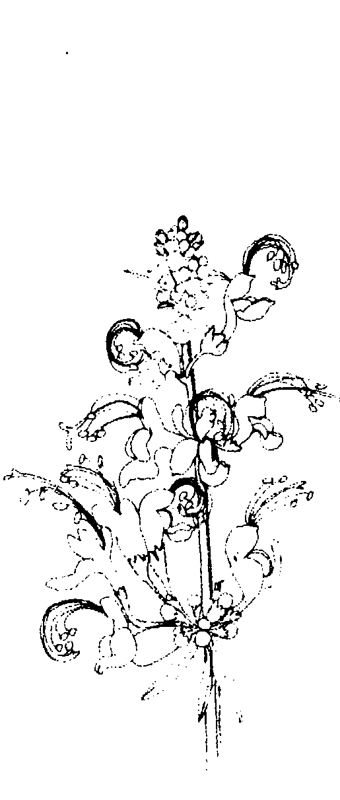

# OSHO 奥修心灵系列64
# The Book of Secrets 奥秘之书（第三卷下册改版）
# 谭崔经典（六）
本書為古印度希瓦神的谭崔原始经典
作者：奧修(OSHO)
翻者：謙達那
- 神秘学资料库
- 神秘学培训机构
- 水晶能量研究中心
- 专业占卜预测机构
- 官方微信：strcdts
- 微信公众平台：strc2011
- 官方店铺网址：http://strc.cr.cx
- 读书交流QQ群：
  - 占星塔罗占卜师交流群：814594478（加入密码：PDF）
  - 神秘学其他综合群：659338717（加入密码：PDF）
天使神秘学院
微信号：strcdts
天使神秘学院
微信公众平台：strc2011

# 制作说明：
本书由《天使神秘学院》出重金从台湾购入的原版书籍扫描制作完成。为达到最好阅读效果，特地把书全部切开后，再经由专业扫描设备高精度扫描完成，并经过一张张的PS后期处理最终成书，其间花费大量的人力、物力以及时间，只为能给大家提供经济并优质的神秘学学习资料而努力。

本学院强力谴责某些机构和个人，把本学院花心血制作完成的电子书籍，包装后直接放在自家淘宝网上低价倾销的行为，以谋取不劳而获的经济利益。如果长此以往最终将无人愿意再为大家花心思制作电子书，那以后可能大家再无新书可读。

为让大家以后能够读到更多的好书，也为了本学院的良性发展。本学院恳请大家尽量做到如下几点：
一、尽量在天使神秘学院的官方网站购买电子书籍。
官网电脑访问地址 : http://strc.cr.cx
二、在收到电子书后小范围传阅即可，千万不要公开传播，更别挂到淘宝网上低价销售。
同时为答谢广大支持者，学院电子书将做如下调整：
一、学院会把一些早已收回制作成本的电子书折价销售。
二、最新制作的电子书籍会开放打印功能，大家购买后有条件的可自行打印成书。
天使神秘学院
2020年5月

# 谭崔经典(六)
# The Book of Secrets
# 奥秘之书，第三卷（下册）
奥修(OSHO)/原著 谦达那/译
校对/德瓦嘉塔

# 奥修出版社

Copyright © 1975
Osho International Foundation
Switzerland
www.osho.com/copyrighs
2012 Osho Publishing House
All rights reserved
Original English title:
# THE BOOK OF SECRETS
OSHO is a registered trademark of
Osho International Foundation,
www.osho.com/trademarks
The material in this book is a transcript of a series of original talks THE BOOK OF SECRETS by Osho given to a live audience. All of Osho’s talks have been published in full as books, and are also available as original audio recordings. Audio recordings and the complete text archive can be found via the online OSHO Library at www.osho.com
获取更多好书，请加微信号：strcdts
店铺：http://strc.cr.cx

# 谭者序
献给
深入内在心灵旅程的人
根植于尘世却又想了脱尘缘的人
这是本人翻译奥修大师著作的第六本下册。－奥修之书－共分五卷，本書是第三卷下册。当我在翻译和校对此书时，我更加发觉它的内容实在是太宝贵了，谭崔（Tantra）的方式实在太棒了，我不知道要如何将我对此的喜爱传达给你，还是你自己慢慢去品尝它吧！此书的翻译大部分是在深夜宁静的片刻当中完成的。自从我着手翻译奥修
大师的著作以来已经历经数年，在这五、六年当中，我一直在变得更溶入我的翻译工作，我是那么地执着，只翻译他一个人的书。我坚信他的书将会万古流芳，就好像离现在有兩千五百年，但佛陀的影响力还是那么大，奧修的神性和超人的魅力一定會随着时间的经过而更加光芒四射。
謙达那 一九九〇年五月 於台北

# 第四十一章 谭崔觉知和不判断的方法
## 第四十一章
## 谭崔觉知和不判断的方法
经文：
64、在开始打噴嚏的時候、在驚駭的時候、在焦慮的時候、在情感衝突的時候、在戰爭中逃命的時候、在極度好奇的時候、在飢餓開始的時候、在飢
（在一個强烈的感覺開始的時候，要保持觉知。）
一九七三年三月二十五日於印度孟买
获取更多好书，请加微信号：strcdts
店铺：http://strc.cr.cx

人生是一个似非而是的真理。要达到近处，你必须旅行到远处，那个已经被达成的，你必须再去达成。没有什麼东西会失去。人还是保持自然的，人还是保持純淨的，人还是保持天真的，他只是忘了它。那個純淨並沒有被打擾，那個天真並沒有被摧毀，只有一個深深的忘記存在。你已經是那個要被达成的。在本質上，沒有什麼新的東西要被达成，你只需要去發現、去揭開、去打開那個已然的東西，因此，靈性的努力是困難的，也是簡單的，我說兩者都是，如果你能夠了解，它是非常簡單的，但它也是非常困難的，因為你必須去了解那已經完全被遺忘的、那很明顯的。你從來不會覺知到它，它就好像你的呼吸，它一直在繼續，不間斷地，你不需要去覺知它，你的覺知是不需要的，它不是一項基本需求，你可以忘掉它，也可以記住它，你可以選擇。

一娑婆世界一和一涅槃一；一世界一和一意識的解放狀態一，它們不是兩種東西，它們只是兩種態度、兩種選擇，你可以選擇其中之一。你可以因為某種態度而在世界裡，然而，只要藉著改變態度，同樣的世界就變成涅槃、同樣的世界就變成絕對的喜樂，你還是保持一樣，每一件事還是保持一樣，只需要焦點的改變、著重點的改變、選擇的改變，那是容易的。一旦絕對的喜樂被達成，你將會感到好笑，一旦它被知道了，你將不能夠了解，為什麼你過去一直成，你將會錯過它，它一直都在那裡，只是等待著要被注意看。它一直都是你的。佛会笑，任何一個達成它的人都会笑，因為整個事情似乎是可笑的，你在找尋某種從來沒有失去過的東西。整個努力都是荒謬的，但是這種事只有當你達成的时候才會發生，所以那些達成它的人說它是非常簡單，但是那些沒有達成的人說它是最費力的、最困難的，真的，不只是困難，而且是絕對的不可能的事。我們將要討論的這些方法是那些已經達成的人所講的，這一點要記住。它們看起來太簡單了，然而它們事實上就是那麼簡單。對我們的頭腦而言，那麼簡單的事情不會吸引人，因為如若技巧那麼簡單，而住處那麼近，如果你已經真如此，為什麼你一直在錯過它？而家那麼近，你將會認為你自己是可笑的。你或許反而會認為這麼簡單的方法不能夠有所幫助。那是一個騙局。你的頭腦會告訴你說這些簡單的方法不能夠有任何幫助，它會告訴你說它們是那麼簡單，它們無法達成任何事情。要達成一個神聖的存在一，要達成一個絕對的—和—那最終的—，怎麼可以使用這麼簡單的方法？它們怎麼能夠有任何幫助？你的自我會說：它們無法有任何幫助。記住另外一件事：自我總是對困難的事情感興趣，因為當事情是困難的，它就有一種挑戰性，如果你能夠克服那個困難，你的自我就會覺得被滿足。自我從來不被任何簡單的事情所吸引—從來不！如果你想要給你的自我一個挑戰，那麼你就必須設計出困難的東西。如果事情是簡單的，那麼就沒有吸引力，因為即使你能夠征服它，自我也不會感到滿足。—開始就沒有什麼東西要被征服，因為事情是那麼簡單。—自我—要求困難—有一些障礙要被跨過，

有一些高峰要被征服，那個高峰越困難，你的自我就覺得越舒服。因為這些技巧是那麼簡單，它們對你的頭腦將不會有任何吸引力。記住，那些對自我有吸引力的無法幫助你靈性的成長，只有那些對你的自我沒有吸引力的才能夠成為朝向蛻變的幫助，但事情的發生是這樣的：如果某個老師說這個或那個非常困難、非常費力，唯有在經過好幾世、好幾世之後，你才稍微可能有任何瞥見，那麼你的自我就會覺得很好。這些技巧非常簡單，就在現在，就在此時此地，那件事就可能發生，但是這樣的話，跟你的自我就没有接觸。如果我說，就在現在、就在這裡，就在這個片刻，你就能夠達成一個人所能夠的，不浪費一瞬間，就在此時此地，就在這個片刻，你就能夠變成一個佛、一個基督、或是一個克里虛納，那麼跟你的自我類意識所可能達成的。

我就沒有接觸。你會說：「這是不可能的，我必須到其他某一個地方去找尋它。一這些技巧那麼簡單，你可以在你決定要去達成它的任何片刻達成一切人類意識所可能達成的。當我說這些技巧是簡單的，我意謂著很多事情，首先，靈性的爆發並不是藉著任何東西而引起的，它不是一個因果現象，如果它被什麼東西所引起，那 座一定需要時間，因為如果那個原因要發生，時間是需要 的，如果需要時間，那麼它就不可能是這種情形，它不可能就發生在這個片刻，那麼你就必須等到 明天，或是等到另一世；下一個片刻是需要的。如果任何東西都是因果關係，那麼那個一因一必須發生，在那個一因一之後，一果一才會隨之而來。如果沒有因，你無法立刻產生果，時間是需要的，但是靈性的發生不是一個因果現象，你已經在那個狀態，只需要去記憶它。它不是一個因果現象。 它就好像是：早上 的時候突然有人喚醒你，而你不能夠認出你在哪裡，一 下子你或許甚至認不出你是誰，在從深深的睡眠當中突然被喚醒之際，你或許不能夠認出那個地方、那個時間，但是一下子之後，你就能夠認出，當你變得更警覺，你就能夠認出你是誰、你在哪裡，以及發生了什麼，這不是一件果的事情，問題只是在於警覺，隨著警覺的成長，你將能夠認出你是誰。所有這些技巧都是為了成長的警覺，你已經是那個你想要成為的人，你已經在你想要達到的地方。

你已經到達了你的家，事實上你從來沒有離開過它，你一直都在那裡，但是你在做夢、在睡覺，你可以在此地睡覺，然後做夢，而在你的夢裡，你可以移動到任何地方，你可以走到地獄、天堂、或任何地方。你是否曾經觀察過，每當你在做夢，有一件事是可以確定的：你從來不會在你睡覺的房間裡，你觀察過那個事實嗎？你可以在任何地方，但是你從來不會在同一個房間裡，不會在你睡覺的同一個屋子裡，因為你已經在那裡，你不需要去夢見它，做夢意謂著你必須走開。或許你睡在這個房間裡，但是你將永遠不會夢到這個房間，沒有這個需要，你經在那裡了。頭腦總是在欲求那個沒有的，或那個不是的，所以頭腦會跑來跑去，它或許會跑到倫敦、紐約、加爾各答、喜馬拉雅山、西藏、或任何地方，它或許會跑到任何地方，但是它永遠不會在此地，它會跑到任何地方，但是從來不會在此地，而你是在這裡，情形就是這樣。你在做夢，但是你神聖的存在就在這裡；你就是「那個」，但是你一直在長途跋涉，而每一個夢都會產生出新的夢，每一個夢都會產生出新的夢，而你一直繼續在做夢、做
夢、又做梦。所有這些技巧都只是要使你變得警覺，好讓你能夠走出你的夢，而回到你一直存在的地方，回到你從來沒有錯過的狀態，其實你不可能錯過它，它就是你的覺知更加成長，幫助它變得更強烈，有了強烈的覺知，每一樣東西都會改變。覺知越強烈，做梦的可能性就越少，你就變得對「那真實的」越來越警覺。覺知越不強烈，你就越飄浮到夢裡，所以，整個現象就是：一個非警覺狀態的頭腦就是世界，而一個警覺狀態的頭腦就是涅槃。不警覺，你就是「你看起來是的」；警覺，你就是「你是的」。所以整個問題在於如何將你非警覺狀態的頭腦改成警覺狀態的頭腦，如何變得更覺知，如何脫離睡覺和做梦，那就是為什麼技巧能夠有所幫助，即使一個閉鐘也能夠有所幫助——只要一個人造的設計，只要一個閉鐘。如果那個閉鐘繼續響，它就能夠幫助你，把你帶出你的夢，但是你也能夠欺騙它，你甚至能夠夢想它，那麼整個事情就完了；當閉鐘在響，你可以做梦，你可以在閉
鐘的周圍做一個夢，你可以做夢說你進入一座廟，而鐘在響，如此一來，你就欺騙了那個閑鐘，它本來可以打破你的睡覺，但是你使它變成夢本身，你使它變成你做事的一部分。

如果你能夠使它變成你做夢的一部分、如果它能夠夠被納入做夢的過程，那麼它就無法幫助你。你可以夢見任何東西，但是它不會看起來像一個閑鐘，它會變成某種其它的東西。它變成：你進入了一座廟，而鐘在響，那麼你就需要醒來，你已經將那個閑鐘或那個真實的東西改變成一個夢，而一個夢無法被另一個夢所打擾，它只能夠被另一個夢所幫助。這些技巧就某方面而言都是人造的，它們都只是一些幫助你走出夢境的設計，但是你也能夠使它們成為你夢的一部分，因為這是非常基本的，一旦它被了解，它將會有所幫助，否則你會繼續欺騙你自己。

比方說：我說：「冒個險來當門徒。」這只是一個設計，用來打破你舊有的認同，你舊有的名字會變成好像是屬於別人的，然後你可以更超然地看著
騙你自己。

個，因為這是非常基本的，一旦它被了解，它將會有所幫助，否則你會繼續欺騙你自己。

夢的部分，那麼你就錯過了那個要點，你錯過了那個要點！試著去了解這
人造的，它們都只是一些幫助你走出夢境的設計，但是你也能夠使它們成為你
被另一個夢所打擾，

## 第四十一章 護崔覺知和不判斷的方法

亡，它更像死亡，而比較不像生命，它是突然的，它在任何片刻都能夠發生。如果你準備好，這些技巧都能夠有所幫助，這些技巧不會使你漸漸達到三摩地，事實上，它們會漸漸把你帶到一個準備好的位置，好讓它能夠立即發生，記住這個特點：它們使你準備好，好讓三摩地能夠立即發生。這些技巧並不是三摩地的技巧，它們是使你準備好的技巧，然後三摩地就能夠發生，至於你要如何來使用這些技巧，那要依你而定，所以，不要以為需要一個很長的過程，那麼你就能夠延緩，你可以說：我明天才做它，或後天才做它。一你可以以繼續永遠地延緩下去，一個延緩的頭腦總是繼續在延緩，問題不在於你明天是否要去做它，只有一個問題：你今天不要去做它，就是這樣而已。明天將再度成為今天，而同樣的頭腦會說：好，我明天再去做它。記住，你從來不會延緩好幾年，你會延緩一天，因為如果你延緩好幾年，你就無法欺騙你自己，你說：一那只是一天的問題，只是今天我不去做它，明天我將做它。一那個空隙很小，你從來不會覺得是永遠在延緩它。

## 譚崔經典（六）

# 020

# 第一個技巧：

技巧。

會以明天來思考，但是明天永遠不會來到，它從來沒有來過，它也將永遠不會來，一切你所有的就是當下這個片刻，不要繼續延緩，現在我們要進入這個技巧。

在開始打噴嚏的時候、在驚駭的時候、在焦慮的時候、在感情衝突的時候、在戰爭中逃命的時候、在極度好奇的時候、在飢餓開始的時候、在飢餓結束的時候，要不間斷地覺知。

它看起來很簡單：在開始打噴嚏的時候、在驚駭的時候、在焦慮的時候、在飢餓之前、或是飢餓之後，要不間斷地覺知。有很多事情必須加以了解，像打噴嚏這麼簡單的行為也能夠被使用成一個設計，因為不管它們看起來多麼簡單，它們是非常複雜的，而內在的運作過程是一件非常微妙的事，每當你覺得正要打噴嚏時，要變成覺知的，那個噴嚏或許根本不會來，它或許會這樣就消失，因為噴嚏是一個非自願性的動作，它是無意識的、非自願的。你不能夠自願地打噴嚏，你不能夠用意志來做它，你怎麼能夠用意志來做呢？人是多麼無助！你甚至無法用意志打一個簡單的噴嚏，不管你如何嘗試，你都無法做到，只是一個噴嚏，這麼小的一件事，但是你無法用意志來做它，它是非自願的，它不需要意志力，它不會因為你的想法而發生，它是因為你的整個有機體、你的整個身體而發生。第二件事：當你變得警覺，當噴嚏正在來臨……你沒有辦法使它來臨，但是當它來臨，如果你變得警覺，它或許就不會來，因為你將某些新的東西帶進了那個過程：警覺。它或許會消失，但是當噴嚏消失，而你又是警覺的，就有第三件事。首先，噴嚏是非自願性的，你將一樣新的東西帶進來：警覺。當警覺來臨，噴嚏或許不會來臨，如果你真的警覺，它將不會來臨，它或許根本不會發生。然後第三件事就會發生，那些要透過打噴嚏而釋放出來的能量，現在跑到哪裡去了？它跑到你的覺知上面去。突然間就有一個閃耀，就有一道閃光，你就變得更加警覺，那些要藉著打噴嚏而丟出的能量將會跑到警覺上面去。突然間，你就變得更加警覺。在那個閃耀之際、在那個閃光之際，甚至成道也可能，那就是爲什麼我說這些事太簡單了，以致於看起來很荒謬，它們所給予的承諾似乎太過火了，只是透過打噴嚏，一個人怎麼能夠變成成道？但打噴嚏並不只是打噴嚏，你完全涉入它裡面。任何你所做的或是任何發生在你身上的都是一個完全的涉入。再度觀察：每當一個噴嚏正在發生，你是用整個身體、整個頭腦完全投入在它裡面，噴嚏的發生並非只是你的鼻子；你身體的每一根纖維、每一個細胞都涉入面，噴嚏的發生並非只是你的鼻子；你身體的每一根纖維、每一個細胞都涉入它裡面。有一個微妙的顫抖、一個微妙的擺動散佈到整個身體，打了噴嚏之後，整個身體都變得集中起來，當那個噴嚏發生，整個身體就放鬆下來，但很難將警覺帶進它裡面，如果你將警覺帶進它裡面，它將不會發生，而如果它發生了，你會知道那個警覺不在那裡，那就是爲什麼你必須警覺。在開始打噴嚏的時候……因爲如果它已經開始，那麼就來不及了，箭
已經射出，你已經不能再改變它，那個運作過程已經開始，能量已經準備好要停止？等你準備好的時候，它不能夠被阻止，你能夠中途阻止一個噴嚏嗎？你怎麼能夠中途停止？等你的時候，要警覺，當你感覺到那個情緒正在來臨，要警覺，閉起你的眼睛而成為靜心的，就在你感覺到要打噴嚏的情緒那個地方，將你全部的意識集中在那個地方，就在開始的時候，保持警覺，噴嚏將會消失，而那個能量將會轉變成更警覺。因為打噴嚏的時候整個身體都涉入、全身的機構都涉入（它是一個放出能量的運作過程，而你在這個片刻保持警覺），所以將會沒有頭腦、沒有思想、沒有靜心。在打噴嚏的時候，思想停止了，所以有很多人喜歡吸「鼻煙」，它使他們解除負擔，使他們的頭腦覺得更放鬆，因為在那個片刻，思想停止了，吸鼻煙使他們瞥見一無思想。當噴嚏來臨時，透過吸鼻煙，他們就不是很們的頭腦，他們變成身體，在那個片刻，頭腦消失了，它感覺很好。如果你習慣於吸鼻煙，那麼你就很難改掉它，它是一個比抽煙更深的習
慣，抽煙跟它比簡直就是小巫見大巫。它貫穿得更深，因為抽煙是有意識的，而打噴嚏是無意識的，放掉吸鼻煙比放掉抽煙更困難，抽煙可以改變，代替品，可以找到，但是吸鼻煙沒有可以取代的。打噴嚏是身體一個非常獨特現象，其他唯一能夠跟它相比的就是性行為。那些以生理學的觀點來思考的人說性行為只是透過性器官在打噴嚏，它們之間有一個類似性。那並非百分之百是對的，因為有更多的東西涉入性裡面，但是在開始的時候，就在剛開始的時候，那個類似性是存在的。

某種東西從鼻子丟出，你就覺得舒解了；某種東西由性器官丟出，你無法用意志去進入性，如果你這樣去嘗試，你將會成為一個失敗者，尤其是男人，因為男人的性器官必須去做些什麼，它是主動的，你無法用意志來左右它的行為，如果你這樣去嘗試，那麼你當試得越厲害，它就越不可能。它能夠發生，但是你無法使它發生，就是因為如此，性在西方已經成為一個難題，西方在這個半個世紀裡面已經發展出性知
識，每一個人都變得對它那麼有意識，以致於性變得越來越不可能。如果你很警覺，性將會變得不可能，如果一個人在做愛的時候是警覺的，那麼，他越警覺，做愛就越困難，他將變得無法勃起，它是無法用意志來控制的，如果你用意志控制，你將會失去它。同樣的方法、同樣的技巧可以被使用
在性裡面。就在開始的時候，當你感受到勃起的情緒即將來到你身上而還沒有來，你剛好感受到那個震動，在那個感當見，要變得警覺；那個震動將會喪失，
而同樣的能量將會轉入警覺。
譚崔曾經使用過這個，它已經試過很多方法。一個漂亮的女人在那裡作為靜心的目標，而那個追求者、那個靜心者就坐在那個裸體女人的前面，靜心冥
想她的身體、她的形體、她的比例，就在那裡等待他性中心的第一個情緒，當那個情緒升起的時候，他就閉起他的眼睛，而忘掉那個女人，他閉起他的眼晴，他變得覺知到那個情緒，那麼，性能量就被轉變成警覺（覺知）。
他被允許去靜心冥想那個裸體的女人，但是一等到那個情緒被感覺出來，他就必須馬上停止，然後他必須閉起他的眼睛，進入他自己的情緒，而變成在
那裡覺知，這跟打噴嚏時所做的一樣。這個閃耀爲什麼會發生？因爲頭腦不在那裡；基本的事情就是：如果頭腦不在那裡，而你 是警覺的，你將會有三托（Satori）——你將會第一次瞥見三摩地（Samadhi）。（註：三托歷是短暫的 三摩地。）思想是障礙，所以不管以什麼方式，如果思想消失，那件事將會發生，但是思想必須消失，唯有到那個時候，覺知才會存在。即使在睡覺的時候，思想也能夠消失，當你變成無意識的時候，思想也能夠消失；當你服用某種藥物時，思想也能夠消失；思想消失，但思想消失之後就没有警覺可以覺知到隱藏 在思想背後的現象，所以我把靜心定義成沒有思想的意識。你可以變成沒有意識，而且無意識，那麼就沒有意義，你可以有思想而且有意識，你已經是那樣。將這兩件事放在一起：「意識」和「無思想」。當它們會合，靜心就發生了。你可以用非常小的事情來嘗試，因爲沒有東西是真的小，即使打噴嚏也是一個宇宙的現象。在存在（Existence）裡面，沒有什麼東西是了、靜心就誕生了。你可以用非常小的事情來嘗試，因爲沒有東西是真的小，即使打噴嚏也是一個宇宙的現象。在存在（Existence）裡面，沒有什麼東西是
偉大的，也沒有什麼東西是渺小的，即使是一顆微小的原子也能夠摧毀整個世界；即使是一個打噴嚏、一個非常微小的現象，也能夠蝦蟇你。如果你具有穿透的眼睛，那麼，非常小的事也是極端重要的。宇宙隱藏在大與原子之間，而在宇宙與原子之間，你不能夠說哪一個比較渺小，即使只是一個原子，在它本身裡面也是一個宇宙，而最大的宇宙也只不過是原子，所以不要以大或小來思考，只要去嘗試，不要說：在一個噴嚏裡能夠發生什麼？我一生都在打噴嚏，而什麼事都沒有發生。將這個技巧帶進來，就一在開始打噴嚏的時候、在驚駭的時候……當你覺得害怕、當害怕進入的時候，就在當你覺得害怕進入的時候，變成覺知，害怕就會消失，有了警覺，就不可能有害怕，當你是警覺的，你怎麼可能害怕？唯有當你喪失警覺，你才會害怕。事實上，一個懦夫並不是一個害怕的人，一個懦夫是一個昏睡的人，而一個勇敢的人是一個能夠將他的警覺帶進那個恐懼片刻的人，有了警覺，恐懼就消失了。

## 在日本，他們訓練他們的武士警覺；最基本的訓練就是警覺，而其他每一件事都是次要的。如果一個武士能夠很警覺，那麼他就是一個勇敢的人。在第二次世界大戰的時候，大家都覺得敵不過日本的武士，他們的勇敢是無與倫比的，它來自哪裡
呢？就身體而言，他們並不強壯，但是在他們的意識裡，在他們的警覺裡，恐
惧無法進入，他們不害怕，每當恐懼來臨，他們就嘗試禪的方法。

這段經文說：「在驚駭的時候、在焦慮的時候……當你感到焦慮，當你
被焦慮所折磨，你就嘗試它。要怎麼做？當焦慮的時候，通常你都怎麼做？通
常你都試著去解決它，你嘗試各種不同的方法，然後你就越來越被牽扯進去，你會產生一個更大的混亂，因為焦慮無法透過思考而被解決，它無法透過思考而被溶解，因為思考本身就是一種焦慮，所以你這樣做是在幫助焦慮更加成長。透過思考，你無法走出焦慮，你會更深入它。這個技巧說：不要對焦慮做任何事，只要警覺，只要警覺！我要告訴你一個古老的趣聞，那是關於另外一位禪師的事，他的名字叫作布克由，他單獨住在一個山洞裡，完全單獨，但是在白天，甚至在晚上，他有時候會大聲喊：「布克由。」—他自己的名字，然後他会說：「是的，我在这裡。」而當時旁邊都没有人，他的門徒問他：「為什麼你喊你自己的名字在這裡。」他說：「每當我進入思想，我必須記住要警覺，所以我叫我的名字布克由。」，然後說「是的，先生，我在這裡」？克由。當我叫我的名字布克由，然后說「是的，先生，我在這裡」的時候，那個思想和焦慮就消失了。—然後在最近兩三年，他從來不叫他自己的名字，也從來不回答「是的，先生，我在這裡。」門徒們問：「師父，為什麼你最近都
不這樣做？—他說：—現在布克由一直都在，他一直都在，所以不需要，以前我常常錯過他，有時候

## 第四十一章 譚崔覺知和不判斷的方法

件虛構的事，然後事實就是事實，赤裸裸的事實就是事實，它既不是道德的，也不是不道德的，它既不是純的，也不是不純的。想一想，如果地球上沒有人類，那麼什麼是純的，而什麼是不純的，每一樣東西都將會存在，只是一「存在」，沒有什麼東西是純的，也沒有什麼東西會是純的；沒有什麼東西會是好的，也沒有什麼東西會是壞的。有了人，頭腦就進入了，頭腦會劃分，它說「這」是好的，而「那」是壞的，這個劃分不僅在世界創造出分裂，這個劃分也在劃分者裡面創造出分裂。如果你劃分，你也是在那個劃分裡面被分裂了，不論你對世界做什麼，你也同時對你自己這樣做。

最偉大的西達瑜伽（Siddha Yoga）大師之一那羅帕（Naropa）說：「一時之隔，地獄和天堂就被分開了。一時之隔！但是我們一直在劃分、一直在冠以名稱、一直在譴責、一直在辯護。注意看存在赤裸的事實，而不要冠以名稱，唯有如此，譚崔的教導才能夠被了解，不要說好或壞，不要將你的頭腦帶進事實，你就創造出一個虛構之物，那麼它就不是進事實。當你將你的頭腦帶進事實，你就創造出一個虛構之物，那麼它就不是一个真實的存在，它是你的投射。這段經文說：「其他教導的「純」對我們來講是一個不純。在真實的存在裡，不要把東西看成純或不純。」

「其他教導的純對我們來講是一個不純。」譚崔說：「對其他教導而言是非常純的東西、是美德的東西，對我們來講是一項罪惡，因為他們所謂的概
念會劃分，因此，對他們來講，某些東西就變得不純了。」

如果你稱一個人為聖人，那麼你就創造出了罪人，那麼你就必須去譴責某個地方的某一個人，因為，沒有罪人，聖人無法存在，然後再看看我們所有努
力的荒唐，我們一直試著去摧毀罪人，我們設想和希望世界上沒有罪人，只有
聖人，這是荒謬的，因為聖人沒有罪人無法存在，他們是同一個錢幣的另一面。
你無法只摧毀錢幣的一面，它們都將會存在，罪人和聖人兩者都是同一件事
的重要部分，如果你摧毀罪人，聖人將會從世界上消失，但是不要害怕，讓他
們消失，因為事實上他們是沒有任何價值的。

罪人和聖人兩者都是同一個解釋的一部分，都是同一種朝向世界態度的一
部分，在那種解釋或態度之下，一個人會說：—「這」是好的，那」是不好
的，你需要那個壞的，所以那個好的要靠那個壞的存在，你的美德要依靠罪
惡而存在。你的聖人是不可能，他們不能夠沒有罪人而存在，所以他們必須
感謝罪人，如果没有罪人，他們就无法存在。在跟他們關連之中，在跟他們比
較之下，不管他們是多麼譴責罪人，他們都是同一個現象的一部分，唯有當聖
人消失，罪人才會從世界上消失，在這之前是不可能的。當沒有美德的觀念，

罪惡就不會存在。

譚崔說：事實是真實的，而解釋是不真實的，不要解釋，在真實的存在裡，不要把東西看成純或不純，為什麼呢？因為純和不純是我們加諸於真實存在之上的態度。嘗試這個技巧，這個技巧是費力的，它是不容易的，因為我們
非常傾向於二分式的思考，我們奠基於、根入於二分性的思考，以致於我們甚至沒有覺知到我們的譴責和辯護。如果某人開始在這裡抽煙，你或許尚未有意識地感覺到任何東西，但是你開始譴責，在你內在深處，你就開始譴責，你
或許看起來有譴責，或許看起來並沒有譴責；你或許沒有看著那個人，但是你 已經在譴責。 這是困難的，因為那個習慣已經根深蒂固，你繼續藉著你的姿勢、藉著你 坐的姿勢、藉著你站的姿勢來譴責和辯護，而你甚至沒有覺知到你正在做什麼。 當你對某人微笑，或是當你不對某人微笑，當你注意看著某人，或是當你不看 他，你只是在忽視某人，你到底在幹什麼？你是在把你的態度強加上去，你說 某一樣東西是美的，那麼你就必須把另外某一樣東西譴責成醜的，這個二分的 態度同時也在分裂你，所以在你裡面將會有兩個人。 如果你說某人在生氣，而生氣是不好的，那麼，當你生氣的時候你要怎麼 辦？你將會說這是不好的，那麼就會有困難，因為你說：「這是不好的，在我 裡面的這個生氣是不好的。」那麼你開始將你自己分裂成兩個人：一個不好 的人、邪惡的人，和另外一個好人、一個聖人。當然你一定會跟你裡面的那個 聖人認同，所以那個魔鬼、那個撒旦、那個你裡面的罪惡就被譴責，你被一分 為二，那麼就有經常的爭門和衝突，你就不能夠成為一個個人，你將成為一個

群眾，你將成為一個分裂而反對它自己的地方，如此一來將不會有和平、不會有寧靜，你將只會感覺到緊張和痛苦，這就是你所感覺到的，但是你不知道為什麼。一個分裂的人無法保持平和，他怎能夠保持平和呢？要把你的魔鬼放在哪裡呢？你必須摧毀它，然而它就是一「你」，你無法摧毀它，你並不是兩個，真實的存在只有一個，但是由於你分裂的態度，你將外在真實的存在劃分，因此，內在也一樣被劃分，所以每一個人都在和他自己抗爭，那就好像你在跟一雙手抗爭，你用你的左手跟你的右手抗爭，而那個能量是同一的。我在我的右手，也在我的左手，我在兩者裡面流動，但是我用一雙手來反對另外一雙手，我用我的右手來反對我的左手，然後我就創造出一個衝突、一個假的爭門；有時候我會欺騙我自己說右手戰勝了，而左手失敗了，但這是一個欺騙，因為我知道我在兩者裡面，任何時候我都可以將左手提起而將右手放下，我在兩者裡面，兩隻手都是我的。所以，不管你認為你將你的聖人抬得多麼高，而將你的魔鬼贬得多麼低，

你要知道，在任何片刻，你都能夠改變那個地位，你能夠改變到使聖人下降而使魔鬼抬頭，那會產生恐懼和不安全感，因為你知道沒有什麼事是確定的，你知道在這個片刻你是多麼具有愛心，在這個片刻你將你的恨壓下去，但是你害怕，因為在任何片刻，恨將會浮現，而愛將會被壓下去，它在任何片刻都可能發生，因為你在兩者裡面。

譚崔說不要分裂，要不分裂，唯有如此，你才能夠勝利。要如何才能夠不分裂？你必須不謹責，不要說這個一是好的，一那個一是壞的，要取消所有純和不純的概念。注意看這個世界，但是不要說它是什麼，要成為無知的，不持沈默，漸漸地，這個沈默將會深入內在，而如果這個分裂不在外在，這個分裂將會內在的意識消失，因為兩者是一起存在的。

但是這對社會來講是危險的，所以譚崔被壓抑，這是危險的！沒有什麼物是不道德的，也沒有什麼事物是道德的；沒有什麼事物是純的，也沒有什麼事物是不純的，事物就像它們本然的樣子，一個真正的譚崔行者將不會說賊是
不好的，他會說他是一個賊，就這樣而已，而且藉著使用「賊」這個字，他在說：「這裡有一個偉大的聖人。」他會說：「是的！他是一個聖人。」但是沒有評價在裡面，他不会說：「他是好的。」他會說：「是的！他是一個聖人。」但他是那個人是一個賊。」就好了。就好像「這」是一朵玫瑰，而「那」不是一朵玫瑰；一這一棵樹是高的，而「那」一棵樹是矮的；晚上是暗的，而白天是亮的；但是沒有比較。然而這是危險的，如果没有譴責一件事而讚美另外一件事，社會就不能夠存在，社會無法存在！社會是靠二分性而存在的，那就是爲什麼譴崔被壓抑，它被認爲是反社會的，但其實它不是反社會的，它不是！那個非二分的角度是超越的，它不是反社會的，它是超越的，它是超出社會之外的。當試這個：進入世界，不要帶有任何價值觀，只要看自然的事實。某一個人這樣，而另外一個人那樣，然後漸漸地，你就在你裡面感覺到不分裂，你的兩極將會合在一起，你的「壞」和你的「好」將會合在一起，它
存在，社會無法存在！社會是靠二分性而存在的，那就是爲什麼譴崔被壓抑，它被認爲是反社會的，但其實它不是反社會的，它不是！那個非二分的角度是超越的，它不是反社會的，它是超越的，它是超出社會之外的。

當試這個：進入世界，不要帶有任何價值觀，只要看自然的事實。某一個人這樣，而另外一個人那樣，然後漸漸地，你就在你裡面感覺到不分裂，你的兩極將會合在一起，你的「壞」和你的「好」將會合在一起，它
們會合併成一個，而你將會變成一個整體，將不會有什麼東西是純的，也不會有什麼東西是不純的，只要知道有那個真實的存在。—其他教導的「純」對我們來講是一個不純—，譚崔說：「對別人來講是基本的東西，對我們來講是有毒的。—比方說，有基於非暴力的教導，他們說是暴力是不好的，非暴力是好的。譚崔說：非暴力是非暴力的教導，他們說是什麼是好的，也没有什麼是不好的。有基於無慮的教導，他們說無慮是好的，而性是不好的，譚崔說：性就是性，無慮就是無慮，這個人無慮的，而那個人不是，但这些都只是簡單的事實，沒有價值判斷附加在它們上面，譚崔永遠不會說無慮是好的，它永遠不會說一個無慮的人是好的，而那個停留在性裡面的人是不好的，譚崔不會這樣說，譚崔接受事情本然的樣子，為什麼呢？只是為了要在你裡面創造出一個整體。這是一個在你裡面創造出一個整體的技巧，這是一個使你裡面有一個完整的存在、使你裡面不分裂、不衝突、不對抗的一個技巧，唯有如此，才可能有體。
宁靜。一個想要從一個地方移動到另一個地方去反對什麼東西的人將永遠無法保持平和，他怎麼能夠保持平和呢？一個內在自己分裂的人、跟自己抗爭的人，他怎麼能夠夠勝利呢？那是不可能的。你是兩者，所以誰要贏呢？沒有一個會贏，而你將會輸，因為你將會在抗爭當中不必要地散發你的能量，這是在你裡面創造出一個整體的技巧，讓價值觀消失，不要判斷。耶穌曾經說過：不要判斷人，以免你被判斷。但是猶太人不可能了解這個，因為整個猶太人的觀念都是道德導向的：這是好的，而那是不好的。耶穌在他的教導裡說：不要判斷。他是以譚崔的口吻來說的，如
果他被謀殺、被釘死在十字架上，那是因为他有一個譚崔的態度：不要判斷。所以，不要說一個妓女是不好的，誰曉得？不要說一個清教徒是好的，誰曉得？到了最後，他們兩者都是同一個遊戲的一部分，他們互相作為對方的基礎，他們基於相互的存在，所以耶穌說：不要判斷。而這段經文意謂著：不要判斷人，以免你被判斷。

如果你不判斷，不採取任何道德觀，只是觀察事實本然的樣子，而不按照你自己的意思來解釋它們，那麼你就不能夠被判斷，你就完全被改變了，那麼你就不需要被任何神聖的力量來判斷，不需要！你自己已經成為神聖的，你自已經成為神；成為一個觀照，不要成為一個判斷者。

获取更多好书，请加微信号：strcdts

店铺：http://strc.cr.cx

[PAGE 49]

# 第一個問題：

不道德的生活會產生對靜心的阻礙，這是否不是真的？ 靜心是什麼？它不是你的個性，它不是你所做的，它是一「你是的」。它不 是個性，它是你帶給你所做的任何事情的意識，你的作為是不相關的，問題在
一九七三年三月二十五日於印度孟買

# 第四十二章

# 透過譚崔而覺知——不是原則

於：當你在做它的時候你是不是有意識，不管它是不是合乎道德。你是警覺的嗎？如果你是警覺的，靜心就發生了，如果你不警覺，你就生活在昏睡當中。全昏睡，你最好是道德的，因為這樣的話，社會將不會打擾你，這樣的話，將沒有人會反對你，你就能夠夠好好地睡，社會將會幫助你。你不要靜心也可以成為道德的，但是不道德就會一直跟在你後面，它會像影子一樣地跟隨著你，而你的道德將會是貧淺的。因為當你是昏睡的，你的德只能夠從外面強加上去，它只能夠夠是虛假的，它只是一個表面，它無法成為你的本性，你的外在會變成道德的，但是你的內在將會保持不道德，而如果你的外在變得更道德，你的內在將會以同樣的比例變得更不道德，因為你的德只不過是一個深深的壓抑。當你在昏睡的時候，其他什麼事你都不能夠做，你只能壓抑。透過這個道德，你也会變成虛假的，你不会成为一個人，而只是一個「人格——只是一個虛假的實體。痛苦將會隨之而來，而你會經常處於爆炸的邊
緣，所有你壓抑的東西隨時都可能爆炸，它就在那裡等著你。在昏睡的時候

## 諾崔經典（六） 056

處，但是你會變得不安。以道德作為出發點的話，不是你跟社會在一起的時候不安，就是你跟自己在一起的時候不安，只有當你開悟，不安才會離開你。

譚崔所顧慮的是基本疾病，而不是症狀。道德是一個變動的症狀，所以譚崔說：不要顧慮道德或不道德的觀念。譚崔的意思並不是說，要變成不道德的；譚崔甚至不會告訴你要成為道德的，它怎麼會告訴你要成為不道德的呢？譚崔說這整個事情都是不相關的，不要談論道德和不道德，而要去找到它的根！它的根就是：你是昏睡的、熟睡的。

你要如何打破這個昏睡的結構？要如何變成覺知的？要如何才能不一再一地掉進昏睡之中？那就是譚崔所顧慮的。一旦你變警覺，你的性格就會改變，但那是一個結果。譚崔說：你不需要擔心它，它是一個結果。不可避免地，它一定會發生！所以你不需要擔心它，你不必去促成它，它將會發生，你只要變得越來越警覺，你就会越來越合乎道德，如此一來，這個發生在你身上的道德將不是強迫的，它不是來自你的作為，你只是試著去成為警覺的，然後它就發生了。一個警覺的人怎麼可能是暴力的呢？一個警覺的人怎麼會覺得恨和憤怒呢？這也許聽起來似是而非，但事實上它是如此：一個昏睡的人不可能沒有恨。那是不可能的，他只能假裝沒有憤怒、沒有恨，他只能假裝有憤怒、沒有恨，他只能假裝有愛、有慈悲、有仁慈、有同情心，那些都是偽裝。然而發生在一個開悟的人身上的情形剛好相反：如果需要憤怒，他只能假裝，他不可能生氣，他只能假裝。如果需要要憤怒（有時候它是需要的），他只能假裝。他不可能悲傷，但是如果有需要，他會假裝他是悲傷的。開悟之後，這些都不可能了。開悟之後，愛就成為自然的，就好像恨在以前是自然的一樣。愛在以前是一個假裝，而現在，如果有需要的话，恨只能是一個假裝。耶穌跟那些換錢的人在廟裡抗爭，那是假裝的，他不可能生氣，但是他選擇假裝，他不可能真的生氣。他不可能生氣，但是他能夠使用生氣，就好像對你而言，你可以使用愛，但事實上你無法愛。你為了某些目的而使用愛，你的愛只是為了要得到其他東西，它從來就不

是單純的愛，你或許想得到錢，或許想得到性，或許想得到某種東西——自我西，但是它從來不是愛。佛能夠生氣，如果他認為將有所幫助的話。由於他的愛，他或許有時候會生氣，但那只是一種假裝，只有愚蠢的人才會被它所愚弄，那些知道的人，他們會笑。譚崔說：隨著靜心的加深，你就開始改變，當改變發生在你身上，那是很美的。如果你去「做」它，那麼它就永遠無法成為某種非常深的东西，因為一做「只是一只在表面。所以譚崔說：讓它從本性發生，從你的核心發生，讓它從核心流向周圍，不要將它從周圍壓進核心，那是不可能的。譚崔不說道德或不道德，唯一的事情就是：如果你是昏睡的，試著去改變它，讓你自己變得越來越警覺，不論你是處於什麼樣的狀態。如果你是不道德的，譚崔說：「那沒有問題，我們不顧慮你的不道德，我們顧慮你的昏睡，以及如何將它轉變成警覺。」不要跟不道德抗爭，只要試著去蛻變你的昏睡。如果你是道德的，那沒有問題，譚崔不會告訴你要先變成不道德，然後再去嘗試。不道德的人不需要將他自己改變成道德的人，道德的人也不必為了要進入靜心而把自己改變成不道德的人，道德的人也不必為的品質。所以，不論你處於什麼樣的狀態，一切他們所需要的只是去改變意識對譚崔而言，都沒有差別。如果你是昏睡的，那麼就去嘗試那個會使你變警覺的技巧，不要試著去改變症狀。罪人是有病的，而所謂的聖人也是有病的，因為兩者都是昏睡的。那個病在於你的昏睡，而不在於你的性格，你的性格只是一項副產品。當你還保持昏睡，任何你所做的都將不會使你有任何基本上的改變，只有一件事能夠改變你、能夠創造突變，那就是警覺（覺知）。問題在於如何變得越來越警覺，所以，不論你做什麼，要靜心做它，不久那個行為本身將會溶解而消失，然後你就無法再做它，並不是因為你創造出一個鐵甲來抵抗它，而是因為現在你變得更警覺，你怎能夠做一件需要在昏睡當中才會做的事？你不可能這樣做。清楚地了解譚崔和別人所教導的道理之間的基本差別，譚崔是比较科學的，它深入問題的根部，它從本性上來改變你，而不是從你性格的外殼來改變你。你，從道德或不道德、從行為和作為等外在的東西來改變你。任何你「做的」都只是 在周圍，而任何你「是 的」從來不是在周圍。對譚崔來講，行為的品質本身才有意義，而不是行為本身。比方說，有一個屠夫去找南音（Nan-yin），他是一個屠夫，而南音是一個相信非暴力的佛門和尚。他的整個職業是屬於暴力的，他整天都在屠殺動物，但是當那個屠夫去到南音那裡，他問他：「我要怎麼辦？我的職業是一種暴力 的職業，所以，我是不是要先辭去我的職業，是不是只有這樣我才能紉成為一個嶄新的人，或者還有其他的方式？」南音說：「我們並不關心你做什麼，我們關心你是什麼，所以，你繼續做你在做的事，但是要更加警覺。當你在屠殺的時候，保持警覺、保持靜心，而繼續做任何你在做的事，這個我們不會顧慮。」南音的追隨者覺得很困擾，因為他是佛陀的追隨者、是相信非暴力的人，而他居然允許一個屠夫繼續做他的事。一個門徒說：「這是不對的，我們從來
沒有想到像你這樣的人會允許一個屠夫繼續當屠夫。當他在問的時候，你應該告訴他要放棄，他自己已經準備好要放棄了。據說南音回答：你可以很容易地改變那個屠夫的職業，他本身已經準備好，但是那樣做的話，你將無法改變他意識的品質，他將保持還是一個屠夫。他可以變成一個聖人，但是他是他頭腦的品質將保持還是一個屠夫的頭腦品質，那是對別人和對他自己的一種欺騙。去看你們所謂的聖人，他們之中有很多人都還保持是一個屠夫。那個品質、那個態度、那個暴力，他們朝著你看的樣子是在謹責的、是暴力的。你是罪人，而他們是聖人。當他們看你，他們的眼光就是在責你，你被丟進地獄。南音說：所以，去改變他外在的生活是不好的，最好是將一個新的品質帶進他的頭腦。讓他保持他屠夫的職業是好的，因為他被他的屬殺和暴力所打擊；如果他變成一個聖人，他將保持是一個屠夫，但是如此一來，他就不会受打擊，他的自我將會被增強，所以，这是好的，他會因為暴力的存在而受到打擊，至少他有這個程度的覺知說這是不好的。他已經準備好要改變，但只是

## 第四十二章 透過譚崔而覺知——不是原則

準備好要改變將不會有所幫助，一個新的頭腦品質必須被發展出來，讓他靜心。經過一年之後，那個人又來了，他已經變成一個不同的人，他仍然是一個屠殺者，但是那個人已經改變了，雖然他所做的還是保持一樣。他再度來到南音那裡說：「現在，我是一個不同的人，我靜心、靜心、又靜心，我的整個生活已經變成一個靜心，因為你告訴我要在任何我正在做的事情上面靜心，我屠宰動物，但是我整天都在靜心，現在你告訴我要怎麼辦？」所以南音說：「現在不要來找我，讓你的覺知為你找一條路，你不需要來找我。一所以那個屠夫說：「現在，唯有你叫我停留在那個職業裡，我才會假裝在那裡，但是就我而言，已經不再那裡了，所以，如果你允許我，我才不會回去，但是如果你叫我走，那也沒有關係，我會去，然後假裝，我將會繼續。」事情就是這樣，當你的品質改變、當你意識的品質改變，你就變成一個全不同的人。譚崔所關心的是你，而不是你做什麼。

## 譚崔經典（六） 062

# 第二個問題：

對這個有任何反對？ 譚崔沒有反對，但是這個沒有反對就是困難，譚崔沒有任何反對，譚崔在任 何方面都不譴責，它不會告訴你：「做這個。」或「不要做那個。」如果遵 循某種原則你覺得很好、覺得很快樂，那麼你就遵循它，但是遵循某種原則永遠無法引導你到快樂，因為透過原則和透過遵循那些原則，你 不會改變，你將會保持一樣。 原則總是借來的，理想總是借來的，是其他某人將它們給你的，它們不是你自己的，它們不是由你自己的經驗成長出來的，它們是沒有根的。你所出生 的社會和宗教，你剛好碰上的老師，他們將那些原則給你，你可以遵循它們，

## 第四十二章 透過譚崔而覺知——不是原則

你可以按照那些原則來強迫你自己，但是這樣做你將會成為一個死氣沈沈的人，而不是一個活生生的人，你或許可以在你的周圍創造出某種安和，但那將是墳墓的安和，那是死的。你或許可以因為那些原則而變得比較不受打擾、比較封閉，但是這樣的話，你將變得更不敏感、更不活生生，所以，那些所謂有原則的人總是死氣沈沈。注意看他們，他們看起來是寧靜的、靜止的、平和的、安逸的，但總是有某種死亡圍繞著他們，死亡的氣氛總是存在，你無法在他們的周圍感覺到生命的餐宴、感覺到成為「活生生」的歡樂、成為「活生生」的慶祝，你永遠無法在他們的周圍感覺到那個。他們在他們的周圍創造出一個裝甲、一個安全的裝甲，沒有東西能夠穿透它們，他們那些原則和性格的牆擋住每一樣東西，但是這樣一來，他們就躲在那些牆的後面而被監禁起來，他們變成他們自己的囚犯。如果你選擇這個，譚崔沒有異議，你可以自由選擇一種根本不是生活的有一次木拉那斯魯丁去掃墓，他看到一座非常漂亮的大理石陵寢，上面刻著一羅斯查爾德一這個名字，木拉說：一喔！喔！喔！這就是我所謂的生命，這就是我所謂的生活——一座漂亮的大理石陵寢。一但是，不管它是多麼美，它究竟不是生命，它是一塊大理石，很美、很富有，但它不是生命。你可以透過原則、理想、或強制，在你的生活當中創造出一個陵寢，但是這樣做的话，你將會是死的，雖然比較不容易受到傷害，因為死亡是不容易受到傷害的。

死亡是一個安全，而生命永遠是不安全的，任何事都可能發生在一個活人身上，而沒有什麼事能夠發生在一個死人身上，他是安全的，他沒有未來，也不可能改變，最後的一件事——死亡已經發生在他身上，現在，沒有什麼事能夠夠再發生了。

有原則的人格是死的人格，諽崔對它們沒有興趣，但是諽崔沒有異議，如如果你覺得死氣沈沈很好，那是你的選擇，你可以自殺，而這就是自殺。諽崔是為那些想要變得更活生生的人而存在的，而一真理一以及一那最終的一並不是死亡，它是生命，它是更多的生命，就如耶穌所說的：一豐富的生命，無限的生命。—

## 第四十二章 透過譚崔而覺知——不是原則

所以藉著死亡你永遠無法達到那最终的。如果它是生命、是豐富的生命，那麼，藉著死亡你將永遠無法與它接觸。只有藉著更活生生、更容易受傷、更敏感、比較沒有原則、更警覺，你才能夠達到它。為什麼你要找尋原則？或許你還沒有觀察過為什麼，那是因为，有了原則，你就不需要警覺，你不需要警覺！

假設我訂出一個非暴力的原則，然後執著於它，或者我訂出一個誠實的原則則，而執著於它，那麼，它就變成一個習慣，我創出一個永遠講真話的習慣，它就變成一個機械式的習慣，那麼就不需要警覺了，我無法撒謊，因為原則和習慣將一直會產生阻礙。社會依靠原則，依靠用原則來灌輸和教育小孩，那麼，他們就變得無法不依照那些原則。如果一個人變得不能不這樣，他就是死的。

唯有當你的真理來自覺知，而不是來自原則，它才能夠是活的。為了要真實，每一個片刻你都必須警覺，真理不是一個原則，它是某種從你的警覺產生出來的東西。非暴力不是一個原則，如果你是警覺的，你不可能成為暴力的，

## 譚崔經典（六） 066

但那是困難而且費力的，你將必須完全蜕變你自己。按照原則、規則、和規定 來生活是容易的，那麼你就不需要擔心，你不需要擔心要更警覺，或更覺知， 你只要依照那些原則就可以了。 那麼你就像是一列火車在軌道上行走，那些軌道是你的原則，你不会害 急，因為你不可能走錯路。事實上，你沒有任何可供選擇的路，你只有火車可跑的機械式鐵軌，你將會到達目的地，你不需要害怕，你可以睡覺，火車也 會到達，但它是走在死的路上，那些路不是活的。 但是譚崔說：生命並不像那樣，它比較像是一條河，它不是一條河，它不是在鐵軌上跑， 不是在軌道上跑，事實上，它就好像是一條河，它的路甚至從

## 譚崔經典（六）074

會在那裡，你對你的食物將會是粗暴的，你將不會具有愛心；如果你在開門，那個生氣的部分也會在那裡，你將會粗暴地對待那個門。有一天早上，木拉那斯魯丁很生氣地沿街叫罵，並且咄咄說：「魔鬼將會佔據你的心靈，甜菜將會長在你的肚子裡——諸如此類的話一直說個不停。有一個人看著他說：「木拉，你這麼一大早是在咀咒誰？——木拉說：「誰？我不知道，但是不必擔心，這種事總有人會出現。」如果你充滿憤怒，這種事會發生，你只是在等待，這早總有人會出現，你內在熱血沸腾，只是在等待某個目標、某個媒介物、或某人來幫助你卸下你自己的重擔，那麼你的整個人格就變成生氣的、粗暴的、或是具有性慾的。你可以壓抑性，但是這樣做的話，那個被壓抑的性就變成你的整個人格，那麼，不管你看哪裡，你都會看到性，在任何你所碰觸到的东西，你都會看到性，任何你所做的都將會是一個性的行為，你可以很容易地壓抑性，那並不困難，但是這樣的話，性將會佈滿你的全身，你的每一根纖維、每一個細胞都將會變成具有性慾的。

## 第四十二章 透過譚崔而覺知——不是原則

注意看那些禁慾的人，他們的頭腦變成完全具有性慾的，他們夢想性，們與性抗爭，他們經常在幻想性，他們被性所綁擄，本來很自然的東西卻變成異常的，如果你將它表現出來，你就製造出一個連鎖反應；如果你壓抑，你就製造出一個創傷，這兩者都是不好的，所以譚崔說：不管你做什麼，比方說，你在生氣，當你覺得那個生氣正在來臨，要不間斷地覺知，不要壓抑它，也不要表現它，做第三件事，選擇第三個途徑：要立即覺知到憤怒正在來臨，這個覺知將會把憤怒的能量改變成一種不同的能量，那個憤怒的能量將會變成慈悲，透過覺知，將會有一個突變。透過覺知，性的能量就會變成無慮、變成靈性。覺知就是煉金術。透過它，每一樣東西都會改變。當試它，你將會知道，當你把警覺和覺知帶到任何心情、任何感覺、任何能量，它就會改變它的本質和品質，它就不再相同了，一條新的路就打開了，它不是退回到原來的地方、退回到它的出處，它不是向外移，水平的移動停止了，有了覺知，它就變成垂直的，它向上移動，那是一個不同的層面，牛車是水平移動，飛機是垂直移動、向上移動。

## 譚崔經典（六）076

我要告訴你一個寓言。有一個蘇菲的托鉢僧曾經說過，有一個人，他有一個國王的朋友，那個國王的朋友送給他一架飛機，一架很小的飛機，但是那個
人很窮，他聽說過有飛機，但是他從來沒有看過飛機，他只知道牛車，所以他以爲這是一個新的設計、一輛新型的牛車，他用他的兩輛牛車將那架飛機帶回來，他把飛機當作牛車使用，他覺得很高興，當然，小飛機也可以當作牛車使用，但是之後，漸漸地，基於好奇，他開始學習它，然後他開始了解，牛車已經不需要了，它有一個馬達，它能夠走，所以他就將它加油，而把它當作汽車使用。

漸漸地，他開始覺知到機翼，他想：「它們爲什麼要在那裡？」對他來講，設計這個機器的人一定非常聰明、一定是一個天才，因此，他不可能不必要地加上某些東西，機翼表示說那個機器也能夠飛，所以他就嘗試了，然後飛機就恢復它原來的功能，它就變成垂直運動的。

你將你的頭腦當作牛車使用，同樣的頭腦也可以變成一部汽車，那麼牛車就不需要了，它有一個內在裝置，但即使是這樣，它也只是水平地移動，然
而，同樣這個頭腦也有翅膀，你沒有去觀察，所以你不知道它有翅膀，它能夠飛！它能夠向上移動！一旦它向上移動，一旦你的能量開始向上移動，整個世界就變得不同，你舊有的問題就消失了，你原來的難題就不復存在了，因為你今天是垂直上升。

所有那些問題之所以存在是因為你是水平地在移動，牛車的困難對飛機來並不是困難。路不好，所以有困難；路被阻塞了，所以有困難，現在，這已經不是困難，因為路根本不被使用，不管它是不是被阻塞，不管它是好是壞，都無關緊要。

道德的教導是牛車的教導，譚崔的教導是垂直的，那就是為什麼那些問題對譚崔來講都是不相關的。你所知道的憤怒、性、貪婪或其他能量，都是平面移動的能量，一旦你將你的警覺（覺知）帶進來，你就帶進來一個新的層面，只要藉著警覺，你就能向上移動。

為什麼呢？觀察那個事實：當你是警覺的，你總是超然地站在事實的上方，事實處於下方，而你從上面對每一樣東西覺知。你超然地站在事實的上方，事實處於下方，而你從上面

## 譚崔經典（六） 094

即使一個片刻也沒有一件東西會保持一樣。就你的頭腦而言，早上 的時候你是不一樣的，到了晚上，你又是完全不同的一個人。 當某人來會見佛陀，在那個人要離開之前，在告別的時候，佛陀會說： 「記住：那個來會見我的人已經不是那個即將回去的人，現在 你已經完全不同了，你的頭腦已經改變了。～當然，會見一個佛不管怎麼說一定會改變你的頭腦，你不可能再是相同的人。 你帶著一個不同的頭腦來到這裡，你將會帶著一個不同的頭腦走，某些東西已經改變了。某些新的東西被加進來，某些舊的東西被去除，即 使你不会見任何人，即使你只是獨處，你也無法保持一樣，每一個片刻，河流都在流動。 赫拉克賴脫曾經說過：～你無法步入同一條河流兩次。～同樣的話也可以對人來說：你無法再度碰到同一個人——不可能！因為這個事實，因為我們對它的無知，因為我們繼續期待別人要保持一樣，因此人生就變成一個痛苦。你跟一個女孩子結婚，而你期待她要保持一樣，她不可能如此！未婚的時候，她是一個樣子，結婚之後，她是完全不同的。一個愛人是某種其他的東西，一 個丈夫又是某種完全不同的東西，你無法期待你的愛人透過你的先生來會見先生的那個片刻，每一样東西就都改變了，但是你繼續在期待，那會產生痛苦、產生不必要的痛苦。如果我們能夠認這個頭腦繼續在移動、繼續在變的事實，我們就能夠不花任何代價而逃離很多不幸，一切你所需要的只是一個單的覺知說頭腦會改變。某人愛你，然後你就繼續期望愛，但是下一個片刻他恨你，然後你就受打擊，你之所以受打擊並不是因為他的恨，而只是因為你的期待。他改變了，他是活的，所以他一定會改變，但是如果你能夠看到事情本來的真實的情況，你就不會受打擊。在一個片刻之前處於愛的那個人可以在一個片刻之後變成恨，但是，等著！一個片刻之後他又會再度變成愛，所以不要緊張，要有耐心，而如果別人也能夠看到這個改變的形式，那麼他就不会跟這個改變的形式抗爭。他們會改變，那是自然的。所以，如果你注意看你的身體，它經常在變，如果你試著去了解你的頭 腦，它也是經常在變，它從來不會一樣，即使在兩個連續的片刻裡，也沒有什麼東西會是一樣的。你的人格繼續在流動，如果在兩個連續的片刻裡，也沒有什麼東西繼續保持一樣，永遠無時性地保持一樣，那麼誰會記住說这就是一我的孩提時代一，孩提時代已經改變了、身體已經改變了、頭腦已經改變了，誰要來記憶？誰要來知道孩提時代、年輕時代、和老年時代？要由誰來知道？來記憶？誰要來知道孩提時代、年輕時代、和老年時代？要由誰來知道？

照（witness）才能夠有一個看法，這個觀照才能夠說：一這是我的孩提時代，這是我的年輕時代，這是我的老年時代。這個片刻，我處於愛之中，這個片刻，那兩個愛已經變成恨。一這個觀照的意識、這個知者，永遠都是一樣的，所以以你有兩個領域、兩個層面同時一起存在你裡面。你是兩者：那個一直在改變的改變，以及那個一直維持不變的不變，如果你變得覺知到這兩個領域，那麼這個技巧將會有所幫助：一要不相同地相同。一記住：一要不相同地相同。一

在你外團的部分，你一定是不同的，但是在中心的部分，你保持一樣。記住那相同的，只要記住就夠了，你不需要做任何其他的事，它是不變 的，你無法改變它，但你可能會忘掉它，你可能會全神貫注於、著迷於團繞著你的變動世界——你的身體、你的頭腦——以致於你或許會完全忘掉那個中心，那個經常保持一樣的東西，因為改變會產生困難。住那個經常保持一樣的東西，因為改變會產生困難。比方說，如果在你的周圍一直有噪音，你就不会覺知到它，但是如果它突然停止，你將鐘整天都一直在滴答滴答響，你從來不會覺知到它，但是如果牆上的時會立刻覺知到。如果某種東西經常保持一樣，就不需要任何注意，當某種東西改變，頭腦就必須去注意，它創造出一個空隙，然後原來的模式就會動搖。你一直繼續在聽著它，所以不需要去聽它，它在那裡，它變成背景的一部分，但是如果時鐘突然停止，你就會覺知到，你的意識將會突然跑到那個空隙。它就好像如果你掉了一顆牙齒，那麼你的舌頭就會繼續跑到那個地方，當那顆牙齒在的時候，舌頭從來不會想去碰它，現在牙齒掉了，有一個空缺在那裡，那麼整天不管你如何阻止它，你的舌頭都會不由自主地跑到那個空缺，為什麼呢？因為某樣東西失去了，那個背景改變了，某樣新的東西進入了。

# 095 第四十三章 透過改變找到那不變的

每當有某種新的東西進入，你就變得有意識，這是有很多原因的，它是一個安全措施，它是你生活所需要的，它是你求生存所需要的。當某種東西改變，你必須變得覺知，它或許是危險的，你必須去注意，你必須再度調整，以便適應新產生的情況，但是如果每一樣東西都按照它原來的樣子，那就不需要了，你不需要去覺知。這個在你裡面一直保持不變的要素、這個印度教教徒稱之為阿特曼（Atman）的東西、這個靈魂，打從一開始就一直在那裡——如果它將會有任何所謂結束的話。它永遠都一樣，所以你怎能夠覺知到它？因為它是那麼永遠地一樣、永恆地一樣，因此你就錯過了它。你注意到身體，你注意到頭腦，因為它們在改變，而因為你注意它們，你就開始認為你就 是它們，你知道它們，因此你就與它們認同。整個靈性的努力就是要在那不同的當中找到那相同的，在改變當中找到那永恆的。找出那個一直都是一樣的，那就是你的中心，唯有當你能夠記住那個 永恆的。找出那個一直都是一樣的，那就是你的中心，唯有當你能夠記住那個中心，這個技巧才會是容易的，或者，如果你能夠做這個技巧，—記住—（記 住中心）將會變得容易，從兩端來進行都可以。對朋友或是對敵人，或是對陌生人，要一不相同地相同，它是什麼意思？它是似乎是矛盾的。就某方面而言，你必須改變，因為如果你的朋友來見你，你將必須以不同的方式見他，而如果是個陌生人來，你將必須以不同的方式見他，而你怎能夠見一個陌生人就好像你已經認識他？你無法如此，那個不同將會存在，但是，在深處，你仍然保持一樣，那個態度必須保持一樣，但是那個行為將會一不一樣，你不能夠見一個不認識的人就好像你已經認識他一樣，你怎麼可能如此呢？最多你只能假裝，但是假裝也行不通，那個不同還是對一個朋友就不需要假裝說他是個朋友，而對一個陌生人，即使你試著要去表現得好像他是一個朋友，它也將會變成一種假裝，那是一種新的情況。你不可能是一樣的，不一樣是需要的。就行為而言，你將會不一樣，但是就你的意識而言，你可以一樣，你可以看一個朋友，就好像你在看一個陌 生人。那是困難的，你或許聽說過：—看一個陌生人，就好像他是一個朋友。—如果你不能夠把你的朋友看成陌生人，上述的情況就不可能，首先要把你的朋 友看成陌生人，唯有如此，你才能夠把陌生人看成好朋友，它們是相關的。。你是否曾經看你的朋友，就好像他們是陌生人？如果你沒有這樣，那麼你 就根本沒有看過。注意看你的太太，你真的知道她嗎？你可能已經跟她生活了二十年或甚至更久，你跟她生活在一起越久，你就越可能繼續忘記她是一個陌 生人——而她仍然保持是一個陌生人，不管你多麼愛她都一樣。。真的，如果你愛她愛得更多，她會看起來更陌生，因為當你愛得更多，當你越深入她，你就越知道她是多麼像河流一樣地，流動、改變、活生生，每個片刻都不一樣。如果你沒有深入地看，如果你只是執著於她是你太太，或 者一這一是她的名字，一那一是她的什麼這種程度，那麼你就選擇了一個特定的片斷，而你繼續把那個特定的片斷認定為是你的太太。每當她有改變，她就必須隱藏她的改變，她或許不是處於一種愛的心情，但是她必須假装，因為你 期待你太太的爱。那麼每一樣東西就都變成假裝的，她不被允許去改變，她也不被允許去成 為她自己，那麼某種東西就被強迫了，而整個關係就變得死氣沈沈。你愛得越 多，你就越會感覺到那個改變的形式，那麼每一個片刻你都是一個陌生人，你 無法預測，你不能說你先生明天早上將會怎麼做，唯有當你先生是死的，那麼你 才能夠預測，當你先生是死的，那麼你就能夠預測，只有對東西才可能預測， 人是從來無法預測的。如果某人是可以預測的，那麼你就知道他是死的，他 已 經死了，他的活只是假的，所以你能夠預測，由於改變的緣故，所以人是不能 預測的。 注意看你的朋友，就好像你在看一個陌生人，他是一個陌生人！不要害 怕。我們害怕陌生人，所以我們繼續忘記即使一個朋友也是一個陌生人。如 果你在你的朋友裡面也能夠看到陌生人，你就一定不會有挫折感，因為你無法 從一個陌生人那裡期待任何東西。你已經認定你的朋友，因此你對你的朋友產 生期望，然後失望，因為沒有人能夠滿足你的期望，沒有人一生下來是要來滿 足你的期望的，每一個人生下來是為了要滿足他自己的期望，沒有人一生下來是要來滿 足你的，每一個人生下來是要來滿足他自己或她自己的，但是你期待別人來滿 足你，而別人也期待你去滿足他們，那麼就有衝突、暴力、拚扎、和痛苦。繼續一直記住那個陌生人。不要忘記，即使你最親密的朋友也是一個陌生 人——盡可能把他推開，如果這個感覺、這個覺知發生在你身上，那麼當在看著一個陌生人的時候，你也能夠在他身上找到一個朋友。如果一個朋友能夠成為一個陌生人，那麼一個陌生人也能夠成為一個朋友。注意看一個陌生人，他為一個陌生人，那麼一個陌生人也能夠成為一個朋友。注意看一個陌生人，他不知道你的語言，他不屬於你的國家，他不屬於你的宗教，他不屬於你的膚色，你是白的，而他是黑的，或者是黑的，而他是白的，你們無法透過語言來溝通，你們不屬於同一個教會，所以，你們在國家、宗教、種族和膚色上面沒有共同的基礎，沒有共同的基礎！他完全是一個陌生人，但是，洞察他的眼睛睛，你可以看到同樣的人性在那裡，那就是共同的基礎；你可以看到同樣的存在，那就是你們是朋友的根。

你或許不了解他的語言，但是你能夠了解他，因為即使寧靜也能夠溝通。 只要藉著深入地注視他的眼睛，那個朋友就會被顯露出來。如果你知道如何去看，那麼即使是一個敵人也無法欺騙你，你在他裡面可以看出一個朋友，他不 可能證明他不是你的朋友，不管他離你有多遠，他還是靠近你的，因為你們屬於同一個存在之流，屬於同一條河，你們屬於同一個存在的地球。 如果這種事發生，那麼即使一棵樹也離你不遠，即使一個石頭也離你不 遠。石頭是非常陌生的，沒有交會點，也不可能有任何溝通，但是卻有同樣 的「存在」在那裡：石頭也存在，石頭也參與了存在，他在那裡，我稱它為 的「存在」在那裡：石頭也存在，石頭也參與了存在，他在那裡，我稱它為 「他」，因為「他」也占了一個空間，「他」也存在於時間裡，太陽也為 「他」昇起，就好像它也為你升起一樣。有一天他不存在了，就好像有一天你 也會不存在一樣；有一天你將會死，「他」也將會死；石頭將會消失。我們在 存在裡面相會，那個相會是友誼。我們的人格有所不同，我們的顯象也各異， 但在本質上，我們是一體的。 在顯象上，我們是陌生人，所以不管我們多麼親近，我們仍是離得很遠。

你們可以坐得很近、可以相互擁抱，但是你們不可能更親近，就你們改變的人
格而言，你們從來都不相同，你們從來都不類似，你們一直都是陌生人，你們
無法交會，因為在你們能夠交會之前，你們就已經改變了，因此不可能有交
會。就身體和頭腦而言，不可能有交會，因為在你們能夠交會之前，你們就已
經不再相同了。你是否曾經觀察過？你覺得愛某個人，一個很深的內心洶湧，你被它所
充滿，而當你去跟他说「我愛你」的時候，它就消失了。你有没有觀察過？它
或許現在已經不存在了，它或許只是一個記憶，它曾經存在，而現在不存在。

當你主張它的時候，當你使它顯示出來的時候，你就使它進入了一個改變的領
域。當你感覺到它的時候，它或許是深藏在本質當中，但是當你將它帶出來，
你就將它帶到時間和改變的形式裡：它就進入了河流。當你說「我愛你」的時
候，它或許已經完全消失了。它很難覺察出來，但是如果你去觀察，它就會變
成一個事實，那麼你可以看，在朋友裡面有陌生人，而在陌生人裡面有朋
友，那麼你就能夠夠保持「不相同地相同」，你在周圍的部分改變，但是在本質

的部份、在中心的部份保持一樣。 －你不是！只是那個在改變的，而不是你。某人榮耀你，如果你認為他在榮耀對不是！只 是那個在改變的，而不是你。某人榮耀你，如果你認為他在

# 111 第四十三章 透過改變找到那不變的

飢餓的。─注重在你的知道，然後那個辨別就會存在。你在變老，永遠不要說：─我在變老。─只要說：─我的身體在變老。─然後在死亡的那個片刻，你也會知道：─我没有在死，是我的身體在死，我在改變身體，我只是在改變外殼。─如果這個辨別能夠加深，那麼，有一天，突然之間，就會有成道。

## 第二段經文：

> 這裡是改變、改變、又改變的領域，透過改變，耗盡改變。─這裡是改變、改變、又改變的領域，透過改變，耗盡改變。─第一件要了解的事就是：你所知道的每一樣東西都是改變，除了你─那個知者以外，每一樣東西都是改變，你看過任何不是改變的東西嗎？整個世界都是改變的現象，即使喜馬拉雅山也在改變，他們說─那些研究喜馬拉雅山的科學家們說：喜馬拉雅山在成長。這群喜馬拉雅山是世界上最年輕的山─它仍然是一個小孩子，真的——它仍然在成長，它們尚未成熟，它們還沒有到達開始衰退的點，它們仍然在上升。 如果你跟另外一個叫作文達雅楚的山相比，它們只是小孩子，文達雅楚是最古老的山之一，某些人說它是世界上最古老的山，它那麼老，所以它正在減少、正在下降。有好幾世紀的時間，它一直在下降，因年老而正在垂死，所以以，甚至看起來那麼穩定、那麼不變、那麼不動的喜馬拉雅山也正在改變。它只是一條石頭的河流，石頭也是一樣，它們也是像河流一樣——在漂浮。就比較上而言，每一樣東西都在改變，某些東西看起來改變較多，某些東西看起來改變較少，但那只是相對的。 你所能知道的，沒有一樣東西是不變的。記住我的要點：沒有一樣你所知道的是不變的，除了那個知者以外，沒有一樣東西是不變的。那個知者總是在背後，它一直都是一知道，而不一被知道，它永遠無法變成客體，它一直都是主體。任何你所做的，或是你所知道的，它總是在後面，你無法知道它。當我這樣說，不要覺得困擾，當我說你無法知道它，我的意思是說你無道它。

# 第四十三章 透過改變找到那不變的

法把它當成一個客體來知道。我能夠看著你，但是我怎麼能夠以同樣的方式看知者和被知者。那是不可能的，因為在一個知道的關係裡，兩樣東西是需要的一個橋樑而存在，但是當我看著我自己，當我試著去知道我自己，要在哪裡產生那個橋樑？只有我，單獨的、完全單獨的，另外一邊喪失了，所以要在哪裡產生生那個橋樑？要如何知道我自己？所以，一知道自己是一個負向的過程，你無法直接知道你自己，你只能夠一直刪除你所知道的客體、繼續刪除你所知道的客體，當沒有你所知道的客體，當沒有你所知道的客體，當我不能夠知道任何東西，當什麼東西都沒有，而只有真空，只有空（靜體，當你不能夠知道任何東西，當什麼東西都沒有，而只有真空，只有空（靜心就是如此——刪除所有你知道的客體），那麼就有一個片刻會來臨，在那個片刻裡，只有意識存在，但是沒有什麼東西讓意識到；一知道一存在，但是沒有什麼東東可以去知道，沒有客體。

## 譚崔經典（六） 114

在那種狀態下，當沒有什麼東西可以去知道，那麼，就某種意義而言，它就被說成你知道你自己，但是那種知道跟所有其他的知道是完全不同的，兩者使用同一個字是不對的。有一些神秘家（很少為人所知的成道者）說，「知道自己」是矛盾的，那個名詞本身就是矛盾的。知道總是在說知道其他東西，一知道自己是矛盾的，那不可能的，但是當其他的東西不存在，那麼，就有某件事會發生，或者你可以稱它為「知道自己」（Self-knowledge），但那個字是誤導的。所以，任何你所知道的都是改變。每一個地方，甚至這些牆壁都經常在改變。現在，物理學家支持這個觀點，即使是牆壁，它看起那麼固定、那麼不變，它也是每一片刻都在改變。有一個很大的流動在進行著，每一個原子都在移動，每一個電子都在移動，每一樣東西都在快速移動，那個移動是那麼快，以致於你無法測知它，那就是為什麼牆壁看起來那麼永恆不變。早上的时候，它像這樣，下午的時候，它像這樣，晚上的時候，它像這樣，昨天它像這樣，明天它也將會像這樣，你看著它，好像它是一樣的，但它是不一樣的，你的眼睛沒有能力測知這麼高速的移動。

# 第四十三章 透過改變找到那不變的

風扇在那裡，如果風扇移動得非常快，你就看到不到那個空隙，它看起來像是個圓圈，因為那個運動很快，所以空間無法被看到，如果那個運動非常快，快到好像電子在移動，你將根本不會看到那個風扇在移動，你將無法測知那個運動，那個風扇將會看起來像是固定的，而你的手將甚至不能夠進入那個空隙，因為你的手無法移動得那麼快而進入那個空隙，在你進入之前，另一片風扇菜子就已經來了，在你移動之前，另一片菜子就又來了，你將一直會碰觸到風扇的菜子，而那個移動是那麼快，以致於那個風扇將會看起來好像是不動的。那些不動的東西事實上是動得非常快，所以它們外表看起來是固定的。這段經文說每一樣東西都在改變：這裡是改變的領域……佛陀的整個哲學就是根據這段經文，佛陀說每一樣東西都在流動、都在改變、都不是永恒的，一個人必須知道這一點。佛陀對這一點非常強調，他的整個觀點都以它為根據，他說：一改變、改變、改變，繼續記住這一點。為什麼呢？如果你能夠記住改變，你就會變得超然，當每一樣東西都在改變，你怎麼可能執著？

## 譚崔經典（六） 116

注意看一張臉，它非常美，當你注意看一張非常美的臉，你會覺得它將會繼續保持，深入了解它，永遠不要期待說它將會保持，如果你知道它改變很快，如果你知道：這個片刻它是美的，而下個片刻它或許是醜的，你怎麼可能感覺任何執著？那是不可能的。注意看一個身體，它是活的，下一個片刻它將會是死的。如果你感覺到那個改變，一切都是沒有用的。佛陀離開他的皇宫、他的家庭、他漂亮的太太、他的小孩，當某人問他：「爲什麼？」他說：「在那個無常的地方，有什麼用？小孩子將會死。佛陀離開的那個晚上，他的小孩子剛被生下來，他剛出生只有幾個小時，佛陀到他太太的房間看了最後一眼，她太太的背對著門，抱著那個在睡覺的小孩，佛陀想要說再見，但是他抗拒，他說：「有什麼用？」時，我必須看一下。但是接著他說：「有什麼用？每一樣東西都在改變，今天小孩子被生下來，明天小孩子將會死，一天之前他在這裡，現在他在這裡，再過一天，他就不在這裡了，所以有什麼用？每一樣東西都在改變。」他離開了。

# 117 第四十三章 透過改變找到那不變的

了，他掉頭就走。

# 第四十三章 透過改變找到那不變的

的，如果我執著於那個會改變的，將會有挫折，如果我執著於那個在改變的，那麼我就是愚蠢的，因為它將會改變，它將不會保持一樣，而我將會受到挫折，所以我在找尋那個永遠不變的，如果有任何從來不改變的東西的話。唯有如此，生命才有任何價值和意義，否則一切都是無用的。他的整個教導就是以改變為基礎。

## 第四十四章 譚崔愛和解放的秘密

這段經文很美，這段經文說：「透過改變，耗盡改變。」佛陀一定不會說第二部分，第二部分基本上是諂崔的。佛陀會說一切都是改變，感覺它，那麼你將不會執著於它，當你不執著於它，漸漸地，藉著離開每一樣改變的東西，你將會進入你自己，進入那個不變的中心。只要繼續刪除改變，你將會來到那個不變的，你將會來到那個中心——輪子的中心。所以佛陀選擇輪子作為他宗教的象徵，因為輪子會轉動，但是那個轉動的輪子的中心是不動的。所以，世界就像輪子一樣在轉動；你的人格就像輪子一樣在轉動，而你最內在的本質就停留在那個正在轉動的輪子中心，那個中心是保持不動的。佛陀會說：生命是改變。他會同意第一部分，而下一個部分——第二個部分是典型的譚崔：一透過改變，耗盡改變。—譚崔說：不要離開那個在改變的，要進入它。不要執著，但是要進入，為什麼要害怕呢？進入它、經驗它，讓它發生，而你進入它。透過它本身來耗盡它，不要害怕、不要逃避，你要逃到哪裡去呢？你怎能能夠逃避呢？到處都是改變，譚崔說：到處都是改變，你要逃到哪裡去呢？你能夠走到哪裡去呢？不管你走到哪裡都有改變，一切的逃避都没有用，所以不要試著去逃避，那麼要怎麼辦呢？不要執著。去經驗改變，成為那個改變，不要跟它抗爭，跟著它走。河流在流動，你要跟著它流，甚至不要游，讓河流帶領你，不要跟它抗爭，不要因為跟它抗爭而浪費你的能量，只要放鬆，只要放開來，跟著河流流動。

## 第四十四章 譚崔愛和解放的秘密

將會發生什麼？如果你能夠跟著河流流動而不要有任何衝突，不要有任何你自己的方向，如果河流的方向就是你的方向，突然間你就会覺知到：你不是

## 第四十四章 譚崔愛和解放的秘密

著河流流動。

## 第四十五章 譚崔愛和解放的秘密

將會發生什麼？如果你能夠跟著河流流動而不要有任何衝突，不要有任何你自己的方向，如果河流的方向就是你的方向，突然間你就会覺知到：你不是

## 第四十五章 譚崔愛和解放的秘密

著河流流動。

## 第四十五章 譚崔愛和解放的秘密

將會發生什麼？如果你能夠跟著河流流動而不要有任何衝突，不要有任何你自己的方向，如果河流的方向就是你的方向，突然間你就会覺知到：你不是

## 第四十五章 譚崔愛和解放的秘密

著河流流動。

## 第四十五章 譚崔愛和解放的秘密

將會發生什麼？如果你能夠跟著河流流動而不要有任何衝突，不要有任何你自己的方向，如果河流的方向就是你的方向，突然間你就会覺知到：你不是

## 第四十五章 譚崔愛和解放的秘密

著河流流動。

## 第四十五章 譚崔愛和解放的秘密

將會發生什麼？如果你能夠跟著河流流動而不要有任何衝突，不要有任何你自己的方向，如果河流的方向就是你的方向，突然間你就会覺知到：你不是

## 131 第四十四章 譚崔爱和解放的秘密

立，他必須用四隻腳走路，他不能夠講一句話，他會像狼一樣地吼，他在每一方面都是一隻狼，而他已經十四歲了，那些抓到他的人叫他「南無」，那個小孩花了六個月的時間來學習這個名字。在一年之內，那個小孩死掉了，那些研究他的心理学家懷疑說他的死是因為有太多理智上的壓力，這個強迫、這個使他用兩腳站立的訓練、這個使他記住他的名字的記憶訓練、這個使他成為一個人人的努力，殺死了他。

當他被抓到的時候，他的身體很健壯，比任何曾經存在過的人都更健康，他就像是一隻動物，但是這項訓練殺死了他，他們作了很多努力要使他能夠回答他的名字。當某人問：「你叫什麼名字？」他們希望他能夠回答說：「南無。」一經過了六個個月的持續訓練、懲罰，以及在他裡面創造出利益的動機，而答他的名字。到底是他的整個理智。關於他的理智，那個小孩子能夠給予的唯一證明就是：「他能夠說一南無」。到底是怎麼了？如果一個從火星來的人抓到了這個小孩，他一定會認為人類沒有腦腦、沒有理智、沒有理性。同樣的事也發生在「心」，如果没有理智、沒有訓練，它就好像不存在一樣，它被完全忽視了，你整個生命的能量都被壓迫到頭上面，而不是朝向心。然而，愛是—心的中心—的作用，這就是爲什麼現代人已經變得沒有能力去愛，現代人對心已經變得無能。他計算，但愛不是一個計算，他知道算術，但愛不是算術，他以選輯來思考，但愛是不合選輯的，他總是試著將每一件事作合理化的解釋，任何他所做的，理智都必須支持它，而愛是不被理智所支持的。

說人—掉進—愛裡面，從哪裡掉進去呢？從頭掉進心裡面，我們使用這個謹責的事實上，當你墜入情網，你就將你的理智完全拋開了，那就是爲什麼我們的字眼——掉進愛裡面— —因爲頭腦或理智無法不謹責地看著它，它是一個—掉進—。愛真的是一個掉進嗎？或是一個上升？當你有了它，你是變得更
多呢？還是變得更少？你是擴張呢？還是收縮？有了愛，你變得更多！你的意識更多、你的感覺更多、你狂喜的感覺更多、你的敏感度增加、你變得活，但是有一樣東西減少：推理減少。你無法將愛推理出來，它是盲目的，就理智而言，它是盲目的。心有它自己的理智，那是另外一回事；心有它自己的眼晴，那是另外一回事。理智的眼睛不在愛那裡，所以理智說，它是一個—掉
睛，那是另外一回事。理智的眼睛不在愛那裡，所以理智說，它是一個—掉
進一，你一掉進去了。 除非心的中心再度產生作用，否則人沒有能力去愛，而整個現代人生活的苦惱是因為：除非他能夠愛，否則他在他的生活裡無法感覺到任何意義。人生看起來是沒有意義的，但是愛給它意義，愛是唯一的意義，除非你有能力去愛，否則你的人生沒有意義，你會覺得你的存在沒有任何意義，你的存在沒有愛，否則你的人生沒有意義，你會覺得很有吸引力，你會想自殺、想結束你自己，因為存在有什麼用呢？只是存在，這樣是無法忍受的，存在必須有一個意義，否則有什麼用呢？為什麼要不必要地延續你自己？為什麼要每天繼續重複同樣的生活模式？起床之後，做同樣的事，然後再上床，隔天又是同樣的模式，為什麼？到目前為止，你都一直這樣在做，有什麼事發生？除非死亡來臨而解除了你的身體，否則你將會繼續做它，所以，有什麼用呢？愛給予意義。並不是說透過愛有任何結果或任何目標會產出來，不！透過愛，每一個片刻本身都變成有價值的，那麼你就不再問這個問題。如果有人在問人生的意義是什麼，
成有價值的，那麼你就不再問這個問題。如果有人在問人生的意義是什麼，
透過愛，每一個片刻本身都變成有價值的，那麼你就不再問這個問題。如果有人在問人生的意義是什麼，

## 譚崔經典 (六) 132

# 譚崔經典 (六) 132

## 第四十四章 譚崔愛和解放的秘密

那麼你就知道他缺少愛，每當有人問人生的意義是什麼，他之所以這樣問是因為他不能夠在愛的經驗裡開花。每當某人沈浸在愛當中，他知道那個意義，所以不必問，他知道那個意義！那個意義！義義是什麼，愛就是生活的意義。透過愛，祈禱就變得可能，因為祈禱也是一種愛的關係，它並不是兩個個人之間愛的關係，而是一個個人和存在本身之間愛的關係，那麼，整個存在就變成你所愛的，或是你的愛人，但是，唯有透過愛的經驗，你才能夠成長到祈禱和靜心，而最終的狂喜就好像愛一樣，那就是為什麼耶穌說：「神就是愛。」而不是「神是具有愛心的」。基督教一直以這樣的方式來解釋它：說神是仁慈的、具有愛心的。真正的意義並不是那樣。耶穌說：「神就是愛。」他只是在神和愛之間劃一個等號。你可以說「愛」，或者你可以說「神」，它們兩者意謂著同樣的東西。神並不具有愛心的，神就是愛本身。如果你能夠愛，你就已經進入了神性。當你的愛無限地成長，以致於它並不特別顧慮到任何一個人，當它變成一個擴散的
現象，當你没有愛人，而整個存在都變成愛人或是你所愛的，那麼它就變成了 祈禱。 譚崔是一種愛的方法，所以第一件事就是如何去愛，然後第二件事就是如 何在愛裡面成長，好讓愛能夠變成祈禱，但是一個人必須從愛開始，不要害怕 愛，因為那個害怕顯示出你在害怕你的心。頭腦是狡猾的，心是天真的，用頭 腦的話，你會覺得受到保護，用「心」的話，你會變得容易受傷，你會變得敞 開，任何事都可能發生在你身上，某人可能欺騙你。有了頭腦，没有人能夠欺騙你，但 是你能夠欺騙別人。然而，我叫你要準備好被欺騙，而不要關閉你的心！那個被欺騙的可受傷性是有價值的，因 為經由它，你將不會損失任何東西，而唯有當你準備好要無限制地受欺騙，你 才能夠相信「心」。現代人受了那麼好的教育、那麼老練、那麼聰明，所以他已
經變得沒有能力去愛。女人不像這樣，但是她們跟隨現代人跟得很快，她們抄襲現代人抄襲得很快，遲早她們會變得像男人，或者她們甚至會趕過男人，現在她们也變得沒有能
能力去愛，因為她們具有同樣的頭腦傾向，她們現在也同樣努力去成為狡猾的和聰明的，她們或許會形成一個「女性解放運動」，或任何像這樣的東西，但它不是以心為導向的，它只是抄襲男人一
直在對她們自己做的同樣的愚蠢。你可能走到另一個極端，但是如果你的作為是出自一種反應，那麼，即使你是在反應，你也是在跟隨。有一個很大的危機存在，目前，世界各地都很難去阻止女人抄襲男人以及
他的荒謬，因為男人似乎非常成功。就某方面而言，他是成功的，他變成東西的主人，他佔有了整個世界，現在他覺得他已經征服了自然，而一成功是成功的，沒有一樣東西像成功那麼成功。—

女人覺得男人已經成功，而且變成主人，所以他們必須抄襲他們，但是注意看那些男人完全失敗的事情：他已經喪失了他的心，他已經不能夠愛。只有
## 第四十四章 譚崔愛和解放的秘密

137 理智是不夠的，而用理智來控制是危險的，心必須比理智更高，因為理智只是 一個工具，而心就是你，心必須被允許來使用理智，反過來是不行的，但是你 一直這樣在做：讓頭腦來支配。在它的支配之下，頭腦就扼殺了心。 第三，為什麼現代人變得沒有能力去愛，還有一件事必須記住。愛基本上 是一種瘋狂、一種對本性深深的參與、一種自我的溶解，它是原始的，你是由 愛生出來的，你身體的每一個細胞都是愛的細胞，你的能量、你生命的能量都 是愛的能量，你存在於它裡面，但是在那個能量裡面沒有自我，你不能夠感覺 到一我一，那個能量是無意識的。當你進入愛，你就變成無意識的，只有你頭 腦的一部分是有意識的，而自我就存在於那個有意識頭腦的部分。 頭腦有三層，第一層是無意識，當你處於深深的睡夢中而沒有夢的時候， 你就在無意識裡。小孩子在母親的子宮裡是完全無意識的，他只是母親的一部分，他只是母親的一部 分，小孩子並沒有覺知到說：「我是分開的。」「他只是母親的一部分，他們之 間沒有分離，也沒有界定開來的存在，他並沒有從母親那裡分化出來，他並沒有恐懼，因為恐懼只有當你覺知到你自己時才會
有從存在本身分化出來，他沒有恐懼，因為恐懼只有當你覺知到你自己時才會
產生，小孩子是完全安逸的，他是無意識的。第二層是意識，那個部分很小，透過訓練、教育、社會、和家庭，有十分之一的無意識變成有意識，那是存活所需要的，所以，一部分的你已經變成有意識的，但是那個部分很快就疲倦了，所以你需要睡眠，在睡覺當中，你再度變成一個子宫裡的小孩，你已經退回去了，那個意識已經不存在了，它已經成為無意識的一部分，那就是為什麼睡覺那麼能夠令人恢復新鮮。早上時候，你再度覺得活生生的、新鮮的，因為你已經退回到母親的子宫裡。你或許沒有觀察到這一點，觀察一個在深深睡眠當中的人，他多多少少跟他在母親子宫裡的姿勢是一樣的，而如果你能夠處於正確的姿勢，你將會更容易入睡。如果你覺得進入睡眠有任何困難，只要感覺就好像在你母親的子宫裡的姿勢，當你用那個姿勢，你就能夠進入深的睡眠，你需要同樣的溫暖，否則睡眠將會受打擊，你需要像母親子宫裡一樣的溫暖。所以，熱牛奶是好的，如果你在你睡覺之前喝一杯熱牛奶，那是好的，因為
## 第四十四章 譚崔愛和解放的秘密

那會再度使你變成一個小孩子。牛奶是小孩子的食物，如果它是熱的，你就再度靠在你母親的乳房，熱牛奶對睡眠很有幫助就是爲了這個原因：你退回到小孩子的時候，你縮減成一個小孩。睡眠會使你變新鮮，爲什麼呢？因爲有意識的頭腦會疲倦，它只是一部分，而整個部分是無意識的，它必須退回到整體才能夠再度恢復活力、再度復活。那就是爲什麼早上的時候你覺得很好，早上看的起來很美，不僅因爲早上是美的，而且還因爲你再度有了一個小孩子的眼睛，下午並没有那麼美；世界是一樣的，但是你已經再度喪失了那對天真的眼睛，而晚上變得很醜，因爲你已經疲倦了。你太過於生活在意識裡，這個意識以自我爲中心，這是我們所知道的兩個平常的狀態。第三個狀態就是譚崔和瑜伽所顧慮的超意識。—超意識—意謂著你的整個無意識都變成意識，在無意識裡沒有自我，你是整體的，在超意識裡你也是沒有自我，你是整體的，但是在這兩者之間的意識的頭腦有一個中心，那個中心就是自我。—自我—就是難題之所在，這個自我產生出難題。你無法掉進愛裡面，因爲要這樣的話，你必須變成無意識的，就好像你在睡眠當中—

那個中心就是自我。—自我—就是難題之所在，這個自我產生出難題。你無法掉進愛裡面，因爲要這樣的話，你必須變成無意識的，就好像你在睡眠當中—

樣地無意識，或者，如果你想要上升到祈禱（在寧靜當中與宇宙合一），你就必須變得完全意識，就好像一個佛或一個密拉（Mera）。就是因為這樣的緣故，所以愛變得不可能，祈禱變得不可能。一「自我」產生出那個障礙，你無法失去你自己，而愛是失去、分散、溶解、或融解。如果你融入無意識，那就是愛，如果你融入超意識，那就是祈禱，但雨者都是一種融解。所以，要怎麼辨呢？記住，你對它不能夠做任何事。你要深深了解：關於愛和祈禱，你無法做任何事，你無法做任何事，它必須失去，它必須被放在一邊，然後記住要臣服。每當你想要超越你自己，臣服就是途徑，不論在愛裡面或是在祈禱裡面都一樣。每當你渴望要走到遠方，走到你不曾存在過的地方，那麼臣服和放開來就 是途徑；讓事情發生在你身上，不要去支配，一旦你知道如何讓事情發生，那麼就有很多事會開始發生。你或許甚至沒有覺知到你有什麼可能，以及你封鎖在你自己裡面的能量有多大，那些能量能夠爆發而變成狂喜，你的整個生命將會充滿意識、光、和喜樂，但是你不知道它，它就好像每一個原子都是一顆原
[PAGE 143]

# 第四十四章 護崔愛和解放的秘密

子彈，如果一顆原子爆炸，就會有很大的能量被釋放出來，而每一顆心都是一顆原子彈，如果它爆炸在愛或祈禱裡，就有很大的能量會被釋放出來，而你必須爆炸和失去你自己，種子必須失去它本身，唯有如此，樹木才會誕生出來，如果種子抗拒說：—不，我必須存活。—那麼種子可以存活，但是樹木將永遠不會誕生，除非樹木誕生，否則種子將會感到挫折，因為樹木才是意義。種子會感到挫折！種子只有當樹木開花的时候才能夠感到滿足，但是要這樣的話，種子必須失去它自己，種子必須一死。

現代人變得沒有能力去愛，因為他已經沒有能力去死，他不能夠死於任何事，

## 第四十四章 譚崔愛和解放的秘密

結果將會來臨，稍後你可以看得到，不必急。要成為痛苦的，只是痛苦的，不要試著去改變它。嘗試看看你能維持痛苦多少分鐘，你將會開始笑整個事情，整個事情將會看起來很愚蠢，因為如果你是完全痛苦的，突然間，你的中心是超出痛苦的，那個中心永遠不會痛苦，那是不可能的！如果你保持跟痛苦在一起，痛苦就成為背景，而你那個從來不會痛苦的中心就突然上升，那麼你就是痛苦的和不痛苦的：一相同的不相同一，那麼你就透過痛苦而耗盡痛苦的意思想都不做，而只是透過痛苦而耗盡痛苦的意思。痛苦將會像雲一樣地消失，天空將會打開，而你將會笑，你什麼事都没有做，你無法做任何事，所有你能綁做的都將會產生更多的混亂和更多的痛苦。

是痛苦的製造者，是你將它製造出來的，你就是那個來源，而那個來源本身在嘗試著要去改變，你能夠做什麼呢？病人在治療他自己，而整個事情都是他創造出來的，現在他在想動外科手術，那是自毀的。不要做任何事，內在是非常是誰創造出這個痛苦？是你，而你卻試著去改變它，它將會變得更差，你

空將會打開，而你將會笑，你什麼事都没有做，你無法做任何事，所有你能綁做的都將會產生更多的混亂和更多的痛苦。

事都不做，而只是透過痛苦而耗盡痛苦的意思。痛苦將會像雲一樣地消失，天空將會打開，而你將會笑，你什麼事都没有做，你無法做任何事，所有你能綁做的都將會產生更多的混亂和更多的痛苦。

深的，你嘗試過很多次要去停止痛苦、停止沮喪、停止這個、停止那個，但是什麼事也沒有發生。現在試試看：不要做任何事，讓痛苦完全存在，讓它完全強烈地發生，而你保持無為，只要跟它在一起，然後看看會發生什麼。

生命就是改變，即使喜馬拉雅山也在改變、在消失、在走掉，你會覺得如釋重擔，而將會改變，而你將會看到它在改變、在消失、在走掉，你會覺得如釋重擔，而你什麼事都没有做。

一旦你知道了那個奧秘，你就能夠透過它本身來耗盡任何東西，但是那個奧秘就是靜靜地，不要做任何事（無為）。憤怒在那裡，所以讓它存在，只要存在，不要做任何事，如果你能夠這樣做，如果你能夠無為，如果你能夠只是存在——存在在現在、觀照，但是不要做任何努力去改變任何東西——讓事情按照它們自己的方式去發展，那麼你可以耗盡任何事，你能夠耗盡任何事。

最後一個問題：

譚崔說：不要用力奮門或游泳，只要放開來，在生命的河流裡漂浮。但是根據經驗顯示，現代講求速度和科技發達的城市生活產生出經常性的身體以及心理的緊張和努力，對於這種現代的城市生活，譚崔的態度是怎麼樣？避開不必要的努力不好嗎？

在，客體會改變，但人還是保持一樣，兩千年以前你用牛車，現在你開汽車，但那個駕駛者還是一樣，牛車已經改變了，現在事情已經不一樣了，你開汽車，車，但那個駕駛者還是一樣。以前他擔心他的牛車，對他的牛車緊張，而現在你擔心你的車，對你的車緊張，客體改變了，但頭腦還是保持一樣。所以不要以為是因為現代生活的緣故，你才變得焦慮。那是因为你，而不
是因為現代生活，你在任何地方，在任何型態的文明之下都會焦慮。你到一個村莊去住幾天，住兩、三天，剛開始的時候你會覺得很好，因為即使是疾病也需要重新調整，在三天之內你就會去適應那個村莊，之後焦慮就會開始出現，
煩惱就會再度被感覺到，現在那個原因是不一樣了，但你是一樣的。

有時候你可能會因為城市的交通和噪音而受到打擾，你或許會說：因為有
太多的交通和噪音而晚上睡不著。然後你去到一個村莊，你將會因為那裡沒有
交通、沒有噪音而睡不著，你將必須回來，因為村莊看起來是死的、無趣的、
沒有生命的。

人們一直在跟我講這樣的感覺，我叫一個朋友去喀什米爾，去帕阿爾貢，
他回來說在那裡生活很無趣，說那裡沒有生命。你可以享受那些山丘和山谷一
雨天，然後你會無聊，他一直來這裡告訴我說城市生活使他緊張，而現在他
說那些小山變得很無聊，因此他開始想回家。

問題出在你身上，喀什米爾將不會有任何幫助。並不是孟買、倫敦、或紐
約打擾你，那是你！並不是倫敦創造了你，而是你創造了倫敦。問題不在於交
通、噪音、和瘋狂的匆忙，這些是你創造出來的，是你和其他像你的人創造出
來的。看！那個原因在你裡面。並不是因為噪音你才變得緊張，噪音之所以存
它，你不能夠沒有它而過活。在村莊裡，人们在受苦，他们想要去孟買、紐……優美的鄉村生活，但是一旦他們有了機會，他們就逃開了。我聽一些人一直在談論他們只是談論它。是誰阻止你？爲什麼你不去？到森林去，是誰阻止你去？你將不會喜歡它，你無法喜歡它，目前你會喜歡它幾天，因爲那是一個改變，然後你將會覺得無聊，你會發現它很無趣，你會想逃離那個地方。城市生活是由你瘋狂的頭腦所創造出來的，並不是因爲這些城市你才變得瘋狂，這些城市是由你瘋狂的頭腦所創造出來的，它是爲你而存在的。除非這個瘋狂的頭腦有所改變，否則這些城市將無法消失，它們必須保持，它們是你的副產品。記住一件事：每當你覺得某件事是錯的，首先在自己裡面找出那個原因，不要到任何地方去找，一百次裡面有九十九次，你會在自己裡面找到那個原因，而如果你在你裡面找到那個原因，一百次裡面有九十九次，那第一百個原因將會自己消失。

你是任何發生在你自己身上事情的原因，你就是那個原因，而世界只是一面鏡子，但是在其他地方找到原因總是比較安慰的，因為，如此一來你就不會覺得有罪惡感，你就不會覺得自我謙責。你總是可以指出說原因是在這裡，而除非這個原因改變，一我怎麼能夠改變？一你可以藉著這種說法來逃避，這是一個計，所以你的頭腦總是繼續將原因投射到其他地方。太太是因為先生而煩惱，母親是因為為小孩而煩惱，小孩是因為為父親而煩惱，每一個人都因為其他某人而煩惱，而每一個人都一直認為那個原因存在於外面。

因為其他人而煩惱，而每一個人都一直認為那個原因存在於外面。木拉那斯魯丁經過一條街，時間已經是傍晚了，黑幕正在低垂，突然間他覺知到那條街道是空的，沒有交通，因此他變得害怕，有一群人向他走來，而他正在閱讀關於土匪、強盜、和謀殺者的書，所以他心生恐懼，他開始顫抖，他思考，他投射說現在这些謀殺者和土匪正在來臨，而他們一定會殺死他，所以，要如何逃開他們？他向四周望了一下。

那裡有一塊墓地，所以他跳過那塊墓地的牆，那裡有一座已經做好的墳墓，所以他想在墳墓裡面裝死一定會比較好，他們會覺得他已經死了，所以
不需要再殺他。所以木拉躺下來。那一群人只是一個結婚的行列，但是他們看到這個人在顫抖和害怕，所以他們也變得害怕而懷疑到底是怎麼一回事，這個人到底是誰？他們想：—他似乎做了什麼厲心事而躲在这裡。所以整個行列都停下來，他們跳過那道牆，木拉變得更害怕，他們走近，然後問他：—你在問一個很困難的問題，我在這裡是因為你們，而你在這裡是因為我。這種事到處都在發生，你的煩惱是因為其他某一個人，而他的煩惱是因為你，周圍的每一樣東西都是你創造出來的，都是你投射的，然後你變得害怕、驚嚇，而且努力去防衛，然後就產生痛苦、挫折、衝突、沮喪、和抗爭。整個事情都是愚蠢的，而它將會保持這樣，除非你改變你的態度。首先，一定要在你裡面找到原因，交通的噪音怎能夠打擾你？它怎能夠打擾你？如果你反對它，它將會打擾。如果你的態度認為它會打擾，它就會打擾，但是如果你接受它，如果你讓它發生而不要有任何反應，那麼你或許甚至可以開始享受
它，它有它自己的調子、自己的音樂，你從來沒有聽過它，但是那並不意謂著來！只要注意聽那個調子！在開始的時候，它將會聽起來很混亂，那是因为腦的緣故，如果你完全放鬆，遲早每一樣東西都會進入和諧的整體，即使是通的噪音也會變成音樂，你可以享受它，你可以按照它的調子來跳舞，它依你而定。除非你認為什麼東西會打擾，否則沒有什麼東西會打擾。比方說，有很多事情擾亂著人類，因為我們的觀念說它們會打擾。當觀念改變，事情還是保持一樣，但是它們就變得不会打擾。比方說，手淫擾亂了整個世界，就在半個世紀以前，整個世界都被手淫所打擾，每一個老師、每一個父親、每一個母親、每一個小孩子，都受到打擾，在廣大無知的世界裡，那個打擾還是存在，然後生理學家和心理学家發現手淫不會擾亂任何人，它是自然的，它沒有什麼不對，它絕對沒有什麼不對，但是古老的教導說：如果你發瘋，那是因为手淫的
緣故。每一件事都被壓下來，都被說成手淫，而每一個小孩多多少少都有在做它，每一個男孩都有在做它，所以每一個男孩都會害怕，他在做它，而他害怕，如此一來他會發癲，他會變得較差，他會變得古怪，他會生病，而他的生命就會被浪費掉，但是他不能夠抗拒，他必須做它。這些觀念進入頭腦而產生效應，它們影響他，因為這樣，有很多人發癲，有很多人保持比較差，有很多人人保持愚蠢，而它根本沒有什麼關係。現代的科學、現代的研說它是健康的，醫學說那是好的，因為男孩在十三、四歲，或是女孩在十二、三歲時就變得性成熟，如果他們的本性被允許的話，他們就必須馬上結婚，他們已經準備好要生育，然而文明的需要強迫他們要保持不結婚至少十年或更多，但是醫學說，從十四歲到二十歲，這六年是性戀最強的，男孩的性戀永遠不會再像這六年當中那麼強，他的能量在沸騰，整個身體都準備要爆炸而進入性，但是社會說不，不應該允許能量移動，然而，能量在移動，而小孩子毫無辦法。因為有那個哲學團繞著他，所以任何他所做的事都會受到影響，他會覺得他在做錯事，他會覺得有罪惡感，而那個惡感會像影子一樣地跟隨著，有很多疾病會因為那個觀念而發生，而不是因為那個行為而發生。

醫學說那是健康的，因為它解除了不必要的能量，如果不想樣的話，那個不必要的能量會產生問題，所以它是健康的。現在，那些非常了解生理學的國家，尤其是美國、英國和其他高度發展的西方國家，他們在倡導手淫，現在有教小孩子的影片，告訴他們如何手淫，而每一位老師遲早都會教導如何正確地手淫，他們說它是健康的，而那些認為它是健康的人，他們對它就會覺得很健康。

我不認為它健康，也不認為它不健康，這是觀念問題。如果它是健康的，而這個觀念被延伸開來，那麼它就變成健康的，現在，在西方，他們不但說手淫從來不會對任何人的智力產生不良的影響，反而是智力比較好的人才更會手淫，所以一個手淫的男孩比一個不手淫的男孩有更高的智商，他們這樣說是有理由的，因為即使一個男孩發現手淫也是一個聰明的象徵：他找出一個方法。
社會關閉了結婚之門，而自然卻把能量逼出來，聰明的人會找出一个方法，而不聰明的人會被堵塞，他找不出方法。現在，根據報告顯示，那些手淫的男孩更聰明，如果這個觀念被散播開來——這個觀念一定會存在，遲早整個世界都會有這個觀念，那麼手淫將會是健康的，而你將會從手淫得到一種舒服安寧的感覺。

現在，每一個父母親都害怕，因為他們知道他們年輕的時候做了些什麼，當他的小孩到了同樣的年紀，他就變得害怕，他開始向四處看，看看他的小孩在做什麼，他會害怕，如果他抓到小孩在手淫，他就会懲罰他，但是新的知識說不要懲罰小孩，不！相反地，要教他，如果他不手淫，那麼要去找醫生看看有沒有什麼不對，如果這種知識被廣為散播，那麼這種事就會發生。

但這兩者都是意見（與實質有別），兩者都是意見！當小孩手淫的時候，他在那個片刻是很容易接受暗示的，因為當性能量被釋放出來，他就變得很脆弱、心靈敞開、很有彈性，而他的頭腦是寧靜的，任何觀念在那個片刻被放進去都會有它的影響，所以如果你告訴他：「你將會因為它而生病。」那麼他就
會覺得生病了。如果你告訴他：「你將會因為它而健康。」那麼他就會變健
康。如果你告訴他：「如果你這樣做，那麼你一生都會變愚笨。」那麼他將會
保持是一個愚笨的人。如果你說：「這是一個很好的、聰明的象徵。」那麼他
或許會發展出一個較高的智商，你只是在一個非常脆弱的片刻把某一件事建議
給他，然後任何你所想的就開始發生。

據說，佛陀曾經說過：每一個思想都會變成實際的，所以要覺知。如果你
認為交通的噪音會打擾你，那麼它就

## 譚崔經典（六） 168

一個很美的身體，突然間慾望就升起，你想要佔有。你看到一朵漂亮的花，你想要將它摘下來，那麼你就移動了，花在那裡，但是你已經進入慾望、進入未來，那麼你就不在這裡，所以，或者你在過去，那已經不存在了；或者你在未來，那還沒有來到，而你錯過了那個目前正在那裡的。所以，第一件要記住的事是：不要讓語言存在於你和真理之間。語言越少，那個障礙就越少，沒有語言，就沒有障礙，那麼你就直接面對真實的存 在，突然間，你們就面對面。語言會破壞一切，因為它們會改變那個意義。我在讀一個人的傳記，她在描述，有一天，剛好在她起床之後。那個女人寫說：有一天早上，我打開我的眼睛。然後她立刻說：但是，說我打開我的眼睛是不對的，“我”並沒有做任何事，是眼睛自己打開的。然後她改變那個句子，寫道：不，說我打開我的眼睛是不對的，我什麼事都没做，在打開。一方面都没有努力，它根本就不是一个行動。然後她寫道：眼睛自己打開。但是她覺得這個太荒謬了，因為眼睛屬於她，所以它們怎能夠自己打開？所以，要怎麼辦？

# 第四十五章 跟那真實的在一起

語言從來沒有道出～那個是的～如果你說：～我打開我的眼睛。～那是 一個謊言。如果你說：～眼睛自己打開。～那也是一個謊言，因為眼睛只是身 體的一部分，它們無法自己打開，整個生物體都涉入了，而任何我們所說的都 是像那樣。如果你去到印度境內的很多原始社會，你會發現他們有一個不同的 語言結構，他們的語言結構很基本，也很真實，但是他們不能夠創造詩，他們 的語言結構對做夢不能夠有所幫助。

如果在下雨，我們說：～它在下雨。～但他們會問：～「它」是什麼意 思？～它是什麼意思！～他們只有「雨」這個字，「它」是什麼意思？是什麼 廢在下雨？他們只是說「雨」，雨是真相，但是我們一直在加上其他的東西， 而如果有越多文字加上去的話，我們就越失去原有的本質，我們離真實的存在 就離得越遠。

佛陀曾經說過：～當你說：一個人在走路，你是意味著什麼？人在哪裡？ 只有走路存在，你所說的「那個人」是什麼？～當我們說：一個人在走路，它 聽起來好像有某種像一個人的東西和某種像走路的東西，兩樣東西加在一起，

## 譚崔經典（六） 170

而佛陀說：只有走路。

當你說：—河流在流動。—你是意謂什麼？只有流動，而那個—流動—

就是河流，那個—走路—就是那個人，那個—看—就是那個人，—站—和

有一個人被留下來嗎？將不會有人留下這些—走路、坐、站、想、做梦，還會

藉著經常進入語言，我們就繼續離開真實的存在。

所以第一件要記住的事是：如何可以免於不必地使用語言，當有需要的

時候，你可以使用它們，但是當不需要的時候，你就保持空、保持不用語言、

保持沈默，不需要經常把事情語言化。

第二，不要投射。不要語言化、不要投射，只要看什麼存在，不要加進

些東西之後才看，比方說，你看到—張臉，當你說：—它很蟲。—那麼，你也是將某些東西加

進去。—張臉就是—張臉，美和醜是你的解釋，它們不在那裡，因為同樣的臉

或許對某人而言是美的，對其他某人而言是醜的，對一個第三者而言又或許

# 第四十五章 跟那真實的一起

說：一我很高興把馬借給你，但是馬被我太太騎出去，而她要出去一整天。一

想起，有一天一個鄰居要向木拉那斯魯丁借他的馬來騎幾個小時，木拉

你外在和內在都壓抑，你從來不讓真實的存在表現它自己。

但是你的解釋和投射一直繼續，你從來不讓能量表現它自己，你繼續壓抑它，

西都變醜了。一這樣說的話，你又是再度在解釋，那個人保持他原來的樣子，

臉到底怎麼了？這張臉本來很漂亮的，這個人本來很漂亮的，而現在有每一樣東

須被丟棄，而真實的臉將會出現，然後你就会覺得你被騙了，你会說：一這張

因為那真實的臉無法藉著你的投射而被壓進不真實的存在，那個投射遲早必

一個銀幕，而你把你自己投射在那個銀幕上，然後就一定会產生幻象的破滅，

它是你自己的解釋、你自己的投射。那個在那裡的人、那個真實的人，被當成

你看到一张漂亮的脸，然后愿望就升起了，愿望不是那张脸或那个身體，

了，然而，這種事每天都在發生。

要把東西加進去，不要投射，你的投射是你的夢，如果你投射，那麼你就錯過

是不美也不醜，他或許漠不關心，他或許連看都不看。一張臉就是一張臉，不

## 譚崔經典（六）172

就在這個時候，他們聽到馬 傳來馬的嘶叫聲，所以那個人看著木拉那斯魯 丁。那斯魯丁說：「好，你要相信誰？你要相信我，還是相信馬？此外，那匹 馬是一個聲名狼藉的說謊者，你要相信誰？」 由於我們的投射，我們在 our 的周圍創造出一個不真實的世界，但是如果 那個真相表現出來，或者馬從馬 嘶叫，我們就說：「你要相信誰？」我們總 是相信我們自己，而不是相信那個繼續在表現的真相，真相每一個片刻都在表 現，但是我們卻一直硬要去相信我們的幻象，那就是為什麼每一個人到 了最後 都會感覺到幻象的破滅，幻象的破滅與真相無關。每一個男人和女人 到了最後 都覺得幻象破滅，就好像整個人生命是一個浪費，但是現在你沒有辦法怎麼樣， 你無法脫離幻象，時間已經不再跟著你，時間已經過去了，死亡已經接近了， 而你是幻象破滅的，現在那個機會已經喪失了。 為什麼每一個人覺得幻象破滅？不僅是那些在人生當中不成功的人，甚 至那些在人生當中成功的人，他們也有同樣的感覺，如果那些不成功的人覺得 幻象破滅，那還好，但是甚至連那些成功的人也這樣感覺。拿破崙、希特勒、

# 第四十五章 跟那真實的在一起

和亞歷山大，他們也覺得幻象破滅，覺得整個生命是一個浪費，爲什麼呢？難道那個原因的確是在真相裡嗎？或者那個原因是在你投射的夢裡？如果你知道，那麼你就不会投射，那麼那個真相就會表達它自己，到了最後，真相會勝利，而你會被打敗，唯有當你不投射，你才能夠勝利。

所以，要記住第二件事：直接按照事情本然的样子來看它們。不要投射、不要解釋、不要把你的思想強壓在事情上面，讓真相表現它自己，不管它是怎麼樣，這總是好的。不管你的夢是多麼美，它們都是不好的，它們會進入你的夢。透過你的夢就知道你在白天壓抑些什麼，你白天的斷食會在你的夢中顯示出來。夢是代替品，而心理學家說，按照人現在的樣子，他很難不做夢而生活。就某方面而言，他們是對的。就一般人目前的情況，他很難不做夢而生活。但是如果你想要蛻變，那麼你就必須不做夢而生活。為什麼會做夢？因為有慾望。不滿足的慾望變成夢。研究你的慾望，要覺知它、觀察它，你越是觀察它，它就越會消失，然後你就不會在頭腦裡產生遮繩，你就不會在你私有的世界裡活動。夢是不能夠被分享的，即使兩個親密的朋友也無法分享他們的夢，你無法邀請任何人到你的夢中來，為什麼呢？你和你的愛人不能夠兩個人在同一個夢裡，你的夢是你自己的夢，別人的夢是別人的夢，它們是私人的，但是真實的存在是宇宙的，你可以分享它。你不能夠分享夢，它們是你個人的瘋狂、個人虛構的事，所以要怎麼辦呢？

## 譚崔經典（六） 176

你可以 在白天的時候生活得很盡致，使得任何東西都不會懸在那裡。如果你在吃，那麼就盡情地吃，盡情地享受它，使得晚上的時候不需要做任何夢。如果你都盡情地去做它，就全然地愛，使得沒有東西懸在愛會進入你的夢。任何你在白天所做的，裡面完成的東西。依照這樣嘗試看看，不出幾個月，你就有一個不同品質的睡眠。夢會繼續變得越來越少，睡眠會更加深入。當晚上的夢變得比較少，白的投射就會比較少，因為事實上，不論是白天或晚上，你的睡眠都在繼續，你的夢也在繼續。晚上的時候閉著眼睛，白天的時候張開眼睛，但夢還是一直在繼續著。任何片刻，閉起你的眼睛等待，你將會再度看到那個影片：夢在跑動，它一直都在那裡等著你，它就好像白天時候的星星，它們並沒有消失，只是因為有陽光存在，所以你看不到它們，它們在那裡等待著，當太陽下山，它們就開始出現。你的夢就像是那樣，即使當你醒著的時候，它也是在你裡面移動，它們只

# 第四十五章 跟那真實的一起

是在等待，閉起你的眼睛，它們就開始運作。當晚上夢比較少的時候，你將會有一個不同品質的清醒。如果你的晚上改變，你的白天也會跟著改變；如果你你就較不昏睡，你就會更直接地看。所以，不要讓任何事懸在那裡。不論你在做什麼，你都要跟著那個行為，不要跑到其他任何地方。如果你在淋浴，心神要在那裡，忘掉整個世界，現在這個淋浴就是整個宇宙，每一樣東西都停止了，世界消失了，只有你和那個淋浴，保持在那裡，完全跟著每一個行為來移動，既不落後，也不跳向前，跟著那個行為，那麼夢就會消失，當比較少做夢的時候，你就更能夠貫穿真實的存在。現在來談這個技巧，這個技巧所關心的是：

## 譚崔經典（六） 178

當一隻母雞培養她的小雞，要培養在真實存在裡特別的『知』和特別的「做」。一關鍵的字眼是「在真實存在裡；你也是在做很多事，但是是在夢中，而不是在真實存在裡。不要教導夢，不要幫助做夢在你裡面更加成長，不要將你的能量用來做夢，從所有的夢撤回你自己，這樣做將會很困難，因為你已經投資那麼多在你 的夢裡，如果你突然完全從你的做夢當中撤回，你將會覺得好像你在下沈、在垂死，因為你一直都生活在一個延緩的夢裡，你從來沒有在此時此地，你總是 在其他某一個地方，你一直都在希望。你沒有聽過希臘「潘朵拉盒子」（Pandora's Box）的寓言故事。為了要報復一個人的某種行為，有人送潘朵拉一個盒子，那個盒子裡面有目前人類流行的所有疾病，它以前並不存在，當那個盒子被打開，疾病就被釋放出來，潘朵拉在看到那麼多疾病之後覺得很害怕，就把那個盒子關起來，只有一個疾病還留在盒子裡面，那個疾病就是希望，否則人一定會完蛋，所有這些疾病一定

## 譚崔經典（六） 180

會將他殺死，但是因爲有希望，所以他還能夠繼續。你爲什麼要生活？你有没有問過這個問題？你的生活不是爲此時此地，你的生活只是爲了希望，你擁帶著潘朵拉的盒子。爲什麼你要再度開始迎接新的一天？爲什麼你要一再地迎接新的一天？爲什麼要有這個重複？原因在哪裡？你现在無法找到任何原因在說爲什麼你要生活，如果你找到某種東西，它將是某種未來的東西——一種希望說某種事將會發生：有一天—某事將會發生，你不知道哪一天會在哪時候來臨，你甚至不知道將會發生什麼，但是有一天—某事將會發生，所以你繼續在延續你自己，你繼續在維持你自己。人們只是生活在希望裡，但這不是生活，因爲希望意味著夢，除非你生活在此時此地，否則你不是活的，你是一個死的重量，而那個—會滿足你所有希望的明天—將永遠不會來到。唯有當死亡來臨，你才會了解沒有明天，你才會了解已經不能夠再延緩，然後你將會覺得幻象破滅，你將會覺得受騙了，但是沒有人欺騙你，你是這整個一團糟的主人。

## 譚崔經典（六） 182

試著去生活在當下這個片刻，生活在現在，不要珍惜希望，不管它們的本質如何。那些希望或許是世俗的、或許是彼岸的，那都沒有什麼差別。它們或許是宗教的——某個在未來、在另一個世界、在天堂、在涅槃、在死後的地方，但那都沒有什麼差別：不要希望。即使你在此感覺到一個微妙的無望，也要停留在此，不要從此時此地移開，不要移開！去受苦，但是不要讓希望進入。夢透過希望而進入。要成為無望的，如果生活是無望的，那麼就成為無望，接受它，但是不要執著於任何未來的事情，然後，突然間就會有一個改變，一旦你停留在現这个片刻，夢就停止了，因為這樣的話，它們就無法升起，那個來源已經被切斷了。你跟它們合作，你培養它們，所以它們才升起；不要跟它們合作，不要培養它們。這段經文說：……培養特別的「知」。為什麼是特別的知？你也在培養，但是你培養特別的理論，而不是知；你培養特別的經典，而不是知；你培養特別的「知」，但是從來不是特別的「知」。

養，但是你培養特別的理論，而不是知；你培養特別的經典，而不是知；你培養特別的「知」，但是從來不是特別的「知」。這段經文說：將它們丟掉。經典、理論，它們都沒有用。要有你自己真實的經驗、你自己的知，培养它們## 譚崔經典（六） 186

夠怎麼樣，如果你在小事上面是虛假的，你將永遠都是虛假的。在大事上面要虛假很容易；如果你在小事上面虛假，那麼你就很容易在大事上面虛假，因為大事總是在展示，它們是做給別人看的，所以你能夠很容易作假，如果神聖是受尊敬的，你就可以成為一個神聖的人，這樣做，你是在展示，你只是一個展示品。你可以成為一個神聖的人，因為它是受尊敬的、而且滿足自我的，但是每一樣東西都將成為虛假的。只要想想，如果社會改變它的態度，就好像它們在蘇俄和中國被改變一樣，神聖的人將會立刻消失，因為人們對他們不尊敬。我想起一個朋友，他是一個佛教的和尚，他在史達林時代去到俄國，他告訴我，每當有人跟他握手，突然間，那個人會退縮，然後說：「你有一雙中產階級的手。—他有一雙很漂亮的手。身為一個和尚，他從來沒有做過任何事，他是一個乞丐，一個乞丐頭，所以他沒有做過勞力的工作，他的手非常光滑、非常漂亮、很女性化。在印度，每當有人碰到他的手，那個人就會縮回來，然後露出譴責的眼噁！—在俄國，每當有人碰到他的手，那個人就會縮回來，然後露出譴責的眼

# 第四十五章 跟那真實的在一起

光說：—原來你有一雙中產階段的手、一雙剝削者的手。—他回來告訴我說：
聖人從俄國消失，因為沒有人尊敬他們，所以以前在那裡的神聖都只是用來展示的，那是一個經過造作的展示品。現在，只有真正的聖人能夠存在於俄國，不真實的聖人是不可能的，因為如果你想要在那裡成為一個聖人，你將必須去奮鬥，而整個社會都會反對你。在印度，最容易生活的方式就是成為一個聖人，你將必須聖人，每一個人都會尊敬你，你可以是虛假的，而那個虛假會帶給你好處。記住：每天早上，當你睜開眼睛，試著去成為真實的，不要做任何虛假的，有事。繼續記住，只要七天，不要做任何虛假的事，有什麼東西會失去，就讓它損失，但是要保持真實，在七天之內，在你裡面就會感覺到一個新的生命，那個死的層面將會破碎，而一個新的生之流將會來到你身上，你會第一次再度感到活生生——一個復活。—培養真實存在裡的做和知——不是在夢裡。做任何你喜歡做的，但是要真正地想：是你在做它，或是你的母親透過你在做它，或是你的父親透過你

## 譚崔經典（六） 188

在做它？因為那些死去的人、死去的父母、社會、和已經離現在很多的前輩子們，他們仍然在你裡面運作，他們已經創造出某種制約，而你維繫在滿足他們，他們在滿足他們死去的父母親，而你滿足你死去的父母親，然而，事實上沒有人被滿足，你怎能夠滿足某一個死去的人？但是那個死去的人卻透過你而活著。

做。當你生氣，那是你的生氣，或是你父母慣用的生氣方式？而你只是在模仿。我看到那個模式在繼續著、在被重複。如果你結婚，你的婚姻將大概跟你父親和你母親的婚姻一樣，你的行為會像你父親一樣，你太太的行為會像你母親一樣，而你们將會再度創造出同樣的一團糟。當你在生氣的時候，你要觀察：是你在那裡，或是其他某人在那裡？当你愛，記住，是你在那裡或是其他某人在那裡？當你说些什麼，記住，是你在說，或是你的老師在說？当你做一個手势，記住，那是你的，或是其他某人存在於你的手中？那將會很困難，但這就是修行，靈性的努力就是這個意思。

# 189 第四十五章 跟那真實的在一起

離開所有的虛假，你或許會暫時覺得無趣，因為你所有的虛假都將必須拋棄，你真實的需要經過一些時間才能夠來臨，才能夠表現出它本身。將會有一段空檔，要讓那一段空檔存在，不要害怕、不要恐懼，遲早你虛假的自己將會消失、面具將會消失，而你真實的臉將會出現，唯有透過那真實的臉，你才能夠碰到神，那就是為什麼這段經文說：‘當一雙母雞培養她的小雞，要培養在真實存在裡特別的知和特別的做。’

## 第二段經文：

既然在真理當中，枷鎖和自由是相關連的，這些文字只是為那些對宇宙感到恐懼的人而存在，這個宇宙是頭腦的反映，就好像你從一個太陽可以在水裡看到很多個太陽，所以要以這樣來看枷鎖和自由。這是一個非常深的技巧，是最深的技巧之一，只有非常稀有的頭腦曾經嘗試過它。禪是基於這個技巧，這個技巧在說一件非常困難的事，很難了解，而不是很難去經驗，但是，首先，了解是需要 的，這段經文說：世界和涅槃並不 是兩件事，它們是同一件事；天堂和地獄並不是兩件事，它們是同一件事；枷鎖和自由並不是兩件事，它們是同一件事；天 堂和地獄並不是兩件事，它們是同一件事；枷鎖和自由並不是兩件事，它們是同一件事。這是難以了解的，因為唯有當我 們以相反的兩極來措辭，我們才能夠很容易地去設想事情。我們說這個世界是枷鎖，所以，你怎麼能夠離開這個世界而變自 由？這樣的一話，自由就是某種相反的東西，它就不是枷鎖，但是這段經文說此兩者都是一樣的——自由和枷鎖——除非 你能夠免於此兩者，否則你就沒有自由，枷鎖會束縛你，自由也是一樣，枷鎖是一種奴役，自由也是一樣。試著去了解這 個，注意看一個試著去超越枷鎖的人，他在做什麼，他離開家、離開家庭、離開財富、離開世俗的東西、離開社會，為的只是 要脫離枷鎖、脫離世界的枷鎖，然後他為他自己創造出新的枷鎖，他自己所創造出來的鎖鏈是負向的。我經看過一個聖人， 他不敢摸錢，他備受尊敬，他一定會被那些瘋狂追逐金錢的人所尊敬，因為他已經跑到另一個極端。如果你將錢放在他的手中，他會將它丟掉，好像它是有毒似的，或是好像你將某種毒蠍放在他的手中，會將它丟掉，然後他會變得害怕，他的身體會產生微妙的顫抖，到底是怎麼一回事？他一直在跟金錢抗爭，他一定曾經是一個貪婪的人，過份貪婪的人，唯有如此，他才會跑到這個極端，他或許曾經太過份執著於金錢，現在他仍然執著，但是是以相反的方式，然而，那個執著還是存在。著，但是是以相反的方式，然而，那個執著還是存在。我曾經看過一個門徒，他不能夠看任何女人的臉，他會變得害怕，他一直往下看，如果有某一個女人在那裡，他一定不會往上看，問題在哪裡？他一定是太過份注意性、過份執著於性，他仍然執著，以前他一直在追這個女人或那個女人，而現在他逃離女人，逃離這個女人和那個女人，但是他不認為現在他著於女人，不管他是在追逐，或是在逃離，他的執著仍然存在。他認為現在他已經免於女人，但這是一個新的枷鎖，你不能夠藉著相反的反應來免於什麼東西，那個你所反對的東西將會負向地束縛著你，你無法逃離它。如果某人反對世界而贊成自由，那麼他就無法自由，他將會繼續停留在這個世界，那個反對

## 譚崔經典（六） 192

的態度就是一個枷鎖。

## 這段經文非常深，它說：「既然在真理當中，枷鎖和自由是相關連的……它們不是相反的，它們是相關連的。自由是什麼？你說：「不是枷

## 鎖。一而枷鎖是什麼？你說：「不是自由。一你可以使用雙方來互相定義。然而，它們就好像冷和熱，它們不是相反的。熱是什麼，而冷是什麼？它們只是

## 同一個現象的不同程度，它們是不同程度的溫度，但那個現象是一樣的，他們是相關連的，如果有一桶熱水和一桶冷水，而你將你的兩手放進去，一雙手被

## 進熱水，另一隻手放進冷水，你會感覺到什麼？不同的溫度。

## 如果你將雙手先用冰冷卻，然後將它們放進熱水和冷水，將會怎樣？如

## 此一來，你將會再度感覺到一個差別，你冰冷的手在熱水裡將會覺得比以前更

## 熱，而如果另外一隻手已經變冷了，比冷水更冷，那麼你將會覺得那些冷水是

## 熱的，你將不會覺得它是冷的，它是比較的，只是程度上的不同，但那個現象

## 是一樣的。

## 譚崔說，枷鎖和自由；娑婆世界和莫克夏，並不是兩件事情，而是同一件

## 事的相關現象。所以譚崔是獨一無二的，譚崔說，你不僅要從枷鎖裡面自由出來，你也必須從莫克夏（自由）裡面自由出來，除非你能夠從兩者裡面自由出來，否則你並沒有被解放。來，否則你並沒有被解放。所以，第一件事是：不要試著去反對任何事，因為你將會跑到仍然屬於它的事情上面去，它看起來是相反的，但其實不然。不要從貪婪跑到無慾，如果你試著從性跑到無慾，你的無慾將只不過是性意念；不要從貪婪跑到不貪婪，因為那個不貪婪將再度成為一個微妙的貪婪，那就是為什麼如果一個傳統教你不貪婪，它都會給你某種利益的動機。我曾經跟一個聖人在一起，他告訴他的追隨者說：「如果你擺脫貪婪，你將會在另一個世界得到更多；如果你脫離貪婪，你將會在另一個世界獲得更多！一那些貪婪的人、那些貪圖另一個世界的人，他們將會受這個影響，他們或許會受到激勵，為了要獲得，他們將準備好離開很多東西，但是那個想要去得到的動機還是存在，否則一個貪婪的人怎麼能夠走向不貪婪？一定要有某種能夠深深滿足他貪婪的動機存在。

## 所以，不要創造出相反的極端，所有相反的極端都是相關連的，它們是同
## 一個現象各種不同的程度，如果你能夠覺知到這一點，你將會說：那兩個極端
## 都是一樣的，而如果這個感覺加深，你將會從兩者解脫出來，那麼你就既不要
## 要求娑婆世界（枷鎖），也不要求莫克夏（自由）。事實上，如果能夠這樣的
## 時候，你就不要求任何東西，你已經停止要求，在那個停止當中，你就解脫了
## （自由了）。當你感覺到每一樣東西都一樣的時候，未來就被拋棄了，如此一
## 槽，你能夠跑到哪裡呢？性和無慾雨者都是一樣的、暴力和非暴力是一樣的，那麼，一個人要跑到哪裡
## 呢？如果貪慾和不貪慾是一樣的、暴力和非暴力是一樣的，那麼，一個人要跑到哪裡
## 呢？
## 沒有地方去，那麼活動就停止了，那麼就沒有未來，你無法欲求任何東
## 西，因為所有的慾望都是一樣的，所不同的只是在程度，你能夠欲求什
## 西，因為所有的慾望都是一樣的，所不同的只是在程度，你能夠欲求什
## 呢？有時候我問人們，當他們來到我這裡，我問他們：「你真正在欲求什
## 么？—他們的慾望以他們現在的情況為基礎，如果他們是貪慾的，他們就欲求
## 不貪慾；如果他們是具有性慾的，如果他們執著於性，他們就欲求
## 無慮、欲求如何超越性，因为他們被性困擾得很痛苦。但是這個對無慮的欲求是基於他們的性意念，是根植於他們的性意念，他們問：「要如何走出這個世界？」世界對他們來講太過份了，他們被壓得透不過氣來，他們太過於執著。世界無法重壓你，除非你執著於它。那個重擔是在你的頭腦裡，並不是因為那個重擔，而是因為你，你攜帶著它。他們攜帶著整個世界，因此他們受到重壓。在這個痛苦的經歷裡，有一個新的、要求相反之物的慾望產生，因此他們就開始渴望那個相反的東西。以前他們追求金錢，现在在他們追求靜心；以前他們追求屬於那個世界的東西，但那個追求還是存在，那個追求就是西，現在他們追求屬於那個世界的東西，但那個追求還是存在，那個追求就是問題之所在，目標是不相關的，慾望才是問題。你欲求什麼，那不是問題，你欲求，那才是問題，而你一直在改變目標，今天你欲求A，明天你欲求B，你認為你在改變，然後，後天你欲求C，而你認為你已經脫變了，但你是一樣的，你欲求A、你欲求B、你欲求C，然而A或B或C都不是你，你欲求，那才是你。你保持一樣，你欲求枷鎖，然後你遭到挫折；你受窮了，然後你就欲求

## 譚崔經典（六） 196

自由。你欲求，而那個欲求就是枷鎖。所以，你不能夠欲求解脫，因為欲求就是枷鎖；你不能夠夠欲求自由，當欲求停止，自由就存在。這段經文說：～在真理當中，枷鎖和自由是相關連的。～所以不要變成執著於相反的東西。～這些文字只是為那些對宇宙感到恐懼的人而存在。～這些自由和枷鎖的文字只是為那些對宇宙感到恐懼的人而存在。～這個宇宙是頭腦的反映。～任何你在這個宇宙裡看到的都是## 諺崔經典（六） 206

某種東西的時候，要覺知，完全警覺地跟著慾望走，然後你就會達到地獄。每一個慾望都會導致痛苦，不論它是否被滿足，如果它被滿足，它就比較快導致痛苦，如果它沒有被滿足，那麼它需要時間，但是每一個慾望都會導致痛苦，要覺知到整個過程而跟著它走。不必匆忙，因為匆忙完成不了事情，在匆忙當中，靈性的成長是不可能的，要慢慢地走、耐心地走，注意看每一個慾望，然後注意看每一個慾望如何變成到達地獄之門，如果你注意，遲早你將會了解欲求就是地獄，當那個了發生時候，就沒有慾望，突然間，慾望就消失了，你就處於一種沒有慾望的狀態。你無法練習它，這一點要記住。只有慾望能夠被練習。你怎能夠練習沒有慾望呢？你無法練習它，你只能練習慾望，但如果你是警覺的，你將會覺知有慾望呢？你無法練習它，你只能練習慾望，但是如果每一個慾望都導致痛苦。當你深深體驗到這個，當它不僅僅是意見和知識，而是一個達成的事實，那麼欲求就消失了，它就變得不可能。你怎麼可能把自己引導到痛苦？你一直都是把自己引導到痛苦，這種事好幾世以來一直都在發生，你認為你是如此，然而你總是在往痛苦走，這種事好幾世以來一直都在發生，

你總是認為這個或那個是天堂之門，而當你進入，你總是了解到它是地獄，這種事沒有任何例外，它一直都是如此。

覺知地進入每一個慾望，讓每一個慾望引導你到痛苦，然後，突然間，有一天，成熟將會發生在你身上，你將會了解每一個慾望都是痛苦。

一旦你了解它，慾望就消失了，不需要做任何事，慾望就這樣消失、枯萎，你就處於一種沒有慾望的狀態。在沒有慾望當中就有涅槃存在，就有完美和絕對的喜樂存在，你或許可以稱它為神，或稱它為神的王國，或者看你要怎麼稱呼它都可以，但是要記清楚，它不是你慾求的一個預期的結果，它是一個沒有慾求的自然結果，而沒有慾求是不能夠練習的。

那些在一「練習」沒有慾望的人，他們是在欺騙他們自己，全世界有很多和尚或門徒，他們都在練習沒有慾望。你無法練習沒有慾望，負向的東西是無法練習的。隱藏在練習背後的是慾求，他們在渴望神，渴望內心和和平的發生，渴望渴望死後在未來的某一個地方有喜樂在等待著他們，他們在慾望的慾求稱作一靈性的慾望。

的慾求稱作一靈性的慾望。

# 第四十六章 護崔免於慾望的方法

你可以很容易欺騙你自己，語言是很容易騙人的，你可以合理化地解釋。你把毒藥叫做一神的食物一，當你稱它為神的食物，它看起來就好像神的食物。語言會催眠你，那是語言的功能之一，但是這個感覺、這個一慾望是痛苦一的了解或體驗必須是你自己的。

瑪麗史蒂文生曾經在哪裡寫過，她去拜訪一個朋友，她朋友的女兒是瞎子。瑪麗史蒂文生覺得很奇怪，因為那個女孩會說：一他是瞎的，我不喜歡子，瑪麗史蒂文生覺得很奇怪，因為那個女孩會說：一他是瞎的，我不喜歡他。一以及一這件衣服的顏色是漂亮的。一等等的事情。因為她是瞎的，所以瑪麗史蒂文生就問她：一你怎麼感覺某人是醜的，或某種顏色是漂亮的？一那個女孩說：一是我姊姊告訴我的。一這是知識。

佛陀說慾望是痛苦，而你繼續重複他的話，這是知識。你在欲求，而你從來沒有看到慾望就是痛苦，你只是聽佛陀這樣說，這是不行的，你只是在浪費你的生命和機會。你自己的經驗才能改變你，其他沒有什麼東西能改變你。知識不能夠被借用，如果它是借來的，那麼它是假的，它看起來像知識，但其实不是。但是為什麼你要遵循佛陀或耶穌的話呢？為什麼？因為我們的貪

# 第四十六章 護雀免於慾望的方法

夢，我們注意看佛陀的眼睛，它們是那麼詳和，因此你就產生了慾望，你就開始想要如何才 能夠達到它。佛陀非常喜樂，每一個片刻都在狂喜之中。有一個慾望會升起，要如何成為像佛陀一樣，我們欲求這種狀態。 然後我們就繼續問：佛陀是如何達成這個的？它是如何發生的？這個「如何創造出很多問題，因為這樣的話，佛陀會說：在沒有慾望當中，它發生了。 他這樣說是對的，它是在沒有 慾望當中發生的，但是當我們聽到說它是沒有 慕望當中發生的，我們就開始練習「沒有慾望」，我們開始離開慾望，而整個 慾望當中發生的，我們就開始練習「沒有慾望」，我們開始離開慾望，而變成一個慾望，就變成是去成為像佛陀一樣的一個慾望。 佛陀並沒有試著去成為像別人一樣，他並沒有要求要成為一個佛，他只是 試著去了解他自己的痛苦，當他了解得越清楚，痛苦就越消失，然後有一天他 了解到一慾望是毒」。如果你有慾望，你就成為一個犧牲者，你就不可能快 樂，你只能夠希望，你只能夠希望和失望，然後有更多的希望和更多的失望， 這將成為你的循環，當你變得更失望，你就希望更多，因為那是唯一的慰藉， 你繼續移向未來，因為在現在，你一直都失望，而這個失望的來臨是因為你的

## 第四十六章 譚崔經典（六）210

過去。在過去，這個现在是未來，而你希望它，現在它是失望，然後你就再度為未來抱著希望，而當它變成現在，你就再度失望，然後你就再有更多的希望，然後就會有更多的失望和更多的希望，有了更多的希望，你就會再有更多的失望，這是一個惡性循環，戀望之輪就是如此。沒有一個佛能夠給你他自己的眼睛，而他不能將眼睛給你是好的，否則你將永遠都是一個冒牌貨，這樣你將永遠無法變真實。受苦是好的，因為唯有透過痛苦，你才會變得真實。所以，第一件事是：跟著你的戀望走，好讓你能夠真正了解它們真正是什麼。經驗任何隱藏在那裡的痛苦，讓它顯現給你，這才是一苦行。那羅帕曾經說過，如果你能夠警覺，每一個戀望都會引導你到涅槃，它的意義就是如此，因為如果你是警覺的，你就知道每一個戀望都是痛苦，當你尋了戀望的每一個角落，突然間你就停止了，那個停止就是喜樂的發生，它一直都在那裡。那個發生一直都在等待著你，等待著要在一現在跟你会面，但

# 第四十六章 護雀免於慾望的方法

是你從來不在現在，你總是在做夢。真實的存在維繫著你，因為有那真實的，

你才能夠活生生，因為有那真實的，你才能夠存在，但是你一直在不真實裡面，

活動，那不真實的很會催眠一個人。

我聽過一個猶太人的笑話。兩個老朋友在閑別多年之後相見，然後其中一

個朋友告訴另外一個說：—我已經有二十五年沒有看到你了，你的兒子現在怎

麼樣了？—另一個說：—我這個兒子，

他是一個偉大的詩人，到處都可以聽到他的聲音，他的歌到處都有人在唱，那

些懂得詩的人說：遲早他將成為一個諾貝爾獎的候選人。—另外一個朋友說：

—太棒了！告訴我你的第二個兒子班尼，他現在怎麼樣？—那個朋友說：—我

對我的第二個兒子感到很快樂，他是一個領導者、一個偉大的政治領導者，有

千千萬萬人跟隨著他，我確信，遲早他將成為我國的首相。

然後那個朋友說：—我的天啊！你多麼幸運！你的第三個兒子易如怎麼樣

啊？—那個父親變得很傷心，然後說：—易如嗎？他還是易如，他只是一個裁

縫師，但是我要告訴你，如果没有易如，我們全家一定都會挨餓。—那個父親

# 第四十六章 譚崔經典（六） 212

覺得很悲傷，因為易如只是一個裁縫師，而那個詩人和那個偉大的政治家、偉大的領導者，他們都是夢，易如——裁縫師才是真實的存在。他說：‘如果沒有易如，我們全家一定都會挨餓。’ 如果沒有這個片刻，你不能夠生存，這個片刻才是真實的，但是你從來不會對它感到快樂，你會對你未來的夢——諾貝爾獎候選人或首相——感到快樂，而現在‘易如只是一個裁縫師。’你真實的存在是你的基礎，你的夢並不是你的基礎，它們是假的。要跟現这个片刻你真實的存在達成和諧，不管它是怎樣，你要去面對它，不要讓頭腦進入未來，未來是慾望，如果你能夠在此時此地，你就是一个佛，如果你不能夠在此時此地，那麼每一樣東西都只是夢。 你必須回來，因為夢無法引導你到任何地方，它們只能夠引導你到希望和失望，沒有什麼真實的東西能夠透過它們而發生，但是要記住我所說的要点： 你不能夠模仿，你必須經歷受苦，受苦就是途徑，它會純化你，它會使你覺、使你覺知，你越覺知，你就越不會被慾望所充滿，如果你是完全覺知的，

# 第四十六章 譚崔經典（六） 218

「沒有慾望」就會發生。靜心的意思無他，只是完美的覺知。

第二個問題：

請你解釋一個人要如何藉著盡情的行動而達到靈性上的蛻變，而那些行動是屬於憤怒、恨和暴力的。

是的，你能夠透過憤怒、透過恨、透過暴力而完全蛻變，沒有其他方式，

因為你存在於暴力、憤怒、貪婪、和強烈的情感之中。要從你存在的地方開始，唯有從那裡，你才能夠開始，我不告訴你要創造出不貪婪來反對你的貪

婪，我告訴你要盡情地貪婪，但是要帶著一個完全警覺的頭腦——暴烈的、生氣的，而且要盡情如此，好讓你能夠徹底受苦，好讓你能夠感覺到它的整個毒，你必須經歷過這個火，沒有人能夠替你經歷，讓別人代理是不可能的，你必須親自去經歷它；你總是認為別人會去做它。

基督徒一直認為透過耶穌就能夠得救，然而到目前為止，它尚未發生，世界仍然保持一樣。自從耶穌被釘死在十定架之后已經經過了兩千年，但是我們還一直希望別人受苦來讓我們達到喜樂，不！每一個人都必須去背負他自己的十字架，耶穌被釘死在十字架上，他到達了目標，你不能夠到達，你將必須自已去經歷過那個十字架刑，而憤怒的存在、強烈情感的存在、暴力的存在、貪婪的存在、嫉妒的存在，這些就是你的十字架刑。

以，壓抑它，而創造出一個不貪婪的頭腦；憤怒存在，所以，壓抑它，不要生氣，將那個能量推回去，然後微笑，這樣做會怎麼樣呢？憤怒會繼續在裡面被累積，而你將會繼續變得越來越生氣，因為有更多更多的能量被累積在裡面而被變成憤怒——被壓抑了。它變成你無意識的儲藏庫，面對著這個憤怒，你卻在

微笑，因此那個微笑變成虛假的，因為憤怒在裡面敲打，你怎能夠微笑？你能夠微笑，但是你的微笑只不過是一個虛假的東西。

所以你被一分为二：一个虚假的微笑和一个真实的愤怒，虚假的微笑變成

# 第四十六章 譚崔經典（六） 216

對於這些情感你是怎麼做的？社會教你創造出相反的極端。

貪婪存在，所

以，壓抑它，而創造出一個不貪婪的頭腦；憤怒存在，所以，壓抑它，不要

氣，將那個能量推回去，然後微笑，這樣做會怎麼樣呢？憤怒會繼續在裡面被累積，而你將會繼續變得越來越生氣，因為有更多更多的能量被累積在裡面而被變成憤怒——被壓抑了。它變成你無意識的儲藏庫，面對著這個憤怒，你卻在

微笑，因此那個微笑變成虛假的，因為憤怒在裡面敲打，你怎能夠微笑？你

能夠微笑，但是你的微笑只不過是一個虛假的東西。

# 第四十六章 譚崔經典（六）

你的人格，而真實的憤怒停留在你靈魂。你被分裂來反對你自己，然後你就真實的擁帶在裡面，而將虛假的表現在外面，這是精神分裂的，每一個人都變成精神分裂，不僅精神分裂，而且還經常跟自己在爭門。整個生命和能量都在這個爭門當中浪費掉了、消散掉了，這個爭門是愚蠢的，但是它正在發生，我所建議的是：不要在你的周圍創造出任何虛假，虛假的永遠無法引導你到真實的，虛假將會把你引導到更多的虛假，不要做那虛假的，要讓那真實的完全表達出來。當我這樣說，你或許會變得害怕，因為有暴力存在，而你或許想要殺死某人，所以，我的意思是說要去殺人嗎？不！靜心冥想它，關起你的房間，允許你的暴力，你可以將它發洩在枕頭上、在照片上，或是在任何東西上，而不需要去殺人，因為那將不會有所幫助，那將會產生更多的問題和連鎖反應。

# 第四十六章 譚崔經典（六） 216

將你的敵人或你朋友的名字寫在枕頭上，記

# 第四十六章 護崔免於慾望的方法

來，而不是象徵性地釋放出來。當你在生氣，有一種不好的氣味會從你身上釋放出來，當你在愛，那個品質是不同的；在性的熱情當中，有一種微妙的氣味會從她會被釋放出來。

性腺釋放出來，雄性動物就會被吸引。如果没有那股氣味，雌性動物就是還沒有準備好，那就是爲什麼你看到狗在聽來聽去，牠們能夠聞出性，如果你具有性慾，你也会釋放出一種微妙的氣味。如果你生氣，那麼情形也是一樣，因爲不同的化學物質被釋放在血液系統裡。或許没有人會有意識地注意到，但是在潛意識裡，每一個人都會注意到它。你是一個重擔，你是具有排斥力的、具有破壞性的。將這種毒素丟出你的系統。

所以要記住：最好是將它釋放在真空中，天空很夠大，它不會將毒素歸還給你，它只會吸收它，而你將可以卸下重擔，所以，做每一件事都要很靜心地，而且很盡情地，即使是憤怒、即使是暴力、即使是性，做起來也是要很靜心地、很盡情地。要設想如何單獨一個人生氣是容易的，但是你也能夠夠靜心地、單獨一個人創造出性的狂歡，在經過那個之後，你將會有一種不同的品質。當你完全單獨的時候，關起你的房間，好像你正在進行性行爲一樣地做，讓你的整個身體動起來，跳躍、尖叫，任何你覺得想做的，你就盡情去做它，忘掉每一件事，忘掉社會的禁忌等等，只要很靜心地、單獨地進入性行爲，將你所有的性都帶到它裡面。有別人在的時候，社會總是在的；有別人在的時候，你很難進入深刻的愛而去感覺好像別人不在。唯有當你進入一種非常深的愛、進入一種非常深的親密，才可能跟你的愛人或是你所愛的人在一起，而覺得好像他或她不在。親密就是意味著如此：如果你好像單獨地跟你的愛人、或是你所愛的、或是你的配偶在一個房間裡，而不害怕有別人，那麼你就能夠夠全然地進入性行爲，否則別人總是一個抑制因素。別人在看著，所以你會想：「她會怎麼想？你在做什麼？行爲像動物？」就在前幾天，有一位淑女在這裡，她來抱怨她的先生，她說：「我真受不
了，每當他愛我，他就開始像動物一樣行動。當別人在的時候，別人在看著你：—你在做什麼？—別人總是在教你說某些事你可以做，某些事你不能做，它會抑制，你無法盡情地行動。

變成一個，它們就有一個單一的韻律，那個「二」就喪失了，然後性就能夠全然地釋放開來，它跟在憤怒當中不一樣。憤怒總是醜陋的，但性並非總是醜陋的，有時候它可能是最美的，但只是有時候。當那個會合很完美，兩個人就變成同一個韻律；當他們的呼吸成爲一體，他們的氣就流成一個圓圈；當兩個人完全消失，兩個身體就成爲一個整體；當那個負的和正的，或是陽性和陰性復存在，那麼性就可能是最美的事，但情形並非總是如此。

如果它不可能，那麼當你單獨的時候，在靜心的心情之下，你可以將你的性行爲帶到一個狂熱的、瘋狂的頂點。關起你的房間，靜心冥想它，讓你的身體活動，就好像你沒有在控制它。放掉所有的控制！尤其在譯崔方面，性能鈎非常有幫助，如果你們兩個人都很深刻地在經
驗，那麼你太太、你先生，或你的朋友能夠非常有幫助。讓兩個人都完全不控，忘掉文明，好像它從來沒有存在過，退回到伊甸園裡，將那個一知識之樹一的蘋果丟掉，成為被逐出伊甸園之前的亞當和夏娃，退回去！就像是天真
的動物，將你的性慾盡情地表達出來，這樣做之後，你將永遠不會再相同。有兩件事會發生：性意念將會消失，性或許還會存在，但是性意念將會完全消失。當沒有性意念，性就是神聖的。當頭腦的渴望不存在，當你不想去它，當它變成單純的涉入、變成全然的行為、變成你整個人的運動，而不只是頭腦的運動，那麼它就是神聖的。性意念將會首先消失，然後，性或許也會消失，因為一旦你知道了它比較深的核心，你就能夠不要性而達到那個核心。

但是你還不知道那個較深的核心，所以你怎能夠達成它呢？第一個瞥見（瞥見神性）的來臨是透過全然的性，一旦那個被知道，那個途徑也能夠以其他方式來經歷。只要看著一朵花，你就能夠處於當你跟你的配偶在高潮當中會合時同樣的狂喜；只要看著星星，你就能夠夠進入它。一旦你知道了那個途徑，你知道它在你的裡面，配偶只是幫助你去知道
它，而你幫助你的配偶去知道它。它已經在你裡面！別人只是一個引發、別人只是一個挑戰，幫助你去知道那個一直在你裡面的東西。這就是那個發生在門徒和師父之間的事，師父能夠變成只是你的一个挑戰，而將那個一直隱藏在你裡面的東西顯示給你。師父並沒有給你任何東西，它只能夠是一樣東西。他無法給予，沒有什麼東西可以給予，所有能夠給予的都是沒有價值的，因為那個不能夠給予，而只能夠被引起的東西，才是有價值的。師父只是引起你、挑戰你、幫助你去達到一個你能夠成就某種已經存在的東西的點，一旦你知道了它，你就不需要師父了。性或許會消失，但是性意念會先消失，那麼性就變成一個純潔的、天真的行為，然後性也會跟著消失，那麼就達到了無慾。無慾並不是性的相反，它只是性的不在，記住這個差別，這是你所不知道的。

古老的宗教一直在譴責憤怒和性，好像它們兩者是一樣的，或者好像它們兩者都屬於同一個範疇，它們是不同的！憤怒是破壞性的，而性是創造性的，

是性的不在，記住這個差別，這是你所不知道的。

所有古老的宗教都一直以類似的方式來譴責它們，好像憤怒和性、貪婪和性、嫉妒和性是類似的，它們不是！嫉妒是破壞性的——永遠都是！它從來不是創造性的，沒有什麼東西能夠由它產生出來。憤怒永遠都是破壞性的，但是性並非如此！性是創造力的泉源，神性使用它來創造。性意念就好像嫉妒、憤怒、和貪婪一樣，它永遠都是破壞性的，性則不然，但是我們不知道純真的性，我們只知道性意念。一個在看色情畫的人，或是一個去看性狂電影的人，他並不是在追求性，他是在追求性意念。我知道有一些人，他們無法跟他們的太太做愛，除非他們先看一些黃色雜誌、書刊、或照片，當他們看了那些照片，他們才會興奮，真正的太太反而比不上那些東西。對他們來講，一張照片、一張裸體照片更令人興奮，那個興奮並不是在心臟或腸子裡，那個興奮是在腦裡、在頭上。性被轉移到頭上就是性意念，去想性就是性意念，而去經歷它是不同的回事。如果你能夠去經歷它，你就能夠超越它，任何完全經歷過的事都會引導
你超越，所以，不要害怕任何事，去經歷它！去活過它！如果你認為它對別人有破壞性，那麼就單獨進入它，不要跟別人一起做；如果你認為它是創造性進入它，如果如果你仍然覺得別人的存在有抑制性，那麼你可以單獨做它。最後一個問題：

一個成道的人會夢想嗎？你能不能告訴我們某些關於成道者的睡夢品質和性質？

不，一個成道的人不會夢想，如果你很喜歡夢想，那麼你永遠都不會成道。注意！做夢是睡覺的一部分，做夢要發生的第一先決條件就是你必須進入睡覺。對於一般的做夢，你必須進入睡覺，在睡覺當中，你變成無意識，當你變成無意識，夢就能夠發生，它們只發生在你的無意識當中。

一個成道的人即使在睡覺當中也是有意識的，他不會變成無意識，即使你給他麻醉劑——氯仿或諸如此類的東西——也只能使他的周圍進入睡覺，他還是保持有意識，他的意識是不能夠被打擾的。克里虛納在吉蹉（Ⓐita）經裡面說：當每一個人都在睡覺的時候，瑜伽行者是醒的，並不是說瑜伽行者晚上不睡覺，他們也會睡覺，但是他們睡覺的品質不同，只有身體在睡，那麼，他們的睡覺是美的、是一種休息。你的睡覺並不是休息，它甚至可能是一種努力，早上的时候，你或許會覺得比晚上更精疲力竭，一個晚上的睡覺，而早上的时候你卻覺得更精疲力竭，到底是怎麼一回事！你真的是一個奇蹟！整個晚上都是一個內在的擾，你的身體並沒有在休息，因為頭腦還是那麼活躍，而頭腦的活動一定是身體的努力或運作，因爲沒有身體，頭腦無法行動，頭腦的行動意味著相對等的身體活動，所以你的身體整個晚上都在動，而是活躍的，那就是為什麼在早上的时候你覺得更精疲力竭。一個人成道意謂著什麼？它只意謂著一件事：現在他是完美地有意識。任
何在他的頭腦裡進行的，他都有覺知到，當你是覺知的，有某些事會完全停
止，只要透過覺知，它們就會停止。它就好像這個房間是暗的，然後你將一根
蠟燭帶進來，那個黑暗將會消失，但每一樣東西都不會消失，這些書架將會在
這裡，而我們坐在這裡，我們也還會在這裡，藉著將蠟燭帶進來，只有黑
暗會消失。
當某人成道，他就有內在的光，那個內在的光就是覺知，透過那個覺知，
睡覺就消失了，其他不會消失，但是因為睡覺消失，每一樣東西的品質就都改
变了，如此一來，不論他做什么，他會處於完美的警覺之中，而那些需要無
意識作為必備條件的事就變得不可能。
他無法生氣，並不是說他決定不生氣，而是他無法生氣，憤怒唯有當你是
無意識的時候才能夠存在，現在無意識不存在，所以那個基礎就不存在，因此
憤怒就不可能。他無法恨，因為恨唯有當你是無意識的時候才能夠存在。他
變
成愛，並不是因為在他那一方面有任何決定，當光存在，當意識存在，愛就會
流動，那是自然的。夢變得不可能，因為夢的第一個需要就是無意識，这是一個要點；做梦還需要懸而未決的經驗，沒有驗，这是第二個要點。對於一個成道的人來說，他没有懸而未決的經驗、沒有不完整的經驗，每一件事都是完整的。他已经吃了東西，之後他就不再想那
個吃東西。當他覺得餓，他將會再吃，但是在那個時候，他沒有吃的思想。 他已經洗了澡，那麼，他就不會想到明天的洗澡，當時候到了，如果他還 活著，他將會再洗澡，如果情況允許，它將會發生，但是他不會去想。行為存在，但是他一定不會去想它們。 你是怎麼在做的呢？你經常在預演，經常在為明天預演，就好像你是一個 演員，而你明天要表演，你為什麼要預演？當時間來到，你將會在那裡。 成道的人生生活在當下這個片刻，生活在這個行為裡，他生活得很盡致，所
以它不會不完整，如果某事是不完整的，那麼它將會在夢中完成。夢是一個完成，它之所以發生是因為頭腦不能夠讓任何事情不完整。如果某事是不完整 的，就有一個內在的不安，它會想知道如何完成它，那麼在夢中你就会去完成 它，那麼你就輕鬆了，即使它是在夢中完成，對頭腦來講，它也是一種放鬆。 你在夢什麼？你只是在完成你白天無法完成的行為。在白天的时候，你或 許會想去吻一個女人，但是你不能夠吻，那麼你就在你的夢中吻她，那麼你的 頭腦就會覺得放鬆，緊張就會解除。

你的夢只不過是你的不完成，而成道的人是完成的，不論他在做什麼，他總是完整地做它，全然地做它、而不會有什麼東西懸在那邊，所以不需要做任何夢，晚上的做夢將會停止，白天的思想也會停止。並不是他將變得不能夠思考，如果有需要的話，他也會思考，如果你問他一個問題，他會立刻思考，但不需要預演。對你而言，你是先想好，然後回答，但是他的回答就是他的思想，他思考和回答，這樣說也不恰當，因為實際上思考和回答之間沒有差距，它是同時的。他強烈地思考，但是沒有預演、沒有預先思考、沒有做夢。他過生活，而如果用思考和做夢，你就錯過了生活。

## 第四十七章 譚崔用光的靜心技巧

經文：

70、將你的本質想成光線，從一個中心到下一個中心，由脊椎骨上來，因此在 你裡面升起一「活生生」。〈看著光線從你的脊椎骨上升。〉 71、或者在中間的空隙，將這個感覺成閃電。（看著光的閃現從一個能量中心跳到下一個能量中心。）

一九七三年三月三十一日於印度孟買

72、將宇宙感覺成是一個半透明的，永遠活著的「在」。 （威覺那個永遠活著的存在的「在」。）

人可以以三種方式被考慮——以正常的、不正常的、或超正常的，三種方式被考慮。西方的心理學基本上所顧慮到的是不正常的、病態的，是顧慮到那些從正常的層面掉下來的人，是顧慮到那些從正常模式掉下來的人，而東方的心理學、譚崔、和瑜伽是從超正常的觀點來看人，是顧慮到那些超出正常模式的人。這兩者都是不正常的

## 第四十七章 護崔用光的靜心技巧

它無法由別人給你，你不是要去變成一個佛陀，沒有這個需要，一個佛陀就夠了，重複是沒有任何價值的，存在一直都是獨一無二的，它從來不重複，重複這麼美的一個現象居然沒有被重複。

這麼美的一個現象居然沒有被重複。爲什麼呢？即使只有一個佛陀被重複也會產生無聊，有什麼用呢？只有獨一無二才有意義，複本是沒有意義的，只有當你是第一手的，你的命運才會被滿足，如果你是第二手的，你就錯過了。

所以譯崔從來不說要像這個或像那個，它沒有理想。譯崔從來不說理想，因此才有一譯崔（Tantra）這個名字。譯崔談論技巧，而從來不說理想，它談及一如何一你才能夠脫變，而從來不說一是什麼一，它的存在是由於那個是一如何一。一譯崔一意味著技巧，一譯崔一這個名詞意謂著技巧，它所考慮的

是一如何一你才能夠脫變，它沒有考慮到一是什麼一，那個一是什麼一將由你的成長來提供。只要使用技巧，漸漸地，你內在的潛力就會變成事實，那個沒有藍圖的可能性就會打開，當它被打開，你就會了解它是什麼，沒有人能夠說它

是什麼，除非你變成它，沒有人能預測你會變成什麼。所以譚崔只給你技巧，而從來不給你理想，它跟所有的道德教導就是有這個不同。道德教導總是給予理想，即使它們在談論技巧，那些技巧也都是為了某些特定的理想。譚崔不給你理想，你就是理想，你的將來是未知的，而過去的理想不可能有任何幫助，因為沒有什麼東西能夠被重複，如果它重複，那麼它就沒有意義。禪宗的和尚說：要記住，而且要警覺，如果你在靜心當中碰到佛陀，要立刻殺掉他，不要讓他站在那裡。禪宗的和尚是佛陀的追隨者，然後他們說：如如果你在靜心當中碰到佛陀，要立刻殺掉他。因為佛陀的人格和理想或許會變得太過於具有催眠作用，以致於你或許會忘掉你自己，而如果你忘掉你自己，你就錯過了那個途徑。佛陀不是理想，你才是理想，你未知的將來才是理想，那個必須被發現。譚崔提供你發現的技巧，那個實物在你裡面。所以要記住這個第二件事：很難相信你就是理想；你很難相信，因為每一個人都在譴責你，沒有一個人接

受你，即使你自己也没有接受你，你一直在譴責你自己，你總是在想要像其他某一個人，而那是假的、危險的。如果你繼續這樣想，你將會變成一個假冒的東西，而每一樣東西都將會變成偽造的。你知道「偽造」（phoney）這個字來自哪裡嗎？它來自「電話」（telephone）這個字，在電話使用的早期，那個傳聲很虛假、很不真實，你可以在電話中聽到一個真實的聲音和一個「偽造」（phoney）的聲音，那個偽造的聲音是機械的，而真實的聲音喪失了，這種事發生在電話使用的早期，而「偽造」（phoney）這個字就是從那裡來的。如果你模仿別人，你將會變成偽造的，你將會不真實，一個機械裝置將會團繞著你，而你真實的存在和真實的聲音將會喪失，所以，不要成為「偽造」的，要成為真實的。譚崔相信你，那就是為什麼那麼少人相信譚崔，因為沒有人相信他自己。譚崔相信你，它說：你就是理想，所以，不要模仿任何人。模仿將會在你的周團產生出個假的人格，你會繼續以那個假的人格來行動，而以為那就是你自

來的說法來思考，你只能夠在它裡面成長的「立即的未來」，而沒有一固定的未來存在；沒有固定的未來是好的，否則一定會沒有自由，如果有固定的未來，人一定會變成機器人。你能夠給你最終滿足的事就是你成長，而且你的每一個成長都產生進一步的成長。技巧是有幫助的，因為它們是科學的，技巧使你能夠免於不必要的遊蕩、不必要的探索，如果你不知道任何技巧，你將需要花很多世。你將會達到目標，因為在你裡面的生命能量將會移動，除非它來到一個不可能移動的點，否則它將會繼續移動到最高的頂峰，那就是為什麼一個人繼續一再一等地被生下來。如果一切都由你自己來，你也將會達到，但是你將必須經歷非常非常長，那個旅程將會很冗長、很乏味，而且很無聊。跟著一位師父，使用科學技巧，你能夠省下很多時間、機會、和能量。有時候在幾秒鐘之內你就能夠成長很多，甚至你好幾世都無法成長那麼多。如果使用一個正確的技巧，你將會有爆炸性的成長，而這些技巧已經被試驗過好幾

百萬年，它們不是由一個人設計出來的，它們是被很多很多追求者所設計出來的，在此只有重要的本質被給予。這一百一十二種技巧涵蓋了來自世界各地所有的技巧，沒有任何一個地方的任何一個技巧沒有被涵蓋在這一百一十二種技巧裡，它們是整個靈性追求的重要本質，但並非所有技巧都適合每一個人，所以你必須徹底試驗，只有某些技巧會對你有幫助，你必須將它們找出來。有兩種方式：或者是藉著你自己的試誤，直到你無意中碰到某種能夠開始產生作用的東西，然後你就開始成長，然後你就進入它；或者是你臣服於某一個老師，而由他來找出適合你的技巧，這是你可以選擇的兩種方式。現在我們來談論技巧。

# 第一個技巧：

將你的本質想成光線，從一個中心到下一個中心，由脊椎骨上來，因此在妳面升起一活生生。

有很多瑜伽的方法以這個為基礎，首先了解它是什麼，然後再應用，脊椎是你身體和頭腦的基礎，你的頭和你的頭腦是你脊椎的末端部分，整個身體都根植於脊椎之中。如果脊椎是年輕的，你就是年輕的；如果脊椎是老的，你就是老的；如果你能夠使你的脊椎保持年輕，你就是很難變老，每一樣東西都依你的脊椎而定，如果你的脊椎是活的，你將會有一個遲鈍的、死的，你將會有一個遲鈍的頭腦，整個瑜伽都在以各種方式來嘗試使你的脊椎變活、變明朗、變年輕、變新鮮，使它充滿光。脊椎有兩個末端，開始的那一端是性的中心，而頂端是薩哈斯拉（sahasrara：位於頭頂的第七個中心）。脊椎的始端貼於地（貼於塵世），而性是你裡面最塵世的東西，你從你脊椎開始的那個中心跟自然接觸、跟塵世和物質接觸；而你從最後的中心，從第二端、從頭上的薩哈斯拉跟神性接觸。這是你存在的兩極：第一極是性，第二極是薩哈斯拉。英文裡面沒有薩哈斯拉這個字。這是兩極：或者你的生活朝向性，或者你的生活朝向薩哈斯拉；或者你

從薩哈斯拉，你會流進梵天、流進絕對的存在，而從性，你會往下流、流進相的能夠從性中心往下流，流回地球，或者你的能量從薩哈斯拉釋放到宇宙。

對的存在。這是兩個流、兩個可能性，除非你的能量開始往上流，否則你的痛苦將永遠不會結束，你或許會瞥見快樂，但是只有短暫的瞥見，而且是非常虛幻的。

當能量開始往上流，你將會有更多更多真實的瞥見（瞥見神性），而一旦它到達薩哈斯拉而從那裡釋放出來，你將會有絕對的喜樂，那就是涅槃，那麼就沒有所謂的瞥見，你就變成喜樂本身，所以，對譚崔或瑜伽而言，整個事情就是要如何透過脊椎、透過脊髓而將能量往上提，如何幫助能量違反地心引力

而向上移。性是非常容易的，因為它跟著地心引力走，地球將每一樣東西往下拉，你的性能量被地球往下拉。你或許沒有聽說過，但是太空人有感覺到，當他們脫離地心引力的時候，他們就會感覺到很多性慾，當身體失去了重量，性慾就溶解了、消失了。

地球將你生命的能量往下拉，這是自然的，因為生命的能量來自地球，而

幻的。

他們脫離地心引力的時候，他們就會感覺到很多性慾，當身體失去了重量，性慾就溶解了、消失了。

而向上移。性是非常容易的，因為它跟著地心引力走，地球將每一樣東西往下拉，你的性能量被地球往下拉。你或許沒有聽說過，但是太空人有感覺到，當他們脫離地心引力的時候，他們就會感覺到很多性慾，當身體失去了重量，性慮就溶解了、消失了。

地球將你生命的能量往下拉，這是自然的，因為生命的能量來自地球，而

## 譚崔經典（六） 260

呼吸，感覺它內在的活動和氣的呼出，只要感覺它！只要感覺你自己的身體！你都沒有在感覺它。我們非常害怕我們自己的身體，沒有人以一種愛的方式來碰觸他自己的身體。體。你曾經將任何愛給予你自己的身體嗎？整個文明都害怕任何人碰觸到他的身體己，因為從孩提時開始，身體的碰觸就一直在被拒絕。以一種愛的方式來撫摸自己的身體看起來好像是手淫，但是如果你不能夠以一種愛的方式來撫摸你自己，你的身體將會變成遲鈍的、死的，它已經變成如此。用你的手掌撫摸你的眼睛，感覺那個撫摸，你的眼睛將會立刻覺得新鮮和活生生的，感覺你身體的每一部分、感覺你愛人的身體、你朋友的身體，按摩是好的，兩個朋友可以互相按摩，互相感覺對方的身體，這樣你將會變得更敏感。創造出敏感和感覺，那麼你將會很容易就夠做這些技巧，然後你將會感覺到一「活生生」在你裡面升起，不要將這股能量留在任何地方，讓它走到薩哈斯拉。記住，每當你做這個實驗，不要讓能量停留在中途，你必須完成它，小心不要讓別人來打擾你，如果你讓這個能量停留在中途的某一個地方，它可能會有害，它必須被釋放出來，所以要將它帶到頭頂，感覺好像你的頭變成一個開口。在印度，我們把薩哈斯拉畫成好像是一朵蓮花——一朵千瓣蓮花，薩哈斯拉意謂著千瓣的——一個千瓣的開口。只要構想一朵張開的、有一千個花瓣的蓮花，這個光的能量從每一個花瓣進入宇宙，這也是一種愛的行為，不是跟自然的愛，而是跟一那最終的愛，這也是一種「性高潮」。有兩種性高潮：一種是性（sex）的性高潮，另一種是靈性的性高潮。性的性高潮來自最低的中心，而靈性的性高潮來自最高的中心。從最高的，你會碰到最低的，而從最低的，你會碰到最低的，即使當真正在性行為裡，你也可以做這個練習，兩個伴侶都能夠做這個。將能量往上提，然後性行為就變成護崔的實踐、變成靜心。但是不要將能量留在身體某一個地方的某一個中心，某一個人或許會來，而你將會有一些事要做，或是有人會打電話來，而你必須停止，所以，必須沒有人打擾你的時候做，不要將能量留在任何中心，否則你留下能量的那個中
心將會變成一個創傷，而你或許會創造出很多心理疾病。所以，要小心，否則就不要做這個，這個方法需要絕對的私有性和不受打擾，而且它必須做得很完整。能量必須來到頭頂，而且必須從那裡釋放出去。你將會有各種不同的經驗，當你感覺到能量開始從性中心往上走，在性中心將會有勃起或激動的感覺。有很多很多人非常害怕、非常恐懼地來到我這裡，他們說，每當他們開始靜心，每當他們開始深入，就會有勃起，他們懷疑：一這是什麼？一他們害怕，因為他們認為在靜心當中性不應該存在，但是你不知道生命如何在運作，它是一個好的跡象，它顯示出能量活生生地存在，現在它需要移動，所以不要害怕，而且不要認為有什麼不對勁，那是一個好的跡象，當你開始靜心，性中心將會變得更敏感、更活生生、更興奮。在開始的時候，那個與奮將會跟任何性的與奮一樣，但那只是在剛開始的時候，當你的靜心變得更深，你會覺得能量往上流，當能量往上流，性中心就會變寧靜，而比較不興奮。當能量真的流到薩哈斯拉，在性中心將不會有激動的感覺，它將會完全靜
止和寧靜，它將會變得完全冷卻，而溫暖將會來到頭上，這是身體的現象。當性中心興奮的時候，它就會變熱，你可以感覺到那個熱，那是身體的現象，當能量移出，性中心將會變得越來越冷、越來越冷，而那個熱將會跑到頭上，你將會感到暈眩。當能量來到頭上，你將會感到暈眩，有時候你甚至會感到反胃，因為能量第一次來到頭上，而你的頭並不熟悉它，它必須去適應，所以不要害怕，有時候你或許立刻會變得無意識，但是不要害怕，這種事會發生。如果有很多能量突然跑到頭上，而在那裡爆炸，你或許會變得無意識，但是那個無意識不會維持超過一個小時，在一個小時之內，那個能量就會自動退回來，或是被釋放出去了，你無法維持那樣超過一個小時，我說一個小時，但是事實上它剛好是四十八分鐘，它不可能比那個更長。在好幾百萬年的試驗裡，它從來不會那樣，所以不必害怕，如果你變得無意識，那也沒有問題，在那個無意識之後，你將會感到非常新鮮，就好像你處於從來沒有的睡覺當中，處於最深的睡覺當中（之後所覺到的新鮮）。

## 第四十七章 護崔用光的靜心技巧

瑜伽用一個特別的名字來稱呼它——「瑜伽譚德拉」（yoga tandra）: 瑜伽的睡覺。它非常深，你進入你最深的中心，但是不要害怕。如果你的頭變熱，那是一個好的跡象，將那個能量釋放出去。感覺你的頭好像一朵蓮花在張開，好像能量被釋放到宇宙裡面。當能量被釋放出來，你將會感覺到有一個「冷」來到你身上，你從來沒有感覺過在這個「熱」之後所出現的「冷」。這個技巧必須做得很完整，一定不可以做得不完整。

## 第二個技巧：

或者在中的空隙，將這個感覺成閃電。這是一個非常類似的方法，只有些微的不同：「或者在中間的空隙，將這個感覺成閃電。」在一個中心和另一個中心之間，當光線來臨，你能夠感覺到個感覺成閃電。只是一個光的跳躍。對某些人來講，第二個技巧可能會比較適合，而對其他人來講，第一個技巧可能比較適合，那就是爲什麼有這個修正，有些人無法漸進地想像事情，而有些人無法跳躍式地想像。如果你能夠進地思考和想像，那麼第一個方法是好的，但是如果你嘗試第一個方法，而你覺得光線從第一個中心直接跳到第二個中心，那麼你就不要做第一個方法，對你來講，第二個方法會比較好。將這個感覺成閃電一，就像光的火花從一個中心跳到下一個中心。第二個是更真實的，因爲事實上光是跳躍式的，而不是漸漸的、一步一步的成長，光是一種跳躍。注意看電燈，你認爲它繼續保持不變，但那是幻象的，事實上有間隙，但是那個間隙很小，所以你無法查覺它們。電是跳躍著來的，一個跳躍之後有一個黑暗的間隙，然後又有另一個跳躍，之後又有一個黑暗的間隙，但是你從來不會感覺到那個間隙，因爲那個跳躍非常快，否則每一個片刻都有黑暗。又有個跳躍，光來臨，然後又再度變黑暗，光是用跳的，它從來不用走的。那些能夠想像跳躍的人，第二個修正的技巧是最好的。或者在中間的空隙，將這個感覺成閃電。只要你去嘗試它，如果你覺得光線漸漸來臨是好的，那也可
以，如果你覺得不好，如果你覺得光線是跳躍式的，那麼就忘掉光線，把這個想成天空中的、雲層中的閃電，從一個地方跳到另一個地方。

頭腦比較容易構想漸進的方式，而男性的頭腦比較容易跳躍，男性的頭腦是第一個技巧將會比較容易，對男人而言則是第二個。女性的
一跳動的，它從一樣東西跳到另一樣東西，在男性的頭腦裡有一個微妙的不安定，而女性的頭腦有一個漸進的過程，它不是跳動的，那就是為什麼女性和
男性的邏輯非常不同。男人繼續從一樣東西跳到另一樣東西，對女人而言，這是無法想像的，對她們來講，必須要有成長——漸進的成長，但是你要選擇。

當試這兩種技巧，然後選擇看看你覺得哪一種比較好。

關於這個方法還需要注意兩件事：用閃電的話，你或許會覺得那個「熱」
似乎無法忍受，如果你覺得那樣，那麼就不要去嘗試它，閃電能夠給你很多熱，如果你覺得這樣，如果你覺得它是不能忍受的，那麼就不要嘗試這個，
那麼就用第一個方法。如果你用第一個方法覺得很舒服，那就好，否則的話，
如果感覺不舒服就不要嘗試它。有時候那個爆發可能更大，而你或許會變得
害怕，一旦害怕，你就永遠不能夠再做了一，如果你再做，恐懼就會再度進入。來臨，而且它對你來講太強了，一定不要變得害怕任何東西，如果你覺得恐懼將會是最好的，如果你覺得即使使用光線的話也會有太多的熱來到你身上，那麼就把那個光線想成涼的，將它們想成涼的，那樣，不去感覺溫暖，你將會感覺每一樣東西都是冷的，這樣做也會有效，所以，你可以決定。嘗试，然后决定。記住：用這个方法，或是用别的方法，如果你觉的非常不舒服或不能忍受，那麼就不要做它，還有其他方法，这个方法或许不適合你，有了内在的不必要的打擊，你將會創造出比你能夠解決的更多的難題。因為这样，所以我們在印度發展出一种特殊的瑜伽，我们稱之為一沙加瑜伽一（sahaj yoga），一沙加一的意思是自發性的、容易的、自然的。永遠都要記住一沙加一，如果你觉的任何技巧自發性地來到你身上，如果你觉的對它更有親和力，如果你觉的用它很好——更健康、更活、更放鬆，那麼，那是適合你的方法，跟著它走，你可以信任它，不要創造出不必要的難題，内在的運
作過程非常複雜，如果你做某一件事，而那件事對你来讲太強了，你或許會破壞很多事情，所以最好跟著那些你感觉和諧的事走。

## 第三個技巧：

将宇宙感觉成是一個半透明的，永遠活著的「在」。這也是與光有關的：一将宇宙感觉成是一個半透明的、永遠活著的「在」。～如果你服用任何藥物，比方说LSD（迷幻藥），或是某種這一類的東西，整個在你周圍的世界都變成一個彩色光的現象，那是半透明的、活生的，這不是因為LSD的緣故，世界本來就是多彩多姿的世界，世界並沒有什麼不對，它是一道五顏六色的彩虹、是一個彩色的神祕和半透明的光，但是你的眼睛已經變得迟鈍而沒有生趣，那就是為什麼你從
来不能夠以這樣的多彩多姿來感觉它。L S D只是清除你的眼睛，它並非使世界變得多彩多姿，它只是幫助你的無趣產生化學作用，然后整個世界就會在你的面前迸出來，它是一件新鮮事，即使是一張普通的椅子也會變成一個不尋常的現象，本來只是地板上的一雙鞋子也會瞭上新的色彩、新的青春。平常的交通音會變成音樂的。你一直都在看，但從来没有注意看的樹木被重新生出來，虽然你一直都在經過它們，而你知道你看过它們；每一片樹葉都變成一個奇蹟。真實的存在就是如此。L S D只是摧毀你的無趣和你的不敏感，而使你以一個人应该真正看世界的方式來看世界，但是L S D只能给你一個短暫的嘗见，如果你依靠它，遲早會甚至連L S D都無法去除你的沒有生趣，那么你需要更高的劑量，然后更高的劑量也無法對你產生作用，事實上，如果你在使用L S D或其他藥物之后離開它們，世界將會變得比以前更沒有生趣，而你將會變得更不敏感。

性高潮，她试过很多男人，但是她無法感覺任何性高潮，那個高峰從來不會來到，她變得很挫折，所以我請她告訴我她的整個愛和性的生活——整個故事，然后我發現她一直在用一種電動的震動器。目前在西方，他們有在使用這些東西，一旦你使用了電動的震動器作為男性的陽具，那麼就再也没有男性能夠滿足你，因為一個電動的震動器畢竟還是一個電動的震動器，用之後，你的陰道和陰蒂將會失去知覺、將會麻木，然后後性高潮就變得不可能，然后就不可能有任何性高潮，如此一来，你將需要一個更強而有力的電動震動器，而這種做法會發展到一個極端，以致於你整個性的運作過程將會變得好像石頭一般，這種事情發生在我們的每一種感官，如果你使用任何外在的機械裝置，你將會變得麻木或迟鈍。到了最後，LSD將會使你變得麻木，因為，使用它，你並沒有在成長，如果你成長，那么它是一個不同的過程，那么你變得更敏感，當你變得更敏感，世界就會變得不同，如此一来，你就能夠感覺到很多你以前從來沒有感覺過的東西，因為你以前並沒有那麼敏感。

## 第四十八章 種子的潛力

# 第一個問題：

昨天晚上你說克里虛納、基督、佛陀，他们是人類可能性和成長的最高點，然后你說：瑜伽和譚崔的心理学不給人理想，而按照譚崔來說，有一個想是錯的，參考這些說法，请你解释一個敗發和一個理想之間的不同。请
你告訴我們，在一個求道者的人生裡，敗發有什麼重要性？请你告訴我們，是否即
使在一個靜心者的求道之路上被一個偉人所啟發也是一项錯誤？佛陀、克里虛納、或基督，他们不是你的理想，你不要跟隨他们，如果你跟隨他们，你將會錯過他们，而你自己的佛性将永遠不會被達成。佛性跟佛陀是不一樣的；基督本性跟耶穌也是不一樣的，耶穌只是很多基督裡面的一個，你可以變成
想，佛性才是理想；耶穌不是理想，基督本性才是理想。佛性跟佛陀是不一樣的；基督本性跟耶穌也是不一樣的，耶穌只是很多基督裡面的一個，你可以變成一個基督（神），但是你永遠無法變成一個耶穌。你可以變成一個佛，但是你永遠無法變成一個奧達摩。奧達摩（## 譚崔經典（六） 280

入佛陀裡面，靜坐將會停止，個人化的佛陀將會停止。

你能夠變成一個佛，但是你永遠無法變成一個喬達摩佛，事情就是這樣。

不要使他們成為你的理想，否則你將會開始模仿他們，而如果你模仿，你能做什麼呢？你能夠從外在壓迫一些東西，但那將是一個造假的現象，你將會變成假的，只是畫上去的，你將會看起來像佛陀，比佛陀更像。你可以看起來像，但那只是一個外表，在深處你還是保持一樣，這將會產生二分性、產生衝突、產生內在的痛苦，你將會處於痛苦之中。

唯有當你是真正的你自己，你才能夠處於喜樂之中，當你扮演別人的時候，你永遠無法感覺到任何快樂。所以要記住譚崔的訊息：你就是理想。不要模仿別人，要去發現你自己。注意看一個佛，你不需要模仿他，當你注意看一個佛，有一個可能性會在你裡面深深地打擊著你，某些彼岸的事可能發生，佛只是一個象徵說某些事已經發生在這個人身上，而如果它能夠發生在這個人身上，它就能夠發生在每一個人身上，然後整個人類的可能性就被顯示出來了。

在耶穌裡面、在蜜拉裡面、在柴坦雅（Chaitanya）裡面，有一個可能性被顯示出來、未來被顯示出來，你不需要維持現狀，比現狀更進一步是可能的，所以，佛只是一個未來的象徵，不要模仿他，相反地，要讓他的生命、他的存在，以及那個發生的現象變成你裡面一個新的飢渴，就是這樣。一定不要滿足於你自己的現狀，讓佛變成你裡面的一個不滿足、一個想去超越的飢渴、一個進入未知領域的飢渴。當你到達你自己存在的頂峰，你將會知道在菩提樹 下的佛發生了什麼、在十字架上的耶穌發生了什麼、或是當蜜拉在街上跳舞的 時候，她發生了什麼。你將會知道，但是你的表達將會是你自己的。你將不會 成為蜜拉、佛陀、或耶穌，你將會成為你自己，你以前從來沒有成為你自己。 你是獨一無二的。 因此，不能說什麼，你是不能預測的，沒有人能夠說你將會怎麼表達，你將會唱歌、跳舞、畫畫、或保持寧靜，沒有人能夠說，而不能說什麼是好的、不能預測什麼是好的，那就是它的美，如果能 預測你將會像這樣或像那樣，那麼你就變成一個機械。 只有對機械裝置才能夠預測，人類的意識是不能預測的，那是它的自由，

所以當譚崔說：不要跟著理想走，它並不是意謂著要否定佛陀，不，它不是一個否定，事實上，它意謂著要如何找到你自己的佛性。跟著別人走，你將會錯過它，按照你自己的途徑，你就能夠夠得到它、你就能夠夠達成它。有一個人來找布克由（bokuyu）禪師。布克由的師父是一個非常有名、眾所皆知、非常偉大的人，所以有人問：「你真的是跟著你師父走嗎？」布克由說：「是的，我是跟著他走。」但是那個發問的人覺得不對勁，因為全國都知道，布克由根本沒有跟著他的師父走，所以那個人說：「你想騙我嗎？每一個人都知道，布克由根本沒有跟著你的師父走，而你卻說你跟著他走，這是什麼意思？」布克由說：「我是跟著我師父走，因為我師父從來不跟他師父走，父走，這就是我從他那裡學來的，他是他自己！跟隨佛陀、跟隨耶穌，就是要這樣做！他們是獨一無二的，如果你真正跟著他們走，你也必須是獨一無二的。佛陀從來不模仿任何人，而唯有在他完全停止模仿的時候，他才達到了成道。當他變成他自己，當他離開所有途徑和所有教導，以及所有教條，他才能道。當他變成他自己，當他離開所有途徑和所有教導，以及所有教條，他才能

夠達成。如果你學他，你就不要學他，這並不是似是而非的，它只是看起來如此。如果你以一個死的常规來跟著他走，如果你模仿他，那麼你就不是在仿效他，他從來不模仿任何人，唯有如此，他才能夠變成高峰。了解他，但是不要模仿仿他，那麼，有一個微妙的模仿將會發生，但那是內在的，那不是一個模仿。在尼采偉大的作品「查拉圖斯特如是說」裡面，查拉圖斯特（Zarathustra）給他門徒最後的訊息是：「留意我，我已經將所有要告訴你們的東西都告訴你們了，現在，留意我，不要模仿我，把我忘掉，離開我，然後走開。」這是所有偉大師父最後的訊息，沒有一個偉大的師父想要使你成爲一個傀儡，因爲這樣做的話，他是在殺你，這樣做的話，他就成爲一個謀殺者，他將會幫助你成爲你自己，而如果你在跟你師父的親密和溝通當中無法成爲你自 己，那麼你在哪裡才能夠成爲你自己？師父意謂著給你一個機會去成爲你自己。只有渺小的頭腦、狹窄的頭腦，他們假装要成爲師父，但他們不是師父，只有他們會試著去強加他們自己在你身上。偉大的師父將會幫助你在你自己的途徑上成長，偉大的師父將會創造出

很多障礙，使你不要成為一個模仿的犧牲者，他們會創造出每一個必要的障礙！他們不會允許它，因為你的傾向是去模仿。那是容易的，模仿是容易的；成為真實的很費力，當你模仿，你並不覺得你對它有責任：師父要負責。沒有他會藉著各種方法把你丟回你自己。一個偉大的師父會允許任何人模仿，他會創造出很多阻礙讓你不能夠模仿他，他會藉著各種方法把你丟回你自己。我記得有一個中國的聖人在慶祝他師父的成道日，有很多追隨者來參加，他們說：「怎麼我們從來沒有聽說過這個人就是你的師父，我們從來不知道你屬於這個人。一個老人已經死了。他們說：「一直到今天我們才知道你在慶祝你師父的成道日，這個人是你師父嗎？怎麼說呢！我們從來沒有看過你跟他在一起。一個聖人回答：「我曾經跟他在一起過，但是他拒絕了，他拒絕成為我的師父，因為他的拒絕，我才能夠成為我自己，我之所以成為現在我，是因為他的拒絕。我是他的門徒，他本來可以接受我，那麼我就將所有的責任推到他身上，但是他拒絕了，而他是最後一個人，已經沒有可以比較的了，當他拒
絕，我不能夠再去找其他任何人，因為他是唯一的庇護所，如果他拒絕，那麼再去到任何地方也沒有什麼意義了、也沒有什麼目的了，從此我不再找任何人，人，他是最後一個。如果他接受了我，我一定會忘掉我自己，但是他拒絕了，而且他拒絕得很粗魯，那個拒絕變成一個震驚和一個挑戰，使我決定從此不再找任何人，如果這個人，如果這個人拒絕，那麼就沒有一個人值得我去找的了，然後我就靠自己下功夫，直到那個時候，我才漸漸了解他為什麼拒絕。他將我丟回我自 己，唯有到那個時候，我才知道他接受了我，否則他為什麼要拒絕？這個看起來是矛盾的，但是意識較深的勁能是這樣在運作的。大師是神秘的有在事後你才能夠知道他們在做什麼，目前那是不可能的。你無法在中途判斷有在事後你才能夠知道他們在做什麼，目前那是不可能的。你無法在中途判斷你無法判斷他們，除非整個事情發生，否則你無法確定他們在做什麼，只正在發生什麼，你無法知道他在做什麼，但有一件事是確定的：模仿是不被允許的。許的。啟發是另外一回事，透過啟發，你就開始了那個旅程，不是開始任何模仿的努力，而是你進入你自己的途徑。啟發只是一個挑戰。有一個飢渴升起，然後你就開始行動。 譚崔說：要被啟發，但是不要變成模仿者。永遠記住，你是你自己的目標，沒有人能能成為你的目標，除非你達到了你能夠說「我已經達成了我的命運，現在我已經滿足了一的那個點，否則不要停止，繼續超越、繼續不滿足、繼續行動，如果你沒有勾畫出任何理想，那麼你就能夠被每一個人所充實。當你執著於一個理想，你就變成封閉的。如果你執著於佛陀，那麼耶穌就不適合你，那麼穆罕默德怎麼能夠適合你？你執著於一個理想，你試著去模仿他，那麼所有相反的、所有不同的東西在你的頭腦裡都是敵對的。一個馬哈維亞（大雄）的跟隨者怎麼能夠想像去對穆罕默德敞開？那是不可能，他是完全不同的，不僅不同，而且是相反的，他們看起來像相反的兩極。如果你將兩者放你的頭腦裡，你將會產生很大的衝突，所以你無法將兩者放在一起。那就是為什麼追隨者總是其他追隨者的敵人，他們在世界上創造出敵意。一個印度教教徒無法想像穆罕默德是成道的，而一個回教徒也无法想像馬哈維亞會是成道的、耶穌維亞會是成道的，一個克里虛納的追隨者無法想像馬哈維亞會是成道的、耶穌
耶穌看起來那麼悲傷，而克里虛納看起來那麼喜樂。克里虛納的
的，世界上有那麼多不幸，而他在吹他的笛子？那看起來太自私了，整個世界
都在受苦，而他續跟他的同伴在跳舞？

耶穌的跟隨者會認為這是濟神的，但是我說：“跟隨者嘛！（愚蠢的跟
隨者。）耶穌、佛陀、和克里虛納可以毫無問題、毫無衝突地存在一起，反
而，他們將會很高興彼此在一起，但是那些跟隨者就無法如此了，為什麼呢？
為什麼會這樣？它一定會如此，因為有一個很深的心理原因：跟隨者並沒有顧
慮到穆罕默德或馬哈維亞，他只顧慮到自己，如果他認為兩個都很好，他將
會陷入困難，那麼到底要跟隨哪一個，要怎麼辦？穆罕默德手上拿了一把劍，
而馬哈維亞說：即使殺死一隻昆蟲也意味著你將會受苦好幾世。穆罕默德拿著
他的劍，所以要怎麼辦？穆罕默德身赴戰場，而馬哈維亞完全逃離生活，他逃
得很厲害，以致於他甚至害怕呼吸，因為當你呼吸的時候，有很多生命，很多
生命透過它而被殺死，他害怕呼吸，而穆罕默德卻身赴戰場。

[PAGE 290]

# 譚崔經典（六）288

他們其中之一的跟隨者怎麼能夠適應這兩種相反的理念？這樣的話，他的心將會被分割，而他將會處於經常的分裂之中。為了要避免內心的分裂，他說：其他每一個人都錯的，只有這是對的。但是他的問題，這種情況的產生是因為他試著要去模仿，而這是不需要的。如果你不是一個模仿者，那麼你可以嘗試很多河流和很多口井的水，而如果它們嘗起來味道不同，那也沒有問題題，那是很美的，你會被它所充實，那麼你就對穆罕默德、馬哈維亞、基督、查拉圖斯特、以及每一個人都敞開，他們都敞發你朝向你自己，他們不是理想，但他們都幫助你成為你自己，他們不是指向他們自己，他們以不同的方式、不同的方法指向你，他們都指向一個目標，而那個目標就是你。羅拉赫胥黎寫了一本書，那本書的書名叫做：一你不是目標。一但是我要告訴你，你是所有這些——佛陀、馬哈維亞、克里虛納、基督等的目標，他們都指向你，你就是標的、你就是目標。生命透過你在嘗試、在奮鬥，要去達到一個獨一無二的高峰，你對它要感到高興！對它要覺得感激！生命試著要透過你來達成一個獨一無二的目标，而那個目標只能透過你而達成，其他人能夠

[PAGE 291]

# 第四十八章 種子的潛力

達成它，你是爲它而存在的，你的命運就是爲了它，所以，不要浪費時間去模
仿別人，但那並非意味著不靈悟，事實上，如果你不模仿任何人，你就能夠很
容易靈悟，如果你模仿別人，你就變得很死板，你將不會靈悟。靈悟是一個敝
開，而模仿是封閉的。

第二個問題：

你說西方的心理学以佛洛依德的病態心理学观念爲基礎，而東方的心理学
以超正常的作為基礎來衡量一個人，但是在現代的世界裡，當我環顧四周，我
看到大多數人都適合佛洛依德的病態心理学的範疇，一百年人當中只有一個人適
合超正常的範疇，再說，事實上只有少數人符合社會「正常」的理想。在現今
的世界裡，爲什麼有那麼多的病態，而你認爲「正常」的定義是什麼？

有很多事必須加以了解。它並非如此，並非很少人達到他們的頂峰，有很
[PAGE 292]

# 譚崔經典（六） 290

多人達成，但是你沒有眼光去看到他們，每當你環顧四周，你只看到那些你能夠看到的，你怎麼能夠看到那些你不能夠看到的呢？你去看的能力決定很多事
情，你聽到你所能聽到的，而不是聽到那個存在的。如果一個佛經過，你或許無法認出他；當佛經過的時候，你真的在那裡，但是你錯過了它。你有在那裡！當耶穌活著的時候，你們有在那裡，但是你們將他釘在十字架上。很難去看，因為你們以你們自己的方式去看，你們有觀念、你們有類別、你們有態度、你們透過那些來看一個佛陀和一個耶穌。

對你而言，那穌看起來像一個罪犯。當耶穌被釘在十字架上的時候，他是跟其他兩個罪犯一起被釘死的，在他的兩邊各有一個賊，三個人一起被釘在十字架上，

## 譚崔經典（六） 298

無壓抑，他不會保留，他憤怒，然後變成憤怒。注意看一個小孩，當他愛的時候，當他歡迎你的時候，當他靠近你的時候，他就像是一個佛。但是不久你就會幫助他，社會就會幫助他進入那個蘭，然後他就會在那個蘭裡面。我們馬上就從搖籃進入墳墓，所以有那麼多的病態心理學，因為沒有一個人被允許成為自然的，病態的心理被強加在你身上，你被逼進籠子裡，你被關進一個死的形式裡，然後你自然的本性就遭殃了，你就無法走出來，所以才會有那麼多的病態存在，這個病態是人造的，當人類變得越文明，他就變得越病態，所以現在的準則是這樣：如果你的國家瘋子比較少，那麼就可以知道得很清楚，你是比較不文明的；如果在你的國家裡，瘋子正在增加，每一個人都在發瘋，每一個人都去找心理分析學家，那麼就可以知道得很清楚，你的國家是世界上最文明的國家。當任一個國家達到最佳狀態，每一個人會發瘋，文明把你逼瘋，因為它不允許你成為你自然的自己，每一件事都被壓抑，當遭到壓抑，每一樣東西都受到打擾，你甚至無法自然呼吸，其他任何事情都不用談了，即使你的呼吸也不自然，你無法深深地的呼吸，因爲社會不允許你深深地的呼吸。要深深地的呼吸，因為如果你深深地呼吸，你就無法壓抑你的本能，如果你想要壓抑任何東西，你可以觀察你裡面呼吸的改變，如果你生氣，而你想要壓抑它，你將要怎麼辦？你會立刻停止呼吸。當憤怒的時候，呼吸會加深，因為憤怒需要你裡面血液的一個熱流動，憤怒需要更多的氧氣，憤怒需要你裡面的
一些化學改變，透過呼吸，那些改變會發生，所以每當你覺得生氣，而你想要壓抑它，你就不能夠自然地呼吸，你將會採取淺的呼吸。注意看一個小孩，當你禁止他做什麼事，他的呼吸會立刻變淺，他就不能夠深深地呼吸，因爲如果他深深地呼吸，他就無法遵照你的命令，那麼他就會做任何他喜歡做的，所以甚至沒有一個人深深地呼吸，如果你深深地呼吸，你的性中心就從裡面被按摩，而社會反對這個。做慢呼吸、淺呼吸，不要深入，那麼性中心就會被打擊！事實上，文明人已經變得不能夠夠有深的性高潮，因爲他無法探深呼吸。在愛的行為裡，你的呼吸必須非常深，使你的整個身體都涉入，否則你將無法達
到
## 第四十八章 種子的潛力

到高潮，你將會感到挫折。有很多人來找我，他們說：「在性裡面沒有快樂，我們繼續在做它，就好像是一個機械式的行為，只是將能量丟失，做完之後，我們感到挫折和沮喪。原因不在性，原因只是：他們沒有全然進入它，它變成局部性的，只有精液被釋放出來，然後他們就覺得虛弱；透過它，什麼東西也沒得到。

如果像動物一樣，整個身體都涉入；如果身體的每一個細胞都被激起而開始抖動，如果整個身體都變成像一個電力，而感覺在活動；如果你變成沒有自我、沒有頭腦、思想不存在；如果你就是身體，在韻律中移動，在韻律中震動，那麼你在它裡面將會有一個深深的快樂，你將會覺得放鬆，就某種意義而言，你被滿足了。

但是這種事不能發生，因為你無法呼吸，你很害怕，注意看身體，身體有兩端，一端用來攝取，你的頭部用來攝取，上端用來攝取食物和空氣，接受印象、思想、以及任何東西。你從上半部攝入，這是一端。下半身是用來放出、的，它不是用來攝入的。你無法從下半身攝入任何東西，下半身是要放出的、
動，那麼你在一個深度的快樂，你將會覺得放鬆，就某種意義而言，你被滿足了。
## 301 第四十八章 種子的潛力

是要鬆開的；你從上半身攝入，然后从下半身放出。但是文明人只是攝入，而從來不放出，這種情形產生了病態，因此你就發瘋了，它就好像吃東西，然后一直儲藏它，从來不排泄，你將會發瘋。另一端必须被使用。如果某人是個吝嗇鬼，他自然會變成便秘，注意看任何吝嗇的人，他將會遭受便秘之苦，吝嗇是一種靈性的便秘，他們繼續聚藏，任何東西都不放過。那些反對性的人，他們不知道他們正在做的是吝嗇的行為，他們继续攝入食物，但是他們不放出性能量，然後他們將會發瘋，不需要只從性中心來釋放能量，還有另外一個可能性——从頭頂的薩哈斯拉釋放能量，但是不管怎麼說，能量必须被放出，你不能夠藏它，世界上沒有什麼東西能夠被聚藏。世界是一個流動，它是一條河流。攝入，然后放出，如果你攝入，而從來不放出，你將會發瘋。事情就是這樣在發生：每一個人在取，而沒有人在給。当一個給予的片刻來臨，你就變得害怕，你只想取，即使對愛來講也是一樣，你想要某人愛
## 譚崔經典（六） 302

你，然而基本的需要是你應該愛某人，那麼你就被釋放出來，如果某人愛你，那是不會對你有所幫助的，因為這樣你還是在攝入，這兩極都必須被平衡，然后健康才會發生，那就是我所謂正常的人，一個正常的人，一個攝入和給出平行的人、平衡的人，這樣他才算正常。一個攝入太多，而給出不平衡的人，我那個人為不正常的人，他根本沒有給出，即使他有時候會給予，那也必須受到強迫，那不是出于他的自願，你可以從他奪取一些東西，你可以強迫他給予，但是他不會給予，他的給出就好像是一個灌腸器，是不自然的。你可以強迫他，但是他不會自己排泄，他還沒有準備好。續總藏每一樣東西是不正常的，這樣他將會發瘋，因為整個系統都受到打擾，這是不正常的，而超正常的人是一個只有給而從來不取的人。這是三種情況：不正常的人只有取，而從來不給；正常的人給和取是平衡的；而超正常的人是只有給，而從來不取。佛是一個給予者，瘋子是一個攝取者，他站在跟佛相反的一端，如果兩端是平衡的，你就是一个正常的人，至少要成為正常的人，因為如果不能夠正常，你將會往下掉而變得不正常。那就是
## 第四十八章 種子的潛力

為什麼～給予～在所有的宗教裡都那麼被強調。給予！不管它是什麼；給予，不要以攝取來思考，那麼你將會變成超自然的，但那是一件離得非常遠的事。首先要成為正常的、平衡的，任何你所攝入的，要將它給回去世界，你只要成為通道，不要聚藏，那麼你將永遠不會發瘋，你將永遠不會成為神經病的、精神分裂的、心理症的，或者不管你要怎麼稱呼它。我對正常人的定義是：一個平衡的人，一個完全平衡的人。沒有什麼東西被保留，他將氣吸入，然后讓它吐出，進來的氣和出去的氣是一樣的、平衡的。試著成為平衡的，一定要記住，你必須將你所收到的給回去，這樣的話，你將會成為活生生的、健康的、寧靜的、和平的、快樂的。有一個深深的韻律將會發生在你身上，而這個韻律的發生是透過一個「給」和「取」的平衡。

但是我們一直以攝入更多更多來思考，任何你攝入而没有再給出的都將會產生打擾、緊張、和痛苦，你將會成為一個地獄。在你將某些東西攝入之前，永遠都要想到將某些東西放出去。你有没有觀察到，你總是強調吸進來的氣？你從來沒有強調呼出去的氣，你將氣吸入，然后身體將氣吐出。將這種情形調
## 諾崔經典（六） 304

過來，你將會變得更正常，著重在呼出去的氣，盡你的可能，將氣呼出，然后
讓身體來吸入。
當你吸入，而沒有放出，你的肺就充滿二氧化碳，那麼你就繼續呼入，而你從來不將整個胸部的東西都排放出去，你繼續將二氧化碳，那麼你繼續呼入，而
的呼吸就變得很淺，整個胸部就充滿了二氧化碳。首先將它丟出，忘掉呼入，
身體將會照顧它自己，身體有它自己的智慧，它比你更聰明，將氣呼出，忘掉
攝入，不要害怕，你不会死，身體將會攝入，而它將會攝足它所需要的，你呼
出多少，它就會攝入多少，平衡將會存在，如果你只是攝入，那麼你將會擾亂
平衡，因為有那個聚藏的頭腦存在。
我曾經待過很多很多人的家，我看到人們搜集了很多東西，以致使於他們不
能夠生活，沒有空間可以生活，而他們還繼續在聚藏。他們繼續在聚藏，他們
認為某一天將會需要用到那些東西。任何不需要的東西，不要聚藏它，而如果
別人更需要這些東西，那麼最好將它給他，成為一個給予者，你將永遠不會成
為病態的，所以古老的文明都以給予為基礎，而現代的文明以聚藏為基礎，那
## 第四十八章 種子的潛力

就是為什麼有更多的人變得不正常、變成神經病。每一個人都在問要從哪裡得到，而沒有人在問要去哪裡給予、要給誰。最後一個問題：在你每天的談話裡，你都談到覺知——全然的覺知，沒有間斷的覺知等等。你也就它無法由頭腦或由重複一個思想而達成，它只能被感覺到，但是一個人怎麼能夠感覺到，除非他能夠達成它。那個感覺是什麼？那個感覺是達成的前兆，但它是什么？如何想像或投射那個尚未發生的？它的發生也是藉著排除腦吗？整個過程是怎樣樣？它要怎麼做才可以？當我說覺知無法由頭腦達成，我的意思是說：你無法藉著想它而達到它，你可以一直想它，但是你將會老是在繞圈子，當我說它無法由頭腦達成，我的意思是說它無法藉著思考而達成，你必須練習它、你必須做它，它只能藉著
## 第四十八章 種子的潛力

一做一而達成，無法藉著思考而達成，這是第一件事。所以不要一直去想：覺知是什麼，要如何達成它，或者結果將會是什麼；不要一直思考，開始去做它。是要知道，要保持跟那個步子在一起，不要保持警覺，踏出每一步要保持完全警覺，候，吃，要有覺知地咀嚼，不論你在做什么，不要讓頭腦移到其他地方。當吃東西的時候，吃，要有覺知地咀嚼，不論你在做什么，不要機械式地做它，那是不同的。當我說：它只能被感覺，它的意義是：比方說，我能夠機械式地舉起我的手，但是我也能夠帶著完全的警覺舉起我的手，我的頭腦意識到我的手被舉起的來。做它、嘗試它，先機械式地做，然后覺知地做，你將會感覺到那個改變，那個品質將會立刻改變。帶著警覺走路，那麼你的走路就會不同，一種不同的優雅將會呈現在你的走路，你將會更慢地移動、更優美地移動。如果你機械式地走路——只是因為你知道如何走路，而不需要警覺，那麼，那個走路是醜陋的，在它裡面沒有優雅。帶著覺知做任何你在做的事，然后感覺那個不同，當我說「感覺」，我的
## 第四十八章 種子的潛力

意思是說一一看一，先機械式地做，然后帶著覺知來做它，感覺那個不同，你將能夠感覺到那個不同。比方說，如果你帶著覺知來吃，那麼你就不能夠吃比你身體的需要更多。人們一直來找我，他們說：一使我們節食。我的體重一直在累積。使我們節食。—我告訴他們：—不要想節食，只要去想「意識」，藉著絕食，將不會有什麼事發生，你做不到，你在某一天做它，隔天你就放棄了，你無法繼續，倒是，你要有覺知地吃。那個品質將會改變。如果你帶著覺知來吃，你將會嚼得更多；帶著無意識的、機械式的習慣，你只會繼續將東西填進胃裡，你根本沒有在嚼，你只是在填飽肚子，那麼就沒有快樂，因為沒有快樂，所以你需要更多的食物来得到那個快樂；沒有滋味，所以你需要更多食物。只要警覺，然后看看會怎麼樣，如果你是警覺的，你將會嚼得更多，你將會更加感覺到那個滋味，你將會感覺到吃的快樂，這需要更多的時間。如果你用餐需要半個小時的時間，那麼如果帶著覺知來吃等量的食物，你將需要一個
## 第四十八章 種子的潛力

半小時——三倍的时间。半個小時的时间，你將只能夠吃三分之一的量，而你將會覺得更滿足，你將會更享受那一餐。當身體享受，它就會告訴你什麼時候要停止。當身體根本沒有享受，它從來不會說什麼時候要停止，所以你就續，那麼身體就變遲鈍，你就永遠不會聽到身體在說什麼。

你在吃东西的時候心神不在那裡，那會產生問題。心神要在那裡，然后每一個步驟都將會慢下來，身體本身會說：「不要了！」當身體這樣說，那就是正確的時候。如果你是覺知的，你就不會侵犯到身體的秩序，你將會停止，所以，要讓你的身體說。身體每一個片刻都在說，但是你沒有在聽。要警覺，然后你就會聽到它。

後你會聽到它。當我說：「感覺它。」我知道那是困難的，你沒有覺知怎麼能夠感覺到覺知？我不是說你現在就能夠感覺到佛陀的成道，但是一個人總得去開始。你或許無法得到整個海洋，但是一滴，只要一滴海水，就能夠給你那個味道，而那個味道是一樣的。如果即使只有一個片刻你變得覺知，你就已經嘗到了佛性，它是短暫

## 奧修連絡地址
(5) 浴光身心靈成長中心 10845 台北市昆明街142號4樓之一 B室 電話 : 0956-041-520 ; 連絡人 : 蔡嘉家(Medhavi) 網址 : http://www.light4u.com.tw
(6) 耕心文教中心 30041 新竹市中央路267號3樓 電話 : (03)535-7546 ; 連絡人 : 吕秀珍(Anurag) 網址 : www.osholove.idv.tw
(7) 秘密花源 35341 苗栗縣南庄鄉東村中正路3巷2號 電話 : (037)822-325 ; 連絡人 : 飛魚 網址 : www.mysticgarden.tw
(8) 蘇克拉奧修靜心中心 40359台中市美村路一段462號B1 電話 : (04)2375-5350 ; 連絡人 : 瑪格亞(Marga) 行動電話 : 0952-657-646
(9) 聖風靜心教學中心 40254台中市南區仁和路258號2F 電話 : (04)2280-5866 ; 連絡人 : 巫秀卿(Pavanee) 行動電話 : 0939-754-247
(10) 沙綠亞台中靜心中心 40349台中市中美街22號13F之1 電話 : (04)2378-5158 ; 連絡人 : 荷田(Jila)
(11) 奧修台中資訊中心 40763台中市西屯區福雅路111巷32號 電話 : (04)2462-6692 ; 連絡人 : Parjata 帕兒佳塔
(12) 還原身心靈工坊 (www.hwanyuan.com) 60042 嘉義市國華街123-10號3F之2 電話 : (05)222-0905 ; 連絡人 : 吳心諭
(13) 奧修台南靜心中心 70460台南市北區北成路80巷22弄19號4F 電話 : (06)251-0026 ; 連絡人 : 陳珍漢 教授(Namito)
(14) 奧修身心靈工作坊 81357 高雄市左營區大順一路314號3樓 電話 : (07)550-6625 ; 連絡人 : 阿嘉娜(Agyana)
(15) 蘇菲色彩能量工作室 80043高雄市新興區金門街107號3F之5 電話：(07)223-4626；連絡人：李德榮(Gunja)
(16) 奧修新好命藝術工作室 網址：www.osho-dynamic-zen.com.tw 電話：0911-176-409；連絡人：陳 覯(Lonica)
(17) 奧修資訊中心 80457高雄市鼓山區美術東二路60號1F Tel：(07)553-4321；連絡人：郭秀櫻 手機：0931-832-789
(18) 奧修全然靜心舍 香港灣仔駱克道68號，偉信商業大廈602室 電話：852-2528-0678；傳真：2528-0627 e-mail：oshohk@yahoo.com 連絡人：Amira雅美娃，Sakshin悉善
(19) 奧修禪意間 香港中環擺花街40號2字樓 電話：852-8104-0822；傳真：852-2964-9483 e-mail：flowwithu@hotmail.com 連絡人：林森(Surdham)
(20) 香港新時代中心 香港鯽魚涌英皇道1065號東達中心9樓906室 電話：852-3184-0974 e-mail: info@hknewage.hk 網址：http://www.hknewage.hk/
(21) 香港清水觀 Shimizu Meditation Center 香港九龍鑽石山大有街2-4號，旺景工業大廈B座9/F, 9室 電話：852-3853-1990 連絡人：Miss Sea
(22) Osho International 410 Park Avenue, 15th Floor New York, NY 10022 TEL: +1 212.231.8437; FAX: +1 212.658.9508 Mobile: +1-347-210-1492(worldwide) e-mail: Klaus.steeq@oshointernational.com www.osho.com/oshointernational

获取更多好书，请加微信号：strcdts

店铺：http://strc.cr.cx

## 奧修心靈系列
www.osho-publishing.com.tw

1. 道之門 定價 280 元
3. 沙的智慧 定價 350 元
6. 草木自己生長—禪的真髓 定價 300 元
8. 橘皮書—奧修的靜心技巧 定價 240 元
9. 女人與婚姻 定價 250 元
12. 智慧金塊 定價 200 元
13. 當鞋子合腳時—莊子的故事 定價 350 元
14. 生命、愛與歡笑 定價 200 元
15. 靜心冥想—狂喜的藝術 定價 300 元
17. 信心銘—禪宗三祖僧瑤真言 定價 360 元
18. 般若心經 定價 360 元
19. 老子道德經（第二卷） 定價 350 元
22. 白雲之道 定價 360 元
24. 金錢與工作—新人類的生活觀 定價 200 元
25. 老子道德經（第一卷） 定價 350 元
27. 死亡的幻象 定價 200 元
28. 金剛經 定價 360 元
32. 莊子—空船 定價 400 元
33. 老子道德經（第三卷） 定價 360 元
35. 奧修禪卡—禪宗超凡的遊戲 定價 650 元
36. 36 & 38靜心與健康（上、下冊） 定價300 & 320 元
37. 老子道德經（第四卷） 定價 360 元
39. 禪宗十牛圖—找尋 定價 360 元
41. 醒悟的話語 定價 250 元
42. 靜心之路 定價 300 元
44. 46. 找尋奇蹟（上、冊） 定價 380，400 元
45. 生命的遊戲—奧修禪卡手冊 定價 320 元
47. 蜕變占卜卡—洞見與寓言 定價 600 元
48. 花落綻紛—禪宗小故事，人生大道理 定價 380 元
49. 瑜伽之書(上冊)(瑜伽始末1至5卷濃縮版) 定價 380 元

51. 先知的愛—奧修談論季伯倫的「先知」 定價 350 元
52. 瑜伽之書(中) (瑜伽始末6至8卷上半部) 定價 300 元
53. 瑜伽之書(下冊)(瑜伽始末至第10卷結束) 定價 300 元
54. 54至55. 譚崔經典(一) & (二) 每冊 定價 300 元
56. 靜心觀照—修行的指引(修訂一版) 定價 360 元
57. 57至58. 芥菜種子(上、下冊)耶穌說 定價 350 & 380 元
59. 了解性、超越性—從性到超意識 定價 380 元
60. 佛卡—發現佛陀 定價 600元
61. 61至68. 譚崔經典(三) ~(十) 每冊 定價 300 元
69. 奧修演講DVD 主題：靜心是什麼？ 定價 350 元
70. 奧修演講DVD 主題：觀照、覺知、警覺 定價 350 元
71. 奧修演講DVD 主題：愛與恨 定價 350 元
72. 奧修演講DVD 主題：破碎的家庭 定價 350 元
73. 奧修演講DVD 主題：靜心的奇蹟 定價 350 元
74. 奥修演講DVD 主題：生活有任何意義嗎？ 定價 350 元
75. 奥修演講DVD 主題：非暴力哲學 定價 350 元
76. 奥修演講DVD 主題：存在並非只是物質 定價 350 元
77. DVD 主題：壓抑–所有宗教的基本策略 定價 350 元
78. DVD主題：那個沒有對錯的地方 定價 350 元
79. DVD 主題：死刑–不是懲罰而是報復 定價 350 元
80. DVD主題：成為你自己和知道自己 定價 350 元
81. DVD主題：神並不是答案，而是難題 定價 350 元
82. DVD主題：沒有神 定價 350 元
83. DVD主題：經文冗長，良夜苦短 定價 350 元
84. 與奧修交融—奧修身邊的趣聞逸事 定價 250 元
85和86 菩提達摩—最偉大的禪師(上、下冊) 定價 350, 380元
87. 譚崔經驗 定價 400 元
88. 譚崔洞見 定價 400 元

获取更多好书，请加微信号：strcdts

店铺：http://strc.cr.cx

## 奧修演講DVD
### 靜心是什麼？
### 奧修心靈系列 69
靜心是我整個努力的核心。靜心就是那個新的宗教會從它誕生出來的子宫。靜心不是專注，專注是意識的窄化；靜心不是沈思，沈思是一種邏輯的做夢；靜心也不是冥想，冥想必須有一個客體。靜心是什麼都不做，不用身體做，也不用頭腦做，你就只是在这裡，只是存在，即使只是一個短暫的片刻，你什麼事都不做，就只是在自己的中心裡，全然地放鬆，那就是靜心。

定價：350元

### 奥修心靈系列 70
耶穌說：如果你想要避開地獄，跟著我來，我將會帶你到天堂，那是避開地獄唯一的方式，而尼采說：如果你避開地獄，天堂已經被避開了，因為天堂是第二步，你錯過了第一步。在另外一個類似的章節裡，尼采說：在你能夠達到樹木的頂端，能夠了解花朵在那裡開放之前，你必須先深入到樹木最黑暗的地下的最根部，而那個方式就只有一個，你可以之為靜心，或稱之為覺知，或稱之為觀照。

定價：350元

### 奥修心靈系列 71
愛和恨不過是同一個錢幣的兩面。到底是什麼擊毀了愛？ 就是那個持續地對愛的教導擊毀了它。恨仍然是很純的，但是愛則不然，當你恨的時候，那個恨具有一種真實性，而當你愛的時候，它只是虛假的。愛會使你變得叛逆，虛假的爱則會使你變得順從性。

定價：350元

获取更多好书，请加微信号：strcdts

店铺：http://strc.cr.cx

### 奥修心靈系列 72
「破碎的家庭」這個句子被用來使你想起一個悲慘的孩提時代的本質。在我上大學的時候，我有兩個父親和三個母親。如果你將祖父母也包括進去，因為他們有好一陣子也發揮了父母的功能，那麼一共有七個，而不是一般傳統的兩個。一開始，不知道為什麼，我似乎覺得滿自由的，而且適應得很好，反而我的很多那麼更「幸運的」朋友們，他們擁有正常穩定的家庭，但他們在生活上卻有無盡的麻煩，家庭的要求一直束縛著他們，直到進入成年。一個破碎的家庭事實上不是一個偽裝的祝福嗎？

定價：350元

### 奥修心靈系列 73
我教你們心靈的羅曼史，那是永恆的，但是唯有当你向內走，這才可能，向內走就是向神走，向內走就是所有內在本質蛻變的煉金術奧秘。逃避自己只是在浪費那個非常寶貴的時間和生命，而生命本來可以是一首很棒的歌，一席無與倫比的光的饗宴。你越是遠離你自己，你的生命就會變得越黑暗，但是如果你進入正確的靜心的道路，你就能夠找到回家的路，你就能夠看到內在的光輝和爛熳。

定價：350元

### 奥修心靈系列 74
美有什麼意義？你看到一個日落，你愣住了，它是那麼地美，但是任何白痴都可能會問：它有什麼意義？讓我再重複一次：生活只是由那些根本沒有意義的事所組成，而所謂的意義是以沒有任何目標來說的，它們無法引導你到任何地方，你無法從它們得到任何東西。換句話說，生活本身就是有意義的，手段和目的是在一起的，不是分開的。

定價：350元

获取更多好书，请加微信号：strcdts

店铺：http://strc.cr.cx

### 奥修心靈系列 75
非暴力這個字並不吸引我，那不是我的品味。我的用語是：對生命的崇敬。當你對生命崇敬，非暴力就會自動發生。如果你感覺到對生命的崇敬，你怎麼可能是暴力的？但你可能是非暴力，而仍然對生命沒有任何崇敬。甘地以為他在教導非暴力，但是事實上他是教導人們對他們自己施以暴力。生命是同一個流，有一些看不見的線把我們連結在一起，如果我傷害你，我就傷害了我自己。

定價：350元

### 奥修心靈系列 76
如果聰明仍然保持天真，那是最美的，但是如果它違反天真，那麼它就只是狡猾而已，它不是聰明。當天真消失的時候，聰明的靈魂就消失了，它就只剩下屍體，最好只是稱之為「智力」，它可以使你成一個偉大的知識份子，但是它將無法蛻變你的生命。富有跟有錢是不同的，富有是你的真理，你的愛，你的創造力，你的敏感度，你的靜心品質，這才是你真正的財富。

定價：350元

获取更多好书，请加微信号：strcdts

店铺：http://strc.cr.cx

### 奥修心靈系列 77
壓抑的現象是非常重要的，必須加以了解，因為所有的宗教在每一方面都彼此不同，在每一件事情上面都與其他的宗教互相對抗，沒有兩個宗教會一致同意任何事情，除了壓抑以外。所以壓抑似乎是他們手中最大的工具，他們用它來做什麼？壓抑是奴役人們，使人類淪為心理和心靈奴隸的一個機制。壓抑只是意味著：記住，你的本性是你的敵人，你必須對抗它，你必須扼殺它，你必須摧毀它，你必須超越它，唯有如此，你才是神聖的，而這是不可能的。沒有人曾經能夠超越自然。對我來講，沒有成

## 奧修心靈系列
## 金錢與工作 - 新人類的生活觀 -
金錢能夠給予一切外在的東西——這個世界上的東西，這並沒有什麼不對。擁有一間漂亮的房子並沒有什麼不對，擁有一座漂亮的花園並沒有什麼不對，金錢能夠給你這些東西，但是金錢無法給你愛，如果你要求它給你愛，那麼你就對這個可憐的金錢期望太多了。

目前的社會是由男性所創造出來的，它在傳統上總是有意無意地壓制了女性，奧修以他成道的智慧來替女人澄清傳統上的錯誤，他的目的在於真正解放女性，他認為女性應該發展他們自己的特質，而不是跟男人競爭。

定價 200 元

定價 250元

获取更多好书，请加微信号：strcdts

店铺：http://strc.cr.cx

## 老子道德經 (第一卷)

老子道德經深奧難懂，但是對於一個成道的人來講，對於一個真正通曉人生的人來講，老子是那麼地親切，那麼地熟識。老子所講的話就像本書作者與奧修大師所講的話，他們之間的一體感實非我能感知。透過智性的了解，我盡力去揣摩；透過經驗和靜心，我試著去感覺，我不能說我知道，我只能說我願意，而且喜歡去領會他們的教導。道可道非常道。為什麼真理不可言說？困難在哪裡？真理不可言說有很多原因，第一個，並且是最基本的原因是：真理總是在寧靜當中達成的，當你內在的談話停止時，它就被達成。那個在寧靜當中被達成的東西，你怎能夠透過聲音來表達它呢？它是一項經驗，而不是一個思想。

## 老子道德經 (第二卷)

老子道德經深奧難懂，但是對於一個成道的人來講，對於一個真正通曉人生的人來講，老子是那麼地親切，那麼地熟識。老子所講的話就像本書作者與奧修大師所講的話，他們之間的一體感實非我能感知。透過智性的了解，我盡力去揣摩；透過經驗和靜心，我試著去感覺，我不能說我知道，我只能說我願意，而且喜歡去領會他們的教導。

道可道非常道。為什麼真理不可言說？困難在哪裡？真理不可言說有很多原因，第一個，並且是最基本的原因是：真理總是在寧靜當中達成的，當你內在的談話停止時，它就被達成。那個在寧靜當中被達成的東西，你怎能夠透過聲音來表達它呢？它是一項經驗，而不是一個思想。

## 奧修心靈系列
## 譚崔經典 (一) - 奧秘之書(第一卷，上冊) -
## 譚崔經典 (二) - 奧秘之書(第一卷，下冊) -

永遠無法被超越。 被經驗的事都可以被超越，而任何被壓抑的事 這就是譚崔。譚崔代表深入的經驗，任何真正 你就超越了它。接受、深入，進入到最根部， 的根部。記住，每當你進入到任何事的根部， 它的外表，要徹底知道整個事實，進入到它 實上。全然地了解那個事實，不要只是碰觸到 非常科學的——停留在憤怒、貪婪、和性的事 第一步就是要接受。停留在事實上面——這是

當你帶著慾望的眼睛去看一個人，那個人就變成一樣東西。那就是為什慾望的眼光是令人 厭惡的，因為沒有人歡歡變成一樣東西。當你 帶著慾望的眼睛來看你的太太，或是女人或男 人，對方就覺得受到傷害，而當你帶著愛來 無二的。 看一個人，對方就覺得被提升了，他變成獨一

定價 300 元

定價 300 元

获取更多好书，请加微信号：strcdts

店铺：http://strc.cr.cx

## 奧修心靈系列
## 譚崔經典 (七) - 奧秘之書(第四卷，上冊) -
## 譚崔經典 (八) - 奧秘之書(第四卷，下冊) -

動物是過去，神性是未來，過去和未來是對立的。譚崔是現在，它既不是過去，也不是未來。就只是當下這個片刻，不要屬於過去，也不要渴望未來。不要渴望未來，也不要被過去所制約。不要讓過去成為一個殘留，也不要對未來創造出任何投射。保持對當下這個片刻，對此時此地真實，然後你超越……對譚崔來講，成為這樣就是成為神。靜心意味著沒有頭腦，但是如果你沒有先達成一個頭腦，你怎麼能夠達到沒有頭腦？所以，達成一個頭腦，只是為了要失去它。不要以為，如果到了最後人們必須達到沒有頭腦的狀態，那麼達成一個頭腦有什麼用？——因為如果你沒有達成一個頭腦，那個終的將不會發生在你身上。

動物是過去，神性是未來，過去和未來是對立的。譚崔是現在，它既不是過去，也不是未來。就只是當下這個片刻，不要屬於過去，也不要渴望未來。不要渴望未來，也不要被過去所制約。不要讓過去成為一個殘留，也不要對未來創造出任何投射。保持對當下這個片刻，對此時此地真實，然後你超越……對譚崔來講，成為這樣就是成為神。靜心意味著沒有頭腦，但是如果你沒有先達成一個頭腦，你怎麼能夠達到沒有頭腦？所以，達成一個頭腦，只是為了要失去它。不要以為，如果到了最後人們必須達到沒有頭腦的狀態，那麼達成一個頭腦有什麼用？——因為如果你沒有達成一個頭腦，那個終的將不會發生在你身上。

定價 300 元

定價 300 元

获取更多好书，请加微信号：strcdts

店铺：http://strc.cr.cx

## 奧修心靈系列
## 譚崔經典 (九) - 奧秘之書(第五卷，上冊) -
## 譚崔經典 (十) - 奧秘之書(第五卷，下冊) -

譚崔說，不要跟慾望抗爭，但那並不是意味著你就變成了它的受害者，那並不是意味著你就放縱在它裡面。譚崔給你一個非常微妙的技巧，當慾望升起的時候，就在那個最起點，要很全然地警覺，全然地看著它，變成那個「看」，不要保留任何「看者」，將你全部的意識都帶到這個升起的慾望，那個「看」會變成如火一般的，將那個種子燒掉，沒有奮鬥、沒有衝突、沒有敵意，只是用全部的你深入地看，那個正在來臨的慾望就會完全消失，這是一個非常微妙的方法，但是很棒，它的效果是奇蹟般的。工作是時間，遊戲是沒有時間的。靜心必須就像是遊戲，而不是目標導向的。你不可以為了想要達成什麼而靜心，因為這樣的話整個要點就喪失了。如有你的靜心是為了什麼，你就根本無法靜心。唯有當你用它來遊戲，當你在享受它，當你並沒有想從它達成什麼，當它本身就是很美的，你才能夠靜心。為靜心而靜心……那麼它就變成沒有時間的，那麼自我就不會升起。

那麼自我就不會升起。

譚崔說，不要跟慾望抗爭，但那並不是意味著你就變成了它的受害者，那並不是意味著你就放縱在它裡面。譚崔給你一個非常微妙的技巧，當慾望升起的時候，就在那個最起點，要很全然地警覺，全然地看著它，變成那個「看」，不要保留任何「看者」，將你全部的意識都帶到這個升起的慾望，那個「看」會變成如火一般的，將那個種子燒掉，沒有奮鬥、沒有衝突、沒有敵意，只是用全部的你深入地看，那個正在來臨的慾望就會完全消失，這是一個非常微妙的方法，但是很棒，它的效果是奇蹟般的。工作是時間，遊戲是沒有時間的。靜心必須就像是遊戲，而不是目標導向的。你不可以為了想要達成什麼而靜心，因為這樣的話整個要點就喪失了。如有你的靜心是為了什麼，你就根本無法靜心。唯有當你用它來遊戲，當你在享受它，當你並沒有想從它達成什麼，當它本身就是很美的，你才能夠靜心。為靜心而靜心……那麼它就變成沒有時間的，那麼自我就不會升起。

定價 300 元

定價 300 元

获取更多好书，请加微信号：strcdts

店铺：http://strc.cr.cx

## 奧修心靈系列
## 菩提達摩（上冊）
## 菩提達摩（下冊）

禪是什麼？禪意味著超越頭腦，超越思想的過程，進入寧靜，完全的寧靜，在你裡面什麼都不動，沒有什麼東西會打擾，每一樣東西都不在，只是純粹的空，這個狀態就是禪，這個狀態就是靜心。

在經文裡面，佛陀告訴生說，他們可以藉著建造寺廟、鑄佛像、燒香、散花、點永恒燈、食、和拜佛來達到成道。「事實上這整段經文是大乘佛教所發明的。佛陀從來沒有說過像那樣的話，如果那是他所說的，那麼他是錯的。菩提達摩應該這樣說，因為在佛陀即將過世的時候，他最後的話語是：「不要做我的雕像。」

定價 350 元

定價 380 元

获取更多好书，请加微信号：strcdts 店铺：http://strc.cr.cx

## 奧修心靈系列
## 譚崔經驗 - 蘿拉哈的皇家之歌 -
## 譚崔洞見 - 蘿拉哈的皇家之歌 -

譚崔是不嚴肅的，譚崔是遊戲的。是的，它很真誠，但是不嚴肅，它非常喜悅。譚崔是一種愛的高度發展的形式—愛是一種遊戲。譚崔不創造任何儀式，不創造任何崇拜，不創造任何廟宇，不創造任何制度，它們是不需要的人可以跟真理面對面有直接的關係，不需要仲介者，不需要教士。

壓抑就是過著一種你不應該是這樣的生活。壓抑就是去做一些你從來不想做的事。壓抑就是成為你不是那樣的人。壓抑就是摧毀你自己的一種方式。壓抑是自殺—當然，是很慢的，但是是非常確定的、慢慢的毒化。表達是生命；壓抑是自殺。

# 定價 400 元

# 定價 400 元

获取更多好书，请加微信号：strcdts

店铺：http://stro-or-ex

## 譚崔經典（六）

作者：奧修(OSHO)

譯者：謙達那(Chandana)

發行人：林國陽

美編：李宜芝

校對：德瓦嘉塔

出版者：奧修出版社

10062台北市臨沂街33巷4號2樓

電話：(02)2395-1891；(02)2395-9797

傳真：(02)2396-2700；(02)2395-7722

登記証：局版臺業字第5531號

劃撥帳號：12463820(書、CD、DVD)

帳戶名稱：林國陽

總經銷：聯寶國際文化事業有限公司

地址：22180台北縣汐止市康寧街169巷27號8樓

電話：(02)2695-4083；傳真：(02)2695-4087

網址：www.book24.com.tw

總公司：70254台南市新義南路23號

電話：(06)291-2919(代表號)；

傳真：(06)291-4540

印刷所：卡樂彩色印刷有限公司

初版：2007年6月

修訂一版：2012年8月

定價：300元

版權所有·翻印必究·缺頁或裝訂錯誤請寄回更換

ISBN : 978-957-8693-69-2

获取更多好书，请加微信号：strcdts

店铺：http://strc.cr.cx

## 國家圖書館出版品預行編目資料

譚崔經典(五)、(六)——奧秘之書，第三卷

奧修(OSHO)原著，謙達那(Chandana)譯，-- 初版 --

(奧修心靈系列：63，64)

台北市，奧修出版社，2012.08

面：公分

譯自：The Book of Secrets

ISBN 978-957-8693-68-5（上冊；平裝）

ISBN 978-957-8693-69-2（下冊；平裝）

+   1. 印度教

274

96009349

## 

有兩種人：一種會執著於改變的世界，而另一種會逃避，但是譚崔說：它是改變，所以執著於它是沒有用的，逃避也是沒有用的，有什麼用呢？佛陀說：「停留在改變的世界裡有什麼用？」譚崔說：「逃避它有什麼用？兩者都是沒有用的；相反地，要讓它發生……」這是三種情況：「不正常的人只有取，而從來不給；正常的人給和取是平衡的；而超正常的人是只有給，而從來不取。佛是一個給予者，瘋子是一個攝取者……」

ISBN 978-957-8693-69-2 00300 OSHO-064 定價：300元