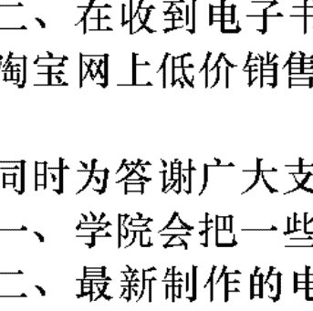
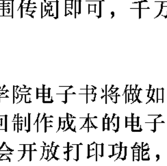
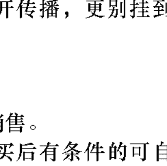

# OSHO
奧修心靈系列66

# The Book of Secrets
奧秘之書（第四卷下冊）

# 譚荘經典（八）

本書為奧修談論
古印度希瓦的譚荊經典。

作者：奧修(OSHO)
翻者：謙達那

天使神秘学院

+   * 神秘学资料库
+   * 神秘学培训机构
+   * 水晶能量研究中心
+   * 专业占卜预测机构
+   * 官方微信：strcdts
+   * 微信公众平台：strc2011
+   * 官方店铺网址：http://strc.cr.cx
+   * 读书交流QQ群：
    * 占星塔罗占卜师交流群：814594478（加入密码：PDF）
    * 神秘学其他综合群：659338717（加入密码：PDF）

制作说明：

本书由《天使神秘学院》出重金从台湾购入的原版书籍扫描制作完成。为达到最好阅读效果，特地把书全部切开后，再经由专业扫描设备高精度扫描完成，并经过一张张的PS后期处理最终成书，其间花费大量的人力、物力以及时间，只为能给大家提供经济并优质的神秘学学习资料而努力。

本学院强力谴责某些机构和个人，把本学院花心血制作完成的电子书籍，包装后直接放在自家淘宝网上低价倾销的行为，以谋取不劳而获的经济利益。如果长此以往最终将无人愿意再为大家花心思制作电子书，那以后可能大家再无新书可读。

为让大家以后能够读到更多的好书，也为了本学院的良性发展。本学院恳请大家尽量做到如下几点：

+   一、尽量在天使神秘学院的官方网站购买电子书籍。
    * 官网电脑访问地址 : http://strc.cr.cx
    * 手机微信购买
        * 请扫以下二维码
            
    * 手机淘宝等购买
        * 请扫以下二维码
            
    * 加店长微信号
        * 请扫以下二维码
            

二、在收到电子书后小范围传阅即可，千万不要公开传播，更别挂到淘宝网上低价销售。

同时为答谢广大支持者，学院电子书将做如下调整：

+   一、学院会把一些早已收回制作成本的电子书折价销售。
+   二、最新制作的电子书籍会开放打印功能，大家购买后有条件的可自行打印成书。

天使神秘学院
2020年5月

# 譚崔經典（八）
# The Book of Secrets
## 奥秘之書，第四卷（下冊）

奥修(OSHO)/原著 谦达那/譯 校对/德瓦嘉塔

奥修出版社

版权所有 © 1975

Osho International Foundation

Switzerland

www.osho.com

2007 Osho Publishing House

All rights reserved

Originally Published in English as:

# THE BOOK OF SECRETS

OSHO is a registered trademark of

Osho International Foundation,

used with permission/license.

The material in this book is a transcript of an original

discourse series THE BOOK OF SECRETS by Osho

given to a live audience. All of the Osho discourses have

been published in full as books, and are also available as

original audio recordings. Audio recordings and the com-

plete text archive can be found via the online OSHO Library

at www.osho.com

获取更多好书，请加微信号：strcdts

店铺：http://strc.cr.cx

## 1 目錄

+   第五十七章 你在每一個地方……
+   第五十八章 超越「業」……
+   第五十九章 從山上看……
+   第六十章 解放你自己——從你自己……
+   第六十一章 跟整體合而為一的技巧……
+   第六十二章 現在就是目標……
+   第六十三章 開始創造出你自己……
+   第六十四章 無選擇就是喜樂……

## 3 第五十七章 你在每一個地方

### 第五十七章

### 你在每一個地方

经文：

84、将对身体 的执著 丟在一旁，了解我在每一個地方。一個在每一個地方 的人 是喜悅的。 85、沒有思想，有限的自己就變成無限的。 我聽過關於一個老醫生的故事。有一天，他的助理打電話給他，因為他碰到了很大的困難，他的病人喉嚨哽住，快要死掉。有一個撞球卡在他的喉嚨，他的助理不知道要怎麼辦，所以他問那個老醫生：「我现在要怎麼做？」那個老醫生說：「用一根羽毛搔那個病人的癢。」

获取更多好书，请加微信号：strcdts

店铺：http://strc.cr.cx

### 第五十七章 你在每一個地方

過了幾分鐘之後，那個助理再度打電話來，很高興地說：—你的處理被證明是很棒的，那個病人開始笑，然後他就將那個球吐出來。但是請你告訴我，你是從哪裡學到了這個了不起的技巧。—那個老醫生說：—我是突然想到的，這一直是我的座右銘：當你不知道怎麼做的時候，就做些什麼。—但是就靜心而言，這樣是不行的。如果你不知道怎麼做，那麼就什麼都不要做，因為頭腦非常錯綜複雜、非常精細，如果你在不知道的情况下所做的，都將會創造出更多的複雜而變得無法解決，它也許甚至會被證明是致命的，它也許甚至會被證明是自毀的。如果你不知道任何關於頭腦的事……事實上，你並不知道任何關於它的。頭腦只是一個字，你不知道它的複雜，頭腦是存有裡面最複雜的東西，沒有一樣東西能夠跟它相比，而且它是最纖細的，你可能會摧毀它，你可能会做一些無法挽回的事。這些技巧是基於非常深的知識，基於跟人類的頭腦很深的碰撞。每一個技巧都是基於長久的實驗。

获取更多好书，请加微信号：strcdts

店铺：http://strc.cr.cx

### 第五十七章 你在每一個地方

所以要記住：不要按照你自己的意思來做任何事，也不要將兩個技巧混在一起，因為它們的運作是不同的，它們的方式是不同的，它們的基礎是不同的。它們導致同樣的結果，但是它們的方法是完全不同的，有時候它們甚至是第一百八十度的相反。所以，不要將兩個技巧混在一起，只要按照那個技巧所給予的來使用它。不要改變它，不要改善它，因為你無法改善它，任何你帶給它的改變都會是致命的。在你開始做一個技巧之前，要完全警覺你是了解它的。如果你覺得混亂，而你沒有真正知道那個技巧是什麼，那麼最好不要做它，因為每一個技巧都會帶給你一個革命。這些技巧並不是進化的。當我說進化，我的意思是說如果你什麼事都不做而繼續生活，在幾百年裡面，靜心將會自動發生在你身上，在幾百萬年的生命裡，你將會進化。在自然的時間過程裡，你將會來到那個一個佛透過進化而來的點。這些技巧是革命性的，事實上它是捷徑，它們不是自然的。自然將會帶領你到佛性，到成道，有一天你將會達到它，但是那要依自然而定，你除了繼續生活在痛苦裡之外並不能怎麼樣。它將會花很長的時間，事實上，要幾

### 第五十七章 你在每一個地方

百萬年、幾百萬世。 宗教是革命的，它給你一個能夠縮短那個漫長的過程的技巧，你可以用那個技巧來跳——省掉那幾百萬世而直接跳。在一個片刻裡面，你可以走過那幾百萬年，所以，它是危險的，除非你很正確地了解它，否則不要做它。不要照你自己的意思將任何東西混在一起，不要加以改變。首先試著完全正確地來了解這個技巧，當你了解它之後，就來嘗試它。不，什麼事都不要做，無為將會比任何作為都來得更好。之所以如此是因為頭腦非常細緻，如果你做錯了一些事，就會很難挽回，非常困難。做錯事很容 易，但是要挽回是很困難的，這一點要記住。

#### 84、使你自己的身體抽離。

第一個抽離的技巧：将对身体 的執著 丟在一旁，了解我在每一個地方。一個在每一個地方 的人 是喜悅的。

### 第五十七章 你在每一個地方

有很多點必須被了解。首先：将對身體的執著 丟在一旁。對身體有一種很深的執著，一定會如此，它是自然的，從一開始，你一直住在身體裡有很多很 多世了。身體改變了，但是你一直都有身體，你一直都是具身的。 有一些時刻你是不具身的，但是那個時候你是沒有意識的。當你從一個身 體死掉，你是在無意識中死掉的，然後你保持無意識，之後你再度出生在一個新的身體，但是在那個時候你也是無意識的。在一個死亡和另外一個出生之間 的空隙是無意識的，所以你不知道當沒有具身的时候你会怎麼感覺。當你不在一個身體裡的時候，你所知道的你自己都是在身體裡。 這種情況已經很長久，而且是持續的，所以你已經忘記你是不同的。 這是一種忘記，它很自然，在那個情況下一定會發生，因此會有執著。你覺得你就是身體，這是執著。你覺得你並不是任何有別於身體的東西，並不是任何 比身體更多的東西。在這個點上，你也許並不同意我的說法，因為你常常認為 你不是身體，你是靈魂，是那個自己。但這並不是你的真知，這只是你所聽到 的，你所讀到的，或是你所相信的，但並不是真正知道的。 所以第一件要做的事就是，你必須了解那個事實，事實上，你所知道的 就是你你是身體。不要欺騙你自己，因為欺騙將不會有所幫助。如果你認為你已經知道你不是身體，那麼你不可能丟開那個執著，因為事實上對你來講並沒有執著，你已經知道了。那麼就有很多困難那個執著，那是無事實被解決的。在開始的 時候有一個困難必須被解決，一旦你失去了那個開始，你就永遠無法解決它， 你必須再度回到起點。所以要記清楚，而且要了解清楚，你並不知道你自己 除了身體以外的任何東西，這是第一個基本的了解。 這個了解並不存在，你的頭腦被你所聽到的那些事所瞭住了，你的頭腦被別人的知識所制約，它是借來的，它並不是真實的。並不是說它是虛假的，那 些說它的人，他們是知道的，但是對你來講，它是虛假的，除非它變成你自己 的經驗。所以每當我說某件事是虛假的，我的意思是說它不是你的經驗。它也 許對別人來講是真實的，但是對你來講並不是真實的。就這個意義來講，真理 是個人的，唯有當被經驗了，真理才是真理，當沒有被經驗，它是不真實的。 沒有普遍的真理，每一個真理在它變成真實之前都必须是個人的。

获取更多好书，请加微信号：strcdts

店铺：http://strc.cr.cx

### 第五十七章 你在每一個地方

你知道，你說過，這是你知識的一部分，傳承的一部分——認為你不是身體——但是它對你來講並不是真實的。首先要拋開這個不真實的知識，面對了要隱藏那個緊張，所以你搜集了這個知識。你繼續相信你不是身體，但是你繼續以身體來生活，所以你是分裂的，因此你的整個存在都變得虛假、不真實。這真的是一個偏執狂的狀態，你以身體來生活，但是你以靈魂來思考和談話，那麼就會有奮鬥和衝突，那麼你的內在就會經常處於動盪不安的狀態，有一種很深的，無法跨越的不安。所以，首先要去面對你並不知道任何關於靈魂或一自己一的這個事實，一切你所知道的都是關於身體。這將會釋放掉你裡面非常不安的狀態，所有那些隱藏的都將會浮上表面。在了解你就是身體這個事實當中，你將會實際上開始流汗；在了解你就是身體這個事實當中，你將會覺得非常不安、奇怪，但是那個感覺必須被穿越，唯有如此你才能夠知道執著於身體意味著什麼。老師們繼續在說你不應該執著於你的身體，但是基本的事——執著於身體 是什麼——是你所不知道的。執著於身體是一個跟身體很深的認同，但是首先你必須了解這個認同是什麼。所以，将所有讓你覺得你是靈魂那些幻象的感覺的知識都擺在一旁。了解你就只知道一樣東西——那就是身體。這如何能夠在 你裡面創造和釋放內在的動盪和隱藏的地獄？當你了解到你就是身體，你會首度了解到那個執著。你首度在你的意識裡面抓到那個事實——這個被生下來而將會死的身體就是你。你首度了解到這些骨頭，這些血液就是你的這個事實。所以你首度了解到這個性，這個憤怒就是你的這個事實。因此，所有虛假的形象都會消失，你變成真實的。那個事實是痛苦的，非常痛苦，所以我們繼續隱藏它，它是一個很深的詭計。你繼續把你自己想成是靈魂，而每一樣你所不喜歡的東西你就丟給身體，所以你說性屬於身體，愛屬於你。然後你說貪婪和憤怒屬於身體，慈悲 屬於你。慈悲屬於靈魂，而殘忍屬於身體。原諒屬於靈魂，憤怒屬於身體。所以任何你覺得是錯誤的、醜的，你就將它丟給身體，而任何你覺得美的，你就繼續跟它們認同，你創造出分裂。這個分裂將不會讓你知道執著是什麼，除非你知道執著是什麼，除非你受

## 譚崔經典（八） 16

但是並沒有繫在任何一個地方。你變成就像是一個天空，涵蓋了一切，每一樣東西都在你裡面。你的意識擴張到了無限的可能性，然後那段經文說：一個在每一個地方的人是喜悅的。

侷限在某一個地方，你將會痛苦，因為你一直都是比你被侷限的地方更大。這是痛苦的，就好像你強迫你自己進入一個小碗，海洋被迫進入一個小的罐子裡，那個痛苦是一定存在的。這是痛苦的，每當這個痛苦被感覺到，那個對成道的找尋就產生了，那個對梵天的找尋就產生了。梵天意味著那個無限的。找尋莫克夏（Moksha）意味著找尋自由。在一個有限的身體裡，你是無法自由的，在某一个地方，你將會是一個奴隸。無處或每一個地方，你才可以自由。

注意看人類的頭腦，不論那個方向是怎麼樣，它一直是走向自由，找尋自由。它也許是政治的，也許是經濟的，也許是心理的，也許是宗教的—不論那個方向是怎麼樣，但人類的頭腦一直都在探索自由。自由似乎是最深的需要。

## 第五十七章 你在每一個地方

那個層面也許會有所不同，馬克斯或列寧，他們在為經濟的自由抗爭；甘地或林肯，他們是在為政治的自由抗爭。有無數的奴隸，那個抗爭是持續的，但有一件事是確定的，在內在深處的某一個地方，人類一直在找尋越來越多的自由。

當你在政治上是自由的，你就會覺知到其他的奴役——性的、心理的。除非你開始感覺和知道你在每一個地方，否則那個奮鬥無法停止。當你感覺到你在每一個地方，自由就達成了。

這個自由不是政治的，這個自由不是經濟的，不是社會的，這個自由是存由，唯有如此，你才能夠成為喜悅的。唯有當你是完全自由的，喜悅和喜樂才可能發生。

事實上成為完全自由的意味著喜悅。喜悅並不是一個結果，它是那個發生。當你是完全自由的，你是喜悦的，你是喜樂的。那個喜樂並不是以一個結生。當你是完全自由的，你是喜悦的，你是喜樂的。那個喜樂並不是以一個結果發生，自由就是喜樂，奴役就是痛苦。當你覺得被限制，你就是痛苦的；那個喜樂並不是以一個結有障礙的地方，存在於沒有障礙的狀態。

有某種自由，即使它並不是全然的，喜悅就發生在你身上。即使在現在，每當你愛得一個有某種自由，即使它並不是全然的，喜悅也會來到你身上。你愛上一個人，有障礙的地方，存在於沒有障礙的狀態。

每當你愛上一個人，你就變得比以前更多，你的存在增加了、擴張了，你每當你愛上一個人，你就變得比以前更多，你的存在增加了、擴張了，你的意識並沒有像之前一樣地被限制，它已經達到了一個新的領域。在愛當中，了，你變得比以前更多。

現在你可以進入別人，別人也可以進入你。以一個有限的方式，一個障礙消失了，現在你可以進入別人，別人也可以進入你。以一個有限的方式，一個障礙消失了，你變得比以前更多。

也變成你的身體，它也變成你的家，它也變成你的住處。你感覺到一種自由，也變成你的身體，它也變成你的身體，現在你並不侷限在你自己的身體，其他某一個人的身體

## 第五十七章 你在每一個地方

張了，但仍然是有限的。所以那些真正爱的人遲早會進入祈禱。

秘，你知道了一把鎌匙，一把奧秘的鎌匙——你愛一個人，當你知道了那個奧

個門就打開了，然後那個祕障礙就消失了，至少你的存在會擴張到多一個人，如

此一來你就知道了那個祕密鎌匙。如果你能夠愛上整個存在，你將不會是身

體。

在很深的愛當中，你變成沒有身體的。當你愛上一個人，你不会把你自己是

一個身體，你會變得更覺知到身體。身體變成一個重擔，你必須攜帶它。當你

被愛的時候，身體就失去了重量。當你被愛，而且你也處於愛之中，你不会覺

得地心引力對你有任何作用，你可以跳舞，你甚至可以飛起來。在一個較深的

層面，身體不復存在了，但這是有限的。當你愛上了整個存在，同樣的事也會

發生。

在愛當中，喜悅會來到你身上，它不是歡樂。記住，喜悅不是歡樂。歡樂是透過感宮來到你身上，而喜悅是透過非感宮的層面來到你身上；歡樂透過身

體來到你身上，喜悅是當你不的身體的時候才來到你身上的。當有一個片刻，身體消失了，你變成只是意識，那麼喜悅就會來到你身上。當你是身體，歡樂是會發生在你身上，它一直都是透過身體的。透過身體，痛苦是可能的，歡樂是可能的，但是唯有當你不是身體，喜悅才可能。

力消失了，你非常投入，以致於你忘掉了你的身體。你充滿著音樂，突然間地心引合而為一。對它來講沒有一個聽者，那個聽者和那個被聽的已經合而為一。只
有音樂存在，你不復存在了，你擴張了，如此一來，你是沒有限制的。那個音符融入寧靜，你也跟著它們一起融入寧靜，
身體就被遺忘了。

每當身體被遺忘，它就在不知不覺當中、在無意識中被丟在一旁，然後個偶發事件，那麼你就是它的主人。那麼它就不是發生在你身上，那麼你已經握有鎚匙在你手上，每當你想要的時候，你就可以打開那個門。或者你能夠永遠打開那個門而將鎌匙丟掉，那個門就不需要再開起來了。

## 第五十七章 你在每一個地方

喜悅也會發生在一般的生活當中，但是你並不知道它是如何發生的。那個發生一直都是在當你不是身體的時候，這一點要記住。所以每當你再度覺得有任何喜悦的時候，那麼你就要覺知看看在那個時候你是不是身體，你將不是身體。每當喜悦存在，身體就不存在。並不是說身體消失，身體還是會在，但是你並不會執著於它。你不執著於它，你並不會被繫在它上面，你已經跳出來了。你也許會因為音樂而跳出來，你也許會因為很美的日出而跳出來，你也許會為一個小孩在笑而跳出來，你也許會因為你墜入情網而跳出來。不論那個原因是什麼，你總是有一個片刻是跳出來的——跳出身體。身體在那裡，但是被拋在一旁，你不執著於它，你飛起來了。透過這個技巧，你知道一個在每一個地方的人是不可能痛苦的，他是喜悦的，他就是喜悦。所以，你越是被限制，就越痛苦。擴張，將你的身體擺在一旁。你看著天空，雲在飄浮，隨著那個雲飄浮，隨著那個雲飄浮，將身體留在地球這裡。月亮就在那裡，隨著月亮移動，每當你能夠，就將身體忘掉，不要錯過那個機會——進入那個旅程，然後你習慣於離開身體的狀態。

## 諾崔經典（八） 22

這只是一個注意的問題，執著是一個注意的問題。如果你注意身體，你就

是執著的，如果那個注意力移開，你就不執著了。

比方說，你在操場玩耍，你在玩曲棍球或排球，或其他的東西，當你深入

那個遊戲，你的注意力就不是在身體。有人打到了你的腳，有血液流出來，但

是你再沒有覺知到。那個疼痛存在，但是你並不在那裡。血液在流，但是你已

經離開身體。你的意識，你的注意力也許是跟著那個球在飛，跟著那個球在

跑，你的注意力放在其他地方。當那個遊戲結束，突然間你回到了身體，那麼

你就會注意到那個血液和那個疼痛。你懷疑它是怎麼發生的——它是在什麼時

候發生的，是怎麼發生的，以及爲什麼你没有覺知到它。

要處在身體裡，你的注意力需要在那裡。所以要記住，你的注意力在哪

裡，你就在那裡。如果你的注意力在雲上面，你就在那裡；如果你的注意力在

金錢上，你就在那裡；如果你的注意力在花朵上，你就在那裡；如果你的注意力

不在任何地方，你就在那裡。你的注意力不在任何地方，你就在每一個地方。

所以整個靜心的過程就是處於一種意識的狀態，在那個狀態下，你的注意

力不在任何地方，它沒有客體。當它是沒有客體的，對你來講就沒有身體。你

## 第五十七章 你在每一個地方

的注意力創造出身體，你的注意力就是你的身體。當那個注意力不在任何地

方，你就在每一個地方，喜悦就發生在你身上。說它發生在你身上是不好的，

你就是它。現在它無法離開你，它是你存在的本質。自由就是喜悦，那就是為什麼對自由有那麼多的渴望。

## 85、沒有思想。

第二個抽離的技巧：沒有思想，有限的自己就變成無限的。

那就是我所說的，如果你的注意力沒有任何客體上，你就不在任何地

方，或者，你在每一個地方，你是自由的，你已經變成自由。第二段經文說：

沒有思想，有限的自己就變成無限的。

如果你不思想，你是沒有限制的。思想給你一個限制，有很多類型的限

制。你是一個印度教教徒，它給你一個限制。成爲一個印度教教徒就是執著於

一個思想，執著於一個系統或一個模式。你是一個基督徒，那麼你也是受限制

的。一個宗教人士不可能是個印度教教徒或是一個基督徒，如果某一是

一個印度教教徒或是一個基督徒，那麼他是不具宗教性的，不可能，因爲這些

是思想。一個宗教人士意味著不是某種思想，沒有被任何思想、任何系統、或

任何模式所限制，不被頭腦所限制——生活在那個沒有限制的當中。

當你有某些思想，那個思想就變成你的障礙。它也許是一個很美的思想，

但它仍然是一個障礙。一個漂亮的監獄仍然是一個監獄。它也許是一個很美的思想

的思想，但是它並沒有什麼差別，它同樣地監禁你。

每當你有一個思想，而你執著於它，你總是會反對某人，因為如果你沒有

反對某人，障礙就會存在。一個思想一直都是一個偏見，它一直都是贊成和

反對。

我聽說有一個非常信教的基督徒，他是一個貧窮的農夫，他隸屬教友派
（Society of Friends or Quaker）。教友派是非暴力的，他們相信愛和友誼。他坐在一輛驢車從城市去到他的村子。突然間，在可看見的部分並没有任何原

因，那雙驢子停在那裡不動，他試著要使他動，他以基督教的方式來說服那雙

驢子，他以一種很友善和非暴力的方式來說服那雙驢子。他是一個教友派的

人，他不能打那隻骡子，他不能使用太激烈的話語，他不能譴罵或叱責，然而他充滿著憤怒，但是要如何打那隻骡子？人，我不能打你，我不能罵你，我不能對你施暴，但是你要記住，骡子，我可以把你賣給一個不是基督徒的人！——基督徒有他自己的世界，而非基督徒是相反的。基督徒無法想像非基督徒可以去到神的王國。一個印度教教徒無法想像，一個耆那教教徒無法想像別人能夠進入那個喜樂的國度——不可能。思想創造出一個限制，一個障礙，一個界線，而所有那些不贊成的都被認為是反對的，不同意我的人就是反對我。一起。你可以跟印度教教徒在一起，但是你無法跟非印度教教徒在一起，或是跟回教徒在一起。思想一定會在一個地方是反對的——反對某人或某事，它不可能是全然的。記住，思想不可能是全然的，只有沒有思想可以是全然的。第二，思想永遠都是來自頭腦，它一直都是頭腦的副產物。它是你的態度，你的推想，你的偏見，它是你的反應，你的想法，你的觀念，你的哲學，

## 第五十七章 你在每一個地方

但它並不是存在本身。它是關於存在的东西，它不是存在本身。一朵花在那裡，你可以說一些關於它的事，那是一個思想。你可以说它很美，你可以說它很醜，你可以說它是神聖的，但是任何你所說的跟那朵花有關的都不是那朵花，那朵花沒有你的思想而存在。每當你在想關於那朵花的事，你就在你和那朵花之間創造出一個障礙。那朵花不需要你的思想，它存在，拋掉你的思想，然後後你就能夠融入那朵花。關於一朵玫瑰花，任何你所說的都是沒有意義的，不論它看起來是多麼地有意義，事實上也是沒有意義的。你所說的是不需要的，它無法給那朵花任何存在，反而會創造出你跟花之間的一層薄膜，它創造出一個限制。所以每當有個思想，你就被阻止了，到存在的門就關閉了。這段經文說：沒有思想，有限的自己就變成無限的。如果你不思想，如果你只是存在，完全警覺，完全覺知，但是沒有任何雲或思想，你是沒有限制的。身體並非只是身體，有一個更深的身體是頭腦。身體是由物質所組成的，頭腦也是由物質所組成的——精微的、更精銳的。身體是外面的那一層，頭腦則是內在的那一層。要從身體抽離是容易的，要從頭

## 第五十七章 你在每一個地方

腦抽離是比较困難的，因為你會覺得頭腦更是你自己。如果有人說你的身體看起來好像生病，你並不會覺得被冒犯，你並沒有那麼執著於它，它跟你有一點距離，但是如果有人說你的頭腦似乎是病態的、生病的，你就會覺得被冒犯，他侮辱了 你。你比較接近頭腦。如果有人說了一些關於你頭腦的事，你可以忍受它，但是如果有人的打擊是更深 的。

頭腦是身體的内層，頭腦和身體並不是「二」，你身體的外層是身體，內層是頭腦。就如果你有一個房子，你可以從外在看那個房子，牆壁的外層會被看到，而從內在看的那個房子，你也可以從內在看那個房子。從外在看的话，牆壁的外層會被看到，而從內在看的话，內層會被看到。

頭腦是你的內层，它比較接近你，但它仍然是一個身體。在死亡的時候，你外在的身體脫掉，但是你會攜帶著內在比較精微的那一層。你非常執著於它，所以即使死亡也無法使你的頭腦分

## 關於這個技巧，有一些基本的事必須被了解。第一，當你思考的時候，你就跟存在分開了。思想不是一個連結，它不是一個橋樑，它不是一個溝通，它是一個障礙。不思想，你就關連了，你就連結了，你就處於交融之中。當你對某人說話，你們是沒有連結的，那個談話變成了一個障礙。你談得越多，你就離得越遠。如果你靜靜地跟一個人在一起，你們是有連結的。如果那個寧靜真的很深，在你的頭腦裡沒有思想，你們兩個人的頭腦都完全寧靜，你們是合一的。  
兩個零不可能是「二」，兩個零會變成「一」。如果你將兩個零加在一起，它們不會變成一「二」，它們會變成一個更大的零——「一」，而事實上一個零不可能是更大的，它不可能更大或更小，零就是零，你不能在它上面加進什麼，也不能從它減去什麼。一個零是完整的，每當你跟某一個人靜靜地在一起，你們就是一一。當你靜靜地跟存在在一起，你就跟它合而為一。  
這個技巧說要靜靜地跟存在在一起，然後你會知道神是什麼。跟存在只有一種對話，那就是沈默。如果你跟存在說話，你就錯過了，那麼你會被封住在你自己的思想裡。  

## 嘩不休，所以你無法跟任何東西關連，甚至跟你的愛人也無法關連，因爲這個噗噗不休，所以在續著。腦會繼續做這個、做那個，由於這個經常性的內在談話，這個持續的內在噗噗不休，所以你無法跟任何東西關連，甚至跟你的愛人也無法關連，因爲這個噗噗不休，所以在續著。你也是跟任何東西關連，甚至跟你的愛人也無法關連，因爲這個噗噗不休，所以在續著。像一個在這個星球，而另外一個在別的星球，在你們之間有無限的空間，所以你們覺得那個親密是不存在的，然後你們就互相責怪對方說：一你不愛我。這並不是真正的问题。愛是不可能的，愛是寧靜的花朵，它只能在寧靜當中開花，因爲它只能在交融當中開花。如果你不能沒有思想，你就無法處於愛之中，然後要處於祈禱之中就變得不可能。但是即使我們在祈禱，我們也是在做嘈嘈不休，對我們而言，祈禱只是在跟神對話。我們已經被制約成一直講話，即使我們去到教堂，或是去到廟裡，我們在那裡也是繼續在講話，我們跟神對話，跟神談話，這是完全荒謬的。神或存在無法了解你的語言。存在只能夠了解一種語言，那就是寧靜。而寧靜既不是梵語，也不是阿拉伯語、英語、或印度語，寧靜是宇宙性的，它不屬於任何人。在這個地球上至少有四千種語言，每一個人都在他自己的語言裡。如果你不知道他的語言，你就無法跟他關連，我們無法關連。如果我不了解你的語言，你不了解我的語言，我們就無法關連，我們是陌生人，我們無法互相穿透對方，我們無法了解，我們無法愛。會有這樣的事發生只是因為我們不知道基本的宇宙語言——那就是寧靜。事實上，一個人只是透過寧靜在關連的。如果你知道寧靜的語言，那麼你跟任何東西都可以關連，因為石頭是寧靜的，樹木是寧靜的，天空是寧靜的——它是存在性的，它不只是人性的，它是存在性的。每一樣東西都知道寧靜是什麼，每一樣東西都存在於寧靜之中。  

## ## 37 第五十七章 你在每一個地方  
## 如果一塊石頭在你的手中，石頭不會在它自己裡面噗噗不休，而你是噗噗不休的，所以你無法跟石頭關連。石頭是敞開的、具有接受性的、邀請的。石頭會歡迎你，但是你在噗噗不休，而石頭無法了解那個噗噗不休，那變成了障礙。所以，即使跟人，你們也無法處於很深的關係之中，不可能有親密。語言或話語會摧毀一切。靜心意味著寧靜，不想任何事。根本就不思想，只是存在——敞開的、準備好的、渴望會合、歡迎、具有接受性、愛，但是根本不思想，那麼無限的愛將會發生在你身上，你將永遠不會說沒有人愛你，你將永遠不會這樣說，也永遠不會這樣感覺。現在，不論你做什么，你都會說這樣，你都會感覺這樣，你可能不能不會說它，你可能會假裝某人愛你，但是在內在深處，你知道。甚至連愛人都會一直問對方：‘你愛我嗎？’我們會繼續以很多方式來問。每一個人在害怕，不確定，不安全。他們會試圖以很多種方式找出他們的愛人是否真的愛他們，而他們永遠無法確定，因為愛人可能會說：‘是的，我愛你。’但是它將無法給予任何保證。這樣你怎麼會安心？你怎能夠知道他是不是在騙你？他可以爭論，他可以說服你，他可以用理智來說服你，但是  

## 我愛你。～但是它將無法給予任何保證。這樣你怎麼會安心？你怎能夠知道他是不是在騙你？他可以爭論，他可以說服你，他可以用理智來說服你，但是  

## ## 譚崔經典（八）  
## 心無法被說服。所以愛人一直都處於極大的痛苦之中，他們無法被說服說對方是愛他的，你怎麼能夠被說服？  
## 事實上，透過語言是無法說服的，而你 是透過語言來問的，當愛人在那裡，你在頭腦裡面一直說話、質疑、爭論。你將永遠無法被說服，你將會一直  
## 都覺得你沒有被愛，這變成了最深的痛苦。這種情況的發生並不是因為別人  
## 不愛你，這種情況的發生是因為你封閉在你自己的牆壁裡，你封閉在你的思想裡，沒有什麼東西能夠穿透。思想無法被穿透，除非你拋棄它們。如果你拋棄  
## 它們，整個存在都會穿透你。  
## 這段經文說：沒有思想，有限的自己就變成無限的。  
## 你將會變成無限的，你將會變成整體，你將會變成宇宙的，你將會在每一個地方。  
## 那麼你就是喜悅，現在你只是痛苦。那些狡猾的人，他們繼續欺騙他們自己說他們是不痛苦的，或者他們繼續希望事情將會改變，某些事將會發  
## 生，在生命的終點，他們將會達成——但你是痛苦的。你可以戴面具、欺騙，  
## 或創造出虛假的臉，你可以繼續微笑，但是在內在深處，你知道你是痛苦的。  

## ## 39 第五十七章 你在每一個地方  
## 那是很自然的，倨限在思想裡，你將會處於痛苦之中，沒有被倨限，超越思想、警覺、有意識、覺知，但是不被思想所遮蔽，你將會是喜悦，你將會是喜樂。  

## ## 第五十八章 超越「業」  
## # 問題摘要：  
## 捷徑不是違反道嗎？  
## 為什麼我們不成道？  
## 捷徑是不是一個神聖的可能性？  
## 你能否定義「無為」？  

## # 第一個問題：  
## 技巧是捷徑、革命，但是這些不違反道，不違反自然嗎？  
##  它們是。它們是違反道的，它們是違反自然的。任何努力都是違反道的，這樣的努力是違反道的。如果你能夠夠讓每一件事都合乎道，合乎自然，那麼就 不需要技巧，因為那是最終的技巧。如果你能夠夠讓每一件事都合乎道，合乎自然，那是最 深的臣服，你把你自己交出來，你把你的未來和你的可能性都交出來，你把時 間本身和所有的努力都交出來，這意味著無限的耐心和等待。 如果你能夠將每一件事都交給自然，那麼就沒有努力，那麼你就什麼事都 不做，你只是漂浮，你處於一種很深的放開來。事情發生在你身上，但是你 不對它們做任何努力，你甚至不去找尋它們。如果它們發生，那很好；如果它 當然也就沒有挫折。 生命在流動，你在它裡面流動，你沒有目標要到達，因為如果有目標，努 力就進入了。你沒有什麼地方要去，因為如果你有什麼地方要去，努力就進入了，它隱含在它裡面。你沒有什麼地方要去，沒有什麼地方要去，沒有什麼地方要到達，沒有目 標，沒有理想，沒有什麼事要達成——你臣服於一切，你交出一切。  

## # 43 第五十八章 超越「業」  
## 在這個臣服的片刻，就在這個片刻，一切都會發生在你身上。努力需要花時間，臣服不需要花時間。技巧需要花時間，臣服不需要花時間，那就是為什麼我稱之為最終的技巧，它是一種沒有技巧。你無法練習它，你無法練習臣服。如果你練習，它就不是臣服，那麼你就是依靠你自己，那麼你就不完全是無助的，如果你試圖要做些什麼，即使它是臣服，你也是試著要做它。那麼技巧就進入了，隨著技巧的進入，時間就進入了，未來就進入了。臣服是非時間的，它是超越時間的。如果你臣服，在當下這個片刻你就脫離了時間，而一切能夠發生的都將會發生，但是這樣的話，你並沒有在找尋它，你並沒有在追尋它，你沒有貪求它。你對它一點都不用頭腦，不論它是否發生，它對你來講都一樣。道意義著臣服——臣服於自然，那麼你就不存在了。譚崔和瑜伽都是技巧，透過它們，你將會到達自然，但它將會是一個漫長的過程。最終在每一個技巧之後，你將必須臣服，但是如果使用技巧，臣服是最後才出現的；採用道，在道裡面，它在開始的時候就出現了。如果你現在就能夠臣服，那麼就不需要技巧，但是如果你問我要如何臣服，那麼就需要一個技巧，但是如果我不能，而如果你問我要如何臣服，那麼就需要一個技  
## 巧。所以，在無數的人裡面，很少很少有一個人能夠臣服而不問要如何做的。如果你問—如何—，你就已經不是那個可以臣服的類型的人，因為那個—如何—意味著你在要求一個技巧。這些技巧是為那些無法去除這個—如何—的人，這些技巧就只是為了要去除你關於—如何—的基本焦慮——要如何做它。如果你能夠臣服而不問，那麼對你來講就不需要技巧，但是這樣的話你就不必來找我，你隨時都可以臣服，因為臣服不需要老師，老師只能夠教授技巧。當你尋求，你是在尋求技巧，每一個尋求都是在尋求技巧。當你去到某人那裡問，你是在問一個技巧或一個方法，否則不需要去到任何地方。那個找尋就表示你對技巧有一個很深的需要，這些技巧是為你存在的。並不是說沒有技巧它就不可能發生，它能夠發生，但是只發生在非常少數人。而那些少數人事實上也不是什麼少數人，在他們的前世，他們也曾在技巧上做過很多努力，他們在技巧上已經做了太多的努力，因此現在已經厭了，他們已經厭煩了。當你一再一再地問：—如何？如何？如何？—那麼就有個飽和點會來到，到了最後，那個—如何—會垮掉，然後你就能夠臣服。  

## # 第五十八章 超越「業」  
## 每一種方式都需要技巧，一個克利虛納姆提可以說技巧是不需要的，但這並不是他的第一世，在他的前世他就不可能這樣說。即使是這一世，別人也給了他很多技巧，他也在它們裡面下了功夫。透過技巧，你可以來到一個你可以臣服的點，在那個點上，你可以拋棄所有的技巧而只是存在，但那也是透過技巧。技巧。它是違反道的，但你是違反道的，你必須被解除制約。如果你已經在道理面，那麼就不需要技巧；如果你是健康的，那麼就不需要醫藥。每一種醫藥都是違反健康的，但你是生病的，所以需要醫藥。這種醫藥將會殺掉你的疾病，它無法給你健康，但是如果疾病被除去，健康就會發生在你身上。沒有一種醫藥藥能夠給你健康。基本上每一種醫藥都是一種毒素，但是你已經累積了一些毒，所以你需要解毒劑，它將會幫你平衡，然後你就有可能成為健康的。在你本性周團的一切，它將會解除你的制約。你被制約了，現在 you 無法跳進臣服。如果你能夠跳進臣服，那很好，但是你做不到，你的制約將會問：「要怎麼磨做？—那麼技巧將會有所幫助。」  

## # 譚崔經典（八） 46  
## 當一個人生活在道裡面，那就不需要瑜伽，不需要譚崔，不需要宗教。一個完全健康的人不需要醫藥，而每一種宗教都是醫藥性的。當世界完全生活  
## 在道裡面，宗教將會消失，不需要老師，不需要佛陀，不需要耶穌，因為每一個人將會是一個佛或是一個耶穌，但是就你現在這樣，你需要技巧，那些技巧是解毒劑。  
##  巧是解毒劑。你在你自己的周圍聚集了一個很複雜的頭腦，任何別人對你說的和給你  
## 的，你會將它複雜化，你會使它變得更複雜，你會使它變得更困難。如果我叫你臣服，你會問：要怎麼做？如果我叫你使用技巧，你會問：技  
## 巧？技巧不是違反道嗎？如果我說：不需要技巧，只要臣服，神就會發生在你身上。你會立刻問：要怎麼做？你的頭腦！如果我在此時此地，你並不需要練習任何事，你只要跳下去和  
## 臣服。那麼你會說：要怎麼做？我要怎麼樣才能夠臣服？如果我給你一個技巧來回答你的要怎麼做？你的頭腦就會說：但是方法或技巧不是  
## 违反自然、違反道嗎？如果神性是我的本性，那麼它怎能夠透過技巧而達成？如果它已經在那裡，那麼技巧是徒然的、沒有用的，為什麼要浪費時間在  
## 技巧上？注意看這個頭腦！  
## 他記得有一次一個人，一個年輕女孩的父親，請一個作曲家戈德斯基去到他家的裡錶定他女兒的音樂素養。她在學鋼琴，戈德斯基去到  
## 玩那個女孩的演奏。當她演奏結束，那個父親面露喜色，他很高興地喊了出來，同時間戈德斯基說：“她不是很棒，她的

## 第五十八章 超越「業」

它，那個問題就永遠不會產生，那麼就不會有煩惱。那個煩惱表示現在你可以跳過很多世是不必要的，你可以跳過，但是你並沒有跳過。來到自然之上，現在你可以有覺，你已經來到自然之上。意識是一個新的現象，你已經變得有意識，你已經來到自然之上，現在你可以有識地進化。有意識的進化是一個革命的現象，你可以對它做些什麼，你並非只是一個受害者，你並非只是一個傀儡。你可以將你的命運掌握在自己的手中，那是一個可能的，而因為那是一個可能的，所以當你沒有做什麼的時候，它就會產生內在的焦慮。你越是覺知到這是可能的，你就越會感覺到焦慮。佛陀非常擔心，你並沒有那麼擔心。佛陀非常擔心，他處於很深的痛苦之中，他在受苦。除非他達成，否則他一定會生活在地獄裡，因為他完全覺知那個事情是絕對可能的，它就掌握在他的手中，就在角落附近，他覺得：「我還是錯過它，如果我將我的手再伸長一點，它就會發生，但是我的手癱瘓了。只

要再一步，我就能夠脫離它，而我竟然無法踏出那一步，我害怕「跳」。當你很接近目標，而且你能夠覺到它，也能夠看到它，但你還是錯過，那麼你會覺得很痛苦。當你還離得很遠，你無法感覺到它，你看不到它，你甚至沒有覺知到有一個目標，你完全不知道有任何命運，那麼就不會有焦慮。動物不會覺得痛苦，牠們看起來很快樂，比人更快樂。那是什麼原因？樹木甚至比動物更快樂，它們完全沒有覺知到什麼事會發生，什麼事是可能的，什麼事就在你的手邊，它們很喜樂地不覺知，沒有焦慮，它們就只是漂浮。人變得很焦慮，而一個人越偉大，他就越越會焦慮。如果你只是生活，那麼你就是過著動物般的生活。當你覺知到某件事是可能的，宗教的痛苦就產生了——一個種子就在那裡，我必須做些什麼，我必須做些什麼來讓那個種子發芽。花朵並沒有離得很遠，我可以收割。一但是事情仍然沒有發生，所以覺得自己很無能。那就是佛陀變成一個佛之前的狀況，他就在瀕臨自殺的邊緣，你將必須經歷過那個，你不能夠將它交給自然，你必須做些什麼，而你是能夠做的，那個目標並沒有離得很遠。所以，如果你覺得焦慮，不要沮喪。如果你覺得在你裡面有一種非常強烈的痛苦，一種身心劇痛，不要覺得沮喪，那是一個好的跡象。那表示你越來越覺知到那個可能的，如此一來，你將永遠無法安然，除非它變成實際的。

人類無法將它交給自然，因為人類已經變得有意識，只有他存在的一個非常小的部分是有意識的，但是那改變了每一件事。除非你的整個存在都變成有意識的，否則你無法再度知道動物或樹木單純的快樂。現在就只有一個方式能夠知道它：變得越來越警覺，越來越覺知，越來越有意識。你無法退回去，沒有往回走的過程，沒有一個人能夠退回去。或者你可以停留在你現在的地方而受苦，或者你必須往前走來超越那個痛苦，你無法退回去。

完全的無意識是喜樂的，完全的有意識也是喜樂的，而你就在那個中間。你的一部分已經變成有意識的，而你的大部分仍然是无意識的。你是分裂的，你變成了一二一，你不是一一，那個完整已經喪失了。動物是完整的，聖人也

是完整的，只有人是不完整的——他有一個奮鬥、衝突，不論你做什麼，你都無法全力地分具有聖人的風範。有一個奮鬥、衝突，不論你做什麼，你都無法全力地去做。

所以有兩種方式，其中一種就只是欺騙你自己，那就是再度變得完全無意識，你可以使用藥物，你可以喝酒，你可以喝酒精飲料，你可以退回到動物的世界。你使用藥物來抹煞那個已經變成有意識的部分，你變成完全無意識的，

識，你可以使用藥物，你可以喝酒，你可以喝酒精飲料，你可以退回到動物的世界。你使用藥物來抹煞那個已經變成有意識的部分，你變成完全無意識的，但這是一種暫時的欺騙，你將會再度變成有意識的。化學藥品的效果將會退掉，你將會再度變成有意識的。那個你用酒精或藥物所強迫壓抑的部分將會再度升起，然後你就會更痛苦，因為如此一來你能夠比較，你將會覺得更痛苦。法，還有宗教的方法，你可以使用一個咒語，你可以重複頌念它來創造出一個使你麻醉的效果。你可以做很多事來使你再度變成無意識的，但那將會是暫時的，你將必須出來，而當你出來的時候將會在你裡面帶著更深的痛苦，因為如此一來你將能夠比較。如果在無意識裡面這是可能的，那麼在全然的意識之下將會有什麼樣的可能性？你將會變得更渴求它，你將會覺得更饑渴。記住一件事：全然就是喜樂。如果你是完全無意識的，那也是喜樂，但是你並沒有覺知到它。動物是喜樂的，但是牠們並沒有覺知到牠們的喜樂，所以那是沒有用的，它就好像當你在睡覺的時候，你是喜樂的，而每當你醒過來，你就不快樂。全然就是喜樂。你也能夠成為完全有意識的，那麼就會有喜樂，你將會完全覺知到它，這是透過方法、透過練習技巧來增加你的意識可能達到的。你沒有成道，因為你

沒有為它做任何事，但是你已經覺知到你沒有成道，這是由自然所做的，在好
幾百萬年裡面，自然已經使你覺知到這一點。
你也許並沒有覺知到就身體而言，人類已經停止成長。我們的骨頭跟好幾
百萬年前是一樣的，沒有明顯的改變，古人的骨頭和我們的骨頭是類似的。所
以，好幾百萬年以來，身體並沒有成長，它仍然保持一樣。甚至連頭腦都沒有
成長，它仍然保持一樣。就身體而言，進化已經做了任何它所能夠做的。就某
一個意義而言，現在人必須為他自己的成長負責，而那個成長將不是身體的，
那個成長將是心靈的。
佛陀的骨頭和你的骨頭基本上並沒有什麼不同，但你和佛陀是完全不同
的。進化是水平地在運作，而方法、技巧、和宗教，它們是垂直地在運作。你
的身體已經停止了，它已經來到了一個點，一個終點，現在它已經沒有進一步
的成長。在水平線上，進化已經停止了，現在垂直的進化開始了。現在，不論
你在哪裡，你都必須垂直地一跳，那個垂直的進化屬於意識，不屬於身體，
而你必須為它負責。
你不能問自然為什麼，但是自然可以問你為什麼你還沒有成道，因為現在
每一樣東西都已經提供給你了。你的身體已經具備了一切所需要的，你已經具有一個佛的身體，一個佛要發生在你身上所需要的一切你都有了，只要一個新的安排，只要將那些自然所給你的元素作一個新的整合，那麼佛就會發生在你給你了。自然可以問你爲什麼你還沒有成道，因爲自然已經將每一樣東西都提供自然可以問你，那是切題的，但是如果你問自然，那是荒謬的，你不被允許去問。現在你覺知的，你可以做些什麼，所有的元素都已經給了你，氫氣已經有了，氧氣已經有了，電也有了一生。你已經具備了成道所需要的一切，但是分散的，你必須將它們結合起來，整合起來，使它們成爲和諧的，突然間那個火焰就會產生，它會變成成道。所有這些技巧就是爲了那個目的。你已經什麼都有了，現在所需要的就是方法，要怎麼做，好讓成道可以發生在你身上。

第三個問題：

你說透過達到全然的覺知和全然的自由，好幾百萬世和好幾百萬年的自然
進化就可以省下來。我們難道不能爭論說「業」的自然因果效應不應該被任何
捷徑所干擾，或者將這個可能性帶到進化的世界和進化的靈魂裡也是神性的一
個方式？
每一件事都可以被爭論，但是爭論並沒有辦法帶領你到任何地方。你可以
爭論，但是那個爭論要如何幫助你？你可以爭論說自然的「業」的過程不應該
被干擾，不要干擾它。但是這樣的話就要快快樂樂地處於你的痛苦之中，但是
你並不是這樣，你想要干擾。如果你能夠信賴自然的過程，那是很棒的，但是
這樣的話就不要有任何抱怨，不要問說：「為什麼它是這樣？」它之所以如此
是因為一業一的自然過程。你在受苦嗎？你在受苦是因為一業一的自然過程，
不可能有其他的方式，不要干擾。
那就是命運的教條，相信命運的教條，那麼你就不必做任何事，任何發生
的事就讓它發生，你必須接受它，那麼它也會變成一種臣服，你什麼事都不必

做，但是需要完全接受的能力。事實上是不需要干擾，但是你能夠處於這種不交出去，但是需要完全接受的能力。事實上是不需要干擾，但是你能夠處於這種不的干擾的狀態嗎？你經常都在干擾每一件事，你無法將它交給自然。如果你能夠交出去，那麼就不需要任何其他的事，每一件事都將會發生在你身上。但是如果你無法交出去，那麼就要介入。你可以介入，但是那個過程必須被了解。事實上，靜心並不是在干擾「業」的過程，它反而是跳出它。它並不是真的在干擾，它是跳出那個惡性循環。那個循環將會繼續下去，那個過程將會變成幻象的。已來到一個終點，你無法使它終止，但是你可以跳出它，一旦你跳出它，它就果你們喜歡，如果這樣做會使你們高興，那麼就治療我，但是就我而言，那是沒有問題的。一醫生們都感到驚訝，因為他的身體在受苦，它非常痛，但是他本身的眼睛看起來好像没有任何痛苦。他的身體在受著很深的苦，但是他本身沒有在受苦。身體是「業」的一部分，它是因果關係機械循環的一部分，但是意識能夠超越它。他只是一個觀照，他看著身體在受苦，身體即將要死掉，但是他是一個

觀照。他並沒有干擾它，一點都沒有干擾。他就只是看著一切正在發生的，但
他並沒有處於那個惡性循環裡，他沒有跟它認同，他並沒有在它裡面。
靜心並不是一種干擾，事實上，如果没有靜心，你每一個片刻都在干擾。
有了靜心，你就超越了，你變成一個山上的觀看者。在山谷的深處，事情在繼
續著，但是它們並不屬於你。你只是一個旁觀者，就好像它們是發生在別人身
上，或者好像它們發生在夢裡，或是發生在銀幕上。你並沒有干擾，你只是沒
有在那個戲劇裡面，你已經出來了。現在你不是一個演員，你變成一個旁觀者，這是唯一的改變。
當你就只是一個觀照，身體將會立即完成任何必須完成的事。如果你有很
多必須受苦的「業」，而現在 you 變成了一個觀照，你將不會再度被生出来，身
體將必須在這一世裡面受盡所有那些在很多世裡會受的苦。所以，成道的人
常常必須遭受很多身體的疾病，因為已經沒有來世了，這將是最後的身體，因此所有的一業一和整個過程都必須被完成，被結束掉。
所以，如果我們透過東方人的眼睛來看耶穌的人生，那麼那個十字架刑是
一個不同的現象。對西方人來講，生命是不連續的，沒有再出生，沒有輪迴，

甚至沒有覺知到有一個目標，你完全不知道有任何命運，那麼就不會有焦慮。動物不會覺得痛苦，牠們看起來很快樂，比人更快樂。那是什麼原因？樹木甚至比動物更快樂，它們完全沒有覺知到什麼事會發生，什麼事是可能的，什麼事就在你的手邊，它們很喜樂地不覺知，沒有焦慮，它們就只是漂浮。人變得很焦慮，而一個人越偉大，他就越越會焦慮。如果你只是生活，那麼你就是過著動物般的生活。當你覺知到某件事是可能的，宗教的痛苦就產生了——一個種子就在那裡，我必須做些什麼，我必須做些什麼來讓那個種子發芽。花朵並沒有離得很遠，我可以收割。一但是事情仍然沒有發生，所以覺得自己很無能。那就是佛陀變成一個佛之前的狀況，他就在瀕臨自殺的邊緣，你將必須經歷過那個，你不能夠將它交給自然，你必須做些什麼，而你是能夠做的，那個目標並沒有離得很遠。所以，如果你覺得焦慮，不要沮喪。如果你覺得在你裡面有一種非常強烈的痛苦，一種身心劇痛，不要覺得沮喪，那是一個好的跡象。那表示你越來越覺知到那個可能的，如此一來，你將永遠無法安然，除非它變成實際的。

在耶穌被釘死在十字架上之後，人類並沒有進入神的王國。如果他為我們受苦，如果他的十字架刑是在為我們贖罪，那麼他是失敗的，因為那個罪仍然在繼續著，受苦也仍然在繼續著，那麼他的受苦是沒有用的，那麼那個十字架刑並沒有成功。

基督教就只有一個神話，但是東方對人類生命的分析有一種不同的態度。耶穌的十字架刑是由他自己的一業一所累積起來的受苦。這是他的最後一世，他不再進入身體，因此所有的受苦都必須結晶起來，集中在一個點，那個點變成了十字架刑。

他並不是在為別人受苦，沒有一個人能夠替別人受苦，他是為他自己受苦，為他以前的一業受苦。沒有人能夠使他自由，因為你會因為你的「業」而處於枷鎖之中，所以耶穌怎能夠使你自由

## 第五十八章 超越「業」

如果你是火熱地注意著，然後你聽到了車子的聲音，你就會錯過聽我講，它將會是一個打擾，因為你不知道如何全然地，只是覺知到任何正在發生的外一件事，那麼你就失去了跟第一件事的連繫。如果你是在一種火熱的頭腦狀態下聽我講話，那麼任何事都可能打擾你，因為你的警覺去到了那裡，你跟我的連繫就切斷了，它是集中在一個點的，它不是全部的。一個自然的、被動的覺知是全部的，沒有什麼事會打擾它，它不是集中精神，它是靜心。集中精神一直都是火熱的，因為你強迫你的能量集中在一個點，能量如果按照它自己會流向所有的方向。如果没有方向讓它流動，它就只是享受著處流。我們創造出衝突，因為我們說：「這很好，所以要聽，而那是不好的。如果你在做你的祈禱，然後有一個小孩開始笑，它是一個打擾，因為你無法想像一個單純的覺知，在那裡面，祈禱繼續著，同時那個小孩也繼續笑著，而這兩者之間沒有衝突，它們兩者都是一個較大整體的一部分。嘗試一下這個：完全警覺，完全覺知，但是不要集中精神。每一個集中精神。單純的神都會令人疲倦，你會覺得疲倦，因為你以不自然的方式在強迫能量。單純的覺知包含一切。當你是被動和無為的，那麼每一件事都會發生在你的周圍，沒有一件事會打擾你，你也不會錯過所有的事。每一件事都會發生，而且你會知道道它，你會觀照它。然後你保持跟原來一樣。就好像在一個空的房間裡，如果没有一個人在這裡，那個交通將會繼續經過，噪音會進入這個房間，然後它會經過，會保持不被影響，就好像沒有什麼事發生過一樣。在被動的覺知裡，你保持不被影響。每一件事都繼續在發生，在經過你，但是從來不會碰觸到你，不會在你身上留下任何痕跡。在火熱的集中精神當中，每一件事都會碰觸到你，都會在你身上留下印象。關於這個還有一點。在東方的心理學裡我們有一個字 sanskar—制約。如果你集中精神在某一件事上，你就会被制約，你就会得到一個 sanskar，你就会留下那一件事的印象。如果你只是覺知，被動地覺知，不集中精神，不將你自己集中在一點，只是在那裡，那麼就不會有什麼事來制約你。那麼你就不会累積任何 sanskar，不会累積任何印象。你續保持處女般的、純潔的、沒有痕跡的，沒有一件事會碰觸到你。如果一個人能夠被動地覺知，他會經過世界，但是世界從來不會經過他。有一個叫作布克由的禪師常說：一去跨過那一條河，但是不要讓水碰觸到你。很多人會說，但是當他們跨過的時候，水一定會碰觸到他們。所以，有一天，一個和尚來，他說：一你讓我們覺得很困惑，我們試著跨過那條河，那裡沒有橋。如果有一座橋，當然我們在跨過河的時候水就不會碰觸到我們。但是我們必須跨過那條河，水一定會碰觸到我們。所以布克由說：一我會來，然後我會跨過，你們看。一布克由跨過了，當然，水碰觸到了他的腳，然後他說：一看，那個水碰觸到了你！一布克由說：一就我所知道，它並沒有碰觸到我，我只是一個觀照。水碰觸到了我的腳，但是並沒有碰觸到我，我就只是在那裡觀照著。當你是被動地警覺，只是觀照，你還是會經歷過世界，你在世界裡，但是世界不會在你裡面。

## 75 第五十九章 從山上看

經文：86、假定你沈思某種超出知覺、超出掌握、超出不存在的東西——你。87、我存在，這是我的，這就是這個。喔，鍾愛的，即使在这樣的知道當中，要無限地。人是有兩副面孔的——動物和神性兩者。動物屬於他的過去，神性屬於他的未來，而這種情況產生了困難。過去的已經過去了，它已經不復存在，只剩下的影子在那裡徘徊。未來仍然是未來，它尚未來臨，它只是一個夢，只是一個可能性，在這兩者之間存在著人——過去的影子和未來的夢。他兩者都不
是，同時雨者都是。他是雨者，因為過去是他的，他曾經是動物。他是雨者，因為未來是他的，他可以成為神聖的。他兩者都不是，因為過去已經不復存在，而未來尚未
存在。

一個衝突，一個經常的奮鬥想要達成，想要成為什麼。就某個意義來講，人是
不存在的。人只是從動物到神性的一步，而一步並不在任何地方。它曾在某
一個地方，它將會在某一個地方，但是現在它不在任何地方，只是懸在空中。
所以，任何人所做的——我說，任何——他從來不會感到滿意，從來不滿
足，因為兩個完全相反的存在在他裡面會合。如果那個動物被滿足了，那麼那
個神性會不滿足；如果那個神性被滿足了，那麼那個動物會不滿足，總是有一
部分不滿足。

如果你移到了動物那裡，就某方面而言，你會滿足你存在的某一部分，但
是在那個滿足當中，不滿足會立刻產生，因為那個對立的部分，你的未來，在
跟它對抗。動物的滿足是你未來可能性的不滿足，如果你滿足神性的可能
性，那個動物的部分會起來反抗，它會覺得受傷。一個明確的不滿足會在你裡我想起了一則逸事，有一個非常熱衷於跑車的人去到了珍珠門，聖彼得在天堂有漂亮的高速公路嗎？聖彼得說：有，他們有最漂亮的高速公路，但是有一個困難，在天堂他們不允許汽車。那個速度迷說：那麼它不適合我，那麼請你為我安排，將我送到其他地方去，我想要去地獄，我不能離開我的Jaguar。所以他們就幫他安排，他去到了地獄的門口，撒旦在那裡歡迎他，說他很高興看到他。他說：你跟我一樣，我也很喜歡Jaguar。那個速度迷說：很好，請給我們高速公路的地圖。撒旦變得很傷心，他說：先生，在這裡我們没有任何高速公路，那就是它的地獄！

這就是人的情況，人有兩副面孔，雙重的存在，分裂成「二」。如果你滿
足了一件事，那麼就有另外一件事會挫折你另外的部分。如果你換另外一個方式來做，那麼另外一部分就會不滿足。永遠都會缺少什麼，你無法滿足兩者，因為它們是完全相反的。

每一個人都在做這件不可能的事，試著這樣做——在某個地方妥協，好讓天堂和地獄能夠會合，好讓身體和靈魂，較低的和較高的，過去和未來，能夠在個地方會合，然後有一個妥協。我們已經這樣做有很多世了。它尚未發生，在將來也不會發生，那整個努力是荒謬的、不可能的。

這些技巧並不是要關於在你裡面創造出一個妥協，這些技巧是要使你超越的，這些技巧並不是要滿足神性來對抗動物性，那是不可能的，那將會在你裡面創造出更多的動盪，更多的暴力，更多的爭門。這些技巧也不是要來滿足你面的動物性來對抗神性，這些技巧是要超越那個二分性，它們既不是為動物性，也不是為神性。

記住，這就是其他宗教和諫崔基本上的不同。諫崔並不是一個宗教，因為宗教基本上意味著贊成神性，反對動物性，所以每一個宗教都是那個衝突的一部分。諫崔並不是一種爭門的技巧，它是一種超越的技巧。它並不是要跟動物
性抗爭，它也不是要為神性，它反對所有的二分性。事實上，它既不贊成，也
達到非二分的點，選擇將無法引導你到那個「——」，只有無法選擇的觀照能夠。

這是譚崔非常基本的道理，因為這個，譚崔從來沒有真正正確地被了解，
它長久以來都一直遭到誤解，因為當譚崔說它並不反對動物，你就開始覺得
好像譚崔是贊成動物。當譚崔說它並不贊成神性，你就開始想說譚崔是反對
神性。

事實上，譚崔是贊成無選擇的觀照，不要執著於動物，也不要執著於神
性，不要創造出衝突。只要回來，只要脫離，只要在你和這個二分性之間創造
出一個空隙，然後變成一個第三力量，一個觀照，從那裡你可以看到動物和神
性兩者。

我告訴過你們，動物是過去，神性是未來，過去和未來是對立的。譚崔是
在現在，它既不是過去，也不是未來。就只是當下這個片刻，不要屬於過去，
[content]
## 第五十八章 超越「業」

如果你是火熱地注意著，然後你聽到了車子的聲音，你就會錯過聽我講，它將會是一個打擾，因為你不知道如何全然地，只是覺知到任何正在發生的外一件事，那麼你就失去了跟第一件事的連繫。如果你是在一種火熱的頭腦狀態下聽我講話，那麼任何事都可能打擾你，因為你的警覺去到了那裡，你跟我的連繫就切斷了，它是集中在一個點的，它不是全部的。一個自然的、被動的覺知是全部的，沒有什麼事會打擾它，它不是集中精神，它是靜心。集中精神一直都是火熱的，因為你強迫你的能量集中在一個點，能量如果按照它自己會流向所有的方向。如果没有方向讓它流動，它就只是享受著處流。我們創造出衝突，因為我們說：「這很好，所以要聽，而那是不好的。如果你在做你的祈禱，然後有一個小孩開始笑，它是一個打擾，因為你無法想像一個單純的覺知，在那裡面，祈禱繼續著，同時那個小孩也繼續笑著，而這兩者之間沒有衝突，它們兩者都是一個較大整體的一部分。嘗試一下這個：完全警覺，完全覺知，但是不要集中精神。每一個集中精神。單純的神都會令人疲倦，你會覺得疲倦，因為你以不自然的方式在強迫能量。單純的覺知包含一切。當你是被動和無為的，那麼每一件事都會發生在你的周圍，沒有一件事會打擾你，你也不會錯過所有的事。每一件事都會發生，而且你會知道道它，你會觀照它。然後你保持跟原來一樣。就好像在一個空的房間裡，如果没有一個人在這裡，那個交通將會繼續經過，噪音會進入這個房間，然後它會經過，會保持不被影響，就好像沒有什麼事發生過一樣。在被動的覺知裡，你保持不被影响。每一件事都繼續在發生，在經過你，但是從來不會碰觸到你，不會在你身上留下任何痕跡。在火熱的集中精神當中，每一件事都會碰觸到你，都會在你身上留下印象。關於這個還有一點。在東方的心理學裡我們有一個字 sanskar—制約。如果你集中精神在某一件事上，你就会被制約，你就会得到一個 sanskar，你就会留下那一件事的印象。如果你只是覺知，被動地覺知，不集中精神，不將你自己集中在一點，只是在那裡，那麼就不會有什麼事來制約你。那麼你就不会累積任何 sanskar，不会累積任何印象。你續保持處女般的、純潔的、沒有痕跡的，沒有一件事會碰觸到你。如果一個人能夠被動地覺知，他會經過世界，但是世界從來不會經過他。有一個叫作布克由的禪師常說：一去跨過那一條河，但是不要讓水碰觸到你。很多人會說，但是當他們跨過的時候，水一定會碰觸到他們。所以，有一天，一個和尚來，他說：一你讓我們覺得很困惑，我們試著跨過那條河，那裡沒有橋。如果有一座橋，當然我們在跨過河的時候水就不會碰觸到我們。但是我們必須跨過那條河，水一定會碰觸到我們。所以布克由說：一我會來，然後我會跨過，你們看。一布克由跨過了，當然，水碰觸到了他的腳，然後他說：一看，那個水碰觸到了你！一布克由說：一就我所知道，它並沒有碰觸到我，我只是一個觀照。水碰觸到了我的腳，但是並沒有碰觸到我，我就只是在那裡觀照著。當你是被動地警覺，只是觀照，你還是會經歷過世界，你在世界裡，但是世界不會在你裡面。

## 75 第五十九章 從山上看

經文：86、假定你沈思某種超出知覺、超出掌握、超出不存在的東西——你。87、我存在，這是我的，這就是這個。喔，鍾愛的，即使在这樣的知道當中，要無限地。人是有兩副面孔的——動物和神性兩者。動物屬於他的過去，神性屬於他的未來，而這種情況產生了困難。過去的已經過去了，它已經不復存在，只剩下的影子在那裡徘徊。未來仍然是未來，它尚未來臨，它只是一個夢，只是一個可能性，在這兩者之間存在著人——過去的影子和未來的夢。他兩者都不
是，同時雨者都是。他是雨者，因為過去是他的，他曾經是動物。他是雨者，因為未來是他的，他可以成為神聖的。他兩者都不是，因為過去已經不復存在，而未來尚未
存在。

一個衝突，一個經常的奮鬥想要達成，想要成為什麼。就某個意義來講，人是
不存在的。人只是從動物到神性的一步，而一步並不在任何地方。它曾在某
一個地方，它將會在某一個地方，但是現在它不在任何地方，只是懸在空中。
所以，任何人所做的——我說，任何——他從來不會感到滿意，從來不滿
足，因為兩個完全相反的存在在他裡面會合。如果那個動物被滿足了，那麼那
個神性會不滿足；如果那個神性被滿足了，那麼那個動物會不滿足，總是有一
部分不滿足。

如果你移到了動物那裡，就某方面而言，你會滿足你存在的某一部分，但
是在那個滿足當

## 87、感覺「我存在」。

首度被你自己所充滿，一個「自明」（self-illumination）發生了。這段經文是非常基礎的，試試看，它是很費力的，因為有思考的習慣，有執著於客體的習慣，執著於那個可以被知覺、可以被掌握的，它是那麼地根深蒂固，所以需要花很多時間和非常持續的努力才能夠做到不涉入客體、不涉入思想，而只是變成一個觀照，拋棄它們，然後說：一不，不是這個，不是這個，不是這個。一整個優婆尼沙經的技巧可以被濃縮成兩個字：neti，neti——不是這個，不是這個，不是這個。不論什麼東西來到頭腦都要說：一不是這個，不是這個。一繼續說，將所有的家具都拋棄，都丟掉，那個房間必須成為空的，完全空的。當空存在，那麼它就發生了。如果有其他什麼東西在那裡，你就會繼續對它留下印象，那麼你就無法知道自己，你的天真會喪失在客體裡。一個被思想所支配的頭腦是向外走的，你無法跟你自己連結。

## 第五十九章 從山上看

的知道當中，要無限地。\n第二個技巧：我存在，這是我的，這就是這個。喔，鍾愛的，即使在這樣\n我存在。你從來沒有深入這個「我存在」的感覺。你存在，但是你從來沒\n有深入這個現象。希瓦說：我存在，這是我的，這就是這個。喔，鍾愛的，即\n使在這樣的知道當中，要無限地。\n使在這樣的知道當中，要無限地。\n我要告訴你們一則禪宗的逸事。有三個朋友沿著一條路在走，夜晚正在降\n臨，太陽正在下山，他們發現到有一個和尚站在附近的山上，他們開始談論那\n個和尚，不知道他在那裡幹什麼。他們其中一個說：「他一定是在等他的朋\n友，他一定是從他隱居的地方走出去散步，他的朋友們落在後面，而他在等他\n們來。」\n另外一個否定了他的說法，他說：「這是不對的，因為如果一個人在等\n人，有時候他會往回看，但是他根本沒有在往回看。所以我的假設是，他並沒\n有在等任何人，倒是，他的牛走失了，夜晚即將來臨，太陽正在下山，不久之\n後天色就會變暗，所以他在找尋他的牛。他站在山頂上看看他的牛跑到森林裡\n面的什麼地方。 第三個人說：「這可能不對，因為他靜靜地站在那裡，一動也不動，似乎 他根本就沒有在看，他的眼睛是閉起來的，他一定是在祈禱，他並沒有在找尋 任何走失的牛或是等朋友。」 他們無法決定，他們爭論又爭論，然後他們說：「我們一定要到山上去問 他，看看他在做什麼。」 所以他們就去找那個和尚，第一個說：「你是在等你的朋友嗎？」 那個和尚睜開他的眼睛說：「我並沒有在等任何人，我既沒有朋友，也沒 有敵人可以等待。」他再度閉起他的眼睛。 另外一個說：「那麼我一定是對的，你在找尋你那頭在森林裡走失的牛 嗎？」 他說：「不，我並沒有在找尋任何人或任何牛，我除了對我自己有興趣之 外其他都沒有興趣。」 所以第三個說：「那麼很確定地，絕對地，你是在祈禱或靜心。」 那個和尚睜開他的眼睛說：「我根本就沒有在做任何事，我就只是在這\n裡。我就只是這裡，根本沒有在做什么，我就只是這裡。這就是佛教徒所說的靜心。如果你在做些什麼，它就不是靜心——你已經走開了。如果你祈禱，它不是靜心——言，它不是祈禱，它不是靜心——你已經開始喋喋不休。如果你使用語言，它不是祈禱，它不是靜心——頭腦已經介入了。那個人說對了，他說：「我就只是這裡，什麼事都没做。」這段經文說：我存在。深入這種感覺，只要坐著，深入這種感覺——我存在，我是。感覺它，不要想它，因為你可能會在頭腦裡面說：「我存在。」這樣就失去效用了。你的頭腦就是你的作為，不要繼續在頭腦裡面重複：「我存在。」我是，我存在。那是沒有用的，你錯過了那個要點。深入到你的頭腦裡面去感覺它，在你的全身感覺它，以一個全然的單位來感覺它，不是在頭腦裡。只要感覺它——我存在，不要使用「我存在」這個語言。因為我要告訴你，所以我使用了「我存在」這個話語。但是不要，不要繼續重複，這並不是一個咒語，你不要重複地說「我存在，我存在。」如果你重複它，你將會睡著，你將會變成自我催眠。

如果你繼續重複一件事，你就會變得自我催眠。首先你會變得無聊，然後你會覺得想睡覺，然後你的覺知就喪失了。你從它回來的時候會覺得已經恢復了活力，就好像經過了一個很深的睡眠。它對健康是好的，但它不是靜心。如如果你患有失眠症，那麼你可以嘆咒語，它跟任何鎮定劑一樣好用，或者甚至更好。你可以繼續重複一句話，以一種單調的聲音重複頌念，你會睡著。任何能夠創造出單調的事都能夠給你很深的睡眠。所以心理分析師和心理學家都一直告訴那些患有失眠症的人說只要聽時鐘的滴答聲，繼續聽它，你就會睡著，因為那個滴答聲會變成一種催眠曲。小孩在母親的子宮裡持續睡了九個月，母親的心跳一直在繼續著……滴答滴答，那變成一種制約，一種很深的制約——心跳持續地重複。那就是為什麼滴答，那變成一種制約，一種很深的制約——心跳持續地重複。那就是為什麼每當有人將你帶到靠近他的心，你會覺得很好。滴答滴答——你會覺得很放鬆，很想睡覺。任何能夠讓你覺得單調的都會使你放鬆，你會睡著。在鄉村裡你可能比在城市裡睡得更熟，因為鄉村比較單調。城市並沒有那麼單調，每一個片刻都有新的事情在發生，交通的噪音繼續在改變。在鄉村裡沒有什麼新聞，沒有什麼，每一件事都是單調的，一樣的。事實上，在鄉村裡沒有什麼新聞，沒有什麼廢特別的事在發生，每一件事都一直在重複循環。所以村民們可以睡得很熟，因為他們的生活是單調的。在城市裡面，睡覺是困難的，因為周遭的生活非常令人激動，每一件事都在改變。你可以使用任何咒語：拉瑪、拉瑪，om、om——你可以使用耶穌基督或瑪利亞，你可以使用任何一句話，然後很單調地頌念它，它將能夠讓你睡得很熟。你甚至可以使用拉曼瑪赫西所用過的技巧——我是誰？一，人們開始將它當成一個咒語。他們會閉起眼睛，然後繼續頌念——我是誰？我是誰？我是誰？我是誰？——它變成了一個咒語，它並不是我們所要的目的。所以不要使它成一個咒語，當你坐著的時候，不要說：我存在。那是不需要的，每一個人都知道，你也已經知道你存在，所以不需要，那是沒有，用的。感覺它——我存在，感覺是不同的，完全不同。思想是逃離感覺的一種詭計，它不懂不同，而且還是一種欺騙。當我說——去感覺我存在，我是意味著什麼？我坐在這個椅子上，如果我開始感覺—我存在，我將會變成覺知到很多事情，那個碰觸到絨布的感覺，有風經過房間，它碰觸到我的身體，血液靜靜地在循
環著，心跳和呼吸一直在繼續著，還有身體細微震動的感覺，因為身體是動態的，它不是靜止的，你在震動著。身體會一直有細微的顫動，當你活著的時候，它會一直是這樣，那個顫抖是存在的。

你將會覺知到所有多層面的事情，你越是覺知到很多正在發生的事情……如果你現在就覺知到任何發生在你裡面和你外面的事，這就是「我存在」的意思。如果你以這樣的方式來覺知，思想將會停止，因為當你覺得你存在，它是這麼全然的一個現象，所以思想無法繼續。

在開始的時候，你將會覺得思想在飄浮，漸漸地，當你越根入存在，你就越會定下來，同時越會感覺到你的本性，思想將會遠離，你將會感覺到跟它有一個距離，就好像現在思想並沒有發生在你身上，而是發生在別人身上，離你非常非常遠，有一個距離。然後當你真的很根入，根入在你的本性，頭腦就會消失。你將會在那裡，連一句話都没有，連一個心理的形象都沒有。

為什麼會有這樣的事發生？因為頭腦是跟別人關連的一個特別的活動。如如果我要跟你關連，我就必須使用我的頭腦、語言、和文字。它是一個社會的現象。如
象，它是一個群體的活動。所以，當你單獨一個人的時候，如果你在講話，你果我要跟你關連，我就必須使用我的頭腦、語言、和文字。它是一個社會的現象，

也并不是單獨的——你在跟某人講話。即使當你是單獨的，當你在講話，你也是
在對某一個人講話，你並不是單獨的。你怎麼能夠單獨講話？有某一個人頭
腦裡，你在跟他講話。
我在讀一個哲學教授的自傳，他描述有一天他正要帶他那五歲的女兒去
上學，在送她到學校之後，他就要去大學演講。所以他正在路上準備他的演講，
在那個時候他完全忘了他女兒就坐在他的旁邊，他開始大聲演講。那個女孩聽
了幾個片刻之後問說：「爹，你是不是在跟我講話？
當你在談話的時候，它一直都是跟某人在講。他也許不在，但是對你來
講，他是在那裡。所有的思想都是一種對話，思想就是一種對話，它是一種社會的活動，那就是為什麼如果一個小孩在一個沒
有任何社會的環境下被帶大，他將不知道任何語言，他將不會講話。是社會在
給你語言，沒有社會就沒有語言，語言是一個社會的現象。
當你著根在你自己裡面，那麼就沒有社會，沒有別人，你單獨存在，頭腦
消失了。你並沒有在跟任何人關連，甚至在想像裡也沒有，所以頭腦消失了。
你存在，但是沒有頭腦，靜心就是這樣——沒有頭腦，完全警覺和有意識，不
是無意識的，完全去感覺存在，以及它的多層面——但是頭腦突然消失了。

隨著頭腦的消失，很多東西也消失了，隨著頭腦的消失，你的名字，你是形式——你是一個印度教教徒，或是一個回教徒，或是一個拜火教教徒，或是一個聖人或是一個罪人，你是醜的或美的——每一件事都消失了。所有那些貼在你身上的標籤都不見了，你處於你原始的純潔當中，你是於你全然的天真當中，處於你的處女性當中——歸根於地的，不飄浮的，根植於那個是的。

無法進入過去或進入未來。沒有頭腦，你就在處於此時此地——當下這個片刻就 是所有的永恆。除了這個片刻以外沒有其他的片刻存在，喜樂發生了，你不需要繼續任何找尋。根植於當下這個片刻，根植於本性，你是喜樂的。事實上，這個喜樂並不是某種發生在你身上的事，你就是它。

我存在。試試看，你在任何地方都可以做它。在乘公車的時候，或是在火車上旅行的時候，或者只是在那裡坐著，或是躺在床上，試著按照它本然的樣子來感覺那個存在，不要去想它。突然間你將會覺知到有很多一直發生在你身
上的事你並不知道，你並沒有感覺到你的身體。你有你的手，但是你從來沒有去感覺它——它在說什麼，它一直在告訴你什麼，它感覺起來如何。
東西都在它裡面流動，有時候它是沈重的、悲傷的，有時候它是快樂的、輕盈的。有時候每一樣的，在跳舞，有時候好像在它裡面沒有生命——冰凍的、死的，就只是懸在你身上，但並不是活的。
當你開始感覺你的存在，你將會知道你手的心情，你眼睛的，你鼻子的，和你身體的心情。它是一個很大的現象，有一些細微的差别。身體一直在告訴你一些事，但是你並沒有在聽它。你周遭的存在一直以微妙的方式，以很多方式，以不同的方式在穿透你，但是你並沒有覺知到。你並沒有在那裡接收它，歡迎它。
當你開始感覺存在，整個世界對你來講就變得以你從來不知道的完全新的方式活了起來，然後你經過同樣的街道，那個街道就不再一樣，因為現在你已經經根植於存在。你碰到了同樣的朋友，但是他們已經不再一樣，因為你已經不一樣了。你回到你的家裡，你跟她生活在一起多年的太太已經不再一樣了。

現在的你已經覺知到你自己的本性，你也變得覺知到別人的本性。當你太大
生氣的時候，你甚至可以享受她的生氣，因為現在你能夠感覺到什麼事正在發
夠在内在深處感覺它，憤怒也許看起來不像憤怒，它也許變成愛。如果你能
麼麻煩，她仍然整天在等著你。她生氣是因為她愛你，否則她不會生氣，她不必那
記住，憤怒和恨並非真的是愛的相反——漠不關心才是真的相反。當某人

對你漠不關心，愛就喪失了。如果某人甚至不準備對你生氣，那麼每一樣東西
都失去了。但是一一般而言，如果你太大生氣，你就會更暴力地反應，你會變得

更極端，你無法了解它象徵性的意義。你並沒有歸根於你自己，你並沒有真正
知道你自己的憤怒，所以你無法了解別人的憤怒。

如果你知道你自己的憤怒，如果你能夠全然地去感覺它，那麼你也会知道
別人的憤怒。唯有當你愛一個人，你才會生氣，否則是不需要的。透過憤怒，

那個太太是在說## 譯崔經典（八） 108

如果有恐懼存在，愛是不可能的，恐懼是毒素，如果內在深處有恐懼，愛無法開花。每一個人都將會死，每一個人都在那裡排隊等待他的時間。你怎麼能夠愛？每一件事似乎都沒有意義。如果死亡存在，愛就顯得沒有意義，因為死亡將會摧毀每一件事。即使愛也不是永恆的。任何你為你的愛人所做的，你無法做什麼，因為你無法避免死亡，它就在每一件事的後面等著。

你可以忘掉它，你可以創造出一個表面，你可以繼續相信它不會在那裡，但你的信念只是膚淺的，在內在深處你知道它將會在那裡。如果死亡不會在那裡，那麼生命是沒有意義的。你可以創造出人工的意義，但是那將不會有太多的幫助。暫時的，有一些片刻，它們能夠夠有所幫助，之後那個事實就會再度進出來，然後那個意義就喪失了。你可以繼續欺騙你自己，就這樣而已，除非你知道那個無始無終的，那個超越死亡的。

一旦你知道了它，那麼愛是可能的，因為如此一來就沒有死亡。愛是可能的。佛陀愛你，那麼愛你，但是那種愛是你完全不知道的。那種愛的來臨是因為恐懼消失了。你的愛只是一個避開恐懼的運作機制，所以每當你愛的時候，你就覺得沒有恐懼，某人給了你力量。

這是一個相互的現象：你給某人力量，某人也給你力量。兩者都是虛弱的，兩者都在找尋別人，然後兩個虛弱的人會合在一起，他們互相幫助對方成為強壯的，這是很棒的！它是怎麼發生的？它只是一種假裝，你覺得背後有一個人在一起，跟你在一起，但是你知道沒有人能夠在死亡的時候跟你在一起。如果別人無法在死亡的時候跟你在一起，他或她怎麼能夠在生命的時候跟你在一起。如果來使你成為無懼的。據說，愛默生在某一個地方寫道，甚至連最偉大的戰士在他太太的面前都是一個懦夫。甚至連一個拿破崙也是一個懦夫，因為太太知道他需要她的力量，他需要她來成為他自己，他依靠她。當他從戰爭回來，打仗回來，他是顫抖的、害怕的。會在她裡面休息，會放鬆在她裡面，她會安慰他，他變成就像是一個小孩。每一個先生在他的太太面前都是一個小孩，而太太呢？她依靠丈夫，她透過他來生活，她無法沒有他而生活，他是她的生命。這是一種相互欺騙。兩個人都在害怕——死亡就在那裡，他們兩個人都試著互相愛對方來忘掉死亡。愛變成，或看起來好像是無懼的。愛人有時候甚至可以非常無懼地面對死亡，但那只是看起來如此。我們的愛是恐懼的一部分，只是為了要逃離它。當沒有恐懼的時候，當死亡消失的時候，當你知道你從來沒有起點，也永遠不會有終點，真正的愛才會發生。不要想它，你可能會因為恐懼的關係而想它，你可以想：「是的，我知道我將不會結束，沒有死亡，靈魂是不朽的。」你可能會因為恐懼而這樣想，那是没有幫助的。如果你深入靜心，它將會發生。恐懼將會消失，因為你知道你自己是沒有終點的，你繼續無限地散佈開來—回到過去，向前進入未來，而在當下這個片刻，你就在它的深處。你就只是存在—你從來沒有開始，也從來沒有結束。無限制地感覺這個—無限地。

## 第一個問題：

水流動的聲音是什麼？

要如何去除恐懼？

對神性的欲求是不是要被超越？

這個不就是那個，梵天嗎？

自由和臣服不是互相矛盾嗎？

## 問題摘要：

自由和臣服不是互相矛盾嗎？

這個不就是那個，梵天嗎？

對神性的欲求是不是要被超越？

要如何去除恐懼？

水流動的聲音是什麼？

## 第六十章

## 解放你自己——從你自己

你說宗教是全然的自由或莫克夏，你也強調在宗教裡面臣服的重要，但自由和臣服不是互相矛盾的辭嗎？
它們看起來好像是矛盾的，但其實不然。它們之所以看起來如此是因為語
言的關係。就存在性而言，它們並不是這樣。試著來了解兩件事：以你現在這
樣，你不可能自由，以你現在這樣，你處於枷鎖裡。你的自我就是枷鎖，唯有
當這個自我的點消失，你才能夠自由——這個自我的點就是枷鎖。
當沒有自我，你就變成跟存在合而為一，只有那個——能夠是自由。當
你分開存在，這個分開是虛假的，事實上你並不是分開的，你不可能分開
的，你是存在的一部分——不是一個機械的部分，而是一個有機的部分。跟存
在分開，你一個片刻都无法存在，你每一個片刻都在呼吸它，而它每一個片刻
也都在呼吸你，你生活在一個宇宙的整體裡。
你的自我給你一種虛假的分開存在的感覺，因為那個虛假的感覺，你開始
跟存在抗爭。當你抗爭，你就處於枷鎖之中；當你抗爭，你就一定會被挫敗，
因為部分無法赢過整體。因為這個跟整體的抗爭，所以你覺得處於枷鎖之中，

處處受限，不論你去到什麼地方都會碰到牆壁。那個牆壁並不在存在的任何地方，它是隨著你的自我在移動的，它是你分開的感覺的一部分，那麼你就跟存
在抗爭，在那個抗爭之中，你將會經常被挫敗，在那個挫敗當中你就會感覺到枷鎖和限制。
臣服意味著你交出你的自我，你交出那個把你分開的牆壁，你變成了
「——」，那才是真實的存在，所以，任何你所交出的（臣服的）只不過是一個
夢，一個觀念，一個虛假的概念。你並沒有交出真實的存在，你只是交出一個
虛假的態度。當你交出這個虛假的態度，你就變成跟存在合而爲一，那麼就沒
有衝突。
如果没有衝突，你就没有限制，沒有枷鎖，沒有界線。你並不是分開的，
你無法被挫敗，因爲沒有一個人可以被挫敗，你不会死，因爲沒有一個人可以
死。你不可能處於痛苦之中，因爲沒有一個人可以處於痛苦之中。當你交出自
我，所有無意義的東西都交出了——痛苦、枷鎖、和地獄——全部都被交出。\n你變成跟存在合而爲一，這個「——」就是自由，並不是說你變成自由的，這一點要記住—\n分開是枷鎖，「——」是自由，並不是說你變成自由的，這一點要記住—

你不復存在了。所以，並不是你變成自由的，是你不復存在。事實上，當你不 存在，自由就存在了。如何表達它是一個難題。當你不存在，自由就存在了。 據說佛陀曾經說過：—你不會處於喜樂之中，當你不存在，喜樂就存在了。並 不是你將會被解放，而是你將會從你自己被解放出來。— 所以自由並不是自我的自由，自由是免於自我的自由。如果你能夠了解這個—自由是從自我脫脫出來—那麼臣服和自由就變成一樣的，那麼它們意味著同樣的事。但是如果你以自我為立足點來思考，那麼自我將會說：—為什麼要臣服？因為如果你臣服，那麼你就不可能成為自由的，那麼你就變成一個 奴隸，當你臣服，你就變成一個奴隸。— 但是事實上你並不是臣服於某一個人，這是第二個必須加以了解的點：你並不是臣服於某人，你就只是臣服。如果有個人在那裡，而你臣服於他，那麼它是一樣奴隸。事實上，甚至沒有一個神可以讓你對祂臣服。當我們討論關於一個神，它只是要找到一個東西來讓你臣服。 在派坦加利的瑜伽經裡面，神被談論到只是要幫助你臣服。沒有神，派坦 加利說沒有神，但是要讓你臣服於無人將會很困難，就只是臣服對你來講將會
很困難。爲了要幫助你臣服，所以神被談論到，因此神只是一個方法。這是稀 法、一個技巧。 非常微妙而且非常深的點：沒有可以作爲一個人的神，神只是一條路、一個方 的臣服。如果有一個人，而你臣服，那麼它是一種奴役，一種枷鎖。這是一個 非常微妙而且非常深的點：沒有可以作爲一個人的神，神只是一條路、一個方 法、一個技巧。

如果你能夠了解，那麼就不需要臣服於任何人，你能夠只是臣服，那麼就不需要愛一個人，你可以只是愛。你是重要的，客體不重要。如果客體是重要的，你將會從它創造出一個枷鎖。所以即使是一個不存在的神也會變成一個枷鎖；即使是一個不存在的師父也會變成一個枷鎖。但那個枷鎖是由你所創造出來的，它是一種誤解。否則臣服是自由，它們是不矛盾的。

## 第二個問題：

當一個就是這個，也包含一個就是那個，而一個就是梵天，爲什麼那段經文只強調一個就是這個？

爲了一個非常特别的理由，因為譚崔在內在深處只對此時此地有興趣。

「這個就是這個」意味著那個在此時此地的。「那個」離得稍微遠一點。第二，對諺崔來講，在這個和那個之間是没有分裂的。諺崔是非二分的——這是世界，那是梵天；這是世界俗的、物質的，那是意識的、靈性的——對諺崔來講，沒有像這樣的分别。「這個」就是一切，「那個」也包含在它裏面，這個世界就是神聖的。諺崔沒有區分，沒有較高和較低的分別：「這個」意味著較低的，「那個」意味著較高的；「這個」意味著那個你能夠看到、碰觸到、和知道的，而「那個」意味著看不見、碰觸不到，而只能推論的。對諺崔來講沒有區分較高的和較低的，看得見的和看不見的，物質和頭腦，生命和死亡，世界和梵天——沒有區分。諺崔說，「這個是這個」，「那個」也包含在它裏面。但強調「這個」是很美的，它說出此時此地，任何是的，就是一切，每一樣東西都在它裏面，沒有一樣東西被排除在外。那個近的，親近的，一般的，就是一切。這是一個禪宗神秘主義很有名的說法，如果你能夠變得很平凡，你就已經不平凡了。唯有那個能夠很安然地存在於他的平凡的人才是不平凡的，因為每
一個人都渴望成為不平凡的，所以那個想要成為不平凡的慾望是非常平凡的。
每一個人——你無法找到一個不想以某種方式成為不平凡的人，所以那個想要
成為不平凡的慾望是一般頭腦的一部分——基本的部分。禪宗的師父說：「所
以成為平凡的就是世界上最不平凡的事。只是成為平凡的是稀有的，它很少發
生，很少有人真的能夠只是很平凡。」

有一個日本的皇帝在找尋一個師父，所以他到處找老師，一個換過一個，
但是沒有一個能夠滿足他。因為有一個老年人說真正的師父一定是最平凡的，
他繼續找尋，但是他找不到一個平凡的人。他回到那個老年人那裡，他躺在床
上，快要過世了，他說：「你讓我陷入了很大的困難，你定義師父的方式——
他必須很單純、很平凡——對我來說已經變成了難題。我在全國上下到處找，
沒有一個人能夠滿足我，所以，給我一些線索，看看我要怎麼找到師父。」

那個即將過世的人說：「你找錯地方了，你一直都在錯誤的地方找尋！你
去找的人都是在某方面不平凡的人，然後你試圖找到那個平凡的。進入平凡的
世界裡，而事實上你仍然試圖在找尋那個不平凡的。現在那個定義改變了，現在你定義他為平凡的，現在你定義他為最
平凡的，但是是稀有的，特别的。你仍然以這樣的方式在找尋，不要那樣做，當你準備好不以這樣的方式來找尋，師父就會來到你身邊。隔天早上，當他在靜坐的時候，他試圖去了解那個老年人所說的，他覺得他是對的。那個慾望離開了他。有一個乞丐出現——他就是師父，他很早很早就以前就知道了那個乞丐，他一直來，每天都來皇宮乞討，所以皇帝問那個乞丐：一為什麼我在以尋那個不平凡的。以前我在這裡，但是你在那裡找尋，你一直錯過我。一 譚崔說一這個，不是一那個，尤其是在這個技巧裡。在其他的一些技巧裡，一那個一被談論到了，但一這個一是最譚崔的——這個，此時此地，最親裡，一那個一你的太太，你的先生——這個一你的朋友，乞丐，也許是師父。但是你並沒有在看一這個一，你在看著一那個一或一那裏一——在雲端的某一個地方。你甚至無法想像那個靠近你的可能就是本性的品質——你無法想像。因為你認為你已經知道一這個一，所以你在這處找尋，你已經覺得你知道一這個一，所以現在唯一要被找到的就是一那個一。

## 第三個問題：

你曾經說過譚崔教導人們要超越他對動物性的過去的渴求和對神性的渴求雨者，它是否意味著神性也是世界的一部分，它也必須被超越？而那個超越

你將必須了解很多事，首先要了解慾望的本質。神性並不是你所說的神性，你所談論的神並不是真正的神，它是你欲求的神。所以要使祂成為世界的一部分，那不是問題之所在，真正的问题是，你能夠欲求神性而不以這樣的方式來看。有一件事一再一等地被說到，除非你脫離欲求，否則你無法達到祂——那最終的。如果你不脫離欲求，你無法達到神性。你曾經聽過它很多次，但是我不知道你是否了解它。或多或少，你將會誤解它。聽到這個，你就開始欲求神性，這樣就錯過了整個要點。如果你脫離欲求，神性將會發生在你身上。然後你開始欲求神性，所以你 的神性將會是世界的一部分。那個能夠被欲求的就是世界。所以神性是無法被欲求的，如果你欲求它，它就變成了世界的一部分。當欲求停止，神性就會發生。當你不欲求任何東西，神性就在那裡——然後整個世界都是神聖的，你將不會在任何地方找到神性跟世界衝突、對抗——
跟世界對立。當你不欲求，每一件事都是神聖的；當你欲求，每一件事都是世到的世界

## 127 第六章 解放你自己——從你自己

當你不欲求，會變成怎麼樣？你變成不動的，所有的活動都停止，你並沒有急急忙忙要去到任何地方，你會變成怎麼樣？你變成不動慾，沒有希望，也沒有挫折，你不期待任何事，沒有什麼事會使你挫折。沒有到任何地方，沒有目標，因為渴求會創造出目標；沒有未來，因為渴求會創造出未來。沒有時間，因為渴求需要時間活動。時間停止了，未來停止了，當沒有渴求，頭腦停止了，因為頭腦只不過是渴求，因為有那個渴求，所以你必須計劃、思考、夢想、和投射。當沒有渴求，每一件事都停止了，你就只是處於你的純粹當中，你存在，但是沒有要去到任何地方，在內在，所有的微波都消失了。海洋仍然存在，但 是波浪沒有了。對譚崔來講，這就是所謂的神性。所以，以這樣的方式來看：渴求就是障礙。不要去想客體，否則你將會被你自己所騙，你將會從一個客體改變到另外一個客體，然後時間將會被浪費掉，你將會再度受到挫折，然後你將會再度改變客體。你可以續無限地改變客體，除非你了解到並不是客體在產生難題，而是你的渴求在產生難題。但渴求是精微的，而客體是粗鄙的。客體是看得到的，而渴求唯有当你深入去靜心冥想它才能夠被看到，否則渴求是無法被看到的。你可會帶著很大的夢想和希望跟一個女人或一個男人結婚，那個夢越大，那個希望越大，那個挫折就會越大。一個平常所安排的婚姻不會像愛情的婚姻讓你覺得那個失敗那麼大，因為對於一個平常所安排的婚姻，你並沒有投入那麼多的希望，或是帶著那麼多的夢想，它就好像生意一樣，沒有羅曼史，沒有詩，沒有高潮，你在平地上旅行。所以平常所安排的婚姻從來不會失敗，它們不可能失敗，因為不重要。在一個安排的婚姻裡，你怎麼可能失敗？你從來沒有走到高處，所以你也不會掉落下來。愛情的婚姻會失敗，只有愛情的婚姻會失敗，因為帶著很棒的詩，帶著很大的夢想的力量，它們往上走，它們會碰觸到高處，你會乘著那個波浪上升到高處，然後你將必須掉下來。所以古老的國家，他們已經有這樣的了解和經驗，他們會定在安排的婚姻上，他們不談愛情的婚姻。在印度，他們從來不談愛情的婚姻。他們在過去也經常嘗試過，然後他們覺得愛情的婚姻會失敗。因為你期待太多了，所以你會碰觸到高處，你會乘著那個波浪上升到高處，然後你將必須掉下來。沒有詩，沒有高潮，你在平地上旅行。所以平常所安排的婚姻從來不會失敗，它們不可能失敗，因為不重要。在一個安排的婚姻裡，你怎麼可能失敗？你從來沒有走到高處，所以你也不會掉落下來。愛情的婚姻會失敗，只有愛情的婚姻會失敗，因為帶著很棒的詩，帶著很大的夢想的力量，它們往上走，它們會碰觸到高處，你會乘著那個波浪上升到高處，然後你將必須掉下來。所以古老的國家，他們已經有這樣的了解和經驗，他們會定在安排的婚姻上，他們不談愛情的婚姻。在印度，他們從來不談愛情的婚姻。他們在過去也經常嘗試過，然後他們覺得愛情的婚姻會失敗。因為你期待太多了，所以你將會有挫折，那個挫折比例跟你的期待將會是一樣的。不論你的慾望和夢想給 你什麼樣的期待，它們都無法被滿足。 你跟一個女人結婚，如果它是一個愛情的婚姻，你會期待很多，然後你會 得到挫折。當你挫折的時候，你會立刻開始想其他的女人。所以如果你告訴你 太太說：「我已經對任何其它的女人沒有興趣。」而她覺得你已經對她漠不關 心，你無法說服她——那是不可能的，那是不自然的。當你變得對你的太太漠 不關心，你太大就會本能地知道你已經變得對別人有興趣。 頭腦就是這樣在運作。你覺知到你所結婚的那個女人，你覺得挫折的出現 是因為她——「這不是正確的選擇。」這是一般的邏輯。～這不是一個正確的選擇，這個女人不適合我。我選擇了一個錯誤的伴侶，所以那個衝突產生了。～現在你將會試著去找另外的伴侶。 你可以繼續無限地進行這樣的方式，即使你跟地球上所有的女人結婚，你 也會有同樣的想法——「這個女人不適合我。」那個產生所有問題的微妙渴求 不会看到，它很精微，女人可以得到，但是那個渴求不会被看到。並不是 那個女人或那個男人在使你挫折，是你的渴求和你的欲求在使你挫折。

如果你能夠了解這個，你就變聰明了。如果你繼續在改變客體，你是無知的。如果你能夠感覺你自己，以及那個創造出整個事情的渴求，你就變聰明了。當渴求不存在，整個世界就變成神聖的，它一直都是如此，只是你的眼睛沒有睜開來看，你的眼睛充滿著渴求。當你的眼睛沒有被渴求所充滿、所遮蔽，世界看起來像是世界。當你睜開眼睛，當你的眼睛充滿著渴求，神性看起來就好像是神聖的。世界和神性並不是兩件事，並不是兩個存在，而是看同樣東西的兩種不同方式，兩種不同的看法，兩種不同的覺察。一種覺察被渴求所遮蔽，另外一種覺察不被渴求所遮蔽。如果你能夠不被遮蔽地看，如果你的眼睛沒有充滿著渴求，挫折的眼淚和希望的夢想，那麼就沒有像世界的东西，只有神性存在——存在是神聖的。這就是譚崔的意思。當譚崔說超越兩者，譚崔並沒有顧慮到這個或那個，譚崔只顧慮到超越，所以是没有渴求的。那個超越這兩者的是什麼？那是不能夠說的，因為當任何關於它的東西被 說出來，它就變成在一「二」裡面。關於神，任何能夠被說的都是虛假的，就是 語言是二分性的，沒有非二分的語言——不可能有。只因有二分性的存 在，語言才有意義。當我說光，在你的頭腦裡就立刻出現黑夜這個字；當我說 白天，在你的頭腦裡就立刻出現黑夜這個字；當我說愛，就在它的背後就隱藏 著恨。如果我說光，而沒有黑暗，那麼你要如何定義它？ 你只能用那些字相反的詞來定義它們。我說光，而如果你問我說光是什麼，我就會說那個不是黑暗的。如果你有人問你說頭腦是什麼，你就会說那個不 是身體的。所有的詞都是循環的，所以基本上是没有意義的，因為你既對頭腦 是身體的。所有的詞都是循環的，所以基本上是没有意義的，因為你既對頭腦 不知道，對身體也不知道。當我問關於頭腦的事，你就用身體來定義它，而身 體是沒有被定義的。當我問你關於身體的事，你就用頭腦來定義它，而它本身 是沒有被定義的。 作為一個遊戲，這樣是好的。用語言來作為遊戲是好的——語言是一種遊 戰。但是我們從來不覺得整個事情是荒謬的、循環的，沒有什麼東西被定義， 所以你怎能夠定義任何東西？當我問關於頭腦的事，你就將身體帶進來，而
身體是沒有被定義的，你用沒有被定義的詞來定義頭腦。然後當我問：—你所 說的身體意味著什麼？—你就必須用頭腦來定義它，這是荒謬的，但是沒有其 的方式。 語言是透過相反的東西而存在的，所以語言是二分的，它不可能不是這 様，所以，對於非二分的經驗是沒有什麼話可以說的，任何被說出的都將會是 錯的。它可以被指出，可以用象徵性的說法來指出它，但沈默是最好的。關於 它，那個能夠被說出的就是沈默。其他每一樣東西都可以被定義，都可以被談 論，但是一那最終的—就沒有辦法。你可以知道它，當它，你可以成為它， 但是關於它沒有什麼東西可以說。我們只能用負面的方式來說些什麼，我們不能 約說它是什麼，我們只能說它不是什麼。 整個神秘的傳統對它就只是使用負面的辭令。如果你問—那最終的—是什麼 廢，他們將會說：—那最終的不是這個，也不是那個，它既不是生命，也不是 死亡；它既不是光，也不是黑暗；它既不是近的，也不是遠的；它既不是我， 也不是你。—他們會以這樣的方式來說，但是這樣做是沒有意義的。 抛掉渴求，那麼你就會面對面地知道它。那個經驗是那麼地深，而且是個 人化的、非語言的，所以即使當你知道它，你對它也無法說什麼。你將會變得沈默，或者最多你只能夠說那個我所說的，你只能夠說：—關於它沒有什麼可以說。—那麼談論那麼多有意義？如果沒有什麼可以說的，那麼爲什麼我還要繼續對你說些什麼？我這樣做只是爲了要把你帶到那個沒有什麼可以說的點，只是要把你推到那個你可以跳出語言的深淵。直到那個點爲止，語言可以說的點，幫助，直到那個你可以跳的點，語言可以有所幫助，但是當你跳了之後，它就是沈默，它是超越語言的。所以我能夠透過語言把你推到世界的盡頭，但是無法透過語言把你推進神性一英吋。然而這個把你推到世界的盡頭是有幫助的，因爲到了那個時候，你可以用你自己的眼睛來看，看出彼岸有一個喜樂的深淵，然後那個彼岸將會變成一塊磁鐵、一個拉力，自己呼喚你，然后## 最後一個問題：

藉著使用和你昨天所討論的第二個技巧類似的技巧，我聽到了一些像河流流動的聲音，我能夠知道那個聲音是什麼嗎？如果我了解正確的話，應該是有思想或聲音，應該是完全的寧靜，那麼這個聲音是什麼？在開始的時候，在寧靜發生在你身上之前，會有聲音發生。所以它是一個很好的跡象。話語、語言、語言化將會消失，第二層屬於聲音，但是不要跟它抗爭，享受它，它將會變成音樂的，很美，你將會被它的音樂所充滿，你將會透過它而變得更活生生。當頭腦消失，一個自然的內在聲音就消失了。讓它發生，靜心冥想它，不要跟它抗爭，只要成為它的一个觀照，它將會加深。如果你不跟它抗爭，不做任何努力，它將會自己消失，當它消失，你就會進入寧靜。話語—聲音—寧靜。話語是人的，聲音是自然的，寧靜是宇宙的。所以這是一個好的跡象，這個被稱為—那達—內在的聲音。聽它，享受它，成爲它的一個觀照。它將會消失，不要受打擾，不要覺得它不應該在那裡，或者如果你急急忙忙要以任何方式去除它，你將會再度來到第一層——來到話語。記住，如果你跟這個第二層的聲音抗爭，你已經開始想它了，然後話語就進入了。關於這個聲音，如果你說了些什麼，你就喪失了第二個較深的那一層，你就再度被丟回第一層，你來到了腦。什麼都不要說，不要去想它，甚至不要說這是聲音，只要聽著它，不要在它的周圍創造出任何話語，不要給它任何名字或形式。讓它按照它原來的樣子存在，讓它流動，你只要成為一個觀照。那個流會流動，你坐在岸邊，只要成為一個觀照，甚至不知道那個流的名字，不知道它要走去哪裡，不知道它來自哪裡。只要坐在那個聲音的附近，遲早它將會消失，當它消失，就會有寧靜。這是一個好的跡象，你已經碰觸到了第二層。但是如果你試圖去想它，你將會失去它，你將會被丟回第一層。如果你不想它，而能夠在觀照中享受，你將會深入到第三層。

## 第六十章 解放你自己——從你自己

# 第六十章 解放你自己——從你自己

# 第六十一章 跟整體合而為一的技巧

# 經文：

88、每一樣東西都透過知被覺察。自己透過知在空間中發光。將一個存在覺察成知者和被知者。89、鍾愛的，在這個片刻，讓頭腦、知、氣、和形式都被包含在内。我聽過一則逸事。在一個保守黨的集會當中，曼克羅福特被邀請去演講，他準時去到了演講台對群眾演說，他看起來有一點慌亂，他說：‘請原諾我將演講縮短一些，但事實上是我家失火了。一而那個事實是每一個人的事實。你

家也是失火了，但是你看起来似乎一點都不慌亂。每一個人的家都失火了，但是你並不覺知——沒有覺知到死亡，沒有覺知到你的生命正在從你的手中溜走。你每一個片刻都在死，每一個片刻都在喪失一個不可能再得到的機會。失去的光陽就失去了，沒有辦法做什麼再得到它，你的生命每一個片刻都變得越來越短、越來越短。

來一點也不擔心，你並沒有覺知到房子失火的那個事實。那個事實就在那裡，但是你的注意力並不在那裡。每一個人都覺得還有足夠的時間可以做些什麼，然而事實上時間已經不夠了，因為任何必須做的那麼多，時間從來都不夠。

有一次，魔鬼已經等了很多很多年，都沒有人要來地獄。他等著要迎接人，但是地球運作得很好，人們都非常好，沒有人要來地獄。當然，他變得很擔心，他召開了一個緊急會議，他的大門徒們聚集在一起討論那個情況。地獄正在經歷一個很大的危機，這是無法忍受的，必須想想辦法，所以他要求忠告：—我們要怎麼辦？—

有一個門徒建議：—我會去到地球，告訴那裡的人，企圖說服他們說沒有

神，宗教是虚假的，任何聖經、可蘭經、和吠陀經裡面所說的都是無意義的。—魔鬼說：—這不行，因為打從一開始我們就一 直這樣在做，它並沒有對人們有太多的影響。透過這樣的教導，你只能說服那些已經被說服的人，所以那 是沒有用的，它並沒有太大的用處。—然後第二個門徒，比第一個更微妙，說：—我會去教導那裡的人，企圖說 服他們說任何聖經、可蘭經、和吠陀經裡面所說的都對。有天堂，有神，但是沒有魔鬼，也沒有地獄，所以不 要害怕。如果我們能夠使他們變得比較不害怕，他們就根本不會去管宗教，因爲所有的宗教都是基於恐懼。— 魔鬼說：—你的提議好一些，你也可以去，你也許可以成功地說服少數人，但是大多數的人將不會聽你的，他們對地獄的害怕跟他們對天堂的貪婪一樣多，即使你說服他們說沒有地獄，他們仍然想進入天堂，爲了那個目的，他 們一定會做得很好，所以這個方法也不是很好。—然後第三個門徒，是他們裡面最微妙的，說：—我有一個想法，給我一個機會來試試看，我將會去跟他們說任何宗教所說的都完全對，有神，也有魔鬼

鬼，有天堂，也有地獄——但是不急。 魔說自從那個時候開始，地獄就從來沒有過危機，他們反而擔心人口過剩。 我們的頭腦就是這樣在運作：我們一直都認為不急。如果你的頭腦認為不急，我們所談論的這些技巧都將會變得沒有用。然後我們就能夠夠繼續延緩，然後死亡將會先來。你認為要急的那一天將不會來臨，你認為是時機的那一天將不會來臨，你可以繼續延緩，這就是我們一直在做的。你不會來臨，你必須下決心去做一件事，你處於危機裡，房子已經失火了。生命一直都 在失火，因為死亡一直都隱藏在它的後面，你隨時都可能不復存在，你無法跟死亡爭論，你無法做任何事。當死亡發生了，時間非常短。即使你活七十年或一百年，它也是非常短。你自己必須做些什麼來蛻變、來突變，來變成一個新的人，這是一項非常偉大的工作，不要一直延緩。 除非你覺得它很緊急，是一個很深的危機，否則你將不會做任何事。除非宗教對你來講變成一個非常具有決定性的過程，而你覺得除非你做些什麼來蛻變你自己，否則你的整個生命都將會被浪費掉……唯有當你很敏銳、很深、很誠實地去感覺這個，這些技巧才能夠有所幫助，因為你能夠了解它們，但是除非你對它做些什麼，否則了解是沒有用的。事實上，除非你對它做些什麼，否則你並沒有真正了解它們，因為了解必須變成行動。如果它沒有變成行動，那麼它就只是認識，而不是了解。

試著來了解這個差別。認識並不是了解，認識不會強迫你去行動，它不會強迫你去做任何改變，它不會強迫你去對它做些什麼，你會在頭腦裡面搜集它，它會變成知識，你將會變得更博學多聞，但是在死亡的时候，每一件事都會停止。你繼續在搜集很多東西，從來沒有對它們做任何事，它們對你來講變成只是一個負擔。

了解意味著行動，當你了解一件事，你就会立刻開始在它上面下功夫，因為如果它是對的，而且你也覺得它是對的，你就必須對它做些什麼，否則每一樣東西都保持是借來的，而借來的知識無法變成了解。你会忘掉它是借來的——你會想要忘掉它是借來的，因為去感覺它是借來的意味著你的自我會受傷，所以你繼續忘記它是借來的。漸漸地，你開始覺得它是你自己的，這是非常危險的。

我聽過一則逸事。那個聚會所的人已經對他們的牧師感到厭煩，最後那個教會的成員直接對那個牧師說：「現在你必须離開。」那個牧師說：「再給我一次機會，只要一次機會，如果到時候你們還是認為不行，我就離開。」所以在下一個星期天，整個城鎮的人都聚集在那個教會來看那個只剩下一個機會的牧師要怎麼做。他們從來沒有聽過這樣的事。們從來沒有聽過這樣的事。驚訝、高興，他們很享受它，當那個講道結束，他們聚集在那個牧師的周圍，他們說：「你不需要離開，你留在這裡，我們以前從來沒有聽過這樣的事，一生當中從來沒有過。待在這裡，留在這裡，當然，我們也會給你加薪。」在那個時候有一個人，他是那個集會裡面很出色的成員，問：「請你告訴我一件事，當你開始演講的時候，你舉起左手的兩根手指，然後當你結束演講的時候，你舉起右手的兩根手指，這個象徵符號意味著什麼？」那個牧師說：「那個意義很簡單，那些手指頭象徵著引號。那個講道並不

在個時候有一個人，他是那個集會裡面很出色的成員，問：「請你告訴我一件事，當你開始演講的時候，你舉起左手的兩根手指，然後當你結束演講的時候，你舉起右手的兩根手指，這個象徵符號意味著什麼？」的時候，你舉起右手的兩根手指，這個象徵符號意味著什麼？

## 第六十一章 跟整體合而為一的技巧

### 88、知道那個知者和那個被知者

現在第一個技巧：每一樣東西都透過知被覺察。自己透過知在空間中發光。將一個存知道一件事，它都是透過知（knowing）。客體的知識透過知識的能

光。將一個存知道一件事，它都是透過知（knowing）。客體的知識透過知識的能

力來到你的頭腦。你看著一朵花，你知道這是一朵玫瑰花，那朵玫瑰花就在那裡，而你在裡面。某種來自你的東西去到了玫瑰花那裡，某種來自你的東西投射到那朵玫瑰花上面。某種能量從你移出，去到玫瑰花那裡，取到了形式、顏色、和氣味，然後回來通知你說那是一朵玫瑰花。所有的知識，任何你所知道的，都是透過知（knowing）的能力被顯露出來。知是你的能力，知識是透過這個能力所搜集的。但是知顯露出兩件事：那個被知的和那個知者。每當你知道一朵玫瑰花，如果你忘了那個知道它的知者，你的知識只有一半。所以當知道一朵玫瑰花的时候有三件事：那朵玫瑰花

——那個被知的；那個知者——你，和這兩者之間的關係——知識。

所以知識可以被分成三個點：知者、被知的、和知（knowing）。知就像是這兩個點——主體和客體——之間的一個橋樑。通常你的知識只是顯露出那個被知的，那個知者保持不被顯露。通常你的知識是單向的，它指向玫瑰花，但是它無法讓你知道你自己。除非它開始指向你，否则那個知識將會讓你知道世界，但所有的靜心技巧都是要顯露出那個知者。戈齊福使用了一個像這樣的特別技巧，他稱之爲「記住自己」。他說，每當你知道一樣東西，永遠都要記住那個知者。不要在客體裡面忘掉它，記住那個主體。就在現在，你在聽我講話。當你在聽我講話，你可以以兩種方式來聽。第一，你的頭腦可以集中在我身上，然后你忘掉了那個聽者。然後那個講者被知道了，但是那個聽者被遺忘了。戈齊福說，當在聽的時候，要知道那個講者，也要知道那個聽者。你的知識必須是雙向的，指向兩個點——知者和那個被知 的。它不可以只是流向一個方向——流向客體。它必須同時流向兩個方向——知者和那個被知的，這個他稱之爲「記住自己」。看著一朵花，也要記住那個在看 的。很困難，因爲如果你去嘗試，如果你

試著去覺知那個知者，你將會忘掉那朵玫瑰花。你已經變得非常固定在一個方向，所以要改變需要花時間。如果你變成覺知到那個知者，那麼那個被知的就會被遺忘。但是只要做一些努力，漸漸地，你就能夠同時覺知到雨者。當你變得能夠覺知到雨者，這就是戈齊福所說的記住自己，這就是佛陀所使用的最古老的技巧之一，戈齊福再度將它介紹給西方世界。
佛陀稱之為正確的覺知。他說，如果你的頭腦只知道一個點，那麼它就不是處於正確的覺知，它必須知道雨者，然后奇蹟就會發生，如果你同時覺知到那個被知的和那個知者，突然间你就變成第三的——你兩者都不是。只是藉著努力去同時覺知到那個被知的和那個知者，你就變成第三的，你就變成一個觀照的自己就出現了，因為你怎麼能夠知道照。第三個可能性立刻產生，一個觀照的自己就出現了，因為你怎麼能夠知道雨者？如果你是那個知者，那麼你會保持固定在一個點。在記住自己的當中，你從知者那個固定的點移開，然後那個知者是你的頭腦，而那個被知的是世界，你變成一個第三點，一個意識，一個觀照的自己。
第三點無法被超越，而那個不能被超越的就是最終的。那個能夠被超越的

[PAGE 162]

並沒有太大的價值，因爲這樣的話它就不是你的本性——你能夠超越它。

我將試著透過一個例子來解釋它。在夜晚的時候你睡覺，然後你做梦。到 了早上你醒來，那個夢已經失去了。當你清醒的時候是沒有夢的，一個不同的世界進入到你的視野。你在街上走，你在工廠或辦公室裡工作，然後這個你在清醒時所知道的世界消失了，

的家，到了晚上，你就再度

## 163 第六十一章 跟整體合而爲一的技巧

它將會很容易，因爲如果你愛上某一張臉，它將會很容易集中精神。事實上，那些試著集中精神在佛陀、耶穌、或克里虛納身上的人，他們是愛人，所以舍利子或摩訶迦葉或其他的門徒要集中精神在佛陀的臉是非常容易的，因爲他們愛佛陀。當他們看著佛陀的臉，他們很容易就可以流向他，那個愛就在那裏，他們被迷醉了。所以，試著找出一个臉，任何你所愛的臉都可以，只要洞察他的眼睛，集中中精神在他的臉上。突然間，整個世界消失了，一个新層面打開了。你的頭腦集中在一样東西，然後那個人或那個東西變成了整個世界。當我這樣說，我的意思是說，如果你的注意力完全集中在一樣東西，那樣東西就變成了整個世界。你透過你的注意力創造出世界，你透過你自己的注意力，就像一條河流流向那個客體，然後開始覺知那個你的注意力從那裏流出的源頭。覺知到那個源頭。在開始的時候，你將會一再一再地失去，你將會跳動。如果你移到了源頭，你將會忘了河流和那個客體——它所流向的那個海洋。它將會改變：如果你

你來到了客體，你將會忘了源頭。它是很自然的，因爲頭腦會固定在客體或主體。

那就是為什麼有很多人進入僻靜，他們乾脆離開世界。離開世界基本上是意味著離開客體，這樣他們才能進入僻靜，他們乾脆離開世界。離開世界基本上是

如果你離開世界，閉起眼睛，同時關掉你所有的感官，你很容易就可以覺知到你自己，但那個覺知也是虚假的，因為你選擇了二分性的一個點，這個同樣疾病的另外一端。

首先你覺知到客體——那個被知者，而你沒有覺知到主體——那個知者。現在你集中精神在那個知者，你忘了那個被知者，但是你保持分裂在二分性裡面，這是舊有的頭腦處於新的模式，這並沒有什麼改變。

那就是為什麼我所著重的並不是離開客體的世界，不要離開客體的世界，倒是要試著變成同時覺知到主體和客體——內在和外在兩者。唯有當兩者都存在，你才能夠在它們之間成為平衡的。如果只有一個在那裏，你將會執著於它。

那些去到喜馬拉雅山上封閉他們自己的人，他們就像你一樣，只是以倒立

## 第六十一章 跟整體合而為一的技巧

內在的方式站著。你既不自由，他們也不自由，因為只集中在一個，你是無法自由的。只集中在一個，那麼你就變成那個第三的，你會變得認同。唯有當你變成覺知到兩者，你才能成為自由的你會變得認同，集中在那兩個，你可以移動，你可以跳動，你可以平衡，你可以來到一個中間點，一個絕對的中間點。佛陀常說，他的路是中道。他為什麼那麼堅持稱之為中道並沒有被真正了結。那個原因就是：因為他的整個過程是覺知，所以它是覺知的中道。佛陀說：一不要離開世界，不要執著於另外的世界，倒是要處於中間。不要離開一個極端而移到另外一個極端，只要在中間，因為在中間兩者都不是。只要在中間間，你就自由了，只要在中間，就没有二分性，你變成了「二」，那個二分性就變成了只是你的延伸——只是兩根翅膀。佛陀的中道就是基於這個技巧，它是很美的，它的美有很多理由，第一，它非常科學，因為唯有在「二」之間，你才可以平衡。所以佛陀說，那些世俗的人是不平衡的，而那些棄俗的人也一定會有不平衡。

## 第六十一章 跟整體合而為一的技巧

是在另外一個極端的不平衡。一個平衡的人既不在這個極端，也不在那個極端，他就剛好在中間。你不能夠說他是世俗的，你也不能夠說他是彼岸的，他自由移動，他不執著於任何一個，他已經來到了中間點——黃金中庸。第二，要移到另外一個極端很容易——非常容易。如果你吃太多，你很容易進易就可以斷食，但是你無法很容易地節食。如果你講太多話，你可以很容易進入沈默，但是你無法講少一點。如果你吃太多了，變成根本不吃是很容易的。這是另外一個極端，但是吃得很適量，來到中間點，是非常困難的。要愛一個人很容易的，要恨一個人也是容易的，而只是保持漠不關心是非常困難的，你可以從一個極端走到另外一個極端。停留在中間是非常困難的，爲什麼？因爲在中間，你必須失去你的頭腦。你的頭腦存在於極端裡。頭腦意味著過度，頭腦一直都是極端主義者，你不是贊成，就是反對，你無法只是保持中立。頭腦無法存在於中立當中，它能夠在那裡或是那裏，因爲頭腦需要相反的那一極，它需要跟某一樣東西對立。如

果它不跟任何東西對立，它就消失了，那麼它就無法發揮它的功能，那麼它就無法運作了。

## 第六十一章 跟整體合而爲一的技巧

試試看，在任何方面都變成中立的，漠不關心的，突然間，頭腦就沒有作用了。如果你贊成，你可以思考；如果你反對，你也可以思考；如果你既不贊成，也不反對，那麼你還有什麼可以思考的？事：對極端漠不關心，平衡就會發生。這個平衡將能夠讓你感受到一個新的層面，在那裡你既是那個知者，也是那個被知的；既是世界，也是彼岸；既是這個，也是那個；既是身體，也是頭腦。你兩者都是，而且同時兩者都不是——超越兩者。一個三角形進入了存在。在。你也許曾經看過有很多秘教或奧秘團體使用三角形作為他們的象徵符號。三角形之所以成為最古老的秘教象徵符號就是因為這個理由——因為三角形有三角形的。一般而言，我們就只有兩個角，第三個角缺失了，它還不存在，它還没有被發展出來。第三個角超越兩者。兩者都使用它，它是它的一部分，但是它仍然超越和高於那兩者。如果你做這個實驗，你將會幫助在你裡面創造出一個三角形，那個第三角

## 第六十一章 跟整體合而為一的技巧

將會漸漸產生，當它出現，你就不可能處於痛苦之中。一旦你能夠觀照，你就不會處於痛苦之中。痛苦意味著你跟某樣東西認同。但是有一個微妙的點必須被記住，那麼你就不會跟喜樂認同。那就是為什麼佛陀說：一我只能說這麼多——將不會有痛苦。在三摩地當中，在狂喜當中，將不會有痛苦，我不能夠說將會有喜樂。一佛陀說：一我不能夠這樣說，我只能夠說將不會有痛苦，我不能夠說將會有喜樂。一而他是對的，因為喜樂意味著沒有任何認同，甚至不根喜樂認同，這是非常微妙的。如果你覺得你是喜樂的，遲早你將再度陷入痛苦。如果你覺得你是喜樂的，那麼你是在準備再度成爲痛苦的，你仍然跟一種心情認同。你覺得快樂，現在在你跟快樂認同。當你跟快樂認同，不快樂就開始了，如此一來你將會執著於它，如此一來你將會變得害怕它的相反，你將會期望它經常跟著你。你已經創造出一切痛苦存在所需要的，然後痛苦就會進入，當你跟快樂認同，你也會跟痛苦認同，認同就是那個病。在第三點上，你並不跟任何事物認同，任何來了又去的，就讓它來了又去，你保持是一個觀照，只是一個旁觀者——中立的、漠不關心的、不認同

## 第六十一章 跟整體合而為一的技巧

的。 早晨來臨，太陽升起，你觀照它，你不說：—我就是那個早晨。—然後當 中午來臨，你不說：—我已經變成了中午。—你觀照它。當太陽下山，黑夜降 臨，你不說：—我就是那個黑夜。—你只是觀照它。你說：—之前有早晨，然 後中午，然後傍晚，現在是晚上。然後將會再有早晨，那個循環將會繼續，而 我只是那個旁觀者，我繼續觀照這著。— 如果你对你的心情也能夠這樣—早晨的心情，中午的心情，然後夜晚 的心情，它们有它们自己的心情，它们继续变动，你变成一个观照。你說： —现在快乐来临，就像是一个早晨。现在夜晚將會來臨—痛苦。心情會在我 的周圍繼續改變，我會保持歸於我自己的中心，我不會抓住任何心情，我不會 執著於任何心情。我不會希望任何事，我也不会覺得挫折，我將只是觀照著， 不論發生什麼，我都看著它。當它來臨，我會看著它；當它走掉，我也會看 著它。— 佛陀使用這種方式很多次，他一再一再地說，當一個思想升起，看著它。它來到了一個頂點 一個痛苦的思想升起，一個快樂的思想升起——看著它。它來到了一個頂點

## 第六十一章 跟整體合而爲一的技巧

—看著它，然後它開始往下掉—看著它。然後它消失—看著它。升起，存在，消失，你保持只是一個觀照，繼續看著它。這個第三點使你成爲一個觀照，而成爲觀照是意識最高的可能性。

89、將每一樣東西都納入你的存在。

第二個技巧：鍾愛的，在這個片刻，讓頭腦、知、氣、和形式都被包含在內。

這個技巧有一點困難，但是如果你能夠做它，那是很棒的、很美的。坐著，不要劃分。靜心地坐著，包含一切——你的身體，你的頭腦，你的呼吸，你的思想，你的知（knowing），每一樣東西。包含一切，不要劃分，不要創造出任何分裂。在平常的情況下，我們是分裂的，我們繼續在分裂，我們說：「身體不是我。」有一些技巧也可以使用那個，但這個技巧是完全不同的，甚至是相反的。

## 第六十一章 跟整體合而爲一的技巧

說：一我不是頭腦。一只要說：一我是一切。一不要說：一我不是身體。一不要說：一我不是呼吸。一不要 裡面創造出任何分裂，這是一種感覺。閉起眼睛，將存在於你裡面的每一樣東 並沒有觀察到這個。 呼吸來了又去，思想來了又去，你身體的形式會繼續改變，你 如果你閉起眼睛坐著，你將會感覺到有時候你的身體是大的，有時候你的 身體是小的；有時候它非常沈重，有時候很輕盈，就好像你能夠夠飛。你可以感 覺到這個形式的增加和減少。只要閉起你的眼睛坐著，你將會感覺到有時候身 體非常大——充滿著整個房間；有時候它非常小——極其微小。爲什麼會有這 個形式的改變？当你的注意力改變，身體的形式就改變了。如果你是包含一切的，它將會變大；如果你排除——這個不是我，這個不是我——那麼它將會變 得非常小，極其微小。 這段經文說：鐘愛的，在這個片刻，讓頭腦、知、氣、和形式都被包含在 内。 將每一樣東西都包含在你的存在裡，不要拋棄任何東西。不要說：一這不

## 谭崔經典（八） 172

是我。“只要說：“我存在。“將每一樣東西都包含在它裏面。如果你能够只
心，在你看著，很棒，將會有全新的事情發生在你身上。你將會感覺到沒有中
留下來——意識就好像是個天空，涵蓋一切。當它成長，不僅你自己的呼吸
會被包含進去，不僅你的形式會被包含雲，到了最后，整個宇宙就會被包含
在你裏面。 拉瑪替爾沙就是使用這個技巧在下功夫。有一個片刻來到，他開始說：

“整個世界都在我裏面，星星在我裏面移動。 有人在跟他說話，那個人說：“在喜馬拉雅山這裏很美。“拉瑪替爾沙待
在喜馬拉雅山上，那個人說：“在喜馬拉雅山這裏很美。“據說拉瑪替爾沙回答：“喜馬拉雅山？喜馬拉雅山在我這裏面。“
那個人一定覺得他瘋了，喜馬拉雅山怎麼可能在他裏面？但是如果你練習

這個靜心，你將會感覺到喜馬拉雅山在你裏面，讓我來解釋爲什麼它會這樣。
事實上，當你看著我，你無法看着那個坐着這張椅子上的人，事實上你是
在看著在你裏面，在你的腦裏面的我的照片。你怎麼能夠知道在這張椅子上

获取更多好书，请加微信号：strcdts

店铺：http://strc.cr.cx

[PAGE 177]

## 第六十一章 跟整体合而为一的技巧

## 谭崔經典（八） 176

覺到這個——整個世界都在你裏面移動——所有你個人的，你已經變成一個個人，你已經變成「那絕對的」——非個人的，你已經變成了整個存在。

的星星和月亮，它們都很微妙地存在于你的頭腦裏。如果你閉起你的眼睛，感的解碼，你都是在你的頭腦裏面知道它。所有的喜馬拉雅山，所有的太陽，所有

你從來没有脫離你的頭腦。你所知道的整個世界，你都是在你頭腦裏面成化學物質，所以只有化學物質在移動，然后這些化學物質被解碼，你就在你

這個技巧能够擴張你的意識。現在在西方，有很多藥物被使用來擴張意識——迷幻藥、大麻、和其他的藥物。在古時候的印度也是一樣，那些藥物也是被使用，成爲它們能够給予一種虛假的擴張的感覺。所有那些使用藥物的人，

## 谭崔經典（八） 174

對他們來講，這個技巧是很美的，很有幫助，因為他們渴望擴張。當你服用迷幻藥，你就不在侷限於你自己，你變成包含一切。有一些個案……有一個女孩從七層樓高的建築物往下跳，因為她覺得她不會死，死亡是不可能的。她覺得她能夠夠飛，她覺得沒有障礙，沒有恐懼。她從七層樓高的建築物往下跳，然後粉身碎骨死掉，但是在她的頭腦裡，在藥物的影響之下，是沒有界線，也沒有死亡的。

有界線，也沒有死亡的。意識的擴張變成一個熱門的風潮，因為當你擴張，你就會覺得很興奮，很變大，隨著那個擴張，所有你個人的痛苦都會消失。但是透過迷幻藥或大麻或其他藥物，這只是一個虚假的感覺。透過這個技巧，這種感覺會變成真實的——整個世界真的就進入到你裏面。這有兩個原因，

## 第六十二章 現在就是目標

取主動，你很有理由可以害怕和逃走，因為那個態度是男性的態度——在一個女人的身體裡有一個男性的頭腦，你將會陷入困難。如果你真的是男性的，那個女人將會立刻失去吸引力。唯有當你是女性的——男性的身體，但是帶著女性的頭腦——你才能夠讓女人採取主動而覺得快樂。但是這樣的話，在身體上她是一個女人，你是一個男人，而在心理上，你是女性的，而她是男性的。一個女人會等待，在你說出一我愛你一和作出承諾之前她從來不會說它。那個等待就是女性的力量，男性的頭腦是主動的，它必須做些什麼，它必須行動，必須採取主動。同樣的事也發生在心靈追求的道路上。如果你具有一個主動的頭腦，一個男性的頭腦，努力是必要的，那麼就快一點，不要浪費時間和機會，那麼就創造出緊急性和危機，好讓你能夠將你所有的力量都投入你的努力，當你的努力變得很全然，你將會達成。如果你的頭腦是女性的，那麼就一點都不急，沒有時間。

你也有觀察到，或是還沒有觀察到，女人沒有時間觀念——她們不可能有。所以先生站在屋子的外面，他一直在按喇叭說：—趕快下來！—而太太說：一我已經告訴過你一千次，我再一分鐘就下來了。持續兩個小時我都一直 在告訴你我一分鐘就下來。所以不要生氣，爲什麼你要按喇叭？— 心時間，它們是完全不同的。 女性一點都不急，事實上，沒有什麼地方要去，那就是爲什麼女性無法成 爲偉大的領導者，偉大的科學家，偉大的戰士——她們無法變成那樣。如果有 時候有一些怪異的女人，她們具有一個男性的頭腦，比方說聖女貞德、印度抗 英女英雄拉克斯米·拜皇后，她們就只有身體是女性的，而頭腦一點都不女 性，它是男性的。 對女性的頭腦來講是沒有目標的，而我們的世界是男性導向的。所以女人 在男性導向的世界裡無法成爲真正偉大的，因爲偉大跟目標有關。某些目標必 须被達成，然後你才能夠變偉大，而女性的頭腦並不追求任何目標。就在此時 此地，她是快樂的；就在此時此地，她是不快樂的，沒有什麼地方要去。 女性的頭腦存在當下這個片刻，那就是爲什麼女性的頭腦從來不對遠方 的事情好奇，她的興趣一直都在附近的东西。她對於發生在越南的事沒有興 趣，她對於發生在鄰居家——親近的、這裡的事情比較有趣。男人看起來很 荒謬：為什麼你要擔心尼克森在做什麼，或是毛澤東在做什麼？—女人對鄰 居所發生的愛情事件比較有興趣，她對於近處的事比較好奇，這處的事情是沒 有義的。時間不存在。
對於那些有目標要達成的人才有可能存在。記住，唯有當你要去什麼地 方，才會有時間存在，如果你不需要去任何地方，時間有什麼意義？那麼就不
急。
從一個不同的角度來看這個情況。東方是女性的，西方是男性的。東方從
來不會太顧慮到時間，而西方則瘋狂地追逐時間。東方一直很悠閒，移動很緩
慢，好像根本就不動，沒有改變，沒有革命——這麼寧靜的進化，在任何地方
都不会造成騷動。西方簡直是瘋狂，每天都需要革命，每一樣東西都必須變成
革命。除非每一樣東西都在改變，每一件事物都在動盪，那麼西方才
會覺得有事情在發生。而東方認為，如果有動盪，它意味著我們是生病的。事
情有不对勁，所以才會有改變。如果每一件事都沒有問題，那麼就不需要任何

改變或任何革命。東方的頭腦是女性化的，那就是為什麼在東方我們讚揚所有女性的特質：慈悲、愛、同情、非暴力、接受、和滿足——所有男性的特質都被讚揚：意志、意志力、自尊、獨立、和叛逆——這些就是在那裡被讚揚的價值。在東方則是服從、臣服、和接受。東方的基本態度是女性化的，西方的則是男性化的。

這些技巧並不是要被妥協的，也不是要以任何方式被綜合的。臣服的技巧是為女性的頭腦，而努力和意志的技巧是為男性的頭腦。它們是完全相反的，所以如果你將這兩者作任何綜合，你將會創造出一個混雜的東西，那是沒有意義的、荒謬的，甚至是危險的，任何人都不法使用它。所以要記住，這些技巧常常會看起來很矛盾，因為它們是為不同頭腦類型的人所設計的，不需要做任何努力來將它們綜合。所以如果你認為有什麼東西是矛盾的，不要對它感到不安，它就是這樣。只有非常小的頭腦會害怕矛盾——非常小的頭腦，心胸狹窄的頭腦。它們會變得不安，它們會覺得不舒服。

他們認為每一件事都必须是不矛盾的，每一件事都必须是一致的，這是没有意...

義的，因為生命是不一致的。生命本身是矛盾的，所以真理不可能是矛盾不矛盾的，只有謊言可以是不矛盾的，只有謊言可以是一致的。真理一定會不一致，因為它必須涵蓋生命中的一切，它必須是全部的。生命是矛盾的，有男人，也有女人，我能怎麼辦呢？希瓦能怎麼辦呢？而男人跟女人是完全相反的，所以他們才會互相吸引，否則就不會有吸引。事實上是相反類型的存在或是那個差別在產生吸引。那個相反變成一種磁性的拉力，那就是為什麼當男人和女人會合時會有快樂，因為當兩個相反的東西會合，它們會互相抵銷對方，它們互相抵銷對方，有一個片刻，當男人和女人真的會合——不只是身體的會合，而是全部會合，當他們兩個存在在愛當中會合——有一個片刻，他們兩個都會消失，那麼就既沒有男人，也没有女人，就只有純粹的存在存在著，那就是它的喜樂。同樣的事也能夠發生在你裡面，因為深層的分析顯示在你裡面也有兩極性。目前現代的深層心理分析顯示，有意識的頭腦和無意識的頭腦也是在你裡面的相反兩極。如果你是一個男人，你有意識的頭腦是男性的，而你無意識的頭腦則是女性的；如果你是一個女人，你有意識的頭腦是女性的，而你無意識的頭腦是男性的；

識的頭腦則會是男性的。那個無意識的是那個有意識的的相反。在很深的靜心當中，在你的有意識和無意識之間會產生一種很深的性高潮，一種交媾，一種愛——它們變成一—一。當它們變成一—一，你就會達到最高的喜樂。這個會合只可能是短暫的，非常短暫。有一個片刻，那個高峰出現，然後事情就開始下墜。有另外一種男人和女人的會合，它發生在你的內在：你有意識的頭腦和無意識的頭腦會合。當這個發生，這個會合可以是永恒的。性的歡樂也是一種心靈的瞥見——只是短暫的——但是當真正的會合發生在你裡面，那麼它就變成三摩地，它就變成一種心靈的現象。但是你必須從你有意識的頭腦開始，所以如果你有意識的頭腦是女性的，臣服將會有幫助。記住，身為一個女人並不必然表示你有一個女性的頭腦，那產生了困難。否則每一件事都很容易，那麼女人只要遵循臣服的途徑，而男人只要遵循意志的途徑，但是事情並沒有那麼簡單，有一些女人具有男性的頭腦，她們面對生命的態度是積極的，這種人與日俱增。女性解放運動將會創造出越來越多男性化的女人，她們將會變得越來越積

極，那麼臣服的途徑將不適合她們。因為女人變得跟男人競爭，所以有一些男 人會變得不積極，他變得越來越女性化。在將來，有越來越多臣服的途徑會適 合男人。 所以你必須為你自己作決定，不要以外表來作判斷，不要認為你是一個男 人，所以你怎麼可能有女性的頭腦？你可能會有，這並沒有什麼不對，它是一個很 美的。不要認為你是一個女人，所以你怎麼可能有男性的頭腦？它並沒有什麼不對，它是很美的。要對你自己的頭腦很真實，試著了解你具有什麼類型 的頭腦，然後遵循那個適合你的途徑，不要試圖創造任何綜合。 

不要問我要如何調和這兩種，我不會這樣做，我永遠都不贊成調和，我 不贊成非矛盾的陳述，它們是愚蠢的、幼稚的。生命是矛盾的，那就是為什麼 生命是活生生的。只有死亡是一致的、不矛盾的。 生命是透過對立，透過跟相反的那一極碰頭，來運作的，這個對立和挑戰 產生出能量，它釋放出能量，然後生命透過它來進行，這就是黑格爾所說的 「正反兩極的交互運作」——正極、反極，然後生命那個綜合再度變成一個正極，然 後創造出它自己的反極，然後再繼續下去。生命並不是單向的，它並不是邏輯
的，它是正反兩極交互運作的。 你必須了解邏輯和正反兩極交互運作之間的不同。那個問題是因為你認為 生命是邏輯的，所以你問你要如何調和，因為邏輯一直都想要調和，邏輯無法 忍受矛盾。邏輯必須以某種方式來解釋它是不矛盾的，如果它是矛盾的，那麼 兩者都不可能是真實的，那麼其中之一一定是錯的，有可能兩者都是錯的，但 不可能兩者都是對的。邏輯試著在任何地方找到不矛盾。 科學是邏輯的，那就是為什麼科學在生命裡並非完全是對的，它不可能 完全對。生命是矛盾的，不合邏輯的，它是透過相反的兩極來運作的，它並不 害怕相反的東西，它使用相反的東西。相反的東西只是在表面上是相反的，在 内在深處，它們是在一起運作的。它是正反兩極交互運作的，不是邏輯的，它 是兩極之間的對話——持續的對話。 想一下，如果没有矛盾，生命將會是死的，因為挑戰要來自哪裡？吸引要 來自哪裡？能量要釋放到哪裡？它將會是單調的、死的。只因有相反的兩極以及它們的交互運作，生命才可能。男人和女人是基本的對立，然後那個挑戰產生出愛的現象，整個生命都圍繞著愛在進行。如果你的愛人和你變成完全合
一，一點都沒有空隙，你們兩者都將是死的，那麼你們將無法存在，你們兩者都會從這個正反兩極交互運作的過程消失。唯有當那個合一永遠都不完全，你們才能夠存在於這個生命，你們必須一再地走開，然後再接近。所以愛人會吵架，那個吵架使正反兩極交互運作。他們整天都會吵架，他們會遠離對方，他們會變成敵人，這意味著現在他們真的是變成相反的兩極，他們離得盡可能地遠。愛人開始想，要如何殺死這個女人，而女人開始想，要如何去除這個男人。他們移到了最遠的角落，然後在晚上的時候他們開始做愛。當他們離得很遠，非常遠，那個吸引力就再度出現了。他們再度從一個很遠的點來看，所以他們覺得被吸引，然後他們再度變成男人和女人，而不是愛人；然後他們是男人和女人，是陌生人。他們會再度墜入情網，他們會接近，有一個點會來臨，到時候他們會有一下子變成一，那將會是他們的快樂，他們的喜悦。但是當他們變成一，那個離開的過程就再度開始。在那個太太和先生變成一一的片刻，如果他們能夠成為它的觀照，他們將會看到他們已經開始
再度在分開。當那個頂峰出現，那個過程就開始變得不同，開始分開，開始成
為對立的。這種移動會繼續——他們一再一再去接近，然後分開。
極，生命無法存在。如我所說的：生命透過相反的兩極在創造能量。如果沒有相反的雨
極，生命無法存在。如果兩個愛人真的變成——，他們就從生命消失，他們
事實上已經解脫了，他們將不再出生，未來將不會有生命。如果兩個愛人能
夠變成完全合一，他們的愛就變成了最深的靜心，他們已經達成了佛陀在菩提
樹下所達成的；他們已經達成了耶穌在十字架上所達成的，他們已經達到了非
二分，如此一來他們就無法存在。
就我們所知道的存在是二分性的，是正反兩極交互運作的，這些技巧是為
你們存在於二分性裡面的人所設計的，所以將會有很多矛盾，因為這些技巧並
並不是哲學，這些技巧是要被做、被經驗的，它們不是數學公式，它們是實際的
生命過程，它們是正反兩極交互運作的，它們是矛盾的。所以不要叫我來調和
它們，它們是不同的，它們是相反的。
試著找出你屬於哪一種類型，你能夠放鬆嗎？你能夠放鬆嗎？你能夠放開來嗎？你能夠夠處
於被動的狀態，什麼事都不做嗎？那麼所有那些需要意志的技巧不適合你。如

果你無法放鬆，如果我叫你放鬆，然後你就立刻問我要如何放鬆，那個一如何一就顯示出你的頭腦。那個一如何一表示你無法不做任何努力而放鬆，那個一連放鬆你都需要做一些努力，所以你會問一如何一？放鬆就是放鬆，沒有要如何做它。如果你能夠放鬆，你就只知道如何放鬆，你就只是放鬆，沒有努力，也沒有方法。

症，如果你告訴他們：一我就只是將我的頭放在枕頭上，這樣就好了，我就睡著了。一他們將無法相信你，而他們的懷疑是有意義的，他們無法相信你，你在欺騙一因為他們也是將他們的頭放在枕頭上，他們整個晚上一直都將他們的頭放在枕頭上，但是並沒有什麼事發生。

們，你在欺騙，整個世界都在欺騙他們，每一個人都說：一我們就只是睡著，沒有要如何，沒有什麼科技。一他們無法相信你，而你不能怪他們，你說：一我們就只是將我們的頭放下去，開起眼睛，將燈光熄掉，然後就睡著了。一

他們

## 第六十二章 現在就是目標

密，你無法敞開，你無法成為包含的，因為這樣的話那個私人的秘密就會被知道，那麼你的秘密可能會被公開。甚至要包含一個朋友都不容易，所以不要認為要包含一個敵人是困難的——目前它是不可能的。

此，因為耶穌說：—要愛你的敵人。—而你甚至無法愛你的朋友。他給了你一個不可能的目標，你一定會變成虚假的偽君子，你無法成為真實的。你將會談論愛——愛你的敵人——而你將會恨你的朋友。我沒有那樣說。

所以第一件事：現在不要去想敵人。那是你頭腦的一個詭計。先想朋友。第二件事：問題不在於包含某人，問題在於成為包含的，那是你意識的一個品質。創造出那個包含，創造出那個品質。

你如何能創造出那個品質？那是一種技巧。你坐在一棵樹的旁邊，看著那棵樹，它在你的外面，但是如果它真的在你外面，你無法知道它。它的某些東西已經進入到你裡面，所以你知道那棵樹在那裡。它是綠色的——但是你知道那個綠色存在於你裡面而不存在於樹木裡面嗎？當你開起你的眼睛，那棵樹就不是綠色的。

樹就不是綠色的。

現在科學家這樣說：那個顏色是你所給予的。自然界的每一樣東西都是沒有顏色的，沒有顏色存在。當光線從某一樣物體傳到你的眼睛，顏色才出現，然後那個顏色才被創造出來，所以顏色是由你的眼睛所給予的。它是樹木和你會合，而那個綠色發生在你身上。花朵綻放在那裡，那個氣味傳到你身上，你聽到了它，但那個芬芳也是由你所給予的，它並不在自然界裡。只是一些波來到你身上，而你將它解讀為氣味，是你的鼻子聞到了它。如果你不在那裡，將不會有氣味。有一些哲學家，比方說柏克萊、那卡珠那、或山卡拉，他們說世界是不真的，它存在於你的腦裡，因為關於世界，任何我們所知道的事實上都是由你所給予的。因為這樣，所以康德，德國的思想家和哲學家，說東西本身無法被知道，任何我們所知道的並不是那個東西，它是我們的投射。對我來講，你的臉看起來很美，你的臉既不美，也不醜，它是我的態度。那是我使你成為美的或醜的，它依我而定，那是我的感覺。如果你單獨一個人，在這個世界上，沒有人說你是醜的或美的，你將既不是醜的，也不是美的，或

不可能這樣。
明的或愚蠢的嗎？你將什麼都不是，事實上你無法單獨存在於這個地球上，你
如果你的眼睛在你裡面看著那棵樹。如果你這樣去嘗試——再度睜開眼睛，靜心冥
想那棵樹，然後閉起眼睛，在內在看著那棵樹——在開始的時候在你裡面的那
棵樹將會是外面那棵樹的一個模糊的影子，但是如果你繼續，漸漸地，它將會
跟外面的那棵樹具有同樣的實質。
如果你繼續堅持，那是困難的，有一個片刻會來臨，到時候外面的那棵樹
會變成只是內在那棵樹的一個影子。那個內在的會變得更美、更活生生，因為
現在你內在的意識成為它的土壤，現在它根植於內在的意識，現在它真的靠那
個意識而存在，它是很稀有的。

所以當耶穌或像耶穌這樣的人在談論神的王國，他們以那麼多彩多姿的言
論在談論，以致於我們會認為他們不是瘋了就是處於幻象之中，但他們雨者都
不是，他們已經學會如何包含存在。他們自己內在的意識已經變成一個給予生
命的現象，現在任何植入內在的都變成活的。它變得更富有色彩、更芬芳、更

有活力，就好像它不屬於這個世界——這個俗世，它屬於某一個彼岸。詩人知道一些這樣的事，神秘家深地知道它，但是詩人也知道一些，他們有一個瞥見，他們可以感受到世界包含在他們裡面，當我說成為包含的，我的意思是：讓樹木進入，然後根植於那裡。讓花朵進入，然后讓它在那裡開花。你無法相信，因為除非你經驗到它，否則你無法相信。集中精神在一個花蕾，一個玫瑰花蕾，集中精神在它上面，繼續集中精神在它上面，讓它轉移到內在。當你對那個花蕾的內在經驗變得非常真實，以致於那個外在的、真實的花蕾，那個所謂真實的花蕾看起來好像只是它的一个影子——現在真正的概念是在內在，真正的本質是在內在，而那個外在的只是一個模糊的影本——當你來到了這個點，開起你的眼睛，集中精神在內在的花蕾。你將會感到驚訝，因為內在的花蕾將會開始打開，它將會變成一朵花，那樣的花是你所不知道過的。你在外面看不到那朵花，現在這是一個稀有的現象，某一樣東西開始在你裡面成長、張開、開花。以這樣的方式成為包含的，然后漸漸讓你的界線擴張。包含你的愛人，你

的朋友，你的家人，包含陌生人，然后渐渐地，你將能夠包含陌生人，然后漸地，你將能夠包含敵人，那將會是最後一個點。當你能夠包含敵人，你能夠包含陌生人，然后漸地，你將能夠包含敵人，在那裡生根，變成你意識的一部分，那麼對你來講就沒有什麼東西是有敵意的。那麼整個世界就變成你的家，那麼就沒有什麼東西是陌生的，沒有一個人是有敵意的。但是要小心狡猾的頭腦，頭腦會一直告訴你說那是你做不到的，而當你做不到，頭腦就會說：「這些是荒謬的事，離開它們。」頭腦會設下一個達不到的目標。永遠都要記住那個，不要成為你頭腦的犧牲品。永遠都要從那個可能的地方開始，不要跳到那個不可能的。如果你能夠在那個可能的裡面成長，那個不可能的就只是它的另外一端，它並不是跟它對立的，它只是另外一端，它是同樣的光譜——是那個光譜的另外一端。

還有一個問題包含在它裡面：當我完全進入恨的情緒時，我怎能夠包含我的敵人？這不會導致壓抑嗎？我的敵人？這是一個很細微的點，必須被深入了解，我並不是說當你在恨的時候要壓抑它，因為任何壓抑都是危險的。如果你壓抑了某些東西，你就無法敞開，那
麼你會創造出一個私人的世界，它將無法讓你包含別人。你將會一直害怕這個
你所壓抑的，因為它隨時都可能會跑出來。所以，第一件事：不要壓抑憤怒、
恨、或任何事，但是不需要將它發洩在別人身上，因為你將它發洩在別人身上。
應該負責，只有你要負責。你覺得恨，因為你是有恨的，別人只是給你一個機
會，其他沒有。如果你來辱罵我，你只是給我一個機會將我裡面的東西帶出
來。如果有恨，恨會出來；如果有愛，那麼愛將會出來；如果有慈悲，那麼慈
悲將會出來，你只是給我一個機會來表露。
如果恨出來，不要覺得別人是有責任的，他只是工具性的。我們梵文有一
個很美的字——工具性的。他不是原因，那個原因一直都是在內在，他只是將
那個原因帶出來的工具。所以要謝謝他，感謝他使你覺知到你自己隱藏的恨。
他是一個朋友，你使他變成一個敵人，因為你將所有的責任強加在他身上，你
認為是他創造出那個恨。没有人能夠在你裡面創造出任何東西，永遠都要記住
那個。
如果你去到佛陀那裡辱罵他，他將不會恨你，他將不會對你生氣。不論你

怎麼做，你都不會使他生氣。並不是因為你的努力比較少，而是因為那個憤怒並不存在，你無法將它帶出來。別人並不是恨的源頭，所以不要將它丟在他身上。只要感謝他，對他感激，然後將你裡面的恨丟到天空裡——這是第一件事。第二件事：對恨也要包含。那是一個較深的領域，一個較深的層面，對恨也要包含。當我這樣說的時候，我是意著什麼？每當有不好的、邪惡的事情發生，你從來不將它包含在你裡面。每當有什麼好的事情發生，你就包含它。如果你是有愛心的，你就說：我是愛。而當你恨的時候，你從來不說：我就是恨。當你有慈悲的時候，你從來不說：我是憤怒。一而當你生氣的時候，你從來不說：我是憤怒。一你一直都說：我在生氣。一好像憤怒發生在你身上，好像你不是憤怒，它只是外在的一個發生，是一件偶發的事。當你說：我就是愛。一它似乎是主要的事，而不是發生在你身上的偶發事件，不是來自外在的事，而是來自你的內在。任何好的，你就包含它，任何不好的，你就不包含它，對那個不好的，也要

包含。因為你就是恨，你就是憤怒，除非你深深地感覺到這個——我就是恨——｜否則你將永遠無法超越它。

當你說—我是憤怒—的時候會有什麼樣的事發生？有很多事會發生。首先，當你說—我在生氣—，你就跟那個你稱之為憤怒的能量不同。這是不真實的，這是不真實的，從一個不真實的基礎，沒有什麼真實的事能夠發生。這是不真實的，這個憤怒是你，這是你的能量，它並不是某種跟你分開的東西。你，這是你的能量，它並不是某種跟你分開的東西。你跟它分開，因為你創造出一個你自己虛假的形像——你永遠不會生氣，你永遠不會恨，你一直都是具有愛心的，你一直都很仁慈、很有同情心，你創造出一個你自己虛假的形像，這個虛假的形像就是你的自我，這個自我一直在告訴你說：一切除憤怒，切除恨，它們是不好的。並不是因為你知它們是不好的，而是因為它們沒有給你形像，它們沒有餵養你的自我和你的形像。你是一個好人，值得尊敬，很和善，很有教養——你有一個形像。有時候

你會從那個形像掉下來——那些是意外。你會重新拾回你的形像。但是事實上，那些並不是意外，它們是你更真實的部分。當你在生氣的時候，你真實的

自己顯露得比你在假笑的時候更真實。當你表現出你的恨，你比當你假裝愛的時候更真實。首要的事情就是要成爲真實的，包含恨，包含憤怒，包含在你裡面的每一樣東西。將會有什麼樣的事發生？如果你包含每一樣東西，你虛假的形象就會永遠消失，那是非常好的。當你能夠免於虛假的形象，那是很美的，因爲它繼續在製造複雜，隨著那個形象的消失，你的自我將會消失，那是進入靈性的一个門。當你說：「我就是憤怒。」你怎麼能夠有你的自我？當你說：「我就是恨，我就是嫉妒，我就是憤怒，我就是殘酷，我就是暴力。你怎麼能夠有你的自我？當你說：「我是梵天，我是那個至高無上的神。」你很容易就有自我，當你說：「我是阿特瑪，是那個至高無上的自己。」那麼它就很容易。但是當你說：「我是嫉妒、恨、憤怒、熱情、和性。」你就無法有自我。自我會隨著虛假的形像消失，失，你會變得很真實、很自然，那麼就很容易了解你的真相，那麼你可以接近你的憤怒而沒有任何態度，它就是你，你必須了解它就是你的能量。如果你能夠了解你的憤怒，那個了解就能夠改變和蛻變它。如果你能夠了

解憤怒和恨的整個過程，在那個了解的過程當中，它就消失了，因為成為憤怒和恨的基本要素就是要對它無知，對它不覺知，對它不警覺。所以每當你是不警覺的，你就可能生氣。那個警覺會吸收所有變成憤怒的能量。佛陀一再地告訴他的和尚們說：「我並不是說不要生氣，我是說當你在生氣的時候要保持警覺。～這的確是蛻變的基礎之一。我並不是說不要生氣，我是說當生氣的時候要保持警覺。試試看，當憤怒來臨，保持警覺，看著它，觀察它，對它有意識，不要昏睡。你越警覺，那個憤怒就越少。當你真的很警覺，憤怒就不存在了～同樣的能量變成警覺。能量是中性的，同樣的能量變成憤怒，同樣的能量變成恨，同樣的能量變成愛，同樣的能量變成慈悲。能量是「一」，這些都是表達。有一些基本的情況，在那些情況裡面，能量可以變成一種特殊的心情。如果你是不警覺的，能能量會變成憤怒，能量會變成性，能量會變成暴力。如果你是警覺的，它無法變成那樣——那個警覺，覺知，和意識不允許它進入那些軌道，它會在一個不同的平面上移動——同樣的能量。

頭，他正在對一些和尚講話，所以，沒有真正注意到那隻蒼蟲，他就只是將手 一揮，然後那隻蒼蟲就從他的額頭飛走，然後他覺知到他做了一件沒有完全覺
知的事，因為他的覺知指向那些他在對他們說話的和尚，所以他告訴那些和 尊：一請原諒我一分鐘。一他閉起他的眼睛，然後再度舉起他的手。那些和尚
對他的作為感到驚訝，因為現在已經沒有蒼蟲了。他再度舉起他的手，揮動他 的手在靠近原來蒼蟲所停的地方，雖然它現在已經不在那裡了。他將他的手收
回來，然后呼開他的眼睛說：一現在你們可以問了。 但是那些和尚說：一我們已經忘了我們在問什麼，現在我們想要問你，你
剛剛做了什麼。已經沒有蒼蟲了——它是在之前停在那裡的——所以你到底做 了什麼。

佛陀說：一我做了我之前應該做的事——完全有意識地舉起我的手。先前 的做法對我來講是不好的，我做了一件無意識的事，那是一個機
械式的行
為。一這樣的覺知不可能變成憤怒，這樣的覺知不可能變成恨——不可能。所以，首先要包含恨、憤怒，以及所有那些被認為不好的。將它包含到你自己裡面，將它包含到你的形象裡面，這樣你的自我

## 第六十三章 開始創造出你自己

個詭計，一個欺騙，所以如果我能夠要求一年，為什麼你不能夠要求十年？那個首相說：「那我就太過份了，就現在這樣，它已經太過份了——說馬能夠飛就已經太過份了，如果我再要求十年，那麼它將會變成一個明顯的詭計，但是不要哭。」但是他不說：「它使我變得更傷心，現在我會跟你生活在一起，但是一年之後你會被吊死，這一年將會是一個受苦。」那個首相說：「現在我將告訴你一個你所不知道的古代秘密。在這一年裡面，國王可能會死掉，那匹馬可能會死掉，我也可能會死掉。或者，誰知道？——那匹馬可能學會飛翔！一年！」就只是希望——人只是透過希望來生活，因為他非常無聊。當無聊來到一個你無法希望的點，當無望是絕對的，你就自殺了。無聊和自殺都是人性的一種動物會自殺，沒有樹木會自殺。為什麼會有這樣的事發生？它背後的原因是什麼？人類已經完全忘記生活、怎麼慶祝、怎麼歡樂了嗎？當整個存在都是歡樂的，人怎麼退出它而在他的周圍創造出一個悲傷的環境？

事情是這樣的，動物透過本能來生活，牠們不透過覺知來生活。牠們透過本能來生活，機械式地。牠們不需要學習什麼，牠們不需要知道的一切。牠們的生命走在一個平順的本能層面，牠們與生就具有牠們所需要知內建的一切。牠們可以繼續過著機械式的生活。讓牠們可以繼續過著機械式的生活。人已經喪失了本能，現在已經沒有藍圖可以生活。你並沒有任何與生俱來的藍圖或是任何內建的程式，沒有一條機械式的路線可以讓你走，你必須創造出你自己的道路，你必須用一些不是本能的東西來代替本能，因為本能已經消失了，你必須用你的聰明才智和覺知來代替本能。你無法機械式地生活，你已經超越了可以機械式生活的階段，它對你來講已經不可能。你無法像動物一樣地生活，同時你不知道如何以其他的方式來生活，那就是難題之所在。

你沒有一個自然的內建程式可以遵循，你必須沒有程式地來面對存在。如果你無法創造出覺知，使得你能夠透過覺知來生活，而不是透過本能來生活，那麼無聊和受苦一定會是你的命運。你必須學習任何事。你必須學習每一件事，除非你學習它，否則你無法一種動物需要學習任何事。你必須學習每一件事，這就是難題。沒有

用它來生活，你必須學習如何生活，沒有一種動物需要它。這個學習就是難題。你學習很多事，你學習如何賺錢，你學習機械，你學習歷史，你學習科學，但是你從來沒有學習如何生活，這產生了無聊。整個人類都很無聊，因為一樣基本的東西仍然沒有被碰觸到。而它無法留給本能，因為現在已經沒有本能可以生活。對人來講，本能已經消失了，那個門已經關閉了，你必須建立你自己的程式，你生下來是沒有地圖的。這是好的，因為存在認為你是有責任的，你必須創造出你自己的地圖，這是一種榮耀，這是很棒的，這使人類成為存在最高的頂峰，因為存在讓你自由。沒有一種動物是自由的，他必須生活，同時遵循一個存在給他的特定程式。當他被生下來，他就帶著一個程式，他必須遵循它。他不可能走入歧途，他無法選擇，存在並沒有給他不同的選擇。對人來講，所有的選擇都是敞開的，沒有地圖可以導引行動。如果你沒有學習如何生活，你的生命將會變成一件沈悶的事，這樣的事已經經發生了，然後你可以繼續做很多事，但是你仍然覺得你不是活的。死的內在深處有某些東西是死的，不是活的。你繼續在做事，因為你必須如此。

為了要生活，你繼續做事，但是那個為了要生活並不是生活。在它裡面沒有遊戲，而且很明顯有歡舞、沒有歌唱，它已經變成了一項生意。在它裡面沒有遊戲，而你無法享受它。這些譚崔的技巧是要教你如何生活，它們教你不要依靠動物的本能來生活，因為它已經不復存在了，它已經變得很微弱而無法為你工作，它無法運作。

有一件事被觀察到、被注意到，如果人類的小孩沒有母親帶大，他將永遠無法愛。在他的一生中，他將永遠保持沒有愛，因為現無法學習愛，他將永遠無法愛。在他的一生中，他將永遠保持沒有愛，因為現在已經沒有本能，他必須學習它。甚至連愛都必須被學習。一個沒有愛所帶大的人類小孩無法學習它，他將無法愛。如果母親不在那裡，如果一個母親沒有變成快樂和狂喜的源頭，那麼對那個小孩來講，沒有一個女人可以變成快樂和狂喜的源頭。當他成長、成熟，他將不會被女人所吸引，因為現在本能已經不運作。

這樣的情況不會發生在動物，在正當時刻，本能就會開始運作。牠們將會變成有性慾的，牠們將會移向異性——那是本能的、機械式的。對人來講，沒有什麼事是機械式的。如果你不教導人類的小孩語言，他將無法學習它。如果你

不教它，他將不會擁有它。它並不是自然的，對它來講沒有本能。你是怎麼樣是因為你的學習，人比較沒有那麼自然，而有比較多的教養，動物就只是很自然。人比較沒有那麼自然，而有比較多的教養，但是有一個層面，那個基本和最基礎的層面，仍然保持沒有被教養，那就是成為活生生的層面。你以為你已經有了它，它已經被視為當然，那是不對的，你並不知道如何生活，因為只是呼吸並不是生活，只是吃和睡，同時繼續進行身體的事，這並不是生活。你存在，是的，但你並不是活的，並非只是存在。唯有當你學會它，覺知到它，唯有當你找尋它，同時創造出一個它能夠發展的情況，那個活生生才會出現。記住：對人來講，沒有機械式的進化。意識的進化已經發生了，現在你無法對它做任何事，你必須進入意識的進化，你無法退回來。你可以執著於你目前的現狀，那麼你將會無聊。

西，所以是東西在移動，而不是你在移動。你的財富繼續在累積，它們在成長——你的銀行存款在成長，但是你並沒有成長。你一點都没有增加，相反地，事情就是這樣在發生，你並沒有在往前走，你只是繼續在累積物質的東——你的銀行存款在成長，但是你並沒有成長。你一點都没有增加，相反地，

你可正在萎縮、在減少，但是你並沒有在增加。除非你有意識地做些什麼，否則你是迷失了。一個有意識的努力是需要。我們不會要求動物要這樣，因為牠們是沒有責任的，所以你必須了解一件非常基本的事：責任隨著自由而來。唯有當你是負責任的，你才能夠自由。動物不需要負責任，但牠們也不是自由的。牠們不自由，牠們必須遵循一個特定的模式，牠們很快樂，因為沒有什麼事會走錯，牠們遵循一個預先被決定的路線。牠們遵循一個千萬年以來，在很多個世紀裡所發展出來的模式。牠們遵循那個，所以不可能走錯。你有很多可能性會走錯，因為沒有計劃，沒有地圖，沒有模式，擺在你面前的生命是未知的，你是自由的，但是這樣的話就有一個很大的責任落在你身上，那個責任就是要做正確的選擇，要正確地運作，然後透過你的努力來創造出你的未來。事實上，人類必須透過他自己的努力來創造出他自己。存在主義者在西方所說的是對的，他們說人一生下來是沒有本質的，或者你可以說是没有靈魂的。沙特、馬賽爾、和海德格，他們都說人一生下來是沒有本質的，或者有本質的。他以一個存在被生下來，然後透過他自己的努力而創造出本質。他

只是以一個可能性誕生，然後透過他自己的努力，他創造出靈魂。他只是以一個形式被生下來，然後透過他自己有意識的努力，他創造出了本質。自然界所有的情况都跟這個相反，每一種動物和植物被生下來的時候都有開的可能性，沒有固定的命運，這產生了負擔，這產生了責任，這給你恐懼、痛苦、和焦慮，然後不論你在什麼地方，如果你沒有做什麼，你就会被陷住，那個被陷住產生了無聊。

唯有當你是移動的，你是成長的，你是在增加的，你在創造靈魂，講得更清楚一點，唯有當你蘊涵著神性，當神性在你的子宮裡成長，當你即將要生出什麼，你才能夠成為活生生的、快樂的、喜悅的、和慶祝的。對譚崔來講，神並不是在起點，神是在終點。神並不是創造者，而是最終的頂峰，是進化的終點。他是最後的，而不是第一的，不是起點，而是終點。除非你變成有蘊涵的，除非你擁帶著一個小孩在你裡面，否則你將會是無聊的，因為這樣的話，你的生命將會是没有用的，沒有什麼東西會從它產生出來，沒有果實會從它產生出來，那產生無聊。

除非你變成有蘊涵的，除非你擁帶著一個小孩在你裡面，否則你將會是無聊的，因為這樣的話，你的生命將會是没有用的，沒有什麼東西會從它產生出來，沒有果實會從它產生出來，那產生無聊。

你可以使這個機會成為一個進化的源頭，或者你可能錯過那個機會而使它
成為一個自殺的點。它依你而定，因為只有人會自殺，也有人會有心靈的成
長。沒有動物會有心靈成長，因為人能夠摧毀他自己，他也夠創造。記住，
這兩個可能性是同時存在的。沒有一種動物能夠摧毀他自己——不，不可能。你無
法想像一隻獅子會想要自殺，從懸崖跳下來，然後結束一切——不，不可能，
沒有一隻獅子會這樣想。不論是多麼勇敢，沒有一隻獅子會想要結束他自己，
摧毀他自己，他是不自由的。
你可以想像摧毀你自己，不可能找到一個不曾想過自殺的人，一個不曾想過很多次要摧毀他自己的
人。如果你能夠找到一個不會想過自殺的人，那麼他不是動物就是神。那是非
常基本的人性——摧毀的可能性。但是那也打開了另外一扇門——你也能夠創
造。你可以創造你自己，因為你可以摧毀你自己。
沒有動物能夠創造他自己。你可以創造你自己，除非你開始創造，否則你
將會摧毀。除非你創造你自己，開始創造……創造你自己並不是一件事，它是
一個過程——你必須繼續創造。除非你到達了那最終的，否則你必須繼續創
造。如果你不創造，你將會無聊——沒有創造的生活是無聊。所有這些技巧都

是要幫助你去創造，去再生，去變成有蘊涵的。

現在我們來進入這些技巧。

第一個技巧——這個技巧非常容易，而且真的很棒。你可以做它，任何人都可以做這個技巧，沒有類型的問題，任何人都可以做這個技巧，對每一個人來講，

這都是有幫助的。即使你無法很深入它，它也是會有幫助的，它能夠使你恢復新鮮。

每當你是無聊的，它就會立刻使你恢復新鮮。每當你是疲倦的，它就能夠立刻使你恢復活力，每當你有情緒，每當你覺得對整個事情感到厭，就會立刻有一股新的能量在你裡面流動。對每一個人來講，即使你没有靜心冥想它，它也是會有幫助的，一種醫療上的幫助，它將能夠給你健康，而且它很容易做，不需要預先準備什麼。

90、輕輕地碰觸你的眼睛。

這段經文是：像一根羽毛一樣地碰觸眼球，那個在兩隻眼睛之間的輕會進

入到心裡面，在那裡瀰漫著宇宙。

在進入這個技巧之前，先作一些介紹，首先，關於眼睛有一些需要了解

的，因為整個技巧都要依靠它。

第一件事：不論你是怎麼樣，任何你顯示在外在的，都是虛假的，但是你

的眼睛無法欺騙，你無法創造出虛假的眼睛。你能夠創造出虛假的臉，但是你

無法將你的眼睛虛假化。那是不可能的，除非你變成一個像戈齊福一樣的完美師父，除非你變成一個你所有能量的完美師父，否則你無法將你的眼睛虛假

化。一般人無法那樣做，你無法將你的眼睛虛假化。

那就是為什麼如果有人洞察你的眼睛，注視你的眼睛，你會覺得被冒犯，因為他試圖找出真實的東西。在那個點上你無法做任何事，你的眼睛將會
顯露出真實的自己，所以注視別人的眼睛並不是一個好的禮貌。即使在談話的

時候，你們也是繼續在避開眼睛。除非你愛上某人，除非某人準備對你真實，

否則你不能注視對方的眼睛，有一個限度。

根據心理學家的觀察，那個限度是三十秒。對一個陌生人，你可以注視三

十秒，不能更多。如果你注视更多，你已經開始變得有侵略性了，對方就會開始覺得不自在。你可以從一個遠處的點來注視，因爲這樣的話就沒有人會覺知到。如果離我一百英呎，那麼我可以繼續注視你，但是如果你只是離我兩英呎，它就變得不可能。

在一個擁擠的火車裡，或是在一個擁擠的電梯裡，不論是坐著或站著，大 家都緊緊地靠在一起，你從來不會看對方的眼睛。你們的身體可以碰觸——那並不會太冒犯——但是你們從來不會互相洞察對方的眼睛，因爲那將會太過份，太靠近，你將會穿透真實的人。第一件要記住的事是：眼睛沒有人格。它們是純

## 譚崔經典（八） 238

爲什麼？因爲一根針能夠做一把劍所做不到的事。如果你壓，那個品質就改變了，你變成積極的，而那個流經眼睛的能量是非常精微的，只要一個小小的壓力，它就會開始抗爭，然後就會產生抗拒。如果你壓，那麼那個流經眼睛的能量就會開始抗拒，抗爭和爭門就隨之而來。所以不要壓，甚至只有一點點壓力就會改變。 它非常精微，非常綢弱，不要壓——像一根羽毛一樣，就只是你的手掌在 碰觸，但是好像沒有碰觸一樣。碰觸但是好像沒有碰觸，沒有壓力，只是一個 碰觸，一種輕微的感覺，覺得手掌在碰觸眼球，就這樣而已。 將會有什麼樣的事發生？當你只是碰觸而没有任何壓力，那個能量就開始 向內移。如果你壓，它就會開始跟手抗爭，跟手掌抗爭，然後往外移。只要輕 微的碰觸，那個能量就會開始往內移。那個門被關閉了，然後那個能量就退回 去。當那個能量退回去，你將會感覺到一種「輕」遍佈你的整個臉和你的頭。 這個往回走的能量使你變輕。 而第三眼——智慧眼——就在這兩個眼睛之間。就在這兩個眼睛之間是第 三眼。能量從眼睛退回來打擊到第三眼，所以一個人會覺得很輕，好像在上 升，好像沒有地心引力。那個能量會從第三眼掉到心，它是一個身體的過程：進入到你的心。心跳將會慢下來，呼吸將會慢下來，你的整個身體將會覺得很放鬆。即使你沒有進入很深的靜心，這在身體上也能夠幫助你。在一天當中的任何時間，放鬆地坐在椅子上，或者如果你沒有椅子的话，當你坐在火車裡的——閉起你的眼睛，感覺你的整個身體是放鬆的，然後將你的兩個手掌放在你的眼睛上，但是不要壓，那是非常重要的，只要像羽毛一樣地碰觸。當你只是碰觸而沒有壓，你的思想將會立刻停止。在一個放鬆的頭腦裡，思想無法移動，它們會被凍住，它們需要狂熱，它們需要緊張來移動，它們需要過緊張而活。當眼睛是寧靜的、放鬆的，能量往回走，思想將會停止，你將會感覺到一種幸福的品質，它每天都會加深。所以，在一天裡面可以做很多次，即使只是一下子，那個碰觸也是好的。每當你的眼睛覺得精疲力竭，沒有能量，被剝削了——在閱讀之後，在看影片之後，或是在看電視之後——每當你想感覺到這樣，那麼就閉起眼睛來做碰觸。它將會立刻產生效果，但是如果你想

## 第六十三章 開始創造出你自己

要使它成爲一個靜心，那麼就至少要做四十分鐘。整個事情就是不要壓，因爲如果只是一下子像羽毛一樣地碰觸，那是容易的，但是要維持這樣四十分鐘就很困難，你會常常忘記，然後開始壓。不要壓，有四十分鐘的時間，只要保持覺知你的手沒有重量，它們只是碰觸。繼續覺知你没有在壓，只是碰觸，這將會變成一個很深的覺知，就像呼吸一樣。就像佛陀所說的，要帶著覺知來呼吸，同樣地，你也是帶著覺知來碰觸，因爲你必须經常記住你没有在壓，你的手必須就像一根羽毛，一個沒有重量的東西，只是碰觸。你的頭腦將會完全在那裡，警覺，靠近眼睛，那個能量會一直流動。在開始的時候，它將會只是用滴的，幾個月之內，你將會覺得它變成像一個洪流。當它發生——像一根羽毛一樣地碰觸眼球，那個在兩隻眼睛之間的輕——當你碰觸的時候，你將會感覺到那個輕，你現在就可以感覺到它，你一碰觸，就會有一個輕出現。那個在兩隻眼睛之間的輕會滾漫開來，進入到心裡面。在心裡，只有輕能夠進入，重的东西無法進入，只有非常輕的東西能夠發生在心裡，眼睛之間的輕會進入到心裡面，那個輕會滾漫開來，進入到心裡面。在心裡，只有輕能夠進入，重的东西無法進入，只有非常輕的東西能夠發生在心裡。

## 241  第六十三章 開始創造出你自己

# 91、經驗你的靈妙體。

這個在兩眼之間的輕會開始掉進心裡面，心將會打開來接受它——在那裡瀰漫著宇宙。當那個往下掉的能量變成一條小溪流，然後變成一條河流，然後一個洪流，你將會完全被洗掉，你將不會覺得你存在，你將會覺得你變成宇宙。宇宙進入，宇宙出去，那個你直都是的實體，那個自我將不會在那裡。這個技巧非常簡單，没有任何危險，所以你可以任你喜歡地實驗它，但是因爲它非常容易，你也不許不能夠做它。整個事情端賴沒有壓力的碰觸，所以你必須學習它。試試看，在一個星期之內，它將會發生。突然間有一天，當你只是開，會有某種東西從頭掉進心。第二個技巧：仁慈的德微，進入靈妙的「在」，它廣爲遍及你形體的上方和下方。

## 第六十三章 開始創造出你自己

唯有當你做了第一個，才能夠做第二個。它也可以分開做，但是這樣的話它將會很困難，但是如果你做了第一個，那麼做第二個是很好的，而且非常容易。

每當這個情況發生——你感覺到那個輕，你感覺到你正在上升，好像你可以飛——突然間你將會覺知到在你身體的周圍有藍色的光。但是唯有當你感覺到何地心引力，你才能夠看到。

你可以上升，你的身體可以飛，它變得很輕，完全沒有任何負荷，完全免於任並不是你能夠飛——那並不是重點。有時候它會發生，有時候它會來到一個平衡的點，以致於你的身體會往上提，但那並不是目標，根本不要去想它。

這樣就可以了：如果你閉著眼睛感覺你的身體已經往上提。而當你睜開你的眼睛，你會看到你只是坐在地面上，所以，不要擔心它。

當你閉起眼睛，你覺得好像你的身體已經往上提，你覺得它是沒有重量 的，這樣就夠了。對靜心來講，這樣就夠了，但是如果你想要學往上提，那麼光這樣是不夠的。然而我對那個沒有興趣，我也不会告訴你關於它的任何事。

## 第六十三章 開始創造出你自己

這樣就夠了——你覺得你的身體沒有重量，它已經變成沒有重量的。

晴，感覺你的腳趾頭以及它們的外形，只要閉起眼睛，覺知你身體的外形。閉著眼
個坐姿的形式。試著從內在感覺你身體的外形，它將會變得很明顯，它將會出
現在你面前，你將會同時覺知到，就在那個光綫形式的周圍有一些藍色的光。
在開始的時候閉著眼睛來做它，當這個光繼續散佈開來，你感覺到一個氛
圍，一個藍色的氣圍，圍繞著那個形式，那麼有時候當你晚上在一個暗無燈光
的房間做它的時候，睜開你的眼睛，你將會看到它剛好在你的身體周圍——
一個藍色的形式，只是光，藍色的光，圍繞著你的身體。如果你想要實際看到
它，不要閉起眼睛，要睜開眼睛，在一個黑暗的房間做它，一點都不要有光。
這個藍色的形式，這個藍色的光，就是靈妙體的「在」。你有很多個體，
這個技巧是關於靈妙體，透過靈妙體，你能夠進入最高的狂喜。有七個體，每一個體都能被用來進入神性，每一個體都只是一個門。
這個技巧使用靈妙體，靈妙體是最容易達成的，那個體越深，困難度就越

## 第六十四章 無選擇就是喜樂

# 第六十四章

# 無選擇就是喜樂

爲什麼大多數的人都選擇受苦？

我們要如何才能夠希望有一個成道的社會？

第一個問題：

擺在人類面前的是否只有兩個選擇——一個持續的慘傷和受苦的生活，或

是一個有神性和喜樂的生活——而這個選擇依他而定？爲什麼大多數的人都選

擇慘傷和受苦的途徑？

## 第六十四章 無選擇就是喜樂

[content]
[PAGE 249]

# 第六十三章 開始創造出你自己

## 問題摘要：

## 第六十四章

## 無選擇就是喜樂

爲什麼大多數的人都選擇受苦？

我們要如何才能夠希望有一個成道的社會？

第一個問題：

擺在人類面前的是是否只有兩個選擇——一個持續的慘傷和受苦的生活，或

是一個有神性和喜樂的生活——而這個選擇依他而定？爲什麼大多數的人都選

擇慘傷和受苦的途徑？

[PAGE 250]

## 第六十四章 無選擇就是喜樂

[PAGE 251]

# 第六十四章 無選擇就是喜樂

第一個問題：

擺在人類面前的是否只有兩個選擇——一個持續的慘傷和受苦的生活，或

是一個有神性和喜樂的生活——而這個選擇依他而定？爲什麼大多數的人都選

擇慘傷和受苦的途徑？

[PAGE 252]

## 第六十四章 無選擇就是喜樂

[PAGE 253]

# 第六十四章 無選擇就是喜樂

[content]
[PAGE 256]

然後那個問題一定會產生：爲什麼人類要選擇受苦？人類從來不選擇受苦，人類一直都選擇喜樂，因此那個似是而非就產生了。如果你選擇喜樂，你將會受苦，因爲成為喜樂的意味著成為無選擇的。這就是困難之所在。如果你選擇喜樂，你選擇喜樂，你將會受苦，如果你不選擇，如果你只是保持觀照，不選擇，你將會處於喜樂之中。所以問題不在於選擇喜樂或受苦，在內在深處，它是一個選擇要選擇或是不選擇的問題。

## 第六十四章 無選擇就是喜樂

## 第六十四章 無選擇就是喜樂

[content]
[PAGE 257]

## 第六十四章 無選擇就是喜樂

[content]
[PAGE 258]

## 第六十四章 無選擇就是喜樂

## 第六十四章 無選擇就是喜樂

[content]
[PAGE 259]

## 第六十四章 無選擇就是喜樂

[content]
[PAGE 260]

## 第六十四章 無選擇就是喜樂

[content]
[PAGE 251]

## 第六十四章 無選擇就是喜樂

## 第六十四章 無選擇就是喜樂

[content]
[PAGE 252]

## 第六十四章 無選擇就是喜樂

[content]
[PAGE 253]

## 第六十四章 無選擇就是喜樂

## 第六十四章 無選擇就是喜樂

[content]
[PAGE 255]

## 第六十四章 無選擇就是喜樂

[content]
[PAGE 256]

## 第六十四章 無選擇就是喜樂

## 第六十四章 無選擇就是喜樂

[content]
[PAGE 257]

## 第六十四章 無選擇就是喜樂

## 第六十四章 無選擇就是喜樂

[content]
[PAGE 258]

## 第六十四章 無選擇就是喜樂

## 第六十四章 無選擇就是喜樂

[content]
[PAGE 259]

## 第六十四章 無選擇就是喜樂

[content]
[PAGE 260]

## 第六十四章 無選擇就是喜樂

[content]
[PAGE 251]

## 第六十四章 無選擇就是喜樂

## 第六十四章 無選擇就是喜樂

[content]
[PAGE 252]

## 第六十四章 無選擇就是喜樂

[content]
[PAGE 253]

## 第六十四章 無選擇就是喜樂

## 第六十四章 無選擇就是喜樂

[content]
[PAGE 255]

## 第六十四章 無選擇就是喜樂

[content]
[PAGE 256]

## 第六十四章 無選擇就是喜樂

## 第六十四章 無選擇就是喜樂

[content]
[PAGE 257]

## 第六十四章 無選擇就是喜樂

## 第六十四章 無選擇就是喜樂

[content]
[PAGE 258]

## 第六十四章 無選擇就是喜樂

## 第六十四章 無選擇就是喜樂

[content]
[PAGE 259]

## 第六十四章 無選擇就是喜樂

[content]
[PAGE 260]

## 第六十四章 無選擇就是喜樂

[content]
[PAGE 251]

## 第六十四章 無選擇就是喜樂

## 第六十四章 無選擇就是喜樂

[content]
[PAGE 252]

## 第六十四章 無選擇就是喜樂

[content]
[PAGE 253]

## 第六十四章 無選擇就是喜樂

## 第六十四章 無選擇就是喜樂

[content]
[PAGE 255]

## 第六十四章 無選擇就是喜樂

[content]
[PAGE 256]

## 第六十四章 無選擇就是喜樂

## 第六十四章 無選擇就是喜樂

[content]
[PAGE 257]

## 第六十四章 無選擇就是喜樂

## 第六十四章 無選擇就是喜樂

[content]
[PAGE 258]

## 第六十四章 無選擇就是喜樂

## 第六十四章 無選擇就是喜樂

[content]
[PAGE 259]

## 第六十四章 無選擇就是喜樂

[content]
[PAGE 260]

## 第六十四章 無選擇就是喜樂

[content]
[PAGE 251]

## 第六十四章 無選擇就是喜樂

## 第六十四章 無選擇就是喜樂

[content]
[PAGE 252]

## 第六十四章 無選擇就是喜樂

[content]
[PAGE 253]

## 第六十四章 無選擇就是喜樂

## 第六十四章 無選擇就是喜樂

[content]
[PAGE 255]

## 第六十四章 無選擇就是喜樂

[content]
[PAGE 256]

## 第六十四章 無選擇就是喜樂

## 第六十四章 無選擇就是喜乐

为什么大多數的人都選擇受苦？

我們要如何才能夠希望有一個成道的社會？

第一個問題：

擺在人類面前的是是否只有兩個選擇——一個持續的慘傷和受苦的生活，或

是一個有

## 第六十四章 無選擇就是喜樂

選擇的，你將會覺知到你自己，因為你已經不擔心會發生什麼，所以你並沒有向外走，你不擔心發生在你周遭的事。不論發生什麼你都享受它，你會經歷它，你會經驗它，然後你將會從它得到一些東西，因為每一個驗都是意識的擴張。如果真的都沒有受苦，你將會因此而貧乏，因為受苦能夠給你深度。一個從來沒有受過苦的人將永遠都會停留在表面。受苦給你深度，事實上，如果沒有受苦，你將會是沒有味道的，你將會什麼都不是，只是一個無聊的現象。受苦給你色調，讓你變敏銳。會有一種品質來到你身上，那是一個只有受苦才能夠給予的，那是任何快樂都無法給予的。一個一直都處於快樂和舒適之中而沒有受過苦的人將不會有任何色調，他將會只是一團存在，不可能有任何深度。事實上不可能有任何心，心是透過受苦才被創造出來的，你透過痛苦而進化。如果一個人只是受苦，而從來不知道任何快樂，那麼他也不是豐富的，因為豐富來自相反的兩極。你越是進入相反的兩極，你將會進化得越高、越深。一個只是受苦的人將會變成一個奴隸，一個不知道任何快樂的片刻的人將不會是真的活生生，他將會變成一隻動物，他將只是存在，在他的內心將不會有

詩，也不會有歌，在他的眼睛裡不會有希望。他將會固定在他悲觀的存在裡，將不會有奮鬥，也不會有冒險，他將不會活動，他將只是一個停滯的意識之池，而一個停滯的意識之池並不是有意識的。漸漸地，他將會變成無意識的，那就是為什麼有太多的痛苦，你將會變成無意識的。所以，只是快樂將不會有太大的幫助，因為將不會有挑戰。只是痛苦將不會有幻想。兩者都需要，生命以一種非常精細、非常微妙的緊張存在於這兩者之間。如果你了解這個，那麼你就不會選擇，那麼你就知道生命如何在運作，生命是怎麼樣。這就是那個方式，這就是生命的方式——它透過快樂來移動，它透過受苦來移動，然後給你色調，給你意義，給你深度，所以兩者都是好的。我說兩者都是好的，我不是說在這兩者之間選擇——我說兩者都是好的。不要選擇。倒是可以享受兩者，讓兩者都發生，要敞開，沒有任何抗拒，不要執著於其中之一，不要抗拒另外一個。

讓沒有抗拒成為你的座右銘：我將不抗拒生命。任何生命所給我的，我將準備好來接受它，對它敞開，我將享受它。夜晚也是很好、很美的，受苦有它

本身的美，沒有一種快樂有那種美。黑暗有它本身的美，白天有它本身的美，不需要比較，也不需要選擇，兩者都有它們自己的層面要運作。

受，這個無選擇將會變成喜樂。這個無選擇將會變成喜樂，喜樂並不是跟受苦對立的，喜樂是一種你可以帶到任何事的品質——甚至帶到痛苦。

佛陀不可能受苦，但那並不是意味著痛苦不會發生在他身上。記住，痛苦發生在你身上的跟發生在佛陀身上的一樣多，但是他不可能受苦，因為他知道享受它的藝術。他不會受苦，因為他保持喜樂、靜心、活生生、享受、敞開、和不抗拒。痛苦發生在他身上，但是他保持

喜樂、靜心、活生生、享受、敞開、和不抗拒。痛苦發生在他身上，但是他保持是沒有被碰觸到。痛苦來了又去，就像一個呼吸進入又出去，他仍然保持是他自己，那個痛苦無法將他推到旁邊，痛苦不會將他推倒，沒有什麼事能夠將他推倒，不論是痛苦或快樂都不能。你的存在就像是一個鐘擺，每一件事都能夠將他推

倒，不論是痛苦或快樂都不能。你的存在就像是一個鐘擺，每一件事都能夠將他推動你——每一件事。你甚至無法真正快樂，因為快樂也會扼殺你，你會太過於涉入在它裡面。我想起，有一次一個貧窮的校長——非常老，很窮，已經退休了——中了

動你——每一件事。你甚至無法真正快樂，因為快樂也會扼殺你，你會太過於

樂透。他太太很擔心，因為她想：「這對老頭子來講衝擊太大了，五千元對他來講太多了，甚至連五塊錢都能夠讓覺得很高興，所以五千元可能會殺了他。」

他。「她跑去教會，去附近的教會，去找教士，告訴他發生了什麼事。她說：

「老頭子現在出去，但是他快要回來了，所以請你想想辦法。五千元——光是那個消息就會殺掉他！」

那個教士說：「不要怕，我知道人類的頭腦以及它的運作，我懂心理學，我會來。」

所以那個教士就來到她家，當他們到達的時候，老頭子也到達了，所以那個教士就開始了。他說：「假定你中了五千塊的樂透，你要做什麼？

那個老頭子想了一下，然後說：「我會將一半捐出來給教會。」

那個教士倒下來死掉，它太過份了。

甚至連快樂也會殺掉你，因為你太涉入了，你無法對任何事保持超然。不

論是痛苦或快樂，任何來到你家门口的事，你都非常涉入它，以致於你被推倒

了。你已經不復存在，只要一陣微風進入到你家裡，你就不復存在了。

我所說的是，如果你不選擇，如果你保持警覺和覺知說生命就是這樣——白天和夜晚來了又去，痛苦和快樂——你只要觀照。不必執著於快樂，不必渴喜樂就是這樣。望快樂，也不必逃離痛苦。你停留在你自己裡面——歸於中心，根植於自己，所以，記住，喜樂並不是跟痛苦對立的。不要認為當你變喜樂的時候將不會有痛苦——這是荒謬的。痛苦是生命的一部分，唯有當你不存在，它才會停止。當你完全從身體消失，痛苦就停止了。當沒有出生，痛苦就停止了。但是這樣的話你就喪失在整體裡面，那麼你就不復存在了——一滴水掉進了大海，然後就不復存在了。當你存在，痛苦將會繼續，它是生命的一部分，但是你可以變覺知，然後痛苦就發生在你的周遭，但是它從來不會發生在你身上，但是這樣的話，快樂也永遠不會發生在你身上。不要認為快樂將會繼續發生在你身上，但是痛苦將不會發生——兩者都不會發生在你身上。它們將只會發生在你周圍，只是在外圍，你將會歸於你自己的中心，你將會看到它們在發生，你將會享受它們的發生，但是它們將會發生在你的周圍，而不會發生在你身上。

如果你不選擇，就可能在這樣。那就是為什麼我說這是很精細、很微妙
的。因為似非而是的生命，你選擇了快樂，然後你掉進了痛苦。你試圖逃離痛
苦，然後就邀來越來越多的痛苦。所以，你可以將它視為一個最終的法則：任
任何你所選擇的，它的相反就會是你的命運。所以我說它是一個最終的法則：任何你
所選擇的，它的相反將會是你的命運。我說它是一個最終的法則：任何你

所以，不論你的命運是怎麼樣，記住，你是藉著選擇它的相反而選擇了
它。如果你在受苦，你是藉著選擇快樂而選擇了你的痛苦。不要選擇快樂，然
後痛苦就會消失。根本就不要選擇，那麼就沒有什麼事會發生在你身上，除了
你以外，每一件事都是一個流動，它必須被深入了解。
只有你是存在裡面經常存在的元素，其他的都不是。只有你是永恆，其他
的都不是。你的覺知從來不是一個流動。痛苦來臨，你觀照它；然後快樂來
臨，你觀照它；然後沒有什麼事來臨，你觀照它，只有一件事經常保持——觀
照——那個觀照就是你。
你曾經是一個小孩……或者，如果你甚至更退回去，你曾經是一個極其微
小的細胞。你甚至無法想像它——只是一個極其微小的細胞在你母親的子宫

小的細胞。你甚至無法想像它——只是一個極其微小的細胞在你母親的子宫

裡，甚至是裸眼所看不到的。如果那個細胞來到你面前，你碰到它，你將無法認出你曾經是那個。然後你曾經是一個小孩，然後你變年輕，現在你老了，或是是躺在你即將要死掉的床上。有很多事發生過，你的整個人生命是一個流動，事情每一個片刻都要在改變，你甚至無法找到事情在兩個片刻裡是一樣的。赫拉克賴脫說，你無法踏進同樣的河流兩次——他所說的河流是指生命的河流。你無法有兩個類似的片刻，那個已經走掉的片刻，你不能再有它，同樣的事物不可能存在。在這麼大的變動裡，只遠走掉了，你不能夠再有它，同樣的事物不可能存在。在這麼大的變動裡，只有在你裡面的一樣東西保持一樣——觀照。如果你在你母親的子宫裡能夠觀照，那個觀照的品質一定是一樣的。不論是年輕或快要你在小孩的時候能夠觀照，那個觀照的品質一定是一樣的。不論是年輕或快要死掉，當你在床上快要死掉，如果你能夠觀照，那個意識的品質將會是一樣的。在你的內在深處唯一的一樣東西就是你觀照的自己，你的意識——它保持一樣，其他每一樣東西都改變了。如果你執著於改變世界的任何客體，你將會受苦，這是没有辦法的，你在試圖做那個不可能的，所以你會受苦。我知道你從來不選擇受苦，但那不是重點，如果你受苦，你是間接地選擇了它。

一旦你覺知到了生命的這個間接方式，這個生命似非而是的品質，你將會停止選擇。當選擇消失，世界就消失了；當選擇消失，你就進入了那絕對的。但是那唯有當選擇的頭腦完全消失才可能。一個無選擇的覺知是需要 的，然後你將會處於喜樂之中，你會成為那個喜樂。我要再度重複：痛苦將會繼續發生，但是現在沒有什麼事能夠使你受苦。即使你突然被丟進地獄裡，就只是藉著你「在一那裡，對你來講，它就不再是一個地獄。有人問蘇格拉底他想要去哪裡，蘇格拉底說：「我不知道是否有一個地獄和一個天堂，我不知道它們是否存在，但是我將不在它們之間作選擇，我唯一一的祈禱將會是：不論我在哪裡，請讓我成為警覺的。不論它是地獄或天堂，那是無關的。因為如果你是完全覺知的，天堂就消失了——地獄是你的不覺知。如果你是完全覺知的，天堂就出現了——天堂是你的完全覺知。事實上，天堂和地獄並不是在某一個地理位置。不要繼續用幼稚的想法認為某一天你死掉，神將會根據你的作為，根據你在地球上所做的一切將你送到天堂或地獄。不，你在你裡面攜帶著你的天堂和地獄。不論你去到哪裡，

都在你裡面攜帶著你的地獄或天堂。 甚至連神也無法做什麼。如果突然間你碰到祂，祂將會看起來好像是一個地獄。你在你裡面攜帶著你的地獄，不論你在哪裡，你都會投射它。你將會受苦，那個碰面將會是死亡般的，不能忍受的。你也許會變成無意識的，不論什麼壓事發生在你身上，那都是你攜帶在你裡面的，意識的種子就是整個存在的種子。所以要記住，如果你受苦，那是因为你選擇了它，不論是有意識的、無意識的、直接的、或間接的，是你選擇了它，它是你的選擇，你應該負責，其他人應該負責。但是在我們的頭腦裡，在我們混亂的頭腦裡，每一樣東西都倒過來。如果你受苦，你認為你受苦是因為別人。你受苦是因為你，沒有人能夠使你受苦，那也是不可能的。即使某人使你受苦，那也是你選擇透過他來受苦。你選擇了選。但是你一直繼續在想，如果別人改變，或者如果別人做了其他的事，你就不会受苦。

[PAGE 271]

# 第六十四章 無選擇就是喜樂

昨天晚上你談到無聊。在一個為了要維持社會，大多數人都必須變得無聊、單調、和任務重複的世界裡，我們要如何才能夠希望有一個成道的社會？
再度地，沒有一件事是無聊的，沒有一件事是重複的、單調的——是你這樣，是你將你的品質帶到你所做的每一件事上面。沒有一件事是無聊的，沒有一個行為本身是無聊的，也沒有一個行為本身是不無聊的，是你使它變得無聊或是變得不無聊。同樣的一個行為在這個片刻對你來講可能是無聊的，但是下一個片刻它也許變成一件喜樂的事。並不是說那個行為改變了，是你的心情和你帶給那個行為的品質改變了。所以，要記住，並不是因為你必須做重複的事，所以你才覺得無聊，而是，相反地，你是無聊的，所以那些事情顯得重複。

厭煩了，他們在做什麼？同樣的遊戲一再一等地玩？他們繼續要求你講同樣的故事。他們一再一地享受它，他們說：「再講那個故事給我聽。」——這到底是怎麼一回事？你無法想像，它看起來很愚蠢，其實不然，他們非

常活，所以對他們來講沒有什麼事是重複的。你是死的，所以對你來講每一件事都是重複的。他們將會又哭又叫的，他們繼續重複同樣的遊戲，他們整天都可以續，如果你阻止戲。一你無法了解他們整天在做什麼。他們有一種不同的意識品質，對他們來講沒有什麼事是重複的。他們非常享受它，那個享受改變了那個品質，然後他們再度享受它，而且他們更享受它，因為它，因為現在的他們已經知道了那個方法。到了第三次，他們又更享受它，因為現在的他們對每一樣東西都很熟悉了。他們繼續享受，他們的享受一直在增加，而你的享受卻繼續在減少。這到底是怎麼一回事？是那個行為本身無聊嗎？或者是你存在的模式，或是你意識的模式有什麼不對勁？從另外一個角度來看它。兩個愛人每天都## 譚崔經典（八） 274

塵，你都恨它，因為基本上你恨你自己。你還沒有接受你自己，你還沒有為了你的存在而感謝存在。你沒有從你的內心感謝神，事實上，你有一個怨恨——為什麼你創造出我？——在內在深處，你繼續在問：—為什麼我被丟進存在？那個目的是什麼？—想一想，如果神突然碰到你，你會問的第一個問題將會是什麼？你將會問：—為什麼你要創造出我？回
答我！—你並沒有接受你自己，所以你怎麼能夠接受你的行為？愛你自己，以你現在這樣接受你自己。因為行為是次要的，它是從你存在的本質流露出來的，如果我愛我自己，那麼任何我所做的，我都愛它，如果我不愛它，我就停止它，為什麼要繼續呢？
果我愛我自己，那個源頭是沒有被愛的，所以由那個源頭所產生出來的東西就無法被愛。不論你做什麼——你也許是一個工程師，或者你也許是一個醫
生，或是一個化學家，或是一個科學家——不論你在做什麼，你都會將你的恨
帶到它上面。你的恨使它成為重複的。你恨它，所以你繼續在找藉口說你為什
麼

## 第六十四章 無選擇就是喜樂

廢要做它，你說：～我是為我太太或是為我小孩做的。～而你的父親是為你做
的在享受生命。

這些是說計，你只是一個懦夫，你無法逃離它，因為它給你安全、保障、
收入、和銀行存款。因為你是一個懦夫，你無法停止做它，你無法開始做那些
你愛做的事，然後你繼續將每一件事都歸給你的小孩、你的太太，而他們也是
這樣在做。

問小孩，我要去上學，他覺得無聊，他說：～我去上學是為了我父親，他
覺得快樂，如果我不去，他就會覺得很痛苦。～而你的太太呢？她做每一件事
就只是為你和為小孩，没有人真的為他自己存在，然後每一件事都變得不對
勁。那個源頭已經被毒化了，然後所有來自那個源頭的都被毒化了。

不要認為如果你改變你的工作，你會愛它，不，你將會把你的品質也帶
到新的工作。在一開始的時候，它也許會有一些興奮，因為那是新的，但是遲
早你將會安定下來，然後它就會變得一樣。改變你自己，愛你自己，愛任何你
所做的事——不論它是多麼地小都沒有關係。

我想起一則逸事，當林肯當上總統，在他就職的那一天，有一個參議員非常嫉妒他的權力、他的聲望，和他的成功，他站起來對林肯說：「林肯，不要忘記你的父親是一個鞋匠。」鞋匠，他常常為我們家人做鞋，不要忘記他。」在深處，每一個人都覺得：「這個實座屬於我，而這個人卻篡奪了它。」當然，每當有人成功，他的成功都是以某種狡猾的方式，只有你的成功是正當的。對於別人的成功，我們就是這樣在調適自己——他的成功一定是藉著某種狡猾或錯誤的技巧達成的。我們就是這樣想來安慰自己，使自己好受一點，因此所有的參議員都笑了。但是林肯說出了一些很漂亮的话，他說：「非常好，你讓我想起我的父親，我知道他是一個鞋匠，但是我從來沒有看過像這樣的鞋匠，他是獨一無二的，他是一個創造者，因為他喜愛做鞋子。我不覺得我有像他那麼成功，因為我愛這個職位的程度並沒有像他愛做鞋子的程度那麼深。他很享受它，他很喜
樂，我在這個職位上一定沒有辦法像他作為一個鞋匠那麼喜樂。「但是你為什麼會在這個時候想起他？我知道，林肯說：「我父親在為你的家人做鞋子，但是他們從來沒有抱怨，所以我希望那些鞋子是沒有問題的。當你在這個時候想起它，没有任何關連——我覺得可能某一雙鞋子有蹟蹟的情況，我是他的兒子，我可以為你修。」如果你愛你自己，如果你愛你的工作，你就会生活在一個不同的氣氛，在那個氣氛之下就沒有什麼事是重複的，重複只是出現在無聊的頭腦。不要說因為重複的行為，所以你覺得無聊。那個行為之所以顯得重複是因為你是無聊的，然後任何你所做的事都顯得重複。但是注意看生命，生命享受重複。季節在循環，太陽也是在循環——太陽每天早上都升起。夏天來臨，冬天來臨，然後會下雨，它們繼續在變動。在一個很深的層面，整個存在的變動是重複的。似乎創造就像是一個小孩的遊戲。樹木並不會無聊，天空並不會無聊，天空從來不會說：「現在又是那麼多雲？」億萬年來，天空一直都有雲，在每一個下雨的季節都會有雲，然後它們開始移動。注意看生命！它是重複的。

## 譚崔經典（八） 278

那句話是不好的，一重複這句話是不好的，說它繼續在玩同樣的遊戲，這樣會比較好。它很享受，所以它想要再度重複它。它繼續在增加，它繼續在走向一個頂點。為什麼你會因為重複而覺得無聊？並不是因為重複是無聊的，而是因為你非常無聊，所以每一件事都顯得無聊。有一次，佛洛依德在問一個病人問題，那只是在做心理分析之前所問的一些基本問題，他問說：「注意看那個病人問題，它立刻使你想起什麼？」那個人看著那些書，事實上根本就沒有在看，他說：「它使我想起一個女人，一個漂亮的女人。」這對佛洛依德來講是好的，因為它符合他的理論——每一樣東西都是性的。所以他說：「很好。」然後他拿出他的手帕說：「注意看這個，這會使你立刻想到什麼？——任何來到你的腦腦的。」那個人笑著說：「一個漂亮的女人。」佛洛依德非常高興，事實上，那是他的理論——每一個人基本上都在顧慮性，其他沒有。男人想女人，女人想男人，那就是所有的思想。所以他說：「看，那「注意看那個門。」沒有人在門那裡，甚至沒有人在街上走，他說：

## 第六十四章 無選擇就是喜樂

裡没有人，那個不在——你覺得如何?它立刻使你想起什麼?_

那個人說：—一個漂亮的女人。

說：一這似乎太過份了，每一樣東西都使你想起女人！

那個人說：一這並不是要點，它是一個書架或是一條手帕，或是一個空的
門並不是要點。事實上，除了女人之外，我從來不想任何其他的東西。我從來
不想任何其他的东西，所以任何你所說的都無關，我只想女人，並不是说每一
樣東西都使你想起她們，我只想女人，它不是任何聯想的问题。

所以，事實上並不是這個行為使你無聊，或是那個行為使你無聊，或是重
複或單調或沈悶的工作使你無聊的問題，真正的事情是你無聊的，不論你有
沒有在做什麼。如果你只是在椅子上放鬆，你也会無聊。什麼事都不做，你也
會無聊，你會說：—沒有什麼事可以做，所以我覺得無聊，無事可做，所以我
我覺得無聊。—因為沈悶的工作，所以整個星期你都覺得無聊，而在工廠裡面，在辦公室
聊，因為沒有什麼事可做。你一生都在覺得無聊，因為在工廠裡面，在辦公室
裡面，在店裡做重複的工作，然後當你退休，你也是無聊，因為現在沒有什麼
[PAGE 284]

事可做。問題並不是在其他任何事，並不是什麼事情在你裡面創造出無聊，你是無聊的，你繼續將你的無聊帶到每一件事你所碰到的事。你有一個煉金術般的碰觸，你可以將每一件事都變成無聊；每一件事，我說。成無聊；每一件事，我說。不要想改變工作或行動，想一想改變你意識的品質，要對你自己更有愛心。第一件要記住的事就是對你自己更有愛心。道德家毒化了整個世界，他們說：「不要愛你自己，這是自私。」他們說：「愛別人，不要愛你自己，對自己的愛是罪惡。」我要告訴你們，這是絕對的荒謬，不懂荒謬，而且是危險的荒謬。除非你愛你自己，否則你無法愛任何人，那是不可能的，因為一個沒有愛他自己的人無法愛別人。唯有當你愛你自己，你那個洋溢的愛才能夠及於別人。一個不愛他自己的人將會恨他自己，而如果你恨你自己，你怎能夠愛別人？你也会恨別人。你只能夠假裝。當你無法愛你自己，你怎能夠期望別人來
愛你？在你的眼光裡，每一個人都被譴責。整個道德的教導只給你一樣東西：自我譴責的技巧——如何譴責你自己，你是多麼地壞，是一個罪犯，是有罪的，是一個罪人。基督教說你成為罪人並不是因為你做了什麼，而是你生下來就是一個罪人。你生下來就是一個罪人，問題不在於你有没有做什麼罪惡，不，你生下來就是一個罪惡的人，問罪。亞當，第一個人，犯下了罪，而你是他後裔。那個罪人。你誕生在罪惡裡。亞當的罪。了，你沒有辦法做什麼，它已經無法被改變，你誕生在罪惡裡——亞當的罪。怎麼能夠愛你自己？如果你無法愛你自己，你就無法愛任何人。那個愛必須先在家裡發生——你就是家——而唯有當它洋溢的時候，它才能夠及於別人。當它洋溢的時候，它就洋溢到你的行為裡，它就流進你所做的每一件事上面。不論論你是在畫畫，或是在做鞋子，或是在做任何事——只是在清理街道——不論你做什麼，如果你處於很深的愛之中，如果你深深地愛你自己，它就會流進你所做的每一件事上面。甚至當你没有在做什麼的時候，它也是在流動，它繼續在流動，它變成了你的存在，那麼就沒有一件事是無聊的。

## 讀崔經典（八） 282

人們來到我這裡，有時候一些朋友很同情地問我：「你整天都坐在房裡，甚至沒有看窗戶外面，你不會覺得無聊嗎？」我跟我自己在一起，爲什麼我必須變無聊？他們說：「只是一個人坐著，你不會無聊嗎？」如果我很我自己，那麼我就會無聊，因爲你無法跟一個你所恨的人在一起。你會對自己覺得無聊，你無法單獨存在。即使你只是單獨一個人幾個片刻，你也会覺得煩躁，你也会覺得不舒服，一種不安的感覺會進入你的存在。你會渴望見到某人，因爲你無法跟你自己在一起。那個陪伴非常無聊——只有你跟你自己在一起，你無法看著你自己的臉，你無法有愛心地碰觸你的手，不，不可能。他們問我——他們這樣問是根據他們自己的經驗，因爲如果他們單獨一個人，他們將會覺得無聊——他們問我：「你不出去走走嗎？」沒有那個單需要，有時候他們問我：「人們一再一帶來同樣的問題，你不覺得無聊嗎？」因為每一個人都有同樣的問題……你們非常沒有創意，你們甚至無法提出原創的問題。每一個人的問題，有一些是關於頭腦的平静，關於你的混亂，或是其他的事——一些心理問題，有一些是關於頭腦的平静，關於你的混亂，或是其他的事——一些心理問題，有一些是關於頭腦的平静，關於你的混亂，或是其他的事——一些病態問題，和一些事情——但是人可以很容易地被分成七類，他們的問題都一樣，人們繼續在問那些問題，所以朋友們問我：—你不會覺得無聊嗎？—我從來不會覺得無聊，因為對我來講，每一個人都是獨一無二的，而因為個體性的關係，他所帶來的問題並不是重複的，因為那個前後關係是不一樣的，那個人是不一樣的。你帶著你愛的問題來，另外一個人帶著他的愛的問題來，這兩者看起來好像是類似的，但它們是不同的，因為兩個人非常不同，他們的不同改變了那個問題的品質。所以如果你歸類，你可以將它們歸成七類，但是我從來不歸類。每一個人都是非常獨特，他無法跟別人歸屬。但是這樣的話，你必須有一個非常敏銳的覺知來穿透到那個人獨一無二的根，否則在表面上一個人都很類似。就只是在表面上，每一個人都很類似，有著同樣的問題，但是如果你穿透很深，如果你很警覺，準備跟著那個人進入到他存在深處的核心，那麼當你越深入，那個現象就會顯得非常原創、非常個人化、非常獨特。如果你能夠看到
最核心，在你面前的這個人是不能重複的。他以以前從來不曾存在過，以後也不會再存在，他是獨一無二的。那個奧秘會充滿著你——那個獨特的人的奧秘。

如果你知道如何穿透，如何愛和警覺，那麼就沒有一件事是重複的，否則每一件事都是重複的。你覺得無聊，因為你有一個創造出無聊的意識。改變那
個意識，那麼就不會無聊，當你繼續在改變客體，它將不會造成任何差別。

## (結束)

## 奧修國際靜心休閒度假中心

奧修國際靜心休閒度假中心著落在印度孟買東南方約一百英哩處的普那（Pune），離孟買車程約四個半小時。普那本來是印度國王和富有的英國殖民的避暑勝地，如今已經發展成一個現代的都市，孕育著幾所大學和一些高科技工業。該度假中心佔地三十二英畝（約四萬坪），該區被稱爲可利工公園（Kor-egaon Park）。每年大約有來自一百個不同國家的一萬五千人參訪這個度假中心，他們可以住在附近的旅館或私人公寓。度假中心節目的安排是根據奧修對有品質的新人類的洞見，訪客可以高高興地參加每天的活動，或是放鬆進入寧靜和靜心。大多數的活動都是在有空調的現代建築設施裡進行，活動內容包括靜心、個案、短期工作坊、和長期訓練課程。有很多治療師都是他們個別領域的世界領導者。課程內容從創造藝術到完整的健康治療、個人成長、奧秘科學、以及帶有一「禪」味的運動和娛樂，課程中還會討論到男女關係和重要的人生轉變過程。整年都有課程在進行，同
時每天都有密集的奧修

## 奧修連絡地址

(16) 蘇菲色彩能量工作室 80043高雄市新興區金門街107號3F之5  電話：(07)223-4626；連絡人：李德榮(Gunja)
(17) 奧修新好命藝術工作室  網址：www.osho-dynamic-zen.com.tw  電話：0911-176-409；連絡人：陳 靓(Lonica)
(18) 奧修資訊中心 80457高雄市鼓山區美術東二路60號1F  Tel：(07)553-4321；連絡人：郭秀樑  手機：0931-832-789
(19) 奧修全然靜心舍  香港灣仔駱克道68號，偉信商業大廈602室  電話：852-2528-0678；傳真：2528-0627  e-mail：oshohk@yahoo.com  連絡人：Amira雅美娃，Sakshin悉善
(20) 奧修禪意間  香港中環擺花街40號2字樓  電話：852-8104-0822；傳真：852-2964-9483  e-mail：flowwithu@hotmail.com  連絡人：林森(Surdham)
(21) 香港新時代中心  香港鯉魚涌英皇道1065號東達中心9樓906室  電話：852-3184-0974  e-mail: info@hknewage.hk  網址：http://www.hknewage.hk/
(22) 香港清水觀 Shimizu Meditation Center  香港九龍鑽石山大有街2-4號，旺景工業大廈B座9/F, 9室  電話：852-3853-1990  連絡人：Miss Sea
(23) Osho International 410 Park Avenue, 15th Floor  New York, NY 10022  TEL: +1 212.231.8437; FAX: +1 212.658.9508  Mobile: +1-347-210-1492(worldwide)  e-mail: Klaus.steeq@oshointernational.com  www.osho.com/oshointernational

获取更多好书，请加微信号：strcdts

店铺：http://strc.cr.cx

## 奧修心靈系列

www.osho-publishing.com.tw

+   1. 道之門 定價280元
+   3. 沙的智慧 定價350元
+   6. 草木自己生長—禪的真髓 定價300元
+   8. 橘皮書—奧修的靜心技巧 定價240元
+   9. 女人與婚姻 定價250元
+   12. 智慧金塊 定價200元
+   13. 當鞋子合腳時—莊子的故事 定價350元
+   14. 生命、愛與歡笑 定價200元
+   15. 靜心冥想—狂喜的藝術 定價300元
+   17. 信心銘—禪宗三祖僧瑤真言 定價360元
+   18. 般若心經 定價360元
+   19. 老子道德經（第二卷） 定價350元
+   22. 白雲之道 定價360元
+   24. 金錢與工作—新人類的生活觀 定價200元
+   25. 老子道德經（第一卷） 定價350元
+   27. 死亡的幻象 定價200元
+   28. 金剛經 定價360元
+   32. 莊子—空船 定價400元
+   33. 老子道德經（第三卷） 定價360元
+   35. 奧修禪卡—禪宗超凡的遊戲 定價650元
+   36. 36 & 38靜心與健康（上、下冊） 定價300 & 320 元
+   37. 老子道德經（第四卷） 定價360元
+   39. 禪宗十牛圖—找尋 定價360元
+   41. 醒悟的話語 定價250元
+   42. 靜心之路 定價300元
+   44. 46. 找尋奇蹟（上、冊） 定價380，400元
+   45. 生命的遊戲—奧修禪卡手冊 定價320元
+   47. 蜕變占卜卡——洞見與寓言 定價600元
+   48. 花落繽紛——禪宗小故事，人生大道理 定價380元
+   49. 瑜伽之書(上冊)(瑜伽始末1至5卷濃縮版) 定價380元

获取更多好书，请加微信号：strcdts

店铺：http://strc.cr.cx

## 奧修心靈系列

51. 先知的愛——奧修談論季伯倫的「先知」 定價 350 元
52. 瑜伽之書(中)(瑜伽始末6至8卷上半部) 定價 300 元
53. 瑜伽之書(下冊)(瑜伽始末至第10卷結束) 定價 300 元
54. 54至55. 譚崔經典(一) & (二) 每冊 定價 300 元
56. 靜心觀照—修行的指引(修訂一版) 定價 360 元
57. 57至58. 芥菜種子(上、下冊)耶穌說 定價 350 & 380 元
59. 了解性、超越性——從性到超意識 定價 380 元
60. 佛卡——發現佛陀 定價 600 元
61. 61至68. 譚崔經典(三) ~(十) 每冊 定價 300 元
69. 奧修演講DVD 主題：靜心是什麼？ 定價 350 元
70. 奧修演講DVD 主題：觀照、覺知、警覺 定價 350 元
71. 奧修演講DVD 主題：愛與恨 定價 350 元
72. 奧修演講DVD 主題：破碎的家庭 定價 350 元
73. 奧修演講DVD 主題：靜心的奇蹟 定價 350 元
74. 奧修演講DVD 主題：生活有任何意義嗎？ 定價 350 元
75. 奥修演講DVD 主题：非暴力哲學 定價 350 元
76. 奥修演講DVD 主题：存在並非只是物質 定價 350 元
77. DVD 主题：壓抑–所有宗教的基本策略 定價 350 元
78. DVD 主题：那個沒有對錯的地方 定價 350 元
79. DVD 主题：死刑–不是懲罰而是報復 定價 350 元
80. DVD 主题：成為你自己和知道自己 定價 350 元
81. DVD 主题：神並不是答案，而是難題 定價 350 元
82. DVD 主题：沒有神 定價 350 元
83. DVD 主题：經文冗長，良夜苦短 定價 350 元
84. 與奧修交融–奧修身邊的趣聞逸事 定價 250 元
85.和86.菩提達摩–最偉大的禪師(上、下冊) 定價 350，380元
87.和88.譚崔經驗 & 譚崔洞見 定價各400 元
89. 一杯茶 定價 320 元

获取更多好书，请加微信号：strcdts

店铺：http://strc.cr.cx

## 奧修 DVD 目錄 (定價每片300元)

+   1. 我來到一個成道者的腳下 (I Go To the Feet of the Awakened One) 奧修大師1984年3月21日成道日的紀念影片。(25分40秒，中文字幕)
+   2. 早上和晚上的靜心 奧修大師在印度普那帶領門徒們做晨間和晚間靜心的實況錄影。(41分18秒，中文字幕)
+   3. 「神秘玫瑰」演講系列之四 講題：放開來——基本原則 奧修大師在印度普那於1988年3月24日晚間對門徒的演講實況。(58分02秒，中文字幕)
+   4. 我把我的夢留給你們(奧修葬禮) (29分10秒，中文字幕)
+   5. 演講DVD：主題(A)男女關係(Relationship) (B)貪慾(Greed) (56分30秒，國語配音) (P.S. 這個DVD分成兩段，看完第一段之後要等幾分鐘，接下去看第二段。)
+   6. 演講DVD：主題 (A)放鬆(Relaxation) (B)死亡(Death) (56分21秒，國語配音) (P.S. 這個DVD分成兩段，看完第一段之後要等幾分鐘，接下去看第二段。)
+   7. 演講DVD：主題：性(Sex) (1小時32分34秒，中文字幕)
+   8. 印象之旅—奧修普那國際社區 介紹奧修印度社區。(29分15秒，中文字幕)

## 奧修心靈系列

# 靜心觀照 (修訂版) －修行的指引－
每一個人都在觀照，觀照在你的生活當中並不是什麼新的東西，它只需要被加深，由觀照別人轉向觀照你內在的感情、思想、和心情，最後，觀照那個觀照者本身。
驅使人類瘋狂地走向性最重要的原因並不是一個男人在渴望一個女人的身體，也不是一個女人在渴望一個男人的身體，根本就不是很。那個渴望是為了其他的東西，是為了要當到無自我性和無時間性。但是為了要渴望這個無時間性和無自我性？因為自我一消失，就可以瞥見到靈魂；時間一消失，就可以瞥見到神性。
定價 360 元

## 奥修心靈系列

# 老子道德經 (第一卷)
# 老子道德經 (第二卷)
道可道非常道。為什麼真理不可言說？困難在哪裡？真理不可言說有很多原因，第一個，並且是最基本的原因是：真理總是在寧靜當中達成的，當你內在的談話停止時，它就被達成了。那個在寧靜當中被達成的東西，你怎能夠夠透過聲音來表達它呢？它是一項經驗，而不是一個思想。
老子的哲學深奧難懂，但是對於一個成道的人來講，對於一個真正通曉人生的人來講，老子是那麼地親切，那麼地熟識。老子所講的話就好像是本書作者奧修大師所講的話，他們之間的一體感實非我凡輩所能感知。透過智性的了解，我盡力去揣摩；透過經驗和靜心，我試著去感覺，我不能說我知道，我只能說我願意，而且喜歡去領會他們的教導。
定價 350 元

## 奥修心靈系列

# 老子道德經 (第三卷)
# 老子道德經 第四卷
# 老子道德經 第第三卷
# 老子道德經 第四卷
安定那些灰塵，你將會使它們更加揚起。來，你坐下來，那些灰塵就漸漸落定，如果你想來，它就好像你進入一間屋子，那個灰塵就飛揚起果你能夠看著頭腦的騷動，它本身就會漸漸安定下，只要坐在那裡看，它真的是一個偉大的奧秘，如它流，什麼事都不要做，學習以無為來做事的藝術邊，不要跳進去。河流在流動，你就坐在岸邊，讓看內在，然後你看到在那裡有騷動，只要坐在岸要如何平息內在的騷動？有三件事，第一：如果你
老子是最終的靈性，超出他之外就沒有什麼了。就老子而言，第一步就是最後一步，並沒有哪一步是最後一步——沒有開始，也沒有結束。臣服的途徑和意志的途徑兩者都會把你帶到老子開始之點，他們的終點就是老子的起點，他的路是無路的。
定價 360 元

## 奥修心靈系列

# 靜心之路
# 靜心冥想 - 狂喜的藝術 -

每個人都有潛力可以變成聖人。每個人都有空間和機會可以經驗真理。不論你是多麼地弱，每一個人都有能力一次走一步。所以你就走一步，然後再走另外一步，你一直都只需要走一步。但是一個繼續只走一步的人將能夠涵蓋無限的距離。
靜心裡面有幾件事都是重要的事，不論用什麼樣的法，這幾件事都是必須的。第一個就是放鬆的狀態：不要與頭腦抗爭，不要控制頭腦，不要專注。第二，只要用放鬆的覺知來觀照任何正在進行的事，不要有任何干預，只要靜靜地觀照著頭腦，不要有任何判斷或評價。三件事情：放鬆、觀照、和不判斷，漸漸、漸漸地，就會有很深的寧靜降臨到你身上。

## 奥修心靈系列

# 花落繽紛 - 禪宗小故事 -

# 瑜伽之書(上冊) - 個人的誕生 -

生命可以被經驗，死亡也可以被經驗，它是經驗，一個人可以去經驗它們而知道它們，没有人能夠回答你的問題。但是有很多答案被給出來——你要記住，所有的答案都是虚假的，只有經驗能夠回答，答案是無法回答的。
派坦加利一直對人們有很大的幫助，他是無與倫比的。有無數的人藉著派坦加利的幫助經歷過這個世界，因為他並不是按照他的了解來談論，他跟著你一起走。隨著你了解的成長，他会進入到越來越深、越來越高的頂峰。
定價 380 元

# 譚崔經典（八）

作者：奧修(OSHO)

譯者：謙達那(Chandana)

發行人：林國陽

美編：點石工作室

校 對：德瓦嘉塔

出版者：奧修出版社

10062 台北市臨沂街 33 巷 4 號 2 樓

電話：(02)2395-1891；(02)2395-9797

傳真：(02)2396-2700；(02)2395-7722

登記証：局版臺業字第 5531 號

劃撥帳號：12463820(書、CD、DVD)

帳戶名稱：林國陽

總經銷：聯賀國際文化事業有限公司

地址：22180 台北縣汐止市康寧街 169 巷 27 號 8 樓

電話：(02)2695-4083；傳真：(02)2695-4087

網址：www.book24.com.tw

總公司：70254 台南市新義南路 23 號

電話：(06)291-2919(代表號)；傳真：(06)291-4540

印刷所：卡樂彩色製版印刷有限公司

初 版：2006 年 9 月

二 刷：2012 年 12 月

定 價：