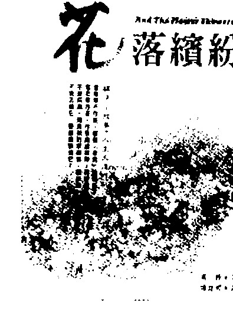
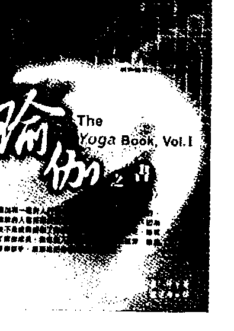
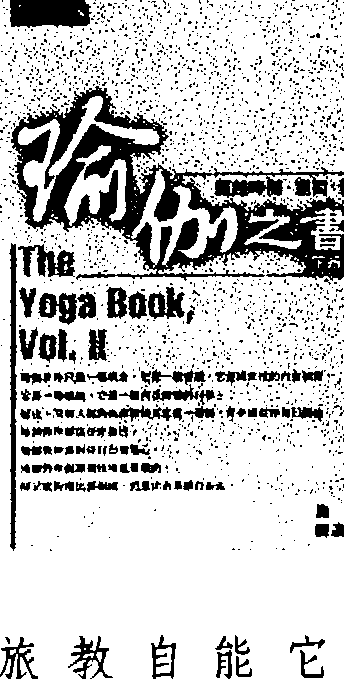
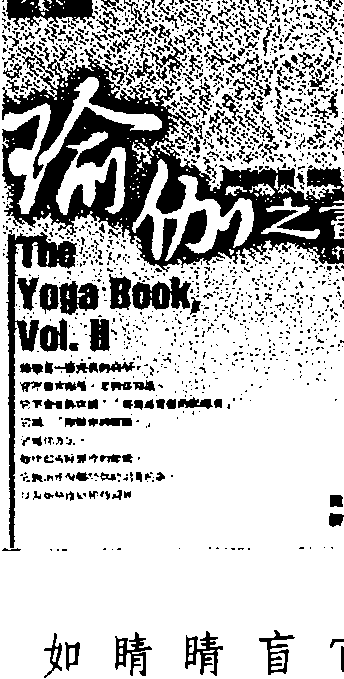
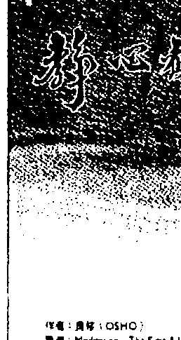
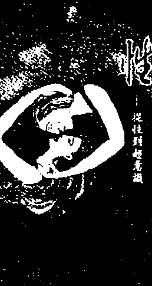
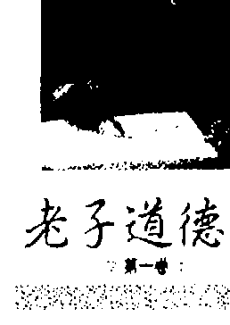
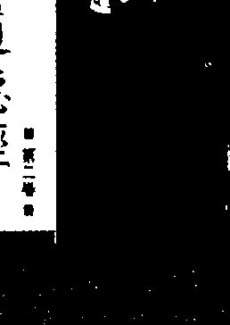
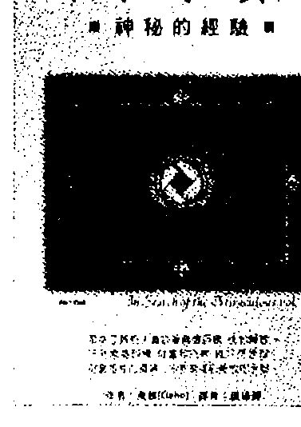
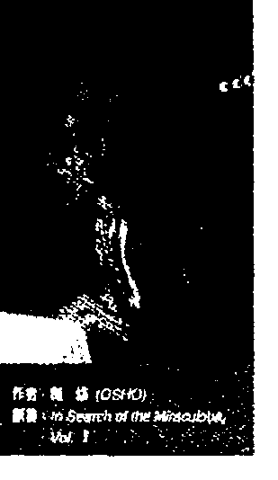

# 奥修：谭崔经典10

本书为奥修谈论古印度希瓦的谭崔经典。

作者：奥修(OSHO)

译者：谦达那

# 对蜕变的恐惧进入到深处

经文：100、对一个成道的人和对一个不成道的人来讲，他们对于客体和对于主体的重视是一樣的。前者有一个伟大：他停留在主观的心情里，不会迷失在事物里。101、相信全知、全能、和遍在。透过它而蜕变。如果那个兴趣真的很深，它本身就會變成一個火，它會蜕变你。只是透过強烈的兴趣，你就会开始变得不同，一个新的存在中心产生了。所以，有很多人似乎有兴趣，但是在他们里面没有新的东西产生，没有新的中心心诞生，没有新的結晶被达成，他们仍然保持一样。那意味着他们在对欺騙自己，那个欺騙是非常微妙的，但是它一定会存在那里。如果你继续服药、治疗，然后那个病仍然保持一样，或是反而变得更严重，那么你的药、你的治疗，一定是虚假的。也许在内在深處你並不想要被蜕变。那个恐懼是非常真實的——对蜕变的恐懼。所以，在表面上，你继续認为你有很深的兴趣，但是在内在深處，你继续在对欺騙。对蜕变的恐懼就好像是对死亡的恐懼，它是一種死亡，因為舊有的必須走出來。除非你準备好要死掉，否則你對靜心的興趣是虛假的，因為只有那些準備死掉的人会再生。新的無法變成舊有的延續，舊有的必須被廢止，舊有的必須走出來。不是它的延續，新的是全新的，它唯有在舊的死掉之後才會出現。在舊的和新的之間有一個空隙，那個空隙令你恐懼，你會害怕，你想要被蜕变，但是同時你想要保有那個舊有的，這是欺騙。你想要成長，但是你想要保持原來的你，那麼成長就變得不可能，那麼你只能欺騙，續續夢想著說有什麼事會發生，但新的之間有一個空隙，那個空隙令你恐懼，你會害怕，你想要被蜕变，但是同時你想要保有那個舊有的，這是欺騙。你想要成長，但是你想要保持原來的你，那麼成長就變得不可能，那麼你只能欺騙，續續夢想著說有什麼事会發生，但

# 对蜕变的恐惧进入到深处

是將不會有什麼事發生，因爲基本的要點被錯過了。所以世界上有很多人，他们對靜心、莫克夏、和涅槃非常有興趣，但是並沒有什麼事發生。關於它有很多噪音，但是並沒有真正的事在發生，这到底是怎麼一回事？有時候头腦非常狡猾，因爲你不想被蜕变，所以头腦會創造出一個表面的興趣，好讓你能夠告訴你自己說：「你是有興趣的，你正在做任何能夠做的一而你仍然保持一樣。如果沒有什麼事發生，你就認爲你所使用的技巧是錯的，你所跟隨的古魯是錯的，或者是那個經典、原則、和方法是錯的。你從來不認爲，如果有真正的興趣，即使那個方法是錯的，蛻變也是可能的，即使

用了錯誤的方法，你也会被蛻變。如果你的靈魂和你的心有放進你的努力裡，那錯誤的古魯，你也会變得不同。如果你的靈魂和你的心有放進你的努力裡，那壓除了你自己之外，没有人能夠導你。除了你自己的欺騙之外，沒有什麼東西會是你成長的障礙。當我說即使是一個錯誤的師父，一個錯誤的方法，一個錯誤的原則，都能夠

夠引導你到那個真實的，我的意思是說當你強烈地涉入它，真正的蛻變就發生了，而不是透過任何方法。方法只是一個設計，方法只是一個幫助，方法是次要的，你的涉入它是基本的事，但是你繼續在做些什麼，不只是做些什麼， 你還繼續談論關於那個作。話語會創造出一個幻象，關於它，你會想很多， 開於它，你會讀很多，你會聽很多，然後你開始覺得你在做些什麼。所謂的宗 教人士發展出很多欺騙的設計。

我聽說有一個摩托車騎士沿著一條路在騎，他看到一個學校的建築物失火了，那個小村莊的小學校的老師是木拉那斯魯丁，他剛好坐在一棵樹下，那個 摩托車騎士對著他喊說：“你在那裡幹什麼？學校的建築物已經失火了！”

木拉那斯魯丁說：“我知道。” 那個摩托車騎士非常激動，他說：“那麼你為什麼不趕快採取行動？”

木拉那斯魯丁說：“自從它開始起火，我就一直在祈祷著趕快下雨，我是 有在採取行動。” 祈禱是一個避開靜心的計，而所謂的宗教頭腦展出很多種類型的祈

禱。祈禱也能夠變成一種靜心——當它不只是一個祈禱，而是一種很深的努 力，一種很深的涉入的時候。祈禱也能夠變成靜心，但是一般的祈禱只是一種

# 第七十三章 对蜕变的恐惧进入到深处

逃避。為了要逃避靜心，人們繼續在祈禱。為了要逃避靜心，人們繼續在祈禱。為了要避開做任何事，所以他們祈禱。祈禱意味著我們是被動的，外力必須替我們做些什麼，別人必須做些什麼，祈禱意味著我們是被動的，靜心並不是那樣的祈禱，靜心是某種你對你自己做的事。當你被蛻變，整個宇宙對你會變得不同，因為宇宙只是對你的一個反應，不論你是怎麼樣。如果你是寧靜的，整個宇宙就會以無數的方式來對你的寧靜反應，它會反映你，你的寧靜會無限地被加乘。如果你是喜樂的，整個宇宙都會反映你的喜樂；如果你是痛苦的，同樣的事也會發生。那個數學是一樣的，那個法則是一樣的：整個宇宙會繼續加乘你的痛苦。祈禱是不行的，只有靜心能夠幫助，因為靜心是你必須很真實地去做的事，它是你的作為。所以第一件我想要告訴你們的事就是，要經常保持警覺你沒有欺騙你自 己，你可能會做些什麼，而仍然在欺騙你自己。我聽說有一次木拉那斯魯丁衝進郵局，抓住了郵政局長的領子，搖動著他，然後說：—我已經發瘋了，我的太太不見了！—那個郵政局長感到很抱歉，他說：—真的嗎？她不見了嗎？但是很不幸

# 譚崔經典（十） 8

地，這是郵局，你必須到警察局去報失蹤。

木拉那斯魯丁搖头說：‘我不想要再被抓去，以前我太太也失蹤，當我去警

察局報案，他們就找到了她，我不想要再度陷入。如果你能夠接受這個報案，

那麼就接受，否則我就走。’

他想要報案來讓自己覺得安心，覺得他已經做了任何他所能夠做的，但是

他不想要真的去警察局報案，因為他害怕。

你繼續做些什麼只是要讓自己覺得安心，只是要讓自己覺得你有在做些什

么。但是事實上，你並沒有準備被蛻變，所以一切你所做的只是一些沒有用的

活動，不只沒有用，而且還是有害的，因為它是在浪費時間、能量、和機會。

希瓦的這些技巧只是為那些準備好要做的人。你可以以哲學方式來思考它
們，那並不意味著什麼，但是如果你真正準備好要做，那麼就有一些事會開始

發生在你身上。它們是活的方法，不是死的教條。你的理性是不需要的，需要

的是你的全然，任何方法都可以，如果你已經準備好要給它一個機會，任何方

法都可以，你將會變成一個新的人。

我要再度重複：方法是設計。如果你已經準備好，那麼任何方法都可以，

# 9 第七十三章 对蜕变的恐惧进入到深处

它們就只是一些設計來幫助你一跳一，它們就好像是跳板。你可以從任何跳板跳進海洋。跳板是不重要的，它們是什麼顏色的，是什麼木頭做成的，那些都無關，它們就只是跳板，而你可以從它們來跳。所有這些方法都是跳板，不論哪一個方法讓你覺得喜歡，不要一直去想它，要做它！困難。光是在那裡想是很容易的，困難會產生，如果你什麼事都不做，將不會有些什麼，困難就產生了，所以如果你看到困難產生，你可以了解你是走在正確的道路上——已經有事情發生在你身上。然後舊有的障礙將會斷掉，舊有的習慣將會走掉，將會有改變，將會有打擾和混亂。所有的創造力都是來自混亂。唯有當你的一切都變得很混亂，你才會重新被創造出來，所以這些方法將會先摧毀你，然後那個新的才能夠被創造出來。如果有困難，要覺得很幸運，那表示在成長。沒有一個成長是平順的……心靈的成長不可能平順，那並不是它的本性，因為心靈成長意味著向上成長，心靈成長意味著進入未知的，進入那個沒有藍圖的，將會有困難，但是要記住，隨著每一個困難的經過，你將會結晶起來，你將會變得更穩固，你將會變得更真實，你將會首度覺得有某種東西在

# 譚崔經典（十） 10

你裡面歸於中心，有某種東西變得很穩固。就你現在這樣，你只是一個液體的現象，每一個片刻都在改變，沒有什麼東西是穩定的。事實上你不能夠宣稱任何一個「我」——你沒有一個「我」可以被宣稱，你是很多的「我」排成一排，河流般的一排。你是一個群眾，還不是一個個人，但是靜心能夠使你變成一個個人。「個人」（individual）這個字很美，它意味著看不見的（invisible）。以你現在這樣，你是分裂的。你就只是很多片斷聚集在一起，沒有任何中心，沒有一個主人在家，只有僕人。任何僕人隨時都可能變成主人。你每一個片刻都不同，因為你不存在，除非你存在，否則神性無法發生在你身上，它要發生在誰身上？你並不在那裡。人們來到我這裡說：「我們想要看神。我問他們：「是誰要看？你並不在，神一直都在那裡，但是你並不在那裡，所以無法看。下一個片刻，他們就沒有興趣了，下一個片刻他們就忘掉了那一切。一個強烈而且堅持的努力和渴望是需要的那麼任何方法都可以。現在我們必須來進入那些方法。

# 第七十三章 对蜕变的恐惧进入到深处

# 100、保持超然。

第一個技巧：对一個成道的人和对一個不成道的人来讲，他们对于客体和对于主體的重视是一樣的。前者有一個偉大：他停留在主觀的心情裡，不會迷失在事物裡。这是一個非常美的方法，你可以以你现在這樣来開始，不需要先具備其他的东西。這個方法很簡單：你被一些人、一些東西、和一些現象所團繞著，每一個片刻都有一些事物團繞著你。那些東西就在那裡，事件就在那裡，人就在那裡，但因为你是不警覺的，你並不在那裡。每一樣事物都在那裡，但是你並不在那裡，或是得很熟。事物在你的周遭移動，人們在你的周遭移動，但是你並不在那裡，或者你在睡覺。所以任何發生在你周遭的都變成一個主人，變成一個凌駕在你身上的力量，你被它拖著走。你不僅對它留下印象，被它所制約，你還被它拖著走。

任何事物都能夠抓住你，你會跟隨著它。有人經過，你就看，那個臉很美，你就被帶走了。那個衣服很美，那個顏色、那個材質很美，你就被帶走了一輛車子經過，你就被帶走了。任何發生在你周遭的事都會抓住你，你並不是強而有力的，其他每一件事物都比你更強而有力。任何事物都會改變你，你的心情，你的存在，你的頭腦依靠其他的事物，客體會影響你。這段經文說，成道的人和不成道的人生活在同樣的世界裡。一個佛和你都在同樣的世界裡生活和工作——世界仍然保持一樣。那個差別並不是在於世界，那個差別發生在佛身上：他以不同的方式來行動。他在同樣的客體之中行動，但是他以不同的方式行動，他是他自己的主人，他的主體性保持超然，不被碰觸到，這就是奧秘。沒有什麼事物會在他身上留下印象，沒有什麼來自外在的事物會制約他，沒有什麼東西能夠凌駕在他之上。他保持超然，他保持他自己。如果他想要去到某一個地方，他就會去，但是他會保持是主人。如果他想要追逐一個影子，他將會追逐它，但那是他自己的決定。這個區別必須被

# 譚崔經典（十）

存在，但是你並不存在。第二，你存在，而那個情況不會拖著你，那個情況無法影響你，因為你已經變成一個意志，你是整合的、結晶的。第三，你開始影響那個情況：就只是因為你在那裡，那個情況就改變了。

第一種情況是屬於那個不成道的，第二種情況是屬於那個經常覺知但是尚未成道的人，他必須警覺，他必須做些什麼來成為警覺的。那個警覺還沒有變得很自然，所以他必須抗爭。如果他失去意識或失去警覺一下子，他將會被那個事物所影響。所以他必須持續地保持戒慎，他是一個求道者，一個在練習某些事的人。

第三種狀態屬於成道的人。他並沒有試著要成為警覺的，他就只是很警覺，他的警覺不需要努力。他的警覺就好像是一呼吸一樣，它一直持續著，他不需要去維持它。當警覺變成像呼吸一樣的現象，很自然、很自發性，那麼這種人，這種歸於中心的人，就會自動影響那個情況。他周遭的情況會改變，並不是說他希望它們改變，但他是強而有力的。

力量就是那個必須被記住的事。你是沒有力量的，所以任何東西都能夠夠凌駕在你之上。力量來自警覺和覺知，當你越警覺，你就越有力量；當你比較不

警覺，你就比較沒有力量。注意看……當你在睡覺的時候，甚至連一個夢都會變得很強而有力，因為你睡得很熟，你已經喪失了所有的意識。甚至連一個夢都非常強而有力，你非常虛弱，你甚至無法懷疑它。即使在個荒謬的夢裡的。也許你在夢中所看到的是很荒謬的事，但是當你在做夢的時候，你無法懷疑的，你無法說這是不真實的，你無法說這是個夢，你無法說這是不可能的。

你就是無法說它，因為你睡得很熟。當意識不在，甚至連一個夢都能夠牽影響你。在清醒的時候，你將會笑，然後你會說：一這太荒謬了，不可能，這不可能發生，這個夢是幻象的。一但是你並沒有注意到，當它在那裡的時候，你被它所影響，你完全被它所接管。為什麼一個夢會那麼強而有力？並不是那個夢強而有力，而是你沒有力量。記住：當你没有力量，甚至連夢都會變成強而有力的。

當你清醒的時候，夢無法影響你，但是事實，所謂周遭的事實能夠影響你。一個開悟的人，一個成道的人，已經變得非常警覺，以致於你的事實也無法影響他。如果有一個女人經過，一個漂亮的女人，你會突然被帶走，慫望產生了，想要佔有的慾望。如果你是警覺的，當那個女人經過的時候，慾望並不會升起，你不受影響，你不会被接管。當這種情況首度發生，當事物在你的周遭移動，而你能夠不被影響，你就会感覺到一種微妙的存在的喜悅。你首度真正覺得你存在，沒有什麼東西能夠從你身上把你拉出來。如果你想要跟隨，那是另外一回事，那是你的決定，但是不要欺騙你自己。你可能会欺騙，你會說：「是的，那個女人並不是強而有力的，但是我想要跟隨她，我想要佔有她。你可能會欺騙，有很多人會繼續欺騙，但是除了你之外，你無法欺騙任何人，那麼它是沒有用的。只要仔细看，你就会知道那個慾望是存在的。慾望先出現，然後你開始將它合理化。對一個成道的人來講，事物就在那裡，他也在那裡，但是在他和那個事物之間沒有橋樑，那個橋樑已經斷掉了，他單獨行動，他單獨生活，他跟隨他自 己，其他沒有什麼事物能夠佔有他。因為有這個感覺，所以我們稱他的達成為莫克夏——完全的自由，他是完全自由的。 在整個世界，人們都在找尋自由，你無法找到一個人不以他自己的方式渴 望自由。人們透過很多途徑在找尋他可以自由的狀態，他憎惡任何讓他有枷鎖

的感覺的東西，他恨它，任何阻礙他，使他被監禁的事物，他都会抗爭，他會奮力反對它，因此有那麼多的政治抗爭，那麼多的戰爭和革命，因此有那麼多持續的家庭吵架——太太和先生，父親和兒子，大家都在互相抗爭。那個抗爭是基本的，那個抗爭是為了自由。先生覺得被侷限了，太太監禁了他，他的自由由被削減了，太太也有同樣的感覺，他們雙方都互相憎惡對方，雙方都在抗爭，雙方都試著要摧毀那個枷鎖。父親跟兒子抗爭，因為兒子每一個階段的成長對他來講都意味著更多的自由，因此父親會覺得他失去了某些東西：力量或權威。在家庭裡，在國家裡，在文明裡，人類只渴求一件事——自由。但是透過政治抗爭、革命、和戰爭並沒有達成什麼。什麼都沒有達成，因為即使你得到了自由，那也是表面的，在內在深處，你仍然停留在枷鎖之中，所以每一個自由都證明了一個幻象的解除。人類非常渴望財富，但是就我的了解，它並不是渴望財富，它是渴望自由。財富給你一種自由的感覺。如果你是貧窮的，你是受限的，你的工具是有限的——你不能夠做這個，你不能夠做那個，你没有錢可以做它。你的錢越多，你就覺得有越多的自由，你可以做你所希望的、想像的、和夢想的你喜歡的事。但是當你有了全部的錢而可以做你所希望的、想像的、和夢想的

一切，突然間你會覺得這個自由是膚淺的，因為在你的內在，你知道得很清
楚，你是沒有力量的，任何東西都可以吸引你，你會被人或物所打動、所影
響、所占有。

這段經文說，你必須達到一個有意識的狀態，在那個狀態下，沒有什麼東
西能夠打動你，你可以保持超然。要如何做它？整天你都有機會可以做它，所
以我說這個方法對你來講是好的，你隨時都可以覺知到有什麼事物佔有你，然
後深呼吸，深深地吸氣，深深地呼氣，然後再度看那個事物。當你在呼氣的時
候，再度注意看那個事物，但是是以一個觀照來看，以一個旁觀者來看。如果
你能夠達到腦的觀照狀態，即使只是一個片刻，突然間你將會覺得你是單獨
的，沒有什麼事物能夠打動你，至少在那個片刻沒有什麼東西能夠夠在你裡面創
造出慾望。每當你覺得有什麼事物打動你、影響你、把你拉出去，而變得比你
自己更重要，你就深呼吸，然後呼氣。在那個由呼氣所產生的小小空隙，注意
看那個事物——一張漂亮的臉，一個很美的身體，一棟很美的建築物，或是其
他任何東西。

如果你覺得它很困難，如果只是藉著呼氣，你無法創造出一個空隙，那麼
就再做一件事：呼氣，然後停止吸氣一個片刻，好讓氣全部被呼出來。停止，不要吸氣，然後看著那樣東西。當空氣出去，或進來，當你停止呼吸，沒有什麼事物能夠影響你，在那個片刻，你們是沒有連結的——那個連結斷掉了。呼氣是那個連結，試試看，它只是一下子，你將會有觀照的感覺，但是它能夠讓你當到那個滋味，它能夠讓你感覺到觀照是什麼。然後你可以繼續下去。在一整天裡面，每當有什麼事物打動你，然後有一個慾望產生，那麼你就呼氣，停留在那個空隙，然後看那個事物。那個事物將會在那裡，你將會在那裡，但是將不會有連結。呼氣是那個連結，突然間你將會覺得你是強而有力，一「你」就會變得越多。那些事物越的，你是有力量的。你越是覺得強而有力，一個體性已經開始了，如此一來，你會有一個中心，任何片刻你都可以移到中心，然後世界就消失了，任何片刻，你都可以在你自己的中心休息，世界是沒有力量的。這段經文說，對一個成道的人和对一個不成的道的人來講，他們對客體和對主體的重视是一樣的。前者有一個偉大：他停留在主觀的心情裡，他停留在他自己裡面，他歸於意識的中心。

停留在主觀的心情裡是必須被練習的，你要盡可能找機會嘗試它，隨時都有機會，會，每一個片刻都有機會。某種東西打動你，把你拉出去，或是把你推進去。藥俗，因為他已經完全經歷過它，而了解到它是沒有用的。對他來講，它並不是一個教條，它是一個被經歷過的事實，他透過他自己的生活裡，然後突然間他了論。他是一個慾望很強的人，他已經盡可能地放縮在生活中，然後去到一座森林裡。解到它是沒有用的，所以他離開了世界，他拋棄了它，然後去到一座森林裡。有一天他在樹下靜心，太陽正在升起，突然間，他覺知到，就在路上，就在那棵樹附近的一條小路上，有一顆很大的鑽石。因為太陽正在升起，它反射出那個光線。甚至連巴拉塔利也沒有看過這麼大的鑽石。突然間，在一個不覺知的片刻下，一個想要擁有它的慾望產生了。他的身體保持不動，但是頭腦已經動了。身體處於靜心的姿勢，但是那個靜心已經不復存在，只有死的身體在那裡，頭腦已經動了，它已經去到了那顆鑽石那裡。在那個國王能夠移動之前，有兩個人騎著馬從不同的方向來，他們同時覺知到了路上的那顆鑽石，他們拔出了他們的劍，每一個人都說是他先看到那顆鑽石，他們拔出了他們的劍，每一個人都說是他先看到那顆鑽石……

# 第七十三章 對脫變的恐懼進入到深處

鑽石，沒有其他的方式可以決定，所以他們必須爭門，他們在爭門當中互相殺死了對方，不一会兒，兩具屍體就躺在那顆鑽石的旁邊，巴拉塔利笑了，閉起他的眼睛，然後再度進入靜心。到底發生了什麼？他再度了解到那個沒有用。而到底什麼事發生在這兩個人身上？那顆鑽石變得比他們的整個生命更有意義。這就是佔有的意義：他們丟掉他們的性命，就只為了一顆寶石。當慾望存在，你就不復存在了——慾望能夠引導你到自殺。事實上，每一個慾望都引導你到自殺，當你陷入一個慾望裡面，你並沒有在你的感覺裡，你簡直瘋掉了。想要佔有的慾望也在巴拉塔利的頭腦裡產生，有一下子，那個慾望產生了，他可能會屍走過去取它，但是在他能夠夠去之前，另外兩個人先到，而且開始爭門，那兩具屍體就躺在路上，而那顆寶石就處於原來的地方。巴拉塔利笑了，閉起他的眼睛，然後再度進入他的靜心。有一個片刻，他的主體性消失了一顆寶石，一顆鑽石，那個客體，變得更強而有力，但那個主體性再度被拿回來。沒有那顆鑽石，整個世界都消失了，他閉起他的眼睛。好幾世紀以來，靜心者都閉起他們的眼睛，為什麼？它只是象徵著世界已

經消失了，沒有什麼好看的，沒有什麼東西有任何價值，甚至沒有看的價值。你必須持續地記住，每當慾望產生，你就走出了你的主體性。這個一走出就力是每一個人都有的。從來沒有一個人曾經喪失掉那個內在的潛力，它一直都在那裡，你可能會走出去，如果你能夠走出去，你也能夠夠走進內在。如果我夠走出我的屋子，為什麼我不能回來到它裡面？只要走同樣的路，只要用同樣的腳。如果我能夠走出去，我也能夠夠走進來。你每一個片刻都在走出去，但是每當你走出去，記住，要立刻走回來，要歸於中心。如果你覺得在剛開始的時候它很困難，那麼就深呼吸，呼氣，然後停止。在那個片刻，看著那個在吸引你的東西。事實上並沒有什麼東西在吸引你，是你被吸引了。那顆鑽石在寂寞森林的路上的鑽石並沒有吸引任何人，它只是獨自在那裡，那顆鑽石並沒有覺知到有人從他的靜心，從他的主體性走出來而進入到世界。那顆鑽石並沒有覺知到有兩個人為它爭鬥而喪失了他們的性命。所以，並沒有什麼東西在吸引你，是你被吸引了。要警覺，然後那個連結

就會斷掉，你就會再度在內在取得平衡。繼續這樣做多一點，你做越多越好，有一個片刻將會來臨，到時候你就不需要做它，因為內在將會給你相當大的力
得沒有什麼東西能夠吸引你。唯有如此，你才首度變成你自己的主人。

這將能夠給你真正的自由，沒有如一種政治的自由、經濟的自由，或在社會的自由，能夠有太多的幫助，並不是說它們不想幫助，它們是好的，在它們本身裡面是好的，但是它們無法給你你最內在的核心所渴望的東西——免於東西，免於客體，很自由地成為自己，沒有任何被什麼東西或什麼人所佔有的可能。

# 101、相信你是全能的。

第二個技巧在某方面來講是類似的，但它是從一個不同的層面。相信全知、全能、和遍在。

它是遍在的……你怎能相信它？那是不可能的。你知道你并不是全知的，全能的，相信你是遍在的……你知道你不是全能的，你是完全没有力量的、无助的。你知道你不是遍在的，你局限性在一个小小的身体裡，所以你怎能相信它？如果你相信它，但是你同时知道事實並不是這樣，那麼那個相信是没有用的。你不能狗違反你自己來相信。你可以強迫一個相信，但它將會是没有用的、沒有意義的，你知道它不是如此。唯有

# 第七十三章 對蛻變的恐懼進入到深處

相信佛陀能夠做出這樣的奇蹟，那麼相信耶穌爲什麼不能？所以他想了一下，遲疑了一下，但是之後，認爲如果佛陀能夠有所幫助，耶穌也能夠有所幫助，所以他就跳進去。他被燒到了，燒傷得很嚴重，他必須住院六個月。他無法了解那個現象。那個問題不在於耶穌或佛陀，問題不在於相信某一個人，它是一個信念的問題，那個信念必須被植入頭腦。除非它到達了你本性的最核心，否則它不會開始運作。那個基督教的傳教士回到了英國去學習催眠和相關的現象，以及走在火上面到底會有什麼樣的事發生。然後他們邀請了兩位和尚到牛津大學展示，那兩個和尚去了，他們走在火上面，那個實驗嘗試了很多次，然後那兩個和尚看到有一個教授在看著他們，他看得非常入神，他變得非常涉入，以致於他的眼睛和他的臉都很狂喜。那兩個和尚去到那個教授的旁邊告訴他說：你也可以跟我們一起來。一他立刻跟著他們跑過去，跳進火裡，没事，他没有被燒到。那個基督教的傳教士也在場，他知道得很清楚，這位教授是一位邏輯的教授，他在職業上是懷疑的，他的職業是基於懷疑，所以他對那個人說：一什麼？你做了一項奇蹟，我做不到，而我是一個相信者。

那位教授說：～在那個片刻，我是一個相信者，那個現象非常真實，無與倫比地真實，它抓住了我，我變得非常清楚說身體並不是什麼，而頭腦是一切，我覺得非常狂喜地融入那兩位和尚，當他們邀請我，我一點遲疑都没有，在火上走很簡單，它就好像那裡沒有火。～那個時候沒有遲疑，沒有懷疑～那就是重點，那就是錘匙。所以，首先嘗試這個實驗。閉起眼睛坐著幾天，只要想著，你不是你的身體，不只是想，而且還要感覺你不是身體。如果你閉起眼睛坐著，有一個距離會被創造出來，你的身體繼續在移開，又更移開，你繼續走向內在。一個很大。的距離被創造出來了，不久之後，你就能夠感覺到你不是身體。如果你覺得你的距離被創造出來了，不久之後，你就能夠感覺到你不是身體。這個全能或全知的不是身體，那麼你就能夠相信你是遍在的、全能的、全知的。這不是關於所謂的知識，它是一種感覺，一種感覺的爆發～你知道。這必須被加以了解，尤其是在西方，因爲每當你知道，他們就會說：～什麼？你知道什麼？～知識必須是客觀的，你必須知道什麼，如果那是一個知道什麼的問題，你就無法是遍在的，沒有人能夠，因爲有無限多的事實要知道，就那個意義來講，沒有一個人能夠是全知的。

那就是爲什麼在西方，當著那教徒宣稱馬哈維亞是全知的，他們都笑了，他們之所以笑是因爲如果馬哈維亞是全知的，那麼他一定知道所有現在的科學所發現的東西，甚至是未來科學將會發現的東西，但那個情況似乎不是那樣。他說了很多事，那些事很明顯地跟科學抵觸，它們不可能是真實的，它們不是實際的。他的知識，如果它是遍在的，就不應該有錯誤，但它們是有錯誤的。─就知世界上所有的事實那個全知而言。他不知道地球是圓的，地球是一個圓球─他不知道。他所知道的地球是平地，他不知道地球已經存在了好幾百萬、好幾千萬年，他相信它是神在他之前四千年所創造出來的。就事實來講，就客觀的事實來講，他並不是全知的。但他─全知─（αl─knowing）這個字是完全不同的。當東方的聖賢說全知，他們並不是意味著知道所有的事實，他們是意味著全意識（αl─conscios-ness），全覺知（αl─aware），完全在內在，完全有意識，開悟，成道。他們並不是顧慮到知道什麼，他們只是顧慮到純粹的知的現象─不是知識，而是那個知的品質。當我們說佛陀知道，我們並不是意味著他知道愛因斯坦所知道的
事。他並不知道那個，他是一個知者，他知道他自己的本性，而那個本性是遍
在的。那個一是「或一存在」的感覺是遍在的。在那個知當中，就沒有什
么東西要被知道的了，那就是重點，如此一來就沒有好奇當中，就沒有什
么束
有的問題都消失了，並不是說所有的答案都被達成了，而是所有的問題都消失了。現在已經沒有問題要被問了，所有的好奇心都消失了，沒有什麼問題要被
解決。這個內在的安靜，這個內在的寧靜，充滿著內在的光，是無限的知，這
就是全知的意思，它是主觀的醒悟。

這是你能夠做到的，但是如果你繼續增加更多的知識到你的頭腦，它將不
會發生。你可以好幾世都繼續增加知識——你將會知道很多事，但是你將永遠
不會知道一切。這個一切是無限的，它無法以那樣的方式被知道。科學將永遠
都會保持不完整，它永遠無法完整，那是不可能的。我們無法想像它能夠純
整。事實上，科學知道得越多，它就越知道有更多必須被知道。

這個全知是一種內在醒悟的品質。靜心，同時拋掉你的思想，當你沒有任
何思想，你就會感覺到這個全知是什麼。當沒有思想，意識就變得很純，就被
純化了，在那個被純化的意識裡，你不會有任何問題。所有的問題都消失了，你知道你自己，你的本性，當你知道你的本性，你就知道了一切，因為你的本性就是每一個人本性的中心。事實上，你的本性就是每一個人的本性，你的心就是宇宙的中心。在這個意義上優婆尼沙經宣稱：「我就是梵天，我就是那個絕對的。一旦你知道了你的本性這個小小的現象，你就知道了那無限的。你就像海洋裡的一滴水，即使只要一滴水被知道，所有海洋的奧秘也就被顯露出來了。相信全知、全能、和遍在。但是這將透過信心而來，這個你無法跟你自己爭論。你無法用某一個論點來說服你自己，你必須深入你自己去挖掘這樣的感覺，去進入到這些感覺的源頭。」

## 第七十四章 敏感度就是覺知

當靜心加深，一個人會變得對客體、事件、和人越來越敏感，但是由於這個高張的敏感度，一個人會覺得跟每一件事物都有一種很深的親密，這常常會變成一種微妙的執著的原因，要如何成為敏感但是超然的？這兩件事並不是矛盾的，它們不是相反的。如果你變得更敏感，你將會更超然，或者如果你是超然的，你將會變得越來敏感。敏感並不是執著，敏感是覺知，只有一個覺知的人能夠敏感。如果來越敏感。敏感並不是執著，敏感是覺知，只有一個覺知的人能夠敏感。如果你沒有覺知，你將會是不敏感的。當你是無意識的，你是完全不敏感的，你越是有意識，你就越敏感。一個佛是完全敏感的，他具有最佳的敏感度，因為他的感覺和覺知的能力發揮到了極點，但是當你是敏感和覺知的，你將不會執著，你將會保持超然，因為那個覺知的現象會打破你跟東西，或是你跟別人和你跟世界的連結，它會摧毀那個連結。無意識和不覺知才是執著的原因。如果你是警覺的，那個連結會突然消失，當你是警覺的，就沒有什麼東西可以把你跟世界連結。世界就在那裡，你就在那裡，但是在這兩者之間，那個連結是由你的無意識所造成的。所以不要認為或覺得是因為
你變得更敏感，所以你才執著，不，如果你是更敏感的，你將不會執著。執著是一個非常粗鄙的品質，它並不是細微的。 易就可以執著，牠們反而更容易覺知和警覺，沒有那個需要，甚至連動物都很容 是完全無意識的，所以執著會發生。那就是爲什麼在人與人之間的關係變得比 較差的國家，比方說在西方，人們繼續尋求跟動物的關係，跟狗或其他動物的 關係，因爲人與人之間的關係已經不復存在。人類的社會正在消失，每一個人 都覺得被隔離，很疏離、很孤獨。群眾在那裡，但是你跟他們沒有連結，你單 獨一個人在群眾裡，這個孤獨是令人害怕的，一個人會變得害怕和恐懼。 當你是有連結的，當你執著於某一個人，也有人執著於你，你就覺得你在 這個世界上，在這個奇怪的世界上並不是單獨的，有人跟你在一起，那個歸屬 的感覺給你一種安全感。當人與人之間的關係變得不可能，那麼男人和女人就 會試著跟動物形成關係。在西方，他們跟狗和其他的動物有很深的連結，但是 在東方這裡，雖然你可能會崇拜牛，但是你們並沒有跟牠們關連。你們也許 會繼續說你們崇拜牛，將它視為神聖的動物，但你們的殘忍是無止境的。

在東方，你們對你們的動物非常殘忍，西方人無法想像你們怎麼可能續認為你們是非暴力的。在全世界，尤其是在西方，有很多社會在保護動物使免於人類的殘酷。在西方，你不可能打狗，如果你打牠，那是一種犯罪的行為，你會受到懲罰。事實上，那個情況就是人與人之間的關係正在消失，但是人無法單獨生活，他必須有一個關係，有一個關係，有一個歸屬，有一個感覺說某人跟他在一起。動物可以是非常好的朋友，因為牠們非常執著，沒有一個人能夠那麼執著。要執著的話，覺知是不需要的，它反而是一個障礙。你變得越覺知，你就越不會執著，因為那個執著的需要消失了。為什麼你要執著於某個人？因為當你單獨一個人的時候，你覺得你是不純的，你缺乏某些東西，某種東西在你裡面是不完整的，你並不是一個整體，你需要某一個人來使你完整，因此會有執著。如果你是覺知的，你是完整的，你是一個整體，那個圓圈是完整的，在你裡面並沒有缺什麼，你不需要任何人，只有你自己一個人就會覺得完全獨立，就會有完整的感覺。那並不是意味著你將不會愛別人，相反地，只有你能夠愛。一個需要你的人無法愛你，他將會恨你。一個依靠你的人變人無法愛你，他將會恨你。因為你變
成枷鎖。他覺得如果没有你，他無法生活，如果没有你，他無法快樂，所以你 是你快樂和不快樂的原因。他經不起失去你，這將會給予一種監禁的感覺，他被你監禁了，他會憎惡它，他會跟它抗爭。人們會把恨和愛放在一起，但是這種愛就无法很深。只有一個覺知的人能夠愛，因為他不需要你，但是這樣的話那個愛就會進入到一個完全不同的層面，它不是執著，它也不需要你，但是這樣的話他靠你，他也不會使你依靠他，他會保持自由，他也會允許你保持自由。你們將會是兩個自由的個體，兩個完全的、完整的人互相會合。那個會合將會是一個宴樂、一個慶祝，而不是一個依賴，那個會合將會是一個合適的遊戲，一個遊戲。那就是爲什麼我們說克里虛納的生活是克里虛納的遊戲人生。他愛很多\n人，但是沒有執著。克里虛納的朋友和女朋友們的情況可就不是這樣，他們會變得執著，所以當克里虛納從芙林達凡搬到杜瓦拉卡，他們都覺得很痛苦，又哭又泣的。他們陷入了極度的痛苦，因爲他們認為克里虛納忘記了他們。他並沒有忘記，但是並沒有痛苦，因爲沒有依賴，他在杜瓦拉卡跟他在芙林達凡的時候是一樣的。愛的時候一樣快樂，他愛的流動在杜瓦拉卡跟他在芙林達凡的時候是一樣的。愛的客體改變了，但是愛的源頭仍然保持一樣。所以任何接近他的人都能夠夠接收到
他的禮物，這個禮物是無條件的，不需要任何回報，他並沒有要求任何回報。個給予的人覺得很快樂，因為他給出它。那個給予的行為就是他的喜樂、他的狂喜。

所以，要記住，如果你覺得透過靜心，你變得更敏感，那麼你將會自動變得比較不執著，比較超然，因爲你將會更歸根於你自己，你將會更歸於你自己，你將不會使用別人來作為你的中心。執著意味著什麼？執著意味著你用的中心，你將不會使用別人來作為你的中心。馬吉奴執著於萊拉，他說他不能沒有萊拉而生活，那意味著存在的中心已經轉移了。如果你說你不能沒有這個個或那個而生活，那意義著你的靈魂不在你裡面，那麼你不是以一個獨立的單位存在，你的中心已經移到了其他的地方。這個將中心從你自己移到其他地方或別人身上就是執著。如果你是敏感的，你會去感覺別人，但是別人不會變成你生命的中心。你將會保持是中心，從這個歸於中心，別人將會從你那裡接收到很多禮物。你將只是給予，因為你擁有太多，你是一個洋溢，你將會感謝別人接受了它，那就夠了，那就結束了。

那個基督教和佛教之間的不同。據說基督做了很多奇蹟使人復活。當拉
撒路死掉，耶穌碰觸了他，然後他就復活了。在東方，我們無法想像佛陀碰觸
[/content]

一個死人，然後讓他復活起來。對於一般人的腦腦來講，耶穌一定會看起來比佛陀更具有愛心、更慈悲，但是我要告訴你們，佛陀是更敏感、更慈悲的，因為即使拉撒路復活了，它也不會造成任何差別，他仍然必須一死。到了最後，想像佛陀會做這樣的事。拉撒路也一定會死，所以這個奇蹟是沒有用的，沒有最終的價值，一個人無法耶穌必須這樣做，因為他帶來一些新的東西，一些新的訊息到以色列，那個訊息非常深奧，人們無法了解它，所以他必須在它的周圍創造出奇蹟——因為人們能夠了解奇蹟，但是他們無法了解那個深奧的訊息，奧秘的訊息。他們能夠了解奇蹟，所以透過奇蹟，他們可能會變得敞開而能夠接受那個訊息。耶穌帶著一個佛教的訊息去到一個不是佛教徒的地方，他帶著一個東方的訊息去到一個沒有成道、沒有很多佛的傳統的國家。我們可以想像佛陀比他那些又哭又泣的門徒更敏感，而他們只是多愁善感。不要把你的多愁善感誤以為是敏感。多愁善感是平凡的，敏感是不平凡的，它是透過努力而發生的，它是一項成就，你必須去爭得它。多愁善感你不

## 第七十四章 敏感度就是覺知

需要去爭得它，你生下来就具有它，它是一種動物的傳承，在你的身體和你腦的細胞裡就己經有它。敏感是一個可能性，你並不是已經有它，你可以創造出它，你可以為它下功夫，然後它將會發生在你身上。每當它發生，你就可以創造成超然的。佛陀是完全超然的，那個死掉的小孩就在那裡，但他似乎一點都没有受到影響。那個女人，那個母親非常痛苦，他卻在她身上要了一個詭計。這個人似乎是殘酷的，對一個死掉小孩的母親來講，要這個詭計似乎太過份了。他給了她一個謎，而他知道得很清楚，她一定會空著手回來。但是我太過份了。但是我需要重申，他具有真正的慈悲，因為他在幫助這個女人成長，成為成熟的。除非你能夠接受死亡，否則你是不成熟的，除非你能夠接受死亡，否則你在你的存在裡面沒有一個中心。當你將死亡接受成一個事實，你就超越它了。佛陀利用了那個情況，他對於那個死掉的小孩比較不關心，他比較關心那個活的母親，因為他知道那個死掉的小孩會再回到生命來，不需要奇蹟。但是如果那個小孩復活了，那個母親可能會喪失一個機會。所以在東方，只有三流的聖賢會做出奇蹟，一流的聖人從來不會做出任何奇蹟，他們會在較高的層面運作。佛陀也是做出了了一項奇蹟，但那個奇蹟是在一個非常高的層面上做的，那個母親被蝕變了。但是它很難了解，因為我們的頭腦是粗鄙的，我們只能了解多愁善感，我們無法了解敏感。敏感意味著一種警覺，它能夠感覺到發生在周遭的每一件事。唯有當你不執著，你才能夠感覺到。記住這個：如果你是執著的，你就不在能夠感覺，你已經從你自己移開。所以如果你想要知道某人的真實情況，不要問他的朋友，他們是執著的，也不要問他的敵人，他們也是執著的，只是以相反的秩序。要問一個中立的人，既不是朋友，也不是敵人，只有他能夠說出真實的情況。朋友是不能夠被相信的，敵人也不能夠被相信，但是我們卻相信朋友或敵人。這兩者都一定是錯的，因為他們沒有一個中立的觀照，他們沒有一個超然的觀點，他們無法超然地看，因為他們對那個人有投資。朋友有投資，敵人也
有投資，他們是按照特定的觀點來看的，他們執著於那些觀點。如果你是執著的，你無法完全地感覺生命。當你覺得你是執著的，你就已經採取了一個觀點，那個全然已經喪失了，只有片斷的東西在你手上。那些片斷永遠都是謊
言，因為只有整體才是真實的。靜心，變得更敏感，將它視為一個準則——你將會繼續變得越來越超然。如果你覺得你的執著在增加，那麼在你靜心的某一個地方是錯的，這些就是準則。則。對我來講，執著是無法被摧毀的，超然是無法被練習的。你只能練習靜心，然後超然將會以一個結果，以一個副產物隨之而來。如果靜心真的在你的內在開花，你將會有一種超然的感觉，那麼你就能夠去到任何地方，你也会保持不被碰觸到，不害怕，那麼當你離開你的身體，你將能夠不受損傷地離開它，你的意識將會是完全純淨的，沒有什麼異物進入它。當你是執著的，不純的東西就會進入你裡面。這是基本的不純：你失去了你的中心，而別人或別的東西變成你存在的中心。

# 第二個問題：

如果信心能夠移動山岳，為什麼你不能夠治癒你自己的身體？

我並没有任何身體。 這個你有一個身體的感覺是完全錯誤的。身體屬於宇宙，你並不擁有它， 它不是你的。所以身體的生病或健康，宇宙會照顧它，而一個處於靜心之中的 人必須保持是一個觀照，不論身體是健康的或生病的。 「想要成為健康的」的慾望是無知的一部分，想要不生病也是無知的一部 分。這並不是一個新的問題，這是最古老的問題之一。這個問題曾經有人問過 佛陀，也經有人問過 馬哈維亞。自從有成道的人之後，就有不成道的人會問 這個問題。 看……耶穌說信心能夠移動山岳，但是他卻死在十字架上，他無法移動那 個十字架。你或是像你一樣的人一定曾經在那裡等著，門徒們都在等，因為他 們知道耶穌，他一再一再地說信心能夠移動山岳，所以他們在等待奇蹟的發生，而耶穌就死在十字架上。但這就是奇蹟：他能夠成為他自己死亡的一個觀 照。一個人能觀照著自己死亡的那個片刻是活著的時候最偉大的片刻。 佛陀死於食物中毒，他持續地受苦六個月，有很多門徒在等他做出奇蹟， 但是他靜靜地受苦，而且漸漸地死掉，他接受死亡。

## 第七十四章 敏感度就是覺知

有很多門徒試著要治療他，他們給了他很多藥。當時的一個偉大的醫生，吉瓦卡，是佛陀的私人醫生。不論他去到哪裡，他都会跟著去。人们一定問過很多次：一這個吉瓦卡為什麼要跟著他走？一但那是吉瓦卡自己的執著，那些試圖要幫助佛陀的身體活在這個世界
上更久，即使只是多幾天的門徒也是執著的。對佛陀本身來講，生病或健康都一樣，但它那並不是意味著疾病不會帶來痛苦，它會帶來痛苦！痛苦是一個身體的現象，它將會發生，但是它不會打擾到內在的意識。內在的意識將保持不被打擾，它將保持跟以前一樣平衡。身體會受苦，但是內在的本性將會保持只是觀照著那整個痛苦。將不會有認同——這個我稱之為奇蹟，這透過信心是可能的。沒有一座山比認同來得更大，這一點要記住。喜馬拉雅山並不算什麼，你是跟你身體的認同才是一座更大的山。喜馬拉雅山能不能透過信心被移動，那是無關的，但是你的認同可以被摧毀。然而我們無法想像任何我們所不知道的事，我們只能夠按照我們的頭腦來思考。我們會按照我們所處的狀態來思考，那個模式仍然保持一樣。

有時候我的身體會生病，人們來到我這裡，他們說：—你爲什麼會生病？你不應該生病，一個成道的人不應該生病。—但是是誰告訴你它是如此？我從來沒有聽過任何成道的人是没有生病的。疾病屬於身體，它跟你的意識無關，因而跟你是否成道無關。有時候成道的人會比不成道的人病得更嚴重。這是有原因的……既然他們不屬於身體，他們就不會跟身體合作，在內在深處，他們已經跟身體分開。所以身體仍然保持，但是那個執著和那個橋樑已經斷掉。有很多疾病發生，因爲那個分開已經發生了。他們仍然在身體裡，但是他們跟身體的合作已經不復存在。所以我們說一個成道的人將永遠不會再被生出來，因爲現在他已經無法再跟任何身體連結，那個橋樑已經斷掉了。當他在身體裡，即使是那個時候，事實上他也是死的。佛陀在大約四十歲的時候成道，他在八十歲的時候過世，所以在他的成道之後又活了四十年。在他即將過世的那一天，阿南達開始哭泣，他說：—我們要怎麼辦？如果没有你，我們將掉進黑暗裡。你即將要過世，而我們還沒有成道，我們的燈還沒有被點亮，而你已經快要過世，不要離開我們！

## 第七十四章 敏感度就是覺知

據說佛陀說：—什麼？你在說什麼，阿南達？我在四十年前就死了。這個存在只是一個幻影的存在，一個影子的存在。不知怎樣，它還在運作，但是那個力量已經不在了，它只是一個來自過去的動量。如果你踩一輛腳踏車，然後你停下來不踩，你已經不跟腳踏車合作，但是它將會繼續移動一陣子，因為有來自過去的動量，有來自過去你所給它的能量。當某人成道，那個合作就斷掉了，現在身體將會走它自己的路線，它有一個動量。從過去的很多世，你都一直給它動量，它有它自己的生命週期，它將會完成，但是現在，因為內在的力量已經不再跟著它，所以身體比平常更容 易生病。拉瑪克里虛納死於癌症，拉曼也死於癌症。對門徒來講，那是一個很大的震懾，但是由於他們的無知，他們無法了解。還有一件事必須被加以了解。當一個人成道，這將是他的最後一世，因為此所有過去的一業和整個延續都必須在這一世完成。那個受苦——如果他有任何要受的苦——將會變得更強烈。對你來講不急，你的受苦可以分散到很多世，但是對一個拉曼來講，這是最後一世。一切來自過去的都必須被完成。每
件事，所有的一業，都會變得更強，這一世將會變成濃縮的一世。有時候可能會在一個片刻裡面受很多世的苦，這是很難了解的。就在一個片刻裡面，那個強度可以變得很強，因為時間可以被濃縮，或是被分散。你已經知道，有時候當你在睡覺的時候，你看到一個夢，當你再度醒過來，你知道你只睡了幾秒鐘，但是你看到了這麼長的一個夢。甚至一整個人來，你可以在一個夢裡面被看到，這是可能的。到底發生了什麼？在這麼短的時間裡，你怎麼能夠看到這麼長的夢？時間並非只有我們一般所了解的只有一層，時間有很多層。做夢的時間有它本身的存在。即使當你清醒的時候，時間也一直在改變，它也許不是按照時鐘來改變，因為時鐘是一個機械的東西，但是心理的時間繼續在改變。

當你是快樂的，時間會過得很快；當你是不快樂的，時間就過得很慢。如如果你在受苦，一個晚上可能會成為永恆，而如果你是快樂的、喜樂的，整個人生也可能變成一個片刻。

當一個人成道，每一件事都必须被結束，這是一個結束的時間。好幾百世都必須被結束，所有的帳都必須被清掉，因為已經不再有機會了。在這個成
道之後，一個成道的人會生活在一個完全不同的時間裡，任何發生在他身上的事的品质都會變得不同，但是他保持是一個觀照。馬哈維亞死於胃痛，有點像胃潰瘍——他受了很多年的苦。他的門徒們一
定曾經陷入困難，因為他們在它的周圍創造出一個故事，而那個故事所顯示的是關於門徒們的事，而不是關於馬哈維亞的事。們說一個具有非常邪惡靈魂的人，戈夏拉克，就是馬哈維亞受苦的原因。他將他邪惡的力量丟給馬哈維亞，而馬哈維亞吸收它只是因為他的慈悲，所以他會受苦。這並沒有顯示出關於馬哈維亞的事，而是關於門徒們的困難。他們無法想像馬哈維亞的受苦，所以他們必須在其他地方找到原因。有一次，我感冒了——它是我經常性的伴侶。所以有人來，他說：—你一是拿走了別人的感冒。一那並沒有顯示出關於我的事，它顯示出某種關於他的事。他很難想像我會受苦，所以他说：一你一定是得到了別人的感冒。一我試圖說服他，但是不可能說服門徒。你越是試著去說服他們，他們就越相信自
己是對的。到了最後他告訴我說：一不論你說什麼我都不聽，我知道！你拿走
[PAGE 64]

要怎麼辦呢？身體的健康和生病是它自己的事。如果你想要對它做什麼，你仍然執著於它。它將會走它自己的路線，你不需要太擔心它。

我只是一個觀照。身體被生下來，身體將會死，只有觀照會存在，它將會永遠保持。只有觀照是絕對永恒的，其他每一件事都繼續在改變，其他每一件事都在流動。

# 第三個問題：

昨天晚上你詳細地解釋關於求道者如何不認真努力靜心而欺騙他們自己。

但是為什麼有很多求道者很熱心地問你靜心技巧，而你只是告訴他們說將每一件事都交給你，你將會照顧他們的心靈成長。然而有很多求道者不滿意於那種方式的心靈成長，在這種情況下，請你解釋這些求道者如何在欺騙他們自己。

首先，當他們要求一個技巧，我就給他們一個技巧。這就是一種技巧：將
[PAGE 65]

每一件事都交給我。這是可能的最強而有力的技巧之一。不要認為它很容易，它是非常困難的，有時候甚至是不可能的。很難將每一件事都交給別人，但是如果你能夠，在那個臣服當中，爭。不僅是在臣服當中，而是在每一件需要放開來的事情當中，我們都會抗爭。在西方便，他們對性的現象做了很多研究，因為人們已經變得越來越不能夠進入深的性高潮。他們有性行為，但是無法從它產生狂喜，它已經變成一件無聊的事。他們不知道要怎麼辦。透過性高潮而變得更虛弱，然後它變成一项例行公事，他們不知道要怎麼辦。透過性高潮而來的很深的狂喜是它的意義，如果它沒有發生，那麼性是沒有用的，甚至是有害的。有很多心理學的學派繼續在研究一人到底怎麼了？為什麼他無法透過性而達到性高潮？一所有的研究都指出，人無法達到性高潮的原因是因為他無法臣服——所以他無法達到性高潮。即使在做愛的時候，即使進入很深的性行為，你的頭腦還是在控制，你繼續在控制，你並沒有放開來。你害怕放開來，因為如果你允許能量毫無控制地流動，你不知道它將會走到哪裡。你可能會發瘋，你可能甚至會死掉，就是因為那個恐懼，所以你一直保持控制著。你繼續在操控你的身體，這個來自頭腦的操控不讓整個身體變成一個能量流，然後性就變成一件局部的事，整個身體並沒有涉入，整個身體並沒有處於一種內在的跳舞，那個狂喜錯過了。你失去能量，但是你並沒有得到任何東西。

## 69 第七十四章 敏感度就是覺知

西，那一定會有挫折。所以心理学家說，除非你處於很深的放開來，除非頭腦出來的狂喜。見到最終的狂喜——發生在跟神性或是跟宇宙的一種完全放掉你的自我所產生出來的狂喜。除非一你一不在那裡，否則你無法達到很深的狂喜。那個狂喜能夠讓你首度嘗，除非一你一不在那裡，自我不在那裡，除非身體用它自己的力量、用它自己的動量接管，種很深的性高潮。師父只是試著在幫助你，把你帶到一個至少你能夠放掉自我有放開來，狂喜就發生了，那就是法則。所以如果你能夠紮臣服於師父，不要聽任何人的話，即使整個世界都說這個師父是錯的，也不要聽。如果你能夠紮臣服，這個師父就是對的。你將會透過他而達到一個狂喜的片刻。如果整個世界都說這個師父是對的，而你無法臣服，他對你來講是没有用的，所以不論在什麼地方你有臣服的感覺，就有你的師父。找尋那個地方，或是找尋那個人，在他的—當中你能夠紮允許放開來，

在他的～當中你能夠放掉你的頭腦，即使只是一下子。一旦這個來自外在的力量進入你裡面，你的途徑將會變得不同，你的生命將會有一個新的轉折。
沒有清楚地知道，你已經臣服了。記住，你無法欺騙一個師父，他是你的內在並
非那個放開來真正發生，否則他會繼續堅持。你可以用計謀，你可以假裝，但
是你可以無法欺騙一個師父。你可以向他頂禮，但是那個姿勢並不意味著什麼，它
也許只是一個表面的姿勢，你並沒有真正鞠躬，但是如果鞠躬真的發生了，師
父就能夠發揮作用。
所以每當我說～臣服～，或是～將它交給我，我會來照顧～，我真的是意味
著如此，我的意思跟我所說的完全一樣。我想要在你裡面創造出一個空隙，一
個跟過去的不連續。一旦那個空隙存在，你將遲早能夠由自己來運作，但是在
那之前，如果你以你自己的方式來進行，你將會延續過去的故亂，沒有什麼新
的一個新的路線上。

## 第七十四章 敏感度就是覺知

# 最後一個問題：

你說耶穌不知道地球是圓的，所以對於那些相信耶穌是神的基督徒來講，這似乎非常奇怪。它不是隱含著說一個像耶穌這樣成道的人——一個知道深奧的秘教科學的人，一定知道很多關於星球的、宇宙的，以及天體之間的相互關係的天文和占星的事實嗎？請你解釋。

不，耶穌並不關心。當耶穌說世界是平的，他是在使用當時盛行的知識，他並不關心地球是圓的或平的，它對他來講是沒有意義的。他更關心那些住在這個平的或圓的地球上的的人。這個關心必須被加以了解。對耶穌來講，討論這些事是完全沒有用的，它會造成什麼不同呢？比方說，從地理學的書，你知道地球是圓的，如果你們地理學的書教導世界是平的，就像他們以前所教導的，它對你有什麼差別？你會成為一個較好的人嗎？你會因為在一個平的世界或是在一個圓的地球上而變得更靜心嗎？它對你的本性和你意識的品質有什麼差別？它是無關的。

耶穌關心你的意識，他不會不必要地去爭論那些沒有用的事。如果你告訴耶穌說地球是圓的，他一定會說是的，它對他來講沒有什麼差別，因為那並不是他所關心的。當時大家的認知是世界是平的，事實上對於一般的頭腦來講，世界仍然是平的，它看起來是平的，圓形是一個科學的事實，但耶穌並不是一個科學家。比方說，我知道太陽從來沒有升起，也從來沒有落下，它是一個科學的事實。是地球在轉動，太陽並沒有在轉動，但我還是使用「日出」和「日落」這些字眼。「日出」基本上是錯的，那個字眼是錯的，因為太陽從來不升起。日落是錯的，太陽從來不落下。所以在兩千年之後，某人可以說，這個人是不成道的，因為他說太陽升起了：日出，日落，他難道不知道這些小事嗎？但是如果我改變每一句話，那麼我將會不必要地抗爭，而那將不會幫助任何人。耶穌只是使用當時大家所認識的知識，而當時大家的認知是地球是平的，他並不關心它。如果今天他在這裡，他一定會說地球是圓的，但即使是那個也不是完全科學的，因為地球並非完全是圓的，現在他知道？隔天他們可能會蛋，而不是完全圓的。那個形狀就像是一顆蛋，但是誰知道？

## 73 第七十四章 敏感度就是覺知

改變，然後說它不是如此。科學繼續在改變，因為當它變得更精確，當它的認
識變得更多，當更多的事實被知道，當更多的實驗被執行，事情就改變了，但
是一個像耶穌或佛陀這樣的人並不關心這些事實。
記住一件事：科學所關心的是事實，而宗教所關心的是真理。事實並不是
它所關慮的，真理才是它所關慮的。事實是關於客體，真理是關於你，你的意
識，所以每一個成道的人都必須使用一般關於事實的知識，但是你並沒有用那
個來判斷耶穌或佛陀，你這樣判斷是錯的。他們只能以他們所說的關於真理，
關於人類意識固有的真理的事來被判斷。關於那個，他們一直是絕對對的，
雖然他們的语言有所不同。
佛陀使用一種語言，耶穌使用另外一種語言，克里虛納所使用的又是另外
一種，他們使用不同的實際知識，他們使用不同的技巧或設計，但是他們教導
的核心是一樣的，而那就是——如果你允許我來說它的話——如何達到完全的
覺知。

# 79 第七十五章 第七十五章 找尋相反兩極的韻律

經文：

、想像心靈在你裡面，同時圍繞著你，直到整個宇宙都心靈化。

、在每一個慾望和每一個知的最起點帶著全然的意識，知道。

、喔！夏克提，每一個特定的知覺都是有限的，消失在全能裡。

、在真理裡面，形式是不分開的。不分開的是你遍在的本性和你自己的形
式。了解每一個都是由這個意識所做成的。

據說最偉大的詩人之一，惠特曼（Walt Whitman），曾經說過：一我是自
相矛盾的，因為我很大，我自相矛盾，因為我包含了所有相反的兩極，因為我
是一切。一關於希瓦和譚崔也可以這樣說。譚崔是在找尋那個對立的相反兩極的韻律。對立的、相反的觀點在譚崔裡面變成一一一。這必須被深入了解，唯有如此，你才能夠了解為什麼有那麼多的對立和不同的技巧。生命是相反兩極之間的一個韻律——男性和女性，正向的和負向的，白天和黑夜，出生和死亡。生命的河流就在這相反的兩極之間流動。相反的兩極是岸，它們看起來好像是對立的，但它們是合作的。那個表象是虚假的。生命不能沒有這個相反兩極之間的韻律而存在，而生命包含一切。譚崔既不是贊成這個，也不是贊成那個，譚崔贊成一切。事實上，譚崔並沒有它本身的觀點，所有可能的觀點都包含在它裡面，它是很大的，它能夠自相矛盾，因為它包含一切。它不是部分的，它就是整體（whole），因此它是神聖的（holy）。（註：（whole 跟 holy 的音很接近。））所有部分的觀點一定是凡俗的，如果它們沒有包含相反的那一極，它們不可能是神聖的。它們也許是合乎邏輯的、理性的，但它們不可能是活生生的。不論生命存在於哪裡，它都是透過它相反的那一極而存在，它無法單獨存在，相反的那一極是一定要的。

在希臘神話裡，兩個神分佔兩極：阿波羅和戴奧尼索斯。阿波羅是掌管秩序、規範、美德、道德律、和文化的神，而戴奧尼索斯是掌管無秩序、混亂、自由、和自然的神，這兩者是相反的兩極。幾乎所有的宗教或多或少都基於阿波羅的觀點，他們相信理性，他們相信秩序，他們相信美德，他們相信規範和……事實上他們相信自我。但譚崔基本上是不同的，它包含兩者，它也包含戴奧尼索斯的觀點。它相信自然，它相信混亂，它相信唱歌、跳舞、和歡笑，它並非只是很嚴肅，它兩者都包含。它既是嚴肅的，也是不嚴肅的。尼采在他的一封信裡寫道：‘我只能相信一個跳舞的神。’他找不到任何跳舞的神。如果他知道關於希瓦的神，尼采只知道事，他人的故事就一定會變得完全不同。希瓦是一個跳舞的神，尼采只知道基督教的神，這是唯一的觀點——非常嚴肅。有時候基督教的神的嚴肅看起來很荒謬、很幼稚，因為相反的那一極完全被拒絕了。你無法想像一個基督教的神在笑神在跳舞，不可能！跳舞看起來太世俗了，你無法想像一個基督教的神在笑——或者你能夠嗎？那是不可能的。基督教的神就是嚴肅的精神，而尼采無法相信它。

我認為沒有一個人能夠相信這樣的神，因為它只是一半，它不是整體。只 有像比利·格拉罕這樣的人能夠相信它。比利·格拉罕曾經在某一個地方很嚴 萧地說：當你在閱讀性感雜誌，你必須記住神在看著你。這看起來很愚蠢，你 在閱讀一本性感雜誌，而神在看著你閱讀性感雜誌！ 這個態度是愚蠢的，它很愚蠢，因為它沒有包含相反的那一極。如果相反 的那一極被拒絕，你將會變成愚蠢的、死氣沈沈的，但是如果你能夠很容易走 到相反的那一極，沒有對立，如果你能夠嚴肅，也能夠歡笑；如果你能夠像佛 陀一樣地坐著，也能夠像克里虛納一樣地跳舞——在這兩者之間沒有固有的對 立，你可以很容、很平順地從成為一個佛陀走到成為一個克里虛納——如果 你能夠這樣做，你將會是活生生的。如果你能夠這樣做，你將會成為一個譚崔 行者，因為譚崔基本上是在找尋存在於兩極之間的韻律，找尋流動在兩極之間 的河流。 所以譚崔繼續在所有的技巧和每一個技巧上面下功夫。譚崔並不是為某一 個人，它是為所有的人。每一種類型的頭腦都能夠來經歷譚崔。不可能每一種 類型的頭腦都可以成為基督徒，不可能每一種類型的頭腦都能夠成為印度教教
徒，也不可能每一種類型的頭腦都能夠成為佛教徒。某種特定類型的頭腦會被佛陀所吸引，某種特定類型的會被耶穌，某種特定類型的會被穆罕默德所吸
引，而希瓦則包含一切，希瓦能夠吸引每一種類型的人。全部、整體都被包含了，它並不是一個部分的觀點，那就是為什麼譚崔沒有宗派，你無法在整體的周圍創造出一個宗派，你只能在一片斷的周圍創造出一個宗派。你能夠經歷整體，但是你無法創造出一個宗派，唯有當你贊成某些東西，而且反對某些東
西，一個宗派才能夠被創造出來。如果相反的兩極都被包含，你怎麼能夠創造出一個宗派的頭腦？譚崔是主要的宗教，它並不是一個宗派，因此有很多技巧
人們一直來到我這裡問說：一有很多技巧，一個技巧會和另外的技巧產生矛盾，因為它並非只是為特定的頭腦。矛盾？一是的，它會和另外的技巧產生矛盾，因為它並非只是為特定的頭腦。

在這一百一十二種技巧裡面，所有的類型，人類所有可能的類型都被包含了。請你不必顧慮到所有的技巧，否則你將會被弄得很混亂，你只要找到那個適合你的，那個吸引你的，你只要找到那個你跟它有很深的親和力的，你會愛上它
的，然後忘掉其他的一百一十一种技巧，忘掉它們，你只要執著於那個對你有有效的。在這一百一十二種技巧裡面只有一種是適合你的。如果你嘗試很多種技巧
巧，你將會變得混亂，因為要嘗試很多種技巧，你將需要一個很大的頭腦，一個能夠吸收所有對立的頭腦，它在目前是不可能的。有一天它也許會變得可能，你能夠變得非常完整，非常全然，你可以很容易地進入很多技巧，那麼就没有問題，但是到了那個時候也就不需要了！目前它是需要的，要找到你的技巧。

我能夠幫助你找到適合你的技巧，如果你覺得其他的技巧跟那個適合你的技巧是矛盾的，不必去想它們。它們是矛盾的，但它們並不是為你的，至少它們現在並不

## 第七十五章 找尋相反兩極的韻律

的——不可能。在三十六個小時的感官剝奪之後，想像變成了真相，而真相變成幻象的。
那就是爲什麼古時候的求道者會進入山裡，進入到人煙絕跡的地方，在那裡他們會喪失分辨真實和不真實的能力，一旦那個分辨能力喪失了，你的想像力就會發揮到極致，如此一來你就能夠利用它，你也能夠夠透過它而變成有創造力的。

關於這個技巧，你要坐在一個孤獨的地方，如果那個環境是自然的，那很好；如果不是，那麼一個房間也可以，然後閉起你的眼睛，想像有一個心靈的力量在內在和外在被感覺到，在你裡面有一個意識之流在流動，它流過了整個房間，洋溢著。在你裡面，在外面，在你的周圍，那個心靈的力量到處都在，那個能量都在。不要只是在頭腦裡想像它，要開始在你的身體裡感覺——你的身體將會開始震動。當你感覺到身體開始震動，它就表示那個想像力已經開始運作。感覺整個宇宙都漸漸被心靈化——每一樣東西，房間的牆壁，周遭的樹木，每一樣東西都變成非物質的，它已經變成心靈的，物質已經不復存在了。

那也是真相，物理學家說，物質是幻象的，而能量是真實的，不論你在哪裡看到固體的東西，那個固體性只是外表，它並不在那裡。當物理學進入到物質的世界，物質就消失了，只有能量，非物質的能量，它是無法被定義的。透過想像，你會到達一個點，在那個點上，藉著你意識的努力，你摧毀了理智的結構，理智的模式，你覺得沒有物質，只有能量，只有心靈，內外都是。不久之後你將會感覺到內在和外在都消失了。當你的身體變成心靈的，你覺得它是能量，那麼內在和外在之間就沒有差別，那個界線喪失了，現在就只有一個流，一個海洋，在震動著，這也是真實的，你透過想像達到那個真實的。想像是在做什麼？想像只是在看事物。想像是在摧毀舊有的觀念、物質、和舊有的頭腦模式，那個模式繼續以某一種方式在看事物。想像是在摧毀它們，然後真相就會被顯露出來。想像心靈在你裡面，同時圍繞著你，直到整個宇宙都心靈化——直到你覺得所有的差別都消失了，所有的界線都融解了，而宇宙變成只是一個能量的海洋，這也是事實，但是當你越深入去進行這個技巧，你會變得越害怕，你將會覺得好像你發瘋了，因為你的明智是由差別所組成的，你的明智是由這個所組成的，當真相開始消失，你將會覺得你的明智也同時在消失。

聖人
和瘋子所處的世界超出我們所謂真實的存在，他們兩者都跟我們不一樣，但瘋子是往下掉，而聖人則是超越。那個差別非常小，但它也是非常大。如果你沒有做任何努力就喪失了你的頭腦和區別真實與不真實的能力，你將會變成發瘋的，但不是發瘋的。但是如果你帶著有意識的努力摧毀那些觀念，你將會變成一不是明智的。那個「不是明智的是宗教的層面，它超越明智，但有意識的努力是需要的一。你不應該成爲一個受害者，你必須保持是一個主人。當摧毀頭腦的模式是經由你的努力，你就洞察了沒有模式的真相。沒有模式的真相是唯一的真相；有模式的真相只是被加上去的，那就是爲什麼現在的人類學家說每一個社會、每一個文化，都看著同樣的真相，但是卻在那裡找到不同的真相，因爲他們的模式、他們的觀念是不同的。世界上有很多文化，原始民族的文化，他們以非常不同的方式來看同樣的世界，他們的解釋完全不同。對我們和他們來講，那個真相是一樣的，但透過它來看的模式是不同的。

比方說，佛教徒說世界上沒有物質，世界只是一個過程，沒有什麼實質的東西，每一樣東西都在變動，或者甚至連這樣說也是不對的。變動是唯一的事。當我們說每一件事都在變動，這又再度是舊有的謬誤，它就好像有某
個東西在變動。佛陀說，並沒有什麼東西在變動——只有變動存在，那就是一「是」（或存在，is）的字。當聖經首度被翻譯成泰文，要翻譯它是困難的，因為在聖經裡面說（God is）。你無法用緬甸語或泰語說出（God is），你無法說它，不論他們怎麼說都將意味著「神在變成」。每一樣東西都在變動，沒有什麼東西西就只是一是或一存在。當一個緬甸人在看世界，他是在看著那個變動。當我們看，當尤其是希臘導向的西方頭腦在看，那是沒有過程的，就只有物質，它們是死的東西，而不是變動。甚至當你在看著一條河流，你也是將河流看成一是或存在（is）。河流並不存在，河流只是意味著一個變動，它經常都在變成什麼。它永遠無法來到一個你可以說它已經變成什麼的點，它是一個沒有終點的過程。當我們看著一棵樹，我們說樹木存在（is）。但是緬甸語沒有什麼可以說，他們只能說樹木在變成（什麼），樹木在流動，樹木在成長，樹木在一個過程中。如果小孩以這樣的頭腦模式被帶大，那麼每一樣東西都是一個過程，世界和真相都將會變成完全不同的。對你們來講，它是不同的，而真相
其實是同一的，但是你用什麼腦來解釋它，它就變得不同。

記住一件基本的事：除非你頭腦的模式被拋棄，除非你的模式被去除，除
非你的制約被拋棄，你的制約被去除，否則你將無法知道真相是什麼，你將只
知道一些解釋。那些解釋是你自己頭腦的運作。

沒有模式的真相是唯一的真相，這個技巧就是要幫助你去除掉模式，去除
掉制約，將聚集在頭腦裡的話語融解掉，因為有它們的存在，所以你無法看，
任何你看起來是真實的，讓它被融解掉。

想像能量，不是物質——沒有什麼東西是静止的，一切都只是過程、變
動、韻律、和跳舞——繼續想像，直到整個宇宙都心靈化。如果你繼續堅持，
每天只要一個小時，三個月密集的下功夫，你就能夠走到這個感覺。在三個月
之內，你對周遭的整個存在就會有一種不同的感覺。物質不復存在，就只有非
物質，海洋般的存在，就只是波浪，震動。當這個發生，那麼你就知道神是什
麼。能量的海洋就是神，神並不是一個人，神並不是坐在天堂裡某一個地方的
一個實座上，沒有一個人坐在那裡，神就是所有一切存在的，存在的整個創造
性的能量就是神，但是我們有一個思考模式，我們說神是一個創造者。神並不
是創造者，神比較是創造性的力量，是那個創造本身。 世界，然後在那個時候、在那裡，創造就結束了。基督徒有一個故故事說神在六天裡面創造出這個世界，然後祂在第七天休息，所以第七天，星期天是假日，神在那一天休假。在六天裡面祂創造出第七世界，然後就永遠永遠了，自從那時之後就没有創造了，这是一個非常死的觀念。 譚崔說，神就是那個創造力，創造並不是發生在過去某一個地方的一個歷史事件，它每一個片刻都在發生，神每一個片刻都在創造，但是語言再度產生困難，我們說：「神在創造。」它感覺起來好像神是一個繼續在創造的人，不，那個每一個片刻都一直繼續在動的、那個創造力，就是神。所以你每一個片刻都在創造裡，這是一個非常活的觀念。並不是說神在某一個地方創造了某個東西，然後從那個時候開始，人和神沒有對話、沒有連結、沒有關係了——祂創造了，然後事情就結束了。譚崔說，每一個片刻你都在被創造，每一個片刻你都跟神性，跟創造的源頭處於很深的關係裡，这是一個非常活的觀念。 透過這個技巧，你將會瞥見到那個創造力，在內在和在外在。一旦你能夠
感受到那個創造力和那個碰觸，以及它的衝擊，你將會變得完全不同，你將永遠不再一樣，神已經進入了你，你已經變成一個住處。

到任何事物，它就會變成一個蛻變的力量。每當你很全然地在它裡面——在任何事物裡面，那個蛻變就發生了，但那是困難的，因爲不論我們在哪裡，我們就只是部分在那裡，從來不是全部在那裡。

關於這個技巧最基本的事就是全然的意識。如果你能夠將你全然的意識帶
個不同的狂喜領域，一個分開的真相，但你並不是全然的，那就是人類頭腦的難題，它一直都是部分的。一部分在聽，另外一部分也許是在其他某一個地
這個片刻，如果傾聽是你的全部，那個傾聽將會變成一個靜心，你將會進入一
你在此聽我講話，這個傾聽可以變成一個蛻變。如果你全然在這裡，當下
方，或者也許是在睡覺，或者是內在爭論，那創造出分裂，而分裂是消耗能量的。所以，當你做任何事的時候要將你全部的存在都投放進去。當你沒有任何保留，甚至連一小部分都沒有分離出去，當你整個一跳一進去，是很全然的、整體的，你的整個存在都進入它，那麼任何行為都變成靜心的。

據說有一天臨濟在他的花園裡工作——臨濟是一個禪師——有個人來，那個人是要來問一些哲學性的問題，他是一個哲學的追尋者，他不知道那個在花園裡面工作的人就是臨濟本人，他想他一定是一個園丁，一個僕人，所以他就問：—臨濟禪師在哪裡？—臨濟回答：—臨濟一直都在這裡。—當然，那個人認為這個園丁似乎瘋了，所以他說臨濟一直都在這裡。所以他認為，再問這個人任何事是沒有用了的，因爲他說臨濟一直都在這裡。—但是他就逃離了這個瘋狂的人。然後他跑去問別人，他們說：—你所碰到的那個人就是臨濟。—請原諒我，對不起，我以為你瘋了，我是要來問事情
的，我想要知道真理是什麼，我要怎麼做才能夠知道它？臨濟說：「做任何你想做的事，但是要很全然地做它。」重點不在於你做什麼，那是無關的，重點在於你要很全然地做它。—比方說，—臨濟說：「當我在地上挖這個洞的時候，我的全部都在這個挖的行為裡，没有任何被保留的臨濟，全部都投入那個挖。事實上並沒有「挖的人」，就只有「挖」，如果有那個「挖的人」，那麼你是分裂的。」你在聽我講話，如果有那個聽者，那麼你並不是全然的，如果只有那個聽，而沒有聽者，那麼你就是全然在此時此地，那個片刻就變成一個靜心。在這段經文裡面，希瓦說：在每一個慾望和每一個知的最起點帶著全然的意識，知道。如果一個慾望在你裡面升起，譚崔不會叫你去跟它抗爭，那是沒有用的，沒有一個人能夠跟慾望抗爭，那也是愚蠢的，因為每當你開始跟你裡面的某種東西抗爭，你是在跟你自己抗爭，你將會變成精神分裂的，你的人格將會分裂。所有這些所謂的宗教都幫助人類漸漸變成精神分裂的，每一個人都是分裂的，都在跟自己抗爭，因爲所謂的宗教告訴你：「這是不好的，不要做這個。—如果慾望升起，要怎麼辦呢？你繼續跟慾望抗爭。譚崔說，不要跟慾
望抗爭，但那並不是意義著你就變成了它的受害者，那並不是意義著你就放縮在它裡面。譚崔給你一個非常微妙的技巧，當慾望升起的时候，就在那個最起點，要很全然地警覺，全然地看著它，變成那個一看，不要保留任何一看者，將你全部的意識都帶到這個升起的慾望，這是一個非常微妙的方法，但是很棒，它的效果是奇蹟般的。有三件事必須被加以了解，首先，當慾望已經升起，你無法做任何事，然後它將走完它的全程，它將完成它的循環，你無法做什麼。在它剛開始的時候，你可以做些什麼，那個種子必須就在那個時候被燒掉，一旦那個種子發芽了，樹木已經開始成長，它就很難，幾乎不可能，再做什麼了。任何你所做的都將會創造出更多的痛苦，消耗能量，同時會帶來挫折，並使你變弱。當慾望升起，就在那個起點，就在那個起點，就在那第一個警覺，就在慾望升起的第一個閃光，將你全部的意識，全部的存在都帶進來看著它，什麼事都不要做，其他什麼都不需要。帶進全部的存在，那個一看會變成如火一般的，將那個種子燒掉，沒有奮鬥、沒有衝突、沒有敵意，只是用全部的你深入地看，那個正在來臨的慾望就會完全消失。

當一個慾望消失，沒有抗爭，它會讓你變得非常強而有力，帶著無比的能
量，帶著無比的覺知，那是你無法想像的。如果你抗爭，你將會被挫敗，即使
你沒有被打敗，而是你打败了慾望，那個結果也是一樣的，將不會有能量留下
來，不論你赢了或是被打敗，你都會感到挫折，在這兩種情況下，你到了最後
都會變成虛弱的，因爲那個慾望是用你的能量在抗爭，而你也是用同樣的能量
在抗爭，那個能量來自同樣的源頭，所以不論那個結果是什麼，那個源頭都將
會被削弱。但是如果那個慾望在起點的時候就消失，沒有任何衝突——記住，
這是基本的：沒有任何抗爭，只要一個看，甚至不是一個帶有反對的看，甚至
沒有想要摧毀的想法，沒有敵意，只是一個全然的看——在那個全然的看當
中，那個種子就燒掉了。當那個慾望，那個正在升起的慾望一個人在这個地球上，你將會怎樣？整個人類都消失了，在第三次世界大戰之後你被單獨留下來，只有一個人在世界上一個人在這個大的地球上，你會是誰？第一件事是不可能構思你自己單獨一個人，那是不可能的，你會一直去嘗試，你會看到有人站在那裡——你的太太，你的小孩，你的朋友——因為你無法單獨一個人存在，甚至在想像裡都不可能。你跟別人一起存在，他們給你存
在，他們是有貢獻的，你貢獻給他們，他們貢獻給你。你將會是誰？你將會是一個好人或是一個壞人？沒有什麼可以說的，因為好和壞都存在於關係裡。你將會是美的或醜的？沒有什麼可以說的，因為你是怎麼樣，你都是跟別人關連的。你將會是聰明的或愚蠢的？漸漸地，你將會看到每一個形式都消失了，你裡面的所有形式也都會跟著其他這些形式消失，你既不是愚蠢的，也不是聰明的，既不是好的，也不是壞的，既不是醜的，也不是美的，既不是男人，也不是女人，那麼你將會是什麼？如果你續將所有的形式都去除，不久之後你將會了解到，就只剩下空無。我們將形式看成是分開的，但它們並不是分開的，每一個形式都跟其他的形式連結在一起，形
式存在於一個模式裡。這段經文說：在真理裡面，形式是不分開的。不分開的是你遍在的本性和
你自己的形式。甚至你的形式和整個存在的本性也是分不開的，你是跟它合一的，你不能沒有它。另外一件事也是真實的，但是很難想像：宇宙不能沒有
你。宇宙不能沒有你就好像你不能沒有宇宙一樣。你一直都以很多很多種形式存在，你將會一直都以很多很多種形式存在，你將會在那裡，你是這個宇
宙固有的有一部分，你並不是外來的，你並不是它的陌生人，你並不是一個外面的人，你是一個裡面的人，一個固有的部分。宇宙不能失去你，因為如果它失
去你，它將會失去它自己。形式並不是分開的，它們是不分開的，它們是一種了解：它變成一種了解，而不是一個教條，不是一個思想，而是了解到：
「是的，我跟宇宙是合一的，宇宙跟我也是合一的。」
## 107 第七十五章 找尋相反兩極的韻律
這就是耶穌告訴猶太人的，但是他們覺得被冒犯了，因為耶穌說：「我跟我在天上的父親是合一的。一猶太人覺得被冒犯了。他是在宣稱什麼？他是在宣稱他跟神是合一的嗎？這是濫神的，他必須被懲罰。但他只是在教一個技巧
—形式並不是分開的，你和整體是合一的—「我跟我在天上的父親是合一的。—但這並不是一個宣稱，這只是一個被建議的技巧。當耶穌說「我跟我在天上的父親是合一的。—天上的父親是合一的，他並不是意味著你跟天父、跟神性是分開的。當他說「我」那個「我」，那是代表每一個「我」。每當「我」存在，那個「我」跟神性是合一的。但是它可能會被誤解，猶太人和基督徒都誤解了。甚至連基督徒也誤解了。因為他們說他是神唯一的兒子，唯一被生下來的兒子，所以在其他人能夠宣稱他也是神的兒子。我在閱讀一本非常好玩的書。那個書名叫作「三個基督」。在一個瘋人院裡面，有三個人，他們三個人都宣稱他們是基督—這是一件真實的事，而不是一個故事—所以一個心理分析學家就分析他們，然後有一個想法來到了他的頭腦，如果將他們三個人互相介紹給對方，看看會有什麼事發生，這樣一個很好玩—他們要怎麼介紹他們自己，而他們的反應又會是怎麼樣。所以他將這三個人帶來，將他們放在一個房間裡，讓他們自己互相介紹。當一個人說：「我是唯一被生下來的兒子，耶穌基督。」另外一個人笑了，在他的頭腦裡，他想，他一定是瘋了！他說：「你怎麼
可能是，我就是耶穌基督，你也是耶穌基督，神唯一的孩子——那是我。 在你裡面，但是耶穌基督，神唯一的兒子——那是我。 第三個人認為，他們兩個人是愚蠢的，他們兩個人都瘋了，他說：「你們在說什麼？看著我，神的兒子就在這裡。」 然後那個心理分析師分別問他們：「你的反應是什麼？」 他們都說：「其他兩個人都瘋了，另外兩個人都瘋掉了。」 不懂瘋子的情况是如此，如果你問基督徒，看看他們對克里虛納怎麼想——因為他宣稱他是神——他們將會說就只有一個人，一個人穿透了彼岸，那就是耶穌基督。在歷史上就只有一次，神穿透到世界裡，而那是發生在耶穌基督。克里虛納很好，是一個偉人，但不是神聖的，不是神本身。 如果你問印度教教徒，他們將會取笑耶穌，同樣的瘋狂在進行著，而那個真相就是，每一個人都神的兒子——每一個人，沒有其他的可能性。你們都是是來自同樣的源頭，不論你是耶穌或克里虛納，或A、B、C，任何人或沒沒無聞的人，你們都是來自同樣的源頭。每一個「我」，每一個意識，都立即跟神性連結，耶穌只是在給予一個技巧，他被誤解了。
## 109 第七十五章 找尋相反兩極的韻律
# 第七十六章 生命是性能量
問題摘要： 譚崔似乎跟性沒有很多關係。無知和成道要如何關連？克利虛納姆提爲什反對技巧？做成系統的優點與缺點？ 
第一個問題：
我們一直都聽說譯崔基本上是顧慮到性能量和性中心的技巧，但是你說譯崔是全部都包括的。如果前者的觀點有任何真理的話，在這部譯崔經典裡面大多數的技巧似乎都是非譯崔的，是這樣嗎？第一件事就是要了解性能量。就你所了解的它，它只是一部分，只是生命
力的一部分，但是就譯崔所了解的它，它跟生命是同義詞，它並不是一部分，只是生命的能量。佛洛依德在西方也是非常受到誤解，對人們來講，它顯得好像是他將生命縮減成性，但他所做的事跟譯崔長久以來一直在做的是同樣的事。生命就是性。一性一這個字並不侷限於繁殖，整個生命能量的遊戲就是
性和正向的—性就進入了。繁殖只是那個遊戲的一部分。不論在什麼地方，當兩個能量會合—負向
的問譯崔的師父，他們一定會說，聽是被動的、女性的，而講話是男性的。講話它很難了解。比方說，你們在聽我講話，如果你問佛洛依德，或者如果你
是穿透你，而你是接受它。在講者和聽者之間有一個性行為在發生，因為講者試圖要穿透你，而聽者在接受。在講者和聽者之間有一個性行為在發生，因為講者試圖要穿透你，而聽者在接受。在聽者裡面的能量已經變成女性的，如果那個聽者沒有變成女性的，那麼就没有聽的現象。那就是為什麼聽者必須是完全被動的，在聽的時候他不可以想，因為思考會使他變成主動的，他不可以在內在一直爭論，因為爭論會使他成為主動的。在聽的時候，他必須只是聽，不做其任何事，唯有如此，那個訊息才能夠穿透而變成具有啟發性的，但是這樣的話，那個聽者已經變成女性的，而另外一方變成男性的，唯有當一方變成男性的，而另外一方變成女性的，那個溝通才會發生，否則不可能有溝通。不論在什麼地方，當負向的和正向的會合，性就發生了。每當相反的兩極會合，性就發生了。它是在身體的層面——正電和負電會合，性就發生了。每當相反的兩極會合，性就是性，所以性是非常廣泛的，是一個非常寬廣的名詞，它並非只是顧慮到繁殖。繁殖只是包含在性的現象裡面的一種類型。譚崔說，當最終的喜樂和狂喜進入到你裡面，它意味著你自己的正極和負極會合了，因為每一個男人既是男人，也是女人，你並非只是由男人或是女人所生出來的，你是由相反兩極的會合所生出來的，你的父親有貢獻，你的母親也有貢獻，你一半是你的
母親，一半是你的父親，他們兩者一起存在你裡面。當他們在內在會合，狂喜就發生了。佛陀坐在他的菩提樹下是處於很深的內在性高潮，那個內在的力量會合了，它們互相融入對方，如此一來已經不需要去找尋外在的女人，因為那個跟內在女人的會合已經發生了，佛陀不執著於，或是說已離開了，外在的女人，並不是因為他反對女人，而是因為那個最終的現象已經發生在他的內在，所以外在的已經不需要了。一個內在的圓圈已經完整了、完成了，那就是為什麼佛陀的臉上呈現出一种優雅，它是完整所散發出來的優雅，如此一來已经不缺什麼，一种很深的滿足發生了，現在已經沒有進一步的旅程，他已經達成了最終的命運。內在的力量已經會合，現在已經沒有衝突，但它是一個性的現象，那就是為什麼譯崔被說成是以性為基礎的，以性為導向的——所有這一百一十二種技巧都是性的。事實上，沒有一種靜心技巧可以是非性的，但是你必須了解一性一這個詞是廣義的，如果你不了解，你將會覺得混亂，然後誤解就會跟隨著來。所以每當譯崔說性能量，它意味著生命力或生命的能量本身，它們是同義
的。任何我們所說的性只是生命能量的一个層面，還有其他的層面，的確，它
應該是如此。你看到一顆種子在發芽，在某一個地方，花朵正在來到一棵樹，
小鳥在唱歌——這整個現象都是性的，它是生命以很多方式在展現它自己。當
小鳥在唱歌，它是一個性的呼喚，一個邀請；當花朵吸引蝴蝶和蜜蜂，它是一
種邀請，因為蜜蜂和蝴蝶將會攜帶那些繁殖的種子。星星在空中移動……還沒
有人去研究它，但是古老的譚崔觀念認為有雄性的星球和雌性的星球，否則就
不會有移動。它一定是如此，因為那個兩極性是需要 的，才能夠創造出磁性，創造出吸力。星球一定是雄性和雌性的，對立的那一極是需要
都必須被分成這兩極，生命就是在這兩極之間的一個韻律。排斥和吸引，接近
和走遠……這些是韻律。
在相反兩極會合的地方，譚崔使用「性」這個字，它是一個性的現象。如
何使你內在相反的兩極會合就是整個靜心的目的。因此所有這一百十二種技
巧都是性的，它們不可能是其他的，沒有這個可能性，但是要試著去了解一性
這個詞的廣泛意義。
## 第二個問題：
你說過存在是一個整體，每一樣東西都是有關連的，東西互相融入對方，樹木沒有大陽無法存在，大陽沒有樹木也無法存在。參考這個說法，請你解釋無知和成道要如何互相關連？
它們是互相關連的。成道和無知是相反的兩極。成道之所以存在只是因為有無知。如果無知從世界上消失，成道一定會同時消失，但是因為我們二分性的想法，我們一直都認為相反的兩極是相反的，事實上它們是互補的，它們並非真的相反。它們是互補的，因為其中一個不能沒有另外一個而存在，所以它們並不是敵人，出生和死亡並不是敵人，因為如果没有出生，死亡無法存在。出生創造出讓死亡存在的基礎。

但是如果没有死亡，出生也無法存在，出生也無法存在，死亡創造出那個基礎，所以每當有一個人死，就有其他的一個人會出生。在某一個片刻有死亡，在下一個片刻立刻就有出生。它們看起來好像是相反的，就表面而言，它們是互相對立在運
作，但是在內在深處，它們是互相幫助的朋友。了，這是一般對成道的看法，認為無知完全消失了。不，那是不對的，反倒裡，另外一個人成道，成道和無知雨者都消失了。因為如果其中一個在那存在，也一個一起消失的，它們是一樣東西的不同面，是一個錢幣的兩面。你無法使錢幣的一面消失，而保留另外一面。所以當一個人變成一個佛，事實上，在那個片刻，兩者都消失了——無知和成道兩者都消失了，就只有意識被留下來，純粹的本質被留下來，那個衝突、對立、和有幫助的相反那一極都消失了。那就是為什麼當佛陀被問到，一個成道的人會變成怎樣？他有很次都保持沈默。他說：「不要問這個，因為不論我怎麼回答都不對，不論我說什麼都不對。如果我說他已經變得很寧靜，它意味著寧靜的相反還存在，否則你怎能夠感覺到寧靜；如果我說他已經經變得很喜樂，那麼痛苦一定就存在於它的旁邊，因為如果没有痛苦，你怎麼能夠感覺到喜樂？」
# 第七十六章 生命是性能量
佛陀說：「不論我們說什麼都不對。所以，關於一個成道者的狀態，他一定保持沈默，因為我們所用的詞都是二分的。如果你說光，而如果有人堅持說：「一定義它。那麼你要如何定義它？你將必須把黑暗帶進來，唯有如此，你才能約定義它。你將會說光就是黑暗的不存在——或是類似那樣的話。世界上最偉大的思想家之一，伏爾泰，曾經說過，唯有當你先定義你的詞，你才能溝通，但那是不可能的，如果你必須定義光，你一定得把黑暗帶進來，然後如果被問說黑暗是什麼，你將必須用光來定義它，而它是沒有被定義的。所有的定義都是循環的。他們常說：「頭腦是什麼？那個定義就是：「不是頭腦。而一物質是什麼？那個定義就是：「不是物質。這兩個詞都是沒有被定義的，你在跟你自己玩一個詭計。你用一個詞來定義另外一個詞，而那個詞本身是需要被定義的。整個語言都是循環的，它的相反是需要 的。所以佛陀說：「我甚至不說成道的人存在。因為唯有當不存在也在，存在才可能。所以他甚至不說成道之後你存在，因為存在必須藉著不存在來定義，那麼就沒有什麼可以說的，因為所有的語言都是由相反的兩極所組成的。
### 第七十六
章 生命是性能量
那就是為什麼在優

# 第七十六章 生命是性能量

所以每當「否」再度升起，它是新鮮的、新的。「是」相信傳統、相信經典、相信師父。每當「是」存在，它將會有一個很長的、沒有起點的傳統。那些說「是」的人，克里虛納或馬哈維亞說：「在我之前有二十三位大師都是在教同樣的東西。」新的東西。馬哈維亞說：「在我之前，這個先知將這個訊息給那個先知，那個先知又將那個訊息給另外一個先知，它就這樣被傳承下來，我並沒有說出任何新的東西。」是」永遠都是古老的，永恆的，「否」將一直看起來都好像是新的，好像它是突然出現的。「否」不可能有傳統的根，它是沒有根的，那就是為什麼克利虛納姆提看起來好像是新的，其實他並不是新的。「這個否定的技巧是什麼？它可以被使用，它是扼殺和摧毀頭腦最微妙的方 法之一。頭腦試圖執著於某樣東西，那是一種支持，頭腦必須受到支持才能夠存在，它無法存在於真空裡，所以它創造出很多種支持——教會、經典、聖經、可蘭經、和吉踏經，然後它就覺得很高興，有東西可以讓它執著，但是有了這個執著，頭腦就會存留下來。

這個沒有技巧的技巧堅持要摧毀所有的支持，所以它會堅持沒有經典。沒有聖經能夠有所幫助，因為聖經只不過是文字；沒有吉踏經能夠有任何幫助，因為不論你透過吉踏經知道什麼，它都是借來的，而真理是無法被借的。沒有一個傳統能夠有任何幫助，因為真理必須很真實地由個人來達成。你必須去到它那裡，它無法被轉移到你身上。沒有一個師父能夠將它給你，因為它不像財產，它是不能轉移的，它無法被教，因為它不是資訊。如果一個師父教你，你只能夠學到文字、觀念、和教條。沒有一個師父能夠使你成為一個達成的人，那個達成必須發生在你身上，而且它必須在沒有任何幫助的情況下發生，如果它是透過某種幫助而發生，那麼它是依賴的，那麼它就無法引導你到最終的自由，到莫克夏。這些就是這個「沒有技巧」的内容，透過這些批評、否定、和爭論，支持就被摧毀了，那麼你就單獨被留下來，沒有師父、沒有經典、沒有傳統、沒有教會，沒有地方可以移動，沒有地方可以去，沒有地方可以依賴，你被留在一個真空裡。事實上，如果你能夠構思這個真空，並且準備好存在於它裡面，你將會被蛻變。但是頭腦非常狡猾，如果克利虛納姆提告訴你說就是這些——

有支持、沒有執著、沒有師父、沒有經典、沒有技巧——你將會執著於克利虛
納姆提，有很多人執著於他。頭腦再度創造出一個支持，然後整個要點就喪失
了。
有很多人來到我這裡，他們說：「我們的頭腦很痛苦，要如何達到內在的
平靜，要如何達到內在的寧靜？」如果我給他們某個技巧，他們說：「但是技
巧不能夠有所幫助，因為我們一直在聽克利虛納姆提這樣說。
然後我問他們：「那麼為什麼你要來找我？當你問說「要如何達到寧
靜」，你是在要求一個技巧，而你還去聽克利虛納姆提的，為什麼？如果没有
師父，如果那個真實的無法被教，那麼你為什麼要去聽他演講？他無法教你任
何東西，但你還是繼續在聽他講，你還是在被教。現在你已經開始執著於這個
沒有技巧。所以每當有人給你技巧，你會說：「不，我們不相信技巧。」而
你還無法寧靜，所以到底是怎麼一回事？你是在哪裡錯過了火車？如果你真的
不需要技巧，如果你没有任何技巧，你一定已經達成了，但是你並沒有達成。」
基本的要點錯過了，這個基本的要點是，這個沒有技巧的技巧要能夠
生作用的話，你必須摧毀所有的支持，你必須不能執著於任何東西，而它是非
常困難的，它幾乎不可能，那就是為什麼過去這四十年以來，有很多人一直在
聽克利虛納姆提演講，但是並沒有什麼事發生在他們身上，它非常費力，而且
非常困難，幾乎不可能保持不被支持，保持完全單獨，而且很警覺說頭腦不可
以創造出任何支持。因為頭腦非常狡猾，它會一再地創造出微妙的支持。

你也許會拋掉吉踏經，但是之後你會用克利虛納姆提的書來填補那個空間，你
也許會取笑穆罕默德，你也許會取笑馬哈維亞，但是如果有人取笑克利虛納姆
提，你會取笑穆罕默德，你也就會生氣。以一種迴迴的方式，你再度創造出一個支持，你是執著的。

不執著就是這個技巧的奧秘，如果你能夠做它，那很好；如果你無法做
它，那麼不要欺騙，那麼有一些技巧，使用它們！那麼你要很清楚，你無法單獨，所以你需要得到別人的幫助。幫助是可能的，透過幫助也能夠夠蛻變。

這些是相反的兩極——是和「否」，這些是相反的兩極，你可以選擇其
中之一來做，但是關於你自己的頭腦以及它的運作，你必須決定，如果你覺得

你可以單獨……
有一次，我待在一個村子裡，有一個人來，他告訴我：「我非常混亂，我
的家人試圖要為我安排一個婚姻。他是一個年輕人，剛從大學畢業，他說：

我什麼建議？

我不想涉入所有那些，我想要成為一個門徒，我想要拋棄一切，所以你會給

我告訴他說：‘我從來不會去問任何人，但是你已經來找我建議，當你來
尋求建議，它就表示你需要支持，你需要幫助。沒有一個太太而生活對你來講

會很困難，那也是一個支持。」

你無法沒有一個太太而生活，你無法沒有先生而生活，但是你認為你可以

沒有一個師父而生活嗎？不可能！你的頭腦在每一方面都需要支持。你為什麼
要去找克利虛納姆提？你去學習，你去接受教導，你去借來知識，否則是不需
要的。

有很多次都有朋友說：‘如果你跟克利虛納姆提見面一定很好。’

所以我告訴他們：‘你去問克利虛納姆提，如果他想會面，我就会去，’

但是去那裡有什麼？我們要做什麼？我們要談論什麼？我們可以保持沈默，這
有什麼需要呢？’

但是他們說：‘如果你們兩個人會面一定很好，對我們來講一定很好，我
們會很高興去聽看看你們講什麼。」

### 諾崔經典（十）
### 128

所以我講了一個故事給他們聽。有一次，一個回教的神秘家，法利得，在旅行，當他們兩個人去到另外一個神秘家卡比兒的村子附近，法利得的跟隨者就說，如果你們兩個人會面一定非常好。當卡比兒的門徒聽到這件事，他們也堅持說當法利得經過的時候，他們必須邀請他進來，所以卡比兒說：「沒有問題題。一法利得也說：「沒有問題，我們可以去，但是當我進入到卡比兒的茅屋裡，什麼話都不要說，完全保持沈默。」後卡比兒送法利得到他村子的邊緣，他們在離開的時候仍然保持沈默。在他們要分手的時候，雙方的跟隨者開始問，卡比兒的跟隨者問他說：「這到底是怎麼一回事？它變得很無聊，你們就在那裡靜靜地坐雨天，一句話都沒說，而我們卻很想聽。」法利得的跟隨者也說：「這到底是怎麼一回事？它似乎很奇怪，持續雨天的时间，我們一直在看，一直在看，一直在等待又等待，看看這個會合能夠生出什麼，但是什麼事都没有發生。」據說法利得說：「你們是什麼意思？兩個知道的人無法談論；兩個不知道
[PAGE 135]
# 131 第七十六章 生命是性能量

的人能夠談論很多，但那是沒有用的，甚至是有害的。唯一的可能性就是知道
的人講給不知道的人聽。“卡比兒說：“任何說出一句話的人就證明他是不知道的。“

你們繼續在要求建議，你們繼續在尋求支持，要了解清楚，如果你無法保
持沒有支持，那麼最好是真的去找到一個支持，一個引導；如果你認為沒有需
要，你本身就足夠了，那麼就停止尋找克利虛納姆提或任何人，停止尋，保
持單獨。

它也會發生在單獨的人身上，但那個現象是非常稀有的，有時候幾百萬人
當中會有一個這樣的發生，而那也不是有任何原因的，那個人也許已經找尋
了好幾世，他也是一直在找很多支持，很多師父，很多引導，而現在來到了
一個點，在那個點上他可以單獨，唯有如此，它才會發生。但是每當它發生在
一個人身上，他到達了最終的單獨，他就開始說，它也能夠發生在你身上，那
是很自然的。

因為它發生在克利虛納姆提單獨的狀態下，所以他繼續說它能夠發生在你
身上。它無法發生在你身上！你在找尋支持，那表示你無法單獨做它，所以不
要被你自己所騙了！你的自我也許會覺得很好說—我不需要任何支持！—自我一直都認為一我自己單獨一個人就夠了—，但是那個自我將不會有所幫助，那將會變成最大的障礙。

生。～是一和～否～是兩個相反的極端，你必須找出你的途徑是什麼。

### 最後一個問題：

你說過，希瓦並不是一個系統的製造者，宗派無法在他的教導周圍形成，但是像佛陀、馬哈維亞、耶穌、和戈齊福這些人似乎是很大的系統製造者。他

們爲什麼要成爲系統的製造者？請你解釋系統製造的優點與缺點。你是不是一個多元系統的製造者？

有兩個可能性：你可以創造出一個系統來幫助人們，創造出多元系統來幫助人們，或是另外一種，你可以試著摧毀系統來幫助人們，這又再度是「是」和「否」，這又再度是相反的兩極，以這兩種方式你都能夠夠幫助人們。

菩提達摩是一個系統的摧毀者，克利虛納姆提是一個系統的摧毀者，整個禪的傳統都是在摧毀系統。馬哈維亞、穆罕默德、耶穌、和戈齊福都是偉大的系統製造者。那個難題一直都是，我們無法了解這兩個矛盾對立的东西能夠夠同時在一起，我們認爲其中之一可能是對的，但是不可能兩個都對。如果系統的製造者是對的，那麼我們的頭腦會說系統的摧毀者一定是錯的。不，兩者都對。

製造者是對的，那麼系統的製造者一定是錯的。不，兩者都對。

一個系統意味著一個可以遵循的模式，一個清楚可供遵循的地圖，好讓不會有懷疑產生，不會有無法決定的情况產生，你可以帶著絕對的信心來遵循。

記住，一個系統被創造出來是要來產生信心和信任的。如果每一件事都很清
楚，那麼要信任就比較容易；如果你所有的問題都很精確地被回答，那麼你將會處於沒有懷疑的狀態，那麼你可以進行。所以有時候馬哈維亞也會回答你荒謬的問題，它們是沒有用的問題，沒有意義的，但他還是會回答，他會以使你變得有信任的方式來回答，因為那個信任的品質是需要當某人試圖穿透進入那個未知的，一個很深的信任是需要。進行。它將會非常危險，你會害怕。它是暗的，那個路並不清楚，每一件事都很混亂，每一步都會把你引導到越來越不安全，因此系統的製造是需要，好讓每一件事都被計劃好——你知道每一件關於天堂和地獄的事，以及最終的莫克夏，你會從那裡去進行，你會從那裡經過，每一英吋都被畫在地圖上，那會給你一種安全感，讓你覺得每一件事都沒有問題。人們在之前已經去過那裡，你並不是進入一個無人之境，你並不是進入那個未知的。一個系統使它看起來好像它是已知的，這是要幫助你，給你支持。如果你有信心，那麼你就有能量去進行；如果你懷疑，你將會耗掉能量，然後那個進行就會變得很困難。系統製造者試圖回答所有的問題，而且他們創造出一個簡潔的地圖，有了那個地圖在手上，你會覺得每一件事都沒有問題，你可以進行，但是我要告
[PAGE 139]
# 第七十六章 生命是性能量

诉你，每一個系統都只是人工的，每一個系統都只是要用來幫助你，它並不是真實的，沒有一個系統可以是真實的，它是一個設計，但它是有幫助的，因爲你的整個人格是那麼地不真實，所以甚至連不真實的設計也能夠有幫助。你生活在謊言裡，你無法了解真理。一個系統意義較少的謊言，然後漸漸、漸漸地，你將會越來越接近真理。當真理被顯露給你，那個系統就會變得沒有意義，它就會消失。當舍利子成道，到達了最終的目標，他從那個點往回看，他看到了整個系統都消失了（照見五蘊皆空），任何他被教導的都不在那裡，所以他告訴佛陀：一整個我被教導的系統都消失了。佛陀告訴他說：一保持沈默，不要告訴別人！它已經消失了，它必須消失，因爲它從來就不在那裡，它是一種假象，但是它能夠幫助你來到這個點，不要告訴那些還沒有到來的人，因爲如果他們知道他們要去的是一個未知的地方面，他們將會停止，他們無法不防衛地進入未知的地方，他們無法單獨去。它曾經發生過很多次，這是我自己的經驗，有很多人來找我，他們說：一現在靜心已經進入到很深，但是我們覺得害怕。解到底是怎麼一回事，你會覺得瘋掉了。如果你能夠相信一個系統，那很好；如果你無法相信任何系統，那麼就拋棄一切，然後變成完全乾淨的，沒有負荷，但是不要剛好處於這兩個選擇的中間。看起來好像每一個人都剛好在中間。有時候你移到右邊，有時候到左邊，然後又到右邊，然後到左邊，就好像鐘擺一樣，你從這一邊去到那一邊，然後從那一邊到這一邊，這個移動在你看起來好像是你有在行進，但是事實上你並沒有去到任何地方，每一步都抵銷了另外一步，因為當你去到了右邊，然後去到了左邊，你一直在自相牴觸，到了最後，你會變得很混亂、很困惑、一團亂。或者是完全卸下重擔，那將會有所幫助，你將會成為乾淨的、天真的、如小孩子般的，你可以飛翔，或者，如果那個卸下重擔對你來講似乎是太危險 了，如果你害怕卸下重擔，因為它將會引導你到一個真空，到一個空，如果那個卸下重擔起來很危險，而你覺得害怕，那麼就選擇一個系統。但是有很多 人會告訴你說每一個系統都一樣——可蘭經所說的是一樣的，聖經所說的是一樣的，吉踏經所說的是一樣的，他們的訊息都一樣。這些人是很大的混亂者。

人會告訴你說每一個系統都一樣——可蘭經所說的是一樣的，聖經所說的是一樣的，吉踏經所說的是一樣的，他們的訊息都一樣。這些人是很大的混亂者。

# 第七十六章 生命是性能量

事實上，可蘭經、聖經、和吉踏經，他們所說的是不一樣的，他們是系統，清楚的系統，是不同的，不僅不同，而且有時候還是對立的、相反的。比方說，馬哈維亞說非暴力必須是重點，如果你是暴力的，即使只是些微的暴力，那個最終真相的門對你來講就會關起來，這是一個技巧。要變得完全非暴力需要完全淨化你的頭腦和身體兩者。你必須完全被純化，唯有如此，你才能夠變成非暴力的。這個變成非暴力的過程將會完全純化你，以致於那個過程就會變成終點。克里虛納的訊息剛好相反，他告訴阿朱納說：—不要害怕殺戮，因爲靈魂無法被殺死，你能夠殺掉身體，但是你無法殺掉靈魂，所以爲什麼要害怕？而身體已經死了，所以那個死的將會是死的，而那個活的將會保持是活的，你不需要顧慮，它只是一個遊戲。—他也是對的，因爲如果你能夠了解這一點——靈魂是不能被摧毀的——那磨整個人就變成是一個遊戲、一部小說、一齣戲，甚至連殺人或自殺對你來講都是一齣戲，不懂是在思想裡，而且在事實上你了解了每一件事都只是一個夢。死亡也能夠使你變成一個觀照，而那個更將會變成超越……你將會超越世界。整個世界變成一齣戲——沒有什麼是好的，沒有什麼是壞的，只是一個夢，你不需要擔心它。但這兩件事是完全不同的。最終來講，它們會引導到相同的點，但是你不可以將它們混在一起。如果你將它們混在一起，你將會受苦。系統製造者是要來幫助你的，系統的摧毀者也是要來幫助你的，但是似乎沒有一個人能夠幫助你，你，你是那麼地冥頑不靈，那麼地狡猾，你一直都會找到一些漏洞來逃開。佛陀、克里虛納、和耶穌——每一個世紀他們都會繼續教導一些事，你續續聽著，但是你非常狡猾，你聽，但是你並沒有真正在聽，你一直在找一些東西，一些洞，來讓你逃開。現代頭腦的詭計就是：如果有一個系統，如果你戈齊福在教導，那麼人們就會去到他那裡說：“克利虛納姆提說沒有系統。”同樣的這些人會去到克利虛納姆提那裡——克利虛納姆提教導沒有系統——他們會說：“一但是戈齊福說，如果没有一個系統，那麼事情就沒有辦法進行。”所以，當接近戈齊福的時候，他們利用克利虛納姆提來作為一個逃開的漏洞，而當接近克利虛納姆提的時候，他們利用戈齊福作為一個詭計來逃開。但是他們騙不了任何人，他們只是在摧毀他們自己。

戈齊福能夠有所幫助，克利虛納姆提能夠有所幫助，但是面對著你，他們變得無法幫助。對於某些事，你必須確定。第一，你需不需要幫助？第二，你是否能夠在進入未知的时候沒有恐懼？第三，沒有任何方法，沒有任何技巧，沒有任何系統，你能夠進行嗎？或者你無法進行？這三件事你必須在你裡面決定。分析你的頭腦，打開它、洞察它，然後決定你是哪一類的頭腦。如果你決定你無法單獨做它，那麼你需要一個系統，一個師父，一部經典，一個技巧。如果你認為你可以單獨做它，那麼就不需要任何其他的东西。你就是師父，你就是經典，你就是技巧，但是要很誠實，如果你覺得不可能決定——決定不容易——如果你覺得混亂，那麼就先嘗試一個師父，一個技巧，一個系統。努力嘗試，試到最極點，所以如果有什麼事會發生，它就發生了。如果你有什麼事會發生，那麼你已經來到了一個點，在那個點上你可以決定，現在將離開一切，你將成為單獨的，那也很好。但是我的建議是：你必須永遠都從一個師父、一個系統、或一個技巧開始，因為這在兩方面來講都是好的。如果你能夠透過它而達成，那很好；如果你無法透過它而達成，那麼整個事情會變得沒有用，你就可以拋棄它，然後單

你無法透過它而達成，那麼整個事情會變得沒有用，你就可以拋棄它，然後單

獨去進行。

那麼你將不需要克利虛納姆提來告訴你說不需要師父，你將會知道它。那麼你將不需要任何禪宗的教導來叫你拋掉你的經典或燒掉它們，你已經將它們燒掉了。所以跟著一個師父、一個系統、或一個技巧來進行是好的，但是要很誠。當我說你要很真誠，我的意思是說跟著一個師父，你必須做任何你能夠做的，好讓如果事情能夠發生的話，它就發生了。如果沒有什麼能夠發生，那麼你就可以下結論說這個途徑不适合你，你可以單獨一個人走。

## 147 第七十七章 變成每一個人

# 經文：

經文：
106、將每一個人的意識感覺成你自己的意識，所以，不要顧慮到自己，變成每一個人。
107、這個意識以每一個人存在，其他沒有什麼東西存在。
108、這個意識是每一個人的引導靈，成為這個「一」。
存在是「一」。人類的難題之所以產生是因為人類的自我意識。意識讓每一個人覺得他們是分開的，那種跟存在分開的感覺創造出所有的難題。基本上，這個感覺是假的，而任何以虛假為基礎的都會創造出痛苦，都會創造出難題，都會創造出混亂。不論你做什麼，如果它是基於這個虛假的分開，它將會走錯。所以從一開始，人類痛苦的難題必須被處理，它是怎麼產生的？意識給你一種感覺，讓你覺得你是你存在的中心，意識使你覺知到別人是「別人」，你跟他們是不同的。這個差别只是因為你是有意識的，當你在睡覺的時候是沒有差別的｜｜你再度融入宇宙，因此睡覺會產生出那麼多的喜樂。到了早上你會覺得恢復新鮮，重新被賦予活力，再度成為活生生的、新鮮的。在很深的睡眠當中到底發生了什麼事？你喪失了你的自我，你失去了你自己，你掉到了跟宇宙的合一，那個掉到合一使你變新鮮，使你變得活生生，到了早上，你覺得很喜樂。所有的痛苦都消失了，所有的衝突，所有的打擾都消失了；所有的恐懼，所有的死亡都消失了｜｜因為唯有當你是分開的，才可能有死亡。如果你不是分開的，那麼死亡是不可能的。如果你不是分開的，那麼誰會死？如果你不是分開的，那麼誰會受苦？因此所有譚崔、瑜伽、和其他的靜心方法都只是要使你覺知到那個分開是虛假的，而不分開才是真實的。如果你能夠覺知到那個，你將會變得完全不同，因為那個中心將會從你身上消失，

它將會在宇宙中取得它正確的位置。你將只是這個廣大海洋的一個波浪。你將不是分開的，所以你將不會害怕，你將不會覺得不安全，你將不會覺得接近死亡和虛無化的痛苦，所有那些都會隨著自我而消失。印度人一直都相信三摩地是有意識的睡眠。在睡覺當中，你會自動變得不復存在。只有存在是存在的，你不復存在了，你進入了很深的無意識，所以你並不知道到底是怎麼一回事。如果同樣的這個現象能夠有意識地發生，你就成道了。佛陀去到了同樣的源頭——你每天在很深的睡眠當中、在無夢的睡眠當中中所去到的源頭。但佛陀是有意識地、警覺地、覺知地去到了那個源頭，他知道它是怎麼一回事，而當他從那個很深的源頭回來，他已經變得完全不同。那個舊有的已經消失了，而一個新的存在、新的能量從它產生出來。關於這個新的存在，它的中心是宇宙，隨著這個中心的轉移，所有的煩惱、所有的痛苦、所有你的地獄都消失了，就這樣消失了。它並不是被解決了，它只是不在了，它無法沒有自我而存在。所以要如何有意識地進入很深的睡眠？要如何在你失去自我的时候還保持警覺？自我是一個副產物，是你的整個成長過程的副產物，是生命自然旅程的副產物，是如你失去自我的时候還保持警覺？

### 產物，它必須存在，沒有其他的方式。如果沒有涉入自我，沒有一個人能夠發展，但是有一個點會來臨，到時候自我可以被拋棄，必須被拋棄，存在的本質必須超越它。
要的，它能夠保護，但那個保護也可能變成危險的，如果它保護得太過份的話。如果它繼續保護，而不允許種子發芽，那麼它就變成一個障礙。它必須在泥土中融解，這樣那個內在的生命才能夠從它發展出來，它必須死掉。種子必須死掉。每一個人生下來都是一顆種子，自我是外在的覆蓋，它保護那個小孩。如果那個小孩生下來是没有自我的，沒有感覺到「我存在」，他無法存活，他將無法保護他自己，他將無法奮鬥，他將無法以任何方式存在。他需要一個堅強的中心，即使是虛假的，它也是需要的。但是有一個片刻會來臨，到時候這個幫助會變成一個障礙。它從外在保護你，但是它變得太強了，以致於它無法讓你內在的本性散佈出來——穿透過它而發芽。自我是需要
的，然後超越自我是需要的。

### 能的命運，沒有有意識地達到真正的存在。這些技巧是要教我們如何摧毀這個種子。種子。106、變成每一個人。第一個技巧：將每一個人的意識感覺成你自己的意識，所以，不要顧慮到自己，變成每一個人。

是它並沒有被感覺成如此。你覺得你的意識是你的，而你從來沒有感覺到別人的意識，最多你只是推論別人也有意識。你推論，因為你認為你是有意識的，所以別人也像你一樣，一定是有意識的，這是一種邏輯的推論，你並沒有真正感覺到他們是有意識的。它就像當你頭痛時，你會感覺到你的頭痛，你有意識到它。如果別人也頭痛，你可以推論，但是你無法感覺到別人的頭痛，你只能推論說任何他說

的一定是真實的，他一定有像你一樣的事，但是你無法感覺到它。
唯有當你能夠意識到別人的意識，這個感覺才會出現，否則它是一個邏輯
的推論。你相信，你推論別人很誠實地說了些什麼，任何他們所說的是值得相
相信的，因為你有類似的經驗。
有一個邏輯的學派說，無法知道別人，它是不可能的。最多只能夠是一個
推論，但是關於別人無法很確定地知道。你怎麼能夠知道別人有像你一樣的痛
苦，別人有像你一樣的焦慮？別人就在那裡，但是我們無法碰觸到他們的表面，他們內在的本質仍然是未知的，我們一直封閉在我們自
己裡面。
我們周遭的世界並不是一個被感覺的世界，它只是推論的——邏輯的、和
理性的推論。頭腦說它在那裡，但是心並沒有被它所碰觸到，那就是為什麼我
們對別人的作為就像他們是東西，而不是人。一個先生對他太太的作為就好
像她是一樣東西，他占有她。太太也是把先生當成一樣東西來占有他。如果我
們真的把別人當成人，那麼我們一定不會試著去占有他們，因為只有東西能夠
被佔有。

### 一個人意味著自由，一個人無法被佔有的。如果你試圖佔有他們，你將會扼殺他們，他們將會變成東西。我們跟別人的關係事實上並不是一個「我─它」的關係。別人只是一個「我─我」的關係，在內在深處，它只是一個─我─它─的關係。別人只是一個一樣被操控、被使用、被剝削的東西，那就是為什麼愛變得越來越不可能，因為愛意味著將別人視為一個人，視為一個有意識的存在，視為一個自由，視為一個跟你一樣有價值的東西。如果你的作為就好像所有的一切都是東西，那麼你是中心，而東西只是在被使用，那個關係變成實用性的。東西本身是沒有價值的，那個價值在於你可使用它們，它們為你

## 譚崔經典（十） 160

所沒有經驗過的。只是藉著以別人為顧慮的中心，你將會失去所有的痛苦，在那個片刻對你來講將不會有地獄，你已經進入了樂園。

能夠忘掉它，如果你能夠融解掉它，所有的痛苦都將會跟著它消失。將每一個人的意識感覺成你自己的意識，所以，不要顧慮到自己，變成每個人。變成樹木，變成河流，變成太太，變成先生，變成小孩，變成母親，變成朋友——它在生命中的每一個片刻都能夠練習。但是在剛開始的時候它將會很困難，所以每天至少做它一個小時。在那個小時裡面，任何經過你周遭的，就變成那個，你將會覺得驚奇，它怎麼能夠這樣發生。沒有其他的方式可以知道它怎麼能夠這樣發生——你必須去練習它。

所以，跟樹木一起，感覺你已經變成了樹木。當風吹過來，整棵樹都開始搖動和震動，感覺在你裡面的那個搖動和震動；當大雨降下來，整棵樹都變得很滿足，了起來，感覺在你裡面的那個活生生；當大雨降下來，整棵樹都變得很滿足，長時間以來的渴和漫長的等待消失了，樹木完全滿足，跟著樹木一起感覺那個滿足，然後你將會覺知到一棵樹細微的心情和細微的變化。

## 161 第七十七章 變成每一個人

你看過那棵樹很多年了，但是你並不知道它的心情。有時候它是快樂的，有時候它是不快樂的，有時候它是悲傷的、死氣沈沈的、擔心的、挫折的，有時候它非常喜樂，很狂喜，有不同的心情。樹木是活的，它能夠感覺，如果你跟它合而為一，那麼你將會感覺到它，那麼你將能夠感覺到樹木是年輕的或年老的，或者樹木對它的生命是滿足的或不滿足的，或者那棵樹是暴力的，或者那棵樹是否愛上存在——是反對的、生氣的、或是盛怒的，那棵樹是暴力的，或者在那裡面有很深的慈悲。就像你每一個片刻都在改變，樹木也在改變。如果你能夠感覺到跟它有很深的親近，也就是他們所說的「神入」（empathy）……一神入一意味著你們已經變得非常同感，事實上你們已經合一了。樹木的心情變成你的心情，然後如果這個進入到更深、更深、又更深，你能夠講話，你能夠跟樹木有一個溝通。一旦你知道它的心情，你就会開始了解它的語言，樹木將會跟你分享它的頭腦，它將會分享出它的劇痛和狂喜。也可能跟整個宇宙發生這種情況。每天至少一個小時，試著一神入一某種東西。在剛開始的時候，你將會覺得自己看起來很愚蠢，你會認為：「我是在幹什麼蠢事？」你會環顧四周，你會覺得如果有人在看，或是有人知道，他們將會認為你瘋了，但那只是剛開始的時候。一旦你進入了這個「神入」的世界，你將會覺得整個世界看起來是瘋狂的，他們不必要地錯過了很多。生命給得非常豐富，而他們卻錯過了它。他們錯過了，因為他們封閉了，他們不允許生命流進他們，唯有當你透過很多方式，透過很多途徑，透過很多層面來進入生命，生命才能夠進入你。每天至少要有一個小時處於神入的狀態。每一個宗教在開始時的祈禱就是意味著如此。祈禱的意義就是跟宇宙親近，跟宇宙進入很深的溝通。在祈禱的時候，你是在跟神講話——神意味著整體。有時候你可能會對神生氣，有時候會感謝，但有一件事是確定的——你在溝通。神並非只是一個心理上的觀念，它已經變成了一個很深、很親密的關係。那就是祈禱的意思。但是我們的祈禱已經腐壞了，因為我們不知道如何跟人或生物溝通，如果你無法跟人或生物溝通，那麼你就無法跟一棵樹溝通，你要怎麼跟整個宇宙溝通。如果你那是不可能的。如果你無法跟一棵樹溝通，你要怎麼跟一個大我溝通，覺得跟樹木講話是愚蠢的，那麼你跟神談話將會覺得更愚蠢。每天撥出一個小時來進入祈禱狀態的頭腦，不要使你的祈禱成為話語的

## 107、知道只有意識存在。

將每一個人的意識感覺成你自己的意識，所以，不要顧慮到自己，變成每一個人。

樹，吻那棵樹；閉起你的眼睛，跟樹木在一起，就好像你跟你的愛人在一 起，感覺它。不久之後，你將會來到一個很深的了解，了解到將自我擺在一旁是什麼意思，或者變成別人什麼意思。

## 第二個技巧：這個意識以每一個人存在，其他沒有什麼東西存在。

科學家以前常說，只有物質存在，其他沒有。基於只有物質存在的觀念，有很多偉大的哲學系統產生，但是即使那些相信物質存在的人也必須讓步說有某種像意識的東西存在，那麼它是什麼？他們說，意識只不過是一個副現象，

壓意思，或者變成別人是什麼意思。

一個人。

# 譚崔經典（十）

## 164

只是物質的副產品，它只不過是偽裝的物質，某種非常精微的東西，但仍然是過：一上帝已死。一隨著上帝的死，就不可能有意識，因爲神意味著意識的全部。但是在一百年之內，物質死了，而它的死並不是意著因爲宗教人士相信它是如此，而是因爲科學家達到了一個明確的結論說物質就這樣消失了，它看起來好像是存在的，因爲我們無法看得很深。如果我們能夠深入去看，它就消失了，然後剩下能量。這個能量的現象，這個非物質的能量力，在很久以前就爲神秘家所知。在吠陀經裡面，在聖經裡面，在可蘭經裡面，在優婆尼沙經裡面——在全世界，神秘家都穿透到存在裡面，然後一直都下結論說物質只是外表，在內在深處沒有物質的，只有能量。關於這一點，現在的科學同意了。所有的神秘家也來到了另外一個結論，他們說，當你深入能量，能量也消失了，就只有意識被

## 第七十七章 變成每一個人

## 108、成為你自己內在的引導

## 第三個技巧：這個意識是每一個人的引導靈，成為這個「一」。

第一件事就是，你有一個內在的引導，但是你並沒有使用它。你已經很久沒有使用它了，已經有很多世了，你也許甚至沒有覺知到有一個引導存在於你裡面。

沒有使用它了，已經有很多世了，你也許甚至沒有覺知到有一個引導存在於你裡面。

我在閱讀卡斯塔尼達（Castaneda）的書，他的師父唐璜（Don Juan）叫他做一個很美的實驗，它是最古老的實驗之一。在一個黑暗的夜晚，在一条高高低低危險的小路上，沒有任何光，卡斯塔尼達

## 173 第七十七章 變成每一個人

尼達的師父說：一你只要相信你內在的引導，然後開始跑。一是很危險的，它是一條高高低低的小路，是未知的，有樹木、灌木、和深淵，他很可能會在任何地方跌倒。甚至在白天你走在那裡都必須很警覺，在夜晚的時候，每一樣
東西都很暗，他什麼都看不到，而他的師父竟然說：一不要用走的，要用跑

## 173 第七十七章 變成每一個人

的！一他無法相信！那簡直是自殺，他變得很害怕，但是師父開始跑，他就像做到的。他不僅在這個黑暗中跑，而且每一次他都能夠直接跑到他是怎麼像他能夠看到一樣，然後漸漸地，卡斯塔尼達湊足勇氣。如果這個老年人能夠做到，他為什麼做不到？他嘗試了，然後漸漸地，他感覺到有一個內在的光進來，然後他就開始跑了。唯有當你停止思考，你才存在。當你停止思考，那個內在的就發生了。如果你不思考，每一件事都没有問題——它就好像有種內在的引導在運作。你 的理智誤導了你，而最大的誤導就是：你無法相信內在的引導。首先，你必須說服你的理智。即使你內在的引導說：一繼續走。一你也必須說服你的理智，那麼你就錯過了機會，因為有一些片刻……你可以利用它們，或者你可能就錯過它們。理智需要時間，當你在思考或沈思的時候，你就錯過了那個片刻。生命不會等你，一個人必須立即生活，一個人必須真的是一位戰士，就像他們在禪宗裡面所說的，因為當你在戰場上拔劍戰鬥，你無法思考，你必須沒有思考地行動。

## 第七十七章 變成每一個人

## 174

禪師使用劍作為靜心技巧，在日本，他們說如果兩個禪師，兩個靜心的
人，在比劍，可能會沒有在思考，沒有一個人會被打敗，也沒有一個人會贏，因
为他們兩個人都沒有在思考。劍並沒有在他們的手裡，它們是在他們內在引導
的手裡——沒有思考的內在引導，在對方攻擊之前，那個引導就已知而可
以防衛了。你不能思考它，因為沒有時間。對方瞄向你的心，在一瞬間，那把
劍就會刺穿你的心，沒有時間去思考它，沒有時間去思考它，沒有時間去思考
心～的思想一發生在他身上，那個「防衛」的思想就必須同時發生在你身上
—同時，沒有時間差——唯有如此，你才能夠防衛，否則你就完蛋了。
所以他們在教導劍道的时候將它視為一種靜心，他們說：「要一個片刻接
著一個片刻都跟著內在的引導，不要思考，允許內在的本質去做任何發生在它
上面的，不要讓頭腦干預。～這是非常困難的，因為我們都被訓練用頭腦。我
我們的學校，我們的專校，我們的大學，整個文化，整個文明的模式，都在教我
們的頭腦，我們已經跟內在的引導失去連繫。每一個人出生下來都帶著那個內在的引導，但是它不被允許去運作，它幾乎癱掉了，但是它可以被復活。
這段經文就是為了那個內在的引導。這個意識是每一個人的引導靈，成為

## 第七十七章 變成每一個人

## 176

這個一一。不要用頭腦來思考，事實上，根本就不要思考，只要行動，在某些情況下來嘗試它，它將會很困難，因為舊有的習慣就是會開始思考。你必須很警覺：不可以思考，而是要 在內在感覺什麼來到你的頭腦。你也許有很多次會覺得混亂，因為你將無法知道它是來自內在的引導，或是來自頭腦的表面，但是不久之後你將會知道那個感覺，那個差別。當某種東西來自你的內在，它來自你的肚臍，然后往上。每當你的頭腦在思考，它只是在表面，在頭部，然后它往下走。如果你的頭腦決定什麼，那麼你必須用力將它壓向下方；如果你內在的引導決定，那麼某種東西會在你裡面往上竄，它來你存在深處的核心，然后走向頭腦。頭腦接到它，但是它不屬於頭腦，它來自彼岸，所以頭腦會害怕它。它不可靠的，因為它來自背後——沒有任何理智跟著它，沒有任何證明，它就只是浮現。在某些情況下，嘗試它，比方說，你在森林裡面迷路，試試看，不要思考，只要閉起你的眼睛，坐下來，成為靜心的，不要思考，因為它是沒有用的——你怎能夠夠思考？你不知道，但是思考已經變成了如此的一個習慣，即使

## 第七十七章 變成每一個人

## 176

當沒有什麼東西可以從它產生出來，你還是繼續在思考。思考只能夠想那些你已經知道的。你迷失在一座森林裡，你沒有任何地圖，也沒有人可以問，你在想什麼？內在的引導就變得越沒有能力是擔心，坐在一棵樹下，讓思想消失，只要等待，不要思考，不要製造難題，只要等待，當你感覺到有一個不思考的片刻來臨，然后站起來開始動。不論你的身體移向哪裡，就讓它移向那裡，你只要成為一個觀照，不要干涉及，那個迷失的路可以很容易被找到，但唯一的條件是：不要讓頭腦干涉。這在不知不覺當中曾經發生過很多次，偉大的科學家說，每當有重大的發現，它從來不是藉由頭腦，它一直都是藉由內在的引導。居禮夫人一再一再也試著要去解決一個數學的難題，她已經盡了最大的努力，盡了一切可能的努力，然后她覺得已經絞了。好幾天，好幾個星期，她一直都在工作，但是並沒有什麼結果出現，她覺得快要瘋了，沒有一條路可以引導到那個答案，然後有一天晚上，她感到精疲力竭，然后就倒下來睡著了，在一個夢裡，那個結論竟然浮現了。她非常開心那個結論，所以那個夢
[/content]

## 第七十七章 變成每一個人

到很困惑。她嘗試了很多次，當有一個難題的時候，她就立刻去睡覺，但是都沒有答案浮現。首先，理智必須完全嘗試，唯有如此，那個答案才會浮現，頭腦必須完全精疲力竭，否則即使是夢中，它也會繼續運作。所以現在科學家說，所有偉大的發現都是直覺的，而不是理智的，這就是內在引導的意思。這個意識是每一個人的引導靈，成為這個「一」。失去腦，進入這個內在的引導，它就在那裡。舊有的經典說，外在的師父只是要幫助你找尋內在的師父，外在師父的功能父，就這樣而已。一旦外在的師父幫助了你找到內在的師父，外在師父的功能就了結了。你無法透過一個師父達到真理，你只能透過一個師父達到內在的師父，然後這個內在的師父將會引導你到真理。外在的師父只是一個代表，一個代替品。他有一個內在的引導，他也能夠感覺到你的內在引導，因為它們兩者都存在於同樣的頻率，同樣的層面。如果我找到在於同樣的波長——它們兩者都存在於同樣的頻率，同樣的層面。如果我找到了我的內在引導，我就能夠洞察你而感覺到你的內在引導。如果對你來講我真的一個引導，那麼我所有的引導將會是帶領你到你內在的引導。

動，所以一旦你連繫到內在的引導，我就不再需要了，如此一來，你可以單獨行 這樣，動物、小鳥、樹木、和每一種生物的情況也都是這樣。有內在的引導存 在，有很多新的現象被發現，它們是奧秘。 有一些案例，比方說，母魚在產卵之後立刻死掉，然後父魚幫助那些卵受 種，然後死掉。那些卵就被單獨留下來，沒有母親，也没有父親，它們成熟之 後，新的魚就誕生了。這些魚對他們的父母一無所知，他們不知道他們來自哪 裡，但是雖然這些特殊的魚生活在海中特定的區域，他們會移到父母產卵的 區域，牠們會移到源頭。這種事一而再地發生，當牠們要產卵，牠們就會來到 這一岸，產下卵之後死掉。父母和小孩之間沒有溝通，但是小孩不知道為什麼 就是知道牠們必須去到哪裡，牠們必須往哪裡移動，而牠們從來沒有錯過，你 無法誤導牠們。它曾經被嘗試過，但是你無法誤導牠們，牠們將會去到源頭， 有某種內在的引導在運作。 在蘇聯，他們用貓、老鼠、和很多小動物來做實驗。一隻貓，一隻母貓，

跟她的小孩分開，那些小孩被帶到深海裡，她不可能知道發生在她的小孩的
事。每一種科學儀器都被裝在那隻貓的身上來測量她的頭腦和她的心裡面有什麼事在進行，然後一隻小貓在深海中被殺掉，那隻母貓會立刻覺知到，她的脈搏改變了，她變得很困惑、很擔心，她的心跳也增加了……當她的小孩被殺死的時候。科學儀器說，她感受到嚴重的痛苦，然後經過一陣子之後，每一件事都變正常了。然後另外一個小孩被殺死——再度又有變化，同樣的情況發生在第三個小孩，它每一次都這樣發生，剛好在同樣的時間，没有任何時間差，這到底是怎麼一回事？
現在蘇聯的科學家說，母親有一個內在的引導，一個內在感覺的中心，它跟她的小孩連結在一起，不論他們在哪裡。她會立刻感覺到一個心電感應的關係。人類的母親無法感覺那麼多，這是令人困惑的，它應該相反才對，人類的母親應該感覺更多，因為她更進化，但是她反而更感覺不到，因為頭將每一件事都納入它的掌握，而那些內在的中心都癱瘓了。

這個意識是每一個人的引導靈，成為這個——。每當你在某一個情況下覺得很困惑，不知道要如何走出它，不要思考，只要處於一種深深的無思想狀態，讓內在的引導來引導你。在剛開始的時候你會覺得害怕、不安全，但是不 就能夠湊足勇氣，你就會變得信任。 如果這個信任發生，我稱之爲信心，這的確是宗教的信心——信任內在的 引導。推理是自我的一部分，是你在相信你自己。當你深入到你自己裡面，你 就去到了宇宙的靈魂，你內在的引導是神性的引導的一部分。當你遵循它，你 是在遵循神性；當你遵循你自己，你是在把事情弄複雜，你不知道你在做什麼，你 也許會認爲你自己很聰明，其實不然。 智慧來自心，它不屬於理智。智慧來自你存在的最深度，它不屬於頭腦。 將你的頭切除，成爲沒有頭的，然後遵循你的本性，不論它引導到哪裡，不論 它引導成怎麼樣。即使它引導到危險，你就進入那個危險，因爲那將是你的 路，你成長的路，透過那個危險，你將會成長，你將會變成熟。 即使那個內在的引導把你引導到死亡，你也要進入它，因爲這將是你的 路，遵循它，信任它，跟著它來行動。

## 第七十八章 內在的引導

## 內在的引導

方說，它說一要變成宇宙意識一或是一成爲這個一等等。似乎我們需要其 他 的技巧來達到這些技巧。像這樣的技巧是不是爲那些已經進入到非常高階的 人，他們只要一個建議就能夠變成宇宙的？
這些技巧並不是爲那些非常高深的人，而是爲那些非常天真的的人一單 純、天真、信任的人，那麼只要一個建議就足夠了。你必須有一些事來做，因 爲你無法信任。你沒有信心，除非你做些什麼，否則沒有什麼事會發生在你身 上，因爲你相信行動。如果你沒有做什麼，而某件事突然發生在你身上，你將 會害怕，而你不相信它，你也許甚至會繞過它，你也許甚至不會將它記錄在 你的頭腦裡說它發生了。除非你一做一，否則你無法感覺到有什麼事發生在你 身上一這是自我的方式。

但是對一個天真的人來講，對一個天真和敞開的頭腦來講，只要一個建議 就足夠了，爲什麼？因爲，事實上，最內在的本性並不是一件要在未來達成的 事，它就在此時此地，它已經是了。任何要被達成的就在這裡，當下這個片刻就在你 裡面。如果不必有任何努力，你就能夠信任，它就能夠顯露出來。它並  不是時間的問題，也不是你必須將它做出來。它並不是在這處的某一個地方，你必須去到那裡。它就是「你」，你也可以稱之為神，你也可以稱之為涅槃，或者你喜歡怎麼稱呼它就怎麼稱呼它——「你」已經是了。所以即使只是個建議，如果完全被相信的話，就能夠將它顯露給你。那就是為什麼對信任和信心那麼重視。如果一個人能夠相信師父，只要一個暗示，一個建議，或一個指示，在一瞬間，每一件事都能夠顯露出來。基本上必須被了解的要點是：有一些事你無法現在就達成，因為需要時間來產出它們，它們尚未顯現在你身上。如果我給你一顆種子，它無法立刻變成一棵樹，時間是需要，你必須等待和下功夫。在那個時候，種子無法立刻變成樹木。但你的確已經是樹木，它並不是一棵必須再被製作的種子，它是一棵隱藏在黑暗中的樹木，它是一棵被蓋住的樹木，它是一棵你沒有注意到的樹木，就這樣而已，你的不注意就是那個覆蓋。你沒有看著它，就這樣而已。你看著其他的地方，所以你錯過了它。在一個信任的片刻裡，師父能夠告訴你，就只是藉著一個建議，說它在這裡。如果你能夠相信，如果你能夠在信任當中去看那個層面，它將會被顯露給你。

這些技巧並不是為那些高深的人，它們是為單純和天真的人。高深的人，就某方面而言，是困難的，他們並不天真，他們一直在下功夫，他們達成了一些事，他們有一個微妙的自我在它的背後。他們知道一些事，他們無法相信。你將必須爭論和說服他們，即使他們被說服了，他們也無法相信。你將必須爭論和說服他們，即使他們被說服了，他們也必須做一些努力。當我說天真的頭腦，我的意思是說一個不爭論的頭腦，它就像是個小孩。小孩跟他的父親手牽著手，他是不害怕的。不論父親去到哪裡，他一定是走到正確的方向。父親知道，所以小孩不需要擔心，他不会去想未來，他不会去管將會發生什麼，他在享受著那個旅程，結果根本就不是問題。對父親來講，它也許是一個難題，他也許會害怕，他也許會懷疑他是否迷路了，或者他們是否走在正確的道路上。但是對小孩來講，他就會跟隨，他在題，他知道父親知道，就這樣而已。不論父親去到哪裡，他就會跟隨，他在當下這個片刻是快樂的。一個信任的門徒，一個天真的頭腦就像是一個小孩，而師父比一個父親更甚。一旦門徒臣服了，他就会信任，然後在任何片刻，當他覺得門徒的頻率對了，門徒已經處於和諧之中，他就会給出一個暗示。

我驗過關於布克由禪師的事……他很努力下功夫想要成道，但是並沒有什麼事發生。事實上，當你很努力的時候，有時候並不會有什力是透過自我。透過努力奮鬥，自我會變得更堅定。他已經做了任何能夠做的，但是那個目標並沒有更接近，它反而離得更遠，比他剛踏上旅程的時候離得更遠，他感到很困惑、很混亂，所以他就去找他的師父。師父說：「有幾年的時間，完全停止任何努力，任何目標，任何目的地，忘掉它們，只要一個片刻接著一個片刻地生活在我的旁邊，什麼事都不要做，就只是吃、睡、走路，在我旁邊，不要提出任何問題……只要看著我，我的「在」。不要做任何努力，因為沒有什麼事要被達成。忘掉想要達成的頭腦，因為想要達成的頭腦一直都是在未來，所以它繼續錯過了現在。只要忘掉你必須達成什麼。」布克由相信他的師父，他開始跟他生活在一起。有幾天的時間，幾個月的時間，有一些想法會飄進來，有一些思想會出現，有時候他會變得不安，他會想：「我在浪費時間，我什麼事都沒做，什麼事都不做，它怎麼可能發生？如果它無法透過高度的努力而發生，怎麼可能什麼事都不做很容易就可以達成？」但是他仍然相信他的師父。漸漸地，頭腦慢下來了，在他師父的「在」

裡面，他開始覺得有一種微妙的鎖定在流動著——有一種寧靜從師父那裡降落到他身上，他開始感覺到一種融合。幾年經過了，他完全忘掉之前的他，師父變成了中心，他開始像一個影子一樣地生活。然後奇蹟是可能的——這個發生本身就是奇蹟。有一天，突然間，師父叫了他的名字：「布克由，你在这裡嗎？」然後後他說：「是的，師父。」據說，在那個當下，他成道了。

裡嗎？—那個全然的「在被喚醒了：你在这裡，沒有去到任何地方，沒有去到其他某一個地方嗎？你帶著全然的強度在这裡嗎？而布克由說：「是的，師父。—在那個是一當中，他變得完全在那裡。據說師父開始笑，布克由也開始笑，師父說：「現在你可以走了，現在你可以到外面藉著你的「在」來幫助別人。」

布克由從來沒有教任何方法，他只會要求：「只要接近，保持「在」。每當一個門徒頻率對了，他就会叫那個門徒的名字，然後問：「你在这裡嗎？这就是整個技巧。

## 問題摘要：

這些技巧裡面有一些似乎太高深了。

要如何認出內在的引導？

用直覺的人理智不會變弱嗎？

第一個問題：

在這一百十二種技巧裡面有一些技巧似乎已經是結果，而不是技巧，比
# 第七十八章 內在的引導

## 內在的引導

方說，它說一要變成宇宙意識一或是一成爲這個一等等。似乎我們需要其 他 的技巧來達到這些技巧。像這樣的技巧是不是爲那些已經進入到非常高階的 人，他們只要一個建議就能夠變成宇宙的？
這些技巧並不是爲那些非常高深的人，而是爲那些非常天真的的人一單 純、天真、信任的人，那麼只要一個建議就足夠了。你必須有一些事來做，因 爲你無法信任。你沒有信心，除非你做些什麼，否則沒有什麼事會發生在你身 上，因爲你相信行動。如果你沒有做什麼，而某件事突然發生在你身上，你將 會害怕，而你不相信它，你也可以繞過它，你也可以甚至不會將它記錄在 你的頭腦裡說它發生了。除非你一做一，否則你無法感覺到有什麼事發生在你 身上一這是自我的方式。

但是對一個天真的人來講，對一個天真和敞開的頭腦來講，只要一個建議 就足夠了，爲什麼？因爲，事實上，最內在的本性並不是一件要在未來達成的 事，它就在此時此地，它已經是了。任何要被達成的就在這裡，當下這個片刻就在你 裡面。如果不必有任何努力，你就能夠信任，它就能夠顯露出來。它並  不是時間的問題，也不是你必須將它做出來。它並不是在這處的某一個地方，你必須去到那裡。它就是「你」，你也可以稱之為神，你也可以稱之為涅槃，或者你喜歡怎麼稱呼它就怎麼稱呼它——「你」已經是了。所以即使只是個建議，如果完全被相信的話，就能夠將它顯露給你。那就是為什麼對信任和信心那麼重視。如果一個人能夠相信師父，只要一個暗示，一個建議，或一個## 諫崔經典（十） 196

對於這麼天真的人，這些技巧就足夠了，他們不會要求更多。你說了，它就發生在他們身上。就只是聽到師父的話，就有很多人被點亮了——但這是在過去，而不是在這個年代。

我聽過一個關於臨濟禪師的故事，他是一個非常貧窮的門徒，一個乞丐。當他在他的茅屋裡面睡覺的時候，有一個小偷進來，茅屋裡面除了 一條他在使用的毛毯之外什麼都没有。他睡在地板上，用他的毛毯蓋著，然後他變得非常不舒服，同時開始想：一這個多麼不幸的傢伙！他這從村子裡跑來要找些什麼東西，但是在我的茅屋裡面什麼都没有，多麼不幸！要如何幫助他？唯一的東西就是這條毛毯。一而他就蓋著那一條毛毯，那個小偷一定沒有勇氣來搶那一條毛毯，所以他就溜出那一條毛毯，將它留在那裡，然後溜進一個黑暗的角落，那個小偷帶著那一條毛毯就走掉了。那天晚上非常冷，但是臨濟禪師覺得很高興那個小偷沒有白走一趟。

然後他坐在他茅屋的窗户旁邊，那天晚上很涼，窗外的天空掛著滿月，他寫了一首短詩，在那首短詩裡面他說：一如果我能夠將這個月亮給那個小偷，我一定會這樣做。一像這樣的頭腦！他失去了什麼？就只是一條毛毯。他得到

我一定會這樣做。一像這樣的頭腦！他失去了什麼？就只是一條毛毯。他得到

了什麼？整個世界——一切能夠被得到的。他得到了天真、信任、和愛。

## 197 第七十八章 內在的引導

知，警覺。～這樣就行了。 第二個問題：

要如何分辨無意識頭腦的指令和內在的引導？一個人如何認出內在的引導 在運作？

第一件事：由於佛洛依德的關係，對於「無意識」（unconscious）這個字 有很多誤解。佛洛依德誤解了它，也對它做了錯誤的解釋。而他變成了現代關 於頭腦知識的基礎。對佛洛依德來講，無意識只是意味著被壓抑的意識，是意 識被壓抑的部分。所以一切邪惡的、不好的、和不道德的，都被壓抑了。因為 社會不允許它，所以它被壓抑在內在。對佛洛依德來講，那個被壓抑的部分就 是無意識，但對神秘家來講並不是這樣。

佛洛依德並不是一個神秘家，他並沒有進入他自己的無意識，他只是觀察了病人的情況：生病的人、不正常的人、發瘋的人、和病態的人。他一直在研究病態的頭腦，透過研究病態的頭腦——那也是從外在——他下結論說就在意識層底下有一個無意識的頭腦，那個無意識的頭腦擔帶著所有從孩提時代被壓抑的東西，所有那些社會所譴責的，而頭腦壓抑了它，只是要忘掉它的存在。但它還是在那裡，而且繼續在運作。它非常強而有力，它繼續在改變意識，它繼續對意識耍詐計。意識在它面前是非常無能的，因為任何被壓抑的東西之所以被壓抑只是因為它非常強而有力，社會無法應付它，所以社會一直在壓抑它，社會不知道有其他的辦法來對付它。比方說，性，它非常強而有力，如果你不壓抑它，你不知道要對它怎麼辦，它將會引導你進入危險的路線，而它是一個如此強大的能量，如果它完全被允許，整個社會將會變得很混亂。沒有一個婚姻能夠存在，沒有一個愛能夠存在，如果它被允許完全自由，每一件事都會變得很混亂，因為這樣的話，男人的行為將會像動物一樣。如果沒有婚姻，沒有家庭，整個社會一定會被摧毀。社會依靠家庭的單位，家庭依靠婚姻，婚姻依靠性壓抑，每一件自然的、強而有力的事都必須被抑制、被禁止

—被壓下來，使你覺得對它有罪惡感，然後你會續跟它抗爭，社會不僅創造出外在的警察，它也創造出內在的警察——你的良心，這是雙重的安排，好讓你不會走入歧途，這樣你就無法成為自然的，你必須成為不自然的。

瘋。但是瘋子在受苦，因為你們強迫一個秩序在他們身上，所以他們自然的本能被壓垮了，他們被弄得殘廢了。也許你們的瘋子比你們有更強大的力量，所以他們內在的本能起來反抗，他們拋掉了他們的良心，他們的頭腦，和每一樣東西，因此他們發瘋了。一個更好的人類的觀念，一個更好的組織，一個有更多知識和智慧的更好的規範，也許可以利用他們，他們也許會被證明是天才，他們也許會被證明是非常有才能的人，他們是。但是他們裡面有一股強大的力量，所以他們無法壓抑他自己。社會不允許他們行動，因為他們是野的。佛洛依德來到了一個結論：文明需要無意識，那個被壓抑的部分。

但是事實上，對譚崔和瑜伽來講，這個無意識並不是無意識，它只是介於意識和無意識之間一個小小的界線，它是潛意識。意識將某些東西壓下去，但是意識知道它，它並非真的是無意識，你知道它，你也不許不想承認它，你也不許是意識知道它，它並非真的是無意識，你知道它，你也不許不想承認它，你也不許

不想去注意它，因为你害怕如果你去注意它，它就会浮现。你將它壓入暗處，但是你對它是有意識的。佛洛依德的無意識並非真的是無意識，它只是潛意識。它並不是黑暗的夜晚，它是在光底下，你可以看到它。譚崔談論真正的無意識，它不是被你壓抑的，而是你最深的本性。你的意識只是它曝光的一部分，只是它的十分之一有看到光的部分，它變成了意識，有十分之九的部分都隱藏在底下。那個無意識事實上是你生命能量或存在本質的源頭。你有意識的頭腦佔整個頭腦的十分之一，這個有意識的頭腦創造出它自己的中心，那個中心就是自我。這個中心是虛假的，因為它不屬於整個頭腦，它並不是整個頭腦的中心，它只是有意識的部分或片斷的一個中心，那個片斷創造出它自己的中心，那個中心繼續假装它是整個人的中心。不，你全部的頭腦有一個中心：那個中心被稱為「引導」，那個中心存在於無意識裡，唯有當頭腦的一半曝光，它才會被顯露出來。到了那個時候，那個引導的中心才會被顯露出來，它隱藏在無意識裡。所以你不需要害怕無意識，你所害怕的是佛洛依德的無意識，它是會令人害怕的東西，但是這個佛洛依德的無意識可以在發洩當中被丟出，因此我堅持

要發洩。這個佛洛依德的無意識可以在發洩當中被丟出：任何你想要做但是沒有做的，你就去做它，靜心地做。不要對任何人做它，因為那將會產生連鎖反應，你將無法控制。只要在空氣中做它。如果你是憤怒的，在空氣中做它；如到外在，將它表達出來。如果你感覺到任何事，只要讓它從內在移使用我所教導的技巧——如果它好好地被遵循——那些佛洛依德的無意識將會消失，唯有當這個佛洛依德的無意識消失，你才能夠穿透到真正的無意識，它剛好就在中間，在意識和無意識之間。你繼續將你的垃圾丟進一個房間，然後你將它闢起來，你繼續在堆積一個垃圾場——佛洛依德的無意識只是一個垃圾場。不要將它丟進來，我說，要將它丟出去。當它往內移，你就會變成病態的，你可能会發瘋；當它往外移，你就会變成新鮮的、年輕的、沒有負擔的。對這個年代來講，發洩是一定要的。沒有一個人能夠到達內在的引導而不要發洩。一旦你進入了很深的發洩，你就不需要害怕了。然後真正的無意識就會開始顯露它自己，然後它將會穿透進入你的意識，然後你將會首度覺知到你廣大的領域，你並不是一個這麼小的片斷，你有一個非常廣大的存在，而這個

## 206 # 譚崔經典（十） 202

廣大的存在有一個中心，那個中心就是內在的引導。要如何分辨無意識和內在的引導？要如何分辨佛洛依德的無意識和內在的引導？如果沒有經歷過發洩，它將會很困難，但是你能夠漸漸感覺到一種差別，因為佛洛依德的無意識只是壓抑的東西。如果某種東西帶著一種暴力在你裡面出現，那麼你可以知道得很清楚，這個暴力的來臨是因為你在一開始的時候壓抑了它。如果某種東西就只是在你裡面出現而沒有任何暴力，就只是靜地、很容易地浮現，沒有任何聲音，甚至是無聲的，那麼你就知道這是真正無意識，有某種東西從那個引導來到你身上。但是唯有當你經歷過發洩，你才會精通這件事，然後你就知道是怎麼一回事。每當任何事來自佛洛依德的無意識，你就會覺得受打擾，它會使你變得不安、不舒服；每當某種東西來自那個引導，你就会覺得很安詳，你就会覺得很快樂、很安逸、很自在，那是你無法想像的。你將會覺得這就對了，你的整個存在都會跟它保持和諧，沒有抗拒，你知道這是正確的、好的，這是真理，沒有人能夠說服你不是這樣。跟著佛洛依德的無意識，你永遠無法安詳，你永遠無法靜止和鎮定，你將會受打擾，它是一種疾病的浮現，會有跟它的抗爭。

## 207 # 第七十八章 內在的引導

所以如果你經歷過很深的發洩，它將會比較好，那麼佛洛依德的無意識就會漸變寧靜。端浮現，它們將會來到你有意識的頭腦，但是它們的來臨將會給你一種很深的基安寧——有一種感覺，覺得沒有什麼事能夠比這個更對。但是在它發生之前，你必須卸下你那些佛洛依德無意識的重擔。而那個內在的引導唯有在你處於一種放開來的狀態下才能夠發生，因為內在的本性是十分非暴力的，它不會用力主張它自己。佛洛依德的無意識會想要主張它自己，每一個片刻它都試圖要主張它自己，它想要變成活躍的，它想要把你引導到某一個地方，它想要操控你，而你在抗拒它，你在跟它真正的無意識，那個引導，並不會想要積極呈現它自己，如果你允許它，如果你邀請它，祈禱地，它將會來到你身上，就好像是一個被邀請的客人。你必須處於一種放開來的狀態，唯有如此，它才會來臨。當它覺得你已經準備

抗爭。

## 208

好，當它覺得它不會被否定、被拒絕，當它覺得它將會受歡迎，那麼它就會來 到你身上。 所以你必須做兩件事：將佛洛依德的無意識發洩掉，訓練自己能夠放開來 和臣服來迎接真正的一引導一，真正的無意識。當你做了這兩件事，你就會知 道那個差別。 那個差別事實上是無法教給你的，你將會知道它。當它發生的時候，你將 會知道它。你怎麼知道你的身體有疼痛和你的整個身體都有一種幸福感的差 别？當你的整個身體都充滿著幸福，和當你頭痛，你如何去感覺那個差別？你 就只是知道它，你無法定義它，你就只是知道它：你知道頭痛是怎麼樣，你也 知道幸福是怎麼樣。 真正的引導將一直都會給你一種幸福感，而佛洛依德的無意識將一直都 會給你一種頭痛的感覺。它是一種動盪不安，它是一種內在的痛苦，它是一種 身心劇痛，它是被壓抑的痛苦。所以每當它來到你身上，你將會覺得全身都很 痛苦。 由於這個佛洛依德的無意識，所以有很多事情變成痛苦的，其實在自然的 情况下，它並不痛苦。比方說，性，因爲社會壓抑性，所以它變成痛苦的。在自然的生活裡，最喜樂的事情之一就是性，但是它已經變成痛苦的。如果你進入了，然後你將決定永遠不再有性。這並不是因爲自然的性，這是因爲無意識。性已經變成痛苦的，它非常受到壓抑，以致於它已經變成醜陋的和痛苦 的，否則它是最自然的狂喜之一。如果一個小孩從來没有被教導說性是不好的一個罪惡，他將能夠享受它，每一次他都會感覺到一種很深的幸福感流遍全身。

是一個處男，但是每一個人都要要求，甚至男孩本身也要要求，他即將要結婚的女孩必須是一個處女，甚至連花花公子都要要求女孩必須是一個處女。女人的無意識比男人更被壓抑，那就是爲什麼只有少數的女人能夠達到性高潮，而那也是 在西方。在東方，最多不超過百分之五的女人能夠達到任何對性的享受。有百分之九十五的女人對它感到厭，那就是爲什麼當聖人和和尚在教導性是罪惡的時候，女人一直都同意。她們有很多人聚集在和尚的周圍，因爲那件事情吸引

## 209 # 205 第七十八章 內在的引導

她們，它是對的，因為她們非常受到壓抑，所以她們從來沒有從它經驗到任何喜樂。在印度，在做愛的時候，女人是不應該動的，是不可以主動的，她們必須像屍體一樣靜靜地躺著。如果她們是主動的，她們的男人就會懷疑：她們在享受性，而這不是一個好女人的跡象。一個好的女人是一個不享受性的女人。在東方，他們會說，如果你想要結婚，要娶一個好女人，而如果你想要享受，那麼你就去尋求一個壞女人的友誼，因為只有壞女人能夠享受性，這是很不幸的。女人不應該動，不應該主動，她必須是死死的。當能量不流動，她怎麼能

## 217 第七十九章 空的哲學

### 經文：

109、假定你被動的形式是一個空的房間，有皮膚作為牆壁——空。
110、慈祥的（你），遊戲。宇宙是一個空的殼，在那裡面，你的頭腦無限地嬉戲。
111、甜心的（你），靜心冥想「知」和「不知」，「存在」和「不存在」，然後你進入空間，沒有支撑的、永恆的、靜止的。
這些技巧願慮到空，它們是最纖細、最精微的。即使去想像空似乎也是不可能的。佛陀使用所有這四種技巧在他的門徒與和尚們身上，而因爲這四種技巧，他完全被誤解了，佛教在印度這塊土地完全被拔了根，就只是因爲這四種技巧。

佛陀說沒有神。如果有神，你不可能成爲完全空的。你也許不在那裡了，但是神將會在那裡，神性將會在那裡。你的頭腦可能會欺騙你，因爲你的神性也許只是你的頭腦在玩詭計。佛陀說沒有靈魂，因爲如果有任何靈魂，阿特瑪，你可以將你的自我隱藏在它的後面。如果你覺得有某一個自己在你裡面，你的自我將很難離開，那麼你無法成爲完全空的，因爲你將會在那裡。有了那個真實的，你的內在生活將會成功，帶著那個不真實的……我不知道。如果你想要在那個不真實的方面成功，那麼就遵循那些在狡猾、聰明、競爭、嫉妒、和暴力方面下功夫的途徑，遵循他們的途徑，內在的引導不適合你。如果你想要從世界取得什麼，那麼就不要聽內在的引導。但是最終來講，你將會覺得雖然你贏得了整個世界，但是你失去了你自己的。

耶穌說：「如果一個人失去了他的靈魂而得到整個世界，那麼他得到了什麼？」—你認爲誰是成功的：亞歷山大大帝或是被釘死在十字架上的耶穌？所以，如果——這個如果必須被了解清楚——如果你對世界有興趣，那麼內在的引導對你來講並不是一個引導。如果你對內本質的層面有興趣，那麼內在的引導，唯有內在的引導，能夠有所幫助。

### 空的哲學

是痛苦的，這是他們所知道的，但是只要能夠成功，我們已經準備好成為痛苦的是要讓別人說你成功了。你也許失去了每一樣東西——你也許失去了你的靈魂，你也許失去了所有能夠給予喜樂的天真，你也許失去了接近神性的和平和寧靜，你也許失去了一切，而變成只是一個瘋子，但是世界將會說你是成功的。對世界來講，自我的滿足就是成功，對我來講並不是這樣。對我來講，成功為喜樂的就是成功，不論有沒有人知道你都沒有關係。是不是有人知道你，你不是完全沒沒無聞，完全沒有被注意到，這些都沒有關係，但如果你是喜樂的，你就成功了。所以要記住這個差別，因為有一些人想要成為直覺的，想要找到內在的引導，只是為了要在世界上成功。對他們來講，內在的引導將會是一個挫折。首先，他們無法找到它，然後，即使他們能夠找到它，他們也會很痛苦，因為他們的目的是要得到世界的承認，是要達到自我的滿足，而不是喜樂。頭腦要很清楚：不要成為成功導向的。成功是世界上最大的失敗，所以不
要試圖成功，否則你將會是一個失敗者。想想成為喜樂的，每一個片刻都想看要如何變得越來越喜樂，然後整個世界也許會說你是一個失敗者，但是你將不會是一個失敗者，你已經達成了。—他是一個失敗者。他只是變成一個乞丐，這算是哪一種成功？他本來可以成為一個偉大的國王，他具有那個品質，他具有那個人格，他有那個頭腦。他本來可以成為一個偉大的國王，但是他卻變成一個乞丐，很明顯地，他是一個失敗者，但是我要告訴你們，他不是一個失敗者，如果他成為一個國王，那麼他一定會是一個失敗者，因為他一定會錯過真實的生命。那個他在菩提樹下所達成的是真實的，而那個他所失去的是不真實的。有了那個真實的，你的內在生活將會成功，帶著那個不真實的……我不知道。如果你想要在那個不真實的方面成功，那麼就遵循那些在狡猾、聰明、競爭、嫉妒、和暴力方面下功夫的途徑，遵循他們的途徑，內在的引導不適合你。如果你想要從世界取得什麼，那麼就不要聽內在的引導。但是最終來講，你將會覺得雖然你贏得了整個世界，但是你失去了你自己的。

### 109、將你的身體感覺成空的

第一個技巧：假定你被動的形式是一個空的房間，有皮膚作為牆壁……但是在內在，每空
一樣東西都是空的。這是最美的技巧之一，只要以一個靜心的姿勢坐著，放鬆，單獨，你的脊椎要挺直，整個身體都放鬆——就好像整個身體懸掛在脊椎骨上面。然後閉起你的眼睛，有幾個片刻，繼續覺得放鬆，更放鬆，變得越來越寧靜，越來越寧靜，這樣做幾個片刻，只是為了要融入，然後突然開始覺得你的身體只是皮膚的牆壁，裡面什麼東西都没有，沒有一個人在裡面，那個屋子是空的。有時候你會覺得有一些思想經過，有思想的雲在移動，但是不要認為它們屬於你，你不存在。只要想，它們在一個空的天空裡漫遊——它們不屬於任何人，它們没有任何根。於任何人，它們没有任何根。事實上事情就是這樣：思想只是像在天空移動的雲，它們没有任何根，
它們不屬於天空，它們只是在天空漫遊。它們來了又去，而天空保持不被碰觸。感覺你的身體就只是皮膚的牆壁，沒有一個人在裡面。思想仍到、不被影響。因為舊有的習慣，舊有的動量，舊有的合作，思想會繼續著——因為舊有的習慣，舊有的動量，舊有的合作，思想會繼續來臨，但是只要將它們想成是沒有根的雲在空間中移動，它們不屬於你，也不屬於任何人。它們沒有一個人可以歸屬——你是空的。它將會變得很困難，但只是因為舊有的習慣，你的思想會想要抓住某一個思想，跟它認同，跟著它一起移動，享受它，放縮在它裡面，抗拒！只要說，沒有一個人可以放縮，沒有一個人可以抗拒，沒有一個人可以用這個思想做任何事。在幾天裡面，幾個星期裡面，思想將會慢下來，它們將會變得越來越少。雲將會開始消失，或者，即使它們來臨，也將會有很大的無雲的空隙——沒有思想的間隔。一個思想會經過，另外一個思想有一個間隔，在那個間隔當中，你將會首度知道空是什麼思想來，之後將會再有一個間隔，在那些間隔當中，你將會首度知道空是什麼。那個瞥見到空將會使你充滿著很深的、你所想像不到的喜樂。事實上要對它說什麼是很困難的，因為任何用語言說出來的都將會提到你，然而你將不會在那裡。如果我說你將會充滿著快樂，那是荒謬的，你將不
會在那裡，所以我怎麼能夠說你將會充滿著快樂？快樂將會在那裡，就在你四面的皮膚牆壁裡面，快樂會在那裡震動著，但是你將不會在那裡。一個很深的寧靜將會降臨到你身上，因為如果你不存在，沒有一個人能夠創造出打擾。你一直認為是別人在打擾你：街上交通的噪音，小孩在你的周遭遊戲，太太在廚房工作……某人在打擾你。沒有人打擾你，你就是那個打擾的原因。因為你在那裡，所以任何東西都能夠夠打擾你。如果你不在那裡，那麼打擾將會來臨，然後經歷過空而不会打擾到它。當你在那裡，非常易怒，是一個傷口，任何東西都會立刻傷到你。我聽過一個科學故事……它發生在第三次世界大戰之後，所有的人都死光了，地球上連一個人都沒有，只有樹木和山存在。有一棵大樹想要創造出一個大的噪音，就好像它在過去慣常創造的噪音一樣。它從一顆大石頭倒下來，它做了每一件可能的事，但是沒有噪音，因為噪音需要你的耳朵，對聲音來講，你的耳朵是需要的。如果你不在那裡，聲音無法被創造出來，那是不可能的。我在這裡講話，我在發出聲音，因為你在這裡。如果沒有人在那裡，我也許續在講話，但是聲音無法被創造出來。但是我自己能夠創造出它，因為我本身可以聽到它。如果沒有一個人在那裡聽，聲音無法被創造出來，因為聲音是你耳朵的一個反應。如果地球 上沒有人，太陽將會升起，但是它無法創造出光，它似乎很謬，我們無法想像，因為我們一直都認為太陽將會升起，然後就會有光。你的眼睛是需要 的，如果沒有你的眼睛，太陽將無法創造出光，它也許會繼續升起，但那是沒有用的，因為那些光將會在空裡面經過，將不會有一個人能夠說反應，沒有一個人能夠說這就是光。光是 你眼睛的一個現象，是來自你的反應。你認為如何：一朵玫瑰花在花園裡，如果沒有你經過，會有芬芳嗎？玫瑰花本身無法創造出芬芳——不可能。你和你的鼻子是需要 的，要有一個人來反應，然後解釋說這是芬芳，這是玫瑰的芬芳。不論一朵玫瑰花多麼努力嘗試，如果沒有一個鼻子，它將根本不是一朵玫瑰花。

街上的打擾並不是真的存在，它在你的自我裡面。你的自我會反應，然後說這是一個打擾，那是你的解釋。有時候，在不同的心情之下，你可能會反應，然後它，那麼它就 不是一個打擾。你也許會在一種不同的心情之下享受它，那麼你 就會說：一這很美，多麼棒的音樂！但是在一個悲傷的片刻，甚至連音樂也
會變成一個打擾，但是如果你不在那裡，就只是空間，空，那麼就既沒有打擾，也沒有音樂。事情將會經過你而不被注意到，因為沒有被打擊到，那麼就是沒有傷口會反應，沒有一個人會反應，甚至連自我也不會被創造出來，這就是佛陀所說的涅槃。

這個技巧能幫助你。假定你被動的形式是一個空的房間，有皮膚作為牆壁——空。以一種被動的狀態坐著，不活躍，什麼事都不做……因為每當你做些什麼，那個做者就會進來。事實上沒有做者，只是因為那個作為，所以你想像有一個做者。佛陀的困難就只是因為這個，只是因為語言的形式，所以才會產生困難。我們說一個人在走路，如果你分析這個句子，它意著有一個人在走路，但是佛陀說只有一個走路的過程，並沒有一個人在走路。你在笑，因為語言的
關係，所以它看起來好像有一個人在笑。佛陀說，有笑，但是裡面沒有一個人關係，所以當你在笑的時候，記住，找出誰在笑。你將永遠無法找到任何一個人——就只有笑，沒有一個人在它的背後做它。當你是悲傷的，沒有一個人在悲傷，就只有悲傷……注意看這個，就只有悲傷，它是一個過程：就只有笑，就
傷，就只有快樂，就只有不快樂，沒有一個人在它的背後。就只是因為語言的關係，所以我們繼續以「二」來思考。如果有移動，我們就說有一個人在移動——移動者。我們無法想像只有移動，但是你曾經看過移動者嗎？你曾經看過那個笑的人嗎？佛陀說，有生命，生命的過程，但是沒有一個人 在裡面。然後有死亡，但是沒有一個人 在死。對佛陀來講，你並不是一個二分性——語言創造出二分性。我在講話，似乎我是一個在講話的任何人。但是佛陀說，就只有講話，沒有一個人 在講話，它是一個過程，它不屬於任 何人。但是對我們來講，那是困難的，因為我們的頭腦深深地根植於二分性。每當我們想到某一個活動，我們就會想到裡面有一個演出者，一個做者。那就是為什麼在靜心裡面，一個被動的、不活躍的形式是好的，因為這樣的話我們就更容易夠進入空。佛陀說：「不要去靜心，要處於靜心裡面。一那個差別是非常大的，我要再重複，佛陀說：「不要去靜心，要處於靜心裡面。一因為如果你去靜心，那個做者就介入了，你將會繼續說你在靜心，那麼靜心就變成一個行為。

佛陀說：「要處於靜心裡面。」那意味著成為完全被動的，不要做任何事，不要想有任何一個做者。那就是為什麼，有時候當那個做者在作為裡面消失，你就會感覺到一個突然升起的快樂，它的來臨是因為你變成了「——」對於一個舞者，有一個片刻會來到，到時候那個舞會接管，那個舞者就消失了，然後就有一個突然的祝福會發生，一個突然的至福，一個突然的狂喜，他充滿著未知的喜樂，到底是怎麼一回事？只有那個作為被留下來，那個做者不復存在了。」士兵們在前線作戰的時候有時會達到非常深的喜樂，它很難想像，因為他們是那樣地靠近死亡，他們隨時都可能會死掉。在一開始的時候，它會使他們害怕，他們會在恐懼中顫抖，但是你無法每天都持續地恐懼和顫抖，一個人會變得習慣，一個人會接受死亡，然後那個恐懼就消失了。當死亡非常接近，有任何閃失，你可能就會立刻死掉，那個做者被遺忘了，就只有任務被留下來，就只有作為被留下來，一個人必須非常深入那個作為，一個人無法繼續記住「我存在」。那個「我存在」會產生麻煩，你將會錯過。你將不會完全處於那個活動中，而生命是那麼地危急，你不能夠在那裡搞二分性。那個行動變得很全然，當期待是全然的，你就会突然覺得你很快樂，## 第七十九章 空的哲學

壮，他無法相信，當他來的時候，他是很弱的。是為了要讓能量不漏出，因為地球有一個磁力。為了要利用那個磁力，你必須朝某一個特定的方向躺，那麼地球裡面的力量就會在整個晚上都給你磁力。如如果你所躺的方向跟它相反，那個力量將會跟你對抗，你的能量將會被摧毀。有很多人在早上的时候覺得很沮喪，很虛弱，不應該是這樣，因為睡覺是要來活化你的，是要給你更多的能量。然而有很多人在上床的时候是很有能量的，但是到了早上，他們卻變得死氣沈沈。這可能有很多原因，但這可能是其中之一：他們躺錯了方向。如果他們所躺的方向是反地球磁力的，他們將會覺得能量消散了。

所以 現 在 科 學 家 說 ， 身 體 有 一 個 電 路 ， 它 是 可 以 被 鎖 住 的 ， 他 們 研 究 了 很多以完美坐姿坐著的瑜伽行者 。 在那種狀態下 ， 身 體 所 漏 出 的 能 量 是 最 少 的 ， 能 量 被 保 存 了 。 當 能 量 被 保 存 著 ， 內 在 的 電 池 就 不 需 要 工 作 ， 不 需 要 任 何 活 動 ， 所 以 身 體 是 被 動 的 。 在 這 個 被 動 當 中 ， 你 可 以 比 活 躍 的 時 候 變 得 更 空 。 在 這 個 完 美 坐 姿 當 中 ， 你 的 脊 椎 是 挺 直 的 ， 整 個 身 體 也 是 挺 直 的 。 現在 他們做了很多研究，當你的身體是挺直的，完全挺直，你是最不受地心引力的影響。那就是為什麼如果你以一個不方便的姿勢坐著，你稱之為不方便是因為你小的身體受到更多地心引力的影響。如果你坐直，那麼所受到的地心引力影響最小，因為它只能拉你的脊骨，其他沒有。那就是為什麼站著的時候很難入睡，倒立的時候幾乎不可能入睡。要睡覺的時候你必須躺下來，為什麼？因為這樣的話，地球對你的拉力是最大的，那個最大的拉力使你成為無意識的。要睡覺的時候你必須躺平，這樣地球的引力才能夠碰觸到你的整個身體，並拉著它的每一個細胞，那麼你就会變成無意識的。動物比人更無意識，因為他們無法站直。進化學家說人能夠進化，因為他能夠用雙腳站直，在這樣的姿勢下，地心引力的拉力是比较少的。因為這樣，所以他能夠變得更覺知一些。在完美的坐姿當中，地心引力的拉力是最小的。身體呈被動不活躍的狀態，封閉在裡面，它自成一個世界。沒有什麼東西往外移，也沒有什麼東西進來。眼睛閉著，手鎖住，腳也鎖住，能量在一個圓圈裡面流動。每當能量在一個圓圈裡面流動，它就會創造出一個內在的韻律，一個內在的音樂。你越是能夠聽到那個音樂，你就越覺得放鬆。假定你被動的形式是一個空的房間，就像是一個空的房間，有皮膚作為牆壁——空。繼續進入那個空。有時候會有一個片刻來臨，你會覺得每一樣東西都消失了，沒有一個人，什麼人都沒有，那個屋子是空的，屋子的主人不見了、蒸發了。在那個空隙，在那個間隔，當你不在其裡面，神性將會在。當你不存在，神就存在；當你不存在，喜樂就存在，所以，試著消失，試著從內在消失。

110、在活動中成為遊戲的。第二個技巧：慈祥的（你），遊戲。宇宙是一個空的殼，在那裡面，你的腦無限地嬉戲。第二個技巧是基於遊戲的層面，那必須被了解。如果你要進入很深的空，進入內在的深渊，那麼不活躍是好的，但是你無法整天都成為空的，你無法整天都成為被動的，你將必須做些什麼。活動是基本的需求，否則你沒有辦法活。生命意味著活動，所以，你可以不活動幾個小時，但是在一天二十四小時裡面的其他時間，你將必須是活躍的。靜心必須成為你的生活形態，它不應該是一個片斷，否則你將會得到它，然後失去它。如果你有一個小時不活躍，然後其他的二十三個小時都是活躍的，那個活躍的力量將會比較多，它們將會摧毀任何你在不活躍中所達成的。活躍的力量將會摧毀它，然後隔天你將會再度做同樣的事：有二十三個小時的時間，你將會累積那個做者，然後在一個小時裡面，你將必須拋掉它，它將會很困難，所以你的腦腦必須改變它對於工作活動的態度，因此有第二個技巧。工作必須被視為遊戲，而不是被看成工作。工作必須被視為遊戲，只是一個遊戲，不要對它嚴肅，你必須就像小孩子在玩耍，它是沒有意義的，沒有什麼事要被達成，只是在享受那個活動。如果你有時候玩一玩，你就會感覺到那個差別。當你在工作的時候，它是不同的：你是嚴肅的、有負荷的、有責任的、擔心的、焦慮的，因為那個結果，不同的：你是嚴肅的、有負荷的、有責任的、擔心的、焦慮的，因為那個結果，最終的結果，是動機。工作本身不值得享受，真正的事情就只是在未來，在結果。在遊戲裡面事實上是没有結果的，那個過程就是喜樂的，而你並不擔心，它並不是一件嚴肅的事，即使你看起來很嚴肅，那也是裝出來的。在遊戲當中，你很享受那個過程；在工作當中，你並不享受那個過程——目標或結果才是重要的。不管怎麼說，那個過程必須被忍受，它必須被做，因為結果必須被達成。如果你能夠不過程而達到結果，你一定會拋掉活動而直接跳到結果。但是在遊戲當中你不会這樣做，如果你能夠達到結果而不要遊戲，那麼那個結果是没有用的。唯有透過過程，它才有意義。比方說，有兩支足球隊在操場上，只要藉著丟銅板就可以決定誰是贏家，誰是輸家，為什麼要經歷那麼多的努力，不必要地賣力？那個事情可以很容易地只是藉著丟銅板來決定，那個結果將會出來，其中一隊會贏，另外一隊會輸，為什麼要在那邊拼命？但是這樣的話就沒有意義了。結果是沒有意義的，那個過程才是有意的，那個過程才是有意的。即使沒有人贏，也没有人被打敗，那個遊戲也是值得的，那個過程本身被享受了。這個遊戲的層面必須被用到你的整個生命裡：不論你做什么，都要全然投入那個活動，不要去管結果，它可能會來臨，它一定會來臨，但是它不在你的頭腦裡，你在遊戲，你在享受。

那就是當克里虛納告訴阿朱納說將未來交在神性的手中的意思。你活動的結果是在神性的手中，你就只是做就好了，這個單純的做變成一個遊戲。阿朱納覺得這很難了解，因為他說，如果這只是遊戲，那麼為什麼要殺戮，為什麼要抗爭？他能夠了解工作是什麼，但是他無法了解遊戲，那麼是什麼不一個遊戲，你在任何地方都無法找到一個遊戲是什麼。而克里虛納的一生就只是一個遊戲，一齣戲，他享受每一件事，但是他對它不嚴肅，他很盡致地享受它，但是他並不擔心結果，結果會怎麼樣是無關的。阿朱納很難了解克里虛納，因為他会算計，他会以结果来思考。他在吉蹤經一開始的時候說：‘這整個事情似乎是荒謬的，我的朋友和親戚排成兩邊在對打，不論哪一方贏，它都是輸的，因為我的家人、我的親戚、或是我的朋友將會被摧毀。即使我贏了，它也是沒有任何價值，因為我要向誰展示我的勝利？勝利之所以有意義是因為朋友、親戚、或家人能夠享受，因為那個勝利將會建立在屍體上。要由誰來賞識它？有誰會說有人能夠享受，因為那個勝利將會建立在屍體上。要由誰來賞識它？有誰會說‘阿朱納，你展現了一個偉大的行為？’所以，不論我是贏利的，或者我是被打敗的，它似乎都很荒謬，這整個事情是荒謬的。他想要放棄，他極度嚴
肅，任何算計的人都会像他那嚴肅。吉踏經的背景是獨一無二的，戰爭是最嚴肅的事，你無法將它視為遊戲，因為有生命涉入，有無數的生命涉入，你無法成為遊戲的，而克里虛納堅持，即使在那裡，你也必須成為遊戲的，你不要去想那個結果會怎麼樣，你只要在此时此地，你只要成為一個遊戲的戰士，不要擔心結果，因為結果是在神性的手中，而甚至連那個結果是不是在神性的手中也不是要點，那個要點是它不應該在你的手中，你不應該攜帶著它，如果你攜帶著它，那麼你的生命就無法變成靜心的。第二個技巧說：慈祥的（你），遊戲。讓你的整個生命成為只是一個遊戲。宇宙是一個空的殼，在那裡面，你的頭腦無限地嬉戲。你的頭腦繼續無限地遊戲。整個事情就像是在一個空的房間裡的一個夢。在靜心的時候，一個人必須遊戲般地看著頭腦，就像小孩子出自洋溢的能量在玩耍和蹦蹦跳跳，就這樣而已。思想在跳躍，在遊戲，只是一個遊戲，不要對它們嚴肅。即使有不好的思想存 在，也不要覺得有罪惡感，或者如果有一個很棒的思想，一個非常好 的思想——你想要服務人類，同時蛻變整個世界，你想要將天堂帶到地球上
—也不要透過它來標榜自我，不要覺得你已經變得很偉大。這只是一個遊戲的頭腦，有時候它會往下沈，有時候它會上升，它就只是洋溢的能量採取很多
不同的形式。頭腦只不過是一個洋溢的泉源，其他沒有。

在看一個生意人，不論他在做什麼，他本身是好的，沒有利益的勁機涉入，他不是算計的。只
看一個生意人，不論他在做什麼，他都是在計算利益，計算看看他能夠從它
得到什麼。一個客人來，那個客人並不是一個人，他只是一個工具，你能夠從
他身上得到什麼利益？他能夠如何被剝削？在內在深處，他在盤算著要說什
么，要做什麼。每一件事都經過盤算，只是為了要操控，要剝削。他並沒有願慮到這個人，他並沒有願慮到那個交易，他並沒有願慮到任何事——他只願慮
到未來，那個利益。

注意看東方：在鄉村裡面到目前還是這樣，一個生意人並非只是一個想賺
取利益的人，而客人也並非只是要來買東西的，他們很享受它。我想起我年老
的祖父，他是一個布商，我和我的家人都覺得很不能理解，因為他非常享受
它。他可以跟客戶玩好幾個小時，如果某一樣東西值十盧比，他一定會叫價五
十盧比——他知道這是荒謬的，他的客人也知道。他們知道它一定只值大約十盧比，然後他們會從兩盧比開始，然後接下來就是一個漫長的討價還價——持續好幾個小時。我父親和我叔叔們都覺得很生氣。—到底是怎麼了？為什麼不直接說出那個價格就好了？—但是他有他自己的客人。當他們來，他們一定會失一、兩個盧比，或者它是更多或更少，那並不是要點！—們很享受它，那個活動本身是值得追求的。有兩個人透過它在溝通，有兩個人在玩那個遊戲，而雙方都知道它是一個遊戲，因為，當然，一個固定的價格是可能的。在現在的西方，他們都有固定的價格，因為人們更算計，更利益導向，他們無法想像在那裡浪費時間。為什麼要浪費時間？那個事情可以在幾分鐘之內就解決，不需要浪費時間，你可以將精確的價格寫下來，為什麼要在那裡討價還價幾個小時？但是這樣的話，那個遊戲就喪失了，整個事情就變成一個例行公事，甚至連機器也可以做它，生意人是不需要的，客人是不需要的。我聽說有一個心理分析師，他非常忙碌，有很多病人，因此很難跟每一個
人作個別連繫，所以他會針對某一個病人將他所要講的話錄下來，然後用錄影館，突然間他看到了那個非常富有的病人的時間，那個心理分析師進入了一家旅那是你跟我在一起的時間。那個病人說：「我非常忙碌，所以我將我所要說的話放進我的錄音機裡，兩個錄音機在互相對話。你要對我說的話，我的錄音機都錄下來了，而任何我要對你說的話，你的錄音機也都從我的錄音機錄下來了，這樣可以節省時間，我們兩個人都可以自由。如果 你太過於算計，那麼人就消失了，然後就變得越來越機械化。即 使到了現在，在印度的鄉村裡還是有在討價還價，它是一個遊戲，值得享受，你們在玩，它是兩個聰明才智在交手，兩個人進入了很深的接觸，但它並不節省時間，遊戲從來不節省時間，在遊戲當中你 不會擔心時間，你是沒有顧慮的，不論是什麼事情在進行，你就在那個當下享受它。成為遊戲的是所有的靜心過程最深的基礎之一，但是我們就像在做生意—

不論發生什麼，你都會不滿意。樣，我們已經被訓練成那樣，所以即使當我們在靜心，我們也在找尋結果，而人們來到我這裡，他們說：「是的，靜心在成長，在進步，我覺得更快樂、更寧靜、更自在，但是其他都## 251 第七十九章 空的哲學

富擺在一旁而執著於貧窮，他們將知識和經典擺在一旁而執著於無知。這些人 是大的棄俗者，任何你所執著的，他們就將它擺在一旁而執著於它的相反，但 他們的執著是一樣的。 執著就是難題之所在，因為如果你執著，你就無法成為空的。不要執著， 這就是這個技巧的訊息。不要執著於任何東西，不管是正向的或負向的，因 為不執著的時候你就會找到你自己。你就在那裡，但是因為那個執著，所以你 就被隱藏起來了，不執著的時候，你將會被暴露出來，你將會被揭開，你將會 爆發。

第四個技巧：進入空間，沒有支撑的、永恒的、靜止的。 在這個技巧裡面給出了三種空間的品質。沒有支撑的：在空間裡面不可能 有支援。永恆的：它永遠不可能有終點。靜止的：它將會是無聲的，它將會是寧靜的。進入這個空間，它就在你裡面。但是頭腦一直都在要求支援。人們來到我這裡，如果我告訴他們說「只要靜靜地坐著，眼睛閉起來，什麼事都不要做」，他們就會說「給我一些支援，給我一個咒語來作為支援，因為我無法只是靜靜地坐著。—只是坐著是困難的。如果我給他們一個咒語，那麼我就沒有問題，他們可以繼續重複那個咒語，那麼它就會變得很容易。有支援，你就永遠無法是空的，那就是為什麼它是容易的。某件事必須繼續，你必須做些什麼。做，就有做者；做，你就被充滿了，你可能會被αυγ、拉瑪、耶穌、聖母瑪利亞、或任何東西所充滿，但你是被充滿的，那麼你就沒有問題。頭腦抗拒空，它一直想要被其他什麼東西所充滿，但是充滿，因為如果它被充滿了，它就能夠存在；如果它沒有被充滿，它就會消失。在空當中，你將會達到沒有頭腦，那就是為什麼頭腦會要求支援。如果你想要進入內在的空間，那麼就不要要求支援。放掉所有的支援、咒語、神、經典，以及任何其他能夠給你支援的。如果你覺得你被支援了，放掉它，只要進入內在……沒有支援。它將會是令人恐懼的，你將會覺得害怕。你

鬼魂，你可以安心睡觉，不必煩惱。真的，我會對付他們，我會照料他們，現在他們，他們在晚上走路，整間屋子都充滿著鬼魂，請你幫助我。

那個人來找我，他說：「現在使用經變得很困難，我可以很清楚看到離開。一 他的小孩被送到親戚的家裡。

所以他生病了，他變得虛弱。他太太說：「如果你要繼續住在這個屋子，我要或鬼魂，所以他很擔心，因為擔心，所以他開始看到更多的幻象；因為擔心，有一次，一個人來找我……他住在一個屋子裡，他覺得那裡面有一些靈魂持著你。

—它必須是一個支持，那才是要點。你並不是單獨的，有某種東西在那裡支持也是有幫助的，因為對頭腦來講一個支持是實實的或虛假的沒有差別的

持著你。

所以我給了他我的一張照片，然後說：「帶著它，現在將由我來應付那些

我會對付他們，我會照料他們，現在他們，他們在晚上走路，整間屋子都充滿著鬼魂，請你幫助我。

求一些支持。即使它是一個虛假的支持，你也会享受它。即使是一個虛假的支
持也是有幫助的，因為對頭腦來講一個支持是實實的或虛假的是沒有差別的

那個人隔天來，他說：「我睡了，它非常美！你做了一項奇蹟！而事實上我並沒有做什麼，我只是給一個支持。透過支持，腦腦就被充滿了，它就不再是空的，有一個人在那裡。在日常生活中，你依靠很多虛假的支持，但它們是有幫助的。除非你變得夠強壯，否則你會需要它們。那就是為什麼我說這是最終的技巧——沒有支持。佛陀即將要過世，阿南達問他：「現在你即將要離開我們，我們要怎麼辦？我們將如何達成？我們將如何進行？當師父走掉，我們將在黑暗中漂泊很多很多世，沒有一個人可以來引導我們，那個燈光熄掉了。」所以佛陀說：「它對你來講是好的，當我不復存在，你就變成你自己的光。單獨一個人走，不要尋求任何支持，因為支持是最後的障礙。」它的確發生了，阿南達成道了。有四十年的時間他都跟佛陀在一起，他是最親近的門徒，他簡直就像佛陀的影子，跟他一起行動，跟他一起生活，他跟 佛陀的接觸是最長的。有四十年的時間，佛陀的慈悲落在他身上，灑落在他身上

—四十年。但是並沒有什麼事發生，阿南達保持跟以前一樣地無知。佛陀過世之後，阿南達成道了——隔天，就在隔天。那個支持一直是障礙，當不再有佛陀，阿南達找不到任何支持。它是很難的，如果你跟一個佛生活在一起，然後那個佛走掉了，然後沒有人可以支持你，如此一來，已經沒有一個人值得執著。一個執著於一個佛的人在這個世界上無法執著於其他任何人，一個人值得都將會變成空的。一旦你知道一個佛和他的愛和慈悲，那麼就沒有愛，沒有慈悲可以比較。一旦你嘗過那個，其他就沒有什麼事值得一嘗的，所以阿南達十年來首度單獨，完全單獨，沒有辦法找到支持，他已經知道了最高的支持，現在較低的支持是不行的，隔天他就成道了。他一定是進入了內在的世界……沒有支持的、永恒的、靜止的。所以要記住，不要試圖找尋任何支持，要成為沒有支持的。如果你試著做這個技巧，那麼就要成為沒有支持的，那就是克利虛納姆提所教導的：‘一成為沒有支持的，不要執著於師父，不要執著於經典，不要執著於任何東西。’這是每一個師父都在做的。一個師父的整個努力就是先把妳吸引到他身邊，好讓你開始執著於他。而當你開始執著於他，當你變得跟他很親近、很親 密的，然後他知道那個執著必須被切斷，現在你已經無法再執著於任何人，那是
不可能的。然後他切斷那個執著，突然間你就變成沒有支持的。在一開始的時候，它將會很痛苦，你將會又哭又泣的，你將會尖叫，整個人都會覺得你失去
了。進入到最深的痛苦，你將會消失，但是從那裡，一個人會單獨起來，沒有
支持。

點，那個空間是完全沒有聲音的，什麼都沒有，甚至連一個聲音的震動都沒
有，甚至連一個微波都沒有，每一樣東西都是靜止的。
有，甚至連一個微波都沒有，每一樣東西都是靜止的。
那個點就在你裡面，你隨時都能夠進入它。如果你有勇氣成為沒有支持

的，在當下這個片刻你就能夠進入它。那個門是開的。那是對大家的一個邀
請，對每一個人的邀請，但勇氣是需要的，有勇氣成為自己，有勇氣成為空
的，有勇氣融解掉，有勇氣死掉。如果你能夠死在你內在的空間裡面，你將會
達成那個永遠不死的生命，你將會達成不朽。

## 第八十章 「一切」和「空無」是一樣的意思

# 問題摘要：

如果沒有一個人在我們裡面，爲什麼要稱之爲存在？

一個成道的人怎麼能夠做決定？

爲什麼神秘家要生活在安靜的地方？

你怎麼知道意識是永恆的？

我的成道能夠爲其餘的世界做什麼？

# 第一個問題：

你說事實上並沒有一個人在我們裡面，就只有空無和空，那麼爲什麼你常
常稱之爲存在或中心？
存在或不存在，空無或一切——它們看起來是矛盾的，但這兩者是一樣的
意思。在字典裡面，它們是相反的，但是在生命當中，它們並不是相反的。沒
有人了解。以這樣的方式來看它：如果我說我愛一切，或者如果說我不愛任
何人，它意味著同樣的事。唯有當我愛某一個人，才會有差別。如果我愛所有
的人，它跟不愛任何人是同樣的意思，那麼就沒有差別，那個差別一直都是在
程度上的，是比較的。
這兩者都是極端，它們沒有程度的問題，全部和零是没有程度上的差別
的，所以你可以說全部是一個零，或者你可以說一個零是全部，那就是爲什麼
有一些成道的人稱內在的空間爲空、尚雅、空無、非存在、或阿那特瑪，而另
外有一些人稱之爲內在的存在、絕對的存在、梵天、阿特瑪、或至高無上的自
己。這是兩種描述它的方式，一种是正向的，另外一種是負向的，或者是你包
含全部，或者是你排除一切，你無法以任何比較的言辭來描述它，一個絕對的言辭是需要，兩個相反的兩極是絕對的言辭。

但是有一些成道的人完全保持沈默，他們沒有以任何言辭來稱呼它——不論你怎麼呼它——不論你稱之為存在或不存在——當你給它一個名字、一個詞，或一個字，你都是錯的，因為它同時包含兩者。

比方說，如果你說：「神是活的——或者——神是生命——它沒有意義的，因為這樣的話，那麼誰会是死亡？他包含一切，在他裡面一定有死亡，而它跟生命是一樣地完全，否則死亡要歸誰？如果死亡屬於別人，而生命屬於神，那麼就有兩個神，然後將會有很多難題無法解決。神一定既是生命，也是死亡，兩者都是；神一定是創造者和摧毀者，兩者都是。如果你說神是創造者，那麼誰是摧毀者？如果你說神是好的，那麼誰是壞的？

因為有這個困難，所以基督徒、拜火教徒、和很多其他的宗教都創造出一個魔鬼在神的旁邊，因為那個壞的要歸給誰？他們創造出一個魔鬼，但是這樣的話，你也可以問：「那麼是誰創造出魔鬼？——如果是神本身創造出魔鬼，那麼他是要負責任
的。但是如果魔鬼是獨立的，跟神無關，那麼他本身就變成一個神，一個至高無上的力量。如果神沒有創造出魔鬼，神怎麼能夠擠毀他？那是不可能的。神學家繼續在給一個問題答案，但是那個答案繼續在創造出更多的問題。神創造出亞當，然後亞當變壞，他被逐出伊甸園，他没有服從神的旨意，所以他被逐出天堂的世界。它一再一地被問到，而這個發問是有意義的，為什麼亞當會變壞？神一定在他裡面創造出那個可能性——變壞的可能性，走錯的可能性，不服從的可能性。如果沒有可能性，沒有固有的傾向，那麼亞當怎麼會走錯？神一定有創造出那個傾向。如果有那惡的傾向存在，那麼另外一件事也是確定的：克服它的傾向並沒有那麼強，跟它抗爭的傾向並沒有那麼強，那個邪惡的傾向比較強。是誰創造出這個力量？除了神以外没有人可以負責任，那麼整個事情似乎就成為一個騙局。神創造出亞當，他在他裡面創造出一個變壞的傾向，一個很強的變壞的傾向，那是他所無法控制的，然後他走錯了，然後他被懲罰。是神應該被懲罰，而不是亞當！或者你必須接受有某種其他的力跟著神一起存在，而那個其他的力量一定比神更强，因為魔鬼能夠誘惑亞當，而神無法保護他，魔鬼能夠夠煽動和誘惑，而神無法保護他，魔鬼似乎是一個更強的神。有一個教會最近在美國誕生，它叫作撒旦教會，魔鬼的教會。他們有一個高階教士，就像梵諦岡的教皇，他們說，歷史證明，真正的神是魔鬼，而他們看起來好像很合乎邏輯，他們說：「你們的神，你們所謂好的神，一直都被打敗，而魔鬼一直都勝利，整個歷史都可以證明它，所以爲什麼要崇拜一個虛弱而無法保護你的神？最好是跟隨一個比較強的神，祂會誘惑你，但是祂也能夠保護你，因爲他是比較強的。—魔鬼的教會正在成長，而他們似乎是合乎邏輯的，歷史是這樣證明的。這個二分性—讓神避開負面的那一極—產生了困難。在印度，我們並沒有創造出另外一極。我們說神既是創造者，也是摧毀者，是好的，也是壞的。這是很難想像的，因為當我們提到「神」，我們無法想像他是不好的。但在印度，我們試圖穿透存在最深的奧秘—那就是，合一。不知道怎樣，好的和壞的，生命和死亡，負向的和正向的，在某一個地方會合，而那個會合點就是存在，就是——。你要如何稱呼那個會合點？你必須使用一個正向的 辭或是一個負向的辭，因為我們沒有其他的辭。

如果你使用正向的辭，那麼你可以稱之為涅槃、神、那絕對的、或梵天，或者如果你使用負向的辭，那麼你可以稱之為涅槃、空無、尚雅、非存在、或阿那特瑪。這兩者所指的是一樣的。它是兩者，而你內在的存在也是兩者。那就是為什麼有時候我稱之為存在，有時候我稱之為非存在。它兩者都是，它依你而定。如果那個正向的吸引你，那麼就稱那個偉大的存在為一空；如果你不覺得有親和力，如果你覺得害怕，那麼就稱那個空為一偉大的存在，但是這樣的話，你的技巧將會不同。如果你覺得對「空」、「單獨」、或「空無」覺得害怕，那麼昨天晚上我所談到的四種技巧對你並沒有太大的用處。忘掉它們，我還有談到其他的技巧，使用正向的技巧。但是如果你已經準備好，而且有勇氣成為沒有支持的，成為空，成為單獨的，準備完全停止，那麼這四種技巧將會對你有莫大的幫助，它依你而定。

# 第二個問題：

但是如果你已經準備好，而且有勇氣成為沒有支持的，成為

## 第八十章 「一切」和「空無」是一樣的意思

不去想說門在哪裡，他們看，然後就通過它，但是一個瞎子無法相信他們可以就這樣通過一個門。首先你必須去想關於門在哪裡，首先你必須去探詢，如果有人在那裡，你必須去問門在哪裡，即使那個方向被給予了，你也必須用你的拐杖去探索它，即使是這樣，也許還有很多陷阱。但是當你有眼睛，如果你想要出去，你就只要看……你不必去想說門在哪裡，你不必決定，你只要看，門在那裡，你就通過它，你從來不必想說這是一個門，你就只是使用它，你就這樣行動。

不成道的頭腦和成道的頭腦的情況跟這個一樣。一個成道的頭腦就只是看，每一件事都很清楚，他有一種清晰，他的整個存在是光，他往周遭看，然後他就行動了，他從來不思考。你必須思考，因為他們沒有眼睛，因為你沒有眼睛，他們需要代替的眼睛，而思考能夠思考，他們必須思考，因為他們沒有眼睛，他們需要代替的眼睛，而思考能夠提供那個。

我從來沒有說佛陀或馬哈維亞或耶穌是偉大的思想家，那簡直是荒謬的，他們根本就不是思想者，他們是知者，而不是思想者。他們有眼睛，他們能夠看，他們透過他們的眼睛來行動。任何來自一個佛的都是來自空，而不是來自充滿著思想的頭腦，它來自空的天空，它是空的反應。但是對我們來講那很困難，因為沒有什麼東西以那樣的方式來到我們身上，我們必須去思考它。如果有問題，我們必須思考它，即使是這樣，你也永遠無法確定任何你所說的就是答案。一個佛回答，他不思考。你問他，然後那個空就反應，那個反應並不是思考過的東西，它是一個全然的反應。他的整個人就是以那樣的方式來行動，那就是為什麼你無法要求一個佛要前後一致，你無法這樣要求。思想可以是前後一致的，一個思想者一定是前後一致的，但是一個成道的人無法前後一致，因為那個情況每一個片刻都在改變，每一個片刻，事情都是來自他的空。他無法強迫，他無法思考，他事實上也不記得昨天說了什麼。每一個問題都產生出一個新的答案，每一個問題都產生出一個新的反應，它依那個發問者而定。

佛陀進入一個村子，有一個人問：“有神嗎？”佛陀說：“有。”到了下午，有另外一個人問：“有神嗎？”佛陀說：“沒有。”然後到了晚上，第三個人問：“有神嗎？”佛陀保持沈默。就在一天裡面：早上說有，下午說沒有，晚上則保持沈默——既不是有，也不是沒有。

佛陀的门徒阿南达变得很困惑，他三个答案都听到了。到了夜晚，当每一個人都休息了，他问佛陀说：‘我能不能问你一个問題？就在一天裡面，你以三種方式回答了同一个问题，那些回答不懂不同，而且還互相矛盾，我的頭腦覺得很困惑，如果你不回答我这个问题，我就會睡不著。你是什麽意思？在早上是一樣的。一” “佛陀說：‘一但發問者是不同的。不同的發問者怎麼可能問同樣的問題？一的確很美，而且非常深入。他說：‘一不同的發問者怎麼可能問同樣的問題？一個問題從一個人出來，它是一個成長。如果那個人是不相同的，那個問題怎麼可能一樣？在早上的时候，我說有，那個發問的人是一個無神論者，他是要來得到我的確認說沒有神，但是我無法確認他的無神論，因為那個在受苦，而我不想成為他受苦的一部分，我想要幫助他，所以說：‘有，神是存在的。一我就是這樣試著在摧毀他所謂的無神論。到了下午，當另外一個人在那裡，他是一個有神論者，他透過他的有神論在受苦，我不能對他說有，因為那將是一個確認，那是他來的目的。那麼他走的时候一定會說：‘是的，任何我所说的是對的，甚至連佛陀也這樣說。而那個人錯的，我不能夠幫助一個錯誤的人走在他的錯誤上，所以我必須說沒有來摧毀他的現狀，來粉碎他的頭腦。

有在要求任何確認，他並沒有什麼意識形態，他真的是一個很單純、很天真的入，所以我必須保持沈默，我告訴他：「關於這個問題要保持沈默，不要想它。」如果我說有，那一定是錯的，因為他並不是要來那裡找尋一個神學；如果我說沒有，那也一定是錯的，因為他不是要來被確認任何無神論的。他對思想、觀念、理論、和學說沒有興趣，他是一個真正的宗教人士。在他面前我怎能夠說任何話？我必須保持沈默，他了解我的沈默，當他離開的時候，他的宗教性加深了。

佛陀說：「三個人不可能問同樣的問題，他們可以以類似的方式提出它那是另外一回事。那些問題都是：「神存在嗎？」他們提問的方式是一樣的，但是那個問題所從出的那個人完全是不同的。他們藉著那個問題所傳達的意思是不一樣的，他們的價值觀是不一樣的，他們對那些話語的聯想是不同
的。

我想起，有一次木拉斯鲁丁在晚上回家，他一整天都涉入在足球赛裡，他是一個球迷。在晚上的時候，他回到家，他的太太在看報紙，她說：「看，那斯魯丁，我有東西要給你看，根據報導，有一個人用他的太太去換一張足球賽的季票。你也是一個球迷，一個瘋狂的球迷，但是我無法想像你會做同樣的事，或者你會嗎？你會只是為了一張足球賽的季票而拿我去交換嗎？」那斯魯丁很努力地想，然後說：「我當然不會，因為那是荒謬的，而且是犯罪的行為。況且這一季的球賽已經過了一半。」每一個腦都有它自己的導向，你也許會使用同樣的話語，但因為你是不同的，所以那些同樣的話語也不可能一樣。然後佛陀又說了另外一件事，它甚至更有意義。他說：「阿南達，你為什麼應該保持漠不關心，否則你將會發瘋。不要跟著我走，因為我將會涉入很多很多種類型的人。如果你聽了每一件不是對你說的事，你將會變得混亂而且會瘋掉。你不要理會我，否則記住，只聽我對你講的話，其他的時間就不要聽。」

我說什麼不關你的事。我並不是在對你說的，而它也根本不是你的問題，所以你爲什麼要操心？你跟它是不相關的。有人問了一個問題，然後有人回答，你爲什麼要不必要地擔心它？如果你有同樣的問題，那麼你就問，然後我就會回答，答。但是記住，我的回答並不是針對那些問題，而是針對那個發問者。我反應，我看著那個人，我看透那個人，那個人變成透明的，這就是我的反應。問題是無關的，那個發問者才是有關的。—你無法要求一個成道的人前後一致，只有不成道的、無知的可以前後一致，因爲他們不必看，他們只是遵循某些概念，他們擁帶著前後一致的死概
念，他們的一生都會擁帶著某種東西，而且他們會對它保持前後一致，他們是愚蠢的，所以他們能夠保持前後一致。他們不是活的，他們是死的。活生生無法前後一致，但那並不是意味著它是錯的——活生生是前後一致的，但是它非常深，而不是在表面上。佛陀在所有三個回答裡面都是前後一致，他的前後一致是在他的努力去幫助。他想要幫助第一個人，他想要幫助第二個人，他也想要幫助第三個人。對於所有這三個人，慈悲是存在的，愛是存在的。他想要幫助他們，那就是他的前後一致，但它是一個很深的流。他的話
在的。他想要幫助他們，那就是他的前後一致，但它是一個很深的流。他的話
語是不同的，他的答案是不同的，但他的慈悲是一樣的。所以當一個成道的人講話或回答，那個回答是來自他的空或是他的人一個完全的反應。他會回聲給你，他會反映你，他是一面鏡子。他本身沒有他自己見一個白痴——佛陀只是一面鏡子。那個人有個白痴來會見佛陀，他將會痴，他在佛陀裡面看到他自己。如果有個敏感的、有了解性的、成熟的人來，他將會在佛陀裡面看到其他的東西，他將會看到他自己的臉。沒有其他的方式，你繼續在完全空的人裡面看到鏡子，那麼任何你所攜帶的都是你的解釋。古老的經典裡面說過，當你碰到一個成道的人，要完全保持沈默，不要思考，吸收他，不要試圖透過你的頭腦來了解他。吸收他、喝他，允許你的整個存在對他敞開，讓他在你裡面移動，但是不要想他——因為如果你用思想，那麼你的頭腦將會被反射回來。讓你的整個存在沐浴在他的「在」裡。唯有如此，你才會瞥見到你碰到了哪一種存在，哪一種現象。有很多人來找我這裡說：「我們的知道是不確定的，那麼你要記住，它並不是知道。人們的靜心進行得很好，我們覺得很快樂。—然後他們突然問我：「你覺得如何？我們的快樂是真實的嗎？我們真的很快樂？—他們居然還在問我！他們對於他們的快樂是不確定的。這算是哪一種知道？他們只是在假裝，但是他們無法欺騙他們自己，他們在思考，他們有那個願望，但是他們並不快樂，否則為什麼需要問我？我永遠不會去問別人說我快不快樂，我為什麼要問別人？如果我是快樂的，我就是快樂的，其他還有什麼能夠證明它的？如果我不能夠成為一個觀照？照，誰能夠為我觀照，別人怎麼能夠成為一個觀照？所以有時候我會玩一些遊戲，有時候我會說：「是的，你是快樂的，你非常快樂。—就只是聽我這樣講，他們就變得更快樂。有時候我說：「不，你並沒有顯示出任何東西，没有任何跡象，你並不快樂，你一定是在做夢。」他們就沒勁了，他們的快樂就消失了，他們就變得很悲傷，這算是哪一種快樂？就只是說你是快樂的，你的快樂就增加了；就只是說你是不快樂的，它就
消失了！他們只是試圖想成為快樂的，但是他們並不快樂。這並不是知道，這
像他們是快樂的，相信他們是快樂的，找到一些證明，從某一個地方找到一些
佐證說他們是快樂的，他們就認為他們能夠創造出快樂，它並沒有那麼容易。

當某件事發生在內在世界，你知道它發生了，你不需要任何證明或任何證書，
一個都不需要！那個想要找人證明是幼稚的，它表示你渴望快樂，但是你並沒有達成它，你還不知道它，它尚未發生在你身上。

一個達成的人一直都是確定的，當我說確定，完全確定，我並不是意味著
他在某一個地方覺得有一些不確定，相當於那個不確定，他覺得確定——不，
他就只是很確定，沒有不確定的問題。我是活的，我能夠確定它嗎？沒有問
題，沒有確定的問題，它是完全確定的，它是不必被決定的，我是活的。

蘇格拉底正在垂死，有人問他：「蘇格拉底，你即將要死，但你是那麼地
自在、那麼地快樂，到底是怎麼一回事？你不害怕嗎？你沒有恐懼嗎？」
蘇格拉底說了一件非常美的事，他說：「在我死後只有兩件事是可能的：

或者是我將會存在，或者是我將不會存在。如果我不存在，那麼就沒有問題，
[content]

## 第八十章 「一切」和「空無」是一樣的意思

智慧並不是諾崔或瑜伽的目標。諾崔和瑜伽的目的是要成為超人，是要達到那個超越智慧和無知的點，在那裡一個人就只是知道而不必想，在那裡一個人就只是看，然後就知道了。 最後一個問題：我當然想要成道，但是如果我成道了，那麼其餘的世界會變得有什麼不同？ 但是你為什麼要擔心其餘的世界？讓世界擔心它本身，你並不擔心如果你保持無知，其餘的世界將會怎麼樣…… 如果你是無知的，其餘的世界將會變得怎麼樣？你會製造痛苦。並不是說你故意這樣做——你是痛苦的，所以不論你做什麼，你都是在周遭播下了痛苦的種子。你的希望是没有意義的，你的存在狀態才是有意義的。你也許會認為你是在幫助別人，但是其實你是在阻礙他們。你也許會認為你愛別人，但是你也許只是在扼殺他們和謀殺他們。你也許會認為你是在幫助他們永遠保持無知，因為你希望什麼，你想什麼，你願望什麼，是不重要的，你是怎樣才是重要的。

每一天我都看到周遭的人在互相愛對方，但他們是在互相殺對方。他們認為他們在愛，他們認為他們是為別人在生活，如果沒有他們，他們的家人，他們所愛的人，他們的小孩，他們的太太，他們的先生，都會很痛苦——但是，他們實是跟他們在一起才痛苦的。他們做了很多嘗試，但是不論他們做什麼，它都變得不對。它一定會如此，因為他們是錯的。作為並不是很重要，那個作為所從出的存在狀態才是重要的。如果你是無知的，你是在幫助世界變成一個地獄。

如果你成道，不論你做什麼——或者你不需要做任何事——就只是你的「在」，就能夠幫助別人開花，成為快樂的，成為喜樂的，但是是那不應該成為你的願慮，第一件事就是要如何成道。

你問我：「我想要成道。」但是那個想要似乎非常無能，因為你立刻又說怎麼樣？—你是誰？你把你自己想成什麼？世界要依靠你嗎？是你經營它要覺得你自己那麼重要？為什麼給你那麼多的重要性？為什麼這個感覺是自我的一部分，這個擔心別人將永遠無法讓你走到達成的頂峰，因為唯有當你拋掉所有的擔心，你才能夠達到頂峰。你很會累積煩惱，你實在是太了不起了，你不僅是累積你自己的煩惱，你還繼續累積別人的煩惱，好像你自己的煩惱還不夠。你繼續在想着別人，而你能做什麼？你只能越來越煩惱和發瘋。

我在讀一本總督的日誌，瓦維爾爵士的日誌。那個人似乎非常真誠，極度誠實，因為他所做的一些評語的確很棒。他在那個日誌裡所做的個評語是：—除非這三個老年人—甘地、吉納、和邱吉爾—而這三個人盡一切的努力入麻煩。—這三個人—甘地、吉納、和邱吉爾—而這三個人盡一切的努力在幫忙！邱吉爾自己的總督在一本日誌裡寫道，這三個人必須很快死掉，而且他甚至希望他们在什麼年紀死：甘地，七十五歲，吉納，六十五歲，邱吉爾，六十八歲——因為這三個人就是難題。你能夠想像甘地認為他是問題嗎？——或是吉納，或是邱吉爾？他們三個全都盡他們最大的努力在解決這個國家的難題！而瓦維爾爵士說這三個人就是難題，因為這三個人都很堅定、很固執，這三個人都裡面的每一個都有絕對的真理，而另外兩個人都很堅定、另外兩個人都是絕對錯的。每一個人都認為好像他是中心，他必須擔心整個世界，改變整個世界，創造出一個烏托邦。一切你所能夠做的就是改變你自己，你無法改變世界。試著要去改變它，你可能会創造出更多的災禍，你可能會創造出更多的混亂，你可能会傷害，你可能会使它困惑。整個世界已經很困惑了，你可
能會使它變得更困惑、更混亂。請你讓世界自己去運作，你只能做一件事，而那就是：你能夠達到內在的寧靜、內在的喜樂、內在的光。如果你達到這個，那麼你就幫助了世界非常多。就只是藉著改變一個無知的點成為一個成道的火焰，就只是藉著改變一個人從黑暗變成光，你就改變了世界的一部分，而這個改變的部分將會有它自己
的連鎖反應。佛陀不可能是死的，耶穌不可能是死的，他們不可能是死的，因為有一個連鎖反應——從一個燈，從一個火焰，另外一個火焰會接管。一個繼承人會被創造出來，他們會繼續活著。但是如果你的光不在那裡，如果你的燈沒有火焰，你無法幫助任何人。第一件最基本的事是：你必須達到你內在的火焰。然後別人才能夠分享，然後你也能夠點燃別人的燈，然後它變成一個連續，然後你也许會從身體消失，但是你的火焰會繼續從一個人的手傳到另外一個人的手，它會繼續不斷地傳下去，直到永恒。佛陀從來沒有死，成道的人從來不會死，因為他們的光變成一個連鎖反應。一個沒有成道的人從來不是活的，因為他們不可能創造出任何連鎖，他們沒有任何光可以分享，沒有火焰可以點燃別人的火焰。請你繼續開心你自己，要成為自私的，我說，因為那是唯一你會變成無私的方式，那是唯一你能夠幫助世界和加惠世界的方式。不要擔心它，那不是你該顧慮的。你的擔心越大，你就認為你的責任越大，你的責任越大，你就越覺得你自己是偉大的，你不是，你是瘋了。走出這個想要幫助別人的瘋狂，只要幫助你自己，那是一切能夠被做的。

然後就有很多事會發生……而它們的發生是一系列的，一旦你變成一個光的源頭，事情就開始發生了，將會有很多人透過它達成道，將會有很多人透過它達成生命，更多的生命，豐富的生命，但是不要去想它，你無法有意識地對它做任何事。只有一件事能夠被做，那就是：你可變成有意識的。然後每一件事都會隨之而來。耶穌在某一個地方曾經說過：「先進入神的王國，先找尋你神的王國，然後其他的一切都將會加在你身上。」我想要重複同樣的話。（譚崔經典全部結束）

## 谭崔經典（十）

## 附錄一

## 這些靜心技巧的目錄

+   1、觀照兩個呼吸之間的空隙……譚崔經典（一） p.99
+   2、觀照兩個呼吸之間轉變的點……譚崔經典（一） p.104
+   3、觀照兩個呼吸的融合點……譚崔經典（一） p.111
+   4、要注意呼吸停止的時候……譚崔經典（一） p.120
這一部譚崔經典（The Book of Secrets）裡面的每一個靜心都有被畫成卡片，作爲一種遊戲的和直覺的幫助來探索這些技巧，這些卡片被放在CD - ROM裡面，可以在www.osho.org/secrets裡面看到。

+   5、將你的注意力放在第三眼……譚崔經典（一）P.167
+   6、在你的日常生活當中，集中精神在那個空隙……譚崔經典（一）P.180
+   7、一個要在夢中覺知的技巧……譚崔經典（一）P.185
+   8、很虔誠地觀照著那個轉折點……譚崔經典（一）P.195
+   9a、好像死掉一樣躺下來……譚崔經典（一）P.197
+   9b、不眨眼地注視著……譚崔經典（一）P.197
+   9c、吸吮某種東西而變成那個吸吮……譚崔經典（一）P.197
+   10、變成那個愛撫……譚崔經典（一）P.260
+   11、關閉你的器官，變成就像石頭一樣……譚崔經典（一）P.272
+   12、讓你自己變成沒有重量的……譚崔經典（一）P.277
+   13、完全集中精神在一個客體……譚崔經典（二）P.15
+   14、將你的覺知放在你的脊椎骨……譚崔經典（二）P.27
+   15、封住頭部所有的孔……譚崔經典（二） P.84
+   16、將感官吸收到你的心裡……譚崔經典（二） P.90
+   17、不要選擇，保持在中間……譚崔經典（二） P.101
+   18、帶著愛來看一個客體……譚崔經典（二） P.150
+   19、只是用臀部坐著……譚崔經典（二） P.165
+   20、如何在一個移動的東西裡靜心冥想……譚崔經典（二） P.170
+   21、集中精神在你身體上的一个疼痛……譚崔經典（二） P.177
+   22、看著你的過去，不予認同……譚崔經典（二） P.229
+   23、感覺一個客體，同時變成它……譚崔經典（二） P.245
+   24、觀照你的情緒……譚崔經典（二） P.253
+   25、停止！……譚崔經典（三） P.6
+   26、面對任何慾望……譚崔經典（三） P.27
+   27、使自己精疲力竭，然後倒在地上……譚崔經典（三）P.38
+   28、想像你自己失去了所有的能量……譚崔經典（三）P.100
+   29、奉獻你自己……譚崔經典（三）P.108
+   30、閉起眼睛，停止它們的移動……譚崔經典（三）P.163
+   31、以一個整體來看一個客體……譚崔經典（三）P.175
+   32、注意看一個客體，好像它是第一次……譚崔經典（三）P.186
+   33、看進無限的天空……譚崔經典（三）P.247
+   34、一個祕密的方法……譚崔經典（三）P.253
+   35、看進一口深井……譚崔經典（三）P.259
+   36、完全撤回你自己……譚崔經典（三）P.263
+   37、超越語言和聲音……譚崔經典（四）P.12
+   38、在聲音的中心感覺你自己……譚崔經典（四）P.28
+   39、發出一個聲音，然後變成它…… 譯崔經典（四） p.83
+   40、聽一個漸漸變弱的聲音…… 譯崔經典（四） p.101
+   41、聽一個弦樂器…… 譯崔經典（四） p.107
+   42、使用聲音作為通道來走向感覺…… 譯崔經典（四） p.149
+   43、將你的念頭（頭腦）集中在舌頭…… 譯崔經典（四） p.173
+   44、為那些有敏感耳朵的人的方法…… 譯崔經典（四） p.181
+   45、發出一個以「AH」（啊）為結尾的字…… 譯崔經典（四） p.228
+   46、封住耳朵，收縮直腸…… 譯崔經典（四） p.246
+   47、使用你的名字作為咒語…… 譯崔經典（四） p.258
+   48、在性行為當中不要尋求發洩…… 譯崔經典（五） p.19
+   49、在性當中震動…… 譯崔經典（五） p.28
+   50、做愛不要伴侶…… 譯崔經典（五） p.32
+   62、使用頭腦作爲進入靜心的門……譚崔經典（五）P.265
+   61、將存在經驗成波動……譚崔經典（五）P.252
+   60、接受……譚崔經典（五）P.197
+   59、停留在兩極的中間……譚崔經典（五）P.191
+   58、將世界視爲一齣戲……譚崔經典（五）P.184
+   57、不被慫恿所打擾……譚崔經典（五）P.169
+   56、將世界想成一個幻象……譚崔經典（五）P.119
+   55、覺知清醒和睡覺之間的空隙……譚崔經典（五）P.107
+   54、感覺那個滿足……譚崔經典（五）P.99
+   53、記住自己……譚崔經典（五）P.90
+   52、有意識地吃和喝……譚崔經典（五）P.43
+   51、當喜悅產生，變成它……譚崔經典（五）P.39
+   63、要覺知到誰在感覺……
+   64、在一個強烈的感覺開始的時候，要保持覺知……
+   65、不要判斷……
+   66、要覺知到那個在你裡面永遠不改變的……
+   67、記住每一件事物都在改變……
+   68、成為沒有希望的……
+   69、超越枷鎖和自由……
+   70、看著光線從你的脊椎骨上升……
+   71、看著光的閃現從一個能量中心跳到下一個能量中心……
+   72、感覺那個永遠活著的存在的「在」……
+   73、變成無雲的天空晴朗……
+   74、在你的頭裡面感覺整個宇宙……
譚崔經典（五） 譚崔經典（六） 譚崔經典（六） 譚崔經典（六） 譚崔經典（六） 譚崔經典（六） 譚崔經典（六） 譚崔經典（六） 譚崔經典（六） 譚崔經典（六） 譚崔經典（七） p.24 p.11 p.268 p.264 p.247 p.189 p.177 p.109 p.90 p.33 p.18 p.276
获取更多好书，请加微信号：strcdts
店铺：http://strc.cr.cx
[/content]## 奧修連絡地址

(6) 浴光身心靈成長中心
10845 台北市昆明街142號4樓之一 B室
電話：0956-041-520 ；連絡人：蔡嘉家(Medhavi)
網址：http://www.light4u.com.tw

(7) 耕心文教中心
30041 新竹市中央路267號3樓
電話：(03)535-7546 ；連絡人：呂秀珍(Anurag)
網址：www.osholove.idv.tw

(8) 秘密花源
35341 苗栗縣南庄鄉東村中正路3巷2號
電話：(037)822-325 ；連絡人：飛 魚
網址：www.mysticgarden.tw

(9) 蘇克拉奧修靜心中心
40359台中市美村路一段462號B1
電話：(04)2375-5350 ；連絡人：瑪格亞(Marga)
行動電話：0952-657-646.

(10) 聖風靜心教學中心
40254台中市南區仁和路258號2F
電話：(04)2280-5866 ；連絡人：巫秀卿(Pavanee)
行動電話：0939-754-247

(11) 沙綫亞台中靜心中心
40349台中市中美街22號13F之1
電話：(04)2378-5158 ；連絡人：荷田(Jila)

(12) 奧修台中資訊中心
40763台中市西屯區福雅路111巷32號
電話：(04)2462-6692 ；連絡人：Parjata 帕兒佳塔

(13) 還原身心靈工坊 (www.hwanyuan.com)
60042 嘉義市國華街123-10號3F之2
電話：(05)222-0905 ；連絡人：吳心諭

(14) 奧修台南靜心中心
70460台南市北區北成路80巷22弄19號4F
電話：(06)251-0026 ；連絡人：陳珍漢 教授(Namito)

(15) 奧修身心靈工作坊
81357 高雄市左營區忠貞街65號7樓
電話：0936-407-824 ；連絡人：阿嘉娜(Agyana)

获取更多好书，请加微信号：strcdts
店铺：http://strc.cr.cx

(16)蘇菲色彩能量工作室
80043高雄市新興區金門街107號3F之5
電話：(07)223-4626；連絡人：李德榮(Gunja)

(17)奧修新好命藝術工作室
網址：www.osho-dynamic-zen.com.tw
電話：0911-176-409；連絡人：陳 覯(Lonica)

(18)奧修資訊中心
80457高雄市鼓山區美術東二路60號1F
Tel：(07)553-4321；連絡人：郭秀櫻
手機：0931-832-789

(19)奧修全然靜心舍
香港灣仔駱克道68號，偉信商業大廈602室
電話：852-2528-0678；傳真：2528-0627
e-mail：oshohk@yahoo.com
連絡人：Amira雅美娃，Sakshin悉善

(20)奧修禪意間
香港中環擺花街40號2字樓
電話：852-8104-0822；傳真：852-2964-9483
e-mail：flowwithu@hotmail.com
連絡人：林森(Surdham)

(21)香港新時代中心
香港?魚涌英皇道1065號東達中心9樓906室
電話：852-3184-0974
e-mail: info@hknewage.hk
網址：http://www.hknewage.hk/

(22)香港清水觀 Shimizu Meditation Center
香港九龍鑽石山大有街2-4號，旺景工業大廈B座9/F, 9室
電話：852-3853-1990 連絡人：Miss Sea

(23)Osho International
410 Park Avenue, 15th Floor
New York, NY 10022
TEL: +1 212.231.8437; FAX: +1 212.658.9508
Mobile: +1-347-210-1492(worldwide)
e-mail: Klaus.steeg@oshointernational.com
www.osho.com/oshointernational

获取更多好书，请加微信号：strcdts
店铺：http://strc.cr.cx

## 奧修心靈系列

www.osho-publishing.com.tw

+   1. 道之門 定價280元
+   3. 沙的智慧 定價350元
+   6. 草木自己生長—禪的真髓 定價300元
+   8. 橘皮書—奧修的靜心技巧 定價240元
+   9. 女人與婚姻 定價250元
+   12. 智慧金塊 定價200元
+   13. 當鞋子合腳時—莊子的故事 定價350元
+   14. 生命、愛與歡笑 定價200元
+   15. 靜心冥想—狂喜的藝術 定價300元
+   17. 信心銘—禪宗三祖僧璨真言 定價360元
+   18. 般若心經 定價360元
+   19. 老子道德經（第二卷） 定價350元
+   22. 白雲之道 定價360元
+   24. 金錢與工作—新人類的生活觀 定價200元
+   25. 老子道德經（第一卷） 定價350元
+   27. 死亡的幻象 定價200元
+   28. 金剛經 定價360元
+   32. 莊子—空船 定價400元
+   33. 老子道德經（第三卷） 定價360元
+   35. 奧修禪卡—禪宗超凡的遊戲 定價650元
+   36. 36 & 38靜心與健康（上、下冊） 定價300 & 320 元
+   37. 老子道德經（第四卷） 定價360元
+   39. 禪宗十牛圖—找尋 定價360元
+   41. 醒悟的話語 定價250元
+   42. 靜心之路 定價300元
+   44. 46. 找尋奇蹟（上、冊） 定價380，400元
+   45. 生命的遊戲—奧修禪卡手冊 定價320元
+   47. 蜕變占卜卡——洞見與寓言 定價600元
+   48. 花落綺紛——禪宗小故事，人生大道理 定價380元
+   49. 瑜伽之書(上冊)(瑜伽始末1至5卷濃縮版) 定價380元

获取更多好书，请加微信号：strcdts
店铺：http://strc.cr.cx

## 奧修 DVD 目錄 \(每片定價300元\)

+   1. 我來到一個成道者的腳下 \(I Go To The Feet of the Awakened One\) 
奧修大師1984年3月21日成道日的紀念影片。 \(25分40秒，中文字幕\)

+   2. 早上和晚上的靜心 
奧修大師在印度普那帶領門徒們做晨間和晚間靜心的實況錄影。\(41分18秒，中文字幕\)

+   3. 「神秘玫瑰」演講系列之四 
講題：放開來——基本原則 
奧修大師在印度普那於1988年3月24日晚間對門徒的演講實況。\(58分02秒，中文字幕\)

+   4. 我把我的夢留給你們(奧修葬禮) \(29分10秒，中文字幕\)

+   5. 演講DVD：主題 (A)男女關係(Relationship) \(B)貪婪(Greed) 
(56分30秒，國語配音) 
(P.S. 這個DVD分成兩段，看完第一段之後要等幾分鐘，再接下去看第二段。)

+   6. 演講DVD：主題 (A)放鬆(Relaxation) \(B)死亡(Death) 
(56分21秒，國語配音) 
(P.S. 這個DVD分成兩段，看完第一段之後要等幾分鐘，再接下去看第二段。)

+   7. 演講DVD：主題：性(Sex) \(1小時32分34秒，中文字幕\)

+   8. 印象之旅——奧修普那國際社區 
介紹奧修印度社區。\(29分15秒，中文字幕\)

获取更多好书，请加微信号：strcdts
店铺：http://strc.cr.cx

## 奧修心靈系列

## 花落續紛 - 禪宗小故事 -

## 瑜伽之書(上冊) - 個人的誕生 -

案是無法回答的。答案都是虚假的，只有經驗能夠回答，答很多答案被給出來——你要記住，所有的它們，沒有人能夠回答你的問題。但是有們是經驗，一個人可以去經驗它們而知道生命可以被經驗，死亡也可以被經驗，它

派坦加利一直對人們有很大的幫助，他是無與倫比的。有無數的人藉著派坦加利的幫助經歷過這個世界，因為他並不是按照來越深。他会牵著你的手，漸漸地把你帶入到越來越深、越你了解的成長，他会進入到最高的頂峰。

定價 380 元

## 瑜伽之書 (下冊) - 超越時間、空間、和慾望 -

## 瑜伽之書 (中冊) - 超越時間、空間、和慾望 -

瑜伽並非只是一種概念，它是一種實踐，它是經常性的內在練習，它是一種規範，它是一種內在蛻變的科學。記住，沒有人能夠為你開始去走這一條路，你必須從你自己開始。瑜伽教你信任你自己，瑜伽教你對你自己有信心，瑜伽教你說那個旅程是單獨的，師父能夠指出那個路，但是你必須親自去走。

瑜伽是一種完美的科學，它不教你相信，它教你知道。它不會告訴你說：「要變成盲目的跟隨者」，它說：「睜開你的眼晴。一它給你方法，教你如何睜開你的眼晴，它說出任何關於你的洞見的事，以及如何達到那個洞見。」

定價300元
定價300元

获取更多好书，请加微信号：strcdts
店铺：http://strc.cr.cx

## 奧修心靈系列

## 靜心觀照 (修訂版) - 修行的指引 -

每一個人都在觀照，觀照在你的生活當中並不是什麼新的東西，它只需要被加深，由觀照別人轉向觀照你自己內在的感情、思想、和心情，最後，觀照那個觀照者本身。

定價 360 元

## 了解性超越性 - 從性到超意識 -

驅使人類瘋狂地走向性最重要的原因並不是一個男人在渴望一個女人的身體，也不是一個女人在渴望一個男人的身體，根本就不是。那個渴望是為了其他的東西，是為了要賺到無自我性和無時間性。但是為了要渴望這個無時間性和無自我性？因為自我一消失，就可以瞥見到靈魂；時間一消失，就可以瞥見到神性。

定價 380 元

店铺：http://strc.cr.cx

## 奧修心靈系列

## 老子道德經（第一卷）

## 老子道德經（第二卷）

老子的哲學深奧難懂，但是對於一個成道的人來講，對於一個真正通曉人生的人來講，老子是那麼地親切，那麼地熟識。老子所講的話就好像是本書作者與奧修大師所講的話，他們之間的一體感實非我凡輩所能感知。透過智性的了解，我盡力去揣摩；透過經驗和靜心，我試著去感覺，我不能說我知道，我只能說我願意，而且喜歡去領會他們的教導。道可道非常道。為什麼真理不可言說？困難在哪裡？真理不可言說有很多原因，第一個，並且是最基本的原因是：真理總是在寧靜當中達成的，當你內在的談話停止時，它就被達成。那個在寧靜當中被達成的東西，你怎能夠夠透過聲音來表達它呢？它是一項經驗，而不是一個思想。

老子的哲學深奧難懂，但是對於一個成道的人來講，對於一個真正通曉人生的人來講，老子是那麼地親切，那麼地熟識。老子所講的話就好像是本書作者與奧修大師所講的話，他們之間的一體感實非我凡輩所能感知。透過智性的了解，我盡力去揣摩；透過經驗和靜心，我試著去感覺，我不能說我知道，我只能說我願意，而且喜歡去領會他們的教導。道可道非常道。為什麼真理不可言說？困難在哪裡？真理不可言說有很多原因，第一個，並且是最基本的原因是：真理總是在寧靜當中達成的，當你內在的談話停止時，它就被達成。那個在寧靜當中被達成的東西，你怎能夠夠透過聲音來表達它呢？它是一項經驗，而不是一個思想。

# 定價 350 元
# 定價 350 元

获取更多好书，请加微信号：strcdts
店铺：http://strc.cr.cx

## 奧修心靈系列

## 找尋奇蹟（下冊）-神秘的經驗-

## 找尋奇蹟（上冊）-神秘的經驗-

當你深入你的能量儲藏庫(亢達)喚醒那浩瀚的能量，當你有很豐沛的能量，你會突然發覺這個能量已經開始走向一個截然不同的旅程，身體裡面很多未知的、關閉已久的門會被這個奔流過來