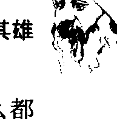
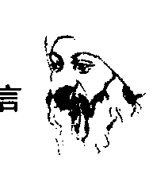
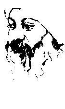

# 道德经心释【上】

〔印〕奥修◎著

## 序 言 老子他说

人生的旅程真的就像一条河流，有时候流到东，有时候流到西，有时候冲到北，有时候降到南，但是不管怎么样，最终的目的是不变的——大海。

带着热情和觉知，深入红尘，享受七情六欲的刺激，几阵滚翻之后，你就会渐渐了解：全然的欲望是到达无欲之路。然后，或许你就可以将同样的热情和觉知转向自己，在自己的身上下功夫。当你进入了这个方向，老子或许可以对你有所帮助，因为老子是生命的代言人，而且透过奥修的诠释，老子的道理更是活了起来。

虔诚地希望奥修的老子，或是老子的奥修，能够启发出你那锲而不舍的灵魂，推你、拉你、踹你、扶你，最重要的，引发你生命的热情和勇气——冲向大海……拖着生命在走似乎不怎么令人惬意……

本书所讲的内容有很多是非常宝贵的，而且是其他书上所没有讲到的，使我不禁觉得，“道”虽然只有一个，但是它的呈现却是可以非常多样化的。奥修不厌其烦地从各个角度来阐述真理，真是用心良苦，虽然他的“道”本来就是要这样走的，但是他何尝不是为了爱众生而承受一些对他来讲并不需要的肉体之苦？在深深的感谢之余，只有默默地融入“道”之中，跟奥修以及所有宇宙的神性会合。

就我的了解，奥修的“道”横跨世俗面和修道面。“除了生活以外没有其他的神”。我看到有一些奥修的门徒在观念上躲入奥修那多样化的观念，有时候甚至在让人搞不大清楚的说法里，专门挑一些适合自己个性的部分来执着，以奥修的话语作为挡箭牌，以静心作为借口，结果弄得连一般的生活都照顾不好，让外界的人误以为奥修在教人颓废，笔者深不以为然。

奥修虽然崇尚老子的“无为”，那是针对修行面而言的真理。人生还有另外一面——工作。在工作上要有计划，有安排，才能成功。如果在工作上加进静心的质量，掺入求道者的精神和质量，那是很好的，那是工作的助力，不要因为了解奥修在修行面“无为”的真理，就变得没有工作能力，这不是正确的人生。如果说你已经真正彻底放弃物质面的欲求，你已经达到无欲，所以你想将所有的精力都投放在求道面，那当然没话说，但我所看到的是：他们没有勇气去接受社会的考验，不肯吃苦，所以不愿意好好工作，因此潜意识里带着不满足的物质欲望在做静心。

奥修也曾经提过，在“有用”和“无用”之间要取得平衡。

我在一家小庙的墙上看到一则标语：“要修天道，先修人道。”我觉得颇有道理。虔诚地希望，所有钻研奥修之道的人能够在人生的各个方面都有妥善的安排。笑要笑得很全然，哭要哭得很全然，享受时要很全然，静心时要很全然，工作时也要很全然。

活得尽致一点，活得强烈一点，活得危险一点，那是你的生命，不要因为别人教给你的任何愚蠢的观念而将它牺牲掉。

> ——(印)奥修

## 奥修

1931年12月11日出生于印度，21岁时开悟，1990年1月19日圆寂。早年以优异的成绩毕业于印度沙加大学哲学系，曾获全印度辩论冠军。在印度杰波普大学担任了九年哲学教授之后，周游各地进行演讲，根据他的演讲内容已整理出版了650多部著作，并被译成32种语言行销世界各地。

## 目录

- 序 言 老子他说 1
- 第一章 知与道 3
- 第二章 道可道,非常道 23
- 第三章 欲取天下而为之 43
- 第四章 知其雄 65
- 第五章 知者不言 89
- 第六章 和光同尘 111
- 第七章 为无为 135
- 第八章 企者不立 159
- 第九章 慎终如始 183
- 第十章 无欲则刚 209

## 第一章 知与道

老子说: 不必出门, 一个人就能够知道世界上发生的事; 不必由窗户往外看, 一个人就能够看到天道。

一个人越是追求知识, 他所知道的就越少, 所以, 圣人不必到处跑就能够知道, 不必看就能够了解, 不必做就能够达成。

宗教并不是知识, 它是知道。知识属于头脑, 知道属于本质, 它们之间的差别和距离是非常大的。

那个差别并非只在于数量, 它同时也是质量上的差别。

“知识”和“知道”的不同就像天堂和地狱，存在天壤之别，所以，第一件必须加以了解的事是：“知识”和“知道”之问的差别。

知识从来不属于现在，它总是属于过去。当你说你知道的时候，它已经是一件死的东西，已经在你的记忆上留下一个记号，就好像灰尘粘在你身上，你已经离开那里了。

知道永远都是当下的，就在此时此地，你不能够对它说任何事，只能够成为它，当你去讲它的时候，甚至连那个知道也会变成知识，因此那些所有知道的人都说它是不能够被说出来的，你一去讲它，它的本质就改变了，它已经变成了知识，它已经不再是那个很美的、活生生的"知道"的现象。

"知道"没有过去，没有未来，只有现在。记住：现在并不是时间的一部分。

一般人们认为时间分成过去、现在和未来，这是完全错误的，时间被分成过去和未来，而现在根本就不是时间的一部分，你无法在时间里面抓住它。追求它，你将会错过，试着去抓它，它将永远都会让你抓不到，因为它是永恒的一部分，而不是时间的一部分。

现在是永恒正在跨越时间，它是一个会合点，在那里，"永恒"和"暂时"相会合。

在现在的是知道，在过去的是知识，知识创造出未来，过去创造出未来，未来是过去的副产品。

每当你知道，你就开始计划，你知道得越多，你就计划得越多。“知道”意味着过去，计划意味着未来，那么你就不让未来有自由，你试图去将它固定在过去的小框框里，会认为它只是过去的重复，不论它是如何地被修饰和被装饰，你都会觉得它只是过去的重复。

一个生活在知识里的人就是一个计划的人，而生命是一个没有计划的流，生命是自由，你无法将它框在一个小洞里，你无法划定它的范围，那就是为什么一个生活在知识里面的人会错过生命。他知道很多，但是他又什么都不知道；他知道得太多了，但他的内在是空洞的，你无法找到一个比“知识之人”更肤浅的人，他只重于表面，一点深度都没有，因为深度来自永恒。

时间是水平的，它在一条地平线上移动。永恒是垂直的，它进入深度和高度，那就是耶稣十字架的意义：时间横跨永恒，或是永恒横跨时间。

耶稣的手是时间，它们进入过去和未来，在时间里被钉死在十字架上，复活而进入永恒。他的本性是垂直的，每一个人的本性都是垂直的，只有身体、手和你的物质部分是水平的。

知识创造出未来，未来创造出担心。你知道得越多，你就越担心，越不安，永远无法安然地度过，无法像在家一样，而内在会有一个很深的颤抖，这是一种病态。然而一个“知道”的人是完全不同的，他生活在此时此地，这个片刻就是全部，好像明天不存在一样——它的确是不存在的，而且从来不曾存在过，它是头脑游戏的一部分，是“知识之人”的一个梦。

这个片刻就是全部。“知道”垂直地进入这个片刻，进入得越来越深。一个知道的人有深度，甚至连他的表面都只是深度的一部分。他没有肤浅的表面，他的表面就是深度的一部分，而一个“知识之人”呢？他没有深度，他的深度就是他表面的一部分。

那个似非而是的现象就是：一个“知道之人”(a man of knowing)知道，而一个“知识之人”(a man of knowledge)不知道。他不可能知道，因为知识无法跟生命碰头，它反而是阻碍，唯一的障碍，就好像是：一个母亲知道那个小孩是她的，而一个父亲具有这样的知识：那个小孩是他的。但父亲只有一个“相信”，在深处他是不知道的，只有母亲知道！

有一次，木拉那斯鲁丁在一个小的国家当大官。国王非常慷慨，虽然这个小国并不是很富有。那斯鲁丁每年都会去告诉国王：自己的太太生了一个小孩。国王就会给他、他的小孩和他太太很有价值的礼物，但后来变得太过分了，因为每年都会如此。

当那斯鲁丁的太太生下第十二个小孩时，他又来了。

国王说：“这太过分了，那斯鲁丁，整个世界都因为人口过剩而在受苦，你到底在干什么？按照这样的速度下去，你将会创造出一个小的国家——停止它！让这个小孩成为最后一个！如果你无法停止，那么最好去自杀。”

那斯鲁丁感到非常沮丧，而第十三个小孩又出生了，该怎么办？他想最好不要再去找国王了，干脆到森林里去自杀，就像国王所说的。因此他来到森林，准备好每一样吊死自己的东西，只要咔嚓一下，他就会吊死在树上。突然间他说：小心！那斯鲁丁！你或许吊错人了！

父亲只是相信，但母亲知道。“知道”就好像是一个母亲，“知识”就好像是一个父亲。

所有的知识都是一种相信，但“知道”并不是相信，它是真知，它是你的知觉、洞见和成长。它就好像是母亲——小孩子在她的子宫里成长，她知道那个小孩是她的一部分，是自己的延伸，是自己的存在、血液和骨头。父亲是外在的，并不是内在的，他只是相信那个小孩是他的。

一个“知识之人”相信他知道，而一个“知道之人”是真的知道。

“真知”是你本质的一个蜕变，它就好像怀孕，你必须携带着它，必须生出你自己，再度复活而进入永恒。你必须离开时间而进入无时间，从头脑转变到没有头脑，它是某种非常重大的事，你知道它发生在你里面。

一个“知识之人”会继续从诸佛那里搜集灰尘，他相信那些知道的人，但任何他所相信的都是死的，他并没有生出他自己。他从别人那里把知识搜集过来——每一样东西都是借来的。知识怎么可以借用呢？存在的本质怎么可以借用呢？如果那个知识是真实的话，它将必须属于存在的本性。

戈齐福(Gurdjieff)常常会问一些人——有一些求道者会来找他。他经常问起的第一件事是：你对知识有兴趣，还是对本质有兴趣？

因为在这里我们要给予本质，我们不会顾虑知识，所以你要先决定好。如果你所顾虑的是知识，那么你要到别的地方去；如果你所顾虑的是本质，你就留在这里，但你要做出一个非常清楚的决定。

本质和知识之间有什么差别呢？那个差别就跟“真知”和“知识”之间的差别一样。“真知”就是本质。

它并不是某种加诸在你身上的东西，它是某种你借着成长而进入的东西。知识是某种加诸在你身上的东西，你不会透过它而成长，相反地，你会像肩负一个重担一样地携带着它，所以你总是可以找到一个“知识之人”背负着重担，他的肩膀上扛着好几座山的知识。你可以看到他的脸非常严肃，死气沉沉地严肃。在重担的压迫之下，他的心已经完全被压碎了。

一个有真知的人是没有重量的，他没有携带任何东西，可以飞进天空，地心引力影响不到他，不会被拉向地面，因为地心引力只能把重的东西往下拉。他停留在地球上，但他不属于地球。那就是耶稣话里的意思，他一再地说：我的王国不属于这个世界，它属于另外的世界——本质的世界、永恒的世界。

如果你能够将这其中的区别了解得非常清楚，那么你要记住：永远不要走知识的路线，要走在本质和真知的途径上，因为唯有如此你才能够得到某些东西，并不是你有了更多的信息，就变得更多，那是必须加以了解的重点——你必须变得更多。

你的贫乏不在于信息，而在于本质。你是贫乏的，但是你继续透过累积东西来隐藏贫乏。知识也是一样东西，话语、理论、哲学、系统、神学，这一切都是东西，它们很不明显，十分抽象，但还是东西。你并没有在成长，你仍然保持原貌，在你的周围创造出一种欺骗，说自己已经知道。

老子的这些经文必须以这样的方式被了解。

不必出门，一个人就能够知道世界上发生的事。

因为在内在深处，你就是世界，世界只不过是你的扩大，事实上并不需要去任何地方，或是去知道任何事，如果你知道你自己，你就已经知道了整个人类；如果你知道了你的愤怒，你就已经知道了所有的愤怒；如果你知道了你的暴力，知道了所有的战争，不需要去越南，去韩国，去巴勒斯坦，或是去任何地方。如果你知道了你的暴力，你就知道了所有的暴力；你知道了你的爱，你就知道了所有的——整个爱的历史，从来没有被写下来的，从来不曾被知道的——甚至连这个你都知道，因为你就是种子！

这就好像从海洋中取来一滴水，你去分析它，如果你知道那一滴水，你就知道了整个海洋，因为整个海洋都被浓缩在那一滴水里面，它是一个迷你的海洋。如果你知道它是由一氧化二氢所组成的，那么你就知道整个海洋都是由一氧化二氢所组成的，如此一来，就不需要一直分析下去，只要一滴就够了。如果你知道一滴海水的滋味，知道它是咸的，你就知道整个海洋都是咸的，而那一滴海水就是你。

不必出门，一个人就能够知道世界上发生的事……

因为你就是世界，是一个极其微小的世界，每一件事都发生在你身上，在世界上所发生的或许规模更大，数量更多，但质量是一样的。当一个人了解他自己，他就了解了一切。

在优婆尼沙经里有一个很美的故事：一个叫史维特凯图的年轻人从他师父那里回来，他已经变得很有学问，当然，和所有年轻人一样，他对他的学问感到非常骄傲因而十分傲慢，而且很自我。父亲乌达拉克从窗户看到儿子——史维特凯图正进入村子。他变得很伤心，这根本就不是学习！儿子变成了一个“知识之人”，这并不是真知。乌达拉克告诉他的心：我送他去学习并不是为了这个，他错过了要点，他浪费了他的时间。因为真知是谦虚的，而谦虚并不是自我的相反，跟自我根本没有关联，甚至不是它的相反，因为即使是它的相反也携带着它的某种东西。

没有感觉到儿子的谦虚，父亲变得非常伤心。他已经渐渐变老了，而现在儿子却浪费掉他生命中好几年的时间——他为什么看起来那么骄傲？真知永远都会使你变谦虚。

谦虚 (humble) 这个词是很美的，它来自 humus 这个词根，这个字根真正的意思是泥土的，属于大地的，不矫饰的，这个字根也是人类 (human) 和人性 (humanity) 这两个词的词根。唯有当你变成谦虚的，你才会具有人性，唯有当你属于大地，你才会变成谦虚的，这里所指的大地意味着不矫饰的、单纯的、没有被制约的、纯朴的。

他看到他儿子变得很骄傲，很傲慢，他一定是变成了一个知识之人——他的确是变成了这样的人。史维特凯图回到家里，向父亲行了顶礼，但那只是一个仪式。一个已经变得那么自我主义的人怎么能够鞠躬？

父亲说：史维特凯图，我看到你的身体弯下来，但是你并没有弯下来，到底是什么不幸的事发生在你身上？你为什么看起来那么傲慢？一个有真知的人会变得很谦虚。你听过任何关于那个“一”的事吗？知道了那个“一”，一个人就知道了一切。

史维特凯图说：你在说什么？一个人怎么能够借着知道“一”而知道一切？那是荒谬的！我在大学里面知道了一切能够被知道的，在那里所教导的主题上面，我都尽可能去深入学习，我已经学尽了一切。我师父告诉我：现在你已经知道了一切，你可以回家了。我是到了这样的程度才回家的，但你在说什么，那个“一”？从来没听过，在大学里从来没有人谈过它。我们学了语法、语文、历史、神话、哲学、神学、宗教和诗歌，任何人们所知道的，我都学了，而我对那些科目都很熟悉，我以最佳的成绩毕业，但我们从来没有听过那个“一”，你在说些什么？你疯了吗？一个人怎么能够借着知道“一”而知道一切？

乌达拉克说：是的，那个“一”就是你。史维特凯图，那个就是你。如果你知道这个“一”，你就知道了一切，而你现在所知道的都只是一些没有用的烂东西，你浪费了你的能量，回去！除非你知道了那个“一”，由它你才可以知道一切，否则永远不要再回来。因为，乌达拉克告诉他的儿子：在我们的家族里，没有一个人只是名义上的婆罗门，我们称自己为婆罗门，因为我们知道梵天。如果你不知道那个“一”，你就不属于我们这个家族，回去！

那个“一”就是你，一颗非常小的种子，小到你几乎看不见，除非你追寻得很深，追寻了很久，不屈不挠，否则你碰不到它。

那颗种子就在你里面，那是你的内在，整个广大的世界只不过是你被写在一张广大的画布上。人就是人类，你就是世界。

> 老子说：

不必出门，一个人就能够知道世界上发生的事；不必由窗户往外看，一个人就能够看到天道。

不需要由窗户往外看，窗户就是你的感官——眼睛、耳朵、鼻子——这些就是窗户。

不必由窗户往外看，一个人就能够看到天道。

你可以在内在看到那个最终的。

你是否曾经看过佛像，眼睛闭起来静静地坐着，一动也不动？

在印度有一些关于那些静坐很久的人的故事，小鸟开始栖在他们身上，并且在他们的头发上筑巢，很多蚂蚁在他们身上爬，这些蚂蚁完全不知道这里坐着一个人，它们已经开始住在那里。

这些人到底在干什么？昆虫在他们身上爬，把这一身体视为一个很好的支撑。他们坐在那里一动不动，到底是在干什么？他们并没有在做任何事。关起他们所有的窗户，他们是在看奇观中的奇观，是在看他们自己，这是一个很大的奥秘，这是一个非常美的现象，在其他地方都永远无法碰到像这样的事，因为不论你去哪里，不论你看到什么东西，那个报告都将都是第二手的。

我可以看到你的脸，但是我的眼睛将会是居间者，它们将会报告，我永远无法直接看到你的脸，它将永远都是间接的。我可以到玫瑰花园去看漂亮的花，但那个美是二手的，因为我的眼睛将会报告，有一个代理的东西在中间，我无法直接跟玫瑰接触，眼睛永远都是居间者，芬芳的气味会透过鼻子而来。我可以听到小鸟的歌唱，但歌唱将永远都是二手的，除非你知道第一手的，否则你怎么能够知道天道？怎么能够知道那个最终的？那个存在的最初基础？只有一个可能性能够直接跟最终的直接接触，立即接触，不要有任何居间者，那就是：在你自己里面。关闭所有的门和窗户，进入内在。

曾经被生下来

## 第一章 知与道

伟大的神秘家，无与伦比。她坐在她的茅屋里，闭着眼睛做事，没有人知道她在干什么。另外一个叫作哈山的神秘家跟她在一起，那是一个早晨，太阳渐渐升起，当时的景色非常美，小鸟们在歌唱，树木很高兴再度看到光，整个世界都在庆祝那个早晨。哈山站在那里，他叫着拉比亚：拉比亚，出来！看神的光辉！多么美的一个早晨！拉比亚说：恰恰相反，哈山，你要进来看神本身。我知道那里很美，有创造物的美，但它跟创造者的美相比并不算什么，所以你反而要进来！

我不知道哈山是否了解，但整个故事就是这样。知识向外走，当你向外走时，你可以知道很多东西，但它将会是第二手资料。

科学就是如此，总是二手的，它永远不可能是第一手的，永远不可能有宗教所能有的新鲜。

不论爱因斯坦进入多深，那个深度都是属于外在的，在从它走出来的时候，他不可能感到很新鲜。在爱因斯坦最后的几天里，他也感觉到了，就在他过世之前两三天，有人问他：如果神给你另外一个机会来到这个地球，你会想要成为什么？他说：下一次我不想成为一个科学家，我比较喜欢变成一个修水管的工人。我喜欢过着一种简单而平凡的生活，我想在外面的世界完全不知道我的情况下过日子，我想要默默无闻地过日子，没有人知道有关我的事，因而也不会有人来打扰我。

他在正确的方向上探索，在他所探索的方向上，他随时都可以成为一个佛。

当一个人对外在感到腻烦，就会转入内在，然后他就会关起所有的门和窗户，只在内在休息。

不必由窗户往外看，一个人就能够看到天道。

科学继续去发现很多法则，但它永远无法发现“那个法则”，“那个法则”就是“道”这个词的意义。

科学继续去发现很多神，但它永远无法发现“那个神”，“那个神”就是“道”这个词的意思，就是那最终的，超出它之外没有什么东西存在，超出它之外没有什么事是可能的。

科学每天都继续在发现。当科学发现更多，就有更多旧有的理论被抛弃，被丢进垃圾桶里，每一个科学理论某一天都将会遭到这样的命运，所有的科学理论到头来都一定会被丢进垃圾堆里，因为它们不知道“那个法则”，它们只是湖里的映像，而不是真正的月亮。真正的月亮在内在，整个世界都好像一面镜子一样地在运作。

当你在一朵玫瑰花里面看到美，你是否曾经思考过这样一个事实：那个美是在玫瑰花里面，或是那个美是由你倒进去的？因为有些时候你也经过同样的玫瑰花丛，但什么事都没有发生，没有什么特别的东西，没有什么不寻常的东西，只是一朵普通的玫瑰花，但在另外的时候，另外的心情、另外的头脑之下，突然间，它就呈现出一种美，一种味道，它变成了一个美的层面。所发生的事是：那朵玫瑰花只不过是一面镜子，任何你所看到的就是你倒进它里面去的。

你到一面镜子前，你往镜子里看，镜子只是反映出你，那就是你。如果你很丑，镜子就会反映出一个丑的像；如果你很美，镜子就会反映出美。

有一些片刻你是丑的，那么所有的玫瑰都变成丑的；有一些片刻你是悲伤的，那么所有的月亮都变成悲伤的；有一些片刻你处于地狱之中，那么整个地球就变成了地狱。你在你的周围创造出实相，你将实相投射到你的周围。在你里面有创造者，借着那个创造者，你就知道了一切。

那就是为什么好几个世纪以来，美学的思想家一直试图去定义美是什么，但是却没有办法定义它。他们做不到，因为美并不存在于外在，它是由内在发出来的。玫瑰花并不是美的，是你在它的周围创造出了美，它就好像是一个挂钉，你将美挂上去，它就变成美的。那就是为什么当一个诗人经过，那朵玫瑰花是那么地美，你简直无法想象！ 而有一个科学家经过，他完全无视玫瑰正在开花，以及有玫瑰花存在的这一事实；有一个生意人经过，他看着那朵玫瑰花，然后心想，如果他将那朵玫瑰花卖掉，就能够赚多少钱；接着有一个小孩过来，他摘下那朵玫瑰，玩了一会儿，然后就忘掉了，又继续走他的路……玫瑰花本身并没有什么，是你将意义带给了它。

每天都有人来到我这里，他们一再地以很多方式问：人生的意义是什么？它没有意义，是你将意义带给它的，是你创造出那个意义。意义并不是一个客观的事实，所以不要去找寻意义，如果你继续找寻，你一定会碰到那个真理：人生是没有意义的。

西方的存在主义者就是这样发现人生是没有意义的，而他们就停顿在那里，那是很不幸的。在东方，我们也知道它，但是我们从来不停顿在那里。佛陀也知道人生是没有意义的，但是他从来不停顿在那里，这是一种半途停止。人生是没有意义的，但是那并不意味着你的人生需要成为没有意义的，不，如果你不带意义给它，它是没有意义的。在它里面没有意义，意义必须被给予。你将你的整个存在都注入生命，它就充满了意义而变得很有活力，能够唱歌跳舞，它就变成神圣的。

人们问我：神在哪里？你能不能显示给我们看？我无法将神显示给你看，没有人能够这样做，因为神必须在内在才能够找到。当你在内在找到他，你就能够在任何地方看到他，在一朵玫瑰花里面你也会看到他，那朵玫瑰花将会变成一面镜子，你在它里面就可以看到神。一只小鸟在早晨歌唱，突然间那个音调就会有一个味道，那是以前从来不会存在过的，那是你贡献给它的，使它变成神圣的。

一旦在里面发现神，每一样东西都变得神圣，如果你尚未在里面发现它，你会继续问神在哪里，问他的地址，那么你将永远无法到达。所有的地址都是假的，因为他住在你里面，他不需要地址。

有一个很美的非常古老的故事：据说神创造了世界，每一样东西都很美；接着他创造出人，由此每一样东西都变得很恐怖。随着人的出现，地狱就进入了，然后人开始抱怨，神变得几乎不可能睡觉或是做任何事，有那么多人日以日夜地敲他的门，这一切变成一个噩梦，他一定想过很多次要把人摧毁，好让世界可以再度得到和平。

但是有一些聪明的顾问说：不需要把人摧毁，你只要改变你的住处，不要住在这个地球上。（他以前住在这里，因为你的关系，所以他必须改变他的住处。）所以神说：我应该去哪里？

其中一个顾问说：你最好去埃弗勒斯峰。神说：你不知道，迟早有一个叫作喜拉利的人会到那里，整个事情又会再度开始。又有人建议：到月球上。神说：你不知道，这并不会有太大的帮助。人迟早会去每一个地方。请建议一个人们甚至连想都想不到的地方吧。一个年老的顾问靠过去在他的耳边说了一些话，他终于点头了，他说：是的，你说得对。那个老年人建议：那么你就隐藏在人里面。人永远都不会想到，除了他自己的内在世界之外，他会到处去找寻和追寻。

这个故事很美，几乎是很实际的，好像不是一个故事，而是一件真实的事。

不必由窗户往外看，一个人就能够看到天道。

一个人越是追求知识，他所知道的就越少。

这个看起来好像似是而非，但只是看起来如此，其实不然。它是一个简单的事实，一个人越是追求知识，他所知道的就越少。到一些博学家那里，他们知道很多，但是你去洞察他们的眼睛，就会发现甚至连一道光线都没有；注意看他们，甚至连一个真知的样子都没有。跟他们在一起，什么都没有，他们是空的，完全虚假的，里面什么东西都没有，只是一个表面画有东西的空洞，一个表面有装饰的空洞，由很多经典装饰，由他所知道的话语所装饰，但这一切都是借来的，都是死的。被这些死的文字所包围，他们本身几乎也变成死的了。

到一个“知识之人”那里，你将会在他的周围尝到灰尘，他或许看起来非常老，非常古老，几乎已经在坟墓里面，你无法找到那个新鲜，它是生命的
一部分。你在他里面无法看到一条活的河流，永远都在流向未知。知识是一个界限，不管它是多么地广博，仍然是一个界限。那就是为什么苏格拉底说：当我年轻的时候，我以为我知道一切；当我变得更成熟一些，我开始怀疑，并且了解到，我并没有知道那么多；当我变老，我了解到自己根本就不知道。

有一次，德尔菲的神论宣称：苏格拉底是现今地球上最有智慧的人。听到这话的人去找苏格拉底，他们说：这是一个矛盾！我们觉得很困惑，到底谁是对的？如果那个神论是对的，那么你是错的；如果你是对的，那么那个神论就是错的，不可能两者都错。我们相信你，知道你，并且一直都在你身边，能感觉到你，你一定是对的，任何你所说的不可能是谎言，但是那个神圣的神论，它从来没有被发现撒过谎。一切由德尔菲的神论所预测的一直都被发现是对的，所以我们被陷住了，请你帮助我们。你说你什么事都不知道，事实上你说你只知道一件事：那就是你什么都不知道。然而这个神论却说苏格拉底是地球上最有智慧的人。

苏格拉底说：一定是一些误解，因为我对我自己的认识比其他任何人都来得多，我要再度告诉你们，我什么都不知道，最多我只能够允许说：我知道我什么都不知道——就这样而已。你们再去问神论，可能有一些误解，要不然就是你们没有解释正确，或是有其他的原因……因此他们就再去问神论，神论笑着说：那就是为什么我们说他是地球上最有智慧的人，因为他只知道说他什么都不知道。

没有矛盾，这就是智者的指标：他已经了解到知识是没有用的，知识根本什么都不知道，知识是垃圾，知识是胡说八道，不论它假装多么地合乎逻辑，那些都只不过不过是伪装。

一个人越是追求知识，他所知道的就越少。

为什么会有这样的事发生？因为你越是追求知识，你就越远离你自己。你越是试图要在外在于你的地方找到某一个真理，你就越远离整体而找寻整体，你就越远离你自己而找寻你真实的本性，并在找寻当中越远离意识。

你在找寻什么？你在找寻的已经在你里面。宗教就是在找寻那个已经存在的、已经是真相的。

如果你越是远离你自己，就会知道得越来越少，而你却认为自己知道得越来越多。你将会知道经典、文字和理论，可以利用这些文字继续去编织得更多，以此来建造你的空中楼阁，但它们只不过像空气似的，抽象的，它们并不存在，是由与梦同样材质的东西所做成的，思想也一样，就像海洋表面的微波，在它们里面没有什么实质的东西。如果你想要知道真理，那么你就回家。

我一直都说：找寻，你将会错过；不要找寻，你就会找到，因为那个想要去找寻的努力意味着你理所当然地认为它并不是已经跟你在一起。打从一开始，你的找寻就注定会失败。

在找寻、追寻和累积知识当中，有一天，那个事实将会很明显地呈现出来——你是一个傻瓜。如果你在你进入广大的世界去找寻之前你能够向内看，那一定会更好。

又有一个关于拉比亚的小寓言。一天傍晚，太阳西下，邻居发现她在街上找东西。拉比亚是一个年老的女人，每一个人都爱她，当然，每一个人都认为她有一点疯狂，但她是一个很美的人，因此他们都赶去帮她的忙。他们问：到底丢掉了什么？你在找什么？她说：我的一根针。我正在做一些针线活，但是我把针弄丢了，请你们行行好，帮我找。于是他们都开始去找针。

有一个人说街上那么大，而针是那么小的一样东西，除非他们很准确地知道它掉在哪里，否则几乎不可能找到。他问拉比亚：请你告诉我们丢针的准确位置。拉比亚说：不要那样问，事实上我并不是在自家外面丢掉它的，我在里面丢掉它的。

他们都停止找寻，说道：你这个疯女人！既然那根针是掉在家里，为什么要在外面街上找？拉比亚说：家里很暗，而外面还有一些光亮，在暗暗的地方要怎么找？你们都知道我很穷，甚至连一盏灯都没有，当黑暗的时候要怎么找？所以我才会在这里找，因为这里还有一些阳光，可以想办法找。

那些人笑了，他们说:你真是疯了！我们都知道在黑暗中很难寻找，但这样的话唯一的方式就是向别人借一盏灯在家里找。拉比亚说:我从来没有想到你们这些人都那么聪明，那为什么你们一直要在外面找？我只是在遵循你们的方式，如果你们那么了解，为什么不从我这里借一盏灯去内在找寻？我知道那里是黑暗的……

这个寓言很有意义。你在外面找寻是有原因的，因为在内在每一样东西都是那么地黑暗。你闭起眼睛，那就是黑暗的夜晚，你什么东西都看不到，即使有什么东西被看到，那也只是外在的一部分反映在内在的湖里，有一些思想在飘浮，那是你从市场上搜集过来的，有很多张脸来了又去，但是它们属于外在世界。只是因为外界的反映和广人的黑暗，一个人会变得害怕，就会想最好到外面去找寻，至少那里有光。

但那并不是要点。你是在那里丢掉你的真理的？是在那里丢掉你的本性、你的神的？是在那里丢掉你的快乐和喜乐的？最好在进入外在世界的无限迷宫之前，先看看内在，如果你在那里无法找到，那么你就去外面找，但那样的事从来没有发生过。那些向内看的人永远都会找到，因为它已经在那里。只需要去看，只需要一个转变，一个意识的回头，一个很深的看。

一个人越是追求知识，他所知道的就越少，所以，圣人不必到处跑就能够知道……

在跑来跑去当中，你就错过了，你在浪费生命、能量和机会。不要继续在那里跑来跑去，停止跑动，所有的静心就是关于这个：停止跑动，静静地坐着，关起你的门和窗户，定于内在，在内在休息，在内在放松，让那个动荡变得稳定一点，然后开始看。

在刚开始的时候，似乎是在黑暗中摸索，在刚开始的时候将会非常暗，但是当你习惯于它，那个黑暗会开始改变它的质量。

它就好像当你从外面进来，那是一个大热天，太阳很大，你进到屋子里面，一时什么都看不到，每一样东西看起来都很暗，因为眼睛集中在太阳，眼睛已经习惯太多的光，然后有一个突然的改变，眼睛必须花一点时间才能够调整过来，就这样而已。耐心是需要的，当你向内走，你将不会看到 anything，不要失去耐心，不要在一分钟之后就说诸佛都是假的，他们说内在是喜乐，但是我什么都看不到。

它曾经发生在西方一个最具有穿透力的思想家身上，他的名字叫作大卫·休谟 (David Hume)，他一再碰到东方的教导——走进内在，闭起你的眼睛，然后看。有一天，他想：让我们来试试看，其实他知道得很清楚，在那里什么都没有。这些东方人是疯的、不合逻辑的、非理性的、内向的，他们只是在愚弄他们自己，他们愚弄不了别人。他说：最好至少要试试看，他闭起他的眼睛，只有一分钟，然后他睁开眼睛，在他的日记里写下：除了黑暗以外什么都没有，有一些思想在飘浮，有一些感觉，其他就没有了……

不要那么没有耐心，等一等，让事情在里面安定下来，它需要时间，你已经有很多世没有将它们安定下来，要安定它们需要花一些时间和一些耐心，其他任何东西都不需要，你不需要试着去安定它们，因为那将会再度打扰它们，你将会更加地搅动它们，你只要什么事都不做，这就是老子那一句“无为”的意思，借着不做来做，你只要什么事都不做，然后它就会发生，那就是借着不做来做。只要闭起你的眼睛，然后等待、等待，又等待，你会看到有很多层打扰在消失，在安定下来，所有的事情都会变得各得其所，然后就会有宁静，渐渐地，黑暗就变成光，然后那个“一”就被知道了，借着知道那个“一”，一切就都被知道了，因为那个“一”是种子，那个就是你，史维特凯图。

所以，圣人不必到处跑就能够知道，不必看就能够了解，不必做就能够达成。

那个根本什么事都不做就达成的事，是最大的成就。记住：任何你所能够做的都无法超出你，它怎么能够超出你呢？如果你去做它，它将会保持比你更
低，它无法走得比你更高。任何你所做的都将会是你头脑的一部分，它不可能是超越的。任何你所做的都将会是由自我来做的，它不可能是你的本质，所以“无为”就是去做它的唯一方式。

静静地坐着，什么事都不做，草木就自己生长，那个努力和那个作为是静止的，有一个很深、很广的宁静会降临到你身上……就在几天之前，我在读一首日本的诗，其中有一句话深深地打动了我，它变成了我内心的一部分，它说：

+   - 没有小鸟在歌唱
- 整座山变得更宁静

当没有任何作为，甚至连小鸟都不再唱歌，没有什么东西在那里，每一样东西都很镇定、很安静，突然间你会觉知到打从一开始就不缺任何东西，那个你在找寻的，你一直就是那个，突然间你会了解到那个师父中的师父就坐在宝座上，然后你会开始笑。

当布克由成道，成道？不要把这个名词看得太严肃，它并不是什么严肃的东西，它是最终的乐趣，它是最后的笑话。布克由成道之后，他开始大笑，捧腹大笑，他变得很疯狂，人们聚集起来问：到底是怎么一回事？请你告诉我们，到底发生了什么？他说：没有发生什么，我以前疯了，一直在找寻那个已经在我里面的。

每当有人问布克由：当你成道的时候，你做什么？他说：我笑了，笑得很大声。他还说：我还没有停止笑，不管你是否听到它，那并不是重点，我还没有停止笑，这是多么大的一个笑话！你已经有了它，而你却一直在找寻和追寻而找不到它，并不是因为它不在这里，而是因为它就在那里，跟你是那么地靠近，以至于你看不到它。

眼睛能够看到远处的东西，因为眼睛要看的话需要一个距离，手能够碰触那个不同的和有距离的东西，耳朵能够听到外界的东西，那就是为什么老子说他不需要看就了解，因为你怎么能够看你自己？谁会看到谁？在那里，看者和那个被看的是同一的，不需要眼睛。要由谁来做？要由谁来作那个努力？就好像是一只狗在追逐它自己的尾巴，只会很愚蠢……

这就是你正在做的：追逐你自己的尾巴。停下来看，它是你的尾巴，不需要去追逐它，借着追逐，你将永远无法得到它；借着追逐，你就错过了；借着不追逐，你就达成了。

……不必做就能够达成。

然后时间会消失，“知”也会消失，因为“知”就是要去知道什么，“知”是一种去知道的能力，一旦你已经知道，那么那个能力就不需要再继续存在了，因此它也会消失。

时间消失了，时间之所以存在是因为你是受到挫折的，它是由你的挫折所创造出来的，好让你能够对未来有希望，那个希望多多少少可以让你能够忍受那个挫折，并且安慰你自己。

头脑和时间并不是两样东西，而是同一样东西的两个面，当两者都消失，你就首度带着全然的光辉而存在，也可以这样的方式来说：

## 道德经心释 (上)

君子。

你试着去成为不自私的，但那是不可能的，即使在你努力去成为不自私的时候，你也会保持自私。所以你会创造出一个二分性，一个冲突，任何你在表面上所说的，在内在深处你都会继续去否定它，你知道得很清楚，因为你怎么能够欺骗你自己？表面上说着一件事，但是深处却继续在鼓吹跟它相反的一面。

有一次，在法院里有一个对那斯鲁丁不利的案子在审理，法官问：那斯鲁丁，你跟这个女人睡过觉吗？那斯鲁丁说：没有，阁下，根本就没有，阁下，甚至连送秋波都没有。

情形就是如此。你说了某些事情，然后你内在的深处就立刻反驳它，你变成一个矛盾，你变得很紧张，因此你的生命变成一个很深的痛苦，一个受苦的过程。

我教你要完全自私，因为我教你的是自然的状态，但如果你很清楚地了解我——那是困难的，你可能会误解我——如果你真的很自私，那么就有很多东西会从你的生命流出来，那是绝对不自私的，因为当一个人奠基在他自己的本性上，他就会有很多东西可以分享，有很多东西可以给予，不需要成为利他的。

如果你归于中心，那么你是利他的，因为你会有洋溢的爱和洋溢的本质，你必须去分享。你就好像是一朵花，那么地充满芬芳，它一直跟风分享它。你就好像是一个有蕴涵的存在，你在你里面携带着很多东西，所以你必须去给予，必须去分享，借着分享，它会更加成长，但你是从你的中心来分享它。

所以我并不是在说当你变成自私的，你就是自私的，不，刚好相反。当你试着去成为不自私的，在你的内在深处，你仍然保持着自私，当你变得完全自私，有一种很美的不自私会发生在你的生命中，但你甚至不会意识到它，因为如果你意识到它，它就是假的。

自然而且健康的事不需要意识。你意识到你的呼吸吗？是的，当有什么不对劲的时候，当有病的时候，呼吸不顺畅的时候，你就会警觉，会收到警讯，会变得有意识，否则呼吸一天二十四个小时日以继夜地在继续着，不论你是在

## 第二章 道可道,非常道

睡觉或睡着，不论你是在处于爱之中或是处于恨之中，不论你是在动或者是坐着，不论你做什么，那个呼吸还是继续着，它并不依靠你要对它有意识，而它不必依靠你的意识是幸运的，否则你一定老早就已经死掉了。

如果你必须对它小心，你必须去做它，那么它一定在很久以前就停止了。

不自私必须就像呼吸一样，你必须归于中心，然后它就会发生。不自私并不是自私的相反，不自私是完全自私的副产物，这就是我所要教给你们的。所有的教会，所有的宗教以及所有的教士和布道家，他们所教给你的刚好相反，他们腐化了人类，他们毒化了你的头脑。

你无法归于中心，而你试图要去帮助别人，要去服务他们。唯一你所能够给予的帮助，第一件而且是最基本的事就是归于中心以及根入在你自己里面。

是的，成道是一种自私的找寻。

这是我所要给你的一半答案，再来我要给你另一半。因为成道是一种自私的找寻，是最自私的，无比地自私，所以你无法透过找寻而达到成道。那个找寻将会使你成为一个很美的人，它可以使得你变得更有智慧，更慈悲以及其他很多很多，但不是成道。

所以对我来讲有三种类型的人存在，其中一种就是所谓的宗教人士——有道德的、清教徒或是所谓的好人，他们继续试着去成为不自私的，但仍然保持着自私。第二种人就是那些知道除了自私以外没有其他方式可以存在的人，他们已经变得归于中心，变得不自私，他们透过自私而达到不自私，那种不自私是一个副产物，他并没有作任何努力去达到它。第三种人是既不自私，也不是不自私的人，他是成道的人，他已经超越了二分性，甚至超越了他自己。

隐藏在你自己里面的是“无我”，隐藏在你背后的是空，是无物，也就是佛陀所说的“尚雅塔”——绝对的空无。

所以，第二部分的答案是：你无法透过找寻而达到成道。所有的找寻在归于失败，因为直到那个追寻者丧失之前，成道是不可能的。如果有找寻，那个追寻者怎么可能丧失？如果有自己，那个追寻者怎么可能丧失？

## 第二个问题：

知识、智慧和了解之间有什么不同？

有很大的差别,那个差别并不是数量的,而是质量的差别。知识是一种相信,知识是别人的经验,而不是你自己的经验。他们说有神,而你相信它,那就是知识。

一个年轻人可以变得非常博学多闻,没有问题,你需要很好的记忆力,你需要作一些努力。某一天,这样的事情可以由电脑来做,你可以将一部电脑放在口袋里,不需要在图书馆里查数据查得半死,电脑就可以携带所有的知识。

记住:不久电脑就可以取代你所有的知识,博学家将会从世界上消失,而电脑将会取代它们的位子。我故意说“它们的”位子,因为博学家是一个机械装置,他不是一个人。

你们都是这样在对待头脑——继续将信息喂给它。

知识是借来的,别人知道它,而你相信他们一定是对的。智慧来自你自己的经验。知识是一种累积,智慧也是如此,但知识是别人经验的累积,而智慧是你自己经验的累积。一个年轻人永远不可能有智慧,他可以是博学多闻的,但要有智慧的话需要时间。老年人是有智慧的,因为你必须经历过很多经验。

你可以读很多谈论爱的书,你可以知道很多关于爱的事情,以及别人对它怎么说,但要知道爱本身的话,你必须有亲身的体验,那是需要花时间的。等到你知道关于爱的某些事情,你的青春已经走掉了,你将会变老,却是有智慧的。

老年是有智慧的,年轻只能是博学多闻的。智慧是一个人经验的累积,而知识是由你来累积别人的经验。

那么了解是什么?了解是非累积性的,不管它是别人的经验,还是你自己的经验,只要你自己相信,那又有什么差别呢?那个经验属于过去,已经不复存在，而你也有了很多的改变——每一个人每一个片刻都在改变——一个说“在我年轻的时候我经验到这个”的老年人是在谈论别人，因为他们已经不再一样了。

智慧比知识更接近一些，但并不是非常接近。了解是非累积性的，你既不累积你自己的经验，你也不累积别人的经验。你不需要累积，你成长。了解总是新鲜的，智慧会有一些灰尘，稍嫌老旧了一些，它总是属于过去——你自己的过去。知识也属于过去——别人的过去。但它最终有什么差别呢？因为你自己的过去和别人的过去同样地都非常远离你，你已经跟以前不再一样了。河流每一个片刻都在流动，年老的赫拉克利特说：你无法两次踏进同一条河流。

你无法两次踏进你自己的青春。你从自己的经验当中学习到了一些东西，然后你携带着它。知识可以被洗掉，智慧也是如此。它们可以被洗脑，完全从你的头脑中抹去。了解从来没有办法被洗脑，它并不是头脑的一部分，它是非累积性的。一切累积的东西都是累积在头脑里。了解是你的本性，它无法被洗掉，你无法对一个佛洗脑。事实上，他自己已经将他自己完全洗脑了，完全洗清了他自己，你怎么能够再清洁他？他是不累积的，而是一个片刻接着一个片刻去生活。他的存在透过生活而成长。如果你的知识透过生活而成长，它是智慧，如果你的存在透过生活而成长，它是了解，如果不透过生活，而你的累积增加，它是知识。

了解是本性真正的开花。一个具有了解的人就好像镜子一样。镜子并没有携带任何东西，镜子一直都生活在即刻，不论什么东西来到它的前面，它就反映。

你问我一个问题，那个问题可以透过知识来回答——透过别人的经验来回答；可以透过智慧来回答——透过我自己的经验；问题也可以透过了解来回答，那么我就只是一面镜子，只是反应。你问问题，你来到我镜子的前面，我就只是反应，那就是为什么一个具有了解的人会一直被觉得是矛盾的，前后不一致的，因为他能怎么样呢？他并没有携带着过去，他的回答并不是来自他的过去，而是在当下这个片刻来自他的本质。世界每一个片刻都在改变，是一
## 第二章 道可道,非常道

个经常的变动,所以怎么能够再给旧有的答案? 即使那些话语看起来是旧的,但回答也不可能是旧的。

了解是不重复且不累积的。智慧是累积的,重复的;知识也是累积的、重复的。知识是纯粹的相信,智慧则有一点经验在里面,但了解是完全不同的,它是你的“在”,你那镜子般的“在”,它是一种自然反应。

老年人可以是有智慧的,年轻人可以是博学多闻的,只有小孩可以是具有了解的,那就是当耶稣说“只有那些像小孩的人才能够进入我神的王国”的意思。

当你再度变成像小孩子一样,很新鲜,不携带任何过去,在你里面不携带任何已经准备好的答案,不携带任何答案,只是一个很深的空,那么就会有某种东西在你里面回音。有人问了一个问题,没有答案来自记忆,没有答案来自经验,但答案是一个当下自然的反应。

了解永远都属于此时此地。

了解是能够发生在一个人身上最美的事。抛弃知识,然后也抛弃智慧,不要相信别人的经验,也不要相信你自己的经验,因为它们都属于过去,你已经从那里经过了,它们已经不再是存在的一部分,事情已经又继续流动了,河流已经在一千零一座桥底下流过,它已经不再是同一条河流,即使你看到它在流动,它也已经不是同一条河流了,它经常在变动。

除了变是不变的之外,其他每一件事都在变。在存在里面，“变”是唯一永恒的因素,所以你怎么能够依赖过去? 如果你依赖过去,你将永远都会错过现在。

聪明的老年人,他们总是准备给任何人伟大的忠告,他们充满忠告,但没有人听他们的话,而那是好的,永远都不要去听,因为你将永远无法跟他们经历同样的经验,那个河流将永远都不会一样。如果你跟随他们,你将会变成虚假的,不真实的,你将会成为一个谎言。

也永远不要听你自己的经验,因为你也是每天都在变老,昨天永远都会给予忠告。一个新的情况产生,然后昨天就在那里准备好,昨天说——那个在你里面的老人说:这是忠告,做这个,因为我们昨天这样做,效果很好,很
## 第二章 道可道,非常道

成功。

不要听你内在的老人，要很警觉，要觉知到全部的情况，不要作固定式的反应，要自然反应。如果每一件事物都是新的，那么就让你的答案也是新的，只有新的能够跟新的会合，只有新的能够解决新的。只有跟那个经常都很新鲜的在一起，对生命来讲你才会保持是活生生而且是真实的。

## 第三个问题：

当没有设定时间限制去静心的时候，我会觉知到我对时间有很大的焦虑。你说时间意识是挫折，能否请你谈论这个对时间的恐惧？

对时间的恐惧是唯一存在的恐惧。对死亡的恐惧也是对时间的恐惧，因为死亡停止了所有的时间。

没有人害怕死亡，你怎么能够害怕那个你不曾知道过的，完全不知道的，完全不熟悉的、陌生的事情？恐惧只能存在于对已知的东西。不，当你说“我害怕死亡”，你并不是在害怕死亡——你根本就不知道！谁知道呢？死亡或许比生命来得更好。

那个恐惧并不是对死亡的恐惧，那个恐惧是对时间的恐惧。

在印度，我们对两者使用同样的名词，我们称时间为“卡拉”(kala)，我们也称死亡为“卡拉”，对死亡和时间，我们使用同一个名词，它是有意义的，“卡拉”这个字是有意义的，非常有意义，因为时间就是死亡，而死亡只不过是时间。

时间在经过意味着生命在经过，因此会有恐惧产生。在西方，那个恐惧更剧烈，它几乎已经变成一种长期的病。在东方。恐惧并没有那么多，原因是东方相信生命会永远持续下去，死亡并不是终点，这一世并不是唯一的一世，在过去有千千万万世，在未来也将会有千千万万世，不需要急急

## 道德经心释 (上)

有一个伟大的禅师曾经说过：当坐着的时候，就只是坐，当走路的时候，就只是走路，最重要的是：不要摇摆不定。

时间是一个难题，因为你并没有正确地生活，它是一个征兆，它好像一个症状。如果你活得很正确，时间的问题就会消失，对时间的恐惧就会消失。

所以，要怎么做？每一个片刻，不论你做什么，都要很全然地去做它，甚至很简单的事情，比方说洗澡，你也要很全然地去做它，将整个世界都忘掉。当你坐着的时候，你就只是坐着，当你走路的时候，你就只是走路，最重要的是不要摇摆不定。站在浴室的莲蓬头底下，让整个存在都掉落到你身上，跟那些掉落在你身上的很美的水滴融合在一起。一些很小的事情，比方说清理房间，准备食物，洗衣服，或者是去作晨间散步，你都要很全然地去做它们，不需要任何静心。

静心只不过是在学习很全然地去做一件事，一旦你学会了，就会使你的整个生活都变成一个静心。忘掉所有的静心，让生活成为唯一的法则，让生活成为唯一的静心，然后时间就消失了。

记住，当时间消失，死亡就消失了，然后你就不会害怕死亡，事实上，你反而会去等待。只要想想那个现象，当你在等待死亡，死亡怎么能够存在？

这个等待并不是自杀式的，这个等待并不是病态的。你充分去经历你的生活，如果你充分去经历了你的生活，死亡就变成了全部生活的最高峰，死亡是生命的最高点、顶点、高潮。

你经历了所有的小波浪——吃、喝、睡、走路、做爱，小波浪和大波浪都经历过，然后来了一个最大的波浪——死！你也必须很全然地去经历它，那么一个人就会准备好去死，那个准备好就是死亡本身的死。

人们就是这样知道没有什么东西会死。如果你准备好要去经历它，死亡是无能的，但如果你害怕，死亡就会变得非常强而有力。没有经历的生活会给死亡力量，而一个全然经历过的生活会从死亡带走一切的力量，死亡是不存在的。

## 第二章 道可道,非常道

## 第四个问题：

你同意“历史一直在重复它自己”这个观点吗？

除了愚蠢之外，没有什么东西会重复它自己，而历史是愚蠢的，它一直在重复。

## 第五个问题：

一个人怎么能够知道他和别人都不会死？

除了自己去死以外，没有其他的方式可以知道。

有人问一个禅师，一个伟大的国王来问他。他害怕死亡，就好像每一个人一样，当然，一个国王比一个乞丐有更多东西可以失去，所以国王一定比乞丐更怕死，死亡将会从国王身上带走比乞丐身上所带走的更多东西，所以很明显地，他当然会更害怕。他已经老了，他来到禅师那里问：师父，请你告诉我一些关于死亡的事。师父说：我怎么会知道它？国王说：但你是一位成道的师父。他说：是的，但却是一个活的，而不是一个死的，我怎么会知道它呢？

这个片刻生命就在那里——去经历它！那就是为死亡而做的训练，否则当你死的时候，你将会问：生命是什么？当你在问：“死亡是什么？同样的事是否会继续到死亡之后？”这个时候你就要知道：你现在活着，但是你却错过了那个可能性和那个机会去知道生命是什么。

我要告诉你一个秘密，不要将它告诉别人，如果你一定要讲，那么也要请你吩咐他们说不要告诉其他任何人。那些还活着的人来到我这里问我：死亡是什么？鬼魂也来到我这里问我：生命是什么？

当你还活着的时候，请你要好好地去生活，好在当你变成一个鬼魂的时候，你不需要去找一个师父问：生命是什么？如果你能够知道生命，你就能够知道死亡，因为那个“知道”就是重点所在。如果你有能力去知道生命，你就会

知道死亡。

"知道"的能力必须被发展出来，那就是老子一直在说的，不是知识，而是真知。记住：如果你问我，而如果我说是的，你将能够在死亡之后还活着，那么它对你来讲将会是知识，而不是真知。

我在此并不是要帮助你的知识变得更渊博，那样做是一种罪恶，我一定会因此而受苦。我在此是要帮助你变得更"知道"，不是要给你信息，而是要给你一个情况，使得你在它里面可以成长，可以开花。

不要去管死亡，现在你是活的，那么你就是活的，充分地去经历生活，好让你能够知道它。如果你能够知道生命，那么你就已经知道了死亡，因为死亡是生命最内在的核心。

一个小孩被生下来，你认为他在七十年之后才会死吗？你错了。一个小孩被生下来，他在他里面携带着他的死亡，在他本质最内在的核心携带着死亡。他必须花七十年的时间来发现那个核心，然后有一天，突然间他就消失了。

死亡是在你里面的空无，不是其他的东西，只是在你里面的空无。它是一个很美的现象！生命很美，但它跟死亡比起来并不算什么。死亡是那么地美，在它面前，千千万万的生命都不算什么，因为死亡就是那个最高潮，它是空无。

在很深的静心当中，你将会了解到空无是什么，你将会碰到死亡，去跟它碰头就是去知道它的唯一方式。

所以，如果当你在深入静心的时候，有一天你突然觉得好像你快要死掉，不必害怕，让它死！放开来，让它发生。死亡一定会发生，而你一定会保持观照。死亡将会在你的四周围，你会在它的上面盘旋，然后知道它，但是，要让它成为一个真知，而不是一个知识。

## 第六个问题：

为什么即使一个人常常对他的障碍、问题和做梦般的存在有了很深的觉知和了解之后，从这个状态爆发而进入三摩地的现象仍然没有发生？难道觉知不足以使它发生吗？

觉知足以使它发生，但那个觉知在你里面还不够。觉知足以使它发生，但如果它没有发生，那意味着那个在你里面的觉知还不够。那个你称之为觉知的或许只不过是你的思想，否则那个爆发将会发生。

你一直在想事情，当你去想的时候，你会认为它是真实的事。

有一些人认为他们在爱，有一些人觉得他们是有觉知的，有一些人认为他们处于静心之中，但这些都只不过是思想，而不是体验，那么那个爆发将不会发生，否则它一定会发生！

如果它没有发生，那么你可以知道得很清楚，你并没有觉知，你只是在想你是有觉知的。

为什么要那么担心那个爆发？你已经进入了未来，只有思想会进入未来，觉知从来不会进入未来，觉知一直都是在“此时此地”(here-now)。我把“此时此地”当成一个词来用，它们是一体的，觉知是“此时此地”，当你开始去想未来，开始担心未来，或是烦恼结果，你是没有觉知的。只有思想会担心结果，生命完全不会担心结果，结果根本就不是重点。

你爱一个人，然后你开始去想结果，这件事将会有什么后续的发展。如果你去思考，你就是没有在爱，如果你真的爱，你就不会去想结果，它本身就足够了，不需要去任何地方。

如果你静心，静心是那么地美，谁会去管结果？如果你去烦恼结果，静心就变得不可能。“结果导向”的头脑是唯一的障碍，唯一的阻碍。并没有很多障碍，唯一的障碍就是“结果导向”的头脑，它从来不在此时此地，它一直都在某一个其他的地方想着结果。当做爱的时候，还一面想着结果。

在西方，他们甚至摧毁了那个很美的爱的现象，因为现在有一些书在给你一些关于结果的线索和观念。在做爱的时候，人们还在想性高潮会不会发生。你阻止了它，它不可能现在发生，因为带着这样的头脑，性高潮是不可能的。性高潮是一种没有头脑的状态，当头脑不在的时候，它才会发生，当你全然处于当下那个片刻，它才会发生。

在西方因为有很多人在想性高潮，所以有越来越多的教人们如何达到它的书被出版。有越多的书被出版，要达到它的可能性就越少，然后就需要更多
书,供给和需求就是以这样的恶性循环在继续着。

似乎在二十五年之内,直到这个世纪末,我们都将会看到,西方人将会变得完全没有性高潮的能力,因为当你用思想的时候,那个思考就会成为一个障碍,然后你会开始去操纵。

我曾经看过一本书叫作《如何做爱》,你能够想象有比这个更愚蠢的东西吗？爱被转变成一种技巧,那么爱也变成一种技术。

爱或神并不是技巧,它们也不是你要去做的事,它们是存在的方式,而不是作为的方式。存在的方式坚持只有一个条件要被满足,那就是:你要全然在那里。为什么要去想结果?在现在这个片刻有什么不对?现在缺少什么吗?我在这里,你在那里,树木很高兴,天空很美,还缺少什么呢?还有什么能够比当下这个片刻更完美的呢?每一样东西按照它现在的样子都是完美的,但是你的头脑说不,你的头脑说要做很多事之后,你才会变完美。这是一种病,这是头脑在过度强调结果,强调要改善,要把事情做得更好。每一样东西都已经很完美了,你不需要成为完美主义者,你这样做只会把事情弄得更混乱,你无法改善它们。只要试着停留在当下这个片刻,放松而进入现在,让未来按照它自己的路线去走。

不要成为“目的导向”的,让手段成为目的,让道路成为目标。

## 第七个问题：

在篱笆的这一边,它看起来好像不是一个笑话,而是一个肮脏的诡计……。

那是因为你的缘故,否则它是一个很美的笑话。肮脏和诡计是你的解释,抛弃你的解释,然后再看看,用新鲜的眼光来看它,它是一个笑话,而且很美,神是一个爱说笑的人。

有一则很美的犹太寓言:在一个村子里,每当他们碰到一些困难,牧师就会去森林里,在那里进行一项魔术般的仪式,对神祈祷,然后那个村子就会得到帮助。

那
个牧师过世了,另外一个牧师来接他的位子。村里碰到了一些困难,所以这个新来的牧师就去森林里,但是他不知道上一任牧师祈祷的地点,所以他告诉神:我不知道以前他老人家耍把戏的正确地点,我就随便选了一个地点,因为你到处都在,所以那并不是要点,你从每一个地方都可以听。然后他就进行了那个仪式,整个村子也都受到了帮助。

随后他也过世了,由另外一个年轻人继任,村子再度碰到困难,年轻人去了森林,他告诉神:我不知道那个地方,我也不知道那个仪式,但是你知道一切,所以再去做它有什么意思?我只要告诉你:拯救这个村子,使之免于困难。之后村子也得到了帮助。

等到这个人过世后,又来了另外一个年轻牧师,村子再度陷入困难,这个年轻人连森林都没有去,他就坐在椅子上,然后说:听着!我不知道以前他们老人家都去了哪里,我不知道那个仪式!我也不知道他们以前所说的祈祷文,但我要讲一个故事给你听,我知道你喜欢故事,请你帮助我们的村子。然后他讲了一个故事,那个村子就得到了帮助。

我喜欢这个寓言,神是一个说故事的人,他喜欢笑话,但如果它看起来好像是一个肮脏的诡计,那是你的解释。抛弃你的解释,用新鲜的眼光再看看,不要有解释,不要带着过去所留下来的东西,那么你就会开始格格地笑,这个世界是那么地美,那个笑话是那么地完美。

## 第八个问题：

需要有多少耐心？我们真的什么事都不必做吗？

当你问需要有多少,你就错过了那个要点,你不能问需要多少耐心,这就表示你的耐心是不存在的,是缺乏耐心的。耐心从来不会去问需要多少,耐心一直都知道,不论你做什么,它永远都比所需要的来得更少。

那就是为什么那些达成的人一直都说:当我们达成,它并不是因为我们的努力,它是因为神的恩典。

不要问需要多少耐心，那个问题来自缺乏耐心。

我们真的什么事都不必做吗？是的，我们真的不要做什么。那个“做者”就是障碍，你就是障碍，抛弃这个“你”和“做者”。生命是一个发生，它不是一项作为，一切伟大和美的事物都是一个发生，你不能去做它，你只能让它发生，请你让它发生，一切你需要去做的就是让它发生。

有一次，一个人来找村子里的牧师，他觉得非常困惑，非常担心。他说：牧师，你一定要帮助我，我陷入了很大的困难，我的第十二个小孩今天出生，我是一个穷人，我养不活我自己、我太太和十二个小孩，你可以了解我的困境，请你帮助我，我要怎么“做”？

那个牧师跳了起来，他说：做？你听取我的忠告，什么事都不要做！ 你们也要听取我的忠告：什么事都不要做。

让事情发生，它一直都在你的周遭，但是你却把自己封闭起来！它随时都准备发生，但是你不让它发生，你继续在推河流。随着它漂浮，随着它流动。

## 第九个问题：

所有的众生到了最后都会找到他们到达成道的路吗？

我不知道，或许会，或许不会，我只知道一件事，每一个人都已经成道了，到了最后你是否会知道它，那要依你而定，我怎么能够替你回答呢？

如果你继续做你一直在做的事，你可能会永远就这样继续做下去。

我只知道这么多：每一个人都已经成道了。到了最后他是否会知道它，那要依你而定。

## 第二章

## 欲取天下而为之

## 第三章 欲取天下而为之

## 译文：

追求知识的学生着重在每天多学一些。

追求“道”的学生着重在每天失去一些。

借着继续失去，一个人就达到了无为，借着无为，每一件事就都被做了。

那个征服世界的人通常是借着无为而达成的。

当一个人被迫去做些什么，世界就已经超出了他所能够征服的。

## 原文：

为学日益，为道日损，损之又损之，以至于无为，无为无不为。取天下，常以无事，及其有事，不足以取天下。

知识是什么？为什么所有那些开悟的人都深深地反对它？

知识是一个去跟存在抗争的设计，知识是自我手中的一个工具，知识是一种冲突：部分试图要借着知道整体的奥秘来征服整体，知识是基本的自我旅程。

就好像金钱是自我的旅程，权力是自我的旅程，知识也是，但是它比金钱来得更危险，比权力来得更危险，因为知识更微妙。

我必须告诉你那个古老的亚当被逐出伊甸园的圣经故事。那个寓言具有多层面的意义，其中一个意义是属于老子的：神创造了这个世界，他叫亚当不要去吃知识之树的果实，为什么要特别禁止知识之树的果实呢？事实上，它似乎很荒谬。如果他禁止亚当杀人，那个我们能够了解；如果他禁止亚当进入性，那么世界上所有的宗教都能够了解，但是神既不禁止性，也不禁止暴力，而是禁止知识，知识似乎是原始的罪。

为什么神要禁止它？为什么知识是危险的？因为要知道奥秘的努力是一种侵略，是最深的侵略；想要揭开奥秘的努力是暴力，想要知道奥秘的努力意味着你准备要去抗争，否则你要知识做什么？

知识是一种侵略、抗争和冲突的设计，部分试图要反叛，部分试图要有它自己跟整体分开的存在中心，部分试图要变成世界本身的中心！

并不是说有一个神在禁止。昨天我告诉你神喜欢故事，现在我必须告诉你神本身是一个很美的故事的一部分。神是最美的寓言，任何地方都没有像神这样的东西。不要找寻他，否则你的找寻将会徒劳无功，你将永远都碰不到他。神是一个寓言，很美的！它说出很多事情，如果你认为神是一个人，那么你将会错过，神并不是一个人。

有一次，我听到了一个伟大的哲学对话，我坐在一个有钱人的家里，坐在他家的客厅里，他一直在喋喋不休，但后来另外一个房间的电话铃响了，所以他必须离开我。他离开是好的，否则我一定会错过这个伟大的对话。

就在我的旁边有一个很大的鱼缸，有两只金鱼在里面游来游去。那一只比较年轻的突然停止而问另外一只：你相信神吗？那只比较年轻的鱼看起来很哲学化，是一个求道者，那只比较老的以师父的口吻说：是的，否则你认为每天是谁在帮我们换水？如果没有神，你以为是谁每天在帮我们换水？

所有神的观念都像这样——你认为是谁创造了这个世界？你认为是谁继续在控制着这个世界，继续在驾驭着这个世界？只是很小的头脑，很小的观念。神并不是一个观念，它是一个寓言。

所以要记住：当我说“神禁止”，我并不是意味着有一个人在禁止，我只是将它看成一种说话的方式。存在禁止知识，存在允许天真，但禁止知识，因为在天真当中，部分跟整体融合，跟整体在一起，跟整体合而为一，而当它开始知道，自我就产生了，开始结晶起来。现在部分已经不再跟着整体流动，现在它已经有了自己的头脑——要做某些事，或是不做某些事；现在它已经有了自己的选择，已经有了自己的喜欢和不喜欢。

这就是亚当和夏蛙突然被逐出伊甸园这个故事的意义。

你一定会想知道那个乐园（伊甸园）在哪里，它并不是一个地理上的地方，而是一种头脑的心理状态。天真就是乐园，知识就是被逐出。

每一个小孩被生下来的时候，跟亚当和夏蛙一样都在乐园里，但是之后我们就开始教他们，开始制约他们。所有给予制约的老师和所有试图使小孩子变得知识渊博的人都是蛇，它试图说服夏娃，说如果你吃了知识之树的果实，你将会变得像神一样，会有自己的中心，就好像神有他自己的中心一样。如果你知道，你将会变得跟你现在不一样。

整个知识是想要变成你所不是的东西的诱惑，所有的知识都在创造未来，创造欲望，想要变成某种你所不是的东西。

天真就是去享受那个你是的，知识就是为那个你所不是的作努力。

那条蛇是世界上的第一个老师，那条蛇创造出一个裂缝，那个裂缝在于“存在”(being)和“想要变成什么”(becoming)之间。所有的知识都会创造出这个在你的“存在”和你的“想要变成什么”之间的裂缝，它创造出一个梦，一个诱惑和一个幻象，说你可以变成像神一样，但是，你并不是神，你可以变成像神一样。天真说：你“存在”，不需要去“变成什么”，另外的样子是不可能的，你是整体的一部分，你具有的质量跟整体所具有的质量是一样的，你是神性的。

天真说：你已经就是那个了。不需要做什么，你只要去享受它，庆祝它，高高兴兴地存在于它里面。知识说：就你现在的样子，你是遭到谴责的，你什么都不是，你将必须变成像神一样，试试看！作一些努力！做一些事！规范你自己！

记住，到了一个小孩开始想到未来的那一天，他就丧失了天真，只有在他还继续享受现在这个片刻的时候，他才是一个小孩——天真的，本质没有受污染。“想要变成什么”的概念尚未进入，他仍然处于乐园之中。

乐园并不是什么，乐园就是在此时此地享受你自己的能力。

你处于乐园之中，但是你却失去了它，因为你无法享受此时此地，你在思考和计划未来，在某一个地方当你变成像神一样，你就可以享受它。

知识会创造出未来，知识会创造出欲望，知识会创造出“想要变成什么”，知识就是

## 第三章 欲取天下而为之

样说是非常正确的，那是再度打开那个关闭的天空之门的秘密钥匙。是知识将你逐出乐园，而不是神。没有神，那只是说出同样事情的一个方式。为了要以比较容易的方式来表达，我们使用你能够了解的寓言来说。当你变成有很多知识的，你就自动被逐出，没有人在驱逐你。当你放弃知识而再度变天真，你就被接受回来，没有人在接受你。

知识是跟整体抗争的一个设计，你怎么能够跟整体抗争？它就好像一滴海水要跟整个海洋抗争，它将会是一个非常悲惨的，如地狱般的现象。一滴水怎么能够跟整个海洋抗争？它能够继续抗争，但它永远不可能征服整体，它将永远都会遭到挫败，那就是地狱，永远都遭到挫败，永远都是一个失败。

老子说：知识是唯一的罪恶。所有那些领悟到他们内在天真的人都这样说。

抛弃知识而变成天真的，变成像小孩一样，重新获得你失去的孩提时代，突然间你就变成了一个圣人，什么都不缺。除了这个想要变成其他东西的欲望之外，没有什么东西在阻挡你的路。

追求知识的学生着重在每天多学一些。追求“道”的学生着重在每天失去一些。

那些对知识有兴趣的人，他们的整个努力就是要知道得越来越多。他们继续累积，他们累积得越多，他们就负荷越多。你可以看一下你的周遭，每一个人似乎都携带着这样的重担，似乎都被他自己所累积的东西压扁了，他在受苦，但是他仍然执着于它，因为他认为那是宝贵的东西。

如果你注意看你自己，你将会感到惊讶，你继续执着于你的痛苦，你继续在欲求说某一天，在某一个地方，那个狂喜将会发生，但是你继续执着于你的痛苦，你从来不肯放掉它。记住，它并没有执着于你，它不可能执着于你，知识不可能执着于你，是你执着于它，你不仅执着，你还继续滋长它，你继续帮助它越来越成长。

追求“道”的学生着重在每天失去一些。

追求“道”的学生刚好相反，追求真理，而不是追求知识，追求本性，而不是想要成为什么，这样的学生刚好相反，他每天都继续在失去，他卸下自己的重担，他脱掉学习，他唯一的学习就是如何脱掉学习，他所感兴趣的唯一事情就是如何完全卸下重担。

有一个德国的哲学家来找玛赫西拉曼，当然，他是旅行了很长的路才到的，他一定对他要问的问题想了很多，当他到拉曼那里，他说：我来是想要坐在你旁边多学一点。拉曼带着很深的慈悲看着他，然后说：那么你找错人了，因为在此我只教导脱掉学习。如果你是要来学习的，那么你来错地方了，你要去其他地方；但如果你已经准备好要脱掉学习，已经够成熟要脱掉学习，那么你就可以留在这里。

他这样说是对的。接近一个圣人，你是要脱掉学习的。当你对你的学习已经感到腻烦；当你已经学了很多，但是什么也没得到；当你知道很多，却迷失在你的知识里；当你知道很多，但你已经完全忘掉你是谁；当你知道很多不必要的事情，或是非主要的事情，而关于你自己本性最主要的事情却丧失了，那么你就去找一个圣人来脱掉学习。

那是最大的臣服，最大的“交出”。要交出你的财富是很容易的，因为它外在于你，强盗可以将它抢走，它也可能被偷走，它并不是你的一部分，它是外在的！你很容易就可以抛弃它，但你的知识已经变成了一个内在的现象，它已经进入了你的内在，它在你的血液中流动，已经变成了你骨头的一部分，骨髓的一部分，你很难将它交出来。

要学习一件事很容易，但是要脱掉学习却非常困难。当你已经知道一件事，要如何脱掉那个已经习得的？要变得不知道真的是非常困难，要如何抛弃它呢？它已经深入到你里面，除非你超越头脑——你跟头脑认同，否则你无法抛弃它，因为当你知道了某件事，你会认为“它是我”，然后你会把你的知识想成你的本性。

走开！所有的静心技巧都是要从头脑走开，使你跟头脑之间有一些距离，使你变得有一点超然，而不跟它认同，使你超越头脑，而变成山上的观看者，好让你能够看到头脑里面正在发生的事。唯有当你跟头脑分开，才有可能抛弃某些东西，才有可能抛弃知识，才有可能脱掉学习。

追求“道”的学生着重在每天失去一些。

那就是他的获得，他借着每天失去一些来获得；那就是他的学习，他借着每天脱掉一些来学习。有一个片刻会来到，到时候他会再度变成一个小孩，什么都不知道，有一个片刻会来到，到时候他会再度进入乐园。

他已经尝到了知识的苦果，但他发觉那是愚蠢的，知识是很深的愚蠢。他发现了，现在他再度进入乐园，现在已经没有蛇可以引诱他，他已经变成熟了，像小孩一样，但却是成熟的；是一个小孩，是天真的，但却是警觉的，有觉知的，有意识的。

现在他已经达到了一个更伟大的纯洁，因为一个没有觉知的纯洁一定会失去。有人将会来引诱，有人将会来腐化。而如果没有人，你本身将会腐化你自己，因为你并不警觉。

亚当必须被逐出乐园，他就只是很天真。就某部分而言，他像一个佛，他很天真；就某部分而言，他像耶稣，他很天真，但是有一部分缺少了，他并没有觉知。

亚当是开始，而耶稣是结束，亚当只是一半，而耶稣是完整的，另外一半已经变得有觉知。耶稣是不能够被腐化的，他不只是纯洁的，他同时是不能够被腐化的,他的天真是绝对的。

追求“道”的学生着重在每天失去一些。

借着继续失去,一个人就达到了无为。

这是非常微妙的,你要尽可能去注意它。关于它,你要尽可能静心地去看它。

你或许不知道,静心(meditation)这个词跟医药(medicine)这个词来自同样的词根,而那个字最原始的意义是:变完整的技巧,变健康的技巧。医药是具有医疗作用的,静心跟它一样,也是具有医疗作用,它使你成为完整的、整合的、健康的。

注意,尽可能静心地去听它。当你很静心地去听,你就能够了解,当你很专心地去听,你是在学习。如果你专心地听,你将会得到知识,如果你静心地去听,你将会失去知识,那个差别非常微妙。

当你很注意地听,注意意味着一种紧张,它意味着你是紧张的,你太想要去学习,去吸收,去知道,你对知识有兴趣,专心是走向知识的道路。当头脑集中在一件事上面,当然,它可以学得更多。

静心是不集中的头脑,你只是静静地听,头脑里面没有紧张,没有一个冲动要去知道或学习,不,你是全然地放松,你处于放开来的状态,你的整个存在是敞开的。

你听并不是为了要知道,你听只是去了解,这两种听的方式是不一样的。

如果你试着要去知道,那么你会试着去记住我所说的,在内在深处,你是在重复它,你在头脑里面做笔记,你在你的记忆里面将它写下来,你想要使它深深地印在你的脑海里,好让你不会忘记,然后它就会变成知识。

同样的情况也可以变成脱掉学习和了解,那么你就只是听,你对累积它没有兴趣,你对将它写在你的记忆里或写在你的头脑里没有兴趣,你只是敞开你自己来听,就好像你在听音乐,听树上的小鸟歌唱,听着风吹过古老的松树，听一个瀑布的水声，没有什么东西要记住，没有什么东西需要记忆。你不用一个鹦鹉的头脑来听，你只是没有任何头脑地听，那个听是很美的，它是狂喜的。在它里面没有目标，在它里面就是狂喜的，是喜乐的。

静心地听，不必集中精神。所有的专科学校或大学都教你集中精神，因为那个目标就是要记住，但是在这里，那个目标并不是要记住，那个目标根本就不是要去学习，那个目标是要脱掉学习。

静静地听，不要去想你将会忘掉，不需要去记住，只有垃圾才需要被记住，因为你会继续忘掉它。

每当你听到真理，你并不需要去记住它，因为它不可能被忘掉。你或许记不得那些文字，但是你将会记住那个主要的本质，它将不会成为你记忆的一部分，它将会成为你存在的一部分。

我在此说了一些事，老子透过我在此说了一些事，来显露出你那被隐藏起来的本性的一部分。他并不是在用新的数据来喂你，他只是在揭开你，在重新发现你，好让你瞥见你的本性。

借着继续失去，一个人就达到了无为。

知识是一种作为，它是一种冲突和奋斗，达尔文称之为“适者生存”，它是在跟自然抗争，是人类在反抗整体的一种经常性战争，多么愚蠢！但这种事是存在的。

当你想要学习一些事情，事实上你是试着要学习去做一些事情，所有的知识都是实用性的，实际的，你会将它转变成你的实务，你会用它来做一些事，不然你会说：为什么要学习？有什么意义？你以一个实用的东西来学它。

那就是为什么在一个实用的、经验的世界里，艺术会渐渐消失，没有人会想去听诗，想去听音乐，因为那个问题是：你能够用它来做什么？你可以用它来赚钱吗？你可以用它使自己变得很有权力吗？你能够用它来做什么？借着听音乐，你能够修理一辆车子吗？你能够盖起一个房子吗？不，它无法被使用，音乐是非实用性的，它没有实用价值，那就是它的美。

整个生命都是非实用性的，它没有目的，它并没有要去任何地方，它只是在这里，没有什么目标要达成，没有已经被注定的命运。它是一个宇宙的游戏，印度人称之为“利拉”(leela)——一个游戏，只是小孩子在玩，没有既定的目标，游戏本身就是目标，他们在享受它，在它里面觉得很高兴，很喜欢，就是这样！

学习总是为了要要做什么，它是成为一个伟大做者的一种技巧。如果你知道得更多，你就可以做得更多，那么脱掉学习是要做什么？它是要使你成为一个“非做者”。

渐渐地，你将会变得什么都不知道，你将不能够去做；渐渐地，当知识从你身上消失，作为也会消失，你将会变成本质的。这样的话，你可以存在，但你将不会是一个做者。我并不是说你不会去做任何事，甚至连佛陀都必须去乞食，连老子都必须想办法取得三餐，或是做一些必要的生计。当下雨的时候，他必须找到一个庇护所。他寿命很长，而且他过着一个非常健康的生活。不，我并不是说你什么事都不去做，我的意思是说你变成一个非做者。事情开始发生，你并不去做它们，它们自己发生，那个做者、那个操纵者没有了，融解了，消失了，随着做者的消失，那个自我也就找不到了。

人们来到我这里说：我们怎么能交出自我？你无法交出自我。如果有自我存在，要由谁来交出？这是自我在问，自我在问要如何将自己交出来(臣服)？

你可以低下你的头，你可以将你的头放在我的脚下，然后说“我臣服”，但这个说出它的“我”就是必须交出来的东西，现在它将会继续存活，透过臣服本身来得到滋养，它将会去告诉别人：我已经完全臣服于我的师父。我已经不复存在了，但那个“我”还是继续存在，它所宣称的是不会有任何差别的，它可以透过每一件事来宣称它自己——透过臣服或是透过弃俗。

不，自我无法被交出来，但如果你开始脱掉学习，有一天你会突然发现，自我从来不曾存在过！一开始它就不存在，而你却在问一个愚蠢的问题：要如何交出它？打从一开始它就不在那里，从来不曾存在过。突然间你会开始去看你自己的内在，在那里你找不到它，甚至连一点蛛丝马迹都没有，它从来不曾在那里，它是一个虚假的概念，是透过作为(doing)而来的。

所以有一个系统：知识可以帮助你变成一个做者，然后当你变成一个做者，你就变成一个中心，当然，那是一个虚假的中心，你无法成为一个真实的中心，因为你跟存在并不是分开的，唯有当你能够跟存在分开，才可能有一个真实的中心，但你能够跟整个存在分开地存在吗？你能够不被空气围绕着而存在吗？能够不要呼吸而存在吗？能够不要有太阳继续给你生命和能量而存在吗？能够不要树木继续给你水果，以及大地继续给你作物而存在吗？能够不要雨水、沙石和海洋而存在吗？能够不要星星和月亮而存在吗？你无法如此，跟整个存在分开的话，你就不能生存。

这样的话，你怎么能够说你有一个中心？只有整体能够有一个中心，事实上只有整体能够被允许说“我”，其他没有人能够这样做。

但借着失去知识，你会渐渐使你的整个房子都解体。那个解体要从基础开始，那个基础就是知识。失去基础，抛弃基础，房子就会开始垮下来。基础属于知识，而房子属于作为，在那个房子里面有一个假想的、好像鬼魂一般的东西住在里面，那就是自我。

当那个基础消失，房子就垮下来，当房子垮下来，你就突然觉知到没有人住在那里，那个房子一直都是空的，它只是一个概念，一个偶发的念头，只是头脑的一个梦——一个恶梦。

借着继续失去，一个人就达到了无为，借着无为，每一件事就都被做了。

这是奥秘，借着无为，每一件事就都被做了。每一件事都已经被做了，你不必要地介入，就会不必要地造成很多纷扰，没有你的存在，每一件事都已经进行得很美。

一旦你知道了它，你就抛弃那个做者，变成那个流的一部分，随着河流漂浮，甚至不去游泳。目前你试着要逆流而游，那么你当然会觉得疲倦，会觉得被打败了。没有人试图要打败你,河流没有。事实上,河流完全不知道你的存在,这对河流来讲是幸运的,否则如果她知道你,知道你的存在,她将会疯掉,有那么多疯狂的人。不,河流完全不知道那个事实,她很高兴不知道你的存在,不知道你逆流在跟她抗争。

有一次,就像今天一样在下雨。村子旁边的河流泛滥了,突然间,人们都跑向木拉那斯鲁丁的家,他们说:那斯鲁丁,你在这里做什么?你没有听说吗?你太太掉进了河里,赶快去救她! 因此那斯鲁丁很快地跑过去。

没有人想到他居然会跑那么快,因为每一位先生多少都会想他的太太在某一条河里被淹死,那是很好的,而且村子里的每一个人都知道他们两个人处得不好,事情总是不对劲,他们一直在吵架,所以那是一件高兴的事,那是来自上天的一个祝福,但木拉那斯鲁丁却跑得那么快,他们都不相信他会那么爱她。

他跳进了河里,然后开始试着跟河流抗争,开始逆流而游。人们说:你在干什么? 你是一个傻瓜吗? 河流已经将你太太带往下游! 你要去哪里?

那斯鲁丁说:别吵! 我很清楚,她永远都会逆流而游,她不会往下游走,那不是她的本性。

每一个人都在逆流而游,都试着要跟河流抗争,为什么? 因为在抗争、挑战、抗拒当中,你可以创造出自我的概念。如果你放弃抗争,随着那个流漂浮,你就会渐渐知道你不存在,那就是为什么人们会喜欢挑战,喜欢危险,想要抗争。如果没有可以抗争,他们就会创造出一个东西来抗争,因为唯有在抗争当中,他们的自我才能够被保持,它必须持续地被保持,就好像一辆自行车,你必须继续踩它,否则它会倒下来;必须继续踩它,自我需要继续被踩,每一个片刻你都必须继续跟什么东西抗争,一旦你停止抗争,你就会突然发觉那个轮子不动了。没有抗争,自我无法存在。

学习能够帮助作为,作为帮助抗争,抗争创造出自我,这就是那个系统,那个科学。宗教的一切就是关于这个。抛弃知识,忘掉它,变成像小孩子一样地天真,突然间你就会看到事情在改变,如此一来,你就不是一个做者。当你不是一
个做者，并不是说事情就停止发生，它们还会继续，你是无关的，当你不存在，不受打扰，事情还是照常发生，太阳还是跟现在一样，每天都会出来……

你是否听过有一个年老的女人，她住在一个小村子里。她相信，是因为她的缘故太阳才每天都出现在那个村子。她养了很多只公鸡，在太阳出来之前，它们会发出噪音，开始啼叫。她相信就是因为那些公鸡，所以太阳才每天升起。

那听起来很合乎逻辑，事情总是：它们发出一些噪音，然后不久太阳就开始升起，从来都是这样，所以她告诉村民们：太阳是因为我才升起的，一旦我离开了这个村子，你们都会生活在黑暗之中。听到这些话之后，他们都笑了，她觉得很生气，因此她就带着她所有的公鸡离开了村子。

她到了另外一个村子，当然，到了早上的时候，太阳还是照常升起。她笑了，然后说：现在他们知道了吧！太阳出现在这个村子！现在他们将会哭泣，而且会后悔，但我是不会回去的。

没有你的存在，事情还是一直在发生，没有你的存在，事情一直都很完美，当你不在这里，每一件事都会跟以前一样地完美，但你无法相信它，因为如果你相信，你的自我就消失了。

当那个做者消失，事情还是会继续。

借着无为，每一件事就都被做了。

每一件事都在发生，因为有整体在运作。当你不抗争，你也会变成整体的一个工具，一个通道，一支内在中空的笛子，整体会继续透过你来歌唱，更好的歌曲将会透过你而来。

甚至到现在，不管你的存在，它们有时候还是会来。你会突然感觉到有宁静的心情来临，你不知道它来自哪里——就这样意外地出现。因为不知道怎样，在那个片刻你忘记抗争。你忘了，你本来或许试着要抗争，但是你忘了，突然间，每一件事都变得很美。

但天空并不是永远都保持那么敞开，云会再度聚集，因为你会开始再度去做些什么。就在那个你觉得每一件事都很美的片刻，突然间，你又会开始去做些什么，头脑会开始想：这个片刻将会维持多久？我或许会失去它，所以我必须做些什么来保护它，使它变得很安全！

如此一来，你就介入了，那支笛子就不再是空的，它充满着你，那个音乐就不再流动了，它丧失了。当它丧失，你就会想：看，我应该更努力一点。是因为你的努力，它才丧失的，但是你的头脑会继续说：你应该更努力一点，然后它就一定会继续。

有时候，坐在星星底下，你会感觉到在你的内心有一种喜乐产生，它似乎不属于这个世界，你感到很惊讶，你无法相信。

你可以在你自己的生活当中记得那些时候——在你完全没有期待的情况下，只是去上班，在处理日常的事务，太阳高挂在那里，而你在流汗。突然间，有某种东西让你感受良深，一下子，你变成不是旧有的你，天堂再度被获得了。

然后它会再度失去，你会忘掉它，因为它并不是你生命形态的一部分

## 道德经心释 (上)

生活在现在的人永远保持现在，他们从来不属于过去。老子比任何希特勒或墨索里尼更跟我们是同一时代的人。在千千万万年之后，老子还会保持跟我们是同一时代的人，他将会永远跟我们都是同一时代的人。耶稣永远都不是历史的一部分，他永远都是现在的一部分。他过世了，但是他从来就没有过世，他还依然活着，那就是基督教复活的寓言故事的意义。他死在十字架上，但是隔天被发现走在路上。不要就字面上的意义来看它，这是一个很美的寓言，具有很深的意义。你在十字架上杀死他，但是你杀不死他，几天之后，他又开始走路了，再度行动起来。

你无法杀死一个耶稣，一个已经知道无为的人无法被杀死，因为只有自我能够被杀死。自我能够被摧毁，但是一个人的本质存在永远无法被摧毁，他复活了。

在基督教里面，刚好它的相反发生了，那个十字架变成了最重要的东西。复活应该是最重要的东西，而不是十字架，因为有很多人死在十字架上，那并不很重要，最重要的事是复活，整个基督教应该要依靠那个——耶稣无法被杀死。我们杀死他，将他钉死在十字架上，但是他无法被杀死，他仍然保持新鲜，永远都是新鲜的，现在你可以在十字路口看到他，可以在任何地方找到他。

在印度，我们从来不把任何神的化身，比方说南姆、克里虚纳、佛陀或马哈维亚，画成年老的，并不是说他们不会变老，他们跟我们一样也会变老，身体必须遵循同样的法则，自然从来不相信例外，那个规则是绝对的。南姆、克里虚纳、佛陀和马哈维亚，他们也会变老，但是我们从来没有把他们画成年老的人，而一直都把他们画成最年轻的人。存在于印度的所有形象都是年轻的马哈维亚、年轻的佛陀、年轻的克里虚纳和年轻的南姆，他们从来不是年老的人，这到底是怎么一回事？因为我们知道他们的年轻，我们觉得他们从来不会变老。身体来了又去，但是他们的青春继续保持。他们的芬芳和他们的天真具有一种永恒的质量。

这些人才是真正的征服者，而他们什么事都没有做，一个人从来不知道

## 第三章 欲取天下而为之

老子做了什么，他什么事都没做，你找不出一个比老子更无事的生活。没有什么事发生，只有一件事发生，他真的发生了，就这样而已，其他没有什么事发生。

那就是为什么这些人在历史上不被重视，最多只能够成为小小的注脚，因为他们没有任何自传，他们什么都没有，而希特勒有一本很厚的自传，有很多事在他的周围发生，但是在他里面什么事都没有发生。只有一件事从来没有发生，那就是他的本性。其他有很多事发生，你可以继续一直写好几千页，仍然还有很多没有写到的，但是老子呢？只要一个注脚就够了。

你甚至可以删掉那个注脚，因为他并不是历史的一部分，根本就不是一个事件。但这些人才是真正的征服者，他们继续在征服。老子仍然继续抛出他的网，而人们仍然会被抓住，人们仍然会被转变，被蜕变，从他们的坟墓中复活过来，那个奇迹一直在继续着。

那个征服世界的人通常是借着无为而达成的。

当一个人被迫去做些什么，世界就已经超出了他所能够征服的。

永远不要强迫任何人去做任何事，永远不要强迫你自己去做任何事，让事情自然发生，然后神就会透过你来做它们。这是做事的两种方式：一种方式就是由你去做，另外一种方式就是神透过你来做它们。如果你去做它们，你会为你自己创造出焦虑、痛苦和悲惨，因为这样的话，你就变成结果的导向了，你会去想：我会成功吗？之后你会变得对结果比对过程更加顾虑，然后经常担心，不论有什么样的事发生，都将会感到挫折。

如果你成功了，将会感到挫折，因为那个成功没有办法带给你那些你认为可以带给你的东西。而如果你失败了，当然你将会处于痛苦之中。

失败的人处于痛苦之中，成功的人也处于痛苦之中。事实上，那些成功的人比那些失败的人更处于痛苦之中，因为失败之后仍然还存有希望，而一个成功的人已经无法再希望了，他完全地绝望，现在他已经没有地方可以去了，

因为他已经成功了。问那些非常富有的人，为什么他们处于如此的痛苦之中？如果他是一个穷人，那么我们能够了解，但是为什么富有的人也过得那么痛苦？他们已经成功，现在，在成功之后，他们已经了解到那是没有用的，成功并没有带给他们任何东西，它只是浪费掉他们的整个生命。

现在，那些失去的时光已经无法再重新获得，似乎已经没有未来，也没有希望，因为他们或许已经有了千万家财，而如果他们在同一条战线上继续存在的话，那么他们最多只能够再增加一些财富，但是这又有什么用呢？原有的那么多财富并没有能够给你任何满足，再多增加一些财富也还是无法让你满足。

“满足”(satisfaction) 这个字必须被加以了解，因为它非常奇怪，它来自拉丁文的字根 satir，满足(satisfaction)、满意(satisty) 和饱足(satiate)，而 satir 这个字来自一个梵文的字根 sat。sat 意味着真实的，那个绝对真实的。从同样的这一个字 sat 又导出一个日本字，叫作 satorir(三托历)，它的意思是一个已经达成真理的人。

Sat 意味着成为真理，或是一个已经达成真理，已经达到三托历的人。但是在求得满足或饱足的过程当中，他们丧失了跟他们原始的根的接触。除了真理以外其他没有什么东西能够满足，所以当你在世界上成功的时候并不会满足。只有真理能够满足。

你可以累积无数的金钱，但是突然间你会发觉没有什么东西能够满足，你的饥渴仍然保持一样，它并没有被止渴，而现在已经没有希望了。你学到了一个诡计——如何成功，现在你成功了，但是你在这个成功当中已经浪费掉你的整个人生，然而满足还是没有出现，只有一个深深的挫折，一个绝望的状态。如果你失败了呢？当然，那怎么会有满足？在世界上，如果你失败了，你就失败了，如果你成功，那么也是失败。

有一句格言：没有像成功那么成功的。我把它改变了一些，我说：没有像成功那么失败的。

失败是失败，成功也失败，只有一个可能性：你必须知道你的本性，必须知道真理，只有那个能够被满足，也从来不会失败，但那并不是“想要变成什么”的一部分，它跟时间无关，就在这个片刻，它已经有了，以它全然的光辉出现在那里。国王就在你里面的宝座上，但是你从来不去看那里，你在找寻金钱、知识、声望和权力，此时你已经走到外面了。所有那些走到外面的人，进来吧！

抛弃学习，学习如何脱掉学习，到里面来，放弃做者，学习如何以无为来做事。

有一个奥秘，这是所有的奥秘里面最伟大的，也是能够发生在任何人身上最大的奇迹，那就是：你只是变成了一个通道、一个工具、一支中空的笛子，然后神圣的歌曲就会开始流经你。

不要挡在你和你自己之间，这就是所有瑜伽、谭崔和宗教的全部。拜托，将你自己摆在一旁，不要挡住那个路。只要站在旁边，让神的马车经过。如果你只学会一件事：如何站在旁边，那么你就算是学到了一切。

然后你会了解，每一件事都是自己在进行，整体一直都在运作，部分不需要去运作，它只需要参加，也不会去制造麻烦和冲突，它跟整体在一起。

跟整体在一起就是成为宗教的，跟整体对立就是成为世俗的。

## 第四章 知其雄

我想要整个世界都充满着真实的艺术，跟着它脉动，跟着它生活，因为那是唯一的方式：透过真实的艺术，你可以超越它。

## 第四章 知其雄

## 第一个问题：

就我的了解，你把天真看成跟知识是相反的，但是无知呢？那些没有知识的人常常被那些有知识的人所误用。关于这一点，请你评论。

无知是存在于知识之前的状态，而天真是存在于知识之后的状态。无知是知识之前，天真是知识之后，它们看起来有点类似。就某方面而言，它们的的确如此，但它们是截然不同的。

一个小孩是无知的。当你说一个小孩是天真的，你是误解了整个事情。无知看起来好像是天真的，因为小孩不知道，他看起来好像是天真的，但是他将会知道，将会尝到知识的苦果，他必须如此，就好像亚当在乐园里，必须被逐出，他会经历那个阶段，也会犯罪，更会被腐化。他的天真并不是强有力的，而是无能的，它无法避免处于知识之中。知识将会进入，蛇将会引诱他，世界将会腐化他，他将会进入知识的道路，进入头脑的道路。他就好像一颗种子，准备进入知识。天真并不存在，他是无知的。

但是一个像老子这样的圣人，他已经知道了世界，他已经被腐化过了，他曾经走过罪恶和知识的道路，尝过苦果，现在他变得成熟了，已经抛弃了知识，然后再度变成像小孩子一样，他是天真的。只有圣人是天真的。

耶稣说：只有那些像小孩的人才能够进入神的王国。记住：他是说像小孩，而不是小孩。小孩无法进入神的王国，只有那些像小孩的人才能够进入。那些像小孩而不是小孩的人是指什么？指那些已经经历过世界，已经知道了所有的腐化，而重新获得他们的处女性的人。

知识具有相反的两极：天真，圣人的天真，和无知，小孩的无知。不要误解我，当我坚持天真的时候，我并不是在坚持无知，也不是在说要成为无知的。如果你是无知的，只是在延缓知识，迟早总有一天你将会步入知识的陷阱。

经历它，经验它，知道它，尝那个苦果，之后被逐出乐园，好让你能够回来再重新获得它，然后那个质量会变得完全不同。当你被逐出的时候，你是无知的，当亚当被逐出伊甸园的时候，他是无知的。当耶稣再度进入的时候，他已经不是一个亚当。一个天真的圣人对于“世界意味着什么”知道得很清楚，借着清楚地知道世界意味着什么，他同时能够将它了解得很清楚，他已经超越了。

## 第二个问题：

静心和脱掉学习之间的关系是怎么样？

没有关系，因为静心就是脱掉学习，它们并不是两件事而可以被关联在一起，它们是同一件事，同一个过程。静心就是脱掉学习，脱掉学习就是静心。当你在静心的时候，你事实上是在做什么？你只是在脱掉头脑，渐渐地，你会脱掉一层又一层的头脑。

你就好像一颗洋葱，继续剥你自己，最外面的那一层被剥掉之后，就有另外一层会出现，然后你又把它剥掉，此时另外一层又出现了，它就这样一直继续下去。

但是有一天，最后一层会被剥掉，在你的手中什么都没有了，此时整颗洋葱都消失了。你向四周围看，但是已经找不到你自己了，这就是静心被连成的点，现在它已经不再是静心，已经变成了三摩地，它已经变成了西方人所说的“狂喜”，其实被称为“内喜”比被称为“狂喜”适当。“狂喜”(ecstasy) 这个字来自希腊文的 ekstasis，它意味着站在外面，完全站在你的人格或你的皮肤外面，使你不再成为它的一部分，那就是狂喜。

但三摩地比较像“内喜”，它深深地站在你自己里面，使得内和外部消失了，你变成了那个观照，并不是说你站在里面，你就是那个里面，这就是三摩地。

三摩地(Samadhi) 这个字来自两个字根：一个是 sam，sam 的意思是在一起，完全在一起，另外一个是 adha，adha 意味着去、到达和成为。所以这两个意思凑在一起就变成：去在一起，进入在一起，或是变成在一起。三摩地意味着，你变得完全在一起，成为“一”，结晶起来，所以在你里面没有任何东西跟你对立，你已经变成了所有相反之物的一个统一体或一个和谐。

头脑是相反的东西，你在想一件事，突然间另外一部分的头脑会反对它。你想要静心吗？这时头脑的一部分说要，另外一部分立刻说不要。你想要成为一个门徒吗？头脑的一部分说要，而另外一部分说小心，你在干什么？不要这样做，再等一等。对于一些小事情也是如此：今天要穿什么衣服？你站在镜子前面，头脑无法决定，头脑是一个群体。

脱掉学习意味着抛弃这个群体，让这些都走掉，而完全成为“一”，使得你无法说它是“一”，因为唯有在一个群体之中，“一”才有意义，唯有当“一”是有意义的，“一”才有意义。

那就是为什么印度人从来不称之为“一”，而称之为“非二”，或者说“不是二”。他们这样做只是在表示说，如果我们说“一”，那么“二”会从后门进来，因为如果没有“二”的话，“一”意味着什么呢？如果我们说神是“一”，在三摩地当中，你是“一”，那么“二”就在附近的角落，然后又会有“三”，然后整个世界都进来了。

印度人坚持说神不是二，非二，在三摩地当中，你不是“二”，就这样而已。其他更多的不说，只是一种负面的说法，好让数字不会再度从后门进来。借着脱掉学习，你就“不是二”，借着学习，你会变成“多”，借着学习，你会变成群体，那个群体的数目会继续增加。你学得越多，那个群体的数目就增加得越快，学习的最终结果很可能就是发疯，其他没有。

所以，几乎所有西方的思想家都曾经发疯，那并非只是一个意外事件。事实上，如果西方的某一个思想家没有发疯，那只是表示他不是一个非常非常深的思想家，其他的没有。尼采发疯了，他的确是一个思想家。罗素从来没有发疯，不过他只是停留在表面，很大众化的，但是并没有很深。

在东方所发生的情形完全不同，我们无法想象佛陀会发疯，那是世界上最不可能的事。尼采发疯了，因为他是一个思想家，佛陀不可能发疯，因为他是一个非思想家，他已经放弃思想，怎么可能发疯？有一天整个群体都走掉了，他就一个人单独坐在那里，甚至没有一个人可以来打扰，他是那么地单独，以至于他甚至不是一个人，因为有谁可以在那里说你是一个人？如果有人在那里说你是一个人，那表示别人还在。

静心是脱掉学习，剥你的洋葱，那是很困难的，因为你已经跟那个洋葱产生了认同，你认为这些一层又一层的东西是你，所以将它们剥掉是困难的，同时也是痛苦的，因为它不像脱掉你的衣服那么简单，更贴近于剥你的皮，此刻你已经变得过分执着于它们。

但是一旦你知道了，抛弃了一层，你就会感觉到有一种新鲜产生，此刻你变成了新的，你的勇气会增加，希望也会增加，然后会更有信心，而能够再去剥另外一层。你剥得越多，就会越宁静，越快乐，如此一来，你就会走在正确的路线上，那么你离整颗洋葱都丢掉的时间已经不远了。

一层一层地剥是很好的，因为你或许不可能将整颗洋葱都丢掉，那是一个可能性，它曾经偶尔发生过，但它是在一种很强烈的了解之下发生的，那种情况一般是没有的。

## 第三种方式可以达到成道，一种是顿悟的，另外一种是渐进的。顿悟很少发生，但它还是会发生。渐进的方式比较容易，因为这样的话，我并没有要求你要将整颗洋葱丢掉，那对你来讲将会受不了。我必须说服你：只要剥掉第一层，它就会变脏，你也觉得它已经脏了，有很多灰尘聚集在上面，而且变得非常干燥，而你整个被关在里面，它一直继续在萎缩，最后变成一个监狱。所以你听我的话，将它剥掉。

要剥第二层将会更困难，它是新鲜的，因此你想要抓住它。第三层又更困难，越往里面越困难，因为有一些很美的事情会发生，你还没有达到中心，但是你已经越来越接近，就好像当你在接近一条河流，那个空气是凉的，因此你开始觉得很舒服，现在市场已经被抛在脑后，脏空气和陈腐的大气已经不复存在，天空变得更敞开，河流变得更接近，此时河流透过空气送来信息说：我已经接近了，来吧！

你越接近，就越会开始执着于那几层，因为你会觉得“这个发生是因为这一层的关系”，这个发生并不是因为那一层，这个发生是因为现在你比较接近中心。

所以，有一些人执着于世俗的东西。我也碰到很多人，他们开始执着于心灵的东西，这些是那一层一层的部分。

有人说：有很美的光发生在我身上！他跑来告诉我说：奥修，帮我的忙，好让我能够永远都经验到那个光。你要用它来做什么？光是一种经验，它并不是你，而是某种不同于你的东西，你是那个经验者，那个观照者。你曾经经验到金钱，现在经验到光，但事情还是一样，它是一个客体，现在你想要执着。

如果我说：抛弃你的钱，以及所有世俗的东西。这个你能够了解，但是如果我说：抛弃所有这些荒谬的东西，这个光！你的亢达里尼在上升！内景，以及莲花在你里面开花！抛弃所有这些荒谬的东西。你就会怀疑我是哪一类型的心灵人物。你认为我应该帮助你，使更多的莲花在你里面开花。

但它们将会保持“属于那一层一层的”，它们必须被剥掉，我必须帮助你剥掉整颗洋葱。

在没有什么事发生之前，我不会帮助你停留在任何地方，空无才是目标，“尚雅塔”：所有那些一层一层的都没有了，只有空无在你的手中，你被单独留下来，没有经验。

灵性并不是一个经验，它会出现，然后又会回到经验者本身。它不是一项经验，所有的经验都属于世界，因为它们属于那一层一层的，不属于你。

静心是一种脱掉学习的过程。不要问它们的关系，其实没有关系，它们不是“二”，也无法关联。

## 第四种问题：

就我的了解，当一切都是“一”，人类也是“一”，所以对我而言，忽视坊间的痛苦就是在拒绝那个“一”，关于这一点，请你评论。

当一切都是“一”，就没有忽视或不忽视的问题。

如果一切不是“一”，那么就会有要不要忽视的问题产生，那么就会有一个选择，但是当你感觉到一切都是“一”，就没有选择，我并不是说你将会忽视，也不是说你将不会忽视，你已经不复存在了，所以不论什么事发生，它都已经发生了。

如果你开始服务坊间的那些人，那很好，如果它没有发生，那也没有办法。

试着来了解我，因为你认为当你了解到“一”，你会去服务那些人，它或许会如此，或许不会如此，因为当那个“一”被感觉到，谁是服务者？谁是被服务的？而他们又是谁？他们已经消失了，那么关于什么事会发生，就没有办法说什么了。有一些事发生，但是没有人能够预测。

这个问题之所以产生是因为那个“一”还没有被感觉到，它只是头脑的一个概念，是你想的一个东西，也是一个逻辑的结论，它并没有存在性。

一个乞丐在街上，你经过的时候，会觉得受伤，那也是自我在觉得受伤。你感觉到慈悲，或是你没有感觉到慈悲，因为你忽视了它。忽视是自我，觉得慈悲也是自我，在这两种情况下，“你”都在那里。

当然，慈悲是一种较好的自我，更洗练，就某方面而言，如黄金般，但它也是自我

## 道德经心释 (上)

你去，你坐在乞丐的旁边帮助他，但是“你”已经不在那里，那么那是神流经过了你，那是整体透过你在运作，那么你并没有对它期待任何结果，你甚至不期待乞丐给你一个单纯的感谢， 你不会想要有摄影师或新闻记者在场，也不会想要引起政府的注意，或是想要诺贝尔奖委员会将你列入考虑。不,你并不在那里，你不会将你的服务和你的帮助记在脑里，不会去想你为一个受苦的人做了很大的服务。不,你不会带着那样的概念，因为“你”并没有去做它。神在那里,他透过你来运作,你被占据了。当你是空的,你就被神性的力量所占据了,然后不论发生什么事都很美。

有时候你可能会去服务,或是去帮助,有时候你或许就这样经过,一个人从来不知道会怎样,有时候你或许只是经过。如果整体不愿意,并有它自己的计划的话,你不会干涉。

如果那个人需要痛苦,而那个痛苦将变成在他里面成长的痛苦,并且那个痛苦将给他一个新生,那么神将不会帮助他,他将会透过它而变得成熟,别人的帮助反而有害,所以,不要将你自己强加在他身上,让他自己来。如果神——当我说神,我是意味着整体,而不是指任何一个人,只是整体——如果神想要把他带出他的痛苦,它就会透过你的手来运作,但是拜托,你不要介入。

你不知道正在发生什么,将会发生什么,以及为什么这个人会处于痛苦之中?在它里面一定有某种原因,他要么是为他所做的事在受苦,要么是他的“业”(Karma),要么他也许是在经历一个出生的痛苦,从那个痛苦他可以有一个新生。

它就像你碰到一个即将临盆的女人,她在那里又哭又叫,你觉得慈悲,因此你去帮助她,结果弄得小孩生不下来,那么你是一个敌人,而不是一个朋友,因为这个小孩将会停留在子宫里面,然后那个女人将会因此而死掉。

有时候动手术、漠不关心和慈悲都是需要的,但是你不应该成为那个决定者,那个决定不应该由你来做,所以你只能做一件事,那就是:放弃你自己,脱掉学习和制约,那么你就成为一个工具。但是这样的话,那个选择就不是来

## 第四章 知其雄

自你,那么充其量也只能够说:你的意志必须被执行。那么不论发生什么都很美。

## 第四个问题：

请你解释人的自由意志,以及它与本性和无为的关系。

没有像自由意志这样的东西,它只是一个自我的观念,不可能有像那样的东西。我并不是在说它的相反,也不是在说你是依赖的、奴隶的,头脑很容易就会走进相反的极端,它会创造出二分性:要不然就是你是一个有自由意志的个体,或者你是一个奴隶。这两者都是不真实的、虚假的观念,因为“你”不存在,所以你不可能成为一个奴隶,你也不可能成为一个有自由意志的人,因为这两者都需要“你”的存在。

生命是一个广大的相互依赖,你只是整体一个有机的部分,并不是分开的,所以你怎么可能是自由的? 但我并不是说你是不自由的,这一点要记住,因为你怎么可能是不自由的,或是自由的? 你不存在,你根本就不存在。它是一个广大的相互依赖,这个相互依赖就是全部,就是神,但是自我一直在找它的路线……

我听说,有一次一只大象正经过一座桥,那座桥已经非常旧了,因此它摇动得很厉害,有一只苍蝇停在大象的头上,就在靠近它耳朵的地方,当它们经过的时候,几乎摧毁了那座桥。之后,那只苍蝇告诉大象说:“乖乖! 我们摇动那个东西了耶!”但是大象没有听到,所以那只苍蝇说:到底是怎么一回事? 你是笨蛋啊! 你听不到我的话吗? 但是大象并没有听到。

整体非常广人,我们甚至连苍蝇都不是,那个比例非常非常悬殊,它甚至比苍蝇跟大象的比例还要悬殊,跟那么广大的整体比起来,我们几乎什么都不是。

但是你继续在尝试,也继续在坚持说桥的摇动是因为你。

## 道德经心释 (上)

就某方面而言，那只苍蝇还算考虑得很周到，因为她说：乖乖！我们摇动那座桥了耶！已经考虑到了“我们”。

如果那只苍蝇具有一个人的头脑，一般来讲，她一定会说“我”。苍蝇比较体贴，至少她还把大象包括进去，但是人说“自由意志”，他甚至不把整体包括进去，它完全被抛开了，他说“我”。

所以，有两种哲学家存在于世界上，一种说“自由意志”，但是因为这整个概念是错误的，虚假的，所以它可以被反驳，另外一种说：没有一个人是自由的，我们只是傀儡，那个操纵的线落在某一双未知的手里，任何“他”所决定的事都会发生，我们只不过是奴隶。

这两方都是错误的，你既不是奴隶，也不是具有自由意志的个体。这要了解有一点困难，因为你并不存在，你是整体的一部分。如果你认为自己是分开的，你将会觉得自己是一个奴隶。如果你了解自己是整体的一部分，那么你就变成主人，但你的变成主人是跟整体在一起，而不是反对整体。如果你反对整体，你将会变成奴隶，如果你顺着河流流动，你就变成主人，同时你也变成那个河流！如果你试着要逆流而游，你就会变成奴隶。

自由意志并不存在，奴役也不存在。依赖和独立两者都是虚假的，它们必须完全被抛弃，不应该被使用，真正的情况应该是相互依赖。我存在于你里面，你存在于我里面，那就是生命的方式：我们互相存在于对方里面，互相属于对方。一个片刻之前在我里面的气现在已经进入了你。就在一个片刻之前，我可以说：这是我的气，但是现在它在哪里呢？现在有别人的心透过它在跳动。

血液在你的身体里面流动，就在几天之前，它是在一棵树里面流动的汁液，之后它变成一个水果，现在它在你的身体里面流动着。你会再度归于尘土——尘土复归尘土，然后又会有一棵树长出来，你会变成肥料，再度会有一棵树变得活起来，然后你会生出水果，你儿子的儿子可以吃到它。你吃了你的祖父母——你正在吃他们。

这样的事会一直继续下去！整个过去都被现在所吃，而整个现在将会被未来所吃。生命是相互关联的，深深地相互关联，它就好像一个网，你只是两
## 第四章 知其雄

条线的交叉点，但并不存在。你只是两条交叉线的一个结，当你了解到这一点，你就会笑，真的在笑！你一直在携带着很多重担！

那就是为什么耶稣说：跟着我来，我的担子很轻，你的担子很重，其实你的担子就是你。耶稣说：我的担子很轻，它是没有重量的，因为当你不存在，就没有重量，地心引力无法运作，你会开始浮上空中，长出翅膀飞翔。

放弃独立和依赖的二分性，它们是互相关联的，如果你试图去成为独立的，你将会觉得你是依靠的。如果你试图去成为独立的，你将会失败，会感到挫折，然后会觉得自己就是依靠的，这两者都是错误的。

只要向内看：你是不存在的。只是宇宙的光线在经过，产生出一个网、一个模式……你会在这里几天，之后消失——再度在这里——消失。你来自哪里？你又会再度去哪里？你会进入整体，你会消失去休息，然后又会再度出现在这里。

春天来临，树木开始开花，小鸟开始歌唱——一个新的生命，然后它消失了，每一样东西都进入休息状态。它会再度出现，你已经在这里有很多很多次了，你以后还会在这里很多很多次，但是一旦你了解说你不存在，是整体继续透过你在玩，一旦你了解，那么就不需要一再地再被丢回身体来，不需要，你已经变得很警觉，很有意识，现在已经不需要任何呈现，你可以在整体里面休息？这个我们称之为莫克夏、涅槃或最终的自由。

西方人很难了解这一点，因为每当你们谈到自由，你们就会想到自由意志，而每当东方谈到自由，它所谈的是免于所有自由意志的自由。自由意味着免于你。在西方，它意味着免于所有的障碍和限制，但是“你”还存在，那是“你的”自由。

在东方，当我们谈到自由，“你”并不包含在里面，你是枷锁的主要部分，跟它在一起的。自由仍然保持着，但是你没有了，那就是莫克夏（最终的自由），并不是“你”变成自由的，相反地，你变成免于你自己，没有自己。

“自己”消失了，它是一个虚假的观念，一个任凭私意的观念，它是有用的，但是并不真实。

## 道德经心释 (上)

## 第五个问题：

## 文明对人类有任何好处吗？

有,它使你犯下很深的罪——一个人必须渐渐变成一个圣人。它把你丢进很深的痛苦之中,因此你必须开始寻找一些线索来走出那个监禁。文明有很大的帮助,它帮助你成长,帮助你了解人生的痛苦。

只要看看这里,来自西方的人比来自印度的人来得多。西方比较文明,比较有教养,当然他们也更痛苦,每一个人都处于要发疯的边缘,就在那个边缘,只要稍微再推一下……

他们说:四个人当中几乎有三个人处于要发疯的边缘。四个人当中,几乎有一个人会在某一天变成癌症的牺牲者。四个今天还活着的人当中,有一个会患癌症。

文明给予癌症,它是一个很大的礼物,因为它显示出头脑的荒谬,文明将头脑的整个荒谬都带到表面。

唯有当一个文化真的很文明、很富裕,它才会开始变成具有宗教性的。贫穷的国家无法成为具有宗教性的,它负担不起成为具有宗教性的。贫穷的国家会去想面包和牛油,而富有的国家几乎已经对一切文明、科学和科技所能给予的东西都已经感到腻了,它想要其他的东西。

当身体的需要没有被满足,你不会去想到头脑的需要。当你饿着肚子,你不会去想到诗。你不可能如此,当你在饿肚子,你不会去想到音乐,当你在饿肚子的时候,贝多芬毫无意义,当你在饿肚子的时候,美是一个无意义的字。你看到一张漂亮的脸,而有一些面包出现在那里……

我听说有一次,一个诗人在丛林里面迷了路,三天了,他都找不到出路。他是一个伟大的诗人,他写过很多很多关于月亮、女人、河流、山岳和海洋的歌曲,都是些很美的爱的歌曲。

在经过了三天的饥饿之后,满月的夜晚来临了,他望着四周,感到很惊
## 第四章 知其雄

讶，没有漂亮的脸出现在月亮里，只有面包在飘浮，以及一些其他的食物……

当身体的需要被满足了，突然间，诗、艺术、音乐、跳舞、文学和哲学，所有那些都变得非常非常诱惑，你可以听到内心里面新的呼唤。当头脑的需要也被满足了，那么神、宗教、静心和狂喜等首度变得有意义，然后那个找寻就会开始。这就是这三个字之间的差别：如果所有身体的需要都被满足了，它是一个文明的国家，如果所有头脑的需要都被满足了，它是一个有文化的国家，如果所有心灵上的需要都被满足了，它是一个具有宗教性的国家。

直到目前为止，具有宗教性的国家尚未存在过，最多有一些文明到达了文化的点，就这样而已。直到目前为止，一个具有宗教性的国家尚未存在于这个世界上。人们认为印度是具有宗教性的国家，但是还没有一个国家是真正具有宗教性的。五千年前，在克里虚纳的时代，印度曾经一度到达文化的顶蜂，然后那个需要产生了，那个找寻神的需要产生了。

现在处于几乎同样情况的是美国，一个很深的内在追寻已经开始了。

文明能够有所帮助，有非常大的帮助，因为它将所有头脑里面隐藏的痛苦都带到表面来，你必须去知道它们，全部知道。你必须超越它们，没有其他的方式。唯有当你经验到：在这个地球上没有一样东西能够令你满足，为身体和头脑而存在的东西没有一样能够有太大的帮助……身体的需要被满足，那没有问题，然后呢？你享受音乐和诗，那很好，有一天你会突然感到挫折，这一切是什么？你是在玩一些文字和空气中的声波，它并没有办法给你深深的满足。

只有宗教能够令人满足，它碰触到你最内在的核心，然而文明能够创造出使宗教变得可能的情况。

## 第六个问题：

整体有意识到它本身吗？

## 道德经心释 (上)

不，既不是意识，也不是无意识，那就是超意识的意思。无意识是一种睡觉的状态，你并没有觉知到你自己，意识是自我觉知，你觉知到自己。

但是有“自己和觉知到自己”，这样会造成分裂，你变成了“二”，整体既不是意识，也不是无意识，整体是超意识，因为在自己和觉知之间没有分裂。

当你跟整体合而为一，你也变成既不是意识，也不是无意识，或者你是两者合在一起。就某方面而言是无意识的，因为没有一个自己可以被意识到，就另外一方面而言是有意识的，因为你非常警觉。

如果你能够想象——很难想象——如果你能够想象一种状态，在那种状态下没有自己，而只有意识，没有人可以让你觉知(aware)，而只有觉知，那么就会有休息，像睡觉一样的休息。有警觉，就好像当你醒着的时候那样的警觉。你可以说它是两者，也可以说它两者都不是。

但是有一件事必须被记住，当你谈到整体，一切你所知道的都不相关。一切你所知道的就只有两样东西：意识和无意识，这两者都是无关的，或者是将这两者加在一起，或者是将它们一起抛弃。

整体是完全不同的，直到目前为止，一切你所知道的都无法变成它的范畴，关于它没有什么更多的东西可以说，因为不论我说什么，都必须使用你的话语，然后就一定会有误解。

所以最好是进入整体来知道它，而不是去问关于它的问题。你可以问关于你自己的问题，因为那就是问题之所在，而那个问题必须被解决，但是整体并没有问题，你可以将它忘掉。你只要去想关于你自己的问题，好让它们能够被解决。

有一天，当你进入了整体，你就会知道，没有其他的方式可以知道它。我们能够给予的就这么多，这并不是信息，这只是一个暗示，不要过分地就字面上的意义来看它。整体是超意识，它是意识和无意识两者，也是两者都不是。

## 道德经心释 (上)

## 第七个问题：

当一个艺术家去创造，他才算是一个艺术家，创造难道不是一种作为吗？大多数艺术的形式难道不是作为和想要达成的结果吗？它们并非只是存在而已。如果一个艺术家只是存在，他一定不会有艺术。一个没有艺术的世界是你想要的吗？这是创造的终点吗？

你的问题必须被分成几个部分来谈。第一部分：当一个艺术家去创造，他才算是一个艺术家。那么你的了解是不正确的。唯有当一个艺术家让创造发生，他才算是一个艺术家。并不是他去创造，如果他去创造，就不是一个创造者，他或许会组成一些东西，但他并不是一个创造者。他或许是一个技匠，但他并不是一个艺术家。

比方说你创造出一些诗，你可以完全按照作诗的规则来创造，在那些诗里面或许连一个错误都没有，但它将不是诗。那个文法或许很完美，那个用语或许绝对正确，那个韵律和那个拍子，每一样东西都没有问题，但是它将会好像一个尸体，每一样东西都很完美，但那个身体是死的，没有灵魂在里面。你或许是一个技匠，但你不是一个诗人；你可以作你的诗，但是你无法创造它。

因为当你真正在创造的时候，你必须完全从现场消失。当你在创造，那是创造者透过你来创造，它并不是你。所有伟大的诗人和科学家都知道这一点：当他们不存在的时候，有某种东西开始流经他们，他们被占据了。某种比他们更伟大的东西流经他们，穿透他们，他们只不过是一个通道。

当一个艺术家让创造发生，他才算是一个艺术家，并不是他去做它，它并不是一项作为。那就是为什么所有古老的诗都没有作者的名字。没有人知道谁创造出优婆尼沙经——那么优美、崇高，没有人知道谁创造出“阿加塔”和“爱罗拉”的山洞——匿名的，没有人知道谁以石雕像创造出卡丘拉荷(Khajuraho)圣殿的诗——匿名的。古代的艺术家对它了解得非常清楚，那并不是他们的创
## 道德经心释 (上)

造,他们的名字不应该放在那里,因为他们没有在它上面签下自己的名字。

神才是创造者,他们只不过是他所使用的工具,他们被选为神所使用的工具,他们觉得很感激。

关于这一点,第一流的诗人、艺术家、画家、音乐家和科学家们都知道,只有第二流的不知道。第二流的是模仿者,他模仿第一流的人,那么他就是自我:我在创造。从未有过一个名不虚传的艺术家曾经宣称他是创造者。

创造难道不是一种作为吗? 不,创造是无为。有很多事发生,但是并没有一个人去做它。

大多数艺术的形式难道不是作为和想要达成的结果吗? 不,当想要达成的头脑介入,丑就发生了,而不是艺术,也不是美。想要达成的头脑越多,就越丑。

当没有头脑,美就开花了,那么它就具有一种不属于这个地球的优雅。

如果一个艺术家只是存在,他一定不会有艺术。不,只有在他不存在的时候才会有艺术。

一个没有艺术的世界是你想要的吗? 不,世界已经没有艺术。

我想要一个完全充满艺术的世界,但是有两种类型的艺术: 技匠的艺术——那是虚假的艺术,和艺术家的艺术。

世界上已经有太多虚假的艺术,真正真实的艺术已经消失了,它一定会消失,因为真实的艺术只能够发生在真实的人身上,不真实的人怎么能能够创造出真实的艺术?它必须流经你。那个诗来自诗人最深的中心,如果那个中心不存在,并且诗人并没有归于中心、根入核心,只是生活在表面上的话,那个诗怎么能够进入他本质较深的领域? 诗永远都比诗人来得更少。

你或许会被它所骗,因为你也是不真实的。在一个虚假的世界里,面具已经变成了真相,原始的脸已经完全被遗忘,真实的东西已经消失,玫瑰花不再开在花丛里,而是由塑料工厂制造出来,在那里,人本身已经不再自然,而是变成一个人工的东西,在这样的一个世界里,真实的艺术一定会消失。

我想要整个世界都充满着真实的艺术,跟着它脉动,跟着它生活,因为那
## 第四章 知其雄

是唯一的方式：透过真实的艺术，你可以超越它。如果那个音乐很真实，不久你就会进入静心，因为音乐只能够让你瞥见一点静心，更多是没有办法的。

如果它是真实的，它将能够给一个瞥见。如果它不是真实的，就好像世界上所有的流行音乐一样，不真实，只是很肤浅，它或许能够给你一些发泄，或许能够给你某种头脑状态，好让你能够忘掉你自己，它或许能够让你醉一些——它是类似酒精的。那就是为什么所有的流行音乐都很大声，它会把你淹没，你必须忘掉你自己，因为它是那么地大声。当周围是那么地吵，你怎么能够记住你自己？你会忘掉你自己，它就好像

## 第四章 知其雄

字，唯有当你超越文字后才会知道。在文字转回来而不能超越的点，那个点是一个门。圣经和古兰经的存在都是要帮助你去超越它们，如果你一直将它们携带在你的头上，那是你的愚蠢，你并没有去洞察它们，因为它说：不要执着于文字，不要执着于理论、观念或哲学，这一切都是垃圾！我的书是要被超越的，在过程当中享受它们，但是不要执着于它们，准备去超越。

## 第九个问题：

昨天你告诉我们说，唯有透过无为和脱掉学习，我们才能够找到我们真正的本性，但是当我们的职业需要很多知识，我们要怎么办？满足它！但是要让它成为一项职业，不要让它变成你的灵魂！当然，信息是需要，一个医生必须知道七百零七条动脉、四百三十三条肌肉、七十一根骨头和两百三十条神经，以及身体里面无数的东西，除此之外，还要知道大约一万种药，否则他不能够成为一个医生。但这不是问题，他必须知道它，这不是知识，这是信息，它们是实用的，但这不是他本质的成长，将它保持分开，它应该保持是记忆的一部分，但是不要让它们成为你的重担。记忆有很大的容量，目前所发明出来的计算机都没有那么大的容量。一个人的记忆，如果你给他足够的时间，他可以记住目前世界上所有的书。一个人的记忆可以包含整个世界的书，它具有无比的容量，唯一要注意的一件事就是：你必须跟它保持一个距离，信息是信息，知识是知识！真知是完全不同的一回事，真知跟本性有关，它是本性的影子。透过信息，你会对别人有用，透过真知，你会成道，它不是实用的事。在世界上，信息是需要的，在它里面并没有什么不对，但是当你认为你的信息已经变成了真知，那就不对了，这么一来，你就混乱了。当你在医院的时候，就成为了一个医生，而当你回到家，就会把每一件事都忘掉。有一次，我待在一个高等法院法官的家里，那个人是我的非常忠贞的一个门徒。当我那个门徒不在的时候，他太太告诉我：我先生很敬爱你，而且非常相信你，因此你可以帮我一点忙。如果你告诉他一些事情，他就会去做它。我说：你告诉我，到底是怎么一回事？你想要什么？她说：只要告诉他一件事，他在家里不应该还是一个法官。甚至在床上，他也保持一个法官的形象。就因为这件事我们备受折磨，他从来不是一个人，也从来不是一个父亲、一个先生、一个朋友，他一天二十四小时都是一个高等法院的法官。我们都很怕他，孩子们在他的面前都会发抖，因为他看我们的眼光就好像我们都是站在他的法院里的罪犯，在等待他的判决。请你把他带下来，如果他能够有几个小时的时间忘掉他是一个高等法院的法官，它对我们来讲将是一个祝福。如果你是一个医生，很好，就成为医院里的一个医生，但是不要用医生的眼光去看太太，因为就我所知道的，医生很少是好爱人，很少，因为他们会一直以职业的眼光来看待周围的一切。他们对身体已经有很多了解，所以他们怎么可能去爱一个女人？他们知道我们的身体里都是脏东西——动脉、黏液和排泄物。他们整天所面对的都是疾病和疾病，当他们在看着他们的女人，当然，他们的信息也会介入。医生们并不是好的爱人，很难忘掉你的知识和信息。我说是：在医院里面，它是需要的，使用它，但是不要被它所使用。当你回到家，就将那些东西抛开！就好像你在换衣服一样，在家里并不会穿跟在医院时同样的衣服，就像换衣服一样。将信息摆在一旁，只要成为一个人，然后这两件事可以并行：信息可以被当成实用的东西来运作，而你以一个真实的人来成长。本质是透过真知在成长，而不是透过知识在成长，如果你能够保持这样距离和警觉，那么就完全没有问题。就在前几天，有一个朋友来，他带给我很多书。在早上他给我那些书之前，他来听我的演讲，之后他觉得有一点困惑，因为我非常反对知识，所以他说：我带了很多书要来给你，而你那么反对知识，所以要怎么办？我说：你可以将那些书给我，也可以带更多的书来，知识无法摧毁我，我可以使用它，但是我不会被它所使用，那就是必须了解的整个要点。

## 第十个问题：

为什么最近你都戴那些非常特别的帽子？你去问那些帽子！它们突然来到我这里，有人将那些帽子送给我，它们有缘跟我相遇，你必须去问它们，而不是问我。它们想要被欢迎和被尊敬。

## 第五章 知者不言

如果你想要达到宁静,那么就将那些孔都封起来。唯有当绝对需要的时候,才睁开你的眼睛,唯有当绝对需要的时候才看,否则不需要!

## 译文：

知道的人不说, 说的人不知道。塞住它的孔, 关起它的门, 钝化它的锐边, 解开它的纠缠, 缓和它的光, 平息它的骚动——这就是神秘的统一。那么爱和恨就碰触不到他, 利益和损失就达不到他, 荣誉和羞辱就影响不到他, 所以他永远都是被世界所荣耀的。

## 原文：

知者不言, 言者不知。塞其兑, 闭其门, 挫其锐, 解其纷, 和其光, 同其尘, 是谓玄同。故不可得而亲, 亦不可得而疏, 不可得而利, 亦不可得而害, 不可得而贵, 亦不可得而贱, 故为天下贵。

语言是属于人的，很明显地，它一定会非常受限制，对于客观的东西来讲，它是好的，但是对内在来讲，它完全没有用。语言可以说出一些东西，但是它无法说出全部。如果你坐在餐桌的旁边，当你必须说“请你把盐递过来”时，语言是有用的，它是实用性的，但是也无法说出真理，因为真理并不是一个实用性的东西，真理也不是某种客观的东西，它并不是外在于你的东西，它发生在你本质最深处核心的某一个地方。我们可以决定我们要怎样来称呼一样东西，它是你我之间的事，它是一个约定，只要双方同意，语言完全没有问题，但是如果有什么事发生在我里面，那就不是某种介于你我之间的事，我无法指出它是什么，即使我将它指出来，你也看不到它是什么，所以约定是不可能的。宗教是超出语言之外的，它无法说出真理是什么。我们不能够说神是什么，因为那将会透过我们有限的语言和观念来限制他，我们最多只能够说他不是什么，所有的经典也只能够这样说。它们排除了那些错误的，但是从来无法显示出那个真理，如果你继续排除那个错误的，有一天，那个真理就会突然显露在你面前，它并不是透过语言而显露出来的，而是透过宁静而显露出来的。所以，第一件必须非常深入了解的事就是：语言可能很危险，一个人可能会被它所骗。如果你不了解这一点，它可能会变成一个很大的陷阱。你知道神这个字，但是神这个字并不是神，在神这个字里面并没有什么神性的东西，神这个字是完全空洞的，它并没有什么东西在里面，你可以继续重复它千百万次，但是将不会有什么事发生在你身上，它是一个空壳子，里面是中空的，文字无法携带内在的经验。当耶稣使用那句话的时候，它或许是真实的，对他来讲或许意味着某些东西，但是对那些听到他的话的人来讲，那个意味就没有了，这一点必须被加以了解。如果我说“三摩地”，意味着某些东西，我知道它，但是当你听到三摩地这句话，它只是你耳朵里的一个噪音，最多你只能够了解它在字典里面所给的意义，但字典并不是存在，它无法代替存在。唯有当你进入它，变成它，三摩地才能够被知道，没有其他的方式可以知道它，那就是为什么老子一直在坚持：真理不可言说，而那个被说出来的不可能是真实的，但他还是说了，因为有这么多是可以被说出来的，这是一个否定。他说：知道的人不说，说的人不知道。有这么多是可以被说出来的。老子说——不管他知不知道，根据他自己的原则，如果他知道，就不应该说，如果他说了，就是不知道。那么你就掉进了一个无法解决的谜。如果他知道，那么他为什么要说？如果他不知道，那么这么深奥的一个道理，他甚至无法暗示。试着来了解这个似非而是的说法。他只是在排除一件事，一切他所说的就是在这两句话里面——它们深深地蕴涵着意义，非常有意义——他只是在说：不要被文字所骗，它们并不是真理，它们或许会看起来好像是真理，但它们不是。一个被经验的片刻无法被表达，一件活的事只能够借着去经验它而知道。你坠入爱河，然后你就知道它是什么了。你或许可以继续读一千零一本关于爱的书，它们或许是很美的书，也或许是那些曾经爱过，并且知道爱是什么的人所写，但是借着阅读它们，你将永远无法知道爱是什么。爱并不是一个要被了解的观念，它是一个必须被占有的经验。当爱接管，你就被丢出中心，一个观念可以被操纵，你可以解释一个观念，可以将这个意义或那个意义放进它里面，但是爱？爱无法被操纵。并不是说“你”去爱，它不是一件由你来做的事，而是某种发生在你身上的事，突然间，你就进入一个旋风，一个比你更大的力量占据了你，你就不再是你自己，你被占据了。那就是为什么人们认为爱人是疯狂的，他们的确是如此。爱是一种很美的疯狂，它具有疯狂的质量，因为一个人会被它所占据。人们说: 爱是盲目的。他们说得对，爱是盲目的，因为爱具有它自己的眼睛! 这些普通的眼睛不管用。爱具有它自己看、感觉和存在的方式，所有平常的方式都被丢出轨道之外。爱具有它本身的世界，一个新的世界在爱人的周围被创造出来，其他每一个人看他都觉得他是盲目的，但是他自己本身并不盲目，事实上，他是首度有了眼睛，首度达到了洞见。爱只能够借着坠入爱河而被知道，借着变成爱本身而被知道，只是变成一个爱人还不够，要变成爱本身。如果你是一个爱人，那么爱尚未发生，你还停留在控制之中。如果你想要，你可以改变，或者走开，仍然有一个选择，爱尚未发生，你还没有被它所占有，所以你不知道。你或许是按照某种如何去爱和不去爱的模式或理论在行动，你一定是透过某种制约在行动，爱尚未变成你的心，它并没有在你里面跳动，仍然保持是你头脑的一部分。语言属于头脑，而经验属于心。心有它自己的世界和层面。所以爱无法被表达，而真理甚至比爱来得更深。有三个层面必须被记住: 第一个层面属于头脑，那是最表面的，是语言、观念和理论的世界，你很容易就可以操纵它，在那里你是主人。然后有第二个层面，比头脑来得更深，那是心的层面，在那里，你根本就不是主人，而变成了一个奴隶，你无法控制它，爱变成主人，你变成奴隶，它完全占有你。但头脑仍然可以说出一些关于爱的事，因为心离头并没有非常远，那个距离并不是非常远。头脑可以有一些瞥见，它可以往回看，或者向里面看，然后有一些瞥见，那就是为什么诗是可能的，绘画、音乐也是可能的，这些都是来自心的瞥见。神、真理、狂喜、涅槃和成道，它们属于本性。头脑甚至还没有听过它，它能够对第二层有一些瞥见，那属于心和爱，它甚至没有听过有另外一个比心更深的层面存在……心能够对本性有一些瞥见，因为它比较接近它，所以那些处于爱之中的人能够对祈祷有一些了解——只有一些，因为祈祷就好像爱一样。当耶稣说“神就是爱”，他是在对那些有心的人和自己的门徒说的。如果他在大学里面对一些教授或学者讲话，他就不会说“神就是爱”这种愚蠢的话，他一定会说神就是数学，就是逻辑，或其他的东西。但他是在跟他非常亲密的门徒说话，他们跟他非常亲近，他们也很爱他，所以他能够说：神就是爱。他是以心的语言在对心讲话。他是在指示给那些属于心的人说：这是进一步的目标，进一步的目标就是神，而你现在所站的地方是爱。耶稣试着要在神和爱之间创造出一座桥梁，因此他说神就是爱，或者爱就是神。他并不是在对教皇、神学家，或是非常精通宗教事务的人士讲话。不，他是在对渔夫、农夫和木匠讲话，他们不是很用头脑的人，属于感觉世界，但这些仍然属于感觉，那就是为什么他会说神就是爱。心能够有一些瞥见。所以第一步就是从头走向心，第二步就是从心走向本性。关于本性没有什么可以说的，因为甚至连要说一些关于心的事都不可能了，关于本性更是无话可说，你必须亲自去经验，必须知道之后才知道，没有快捷方式。> 老子说：知道的人不说。所有那些知道的人都没有说，你不会相信，因为佛陀继续讲了四十年，在四十年里面，他每天都在讲，并且一直在讲。但是那些知道佛陀的人还是说，他从来没有讲过一句话，我也是每天继续在讲，但是你们之中了解我的人将会知道我一句话也没有讲。因为所有那些被说出来的都只是一个暗示，在它里面并没有什么东西被说出来，它只是一个网，就像一个渔夫的网，你让那些生活在他们头脑里的人能够被抓住，一旦他们被抓住，语言的使用就结束了，然后他们的心就开始悸动，那么就有一个融合——不是沟通——会发生于师父与门徒之间，随后他们的心就开始以同样的韵律和呼吸跳动，那么就什么话都不必说，一切都被了解了。所有的谈话都使你做好进入宁静的准备，而唯有在宁静当中，真理才能够被给予。好几个世纪以前，菩提达摩远赴中国找寻门徒，他里面有某些东西已经存在数日，不久之后他就会离开身体，到一个可以跟他融合的人那里。印度充满了伟大的学者，但是他必须远赴中国去找寻一个了解心的语言和宁静的语言的人，而那根本就不是语言。他等了九年，然后他的门徒出现了，没有人知道在这两个人之间发生了什么事！但是一个传递发生了，菩提达摩将他所有的一切都给了惠能，禅的传统就此诞生。现在人们一直在说菩提达摩将禅给了惠可，那是一个没有经典的传递，那是一个不同话语的沟通，即使当时你在场，也不会知道到底发生了什么，它是一个本质的传递，从一个本质跳到另外一个本质。惠能是敞开的，菩提达摩跳进去了，某种不能够被说的东西被说出去，不是以话语说出，而是以本质的形式。在存在性的层面上，它被传递了，事情一直都是以这样的方式。自从那个时候开始，禅师一直都以无言来给出他们最后的话语。有一次，另外一个禅师即将要过世，他把他最心爱的门徒叫来说：现在已经是时候了，我必须给你那个长久以来我一直携带着的经典，那是当我师父即将要过世的时候所给我的，现在既然我快要死了……他拿出一本书，那本书一直被藏在他的枕头底下，每一个人都知道它，但是从来没有人曾经被允许去看它，他对它很保密，当他上洗手间的时候，他也会带着那本书，任何人都不准看那本书的内容，当然，每一个人都变得很好奇，现在他把他的门徒叫来说：最后一个片刻，他们都来到了，我必须将我师父给我的经典交给你，你要好好地保存它！要尽可能小心地保护它，好让它不会被摧毁，它是一个很有价值的宝物，一旦失去它，就好几个世纪都失去了。那个门徒笑着说：但是任何必须达成的，我都没有这部经典就已经达成了，所以，有什么需要呢？你可以将它带走。但是师父坚持，所以那个门徒说：好吧！如果你坚持，那么也好。因此师父就将那本书给了他，那是一个冬天的晚上，天气非常冷，屋子里面在烧火，那个门徒拿了那本书之后，看都不看一眼就将它丢进火堆里。师父跳起来说：你在干什么！那个门徒喊得更大声说：你在说什么！要保存经典吗？于是，师父开始笑，他说：你通过考验了，如果将它保存起来，那你就错过了！而且我老实告诉你，里面什么都没写，它是完全空白的，我只是要看看你是否能够了解宁静，或者你在内在深处仍然执着于文字、观念、理论和哲学。一切的哲学，一切所能够被说出来的，都只是像皇宫的走廊，我看到你们每天晚上在达显(darshan: 师父与门徒晚上的聚会)里都是在走廊，因为所有的问题都只能够在走廊被解答，一旦你准备好，就没有问题，那么你就能够进入皇宫。你曾经是否听过一个希腊智者的名字，叫作杰诺？他是斯多葛派哲学的创始者。就像我一样，他以前常常在走廊教学。斯多葛(Stoic)这个字来自希腊的Stoikas 这个字，而它又是来自 Stoa 这个字，它的意思就是走廊。他一生都在走廊教学，人们会说：你有一座这么漂亮的房子，为什么你要在走廊教学？他说：所有的教学都好像是走廊，当你准备好可以去听宁静，你才进入庙里，那么就不需要说话，从 Stoa(走廊)这个字而来，他的整个哲学就以斯多葛学派(Stoicism)为人所知。所有的语言文字最多只能够变成走廊，它们引导你进入内在的庙宇，但是如果你执着于它们，那么你就停留在走廊，走廊并不是皇宫。老子是在说一些好像走廊或门的东西，如果能够了解它，你就会抛弃所有的文字和语言，事实上，你会抛弃整个头脑。你把鞋子留在走廊里，也要将你的头脑留在那里，唯有到那个时候，你才能够进入本性最内在的神龛。知道的人不说。即使他说了，他也只是要说这么多，即使他说了，他的说话也只是要来反对说话，他并不想在里面说什么，只是想摧毁你里面所有的话语，他的说话是破坏性的，只是想在你里面创造出一个真空，当然，话语只能够被话语所摧毁，毒素只能够被毒素所摧毁。你的胸上有一根刺，你需要另外一根刺来将它挑出来，一切我所说的就好像是另外一根刺，用来将已经在你身上的那根刺挑出来，一旦第一根刺被挑出来，第二根刺也就没有用了，你就将它们两者一起丢掉。所有的话语都是被知者所使用来挑出那些已经固定在你里面的其他话语，一旦你成为空的，它就结束了。印度有一个伟人，他是一个非常稀有的人，像他这样的人你手指头可以数得出来。他的名字叫作那卡殊那，他反驳每一件事，并用辩论来反对。他批评所有的理论，人们觉得很困惑，他们会说：好，任何你所说的都没有问题，但是你的观点是什么？他会就：我没有任何观点，在此我只是要摧毁理论，我并没有一个理论可以来代替它们。不论你的理论是什么，来！我将会批评它，并且摧毁它，但是不要求代替品德，因为我没有，所以你变成了空的，那非常好，不需要做任何事。如果你相信神，那卡珠## 第五章 知者不言

知道的人不说,说的人不知道。塞住它的孔……

现在他是在说要怎么做,要如何达到那个知道真理的宁静,要如何达到那个空,在里面,真理可以降临到你身上。在里面,你变成一个工具,然后由神来占据。你变成一座庙,然后神进来,驻在你里面。

塞住它的孔……

头脑有很多孔,透过那些孔,头脑经常再度被填满,再度被加油。你继续看,你在看什么?你并没有特意看什么,任何经过的东西,你只是看它。透过眼睛,头脑渴望去搜集任何它所能够搜集的信息。头脑很好奇,你甚至会去读墙上的广告,每天都经过同一面墙,你一而再,再而三地去读它,你已经知道那里写什么,因为读过很多次了,但是当你再度经过的时候,你又像机器人一样无意识地去读它。你继续为头脑搜集很多信息,头脑需要被信息所喂饱,它是一部计算机,它经常在叫说:我很饿,带给我更多的知识。知识是头脑的食物,它靠它过活。

耳朵继续在听正在发生的事,所有的感官都是孔,从那里,头脑继续追寻和找寻知识,甚至是完全没有用的知识,你甚至无法想象这个知识将会有什么用,但头脑还是继续搜集,希望说或许有一天它可以被用得上,但是那一天从来都不来临。

> 老子说: 塞住它的孔……

塞住它的孔……

如果你想要达到宁静,那么就将那些孔都封起来。唯有当绝对需要的时候,才睁开你的眼睛,否则不需要!绕过去,不要去看它们,使你的眼睛保持是

空的，用空的眼睛来看世界，好让你没有在看，你并没有在看着任何东西。

当你碰到一个成道的人,或许会有那种感觉，他看你，但是他并没有在看你。他又看又不看，他的眼睛就好像空的镜子。他并不是漠不关心的，也不是有兴趣，他又听又不听。如果你说了一些事情，他会听，但是如果你停在中间，他并不会对剩下的半句感到好奇。即使你在一句话的中间停止了，对他来讲也是一个句点，它停止了！他并不好奇，他的头脑已经停止累积。

在西藏的僧院里，每当一个新的门徒要进入僧院，他必须坐在门口二十四小时，有时候四十八小时，甚至更久——饿着肚子，闭着眼睛。师父会经过那个门很多次，也有门徒会经过，别人会来来去去，而他必须闭着眼睛坐在那里。那是第一道试验，看看他是否能够变得不好奇，否则他会去看是谁在来来去去，只要坐一下子，他就会想要睁开眼睛去看谁来了，谁去了，他便会好奇。如果一个人坐立不安，而且很好奇，以至于他无法将眼睛闭起来二十四个小时，那么他将会被那个僧院所拒绝，即使是小孩子要进入僧院，他们也必须通过这项考验。

如果你能够将你的眼睛闭起来二十四个小时，那是一件了不起的事，因为头脑非常浮躁，它一直在要求信息，如果你不给它信息，它会开始窒息，事实上它会开始死掉。

那就是为什么感官的剥夺会变成头脑之死。人们曾经做了很多感官剥夺的实验。当所有感官平常的食物都被剥夺，时间似乎没有终点。事实上只经过一个小时，但是你却认为那是永恒。

你或许处于一种非常舒服的状态下，在一个很大的桶子里休息，那个桶子被做成好像母亲的子宫一样，里面有温水，呈漂浮状，没有焦虑。黑暗围绕着你，很美，没有烦恼，你只是再度放松在子宫里，但是在几分钟之内，你就会开始觉得有很深的不安，头脑会要求有食物供应。

感官剥夺在东方一直都是最常被使用的方法之一。一个想要达到狂喜或三摩地的人必须学习头脑不要经常渴望摄取食物。

你们同时在做两件事。人们来到我这里说：我们想要除去这个头脑，它就
只是痛苦，其他没有，好像一个地狱。但是如果我告诉他们说：那么就尽量将你的感官关闭起来，因为在一方面你想要抛弃头脑，而在另外一方面你又继续喂养它，那似乎很困难。

我将人们送去二十一天的僻静，在四、五天之后，它简直变成一个地狱。他们不做什么事，他们只能闭着眼睛和关起耳朵坐着，或移动，或走路，但是不能往四周看，最多只能看前面四英尺的路，吃东西、休息，没有什么特别的事，只是将感官放松下来，将那些孔关闭起来……

在经过四、五天之后，头脑会开始反叛。

如果你能够继续，那么在接近第十四天或第十五天的时候，头脑会开始接受那个事实。就好像一个人在医院里面快要死掉，当你告诉他说：你快不行了。他会想要去否认，并抗拒那个事实，但是渐渐地，他能怎么样呢？他接受了那个无助，一旦他接受了，那么就没有烦恼，然后他就放松下来。

在第十四天或第十五天，如果你继续，而且对头脑的经常要追寻更多、要得到更多的食物保持漠不关心，那么头脑就会放松下来，一旦头脑在你里面放松下来，你的本性就开始开花，头脑是本性的枷锁。

所以，试着去过一种感官尽可能少的生活。

有一次，木拉那斯鲁丁来找我，听到了静心，他觉得有兴趣，所以我告诉他说，有一年的时间，只要闭着眼睛坐着，因为很了解他，所以我认为即使只是那样，对他来讲也是不可能的，他说：我不要闭起眼睛。我告诉他说：你了解我了吗？你到底有没有了解我？闭起你的眼睛！所以他也就闭起来一些——半睁半闭的，他说：我无法做比这个更多。我说：到底是怎么一回事？他说：我是一个中庸派的人，只能够半闭我的眼睛，我无法完全将它们闭起来，谁知道将会发生什么事？我或许会错过某些很美的事物，所以不能这样做，我可以闭起一半，另外一半我要睁开，对正在进行的事保持警觉。

他告诉我说：我完全同意那个年老的女人，她经常上教会。每当神的名字被提到，她就弯腰鞠躬，那没有问题，但是那里的牧师变得有一点担心，因为每当魔鬼的名字被提到，她也会弯腰鞠躬。有一天，牧师实在按捺不住他的好
奇,在那些参加聚会的人都离开了之后,跑到那个年老的女人旁边,问她:到底是怎么一回事?你为什么这样做?当神被提到的时候,你弯腰鞠躬,这个我可以了解,但是为什么当魔鬼的名字被提到的时候,你也弯腰鞠躬? 她说:你永远都不知道,它或许随时都可以派上用场。

木拉那斯鲁丁告诉我说:我是一个严格遵守中庸之道的人,我对神鞠躬,也对魔鬼鞠躬,一个人永远无法知道,它或许可以派上用场。

人们一直试着要跟头脑妥协,你无法胜利,如果你妥协,头脑将会赢,所有的妥协都是内在世界的失败,如果你决定说你知道你最内在本质的核心,那么这就是你该有的方式:

塞住它的孔,关起它的门,钝化它的锐边,解开它的纠缠,缓和它的光,平息它的骚动——这就是神秘的统一。

那么你就会知道那个“一”,这就是神秘的统一,这就是融合。我要再重述:

塞住它的孔……

尽可能少用感官。如果你仔细去看,将会发觉在很多情况下,你总是不必要地在使用你的感官。在所有的使用当中,有百分之九十九是可以被停止的,只有百分之一够了,而且你将会感到很惊讶,当你尽可能少用你的感官,它们将会变得非常非常敏锐,因为整个能量都变得很集中。

当你不再继续看任何人,那么突然间你看着一朵玫瑰花,你的眼睛是那么地清晰,没有任何云,否则你会继续看东西,有那么多的东西,在那些很多东西里面,玫瑰花只不过是其中的一样东西,你的眼睛蒙上很多灰尘,玫瑰花无法为你开花。

你去看你的小孩,但是你并没有在看,你有一个带着很多经验的帘幕在
你的眼睛里，你的眼睛已经被充满了，你怎么能够看到你孩子的脸？——不然的话，你一定会看到神的脸在那里。你怎么能够看到玫瑰花？——不然的话，玫瑰花一定会消失，你一定会看到神性的开花。

如果你只在必要的时候使用你的感官，你的眼睛将会变得很新鲜、很洁净，你将会变得有很好的知觉能力。但如果你总是使用它们，你的感官就变得越疲倦、越厌烦，它们会失去敏锐度和敏感性，变得非常无趣。

塞住它的孔，关起它的门。

不论你在什么地方发现头脑开了一扇门要进入世界，你就将它关闭起来。头脑以非常狡猾的方式要进入世界，只要注意看它从那里逃进世界。

弗洛伊德发现头脑的整个作用就是联想，那是一个门。你看着一只狗，事实上你必须把你自己融入那只狗，不需要再往前走。但是突然间你想起一只狗，那是你孩提时代所知道的，而那只狗属于一个女孩，你曾经爱上那个女孩，如此一来，你会一直继续下去，现在这只狗、这个事实、这个实际，已经不在那里，它只是作为一把钥匙，你从那里又继续联想：你爱那个女孩，但是你无法占有她，然后你会想到所有其他的占有，最后所有其他的女孩，整个联想形成一个长串。

你继续跳，从一件事跳到另外一件事。头脑从任何地方都可以进入疯狂的世界，然后就没完没了。弗洛伊德使用这个门作为他整个心理分析的方法：透过联想。那就是为什么心理分析可以持续好几年，而事实上并没有结果，你可以永远继续分析下去。一个思想引导到另外一个思想，另外一个思想又引导到另外一个思想，有无数个思想。

我听说木拉那斯鲁丁爱上一个女人，他把她带回家，当他们放松和休息的时候，那个女人说：那斯鲁丁，在我之前有多少女人曾经在这里过，在你的床上？那斯鲁丁保持沉默，然后几乎过了半小时，那个女人说：我还在等！那斯鲁丁说：你以为我在干什么？我还在算！

事情就是这样在关联，如果你开始算，如果你踏上了联想的旅程，从此没有终点。联想是一个门。有很多门，你必须去找到它们。

你一直都透过一些同样的门来，然后进入同样的麻烦，你从来没有觉知到它已经变成一件重复的事，它是一个恶性循环，你继续在绕圈子。

将所有的门都关起来，刚开始的时候，它将会很困难，因为你将会觉得它就好像自杀一样。三摩地就好像自杀，唯一的不同就是：没有一种自杀能够像三摩地那么完全。但它不只是一个自杀，它同时也是一个复活。其实十字架，也是一个复活。旧的死了，新的诞生了，然后就没有问题，你可以回到世界上来，但是当你回来的时候，你是完全不同的，那么世界就不会打扰你，那么就没有问题，你可以使用你的眼睛和耳朵做任何你想要做的事，没有什么东西会打扰你。一旦介定在你的本性，归根于你的本性，归于你自己本性的中心，那么就没有什么东西能够打扰你。你停留在世界里，但是世界并不存在。你走在最黑暗的夜晚里，但是那个最内在的光从来没有离开你，你生活在那个内在的光里，现在那个外在的黑暗并不会构成问题。

闭起它的门，钝化它的锐边。

头脑非常狡猾、非常“聪明”、并且有逻辑思维能力，它是一个大的合理化解释者，不论你的头脑想要做什么，它都会给你原因。所有的原因都是假的，如果你深入去看，将会发现它们并不是原因，而是合理化的解释。

比方说你想要生气，就找一个借口，而那个借口并不是原因，但是你欺骗你自己和别人说是因为这个原因你才生气，那个借只是一个借口，你将它作合理化的解释。

你回到家，对你太太生气，因为你跟老板生气了，你觉得老板是一个神经质，一想到他就生气，你里面在沸腾，但是你很难将脾气发在老板身上，这样做要付出太大的代价，不划算，所以你认为：要经济一点，你忍住对他的愤怒，继续笑，继续摇尾示好，然后你回家，你必须将它丢在某人身上，你必须找
到一个弱者来发泄，才不会对你有任何损失，因此你就将愤怒丢在你太太或是你的小孩身上。

或者，如果你是一个怕太太的先生，就好像几乎所有的先生都是这样，那么太太也是一个老板，你无法将愤怒丢在她身上，所以你必须将它发泄在你的狗或你的猫身上，或者发泄在某种你可以摧毁的东西上面，比方说你的收音机，或者你可以疯狂地开车，你可以将你的整个愤怒都发泄在脚上，你可以猛踩油门。

现在心理学家说，几乎有百分之五十的车祸发生都是因为愤怒，它们跟交通没有关系，跟头脑的内在交通有关。有百分之五十！太多了！

愤怒？车子继续一直加速，你透过速度将你的愤怒丢出来，但是你或许会想：风很凉快，早晨很美，我喜欢享受一下兜风。那只是一个借口，每天早晨都很美，并非只是今天的早晨才很美。

当有人经过，想要超越你的车……有一次，我跟一个朋友在旅行，他开车，突然间我发觉他开得非常快，不仅如此，当我注意看路标，我们走错了方向，所以我问他说：到底是怎么一回事？他说：你不要说话，只要再半个小时。

所以我在一旁等着，我看到他在做什么，他试图要超越一辆车，那辆车在先前超越了我们。当他超越了那一辆车，然后他把车子停下来说：现在我们可以走我们自己的方向。这个人认为自己如何？以后我再也没有跟这个人一起去旅行，这个人疯了！

但是他将它作合理化的解释，他说：如果你在小事情上面让步，你也会开始在大事情上面让步。所以他告诉我说：永远不要在任何事情上面让步，好好地抗争！不论什出什么代价！因为人生是一个奋斗，适者生存。

我们迟到了，有人在另外一个镇上等我们，我们到达的时候已经晚了两个小时，因为他作了一个很好的抗争——跟那个我们不认识的人，他或许甚至不知道发生了什么，而他可能会害死我，同时害死他自己，因为他疯了。

头脑会继续去找一些合理化的解释，它称它们为原因，其实它们并不是原因。

钝化它的锐边。

试着去找出来, 你越是试着去找出来, 那个边就越会被钝化, 那么你就会突然看到整个头脑的非理性。它还继续坚持说: 我是理性的! 这是这个世纪最大的发现之一——人并不是理性的。

亚里士多德将人定义成理性的动物, 但是人们花了二十世纪的时间才找到真理, 这应该归功于弗洛伊德, 他发现人根本就不是理性的, 他是一个会作合理化解释的动物, 而不是理性的。事实上是没有原因的, 他只是继续在找原因。有一些无意识的本能, 而他继续在它的周围创造出一些原因的表像, 那些全部都是虚假的。

看! 不久你就会了解, 一旦你了解了, 那个头脑的锐边就会被钝化, 那么它就不会看起来那么尖锐, 那么聪明, 其实它是不聪明的, 没有一个头脑是聪明的, 同时头脑不可能是聪明的, 它是平庸的, 头脑的质量就是平庸的。

那些你称为天才, 或是非常聪明的人, 注意看他们! 一个伟大的天才, 他或许得过诺贝尔奖, 但是当他早上起床时找不到拖鞋, 他就发火了, 而他是一个伟大的天才! 因为早上找不到拖鞋, 他那一整天就毁了! 就因为找不到拖鞋——而你称这个人为天才!! 有很多事情将会发生, 它们会导致一连串的后果。

他会带着愤怒去到办公室, 会带着愤怒跟别人讲话, 也会创造出一连串的愤怒, 一个愤怒会导致另外一个愤怒, 或导致更深层的愤怒。他也许会做出一些以后会后悔的事, 而整个原因就是因为他找不到拖鞋。

而你称这个人为天才! 你说这个人非常非常有才华吗? 他也许是“聪明”的, 但是他没有智慧。他或许是“聪明”的, 但他并没有真正的聪明才智。他或许是博学多闻的, 但是他并没有真知的能力, 找不到拖鞋又有什么关系呢?

不, 那或许也只是一个借口, 那或许跟其他事情有关——在晚上, 他作了一个恶梦, 于是他害怕起来, 起床的时候还在颤抖, 然后他找不到拖鞋, 现在的整个愤怒都集中在这件事上面。他或许会将仆人开除, 或者这件事会变
成离婚的一个原因。你或许会认为我说得太过分了，其实不然，我见过很多离婚，但从来没有发现他们有更好的原因，都是像这样的小事，在生活当中没有大事，只有一些小事。

钝化它的锐边，解开它的纠缠。

头脑非常纠缠，有很多连锁、联想，它是一个网，一个疯狂的网，每一样东西都进入头脑，然后变得越来越混乱。你知道得越多，头脑就越混乱，因为所有你加诸于它的都会增加它的混乱。

解开它的纠缠。

试着将事情看得更清楚一点，试着去看那个混乱，注意看那个混乱，变成一个观照者，不要跟它认同，在你和你的头脑之间创造出一点距离。去创造出这个距离就是去变成一个门徒，就是去创造出内在革命的可能性。

解开头脑的纠缠，要如何解开它们？如果试着去解开它们，你将永远无法解开它们，解开它们的唯一方式就是创造出距离。

你一定观察过很多次，你或许并没有觉知到它，当别人陷入困难，你总是能够给予很好的建议。如果同样的困难发生在你身上，或许你就没有那么聪明，为什么呢？为什么会有这样的事发生？为什么当别人陷入困难的时候，你的聪明才智可以运作得那么好？因为有一个距离。

我在读一个有名的女演员的自传，她的名字叫作莎拉柏恩哈德。有一次，她在看一出戏，有一个新的女演员在演，那个女演员跟她的角色和那出戏非常认同，以至于她完全忘掉她是一个演员。她开始哭泣，泪流满面，把自己搞得一团糟，弄得在戏剧还在进行当中。她必须被拖出舞台，因为她已经完全忘掉她只是在扮演一个角色，她只是一个演员，她变得很混乱，好像这就是她的人生。当莎拉离开之后，她把那个女演员叫来，告诉她说：当你哭的时候，观众
并没有在哭,你应该作出那个行为,但是你必须保持一个距离,你不应该跟它认同。

这必须成为你一生的秘诀,因为整个人生就是一出大戏。那个舞台很大,但它是一出戏,你必须保持一个距离。任何发生的事都是发生在戏剧里,你是一个观照,你不应该跟它合而为一,如果你跟它合而为一,你就陷入了纠缠,如果你保持超然,并且可以从一个距离来看它,你的头脑就永远不会陷人混乱。如果你没有被扯进去,头脑就可以保持如水晶般地清澈。整个纠缠都是因为认同。

缓和它的光。

不要在头脑的光线之下来看每一件事,缓和

## 道德经心释 (上)

来，一样东西怎么能够永远保持没有安定下来。

你在生气，只要闭眼睛坐着，观照！你能够维持生气多久，试试看！突然间，在经过几分钟之后，你将会发觉，它已经不在那里，或者那个热度已经减退了。过了半个小时之后，你突然发觉自己已经完全忘掉自己还生过气，然后你已经在想其他的事……如果那个愤怒一直持续，你或许已经杀人了，或者自杀了，更甚者已经扼杀了一个关系、一个爱——这比杀掉一个爱人更危险，你可能会摧毁某种很美、很细致的东西，然而那种疯狂的心境只要借着静坐就可以安定下来。

它之所以能够安定下来是因为有一个很深的法则在运作。生命不允许骚动成为永久的，它不可能成为永久的，只有休息能够成为永久的，每一样东西都会安定下来，你只要给它时间，只需要时间。

平息它的骚动——这就是神秘的统一。

那么爱和恨就碰触不到他，利益和损失就达不到他，荣誉和羞辱就影响不到他，所以他永远都是被世界所荣耀的。

那么二分性就消失了。当你达到了最内在的核心，达到了“一”，二分性就消失了。爱和恨，荣誉和羞辱，失败和成功，一切都消失，最大的二分性也会消失：灵魂和身体的二分性，神和世界的二分性。

然后每一件事都变成“一”——一个广大的“一”的海洋。一个海洋般的感觉会弥漫着，它是狂喜的，也是一项祝福，那是能够发生在一个人身上最大的祝福，当这个变成“一”的祝福发生，他永远都是被世界所荣耀的。

唯有这样的人是永远永远都值得被荣耀。好几个世纪经过了，有很多国王来了又去，有很多帝国被建立起来，然后被摧毁，但是佛陀、耶稣、克里虚纳，他们一直都存在，并且不再是暂时性的会改变的世界的一部分。他们就好像永恒的星星，保持不动，永不改变，引导着那些准备被引导的人，他们随时都准备将他们所有的一切倒进那些心灵敞开的人，倒进那些不封闭的人。

## 第六章

## 和光同尘

理智必须被教导，而爱是无法被教的。理智必须被强加在你身上，你的头脑必须被制约。

## 第一个问题：

你为什么从来不回答我的问题！

这个问题是阿南德沙利普塔所问的。如果我不回答，那么那就是回答。试着去了解它。有一些原因，如果你问问题只是为了要发问，那么我就不回答，但那就是回答！

如果你的问题过分充满你的自我，那些问题比较不重要，重要的是那些问题是“你的”，那么我就不回答，但那就是回答。

如果真的很需要，你应该问问题。我在此并不是要传授信息给你，要信息的话，你从任何地方都可以得到。如果真的有需要，我一直都会回答，即使我觉得在那个问题里面有太多的自我，我也会回答，但是这样的话，我就不直接回答，我会在回答别人的问题里面回答，我一直都是这样在做。

但是当自我太多，你并不担心那个答案，只是在担心一件事：我的问题是否被回答。我一直在回答，但是是透过别人的问题。

为什么甚至连一个问题都要那么执着，都要分得那么清楚说这是不是我的问题，一个问题不属于任何人，大家的问题并没有太大的不同，所有的人类都处于同样的陷阱，整个人类都处于同样的困境，只是程度上或许有些不同。我一直在回答很多问题，你难道没有听到你的问题被回答很多次了吗？但是你的耳朵被自我给封起来了。你很专心地在等待你的问题什么时候会被回答，这样的话，你将会错过。

就某方面而言，我没有回答，但是在很多方面我都回答了。

现在，每当你问一个问题，不必担心，也不必等待它的回答，在某一个地方，间接地，我一定会回答它。我会注意你的需要，你真实的需要，而不是注意你虚假的、自我的需要。

先抛弃自我，然后再问，不要为发问而发问，让那个问题变得很真实，然后不要等待你的问题要被回答。问题就是问题，它们并不是你的或别人的。

## 第二个问题：

你说当一个人完全挫折，他就能够到达。一个人也能够在完全狂喜的状态下到达吗？

那是不可能的！因为除非你达到了，否则全然的狂喜是不可能的，唯有当你达到，全然的狂喜才会发生，否则如果你已经是全然的狂喜，那么还需要去到达吗？那么就不需要到任何地方去了，你已经到达了目标！

在全然狂喜的状态下，目标已经被抛在脑后，那个时候还有谁想要去到达？那个时候你要到达哪里？已经不再有什么了，那个路已经走到了最尽头。在完全挫折的状态下，会有狂喜发生。为什么我说是在完全挫折的状态下？因为如果你仍然在希望就在这个世界上有可能快乐……当我说这个世界，你永远都要记住，我并不是意味这个有树木、小鸟、天空的世界，当我说这个世界，意味着你的头脑，这个头脑，这个自我中心的头脑。如果你还在希望说

或许已经有很多挫折，但是仍然有一个潜藏的希望说某一天，在未来的某一个地方，用这个你所拥有的头脑，用这个自我，你可能会有快乐，那么狂喜将不会发生。

唯有当你了解到用这个头脑不可能有快乐，狂喜才会发生，唯有当你完全了解到这个头脑只是在绕圈子，狂喜才会发生。它从来不会是你所追求的，也从来不是喜乐或祝福。当你完全了解到这一点，突然间，头脑就消失了！因为如果没有希望的话，你怎么可能执着于它？记住，并不是头脑执着于你，而是你执着于它。一个像头脑这样死的东西怎么可能执着于你？是你执着于它，因为有希望！完全挫折会摧毁所有的希望，一个人会变成绝望的。

在此必须作一个区别。在你的一生当中，你也会经历很多次绝望，但都不是很完全。即使在你的绝望当中，那个希望的种子还是隐藏在某一个地方，它会再度开始发芽。你结束了跟一个女人或是跟一个男人的关系，你感到很挫折，但是你并没有结束跟所有女人和所有男人的关系。你跟某一个女人或某一个男人结束关系，但是你并没有跟女性的现象结束关系。在你挫折深处的某一个地方仍然隐藏着一个欲望，认为一定有一个女人刚好是为你而造的，你跟她在一起可以很快乐。你对特定的人感到挫折，但是你并没有对所有的人感到挫折。

当你对所有的人感到挫折，那个挫折才是完全的，然后能量就会走向内在，它开始转向内在，不会再走向外在。

你或许已经对自己所住的这个房子感到挫折，但是你并没有对别人所住的皇宫感到挫折，你会试着去填补那个差距，将茅屋转变成皇宫。或许你已经对自己所拥有的金钱感到挫折，但并不是对所有的金钱都感到挫折。或许你已经对自己所拥有的权力感到挫折，但并不是对权力的欲望感到挫折。完全的挫折意味着你已经真正挫折，你突然处于一种情况，已经无路可走，完全无路可走，唯有到那个时候，能量才会转入内在，那个转入内在就是狂喜。

那就是为什么我称之为“内喜”(instasy)，而不是狂喜(ecstasy)，因为它是一个转入内在，进入内在，走进一个人自己的本性，你不是指向别人，也不是

未来导向，你只是试着去知道你是谁。整个世界消失了，整个它的恶梦也不复存在了，有一个醒悟正在发生，这个醒悟将会变成目标，然后你将会变成完全狂喜的。

当我说完全狂喜，你可能会误解我，因为你生活在痛苦之中，不论我说什么，你都会从一个痛苦的人的观点来了解。当我说狂喜，你会将它想成某种与痛苦相反的东西，或是某种像是快乐的东西，那么你就误解了，它既不像痛苦，也不像快乐，它是不同的，截然不同的，绝对不同的，十分不同的，它是一个完全不同的现象。喜乐既不是快乐，也不是不快乐，这两者都消失了，那个二分性消失了，你已经在“家”了。

你并不会觉得你是狂喜的，这一点要记住。如果你觉得你是狂喜的，那么痛苦还有可能会再回来，因为你还没有跟狂喜合而为一，你仍然是分开的，你还在经验它，它是某种异于你的东西，它并不是你。

如果你问佛陀说：你是狂喜的吗？他将会耸耸肩。那个问题是没有意义的，是无关的，所以佛陀对很多问题都保持沉默，因为他发现不论他说什么都会被误解。如果你问我说：你快乐吗？我应该怎么回答你？如果你问我说：你不快乐吗？我要怎么回答你。有人问：你说你处于乐园之中，在乐园里面有没有痛苦？没有痛苦，但是我必须立刻再说：也没有欢乐。因为欢乐和痛苦是同一个钱币的两个不同的面。欢乐会转变成痛苦，痛苦会转变成欢乐，它们并非两件事。

我想要告诉你一个日本的故事。在日本，他们认为白老鼠是一个好的预兆，如果有人突然看到一只白老鼠，他会觉得非常高兴，有好事将会发生在他身上。

有一次，父亲和儿子坐在一起吃晚餐，突然间，那个儿子看到父亲背后有一只白老鼠，他告诉父亲：不要突然转头过去，有一个客人在你背后，那是一个很好的预兆，你要慢慢转身过去看。因此他父亲就慢慢转身过去，看到了一只白老鼠，他们两个人都很高兴，因为它真的是一个很好的预兆，有某件很美好的事将会发生。那只白老鼠开始在他们的周围跑来跑去，因为他们并没有

打扰它，所以它就开始在那里跳舞和震动。当它震动的时候，它突然变成一只普通的灰老鼠，因为事实上它是掉进一个面粉桶里面，白色的面粉，所以它看起来是白色的。当它开始跳舞，它变成了一只普通的灰老鼠。那个父亲和那个儿子都闭起他们的眼睛，因为那个好预兆已经消失了，但是即使你闭起你的眼睛，那只灰色的老鼠还是存在。

这是一个很美的故事，事情就是这样在发生，不要看着快乐太久，否则那个白面粉将会消失，突然间，你会说：这是一只灰老鼠，避开它，让白老鼠在你的背后跳舞！不要看得太仔细，也不要看太久，因为在生命当中，好和坏并不是两回事，白天会转变成黑夜，而黑夜会再度转变成白天，它是一个循环，就好像车轮的转动一样，同一个轮辐会一再地跑到上面来，也会一再地往下转。

如果你问我快乐或不快乐，我无法以那样的用词来回答你，因为那些用词是无关的，最多我只能够说我存在，而那个“我存在”是完全狂喜的，但这或许并不是你心目中的狂喜，它不是一项经验，而是处于当下这个片刻的存在方式。它并不是某种发生在我身上的事，它就是本性。

当你来到你自己内心，回到你的“家”，并进入自己的存在最内在的核心，它并不意味着某种新的事情发生在你身上，其实它一直都在发生，只是你首度了解到它。

那个了解或许是新的，但那个事实是非常非常古老的，跟诸神、世界一样地古老。它打从最开始就已经存在了，但是你过分顾虑到外在世界的痛苦和欢乐，因此你的整个意识都走向外在。

关起所有的门，关起所有的窗户，安定在内在，有一天你会突然开始笑，说你一直在追寻的东西已经就在那里了。

我在阅读一个基督教传教士的生活故事，他新来到一个东方的城镇，有平房和教会在那个城镇的外面，那里只有两个平房，他占据了其中一个。打从第一天开始，当他早上在周围巡视的时候——只是想要熟悉一下那个地区——他变得对另外那个邻近的平房有兴趣，它看起来很美，那里的树木很翠绿，而且有很多花，他在那个平房的周围绕了一圈，想要知道那个平房到底是谁在住的，他想要认识他，并籍以了解房子的内部，但是他发现没有人在那里。

他控制住自己的好奇心，但是那个好奇心随着日子的经过越来越浓，有一天他实在是忍不住了——那大约是他来到那里的一个月之后——他进入了那个花园，去到了正门，但是门锁起来。他绕着屋子走了一圈，但是他看不出有任何人在那里的迹象，里面全部空空的，而且很安静，他变得有一点忧惧，到底是怎么一回事？然后他走出来，刚才在大门口的时候他错过了一件事，就在大门上有一个小小的告示牌，上面写着：“钥匙在隔壁。”但是他感到很惊讶，因为隔壁就是他自己的家，那里没有其他的房子，只有两个房子。

他回到家里问他太太，他太太说：“是的，钥匙在这里，你为什么不问我？当我们搬进来的那一天就有人跑来告诉我说：‘请你帮我保管这把钥匙，我要出远门几个月，我会再回来，但是我儿子要去当兵，在这期间他或许会回来，也或许会想要在家里住几天，休息一下，所以请你帮我保管这把钥匙。’因此这把钥匙就一直放在家里。”

那个传教士开始大笑，他说：它真的是一个笑话！有一个月的时间，我的头脑一直都被那个房子困扰着，我想要进去看，但是都忍下来，觉得随便闯进别人的家不好，但是今天我实在是忍不住我的好奇心，我说：好！我一定要进去看看是怎么一回事，而原来那把钥匙就在我们家里！

钥匙就在你身上，宝物也在你身上，你将两者都忘记了，当能量转向内在，那就是钥匙。能量回到内在就是钥匙，它能够把门打开，突然间，那个宝物中的宝物就在那里。

## 第三个问题：

你说当两个人相爱的时候，他们会互相融入对方，那么为什么一般人称之为“坠入”爱河？它应该是一个非常狂喜的发生，而不是“坠入”一个较低的层面，不是吗？

一般人称之为坠入情网，因为世界是由头在统治的，而心的位置比头来得更低。

当某人坠入情网，他就从头掉到心。在孩提时代有心，头是后来才发展出来的。你生下来的时候带着一颗心，而不是带着一个头。你生下来的时候只是带着头脑的可能性，并不是直接带着头脑。

理智必须被教导，而爱是无法被教的。理智必须被强加在你身上，你的头脑必须被制约。学校、专校和大学是为理智而存在的，世界上没有为爱存在的学校、专校、大学，不需要！一个人生下来就带着一颗心，它已经运作得非常好。头只不过是一个可能性，如果它被教导、被制约，它就会运作，如果不然，它根本就无法发挥它的功能。

所以当你在年轻的时候再度进入爱的关系，你会觉得它好像在往下掉，因为头脑会觉得在往回走，掉进孩提时代，再度进入心。头对心会有谴责，那个谴责的因素也跟“坠入”这个名词有关。头在说：你到底在做些什么胡涂事？你疯了吗？它在往下掉！避开它！

对头来讲，爱是最大的敌人，因为一旦你坠入了爱河，你就变成非理性的。注意看两个相爱的人——他们的谈话和行为都显得很愚蠢，他们几乎疯掉了，而头继续在谴责和判断：你在干什么？

你往回掉，那就是为什么一般人称爱为一种“坠入”，但往下掉是好的。就另外一个意义来讲，不是以谴责的意味来讲，它也是一种往下掉，因为它引导你走向深度。理智是表面化的，心是在你里面一个更深的现象，它引导你走向深度，它是潜入你的本性。

不要谴责它。社会谴责爱，因为社会把爱看成是一个混乱的现象。我们抚养一个男孩或一个女孩，我们花了那么多钱在他身上，然后突然有一天，他坠入情网，然后整个结构就被打扰了。

一个女人准备了好几年要帮助他变得聪明一点，然后他碰到另外一个女人，在几分钟之内，他就再度变成一个傻瓜。

不要谴责它，因为愚蠢有它本身的美。事实上，一个没有办法偶尔成为傻瓜的人是不够聪明的。经常保持聪明，一天二十四小时，一个星期七天都保持聪明，这样是愚蠢的。有时候你要离开你的智慧去休个假，像傻瓜一样地行动，唯有如此才会有平衡，傻瓜也是生命的一部分。

古时候，在国王的宫廷都会有一个大傻瓜，那是一个平衡的因素，因为在宫廷里面有太多智者了，有时候太多智者就好像厨房里有太多厨师，他们会破坏厨房的运作。他们只是“理智”，没有心的根。傻瓜是需要的，在每一个大宫廷里都有一个傻瓜，他能够带给宫廷一些笑料和幽默，否则这里成天都是拉长的脸、无尽的悲伤和故意装出来的严肃。当然，严肃是好的，但只是有时候，它有它的时机，有些时候一个人必须愚蠢一点。对我而言，一个真正的智者是自发性的，当需要智慧的时候，他是聪明的；当需要愚蠢的时候，他是一个十足的傻瓜。

如果你无法走到相反的那一极，你是一个固定的、死的现象。你能够用理智用得很深，也能够掉进非理性。计算和爱，算术和诗，既聪明又老成和既愚蠢又年轻。当小孩和老人会合，当智者和傻瓜变成一体，你就达到了最高的成长。记住，永远都要保持一种坠入爱河的能力，永远都要保持成为愚蠢，或者能够愚蠢地行动的能力。

对我来讲，唯一的傻瓜就是永远都保持聪明的人。

生命需要不同的两极，以及这两极之间的平衡。愚蠢非常能够令人恢复新鲜，它能够清洁你的眼睛，给你清晰的看法，而且会再度带给你小孩的天真，让你身体里充满了自发性，那么你就不会固定在一个模式里，你是流动的。

不要试着一直成为傻瓜，那也是愚蠢的。头脑很容易执着于某一个极端，对头脑来讲，最困难的事情就是从一极改变到另外一极，因为它会打扰到你的模式，你会喜欢固定在一个模式上，那是最少抗拒的方式。你学到了一个诡

## 第六章 和光同尘

以享受每一件事，甚至连悲伤也可以享受，你可以享受每一件事，甚至当你不健康的时候，你也可以享受它，它具有它本身的美。

有时候人们会在他们生病的时候成道，发着高烧，躺在床上，什么事都不做，突然间他们醒过来而存在于一种完全不同的层面。躺在床上，什么事都不做，不被占据，无事可做，头脑很宁静，一种很深的休息，他们一定很享受它。

随着你的解释，生命会改变它的色彩，生病看起来好像是敌人。如果你只熟悉对抗疗法的态度，那么疾病是敌人，但是如果你熟悉同种疗法的态度，那么疾病并不是敌人，而是朋友，它会清理体内的毒素。发烧是一个朋友，而不是一个敌人，它是来帮助你清理身体的，那个工作非常重大，所以你会觉得身体很热。

如果你能够享受，那么你就能够享受每一件事，你已经有了那把钥匙，用那把钥匙，你可以打开无数的锁，它是一把可以打开任何锁的钥匙，你试试看！

你在头痛，只要试着去享受和观照它，突然间你将会觉得在你跟头痛之间有一个距离产生。头里面一直有东西在敲打，但是现在头离得很远，如果你继续下去，你会渐渐觉得那个头痛还在，但它并不是你的一部分，在世界非常边缘的某一个地方，在头里面仍然有一个小小的敲打，但是它并不属于你，你的意识跟它是完全不同的、完全分开的，没有认同存在。

但是要由享受和庆祝开始。首先试着去找出我跟你在一起，当你处于一种很好、很愉快的心情之下，它将会比较容易。如果你能够找到我，那么渐渐地，每当你不快乐，你也向四周看，试着来找我——它将会有一点困难？将你的眼睛洗一洗，将眼泪擦掉，然后再看，渐渐地，你将会看到影子，然后不久就会开始感觉到我。

每一件事都很好，每一件事按照它本然的样子都很好，这必须成为基本的态度。任何事怎么可能是错的？如果它存在，它一定有某种目的，虽然你或许并没有觉知到，但那是另外一回事，你要让它存在，让它发生，你只要观照！观照必须成为重点字。

[图片]

## 道德经心释 (上)

## 第五个问题：

## 祈祷和静心之间有什么不同？

有很大的不同,有很多不同,事实上,它们是完全不同的两回事,它们在不同的方向上移动。

在世界上有两种类型的宗教:以祈祷为导向的宗教和以静心为导向的宗教。基督教、犹太教、回教和印度教,它们是以祈祷为导向的宗教。耆那教、佛教和道教,它们是以静心为导向的宗教。

对一个以祈祷为导向的宗教而言,一个人的神的观念是需要——用来让你跟他关联。然而对以静心为导向的宗教而言,神是一个没有用的假设,它可以被丢进垃圾桶,它是不需要的。

没有任何对神的相信,佛陀就能够到达,道家的老子从来没有提过神这个字——从来没有！它们之间一定有一个非常大的差别——试着去了解它。

祈祷是两个人之间的对话,是神和你之间的对话,你在对神讲话,它是一个对话,它不是一种宁静,有话语在继续,你并不是在对另外一个人讲话,而是在对另外一个存在讲话？但那个存在也是被想象成另外一个人的形象。

在圣经里面说:神以她自己的形象创造了人,但事实似乎刚好相反:人以他自己的形象创造了神。你有一个假想的人的观念在那里、在某一个地方。你讲话,你承认你的罪恶,你要求她的原谅,你祈祷,很好,对心有好处,它能够有一点帮助,你会觉得释下重担,你会觉得很轻。或许有一个神,或许没有,但那并不是要点。借着相信有一个神,你可以释下你的重担,你可以臣服——把你自己交出来,它对你来讲会变得比较容易,那个假设是有帮助的,但是在基督教、犹太教和回教里,没有像莫克夏这样的东西存在。有一个天堂和地狱。地狱是为那些从来不以任何方式跟神连结的人,违抗神的人,反对她的希望的人,犯了罪的人,而天堂是为那些祈祷的人,那些根据她的希望为他工作的人。

## 第六章 和光同尘

但是没有像莫克夏——绝对的自由——这样的东西，因为即使是在天堂里，神也是统治者，而她并不是一个民主主义者，他是绝对独裁的，而没有人在她之上，她是创造者，她可以创造，她也可以不创造，他可以做任何她想要做的事。

她似乎有点古怪，他原谅罪人，然后它的相反一定会发生：那些有美德，但是从来不祈祷的人一定会在地狱里受苦，而那些没有美德，但是有祈祷的人在天堂享受美女、醇酒和佳肴，这似乎有点古怪。

似乎是人创造出那个假设来作为慰藉，似乎整个神的现象是由恐惧所产生出来，而不是由真知所产生出来的，由罪恶感，由人类的痛苦所产生出来，而不是由了解所产生出来的。

静心并不是一种对话，它是宁静，并没有一个人在那里可以让你跟他关联、跟他讲话。对一个静心者来讲，祈祷是愚蠢的，你在干什么？你在对谁讲话？

就在前几天，我在读一本书，有一个女人写信给神，味味克看了那封信之后开始笑，她说：多么愚蠢！居然写信给神！但那就是祈祷的头脑。

我告诉过你们，你的存在有三个层面，第一是你的理智层面，在理智里面，对话是不可能的，它是一个辩论，它一直都是一个抗争，然后第二层是属于爱，在爱里面，对话是可能的，然后第三层是本质的存在，在那里，对话再度成为不可能，因为没有其他的人，你单独存在于你那水晶般的纯粹之中，存在于绝对的宁静之中。

圣经说：一开始的时候是话语，它从话语开始。佛陀不可能那样说，他不可能同意那样的说法，在一开始的时候是宁静，在结束的时候也会是宁静。静心是宁静，它不是一个对话。

那些以理智为导向的人，以头为导向的人，如果他们对宗教有兴趣，他们会变成神学家，他们会写一些有关神的理论，他们会谈论有关神的事情，而如果他们没有宗教性，他们会变成反宗教的，他们会变成哲学家、无神论者或是不可知论者。

## 道德经心释 (上)

然后是你存在的第二个层面:爱和心的层面。如果一个人是具有宗教性的,爱会变成祈祷,如果那个人是不具宗教性的,那么爱会变成诗、艺术、绘画或音乐。

然后有第三个层面，那是最深的核心，超出那个之外没有什么东西存在，它是本性——完全宁静、完全单独，在这个部分，宗教和非宗教之间是没有差别的，在中心的部分，每一样东西都变成“一”，在那个宁静当中，一个人既不是宗教的，也不是反宗教的，因为那些是理智的名词。在那个宁静当中，一个人的爱既不是祈祷，也不是艺术，每一样都

## 道德经心释 (上)

他根本就没有反抗。

他被绑起来，然后跟着他们一起走，但他就是这么一个你无法使他成为奴隶的人，那四个人跟他在一起显得很愚蠢。

戴奥真尼斯说：不必害怕，你们不需要用这些链子，因为我一直都会顺着那个流，不论你们去到哪里，我都会跟着你们，我永远都不会离开你们！他们变得更害怕。他到底是哪一种人？

但是他们开始依照任何他所说的话去做，一个师父就是一个师父，你无法使他怎么样——即使在监狱里面，一个师父还是一个师父。渐渐地，他们开始将他们本身的问题告诉他，因为他看起来非常快乐，无限地狂喜，似乎不属于这个世界！

因此他们变得很友善，不仅变得很友善，他们还成为他的门徒，等到他们到达了市场，他们已经成为门徒，而他是师父。他们说：师父，请你告诉我们这个！他说：不要忘记，你们来这里是要把我卖掉的，你们正在丧失你们的意识，不要那么健忘，要记住你们是为什么把我抓来的！他们说：我们现在不能够这样做。但是他说：你们不需要担心，维持你们原来的想法，我将为你们来做这件事。他们都无法相信，他到底要怎么做？

然后他们进入了市场，每一个人都有兴趣，整个市场都变得对这个奴隶有兴趣，因为之前从来没有一个这么美的奴隶来过。

有一个拍卖的人在那里，当戴奥真尼斯站在那里，那个拍卖的人开始说：这个人很美，很健康，而且非常强壮。戴奥真尼斯说：停！让我来，你不知道如何介绍一个人！那个拍卖的人感到害怕，所以就下来，因为这个人非常强而有力。戴奥真尼斯站在那里，以前在任何奴隶市场都从来没有这样的事发生过。他说：所有的奴隶都来这里！有一个师父来到这里要被卖出去。

一个人就是要这样跟着人们，跟着生命，跟着树木和跟着河流流动。

不要抗争，抗争是唯一的罪恶，不要抗拒。如果人们在哭，你就哭，如果人们在笑，你就笑。如果你能够这样做，突然间你就会觉得你只是一个观照，而不是一个做者，这就是它全部的奥秘。

## 第七章

## 为无为

在本性的世界里，作为是不需要的，那就是“本性”的意义，在那里，作为是不需要的。在那里，你在最深处开花，在那里，你在最高处开花。

## 第七章 为无为

## 译文：

达成无为,参与无事,尝那个没有味道的。不论它是大或小,多或少,你都用美德来报答恨。当困难的事情还在容易的阶段,你就去处理它;当一件大事还很小的时候,你就去处理它。世界上困难的事情一定要在它们容易的时候来处理;世界上的大难题一定要在它们很小的时候来处理,所以,圣人从来不必处理大问题,却能成大事。

一个很轻易地作出承诺的人常常会发现很难保持他的信用,一个对很多事都轻易视之的人将会碰到很多困难,因此,甚至连圣人都把事情看成困难的,所以他从来没有碰到困难。

## 原文：

为无为,事无事,味无味。大小多少,报怨以德。图难于易,为大于细。天下难事,必作于易。天下大事,必作于细。是以,圣人终不为大,故能成其大。

夫！轻诺必寡信，多易必多难。是以，圣人犹难之，故终无难。

生命并不是一个难题，它是一个要被经验的奥秘，而不是一个要被解决的难题，但是它却变成一个难题，而它之所以变成一个难题是因为你继续在延缓事情，你一直在将它们延缓到明天。那些今天可以做的事，那些应该在今天做的事，不可能在明天做。那个在今天很可能是一个很美的现象、一个可以被经验的奥秘，明天将会变成一个必须被解决的非常非常艰难，而且很冷的问题。

就生命本身而言，如果在此时此地去经历它，它并不是一个难题。延缓会造成难题，然后你会继续将它堆积起来，然后就有很多事情会聚集在你的周围，以至于它变得几乎不可能去生活——你变瘫痪了，你变残缺了，你穿上了紧身衣，你被监禁了。首先，试着去了解这一点，然后将会很容易进入经文。

就在几天之前，我说：甚至连一个天才，一个非常有才能的人，他或许是一个诺贝尔奖的得主，一个闻名世界的知识分子，他的举止仍然可能很幼稚。

如果他在早上醒来的时候发现他的拖鞋没有放在原来的地方，他就会生气，会恼怒。

如果他在那个片刻能够注意到他的愤怒，他一定会笑，因为那是多么地愚蠢！多么地荒谬！但是他并没有去注意它。

他带着生气去上洗手间，心情很不好，然后他开始刮胡须，但他几乎是无意识的，有一个问题没有被解决，有一个问题存在，那个问题一再地影响到他的存在，而且那个问题一直在滋长，因为在生命当中没有一样东西是不会成长的，每一样活的东西都会成长，当你是活的，你的愤怒也是活的，它会成长！它从来不会维持一样。它一个片刻接着一个片刻都在聚集更多的动量和力量。

他继续刮胡子，但是很生气，他并没有在享受那个行为，以及它的新鲜，他并没有在享受当他释下重担时那个优美的片刻，不，他并没有处于一种享受的心情。在无意识的情况下，他让那支刮胡刀从他的手中滑落到地板上，如
此一来，他甚至变得更生气。如果他能够在当下就处理它，他将会笑。对刮胡刀生气是愚蠢的，因为它并不是一个人，刮胡刀不可能对任何事情负责，你怎么能够对刮胡刀生气？但是现在他变得更生气，他的动作变得更愚蠢、更无意识，然后它再度滑落，打到了他那古董的镜子，那是他非常喜爱的，那个镜子破了。

如此一来，他已经不再明智了，他走出去，踢了他的家具，将门重重地关起，打了小孩一巴掌，因为他没有做好家庭作业，然后他开始争辩，跟他太太吵架——这一切就只为了那一件微不足道的小事！因为拖鞋没有被找到。

现在我们这个所谓的天才开着他的车去到了办公室，但是他一直都没有到达办公室，因为出了一个车祸，事情一直都会如此，就只是因为拖鞋，就因为它们没有被找到。

现在他疯狂地开车，他的整个愤怒都移到了他的脚，他继续踩加速器，他已经醉了！醉在他的愤怒里，因此发生了一个车祸。在过了十二个小时或十五个小时之后，当他睁开他的眼睛，他是在医院里，他永远无法将这整个事情连接起来。

那个故事可以一直继续下去，他爱上了那个护士——你可以再接下去！就只是因为找不到拖鞋！整个家庭的人都受到了打扰，他后来离婚了，整个世界都变得不一样。

就只是因为他找不到拖鞋。

要一个片刻接着一个片刻来处理事情，不要让它们在你里面堆积起来，不要累积。生命真的很美，但是它却变丑了。事实上它并不是一个难题，每一个难题都非常小，说生命是一个难题是愚蠢的。对树木来讲，它并不是一个问题，对小鸟来讲，它并不是一个问题，对地球或天空来讲，它并不是一个问题，只有对人来讲，它才是一个问题，因为只有人学到了一个诡计——延缓的诡计。那么小事情就会变得很大，然后有一个片刻会来临，到时候你就无法应付它们，然后你变得很小，而那个问题变得很大，大到几乎不可能去应付它，然后你一直都携带着它的重担在你的头上。有了那么多的担子，你怎么能够享
受？你怎么能够高兴？你怎么能够庆祝？你怎么能够欢舞？

然后某人说：有一个神。你听到了那句话，但是你无法相信。或许有一个魔鬼在支配这整个世界，而不是一个神。你的整个生命变得非常残缺，非常瘫痪，担子很重，以至于你想要自杀，很少能够找到一个人他不会有时候想到要自杀的。

心理分析学家说，每一个男人或女人，在漫长的一生当中，几乎会有十次想到要自杀。你不会真正去做，因为你是懦夫。它不会让你得到什么名誉，所以你不会去做。你会去沉思它，那就够了！那意味着生命已经变得很难过下去，所以与其一直被拖进去，倒不如结束掉算了，你会想要成为一个逃兵。

你怎么能够爱神？你怎么能够祈祷？因为祈祷来自很大的感激，祈祷来自感谢。一个过得很好的生活会变成一个祈祷的生活，它跟教会、寺庙或寺院无关，它跟你生命的质量有关。一个过得很好的生命，一个片刻接着一个片刻，很觉知，很警觉，不延缓的生命，会变成一个祈祷的生命，而祈祷会渐渐转变成静心，那么你就甚至不祈祷，因为那些话语会打扰，那么你的祈祷就变成宁静的，当祈祷是宁静的，它就是静心。

所以，为了要了解存在是美的，是神圣的，存在是一个祝福，你必须去过一种不同类型的生活，一种不延缓的生活，那就是一个片刻接着一个片刻去生活的意思。

抛开过去的重担，它已经不在那里了，它已经被吹走了，它已经不存在了，你不必要地被那些鬼魂重重地压在你身上，它们已经不复存在了，也不要用未来压在你身上，它尚未到来。当它来临，你将会在那里会见它，为什么要在现在就去计划它呢？因为你计划它的方式将永远不会发生。你的计划一定会产生出一个更大的问题，因为当你事先计划，你是想要将你的计划强加在存在之上。

存在不会跟随你，你只能够跟随存在而觉得感激，存在不可能跟随你，你不知道整体，你不知道整体的欲望或整体的命运，然后你做出私人的计划，它们一定是违反整体的，它们一定会破灭，然后你的心就破碎了。

## 第七章 为无为

抛掉过去，不要将未来带进来，这个片刻就是一切。如果你这个片刻很警觉地去生活，那么那些小事将会被处理掉，而当那些小事被处理掉，你就会成长，那么就不会有大问题。

老子说，对一个伟大的人而言并没有大的难题。通常你可能会以另外一个方式来想，你会认为伟大的人之所以存在是因为他们在处理大的问题，而老子说：对一个伟大的人而言并没有大的难题，因为他从来不会让那个难题变得很大，他总是在它们还很小，还在他的能力范围时就将它们处理掉了，在那个时候，什么事情都有办法。当你一个片刻接着一个片刻去处理问题，你总是新鲜的，没有担子的，灰尘从来没有聚集在你的本性上。你会自动溜进下一个片刻，很新鲜，很年轻，处女般的。你溜进下一个片刻，就好像蛇溜出旧有的皮，那个老旧的被留下来，而那个新鲜的、年轻的皮肤就生出来。那么生命就是一个奥秘，它并不是一个要被解决的难题，它必须被经历，而且很全然地被经历，那么你就会觉得感激，它一直都是一个祝福。记住这一点，然后试着去了解老子的经文：

达成无为，参与无事，尝那个没有味道的。

在行动当中，要无为，这是老子最深的奥秘，他说：当事情可以借着无为来做，你为什么要那么麻烦地去做？当事情可以借着无为来做，如果你做，如果你试着去做，你将只会为你自己制造出麻烦。

让我给你一些例子。你一定听过阿基米德这个名字，他的故事很有名，他试着要去解决一个科学的问题，他变得很努力地去尝试，他已经作了最大的努力，他变得无法安眠，无法做任何其他的事。国王给了他一个难题要解决，而且它必须立刻被解决，他是第一个去处理那个问题的人，所以没有先例可供参考，没有过去的历史能够给予任何帮助，那个问题以前从来没有被提出过，那是第一次。

他很努力工作，因此变得很紧张，那个紧张已经达到了一个人的极限，然
后你能够做什么呢？如果你无法解决，你就无法解决！一个人会觉得很无助，他感到很无助。

有一天，当他在洗澡，躺在浴缸里，很放松。

他已经抛掉了那个想解决问题的观念，它无法被解决，但是突然间，它被解决了！因此他变得很狂喜，他忘记说是光着身子泡在浴缸里，他冲到街上，大声呼喊：我找到了！我找到了！ (Eureka！ )

国王以为他疯了，整个镇上的人都以为他发疯了，但是他并没有发疯，他找到了答案。当国王问他说：你是怎么找到的？他说：借着无为。我什么事都没做，我甚至没有试着要去解决它，事实上，我已经抛弃了它，我已经完全停止所有关于它的活动，我正在放松。

那么到底是发生了什么？当你放松的时候，你就变成跟整体合而为一，当你放松的时候，你就不再是自我，当你放松的时候，你就不再是个人，当你放松的时候，你就变成了整体，当你很紧张，你就变成了个人，你越紧张，你就越是一个集中的自我。

自我非常小，它怎么能够解决任何事？它能够无事自扰，但是它无法解决任何事。当自我不存在，你就放松在一个浴缸里。

突然间，那个问题被解决了！这种事也曾经发生在佛陀身上。

有六年的时间，他一直都努力在做，甚至做得太过火，没有人在找寻最内在生命的意义时能够像佛陀进入那么深。有六年的时间，他做尽了一切他所能够做的，一切人类所能够做的。他找遍了当时所有知名的老师，那些老师变得很无助，因为任何他们所说的，佛陀都做了，而且做得非常完美，使得他们不能够说：你做得不够，所以你没有达成。他做得非常好，甚至比他师父做得还好，所以他们说：现在请原谅我们，你到别的地方去。事情尚未发生，但是我们已经无法再以任何方式帮助你，你去找另外的老师。然后他对所有的老师都腻了，对所有的技巧和方法都腻了，因此他开始靠自己去做一些事，但是这样做也是没有什么事发生。

六年过去了，六年如恶梦的存在，他生活在最深的痛苦之中。然后有一
天，当他在波得加亚的地方跨越尼南加那河的时候，他变得非常虚弱，因为长久的断食——有人建议他进行长期的断食，说那个一定会有帮助——他变得很虚弱，所以无法跨越过那条河。

尼南加那河并不是一条很大的河，但是他真的很虚弱。他抓紧树根，否则那个水流一定会把他冲走。在那里，当他抓紧树根，他开始想：我一直在做什么？我只是在摧毁我自己，我并没有到达任何地方，世界已经结束，我已经将它抛在脑后，现在这个莫克夏、拯救、神、真理，或者不论你要怎么称呼它，那个也已经结束了，我已经不在乎了，我已经将它也抛弃了，就在那个片刻，他变得一身轻。

当你在找寻和追寻，会有一个紧张，那个紧张会变成障碍。当没有找寻，也没有追寻，每一件事物都放松下来，佛陀在尼南加那河所发生的事跟阿基米德在浴缸里所发生的事是一样的。他很放松，当他很放松，他感觉到有一个能量升起，现在这个能量并不是他的，这个能量属于整体，他已经不在那里。你之所以存在是因为你的找寻、你的贪婪和你的欲望。当没有贪婪、没有欲望、没有什么事要被达成，这个片刻就足够了，这个片刻就是它本身的目的，那么你是不存在的，自我消失了。

然后佛陀从河里出来，在菩提树下休息，已经有好几年的时间，他都没有那么放松。那天晚上他睡得非常好，真的是第一次，他完全没有梦地睡，因为梦是欲望的一部分。在白天的时候，你也在做梦，你处于你的思考里面，在白日梦当中，欲望会继续，有一千零一

## 第七章 为无为

到了那个无味的，那么就没有什么东西能够跟它相比，它是无与伦比的。

一旦你知道了那个参与无事是世界上最伟大的事，那么所有的事情似乎都非常小，非常幼稚，非常愚蠢！

但特别在西方，从来没有一个老师教导说：什么事都不要做！

耶稣尝试了，但是他们将他杀掉，而耶稣的尝试是非常谨慎的，因为他根本就无法被了解，如果他像老子一样说话，一定没有人能够了解他。

犹太人是伟大的做者，他们成就了很多事情，在任何方面你都很难挫败犹太人。永远不要跟犹太人竞争，他将会打败你，他们是伟大的做者。整个世界都反对他们，有很多像希特勒这样的人来了又去，他们试着去摧毁犹太人，但是都没有结果，他们再度站起来，而且还变得比以前更强。犹太人是世界上最世俗的民族，他们相信作为，他们一定不会了解耶稣，但他还是很谨慎地以一种掩饰的措辞讲出类似老子的话。除此之外，所有其他西方的导师甚至连尝试都没有尝试过，相反地，他们所遵循的格言是：当你什么事都不做，你就变成魔鬼的工作坊。而老子说：唯有当你什么事都不做，你才能够变成神的工作坊，而不是魔鬼的工作坊。

当你想要做些什么，魔鬼就占有了你，然后你就交在魔鬼的手中，他可以诱惑你，他可以强迫你，他可以使你奋力去做些什么事，去走向成就。但是一个不想做任何事的人，一个去注意无事的人，魔鬼就是无法接近他，那是不可能的，因为魔鬼是做者。

我想要从另外一个角度再度来告诉你为什么亚当被逐出伊甸园的那个故事。

亚当过着一种像动物、树木和小鸟的生活，什么事都没有做，它是纯粹的喜悦，只是享受，就好像小孩子一样，什么事都不做，只是享受，只是游戏。上帝说：不要吃知识之树上的果实。因为你一吃知识之树上的果实，你就会立刻变成一个做者，因为除非知识能够被当成做事的工具，否则它是没有用的。知识意味着方法，它是一种技术上的帮助，使你做事能够更有技巧，知识能够使你成为更有效率的做者。

但是那条蛇——那个魔鬼诱惑了他们。

首先他诱惑夏娃，那也是有意义的，因为不论你去到哪里，你总是会找到夏娃把他们的先生推向做些什么事情：去做些什么！我们必须盖一个较大的房子，并且买一辆较大的车子！需要更多的钻石，去做些什么事，不要坐在屋子里！女人继续将她们的先生推出去。

那个寓言是有意义的，如果男人被允许的话，他会放松，他会变成一个游手好闲的人，他会很放松，他会在树下吹笛子，并且带着一瓶酒，就这样！他不会去管世界。

那个寓言说：那条蛇首先说服夏娃：这棵树，这棵知识之树之所以被禁止是因为神不想要你变成像神一样，如果你吃了知识之果，你将会变成像神一样！

所有的广告都会吸引女人，而不会吸引男人，那条蛇是第一个广告代理人，他是先驱，他抓到了正确的源头。如果你想要抓住先生，那么你就抓住太太。一旦一辆新车进入了她的头脑，然后就难了——她将会把那辆新车放进先生的头脑里。

一旦夏娃尝到了知识之果，她也会去诱惑可怜的亚当，他们被逐出，他们被赶出那个乐园。

那个意义是：在吃了那个知识之树上的禁果之后，他们变成了非常狡猾的有知识的做者，他们丧失了本性的天真，那是他们以前赖以为乐的，以前是没有时间的。

那个寓言说，当神将他们逐出的时候，她告诉他们说：现在你们将会有死亡。以前没有时间，所以死亡无法存在。并不是说亚当不会死，而是死亡无法存在。小鸟会死，但是它们并不知道任何关于死亡的事，它们就这样活着，然后就这样死去，它们从来没有一个片刻会去担心死亡。动物活着，然后死去，对它们来讲，死亡并不是一个难题，它们不会坐下来沉思死亡是什么，以及一个人在死后是否还会有生命。死亡不是一个难题。当时间进入，死亡就进入了。知识进入，时间进入，然后死亡就进入了，整个一大堆的问题也进入了……

人必须再度变天真，他必须抛弃知识，但是唯有当你知道说一切美的、真的和好的事都可以不需要作为而发生，你才能够抛弃知识，否则你将无法抛弃知识。

老子试着要使你了解，他试着要给你一个洞见：知识必须被抛弃，但是这样的话你会立刻问：如果知识被抛弃了，我们要怎么去做那么多的事？

他说：那些“那么多的事”是不需要的，最内在的本性可以在无为当中开花。

达成无为，参与无事，尝那个没有味道的。

老子从来没有使用过“神”这个名字，他一直都只是用暗示的，他从来不使用任何直接的表达：那个没有味道的。神没有味道，因为味道只能够存在于二分性之中。如果某种东西是甜的，那么必须有另外的东西是苦的；如果某种东西是好的，那么必须有另外的东西是坏的，如果某种东西是神圣的，那么必须有另外的东西是罪恶的。那个没有味道的意味着“非二”。“那个没有味道的”是一种诗意的表达，它只是给予一个暗示，而不是一个直接的指示。

不论它是大或小，多或少，你都用美德来报答恨。

这是一个非常革命性的观念，它必须非常非常小心地加以了解。你听过耶稣有名的格言：要爱你的敌人。老子进入得比那个更深，他说：用美德来报答恨，而不是用爱。“当有人恨你的时候，用爱来反应”，这样说会比较容易。爱你的敌人。但是他为什么不说爱呢？

有很深的原因。首先，当耶稣说“爱你的敌人”，他已接受了爱和恨的二分性，他已经接受了那个二分的现象。在内在深处，你已经爱上了你的敌人，否则你怎么能够恨？除非你爱你的敌人，否则你不可能恨他。爱和恨是一起存在的。当你爱一个人，

你会忘掉你也恨他。如果你有觉知的话，你将会觉知到那个事实说：如果你爱一个人，那么你也会恨他，如果你恨一个人，那么你也会爱他。敌人和朋友并没有非常不同。你有意识地爱你的朋友，但是在无意识的层面上，你是恨他的，你有意识地恨你的敌人，但是在无意识的层面上，你是爱他的，因为它们无法分别存在，它们是同一个钱币的两面：爱——恨。

有时候你会担心你想要杀人，有时候你会想杀你太太或是你先生，或是谋杀你父亲或你母亲，你觉得有很大的罪恶感，因为……为什么？不要觉得有罪恶感，那是很自然的。恨隐藏在每一个爱里面。去想想你的敌人，深入你的恨，你将会发现你爱他，或许那是一种负向方式的爱，恨是一种负向方式的爱。

圣雄甘地和穆罕默德吉纳是印度的两个大政客，长久以来，他们两个人都相互为敌，当然，当你们双方已经成为敌人那么久，你们就变得非常执着于对方。当甘地被杀害的时候，吉纳听到了那个消息，那个把消息带给吉纳的人以为他会很快乐，但是他却变得很悲伤，因为如果没有甘地的话，吉纳会在哪里？敌人死了，你也几乎死了。你并非只是想念你的朋友，你也会想念你的敌人，他们变成了你存在的一部分。

当耶稣说“爱你的敌人”，他并没有说出一个非常非常革命性的东西，它只是看起来好像是革命性的，事实上，你已经爱上他们，那个爱是隐藏起来的，而他想要将它带出来，就这样而已。

老子说：

用美德来报答恨。

美德是什么？美德是平衡。美德是慈悲，而不是爱。那个差别是微妙的，但是却很大。当你爱一个人，那个情绪是热的，而当你恨一个人，那个情绪也是热的，有一件事是一样的，你们处于一种热的关系之中。

如果你对一个人漠不关心，你是冷的，在你里面完全没有热量，你只是跟他不相关联，你既不爱，也不恨，你根本就不关心，你什么都不管，你是漠不关心的，你走你自己的路，那就是为什么没有比漠不关心更能伤害一个人的。

如果你恨一个人，对他来讲，那并不是一个太大的问题，他知道你在注意他，或许是负向的，但是你在注意他，而如果是漠不关心的，它将会伤害得很深。如果人们一点都不理你，你经过，而他们对你一点都不注意，那么你会觉得你几乎是死的！

漠不关心会扼杀一个人，恨反而不会。恨带来能量，爱带来能量。爱是一种愉快的感觉，而恨是不愉快的，但是如果你必须在恨和漠不关心之间作选择，你一定会选择恨，你永远都不会选择漠不关心，漠不关心是十足的冷漠，它是完全扼杀的。

慈悲并不是冷的，慈悲是凉的。冷意味着死，而凉意味着平衡。

让我以另外一个方式来告诉你。慈悲是凉的，漠不关心是冷的，如果你将慈悲跟爱和恨相比，它是凉的，如果你将慈悲跟漠不关心相比，它是温暖的。跟漠不关心以及它的冷相比的话，它是温暖的，跟爱和恨以及它们的热相比的话，它是凉的。

美德是慈悲，它既不是爱，也不是恨，它是这两者之间的一个平衡，它也不是漠不关心，它是给予活力的，但是如果你不知道的话，慈悲将会看起来好像漠不关心。

那个差别非常微妙，“凉”将会看起来好像“冷”，但“凉”是活的、新鲜的，而“冷”是死的。美德是慈悲。

用美德来报答恨。

当困难的事情还在容易的阶段，你就要去处理它。

每一件困难的事都有容易的一面或一个阶段，如果你很警觉，你就会知道它。很容易摧毁一颗种子，但是要摧毁一棵大树就非常困难。

每一样东西都有一个种子的形式。当愤怒产生，它就好像一颗种子，如果你想要在那个片刻抛弃它，没有问题，但是如果你让它在你里面生根，让它散布到你的整个存在，让它压倒你，那么要摧毁那个愤怒将会变得非常非常困难，它将会看起来好像在摧毁你自己，它会变成你很深的一部分。

不论它是大或小，多或少，你都用美德来报答恨。当困难的事情还在容易的阶段，你就去处理它；当一件大事还很小的时候，你就去处理它。

在现在这个片刻，每一件事都很小，而且很容易。如果你不延缓的话，每一件事都很小，很容易，你具有足够的力量去改变它，去蜕变它，但是如果你说：我明天再来照顾它，如果你说：不急，如果你淡然处之说：当我有足够的空间，我才来看它，那么那个问题就会滋长、生根。

不要延缓，因为这样的话，你会变得对它没有办法，那就是你到目前为止一直在做的。你已经延缓了好几世，然后你来到我这里说：我想要成为宁静的，我想要成为和平的，而很多世以来，你都一直在延缓你的问题，那些问题已经在你里面沸腾，它们必须被处理，需要动一个大手术。

但你还是急急忙忙的。人们静心几天，大概四五天，然后就跑来告诉我说：什么事都没有发生。你没有看出它的荒谬吗？你在问什么？

你延缓了很多世，然后你的本性变成好像一个废墟，你的花园已经不复存在，每一样东西都被摧毁了，只有杂草丛生，突然间，有一天，你想要有一个漂亮的草坪，它需要时间。杂草必须被除去，它们的根和种子必须被丢出去，泥土必须被改变，现在它已经不容易了。

但是至少你可以做一件事：你可以开始一个片刻接着一个片刻去生活，这样的话，至少你不会在你的周围聚集更多的垃圾，至少你可以清理花园的一部分，然后开始一个片刻接着一个片刻去下功夫。一旦你知道问题是如何变困难的，一旦你了解如果你在一开始的时候就去处理它们，它们是容易的，那么每一件事都会再度变容易，但是那个感觉、那个细微的差别和那个诀窍

必须被学习。

世界上困难的事情一定要在它们容易的时候来处理;世界上的大难题一定要在它们很小的时候来处理。所以,圣人从来不必处理大问题,却能成大事。

这些事情看起来好像矛盾,其实不然,它们是简单的陈述,在它们里面没有矛盾。

所以,圣人从来不必处理大问题……

因为他没有大问题。他从来不必处理大问题,所以他是伟大的。

在你的了解里,那个情形刚好相反,你认为某些人很伟大,因为他处理了很大的问题,有很大的挑战,而他征服了它们,这是愚蠢的! 一个伟大的人并没有什么要去征服的东西,他越伟大,就越少有要去征服的东西,如果他真的很伟大,那么就没有什么东西要征服的。最伟大的人没有什么难题要解决,不管是大的或小的难题都没有,因为他从来不让它们累积起来。唯有当那些事情被延缓,它们才会变成问题,如果在这个片刻就去经历它们,它们并不是难题,它们是生命的一部分,它们是很美的!

只要开始警觉一点,每当你看到有某一个问题产生,你就将所有的活动都抛开,注意去看它,向内看,看看它是什么,有时候一笑置之就足以改变它,只要笑就可以了,你就可以脱离那个恶性循环。有时候什么东西都不需要,甚至连一个微笑都不需要,只要那个注意,只要去洞察它,它就会消失,就好像早晨太阳出来的时候露珠就消失一样。

只要看,将意识的太阳带到它上面,它就会消失,它是那么地渺小,而你是那么地大,那么地广! 只要一碰面,而你注意去看它,它就会改变它的质量,它就不再是一个难题,你可以高高兴兴地在它里面,你可以享受它,那么人生就变成一出戏。

一个很轻易地作出承诺的人常常会发现很难保持他的信用。

如果你了解生命，你将永远不会作出承诺，因为承诺是一个延缓，或者你必须现在就做，或者你必须说：我不知道，明天再看看。

在马哈巴拉塔里面有一个很美的小故事。有五个兄弟隐居在森林里，有一天一个乞丐来，伍迪提尔坐在茅屋的外面，那个乞丐要的东西并不多，只是一些面包和一些印度薄饼。

伍迪提尔在沉思……每当有乞丐来的时候，你总是会想要延缓，你会说：明天再来。只是为了要避开。明天他或许就不会再来了，你不想太粗鲁地说：我什么都不给。同时你想要保持你的形象说你是一个乐善好施的人，所以你会说：明天再来，现在不要来打扰我。伍迪提尔就是这样做，他说：明天再来。

另外一个兄弟，毕玛，他并不是很聪明，但是有时候不很聪明的人也会偶尔大放光明，他突然开始笑，他笑着跑出屋子，跑向镇上。伍迪提尔问他：你要去哪里？他说：我要去告诉镇上的人说我哥哥已经征服了时间，他答应要给乞丐一些东西，如果他明天来的话！

突然间，伍迪提尔觉知到了，因为你怎么能够说“明天再来”？或许明天你就不在这里了，或许那个乞丐明天也不会在这里。伍迪提尔跑出去，抓住了那个乞丐，将他所能够给的东西全部给他，并抛弃了承诺的习惯。

因为唯有当明天是确定的，才可能有承诺，但是谁会知道任何关于明天的事？

有一个很棒的古老的中国故事。有一个皇帝对他的宰相非常生气，他做错了一些事，所以皇帝命令他被处死。他们有一个传统，如果有人被皇帝下令处死，皇帝必须在他服刑的前一天去探望他，问看看他是否有什么欲望要被满足，那个死刑犯的最后一个欲望必须被满足，而且这个人并不是一个普通的人，他在宰相的职位上服务皇帝已经有好几年的时间，他是皇帝的亲信，但

是有一件事弄错了，他做错了一件事令皇帝非常生气，所以在隔天早上，他将要被处决，被吊死，因此皇帝在二十四小时之前来探望他。

那个宰相是一个很勇敢的人，他以将军的身份经历过很多次战役。当皇帝来的时候，那个宰相开始哭泣，眼泪一直往下流。皇帝说：我从来无法想象一个像你这么勇敢的人居然会在明天要被吊死之前哭得这么厉害，难道你怕死吗？

宰相说：那不是要点之所在，我从来不怕死，是另有隐情，但是……甭提了，因为现在已经没有时间去做它了。

皇帝变得很好奇，他说：到底是怎么一回事？你赶快告诉我，我来这里就是要满足你的最后一个欲望，我答应你一定要让你满足，你就说出来，你对吾国贡献良多，不论那件事是什么，我想要让你满足，你就不必客气地说出来。

宰相说，既然你坚持，那么我就告诉你，这是一个很长的故事。在我年轻的时候，我跟过一个伟大的师父，他是一个成道的人，他怀有很多秘密，我学到了其中一个秘密，那个秘密就是：有一种稀有类型的马，那种马加以训练之后就会飞，在我一生当中，我一直都在找寻那种类型的马，但是都找不到，你看命运是多么地捉弄人，你现在所骑来的这匹马正是我所要找的，但是明天早上我就要被处决，一整个秘法将会随着我死去，然后它就失传了，我就是为此而哭。

皇帝说：我那匹马能够飞？要训练多久？皇帝开始变得有兴趣。如果这一匹马能够在天上飞，这是非常不得了的一件事，这是无与伦比的，世界上没有任何一个皇帝可以做得到。他说：你把你的死刑忘掉，告诉我，你需要花多久的时

宰相说：需要一年的时间。皇帝说：没问题，试试看无妨，如果那匹马能够飞，那么不仅你不必被吊死，你还可以娶我女儿，跟我一起分享这个国家，一人一半，但是如果那匹马不能飞，那么你就要被处死，所以咱们试试看无妨，你出来，把马带走。

因此宰相就带着那匹马回家，他太太和他的孩子们都在家里哭得很伤心, 因为这是最后一天, 隔天他先生和他们的父亲就要被处死了。看到他骑着一匹马回来, 他们简直无法相信他们的眼睛, 他们认为他们一定是在做梦, 他们擦亮他们的眼睛, 然后问: 到底是怎么一回事? 你怎么能够回来?

他将整个故事告诉他们, 他太太再度开始哭着说: 你是一个傻瓜, 因为我知道得很清楚, 你并不知道什么训练马的秘密。你编造了一个谎言, 如果你要撒谎, 为什么只说一年? 你应该要求五十年, 至少也要说二十年, 一年很快就会过去, 而这将成为一个恶梦, 因为整年你都将会颤抖, 在不久之后, 你就必须一死。

那个人说: 不必害怕, 一年的时间太长了! 皇帝可能会死, 或者我可能会死, 至少那匹马也可能会死, 你不必担心! 一年够长了。

老子说:

一个很轻易地作出承诺的人常常会发现很难保持他的信用, 一个对很多事都轻易视之的人将会碰到很多困难, 因此, 甚至连圣人都把事情看成困难的, 所以他从来没有碰到困难。

老子是在说: 不要承诺, 否则你将会失去信用, 因为时间继续在改变事情, 对未来的事情不要说出任何确定的话, 因为未来本身是不确定的, 最多你只能够确定这个片刻, 就这样而已。--个活在当下这个片刻而对未来没有承诺

## 第八章

## 企者不立

如果你爱一个人，当那个人走了，你不会觉得舒解，你也不会哭，你会在深深的宁静当中接受那个事实，接受它的无助，而那个爱会继续，因为爱不会随着身体而结束，爱不会随着头脑而结束，爱会继续流动。

## 第八章 企者不立

## 第一个问题：

我觉得很有自信，我很快就会成道，但是之后我觉得如果我的成道再延迟一些可能会比较好，因为似乎在延迟成道当中比真正进入成道还要令人喜悦，为什么？

不要觉得那么有自信，否则成道将会永远继续延迟下去。自信并不是走内在旅程的一种质量，它是一个障碍。

在外在世界，自信是一个帮助，它是必备的，如果没有它，你无法走进外在世界，因为自我是需要的，奋斗是需要的，有某种疯狂是需要的，但是当你走入内在，所有那些在外在旅程有帮助的质量都会变成障碍，自我是不需要的，自信是不需要的，一个人必须完全抛弃自我，唯有如此，才可能成道。“你”永远无法成道，当“你”不存在，才会成道，这是第一件必须记住的事。

第二，你怎么能够比较成道或是等待成道哪一个比较好？唯有当你已经成道，那个比较才可能，当你两者都知道，你才能够比较。

不要愚弄你自己，不要试图去将它作合理化的解释。因为你必须等待，所以你现在试图将它作合理化的解释，你将它想成就在等待之中比较美，比较快乐，比较喜乐。如果在等待之中比在成道之中更喜乐，那么那些成道的人都是傻瓜。佛陀、老子、克里虚纳和耶稣，全部都是傻瓜！那么试着去达成它有什么意义？

不，你在愚弄你自己。似乎没有任何迹象显示说它已经接近了，但是头脑非常狡猾，诡计多端，它说：是谁在匆匆忙忙呢？如果它没有来临，那是很美的，等待是好的，而且非常喜乐！

现在你试图在隐藏一种无能，你可以以这样的方式继续绕圈子。首先，它已经被延迟了，它还会被延迟，如果有太多自我的话，它可能会永远被延迟下去，它的延迟是因为你！并不是说在等待当中有任何喜乐，等待总是痛苦的，等待总是悬在中间，它处于地狱与天国的交界处，等待总是紧张的，它是一种受苦，否则谁会想要去达成？你是为了什么而等待？你是在等着要达成。等待不可能是美的，但是你可以试着去安慰你自己。

抛弃自我，抛弃那个虚假的慰藉，因为除了你自己之外，其他没有人会被它所愚弄，你骗不了别人，你只能骗你自己——永远地骗下去。

抛弃自我，抛弃那个“太多的自信”，那是自我主义的，那么突然间就会有成道，不需要等待！之所以要等待是因为你所创造出来的那些障碍。成道就是不要在你的途径上创造出任何阻碍，神并没有在把你推开，没有人在为你制造任何困难，如果你没有到达，那纯粹是因为你的缘故。

所以，要抛弃自信，要抛弃自我，然后突然间你将会发觉成道并不是某种发生在你身上的事，成道就是你的本性，就是你的本质，当自我不存在，它就存在了，那么它就是你自己。将所有的慰藉都忘掉。

你一定听过那个很有名的关于狐狸和葡萄的故事，这个故事我自己也讲过很多次，这是一个非常了不起的人——伊索所写的。有一只狐狸来到一棵树下，那棵树布满了葡萄藤，上面长满了葡萄，它往上跳，很用力地跳，但还是够不到葡萄，它们长得太高了，而它跳不到那么高，然后它往四处张望，看看有没有人在看它，刚好有一只小野兔从草丛里在看着它，它问：阿姨，到底是怎么一回事？你够不到那些葡萄吗？它说，不，小兄弟，问题不在那里，那些葡萄是酸的。这是慰藉。

我要告诉你，那些葡萄从来都不是酸的，至少成道的葡萄从来不是酸的，它们永远都是熟的、甜的，如果你够不着，不要试着去安慰你自己说你喜欢等待，只要试着去了解为什么你被迫去等待，是谁在强迫你等待？你将无法找到其他任何人，只有你自己，只有那个自信和自我。

## 第二个问题：

在我们现今这个时代所发生的混乱跟其他时代所发生的混乱有什么不同吗？我似乎觉得这是一个特别的时代，或者所有的时代都是特别的？

是的，所有的时代都是特别的，每一个片刻都是特别的，但是每一个时代都会觉得这个时代是特别的，那是那个时代的自我。每一个时代都觉得从来没有过这样的一个时代，这么革命性的一个时代，这样的混乱，这样的战争，这样的知识，这样的智能——真的很特别。

我听说——不知道正不正确，但是就人类的头脑来看，它一定是正确的——当亚当和夏娃被逐出伊甸园，据他们在离开大门时所说的第一句话是，亚当告诉夏娃说：亲爱的，我们正在经历最伟大的革命时代。

这是进入世界的第一天，说得更清楚一点，是第一个片刻，是进入世界的第一步，这真的是一个革命！“我们正在经历最伟大的革命时代。”自从那个时候开始，每一个亚当都会这样觉得，每一个亚当都告诉每一个夏娃说：亲爱的，我们正在经历最伟大的时代，这是非常特别的。

为什么会有这样的事发生？这个时代是特别的，你一生下来所接触到的宗教是特别的，你所追随的师父是特别的——是世界上最伟大的，你所相信的书是神本身所写的，而不是普通人所写的，每一件属于你的东西都是特别的

自我就是依靠这些观念在支撑。

你所诞生的国家是特别的。如果你是一个印度人,那么你的国家是神圣的,如果你是英国人,那么你知道得很清楚,你是世界上最好的,如果是法国人,那么情形也是一样。

这种事一直都在发生,这是一种非常狡猾的方法,你将不会觉知到你在对你自己做什么,当你使你的宗教成为特别的,你也就变成特别的。并不是说基督教是特别的,事实上是你非常特别,因为你的缘故,所以基督教显得很特别。并不是说印度是一块神圣之地,那是因为你的缘故,你非常具有宗教性!你的本质非常神圣! 因为你的缘故,所以整个印度教变成一个具有宗教性的国家,变成特别的。不论你诞生在哪里,同样的事都会发生。如果你诞生在荷兰,或是在中国,同样的事也会发生。

试着去洞察它,世界一直是平凡的,或不凡的,去说“它一直都是不平凡的”,这样是没有意义的,那并不会造成任何差别。唯有当有一些平凡的片刻,才有某些时刻会显得不平凡。所以,你可以说世界一直都是平凡的,时代是平凡的,国家是平凡的,宗教是平凡的,每一样东西都是平凡的,或者你可以说它一直都是不平凡的,这两种说法是一样的,因为这么一来就没有什么可以比较的,也没有什么可以来作为对照。渐渐地,当你抛弃了这些支撑,突然间,你就消失了。你的国家是平凡的,那么你就没有办法像以前一样生气蓬勃地走路;你的语言是平凡的,那么你就会稍微迟疑一些。如果每一件事都是平凡的:你的出生,你的家庭,这个和那个,那么你怎么能够帮助自我变得很强?所有的支撑都被抽回去,自我就掉到地面上。

这些是非常微妙的诡计。

我听说一个巴黎大学的哲学教授,有一天他突然告诉他的学生说:我是世界上最伟大的人!他们无法相信!这个平凡的教授,况且他也不是一个物理教授,而是一个哲学教授,他那个系甚至没有人想去读,偶尔有一两个疯子会跑来,其他根本没有人会去理他那一套,他那个系是在大学里面最被忽视的,而他竟然说是世界上最伟大的人,因此他们都笑了,他们说:我们一直都听

说哲学家有一点古怪，现在你是最佳的证明。你是世界上最伟大的人吗？那么尼克松和英迪拉·甘地呢？这些人要算什么？

他说：等一等！每当我说了些什么，我可以证明它。我是一个逻辑家，我会证明它，我有一个证明，除非我有一个证明，否则我一定不会做出这样的陈述。

隔天他带了一张世界地图来，将它钉在墙壁上，说：你们过来，现在我要来证明它。世界上最伟大的国家是那一国？当然是法国，因为所有在场的都是法国人，所以整个世界都被抛开了，只剩下法国，然后他说：法国最伟大的城市是那一个城市？当然是巴黎，因为在场的都是巴黎人，然后他说：巴黎最伟大的地方是哪里？当然是巴黎大学，它是智慧的堡垒。现在那些学生们开始觉得有点不安，因为他已经来到了那个点，接下来很难加以反证。然后他说：在这所大学里面，哪一个系是最好而且最伟大的？当然它一定是哲学系，因为它是最古老的，它涵盖了最奥秘的知识。“哲学系的系主任就是世界上最伟大的人。”

你们都是这样在运作，这就是那个逻辑，这就是那个证明。

请你们不要那么愚蠢。让哲学家去愚蠢，你不需要。抛弃所有这些荒谬的东西，它全部都是垃圾。一旦你将它抛弃，你就会觉得非常干净，好像你洗了一个永恒的澡，你将会觉得如释重负，你将会觉得非常年轻，因为所有在你头脑里面的这些腐烂的东西使你变得很腐败，你就是因为它而生病，除非你将所有这些垃圾都丢掉，否则你无法健康。

成为简单的、平凡的，每一件事物都是平凡的，或者你也可以称之为不平凡的，那并不会造成任何差别。这个早晨跟任何早晨一样地不平凡。

人们一直都像这样在想，每当你爱上一个女人，你就觉得她就是埃及艳后——克娄巴特拉(Cleopatra)。从来没有这样的一个女人……但是每一个爱人都像这样去感觉，不仅如此，你会一再地坠入爱河，而且你会一再地觉得，现在，这个人就是真正的埃及艳后，其实她并没有什么，你会忘记说你一直在对很多女人说同样的事情。

每一个爱人都会感觉到一种自我的增强，这是世界上很多痛苦的原因。

基督徒认为他们是特别的，是上帝的选民，犹太人认为他们非常特别，他们是上帝特别选出来的种族，那造成世界上很多的痛苦。如果你是上帝特别选出来的种族，那么你所有的罪恶都会被原谅，你可以做任何你所喜欢做的事。

没有人是被拣选的，或者每一个人都是被拣选的！街上的狗也是一只被拣选的狗，平常的草地也是被拣选的，星星也是被拣选的，你也是被拣选的。要不然就是一切都是被拣选的，要不然就是没有一个人是被拣选的，由你来决定。

但是永远都不要说：我是被拣选的。因为这样说的话，那么别人呢？

像希特勒、墨索里尼这些疯狂的人，他们都觉得他们是上帝的选民，他们天生下来就是要统治别人的，而别人是要被统治的。这些人会制造出麻烦，但是在你里面也有同样的种子，如果你让它成长，你也可能会变成一个希特勒。

没有一个人是特别的，生命在它的平凡当中是非常美的，生命在它的平凡当中是非常不平凡的，为什么要将这些荒谬的观念带进它里面来打扰它？

## 第三个问题：

## 罪人有资格成道吗？

不然其他还有谁呢？一个圣人已经成道了，只有罪人被留下来要成道。

但是宗教教给你某种会产生问题的东西，他们将你谴责成罪人，你怎么能够成道？

罪恶只不过错误，在那个字里面并没有谴责，它只是错误！而那些犯错的人，他们可以从中学习。

所有的圣人一直都是罪人，从来没有一个圣人曾经不是一个罪人，否则他怎么能够成为圣人？他经历过很多事情，他犯错，他走入歧途，他跌倒了千千万万次，然后再爬起来，他已经到达了，在这整个旅途当中，他都是一个罪人，现在已经学会了，现在已经没有错误会发生了，他透过犯罪和犯错而变聪明，现在他知道了，他醒悟了，黎明从黑夜诞生出来。

每一个圣人一直都是一个罪人，而每一个罪人都将会变成一个圣人，圣人的过去一定是属于罪恶，而每一个罪人的未来一定都是神圣的，所以在一个圣人和一个罪人之间的唯一差别只是在于过去和未来，就这样而已。不要觉得被谴责，罪恶本身就足够了，为什么还要用谴责来加重你自己的负担？

要警觉，就这样而已，你将必须犯错，但是不要再犯同样的错误，就这样而已。要警觉，注意看，然后学习！事实上如果你问我，那么我会告诉你罪恶的世界是学习的世界，一个人不能没有它而学习，一个人必须深入罪恶。

它就好像树木的根，那个根越深入，树木就长得越高。一棵树可以长得很高，但是它必须依靠那些根进入得更深。

如果你碰到一个伟大的圣人，你必须知道，他一定犯过很大的罪恶，那些根必须进入很深！否则他怎么能够知道那么多？如果他从来没有犯罪，他一定不会是天真的，他只可能是愚蠢的。

也有一些愚蠢的圣人，对我而言，他们并不是圣人，他们只是恐惧的人，他们是懦夫，他们从来不犯罪，他们从来不走入歧途，他们一直都执着于正确的途径，执着于已经有很多人走过的路线，执着于社会所给予他们的意识形态，执着于宗教所强加在他们头脑之上的观念，执着于他们出生时所受到的制约，他们执着于它，从来不走入歧途，他们是懦夫，他们什么都没有学到，对我来讲，他们的价值是零。他们或许是好人，但他们的好是不加盐的，一点味道都没有，它显得无趣，死气沉沉。

你可以在世界上找到两种类型的圣人，其中一种他的成圣是出自恐惧，他由于害怕地狱和害怕后果，所以他从来不犯罪，他几乎是一个泥土做的圣人，他并不真实，他并没有达成任何事，你也会觉得他并不聪明，因为他要从哪里去取得智慧？他从来不走入歧途，他要如何变成熟？他将会是一个小孩，既无知又愚蠢，虽然没有伤害性，但是你无法从他那里学到什么东西，最多他只能够教你他的愚蠢和他的怯懦。

还有另外一种类型的人，如果你能够找到这种类型的圣人，你是幸运的，因为如果有一百个圣人存在，其中有九十九个是愚蠢的，它一定是如此，那是愚蠢和聪明的比例，所以每一个地方都会有同样的比例存在：有百分之九十九的人是愚蠢的，只有百分之一的人是聪明的，有觉知的，这个同样的比例也会反映在圣人，在所有的方向都是如此！

如果你能够找到一个充分去生活的人，一个很敢冒险去生活的人，一个敢走进任何方向而没有恐惧的人，一个从经验中学习而超越罪恶的人……并不是说他从来不会犯罪，他会犯罪，而且犯得很全然，很强烈，因此他能够超越它，他能够完全看透它，他能够看清它的愚蠢，所以他能够超越它。如果你能够找到这样的一个圣人，唯有透过他，你才会找到那个途径，那个道路。

耶稣能够告诉人们：我就是道路。耶稣并不是一个普通的愚蠢的圣人，那就是为什么他会被钉死在十字架上，如果他是一个普通的愚蠢的圣人，他一定会被崇拜！犹太人一定会向大家宣布：他是神的儿子！但是那个麻烦在于，根据犹太人的想法，他的做法并不完全对，他的做法并不是那么合乎道德律。

有时候他会去妓女的家过夜，这并不像圣人的行为，有时候他会跟醉汉在一起，他以前自己也喝酒，他喜欢喝酒，他会跟各种人在一起。就任何一方面而言，他都不是一个值得尊敬的人，他根本不去管别人要不要尊敬他。一些没有道德的人，被社会所谴责的人，是他的朋友，他跟各色各样的人在一起。

那就是为什么所有的教士，所有那些愚蠢的所谓圣人都反对他，因为在内在深处，他正在切断旧有的道德律的根。这个人是危险的，他必须被摧毁，因为他将某些东西带进了世界，那些东西将会混乱一般的道德律，因为一般的道德律是按照规则来生活的，而一个圣人是按照觉知而不是按照规则来生活的。

规则的制定是为那些怯懦的人，一个圣人会依照他内在的规范来生活，他不相信其他的规范，他自己的意识就是唯一的法则，他会遵循它，不论它引导到哪里，他都会跟着走，如果它走到地狱，他也会去地狱，因为那就是他知
道真理的方式。他遵循他自己的本性，他不允许任何人强加任何东西在他身上，他会叛逆。

普通的圣人是不具伤害性的，但是像耶稣这样的圣人对社会、对文化、对生活固定的模式、对现状以及对那些机构来讲，是危险的，耶稣一定看起来好像是一个嬉皮，叛逆的，打破所有的规则。

一个人就是应该这样去生活！因为除非你完全自由地去生活，除非你透过你自己的选择来受苦，否则你将无法超越任何事情，你将会保持是一个泥土做的圣人。

你问：罪人有资格成道吗？我说：不然其他还有谁呢？他已经挣得了它。透过犯罪，你就会达成它，如果是这样的话，那么所有的人不就都达成了吗？犯罪（犯错）加上觉知——这个必须成为公式，犯罪加上觉知，然后你可以去到任何你想要去的地方，做任何你喜欢做的事，那个觉知将会把你带回来，那个觉知永远都会成为梯子，借着它，你可以超越任何经验。

如果耶稣出生在印度，他一定不会被钉死在十字架上，一定不会，我们在这里的做法从来不会这样，因为我们甚至有过更危险的人，耶稣并不算什么。我们曾经知道有克里虚纳。事实上，很有可能基督(Christ)这个字是由克里虚纳(Krishna)这个字变造而来，一定有人给了耶稣某种克里虚纳的品质。在孟加拉国语里面，克里虚纳写成 Cristo，所以 Christ 似乎就是克里虚纳的别字，基督并不是耶稣的名字，耶稣基督意味着那个克里虚纳的耶稣，有某种克里虚纳的东西在他里面。跟抹大拉的马利亚相爱就好像克里虚纳在跟拉达(Radha)相爱。

犹太人简直不能相信，他们是非常崇尚道德的人，他们善于数学和算计，想不到却来了这么一个人，他将会摧毁整个结构！

我们允许克里虚纳有一万六千个女朋友，我们称呼她们为 gopi,gopi 这个字比女朋友来得更好，更亲密，更深。我们允许他有一万六千个女朋友，但是我们从来不会将他钉死在十字架上。并不是所有那些人都嫁给了他，她们之中有一些是别人的太太，拉达本身也不是他的太太，而是别人的太太。

就在几天之前，在普拉谍西的法院有一个案子，那是关于一块土地，好几世纪以来，那块土地都是登记在“拉达——克里虚纳”的名下，但是新的法律规定一个人不能拥有那么多的土地，但是法官给了他的判断，而那是很美的！他说：因为它是以“拉达——克里虚纳”的名义，所以它并不是以一个人的名义，因为拉达并不是克里虚纳的法定妻子，因此这算是两个人，所以那块土地可以保持原状，因为它是以两个人的名义，如果是两个人的话，他们就可以拥有那么多的土地。

人们已经将克里虚纳太太的名字完全忘掉了，她的名字叫鲁克玛尼，这个名字已经完全被忘掉。拉达并不是他的太太，拉达是他的情妇。

印度人从来不会想去杀这个人，相反地，我们说他是绝对的神的化身，是全然的神来到地球上。为什么我们称他为全然的神？因为他能够像最大的罪人一样地犯罪，而他仍然保持像一个圣人，是曾经被知道过最伟大的圣人，两

## 第八章 企者不立

觉知，那么爱就可以变成祈祷，保持觉知，那么祈祷就可以变成静心。只有一件事必须被记住:做任何你喜欢做的事，但是要带着全然的意识来做它，那么你就不会走入歧途。

## 第四个问题：

一个人会不会过度沉溺于发泄？

会。头脑有一种非常根深蒂固的毛病，我称之为“过度症”，用过量或做过多。要小心这个“过度症”，你做任何事都可能会做得过多，那么那个本来可以有帮助的反而会变成有害的。

食物是好的，它是生命力，但是你不能够吃太多，吃太多的话，它就变成有毒的，你有可能会因为食物过量而致死，事实上，医学研究人员说，死于食物过量的人比饿死的人还多。报纸一直在报导说某某地方有人饿死，他们从来没有报导说有多少人因为食物过量而致死，那些应该先报导才对，因为食物过量而致死的人一直都是比较多的。

一个人不吃东西可以活三个月，但是你只要过食三个星期，你就活不了了。你可以试试看，用三天的时间，尽可能吃很多东西……

有一次，木拉那斯鲁丁跟一个门徒去麦加朝圣，以回教托钵僧的习惯，他们会到一个大户人家的门口，里面的人会给他们食物和水，每当他们吃东西的时候，那斯鲁丁就会尽可能吃很多，然后躺下来睡觉，但是那个门徒有一个奇怪的习惯:他会先吃一些东西，然后摇一摇身体，再吃一些。有一天，那斯鲁丁说:你在干什么? 告诉我那个秘密，我不是你的师父吗? 那个门徒说:是的，师父，我发觉如果我先吃一点，然后喝一些水，摇一摇使它落定，那么我就可以装下更多的东西，它就好像一个盒子，你摇一摇使内部的东西沉淀……那斯鲁丁拿起他的凉鞋重重地打在他的头上说:你这个傻瓜! 你胆敢隐藏这么有价值的秘密不让我知道! 想想看我浪费掉多少食物! 我知道食量

的限度还离得很远，因为毕竟食量的限度是可以膨胀的！我从来不知道这个诡计，你一直在隐藏这么伟大的一个秘密，现在我很难过，我浪费掉多少食物！

记住那个“过度症”的病，它以很多方式在杀死你，食物过量和过量的爱都可能杀死你。有很多人来到我这里，他们纵欲过度，他们在杀死他们自己，或者是食物过量，他们也是在杀死他们自己。

是的，你也可能做过量的静心，头脑总是喜欢把一件事做到极端，头脑是极端主义者，它从来不会想要处于中间，因为处于中间意味着不用头脑。当你刚好在中间，那个时候是没有头脑的。当你走到极端，头脑就进入了。你越是远离中心，头脑就越会介入，然后把你占有，或者是吃太多，或者是过分断食，头脑一直都在那里，所以我既不赞成吃太多，也不赞成断食，只要在中间，吃得刚刚好，非常平衡，永远记住：每一样东西都要很平衡。

你可能会做过多的静心，然后你就会变得精疲力竭，而不是透过它来恢复活力，恢复生命力，你将会觉得精疲力竭，然后你会走到另一个极端说：它没有什么，这个静心并没有什么，我必须抛弃它，我因为它而快要死掉，你并不是因为它而快要死掉，你是因为做太多而快要死掉。

所以，要如何知道这就是中间？很难，非常困难，一个人的意识必须非常非常清醒，唯有如此，他才能够知道。

当你在吃东西，那个中间在哪里？那个中间就是：当你还觉得有一点点饿，只是一点点饿，但是你知道，如果你再吃一些，你就会觉得太撑了，就在那个地方——停下来。如果你吃两碗饭会觉得有点撑，那么你就吃一碗半，在刚好的时候就要停止。你的胃只要填饱四分之三，其中四分之一应该是空的，那才是正确的，因为你需要有一点空间让食物来移动，来消化，来变成血液。给一些空间，食物需要在胃里有一些空间。

如果你在静心，而你觉得你做了太多的发泄，发泄将会变成一个非常非常耗费能量的现象。

你在静心当中哭，哭到一个程度，当你开始觉得现在你在丧失能量，觉
得越来越虚弱，如果你再哭得更多，你将只会变得精疲力竭，其他没有办法得到什么，那么你就停止。当你觉得能量在失去，而不是在获得时，你就一定要停止。

如果那个发泄是真实的、必须的，那么透过发泄你将会觉得如释重负，你将会觉得很轻，你将会觉得好像你能够飞，但是如果你继续发泄更多，以为发泄更多将会更有帮助，那么不久你将会发现你是精疲力竭的，死的，你无法动。

一个人必须注意去看它，不可能有适用在每一个人的固定规则，因为每一个人的身体都有不同的质量，不同的能量，不同的能量质量，所以必须注意观察自己。

如果你睡得不够，那么你整天都会觉得很困，如果你睡得太多，那么你也会觉得整天都没有生趣，不是想睡，而是没有生趣。有一个刚刚好的片刻，如果你在那个片刻起床，你将会觉得整天都精神很好，既不会想睡，也不会没有生趣，你必须自己去找出那个片刻，因为任何别人的片刻都不行。

在维诺巴(Vinoba)的小区，他们三点钟就起床，有很多人因此而受苦，然后他们会整天都想睡，或者如果他们不被允许去睡觉，他们就会觉得很困，他们无法保持清醒的意识，他们就像在睡梦中行动，他们就像梦游症患者。

它适合维诺巴，但它并不见得适合每一个人，它适合他，因为他所吃的食物使他不需要很多睡眠，他只吃凝乳，他几乎就是以凝乳为生。甚至连牛奶都需要被消化，但是凝乳几乎是已经被消化了。当你喝下牛奶，它必须先在身体里面变成凝乳，然后再被消化，所以凝乳几乎已经是被消化过的食物。

他吃得非常少，因为他有慢性的胃溃疡，所以它适合他。但是如果他的追随者也吃凝乳，如果他们没有胃溃疡，他们也会得胃溃疡，那是愚蠢的，他们只会在他们的胃里制造出更多的酸性物质。他在清晨三点钟就起床，因为他无法睡得比那个更多。他们都在三点钟起床，然后整个小区的人整天都觉得很想睡觉……我曾经在那里待过，我看过那些人的脸，他们就好像梦游症患者，或者就好像被催了眠一样。

他们怎么能够变得更警觉、更觉知？他们怎么能够静心？要找出你自己的韵律，每一个人都有他自己的韵律，你们的韵律就像你们的指纹一样，每一个人都不一样。就像你大姆指的指纹跟世界上其他每一个人的指纹都不一样，同样地，每一个人的每一件事也都是独一无二的，你对于每一件事都有你自己的韵律。

我曾经在很多人身上下功夫，我所得到的了解是：每一个人都非常不同，没有固定的规则可以适用，只有弹性的了解，就这样而已。

你必须找出你自己的韵律，关于发泄也是一样，你必须试着去找出你自己的韵律。那个准则应该是：如果那个发泄使你精疲力竭，那么你已经做得过火了，如果你没有做得太过火，那么在做完之后你应该会觉得非常美，非常轻，就好像地心引力不再运作一样，你走路将会变得好像在跳舞一样，你的脚步将会有舞蹈在里面，那个感觉是你必须自己去找出来的。如果你做得很好，很警觉，那么在三个月之内，你将会找出关于你自己的每一个韵律：你什么时候应该睡觉，什么时候应该起床……你必须创造出你自己的瑜伽。

不要遵循其他任何人的韵律，否则你将会陷入困难，这样的话，你将永远无法成为健康的。

## 第五个问题：

爱和责任之间的关系是怎么样？爱别人是否意味着要试着去解决他们的难题，将它们视为跟你自己的难题一样？

如果你能够解决你自己的难题，那就已经太多了，请你永远不要试着去解决别人的难题，你将会弄得一团糟。你连你自己的问题都还没有解决，所以不要想着去解决别人的问题，头脑有一个倾向和一个诱惑想要这样去做。

你问：爱和责任之间的关系是怎么样？没有关系，因为爱就是责任，但是那个字的意义必须被了解清楚。我坚持要用那个字的原始意义，责任意味着反应的能力 (Responsibility means the ability to respond.)，它并不是意味着必须去达成的任务。

责任……当我们去看它的原始意义，它意味着成为有反应的。爱是一种反应！当别人在叫你的时候，你是准备好的，当别人邀请你的时候，你就进入他，而当别人不邀请的时候，你不会加以干涉，你不会侵犯他人。当别人在歌唱时，你也是以歌唱来作为反应，当别人将他或她的手给你，你会用很深的反应来握住它。

责任意味着敞开，并且准备好要去反应。但是常常会有这样的事发生，有人在呼唤你，但是你不反应，你保持封闭，有人想要爱你，但是你不帮助他，你不合作，相反地，你制造出一些障碍。如果你就是这样在做——大多数的爱人都是继续这样在做——当别人叫你的时候你不反应，那么当你叫他的时候，他也不反应。因为当别人叫你的时候，你认为这是可以增强你的自我的机会——不要反应，那么你就觉得你自己是主人，没有人可以催促你，没有人可以把你拉进你已经准备好要进入的事情，你不遵循任何人。

你的爱人来，她很高兴，她想要在很深的宁静当中跟你在一起，但是你却保持封闭，那么当你在呼唤的时候，对方也不会有回答。你是否曾经看过小鸟在互相呼叫？它们会有反应。一只布谷鸟在呼叫，然后停下来，接着另外一只就有所反应，它们借着它们的声音和歌唱来回答，它们或许栖在远方的树上，然后它们会开始飞得近一点，它们会有所反应，渐渐地，它们来到了同一棵树，然后它们就相爱地栖在一起。

当别人在呼唤，你要准备好，用你的全部来反应，不要成为一个吝啬者，那就是责任的意思。

但是就你的意义而言，爱没有责任。那个字已经被腐化了，被摧毁了，被毒化了。母亲告诉孩子说：我是你的母亲，你必须对我负责任。先生说：我是你的先生，我辛辛苦苦为你工作，你必须为我负责。父亲告诉孩子说：不要成为不负责任的！每当你做什么事，一直都要想到我。这并不是责任，你已经腐化了一个很美的词，它已经变得很丑陋。责任已经变成跟任务几乎是同义词，而
任务(duty)是一个丑陋的词。

爱是很美的，如果你爱你的母亲，你就是爱，但是它不可能成为一项任务，如果它是一项任务，那么最好不要去爱，因为任务没有办法满足她。如果因为她是你的母亲，因为她生了你，所以你才去执行你的任务，你能够做什么呢？你必须去照顾，当她生病的时候，你必须坐在她的旁边，然后，如果它是一项任务的话，你的头脑会一直反对她，你会觉得快要窒息，你会觉得好像背负了一个重担，你会觉得好像处于枷锁之中，你会觉得想要叛逆或想要反抗。如果这个母亲死了，你或许不会告诉任何人，但是你会觉得舒解。

当母亲过世的时候，儿子会觉得一种很深的舒解，这算是那门子的责任？当然，他会哭，但那个哭泣并不是在秀给别人看的，事实上，如果你爱你的母亲，现在那个机会已经丧失了。你从来没有爱过你的母亲，而现在她已经走了！因此你会流眼泪，你会哭得很厉害，那是病态的，那不是健康的。如果你真的爱你的母亲，那么又有什么好哭的？既然她已经走了！

有一种很深的宁静会围绕着你，在那个很深的宁静当中，你会开始了解死亡，你会变成觉知到你自己的死。当你的母亲过世，或是你的父亲过世，它是一种指示，指示你也必须一死，那么你就涉入了死亡，你会试着去了解它。

当她还活着的时候，她帮助你去了解生命，现在她走了，她打开了另外一扇门——死亡之门——让你去看，因为她已经走了，而你将来也会跟着去。

如果你爱一个人，当那个人走了，你不会觉得舒解，你也不会哭，你会在深深的宁静当中接受那个事实，接受它的无助，而那个爱会继续，因为爱不会随着身体而结束，爱不会随着头脑而结束，爱会继续流动。

不，不要问爱和责任之间的关系，它们之间没有关系。当没有爱，责任的问题才会进入。当没有爱的时候，你会开始去谈到任务。当有爱的时候，那个爱本身就是责任。

爱别人是否意味着要试着去解决他们的难题，将它们视为跟你自己的难题一样？不，永远不要试着这样做，那是一种侵犯。接受那个人现在的样子，接受他带着他所有的难题的样子——那才是爱。

## 第六个问题：

为什么我觉得爱比恨来得更虚幻？

是的，的确是有这样的感觉，总觉得爱比恨来得更虚幻，因为在爱当中，

你必须抛弃自我，而在恨当中，自我反而被增强，那就是为什么人们爱得比较少，而恨得比较多，甚至在他们所爱的人身上，他们也会找出一些可以恨的东西。

你恨百分之九十九，而只爱百分之一，而且甚至连那百分之一看起来都像在做梦一般，因为当自我在某些片刻消失的时候，你并不在那里。当自我回来的时候，自我记不住到底真正发生什么，因为它先前并没有在那里，它看起来好像是一个梦，好像它从来没有发生过一样，你只是在梦想它。

自我对于爱的经验没有记忆，如果你真的处于爱之中，在那个片刻有狂喜发生，但是自我并不在那里，界线互相融合、混合、会合，消失在对方里面。在那个经验之后，当自我回来，那个界线又会再度出现，你就跟爱人分开了，那个经验就好像你在一个影片里看到了它，或是在一本小说里读到它，或是，它真的发生过么？自我并没有亲自看到它。

它就好像在早上，你觉得晚上很棒，你睡得很好，但是如果有人坚持说：你在睡觉怎么会知道？你会耸耸肩，你自己也会变得有一点犹豫，你会说：是的，你说得对，只剩下一个感觉，因为在睡觉当中，在很深的睡觉当中，自我消失了。

那就是为什么派坦加利(Patanjali)在他的瑜伽经(Yoga Sutras)里面说，三摩地和睡觉有一个共通的特性，那就是自我消失了。爱和三摩地也有一个共通的特性——自我消失了。自我跟你非常认同，如果没有它，你无法运作，所以当自我消失时，每一件事似乎都变成虚幻的了。恨似乎来得更真实，抗争更是一个挑战，我所观察到的是：很多人喜欢抗争。而唯有当爱情有一些挑战，人们才会对它有兴趣，否则他们对抗争就没有兴趣。

有一些女人只会爱上别人的先生，从来不会爱上单身汉，因为这样的话就没有抗争和挑战。有一些男人总是在看别人的太太，但是对未婚的女人没有兴趣，因为除非有三角关系存在，否则那个故事似乎没有意义。没有三角关系你无法做出一部影片，你无法写出一本小说。只有两个人的话，整个事情似乎有点无聊，第三者能够给予挑战，给予能量，然后你会变得很警觉地去跟它
抗争。

即使在爱当中，你也是在找寻恨，抗争，战争和冲突，因为自我靠冲突为生，所以恨似乎来得更真实。

那就是为什么不论在世界上的哪一个地方有战争，你去看人们的脸，他们看起来发光，他们走路具有一种不同的质量，他们走得很快，他们看起来兴致勃勃，一大早就起床，立刻看报纸，到处都有人在谈论，好像有某件事在发生一样。

没有战争时，他们就变得很没有生趣，生命好像是一件例行的公事。

恨似乎变得更真实，但事情不应该是如此，如果你很警觉的话，情形会变得刚好相反，恨将变得不真实，而爱将变得很真实，因为唯有当自我消失，真相才能够被知道。透过自我，真相无法被知道，它是达到真相的障碍。

## 第七个问题：

在我的头脑里有一个小判官，他常常猛敲他的木槌说：不好，不好；好，好。与他共同存在的最佳方式是怎么样？

不要去判断那个判官。

## 第八个问题：

哪一个是最好的？洗个澡或是做静心？

这个问题是一个法国的访客多明尼克所问的。就我所知道的西方人，最好是去洗个澡，洗了澡之后，你也可以做静心。要先洗澡，身体的问题先解决，先将身体清理干净，因为静心也是一种清理，是你内在本质一种更深的清理，如果你没有把身体清理干净，你不会对清理灵魂有兴趣。先清理身体，那是开

## 第八章 企者不立

始，清理你的庙，唯有如此，你才能够给你内在的神洗个澡。

## 第九个问题：

我有资格成道吗？

不，根本就没有，但是不必害怕，也不必担心，没有一个人需要资格，那是神性的一个礼物，那是一个恩典。事实上，你越是认为你有资格，它就越不可能发生，你越是觉得你没有资格，它就越可能发生。 让它发生，没有有没有资格的问题，只要让它发生。

## 第十个问题：

当在听你的演讲时，我们是不是也应该遵循那个理智上的意义？

也有什么理智上的意义吗？ 根本就没有，我是心对心，本质对本质在讲话，不要在理智的森林里迷失了你的路，否则你将听到一些不是我所说的东西。如果你想要来听我，你要从心来听，事实上要从肚脐来听，从肚子来听。将头忘掉，好让本质可以跟本质融通，唯有如此，那个意义才是我的。如果你透过理智来听，那个意义将是由你所给的，你将听到我所没有说的。

## 第十一个问题：

最后一个问题是菩提达摩所问的：

我觉得我已经来到了一个非常空的状态，成道随时都可能发生，只剩最后一步要走，但是我觉得那个最后一步应该来自师父那边。

## 道德经心释 (上)

第一件事: 去感觉最后一步必须来自师父，这样是好的，但是最后一步从来不会来自师父，在最后一步，一个人必须没有师父而单独去走，因为如果在最后一步师父仍然跟你在一起，那么神就不可能发生，你必须被单独留下来，完全单独。

所以在最后一步师父必须渐渐消失，而你就单独留下来，你必须有那个勇气去跳，或者你必须很勇敢地保持敞开，好让神可以跳，但是在最后一个片刻，师父是不存在的。

直到最后一刻为止，他都能够帮助你，他为了最后一步帮你准备好，但是在最后一步他不可以在那里，因为在那个时候，他自己的“在”会成为一个打扰。

当你达到了最后，你会从你的内心来感谢，然后你会很感激地向你师父鞠躬，因为他在最后一个片刻撤回他自己。

师父帮助你抛弃其他每一样东西，只留下师父，然后师父撤回他自己，只留下你单独一个人，在那个全然的单独之中，神就会发生，没有其他的方式。

师父想要帮助你，但是他不能够这样做，因为事情并不是这样发生的。

## 第九章

## 慎终如始

如果你想要做一件事,那么就在此时此地做它,不要延缓,不要说:这是一件小事,我们可以明天再来照顾它。没有什么事是那么小的。

## 第九章 慎终如始

# 译文：

静止的容易被抓住，尚未显现的容易被预先阻止，脆的容易破，那个微小的容易散开来。在一件事尚未存在的时候就来处理它，在一件事尚未乱开来的时候就来治理它。

一棵必须由好几个人合抱的大树也是由很小的芽开始的，一个九层的高台也是由一块一块的泥土所堆积起来的，千里的旅程必须从一个人的脚下开始。

行动的人会破坏，想要去抓住的人会被溜掉。因为圣人不行动，所以他不会破坏，因为他不去抓，所以不会被溜掉。人们做事常常在快要完成的时候被破坏掉，如果在结束的时候能够像在开始的时候那么谨慎，那么就不会有失败。

所以，圣人欲求没有欲望，不去重视那个很难得到的东西。学习那个不需要被学习的，恢复那个众人所失去的，他会辅助万物的自然状况，而不敢加以干涉。

## 道德经心释（上）

# 原文：

其安易持，其未兆易谋，其脆易破，其微易散。为之于未有，治之于未乱。合抱之木生于毫末，九层之台起于累土，千里之行始于足下。

民之从事，常于几成而败之，慎终如始，则无败事。

是以，圣人欲不欲，不贵难得之货；学不学，复众人之所过，以辅万物之自然，而不敢为。

有一个中国的寓言说有一个和尚在寻找神，他旅行了很多年，最后来到了佛所居住的国度，只要再跨过一条河，他就能够见到佛，他非常高兴，简直是狂喜。

他问是不是可以找一只渡船带他到对岸，因为那条河非常宽，但是岸边的人告诉他：没有人能够带他到那里，因为有一个传说，任何去对岸的人都回不来，所以没有人敢带你到那里，你必须自己游过去。

当然，他觉得很害怕，因为那条河非常宽，但是他找不出其他更好的方法，所以就开始游，当他游到河的中央，他看到有一具尸体在漂，一直向他漂过来，他变得很害怕，他想要避开那个尸体，他尝试各种方法要避开，但是都没有办法，那个尸体非常狡猾，不论他怎么做，那个尸体还是越来越接近他。

在找不出方法避开它的同时，他起了一个很强的好奇心，因为那个尸体似乎是一个和尚的尸体，穿着和尚的袍，并且理光头。他鼓起勇气让那个尸体接近，事实上，是他往那个尸体的方向游。

他看着那个脸，然后开始放声大笑，笑得很疯狂，因为那是他自己的尸体，他简直无法相信他的眼睛，但它真的就是如此，他仔细看，但是一点都没有错，就是他自己的身体。

那个尸体随着河流漂下去，他看着所有的过去随着它漂下去，一切他所学来的，一切他所占有的，一切他曾经是的自我，以及他头脑的中心，每一
样东西都随着那具尸体漂走，他变成全然地空。

现在已经不需要再去对岸，因为一旦他的过去被河流带走，他本身就是一个佛。他开始笑，因为他一直从外在找寻佛，而佛就在里面。他笑着回到他在几分钟之前离开的那个河岸，但是没有人能够认出他，他甚至告诉人们：我是同一个人！但是他们都笑了，他已经不是同一个人了。

事实上他已经不是同一个人，那就是为什么传说中说，不论什么人去了对岸，没有一个人可以回得来。其实每一个人都回来了，只是他们都不一样了，旧有的已经死了，完全新的代替了他。

我希望这个寓言能够尽可能深地植入你的存在，这将是你的未来。如果你继续走向佛境，变成那最终的，知道那最终的，总有一天你会来到那一条宽大的河流，在那里，一切你所做的，能够做的，拥有的，能够拥有的，一切你曾经是的，你可能是的，一切的一切都会被那条宽广的河流带走，它会慢慢随着那具尸体流向大海，而你完全单独被留下来，没有任何占有物，没有身体，也没有头脑。在那个单独当中，佛的花就开了，你就来到了佛境，你就知‘道’了。

老子的这些经文是方法：如何达到内在的佛境。现在让我们试着来了解这些经文：

那个静止的容易被抓住。

你一直在尝试用很多方法来抓住你自己，来控制你自己，但是你做不到，因为头脑不静止。头脑不静止，你无法抓住它，当它是静止时，它就不复存在了，而那就是抓住它的唯一方式。

你无法控制头脑，事实上，那些能够控制头脑的人就是那些没有头脑的人，说他们控制头脑是不对的，那些有头脑的人从来没有办法去控制它。如果头脑存在，那么它将控制你，唯有当头脑不存在，你才能够控制它，而当头脑静止的时候，它是不存在的。

所以当人们说：我想要有一个静止的头脑，一个宁静的头脑，一个和平的
头脑，他们根本不知道他们在说什么，因为唯有当头脑不静止，它才能够存在，没有像静止的头脑这样的东西，一个静止的头脑就是一个“没有头脑”。

你曾经看过像静止的暴风雨这样的东西吗？你曾经有过那样的东西吗？当暴风雨静止的时候，它是不存在的。头脑是一个暴风雨，一个骚动，当它是静止时根本就不存在，所有的波浪都消失了。如果波浪存在，那个骚动就存在，所以，如果你想要使头脑静止，那么有意无意地，你将走向没有头脑(no-mind)的状态。

那个静止的容易被抓住。

事实上要去抓住它根本不需要任何努力，它非常容易被抓住。但说它容易并不妥当，因为容易也是意味着有一点困难在里面，它跟困难属于同一范畴。困难和容易具有相同的质量，它们在程度和数量上有所差别，但是在质量上没有差别。的确是没有，因此说它容易并不适当，那就是为什么老子一再说：真理是不可言说的，当它被说出来，它就不再是真理了。

但是他必须使用语言，就好像我也必须使用语言一样，然而对于最内在的现象和最内在的经验来讲，所有的语言都是无关的。记住：所有的语言都是无关的。你只是在使用语言，语言被用来当成一个指示的工具。

我用我的手指将月亮和天空指给你看，我的手指并不是月亮，它是一个指示的工具，不要执着于它，将它完全忘掉。当我把手指显示给你，我并不是在把手指显示给你，我是在把月亮显示给你，手指是无关的。同样的事可以用一根棒子或其他东西来做，任何可以指示的工具都可以，那个指示的工具跟月亮无关，整个语言就是被当成指示的工具。老子必须说些什么，它并非刚好就是如此：那个静止的容易被抓住，但是他指向正确的方向。

如果你想要抓住你自己，如果你想要控制你自己，如果你想要变成你自己本性的主人，如果你不想成为一个奴隶，不想成为一个很多主人的奴隶：每一个人都在操纵你，驾驭你，控制你，镇压你，剥削你，不管是敌人或朋
友——那些跟你很亲近的亲朋好友，以及那些与你为敌的人——都想驾驭你，都试着要来控制你，如果你想要成为你自己的主人，唯一的方式就是平息头脑，将它的过程慢下来，将它的疯狂慢下来。

先说服它走快一点，但是不要跑，然后再说服它走慢一点，不要走那么快，然后说服它根本就不要走，只要静止地站着……渐渐说服它变得越来越慢。

当头脑慢下来时，你就能够看到两个思想之间的空隙，在那个空隙当中，你能找到你自己，在那个间隔当中，一个思想已经走掉了，另外一个思想还没有来。一朵云已经飘开了，另外一朵云正在来而还没有来，在这两者之间，在那个间隔，在那个空间，你可以看到蓝色的天空，那个蓝色的天空就是你。一旦你瞥见了你是谁，你就会越来越把头脑慢下来，因为它是那么地欢乐。

头脑的活动是地狱，头脑的不活动是天堂，头脑的完全消失是莫克夏，莫克夏在英文里面没有对等的字，所以我使用同一个字，它意味着：超越了所有的二分性，超越了天堂和地狱两者，在那里既没有痛苦，也没有欢乐，只有绝对纯粹和绝对单独的你。

那个静止的容易被抓住，那个尚未显现的容易被预先阻止。

永远都要记住，当一种疾病抓住你，那是困难的，它能够被治疗，但是它需要时间。然而如果你有知觉的话，它可以在显现之前被预防。在苏联，有一种新的照相术正在发展，那种照相术具有非常大的潜力，他们称之为“克里安照相术”(Kirian photography)。克里安发展出一种非常敏感的底片，它能够照出你的氛围和你的带电体，透过那些照片可以看出你是否会在六个月之内生病，你根本都还没有感觉到它，没有一个医生能够说你将生病，你或许看起来是完全健康的，那个病尚未显露出来，它尚未来到你的肉体，甚至尚未来到你的头脑，它还在你的带电体，那是在你里面很微妙的东西，它也就是宗教所称的星灵体(astral body)。

星灵(Astral)这个词来自星星(star)这个词，星灵意味着星星的身体，由星星的光所做成，它意味着带电体，那就是为什么星星的科学被称为占星学(astro-logy)。

现在克里安已经发展出一种非常科学的仪器可以测出疾病，他的预测百分之百正确。当他说：这个病正在来临，没有人能够相信，医生也检查不出来，它并没有在任何地方显现出任何征兆，因为医生最多只能够检查身体，也没有心理治疗家能够在任何地方检查出它，因为他只能够检查头脑，而它是更深的，尚未显现的，它是在星灵体。克里安说：它可以在那里被治疗，然后它就永远不会出现。

这似乎在未来有非常大的潜力，在未来的某一天，每一家医院都将用星灵体来做实验，唯有到那个时候，疾病才能够完全消失，因为它们将在发生之前就被处理，在你觉知到它们的存在之前就被处理。

这就是老子所说的开始你的本性最内在的现象，在那里也有同样的事在发生。如果你将那个过程缓慢下来，你就能够看到：愤怒正在来临——你可以看到它。

愤怒有三个阶段：愤怒先以种子的形式存在于星灵体，如果你非常警觉，你就可以感觉到暴风雨即将来临，其实它尚未来临，但是它已经在敲门，敲门声非常细微，但是可以听到。然而你听不到它，因为你里面是一个群体，存在着很多噪音，喋喋不休，因此那个细微的声音无法被听到，但是如果你变宁静一点，你就会在愤怒到达之前知道它，那么它可以很容易就被处理。

第二个阶段是愤怒已经形成了，几乎不可能将那个力量推回去，事实上，你已经被占有，所以，你并没有控制它。当你生气的时候，你是不存在的，只有愤怒存在，你的整个人都被占有了，它或许只是短暂的一个时间，但是你在它里面失去了自己。它包围住你，你会做出一些后悔的事，但你是无助的，你就像一个疯子。

第三个阶段——当那个愤怒消失，每一个人都会变得有觉知。甚至连最愚蠢的人也会变得有觉知，之后他会懊悔，他会试着找出借口说为什么他
会生气，他会将它作合理化的解释，试着将责任归给对方，归给那个他将愤怒和垃圾丢给他的那个人，借以得到宽恕和原谅，这就是第三个阶段。处于第三阶段的人一直都会发誓，他们以后永远不要再生气，他们的誓言是完全无能的，它们不会有所帮助，因为那些誓言是在第三个阶段所作的，那个时候愤怒已经消失了，所以每一个人都变得很聪明。

愤怒存在的时候，很难将它压回去，但是如果那时候你变得很觉知，你将不会伤害到任何人，你会只是去观照它，它将蒸发掉。不可能将它推回去，它已经占据了你的身体，它将伤害你，但是它不会伤害到其他人。你不会对别人生气，你只会带着那个愤怒而沸腾，并让它释放到天空中。

如果你在第二阶段变得有觉知，那么就只有你会受到伤害，其他没有人会受到伤害，但是如果你在第一阶段当愤怒尚未显现之前就变得有觉知，那么甚至连你自己也不会受到伤害。

那个尚未显现的容易被预先阻止。

那个可以立刻被阻止，要这样的话，你需要有很深的敏感度，然而你已经变得很迟钝，你并不敏感。就我所看到的，人们已经完全丧失了他们的敏感度，他们几乎已经变得完全不敏感，他们好像在睡梦中拖着生命在走。他们做事，但是不知道他们为什么要做那些事，当他们做了一件事，才突然觉知到：我到底做了什么？然后试着去找一些借口，因为它看起来非常愚蠢。没有任何借口，没有任何原因，你为什么要做它？在过去你曾经很多次做过同样的事情，你一再地在重复做它。

一般而言，一个人是一个机器人，是一个自动装置，他一再重复同样的错误，但是他并没有意识到，他是无意识的。

戈齐福以前常常告诉他的门徒们，能够保持有意识，只要一分钟就行了。他给他们手表，然后叫他们去看手表，看着秒针，保持警觉，并说，你在看，每当你觉得你错过了觉知，你就立刻讲出来。

几乎找不到一个人能够在一分钟里面全部保持警觉。过了三、四秒钟之后，就会有空隙产生，你就忘掉了，你的头脑就走到其他地方，突然间你会再度记住，所以你就继续开始看，但是在三、四秒钟之后你又再度忘记。

戈齐福以前常说，现在的你并没有灵魂，他这样说是对的。你根本没有意识，怎么能够说你有灵魂呢？就现在的你而言，什么事都不可能，因为唯有当你变得有意识，所有的可能性才会打开。要变得有意识，更警觉，很强烈地警觉，使得任何经过你头脑的东西，在经过它的时候都带着全然的觉知——你知道它。

佛陀以前常常告诉他的门徒：甚至连你在呼吸的时候都必须觉知到气正在进来，现在气已经转变了，它正在出去，进来，出去，进来，出去……并不是说你必须去重复它，如果你去重复，你将忘掉呼吸，你必须去观照它，不是用语言，而是用觉知，佛陀把它当成唯一的静心。

他称之为“阿那帕那沙提瑜伽”：观照吸气和呼气的瑜伽。他说：其他都不需要，只要这个就行。有成千上亿佛陀的追随者在做这个，借着观照呼吸，他们变得越来越警觉。

如果你能够观照呼吸，你就能够观照任何东西，因为呼吸是一个非常细微的现象。随着第一个呼吸的出现，你才变得活起来，这是生命。印度人称之为“普拉那”，因为它是最基本的生命，如果没有它，你就无法存在。先有呼吸——那是发生的第一个行为，然后才很多事情随之而来，最后一个行为也是呼吸——那个气离开身体(断气)。

出生由呼吸开始，生命也以呼吸作为结束，那个圆圈是完整的。如果你能够观照呼吸，你就能够超越生和死两者。观照者能够看到：我不是那个起动生命的气，我也不是那个停止生命的气，我是超越的。

那个尚未显现的容易被预先阻止。

所以，不论你在生命当中想要改变什么，不要等到第三个阶段，要在第一个阶段就很警觉。当你感觉到愤怒的第一个颤动，你就要警觉，当你感觉到性的第一个颤动，你就要警觉，当你感觉到贪婪的第一个颤动，你就要警觉，如果你错过了那个点，那么将越来越难处理。

在刚开始的时候，每一件事都非常容易，它就好像一颗种子，你可以将它丢掉，不需要担心它，但是当它变成一棵大树时就难了。外在的树木是一回事，你可以将它们砍掉，但是这个愤怒，贪婪和性，这些是内在的树木，它们会跟你的整个存在纠缠在一起，当你将它们砍掉，你就会流血受苦。

人们一再地问我：当我们了解痛苦来自哪里，为什么我们还一直执着于痛苦？那个原因就是：痛苦已经成为你整个存在的一部分，如果你切掉它，你就会流血，它并不是像衣服一样，你只要将它脱掉就可以，它就像你的皮肤，如果你剥掉你的皮，你会很痛。你的皮肤或许是生病了，你的皮肤或许得了湿疹，但它还是你的皮肤，你因之而受苦，但你还是不能够将它剥掉，因为那将更难受。

人们执着于痛苦，因为至少还有什么东西可以被执着。当痛苦没有了，就没有什么东西可以被执着。至少你已经知道那个痛苦，你已经跟它很熟，它已经是一个老朋友，你已经溶入它，你已经知道它就在那里，是一个老毛病，你已经习惯于它。你执着于它，因为切掉它就是切掉你自己的一部分。

永远都要在事情尚未显现的时候抓到它。目前

## 第九章 慎终如始

做它们。事实上，你完成了那些没有用的东西，而有用的东西你一直在延缓。

如果你将愤怒延缓到明天，那或许是很好的，但是你从来不把愤怒延缓到明天。愤怒你会立刻发出来，但是爱你会延缓到明天，贪婪你会立刻就做，但是分享会延缓到明天，暴力你会现在就做，但是你会说：我们明天再看看。所有无意义的事你都立刻就做，你不会等到明天，但是所有那些美好的事情都继续把它延到以后。

痛苦你从来不延缓，但是欢乐你总是在延缓，所以当死亡来临的时候，你所过的是一个痛苦的生活，而那些祝福你都一直在延缓。而现在死亡来临了，你哭泣着说：再给我一些时间，因为我从来没有真正去生活。

你要反向操作：在当下这个片刻欢乐，痛苦可以延缓，不必多心，如果你在当下这个片刻喜乐，痛苦将永远不会发生，因为这个片刻就是全部，一切都存在了。下一个片刻来临，那个片刻将来自这个片刻。如果你在这个片刻很喜乐，从它而来的下一个片刻将更欢乐。

当死亡来临，你会说：我已经完全准备好，因为我一直都是只延缓痛苦，所以你来是好的，现在已经不需要再等明天了，现在明天已经完全消失了。

聪明的人就是一直都是这样在做，他在当下这个片刻处理每一个问题，他在当下这个片刻处理每一个情况。

如果你将事情完成，有很多能量会被释放出来，你是否曾经在你里面注意看它？如果你没有完成一件事，它会停留在你的头脑里，敲打着你，想要被完成。直到你完成它之前，它都会继续盘绕着你，困扰着你，它或许是一件小事，但是它会继续在那里绕来绕去。赶快完成它。

如果你能够每一个片刻都将每一件事完成，我说它可以这样做，因为我本身就是这样在做，我不是在谈理论，我所说的是非常实际的，它可以这样做，它曾经被做过，但是只有非常少数的人能够这样做。一旦你知道了它的诀窍，你就会笑你自己，它是那么地简单，就好像你插上了钥匙，转动一下，那个锁就打开了。

如果你仔细观察，会发现，如果你将每一件事都完成，晚上你就不会做
梦，因为梦就是你白天未完成的事试着要在晚上完成它们。

如果梦消失，那么思想也会消失，因为梦和思想是同样的事情。梦是比较原始的视觉语言，是图画的语言，而思想只不过是比较老练的梦，是白日梦。做梦和思考是同一个过程的两个面。

你要去参加一个面试，你会先在头脑里面预演看看你要说什么，或者那些人将问你什么，你预演了很多事情，然后你到了那里，你突然发觉你所预演的并不适合。

它不可能适合，因为那些人并不知道你的预演。他们问你一些事情，但是你并不在当下，因为你过分充满着你自己的预演或者你自己的准备。他们问你一些事情，你将它了解成其他的事情，你用你原来准备好的答案来回答，而那并不是他们所问的。你错过了那个要点，那么当你出来的时候，你又会去想，你应该怎么回答，然后那个过程又再度开始。先是预演，接下来是回溯的思考，而在当下那个片刻，那个你被需要的片刻，你却不在，你就是这样错过整个人生。

有一个禅宗的故事。在某一个镇上有两座庙，他们两家在互相竞争，就像很多寺庙都这样。每一家都不允许他们的信徒去另一座庙，他们互相敌对得厉害。他们这两座庙的老教士都各有一个男孩，帮他们做一些零碎的事情，比方说到市场去买一些东西，他们两个人都叫他们的男孩不要跟对方的男孩讲话，不论在市场上或是在路上碰到，一定不可以交谈。因为对方寺庙的人都很腐败，不要跟他们讲话。

但是孩子毕竟是孩子，当你禁止一个孩子，叫他不要去做某一件事，他就一定会去做它，那是很自然的，因此他们变得对对方有兴趣，到底是怎么一回事？

所以，有一天，当他们要到市场去买东西，在路上相遇，那个来自寺庙一的男孩问另外一个男孩：你要去哪里？另外一个男孩说：我的脚带我去哪里，我就去哪里。听多了一些伟大玄学的道理，他本身也变成了一个玄学家。他正要到市场去买蔬菜，但是他却说：我的脚带我去哪里，我就去哪里，我是自发性地生活。另外一个男孩觉得很困惑，因为他被打败了，他无法证明他的玄学。

他回来问他的师父要怎么办：你禁止我，但是我很愚蠢……他们真的是坏人。我问了那个男孩一个简单的问题：你要到哪里去？然后他就开始讲一些荒谬的东西，但是他打败了我，我觉得受了伤。

师父说：你不应该如此，明天再问。他如果说：我的脚带我去哪里，我就去哪里。那么你就问他一个禅的公案：如果你没有脚，你要到哪里？这么一来，他就很难再扯下去了。

隔天那个男孩等另外一个男孩来，他来了，第一个男孩已经准备好，他问：你要去哪里？另外一个男孩说：我很自发性地生活，风带我去哪里，我就去哪里。他不再提到脚。

第一个男孩变得不知所措，这些人真的非常狡猾，同时也不可靠，他居然改变了。

他很生气地回来告诉师父说：你说得对，这些人非常矛盾，前后不一致，根本就不可靠，我已经准备好，但是那个男孩却改变了他的头脑，他说：风带我去哪里，我就去哪里，我就像一片云。所以，我要怎么说呢？因为云并没有脚，所以再来要如何……

师父说：我知道他们知道得很清楚，这些人前后非常不一致。明天你再问他：你要去哪里？他会说：风带我去哪里，我就去哪里，我是一朵白云。那么你就问他：如果没有吹风，你要到哪里？

隔天那个男孩再度准备好。

这个男孩就是你的头脑，你一再地透过准备来面对人生，但是它一再地失败，因为任何准备好的答案都不可能有用。生命是前后不一致的，生命根本是不可靠的。那个男孩问：你现在要去哪里？另外一个男孩说：我要到菜市场去买菜。现在怎么办？

永远不要带着已经准备好的答案进入生命，否则你将永远无法碰到生命，你浪费时间在准备，在你错过生命之后，你也在浪费时间。

有一次，马克•吐温在一所大学演讲之后跟他太太回家，他太太——因为她没有在那里听他演讲，她只是来接他回家。她问：那个演讲如何？马克•吐温看着她，然后问：你是在说哪一个演讲？是我所准备的那个，或者是我所演讲的那个，或者是我想要讲的那个，你是在说哪一个？

你准备了一些东西，但是你所讲的是另外的东西，而你真正想要讲的又是另外的东西，因此时间被浪费掉了，生命一直奔流不息，而你继续搜集一些垃圾。

然后你变得害怕死亡，否则死亡应该是一个很美好的休息，一个人会准备好去放松，你已经活过了你的日子，你已经爱过，经历过，快乐过，庆祝过，现在那个片刻已经来临，夜晚已经降临，你想要休息。如果整体有那个意愿，你将在早上回来——很新鲜，很年轻，有能力再度去生活……但是那不需要你来操心。

一棵必须由好几个人合抱的大树也是由很小的芽开始的，一个九层的高台也是由一块块的泥土所堆积起来的，千里的旅程必须从一个人的脚下开始。

所以不必担心目标，第一步也是最后一步，开始也是结束，这个片刻就是一切，千里的旅程必须从一个人的脚下开始。

不必担心目标，只要去享受，高高兴兴地走出第一步，第二步就会随着第一步而来，然后第三步又会跟着来，你不需要去担心它。让明天照顾它自己，不要去想明天，享受。这一步是很美好的，充分地享受它，那么手段本身就变成了目的。

这一点必须被加以了解，否则你将一直错过，因为你会在旅途中觉得疲倦，你会去梦想目标，而一个令人厌倦的旅程怎么能够达到一个庆祝的目标？

你能够看到那个简单的数学吗？一个令人厌倦的旅程怎么能够达到一个庆祝的目标？因为目标将来自那个旅程，它将是整个旅程的全部。唯有当我每
一步都在经历那个目标，唯有当我每一步都在庆祝目标，我才能够到达目标的时候全然庆祝。

但如果你是拖着生命在走，你不管现在正在发生的，而只是看着明天，看着目标，那么你或许会到达，但是那个目标将和旅程一样，蒙着很多灰尘。

那个目标并不是在外在，它依你而定，你必须去改变你经验的质量，所以要记住，老子说：

> 一棵必须由好几个人合抱的大树也是由很小的芽开始的。

如果你想要的话，将你的整个人都投放进去，如果你不想要的话，最好现在就将它切掉，不要等到明天。

一个九层的高台也是由一块一块的泥土所堆积起来的。

如果你想要它，那么没有问题，如果你不想要它，那么就不要等到整个九层的高台都筑好了，然后才决定说你想要摧毁它。现在就决定，每一个片刻都有它的终极性，每一个片刻都是急切的，你必须在当下这个片刻行动。

千里的旅程必须从一个人的脚下开始。

如果你想要继续那个旅程，那么就跳着舞去，如果你不想要继续那个旅那么就不要去，不要拖着自己走在走。

但事情就是这样继续在发生。人们到我这里说：我们不知道，我们甚至不确定是否想要静心，但我们还是来了。如果你不确定你是否要静心，那么第一件事就是先确定，否则你将不会全心全意去做那件事，或者你做了之后将后悔。稍后你或许会想要摧毁它，然后事情将变得非常困难。

去学习一件事是困难的，但是它并没有像要脱掉学习那么困难。要很确
定，如果你不想要做静心，你就放弃那个概念，放弃并没有什么不对，那只是表示对你来讲时机未到，再等一等，做其他你现在真正想要去做的事，让那个成为你的静心。

如果你想要去赚钱，让那个成为你的静心，你尽管去赚钱，然后有一天，当你感觉到挫折，那么正确的时机就来到了。如果你想进入权力政治，那么你就去，永恒并不急，神并不急，他能够等。你做任何你想要做的，有足够的时间，这就是东方轮回的观念的意义：有足够的时间，你已经经历过很多很多世，还有很多很多世存在。慢慢来，放轻松些，任何你想要去做的，你就做它，因为唯有透过做，一个人才会成长，而且变成熟。

如果它还不是你静心的时候，那么就让它如此，不要觉得有罪恶感。如果它是你静心的时候，那么就全然投入。你怎么能够只带着一半的心去走一段很长的旅程？你怎么能够只用你存在的一部分来继续你的旅程？另外一部分将把你拉回来，或是把你拉到其他的方向，你将变得一团糟。那就是所发生的情形。

现代的头脑是分裂的，因为有很多方向在呼唤，在拉你，你同时走向所有的方向：一只手走到北方，另外一只手走到南方，脚走到东方，而眼睛却盯住西方，你的情形就是这样。如果你整个散掉，那是很自然的，那并不是一个意外。如果你觉得你并没有在一起，很明显的，它一定会如此。你怎么能够在一起？

要做决定，要确定，在第一步就决定，使得连一个片刻都不会不必要地费掉。

千里的旅程必须从一个人的脚下开始。

那个行动的人会破坏，那个想要去抓住的人会被溜掉，因为圣人不行动，所以他不会破坏，因为他不去抓，所以不会被溜掉。

老子故意一再地提到同一件事，那是他的基本指示：用不做来做，无为。

没有行动而行动，或是不努力的努力，这个很难了解，但是并不难做，因为在理智上，如果你试着去了解，它是全然的荒谬，你好像在乱语。那就是阿瑟柯斯勒向西方所报告的，他来到东方习禅，禅是佛陀和老子加在一起的。印度了解的最高峰佛陀和中国了解的最高峰老子，这两者的交会就是禅，它是这两者的交合所生下来的孩子，所以禅是独一无二的，它是世界上最稀有的花。其他没有什么能够达到像禅一样的深度，能够触碰到像禅一样的高峰。

西方非常敏锐的一个知识分子阿瑟柯斯勒来到东方了解禅到底是怎么一回事，他很努力地试着去了解，所以他错过了，他说：这一切都是荒谬的。就理智上而言，它是荒谬的，如果你试着去了解，它是荒谬的，因为理智只了解一件事：唯有当你去做一件事，它才算是被做了，如果你没有做，那么它就没有被做。

但是存在知道有一个更大的奥秘：有一些事情，如果你去做它们，你就破坏了它们，如果你不做它们，它们就发生了。

比方说爱，你能够做它吗？如果你去做它，最多你只能够表演，它不会是真实的，它不是来自你的本性，它只是来自你的头脑，而一个来自头脑的爱跟其他任何东西一样地死。它有一些姿势，却是无能的，空洞的，在它们里面不会有内容。你会去吻一个你所不爱的女人，那个吻会存在，但它只是生理上的吻。如果你去一个医生那里，他会说：是的，这个女人被吻了，因为你传递了无数的细菌，所以是谁吻了那个女人，那是可以被测出来的，你的细菌可以在她的嘴唇上找到，但是要那个医生决定那个人是否真正爱她，那是很困难的，几乎不可能，因为爱不会留下细菌，爱是完全无法测出来的。

即使没有爱，别人也可以拥抱你，可以吻你，可以跟你做爱，所有那些姿势都可以被做出来，但它们是空洞的，它们是死的，你的心会知道那个男人在做那个动作，或者是那个女人在做那个动作，但是他或她并没有在它里面。

你不能够去做“爱”，要不然就是它发生，要不然就是它不发生，你必须去等待它，你无法安排或操纵，因为爱比你更大，你怎么能够操纵它？最多你只能够让它发生，或者你可以阻挡它，但是无法强迫它。

它就好像当太阳升起，你可以把门关起来，阳光就不会进入你的屋子，太阳不会来敲你的门，它不会强迫进入，也不会以任何方式来干涉你。如果你关起门来生活在黑暗之中觉得很好，太阳并不会觉得怎么样，它不会担心。你可以把门打开，让阳光进来，但是你无法把阳光带进来，你无法强迫阳光进来。阳光就在那里，你可以阻碍，也可以让它射进来，但是你无法强迫它，无法抓住那些光线，将它们放在篮子里，然后将它带到你家里来，那是行不通的，篮子会被带进来，但是那些光线将被留在外面。

爱比你更大，如果你想要爱，你必须成为一个非做者，这就是无为，在不行动之中行动。

但是要把爱忘掉，因为爱是一种稀有的现象。有很多人认为他们在爱，但是它跟任何其他伟大的艺术一样稀有。有很多在浴室里面唱歌的人认为他们是歌手，但他们就像浴室里面的爱人一样。歌曲能够带着内在宁静的人非常少，能够唱出那个无法被唱出的东西的人非常少，试着去传递那个不能表达的，不可名状的东西的人非常少，它很少发生。

你可以作诗，但是世界上的诗人非常少。任何人都可以作诗，事实上，每一个人都可能试着在某一个时候去写写诗，这是每个人都有足够的愚蠢去写诗的时代，但是之后一个人会将它抛掉，你可以控制押韵，长短和语法，每一个因素都弄对了，但那个诗还是不存在，因为它并不是某种你能够做的事，诗人是天生的，而不是造就出来的。爱人是天生的，而不是造就出来的，他(她)跟伟大的诗人、音乐家、画家同样稀少。但是关于爱，至少人们可以安慰他们自己说他们也是爱人。

每一个人都认为他在爱，但是那个经验非常稀有，因为去爱意味着知道无为的最伟大奥秘。如果你真的能够爱，那么你就成道了，就已经达成了，因为你已经知道了那个奥秘，同样那个奥秘也可以适用于你的成道。

所以，将那个例子摆在一旁，是行不通的，我们可以代之以每一个人都知道的更基本的东西，比方说睡觉，如果你试着去睡觉，你会睡不着，你越是去尝试，就越不可能睡着。

那就是那些患失眠症的人的困难，一些人给他们忠告，叫他们做这个做那个，从一数到一百，然后往回数，从一百数到一，但是你越数，头脑就越警觉，要往回数的话：一百，九十九，九十八……你必须比原来更警觉，你可以数到一百万，但是到了最后你将发现还是睡不着。

木拉那斯鲁丁患了失眠症，他跑去找心理医生，医生说：那没有什么。并不是说那个心理医生知道要怎么做，但是身为一个专家，他必须假装，他说：你做一件事，你在做羊毛的生意，你知道绵羊，你就数绵羊，继续数，从一开始数，一直继续数下去，到了最后你就会睡着。

隔天那斯鲁丁跑着来，几乎疯掉了，他到心理医生的办公室，非常生气，而且非常暴力，心理医生变得害怕起来，他说：到底是怎么一回事，那斯鲁丁？那斯鲁丁说：在使用你的方法之前，我至少还可以睡两三个小时，但是昨天晚上，我一直在算，算了千千万万只羊……然后我想：那样不行，所以我开始剪下他们的毛，一堆又一堆的羊毛……然后我想：那样不行，所以我开始拿那些羊毛来做地毯，那是我的本行……现在已经累积了一万件毛毯，谁来买呢？你完全把我逼疯了，现在我的头脑里有一万件毛毯，但是市场很低迷，事情进行得很不顺利，很难找到买主……

这种事可能会发生。没有办法去帮助一个睡觉有困难的人，唯一的方法就是告诉他：什么事都不要做。保持等待状态，什么事都不要做，任何作为都是违反睡眠的，因为睡眠是一个无为的现象，睡眠是自动来临的，不是你把它带出来的。突然间你发现它就在那里，你被封了起来，你失去了。你去问那些睡得很好的人，他们会说：我们什么事都不做，我们只是把头放在枕头上，然后把灯关掉，就睡着了，没有什么事要做。

同样的情形也适用在成道，没有什么事要做，你把灯关掉，在枕头上休息，这样就可以了。

成道是一种很深的休息。自我是活动，无我是不活动，它是被动的，它不是一种男性的态度，它不是积极的，它是一种女性的现象。老子一直在坚持说唯有当一个人达到了女性的态度，他才能够达到那最终的。

什么是女性的态度？它是一种被动性。一个女人在爱当中从来不会积极而带有侵略性，如果她是如此，她就不是一个女人，她一定具有比她所需要的更多的男性荷尔蒙在身体里。

一个女人会等待，即使她爱上一个人，她也从来不会这么说，她从来不会主动，也从来不会告诉你：我爱你。因为那是不够女性化的，那就是为什么诗人说，当一个女人说不，不要相信她，因为事情几乎一直都是：当她想要说的时候，她就说不。

这就是女性被动和具有接受性的方式，她的方式是邀请的方式，而不是积极主动的。世界需要积极主动，但是你最内在的本质不需要积极主动。你不能够去攻击神，你不能够去征服神，你必须臣服，就那一方面而言

## 道德经心释 (上)

在你周围的欲望世界是幻象的，是马雅，是一个梦，就是因为有那个世界，所以你无法经验这个真实的世界。

如果你抛弃了所有的欲望，你就必须跟真相面对面，你会碰到真相，你会开始经验它，那是一种祝福，那是一个很美的片刻，如果你错过那个，你就错过了一切，如果你达成那个，你就达成了一切。

圣人欲求没有欲望。

据说有一个苏菲宗派的神秘家，他的名字叫作朱奈德，他变得很纯，在他的达成和他的弃俗方面，他变得非常高。有一天，一个从神那里来的使者跑来找他——记住，这些是寓言，不要以实际来看它们——那个从神那里来的使者说：神对你非常满意，你已经挣得很多，现在你可以要求任何你所欲求的。

朱奈德开始笑，他说：这是愚蠢的，因为我师父告诉我要抛弃所有的欲望，所以我已经抛弃了所有的欲望，你在我抛弃了所有的欲望之后才来，你应该早一点来。这是绝对的愚蠢，现在我已经没有欲望了，而你竟然在那里说：要求，任何你所要求的都将被满足。现在你的来临是没有用的，但是那个使者坚持就：这将是对神性的一种侮辱，你必须要求某些东西，因为当神想要给予，你不能说不，它是一项礼物，不论怎么样，你都要拿，任何东西都可以，你一定要要求。

所以朱奈德就开起他的眼睛——要怎么办呢？他进退维谷，所有的欲望都已经被抛弃了，现在已经没有欲望。然后他睁开他的眼睛说：那么你就告诉神说我唯一的欲望就是希望我以后都没有欲望。请满足我的欲望——我的欲望就是成为没有欲望的人。

事实上，它并不是一个欲望，它是抛弃所有的欲望。如果它是一个欲望，如果“希望没有欲望”真的是一个欲望的话，那么这个欲望就足以变成一个障碍。不，它不是一个欲望，它只是一种说话的方式。

## 第九章 慎终如始

圣人欲求没有欲望，不去重视那个很难得到的东西。

他重视那些容易得到的东西，你重视那些很难得到的东西，那个东西越难得到，你就越重视它们。

一颗巨大钻石的价值并不在于它本身的价值，它之所以具有这样的价值是因为它很难得到，如果到处都有那种钻石，那么就没有人会去管它们了。谁会去想它们呢？但是它很难获得，它的稀有就是它之所以有价值的唯一原因，否则它既不能吃也不能喝。如果你只有单独一个人，整个人类都消失了，而你拥有一颗巨大的钻石，你会怎么做？你会把它丢掉，因为携带着它有什么意义？

圣人不去重视那个很难得到的东西。

他重视简单的东西，如果能得到食物，借以填饱肚子，他就会觉得很高兴，甚至连亚历山大大帝在成为几乎是整个世界的国王时都没有他那么高兴。当他口渴时，如果他能够得到一些水来止渴，他就会非常高兴，高兴到你简直无法相信。他会重视一些不难得到的小东西，所以他生活在和平之中。

你重视困难的东西，因此你会一直都生活在动荡之中，你的人生将成为一个恶梦，当你得到了那些困难的东西，还有一些更困难的东西要取得，它会一直继续下去，永无止境。

学习那个不需要被学习的。

你被生下来，什么都不知道，你并没有携带任何信息或知识，但是你带着意识，觉知和警觉，你带着本性，而不是知识。一个圣人会试着再度变成一个小孩，他会试着去知道那个不能够被学的，那个已经在你里面的，不需要去任何学校去学习它。事实上，你之所以能够学习其他的事只是因为那个不必学

的本性已经在你里面。

## 道德经心释 (上)

学习那个不需要被学习的，恢复那个众人所失去的。

你失去了什么？——小孩的天真。而他再度达成它，他恢复它。圣人的风范并不是什么新的东西，它只是恢复小孩的天真。

他会辅助万物的自然状况，而不敢加以干涉。

他只想要一件事——变成自然的一部分，而不是变成一个会加以干涉的自我，他会跟着自然流动，不跟它抗争，他会顺着河流走，在他里面没有抗争，也没有抗拒。

如果你能够顺着生命的河流动，突然间你将看到你自己的尸体随着河流流下去，一切的过去都消失了，一切你所学到的都消失了，一切你所占有的都消失了，只有纯粹的和单纯的本性存在，成佛就是这样。

"佛"这个字意味着：一个醒悟不昏睡的人。借着看到你的自我，你的占有物，你的学习，你的知识，以及每一样东西——你的尸体，那个死的过去——被河流所带走，你就变成一个佛。

如果你随着河流漂浮，迟早你将碰到你的尸体。如果你跟河流抗争，那么你将永远不会碰到你自己的尸体。受到祝福的人是那个看到他自己的尸体随着生命的河流漂下去的人。

## 第十章

## 无欲则刚

不要去担心这些事情,也不要制造判断。不要判断,如果你觉得很享受,你就去享受,如果你不觉得享受,那么你就停止,不需要判断,不应该把道德律带进来改变这些事情,否则你将永远无法改变它们。

## 第十章 无欲则刚

## 第一个问题：

你曾经说过，人生没有目标，没有目的，但是我们都在这里以成道作为我们的目标，关于这一点，请你评论。

如果你在这里以成道作为你的目标，那么你就不可能在这里。就身体而言，你或许好像是在这里，但是你不可能跟我在一起。目标是在未来，而我是在这里。一个目标导向的头脑一定是在未来，那么我们将永远无法会合。

我知道，你在这里是要达成什么，所以你错过了它，我在此要说服你抛弃那个想达成任何东西的观念，不论那个观念是成道，莫克夏，涅槃或神，全部都包括。如果你抛弃了目标导向的头脑——除了目标导向的头脑之外没有其他的头脑——如果你抛弃了它，你就成道了。

成道并不是一种找寻，它是一种了解，它不是一个目标，它是生命本身的本性。

就生命本然的样子，它就是成道的，它不需要加上什么东西，也不需要任何改善。生命是完美的，它并不是从不完美走向完美，是从完美走向完美。

你在此想要达成什么，这会形成一个障碍。抛弃那个障碍，只要在这里，忘掉任何目的，生命不可能有任何目的，生命本身就是目的，它怎么可能有任何其他的目的？如果它有任何其他目的的话，你将进入一种无限的回归：那个目的将有另外的目的，然后那个另外的目的又会有另外的目的……生命没有目的，那就是为什么它是那么美。

印度人称之为“里拉”(leela)——游戏(play)。它甚至不是一个比赛性的游戏(game)，现在在西方，game 这个词已经变得非常重要，在两三年之内就有好几百本书用 game 这个词作为书名，比方说 The Master Game（游戏之王），The Ultimate Game（最终的游戏），或 Games People Play（大众游戏）等等。但是 game 和 play 之间有一个差别，印度人称人生为 play，而不是 game，因为 game 带有某种目的，有一个结果要被达成，有一个胜利要被达成，对手必须被征服……这样的话，play 就变成 game，它就变成严肃的。

大人会玩比赛性的游戏(game)但是小孩子就只是游戏(play)。光是那个活动本身就足够了，它包含一个固有的目的，没有另外的目标。人生是一个“里拉”，是一个游戏，当你准备去游戏，你就是成道的。

试着从另外的层面来了解。你已经是那个你试着要去成为的，你越去尝试，你就会错过。你放弃所有的努力，只要接受你自己，就这样，突然间，它就存在了。它一直都在那里，但是你找寻得太认真了，而那就是失去它的唯一原因。

你在此想达成某些事：成道，三摩地，三托历或其他什么。对我而言，所有这些字眼都是荒谬的，因为它们再度给你一个新的欲求路线，打开欲望之门。

在世界上，你欲求金钱，权力和声望，然后你对那些事都感到腻了，你看出这整个事情只不过是垃圾，即使你得到它，你也是被打败，而如果你得不到它，你也是被打败，然后你觉得这整个事情是荒谬的，接下来你突然开始玩起新的游戏：成道，静心，瑜伽，神和彼岸，头脑再度觉得很舒服，一个新的欲望的世界打开了，现在你将去追求这些目标。

## 第十章 无欲则刚

金钱并没有像静心那么捉摸不定。这个世界至少是很实在的，彼岸完全是一个幻想，现在你进入了一个比以前更深的阴沟。就第一个而言，你可以了解到它是没有用的，但是就第二个而言，它需要花上千千万万世的时间才能够了解到这也是没有用的。

当一个人发现所有的目标都没有用，没有一个例外，那么就没有什么事要做，一个人就只要存在。一个人会全然放松下来，因为没有什么事要做，因此没有紧张。突然间，你的界线融掉了，就好像冰雪在早晨的阳光下融化一样。当没有什么事要做，你就消失了，自我就消失了。当没有什么事要做，没有要成为什么，没有要达成什么，你将是谁？整个认同都消失了，这就是成道。

然后你就开始进入一种完全不同的生活方式，开始变成游戏的，一个片刻接着一个片刻都是活生生的，没有什么地方要去，任何生命所给予的，你都带着很深的感激来接受它，这样的话，神的恩典就会降临到你身上，这就是我所说的“变成一个神”。你一开始游戏，生活在当下这个片刻，你就变成一个神。

我在此要说服你：你已经是一个神。你在此或许是想要变成一个神，那是你个人的欲望，我不管，我知道我在此是为了什么：是为了要说服你再度去看你的脸，向内找寻，不要走到外界去找寻那个不存在的东。

生命是一个没有目的的游戏，是一个无限力量的游戏，如果你没有一个想达成的头脑，它就很美，如果你抱着野心想要变成什么，想要成为什么，或是想要做些什么，它就很丑。

放松，完全抛弃未来，只有当下这个片刻存在，一个片刻就是永恒，这个生命是唯一存在的生命，不要去想彼岸。

就在前几天，我讲过那个中国的寓言，有一个人从河流的中央回来，为什么他从河流的中央回来？因为没有彼岸，只有此岸。他为什么开始笑？因为他突然了解到他本身就是他一直在找寻的佛。

禅师们教门徒说：某一天你在静心的时候碰到佛，立刻将他杀掉。一秒钟都不要等，立刻将他杀掉，否则他将把你导入歧途。

他们这样说是对的。当你在静心的时候，克里虚纳吹着笛子出现，它是非常美好的。那是你在做梦，你再度陷在梦和欲望里。或者耶稣来，你陷在头脑的网里，那是一个蜘蛛网。或者佛陀来，你就忘掉你自己。

所以禅师说：立刻把佛杀掉。将那个路清理干净，不要让任何其他人在那里，那就是：不要让任何目标在那里，只要很全然，很单独，处于你全然的纯粹之中，这就是成道。

我必须重复，因为我知道你将忘记：你已经是那个你在我寻的。让这个成为基本的咒语，如果你能够了解这个咒语，你已经算是了解了一切。

试试看。目标——你已经花了太多世在追求目标上面，现在尝试一个片刻接着一个片刻去生活，就好像没有未来一样。在刚开始的时候，它将只是“好像”，但是渐渐地，你将觉知到那个“好像”就是唯一的真相。在刚开始的时候，它或许只是像在“表演”，但是不久你将了解到这个“表演”就是唯一的真相。

你带着一个目标来，但是我不允许你跟一个目标在一起，如果你不避开我，那个目标一定要抛弃，只要在我的周围再待一些日子，那个目标一定会被抛弃。要不然就可以跟你在一起，要不然就是目标可以跟你在一起，你必须选择。

## 第第二个问题：

固定式的反应和自然反应之间的差别如何？

那个差别很大，不只是数量上有差别，质量上也有差别。固定式的反应来自过去，而自然反应是来自现在。你那固定式的反应是来自过去旧有的模式。

有人侮辱你，突然间，那旧有的运作机构就开始产生作用。过去人们侮辱了你，你就以某种方式来行动，现在你又以同样的方式来行动，你并不是自然反应于这个侮辱和这个人，你只是在重复旧有的习惯，你并没有去看这个新的人和这个新的侮辱——它具有一种不同的味道——你只是像一个机器人一样在运作。你里面有某种运作机构，你按下了按钮，你说：这个人侮辱了我。然后就按照旧有的模式来反应，那个反应并不是针对真实的情况，它是某种投射出来的东西，你在这个人里面看到了过去。

有一次，佛陀坐在一棵树下在他的门徒们讲话，有一个人走过来，往他的脸上吐了一口痰，他将它擦掉，然后问那个人：下一步是什么？你想要说什么？那个人觉得有一点困惑，因为他从来没有想到当你在别人的脸上吐痰，他还会问：下一步是什么？在他的过去里没有这样的经验。通常当他侮辱一个人，他们都会生气，或是一些激烈的反应，或者如果他们是懦夫或弱者，他们就会微笑，试图贿赂这个人，但是佛陀跟他们都不一样，他既不生气或是觉得被冒犯，也没有表现出任何的怯懦，只是很实际地说：下一步是什么？在他的内在里没有固定的反应。

他的门徒们都变得很生气，他们有固定的反应。佛陀最亲近的门徒阿南达说：这简直太过分了，我们无法忍受，你本身可以遵守你的教导，但是我们要让这个人知道他不能这样做，他必须受到惩罚，否则每一个人都会开始做类似这样的事。

佛陀说：你保持冷静。他并没有冒犯我，倒是你冒犯了我。他是一个新人，一个陌生人，他或许有从别人那里听到了某些关于我的东西，因此形成了某些对我的概念，他并没有对我吐痰，他是在对他的观念吐痰，因为他根本就不知道我，所以怎么能够对我吐痰？他一定是从别人那里听到某些关于我的事——说这个人是一个无神论者，一个危险人物，将

## 第十章 无欲则刚

不必要的混乱之中。首先要为你自己欲求，但是要知道得很清楚，借着欲求，你将无法达成它，但是借着欲求，你将了解那个欲求必须被抛弃。

但是要记住：你不能够抛弃你所没有的东西。成道的达成必须借着抛弃对它的欲望，但是你必须有抛弃的欲望，否则每一个人都成道了，那些完全没有欲求成道的人也都成道了，所以，请不要误解我，我并不是在说那些没有欲求成道的人也会成道。不，我是说那些抛弃欲求成道的人会成道，但是要抛弃一样东西你必须先拥有它。

欲求，强烈地欲求，完全疯狂地欲求它，那么你就会变得有能力抛弃它。当你感觉到那个挫折……在成道之前会有一个很大的挫折发生，刚好在一个 人成道之前的一分钟或一秒钟，有最深的挫折会发生，一个人会掉进最大的地狱，唯有在那个时候，成道才会发生。

基督教的神秘家称那个片刻为“灵魂的黑夜”。它是灵魂的一个黑夜，在早晨之前，那个夜晚会变得越来越黑，越来越黑，那个夜晚变得越黑，越暗，就越接近早晨。

但是要记住：我并不是在说不要欲求，我说要欲求，努力地欲求，全然地欲求，好让那个很美好的片刻能够进入你的生命，在那个时候，你就可以抛弃欲望而成道。

当你成道，就不需要为别人欲求，你将处于这样的状况：你的声音将抓住人们，你的整个存在将变成那些追求者的一个门。那么在你的部分就没有什么，你什么都不做。我在此并没有做任何事，我就只是在这里，那个“就只是在这里”就足够了，它是一种磁性的力量，那个“就只是在这里”就足够了。

我让你跟我在一起，将有某种事会由此发生。

一个师父顶多只是一个催化剂，他从来不做任何事，它就只是他的“在”。一个师父并不是一个“做者”，他过着一种完全被动的生活，什么都不做，因为他已经知道了如何透过无为来做的艺术，事情就只是自己发生。

门徒认为师父有帮助，但是师父知道他什么事都没做，门徒认为师父对他做很多，他这样想也对，因为有很多事发生在他身上，但是他的了解并不清

奥修给这个国家和这个世界带来一种眼光，任何人都可以为此感到骄傲，奥修给我们带来巨大的力量，我要向他顶礼以纪念他给我们的这种力量。 ——印度前总理 钱德拉·谢卡尔

我非常高兴，奥修，我们印度的伟大的哲学家，一个以他强有力的哲学在这一生中获得成功的人，知识界很了解他，但是他的思想需要被更多的人进一步地了解。 ——印度前总统 吉亚尼·宰尔·辛格

在哲学、艺术和科学的领域里，有一些人是碰巧成了天才人物，而这个世界也很偶然地给了他们荣耀。但奥修是独一无二的、无与伦比的。他是一个以他的存在给这个世界、这个国家带来荣耀的人 ——著名女诗人、印度议会上院议员 阿姆瑞塔·伊瑞蒂姆

在任何领域里，奥修都是一流的。他的思想早已成为国家的瑰宝，而且已经登上国际舞台。 ——印度著名电影音乐导演、作曲家 卡尔亚吉