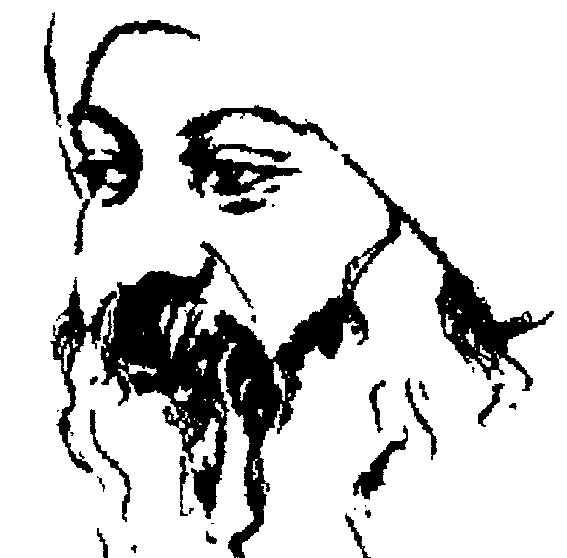

# 道德经心释【下】
[印] 奥修 ◎ 著

老子说：当一个人被生下来的时候，他是柔弱的；死的时候，他是坚硬的。当万物和草木活的时候，它们是柔软的，当它们死的时候，它们是干枯的。所以，坚硬是死的同类，柔弱是生的同类。
——(印)奥修

记住，到了一个小孩开始想到未来的那一天，他就丧失了天真，只有在他还继续享受现在这个时刻的时候，他才是一个小孩——天真的，本质没有受污染。“想要变成什么”的概念尚未进入，他仍然处于乐园之中。
——(印)奥修

## 目录
- 第一章 天下皆谓我大 3
- 第二章 道生一 31
- 第三章 知我者希 57
- 第四章 反者道之动 79
- 第五章 知不知上 105
- 第六章 昔之得一者 127
- 第七章 人之生也柔弱 151
- 第八章 无用之用 171
- 第九章 道法自然 195

## 第一章 天下皆谓我大

去爱事物，而不要去想事物，去爱人，而不要去想人。感觉多一点，思考少一点，你将会变得越来越快乐。

### 译文：
全世界的人都说：我所教导的道很像愚蠢。因为它很伟大，所以它很像愚蠢，如果不像愚蠢，它一定很久以前就变渺小了。

我有三宝，要好好地将它们保存：
- 第一宝是爱。
- 第二宝是永远不要太过火。
- 第三宝是永远不要在世界上当第一的。

透过爱，一个人就没有恐惧，透过不要做得太过火，一个人就可以保存很多力量；透过不要敢于在世界上成为第一的，一个人就可以发展他自己的才能而让它成熟。

如果一个人抛弃爱而变得表现神勇，抛弃节制而一味地扩大，抛弃跟随在后而硬要冲到前面去，那么他是死定了。

### 原文：
天下皆谓：我大，不肖。夫唯大，故不肖；若肖，久矣其细。

我有三宝，持而宝之：
- 一曰：慈。
- 二曰：俭。
- 三曰：不敢为天下先。

夫，慈故能勇，俭故能广，不敢为天下先，故能成器长。
今，舍慈且勇，舍俭且广，舍后且先，死矣。

生命中最伟大的奇迹就是爱，它同时也是最伟大的奥秘，比生命本身来得更伟大，因为爱就是生命赖以存在最重要的本质。爱是源头，同时也是尽头，所以如果一个人错过爱，他就错过了一切。

然而，不要误以为爱是一种情绪，它不是。爱不是一种情绪，也不是一种感觉。爱是最微妙的能量，比电还更微妙。一切能量的最基层就是爱，它以很多方式展现出来。

首先试着去了解爱，那么其它的宝就很容易可以被了解。如果你问我的三宝是什么，我会说：第一宝是爱，第二宝是爱，第三宝也是爱。事实上，那就是老子所说的，但是我们必须加以了解。

人是一个三位一体，就好像基督徒也称神为三位一体。神或许是三位一体，也或许不是，但人的确是一个三位一体：身体、头脑和灵魂。事实上，由于耶稣基督对人有深入的了解，所以他才说神是一个三位一体。如果有任何神的话，他必须是一个三位一体，因为每一样存在的东西都有三层，印度人称之为三种品质，而基督徒称之为三位一体。

当爱透过你来表达，它首先以身体来表达，它变成了性。如果它透过头脑来表达，那是比较高深的，比较精微的，它就被称为爱。如果它透过心灵来表达，它就变成祈祷。

在你里面也有某种东西是超出这个三位一体的，印度人称之为“那第四的”。他们并没有给它命名，因为它无法被命名。前面三者都可以命名，因为它们属于显象的世界，“那第四的”无法被命名，因为它是不显象的，但它却是一切的最基层，他们只是称之为“那第四的”。在“那第四的”，爱变成了三摩地，涅槃，或成道。

首先，当爱透过身体来表达，它就变成了性，它是同一个能量。如果每一件事都进行得很好，性是自然的，而且流动的，那么它是一种很美的经验，因为透过它，你就可以瞥见到那个第二的。如果性真的非常深，以致你在它里面完全忘掉自己，透过它，你甚至可以瞥见到那个第三的。如果性变成一个全然的性高潮经验，那么在很少的情况下，你甚至可以透过它而瞥见到那第四的，或者是那超越的。

但是如果性失败了，那么就有很多异常现象会发生在头脑，这些异常现象被表达成恨。恨是一种性的失败，是一种爱的能量的失败。暴力，对金钱的贪婪，自我的持续冲突，战争和政治手段等，这些都是性的异常。

一个在性方面没有异常的人不会成为政客，那是不可能的。所有的政客都需要很深的性治疗，否则他们的整个能量都会走向越来越多的权力争夺。当性是自然的，你就会觉得很有力量，而不必再去追求它。性就是潜能，就是力量。你会感觉到它如阵雨般地洒落在你身上，你不会去找寻或追寻它。要是你在那方面错过，就会有一股很强的内趋力产生，想要去追求权力，政治就是这样诞生的。战争和持续的暴力就会产生出来，恨，愤怒和一千零一种异常现象都会产生出来。

当性失败，人们就变得过分执着于这些东西，因为他们无法执着于人。要跟一个人关联，你必须流动，必须敞开，但是对于东西，你可以不需要流动，也不需要敞开。东西可以被占有，但是人无法被占有。东西是死的，但人不是死的。人的本质是自由，你可以爱他们，可以高高兴兴地跟他们在一起，但是你无法占有他们。那些性的自然功能失败的人会变得过分执着于金钱，或是执着于世界上的物质。

科学也是性的一部分，是身体的现象，因此科学一直坚持说只有身体存在，因为性除了身体之外一无所知。科学甚至无法相信头脑的存在，心灵的部分就更不必说了，当然，“那超越的”更是远远地超出了它的范畴。科学坚持说人只是身体，那显示出它的倾向。科学的整个探询都基于性的好奇，那也是一种异常。

如果科学是具有创造力的，那么它就不是一种异常，那么性就可以运作得很好，那么能量就会流动，而不会停滞或腐烂，然而今日的科学却是具有破坏性的，就好像过去也一直都是这样。

人类居然能够登陆月球，那真的是令人难以置信，不久他们将能够达到其它的星球，但是在另外一方面却有一半的人类在挨饿。这真的是一件令人难以相信的事，人类可以发展出非常复杂的科技，原子弹和氢弹的制造都已经变得可能，但是他们却连简单的感冒都治不好。

每一件事看起来简直都很愚蠢，整个科学都是战争导向的，都是暴力导向的，都是具有破坏性的。如果有关性的每一件事都进行得很好——这是非常困难的，因为所有的宗教都反对它，他们毒化了你的头脑。它很困难，因为整个文明和所有的文化都反对它，因为他们知道一项诡计：如果你想要剥削一个人，那么就使他的性变得异常，如此一来，他就永远无法变成一个他自己存在的主人。只要使他的性变得异常，他就会成为一部机器，那么你就可以将他送往战争，就可以为了一些愚蠢的目的而将他牺牲掉。

一个知道爱的人不可能被强迫去恨。一个即使只是瞥见爱的人会很有爱心，对他来讲，很难成为具有破坏性的人。但是所有的国家都需要具有破坏性的人，他们那个具有破坏性的内在在沸腾。就某方面而言，他们是疯狂的，否则世界上的军队怎么办？一个人如果要变成一个军人，某种程度的疯狂是需要的。

如果生命很美，爱如阵雨般地洒落，谁会想要去打仗？谁会想要去变成一个军人？你在此并不是要去摧毁的，而是要去满足的，因此每一个文化，每一个宗教和每一个国家，毫无例外地，都试图要使你的性变得异常，他们不允许你去享受你自己，他们不允许你成为自然的，一旦你成为自然的，你就超越了他们的控制。唯有当你生病的时候，你才能够被控制。

那就是为什么我说：如果每一件事都进行得很好，如果性保持很自然，那么透过较深入的性，爱就会产生。

爱不具性欲，但它是由性产生出来的，这一点必须被了解。它就好像一朵莲花从污泥长出来一样，莲花并不是污泥，它在污泥中经过了一个全然的蜕变。性与爱之间的距离就好像污泥与莲花之间的距离一样。如果你不是已经知道它，你一定无法想象说这朵莲花是出自污泥，那是无法想象，也无法理解的，因为莲花是一个经过蜕变的现象，它是那么地不同，它属于另外某一个世界，它似乎不是这块土地的一部分，但它的确是来自这块土地。爱的产生就像莲花的产生一样。

就像科学——尤其是具有破坏性的科学——政治，金钱和金钱导向的追求，以及占有等，它们都属于身体，也属于性，所以，艺术、诗、音乐、绘画和雕塑等都属于第二层——爱。

当你的爱在流动时，当你知道了某种跟一个人的和谐关系，跟一个人的某种合一。即使只有几个片刻，也就足以改变你的整个生命。即使只有一个片刻，你能够感觉到两个人融合为一——在性当中，两个身体融为一个，在爱当中，两个头脑融为一个——即使只有一个片刻，你能够知道那个合一，你的生命将会变成一首诗，你的生命将会有一种欢舞，你的生命将会有一种很深的和谐和音乐在里面。

第三个是祈祷。当你透过一个人而洞察了存在，透过你的爱人，你的先生，你的太太，你的朋友，你的小孩，或是你的师父而洞察了存在，如果你洞察了一个人，而看到了无限，如果你洞察了一个人的窗户，然后整个无限的天空都敞开了，那么你就知道，那个爱可以走向更高，它可以变成祈祷。

祈祷是心灵与心灵的会合。性非常局限于物质的身体，它非常有限。爱则更宽广一些，但是仍然局限于一个人。祈祷是不受限制的，那么你就知道，你可以从每一个人移向那无限的，每一个人都可以变成一个跳板。你洞察你小孩的眼睛，神就在那里，你洞察爱人的眼睛，突然间你的爱人消失了，她或他已经不再在那里，只有神在微笑，你洞察一朵花，整体已经进入到那里，这就是祈祷。这些就是人的三个层面。

基督教或犹太教，他们只能够达到第三个层面，他们对于“那第四的”没有概念，但是在东方，佛陀、克里虚纳、马哈维亚和老子，他们都进入到了“那第四的”，进入到了那超越一切的彼岸，那个“第四的”是狂喜、欢跃、三摩地、涅槃或道。在那个“第四的”里面，甚至连别人都消失。首先在性里，身体消失，但是头脑存在，在爱里，头脑消失，但是心灵存在，在祈祷里，心灵也消失，但是其它的——道，或神，都存在，到了那个“第四的”，甚至连神也消失，没有什么东西被留下来，或者只有空无被留下来。

在那种全然的空里面，在那个所有的二分性都消失的空里面，爱完全被满足了。爱是到达所有宝物的钥匙，爱不是一种情绪，爱不是一种感觉，爱是能量，那个能量可以表达在四个层面上。永远都要记住：能量必须被超越，被蜕变，被引导到一个更高的韵律或更高的状态，但没有什么事是不对的，唯有当你陷在某一个地方，那才是不对的。

性是很美的，在它里面并没有什么不对，但是如果你陷在那里，那就不对劲了，它就好像你陷在门那里，而无法进入宫殿。门本身并没有什么不对，它是一扇门，你必须感谢它，它不是一道墙，但是如果你陷在门那里，它就变成了一道墙。是因为你的缘故，一扇门才变成一道墙，这样的话，你就无法进入。

性是很美的，使用那个能量去流进内在，向前走，允许它改变成爱，但是也不要陷在爱当中，允许它变成祈祷，但是也不要陷在祈祷当中，除非空无被达成，否则一个人应该继续向前走。当每一样东西都融解掉，你就达到了莲花最终的开花。那就是为什么追求内在世界最深的印度人说：当能量达到了最高峰，它就是莲花的开花，头顶最上方的萨哈斯拉是千瓣莲花，它是你身体的最后一个能量中心。第一个能量中心是性，最后一个是莲花——萨哈斯拉。

不要陷在任何地方。这一点必须永远被记住，如果你能够记住这一点，那么对你而言就没有什么事情可以变成阻碍。要将它使用成一个障碍或一个梯子，那要依你而定。有一块石头在那里，挡在路中间，你可以把它当成一个障碍，但是你也可以把它当成一个垫脚石，它就变成你可以走向更高的地方的力量，那就是为什么我接受每一样东西，我不谴责任何东西。

不论你是什么，在做什么，不要陷在那里，继续走，除非你达到了全然而且绝对的宁静。在那里，你消失了，别人也消失了，只有爱在流动，没有一个爱人，也没有一个被爱的人，唯有到了那个时候，它才达到莲花最终的开花——爱开开了，没有爱人，也没有被爱的人，此岸和彼岸都消失了，只有河流被留下来，河流就变成了海洋。

现在试着来了解那非常强而有力的，非常有蕴涵的老子的经文。

全世界的人都说：我所教导的道很像愚蠢。

爱总是看起来很愚蠢——对那些陷在某一个地方的人，那些不知道任何比身体更高的东西的人，那些不知道任何似非而是的东西的人来讲很愚蠢。事实上，那些人并不知道任何奥秘的东西，他们以逻辑来生活，他们是亚里士多德派的。

据说亚里士多德的师父柏拉图习惯称呼亚里士多德为“头脑”(The Mind)，那就是亚里士多德在他心目中的名字“头脑”。每当他想要问：“亚里士多德在哪里？”他就会说：“‘头脑’在哪里？”

对于那些只有头脑的人而言，心对他们来讲是愚蠢的，因为心有它本身的理智，那是头脑所无法了解的。心有它本身存在的层面，那个层面是头脑所完全不知道的。心比头脑来得更高，更深，那是头脑所达不到的。它看起来很愚蠢，爱总是看起来很愚蠢，因为爱不具实用价值。

头脑是具有实用价值的，它很会利用各种东西，那就是所谓实用的意义。头脑是有目的的，是结果导向的，它将每一样东西转变成手段，但是爱无法被转变成手段，那就是困难之所在，爱本身就是目的。

如果你爱一个人，你不会说为什么你爱他，你无法回答这样的问题：为什么你爱？你只会耸一耸肩而已。如果你真的很聪明，你会说：我不知道。如果你不聪明，你可能就会去找出一千零一个原因。然而真正有名的爱人从来无法说出任何原因，他只会说：它发生了，我就这样坠入了爱河，我不知道为什么。那就是为什么头脑会说它是愚蠢的。如果你无法回答为什么，你一定是走在一个愚蠢的道路上，赶快停止，回来，要理性一点。

但是我必须告诉你一件事：如果你一直都试着理性一点，你可能永远无法快乐，因为快乐具有某种无理性在里面，快乐的一个重要的成份就是要成为无理性的。唯有当你能够无理性地快乐，你才能够快乐，否则是没有办法的。如果你试图要去找出那个原因，你就会变得很痛苦。

痛苦有原因，但快乐是没有原因的。你可以回答：你为什么痛苦？但是你无法回答：你为什么快乐？你的痛苦总是因为你，但是你的快乐一直都与你无关，它是没有原因的。那个“为什么”无法被回答。心并不是算术的，它是诗，它是似非而是的。它从一极走到另一极，包含了所有的各个极，它非常广大，包含了所有的矛盾。

老子说：
全世界的人都说：我所教导的道很像愚蠢。

因为不论老子在说什么，他是在说：要生活在此时此地。这是愚蠢的。因为一个理性的人总是为了明天而牺牲今天。他说：明天我将会好好地生活。当各种事情都弄好，当时机对了，当我有空间，又有足够的钱，还有一座大的皇宫可以住，我就会好好地生活，现在我怎么能够好好地生活？

每一位父母都教导他们的小孩说：要为未来而牺牲现在，要为下一个片刻而牺牲这个片刻，要为其它的事情而牺牲你自己。这就是他们所谓的理性——延缓真正的生活。但是心说：现在就好好地生活。那也就是老子所说的：现在就好好地生活。事实上并没有其它的生活方式，要不然就是你现在生活，否则你就只是假装在生活。你从来没有真正在生活，你只是在延缓，你只是在走向死亡，你从来没有真正生活。因为要真正生活的话，除了现在以外没有其它的时间。存在一直都是在现在，但是理智一直都是在为未来思考和计划。当然，如果有人说：现在就好好地生活。你会说：那怎么可能？我必须先作安排，必须计划，当正确的时机来临，我就会好好地生活。它永远不会来临，有无数的人过世了，那个正当时机永远没有来到他们身边，它也从来不会来到你身边。

人们说：我所教导的道很像愚蠢。它必须像愚蠢，所有伟大的智慧看起来都像愚蠢。在这个世界上，只有傻瓜看起来好像很有理性，所有的智者看起来都有一点奇怪，他们不属于群体，不属于群体的想法，他们按照他们的本质来生活，他们看起来好像白痴。“白痴”(idiot) 这个词很美，它来自希腊文的 idioti，而希腊文的 idiotiki 意味着私人的，这是很有意思的。白痴就是一个过着他私人生活的人。不是一个群体的生活，不是多数群体的一部分。一个按照他自己的方式来过他自己的生活的人就是白痴。

陀思妥耶夫斯基写了一本很美的小说叫做《白痴》。如果老子看了它，一定会很欣赏。陀思妥耶夫斯基小说里的白痴刚好就是那个可以被称之为愚蠢的人，其实他是聪明的。世界已经变得很愚蠢，如果你想要成为聪明的，那么你必须在你周遭的人的目光中看起来是愚蠢的。

全世界的人都说：我所教导的道很像愚蠢。因为它很伟大，所以它很愚蠢。

所有的伟大都离平庸的头脑很远。头脑就是平庸的。记住：头脑本身就是平庸的。头脑永远不可能是伟大的，从来就没有伟大的头脑。如果你曾经听过伟大的头脑，那么你就是听错了。如果你去问所有伟大的头脑，他们将会说：任何他们所达成的都是来自头脑之外，而不是来自头脑，有某种东西透过头脑渗出来，但它并不是头脑的一部分。

你去问居里夫人，看看她是如何解决她的难题而变成诺贝尔奖得主。她尝试了好几年，几乎有三年的时间，去解决一个数学难题，那是她的整个研究所仰赖的，她一再地失败。有一天晚上，她又遭遇挫折，因此她放弃了整个计划，然后跑去睡觉，在当天晚上的梦里，那个问题居然被解决了，她赶快起床，将它写在桌子上，然后再回去睡觉。到了早上，她已经完全忘了这件事。当她再回到桌子上工作，她感到很惊讶，那个答案居然在那里，如奇迹般地在那里。她已经在它上面下了三年的功夫，它到底来自哪里？当时又没有其他人在那里，只有她单独一个人在房间里，即使有别人在那里，别人也不可能解决它。她想起一个梦，在梦中，她看到了所有的答案被写下来，她想起说她曾经在晚上爬起来，她看着那个笔迹，那是她自己的笔迹。这么说，诺贝尔奖不应该颁给头脑，但是它却颁给了头脑。现在，居里夫人是一个伟大的头脑，然而那个答案却是来自头脑之外。

事情一直都是如此，将来也会是如此。头脑是平庸的，它对一些小事情，一些街坊的小事还算管用，你可以经营一个小生意，可以赚一些钱，可以有一笔银行存款，就这个部分而言，它没有问题，但是超出这个就不行了。

因为它很伟大，所以它看起来好像是愚蠢的。在内在深处，如果你在你自己里面找寻，你也会看到如果马哈维亚突然光着身子站起来，你也会认为他是一个傻瓜。他到底在这里干什么？如果老子来到这里，你将无法认出他，你不可能认出他，他将会看起来像一个十足的傻瓜。

菩提达摩去了中国，整个国家都在等待他，皇帝本人也亲自来到国界迎接他，有千千万万人聚集在那里，因为有一个伟大的师父要来。然而当师父出现的时候，人们就开始格格地笑，简直不能相信自己的眼睛，甚至连皇帝都感到非常不安，因为菩提达摩这家伙脚上只穿一只鞋子，另外一只鞋子摆在他的头上，这算是什么礼节？

皇帝说：请原谅我，先生，我不懂你在做什么。我们是要来迎接一个神智健全的人，但是你难道疯了吗?

菩提达摩笑着说：你没有通过测验。唯有当你能够了解这个，你才能够了解其它我要说的事。如果你无法忍受这么小的一个矛盾，这个矛盾并不是很大，只不过是将一只鞋子放在头上罢了。如果你无法忍受和了解这么多，我留在这里也是没有用的。因此他就折回去，他离开了那个城市，到了森林。他说：不需要停留，没有人能够了解我，所以我只好在这里等待，那些能够了解我的人，他们应该来找我。从此以后，他就再也没有到首都去。

对头脑而言，矛盾是非常难理解的。头脑活在常规里，鞋子必须穿在脚上，那是被认为理所当然的，它不应该被放在头上。如此天真的一件事，他并没有伤害到任何人，但是它却无法被接受，我们对每一件事都想要弄成齐头式的平等。

我在读一个人的回忆录，他是一个伟大的科学家。有一次，一个朋友开了一个玩笑，那个朋友邀了很多人来参加一个宴会，应邀的人有伟大的医生、科学家、工程师、诗人、艺术家和音乐家等。当他们都聚在一起时，主人宣布说：我不打算帮你们互相介绍，也请你们不要把自己介绍给对方，因为我不喜欢头衔，所以你们只要以一个“人”来跟另外一个人碰头，忘掉你是一个工程师，或是一个医生。我并没有邀请医生、工程师或律师，我只是邀请一些人，一些朋友。

当时在场的这个科学家说：我们都觉得很困惑，怎么办？要怎么样来跟对方攀谈？因为我们无法以一个“人”来跟对方攀谈。如果他是一个医生，那没有问题；如果他是一个工程师，那么也可以找到适当的话题。但只是一个人的话？你无法跟他搭上线，要从哪里来搭线？要如何搭线？就只是一个男人或一个女人。他描述说：那真是一件令人不安的事，人们变得很沉默，如何打开话题？如果没有头衔，头脑简直无法运作。

他描述说：我从来没有看过这么沉默的一次宴会，人们都随便找个借口结束而逃掉。因为如果你不能够说你是一个伟大的作家，你写了这个和那个，那么你是谁？那个认同消失了，如果没有可以认同的，你就变成了一个无名小卒。

全世界的人都说：我所教导的道很像愚蠢。

因为老子的整个教导就是要如何失去那个认同，如何忘掉世界给你的头衔，如何不被贴上标签，只要成为一个真实的人。因为它很伟大，所以它很像愚蠢。

生命是一个循环。一个小孩是一个傻瓜，他天真得很愚蠢，那就是一个小孩的美。所有的小孩都很美，你无法找到一个丑的小孩，但是之后所有那些美都消失到哪里去了？就在那些头衔或标签的背后，所有的美都消失了，那么在那里的就变成面具，而不是真正的脸。在那些不诚实的背后，真实的存在就消失了。每一个小孩都很美，又美又蠢，而且很天真。之后你会学习很多，但是你却在你的学习中失去很多。你进入世界，变得博学多闻，获得一些世俗的聪明，但是这么一来，你却失去了你的天真。然后一层又一层世俗的知识，或是所谓世俗的智慧就在你的周围累积起来，你就被关在笼子里。

如果你能够了解老子，你就立刻可以从这个监狱跳脱出来——那个监狱是你自己携带在你身旁的。没有人坚持硬要将它加在你身上，你只要抛弃所有的认同和所有累积在你的周围那些死气沉沉的东西，这就是弃俗。如果你问我，我会说这就是门徒。你只要抛弃所有那些你聚集的，只要卸下全部的重担，再度变成一个小孩。

当然，整个世界都会说你变成了一个傻瓜，因为如此一来，世界就无法对你负责。

耶稣的一生中有很多寓言故事。有一次他去一个人家，他是被邀请去的，主人是两个姐妹，玛莉和马莎。玛莉坐在耶稣的旁边，什么事都没做，只是很快乐地靠近他，按摩着他的脚，并且在流泪，她处于很深的祝福之中，喜悦的眼泪夺眶而出。马莎在屋子里面工作，在为耶稣准备食物，还有其他的贵宾要来，因此她变得嫉妒。她来到耶稣的旁边说：你看，我一个人在这里忙，而她就只是坐在那里什么事都不做，叫她来帮我的忙。

耶稣说：你是目的导向的，而她不是。你在为客人做准备，而客人就在这里，她在享受客人。你以你自己方式来做事，而让她成为她自己。当然，平常你无法想象为什么耶稣会这样说，他在赞成懒惰。如果圣雄甘地在那里，他一定会说：好，你去厨房帮忙。服务就是祈祷，去服务。但是耶稣却说：你以你自己方式来做事，让她独自一个人。前者是理智，后者则是非理性的心。

耶稣被邀请到另外一个人家，有一个女人把非常昂贵的香水倒在他的脚上，整瓶都倒上去，那是非常罕见的。犹大在旁边——他后来变成叛徒，他一定会如此，他是一个生意人，他是一个十足的犹太人，看到这样的情况说：这到底是怎么一回事？而你居然还允许它发生？制止她，她在浪费高价的香水，那些香水可以拿来卖，得来的钱可以让很多穷人温饱。

当然，他这么说是完全合乎理性的，没有人能够说犹大这样说是错的，他说：人们很穷，而你却让她这样浪费金钱。

耶稣说：穷人永远都会存在，你可以去服务他们，但是我不会永远都在这里。

很难了解，这是非理性的，完全非理性。那是一个简单的数学。圣雄甘地一定会支持犹大，而不会支持耶稣。人们正在饥饿，耶稣竟然允许浪费，这看起来很愚蠢。

基督徒对这些故事并没有很多评论，因为他们本身也觉得有一点罪恶感。人们那么贫穷，它看起来好像是有罪的，他应该阻止它，不应该有那样的事发生在他的周遭。但是耶稣所说的的确很了不起，他说：我不会再在这里，我在这里停留的时间也不会很长，犹大。穷人永远都存在，你可以去服务他们，不必急，但是让她做任何她想要做的。问题不在于理性，而是在于爱。

如果它不像愚蠢，它一定很久以前就变渺小了。老子说：如果它不像愚蠢，它一定会变得平庸，渺小。但是我的教导永远都不会变平庸，因为头脑将永远都无法了解它，而将它转变成渺小的东西，它将永远保持超越头脑。

甚至连一个佛都可以透过头脑来了解，克里希那可以透过头脑来了解，但是对老子来说，那是不可能的。

很多人问我，为什么没有人以老子的名义创造出一个大的组织化宗教。那是不可能的，那个人是不可能的，因为那个人非常聪明，聪明到看起来很愚蠢的程度，所以很难在他的周围创造出一个机构。他保持是一个孤独的叛逆者，在他的单独当中呈现出一种美，但那是无法理解的，它离得非常远，就好像远方的埃弗勒斯峰，你可以眺望看着它，但是要在他的周围创造出一个众人的组织，并且去引导众人走向埃弗勒斯峰，那是不可能的。

我有三宝，要好好地将它们保存：

- 第一宝是爱。
- 第二宝是永远不要太过火。
- 第三宝是永远不要在世界上当第一的。

事实上第一个就够了，另外两个只不过是更加讲究的第一个，这一点你要试着去了解。

### 第一宝是爱

事实上，爱是什么？发生了什么？爱这个现象是什么？首先，在爱的时候，你是以一个心来运作，而不是以一个头脑来运作。你不是以理智来运作，而是以感觉来运作。你不是去思考，而是去感觉，这就是关于爱必须了解的第一件事：你变成一个感觉的现象，而不是一个思考的实体。你存在的核心从头掉到心，你变成没有头的，你不跟头脑认同，你变成跟心认同，而心是十分愚蠢的——就世俗的眼光来讲是愚蠢的，但是它有它自己的智慧，你开始去感觉。

它已经变得非常困难，因为每当你去感觉，事实上你只是在思考说你在感觉，它并不是直接的。有时候人们到我这里说他们已经坠入爱河，我问他们：你们确定吗？他们说：我们想我们已经坠入爱河。甚至连感觉也必须先经过思考，然后它才能够来到你身上。你的心必须向头脑乞求，允许给你一点自由。

这是荒谬的，因为思考是一种设计，它是有用的，但它并不是你的整个存在。它就好像一个雷达，它帮助你去看周遭，它帮助你窥见一些未来，好让你可以好好地去行动，但它并不是你。不论你如何训练你的头脑，你都将永远不会对它感到高兴，因为快乐并不是头脑可以感觉到的一种质量。它就好像你试着透过眼睛来闻东西，眼睛并不是要用来闻东西的，它们是要用来看的；或者，它就好像你试着透过耳朵来看东西，耳朵并不是要用来看的，它们是用来听的。

头脑是一部生物电脑，它的运作机构是用来帮助你在一个未知的世界，或是一个陌生的世界里很安全地行动。它只是一个安全防护，并不是说你必须透过它来感到快乐——那是你一直试着在做的。就是因为这样，所以你在你的周遭创造出了地狱。你试图透过头脑来得到快乐，那是不可能的。

用头脑的人是世界上最不快乐的人，事情本来就是这样。头脑就好像一只看门狗，它可以四处看，去感觉那个路，每当它被需要的时候，它必须被使用；每当它不被需要的时候，就被摆在一旁。但是你已经变得非常依赖奴隶，以致奴隶已经变成了主人，而真正的主人已经完全不见了，你甚至感觉不到主人在哪里。

老子说：掉到心里面来。去爱事物，而不要去想事物；去爱人，而不要去想人。感觉多一点，思考少一点，你将会变得越来越快乐。树木比人来得更快乐，小鸟比人来得更快乐，动物也比人来得更快乐，那简直难以置信。人到底怎么了？他被陷在头脑的运作机构里。

头脑的存在是很好的，如果你能够使用它，那是很美的，但是你不应该仅仅成为一个头脑，你必须成为头脑的主人。你必须使用它，就好像一个人在使用一个运作机构一样，就好像你在开一部车一样，不要跟车子认同。成为驾驶员，你不想开车，不要让车子来逼迫你。当你需要的时候，你就使用它；当你不需要的时候，你就不使用它。

头是在你周围一个微妙的运作机构，你好像是一个驾驶员，隐藏在那个运作机构的背后。抛弃跟头脑的认同，唯有如此，你才能够知道爱是什么，因为一旦你抛弃了跟头脑的认同，你就会突然掉到心。

心就是那个驾驶员。但是要怎么做呢？因为只是借着说首要的宝物就是爱并无法使事情变得更明白，重复地去述说它无法达成什么。

慢慢开始走向那个方向。坐在一块石头的旁边，闭起你的眼睛，去感觉那块石头，不必思考，也不必说出它很美，这些都是头脑的运作。只要躺在石头上，将你的手和身体摊开来，就好像你依偎在母亲的怀里，闭起你的眼睛去感觉那块石头，用你的舌头来碰那块石头，吻那块石头，让它给你一个感觉。

在刚开始的时候或许不是很容易，因为石头已经变得害怕人，它们不相信你会这样做，它们会认为：你到底在干什么？因为你从来没有做过这么愚蠢的事。在刚开始的时候，它们或许会担心：这个人一定有什么不对劲，他疯了吗？因为一般人不会做出这么美的事，而他却这样做，只有疯子才会做出这样的事，或者有时候像老子一样的人才会做出这种事。

然而，你要让石头习惯于你，不久你就会发现石头有能量产生，直接打击到你的心。

去拥抱一棵树，将你的头靠在树上，在它上面休息，感觉树木的能量如何开始流进你里面，如何赋予你生命力，如何使你变得全然新鲜和洁净，如何在突然之间从你内在的深处有某些花朵开始在绽放。倾听小鸟的声音，只要听，因为小鸟并没有说什么，它只是在歌唱。倾听流水的诗歌，倾听树木和它们的颜色所发出来的诗，然后去感觉。

在刚开始的时候将会很困难，你会一再地开始去思考，但是要记住：停止思考，再度去感觉。渐渐地，你就会抓到那个窍门，一旦你知道了感觉的窍门，你将会笑你以前是怎么错过的。你隐藏在那个运作机构的背后。驾驶员消失了，车子变成了全部。现在那个驾驶员是分开的，现在你可以来，你可以将车子熄火，或者你可以将车子发动，由你来决定。头脑是一个运作机构，它可以被熄火，也可以被发动。

当我在跟你讲话的时候，我必须将它发动。当你走掉，我就把钥匙拿起来，它就不运作了，它就停止了。但是在你的情况，你的车子一直都在发动着，马达一直都在转，它们在你里面产生出很大的噪音，一直在内在喋喋不休。

走向爱的第一步就是用多一点的感觉。第二步就是：更加地存在。不要太注意那个你所做的，而要注意那个你所是的。

你一直都以“作为”(doing)来思考，你是一个工程师，你是一个医生，你已经做了这个或那个……忘掉所有这些作为。只要存在就好了，去感觉你的存在，只要坐着，感觉你的“在”。“如是”和“存在”必须成为你的咒语，只要去感觉你的存在，让这个感觉深深地根入你里面。

永远不要跟你所做的事认同，那并不算什么，那只不过是一些垃圾，不要去沾惹那些东西。只要去感觉你是谁，那就是为什么在东方最伟大的咒语就是：我是谁？

并不是说你开始去思考关于你自己的事，因为在西方所发生的情形就是这样。你要知道，在东方，那个教导一直都是：知道你是谁。有很多人就只是静静地坐着，在内在重复地问：我是谁？如果你这样做，那么你是在愚弄你自己，那是愚蠢的。不要说“我是谁”，否则你就是再度在思考。只要去感觉，只要存在，只要闭起你的眼睛，在黑暗中探索你的本性。

新的一代有一句很美的话来形容它，那就是：“挖出一条沟”(groove)，集中于它。在黑暗中，试着去探索，没有什么东西会像它。一旦你能够挖出这条沟，一旦你能够集中注意力在它上面，那是可能的最美好的事。

首先要放弃思考而变得更接近感觉，然后放弃作为而变得更接近本质的存在。如果这两件事都能够被做得很好，你能够首度瞥见到爱是什么。接下来你的生命将会越来越充满着爱和爱之光，然后你能够进入一种不是性的关系里。性或许是它的一部分，但如果它是爱的一部分，性本身就会变得很美。而且，如果爱是祈祷的一部分，那么爱就变成宗教的和神圣的；如果祈祷是静心的一部分，它就变成那最终的，超出那个之外就没有目标了，那是最终的达成。

### 第二宝是永远不要太过火

为什么老子会说：永远不要太过火？——这种病我称之为“过量”或“做得过火了”——因为头脑总是会做得过火，而心永远都会很平衡。一个具有爱心的人永远都会很平衡，他一直都会处于中间，从来不会太靠向左边，也从来不会太靠向右边，即使有时候他必须靠向右边，他的靠过去也只是为了要取得平衡，就是这样而已，否则他会刚好停留在中间——静止的，镇定的，宁静的，他一直都处于平衡之中。

头脑一直都在追求极端，它是为了极端而存在的。每当你做一件事做得过火，你就变成头脑的奴隶；每当你很平衡，不走极端，你就会走得比头脑更深，你是走在心里。

那就是为什么我说：不要抛弃世界。有时候人们抛弃了世界，那是他们头脑的做法。因此我不说：只要放纵在世界里，而忘掉宗教。因为那也是用头脑的人在做的事，那也具有破坏性的。我说：在世界里弃俗。不要抛弃世界，而要在世界里弃俗。要处于世界里，也是不属于它。要处于世界里，但不要让世界在你里面，就会达到一种平衡。那就是老子所说的第二宝。

即使是太多的神也是不好的。太多的静心是一种病，不论任何事物，太多都是错误的。它发生在东方，我们做了太多的静心。在禅寺里面，他们每天要静心八个小时到十个小时，似乎他们生下来就只是为了要静心，其它没有。他们的整个生命似乎就只是静坐，他们不去使人生变得更丰富，他们不借着人生的经验来丰富他们自己。他们不敢进入世界，因为他们害怕，他们对世界有恐惧，他们所有的静心只不过是很深的压抑。

静心，但是也要进入市场，因为在那里可以测验出你的静心做得对不对。

## 第三宝是永远不要在世界上当第一的

那是非常美的，那也是爱的一部分。每当你有爱，你就不会想要在世界上成为第一的。那就是为什么我说：当爱变得不对，政治就诞生了。政治就是努力想要在世界上成为第一的——成为总统，成为首相，成为世界上最有钱的人，成为世界上最有名的人，成为世界上第一的。

你是否曾经看过？如果你爱某一个人，你就会喜欢他成为世界上第一的，而不是你自己去成为第一的。如果你爱整个世界，你就会喜欢成为最后的。

那就是为什么耶稣说：那些在这个世界上是第一的人将会在我神的王国里成为最后的，反之亦然。

老子说：第三宝是永远不要在世界上当第一的。那个想要成为第一的野心就表示你错过了生命，你并没有受到祝福，你并没有很喜悦，你并没有很满足。

野心是疯狂。有野心表示你不是很自在地跟你自己在一起，你并不“在家”。野心表示你想要别人知道你是很伟大的，其实那只是在隐藏你的渺小。你想要整个世界都知道：我是世界上最伟大的人。这只是你内在感觉的相反——你觉得你是较低劣的。唯有较低劣的头脑才会有野心，一个优越的头脑不需要野心，成为有野心的对他来讲并没有什么意义。他已经非常满足，如果你把他摆在最后，他在那里也会很快乐，他已经知道如何成为快乐的。所以，不论他在哪里，他都是快乐的，如果你将他丢进地狱，他在那里也会很快乐。

我听说有一个英国的思想家，名字叫做爱德蒙·伯克（Edmund Burke），他通常在星期天会上教堂。他并不是一个信徒，但是他喜欢那个牧师以及他谈话的方式。有人问他：你并不是一个信徒，你也不是一个宗教人士，为什么你那么有规律地在每个星期天都上教堂？他说：偶尔我喜欢去看一个虔诚的信徒。只是去看一个有信仰的人本身就很美。我没有任何信仰，但这个牧师是一个有信仰的人。他或许是错误的，我知道他是错误的，但是那没有关系，他在他的信仰里是很美的，似乎他已经达成了。或许他还处于幻象之中，但那并不是重点。我一直试着要去达成某些事，而他已经达成了，所以，只是为了要去看他，我就去了。

有一天他问那个牧师，因为那个牧师在当天晚上说：那些很好，很有美德，而且信神的人，将会上天堂。讲完道之后，伯克问牧师：一个很好很有美德，但是不信神的人会怎么样？他们会去哪里？他们会上天堂吗？如果你说会，那么信神并不是必要的，那么那个相信以及那整个假设都是没有用的。如果一个人只是借着成为美德的就能够上天堂，那么信仰有什么意义？如果你说那些很好、很有美德但是不信神的人将会下地狱，那么成为很好、很有美德又有什么意义？只要信神就可以了。

这个伯克是一个逻辑家，那个牧师觉得很困惑，他说：给我几天的时间，我必须去查询，我目前并不很清楚地知道它是怎么一回事。

他尝试了七天，绞尽脑汁，左思右想，也还是想不透，因为那个困惑还是存在。如果他说会，那么就会有一个难题；如果他说不会，那么也会有一个难题。到了第七天，他去教堂。在他要讲道之前的一个小时，他到了阳台，在那里闭起眼睛沉思。昨天晚上他整个晚上都睡不着，因为他一而再、再而三地思考，因此当他在沉思的时候，他睡着了，然后做一个梦。

在梦中，他看到他自己搭了一辆火车，他问：这辆火车要开往哪里？邻座的人说：要开往天堂。他就说：这很好，这就对了，我将问那里的人，那些很好、很有美德，但是从来不相信神的人——比方说像苏格拉底——他们都到哪里去了。所以他就进入了天堂，但是他不喜欢那个地方的样子，它看起来有一点破烂不堪，没有快乐，有点无聊，没有令人兴奋的东西。当然，那里很宁静，但是它看起来死气沉沉，他简直无法相信这就是天堂。

然后他问：这辆火车什么时候开往地狱？当那辆火车准备好，他就坐上去。他到了地狱，他又不能相信他的眼睛，因为那里的东西真的很美。有很美的树木、青草和花朵，小鸟在歌唱，每一个人都很快乐。他说：事情好像不对，这里似乎就像天堂。

他到了市区，他问人们：苏格拉底在这里吗？他们说：他在野外工作。所以他就到苏格拉底那里，他说：你在这里吗？你很好、很有美德，但是因为你不相信神，所以你就被丢进地狱，是吗？苏格拉底说：我根本就不知道有什么地狱，但是自从我们来到这里，我们已经将它转变成了天堂。在一阵震惊之后，他睁开了他的眼睛。

爱德蒙·伯克在楼下等待。牧师下了楼，他说：现在我还不是十分清楚，但是我做了一个梦，我可以将它告诉你。在梦中我了解到：那些很好、很有美德的人，不管他们到哪里，那个地方就变成天堂；而那些没有美德同时也不好的人，即使他们相信神，不管他们去哪里，那个地方就变成地狱。这就是我的梦显露给我的。

世界已经变成一个地狱，因为没有人信任他自己，没有人是满足的，没有人可以快乐地自处，每一个人都具有野心，野心创造出地狱。

如果你问我谁不是宗教人士，我会说：有野心的头脑。如果你问我谁是宗教人士，我会说：没有野心的头脑。一个没有野心的头脑就是宗教的化身，他具有那个品质，因为他非常满足，在他的周围你可以找到满足的气氛。他不跟其他任何人竞争，那是不需要的，他觉得已经够了。他觉得很感激，不论他拥有什么，他都觉得很高兴。他的内在非常丰富，所以不需要去竞争，那就是内在财富的意义。如果你去追求外在的财富，你会处于竞争之中；如果你追求内在财富，就不会有竞争，因为不需要。有一个无限的天空，整个天空都是你的，其他没有人来跟你竞争。

那就是宗教和政治之间的不同。政治吸引较低劣的人，吸引那些充满着自卑情结的人。成为具有宗教性的人就是抛弃自卑情结的过程。那就是为什么我一直坚持说：你不必达成任何事，它已经在你里面，你不必变成神，你已经是神。

你不必将它延缓到明天，不需要，你在当下就可以享受它，问题不在于达成什么事，问题在于：你要能够高高兴兴地在它里面，它已经在那里了。你并不缺少什么。如果你想要快乐，你在当下这个片刻就可以快乐，一个片刻都不需要延缓，因为一切要快乐所需要的都已经具备了。你只要变得很警觉，很觉知，你只要睁开你的眼睛就会找到，每一样东西都具备了，所有的宾客都已经来到了，食物已经准备好，庆祝会已经开始，你只要睁开你的眼睛来参加就可以了。

我不是说：要变成神，因为那是政治，这样的话，你就是在追求要达成什么，你就变成有野心的。我说：你就是神。了解它，它并不是要被达成的，你只要稍微去注意它就可以了，你已经忘掉那个事实说你就是神。

第三宝是永远不要在世界上当第一的。

如果你已经是神，谁会想要那么麻烦去当世界上第一的，你已经是第一的，每一个人都是世界上第一的，那就是它的意义。没有一个人可以跟你相比，以前从来没有，将来也永远没有，你是无与伦比的，独一无二的，你已经是第一的。

透过爱，一个人就没有恐惧。

除非你达到爱，否则你将永远都会有恐惧，有一种很深的动荡和恐惧将会存在于你的整个人里面，你会一直颤抖，因为除非你达到爱，否则你无法知道你是不会死的，恐惧一直会存在。

一个爱得很深的人会变成不死的，会超越死亡。一个知道爱的人同时知道死亡并不存在，因为在很深的爱当中，你会知道死亡，你会死，然后复活。

十字架和复活两者都发生在爱当中，那就是为什么人们害怕爱。他们到我这里说：我们想要去爱，但是我们害怕。男人害怕女人，女人害怕男人。即使你处于爱之中，你也不是全心投入，你以非常安全的步调在进行，你一直都会走到那个可以很容易退回来的点，你永远不会走到那个不可能退回来的点，你从来不会走到那个不可能退回来的深度，你张开你的双手，但是如果有危险的话，你随时都准备收回来，那就是为什么你的爱依然是肤浅的。

爱是一种死，自我之死。唯有当你死，你才会知道你不可能死，你才会知道某种在你里面的东西是超越死亡的。

透过爱，一个人就没有恐惧；透过不要做得太过火，一个人就可以保存很多能量。

当你不是一个“做者”时，你就会有很多能量，会变成一个蓄水池，一个很大的湖，充满能量，那个湖变成一面镜子，整体就被反映在那个镜子里。

平常如果你是一个做者——所有的人都是做者——你一直都会感到挫折，你的能量一直都会比你所需要的来得少，来得低，你一直都处于低潮，你从来不会进入高潮，你很少能量洋溢，如果偶尔能量洋溢，你就立刻去摧毁它，去散发它，你一直都会觉得好像你的能量被吸走，其他没有人应该负责。

一个做者永远都会保持低能量，处于这么低的能量之中你怎么能够达到那最终的目的。能量必须被保存，它必须在你里面变成一个很深的湖，好让你能够反映出整体。

透过不要做得太过火，一个人就可以保存很多力量；透过不要敢于在世界上成为第一的，一个人就可以发展他自己的才能而让它成熟。

如果你处于竞争之中，试图在世界上成为第一的，你会完全错过你的本性，因为没有时间让它成长和成熟。如果你不去竞争，也没有野心，那么整个能量都可以用在使你自己的本性成长，成熟和开花上，否则能量会走到很多方向去。有人买了一辆很漂亮的车子，你就觉得无法忍受，你必须比你的邻居拥有一辆更好的车，你必须为了一辆更好的车去浪费你的能量。有人拥有一间更好的房子，你就必须买一间更好的房子，因为你怎么可以被普通的邻居所打败？就这样，你的整个生命都被浪费掉了，到了最后，你会发现在跟你的邻居竞争当中，你是在自杀。

记住，你在此是要成为你自己。生活在世界里，就好像你只有一个人，生活在世界里，就好像没有人生活在你的旁边，没有邻居，只有你单独一个人，然后选择你的路，不会有竞争，只有内在的成长和成熟。

唯有当你变成那个你已经是的，才会有满足。你可以变成其他某一个人，但是将不会有满足，你可以变成一个洛克菲勒，或是一个亨利福特，你可以变成任何东西，但是当你达成它，你只会了解到，那不是你的命运，你达成了别人的命运，它怎么能够满足你呢？你的命运或许只是小小的一个，或是很简单的一个，可能你只是变成一个吹笛子的人，但是你却变成了美国的福特总统，现在怎么办呢？整个生命都浪费掉了。

现在如果你开始去吹笛子，人们会认为你是全然的愚蠢。时间已经不对了，如此一来，你会变得非常混乱，变得不知道，所有的方向感都丧失了。

记住：你在此只是为了要成为你自己，而不要成为别人，不要让其他任何人来驾驭你，也不要试图去驾驭任何人。你在此并不是为了要去满足其他任何人的期望，其他任何人在此也不是为了要满足你的期望。每一个人都是独一无二的，神圣的，每一个人都有他自己的命运，他必须去满足他自己的命运。当他自己的命运被满足，他就满足了整体，如果他自己的命运没有被满足，他将会在整体的心中保持好像是一个创伤。

如果你问我，我可以告诉你，只有一种罪恶，就是：没有去满足你的命运。只有一种美德：去成为那个你应该成为的，不必竞争。

只要想想，如果整个世界都消失，只有你单独一个人在地球上，你会做什么？如果你去跳舞，那么跳舞就是你的命运。或者如果你认为你只是在一棵树下放松地睡觉，那么你就去树下睡觉。那是你的命运。只要想想，只有你单独一个人——事实上你也是单独一个人——那么你将会觉得很满足。

有时候一些小事就能够令你满足，如果它们跟你的本质很调和，有时候甚至连伟大的事情也无法令你满足，如果它们没有跟你很调和。

透过不要敢于在世界上成为第一的，一个人就可以发展他自己的才能而让它成熟。

如果一个人抛弃爱而变得表现神勇，抛弃节制而一味地扩大，抛弃跟随在后而硬要冲到前面去，那么他是死定了。

所以，这是两条路：如果你遵循你自己内在的本性，遵循那个小小的内在的声音，你将会很满足，如果你不遵循它，你就死定了。

如果你觉得你已经死定了，不要觉得可悲，永远都有足够的时间可以跳出来，即使到了最后的片刻，一个人也可以跳出来。一个人的命运可以在一个片刻中被满足。

但是不要一直扮演别人加在你身上的角色，别人会叫你要成为这个或成为那个，但是你只要成为你自己。

所以，当很多人来到我这里说：为什么你不叫你的门徒们更守规矩一些？我说：我没有办法。如果那个规矩来自他们自己的了解，那没有问题，如果那个了解没有来，那也没有问题。我是何许人，可以将任何规范强加在你身上？我在此是要使你自由的。

如果一个规范从自由诞生出来，而你变得很成熟，很有责任，那很好，如果不然，那也很好。

但是我也在此并不是要强加任何规范在你身上。一个硬加上去的规范是一种奴役，当它来自你最内在的核心时，那是自由，自由被满足了，就达到了它最终的开花。

## 第一章
### 道生一

如果你错过你自己，你可以知道很多，但是所有那些知识都只不过是垃圾。它或许可以隐藏你的无知，但是它无法将无知驱除，它或许可以使你成为博学多闻的，但是它无法使你了解。

### 第一个问题：可不可能跟你在里面？

每当你跟你自己在一起，你就是跟我在一起，没有其它的方式可以跟我在一起，所以，不要在你和我之间创造出一个二分性，只要试着去跟你自己在一起，只要试着去成为你的观照，那么你就是跟我在一起了。

语言没有办法说出任何非二分的真相，任何能够用语言说出来的一定是二分的，而当你跟我在一起的时候，既不是“你是”，也不是“我是”。每当你真的是你的本性，你就什么人都不是，只是一个广大的空，是一整个天空，没有界线，那么你就不只是跟你自己在一起，你跟树木在一起，跟云在一起，跟山岳在一起，跟沙在一起，跟海洋在一起……当你跟你自己在一起，你就变成了整体。

那就是苏格拉底所坚持的那一句话的意义：知道你自己。如果你能够知道你自己，你就知道了那个能够被知道的一切，或是那个值得去知道的一切。

如果你错过你自己，你可以知道很多，但是所有那些知识都只不过是垃圾。它或许可以隐藏你的无知，但是它无法将无知驱除，它或许可以使你成为博学多闻的人，但是它无法使你了解，无法打开内在真知的眼睛，你将会保持是一个用头脑的人，顶端比较重，处于深深的痛苦和焦虑之中。

如果你想要跟我在一起，那个方法并不是跟我在一起。就是跟你自己在一起，那就是所有诸佛所坚持的。知道你自己，那么你就会知道我，因为当你知道你自己，你就知道了一切。

但是如果你试着要跟我在一起，你将会创造出一个二分性和一个冲突，跟我在一起就会变成一种新的执着，那无法帮助你，真的会伤害你并且阻挡你，那么我就不是在帮助你走向超越，相反地，我将会变成一块石头悬在你的脖子周围，如此一来，你将不会透过我而达成，你会被淹死。

但那不是我的错，那将是你自己的错，那样的事已经发生在无数的人身上，世界上到处都有，所有的国家都有。一个耶稣来到，人们就开始执着于他，整个要点都丧失了。一个佛来临，人们就开始他们的旅程去知道那个佛，他们变得非常执着于他，以至于忘掉他们自己的佛就在他们自己里面，而不是在外面。

知道内在的佛就是知道外在的佛的方法，当你完全在你自己里面，你就知道了所有曾经存在过的，以及所有那些将会存在的基督，佛和师父，因为你变得跟整体合而为一。当一个人知道他自己时，他就知道了整体。

想要执着于一个师父，依附于一个师父，变成他的一个影子，那个诱惑力很强，但是那不会有所帮助，那是自毁的。不要依附于我，我在此是要使你自由，我在此是要帮助你成为很完全，很真实的你自己。

如果你接受我是你的师父，那么你就必须了解我所说的，如果你接受我是你的师父，那么对你来讲唯一的方式就是知道你自己。

把我忘掉，向内走，有一天当你能够以你自己全然的光辉，以你自己内在本性的壮丽，以你自己内在的光站出来，你将会在那里找到我——不是以一个分别的存在，不是以一个客体，而是以你自己最内在的核心。

据说佛陀即将过世的时候阿南达就开始哭，阿南达是他最老的门徒，而且是最依附于他的，有四十年的时间，他都一直跟佛陀在一起，而他尚未达成。如果你爱得太多……永远都要记住：任何太多的东西都会变成头脑的一部分，只有平衡是超越头脑的，任何太多的东西都会变成头脑的一部分。他太爱佛陀了，那个爱并不是一个自由，它已经变成了枷锁，任何太多的东西都是枷锁，现在既然佛陀已经快要死掉，他的整个生命都毁了，阿南达哭得像一个母亲即将过世的小孩。

佛陀阻止他说：阿南达，你在干什么？他用含泪的眼睛看着佛陀说：以后我在哪里可以看到你，我将去哪里找你？佛陀笑着说：那就是我的整个教导。四十年以来，那就是我一直在告诉你的，每当你想要看我，你就向内看。成为你自己的光，在你里面你就可以找到我。

如果你执着于外在，它也许是一个佛，或一个耶稣，但你还是执着于世界，因为外在就是世界，你自己的内在才是那个超越的。

向内走，你就会更接近我，更接近我，你就远离你自己，试着去了解这个似非而是的真理：如果你试着去接近我，你将会远离你自己，而如果你更远离你自己，你怎么能够接近我。当你更接近你自己，你就接近我，因为另外的方式怎么可能？

当你更接近你自己，你就接近我，因为在最内在的存在，那个中心是“一”。在外围，我们有所不同，在外围，我是一个个人，你也是一个个人。向内走可以将这些外围的点带得越来越近，越来越近，当你刚好达到你存在的中心，那么就没有二分性，那个“二”消失了，那个二分性消失了。

### 第二个问题

鲍尔潘丘灿德唱道：重重地打你师父，在虔诚的信仰中崇拜。如果你想要献身于神，你必须不执着地生活，变成无家的，不要管你的家园和你跟一个女孩在一起的生活。不要听命于你那个永远都会误导的头脑。不要只是思考，而要握住你师父的手和吻。取出一支爱的拐杖，鞭打他直到他淤血……师父必须永远拜在门徒的脚下……

是否能够请你以老子的方式来解释这个？

鲍尔族是非常不寻常的人，“鲍尔”（baul）这个词意味着疯狂。鲍尔族是疯狂的神秘家，他们以各种似非而是的各种方式来谈论，他们并不是哲学家，他们是疯狂的诗人，他们不会建议任何逻辑的事情，相反地，他们试图透过一些似非而是的各种话语来显示给你某些东西。

这个鲍尔潘丘灿德是最伟大的鲍尔徒之一，他说：重重地打你师父，在虔诚的信仰中崇拜。这就是我刚才所说的，如果你想要接近我，你就必须更接近你自己，完全把我忘掉，只要记住你自己的本性，你就会走向我。

这个鲍尔说：重重地打你师父——摧毁那个师父与门徒的二分性，完全将师父抛掉，将他忘掉，重重地打你师父，在虔诚的信仰中崇拜。这是似非而是的说法。

唯有当你真的很虔诚地崇拜他，你才能够重重地打他。唯有当你真正了解我，你才会抛弃你对我的执着。如果你真正爱我，你将不会执着，那么每当我进入到你的路，你就重重地打我。

那就是禅师们一直在告诉他们的门徒的：如果你在路上碰到佛陀，要立刻杀掉他。而他们非常爱佛陀。

有一次，一休禅师待在一座庙里，那天晚上非常冷，他没有毯子，他是一个乞丐，整座庙都非常冷，它是用石头盖起来的，冰冷的石头。到了晚上他睡不着，因此他就走进神龛，找到一尊木头的佛，用那尊佛来烧，并且高高兴兴地享受那个火。

那个火的声音，和一休活动的声音……里面的住持醒过来，看到庙里面在烧火，就急急忙忙地跑过去，他看到其中有一尊佛像不见了（神龛里面有三尊佛像），然后他看看那个火，它几乎已经烧掉了，当然他非常生气，他对一休说：你在干什么？你疯了吗？你烧掉了我的佛。你犯下了一个人可能犯下来的最大的罪恶，而我们却认为你是一个成道的人。

火势变小，一休开始在灰烬中拨火。住持问道：你在干什么？他说：我在找佛的骨头，好让它们可以被保存起来。看到他如此愚蠢，那个住持开始笑，他说：这是一尊木头的佛像，怎么会有骨头，你真的是疯了。一休说：那么就将另外两个佛也拿来，夜晚很长，而且非常冷。

到了早上——当然，他在晚上就已经被逐出庙外了，因为他可能会烧掉整座庙——到了早上，当住持从庙里出来，一休坐在里程碑的附近拜它。

那个住持忍不住他的好奇心，他问：现在你又是在干什么，疯子？一休说：我在拜佛，这是我每天早上要做的第一件事。

这是一个很大的矛盾，但是如果你能够了解，它根本不是一个矛盾，它是一个简单的事实。一个事实——所有神秘主义最深的事实。

重重地打你师父，在虔诚的信仰中崇拜。

深深地爱你的师父，但不要依附——你可以杀，可以抛弃，令对方消失，令对方被吸收，只有那如水晶般纯粹的你被留下来，但是唯有当你有全然的信心，这样的事才可能。

当然，这个一休一定非常爱佛陀，否则怎么可能去烧佛像？那是难以想象的。他对佛陀的爱一定很全然，所以没有问题，他可以烧木头佛像。

佛陀过世，他的大门徒之一摩诃迦叶一句话都没有说，好像什么事都没有发生似的，他静静地坐在树下，而别人在那里跑来跑去，忙得一团乱。事实上，佛陀早就说过他今天要离开。别人在那里动荡不安，这个摩诃迦叶却动都不动地坐在树下。

有很多人说：摩诃迦叶，你在干什么？这是最后一天。佛陀正在离开他的身体。据说他笑着说：但是是谁告诉你说他有一个身体？我知道他，他从来不曾在他的身体里面待过，所以，整个纷乱到底有什么意义？让他离开它。因为他从来就不曾在它里面待过。佛陀从来没有被生下来，也从来没有死，他从来没有走在这个地球上，他从来没有说过一句话。而每天早上，摩诃迦叶都在拜佛陀的脚。

这很难了解，因为你可以了解具有破坏性的恨，你也可以了解带有执着的爱，但是你无法了解全然的爱，全然的爱包含了两者，它摧毁了那个非主要的，而创造出那个主要的。

如果你想要献身于神，你必须不执着地生活……

非常美，但是要记住：不执着并不是要抛弃世界。如果你抛弃世界，那表示你仍然执着于世界，否则你为什么要抛弃它?如果你并没有执着于它，抛弃它又有什么意义？只有执着才会抛弃。如果你真的不执着，根本没有任何抛弃的问题。

如果你想要献身于神，你必须不执着地生活，变成无家的，不要管你的家园和你跟一个女孩在一起的生活。

生活在一个屋子里，成为一个持家的人，跟你的女人在一起，跟你的小孩在一起，但是保持不执着，因为当你离开了女人、小孩和房子而逃到森林里面去，那只是表示你过分执着于所有这三件事，否则你为什么要麻烦做这件事？如果你执着，那么只是去森林，那个执着怎么会消失？或许会变得更深，因为每当东西不在的时候，你需要它们的感觉就更加强烈。

当你肚子饿的时候，你会一直想食物。当你在断食的时候，你只会想到食物，其它不会。当你试着去逃离你的女人，你将会一直想到性，你将只会想到性，其它不会。

如果你想要献身于神，如果你真的想知道真理，那么你就要不执着地生活，但是要生活，不执着必须成为你的生活方式，而不是弃俗。不执着地生活，但是要处于世界之中——真正去生活。

不要慢性自杀，要真正去生活，去体验，彻彻底底地。要不执着地生活，变成无家的，不要去管家，生活在家里，但是要变成无家的。生活在家里，但是好像你只有单独一个人。跟群体一起行动，但是永远不要变成群体的一部分。要处于市井之间，但是永远不要失去你内在的静心。

不要听命于你那个永远都会误导的头脑。不要只是思考，而要握住你师父的手和吻。取出一支爱的拐杖，鞭打他直到他淤血……师父必须永远拜在门徒的脚下……

荒谬的说法，但是非常美好。我曾经告诉过你们很多次，有一次，在佛陀的前世，他还不是一个佛，他听说有一个人成道了，便跑去看他，向他顶礼，突然间他感到很惊讶，因为那个成道的人，那个佛也向佛陀顶礼。佛陀说：你在干什么？我是一个未成道的，无知的人，一个罪人，你却向我顶礼？我应该向你顶礼，那没有问题，但是你为什么要向我顶礼？

那个成道的人开始笑，然后他说：或许你并不知道，但你也是一个佛。迟早你将会变成一个佛，或许你目前还看不出来，但我看得出来。一旦你知道了一个佛，你就知道了整个存在的佛性，那么你所碰到的任何东西都是佛性和成道的一部分。你看着一块石头，你就可以看到里面隐藏着一个佛，在一个最大的罪人里面，你可以看到最好的圣人风范，在最大的罪恶里，你会看到善根在发芽，一旦你变得很警觉，很觉知，开悟，整个存在的质量都会为你改变。

> 师父必须永远拜在门徒的脚下……

通常是门徒向师父顶礼，但这是在看得见的世界里，是在肉眼可以看到的世界里，在看不见的情况里，师父也在向门徒顶礼。

耶稣要离开他的门徒的最后一个晚上，他要被抓去之前的那个晚上，隔天他就被杀害了，就在前一天，他向他所有的门徒顶礼，甚至连犹大的脚，他都将它洗过之后再吻它。他们都感到很惊讶：这种事从来没有发生过，他到底在干什么？他是在对未来的佛顶礼，甚至连犹大都会在将来的某一天变成一个佛或一个基督。

时间并不是很重要，时间只是对头脑来讲重要，但是对一个已经超越头脑的人来讲，时间根本就不重要。有人在今天成道，有人将会在明天成道，另外有一个人将在后天成道，但是对一个已经达到“没有头脑”的人来讲，时间是不重要的，它是永恒。

有人问耶稣说：你为什么向我顶礼？你在做什么？据说耶稣说：好让你能够记住师父曾经向门徒顶礼，好让你不会变得傲慢，好让你不会变得骄傲，好让你不会强迫别人来向你顶礼，好让你能够记住说师父最后也必须向门徒顶礼，也必须趴下他的身体，因为那个“早晨”同样也隐藏在门徒里面。

它或许还是黑夜，但是那个夜晚越暗，那个早晨将会越亮，它快来了，它就在角落那里，你看不到，但是师父看得到，因此他向你顶礼，向那个即将发生在你想（内）面的“早晨”顶礼。

这个鲍尔潘丘灿德的确很美，老子一定会认他作朋友。

### 第三个问题：能否请你评论一下恐惧的本质？

恐惧是一种负向性，是一种“不在”，这一点必须非常深入地被了解，如果你在这一点上错过，你将永远无法了解恐惧的本质。它就好像黑暗一样，黑暗并不存在，它只是看起来好像存在，事实上，它只是光的不在。光是存在的，当你将光移开，就会有黑暗。

黑暗并不存在，你无法将黑暗移开。不论你怎么做，你都无法将黑暗移开，你无法将它带来，你也无法将它丢掉。如果你必须对黑暗做什么，你将必须针对光来下手，因为你只能跟存在的东西相关联。将光熄掉，黑暗就存在。了，将灯光打开，黑暗就不存在了。总之，你必须针对光来下手，你无法对黑暗做什么。

恐惧就是黑暗，它是爱的不存在。你无法对它做任何事，你做得越多，你就会变得越恐惧，因为如此一来，你将越会发现它的不可能。

那个问题将会变得越来越复杂。如果你跟黑暗抗争，你将会被打败。你可以取出一把剑，试着去杀死黑暗，但是如果你这样做的话，你将会弄得精疲力竭。到了最后，头脑将会认为黑暗非常强而有力，所以我被打败了。

逻辑在这个部分算是弄错了。如果你一直在跟黑暗抗争而无法打败它或摧毁它，那么根据逻辑，你一定会导出这样的结论：认为黑暗非常强而有力，我在它的面前是无能的。但是事实刚好相反，你并不是无能的，黑暗才是无能的。事实上黑暗并不存在，所以你才无法打败它。你怎么能够打败那个不存在的东西？

不要跟恐惧抗争，否则你将会变得越来越害怕，一种新的恐惧将会进入你的存在，那就是：害怕恐惧。那是非常危险的。首先，那个恐惧是不存在的；再者，害怕恐惧就是在害怕那个根本就不存在的不存在，这样的话，你将会发疯。

这样你就走错了。恐惧只不过是爱的不存在。做一些有关爱的事，忘掉恐惧。如果你爱得很好，恐惧将会消失；如果你爱得很深，就找不到恐惧。

每当你爱上某一个人，你会有任何恐惧吗？它在任何关系里面从来都没有被找到过。如果甚至只要有一个片刻，两个人处于很深的爱，而且有一个会合发生，他们两个互相融入对方，在那个片刻，恐惧从来没有被发现过。就好像如果灯光被点亮，黑暗就从来没有被发现过。这就是秘密的钥匙：多爱一点。

如果你觉得在你的存在里面有恐惧，那么就多爱一点。在爱当中要很有勇气，表现出勇气，在爱当中冒险，无条件地爱，因为你爱得越多，你就越不会恐惧。

当我说爱，我的意思是指爱的所有四个层面，从性到三摩地。

爱得深一点。如果你在性的关系中爱得很深，将有很多的恐惧会从身体消失。如果你的身体在恐惧当中颤抖，那是对性的恐惧，你未曾处于一种很深的性关系里。你的身体在颤抖，你的身体感觉不自在。

爱得深一点，性高潮将会从身体驱走所有的恐惧。我说它将会驱走所有的恐惧，我并不是意味着说你将会变得很勇敢，因为勇敢的人只不过是身子倒过来的懦夫。当我说所有的恐惧都将会消失，我的意思是说将不会有懦弱，也没有勇敢，因为这是恐惧的两个面。

注意看你们所谓勇敢的人，你将会发现在内在深处其实他们是害怕的，他们只是在他们自己的周围创造出一个铁甲。勇敢并不是无惧，它只是被保护得很好、被护卫得很好、被武装得很好的恐惧。

当恐惧消失，你就变得无惧。一个无惧的人是一个从来不会在任何人身上创造出恐惧的人，他也不会让任何人在他身上创造出恐惧。

很深的性高潮能够使身体变得很自在，一个非常深的健康会发生在身体，因为身体会觉得很完整。

第二步就是爱，无条件地爱别人。如果在你的头脑里面具有某些条件，那么你将永远无法爱，那些条件将会变成障碍。因为爱对你是有益处的，所以为什么要管那些条件？无条件的爱是那么地有益于自己的身心，是那么深的一种幸福，所以你不需要再要求任何额外的回报。如果你能够了解到，只是借着爱别人，你就会变得无惧，那么你就会去爱。只是为了去爱本身就有一种纯粹的喜悦。

平常人唯有在他们的条件被满足之后才能够爱，他们说：你必须像这样，唯有如此，我才会爱。母亲告诉孩子说：唯有当你很乖，我才爱你；太太告诉先生说：唯有当你这样做，我才爱你。每一个人都在制造条件，因此爱就消失了。

爱是一片无限的天空。你无法将它逼入狭窄的天空，你无法限定它，你无法在它上面加上条件。

如果你将新鲜的空气带进你的屋子，然后将四周围都关起来——所有的窗子和所有的门都关起来，那么，不久之后那些空气将会变得陈腐。每当爱发生，它是自由的一部分。隔不久，你就将那个新鲜的空气带进你家里，然后每一样东西都变得很陈腐，很肮脏。

这是整个人类一个很深的问题，它一直都是一个问题。当你坠入爱河，每一样东西看起来都很美，因为在那些片刻，你并没有设下条件，两个人互相接近，无条件地。一旦他们的关系固定下来，一旦他们开始将对方视为理所当然，那么条件就被加上去了：你必须这样，你必须那样，唯有如此，我才爱。好像爱是一种交易。

你并不是由你那充满的心来爱，你在讨价还价，你想要别人为你做些什么，唯有如此，你才爱，否则你将背叛你的爱。如此一来，你是在使用你的爱作为一种惩罚，或是作为一种强迫。这样的话，你并没有爱。或者是你试着保留你的爱，或者是你在给出你的爱，但是在这两种情况下，爱本身都不是目的，其它的东西才是目的。

如果你是一个先生，你带一些礼物给你太太，她觉得很高兴，所以她就粘着你，吻你，但是当你没有带任何东西回家，那么就有一个距离，她就不粘着你，也不接近你。

当你做这样的事，你忘掉说当你爱的时候，它是对你是有益的，而不只是对别人有益。首先，爱能够帮助那些去爱的人，再者，它也能够帮助那些被爱的人。

根据我的了解，人们来到我这里，他们总是说：对方不爱我。没有人来到我这里说：我不爱对方。爱变成了一种要求——对方不爱我，将对方忘掉。爱是这么美的一个现象，如果你爱，你就会享受。

当你爱得越多，你就变得越能够爱；当你爱得越少，你就越会去要求对方要爱你，因此你就变得越来越不能爱，越来越封闭，局限在你的自我里。你变得易怒，即使有人以爱来接近你，你也会变得害怕，因为在每一个爱当中都有可能碰到拒绝和爱的缩回。

没有人会爱你，这个思想在你里面已经变得根深蒂固，这个人要如何来改变你的想法？他试着在爱你？那一定是假的。他是不是试图在欺骗你？他一定是一个狡猾的人，诡诈的人。你保护你自己，你不让任何人来爱你，你也不爱别人，那么就会有恐惧产生，那么你就是只有单独一个人在世界上，非常孤单，跟别人没有连结。

那么，恐惧是什么？恐惧就是一种没有跟存在连结的感觉。你单独被留下来，一个小孩在屋子里哭泣，母亲、父亲和其他家人都去看电影，小孩在他的摇篮里哭泣着，他被单独留下来，没有联系，没有人来保护他，没有人来给我慰藉，没有人来爱他，四周都是广阔的孤单，这就是恐惧的状态。

这种情况之所以会浮现是因为在你的成长过程中，你没有让爱发生。整个人类都在其它事情上被训练，但是却没有被训练爱。

我们被训练去杀人：有军队存在，经过好几年的训练去杀人。我们被训练去算计：有专科学校和大学存在，好几年的训练，只是为了要学会算计，好让别人没有办法欺骗你，而你有办法欺骗别人，但是却没有任何机会可以允许你去爱，很自由地去爱。

事实上，不仅如此，社会还百般阻止每一个去爱的努力。父母不喜欢小孩坠入情网，没有一个父亲喜欢它，也没有一个母亲喜欢它。不管他们是如何伪装，没有一个父母会喜欢他们的小孩坠入情网，他们喜欢安排好的婚姻。

为什么呢？因为一旦一个年轻人爱上一个女人或一个女孩，他就离开了家庭，他会创造出一个属于他自己的家庭。当然他这样做是在反对旧有的家庭，他是叛逆的，他是在说：现在我要离开了，我将会建立起我自己的家。他选择他自己的女人，父亲跟它无关，母亲也跟它无关，他们似乎完全被切掉了。

不，他们会想去安排它：你建立一个家，但是让我们来安排它，让我们能够参与。不要坠入爱河，因为当你坠入爱河，那个爱就变成了整个世界。如果它是一个被安排好的婚姻，它只是一个社会上的事，你并没有处于爱之中，你太太并不是你的整个世界，你先生并不是你的整个世界。

所以，当被安排的婚姻继续着，那个家庭也会跟着继续，而当由爱而产生的婚姻进入存在，家庭就消失了。

在西方，家庭正在消失。现在你已经可以了解为什么会有被安排好的婚姻，它的整个逻辑就是家庭想要存在。如果你被摧毁，如果你爱的可能性被摧毁，那并不重要，你必须为家庭牺牲。如果那个婚姻是被安排好的，那么就会有一个联合家庭存在，那么在一个家庭里就有一百个人可以生活。

但是如果有某一个男孩坠入情网，或某一个女孩坠入情网，那么他们就自己变成一个世界，他们想要单独地走，他们想要他们的隐私，他们不想要有一百个人在周遭，伯父的伯父的伯父，以及表兄弟姐妹的表兄弟姐妹等等，他们不想要这整个市场在他们的周围，他们想要有他们自己的私人世界，整个事情似乎让人感到很受打扰。

家庭是反对爱的。你一定曾经听说过家庭是爱的源头，但是我要告诉你，家庭是反对爱的，家庭是借着扼杀爱才得以存在，它不允许爱的发生。

社会也不允许爱，因为如果一个人真的处于很深的爱之中，他是无法被操纵的。你无法将他送往战争，他会说：我活得非常高兴。你要将我送往哪里？为什么我要去杀陌生人？或许他们在他们自己的家里也是快乐的，我们并没有利害冲突……

如果年轻的一代越来越深入爱，战争将会消失，因为你将无法找到足够的疯子去进行战争。如果你爱，那么你就可以尝到生命的滋味，你会不喜欢死亡和杀人。当你不爱，你并没有尝到生命的滋味，因此你会喜欢死亡。

恐惧会使你想要去杀戮，恐惧是具有破坏性的，而爱则是一种创造性的能量。当你爱，你就会想要去创造，或许会喜欢唱一首歌，或是画一幅画，或是作一首诗，但是你不会想带一把刺刀或携带一颗原子弹，疯狂地杀死那些你完全不认识的人，那些人什么都没有做，你不认识他们，他们也不认识你。

唯有当爱再度进入世界，世界才会放弃战争。政客们不想要你去爱，社会不想要你去爱，家庭不允许你去爱，他们都想要控制你爱的能量，因为那是唯一存在的能量，那就是为什么会有恐惧。

如果你能够很清楚地了解我，那么就抛弃所有的恐惧，多爱一点，无条件地爱。不要认为当你爱的时候你是在为别人做什么，那是在为你自己做的。当你爱的时候，那是对你自己有益的，所以不要等待，不要说当别人爱的时候，你就会爱，那根本不是重点。

要成为自私的，爱是自私的。爱别人，你将会透过它而得到满足，你将会透过它而得到更多的祝福。当爱进入到更深，恐惧就消失了，爱是光，而恐惧是黑暗。

然后有爱的第三个阶段——祈祷。教会、宗教和那些组织化的宗派，他们都教你祈祷，但是事实上他们是在阻止你去祈祷，因为祈祷是一种自发性的现象，它是无法被教的。如果你从孩提时代就被教以祈祷，那么那个或许会发生的很美的祈祷经验可能就会受到阻碍，因为祈祷是一种自发性的现象。

我要告诉你一则我所喜爱的故事。托尔斯泰写了一则小的故事：在古时候苏联的某一个的小的地方有一个湖，它变得很有名，因为有三个圣人。全国的人都对它感到兴趣，有千千万万人到那个湖附近旅行，并拜访那三个圣人。

该国的大主教变得害怕：到底是怎么一回事？他并没有听说过这些“圣人”，他们也没有经过教会的证明，是谁封他们为圣人的？

基督教一直在做一件非常愚蠢的事，他们发给证书：这个人是一个圣人。好像你可以借此证明一个人而使他成为圣人。

但是人们很相信圣人的存在，并且很崇拜圣人，有很多新闻发布出来，认为有奇迹在发生，所以主教必须去看看到底是怎么一回事。

他乘了一条船到了那三个穷人住的小岛，他们三个人都很穷，但是却活得非常快乐，因为只有一种贫穷，那种贫穷就是具有一颗不能够爱的心。他们很穷，但是他们很富有，他们是你所能够找到的最富有的人，他们高高兴兴地坐在树下开怀畅笑，享受。

看到了主教，他们都向他行礼。那个主教说：你们在这里做什么？有谣言说你们是伟大的圣人，你们知道怎么祈祷吗？因为当主教看到了这三个人，他能够立刻感觉到他们完全没有受过教育，有一点像白痴，好像是老子那一派的人，快乐但是愚蠢。

所以他们互相看着对方，然后说：对不起，先生，我们不知道教会所授权的正确祈祷，因为我们是无知的。但是我们创造出了一种属于我们自己的祈祷，那是自创的。如果你不觉得被冒犯的话，我们可以表演给你看。

所以那个主教就说：好，表演给我看，看看你们在做的是哪一种祈祷。他们说：我们再三尝试思考，但我们并不是伟大的思想家，我们是愚夫，是无知的村夫，因此我们决定进行简单的祈祷。在基督教里面，神被认为是一个三位一体，圣父、圣子和圣灵等三个，我们也是三个，所以我们就决定了一种祈祷：“你们三个，我们也三个，请对我们慈悲。”这就是我们的祈祷。

那个主教变得非常生气，几乎是盛怒，他说：这是多么地荒谬。我们从来没有听过任何像这样的祈祷，停止它。以这样的方式，你们无法成为圣人，你们简直太愚蠢了。因此他们拜在他的脚下说：请你教给我们真实的祈祷。

所以他就教给他们那个经过苏联教会授权的祈祷方式。那个祈祷很长，而且很复杂，有一些很长的字，很浮夸。那三个人互相看着对方——那似乎不可能，天堂之门对他们来讲是关闭的。

他们说：请你再讲一次，因为它很长，而我们又没有受过什么教育。因此他再讲一次。他们说：再讲一次，先生，因为我们很容易忘记，恐怕事情会弄错。所以他又再讲一次，他们很诚心地感谢他。他觉得非常好，因为他做了一件好事：将三个愚蠢的人带回教会。

他乘着他的小船离开，就在湖的中央，他简直无法相信他的眼睛，那三个人，那三个愚蠢的人从水上跑过来，他们说：等一等。再讲一次。我们忘记了。这简直让人无法相信。

那个主教拜在他们的脚下，他说：请原谅我，你们继续做你们的祈祷好了。

第三种爱的能量就是祈祷。宗教和组织化的教会，他们都将它摧毁。他们提供给你已经准备好的祈祷，而祈祷是一种自发性的感觉。

当你在祈祷的时候，你要记住这个故事，让你的祈祷成为一种自发性的现象。如果甚至连你的祈祷都无法成为自发性的，那么会有什么东西是自发性的？如果甚至在面对神的时候，你都必须预先准备，那么你要在哪里才会是真实和自然的？

说出你想要说的话，跟她讲话，就好像你在跟一个聪明的朋友讲话，但是不要将一些客套带进来。一个正式化的关系根本就不是一个关系，你连在跟神沟通的时候也变得很正式，你丧失了所有的自发性。

将爱带进祈祷，那么你就可以谈话。它是一件很美的事——与宇宙的对话。

然而你是否曾经观察过？如果你真的很有自发性，人们将会认为你疯了。如果你到一棵树或一朵花的旁边说话，人们会认为你疯了。如果你去教堂跟十字架说话，或是跟雕像说话，没有人会认为你疯了，他们会认为你是具有宗教性的。你在庙里跟一块石头讲话，每一个人都会认为你是具有宗教性的，因为这是经过授权的形式。

如果你跟一朵玫瑰花说话，它比任何石头雕像都来得更活生生，都来得更神圣。如果你跟一棵树谈话，它比任何十字架都更深地根植于神，因为十字架没有根，它是一样死的东西，所以它象征杀害。而树木是活生生的，它的根深入泥土，枝叶耸入天空，跟整体连结在一起，跟阳光和星星连结在一起——要对树木说话。那可以是一个跟神性接触的点，但是如果你以那样的方式来谈话，人们会认为你疯了。

自发性被认为是疯狂，客套则被认为是神智健全的，然而真相刚好相反。当你进入一座庙，而你只是在重复一些背下来的祈祷，那你是愚蠢的。来个心对心的谈话。祈祷是很美的，你会开始透过它而开花。祈祷是处于爱之中——跟整体的爱。

有时候你会对整体生气，然后你就不说话，那也很美。你说：我不要讲话，够了，而你并不在听我讲。这是一个很美好的做法，不是刻板的、死的做法。有时候你会完全抛弃祈祷，因为你继续在祈祷，而神并没有听。

那是一个深深涉入的关系，因此你会生气。有时候你会觉得很好，很感谢；有时候你会觉得好像被摒除在外。但是，让它成为一个活的关系，那么那个祈祷就是真实的。

如果你就只是像录音机一样，每天继续在重复同样的东西，那么你并不是在做任何祈祷，它并不是祈祷。

我听说有一个律师，他是一个非常会精打细算的人，他在每天晚上上床的时候都会望着天空说：“同上次。”就跟它的日子一样，然后再睡觉。他只祈祷了一次——一生当中的第一次，然后就是：“同上次。”它就好像一件法定的事，再度说出同样的祈祷有什么意义？

不论你是说“同上次”，或者你是重复那整件事，它都是一样的。祈祷应该是一种活过的经验，应该是一种心对心的对话。不久，如果它是属于心的，你将会觉得，不只是你在说话，而是还有响应存在，那么祈祷就进入了它本身，它就变得更成熟。当你感觉到那个响应，不只是你在说话——如果它只是一个人在说话，它还不是祈祷——它变成了一种对话，你不只是在说话，你同时也在听。

我要告诉你，整个存在都准备来响应，一旦你的心打开了，整体就会有所响应。

没有什么东西可以像祈祷那样，没有一种爱可以像祈祷那么美，就像没有一种性可以像爱那么美一样，没有一种爱可以像祈祷那么美。

但是之后还有第四个阶段，那个我称之为静心。在那里，甚至连对话也停止了，那么你们的对话是在宁静之中，语言没有了，因为当心真的充满了，你没有办法说话。当心是那么地洋溢，只有宁静可以成为媒介。那么就没有他者，你跟宇宙合而为一。你既不说任何东西，也不听任何东西，你跟“一”在一起，跟宇宙在一起，跟整体在一起，成为“一”，这就是静心。

这就是爱的四个阶段，在每一个阶段都会有恐惧的消失。如果性的发生很美，身体的恐惧将会消失，身体将不会是神经质的。平常——我曾经观察过千千万万个个体——它们都是神经质的，身体发疯了，没有被满足，不自在。

如果爱发生了，恐惧将会由头脑消失，你将会有一个自由的生命，很自在，就好像在家里一样，没有恐惧会出现，没有恶梦。

如果祈祷发生了，那么恐惧将会完全消失，因为在祈祷当中，你变成了“……”（空无），你开始感觉到跟整体有一种很深的关系。恐惧从你的心灵消失，当你进入祈祷，对死亡的恐惧就会消失，在这之前是永远没有办法的。

当你进入静心，甚至连无惧也会消失。恐惧消失，无惧也消失，什么都没有留下来。或者，只有空无留下来，一个广大的纯粹，一种处女性，天真。

### 第四个问题

### 如果我是我哥哥的管理员，我的责任必须到什么程度？

不，你不是，没有人是。没有人应该成为任何人的管理员，你在此是要成为你自己，你唯一的责任就是走向你自己。

我要你成为全然的自私，因为唯有如此，你才可能帮助别人。除非你深深地归于你自己的中心，除非你的本质变得很自私，使得你自己变得很快乐，否则你将无法去分享它。

人类被一些利他主义者放进了错误的轨道，那些人说：要服务别人，你要对别人负责。没有人必须对任何人负责，唯一的责任是指向你自己。如果那个责任完全被履行，你的反应将会很美。

一个真正满足的先生将会爱他的太太，因为来自他的满足，那个爱就会流动。但是如果他认为他必须履行责任，他有责任要照顾，因为他已经跟这个女人结婚，那么他将会扼杀那个女人，他将会毒化那个女人，因为他的态度就是有毒的。他将会拖着那个重量，随着他的每一个姿势，他将会显示出他是不满足的。随着每一个姿势，他将会一直暗示那个女人说：你对我来讲是一个沉重的负担。

你母亲已经老了，如果你真的很深地归于你自己的中心，你将会出自你的爱来服务她，并不是因为这是你的责任。不，而是因为事情就是这样，你享受服务年老的女人，你喜欢，就这么简单。你不是成为一个烈士，你不是试着在牺牲你自己。永远都要记住：每当你成为一个烈士，你就永远无法原谅那个令你成为烈士的人，你将会带着那个创伤，而且你会去报复。但整个世界都是这样被训练的：父亲必须履行他抚养小孩的责任，那些小孩就永远不会忘记也不会原谅他们的父亲。

现在西方的心理学已经导出一个伟大的洞见，他们了解到小孩永远不会原谅他们的父亲，这似乎非常荒谬。因为父母为孩子做了很多，也就是那个“我做了很多”的概念在造成伤害，因为它变得令人沉重。父亲一直在说：我为你们牺牲。这很愚蠢，没有人应该为其他任何人牺牲。

如果你爱小孩，你就工作；如果你不爱，你就不工作。小孩子死掉也比过着一种有重担的生活来得好。如果你爱你太太，你就爱，没有任何责任的问题；如果你不爱，那么你必须很坦白，很真实，不要爱她。或许有别人会爱她，为什么要浪费她的生命和你的生命？

现在在西方，四对婚姻里面有一对会完全破裂而离婚。心理分析学家一直试着在做一些研究：另外三对到底是怎么样？有两对是貌合神离，虽然他们没有离婚，但是那个情形跟离婚差不多，他们生活在离婚状态下，没有分开，也没有在一起。其中只有一对他们勉强还算可以称得上是一个婚姻，四对之中只有一对，而且那一对还是勉强算数的，那个确定性并不存在。

为什么会有这样的事发生？基本的重点没有被抓到，那个基本的重点就是：唯有当一个人能够爱他自己，他才能够爱别人。唯有当一个人有东西可以分享，他才能够跟别人分享他的感觉。

首先要自私，唯有如此，你才能够变得不自私。要根植于你的本性，要归于你本性的中心，要变得热情洋溢。你去分享，并不是说你是一个烈士，永远不要变成一种牺牲，否则你将永远无法原谅那些强迫你去牺牲的人。

不，没有人应该成为别人的管理者，唯一的责任是指向你自己。这将会看起来好像我在教导自私。是的，我是在教导自私。如果世界上的每一个人都是自私的，世界一定会变得很美，非常美。只要想想，每一个人都试着去成为快乐的，每一个人都试着去庆祝，每一个人都试着去成为宁静的、静心的、祈祷的、具有爱心的——因为这些就是会使你快乐的事。这样的话，整个世界都将会变得如此。

变得很快乐。

但是在这里，没有人自己要成为快乐的，人们试着想要使别人快乐。如果你不快乐，你怎么能够使别人快乐？你会使他们变得更不快乐。那些公共的仆人，他们试着去改变别人的生活，好让他们能够变得快乐，他们是世界上最有害的人。你算什么而能够使任何人快乐？如果他们想要成为不快乐的，请让他们不快乐，至少那是他们的权利。成为快乐或不快乐是一个人的权利，你只要管好你自己就好了。

如果你想要，你可以变得不快乐，如果你想要，你也可以变得快乐。没有人想要变得不快乐。如果每一个人都细心去照料他自己的事，那么就没有人会变得不快乐。一个全然自私的世界将会是可能的最好的世界。

每一个人都试着使别人快乐，但是自己却不快乐。那是不可能的，你无法使任何人快乐，事实上，你也无法使任何人不快乐。一个人最多所能够做的就是成为快乐的或不快乐的，这个你要去决定，就这样而已，从它就会有很美的事开始发生。

当你家的房子被点亮，当你有了快乐的芬芳，突然间你的芬芳就会进入别人的生活，改变他们，使他们蜕变，但是你本身并没有想去蜕变他们。

## 第五个问题：

### 我们有没有天职要去履行？

没有，没有人有任何天职要去履行。传教士是危险的人，他们已经做出很多伤害，你必须去满足你自己，没有天职。

让神去照顾别人，你只要满足你自己的存在，不要试图去改变别人的信仰，也不要试图去成为一个行善的人。不要认为你有一个天职，而其它每一个人都必须遵循它。

好几个世纪以来，整个世界就是这样在受苦，很多传教士创造出很多冲突，将人们往这里拉或往那里推，让他们生活在和平之中。

没有人有任何天职要履行，但是自我总是想要这样的东西：你有一个天职要履行。人们来我这里说：为什么神要我生下来？非常重要的人，神给了他们特别的工作。我告诉他们说：只要去问树木、狗和猫，它们一定也是在问：为什么神生下我们？有无数的动物存在，它们都没有天职。

在你身体里有无数的细菌，它们都没有天职，如果你将二十七个零放在五这个数字的后面，那就是你身体里面活细胞的数字，它们完全不知道你的存在，过着它们自己的生活，它们在血液中流动，享受、爱，坠入爱河，结婚生子，它们履行了它们的义务，一定也在想有某种天职要履行。

在这个广大的宇宙里，你算什么？甚至连一个小小的细胞都算不上。

但是人非常自我主义，他无法做到只是成为他自己就觉得自在，他想要有某种伟大的天职来依附他的自我。不，我看不出有任何天职，整体或许有某些东西，但是个人没有。

所以唯一你能够做的事就是成为你自己，很快乐的你自己，透过那个快乐，你就履行了某些事，但并不是说你去履行它，而是它透过你被履行，你变成了整体的一个工具，但它并不是一个天职，你不应该去看它，也不应该去管它。

成为平凡的，努力想要成为不平凡是一种疯狂。只要成为平凡的，那么你就是神圣的，试图去成为不平凡的，那么你就是疯狂的。

## 第六个问题：

你相信人类某一天将会进化到一个更高的层面吗？进化到一个免于战争和不公正的世界？

我根本就不会去想明天，不会去想明天将会发生什么。明天将会在这里的人，他们将会去想它，对我而言，这个片刻就已经足够了，而这就是我们可以生活的唯一片刻，你无法生活在未来，不要在它上面浪费你的时间。

也不要去担心人类，你永远无法在任何地方碰到任何人类，你只会碰到人，人类是一个抽象名词，它是不存在的，它只不过是一个词语，不要去管它。

你的人生很短，你将会跟很多人生活在一起，只要去了解你如何才能够生活而且能够被满足，至于未来是否有战争，何人可以决定，我们为什么要去管它？

但是有一些乌托邦主义者，他们一直在思考未来。他们在思考未来时错过了他们的生命，而未来从来不会来临。“乌托邦”这个词的意思就是：从来不会来临的。

继续思考它——一个没有战争，没有饥荒，没有贫穷的世界，但是这样去思考有什么意义呢？你只不过是在做梦罢了，最好是实际一点，在你里面创造出一个没有战争倾向，没有冲突倾向，没有暴力，没有侵略性的人，一切我们所能够做的就是这样，这才是可行的。

在内在创造出一个人，不要去想人类，你要如何去安排人类？那是不可能的，将那一切留给愚蠢的政客，他们会去思考它。

你可以在自己身上下功夫。抛弃所有冲突的倾向：暴力、侵略性和恐惧等，变成具有爱心的、祈祷的、静心的。至少创造出一个你想要整个人类去成为的人，在你里面创造出一个模范，好让你的芬芳能够散布开来，然后给予人们一个洞见，说这也是可能的，人是神圣的。

爱得更多，喜悦得更多，庆祝得更多，跳舞跳得更多，唱歌唱得更多，这就是一切你所能做的。在你的周围留下一个已经实现的梦。如果有人喜爱它，他可以跟着做，我不能说整个人类都会跟着做，它是这么大的一件事。

况且那也是不需要的，因为你的快乐或许并不是别人的快乐，你的歌唱对别人来讲或许只是噪音，你跳舞或许只是一个打扰，所以，要由谁来决定？不要去扛起责任说你必须为整体决定，不必如此。

你可以抛弃这些决定者的角色，决定者并不是你，你只是在一个你所拥有的小角落过着你的生活，任何你能够为自己做的，你就去做它，如果有人觉得很好，被你吸引，你可以帮助他，但这等于是出自爱，而不是出自任何传道心理，那是毒素。

## 第七个问题：

“如果你在路上碰到一个佛，要立刻杀掉他！”那么关于你呢？我要怎么样才能够爱你又把你杀掉？

你也可以对我做同样的事，首先试着找到我，然后当你找到我，就立刻把我杀掉，因为这样你才能够达到自己的完美。即使我只是在那里，二分性也会存在，头脑里面的客体是一种打扰，客体也必须被抛弃。当你把我杀掉，你就是完全跟随我。唯有当我消失，你才会对我感激。唯有到那个时候，你才会了解师父的工作是非常矛盾的。

首先他必须创造出一种情况，在那种情况下，你爱上他。你开始让他来引导你，这是第一部分。当它开始运作，他又必须创造出一种情况，使得在那种情况下，你必须放弃他。

它就好像一个阶梯，当你在爬阶梯的时候，首先你必须踏上阶梯，执着于阶梯，随后你必须离开它，如果你继续执着于阶梯，那么整个重点就错过了。

阶梯并不是目标，你只是想要透过它去达到存在的另外一个层面，阶梯能够帮助你。但是如果你执着于阶梯，在最后的时刻，你说：我不能离开这个阶梯，因为它帮助我很多，我觉得非常感激，我怎么能够离开它？那么整个重点就错过了。

阶梯并不是目标。

佛陀曾经说过：有一次，五个白痴一起去旅行，他们碰到了一条大河，因此他们就买了一条小船，他们跨过了那条河，然后他们想：这条小船很棒，它帮助我们跨过了那条河，如果没有那条船，我们一定无法跨过去，我们必须感谢它。

所以他们就将那条船扛在他们的头上进入了市区。人们问：这到底是怎么一回事？你们为什么要将这条船扛在头上？他们说：我们觉得非常感激，这条船帮助我们跨过了那条河，否则我们还在对岸，现在我们永远都不会离开它！

佛陀说：永远都要记住，师父就像一条船。跨过那条河，但不要将船扛在头上，否则那个能使你自由的人将会变成你的枷锁。

一条船就是这样被扛着：基督的船被扛着，因此你变成一个基督徒，而不是一个基督。如果你抛弃那条船，你就变成了基督，如果扛着那条船，就变成一个基督徒；如果你抛弃了佛陀那条船，自己本身就变成一个佛，如果扛着那条船，就变成一个佛教徒。那是很愚蠢的。

所以，不要成为那五个白痴中的一个。

爱我，但是有一天要放弃我。爱我爱得非常深，使得当你放弃我的时候没有任何怨恨，没有任何执着，没有任何抱怨。

这看起来很困难，因为你只能以执着来了解爱，你不知道爱是很深的不执着。你只能以占有来了解爱，你不知道爱就是最大的自由，是非占有的。

如果你让我来创造那个情况，而你没有抗拒，那么，首先，你将会开始执着于我。旅途就是这样开始的，一个人必须进入那条船，但当你到达了对岸，我将是第一个叫你完全离开那条船的人。不但离开，而且还要忘掉它，那个目的已经被达成了，你可以再往前走。

最后一步必须在神性或是在神里面被执行，师父必须被抛弃，师父只不过是一个门。

## 第三章：知我者希

生命的形成有一个特殊的目的：它是没有目的的，它并不是一件要被解决的事，而是一件要被经历和被享受的事。

### 译文：

老子说：我的教导非常容易了解，而且也非常容易实践，但是没有人能够了解它们，也没有人能够去实践它们。

在我的话语里有一个原则，所有的事都有一个系统，因为他们不知道这些，所以他们也不了解我。

既然很少人能够了解我，所以我是非常杰出的。

因此圣人穿着粗布的衣服，但是胸中却怀着宝玉。

### 原文：

吾言，甚易知，甚易行。天下，莫能知，莫能行。言有宗，事有君。夫唯无知，是以不我知。知我者希，则我者贵。是以圣人被褐怀玉。

容易的并非总是容易的，明显的也并非总是明显的。之所以会有这样的事发生，是因为你的缘故。你非常困难化，非常困惑，非常复杂，你的整个存在都颠倒过来，都是片片断断的，都分裂成很多部分。

要将容易的事情了解成容易的，你必须是不分裂的。要了解一件明显的事就必须在头脑里加进觉知的质量，否则那个远的似乎是近的，而那个近的就被遗忘了。

老子的教导非常容易，你找不到比它们更容易的了。佛陀稍微复杂一些，耶稣也是，克里希那则是非常复杂，但老子是非常简单的，由于简单，所以你很容易错过。

人们无法了解他，并不是因为他很困难，而是因为他非常容易。事实上，并没有什么事要去了解，也没有什么事要去解决。如果头脑有什么事要去解决，头脑会试着去解决它。在那个想要去解决它的努力当中，它就会达到某种了解，但是如果那件事是绝对地容易，头脑就没有挑战性。它已经被解决了，头脑会把它忘掉。它不是一个问题，所以头脑对它没有兴趣，对它不觉得好奇。在它里面没有挑战，头脑无法克服或征服它，因为这有什么意思呢？那个胜利是那么容易，所以头脑会认为它是没有用的。

那就是为什么老子被错过的原因，然而他是最深奥的，但他的教导非常容易，这一点必须被了解。

目前你的头脑可以了解很多复杂的事情。你可以了解黑格尔，他并不是很深奥，但是非常复杂；你可以了解康德，他的东西也不是很深，但非常令人困惑。你可以了解哲学家、哲学和系统等，因为它们不要求任何你所没有的觉知。就如你现在这样，只要作一些努力，你能够了解黑格尔，只要在你这个部分作一些努力，不要求你本质的蜕变。它们就只是在你前面，你必须多走几里路，他们的质量并没有什么不同。但是要了解老子，你必须经历一个很深的突变，一个完全的革命，你必须变成像小孩一样——很天真。

问题不在于你必须要有一个很聪明的头脑，而在于你必须要有一个非常天真的头脑。要了解容易的，需要天真，而要了解复杂的则需要智力——你有智力，但那也是证明你愚蠢的东西。你无法了解天真的事情，你已经完全丧失了那个能力，小孩子所拥有的如明镜般的清晰。他或许不能说他了解，因为他缺乏词汇和逻辑，但只要观察他的眼睛，每一样东西都原原本本地被反映出来。

一种像小孩子般的意识是需要的，老子就是这么简单。没有人像老子一样，他不会去制造任何难题，他不是一个哲学家，不是一个系统的制造者，他是一个退回到天真源头的人，他从那里来看生命，他无法了解为什么你会那么困惑，我也无法了解那个问题出在哪里，为什么你一直在追逐，但却哪里也到不了？为什么你一直试图去解决，但却什么东西也没有被解决？相反地，你越是想去解决事情，你的情况就变得越糟，打扰变得更多，紧张变得更多，痛苦变得更多，焦虑也变得更多。

你试图去解决一个问题，然后就有一百零一个问题从你的努力中产生，某种非常基本的东西就丧失了。

你已经拥有的头脑并不是一个可以解决问题的头脑，所以，任何你用这个头脑所做的事，都会使它变得更复杂，它是一个恶性循环。当它使一件事变得更复杂，你就越会试图去解决它，如此就使它变得更复杂，这种情形会一直继续下去。

如果头脑被允许进入到它的能力逻辑的极端，你将会发疯。发疯将是它正常推理的结果。你没有发疯，因为你还没有走到极端，如此而已。在疯子和你之间只是程度上的差别，没有其他的，所以，不知道怎么说，你还能够控制你的正常，否则每一个人似乎都是病态的。

生命本身并不是一个难题，所以任何想要去解决它的努力都是愚蠢的。生命是一个必须被经历的奥秘，而不是一个要被解决的难题。让其成为一个在你里面非常基本的了解，它根本就不是一个难题，享受它！高高兴兴地处于它里面！爱它！经历它！做任何你喜欢的，但是请不要试图去解决它，它根本就不是一个难题！

我听过一个笑话。有一个教逻辑的教授跟太太和五岁大的小孩去一家玩具店。他太太是一个受过很好教育、非常有教养的人，他们在为孩子找一个新玩具作为生日礼物。他们看到一个非常令人困惑的拼图游戏。身为逻辑家的父亲试图去解决它，他已经试过各种方法，但似乎不可能解决它。他开始冒汗，因为有一些人聚集在那家店里。一个教逻辑的教授居然无法解决一个简单的拼图游戏，而它本来是要给小孩解决的！他太太也过来帮忙。只有那个孩子很享受整个游戏，因为他对解决它没有兴趣。他建议父亲：你可以这样做，也可以那样做。在那里他是唯一没有受到打扰的人。

然后那个逻辑学家问店主：这到底是怎么一回事？如果我没有办法把这个拼图游戏拼好，你怎么能够期待一个五岁大的孩子将它拼好？

那个店主开始笑，疯狂地笑，他说：这个玩具并不是要被解决的，只是想把儿童带入现代的世界和现代的生活：不论你做什么，你都无法解决。它的设计有一个特殊的目的：它无法被解决！

生命的形成有一个特殊的目的：它是没有目的的，它并不是一件要被解决的事，而是一件要被经历和被享受的事。你可以载歌载舞地庆祝它。要怎样去面对生命有无数的可能性存在，但请你永远不要试着去解决它，否则你这一步就走错了，在你此后的生命中，你将无法再跟着你生命的步调走。

是谁告诉你这是难题——这些树，这个天空，云，沙和海——是谁告诉你这些是要被解决的问题？头脑想要有挑战性，想要有某种东西来跟它抗争，即使没有问题，它也会创造出幽灵般的问题来解决。当头脑能够解决那些问题时，它就会感觉良好，自我就被增强了，被满足了，你已经征服了某种东西。

这是宗教的基本立足点：生命必须被经历，它所需要的并不是一个博学多闻的头脑，而是一颗会对万事万物感到惊奇的心，尽你的可能去惊奇。在西方，他们说哲学是由惊奇诞生出来的，但那种说法似乎是错误的，因为唯有当那个惊奇被扼杀，哲学才会诞生。当惊奇死掉，哲学就建立起它的架构。

如果惊奇存在，那么就不可能有哲学，惊奇是一种存在状态，它是敞开的，开放的，允许发生的。你去享受，但不提出问题；你喜爱生命，但不去管它为什么存在。想要问为什么的这个念头不会困扰着你，不会变成你里面的一个病。你不必先去知道它，不去问为什么它是这样，不去问它是什么。你只是按照它本来的样子接受它，而你感到惊奇！

惊奇并不属于心理的，它属于心，对所碰到的每一样东西都感到惊奇。一个蓓蕾张开，变成一朵花，整个创造再度被创造出来，而你却在你的愚蠢当中问：神如何创造出这个世界？神为什么要创造？——而他现在就正在创造！就在你的眼前！

注意看着它！让那个花蕾张开而变成一朵花，不要带进你那充满问题的头脑，只要用你那惊奇的心去看，你就会知道。你将会透过惊奇来知道，而不是透过询问来知道。如果你能够处于惊奇的状态，那么老子是非常简单的，而且非常明显，就像生命本身一样明显。

真理很简单，不需要对它说什么，你将会了解它，因为你是它的一部分，你从来未曾离开过它。你保持在海洋里，你由它生出来，溶入它里面。海洋透过你来生活，一个片刻接着一个片刻，在你的每一个心跳里，整体也跟着跳动。整体在你里面走路，在你里面感受饥饿与饱足，在你里面爱与被爱！在你里面，整体每一个片刻都在诞生！

这就是哲学和宗教之间的差别。哲学认为生命有问题要被解决，那是它基本的假设；宗教则认为生命没有什么东西要被解决。生命全然敞开在那里——跳进它，跟它跳舞，深深地潜入它，跟它合而为一。

这就是它的美：那些以问题作为开始的人从来没有办法得到答案，而那些从来不以问题作为开始的人，永远都有答案。那些试图去解决的人永远都没有能力解决，而那些从来没有兴趣去解决的人却解决了。事实上，打从一开始就没有什么东西是被隐藏的，每一样东西都是敞开的，它是一个公开的秘密！它看起来好像是一个秘密,因为你是封闭的，所以整个事情就是：如何将不同的存在质量带进生命，不是心理的探询，而是一颗会惊奇的心。

你是否曾经观察过，一件事可能会很无聊，但同样的事也可能非常有趣？有一些片刻，就好像你第一次听到贝多芬的交响曲，它是那么地令人热衷，令人满足，你变成几乎孕育着它，你跟着它悸动，完全忘掉自己，迷失在它里面，它占有了你，你进入到了另外一个世界。

当下一次你听到了同样的交响曲，却没有那么美，到了第三次，它已经渐渐变得无聊了，接下来第四次，第五次，你变得完全无聊……

那么，无聊是交响曲的一个质量吗？无聊是交响曲的一部分吗？或者是某种你带给它的东西？如果交响曲本身是无聊的，那么在第一次的时候，它也必须是无聊的，那个质量不可能属于交响曲，它属于你。第一次你很兴奋，不知道自己会走到哪里，或者将会发生什么事，第一次你具有一颗小孩子的心，非常兴奋！

你是否曾经看过小孩去旅行？他们是多么地兴奋！但是你却觉得很无聊。他们跳到窗户旁边想要向外看，但你觉得很无聊，因为同样的风景一再地被重复——树木和山丘，没有什么新鲜的东西。

而为什么小孩会那么兴奋？他们还不知道如何变无聊，他们还没学到它，要学会无聊的艺术需要时间，需要经验，长时间的生活，以及很多努力。唯有到那个时候，你才会变无聊，但小孩是新鲜的！

当你第一次去听交响曲，你就像小孩子一样新鲜，你享受它。等到下一次你已经知道了它，那个知识会产生出无聊，知识是最容易令人无聊的，如果你想要创造出无聊，那么只要你变得更加博学多闻，你就会变得完全无聊，如死亡般地无聊。知道得更多，你就会变得更无聊；知道得少一点，你将会永远都充满惊奇；如果根本就不知道，那就是天真，如果你什么都不知道，你怎么会无聊？

你是否曾经观察过小孩？是否曾经讲故事给他们听？当你讲了一个故事，隔天他们就会再度要求：再讲一次。你已经觉得无聊，但他们却要求再讲一次。如果你再讲给他们听，而他们还不想睡觉的话，他们又会说：再告诉我们同一个故事。因为不管你讲多少次都不会造成太大的差别，他们不会变得博学多闻，他们不会累积灰尘，他们保持干净，他们的镜子保持新鲜。

有一天，事情也可能再度发生，你跟一个非常无聊的人坐在一起，你觉得完全无聊，就放了段音乐，同样的交响曲开始充满整个房间，你已经听过它很多次，但现在它突然变得很有吸引力，具有一种魔术般的神奇力量。这到底是怎么一回事？因为那个无聊的人创造出很大的无聊，你对他觉得很腻烦，因此甚至连你已经听过很多次的交响曲也会再度听起来好像新的一般，这是因为有了比较的缘故。

你可以作一个实验，每天走同一条路，每天看着同样的树木，看得非常仔细，非常专注，就好像你变成了眼睛，很专注地看那棵树，就像你的整个生命都要依靠它似的。突然间，你就会看到一个变形，那棵树已经变得不同，它的颜色在改变，你的里面变得越强烈，那个颜色就变得越翠绿，越新鲜，越活生生。花也是一样，但芬芳却有所不同，树木是一样的，但美却有所不同。当你变得越强烈，越专注，树木就变得越美——没有什么问题要被解决。树木非常美，只有愚蠢的人会试图去解决它，只有愚蠢的人会去找寻答案，聪明的人一直都会去经历它，高高兴兴地去享受它，那就是为什么禁药在西方变得非常重要。

人们的生活就好像你在街上所看到的马一样，它们被架在马车上，有时候还会戴上眼罩，不被允许去看，因为看得太多，它们将会感到混乱，就不会走向你想要它们走的方向，所以它们被戴上眼罩。

整个社会都有固定的眼罩，罩住你的眼睛和你的感官，因为社会害怕如果你保持一个小孩的状态，你将会有危险。社会试图尽快使小孩成熟，但那个“成熟”只不过意味着死亡。

我们将一些知识硬加在小孩子身上，因此他就丧失了惊奇的心，否则会有危险。小孩是危险的，你无法预测一个小孩，他是不能被预测的，他会怎么做没有人知道，你无法硬将法律和规则加在他身上，因为他一个片刻接着一个片刻去生活，他必须被培养成博学多闻的，所以有学校、专校和大学存在，这一切创造出了眼罩。

整个教育的一切努力就是要用眼罩来罩住你的感官，好让你变得钝感，不活泼，没有生趣，这样就不会有危险。

当你很无聊，你就变成一个非常好的公民。无聊的人非常好，他总是遵循规则和法律，他是死的，不可能叛逆，但一个活生生的一个人一直都是叛逆的。

生命就是——一种叛逆，对物质的叛逆，对固定和僵硬的叛逆。生命是流动的。

社会用眼罩罩住你的感官，你看，但你并没有真正在看，因此在西方以及在古时候的东方，禁药占有很重要的角色。社会认为那些禁药不应该被使用，但事实上是社会在强迫人们使用那些药物。首先你使人们变得不敏感，然后当他们变得不敏感，就只有药物能够给予他们一些敏感度。所以，当迷幻药被使用的时候，你的眼睛就睁开了，眼罩被移开，那是一种化学变化，化学药物将眼罩移开。你看着树木，它们具有一种无与伦比的美，那是你以前从来没有经验过的。日常生活的东西，比方说平常所使用的椅子，或是一双旧鞋子，突然间会变得具有——一种神圣的质量。

你是否看过梵高所画的《鞋子》？他一定是看到了某些东西，否则谁会想去画一双旧鞋子？它们的确很美，他在上面下了很多功夫。只是一双旧鞋子，但是你可以看出它们是旧的，可以看出它们非常有经验，经历过很多，有长时间的奋斗，在很多条路上走过，不管是已知的或未知的路，它们历尽沧桑，它们的整个人生都呈呈现那里。

有人怀疑，画家们一定有某种本来就存在于他们里面的迷幻药，所以他们可以将东西看得很美，那是平常人所看不到的。梵高画了一张椅子，没有人能够从那张椅子看出任何美，但他一定看到了。

当赫胥黎（Aldous Huxley）第一次使用迷幻药时，他坐在一张椅子上。那天，他了解到梵高在一张椅子上所看到的，突然间，他的眼罩被移开了，被化学药品所逼开，眼睛变得很清澈，很天真，他看到椅子在发光，有无数的颜色，变成一道彩虹，它是那么地美，甚至连世界闻名的科希诺大钻石都无法跟它相比。

几个小时之后，当迷幻药的效果消失，那张椅子又再度变得跟原来一样，这到底是怎么回事？难道是那张椅子有所改变吗？他服用了迷幻药，但那张椅子并没有服用迷幻药，只是他的眼罩被移开了。

我要告诉你们，那些药物是避免不了的，除非社会的形成能够将眼罩抛掉，否则那些药物将会继续存在。药物的名称或许有所不同，这是很美的。那些喝酒的人，他们反对迷幻药，但酒精也是药物！它或许已经很古老，而且很传统，但它也是一种药物。官员本身或许是酒鬼，但他会将服用迷幻药的人送进监狱！如果喝酒没有什么不对的话，那么服用迷幻药也没有什么不对，迷幻药只不过是一种新产品，它是更好的，更高度发展的，更科学的。

我并不是叫你服用迷幻药之类的药物，我是说：将那些眼罩移开。如果你能够将那些眼罩移开，那么就不需要任何药物，你一天二十四小时都可以过得很新鲜，处于很深的惊奇之中，药物无法再增加什么。相反地，如果一个人过得像老子一样真实的生活，而别人给他迷幻药，或酒精，或其他任何东西，他将会觉得他从那高高在上的状态被抬下来，而根本不会想去接受它。

如果佛陀、马哈维亚、克里虚纳和老子反对药物，是因为他们生活在意识的巅峰。如果你用药物去影响那个意识状态，它将会掉得更低，将会往下掉。

除非一个人能够达到一种较高的了解和天真的状态——那种状态是药物所无法给予的，否则药物将会继续存在，禁令将会继续存在，不会有什么改变，因为有眼罩在。你不会去听！你就好像是一架飞机，飞机本来是用来飞的，但有几个原始人拿到它，他们甚至不会想到这玩意儿会飞，所以他们就将它当成牛车来使用，将公牛架上去。渐渐地，有一些人变得对它有兴趣，感到里面似乎存在着某种机器设备，这些好奇的人开始研究它——只是在黑暗中摸索。有一天，一个人发动了引擎，他们将牛车移开，把飞机当成汽车来使用。

又有一些喜欢冒险的人将速度调到最高，有一天，它却意外地飞了起来，这时他们才了解到它是要用来飞的，而不是一辆牛车。

这就是发生在你自己身上的情况。你本来是可以飞的，但你却变成一辆负荷很重的牛车，除非你能够发挥出你存在的全部功能，否则你无法快乐，这就是我们所谓“神”的意思：一个能够发挥出存在全部功能的人。如果他本来的形成就是一架飞机，而他也的确变成了一架飞机，那个人就是神圣的。

你没有生活在你应有的状态，所以你一直都很低潮。当你处于低潮的状态，会强迫自己用一些方法去拉高，但你无法一直处于高的位置，你可以跳，但之后又会掉下来。

去发现你的敏感度。你的耳朵能够听音乐，那是存在最内在的核心，你的眼睛能够看到看不见的东西，它隐藏在所有看得见的东西背后，你的手能够接触到无法被接触的东西，你能够爱上整体，那么生命就会变得很简单。

如果你内在的本质运作得很完美，每一件事都会变得很简单，很容易，否则每一件事都会变得很困难，你会继续去尝试，但你越尝试，它就变得越困难。这就是现代人的窘境。

古时候的人比较好，因为他们从来没有那么努力去尝试，现代人真的是陷入困难，因为他过分努力地试着去生活，而生活本来可以是很容易的。你不必要地努力去尝试，却反而使事情变得不可能。

现在让我们来进入老子的经文：

### 我的教导非常容易了解

> 我的教导非常容易了解……

但是必须你能够了解。目前你所说的了解并不是真的了解，或许是理智，但并不是了解。理智和了解之间有什么不同？理智可以了解文字、观念、逻辑、证明和论点等，但是了解又进入得更深。理智只是在表面，虽然很广，但并不深。理智可以很广，一个人可以知道无数的事情，可以变成一本活的百科全书，但那并不意味着他已经变成了了解。他的知识很广，但知识越广就越不可能有深度。如果你强迫他进入深度，他将会开始窒息。

了解就是理智进入到深度，而知识就是理智进入到广度。理智是计量的，因此理智可以被衡量。心理学家可以衡量它，比方说智商。你有多少理智，那是可以衡量的，但没有人能够衡量你有多少了解，它根本就不是一个数量，所以你怎么能够衡量它？它是一种品质，一种深度。就各方面而言，了解并不依靠知识，它依靠觉知，那就是差别之所在。

你可以继续读很多东西，不需要觉知，只要继续往头脑里塞。你的记忆可以继续将那些东西吸收，但如果你想要了解，你必须很警觉，很觉知，它并不是记忆的问题，问题在于你必须看到它的真相。

你可以以两种方式来听我讲，可以用理智来听我讲，你的理智可以说：是的，这个人看起来很合乎逻辑，或者，他看起来不合乎逻辑。你的理智可以说：是的，我同意这个人；或者，我不同意。但这都只是表面，如果你带着觉知来听我所说的，不要一直用头脑判断，而是去穿透它，洞察它的真理，看看这个人真正说些什么，深深地穿透它，继续深入地洞察它，那么你就会知道，了解既不是赞成，也不是反对，它就只是了解。而当你用理智的时候就会有赞成和反对。

如果你了解我，你既不会赞成我，也不会反对我，你将会对我感到很高兴而走自己的路。了解是一个完全不同的层面。理智走在水平面上，而了解则是走垂直的路线。

如果你想累积知识，那么理智是需要的；如果你想变成知识，那么了解是需要的。

那个情形有可能是：如果你在地球上的某一个地方碰到了老子，你或许并不会觉得他很聪明，如果你问他问题，他或许无法回答，但如果你仔细去看他，你将能看到他的了解，他或许并不是一个有知识的人，但他是一个有真知的人。

如果你只是去听他的话语，他或许看起来并没有受过很多教育或教养，但如果你洞察他的本性，你将能够看到隐藏在他内的东西——一颗最纯粹的心。那是最重要的，因为没有人透过知识来生活，你必须透过本性来生活。

戈齐福经常问他的门徒，每当有人想要被点化，他就会问：你的兴趣在哪里？你是对知识有兴趣还是对本性有兴趣？这对一个没有追寻深刻的人来讲很难回答。那个差别在哪里？知识或本性？戈齐福常问：你想要知道更多还是想要成为更多？“成为更多”是了解的方式，一个人可以凝聚本性，但是话语、观念和哲学则无法被凝聚。

> 我的教导非常容易了解，而且也非常容易实践。

事实上是不需要实践，那就是非常容易实践的意思。如果你了解，了解就变成了实践。那就是苏格拉底著名的格言“知识即美德”的意思。他用错了词，他是一个希腊人，我们可以原谅他，他应该使用“真知”或“了解”，他说“知识即美德”，事实上他真正的意思是“了解即美德”。

如果你了解一件事，你怎么会做任何事情来反对它？如果我知道得很清楚这是门，我怎么会试着去通过墙？如果我知道它，有必要去实践它吗？实践只能被当成真知的代替品。

如果你真的知道一件事，它被实践是很自然的，不需要为它做任何事，那就是“它非常容易了解，也非常容易实践”的意思。事实上，了解就是实践。

你是否在你的日常生活中观察过？如果你了解一件事，你会去问要如何实践它吗？如果你不了解它，只是把它当成知识来累积，那么当然就会有这样的问题产生：要如何实践它？知识需要实践，而了解则是实践本身。一旦你了解了一件事，它就会立刻蜕变你，那个了解并不是渐进的，而是突然的，在半秒钟之内，你就变成一个截然不同的人。

我听过一个古老的故事。有一个大珠宝商过世，他留下很多有价值的宝石给他太太，但是她觉得有困难，所以她就叫丈夫生前的一个珠宝商朋友帮她卖那些珠宝。

他看过那些宝石之后就告诉她：先留下来，现在市场比较低迷，售价可能不好；等时机较好的时候，我们再拿出来卖。不过我希望你儿子每天都能到我店里来，好让我能够教他珠宝的艺术。

几年过去了，那个女人再度提起：那些珠宝已经放很久了，我们现在很穷，生活有困难，是否可以将那些珠宝卖掉？那个珠宝商说：今天我会过来。

珠宝商来了，顺便将那个跟他一起学珠宝艺术的儿子带过来，他告诉那个男孩：现在将那些宝石拿出来。那个男孩将珠宝盒打开，看着那些宝石，它们根本就没有用，那个男孩笑了，他走出去，将整个盒子丢在路上。

他母亲开始哭泣：你在干什么？那个男孩说：它们都没用，根本就没有价值，甚至连一般的宝石都不如。但是这几年以来，那个女人一直都把它们当作最宝贵的东西来保存，所以她对她先夫的朋友说：你以前为什么不告诉我？他说：那个时候你或许不相信我。那些宝石是没有用的。因为那对你来讲只不过是一个知识，要信任我是很困难的，因此我要求你的小孩来接受训练，现在他知道了，所以我可以不必介入。

那个儿子会再度犹豫吗？一旦他知道那些只是普通的石头，就会立刻跑到街上将它们丢掉，一个片刻都不必浪费，它根本就不是宝物——就是这样！

同样的事也发生在我们的日常生活中。如果你了解一件事，你就是了解，从来不会问：要如何去做它？那个“如何”只会出自一个累积知识的人之口，而不会出自一个有了解的人，那就是为什么克里虚纳姆提一直在教导他的门徒：不要问“如何”！只要听我所说的，试着去了解。要有觉知，对它来讲没有“如何”。他们也是在听他讲，但是戴着眼罩。当他讲完之后他会问：现在有什么问题吗？一定会有人说：你所说的都对，但是要如何去做它？经过这么一问，整个要点就都被错过了，即使像克里虚纳姆提这么慈悲的人都会觉得生气，因为四十年以来，他一直都只是在讲一件事：了解本身就够了。不需要努力去实践它，如果还需要努力，那就不是了解。透过努力，没有人能够达到真理，只有透过了解。

> 我的教导非常容易了解，而且也非常容易实践，但是没有人能够了解它们，也没有人能够去实践它们。

为什么？为什么没有人能够了解它们，也没有人能够实践它们？因为你是一团乱，所以即使容易的看起来也变成困难的，简单的看起来也变成复杂的，你是那么地混乱，以至于任何你所看到的东西都被歪曲了，然后你就开始制造难题，并且试图去解决它们。

除非你将你的觉知提升到一个不同的层面，否则问题将不会有所改变。我在千千万万个求道者身上所观察到的是：如果你意识的层面停留在原来的位置上，那么没有一个问题能够被解决。

几年前有一个人来到我这里，他已经遭受便秘之苦很久了。他是一个非常富有的人，他尝试过每一种医药和每一种治疗法，从对抗疗法到自然疗法，他几乎每一种方法都试过了，他有足够的金钱可以浪费，也有足够的时间，完全没有问题。他跑遍了全世界，想要祛除便秘，但是他越尝试，那个便秘的状况就越糟糕，它已经变得根深蒂固。他跑来找我，他问我：要怎么办？

我告诉他：便秘只是一个显现出来的症状，它不可能是原因，那个原因一定是在你意识的某一个地方。所以我叫他去做一件非常简单的事，他无法相信，他说：那怎么可能？光是做这么简单的一件事，你认为这样就可以帮助我吗？你是不是在愚弄我？我已经尝试过各种方法，难道这么简单的一件事就能够有所帮助吗？我无法相信。但是我说：你只要试试看。

我告诉他只要做一件事：持续地记住“我不是身体”，其他什么事都不必做。当然，他无法相信，因为这能有什么帮助呢？

人已经跟他的身体认同，过分地跟身体认同会使你产生便秘，你会执着！你会收缩！你不让身体以它自己的方式来运作，你不让它流动，这就是便秘的意义。便秘是一种心灵的疾病，你必须解除跟身体的认同，持续地记住：我不是身体，我是一个观照。

在他尝试了三个星期之后，他说：的确有效，某种在我里面的东西松开来了。

它一定会这样发生，如果你不是身体，身体就会开始运作，你不加以干涉，你不去阻挡它，身体就会继续好好地运作。

你曾经看过任何动物便秘吗？自然界的动物是不会便秘的。在动物园里你可以发现动物便秘，或者是家宠的动物，比方说狗或猫，它们跟人生活在一起，受到了人的感染和腐化，因而或许会便秘，不然的话，在自然界的动物是不会便秘的。身体有它自己的方式，它会流动，不会冻结，它没有障碍，障碍来自认同。

我告诉那个人：只要不跟身体认同，保持觉知说你是一个观照。永远不要说：我便秘了。只要说：身体便秘了，我意识到它。

这样的话，身体会变松，胃会开始发挥它的功能，因为头脑是最会干扰胃的，如果你在担心，胃部就没有办法好好地运作，如果你跟身体认同，身体就没有办法好好地流动，那就是为什么每当你病得很重，熟睡就变得很重要，因为唯有在深睡当中，你才会忘掉身体，然后事情才会开始流动。

事情有了改变，他跑来告诉我新的事情发生了，他说：我一直都是一个吝啬鬼，但是现在我已经不再觉得那么吝啬了。

一定会如此，因为吝啬跟便秘深深地连结在一起，它以两个方式来运作：如果你是一个吝啬鬼，你将会便秘，如果你便秘，你将会是一个吝啬鬼。吝啬事实上是一种很深的身体的吝啬——不放走任何东西，不让任何东西离开身体，将每一样东西都封闭起来！

改变你意识的层面，问题就会开始改变。

有一个很胖的女人来到我这里，当然她已经变得很丑，事实上，她也是试尽了各种方法：节食、体操、瑜伽，各种杂七杂八的方法她都试过了，但是没有一样能够有所帮助，她的体重还是一直增加。我告诉她：这似乎不是真实的原因，在内在深处的某一个地方隐藏着其他的东西，这只不过是一个表面的症状。

她来过我这里很多次，我时常跟她讨论。渐渐地，她透露了，在不知不觉当中，她透露了她的心声：自从孩提时代开始，她就已经很封闭，她觉得没有人爱她。

如果一个女人觉得没有人爱她，她一定会找出一个人来负责，或是找出某种东西来负责。没有人会认为：我是不可爱的。所以她找到了身体来作为借口——没有人爱我，因为我的身体很丑。我并不丑，但是我的身体很丑，所以没有人爱我，她将整个责任都推卸给身体。

她继续试着减轻体重，但是没有一样能够有所帮助，它就是没有办法发生。她一直把自己喂得饱饱的，越吃越多，因为有一个根深蒂固的原因在那里运作，那是她唯一的保护。

如果身体保持很丑，她就会觉得很自在，因为身体的缘故，所以没有人爱她。一旦身体变得没有问题，而如果仍然没有人爱她，那么责任就必须归到她自己身上，她将会觉得她是不可爱的，要去面对这样的事实对她来讲太难了。

一旦这件事浮出了她存在的表面，事情就开始改变，她吃东西的份量还是不变，但是她的体重开始下降，没有节食，只是让那个原因浮现。对它的了解变成一种蜕变，她变得很苗条，当然，同时也变得很美！因此周遭的人开始感觉到她的魅力。

每一个人都具有一种魅力，没有一个人没有他自己本身的魅力，你或许不让它散布在你的周围，否则每一个人在他的周围都有一个很美的氛围。

一旦人们开始爱她，开始对她有感觉，她就开始爱她自己的身体，如此一来，身体就变得很自在。每当一个身体变得很自在，它就很美。所有的身体都很美，但某种东西必须被带到她的了解里。

这就是西方整个心理分析的努力：帮助事实浮现出来，好让你能够了解它们，那个了解就能够改变你。

但是没有人能够了解它们，也没有人能够去实践它们。

就现在的你而言，要了解老子是非常困难的。如果他说：做些什么。你可能会了解。如果他定了一个很高的目标——登陆月球，你可能会去尝试。

但是他说没有目标，没有目的，存在不需要努力，你已经在那里了，一切你所需要的就是加入那个正在进行的庆祝，它是一件一直都在进行的事，你是否加入并不会造成任何差别。小鸟继续在歌唱，树木继续在开花，白云继续在天空飘浮，大海继续在翻腾和歌唱，庆祝一直都在进行，你可以自绝于那些事物，然后站在一旁受苦，你也可以摒弃自我，加入他们，跟着他们一起庆祝。

### 在我的话语里有一个原则

> 在我的话语里有一个原则，所有的事都有一个系统。

这两件事必须被加以了解。老子是在说只有一个原则，道就是那个原则。道意味着成为自然的和流动的，处于一种很深的放开来的状态，不跟生命抗争，而是顺着它，接受它，不要去推河流，而是顺着河流漂浮，不管它带领你到哪里，这就是老子唯一的原则。不要跟生命抗争，否则你将会遭到挫败。臣服，那么你的胜利是确定的，在臣服当中就是胜利，在抗争当中就是挫败。如果你遭到挫折，那只是表示你在用力抗争。

如果你发现某一个人很快乐，很胜利，那么你可以很清楚地知道他了解那个原则。他并没有在抗争，他顺着生命之流在漂浮，他乘着生命的波浪在走。

但是在人的事务里并没有一个原则，而是有一个系统。老子说：如果你问我，我只有一个原则，那个原则可以被称之为“很深的放开来”或“臣服”，但是在人的事务里并没有一个原则，而是有一个系统，那是一个非常复杂的东西。

人们并不单纯，而是非常复杂，令人困惑，他们甚至不知道他们自己，他们在他们自己里面继续携带着很复杂的东西，那个复杂无法让他们去了解简单的现象或简单的原则——你是生命的一部分，你是大海中的一个波浪。

不要跟大海抗争，那是愚蠢的，只要去享受那个大海——趁它还在的时候。跟着大海起伏，不要在你和大海之间创造出任何分离，这是一个简单的原则。

禅师们曾经说过，一句简单的话就能够解决所有的事情，事实上，也只有一句简单的话能够解决所有的事情。你的哲学越复杂，你就会陷入麻烦，因为所有的哲学都是一种铁甲或防卫。

人们来到我这里，他们已经被太多的思想压得透不过气，他们还来找我要搜集更多的思想，如果我再加重他们的负荷，那么我不就成了他们的敌人？他们所需要的是减轻负荷。他们来到我这里，说：我们是来学东西的。我告诉他们：你们已经学太多了，请你们将那些东西忘掉！抛掉！你们的头太重了，你们正在被你们的重担压得快要死掉。

忘掉一切你所知道的！知识是复杂的，知识变成你和生命之间的一个障碍。

哲学家比任何人都更错过生命，他们从生命的旁边经过，他们跟生命平行地走，但是他们从来不跟它碰头，因为有一个伟大的哲学一直像云一样地围绕着他们，他们的视野无法超出那些云，眼前充满着烟雾。

因为他们不知道这些，所以他们也不了解我。

因为人们不了解一个简单的原则，他们总是对复杂的系统有兴趣，所以他们不了解我。

既然很少人能够了解我，所以我是非常杰出的。

老子非常似非而是，但是他的似非而是很美，能够指出很多事。他说：既然很少人能够了解我——实际上也只有很少人能够了解他，并不是说他很困难，而是因为他非常简单，所以只有心地单纯的人能够了解他，而这种人非常少！所有的人都被腐化了，只有那些没有被腐化的头脑能够了解他。

他说，那就是为什么他是非常杰出的。一般而言，当有很多人知道你，你就认为你是非常突出的，当整个世界都知道关于你的事，你就觉得你是不平凡的、优越的。

但事实上老子是对的，当有很多人了解你，那只是表示你非常平凡，否则一定不会有那么多人了解。人们都疯了，你里面一定也具有某种疯狂，否则一定不会有那么多人了解你，你一定跟他们站在同一个水平或是同一个层面。

那就是为什么那些政治领袖都非常杰出，他们来自人类头脑的最低层，他们属于人类意识最低劣的质量，当然，就是因为如此，所以大多数的人能够了解他们，因为大多数的人都属于同一个程度，他们所说的是能够被大众了解的。解的语言。

一个像老子这样的人很少能够被了解，在一个世纪里，如果你能够找到三个了解老子的人，那已经算是很多了，但是他说：所以我也是非常杰出的。

永远都要记住：如果很多人可以认出你，认为你是很优越的，那么你就要知道，你一定是低劣的，否则怎么会有那么多人可以认出你？你一定是没有价值的。如果有很多人赏识你，那么你就可以清楚地知道，你一定是站在错误的基础上，否则不可能有那么多人赏识你。

我听说有一个新的医生接管了一家疯人院，原来的那个医生已经退休了，所以来了一个新的。整个疯人院里面，大概有五百个疯子，都在庆祝那个日子。他们跳舞跳了整个晚上，都感到非常高兴。从来没有发生过这样的事情，那个医生也到过其他很多家疯人院，但是从来没有如此地受欢迎。

隔天早上他问那些疯子：你们为什么要这么盛大地庆祝？我只不过是一个普通的医生，为什么你们那么疯狂地高兴？他们说：你看起来跟我们非常相像，而其他的医生都不是我们其中之一。

每当有很多人赏识你，你就要记住：你一定是看起来像他们。在你里面一定有某些低劣或卑俗的东西，你不可能非常有价值，否则只有很少的珠宝商能够了解你是谁。

你可能会经过老子身边而不能够认出他，但是你不可能经过亚历山大大帝身边而不认出他。为什么你那么容易就可以认出一个亚历山大，一个希特勒？为什么它是那么容易？因为某种在你里面会有相应的东西，也有一些亚历山大，你也想要成为一个世界的征服者，你也是属于跟他同一类型的人，你跟他具有同样的疯狂，那个疯狂能够帮助你去瞥见这个人是你想要成为的形象，你只会赏识那些合乎你的形象，你的目标和你的理想的人。当老子从你的身边经过，你或许甚至不会觉知到有人经过。

我们有一句很美的话用来称呼佛陀，他有一个名字叫作“塔沙加塔”，那句话意味着：一个来去如风的人，没有人知道他什么时候来，什么时候去。当他走掉之后，人们才顿时发觉刚刚有一个人在那里，有一个“在”。

一个佛不会被感觉到，他就像一阵微风一样地来，而不是像一阵暴风雨。当亚历山大来，他就像一阵暴风雨一样地来，但是当佛陀来，他就好像是一曲轻柔的音乐，你甚至听不到它，你已经习惯于市场，习惯于大声的音乐或疯狂的音乐，唯有当某种东西完全疯掉，它才能够进入到你的意识，否则是没有办法的。

那就是为什么人们会对政治有兴趣。政治是疯狂的，是你里面非常低劣的意识的游戏，你可以认出它。但是老子说：

> 既然很少人能够了解我，所以我是非常杰出的。
> 因此圣人穿着粗布的衣服，但是胸中却怀着宝玉。

你不应该以一个圣人的外表来了解他，因为如果你只是看他的外表，你会觉得他是一个傻瓜。你不应该以一个圣人所穿的衣服来了解他，因为那些衣服是皇帝、政客、将军和征服者在使用的。一个圣人穿着粗布的衣服，但是里面却携带着一颗钻石。

唯有当你有眼光，你才能够看出它，唯有当你有耳朵，你才能够听出它，唯有当你真的是活生生的，将你全部的能力都发挥出来，你才能够认出一个圣人的存在。在那个认出当中，你也变成了一个圣人。如果你能够认出一个圣人，在那个认出当中，你已经向前跨进了一大步，因为那个认出就表示在你里面有某种东西跟它相应，一个自我曾经受伤。

## 第四章
### 反者道之动

那就是为什么每一个爱在刚开始的时候都很美，因为在刚开始的时候没有期望，在刚开始的时候没有占有。

## 第一个问题：

到底是有什么东西存在于人们里面，使他们对你所说的话，或对你这个人有那么多的敌意？为什么那些不同意你的人不能够只是过着他们自己想要的生活而不管你？

那个责任不在于人们，那个责任在于我。

他们什么事都没有做，他们可以不管我，但是我不能不管他们。他们只是在反应，而他们的反应是很自然的，它一直都是如此，将来也一直会是如此。

我是一个叛逆者，任何我所说的都完全违反他们的制约。他们被制约成以某种方式来看待生命，来思考，来生活，但是我所说的话打扰了他们。

我是故意这样做的，我必须去打扰他们，否则在他们的生命当中就不可能有蜕变。

每当你说了些东西打扰到旧有的头脑，旧有的头脑就会开始防卫，那并没有什么不对，那是很自然的，因为旧有的头脑已经习惯于某种生活模式，那是一条容易的路，抗拒最少的路就是容易的路。头脑知道某种生活方式，然后你说出一些事情来扰乱他们的头脑，因为如此一来会有一个问题产生：他们原来所相信的到底对不对？我创造出一个怀疑。

当然，我创造出一个怀疑来使他们觉知到一个更高的信任，但是他们看不到那个更高的信任，因此他们变得摇晃，迟疑，任何他们一直在做的事都变得很可疑。

比方说，如果我告诉他们：你去庙宇是没有用的，因为那些庙宇都是人造的，人怎么能够造出神的庙？一切由人所制造出来的最多也只不过是属于人的，不可能比那个来得更多，如果你真的要找寻神的庙，那么你必须找到某种不是由人所创造出来的东西。

但是你一直都在上教堂或进庙宇，而你觉得很满足，你可以借着它得到慰藉，你有一个固定的朝拜习惯，你认为每一件事都进行得很好，然后我突然挡住你的路，说：这个庙是人造的！而你一直都是在自己所创造出来的东西面前朝拜！神创造出人，但是人无法创造神，所以如果你真的想要找寻神的庙，就要走到更宽广的存在的地平线。整个存在就是庙宇，除非整体变成了庙宇，否则你将无法达到它最内在的神龛，你将无法找到整体的中心。所以，你们的庙宇都是欺骗，只是一些用来把玩的玩具。当然，当我提出这样的看法时，它就会打扰你。

一个五十年来都一直在进庙宇参拜的人会突然变得怀疑起来，他要怎么办？他将会以愤怒来反应，他将会对我产生敌意，因为我是他生活上的打扰。

我的打扰是善意的，但那并不是要点，如果他来接近我，我将会帮助他去看真实的庙，但那是第二件事，首先他必须被说服——他的庙是错误的，虚假的，而要去承认这样的事是痛苦的。

当你生活在梦中，突然有人把你叫醒，你会觉得很生气，如果那是一个甜蜜的美梦，那个被吵醒将会是痛苦的，那就是为什么他们将耶稣钉死在十字架上。那些钉死耶稣的人并不是坏人——永远不要这样想——他们并不是坏人，他们都很好，很有道德，都是非常好的人，但是他们却将耶稣钉死在十字架上，因为他扰乱了他们的整个思考方式。他是一个伟大的摧毁者！一股强大的摧毁力量！他强迫他们走出昏睡，但他们想要继续做梦，因为梦很甜美，因此耶稣必须被钉死在十字架上。

他们毒死了苏格拉底，那些毒死苏格拉底的人都是好人，他们并不是邪恶的力量，而是一群道德家、法官、政客和从事社会服务的人。他们一起来毒害一个像苏格拉底这么单纯的人，他除了对人们说一些话之外并没有做什么。

但是那个谈话非常危险，非常有潜力，因为他使很多人走出他们的梦，他拯救了很多人，使他们脱离那些虚假的慰藉；他震撼了很多人，使他们脱离那些死板的信念，那是很需要的。如果人们要得到帮助的话，你必须打破他们的梦，并且粉碎他们的信念。当你这样做时，他们当然会有所反应，一个人不应该觉得这样不好，那个反应是很单纯，很自然的。他们变成怀有敌意的，而那个敌意只不过是一种防卫措施，他们在作自我防卫。

并不是人们不允许我按照我的方式去生活，他们没有办法怎么样，我继续按照我的方式在生活，不论他们做什么都不会造成任何差别。他们将耶稣钉死在十字架上，但无法打扰他的生活方式；他们毒死苏格拉底，但无法打扰他的生活方式。

法官给苏格拉底一个最后通牒，法庭觉得这个人并没有做错什么事，他的观念或许是危险的，叛逆的，但是他并没有任何不正义的举动，所以法庭给他一个最后的选择。如果你答应法庭以后不再教给人们那些你称之为真理的东西，你就可以被原谅。

苏格拉底说：你最好把我杀掉，因为谈论真理就是我的整个事业，我的整个习惯，我无法将它抛掉，我宁可死掉。他不准备放弃他的生活方式和他的思考方式，但是他准备放弃他的身体——那并不算很严重。

不，没有人能够打扰我的生活方式，因为它并不是外在的东西，它是某种存在于我内在深处的东西，那里除了我之外没有人能够进入。事实上，那个情形刚好相反：我打扰了他们的生活，而他们以敌意来作为响应，那是很自然的。

我对他们没有抱怨，也没有怀恨，我知道那是自然的。我不能不这样做，当我看到某一件事是错的，我就必须说它是错的，当我看到某件事是虚假的，我就必须说它是虚假的。帮助你并不是我在为你做什么，我不得不这样做。

这一点必须被加以了解。就好像光没有办法不将它本身散布出来，或是一朵花没有办法不将它的芬芳散布出来一样，不论它要付出什么样的代价，不论它的结果会怎么样，当我看到什么，我就必须说出来。

要不要说并不是我可以决定的问题，它就好像一朵花开，芬芳就散布出来，至于人们是否喜欢它，那并不是重点。如果他们喜欢它，他们很快就可以得到帮助；如果他们不喜欢它，他们将会在稍后才得到帮助，仅此而已。

## 第二个问题：

当一切我所知道的爱就是它的执着，我要如何抛弃它？一切我所能够看到的就是自我执着于它认为是爱的东西。

当你说：当一切我所知道的爱就是它的执着，我要如何抛弃它？你并没有很正确地了解你的头脑，如果你真的知道那是执着，它自己就会消失，那么就没有必要“如何”抛弃它的问题。那个“如何”之所以会产生是因为那个了解还不够成熟。

如果你能够很清楚地了解某种东西是垃圾，你就会毫不犹豫地将它丢掉！你在问我：我知道这些钻石并不是真正的钻石，它们是假的，是仿造品，我要如何抛弃它们？——你就是在问这样的事。

如果你已经看清了那个事实，如果你已经了解了那个真理说它们是虚假的，还需要去抛弃它们吗？还可能有“要如何抛弃它们”的问题吗？你会毫不考虑地将它们抛弃！在你的部分甚至连一丝一毫的努力都不需要就可以将它们抛弃——它是自动发生的。当你很清楚地知道它是没有用的，它就消失了。我喜欢说：它是自己消失的，而不是你去将它抛弃的。当一件虚假的东西被知道是虚假的，它就消失了，当非真理被知道是非真理，它就消失了。

你要如何抛弃你的梦？当你知道它们是梦，它们就消失了。当你知道这是一个梦，它就已经在开始消失了。

你说：当一切我所知道的爱就是它的执着……不，你并不知道，你还在混乱中，你——一直在听我的演讲已经很久了，而我一直在说你们所说的爱就是执着，我将这个观念放进你们的头脑，这并不是你们的了解，这是我的了解。对你而言，这只是一个信息，是别人告诉你的。或许爱我，也信任我，所以你就认为我这样说——一定是对的，但真理并不是以这样的方式被认定的，一个人必须亲自去成长来进入它。

真理不是信息，它并不是可以从一只手转传到另外一只手的东西。即使我试着要传递我的真理给你，当它到达你的手中时，它已经变成虚假的了，无法被转传是真理的本质，你必须亲自去成长来进入它，它是自己的成熟，它是自己的达成。

所以要记住：当你在听我讲话时，永远要保持警觉。

有很多陷阱，最大的陷阱就是：当你继续听我讲，你或许会开始认为任何我所说的对你来讲都是真理。它对我来讲是真理，否则我不会说它，但它对你来讲并不是真理。要保持警觉，它是知识，它还不是真知和了解。

知识是借来的，真知则是自己的开花。真知的的确确是你的，但知识永远都是来自其他的来源，比方说来自吠陀经、圣经、古兰经或我，它永远都是来自其他地方。

这就是知识的本质：它是借来的，它是你的负荷。它永远无法使你自由，只有真知能够使你自由，能够解放你。耶稣说：真理能够解放。但他并不是指别人的真理，否则所有的基督徒老早就已经被解放了。

成为一个基督徒并没有被解放，事实上耶稣的真理变成了他的枷锁。一个基督是一个被解放的灵魂，但是一个基督徒呢？他生活在枷锁里，当然，他以基督徒的方式来掩饰。一个佛教徒又是生活在另外一种枷锁里，他以一些佛教的神、照片、形象和咒语来掩饰。一个耆那教教徒也是生活在耆那教的监狱里，他们所待的监狱或许有所不同，但那个枷锁是一样的。你的锁链可能有有所不同，很可能比别人的锁链来得更有价值，你的锁链或许是黄金打造的，但是那并不会造成任何差别，你还是尚未被解放。

真理能够解放，谁的真理？我的真理怎么能够解放你？你的枷锁是你的，我的真理怎么能够切断你的枷锁？你从你的无知制造出你的枷锁，你必须亲自去达成真理来创造出自己的自由，其他没有人能够解放你，只有自己，“只有”自己。

永远不要希望别人来解放你，如果可以这样的话，那么一个佛就够了，一个耶稣就够了，一个克里虚纳就可以做所有的事，其他的都不需要了。

这就是科学知识和宗教性的真知之间的差别。当某一个爱因斯坦发现了一个科学的真理，那个真理一旦被发现，它就是为所有的人发现的，那么就不需要一再地去发现它，那样做是愚蠢的！如此一来，甚至连一个学校的小孩也可以去学习相对论的真理，但是佛陀的真理呢？我的真理呢？不，它无法以那样的方式被学习。

那就是为什么不可能有宗教的教学，醒悟是可能的，但教学是不可能的。所有伟大的宗教老师根本就不是老师，他们是师父，都试着在创造出一些设计，使得你在它里面可以醒悟，他们并不是要给你某些信息。

佛陀发现了他的真理，那个真理随着佛陀消失，没有留下什么东西，只是一些悬在空中的文字，你可以搜集那些文字，可以变得非常博学多闻，变成一个伟大的学者，但是耶稣并没有说学者的风范能够解放，能够将你的监狱装饰得很美，你可以在里面过得更舒服一些，但是它无法解放你。

真理必须是个人的，它基本上必须是自己的，唯有如此，它才能够打开那个结，否则是不行的。

所以，你一定被弄混乱了，我一直在对你们讲话，当我在讲话的时候，事实上并不是在给你们某些信息，而只是在你们的周遭创造出一个设计，好让你们处于那个设计和那个情况下能够变得更警觉。

比方说你现在所问的这个问题，为什么我要回答你这个问题？我并不是在给你一个答案，我是在创造出一个回答的情况，那在质量上是一个不同的层面，我只是在创造出一个回答的情况，使你在那个情况下可以看到事实说：是的。自己的真理才能够解放你，别人的真理无法解放你，在那个情况下，你可以了解到，你可以觉知到：不错！别人的真理怎么能够解放我？没有人创造出你的枷锁，也没有人能够创造出你的自由。你创造出你的枷锁，也只有你能够创造出你的自由。

“当一切我所知道的爱就是它的执着”——不，你并不知道爱是什么，你只知道执着，你也不认为那些执着是执着，你以为它们是爱，整个事情就是这样被搞错了。如果你能够很清楚地了解那些执着就是执着，它就会消失，我要再强调，它会自己消失，而不是你去抛弃它。

当你看清那个事实说这是一种执着，执着是一个枷锁——它是枷锁的美丽用品——执着并不是爱……当你看清执着的丑陋，它就消失了，然后爱就会产生。当那个变成执着的同一个能量能够从执着释放出来，它就变成一种全然不同的能量，就变成了爱。

但这必须是“你的”了解，所以，仔细看，当你执着于一个人，或者你觉得你在爱，仔细看，你是不是在占有？如果你是在占有，那么你是在扼杀那个人，因为没有人能够被占有，只有东西能够被占有，人是无法被占有的。你怎么能够占有一个活生生的人？你可以占有一栋房子，可以占有一辆车子，但你无法占有一个人。你怎么能够占有一个小孩，一个先生，一个太太，或一个爱人？不，那个想要去占有的努力就表示你在扼杀那个人，你在将那个人改变成一种商品，你在将那个人改变成一种附属品或占有物。

所有的爱人都一直在这样做，那就是为什么有那么多的冲突。所谓的爱一直都是爱人与爱人之间持续的争斗，双方都试图要占有对方。

透过占有就会有嫉妒产生，爱人会害怕对方可能会去爱别人，你的女人或许并不爱你，或者你的男人会开始去爱别的女人，那么就会有嫉妒产生。嫉妒是占有的影子，当有嫉妒产生，恐惧就产生了，那么一切爱之美就丧失了，整件事就变成病态的。

爱从来不会占有，因为爱知道，爱唯有在全然自由的情况下才可能，唯有当对方是全然地自由，爱才可能。

爱是在全然自由的情况下发生的，当对方不处于任何枷锁之中，而是很自由地给予，也很自由地可以不给予，全然地自由，唯有如此，那个给予才是美的。

当某人来到你的面前，将他的爱给你，没有要求任何回报，它具有一种美，而不属于这个世界；它具有一种不俗的质量，是非常神圣的。

那就是为什么每一个爱在刚开始的时候都很美，因为在刚开始的时候没有期望，在刚开始的时候没有占有。你在火车上碰到一个陌生人，你怎么能够占有？你怎么能够将对方绑在你身边？你怎么能够执着？你怎么能够嫉妒？不，那件事是那么地新。在刚开始的时候，每一个爱都给予一种很美的芬芳，一个祝福，但是你越认识那个人，你那狡猾的头脑就越会开始去玩政治手腕。执着是一种政治手腕，爱是宗教。

占有别人是在运用政治手腕，想要占有整个国家就是政客在努力的事情。占有另外一个人是一种较小规模的努力，想要成为政治的，想要支配、发号施令、控制与驾驭，借着这样做，你的自我可以被增强，你开始在扼杀对方。

爱越固定下来，那个爱就越消失，而产生出其他的东西，那么就只剩下一具尸体，或是一个死的记忆。在这之前，事情都很美，每一个爱人都会想：到底是怎么一回事？到底是什么事弄得不对？在刚开始的时候事情很美，之后到底在哪里走错了？头脑一介入，事情就走错了，头脑是最大的政客。

在爱开始发生的那几个时刻，头脑并没有在运作，它一时愣在那里，只有心在运作。对背景一无所知，对对方一无所知，到底他是谁，他是怎么样，或者他是什么，你都不清楚，你怎么能够控制？不，那个控制尚未进入，你走在一个没有地图的领域里，你正在进入那未知的领域。

开始是天真的，是处女般的，然后，你越觉得定下来……事情渐渐定下来，你知道对方已经在那里，你也在那里，你们互相都对对方有了承诺，就在这个时候，头脑就从后门进来，它会试图去占有心，如此一来，爱就变成了执着、占有、嫉妒和恐惧，每一件事都变得很丑陋。当爱变丑陋，它就会变成最丑陋的。

当你从顶峰掉下来，你就会掉到井的最底部。顶峰越高，谷底就越深，因为这个缘故，所以一些社会思想家都主张用婚姻来固定，所有古老的文化都主张以婚姻来固定，他们甚至连第一次瞥见爱的机会都不给予，因为那个第一次瞥见一直都会被用来当作比较。

婚姻意味着跟一个人住在一起，没有最初的光辉灿烂，也没有那个经验最初的天真。在婚姻里面没有高峰，它是一件经过安排的事，你永远都不会掉到谷底。婚姻是安全的，而爱是危险的。

但是我赞成爱，因为我赞成危险。生命是危险的，死亡是安全的。婚姻就好像死亡，非常安全，不会产生什么问题，但是它是死亡，虽然不会有问题产生。它不是活的！在爱里面，有无数的问题会产生，但生命就是这样在成长——面对问题，遭遇困难、受苦、成长，经过危险的山谷，跌倒很多次又爬起来，一而再、再而三地试着去达到顶峰，透过这整个努力，一个人就会成长。

因为头脑的缘故，爱已经从这个世界上消失。人们已经觉知到，一旦坠入情网，不久他们就会变得很悲惨。一个结了婚的人从来不会悲惨，当然也从来不会快乐。他已经固定在平地上，走在高速公路上，每一件事都很清楚，很安定，没有危险，他从来不走进森林，不走进那未知的领域。他总是带着一份地图在走，在每一个十字路口上都有一个路标来指示路线，看看要往哪里走，或是要怎么做。他的生活就好像一条运河，而不像一条河流——且流且找，不知道大海在哪里。

记住，当你进入爱的时候要非常警觉，其他没有什么事像爱需要那么多的警觉。如果你想要让爱的纯洁成长，那么就不要让头脑干涉。生活在未知里，不要试图以任何方式来保障未来。这个片刻应该是唯一的片刻，此时此地应该是唯一的空间。这个片刻你处于爱之中，很好，很美。尽情去享受那个爱，不要去想下一个片刻，不要去想将会有什么事发生，没有人知道，没有人能够去计划它，所有的计划都会出轨。

生命... 一直都是一个未知的事件，那就是为什么它是那么地美。下一个片刻... 一直都是一个未知的惊喜，不要试着去使它成为可预测的。爱人是无法预测的，太太才可以预测。当一个人变得可以预测，他是死的。当人类变得更觉知，婚姻将会消失，并不是说人们不会在一起，事实上是唯有如此，人们才会在在一起。目前他们生活在一起，但是他们并没有真正在一起；他们生活在同一间屋子里，但是他们并没有生活在同一个家里；他们的身体在一起，但是心灵却离得很远。

存在于人与人之间的距离非常远，没有沟通，也没有交融，他们或许一起做爱，但那也只是局限在身体的层面。当爱只是局限在身体的层面，就好像你有一架四个引擎的飞机，而只有其中一个引擎在运作。它会变得偏向一边，而且... 一直都会有掉下来的危险。当所有的四个引擎都在运作，这就是我一再告诉你们的：一个引擎是性，另外一个引擎是爱，第三个引擎是祈祷，第四个引擎是静心。当所有这四个功能都很协调，很和谐，那么你就知道在这里是什么，存在是什么！

你也就变成具有宗教性的，但并不是你去庙宇，或是上教堂，或是去师父住的地方，就表示你是具有宗教性的。当你变成具有宗教性的，突然间，你内在的运作会处于一种很深的和谐之中，你的整个存在会变成一个音乐会，或是... 一个管弦乐队，所有的音符都凑在一起，会合并融入一个整体，你变成一个统一体，在印度，这个状态我们称之为三摩地——达到你的存在绝对地“在家”和“整合”，那么你就会觉得很感激，你会弯下腰来鞠躬。并不是有一个神使你鞠躬，你只是因为感激而鞠躬。

记住：我所强调的是感激，而不是神。所有神的观念都是幼稚的，他们将神拟人化了。人以他自己的形象创造出神。

并不是说有一个神，而是突然间，当你运作得很美，你觉得很好，有一种很深的幸福围绕着你，有一个很深的感激产生，就好像在你里面的一个光柱，它穿透所有的天空，走到最高处和最深处，突然间你弯下腰来鞠躬，不是向任何人鞠躬，这一点要记住，你只是在深深的感激之中鞠躬，因为你不知道现在要怎么办，这么大的祝福！这么狂喜！要怎么办？你只是在整体的面前带着很深的感激弯下腰来鞠躬，你变成一个神人。

韦尔斯 (H.G. Wells) 曾经说过佛陀，我喜欢一再地引用他的话。他说从来没有一个人比佛陀更没有神的感觉，也没有一个人比他更有神的感觉。佛陀是整个人类历史上最没有神的感觉，同时也是最富有神的感觉的人。他的确如此，他不相信任何神，但你无法找出一个比他更具有神性的人。

绝对的感激，一种很深的感谢。

保持警觉，因为如果爱变成了执着，你就无法很全然地运作，那个能量已经走错了方向。不要让爱变成执着，保持警觉！允许爱绝对的自由，即使有时候它是痛苦的，它的确如此，但那个痛苦也是很美的。

当你为自由而受苦，那是好的；当你因为枷锁而觉得舒适，那个舒适是不好的。

我听过一个故事。有一个人，一个伟大的牧师，某天晚上做了一个梦，梦到他待在一个很美的地方，睡在一棵树下，有阵阵的凉风吹过，空气中弥漫着花香，又有小鸟在歌唱，他简直无法想象有比这个更舒服的，他往四周一看，它真的很和平，很美，他心想，自己一定是在天堂！但他觉得肚子饿，所以他想：要去哪里取得食物？我觉得肚子饿。突然间，有一个天使出现，带着很美味的食物来，因为他肚子很饿，所以他没有问：这些食物来自哪里？或者你是谁？他就这样吃了。他想要水，另外一个天使就将水带来。他觉得非常疲倦想睡觉，所以他说：没有床要睡在哪里？说着说着就有一张床出现，因此他就睡下去，当他再度醒来，他变得有一点害怕，这到底是怎么一回事？

现在他想要做些什么，他觉得充满能量，所以他再度在他的头脑里说：请送一些天使来，我想要做些什么事情。这时就有一个天使出现，他说：我想要做些什么事情，现在我充满能量，觉得蠢蠢欲动。那个天使说：这有困难。一切你所要求的，我们都能够提供，但在这里不允许做些什么，你什么事都不能做，只能休息！你可以过得很舒适，完全按照你的意思过得很舒适，不论你有什么需要，只要吩咐一声，就有人会提供给你。

过了几天，那个人觉得非常无聊，什么事都不能做，每一样东西都充分被供给，只要叫一声就立刻送到。有一天他说：这算是哪一种天堂？如果我被丢进地狱，那还更好。当他这样说时，立刻有天使出现说：你认为你在哪里？这里就是地狱。

我喜欢这个故事。地狱一定非常舒适，绝对地舒适，所以不需要生命，每一样东西都充分被供应，因此你变成死的，你就像植物人一样在生活，而没有真正去生活。

不要试图使你的生活变成只是很舒适，由于你害怕改变，你的爱就变成了执着。爱人或许会离开，明天事情或许不会再一样，因此你就作安排，去法院登记，所以当明天你的爱人想要离开，或者先生想要离开时，法院将会强迫他们不要离开。

在每一个国家里，结婚都很容易，但离婚就很难，它应该反过来才对，结婚必须非常非常困难，想结婚的人必须先试婚，等三年之后再结婚，不需要匆匆忙忙，但离婚必须是立即的。

可事实的情况却不然，结婚非常容易。如果你想结婚，只要去法院说你要结婚，就可以结婚了。没有人会管你，因为要跳进地狱是你家的事，如果你想去就可以去，但如果你想要脱离它，那么就有很多法律会来阻止你。

一般人的生活追求舒适，只有很少数的人愿意选择受苦来成长。社会是一个集体的死亡，只是拖着生命在走。

不要让你的爱变成执着，但是你要怎么做呢？保持警觉，其他没有别的办法。要很强烈地警觉，那个意识的强烈是一把火，在那个火当中，爱保持着纯粹，它不会变成一个枷锁，它不会试图去操纵对方，那么爱就变成通往祈祷的门。

如果它堕落，它就变成地狱，变成执着，占有和嫉妒，然后你就会受苦，然后它就变成一个恶梦，如果是这样的话，那么最好不要坠入情网。保持单独，单独一个人去受苦。为什么要替别人制造痛苦呢？当你将别人带进来，当你进入一个关系里，记住，关系能够并在自由当中成长，永远不要成为一个奴隶，也永远不要试图去使别人成为奴隶，这一点必须成为你的信条。

你说：一切我所能够看到的就是自我执着于它认为是爱的东西——那也不是你的了解。如果你能够看清那个自我，你就已经超越它了。是谁看到了自我？是谁看到了自我在执着？你一定已经超越了，你一定已经变成了一个观照。当一个人变成一个观照，自我就消失了，就好像一颗露珠消失在早晨的阳光下。

它就这样消失，它无法在观照的光、火和热底下存在，它会消失，它是一个夜晚的现象，只能够生活在黑暗中。

不，那是自我本身在看，其他没有什么事发生。

很难看到自我，因为它非常微妙，世界上最微妙的东西就是自我，它比原子和电子来得更微妙，比任何能量都来得更微妙，因为它非常捉摸不定，所以你无法抓住它，事实上它是不存在的，所以你无法抓住它，但如果你变得很警觉，你越警觉，自我就越不能在那边看，有一个片刻会来到，当你完全地警觉，整个能量都被蜕变了，那个时候没有自我。

所以，不要一直从我这里搜集知识，那是不会有所帮助的，它反而会阻碍你，因为你会认为现在你已经知道了，但事实上你并不知道。永远都要保持觉知到你的无知，因为无知还有一些可能性，知识就一点可能性也没有。如果你是无知的，那么或许有一天你可以变成有知的，但如果你变得充满知识，所有的门都将被封死了。

### 第三个问题

我觉得在你的周围可以比在处在的世界来得更容易成为放松而自然的，但在你的小区里就没有办法如此，为什么会这样？

小区也是世界的一部分，小区并不是我的一部分，不可能如此。跟我在一起是完全不同的。小区是世界的一部分，是市场。小区不可能是我的一部分。有一天我会走掉，而小区将会存在，甚至比现在来得更巩固，迟早我将会从这个世界消失，但是小区可以继续维持好几个世纪，它是世界的一部分。基督教是世界的一部分，但基督则不然。

所以跟我在一起你可以觉得放松而自然，因为我并不强加任何东西在你身上，如果我试图要强加任何东西，你就不会觉得放松而自然。我给你自由，因为我喜爱自由，但小区无法给你自由，小区是世界的一部分，是俗世的一部分，那个差别你必须记在脑中，不要把我看成跟小区一样。

我或许是此地的一个客人，就跟你一样，但我也是一个局外人，这个小区并不是我的，没有一个小区可以是我的，小区的存在是为了其他的功能，它是一个组织！一个组织必须是一个组织，它必须有规则和规定，这样的话，你在它里面怎么能够成为放松和自由的？你不可能如此。你必须为我而在小区里面受苦，所以你只要为它感到可怜，不要受到打扰。

### 第四个问题

我觉得对你不够真诚，我没有去做你叫我做的事，为什么？

不需要觉得对我真诚，是谁告诉你对我要真诚？我从来没有这样告诉过你，但你是一个大的罪恶感制造者，你继续在制造罪恶感，现在这是一个新的罪恶感，好像你犯了一个罪，觉得对我不够真诚。我从来不觉得对你真诚，所以为什么你要担这个心？我觉得对我自己真诚，你觉得对自己真诚，如果你想要做某一件事，你就去做它！如果你不想做某一件事，你就不要做它！

我在此并不是要将我的意志硬加在你身上，因为那将会制造出一个枷锁或一个奴役，那是所有的宗教在做的。我只是在帮助你，好让你能够看清这整个游戏，然后如果你想要玩它，你就去玩；如果你不想玩它，你就离开它。但你不需要觉得对我真诚。我是何许人？为什么你必须觉得对我真诚？你要对自己真诚。

我教你要成为自己，我不教你要成为模仿者，你不必跟随我！你必须遵循自己的本性和自己内在的驱策力。

一个师父最多只能够指出那个路，一个师父最多只能够成为一个指示者，那个路必须由自己去走，唯有当自己想要去走，你才走。

即使有时候你想要臣服于我，然后你臣服，事实上那也是你的想法，是你想要臣服于我，所以我能怎么样呢？你就臣服！如果你不想臣服，我能怎么样呢？那么就不要臣服。当你臣服于我，你或许会想那是你在跟随我，不，你是在遵循自己内在的驱策力来臣服，你随时都可以离开我，我怎么会阻止你离开我？

但头脑是一个制造罪恶感的力量，你被训练成只会制造罪恶感。在所有过去的世纪里，教士和政客们都一直借着制造罪恶感来控制人们，他们说：“这是错的。”一旦他们能够说服你这是错的，如果你去做它，你就会觉得有罪恶感，那是很自然的，而你没有去做它，那么你就会觉得陷入困难。

比方说，有人认为吃东西的时候尝滋味是不好的。甘地曾经告诉过他的门徒：一个人必须超越味觉。在他的小区里，尝滋味是不被允许的。你必须吃东西，但不要去感觉它的滋味，他曾经用一种很苦的印度调味酱“恰特泥”来破坏他的味觉，那种调味酱是在印度境内可以找到的最苦的东西，他会用“恰特泥”拌着食物一起吃来破坏他的味觉，因为它非常苦，所以当你吃下去之后，整个嘴巴都会变得很苦，然后你就什么滋味也尝不出来。

那些会去尝滋味的人——这是很自然的，舌头本来就是用来尝滋味的——他们会觉得有罪恶感，好像犯了什么罪似的。

有很多宗教教导说性是不好的，是一种罪，但性是一个自然的欲望！是一个非常自然的现象，它的存在是由不得你的，但他们一直在制约头脑说性是不好的，每一个小孩都被教以这样的事，所以当性欲产生的时候，他就觉得有罪恶感，这么一来，两方面都会产生困难，如果你没有进入性，自然的冲动就会变成一个恶梦，但如果你进入性，那个经过制约的头脑会觉得有罪恶感，所以，要不就是恶梦，要不就是罪恶感，这是他们所给你的两个选择。

事情一直在改变，观念一直在改变，但是那个原始的制造罪恶感的力量却仍然保持不变。

现在你来到这里，我在此是要使你免于罪恶感，使你变得很自然，很流动，因为我所知道的“那最终的”就是这样：成为自然的和流动的，接受而不是拒绝，不是对生命说“不”，而是全然地说“是”，肯定生命，而不是否定生命，我所知道的“那最终的”就是如此。

我也要使你免于罪恶感，做任何你想要做的事，全然地去做它，不要制造罪恶感，如果这样做是错的，也要全然地去做它，如果这样做是错的，你将会了解到它是错的！当你了解到它是错的，它就会消失。如果这样做并没有错，而当你在做它的时候，你了解到它是很美的，那么它将会成长，没有其他的方式。

不要创造出理想，一旦你创造出理想，你就一直都会陷入困难，因为你会一直以“应该”来思考：这件事必须被做，那件事应该被做... 这样的话，你将永远都会觉得残缺，有罪恶感，视自己为罪人。你将会一直觉得自己有问题，你将永远无法接受自己，你将永远无法爱自己。一个不能够爱自己的人——虽然一个人可能会犯很多错，但是如果你无法撇开所有这些来爱自己，你将会错过在此的生命的整个要点。能够撇开所有的事来爱自己，那能够给你一个基础，唯有在那个基础上，你才能够爱别人，唯有在那个基础上，更高的爱的大楼才能够建造起来。

记住：经验永远都是好的，我说“永远”，不附加任何条件，即使它是不好的，它也是好的，因为你知道它是不好的，而你这个知道也只能透过经验，一旦你知道了它，它就消失了，没有什么好担心的。

不要怕错误，所有的罪恶都只不过是错误，它们并没有什么大不了的，只是一些小小的错误，不要怕犯错，勇于犯错！但是要记住只犯一次，因为当你知道它们，知道它们是没有用的，那么就让它们消失，它们会自己消失。

所以，你不需要担心有没有对我真诚，如果你真的对自己很真诚，你就是对我真诚。如果你变成自己，就算是你已经遵循我了。借着不跟随我，借着达到自己个人的中心，你就算是你已经跟随我了，但如果你跟随我，你将会错过你的中心，这样做的话，你就是对自己不真诚，同时也对我不真诚，你了解那个要点了吗？

它很简单，或许看起来似非而是。借着达成自己，你就是对我真诚。如果你制造出罪恶感，并且担心你并没有遵循我，你将会变得越来越沮丧，悲伤，而且满载着罪恶感的人无法庆祝，无法变成具有宗教性的。

要变成具有宗教性的，一个人需要有一颗跳舞的心；要变成具有宗教性的，一个人需要庆祝，需要能够高高兴兴地享受小的事情。如果你能够学会如何高高兴兴地享受一些小事，比方说吃东西，洗澡或散步，并且能够在这些小事情上觉得很高兴，那么在人生中就没有大事，只有小事存在，而且小事也会变得很伟大。当所有的小事都被经验，被庆祝，它们所累积起来的效果就能够蜕变你，你就变成具有宗教性的，这就是打开宗教之门的魔术钥匙。

不要变得悲伤，已经有足够的教堂来容纳悲伤的人，我不想为悲伤和拉长着脸的人创造出任何其他的教堂。不要觉得有罪恶感，已经有足够的地狱，人已经有了太多的负荷。

如果我能够帮助你多跳一点舞，多唱一些歌，多享受一些，多感谢一些，那就够了。

### 第五个问题

我看过很多女人在静心的时候有很多发泄，但是男人从来不发泄，为什么？难道他们不需要发泄吗？

他们比任何女人都更需要发泄，但他们已经被制约成不能哭。从孩提时代开始，男孩子就被教导不要娘娘腔，不要像女孩子一样。如果他哭了，他们就会说：停！你是一个男孩子，男孩子是从来不哭的，只有女孩子才会哭。

男人被教导和被制约成不可以哭，他们变成了石头。记住：如果一个人不能够打从心底哭出来，那么他也不能够笑。神并没有在这个点上使女人和男人有差异，她给予两者同样的泪腺，如果有区别的话，男人不能哭，那么在男人的眼睛里就不会有泪腺，或者他的泪腺会比女人的泪腺来得少，但它们刚好是一样的，所以自然并没有以那样的方式来做成它，是人类的社会所制造出来的自我说男人必须有自尊和骄傲。

这是男性崇高主义。女人可以哭，她是较低等的人，不需要去担心她，她可以哭，她是弱者，而男人是强而有力的。

但是就某方面而言，这对女人是比较好的，她们比男人来得更自然，那就是为什么她们比男人更美，更放松。

你是否曾注意过统计数字？男人比女人自杀的比率更高，或许你的印象刚好相反，因为有更多的女人谈论要自杀，但是她们从来没有付诸行动，她们只是一直在谈论，即使她们服用安眠药，她们所服用的量也都不足以使她们致死。男人自杀的比率比女人来得多，他们必须自杀，因为生命已经变成了一个重担。

哭泣是一种自然的方式，是一个安全活动，可以让积压的感情或悲伤发泄出来，它是一种很深的清理。每一个男人和每一个女人都必须学习如何好好地哭，如何享受它！它是一个卸下重担和恢复新鲜的过程。当眼泪流动的时候，不仅你的眼睛会变新鲜，你的整个个人也会变得很纯洁，很天真，很单纯，你会再度恢复原始的你，再度变得没有被腐化。好好地哭过一场之后，你会觉得好像洗了一次澡，你的灵魂冲了一个澡，你再度变年轻，准备应付人生的种种。

女人比男人看起来更年轻，更健康。就整个世界而言，女人比男人更少生病，也比男人更长寿，平均年龄多了五岁。如果一个男人可以活七十五年，那么女人平均可以活八十年，那就是为什么如果你去西方，你将会发现有很多年老的女人，但是并没有那么多年轻的男人。她们每天都可以恢复新鲜，她们比较能够让事情自然发生，没有那么自我主义。

女人比男人更少发疯，因为她们每天都发一些疯，她们从来不会积压很久才发疯。女人几乎每一天或偶而都会发疯，但是只有几分钟的时间，那是很美的，它并没有什么不对，她们会尖叫，跳脚，或摔不是很昂贵的盘子，但是男人会继续累积他们的疯狂。他不会哭，也不会摔盘子，那是没有男子气概的。他必须一直维持形象，如此一来，那个疯狂就继续累积在他的心里，等到有一天，它就爆开来。

有更多的男人住进疯人院。如果你去看社会，男人对政治比较有兴趣，而不是女人。有时候会有一些女人对政治有兴趣，但一定是在她们的身体里具有男性荷尔蒙，这需要一些科学研究来证实。

那些对政治有兴趣，而且又能够爬到高层的女人，她们从来不是很女性化，从来不爱她们的先生和她们的小孩——从来不爱，她们比较有政治导向和自我导向。

当然，当一个女人进入政治，她将会逼迫所有的男人都离开它。那是很自然的，因为当她进入，就是疯狂地进入。男人或许还有一些风度，但是她没有，因为男人被迫要去培养风度，即使他在抗争，他也必须很有风度地去抗争，他会遵循某些规则，但女人是野的，当她抗争，她是不遵循规则的，就只是一味地抗争，那就是为什么每当你跟一个女人争论，你永远都会被打败，因为她不遵循游戏规则，在它里面没有逻辑，她会从一个点跳到另一个点，而你看不出它们之间有什么关联。

男人创造出所有的战争，因为男人更疯狂，每经过十年之后就需要一次世界大战，它能够使你放松下来。唯有当男人能够去杀别人，他才会觉得有一点发泄。

除非男人被允许可以哭泣，而且成为自然的，每一个小孩都被教导可以哭，并且被告知：这是很美的！当你觉得受伤，你就哭吧！当你觉得难受，就让眼泪从你的眼睛流出来……你或许不相信我，因为事情或许会显得离得太远，但是我要告诉你，如果男人可以像女人一样地哭，世界上的战争将会比较少，世界上的疯狂将会比较少，世界上的自杀将会比较少，世界上的车祸将会比较少。

有百分之五十的车祸都是因为一个人在生气，他无法尖叫，所以他透过加速器来尖叫，他超速开车，借着车子来发疯，享受那个速度所带给他的快感。

女性司机并不是好的司机，但她们从来不会引起那么多的车祸。我一直在搜集资料，她们没有很好的机械头脑，并不是那么科技化，但是如果一个女人会开车，你坐她的车一定很安全，我本身用女门徒拉克斯米当我司机的司机，一直都很安全，因为她从来不会超速。

男人错误地被制约，所以发泄变得很困难，但发泄是非常非常需要的。如果你无法进入很深的发泄，你就无法进入静心。在你要飞向天空之前，你必须卸下你的重担，那就是发泄的整个要点。

### 第六个问题

当恐惧来临的时候要怎么办？

为什么你必须问：要怎么办？当恐惧来临的时候，你就停留在那一个恐惧当中！为什么要创造出二分性？当恐惧来临时，你就任它恐惧，在恐惧中颤抖，让恐惧占有你，为什么要经常问：要怎么办？你难道不允许生命以任何方式来占有你吗？

当爱占有你的时候，要怎么办？成为具有爱心的！什么事都不要做，让爱来占有你。当恐惧来临，你就颤抖，就好像一片处于强风中的叶子，它将会很美。当它消失之后，你将会觉得很安详，很镇定，就好像暴雨过后，每一样东西都会变得很平静。为什么要一直跟什么东西抗争？有恐惧来临，那是很自然的，完全自然。去想象一个没有恐惧的人是不可能的，因为他将会是死的。有人在街上按喇叭，没有恐惧的人会继续走，不会去管喇叭声，或者有一条蛇出现在路上，没有恐惧的人并不会去管它，会继续走他的路。一个没有恐惧的人将会是非常愚蠢的。

恐惧是你聪明才智的一部分，在它里面并没有什么不对。恐惧只是表示有死亡，而我们人在这里也只不过是几个片刻，那个颤抖只是表明我们不会永远都在这里，再过一些日子，你就要走了。

事实上，就是因为有恐惧，所以人才会深入去追求宗教，否则就没有意义了。除了人之外，没有一种动物是具有宗教性的，因为没有一种动物处于恐惧之中。没有一种动物能够具有宗教性，因为没有一种动物能够觉知到死亡。人能够觉知到死亡，死亡每一个片刻都存在，它从每一个地方包围着你，任何片刻你都可能走掉，那使你颤抖。颤抖就颤抖，为什么要害怕呢？但是你的自我会说：不，怎么可以，你怎么可以害怕？不，这不是你该有的反应，只有懦夫才会害怕，你是一个勇敢的人。

事实上并不是只有懦夫才会害怕。你要允许那个害怕发生，只有一件事必须加以了解：当你允许恐惧发生，而你在颤抖，你要观照它，享受它，在那个观照当中，你将会超越它，将会看到身体在颤抖，头脑也在颤抖，但是你会感觉到在你的内在有一个点，有一个很深的中心，它是不会受到影响的。

暴风雨经过，但在你内在深处的某一个地方有一个中心是不被碰触到的，那是台风眼。

让恐惧发生，不要跟它抗争，注意看有什么事在发生，继续看，继续观照，当你那观照的眼睛变得更有穿透力、更强烈，身体会颤抖，头脑会颤抖，但在你的内在深处会有一个意识，它就是一个观照，只是在看，它保持不被碰触，就好像一朵水中的莲花。

唯有当你达到那个点，你才会达到无惧。

但那个无惧并不是不害怕，并不是勇敢，而是一种了解，了解到你有两部分，其中一部分会死，而另外一部分是永恒的。那个会死的部分将永远保持害怕，而那个不会死的部分是不朽的。对它来讲，害怕是没有意义的，随后就会有一种很深的和谐存在。你可以利用恐惧来作为静心，使用一切你所有的来作为静心，好让你可以超越。

## 第七个问题：

似乎当我越成长，我就变得越丑，为什么会这样？

有一则禅宗的故事说，当一个求道者刚去师父那里，见山是山，见水是水，但是跟师父接触之后不久却变成见山不是山，见水不是水，每一样东西都受到了打扰。

但是如果他继续，而不中途逃脱，情况又会变成见山是山，见水是水。

这就是那个过程。当你开始静心，你有一个虚假的人格，一张画出来的脸，你根据社会的需要将它画得很美，它是虚假的，但是你跟它认同，然后你开始静心，那张脸就开始变松，有时候它会溜掉，你就可以感觉到你真实的脸，你变得害怕，因为它看起来很丑。

那就是为什么你一直在它上面涂抹，那就是为什么你将它藏在面具底下，但是静心将会脱掉所有的面具，它是在找寻原始的脸。

所以有一个片刻会来临，你将会成长，你将会觉得你变得更丑，因为现在你会开始正确地去看自己。直到目前为止，你都在别人身上看到那些丑，现在你开始去看自己，你一直都在别人身上看到错误、丑陋和不对的事，现在你开始在自己身上去看它们。你首度开始真正反映出自己，每一件事似乎都变得颠倒过来，变得很混乱。你可能会因为害怕而逃掉，再度戴上你的面具，去市场，躲在面具的背后，忘掉静心。

但是如果你真的在找寻，这是一个很好的迹象，一个很美的指示说已经有事情在发生。你必须继续，不久之后，这个丑就会消失，因为这个丑属于你的头脑。那个你认为存在的美从来不属于你，它只是一个面具，它必须被拿掉，现在你必须跟头脑面对面。

如果你继续，迟早头脑也会消失，因为它也是一个面具。之后，你将会碰到你的本性，那是非常美的，事实上，那是唯一存在的美。

当一个人面对他自己的本性，它就好像两面镜子互相辉映，当两面镜子互相辉映时会有什么样的事发生，你知道吗？它们会反映出永恒和无限的宽广。当你来到自己，当你反映出自己时，永恒就被反映出来了，那就是神的荣耀，你已经碰到了神。

在优婆尼沙经里，那些已经知道的人说：在这个片刻，我是绝对的。那就是目标。

但是要达到那个目标，你必须先经过一个中间阶段，在那个中间阶段，每一件事都会很混乱，你会变得好像一个疯子，那个阶段必须被经过。

在你变得完全正常之前，会觉得自己变得完全不正常，因为那个目前称之为正常的只不过是一个社会的脸。

社会必须被抛弃，你必须抛弃你头脑过去的制约，唯有到那个时候，你才会来到最纯粹的源头，来到你本性的基础。我们称那个本性的基础为神。神并不是一个人，神是一种经验，经验到天真，经验到绝对处女般的纯净，它隐藏在你的背后。

所以，如果你现在感觉到了丑，不要害怕，那是一个很好的迹象，要对它感到高兴，你正在成长，它表示你在成长，你走在正确的道路上。目前你见山不是山，见水不是水，但是有一天你将会再度见山是山，见水是水。

那就是为什么佛陀进入到森林里，马哈维亚进入到山里，耶稣和穆罕默德，他们也都退居到山里去面对他们的丑。

但是一旦那个丑消失，那个病消失，他们就再度回到市场，再度回到世界，这个时候就会变得很美，无比地美。

你也会回来，但是这个过程必须被经历过，这是你必须付出的代价。

## 第五章
## 知不知上

喜乐就是没有任何看得见或看不见的原因的喜悦。喜乐是无因的喜悦，不论那个情形怎么样，你都很快乐。喜乐是你的本性，而不是某种发生在你身上的事，它就是你。

### 译文：

老子说：那个知道他不知道的人是最高的，而那个对他所不知道的东西却装知道的人是病态的头脑。

那个将病态的头脑看成是病态头脑的人并不是病态的头脑。圣人并不是病态的头脑，因为他将病态的头脑看成是病态的头脑，所以他不是病态的头脑。

### 原文：

知，不知，上。不知，知，病。是以，圣人不病。以其病病，是以不病。

人刚好就像一颗洋葱，一层又一层的人格，而本质就隐藏在这么多层的背后。

本质就好像空一样，它比较像“不存在”，比较不像“存在”，因为存在有一个界线，但是那个最内在的核心并没有界线，它就只是一个自由，是一个能量的自由流动，是无限的。

除非一个人继续剥开他多层的人格直到最后，去重新发现那个本质，否则他仍然保持病态的头脑。

病态的头脑是陷在某一个地方，冻结在某一个地方。病态的头脑是被堵住了，它是一个死巷，你无法通过它。你被堵住了，你无法自由流动，你无法很自由地存在或不存在，你被迫成为某种东西，就像是一块坚硬的石头，而不像是一条河流。

自由就是健康，被堵住或陷住就是病态的头脑。每一个人，几乎每一个人，都是病态的，很少有人凑足勇气去穿透到最内在那个“不存在”的核心，这样的话，一个人就变成一个佛，变成完整的、健康的、神圣的。

我们必须去了解这些一层又一层的人格，因为那个了解就是一股治疗的力量。如果你能够了解你在哪里被堵住，那个障碍就会开始融解，这就是奇迹，这就是了解一件事所产生出来的奇迹。那个了解能够帮助它融解，其他不需要做什么。如果你能够真的很精确地知道，能够很精确地指出在哪里堵住了，在哪里僵住了，或是那个症结在哪里，那么只要去觉知它，完完全全地知道它，它就会开始融解。

知道是一股治疗的力量，一旦它开始融解，你就能够再度恢复流动，你变成流动的！

你人格的第一层是最肤浅的，那一层属于客套或社会规范，它是需要的，并没有什么不对。你在路上碰到一个人，那个人你认识，如果你什么话都不说，他也什么话都不说，完全不用社会的客套，这样的话，你们两个人都觉得尴尬，总得做些什么。并不是说你真的想这样做，而是它是一种社交的润滑剂，所以第一层我称之为：润滑剂那一层。它帮助事情变得更平顺，那一层的一些代表性语言就是：早安！你好吗？很棒！很好！今天天气很好！再见！这些话是好的，并没有什么不对。如果你使用它，它是很美的，但是如果你被它所使用，变成冻结在它里面，随后丧失了所有跟你最内在本性的联系，而从来不去超越这一层，那么你就陷住了，你就变成病态的头脑。

对别人说“早安”是很美的，但是一个从来不说比那个更多的人是非常病态的。他跟生命没有联系。事实上，对他来讲，这些客套并不是一种润滑剂，相反地，它们变成是一种退缩或一种避开。你看到一个人，就说“早安”来避开他，好让你能够继续走自己的路，他也能够继续走他的路，你以这样的方式来逃离他。

对无数的人来讲，社会的客套已经变成一个僵化的东西，他们生活在这一层，他们从未超越这一层——礼节、礼貌、话语、聊天——一直都是在表面上。他们的谈话并不是用来沟通，而是要来避开沟通，以避开跟别人碰面的尴尬情形。他们是封闭的人，如果他们的日子过得很痛苦，那也是不足为奇的；如果他们生活在地狱里，那也是他们应得的。事实上，他们是行尸走肉。

意识形态治疗法的创始者弗里茨·皮尔斯（Fritz Perls）称这一层为“鸡粪层”——死的、干的。有很多人生活在鸡粪层，他们的整个生活就只是那些没有用的客套，他们什么地方也没有去，他们就陷在门口，尚未进入生命的房间里。生命有很多房间，但他们就只是站在门口，或是站在阶梯上。阶梯是好的，如果你能够跨过它们；但是如果你停驻在它们上面，它们是危险的。

所以，要记住，一个健康的人会去使用客套的那一层，然后它就成为润滑剂，那是很美的，但是一个不健康的人却使它成为他的整个生命，当他笑的时候，他并不是真正在笑，如果有人过世，他会变得悲伤而哭泣，甚至连眼泪都会掉下来，但这全部都是虚假的！他并不是真的要那样，他对任何事从来没有用真心，他一直在演戏，一直在展示，他的整个人生只是一个展览，他无法享受它，因为他无法向内走。

客套并不一种关系，它可能会有帮助，也可能会有阻碍。一个健康的人使用它来进入更深，而一个不健康的人变成陷在它里面，你到处都可以看到那种人，在狮子会或扶轮社里面微笑，他们是属于“鸡粪层”的人，他们总是穿得整整齐齐的，打扮得漂漂亮亮的，表面上看起来完全没有问题，但事实上是完全错误。他们是完全病态的，十分不健康，只是在展示而已。

这变成他们固定的模式。当他们从狮子会或扶轮社回来，他们会跟他们的小孩讲话，但也只是在同一个层面，他们的整个人生是一出漫长的客套连续剧，礼节的书是他们的圣经，他们认为如果他们能够去满足任何社会对他们的要求，他们就达成。

这一层必须被打破，要保持觉知说你不会陷在这一层。保持觉知，如果你陷在这一层，那么你要觉知一点！那个觉知将会帮助使那个障碍融解、蒸发，然后那个能量就能够用在进入第二层。

第二层属于角色和游戏。第一层跟生命没有联系，但第二层有时候可以给予一些瞥见。在第二层是：我是先生，你是太太，或者，我是太太，你是先生，我是父亲，你是小孩，我是美国总统，我是英国女王，或是希特勒、墨索里尼，世界上所有的政客，他们都生活在第二层，角色扮演的那一层。

每一个人都一直在想他自己是世界上最伟大的人。就在前几天，有一个门徒告诉我，他梦想他是世界上最伟大的人，我告诉他：不要沉迷，每一个人都在梦想同样的事——世界上最伟大的人，最伟大的诗人，最伟大的哲学家，最伟大的这个或那个……这是属于自我的那一层，这是第二层。

你继续在扮演角色，你必须继续改变你的角色。你坐在你的房间里，然后有仆人进来，你必须改变你的角色成为主人或是成为土霸王。你望着那个仆人，好像他并不是一个人。老板！你是老板，而他什么都不是。然后你的老板进来，突然间那个角色改变了，现在你变成一个无名小卒，你在摆动你的尾巴。老板进来，你赶快站起来……

一天二十四小时，在每一个关系当中，你都必须持续地扮演不同的角色，它并没有什么不对，如果你没有陷在它里面，它是一出很美的戏剧，它需要被演出来，人生就是一出大戏。在东方，我们称之为神性的游戏，或神的游戏。

它是一个游戏，一个人必须扮演很多角色，但是他不需要固定在任何一个角色，而且一个人必须永远保持不跟任何一个角色认同，角色必须就像衣服一样，你随时都可以脱掉它们。如果你能够保有那个能力，那么你就没有被陷住，那么你可以扮演一个角色，在它里面并没有什么不对。就它所发生的情况而言，它是很美的，但是如果它变成了你的人生，而你不知道任何超出它的事，那么它是危险的，那么你会继续在人生当中玩很多游戏，但是你从来不会跟生命有联系，弗里茨·皮尔斯称之为“牛粪层”。

这是很大的一层，有很多人陷在它里面。直到颈部为止，他们都充满牛粪，他们携带着整个世界的重担，就好像整个世界都要依靠他们。如果他们不存在，世界将会变得怎么样？世界将会大乱，如果他们不在，每一样东西都会被摧毁，他们将每一样东西保存在它应有的位置。

这些人非常病态。第一种类型的人是全然地病态，但是他们并不很危险；第二层的人并没有像第一层的人那么全然地病态，但是他们更危险，因为他们变成政客、将军、握有权力的人或百万富翁，他们累积金钱、权力、和声望，以及这个、那个，他们在玩大的游戏。因为他们的游戏，所以有无数的人甚至不被允许去瞥见生命，因为他们的游戏的缘故，使得有无数的人牺牲了。

如果你陷在第二层，要警觉一点，永远都要记住，在每一层都有两个可能性。对于一个能够了解的人来讲，第一层是润滑剂，它并没有什么不对，它可以有一些帮助，它可以使你在进入世界时变得更平顺。有无数的人在那里，他们之间一定会有很多冲突，如果你能够正式一点来对他们，如果你知道如何躬行，它是有帮助的，对你有帮助，对别人也有帮助，它并没有什么不对，但是如果它变成了一切，那么每一件事都会弄得不对，那么医药就变成了毒药。

这个区别在每一层都必须持续地被记住。在第二层，如果你只是在享受那个游戏，你知道得很清楚这是一个游戏，你对它不是很认真，当你变得很认真，它就不再是游戏了，它变成真实的，那么你就陷住了。如果你能够以一个乐趣来享受它，那完全没有问题！享受它！同时也帮助别人去享受它，整个世界是一个大舞台，不必对它太认真。

太认真意味着病态进入到你的存在，如此一来，你认为这就是全部，你认为成为美国总统就是一切，你牺牲掉你自己，同时也牺牲掉别人，你使用各种手段来达到这个目的，而当它被达成的时候，你会发觉你并没有达成什么，因为它只是在游戏的层面，它是梦中的东西。当你醒过来，你会深深感到挫折，你的整个生命都没有了，但是却没有真正达成什么。

这就是富有的人的挫折，这就是富有的国家的挫折，这就是所有那些很成功的人的挫折，当他们成功，他们才突然发现他们失败，他们才有机会去面对那个事实说他们在一个游戏中浪费掉他们的生命。

记住：要警觉，否则如果你没有陷在第一层，你也会陷在第二层。

然后还有第三层：混乱的那一层。因为有了这个第三层，所以人们害怕向内走，因此他们陷在第二层。

在第二层，每一件事都很清楚，那些规则是为人所知的，因为每一个游戏都有它的规则，如果你知道那个规则，你就可以玩那个游戏。在第二层并没有什么神秘的东西，在第二层二加二永远都等于四，但是到了第三层就不是这样了，第三层跟第二层不一样，它是混乱的，有很多能量，但是没有规则！你会变得害怕，第三层会令你恐惧。

那就是为什么当你开始静心，当你从第二层掉到第三层时，你会觉得混乱，突然间，你不知道你是谁！谁是谁的那个世界属于第二层，是牛粪层。如果你想要知道有关第二层的事，你就去看各种名人录，它们在世界各地都有出版，在那里面的人物都属于第二层。

在第三层，你会突然觉知到你不知道你是谁！那个认同丧失了，规则消失了，情况变得很混乱，广大的海洋处于暴风雨中，如果你能够了解，那是很美的，如果你不能够了解，那就很惨很惨。如果你能够了解第三层了解得很深入，如果你在它里面能够保持觉知，它将能够使你首度活生生地瞥见生命，否则你将会变成神经病的。

在第三层，人们会发疯，他们比那些属于第一层和第二层的人来得更诚实。一个发了疯的人只是将那些社会的客套抛掉，同时也将角色扮演抛掉，他让混乱包围住他，他比你们的政客来得更好，至少他就对生命更真诚、更真实。

我并不是在说：去变成神经病的，去变成发疯的，但是疯狂会发生在第三层。所有伟大的艺术家都属于第三层，所有艺术家都有发疯的倾向。梵高发疯了，为什么？艺术家、音乐家、诗人、和画家，他们都属于第三层，他们是很真诚的人，比你们的政客来得更真诚，比你们所谓的和尚、教皇、和所谓的圣雄来得更真诚，他们都属于第三层，他们都在扮演一个角色——成为一个圣雄。第三层属于更真诚和更诚实的人，但危险是存在的，他们非常真诚、非常诚实，所以他们陷入混乱，他们不执着于规则的世界，然后他们就进入了暴风雨。

如果你在第三层能够保持警觉、觉知、静心，那个混乱将会转变成为一个井然有序的世界。它之所以混乱是因为你没有归于中心，你不觉知。如果你是觉知的，它就变成一个井然有序的世界，它就变成一个秩序，不是人类规则的那个秩序，而是道的秩序，是印度人称之为“达摩”(dharma)的那个秩序，是最终的秩序，而不是人造的秩序。

如果你保持警觉，那个混乱还是会存在，但是你将不会在那个混乱里，你会超越它，觉知是一个超越的现象。你知道周遭一片混乱，但是在你的内在深处没有混乱，突然间你变成在它之上，你不会迷失在它里面。

诗人、画家、和音乐家，他们迷失在它里面，因为他们不知道如何成为有觉知的，但他们是更诚实的人，在疯人院里面的人比在都市的人来得更诚实。如果我能够被允许按照我的方式去做，我将会把都市变成疯人院。那些疯人院里面的人需要帮助，他们需要师父来带领他们超越第三层而进入第四层。对于第三层的人，苏菲徒有一句专门的话用来称呼他们，他们称他们为“马斯塔”——疯子，但他们是爱上神的疯子。他们发疯了！就所有实际的目的而言，他们是疯的，他们需要一个师父，需要一个能够牵着他们的手带领他们走到第四层的师父。在第三层的时候需要一个师父。

如果你属于第一层，你并不需要师父。如果你属于第二层，那也没有师父的问题，你不需要去找一个师父，只有那些处于第三层的人需要开始去找师父，找一个当他们陷入混乱时可以帮助他们的人。

在第三层有两个可能性，你可能会发疯，那是令人害怕的，那就是为什么人们会执着于第二层，他们有很深的执着，他们很害怕，因为如果他们失去控制，他们将会陷入混乱。你们都知道，如果你不守住那些角色，你将会陷入混乱。

你玩扮演先生或太太的角色，如果你放弃玩那个游戏，你知道你将会发疯。你继续玩那个社会所强加在你身上的游戏，害怕说如果你脱离它，你要跑到哪里去？离开社会你就会陷入混乱，那么所有的确定都丧失了，你变成混乱的。

所以有一个可能性就是混乱、神经病或疯人院。而另外一个可能性就是：如果你保持警觉、静心、觉知，那个混乱就会变得很美，那么它就不是混乱，它具有它本身的秩序，它具有一个它本身内在的秩序。

如果你能够保持警觉而不要跟它认同，即使暴风雨也是很美的，那么那个混乱将会包围着你，就好像一股很大的能量在你的周遭到处移动，而你就站在中间，一点都不受影响，你的觉知根本就不会被碰撞到，这能够让你首度瞥见到“心智健全”是什么。

那些属于第二层的人只是看起来健全，事实上他们是不健全的，当你将他们逼进第三层，他们就发疯了。那些处于第三层还能够觉知的人，他们是健全的，你无法逼使他们发疯，没有一种情况能够逼使他们发疯。处于第二层的人一直都在发疯的边缘，只要稍微推他们一下，比方说市场低迷，或是他们破产，或是太太过世，或是他们的儿子变成嬉皮，他们就掉进第三层，他们就发疯了。

那些处于第二层的人一直都准备要发疯，任何情况都可能使他们发疯，只要稍微推他们一下，他们就可能会发疯。他们已经九十九度快要沸腾，只需要再多一度，事情就随时都会发生，他们就会发疯。

一个进入到第三层还能够保持觉知的人能够超越疯狂。然后有第四层，唯有当你经过了第三层，你才能够进入到第四层。如果你去面对那个混乱，如果你去面对那个内在世界的无秩序，那么你就有能力进入到第四层。

第四层是死亡层，在经过混乱之后，一个人必须去面对死亡，混乱能够使你准备好去面对死亡。

在第四层，如果你到达了，你将会突然有一种快要死的感觉——你在垂死。在很深的静心当中，当你碰触到第四层，你会开始觉得你在垂死，或者——因为静心并不是一个普遍都有的经验——在很深的性高潮当中，你也会觉得你在垂死。

全世界不同文化、不同语言、和不同制约的人，每当他们感觉到性高潮，突然就会有一种死亡的感觉袭击着他们，使得他们甚至会说出一些话，尤其是女人，当她们处于一种很深的性高潮，她们的整个身体都随着一个未知的韵律在震动，都充满了活生生的能量，她们变成一个舞，那个时候，她们可能会说出这样的话：我快要死掉了！完全杀掉我吧！

据说在印度性学的论文里有提到：永远不要在你的爱巢里养鹦鹉或八哥，因为它可能会学习。当你在做爱，如果你在极度狂喜的时候喊说：我快要死掉了！那只鹦鹉或八哥可能会将它学起来，然后照着讲，如果当时有客人或别人在场，那个情况可能会很尴尬。所以，永远不要在你的爱巢里面养鹦鹉。

那就是为什么长久以来全世界的女人都遭到压抑，叫她们在做爱当中一句话都不能说，事实上，她们被制约成不能有性高潮，因为那是非常危险的，你会感觉到一种死亡般的自由，自我会死掉，突然间，整个认同都丧失了，你不复存在，只有生命在震动，不为人所知的生命！没有名字的生命！无法被归类的生命，就只是生命。你不在那里，波浪消失了，只有海洋存在。

经验到一种很深的性高潮就是经验到一种全然失去的海洋般的感觉。女人被强迫在做爱的时候不要太活跃，因为如果她们太活跃，她们就更可能——因为她们的身体比较细微、比较纤细——去感觉到死亡般的性高潮现象。她们被强迫不要出声、不要动，她们必须死死地躺在那里，冻结起来。

男人也觉知到，如果他真的深入性高潮，它会给予一种非常非常摇晃的经验，摇晃得很厉害，令你震惊，它是死亡。之后他会变得完全不一样，所以男人学会了局部的性高潮，就只是在生殖器官的部分，他的整个身体并没有涉入。有好几个世纪的时间，女人已经完全忘掉她们可以有性高潮。就只是在二十年以前，我们再度发现女人具有性高潮的能力，不仅有性高潮的能力，而且还有多重性高潮的能力，她比男人更强而有力，她可以比男人更深入性高潮，没有一个男人可以赢过女人，但是它遭到压抑而被隐藏起来已经有很多世纪了。

在东方，女人已经完全忘记性高潮是什么。如果我跟一个印度的女人讲话，而我使用性高潮这个名词，她无法了解，她会说：你在说什么？不可能！她被教导说只有男人可以享受性，女人不可以，享受性就不像一个女人。

### 性与死亡的压抑

为什么要这种压抑，为什么在全世界，性一直都遭受如此深厚的压抑？性跟死亡很类似，这就是原因之所在。所有的文化都压抑两样东西：性和死亡。它们非常类似，你几乎可以说它们是同一个钱币的两个面。

它们一定是如此，因为生命是透过性而生出来的，所以生命一定是透过性而再度消失。原始的源头一定也是那个循环的终点。生命的波浪透过性而升起，它一定会再度消失在性里面，所以，性既是生命，也是死亡。

同样的情况也发生在静心当中，你进入到很深的内在，突然间，你经过了第三层的混乱，而变得接近死亡！如果你害怕，那么就会有一个障碍。那些害怕静心，而找出各种借口不要去做它的人，他们都有一个障碍存在。但是如果你保持警觉而允许死亡，你就会变成不死的，你会知道死亡到处都在发生，但是你不会死，你非常接近死亡，但是不会死。几乎快要死掉，但却是完全活生生的！这是一个人所能够尝到的最美的经验。

### 静心的第四阶段与师父的重要性

在这个第四阶段会再度有两个可能性存在。（每一层都会有两个可能性存在。）

其中一个是：如果你真的死而没有觉知，你将会像行尸走肉一样地存在，像机器人一样，完全没有生趣，心不在焉。你可以在很多疯人院里面找到这样的人，他们属于第四层，但是他们已经丧失了所有的生命力。他们存在，但是他们就好像植物人一般地存在。在东方，我们给这种在第四层失去觉知的人一个特别的名字，我们称他为“费可”（fakir），“费可”是一个苏非的名词，它的意思是一个失败的瑜伽行者。他走到了终点，但是突然间在那里他无法保持警觉，所以现在他死掉了。事情的一部分发生了，但是另外一部分没有发生。他死掉了，但是他还没有再生。他会保持心不在焉，他会两眼无神地看着你。如果你给他食物，他会吃，如果你不给他食物，他会坐在那里好几天不吃，他会过着一种死的生活，他处于第四阶段，但是错过了。

从第三阶段开始，师父是绝对需要的。在第四阶段如果没有师父几乎不可能。在你的部分，垂死是容易的，但是要由谁来给你再生？要由谁来把你从那个死亡的经验中拉出来？它是那么地令人震惊，令人粉身碎骨，自我就这样消失了。

在第四层的那个经验跟基督教的十字架具有类似的象征意义——一个人死掉了。但那并不是事情的全部，耶稣复活了，十字架和复活。如果一个人只是在第四阶段死掉，他将会过着行尸走肉的生活，他会昏昏沉沉地进入世界，好像处于一种被催眠得很深的睡觉状态，好像喝醉酒一样，空空的。十字架将会存在于他里面，但是那个复活还没有发生。

如果一个人保持警觉——当死亡发生的时候很难保持警觉——但是如果有师父在旁边慢慢下功夫，那是可能的。如果你陷入昏睡，师父可以发挥出闹钟的功能，他可以帮助你变警觉，变觉知。他会给你一个震惊，使你警觉，如果你能够当死亡在你的周遭发生的时候变警觉，变觉知，那么你就变成不死的，然后你就可以进入到第五层。

### 第五层：能量的自由与享乐主义的诱惑

第五层是生命层，能量会变得完全自由，没有障碍，你很自由，可以成为任何你想要成为的，你可以移动，也可以不移动，你可以行动，也可以不行动，不论你要怎么样都可以，你是绝对地自由。能量变成自发性的，但是在这个时候有两个可能性——这是最后一次有两个可能性。

一个人可以变得跟生命的能量非常认同，以至于变成一个享乐主义者，这就是享乐主义者和佛陀分开的点。伊壁鸠鲁派的人（Epicureans）和世界上其他的享乐主义者——那些真正穿透到生命的第五个核心的人，他们可以知道生命是什么，他们变得跟生命认同，吃、喝、玩乐成了他们的信条，因为他们不知道任何超出生命之外的东西。生命超越死亡，而你甚至超越生命，你是一个最终的超越。

所以在第五层有一个可能性，如果你不保持警觉，你会变成一个享乐主义的牺牲者。很好！你已经接近家了，只要再多一步，但是在这个时候你可能会认为目标已经达到了。伊壁鸠鲁很美，只要再往前一步，他就会变成一个佛，查瓦卡斯（Charvakas，印度的享乐主义者）很美，只要再往前一步，他就可以变成基督，只要再多一步。

在最后的片刻，他们跟生命认同。记住：跟死亡认同很难，谁会想要跟死亡认同？但是跟生命认同非常容易，因为每一个人都想要有永恒的生命，生命加上生命再加上生命！

在这个点上转变成享乐主义，变成跟生命认同的人，他保持过着一种非常高潮的生活，他的整个身体会以一种很美、很优雅的方式来运作，他可以享受一些很小的事情：吃东西，跳舞，在微风中散步，晒太阳，生活上的一些小事情能够给予他很大的享受。用“喜悦”这个字来形容这个人是最恰当不过的了，或者你可以称之为“高兴”，但并不是“喜乐”，他还没有办法达到喜乐，他很享受，但他还不是很喜乐。

#### 喜悦与喜乐的差别

“喜悦”和“喜乐”之间有什么差别？当你在享受某一件事，你的喜悦必须依靠那件事，它必须有一个客体。你有一个漂亮的女人来爱，你觉得很喜悦，但是如果那个漂亮的女人走掉，悲伤就降临了。当气候很好，很晴朗,很鲜活，你走起路来就好像在跳舞一样，但是当气候不好、多云，所有的喜悦就都消失了。一个喜悦的人也会感觉到悲伤，心情会有起伏，他有时候会走到顶峰，有时候会退回谷底，会有白天和黑夜，二分性还存在。

在生命发生的时候，如果一个人保持警觉，有觉知，有意识，他也可以超越生命，那么就会有喜乐。喜乐就是没有任何看得见或看不见的原因的喜悦。喜乐是无因的喜悦，不论那个情形怎么样，你都很快乐。喜乐是你的本性，而不是某种发生在你身上的事，它就是你。

这些就是可能发生在你身上的各个层面，它们就是以这样的方式在发生，因为当一个小孩被生下来，他就是生命。每一个小孩都是伊壁鸠鲁，生命洋溢，自由流动的能量，没有障碍。一个小孩就是能量，很喜悦地处于能量之中，毫无理由地蹦蹦跳跳，非常快乐，即便你到了天堂，你也不会像那样蹦蹦跳跳，他的活蹦乱跳并不为了什么，或许他搜集了几颗有颜色的石头，他就觉得非常非常高兴。注意看小孩，当他们只是坐着，什么事都不做，他们看起来就觉得很快乐，根本就没有什么原因！

当一个小孩子被生下来，他只有一层，那就是生命。如果一个小孩能够变得有觉知，他就可以立刻进入佛的状态，但那是困难的，他没有办法变得有觉知，因为要变得有觉知的话，他必须进入到生活中去受苦，他必须经历过很多层，那是成长的一部分，那就是为什么耶稣说：唯有当你像小孩，你才能够进入神的王国。但是他并没有说小孩可以进入，不，是那些像小孩的人，而不是小孩！小孩无法进入，他们必须成长，他们必须失去一切再重新得到它，他们必须迷失在世界里，他们必须完全忘掉他们自己，唯有透过那个离开——远远地离开他们自己，受过很多苦，他们才能够回到他们的家，他们才能够重新发现它，那么他们就会像小孩，不是小孩，而是像小孩。

### 人格的五个层面

当一个小孩子被生下来，他的生命层很活，他只有两层：生命层和超越层。“那超越的”是中心，而不是一层，它就是那个中心，你可以称之为灵魂或自己，或者你要怎么称呼它都可以。

- **第一层：生命层**
  小孩生来就只有生命那一层，然后渐渐地，当小孩成长，他就会觉知到死亡。他看到有一些人在死，花朵在凋萎，或者他看到突然有一只鸟死了，或是一只狗死了，他变得觉知到死亡，当他看到周遭所发生的那些事情，他开始感觉到生命总有一天要结束。
- **第二层：死亡层**
  他立刻累积另外一层，那就是死亡层，他变得害怕死亡，这就是一个小孩会达到的第二层。
- **第三层：混乱与规则层**
  然后，当他成长，就会有很多“应该”和“不应该”：你应该做这个，不应该做那个，他并没有被允许全然混乱的自由，他必须被规范，被强迫。他原本是一个混乱，全然的自由，他喜欢世界上没有规则，但那是不被允许的，因为他正在变成社会的一个成员，所以他的混乱、他的急速多层面的能量必须被压抑，有一些规则必须强加在他身上，他必须被教导很多事情——大小便的训练及其他的训练，每一件事都必须变成好的或坏的，都必须被划分，而他必须去选择，因此混乱或神经病的第三层就被创造出来了。那些被教以太多规则的小孩会变得更神经质，他们在他们里面携带着更多的神经病。规则越少，神经病的可能性就越少，规则越多，神经病的可能性就越多。
- **第四层：角色扮演与政治层**
  然后小孩开始学习如何玩游戏，他必须去玩游戏，因为他不被允许成为真实的。有时候他会觉得他恨他的母亲，因为他的母亲一直强迫他做一些事，但是他不能跟母亲说他恨她，他必须说：我爱你。他必须向她顶礼，假装说他深深地爱着她，如此一来，那个游戏就开始了，这是第四层，他必须去扮演各种角色。小孩从此学会外交手腕而变成政客。父亲回到家，小孩子就对他微笑，因为他知道如果他不微笑，他今天就拿不到冰淇淋。他学习到他必须去假装，他并没有按照他现在的状态被接受，他必须表现出你喜欢他的样子，他变得很分裂。
- **第五层：客套与伪装层**
  然后第五层——客套。有一个人要来，而他恨那个人，但是他的家人说：他是一个客人，你必须欢迎他，不仅欢迎他，你还必须去亲他。他讨厌那个概念，令人厌恶！但是要怎么办呢？小孩是无助的，没有权力的。所以他就对那个人微笑，而且还亲他，对他说早安，但是内心一点意愿都没有，现在他是在创造第五层。

这就是全部的五层，你必须往回走，走到原始的源头，那就是派坦加利（Patanjali）所说的退回到原始的状态，那是马哈维亚（Mahavira）所说的回来，回到你的原点，那也是基督所说的再度变成一个小孩。然后，当你洋葱的每一层都被剥掉，那是一件很费力的事情，即使只是去剥普通的洋葱都很困难，眼泪会来到你的眼睛里，而当你去剥你自己人格的洋葱，你将会流很多眼泪，那是很困难、很费力的，但是你必须去做，否则你会过着一种虚假的生活，你会过着一种病态的生活。

### 论老子的真知

现在让我们来进入老子的经文：

> 那个知道他不知道的人是最高的。

小孩的天真被达成了。那个知道他不知道的人是最高的。一个小孩不知道，但是他并不知道他不知道；一个圣人不知道，但是他知道他不知道，那就是小孩和圣人之间唯一的差别。小孩是无知的，但是他并没有觉知到他的无知，圣人也是无知的，但是他知道得很清楚他是无知的，这就是他的智慧，这就是他的有知——知道说他不知道。

> 那个知道他不知道的人是最高的，而那个对他所不知道的东西假装知道的人是病态的头脑。

假装是病态的，假装就是成为虚假的，成为虚假的就是陷在某一个地方，陷在某一个地方就是堵住了，能量无法流动，无法自由移动。你不像一条河流，你是冻结的，你就像冰块一样，一部分是死的，一部分是活的。

只要去分析你自己，你知道什么？如果你穿透深一点，你将会了解你什么都不知道。你或许有很多信息，但那并不是真知。你或许读过很多经典，但那并不是真知。除非你读你自己本性的经典，否则不可能有真知。只有一本古兰经、一本圣经、和一本吉踏经（Gita），而它就隐藏在你里面。除非你去解读它，那就是我今天早上一直在对你们讲的：如何去解读它，它是如何丧失在你那人格的丛林里，好几层的人格、面具和伪装，你的本性在那里丧失了。

但它并不是绝对地丧失，它还在。如果你去找寻，它就可以被找到。找找看，走向它，迟早你就会走在正确的道路上，当你走在那个道路上，你会突然觉得每一样东西都各得其所，每一样东西都凑在一起，每一样东西都变成一首交响曲，那个划分融解了，统一在产生。

> 那个对他所不知道的东西假装知道的人是病态的头脑。

唯有当你超越了生命和死亡，那个真知才可能，在这之前是不可能的。如果你甚至尚未达到你自己最内在的本性，你怎么会知道？如果你尚且不知道你自己，那么，其他你还能够知道什么？因此所有的圣人都坚持要知道自己，因为那是所有知识的秘密钥匙，那把钥匙可以打开一千零一个锁，它是一支可以开启任何锁的钥匙。在优婆尼沙经（Upanishads）里面说，当你知道“一”，你就知道了一切。如果你不知道那个“一”，即使你知道一切也是没有用的，它或许会带给你负荷，它或许会使你变得很沉重，它或许会杀掉你，但是它无法使你自由。

> 那个将病态的头脑看成是病态头脑的人并不是病态的头脑。

如果你保持警觉，你知道某一个特别的障碍，你知道这里就是我的创伤，这里就是死巷，这里就是障碍，这里就是生病的地方，如果你能够觉知到你的病，突然间它就会开始融解。唯有在很深的意识和觉知当中，你才能够认出病态的头脑。认出意味着你很警觉，你可以认出这就是问题之所在。一旦你将那个问题挑明，那个问题就已经走在被解决的道路上了，其他什么都不需要。对于心灵的病来讲，只要去认出它就够了，不需要其他的医药。

医药（medicine）和静心（meditation），这是世界上的两种医药，这两个字都来自同样的字根。医药是为身体，而静心是为灵魂，这两者都意味着医治。

那个将病态的头脑看成是病态头脑的人并不是病态的头脑。圣人并不是病态的头脑。为什么？因为他很警觉，很觉知，他记住他自己，他不跟任何一层的人格认同，他不是那些客套，他不是那个角色和游戏，他不是混乱，他不是死亡，他也不是生命，他是那超越一切的。因为他将病态的头脑看成是病态的头脑，所以他不是病态的头脑。

### 如何剥掉人格的洋葱

将它视为一个非常非常有用的工具，当你要进入内在重新发现你的本性时可以使用它。从第一层开始，不必匆忙，因为如果你在任何一层留下不完整的事情，你就必须再回到那一层。永远都要记住：任何未完成的事物都将会保持一个残留状态，所以当你在每一层找寻的时候，你要很全然地去找寻它，要结束它，不要将它带进另外一层，它只能够在它自己的空间被解决。

当你进入到第二层，玩游戏的那一层，你要注意看它们，不要匆匆忙忙，不要只是接受我所说的，因为那将不会有所帮助。你可能会说：是的，这是奥修所说的，我可以认出它。但是不可以，那是不会有所帮助的，我的认出不可能成为你的认出，你必须用你自己的脚去走过那条路，我不能够替你走，最多我只能够指出那条路，但是你必须去遵循它，去走它，去经历它，很小心地去经历它，使得没有一件事是不完整的，或是没有经历过的，否则它还是会跟着你，而你会将它带入另外一层，这样的话，每一件事都会变得很混乱。

每一层都要结束它，当我说结束它，请不要误解我，我并不是说要停止使用它，我并不是说要停止对别人说早安，我是说不要使它成为你的整个世界。你还是可以说早安，如果你真的是那个意思，那很美，你真的在歌颂早晨！如果你是真的活生生，你的客套也会变得很活，当你要说早安，为什么也不真正意味着如此？当你已经要将它说出来，它就必须被说出来，那么你就真心地说出它！

我并不是说要抛弃所有这些客套，不，因为这在过去已经被做过很多次，目前的西方，他们就是在做这样的事，人们对那些虚假的伪装感到很腻，所以他们就逃离社会。这是一种死板的反应，而不是一种革命。之后他们走到了相反的极端，他们变得不相信任何形式和客套，因此他们的生活变得很困难，他们同时也使别人的生活变得很困难。因为他们抛弃了所有的润滑剂，因此生活上变得很不平顺。

现在它在西方已经变得很平常，你可以去接近一个女人，然后直接问她：你要跟我上床吗？即使对方是一个陌生人！它或许很真诚，你真的想要这样，但那是具有侵略性和暴力的。即使那个女人也准备要跟你走，你提议的方式也会变成一个障碍，它具有伤害性，那个女人会觉得好像你只是要使用她，不，一些润滑剂是需要的。你到你父亲那里只是向他要钱，甚至连早安都不说，这样的话，你们的关系看起来似乎就只是透过金钱。事情会变得困难，事情本来就已经很困难，为什么要使它们变得更困难？

所以，我并不是说你要抛弃所有的形式和客套，就它们所能够发挥的，它们是很美的，它们发挥得很美，但是只要记住一件事：你不应该变成那个形式和客套的世界，你必须保持警觉。如果有人愿意，你必须能够进入到玩游戏的第二层，如果有人愿意，你必须能够进入到混乱的第三层。当你爱一个人，那个人也爱你，你们可以在很深的混乱中坐在一起，它是非常美的，它具有一种朴实的美。两个人处于很深的混乱之中，就好像两朵云互相会合。

但是唯有当有人愿意，有人准备好要进入你的混乱，那才可以，否则不要去侵犯任何人。不要去干涉任何人的生活，那些形式和客套是避开侵犯的好方式。游戏和角色扮演是好的，因为如果一个人并没有准备好要进入很深，你又是何许人要强迫他进入深一点？那是没有意义的！你可以自己去深入！唯有当有人想要跟你一起进入到第四层——死亡层，唯有当有人真的爱上你，而想要有一个非常亲密的关系，你才能够抛弃第三层而进入到第四层，甚至进入到第五层。

从第五层到第六层——超越层，你必须单独去走。直到第五层为止，师父能够有所帮助，但是从第五到第六，你必须单独去走，但是到那个时候，你已经准备好，只要再进一步，你就可以在完全单独当中融入你自己的无限性，融入那个内在的空。

这就是我们所说的涅槃——你的整个人完全停止，就好像一滴水滴进了大海而变成大海。波浪消失了，个体性不复存在，你变成了整体。唯有当你变成了整体，你才是真正健康的，那就是为什么老子说：圣人并不是病态的头脑。事实上，圣人是没有头脑的，所以他怎么会是病态的头脑？

如果你问我，我会说所有的头脑或多或少都是有病的，处于头脑之中就是有病的，只是在程度上有所不同而已。直到第五层为止，还有头脑的可能，因为还有可能去认同，而跟任何东西认同就是创造出一个头脑。如果你跟生命认同，你就立刻创造出一个头脑。头脑只不过就是认同罢了。如果你保持不认同、很超然，就好像山上的观看者，只是一个观照，那么你并没有任何头脑。观照并不是一个心理的过程，其他的一切都是心理的。

所以圣人是健康的，因为他没有头脑，要达到没有头脑，一层一层地去走，完完全全地去剥你自己的洋葱，直到在你的手中剩下来的只是空。

## 第十八章

## 昔之得一者

生命必须是介于两极之中的一个韵律，在静心和市场之间应该有一个韵律，那么你就能够被两者所滋润，你将会变得更蓬勃，你的生命将会变得更丰富。

### 第一个问题：可不可能有一个原创的思想？

不可能，绝对不可能有一个原创的思想。因为头脑就是记忆，头脑就是过去，头脑就是那个你已经知道的，它是借来的东西。任何头脑所能够做的事都只能够是重复，文字、概念或观念的重新组合，但是在深处，一切都是借来的。头脑永远不可能是原创的，头脑的本质就是：它是一个生物计算机。在它能够给你什么东西之前，你必须先将数据输入，它所跑出来的东西来自你所输入的东西。有时候你会有一些思想的组合，它看起来好像是原创的，但是其实不然。比方说，你可以想象一只金色的马在天上飞，它看起来好像是原创的，但是其实不然。当然是没有金色的马，也没有马会飞，但是你看过马，你看过飞翔的小鸟，你也看过黄金，现在它是一个新的组合，但每一样东西都是旧的，都是过去的，都是已知的。

原创是不可能的，只有虚构的原创才可能。头脑是死的，它是记忆。那么，我是不是在说不可能成为原创的？不，我并不是这样说。思想不可能是原创的，没有一个思想可能是原创的，在思想的领域里，原创是不可能的，只有在本性里，原创才可能。

你可以成为原创的，但是你无法原创地思考。一个罗素（Bertrand Russell）并不是原创的，不可能，他是一个非常深奥的思想家，但并不是原创的。

一个佛可能是原创的——不是在他的思想里，而是在他的本性存在里，他存在的状态就是原创的，完全是一块处女地，以前从来没有一个人走过那里，他是完全新鲜的，刚生下来，一个片刻接着一个片刻在改变，活生生的，从来不让死的东西沾在他身上。本性可以是原创的，但思想不可能是原创的。思想家从来不是原创的，只有“无思想家”才是原创的——如果你允许我使用这个名词的话。

在内在深处，如果你达到空，你就是原创的，任何从那个空所产生出来的永远都是新的，但是那个差别必须被记住。

即使是一个佛，当他谈话的时候也会变成原创的。他的本性存在是原创的，但是当他使用语言，头脑就必须再度被使用，记忆就必须再度被使用。语言属于别人，而不属于你，你并没有将语言带进世界，你带来一个新鲜的本性存在，那是当然，但语言是社会所给予的，是别人所给予的，所以，即使是一个佛也必须使用借来的语言。

佛一说出什么，那个原创就丧失了。如果你去听一个佛，而不是听他的话语，如果你能够透过他存在的语言而有一个瞥见，那么你就可以感觉到原创性，那么就会有莲花，每一片花瓣都是新鲜的，就好像一颗早晨的露珠一样，但是这样的话你必须去穿透那个语言，那个话语。

当一个佛在沟通，他也是在交融，他是在说些什么，但他本身也是什么。如果你听他的话语，你可以在《奥义书》（优婆尼沙经）或《吠陀经》的某一个地方找到它们，但是如果你去听他的本性存在，而不是去听他的话语，如果你去听他的心、他的心跳，以及他存在的韵律，如果你去听他的呼吸、他存在的状态，就在现在这个片刻，他存在的奇迹，他存在的魔术，如果你去听那个，那么就没有一本经典可以报导任何关于它的事。这个人从来不曾存在过！他是首度在那里，他是原始的。

我在跟你们讲话，我必须使用语言，如果你只是去听那些我所讲的，而不同时去听我的存在，你将会错过我的原创性。听话语与话语之间的空隙，听话语与话语之间的空，听我，而不是听我所说的，那么就会有一个了解产生，突然间，就好像雷电的一闪，你能够看到我，以及那原创的，它此刻就正发生在你的面前。

但它并不是头脑的一部分。头脑是一个机械装置，它不可能是原创的，它甚至不是活的，它怎么可能是原创的？它是社会的。因此所有那些悟道的人都坚持说除非你抛弃头脑，否则你无法知道真理，因为真理永远都是原创的。头脑永远都是借来的，而真理永远都是原创的，头脑和真理无法碰在一起。

静心就是达到一种没有头脑的状态，达到一种没有思想的状态。在那个没有思想的敞开处，在那个空间里面，突然间你会变得很纯洁、很天真、没有被腐化。你以前从来没有像那样过，以前从来没有人像那样过，将来也不会有人像那样，那是独一无二的。

知道那个就是达成自己，知道那个就是知道一切。如果你还不知道那个，其他任何你所知道的都只是垃圾。

唯有当你知道那个“一”，那个在你里面原始的，那个无名的——因为那个原始的不可能有任何名字，那个无形的——因为那个原始的不可能有任何形式，那个未知的——因为那个原始的不可能是已知的，那个没有地图的、没有被穿透的、处女般的，你才能够感觉到存在的狂喜以及它的美。

有一次，一个苏菲宗派的神秘家跑进一个警察局，他全身赤裸，有一群人跟在他的后面，他对警察说：我被偷了，一切我所拥有的都被偷了，就如你所能够看到的，我就赤裸裸地站在这里。我的外套、我的衣服、我的床、我的棉被、我的坐垫、我的枕头和我的雨伞，每一样东西都被偷了。但是他显得非常镇定、非常安静。警察写下了整个清单——很长的清单。

然后有一个人出现在群体的后面，他将一件旧毛毯丢在警察的面前，他说：这就是我从这个人偷来的一切，只是一件破烂不堪的旧毯子，而他却说那是他的整个世界！

那个苏菲神秘家拿起那条毯子盖住他的身体，开始走出警察局，警察上前阻止他说：首先你必须解释一下，因为你所给的清单很长，而那是假的。

那个人说：不，因为这就是一切我所拥有的。当下雨的时候，我使用它当雨伞，有时候我当作床来使用它，而这是我唯一的衣服，天气冷的时候，这是我的外套，白天的时候，我当成坐垫来使用它，晚上的时候，我有时候拿它当枕头。这些就是我这条毯子的功能，但这就是我所拥有的整个世界，那个清单并不是假的。

这是一个很深的信息，那个苏菲神秘家说：如果你达到“一”，你就达到了整体。它是一个寓言，那一条毯子可以涵盖一切。它变成你的雨伞，它变成你的床，它变成你的衣服，它以无数的方式来服务你，只要去知道那个隐藏在你背后的“一”就是知道一切。知道那个，成为那个，就是成为一切。如果你错过了那个，你就是被偷走了整个世界，你什么都没有，你就赤裸裸地站在那里。

那个“一”就是原始的。你必须试着去穿透“原始”或“原创”（Original）这个字，看看它是什么意思。它的意思是：那个来自源头的。它并不是意味着新的，它并不是意味着新奇的，它意味着那个来自源头的，那个来自发源地的，那个来自最开始的，那个属于存在的最基本的！那就是原始的。

思想不可能是原创的，只有你是原创的，因为你属于源头。在开始的时候你在那里，在结束的时候你也会在那里，因为你就是存在。

思考是一件由学习而来的事，你可以学到它，你也可以脱掉它，它是得来的，当你想抛弃它的时候，你随时都可以抛弃它，但是你的本性，或是老子所说的道——你原始的本性，并不是得来的，它一直都在那里，它就是源头。

没有一个思想可以是原创的，但是“没有思想”可以是原创的，这一点要记住。

### 第二个问题：成熟和变老之间有什么差别？

差别很大，差别非常大，人们一直都对它感到混乱，人们认为变老就是变成熟，但变老是属于身体。

每一个人都在变老，每一个人都会变老，但不一定会变成熟，成熟是一种内在的成长。

变老并不是你去做的，变老是发生在身体上的事。每一个小孩被生下来，随着时间的经过都会变老，而成熟是你带给你的生命的，它来自觉知。当一个人带着全然的觉知变老，他就会变成熟。变老加上觉知，经验加上觉知，就是成熟。

你可以以两种方式来经验一件事：你可以只是去经验它，就好像你被催了眠似的，不觉知，不去注意发生什么事。事情发生了，但是你不在那里，它并没有发生在你在的时候，你不在场。你只是经过，它从来没有引起你的注意，它从来没有在你身上留下任何痕迹，你从来没有从它学到任何东西。它或许甚至已经变成你记忆的一部分。因为就某方面而言，你是在的，但是它从来没有变成你的智慧，你从来没有透过它而成长，那么你就是在变老，但是如果你将觉知的质量带到一个经验，同样的经验就变成成熟。

有两种方式去面对生活，其中一种就是：生活在一种很深的昏睡当中，那么你就是在变老，每一个片刻都在变老，每一个片刻你都继续在走向死亡，就是这样而已，你的整个生命是一个漫长的慢慢死亡，但是如果你将觉知带到你的经验。不论你在做什么，不论什么事发生在你身上，你都保持警觉，保持觉知，你从各个角度来品尝那个经验，你试着去了解它的意义，你试着去穿透它的深度，任何发生在在你身上的事，你都试着很强烈、很全然地去经验它，那么它就不只是一个表面的现象，在你的内在深处有某种东西跟着它在改变。你变得更警觉，如果这个经验是错误的，你就永远不会再犯。

一个成熟的人永远不会再犯同样的错误，但一个只是变老的人，他会继续一再地犯同样的错误，他生活在一个圈圈里，他从来学不会任何事情。

今天你生气，昨天你也有生气，前天你也有生气，明天你也将生气，后天你也会生气。你一再地生气，你也一再地后悔，你一再地下很深的决心说你以后一定不要再生气，但是那个决心并没有造成任何改变。每当你受到打扰，气就跑上来，你被占据了，然后你又再次犯同样的错误，你根本就没有成长，你只是在变老。

如果你能够很全然地去经验一个愤怒，你以后就永远不会再生气，只要一次经验就足够教你说那是愚蠢的，那是荒谬的。并不是说它是一项罪恶，它只是愚蠢。你在伤害你自己，同时伤害别人，不为什么。那件事并不值得。

然后你会变成熟，明天那个情况还会重复，但是愤怒将不会再重复。一个具有良好的成熟度的人从来不会去下决心说他不再生气。不，那是不成熟的人的象征。一个成熟的人从来不会为未来作决定。那个成熟本身就会将事情照顾得好好的。今天你去生活，那个生活就会决定明天将会怎么样，它将会由它产生出来。

如果那个愤怒是痛苦的、有毒的，你透过它而经验到地狱，那么下决心，或是到庙里发誓，或是在师父面前说：我发誓以后永远不再生气。这样做有什么意义？这一切都是幼稚的，根本就没有任何意义！如果你知道愤怒是有毒的，那就结了！那条路就关闭了，那个门对你来讲就不复存在了。明天那个情况还会重复，但是你不会被那个情况所占据。当你学会了某一件事，那个了解将会存在。你或许甚至会笑或是去享受那整个事情说人们怎么会这么愚蠢。你的了解透过每一次经验在成长。

你可以过着一种好像被催眠的生活，百分之九十九的人就是这样在生活，或者你可以带着强度和觉知来生活。如果你带着觉知在生活，你就会变成熟，否则你只是在变老。变老并不是变聪明。如果在你年轻的时候，你一直都是一个傻瓜，而现在你变老了，那么你将会变成一个老傻瓜，就这样而已。只是变老你无法变聪明，你或许甚至会变得更愚蠢，因为你或许已经养成机械式的习惯，变成就好像机器人一样。

生活可以以两种方式来过：如果你只是无意识地在生活，那么你就只是在走向死亡，如果你是有意识地生活，那么你就可以达成更多的生命。死亡将会来临，但是它从来不会来到一个成熟的人身上，它只来到一个只是变老的人身上。一个成熟的人永远不会死，因为甚至透过死亡，他也在学习。如果死亡能够很强烈地被经历、被观照、被允许，那么甚至连死亡也是一种经验。

一个成熟的人永远不会死，事实上在一个成熟的人面前，在成熟的石头上，死亡会奋斗，然后粉碎它自己——自杀。死亡会死掉，但是一个成熟的人永远不会死，那就是所有悟道的人的信息：你是不死的。他们知道它，他们已经经历过他们的死，他们已经看过，而他们发现，它会围绕着你，但是你可以保持超然，你可以保持离得远远的。死亡在接近你的地方发生，但是它永远不会发生在你身上。

不朽是你的本性，喜乐是你的本性，神性就是你的本性，但是你无法将那些经验硬塞进你的头脑或你的记忆，你必须去经历过生命，然后达成它。

会有很多煎熬，会有很多痛苦，因为有这些痛苦和煎熬，所以人们喜欢愚蠢地过日子。为什么有那么多人坚持要生活在昏睡的状态下，为什么诸佛和基督们都一直在叫人们要醒悟，却没有人在听，这一点必须被了解。人们跟昏睡一定有很深的瓜葛，一定有很深的投资，那个投资是什么？

那个运作方式必须被了解，否则你们虽然在听我讲，但是你们永远都不会变得有觉知。你们会听我讲，然后你们会使它变成你们知识的一部分，说是的，这个人说要觉知，觉知是好的。那些达到觉知的人会变成熟……但是你自己将不会达到它，它将保持是一个知识，或许可以将你的知识传达给别人，但是没有人能够以那样的方式得到帮助。

为什么呢？你是否曾经问过这个问题？为什么你没有达到觉知？如果它能够引导到无限的喜乐，如果它能够使你达到绝对的真理，为什么你不觉知呢？为什么你坚持要昏睡？

有一些投资在里面，那个投资就是：如果你变觉知，就会有痛苦。如果你变觉知，你就会觉知到痛苦，因为那个痛苦很厉害，所以你会想要服用镇定剂而睡觉。

在生活中的昏睡可以保护你，使你免于痛苦，但这就是困难之所在，如果你用昏睡来对抗痛苦，你也是用昏睡来对抗快乐。

将它想成好像是两个水龙头，其中一个写着“痛苦”，另外一个写着“快乐”。你想要关闭那个写着“痛苦”的水龙头，而打开那个写着快乐的水龙头。但这个游戏是：如果你关闭那个“痛苦”的水龙头，快乐也会立刻关闭，因为在这两者背后只有一个写着“觉知”的水龙头，要不然就是两者都保持敞开，要不然就是两者都关闭，因为这两者是同一个现象的两面。

这是头脑的整个矛盾，头脑想要变得越来越快乐，但是必须当你有觉知的时候才可能快乐，然后头脑想要痛苦越来越少，但是唯有当你不觉知的时候，痛苦才会越来越少。

如此一来，你就处于两难之中。如果你想要没有痛苦，欢乐就会立刻从你的生命中消失，快乐就会消失。如果你想要快乐，你打开那个水龙头，痛苦就立刻也流出来。如果你必须觉知，你就必须觉知到两者。生命是痛苦和欢乐，生命是快乐和不快乐，生命是白天和黑夜，生命是生和死，你必须觉知到两者，所以你要记住：如果你害怕痛苦，你将会保持昏睡，你将会变老，然后死掉，那么你就错过了……一个机会。如果你想要成为觉知的，你就必须觉知到两者——痛苦和快乐。它们并不是分开的现象。一个变觉知的人会变得非常快乐，但同时也会变得有可能非常不快乐——这一点你做不到。

有一次，一个禅师过世，他的大弟子自己本身就是一个有名的人，甚至比他师父来得更有名，事实上他师父之所以变得有名是因为这个大弟子——他的大弟子开始哭。坐在庙宇的阶梯上，他开始哭，并流眼泪。有很多很多人聚集在那里，他们简直不能相信，因为你从来没有看过一个悟道的人在哭，而且是泪汪汪的。他们说：我们简直不能相信，到底是怎么一回事？你竟然在哭，你自己曾经告诉过我们最内在的本性是永远不会死的，死亡是不存在的。我们听你说过无数次，说死亡并不存在，所以，为什么你在哭？你师父的本性仍然活着。

那个门徒睁开他的眼睛说：不要打扰我，让我哭，我并不是为我师父和他的本性在哭，我是为他的身体在哭，他的身体很美，那个身体将永远不会再存在了。

然后有人试图去说服他，这会带给他不好的名誉，有那么多人聚集在那里，他们将会认为你没有成道。那个大弟子说：他们爱怎么想就怎么想，但是自从我成道的那一天之后，我已经变得无限地喜乐，但是我也同时变得对痛苦无限地敏感。

事情似乎就是会如此。如果你打佛陀，佛陀所受的苦将会比别人打你时你所受的苦来得多，因为他已经变得无限地敏感，他的敏感性非常细微，他就好像一片莲花的花瓣，你的石头会伤他很深，它会带给他很深的痛苦。当然他会觉知到它，当然对他来说他可以处于一种超然的地位，当然对他来说它是超越的，他会知道它，知道它在发生，他不会成为它的一部分，他会成为一个像云一般的现象围绕着它，但它还是在发生。

你无法对痛苦那么敏感，你非常昏睡，就像一个醉汉在行动，醉汉跌倒在街上，撞到了他的脚，他的头掉进路旁的排水沟，但是没事，如果他有觉知，一定会有疼痛。

一个佛会无限地受苦，同时无限地享受。永远都要记住，每当你到达一个高峰，在你接近高峰的同时会有一个很深的山谷被创造出来。如果你想要到达天堂，你的根就必须伸展到地狱。

因为你害怕痛苦，所以你无法变得觉知，这样的话，你就无法学习任何事。

它就好象是：你非常害怕敌人，所以你就关起你家的门，如此一来，甚至连朋友都进不来，甚至连你的爱人都被拒于门外。爱人一直在敲门，但是你害怕，害怕说那可能是敌人，所以你就封闭起来，我所看到的你们就是如此：封闭的，害怕敌人，因此朋友也进不来，所以你把朋友也变成敌人，如此一来，什么人也进不来，因为你非常害怕。

把门打开，当新鲜的空气进到屋子里面来，很可能危险也会进来。当朋友来，敌人也会来，因为白天和黑夜会一起进来，痛苦和快乐会一起进来，生命和死亡会一起进来。

所以，不要害怕痛苦，否则你将会生活在麻醉状态之中。因为害怕痛苦，所以你就使用麻醉剂。外科医生要帮你开刀之前先给你麻醉剂，因为将会有很大的痛苦，那是你无法忍受的，你的意识必须被削弱、被熄掉，然后他才能够在你的身上动刀，你也不会觉得疼痛。

由于对痛苦的害怕，所以你强迫你自己生活在一种非常暗淡的意识状态下，几乎不是活的。这就是你的恐惧，你必须抛弃那个恐惧，你必须去面对痛苦，你必须去经历痛苦，唯有如此，你的朋友才可能进来。

当你知道了这两者，你就会立刻变成第三者。当你知道了这两者，痛苦和快乐，这个二分性，白天和黑夜，突然间你就变成超越的，这就是我昨天在谈论的，那超越一切的“第六的”。

成熟就是觉知，变老只是在浪费你自己。

### 第三个问题：我知道我正坐在一个佛或一个老子的面前，但我还是觉得想要回到西方，你能告诉我到底是怎么一回事？

你或许是坐在一个佛或一个老子的面前，但只是坐在一个佛或一个老子的面前，你无法变成一个佛或一个老子，甚至相反的事也可能发生。洞察一个老子，你可能会变得非常害怕，因为他是一个深渊，你可能会被吓到而掉头就逃。

这是我在很多人身上所观察到的，他们带着很强的欲望和一颗渴望的心来到我这里，然而当他们洞察到那个深渊，他们却变得害怕。

他们来这里是为了要达成什么，但是突然间他们了解到他们必须失去每一样东西。他们来此是为了要达成什么，但是突然间他们了解到，达成他们自己唯一的方式就是失去一切，成为空无。有一种恐惧会抓住他们的心，他们会开始想要逃掉，或者他们干脆就逃掉。

事情刚好就是这样在发生。这个问题是尼纳德所问的，他的情形刚好就是这样。我一直在研究他，他是一个结果导向的头脑，不是在现在，而是在未来。一个非常微妙的自我在找寻要达成什么。他很聪明、很博学多闻，有很多可能性，但是如果这个自我继续在运作，他将会错过。

他来是为了要达成什么，在这里他发现他必须失去一切。

他被恐惧所占据，现在他想要逃掉。他会将他想要回西方的这件事作合理化的解释，他会找到一个方式来解释整个事情，但它是纯粹地逃走。

然而这是很自然的，它发生在很多人身上，他们越聪明，它就越会发生，他们的聪明才智会立刻告诉他们说他们来错了地方，但是当人们来到我这里，这种事将会发生在每一个人身上。

当你开始走向我，当然你来是为了要达成什么：成道、解脱或神，以及各种荒谬的东西。自我一直都是一个追求者，一直都想要找些什么。自我一直都在找寻满足，自我是贪婪的，它欲求神，但自我本身就是一个障碍。自我会说：我欲求神，我不欲求这个世界的任何东西。自我谴责那些世俗的东西，但是自我非常狡猾，要小心那个陷阱，因为自我就是障碍，否则是谁告诉你说你曾经错过神？是谁告诉你说你不是已经成道？你是成道的！

那就是困难之所在，当你来到我这里，你来是为了要找寻某种东西，当你听我讲话，当你觉知到我的真相，你开始觉得没有什么东西被达成，没有未来，这个片刻就是全部。我坚持说你已经是那个你要找寻的。

自我无法承认它，因为如果自我承认它，它就要自杀，自我将会消失。如果未来没有什么要达成的，那么自我就无法存在，如果未来没有目标，自我就消失了、平息了、死掉了。自我需要一些支撑去达成什么，自我是达成者，是结果导向或目标导向的，它创造出未来的幻象去达成，透过那些幻象，它就被达成了。

当我说你已经就是那个你试图去找寻的，你已经就是那个你在要求的，我是在切断自我的根。如果自我消失——唯有当你抛弃未来，它才会消失，你就是神。

但我并不是说神是要被达成的，我并不是说有任何目标要被达成，我并不是说生命是有目的的，我是说生命是一个游戏。享受当下这个片刻，因为没有其他的片刻，没有明天，未来是幻象的，只有现在是真实的。

听我讲话，跟我在一起，你的自我会觉得害怕，自我会开始制造一些合理化的解释，它会说：走！回家！至少在那里可能达成什么，这个人在抛弃整个未来，而你还没有变成世界上最有名的人，你还没有变成世界上最伟大的人，你还没有变成什么，这个人就在说要抛弃所有的追寻，这个人就在说：找寻，你将会失去，不要找寻，它已经在那里。自我会觉得那个基础，那个垫在你下面的基础被抽走了。

它将会在头脑里面制造出新的合理化解释，它将会说：回到西方去，回家去，去做些其他的事，去找别的师父，去找那个可以帮助你达成什么的师父，去找那个可以帮助你成为什么的师父。在这里我只教导成为空无，那是一个问题。

记住，尼纳德也问了另外一个问题。他问：如果我回到西方，我想要戴着那个串珠，我想要继续使用你给我的名字，但是我要抛弃橘红色的衣服。穿橘红色的衣服有什么用？它是外在的东西，门徒应该是内在的东西。

那么为什么要戴串珠呢？串珠难道不也是外在的东西吗？为什么要门徒的名字？名字不也是外在的东西吗？为什么你要守住名字和串珠，而只是抛弃橘红色的衣服？串珠难道是内在的东西吗？名字难道是内在的东西吗？不，这些都是头脑的诡计，那就是我所说的合理化的解释。

橘红色的衣服会给你制造麻烦，串珠你可以藏起来，名字并不会引起太大的困难，但是在西方，如果你穿橘红色的衣服，你将会看起来好像发疯了。但是如果你要跟我在一起，你必须是疯狂的，比那个更少是不行的。

如果你想要抛弃门徒，那没有什么，你可以抛弃它，但是不要制造出合理化的解释，只要坦白地说：我在害怕。为什么要在它的周围创造出这么多的哲学？内在和外在！谁知道什么是外在，什么是内在？有一个分界线吗？内在从哪里开始？外在在哪里停止？你能够定出那个界线吗？你的内在在哪里？

什么是内在？什么是外在？它们是一体的！外在是你内在的一部分，内在是你外在的一部分。外在只不过是内在的最外层，而内在只不过是外在的最内层。它们并不是两样东西。

当你饥饿的时候，你会说那个饥饿是内在，为什么我要吃外在的食物吗？饥饿是内在，食物是外在。但是有一个奇迹，你吃外在的食物，内在的饥饿就被满足了。在某个地方，那个食物进入到内在，它变成了你的血液和你的骨头。

你吸气，那个空气是外在，为什么你要吸气？放弃算了！吸进外在的东西有什么意义？你停留在内在，然后在几秒钟之内你就会知道那是愚蠢的，你不能这样做。气进入，变成内在，同样的气跑到外面就变成外在。内在和外在是你存在的两极，就好像一条河的两岸，你就在中间流。你既不是内在，也不是外在，你是两者都是，或者两者都不是。

所以，如果你想要抛弃门徒，你就直截了当地抛弃它，至少要很单纯，不要太狡猾或卖弄聪明，所有合理化的解释都是狡猾的。不要试图去满足你自己说你在做一件伟大的事，那是别人没有在做的，因为你已经了解什么是内在，什么是外在。

尼纳德在这里穿橘红色的衣服。关于内在和外在，东西方有任何差别吗？如果它是外在，它在这里也是外在，你在这里也必须抛弃它！

但是对一个西方人来讲，在这里没有问题，没有人会管你，因为没有人认识你。在这里对印度人来讲是一个难题，他们在当门徒之前会想很多，他们会试图逃掉。

但是一个西方人很容易就可以当门徒，因为在这里你是默默无闻的。你的家并不在这里，认识你的人也都不在这里，你是一个陌生人，不论你穿橘红色或黑色或绿色都没有差别。

但是回到家里，你有一个声望，有某一个名字围绕着你，有一个认同，你必须去保护它。但我并不是说不要保护它，如果你想要保护它，你就保护它，但是要单纯一点，至少不要太狡猾，因为狡猾对你非常有害，你只要说：我很害怕。我可以了解，害怕是很自然的，但是不要将一些冠冕堂皇的字眼和哲学带进来，说这是外在的。

你或许是在一个老子或一个佛的面前，但是你或许还没有准备好，而老子说他已经准备好。如果你想要进入我，我已经准备好，但是要进入我就要融解，跟我在一起就是失去所有的界线，跟我在一起就是渐渐变成没有脸的、没有名字的。跟我在一起就是渐渐变成一个无名小卒。我是一个无名小卒，我是会传染的。

如果你想要成为一个无名小卒，你就待在这里，如果你想要成为某某显赫的人物，那么你就赶快逃掉，越快越好，永远不要往回看，因为甚至那个往回看都会为你制造麻烦，它表示还有一个欲望黏住在你的周围，你还想接近我。逃走，然后把我忘掉，每当你再度想要死，我将会在这里等着你。

如果你还没有准备好，保持警觉，走开。如果你已经准备好，那么就不要浪费时间，进来。一个人必须非常清楚他自己在做什么，否则你将会为你自己制造出混乱。

如果你不想变成一个无名小卒，而你跟我在一起，你将会变得很混乱。如果你想要变成一个无名小卒，那么就不要走开，忘掉有任何其他地方存在，只要在这里。

- 一个人必须非常清楚他在做什么，如果你不清楚，你将会变得很分裂、很混乱。

## 第四个问题：

当处于很深的爱，以及跟周遭的存在融合当中，有一种芬芳，你的芬芳，来到我身上，感激从我的内心升起。爱是跟师父唯一可能的交融吗？

没有其他的交融，不仅是跟一个师父，跟任何人除了爱以外也没有其他的交融。

有三种方式可以跟别人关联：
1. 第一种我们称之为沟通，它是头脑对头脑，你们谈话，语言会合，但是你们并没有会合，那是理智的探讨，你们试着去互相了解，但是你们保持离得很远，那是一种非常防卫的关系，它并非真的是一种关系，只是一种摸索，试图去找出你们要不要更接近。

理智非常怀疑、不信任。在一般的生活里，你们的关系有百分之九十九都是理智的。你们谈话是为了要判断，你们谈话是为了要保护，你们谈话是为了要避开。事实上，当你在对人们讲话，你并不是在说很多，你是试图不要说很多。

语言能够创造出一个幻象说你说了很多事。但事实上或许并不是那么一回事，你或许是在隐藏。你是否曾经观察过？当你不想将一件事告诉某一个人，你就说很多话，不是关于那件事，而是关于很多其他的事，因为如果你不讲话，那个宁静或许会透露出秘密。

一个先生回到家，他并不是真的想跟他太太说话，但是他谈了很多琐碎的事，这个和那个，他是在避开某些事实。如果他保持沉默，他太太或许会开始感觉到某些东西，他太太或许能够穿透那个沉默，她是直觉的，他必须用语言在他的周围制造出一团烟雾，好让他真正的脸可以被隐藏起来。

人们谈话并不是要沟通，而是要避开沟通。

这就是平常你跟别人的关系，只有在很少数的关系里，你们真正有接触，否则都没有接触。

每一个人都非常渴望有人与人之间的接触，都因为那个渴望未能实现而受苦，但是都无法走出他的铁甲，无法张开他的双手，每一个人都在他的壳里面等待，等待有人来打破那个壳，但是别人也同样在害怕，每一个人都隐藏在他的网里，深深地需要爱，深深地需要被关联，因为人并不是一个孤岛，你无法单独存在，关系是一种滋润，你需要被关联。

如果你进入单独几天，那是好的，然后你会开始觉得饥渴，一种微妙的能量缺失了，当你跟人们接触，你就会再度变成活生生的。

现在一些研究人员说母亲并非只是用她的乳房来喂小孩，她同时以她的爱来喂他，爱是一种滋润，一种微妙的温暖、爱和接受的质量被传递到小孩的身体。

那是一种非常微妙的能量，如果小孩没有被给予那种能量……食物可以被给予，牛奶可以被给予，照顾可以被给予，但是如果一个小孩没有被给予爱，他就会缩在他自己里面（自闭），他会死掉。

如果那个爱被给予，只是那个爱的感觉……现在他们用植物在作实验，你可以带两株同样大小和同样年龄的植物来，其中一株你每天坐在它的前面三、四十分钟，带着一种很深的爱的感觉去碰触那株植物，去为它感觉，跟他讲讲话，谈论一下天气和云，说：今天太阳还没有出来，但是不要怕，它不久就会出来，只是将你的温暖散布在那株植物的周围。然后对另外一株植物，你给予完全相同的养份，但是没有爱，你给予肥料、水、阳光和其他每一种养份，跟另外一株给的一样，但是没有爱，不久你就会看到：第一株植物长得很高，几个星期之内，它就长了两倍，而另外一株植物却萎缩了，它很努力要去成长，但是某种东西缺失了。

你也可以用三株植物来做实验，第三株植物你每天都咒诅它，说一些坏话，或是令人沮丧的话，比方说：不要认为这些云会散掉，它将永远都会停留在那里，你的恶运到了……这些事现在已经成为科学的事实，那些遭到咒诅的植物将会死掉，你再怎么照顾它也无法使它复活。那株被爱的植物将会成长，然后会开出很大的花朵，它的大小几乎是其他没有被爱的植物的两倍。

有一种微妙的芬芳围绕着爱，它是一种食物。跟外界隔离，有几天的时间，你会觉得很好，然后突然间会有一个冲动产生，想要动一动，想要去找人，因为你的根在那里，那就是为什么我不赞成全然的弃俗。我不赞成放弃生活，因为你诞生在这里，你是这个大陆的一部分，你不可能是一个孤岛。

有几天的时间，它是很美的，因为有时候处于群体之间真的是腻了，令人厌倦。因为你会觉得没有空间。每一个人在他的周遭都需要一些空间，都需要一个自己可以完全自由的领域。

这是两个需要：爱，当你自己单独一个人的时候，那是不可能的，和空间，当你处于群体之中，那是不可能的，然而这两者都有需要。

你需要空间，否则你会觉得好像快要窒息。注意看在火车里面的人，那里非常拥挤，每一个人都缩起来站着，快要窒息，即使别人碰触到你，你也不会感觉到那个碰触，你必须变得不敏感，你必须变得很坚硬、很封闭。

如果你常常处于群体之中，你就会需要空间。如果你到喜马拉雅山，或是去沙漠，你将会有无限的空间。但是经过几天，当那个对空间和自由的需要被满足之后，你会突然觉得想要回到世界来。

生命必须是介于两极之间的一个韵律，那就是为什么我说：待在家里，待在市场里，但是同时成为一个门徒。有时候到一个孤独的世界，然后再回到市场来。在静心和市场之间应该有一个韵律，那么你就能够被两者所滋润，你将会变得更蓬勃，你的生命将会变得更丰富。

2. 第二种关系就是交融。沟通属于头脑，交融属于心，你并没有说很多，但是你的内心很有意思。两个爱人坐在一起，手拉着手，他们并没有说很多，但是他们的内心很有意思。通常你说得很多，但是你的内心并不怎么有意思。两个爱人只是坐着，事实上并没有什么话可以说，要说什么呢？当爱存在的时候，只要它就够了，其他不需要说什么。深深地融入对方，失去了他们的界线，变成对方的一部分，只是静静地去感觉，很敏感、很警觉，互相融入对方。在那个片刻，谈话将会是一种打扰，说话将不是一种沟通，它是一种阻碍、一种障碍。宁静就足够了，它包含了他们两者，他们两者都变成一个更深、更高的宁静的一部分。那个宁静占据了这一切，这就是交融，从心到心，这就是爱。

3. 然后有第三种，对于这一种没有名字存在，因为它非常稀有：本性对本性。沟通是头脑对头脑，交融是心对心，然后有第三种现象，对于这种现象没有既存的话语存在，因为它非常稀有，在好几个世纪之后偶尔才有一两个人可以达到这种状态——本性对本性。甚至连宁静都是一种打扰。

在那个片刻，宁静的音乐也是一种噪音，绝对的空是需要的。

当佛陀把花给摩诃迦叶的时候，一定就是发生那样的事。

有一天佛陀来，手上拿着一支花，人们在那里等待，但是他都不说话，他看着那朵花，他继续看着那朵花。好几分钟过去了，事情变得很沉重、很艰难，那个时间看起来好像是无限的，这种事以前从来没有发生过。半个小时过去了，然后一个小时过去了，人们已经觉得很不安，佛陀到底怎么了？然后有一个不知名的和尚，当时还不为人所知，一个叫作摩诃迦叶的人，开始笑。

佛陀叫了他，将那朵花给了他，然后告诉群体说：一切能够被说出来的，我给了你们，而那些没有办法说出来的，我给了摩诃迦叶。

那一天，那个早晨，两个本性会合，它并不是头脑对头脑，也不是心对心，而是本性对本性。

唯有本性跟本性接触，师父才能够传递他的钥匙。好几个世纪以来，佛教徒一直都在问：到底是什么东西给了摩诃迦叶？它在日本变成了一个公案：什么东西被传递了？佛陀给摩诃迦叶什么东西，而摩诃迦叶又将它给了别人，接着它又继续传递下去？然后菩提达摩到中国找人，要将同样的东西传给他，后来它传给了惠可，它就这样一直传递下去——一个连锁，本性对本性。

那种事发生在三摩地的状态。

所以，有一般的沟通，接下来是爱的交融，然后是本性的结合。这就是三种现象。当你变成一个门徒，你必须达到第二种：心对心。如果你是一个学生，那么你只是达到第一种。在这里有一些人是学生，他们是用头脑对头脑在听，有一些人是门徒，他们是用心对心在听，我希望有一天有人能够用本性对本性来听，他将会是一个摩诃迦叶，我可以把我的花给他，好让它能够世世代代地传递下去。

## 第五个问题：

有很多人说你的静心技巧很危险，因为它可能会释放出比我们能够处理的还要多的能量。你常常说，在灵修的道路上，疯狂和成道是同样地可能，能否请你谈论更多有关疯狂的事，以及如何能够避免它？

如果你试图避开它，你将会陷入危险，因为任何刻意被避开的事都会变成一个残留。疯狂必须被经历过，而不是被避开。如果你避开它，它将会保持是你无意识的一部分，如果你避开它，你将无法接触到你全部的本性，其中有一部分将一直会遭到压抑。

疯狂必须被彻底经历过，你必须经历过它。会有恐惧存在，但那个恐惧并不是对疯狂的恐惧，记住，那个恐惧是害怕跟它认同。疯狂本身没有办法怎么样，如果你保持不认同，保持警觉，你可以享受它，它是一个很美的经验，它发生在你的周围，它从来不发生在你身上，但是如果你跟它认同，那么就会有危险。

那就是我昨天所说的，在第三层，混乱层，会有疯狂存在，如果你跟它认同。所以在你跟它认同之前，你必须学习觉知。我所有的静心技巧都教给你们两件事：其中之一就是觉知，另外一个就是成为混乱的。它们在你里面制造混乱，但它们同时在你里面创造出觉知，它们有一种内在隐含的安全，所以不必害怕，而且不管怎么说，有我在这里！

你去经历疯狂，但是保持警觉，永远不要说：我发疯了。如果疯狂发生，只要说：疯狂存在，我是一个观照，那就行了，不久每一件事都将会慢慢平息下来，你就通过了那一层。你怎么能够避开它？它就在那里，就在你的前进路线上，如果你试图避开，你将会执着于第二层，执着于游戏和角色的那一层。如果你害怕第三层——混乱层，你将会更加执着于它，不需要害怕！学习如何成为有觉知的，如何保持清醒的观照，这样就可以了。

从一些小的事情开始。吃，但是带着觉知来吃；走路，但是带着觉知来走路；跟别人讲话，但是带着觉知来讲话；听我讲话，但是永远保持警觉说你在听，不要迷失在它里面，只要学习成为有觉知的，然后那个疯狂就可以被释放掉，你将会享受它，没有一件事可以像它那样！它是一阵暴风雨，是一个伟大的现象。

当你里面的每一样东西都陷入混乱，那意味着每一样东西都回到原始的源头，人为的规则和规定都丧失了，社会的游戏消失了，所有的定义都变得没有意义。你进入到那个没有被定义的，没有地图，那是一个很美的经验，经验到那个未知的。但是很危险，如果你迷失了，你就会发疯。

那就是为什么我坚持说一个人在进入到第三层之前，他必须选择一位师父，永远不要单独进入。一定要有一个人可以来震撼你，使你脱离你的认同。如果你迷失了，那个人可以把你从混乱中拖出来，但是一个人必须去经历过它。

我的静心技巧是危险的，事实上不可能有任何静心技巧是不危险的，如果不危险，它们就不是静心技巧，它们是诡计，就好像马赫西瑜伽行者的超觉静坐，它们是心理的诡计，只是安慰性的，没有危险，最多它们只能够使你好睡一点，就这样而已。如果你错过了，你并没有错过什么，你还是保持一样；如果你达成了，你顶多变得好睡一点，就这样而已，不会有什么危险，那就是为什么超觉静坐能够风靡全世界，人们非常受到它的吸引，因为它非常无能，它并没有做出什么，它就好像同种疗法的医药。主张同种疗法的人说，如果他们的医药能够有所帮助，它们就有帮助，否则它们从来不会有害，超觉静坐就好像是同种疗法的医药。

但是我所说的是对抗疗法，它是毒，所以要小心地玩它。它能够有非常大的帮助，它也可能有害。那个准则就是：任何能够有帮助的东西也可能有害。如果某种东西不会有害，它也无法有所帮助，那个可能性永远都是两者。它很危险，因为它是强而有力的。如果某种东西不危险，那表示它是没有力量的，它没有功效。

是的，它们是危险的，在你决定要进入之前，要想两次。不要以学生的心态来进入我的静心，那可能会有危险，要以门徒的心态进入。不要抱着好奇的心态进入我的静心，不要这样，好奇可能会把你引导到危险。唯有当你真的准备好，准备去面对疯狂，我才欢迎你，否则你就去保持你原来的正常，你就去执着于第二层和第一层，至少你不会有危险。你将不会达成什么，但是你也不会失去什么。你很容易就可以在舒适当中浪费掉你的生命，你可以活得很舒适，也可以死得很舒适。

跟我在一起会有危险，如果你成功了，你可以活得非常好，如果你失败了，你就会发疯。

但是唯有当你不听我的话，你才会失败，如果你听我的话，那就没有问题。

我所说的并不是什么理论的东西，任何我所说的都是我曾经做过的，我已经经历过它，我知道什么是可能的，什么是不可能的，什么事可能会发生，什么事可能会走错。这个领域里面的每一英寸我都知道，所以如果有什么东西走错了，那只是表示你没有听我讲。

如果你听我讲，信任我，就没有什么事会走错，那就是为什么很深的信任和臣服是需要的。

# 第七章

## 人之生也柔弱

唯有当你了解柔软和脆弱的逻辑，你才能够了解神。如果你试着要成为强壮的，成为征服者、斗士或战士，那么你将会生活在一个由石头而不是由花所包围的世界，而神将会是一个离得很远的现象，你将无法在人生的任何地方感知到神。

### 译文：

老子说：当一个人被生下来的时候，他是柔弱的；死的时候，他是坚硬的。

当万物和草木活的时候，它们是柔软的；当它们死的时候，它们是干枯的。

所以，坚硬是死的同类，柔弱是生的同类。

因此，当一支军队很强，它将会在战争中失败；当一棵树很坚硬，它就会被折断。

所以，坚强的处于下方，柔弱的处于上方。

### 原文：

人：生之柔弱，其死坚强。
万物，草木：生之柔脆，其死枯槁。
故，坚强者，死之徒；柔弱者，生之徒。
是以，兵强则不胜，木强则折。
故，坚强处下，柔弱处上。

生命是一条河流、一个流、一个连续，没有起点，也没有终点，它并没有要去什么地方，它一直都在这里，它并不是要由某一个地方去到另外一个地方，它一直都是从这里到这里。生命唯一的时间就是现在，唯一的地方就是这里。

没有奋斗要去到达，没有什么要去到达。没有奋斗要去征服，没有什么东西要去征服。没有努力要去保护，因为没有什么东西要被保护。只有生命存在，单独地，绝对单独地，在它的单独之中很美，在它的单独之中很堂皇。

你可以以两种方式来过生活：你可以跟着它流动，那么你也是很堂皇的，你会有一种优雅，非暴力的优雅，没有冲突，没有奋斗，那么你会有一种美，就好像小孩子一样，就好像花一样，很柔软，很纤弱，没有被腐化。如果你跟着生命流动，你就是具有宗教性的，那就是宗教对老子或是对我的意义。

平常宗教意味着跟生命抗争——为了神。平常它意味着：神就是目标，生命必须被拒绝，被抗争。生命必须被牺牲，神必须被达成。这种平常的宗教并不是宗教，这种平常的宗教只是平常的具有暴力和侵略性的头脑的一部分。

超出生命之外没有神，生命就是神。如果你拒绝生命，你就是拒绝神，如果你牺牲生命，你就是牺牲神。在所有的牺牲当中，只有神被牺牲了。

戈齐福常常说——它看起来好像似非而是，但它是真的，他说所有的宗教都反对神。

如果生命是神，那么拒绝、抛弃和牺牲都是反对神。

但是戈齐福似乎对老子所知不多，或者即使他知道老子，他也会说出同样的话，因为老子似乎不属于一般的宗教，他比较像是一个诗人、一个音乐家、一个艺术家或一个创作者，而比较不像是一个神学家、一个教士、一个传教士或是一个哲学家。他非常平凡，所以你无法想象他是具有宗教性的。但是要真正具有宗教性就是要在生活当中非常非常平凡，使得部分不反对整体，而是部分跟着整体流动。

成为具有宗教性的就是不跟那个生命之流分开，成为不具宗教性的就是保有你自己的头脑，就是努力想要赢，想要征服，想要到达某一个地方。如果你有一个目标，你就是不具宗教性的，如果你想到明天，你就已经错过了宗教。宗教没有明天，那就是为什么耶稣说：不要去想明天，注意看原野的百合花，它们现在正在开花。每一样存在的东西都存在于现在，所有活生生的东西都是现在活生生的。现在是唯一的时间，唯一的永恒。

有两种可能性：你可以跟生命抗争，你可以拥有你自己私人的目标来反对生命——所有的目标都是私人的，所有的目标都是个人的，你试图要强加一个模式在生命之上，强加一个属于你自己的模式，你试图要拉着生命来跟随你。你只是一个极其微小的部分，无限小的，非常小的，如原子般的，但是你却试图要拉着整个宇宙来跟随你，当然你一定会遭到挫败，你一定会失去你的优雅，你一定会变得坚硬。

抗争会产生坚硬，只要一想到抗争，就会有一种微妙的坚硬来到你身上；只要一想到抗拒，就会有一个硬壳在你的周围产生，它就像一个网一样地包住你。

你有一个特定的目标这个概念会使你成为一个孤岛，你就不再是生命广阔大陆的一部分。当你跟生命分开，你就像一棵跟大地分开的树木，它或许还可以借着过去的营养活一些时候，但是事实上它已经濒临死亡。树木需要根，树木需要种在泥土里，跟它结合在一起，成为它的一部分。

你需要跟生命的大陆结合在一起，成为它的一部分，根植入它。当你根植入生命，你是柔软的，因为你不害怕。恐惧会造成坚硬，恐惧会令你产生安全的概念，恐惧会令你产生想要保护你自己的概念。没有什么东西像恐惧那么具有杀伤力，因为当你处于恐惧的概念之中，你是跟大地分开的，你被拔了根。

然后你就会依靠过去来生活，那就是为什么你会想那么多的过去，它并不是偶然的。头脑一直在想过去或未来。为什么要想那么多的过去？过去的已经过去了！它已经没有办法再恢复了，过去是死的！为什么你会继续去想那个已经不再存在，也没有办法再对它做什么的过去？你无法再经历它，你也无法再度处于它里面，但是它能够摧毁你的现在。

然而它一定有某种根深蒂固的原因，那个根深蒂固的原因就是：你在跟整体抗争。当你跟整体抗争，当你跟生命的河流抗争，你就被拔了根。你变得很渺小，变成就像一个胶囊一样，封闭在你自己里面。你变成一个个人，你不再是梵天或广大宇宙的一部分。不，你不再是它的一部分，你必须像一个守财奴一样，依靠你过去的滋养来生活，那就是为什么头脑会一直想到过去。

你必须用一个方法来拉着你自己，使你准备好去抗争，那就是为什么你继续想到未来。未来给你希望，过去给你滋润，而刚好在这两者中间的就是永恒，就是生命，那是你所错失的。在过去和未来之间，你在垂死，而不是真正地生活。

### 臣服与流动的生命

还有另外一个存在的方式，事实上，这才是去存在的唯一方式，因为抗争的方式并不是存在的方式。另外一个方式就是跟着生命的河流流动，因为你是那么地跟它结合在一起流动，所以你甚至感觉不到那个分开，你不会觉得你跟它是分开的，而是跟着它流动。不，你变成了它的一部分，不仅是一部分，你已经融入它，你变成了河流，没有分离存在。

当你没有抗争，你就变成了生命；当你不抗争，你就变成了那广大的、那无限的。当你不抗争，那个状态在东方被称为臣服或信任——信任生命，不是信任你个人的头脑，而是信任整体；不是信任部分，而是信任整体；不是信任头脑，而是信任存在。

当你臣服，你会突然变得很柔软，因为这么一来就不需要成为坚硬的。你并没有在抗争，没有敌意，不需要保护，没有冲动想要成为安全的，你已经跟生命融合在一起。生命是安全的，只有个人的自我是不安全的，它需要保护，它需要安全，它需要铁甲围绕在它的周围。它一直都在害怕，一直都在颤抖，这样的话，你怎么能够生活？你生活在痛苦和焦虑之中，你并没有真正在生活，你丧失了所有的喜悦——存在于此的纯粹喜悦。它是一种纯粹的喜悦，它是没有原因的，它就只是因为你存在而产生的，它就只是因为你存在而从你里面冒出来的。

一旦你是敞开的，跟着生命流动，你就持续地冒出喜悦，毫无理由地，你只是开始觉得存在就是快乐的。那就是为什么印度人称那最终的为“萨齐阿南达（Sat-chit-ananda）”，那意味着存在就是喜乐的，成为真实的就是喜乐的，没有其他方式可以存在。

如果你是悲惨的，那只是表示你跟存在失去了联系。悲惨意味着你被拔了根，你失去了跟大地的联系，你跟生命的河流分开了，你变成了冻结的一块，一个冰块，漂浮在河流里，却没有跟河流在一起。抗争，甚至试图要逆流而游，自我一直都想要逆流而游，因为每当有挑战，自我就会觉得很好。自我总是在找寻抗争，如果你没有办法找到任何人来抗争，你就会觉得非常难过，需要有一个人来抗争，在抗争当中，你就觉得很好，你就觉得自己存在。

但那是非常病态的存在方式，是一种神经病的存在方式。神经病就是跟河流抗争。如果你抗争，你就变得很坚硬；如果你抗争，你就在你的周围筑起一道死墙。当然，你自己的存在是死的，你丧失了柔软、清晰、优雅和温和，那么你就只是拖着生命在走，而不是活生生的。

老子赞成臣服，他说：臣服于生命，让生命来引导你，不要试图去引导生命，不要试图去操纵和控制生命，让生命来操纵和控制你。让生命来占有你，你只要臣服！你只要说：我不存在。将所有的权力都给生命，然后跟着它走，这很困难，因为自我会说：那么我算什么？如果我臣服，我就不复存在了。但是当自我不存在，事实上你才首度存在，你不是那个有限的，你是无限的；你不是身体，不是那个具身的，你是不具身的、广大的，它继续扩大，无始无终。

但是自我不知道它，自我会害怕，它会说：失去你自己？你在干什么？如此一来，你将会失去，你将会成为一个无名小卒。如果你听命于自我，自我将会一再地把你带上神经病的路，成为某某显赫人物的路。你越是成为某某显赫的人物，生命就越从你身上消失。

注意看那些在世界上成功的人，他们已经变成了显赫的人物，他们的名字可以在企业名人录里面找到，注意看他们，仔细看他们，你将会发现他们过着一种虚假的生活，他们就只是面具，里面没有什么东西，他们是中空的人，或许里面填充了一些东西，但并不活，他们是空洞的。

注意看那些在世界上很成功而且变成某某显赫人物的人：总统，首相，富翁，超级大富翁，他们已经达成了一切在世界上可以达成的东西。注意看他们，去碰撞他们，你会从他们的身上感觉到死亡，你不会在他们身上找到悸动的心。或许心还在跳动，但那个跳动是机械式的，那个跳动已经失去了诗意。他们看着你，但他们的眼睛是愚钝的，那个活生生的光芒已经不存在了。他们会跟你握手，但是在他们的手里你无法感觉到有任何东西在流动，你无法感觉到有任何能量的交换，你无法看到温暖在欢迎你，那是一只死的手，你会发觉它有重量，但是你找不到爱。

注意看他们的周遭，他们生活在地狱里，他们已经成功了，他们已经变成某某显赫的人物，但是现在只有地狱围绕着他们。如果你也是试图成为某某显赫的人物，那么你也是走在同样的道路上。

### 成为无名小卒

老子说：成为一个无名小卒，那么你将会有无限的生命在你里面流动。

对于生命之流而言，成为显赫的人物会变成一个障碍，而当你成为一个无名小卒——广大的空，它能够容许一切。云可以在它里面移动，星星可以在它里面移动，没有什么东西能够打扰它，你没有什么好失去的，因为一切能够失去的你已经都交出去了。在这样的存在状态下，一个人永远都很年轻。当然身体将会变老，但是你存在最内在的核心将会保持年轻、新鲜，它永远不会变老，它永远不会死。

老子说：这就是成为真正具有宗教性的方式。跟着道漂浮，跟着道移动，不要创造出任何私人的目标和目的，整体知道得更好，你只要跟着它。整体创造出你，整体在你里面呼吸，整体活在你里面，你为什么要那么麻烦？让那个责任落在整体的身上，不论它引导你到哪里，你就跟着它走。

你不会试着去强迫和计划，你不会要求任何特定的目标，因为这样的话就会有挫折，你会变得很坚硬，你会错过一个成为活生生的机会。那个要点就是：如果你允许生命，就有更多的生命会发生；如果你允许你自己成为活生生的，又有更多的生命会发生。

耶稣一直在说：来我这里，我将显示给你无限生命的道路。生命是丰富的，生命是洋溢的, 泛滥的, 但是我们就像乞丐一样在生活，我们本来可以像国王一样。其他没有人应该负责，你要为你自己的“聪明”负责，你执着于自我的“聪明”，就是你痛苦的整个原因。

#### 经文解析

> 当一个人被生下来的时候，他是柔弱的。

注意看一个刚出生的婴孩，他在他的周围没有硬壳，他是脆弱的、敞开的、柔软的，他是纯净的生命。他这样的状态不会维持很久，不久，各种不同的人格就会开始在他的周围形成，他将会被社会、父母和学校监禁起来，不久，生命就会变成一个遥远的现象，他将会变成好像是一个被囚禁的人。生命会继续在他内在深处的某一个地方跳动，但是甚至连他自己都无法听到那跳动。

当一个小孩被生下来，注意看他，奇迹一再地发生，生命一再地显示给你那个道路，要如何存在，生命一再地告诉你说：生命每天都在被更新。老年人会死掉，新的婴儿会被生下来，这里面的意义是什么？很清楚地，生命不相信老年。

事实上，如果生命由经济学家来操作，这似乎非常不经济，是一种浪费。一个在生活和世界的各方面都受过训练而有经验的老年人，当他准备好，当他认为他已经变聪明，死亡就接管了，然后用一个小婴儿来代替这个老年人，这个婴儿一点知识都没有，根本就没有智慧，完全新鲜，是一张白纸，每一样东西都必须再度被写上去。如果你去问经济学家，他们将会说：这是愚蠢的！神必须先去问经济学家，祂到底在干什么？浪费，简直是浪费！一个受过训练的八十岁的人死掉，而一个没有受过训练的婴儿来取代他，应该反过来才对，这样比较经济。

但是生命不相信经济学，而它不相信是好的，否则整个世界将会变成一个人的坟墓。它相信生命，不相信经济学，它一直用新人来取代老人，用年轻人来取代死人，用柔软的人来取代坚硬的人。那个指示很清楚：生命喜欢柔软。因为透过柔软的人，生命可以很容易地流动。

当一个人被生下来的时候，他是柔弱的。老子也坚持第二个要点：生命不相信坚强。脆弱有它本身的美，因为它很细嫩，很柔软。暴风雨来临，坚强的大树会被吹倒，但是小棵植物只会弯曲，然后当暴风雨经过，它们就再度微笑和开花。事实上，暴风雨反而使他们变得更新鲜，它带走了它们的灰尘，就这样而已。它们变得更活生生、更年轻、更新鲜，暴风雨帮它们洗了一个好澡。年老的树木，非常坚强，它们倒了，因为它们抗拒，它们不弯曲，它们很强。

老子说：生命喜欢柔弱的。那就是耶稣所说的“柔顺的人会受到祝福，因为他们将会继承地球”这一句话的意思。贫穷的人会受到祝福——心灵上贫穷的人，哭泣的人会受到祝福，因为他们将会得到安慰。

基督教一直错过耶稣话语的意义，因为那些话语是老子式的，除非它们跟老子关联，否则它们无法被解释得很正确。耶稣的整个教导是：要成为活生生的，要成为脆弱的。那就是为什么他说：如果有人打你的右脸，你要将左脸也给他；如果有人拿走你的外套，连衬衫也一起给他；如果有人强迫你跟他一起走一英里，你就跟他一起走两英里。他是在说要成为柔弱的——柔顺的人会受到祝福。

柔弱有什么可以受到祝福？因为一般而言，所谓世界上的领袖，世界上的老师，他们都一直在说：要坚强。而老子和耶稣却说：要成为柔弱的。柔弱具有某种东西在里面，因为它不坚硬。要坚强的话，一个人需要成为坚硬的。要成为坚硬的，一个人需要反对生命去流动。如果你想要成为坚强的，你必须去跟生命之流抗争，唯有如此，你才能够变坚强，没有其他方式可以变坚强。如果你想要变坚强，你就逆流而游。河流给你的压力越大，你就变得越坚强。

成为柔弱的，跟着生命的河流流动，不论它流到哪里，你就跟着它流。跟着生命的河流流动……如果河流说：跟我一起流一英里，你就跟它流两英里；如果河流带走你的外套，你就将你的衬衫也一起给它；如果河流打了你的右脸，你就将左脸也给它。

柔弱有它本身的美，那个美属于优雅，那个美属于非暴力，那个美属于爱和宽恕，那个美属于没有冲突。除非老子被了解得很好，人类开始去感觉老子，否则人类无法生活在和平之中。如果你被教导成为坚强的，你一定会抗争，那么战争将会继续。世界上所有的政治领袖都一直在说他们喜爱和平，但是他们却都在准备战争。他们说他们拥护和平，但是他们却都继续在囤积武器。他们谈论和平，但是他们却在准备战争。他们都说他们必须准备战争，因为他们害怕别人，别人也这样说。这整个事情看起来非常愚蠢。

你们对和平的谈论看起来就好像垃圾一样，你们对和平的谈论只不过是冷战。事实上，政客们需要时间来准备，在那个准备期间，他们谈论和平，好让他们有足够的时间可以来准备。好几个世纪以来，人类只生活在两个时期：战争时期和准备战争的时期，这就是唯一的两个时期。整个历史似乎就是神经病的。

但是这种情形将会继续，因为坚强被褒奖，自我被褒奖。如果有两个人在路上打架，一个比较壮，另外一个比较弱，那个弱者被打倒在地上，而那个强者坐在他的胸口上，你会赏识谁？你会赏识那个征服者吗？那么你就是暴力的，那么你就是赞成战争，你就是一个战争贩子，那么你是非常危险而且有神经病的。或者你赏识那个弱者？

然而没有人会赏识那个弱者，没有人想要跟那个弱者联系，因为在内在深处，你也想要成为强壮的。当你赏识那个强壮的，你会说：是的，这就是我的理想，我也喜欢像他一样。如果力量受到称赞，那么暴力就受到称赞；如果力量受到称赞，那么死亡就受到称赞，因为所有的力量都倾向于去杀，杀别人，同时也杀你自己。力量既是谋杀的，也是自杀的。

脆弱这个名词似乎是遭到谴责的，但脆弱是什么？一朵花是脆弱的。花朵旁边的那一块石头非常坚硬，你喜欢像一块石头吗？或者你喜欢像一朵花？花是脆弱的，记住，非常脆弱，只要吹来一阵稍微强一点的风，那朵花就完蛋了，花瓣就会掉落到地上。一朵花是一项奇迹，花朵那么脆弱，那么柔软，它怎么还能够存在，那真是一项奇迹！似乎不可能，它怎么可能呢？石头似乎是没有问题，它们存在，它们有它们存在的基础，但是花朵呢？它似乎完全没有被支持，但花朵还是存在，那是奇迹。

你会喜欢像一朵花吗？如果你问这个问题，在内在深处，你的自我将会说：要像一块石头。即使你坚持，因为一块石头看起来很丑，那么自我也会说：如果你想要成为一朵花，那么就成为一朵塑料花，至少要很强壮！风无法吹落你，雨无法摧毁你，你可以永远保存。

一朵真实的花开在早上，笑一下子，散布它的芬芳，然后就谢了，但是一朵不真实的花，一朵塑料花，可以永远保存。但它是不真实的，它之所以强壮是因为它不真实。真实的存在是柔软而脆弱的，它越真实就越柔软。

你无法了解神，因为你的头脑了解石头的逻辑，而不了解一朵花的逻辑。你的头脑可以了解数学，但是你没有美感可以去感觉花朵。唯有一个诗人的头脑可以了解神的可能性，因为神是最脆弱的，最柔软的，所以它是最高的，它是最终的花朵。它开花，但是它的开花只在一瞬间，那个瞬间被知道成“现在”。

如果你错过那个时刻，它是非常短的一个时刻，你需要非常强烈的注意，唯有如此，你才能够看到它，否则你将会错过它。它一直都在开花，它每一个片刻都在开花，但是你看不到，你的头脑里面塞满了过去和未来，而现在是如此狭窄的一个现象，只要眼睛眨一下，它就走掉了。神开花在那个狭窄的片刻里，它是最高的、最终的。但是它非常脆弱，非常柔软，它必须如此，它是顶峰，是最后的高峰，超出那个之外就没有东西存在了。

唯有当你了解柔软和脆弱的逻辑，你才能够了解神，如果你试着要成为强壮的，成为征服者、斗士或战士，那么你将会生活在一个由石头而不是由花所包围的世界，而神将会是一个离得很远的现象，你将无法在人生的任何地方感知到神。

### 保持柔软与活生生

> 当一个人被生下来的时候，他是柔弱的；死的时候，他是坚硬的。

所以，这个必须变成你生活的一部分：保持柔软、柔嫩、脆弱，不要试图去成为坚硬和僵硬的，因为这样的话，你就是越来越接近死亡。死亡有一天将会来临，那不是要点。死亡不必害怕，死亡不是问题，但如果你是活的，而你具有像死亡一般的人格，那就是问题。死亡本身非常柔软，比生命更柔软，非常柔嫩，你可以听到生命的声音，但是你无法听到死亡的声音。当死亡来临，它非常柔软，你甚至无法在一秒钟之前知道，它就来了，它非常脆弱，非常柔嫩。

死亡本身不是问题，你目前在生活的那种死亡才是问题。在死亡之前死掉才是问题，过着一种死气沉沉的生活才是问题。坚硬、封闭，莱布尼兹有一个名词用来形容它，他称之为“莫内德（Monad）”，莫内德意味着：封闭在一个监狱里或一个胶囊里，甚至没有窗户可以向外看，或是从外面看进来。一个莫内德是一个完全封闭的、没有窗户的小室。

莫内德（Monad）跟独裁（monopoly）、修道院（monastery）、和尚（monk）和一夫一妻制（monogamy）等词来自同样的字根，它意味着成为完全单独的。和尚是一个单独生活的人，修道院是一个人们单独生活的地方。当你完全封闭在一个死亡的小室里，你就是在一个修道院里。你自己一个人生活在一个洞穴里，你无法达到别人，别人也无法达到你，你完全封闭起来，这就是死亡，它是僵硬的。

然后你变得很痛苦，所以你就试图去找出如何能够不痛苦的方法和手段。借着变成僵硬的、坚硬的，你继续在制造痛苦，然后你继续找寻如何能够变得不痛苦的方法。事实上，如果你了解你是如何变得痛苦的现象，你就可以立刻抛弃它。只要成为柔软的、流动的。要像小孩一样，永远保持纯洁和小孩的柔软，不要失去跟它的联系。有一天，当你发现那个五十年之前的小孩仍然活在你里面时，你将会感到很惊讶。

如果你知道如何跟它联系，突然间，你会再度变成一个小孩，而那个小孩从来没有失去，因为那就是你的生命。并不是说那个小孩死掉，之后你变年轻，那个青年死掉，接着你也变老了。不！——一层又一层累积起来，但是那个最内在的核心仍然保持一样，那个你当初被生下来的婴儿仍然在你里面，有很多层在它周围累积起来，如果你穿越过那些层，突然间那个小孩就会在你里面爆发开来，这个爆发我称之为狂喜。

耶稣说：除非你变得像小孩一样，否则你无法进入神的王国。他的意思就是这样，这也是我想谈论的。如果你穿透自己的硬壳，穿透那些包围你的层层围墙，突然间那个小孩就会在你里面爆发，你就会再度以小孩天真的眼光来看世界，那么神就产生了。

神并不是一个非常哲学化的观念，它就是透过小孩的眼光来看这个世界。当你透过小孩的眼睛来看，这个同样的世界——这些花朵、树木、天空和你，同样的这个世界突然变成具有一种新的神圣质量，只需要一颗纯洁的、柔软的心。神并没有不见了，或者不在了，而是你不在了。

> 当一个人被生下来的时候，他是柔弱的，死的时候，他是坚硬的。
> 当万物和草木活的时候，它们是柔软的，当它们死的时候，它们是干枯的。

学习，生命透过很多方式来教导，生命在指出那个路线说一个人应该怎么样。所以，坚硬是死的同类，柔弱是生的同类。如果你想要更活生生的，想要非常活生生的，那么就去找寻生命的同类：柔弱。

一切堆积在你身上的东西都会使你变得坚硬。你要以这样的方式来生活：每一个片刻，你都能够免于过去。

你现在的情形就好像是这样：你有一个很大的房子，里面有很多房间，每一个房间里都有拼图玩具，整个房子都充满了拼图玩具，桌子上、椅子上、床上、地板上，还有悬在天花板的，到处都是拼图玩具，但是你一个都解不开。你试图去解开其中的一个，但是觉得要解开它很困难，所以你又换到另外一个，但是第一个仍然悬在你的脑海里。不仅如此，你还携带着其中的某些部分，想要在稍后再来拼，然后你又试图去解开另外一个拼图玩具，但是你无法解开它，因为你自己本身很困惑，然后你又走到另外一个房间。你就是以这样的方式一直在继续，在那里绕圈子。你里面充满着没有解开的拼图玩具，渐渐地，你就变成完全神经病的，在你的生命里没有一个点是被解开的，有千千万万个拼图玩具悬在你的周围，它们都吸取你部分的能量，扼杀了你。

永远不要携带着过去的事情来生活，它已经过去了！每一个片刻都要将它除掉，不管有没有解决。现在已经没有办法再对它做什么了，抛掉它！不要携带着部分，因为那些部分会成为你去解决将来新问题的牵绊。活在当下这个片刻，尽可能全然地活在当下这个片刻，突然间你就会了解到，如果你很全然地去经历它，它就解决了。不需要去解决它。生命不是一个难题，它是一个要被经历的奥秘。

如果你很全然地去经历它，它就被解决了，当你走出它的时候，你就会变得很美、很丰富，存在于里面一些新的宝物打开了，但是没有东西悬在你的周围。然后你就用新鲜、全然和强度进入另外一个片刻，好让另外一个片刻也能够好好地被经历，同时被解决。

永远不要在你的周围累积那些没有被经历的片刻，否则你将会变得很坚硬。

唯有当你不携带来自过去的任何东西，你才能够保持柔软。为什么小孩子很柔软？因为他们没有携带过去，他们的方式是圣人的方式。如果一个小孩子生气，他真的很生气，在那个片刻，他不会去管佛陀怎么样评论生气，他不会去管马哈维亚所给予的教导：不要生气。他真的很生气，看起来很强烈，以至于那个强度变得很美。当一个小孩真的很生气的时候，你注意看他：这么小的一个身体，这么柔弱，他的整个身体都随着生气颤动，眼睛变红，脸变红，不停地跳和叫，就好像要摧毁整个世界，把能量整个爆发出来一样。

下一个片刻，当那个愤怒消失，他又再度玩耍，然后你注意看他的脸，你简直无法相信这张脸在一个片刻之前是那么地生气。现在满脸都是笑容！那么地美，那么地快乐。

这就是生活的方式。活在当下这个片刻，完全投入它，使得没有什么东西可以留到下一个片刻。小孩充分去经历那个愤怒的片刻，然后继续向前走。当世界上能够有更好的教育，我们不会教小孩不要生气，而教他们生气，但是要全然地生气，不要携带着它。愤怒本身并没有什么不好，但是携带、累积它，是危险的。

愤怒的闪现是很美的，事实上是需要的，它们给生命添上一道色彩，使生命变得更有味道，否则你会觉得平淡、松弛，没有什么味道。它本身是一个很好的运作，如果一个人能够全然进入它，然后全然走出去，没有被刮伤，这并没有什么不好。一个能够全然生气的人也能够全然地快乐，全然地爱，因为问题不在于你是生气或快乐或爱，你从所有这些经验所学到的一件事就是成为全然的。

如果你不被允许生气，你会变成不完整的。你只是部分地经历那个片刻，另外的部分悬在头脑里，然后你微笑，但是那个微笑并不纯，它是被腐化的，因为那个愤怒还悬在它里面。你的双唇在微笑，但它们是有毒的，那个愤怒没有消除，那个过去没有走掉，你没有完全自由地处于此时此地，过去变成一个影子笼罩在你身上。

这件事会一直继续下去，你会变得很困惑，整个生命变成一个残留，那么你就没有办法去经历任何事情，无法爱，无法祈祷，无法静心。人们来到我这里说：当我们静心的时候，突然间就有无数的思想产生，平常那些思想并不会升起，但是当我们静心的时候，它们就浮现了。

它为什么会发生？因为不完全的经验。当静心的时候，你是不被占据的，所以那些未完成的经验都会跳出来——你是不被占据的，至少把我们解决！把我们完成！你并没有在做什么事，静心并不是在做什么事，只是坐在那里。做些什么吧！愤怒就在那里——完成它！爱就在那里——完成它！欲望就在那里——去做些什么！

当你是被占据的，以至于虽然它们都围绕在你的周围，但是从来没有变成你注意的焦点；当你在静心的时候，它们都会试图要吸引你的注意，说：我们是未完成的。它们是你过去的鬼魂。

很全然地去经历每一个片刻，带着觉知去经历它，好让过去不会被携带着，这是很容易的，只需要一些觉知，其他不需要，不要生活在昏睡当中，不要生活得像机器人一样，要更有意识一些。

你将变得像小孩一样柔软，像植物的新芽一样地柔嫩，这个质量可以被带到死亡的那个片刻，直到死亡的最后片刻，你仍然保持柔软。如果你能够保持柔软、年轻和新鲜，那么死亡发生，但是它并不会发生在你身上。因为你携带着生命在你里面，所以死亡不可能发生，只有那些已经死的人会死。那些一直保持活生生的人，他们看着死亡在发生：身体死掉，头脑死掉，但是他们不会死，他们停留在它的外面，他们是超越的。

因此，当一支军队很强，它将会在战争中失败。

老子看起来很荒谬，他说当一支军队很强，它将会在战争中失败，而你认为当你很强，你就会胜利。当一棵树很坚硬，它就会被折断。坚强的处于下方，柔弱的处于上方。

根部是坚硬的，它们属于下方，花朵是柔软的，它们属于上方。

如果坚强的人属于根部，柔软的人属于上方，这是正确的社会结构。诗人和画家必须属于上方，圣人和贤人必须站在最高峰。军人、政客和生意人必须属于下方，他们不应该属于上方。目前整个世界都倒了过来，因为坚强的人试图要爬到上方。就好像根部变成了政客，他们试图要爬到树木的顶端，同时要将花朵逼到根部，以至于地下。

当世界变得更平衡，比方说在印度，婆罗门属于上方，我们将他们置于上方——婆罗门意味着圣贤，它的意思是指知道梵天（印度神）的人。它不是一个阶级，它跟出生没有关系，跟内在的复活有关。那些知道“那最终的”的人就是婆罗门，他们属于上方，他们是花朵。甚至连国王，非常强大的皇帝，都必须来向他们顶礼，那才是正确的方式！一个国王，不管他是多么强，多么伟大，仍然是一个国王。一个属于世界的人仍然是神经病，仍然是在追逐野心和自我，他必须弯腰鞠躬。

有一次，佛陀来到一个镇上，镇上的国王有一点迟疑，不想去迎接他。

国王的首相告诉他说：你必须去。那个首相是一个非常年老的智者。那个国王说：这个情况看起来不需要我去迎接他。他是一个乞丐，你让他来！到我王国的边界迎接他有什么意义？我是一个国王，而他是一个乞丐。

那个年老的首相立刻提出辞呈，他说：请你立刻让我辞职，因为如果你堕落得这么低，那么我就没有办法待在这里。你必须记住，你还是一个国王，而他已经抛弃了王国，他什么都没有。你拥有一个很大的王国，而他什么都没有，他属于上方，你必须去向他鞠躬，否则你就是在让我辞职，我没有办法待在这个皇宫，并跟你在一起，这对我来讲不可能。因此那个国王必须去。

当他向佛陀鞠躬，据说佛陀对他说：不需要。我听说你不愿意来，所以不需要，因为当一个人不愿意，即使他来了，也等于没有来。尊敬是没有办法被强迫的，要不然就是你了解，要不然就是你不了解，你不需要向我鞠躬！本来我就是自己要来，我是一个乞丐，而你是一个国王。

这么一来，国王开始哭泣，他已经了解到了那个要点。

在东方，婆罗门是在上方，那才是组成社会的正确方式。现在全世界的政客都爬到上方，因此会有悲惨和混乱，事情一定是如此。上方已经变得太重了。只有花朵必须在上方，只有圣贤、诗人、和神秘家必须在上方，而不是政客。

> 坚强的处于下方，柔弱的处于上方。

老子在说，如果你想要处于上方，要成为柔弱的，像草一样地柔弱，一样地柔软，而不是像大树一样坚强。

老子对那些没有用的东西有很深的兴趣，他说：成为没有用的就是受到保护。成为有用的是危险的，因为如果你是有用的，那么就会有人会来使用你，你将会被剥削。如果你很强壮就会被强迫加入军队。

老子跟他的门徒从一个村庄到另外一个村庄，他看到一个驼背的人，他告诉他的门徒说：你去问那个驼背的人，看看他的感觉如何，因为我听说那个城镇有了麻烦，国王强迫所有年轻力壮的人要加入军队。

他们去问那个驼背的人，那个驼背的人说：我很快乐！因为我驼背，所以他们没有强迫我，我是没有用的，所以被留下来。他们回去向老子禀报，老子告诉他们说：现在记住，要成为没有用的，否则你会变成战争的牺牲品。

有一次他们经过一个森林，来到一棵大树下，那棵大树可以容纳一千辆牛车在它底下休息，整座森林几乎都被砍光了，有好几个伐木的人在那里工作，老子说：去问看看到底是怎么一回事，为什么他们不砍这棵大树？

门徒们就跑过去问，那个伐木的人说：那棵树完全没有用。它的树枝不直，你无法用它们来做家具，当你燃烧它的时候，就会产生很多黑烟，所以也没有办法拿来当燃料，它的叶子很苦，甚至连动物都不喜欢吃，所以它是没有用的，因此我们没有将它砍下来。

据说老子开始笑，然后告诉他的门徒说：要像那棵树一样，变得没有用，那么就没有人会把你砍下来。看这棵树，就是因为没有用，所以它长得多么高大！

生命可以以两种方式来看待，或者是你以实用的角度来看它，一样东西必须被另外一样东西所用，这样的话，生命就变成一个手段，有某种目的必须被达成。或者生命可以被看成享受，而不是被看成一种实用，那么这个片刻就是全部，没有目标，没有目的。

前几天我在读一首诗，其中有一行深深地打动我的心，那首诗的其中一行写着：一首诗不应该意味着什么，而只是存在。

我喜爱它。生命不应该意味着什么，生命应该存在，因为它本身就是目的，不需要到任何地方，享受此时此地，庆祝。唯有如此，你才能够成为柔软的。如果你试图成为有用的，你就会变得很硬。如果你试图去达成什么，你将会变得很硬。如果你试图去抗争，你将会变得很硬。臣服，成为柔软的，让生命之流带着你走，不论它要带你到什么地方。让整体的目标成为你的目标，不要追求任何私人的目标，你只要成为一部分，然后那无限的美和优雅就会发生。

试着去感觉它，看看我在说什么，它不是一个用头脑了解的问题，也不是一个理智能力的问题。感觉它，看看我在说什么，吸收它，看看我在说什么，让它跟你一起存在，让它深入你的存在。生命不应该意味着什么，生命应该存在。

那么突然间你就会变得很柔软，所有的坚硬都会消失、融解，那个婴儿就会重新被发现，你就再度变成一个小孩，你的眼睛就会再度变得跟小孩的眼睛一样清澈透明。

你可以看，这些绿色植物就会变得完全不同，小鸟的歌唱也会变得完全不同，然后整体就有一个完全不同的实质意义，不是一般的意义，而是实质意义。一般的意义跟实用价值有关，实质意义则跟你的快乐有关。

快快乐乐地在它里面，你就会成为柔软的，跟着生命的河流走，变成那个河流。

## 第八讲

### 无用之用

唯有当你逆流而游，你才能够感觉到你自己。如果你顺着河流走，你无法感觉到你自己，你会感觉到河流，而不会感觉到你自己，而且迟早你将会变成那个河流。

### 第一个问题：

你一再地叫我们不要欲求成道，但是你又一直提醒我们，说我们的生活是多么地贫乏和无用，而成道是多么地喜乐，又是多么地丰富，这样的话，一个人怎么能够不去偏好喜乐而远离贫乏和无用？

偏好就是最大的问题。如果你偏好，就会错失了。如果你偏好喜乐而远离无用的垃圾，那么你喜乐的观念就已经等同于垃圾。如果你没有偏好，并保持警觉而无所偏好，处于一种很深的、无选择性的觉知状态下，那么连垃圾本身都会变成喜乐的。垃圾和喜乐并不是两样东西，如果你有所偏好，那么每一样东西都是垃圾，如果你不偏好，那么每一样东西都会变成喜乐的。

这个世界和涅槃并不是两样东西，这个世界之所以存在是因为你的选择，如果选择消失，世界就会消失，突然间就会有成道，其他没有。

它就在你的眼前。有所偏好，你就会错过它，因为偏好意味着头脑已经进入了。选择就是头脑。当你说：我选择这个，不选择那个，你就已经将世界一分为二了，那个二分性就进入了，这么一来，“非二分”和“一”就丧失了，于是那个统一就不复存在了。如果你不选择，那个二分性就消失了，因为它是由于你的选择才存在的。你用你的选择来支持它，所以它才存在。如果你不用你的选择来支持它，它就消失了，那么就没有什么东西可以选择，也没有一个人可以去选择。

成道并不是你必须去选择的东西，当没有选择，那个留下来的就是成道。

我了解你的困难，因为选择会一再地出现，或许你会选择不去选择。如果你坚持说无选择就是那个门，你或许会开始去选择它，但是这么一来，你就错过了，你无法了解我。不需要做什么，只需要默默地了解。只要听我讲，如果你了解，它就已经发生了，它没有什么需要做的。

不要问要怎么做，只要试着去了解我所说的，不要将欲望带进来，让那个了解很清楚。

当你说：这是错的。你就是拒绝了存在的一部分，将它看成是错的，这样的话，你就永远无法成为整体，而成道属于整体！它是整体的一个开花。部分无法成道，只有整体能够成道。如果你说：这是好的，那是不好的；我选择这个而拒绝那个。是谁在做这些拒绝和选择？是我——自我——像一支剑一样在划分存在，将存在切成两半。如果你了解它，你就不会去划分。在一个不分裂的存在里，什么东西都不缺，突然间你会开始欢舞，它发生了。

**你一再地叫我们不要欲求成道——**是的，因为欲望就是枷锁。所谓的宗教都一直在教导人们去欲求成道，他们制造出很多混乱，我并没有在做什么，只是在清理那些被放进你头脑的整个混乱。他们说：不要欲求世界和世俗的目标，不要欲求金钱、权力和声望，只要欲求神、成道、天堂、美德，但是当你欲求美德，或欲求神，在你里面并没有什么改变，只是欲求的目标改变了，那个欲求还是保持一样，本来你欲求金钱，现在你欲求神，那个目标改变了，现在你有了一个彼岸的目标，但是你有经历任何蜕变吗？你仍然在欲求。

那个欲求的本质是一样的，它不因目标而异，神或金钱并没有什么差别。你欲求，那才是重点。因为在欲求当中，你进入到了未来，在欲求当中，你已经错过了当下这个时刻。欲求意味着你不是在此时此地，头脑已经跑到了其他地方。当头脑跑到其他地方，你怎么能够享受那个正在发生的？当头脑不在这里，你怎么能够高高兴兴地处于那个已经洒落在你身上的？

生命一直洒落在你身上，神一直都围绕着你，但是你的头脑跑到其他地方——在未来，在某一个结果里，在欲望里，你就是这样在错过！

欲望给你一些空间，让你走到某一个地方，但是你一直都在这里，你具体的存在一直都是在这里，但是欲望帮助你去创造另外的世界，那是不存在的。

注意看一个欲求金钱的人，他已经有一百万，但他还是无法享受那些钱，因为他在欲求一千万，他是悲惨的，那一百万并没有使他富有，他是悲惨的，他所欲求的一千万使他贫穷，唯有当他有了一千万，他才会享受。

但是你认为他会享受吗？当一千万有了，他的头脑会再往前移，因为头脑已经学会了如何往前移的诡计，从一百万到一千万，从一千万到一亿！那个比例和那个距离将会保持一样，等到他有了一千万，那个头脑已经在欲求一亿了。他无法享受一千万，他并没有因为那些钱而富有，他因为那一亿而贫穷。

你开始静心，你无法享受那个发生在你身上的，你的头脑会去想成道。我要告诉你，即使成道可能发生——那是不可能的——你也无法享受它。你的头脑会移到某一个更伟大的成道。那就是欲望的本质——继续往前移。如果神就站在你面前，你一定又已经移到另外一个更伟大的神，这个神不行，不够，不满足。

一个人必须了解头脑如何在运作，就是这样而已。默默地了解头脑的功能，突然间你就会开始笑，整个诡计都被了解了。

那么，那就不是改变目标的问题，而只是抛弃欲望。当我说抛弃欲望，请不要误解我，我并不是说你要抛弃它，当那个默默地了解存在，它就自动消失了，突然间你能够看到那个要点：生命就在这里，而欲望是在那里。当你看到了那个要点，欲望就消失了，它只是围绕在你周围的一缕轻烟，没有什么实质，你甚至不需要去推它，你只要了解，它就消失了。

并不是说你抛弃欲望，因为我知道，你怎么能够抛弃它？唯有当你有另外一个欲望来作为代替，你才能够抛弃它。如果我说：抛弃对金钱的欲望，因为这样你才能够达到神！那么你可以抛弃它，因为我给了你另外一个欲求的目标。你可以抛弃那个旧的，因为你对那个旧的已经感到很腻了，现在这个新的目标能够帮助那个欲望几天，然后你可以再度抛弃它。

如果欲望被允许的话，目标可以被抛弃。头脑并不担心目标。当你抛弃欲望，头脑就消失了。头脑就是欲求，但并不是一个实体，或者一个存在的东西，它只是一个过程，一个欲求的过程。当你欲求，头脑就存在，当你不欲求，头脑就不存在，当头脑不存在，成道就存在。

所以我并不是说为它做什么，不是，我只是在说：看一下，放松地看它，这样就可以了。

但是当你听我讲，你就会开始变得贪婪，你会开始觉得：成道多么美！知道真理多么美！了解神多么美！你开始变得贪婪，注意看那个贪婪，否则神将会变成一个目标，而所有的目标都属于俗世，没有彼岸的目标，所有的目标都属于市场，除了市场的产品之外没有其他的目标，因为任何能够帮助你的欲望的都能够帮助你处于这个垃圾，帮助你处于这个恶梦。

所以，不要试图去做什么。我并不是在说要抛弃欲望，而是在说要了解那个欲望的过程。当你了解，你就会看到它被抛弃了。

但是你又一直提醒我们，说我们的生活是多么地贫乏和无用。

我必须提醒你们，因为事情就是这样，你们的生活是无用的垃圾，而有一个非常喜乐的存在方式。我必须一再地提醒你们，你们生活的方式并不是生命之道，而是死亡之道。你们只是在扼杀自己。我必须提醒你们，另外有一个方式，在那里只有无限的喜乐存在，其他没有。

但我这样说并不是要去制造出一个偏好，也并不是要去制造出一个选择，离开这个，去选择那个，或是抛弃这个，然后试图去达成那个。不，我并不是没有这样说，我只是在说那个想要达成的头脑会创造出垃圾，而不求达成的头脑是喜乐的。所以，如果你开始努力去达成那个喜乐的状态，那就表示你并没有了解我。

这种事一直在发生：佛陀、耶稣、和老子从来没有被了解，人们从来不了解他们，他们深深地被误解，他们所说的任何话语都被解释成完全不同的方式，其实他们所说的是其他的事，完全不同的事，他们是从一个不同的层面来谈。

人们会跟随，会创造出组织和方法，还可以继续做一千零一件事，然后错过了整个要点。

而那个要点非常简单，不需要知识，也不需要太多的理智，只要一个纯洁的、天真的看。

所以，看着我。对于我所说的，你就去听它，就好像你在听音乐，音乐并没有说出什么意义，事实上它根本就没有要意味着什么，它就只是声音，但是音乐可以给你某种未知的东西。听我讲，就好像你在听音乐，或是听一个不同层面的东西，不要试图去解释我，不要在你的头脑里来翻译我，只要听。试着变得更警觉，而不是变得更理智，试着变得更有意识，好让你不会错过任何东西。某一天——那一天是不能预测的，没有人能够说会在什么时候——你将会转入内在，突然间，黑夜就消失了，它从来不曾存在过，它只不过是幻象。

当佛陀达成，有人问他说：你达成了什么？他说：什么都没有。我只是了解到那个我在追求的一直都在我里面，那个追求者就是那个被追求的，我并没有达成任何东西，我只是认出真相，我只是达到一种觉知，一种醒悟，我洞察了我自己，发觉自己什么都不缺，打从最开始，每一样东西就都很完美。

在这个存在里，没有一样东西是不完美的。不完美是不可能的，因为整体是那么地完美，无与伦比地完美，只有完美能够出自完美，所以怎么可能有不完美？一定是你被骗了。

在某个地方，你创造出了不完美的概念，否则没有人是不完美的，你们都是佛！你或许知道，或许不知道，那个由你来选择：知道或不去知道。但你们的真相就是一个佛的真相，你们都是没有名字的神。你们或许不知道或不认识自己，但你们都是神。一个神仍然是一个神，不管是睡的或醒的。所以当我告诉你，我必须告诉你，并且一再地坚持说，有一种存在的方式，在那里每一个片刻都是无限的喜乐，每一个片刻都是狂喜的，而你目前生活在无用的垃圾里，但是请你不要制造出一个欲望，因为欲望会制造出垃圾。

了解这件事，让欲望从你的手中溜出。突然间——它一直都发生得很突然，没有任何渐进的过程——一个人就醒悟了，早晨来临了，你回到家了。

你问一个人要怎么样才能够不去偏好喜乐而远离无用的垃圾，你必须不去偏好，否则你将会制造出垃圾。

很困难，我知道。我了解你的困难，因为我也曾经有过同样的困难，但是当我了解你的困难，也请你试着去了解我所说的。同样的困难也曾经是我的困难，我也知道不去欲求神是多么地不可能。当你了解一样东西是那么地美，那么地喜乐，不去渴望它是多么地不可能。但是渐渐地，你将会感觉出它的诀窍，因为每当你欲求它，你就错过了它，然后你就会了解，借着欲求，你就错过了这个只能由经验得知。你将会失败很多次，但是不要气馁，再度爬起来，再往前走。你也会失败很多次，也会又开始欲求，它是那么地微妙，或许你会说你并没有选择和偏好，但事实上你还是有偏好。

但是当你变得越警觉，有一天它就会发生。它已经发生在我身上，我也曾经处于同样的困境，也遭遇过同样的困难——要如何才能够不去欲求那个喜乐。要如何才能够不去欲求，保持无欲求，不偏好任何东西，只要存在，没有任何偏好。我知道，它几乎不可能，但是它会发生，不可能的事会发生，它们是真正的奇迹。

它已经发生过，所以我知道它也将会发生在你身上。只要坚持下去，不要因为犯错而气馁，再度爬起来，再试试看，它是在黑暗中摸索，但是那个门就在那里，所以如果你继续摸索够的话，你就会在偶然之间碰到那个门。

这就是为什么宗教永远没有办法变成一项科学——永远没有办法！它将永远保持是一个摸索，最多它只能够是一项艺术。它是那么地微妙，所以它无法被教，因此我坚持要叫你继续摸索。

有一天它会发生，它是怎么发生的，以及为什么它会发生，这些仍然是一个奥秘。事实上，没有人能够很精确地说出它是如何发生的。如果有人能够说出它是如何发生的，那么就能够创造出一个科学，那么你就知道那个技巧，你可以做某一个特定的行为，它就会发生。

它已经发生过无数次，但是并没有因果关系在里面，所以你没有办法决定它是怎么发生的，它没有办法被归于某一个原因，它每一次的发生都是独一无二的！它每一次的发生都以一种以前从来没有过的新的方式发生，它以后的发生也不会像这一次一样，因为每一个人都是那么地不同，那么地独一无二，那么地个人化，所以那个发生将会是不同的。

但我继续在提醒你，不要开始去渴望它，不要去欲求它，让它发生。在欲望当中，你会变得很活跃，很积极，但是在放开当中，你只是等待，你处于很深的接受性，等待客人出现在你的门口……你没有办法做什么！当客人要来，他就来了！你只要准备好去接受，就这样而已。

不欲求会产生接受性，而欲求会使你变得积极，欲望会使你变得活跃，不欲求则使你变得不活跃，那就是老子所说的“无为”——透过不行动来行动，透过不做来做。

不要欲求，它就发生了，欲求，你就错过了。不要偏好，那么它就在那里。如果你去找寻，无限地找寻，那么你就永远没有办法达成它。你只要具有很深的接受性。

这就是欲望的运作方式：如果欲求，你的整个能量就会变得很活跃，很积极。它会活动，变成男性的。如果你不欲求，同样的能量会变成接受性，它不会向外移，也不会想要走到任何地方去。它只是等待，深深地等待，它变成女性的，因此老子坚持女性化的能量。世界是男性能量的展现，而成道或彼岸是女性能量的展现。

像一个爱人一样地等待，它随时都可能发生，你将会感到很惊讶。每当它发生，当事人都会感到很惊讶，惊讶的原因是因为他什么事都没有做，而它竟然发生了。吃了一惊！简直无法相信，那么难以置信地真实！太荒谬了，因为当他做尽每一件事，它却从来不发生，而现在他什么事都不做，突然间，它就在那里！

在无为当中，你的能量处于一种很深的休息，它变得很纯，很宁静。

神一直都在你前面，就在你的眼前，但是你的眼睛却带着欲望在那里摇摆不定。让那个欲望去掉，眼睛不再摇摆不定，你变得宁静、镇定、平静，突然间它就在那里，显现的。

## 第二个问题：
据说阿西斯的圣·弗朗西斯能够跟小鸟谈话，而小鸟也会听他讲话，这是祈祷吗？我想多听你谈一些关于祈祷的事。

我曾经告诉过你们关于四个层面：性、爱、祈祷和静心。

- **性**是两个身体的会合，是最肤浅的会合。
- **爱**是头脑的会合，比性来得更深，但还不是很深。
- **祈祷**是两个存在的会合，但两个还是保持两个，它是非常深的会合，很有深度，会合到深处，但两个还是保持两个。
- **静心**是最终的会合，那个“二”消失了，只有“一”留下来。

圣·弗朗西斯跟小鸟谈话是处于祈祷之中，心对心。小鸟没有办法了解头脑，头脑是人类的，但是它们有心。如果你能够以心来谈话，它们能够了解，那个了解属于心，而不属于头脑，这一点要记住。如果你用头脑去尝试，跟小鸟不会有沟通，跟动物也不会有沟通，因为它们不具人类的头脑。头脑是人类的现象，但是它们有一颗很深的心，一个感觉的现象，如果你去感觉它们，你就能够说话。你可以跟树木说话，它们会听，你可以跟石头说话，它们会听，如果你真的是一位由心导向的人，它们会回答，因为这样的话，你也可以听。

如果你去跟树木谈话，而你不知道它们有没有在听，那表示你是用头脑在谈话，跟它们讲话你会觉得自己看起来很愚蠢，会注意旁边有没有人在，如果有人经过，你会停止。你知道这是愚蠢的，小鸟怎么能够了解？树木怎么能够了解？但如果你是从心来说话，它们不仅会了解，它们还会回答。心有一种不同的沟通方式，它是一种能量的沟通。据说世界上有很多圣人，圣·弗朗西斯是最有名的，他们都具有这种能力。

现在它已经变成了一项科学的真理，现在全世界有很多研究者都在研究这一方面的事，有很多事实呈现出来。现在他们说植物有很深的敏感度，比人更深，因为人类的敏感度已经被头脑和理智所扰乱了。人已经完全忘掉如何去感觉，甚至当他说“我感觉”，事实也是他想他在感觉。

人们来到我这里说：我们坠入爱河。如果我进一步问：你真的坠入了爱河吗？他们会耸耸肩，然后说：怎么说呢？我想我们是坠入了爱河。那个感觉并不是直接的，它是透过头脑而来的，当它是透过头脑而来的时候，它就被混淆了，它不是从心冒出来的。

但是现在科学研究人员已经知道，不只是小鸟，还有植物，而且不只是植物，还有金属，都有一个敏感度，它们能够感觉，也非常有感觉。它们所给出的信息你或许接收不到，但是现在科学家们已经发明出可以测出那些信息的仪器。如果它们在害怕，它们就会颤抖，你或许看不出那个颤抖，因为它非常微妙。在没有风吹的情况下，那个侦测器可以显示出植物的内在颤抖得很厉害。当它们很快乐、很狂喜的时候，那个仪器就可以显示出植物很狂喜。当它们在痛苦、害怕或是充满愤怒时，各种感情都可以被测出来。

有某种非常深的东西发生在人类身上：一个创伤，或是一个意外事件——他已经丧失了跟感情的联系。

如果你有够长的时间去跟树木、小鸟和动物谈话，而你也不会觉得很愚蠢，因为头脑会加以干涉说这是愚蠢的，如果你不听命于头脑，渐渐地，你能够绕过它去直接联系，就有很多感觉的能量会在你里面释放出来，你将会变成一种全新的存在，你从来不知道这些方式可能存在。

你将会变得很敏感，对痛苦和快乐很敏感。那就是为什么人类停止感觉的运作：因为当你变得对快乐敏感，你也会变得对痛苦敏感。你越是能够感觉快乐，你就越能够感觉不快乐。那个恐惧——一个人可能会变得很不快乐的恐惧，封闭了你，它帮助人类的头脑去制造出一些障碍，让你无法感觉。当你无法感觉，两个方向都关闭了——你不会变得不快乐，但你也无法变得快乐。

但是试试看！它是一种祈祷，因为它是在心对心。首先用人来试验，跟你自己的小孩试验，静静地跟他坐在一起，让你自己去感觉，不要将头脑带进来。跟你的太太、朋友或是你的先生，手拉着手坐在一起，在一个黑暗的房间里，什么事都不做，只是试着去感觉对方。在刚开始的时候它将会很困难，但是渐渐地，将会有一种不同的方式在你里面运作，你会开始去感觉。

几乎有三分之一的人，换句话说，有百分之三十三的人，能够很容易地恢复他们心的活力，他们的心还没有死，但是对剩下的那些人而言，它或许就很困难。

有三分之一的人是身体导向的，有三分之一的人是由心导向的，另外有三分之一的人是头脑导向的。那些由心导向的人，他们能够很容易就恢复祈祷，而那些头脑导向的人，他们很难有任何感觉。对他们而言，祈祷并不存在。

佛陀和马哈维亚都是头脑导向的人，那就是为什么祈祷并不是他们宗教的一部分，他们并没有教导关于祈祷的事。他们是很聪明的人，在理智和逻辑面受过良好的训练，他们发展出静心，但是他们并没有谈到祈祷。

在耆那教里面没有类似祈祷的东西存在，也不可能存在。它存在于回教，因为穆罕默德是一个由心导向的人，他具有一种不同的质量。它存在于基督教，因为耶稣也是一个由心导向的人。它存在于印度教，但是不存在于佛教或耆那教，他们没有类似祈祷的东西。

有三分之一的人是身体导向的，他们是潜在的享乐主义。对他们而言，没有祈祷，也没有静心，只有放纵，放纵在身体里，那是他们觉得快乐的唯一方式，那是他们存在唯一的方式。

所以如果你是一个由心导向的人，如果你的感觉比思想来得更多，如果音乐能够给你很深的触动，如果诗能够碰触到你，如果美丽围绕着你你能够感觉到，那么祈祷适合你，你必须去经历祈祷。那么你就开始去跟小鸟、树木和天空讲话，它将会有所帮助，但是不要使它成为一种头脑的谈话，让它成为心对心的，跟它们关联。

那就是为什么属于心的人会把神想成父亲或爱人，想成具有某种关系的人。头脑导向的人一直都会笑——你在胡说些什么？神是父亲？那么母亲在哪里？他们总是拿它来开玩笑，因为他们无法了解。对他们来讲，神就是真理，而对于属于心的人来讲，神就是爱。对于属于身体的人来讲，世界就是神——他们的钱、他们的房子、他们的车子、他们的权力和他们的声望就是神。

一个身体导向的人需要一种不同类型的宗教。事实上，就在目前的西方，尤其是在美国，有一种新的工作已经开始了，那是为身体导向的人而做的，那个工作就是导向身体的敏感度。有很多敏感度的训练团体在进行，一种新的宗教诞生了，这是头一回。

在过去有两种类型的宗教：静心导向的宗教——佛陀和马哈维亚，以及祈祷导向的宗教——穆罕默德、耶稣、克里虚纳和南姆。但是从来没有一个身体导向的宗教。曾经有身体导向的人，但他们总是说没有宗教，因为他们拒绝祈祷，拒绝静心，这些人是享乐主义者和无神论者，他们认为只有这个身体和这一世就是全部，但是他们从来没有创造出一个宗教。

现在在美国首度有一个新的方法导向进入生命最内在的核心，那就是身体敏感度的训练。它很好，很美，因为有身体导向的人，他们需要不同类型的宗教，他们需要一种宗教能够让他们的身体以一种宗教的方式来运作。对那些人而言，谭崔可能非常有帮助，而祈祷和静心将不会有所帮助。但也一定有一个方式可以从身体走向神，一定有，因为神来过身体，身体一定有一个方式可以达到神。

这些就是三种不同类型的宗教，你必须去找出你属于哪一种类型，这并不很困难。如果你以不同的方式持续观察三个星期，你就会对它有一个感觉。

如果你是身体导向的，不要气馁，有一些方式你可以透过身体来达到神，因为身体也是属于神，你可以透过它而达到。如果你觉得你是由心导向的，那么你就走祈祷的路线，如果你觉得你是理智导向的，那么你就静心。

但是就某方面而言，我的静心是不同的。我尝试去设计一些所有这三种类型的人都可以使用的方法，在那些方法里面有使用身体、心和理智，所有三种都加在一起，它们以不同的方式应用在不同的人身上。

如果一个身体导向的人来到我这里，他会立刻爱上那些方法，并喜欢那些活跃的部分，他会来跟我说：很棒！那个活跃的部分很棒，但是当我必须静静地站着，那么就没有什么。透过它们，他觉得非常健康，而且更加根入身体。

如果是一个由心导向的人来到我这里，那个发泄的部分对他来讲会变得更重要，心会释放开来，会卸下重担，它会开始以新的方式来运作。

当第三种类型，理智型的人来，他会喜欢最后的部分，当他可以只是静静地坐着或静静地站着，当它变成静心。

身体、心和头脑，我所有的静心都以同样的方式在运作：它们从身体开始，然后经过心，到达头脑，然后超越。

透过身体，你可以跟存在连结。你可以去海边，享受在那里游泳，就只是变成身体，不用感觉，也不用思想，只要用身体。躺在沙滩上，让身体感觉那些沙、清凉和质地。跑步——不久以前我读了一本很美的书，叫作《跑步的禅》，那是为身体导向的人而写的。

有一个人发现说借着跑步可以不需要静心，只要借着跑步，静心就会发生。他一定是完全身体导向的，没有人曾经想过说借着跑步可以静心，但是我知道，自己以前也很喜欢跑步，它真的会发生。如果你继续跑步，跑得很快，思考会停止，因为当你跑得非常快，思考不可能继续。

要思考的话需要一张安乐椅，那就是为什么我们称思想家为“有扶手的椅子上的哲学家”，他们很放松地坐在一张椅子上，身体完全放松，然后整个能量都移向头脑。如果你在跑步，整个能量会移向身体，那么头脑就不可能思考。当你跑得很快，而且呼吸得很深，你就变成只是身体，有一个片刻会来到，到时候你就只是身体，其他没有。在那个片刻，你变成跟宇宙合一，因为没有分开。空气吹过你，你的身体变成一，有一个很深的韵律发生。

那就是为什么一些游戏和运动竞赛一直都很吸引人，那就是为什么小孩子很喜欢跳舞、跑步、蹦蹦跳跳，他们是身体！头脑尚未发展出来。如果你觉得你是属于身体类型的人，那么对你来讲，跑步可能很美，每天可以跑个四、五英里，使它成为一种静心，它将能够完全蜕变你。

但是如果你觉得自己是一个由心导向的人，那么祈祷是需要的。跟小鸟讲话，试着跟它交融，注意看！只要等待，静静地坐着，带着一个很深的祈祷说它们会来到你身边，渐渐地，它们就会开始来，渐渐地，它们就会栖在你的肩膀，接受它们。

跟树木讲话，跟石头讲话，但是让它成为一种心的谈话，诉诸情感。哭泣、笑，眼泪会比话语来得更具有祈祷的质量，笑会比话语来得更具有祈祷的质量，因为它们来自内心深处。不需要将它化为语言，只要去感觉，拥抱树木，就好象你跟它合二为一，不久你就会感觉到那个树枝不仅是在树木里面流动，也开始在你里面流动。你的心不只是在你里面跳动，在树木的深处也会有一个反应，一个人必须去做才能够感觉到它。

但是如果你觉得自己是第三种类型的，那么静心适合你。跑步将不会有所帮助，那么你就必须像佛一样静静地坐着，只是坐着，什么事都不做，静坐得非常深，使得甚至连思考看起来都像一个作为，所以你会将它抛掉。那些思想还会持续几天，但是如果你继续静坐，只要观照，不要有任何赞成或反对的判断，那些思想就会停止浮现在你的脑海，它们会逐渐停止，然后会有空隙、空档出现，在那些空档当中，你就能够瞥见你的本性。

从身体的方式能够有那些瞥见，从心和从头脑也能够有那些瞥见。所有的可能性都存在，因为你的本性存在于所有这三个里面，但是又超越这三个，这三个点跟它的距离都一样，它是第四个点，那就是为什么在东方我们称之为“第四的”。

你可以从任何地方来接近它。所以，当有人来到我这里说“我不相信神”，我说：不必担心。你相信你的身体吗？那就行了。因为身体属于神。我看不出有第四种类型的任何可能，没有第四种类型。

宗教变成普遍共有的，每一个人都可以接触到宗教。不论你在哪里，那个门都是开的，没有一个门是关的。在过去，那个倾向一直都是去拒绝另外一个，如果佛陀认为说借着静心，借着处于一种无思想的头脑状态，一个人就能够到达，那么他将会拒绝心的可能性。身体的可能性一直都被拒绝。

我不拒绝任何东西，不论你在哪里，你都跟神有连结。一定有一个可能性存在，一定有一个门刚好开在你所站的地方，没有一个人是不可能的。每一个人都能够开始在他自己身上下功夫，不需要什么信念。就按照你现在这样，你是被接受的。

那就是为什么人们要了解我变得有一点困难，因为我继续接受，我没有谴责，也没有拒绝，因为我看到神接受你，而我又是何许人可以拒绝你？她继续在你里面呼吸，继续活在你里面。你或许是一个酒鬼，或是一个喝药的人，但是她还没有离开你，所以我又是何许人而可以告诉你说你是不被接受的？

你或许是一个贼，你或许是不道德的，但是我所看到的是神在你里面变成一个贼，就这样而已。在贼和神之间一定有一个桥梁，否则你怎么能够存在？你一直存在得很美，所以一定有一条路，那条路必须被找到，就这样而已。

没有一人是被拒绝的，对每一个人来讲，成长都是可能的。你必须找出你的类型，如果你无法找出你的类型，那也不必担心，那表示你可以做一种综合的静心技巧，在那种技巧里，身体、心和头脑全部涉入。但是要开始去感觉，去存在，开始上路，不要一直只是在那里听，因为那可能会成为一种沉溺，你可能会只顾着享受那些话语，而忘掉该做的事，那么那些本来可以变成一个蜕变的话语就只能变成一些信息。

## 第三个问题：
你曾经说过我们必须臣服于你，这是不是一个设计，使我们不会去“推生命的河流”？我们是不是也可以臣服于一颗石头、一棵树或一朵花而得到同样的结果？或者臣服于一个成道的人是不同的？

没有什么不同，臣服就是那把钥匙。不是说你一定要臣服于谁或臣服于什么，那是无关的。当然，要臣服于一颗石头是困难的，如果你无法臣服于一个佛，那么要臣服于一颗石头将会非常困难。

所以，不要试图去欺骗你自己，就是这样而已。如果你能够臣服于一颗石头，那非常好，完全没有问题，因为不论你臣服于哪里，突然间，借着你的臣服，你就会发现佛在那里。那颗石头会变成一个佛，那就是为什么好几世纪以来，有很多人在拜石头。

好几世纪以来，石头雕像一直都在被崇拜。在麦加，他们崇拜一颗石头，没有一块石头曾经被吻过那么多次，有无数的人带着很深的爱去碰触放在麦加的那一块石头“卡巴”。这是地球上最大的庙宇之一，其他没有庙宇能够跟它竞争，但那块石头对你来讲只是一块石头，对一个回教徒来讲就不是了。对一个回教徒来讲，那块石头代表一切神圣的东西。

当你臣服于某样东西，那样东西就变成一个佛。但是要臣服于一颗石头将会很困难。就某方面而言，要臣服似乎很容易，因为一颗石头只是一颗石头，你可用它来玩，每当你想要，你就可以臣服；每当你不想要，就可以将它丢掉。或者你的自我也许不会因为臣服于一颗石头而受伤，因为石头是死的，你可以对一颗石头做任何你想要做的事。

如果你臣服于一个成道的人，那将会非常困难。因为，是什么事发生呢？一件最伟大和最不可能的事发生了——自我臣服于一个非自我。这非常困难，自我甚至可以臣服于另外一个自我，那并不是非常困难，因为他们属于同一个水平、同一个层面，他们的想法是一样的，但是要臣服于一个非自我——非常困难。

但是就我而言，臣服就是那把钥匙。不论在什么地方，只要你能够，你就臣服。如果你臣服，在那个臣服当中，你的自我就消失了，那就是要点！它只是一个设计。当我告诉你说：臣服于我。问题不在于臣服于我，事实上并没有……一个人可以被指出来说那就是我。当我告诉你说：臣服于我。我只是在叫你臣服。每当你能够，你就去做，那个结果将会是一样的，因为那个结果跟客体无关，跟你的臣服有关，那个臣服的质量会改变你。

## 第四个问题：
在演讲的时候，你在享受那些鸟叫声吗？而那些小鸟有在享受你吗？

我当然享受它们，它们也享受我，但不是享受我的演讲，因为它们没有那么愚蠢。要享受一个演讲，人类的愚蠢是需要的。它们享受我，我享受它们，但是演讲跟它们无关。演讲对它们来讲只是一个噪音，它并不是很有音乐的质量，它们对音乐知道得更好，也做得更好。

只有人类会沉溺于话语。如果我变沉默，那些小鸟将不会离开我，但是你们会离开我。事实上，如果我变沉默，而你们离开我，那么就有更多的小鸟会来。因为你们的缘故，所以这个地方变得很拥挤。

## 第五个问题：
以前在听完早晨的演讲之后，我常常觉得很受鼓舞，并且充满活力，但是现在我常常觉得精疲力竭，想要独处，所以我就回家睡几个小时，为什么会这样？

你一定把演讲当成药物，否则你为什么会觉得受到鼓舞并且充满活力？你一定是把它们来当作支撑、药物或兴奋剂。

在此我并没有要试图去鼓舞你，因为所有的鼓舞，如果它真的是鼓舞，应该来自你最内在的核心，它怎么能够来自外在？你怎么能够说你被某一个人鼓舞？整个事情看起来很矛盾。鼓舞没有办法来自外在，否则它就不是鼓舞，鼓舞必须从你的存在冒出来。

如果它来自外在，那么它是一种药物，那么它就不是真正发生在你自己身上。它的发生就好像所有药物的作用一样，不久你就会沉溺于它，然后它对你就无效了，你需要更多的剂量。那么，在刚开始的时候可以鼓舞你并给你能量的药物，将会证明是在耗掉你的能量。

不要将我的谈话作为药物来使用，不需要被鼓舞，一切所需要的就是变得更警觉。听我讲话，你必须变得越来越警觉，越来越觉知。如果你不变得更警觉、更觉知，那么在刚开始的时候，有几天的时间，每一件事都会很美，那是蜜月期。然后，然后你是知道的，渐渐地，你会开始觉得精疲力竭。

你去看一场电影，隔天你又去看同一场电影，第三天又去看，你一定会觉得毫无兴致。第一天你非常受到鼓舞，你觉得非常好，充满能量；隔天你知道它也是一样，第三天又是一样，这么一来，它就变得很无聊。不论我说什么，虽然话语有所不同，我每天还是继续说同样的事。

如果你没有变警觉，不久你的能量就会消耗殆尽。我的能量是一样的，使用它作为一个跳板，不要使用它作为一种麻醉剂。使用我去成为你自己，不要变得依靠我，否则这种事将会发生。

这种事一直都发生在面对佛陀、马哈维亚、老子的时候，这一一直都是一个难题。当人们刚开始的时候，他们的欲望在燃烧，野心很大，他们想：将会有什么事发生。然后他们开始听，他们变得很贪婪，但是之后他们渐渐觉得没有什么事发生。他们继续听，但是什么事都没有发生，他们继续累积信息，但是什么事都没有发生，然后他们就变得没有生趣，蜜月期就结束了。

现在无趣的婚姻生活就定下来了——同样的太太，同样的先生，同样的师父，同样的门徒，所有的事情都固定下来。但是要记住，唯有当所有的事情都固定下来，真正的事情才会开始。

蜜月并不是一个关系真实的画面，太夸张了，不要相信它，让那几个星期过去，然后如果真的有爱，真正的关系才开始——过着平凡的生活，处理一般的事务，每天都跟同一个人在一起。如果有爱存在，那么亲密将会成长，如果爱不存在，那个兴奋没有了，蜜月结束了，婚姻也完蛋了。

事实上，甚至连蜜月都还没有结束，人们就开始想要离婚。他们或许没有真的离婚，那是另外一回事，但是在内在深处，当那个新鲜感没有了，当那个兴奋感消失了，你就开始觉得：现在还剩下什么？

唯有在蜜月之后，真正的爱才会被知道。当你来到我这里，刚开始的时候，你被那些新鲜的东西所吸引，你觉得备受鼓舞，而且很兴奋，似乎有什么事情将会发生。唯有当你停留在那里一段时间，每天听我演讲，所有的事情都固定下来之后，真正的门徒与师父的关系才开始，那么就没有兴奋，唯有到那个时候，亲密才会成长。

但是唯有当你变觉知，那个亲密才会成长。在你我之间，觉知必须流动，否则不久你将会开始觉得想睡觉，你将会变得精疲力竭，然后想要离开，想要去找别人，去找另外的师父，去其他的宗教小区，而当你到那里，同样的循环又会开始，一开始的时候你也会很兴奋，然后会变得无趣。

我知道，你们之中有很多人曾经去找过很多其他的师父，我并不是第一个。有一些人至少曾经找过十个师父，他们在世界各地到处逛，曾经跟过玛赫西瑜伽行者和普拉布帕达，他们曾经参加过葛吉夫的团体和非洲的奥斯卡。他们尝试过每一件事，现在他们来到我这里。你可以再度重复同样的循环，进入一个恶性循环，现在既然你来到我这里，你就要抛弃旧有的模式，否则你就会这样一直继续下去，你一定以这样的方式在进行有好几世了。

抛掉它！兴奋不是你真想要的，亲密才是，蜜月是没有用的，真正的事情是要定下来。

觉知要成长！我并不是试图要鼓舞你，因为所有的鼓舞都是愚蠢的。那些鼓舞别人的人是试图要强迫他们走向某些理想。我并没有试图要强迫你们走向任何理想，也没有试图要使你变成某种不是你的东西，所以哪来的鼓舞这个问题？我也不打算为任何事情而牺牲掉你们，我不想使你们成为烈士，我不是一个政客！对我而言，你就是目标，你必须去发现你自己，就这样而已，你并不是要成为其他某种东西！你只要变得更警觉。

所以如果你以兴奋来跟我连结，这个关系将不会很久，迟早你将会抛弃它。

以前在听完早晨的演讲之后，我常常觉得很受鼓舞，并且充满活力，但是现在我常常觉得精疲力竭。

现在你觉得精疲力竭，这样是好的，那表示你在之前所做的是不对的。我不是药物，但是你却把我当成药物来使用。现在请不要将我当成药物来使用，不久你就会看到那个精疲力竭的感觉消失了。

把我当成一个走向更高更高的觉知的跳板来使用。我并不是在对你说什么，我是在对你存在。不要听我的话语，它们只是好玩的东西，要听我——在深深的宁静和深深的觉知当中听我。

要跟我连结，让这个关系不是一种普通的师徒关系，因为那你已经做过很多次了。这一次让它成为真正真实的，不是兴奋的，而是亲密的，带着深深的爱。

不久，那个精疲力竭的感觉将会消失，你将不会受到鼓舞，不会觉得充满活力，你会觉得就只是你自己，你是怎么样就是怎么样，你不应该觉得比真实的生命更多，因为一个人怎么能够继续感觉那样。某一天他一定必须回到真实的生命形式，你是怎么样你就必须感觉怎么样。

### 第六个问题

我常常幻想你，我想象跟你说话，跟你一起去散步、喝茶和其他情况。它给我一种亲近你的感觉，那种感觉很舒服，但是有时候我会担心，或许我只是在强化另外一个梦，所以不应该放纵。

我是不是应该将这件事看成只是一些无聊的梦，或者它们可以在感觉我跟你的连结方面有所帮助？

不，它们不能够有所帮助，事实上，它们将永远不让你跟我连结，因为你的梦将永远介于你和我之间。

抛弃所有这些幻想，不要放纵在它们里面，因为想象会变得非常危险，我每天都会碰到这样的事。

有一个从喜马拉雅山来到这里的门徒。她告诉我她在梦中，我告诉她她必须停留在这里而不要回家。我试着跟她解释说我并没有在她的梦中告诉她任何事，但是她不听我的话，她的梦比我更真实，她不听。她说：“不，我知道你告诉我了。”我对她说我没有告诉她，但是我离得很远，她的梦跟她比较接近。

她来这里三、四个月，然后有一天她说：“现在你叫我走，叫我回家去。”我再度跟她说，我并没有告诉你任何事，不需要走，留在这里！但是她不听，所以她就离开了。

离开之后她又来了，这一次她完全疯掉了，我根本不可能跟她沟通，不可能，因为她的梦变得非常真实，而我是离得那么远，她无法听我的，她一直在说任何她所做的事都是按照我的意思。

所以，从最开始就不要允许这些幻想，它们是危险的。如果你跟我去散步，那个危险就是：当你来看我，那个梦也会跟着你一起来。如果你在梦中总跟我在一起，渐渐地，那个梦将会介于你和我之间，它将会变成一个阻碍、一个障碍，那么就不可能跟我连结，你可能会发疯。

立刻抛弃它，不要放纵在它里面，那是危险的。当我在这里，不需要放纵在这样的梦里，为什么不直接看我？

但是头脑非常狡猾，因为如果你直接看我，你将必须改变，但是在你的梦中，任何你想要我告诉你的，就只有那个我能够告诉你，其他没有，我在你的梦中是不自由的。

永远都要记住，不管一个梦是在晚上，或是在白天，在你的梦中，你就是那个做梦的人，你也是那个梦。如果你梦到：你坐在一辆开得很快的车子里，而另外有一辆车迎面而来，有一些小山和高山，然后出了车祸，记住，你就是那个做梦的人，你就是那个坐在车子里面的人，你就是那部车子、那条路、那些山、那辆迎面而来的车子，你也是那个车祸，因为除了你之外其他没有别人，你的整个梦就是你自己。

不要放纵在梦里，我在此是要帮助你走出你的昏睡。如果你去制造梦，你将会更深入昏睡，因为每一个梦都需要昏睡。如果在你的周围没有昏睡的质量，梦就无法发生。所以，你越是生活在梦中，那个昏睡就越包围着你，它就会变成你的氛围。你将会睁着眼睛在路上走，但是在内在深处，你是完全昏睡的，完全昏睡在你的梦中。那个必须被打破，梦必须被粉碎，那个昏睡的质量必须被改变，你必须变得很警觉，很觉知。

### 第七个问题

是否可以请你谈论一下你所给我们的名字？它是不是意味着我们将来会变成那样？或者它意味着我们内在的本性？我们必须跟它认同吗？或者它只是一个笑话？

它只是一个笑话，不要跟它认同，因为你是无名的，你没有名字，你没有任何认同。我给你……一个新的名字，好让旧的名字可以被打破，但是记住：新名字也是一个名字，不久它就会变老，所以不要跟它认同。当成一个标签来使用它，它是需要的，具有某些实用价值，但是不要变得太过于跟它认同。你不是那个名字，名字是需要的，它具有一个社会功能，但是没有内在真实的存在，保持是无名的。

### 第八个问题

我要怎么样分辨说我是一个部分，而整体流经我，或者是作为一个部分的我在分开行动？

要分辨并不难。当整体透过你来行动，你不会在那里，不需要去作任何辨别，因为你不在那里，你将会成为一个广大的空；但是当你在那里，你就是一个分开的单位来行动。当整体在你里面行动，你不在那里。如果你在那里，记住，整体并没有在你里面移动，你是反对整体在行动，在跟整体抗争，你在抗拒。

唯有当你逆流而游，你才能够感觉到你自己。如果你顺着河流走，你无法感觉到你自己，你会感觉到河流，而不会感觉到你自己，而且迟早你将会变成那个河流。

## 第九章 道法自然

没有比水更柔弱的，但是在克服坚硬的方面没有一样东西比它更优越，而且它是无法被取代的。

### 译文

老子说：没有比水更柔弱的，但是在克服坚硬的方面没有一样东西比它更优越，而且它是无法被取代的。

所以，弱的可以克服强的，柔的可以克服刚的。

但是这个道理没有人知道，也没有人能够实践。

所以圣人说：那个能够接受一国的污垢的人就是该国的保存者；那个能够担起全世界的罪恶的人就是世界的国王。

很直的话看起来似乎是歪曲的。

### 原文

天下柔弱，莫过于水；而攻坚强，莫之能先。其无以易之。故：弱胜强，柔胜刚。天下莫能知，莫能行。故圣人云：受国之垢，是谓社稷主；受国不祥，是谓天下王。正言若反。

据说神创造了亚当，但是亚当死了，然后神在他里面呼吸，他才活过来。同样的故事在世界上很多创造的神话里都被谈到过：基督教、印度教、犹太教和很多其他的宗教。

这个故事似乎非常重要，那个意义就是：当你呼吸的时候并不是你在呼吸，而是神在你里面呼吸，是整体在你里面呼吸。这一点必须被深入了解，因为整个道家的方法和整个瑜伽的科学都依靠呼吸。

因为这是谈论老子的最后一个演讲，所以我要把这个道家系统的每一件事都告诉你们，如果你们想要的话，就可以进入它，不只是去思考它，而是变成跟它合二为一。

呼吸是最重要的事，生命随着它开始，也随着它结束。它是最神秘的事，如果没有它，就不可能有生命。

生命似乎只是呼吸的一个影子，当呼吸消失，生命就消失了，所以呼吸这个现象必须被了解。

每一个小孩被生下来的时候还不是真正地活，直到他呼吸才算真正地活。他只剩下短短的几个片刻，如果在出生之后他呼吸，在那几个片刻里，生命就进入了。如果他没有呼吸，他将会保持是死的。

生命最初的那几个片刻是最重要的。当一个小孩被生下来的时候，医生和父母都非常关心说他有没有呼吸？有没有哭？或者他已经死了？就好像在所有被创造出来的神话里面一样，在每一个人里面，亚当都会再度诞生。

小孩子没有办法自己呼吸，要期待他呼吸是不可能的，因为小孩本身不知道如何呼吸，没有人教过他，这是他的第一个行为，所以这不可能在他的行为。

让我再重复一次：这是他的第一个，而且是最重要的行为，那就是为什么它不可能是他的行为。如果是神做了它，那没有问题，如果神不愿意，那就完了。

整体必须在他里面呼吸，那就是为什么那几个片刻充满悬疑、怀疑、忧虑和恐惧，因为两个可能性都还在，小孩可能是死了，那么就一点办法也没有，小孩没有办法做任何事，父母和医生都没有办法做任何事。人类是无助的，它要依整体而定。

只能够祈求上苍，我们只能够在深深的祈祷当中等待。如果整体进入了那个小孩，那个小孩就会活过来，否则就不行。

第一个呼吸是由整体来做的，如果第一个呼吸是由整体来做的，那么其他每一样依靠呼吸的东西就不可能是你的行为。如果你认为是你在呼吸，那么你就走了非常错误的一步，由于这个错误的一步，自我（ego）就被创造出来。自我累积的无知。

你错过了，并不是你在呼吸，是整体透过你在呼吸，但是你却认为好像是你在呼吸。

第一个呼吸的行为使你跟整体连结在一起，使你跟整体合二为一，而且那一切随之而来的并不是你的行动。那一切在第一个呼吸之后——直到你死为止，直到你的最后一口气为止所发生的，都将是整体的行动，整体将会活在你里面。

你可以认为是你在做所有那些事情，那么你就是生活在无知里。如果你觉知到整体在做每一件事，那么你就是被整体所占有，被整体呼吸，你只是一个中空的竹子，一支笛子，那个声音来自整体，整个生命都来自它，那么你就是过着一个醒悟的生活。

这就是无知和醒悟之间的唯一差别。只要走错一步，认为是我在做它，那么整个旅程就都走错了。如果这一步走对，知道是整体在我里面做它，我不是做者，我只是他游戏的场地，我只是他歌唱的一支笛子或一根芦苇，其他更多的没有，只是一个整体在里面流动、移动和生活的空，那么你就是过着一种完全不同的生活，一种光和喜乐的生活。

这个呼吸是第一个行为，关于它还有很多事要了解。

如果生命是由呼吸开始，死亡也是，以及在这两者之间每一件事都是，那么瑜伽、道、谭崔和所有内在炼金术的科学都不可能忽视呼吸。

瑜伽称之为普拉那（Prana），那个词很美，瑜伽称呼吸为普拉那，普拉那意味着你存在的生命力。

它只是空气在进出你的肺部。瑜伽说：空气只是它的外在那一层，隐藏在那一层深处的是生命力。

所以呼吸有两个部分，其中一部分是：身体在呼吸，由氧气和氮气等等所组成；另外一部分就是灵魂在呼吸，由生命力和神本身所组成。

它就好像，你的身体在那里，而你和你的意识就隐藏在身体的深处。身体是一个保护、一个工具，身体是为那看不见的你而存在的看得见的工具。每一个呼吸的情形也一样，呼吸本身只是外在那一层，隐藏在它深处的是生命本身。

一旦你发现了神本身隐藏在呼吸里面，你就知道了你自己。那就是为什么瑜伽、道家和密宗谭崔，他们对呼吸都很坚持，并且做了很多研究。如果你只是继续呼吸而认为这只是空气在进出，你将永远无法穿透它的奥秘，也将保持完全不知道你自己，那么你会保持根植于身体，永远无法知道那个超出身体之外的，那个在身体里面，但却是超出身体之外的，那个隐藏在身体里面，但是不被身体所阻隔，不被身体所限制的——一个“超越的”在里面。

生命必须在每一个呼吸里被发现。

瑜伽称那些方法为“普拉那亚玛”，这个字意味着生命的扩张，一个人必须在每一个呼吸里将生命扩张到无限。

佛陀称他自己发现呼吸最内在核心的方法为“阿那帕那沙提瑜伽”，它是吸气和呼气的瑜伽科学。佛陀曾经说过，只要通晓这种瑜伽就不需要其他的瑜伽。如果你能够很深入地去观照你自己的呼吸，很静心地去观照，使得任何隐藏在呼吸里面的东西都不再隐藏，而能够显露出来，那么你就能够知道一切。这看起来很简单，但事实上是困难的。

佛陀告诉他的和尚们说：坐着、走路、站着，不论你在做什么，你就继续做那些事，但是让你的意识觉知到气的进和出。继续看着你自己的呼吸，有一点，随着继续深入地观照呼吸，那个庙宇就打开了。

神就隐藏在呼吸的庙宇里面。突然间，有一天，你会觉知到它并非只是空气。如果对你来讲它只是空气，那么你具有一个科学头脑，但是你并没有觉知可以觉察到它最内在的核心，那么你可以借着分析而知道需要多少氧气，多少氢气，多少氮气，多少二氧化碳，你可以继续去玩呼吸的身体部分，但是你错过了最内在真实的现象。

那就是为什么如果一个人死了，你可以将正确的氧气比例打进他的身体，但他还是没有办法活过来。

除非神在他的身体里面呼吸，除非它包含了整体最内在的意识，否则那个气是死的，氧气将会经过肺部，但是没有什么事会发生。

呼吸是第一个活动，而它不是你的行动。

第二个活动是口渴。那也不是你的行动。你做了什么才会感觉口渴？如果它发生，它就发生了，如果不发生，就不发生。你可以试图去感觉口渴吗？那是不可能的！它发生在你的内在的深处。神在你里面呼吸，神在你里面觉得口渴，或者是整体在做它。当我说神，我的意思就是指整体，部分就只是一个部分。

在小孩吸进第一口气之后，第二个现象将会在他里面产生，如此一来，将有一个连锁反应，这整个连锁反应必须被加以了解。

口渴产生了，饥饿来了，于是会有身体活动的需要，之后性会产生，各种心理活动的需要随即而来，此刻爱会产生，然后会有美学活动的需要：诗、绘画和音乐等等，这些就是八种活动，然后第九种，最后一种会产生：心灵活动的需要——静心和三摩地等。

这就是整个现象的美——第九个再度变成第一个，因为第九个再度注意到呼吸，那个循环就完成了。第一个是呼吸，第九个再度是呼吸，那就是为什么没有一种心灵科学可以忽视呼吸。甚至连神都可以被忽视——佛学不相信神，也不相信灵魂——那个可以被忽视，但是呼吸不能被忽视。

回教和基督教或许有不同的神的观念，印度教和耆那教对神的观念也是不同，但是没有人能够忽视呼吸。呼吸是第一个，呼吸也将会是最后一个。心灵活动再度回到第一个呼吸，回到原始的纯净。

现在我要来讨论一下所有这些现象，因为那是你的整个生活。

首先是呼吸，第二是口渴，第三是饥饿。有一些人在第三个就结束了，他们认为：吃、喝和快乐就是一切。他们的生命是不完整的，他们无法感到满足，因为那个循环还没有完整。满足意味着你已经完成了那个循环，最后一个跟第一个连结起来，那么就会有满足。

那些你发现他们过得很满足的人，他们是一个圆圈（循环完成），而不是一条线。一条线永远都是不完整的。所有的欲望都是在一条线上移动，那就是为什么没有一个欲望可以完成，因为没有一个欲望以一个圆圈来移动，它是直线状的，一直在移动，但是永远都不完整。

不论你停在哪里——千万或一亿，那都不会有什么差别，不论你停在哪里，你都悬在那里，那件事是不完整的，有某种东西缺失了。你可以变得很富有，很有权力，但是它将不会满足，唯有当你生命的能量变成一个圆圈才会有满足。

你是否曾经观察过，整个存在是如何以一个循环或圆圈在移动，季节以一个循环在移动，星星以一个圆圈在移动，太阳和星球以一个圆圈在移动，整体以一种循环式的方式在移动，就好像一个轮子一样。在生命里面，存在在里面，没有一样东西是直线状的，每一样东西都是循环式的。如果你想要过一个整体的生活，就必须遵循整体的方式，像季节、星星一样地移动，变成一个圆圈。当我说变成一个圆圈，我的意思是说回到原始的源头。

呼吸、口渴和饥饿，这是刚开始的三步，如果你只是走到第三步，你并没有进入到庙里面，你还停留在阶梯上。

第四个是身体的活动。有一些人走到第四，对他们而言，身体活动变成一种静心。

事实上，每一件事都可以变成一种静心，因为每一件事都有两个层面——内在和外在——就好像在第一个呼吸一样。

那就是为什么断食会被使用。断食就是试图要在饥饿当中发现另外一个层面。断食意味着努力去进入饥饿的欲望，然后去知道“那神圣的”，那就是为什么断食在很多宗教里面变得那么重要，它能够给你一个瞥见。

如果你断食够长的时间，那个瞥见是可能的，但是我并不支持它，因为你并不是在做成整个循环，你在跳，而不是很优雅地去行动，你试图从第三个——饥饿——要直接冲到第一个。它将会是一个小的圆圈，而不是生命的整个范围，它将不是总包括的，它并不很丰富。

那就是为什么那些借着断食而达到任何灵性的人，你一直都会觉得他们有点笨。在耆那教的和尚圈里面走动很多年，我突然觉得很惊讶，从来没有碰过一个真正聪明的人，他们看起来都很笨。

那个原因很深，那个原因就是：他们一直都依靠断食。他们试图去找出一个快捷方式。对快捷方式要小心，生命不喜欢快捷方式，因为这样的话，你不必成长就可以走到源头。你用贿赂的方式，而不是真正去成长。从饥饿，你可以跳，那意味着不必知道生命的整个复杂——性生活、爱和美学活动等等，这样的话，你会保持贫乏。

我所说的是一个事实，你可以去看看耆那教的和尚，他们是单纯的人，但他们是愚蠢的，没有人能够说任何话来反对他们的纯洁。他们很纯洁，很真诚，很认真，但是他们选择了一个快捷方式。他们试图要去贿赂存在，使得他们能够在成熟之前就回到家。一个人将会到达，但是他将会没有成长，没有成熟就到达，在他们里面你可以发现某种幼稚。很纯洁，但不是开悟。

第四个是身体的活动。你也可以从第四个去进行，从任何一个点你都可以走到源头，你可以离开整个圆圈的旅程。

身体活动一直被哈他瑜伽的人所使用，哈他瑜伽从它发展出一整套的科学，如何能够只要借着身体活动，借着单纯的身体力量就可以走到源头。

哈他瑜伽的行者是非常强而有力的人，他们对自己的身体有很好的控制，没有人能够有那么好的控制，他们可以躺在地下好几个月，甚至好几年。

在埃及有一个托钵僧保持在地下四十年，那些将他埋到地下的人都死掉了，他告诉他们说：四十年之后，你们要来打开我的坟墓，将封条打开，然后打开我地下室的门，四十年之后我将会回来，活着回来。

那些知道他的人都渐渐死掉，事实上，他被遗忘了。但是在一个偶然的机会，有一个人在做研究，然后他在旧报纸里面发现了这个消息。他在公元一八八〇年被埋进去，在一九二〇年被发现，那个坟墓被打开，他仍然活着。被发现之后他还活了三年，而且他的身体非常健康。

有很多托钵僧和哈他瑜伽行者的个案为人所知，他们可以吃进任何毒药，而那些药不会跟他们的系统混合，它将会进入他们的胃，然后他们将会在尿液中将它排出，但是它不会在任何一个地方混合。他们照了X光，但那似乎是奇迹般的，那些毒药经过，但是不跟体内的任何东西混合，似乎在他们血液的周围有一种很微妙的保护。

借着单纯的意志力，借着单纯的身体力量，哈他瑜伽行者达成了很多事，但是没有心灵的东西，也没有真正的成长。如果你洞察他们的脸，你将会发觉他们几乎是死的；如果你洞察他们的眼睛，你将找不到有一丝聪明才智或了解。

身体活动有时候也可以给你一个感觉、一个瞥见。跑得很快，完全专注在跑步上面，好让整个能量都变成跑步，突然间你就可以瞥见原始的本性，很美！所以有很多人会被体育活动所吸引，因为它能够让你有一些瞥见。有一些报告说在战争前线的人有时候可以瞥见到源头，那或许就是战争吸引人的原因之一，因为在很深的暴力当中，你的身体能力被使用到了极限。当身体能力被使用到了极限，突然间你放松下来，然后就回到第一个状态，你变成一个小孩。

这是我对很多军人的经验，在军队里有很多我的跟随者，他们都是很天真的人，比市场上做生意人的那些人来得更天真，他们具有一种像小孩一样的质量，因为他们做很多身体活动，整个能量都专注在它上面，因此他们不可能狡猾。甚至连将军们都很孩子气，很单纯，那就是为什么军人可以遵循任何命令，甚至连愚蠢的命令他们都会遵循，如果你叫他们跳下去死，他们也会照着做，因为他们已经被训练去遵循，他们不会再去思考它，他们就好像小孩一样。但是在那种情况下，那个圆圈也是不完整的，你是从中间跳过去的。

### 生命能量的五个阶段与超越

在第四个之后是第五个，性。如果你真的很深入性，你将会有三托历或三摩地的瞥见。刚好就在身体活动和性之间，那个半圆圈是完整的，这就是为什么性那么重要。在身体活动和性之间，那个圆圈是半完整的。

现在那个危险又更多了，因为一个人可以把性看成全部，看成目标，它能够给你一些瞥见。如果性真的发生，而且是你允许它发生的，此刻你变成被它所占据，那么你并没有在做它，你被它所占据，那个能量在做，你最多只是一个旁观者，那么就会有性高潮发生。那是一种很深的喜乐状态，那是危险的，因为你可能会误以为它就是目标，有很多人误以为它就是目标。

很少有人执着于第二阶段——口渴，很少人。世界上曾经有过少数几个宗派，他们试图保持口渴一段长时间，尤其是在沙漠。有少数几个宗派的和尚，他们试图保持口渴，就好像在断食一样，来跟原始的源头连结一条直接的线，使他们退回到源头。但是饥饿比那个更常被使用！在世界上所有的宗教里，有一些流行趋势和宗派使用断食。身体活动的被使用比饥饿的被使用又更多。

就在几天之前，我读到关于一个新的训练，它在美国每天变得越来越吸引人，它被称为 EST。该宗派的创始人爱尔哈特强迫人们在四五天里面每天都跟大家坐在一起好几个小时——十二个小时、十四个小时，甚至十六个小时，你甚至不被允许走动，只是可以去洗手间，必须坐着，只有在特定的时间你才可以上洗手间。你必须将尿液累积在膀胱里六个小时，它是单纯的意志力，很痛苦，但是你必须憋住它。它是一种哈他瑜伽，你必须忍耐到十个小时，甚至十二个小时，然后突然间，你被允许上去洗手间，膀胱放松下来，全身内外都有一个很美、很舒服的感觉。这是一个老的诡计，哈他瑜伽行者一直在做很多种像那样的诡计，你可以借此达到一个瞥见。

如果你断食，你必须使用意志。身体活动太多的话，你必须使用意志。葛吉夫使用很多身体活动，他会告诉人们说：继续工作十二个小时，直到你倒下来，不是你停下来，而是你倒下来。你已经没有办法再做任何事了，你看着你自己倒下来，却没有办法再做任何事。你的脚已经不能动了，它们开始摇晃，你只是一个观照者，什么事都不能做，因为你已经做尽一切你所能够做的，然后你倒在地上，那个倒下来会给予一个很美的瞥见。

每当——这是规则——每当你被整体所占据，你的自我不再运作，而是整体在运作，你就会有一个很美的感觉。但这些很美的感觉并不是目标，它们是用来把玩的玩具，就好像巧克力糖一样，没有比这个更多的。它是灵修道路上的巧克力，你可以享受它们，但是不要执着于它们，它们不可能成为食物，它们不会滋养你。

第五个是最危险的，因为它是最具潜力的。密宗谭崔使用第五个来连结那个空隙。从性到三摩地，那个空隙很容易就可以被连结起来，但它仍然是不完整的。

如果你走到超出性之外，那么有一个不同类型的活动就会在你里面产生——理智、聪明与才智。有一种天才被释放出来，你可以去观察这个，之后会发觉那些非常聪明的人，他们大部分是单身，原因就是他们的整个能量都被心理活动吸收了，他们透过自己的头脑来达到性高潮。那就是为什么在所有的历史里，那些达到伟大的心理活动的人，你会发觉他们总是单身，或者即使他们不是单身，对性也没有太大的兴趣。但那也是偏颇了，不需要抛弃性，使用一切神所给你的，但是继续走，使它成为再往前走的一个阶梯。

唯有当你超越了性，你的聪明才智才首度开始发挥得很好，你才会对事情有很好的洞见。有很多人执着于那个状态，他们变成神学家、哲学家、思想家或科学家，而他们认为目标已经达成了，其实那个目标尚未达成。如果你超越第六个——心理活动——那么爱就诞生了，心也就开始运作了。同样的能量在移动，那个吸取第一口气的同一个能量，它曾经是口渴、饥饿，后来变成性的、心理的，现在变成心的能量。爱产生了，但爱也并不是目标。

### 迈向圆满：从爱到觉知之呼吸

你可以停留在爱里面，它是一个很美的现象，而且你已经走得够远了，它是第七步，只要再多一些，那个圆圈就完整了。那些属于心的人会让你看起来觉得很进化，很文明——阿西斯的圣·弗朗西斯和其他这一类的人——他们会让你看起来觉得非常非常进化，非常非常文明。你对于他们的存在会有一种不同的感觉，他们的质量是不同的。如果你去接近他们，将会感觉到一种磁力，他们会有一个能量场，可以把你拉进去。接近他们，你自己的心会开始产生作用。他们是非常进化的人，但是那个进化还不完整。

当你超越了爱，真正的美学活动才开始，那么诗会从你的存在产生，你会首度有能力去感觉音乐，然后你向周遭一看，大自然之美首度显露给你。你去听宇宙的和谐和星星的交响乐，然后每一样东西都会开始变得越来越美，一层又一层的美被显露出来，你的眼睛会变得具有一种穿透力，不论你看什么地方，你都可以进入到很深，甚至在石头里面你也能够感觉到花朵在绽放。

但那也不是终点。有很多人执着在这个地方，这里有很多诱惑，因为这是最后一步，那个目标就在你的前面。当目标就在你的前面，一个人很容易就会放松下来，觉得他已经到达了，事情总是这样发生。但是除非你变成了那个目标，否则你并没有到达。那个庙或许就在你前面，但是除非你跟庙里的神合二为一，否则你还没有到达。

这些人，这些美学的人，他们会变成伟大的神秘家，他们会谈论神的美，他们会变成鲍尔族——神的疯子——或苏菲族……这是最后的。还有一步，那一步就是心灵的。这个第九步又再度是第一步，那个圆圈就完整了。你再度开始呼吸，不是像一个小孩，而是像一个圣人。

一个小孩无意识地呼吸，他不知道到底发生什么事。神进入了他，但是他不知道，他没有听到那个脚步声，因为他在子宫里睡得很熟，深入在黑暗里，什么都没有看到，他怎么能够看呢？他甚至还不说是活的，他是无意识的。小孩在无意识当中呼吸，而圣人是有意识地呼吸，他再度是一个小孩，再生发生了。现在他呼吸，但他是有觉知的，这是“阿那帕那沙提”，这是道之路：如何有意识地呼吸。

一个人会观照，他会放松地进入他自己，然后看，看着呼吸，跟随着它，一个片刻接着一个片刻——进来的气，出去的气，在那里有很美的发生。当你跟随着呼吸，立刻会变得很宁静、很镇定，那个宁静是你从来不曾知道过的。只要观照，即使你只是观照你的呼吸几秒钟，你也会觉得你定在某一个地方，有一种归于中心发生。

气吸进来，然后有一个空隙，那个气停止——一个非常小的间隔。在那个空隙中没有呼吸，只有你存在，只有那个观照者存在，没有什么东西可以被观照，在那个片刻，突然间你就知道你自己。这些就是密宗谭崔的技巧，这些技巧我曾经在《奥秘之书》里面有讲。原始的经典是在对帕瓦提讲的。

然后当气跑出来，你就再度跟随。当那个气要离开你，那个时候又会有一个空隙，一个非常细微的空隙。在那个空隙当中，呼吸停止，客体消失了，只有意识，只有你，只有那个看者，只有那个观照。突然间，你再度被振奋，这种情况会继续。渐渐地，呼吸变成一种外在的现象。你知道你存在，不管呼吸是在继续或停止都没有差别，然后你会知道你是永恒的、不死的。

当这样的一个人即将要过世的时候，他会看到自己的气在离开他，觉知地观照着它，他会在观照的状态下死。一个在观照的状态下死的人是永远不死的，他已经知道了不死。透过呼吸，他发现了生命里面有生命力的原则，呼吸只是它的外层，是外在的壳，现在他已经知道了那个内容物。呼吸只是那个容器，那个圆圈完整了，我赞成整个圆圈。

那就是为什么我似乎常常在反对很多宗教人士，因为他们执着在某一个地方。就他们所及之处，那是好的，但是一个人必须走完全程，一个人必须走到最后一点，走到那个已经不可能再走的点。

耶稣说：除非你变成像小孩一样，否则你无法进入我神的王国。我一直以不同的意义一再地来重复这件事。像耶稣这样的人，他们所说的话都具有多重意义。除非你再度变成像一个小孩，除非你以一种完全不同的方式再度呼吸，否则你不会复活，你不会再生，而这个再生就是目标，它就是生命真正的意义。除非你达到它，否则你就是错过了某种无与伦比的东西，而它就在附近的角落那里。

我赞成那个圆圈。走到最终点，让那个循环走到自然的终点，不要试图去找寻任何快捷方式，那么你将会变得很富有，像老子、克里希那、佛陀一样富有。否则你会从中间就跳过去，这样的话，你就没有办法那么富有。对生命不要耍小聪明，你不能够对生命狡猾，所有的快捷方式都是狡猾的。让生命有它本身自然的路线，你去遵循它，但是不要强迫它。

永远都要记住：任何已经被做的事都是由整体所做的，你并不是做者。如果你能够记住这一点，那么呼吸、饥饿、性、爱、死亡，任何发生的事都是他的，你保持完全纯净和天真——跟那些事都没有关系。整体继续在做，你不是那个做者。这就是臣服——把你的自我交出来：我不是做者。这就是吉踏经的整个信息。让整体来做，你不要介入，因为你是唯一的障碍。如果你介入，那就犯罪了。这就是我对“罪”的定义：如果你说是“我”在呼吸，这就是“罪”；如果你说“我”爱，这就是“罪”。如果你说是“他”在呼吸，这就是美德；如果你说“他”爱，这就是美德。这并非只是一个说法，你必须很全然地去感觉它，那么你就可以卸下重担，那么你就长了翅膀，可以飞了。那么地心引力就没有办法影响你，地心引力只能够影响自我。

如果他是做者，那么为什么要担心呢？那么你一点都不急着要到达什么地方，你没有私人的目标。那么他的目标就是你的目标，不论他走到哪里去，他一直都是对的，因为整体不可能有任何错误。只有整体存在。

### 老子的智慧：如水般柔弱

这就是道的圆圈：从呼吸，无意识的呼吸，到有意识的呼吸。

老子一直在强调的就是：你可以放松。那就是为什么他赞美柔弱，而不是赞美坚强，因为那个坚强的无法放松。那就是为什么他继续赞美水，而不赞美石头，因为水是流动的，没有它自己的形状。整体给予什么样的形状，水就接受它，它没有携带着它自己的头脑。如果你将它放在一个杯子里，它就变成那个形状；如果你将它放在一个瓶子里，它就变成那个形状。它不会抗拒，也从来不会说：我有我自己的形状，你在对我做什么？不要强迫我进入这个瓶子里。不论你将水放在哪里，它就随着它来移动而变成那个形状，它是不抗拒的，它是非暴力的，不积极的，它没有它自己的头脑。

但是一块石头呢？一块石头有它自己的头脑，如果你想要强迫它，它会抗拒，你必须去抗争，必须去切割它。跟它抗争，需要很多的抗争的方法，唯有如此，你才能够给它形状，它有它自己的头脑，而水是没有头脑的。这些是象征性的说法。

老子说：要像水一样，不要像石头一样，好让你可以完成那个圆圈。行动！如果神在你里面饥饿，就去吃！如果神在你里面想睡觉，就去睡！如果神在你里面觉得喜欢爱，就去爱！跟着神走，你不要挡在路中间。让事情或整体走它自己的路线，你只要去遵循它。即使说去遵循它也是不好的，因为即使是一个遵循者也有某种抗拒，那就是为什么他说：我赞成那个较低的，你只要跟它合而为一。

现在让我们来进入经文：

> 没有比水更柔弱的，但是在克服坚硬的方面没有一样东西比它更优越，而且它是无法被取代的。

他非常爱水，对老子来讲，水的所有质量都具有非常象征性的意义，其中之一就是：它是柔软的，它没有它自己的形状。一个人必须像水一样，没有形状，没有头脑和意识形态。如果你是一个佛教徒，或是一个基督徒，你就好像是一块石头。如果我问你说：你是谁？然后你耸耸肩说：我不知道，我不知道我怎么可能是一个佛教徒或一个基督徒——很美。那个耸肩是很美的，你没有任何意识形态，你就好像水一样。

一个真正活生生的人会自然反应，他没有既成的答案。当那个问题产生，他就自然反应于那个问题，那个答案是创新的。事实上，他对那个答案也感到很惊讶，跟你一样惊讶，他从来都不曾知道过它！因为以前并没有像这一次的情形，他就好像水一样，水是柔软的。

水总是往低处流，找寻低地或山谷。这一点对老子来讲也是非常非常重要。他说：永远不要试图去往上走，因为这样的话就会有抗争，因为大家都往上走。永远不要试图去新德里，因为每一个人都要去那里，所以将会有竞争、嫉妒、抗争和奋斗。走到山谷去，没有人会去那里。不要像火一样，要像水一样。火往上走，水往下流，它一直都是走向大海，走向世界上最低的地方。它在找寻低的地方，如果它能够找到更低的地方，就会立刻开始动。

它总是流向最低的地方，为什么？因为你走得越低，那个竞争就越少，那个暴力就越少，侵略性就越少，你不跟任何人抗争。如果你跟任何人抗争，有一件事是可以确定的：你没有办法过你自己的生活，整个能量都变成抗争。政客们从来不过他们自己的生活，他们没有任何时间，没有任何空间，也没有任何能量可以过他们自己的生活，他们总是在跟别人抗争，而且会在抗争中结束自己的一生。——一个想要真正去生活的人永远不要当政客，水是非常非政治化的。

要像水一样，找寻最低的地方，走向最低的地方，在那里没有人跟你竞争，因为没有人想要去那里，那么你就可以放松，你就可以成为你自己，那就是荣耀。如果你能够成为你自己，你将会变成一个神。因为你就是一个神，只是它必须被发现。你已经在你里面有了它，你只是需要时间、空间、放松和闲暇，好让你能够在一个海滩上放松，光着身子躺在阳光下，躺在沙滩上，一点都不烦恼世界。因为你不是一个抗争者，你不从事任何竞争，这就是弃俗。

并不是你去喜马拉雅山，因为那些到喜马拉雅山去的人，他们是在找寻山峰，甚至连在喜马拉雅山也有很多竞争。师父与师父之间有很多竞争，因为如果某一个师父有比你更多的跟随者，那么就有麻烦；如果某一个师父建了一个比你更大的宗教小区，那么就有麻烦。甚至连在喜马拉雅山也有政治。

古老的门徒真的是灵修方面的政客，他们一直要往高处爬，他们的天堂就在那里，在天空的高处！而老子说：我的天堂在低处，在世界上最低的地方，在那里我可以成为我自己，没有人打扰我，我也不打扰任何人。这就是弃俗。只要你知道不去成为一个竞争者，那么你可以生活在世界里也不会有问题，因为竞争是为了自我。如果是为了你真实的存在，竞争是不需要的，你已经就是那个了，你已经就是最高的了，所以为什么要去担心高度？

老子说：只有那些低劣的人，只有那些带有自卑感的人，会试图去爬到高处。所有的政客都在受自卑感之苦，他们需要治疗，更需要心理治疗和净化。他们是较低劣的人，在内在深处，他们都在遭受自卑感之苦。为了要隐藏那个自卑感，他们就去抗争往上爬。当他们到达，当他们成为总统或首相，他们就可以向世界说：谁说我是低劣的，看！如果我是低劣的，那么我怎么能够爬得这么高？我是优秀的。

低劣的人才会渴望优越感，一个真正优秀的人不会去管这件事，即使被别人看成低劣也不在意，因为那不会造成任何差别。他是那么地优秀，的确很优秀，所以成为一国的总统并没有什么意义，那无法增加他的光芒，那或许反而会削弱他的光芒。

水具有往低处走的质量，老子说：

> 没有比水更柔弱的，但是在克服坚硬的方面没有一样东西比它更优越。

水可以克服。你去看瀑布，石头那么硬，而水那么柔软，但是石头渐渐被水所侵蚀，它们已经变成了沙。科学家说：在七千年之内，尼亚加拉瀑布将会消失，因为所有的石头将会消失。水一直在切割石头，在七千年之内，将不会有瀑布，因为将不会有石头，整个陡峭的水道将会消失。石头简直无法相信，它是怎么发生的！那么柔弱的水居然可以切割得那么深。

柔弱也有一种微妙的力量在它里面，如果你仔细一点去观察，你也知道这一点，你可以在日常生活当中看到它是如何发生的。女人是柔弱的，男人是坚强的，但女人总是胜利，而男人总是被打败，一直都是这样。即使像拿破仑那么伟大的男人，以及像他那样的人，他们在他们的女人面前都变得像小孩一样。

拿破仑的太太约瑟芬简直不能相信这个男人怎么能够赢得那么多的战役。她在一封信里面写道：那简直是难以置信，因为这个拿破仑根本就没有什么！拿破仑在最后一次战役遭到挫败，他之所以遭到挫败是因为约瑟芬，因为他要离开家的时候，她说不可以！她只是要试探看看他会怎么做。当那个女人说不可以，拿破仑怎么能够去？所以他必须留在家里，他晚了一个小时到达前线。因为当天的作战计划都是他拟定的，但是那一天他没有办法拟作战计划，所以必须由别人来代拟，而他在那一天就战败了。他迟到了，他一生当中从来没有迟到过，这是他第一次迟到。事实上，并不是拿破仑被打败，是当天有一个女人胜利了，她说：不可以，我说不可以！

为什么女人那么强而有力？柔弱就是她们的秘密，她们就像水一样地柔弱。一开始的时候你说：她们能够怎么样？你就像石头那么坚硬，但是到了最后你知道，你变成像沙一样。所有的先生都渐渐变成怕太太的，那是很自然的！如果它没有发生在你身上，那表示有某些事是不对的。怕太太并没有什么不对。

据说，这是一个古老的故事，有一次阿克巴问他的智者鲍伯说：你认为如何？有时候我会担心，在我的宫廷里面所有的人看起来都是怕太太的，难道甚至连一个勇敢的人都没有？鲍伯说：很难，但是我们试着来找一个。他们都是勇敢的人，如果他们接到命令，他们随时都可以放下他们的生命，他们的勇敢是无庸置疑的。鲍伯做了一些安排，他说：你们明天来，但是要决定讲真话，任何说假话的人都要受绞刑。好好想一想，国王想知道真相，看看你们是不是怕太太。

他们都来了，国王说：那些怕太太的人站到右边来，而那些不怕太太的人可以留在左边。大家都开始移动，除了一个个子很小的人之外。甚至连阿克巴都没有办法相信，他从来没有想到这个人会是一个勇敢的人。但是至少看到了一个人留在那里，他说：我觉得很高兴，因为我以为甚至连一个人都不会留在那里。那个人说：等一等！不要高兴得太早，当我要来的时候，我太太说：“不要站在一群人当中！”所以我才站在这里。

女性的原则会胜利，那是很自然的，老子完全赞成女性原则。为什么女人会胜利？因为她非常柔软。事实上，她从来不抗争，她用说服，也不会直接抗争。她的抗争非常间接，非常微妙，如果她想要说不，她不会直接说不，但是她的整个存在会以一千零一种方式来说不。她会借着将盘子放下的时候来说不，她会借着肢体语言来说不，她的衣服会发出一个声音来说不。她不会说不，她只会说是，但是她的整个人都会坚决说不。当它是那么地微妙，要如何去打败它呢？如果你爱那个女人，你就被打败了。

坚硬的被打败，而柔软的胜利，这是很好的，因为这是神在世界上胜利的唯一可能性。魔鬼一定是像石头一样，很坚硬，而神一定很柔软。事实上，在东方，我们从来没有把神想成父亲，我们一直都把神想成母亲。那个洞见是很美的：神不应该被想成父亲，因为这样的话，男性的原则是坚硬的。她应该被想成母亲，女性化的。母神似乎比父神来得更好，因为他的方式也是非常微妙的。

他说是你自己走向他，她从来不强迫你。你从来没有在任何地方碰过她，但你还是继续在找寻他。你从来没有正面碰到她，因为那也是太硬了。就像一块石头一样地呈现在你的眼前，不，那并不是很好。她像一股微妙的芳香跟随着你。你从来没有跟她正面遭遇，你永远无法跟她面对面，你会在你内心深处的搅动中发现她。你不会发现她像一阵暴风雨一样，她会像一阵微风一样地吹过来，只有那些非常细微的人能够感觉到它。他会像一朵花一样地来。

在印度，我们用石头来雕出神的形象，其实不应该这样。为了要补偿，我...我们就将一些花放在它的前面。花比石头更像神。事实上，石头雕像应该从世界上消失，一朵花就足够了！放一朵花，它就变成了神。神就好像一股花的芬芳，而不像法国香水那么强烈，那么刺鼻，不，它非常微妙，非常宁静，没有积极性。只能够在偶而当你很和谐的时候，你才能够感觉到它，你会一再地错过它，它是宁静的音乐。

没有比水更柔弱的，但是在克服坚硬的方面没有一样东西比它更优越，而且它是无法被取代的。

所以，弱的可以克服强的，柔的可以克服刚的。

但是这个道理没有人知道，也没有人能够实践。

很难去知道它。了解它是可能的，但是知道它却很困难。知识太粗鄙了。如果你想要知道它，你将会错过它，但是你可以了解它，我所说的“默默的了解”是可能的。如果你去看生命，不要以任何方式试图去知道它……

这有一个差别。如果一个科学家来到这个花园，他将会很积极地去行动，这并不是说他会积极地存在，而是他会积极地行动。他的眼睛将会带着积极性，他会注视着花朵和树木，想要去穿透它们的奥秘，去知道它们的裸露状态。科学就好像强暴一样，不像爱。他会去切割或解剖，会试图用强力去贯穿那个奥秘。

然后来了一个诗人，或是一个画家，或是一个音乐家，他行动，但是他的行动方式完全不同，当然，他是睁开眼睛以清醒的意识来行动。那是神圣的地方，接近一朵花就是接近一座庙，接近一棵活生生的树就是接近神。它是神圣的地方，他会很小心地行动，带着观照的意识，并且会很警觉，但是他不会去强暴，不会对植物采取侵略性的行为，他会等待，带着很深的接受性来等待。如果植物必须给予什么东西，他是准备好的，他会带着很深的感激来接受它，但是如果树木不愿意，那么就好这样，没有办法。一个音乐家、一个画家、一个舞蹈家、一个诗人，他们会带着接受性来等待，如果你有什么东西可以给我，如果你觉得我配得，那么我将会带着深深的感激来接受它，但是如果你觉得我不配得，那也没有关系。没有办法，我是无助的，他会像一个乞丐一样地等待，不是像印度的乞丐，因为他们非常积极，他们的乞讨非常暴力。不是这样，他会像一个乞丐一样地乞讨，如果你称佛陀为乞丐，是的，我们就是称他为乞丐，我们也称马哈维亚为乞丐，他们是完全不同质量的乞丐，他们是崇高的乞丐。

他们不带有任何侵略性，他们会来到你家，站在你家前面，如果你给予，那没有问题，他们会很感激。如果你不给予，他们也会很感激，他们的感激并不会因为你的给予或不给予而有所不同，他们会感谢你，为你祈祷，然后走开！

要像那样，要像一个乞丐一样，他的手是张开的，他的心是敞开的，准备接受，而不是要去摄取，那么自然就会显露出它的奥秘。

它并不是知识，知识这个词太粗鄙了，它是一种默默的了解，它比较像是爱，而比较不像是知识。你爱一个人，然后你就知道一个人。爱变成某种知道，记住，它只是某种知道，而不是那么精确地知道，它不可能是科学、数学、逻辑，它只是某种知道。你可以用心对心知道得很深，但你不能够说这是知识，那个词太轻率了。因为你爱，所以你知道。

### 老子说：

> 这个道理没有人知道，也没有人能够实践。

没有人知道它，也没有人能够实践它，因为要实践这么深的一个了解是不可能的。实践是粗鄙的，你可以经验它，但是你无法实践它。你可以以一个了解来知道它，经验它，但是你无法实践它。一个真正了解的人会去经验他的了解，他并不是在实践。

人们问我说：你什么时候做静心？我说：我不做静心，我不可能那么愚蠢！做静心意味着实践，你怎么能够实践它？你可以处于它里面，但是你无法实践它。人们问我说：你如何祈祷？我从来不祈祷，我经验我的祈祷，我不祈祷。祈祷是我的生活方式，我的生活方式就是我的祈祷，它是分不开的。

如果你真的了解，你就经验它，如果你是透过知识而知道的，那么你就必须实践它，因为知识没有办法蜕变你。当你知道某一件事，头脑就会问：现在要如何去做它？

所有的知识到了最后都会变成科技，那就是为什么科学在西方已经变成了科技。所有的知识到了最后都会变成科技，因为只是知道是没有用的，首先你要知道，然后你问：要如何去做它？

比方说：爱因斯坦在一九〇五年左右发现了原子能的理论，那个理论是完整的，但是之后科学家们开始问：要如何去做它？在抽象的理论上，它是完整的，那个理论绝对合乎逻辑，而且在理论上已经得到证明，但是要如何实践它？它花了四十年的时间才创造出原子弹去摧毁长崎，然后它变成了科技。知识要花上四十年的时间去变成科技。有更多更多的事情被知道，但是它们需要时间来变成科技。

所有的科学都渐渐被缩减成科技。宗教从来不会变成科技，因为它不可能变成科技，因为它并不是知识。你了解，然后那个了解就具有蜕变的力量，你就被改观了。被改变了，你就不再一样了！你看，你观照，你了解了某一件事，那件事就会改变你存在的质量，如此一来，你就会活得不一样。实践是不可能的。实践小事是可能的，但伟大的事情是无法被实践的。祈祷是伟大的事，爱是伟大的事，关于这些事不可能有一套可以拿来实践的技术。静心是最终的，是顶峰。神，你怎么能够实践神？你可以变成，但是你不能够实践。你可以变成，因为你已经了，只需要一些了解……你站在黑暗中，只需要一点光，一点照明，然后每一件事都会改变。

老子说你无法知道它，你无法实践它，但是圣人说：

> 那个能够接受一国的污垢的人就是该国的保存者。

那个走到最低处的人是圣人，那个将全世界的整个责任和整个黑暗都担当起来的人，那个变成像一个耶稣的人，是世界的保存者。世界并不是由政客们所保存的，他们是伪装者。世界被很少数的人所保存，你或许甚至不知道他们，因为要知道他们是困难的，他们的生活非常平凡，他们迷失在世界某一个角落的森林深处，你或许不知道他们。

在圣经里面有一则故事，那是一则很美的寓言。有一个城市叫作所多玛（sodom），鸡奸（sodomy）这个词就是来自那个城市的名字。在那里的人变得非常腐化，各种性倒错都非常普遍。有很多人是同性恋，还有跟动物做爱的，整个城市都很异常，因此神决定要毁灭那个城，但是有一个困难，在那个城里面有一个好人，除非那个好人可以被说服离开那里，否则那个城不能被摧毁。

神派了很多天使去说服那个好人：请你离开这个城。因为你的缘故，所以这个城不能够被摧毁。但是那个好人很难被说服，他说：这里需要我！我应该去哪里呢？这些人有病，这些人是异常的，他们的生活很悲惨，简直就像在地狱一般，这里需要我。我对这些人有责任！因为他们不知道，而我知道，所以我非常有责任。

看！他说：因为他们不知道，你怎么能够叫他们负责？他们在不知道的情况下做出各种事，他们是完全不注意的，完全无知的，记不得他们自己在做什么。他们就好像醉汉一样，我是唯一知道发生什么事的人，如果我走了，那么谁要来拯救他们？我对他们有责任。

所以，据说那个好人以一种非常狡猾的方式被说服，他们告诉他：有另外一个城叫作蛾摩拉，在那里的人甚至更腐化，请你去那里。所以当那个人去蛾摩拉，蛾摩拉和所多玛两个城都被摧毁，因为他刚好就在途中。

世界被很少数的人所保存，被少数如水晶般纯洁，并且像小孩子一样天真的人所保存，他们觉得他们有责任，因为他们是有觉知的。

据说当佛陀达到涅槃，达到最终的家，那些门都打开了，有一个很大的庆祝，因为要经过很多很多世纪才有一个人来走进那个门，但是佛陀不进去，他站在门口，背对着门，他们都很担心，他们问：你为什么站在那里？门已经打开了，我们一直在等你，里面正在热烈庆祝和欢呼，进来！来当我们的贵宾！

据说佛陀回答道：我怎么能够进去？整个世界都在受苦，我要站在这里，直到最后一个人经过，进入到那最终的。我必须等待，我要最后一个进去，我觉得有责任。我有觉知，但是他们没有觉知，所以他们不可能负责，但我是有责任的。

你变得越觉知，越感到有责任，你越是有感觉，越会变成一个帮助，并不是说你会开始去服务人们，而是你的整个生活会变成一个服务，并不是你出自任何义务去为他们做什么，不，你只是在履行你自己的觉知。

> 那个能够担起全世界的罪恶的人就是世界的国王。

那些人才才是真正的国王，他们并不为历史所知。历史继续在谈论一些假的国王，虚假的国王。历史尚未变成一种真正真实的现象，否则它一定会谈论佛陀和老子，还有卡比儿、克里虚纳和耶稣基督，更会谈论拿破仑、希特勒。

历史继续在谈论他们，每一个小孩都被历史所腐化，历史尽是在谈论那些愚蠢的人、疯子、神经病人和性格异常的人，而不谈论那些达成他们自己的人，他们才是世界真实的国王。

> 很直的话看起来似乎是歪曲的。

老子说：这些话非常直，但是它们让人们看起来好像是歪曲的，因为他们是歪曲的。

---

#### 各界评价

- **印度前总理 钱德拉·谢卡尔**
  > 奥修给这个国家和这个世界带来一种眼光，任何人都可以为此感到骄傲，奥修给我们带来巨大的力量，我要向他顶礼以纪念他给我们的这种力量。

- **印度前总统 吉亚尼·宰尔·辛格**
  > 我非常高兴，奥修，我们印度的伟大的哲学家，一个以他强有力的哲学在这一生中获得成功的人，知识界很了解他，但是他的思想需要被更多的人进一步地了解。

- **著名女诗人、印度议会上院议员 阿姆瑞塔·伊瑞蒂姆**
  > 在哲学、艺术和科学的领域里，有一些人是碰巧成了天才人物，而这个世界也很偶然地给了他们荣耀。但奥修是独一无二的、无与伦比的。他是一个以他的存在给这个世界、这个国家带来荣耀的人。

- **印度著名电影音乐导演、作曲家 卡尔亚吉**
  > 在任何领域里，奥修都是一流的。他的思想早已成为国家的瑰宝，而且已经登上国际舞台。

**建议上架：** 畅销书、人文社科、哲学

**定价：** 58.00元（共二册）