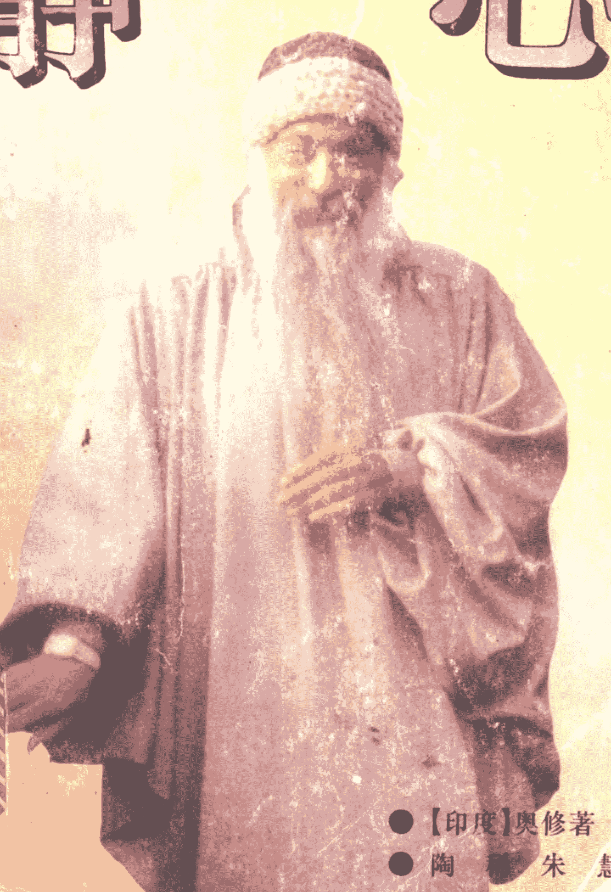

## 静
## 心
## JING XIN

+   • 【印度】奥修著
+   陶稀朱慧
+   上海三联书店

# 静心

• [印度]奥修著

• 陶稀朱慧译

• 上海三联书店

著者/[印]奥修

译者/陶稀朱慧

责任编辑/赵孝思

装帧设计/宋珍妮

责任制作/沈鹰

出版/ 生活·讀書·新知 上海三联书店 （200020） 中国上海市绍兴路7号

发行/ 陸華書店 上海发行所 上海三联书店经理部发行科 （200020） 中国上海市绍兴路7号

排版/ 上海三联读者服务公司

印制/ 上海市印刷十一厂

版次/ 1995年5月第1版

印次/ 1996年4月第5次印刷

开本/ 850×1168 1/32

字数/ 240千字

印张/ 10.75

印数/ 40101--70100

ISBN7-5426-0776-6 G·143 定价16.80元

# 译者手记——代序

总编让我写篇译者序，谈谈我对静心的理解及经验。然而，当我的静心经验变成文字之后，在一次偶然的失误中，忽然丢失了它……于是我只能接受存在的安排，对此便不再赘言。

事实上，关于静心，奥修大师在书中已讲得非常透彻明了了。剩下的只是由我们去做、去体验、去觉悟存在给予我们的巨大的祝福与深深的爱！——在翻译和静心的过程中，我仿佛一直听见一个千古的回声在召唤着：“回家吧！”——它是大海对一滴水的呼唤！这呼唤令我常常感动不已，如同一个孤独的、找不到家的孩子，突然听到了妈妈的呼唤，突然发现了回家的路……这份刹那间的狂喜愿能与朋友们一起共享：回家！

希望我和朱慧的翻译，没有妨碍这个召唤的真义。译的不当之处，敬请各位朋友不吝赐教。

陶 稀
1994年5月
于沪上桃园居

# 原序

为了人类的自由和静心，成道大师奥修创造了一种世界性的反叛。你或许会认为这是一个奇怪的选择，自由和静心之间会有怎样的联系？而这两者的微妙的联系是理解人类未来潜能的关键点。静心就是对爱、亲密、创造和扩展打开我们能量的门。按照奥修所说，没有其他的门，没有其他的道。

自1953年奥修大师成道以来，他已给门徒们、寻道者们阐释了世界上许多伟大的宗教传统、神秘主义传统和秘传的传统，他的演讲已编成了400多本著作。他在演讲中，将生命注入了无数古代和现代的神秘学家中，使他们所教导的智慧更易理解，并与我们当今的生活休戚相关。

此书是从奥修广博的静心著作中选编而成，其中包含了众多的方法，这些方法能帮助我们发现他所说的“静心：最初也是最终的自由”，大师曾说过：“静心不是什么新的东西，是你与生俱来的；头脑是新的东西，而静心是你的本性。它是你的本性，它正是你的存在，它怎么会是困难的呢？

我们在与某种我们认为在阻止我们自由的东西作对，或者去寻求某种我们以为会给予我们自由的东西，这才使得静心困难。事实上，只要让放松进入我们自身，生活在每一个片刻中，这才是根本的。

全世界的人都在为摆脱某种事物尽力抗争着，这种抗争或许是针对一个唠叨的妻子，或是一个专制的丈夫，专横的父母，或是在工作中压制创造力的老板。我的抗争既是与一种压抑的政治系统作斗争，也是通过无数次治疗来摆脱儿时对自身的制约的一种努力，这种抗争并没有使我自由，这只是对我认为那些不让我自由的事物的一种反应。

静心的自由也不是为某种事物寻求自由而进行的一种探索。我们中有多少人曾梦想生活在某种环境或是乌托邦中，它能让我们放松并成为我们自己，而使我们每天生活中无需竞争和紧张？我的体验已昭示我，我们正在寻求的自由并不依赖于外在于我们自身的事物。

因此，什么是我们所渴望的自由呢？我曾听过奥修描述的“就是自由”：生活在此时此地，一个片刻接着下一个片刻，既不生活在记忆中和过去的压抑里，也不生活在未来的梦想中。

他曾说：“吃——就是吃，与它同在；走——就是走，与它同走。不要跑到前面，不要跳到这儿跳到那儿。头脑总是走到前面或者落在后面，只要停留在那个片刻中。”

我们中许多人肯定体验过大师对头脑的一些说法，头脑总是跳到前面或者落在后面，但它从来不在那个片刻中：它总是在不断地唠叨着，当这种唠叨发生，那么它就剥夺了我们存在的那个片刻，以及极致的生活；在我们的日常生活中，我们的头脑在唠叨个不停，我们怎样能尽致地生活呢？

你可以尝试一个小试验来了解你自身，将书放在一边，闭上你的眼睛，看看你只是坐着并享受你对身体的感觉和在你周围的任何的声音会有多久。

这段时间或许不会很长，也许一分钟，你的头脑就开始唠唠叨叨，如果你坐一会儿，注意它唠叨些什么，你会感到吃惊：你会发现你正在与自己进行着许多不同的语无伦次的对话，如果你听到别人这样大声地说出来的话，那么你一定会认为他疯了。这种不停地唠叨逐渐地剥夺了我们的生命，阻碍着我们去享受生命给予我们的每一个片刻。

这种失去控制的唠叨将我们与生命中宝贵的片刻隔离，并剥夺了我们生命中这些宝贵的片刻，那么我们对此做些什么呢？我曾听大师一再地告诉我们要静心，我曾听他说，我们不能直接使唠叨的头脑停下来，但通过静心，唠叨会慢下来，最终消失。

对于静心，头脑成了有用的工具，再也不是以它的不停地唠叨来奴役我们。然而我们常常被大量含糊不清和与当今生活无关的静心技巧所困扰。奥修将这些技巧去伪存真，凝炼其精华，给予了超越我们想象的一把打开宇宙之门的钥匙，这把万能的钥匙就是观照：直接但深入地观看的状态，并接受 ourselves 本真。

奥修告诉我们：观照只意味着超然的、不带任何偏见的观看，那就是静心的全部秘密。

这事实上简单得让我错过了好几年，我们都肯定地以为我们懂得观看，我们整天在观看我们周围的事物，我们看电视，我们看别人从我们身边走过，注意他们穿着什么衣服，他们的长相是怎样的，但一般我们不观察我们自己，当我们观察自己时，通常是通过自我意识来评判，我们会注意到自身有某些我们不喜欢的东西，而就开始担心别人会怎么想。通常这些头脑内部的唠叨令我们感觉苦恼，这并不是观照。

奥修提醒我们：“无需做什么事情，只是作为观照，成为一个观察者，一个看者，看看头脑的动作——思想经过，欲望、记忆、梦想、幻觉，只是远远地站着，冷静地看它，看着它，不带任何判断，没有任何责备，既不说‘这是好的’，也不说‘这是坏的’。”

读这本书，你会发现什么是静心的观照。当处于大师的“在”当中，观照就自然地开始发生了。在那些时刻发生中，那时你只是带着内在的宁静坐着、听着、感觉着、观看着所发生的一切，这种宁静就像广阔而空明的天空，但却是带着生命的震颤。

奥修的家就是天空，他的存在就是宁静，他的话抚慰心灵深处，他的歌就是那空明的天空之歌。

“你的内在本性不就是内在的天空。云来来去去，星球诞生又消失，星星升起又殒落，而内在的天空却依然如此，不曾被触及，没有被玷污，没留下痕迹，我们称那个内在天空为‘莎克心(sakshin)’.观照，那就是静心的全部目标。”

“进入，享受内在的天空。记住，无论你能看见什么，你不是它；你能看见思想，然而你不是思想；你能看见你的感觉，然而你不是你的感觉；你能看见你的梦、欲望、记忆、想象、投射，然而你不是它们。不断地去除你所见到的全部，然后，有一天，再也没有什么东西可丢弃的时候，一个伟大的时刻就会出现，那是人的生命中最有意义的时候。”

“所有看见的都已消逝，而只有观看者还在，观看者就是空明的天空。”

“去领悟，那就是成为无畏，去领悟，那也就是充满爱，去领悟，那就是成为神，就是成为不朽。”

读这本书，你就被邀请去体验你自己的内在的天空。我对我师傅的感激和爱无法用言语表达；只有眼泪才能表达我的感觉，通过聆听他引导我们走向自由的召唤，我开始觉醒到生命所带来的每一个片刻的美丽与优雅。

感谢你，亲爱的大师。

迪瓦·万杜达 1992年1月 印度 普那

# 怎样使用本书

当你把本书作为静心指南时，那么在试着做任何一种静心以前，你无需一页一页地翻阅完整本书，你可凭直觉使用本书，随意地翻阅并选择一些章节或你感兴趣的静心。比如，你或许会喜欢直接跳入第三部分的静心之一，在你读完以前就可以去做了，只要你感觉好就行。

当你选择了一种静心来做，最起码做三天，如果感觉好，就继续做，继续深入，重要的是要以玩的心态来体验它，只要问自己:这种静心是否能助长我的快乐和敏感性?

# 伴着音乐来静心

音乐和静心能很好地在一起。关于这点,奥修曾说过:‘对我而言,音乐和静心是同一现象的两个方面,没有音乐,静心就缺少某种东西,没有音乐,静心就有些枯燥乏味,没有生命力;没有静心,音乐就只是噪音——和谐,但是是噪音,没有静心,音乐是一种娱乐。音乐和静心应该在一起,那两者加起来,使两者都有了一个新的层面,两者都会因此而更加丰富。’

所以有很多音乐带被制作好来引导动态静心和许多活动的方法,包括空达里尼(kundalini)、神秘的玫瑰、无念(No－mind)的静心、曼陀罗(Mandala)、那他瑞杰(Nataraj)、德伐伐尼(De-
vavani）、祈祷、戈瑞希卡（Gourishankar）和那达布拉玛（Nadabrahma），这些静心的音乐带目录，在此书后面可提供，以备需要。

# 黑体字部分

第三部分中许多静心方法是基于许多成道大师的教导，包括佛陀，帕坦加利（Patanjali）和印度的湿婆（Shiva）、西藏的阿提沙（Atisha）和蒂罗巴（Tilopa），及中国的大师吕祖（LuTsu）。奥修在引用他们的诗和经文时，那些部分和早期大师的名字都用黑体字印刷。

最后，此书中有一些章节，比如一些静心方法的概要，是基于奥修的教导，但并不是出自他本人话语，为了显示不同，这些片断也用黑体字印刷。

# 目录

+   译者手记——代序……………………………………………… 1
+   原 序…………………………………………………………………… 1
+   怎样使用本书…………………………………………………………………… 1
+   第一部分：关于静心………………………………………………………… 1
+    1. 什么是静心 …………………………………………………………… 3
+    2. 静心之花开 …………………………………………………………… 9
+   第二部分：静心的科学………………………………………………………… 17
+    1. 方法和静心 …………………………………………………………… 19
+    2. 给初学者的建议 …………………………………………………………… 28
+    3. 达到自由的指南 …………………………………………………………… 37
+   第三部分：静心的方法………………………………………………………… 49
+    1. 觉醒的两种有力的方法 …………………………………………………………… 51
+    2. 奥修的静心治疗 …………………………………………………………… 72
+    3. 无念(No－Mind)的静心 …………………………………………………………… 78
+    4. 再次出生 ……… 81
+    5. 以舞蹈作为静心 ……… 83
+    6. 任何事都能成为静心 ……… 89
+    7. 呼吸——静心的桥梁 ……… 96
+    8. 打开你的心 ……… 106
+    9. 内在的集中 ……… 123
+    10. 看着内在 ……… 138
+    11. 光的静心 ……… 147
+    12. 黑暗的静心 ……… 156
+    13. 能量上移 ……… 163
+    14. 倾听无声之声 ……… 174
+    15. 找到内在的空间 ……… 191
+    16. 步入死亡 ……… 201
+    17. 用第三只眼观照 ……… 209
+    18. 只是坐着 ……… 224
+    19. 在爱中升华:静心中的伴侣关系 ……… 231
+   第四部分：静心的障碍 ……… 245
+    1. 两大困难 ……… 247
+    2. 错误的方法 ……… 262
+    3. 头脑的骗局 ……… 268
+   第五部分：对大师的提问 ……… 273
+    1. 只有观照才会真正舞蹈 ……… 275
+    2. 鹅从未在里面！ ……… 280
+    3. 山顶上的观看者 ……… 285
+    4. 你把自行车留在了哪里？ ……… 289
+    5. 只需一百八十度大转弯 ………… 295
+    6. 所有的小径都通向山顶 ………… 297
+    7. 庆祝意识 ………… ………… 300
+    8. 调节到不确定 ………… ………… 306
+    9. 清点觉知的片刻 ………… ………… 311
+    10. 尽量使事情简单化 ………… ………… 317
+    11. 观照如同播种 ………… ………… 321
+    12. 观照就足够了 ………… ………… 327
+   静心者说——代后记 ………… ………… 邱正平 330## 关于静心

过十分钟后，你读它——你会看见里面有一个发疯的头脑！因为我们并不觉知，这整个的疯狂不断地涌动着，就像一股暗流。无论你在做什么，它影响着你，或者你并不做什么，它也影响着你，它影响着一切，而它的全部总和就将是你的一生！所以这个疯子必须被改变。而觉知的奇迹就是除了只是变得觉知以外，你无需做任何事情。

正是以观照它的现象来改变它，慢慢地，慢慢地那个疯子消失了，渐渐地，渐渐地思想开始落入另一种形式，它们的混乱不在了，它们变得更加有序了，而后再一次，一种更深的宁静呈现了，而当你的身体和你的头脑是宁静的，你将看见它们相互间也是和谐的，那儿有一座桥，现在它们不再会各自奔向不同的方向，它们不再骑着各自不同的马，第一次它们协调了，而那种协调对第三步的工作有很大的帮助——那就是变得觉知你的感觉，情感和心境。

那是最微妙的层面和极其困难的层面，但是如果你能觉知思想，而后它也只是更进一步而已，需要一点更高的觉知，于是，你开始反映你的心境，你的情感，你的感觉，一旦你觉知所有这三者它们都能连结成一个现象，而当所有这三者就是一个——完全地在一起作用着，一起哼唱着，你便能感觉所有这三者的音乐，它们已经成为一支管弦乐队——于是第四步发生了，而这是你无能为力的，它照着它自身发生，它是一个来自整体的礼物、它是给那些做了三个步骤的人的回报。

这第四步是使人醒悟的最终的觉知，一个人变得能觉知到他自己的觉知——那就是第四步，它能造就一个醒悟的佛陀，而只有在醒悟中，人才会懂得什么是喜悦。身体知道快感，头脑知道高兴，心灵知道快乐，第四步则是知道喜悦。喜悦就是门徒或求道者的目标，觉知就是通向目标的道路。

# 静心

重要的事就是你是观照着的，你不忘记观照，你一直在看着……看着……看着，而慢慢地，慢慢地，当那个看者变得越来越统一、越来越稳定、越来越不波动，一种变化就发生了，你所看着的事就全都消失了。

看者自身首次变成了被看者，观照者自身变成了被观照者。你已经回到了家。

## 2. 静心之花开

静心并不是印度的方式，它也不只是一种技巧，你不可能学会，它是一种成长：它是你整个生命的成长，它是出自你整个生命。静心不是某样能外加在你身上的东西，它只能通过一种基本的变化，一种蜕变才来到你身上，它是一种花开，一种成长，成长总是来自整体，它并不是外加的，就像爱，它不可能强加于你，它的成长来自于你，来自于你的整体，你必须向着静心成长。

# 伟大的宁静

宁静通常是被理解成某种否定的东西，某种空的东西，一种无声的、无噪音的东西，这个误解是普遍的，因为很少有人曾经历过宁静。

他们所经历的所有叫做宁静的就是无噪声，但是宁静是一种完全不同的现象，它是全然肯定的，它是存在的，它不是空的，它是你洋溢着以前从未听到过的一种音乐，带着你不熟知的芬芳，带着只能被内眼所见的光芒。

这不是某种虚构的东西，这是一个事实，而这个事实总是展现在每个人里面——只是我们从未向内看。

你的内在世界有它自己的味道，有它自己的芳香，有它自己的光芒，而它是全然地宁静，巨大的宁静，永恒的宁静，从未有过

任何噪音，也将永远不会有任何噪音，那儿语言不能够到达，而你却能达到那种境界。

你的存在的中心正是一种旋风的中心，在中心周围无论发生什么，都不能影响它，它是永恒的宁静：一天来了又走了，一年来了又去了，一岁来了又过了，生命来来去去，但你本性中永恒的宁静却依然如此——同样无声的音乐，同样神的芳香，同样对所有必死的和瞬间的超越。

它不是你的宁静。

你就是它。

它不是你所占有的某样东西，而是你被它占有，那就是它的伟大，甚至你并不在那儿，因为你的出现将也是一种干扰。

这个宁静是这样的深奥，其中没有任何人，也没有你，而这个宁静却带给你真理，带给你爱，带给你许许多多的祝福。

# 敏感度的成长

静心将带给你敏感，一种属于这个世界的伟大的感觉，这是我们的世界——星星是我们的，在这儿我们不是外来者，我们属于固有的存在，我们是它的一部分，我们是它的心脏。

你变得如此敏感，甚至是最小的一片草叶对你来说也极为重要。你的敏感让你清楚地了解，这片小草叶是和最大的星星样重要的存在，没有这片草，存在就会比现在少掉一些，这片小草叶是唯一的，它无法被替代，它有它自身的个体性。

这个敏感将会为你创造新的友情——与树木、与鸟儿、与动物、与山脉、与河流、与海洋、与星星的友情，当爱成长了，当友情成长了，生命变得更加丰富。

# 爱，静心的芬芳

如果你静心，那么迟早你会遇到爱；如果你深入地静心，那么迟早你会感受到以前你从来不知道的，一个巨大的爱，在你里面呈现——一种你本性中新的品质，一扇新的门打开着，你已成了的一种新的火焰，而现在你想要去分享。

如果你深入地爱，渐渐地你将觉知到你的爱越来越变得静心，一种宁静的精巧的品质正在进入你，思想正在消失，空间在出现……一阵阵宁静！你在触及你自己的深处。

如果是在正确的路线上，那么爱使你静心。

如果是在正确的路线上，那么静心使你爱。

你想要一种来自静心的爱，不是来自头脑，那就是我不断谈及的爱。

世界上有成千上万对夫妇生活着，好像爱就在那儿存在着，他们生活在一个“好像”的世界里，自然，他们怎样能快乐呢？他们消耗着全部的能量，他们正试图从虚假的爱当中得到某种东西。但是这是不可能传递出东西的，所以爱人之间挫折产生，不住的厌倦，不断地唠叨、作对。他们俩都试图做着某种不可能的事：他们在试图使他们的爱情变成永恒的东西，这是不可能的，它是出自头脑，而头脑不可能给你任何对永恒的瞥见。

首先要进入静心，因为爱将来自静心——它是静心的芬芳，静心就是一朵花，一千个花瓣的莲花，让它打开，让它帮助你进入垂直的层面，无头脑，无时间，而那时你会突然地看见芬芳，就在那儿，那么它就是永恒，那么它就是无条件的，它甚至不是针对任何一个特定的人，它不可能是针对任何一个特定的人，它不是一种关系，它倒是一种围绕在你周围的品质，它与别人无关，你在爱，你就是爱，而这就是永恒，它就是你的芬芳，它曾围绕在
佛陀周围，围绕在查拉图斯周围，围绕在耶稣周围，它是一种完全不同的爱.这是品质上的不同。

# 慈悲

佛陀将慈悲(compassion)阐释为“爱加上静心”。当你的爱不只是对别人的欲望，当你的爱不仅仅是一种需要，当你的爱是一种分享，当你的爱不是一个乞丐的爱，而是一个皇帝的爱，当你的爱不是在乞求回报而只是准备给予——给予是为了纯粹给予的快乐——然后将静心加进去，于是，清纯的芬芳就散发出来了，被隐藏的光芒也放射出来了，那就是慈悲。慈悲是最高的现象，性是动物的，爱是人类的，慈悲是神圣的；性是身体的，爱是心理的，慈悲是心灵的。

# 没有丝毫理由的长驻的快乐

没有一点理由，你突然地感到你自己快乐。在日常的生活中，如果有某种原因，那么你就会快乐，你遇到了一位美丽的女子，于是你就会快乐，或者你得到了你常想得到的钱，于是你就会快乐，或者你买了一幢有美丽花园的房子，你就会快乐，但是这些快乐并不会长久，它们都是暂时的，它们不可能持续和不间断。

如果你的快乐是某样东西引起的，那么它将会消失，它将是暂时的，它将很快地让你陷入深深的悲伤中，所有的快乐都会让你陷入深深的悲伤中。但是有一种不同的快乐，那是确实表现出来：你突然没有一点理由的快乐起来，你不可能精确地说出为什么，如果某个人问：“为什么你会如此快乐？”你则不可能回答。

我不能回答我为什么是快乐的，没有理由，它就是如此简单，现在这样的快乐不可能受干扰，无论现在发生什么，它将会
继续，它就在那儿，一天又一天，你或许年轻，你或许年老，你或许是活着，你或许快死了——它总是在那儿。当你发现了某种持续的快乐——环境变化了，但它还在——那么你肯定更接近佛性了。

# 智力：反应能力

智力只是意味着反应能力，因为生命是一种连续的变动，你必须觉知并看清需要你什么，周围的情景的挑战又是什么，聪明人是按照当时的情景来行动，而愚笨的人则是按照准备好的答案来行动，不管答案是来自佛陀、耶稣基督或克利希纳（krishna），这都没有关系，他总是将经典带在身边，他害怕依靠自己；聪明人根据他自己的洞察，他相信他自己的本性，他爱自己，尊重自己，不聪明的人尊重别人。

聪明是能够被再发现的，只有一种再发现的方法，这就是静心。静心只做一件事：它要摧毁这个社会所制造出来的、阻碍你本性聪明的所有障碍，它只是将障碍物搬走，它的功能是负面的：它要搬走阻碍你的水流动的顽石，阻碍你的泉源活起来的顽石。

每个人都拥有巨大的潜力，但是社会却放了块大石头来阻碍它，它在你周围筑起了万里长城，它已将你监禁起来了。

从一切监禁中走出来就是聪明的——而再也不要走入另外一个监禁。通过静心，聪明能被发现，因为所有的那些监禁都存在于你的头脑中，幸好，它们无法到达你的本性中，它们无法污染你的本性，它们只能污染你的头脑——它们的范围只是你的头脑。如果你能走出头脑，你就会走出基督教、印度教、耆那教、佛教，而所有的各种各样的的垃圾都将被废弃，你将就此结束这一切。

## 单独：你的自性(self—nature)

单独就是一朵花,一朵开在你心中的莲花。单独是肯定的,单独是健康的,这就是你自己本性的快乐,这就是拥有你自己的空间的快乐。

静心意味着:在单独中感到喜悦。当一个人已能做到这一点,当他不再依赖任何人、任何情况、任何条件,那么这个人就是真正地活着。因为这是人自己的,不论早上或晚上,白天或黑夜,年轻或年老,健康或生病,它都存在着。甚至,在生命中或在死亡里也都会存在着,因为它不是某种在你之外发生的事情。它是从你内部喷涌出来的东西,它就是你的本性,它就是自性。

一个内在的旅程就是一个走向完全单独的旅程,你不可能带任何人去那里,你不可能与任何人分享你的中心,甚至无法与你的爱人一起分享,因为这不是事情的本质,对此也毫无办法。当你进入自己的这一刻,与外部世界所有的联系都中断了,所有的桥都断了,事实上,整个世界都消失了。

那就是为什么神秘家称世界为幻象,是“摩耶”(Maya),并不是说它不存在,而是对静心者,当他进入自身,世界对他几乎好像是不存在了,宁静是如此的深邃,没有任何噪音穿透它,单独是如此之深,以至于人需要勇气。但是从那单独中能激发出喜悦,来自那单独——是神的体验.没有其它的方式,从来没有其
它方式也永远没有其它方式。

庆祝单独，庆祝你的纯洁的空间，于是一首伟大的歌将从你心中升起，这将是一首觉知的歌，这将是一首静心的歌，这将是一只远方单独的小鸟召唤的歌——并不是在召唤某个特定的人，而只是召唤着，因为心中充满着歌而想召唤，因为乌云密集而要下雨；因为花儿成熟，花瓣就要开放而芬芳四溢……并不是对某一个人。让你的单独变成一个舞蹈。

# 你真实的自己

静心只不过是你觉知你真实的自己的一种设计——不是由你创造的，也不需要让你来创造，而你本身已经了，它是你与生俱来的，你就是它! 它是需要被人发现。如果这是不可能的，或者，如果社会不允许它发生——没有一种社会允许它发生，因为真实的自己是危险的：对已建立好的教会有危险，对国家有危险，对群体有危险，对传统有危险，因为一个人知道他的真实的自己，他就会成为一个个体(individual)。

他不再属于大众的心理，他将不再迷信，他再不可能被剥削，他再也不可能像牛一样被牵着走，他不可能被命令，再被支配，他将按照自己的光生活，他将按照他自己的内在生活，他的生命将非常美丽，非常完整，但是，那是社会所恐惧的。

完整的人就会成为个体，而社会要你成为没有个体的，代之以个体，社会教你一种个性(personality)，“个性”这个词必须被理解，它是来自词根“persona”，—— persona 意思是一个面具，社会给你一个虚假的你是谁的概念，它只是给你了一只玩具，而你的一生都不断地依赖着这只玩具。

依我所见，几乎每个人都在错误的位置上，一个能成为非常快乐的医生的人，却成了一名画家，而能成为一名非常快乐的画
家的人,却是一名医生,似乎没有人正好在他的位置上。那正是为什么整个这个社会是在如此的混乱中,人老是受人指点,他不是由他的直觉来指点。

静心会帮助你,使你自己的直觉能力成长,它会使你清晰地知道,什么会使你圆满,什么会帮助你开花,无论它是什么,每个个体都将不同的——那就是“个体”这词的意思:每个人是独一无二的,去寻求和找寻你的唯一性,这是一种极大的振奋,一次极大的冒险。

# 第二部分：静心的科学

# 1. 方法和静心

# 技巧是有帮助的

技巧是有帮助的,因为它们是科学的,你可以因此避免徒劳的迷失和徒劳的摸索,如果你不懂得任何技巧,那么你将化很长的时间。

有一位师傅,有科学的技巧,你就能节省许多时间、时机和能量。有时,在几秒钟内你就能成长了许多,甚至在你几世之内也不可能有那么多的成长。如果应用正确的技巧,成长就激发起来了,而这些技巧已被沿用于数千年的实践中,它们不是由一个人设计出来的,它们是由许许多多的寻道者设计出来的,这里只是最基本的。

你将会达到目标,因为,除非你生命的能量到达一个不可能再移动的点,否则,它会移动,它会不断地向最高峰移动,那就是为什么一个人会不断地一而再、再而三地出生的原因,如果由着你自己,你会到达目标,但是你将作非常、非常长的旅行,而这个旅程将是非常乏味和厌倦的。

所有的技巧都会有帮助的,但是,确切地说,它们并不是静心,它们只是黑暗中的摸索。突然,有一天,正在做着某件事的你会变成一种观照,当你正在做着动态静心,或者空达里尼静心、

或者旋转静心，突然，有一天，静心继续着，而你却不与它认同，你将静静地坐在后面，你将会看着它——那天静心就已经发生了，那天技巧不再是一种阻碍，也不再是一种帮助。如果你喜欢的话，你就能享受它，好像一种运动一样，它只是给予一种活力，但是现在不再需要了——真正的静心已经发生了，静心就是观照，做静心就是意味着成为一种观照，静心完全不是一种技巧！这会使你非常混乱，因为我在不断地给你技巧，而在最终的醒悟中，静心不是一种技巧，静心是一种觉悟、一种觉知。但是你需要技巧，因为那个终极的觉悟离你还非常遥远，深深地隐藏在你的内部，却又是依然离你很遥远，这个时刻你可能会达到，但你也可能会达不到，因为你的头脑还继续着，这当下的时刻是可能的或也是不可能的，技巧将连结这个空隙，它们就是要连结这个空隙。所以在刚开始的时候，技巧就是静心，而最终你会发笑——技巧并不是静心，静心是完全不同的存在的品质，它与任何东西无关，但是这只会在最后发生，不要以为在刚开始它就已经发生，否则那个空隙将不会连结起来。

# 开始时的努力

静心技巧就是去做，因为你被劝导着做某件事情——即使去静心也是去做某件事情，即使静静地坐也是在做某件事情，即使不做任何事也是一种作为。所以在表面上来说，所有静心技巧就是作为，但是更深入地说，它们就不是做，因为如果你做得成功，那个做就会消失。

只有在刚开始时，它才会显得就像一种努力，如果你做得成功，那个努力也就会消失，而整个事情变得自然和无为。如果你做得成功，那么它就不是一种做，那么也就无需你这方面的努力：它变得就像呼吸，它就是存在。但是，在刚开始时，一定要努
力，因为头脑不可能做任何不努力的事，如果你告诉它不要努力，那么整个事情就会显得很荒谬。

在禅学中，非常强调的是无为。师傅对门徒说：“只是坐着，不要做任何事。”门徒就去尝试，当然——你除了尝试以外，还能做什么呢？

在刚开始时，努力是存在的，做也存在着——但只是刚开始时，是一个必要的恶习，你必须不断地记住，你必须超越它，当你对静心什么也不做的时候，那个时刻一定会到来，只是存在着，而它发生了，只是坐着或站着，它发生了，不做任何事，只是保持觉知，它就发生了。

所有这些技巧只是帮助你到达无为的这一时刻。内在的变化，内在的醒悟不可能通过努力而发生，因为努力是一种紧张，当你努力的时候，你不可能完全地放松，努力将成为一种障碍，而当你明白这个背景时，如果你努力，渐渐地你也将变得能够无需努力。

# 这些方法是简单的

我们将要讨论的所有这些方法都是由那些成功者所讲的，请记住这点。它们看起来太简单了，但就是这样。对我们的头脑而言，太简单的事情不可能有吸引力，因为如果技巧是如此之简单，住所是如此之近，如果你已住在里面，家是如此之近，你会觉得自己看起来是如此荒谬——那你为什么会错过它呢？不去感觉你自己的自我的荒谬，反而以为如此简单的方法不可能有任何帮助。

那是一种欺骗，你的头脑将告诉你这些简单的方法不可能有任何帮助——它们是如此简单，它们不可能成就任何事情，“要达到神性的存在，要达到完全和终极，怎么能用这样简单的
方法呢？它们怎么能有任何帮助呢?”你的自我会说它们不可能有任何帮助。

要记住一件事——自我总是对某种困难的事情感兴趣，因为当某种事情是困难的，那么就会有挑战。如果你能克服那个困难，那么你的自我就会感到满足。自我从来不被任何简单的事所吸引——从不！如果你想给你的自我一个挑战，那么就将某样事情设计得困难些；如果某件事情是简单的，那就没有吸引力，因为即使你能克服它，自我也不会有满足。首先，没有什么事要克服：事情是那么简单。自我要求困难

# 静心

# 正确的方法将一拍即合

真的，当你尝试正确的方法时，它立即会一拍即合。因此，我将每天在此不断地讲方法，你可以尝试它们，只是与它们游戏：到家里尝试一下，正确的方法，那么无论何时做，就会一拍即合，在你内在有某种东西被激发出来，于是你就明白：“这对我而言是正确的方法。”但是，努力是需要的，而有一天，突然你会感到惊讶，有一种方法已经抓住了你。

我已经发觉，当你在游戏的时候，你的头脑更加打开；当你严肃的时候，你的头脑并不这么打开，它是关闭的。所以只是游戏，不要太严肃，只是玩。而这些方法是简单的，你可以只是与它们游戏。

用一种方法：起码跟它玩三天，如果它给你一种亲密的感觉，如果它给你一种很好的感觉，如果它给你一种“这就是给你的”的感觉，那么就好好地下功夫，然后忘了其它的方法，不要再与其它方法玩了，固定于这种方法——至少三个月。

奇迹是有可能发生的，只是这个技巧必须是适合你的。如果这个技巧不适合你，那么什么事也不会发生，或许你与它在一起好几世，而什么事也将不会发生。如果这个方法适合你，那么即使三分钟也足够了。

# 什么时候扔掉方法

所有最伟大的师傅都说过这点，那就是有一天，你必须得把方法扔掉，而你扔得越快越好，当你达到这一刻时，那一刻你内在的觉知也被释放出来了，立即就扔掉方法。

佛陀一再地讲过一个故事，有五个傻瓜经过一个村子，人们看见他们感到很惊奇，因为他们将一只船顶在脑袋上，那船真大，他们几乎被它的重量压死了，而有人问他们：“你们在干什么？”

他们说：“我们不能离开这条船，这是条帮助我们从对岸到此岸的船，我们怎么能扔掉它呢？因为有了它，我们才能够到这里来，没有它，我们会死在对岸的。夜近的时候，对岸有野兽，那么到了早上我们无疑就会死掉，我们将永远不离开这条船，我们永远欠它的情，我们将它顶在我们头上纯粹为了感激。”

只有当你还不觉知时，方法才是危险的，否则，它们能被应用得很棒，你是不是认为那条船是危险的呢？如果出于纯粹的感激，你想整个一生都将那条船顶在脑袋上，这是危险的，否则，它只是一只救生艇，用过之后就抛弃掉，用过之后就丢弃，用过之后，永不再回头看一看，那没有用了，没有意义了！

如果你抛开治疗，自然地你就开始回到你的本性。头脑是执著的，它从来不允许你居留在你的本性中，它只是让你的兴趣保持在某种并非是你的本性的事情上：那条船上。

当你不执著任何事情时，你没有任何去处，所有的船都已经被抛弃，你就不可能到任何地方去；所有的道路都被放弃，你无法去任何地方；所有的梦想和欲望已经消失，再也无路可走，放松就会顺其自然地发生了。

只要想到“放松”这个词，在……安定下来……你就已经回家了。

有一刻，一切都充满芬芳，而下一刻你就要去寻找它，而你不可能找到它，它去哪里了呢？

在刚开始时，只有一瞬间发生，慢慢地、慢慢地它们会越来越固定，它们会停留得越来越长，慢慢地、慢慢地、慢慢地、非常慢地，它们会永远留驻。在此之前，不允许你想当然，那会是一种错误。

当你坐着静心，在静心的过程中，这就会发生，但是它会走掉，所以在真正的静心与静心之间，你该做什么呢？

在这个之间，继续使用方法，当你深入地静心了，就扔掉方法。当觉知变得越来越纯的时候，有一片刻会来临，那时突然地，它完全清纯了：扔掉了方法，抛弃了方法，忘记所有的治疗，只是安定和存在于那个片刻中。

但是在刚开始时，它将只发生一会儿，有时它在这里发生，正在听我演讲时发生，只是一会儿，就像一阵轻风，将你送到另外一个世界，一个没有头脑（no－mind 亦可译作：无念）的世界，只是一会儿，你即使明白，但只是一会儿，黑暗再一次聚集，头脑带着它所有的梦想，带着它所有的欲望和所有的愚蠢回来了。

云散了一个片刻，你已见到太阳，现在云又在那儿了，天色暗然，太阳已经消失，现在，甚至要相信太阳的存在也变得困难了，现在要相信你前面所经历的那一刻是真实的也变得困难了，它或许是一种幻想，头脑也许会说，它或许是一种想象。

这是如此难以令人置信，它看起来是如此不可能，它不可能在你身上发生。在头脑中，还有所有的这种愚蠢，有所有的这些乌云和黑暗，它竟发生在你身上：你看见了一会儿太阳，这看上去好像不可能，你一定是在想象它或许你是在梦中见到它。

静心与静心之间的过渡再次开始，再去坐那条船，再去用那条船。

# 想象能帮助你

首先，你必须懂得想象（imagination）是什么，它目前备受谴责，当你一听到想象一词，你就会说这个是没用的，我们想要真实的东西，不是想象。但想象是一个事实，它是一种能力，它是一种你内在的潜力，你能想象，那就表明你的本性有能力想象，这种能力是一种事实。通过这个想象，你能摧毁或者你也能去创造你自己，这一切由你自己而定，想象是非常有力的，它是潜在的力量。那什么是想象呢？这是如此深地进入了一种心态，这种心态会变成事实。比如，你或许曾听说过在西藏所用的技巧，他们称之为热瑜珈。晚上很冷，大雪纷纷，而西藏的喇嘛赤身裸体站在旷野上，气温在零度以下，你会被冻死，你会被冻僵。但是喇嘛正练习着一种特殊的技巧——他正在想象他的身体是一团燃烧着的火，他在想象他正出着汗——热量之多以至于他全身都在出汗，而事实上他的确在开始出汗，尽管温度在零度以下，甚至连血液也会冻僵，而他开始出汗。发生了什么？这个汗是真实的，他的身体真是热的——但这个事实是通过想象创造出来的。

一旦你与你的想象变得和谐，身体就开始起作用了，你已经做了许多事，但你不知道这是你的想象在起作用。很多次你只是通过想象来制造病痛，你想象现在这个毛病就在这里，会传染，它到处都是，你已变得易受感染的，现在你有会病倒的种种可能——而那个病是真的。而它是通过想象被制造出来的。想象是一种力量，一种能量，而头脑通过它来转动，当头脑通过它来转动时，身体也随之跟从。

这就是坦屈拉(tantra)的传统与西方催眠术的不同之处：催眠者认为，凭着想象你正在创造着某种东西；坦屈拉认为你凭着想象不在创造某种东西，你只是变得与某种已经存在的东西趋于和谐。

无论你凭着想象创造什么，都不可能是永久的，如果它不是一种真实，那它就是虚假的、不真实的，而你正在制造一种幻觉。

# 2. 给初学者的建议

# 足够的空间

当你开始尝试静心时,将电话插头拔掉,使自己从凡事中解脱出来。在房门口贴一张纸条,上面写着你在静心一个小时,请别敲门。而后当你走进静心的房间,脱掉你的鞋子,因为你是正走在神圣的土地上,不仅仅脱掉鞋子,而且将你所有牵挂的事都放下,有意识地将每一件事和鞋子一起放下,毫无牵挂地进入。一个人能从二十四小时里取出一个小时.二十三小时给你的职业、欲望、思想、野心和计划,从所有这一切中,取出一个小时,而最终你会发现只有这一个小时才是你生命中真正的时间,那另外二十三小时都纯粹是一种浪费,只有那一个小时被拯救出来,其它所有的一切都付之东流。

# 合适的地方

你应该找一个有助于静心的地方,比如,坐在一棵树下会有帮助,不要坐在电影院门前或去火车站坐在站台上,走向自然,走向山脉,走向树木,走向还在流动着、震动着、脉动着、流向四处的“道”之河流。树木是处于不断的静心中,寂静、无意识就是它的静心,我不是说你要成为一棵树,你必须成佛！但是佛陀与树有一个共同点:他和树一样绿,和树一样充满生命的琼浆,和树一样在庆祝；当然有一个不同，佛陀是有意识的，树是无意识的；树是无意识地在道中，佛陀是有意识地在道中，而那是有很大区别的，是天壤之别。

但是如果你坐在一棵树的旁边，四周有美丽的小鸟在歌唱，或者一只孔雀在舞蹈，或者只是小河在流动，发出奔流的水声，或者在瀑布旁边，奏出伟大的音乐……

去找一个自然环境，尚未被破坏，尚未被污染的地方，如果你无法找到这样的地方，那么就关上你家的门，坐在你自己的房间里。如果你家里有可能为静心准备一个特别的房间的话，只要一个小角落就可以做，但应是特别为静心准备的，为什么要特地为静心准备的呢？因为每一种行为都创造出它自己的微波，如果你就只在那个地方静心，那么那个地方也会变得静心起来，当你每天静心的时候，它都会吸收你的微波，第二天当你又来时，那些微波又开始返回到你身上，它们会有帮助，它们回报你，它们报答你。

当一个人已真正成为一个静心者时，他能坐在电影院前静心，他能在列车站台上静心。

十五年中，我不停地周游各地，不停地旅行，天天如此，年年如此，总是在火车上，在飞机上，在小汽车里，那没有什么区别，一旦你真正地在你本性中生根，那么任何事都没什么两样，但是这不适合初学者。

当树已经生根了，那么让风吹，让雨打，让雷劈，那都无所谓，都很好，它将使树更坚实；但是当树还小，还很脆弱的时候，那么对它而言，即使一个小小孩对它也是很危险的，或者只是一条牛经过，那就足以摧毁它了。

# 要舒服

姿势应该是能让你忘记你的身体。什么是舒服？当你忘记你的身体，你就是舒服了；当你还一直想到你的身体，你就是不舒服的。所以无论你坐在椅子上或坐在地上，那都不是关键。要舒服，因为如果你身体上不舒服，你就不可能期望其它属于更深层的祝福：第一层被错过，那所有其它层都关闭了。如果你真正地想要快乐、喜悦，那么从刚开始时就变成喜悦的；身体的舒服对要去达到内在狂喜的人而言是最基本的需要。

# 由宣泄开始

我从来不告诉人们，只是从坐开始。起初从容易的地方开始，否则，你会开始感觉到许多不必要的事——那是不存在的。

如果你以静坐开始的话，那么你将会感觉到内在有许多干扰，你越努力去坐，就越感觉到干扰，你会感觉到的只是你的疯狂的头脑，没有其它的东西，它会产生压抑，你会感觉到挫折，你不会感觉到喜悦，反而，你会开始感觉到你是疯狂的，而有时你或许真的要发疯了。

如果你诚心诚意地努力地“只是坐”，你或许会真的发疯，只是因为人们并不真正地那么努力，所以疯狂才没有经常发生，用静坐的姿势时，你开始知道你内在是如此的疯狂，如果你真诚地坚持那么做，你或许真的会发疯。这在以前已发生了许多次。所以我从不建议任何能产生挫折、压抑、悲伤的方式……那些会让你过份地知道你的疯狂。你或许并没准备好去知道你里面的所有的疯狂。

你必须让自己渐渐地知道某些事情，知识并非总是好的，它必须根据你的吸收能力的成长来慢慢地展开自身。

我以你的疯狂开始，不以静坐的姿势开始，我允许你的疯狂，如果你发疯地跳舞，与之相反的就会在你里面发生，从一个疯狂的舞蹈开始，你便开始觉知你内在一个宁静点；从静坐开始，你便开始觉知疯狂。相对的极总是觉知的点。

你可以疯狂地、不规则地舞蹈，哭泣和无规律的呼吸，我会让你疯狂宣泄出来，然后你会开始觉知到一个微妙的点，一个你内在深处宁静的点，与外围的疯狂形成显明的对照；你会感觉到非常喜悦，在你的中心有一种内在的宁静。但是如果你只是静坐，那么那个内在的点是一个疯狂的点，你外在是宁静的，但内在你却是疯狂的。

如果你是以某种行为开始——某种肯定的、活动的、动态的行为——它将更好。那么你将开始感觉到一种内在宁静的成长，它越成长，你也越有可能用静坐或静躺的姿势——可以用安静的静心方法。但到那时事情将是不同的，完全不同。

以动态的、行动的静心技巧开始，也会在其它方面帮助你，它变成了一种宣泄。当你只是静坐时，你会感到挫折、你的头脑想要动，而你只是静坐，那么每块肌肉都别扭，每根神经都别扭，你在试图将某种不自然的东西强加在你自己身上，然后你就将你自己分裂成一半是压抑的，一半是被压抑的，而事实上，受压抑的和被强迫的部分是更真实的部分，它比起压抑的部分在你的头脑中更主要，而那主要的部分一定会赢。

你那个压抑的部分是真正要被扔掉的，而不是被压抑的部分，它在你内部也变成一种积累，因为你在不断地压抑它。整个的儿童培养，文明，教育都是压抑的，你已经压抑了许多很容易抛弃的东西，如果是用一种不同的教育，一种更有意识的教育，一种更觉知的养育方式。如果能对你的头脑的内在机构有更好的觉知的话，那么文化可能会让你扔掉许多东西。

比如,当一个小孩生气时,我们就会对他说:‘不要生气。’他便开始压抑住生气,逐渐地,一件短暂的事就变成了永久的事,现在他将不在行动上表示生气,但他将会保留生气,我们已经从一些短暂的事情中积累了如此多的生气,除非生气被压抑,否则人不能一直是生气的。生气是一件来了又去的短暂的事,如果它被表达出来,那么你就不会再生气了。所以对我来说,我会允许小孩更真实地生气,要生气,要深入进去,不要压抑它。

当然,这也会有问题,如果我们说:‘要生气,'

# 3. 达到自由的指南

# 三个基本点

静心里面有一些基本点。无论什么方法，在每种方法中这些基本点都是必需的。首先是放松的状态：不要与头脑作对，不要去控制头脑，不要集中思想；第二，只要以放松的觉知来看正在进行着的一切，不要有任何干涉——只是静静地观看头脑，不要做任何判断和评论。

这些就是三个基本点：放松、观照和不作判断。而后慢慢地、慢慢地一种伟大的宁静降临到你身上，你内在的所有活动都停止了，你存在着，但是没有“我存在”的感觉——只是一个纯粹的空间。有一百十二种静心的方法，我已经讲过所有那些方法，它们的组成有所不同，但基本点是一样的：放松、观照、一种不加评判的态度。

# 游戏

成千上万的人错过静心，因为静心已被理解成错误的含义。它看上去非常严肃，看上去很沉闷，就像某种教堂里的事，它就好像只是为已死的人或快死的人准备的——那些沉闷的、严肃的，拉长了脸孔的人，那些人已经失去了欢乐，失去了乐趣，失去了游戏，失去了庆祝……

### 38 静心

这些是静心的品质：一个真正的静心的人是游戏的，生命对他而言是种乐趣，生活就是一个里拉(leela)，一出戏。他会尽情地享受它，他不是严肃的，他是放松的。

# 耐心

不要着急，常常是欲速则不达，当你渴时，耐心地等待——越深地等待，它就越快到来。

你已经播下了种，现在你可以坐在阴凉处看着什么会发生，种子会发芽，它会开花，但是你不可能加速这个过程，一切事不需要时间吗？你必须工作，但将结果留给神。生命中没有东西曾经是浪费的，特别是走向真理的步骤。

但是有时会没有耐心，渴望时就没有耐心，但这是一种障碍。留住渴望，扔掉急躁。

不要将急躁和渴望混淆，渴望中有向往，而没有斗争；急躁中有斗争，而没有向往；渴望中有等待，而没有要求；急躁中有要求，而没有等待，渴望中有沉默的泪，急躁中有无休止的斗争。

真理不可能被侵入，它只能通过臣服来达到，不是通过斗争，它是通过完全的臣服来征服的。

# 不要寻求结果

自我是朝向结果的，头脑总是渴望结果，头脑从来不对行动本身感兴趣，它的兴趣是在结果：“我会从中得到什么呢?”如果头脑能够设法做到不劳而获，那么它就会选择捷径。

那就是为什么受过教育的人会变得非常狡猾，因为他们能找到捷径。如果你能通过一条合法的途径赚到钱，它或许会花去你整个一生，但是如果你能通过走私、赌博或其它这种能赚到钱的事——通过成为一名政治领袖、一名首相、一名总统赚到钱

# 欣赏不觉知

觉知时享受觉知，而不觉知时享受不觉知，这没有什么错，因为不觉知就像是一种休息，否则觉知就会变成一种紧张，如果你二十四个小时都在觉知，那么你认为你能活几天？如果没有食物，一个人能活三个月，没有觉睡，在三个星期里你就会发疯，并且你会试图去自杀。在白天，你是警觉的；在晚上，你就要放松，放松会帮助你在白天变得更警觉、再度充满朝气。能量经过了一段时间的休息，因此在早上它们再会变得更充满活力。

同样的事也会发生在静心中：你完全觉知了一些时候，到达峰巅后，你就会进入低谷，休息一些时候，觉知消失了，你已忘记了，但这有什么不对呢？

这很简单，经过不觉知，觉知会再次出现，清新的、年轻的，而这会周而复始，如果你能享受这两者，你就会变成第三者，而这正是要了解的关键：如果你能享受这两者，那么这意味着你既不是觉知，也不是不觉知，你是享受这两者的人，有某种超越的东西进入了。

事实上，这是真正的观照。你享受快乐，那有什么错呢？当快乐消失了，你变得悲伤了，那么悲伤有什么错呢？享受它。一旦你变得能够享受悲伤，那么你就两者都不是了。

我要告诉你这一点：如果你享受悲伤，那么它有它自身的美丽。快乐较为肤浅，悲伤非常深邃，它有一种深度。如果一个人
# 器械会有帮助，但不能制造静心

世界上开发了许多器械，似乎它们会给你静心，你只要戴上耳机和放松，那么在十分钟内，你就会达到静心的状态。

这是极其愚蠢的。然而为什么会有这样的一种概念进入到技术人员的头脑中？因为当头脑醒着的时候，它的运作有一种特定的波长，当它做梦的时候，它的运作会是另一种波长，当它真正睡着的时候，它还会有另一种不同的波长。但这些都不是静心。

### 静心的科学

我们称静心为特丽雅(turiya)“第四”已几千年了,当你超越了最深的睡眠而仍然觉知时,那个觉知就是静心,这不是一种经验,它就是你,正是你的本性。

但是正确使用这些高科技的设备会有很大的用处,它们能有益于在你的头脑中制造出一种波,以至于你开始感觉到放松,好像是半睡眠状态……思想正在消失,终于有-一刻你内在的一切都变得安静了,那一刻的波正是你沉睡时的波长,你不会觉知到这个沉睡,但十分钟以后,当你卸下器械时,你会看到效果:你是安静的、镇静的、平和的,没有担心,没有紧张,生命看起来更好玩,更快乐。人感觉好像已经将内在洗了一个澡。你的整个存在是宁静的、冷静的。

用器械的话,事情就是非常肯定的,因为它们不依赖于你做任何事情,这就像听音乐:你感到平静、和谐。那些器械会引导你到第三种状态——深入的睡眠,无梦的睡眠。

但是如果你认为这是静心,那么你错了。我会说这是一种好的体验,当你处于深入睡眠的那个片刻时,如果你也能随着头脑波长开始变化而始终继续觉知……你不必更加警觉,更加觉知、更多观照——在发生什么？——而你会看见那个头脑正渐渐地睡着……看着你的头脑入睡,正是你的本性,而那也就是所有真正静心的目的。

这些器械不可能制造出那个觉知,你必须去创造那个觉知,但是这些器械确实能在十分钟内制造出你用好几年的努力或许都创造不出的一种可能性,所以我并不反对这些高科技的工具,我完全赞成它们,只是我想要让那些将这些器械推广到世界各地的人知道他们正在做好事,但是还不全面。只有当人进入最深的宁静时仍然警觉,就像一个觉知的小火焰不断地燃烧着,只有那样才是全面的。一切都消失了,周围的一切都是黑暗的、宁静
的、平和的——只有一个不动的觉知的火焰。所以，如果器械使用得当，而且人们也懂得真正的东西并不是来自器械的话，那么器械就可以制造出那个火焰得以生长的最基本的氛围，但是火焰是依赖你而生长，并不是依赖器械。

# 静心

所以，从某一个方面来讲，我喜欢那些器械，而另一方面我又是非常反对它们，因为许许多多的人会认为，“这就是静心。”而他们会被欺骗，这些器械会有巨大的伤害，但它们很快地遍布到整个世界，这是简单的——里面没有太多的东西，它只是制造出某种波，音乐家可以学习这些器械，它们在人们内在制造了某种波，然后他们就能通过他们的器械开始创造出那些波。其实并不需要器械，只需要音乐家就能为你创造那些波，而你就会开始陷入沉睡！但是如果你在最深的睡眠中也能保持觉醒，当你看见只要再进一步，你就会变得无意识，你已经懂得了这个秘密，那器械能被用得很美丽。

### 静心的科学

世界上所有的器械只要使用正确，它们就会对人类有巨大的益处；如果使用错误，它们就会变成障碍；这是事实。然而不幸的是有如此之多的使用错误……

但是这不是静心，这只是一种无线电波的变化，这些电波在空气中一直围绕着你运动，它作为一种经验肯定是有帮助的，否则对许多人而言，静心只是一个词，他们以为有些时候他们会静心，但他们仍有一种疑问，是否有人达到静心？

但是西方人的头脑是机器式的，其方式也是机器式的，他们想要把一切都减化为一架机器——他们对此轻而易举。但是，还有许多东西是超越了任何机器的能力的。觉知不可能由机器制造出来，它是超越了任何高科技所能达到的范围，但是科技所能给你的，你当然能够使用，这能被用作进入静心的很美丽的跳板。

# 你不是你的经验

要记住最基本的事情之一——不仅是你要记住，而且每个人都要记住——就是无论你在你的内在旅程中遇到什么，你不是它。

你是观照它的人——它或许是无，它或许是喜悦，它或许是宁静，但是必须记住一件事——你所经历的体验，无论怎样美丽，无论怎样喜悦，而你不是它。

你是在经验它的人，而如果你一直、一直体验下去，旅程的终极就是不再有任何经验存在的那个点——既不是宁静，也不是喜悦，也不是无。除了只有你的主体性外，没有什么东西作为你的客体。

镜子是空的，它不在反射 anything，它就是你。

即使是内在世界伟大的旅行者们也会依附在美丽的经验上，与那些经验混为一体，以为：“我已经找到我自己了。”他们在到达所有经验都消失的最终阶段之前，停止不前了。

开悟不是一种经验，它是一种你完全单独地留下，什么也无需知道的状态，无论客体怎样美丽，那时都不在了。唯有在那个时候，你的意识才不受客体的阻碍，转个向，返回到源头。

它变得自身明达，它变得开悟。

我必须提醒你关于“客体(object)”一词，每一个客体意味着障碍，客体这词的意思就是障碍(objection)。

# 静心

所以在这个物质世界中客体是外在于你的；客体是能在你内部，在你的心理世界中，它能在你的心中，感觉中、情感中、情绪中、心境中；客体甚至可以在你的精神世界中，它们是如此地狂喜，以至于人无法想象还有什么比这个更狂喜的事。世界上许多神秘家都止于狂喜，这是一个非常美丽的点，一个天然风景点，但他们还没有到家。

当你来到所有经验都不在的那个点时，没有客体，那时没有障碍的意识就会环流——如果没有了障碍，存在的一切事物都会环行——它从你的本性的同一个源泉，开始环行，要是没发现障碍——没有经验，没有客体——它就会回流，主体自身变成了客体。

那就是克利希纳姆而提（J·krishnamutri）一生不断所说的：当观察者变成了被观察者时，那么你就知道你已经到了，在那以前有几千件事在路上。身体会给予它自身经验，那已为人所知，即是空达里尼中心的经验；七个中心成为七朵莲花，一个比一个更高更大，其芳香令人陶醉。头脑给你很大的空间，无限的空间，无穷的空间，但要记住最基本的格言就是家还没有到。

享受这个旅程，享受所有旅程中遇到的景致——树木、山脉、鲜花、河流、太阳和月亮以及星星——但是不要停止在任何地方，除非你的主体变成了它自己的客体。当观察者是被观察者时，当知者是被知者时，当见者是被见者时，家已经到了。

这个家就是我们世世代代一直在寻找的真正的神殿，但是我们总是误入歧途，我们变得满足于美丽的经验。

一个有勇气的寻求者必须将这些美丽的经验留在背后，而一直前进，当所有的经验都竭尽时，只有他自己仍留在他的单独中……没有比此更大的狂喜，没有比此更大的喜悦，没有比此更加真实，你已进入了我称之为的神性中，你已变成了神。

### 静心的科学

一位老人去看医生，他抱怨说：“我的排泄有些问题。”

好，让我们来看看，你的小便怎样？

每天早上七点，就像一个婴孩。

很好，你的大便怎样？

每天早上八点，就像钟一样准确。

那么，问题是什么呢？”医生问。

我不到九点不会醒。

你睡着了，而这是你该醒的时候了。

所有这些经验是一个沉睡着的头脑的经验，觉醒着的头脑根本没有经验。

# 观察者不是观照

观察者和被观察者是观照的两个方面，当它们相互消融时，当它们相互融化时，当它们是一体时，观照首次在它的一体中出现。

但是对许多人会产生一个问题，原因就是他们以为观照就是观察者。在她的头脑中，观察者和观照是同义的，这是种误解，观察者不是观照，只是它的一部分。一旦部分自以为是整体时，那么，错误就出现了。

观察者意思是主体；而被观察者意思是客体；观察者意思是指被观察者的外在，而被观察者就是指其内在，内在和外在是不可分的，它们是一起的，它们只能是一个整体，当人们体验到这种整体性，或不如果说是一体性的时候，观照便出现了。

你无法实践观照，如果你实践观照，你就只是观察者的实践，而观察者不是观照。

那么必须做什么呢？必须融化，必须融合。当看见一朵玫瑰花时，完全忘掉有一个被看的客体和一个在看的主体，让那时刻
的美丽，那时刻的祝福淹没你们两者，以使玫瑰花和你不再分裂，而你们变成同一种韵律、同一首歌、同一份狂喜。

爱、听音乐、看日落，让它一次又一次发生，它发生越多越好，因为它不是一种艺术，而是一个诀窍，你必须达到它的巧妙处，一旦你把握了它，你就能在任何时候、任何地方起动它。

当观照出现时，没有人观照，也没有什么要被观照，它是一面纯粹的镜子，什么也没有照，即使说它是一面镜子也并不正确，更好的说法，它是一个正在进行的反照，它是一个更融化，更融合的动态的过程，它不是一种静止的现象，它是流动的，玫瑰花进入了你，你进入了玫瑰花：它是一种分享的存在。

抛开那个观照就是观察者的概念，它不是。观察者能被实践，观照只能自然发生，观察者是一种全神贯注，但是观察者将会使你分裂，观察者将会增加，加强你的自我，你越是成为观察者，你越会感觉自己是一个孤岛——隔离的、偏僻的、遥远的。

古往今来，全世界的僧侣一直都在实践做观察者，他们或许已称之为观照，但这并不是观照，观照是完全不同的，有本质的区别，观察者是一种能被实践和被培养的，你能通过实践而变成一个较好的观察者。

科学家观察，神秘家观照，整个科学的过程就是那个观察的过程，非常敏锐的、尖锐的、精确的观察，所以没有什么东西被错过，但是科学家将不会知道神，尽管他的观察是非常非常专业的，他却不知道神，他也从来不会遇到神，相反，他否定神的存在，因为他越观察——他的整个过程就是那个观察——他就越变得与存在分裂，桥断了，而墙出现了，他变得被监禁在他的自我里。

神秘家观照，但是要记住，观照就是一种发生，一个副产品——全然地存在于任何时刻，任何情景，任何经验，存在的副产
品就产生了。全然就是关键：在全然中观照的祝福便出现了。
忘掉所有有关观察的事，那将带给你被观察客体的更精确的信息，但是，你仍会将你自己的意识完全忘记。

# 静心是一个诀窍(knack)

静心是如此神秘，以至于它被毫无异议地称之为一一种科学、一门艺术、一个诀窍。

从某一种角度来看，它是一种科学，因为它有必须要遵循的清晰的技巧，没有例外，它几乎就像一个科学法则。

但是从另一种不同的角度来看，它也被说成是一种艺术。科学是一种头脑的延伸——它是数学，它是逻辑，它是理性的。静心是属于心灵的，不属于头脑——它不是逻辑，它更接近爱。它不像其它的科学活动，而更像音乐、诗歌、绘画、舞蹈，所以，它能被称作为艺术。

但是静心是如此伟大的奥秘，以至于称之为“科学”和“艺术”都无法穷尽它的含义，它是一种诀窍(knack)——要不你就得到它，要不你就得不到它。诀窍不是一门科学，它无法被教会；诀窍也不是一种艺术。诀窍是人类悟性中最神秘的东西。

在我儿时，我被送到一位师傅那里，一位游泳师傅，他是镇上最好的游泳选手，我从来没遇到过如此钟爱与水在一起的人了，水对他来说是神，他崇拜它，而河流就是他的家。清晨三点钟，你就会发现他在河里；在傍晚，你会发现他在河里；在夜里你会发现他正坐在河边静心，他毕生都与河水在一起。

当我被带到他那里时——我想要学习游泳——他看了看我，他感觉到什么，他说：“但是没有学习游泳的方法，我只能把你扔到水里去，然后游泳会自己发生，没有学习它的方法，它无法被教会，它是一种诀窍，不是知识。”

那就是他所做的——他将我扔到水里，他站在岸上，有二、三次我沉了下去，我感觉几乎要淹死了，他只是站在那儿，他甚至都不试图来救我！当然，当你的生命处于危险的时候，你就会做任何你能做的一切。所以我就开始伸开我的手——它们是偶然的、极为兴奋的，但是诀窍来了，当生命处于危险的时候，你做一切所能做的，……当你竭尽全力去做的时候，事情就发生了！

我会游泳了！我真激动！“下一次，”我说，“你不需要把我扔到水里——我会自己跳进去。现在我知道有一个身体的自然的浮力，这不是一个游泳的问题，这只是个与水取得一种和谐的问题，一旦你与水有了和谐，那么它就会保护你。”

自从那时起，我就一直将许多人扔进了生命之河！而我只是站在那儿……几乎没人失败，如果他跳下去，他一定能学会。

也许要花几天时间，你才能获得这个诀窍，这是个诀窍！这不是艺术，如果静心是一种艺术，那么它会被很容易地教会。因为它是一个诀窍，所以你必须去尝试，慢慢地你会得到它。有一个日本的心理学教授，他正尝试着去教六个月的小孩游泳，而他成功了；然后他去试着教三个月的小孩，他也成功了。现在他又试着去教新生儿，我希望他成功，那是有很大的可能性的——因为这是个诀窍，它不需要任何其它的经验：年龄、教育……它只是一个诀窍。而如果一个六个月或者三个月的婴儿会游泳，那就意味着我们天生地就赋有“怎样”游泳的概念……只是我们需要去发现它，只要作一点小小的努力，你就能发现它。静心也是如此——与游泳相比，静心更是如此，你只要作一点小小的努力。

# 第三部分：静心的方法

[PAGE 62]

<!-- no content -->

[PAGE 63]

# 1. 觉醒的两种有力的方法

这些并不是真正的静心，你只是要取得和谐，这就像……如果你见过印度古典音乐家演奏……一个半小时、或者更长些，他们只是在不断地调整他们的乐器，

有正极和负极，如果只有负极，那么电就不会产生；如果是只有正极，那么电也不会产生。两极都需要，而当两极接通，它们就产生了电，然后火花会出现。

所有的现象都是如此，生命的延续：就是在男女这两极之间。女人是生命能量的负极，男人是正极，他们就是电——所以有如此大的吸引力，只是一个男人，生命就会消失；只是一个女人，那就不会有生命，只有死亡。在男人和女人之间，存在着一种平衡；在男人和女人之间——这两极中，这两岸间——流动着生命之河。

无论你在哪里看，你会发现同样的能量在两极中运动，平衡着自身。

这个极对静心而言是非常有意义的，因为头脑是逻辑的，而生命是辩证的，当我说头脑是逻辑的时候，意思是头脑是在一直线上运动；当我说生命是辩证的时候，意思是生命是有相反两极运动的，不是在一直线上。它从负极到正极曲折前进——正极到负极，负极到正极。它是交错运行，它运用相反的两极。

头脑是一条线运动，只是一条直线，它从来不运动到那个极点——它否认那个极点，它只相信一极，而生命相信两极。

所以无论头脑创造什么，它总是选择一个，如果头脑选择宁静——如果头脑已变得厌烦了生活中产造出来的所有的噪音，并决定要宁静了——那么头脑就会去喜玛拉雅山。它想要宁静，它不想要任何与噪音有关的东西，甚至鸟儿的歌唱也会打扰它，微风吹抚树木也会是一种打扰，头脑想要宁静，它已经选择了这条线，现在相反的必须被完全地否定。

但是这个人生活在喜玛拉雅山上——寻找着宁静，回避着他人，相反——他变得快死了，他肯定会变得枯燥乏味，而他越是选择要宁静，他也就变得越枯燥乏味——因为生命需要相反一极。

# 静心的方法

的极，需要相反一极的挑战。

有一种不同类型的宁静存在于这两极间，首先是死的宁静，坟墓的宁静，一个死人是宁静的，但你不会想要成为一个死人，一个死人是完全宁静的，没人能打扰他，他的专注是完全的，你不能做什么事使他的头脑开小差，他的头脑是完全固定的，甚至当周围的整个世界都发疯了，他也会留在他的专注中。但是你仍然不会愿意成为一个死人，宁静、专注，或者无论怎样称呼……你都不会愿意做个死人的——因为如果是死一样的宁静，那么宁静是毫无意义的。

当你充满活力、充满生气，生命与能量朝气蓬勃的时候，宁静一定会发生，那时宁静是有意义的，但是那份宁静将有一种截然不同的品质，它将不是枯燥无味的，它将是活生生的，它将是两极之间一种奇妙的平衡。

一个寻找生命平衡的人，寻找活的宁静的人，既会愿意进入市场，也会愿意进入喜玛拉雅山，他会愿意去市场享受噪音，他也会愿意去喜玛拉雅山享受宁静，而他创造了在这两个相对的极点间的一种平衡，并且他会存在于那个平衡里，而那个平衡不可能通过直线的努力而达到。

那就是禅的无为之为技巧的意思，它使用的是矛盾的词——无为之为，或者无门之门，或者无路之路。

禅总是在使用矛盾的词，它只是给你一种暗示，不断进行的过程是辩证的，不是直线的，相反的两极不是相互否认，而是相互吸引，相对的两极不是被放在旁边——它必须被使用。放在旁边，它将始终成为你的负担；放在旁边，它将成为你的羁绊，不使用，你会错过许多。

能量能够转换和使用，那么，使用它，你会有更生气，更有活力，相对的两极必须相互吸引，那样过程才会变得辩证。

# 静心

![img/bb0d44ff2d46c14c5c0a2a153e1c7c35_66_0.png]

# 静心的方法

![img/bb0d44ff2d46c14c5c0a2a153e1c7c35_67_0.png]

## 55

## 56 静心

![img/bb0d44ff2d46c14c5c0a2a153e1c7c35_68_0.png]

# 静心的方法

![img/bb0d44ff2d46c14c5c0a2a153e1c7c35_69_0.png]

# 静心

![img/bb0d44ff2d46c14c5c0a2a153e1c7c35_70_0.png]

# 静心的方法

# 动态静心的介绍

第一阶段：十分钟

通过鼻子快速地呼吸，让呼吸变得强烈的、混乱的，气应该深入肺部，呼吸要尽可能快，但一定要让气深入，完全尽你的全部可能来做，不要将你的身体绷得很紧，一定要让脖子和肩膀保持放松，继续呼吸，直到你实际变成那个呼吸，让呼吸变得没有秩序（那意味着不是固定的，预定的方式），一旦你的能量在运动了，它就会开始运动你的身体，让身体在那儿运动，用它们来帮助你产生更多的能量，自然地运动你的手臂和身体，将有助于你的能量的产生，感觉到你的能量在增加，不要在第一阶段中放松，决不要慢下来。

第二阶段：十分钟

随着你的身体。让你的身体自由地表达所有的一切……爆发！……让你的身体来接管，让一切需被扔掉的东西走开，完全地进入疯狂……唱歌、尖叫、笑、喊、哭、跳、震动、舞蹈、踢，将自己扔到四周，不要有什么保留，保持你整个身体的运动，一个小小的动作常常会帮助你开始，决不允许你的头脑来打扰正在发生的事，要记住，用你的身体来完全投入。

第三阶段：十分钟

让你的肩膀和脖子放松，尽可能地高举两只手臂，但肘关节不要锁住，举起双臂，跳跃并大声喊叫，“呼！(Hoo)……呼！……呼！”尽量深人地，从你的腹腔底部喊出来，每一次你的脚落地时，(一定要让脚跟着地)，让打击的声音深入性中心，完全地投入，完全地耗尽你自己。

第四阶段：十五分钟

停止！保持你当下的任何姿势，不要以任何方式来改变，咳嗽、移动，任何事都会驱散能量之流，努力就会白费。观照在你身上发生的一切。

第五阶段：十五分钟

庆祝!……用音乐和舞蹈来表达当下的一切，一整天你都会拥有这份活力。

# 让你自己出生

# 有益的暗示

我的动态静心的系统是以呼吸开始的，因为呼吸已经在人的本性中深深地扎下了根，你或许还没有观察到它，但是如果你能改变你的呼吸，那么你就能改变许多事情。如果你仔细地观察你的呼吸，你就会看见当你生气的时候你会有一个特定的呼吸节奏；当你在爱的时候，一种完全不同的节奏会来到你身上；当你放松的时候，你呼吸也不一样；当你紧张的时候，你的呼吸是不同的，你不可能将你放松时候的呼吸方式同时用在生气的时候，这是不可能的。

当你性欲被激发时，你的呼吸会改变，如果你不允许呼吸改

# 静心的方法

除，持续进行七天，每天三个小时……你无法想象会有多少变化进入你的本性。

然后第二部分就流泪，第一部分搬走了一切妨碍你笑的东西——所有过去人类的禁忌，所有的压抑，它都将它们除掉，它给你内在带来了一个新的空间。但是你还必须跨越一些台阶，以到达你的本性的神殿，因为你已压抑了如此多的悲伤，如此多的失望，如此多的焦虑，如此多的眼泪——它们都在那儿埋没你，摧毁你的美丽，你的优雅，你的快乐。

在古老的蒙古，他们有一个旧的观念，就是每一个生命中无论什么痛苦都是压抑的……痛苦之所以被压抑，因为没人想要它，你不要变得痛苦，所以你压抑它，你逃避它，到某个地方看着它，但它却还在里面。

蒙古的观念是——我也同意——它一世接一世一直在你里面沉积着，它几乎变成了痛苦的坚硬的外壳。如果你进入内在，你会发现两者：笑和泪。

那就是为什么有时候你正在笑时，突然地，你发现眼泪也开始与笑一起流了出来——非常混乱，因为通常我们认为它们是相反的，当你满脸是泪的时候，这不是笑的时候，当你在笑的时候，就没有理由流泪，但是存在并不相信你的概念和思想方式，存在超越你所有的概念，它是双重的，是基于双重性的。白天和夜晚，笑和泪，痛苦和快乐，它们都在一起。

当一个人到达他的最内在的本性时，他会发现第一层是笑，而第二层就是痛苦，是眼泪。

所以你必须在七天里，让你自己流泪、痛苦，没有任何理由——只是准备好流泪。你在阻止它们，不要阻止它们，每当你感觉它们出不来时，只要说：“呀（Yaa – Boo）！”这些是纯粹的声音，被用作一种技巧，会将你全部的笑和你全部的泪带出来，完

# 静心

最后，第三部分就是观照——山上的观者。最终，在笑和泪之后，只有一种观照的宁静。观照本身会自动地去压抑，当你观照它，眼泪就停止了，它就会潜伏起来。而这个静心事先就已摆脱了笑和泪，以至于在你的观照中没什么压抑的东西，那么这个观照只是打开一个清纯的天空，所以，七天里你只是体验了一种洁净。

这完全就是我的静心。

没有一种静心会像这种技巧带给如此多的东西，你会对此感到惊讶。这就是我的许多静心体验，必须要做的就是要打破你内在的两个层面。你的笑曾被压抑，你曾被告知：“不要笑，这是件严肃的事。”在教堂里，或者在大学的课堂上……你不能笑。所以第一层就是笑，但是一旦笑结束了，你会突然地发现你自己充满泪水、痛苦。但那也会是一个伟大的如释重负的现象，许多世的痛苦和苦难会消失，如果你能摆脱这两层，那么你已经找到了你自己。“呀呼”或者“呀 ”的词是没有含义的，这些只是技巧，使用这些声音的目的，就是要进入你自己的本性。

我已经发明了许多静心，但或许这会是最基本的和最基础的一种，它能接管整个世界……

每个社会已经做了那么多有害的事，它们阻止你的快乐和你的眼泪。如果一个老人开始哭了，你会说：“你在做什么？你应感到害羞，你不是个小孩，当你哭时，有人拿走了你的香蕉，再去拿根香蕉，但是不要哭了。”

只要看看——如果你站在街上开始哭泣，一群人会围上来安慰你：“不要哭！无论发生了什么，忘了这一切，它已经发生了。”没人知道发生了什么，没人能帮助你，但是每个人都会试图说——“不要哭！”理由就是如果你再一直哭下去，他们也会开始

# 静心的方法

# 75

哭，因为他们也已是充满泪水，那些眼泪正在眼眶里。

这是健康的哭，流泪，笑。现代科学家发现，哭泣，流泪，笑是非常健康的，不仅是生理上的，而且也是心理上的。它们很能保持你的心智健全，整个人类已成了一只小杜鹃。只是因为没人会尽情地笑，因为周围所有的人会说：“你在干什么？你是小孩？——在这个年纪？你的孩子们会怎样以为？保持安静！”

如果你没有任何理由哭泣和流泪，只是把它作为一种练习，一种静心……没人会相信。眼泪从来不会作为静心被人接受，而我要告诉你，它们不仅仅是一种静心，而且也是一种药，你会有更好的视力，你会有更好的内在视力，我在教给你一个非常基本的技巧，新鲜的和不曾被用过的，而毫无疑问，这将成为世界性的，因为它的效果会在任何人身上显示出来，人会变得更年轻，人会变得更有爱心，人会变得优雅，人会变得更能适应新的环境，更少的盲从，人会变得更快乐、更神圣。

这个世界上所有的人都需要一个很好的心灵净化，清除过去的一切禁忌，笑和泪能做两件事，眼泪会带走所有藏在你内心的痛苦，笑会带走所有阻碍你狂喜的东西，一旦你学会了这个艺术，你会感到非常惊讶：为什么在此以前从来没人告诉我？有一个理由：没人想要人类去拥有玫瑰花的新鲜、芬芳和美丽。

我曾称这个系列演讲为“神秘的玫瑰”。“呀呼！”就是将神秘的玫瑰带入你的中心，打开你的中心，释放你的芳香的咒语，而神秘的玫瑰就是你的内在本性的圆满。

# 要领

这个静心有三个部分，共二十一天，也能被分开单独做。

一、有关笑的要领

真正的笑不是笑任何事情，它只是你内在的显现，就像树上的一朵花开了，它没有理由、没有理性的解释，它是神秘的，所以用神秘的玫瑰作象征。

共有七天。先用一些时间大声叫“呀呼！”作为开始，然后就毫无原因的笑四十五分钟，你或是坐着，或是躺着，有人发现躺着能帮助放松胃部的肌肉，并且让能量更容易运动；有些人发现在身上盖条被单，或者抓住他们自己的腿悬空能帮助他们将他们内在的笑和格格笑的童真带出来，着重点就是要找到你内在的笑，毫无理由的笑，所以你的眼睛通常是闭着的，不过，与你的朋友的眼光相接触来点燃笑，那也很好。

让你的身体微微转动，带着你内在的天真的孩子作游戏，让你自己尽情地笑。

有时，你或许会遇到障碍，它已存在了好几个世纪，它阻碍你的笑，当这种情况发生，就大叫：“呀呼！”或者发出毫无意义的声音，直到笑再次出现。

放开：在大笑阶段结束时，完全静静地坐着，闭上眼睛，几分钟，身体不动，就像一座雕塑，在内在集中所有的能量，然后放开：完全放松你的身体，让它倒下来，不做任何努力或者控制。当你感觉准备好了，再坐起来，静静地坐着，观照十五分钟。

# 二、有关哭的要领

一旦笑结束了，你将会发现自己充满眼泪和痛苦，但那也将是一种伟大的如释重负的现象，许多的痛苦和苦难将会消逝。如果你能摆脱这两层，你就找到了你自己。

第二个星期，由轻地说一会儿，“呀呼”开始，只是让你自己哭 四十五分钟，你或许需要使房间稍微暗些来帮助你进入你的悲伤，你可以坐着或躺着，闭上你的眼睛，深深地投入你所有的感情，那样会使你哭。

让你自己真正地、投入地哭，来净化你的心并卸下你心灵的重负。感觉所有你被压抑的伤害和苦难之间门被冲破了——让泪水泛滥。如果你哭了一会后感到障碍或感觉想瞌睡，就去发些无意义的声音，动一下你的身体，或者再说几次“呀呼”，眼泪会出来，只是不要阻止它们。

放开：每天在哭的阶段结束时，静静地坐一会儿，然后进入放松状态，与你在大笑阶段时做的一样。

在哭的这一星期里，向任何能带来眼泪的情形打开，让你自己变得易受伤害。

# 三、有关山上的观看者的要领

第三个星期，静静地坐着，坐一段时间，你感觉会很舒服，然后轻轻地舞蹈，配上动人的音乐。

你可以坐在地板上，或者坐在椅子上，你的头和背应该尽可能的直，闭上你的眼睛，自然的呼吸着。

放松，觉知，变得如同一个山上的观看者，无论什么经过，只是观照，这个观照的过程就是静心，你看到什么并不重要。记住，不要变得认同或者迷失在经过的事情中：思想、感情、身体的感觉、判断。

静坐以后，根据你自己的选择，放些柔和的音乐，并舞蹈，让身体找到它自己的动作，当你舞蹈时，继续观照，不要迷失在音乐中。

# 四、一些有益的关键点

在整个二十一天期间内，最好要避免其它宣泄性的静心或课程（如：动态静心或空达里尼静心，或像呼吸、情感的释放、生物能的课程）。

如果你是与朋友们一起做神秘的玫瑰的静心的的话，那么在静心期间，不要互相讲话。

许多人在笑的一周或哭的一周内，会遇到愤怒这一层面，没有必要停留在其中，让它通过发些无意义的声音和身体的运动来表达，然后又转到笑或哭。

庆祝你的笑，庆祝你的泪，庆祝你静静地观照的时刻！

## 3. 无念(No—Mind)的静心

无念(即无头脑)的意思是才智,头脑的意思是无意义的声音,不是才智,而当我要你发出无意义的声音时,我只是在要你将头脑和它的所有活动扔出去,好让你保持其后的——纯洁,清爽,透明和有悟性。

我亲爱的人们,我要介绍给你们一种新的静心,它分成三个部分。

第一部分就是发出无意义的声音,“无意义的声音(gibber-ish)”一词来源于一个苏非神秘家,叫贾巴(Jabbar)。贾巴从来不说任何语言,他只是完全乱说,一直到他有了数千个门徒。因为他所说的就是:“你的头脑没有什么,除了无意义的声音。将它放在一边,你就会尝到你内在的本性。”

用无意义的声音,去有意识地疯狂。带着完全的觉知去疯狂,好让你成为旋风的中心,无论发什么声音,只是让它发出来,不要去管它是否有意义或者是否合理,只是将头脑里的所有垃圾扔出去,创造一个佛能显现的空间。

在第二部分,旋风走了,并已将你带走,佛已经以其纯静和安定取代了它,你只是在观照着身体、头脑和一切正在发生的事。

在第三部分,我会说:‘放开!’然后,你放松你的身体,让身
体不做任何努力地、不受头脑的控制自然地倒下，就好像是一袋米一一样倒下。

每个部分会以鼓声作为开始。

# 要领

最初，先做七天静心试一试，因为那是一段较长的时间足以来体验它的效果。大约四十分钟，发无意义的声音，接着四十分钟就是观照和放开，但是如果你想每个阶段都延长二十分钟当然也可以进行。

# 第一阶段：发出无意义的声音或有意识的疯狂。

站着或者坐着，闭上眼睛，然后开始说乱七八糟的话——无意义的声音，发出任何你喜欢的声音，但不要用语言说，或者用你知道的话说，让你自己表达你内在需要表达的一切，扔掉一切，完全地发疯，有意识地疯狂，头脑以语言来思考，无意义的声音会帮助你打碎这种一直是语言化的模式，不用压抑你的思想，你能用这种无意义的声音将它们扔出去。

一切都是允许的：唱歌，哭泣，大喊，尖叫，喃喃而语，讲话，让你的身体做一切它想做的事：跳，躺下，慢步，坐，踢等等，不要有间隙，如果你无法找到要发的声音来说，就说“啦(La)啦啦啦”，但是不要保持沉默。

如果这个静心是与其他人一起做的话，那么不要以任何方式与他们联系或者去打扰他们。只是关心发生在你身上的一切，不要去管别人在做什么。

# 第二阶段：观照

在无意义的声音之后，全然安静地放松坐着，集中你内在的能量，让你的思绪飘到离你越来越远的地方，让你自己沉入你中心深深的宁静与平和巾，你可以坐在地板上或椅子上，你的头和背应该是挺直的，你的身体应是放松的，你的眼睛应是闭着的，而你的呼吸应是自然的。

觉知，完全存在于当下的时刻，成为在山上的一个观看者，观照着经过的一切。你的思想会试图跑向未来，或者返回到过去，只是远远地看它们——不要评判它们，不要卷人到它们中间，只是停留在当下，观照。观照的过程就是静心，你看见什么并不重要。记住，不要变得认同或者迷失在经过的事情中：思想，感情，身体的感觉，判断。

# 第三阶段：放开

无意义的声音就是要摆脱活跃的头脑，宁静就是要摆脱不活跃的头脑，而放开就是要进人超越。

在观照之后，让你的身体不做任何努力或控制，倒在地板上，躺下来，继续观照，觉知着你既不是身体，也不是头脑，你是与这两部分区分开的某种东西。

当你内在越进越深的时候，你终究会来到你的中心。

# 4. 再次出生

记住,恢复到你的孩提时代。每个人都渴望它,但是没人正在做任何恢复它的事,而每个人都渴望它!人们一直在说孩提时代就是天堂,诗人们也一直在作孩提时代的美丽的诗歌,谁在阻止你呢? 恢复它! 我给你这个机会恢复它。

变成游戏的,这会是困难的,因为你有那么多的模式,在你四周有一副盔甲——去松开它是如此困难,你无法跳舞,你无法唱歌,你无法只是跳跃,你无法只是尖叫、欢笑和微笑,甚至你想笑的时候,你也首先想要有某种可笑的东西,你无法只是笑,一定要有某些原因,只有那时你才会笑;一定要有某些原因,只有那时你才会哭和流泪。

将知识放到一边去,将严肃放到一边去,完完全全地去玩几天,你不会丢失什么东西! 如果你不去得到任何东西,那么你也不会失掉任何东西,在游戏中,你会失掉什么呢? 但是我要对你说:你将永远不会再像从前一样了。

我坚持主张变成游戏的,就是因为这个原因。我想要将你扔回到你停止成长的那个点,在你孩童时代会有一个停止成长的点,那时起你开始变得虚假,你或许在生气——一个小小孩在发脾气——而你的父亲或母亲会说:“不要生气! 这样是不好的!”那时的你是自然的,但是一种分裂被制造出来,对你来说有一种选
择：如果你想要成为自然的，那么你将不会得到你父母的爱。

在这八天里，我要将你扔回到那个点，是你开始以“好的”来反对自然的那个点，变成游戏的，好让你的孩提时代再恢复，这将是困难的，因为你必须将你的面具、你的面子放到一边，你必须将你的个性放到一边。但是记住，只有当你的个性不在那儿时，本质才能维护其自身，因为你的个性已经变成一种监禁，将它放一边去！这将是痛苦的，但是这是值得的，因为你将从中再次出生，而没有出生是不痛苦的，如果你真正地决心再次出生，那么就去冒险。

# 要 领

下面是奥修的“再次出生”的指导。

# 第一阶段：

第一个小时，你像一个小孩一样行动，只要进入你的孩提时代，无论你想要做什么，去做——跳舞，唱歌，蹦跳，哭泣，流泪——任何事，任何动作，除了不要碰到别人外，毫无禁忌，在集体中不要碰到或伤害到任何人。

# 第二阶段：

第二个小时，只是静静地坐着，你会更有朝气，更天真，而静心会变得更容易。

每天两个小时，共七天。

要下决心在那个七天中，你会是和你出身的时候一样的天真——就是一个孩子，一个新生儿，什么也不知道，什么也不问，什么也不讨论，什么也不争论。如果你能成为一个小小婴孩，那会有很多可能，即使那看起来是不可能的事也是有可能的。

# 5. 以舞蹈作为静心

# 消融在舞蹈中

忘记舞蹈者、自我的中心，变成舞蹈，这就是静心。舞蹈如此之深，以致你完全忘记那是“你”在舞蹈，而开始感觉你就是舞蹈。分裂一定会消失，然后那就变成了静心。如果分裂存在的话，那么它就只是一种练习：良好的，健康的，但是它无法被说成灵性的，它只是一个简单的舞蹈，舞蹈本身是好的——就其所为，那是好的。跳过舞以后，你会感觉清新的、年轻的，但是它还不是静心，舞蹈者必须走开，直到唯有舞蹈存在。

去参与！

# 那他瑞杰（Nataraj）静心

那他瑞杰是以舞蹈作为全然的静心，有三个阶段，共有六十五分钟。

让舞蹈以它自己的方式来流动，不要强迫它，但要跟随它，让它发生，它不是人为的，而是自然发生的。保持欢乐的心情，你

# 拂

感受平和，这会有非常深刻的帮助。

有时不穿鞋，只是站在地上，感受清凉、柔软、温暖，无论什么土地，准备好进入那一刻，只是去感受它，让它流过你，也让你的能量流入大地，与大地相连接。

如果你是与大地连接的，那么你也是与生命相连接的；如果你是与大地连接，那么，你也与你的身体相连接；如果你是与大地连接的，那么，你会变得非常敏感并且成为中心——而那正是所需要的。

永远不要成为一个跑步专家，保持做个业余爱好者，好让警觉可以保持下去。如果有时你感到跑步已变得机械了，那就扔掉它，试着去游泳；如果那也变成机械的了，那么就试着去跳舞。要记住的关键就是运动只是创造觉知的情景，当它创造觉知，它就是好的；如果它停止创造觉知，那么它就再也没有任何用场，要换另一种运动，你必须再次变得警觉。决不要让任何活动变成机械的。

# 笑的静心

笑会将一些能量从你内在的源泉带到你的表面，能量开始流动着，就像一个影子跟在笑的背后，你看见它了吗？当你真正地笑的时候，那些时刻你正处于深深的静心状态，思想停止了，笑和思想同时在一起是不可能的，它们是截然相反的：你不是在笑，就是在思想。如果你真正地在笑，那么思想就停止了；如果你在思想，那么，笑也就会很勉强，皮笑肉不笑，它会是个残缺的笑。

当你真正地笑的时候，突然，头脑消失了。据我所知，舞蹈和笑是最好的、最自然的、最容易接近的门。如果你真正地舞蹈，那么思想就停止了，你不停地舞蹈，不停地旋转，然后你就变成了一个旋涡——所有的界线、所有的分裂都会消失。你并不曾知道你的身体的极限就是存在的开始，当你融入存在，那么存在也融入你，其中会有层层叠叠的界线，而如果你真正地在舞蹈——不要去摆布它，而要让它来摆布你，让它来占有你——如果你被舞蹈所占有，那么思想就停止了。

笑也同样如此，如果你被笑所占有，那么思想就停止了。

笑可以成为一种无思想状态的美丽的倡导。

# 有关笑的静心的要领

每天早上醒来，睁开眼睛之前，像一只猫一样伸伸懒腰，伸展你身体的每根神经，三、四分钟以后，仍然闭着眼睛，开始笑，只要笑五分钟，起先你会是做它，但很快你发出的声音会是真正的笑，将你自己消失在笑中，这或许要化上几天功夫才会真正发生，因为我们还不习惯这种现象，但不久以后它会自然地发生，会改变你整个一天的性质。

# 笑佛

在日本，有一个笑佛、布袋的故事，他的全部的教导就只是笑，他从一个地方走到另一个地方，从一个市场到另一个市场，他会站在市场中央，然后就开始笑——那就是他的布道。

他的笑是有传染性的，是一个真正的笑，他的整个肚子会随着笑而抖动，震颤，他会笑得在地上打滚。人们会聚集在一起，他们也开始笑，然后那个笑会散播开来，形成笑的浪潮，整个村子都会被笑声所淹没。

人们常常会等待着布袋来到他们的村庄，因为他带来了那么多的快乐，那么多的祝福，他从来不说一句话，从不。你问有关佛的事，他会笑；你问有关开悟的事，他会笑；你问有关真理，他还是笑；笑是他唯一的信息。

# 静心的方法

## 抽烟的静心

有一个人来找我，他已经连续不断地抽了三十年的烟了，他生病了，医生说：“如果你不戒烟，你将永远不会健康。”但是他是一个长期吸烟者，他忍不住，他已经试了戒烟——不仅已试——他非常努力地尝试，在尝试中受了许多苦，但仅仅一天或者两天，然后抽烟的欲望又会更强烈地回来了，这简直无法自已，于是他又回到了和以前同样的模式里。

因为如此吸烟，他完全丧失了自信：他知道他连一件小小的事也做不成。在他自己的眼中，他已变得毫无价值，他认为自己是世界上最无价值的人，他不尊重自己。于是他来找我。

他说：“我能做什么呢？我怎样才能戒烟？”我说：“你必须明白，没人能戒烟，现在吸烟已不再是由你决定的问题了，它已经进入了你的习惯的世界，它已经生根了，它已经遍布全身，它已不再是由你的头脑来决定的问题了，你的头脑无法做任何事情，头脑是无能为力的，它能让事情开始，但它不可能这么容易地使它们停止。一旦你已经开始，而且一旦你已经实践了这么长的时间，你是一个伟大的瑜珈——三十年的抽烟实践！这已经成为自动的了，你必须也自动地解除它。”

他说：“什么是你所说的‘自动地解除’？"

这就是静心的全部所在，自动地解除。

我说：“你要做一件事：忘掉戒烟。没有必要去戒，你吸了三十年的烟，并且生活了三十年，虽然这是种痛苦，但你也已经习惯了它，如果你比不抽烟要早死几个小时，那又有什么关系呢？你又在这儿做什么呢？你又做了什么呢？所以什么是关键——无

论你死在星期一，还是星期二，或者星期天，这一年，还是那一年——又有什么关系呢？

他说：“是的，这是真的，这没什么关系。”然后我说：“忘了它，我们并不是要完全制止它，相反我们要去了解它，所以下一次，你要使它成为一种静心。”

他说：“来自抽烟的静心？””

我说：“是的，如果禅者能将饮茶作为一种静心，能使之成为一种庆典，那抽烟为什么呢？抽烟能作为一种美丽的静心。”

他看上去很激动，他说：“你说什么？”

他变得活跃了！他说：“静心？快告诉我——我不能等了！”

我告诉他静心，我说：“做一件事，当你从口袋里拿出香烟盒时，动作慢些，享受它，不要着急，要有意识地，警觉地，觉知地，完全觉知地慢慢地将它拿出来，然后，慢慢地，充满觉知地从盒子里拿出香烟——不要用以前那么快的方式，无意识的方式、机器般的方式，然后在烟盒上开始将香烟轻轻地敲敲——但是非常警觉地，听听那个声音，就像禅者在用俄国水壶时，水壶开始唱歌，茶水开始沸腾时发出的声音……以及那种香味，然后闻闻香烟，感觉它的美丽……”

他说：“你在说什么？美丽？”

“是的，它是美丽的。香烟和任何事物一样是神圣的，闻闻它，它就是神的气息。”

他看上去有点吃惊，他说：“什么！你在开玩笑？”

不，我并不是在开玩笑，即使当我开玩笑时，也并不是玩笑，我是非常严肃的。

“然后，将烟放在嘴上，充满觉知，然后，充满觉知地点上，享受每一个动作，每一个细小的动作，将它尽可能地分成许多动作，好让你能变得越来越觉知。”

“然后，有第一口烟喷出：神化作了烟雾。印度人说：‘阿那姆，布来姆（Annam Brahm）——食物就是神！’为什么不抽烟？一切都是神，深深地吸入你的肺部——这就是普来那耶姆（pranayam）。我正在给你新时代的新瑜珈！然后把烟吐出来，放松，再吐一口烟——非常慢慢地。”

“如果你能这样做，你就会感到惊讶，很快你会看见它的全部愚蠢，不是因为别人曾说过它是愚蠢的，不是因为别人曾说过它是坏的，那是你亲眼所见，这个明见不只是智力的，它是来自你的整个本性，它是你的一种全然的洞察。然后，有一天，如果烟戒了，也就戒了；如果还在继续，那就继续，你无须为它担心。”

三个月以后，他来了，他说：“我已经戒掉了。”

“现在，”我说，“在另外一些事情上也尝试去这样做。”

这就是秘密所在，这秘密是：自动地解除。

散步，慢慢地，观照地散步；看，观照地看；于是你会看见树比往常更绿，玫瑰比往常更鲜红。听！有人正在说话，漫谈：听，注意地听。当你在谈话，注意地谈，让你整个兴奋的活动变成自动地解除。

## 7. 呼吸——静心的桥梁

如果你能对呼吸做某种事情，那么，你会突然地转向现在。如果你能对呼吸做某种事情，那么你会到达生命的源泉；如果能对呼吸做某种事情，那么你会超越时间和空间；如果能对呼吸做某种事情，那么你可以生活在这个尘世间，你也同样可以超越它。

# 维普查那(Vipassana)

维普查那是一种已使得世界上许多人开悟的静心，它比其它的任何一种静心更能使人开悟，因为它是最最基本的，所有其它的静心同样是基本的，只是形式不同，某种非基本的东西也同样在里面，但是维普查那是纯基本的，你无法将其中的任何一样东西扔掉，也无法加入任何东西来助长它。

维普查那能用三种方式——你可以选择最适合你的一种。第一种方式是：觉知你的行为，你的身体，你的头脑，你的心；散步，你应该带着觉知散步；摆动你的手，你应该带着觉知摆动；完全觉知你正在摆动着手。你可以毫无意识地摆动它,就像一架机器……你在早上散步.你可以对你的脚不带觉知地一直散着步。

要对你的身体的运动保持警觉,在吃饭时,要对吃饭所需的任何动作保持警觉;在洗澡时,要对那种随之而来的凉爽、对冲洒在你身上的水及其中的巨大的快乐保持警觉——只要保持警觉,它不应该一直发生在无意识状态中。

对你的头脑同样也是如此。在你的头脑的屏幕上,无论出现过什么思想,只要做 一个看者;在你的心灵的屏幕上,无论出现过什么样的情感,只是保持一种观照——不要投入,不要去获得认同,不要评价什么是好的,什么是坏的。那不是你静心的部分,

第二种方式就是呼吸,变得觉知呼吸。当你吸入,你的腹部开始隆起,而当你呼出,你的腹部再开始复原,所以第二种方式就是去觉知腹部:它的隆起和回落,只是非常地觉知腹部隆起和回落……而腹部正是接近生命的本源,因为小孩就是通过肚脐与母亲的生命相连接的,在肚脐的后面就是他的生命之源,所以,当腹部隆起时,这是真正的生命的能量.每次的呼吸起落正是生命的活力,那也并不困难,或许会更容易些,因为它只是一种技巧。

在第一个方式中,你必须觉知身体,你必须觉知头脑,你必须觉知你的情感、情绪,所以这已有了三个步骤了。第二种要达到的方式只有一个步骤:只是觉知腹部,它的隆起和回落,而结果是一样的。当你变得更加觉知腹部,那么头脑也就会变得宁静,心也会变得宁静,情感会消失。

第三种方式就要觉知呼吸的入口处,当呼吸通过鼻孔进入的时候,感觉到在那个极点——另一点是腹部——感觉鼻子,气的吸入给你的鼻孔一种清凉的感觉,然后气呼出……吸进来,呼出去。

# 静坐

找到一个比较舒服和警觉的姿势，坐四十到六十分钟，背和头部应保持直直的，闭上眼睛，正常呼吸，尽可能保持静止，如果真正需要，也只可以换个姿势。

当静坐时，主要的对象就是要观照腹部的起伏，稍微在肚脐之上，它的起伏是由一呼一吸引起的。它并不是一种集中思想的技巧，所以在观照呼吸的时候，有许多其它的事物会分散你的注意力。在维普查那中，没有什么东西是可以分散注意力的，所以当某种东西出现时，就停止观照呼吸，将注意力放到正在发生的事上，直到有可能再回到你的呼吸上。这或许包括思想、感情、判断、身体的感觉、来自外界的印象等等。

这个观照的过程才是重要的，而不是那么多你所看到的东西，所以要记住，不要去认同出现的任何事，而你可以把问题或疑问当作是一种奥秘，并去享受其中的乐趣！

# 维普查那散步

这是一个慢慢的、平平常常的散步，其基点是要觉知到双脚踏地的感觉。

你可以来回转个圈或一直走十到十五步，或在室内，或在户外，眼睛应注视前下方几步远的地方，在散步时，注意力应放在每一只脚上，观照着它接触地面的感觉，如果其它事情出现了，那么就停止观照脚步，注意是什么事分散了你的注意力，然后再将注意力回到脚上。

这是和静坐一样的技巧——但是观照的对象不同，你可以走二十到三十分钟。

# 观照呼吸中的空隙

> 湿婆(Shiva)说：“发光的东西，这种经验可以在呼吸之间出现，在吸进以后，在呼出以前——这是个恩赐。”

当你的呼吸进入时，观察它，只是一会儿，或是千分之一的片刻，没有呼吸存在——就在气上来以前，在它向外呼出以前。一个人将气吸入，然后有一个点，呼吸停止了，然后呼出去，当气呼出去时，然后再有一会儿，或是一个片刻的一小部分，呼吸停止了，然后又吸进。

在气被吸进或呼出以前，有一会儿你是不呼吸的，那一刻是有可能发生的，因为当你不在呼吸，那你就不在这个世界上了。要懂得这点：当你不在呼吸时，你就死了。你还在，但你是死的，但这一刻是如此的短暂，你从来不曾观察到它。

气的吸入是再生，气的呼出是死亡；出去的气是与死亡同义的，进入的气是与生命同义的，所以随着每一次的呼吸，你在死
亡，然后又再生。两者间的空隙是非常短暂的时间，但是敏锐的、密切的观察和注意会使你感觉到那个空隙。然后就没什么东西再需要了，你是幸运的，你已经领悟到事情已经发生了。

你不要去练习呼吸，任其自然。为什么用如此简单的技巧？用如此简单的技巧去领悟真理？领悟真理意味着领悟既不生也不死，领悟始终存在的永恒因素。

你能知道气的呼出，你能知道气的吸入，但你从来不曾知道两者间的空隙。

试试看，突然地，你会达到那个点——你能达到它：它已经在那儿。没有什么东西可以外加于你，或者你的结构中：它已经在那儿，一切都在那儿，除了某种觉知。所以，怎样来做到这点呢？首先，是觉知气的吸入，观照它，忘掉一切：只是观照气的吸入——那个过程。当气碰触到你的鼻孔，在那儿感觉它，然后让气进入，让气完全有意识地进入，当你随着气一直进入，进入，不要离开气，不要跑到前面，也不要落在后面，只是随它一起进入。记住这点：不要跑到前面，也不要像影子一样落在后面，要与它同步。

气和意识应该成为一体，气进入了，你也进入，只有这样，才有可能在呼与吸之间达到那个点，这不太容易。

随着气进入，然后随着气出来：一进一出，一进一出。佛特别喜欢使用这种方法，所以这种方法已成了佛教的方法。在佛教的术语中，它就是“阿那帕那沙帝瑜珈(Anapanasati Yoga)”，而佛的开悟就是基于这个技巧——只有这个。

如果你不断地实践呼吸的意识，呼吸的觉知，突然，有一天，在你并不知道的时候，你会来到那个间隙。因为你的觉知会变得敏锐，深刻和强烈，因为你的觉知会变得与气在一起——而整个世界置之度外。唯有你的气的吸入与呼出才是你的世界，才是你
的意识活动的全部舞台——突然地,你一定会感觉到那个没有呼吸的空隙。

当你紧随着呼吸运动着,当不再有气时,你怎么会仍然不觉知呢？你会突然地变得觉知到那儿没有气,而那个时刻会来到的,那时你会感觉到那个气既不出来,也不进入,呼吸已经完全停止了。在那个停顿中,就是“恩赐”。

# 在市场中观照着那个空隙

> 湿婆说：“在日常活动中,将注意力保持在呼与吸之间,而这样练习,几天之内,就会获得新生。”

无论你在做什么,将你的注意力保持在呼与吸之间的空隙,但它必须是在活动时练习。

我们曾经讨论过类似的技巧,有一个唯一的不同就是,这个技巧必须是在日常活动时来练习,不要单独练习,这个练习就是在你正在做某些事情的时候做。你在吃东西：继续吃,而注意那个空隙；你在走路：继续走；你要去睡觉：躺下,让睡眠来临,但你继续注意那个空隙。

为什么要在活动中做？因为活动让你分心,活动一再地吸引你的注意力。不要分散你的注意力,要固定在那个空隙,而不要停止活动,让活动继续,你会有存在的两个层面——做和在。

我们的存在有两个层面：做的世界和本性存在的世界,圆周和中心。继续在外围,在圆周上工作,不要停止。但是在工作的同时也注意中心,会有什么发生？你的活动会变成一种表演,好像你正在扮演一个角色。

如果这个方法被实践了,那么你的整个生活会变成一部长戏的戏剧,你会是一个扮演角色的演员,但是要不断地停留在中心的空隙中。如果你忘了那个空隙,那时你也就不在扮演角色了,
你已经成为角色了，那么这就不是戏剧，你已经错把它当作了生活，那就是我们曾经所做的。每个人都以为他是在生活着，这不是生活，这只是一个角色——是社会给你的一个角色，或是环境、文化、传统、国家，某种情形所给你的角色，你已是一个被给定的角色，你正在扮演它，你已经变得认同了，要打破那个认同，就要用这个技巧。

这个技巧只是使你自己成为一出心理剧——只是一种游戏。你的注意力集中在呼与吸之间的那个空隙，而生活在外围继续着。如果你的注意力是在中心的，那时你的注意力就不会真正在外围，那只是“次注意(sub－attention)”，那只是发生在你的注意力附近的地方，你能感觉到它，你能知道它，但它没什么重大意义，它就好像并没有发生在你的身上。

我要重复这点：如果你练习这个技巧，你的整个生活就会好像并没有发生在你身上——好像它是发生在别人身上。

# 对梦的控制权

湿婆说：“当无形的气在前额的中心，在睡眠时，当这气到达心时，那么你就能控制梦的方向和死亡本身。”

这个技巧分三个部分。第一，你必须能感觉到呼吸中的普拉那(prana：生命力)，那是它的无形的部分，看不见的部分，和非物质的部分。如果你将注意力集中在两眉之间，就会有这种感觉，那样做很容易有这种感觉，如果你注意那个空隙，那么，这种感觉也会出现，但有点不太容易；如果你觉知肚脐那个中心，气来了，接触到，然后又出去了，这种感觉亦会出现，但更不容易。要感悟气的看不见的部分，最容易的一个地点就是集中在第三只眼，但是，无论你集中在什么地方，这种感觉都会来，你开始感觉到普拉那正在流入。## 静心

进气和出气同样都是工具，但是进气是充满着普拉那的，而出气是空的，你已吸收了普拉那，那么气便成了空的。

这段经文是非常非常有意义的：“当无形的气在前额的中心，在睡眠时，这气到达心时，那么你就能控制梦的方向和死亡本身。”在你入睡着时，你必须练习这种技巧——只有在那时，并不是在任何时候，当你快睡着时，只有那个时候。那正是练习这个技巧的时候。当你快睡着时，渐渐地，睡眠正在接管你，在这期间，你的意识会消失，你会没有觉知。在那一刻来到之前，变成觉知的——觉知气及看不见的部分、普拉那，并感觉它正进入心里。

如果这个发生了——那你会感觉着看不见的气正进入心里，睡眠接管你时——你会在梦中是觉知的。你会知道你正在做梦，通常我们不知道我们正在做梦。当你做梦时，你会认为这是真实的，那也是会发生的。那是因为有第三只眼，你曾见过人睡觉吗？他的眼睛向上移动，是集中在第三只眼上。

因为这集中在第三只眼，你就以为你的梦是真的，你无法感觉到它们是梦，它们是真的，当你早上起身时你会知道，那时你才会知道：“我是在做梦。”但是这是过时的、回想的真实，你不可能在梦中意识到你正在做梦。如果你意识到它，那么就有两个层面：梦在那儿，但你是醒着的，你是觉知的。如果一个人变得在梦中觉知，那么这段经文太好了，它说：“控制梦的方向和死亡本身。”如果你能变得觉知梦的话，那么你就能创造梦，通常我们无法创造梦，多么无能的人啊！甚至你无法创造梦，你不可能创造梦！如果你想要梦到一种特殊的事情，你无法梦到它，它不控制在你手里，多么无能力的人！甚至梦也无法创造，你只是梦的牺牲者，而不是创造者，梦发生在你身上，你却对此无能为力，既不能停止它，也不能创造它。

# 静心的方法

但是，如果你进入睡眠时记住心里充满普拉那，不断地随着每一次呼吸与普拉那碰触，你会成为你梦的主人——而这是个少有的控制权，于是，无论你喜欢什么梦，你都能做，只要在你快睡着的时候记下：“我想要做这个梦，”然后那个梦就会来到你身上；当你快睡着时，只要说：“我不想做那个梦，”而那个梦也就无法进入你的头脑。

但是成为你的梦的主人有什么用呢？莫非它没什么用吧？不，它不是无用的，一旦你成为你的梦的主人，你就再也不做梦，它是荒谬的。当你是你的梦的主人时，梦就停止了，它再没有必要了，而当梦停止时，你的睡眠有了一个完全不同的品质，而这个品质与死亡的品质是相同的。

## 把东西扔出去

帕坦加利(Patanjali)说：“随着气的呼与吸和停留相互交替着，头脑也会变的安静的。”

当你感觉头脑不安静了——紧张、焦虑、唠叨、担心、不停地做梦——那么做一件事：首先，深深地呼气，总是先从呼气开始，深深地呼气，尽可能地深，将空气扔出去，扔掉空气，情绪也会被扔出去，因为呼吸就是一切，然后尽量地呼出气。

将腹部内缩，保持几秒钟，不要吸气，让空气留在外面，几秒钟内不要吸气。然后让身体吸气，深深地吸气——尽你所能，再停止几秒钟，那个空隙应该和你呼出时是一样的——如果你呼出时空隙三秒钟，那么吸进的空隙也三秒钟。将气扔出去，然后停留三秒钟；将气吸进，然后停留三秒钟；但是气必须被完全扔出去，完全地呼出和完全地吸入，使它变成一种节律，吸进，停止；呼出，停止；吸进，停止；呼出，停止。立刻，你会感觉到一种变化正进入你整个本性中。情绪会走掉，一个新的气候会进入你。

## 8. 打开你的心

心是存在的无门之门，要从头脑移到心。

我们都被悬挂在脑袋上，那就是我们的唯一的问题，仅仅一个问题，但也只有一个解决办法：从头脑转入到心，一切问题都消失了，问题是由头脑制造的。而突然，一切是如此清晰、如此透明，以至于人会感到惊讶，人一直是在制造问题。

奥秘仍在，而问题消失了；奥秘充满了，而问题消失了；奥秘是美丽的，它们不是要被解答，它们必须要被体验。

# 从头到心

第一点：试着去成为无头脑的，让你自己以无头脑的形象出现，无头脑地行动，这听上去是荒谬的，但这是最重要的练习之一，试试看，然后你就会知道。散步，就好像你没有头脑地散步，刚开始时，它只是‘好像’，它会是非常奇怪的，当没有头脑的感觉来到你的身上，它会是非常奇怪和陌生的，但是，渐渐地，你会居留在心里。

有一个规律，你或许曾经见到过盲人会有更灵敏的、更富有乐感的耳朵，盲人们更富有乐感，他们对音乐的感觉更深入，为什么？通常，流向眼睛的能量现在已无法流向那里，所以，它选择了一条不同的途径——它流向耳朵。

# 静心的方法

盲人有一种更敏锐的触觉，如果一个盲人碰触你，你会感觉不一样，因为我们通常是通过我们的眼睛的接触来做许多事的：我们是通过我们的眼睛相互接触的；一个盲人则无法通过眼睛来接触，所以能量是流向他的手，盲人比任何有眼睛的人更加敏感，也许有时不全是这样，但一般是这样；如果一个中心不在那儿，那么能量就开始流向另外的中心。

所以试着做我所说的这个练习——无头脑的练习——突然，你会感觉到一件奇异的事：这就好像你第一次在心里，无头脑地走路。坐下来静心，闭上眼睛，只去感觉那儿没有头脑：“我的头脑已经消失了。”在刚开始时，它只是“好像”，但是渐渐地，你会感觉到头脑已真正地消失了。而当你感觉到你的头脑已经消失，你的中心就会下落到心——立即！你会通过心来看世界，而不是通过头脑。

当西方人第一次到日本，他们无法相信，几个世纪来日本人的传统思考方式是通过肚子来思考，如果你问一个日本小孩——如果他没有受过西方式的教育——“你是在哪儿思考的?”他会指着他的肚子。

很多世纪过去了，日本人仍然没有用头脑生活，这只是一个概念，如果我问你：“你一直是在哪儿思考的?”你会指向脑袋，但日本人会指向肚子，不是脑袋——这就是为什么日本人的头脑更镇定、更安静、更集中的原因之一。

现在这个观念已受干扰，因为西方的观念已散布到任何事情上，目前不存在东方了。只在个别人身上，他们就像在孤岛上，这才是东方。就地理概念而言，东方已经消失了，现在整个世界是西方的。

试试没有头脑。站在浴室的镜子前，静心，深入地看你的眼睛，感觉你正在从心里看，渐渐地，心的中心会开始运作，而当心运作了,它会改变你全部的个性,全部的结构和整个模式,因为心有它自己的方式。

所以,第一件事:试试没有头脑。第二,变得更有爱心,因为爱无法通过头脑运作。要变得更具有爱心!那就是为什么,当人在恋爱时,他就失去了他的头脑。人们说他已经疯了。如果你没有因为爱而发疯,那时你不是真正地恋爱。头脑必须被丢失,如果头脑在那儿没受到影响,正常地运转着,那么爱则是不可能的,因为爱,是需要心来运作——不是头脑,它是一种心的功能。

当一个非常理性的人坠入爱河时,他会变得很愚蠢,他自己感到他正在做蠢事,傻事,他正在做什么! 然后他使他的生活分成两部分,他制造了一个分裂,心变成了宁静的、亲密的事,当他搬出他的家,他搬出了他的心,他是用头脑生活在世界上.当他在恋爱时,他才来到心里,但这是非常困难的,这非常困难,通常情况下,它从不发生。

我曾住在加尔各答一个朋友的家里,这个朋友是高等法院的法官,他的妻子告诉我:‘我只有一个问题请教你,你能帮助我吗?'

我说:‘什么问题?'

她说:‘我的丈夫是你的朋友,他热爱你,尊敬你,所以,如果你对他说些什么或许是有帮助的.'

我问她:‘要说什么呢? 请告诉我.'

她说:‘即使他在床上,他也保持是一个高等法院的法官,我不曾知道他是一个爱人,一个朋友或一个丈夫,他一天二十四小时都是一个高等法院的法官.'

这是困难的:很难从你的基座上下来,它已经变成了一个固定的态度.如果你是一个商人,那么你会在床上也保持是一个商人。其中很难容下两个人,要马上,或随时完全地改变你的模式

# 静心的方法

并不容易，这是困难的，但是如果你在恋爱那么你必定会从头脑上下来。

所以做这个静心，要变得越来越具有爱心。而当我说要更多的爱心时，我的意思是改变你关系的品质：让它以爱为基础，不仅是对你的妻子、你的孩子或你的朋友，而且对生活也是如此，变得更具爱心，那就是为什么马哈维亚（Mahavir）和佛要谈到非暴力：那就是创造一种对生命热爱的态度。

当马哈维亚移动或走路时，他都保持觉知，不至于踩死一只蚂蚁。为什么？事实上，蚂蚁是无关紧要的。马哈维亚正是从头来到了心，创造了一种对生命热爱的态度。你的关系越是基于爱——所有的关系——你的心的中心也会越发挥作用，它将开始工作，你会通过不同的眼睛来看世界：因为心有它自己看世界的方法。头脑从来无法用那种方法：对头脑而言，那是不可能的，头脑只能分析！心能综合；头脑只能剖析，分裂，它是一个分裂者，只有心给予统一。

当你能通过心来看，那整个宇宙看起来就是一体的；当你通过头脑来看时，整个世界成了原子似的，那儿没有统一：只有原子、原子和原子。心给予一个统一的经验，它是连在一起的，而最终的综合就是神，如果你能通过心来看的话，那么整个宇宙看起来好像“一”，那个“一”就是神。

那就是为什么科学永远无法找到神，这是不可能的。因为所应用的方法永远无法达到终极统一。科学的方法是推理、分析和划分。所以科学就将世界归结为分子、原子、电子，它们会一直划分下去，它们永远无法达到整体的有机的统一，整体是不可能通过头脑来看到的。

# 祈祷的静心

这个祈祷静心最好是在晚上做，在一间幽暗的房间里，快睡觉的时候做，或者它也可以在早上做，但是在做完后，必须休息十五分钟，否则你会感觉到就好像你喝醉了，处于恍惚中。

这个与能量融合就是祈祷，它会改变你，而当你变化了，整个存在也变化了。

将你的双手伸向天空，掌心尽量向上，抬起头，只是感觉着存在正流入你的身体。

当能量流到你的手臂时，你会感觉到一个轻轻的颤抖——就像微风中的一片叶子的颤动，允许它，助长它，然后让你的整个身体随着能量震动，无论发生什么，只是让它发生。

你会再次感觉到大地的流动。天和地、上和下、阴和阳、男和女——你漂浮，你混合，你完全将自己放弃，你不是你，你变成了一……融化了。

二三分钟后，或者当你已完全感觉到充满时，靠向大地，亲吻大地，你只是成为让神的能量和大地的能量融合为一体的工具。

这两个阶段要重复至少六次，好让每一个能量中心的障碍都能被排除。也可以做更多次，但是如果你少做了，你会感觉无法休息，不能睡觉。

就在那个祈祷的状态下入睡，就这样入睡。能量还会在那儿，你会随着它的流动而入眠，那样会非常有帮助的，因为那时能量会在整个夜晚都围绕着你，它会不停地发挥作用。到了早上，你会感觉到比以前任何时候所曾感觉到的更清新，比以前任何时候所曾感觉到的更富有生命力。一种新的蓬勃朝气，一种新的生命开始在穿透你，整天你都会感觉到充满新的能量，一种新

# 静心

的脉动,一首新的歌在你的心中涌现,一个新的舞蹈洋溢在你脚步中。

# 平和的心

温婆说:‘用任何舒适的姿势,渐渐地在两腋之间的地方,会充满伟大的平和。’

一种非常简单的方式,但它的作用不可思议——试试看。任何人都能做,没有危险。用一种舒适的姿势:第一件事就是用放松的姿势——舒适的,无论什么姿势,只要对你而言是舒适的,所以不要去尝试某些特定的姿势或者瑜珈的姿势。佛以一个特定的姿势坐着,这对他而言是舒适的,如果你练习一段时间这个姿势,那么你也会感觉舒适,但是在刚刚开始的时候，你不会觉得它舒适。其实没有必要去练习它:就从此刻你觉得容易做的任何一种姿势开始。不要与姿势抗争,你可以坐在一把舒适的椅子里,然后放松,唯一的事就是你的身体必须是一种放松的状态。

只是闭上眼睛,感觉全身每一处。从腿是否有紧张的感觉开始。如果你感到有些地方有些紧张,那么做一件事:使它更紧张;如果你感到在腿上,在右腿上,有紧张的感觉,那么,使那种紧张尽可能地强烈,将它带到一个顶点,然后突然放松,它会让你感觉到那儿是多么得放松,然后在全身各部位找一找是否还有紧张的地方,无论你感觉到哪儿紧张,就使它更紧张,因为它当它强烈时,它就容易放松。而只是在中间状态的话,这就非常困难,因为你无法感觉到它。

从一个极端移到另一个极端是容易的,非常容易,因为正是极端制造出移向另一极端的情形。所以如果你感觉面部有一些紧张,那么就将所有面部的肌肉变得尽可能的紧张,并将那个紧张带到顶点,将它带到一个目前再也不可能变得更紧张的点

# 静心

——然后突然地放松。所以这样就能看见身体的所有部分，四肢，都是放松的。

特别要关注脸部的肌肉，因为它们带着百分之九十的紧张——身体的其它部分只带了百分之十——因为你所有的紧张是在头脑中的，而脸部则成了贮藏所。所以尽可能使你的脸部紧张，不要感到害羞，使它强烈地痛苦、焦虑——然后突然放松。这样做五分钟，好让你能感觉到现在整个身体、四肢都是放松的。

你可以躺在床上做，也可以坐着做——无论怎样只要你感觉舒适就行。

第二件事：当你感觉到身体已经成了一个舒适姿势，不要对此大惊小怪，只要感觉那个身体是放松的，然后忘记身体，因为，事实上，记住身体也是一种紧张，因此我要说，不要对此大惊小怪，放松它，忘了它。忘记就是轻松，因为当你记得太多时，正是记忆带给身体一种紧张。

闭上眼睛，只是感觉在两腋间的心:心的区域，你的胸部。先感觉它，就是在两腋间，带着你的全部注意、全部的觉知。忘掉整个身体，只是在两腋间心的地方，你的胸部，感觉它充满巨大的平和。

在身体放松的时刻，平和就自动地在心里发生了，心变得宁静了，放松了，和谐了，而当你忘记了整个身体，只是将注意力集中在你的胸部，有意识地感觉到它充满平和，有很多平和会立即产生。

身体中有两个地方是特殊的中心，那儿特殊的感觉会被有意识地制造出来。在两腋间就是心的中心，而心的中心就是发生在你身上的所有平和的源泉，无论它何时发生。当你是平和的，那平和就是来自心，心散射平和，那就是为什么世界上所有的人，无论是哪个阶级，哪种宗教，哪个国家，文明的或不文明的．

# 静心

每一个种族，都会感觉到这点：爱是来自心，虽然科学无法给予解释。

所以当你想到爱，你就想到心。事实上，当你沉浸在爱中，你就是放松的，而因为你放松的，你会充满某种平和，而那个平和就是来自心，所以平和和爱已是连接在一起、结合在一起了。当你在爱的时候，你是平和的，当你不在爱的时候，你就会被干扰，因为心的平和已经是与爱连接在一起了。

所以你能做两件事。你也可以寻找爱，然后，有时候你会感到平和。但这条路是危险的，因为你所爱的那个人已变得比你更重要了，别人是别人，而你正变得依赖这种方式了。所以爱有时会给你平和，但并不始终是如此，会有许多干扰，许多痛苦和焦虑的时候，因为别人已经进入，而当别人进入时，一定会有某些干扰，因为，你与别人相遇，只是在你的表层，表层会受干扰，只是有时——当你们俩无争执地深深地陷入了爱时——只是有时你会感到是放松的，心会洋溢着平和。

所以，爱只能给你对平和的一瞥，而永远无法在平和中有任何真正的建树和生根。通过爱是不可能有永恒的平和的，在两个瞥见之间会有深深的冲突、暴力、憎恨、愤怒之谷。另外一种方法并不是通过爱来寻找平和，而是直接地寻找平和，如果你能直接地寻找平和——这是种方法——你的生命会变得充满爱。但是现在那个爱的品质会是不同的，它将不是占有性的，它将不是集中在一个人身上，它将不是依赖的，它也不会让任何人依赖你。你的爱会只是一种爱心，一种慈悲，一种深深的融入别人。

现在没有一个人，甚至爱人也无法打扰你，因为你的平和已经生根了，而你的爱正成为你内心的平和的影子。整个事情已经颠倒过来了：所以佛也是在爱，但他的爱并不是一种痛苦。如果你去爱，你会痛苦；如果你不爱，你也会痛苦；如果你不爱，你会因爱之缺乏而痛苦;如果你去爱,你会因爱而痛苦;你是处在表层,无论你去做什么,也只能给你短暂的满足,然后会再次陷入黑暗之谷。

心自然是平和之源,所以你不要创造任何东西,你只是来到一个一直存在着的源泉。而这个想象会帮助你觉知充满平和的心,不是这个想象就会创造平和。这就是坦屈拉(tantra)的观点与西方的催眠术之间的不同:催眠师认为,凭着想象你正在创造它;坦屈拉认为,你并不是在创造它——凭着想象,你只是变得与某种始终存在的东西相一致:无论你能凭着想象创造什么都是无法长久的。如果它不是真实的,那它就是虚假的,不真实的,而你正在创造一个幻觉。

试试这个:当你能够感觉在你两腋间充满平和,弥散在你自己的心的中心,世界看起来好似幻象,那就是你已经进入静心的信号——那时世界突然变成了梦,梦一样的存在,它在那儿,没有任何物质,就像屏幕上的影片,它看上去如此真实,它甚至是三维的——它只是看上去像一个投影,其实世界并不是一种投影,并不是真正虚假的——不。世界是真实的,但是你创造出了距离,而这个距离变得越来越大,凭着你所知道的怎样去感觉世界方法,你可以了解这个距离是否正在变得越来越大。所以,那就是尺度,这不是一个真理——所谓世界是不真实的——这是一个静心的准则。如果世界已经变得不真实,那么你已经进入了本性。现在表面和你已经离得很远,

# 静心的方法

碰触！闭上眼睛，碰触一切，碰触你所爱的人，或爱你的人碰触你的孩子或你的母亲，或你的朋友，或碰触一棵树，或…花，或只是碰触大地。闭上眼睛，感觉你的心与大地的交流，或与你的爱人的交流。只是感觉到你的手就是你的心的延伸，来碰触大地，让碰触的感觉与心连在一起。

当你正在听音乐时，不要通过头脑来听，只是忘了你的头脑，而感觉到你是无头脑的，一点儿也没有头脑，最好是在你的卧室里放一张你自己的像片，没有头的像片，集中于此：你是没有头脑的，不要让头脑进来。在听音乐时，通过心来听它；感觉音乐正来到你的心，让你的心与它一起震动，让你的感觉与心连在一起，并不是与头脑连在一起，用所有的感觉试试，越来越感到每一种感觉都进入心，并且消融在心中。

"被祝福的人，当感觉被吸引到心，那就到达了莲的中心。心就是莲花，每个感觉只是莲在开放，是莲花的花瓣。首先，试着将你的感觉与心相连；其次，始终想着每个感觉都深深地进入心，并且被它所吸收。当这两件事确立了，唯有那时，你的感觉才会开始帮助你：它们会将你领到心那里，而你的心会变成一朵莲花。"

这朵心之莲花会给予你一种聚会，一旦你知道心的中心，要下降到肚脐中心就非常容易了，这真是非常容易！事实上，这段经文未曾提及这点，没有必要提。如果你是真正地、完全地被吸引到了心，而理性完全停止发挥作用了，那时你就会下降，从心往下降，那个门是向肚脐打开着，唯有从头脑向肚脐下降是困难的；或者，如果你是在两者之间，在心和头之间，那时到肚脐也是困难的。一旦你被吸引到肚脐，你一下落到了心以外的地方，你已经落入了肚脐的中心，那是一个基本的中心——本源。

如果你感觉你是属于内心的人，那么，这个方法会对你非常有帮助，但是你要清楚地知道，每个人都是在试图欺骗他自己，自以为是一个属于内心的人，每个人都试图感觉他自己是一个非常有爱心的人，一个情感型的人——因为爱是如此的一个基本需要，如果一个人看见他没有爱和没有爱心，那没有一个人会感到舒服，所以每个人都一直这样想，这样相信，但相信并没什么用。要非常客观地来观察，就好像你正在观察别人一样，然后定论——因为没有必要欺骗你自己，这是毫无帮助的；即使你欺骗了你自己，你也无法欺骗这个技巧，于是当你做这个技巧时，你会感觉到什么也没有发生。

# 静心

# 阿提沙（Atisha）的心的静心

阿提沙说：“锻炼将连接、送和取放在一起，随着呼吸来做。”

阿提沙说：开始慈悲。而这个方法是，当你吸气时. —仔细地听，这就是最伟大的方法之一——当你吸气时，想着你正在吸入世界上所有人的一切痛苦、所有的黑暗、所有的负面的事，所有存在着的地狱，你都正在将它吸入，并让它归于你的心。

你或许读到过或者听到过有关西方的所谓正向思想家，他们说的正相反——他们不知道他们在说什么，他们说：“当你呼出时，将所有你的痛苦和否定的东西扔出来，而当你吸气时吸入快乐、肯定的东西，幸福，开心。”

阿提沙的方法正相反：当你吸气时，吸入世界上所有存在的痛苦与烦恼——过去，现在和将来。

而当你呼气时，呼出你所拥有的全部快乐，你所拥有的全部喜悦，你所拥有的全部祝福，呼气，将你自己倾注到存在中。这是慈悲的方法：饮进所有的痛苦，倾倒所有的祝福。

如果你这样做，你会感到惊讶，当你将世界上所有的痛苦吸进来的时刻，它们便不再是痛苦，心立即转变那个能量，心是一种转换力：饮入痛苦，将它转变成喜悦……然后将它倾倒出来。 一旦你已经学会，让你的心能够做这个魔术，这个奇迹，你会一次又一次地愿意这样做。试试，这是最实际的方法之一，很简单，它会立刻显示结果，今天就做做看。

# 从你自己开始

> 阿提沙说：“从你自己开始发展。”

阿提沙说：在你能与整个存在一起做这个以前，你必须先从你自己首先开始。这是内在成长的基本秘密之一。你无法对别人做任何你自己还不曾开始做的事，如果你伤害了自己，你就能伤害别人；如果你对你自己是一种痛苦，你对别人也是一种痛苦；唯有当你对你自己是一种祝福，你才能对别人也是一种祝福。

无论你能对别人做什么，你必须先对你自己做，因为那是唯一你能分享的事，只有你拥有，你才能分享；你并不拥有，你也就无法分享。阿提沙说：“从你自己开始发展。”不要从吸入世界上全部的痛苦并且把它吸收到心中开始，而从你自己的痛苦开始，不要那么快就进入深海，先在浅水里学会游泳。如果你开始就立即将整个世界的痛苦吸入，那么它仍会是想象中的一个试验，它不会是真的，它也不可能是真的，这只是说说而已。 你能对自己说：“是的，我正在将整个世界的痛苦吸入”——但你知道整个世界的痛苦是什么？你还不曾经历你自己的痛苦。 你一直在逃避你自己的痛苦。如果你感到痛苦，你就打开收音机或电视机，你变得正在忙于什么事，你开始看报，好让你忘了痛苦，或者，你看电影，或者，你去找你的女朋友，或男朋友，你去俱乐部，你到市场上去买东西，不管怎么样只是让你自己离开自己，好让你不必去看见伤口，好让你不必去看里面有多少伤

人们一起在逃避他们自己，他们知道痛苦是什么吗？他们又怎么能认识到整个存在的痛苦呢？

首先，你必须从你自己开始。如果你正感觉痛苦，就让它变成一种静心，关上门，静静地坐着，先尽可能地感觉到这个痛苦是多么强烈，感觉到伤害，某个人侮辱了你：现在逃避伤害的最好的方法就是去侮辱他，从而你头脑中全被他占有了，那不是静心。

如果有人侮辱了你，要对他心存感激，他给了你一个去感觉深深的伤痛的机会，他在你内在打开了一个伤口，那个伤口或许是由你整个一生中所遭受的侮辱制造出来的，他或许不是所有痛苦的原因，但是他激发了这个过程。

只要锁上门，静静地坐着，没有对人的愤怒，只有完全觉知从你内在出现的感觉——你被拒绝、被侮辱、受伤害的感觉，那时你会感到吃惊，不仅是这个人在那儿：曾经侮辱过你的所有的男人、所有的女人、所有的人都开始出现在你的记忆中。

你不仅会开始记起他们，而且会开始活现他们，你会进入一种原先的状态。

感觉到伤害，感觉到痛苦，不要逃避它，那就是为什么在许多治疗中，病人被告知在治疗开始之前不要吃药，理由很简单，那药物是逃避你内在痛苦的一种方法，它们不让你看见你的伤口，压抑它们，它们不让你进入你的痛苦。但是，除非你进入你的痛苦，否则，你无法从它的监禁中被释放出来。

在你加入团体之前，放弃所有的药物，这是完全科学的——如果可能，甚至像咖啡、茶、香烟一类的药也不要用，因为这些都是逃避的方法。

你看到没有？当你一感到紧张，马上就开始抽烟，这是一个逃避紧张的方法，你变得被抽烟所占据，事实上，这是一种回归，抽烟使你再次感觉像一个孩子——无忧无虑，没有责任——因为吸烟无非是一个象征性的乳房，那股热的烟进入了你，只是将你带回到当你在吃母亲的奶的时候，温暖的乳汁进入了你：乳头现在已变成了香烟，香烟是一个象征性的乳头。

通过回归，你避免了作为成人的责任和痛苦，那也就是人们通过许许多多药物一直在做的。现代人所用的药物在此前从未如此使用过，因为现代人生活在痛苦中。没有药物，要生活在这样多的痛苦中是不可能的。那些药物制造了一种障碍，它们让你处在药物中，它们不让你有足够的敏感来知道你的痛苦。

要做的第一件事就是关上门，制止任何东西来占据你的头脑：看电视，听收音机，看书。制止一切占据你的事，因为那也是一种微妙药物。只要是静静的，完全孤独的，甚至不要祈祷，因为那也会再次成为一种药物，你会变得被占据，你开始与神对话，你开始祈祷，你逃避着你自己。

阿提沙正是在说：只要是你自己的，无论是怎样的烦恼，无论怎样的痛苦，就让它这样。首先，体验它全部的强度，或许这会是困难的，这会是心的碎裂：你或许会像一个孩子一样开始哭，你或许会因为深深的痛苦而开始在地上打滚，你的身体或许会扭曲，你或许会突然地觉知到，那个痛苦不仅仅在心里，它遍布全身——那是全身都在痛，周身都是痛，你的整个身体除了痛苦以外，什么也没有了。

如果你能体验它——这是极其重要的——然后就开始吸收它，不要将它扔掉，它是如此有价值的能量，不要将它扔掉，吸收它，喝了它，接受它，欢迎它，感谢它，要对自己说：“这次我不要逃避它，这次我不要拒绝它，这次我不会将它扔掉，这次我会喝了它，像对待一个贵宾一样欢迎它，这次我会吸收它。”

你或许要花几天时间才能消化它，但当发生的那天，你会猛地发现一扇门，这扇门会将你带到很远、很远的地方，一个新的旅途在你的生命中开始了，你进入了一种新的存在——因为，一旦你在任何地方都毫不拒绝地接受痛苦，那么它的能量和它的品质会立即改变了，它不再是痛苦的了。

事实上，人会感到惊讶，人不可能相信它，它是如此难以置信，人无法相信痛苦能转变成狂喜，烦恼能变成快乐。

## 9. 内在的集中

没有人能无中心地存在，它无须被创造出来，而只是要再发现。本质就是中心，那是你的本性，那是神给予的；个性是环境的，那是被社会培养的，它不是神给予的，它是被训练出来的，不是自然的。

阿布杜勒(Abdullah)

有一个苏非神秘家，他一生都保持着快乐——没有人曾见过他不高兴，——他总是在笑，他就是笑，他的整个存在就是一种庆祝的芬芳。在他年老的时候，当他快死了——躺在他死亡的床上，而仍然在享受着死亡，欢快地笑着——一个门徒问道：“你让我们感到困惑，现在你快要死了，为什么你还在笑？它有什么滑稽的呢？我们感到如此的悲伤，许多次我们想请教你，在你的生命中，为什么你从来不悲伤。但是现在，面对死亡，至少人是应该悲伤的，而你仍然在笑！你是怎样做的呢？

那个老人说：“这是件简单的事，我曾经问过我的师傅，我去找我的师傅时还是个年轻人，我还只有十七岁，已经是痛苦的了，而我的师傅老了，七十岁，他正坐在一棵树下，无缘无故地在笑，那儿没有一个人，也没有什么事发生，没有人讲过笑话等等，而他正捧着肚子在笑，我问他：‘你怎么了？你是疯了还是怎么

了?’

“他说：‘有一天我也曾像你一样的悲伤，然后我开始明白这就是我的选择，这就是我的生命。’

“从那天起，每天早上当我起床时，第一件事我要确定的是，在睁开眼以前，我对自己说：‘阿布杜勒’——那是我的名字——你想要什么？痛苦？喜悦？今天你要选择什么呢？然后结果总是我选择喜悦。”

这是一种选择，试试看。在早上你从睡眠中醒来的第一刻，问你自己：“阿布杜勒，又一天了！你的主意是什么？你选择痛苦还是喜悦？”

而谁会去选择痛苦？为什么呢？这是如此的不自然——除非人感觉在痛苦中是喜悦的，但那时你也会选择喜悦，而不是痛苦。

# 找到真正的源泉

湿婆说：“在很快乐的心情下见到一位很久未见的朋友，散布这个快乐。”

当你见到一位朋友，会突然感觉到一种快乐从你的心中升起，集中于这个快乐，感觉它，成为它，带着觉知，充满快乐地去见朋友，朋友只是在外围，而你保持在你的快乐感觉的中心。

这在许多其它的情形中也能做。太阳升起时，而突然在你内在会感到某种东西在上升，然后忘了太阳，让它留在外围，你则成为你上升着的能量的感觉中心，当你看它时，它会扩展，它会变成你的整个身体，你全部的存在，不要只是成为它的观察者，融入它，你感到快乐、幸福、喜悦的时候并不多，但你还一直在错过它们，因为你变成了客体的中心。

每当有快乐来临时，你便会感觉它是来自外部的，你遇到了

一位朋友——当然，那份快乐似乎是来自于你的朋友的，来自于你看见了他，但那不是事实，那份快乐始终在你里面，朋友只是变成了一种情景，朋友会帮助它出来，帮助你看到它就在那儿，而不仅快乐是如此，而且一切都是如此：愤怒、悲伤、痛苦、幸福、一切，都是这样。别人只是情景，那些事是被隐藏在其中，而在情景中你将它表达出来。它们不是原因，它们不是引发你内在的东西，无论正在发生什么，它正发生在你身上。它总是在那儿，与朋友的相遇已经变成了一种情景，在情景中无论隐藏什么都已呈现出来——从隐藏着的源泉中显现出来——它已经变得很显然、很明了。当这发生时，保持集中于内在的感觉，然后你会对生命中的一切有了一种不同的态度。

即使是否定的情绪，也这样做。当你愤怒时，不要集中在惹怒你的人身上，让他留在外围，你只是变成愤怒，彻底地感觉愤怒，让它在内部发生，不要推理，不要说这个人造成了愤怒，不要谴责这个人，他也只是成为了情景，感谢他帮助你将某种隐藏的东西呈现了出来，他打了你某个地方，而创伤是早已隐藏在那儿的，现在你知道它了，所以变成了创伤。

无论是否定还是肯定的情绪，任何情绪，利用它，那会在你内在有一个巨大的改变。如果情绪是否定的，你可以通过觉知它在你内在来摆脱它；如果情绪是肯定的，你会变成那个情绪本身；如果它是快乐的，那么你会变成快乐的；如果它是愤怒的，那么愤怒会消散。

这就是否定和肯定情绪之间的不同：如果你觉知到某个情绪，而随着你觉知，情绪消散，这就是否定的；如果你随着你觉知的某种情绪，然后成为了那个情绪，如果那个情绪弥散开成为你的存在，这就是肯定的。觉知在这两种情况下所发挥的作用是不同的

# 旋风的中心

湿婆说：“在极端欲望的情绪下，不要受干扰。”

当欲望紧紧抓住你的时候，你被干扰着，当然，那是自然的。欲望紧紧抓住你时，那时你的头脑开始波澜起伏，在表面一直泛着微波，那个欲望要将你拉到未来的某个地方，过去也推着你进入到未来的某个地方，你受着干扰：你并不舒服。所以欲望存在，就是一种“不舒服（dis－ease：生病）”。

这段经文说：“在极端欲望的情绪下，不要受干扰。”但是怎样才是不受干扰？欲望意思是骚乱，所以怎样是不受干扰——并且在极端欲望的时候！你将必须做某个试验，唯有那时，你才会明白这是什么意思。你在愤怒中：愤怒抓住了你，你暂时是疯狂的，被占据的；你没有其它的感觉了，突然记起要不受干扰——就好像你在脱衣服，内在变成了赤裸的，将愤怒脱掉；愤怒会在那儿，但是，现在你内在有一个点是不受干扰的。

你会知道那个愤怒是在外围的，就像发热一样，它是在那儿。外围是波澜起伏的，外围是受干扰的，但是你能看到它。如果你能看到它，你就会不受干扰，对它成为一种观照，而你则会不受干扰。这个不受干扰的点就是你的原初的头脑。原初的头脑不可能受干扰，它从来不受干扰，但你从未曾到过它。当愤怒存在时，你变得与愤怒认同，你忘了愤怒是某种其它

# 静心

监工知道怎样来制造情景，你会进入有一群人正在静坐着的房间，然后会有一些事让你感到生气，而这会做得很自然，你从来不会想象到那些情景是为你设制的，但是它是一种设计，有人会说些什么来侮辱你，你会受到干扰，那时每个人都来助长这份干扰，你会变得快发疯了。而当你正处在那个爆发点的时候，戈杰福会大叫：“记住! 保持不受干扰!”

你能够帮助

目前

在开始时

所以

你的身体无法知道你是否是在演戏

# 静心的方法

你或许已经观察到你自己。在生活中有些时候，你只是在表演着愤怒，但你不知道什么时候愤怒会变成真的。噢，你只是在演戏，你并不在感觉到性：你是在与你的妻子，或女朋友，或丈夫演戏，然后，突然它变成了真的了，身体接管了。

身体可能被欺骗，身体无法知道它是真的还是假的，特别是性。如果你想象它，你的身体就认为它是真的，一旦你开始在做某些事，身体就认为它是真的，它开始以真的方法来行动。

心理戏剧就是基于这些方法的一种技巧。你并不是愤怒的：你只是在表演愤怒——而那时你已经进入了愤怒。但是心理戏剧是美丽的，因为你知道你只是在表演，于是在外围的愤怒变成了真的，而你就隐藏在它的后面，看着它。现在你知道你是不受干扰的，但是愤怒在那儿，干扰在那儿，干扰存在着，但你并不受干扰。

两种力量同时作用的感觉，会使你有一种超越，于是在真正的愤怒中，你也能感觉到它，一旦你知道怎样去感觉它，你就能在真正的情景中也能感觉到它。运用这个技巧，这会改变你整个的生活，一旦你知道怎样保持不受干扰，那么世界对你而言就不是痛苦的。于是，没有什么东西能在你的内在制造任何混乱，没有什么能伤害你，真的。现在，对你而言，痛苦是不存在的，而一旦你知道它，你就能将它运用到另外一件事上。

一旦你能将你的中心从外围分开，你就能做它；一旦中心是完全分离的，如果你能保持在愤怒中、在欲望中不受干扰，那么你就能与欲望、与愤怒、与干扰游戏。

这个技巧就是在你内在制造一种两个极端的感觉，它们存在着：相对的两个极端存在着。一旦你变得觉知这两个极端，那么你就将第一次成为你自己的主人，否则，别人是你的主人，你只是一个奴隶。你的妻子知道，你的儿子知道，你的父亲知道，你

## 达到存在的正中心

湿婆说：“每样东西都通过知道来感觉：通过知道，自己在空间发光；把人的存在觉知为既是知者又是被知者。”

当你知道某些事情时，它是通过知道而被知道的，客体是通过理解力来到你头脑的。你看一朵花，你知道这是一朵玫瑰花；玫瑰花在那儿，而你在内在，某种东西从你那里来到了玫瑰花上，某种东西从你那里投射到玫瑰花上，一些能量从你那里移动到了玫瑰花上，吸取了它的形式、颜色和气味，然后再返回，转递给你信息，这是一朵玫瑰花。

所有的知识，无论你知道什么，都是通过知的能力来显示，知就是你的能力，知识就是通过这个能力来积累的，但是知道显示了两件事：被知道的和知者。当你知道一朵玫瑰花，如果你忘记了是谁知道它，那么你的知也只是一半。所以，当知道一朵玫瑰花时，有三件事：玫瑰花——被知道；知者——你；和两者间的关系——知识。

所以知识可以被分成三点：知者，被知的和知道。

知道就像两点之间的一座桥——主体和客体间。通常，你的知识只是表示了被知道，知者并没有被显示出来，通常你的知识就是一种指向：它指向玫瑰，而从不指向你。除非它开始指向你，否则，知识会让你知道世界，但它不会让你知道你自己。

所有的静心技巧都是要显露知者，乔治戈杰福运用的就是这样一种技巧，他称之为记住自己，他说，无论什么时候你知道某样东西，总是要记住知者，不要在客体中忘了它，记住主体。就像现在你在听我说，当你在听我时，你可以有两种听法，一：你的头脑可以集中在我身上——于是你忘了听者，说者被知道了，但听者却被忘了。

# 静心

戈杰福说，在听的时候，知道说者，也知道听者，你的知识一定是双向的，指向两点——知者和被知的，它不该只是流向客体一个方向，它必须同时流向两个方向——被知的和知者，这就是他所谓的记住自己。

佛称之为“正念(samyak smriti)”，他说，如果只知道一点，那你的头脑就不是一个正念，必须知道两者，而那时一个奇迹发生了：如果你觉知到两者，被知的和知者，突然，你就变成了第三者——你两者都不是。只是努力地去觉知两者，被知的和知者，你就变成了第三者，你变成了一种观照。第三种可能性立即出现——一个观照着的自己进入了本性——因为你怎么能知道两者呢？如果你是知者，那么你就保持固定在一个点上：在记住自己中，你又从知者的固定的点移回来，于是知者是你的头脑，被知的就是世界，而你则成了一个第三点，一种意识，一个观照本身。

这个第三点无法被超越，那个无法超越的点就是终极。能被超越的是没有价值的，因为那时它并不是你的本性——你能超越它。

你坐在一朵玫瑰花的附近：看它，首先要做的事就是完全集中注意力，完全注意着玫瑰，好让整个世界消失，而只有玫瑰留在那里——你的意识是完全注意到玫瑰花的存在，如果注意是全部的，那时世界就消失了，因为注意力越是集中在玫瑰花上，一切也就越消失殆尽，世界消失了，只有玫瑰花还在，玫瑰花变成了世界。

这就是第一步——注意力集中在玫瑰花上。如果你无法集中在玫瑰花上，那么移向知者将是困难的。因为那时你的头脑总是在分散注意力。所以集中思想成为迈向静心的第一步。只有玫瑰花存在着，整个世界已消失了，现在你能转向内在，现在玫瑰花变成了你能从它那里移开的一个点，现在看着玫瑰花，开始变得觉知你自己——知者。

在刚开始时，你会错过，当你转向知者时，玫瑰花会摆脱意识，它会变得模糊，它会走掉，它会变得远离，你会再一次来到玫瑰花上，而你会忘了自己，这个捉迷藏的游戏会一直继续，但是，如果你坚持，不久你会突然地来到两者中间，这个时刻迟早会到来，知者，头脑和玫瑰花会在那儿，而你只是在中间，看着两者，那个中间的点，那个平衡的点就是观照。

一旦你知道那一点，你就已经是两者，于是玫瑰花——被知的，和知者——头脑都只是你的两个翅膀，客体和主体只是两个翅膀，你是两者的中心，它们是你的延伸，于是尘世和神圣两者都是你的延伸，你已经来到了存在的正中心，而这个中心只是一种观照。

# 看着内在

这些技巧是有关看的实践。在我们进入这些技巧以前，关于眼睛的一些事是必须要明白的，因为这些技巧就依赖它们。第一件事：眼睛就是人类身体的最“非身体(non－bodily)”的部分，是最与身体无关的；如果物质能变成非物质，那么这样的事就是眼睛的事了。

眼睛是物质的，但是，同时它们也是非物质的，眼睛是你和你的身体相会的一个点，身体中没有其它的地方相会是如此之深。

人的身体和你几乎是分开的，存在着很大的距离，但是在眼睛这点上，你是最接近你身体的，身体也最接近你。那就是为什么眼睛能被用作内在的旅行，眼睛只是一跳，就能引你到那个源泉，手就不可能，心也不可能，身体的任何地方都不可能，从其它任何地方开始，你都将必须作长途旅行，距离是很远的，但是从眼睛开始，只要一步就是可以进入你自己。

眼睛正是液体的，转动着的，不停地转动，而那种转动有它自己的韵律，有它自己的系统，有它自己的机构。你的眼睛并不是无目标地、混乱地转动，它们有它们自己的一种韵律，而那个韵律会流露许多事。如果在你的头脑中有一个性的念头，那么你的眼睛转动是不同的——有一种不同的韵律。只要看着你的眼

# 看见内在

湿婆说：“将眼睛闭上，仔细地看你的内在本性，你就会看见你的真实的本性。”

将眼睛闭上”—闭上你的眼睛，但闭上还不够，完全闭上意思是闭上你的眼睛，停止它们的活动，否则眼睛会继续看见外面的东西，即使闭上眼睛，你还会看见东西——想象的东西，真实的东西不存在，但还有想象的、概念上的、聚集在记忆中的东西——它们开始流动着，它们也是来自外在，所以你的眼睛仍然是没有完全闭上。“完全”闭上眼睛的意思是什么也看不见，要知道这个区别，你就能闭上你的眼睛，那是容易的，每个人在每个片刻都可以闭上眼睛，在晚上，你闭上眼睛，但那并没有对你显露内在的本性，闭上你的眼睛，以至于看不见任何东西——没有外在的客体，没有任何处在内在想象的客体，只是一种茫然的黑暗，好像你突然成了一个瞎子——不仅是对外在的实体瞎了，而且也对梦中的实体瞎了。

人必须练习它，需要一个长时期的练习，它无法一下就能做到，你会需要一个长期的训练。闭上你的眼睛，任何时候你会感到这是容易的，而且你有时间，闭上你的眼睛，然后停止内在的一切的眼睛的活动，不允许任何活动。感觉！不允许任何活动，停止所有眼睛的活动，感觉它们好像变成了石头，然后保持眼睛的那种“石头”状态，不要做任何事，只是停留在那儿，突然，某天，你会变得觉知到你正在看你自己的内在。

你只是从外在看见你的身体，你在镜子里看见你的身体，或者你从外面看见你的手，你不知道你的身体的内在是什么，你从来不曾进入你自己，你从来不曾在你的身体的中心，并去看看本性周围是什么。

# 以整体来看

温婆说:‘看着一只碗,不要看它的旁边或材料,不久就变得觉知。’

看任何东西,一只碗或任何客体都可以,但要以一种不同的品质来看。“看着一只碗,不要看它的旁边或材料。”看着任何客体,但有两个条件,不要看旁边:以一个整体来看客体,通常地我们 是看部分,这或许并不是有意识地这样做,但是我们是只看部分。如果我看你,首先我就看见你的脸,然后是你的躯体和你的全部身体。要以整体来看一样东西,你能做到这点。

试试看,先从一个部分到另一个部分来看一样东西,然后突然地以整体来看这样东西,不要划分它。当你以整体来看一样东西,眼睛就没有必要移动,为了不给眼睛任何活动的机会,这就要有一个条件:完整地看一个客体,把它当作为一个整体;第二,

不要只看见物质材料。如果碗是木头做的，不要看那个木头：只是看那个碗，那个形式，不要看物质。

它或许是金做的，它或许是银做的，观察它，不要看它是用什么物质材料做的，只是看那个形式。第一件事就是以整体看它；第二，看它的形式，不是看它的物质。为什么？因为物质就是物质材料部分，形式则是精神的部分，而你要从物质移向非物质，这会有帮助的。

试试看，你可以用任何东西来试试看。一些男人或一些女人站着：看着并且以男人或女人的整体纳入你的看，完全纳入。刚开始时会是一种奇怪的感觉，因为你不习惯，但是最终它是非常美丽的；然后，不要去想那个身体是否美丽，是白的或是黑的，是男人或是女人，不要去想，只要看那个形式，忘掉物质，只要看形式。

不久以后就会变得觉知，一直以一个整体来看，不允许眼睛有任何活动，不要开始去想“物质材料”。将会发生什么？你会突然变得觉知你自己，看着某样东西，你会变得觉知你自己，为什么？因为眼睛没有可能向外活动，形式要被作为一个整体，所以你无法移向部分，物质的要被抛弃，纯形式的要被接纳，现在你不会再想到金的、木头的、银的等等。

保持整体和形式，突然你会变得觉知你自己，因为现在眼睛不可能活动，而它们需要活动，那是它们的本性：所以你的视线会移向你，它会回来，它会回家，而突然你会变得觉知你自己，而这种变得觉知自己的转变可能就是最狂喜的时刻之一，当第一次你变得觉知你自己时，它是如此的美丽和如此的喜悦，你无法以你所知道的任何其它的事物与之相比。

# 内在的圆圈

吕祖(Lu－tsu)说：“当光以一个圆圈来运动时，天和地的所有的能量，亮和暗所有的能量都被结晶了。”

你的意识向外流动着——这是一个事实，没什么东西要证实它，当你看着一个客体，你的意识就流向客体。

比如，你正看着我，于是你就忘了你自己，你变得集中于我，然后你的能量流向了我，那时你的眼睛指向我。这是外向的，你看见一朵花，你便受到了诱惑，于是你变得集中于那朵花，你便忘记了你自己，你只是注意到花的美丽。

这我们知道——每个时刻它都在发生，一个美丽的女人从身旁经过，突然你的能量开始流向她，我们知道这是光的向外流动，这仅仅是故事的一半。但是每一次光的向外流出，你就落到了背景，你便忘了你自己。

光必须流回来，好让你既是主体又同时是客体，好让你看见你自己。

然后，自我认识(self－knowledge)被释放出来。通常，我们只是过着一种半调的生活——半生，半死，那就是通常的情形。而渐渐地、渐渐地，光一直在流向外面，再也不回来了，你的内在变得越来越空，空空如也，你变成了一个黑洞。

道家的经验就是如果你掌握了将能量转回来这种神秘的科学的话，那么你向外流动的能量就更加能够结晶。这是可能的，那就是所有集中思想的方法的全部科学。

某一天，只是站在镜子前，尝试一下小小的试验，你看着镜子，看着镜子里你自己的脸，看着镜子里你自己的眼睛，这就是向外的：你看着镜子里的脸——当然是你自己的脸，但这是外在于你的一个客体，然后，过一会儿，将整个过程颠倒过来，开始感

觉你正被镜子里的映像看着——不是你正在看那个映像，而映像正看着你——你会在一个非常陌生的空间，只要试几分钟，你就会充满活力，某种巨大的力量会开始进入你，甚至你或许会变得害怕，因为你从来不曾了解它，你从来不曾见过能量的完满的圆圈。

尽管这在道家的经典中不曾提及，在我看来，这是最最简单的试验，任何人都能做——非常容易。只是站在你的浴室的镜子前，先看着映像：你看着，映像就是客体，然后改变整个情形，将过程颠倒过来，开始感觉你是那个映像，映像正看着你，即刻，你会看见一种变化发生了，一种巨大的能量流向了你。

在刚开始时，这或许是可怕的，因为你从来不曾这样做过，你从来不知道它，这看起来像发了疯，你或许会感到震惊，一种震颤会从你内在出现，或者你会感到迷失方向，因为到目前为止，你的整个朝向是向外的。所以必须慢慢地学会向内，但是圆圈是完满的，如果你做了一些日子，那你会感到惊讶，你整天会感到怎么会有那么多的活力——只要站在镜子前几分钟，让能量返回到你身上，这样，圆圈就是完满了——而当圆圈是完满时，就会有一个巨大的宁静。不完满的圆圈会制造不宁静，当圆圈是完满的时候，它会制造出宁静，它会使你归于中心，成为中心就是成为力量，那个力量就是你的力量。

这只是个试验，你能用许多方式来尝试它。

看着一朵玫瑰花，先看它一会儿，看几分钟，然后开始将过程颠倒：那朵玫瑰花正在看着你，你会感到惊讶，那朵玫瑰花怎么会有那么多的能量给你；与树、与星星和与人都同样能这样做，与一个你爱的女人或男人这样做，那是最好的方法，只是相互看着对方的眼睛；先开始看着对方，然后开始感觉别人正将能量返回给你，礼物正在返回，你会感到有一种新的能量补充进
来，你会感到沐浴在一种新的能量中，享受着一种新的能量的温馨，你会从中重新恢复生机，并充满活力。

# 静心的方法

# 静心

## 11. 光的静心

在你的心中，一团火焰在燃烧，你的身体就是火焰四周的光芒。

# 金色的光的静心

做这个静心，一天至少两次——最佳时间是在清晨，在你起床以前，在你感到警觉时、清醒时，做二十分钟这个静心，做它首要的事就是在早上！——不要起床，就在那儿做，那个时间，那个地方，立即地！——因为当你醒来时，你是非常非常纤细的、非常非常地具有可接纳性，当你醒来时，你是非常清新的，那种影响会非常深；当你刚刚睡醒时，你比平时更少停留在头脑中，所以存在着一些空隙，那种方法通过它们会穿透到你的最内在核心。清晨，当你苏醒时，整个大地也正在苏醒，整个世界有股巨大的清醒的能量之潮，运用那股潮，不要错过那个机会。

所有古代的宗教都在太阳升起的清晨作祈祷，因为在太阳升起时，存在中所有的能量也正在升起，在那个时刻，你能容易地驾驭这正在上升的能量之潮，这会比较多容易，到了晚上，这会是困难的，能量会回落，那时你会与潮流抗争，在早晨，你会随波逐流。

所以开始的最佳时间是清晨，就在你半睡半醒的时候；立刻
做，而这个过程会如此简单，它不需要摆姿势，不需要瑜珈的动作，不需要先洗澡，什么都不需要。

你只要躺着，你只要躺在你的床上，仰面躺着，闭着眼睛。

当你吸气时，只是看到强烈的光从你的脑袋进入你的身体，好像太阳在靠近你的头部的地方升起——金色的阳光倾注到你的脑袋中，你只是空的，金色的阳光正注入你的脑袋中，进入、进入、进入、深的、深深的，然后通过你的脚趾出来。当你吸气时，用这种具象化的方法来做。

而当你呼气时，会看到另一番景象，黑暗通过你的脚趾在进入，一条巨大的黑暗之河正通过你的脚趾在进入，一直向上，然后通过你的头部出去，慢慢地做，深深地呼吸，好让你能使之视觉化，非常慢地进行。而只是刚刚苏醒，你便能非常深入地、缓慢地呼吸，因为身体是安静的、放松的。

让我再重复一遍：吸气，让金色的阳光通过你的头部进入你，因为有金色的花正在那儿等待着，那金色的阳光会有帮助，它会清洗你的整个身体，并会让它完全充满创造力，这就是阳性的能量。

然后，当你呼气时，让黑暗，你所能想象到的最黑暗的，像一个漆黑的夜晚，像一条河，从你的脚趾往上移——这就是阴性的能量：它抚慰你，它会使你具有可接受性，它会使你平静，它会给你宁静——并让它从头部出去，然后再吸气，金色的阳光再进入。

在清晨做二十分钟。

然后第二个最佳时间就是在晚上你准备睡觉的时候。

躺在床上，放松几分钟，当你开始感觉现在你正在睡与醒之间的波浪中摆动时，只是处在那中间状态，重复那个过程，持续二十分钟，如果你快睡着时做它，那是最好的，因为那种影响会
保持在潜意识中，并会一直起作用。

在三个月以后，你会感到吃惊：经常不断地集中在最低的性能量中心的能量已不再聚集在那儿，它正在向上走。

# 光之心

湿婆说:‘无论是醒着、睡着还是在梦中，都将自己当作光。’

当‘醒着’的时候，在活动时，在吃东西时，在工作时，将你自己当作光来记忆，就好像你的心中的一团火焰正在燃烧，而你的身体不过是那个火焰四周的气氛。想象它：你心中的一团火焰正在燃烧，而你的身体不过是火焰四周的一种光芒，你的身体只是火焰四周的一种光芒，你的身体只是火焰周围的光芒，让它深入到你的头脑中和你的意识中，吸收它。

它会需要花些时间，但如果你一直想着它，感觉它，想象它，在一个时期你会整天记住它，在醒着时候，在街上活动，你就是一团火焰在活动，在刚开始时，没有一个人会觉知到它，但如果你继续这样做，三个月以后，别人也会觉知到，只有当别人觉知到时，你那时才能安心，不要对任何人说什么，只是想象着一团火焰，并且你的身体就是围绕这团火焰的氛围——不是一个事实上的身体，而是一个带电的身体，一个光的身体，继续这样做。

如果你坚持，在三个月内，或差不多的时候，别人会变得觉知到有某些事已在你身上发生，他们会感到一层微弱的光在你周围，当你接近他们时，他们会感到一种不同的温暖，如果你碰触他们，他们会感觉到一种似光的碰触，他们会变得觉知到某种奇怪的东西正在你身上发生着，不要告诉任何人，当别人变得觉知，那时你能感觉到安心，而那时你能进到第二步，并不是在这以前。

第二步就是将它带入梦中。现在你能将它带入梦，它会变成
一种真实，现在它不是一种想象，通过想象，你已经揭开了一个事实，它是真的，一切都是由光组成的，你是光——未觉知到的事实——因为事物的每个粒子就是光。

科学家说，它是由电子组成的，这是一样的事，光是万物之源，你也是由光凝聚而成，通过想象你只是揭示了一个事实。吸收它——而当你变得如此充满光的时候，你就能带它入梦，不是在此以前。

于是，在快睡着时，继续想着那团火焰，一直看着它，感觉着你就是光。

记着它……记着……记着它你进入睡眠，而那个记忆一直继续下去。在刚开始的时候，你会开始做些梦，在梦中，你会感觉有一团火焰在里面，你就是光，渐渐地，在梦中也带着同样的感觉来活动。而一旦这个感觉进入梦，梦会开始消失，会越来越少做梦，而会越来越多的深入睡眠。

在你做梦的时候，这个事实被显露出来——你就是光，是火，是一团燃烧着的火焰——所有的梦都消失了。一旦当梦消失时，你才能带着这个感觉进入睡眠，在此之前是永远无法做到的。现在你就在门口，当梦已经消失，并且你记着你自己是一团火时，你就在睡眠的门口了，现在你能带着这个感觉进入，而一旦你带着你是一团火的感觉进入睡眠，你会觉知它，——目前的睡眠只是发生在你的身体上，而不是你。

瑜伽和坦屈拉将人的头脑的活动划分成三种——是头脑的活动，记住。他们将头脑的活动划分成三种：睡着，做梦。这些不是你的意识的划分，这些是你的头脑的划分，而意识是第四种的。

在东方，他们不曾给它任何名称，他们只是称之为第四，前三个有名称，它们都是云，它们活动的空间——天空——未被命名,剩下的只是作为第四。

这个技巧是帮助你超越这三种状态,如果你能觉知到你就是一团火,一束光,那睡眠就不会在你身上发生,你是意识,你正带着一种有意识的努力,现在,你在那团火的四周结晶了,身体睡着了,你却没有睡着。

> 瑜珈行者从来不睡觉。

当别人睡着了,他们醒着,并不是他们的身体从不睡觉,他们的身体是会睡觉的——但仅仅是身体。身体需要休息,意识不需要休息;因为身体是某种机构,意识不是一种机构;身体需要燃料,它们需要休息,那就是为什么当它们出生时,它们是年轻的,然后它们会变老,然后它们会死;意识从来不会出生,从来不会变老,也从来不会死,它不需要燃料,它也不需要休息,它是纯粹的能量,持续不断的永恒的能量。如果你能带着这个火与光的想象通过那睡眠之门的话,那么你可以永远不再睡觉,只是身体要休息,而当身体睡着时,你会知道它。一旦这发生了,你已经成了第四,现在醒着、做梦和睡着,都是头脑的部分,而你已成了第四——一个经过它们所有的部分,而不是它们中的任何一个。

# 看着以太(Etheric)的在

> 仁慈的大为(Devi),进入‘以太’的在,到处蔓延着你的外形。

这个方法只有在做过“像一根羽毛的碰触”后,才能做,它也能分开做,但那样的话会非常困难,然而如果你先做另外一个,然后做第二个,这就很好,也非常容易了。

当它发生时,你会感觉很轻,飘浮在空中,好像你突然能飞,
你会觉知到在你的身体外形周围有一种青兰色的光，但那只有当你感觉到你能飘浮在空中的时候，当你的身体能飞起来，并已经成为光，当你的身体完全没有任何负担，完全摆脱了地球的引力的时候，你才能看得见。

当你感觉这种无重量时，只要闭上眼睛觉知你的身体的外形，只要闭上眼睛，感觉你的脚趾及其它们的形状、腿及其它们的形状，然后是整个身体的形状。如果你以莲花状的姿势来坐，就象佛一样，然后感觉像佛一样坐的形状，在内在只要试着去感觉你的身体的形状，它会变得明显，它会显现在你的面前，你也会同时觉知到一团青兰色的光正在你身体形状的周围。

在刚开始时，闭着眼睛做它，当这个光在不断地扩展时，你会感觉到一种氛围，一种青兰色的氛围，围绕着身体的外形，有时在晚上无灯的幽暗房间里做它时，睁开你的眼睛，你会确切地看到它在你的身体周围——一个青兰色的外形，就是光，兰色的光，在你身体的四周。如果你想真实地看见它，就不要闭上眼睛，只是睁开眼睛，在毫无光线的幽暗的房间里这样做。

这个青兰色的外形，这个青兰色的光，就是以太式的身体的出现，你有许多身体，这个技巧就是有关以太式的身体，通过这个以太式的身体，你能进入至高的狂喜。有七种身体，而每一种身体都能被用来进入神圣，每个身体只是一扇门。

这个技巧就是使用这个以太式的身体，而以太式的身体是最容易被意识到，身体越深，也就越困难，但以太式的身体是接近你的，只是接近物理的身体。它非常近，身体的第二种形式就是以太式的——正在你周围，正围绕着我的身体，它穿透你的身体，它也像一层薄雾般的光，一层兰色的光围绕着你的身体，像一件宽松的长袍套在你的身体外面。

当一个人爱你，当一个人带着深深的爱来碰触你时，他会碰
触到你以太式的身体，那就是为什么你会感到它是这样的抚慰。这甚至已被拍成照片，在两个深爱的人做爱时：如果在他们做爱的过程中超越了某种极限，超过了四十分钟，没有射精，那么在这两个深爱的人的身体周围，会有一种兰色的光出现，这甚至已经被拍摄下来。

首先你必须觉知你身体外围的形式，而当你变得觉知，然后就帮助它成长，帮助它增长和扩展，你能做什么呢？

只是静静地坐着，看着它，不做任何事，只是看着你周围的青兰色的外形，不做任何事，只是看着它——你会感到它在增长，扩散，变得越来越大。因为当你什么事也不做时，全部的能量进入了以太，记住这点，当你在做事的时候，能量就从以太中跑出来。

当你不做事时，你的能量不会跑出来，它会进入以太，它会积累在那儿，你的以太式的身体变成了一个贮电器，它越成长，你也就变得越宁静；你变得越宁静，它也就越成长。而一旦你知道怎样将能量给以太式的身体，怎样使它避免不必要的浪费，那么你已经达成，你已经掌握了一把秘密的钥匙。

# 半透明的在

湿婆说：“感觉宇宙是一个半透明的永生的在。”

这个技巧是基于内在的敏感性，首先让敏感性成长，只要关上门，使房间幽暗，并点上一支小蜡烛，充满爱意地坐在蜡烛旁——或者是以一种非常虔诚的祈祷的态度更好，只是对着蜡烛祈祷：“对我；显露你自己。”洗一个浴，将冷水泼在你的眼睛上，然后，以一种非常虔诚祈祷的情感坐在蜡烛前，看着它，忘记一切。只是看看那个小小的蜡烛——那团火焰和那根蜡烛，一直看着它，五分钟后，你会感到许多东西在蜡烛中起着变化。它们
并不是在蜡烛中变化着——记住，而是你的眼睛在变化着。

以充满爱意的态度，将整个世界摒除在外，完全集中思想，感觉着内心，只是一直看着那支蜡烛和那团火焰，然后你会发现在那团火焰的周围出现新的色彩和你以前从来未觉知到的新的色彩变化，它们就在那儿：整个彩虹就在那儿，因为光就是全部的色彩，你需要一个细微的敏感。只是感觉它，并一直看着它，甚至开始流泪，也要一直看着它，那些眼泪会帮助你的眼睛更加滋润。

有时你或许会感到那团火焰和那支蜡烛变得神秘了，它再也不是你所带来的那支普通的蜡烛，它已经有了一种新的魅力，一种微妙的神圣感已经进入了它。继续做，你也能用这个技巧来试验，“感觉宇宙是一个半透明的永生的在。”光存在于每个地方——光以许许多多种形状和形式存在着，发生在每一个地方，看着它！光存在于每个地方，因为所有的现象都是以光为基础。看着一片叶子，或一朵花，或一块石头，很快你会感觉到来自它的光线，只要耐心地等待，不要着急，因为当你着急时，没有什么东西会显露出来，在着急的时候，你会迟钝。静静地等待任何事，而你将会发现一种新的现象，它始终在那儿，但你却并未警觉到——没有觉知到它。

“感觉宇宙它是一个半透明的永生的在。”当你感觉到生生不息的存在的在时，你的头脑会变得完全宁静，你只是它的一部分，只是伟大的交响曲中的一个音符，没有负担，没有紧张：一个小水滴已经落入了海洋。但是在刚开始时会需要大量的想象，如果你也试着做其它的敏感性训练，那这是会有帮助的。

你能尝试许多方法。只是将别人的手放在你的手中，闭上你
的眼睛,感觉那个人的生命,感觉它,并让它趋向你,感觉你自己的生命,并让它趋向那个人。坐在一棵树的旁边,触摸那棵树的树皮,闭上你的眼睛,感觉生命正在那棵树中上升着,而你立刻会起变化。

如果用这个方法做三个月,那么你会生活在一个不同的世界,因为那时你会是有所不同的。

## 12. 黑暗的静心

就像种子一样在黑暗的土地中开始它的生命，或者像孩子一样，是在黑暗的子宫中开始他的生命，一切开头都是在黑暗中，因为黑暗是任何事物开始的最基本的东西之一。

开始是神秘的，所以需要黑暗，而开始是如此的精巧，那也就是为什么黑暗是需要的；开始也是非常亲密的，那也是为什么黑暗是需要的；黑暗有种深度和巨大的滋养力。白天使你疲劳，夜晚使你恢复活力。`

早晨会来临，白天也会随之而来，但是如果你害怕黑暗，那么白天也永远不会来；如果一个人想跳过黑暗，那么白天也是不可能的，一个人必须通过灵魂的黑暗才能到达天亮，先是死的，然后是生。

通常事情和顺序是出生在先，那就是生命，但是在内在的世界中，在内在的旅途中，它正相反：死在先，然后是生。

# 内在的黑暗

> 湿婆说：“在一场黑夜的

# 静心的方法

每天用一个小时，停留、生活在黑暗中，这样做三个月，你会失去所有个体的、隔离的感觉，然后你不是一座孤岛，你会变成海洋，你会成为与黑暗在一起的人，而黑暗是如此的浩瀚：没有什么东西会是如此巨大，没有什么东西会是如此永恒，也没有什么东西会是如此接近你，也没有什么东西会如此令你害怕和恐惧，它只是在角落里，始终在等待着。

## 第二步：

躺下并感觉到好像你正在母亲的身边，黑暗就是母亲，一切的母亲。想想：当那儿没有什么东西时，那儿会是什么？除了黑暗，你无法想到其它任何东西；如果一切消失了，那儿还会有什么呢？黑暗会在那儿。

黑暗就是母亲，是子宫，所以躺下来，感觉你正躺在你母亲的子宫里，然后，它会变成真的，它会变得温暖，不久你会开始感觉到那份黑暗，那个子宫，正从四处包围着你，你就在其中。

## 第三步：

活动、工作、谈话、吃东西，无论做什么，都带着那份黑暗进入你内在，那黑暗已经进入了你，你就带着它，以我们曾经讨论过的带着一团火的方法来同样带着黑暗；我曾告诉你，如果你带着一团火并感觉到你就是光，你的身体会开始放射某种奇异的光芒，那些敏感的人会开始感觉到它，黑暗也同样会如此发生。

如果你内在带着黑暗，那么你的身体会变得很放松和镇静，很冷静，它会被感觉到。当你内在带着光，一些人会被你吸引，当你内在带着黑暗，一些人就会逃避你，他们会变得害怕和恐惧，他们会无法忍受这样宁静的一个人，宁静也会变得无法忍受他们。

整天都在内在带着黑暗，这对你有很大的帮助。因为当你晚上注视黑暗，在做黑暗静心时，你整天都带着的内在黑暗会帮助你去会合——内在的黑暗会去会合外在的黑暗。

只要你记住带着黑暗——你充满了黑暗，身体的每个毛孔，身体的每个细胞都充满了黑暗——你就会感觉到如此放松。试试看，你就会感觉到如此放松。你所有的一切都会慢下来，你会无法跑步，你会是在散步，而那散步也会慢下来，你会走得很慢，就象一个孕妇在走路一样，你会走得很慢，你正带着某种东西。

而当你带着一团火，那情况正相反：你走路会变得加快，甚至你更愿意跑步，还会有更多的活动，你会变得更活跃。带着黑暗时，你会是放松的，别人会开始感觉到你很懒惰。

在我上大学的那些日子里，我正做着这个试验，做了两年，我变得如此懒惰，即使早上起床也很困难，我的教授们对此感到非常困扰，他们以为我有什么不对头了——不是我生病了，就是我已经完全变得漠不关心了，一位很喜欢我的教授，我的系主任，很担心我，在考试期间，他在早上到我宿舍来接我去考试的地方，好让我能准时到那儿，每天他都看着我进入考场，然后，直到他感觉到没有问题时，他才回家。

试试看，带着你在子宫中的黑暗，去变得黑暗，这是生命中最美丽的经验之一。走路、吃东西、坐着，无论做什么，记住，黑暗充满了你，你被它充满着，然后，会看见事情怎样变化，你无法变得兴奋，你无法变得非常活跃，你也无法紧张，你的睡眠会变得很深，梦全消失了，整天你行动起来就像喝醉了一样。

# 带出内在的黑暗

湿婆说：“当一个没有月亮的雨夜不在了，闭上眼睛，找到在你面前的黑暗，睁开眼睛，看着黑暗，这样错误会永远消失。”

这个技巧更困难一些，在前面的静心中，你内在带着真正的黑暗，在这个技巧中，你要将一直带在黑暗中的虚假的黑暗带出来
来。闭上眼睛，感觉黑暗；睁开眼睛，睁开眼睛看着那个黑暗出来，这就是你怎样将内在的虚假的黑暗扔出来——继续扔掉它。这至少得化三到六个星期，然后有一天，突然，你能将内在的黑暗带出来，在你能将内在的黑暗带出来的那天，你就会遇到真正的内在的黑暗，真正的黑暗可以被带着，虚假的黑暗则不能被带着。

这是个非常神奇的经验。如果你能将内在的黑暗带出来，即使在一间光亮的房间里，你也能将它带出来，一片黑暗会展现在你面前。这个经验是非常奇怪的，因为房间是光亮的，或者即使在阳光下……如果你已经来到了内在的黑暗，你就能将它带出来，然后，一片黑暗来到你的眼前，你能不断地扩散着它。

一旦你知道这能够发生，在阳光明媚的白天，你也能拥有黑暗，黑得好似漆黑的夜晚。太阳在那儿，但你扩散黑暗；黑暗始终存在，即使当太阳在那儿，黑暗也存在着；你无法看见它，它被阳光遮蔽了，一旦你知道怎样来揭开它，你就能揭开它。

那就是方法。首先在内在感觉它，深深地感觉它，好让你能感觉到它出来，然后突然地睁开眼睛，感觉它出来，这需要化些时间。

如果你能将内在的黑暗带到外面来，那么错误会永远地消失，因为如果内在的黑暗被感觉到，你就会变得很冷静，很宁静，一点也不激动，那么错误无法与你在一起。

记住这点：错误只有在你容易激动的时候，在你有激动倾向的时候，才可能存在，它们不会自己存在，它们借助你的激动而存在。有人侮辱你，而你没有内在的黑暗来吸收那个侮辱：你被激怒了，你会愤怒，你会发火，于是一切都有可能发生，你可能会采取暴力，你可能会杀人，你可能会做只有疯子才会做的事，一切都可能发生——现在你是疯了。有人表扬你：你也会再次发
疯，而趋向另一个极端。

所有你周遭的情景，你都没有能力来吸收。侮辱一个佛：他能吸收它，他能吞没它，消化它，谁能消化那种侮辱？只有内在黑暗的宁静之池。你扔掉任何有毒的东西，它都会吸收，它没有任何反应。试试这个，当有人侮辱你时，只要记住你充满着黑暗，而突然，你会感觉到那儿没有任何反应。你经过一条街，你看见一个漂亮的女人或男人——你会感到激动，那么就感觉你被黑暗充满着，突然，那股热情会消失，你试试看，这完全是经验性的，没有必要去相信它。

当你感觉到你充满着热情，或者欲望，或者性欲时，只要记住内在的黑暗，只要闭一会儿眼睛，感觉黑暗，就会看见——热情已经消失了，欲望也不复存在了，内在的黑暗已经吸收了它，你已经成了一个无限的真空，一切都能落在里面而不会再回来，现在，你就像一个深渊。

## 13. 能量上移

首先要做的一件事是感觉你的能量。你首先要做的不是问：“怎么去运用它?”你首先要做的是：怎么去感觉它，怎么去深切地、强烈地、完全地感觉它。而所有的美丽便在于一旦你感觉到了你的能量，你便会在这种感觉中顿悟到：怎么去运用它。

能量开始指引你，而不是你去指引能量：相反地，能量开始按自己的意志移动，而你只需跟随它。于是便有了自发的行动，有了自由。

# 生命能量的上移(1)

> 湿婆说: “把你的本质看作是光线，沿着你的脊椎由一个中心到另一个中心节节上移，你内在的生命力亦是如此升腾。”

许多瑜珈的方法都基于此。首先弄清楚它是什么，然后才能去应用。脊椎，是你身体和头脑的基本支柱。你的头脑，你的脑袋，是你脊椎的终端部分。你整个的身体都植根于这脊椎里面。如果你的脊椎还年轻，那你就年轻。如果你的脊椎老化了，那你也会老去。如果你能使你的脊椎保持青春的活力，那就不容易变老。一切都取决于你的脊椎。如果你的脊椎充满活力，你便会有聪明的头脑。如果你的脊椎呆滞了，死了，那么头脑也会变得愚钝。因此，整个瑜珈便是试图通过各种不同的方法来给你的
脊椎保持活力，保持朝气，充满阳光，始终年轻，始终蓬勃。脊椎有两端。起始端的性中心，末端是萨哈斯拉(sahasrar)(位于头顶的第七个中心)。脊椎的起始端与大地相连，性是你体内最世俗化的东西。通过脊椎的起始中心，你与自然相连，与被称之为帕拉克拉提(prakrati)的大地相连，与物质相连。通过脊椎的末端中心，或称之为萨哈斯拉(sahasrar)位于头顶的第二极，你与神相连。

这便是你存在的两极：开始的一端是性，另一端则是萨哈斯拉。在英语中没有“萨哈斯拉”这个词。就是这两极——使你的生活要么被性所主宰，要么被萨哈斯拉所主宰。而你的能量不是通过性中心流回大地，便是通过萨哈斯拉释放到宇宙中。通过萨哈斯拉你流入婆罗门，流入了绝对的存在。而通过性，你则流入相对的存在。这是两种流向，两种可能。除非你开始向上流动，否则你的苦难将不会终止。你可能会有瞬间的幸福，但仅仅只是瞬间，——这样的瞬间转眼即逝。当能量开始向上移动时，你会拥有越来越多真实的体验。而一旦能量移到了萨哈斯拉并在那里得到释放，你便会获得绝对的狂喜——那便是涅槃。于是不再有瞥见：你自身便是狂喜。所以瑜伽和坦屈拉(tantra)所做的一切都是怎么将能量通过脊椎、通过脊柱向上移动，怎么帮助它摆脱地球引力向上移动。性很容易，因为它是从地球引力的。地球将每一样东西往下拉，往回拉；你的性能量受地球的牵掣。你也许从未听说过，但宇航员们却有过这样的体会——一旦他们摆脱了地球引力，他们很少有性欲。随着身体的失重，性欲消散了，消失了。

地球将你的生命的能量向下拉，这很自然，因为生命的能量来自于大地。你吃入食物，于是就在体内产生了生命的能量；它来自于大地，大地就会将它往回拉。一切东西都是走向它的源泉
的。如果它一直照这样走下去，如果你生命的能量一次又一次地回归，那你便是在一个循环中运转：你将世世代代如此运转下去。你可以一直这样不断地运转下去，除非你能像宇航员那样来一次飞跃。你必须像宇航员那样来一次飞跃，越出这循环的圈子。那样就可以突破地球引力的格局。它是可以被突破的！

突破的技巧在于——怎么使你的能量垂直移动，使它在你体内上升，到达新的中心；怎么使你的能量得以在你体内表现出来，使你在每一次运转中成为一个新人。一旦你的能量经由与性相对的极端萨哈斯拉释放出来，你便不再是人了。于是你不再属于这个星球；你成了神明。每当我们说克利希纳(Krishna)是神明，或者佛陀是神明时，就是这个意思。他们的身体和你是一样的。他们的身体也会生病，他们也会死去。他们的身体所遭受到的一切和你一样。只有一件事只会发生在你身上，而不会发生在他的身上——能量突破了地球引力的格局。

那你看不到的；你的眼睛看不见这一点。但有时当你坐在一个佛陀的身边时你却可以感觉到。突然之间你能感觉到体内某种能量的升腾，你的能量开始向上移动。只有在那一刻你才会发觉某些事情发生了。仅仅通过与一个佛陀的接触，你的能量便开始向萨哈斯拉上移。佛的力量实在是太大了，以至于与之相比，地球也略逊一筹，它无法再将你的能量往下拉。所以那些在耶稣、佛陀或克利希纳周围感觉到这种能量的人称他们为神明。他们的能量源泉与众不同，他们的能量大于地球的能量。

这样的格局如何才能突破呢？这里有一种对突破这个格局非常有效的技巧。首先，要去领悟一些基本东西。其中之一便是，如果你进行全面观察，你一定注意到你的性能量是随着想象移动的。你的性中心就是通过想象才开始发挥作用的。确实，如果没有想象，它就无法运作。这就是为什么在恋爱时，性中心会特
别发达的缘故：因为有了爱，便有了想象。如果你没有在爱，那就相当困难了。性中心就不会发挥作用了。

由于性中心是通过想象起作用的，所以即使梦中你也可以可能会勃起或射精——这样的事是真的可以发生的；梦只是一种想象。据观察，每个男人，只要身体健康，一个晚上至少会有十次勃起。头脑的每一次活动，只要想到一点点与性有关的东西，便会发生勃起。你头脑里有许多能量，许多官能，其中之一便是意志。但你的意志不能左右性。在性方面，意志是软弱无能的。如果你试图去爱一个人，那你会感到你的无能。所以不要刻意地去做一件事。意志是左右不了性的；只有想象才可以发挥作用。你想象，然后中心便会开始起作用。为什么我一直强调这一事实呢？——因为，如果想象能帮助能量运动，那么你只要通过想象可以使能量上升或下沉。你无法通过想象来移动你的血液；你无法通过想象使你体内有任何其它的变化。但性能量却可以通过想象来转移，你可以改变它的方向。

这条经文说：“把你的本质看作是光线……”再想想你自己，想想你的生命，就如这光线“…沿着你的脊椎由一个中心到另一个中心”节节上移，“你内在的生命亦是如此升腾”。

瑜伽将你的脊椎分成七个中心。第一个是性中心，最末一个是萨哈斯拉，而在这两个中心之间另有五个中心。有些系统把它分成九个部分，有的分成三部分，有的分成四部分：划分并不十分重要。你可以有你自己划分的标准。只需分成五个中心就足以来说明问题了：第一是性中心，第二个就在肚脐后面，第三个则在心脏后面，第四个在你的前额正中，双眉之间的部位，第五个便是萨哈斯拉，就在你的头顶上。有这五个中心就可以了。

这条经文说的是“想想你自己”，即意味着想象你自己——闭上双眼，想象你自己就好比是光线。这不只是想象。开始的时候
候它是想象，但由于一切都是由光线组成的，所以它也是一种实在。现代科学说一切事物都是由光构成的；还说一切事物都是由电构成的。坦屈拉总强调一切事物都是由光粒子构成的——你也一样。所以《可兰经》中说神就是光，你亦是光！

首先想象你就是光；然后将你的想象移到性中心。把你的注意力集中在那儿，并感觉这光线正从性中心渐渐上移，仿佛性中心成了一个光源，而光线正向上照射——一直上升到肚脐部分的中心。

划分是需要的，因为很难将你的性中心与萨哈斯拉联系起来。所以分得越细越有帮助。如果你可以将两者联系起来，那就不需要划分了。你可以抛开性中心以上所有的部分，而能量，生命力便会像光一样向萨哈斯拉上升。但划分会更有帮助，因为你的头脑想象小一点的东西会更容易些。

所以只要去感觉能量，感觉光线正从你的性中心向肚脐升腾，如同一条光的河流。你马上会感觉到体内有一股暖流在上升。很快你的肚脐会开始发热。你可以感觉到这份热量；甚至别人都能感觉到这份热量。通过你的想象，性能量开始上升。当你感觉到此刻位于肚脐的第二中心成了光源，光线来到了那里，并在那里聚集时，能量开始向肚脐部位的中心移动。当光线到达这个中心时，你的心跳会随着光线的临近而有所改变，你的呼吸会加深，一股暖流会涌向你的心房，继续向上。

当你感觉到那股暖流，你就同时会感觉到一种“存在”，一个新生命正在靠近你，一道内在的光正在升华。性能量有两个部分：一是肉体的，一是精神的。在你体内所有的一切都有两个部分。就像你的身体和头脑，你内在的一切都有两个部分——一是物质的，一是精神的。性能量有两部分。物质部分是精液。这是无法上移的，因为没有通道。正因为如此，许多西方生理学家认
为坦屈拉和瑜珈功是无稽之谈，他们予以完全的否定。性能量怎么会上移呢？没有通道性能量便无法升腾。他们说的确实如此，但仍然有误。精液，作为物质部分，确实不能上升，但那并不是全部——它并不是性能量。性能量是精神方面的，精神部分是可以升华的，这是通过脊椎通道进行的——脊椎通道及其各个中心。但这些是要去感觉的，而你的感觉已经死了。

我记得在什么地方读到过某个心理治疗专家曾记述过一个女病人。他让她去感觉一些事情，但他发现无论她怎么做，她都没有感觉，却一直在想着感觉，这是不同的两件事。于是这个心理医生将手放在这位妇女的手上，并用力压它，同时让她闭上双眼，把她的感觉联系起来。她马上说：“我感觉到你的手。”

但心理医生说：“不，这不是你的感觉。这只是你的思想，你的推断。我把我的手放在你的手心里；你说你感觉到了我的手。但你并没有感觉到。这只是推断。你感觉到了什么？”于是她说：“我感觉到你的手指。”

心理医生又说：“不，这不是感觉，不要推断任何事情。你只需闭上双眼，移到我手所在的地方，然后告诉我你的感觉。”于是她说：“噢！我以前错过了一切。我感觉到了压力和暖意。”当一只手触碰你，感觉到的并不是手，你所感觉到的是压力和暖意。手只是推断，这是思维，不是感觉。暖意和压力，那才是感觉。现在她感觉到了。我们已经完全丧失了感觉。你将不得不去开发感觉。只有到那时你才能做这种静心技巧。否则它们便不会起什么作用。你只会去推理，你只会以为你感觉到了，其实什么也没有发生。这就是为什么人们会跑来找我，并对我说：“你曾告诉我们说这种技巧有多重要，但却什么也没发生。”他们尝试了，但他们却错过了其中一个方面——即感觉方面。因此首先你得去
开发它，这里有好几种方式可供你去尝试一下。

感觉中心必须开始发挥作用；只有那样这些技巧才会有帮助。否则你会继续去想能量的上移，而不会有任何感觉。而如果没有感觉，想象便是虚弱的，无用的。只有有感觉的想象才会带给你结果。你可以做许多其它的事情而无需花特别的努力。当你睡觉的时候，你只需感觉床、感觉枕头——感觉冰凉，只需去面对它：与枕头一起玩。

闭上你的双眼，倾听空调机发出的噪音，或是街上的喧闹声，或是钟声，或是任何声响。只需去倾听，不要去分辨，不要说出来，不要用脑子。只是生活在感觉中。清晨在你醒来的最初时刻，当你感觉到睡意消失的时候，千万不要开始思考。在这片刻的时光中你又可以成为一个孩子——天真，活泼。不要去思考，不要去想你将要做什么，什么时候开始办公，要赶哪趟车。不要去想。你有足够的时间做那些蠢事。你只需等待。

花上一些片刻去倾听各种声音。你可以听到小鸟在欢鸣，听到风儿掠过树枝发出的声音，听到孩子的哭泣，或者听见送奶员正在走近，弄出了一些声响或者打翻了牛奶。无论发生了什么事，只需去感觉它。对它敏感些开放些，允许它发生，这样你的灵敏度便会有所长进。

培养灵敏和感觉，这样你在

# 静心的方法

当能量真正移升到了萨哈斯拉，性中心就不会再有快感。它会完全平定下来，安静下来。它会完全冷却下来，而头部却会感觉到一股暖意的出现。这是切切实实可以感觉到的。当性中心兴奋的时候，它会发热。你可以感觉到这份热量：这是切切实实可以感觉到的。当能量移动的时候，性中心会变得越来越冷静，越来越冷静，热量会转移到头上。你会感觉到头晕目眩。

当能量移到了头上，你会觉得头晕目眩。有时你甚至会感到恶心，因为能量第一次移到头上，而你的头脑还不认识它。还需要对它进行调节。所以，不要害怕。有时候你会立刻变得没有觉知，但不要害怕。这确实会发生。如果这么多能量突然一下子涌入头脑，你就会变得没有知觉。但这种无意识的状态最多也维持不了一个小时。一个小时之内能量便会自动倒流或释放。我说一小时，可确切些说只是四十八分钟，不会比这更长了。从不曾有连续几千年那么长的实例，所以不必害怕。如果你真变得没有知觉了，那没有关系。无知状态过后，你会感觉十分清新，就好像你第一次沉睡，第一次进入最深的睡眠。

这在瑜伽中有一个特别的名词：叫“瑜伽坦屈拉”——瑜伽睡眠。这种睡眠很沉：你移到了你最深处的中心。但不要害怕。如果你头脑变热了，这是个好的迹象。释放这些能量，感觉你的头仿佛是一朵盛开的莲花，仿佛能量正在宇宙中释放，由于能量释放出去了，你会感到你变冷静了。你从未感觉过这种热量过后的冷静。但要完整地做这些技巧，绝不要中途而废。

# 生命能量的上移(2)

> 湿婆说：“或者居于其间，去感受如同闪电般的感觉。”

这是个既非常相似又有点不同的方法：“或者居于其间，去感受如同闪电般的感觉。”居于一个中心与另一个中心之间，随着能量的到来，你会有一种闪电般的感觉——只是一闪而过。对有些人来说这第二种方法较为合适，而对另一些人来说却更适宜第一种。因此稍微要有些变动。有些人无法渐进地去想象，而有些人则无法跳跃式想象。若你能够渐进地思考与想象，那第一种方法较为合适。但若你按第一种方法试着去做了，却又突然感觉到能量从一个中心直接跃入了第二个中心，那就不要采用第一种方法。第二种方法对你会更好些。“去感受如同闪电般的感觉”——如同一颗闪耀的光点，从一个中心跃入下一个中心。这第二种方法更真实些，因为光确实是跳跃的。没有一步步逐渐发展的过程。光是跳动的。

对女人来说第一种方法会更容易些，而对男人来说则是第二种。女性思维较易想象一些渐进的东西，而男性思维则更容易跳跃。男性思维是“跳跃性的”的：它会从一件事一下子跳到另一件事。男性思维中有一丝不安定的成份，而女性思维则有一个循序渐进的过程。它不是跳跃性的。这就是为什么女性和男性的逻辑会有如此大的差异。男人始终是跳跃的，从一件事跃到另一件事，这对女人来说简直是不可思议的。她们需要有一个循序渐进的过程。但你得选择，什么都尝试一下，然后选择任何一种适合你的方法。

关于这一技巧，另有两、三点要说明一下。闪电感应也许会令你感觉到热得受不了。如果你有这样的感觉，那就不要再勉强做下去了。闪电感应会带来许多热量。如果你感觉到了，并觉得受不了，那就别再做这种方法。那么，待你平静下来以后，采用第一种方法，你就会感觉好些。否则一若有不适一就别做。有时候释放的能量大得会让你感到害怕，而一旦你害怕了，你就不再去做它。于是恐惧开始侵入。

所以你要随时保持觉知，不要害怕任何事情。如果你有那样
的感觉，恐惧便会出现，而且会是很大的恐惧，那就不要再做了。那么运用光能的第一种方法便是最好的。如果你感觉到即使运用光能亦会对你产生太大的热量的话，因为这是因人而异的，那么就把这些能量想象成是冷的，把它们当作是冷的。这样，你就会感觉到所有的东西都是冷的而不是热的。这同样会奏效的。所以，你可以自己决定：尝试一下，然后再决定。记住，无论你采用这种技巧还是别的技巧，如果你感觉到有任何的不适或难受，就千万别再做。还有其它的方法，而这一个也许并不适合你。内在的不必要的干扰会让你老问题尚未解决，又产生了更多的新问题。

## 14. 倾听无声之声

与听觉能量相关的静心是女性的静心，被动地——你只需去倾听，什么也不用做。听听鸟鸣，听听风声掠过松树林，听听音乐，或者听听交通的喧闹嘈杂——只是倾听，什么事也不做——极度的宁静便会来临，极度的安宁便会降临，并且会笼罩你的周身。用耳朵听要比用眼睛看容易些。用耳朵之所以容易些，那是因为听觉是被动的，不带有侵略性。存在不是人为的，它只是自发的。听觉是一扇门：它允许存在的发生。

# 那达布拉玛(Nadabrahma)静心

那达布拉玛(Nadabrahma)是西藏人的一种古老的技巧，原本是在清晨做的。现在可以在一天内的任何一个时间单独做或与其他静心一起做，但必须是空腹，并在静心结束后至少十五分钟内保持安静。这种静心持续一小时，共有三个阶段。

# 第一阶段：三十分钟

放松静坐，闭上双眼和嘴唇。开始哼音，音量控制在别人听见即可，并且，整个身子随之颤动。你可以把它想象成一根空管子或一个空容器，里面充满的全是哼音的振动。最终会有那么一刻出现，那时哼音会自行继续，而你成了听众。这不需要特别的呼吸，你可以改变音调，或在感觉到它的时候轻轻地缓缓地挪动身子。

# 第二阶段:十五分钟

第二阶段分成两个部分，每个部分需用七分半钟。在前半部分，移动双手，掌心向上，向外绕圈运转。从肚脐开始，双手前伸，然后分别向左向右对称地划两个大圈。动作必须极慢，慢得有时就好象并没有在动。感觉你的能量正在向宇宙间释放出来。

七分半钟后改变双手的方向，掌心向下，并开始向相反方向移动。现在双手一起向肚脐移动，并向身体两边外分。感觉你正在吸收能量。和第一阶段时一样，不要禁止你身体其他部位轻柔缓慢地挪动。

# 第三阶段:十五分钟

静坐或平躺，保持绝对的平静和安宁。

# 供情侣做的那达布拉玛

大师为情侣们提供了这个技巧的一种极为美妙的变通形式。

情侣双方对面坐着，用一条床单裹住，握住彼此交叉的双手。最好什么衣服也别穿。整个屋子只用四支蜡烛来照明，烧一柱特别的香，这只是为了静心。

闭上你的双眼，两人一起哼三十分钟。没过多久，就能感觉得到彼此能量的相遇，相会，并联成一体。

# “嗡”(Aum)

湿婆说:‘慢慢地发‘Aum’这个音随着声音进入无声，你便也慢慢地消失了。’

“慢慢地发 Aum 这个音”:只是以 Aum 做个例子。这是个最基本的声音之一。A—U—M 这三个音揉和在一起。A—

U--M 是三个基本音，所有的声音都是由它们构成的，或由它们派生出来的，所有的声音都是这三个音的组合。因此这是三个最基本的音。它们就如同物理学中的电子、中子和质子这些基本粒子。对于这一点必须有一个深刻的领悟。

发声是一项很微妙的技巧。首先你必须大声地向外发出声音，那样别人才能听见，开始时还是以大声地发音为好。为什么呢？因为当你大声地发音时，你自己也可以清晰地听见；因为无论你说什么，那都是说给别人听的——这，已经成了一种习惯。无论什么时候你说话，你都是在和别人谈话，而你只有在与别人谈话的时候，你才能听见你自己在说话。所以要从自然习惯开始。

发“Aum”这个音，然后慢慢地你会感觉到与这个音有了一种和谐。当你发“Aun”这个音时，让它充溢你的全身，忘记其它的一切，让自身成为Aum，让自身成为这样一种声音。成为这样一种声音是很容易的，因为声音可以使你的全身颤动，使你的心灵颤动，使你的整个神经系统颤动。去感觉Aum音的回荡，去发这个音，去感觉它，仿佛它充溢了你的整个身体，仿佛你的每一个细胞都在随之颤动。

发音也可称之为“内在调音”。将你自己调节到与这个声音相和谐，并成为这个声音。然后当你感觉到你与这个声音之间有了一种极深的默契，并开始深深地喜爱上它的时候（Aum —— 这个声音是如此美妙，如此悦耳），这个音发得越多，你越会感觉到一丝奇妙的温柔充溢了你的全身。有些声音很刺耳，有些声音很激烈。Aum 却是个非常柔和的声音，是最完美的。发这个音，并让它充溢你的全身。

当你开始感觉到与这个音有了和谐时，你便可以大声地降低音调。然后闭上双唇，向内发声，但在开始时也必须是大声
的，这样声音就能够传遍你的全身，接触到你身体的每一个部分，每一个细胞。你会感觉到它给你注入了活力，它使你恢复了青春，你会感觉到一个新生命进入了你的体内，因为你的身体是一件音色悦耳的乐器。它需要和谐，当这份和谐受到干扰时，你也会因此而受干扰。

这就是为什么当你听到音乐时你会感觉很愉快。为什么你会感觉愉快呢？音乐只不过是一些和谐的声音啊！为什么当音乐萦绕在你的身边时，你会感觉如此幸福？而当周围是一片混乱嘈杂声时，你却感觉到那样的心烦意乱？因为你自身就非常富于乐感的。你是一件乐器，这件乐器是事物的回响。

在体内发“AUM”音，你会感觉到你的整个身体都会起舞。你会感觉到你的整个身体都在经历一场清洗，你的每一个毛孔都得到了净化。但是当你这种感觉变得更强烈，更多地渗透到你的体内时，它便会变得越来越慢，因为越是缓慢，它越能深入。它就像顺势疗法，剂量越小，便能渗透——因为如果你想进得更深的话，你就得变得更细微，更细微，更细微。

粗野的、粗暴的声音是无法进入你的心房的。它们可以灌入你的耳朵，但它们却无法进入你的心房。这条通道是非常狭窄的，而你的心又是那么纤细，所以只有极其缓慢的，极富乐感的，极为细小的声音才会被允许进入你的心房。而除非声音进入你的心房，否则咒语（mantra）便不会完整。只有当声音进入到你的心房时，咒语才会完整——那是你整个生命的最深处，是你整个存在的核心。随后它将会变得越来越慢，越来越慢。

之所以要较慢较细地发这些音，是因为还有其它一些原因：声音越细，就越需要你用强烈的觉知从内在去感觉它。声音越粗糙，就越不需要觉知。因为声音自己会触及到你，你会慢慢觉知到它。但那时它就会很强烈。

如果声音很悦耳,很和谐,很细柔,那你就会不由自主地从内在去倾听它,你就得很警觉地去倾听它。如果你不是很警觉的话,你就会睡着或者错过它的全部意义。这是咒语的症结所在,是任何吟颂的症结所在,是任何声音的症结所在:它会产生睡意。这是一种奇妙的镇静剂。如果你不断地重复发某个音,又对它毫无警觉的话你就会睡着,因为那时重复已变成了一种机械化的行为。“Aum—Aum—Aum”变得机械化了,不断地重复便会产生厌烦。

所以有两件事要做:声音必须慢下来,而你必须变得更警觉。声音变得越细微,就越需要警觉。而要使你变得更警觉,声音就必须更细微,当声音进入了无声或有声时,你就会进入全然的觉知。当声音进入无声或有声时,那一刻你的警觉便到达了巅峰。当声音延伸到谷底,当它传到最低点,当它抵达幽谷的最深处,你的警觉便到达了山巅,到达了珠穆朗玛峰。在那里,声音融入了无声或有声,而你则融入了全然的觉知。

# 德伐伐尼(Devavani)

每晚入睡前你可以做个小小的技巧,那将对你有极大的帮助。关掉灯,坐在床上,做好入睡的准备,只静坐十五分钟。闭上双眼,然后开始胡乱地自言自语,例如:啦、啦、啦、——然后等待头脑出现新的声音。唯一要记住的是,那些声音和话语,必须是一种你不懂的语言。如果你懂英语,德语和意大利语,那么它们就不能是英语,德语和意大利语。任何一种其它你不懂的语言都可以——藏语、汉语和日语。但如果你懂日语,那么这些声音和话语就不能是日语,而意大利语则会比较好。说任何你不懂的语言。只是在第一天你会稍微觉得有点难度,因为你怎么能说一种
你不懂的语言呢？但这是可以做到的，而且一旦你开始说了，无论什么音，无论什么胡言乱语，你只需抛开意识，让无意识去说……

当无意识说话的时候，它不懂任何语言。这是一个非常非常古老的方法。它是从《旧约全书》上来的。当时它被称之为格洛索丽亚(Glosssolalia)，一些美国教堂至今还在沿用。他们称它为“用舌谈话。”这是一个极好的方法，是一条最深入最透彻地进入无意识状态的途径之一。你可以先从“啦、啦、啦”开始，然后可以用任何自然呈现的声音继续下去。你只是在第一天会感觉有些困难。一旦你做了，你便能掌握它的诀窍。用十五分钟的时间，运用你心里自然产生的语言，把它当作一种语言来使用；事实上你正是在用这种语言说话。这十五分钟可以使你有意识的头脑得到彻底的放松，然后你只需躺下来，然后入睡。你的睡眠会变得很深。几个星期之内，你将会感觉到你睡眠的深度，早晨醒来你会有一种全新的感觉。

# 德伐伐尼(Devavani)静心指导

德伐伐尼是通过静心者传出和说出的神明的声音，静心者成了一支空管，成了一条通道。这种静心是口舌的一种拉蒂汉(Latihan)。

它使你有意识的头脑彻底放松，当你晚上做完这最后一件事时，一定会有一个很深的睡眠。

+   →共有四个阶段，每个阶段十五分钟。

+   在整个过程中，始终闭上你的双眼。

+   第一阶段：十五分钟

+   静坐，最好有轻柔的音乐伴奏。

+   第二阶段：十五分钟

开始胡言乱语，例如：“啦…啦…啦”，直到一些陌生的类似词语的声音自然产生。这些声音须来自大脑中陌生的部分，这部分的大脑只有小孩子在咿呀学语前才被使用。要轻柔地、交谈似地发声；不要哭泣或高喊，也不要大笑或尖叫。

+   第三阶段：十五分钟

站起来，继续不停地说，让你的身体合着你的声音轻轻地移动。如果你的身体是放松的，细微的能量便会不由自主地形成一种拉蒂汉。

+   第四阶段：十五分钟

躺下，保持安静与安宁。

# 把音乐作为静心

湿婆说：“当你聆听弦乐时，要倾听混合在其中的主音；这是无所不在的。”

你聆听一件乐器——如锡塔琴或者任何其它乐器。会有许多音符涌出，要觉知，要倾听其中的精髓，其中的主流，原有的音符都是围绕着它源源流淌出来的，要倾听最深处的旋律，是它把所有的音符凝聚在一起——这是主体，就象你的脊椎。你的整个身体就是靠着脊椎支撑着。聆听音乐，要警觉，要把自己溶入到音乐当中去，要发现音乐的脊椎——源源流淌，它是将一切凝聚在一起的主体。音符飘来又飘去，然后会消失，但其主体核心会继续流淌。要去觉知它。

音乐原先基本上是用来静心的；特别是印度音乐已发展成了一种静心方法。印度舞蹈也成了一种静心方法，对为者来说这是一种深层的静心，对观者来说这亦是一种深层的静心。舞蹈者或音乐家可以成为行家，如果没有静心，那他只是一名行家。他可以成为一名出色的行家,但他的灵魂不会在那里——只是徒有躯体。只有当音乐家成为一个深层静心者时,灵魂才会出现。

而音乐只是某种外在的东西。在演奏锡塔琴的时候,他并不只是在单纯地演奏;他亦是在用内在的觉知去演奏。锡塔琴在外部演奏,而他的强烈的觉知则在内部移动。音乐是向外流淌的,但他保持着觉知,并不时地能够觉知到它内在的核心。而那会带来三摩地(Samadhi)! 那将成为一种狂喜！那将是最高的峰巅！

但是你在聆听音乐时又在做什么呢？你没有在静心。相反,你是把音乐当作酒精之类的东西在加以利用。你用它来放松,用它来忘却自我。

这是不幸的,可怜的;用来觉知的方法竟然会被用来帮助睡眠。人就是一直这样在伤害着他自已。

这条经文说,聆听弦乐的时候,要倾听其真正的主音,倾听混合在其中的精髓，“这是无所不在的”。这样你就会体验到应该体验或值得体验的东西。你就会变得无所不在。

随着音乐,找到那混合在其中的精髓,你会变得很觉醒,带着这份觉醒,你将会无所不在。

此刻,你在“某一个地方”——在一个我们称之为“自我”的地方。

你就是站在那一个点上。如果你能够变得很觉醒,这个点便会消失,你就不会站在任何一个位置上：你将无所不在——仿佛你就是一切。你将会变成海洋,你将会是无限的。头脑是有界的,而静心则会使之变成无限。

# 声音的中心

> 湿婆说：“沐浴在声音的中心,就像置身在绵延不断的瀑布声中,或者用手指捂住双耳,倾听声之音。”

这种方法可以从很多条途径来做。其中之一就是从随地而坐开始。声音总是存在的。你可以是在集市上，也可以在喜玛拉雅山的某个僻静处：但总会有声音。静静地坐着，有了声音，便有某种特别的东西。每当有声音时，你便是中心。所有的声音均会从所有的角度，从四面八方向你涌来。

用视觉，用眼睛就完全不同了。视觉是线性的。我看着你，便会有一道视线投向你。声音却是环形的，它不是线性的。因此所有的声音都是成环形出现的。而你便是圆环的中心。无论你在何处，你始终是声音的中心。对声音来说，你始终是“神”，是整个宇宙的中心。

每个声音都是环形地涌向你，靠近你。

这个方法告诉你，“沐浴在声音的中心。”无论你在何处，如.果在做这种练习，

# 静心

钟发出的声音，似乎对他造成了很大的干扰。有人在静心，大钟或铜锣对他来说似乎是一种干扰。看起来似乎是一种干扰！在庙宇中，每一个前来朝圣的人都会敲响铜锣或撞击大钟。如果有人在那里静心，这也许看起来会是一种持续不断的干扰。但那不是——因为那个人正是在等待这个声音。

所以每一个朝圣者都在帮助他。大钟一次又一次地被撞击，然后产生了声音，静心者便再一次地进入了他自己。他注视着声音深入到他的中心。大钟敲响了一次：那是朝圣者撞击所为。现在静心者的内在会有第二次的撞击，撞在他内在某一处。那是在哪里呢？声音总是敲击在腹腔，在肚脐，从不会是在头上。如果它是撞击在你的头脑里，那你可以明确地知道那并不是声音：那是语言。然后你会去思考这些语言。那样纯净便丧失殆尽了。

“沐浴在声音的中心，如同置身于绵延不断的瀑布声中，或者，用手指捂住双耳，倾听声之音。”你只需要用你的手指，或任何可以捂住双耳的东西，便可以创造出这样的声音。那样你就将会听到某种声音。那是一种什么样的声音呢？为什么捂上耳朵，塞住耳朵你才能听见它呢？

就如同照片有底片一样，声音也有其负面。不仅眼睛可以看到负面：耳朵亦能够听到其负面。所以当你捂住了耳朵，你就会听见声音的那一个负面。当所有的声音静止了，你会突然听到一个新的声音。这个声音是一种无声。于是出现了一个间隙。你得放弃某些东西，然后才会听见这种无声。“或者，用手指捂住双耳，倾听声之音”——声音的负面，就是所谓的声之音——因为它并不是一个真正的声音，而是无声，或者说，它是一种自然之声，因为它不是由什么东西创造出来的。

“用手指捂住双耳，倾听声之音”——无声是一种非常奇妙的体验。它会带给你什么呢？一旦没有了声音，你便回到你自己。

# 静心的方法

有声的时候我们远离自己，有声的时候我们走向他人。试着去领悟这一点：借助声音，我们与他人相联，借助声音我们与他人交流。

如果声音是我们走向他人的载体，那么无声便是返回自我的载体。你通过声音与他人相联系，而通过无声重返你自己的深渊，重返你自己。所以，有许多多种方法都是利用无声来移向内在的。

要做到完全聋哑——即使只有片刻的时间。除了你自己，你没有别的地方可去：于是你会突然发现你站在里面，一动也不能动。所以常常需要宁静。在宁静中，所有通向他人的桥梁不复存在。

“或者，用手指捂住双耳，倾听声之音”“——同一种方法表现了两个对立面。“沐浴在声音的中心，如同置身于绵延不断的瀑布声中”——这是一个极端；“或者，用手指捂住双耳，倾听声之音”：这是另一个极端。一方面是要倾听所有的向你的中心涌来的声音，另一方面是制止所有的声音，感觉无声的中心。这两方面同时出现在一个方法中，有一个特殊的目的——这样你就能够从一个中心转移到另一个中心。

“或者”一词在这里并不是指去选择做这或做那，而是两个都得做！因此，它们会同时用在一个方法中。先用几个月的时间做其中一个部分，然后，再花几个月时间做另一个部分。你会变得更具活力，你将会感觉到两个极端。而如果你能够自如地走向两极，你便能永葆青春。

## 声音的开始与终止

> 湿婆说：“在任何一个字母发音刚开始的时候，以及在声音逐步提炼的过程中，要保持觉醒。”

# 静心

你怎么才能做到这一点呢？到一座庙宇去，那儿会有大钟或铜锣。将大钟握在手上，然后静等。首先要完全地警觉。声音将会在那里出现，你可不要错过初始的一刻。首先要完全地警觉，仿佛你的生命都依赖于此，仿佛有人会在这一刻杀了你，因而你要保持觉醒。要警觉——仿佛死神将会降临在你的身上。如果你有意念的话，那就静等，因为意念是一种睡眠。有了意念，你就无法觉知。在你觉知的时候，不存在意念。所以要静等！当你感觉到此刻心中不再存有意念，不再飘有浮云，而你又很警觉的时候，便可以追随声音而去。

当声音不存在的时候，要睁眼去看，然后闭上双眼。待声音产生，撞出之后再去看，去追随它。声音会变得越来越慢，越来越细微，越来越细微，然后就不见了。继续追随这个声音，要觉醒、要警觉。要追随声音直到其终极。要观注声音的两极，初始和终结。

用外在的某种声音去尝试一下，比如一个铜锣或一个大钟或任何一件东西，然后闭上你的双眼。呢喃任何一个音——嗡（Aum）或任何其它的声音——然后用它来做同样的练习，这是较为困难的，所以我们要从外在做起。只有当你能够从外在做起，只有当你能够从外在去做了，你才有可能从内在去做。只有到那时你才能去做。静待头脑空灵的那一刻，然后在内在创造声音，去感觉它，跟随它移动，追随它而去，直到它完全地消失。

要做到这一步需要时间。将会需要几个月的时间，至少三个月。在这三个月里，你会变得越来越警觉，越来越警觉。你得同时观照音前状态和音后状态。无一可以错过。一旦你变得很警觉，你便可以观照声音的初始与终结，你便会通过这一过程变成一个全然不同的人。

## 15. 找到内在的空间

空无是你内在最深处的中心。所有的活动都在这个范围内进行:这内在最深处的中心只是一个零。

# 融入明净的天空

温婆说:‘夏季里当你仰望整个无限明净的天空时,融入到这份明净中去。’

在天空中静心:夏季无云的天空,无限的空阔与明净,没有任何东西在那里飘浮,没有任何东西打破它的纯洁。在那里沉冥,在那里静心,并融入这份纯净,成为这份纯净,这份有空间感的纯净。

在空中静心是美妙的。平躺下来,这样你就会忘记大地;只要仰面躺在任何一个空旷的海滩上,任何一片土地上,只需凝望天空。最好是明净的天空——无云、无限。只要观望它,凝视它,感觉它的明净——无云飘浮,无限延伸——然后进入这份明净,与它融为一体。感觉仿佛你变成了天空,变成了空间。

这种技巧——凝视明净的天空,并与它融为一体——是最常运用的方法之一。许多传统的方法运用它。尤其是对现代人的头脑,它有极大的帮助。因为地球已没有地方可以留给你去静心——只剩下天空。如果你环视周围,一切都是人造的,一切都

# 静心

是有限的，都有一条界线，一个限度。幸运的是只有天空还是依然为静心而打开的。

试试这种技巧，对你会有帮助。但要记住三件事。一是：不要眨眼睛——要凝视。即使你感觉到双眼开始疼痛，泪水流了出来，也不用担心。甚至那些泪水会是释放的一部分，它们对你会是一种帮助。那些泪水会使你的双眼变得更纯结、更明亮。所以你只管继续凝视。

第二点：不要去想天空，千万记住。你要是开始去想天空，去回忆许多诗文，关于天空的美丽诗文——那你就不会领悟到其要点。你不要去想它——你要进入它，与它融为一体——因为一旦你开始去想它，就会形成一个新的障碍。你就又会错过天空，你就又会把自己封锁在头脑里。不要去想天空。要成为天空，只需凝视它，融入它，也允许天空融入你。一旦你融入了天空，天空亦会立即融入你。

你怎么才能做到这一点呢？你将会怎样去做——怎样融入天空呢？只要持续地凝视极远极远的地方，持续地凝视——就好像你在寻找其边界，深深地融进去，尽量地融进去。这种融入将会冲破一切障碍。这个方法至少要做四十分钟；少于这些时间就不起作用，不会对你有很大帮助。

当你真正感到你已经与天空融为一体了，那就可以闭上双眼。当天空融入了你之后，你就可以闭上眼睛。你在内在也可以看见它。所以四十分钟之后，当你感觉到与天空融成了一体，与天空产生了一种交流；你已成了它的一部分，你的头脑不复存在的时候，闭上眼睛，你便会与内在的天空同在。

明净，将会对第三点有所帮助：“融入到这份明净中去。”明净的天空会有帮助——没有被污染的。没有云彩的天空。要觉知你周围的这份纯净。不要去想它；只是去觉知这份纯净，这份纯
洁,这份单纯。这些话无需被重复。你必须去感觉它们而不是去思考。而-一旦你凝视并融入了天空,感觉就会随之而来,因为这不是靠你去想象出来的——它们本来就在那儿。

如果你凝视它们,它们便会开始向你涌来。

如果你在宽阔的无云的天空中静心,你会突然感觉到你的头脑消失了,你的头脑消散了,而空隙随之出现。你会突然觉知到纯净的天空仿佛也融进了你的内在。这会有间歇。一度思想静止了——就像交通停止了,没有一个人在移动。

初始的时候这只是一些片刻而已。但即使是那些一闪而过的片刻也是变幻不定的。渐渐地你的心会慢下来,较大的间隙会出现。会持续几分钟没有思想,没有云彩。而没有了思想,没有了云彩,外在的天空便与内在的天空融为了一体,因为只有思想是一种障碍,只有思想会形成这堵墙。正是由于思想,才造成了外在是外在,内在是内在。当思想不存在了,外在与内在之间的界线也就消失了,它们便成了一个整体。其实这条界线从没有真正存在过。只是因为有了思想这个障碍,它才会显现出来。

如果不是夏季你将怎么做呢？如果天空满是云朵,并不明净,那就闭上你的眼睛,只是融于内在的天空。闭上你的双眼,而如果你看见了思想,就把它们当作天空中飘浮的云朵。要去觉知它的背景,觉知天空,不要去关心那些思想。

我们对思想留意得太多了,而从没有去觉知那些间隙。一个意念走了,在另一个意念进入以前便会有一个间隙——在那个间隙里,天空存在于那儿。然后,无论何时当那里没有思想存在了,那儿还会有什么呢？那里便会有空无存在。所以如果天空布满了云朵——不在夏季的时候,天空不明净的时候——闭上你的双眼,将你的心思集中到内在的天空这片背景上,在那里思想飘来又飘去。不要太在意这些思想,要多注意它们移动的空间。

比如，我们此刻正坐在这间屋子里。我可以用两种方式来看这间屋子。我可以看着你，于是就会忽视你所在的这个空间，这间屋子，你所呆的这间屋子——我看着你，我将我的精神集中于正在这间屋子里的你，而不是集中在你所呆的这间屋子上——我也可以改变我注意的焦点：我可以看着这间屋子，于是便会漠视你。你在那里，但我的焦点，我的注意力是在这间屋子上。于是整个观点就全然改变了。你同样可以在你的内在世界这样做。看着那个空间，思想在那里云游：不要去在乎它们，不要去注意它们。他们在那里；但忽略他们的存在和移动。街上的车辆在运行。看着那条街道，漠视那些车辆。不要去看谁经过了，只需要知道有某种东西经过了，只需要去觉知它经过的那个空间。然后夏日晴空便会在你的内在生成。

# 包容一切

湿婆说：“亲爱的，在这一刻，让头脑、知、呼吸、形式都被包容。”

这个技巧略微有点困难，但一旦你会做了，那将是非常奇妙非常美妙的。只是坐着，不要去划分。在静心当中坐着，包容一切——你的身体、你的头脑、你的呼吸、你的思维、你的知，以及所有的一切。要做到包容所有的一切。不要去划分，不要去肢解。通常我们总在制造分裂，我们将继续制造分裂。我们说：“这个身体不是我的。”有些技巧中也有利用分裂来进行的，但这种技巧完全不同，它恰好与其相反。不要去划分。不要说：“我不是身体。”不要说：“我不是呼吸。”不要说：“我不是头脑。”只需说：“我是一切”——并且成为一切。不要在你内在制造任何分裂。这是一种感觉。闭上眼睛，包容存在于你内在的一切。不要让你自己以任何一个地方为中心——要无中心。呼吸进进出出，意念来来
去去。你的人体形状一直在改变。你从没有注意到这一点。

如果你闭上眼睛坐着，你会感觉到有时候你的身体很大，有的时候你的身体又很小；有时候它很重，有时候却又轻得似乎你可以飞翔。你会感觉到这种形状的增大与缩小。只要闭上你的眼睛坐着，你就会感觉到有时你的身体非常大——大得充溢了整个屋子；有的时候它又那么小---小得如同一粒原子。为什么这种形状会改变？那是由于你的注意力改变了，你身体的形状便也会随之改变。如果你包容一切，它就会变得很大；如果你排斥一切——“这不是我，这不是我”——随后它就会变得非常细微，非常缈小，如同一粒原子。

在你的存在中包容一切，不要舍弃任何东西。不要说：“这不是我。”要说：“我是”，并且在其中包容一切。如果你坐着就能做到这一点，那么你将会经历一些美妙的全新的事。你将会感觉到没有中心，在你内在没有中心。而随着中心的消失，便没有了自己，没有了自我；只剩下意识——意识如同天空笼罩一切。当意识渐渐膨大以后，不仅你自己的呼吸会被包容于其中，不仅你自己的形状会被包容于其中，最终整个宇宙都将被你包容于其中。

最基本的一点是要记住包容。不要排斥。这是这条经文的重点所在——包容，要包容一切。包容，才能生长，包容，才能扩展。试着从你的身体入手，然后以同样的包容来面对外在的世界。

坐在一棵大树下，凝望这棵大树，然后闭上眼睛，感觉这棵大树在你的体内。凝望天空，然后闭上眼睛，感觉天空在你的体内。凝望初升的太阳，然后闭上眼睛，感觉太阳正在你内在升起。感觉更大的包容。

你将会有巨大的体验。一旦你感觉到树在你里面，立刻你就会感到自己变得更年轻、更有活力了。这不是想象，因为树和你
同属于大地。你们都根植于同一片土壤，归根到底来源于同一种存在。所以当你感觉到树在你里面，树存在于你里面——并非想象——你会立刻感觉到这个效应。你将会在你的内心感觉到树的活力，树的葱翠，树的清新，感觉到掠过枝头的微风。包容更多的存在，不要排斥。

所以要记住：把包容作为一种生活方式——不仅仅是静心，而是一种生活方式，一条生命途径。试着去包容更多的东西。你包容得越多，你就能扩展，越能使你的边界退缩到存在的角落。终于有一天只剩下你的存在，所有存在都被包容于其中。这便是一切宗教体验的终极。

# 飞机上的静心

你无法找到一个比高空飞行时静心更好的情境了。海拔越高，越容易静心。因此，几个世纪以来，静心者纷纷来到喜玛拉雅山寻求一个高海拔。

当重力减轻时，大地就会显得极其遥远，大地上的许多牵引就会显得极其遥远。你就远离了人类建立起来的腐败的社会。你被云层，被繁星，被月亮，被太阳，被浩瀚的空间包围着。由此来做一件事：开始去感觉与这无边无际的空间融为一体，并分三步进行。第一步：用几分钟时间去想象你正在变大……你占满了整个飞机。然后第二步：开始去感觉你变得更大了，大得超出了飞机，事实上飞机此刻已在你体内了。再接着是第三步：感觉你扩展到了整个天空。现在那些飘浮的云朵，那月亮，那繁星——他们都在你内在移动；你是巨大无比的，茫茫无垠的。

这些感觉将变成你的静心，你会感觉到彻底的松弛，不再紧张。

# 感觉事物的空缺（Absence）

> 帕坦加利说:‘在达到三摩地最纯净的那维查拉阶段(nir-vichara stage)时,会有一道灵光出现。’

你的存在最深处是由自然的光组成。意识是光，意识是唯一的光。你是非常无意识地存在着：你做某件事，并不知道为什么；你渴望某样东西，并不知道为什么；你要求某样事情，也不知道为什么；你只是在一种无意识的睡眠中漂流，你们都是梦游人。梦游症是唯一的精神疾病——在睡梦中行走与生活。要变得更有意识些。

从客体开始意识。带着更高的警觉去看待事物。你经过一棵树，带着警觉去看待这棵树。逗留一会儿，看看这棵树；揉一下眼睛，带着更高的警觉去看它。然后将你觉知到的东西集中在一起，再去看这棵树，去观察其中的差异。当你变得警觉的时候，这棵树突然就不同了：它变得更葱翠更蓬勃，更美丽了。树还是同一棵树，只是你已经改变了。

看着一朵花，仿佛你的整个存在都维系在这一眼之中。把你所有的觉知都集中到这朵花上，这朵花便会突然变形——它变得更加绚丽，更加灿烂。它散发出某种永恒的光耀，仿佛永恒已经注入了花开的成形期。

带着警觉看你丈夫的脸，看你妻子的脸，看你朋友的脸，看你情人的脸；在此基础上静心，你看到的不仅仅是身体，你会突然看见某种身体以外的东西，某种超越身体的东西。有一种灵性的气息笼罩着身体。被爱者的脸不再是你所爱的那个人的脸，被爱者的脸成了神明的脸。看着你的孩子。带着全然的警觉和觉知看他玩耍，这个客体便会突然变形。

比如，小鸟在树上欢鸣：要警觉，仿佛在那一刻只有你和鸟的欢鸣存在着——其余的一切都不存在，都与你没有关系。将你
的存在集中在小鸟的欢鸣上，你将会领悟到其中的差异。交通的嘈杂声不再存在了，或只存在于存在的最边缘，在一个遥远的隔绝的地方。小鸟及其欢鸣充溢了你的整个生命——只有你和这只鸟存在着。然后当小鸟停止了欢鸣，倾听欢鸣的空缺。于是事物就会变得很微妙。

始终要牢记：当一首歌停止的时候，它会在空气中留存某种物质——空缺。于是一切便不同了。空气完全地改变了，因为这首歌曾经存在过，然后又消失了。现在歌声空缺——要观照它，你的整个存在都被这歌声的空缺充溢着。它比任何一种歌声都美妙，因为它是宁静之歌。一首歌需要运用声音，而当声音消失的时候，空缺就运用宁静。小鸟欢鸣过后，宁静更深。如果你能观照它，如果你能保持警觉，你此刻就会面对一个非常微妙的客体静心，一个非常微妙的客体。

一个人在走动，一个美丽的人在走动——观照这个人。当他

当你安静地坐着，紧闭双唇，懒散着，舌尖抵上腭。静静地，没有意念的骚动，头脑消极地观照着，并不刻意地去等待什么，感觉如同一根空心竹——突然之间无穷的能量注入了你内在，你被未知充溢着，被神秘充溢着，被神明充溢着。空心竹变成了一支长笛，神明开始吹奏它。一旦你的内在全空了，神明便可以长驱直入地进入你。

试着去做：这是最美好的静心方法之一，就是要使你自己变成一根空心竹。你不需要做任何别的事。你只需成为空心竹——于是其他的一切便会自然发生。你会突然感觉到某种东西降临在你空空的内在。你就如同是子宫，一个新生命在你里面诞生，一颗种子落下了。终于有一刻，竹子会彻底地消失。

## 16. 步入死亡

生命是通向死亡的漫长旅途。在生命之初，死亡便已经降临。从你诞生的那一刻起，死亡便已开始向你靠近；而你也已经开始走向死亡。

然而人类的头脑所遭遇的最大的灾难恰恰是因为它抗拒死亡。抗拒死亡意味着你将错过最伟大的奥秘。抗拒死亡同时也意味着你将错过生命本身——因为它们彼此间是如此紧密地联系着，它们无法一分为二。生命在生长，死亡是它的花开。旅程与目的地是不可分的——旅程以目的地为终点。

# 步入死亡

湿婆说：“注意火焰正通过你的身体在上升，从脚趾开始向上蔓延，直至将你的整个身体燃烧成灰烬，但那不是你。”

佛陀非常喜欢这种技巧，并且他把这种技巧传给了他的门徒。

每当有人接受佛陀的点化时，第一件事便是：他让他去火化场，观察尸体的焚化，一具死尸的焚化。整整三个月他不需要去做任何事情，而只是坐在那里观看。

佛陀说：“不要去想它，只是看着它。”但这很难做到，你会禁不住地去想你的身体迟早也会被焚烧。

# 静心

如果你非常害怕死亡，那你就不能用这种方法。因为恐惧会阻止你，你就无法进入它。或者你只能留于表面地去想象它，而你的灵魂深处却无法深入其中。于是，对你来说便什么也不会发生。

记住，无论你害怕与否，死亡是唯一确定无疑的事。在生命中，除了死亡，没有一样事情是确定无疑的。一切都是不确定的；只有死亡是必然的。其它所有的一切都是偶然的——它可以发生，它也可以不发生——只有死亡不是一种偶然。再来看看人类的头脑。我们总在谈论死亡，仿佛它是一种偶然。每当有人死亡了，我们会说他死得太早了。每当有人死了，我们就会谈论，似乎那只是一种偶然。只有死亡不是一种偶然——只有死亡。其它每一件事都是偶然的。死亡则是确定无疑的。你终究要死。

我说你终究要死，听起来似乎是将来的事，非常的遥远。其实并不是如此——你已经死了。在你降生的那一刻，你就已经死了。伴随着你的出生，死亡成了一种必然的现象。事物的第一部分发生了——降生；现在只剩下第二部分,这后半部分终究是要发生的。所以你早已经死了，你早已半死了，因为一个人一旦降生于世，他便已经来到了死亡的领地，步入了其中。现在没有什么东西可以去改变它，没有什么办法能够改变它。你已经步入了其中。你已经随着出生而半死了。其次死亡并不是最终才发生的；它已经在发生着了。它是一个过程。就如同生命是一个过程,死亡亦是一种过程。我们创立了二元论——但生命与死亡就如同你的两只脚，你的两条腿，生命与死亡是同一个过程。你每--刻都在死去。

让我这样来阐述吧:当你吸气的时候，那是生命，而当你呼气的时候，那便是死亡。

一个孩子做的第一件事便是吸气。初生儿不会呼气。他做
的第一件事是吸气。他无法呼气，因为他的胸腔内没有空气；他只能吸气。他的第一个行为就是吸气。而老人，在他临死的时候，做的最后一件事便是呼气。临死的时候，你不会吸气——你会吗？在你临死前，你是无法吸气的。最终的一个行为不可能是吸气，最终的行为只会是呼气。吸气是生命，呼气是死亡。但你每时每刻都在同时做这两件事——吸气，呼气。吸气代表生命，呼气代表死亡。

也许你不曾注意过，但要试着去注意它。每次你呼气的时候，你都会更加舒坦些。深深地呼气，你将会感觉到内在有某种平和。每次你吸气的时候，你会变得很紧张，你会变得很激动。急剧地吸气会制造出紧张。通常情况下我们一般总是注重吸气。如果我让你深呼吸，你将总是从吸气开始。

事实上，我们害怕呼气。这就使得我们的呼吸变得很浅。你从不呼气，你不停地吸气。只有身体在不断地呼气，因为身体无法只靠吸气而存在。它两个都需要：生命和死亡。

## 第一步：

去试着实践一下。全天，无论什么时候你都要记着，要深深地呼气，不要吸气。让身体去吸气；你只需深深地呼气。你会感觉到一种很深的详和，因为死亡是安详的，死亡是平静的。如果你能注重呼气，更多地注重呼气，你会感觉到无我。吸气将会使你更多地感觉到自我，而呼气则会使你更多地感觉到无我。要更注重呼气。全天，无论何时想起，你都要深深地呼气，不要吸气。让身体去吸气；你什么也别做。

注重呼气对你做这种尝试会有很大帮助，因为这样你会对死有所准备。这种准备是必须的，否则这种方法就没有多大作用了。而只有当你以某种方式尝试过死亡以后，你才能够有所准备。深深地呼气,你就能尝试死亡的滋味。那将是非常美丽的。

死亡确实是美丽的,因为没有什么能像死亡那样——如此平静,如此轻松,如此安详,如此泰然自若。但是我们害怕死亡。那么为什么我们会害怕死亡呢? 为什么我们会对死亡存在那么多的恐惧呢? 我们害怕死亡并不是因为死亡本身——而是因为我们不了解它。你怎么可能去怕一件你从未遇到过的事情呢?,你怎么可能去怕一样你从不知道的东西呢? 至少你必须了以后才会害怕。因此,事实上你害怕的并不是死亡;你害怕的是另外一些东西,你从未真正生活过——那才造成了你对死亡的恐惧。

这种恐惧之所以会产生,是因为你并没有生活过,所以你会害怕——“我还没有活过,如果现在死了,那还有什么呢?一切都还没有完成,我还没有真正地活过,我却要死了。”只有那些没有真正活过的人才会惧怕死亡,如果你活过,你就会欢迎死亡的到来,就不会有恐惧。你已经领悟了生命,现在你将同样去领悟死亡。但由于我们对生命本身的害怕,我们并没有真正地领悟它,我们并没有深入地进入它。由此便产生了对死亡的恐惧。

## 第二步：

如果你做另外一种尝试,那会加深你这种感觉。只需每天十五分钟深深地呼气。坐在椅子上或地板上,深深地呼气。呼气时闭上双眼,在空气呼出来的同时,你便进入了。然后让身体去吸气,当空气进入的时候,睁开双眼,那样你便出来了。这正好是相反的:空气出来的时候你进入,空气进入的时候你出来。

当你呼气的时候,就会产生一个内在的空间,因为吸气意味着生命。当你深深地呼气时,你便成空了,生命随之离去。从某种意义上说你早已死了,在那一瞬间你已经死了。在死亡的宁静中,要进入你的内在。空气排了出来:你闭上眼睛便可以进入内在,那里有空间,你可以随意移动。

在运用以下技巧前,先做十五分钟这种尝试,这样你就可以有所准备——不仅仅是准备,而是去欢迎,去接纳。对死亡的恐惧就会消失,因为此刻死亡就象是一种放松,死亡就像是一种深入地休息。

## 第三步：

就地躺下。首先想象你自己已经死了;你的身体就如同一具死尸。躺下,然后将你的注意力放在脚趾上。闭上双眼进入内在。将你的注意力放在脚趾上,感觉火正从那里向上蔓延,一切都被焚毁了。随着火焰的上升,你的身体在逐步消失。从脚趾开始慢慢地向上移动。

为什么要从脚趾开始呢?这样做比较容易,因为脚趾离你的我、自我很远,你的自我存在于你的头脑里。你无法从头部开始,这将会是很困难的,所以要从未处开始——脚趾是距离自我最远的地方。要从那里开始燃烧。感觉你的脚趾被焚毁了,只剩下了灰烬,然后慢慢移动,火焰焚烧了所经过的每一个地方。每一个部位,双腿,双股,全都将消失。

就这样继续去想象它们都变成了灰烬。火焰在向上蔓延,它的所经之处都已不复存在,都变成了灰烬。继续向上,最后头脑也消失了。你便成了山上的观照者。身体留在那儿——没有生命,烧毁了,成了灰烬——而你将会是观照者,你将会是那个观照，这样的观照没有自我。

这种技巧对达到无我状态很有益。为什么呢？——因为这其中包含了太多的东西。它看上去很简单；但其实并不怎么简单。其内部结构很复杂。首先：你的记忆是身体的一部分。记忆是物质的；所以它能被记录——它被记录在脑细胞里。它们是物质，是身体的一部分。你的脑细胞可以被切除，而一旦某些脑细胞去掉了，某些记忆便会从你身上消失。

记住，有一点必须要领悟：如果记忆犹存，那么身体就还在，而你只是受到了愚弄。如果你真正深入进去了，感觉到你的身体是毫无生命的，你的身体正在燃烧，而火焰已经完全摧毁了它，那么在这一刻你是不会有任何记忆的。在观照的那一瞬间，没有头脑。一切都停止了——没有思想活动，只是在观照，只是在目睹所发生的一切。

一旦你领悟了这一点，你便可以长久地保持这种状态。一旦你领悟到你可以将你自己与身体分开——这种技巧只是一种将你与你的身体分离的方法，只是在你和你的身体之间制造一个空隙，只是暂时离开你的身体。如果你能做到这一点，那么你就可以存在于身体之中，而游离于身体之外。你就可以继续像以前那样生活，却再也不会回到从前。

这种技巧至少需要花三个月。要持之以恒。这不会在一日之内见效，但如果你坚持每天做一小时的话，三个月之内，想象会突然加入进来，间隙就会形成，而你将会亲眼目睹身体燃成了灰烬。那时你便能够观照了。

# 庆祝死亡

我曾听说过三个和尚。没有人提起过他们的名字，因为他们从不把他们的名字告诉任何人，他们从不回答任何问题。所以在中国，人们只是简称他们为“三笑佛”。

他们只做一件事：他们每到一个村庄，就站在集市中，然后开始大笑。这一下子便引起了人们的注意，而他们则会全身心的大笑不止。于是别人也会受到感染，聚成一群看着他们笑，最后整个人群便也会开始大笑。怎么回事？于是全镇的人都会参与进来，那时他们便会转到另一个村镇。他们非常受爱戴，他们唯一的布道，唯一的启示——便是欢笑。他们从不去训导，他们只是营造这样一种情境。

最后他们名扬全国——“三笑佛”。全中国的人都爱戴他们，尊敬他们。没有人做过这样的布道——即生命必须只是一种欢笑，除此之外它什么也不是。他们并不是特别在笑某一个人，他们只是在笑，仿佛他们刚听明白了一个极大的笑话。他们不用一个词却在全中国范围内播撒了那么多的欢乐。人们会问起他们的名字，但他们只顾大笑，由此而得名——“三笑佛”。

后来他们老了，在某个村庄三个和尚中有一个死了。整个村庄的人都在热切地期待，都在满心地盼望，因为现在他们中有一个人死了，他们至少应该哭泣一下吧。这是很值得一看的事情，因为甚至没有人能够想象他们会哭泣。于是全镇都聚集到了一起，两个和尚站在第三个和尚的尸体边大笑，那简直是在捧腹大笑。于是村民们问道：“至少要解释一下吧！”

终于他们第一次开口说话了，他们说：“我们之所以在大笑，那是因为这个人赢了。我们总想知道谁会最先死去，现在这个人
击败了我们。我们在笑我们自己的失败，我们在笑他的胜利。另外，他和我们一起生活了那么多年，我们一同欢笑，我们喜爱彼此的共处，彼此的存在，我们没有别的方式可以与他作最后的告别。我们只能欢笑。”

整个村庄的人都沉浸在悲伤之中，但当死去的和尚的尸体被抬上火葬用的柴堆时，村民们才意识到不仅这两个和尚在开玩笑——甚至连那个已死的和尚亦在大笑。因为这个已死的人曾对他的同伴们说过，“不要给我换衣服！”按照传统，一个人死了以后，会有人给他换衣服，洗身子，所以他说“不要给我洗身，因为我从来就不曾脏过。在我的生命中有那么多的欢笑，所以任何杂质都无法在我附近堆积，无法接近我。我不曾沾染过任何尘灰；欢笑总是使人蓬勃、年轻。所以不要给我洗身，也不要给我换衣服。”

于是，人们尊重他的意愿，没有给他换衣服。当尸体被安放在火堆上时，他们突然意识到他在他的衣服下面藏了许多东西，而那些东西开始……是中国焰火！！于是全村的人都大笑起来，而那两个和尚则说道：“你这个无赖！你虽然已经死了，可最终你还是再次击败了我们。真正笑到最后的还是你。”

当人们懂得了这个宇宙整个是个笑话时，便会有一个宇宙级的笑，那是最高的，只有一个佛才会这样大笑。这三个和尚一定都是佛。

## 17. 用第三只眼观照

这是东方对于世界的贡献之一；即感悟到在两眼之间，还有内在的第三只眼存在，但通常它都处于休眠状态。

人们必须努力将他全部的性能量往上移动，以抗衡地球引力，当能量到达这第三只眼的时候，它便睁开了。有很多种方法都是为了达到这个目的，因为当它睁开的时候，会突然有光亮闪现，那些你以前从未明悟的事情一下子会变得非常的清晰。

每当我强调观照、静观……最好的方法便是发挥你第三只眼的作用，因为这种观照是内在的，你的双眼用不上，它们只能观看外部的世界。它们必须要闭上。而当你试图去观照内在世界的时候，当然需要有眼睛之类的器官让你去看。谁能看见你的思想？不是你的双眼。谁能看见你内在正在升腾的怒火？看得见这些事的部位被喻为“第三只眼”。

# 戈瑞希卡(Gourishankar)静心

这种方法由四个阶段组成，每个阶段十五分钟。前两个阶段是静心者为第三阶段自然的拉蒂汉(Latihan)作准备的。奥修曾经说过如果第一阶段的呼吸做得正确的话，那么血液中形成的二氧化碳将会使你感觉到自己高如戈瑞希卡(珠穆玛峰)。

# 第一阶段：十五分钟

闭眼坐着。用鼻子深深地吸气,让空气充满你的肺。尽可能久地屏住呼吸,然后用嘴轻轻地呼气,再尽可能久地让肺保持全空。整个第一阶段循环进行这种呼吸。

# 第二阶段：十五分钟

恢复到平时的呼吸,然后轻柔地凝视蜡烛的火苗或摇曳的蓝光。让身体保持平静。

# 第三阶段：十五分钟

紧闭双眼,站立起来,让你的身体放松,让你的身体能够接纳一切。你会感觉到微妙的能量使你的身体不由自主地移动起来。让这种拉蒂汉发生。你不要去控制自己的移动,而要让移动自然发生,轻柔地,优雅地。

# 第四阶段：十五分钟

闭眼躺下,保持安静与安宁。

前三个阶段需要有固定的节拍伴奏,最好还有舒缓的背景音乐。节拍须是正常心跳的七倍,另外若可能的话,闪耀火焰应使用同步的频闪灯光。

# 曼陀罗静心（Mandala Meditation）

这是另一种强力有效的技巧,用以产生一种能量的循环,从而形成能量的自然聚集。共有四个阶段,每个阶段十五分钟。

# 第一阶段：十五分钟

睁眼,目光随物体移动,开始时要缓慢渐进,然后变得越来
越快。将你的双膝尽量向上提起。深深地平缓地呼吸可以移动你内在的能量。忘掉你的头脑，忘掉你的身体，继续进行。

# 第二阶段：十五分钟

闭眼坐着，张嘴，放松。从腰部开始轻轻转动你的身体，如同风中摇摆着的一页芦苇。感觉风正从你的前后左右，从四面八方向你吹拂。这会将你唤醒了的能量带到肚脐中心。

# 第三阶段：十五分钟

仰面躺下，睁开双眼，让你的头保持平稳，按顺时针方向转动双眼，让双眼在眼窝中尽力环绕，仿佛在追赶大钟上的秒针，越快越好。重要的是要保持嘴巴张开，下颌放松，呼吸轻柔而平稳。这将会把你聚集的能量引至第三只眼。

# 第四阶段：十五分钟

闭上双眼，保持平静。

# 发现观照

湿婆说：“将注意力集中到双眉之间，在意念到来之前，让你的头脑随意漂浮。让你的形体充满，把你的本质移到头顶，然后从那儿如光一般倾泻而下。”

这种技巧是毕达哥拉斯之作。毕达拉斯带着这种技巧去希腊。事实上，他成了西方所有神秘主义的本源和出处。他是西方神秘主义之父。

这种技巧是深层静心的一种。你要试着去领悟：“将注意力集中到双眉之间……”现代心理学的科学研究表明，双眉之间存在着一种腺，这是人体中最神秘的部位。这种腺被称之为松果
腺，是西藏人的第三只眼——湿婆奈特拉（Shivanetra）:湿婆的第三只眼，坦屈拉的第三只眼。在两眼之间还有第三只眼存在，但通常情况下它是没有功能的。你必须设法让它睁开，它并没有失明。它只是闭着。这个技巧就是要使这第三只眼睁开。

"将注意力集中到双眉之间……”闭上双眼，然后将你的两只眼睛同时集中于双眉的正中。集中在双眉的正中，闭上眼睛，就如同你正用你的双眼在看。要集中你的全部注意力去看。

这是集中注意力最简单的方法之一。你无法如此轻易地将你的注意力集中于你身体的其他任何一个部位。这种腺可以像别的东西--一样吸引你的注意力。如果你去注意它，你的双眼就会被这第三只眼吸引住。它们就会被固定在那里：它们无法移开。如果你企图去注意身体的其它任何一个部位，那将会是非常困难的。这第三只眼会吸引你的注意力、集中你的注意力。它对注意力有一种魔力。所以全世界所有的技巧都要运用到它。这最容易锻炼你的注意力，因为不只是你在设法集中注意力：这种腺本身也会帮助你；它极富磁性。你的注意力会不由自主地集中到它那里。它会变得专心致志。

旧坦屈拉经文中说注意力是第三只眼的食粮。它饿极了，它已经饿了几生几世。如果你去注意它，它就会恢复活力

# 质与普拉那

当你呼吸的时候,你并不仅仅是在呼吸空气。科学认为你只是在呼吸空气——氧气、氢气以及其它气体的混合体。他们说你在呼吸“空气！”但坦屈拉说空气只是一种媒介,并不是实质。你在呼吸普拉那(prana)——呼吸生命。空气只是中介;普拉那才是实质。你在呼吸普拉那,并不仅仅是在空气。

通过将注意力集中在第三只眼,你会突然体察到呼吸的实质——不是呼吸,而是呼吸的实质,普拉那。一旦你能体察到呼吸的实质,普拉那,你便登上了一个高度,从那里你可以有一个质的飞跃,你可以有一个突破。

# 如羽轻拂

> 湿婆说：“如一羽鸿毛轻触你的两只眼球,在它们中间便会有一丝轻飘的感觉涌入你的内心,并在那里融入宇宙。”

用你的两只手掌,把它们轻放在你闭着的双眼上,让手掌轻触你的眼球——但只是如一羽鸿毛,不要施加任何一点压力。如果你用力压迫,你就错过其中的意义,你就会错过这种方法的全部作用。所以不要用力挤压：只是如一羽鸿毛般轻拂。你需要有一个调节的过程,因为在开始之初你会用力。一点一点减轻这种压力,直到你的触摸完全不存在压力,只是你的手掌在轻触你的眼球。只是轻触。只是没有任何压力的触碰,因为有压力产生,那么这种技巧就不起作用。因此——要轻如一羽鸿毛。

为什么?——因为一枚针可以做一支剑做不到的事。如果你挤压,性质就改变了——你就带有攻击性。而流过你双眼的能量是极为敏感的：有一点点压力,它就会开始抵触,就会产生抗阻。如果你挤压,那么流过你双眼的能量就会开始抵触,开始抗阻。接着便会有一番争斗。所以不要挤压;即使只有一丝的压力,眼睛的能量也能够判断出来。

# 静心的方法

它是非常敏感的，它是极为灵敏的。不要去挤压——要如一羽轻鸿，只是用手掌去轻拂，似触未触。似触而未触，不要有任何压力；只是轻轻的一触，只是手掌触碰眼球的一丝细微的感觉，仅此而已。

接着将会怎么样呢？当你不施任何一点压力，只是去轻触的时候，能量便会在你内在移动。如果你挤压，它就会抵触你的手，你的手掌，并向外流失。只是轻轻一触，能量便开始在你内在移动。大门是关闭的；只要大门一关闭，能量便回涌。而在能量回涌的那一瞬间，你会感觉到有一阵轻松传遍你的脸面，你的头部。这种能量的回涌使你变得轻飘。

就在你的两眼之间存在着第三只眼，这是智慧之眼，这是般若查克苏(prajna－chakshu)。这第三只眼就在你的两眼之间。从你的双眼回涌的能量正好落在这第三只眼上。所以你会感觉到轻飘，感觉到升浮，仿佛地心引力不再存在。然后能量从第三只眼流到你的心房。这是一个生理过程：一滴又一滴，它只是不停止地下滴，而你则会感觉到一丝非常轻盈的感觉进入你的心房。你的心跳会慢下来，你的呼吸会慢下来，你的全身会感觉到轻松。

即使你没有进入深层的静心，这也会对你的身体有所帮助。一天中任何一个时候，坐在椅子上放松——抑或你没有椅子，而只是坐在一辆列车里——闭上你双眼，感觉你的全身是一个放松的生命，然后把你的两只手掌放在你的眼睛上。不要用力压迫——这是至关重要的。只是如一羽鸿毛轻轻触摸。

- 当你轻触而不施任何压力的时候，你的思想会即刻停止。在一个放松的头脑中，意念无法运行；它们被封冻了。它们需要激奋和狂热，它们需要压力才能运行。它们是借助压力而存在的。当眼睛静止的时候，放松的时候，能量便回涌，思想便停止。你将

# 静心

会感觉到某种异常愉快的特质，而这种感觉会每天有所加深。

所以每天要做几次。即使只有一会儿的轻触也是有益的。每当你眼睛感觉到累了，干了，用久了——如在阅读以后，看完电影或电视之后——无论何时你有这样的感觉，只要闭上眼睛，然后轻触，便会立刻见效。但如果你想做静心，则至少需做四十分钟。整个过程都不要去挤压。在短时间内如羽毛轻拂是很容易做到的；但要坚持四十分钟则会是一件相当困难的事。你常常会忘记，你会去挤压。

不要用力挤压。四十分钟内，要始终觉知你的手是没有重量的；它们只是在轻触，要始终觉知你没有在用力压迫，只是轻轻触碰。这会成为一种深层的觉知，就如同呼吸一样。如佛所说要完全觉知地去呼吸，你也要同样觉知地去触摸，因为你需要时时注意不要去用力压迫。你的手应该只是一羽轻鸿，没有任何重量，只是轻轻触碰。你的注意力会全部集中在那里，保持着警觉，在两眼周围，能量便会不断地流淌。起初它只是点点滴滴地下落。几个月之内你将会感觉到它变得如同一条河流，一年之内你将会感觉到它成了滔滔的洪水。而当它发生的时候——“如一羽鸿毛轻触你的两只眼球，在它们中间便会有一丝轻飘的感觉”——当你轻触的时候，你会感觉到一丝轻飘。你即刻就能感觉到它。你触摸的一刹那，立即会有一丝轻飘的感觉产生。而“在它们中间便会有一丝轻飘涌入你的内心”，这种轻飘会渗入你的内心，涌入你的内心。在你的内心，只有轻飘能够进得去；任何沉重的东西都无法进入。

两眼之间的这种轻飘的感觉会开始滴入你的心房，而你的心扉则会打开来接受它——“并在那里融入宇宙”。当回落的能量变成了一川小溪，继而是小河，然后再变成滔滔的洪水，你会被彻底地冲蚀，你会被冲走。你将感觉不到你的存在。你将

## 凝视你的鼻尖

> 吕祖说：“一个人应该凝视自己的鼻尖。”

为什么？——因为这会有所帮助，它会使你与第三只眼位于一线。当你的双眼盯视着鼻尖的时候，它实质上已做了许多事。基本的一件事是使你的第三只眼与你的鼻尖恰好成一直线——只是略高几英寸，但在同一直线上。而一旦你与第三只眼成了一直线，这第三只眼的吸引力，第三只眼的拉力和磁力就会大得让你甚至要对抗你自己。而你正需要与之成一直线，这样第三只眼的引力和重力才能发挥其功能。一旦你正好与它成一直线，你就无需再作任何努力。

突然之间你会发现格式塔（gestalt）改变了，因为你的双眼创造了世界和思想的二象性，两眼之间的眼睛则造成了空隙。这是一种改变格式塔的简便方法。

然而头脑会曲解它——你的头脑会说：“好吧，现在开始盯视鼻尖，想着鼻尖，把注意力集中在鼻尖。”如果你过于注意你的鼻尖，你就会不得要领，因为你只有把注意力集中在那里，而又要完全地放松，这样第三只眼才可以牵引你。如果你过于注重鼻尖，你的注意力固定在那里，集中在那里，钉牢在那里，你的第三只眼就无法牵引住你，因为你的第三只眼以前从未发挥过其官能。它的引力在初始时并不会很大。它是慢慢地逐渐增强的。一旦它开始发挥作用，聚集在它周围的尘埃就会消失，它的官能就会活跃起来，到那时，即使你将注意力集中在鼻尖，你也会受到牵引。但这并不是一开始就能够做到的。你必须完完全全地放

# 静心

松，没有任何负担，没有任何压力和紧张。你只需呆在那里，处于一种随意的状态之中……

如果一个人的眼光没有跟着自己的鼻子走，要么是由于他睁大了眼睛眺望远处，从而看不见自己的鼻子，要么是因为他的眼脸紧锁，从而双眼紧闭，这样也看不见自己的鼻子。

轻松地盯视自己鼻尖的另一个作用是：它不允许你睁大眼睛。如果你睁大双眼，整个世界便尽收眼底，就会有许多许多的东西来分散你的注意力。一位美丽的女士经过，你会尾随着她——至少在头脑里。或者有人在打架；你并不关心，但你会去想：“发生什么事了？”再或者有人在哭泣，你会觉得很好奇。无数的事物在你周围不断地移动。如果双眼圆睁，你就变成了男性的能量：阳。

如果双眼完全紧闭，你就会沉溺于幻想中，你就会开始做梦：你就变成了女性的能量：阴。要避免这两个极端，只需盯视自己的鼻尖——一种简便的办法，但结果却奇妙得不可思议。

不仅老子的门徒们认同这一点，佛教徒亦领悟这一点，印度教徒也领悟这一点。自古以来所有的静心者都多少领悟到这个事实，那就是如果你的眼睛半睁半闭的话，你会奇迹般地避开两个易犯的错误。一个是为外部的世界而分心，另一个是被内部梦幻的世界所吸引。你恰好处于内部与外部的分界线上。这就是意义所在：处于内部与外部的分界线上，意味着你在那一刻既非男性亦非女性。你的视觉摆脱了二象性；你的视觉超越了你内在的分割。只有当你超越了你内在的分割，你才会进入第三只眼的磁场范围之内。

重要的一件事是要正确地垂下眼睑，然后让光线自然地流入。

记住这一点很重要：你不是要去把光线拉进来，你不是要去

# 静心的方法

强迫光线流入。如果窗户是开着的，光线会自然照射进来。如果门是开着的，光线会自己涌进来。你不需去带它进来，你不需去推它进来，你不需去拽它进来 。你怎样能让光线进来呢？你怎么能够将光线推进来呢？所有你需要做的只是打开你自己去接纳它。

必须用双眼同时盯视自己的鼻尖。

记住，你必须用双眼同时盯视鼻尖，这样在鼻尖处你的两只眼睛可以摆脱二象性。于是从你双眼流露出的两道光在鼻尖处合二为一了；它落在了同一个点上。你的双眼相遇的地方便是窗户开启之处。于是一切都在正常进行。那时只需听之任之，只需去欣赏它，只需去庆祝它，喜爱它，欢庆它。什么也无需去做。

必须用双眼同时盯视自己的鼻尖，要端坐……

端坐对你会有帮助。当你的脊背挺直的时候，你性中心的能量就会对第三只眼起作用。这是一种简单的方法，一点也不复杂……只要当你的双眼在鼻尖处相会时，你便会对第三只眼起作用。设法使你的性能量也能对第三只眼起作用。这样就能事半功倍，这样就有很强的效力，因为你的性中心储存了你全部的能量。当脊背挺起、竖直的时候，性中心就也能对第三只眼起作用。同时从两个方面对第三只眼出击会更好些，你要设法从两个方向同时穿透第三只眼。

你……要端坐，要保持舒适。

大师说得很清楚。要挺直，这是理所当然的，但千万别让自己觉得不舒服；否则你又会为你的不适分心。这是瑜珈姿势的要领。梵文中阿萨那(asana)一词意即舒适的姿势。舒适是其最基本的特质。如果一种姿势令你感到不舒服，那么你就会为此而分心。所以必须让自己保持舒适。

这并不一定要在脑袋的正中。

# 静心

以它为中心并不是指要以你的头顶为中心。

中心是无处不在的；一切都包含于其中；它是同宇宙万物的整个进程的化解相关联的。

一旦你触及到了第三只眼，你就会以那一点为中心，光线便会涌进来，你便到达了万物升华的界点。你便进到了无形的境界，隐形的境界。如果你愿意的话，你可以称之为神。这就是万物升华的界点，这就是万物升华的圣地。这就是整个存在之根源。它是无所不能的，它是无所不在的，它是永恒的。

# 定格的空冥

什么是空冥？即无思维的一瞬间。一种无思维的状态，一个间隙。这种状态总有发生，只不过你并没有觉知到它罢了；否则就不会引出那么多问题。一个意念出现了，接着又一个意念闯了进来，正是在这两个意念之间始终存在着一个小小的间隙。而那个间隙便是通向神明之门，那个间隙便是空冥。如果你深入地去留意那个间隙，它便会变得越来越大。

头脑如同交通拥挤的道路；一辆车经过了，接着另一辆车又从你面前开过，而由于你太在意这些过往车辆，以至于你看不见两车之间始终存在着的间隙。否则它们就会相撞。它们没有相撞，在它们之间有某种东西将它们隔开了。你的意念没有相撞，它们没有相互辗压，相互碰撞。它们甚至不曾怎么重叠。每一个意念都有其自身的界线，每一个意念都是界定的，但思维的进程太快太迅速，以至于你看不到其中的间隙，除非你诚心要等待它，找寻它。

空冥意味着要改变这种格式塔(形式)。通常我们这样看待思维：一个意念，另一个意念，又一个意念。当你改变了格式塔，你看到的是一个间隙，另一个间隙，又一个间隙。你的着重点不再放在每一个意念上，而是放在了那些间隙上面。

# 静心的方法

如果世俗的意念出现的话，你不该依旧呆板地坐着，你必须去审视它处于何处，它来自于何处，它消失于何处。

这在初次尝试的时候不会发生。你在盯视着自己鼻尖的时候，意念会出现。这么多世以来，它们始终川流不息地涌来，它们绝不会轻易放过你。它们已经成了你的一部分，它们几乎已是你内在固有的东西。你在过一种几乎是前世安排好的生活。

于是便会有这样的事发生：当人们安静地坐着静心的时候，意念会比平时、比通常更多地出现——非同寻常的激增。无数的意念涌进来，因为它们要在你身上留下些什么——你在试图摆脱它们的控制吗？它们会让你的日子不好过。因此这些意念是必然会出现的。你将怎样去对待它们呢？你不能只是依旧呆坐在那里，你必须去做点什么事。对抗它是没有用的，因为如果你开始去对抗它，你就会忘了盯视自己的鼻尖，忘了觉知第三只眼，忘了光的循环；你会忘了一切，你会迷失在错综复杂的意念中。如果你去追逐意念，你就会迷失，如果你去尾随它们，你就会迷失，如果你去对抗它们，你就会迷失。那么究竟该怎么做呢？

而这正是奥秘所在。佛陀也应用过这一奥秘。事实上奥秘几乎都是相同的，因为人都是相同的——锁之相同钥匙必同。这便是奥秘所在：佛陀称之为塞马萨提（Sammasati）。要好好记住。要记住：当一个意念出现的时候，要看清楚它在哪里，不要与之对抗，不要为其辩护，不要对其谴责，只需像科学家一样客观地看待它。去看清它位于何处，来自何处，去向何处。看清它的到来，看清它的所在，看清它的离去。意念都是易动的；它们不会呆得很久。你只需去观照意念的出现，意念的存在，和意念的消失。不要设法与之对抗，不要试图去尾随它，只需作一名安静的观察者。那样你会惊奇地发现：你观察得越仔细，意念出现得就越少。当你的观察完整全面时，意念就会消失，而仅仅留下一个

# 静心

空隙，留下一个间距。

但要记住另外一点：你的头脑可能再次蒙骗你。

## 进一步的沉思无益

那便是弗洛伊德的精神分析法：即意识的自由联接。一个意念出现了，你会等待另一个意念的出现，接着是另一个，然后是一整串……这便是所有的精神分析所做的事——你开始退回到过去。一个意念接着另一个意念，持续不断、无穷无尽，没有终结。如果你参与进去，你就会步入一条没有尽头的旅途，那是十足的白费力。你的头脑会那样去做。所以要谨防它的发生。

你不可能让头脑去超越头脑。所以不要做徒劳的尝试；不要做无谓的尝试；否则，一件事会连着另一件事接踵而至，而你就会完全忘了要在那里做什么。鼻尖就会消失，第三只眼就会被遗忘，光就会距你千里之外。

## 要注意这一点！

不要跌入其中任何一个误区。如果你能保持警觉，那将是一个极其简单的过程，并会有极大的改观。一个人如果能正确领悟的话，他会在那短短的一瞬间进入一种单独的存在。

## 只是坐着

你只是在那里坐着，什么也不做……一切都是那么的宁静，一切都是那么的祥和，一切都是那么的愉快。你进入了神明，你步入了真实。

## 坐 禅(Zazen)

禅宗里人们强调只是静坐，什么事也别干。世上最难的事便是坐着什么也不干。但一旦你入了门，只要你坚持每天数小时地静坐无为，几个月下来，许多事会慢慢地慢慢地发生。你会感觉到困乏，你会做梦。许许多多的意念，许许多多的事情会充斥你的头脑。头脑会说：“你为什么要浪费时间？你本来可以去挣点钱的。至少你可以去看场电影，娱乐一下，或者你可以轻松地闲聊。你可以看电视或听广播，抑或你至少可以阅读没有看过的报纸。为什么要浪费你的时间呢?”头脑会同你进行无数次的争吵，但你只需继续去倾听它，而不要受其干扰……它会想尽各种办法：它会产生幻觉，它会做梦，它会变得昏昏欲睡。它会做一切可能的事以此把你从静坐中拉出来。但只要你继续，只要你坚持，总有一天红日会升起。

总有一天这会发生，你不再感觉困乏，你的头脑厌倦了你，厌烦了你，它放弃了引诱你的念头，它与你的一切就此了结。于

# 静心的方法

是没有了睡意，没有了幻觉，没有了梦境，没有了意念。你只是静坐在那里，什么也不做……一切都是那么的宁静，一切都是那么的详和，一切都是那么的愉快。你进入了神明，你步入了真实。

你可以坐在任何一个地方，但你所看到的一切不能太激烈。比如物体的移动不能过快。它们会让你分心。你可以看着树——那不成问题，因为它们是静止的，景物是不变的。你可以观望天空，或只是坐在角落里看着一堵墙。

其次，不要专注于某样东西——要目空一切，因为眼睛睁着，人就会去看任何东西，但你不要去专注于某样东西。不要集中或全神贯注于某件事——只是一个模糊的影像。那会让你非常地放松。

第三，要舒缓你的呼吸。不要人为地去做，而要让它发生。让它顺其自然，那会让你更放松。

第四，让你的身体尽量保持不动。首先要找到一个舒适的姿势——你可以坐在枕头上，或垫褥上，或者任何你喜欢的东西上，但一旦你坐定了，就不要再移动，因为如果你的身体不动的话，你的头脑也会自动静下来。在一个移动的身体内，头脑会跟着不停地运转，因为身体

## 了摩诃迦叶。

而这就是禅宗的起源。摩诃迦叶成了这把金钥匙的第一位持有者。以后在印度相继过有六位传人，直至菩提达摩(Bodhi-harma)。他是金钥匙的第六位传人，然而他寻遍了全印度，却找不到一个摩诃迦叶那样的能人——一个能够领悟静默的人，为了找寻一个能将金钥匙传给他的人，他不得不离开了印度，否则钥匙就会失传。

于是佛教随着菩提达摩进入了中国，他要在这里寻找一个能将金钥匙传授予他的人，一个能领悟静默的，一个能心与心相谈而头脑不会窘困的人，一个没有头脑的人。

这种超越语言的交流只有通过心与心才能实现。于是，整整九年，菩提达摩找寻了全中国，最后才找到一个人。

这位中国人便成了第七位大师。这把钥匙至今仍在被传送着，这把钥匙仍在那儿；某人仍旧掌握着它。河水并没有干涸。

我们甚至会要求佛陀讲话，因为那便是我们的全部所知。这是很愚蠢的。你应该学会宁静地与佛陀在一起，因为只有那样他才能进入你。他可以通过语言敲响你的门，但他却永远无法进入你；只有借助宁静他才能进入你，而除非他进入，否则什么也不会发生在你身上。他的进入会给你的世界带来一种新的要素；他进入你的心中，会带给你一种新的心跳，一种新的脉膊，一种新的生命释放，但只有他进入那才成。

摩诃迦叶嘲笑人们的愚蠢。他们在不耐烦地想 佛陀什么时候才会站起来打破这份沉寂，这样我们就可以回家了？他大笑了起来。

于是笑声从摩诃迦叶开始，随着禅的传统世代相传。没有任何一种其它传统会大笑。在禅宗的寺庙里，人们不停地大笑，大笑，大笑。

# 静心

摩诃迦叶大笑，在他的笑声里包含了很多的层面。其中之一便是笑整个场面的荒谬，笑没有能够领悟佛陀的宁静，都在期待着他开口说话。佛陀一生都在强调真理无法言传，但每个人却都还在期待着他讲话。

其中之二——他亦在笑佛陀本人，笑他制造的整个可笑的场面，笑他手持鲜花坐在那里，一直注视着那朵花，令每个人都感到那么的不自在，那么的不耐烦。他不停地笑佛陀的这种姿态。

其中之三——他笑他自己。为什么直到现在他才刚刚领悟？整件事是那样的容易简单。一旦你领悟，你一定会大笑。因为根本就没有什么可以让你去领悟的。根本就没有任何困难需要你去克服的。一切都早已是显而易见的。你怎么竟会视而不见呢？

佛陀静坐在那里，而小鸟却在树上欢唱，微风掠过树梢，每个人都显得焦躁不安，摩诃迦叶悟到了。

他悟到了什么？他领悟到其实没有什么需要去领悟的，没有什么需要去讲述的，没有什么需要去诠释的。整个场景是简单透明的，并没有什么隐含于其中。没有必要去探寻，因为一切都在那里，此时此地，在你的内在。

他亦笑他自己，笑那么多人所做的可笑的努力，只是为了去领悟这份宁静——笑如此多的思考。

佛陀叫住他，把花给了他并说：“在此，我把秘诀传给你。”

秘诀是什么？秘诀就是宁静和欢笑——内在宁静，外在欢笑。而当欢笑出自于宁静这这种笑便不是尘世的笑，而是神明的笑。

当欢笑出自于宁静，你便不再是拿任何人取笑。你只是在笑整个天大的笑话。而这确实是一个笑话。所以我要不断地说些笑话给你们听，因为笑话中包含的道理要比经文中多得多。而这

# 静心的方法

本身就是一个笑话，因为在你内在，你拥有一切，而你却到处在寻寻觅觅。这不是笑话又是什么呢？你是君王，却在街上像个乞丐；你不只是在扮演，不只是在欺骗他人，你亦是在骗你自己说你是个乞丐。你具有一切知识的源泉，却不停地提问；你拥有一个聪慧的自性，却自以为无知；你的内在是永恒的，而你却害怕畏惧死亡和疾病。这确实是一个笑话。如果摩诃迦叶笑出来的话，那他做对了。摩诃迦叶仍是宁静的，他内部的河流一直在无声无息地流淌。他把钥匙传给了别人，那把钥匙依然存在，依然可以开启门扉。

这是两个方面。内在的宁静——这份宁静如此之深，以至于你的生命中没有颤动；你存在着，但没有情绪的波动；你只是一泓池水，没有波涛，甚至没有泛起一点点涟漪；你的整个生命是宁静的，安宁的；在你的内在，在你的核心处，是宁静的——而在其界外，则是欢庆与欢笑。也只有宁静才可能欢笑，因为只有宁静才能领会这天大的玩笑。

我要告诉你们，与悲伤同在的宁静只是一种假像，一定有什么地方出了错。你已经误入了歧途，你已经偏离了轨道。只有欢庆才能证明达到了真正的宁静。

真正的宁静与虚假的宁静之间有何区别呢？虚假的宁静总是被迫的。它要通过努力才能获得。它不是自发的，它并没有发生在你身上。是你人为地使它发生。

你安静地坐着，头脑却极为骚动。你要压抑它，于是你便笑不出来。你会变得很伤心，因为欢笑是危险的——如果你大笑你就会丧失宁静，因为在笑声里你无法压抑。欢笑与压抑是相抵触的。如果你想压抑，你就不该笑；如果你笑了，一切就都会流露出来。你的真实就会在笑声里流露出来，你的假面就会消失。

这就是秘诀——其内在是宁静，其外在是欢庆，是欢笑。要

# 静心

喜庆与宁静。要在你的周围创造更多的条件——不要强迫你的头脑宁静，只需在你的周围创造更多的条件，从而内在的宁静可以自然流淌。

静心并不会将你带入宁静。静心只能创造一个宁静发生的环境。而这个衡量的标准应该是——每当宁静发生的时候，欢笑就会进入你的生命。你周围的一切就会欣然欢庆。

当宁静溢时，它就会变成欢笑。它会变得极为汹涌，从而开始向四面八方溢流。他大声笑着。那必定是一种狂笑，在那笑声里，摩诃迦叶不存在了。宁静在欢笑，宁静开花了。

只有当宁静变成了一种欢庆，你的成道才会完善。因此我要强调，每当你静心之后，你应该欢庆。每当你宁静之后，你应该享受它，你应该心存感激。你应该对所有的一切表示深深的感谢，为了你能够有机会存在，为了你能够静心，为了你能够宁静，为了你能够欢笑。

## 19. 在爱中升华：静心中的伴侣关系

有一些最基本的事必须要明白。

首先，男人和女人是同一双手中相对的两只手掌，是对立的两极。

这种生命的对立使得他们相互吸引。相距越远，吸引力就越大；彼此之间的差异越甚，就越具魅力、美丽和吸引力。而这正是整个问题之所在。

当他们走近的时候，他们希望走得更近，他们希望融入彼此的生命，他们希望合二为一，成为一个和谐的整体——但他们全部的吸引力是基于彼此的对立之上的。而和谐则恰恰基于对立的消失。

除非是有意识的爱，否则它会带来极大的痛苦，造成极大的烦恼。所有的恋人都是有烦恼的。这种烦恼不是个别的；它是事物的本质。他们原本或许不会相互吸引——他们称之为坠入爱河——他们无法解释为什么彼此之间会有如此巨大的吸引力。他们甚至没有意识到潜在的原因；由此产生了一个奇怪的现象：最幸福的恋人往往是那些从未碰过面的人。

一旦他们相遇了，使他们互具吸引力的相对性便会同样演变成一种相互的冲突。在每一件小事上，他们的观点不同，他们的态度不同。虽然他们说着同一种语言，他们却无法相互理解。

# 静心

男人看待世界的方式与女人不同。比如，男人对遥远的事情比较感兴趣——他们关心人类的未来，他们关心遥远的星球上是否也有生命存在。

女人则会嘲笑这所有的荒谬。她只关心一个极小极近的圈子——关心她的邻居，关心她的家庭，关心谁在欺骗他的妻子，而谁的妻子又与汽车司机共坠爱河。她的兴趣极为狭隘，极具人性。她并不关心再生，她也不在意来世。她更注重实际。她关心的是现在，是此时此地。

男人从不关心此时此地。他总是置身于千里之外。他全神所观注的——是再生，是来世。

如果伴侣双方都能意识到他们的相遇其实是一种对立性的相遇，没有必要使它成为一种冲突，那么就有极大的可能去理解完全相反的观点，并去接纳它。这样男女的共同生活才会是一种美妙的和谐。否则，那将会是一场无休止的争斗。

总会有休战的时候。人不可能一天二十四小时地持续争斗，他也需要短暂的休息——需要养精蓄锐迎接新的争斗。

男人与女人共同生活了几千年，然而他们却仍是陌路人，这是一个最为奇怪的现象之一。他们持续不断地传宗接代，但他们仍是陌路人。女性的观点与男性的观点之间是如此的对立，除非有意识地去努力，除非让它变成一种静心，否则就没有希望过一种和平的生活。

这是我最为关心的事情之一：如何让爱与静心更深入地结合在一起，从而使每对恋人都自动地变成为静心中的伴侣关系——而每一次静心都能令你非常地觉知，从而不再需要坠入爱河，使你能在爱中升华。你可以有意识地、谨慎地找到一个朋友。你觉得与我在一起很愉快，你会感受到一段祥和、宁静、充满爱的时光，于是你自然而然会产生一个疑问，为什么与我在一

# 静心的方法

起会有这样的感受，而与你所爱的那个男人在一起就不可能产生这样的感受呢？

这其中的区别必须要去理解。

你爱我，但你爱我的方式与爱你丈夫、爱你妻子的方式不同。你对我的爱是非生理的；与我在一起，你的爱是一种完全不同的现象——那是精神的，而不是身体的。

其次，你之所以会与我有联系，是因为你在寻找真理。我同你的关系是一种静心的关系。静心是你我之间唯一的桥梁。你的爱会随着静心的深入而不断加深；反之也一样：当静心进入开花期的时候，你的爱也会盛开。但那是基于一个完全不同的层次。

与你丈夫，你们便不是通过静心相联系的。你们从没有在一起宁静地坐上一小时来感觉彼此的意识。你们不是在争斗就是在做爱，但无论你们做什么，你们都只是与身体相关，与物质部分相关，与生物学相关，与荷尔蒙相关。你们并没有与对方最深处的核心相连。你们的灵魂仍是分离的。在庙宇，在教堂、在法庭，你们只是身体结了婚，你们的灵魂相距甚远。

如果你希望与你的男人保持一种和谐的关系，你就必须学会更深入地静心。仅有爱情是不够的。

爱本身是盲目的；静心会给予它眼睛，静心会给予它悟性。而一旦你们的爱情同时具有爱与静心，你们便成了旅途中的伴侣。于是那不再是夫妻间一种普通的关系。它变成了探索生命之奥秘这条道路上的朋友。

单独一个男人，或单独一个女人会觉得这条旅途非常的乏味，非常的漫长，就如同他们以前所感觉到的一样：由于看到了这种持续的冲突，所有的宗教都规定，凡是要去寻求真理的人都应该舍弃对方——和尚必须独身，尼姑必须独身。但在五千年的

# 静心的方法

历史长河中,究竟有多少和尚多少尼姑修成道了呢?你甚至数不满十个手指。千百万个和尚与尼姑信奉各种宗教——佛教、印度教、基督教、伊斯兰教——最终又怎样呢?

这条道路并不漫长,目标也并不遥远。但是,即便是上邻居家,你也需要用两条腿走路。只用一条腿跳跃,你能走多远呢?

我要介绍一种全新的观点,那就是男人与女人同处于一种深厚的情谊,同处于一种爱与静心的关系,成为一个有机的整体,那样他们便可以在任何他们希望的时候达到目标。因为目标并不在你的体外,它是旋风的中心,它在你的灵魂深处。但是,只有当你们成为一个整体的时候,你们才能够发现它,而缺了对方,你们便不可能成为一个整体。男人与女人是同一个整体的两个部分。

所以与其将时间浪费在互相的争斗上,还不如努力去了解对方。设身处地地为对方着想,试着用男人的眼光去看,试着用女人的眼光去看。四只眼睛总比两只眼睛强得多——你可以看到一个全景;四面八方尽收你的眼底。

但有一件事必须记住:那就是,没有静心,爱注定会失败;它不可能成功。你可以假装,你可以蒙骗别人,但你欺骗不了你自己。你清楚地知道你所得到的所有爱的承诺都不会兑现。

只有借助静心,爱才会具有新的色彩,新的音乐,新的歌唱,新的舞蹈——因为静心给予你一种悟性,让你去领会两极的对立性,而正是在这种领悟的过程中,冲突消失了。

世上一切冲突都是由于误解所致。你说某件事,你妻子理解成另一回事。你妻子说了某样东西,你却理解成别的东西。

我曾经见到过共同生活了三四十年的夫妻;但他们似乎仍像第一天在一起时那样的不成熟。仍然是相同的抱怨:“她不理解我所说的。”共同生活了四十年,你却没能找出某种让你妻子

# 静心的方法

正确理解你，从而你能正确理解她的办法。

我认为除了静心之外没有别的出路，因为静心可以带给你宁静和觉知的品质，让你成为一名耐心的听众，让你具有设身处地为人着想的度量。

与我在一起时这是可能的：我并不关心你的生活锁事。你来这里原本是为了倾听和领悟，你来这里是为了精神上的成长。那样自然不会有冲突，你无需作任何努力便可以达到和谐。

你可以全身心地爱我，因为你同我的关系是静心关系。如果你想同其他任何一个男人或其他任何一个女人和谐地生活在一起，你就必须把你带到这里来的气氛和氛围同样地带到你的生活中去。

没有一件事是不可能的，但我们应该对症下药。我想提醒你们的是，“药物(Medicine)”一词与“静心(Meditation)”一词源自于同一个词根。药物治疗你的身体，静心治疗你的灵魂；药物医治你物质的部分，静心医治你精神的部分。

人们生活在一起，而他们的精神却满是创伤；由此，小事情很容易伤害到他们。人们互不理解地生活着。所以，他们做的每一件事都将以灾难告终。

如果你爱一个男人，那么静心将是你所能给予他的最好的礼物。如果你爱上一个女人，那么世界上最大的钻石，英国王室收藏的著名印度大金刚钻，便算不得什么；静心将会是一种珍贵得多的礼物——它会使你的生活成为一种全然的幸福。

我们完全有潜力获得全然的幸福，只是我们不知道怎样去做。孤身一人，我们会极度地悲哀。共同生活，我们又会极度地痛苦。

即使像让一保罗·萨特(Jean－Paul Sartre)这样一个极具聪明才智的人也不得不说他人就是地狱，独身会更好过些，你与

# 静心的方法

你的配偶无法和睦。他变得很悲观，他认为与别人的共同生活是不可能的，他人就是地狱。通常情况下他的话是对的。但是通过静心他人会变成你的天堂。让-保罗·萨特却对静心一无所知。

那便是西方人的不幸。西方人错过了生命的花朵，因为他们对静心一无所知，而东方人则是由于不懂得爱而同样错过了这生命的花朵。

而对我来说，男人与女人是同一个整体的两个部分，爱与静心的关系亦是如此。静心是男人，爱是女人。静心与爱的结合便是男人与女人的结合。在那种结合中创造了超越人类的人——那既非男人亦非女人。

除非我们在地球上创造了超越的人，否则就没有多大的希望。但我感觉到我的人们有能力去做那些看似不可能的事。

# 爱的环流

湿婆说：“去感觉渗透你的胸部并支撑起你那脆弱形体的敏锐的创造力。”

只需将注意力集中到胸部，双乳合一，忘记整个身体。把你全部的意识移到胸部，你会看到许多现象出现在你身上。如果你能做到这一点，将注意力全部集中到双乳附近，你的身体就会失重，一种非常非常愉快的感觉就会包裹住你。它会在你的周围颤动，在你的内在，在你的上下左右，在每一个地方颤动——那是一种极深的快感。

事实上，所有已经成形的技巧基本上都是由男人开创的，因此其要旨往往便于男人去追随。就我所知，只有湿婆提供了一些基本上是供女人去做的技巧。

男人是没法用这种技巧的。真的，如果一个男人努力将注意力集中到双乳附近，他会变得很不自在。试试看，五分钟之内你

# 静心的方法

就会出汗，就会变得非常不自在，因为男性的乳房是消极的，它们会产生负力。你会觉得不自在，不舒服，觉得体内某处不对劲，不健康，出了毛病。

但是女性的乳房却是活跃的。如果女人们将注意力集中到双乳附近，他们会感觉到非常幸福，非常愉快，一丝快感会遍及她们整个生命，她们的身体会失重。她们会觉得飘飘然，仿佛能够飞起来。由于这种注意力的集中，许多事情会因此而改变：你会变得更具母性。你也许不是个母亲，但你会变得更具母性。你与每个人的关系会变得更具母性——会产生更多的同情心，更多的爱心。但在专注于乳房的时候你必须非常的放松，千万不要紧张。如果你因此而紧张，你与双乳之间就会有隔阂。要放松，要溶化于其中，感觉你不再存在，只剩下双乳在那里。

如果一个男人也被迫这样去做的话，他会联系他的性中心来做，而不是联系他的双乳。由此便显出了所有空达里尼（Kun-dalini）瑜珈中第一查克拉（Chakra）的重要性。他只能将注意力集中在阴茎根部——在那里他才具有创造力，在那里他才是活跃的。始终要记住：永远不要将注意力集中在任何消极的事物上，因为专注于消极的事物，一切消极的东西就会随之而来。若专注于积极的事物，随之而来的则是一切积极的东西。

当男女相互交汇的时候，这两极——男人的上半部是消极的，下半部是积极的，女人的上半部是积极的，下半部是消极的——这正负两极在交汇的时候，便形成了一个环流。那种环流是愉快的，却不同寻常。通常情况下性在起作用，没有环流形成——因此对于性你会感觉既迷恋又讨厌。你是那么渴望它，那么需要它，那么渴求它，但每当它呈现在你面前的时候，每当它准备好要出现的时候，你都会感觉颓然——最终什么也没发生。只有当两个人的身体都极为放松，并毫无恐惧毫不抵触地为对方

# 静心的方法

打开的时候，这才有可能发生。这种释放是如此的充分，从而电流可以合流、交汇，形成一个环流。

然后会有一个奇怪的现象……坦屈拉曾记录过它，而你可能从未听说过这一现象。这种最为奇怪的现象是——当两个恋人真正交汇形成一个环流的时候，会有一种飘忽不定的感觉出现。一会爱

# 静心

胞都开始充满活力，因为每一个细胞都是性细胞。

当你出生的时候，是两个性细胞的交汇才创造了你的生命，创造了你的身体。那两个性细胞在你体内每一个地方。它们不断地繁衍、繁衍、繁衍，但你的基本构造单位仍是性细胞。当你全身颤动的时候，并不仅仅是你与你爱人的交汇。在你体内，每个细胞都在和与之对应的细胞交汇。这种颤动将它显示了出来。那看起来同动物差不多，其实人本身就是一种动物，这是千真万确的。

进入这种颤抖，在颤抖的时候不要躲避，不要做一个旁观者，因为心灵才是真正的旁观者。不要站在一旁躲避它！要进入颤动，成为颤动。要忘记一切成为颤动。并不是你的身体在颤动：而是你，是你的整个生命。你成了颤动本身。于是不再存在两个身体两颗心。开始之初是两股颤动的能量，到最后只是一个环流——不再是两股。

在这一环流中会发生什么呢？其一，你将成为一种存在力的一部分——不是社会的头脑，而是存在力。其二，你将成为整个宇宙的一部分，你将在那种震颤中成为整个宇宙的一部分。那一刻极富创造力。你们固体的身体溶解了。你们变成了液状——在两个人之间融汇贯通。头脑消失了，隔阂消失了。你们拥有一个整体。

这便是阿德维塔(adwaita)：这是非二象性。如果你感觉不到这种非二象性，那么所有的非二象性哲学都是没有价值的。它们只是语言。只有当你体验了这种非二象性存在的时刻，你才能去领悟《奥义书》(《Upanishads》)。于是，只有你才能去理解神秘主义者——理解他们谈论宇宙整体论时都在说些什么。于是你与这个世界不再分离，不再相异。于是存在成了你的家园。当你具有“此刻我在存在中非常安适”这样一种感觉时，所有的担忧

都会化解。于是不再有愤怒,不再有争斗,不再有冲突。这就是老子所谓的“道”,就是尚加拉(Shankara)所谓的阿德维塔。你也可以自己找一个词去形容它,但通过深层的情爱拥抱,你可以很容易地感觉到它。所以要活跃,要颤动,要成为颤动本身。

# 单独的情爱环流

> 湿婆说:‘即使没有拥抱,仍然记得一体的感觉,那是一种蜕变。’

一旦你领会了前两种静心,你甚至可以不需要伙伴。你只需记住这种行为并进入它。但首先你必须有这样的感觉。如果你体验过这种感觉,你无需伙伴便可以进入该行为。这有一定难度,但它确实是可能的。除非它发生,否则你会一直依赖下去:你会产生一种依赖性。正因为这些原因它才会发生。

如果你已经有过这样的感觉,如果你已经经历过自己不再存在,只是一种颤动的能量这样的时刻——你们已经成为一体,在你与你的伴侣之间已经有了个环流——在那一刻并没有伴侣。在那一刻只有你的存在,而对你的伴侣来说你亦不存在:只有她或他的存在。那种融合集中在你的体内;你的伴侣已不再存在。女人往往更容易获得这种感觉,因为她们总是闭着眼睛做爱的。

在这种方法过程中,最好闭上双眼。那样就只留有对环流的内在感觉,对一体的内在感觉。然后只需去记住它。闭上眼睛;躺下来,仿佛你的伴侣就在身边。只需记住它,并开始去感觉它。你的身体会开始颤抖和颤动。让它发生! 完全忘记你的伴侣并不在身边。就如你伴侣在的时候那样移动。只有在开始的时候才是“就如”。一旦你体验到了,便不再是“就如”。那时你的伴侣就真的在那儿了。就像在实际的性爱行为中那样移动。做一切

你与你伴侣做过的事。尖叫、移动、颤抖。很快环流就会形成，而这种环流是神奇的。你很快就可以感觉到这种环流的形成，但现在这种环流并不是由一个男人或一个女人共同形成的。如果你是男人，那么整个宇宙就成了女人；如果你是女人，整个宇宙便是男人。现在你在与存在本身进行着一种交流，而门户，你的伴侣，不再存在。伴侣只是一扇门。当你与一个女人做爱时，你其实是在与存在本身做爱。女人只是一扇门，男人也只是一扇门。伴侣只是整体的一个入口，但你太匆忙了，你从未感觉到它。如果你们持续处于一种交流，一连几小时地紧紧拥抱在一起，你会忘记你的伴侣，你的伴侣将只是整体的延续。一旦你掌握了这种技巧你就可以单独地运用它，而当你能够单独地运用它时，它会带给你一种新的自由——对伴侣的解脱。

这确实会发生，整个存在成了你的伴侣——你爱的人，或爱你的人——以后便可以持续地去用这种技巧，从而你可以与存在保持经常的交流，你也可以从别的角度来用这种技巧。清晨散步的时候你可以做，那样你便与空气、与日出、与星星、与树木在交流。夜晚遥望星空的时候你可以做，凝视月亮的时候可以做，一旦你领悟到这是怎样发生的，你便可以与整个宇宙同处于一个性行为中。

但最好是先从人类开始，因为他们离你最近——是宇宙中离你最近的部分。但他们并不是必不可少的。你可以有一大飞跃，完全忘记这道大门。“仍然记得一体的感觉，那是一种蜕变”，而你将会蜕变：那将会是一个全新的你。

坦屈拉主张在性行为中充分移动。完全忘却你自己，忘却你的文明，你的宗教，你的文化，你的观念。忘却所有的一切。只是在性行为中移动：充分地移动；不要留有任何余地。要做到完全没有思想。只有那样你才能觉知到你已经与另外一个人融汇成一体了。到那时，这种一体的感觉就可以脱离你的伴侣而与整个宇宙相连。你可以与一颗树、与月亮、与任何一切事物同处于一个性行为中。一旦你领悟了如何去创造这种环流，任何东西便都可以创造出来——即使不借助于任何其它事物。

你可以在你自己的内在创造这样的环流，因为男人同时既是男人又是女人，而女人也既是男人亦为女人。男女在你身上兼而有之，因为你是由男女共创的。你是由男人和女人共同创造的，你的一半仍是异性的。你可以完全忘却一切，环流可以在你体内形成。一旦环流在你体内生成——你的男性便与你的女性相交汇；内在的女性与内在的男性相交汇——你在与你自己拥抱。而只有当这种环流形成后，才能真正拥有独身生活。否则，所有的独身生活都只是一种扭曲，都会随之产生自身的问题。当这种环流在你内在生成的时候，你便自由了。

# 静心的方法

你与你伴侣做过的事。尖叫、移动、颤抖。很快环流就会形成，而这种环流是神奇的。你很快就可以感觉到这种环流的形成，但现在这种环流并不是由一个男人或一个女人共同形成的。如果你是男人，那么整个宇宙就成了女人；如果你是女人，整个宇宙便是男人。现在你在与存在本身进行着一种交流，而门户，你的伴侣，不再存在。伴侣只是一扇门。当你与一个女人做爱时，你其实是在与存在本身做爱。女人只是一扇门，男人也只是一扇门。伴侣只是整体的一个入口，但你太匆忙了，你从未感觉到它。如果你们持续处于一种交流，一连几小时地紧紧拥抱在一起，你会忘记你的伴侣，你的伴侣将只是整体的延续。一旦你掌握了这种技巧你就可以单独地运用它，而当你能够单独地运用它时，它会带给你一种新的自由——对伴侣的解脱。

这确实会发生，整个存在成了你的伴侣——你爱的人，或爱你的人——以后便可以持续地去用这种技巧，从而你可以与存在保持经常的交流，你也可以从别的角度来用这种技巧。清晨散步的时候你可以做，那样你便与空气、与日出、与星星、与树木在交流。夜晚遥望星空的时候你可以做，凝视月亮的时候可以做，一旦你领悟到这是怎样发生的，你便可以与整个宇宙同处于一个性行为中。

但最好是先从人类开始，因为他们离你最近——是宇宙中离你最近的部分。但他们并不是必不可少的。你可以有一大飞跃，完全忘记这道大门。“仍然记得一体的感觉，那是一种蜕变”，而你将会蜕变：那将会是一个全新的你。

坦屈拉主张在性行为中充分移动。完全忘却你自己，忘却你的文明，你的宗教，你的文化，你的观念。忘却所有的一切。只是在性行为中移动：充分地移动；不要留有任何余地。要做到完全没有思想。只有那样你才能觉知到你已经与另外一个人融汇成一体了。到那时，这种一体的感觉就可以脱离你的伴侣而与整个宇宙相连。你可以与一颗树、与月亮、与任何一切事物同处于一个性行为中。一旦你领悟了如何去创造这种环流，任何东西便都可以创造出来——即使不借助于任何其它事物。

你可以在你自己的内在创造这样的环流，因为男人同时既是男人又是女人，而女人也既是男人亦为女人。男女在你身上兼而有之，因为你是由男女共创的。你是由男人和女人共同创造的，你的一半仍是异性的。你可以完全忘却一切，环流可以在你体内形成。一旦环流在你体内生成——你的男性便与你的女性相交汇；内在的女性与内在的男性相交汇——你在与你自己拥抱。而只有当这种环流形成后，才能真正拥有独身生活。否则，所有的独身生活都只是一种扭曲，都会随之产生自身的问题。当这种环流在你内在生成的时候，你便自由了。

# 第四部分：静心的障碍

# 1. 两大困难

在通向静心的道路上存在两大困难：一个是自我。你的生命一直是由社会、由家庭、由学校、由教堂、由你周围的每一个人来安排的，所以是自我主义的。甚至现代心理学也是以强调自我为基础的。

# 自我

现代心理学、现代教育学总的观点是，除非一个人有很强的自我，否则他将很难在竞争激烈的生活中奋斗，如果你是一个很谦卑的人，任何人都会把你推在一边；你将永远落在后面。在这个充满竞争的世界上，你需要一个非常坚毅、非常强烈的自我去拼搏；只有那样你才能成功。在任何一个领域——可以是商业，可以是政界，可以是任何一种职业——你需要有非常果断的个性，而整个社会亦提倡在孩提时代就要培养这种果断的个性。从一开始我们就会告诫他，“要成为全班第一”；当孩子真的成了全班第一名，每个人都会表扬他。你这是在干什么呢？你正在从头开始培养他的自我。你正在灌疏给他某种野心：“你可以成为国家总统，你可以成为国家的首相。”他带着这些观念开始了他的人生旅程，并伴随着他的每一次成功，他的自我不断地膨胀膨胀。

无论如何自我总是人类所患的最大的疾病。如果你成功了，你的自我会膨胀——那是危险的，因为到那时你必须除去挡在你道路上的大石。而如果自我很小，你就不会成功，你就会被认定是一种失败，那样你的自我就会变成一个伤心。那样它就会受伤害，它就会产生一种自卑情绪——然后它就会带来问题。你总是害怕进入任何事物，甚至静心，因为你知道你是一种失败，你知道你将会失败——那已经成了你的心态。你在每一处都失败，而静心又是一件如此重大的事……你无法成功。

如果你带着这个念头静心——认为失败是注定的，认为失败是你的命运，你的天数——那么你自然无法成功。因此，如果自我很大的话，它会妨碍你。而如果自我很小的话，它会受伤害，这亦会妨碍你。在任何一种情况中自我总是一个问题。

在母亲的子宫里，每个孩子都是极其幸福的。当然他并没有意识到这一点，并没有领会到这一点。他与他的幸福是一体的，不存在知与不知的问题。幸福是他的生命，在知与被知之间并不存在差别。所以孩子自然不会意识到他的幸福。只有当你失落某些东西以后，你才会觉知到它。

确实如此。在某样东西失落以前，你很难去了解它，因为在你没有失去它的时候你与它完全是一体的。你们之间没有距离：观者与被观者是一体的；知与被知是一体的。

每个孩子都处在一种深深的幸福中，心理学家们也这样认为，他们认为一切宗教所探寻的，只是为了找回母亲的子宫，他们用它来批评宗教，但我认为，这完全不是批评。事实确实如此。是的，宗教所追寻的其实就是要找回子宫，宗教所追寻的其实就是要使整个存在变为子宫。

孩子与母亲是绝对和谐的。孩子从不会走调。孩子并不知他与母亲是分离的。若是母亲健康，孩子也会健康；若母亲病了,孩子也会病。若是母亲悲伤,孩子也会悲伤;若母亲快乐,孩子也会快乐.若是母亲跳舞,孩子也会跳舞;若母亲静坐,孩子也会保持宁静。孩子还没有成形。这是最纯粹的幸福,但它不得已会失落。

孩子降生了,他一下子被抛离了中心。他一下子从土壤、从他母亲那里被根掘了出来。他失落了他的依靠,他不知道他是谁。当他与母亲在一起时,他没有必要去知道这些。没必要知道——他就是一切,无需知道,两者之间并没有区别。不存在“你”,所以也就不会有“我”的问题。现实并没有被分割。这是阿德维塔——纯粹的阿德维塔,纯粹的非二象性。

但一旦孩子降生了,脐带就会被切断,他开始自己呼吸;突然他的整个生命开始想知道他是谁。这是自然的。现在他开始觉知到他的界限——他的身体,他的需要。他有时候快乐,有时候不快乐;他有时候满足,有时候不满足;有时候他会饿会哭,却找不到他母亲的踪影;有时候他会吸着母亲的乳液,再一次享受与母亲合为一体的感觉。但现在有了许多的心境和心情,他会逐步开始感觉到分离。离异发生了;结合破灭了。

在此之前他是完全与母亲连结在一起的;而现在他将永远独立。他必须去查明自己是谁。一个人的整整一生都在努力去证明他是谁。这是一个最最基本的问题。

孩子最初意识到的是“我的”(“mine”),接着是被动的“我”(“me”),然后是“你”(“you”),再然后才是主动的“我”(“I”)。这就是他的过程。确切地说是程序,一切都完全按这个顺序进行。首先他开始意识到“我的”。观照它,因为这是你的骨架,你的自我的结构。孩子首先开始意识到“我的”——这个玩具是我的,这个母亲是我的。他开始去占有。占有者首先进入;占有欲是极为基本的。因此所有的宗教都强调:不要有占有欲,因为有了占有

物，痛苦便会开始。

观照那些幼儿：他们极其妒忌，总想去占有，总想设法夺走他人的一切，总想设法保住自己的玩具。你会看到孩子们非常凶狠，几乎完全不顾他人的需要。如果一个孩子在摆弄他的玩具，另一个孩子走了过来，你会看到一个阿道夫·希特勒（Adolf Hitler），一个成吉思汗（Genghis Khan），一个奈迪沙（Nadirshah）。他会坚守他的玩具；他随时准备出击，他随时准备搏斗。这是一个领地问题，一个统治权的问题。

占有欲首先进入；那是基本的毒害。孩子开始学会说：“这是我的。”

一旦“我的”进入了，你便成了每个人的竞争者。一旦“我的”进入了，你的生活，便会充满竞争、奋斗、冲突、暴力和挑衅。

“我的”下一步是被动的“我”。当你声明某种东西是你的时，你会通过这种声明突然产生一个念头，即此刻你是你的占有物的中心。占有物成了你的领地，你会通过这些占有物引伸出一个新的观念：被动的“我”。

一旦你被这被动的“我”定位，你便可以清楚地看到一个界线，那些在界线以外的人便是“你”。对方变得清晰起来，现在事物开始分裂瓦解。

宇宙是一体的，它是一个联合体。没有什么东西被分割开来。每一个事物都是与一切其他的事物相联系的。这是一个巨大的联系。

你与大地相联系，你与树木相联系，你与繁星相联系；繁星与你相联系，繁星与树木、与河流、与山脉相联系。一切都是相互联系的。没有一样东西是孤立的；没有一样东西可以被隔离。隔离是绝不可能的。

你每次呼吸的时候——吸入、呼出——与存在之间始终有
一个桥梁。你吃东西，存在便会进入你；你排泄，它就变成了粪便——树上的苹果也许明天会变成你身体的一部分，而你身上的一些部分则会失去，变成粪便。变成树木的肥料……这是一个持续的给和取的过程，它绝不会有一刻的停顿。当它停止的时候，你便死亡了。

什么是死亡？——分离即为死亡。处于整体之中就是活着，处于整体之外就是死亡。所以你越想“我是孤立的”，你就越不敏感，越趋向死亡，越呆滞，越迟钝。你越感觉你是相连的，整个存在就越是你的部分，而你也会成为整个存在的一部分。一旦你领悟到我们彼此间是成员关系，你的视野就会突然改变。于是，这些树不再是陌生的，它们一直在为你提供食物。当你吸气的时候，你吸入氧气；当你呼气的时候，你呼出二氧化碳，树木吸入二氧化碳而呼出氧气——始终进行着一种交流。我们和睦相处。真实是一个整体，有了“我”、“你”这些观念，我们便脱离了真实。而一旦有一个错误的概念进入你头脑，你的整个视野就会颠倒过来……

被动的“我”，接着是“你”，然后与之对应出现了“我”。“我”是最微妙的，是占有欲最具体的表现。每当你发“我”这个字时，你已经犯了渎圣罪。每当你说“我”的时候，你已经完全脱离了存在——不是真正脱离，否则你会死去；但在你的思想上，你完全脱离了真实。现在你将始终处在与真实的斗争中。你将与你自己的根基抗争。你将与你抗争。

所以佛陀说：“要做浮木。”只有当你摒弃了“我”这个概念，你才能够成为一段浮木——否则你是无法成为浮木的；争斗会来阻止。所以你进入静心会如此困难。如果我说就这样静坐，你是无法做到的——如此简单的一件事。有人会认为这是最简单的事；没有必要去教它。你只要坐在那里就是了。但是，你无法

坐下来，因为“我”不允许你有一刻的松懈。一旦允许你有一刻的松懈，你就能够看到真实。而一旦你看到了真实，“我”就会被丢弃。那样它就无法再阻止。所以“我”从不让你放松。即使你去山间，去避暑胜地，“我”也绝不会让你有一丝放松。你带着你的收音机，带着你的电视机；你带着你所有的问题，你让自己的时间排得满满的。你到那里是去放松的，但你的行为方式依然没变。你并没有放松。

“我”是不能放松的。它是借助于紧张而存在的。它会产生新的忧虑；它会不断制造新的问题，它不允许你有任何休息。即使只有一分钟的休息，“我”的整座大厦亦会开始倒塌——因为真实是如此美丽，而“我”又是如此丑陋。

人们一直在徒劳地与命运抗争

## 静心的障碍

那是一种创造出来的情境，但我们已经如此习惯于它，而它已变得如此的呆板，所以我们并没有意识到这种转换，这种将经验变为语言的转换。

那里有日出。你从未意识到在看见它和用语言表述它之间存在的空隙。你看见太阳，你感觉它，然后你会立即用语言描述它。看与描述之间的空隙被忽略了；你从未感觉到它。在那个间距中，在那个空隙里，人必须变得很觉知。人必须意识到这样一个事实，那就是日出不是一个词语。那是一种事实、一种现象、一种情境。头脑会自动将经历转变成语言。这些语言堆积在一起，然后在存在与觉知之间出现。

静心意味着没有文字地生活，没有语言地生活。这样那些堆积的记忆，那些语言的记忆，就成了静心成长的障碍。静心意味着要没有文字地生活，要在一个没有语言的情境中生活。有时候这会自然发生。当你爱某个人的时候它会发生。如果是真正在爱，那么你就可以感觉到这种现象——没有语言。当两个相爱的人彼此间非常亲密的时候，他们总会变得很沉默。这并不是说没有东西要表达；相反，他们有太多的东西要表达。但从不存在语言，它们是不可能存在的，只有当爱逝去的时候它们才会出现。

如果两个相爱的人从来不曾安静过，如果他们总是在谈论，那就表明爱已经枯萎了。现在他们在用语言填补空隙。当爱充满生命力的时候，那是没有语言的，因为爱的存在是如此势不可挡，如此具有渗透力，以至于压倒了语言文字的阻碍。一般来说，只有在爱当中，这种阻碍才会被压倒。

静心是爱的极点：不是爱某一个人，而是爱整个存在。对我来说，静心是与周围整个存在的一种生存关系。如果你能与任何一种情境相爱，那么你便达到了静心……

## 静心的障碍

社会教给你语言，没有语言它无法存在，它需要语言。但存在不需要语言。我并不是说你必须没有语言地生活。你会不得不去使用它，但用语言描述的方法必须是一种可以自由开关的方法。当你作为一个社会性的人存在时，语言技巧是必需的；没有它你将无法在社会中存在。而当你与存在独处时，就该将这种技巧切断；你必须能够将它切断。如果你切不断，这种技巧就会走火入魔。如果你切不断——如果它不断地继续下去，而你又无法将它切断，那么这种技巧就会主宰你。头脑应该是一种工具，而不是主人。但它却成了主人。

当头脑成为主人的时候，存在着一种非静心状态。当你成了主人，你的意识成了主人的时候，便存在着一种静心状态。所以静心意味着要主宰技巧，成为技巧的主人。

头脑及其语言功能，并不是终极。你超越它，存在超越它。意识是超越语言的；存在是超越语言的。当意识与存在合为一体的时候，他们处于融汇中。这种状态称之为静心。存在与意识之间的这种融汇便是静心。

语言必须要丢弃。我并不是说你必须将它抛在一边，压抑它或消灭它。我的意思是社会中所需的某些东西已经成了你一天二十四小时的习惯，而事实上你并非那么需要它。

走路的时候，你要移动双腿，但当你坐着的时候，它们就不应该走。如果你坐着的时候双腿仍在走动，那么你一定是疯了，你的双腿一定是疯了。你必须能够制止它们。同样地，当你没有在和任何人谈话时，就不应该有语言。它只是一种谈话的工具，一种交流的方法；当你有某种事物交流的时候，就需要用语言；但当你并没有与任何人在交流的时候，就不应有语言。

如果你能够做到这一点——要是你能领悟的话，这是可能做到的——那么你就能够达成静心。我说“你能够达成”，因为生命的过程从来就不是一种呆滞的累积，它始终是一个不断成长的过程。所以静心是一个成长的过程，不是一种技巧。技巧总是死的，它可以强加于你，而过程则是活的。它会成长，它会扩展。

语言是必要的，是必需的，但你不该总在它里面。总该有些时刻你存在着，但没有语言的描述。当你只是存在着的时候，并不是要你过一种死气沉沉的呆板生活——要有意识，它更敏锐，更具生气，因为语言会使意识变得迟钝。语言注定是一种重复，但存在从不重复。所以语言会产生枯燥。语言对你越重要，你的头脑越注重语言——你就会越厌烦。语言是一种重复，而存在不是。

当你看见一朵玫瑰，这不是一种重复。这是一朵新的玫瑰，一朵全新的玫瑰。它从没有存在过，也将不会重现。这是它第一次也是最后一次存在。

但当我们说这是一朵玫瑰，这“玫瑰”一词便是一种重复：它一直是存在的；它将永远存在。你已经用这个陈旧的字眼扼杀了新生事物。

存在永远是年轻的，而语言则总是陈旧的。通过语言，你错失了存在，通过语言，你错失了生命，因为语言是死的。你语言运用得越多，你就会越会被其搞得死气沉沉。一个梵学家完全是死的，因为他是语言，是文字，除此之外他什么也不是。萨特曾写过自传。他把它称之为：文字。静心意味着活着，完全地活着，而只有当你宁静的时候，你才能完全地活着。我所说的宁静并不是指没有意识。你可以宁静，没有意识，但那不是有生命的宁静——也许你会再一次地错过。

因此该怎么做呢？这个问题很重要。要观照——不要试图制止，没有必要做任何与头脑相抵触的事。首先由谁来做？那将是头脑与它自己的对抗。你将把头脑一分为二：其中一部分想要统

治一切，想要居于支配地位，想要扼杀自己的另一部分——这是荒谬的，这是一种愚蠢的游戏。这会使你发疯。不要试图去阻止你的头脑或你的思想——只需去观照它，放任它。允许它有充分的自由。让它想跑多快就跑多快。你不要用任何办法去控制它。你只需做一个观照者。这是极其美好的！

头脑是最美丽的构造之一。科学至今还未能创造出一种能与之相媲美的东西。头脑仍是一大杰作——如此复杂，如此强有力、有那么大的潜力。观照它！欣赏它！

不要带着敌意去观照，因为如果你带着敌意去看你的头脑，你便什么也观照不到。你早已有了偏见；你早已有了抵触。你早已认定头脑有什么不对——你早已有了结论。每当你把一个人当作敌人的时候，你是从不会去深入看清他的。你从不会凝视他的双眼；你会竭力避开它们。

观照头脑是指：怀着深爱注视它，带着深深的敬意和尊重——这是神明赐予你的礼物！头脑本身没有什么不对。思想本身没有什么不对。这和其它过程一样美丽。白云飘浮在蓝天是美丽的——那么思想飘浮在内在的天空怎么会不美丽呢？鲜花在树丛中盛开是美丽的——那么思想在你的生命中怒放怎么会不美丽呢？河川流入大海是美丽的——那么这种思潮奔向某个未知的前程怎么会不美丽呢？这难道会不美丽吗？

带着深深的敬意去看。不要做一名斗士，要做一个爱人，要观照头脑的细微差别；观照突然的转变，美丽的转变；观照突然的跳跃；观照头脑一直在玩的游戏；观照它编织的梦想——想象，记忆；观照它提出的无数设想。观照它！远远地，站在那里，保持一定的距离，不要参与进去，慢慢地你会开始感觉到……

随着你的注意力的深入，你的觉知会越加深入，空隙开始出现，间距开始出现。一个意念走了，另一个意念还没到来，其间便有一个空隙。一片白云飘走了，另一片白云即将飘来，其间便有一个空隙。

在那些空隙中，你会生平第一次出现无念状态，第一次体味无念状态。你可以称之为禅意，也可以把它叫做道之境界或瑜珈境界。在那些小小的空隙里，天空突然变得晴朗了，阳光普照大地。世界突然之间充满了神秘的色彩，因为所有的障碍都已经扫清。你的眼帘不再存在。你可以看得非常清晰，你可以透视一切；整个存在变得透明了。

开始的时候，只有很少的几个片刻，间隔的时间很长，出现的次数很少。但它们会让你对三摩地(Samadhi)有所体会。宁静的小池——它们会出现，它们会消失。但现在你已经知道你走上了正轨——你又开始观照。

当一个意念闪过的时候，你要观照它；当一个空隙出现的时候，你要观照它。云彩是美丽的；阳光也同样美丽。现在你没有选择。现在你不具有一成不变的头脑；你不能说：“我只喜欢空隙。”那是愚蠢的——因为一旦你变得只喜欢空隙，你便已经又决意要抵制思想了。这样的话，那些空隙就会消失。只有当你相距遥远的时候，它们才会发生。它们会自动发生，你无法去强迫它们发生。它们是自然发生的事。

继续观照。让思想自由来去——无论它们想去哪里——都没错！不要尝试去操纵它们，不要尝试去指引它们；让思想完全自由地转动。于是较大的空隙便会出现。你会得到小的三多里(satoris)的祝福，有时候几分钟过去了都没有意念出现，没有交流出现——一种全然的宁静，没有任何打扰。

当较大的空隙出现时，你不仅可以清晰地看透世界——有了较大的空隙，你可以具有一种新的明察力；你能够看清你的内

在世界。先前的空隙使你能够看清这个世界：树木看起来更加葱郁。你被绵绵无尽的音乐萦绕着——一种来自天际的音乐。你会突然站在神明的面前——不可言喻、不可思议，你可以感觉到它，却抓不住它；它在你伸手可及的地方，却又超越你之外。有了较大的空隙，这也同样会在你的内在发生。神明不仅仅只是在外面的世界，突然之间你会惊奇地发现——他亦在你的内在世界。他不仅是一个观照的对象，他亦是一个观者——内在与外在。但你同样不要执著于他。

执著是头脑延续的食物。没有执著的观照是一种不费吹灰之力便能使思想停止的方法。而当你开始去欣赏那些幸福的时光时，你又能够留住它们，将它们延长。

到最后，终于有那么一天，你成了大师。到那时你想思考的时候，就可以思考；如果需要意念，你就可以启用它；如果不需要，你就可以让它休息。这并不是说头脑不存在了——头脑仍然存在，但你可以启用它，也可以不去启用它。现在可以由你来决定。就如你的双腿：如果你想跑，你就得启动它们；如果你不想跑，你就可以让它们休息——腿总是存在的。同样头脑也总是存在的。

无念并不是反对头脑；无念是要超越头脑。无念不是要去扼杀和摧毁头脑；无念是在你完全领悟了自己的头脑从而不再需要思考的时候才会出现。你的悟性替代了它。

# 2. 错误的方法

# 静心不是专心

静心也会有误区。比如，任何一种导致你专心致志的静心都是错误的。你会变得越来越封闭，而不是变得越来越开放。如果你缩小你的意识，而专注于某一事物。如果你排斥整个存在，而集中于某一点，那么在你内在就会产生越来越多的压力。这样“专注”(attention)一词的意思就转化成了“处于紧张状态”(at–tension)的意思了。专注，这个词的发音，本身就已经给了你一种紧张的感觉。

专心是有用的，但这不是静心。在科学研究中——在科学探索中，在科学实验中——你需要专心。你必须专注于一个问题而排除其它一切事——要专注到几乎把其余的整个世界都忘掉。只有你正在专注的问题才是你的世界。所以科学家们都会变得心不在焉。过于专注的人往往总是心不在焉的，因为他们不懂得怎样向全世界打开自己。

我读到过一则轶事。

“我带来一只青蛙”，一位科学家说，他是一位动物学教授，此刻正微笑着对全班学生说：“这是刚从池塘中捉来的，这样我们就可以来研究一下它的外表，然后再来解剖它。”

他小心地打开随身带来的包袋，里面是一份精制的火腿三明治。这位杰出的教授惊奇地看着它。

"奇怪！"他说："我清楚地记得我已经吃过午饭了。"

科学家常常会发生这样的事。他们只专注于一点，他们的整个头脑就变得非常狭小。当然，狭小的头脑也有益处：它更具穿透力，它会像针尖一样敏锐；它能切中要害，但它却因此而错过了周围大部分的生命。

佛陀不是一个专注的人；他是一个觉知的人。他从没有试图去收缩他的意识；相反，他一直在努力消除所有的障碍，以便能让自己更充分地面向存在。要观照……存在将与你同步。我在这里说话，交通的嘈杂声同时存在。列车、小鸟，以及掠过树丛的微风——在这一刻整个存在汇集在一起。你们在听我说，而我在对你们说，无数的事情同时发生——极其丰富多采。

专注让你以极大的代价换回小小的某一点：你因此而忽略了百分之九十九的生命。如果你在解决一道数学难题，你就不可能去聆听鸟儿的欢唱——那会使你分心。孩子在周围玩耍，犬狗在街巷里狂吠——那都会令你分心。为了要专注，人就必须逃避生活——躲到喜玛拉雅山上去，躲到山洞里去，与世隔绝，那样才可以专心于神。但神并非物体，神是这整个存在，是这一时刻；神是一切。所以科学永远无法去认识神。科学的唯一途径是专注，而正是由于这条途径，科学将永远无法认识神。

那该怎么做呢？重复一种咒语，做超验静心，这并没有多大帮助。由于客观的探索，由于科研的思维方式，超验静心在美国变得相当重要——这是科学实验得以进行的唯一的一种静心方式。确切地说这是专注而不是静心，所以比较容易为科学家们所接受。在大学里，在科学实验室中，在心理学研究工作中，关于超验静心有过许多实践，因为这不是静心。这是专心，是一种专注

的方法。它应归属于科学专注的范畴;这两者之间有一定的联系。但它绝不是静心。

静心是如此广瀚,如此无边无际因而是任何一种科学研究都无法达到的。只有当一个人变得慈悲了,这才能表明他是否已经达到。阿尔发波不会有任何帮助,因为它们亦是属于头脑的东西,而静心与头脑无关,它是某中超越头脑的东西。

所以,让我来告诉你们一些基本的事。第一,静心不是专心,而是放松——你只需放松自己。你越是放松,越是强烈感觉到你自己的开放与脆弱,你就越不会僵硬。你会变得更灵活,突然之间存在会开始渗透你。你不再像一块岩石,你有了空隙。

放松意味着让你自己陷于一种无所事事的状态,因为如果你在做事的话,紧张的状态就会持续。这是一种无为的状态:你只是放松,只是享受放松的感觉。放松你自己,闭上双眼,倾听周围发生的一切。无需觉得那是一件分心的事。一旦你觉得那是一件分心的事,你便是在拒绝神。

这一刻神化作一只小鸟走近你——不要拒绝。他是化作了小鸟来敲你的门。下--刻他会化作一条狂吠的犬狗,一个哭叫的小孩,或一个大笑的疯子,不要拒绝;不要抵制——要接纳,因为如果你拒绝,你就会变得紧张。所有的拒绝都会产生紧张——要接纳。如果你想放松,接纳才是出路。接纳周围发生的一切;让它成为一个有机的整体。它是——你所知道的或你所不知道的——一切都是相互联系的。这些小鸟、这些树木、这片天空、这轮太阳、这个星球以及你和我,一切都是相联的。这是一个有机的整体。

如果太阳消失了,树木就会消失;如果树木消失了,小鸟就会消失;如果小鸟和树木都消失了,你就不会在这里,你也会消失。这是生态学。所有的一切都是彼此紧紧相联系的。

所以不要拒绝任何东西，因为每当你拒绝的时候，你是在拒绝你自己的某些东西。如果你拒绝这些欢鸣的小鸟，你便是在拒绝你自己内在的某些东西。

如果你放松，你就会去接纳；接纳存在是放松的唯一途径。如果有小事打扰你，那是你自己在认为它在打扰你。静坐；倾听周围发生的一切，放松。接纳、放松，突然之间你会感觉到一股巨大的能量在你内在升腾。

我所说的观照，不是要设法去观照；否则你又会变得很紧张，你又会去专注。只是放松，并保持这种放松、松懈的状态，只是去看……因为除此之外你又能做什么呢？你存在着，什么也不做，接纳一切，不拒绝任何东西，不抵制任何东西。没有挣扎，没有争斗，没有冲突。你只是观照。记住，只是观照。

# 静心不是内省(introspection)

内省是思考你自己。自我反思(self－remembering)是什么也不去思考：是去觉知你自己。其中的差别虽是细微的，却又有着天壤之别。、

西方心理学强调内省，而东方心理学则强调自我反思。当你内省的时候，你做什么？比如你很生气；你会开始去想你的愤怒，想它是怎么产生的。你开始分析它为什么会产生。你开始判断它是好还是坏。你开始推理出你之所以会生气，是因为情况就是如此。你思索愤怒，你分析愤怒，你注意力的焦点是在愤怒上：你在看着，在分析，在联想，在思索它，在设法找出如何避免它、如何摆脱它、如何不再重犯它的办法。这是一个思考的过程。你会判断它是坏的，因为它有危害性。你会发誓说“我再也不会犯这同样的错”。你会设法通过意志来控制这种愤怒。因此西方心理学偏重

解析:分析、解剖。

东方心理学强调：“要觉知。不要设法去分析愤怒，这是没有必要的。只需要去注视它，但要有觉知地去注视。不要去思考。” 事实上，一旦你开始去思考了，思考便成了你注视愤怒的一大障碍。于是思考便会覆盖它，思考便会像一片云彩包围它，清晰就会丧失。完全不要去想。要处于一种无思想状态，要注视。

当你与愤怒之间不再泛起一点点思想的涟漪时，你就可以面对愤怒，迎接愤怒。你不再解剖它。你不再费心究其根源，因为根源属于过去。你不再判断它，因为一旦你去判断它，思维就会开始。你不再发任何誓言“我将不再重犯”，因为那种誓言会把你引入未来。在觉知的时候，你与愤怒的感觉同在，同处于此时此地。你关心的不是去改变它，你关心的不是去思考它——你关心的是直视它，面对面地，直截了当地注视它。这便是自我反思。

这就是其美丽之处：即如果你能够注视愤怒，它就会消失。它并不仅仅只是在那一刻消失——它在你的注视下消失，从而给了你一个启示——无需动用意志，无需为将来作任何决定，无需走回它出发的原始地。这是没有必要的。你现在有了秘诀：注视愤怒，愤怒便会消失。而这种注视永远都是可以做到的。

## 静心的障碍

精神研究所探索的问题并不是发生了什么，而是发生在谁身上。那样自我就没有可能生成。

# 头脑会再次进入

在静心过程中，你有时会感觉到某种如同虚空但又绝非真正虚空的感觉。我称之为“如同虚空”。当你静心的时候，会有某些片刻，会有几秒钟的时间，你感觉到思维过程似乎停止了。开始的时候这些间隙会出现。但因为你感觉好像思维过程已经停止，本身亦是一个思维过程，一个非常微妙的思维过程。你在干什么？你的头脑里在说：“思维过程停止了。”但这又是什么呢？这是已经开始的第二个思维过程。而你说：“这是虚空。”你说：“将有某件事要发生。”这意味着什么呢？这又是一个新的思维过程开始了。

无论什么时候它再发生，都不要成为它的牺牲品。当你感觉到宁静降临的时候，不要去用语言将它描述出来，因为你会破坏了这份宁静。要等待——不为什么——只是等待。不要做任何事，不要说：“这是虚空。”一旦你说了出来，你便破坏了它。只需要去注视它，融入它，遭遇它——但要等待，不要用语言去描述它。为什么要那样急呢？通过语言描述，头脑会从另一条不同的路途再次进入，而你则会被蒙在鼓里。要警惕你头脑的花招。

在开始的时候，这必然会发生，因此无论它什么时候发生，只需等待。不要堕入陷阱。不要说任何话，保持宁静。然后你便会进入虚空，而且这不再是暂时的，因为一旦你领悟了真正的虚空，你就不会再丧失它。真正的东西是不会失落的；那是它的品质。一旦你领悟了这内在的财富，一旦你接触到了你的内在的核心，那么你就可以自由行动，你就可以做任何你想做的事，你就可以过一般的尘世生活而虚空却会与你同在。你不会忘记它，它会进入你的头脑。你将听到它的旋律。无论你做什么，你的行为都将止于你的周围；在内在你将保持虚空。

# 头脑会欺骗你

寻道者往往会陷入某些行为模式。

首先一个是：大多数寻道者会迷失在一种自以为得道的幻觉中。这就如同在梦境中你以为自己醒着一样。其实你仍在做梦——你自以为醒着的感觉只是梦境的一部分。这同样也会发生在寻道者身上。

头脑有能力产生这样一种幻觉，即“现在无处可去，你已经得道了”。头脑是一个骗子，而在这种情况下，大师对一个人的作用就是要使他觉悟到这不是事实，而只是一个梦而已，他并没有得道。

这经常会发生，一而再，再而三。于是人们会对大师变得非常恼怒、非常生气，仅仅因为每当你感觉到你悟到了，他都会将这种感觉赶走，把你扔回到你无知的状态。

例如，有个德国门徒就曾不断地碰到这样的事——他以为他已经开悟了。这种幻觉的力量是如此之大，他一个人承受不了，他要告诉别人。

他是如此肯定。这样的感觉发生了三次，于是他带着自信来到了印度，想得到我的祝福。当然，这显示了他的自信，他就是为了得到我的祝福而来的。

每次我都不得不告诉他，“你只是一直被你自己的头脑欺骗着。在你身上什么也没发生，你还是原来的那个人——新人还没有降生。而你所做的一切——给联合国写信，给其它政府写信——都是自我的方式。你被你的自我紧紧钳制住了。”

生活在一个美丽的梦中是非常容易的，但要看着你的梦境被真实粉碎却是很难的。

在东方的古经文中,这被称之为摩耶神力。头脑具有一种催眠力来制造幻觉。若你极度渴望某件事,你的头脑就会发挥它其中的一个功能来制造幻觉,从而使你停止渴望。每天,每个人都会在梦中遭遇这样的事,但人们并没有去领悟这些事。

如果某天晚上你饿着肚子上床睡觉,那天晚上你就会梦见自己在吃可口的食物。你的头脑在设法帮助你,使你的睡眠不受打搅;否则你就会感到饥饿,你就一定会被你的饥饿感搅醒。头脑让你在梦中随心所欲地吃可口的食物,让你心满意足。饥饿虽然依旧存在,但睡眠不会被打搅。梦幻覆盖了饥饿;它保护了你的睡眠。

你在睡眠中感觉到你的膀胱涨满了,如果头脑不制造这样一个梦境让你上趟厕所,然后回来再睡,那么你的睡眠就会被搅醒——然而睡眠对身体又是如此的必不可少。头脑在一次次地小心保护你不受打搅;你可以享受一段长时间的睡眠和休息,从而在早晨醒来时充满活力。

这是头脑的普通功能;在高空飞行的飞机上这也同样会发生。对一个平常的睡眠和平常的觉醒,头脑会予以制止。但在途中则会有不寻常的睡眠和不寻常的觉醒,然而头脑是既定的——它只是一件机械的东西。它只是一如既往地我行我素,因为它没有办法来辨别这是一个平常的睡眠还是精神的睡眠,一个平常的觉醒还是精神的觉醒。

对头脑来说这都是一样的。它的功能就是要使你的睡眠保持安祥,对任何打搅你醒来的东西设置障碍。如果你饿了,它就给你食物;如果你狂热地追寻真理,它就给你真理,给你启示。你要求任何东西,它都会随时准备好给你。它可以针对真实的事物制造出幻觉——那是它的本能的力量。

# 静心是你的信用卡！

奥修的一个犹太门徒带一位贵妇人外出用餐。他们去了普那最昂贵的餐馆，宴饮了意大利面条、日本素食和法国名酒；甜食他们是点了德国巧克力蛋糕，最后还喝了巴西咖啡。当侍者把账单拿来时，戈德斯坦才发觉自己把钱包忘在家里了。于是他取出奥修的照片，把它递给了侍者。

“这是什么?”侍者问道。

“我的信用卡。”戈德斯坦回答说。

# 第五部分：对大师的提问

# 1. 只有观照才会真正舞蹈

你不断地告诫我们“要觉知”,“要观照”。但观照的意识能否真正地歌唱,舞蹈,品味生命?

观照是否只是生命的旁观者,而从来不是一个参与者?

头脑肯定迟早会提出这个问题,因为头脑非常害怕你变成一个观照。为什么呢?——因为一旦你成了观照,头脑就会死去。头脑是个实干家——它要有所作为——而观照是一种无为的状态。头脑害怕的是,“如果你成了一个观照,就再也不需要我了。”在某种意义上头脑没错。

一旦有了内在的观照,头脑就必然会消失,这就如同你把光明带入房间,黑暗会消失一样;这是不可避免的。只有在你很快入睡的情况下头脑才能存在,因为头脑处于一种梦幻的状态,梦幻只有在睡眠中才会存在。

成了观照的你便不再处于睡眠状态中,你醒着。你变得非常的觉知——如此透彻,如此蓬勃与清新,如此充满朝气和活力。你成了一支火焰,剧烈地燃烧,尽情地燃烧。在那种强烈的状态中,在光明的状态中,在意识的状态中,头脑死了,头脑自杀了。

因此头脑会害怕,头脑会给你制造许多麻烦,提出了许多问题。它使你对跃入不知的领域犹豫不决;它会想方设法把你拉回
来。它会竭力使你相信：“和我在一起才是安全的，有保障的；和我在一起你才能得到庇护，得到保护。我会无微不至地关心你。与我在一起你才会变得能干，变得灵巧。一旦你离开了我，你就不得不远离你所有的知识，你就不得不远离你所有的安全和保障。你就不得不卸去你的防护层而进入一个不知的领域。你在作无谓的冒险。”它会竭力搬出许多漂亮的理由。这便是其中之一，几乎每一个静心者都会碰到。

其实并非是你提出疑问；而是你的头脑，你的敌人正把这些问题一股脑儿地抛向你。是头脑在说“奥修，你不断地去告诫我们‘要觉知’，‘要观照”。但观照的意识能否真正地歌唱，舞蹈，品味生命？”

是的！事实上，只有观照的意识，才能真正地歌唱，真正地舞蹈，真正地品味生命。从表面看这似乎是矛盾的——确实如此！——但一切真理看上去总是自相矛盾的，记住：如果一条真理不是自相矛盾的，那它便不是真理，那它就是别的东西。

矛盾是基础，是真理的本质。让这一点永远留在你的心里：真理是自相矛盾的。虽然并非所有自相矛盾的论点都是真理，但所有的真理都是自相矛盾的。真理必须是矛盾的，因为它必须同时是两极的，负极和正极，它必须是一种超越。它必须是生命和死亡，以及两者的结合。我所说的“两者的结合”是指两者共存的超越——同时具有，同时丧失。那是最极端的一个矛盾论点。

当你呆在自己头脑里的时候，你怎么会歌唱呢？头脑会产生痛苦；痛苦里不可能有歌声。当你呆在自己头脑里的时候，你怎么会跳舞呢？是的，你可以摆些空洞的姿势，并把它称之为舞蹈，但这不是真正的舞蹈。

只有米拉（Meera），或者克利希纳，或者查泰妮娅（Chaitanya）才懂得真正的舞蹈；只有这些人才懂得真正的舞蹈。别人
只知道舞蹈的技巧，而没有活力；他们的能量是停滞的。生活在头脑里的人，其实是生活在自我里面，而自我是不会跳舞的。它可以表演，但那不是舞蹈。

真正的舞蹈只有在你成为一个观照的时候才会发生。那时你是如此的喜悦，而这份喜悦会流遍你的全身；那才是舞蹈。这份喜悦会开始歌唱，歌声会自然流露。也只有当你成为一个观照，你才能品味生命。

我能够理解你们的疑问。你在担心成了观照以后你将只是一个生命的旁观者。不，做一个旁观者是一回事，而做一个观照则完全是另一回事，这有本质的区别。

一个旁观者是麻木不仁的，他是呆滞迟钝的，他是在睡眠中。他并没有参与生命。他害怕，他是一个懦夫。他站在路边，只是看着别人活。那就是你一生中所做的事：别人在电影中表演而你在观看。你是一个旁观者！人们被粘在了椅子上，几小时地围坐在电视机前——做观众。别人在唱而你在听。别人在跳舞而你只是一个观众。别人在爱而你只是在观看，你没有参与。有专职人员在替你做本该你自己做的事。

观照不是旁观者。

那怎样才是一个观照呢？一个观照既要参与又要保持觉醒。一个观照是处于一种为无为的状态中。那是老子的话，意思是通过无为而有所作为。观照不是一个逃避生活的人。他活在生命里，活得极为彻底，极富激情，但在内心深处仍是一个看者，始终牢记，“我是一种意识。

试试看。走在大街上，记着你是一种意识。继续走下去，会有一种新的东西注入——会有一份新的财富注入，一份新的美丽注入。某种内在的东西注入了你外在的行为。你成了意识的火焰，于是行走产生了一种完全不同的快乐：你站在地上，然而
你的双脚一点也没有触到大地。

那就是佛陀所说的：过河时不要让水沾湿你的双脚。

这就是莲花在东方的象征意义。你一定见过佛陀坐在莲花上的塑像和图片；那是一种象征。莲花是一种水中花，然而水却沾湿不了它。莲花并没有逃入喜玛拉雅山的山洞里，它仍然长在水中，却又离得很远，很远。身处市场，但不要让市场进入你的生命，活在尘世，但不要沾染尘世的风尘：那就是“观照的意识”之意义。

那就是我一遍又一遍地告诫你们：要觉知！我并不是反对一切行为，但你的行为应被觉知照亮。那些反对行为的人，他们注定会受到压抑，而所有的压抑都会使你变态反常，使你不完整，使你不健康。

生活在寺庙中的僧侣们——天主教徒或印度教徒，耆那教徒，以及佛教徒——他们逃避生活，并不是真正的圣亚士（San-nyasins）门徒。他们只是压抑了他们的欲望，他们逃离了世界，那个行为世界。如果你逃离了那个行为世界，你还能在哪里成为一个观照呢？行为世界是你觉知的最好场所。它给你一种挑战，它始终是一种挑战。要么你沉湎于睡梦，成为一个做者——那样你便是一个尘世凡人，一个梦想家，一个幻觉的受骗者；要么你可以做一个观照，但仍然生活在这个尘世中。那样你的行为就有了一种不同的性质：这是真正的行为。那些没有觉知的人，他们的行为不是真正的行为，而是一种反应。他们只是在做一种反应。

有人污辱了你，你会有所反应。但污辱了佛陀——他不会有反应，他会有所行动。反应是基于他人的：他揪下按钮，而你只是一个牺牲品，一个奴隶；你像机器一样地运行着。那些真正领悟了觉知的人从不会有所反应：他的行为出自他自己的觉知。他的
行为不是由他人的行为引起的；没有人可以揪下他的按钮。如果他自发地感觉到该做的话，他就会去做；如果他觉得没有必要去做的话，他就保持安静。他并没有压抑什么；他始终是开放的，豁达的。他的表达方式是多方位的：在乐曲中，在诗歌中，在舞蹈中，在相爱中，在祈祷中，在慈悲中，他源源流淌。

如果你不觉知，那么便只有两种可能：不是压抑便是沉溺。两条道路你都受奴役。

一个修女就在修道院外被强奸了。后来当她被发现时，人们把她抬进了修道院，并请来了附近的内科医生。

他来了，举起了双手说，“这是整形外科医生的工作！”

于是一名整形外科医生被请来了。当他看见这个可怜的修女时他感叹道，“噢。我的上帝！真是糟糕！我该从何处入手？”

修道院院长答道，“好吧，那很容易。先把微笑从她脸上除去！”

# 2. 鹅从未在里面！

有时候，当我头脑中黑暗的一面出现的时候，真让我感到害怕。很难让我接受这样的观点，即它只是与光明对立的另一极。我觉得可耻，觉得有罪，觉得不配当着您圣洁的面与您坐在一起。我想要面对我头脑所有的方面并接纳它们，因为我听您经常说接纳是超越头脑的前提，能否请你谈谈有关接纳的问题？

要领悟的最基本的一件事是你非头脑的——既不是光明的一面，亦非黑暗的一面。如果你认同美丽的部分，那么你就不可能把自己同丑陋的部分区分开来；它们是同一枚分币的两个面。你可以同时拥有它们，也可以同时把它们给扔了，但你无法将它们分割。

而人类全部的忧虑，在于他总想选择那些看起来美丽、明亮的东西。他总想选择云朵边缘的银色白光，而把黑暗的云朵弃之一边。但他不知道没有这些黑暗的云朵，银色白光就不会存在。黑色云朵是幕底，对银色白光的显示是绝对必要的。

选择便是忧虑。选择给你制造麻烦。

无选择意味着：头脑存在着，它既有黑暗的一面也有光明的一面——那又怎么样？那与你又有什么关系？你为什么要为此担忧呢？

一旦你不再选择，所有的忧虑便会消失。你便能大量地接纳，这是头脑所应该做的，这是头脑的本性，而这不是你的问题，因为你不是头脑。如果你是头脑的话，那么所有的问题也就不会存在了。那么谁会来选择，谁会想超越？又有谁会努力去接纳，努力去理解接纳？

你是孤立的，完全地孤立，你只是一个观照，除此之外你什么也不是，一个旁观者他只认同任何他觉得赏心悦目的东西——他忘了不如意的东西将如一片阴影随之而来。

赏心悦目的一面不会令你麻烦——你为此而高兴，当相对的一极出现时麻烦就会随之而来；于是你被扯得粉碎。你的整个麻烦开始了。你从一名观者贬降为一个可以被认同的人。

圣经故事中的贬降只是一种虚构。但这是真正的贬降：从一观照者贬降为与某种东西认同的人，从而丧失了你的观照。

不妨尝试一下：让你的头脑随心所欲。记住，你并不等同于它。那样你将会有一个惊奇的发现。当你越少与之认同，你的头脑就会变得越软弱无能，因为它的力量来自于你的认同，它吮吸你的血液。但当你独自站得远远的，头脑就会开始萎缩。

一旦当你完全不再认同于头脑，即使只有一小片刻，也会出现这样一种启示：头脑死了，它不再存在了，它曾经是如此丰“，如此绵延不尽——天天如此；行走的时候，睡眠的时候，它总在那儿——突然之间它不存在了。

你环顾四周，留下的是一片空白，一片虚无。随着头脑的消失，自我也消失了。

于是只剩下某种不包含“我”的觉知的品质。你至多可以把它看作是与“我是”相似的某种东西，而绝非是“我”。更确切地说，应为“它是”，因为即使在“我是”当中依然留有“我”的某种影子。一旦你领悟了“它是”，它便成了天地万物。随着头脑的消失，

自我也消失了。很多对你曾是如此重要，如此困扰的事也随之消失。你曾想方设法要去解决它们，而它们却变得越来越复杂；每件事都是一个问题，一份忧虑，似乎都无从解决。

我要给你们讲一个《鹅出瓶》的故事。这与你的头脑和“它是”特质有关。

大师要他的门徒对一公案静心。一只小鹅被装进了一只瓶子并予以喂养，这只鹅开始变得越来越大，越来越大，最后占据了整个瓶子。现在它大得已无法从瓶口出来了，瓶口太小了。这一公案是你必须在不损坏瓶子，不杀死鹅的前提下，把这只鹅弄出瓶子。

现在它成了头脑的难题。

你能做什么呢？这只鹅太大了，除非你打破这只瓶，否则你不可能将它取出来，但那是不允许的；或者，你将它杀死之后再拿出来，那样你就不管死活将它拿出来，那也是不允许的。

日复一日，门徒静心着，找不到方法，想着这种方法或那种方法——但事实上没有方法。在疲倦、完全地精疲力竭之后，突然一种启示——他突然地领悟到大师不可能对瓶子和鹅感兴趣，它们一定象征着什么东西，瓶子就是头脑，你就是那只鹅……但是有了观照，那便是有可能的。而不要存在于头脑中，否则你会变得与它如此地认同，以至于你开始感觉到你就在它里面！

他跑去告诉大师说鹅出来了。大师说，“你已经领悟了。现在就让它在外面。它从未在瓶子里呆过。”

如果你继续绞尽脑汁去想这只鹅和瓶子，你是永远也找不出解决办法的。“它一定是代表了别的什么东西，否则大师是不会把它交给我的。那它是什么呢?”这才是悟性——因为大师与门徒之间的整个功能，整个故事就是关于头脑与觉知。

觉知就是那只鹅，它从未呆在头脑的瓶子里。但你一直以为它在那里面，并不断地向人们求教如何使它出来。而确实会有傻瓜来帮你想法子让它出来。我把他们称为傻瓜，因为他们根本就没有领悟这件事的意义。

鹅在外面，它从没有呆在里面，所以也就不存在把它取出来的问题。

头脑只是一个思维过程在你的## 静心

入天堂的。并没有人来送他们，也没有人来安排这一切——没有人。但无论他们走到哪里，他们总是如此：他们创造出他们的天堂。他们把天堂带在身边，置于内在。而罪人呢？——你可以把他们送入天堂：他们会营造出地狱。他们不会再干别的事。

那么圣人和罪人的定义分别是什么呢?我的定义是：圣人是掌握了把一切转化为天堂的炼丹秘诀的人。而罪人是不懂得把事物转化为美丽存在这一奥秘的人；相反地，他不断地使事物丑化。

无论你是什么都将在你周围反映出来。所以不要竭力变成任何别的东西。不要竭力呆在任何别的地方。那便是人们所患的疾病：总是要成为别人，总是要呆在别的地方，总是拒绝该有的东西，总是渴望不该有的东西。这就是人们所患的疾病。要警惕！你明白了吗？这是个很容易明白的事实。我并没有将它理论化；我也并不是一个理论家。我只是在指出一个公开的、显而易见的事实——即如果你能在此刻生活在你所呆的任何一个地方，忘了未来、目标以及想要成为别的某种东西的念头，即刻，你周围的整个世界就会变形；你成了一股转变的力量。

接纳……诚心诚意，完完全全的接纳是宗教的全部意义所在。

A想要成为B;B要成为C。于是就会形成一股转变热。

你不是一种转换，你是一种存在。你早已定了性，你将永远如此——你早已如此了。不会再有别的东西加在你身上了；你已经是一件成品了。

这就是我要讲神创造世界这个故事的意义：当创造出了完美之后，创造本身也就成了一种完美。神创造出了世界以后，你怎能再去改进它？你该去想想这有多么荒谬，这整个念头便是荒谬的。

## 对大师的提问

你在设法改进神：你不可能改进他的。你会痛苦，就这些。你会受不必要的折磨。你会患上疾病，而那只是出自你的想象，其实一切正常。神的创造意味着：完美之中出完美。

你是完美的！不需要别的任何东西。此刻，就在此刻注视你内在的世界，要有直观的洞察力。还需要什么？一切都是完美的、美丽的。我甚至看不见一丝云彩。看看你内在的世界——在你内部的空间甚至没有一丝云彩，一切都充满了阳光。

但头脑迟早会说，成为别的东西，到别的地方去，要转变。头脑是一种转变，而你的灵魂是一种存在。所以佛陀不断强调：“除非你抛开一切欲望，否则你成不了道！”

欲望意味着转变。欲望意味着成为别的东西。欲望意味着不要接受你目前的处境，不要总处于完全“是”的心绪——不管是什么境遇。

对生命说“是”就是宗教的；对生命说“不”就是非宗教的。每当你渴望某样东西的时候，你就是在说“不”，你在说会有更好的东西。

树木很快乐，鸟儿很快乐，云朵很快乐——因为它们不会有转变。它们就是它们原有的样子。

玫瑰不会想方设法成为莲花。不，玫瑰树很高兴它是一棵玫瑰树。你无法说服玫瑰树。无论你怎么吹捧莲花，你都无法收买玫瑰树的心，让它成为一朵莲花。玫瑰树只会大笑——因为玫瑰树就是玫瑰树。它已经定居并且凝聚在它的生命里。所以整个自然没有一点激动：安祥、安静、安宁。要安定！

只有人类的头脑才是一片混沌，因为每个人都渴望成为别人，这就是无数次生命中你一直在做的事。如果你现在不觉醒，你准备什么时候才醒？早已到了你该觉醒的时候了。

就从此刻开始生活，享受和享乐。抛开欲望！无论你是什么，

享受它。

要在你的生命中快快乐乐。那样时间会突然消失，因为时间只有与欲望在一起才能存在。未来就是因为你的欲望而存在的。

于是你就会像鸟儿；聆听它们的欢鸣。于是你就会像树木；看一看——那份清新，那份葱郁，那些花朵。

请呆在原地。我在这里并不是要给你增添一个新的欲望；我在这里只是要使你觉知到欲望的全部荒谬。欲望是吹过的一阵阴风(Sansar)。

意识到欲望的无益，便是有所开悟。当一个人发现他已经成为自己总想成为的那种人时，他便成了一个佛。而你们都是佛，无论你们如何迅速入睡，无论你们怎么打鼾，那都不要紧。

让我做你们的警钟。睁开你们的眼睛。你们已经睡得够久了。是觉醒的时候了。早晨已经在敲你的门了。

## 4. 你把自行车留在了哪里？

在静心过程中，我的头脑仍以每小时五百英里的速度运转。我从未体验过宁静，而且每次观照都是极其短暂的，如同闪电转瞬即逝。我是否是在浪费时间呢？

你的头脑运转得极为缓慢。每小时才五百英里？！你认为这很快吗？其实你是极慢的。头脑快得已无法以速度来衡量。它比光还要快。光速每秒走十八万六千英里；头脑要比它快得多。但没有什么可担心的——那便是头脑的美丽之处，那是一种极其绝妙的特质！要与头脑成为朋友，不要与它作对，不要与它争斗。

你说：“在静心过程中，我的头脑仍以每小时五百英里的速度运转。”——随它去！让它走得更快。你做一名观照者。观照头脑以如此快的速度飞速运转。去享受它！享受头脑的这种游戏。

在梵文中这有一个专门的词语；我们称它为歇德维拉斯（Chidvilas）——意识的游戏。享受它！——头脑的这种游戏冲向星际，快速地来回穿梭，在整个存在之间跳跃。这当中有什么不对呢？就让它成为一种美丽的舞蹈，接纳它。

我的感觉是，你所在做的一切都是要设法阻止它——你不

能那么做。没有人可以阻止你的头脑！是的，头脑终有一天会停止，但没有人能够阻止它。头脑会停止，但那并不是因你的努力。头脑的停止是出自你的悟性。

你只需去观照，并设法弄清发生了什么事、为什么头脑会如此飞速运转。它之所以会如此飞速运转绝不会没有缘由的。设法去搞清楚为什么头脑会如此急促，它奔向何方——你一定会有所企图。如果头脑想的是金钱，那么就试着去理解它。头脑本身并不是问题所在。你可以去梦想金钱，梦想你中了头彩或诸如此类的事，然后你甚至会开始计划如何去花费这些钱，要买什么或不买什么。或者，头脑也可以把你想象成一位总统、一位首相，然后你可以开始去思考现在该做什么，如何去治理这个国家或者这个世界。只需去观照你的头脑！——头脑的去向。

在你的深处一定有一个根源。除非那个根源消失，否则你将无法让你的头脑停止运转。头脑只是遵从你这内在根源的指令。如果有人想到性，那么就会有性压抑。观照头脑的去向。深入了解你自己，去找出你的根源所在。

我曾听说：有个牧师非常焦虑。“听着，”他对他的司事说，“有人偷了我的自行车。”

“你骑着它到哪里去了，牧师？”那家伙问道。

“我只是在牧区附近拜访。”

司事建议牧师最好在星期天布道时讲讲十诫。“当你说到‘你不该偷盗’时，我和你一起注意人们的面部表情——我们很快就会有所发现的。”

星期天到了，牧师开始极其流畅地传布十诫，到后来他撇开了他的主线，他改变了他的语题，说得越来越离题。

“先生，”司事说，“我想你该讲讲……"

“我知道，杰尔斯，我知道。但你看，当我讲到‘你不该通奸”

时，我突然记起我把自行车搁在哪儿了。

所要知道的就是你把自行车放在哪里了。头脑总是在某种缘由的驱动下才会飞速运转的。

头脑需要领悟觉知。不要竭力去阻止它。如果你设法阻止它，第一步你无法成功；第二步如果你成功了——一个人经过持续几年的努力会成功——即使你成功了，你会变得非常呆滞。不会有任何三多里发生。

第一步你无法成功；幸好你没能成功。如果你能成功，如果你设法成功了，那将是非常不幸的——你会变得呆滞，你会失去聪明才智，有了高速运转才会有聪明才智，有了高速运转才能不断地敏锐你的思维、逻辑和智力。不要竭力去阻止它。我不支持蠢人，我来这里并不是要使任何人变得愚笨。

在宗教的名义下，很多人变蠢了，他们几乎成了白痴——只是一味地要阻止自己的头脑，却不明白它为什么要如此快速地运转……为什么会处在第一步的位置？头脑不会无缘无故地运转。不深入到缘由中去，不深入到深层的无意识中去，它们只是试图制止它。它们可以停下来，但他们得付出代价，这个代价将会以他们的聪明才智的丧失来换取。

你可以去印度各地走走，你可以发现成千上万个圣贤、圣雄。凝视他们的眼睛——是的，他们是些善良的人，很好的人，但很蠢。如果你深深地注视他们的眼睛，你将看不到任何智慧，任何闪光。他们是些没有创造力的人；他们没有创造过任何东西。他们只是坐在那里。他们过着呆板单调的生活，他们不是有生命的人。他们从未在任何方面帮助过这个世界。他们甚至没有创作过一幅画、一首诗或一首歌，因为即使是创作一首诗，你也需要聪明才智，你也需要头脑的某些特质。

我不会建议你去阻止你的头脑，相反，我建议你领悟它。有

了悟性奇迹便会发生。有了悟性，你会逐渐领悟那些缘由，看透那些缘由，而如果看透了那些缘由，缘由就会消失，头脑就会慢下来。但智慧却不会因此而丧失，因为头脑并未遭到逼迫。这便是奇迹。

如果你不是通过领悟来消除那些缘由，你会干什么呢？比如你在开车，你不断地踩在加速器上，而同时你又想去踩刹车。这样你会毁了汽车的整个机械装置。你随时都可能出车祸。这是不能同时进行的，如果你在踩刹车，那么就不要碰加速器；不要再去踩它。如果你在踩加速器，那么就不要踩刹车。不要两件事情一起做。否则你会毁了整个机械装置；你在做两件截然相反的事。

你有雄心——而你却要设法去阻止你的头脑？雄心会产生速度，因此你是在加速——但你却又在你的头脑安置了一个刹车。你会毁了你的头脑整个精细的构造，头脑是一种极为纤细的东西，是整个存在中最为纤细的一种，所以不要对它干傻事。

没有必要去阻止它。

你说：“我从未体验过宁静，而且每次观照都是极其短暂的，如同闪电转瞬即逝。”要感到高兴！这甚至也是一种极为有价值的东西。那些闪电，它们不是普通的闪电。不要想当然！有千百万万人甚至连那些隐约的微光都未曾有过。他们从活着一直到死亡，他们从来就不知道观照是什么——一刻也不曾知道。你是幸福，你是幸运的。

但你并没有心存感激。如果你不心存感激，那些闪电就会消失；只有心存感激，它们才会不断成长。有了感激之心，一切都会成长。要为你是个幸福的人而感到高兴——它们会成长。有了这份确信，事物会成长。

> “而且每次观照都是极其短暂的。”

就让它短暂！即使只有短短的一瞬，那它也是在发生；你也可以有所体验。而有了这种体验，你渐渐会创造出更多这样的情境。在这样的情境中，会有越来越多这样的事发生。

“我是否是在浪费时间呢？”

你不会浪费时间，因为你并不拥有时间。你只能浪费你所拥有的东西。你不拥有时间。无论你静心与否，时间总会被浪费——时间会被浪费掉。时间匆匆而过。无论你做什么，无论你是做还是不做，时间一样会流逝。你无法节省时间，那你又会怎么会浪费时间呢？只有你能够节省的东西你才可以去浪费。你不拥有时间。那就忘了它！你对时间最好的利用就是获取那些隐约的微光——因为到最后你会明白，只有那些观照之电光的时刻，只有那些时刻保存了下来。只有那些时刻会在你离开人世的时候继续跟随你——只有那些时刻会跟你走，因为那些时刻属于永恒，它们不属于时间。

它在发生，你应该为此而感到高兴。它总是慢慢地，慢慢地发生。一滴接一滴，最终汇成广瀚的海洋。它是点点滴滴发生的，滴水成洋。你只需心存感激地去接受它，庆祝它，感谢它。

不要设法阻止你的头脑。让头脑按它自己的速度运行——你只要观照。

## 5. 只需一百八十度大转弯

两个波兰人坐在汽车前座上驾车行驶。当他们驶近一个拐角处的时候，其中一个驾车的人对他的朋友说，“你能不能盯住窗外，看看指示灯，转弯指示灯是不是亮？”他迅速倾出窗外去看那指示灯，并对他的朋友大声叫道，“亮了——没亮，亮了——没亮，亮了——没亮。”奥修，如果有人来问我，我是不是在观照，我的回答也会是这样的：是的，我在观照，不，我没在观照；是的，我在观照，不，我没在观照。是，不是，在回家的路上一直会如此下去吗？

不会的。因为就你的观照而言，它既会出现也会消失；而你的回答会同波兰人关于指示灯是否亮着的回答一模一样，“是的——不——又是的……”

这就是指示灯的功能；是，不是；是，不是。但不要嘲笑那个可怜的波兰人。就他的觉知而言，他是完全做到了觉知。每当灯亮的时候他说“是”；每当灯不亮的时候他说“不”。他对指示灯的觉知是不间断的。指示灯不停地变换着，那波兰人始终都意识到了什么时候它亮着，什么时候它没亮，什么时候它开着，什么时候它关了。他的觉知是不间断的。

如果你对你的观照同样回答：“是的，我在观照；不，我没在

观照;是的,我在观照,不,我没在观照。”那么你必须记住在这些观照片刻的后面还有一件事,那就是观照全过程。有时你在观照,有时你没在观照,谁来观照这一切?

应有某种经久不变的东西。

你的观照就如一个指示灯;不要被它所困扰。你的着重点应该放在永恒的事物上,放在经久不变的事物上,放在连续不断的事物上——它存在着。它存在于每个人的身上,我们只是把它给遗忘了。

但即使我们把它给忘了,它仍然绝对完整地存在着。它就如同一面镜子可以反照一切,而且仍然还在反照一切,但你却背对镜子。可怜的镜子只能照出你的背影。

转过身,它就可以照出你的脸了。

打开你的心扉,它就会照出你的内心。

把一切置于桌面,甚至不要隐藏一张卡片,它就会反映你整个存在。

如果你继续背对镜子而立,并且环顾世界问别人,“我是谁?”那么也就由你了。因为会有傻瓜跑来告诉你“就是这样。这样做你就会知道你是谁了。

什么办法都不需要,只要来个一百八十度大转弯——那并不是一种办法。

你的存在便是那面镜子。

也许你从未曾如此看待过这则笑话。如果你把这则笑话告诉任何一个人,他一定会大笑出来,因为那个波兰人如此愚蠢,因为那本来就是指示灯的功能——开、关、开、关。但你把这个笑话告诉我——我实在无法去笑它,因为我看到了其中某种没人会看到东西。

那波兰人是持之以恒的,警觉的。他没有放过一个小点,–

个片刻。

当你说“观照,是的,”接着它消失了,然后你说“不”——它又出现了,你说“是”……这只是表明在这所有的观照片刻和非观照片刻后面还存在着某种东西。那后面是真正的观照,正在反照出你自以为是观照的变化过程。其实那并不是真正的观照,那只是指示灯。

忘了指示灯。

要记住你内在二十四小时不间断的反照,要静静地观照一切。要慢慢地慢慢地擦拭它——那上面积了太多的灰尘,积了几个世纪的灰尘。除去那些灰尘。

某一天,当镜子彻底干净的时候,那些观照片刻和非观照刻就会消失,你将只是一个观照。

除非你悟到了观照的永恒性,否则所有的观照都将只是头脑的一部分。它们毫无价值。

## 6. 所有的小径都通向山顶

觉知是否是比爱更高的品质？

最高的巅峰是一切价值的极点:真理、爱、觉知、本真，以及整体。在巅峰它们是不可分割的。它们只有在我们觉知的幽谷里才是分离的。它们只有在被污染，在与别的事物相棍杂的时候才是分离的。一旦它们变得纯净了，它们便是一体的；越纯净，它们就聚得越紧。

比如，每种价值都处于很多不同的层次；每种价值都是一架有很多横档的梯子。爱是色欲——最低的一级横档，与地狱相接；爱亦是祈愿——最高一级的横档，与天堂相连。而在这两者之间，还有很多易于识别的横档。

在色欲中，爱只有百分之一的成份：百分之九十九是其他的东西:嫉妒、自我的羁绊、占有欲、愤怒、性欲。它更物理化，更化学化；没有更深入一点的东西了。它是极其肤浅的，甚至连肤浅还不及。

随着你步步高升，事物会变得越来越深入；它们开始具有新的方方面面。原本只是生理的东西开始增添了一个心理的维度。原本只是生物学的领域变成了心理学的范畴。我们可以与动物同处一个生物学的领域，但我们绝不会与动物同属一个心理学

的范畴。

当爱继续上升——或者更深入，其含义是一样的——它便会开始具有某种灵性的东西。它变得抽象了。只有佛陀、克利希纳、耶稣基督才能领悟爱的这种品质。

爱就是这样一路传播的，其它品质亦是如此。当爱百分之一百纯洁时，你便再也无法区分爱与觉知了；于是它们不再是两个分离的个体。你甚至无法区分爱与神；它们也不再是两个分离的个体。因此耶稣说上帝就是爱。它们视为同义词。这其中极具卓识远见。

在生命的外围一切都是单独出现的；在外围有许多的存在。当你越来越接近中心时，这么多的存在就会开始融化、溶解，并开始变为一个整体。在中心，所有的一切都是一个整体。

因此你的问题只有在你尚未领悟爱与觉知的这种最高品质前是对的。如果你对珠穆朗玛峰，这个最高的巅峰有一点点的认识，你的问题就绝对是没有意义的。

你问：“觉知是不是比爱更高的品质？”

并没有谁低谁高的问题；事实上根本就不存在两种品质。从低谷通向巅峰有两条小径。一条是觉知、静心：禅宗的途径。另一条是爱的途径，是奉献者之道，宗教徒（bhaktas）之道，苏非之道。在你旅途开始之初，这是两条不同的道路；你不得不加以选择。但无论你选择哪一条道路，它们都通向同一个巅峰。当你接近巅峰时，你会惊奇地发现：在另一条道上的旅人正在向你靠近，慢慢地，## 对大师的提问

人甚至他们现在还是如此。这样的生活会让很多东西自动地宣泄掉。

比如，一个伐木工：他无需任何发泄，因为只要通过伐木，他所有的杀性都释放了出来。伐木就如同杀死一棵树。一个碎石工无需宣泄静心。他其实整天都在宣泄。但对现代人来说事情就不同了。现在你生活得如此舒适，除了疯狂驾车，在你的生活中根本就不存在宣泄的可能。

这就是为什么在西方每年因车祸丧身的人数要比其它死因多的缘故。这是最大的疾病。无论是癌症还是肺结核，或者是其它任何一种疾病，其死亡人数都抵不过驾车丧身的人数。在第二次世界大战期间，有一年死了几百万人；而更有许多人每年因为司机的疯狂驾驶而死于轮下。

如果你是个司机，你也许已注意到每当你饿了的时候你会把车开得很快。你会一直踩着加速器，你会把刹车给忘了。当你非常仇恨、非常生气的时候，车就变成了你发泄的工具，否则你的生活如此舒适，你会越来越少地关心你的身体，越来越多地生活在头脑中。

那些了解深层的大脑中心的人认为，用手劳动的人较少忧虑，较少紧张：他睡得很香，因为双手与头脑深处相联系，与头脑中心的最深处相联系——你的右手与左脑相连，你的左手与右脑相连，当你用手劳动时，能量便从头部流出双手，并得以释放。那些用手工作的人不需要宣泄。但用脑工作的人极需宣泄，因为他们聚积了太多的能量，却没有办法，没有出路将它从身体里释放出去。这样继续下去，头脑会发疯。

在我们的文化与社会中——在办公室，在工厂，在集市——用头脑工作的人被认为是头头：职员头，主管头；而用手工作的人则被认为是助手。这是带有谴责的。正是“助手”一词而显得带有谴责的意思。

当帕坦加利研究这些经文的时候，世界完全不同。人们还是“助手”。没有特别需要宣泄的；生活本身就是一种宣泄。于是他们可以很容易地静坐，但你却坐不下来。因此，我一直在创立一些宣泄的方法。只有在宣泄之后你才能够静坐，在此之前你做不到。

“做了几年的宣泄静心以后，我感觉到有一种深深的内在和谐、平衡和归于中心的感觉出现在我的身上。”现在不要自找麻烦；就让它发生。头脑会出来干预。头脑会说“这怎么会发生呢？我首先得经过一场大混乱。”这个念头会制造出一片混乱。我观察到：人们渴望宁静，但当它真的发生时，他们却又难以置信。太美好的事情往往无法相信是真的，尤其是那些总是自责的人更无法相信这真的会发生在他们身上：“不可能的！那只会发生在佛陀或耶稣身上，怎么会是我呢？不，这不可能。”他们到我这里来；他们被宁静所打扰，它竟然发生了：“是真的吗？是不是我想象出来的？”为什么要自寻烦恼呢？即使是想象，这也总比想象愤怒、想象性欲和欲望好得多。

而且我要告诉你，没人可以想象宁静。想象需要有某种形式，而宁静没有形式。想象意味着形象化地思维，而宁静没有形象。你无法想象它。那是不可能的。你无法想象悟性，你无法想象开悟，三摩地和宁静，不可能的。想象需要某种基础，某种形式，而宁静是无形的，抽象的。没人为它画过一幅像；没人能够为它画像。没人为它塑过一尊像；没人能够为它塑像。

你无法想象宁静。头脑在玩把戏。头脑会说，“这一定是想象。像你这样一个蠢人，这怎么可能呢？宁静怎么会发生在你的身上呢？——那一定是你想象出来的。”或者说，“奥修这家伙对你施了催眠术，你一定受骗了。”

不要制造这样的麻烦。生活中的麻烦已够多的了。当宁静降临的时候，去享受它，庆祝它。这意味着混乱之力已被抛开。头脑在做最后的顽抗。它会挣扎到最后，它会坚持到最后。待到最后一刻，当成道即将到来时，头脑亦会作最后的顽抗，因为这是它的最后一役。

不要为此担心，不要管它是真是假，也不要去管混乱是否会随之而来，因为如果你这样想的话，你就已经带来了混乱。正是你的意念制造了混乱，每当这个时候，头脑会说，“现在听着，我告诉过你的。”

头脑很会自圆其说。它首先给你一粒种子，然后当它开始发芽时，头脑会说，“看看，事先我告诉过你，你受骗了。”混乱出现了，而它是由意念带来的。因此为什么要担忧混乱将来是否会来，为什么要担忧它是否已经结束呢？此时此刻，你是宁静的——为什么不为此庆祝一番？让我告诉你，有了你的庆祝，它就会成长。

在这个意识的世界中，没有比庆祝更有益的了。庆祝如同浇灌植物，担忧恰是庆祝的对立面，它就如同斩草除根。要感到高兴！要与你的宁静共舞。那一刻来到了——这已足够了。为什么还要去要求别的？明天，自会到来。这一刻已有太多的东西，为什么不去经历它，庆祝它，分享它，欣赏它？让它成为一首歌，一支舞，一首诗；让它具有创造力。让你的宁静具有创造力；对它做点什么。

许许多多的事都是可能的。因为没有比宁静更具创造力的东西了：无需成为一个举世闻名的大画家，成为毕加索；无需成为亨利·莫尔(Henry Moore)，无需成为一个伟大的诗人。那些远大的抱负来自头脑，而不是出自宁静。

无论多么不起眼，用你自己的方式去作画。无论多么不起眼.用你自己的方式去创造俳句。无论多么不起眼,用你自己的方式去歌唱,去舞蹈,去庆祝,你将发现下一刻将会带来更大的宁静。一旦你领悟到庆祝得越多,得到的就越多,分享得越多,接纳得越多这个道理后,每时每刻它都会不断地成长,成长。

下一刻总是诞生自这一刻,所以为什么要为此操心呢?如果此时此刻是宁静的,那么下一刻怎么会是混乱的呢?它会出自哪里呢?它将诞生于这一刻。如果这一刻我是开心的,那下一刻我怎么会不开心呢?

如果你想在下一刻不开心,那你必须在这一刻就变得不开心,因为不开心只有来于不开心;开心只有来于开心。无论你想在下一刻收获什么,你都得从现在起播种。一旦有了忧虑,一旦你开始去想混乱是否会来,它就真的会出现;你早已把它带来了。现在你就得去收获它,它早已到来。无需等待下一刻;它早已在那儿了。

记住这一点,这真的是一件奇怪的事:当你悲伤的时候,你从不会认为这也许是你的想象。我从未遇见过这样的人,虽然很悲伤却对我说这也许只是他的想象而已。悲伤是完全真实的。但高兴呢?——事情马上就不一样了,你会开始去想，“也许这是想象。”每当你紧张的时候,你从不会认为这是你的想象。如果你认为你的紧张和痛苦只是想象,那它们就会消失。如果你认为你的宁静和幸福只是想象,那它们就会消失。

任何东西只要被认为是真的,那就会成真。任何东西只要被认为是假的,那就会是假的。你是你周围整个世界的创造者;记住这一点。获得幸福和愉快时刻的机会不多——不要把时间浪费在空想上。但如果你什么也不做,忧虑的可能性就会存在,如果你什么也不做——如果你不跳舞,如果你不唱歌,如果你不分享——这种可能性就会存在。那本来可以极具创造力的能量就会制造出忧虑。它将在你内在制造出新的紧张。

能量必然是富有创造力的。如果你不把它用之于高兴，这份能量就会被用之于不高兴。而对于不高兴你有那么多根深蒂固的习惯，于是能量流动得极为松弛和自然。用于高兴那将是一件艰巨的任务。

因此在最初的几天里你必须保持觉知。每当一个快乐时刻出现的时候，让它攫住你，拥有你。充分地享受它；下一刻怎么会不同呢？不同又在哪里呢？这种不同又是怎么产生的呢？ ，

你有你自己的时间。你的时间不会是我的时间。有多少个头脑就同时存在多少种时间。并没有一种统一的时间。如果有统一时间的话，那就会有麻烦。那么在受苦受难的全人类中，就没有人会成为佛陀，因为我们同属于一种时间，不，它是不同的。我的时间只来自于我自己——这是我的创造。如果此刻是美丽的，下一刻就会更美丽——这是我的时间。如果这一刻对你来说是悲伤的，那么你会有更悲伤的下一刻——那是你的时间。无数条时间的平行线并存着。还有一些人没有时间地存在着——那些已达到无思维境地的人。他们没有时间，因为他们不会去想过去；那已经逝去了，所以只有傻瓜才会去想它。当某种东西逝去了，它就永远逝去了。

有一种佛教咒语：大门大门，巴拉之门——“消失，消失，完全消失；让它消失在烈火中。”过去的已经过去，未来的还没有降临。为什么要为此操心呢？当它到来时，我们自然可以看到。你会在那里遇到它，所以为什么要为此担心呢？

过去的已经过去，未来的还没有来。只剩下此时此刻，纯净，充满激情。经历它，如果它是宁静的，要心存感激。如果它是愉快的，要感激神，要相信它。如果你能相信，它就会生长。如果你不信，那你就玷污了它。

# 静心

我对自己观照得越多，我所经历的自我的假像就越多。我开始感觉到自己就像一个陌生人，再也分不清什么是虚假的。这给了我一种惶恐不安的感觉，我找不到以前我曾有过的生活准则。

这发生了；这注定会发生。记住，一个人应为它的发生而高兴；这是一个好兆头。当一个人开始他内在的旅程时，一切似乎都是很明朗、很稳固的，因为自我控制一切，自我具有一切的准则。自我统筹一切，自我是主人。

当你在旅途上走了一段以后，自我会开始消失，它似乎会变得越来越虚假，越来越像是一种假像，一种幻觉。当一个人开始从梦中醒来时，他的准则就会丧失。现在过去的主人不再主人，而新的主人还没有出现。于是就会有骚乱，有混沌。这是一个好兆头。

走完了一半的路程之后，就会有一种诚惶诚恐，心神不安的感觉，因为你感到失落，感到自己如同一个陌生人。在此之前，你很清楚自己是谁：你的姓名、你的体型、你的地址、你的银行余额——一切都是确定的，这就是你。你有一个与众不同的自我。现在自我消失了，旧的房屋倒塌了，而你不知道你是谁，你在哪里。一切都是朦胧的，模糊的，过去确信的一切都消逝了。

这是好事，因为过去的确定只是一种虚假的确定。事实上那不是确定，在它后面深藏着的是不确定。所以，当自我消失时，你会感到不确定。现在你灵魂的深层展现在你的面前——你感觉到自己是个陌生人。你一直是个陌生人，只是你的自我一直在欺骗你，使你感觉到你很了解你自己。梦得太多，便会显得极为逼真。

早晨当你从梦中醒来时，你会突然之间搞不清自己是谁，自己又是在哪里，你在清晨是否有过这样的感觉呢？——你突然从梦中醒来，有那么一小片刻你竟不知道你是在哪里，你是谁，发生了什么事？当一个人从自我的梦幻中觉醒过来时这也同样会发生。你会感到惶恐，感到不安，感到不踏实，但你应该为此而高兴。如果你为此感到痛苦，你就会跌回到原来的状态中，在那里一切都是确定的，一切都是统筹好的，计划好的，在那里你很清楚，在那里准则很明了。

抛开你的不安。即使它存在着，你也不要过于受它的影响。就让它存在着，去观照它，那样它也会消失。不安很快就会消失。它存在着只是出于确定的一种习惯。你不知道如何在一个不确定的领域中生存。你不知道如何在一个没有保障的世界中生存。之所以不安只是因为过去的保障，只是出于一种旧习惯的沿袭。它会消失。只是你必须去等待，去观照，去放松，并且为发生的一切而高兴。我要告诉你，这是一个好兆头。

很多人到了这一步便折了回去，只是因为想找回自在、踏实、安适的感觉。他们错过了。他们快要接近前面的目标了，但他们却折了回去，不要那样做；要继续向前，不确定是件好事，它并没有什么错。你只需把自己调节好，那便成了。

你一直被调节得与自我确定的世界、与自我安定的世界相和谐。无论表面有多虚假，一切看来似乎都是合情合理的。你需
要稍加调节才能去适应不确定的存在。

存在是不确定的，不安定的，是危险的。它是一种流体——一种不断运动变化的事物。这是一个陌生的世界；你要去认识它。要鼓足勇气，不要回头张望，要向前看；要不了多久不确定本身会变成一种美丽，不安定本身会变成一种美丽。

事实上，只有不安定才是美丽的，因为不安定才称得上是生命。安定是丑陋的，它是死亡的一部分——所以它才是安定的。无准则地生活是唯一的生活途径。当你带着准则生活时，你是在过一种虚假的生活。理想，准则，戒规——你把一些东西强加于你的生活，你在塑造自己的生活，你不让它自然发展，你要设法从中培养出些什么。准则是粗暴的，而所有的理想是丑陋的。有了它们你将错过你自己。你将永远抵达不到你的存在。

成为(becoming)不是本性。所有的成为，以及为成为某种事物而花费的一切努力，都会把一些东西强加于你。这是一种粗暴的行为。你也许可以成为一个圣人，但你的圣洁中会掺和着丑陋。我要告诉你并要强调这一点：无准则地生活是对圣洁的唯一可能。即使那时你成了一个罪人；但在你成为一个罪人过程中，依然含有一丝神圣，一丝圣洁

生命是神圣的；你无需将任何东西强加于它，你无需去塑造它，你无需硬给它一种模式，一种戒律和一种秩序。生命有它自己的秩序，有它自己的戒律。你只是随它运转，随它漂流，你不要设法去推波助澜，河水在自然流淌——你要与它成为一体，河流便会带你汇入海洋。这就是门徒的生活：一种自然发展的生活，而不是人为的生活。然而，渐渐地你的存在到达了云层，超越了云层和冲突。突然之间你自由了。在杂乱无章的生命中你找到了一种新秩序。但秩序的性质已全然不同。它不再是你强加而成的东西，它更接近于生命本身。

# 静心

树木也有秩序，河流和山脉也有，但那些秩序不是说教者、清教徒或者牧师神父强加的。它们不会找某个人去寻求准则。秩序是内在固有的；它存在于生命本身中。一旦自我不再操纵一切，不再拉来推去——“做这做那”——一旦你完全摆脱了自我，戒律，一种内在的戒律就会步入你的生命。它是没有目的的。它并不是在寻求什么，它只是发生了：就如你在呼吸，就如你饿的时候会找食吃，就如你困的时候会上床睡觉。这是一种内在的秩序，一种固有的秩序。当你变得与不安定相调和时，当你变得与你未知的生命相调和时，它就会出现。

在禅里面，有一种最美丽的说法之一：当一个人活在尘世的时候，山脉是山脉，河流是河流。当一个人进入静心时，山脉便不再是山脉，河流便不再是河流，一切都是一场大骚乱，大混沌。但当一个人达到了开悟，达到了三摩地，河流又会是河流，山脉又会是山脉。

这有三个阶段：在第一阶段，你有确定的自我，在第三阶段，你有绝对确定的无我，而处于这两个阶段之间的是混乱；那时确定的自我已经消失，而确定的生命尚未到来。这是一个极具潜力、极富创造力的时刻。如果你变得害怕了，返身折了回去，你将错过一切可能的东西。

前面就是真正确定的东西。那种真正确定并不是要去排斥不确定。前面是真正安定的东西，那种真正的安定并不是要去排斥不安定。它大得可以将不安定包容于其中，它大得可以不再害怕不安定。它吸收不安定于其中，它包容所有的矛盾。因此有的人会将其称之为不安定，而有的人则把它叫作安定。事实上，它既都不是又全都是。如果你感觉到自己是个陌生人，那就庆祝它，要心存感激。

# 静心

这样的时候是极罕见的；要享受它。你越是享受它，你就越能感觉到确定的东西正越来越快、越来越快地向你靠拢。如果你能庆祝你的陌生感，你的漂浮感，你的流浪感，突然之间你就到家了——第三个阶段开始了。

## 对大师的提问

您告诉我们要觉知一切——即意味着要观照每一件事情，每一个行为。当我下决心在工作中觉知的时候，我常会忘了觉知，而每当我觉知到我并没有在觉知时，我有一种罪恶感；我觉得我犯了错。您能对此作些解释吗？

这是每一个想在工作中觉知的人都会遇到的基本问题之一——因为工作要求你全然忘了你自己。你应当深深地投入进去……就好像你已不存在。除非有这种全然的投入，否则工作只能留于表面。

人类创造的一切伟大的成就——在绘画、诗歌、建筑、雕塑及生活的每一个领域中——都需要你全然的投入。如果你同时要设法觉知，你的工作就永远不会是一流的，因为你没有将自己溶于其中。

所以要在工作时觉知需要极严的锻炼和戒律，而且必须从简单的事情做起，比如行走。你可以行走，你可以觉知到你行走——每一步都可以充满觉知。吃也一样……就如他们在神庙饮茶一样——他们称之为“茶道”，因为在啜饮时，人必须保持警觉和觉知。

这些事虽小，但从它们开始着手却是很不错的。你不该从绘画，舞蹈这样的事开始——那是些非常深奥、复杂的现象。要从日常生活的小事做起。随着你越来越习惯于觉知，随着觉知变得就如同你的呼吸一样自然——你无需作任何努力就能为之，这已是一种自发的行为——于是在任何事情上，在任何工作中，你都可以觉知。

但记住一个前提：这必须是毫不费力的；这应该是自然发生的。那样，绘画，或者作曲，或者跳舞，或者甚至用剑与对手决斗，你都可以保持完全的觉知。但那种觉知不是你苦苦争取来的觉知。那不是一个开端；那是一个长期修道过程的巅峰，有的时候未经修行它也照样会发生。

但这很罕见——在这样极端的前提下。在日常生活中你应该采用简单的方法。首先去觉知那些不需要你投入的事。你可以边走边想；你可以边吃边想。用觉知来代替思想。继续吃，但同时清醒地觉知你是在吃。行走时，用觉知代替思考。继续走；也许你会走得慢些但更优雅些。在这些小事情上觉知是可能的。而当你变得越来越有条紊时，你就可以采用一些较为复杂的活动。

终于有一天世界上一切活动你无不做到既全然地投入某件事同时又保持着觉知时，那么

# 静心

一个有宗教性的人。但对所谓的宗教来说，除非你有罪恶感，否则你就不具宗教性；你越是感到有罪，就越具宗教性。

人们以惩罚，以苦行来折磨自己。人们禁食；人们用拳头猛捶自己的胸口，直到血从他们的胸口流出。这些人对我来说都是些心理变态者；他们并不是宗教的。他们的所谓宗教教导他们，如果你做错了任何事情，最好由你自己来惩罚自己，而不要等到最后的审判日让神来惩罚你——因为那种惩罚会把你永久地抛入无底的黑暗的地狱。没有逃路，没有出口——一旦你步入了地狱，你便走了进去。

整个全人类都已经在不同程度上被教导成自认为是有罪的。它从你眼中带走了光辉；它从你脸上带走了美丽；它从你的生命中带走了优雅。它把你贬成一个罪犯——完全没有必要。

记住：人类是脆弱的，懦弱的，而错误乃人之常情。那些发明了“错误乃人之常情”这一谚语的人亦发明了“宽恕乃神之所赐”这条谚语。我不同意这后面一条。

我认为，“错误乃人之常情，宽恕亦是人之常情。”而原谅自己则是最高尚的美德之一，因为如果你无法宽恕你自己，那你就不会去宽恕世界上其他任何人——这是不可能的。你是满身的创伤，满身的罪恶，你怎么能够去原谅任何人呢？你所谓的圣人不断说你将被抛入地狱！事实上，他们自己正生活在地狱，他们甚至不允许神来宽恕你！

有个伟大的苏非诗人奥尔马·加亚姆((Omar Khayyam)曾在他举世闻名的诗集《四行诗集》(《Rubaiyat》)中写道：“我将去畅饮，去跳舞，去爱。我将去犯所有的罪，因为我相信神是富有同情心的——他会原谅一切。我的罪孽微乎其微；他的宽恕却无限广大。”当牧师们得知他的书时——由于那个时代书是手写的，所以没有印刷的出版物……牧师们发现他所写的是如此亵渎神

的东西，而他说，“别担心，继续做你想做的事，因为神只有纯粹的怜悯和爱。你在七十年的生命中又能犯多少罪呢？——与他的宽容相比，那实在是微不足道。”

他亦是一个著名的数学家，全国闻名。牧师们找到他说，“你都写了些什么？你会毁了人们的信仰！要给人们制造一种恐惧感，要告诉人们神是公正的：如果你犯了罪，你就得受惩罚。没有任何怜悯。”

奥尔马·加亚姆的书在当时被焚烧了。牧师们发现一本烧一本，因为这个人在教授这样一种危险的思想。

如果它在人类中传播，而每个人都开始在生活中欢欣鼓舞，那牧师们会怎么样？圣人们会怎么样？那他们关于地狱，天堂和上帝的神话又会怎么样？所有的一切都将烟消云散。

至少对我来说，奥尔马·加亚姆是已开悟的苏非神秘主义者之一，而他所说的，其中包含了巨大的真理。他的意思并不是说你应该犯罪。他只是认为你不该有罪恶感。无论你做什么——如果不对，就别再重蹈覆辙。如果你觉得伤害了某人，就别再那样做。但没有必要感到有罪，没有必要忏悔，没有必要以苦行来折磨你自己。

我要完全改变你的着重点。与其计算那些你忘了觉知的次数，倒不如去清点那些极少出现的透澈觉知的美丽片刻。那些少有的片刻足以拯救你，足以治疗你、治愈你。而且如果你注意它们，它们便会在你的觉知中不断成长，不断延长。慢慢地，慢慢地，所有不觉知的黑暗都将消失。

开始的时候你也常常会发觉同时工作与觉知也许是不可能的，但我要对你们说这不仅可能是可能的，而且还极易做到。只是要有一个正确的开头，只是不要从 XYZ 开始，而要从 ABC 开始。

在生命中，由于错误的开端，我们不断地错过了很多事。一切都必须从最初开始，我们的头脑没有耐性；我们总想快速做完一件事，我们总想未经梯子的每一级直接抵达最高点。

但那将意味着一个绝对的失败。而一旦你在某件事上失败了，比如觉知——这不是一个小失败——也许你就再也不会去尝试它，永远不会。失败挫伤了你。

因此任何如觉知般有价值的事情——由于它可以打开存在的一切神秘之门，它可以把你带到神的圣殿——你应该非常小心谨慎地从头开始，慢慢进行。

只要稍微有点耐心，目标并不遥远。

## 对大师的提问

315

人们以惩罚，以苦行来折磨自己。人们禁食；人们用拳头猛捶自己的胸口，直到血从他们的胸口流出。这些人对我来说都是些心理变态者；他们并不是宗教的。他们的所谓宗教教导他们，如果你做错了任何事情，最好由你自己来惩罚自己，而不要等到最后的审判日让神来惩罚你——因为那种惩罚会把你永久地抛入无底的黑暗的地狱。没有逃路，没有出口——一旦你步入了地狱，你便走了进去。

整个全人类都已经在不同程度上被教导成自认为是有罪的。它从你眼中带走了光辉；它从你脸上带走了美丽；它从你的生命中带走了优雅。它把你贬成一个罪犯——完全没有必要。

记住：人类是脆弱的，懦弱的，而错误乃人之常情。那些发明了“错误乃人之常情”这一谚语的人亦发明了“宽恕乃神之所赐”这条谚语。我不同意这后面一条。

我认为，“错误乃人之常情，宽恕亦是人之常情。”而原谅自己则是最高尚的美德之一，因为如果你无法宽恕你自己，那你就不会去宽恕世界上其他任何人——这是不可能的。你是满身的创伤，满身的罪恶，你怎么能够去原谅任何人呢？你所谓的圣人不断说你将被抛入地狱！事实上，他们自己正生活在地狱，他们甚至不允许神来宽恕你！

有个伟大的苏非诗人奥尔马·加亚姆((Omar Khayyam)曾在他举世闻名的诗集《四行诗集》(《Rubaiyat》)中写道：“我将去畅饮，去跳舞，去爱。我将去犯所有的罪，因为我相信神是富有同情心的——他会原谅一切。我的罪孽微乎其微；他的宽恕却无限广大。”当牧师们得知他的书时——由于那个时代书是手写的，所以没有印刷的出版物……牧师们发现他所写的是如此亵渎神的东西，而他说，“别担心，继续做你想做的事，因为神只有纯粹的怜悯和爱。你在七十年的生命中又能犯多少罪呢？——与他的宽容相比，那实在是微不足道。”

他亦是一个著名的数学家，全国闻名。牧师们找到他说，“你都写了些什么？你会毁了人们的信仰！要给人们制造一种恐惧感，要告诉人们神是公正的：如果你犯了罪，你就得受惩罚。没有任何怜悯。”

奥尔马·加亚姆的书在当时被焚烧了。牧师们发现一本烧一本，因为这个人在教授这样一种危险的思想。

如果它在人类中传播，而每个人都开始在生活中欢欣鼓舞，那牧师们会怎么样？圣人们会怎么样？那他们关于地狱，天堂和上帝的神话又会怎么样？所有的一切都将烟消云散。

至少对我来说，奥尔马·加亚姆是已开悟的苏非神秘主义者之一，而他所说的，其中包含了巨大的真理。他的意思并不是说你应该犯罪。他只是认为你不该有罪恶感。无论你做什么——如果不对，就别再重蹈覆辙。如果你觉得伤害了某人，就别再那样做。但没有必要感到有罪，没有必要忏悔，没有必要以苦行来折磨你自己。

我要完全改变你的着重点。与其计算那些你忘了觉知的次数，倒不如去清点那些极少出现的透澈觉知的美丽片刻。那些少有的片刻足以拯救你，足以治疗你、治愈你。而且如果你注意它们，它们便会在你的觉知中不断成长，不断延长。慢慢地，慢慢地，所有不觉知的黑暗都将消失。

开始的时候你也常常会发觉同时工作与觉知也许是不可能的，但我要对你们说这不仅可能是可能的，而且还极易做到。只是要有一个正确的开头，只是不要从 XYZ 开始，而要从 ABC 开始。

在生命中，由于错误的开端，我们不断地错过了很多事。一切都必须从最初开始，我们的头脑没有耐性；我们总想快速做完一件事，我们总想未经梯子的每一级直接抵达最高点。

但那将意味着一个绝对的失败。而一旦你在某件事上失败了，比如觉知——这不是一个小失败——也许你就再也不会去尝试它，永远不会。失败挫伤了你。

因此任何如觉知般有价值的事情——由于它可以打开存在的一切神秘之门，它可以把你带到神的圣殿——你应该非常小心谨慎地从头开始，慢慢进行。

只要稍微有点耐心，目标并不遥远。

# 静心

找到纯碎的观照者是精神世界最伟大的成就，因为你内在的观照者正是你的灵魂，你内在的观照者正是你的永存。但永远不要有片刻这样的想法，“我做到了，”因为那一刻正是你与之错过的一刻。

观照是一个永恒的过程：你总是在不断地深入、再深入，但你永远也到不了“我做到了”这样一个尽头。事实上，你走得越深，就越会意识到自己进入了一个永恒的过程——没有开始，也没有终结。

但人们总是只观照别人；他们从不费心去观照他们自己。每个人都在观照——这是最肤浅的观照——观照别人在干什么，观照别人穿什么，观照别人长得怎么样，每个人都在观照，观照已不是一种新引进你生命的事物，它只是需要更深入，需要从别人身上移开，需要转向你自己内在的感觉，思想和心境——最后，观照观者本身。

有个犹太人在火车上坐在一位神父的对面。

“请问，阁下，为什么您把领子捂得严严实实的？"

“因为我是一个神父。”神父回答道。

“我也是一个为人父的人。可我不会将衣领穿成这个样子。”犹太人说。

“嗯，”神父说，“但我是几千人的父亲。”

“那样的话，”犹太人答道，“也许你该反穿你的裤子。”

人们很观照别人的一切。

两个波兰人外出散步时，突然下起雨来。

“快，”其中一个人说，“快打开你的伞”。

“那没用的，”他的朋友说，“我的伞全是洞。”

“那你为什么要把它带来呢？”

“我没想到会下雨啊。”

你会很容易去笑人们的荒唐行为，但你是否曾经嘲笑过你自己呢？你是否曾经发觉到你自己也在做一些荒唐的事呢？不，你完全没有观照自己；你全部的观照都是在他人身上，那对你没有帮助。

将这种观照的能量用于你生命的转换。它会给你带来你做梦都意想不到的巨大的喜悦和幸福。简单的一个过程，但一旦你开始将它运用到你自己身上，它便成了一种静心。

人可以从任何一件事情上去静心。

任何将你领向你自己的事情便是静心。而要找到你自己的静心方式是极为重要的，因为正是在这种寻觅中你会发现极大的乐趣。而且由于这是你自己的发现——不是某些强加于你的宗教程序——你将很情愿地深入进去。你走得越深入，你就会越快乐——越祥和，越宁静，越紧密，越高贵，越优雅。

你们都知道观照，因此要学会去做并不成问题。只是要改变观照的对象。要使它们更靠近些。

观照你的身体，你会有惊奇的发现。我不用观照便可以移动我的手，而我观照的时候亦能移动我的手，你看不出两者的区别，但我却能感觉到其中的差异。当我带着观照移动它时。这其中会有一种优雅和美丽，会有一份祥和与宁静。在散步时你可以观照你的每一步，它不仅具备散步这样一种锻炼带给你的所有好处，它同时还具备某种简单静心的有益之处。

在乔答摩佛(Gautam Buddha)成道的波德戈雅(Bodhgaya)造起了一座庙宇，用以纪念两件事——一是他曾在底下坐过的一棵菩提树。就在树的旁边有一些用来散步的小石头。他曾在那里静心，在那里坐坐，而当他感觉到坐得太久时——身体需要一些锻炼——他就会在那些石头上散步。那便是他的散步静心。

我在波德戈雅参加一个静心团体的时候曾去过那座庙宇。

# 静心

我看到很多来自日本、中国及其西藏的佛教喇嘛。他们全都对那棵树肃然起敬，我没看见一个人敬仰那些佛陀曾走过无数英里的石头。我告诉他们，“这样不对。你们不该忘了那些石头，它们曾被乔答摩佛的双脚踏过无数次。但我知道你们为什么没去注意它们，因为你们已经完全忘了佛陀曾一直强调的话，即你要观照你身体的每一个行为：行走，就座，躺卧。”

你不应该让任何一个片刻无意识地流逝。观照将会使你的意识更敏感，这才是真正的宗教——其它一切都只是空话。但你问我，“还有进一步的东西吗?”不。只要你能观照。别的就什么也不需要了。

我在这里就是努力要使宗教变得尽量的简单。所有的宗教所做的恰恰相反：他们使事情复杂化——复杂得人们从不敢去尝试。例如，在佛经中每个佛教徒都须遵从三万三千条戒律；就是要记住它们都是不可能的。仅仅三万三千这个数字就是以使你垂头丧气了：“我完了！我的整个生活都被扰乱了，都被毁了。”我教你们：只需找到一条适合你、与你相和谐的原则——那就足够了。

## 10. 尽量使事情简单化

我怎么才能辨别出一部分头脑观注另一部分头脑与观照者之间的区别呢？观照者能否观照它自己？有一次，我以为我做到了，然而在同一天我又听到你在你的演讲中说道，“如果你认为你成了观照者，你便已经错过了。”从那时起，我就一直试图去观照体内的感觉，思想和情感。很多时候我被它们抓得紧紧的，但偶尔，会有一小会儿，我觉得极度的放松，什么也没留住——它一直在流动。要做点什么吗？

一个人必须从行走、就座、睡觉、进食开始观照。他应当从最固定的事情开始着手，因为这样较为容易些。然后他就应该转入更微妙的体验。他应该开始观照思想。而当他能够很到家地观照思想时，他就应该开始去观照感觉。等你觉得你能观照感觉了之后，于是你便可以开始观照你的情绪，这比你的感觉更微妙、更模糊。

观照的奇迹在于当你观照身体时，你的观照者会变得强大；当你观照思想时，你的观照者会继续强大；当你观照感觉时，观照者会变得更大、当你观照你的心境时，观照者会强大到能够留住它自己——观照它自己，就如黑夜里的一处蜡烛，不仅点亮了周围的一切，亦点燃了它自己。

# 静心

找到纯碎的观照者是精神世界最伟大的成就，因为你内在的观照者正是你的灵魂，你内在的观照者正是你的永存。但永远不要有片刻这样的想法，“我做到了，”因为那一刻正是你与之错过的一刻。

观照是一个永恒的过程：你总是在不断地深入、再深入，但你永远也到不了“我做到了”这样一个尽头。事实上，你走得越深，就越会意识到自己进入了一个永恒的过程——没有开始，也没有终结。

但人们总是只观照别人；他们从不费心去观照他们自己。每个人都在观照——这是最肤浅的观照——观照别人在干什么，观照别人穿什么，观照别人长得怎么样，每个人都在观照，观照已不是一种新引进你生命的事物，它只是需要更深入，需要从别人身上移开，需要转向你自己内在的感觉，思想和心境——最后，观照观者本身。

有个犹太人在火车上坐在一位神父的对面。

“请问，阁下，为什么您把领子捂得严严实实的？"

“因为我是一个神父。”神父回答道。

“我也是一个为人父的人。可我不会将衣领穿成这个样子。”犹太人说。

“嗯，”神父说，“但我是几千人的父亲。”

“那样的话，”犹太人答道，“也许你该反穿你的裤子。”

人们很观照别人的一切。

两个波兰人外出散步时，突然下起雨来。

“快，”其中一个人说，“快打开你的伞”。

“那没用的，”他的朋友说，“我的伞全是洞。”

“那你为什么要把它带来呢？”

“我没想到会下雨啊。”

你会很容易去笑人们的荒唐行为，但你是否曾经嘲笑过你自己呢？你是否曾经发觉到你自己也在做一些荒唐的事呢？不，你完全没有观照自己；你全部的观照都是在他人身上，那对你没有帮助。

将这种观照的能量用于你生命的转换。它会给你带来你做梦都意想不到的巨大的喜悦和幸福。简单的一个过程，但一旦你开始将它运用到你自己身上，它便成了一种静心。

人可以从任何一件事情上去静心。

任何将你领向你自己的事情便是静心。而要找到你自己的静心方式是极为重要的，因为正是在这种寻觅中你会发现极大的乐趣。而且由于这是你自己的发现——不是某些强加于你的宗教程序——你将很情愿地深入进去。你走得越深入，你就会越快乐——越祥和，越宁静，越紧密，越高贵，越优雅。

你们都知道观照，因此要学会去做并不成问题。只是要改变观照的对象。要使它们更靠近些。

观照你的身体，你会有惊奇的发现。我不用观照便可以移动我的手，而我观照的时候亦能移动我的手，你看不出两者的区别，但我却能感觉到其中的差异。当我带着观照移动它时。这其中会有一种优雅和美丽，会有一份祥和与宁静。在散步时你可以观照你的每一步，它不仅具备散步这样一种锻炼带给你的所有好处，它同时还具备某种简单静心的有益之处。

在乔答摩佛(Gautam Buddha)成道的波德戈雅(Bodhgaya)造起了一座庙宇，用以纪念两件事——一是他曾在底下坐过的一棵菩提树。就在树的旁边有一些用来散步的小石头。他曾在那里静心，在那里坐坐，而当他感觉到坐得太久时——身体需要一些锻炼——他就会在那些石头上散步。那便是他的散步静心。

我在波德戈雅参加一个静心团体的时候曾去过那座庙宇。

# 静心

我看到很多来自日本、中国及其西藏的佛教喇嘛。他们全都对那棵树肃然起敬，我没看见一个人敬仰那些佛陀曾走过无数英里的石头。我告诉他们，“这样不对。你们不该忘了那些石头，它们曾被乔答摩佛的双脚踏过无数次。但我知道你们为什么没去注意它们，因为你们已经完全忘了佛陀曾一直强调的话，即你要观照你身体的每一个行为：行走，

# 静心

些贼发现你没有观照,他们会叫来他们的兄弟和表兄弟,以及所有的人,说道：“快上。”这种现象就像灯光一样简单。你把光线带入的一刹那,黑暗便消失了。你不会问,“光线对于黑暗的消失足够了吗？”或者“当我们带来了光线后,我们还需做些什么别的事来使黑暗消失吗？”

不,只要有光线在,黑暗就会消失,光线不见了,黑暗就会出现。有观照存在,头脑就会消失,观照不存在时,头脑就会出现。

因此当你开始观照以后,慢慢地,慢慢地,随着观照者的逐渐强大,你的头脑就会变弱。一旦观照者成熟,头脑马上就顺从地成为一个美丽的仆人。这是一套机械装置。要是主人来了,机器就会被投入使用。如果主人不在或很快睡着了,那么机器就会继续工作下去,按它自己的程序进行。没有人下命令,没有人会说：“不,停下。那件事不能做。”于是,慢慢地头脑会相信自己是主人,几千年来,它一直是你的主人。

因此当你尝试成为一个观照者时,它会反抗,因为这是一个关系到头脑生死存亡的问题。它完全忘了它只是个仆人而已。你不在的时间太久了——它认不出你了。于是就有了观照与意念之间的斗争。但最终的胜利将属于你,因为本性和存在都希望你成为主人,头脑成为仆人。那样一切就会和谐。那样头脑就不会出错。那样一切的存在就会很轻松,很宁静,就会流向其终点。

除了观照,你不必再做任何事。

爱尔兰人在拍卖场买了一只鹦鹉。他问拍卖商：“我为这只鹦鹉花了很多钱——你能肯定它会说话？”拍卖商答道，“当然,我敢肯定；它刚才在拍卖时还与你对着叫价呢。”

这就是头脑的不觉知,这就是头脑的愚蠢之处。我曾听说那些爱尔兰无神论者——看见有神论者开设了一种电话祷告服务——他们便也开设了这样一种服务,尽管他们都是无神论者。

## 对大师的提问

著。好胜的头脑……他们也开设了这种电话祷告的服务。当你给他们挂电话时，没有人会来接听。

有个夜晚两个流浪汉坐在一堆营火旁。其中一个很沮丧。“你知道，杰姆，”他沉思地说道，“流浪汉的生活并不如人们认为的那么好。夜晚得在公园里的长凳上或寒冷的仓库里度过。要徒步旅行，还总得躲避警察 。被人从一个镇上踢到另一个镇上。吃了上顿不知下餐；还要被别人嘲笑……”他的声间音渐渐低了下去，他重重地叹息着。

“那么，”另一个流浪汉说，“要是你有那样的感 觉，那你为什么不去为自己找一份工作呢？”“什么？”第一个流浪汉疑惑地说，“去承认我是个失败者？”

头脑已经习惯做一个主人了。这需要一些时间让他醒悟过来。观照就已经足够了。这是个很宁静的过程，但其结果却极为重要。就驱散头脑的黑暗而言，没有比观照更好的地方法了。事实上，共有一百十二种静心方法。那些方法我已全部经历过——这并不仅在理智上。这花去了我几年的时间去经历每一种方法，去发现它们的实质。

在经验了这一百十二种方法之后，我惊奇地发现，其实质就是观照，这些方法的非实质性部分各不相同，但每一种的中心都是观照。

因此我可以告诉你们，全世界只有一种静心，那便是观照艺术。它可以做一切事——你的存在整个蜕变——它将打开通向塞田姆(Satyam)之门，湿婆之门，桑德瑞姆(Sundram)之 门：即真理，神圣，及其一切美丽之门。

# 静心者说——代后记

邱正平

无巧不成书。1994 年 5 月 5 日下午 5 时，我在伦敦 osho 国际中心表演书法‘静心’时，赶来采访我的英国最大的周刊——观察家报的一位女记者告诉我，这一周，正是英国的‘静心周’。

一个偌大的英国，居然举办‘静心周’！这真是个奇迹，我这小半个静心者服了。

我是六七年之前爱上静心的。那时，我还在上海海港报当记者，业余时间写书法，自 1986 年在云南的‘三月街’上，我偶遇美籍华人许光汉先生，我的整个书法艺术就奇迹般地发生裂变。那是因为他给我看了 osho 签名画。

那天，许先生把一帧帧各种色彩和种种线条相映成趣的画片拿给我看，并告诉我，这是 osho 的签名画，我惊喜道：‘哇！os-ho 是个伟大的书法家！’

接着，我自己书写了一个大大的‘醉’字，请许先生转给 os-ho。许先生告诉我，不要叫他许先生，叫他阿洛在更亲切些。

阿洛克把‘醉’字交给了 osho，osho 说：‘这书法非常、非常、非常好！’那就是阿洛克转达的。

1989 年的一月，阿洛克又到上海，我坐他的摩托车到‘功德林’吃素菜，路上，遇到红灯，阿洛克把摩托车的帽子往上一推说：‘邱正平：今年你会去印度！’到了 12 月，我真的去了印度，在印度普那举办了两个个人书画展，更重要的是我去拜见了osho。

osho 那时每天晚上都在普那的 osho 国际静心中心的佛堂内接见来自世界各地的静心者，我是中国大陆去的第一人，所以中民特别照顾我，我想单独拜见 osho，但是秘书说他身体状况不行，只能集体见，但给我安排一个在第三排的摄像机旁，这样，osho 也能看到我。

那些，所有的静心者都沐浴后换上洁白的袍子，在静坐一个小时后，osho 在一片欢歌漫舞中徐徐而进，然后和全场一起静坐，静心，10 分钟后再和静心者告别……

在 osho 静心中心，我学到了许多可充实书法艺术的其它艺术，如舞蹈、音乐、静坐、坐禅，特别是那个旋转的“苏非舞”。

在中国，我自己认为一天也没有静过心，每天东奔西忙，到了印度，开始也静不下来，后来，书画展和我的书法班都结束了，我开始有一段时间的静心，但要使思想静下来，确实不是件容易的事。

于是我练“苏非”，开始是好玩，几分钟下来后，脑海一片空白，只听到瀑布的水流声，人静下来了。

后来，又学“空达里尼”，在一片放松中，我彻底放松了……

我把轻松、音乐、舞蹈、静心溶入我的书法之中，书法越来越轻松，越艺术。1991 年在法国举办的个人展上，得到法国艺术界的肯定，法国人说：“这样的中国艺术，他们看得懂。”

静心，给了我后半世的快乐，也使我的书法艺术发生裂变，所以我应永远记住这个可爱的地方：

OSHO COMMUNE INTERNATIONAL

17 KOREGAON PARK,POONA 144001,

INDIA

静心并不是某种能附加在你身上的东西，它不能够加在你身上，它只能通过一种基本的蜕变，变异来到你身上，它是一种花开、一种成长。成长总是来自整体，它不是附加品，就像爱，它不可能附加在你身上，它是从你自身中成长出来的；是从你的整体性中成长出来的；你必须朝着静心成长。

静心只不过是要使你觉知到你真实的自己的一种设计，它并不是由你创造出来的，它不需要由你来自创造，它是你已经是的，是你与生俱来的，你就是它！它只需要被发现。

如果你爱得很深，渐渐地你将会觉知到你的爱越来越静心，一种微妙的宁静品质进入了你，思想渐渐地消失，空隙渐渐地出现……

如果爱是在正确的路线上，那么爱会使你静心，如果静心是在正确的路线上，那么静心会使你爱。

单独是一朵花，是开在你心中的一朵莲花。

单独是健康的，它是一种成为你自己的喜悦，它是一种拥有你自己的空间的喜悦。

庆祝单独，庆祝你的纯粹的空间，那么一首伟大的歌将会从你心中升起……