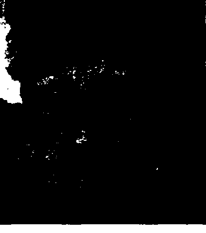
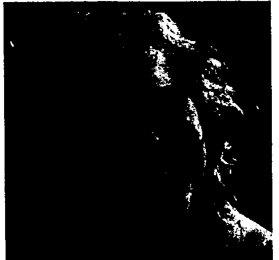
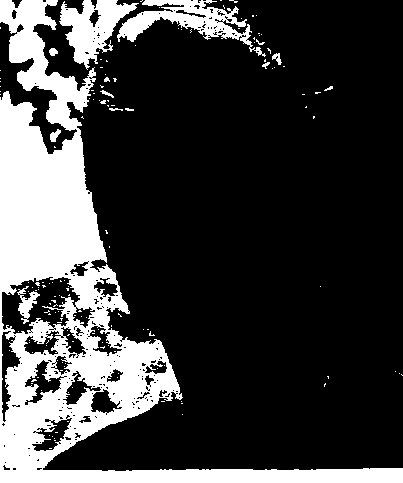
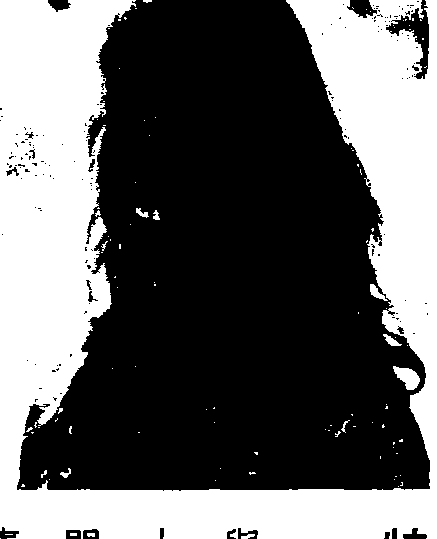

## Osho Therapy

# 奧修靜心治療

# 16位著名治療師與1位成道大師的相逢

16 well known therapists describe how their work has been inspired by an enlightened mystic

史瓦吉多Svagito R. Liebermeister 編譯 陳伊娜Vanita 譯

## St. Royal College
天使神秘学院

+   * 专业占卜预测机构
+   * 神秘学培训机构
+   * 水晶能量研究中心
+   * 神秘学资料库
+   * 官方微信 : strcdts
+   * 微信公众平台 : strc2011
+   * 读书交流QQ群 :
    占星塔罗占卜师交流群 : 814594478 ( 加入密码 : PDF )
    神秘学其他综合群 : 659338717 ( 加入密码 : PDF )

微信号 : strcdts

## 天使神秘学院

天使神秘学院 院长QQ : 715104687

# 制作说明：

本书由《天使神秘学院》出重金从台湾购入的原版书籍扫描制作完成。为达到最好阅读效果，特地把原版书全部切开后，再经由专业扫描设备高精度扫描完成，并经过一张张的PS后期处理最终成书，其间花费大量的人力、物力以及时间，只为能给大家提供经济并优质的神秘学学习资料而努力。

本学院强力谴责某些机构和个人，把本学院花心血制作完成的电子书籍，包装后直接放在自家淘宝网上低价倾销的行为，以谋取不劳而获的经济利益。如果长此以往最终将无人愿意再为大家花心思制作电子书，那以后可能大家再无新书可读。

为让大家以后能够读到更多的好书，也为了本学院的良性发展。本学院恳请大家尽量做到如下几点：

+   一、尽量在本学院的网站购买电子书籍。
+   二、请勿用技术手段把电子书内的水印及加密去掉。
+   三、在收到电子书后小范围传阅即可，千万不要公开传播，更别挂到淘宝网上低价销售。

同时为答谢广大支持者，学院电子书将做如下调整：

+   一、学院会把一些早已收回制作成本的电子书折价销售。
+   二、最新制作的电子书籍会开放打印功能，大家购买后有条件的可自行打印成书。

天使神秘学院
2019年1月

## 目錄

# 前言

+   第一章 珍爱自己 阿南朵 13
+   第二章 奧修靜心法 欣友 31
+   第三章 奧修的靜心治療 里拉 59
+   第四章 制約與諮商：改變你人生之路 塔麗卡 82
+   第五章 脈動治療 阿妮夏 97
+   第六章 出生整合：誕生成為佛 杜娃莉 127
+   第七章 愛的源頭：奧修家族系統排列 史瓦吉多 157
+   第八章 愛的學習：朝向成長與親密關係的途徑 克里虛納南達、阿曼娜 190

## 後記

395

第九章 鑽石呼吸：佛的氣息 德瓦帕斯 207

第十章 解除性的制約與譚崔 特麗雅 241

第十一章 男性／女性能量工作 莎加培雅 277

第十二章 催眠與催眠療法 普連阿南達、帕拉波蒂 316

第十三章 藝術治療 蜜拉 341

第十四章 三托歷：覺知密集 甘噶 368

微信号：strcdts

# 前言

本書是一些受到成道大師奧修（Osho）的生命洞見啟發，與靜心連結的身心治療方法，因此稱為「奧修靜心治療」。在這個前提下，治療不僅是一種解決個人問題的方式，同時也準備帶領一個人走向靜心。治療可被定義為：當靜心來到一種超越頭腦的狀態，在身心創造出健康狀態的方法。平靜、和諧與個人滿足感，在頭腦的向度上，是完全不可能存在的；因為頭腦天生就是一個製造問題的機制，如果你解決一個問題，它一定會再製造另一個；假設你找到了某個問題的答案，會有更多問題出現。這就是為什麼某些神秘家把頭腦比做一棵正被修剪的樹：你剪下一根分枝，接下來會在那裡長出更多的分枝。真正的解決之道是站在頭腦的向度外，進入那個很自然就經驗到寧靜、平安、至喜的無念向度裡。所有的靜心方法就是一些要來到這種情境的途徑。這本書呈現了在自我發展、療癒及治療領域中，一種以這份了解為基礎的工作方式。因因此，在介紹不同的治療方法及形式時，其核心方向是一樣的：靜心的基本重要性。帶著意識活著、與此時此刻連結的藝術，是活出真實、真誠、滿足的生命最好的方式。

史瓦吉多 Svagito

## 新洞見的誕生

## 東方與西方的交流

> 奧修說：

那些在本書中呈現他們工作的治療師與團體帶領者，都深受成道的奧秘奧修，以及他將把治療工作視為朝向更高意識狀態的踏腳石。東方靜心與西方治療技巧結合的洞見所影響與引導。他們在工作中運用奧修的靜心技巧，並

我的治療師不只是治療師，他們也是靜心者。治療工作只是表面的事，它有助於清理地表土壤，但只是清理整地，並不表示你就擁有花園，你還需要其他更多的東西。在一九七〇年代末期，一些受到西方心理治療訓練的治療師，聚集在這位備受爭議的大師身邊，探索東方的靜心方法，帶起了一場獨特的實驗。也許這是史上首度，西方的心理治療與東方的神秘主義相逢。結合奧修的引導，治療師用各種不同的成長方法，發展助人工作的新方式。從一種不設限的視野，深入人們的心靈世界。

對每個參與其中的人而言，內在有可能開始出現更深的洞見。包括治療師自己，也包括那些參加他們的工作坊、研討會、訓練課程的人。治療師身懷不同的才能彼此互相學習，實驗助人工作的新形式，不需要待在每種治療訓練的有限準則裡。在這個過程中最重要的是一種東方的體悟——放下個人自我，允許更高能

量顯露，超越治療師個人本身的知識與技巧。有一個很大的差異需要強調：西方文化強化個體的自我，因此有才能的人在各行各業——政治、商業、醫學、治療——傾向於去獲得一種伴隨成功的自負感。東方文化正好相反，視「無我」為一種成就，比起自我擴張更加重要。因此，在奧修身邊所建立的印度普那社區裡，對職業狀態不那麼認同；特別是因為角色與工作是有彈性的，而且易於快速改變——在某一刻也許是一位獨立作業的治療師，但下一刻也許就變成廚師或清潔人員。

結束後，他與參加團體的學員及帶領者會面，邀請每個人分享他們的經驗並發問。治療師學到以完全不同的方式應用他們的技巧，在某些工作坊中——比如說原始治療——治療師的行為會像一位引導者，且他是在一個權威者的位置；但是在社區更廣大的環

境背景下，治療師與學員會一起學習與經驗到靜心。其中有著一種整體感以及些許的區別。在奧修過世後，這樣的情形一直持續很久。

重要的了解在於，靜心是一個無法被量化、測量、甚至讓理性頭腦了解的奧祕過程，因爲它畢竟是一個一沒有頭腦一的状况。因此，假如一個治療師在靈性意識上沒有更好的狀態與成熟度，即使他具有能幫助別人的優秀能力，也是徒然。治療師不因爲他的工作而獲得酬勞，而這個事實支持著這個革命性的方法。他們是出於愛與貢獻社區的願望，還有支持更好的靜心而給出工作。讀者也許會對在這本書裡寫稿的治療師們奇怪的印度名字感到好奇，在此稍微提一下背景將有助於了解：在七○年代，當人們開始來到奧修身邊，他開始點化他們成爲一桑雅士一（Sannyas）。在印度傳統裡，桑雅士就是一個棄世與獻身於靜心、改變名字及穿著的人。但奧修對於桑雅士革命性的態度是入世的——探索關係、工作、事業等等——同時透過學習靜心來解除所附加的東西。他教導新的桑雅士要喜悅與全然地投入生命，同時尋找自己最深度的一佛性一。他將此稱爲一新桑雅士一，並要求他的桑雅士穿著傳統橘色，戴上一條有他照片匣盒的木珠項鍊——稱作一念珠一（mala）。一個以這種方式成爲桑雅士的人，對他自己許下承諾去靜心，向世界宣告現在他準備要進入一個新的意識之流——就是喜悅生活與探索靜心二者緊密結合的藝術；這既非與世界脫離，亦非屬於任何宗教的一份子，或是成爲任何派別的跟隨者，而是學會自立，與卸下過去從知識、傳統、宗教而來所承載的包袱。在八○年代末期，奧修宣布這項內在靈性承諾的任何外在象徵已經不重要了，所以特殊

進入一個新的意識之流——就是喜悅生活與探索靜心二者緊密結合的藝術；這既非與世界脫離，亦非屬於任何宗教的一份子，或是成爲任何派別的跟隨者，而是學會自立，與卸下過去

一個以這種方式成爲桑雅士的人，對他自己許下承諾去靜心，向世界宣告現在他準備要

有他照片匣盒的木珠項鍊——稱作一念珠一（mala）。

最深處的一佛性一。他將此稱爲一新桑雅士一，並要求他的桑雅士穿著傳統橘色，戴上一條

學習靜心來解除所附加的東西。他教導新的桑雅士要喜悅與全然地投入生命，同時尋找自己

但奧修對於桑雅士革命性的態度是入世的——探索關係、工作、事業等等——同時透過

（Sannyas）。在印度傳統裡，桑雅士就是一個棄世與獻身於靜心、改變名字及穿著的人。

景將有助於了解：在七○年代，當人們開始來到奧修身邊，他開始點化他們成爲一桑雅士一

讀者也許會對在這本書裡寫稿的治療師們奇怪的印度名字感到好奇，在此稍微提一下背

愛與貢獻社區的願望，還有支持更好的靜心而給出工作。

與成熟度，即使他具有能幫助別人的優秀能力，也是徒然。治療師不因爲他的工作而獲得酬勞，而這個事實支持著這個革命性的方法。他們是出於

爲它畢竟是一個一沒有頭腦一的状况。因此，假如一個治療師在靈性意識上沒有更好的狀態

获取更多好书，请加微信号：strcdts

店铺：http://strc.cr.cx

8

人的衣服、色彩以及念珠項鍊都可以放下。現在，選擇一個新名字或是保留原來的是依每一個人的意願，但是對於靜心以及自我探索的承諾依然不變。

過如此重大的實驗，人們來自各行各業與各種背景、國家、民族或文化，齊聚在一位成道大師的身邊，創造出最空前多元化的大熔爐。

奧修多元大學——為了他的治療工作形成的傘狀組織——於一九七四年的印度開始，然後在一九八二年跟隨奧修及他的門徒移往美國奧瑞岡（Oregon）。在一九八七年回到普那（Pune），在此蓬勃發展，為身心靈提供了超過五十種以上不同的治療、課程及個案。治療師、醫療專家及藝術家彼此分享他們的技能、知識與洞見。

現今，曾經一起在普那受訓過的治療師，大多在自己的工作領域上，並沒有跟特定的奧修社區或中心有關連；然而，在他們之間，還是保有共同的連結，正如讀者將會在本書裡發現到的。

透過多年的分享、合作與交流，同時尊重獨特性，這些治療師學會去欣賞這份能帶向對人類靈性的廣泛和多面向的了解的豐富性。

舉例來說，在普那九〇年代期間，一個身體工作的訓練課程要持續好幾個月，引進各種不同的老師；從強力身體、深層組織，到最細微的能量工作，涵蓋了大範圍與身體有關的治療師。老師們分享他們不同的工作專長，有時候會直接了當反駁彼此，然而課程的帶領者對這個矛盾的情况完全可以接受。他們了解到這將會是一個豐富的經驗，而且挑戰有助於人們找到自己工作的風格類型。訓練課程之外，這些治療師會彼此轉介案主，有著一種為共同目的而一起工作的整體感。這反映在一奧修治療師訓練中，一項療法持續二到三個月，各類治療師貢獻一項長期的課程，教導人們如何與案主工作。在許多奧修治療師一起密切工作的當時，就有了製作這本合輯的想法。這本書展示出他們的工作方式，他們互異而互補。每一位皆包含了人類經驗的不同面向，並提出人類現實的不同典型。這些收羅的治療師已經待在奧修身邊很長一段時間了，並且發展出各自的個人風格。理論上，他們皆可以提供一整套獨立的奧修治療師訓練課程，無庸置疑的是，那會成為心理療法的萬花筒。為了讓這本書能有合理的篇幅，同時也為了避免重複，所以限制了寫稿的治療師數量（編注）。這與那些未被邀請的治療師的評價無關，有許多人可以做出同樣寶貴的貢獻。

获取更多好书，请加微信号：strcdts 店铺：http://strc.cr.cx

Osho Therapy

10

最後，治療師並不是一個指導者，懂得比案主多，而是一位朋友，覺察到即使他具有某
是一個從「這裡」到「那裡」的進程，而是愈來愈深入的「這裡」。

讓案主與生俱來的智慧與了解，在其中逐漸展現綻放。治療師的工作比較像是助產士。它不是

換句話說，意識不是一件能被給與的商品。一個奧修治療師的工作是創造出對的氛圍，

幫忙移除障礙，好讓我們找到自己的答案。

是外在。它們從個人本質的最深核心出現，而非來自任何其他人。就最佳情況來說，治療是

奧修靜心治療為人類賦與尊嚴，是由於它了解到生命存在的問題解答，是來自內而不

# 超越醫病關係

引介，而這也許會啟發你更深的探索，甚至## 靜心：最基本的要素

一開始，我必須承認，探索自己到目前為止所過的無意識生活，是相當沮喪的；像是那樣於了解到過去以來，我一直活在恐懼中：害怕別人的意見與評價，害怕被批判、懲罰等等。

當我第一次面對我的恐懼，它們幾乎將我淹沒，好像我在一個很深很深的洞穴底下。我

一向用來掩蓋恐懼的成功形象，在社區裡維持不了多久——我被派去的第一份工作就是刷廚

房的地板！

我進入一個又一個的課程，很快地了解到，是每天的靜心在幫助我穿越那些揭開的痛苦

與恐懼。在某些課程裡看到了我的無意識之後，無論我感到多麼灰心，奧修亢達尼尼與動態

靜心，總是能讓我與它們保持點距離；而聽奧修每天的演講，則把我從無意識頭腦傳送到可

以有不同觀點的空間。在之後，我開始著手自己的課程，總是會結合這些靜心。我了解到如果我們停留在頭

腦，想要找出事情的原因，那麼就無法改變任何事；因為頭腦無意識地、自動地控制了一

切，它只是把新的資訊加到它一向的老套，它的「工作」就是讓我們待在熟悉的、舊有的

—舒遺區—裡。

## 1 珍愛自己

但靜心是在頭腦的掌控區域之外，才讓我們可以跟舊有的模式保持一些距離，用不同的角度去看事情。正是這不同的觀點，讓我們可以選擇以不同方式去回應與行動。所以對我而言，靜心是最基本的要素。

其中一個特別關動我的團體是「珍愛自己」（Self Love），它建立在奧修的洞見上，並加上了西方的治療。透過它，我發現如何辨認，以及如何不被先前那些讓我難以放鬆下來，享受生命的舊有聲音所影響。我學習這個過程，接下來改造它，來符合我自己持續中的了解與經驗。

我也開始對發現大腦如何運作的科學新知感到興趣，而且我了解到，它們跟奧修從六O年代起就在談的有意識與無意識的頭腦運作相當吻合，我研究了大腦的「神經可塑性」——關於我們可以改寫大腦設定的發現——然後開始結合到我的工作裡。

## 了解我們的頭腦如何運作

以下是今天我所教導的：

我們的思想主宰著我們的人生——基本上我們活在頭腦裡。

我們的思想大部分是無意識的，任何認知學家都會告訴你，我們百分之九十五到百分之九十九的思想是自動預設好的。即使我們認為有一個「有意識」的想法出現，高度精密的大

腦掃瞄顯示，早在幾秒鐘之前，我們一部分無意識頭腦就啟動了，繼而引發了那個想法。這代表我們只有百分之一到五的時間是有意識的！知道這點有些令人沮喪，但也表示還有很大的進步空間。

舉個例來說，你還記得某一次當你正從甲地開車到乙地，而你到達乙地之後卻不記得自己已是怎麼麼做到的……這讓令人心驚膽跳的對吧？但這就是我們大部分時候的狀態：像在飛機上的自動駕駛。或者，記得有多少次立下一「有意識」的決心要繼續減肥或固定的運動，或變得更有愛心，或少發點脾氣……而都没有成功？

不行，也許明天吧！～或是諸如此類的。而哪一個聲音會嬴呢？是你思想裡百分之一的意識，還是百分之九十九的無意識？

所以，如果我們想要改變，如果我們想要離開我們所待的自動化舒適區，那麼重要的是開始去覺察到我們無意識的思緒。

在一珍愛自己一的工作裡，我們開始覺察到那些使我們懷疑自己的無意識念頭，或是對於我們想要的猶豫不決。大部分的人都有一些隱藏的議題像是一我現在看不夠好，我需要成為不一樣的才是可愛的，值得接受的或是被尊重一之類的，我想奧修是我所見過唯一

這不是與生俱來的想法，假如我們不夠好是無法在出生時活下來的，這表示我們是學到

## 1 珍愛自己

## 如何獲得我們的自我認同

這些想法的——我們從其他人那裡獲得它們，通常是父母——雖然我們常會忘記這件事。我們大部分在早期時就得到這些想法，幾乎可說是從出生的那一刻。如何獲得我們的自我認同

待——我應該成為怎麼樣的時候。而很不幸地，我們不僅獲得有用的資訊，也接收了無益的資訊像是：—你真是蠢蛋……你不像你哥哥或弟弟那麼好……你必須要認真負責一點……你

這些想法有時候直接從我們的父母那裡獲得，但經常是間接地。也許爸爸下班回家很累了，孩子跑向他說：—爹地爹地，你看看這個。—爸爸很自然會說：—我現在沒辦法。—，—為了讓爹地聽我說，我必須成為不一樣的。—或是類似的事。

這些想法被當做「事實」直接進入無意識頭腦，而孩子還沒有能力去質疑那是否是真

## 1 珍愛自己

明它是真的，所以它會透過這個一事實一的角度，來詮釋我們從別人或別的情況所接收到的片段資訊。舉例來說，假如有九個人認為你人很好又可愛動人，而有一個人認為你是。哪一個影響你比較大？當我在團體裡這麼問時，幾乎每個人都承認受那個負面的評價影響大過於那九個正面的評論，你可以花一點時間來確認一下對你來說是如此。那就彷彿像用各種鏡片覆蓋在我們的感官知覺上，而那鏡片是根據我們內在無意識最主的要的負面印象，去詮釋發生在我們身上的一切。覺得不值得愛最重要的第一步，是開始察覺到，這些負向訊息總是在背後不著痕跡地影響我們的能量和情緒，更別提影響我們如何對情況做出反應。我自生命中的一個例子是：當我在青少年時期，甚至到了二十歲出頭，我一直在換男朋友，因為我從不相信他們真的愛我。我的無意識告訴我說，我不可愛——我從母親身上得來的某種想法，而她也同樣從她的母親那裡得到。而這是另一個把所有垃圾倒進腦無意識裡的問題——除非我們開始察覟到它如何影響著我們的生命，否則我們會無意識地將它傳給孩子。

裡的問題——除非我們開始察覟到它如何影響著我們的生命，否則我們會無意識地將它傳給孩子。

## 1 珍愛自己

所以一有男生說他愛我，我就會想他是哪根筋不對勁？立刻對他頓失興趣，開始找下一個。或者，我會不斷藉著挑剔一點小事來測試他、激怒他直到他離開我。在那個當下知，總認為那是男生的問題，不是我的。一旦我們學會認出，我們正在照舊有無意識的想法做出反應時——不論是藉由注意到內在的訊息，或是認知到所引起的情緒火藥味——在那個當下，我們就有了選擇，我們可以做點跟平常無意識回應不同的事。那份覺察也給與我們一個機會去療癒內在「受傷」的空間，我們強烈的情緒反彈乎總是我們還是小孩時的反應，這孩子接收到他或她們本然的样子是不好的，接收到他們需要去贏得愛，或者試著更努力點，成為不一樣的來得到尊重與接受。那個空間仍在我們裡面，在我們的无意裡，即使我們已經長大成人，我们的情绪反弹還是來自那裡。看看任何一對伴侣吵架，你会到也看到他们過去小时候的样子，他们的聲音、說的話及行为表现，很明显地就是一個小孩——他们小时候的那個孩子。

## 無意識需要被愛

我最近在和一個案主進行工作，暫且叫她伊莉莎白。她一直在把所有的问题歸答於前

## 1 珍愛自己

任伴侣，她聽起來很有條理——頭腦非常擅於合理化，但她的聲音——當她在談論前伴侣時，是一個受傷小女孩的聲音，她把自己當成受害者——當我們把問題歸咎於別人時，我們就成了受害者，因為我們不能掌控別人或其他情況。首先，我協助伊莉莎白去看到她之所以氣前男友，是因為他不照著她想要的方式去做。我問她想要他聽見她，了解並尊重她，以及愛她。她想要他聽見她，了解並尊重她，以及愛她。“—妳愛妳自己嗎？—我問道。這引起了一陣很長的沉默，然後露出一個苦笑。這是我們都在做的事——我們期待別人對我們比我們對自己更好，但假如我們不愛自己，我們怎能期待別人來愛我們？我們怎能相信別人會愛我們？所以伊莉莎白有一部分要做的功課是，自己負起責任滿足被愛和被接受的需要，那不是她前男友的責任。而對她而言，啟動這個歷程的方式是：開始覺察到，她在無意識裡，一直攜帶著感到不被愛的負向訊息。一旦她開始覺察到這些訊息，認出它們是在她小時候所接收到的想法跟信念，那麼她就能開始透過再度連結以前那個小女孩，從內在改變它們。在這本書稍後的篇章，會更深入這部分工作的細節。它聽起來容易，但其實並不容易。我們是自己最大的敵人，對很多人來說，甚至連要

## 1 珍愛自己

幫助我們過去的那個小孩都很困難了，更別說要開始無條件地愛他們了。當伊莉莎白終於開始了解到，覺得自己不可愛並不是那個小女孩，而不是透過父母批判的眼光看著她，她會在父母無意識訊息——「她不夠好」——下的不幸受害者。所以伊莉莎白要持續進行的功課是：讓愛與內在小孩空間的連結愈來愈強，好讓她可以開始修改那些在無意識裡的錯誤訊息。當這個小伊莉莎白開始信任這些新的訊息，她放下並開始信任她自己，然後她可以不帶著匱乏，成熟地來到現在當下這個片刻。接著，理所当然地，每件事都改變了。

## 什麼是我們該做的，而什麼不是

費力地開始變得放鬆且自然，而這會讓我們具有吸引力。這很奇怪：我們不期待我們的朋友成為完美的，但我們期待自己要是完美的。這帶給我們極大的壓力，而且是相反的影響——它使我們表現得非常緊張與不自然，一點都不吸引人。當我們開始領悟到無意識影響我們有多深時，我們了解到，在生活中的其他人，也受到他們無意識的影響，他們也有來自他們內在所攜帶的隱形訊息的限制。

這工作的一部分，是了解到他們無意識的行為不干你的事，你要做的事是承認別人引起

了你的反彈，而那是一你的「反彈」—來自你無意識的需求與恐懼。然而那不是別人要去照顧的事，那是你的工作。事實上你是唯一可以照顧這些需求的人，因為你是那唯一可以了解

你無意識的人。

在伊莉莎白的例子裡，那工作涉及到：了解她對男友的期待是完全不切實際的，他不像那樣的人，而且他也永遠不會成為那樣的人。有很多很好的無意識理由讓他是他這樣—但

那些原因不干她的事，去改變他不是她的事，她要做的是：認知到他的無意識行為，觸發了

她內在舊有的孩童創傷。

他所觸動到的舊恐懼，來自於她童年時的遺棄和拒絕——假如沒有得到父母的贊許認同的話。要是伊莉莎白能夠認出，她正經歷著和小時候覺得被拒絕時完全相同的感覺，那麼這

個工作就變得更清楚了：當內在的小伊莉莎白了解她不會被遺棄，而且她原來的樣子是沒問

## 1 珍爱自己

題。

最後對於要靠別人來讓自己感覺不錯的倚賴性，也會減少。

這個工作是療癒而解放的。因為當我們學到愛與接受自己本然的樣子，不需要變得完

美，那麼只有在那個時候，我們才能開始愛別人如他原本的樣子，不帶著批判或是要他們變

得不一樣的需要。

## 改變內在無意識的設定

正是如此，這工作牽涉到治療與改變無意識裡關於「不夠好」的老舊設定訊息，而且它

真的有可能改變那些舊訊息。現代神經科學研究顯示，不論你的年紀多大都可以改變在大腦內突觸之間的連結——那就是現在思想無意識裡循環的舊有固定路徑。這並不容易，而就我所知，只有把靜心當作是從無意識緊抓中逃脫的方式才有可能。但是它確定是可行的。我見
過許許多多的人——包括我自己——以這個方法改變了他們內在對自己的態度。
所以一珍愛自己一工作使用自我覺察來了解頭腦的無意識本性，加上催眠來重設舊有的

頭腦，再加靜心來允許這個一改變一定型下來。
愛或許在這個組合裡是最強大的元素，而且透過愛，我是指無條件的愛——就是我一再

地從奧修身上親眼看與經驗到的，這樣的愛了解我們都是無意識的，而我們不是頭腦，我們比那還要更多。而我們可以改變我
們頭腦運作的方式。
我記得當我在擔任奧修身邊工作很多年，有一次，我感覺很神經質，就跟經期前一樣。我
有點運到了，所以沒有時間在進他房間前讓自己平靜下來，有點像就闖了進去……奧修抬頭看著我說：一妳好嗎？阿南朵。一我的回答衝口而出：一我緊張到快瘋了，簡直是—

## 作者簡介

是的獨特之人，你並不需要其他任何人的允許或同意。

阿南朵 Anando

名列英國ASHA基金會一百四十位「全球各界具影響力，啟發人心的優秀女性」之一，知名律師與商業管理者。阿南朵在奧修身邊工作很多年，擔任私人祕書與照顧者之一。她在進行奧修靜心及蟄變技巧的工作上，有超過三十年以上的經驗。她的著作《對生命說是》（YES-A Practical Guide to Loving your Life）已出版多國語言。她的引導靜心CD由美國New Earth Records發行。

◎柘靉縝訊·www.Lifetrainings.com

## 2 奧修靜心法

靜心成為主流已經很長一段時間了，有各種特定型態與不同的活動類型被統稱為靜心的練習。唱頌言，使用祈禱念珠，冥想與

# 2 奥修静心法

## 醒来的方法

奥修的方法能唤醒你，而這可能是危險的，因為你或許醒來面對這些事實：你想要以不 同的方式生活，一份不同的工作，或是換一個不同伴侶。

四十年前我開始靜心——確切地說是奧修動態靜心（Osho Dynamic Meditation）。我並 不覺得有壓力或不開心，但不知為什麼，總覺得生命還有比擁有還可以的工作、穩定交往的男朋友、一棟舒服的房子來得更多的東西。

某個部分的我正在擾動，彷彿從沉睡中甦醒。我有種還沒看到事情真貌的感覺。我找到一 本奧修的書，看到在書的後面有一間倫敦靜心中心的地址，所以決定去一探究竟。

我每天做這個靜心大約六個月，但在第一次做的时候就愛上它了。每次我離開靜心中心都感到無以言喻的快樂，而且這份快樂會持續一整天。

中心位於倫敦最糟的其中一區，靠近帕丁頓（Paddington）火車站——它是一棟又舊又醜的紅磚建築，街道和高架道路上到處都是大卡車與汽車，然而我四處環視，在心裡想著：‘一邊一邊多美啊！’

在一天之中會有幾個片刻，我突然開始注意到微風拂過臉部那細繹的感覺，或者傍晚的天空看起來熠熠生輝；我變得對自己以及周遭的一切都更敏感了。靜心不僅帶給我極大的喜悅，漸漸地，一種到目前為止所知的一切都沒什麼意義的感覺也變得愈來愈強烈。

## 領會基本原則

在成為靜心者的最初幾個月裡，就好像是我第一次看見了事物。面紗從我的眼前揭開。動態靜心喚醒了一股活力能量，為求道者的視野帶來鮮活與清晰。靜心對我人生的影響是不尋常的，許多我之後遇到的朋友們也有同樣的經驗。一個重大 的改變發生在他們看待自己的生命、感覺與渴望，因為有種更深或更有意義的東西催促他們 探索更多。

待在靜心之路是一場偉大的冒險。我旅行到很多國家分享靜心方法，而當然，今天一切 都非常不同了。幾乎就像是我們已經從舊的、狂野的時代長大，人們變得更有知覺；然而新 的世代也更聰明，他們領會靜心的基礎原則比我快多了。奧修的方法能蛻變你，而它們是革命性的。這些方法都是簡單而有力，但它們需要一個改變的承諾，以及放掉舊的想法與習慣的勇氣。他的方法並不是一種應急之道——比較像長期的蛻變。它們不同於傳統的方法，因為它們並不嚴肅，包括了一些動作、舞蹈、情緒宣洩還有靜坐。

在靜心技巧與靜心狀態（state of meditation）之間，有一個重要的區別。技巧不是狀態，但它們為靜心的發生預備了背景。我喜歡強調，這樣是有幫助的；為了技巧本身而去 享受它，然後如果靜心發生了……很好，假如沒有……嗯，無論如何你都已經享受到了舞蹈、方法，以及一些放鬆的片刻。

意識的放鬆與警覺狀態，帶領我們來到單純的見證（witnessing）或觀看（watching）：

看著身體和它的移動，甚至看著頭腦——這比較困難，因為思想是更細微與持續地來去去去；到最後，我們會開始有能力去觀照情緒是如何來了又走，而且就如我之前所說，它會變成日常生活的一部分，而不是某件必須在特定時間獨立去練習的事。

## 資訊超載

在我們忙碌的生活中，要人們也只是坐著安靜下來，是很不容易的事，這就是奧修創造出動態式靜心（active meditation）的原因。它們是特別為了我們忙亂緊張的生活型態所設計。

在奧修的一段演講中，有人問道：“什麼是精神官能症？要怎麼治好它？”奧修回答說：

精神官能症在過去從不像現在這麼頻繁。它幾乎快要成為一種人類頭腦的常態。……

現代的頭腦過載，而那些留在裡面未吸收理解的事物，造成了精神官能症。就好像你不停 地吃，塞滿身體，不能被身體消化的部分將成為有害的。而你所吃的，還不比你所聽見和  看見的重要。

## Osho Therapy 奥修療法

## 奧修動態靜心（Osho Dynamic Meditation）

從你的眼睛、耳朵、所有的感宮，每個片刻你持續地在接收無數的東西，而沒有多餘的消化時間。就好比一個人坐在餐桌前，一直吃，一直吃，一天吃二十四個小時。

的消化時間。就好比一個人坐在餐桌前，一直吃，一直吃，一天吃二十四小時。這就是現代頭腦的情形：它已經超載了，承擔了那麼多東西。它會崩潰一點也不稀奇，每件機器都有上限，而頭腦是最精密細微的機器之一。

真正健康的人是那些花百分之五十的時間來消化他的經驗的人。百分之五十的作為，百分之五十的無為——這才是正確的平衡。百分之五十思考，百分之五十靜心——這就是解藥。

靜心不是別的，就只是當你可以全然地放鬆進入你自己，關起你所有的門，所有的感官。你從世界消失。你忘記這個世界，彷彿它從不存在——沒有報紙，沒有收音機，沒有電視，沒有人群。你單獨在你內心最深處的本質裡，放鬆，在家。

在這些片刻裡，那一切所累積的都被消化了，那些沒有價值的被丟掉了。靜心的作用就像一把雙刃劍：一邊吸收那些滋養的，也拒絕和丟掉所有的垃圾。

> ——奧修

這個靜心改變了我的生命，而我也看到它改變了許許多多人的生命。前面三個階段是動 态性的，讓我們為進入第四階段的寧靜作準備。動態靜心的發明已經很多年了，根據奧修的觀察，它已影響無數人。這個靜心要閉上眼睛來做，為時一小時，五個階段裡有四個階段有音樂，做它的最佳時間是在一大清早。

第一階段：雙腳與肩同寬站立，透過鼻子混亂式地呼吸。讓呼吸變得強烈、深、快速、沒有節奏、沒有模式——而且著重在吐氣。身體會自己吸氣。呼吸必須深深地進到肺部。

盡你所能快速且用力地來做，直到你真的變成這個呼吸。運用你身體自然的移動來幫助建立能量。感覺它正在集結，但在第一階段還不要放開它。

這種混亂的呼吸會為你的血液帶入更多氧氣，為細胞帶來更多能量。你的身體細胞會變得更有活力，而這個氧化作用會幫助製造身體電能，或你可以稱它為生物能……當在身體裡有電流時，你可以進入很深的內在，超越自己，因為這個電流會在你內在工作。

身體有自己的發電所，如果你用更多的呼吸和氧氣來敲打，它們會開始流動。假如你變得真的活生生，那你就不再是一個身體；當你全然地活生生，你會感到自己是能量，而不是物質。

> ——奧修

## 第二階段：發洩，爆開來。讓所有需要丟出來的一切都放掉，跟隨你的身體，不論出現 什麼就讓身體自由地表達。進入全然的瘋狂：尖叫、大喊、哭泣、踢跳、抖動、舞蹈、唱 歌、大笑，把你自己扔出來，毫無保留，保持整個身體移動，些許的動作通常能有助你開 始。千萬不要讓你的頭腦阻止正發生的事。有意識地進入瘋狂。全然地。

我要你們有意識地變得瘋狂，而且不管什麼出現在你的頭腦——無論是什麼——允許  它表達並與它合作。沒有抗拒，這只是一個情緒的流動。

— 奧修

## 第三階段：手臂高舉到頭頂上，上下跳躍喊著這個咒語（mantra）：「護！護！護！」（Hoo）」盡可能地深入，用整個腳掌著地，確定你的腳跟碰到地面，讓聲音深深地打擊性 能量中心。給出你所有的一切，讓自己徹底地精疲力竭。

在第三階段我用了咒語「護！」當作是一種手段，把你的能量向上拉提……當喊著咒語「護」，我們帶著兩隻手臂向上直接跳入天空。

— 奧修

## 第四階段：停！

聽到「Stop!（停）」後，在你所在的地方完全不動，沒有任何動作，就只是成為一個觀照——一個意識的警覺，什麼都不做，沒有移動，沒有欲望，沒有發生，除了靜靜地觀照，不論發生了什麼。

第五階段：溫柔的音樂開始響起，我們舞蹈慶祝。

## 奧修亢達里尼靜心（Osho Kundalini Meditation）

亢達里尼是奧修另一個著名的方法，在世界各地實行。做這個靜心最好的時間是在傍晚時。

我們在此做亢達里尼靜心，但不是為了要喚醒亢達里尼；目的有點不一樣，是為了讓你內在的亢達里尼能量有機會舞蹈。

這目的是非常不同的。在你裡面的能量迄今仍在沉睡，要喚醒它則必須撞擊它、摇晃  它。我自己的經驗是沒有必要喚醒它，它應該就只是得到一支舞，它應該就只是得到一首歌，它應該要被蛻變為一場歡樂的慶祝。所以沒有必要去迫使它或搖動它……事的目的是。在這裡，亢達里尼靜意的目的不是好幾世紀以來存在的那個。就我而言，我正在改變每件事的目標。在這裡，亢達里尼靜意謂著舞蹈——沉浸在歡喜中，變成沉浸，沉浸到你的自我不再是分離的。這不是古老喚醒亢達里尼的傳統過程，這是將舞蹈注入亢達里尼的過程。——奧修

這個靜心為時一小時，有四個階段，每個階段持續十五分鐘。三個階段有音樂，前兩個階段眼睛可張開或閉著，在後兩個階段要閉上眼睛。第一階段：振動你的身體。振動的目的是，無論能量是被壓抑或堵塞，都會從那裡開始流動起來。你安靜地站著，感覺震動從你的雙腿升起。當身體開始有點顫抖，幫助它直到全身都在振動。

第二階段：跳舞。舞蹈是為了讓那已經釋放、遍布全身的能量能夠轉變成喜樂。彷彿你在慶祝般地舞蹈。

[content]
[PAGE 40]

所以喜樂地舞蹈，因為你越是喜樂，就有越多能量升起，半調子的努力是没有用的。你的舞蹈需要強烈。一個人跳著舞，就彷彿失去了理智。

> —— 奧修

第三階段：站定或是坐下，好讓能量可以有充分的機會流動。就只是觀察，聆聽音樂。

第四階段：躺下，安靜靜止。

奧修還發明了更多靜心，它們可以透過網路在www.osho.com網站上取得。當你已經找到一種適合你的動態式靜心，連續做二十一天是很重要的。這會讓靜心有機會發生作用。

當前幾次經驗動態靜心時，你的肌肉或許會覺得酸痛僵硬，但在身體適應了新活動後，這將會減輕下來。在第二週，大部分的人可以很容易地在發洩階段表達頭腦的混亂；在第三週，你會在靜默階段沉入得更深。

## 將聆聽當作一種靜心

一九七五年我住在普那的奧修精舍（ashram），那裡不久之後變成他的社區。正是在那個時期，靜心對我開始變成一種生活方式，而不是某種與生活分開的事情。

奧修每天公開演講將近四十年。他的談話是自發性的，充滿著永恆的智慧與很棒的幽默感，但他常常提醒我們，他真正的訊息並不在話語裡，而是在話語之間的寧靜空隙。聆聽奧修曾是——現在還是——一個靜心經驗。還記得那些日子，當我們坐在靜心大廳的大理石地板，在靜止不動與靜默中，隨著四季流轉，從夏季的炎熱，經過了激烈的雨季，來到冬季寒冷的清晨。我以为自己只是在聽一場演講，但我也被吸引到奧修話語間的那個寧靜空隙。他用這樣的方式說話，讓靜心透過只是聆聽他而發生。我曾聽奧修說過，假如你不僅是把覺知聚焦在他身上，而且也同時覺察到這個在聽的人，聆聽可以被當作一種靜心方法。不要迷失在說話的人，或是音樂，或是不論你正在聽的什麼。別忘記是誰正在聆聽，因為這個聽者比較重要。帶著這個記得，意識的箭會指向雙面：一邊指向說者，一邊指向聽者。假如聽者可以被記住，那麼了了解就可以進入很深，但假如一個人聽的時候沒有覺察或是睡著，那麼這個說者就無法真正溝通；如果聽者是清醒的，那麼即使這個人什麼也没說，你將能夠了解這份寧靜。真是不可思議，直到今日，當在聆聽奧修，或是看著他的影片時，一樣的寧靜傳遞還是在發生。我應該還要加上他的演講內容對現代人是完全切題的，包含了生活的所有面向——世俗層面與靈性層面都有。有十四年的時間，我的工作就是幫奧修洗衣服。盡管是在那個奉獻與靜心的氛圍裡，朋 友們還是會很納問地問我，難道我不會感到無聊或厭倦我的工作？我從來不會，直到如今，每當我需要放鬆一下，我就會走向我的熨衣板。奧修說他不是在一靜心，他是一活在靜心中。看著他，我可以感覺到這點，而這對我已經是一個教導——做一靜心是同時很深的放鬆與完全地覺察。

## 你去了哪裡

當我在奧修屋裡的工作加入擔任他的照顧者，我會陪著他走向早晨與傍晚的演講，那時候是在他房子裡的一間小廳堂學行。一天早上，在演講之後，我們回到他房門前。當我打開門，奧修從我旁邊走過，他看著我帶點輕笑地問：一欣友，你去了哪裡？一我回答說我跟他去了早上的演講，但我立刻就知道那不是他指的意思。他知道我確實去了一個地方，無以言喻的某處——說它是個靜心經驗就已經足夠了

## 2 奥修靜心法

## 靜心諮商（Meditation Counselling）

判地觀照、觀察著。靜心諮商（Meditation Counselling）味帕沙那是跟你自己相逢，在閉關團體中，所有一般會讓我們分心的事物——朋友、手機、網路、八卦、電視、購物、工作企劃——都要暫擺一邊，我們只跟自己單獨留下。當在閉關進行期間與參與者諮商時，重點在幫助他們無論發生了什麼都要保持觀照，不要試著改變任何事或解決任何問題。不論何時，閉關中的參與者覺得對不熟悉的狀況不知所措時，可以選擇私下與帶領者洽談：情緒也許出現了、舊的記憶也許浮現而感覺很痛苦、坐了這麼久，也許導致身體不舒服……等諸如此類。帶領者主要的角色，是支持與鼓勵人們繼續往前。有時候只是給與一個靜心簡要的說明提醒就夠了；不管這個人說什麼——也許會出現老掉牙或簡化版的故事，重要的是不要被帶入那些故事情節裡。即使有人分享一個對你而言聽起來極不道德的經驗，這會是一個機會，去觀照你自己頭腦的批判。身為一個帶領者，記住我們的思考意念對於靜心——無所知——也永遠不會知道——是有幫助的，雖然對人們來說很自然——特别是初學者——想要一知道一發生了什麼事，精確地幫助的，雖然對人們來說很自然——特别是初學者——想要一知道一發生了什麼事，精確地

## Osho Therapy 與靜心有關

了解一什麼是靜心，以及要怎麼一做一。 我們無法一做一它，我們可以實行某個技巧，但是靜心只能發生而不能一做一到。假如 我們了解到這點，爲了這個方法本身而享受它——不論是靜坐、跳舞、或是震動——然後知 道「它」（一個寧靜片刻，或沒有頭腦的經驗）並不在我們掌握中，這可以讓我們從目標導 向的習性中跳脫出來。 身爲一個諮商師，幫助人們了解到無論發生什麼都沒有對或錯，那只是需要觀照或覺察 到，並且帶著一點耐心的想法慢慢來的某件事——這對人們來說是一份支持。 許多人認爲靜心是某種嚴肅或靈性的事，這會使得一場閉關感像是重擔或是責任。所 以就我的經驗，在與人們諮商時有點幽默感是好的，可以幫助減輕他們的擔子。 味帕沙那閉關與我其他的靜心工作坊是不同的經驗，因爲每個人是在禁語的——除了諮商時間，而這本身創造了一個更認真的氛圍。每個人真的靠自己，向內看，享受內在寧 靜的片刻，以新的方式感受與感知，有時候有了全新的洞見。 這些片刻非常美，人們想試著把它們留住，但這不可避免地產生了期待、希望，以及可 以摧毀你放鬆觀照狀態的欲望，然後一切都改變了。你可能會因爲失望，或是無聊、憤怒而 受苦。 這是個很棒的「旋轉木馬」，而這也是我愛味帕沙那的地方：一個人看到高峰與低谷， 並且透過這個蹣蹣板，人們才有可能去經驗某些更深、更內在、不曾改變的東西。某些像是覺知恆常不變。 這就是我們可以帶進日常生活的東西：這份不論發生了什麼，我們都有機會去觀照一切 的了解。

《奧祕之書》（The Book of Secrets）由印度古老文獻《譚雀經典》Vigyan Bhairav Tantra 中的一百一十二種方法只是一個主要技巧的不同形式，那個基本技巧就是觀照。透過在不同情況下應用十二種方法只是一個主要技巧的不同形式，那個基本技巧就是觀照。透過在不同情況下應用 觀照的藝術，一個新的方法產生了。

有一些靜心是關於聽覺、視覺、觸覺、呼吸與做愛，有些方法是为了歸於中心，另外有些方法是为了擴展感覺而没有中心。事實上，各種類型的人會在其中找到一個適合他的方法，這些不僅是技巧，也可以成爲一種生命型態，一種生活的方式。

我創立的工作坊基於這些方法，參加的人不論男女老少，各種背景的人都有。有些人或許才剛接觸靜心，有些人或許在這條路上走了很久。我總是被人們那麼強烈地想要跟自己有更多連結，而這在一開始是多麼困難而感動。

在這種情況下，以一種輕快喜悦的方式來靜心是非常有幫助的，帶著這個想法與馬可 奧祕之書

## Osho Therapy 奧修療法心法

## 心的靜心（Heart Meditation）

我們一天之中會做五到六個靜心。假如地點適合的話，有時候我們也會到大自然做。有些方法是我們與夥伴一起探索，有些則是單獨進行。

能量會跟隨想像力與視覺化觀想（visualization），這兩種都是透過頭腦移動的強大力 量，能夠影響身體。只要試一下：閉上你的眼睛，雙手放在你的心，當你吸氣時，想像你正呼吸到心臟。很快地你會發現，你的心和與它有關的感覺，正在補充能量。因此，才有傳說故事說西藏喇嘛與印度苦行僧赤裸站在雪中，想像他們的身體是熱的，而不感到寒冷。

在你的心中吸收感官知覺（Absorb the Senses in Your Heart）是在奧修《譚崔經典》裡的一個靜心，以類似的方法作用。在這個靜心中，我們練習將每一種感官感受帶到心，然後將它溶解到心中。我們用聽、看、觸摸的感覺作為方法，將覺知帶入心的中心。

當我們專注在感覺，我們的思考過程慢了下來。在那些思想真的進入打擾我們的片刻——溜回思考的習慣——我鼓勵人們就只是注意到頭腦進來了，然後溫柔地把注意力的焦點帶回到心的中心。

奧修說一旦我們充滿能量地在心輪歸於中心，我們就有可能進到更深，往下沉入就位在 肚臍下的中心。奧修非常強調這個中心（一般稱為「丹田」）的重要性。他給了我們許多關 於這個中心的靜心，包括他在傍晚演講後的引導靜心。

## 誰在感知？

另一個靜心是「覺知到誰在感知」（Be Aware Who is Sensing）。這個方法用「看」當作技巧，去覺察是誰在這個「看」的感知背後。或者可以說，你變得覺察到自己的「看」，而不是注意到你眼睛正在看的事物。我們的感官是門、接收站、媒介、感受體，而你是這個意識，透過眼睛在看。

開，只是窗户。

你透過眼睛來看。眼睛無法看，你透過它們在看。看者隱藏在後面，眼睛只是這份打 意識，透過眼睛在看。

而不是注意到你眼睛正在看的事物。我們的感官是門、接收站、媒介、感受體，而你是這個 意識，透過眼睛在看。

們接收資訊，但是是誰在裡接收聲音？是誰在覺察到「聽」？這個詢問、向內看的行動過程就是這靜心的本身——没有任何言語上的回答。

在靜心的第二階段，我們用「聽」當作一個方式變得覺察。我們的耳朵是接收站，為我 > —— 奧修

## 黑暗靜心

在《譚崔經典》中，有關於光與黑暗的靜心；在黑暗靜心中，奧修說假如我們可以愛黑暗，就會變得不怕死亡；假如我們可以沒有恐懼地進入黑暗，就可來到全然地放鬆。

暗，就會變得不怕死亡；假如我們可以沒有恐懼地進入黑暗，就可來到全然地放鬆。

光出現又走了，黑暗就只是存在，它是不朽的。

當我決定要在一個靜心課程裡介紹黑暗靜心時，最大的挑戰就是要找一個沒有光進入的空間。這出乎意料地困難，甚至是在晚上。在家的話，我在衣櫥裡做過這個靜心，不過那有點像會導致幽閉恐懼症。

點像會導致幽閉恐懼症。

在這個靜心中，我們坐著四十五分鐘。張開眼睛，看入黑暗，允許黑暗進入眼睛。在完全的黑暗中，我們失去了所有界限，我們無法知道所在的房間盡頭起始是哪裡。

我想起有一次，跟一群人坐在一個糰小的空間，我發現在完全的黑暗中會看不到時間，所以請求一個朋友，看他是否能在一小時後來窗外吹哨子。當時我並不知道，他的蹣跚腳步聲穿過屋子四周的樹叢時，在我們小小的房間裡起來，竟是如雷貫耳般的清楚。

我也不知道那急促、費力的呼吸聲，以及受到驚嚇般的呻吟聲來自其中一位靜心者，他 沒有告訴我，他這輩子一直都很怕黑。幸運地，這是一個很真誠的團體，沒有人反彈、批評或是竊笑。事實上，當靜心結束時，這個一直很怕談到他一生怕黑的人，覺得已經在那一小時裡穿越它了。

關於黑暗有一個更進階的靜心是：帶著一小片黑暗在身上，正如在光的靜心中，在內在帶著一束火焰。

法，人們感覺到對於某一個靜心很有共鳴時，連續三週到三個月。當我在團體裡介紹這些方法，如果還是感覺不錯，就持續久一點的時間。令人驚訝的是，人們要更深入這些靜心巧中的一种，是那麼的容易。

## 包括一切

我記得一個很美的場景，發生在英國的一棟老農舍，有五十個人在裡面做一個「包括一 切在你的存在裡（Include Everything in Your Being）的靜心。

基本的要點就是記得包含一切，不要排除在外。在Nigyan Bhairav Tantra經文裡記載的 關鍵是：包含性（inclusiveness）。包含然後成長，包含然後擴展，跟著你的身體與思想一 起嘗試，接著也跟外在的世界一起嘗試。你不僅可以把它當作靜心，也可以成為一種生活型態，一種生活的方式。

第一階段：坐著，不要劃分。靜靜坐著不動，把一切包含進來：你的身體、頭腦、呼 吸、思想、認知……每件事，把一切包含進來。 只要說：「我是一切。」然後成為一切。不要在裡面製造任何分裂。這是一種感覺。閉 上眼睛包括存於你裡面的一切，不需要以任何地方為中心，在這個技巧裡沒有中心，然後包 含一切在你的存在裡——不要擺棄任何事，不要說：「這不是我……」而說：「我是……」

然後包含一切進來。 假如你可以做到，那麼一些美好全新的經驗會在你身上發生，你會覺得在你身上沒有中 心，而隨著中心的消失，沒有自己，沒有自我，只留下意識——意識就像天空罩著一切，當 這種感覺增長，不僅是你自己的呼吸被包含，不僅是你自己的形式被包含，最終整個宇宙也 變成你的一部分。 第二階段：帶著這個「我是一」的感覺坐在房間之後，參與者走到外面，他們或許看 着一棵樹，然後閉上眼睛感覺這樹在他們裡面，或者看著天空，閉上眼睛感覺到天空在裡面。

而這並不是想像，因為樹和你都屬於大地，你們都深植於同樣的大地，而最終根植於 同樣的存在。

所以當你感覺到樹在你裡面——這樹是在你裡面。你感覺到樹的生命力、綠葉、鮮活、微風正拂過它。

這個技巧擴展你的意識，注視著天空，一個人會開始感覺天空也是你的一部分，關上眼睛一會兒，允許那個與天空合而為一的感受，它是美麗的。

而它確實是的，我們所看、所感受、所接觸的一切，都是我們的一部分。“我是一 切的一個感覺，到最後，當你注視著其他四周的參與者，會了解到這個在你眼前的人，也是你的一部分。

對我而言，看著整個團體穿越這個包含一切的經驗是令人驚奇的，他們在農舍的外面，以緩慢的動作移動著，他們的眼睛充滿著好奇，他們的臉龐發亮，我心想：「我的天啊！如如果有人看到這景象，會以為每個人都嗑了迷幻藥（LSD）。」如此的场景，發生在英國鄉間的平緩起伏的山丘上，是真的相當超現實的。

同樣超現實的是，我們結束不了的「滿月靜心」（Full Moon Meditation），一直持續著、持續著。即使最後我敲了好幾次西藏鈴表示這個靜心結束，我發現自己看到五十個人，像雕像般地佇立在月色下的原野，沒有移動。

我熱愛分享奧修的靜心方式，因為教學就是學習的最佳途徑，而我仍然還在學習。我開始踏上這個旅程後認知到，生命比我過去所經驗的還更多，而在一生的經驗與靜心以後，我 仍有這種一還有更多一的感覺。 不同的的是，生命已經變得如此之大，生命本身已經在各個層面擴展了，而我仍知道還有 更多。很奇怪的，這種感覺是喜悅、興奮與平静。在同一個源頭，我繼續以一種簡單的方式 活著，知道每件事在實際上，都是令人驚奇的。

## 作者簡介

## 欣友 Prem Shunyo

欣友 Prem Shunyo 來自倫敦。欣友在一九七〇年代到印度旅行，而她的覺知培養始於在 奧修身邊生活長達十四年，就像一家人。她做奧修靜心超過三十五年以 上，如今在許多國家旅行，分享她的經驗、帶領靜心課程與女性團體。她 也帶領靜心帶領者的訓練課程。在欣友的工作裡，音樂、舞蹈與慶祝是一 個重要的部分，再加上她直覺性真誠的工作方式，讓參與者得以接觸到更 深的寧靜與平安。她的著作《與大師同在》（Diamond Days with Osho） 已經被翻成八種語言。

◎相關網站…www.meditantra.com  已經被翻成八種語言。 深的寧靜與平安。她的著作《與大師同在》（Diamond Days with Osho） 個重要的部分，再加上她直覺性真誠的工作方式，讓參與者得以接觸到更 深的寧靜與

## 3 奥修的靜心治療

## 自我解嘲

學會自嘲需要去看到，我們有多麼與自己的社會角色、行為和關於自己的信念與批判認同。在很深的笑裡，有一些很棒的片刻，突然間有可能看到我們過去在某個或其他情況的影像——嚴肅且迷失在那個片刻，完全地認同於一些我們自己創造出來的個人瑣碎戲碼。但我們能夠好好地笑一笑自己的荒謬。當我們可以自我解嘲時，同時也能夠看到我們周遭的幽默。從對負向信念及習慣運作的行為模式認同中，保持距離，帶著一份清明。很多參與者分享第一週後的經驗，他們常常會在看來嚴肅的情況中爆笑，像在跟伴侶吵架時；突然間整個情節都變了，然後他們就完全無法再待在那個嚴肅裡了。這種觀點的改變，可以影響我們生活所有層面：工作、關係、家人之間……等，事實上，一般的生活都可以。現代社會以某種方式發展成多數人的生活以工作為中心，只有一點點的時間可以玩樂。這是多麼可悲！所有的本性都是朝向玩耍的，但我們——大概是在這美麗地球上最聰明的生物——全都太常悲傷與嚴肅了。立即採取行動吧！多笑一點！你的健康及幸福或許全靠它了。而這所有的好處將會撒向你周圍的一切。這不表示我們應該要成為專業演員或表演者，只是單純地在自己心中更快樂。

## Osho Therapy

## 幫助淚水流動

被吸引而來參加一神秘玫瑰一過程的人，似乎已有一種道就是他們所需要的固有了解。

隨著我們自嘲的能力成長，謙卑與更有愛的了解，也會在我們心中成長。放下生活的嚴肅觀點，變得更接受自己與身邊的人是非常重要的。

慢慢地，一整天與輕鬆的心情態度連結會變得更容易，所以鼓勵自己開始注意到生活中的幽默是重要的，然後整合這份輕盈為每天的行動方針。我們可以學著少去擔心別人怎麼看我們，這極為令人解脫，因為要是我們不停地透過別人的眼光看自己——批判自己，我們無法很自然地運作。保持好的幽默感令我們健康、平衡與放鬆。

我自己的經驗告訴我，假如你能在正確的時候，正確地笑，它將會帶領你離開無意識，進入敞開的天空，從黑暗到光明。我採用笑當成一種靜心，是因為沒有任何東西像笑一樣，可以使你如此全然；沒有東西能像笑一樣，讓你停止思考。只要一瞬間，你就進入了另一個你是全然的、整是頭腦；只要一瞬間，你完全失去時間；只要一瞬間，你就進入了另一個你是全然的、整體的，以及被療癒的空間。

> —— 奧修

## 3 奥修的靜心治療

即使在最初有些猶豫，更深的直覺會幫助他們克服任何的不確定。一般而言，參加的人只是厭惡和厭倦了生活在痛苦與悲傷中，所以他們決定自己全心全意地投入。當參與者來到哭的那週的一開始，很多人準備好要放手進入他們的淚水，儘管其他人還是有一更多的緊張和焦慮。允許已經埋藏這麼久的感覺，可能是很需要勇氣的。在第二週的介紹中，帶領者對每個人說明恐懼與痛苦是我們心中都有的東西，穿越痛苦與恐懼去經驗一個極大的釋放與療癒是有可能的。讓參與者清楚他知道他們被允許全然地放開來，而且愛哭多大聲都可以，要是大哭真的會打擊到別人，我們會建議他們向軟抱枕裡哭，但是重要的是不要克制它。有大量精心挑選的，偶爾可以播放的悲傷和喚起某種記憶的音樂，這可以幫助淚水發生的聲音，對每位參與者有很大的幫助。有一個重要的了解要傳達給參與者的是，不論經歷什麼恐懼或痛苦，他們只是過去事件的一個回音，他們不需要害怕那些在小時候發生的創傷、暴力，或相同的處罰。我們需要允許壓抑的記憶浮現，好讓這些強烈的情緒可以再度升起。我們進入這過程越深，越是了解到：我們將會遇到深層被壓抑及深埋的情感——以前我們藉著把它們塞滿在裡面，而試著要逃避的那些感覺。隨著我們開始經歷過阻礙與緊抓的模，我們有了勇氣去面對更多的痛苦。很清楚地：我們越是哭出這些情緒，我們就越感覺到

## 山丘上的觀照者

我注意到當哭泣的那週結束時，許多人都感到有點難受，而這也是我自己的經驗——在哭的階段結束之前，我們都感到非常脆弱敏感且易受傷。

所以我寫信問奧修：「在之後我們也可以做幾天靜心嗎？因為人們需要點時間去整合他們這段時間所經歷的。」我得到一張奧修對此的回信，在其中他談到「山丘上的觀照者者」——這是他稱為有能力去觀照自己思想與感覺的靜心者——附上指示要在二週的過程，再加上第三週的靜心。所以這就是一種神秘玫瑰」怎麼變成一個每天三小時、連續二十一天的過程，看起來似乎是我憑直覺問了正確的問題，而共同創造出這個過程；但是根據我事後的了解而猜測，假如這些是奧修認為我應該要問的問題，那很明顯的，這些事情像以某種方式來找我，就如我們正在經驗的事一樣地自然發生。

動——那時我們在克里虛納屋（Krishna House）的屋頂——因為團體有太多人了。當我們要做第一次「神秘玫瑰」的「觀照者」階段時，我發現沒有足夠的空間可以走動，把他們的覺知放在腳底，然後感覺著每一步踩在地面的知覺。

或許我該在這裡補充一下，說明奧修的味帕沙那（內觀，Vipassana）靜心，它主要跟山丘上的觀照者是一樣的，人們會靜坐大約四十分鐘，然後站起來慢慢地在靜心大廳四處走動，把他們的覺知放在腳底，然後感覺著每一步踩在地面的知覺。

## 超於完善的過程

但是四處走動對於這麼多人是不太實際的，所以我有了這想法：人們站起來，就在他們坐著的前面，做一些非常柔和的舞蹈動作，就在這個位置上，放鬆他們的肌肉，以及因為身體所造成的僵硬。我問奧修這樣是否可以，他的回答是：可以，那很好，只是要提醒人們保持在觀照者，不要迷失在舞蹈裡。因此，我把這三小時長的時間分成三段的靜坐，中間夾著兩段十五分鐘的舞蹈，結果進行得好美。依照奧修的指導，我對每個人說道：當你站起來舞蹈時，不要離開你的靜心，待在那個空間……然後他們做得真的非常好。慢慢地，更多的人開始帶領這個過程，因為它大受歡迎，而且經常舉辦。我無法同時顧團體部門的協調與帶領每一場「神秘玫瑰」。很快地，我們在社區組成了一個一神秘玫瑰一帶領者團體，且定期會面分享我們的經驗。我需要知道其他人進行得如何，而他們也要知道我的經驗，所以我們分享資訊來提升我們帶領的水準，對於如何進行得到更深的體悟。有一件事我們都同意：「神秘玫瑰」是一個純粹能量的過程。在這個背景下，我們需要覺察到我們的態度——我們可能對團體中的人們和他們在用的方式有所評判——因為這些有

## 打破障礙

隨著時間過去，我獲得更深的洞見，觸及「神秘玫瑰」是如何在卡住的能量上發生效果，它與在動態靜心裡的發生很相似。在動態靜心，第一階段的快速、混亂式呼吸打開了能
量阻塞，接著就透過發洩釋放出來。三小時的笑或哭，在全身產生了這樣動態的能量流動，以新鮮、充滿活力的生命力，來替代一股大量的停滯能量。這是一種大量排毒、深層淨化的過程，在許多層面上運作，在每一層會遇到不同的品質。

舉例來說，当你超越笑的表層，這過程從待在「你的一笑，一瞬間轉換到你「成為」笑。當能量強烈地流經你，你甚至不是在促使笑發生，你不是帶著它，而是彷彿你「變成一
了笑。」而那就是當奧修說：「它打破了障礙。」的意思，你所必須做的只是打破障礙，然後這道能量流動撲倒你，讓這過程自己發生。

動態靜心有一陣子變成一個爭論的主題，因為奧修告訴我們，人們在「神秘玫瑰」前兩
[content]
## 不同性質的治療

在奧修靜心治療與其他類型的治療之間，有很大的不同，並不是說哪個方法比較好，而是這個差別值得記錄下來。靜心治療允許你進入那個你裡面的本性，那個我們與生俱來的。孩子是帶著歡笑、眼淚與自我表達的藝術出生的，這些都是自然的元素。一個人在做的时候會造成有益的影響，但是它沒有既定的概念或架構，沒有要專注在特定的主題或議題上，所以它是處在這種意識中的療法。

這就是為什麼我們應該被稱為「帶領者」（facilitators）（註），而不是「團體領導者」（group leaders）——那是我的想法——因為我們的角色只是解說這個過程要怎麼進行，然後支持人們走完它，而他們全都是自己去做這個工作。以某種意義來說，他們變
註：facilitators，「促進者」之意，但一般在國內目前已習慣都稱「帶領者」。

## 再生（Born Again）與無念禪（No Mind）

◎ 再生：這過程一週，每天兩小時。鼓勵人們回到成為小孩的能量，然後接著靜坐。每個階段一小時。

◎ 無念禪：這過程一週，每天兩小時。邀請人們透過口頭的胡說八道或無意義的聲音來表達自己，之後進入一小時的靜坐。當「再生」宣佈後，奧修再度說：「讓里拉去做吧！所以我協調團體課程，同時還要帶一神秘玫瑰與「再生」！

過不久，我被調到奧修靜心治療學院工作，裡面包括了這三項——奧修「神秘玫瑰」、「再生」、「無念禪靜心」——我同時設帶領者訓練課程。

我感到精力充沛——這些過程全都非常相似——因為我對「神秘玫瑰」的經驗，所以我知道怎麼運作它們。奧修對「再生」的指示是：人們應該進入他們的童年，去做他們一直以來想做的事，以
[content]
## 再生（Born Again）與無念禪（No Mind）

同樣的，沒有任何互動。我從自己的錯誤中學習且注意到，假如你真的允許某種程度的互動，一些小孩會溫和地玩在一起，不過要是某些小孩進入調皮的情緒，他會真的搞破壞與妨礙到每個人，變成在角色扮演，而不是靠自己去探索他獨自想要做的是什麼。在一神祕玫瑰一身為一個帶領者，我完全能夠進入到過程裡——但是在「再生」，我注意到我必須一坐在一旁一，而且待在團體領導者的角色中，專注在保護與支持這些一孩子們一。假如你進入到一種退化的集體能量，你不會感覺到你自己和這團體有任何差異，你變成一這群孩子一其中一員，就跟大家一樣，那麼在控制和引導這個過程將會有困難。一再生一對內在小孩有非常大的釋放，非常立即且直接的，就是跟著活潑及遊戲般的能量流動。同樣的，它無關乎談話、療法、觀念。你只是再度潛入成為一個孩子的經驗，直接進入能量，然後再出來，感覺真的很好。當奧修給我們一無念禪一，他談到一個蘇菲神秘家賈巴（Jabbar）。他從不用平常的語言說話，跟他的門徒到處旅行，他們除了亂語以外，不說任何話，他們許多人成道了。奧修把一個幾分鐘的亂語，包含在他每天演講最後一放開來一的靜心裡。有一次他開玩笑地說：一如果你不懂中文，那就講中文；如果你不懂日文，就說日文；假如你懂德文，就不要說德文！一所以這個想法就是深入一種純粹口語的表達流動。

在「無念禪」與「再生」二者中，帶領者需要覺察到這些過程可以被帶向任何方向。舉例來說，有一個帶領者鼓勵他的「無念禪」參與者進入憤怒和在地上打枕頭，或是對著軟墊牆打，他在下午就替一位參與者約了原始治療的個案。另一位則是原始治療師，所以這就變成了重點，他在下午就替一位參與者約了原始治療的個案。這兩種方法都太狹隘了。激勵的方式必須要保持非常寬廣的範圍，帶領者必須覺察到他（她）正在說什麼。例如，某天我在「再生」團體說：一如果眼淚來了，你應該要允許它。一我没有再說其他的，然而那天整個團體都在哭！所以我了解到：一我必須要小心已所說的。一然後隔天以一種較全面性的說法：一笑、跳、哭……一就像奧修在他的介紹裡說的，好讓頭腦不會聚焦在任何單一事件。在這三種靜心治療裡的靜心品質是不同的，許多人對我說過，在他們進入一神秘玫瑰一的「觀照者」階段時，那靜心的狀態是目前為止他們所經驗過最深的，而我也有同樣的感覺。經過一個這麼大的清理，靜坐會來到非常深。一再生一之後的品質有比較多深度放鬆的味道，它彷彿就像所有的緊張被抽離了身體，透過你用長期壓抑的天真能量去表達你一直想做的，它終於被允許自由地表達自己了。我記得看著人們在經過第一小時後，他們有多麼平靜與完全的放鬆。我讓他們想坐、躺或任何姿勢都可以，我並不期待他們要從孩子的空間出來，馬上坐直而為好的靜心者。我說：一只是放鬆。一然後放一段奧修的演講。

## 關於「無念禪」，它又是一種不同的品質。亂語——如果你以一種全然

## 3 奥修的静心治疗

## 作者简介

## 里拉 Leela

在一九七三年接触到奥修，在伦敦探索动态静心。她到普那旅行，从一九七九年开始在社会新闻出版部工作了二年半，负责和全世界来的记者打交道。不久之后，里拉教按摩与能量疗法，同时管理协调社区内治疗与静心部门。在一九八八年，她被奥修要求设计、发展与带领三个静心治疗：「神秘玫瑰」静心、「再生」与「无念禅」。在过去二十五年来，她已在世界各地提供这些过程，并且仍在继续进行。这三個静心被称为里拉主导的奥修静心治疗。

◎相关网站…www.mysticrosemeditation.com

81 获取更多好书，请加微信号：strcdts 店铺：http://strc.cr.cx

# 4 市约与咨询 改变你人生之路

初次遇见奥修时，我是一个菜鸟心理治疗师。为了与案主建立密切的关系，我的脑袋充满了所有应该要说的話，以及所有关于要怎么样，看起来才够干、有益于人的想法。我知道一大堆什么是正常与什么是不正常的。我知道我的工作是帮助人们维持在一个正常的生活型态裡。这一切都合乎道理，直到那天我坐在奥修面前深地望着他的眼睛——突然间，所有我認为自已知道的，就这样飞出了我的脑袋，我震惊到说不出话。在我面前的是一個优美的存在，我以前从未见过像这样的人。我仍然可以听到我的头脑说著：‘这是什麼？這看起來就像個男人，但是我無法理解在這個片刻我所經驗的空間。一那感覺就像是掉進一個深淵，但卻帶著全然的冷靜。就這樣，我開始了我的旅程：尋找如何在我自己的生命中有這樣的經驗。’

塔麗卡 Tarika

获取更多好书，请加微信号：strcdts

店铺：http://strc.cr.cx

## 4 制约与咨询：改变你人生之路

## 什么是制约？

我已经学过许多治疗方法，爲了自己個人成长与助人工作的訓練都有，这些经验加上静心非常有幫助，因为它讓我對新的未知空間有了小小的體驗。但是，它同時讓我感到不滿足，我感覺建立一個更好的人格面是不夠的，爲了找到自己，我需要找到一種方式去超越人格。那需要一個工具，能夠讓我回到這個內在「本質」的地方，那個還保留著未被早年經驗所影響的地方。

对我来说，第一步是盡可能地找出關於我的人格如何建立、它如何形成，以及我需要它是爲了什麼。這把我帶向在早期童年制约上工作。對我來說愈來愈清晰的是，對於制约行爲如何掌控我們的生活的了解，對於任何蛻變的發生至關重要。我們不能通過早期制约所建立的習慣途徑，期待會鋪出一条新的去思考和作爲的道路。我們必須願意挖開這些舊的道路，面對埋在下面的，然後走在透過意識覺知與了解所建立的新路上。

咨询需要提供這个機會來到表層之下，並發覺我們遠比我們的制约允許我們去做的還多。

制约是一個生命的事實，只要我們一出生，進入流傳著觀念與信念的家庭——就像傳家之寶，我們就會帶著滿滿整櫃的東西，不管我們要不要。但有點不同的是，傳家之寶是看見、可以丟棄，或者可以在拍賣會上賣掉的；制约則深入到我們的無意識，從那裡掌控我們的生命。 制约是慣性的，正如所有的習慣，我們在移動之前没有必要去思考。如果我們真的停下來，即使是一秒，然後問自己為什麼要做這件正在做的事，會開始發現到，我們的生命有多廢在無意識模式的控制中。所以，我們怎麼會被培養，變成相信那個我們認為且覺得是對的 事，即使它並沒有以任何方式支持我們成長？ 我們以一個完整的本質來到這個星球。就我可以說的，我們帶著主要特質的原料來到這 裡，但是沒有使用手冊。所以我們仰賴身邊的人，給我們一些要以這些特質做些什麼的意 規。他們一定知道，因為他是大的而我們是小的；對我們來說，為了成長且成為快樂的人 類，我們要跟著他們的榜樣，這是很有道理的。 我們所不知道的是，這些「大人」帶著一套過時的觀念與信念，那是很久以前——當他 們還小時——無意識裡承襲自其他「大人」。這是一個非常重要之處：没有人是有意識地想要傳遞功能失調的垃圾，但事實是，我們的所言所行，卻在創造痛苦與不幸，只要我們持續 對此沒有覺察，我們就會把它傳下去。雖然我們認為自己正在做某件有價值、幫助下一代 的事。 所以，我們來了，清新地來到這個星球，帶著這束美好的特質，被包裹在一個小小孩的身體裡。盡管有著孩子的天真，我們展現這些像禮物般的特質給這些大人，假如他們有意識 類，我們要跟著他們的榜樣，這是很有道理的。 我們所不知道的是，這些「大人」帶著一套過時的觀念與信念，那是很久以前——當他 們還小時——無意識裡承襲自其他「大人」。這是一個非常重要之處：没有人是有意識地想要傳遞功能失調的垃圾，但事實是，我們的所言所行，卻在創造痛苦與不幸，只要我們持續 對此沒有覺察，我們就會把它傳下去。雖然我們認為自己正在做某件有價值、幫助下一代 的事。 所以，我們來了，清新地來到這個星球，帶著這束美好的特質，被包裹在一個小小孩的身體裡。盡管有著孩子的天真，我們展現這些像禮物般的特質給這些大人，假如他們有意識
們還小時——無意識裡承襲自其他「大人」。這是一個非常重要之處：没有人是有意識地想 要傳遞功能失調的垃圾，但事實是，我們的所言所行，卻在創造痛苦與不幸，只要我們持續 對此沒有覺察，我們就會把它傳下去。雖然我們認為自己正在做某件有價值、幫助下一代 的事。 所以，我們來了，清新地來到這個星球，帶著這束美好的特質，被包裹在一個小小孩的身體裡。盡管有著孩子的天真，我們展現這些像禮物般的特質給這些大人，假如他們有意識
類，我們要跟著他們的榜樣，這是很有道理的。 我們所不知道的是，這些「大人」帶著一套過時的觀念與信念，那是很久以前——當他 們還小時——無意識裡承襲自其他「大人」。這是一個非常重要之處：没有人是有意識地想 要傳遞功能失調的垃圾，但事實是，我們的所言所行，卻在創造痛苦與不幸，只要我們持續 對此沒有覺察，我們就會把它傳下去。雖然我們認為自己正在做某件有價值、幫助下一代 的事。 所以，我們來了，清新地來到這個星球，帶著這束美好的特質，被包裹在一個小小孩的身體裡。盡管有著孩子的天真，我們展現這些像禮物般的特質給這些大人，假如他們有意識
來，即使是一秒，然後問自己為什麼要做這件正在做的事，會開始發現到，我們的生命有多 廢在無意識模式的控制中。所以，我們怎麼會被培養，變成相信那個我們認為且覺得是對的 事，即使它並沒有以任何方式支持我們成長？ 我們以一個完整的本質來到這個星球。就我可以說的，我們帶著主要特質的原料來到這 裡，但是沒有使用手冊。所以我們仰賴身邊的人，給我們一些要以這些特質做些什麼的意 規。他們一定知道，因為他是大的而我們是小的；對我們來說，為了成長且成為快樂的人 類，我們要跟著他們的榜樣，這是很有道理的。 我們所不知道的是，這些「大人」帶著一套過時的觀念與信念，那是很久以前——當他 們還小時——無意識裡承襲自其他「大人」。這是一個非常重要之處：没有人是有意識地想 要傳遞功能失調的垃圾，但事實是，我們的所言所行，卻在創造痛苦與不幸，只要我們持續 對此沒有覺察，我們就會把它傳下去。雖然我們認為自己正在做某件有價值、幫助下一代 的事。 所以，我們來了，清新地來到這個星球，帶著這束美好的特質，被包裹在一個小小孩的身體裡。盡管有著孩子的天真，我們展現這些像禮物般的特質給這些大人，假如他們有意識
會開始發現到，我們的生命有多 廢在無意識模式的控制中。所以，我們怎麼會被培養，變成相信那個我們認為且覺得是對的 事，即使它並沒有以任何方式支持我們成長？ 我們以一個完整的本質來到這個星球。就我可以說的，我們帶著主要特質的原料來到這 裡，但是沒有使用手冊。所以我們仰賴身邊的人，給我們一些要以這些特質做些什麼的意 規。他們一定知道，因為他是大的而我們是小的；對我們來說，為了成長且成為快樂的人 類，我們要跟著他們的榜樣，這是很有道理的。 我們所不知道的是，這些「大人」帶著一套過時的觀念與信念，那是很久以前——當他 們還小時——無意識裡承襲自其他「大人」。這是一個非常重要之處：没有人是有意識地想 要傳遞功能失調的垃圾，但事實是，我們的所言所行，卻在創造痛苦與不幸，只要我們持續 對此沒有覺察，我們就會把它傳下去。雖然我們認為自己正在做某件有價值、幫助下一代 的事。 所以，我們來了，清新地來到這個星球，帶著這束美好的特質，被包裹在一個小小孩的身體裡。盡管有著孩子的天真，我們展現這些像禮物般的特質給這些大人，假如他們有意識
變成相信那個我們認為且覺得是對的 事，即使它並沒有以任何方式支持我們成長？ 我們以一個完整的本質來到這個星球。就我可以說的，我們帶著主要特質的原料來到這 裡，但是沒有使用手冊。所以我們仰賴身邊的人，給我們一些要以這些特質做些什麼的意 規。他們一定知道，因為他是大的而我們是小的；對我們來說，為了成長且成為快樂的人 類，我們要跟著他們的榜樣，這是很有道理的。 我們所不知道的是，這些「大人」帶著一套過時的觀念與信念，那是很久以前——當他 們還小時——無意識裡承襲自其他「大人」。這是一個非常重要之處：没有人是有意識地想 要傳遞功能失調的垃圾，但事實是，我們的所言所行，卻在創造痛苦與不幸，只要我們持續 對此沒有覺察，我們就會把它傳下去。雖然我們認為自己正在做某件有價值、幫助下一代 的事。 所以，我們來了，清新地來到這個星球，帶著這束美好的特質，被包裹在一個小小孩的身體裡。盡管有著孩子的天真，我們展現這些像禮物般的特質給這些大人，假如他們有意識
來，即使是一秒，然後問自己為什麼要做這件正在做的事，會開始發現到，我們的生命有多 廢在無意識模式的控制中。所以，我們怎麼會被培養，變成相信那個我們認為且覺得是對的 事，即使它並沒有以任何方式支持我們成長？ 我們以一個完整的本質來到這個星球。就我可以說的，我們帶著主要特質的原料來到這 裡，但是沒有使用手冊。所以我們仰賴身邊的人，給我們一些要以這些特質做些什麼的意 規。他們一定知道，因為他是大的而我們是小的；對我們來說，為了成長且成為快樂的人 類，我們要跟著他們的榜樣，這是很有道理的。 我們所不知道的是，這些「大人」帶著一套過時的觀念與信念，那是很久以前——當他 們還小時——無意識裡承襲自其他「大人」。這是一個非常重要之處：没有人是有意識地想 要傳遞功能失調的垃圾，但事實是，我們的所言所行，卻在創造痛苦與不幸，只要我們持續 對此沒有覺察，我們就會把它傳下去。雖然我們認為自己正在做某件有價值、幫助下一代 的事。 所以，我們來了，清新地來到這個星球，帶著這束美好的特質，被包裹在一個小小孩的身體裡。盡管有著孩子的天真，我們展現這些像禮物般的特質給這些大人，假如他們有意識
會開始發現到，我們的生命有多 廢在無意識模式的控制中。所以，我們怎麼會被培養，變成相信那個我們認為且覺得是對的 事，即使它並沒有以任何方式支持我們成長？ 我們以一個完整的本質來到這個星球。就我可以說的，我們帶著主要特質的原料來到這 裡，但是沒有使用手冊。所以我們仰賴身邊的人，給我們一些要以這些特質做些什麼的意 規。他們一定知道，因為他是大的而我們是小的；對我們來說，為了成長且成為快樂的人 類，我們要跟著他們的榜樣，這是很有道理的。 我們所不知道的是，這些「大人」帶著一套過時的觀念與信念，那是很久以前——當他 們還小時——無意識裡承襲自其他「大人」。這是一個非常重要之處：没有人是有意識地想 要傳遞功能失調的垃圾，但事實是，我們的所言所行，卻在創造痛苦與不幸，只要我們持續 對此沒有覺察，我們就會把它傳下去。雖然我們認為自己正在做某件有價值、幫助下一代 的事。 所以，我們來了，清新地來到這個星球，帶著這束美好的特質，被包裹在一個小小孩的身體裡。盡管有著孩子的天真，我們展現這些像禮物般的特質給這些大人，假如他們有意識
變成相信那個我們認為且覺得是對的 事，即使它並沒有以任何方式支持我們成長？ 我們以一個完整的本質來到這個星球。就我可以說的，我們帶著主要特質的原料來到這 裡，但是沒有使用手冊。所以我們仰賴身邊的人，給我們一些要以這些特質做些什麼的意 規。他們一定知道，因為他是大的而我們是小的；對我們來說，為了成長且成為快樂的人 類，我們要跟著他們的榜樣，這是很有道理的。 我們所不知道的是，這些「大人」帶著一套過時的觀念與信念，那是很久以前——當他 們還小時——無意識裡承襲自其他「大人」。這是一個非常重要之處：没有人是有意識地想 要傳遞功能失調的垃圾，但事實是，我們的所言所行，卻在創造痛苦與不幸，只要我們

## 头脑是多麼的二元性運作，因此當我在痛苦時，它連結到我制約中相互衝突的兩個部分。隨著時間它開始變得清晰，我的人格是建立在所有我接收到受制約的資訊上。我可以真的感受到、看到與聽到它們每一部分所緊抓的是什麼。這工作接著變成了認出人格（性格）的部分，能夠看出與感知到我不是那個人格，而且能夠描述出我在當下的感知。我越能跟當下連結，就越能夠找到解決煩惱的辦法——是一些很不同於我一通常一會做的、創造性的方法——這開始令我興奮，我開始感覺從沒想到我是有選擇的。一旦我出現一個更適合的想法：是什麼構成了我習慣的、受制約的思考方式，我就可以輕易地定義它是過去的事，而這賦予我能力，走進一個更敞開與自在的空間。生命開始變得更容易，我感到與自己真實的感知更有接觸連結。接著這實驗的關鍵性時刻來了：我在對一個非常痛苦的狀況進行工作，那是一個造成我極大焦慮的狀況。一旦能夠看到我制約對立的一部分，一旦我可以經歷與它們保持一段距離，從一個我現在了解的方法來接觸，這個痛苦的情況就不再回頭了。自然地，因為我是一個實事求是的人，我自信它會再度發生，而且我會需要再看一次這個衝突，找出另一個解決辦法。但是，事實上這個衝突沒有再度出現。這是一個「啊哈！」的片刻，我真的設法做到了不認同與不再餵養我受制約的頭腦。事實上，如今已過了三十年，我不曾再遇見這個產生焦慮的衝突。

## 4 制約與諮商：改變你人生之路

## 「返璞歸真」（Transessence）的誕生

「返璞歸真」技巧的誕生，是爲了作爲最基本生活的工具。「返璞歸真」的名稱描述了這工具目標在於：回到本質。對於走出舊習性，進入新的可能性，它是個簡單卻很深入的工具。

這個技巧幫助我們更清楚地看到：我們是如何活在過去的情境中。給我們機會，把過去的事放在它所屬的過去，然後從我們活生生、當下的本質開始生活。作爲一個諮商工具，它的效果很好，以案主爲中心，允許案主慢慢地開始覺察到人格（制約的事實）與當下個體性的不同。

打破捆綁我們的束縛，是任何助人治療技巧的目標，我工作中最棒的片刻在：當案主感到他們可以把生命握在自己手中，當他們能夠認出他們不是他們的制約，他們會同時地經驗到他們遠比制約允許去他們成爲的還多得多。這是一個帶著愛、了解、勇氣、意願、渴望、耐心，與任何可以被丢進鍋子裡東西的奇蹟。但對我來說，一切都值得，我不想要錯過這些時刻。

在一「返璞歸真」個案的開始，我會說明當我們陷入困境，我們制約的頭腦受到驅動，我們會被抓進舊的習性裡。這人格是在我們早期童年，各方面所認同的想法與信念所組成。它有助於看到這些被敵動，有衝突的人格面向。一旦我們能做到這點，我們就能找到新的解決方法，在當下片刻，它不存在於制約頭腦所思考的方式裡。 這工作的進行是與案主面對一個前方的開放空間——工作區，而會待在這空間的外圍 作引導一起完成。我告知他們所坐的這地方稱為一中立的空間一，或者一當下的空間一，然 後這工作的行動會在那裡發生。一旦基本的安排都清楚了，會請他們告訴我，他們想要看的議題是什麼。

## 要求完美

在不久前結束了。雖然他現在有一段新的關係，他發現很難不去跟前女友聯絡。這在他的新關係裡造成麻煩，而下定決心要停止跟前女友連繫，即使他還是喜歡跟她連絡。他正經歷著焦慮的心情，以及不能在他生活中需要去做的事情上專注。

在詢問過他後，漸漸清楚的是：他不確定自己是否已經結束這段舊的關係，但自從他有了新女友，他覺得必須要弄清楚，不能讓自己有任何存疑。

我：你可以聽到現在是誰在說話嗎？那個覺得無法允許自己有所存疑的人是誰？

案主：我的完美主義者那部分，沒有犯錯的空間。

我：對你來說，沒有可能帶這個部分出來這裡，然後看一下這是誰，或者這是什麼？

年輕人閉上他的眼睛，花了點時間去感覺內在發生了什麼事。

案主：可以。

我請他放一個抱枕在工作區，代表這個部分，接著收集這部分他所能得到的資訊。過了一會兒，他打開眼睛，然後把抱枕放在離他坐的位置一段距離的地方。

案主：我看到一個急躁不安、害怕犯錯的年輕學生，他很嚴肅，而且想要確定他做對每件事。

我：從你現在坐的地方，對於在那邊跟你分開的這位完美主義學生，你感覺怎麼樣？

案主：我覺得很煩，不想看到他。

我：誰不想看到他？這是你的什麼部分？

案主：（閉上眼睛）感覺像我父親。

我：有可能帶這個父親的部分出來這裡，然後看看這是誰或這是什麼？

案主：可以。

他拿了另一個抱枕，放在離他跟那個學生的抱枕一段距離的地方。

我：你可以描述一下你看到的是誰，或是什麼？

案主：好的，我看到一個彎腰驼背，且非常支離碎碎的男人，他在說他不想看。

我：從你現在坐的地方，當你看著在那邊的學生與父親的部分，你自己感覺如何？

案主：我感到放鬆、根植於地和正直，我可以感覺到我的脊椎，且感到非常在當下。

我：待一會兒，並且深呼吸進到這個放鬆、根植於地和正直的感覺，呼吸到這個感覺，不管你在哪裡，感覺到它，穿過你的全身。這會讓你安住這當下的感知。有什麼你需要對在這邊這些部分其中之一或之二說或做的嗎？案主：沒有，在這個片刻，沒有什麼我想說或做的，變好的是能夠感受到跟這些部分有距離。

案主：實際上，我還沒準備好要作最後的斷絕，我仍然需要去看看我之間有什麼於地、放鬆且正直的位置，發生了什麼事？壓。我需要去做的是，對我的新女友坦誠這個部分，現在不清楚是不是沒有問題的，我需多一點時間。

出於這個了解，這案主在一個平静與自在的空間，結束了這節個案，說這是他幾週以來，第一次能夠對自己沒問題。

與當下片刻連結，允許他來與力量、活力以及聰明才智這些主要特質連結。他能夠從一個不認同的觀點看到問題，他不是這個需要得到父親注意的完美主義學生。事實上他是個了解到，即使他犯了錯，他能夠為此負起責任的年輕人。

一個了解到，即使他犯了錯，他能夠為此負起責任的年輕人。學習不認同起源於過去的人格部分，帶給我們去認出我們當下片刻能力的可能性，帶我
們直接與所有內在攜帶的美好特質接觸。我們開始感覺自己是完整的，沒有漏掉什麼，從這個地方，我們可以創造一個有愛的、美好的生命關係。

## 個體性是我們的本質

當我們跟自然的特質越有關連，我們會改變對自己說話的方式。舉例來說，我們不再告訴自己，我們必須做得更好，或是我們需要取悅別人。我們領悟到，在此時此刻，我們是自己所能成為的最棒的人。這給我們自由去發展我們的力量，開始變得更放鬆於我們所是的樣子。當我們對自己感覺更好，相反的，我們可以跟四周的世界有更好的方式來連結。這個一返璞歸真一的技巧，幫助我們更清楚地看到我們是如何活在過去的事件、制約裡，這給我們機會，把過去的事放在它所屬的過去，而開始活在當下。作為一個諮商工具，它的效果很好，因為案主會慢慢地開始覺察到人格與個體性的不同。

個體性是你的本質，你帶著它來，是你與生俱來的。人格是借來的，它是被社會加諸於你的。它像是衣服，看不見的衣服。孩子赤裸地出生，而我們隱藏他的赤裸，我們給他衣服。孩子帶著本質、個體性出生，我們也隱藏那個部分，因為赤裸的個體性是叛逆的、不守常規的。

## 作者簡介

個體性正是它本身的意義：獨特的。人格不是獨特的，它是社會性的。社會要你具有人格，社會隱藏你的個體性，然後給你人格。人格是一件學來的事，人格（Personality）這個字來自希臘字根，意思是面具、角色。

當人格消失時，不要感到害怕，第一次你變得真實的，你變得真誠，你到達了本質。

> —— 奧修

塔麗卡 Tarika Glubin MA

擁有心理學碩士，在過去四十年来，花了大部分的時間，幫助人們提
到這位成道大師的鼓舞。她結合靜心技巧與多項治療形式。她最大的喜悅是看到人們學愛他們自己。在追尋更深的了解過程中，她發展出「返璞歸真」技巧（Transessence Technique），是一個關於本質生活的工具，她在全世界與個人和團體分享這個技巧。

◎相關網站：www.free4being.com

获取更多好书，请加微信号：strcdts

店铺：http://strc.cr.cx

# 5 脈動治療

奧修與威爾漢·芮奇（Wilhelm Reich）這二位對於性自由的想法，都很吸引我。我成長於美國六〇年代，在當時是「舊社會秩序」的很多面向被質疑與挑戰的年代，對我來說，「性觀念」名列清單上的頭條。身為一個二十歲出頭的年輕女子，所關心的是女人的自由、節育、墮胎與婚姻等等這些對我非常重要 的議題。在芮奇早年，身為一位心理治療師的先驅，以及佛洛伊德的學生，了解到性慾是人類基本的本能與需求。他相信性的不滿足——由於性的錯誤情報與官能障礙——是引起現代人類痛苦的最大原因之一。有許多年的時間，芮奇設立了讓一般人——包括青少年——可以來接受諮商與性教育的診所。他也開創許多技巧，為了釋放被壓抑的能量，反駁佛洛伊德的認為現代人被迫成為神經病的說法。

阿妮夏Aneesha

获取更多好书，请加微信号：strcdts

店铺：http://strc.cr.cx

## 早年經驗

「童年心理制約」的觀念，以及我們皆受到早年經驗的正面與負面影響這個事實，在現代心理學、自我療法，以及個人成長的世界裡，已經眾所皆知。透過佛洛伊德的發現，壓抑和無意識頭腦的概念，在西方世界已普遍存在了。

比較不那麼為人所知的是，我們的情緒與心理創傷都被儲存與記錄起來，不僅透過大腦與神經系統記錄在心理上，同時也記錄在我們全身裡：肌肉、筋膜、細胞……等，根據最近的研究指出，甚至記錄在我們的遺傳基因（DNA）上。許多肌肉牽涉到伴隨情緒表達的動作。而那些肌肉在創傷或痛苦經驗生起時，也會做控制及壓抑感受的工作。這些經驗的鮮活印記，在當時太痛苦了而不想感覺，太驚嚇或不知所措而無法表達，被壓抑進入到無意識頭腦，在那裡它可以比較容易被遺忘。

佛洛伊德以及那些跟隨他腳步的人，在與病患工作時，運用了言語與分析的技巧：夢的分析、關連性與其他主流派的心理方法，來一解開一神經病患頭腦的一結一。但佛洛伊德的其中一位年輕學生威爾漢·芮奇，透過研究他自己的病患，開始了解到：物質身體也深深刻涉及了情緒的表達與壓抑。

## 懷孕，出生與童年

在維也納，身爲一個年輕的醫學院學生，芮奇開始看出性慾在人類生命中的重要性。他被佛洛伊德的工作所吸引，特別是他的「里比多」（libido）理論，教授描述說它就像身體上生物的性能量。不幸地，這個「里比多」令人興奮的觀念，被佛洛伊德與他最親近的擁護者所淡視與削弱，減低到只比一個心理學概念多一點。但對芮奇來說，這個生物能量遠比一個觀念來得多。他一生中最主要的工作，引領他穿梭在許多科學研究的領域，以及臨床的實驗中，去追求性能量與生命能量的奧祕，他稱之爲「歐格尼能量」（orgone energy）。

應，源自他們在出生前幾週到幾個月的胚胎經驗。在母親的子宮內，孩子浸淫在母親能量上、生化上與情緒上的氣團——她的思想、感覺、情緒反應——還有她所吃的、所喝的，以及她所攝取到體内的一切。假如母親是放鬆的，滿足的，感覺被她身旁的一切所愛與支持，她會產生一種能量上與生理上愛的氣團支持她的寶寶；如果母親被不和諧、暴力、憎恨敵意、貧困或情緒上的拒絕所包圍，她怎麼能創造出一個安全的空間讓她的寶寶在裡面茁壯成長？

所有母親供應給成長中胎兒的傷害與支持，都會影響這個纖細敏感的過程，而生理上的
設定在懷孕的九個月中進行。因為這超敏感的胎兒在他肢體形成的非常早期就受到影響，隨
著他的成長，這些經驗將會烙印在他的身上。一個發展中的個體，終其一生會帶著這個影
響——好的與壞的——在他或她的身體裡面。

出生—制定—了另一層的經驗——對我們所有人來說，那常常是一個強烈的創傷事件。

許多經歷了透過原始治療技巧—回到—以前遺忘事件的人，都回報—重新活過—痛苦的出生
經驗。

我們父母的影響，塑造我們有意識與無意識地，變成我們所成為的成年人。我們現在的人際關係，經常反映出或從我們生命的更早期，就不滿足或扭曲了的關係。我們的生命經
驗——無論是受傷的、令人害怕的、憤怒的、快樂的、喜悅的——都被記錄下來，像某種烙

# 5 脈動治療

如果經常不斷地重覆，這個緊繃就會開始慢慢不斷地變硬，我們再也無法放鬆，即使這麼做是帶著一個有意識的目的。身體被抑制在一種受控制與嚴格的方法中，或者可能呈現一種垮下來的姿勢。呼吸幾乎是無法鬆動、又淺又緊。當它在身體上很明顯時，威爾漢．芮奇稱這種僵硬為「肌肉盔甲」；當它顯現在情緒、頭腦及行為時，他稱之為「性格盔甲」。

## 能量與生命力

能量與生命力 要說脈動治療是以身體為導向的話，只對了一半，有另一個元素加入才是完整平衡，那就是生命力——或稱生命能量的概念。生命能量是一股看不見的暗流，在所有生物全身流動與脈動，比物質世界更難以捉摸。在成為雷迪克斯教師的過程中，我研究了十八世紀麥斯默（Franz Anton Mesmer）與二十世紀賴辛．巴赫（Hanz Reichenbach）的學說，他們各自論述了某種在人類身體流動的生命能量理論；事實上，這能量據說瀰漫在整個空間，所有物質，大概就像瑜伽的一普拉那（prana），或是中醫所說的「氣」（chi），它們透過特殊的通道或身體經絡流動。這些概念，在歷史上一再地被發現與再發現，它們在科學的外緣指出一股暗藏於無形、卻明確的力量或能量，它們賦與生命。

那麼（prana），或是中醫所說的「氣」（chi），它們透過特殊的通道或身體經絡流動。這些概念，在歷史上一再地被發現與再發現，它們在科學的外緣指出一股暗藏於無形、卻明確的力量或能量，它們賦與生命。

佛洛伊德的「里比多」理論是其中之一，但是他迴避更深入地進入性慾。確定的是，這個活生生而充滿能量的理解，支持著眾多薩滿的療癒實作，以及世界各地部落民族的慶祝 型態。 芮奇稱這股生命力為「歐格尼」，查爾斯·凱利稱它「雷迪克斯」（radix），意思是「根」或者最初的起因。

「根」或者最初的起因，生命能量透過活的有機體而脈動。例如，心跳與循環系統、呼吸與消化系統。我們的身體是活生生的，帶著許多流動與韻律，有些是身體上的，其他則更細微 些。我們的能量系統不停地忙著充電與放電，在日常生活的活動裡表現出能量。

事實上，「呼吸脈動」像是供應一台充氣馬達給生命能量，幫助它在全身流動；每次我 個呼吸進來，改變了我們的能量系統，不僅帶進了富氧量的空氣，同時還有一「普拉那」—

我們需要用到一種像是燃料的生命能量；每一次我們個吐氣，我們不僅排出二氧化碳，同時也 在特定行動與創造性表達的形式中，把能量運轉向外在世界。接收與給與是整個能量波動的 部分，就像陰性（女性）與陽性（男性）能量是一個圓的两半。

當我們過著日常生活，生命能量流進與穿過身體的每個部位，進來又出去，上去又下 來，像波浪般藉著身體的液態物質轉送，支持著我們到處走動、溝通交流、吃、說話、聽著

玫瑰……回應著世界呈現在我們面前的一切。这些都是無意識的行動：移動這個身體，做點 什麼。

我們也持續地回應在內在感受到的一切，回應具有情緒的衝動，如在看一部悲傷的電影時，突然意外地流淚，或是出於本能地逃離危險。許多出現在我們身上討厭的感覺與情緒——那些我們的教養與社會訓練教導我們不要表現或表達，卻要默默忍受的事情。孩子在哭的時候被安撫或忽視，因為展現生氣而被處罰，因為表現出恐懼而被羞辱。

師與別人所期待的样子，好讓我們長成行為端正的公民，為了循規蹈矩，而控制著我們的情緒。所有這一切，都反映在我們一生使用身體的方式，像是站著、坐著，以及移動。

我在前面稍早提過，我們習慣表達情緒的肌肉，與在事件發生時阻止表達而緊蹦的肌肉是相同的。這些肌肉位於身體裡的協調組織群，沿著身體核心團成一圈，有點兒像蟲或蛇的節段。

這些肌肉環像括肌似的打開與收縮，讓這些「無足生物」像往前滑行般地產生了波狀的移動。在人類身體裡，能量沿著脊椎上下流動貫穿七個環狀。芮奇稱這些肌肉群為一肌肉盔甲化的七個部位—：

## Osho Therapy 極樂療心法

## ◎部位一：視覺區（眼睛）

位於頭部頂端與側邊，這一區包括了眼睛，以及眼窩與額頭裡面和周圍的所有肌肉，還有頭頂、頭側邊及後面的肌肉。

## ◎部位二：口腔區（嘴巴與下巴）

包括了嘴巴與下巴區域、嘴唇、牙齒、舌頭，以及一組將下巴向後連結到頸部的肌肉。

## ◎部位三：頸部區（喉嚨與脖子）

這是一個讓能量流經整個喉嚨的主要出入口。牽涉及到脖子與喉嚨的肌肉。很多能量以向外表達的形式，通過脖子與喉嚨，同時從外在環境接收呼吸、能量與滋養。

## ◎部位四：胸腔區（胸、背、肩、手臂、手）

與胸部和背部的肌肉有關連。包括胸腔、胸肌、肩膀、手臂與雙手，還有從心的中央出

動——或缺少流動——穿過每個部位所影響的結構。

這七個部位不僅包含了肌肉，同時還有器官、腺體、神經叢，以及其他受到能量流動

影響的結構。

## ◎部位五：橫膈膜區（橫膈膜、前面與背面）

這裡有橫膈膜——一種傘狀的肌肉群就在肋骨下並附著在肋骨上，一路包覆到背部。它的功能是支持我們的呼吸，隨著吸氣，充滿肺部，自由地向下擺動，然後隨著吐氣，清空肺部而向上擺動。

## ◎部位六：腹腔區（肚子，腰部）

包含了腹部與腰部裡面和周圍的肌肉。

## ◎部位七：骨盤區（骨盤，腿部和腳）

包括了骨盤、肛門、生殖器、尾椎骨的肌肉，還有連接腿部到肢體的肌肉。它控制著腿和腳有力的紮根功能，還有生殖、洩汰與生存本能的功用。

## 七個部位與脈輪

芮奇推論癌症與其他疾病會在被身體緊繫所困住、還有因淺呼吸而低氧量的組織裡發展；在脈動治療中，我們主要處理肌肉緊繫與抑制的能量，但許多健康專家承認，某些醫學症狀是由於被卡住的情緒所引起。

充、緊繫、充滿活力與放鬆這些方面來說，在案主身上發生了什麼事。當它呼吸，當它建立起一個能量的充電時，我們靠近觀察身體，關於在這些身體中被卡住或受保護的部位，緊繫給了我們資訊，去發現那是什麼感覺。

我們用在脈動治療中另一個重要、但非芮奇療法的「地圖」，是脈輪系統。幾千年前，在東方被帕坦伽利（Patanjali）——瑜伽的創始者——一派的瑜伽追隨者所找到。甚至在聽說芮奇以前，我就已經對脈輪——或是能量中心——開始有興趣，它們由查爾斯·里比特（Charles Leadbeater）、安妮·貝莎特（Annie Beasant）以及通神論運動（Theosophical Movement）帶進西方而引起大眾的注意。

芮奇從不知道西方所實行的瑜伽，但他對肌肉區段的描述，幾乎是完全符合脈輪的位置。在每一個肌肉部位裡，有一個能量層微妙的漩渦，在身體更深的裡面。每個脈輪在它的

區塊不僅掌管器官與神經的功能，而且也指出心理情緒上的議題，確實是透過身體上這些地方 方一存在一且被處理。了解脈輪地圖，幫助了我更深入的了解人類能量。

## 呼吸脈動（Breathing Pulsation）

## 呼吸脈動一是物理身體與微妙能量體（它是情緒的媒介）之間的連結關係，一種複 雜的移動相互作用，而呼吸是在這個感覺與情緒表遠背後的驅動力。除了心跳以外，呼吸是 呼吸有兩個基本的動作：進來和出去。這個反覆的韻律—吸氣進來，吐氣出去—保 持身體供應生命所需的氧氣，且排出身體的二氣化碳與其他廢物。我們能夠控制呼吸到某一 個程度，但是生命依賴呼吸，且存在明智地安排呼吸不在我們有意識的控制或甚至注意之 下，持續進行。

## 性高潮公式（The Orgasm Formula）

## 「根」或者最初的起因，生命能量透過活的有機體而脈動。例如，心跳與循環系統、呼吸與消化系統。我們的身體是活生生的，帶著許多流動與韻律，有些是身體上的，其他則更細微 些。我們的能量系統不停地忙著充電與放電，在日常生活的活動裡表現出能量。

## 事實上，「呼吸脈動」像是供應一台充氣馬達給生命能量，幫助它在全身流動；每次我 個呼吸進來，改變了我們的能量系統，不僅帶進了富氧量的空氣，同時還有一「普拉那」—

我們需要用到一種像是燃料的生命能量；每一次我們個吐氣，我們不僅排出二氧化碳，同時也 在特定行動與創造性表達的形式中，把能量運轉向外在世界。接收與給與是整個能量波動的 部分，就像陰性（女性）與陽性（男性）能量是一個圓的两半。

## 感覺配對（The Feeling Pairs）

## 憤怒是和外在的能量移動聯結在一起，從中心到外團；恐懼是與內在的能量移動有關， 從外團到中心；痛苦是與快速的肌肉收縮與擴張有關，像是我們在笑、啜泣與性高潮中所經 驗到的。

## 每一個負向的情緒——當它們卡住時——在身體肌肉緊繫的形式裡，都有一種抑制自己
## 的獨特方式。這讓有經驗的治療師能夠「閱讀」案主的身體，以及察覺到最明顯卡住的情緒。

## 憤怒／愛：

## 憤怒是和外在的能量移動聯結在一起，從中心到外團；恐懼是與內在的能量移動有關， 從外團到中心；痛苦是與快速的肌肉收縮與擴張有關，像是我們在笑、啜泣與性高潮中所經 驗到的。

## 每一個負向的情緒——當它們卡住時——在身體肌肉緊繫的形式裡，都有一種抑制自己
## 的獨特方式。這讓有經驗的治療師能夠「閱讀」案主的身體，以及察覺到最明顯卡住的情緒。

## 憤怒／愛：

門中，一開始僅僅只是強力的衝動向外移動而已。愛——這組配對的另一半——是我們能量
向外移動，柔軟、溫柔、溫馨的表達。雖然它們很不一樣，但愛與憤怒是在同一條路上，往
同樣的方向，從中心到外圍。

假如向外表達的其中一面卡住了，它也傾向於卡住其他方面；愛是比憤怒更柔軟、更細
縱的感覺，它將無法穿越由長期習慣卡住的憤怒，所產生的盔甲硬層；即使如此，在你內
在核心，你渴望表達你的愛，在擴展移動中對其他人伸出你的手，但你做不到。這條路上塞
車了，交通癱瘓，任何東西都動彈不得。

## 恐懼／信任：

## 恐懼令人畏怯，它是一種收縮、向內拉的能量，因為我們基本生存的本能在說：一快跑！—它是帶我們脫離發現有危險的情況的驅策力，腎上腺素分泌釋放到身體，促使行動，使得我們內在的動物本能想要逃跑。在某些狀況，逃走是一個實際的選項；然而，對一個年幼的孩子來說，被困在一個受驚嚇的家庭情況，那就另當別論了。不能逃走，無助與依靠著讓他害怕的雙親，除了畏怯、退回到內在中心，沒有其他的選擇了，建造一面牆、一座內在的城堡，保護裡面那位受驚嚇的小傢伙。一個擔心受怕的人，有困難信任別人或四周環境，這是可以理解的，因為信任需要敞開與接受性。信任是決定要允許能量從外在穿透你，好比恐懼、信任順著體內的脈動跳動，從外圍走向中心；所以如果一個人戴上盔甲抗拒恐懼，這也會阻止了信任的柔和、接受與進入，它是緊隨其後的。恐懼需要一個在裡面可以被感覺、被允許及臣服的安全空間，由於恐懼的消融，信任自然地就升起了。

## 痛苦／愉悦：

## 當一個小孩真的哭或笑時，他整個身體是在一種自然的狀態，健康的脈動。但是當這些感覺被壓抑或卡住時，這個脈動就變弱了，以致呼吸的雙向——吸氣跟吐氣——減到最低，為了盡力消除討厭或難以接受的感覺。在痛苦的阻礙中，盡全力在一不去感覺、一不去認清想被感覺與表達的是什麼，有點像是抓住或暫停這個脈動。假如我們允許去感覺到痛苦，假如這些受傷的感覺可以被接受及擁抱，隨後很可能會有突如其來的啜泣與很深的哭泣，緊繫會被釋放，然後身體再度變得更加活生生及敏感。解放痛苦，打開了喜悅與感官高度悅的能力。

## 脈動與反脈動（Counter-Pulsation）

## 當我們單獨與一個案主工作時，我們通常以呼吸開始。隨著呼吸向外移動，這些呼吸向下移動，肌肉的環狀區段為了讓更多空氣進來而擴展出空間；隨著呼吸向外移動，這些環形收縮把呼吸往上推出身體。當能量的充電逐漸地擴張，更多的能量開始循環與流經全身，呼吸愈來愈深，進進出出，肌肉各區脈動著，打開與收縮每個肌肉群，拉進與推開穿越另一個能量、感覺與情緒的
## 身體。

## 脈動治療技巧的實際應用

## 熱練的脈動治療師可以看出、同樣也可以感覺到在案主身上的這些緊繫，透過多樣化的介入手法——身體與言語上皆是——我們可以邀請、支持與

# 5 脈動治療

## ◎單獨個案

喬歐年約四十三歲，來自南美洲，這是他找我做的第十次個案。他氣色紅潤，手臂與雙腿看起來強壯且肌肉發達，他的眼睛炯炯有神，胸部則是有趣的組合：高高撐起，十分飽滿，暗示著力量，然而也同時在保護著底下敏感易受傷的部分。在脈動治療的類型上，我們會說喬歐屬於一「憤怒／痛苦」型。了解到這點，我可以想見在這節個案中會有很多能量的移動，但我還不知道它如何移動。我們從呼吸開始，他顯然地還沒有跟任何感覺有連結，所以我們可以允許這個充電吸—不一定是加快，但總是更深一點點。當呼吸加深時，我的右手檢查著他的橫膈膜與肚子的緊繃程度，我的左手檢查著他脖子背面的緊繃，接著我把雙手放在他的肩膀與脖子，以確定它們緊繃的程度。當我們加深呼吸進入胸部，突然一切一啪嗒關上一，接著一陣咳嗽，有點像強忍感覺，而且呼吸有一種上氣不接下氣。我們讓咳嗽順其自然，而我注意到喬歐的脖子、喉嚨和胸部有點激動漲紅，無法容納從橫膈膜往上衝的能量。咳嗽通常表示更深的能量要開始升起了，我們在肚子與胸部重新開始呼吸，我的手在那裡幫助鬆開與打開肌肉組織，不久有一波感覺出現了。

喬歐用他的拳頭不斷地猛打床垫，我要求他看著我讓感覺說出來，—我恨你！—他不跟我一起做，發出像—不啦啦不啦啦—的聲音。由自主地叫喊，喘著氣，我看到能量卡在他的嘴巴周圍與喉嚨裡。我伸出我的舌頭邀請他手臂與雙腿——用踢打來加入這場表達；這持續了好一會兒，然後逐漸慢慢地消退。當喬歐回到他自己身上，他的臉變柔和了。幾個深呼吸之後，他的嘴巴、喉嚨和胸部打開允許大量的淚水、無助和恐懼，帶著渾身的傷心、哽咽，排山倒海而來。無需言語，這正是純粹無法形容的悲痛表現。最後，哭泣變和緩了，痛苦和緊縮被新的內在空間所取代，輕鬆悅的、某些超越言語的大笑從他身上翻騰而來。個案結束之後，喬歐談到幾個從他身上出現的重要感覺——憤怒與悲傷都有——特別在與他母親的連結裡。在個案的尾聲與她有一種很深的再連結感，即使對他自己來說，這感覺無法理性地說明。這是一個不尋常的強烈清理與明確的能量釋出，當時機成熟時，有時候這發生在連續的個案工作進程裡，它没有必要在每一次的個案或每個練習活動裡發生。隨著經驗，一個人學會如何有意識地與感覺一起配合，臣服在情緒波動中與順著流走，沒有制止、催促或強迫任何事，這種積極的放電，在身體與能量上，伴隨著一種很深

的放下，而在解開老舊、受制約的行為模式過程中，當成一種踏板，因而恢復自然的能量流動，給身體帶來愉悅的享受。

# 5 脈動治療

## 我畢生的工作

斯·凱利在雷迪克斯進行新芮奇療法的執業訓練之後；關於這過程有某些令人興奮的東西，奧修脈動治療已經成為我一生主要的工作，如我所猜想，它接在一九七二年我與查爾感覺到能量在我裡面寬動著，給與想要被感覺及表達的情緒空間，它帶給我極大的喜悅。和團體與個人工作了這麼多年，我一再看到，當人們對一層又一層否認的感覺敞開，釋放一生中的混亂緊繃後，這個療癒過程發生了。透過脈動治療的過程，隨著時間，許多人能夠察覺到一個更深的實相，一個力量的本質核心，一個信任與喜悅的源頭，這源頭存在於我們所有人的內在深處，不受時間與情勢所毀，像一股資源，總是隨時可取用。

## 作者簡介

阿妮夏 Aneesha Dillon 一九七二至七四年在加州雷迪克斯研究中心（Radix Institute），師從查爾斯·凱利（Charles Kelley）接受新芮奇療法的訓練教育。她長期與奧修及他的工作連結，帶來人類成長與內在探索的一個獨特的東西方技巧結合，稱為「奧修脈動治療」（Osho Pulsation），融合靜心與威爾漢·芮奇（Wilhelm Reich）的身體工作及呼吸。多年以後，她發展出譚崔（Tantric）脈動能量工作，源自身體對愉快及喜悅的自然本能，以及靈性對寧靜與靜心的渴望。阿妮夏目前居住在北加州，並在世界各地帶領團體。她的書《譚崔式脈動》（Tantric Pulsation）已經發行數種語言，包括英文、俄文、義大利文、西班牙文，及葡萄牙文。

## ◎相關網站：www.oshopulsation.com

## 出生整合，誕生成為傑

對我來說，過去這三十五年，一直是一場透過身體治療與靜心進入呼吸的向度，豐富又強烈的探索。它始於一九七七年，我到了印度加入奧修周團的實驗性社區。在那裡，日常生活的重點變成心靈的成長。關於那些日子，已經在本書裡談到很多。所以我簡單地說，在奧修社區，治療會變成一個重要的元素，是因為許多來到普那的西方求道者，是對人本心理學領域裡正在發生的迷人改變感到著迷的治療師。大約在七〇年代，這種心療的形式已經不再注重於療癒精神官能症和其他心理上的問題。一種新型的治療法——特別是團體治療——發展出來，人們可以在其中探索他們文化制約的侷限，並找到方法超越它。

奧修鼓勵他的治療師為人類在意識上的發展及成長創造一些過程——通常他也親自投入——但是很楚的，靜心是他最基本的洞見。治療主要是當作一座通往靜心的橋樑。

來——如它所是，在此時刻。它加強你的感知能力，轉入你身體的感官知覺，以及情緒的變化波動，還有繞在你腦海裡不同的心智觀念。透過這個，你找到對於身體的新連結，以及你的「身體—心智—本質—系統—的直覺性才智，就在這個片刻，此時此地，你變得根植於事實。在奧修所發展的靜心方法裡，每個都可以找到一個支持他們的成長過程，並加深自己和生活連結的技巧。這樣一來，靜心是一種驚人的自我增強，因為你是這個人，提供空間讓你打開進入更多的：

+   • 覺知
+   放鬆與自我調整
+   對你自己及生活不批判的態度

在你個人靜心中所發生的一切，都獨立於任何外在的影響之外。它是關於你和你對自己的連結。你所有的能量向內走——一種你自身力量的驚人增強，進入在此時此刻。

## 靜心：一項資源

我聽過奧修所說最重要的陳述之一是：‘我對你的人格沒有興趣，我只對如何讓你的能 量全然地進入當下有興趣。’ 這句話轉變了我對治療的理解。是我們的自我、人格與傾固的觀念，阻礙了我們處在與生命以及當下的和諧狀態。 治療可以幫助我們看到自己變得有多麼不自然、多麼壓抑，以及多麼地與虛假的人格同。治療可以支持解除不健康虛假認同的挑戰性任務，並去除我們路上的障礙。

## 認清虛假

第一步是認識，我們虛假的人格——它在早年時期發展的方式——是一種當我們還小的時候，面對挑戰、困難與難以忍受的情境時，一種聰慧的直覺式反應。除了讓自己適應外在的制約，以及來自家庭環境、學校與其他社會狀況的期待外，我們別無選擇。 後來，當我們開始意識到自己，我們最常與之認同的最深感受是：我所存在的方式是不對的。面對這個基本的問題，我們必須認清所創造出來的大量生存策略，是為了保護自己的脆弱，以及沒有被支持成長為健康、完整及獨立個體的痛苦。 第二步是接受我們已經成為的樣子，以及生命能量是如何建立起扭曲的方式在流動及表達。根據這個基礎，可以開始對我們的整體，建立起有意識的連結。我們可以開始擴展及脫 變，脫離這些曾經有用及具有保護性、但現在卻阻礙我們發展的防衛機制。

## 限制性的結構

在身體層面，我們建立了一個受限的身體結構，顯示出盔甲化以及在神經系統裡，某種程度的「抑制充電」（holding charge），透過：

+   * 切斷連結。
+   * 垮下來，撤退抽離。
+   * 轉向一種高壓狀態。

在頭腦層面，我們發展出僵化的信念系統，關於：

+   * 我們自己。
+   * 人際關係與愛。
+   * 生活的事實與我們生活的能力。

由於這個不健康與不自然的情境，行為模式浮現，而對於以下的狀況造成困難：

+   * 與最基本的需要連結。
+   * 真實的展現與表達出感覺及情緒。

## 6 出生整合：誕生成為佛

+   - 活在滿足的性生活。
+   - 允許正向滋養的親密。
+   - 找到個人個體性的創造力與生命最主要的意義。

接受我們個人的生存策略與人格發展，並對它們變得有意識，這是走向蛻變重要且必要的一步。治療可以幫助這個過程，但是真正的療癒是發生在靜心。在治療過程中，與治療師的連結使你進入了一個鏡像動態中，而爲了有所改變，這需要花上一段相當的時間。一個與他自己內在過程有連結、對當下敞開且有所覺察、能夠以愛來回應案主、手上也擁有熟練的治療工具箱的治療師，將能具有支持性地引導與他一起工作的案主。治療會總是一段有限的時間，焦點在於重新找到案主的自然資源，使案主能夠重新信任他（她）原始的生命能量與多種感知與表達。無論如何，治療師與案主都要有心理準備的是，這個內在自我探索以及面對現代生活的挑戰是一段持續進行的過程，遠遠超過治療。

## 我進入呼吸的旅程

像每個在奧修與奧修治療背景下找到自己的人一樣，我一開始是一個靈性追尋者。作爲一個求道者，最核心的問題不是一我要怎幫助別人？一核心問題是我是誰？，假如求道者是治療師，下一個問題會是一從我內在可以提供支持與幫助其他人的地方是什麼？一在這個探尋的早期，我的個人道路指引我，像是在我的人生與成長中，有一條引導線將我帶向呼吸的覺知之路，而且不久後也進入特定的「呼吸—身體—除制約化工作，稱為一奧修鑽石呼吸一，以此當作助人工工作的治療工具。一個人在身體、心理或情緒上所經驗的每一個狀態，都反映出個呼吸模式。雖然大部的呼吸模式都是無意識的，被自主神經系統所管理；但在一個人把覺知帶到呼吸的那個片刻，它就有可能進入被隱藏的身體記憶，並打開積極有意識的改變。當我大約二十歲左右，出現了在自我探索中的第一個火花。當時，我對我首度的嚴重危機感到不知所措：一段感情關係的分手，伴隨著迷惘與混亂的情緒，有一種再也動不了的感覺。在一個奇特的片刻，不知怎麼，我開始注意起我的呼吸。我不加思索地坐下，注意著呼吸的移動，進與出，抓著它，把它當成會以某種方式讓我覺得更穩定與歸於中心的希望之錨。它有用。坐在那兒看著我的呼吸，內在的一切慢慢地開始安靜下來，放鬆轉換。我的焦慮思緒失去了它們的力量與壓迫，我的情緒開始融解。隨著每一次呼吸，我身體上的緊繃明顯地放鬆下來，彷彿在這個片刻沒什麼是真的如我所想的那麼大的威脅。至少可以說我很驚訝，我真的不知道到底發生了什麼事——只知道它莫名地讓我平靜下來。多年以後，我懂了，在這個奇怪且意料之外的經驗中，我已經跳進了靜心的基本原則。這個情緒混亂的經驗逼得我去調查研究治療療法。除了這一個經驗，我很少注意到我的呼吸模式，直到有一個治療師在一節個案中建議：「你應該對你的呼吸下點功夫。」我被他句話搞糊塗了，我不知道他指的是什麼。但我接受了他的暗示，並且試著去找出答案。關於我的呼吸，到底讓他看見什麼？而什麼是我還看不見的？很快地，我就發現自己一直習慣於創造出一種緊張壓力的呼吸模式。例如，無論何時我跟某人講話，特別是當我對那個人有情緒時，我會忘記呼吸。我的呼吸很短促，這已經是我養成在無意識下壓抑感覺的方式。這個自動化的呼吸行為所帶來的結果是：我講話的句子很快，又亂七八糟地出來，我的音調偏高，身體變得很緊繃。這個緊繃無可避免地會被和我講話的人所接收到，讓他（她）聽不懂我在說什麼。對我而言，關於這個發現最值得一提的事是：我以前從來不曾注意到這個。它已經行之有年，像個機械化的習慣，不經過我意識上的同意。藉著逐漸地對這呼吸模式與身體上的反應變得有意識，我能夠更深入地看入這個造成緊張表達的情況。講話……没有人想聽我在說什麼……我必須在我的聲音上更加地努力……我必須講得很快，而且在我被打斷或被忽視之前，一次全部說完……

## 跟著呼吸移動

這個單一的呼吸模式隱藏在我整個童年故事中，在我的家庭中，每個人幾乎都同時在講話，講得很大聲又很快，沒有人是真的在傾聽。所以與其他家人的連結是一連串的挫敗感與緊張感。

這個領悟給我很大的驚驚——以一種正向與療

## 自然的誕生

因為死亡會無預警地來，死亡最有可能在他無意識的時候到來。但是當他要從母親的子宮裡出來時，他是有意識的。事實上，這是第一次他變成有意識的，他九個月的長眠——平靜的睡眠——被打斷了。接下來你剪斷他與母親連結的線，在你剪斷那條他與母親連結的線那一刻，你已經製造了一個害怕的人。這不是正確的方式，但這是到目前為止一直在這麼做的。孩子應該更慢一點、更漸進地從母親身邊分開，不應該有那種驚嚇——而且它是可以被安排的，一種科學上的安排是有可能的。

> —— 奧修

護孩子在她的方式中生產真的是很容易的。一個女人懷孕了。孩子是被期待的。母親在她的生命中，為了放鬆的懷孕過程找出時間。她與體內的小生命說話。在母親體內的胎兒可以放鬆，依自己的進程展開成長。被照顧、保護、培育，以及被鍾愛地期待著。在九個月裡，胚胎經歷了六百萬年的進化，一個不可思議的成就——生命的奇觀，甚至連科學都還未揭露這個奧秘所有驚奇複雜的細節。母親為一個自然的生產作準備。也許在家裡，或在有特殊設備的醫院生產。不管哪一種

都不要有藥物治療。她知道生產是費力的，且或許意謂著疼痛，但她信任她的身體所告訴她的，信任她身體的本能了解。

生產壓力是必要的，能刺激新生兒的感官，在一個友善的方式下，將有助於新生兒來到新的未知世界。這是一個極度強烈的能量經驗，伴隨著疼痛——假如不爭扎對抗的話——幾乎會是狂喜地度過。

在母親與孩子身體裡的一切都爲了這個目的而設計與設定。只要允許自然照它的行程運行與給與它所需的支持，母親與孩子的身體化學作用，被一個不需要任何人干預的完美互動所掌握。

母親學習呼吸，學習隨著產程的韻律緊縮與放鬆；在適當的時候她可以用盡所有的力氣來收縮。

要考慮到胎兒的需求是：不要太明亮的燈光，不要喧嘩或緊張的聲音，不要有忙亂的行為，反而要有充足的時間。溫暖與盡可能在出生後靠近母親身上，躺一段較長的時間。
躺在母親的肚子上了，新生兒可以從外在感受到她的皮膚，重新調整到適應的脈動。膽帶還不要剪，直到孩子可以開始自己呼吸爲止。

當嬰兒離開母親的身體，馬上有一種稱作「催產素」（oxytocin）的一愛的荷爾蒙一分
泌，遍布母親全身，帶她進入到對孩子的一種愛的狂喜狀態。她的全身化學作用與嬰兒和諧
一致，而且在一种很深的感情连结中；感受这个连结，婴儿的神经系统能夠放松与信任。

## 最初的呼吸

第一口吸氣像是自然的反射出現。從母親身體的收縮中被擠推出來，以螺旋狀移動離開產道，這小嬰兒自己在喘氣。然後這巨大的壓力減輕，讓肺有空間得以擴展，而呼吸本能則跟著小小的、仔細打進空氣的呼吸開始。空氣在敏感纖細的黏膜中是不習慣的，且幾乎是痛苦的。最初，兩片肺葉在肩膀下仍然是呈摺疊狀……吸氣……吐氣……吸氣……吐氣……肺部開始在胸腔充氣，一個接一個地呼吸，透過連續性的呼吸韻律。吸氣……吐氣……吸氣……吐氣……只要這嬰兒的膽帶脈動仍然在輸送母親的高氧血液，這相連的呼吸訓練會持續一會兒。在出生後很快地，孩子會需要二十分鐘到一個半小時之間，讓他的肺完全地發展，並且適當地促進它的呼吸，好讓它可以自己提供這個小小的有機體氧氣與能量。吸氣進來，吐氣出去；吸氣進來，吐氣出去……仍然被抱住靠在母親身上的赤裸嬰兒，現在可以試試他的吸吮本能。這本能出生後二十分鐘最強烈，而且在四十個小時後才會再

當嬰兒吸吮乳頭，這會刺激胸部分泌母乳。而在同時，母親身體裡也分泌一種荷爾蒙，告訴子宮：這孩子已經出生，他正在呼吸，他是有活力的，這小小嬰兒可以維
持他自己了，所以不再需要胎盘了。—

在這個時候，胎盤開始從子宮壁上脫離，對母親而言，出生過程結束了。只有當這一切完成了，嬰兒的呼吸才會調整到新的韻律。

在溫馨中，嬰兒可以臣服於呼吸律動的自然本能，這會讓殘留的出生壓力得以融解；以輕微的搖晃與小小的擺動，來融解脊柱在產道緊縮的壓力下這個一核心的緊繃—。

## 剪斷腎帶

現在，是切斷腎帶的時候了，呼吸已經讓肺展開，啟動了橫膈膜，呼吸的波動往下振動進入肚子到達丹田——生命的中心。

吸氣……安靜……吐氣……平静……小人兒放進入他的肚子中心，因此靈魂已經完全地抵達他的新身體。

正如胎兒與母親透過腎帶連結，孩子現在透過呼吸，與他自己的身體連結，伴隨著一股很深且合理的基礎信任感。

為什麼說一合理的？因為人類必須完全地依賴他們的呼吸，從出生後最初的吸氣，到死亡時最後的吐氣，連最小的移動或情緒，也是伴隨著呼吸，它提供了一切。

現在對新生兒來說，出生完成了，一尊小小的佛誕生了，而生命可以開始了，一個好的開始！

## 生命的方向

假如出生可以像這樣發生，勢必將不會對神經系統造成創傷性影響。讓孩子準備好面對子宮外新挑戰的這個生物性平衡，會得到支持。在母親體內經過了九個月的合而為一，慢慢地展開進入本身的人類身體，出生是嬰兒必須穿越的第一個極大壓力的經驗。而一切都為此做好準備。在出生中，已經模擬好與活化所有大腦功能，以應付巨大的壓力與以下改變：光、聲音、氣味、溫度、觸感、進食……所有需要被處理的新經驗。在出生後，母親與孩子之間立即有感情的相連，經由愛的荷爾蒙「催產素」的大量釋放，在雙方經歷出生的張力後，都是一段放鬆的時間——對孩子來說，是放掉他第一個高壓力經驗的時間。這段時間也能夠讓母親在接下來的幾個月裡，與嬰兒的能量和他的需要，達到協調一致。我們在之後的生活中，對壓力及挑戰的反應，非常有賴於我們的早年經驗，包括在我們生命前幾週與母親的健康連結與鏡射。所以，這段時間意謂著以母親的身體直接地接觸，給新生兒一個安全受保護的環境。科學研究已經發現：一個嬰兒可以放鬆在距離母親半徑六公尺以內的範圍——實際的能
量場。但是為了嬰兒的身體完全放鬆，直接與母親身體接觸是有必要的，錯綜複雜的神經系
純粹對母親的在場出於本能的反射。兒情緒與身體成長的化學作用與荷爾蒙。在接下來的一至二年裡，孩子大部分的動作，會是統得以繼續自然地發展。在新生兒身上大量的身體接觸，會幫助嬰兒的大腦發展。滋養的互動，使大腦產生讓嬰驚人的學習過程。與母親健康穩定的接觸，會支持大腦產生神經網絡來做到，調節與平衡不同感官知覺，舒服或不舒服。這些記憶會留存為無意識的印記，或神經迴路，產生與保留關於自己與生命的潛在感知。所以是與母親的關係紐帶與依附，在提供安全的環境與照顧上，扮演著決定性的角色。在其間孩子可以找到身體、感官感覺與外在世界穩定的情緒連結各方面，找到一個有彈性的定位。它將會花上十二到十八個月的時間，自主神經系統才會完全發育，給孩子更成熟的策略去回應壓力、威脅與危險。它也許要花上一年或更長的時間，孩子才能擁有清晰的時間感，開始發展帶著理解，清楚明確的記憶本身的經驗。人類發展的生物藍圖，包含了成長為一個健康的自我意識、根植於身體、信任個人的能力，以及對新經驗的挑戰啟開……等，所需要的一切。

## 二度出生

根據我的經驗，多數人已經完全失去了對身體與內在核心，孩童般的基本信任。不知道他們正活在未解決的出生創傷餘波與隨後的童年事件影響下。他們經常感到孤立、任憑世界擺佈、迷失而不知道原因。「核心印記」（core imprints）與出生創傷的原始恐懼，就像無法放鬆和深入自己的內在團繞。每一個強烈的生命經驗，例如愛、激烈的性、分離、死亡、驟變與未知的情況，都可能引起恐懼。這會接著啟動大量的防衛行為——我們都相當清楚，但卻不知該如何解決。在很深的靜心中，在內在放鬆與「放下」的一些片刻裡，潛意識原始的恐懼也會顯現，把我們帶回有限制的熟悉舒適區的牢籠裡。「二度出生」變得有其必要性。意識回歸到我們身體記憶裡的起點，帶著所有的生命經驗，與我們已經發展出的資源。當我們在「此時此刻」，我們能進入到身體裡的資源區，就能到對我們的受孕與出生期間發生了什麼，有很深的接受與了解。我們也會明白，根據我們內建的生物藍圖，這個過程為何必定是自然的。在從事治療工作的這些年裡，我仍然因為人們修復療癒創傷，與在他們的生命中重生新的品質，以及探索未知的心靈向度的能力，而感到驚奇與感動。

## 與出生創傷工作

一誕生成為佛是一個出生整合過程，從不同的呼吸法、身體工作，及靜心技巧來工
作、探索及實驗，已經發展超過三十年以上。這過程是一「奧修鑽石呼吸訓練」的一部分，但

也可以分開成一個團體或個人過程進行。
出生是一個非常個人的經驗，每個人都有他們自己的故事。無法預料什麼會從這過程浮
現，也無法強迫它。它需要一個安全的環境，在治療師與案主之間有一個信任的連結，以及

進入案主現在生命中健康的資源區的能力。
當與案主工作時，在呼吸過程中的某個點，出生時以身體形式記憶的創傷感覺，很可能

會出現。在過去，當再生還是新的方法時，人們經常毫無防備地進入這些記憶。
處在措手不及，無法整合或理解自己的感覺中，要在穿越這些浮上表面的恐懼與混亂

層，會花很長的一段時間。時代與作風已經改變了，但我還是利用「海洋式呼吸」當作在過
程中主要的方法之一。在安全的情境下，與不同的身體活動與準備一起使用，它變成有意識

的身心自我調整的能力探索。
每個人都可以找到自己呼吸的節奏，身體移動的進度，還有情緒或需求的表達。活躍性

的呼吸部分可以從二十到六十分鐘，就看會出麼，以及如何處理或整合。

## 海洋式呼吸

之後，緊接著一段放鬆的時間，讓身體／心理／本質，吸收已經打開或釋放的東西。大部分的個案會有一位治療師或是有經驗的夥伴陪伴，一個知道如何待在當下，不論是要用什麼方法支持這個人。

海洋式呼吸（connect breathing）是一種穿透早期身體記憶，並有意識地再經歷創傷的重要方法。海洋式呼吸意思是指沒有間隔的呼吸，吸氣跟吐氣在一種連續性的起伏或是循環的動作。這不只是一個呼吸技巧，它重現了新生兒的呼吸模式。出生後很快地，嬰兒需要二十到九十分鐘展開肺葉及安置呼吸。在這段期間，海洋式呼吸就是嬰兒的自然韻律。在那之後，呼吸落入一個新的韻律，在每個吸氣的尾端會有一個暫停，而每個吐氣的尾端也有另一個暫停。對新生兒來說，這個新呼吸模式的開始象徵最初的呼吸過程已經完成，現在可以放鬆了。所以這時候嬰兒可以在接下來的三十個小時睡個覺，或是待在放鬆的狀態。在一節個案中，海洋式呼吸通常會有這種影響：身體很快記起所有與出生有關的創傷緊繃。藉著讓移動與改變在呼吸中發生，而不妨礙它，一個人可以學習接受這些感覺，有意識

获取更多好书，请加微信号：strcdts 店铺：http://strc.cr.cx

## 出生：核心議題

# 出生整合：誕生成為佛

## 出生個案

當她來做個案時，克爾絲汀對於做了一個她認為很重要的夢，而有點興奮。這我倒不

不同位置，關於如何調整生命能量，總是有可能去學習與發現到更多的。

在這個「出生完成過程」中，並沒有特定的目標要達成，因為每個人在他們探索裡的

整合一團體過程。

我們已經一起工作超過了幾個月的時間，她有參加過一些「出生與創傷」團體及「出生

是對的：在症狀的背後，一切都指向她跟母親之間可能的關係議題與衝突。

從她所描述的狀況，以及逐漸知道更多關於她的童年與生活情境，克爾絲汀的直覺看来

的反應比較多是以懊惱和憤怒的形式出現。

在這些症狀發作期間，她並不是真正感到害怕，只有焦慮緊張和一種被包圍的感覺。她

權的感覺，但並沒有清楚的感覺到是什麼觸發這個盜汗，或者原始的起因是什麼。

就大量可見的冒汗。唯一可以控制這冒汗的方法，是離開這個情境，那給了她某種控制與賦

[PAGE 148]

# 回饋

當我用我的接觸和聲音與她連結，她的呼吸再度改變。現在它像一種和緩間斷的起伏移動，呼吸進入胸膛的上方。她在一種出生呼吸的模式。她的身體在她上背部輕微的扯

## 7 愛的源頭 奧修家族系統排列

一九七九年遇見奧修時，我是一個剛出爐的心理學家。我做的第一件事就是把我所有的心理學書籍與論文統統丟掉。對我而言，需要一位成道師父說清楚楚的是：知識不是了解你自己的方法，也不是跟人工他是譚崔靈修傳統的創立者——的故事裡說道：學識必須來到生命力，虛假必須來到真實。在一開始，我並不是在找尋任何師父，而是在找尋我心理學與治療訓練中缺少的某些東西，那就是靜心。我花了一點時間才了解到，與奧修在一起，意謂著跟隨內在深處的真實，不是你自己的頭腦，也不是任何人的教導。在奧修社區做了其他工作幾年，學習更多一些當下，少一些頭腦後，我開始重拾治療工作，不過現在我再也不是一個心理學家，而知識已經不再打動我了。

史瓦吉多 Svagito

那時我花了很多年不斷研究、實行與教導身體工作，呼吸、脈動治療、能量工作以及其 他許多治療方法，終於在九〇年代後期發現了一家族系統排列——提供了個新的治療方法——很 快地就開始在世界各地的心理治療師與健康專家之間盛行——提供了一個觀察人類的新方 式，而且似乎能對複雜問題顯現簡單的解決方案。 在生命中，我常常想要遠離我的家族，從來不曾對我的祖先們真的感到興趣。探索家族 系統排列幫助我更深地了解到，我們都是多麼地與過去連結，以及把過去留在背後真正的意 義是什麼；我開始變得更意識到自己的傲慢，以及了解到，如果一個人對父母沒有很深的愛 與感恩，那自我之愛就只是流於空談。 家族系統排列對於愛、敬重、自由、感謝……等，提出極好的新洞見。但在同時，某些 確指導方針。家族系統排列擁有幫助人們從他們舊信念與思想牢籠跳脫出來的潛力，但這不 該變成一種關於愛以及根據一堆規則來行為的新制約。 對我而言，奧修家族排列有助於自我探索，從一個新的觀點看待自己和生命，而不成為 這個系統治療形式的原則的固執信徒。 如今，我以許多不同的治療形式工作——其中一些已在本書中描述——所以對我來說， 對於個別的方法保持不認同是很容易的；在一個家族系統排列個案中，我可以容易地轉換與 做點顯不一樣的事，表面上似乎與系統工作無關，卻帶人們跳脫看待生命一貫的方式。

## 7 愛的源頭：奧修家族系統排列

家族系統排列充滿了驚喜——也許這就是爲什麼它變得這麼受歡迎，一個人會突然發現自己上下顛倒，或是好一點：正面朝上。對於愛與關係的舊信念原來是徹底的錯誤，還發現到對於我們完全没有覺察的行爲其無意識的動機；事實上，我們發現到自己與一股很巨大的能量有著捆綁與連結，這股能量在很多方面超越個人的選擇與好惡，而推著我們前進。

## 關於自由

當代對於個人自由的概念受到強勁的一擊。這项工作中的移動，揭示了我們都是關係場中的一部分，不僅包括我們的家族，還有整個文化、國家、最終及於所有的生命。在這個意義上，我們在一個排列中所觀察到的，遠超過一般家族的動力。我們帶著修正問題的念頭去做治療，獲得多一些的洞見，調整我們的觀念……四處轉轉幾個螺絲釘。在一個排列中，我們突然發現自己是完全不同了。我們的事件問題是與一股巨大的能量場、一個複雜的系統有關，在其中，有許多人牽涉其間，過去與現在，有些事是我們以前從來不曾想過的。

一我是一個自給自足的人——這個想法是最自我本位的角度之一，愚蠢又不真實。我們不是獨自的，也不是依賴的，我們活在一種互相依存（inter-dependence）裡，這才是我們不是獨自的，也不是依賴的，我們活在一種互相依存（inter-dependence）裡，這才是

## 系統治療

## 事實。

—— 奧修

首先，簡短介紹一下這個工作。從二〇〇〇年開始，幾乎在每個國家的個人成長與治療圈裡都受到很多關注。

系統治療是一種治療形式，在一個更大的群體與群體中關係的背景了解個人與他的問題——特別是在家族系統裡。在這樣關連性的場域中，每個人的行為舉止、感覺與態度，對所有其他家族成員，都帶有影響。這樣的方法既不是原始分析式的——像是嘗試找到童年時期的原因——也不是去治療症狀，而是聚焦在幫助一個系統發展出整體運作的新方式，允許成長的方式。一群人停滯不前的行為模式直接地被帶入，但治療師不是那個握有改變鎚的人，他只是支持整個系統改變它自己。

家族系統排列最初是由伯特·海寧格（Bert Hellinger）——一位德國治療師——所發展的，在德文中，他的工作稱為「Familienstellen」，已通譯為「家族排列」。海寧格的方法非常獨特，且與其他系統的方法有著重要的差異。在他的工作中，人們被選來代表案主家族
中的某些成員，被放在一個開放空間，不做更多的指示。在原初的型式裡，案主會以相互的關連擺放他們，得到一個揭露出一些關於家族成員間關係動向的畫面。在最新的方法中，這些代表不是根據案主的內在圖像就定位，也不是被帶領者四處挪動，而是被要求去注意到他們內在的引動，然後自由地跟隨它們。案主所屬的家庭開始有了清晰的動態相片，揭露了每個人與其他人關聯中的親密、痛苦、愛或遺棄感的程度。它也暴露出深層的認同與糾結，來自於一個大的系統或集體的束縛，其中包括了許多其他人過去的與現在的。以這個方法工作，不限於家族。可以放任何系統的成員在排列中——公司的成員、團隊或是班級——以了解該系統的關係動態。

## 集體的場域

一場排列揭露了一個集體能量場的存在，對每個屬於它的人，都有著強烈的影響。它使得這個影響對外在的觀眾變得可見，包括案主。它也允許人們——那些對案主與他的家族無所知的人——踏入這個場子透過它而移動。對某些第一次看到排列個案的人來說，對於代表們（除了告訴他們代表誰以外，沒有收到任何資訊）開始精準地行動，反映他們所代表的家族成員的感覺與行為非常驚訝，簡直不 可思議。這也許包括了——例如，經驗到一個身體的障礙，是代表事先完全不知情的。這個現象沒有任何科學解釋，除了總結說那裡存在著某種能量場——或是一知之場域——（knowing field），或者像許多作者所稱的「型態生成場域」（morphogenetic field），進入其中，代表們能夠連結和允許他自己被引導。透過這些移動，一個家族系統深處的事實來到了光中。這個方法的另一個獨特的面向是，它呈現出前幾代家族成員的強烈影響，包括已經過世的人，還有那些沒有血緣關係但以某種方式與案主的家庭有牽連的人。來自其他時代人們的這種影響已經被科學證稱為「表現遺傳學」（epigenetics），它是在研究經驗如何影響我們的基因——不僅從我們本身的生命經驗，還包括那些來自我們的母親、祖母以及更早以前經驗的。表現遺傳學證明我們與祖先的經驗從未消失，即使它們已被遺忘。它們變成我們的一部份，一個分子的殘留緊緊地攀在我們的基因骨架上。換句話說，你也不懂遺傳了你祖母的圓膝蓋，還有她還是嬰兒時受到忽略所引起的沮喪傾向。這類的遺傳在一個排列中揭示了自身。案主也發現了一個關於他自己更深藏的事實，是他平常不曾注意的，這顯示出他是多麼受到過去的掌控。作為對他的答覆，他可以對過去放鬆，並在同時發覺如何更連結、和諧地處於當下。家族排列法的另一個特色是案主幾乎不說話。在排好當家庭成員的代表們後，案主在大 部分的個案時間裡都保持是觀察者，雖然他也在結尾時會被放進排列中——替換原本代表 他的那個人。

當案主只是在這過程的觀照者，他的頭腦不太可能去干預這個排列所展現的。因此，它能有效避開個人頭腦表層（產生欲望、態度與信念的地方），反而能直接著手處理衝突的根源。

案主與他頭腦的更深層（在他日常生活的意識層下）開始有連結，海寧格稱這個更深層面為一「心靈」（soul），但我比較喜歡稱它為「集體心智」（collective mind）。總之，這個較深層面就是代表們在排列中所意識到跟感受到的，所以排列真的是在案主內在較深層面所 發生的真實寫照，顯示出集體跟宇宙力量如何對他產生影響。

## 與生命和諧一致

對我而言，在排列工作中有一個令人稱奇的地方是了解到，有時候它甚至不需要知道哪 一個家庭成員被代表著，這場子仍然對案主顯出一個重要的動能。即使案主並不是有意識 地了解每件發生的事，排列仍然對他有療癒的影響。

安置代表們而沒有告訴他們所站的位置是誰，這與一般的治療法不同，甚至和家族排列 剛開始所做的也不同，在當時每件事都有清楚的界定。

在最初的型態，一個排列從糾結的畫面來到療癒的畫面，從問題來到解決辦法。排列由 一個帶領者所引導，帶領者幫助大家在系統裡找到一個新的且更恰當的位置。有一些法則需要認識，一些規則需要遵守，而帶領者對於什麼才是最正確的有某些既定的概念。

儘管這種工作型態有其重要性與療癒效果，它顯得相當僵化與控制。一個人跟著一個概 念走。對我個人而言，這跟我 在奧修身邊所學到的如何與人工作——強調在能量上工作和信 認這個當下，就沒那麼一致了。

事實上，在糾結與療癒的畫面之間，沒有真正的區別，因為每件事總是會涉入，而牽連糾葛只是生命的一部分。生命一直朝向完美的方向，但是永遠達不到完美，因為完美意謂著 成長的結束，沒有更進一步發展的可能性了。

在我們的頭腦裡，我們有一個概念是，針對每個一問題一都需要有一個一解決方案一。但據奧修所說，所有的问题只是我們對情境的解釋，所以即使是一解決方案一的想法，也不 見得與生命協調一致。

我還不曾遇見半個真正的問題，所有的问题都是假的。你製造出它們，因為沒有問題 的話，你會感到空虛，接下來不知道要做什麼，沒什麼可以抗争的，不知道去哪裡……你 制造問題，好讓你感覺到生命是一項偉大的工作、成長……首先你製造一個問題，然後你 再去找一個解決辦法。

— 奧修

## 7 愛的源頭：奧修家族系統排列

## ◎ 個案範例：

頻。這種排列風格沒有開始也沒有結束。更確切地說，它更像從案主的生命電影截取一段。

我看到一股能量的流動，很類似一條流動的河，而我的工作頂多需要移走一些石頭，讓水能流得更順暢。

每個在現場的人——不論是案主、治療師或中立的觀察者——當他們觀看一個排列展開，都會學到一些事。他們越能客觀公平地觀看，就有越多的洞見出現。它就像從生命中學了一課，在生命中，愛有時候會以奇妙、意料之外的方式流動開來。

一個女人的兩個叔叔在内戰結束時被行刑隊槍決。當我們在排列中放上代表行刑隊的人，案主的代表對那些執行死刑的人感到一股很深的同情。由於無意識的認同，她不斷意中承接了加害者的情緒與某種行為。現在案主第一次了解到，爲什麼她在背後對丈夫與孩子會有如此難以形容的侵略性，以及爲什麼他們會遭到她如此的威嚴。

## 背後的真相

一場排列揭露了背後的真相，但對問題並沒有一般意義上所謂的「修正」或「解決」。案主更深地了解到為什麼他／她會以某種方式表現，而光是這點本身也許就是解答。的。這讓我想起了一個奧修的評論，他提到，生命會改變你，但是你無法照自己的意思改變生命的。因此我們了解，廣義的治療與特指的家族排列，呈现出不同的色彩。個案的主要目的不是幫助他去得到他所想要的來解決他的問題，而更是關於與生命處於和諧，與生命一起流動而不再反抗。排列讓我們看到我們是否與生命處於和諧，如果不是，那可能會是什麼阻止了它？我們或許領會到是時候終於要跟母親道別了，停止繼續黏著她；或者我們也許與內在想要跟她待在一起的深處連結。我們或許發現到，我們需要回顧過去的某人，表達迄今今我們一直沒有吐露的感恩之情；再或者，我們也許學會該是時候，停止那麼擔心過去的事件，而更加待在當下。

在個案的一開始，沒有人知道對個案來說與生命和諧一致是指什麼，这就是為什麼在任何個案中，沒有可應用的準則，同樣的介入絕不會以同樣的方式再次管用。

當下。

露的感恩之情；再或者，我們也許學會該是時候，停止那麼擔心過去的事件，而更加待在
在一起的深處連結。我們或許發現到，我們需要回顧過去的某人，表達迄今今我們一直沒有吐露的感恩之情；再或者，我們也許學會該是時候，停止那麼擔心過去的事件，而更加待在

或許領會到是時候終於要跟母親道別了，停止繼續黏著她；或者我們也許與內在想要跟她待
動而不再反抗。

排列讓我們看到我們是否與生命處於和諧，如果不是，那可能會是什麼阻止了它？我們或許領會到是時候終於要跟母親道別了，停止繼續黏著她；或者我們也許與內在想要跟她待
再是幫助他去得到他所想要的來解決他的問題，

## 7 愛的源頭：奧修家族系統排列

前進時，當生命不再滿足我們的需要，當我們看不到遠景時，問題就出現了。

集體的或是宇宙的生命平衡法則，可以從一極擺盪到另一極觀察到，就如同在大自然裡所見：大浪之後隨著小浪，夏季過後是冬季等等。

從平衡的觀點來看待關係，我們看到兩種。一種在那裡平衡是可能而自然的，像是男人與女人之間的親密關係；另一種是不平衡的，典型的例子就是在父母與孩子間的關係。

在第一種類型中，當伴侶其中一方試著給出多於另一方時，麻煩就來了。這個伴侶正試著把另一方變成孩子，而他自己則開始變得像父母，這樣的關係通常維持不久。在第二種類型中，困難會在於如果孩子嘗試要給他的父母，或是父母嘗試要從孩子身上得到些什麼。

自然的狀態是父母給與，而孩子接受。孩子永遠沒有辦法平衡來自父母所給他的。顯然地，這裡我們不是在談關於贈與小禮物，而是「本質給與」（essential giving），在父母給與孩子生命，照顧與扶養他，直到他可以獨立自主的概念下。

以上概述的系統原則並不是真的各自分開，而是彼此一致地協調運作，它們呈現人類頭腦的本性，以及它在個人與集體層面二者的運作方式。超越頭腦與深入靜心，也許有助於個人超越這些法則，因為據像奧修這樣的神秘家所言，一個成道的意識是免於所有制約的。

### 超越系統法則，超越家族

在家族排列中，我們了解到內在的運作，不僅在個人層面上，還在集體層面上。當我們學會去敬重集體心智試著要告訴我們的事，在我們裡面有些東西就開始放鬆了。在家排工作裡，我總是看到這點在發生：例如，當一個被排除在外的人，在系統中重新回到他的位置，每個在場的人都鬆了一口氣。

現在案主可以更與他自己的個體性連結，跟隨他自己生命的天職，而無須攜帶著過去的包袱，這會導向更多的創造力、自由、喜悅與走向靜心的能力。在此，一個人進入生命的另一向度，在那裡，系統法則仍然適用，但不束縛著個人。例如，在父子間一般的動力裡，兒子或許有一股強烈的感覺是「我不想要變得跟我父親一樣。」一但儘管有這個決心，他也許慢慢地發現到他終究還是有點像父親。家族排列的益處是，兒子也許真誠地感受到來自父親身上的愛，且接受他分享了某些相似之處。這反而創造出空間，讓兒子擁有自由，去發展其他頗不一樣的品質。

奧修說：一個人越要強迫改變自己，就越不可能成功，內在蛻變之路所需的是深深的接受與愛。超越透過經驗而產生。你無法駕馭它。它不是某種你必須做的事情。你只是經歷過許多經驗，而這些經驗使你愈來愈成熟。

在海寧格其中一本著作中，他陳述愛必須跟隨著「序位」，但這只有在意識的某種程度上是適用的。在覺知的更高層面裡，愛比生物驅策力更高，愛成了唯一的法則——像許多神祕家曾經強調過的。我比較想說的是愛必須是有意識的，來替代海寧格的觀點。我之前提到其中有一條重要的系統原則是，父母本質上地給與，而孩子本質上地接受。這是一個作用在他們關係裡生物向度上的事實。顯然地，我們都從父母那裡得到生命，我們的身體得自他們，我們已經接收到其他好多是孩子無法回報，甚至是單向的禮物。但是有另一個向度——我們姑且稱之為心靈上的——在其中，孩子可以給與父母，而母可以接收。在這裡，另一條法則的運作是：覺知較深的人，能夠分享給覺知較少的人，而他們所擁有的生物層次關係是不受影響的。孩子可以分享他的覺察與了解，這是一種不同的給與。這不是物質的，它是不帶有行動，沒有一作為一地在給與。孩子還是孩子，母親仍然是母親，但是當一個人能夠完全地保持警覺與覺知時，那麼他們關係裡一般的生物性層面就不重要了。以下是一個典型的個案範例：

> —— 奧修

有一個女性案主——我們稱她珍，她帶來一個跟母親相關的議題。當我排一個她母親的代表，以及她自己的代表，互相面對面，她母親無法注視她，但一直看著地板，那通常象徵著有一個已過世的重要親人。我問案主關於這點，得知她母親曾經失去過六個孩子（三對雙胞胎），在出生後不久夭折。當我們排進已逝孩子的代表，躺在母親面前的地板時，母親僵住了，無法移動也無法有任何感覺。很明顯地，她無法克服喪子之痛。珍的代表在另一邊，立刻被他的兄弟姐妹所吸引，躺在他們旁邊時，感到一種釋放的感覺。在沒有更多移動時，我介入了一個案，問案主她是否意識到自己想要死，以及她是否可以看到同樣的受創經驗在她的代表臉上，如同她母親一樣。我們在這裡所看到的是一個孩子對母親盲目與無條件的愛。我們稱之爲「盲目」，是因爲珍試著把她母親從喪子之痛中拯救出來，無意識地在對母親說：「我願意代你而死。」她讓自己「大於」她的母親，違反了系統序位的法則。我問案主：「假如你母親和兄弟姐妹發現到你想要死，你認爲他們會有什麼感覺？」在回應中，珍立刻了解他們不會喜歡這樣。我重新整理了排列，這一次把案主直接放進去。當她看著她的手足，我請她開始覺察到他們看起來多麼平静祥和，且與他們的命運和睦。我也放了一個代表——生命——的人在他們後面。過了一會兒，珍也開始平静下來，同時淚流满面，她從半死不活的狀態中離開，且她感覺到她愛著兄弟姐妹，同時也愛著曾遭受如此大創傷的母親。現在的她母親首度可以帶著釋放的感覺看著她了。我請她對母親說：—謝謝妳沒有放棄且再度嘗試，現在我會為我的生命做點什麼，我會留下來。—

在這部分的工作，一個人可以看到一節個案是如何從盲目，進展到有意識的愛—當我們將覺知帶進一個情境，我們就是在與更高形式的爱連結。母親生下了珍，但無法全心在她身上，因為她在處理失去那麼多孩子的創傷。身為小孩的珍無法了解，她只感受到母親的悲痛與自己也想要死去—或許是想要救母親離開那個痛苦。現在身為一個大人，她可以看到這只會增加母親的悲痛，並沒有辦法減輕她的痛苦。看著她手足的平靜，將他們的早夭看作是生命的移動，想想母親所經歷的，珍可以從她的牽連涉入後退一步。她了解到無論她從母親那裡接收到什麼，都是母親在這些艱困的情況下，盡她所能的去做。珍的觀點從聚焦在她沒有得到什麼，轉變成去看見她所得到的，這麼做她不僅解放了自
己，也同時讓母親自由。因此，父母可以從孩子逐漸成長的覺知裡受益。珍的母親首度可以
看著她的女兒且感到輕鬆。在這個出現之前，對母親往前超越她失去孩子的創傷與情感，是不可能的。父母賦予孩子生命。在另一個層面，孩子可以回報愛與了解給父母，而父母可以接受它。但這類的「給與」不是一個「作為」，也不是一種要去把某人從痛苦中解救出來的努力。這類的情境時常發生在排列中。它呈現出創傷是如何從這一代傳給下一代，母親的痛苦變成女兒的痛苦，而且——除非這個移動是出於有意識的——她會再傳給她的孩子。珍遺是需要接受這個她得不到母親注意力的事實，以及學習如何療傷，然而這麼做對她而言，將會容易多了，現在的她了解這系統的背景了；所以系統工作可以伴隨著身體創傷作，來幫助案主同時在生理層面上，整合一個具挑戰性的生命經驗。

### 家族排列與創傷療癒

大部分導致系統中牽連紛葛的事件都是痛苦難忘的。家族排列的專長，就是它顯示出過去世代甚至是整個國家的創傷，是如何在個人身上留下它們的影響。當承認這個創傷的事實，家族排列並未提供特定的概念在生理層面療癒。這會造成忽略掉一個事實，就是受創的案主，需要以某種不同於其他案主的方式治療。不是每個人都能夠接收排列的所有衝擊。家族排列的新取向是，我們在代表的自發性移動上工作較多的地方——通常是以一種漸進與細微的方式展開，會多花一些時間去整合。這是更接近以身體導向的創傷治療觀點，它 把創傷視為一個影響了身體與神經系統本身的事件。去了了解在創傷中到底實際上發生了什麼事，是有幫助的——不僅在心理上，也包括生理 上。這會超出這一章的主題而廣泛地探索這個題材，但我會提到幾個重點。通常，受創的案 主不是精力旺盛，就是處在一種分裂的狀態；像這類的案例，在開始排列之前，降低案主的 意識激動程度將會有幫助，並幫助身體放掉與未解決創傷有關的過多能量。這個預備過程， 使案主落實到當下這個片刻，使他更有空間去觀察、吸收與整合這項工作。 我曾發現，引導一個案主在個案一開始追蹤他身體的感官知覺，透過暖身與釋放的循環 來移動——不用太擔心要把這個與家族動力作連結——可以幫助我找到最重要的家族成員來 開始這個排列。案主身體的反應會告訴我們什麼是重要的。 在這個簡單的例子，可以看到生理上的支持如何運作，且為系統工作做準備： 一位大約四十歲的女性案主來做個案。她相愛心忡忡，身體在發抖，且她在以普通 的音調說話方面有困難。在詢問她的議題之前，我先幫助她變得比較平靜一點，我建議她 不要跟這個發抖的感覺對抗，而是把注意力放在她身體比較不受影響與平靜的區域。這幫 助她更容易進入暖身活動。很快地，她能夠釋放一些身體的緊繃。同時我也幫助她了解 到——只是邀請她看看四周——她是在一個安全且支持他的環境裡。

用這樣的方式讓她根植於地，以及重新連結資源後，她告我有一個記憶浮現。大概在六歲左右，她父親用枕頭問住她，她記得自己感覺到快要死了。我沒有進入這個記憶太多，我提醒她：她還活著，而且當她有一點點放鬆下來時，我詢問她是否記得當時母親在哪裡，以及是否有其他可使用的支持。她告訴我，母親和其他兄弟姐妹都看著這個事件，而且似乎都目瞪口呆。我記得放手跟不去抗争的感覺，我詢問是否有可能正是這個反應救了她的命，而她也同意。我指出她對於放手臣服的能力，成為一項拯救她性命的個人資源。接著，她的能量慢慢地開始擴展，之前她的能量一直是從她身體外圍往內縮，在中間緊抓著，連同她的四肢一起處在低能量與近乎崩垮的狀態——一種典型恐懼型的身體症狀。現在她的人
身體姿勢改變了，而她的手臂變得更充滿能量。當我邀請她仔細追蹤她身體的感覺，她開始注意到能量注入她的手臂與手掌。當它發生的同時，她做出防衛與保護的姿勢，特别是在她的右手掌與手臂。在跟著這個一會兒之後，她感到更緊實於地面，更處於當下與她自己的力量裡。我對她說明，在經過這樣的受創事件後，她的身體發生了什麼事；同時當父母無法成為孩子安全可信任的支持時，會有困難去培養出自我信任。現在 我的案主比較穩定，也準備好了，要去看這個或許曾驅使她父親變成她性命威脅的家族動力。很清楚的是，為了跟男人建立健康的關係，她必須解決這個跟父親有關的議題。在她的生命中，她傾向對男人保持距離，同時也在尋找一個父親形象。

一開始在排列中就讓她面對她的父親，對她來說也許會是太震撼的經驗。這樣的面質 如果沒有適當的準備，可能會導致強烈的反彈，或者使她受到更深的創傷。現在她是比較 有準備的，我問她是否準備好要繼續進行這個排列，她說好。 她選了當她父親與她自己的代表，然後在一個安全的距離觀看。在排列中所顯現出來的是，她父親無法看到他的女兒，卻從他曾經殺過人的祖父，承接了謀殺的衝動；她—他的女兒—認同了這個被謀殺的人，這導致過去的劇碼重演。當這個真相揭開時，父親與女兒都鬆了一口氣，且第一次可以真正地看到彼此真正的樣子。 雖然在這節個案裡，並沒有發生與她父親完全的和解，但案主第一次有一種可以放鬆地跟父親在一起的感覺，且不久之後能夠去探望他，這些在過去對她來說是有困難的。她同時對現在的生活情況也感到更自在了，允許事情慢慢地成長，不再強迫自己要跟男人進入穩定的親密關係。 這讓我確認，把身體工作與身體導向的靜心，包含進家族排列這個工作裡有多麼重要。我們一向包含動態靜心與身體亢達里尼靜心在所有課程裡。身體需要空間去整合在個案中所獲得的洞見，意識到身體在某方面所擴帶的未卸下與卡住的能量，對受創的案主來說甚至是更重要的。他們通常受苦於身體上需要被處理的症狀，不只是透過了解家族動力而已。 舉例來說，對曾遭受到性侵害的案主，在排列前我通常在根植於地以及釋放上面，做點
預備開始的工作。否則的話，看到他們的代表面對施暴者或許會太過於震懼，且他們情感上 的充斥，將不允許他們汲取關於在動

展開，同時也觀察它裡面的影響作用。透過這個練習，我們學到我們認同了哪裡，我們緊抓住哪裡，以及感激任何在排列移動所浮現的新領悟。終究，隨著了解成長與靜心加深，一個人來到內在那個不再受影響的「觀照者」狀態。當在移動展開，而沒什麼可說時，排列會有一個靜心的品質。不需要評論或分析。頭腦待在安靜，一種當下與愛的品質充滿空間。當然，不是所有的排列都像這樣，只是這些是最感動與最深刻的。如同我稍早提到，我所有的排列工作都伴隨著靜心。或者更確切地說，靜心伴隨著排列。奧修家族排列與靜心的會合點就是，當我們承認生命的一如是，並且超越改善的觀念，那麼自發性的成長才變得有可能。這會繼而允許一份對父母的深深同意，如他們本來所是，且對過去已經發生的一切也是一樣。這種深度的接受或許會是一生要學習的過程，遠超過一節個案的完成，而排列一定會幫助我們往那個方向前進。

# 7 愛的源頭：奧修家族系統排列

## 作者簡介

史瓦吉多 Svagito Liebermeister 從德國慕尼黑大學（Munich University）心理學系畢業，且從一九八一年開始從事助人工作。他的訓練課程專長在家族排列、新芮奇呼吸工作、諮商、男女能量工作與身體經驗創傷療癒（SE）。多年來他都在普那奧修國際靜心村共同統籌奧修治療師訓練，每年他都穿梭於歐洲、亞洲與南美洲，提供課程與訓練，遍及十五個國家以上。史瓦吉多有二本著作：《家族系統治療精華》（The Roots of Love. A Guide to Family Constellation）與《當靜心與諮商相遇》（The Zen Way of Counseling-a meditative approach to working with people）(嶺田生命潛能出版)，這一本都已翻譯成九種語言。

相關網站：www.constellation.net

获取更多好书，请加微信号：strcdts

店铺：http://strc.cr.cx

# 愛的學習：
朝向成長與親密關係的途徑

## 8

克里虛納南達、阿曼娜 Krishnananda & Amana

我們大多都渴望一份深沉且持續的愛——一份生意盎然、親密、安全，且不斷加深與成長的愛；或許導致我們多數人最多受苦的主題（issue），正是因為少了像這樣的愛。 這究竟怎麼了？我們能怎麼改變這個痛苦的狀況呢？ 要如何創造與維持著我們如此渴望的愛？ 這是我們最關心的議題與問題，「愛的學習學院」（The Learning Love Institute）的工作，就是致力於對這些問題找出解決方案。 在這些篇幅裡所描述的方法，是基於我們的靈性師父奧修的教導所啟發。他對內在工作與意識追求的獨特貢獻，是一種培養覺察、生命力、敏感性，以及冒險活在愛與自由中的巧妙融合。 這份工作致力於找到一條道路，朝向深刻、充滿

获取更多好书，请加微信号：strcdts
店铺：http://strc.cr.cx

## 8 愛的學習：朝向成長與親密關係的途徑

# 乞討愛

讓我們來看一個例子：

愛莉絲是一個三十五歲的女人，跟男人的關係長時間一直遇到麻煩。她總是被那種不是真的有興趣進入穩定關係的男人所吸引。當她跟他們在一起時，她很快地就失去自己而變成愛與注意力的乞丐，抱怨著她沒有得到想要的愛與注意力。她也說無論何時，跟她交往的男人只要看一眼其他的女人，她就会無可救藥的忌妒和沮喪。這只會把別人推開，男人人告訴她她實在太虧乏，還有占有欲太強了。最近她開始跟一個不同類型的男人交往，一個真的想跟她在一起的人，但她發現她還是被前一任只想隨性戀愛的情人所吸引。在與新男友做愛時，她幻想著另一個人。她說她很明顯地想著另一個男人，但又不想放棄新男人，因為她不想要獨處。當問到想像沒有男人自己獨處時她會怎樣，她回答說那簡直太痛苦了。她來找我們，是想要一個解決她的問題的辦法，以及一些關於如何讓她的前男友回頭的建議。當她還小時，她父親時常很生氣地在屋子裡大吼，也常常打她。她母親非常怕她的丈
夫，不懂沒有在她父親盛怒時保護她，還經常指責她，對她大吼。她仍然對一直是「憤怒是身爲一個女人，而且充滿了恐懼。在聽愛莉絲故事的過程中，對我們而言，第一個浮現的問題是：「她問題的根源是什麼？」 磨？— 通常，特別是當我們處在痛苦中時，我們在尋找一個快速的解決辦法，一個快速的修正。這也是愛莉絲想要的——在一開始時。她要一些簡單的建議，可以讓這痛苦消失，以及讓前任男友回頭。但是以愛莉絲的情況而言，這治療比找到一個實際解決她問題的辦法，還要深入許多。這治療牽涉到很深的內在探索，去發現爲什麼她創造了這個處境。她是相當典型的一種會在關係中依賴的人，而且在尋找一個男人來拯救她脫離痛苦、恐懼與不安全感。她同時也受苦於低自我價值，且沒有感受到值得被愛。有兩個基本的創傷在她問題的根源上，被遺棄與羞恥的創傷。這些創傷來自於童年的經驗，在這之中有許多也許我們已經遺忘、放棄或低估的。清楚的是愛莉絲沒有安全可靠、始終如一的父母之愛，她沒有被愛的內在經驗，身爲一個人或一個女人的價值；從她小的時候，現實中就沒有親密關係的好榜樣或表現慈愛的男性在場。

# 成為脆弱是不安全的

以下是另一個例子：

多明尼克是一個五十七歲的富有商人。表面上，他來治療是因為與交往三年的女朋友一直有衝突，想找到一個方式，能讓他們更和諧地在一起。他抱怨她為了想要更深的承諾
給他壓力，且常常有很大的反彈與情緒化——這兩樣都讓他很生氣，想要逃開。他一向都照自己的方式在做任何事。他不習慣信任別人，使用了金錢與性格上相當大的支配力，讓人們做到他想要的。他曾經有過三段重要的親密關係，包括一段婚姻，生了三個小孩，現在都已長大成人，有著自己的生活。但是他曾經遭遇過失去親人的慘痛，而那個悲痛的經驗，引起他對生命的重新審視，刺激他來尋求治療。在他跟女人與孩子的關係裡，他承認他從來不曾有空陪他們，因為他把時間都花在工作上了。現在，他為此感到後悔，特別是對他的孩子；而且他覺得現在的女朋友對他而言，是第一次真正重要的連結。他想讓這件事成功。在與他女朋友一起來的幾節個案裡，他們吵架。她聲稱他很自私，執迷於把事情做對與掌控，且不把他當成一他的女人—包含進來。他爭辯說她所爆發的情緒與壓力，只會讓他更不想給她她所想要的。一直以來，他最大的困難在於無法容許與暴露他的脆弱，因為對他而言，像個孩子般地脆弱是不安全的。他的成長過程中有一個嚴格易怒、不帶感情與吹毛求疵的母親，而父親是一個崩壞無力且經常不在的人。因此，不管何時他感到驚恐、不安全或是失控時，他就退縮到他自己的世界裡。他已經用了大部分的聰明與毅力在學校表現出色，之後也成為一個出色富有的企業人
# 內在的受傷孩童

士。他在很早就認定變得敞開與展現脆弱是不安全的，所以他需要照顧自己。親密的連結這一位，他只要感覺到有一絲壓力和期待，就會藉著消失在工作中來逃開，而且用一所有的女人都是「賤人」的信念，來證明自己退縮是絕對有理的。這些是驅使多明尼克行為的信念：信任別人是危險的，特別是女人；事情必須總是在掌控中；他的價值以及生命的意義，建立在他的成功事業上。

認同與負向的信念，就是這個在掌控他們的生命。接著重要的問題是：我們要如何改變這個負向的自我感覺，培養出對我們自己、對別人與生命更多的信任？要促成這個改變，需要去了解我們所謂的「受傷孩童的意識狀態」。在小孩子的狀態，會盡可能想要避免不舒服、恐懼和痛苦。孩子沒有興趣與能力，去包容接受或待在當下。面對各種糾擾，他想要和諧、舒適和滋養。

從這個空間，在孩子的狀態，無論何時我們感到受威脅、不安全或是沒有被愛，我們會
控制、操縱、抗爭、妥協、挽回、變得服從，或者抽離。

在受傷孩童的意識狀態裡，事情都是外在的情况或是其他人的錯。而我們試著抗爭、修
正、改變、控制，或者轉頭不理，來擺脫問題。

我們會試著避開各種攻擊、輕視、批判、拒絕、失敗或批評，因為我們不想要感覺這些
會造成痛苦與恐懼的原因。而且如果經驗到它們，我們會很快地、不知不覺地，且通常是無
意識的反彈。

各種的挫折、拒絕、失敗或得不到別人的注意，加深我們對於生命、他人，以及最糟的
是，關於我們自己的負向信念，而所有這一切負向信念早已經存在於我們的內在很久了。

在孩童的狀態下，假如我們碰巧遇到失敗、障礙、氣餒，我們要不是強制地或者攻擊性
地更使力強迫自己，不然就是抱怨或放棄，變得沮喪。孩子討厭責任，可能留下一團混亂，
希望某人會奇蹟般地來照顧他們。

或是，我們也許去到另一個極端，變成太有責任心，過分地照料所有的事，解決問題，
想辦法不讓船沉下去，完全地自以為除了我們以外，没有人可以做到。

更甚者，我們的內在小孩喜歡活在夢幻中，因為通常事實太痛苦與令人驚嚇，只好躲進
靈性上的陳腔濫調、規則與思緒裡。

# # 8 愛的學習：朝向成長與親密關係的途徑

# # 認出我們的模式

你有認出自己身上有其中任何一種模式嗎？你能在與別人的連結中——特別是那些親近的人——認出自己的孩童意識狀態嗎？在這些行為風格下，有一些也許是影響著我們怎麼生活以及如何連結的強烈信念。

+   - –沒有人真的懂我。 - –我不值得被愛。 - –必須要小心謹慎，因為有些不好的事可能會發生。 - –如果我堅持自己的立場，其他人會受傷，或是利用我。 - –幫助別人是很重要的，即使我並不想做。 - –表現脆弱是危險的，因為別人會占我便宜。 - –我需要有人讓我開心。 - –其他人要為我的痛苦負責。 - –我值得無條件的被愛。 - –你不能再相信任何人。我永遠都得不到愛、了解，或是我需要的注意力。 - –這有什麼意義？也許我還不如放棄吧！ - –舉例來說：

# 找到愛的祕訣

> 「我做不到。」
>
> 「這一切太過分了。」
>
> 「我太自私了。」
>
> 「生命實在太辛苦又困難。」
>
> 「這都是我的錯，我真糟糕又一無是處。」
這些統統都是孩童意識狀態的面向。我們偶爾會被孩童的狀態所接管，但我們是否有覺察到它，以及我們允許它掌控我們的生命到何種程度？

當我們進入一段親密關係，大部分的時候，並不是以我們那個有能力去看真正情況的成人本身，通常是以我們那個還無法很清楚完全看到自己或別人的受傷孩童本身。

一旦我們能辨別、感受，以及把覺知帶到孩童意識的狀態，我們就有能力從一個更高的意識層次來生活與連結。

找到愛的祕訣是走出自動化與遍布的孩童意識狀態，用一種成人的意識狀態來替代。

所以，要如何從活在孩童的意識狀態，轉變為活在成人的意識狀態？

療癒中的第一個部分，是辨認出我們一直活在孩童的意識狀態，然後開始去看到我們的
內在小孩子是如何思考、感受與表現。在發展覺知之前，我們像機器人般活著。在我們的工作裡，我們使用一個象徵來描述這個狀態。我們請人們拿一個枕頭，想像這就是他們的受傷孩童，然後告訴他們，當他們的受傷孩童在掌管他們的人生時，就彷彿像這個枕頭在他們的頭上。 「你的大人本身沒有在負責你的人生，是你的孩童正開著你的車。」 「想像一下，如果你的內在小孩在開你的車，會怎樣？」 「很有可能你會撞上一棵樹或者跟別的車相撞，或許撞上你女朋友的車。」 觀察與知道我們受傷孩童的意識狀態，牽涉到去覺察意識的三个方面：感覺與身體感 知、思想、行為。 通常在我們的無意識狀態，我們不會把經驗中的這三方面分開。但是如果我們略加注意的話，我們可以開始在行動中，去觀察我們的內在小孩。 例如，愛莉絲已經預期了拒絕，因為她相信這是她應得的。當她與男人在一起時，她的內在感到極度的不安全與空虛，軟弱與沒有價值。她以男人應該要在她需要的時候一隨傳隨到一的期待，來遮掩這份不安全感；然而，她的期待與纏人的行為，卻讓男人退避三舍。我們稱此為「遺棄與羞愧感出沒（go shopping）」。 多明尼克抱著他最終能被了解、尊重，以及無條件被愛的希望，且他相信這就是女人應該對待他的方式，內在他感到極度的不信任。只要他的伴侶一令他失望，他就溜之大吉，完
全深信他可以永遠不信任別人。他深信找到平靜的唯一途徑就是獨處，無論何時，他感到受威脅，就開始退避。我們稱此爲「不信任出沒」。無論如何，察到我們受傷孩童的感覺、思想與行爲，只是旅程的開始而已。這個工作最重要及基本的方向，是學習去感受我們所經歷的，以及深深了解到，現在我們爲什麼，以及怎麼會被受傷孩童如此追趕

## 8 愛的學習：朝向成長與親密關係的途徑

變我們對自己、別人與世界的感覺 我們已試圖在這些篇幅裡概述，我們一直以來幫助人們恢復健康的自我與世界感知的方 法，為了跟他們自己及其他人進行一段良好的關係而建立基礎。我們認為自我工作（self-work）的終點是，當我們能夠在生命四個主要面向中找到滿 足：我們的親密關係、創造力、身體健康與生命的意義。要達到這點，找到一種有效的方法、以及找到那些有自信引導我們朝向深處、真理與自 我之愛的人是很重要的。但是最重要的，在這個成長過程中，它需要耐心、堅持不懈、承諾與信任。

## 奧修靜心治療法

## 作者簡介

## 克里虛納南達、阿曼娜 Krishnananda & Amana Trobe

從一九九五年就開始一起帶領工作坊，他們是「愛的學習學院」學習如何愛自己和別人有關。克里虛納南達是一位精神科醫生，畢業於哈佛大學與加州大學…阿曼娜是一位治療師，受過頭蓋骨平衡、諮商師、內在孩童工作、與非暴力溝通（Non-violent Communication）等訓練。他們一起合著了六本書…《擁抱你的內在小孩》（Face to Face with Fear）、《Stepping Out of Fear》、《真愛的旅程》（From Fantasy Trust to Real Trust）、《When Sex Becomes Intimate》，以及他們的新書《The Learning Love Handbook》、《Book 1 Opening to Vulnerability》及《Book 2 Healing Shame and Shock》，起訶的書已被譯成十一種語言。

© 翻譯：www.learningloveinstitute.com

获取更多好书，请加微信号：strcdts

店铺：http://strc.cr.cx

## 9

## 鑽石呼吸：佛的氣息

日本的呼吸都來自這個腹部中心。我們在呼吸治療上所努力的，就是打開這個腹部中心，允許我們跟世界一起，處在很深的信任與內在和諧中。那要怎麼到達那裡，移向心與腹部中心的敞開呢？奧修的治療洞見與靜心，提供了最美的途徑讓我們與一佛的氣息一作連結，這就是為什麼我愛它。寫下這章時，我記得首次在呼吸工作的深入經驗。當時我在一九八〇年普那的重生團體（re-birthing），進入海洋式呼吸（connected breathing）。我很高興地

> —— 奧修

狂喜意謂著脫離—— 離開所有的外殼、所有的保護、所有的自我、所有的安逸、所有的像行屍走肉般的外牆；成為狂喜的意謂著挣脫，成為自由的。

德瓦帕斯 Devapath

获取更多好书，请加微信号：strcdts

店铺：http://strc.cr.cx

## 9 鐵石呼吸：佛的氣息

我聽過奧修談論兩種人。一種是在跳進一個不熟悉的狀況之前，需要知道會發生什麼以\n只是跳，不管代價以及看起來有多危險，這種人跟隨帕坦伽利（Patanjali）與他的瑜伽途徑。另一種人就\n這也反映在我的治療工作裡。\n對我而言，奧修靜心與治療感覺就像這樣。呼吸工作是最容易的。只要將頭腦與它把事\n以我的看法，一個治療師最精華的品質就是藉著成爲真實的來產生信任。那麼他可以幫\n情搞複雜的天性，置之不理就好。\n助個人克服恐懼，包括深處根本的恐懼，像是害怕瘋狂、害怕性高潮，以及害怕死亡。它就\n有個對的開始，那你就輕鬆了\n持續地輕鬆下去，那你就對了\n來到輕鬆的正確法門，就是忘了這個正確法門\n然後也忘掉那個過程是輕鬆的

輕鬆是對的

我覺得老子與莊子最大的魅力，在於他們自相矛盾的智慧：

像一隻鳥媽媽幫助她的幼鳥離開舒適的鳥巢，然後學習獨自飛翔。沒錯，有時候她需要把幼\n鳥踢出鳥巢，因為鳥寶寶還不懂飛出去成為自由的意思是什麼。

這是我喜歡運用治療的方式。我透過創造一個動態的治療過程，幫助團體或個人克服恐\n懼。集體能量的火燒毀人格的牢籠，你再也無法妥協。你渴望那個躲在裡面某個深處真實的\n人——那個真實的你。你清理自己，除去過去所有的制約，第一次，你經驗到自己是輕鬆自\n在的——處在狂喜中。

我在一九七八年第一次讀到奧修的書，是一本叫做Hammer on the Rock的達顯日記，在\n裡面，奧修以個人名義跟他的門徒談話，並回答他們的一些問題。我對他的滿腔熱情、他的\n清晰與直接了當所著迷，這就是把我踢去普那社區——當時叫做「精舍」（ashram）——\n探究竟的臨門一腳。

現在讓我們看看我的治療工作，我想要以三個部分來呈現：

## 一、團體治療藝術中的禪（Zen）

## 二、鑽石呼吸的工作

## 三、呼吸力量的經驗

## 9 鎖石呼吸：佛的氣息

## 一、團體治療藝術中的禪

團體治療會是人類的未來，其他的——心理分析的那些方法——在現今實在已經是過時了；團體治療要成為整個心理分析學、心理療法的未來，個人的心理療法基本上是虛假的，因為你把個人看成彷彿他是單獨存在的；團體治療師——其後是社區治療師——將會取代它。

> — 奧修

這是我喜歡的工作方式——讓個人的治療成為團體集體過程的一部分。我的重點在團體治療。比起他或她神經質的過去來療癒個人，這個方式快多了。團體增加了每個學員的能\n要先經歷個人治療來做準備的人。我本身很少進行長時間的個人治療，我的方式一向是團體\n一個團體就像是一個療癒的子宫。這是一個我們讓自己脆弱，打開我們最深的創傷，在愛與接受的氣團中療癒的地方。我們經驗到自己由許多人\n的鏡子反映出來，而得到自己更真的寶的寫照。但要療癒什麼？在普那一九八八至八九年間，治療課程由隸屬於社區的「蛻變中心」

[PAGE 212]

## Osho Therapy

（Centre for Transformation）所提供。我們這些治療師坐下來討論治療到底是什麼。全部的人各有各的意见，最後我們決定去問奧修。而得到的答案是：「治療是跟性有關的。」沒錯，當人們開始敞開並享受他們的生命能量，團體治療會得到一種性的振動。當它有前戲、正式上場以及後戲時，就變得超讚的。在這裡，我想要提出五個主題，這是我覺得在團體治療中最精華的：

+   * 分享的渴望

+   * 宣洩的力量

+   * 從人格來到個體性的旅程

+   * 透過動態式靜心的內在蛻變

+   * 性的療愈

## 分享的渴望

這是人類僅有的希望——傾聽心並跟隨它。那麼你的生命就會變成充滿祝福的朝聖——奧修

获取更多好书，请加微信号：strcdts 店铺：http://strc.cr.cx

## 9 鐵石呼吸：佛的氣息

## 宣洩的需要

在這個失去連結的世界裡，我們傾向自以為孤單地與所有問題為伍。日常生活被生存恐懼所佔據，我們彼此競爭、感到寂寞、錯過愛、與封閉的心一起活著，甚至連我們自己都不信任。

信任。

心的分享是了解到我們全都是被相同議題所困住的一種方式，我們都渴望擁有充滿喜悅的關係，也想要被愛。我們尋找內在自由，以及讓生命更好的深刻改變。

這就是我們聚在一起的原因。我們想要學習打開我們的心愛自己。在心底深處，我們知道這是也愛他人的方式。我們渴望帶著呼吸的心和歡笑的心靈一起活著。我們想要克服分隔的世界、頭腦的世界。

團體中的學員也許分享了一個關係的事件，它以一種或其他方式反映在每個團體成員的經驗裡。我讓這個主題難開在整個團體面前，然後顯示出它是如何影響所有我們連結的方式。

那一刻我們看到我們並不是獨自面對問題，我們敞開自己，且創造出親密無間的愛的氛圍。分享可以用很多不同的方式表達：握著手、注視彼此的眼睛、擁抱，或者只是說：‘我愛你。’一實上，最美的分享出現在當我們透過呼吸的和緩韻律，在寧靜深沉的放鬆中連結。

我的方法從發洩開始，只有當你的緊繃被釋放，才能跳入你自己內在深處。——奧修

## 奧修對靜心及治療的方法，不同於所有的傳統。它從發洩清理過程開始，卸下心的負擔，使我們的神經系統得以放鬆。但是若沒有靜心而只有發洩是没有用的。告。夜晚是暗的，不像現在充滿了人造的燈光，所以人們可以睡得更自然。空氣是新鮮沒有污染的，所以人們可以更高興地呼吸。頭腦以完全信賴為基礎，然而現代科學的西方頭腦是以懷疑為基礎。基於以上所有原因——除此之外還有很多——我們的神經系統如今是超載的，因此處在長期緊張的狀態。它找不到時間與空間來放鬆，我們從瑜伽到太極或氣功，試了每件事來幫助我們平靜下來，但是這看來像一滴冷水掉進一個滾燙的爐子裡。我們的神經系統基本上跟二千五百年前是一樣的，但是它卻得到一千倍以上的輸入。難怪人們要喝醉、變得暴力，或需要藥物來逃離這個我們稱為世界的瘋人院。對我而言，一九七九年在普那的治療，是我首度透過發洩清理身心頭腦，並打開我的心。下一步是學習愛自己與享受我自己。最後一步則是帶著我所有的能量來到生命當下的片刻。這些原則仍然引領著我的工作：離開頭腦與所有分析療法——不要讓你的頭腦有機會。我們已經知道了太多，且這知識妨礙了我們的內在蛻變。當我一九八七年回到普那，看到奧修在廣邀各式各樣的療法，包括那些更著重了解頭腦的方法，盡可能地充分撒下他的網來吸引人們。但是在最後，就在他臨終前，他藉由開創他

## 奧修的「神秘玫瑰靜心」（Mystic Rose Meditation）是極出色的二十一天靜心治療過程。它是一個提醒，對身體、頭腦、心與心靈來說，發洩是最基本的清理過程。以這個方

## 式，奧修的治療觀得到最後的修飾：西方面質（encounter）治療與東方內觀（Vipassana）靜心的綜合。

我聽過他在幾個場合提到，二十一天經驗同一個靜心技巧，對我們本質的深切改變是有必要的。我們用了相同的模式在鑽石呼吸訓練中。我已經做過神秘玫瑰很多次，對於我的助\n人工作是一個很棒的資源。笑與哭的發洩從所有本身的緊縮釋放了呼吸，它對享受靜心與慶\n祝是極好的準備。

## 從人格來到個體性的旅程

淺微的呼吸已經變成我們的老習慣，我們的壓抑不允許我們活出真實的能量。我們感到\n卡住、在身心結構裡被困住，無法表達我們的身體、情緒、性慾或靈性上的需求。甚至如果\n我們只是做一個深呼吸，曾經參加過團體治療的人都知道那會怎麼樣。

內在旅程引領我們從被社會所塑造的假人格，來到奧修所謂的「體性」，回到我們原\n始本性的家。這個旅程要經歷四個階段。

第一階段是開始覺察到社會規則、社會行為與信念系統的層面——虛假的人格層面。佛\n列茲·波爾斯（Fritz Perls）——完形治療（Gestalt therapy）的創立者，稱之為一毫無價值層」（chicken shit layer）。社會在這個層面上利用恐懼、貪婪與罪惡感操控人們來維繫。那裡沒有愛，只有迫切服從的欲望，以確保我們的生存。

我們壓抑了真正的感覺、情緒、單純的活潑與天真。我們不知情地坐在挫敗、負向與瘋狂的火山上；在這個前提下，只要活潑一點或感情豐富一些的人，就會被批判為一瘋狂」。第二個階段是透過發洩，來釋放這一層。我們從一個傷害身體健康與心理幸福的長期壓力狀態解放自己。無法表達自己是造成沮喪與自殺傾向的根本原因。在這層，我們需要混亂、動態、強烈與有意識的呼吸技巧，它們吹走我們的制約架構，讓我們與身體成為朋友；它們帶我們回到本性純真的心智，打通通往靈性的門，這些技巧我稱為一動力呼吸」（Power Breathing）。下一個階段是進入性的生命能量層。在這裡，我們學習接受痛苦與愉悅的韻律，當成\n生命的基礎生物運作。我們領悟到我們是美麗的性感生物。我們再度變得自然，並且看到我們們需要活出這股能量，提昇淨化與蛻變它。我們學習愛自己的身體，以及進入一韻律呼吸（Tantric Breathing）的世界。

(Tantric Breathing）的世界。最後階段是回到我們最內在深處本性的家。單獨走在喜悅與靜心的神聖之徑，當有一天\n

## 9 鑽石呼吸：佛的氣息

爲一種釋放。我喜歡示範一種性的譚崔式方法，並且打開生命能量的女性面向。它長久以來不是被忽略，就是被譴責。譚崔療愈是去享受我的身體，以及在與他人相逢時，隨著能量自發性的流動的藝術。它讓我丟掉所有要成爲一真正的男人或一真正的女人的想法。當性與心連結時，譚崔顯露出生命的新品質。在此我們採用譚崔中，一個男人和一個女人使一個能量圈圓滿的洞見。在性能量中心的層面上，男人是帶著外向能量的正電極，同時女人是善於接受的負電極；在心與胸部給出能量，同時男人是負電極與樂於接受的。心與胸部給出能量，同時男人是負電極與樂於接受的。帶著這個了解，就能創造出一個能量圈。女人的能量，透過她的胸部，流向男人胸部的接收極，男人接收到能量，往下輸送到他身體的性能量中心，然後透過生殖器，把它還給女人，她透過她的性能量中心接收能量，然後經過她的身體往上傳送到心的層面……接著再次開始循環。對此我們連結呼吸，當接收時吸氣，給與時吐氣，產生了一個很美的呼吸與能量循環。奧修談到愛的三個階段：肉體之愛、精神之愛、靈性之愛，就肉體之愛來說，當還是小孩時，我們最先學到就是愛自己及我們自己的身體。接著，當我們從童年期成長進入青春期，我們進入了一男孩遇見女孩的一排練一階段。在我的團體裡，我喜歡製造一種氛圍，重新創造在性發展的排練階段。這很重要，因爲排練義同於前戰。我們跳舞玩耍，像個冒險家享受我們的相遇。什麼都還不是認真的。

下一個階段，從青春期直到二十歲出頭，正是在發展浪漫的幻想與享受浪漫性經驗的時期。當學員對他們的性能量不帶有恐懼時，這很自然地會發生。我鼓勵他們去約會與寫浪漫的情書，這是我們學習性的後戲藝術的階段。

精神之愛發生在我們長大，超越肉體與性的需求而變成真正的人的時候。在一個鍾愛、友善、分享的空間裡，我們對連結的更深向度敞開。感覺就像我們是爲彼此而存在的。精神之愛是纖細脆弱的，因爲它連結到我們心智的狀態。例如，有一天，我們對伴侶承諾我們會永遠相愛，而我們是認真的。在那個片刻，那個感覺是真的，但是在後來，愛也許消失了，而我們覺得愧疚。這樣的愛對於西方的頭腦與其忠誠的概念，開始變成一個大挑戰。因爲其實，有時候一個新的伴侶進入我們生命，就像是一陣清新的微風。但要是我們的心智年齡沒有成長超越十四歲，我們將沒辦法嘗到精神之愛的滋味。在靜心裡，我們偶爾會有精神之愛的瞥見。我們感覺像是與伴侶合而為一，所有的分別都消失了。在這時候，我們領悟到沒有靜心，關係就沒有辦法走入非常深。兩個頭腦可以偶爾相遇，然而沒有任何事比得上兩顆心的相逢，或甚至是我們本質與本質更深的相逢。靈性之愛是一種開悟成道的狀態。假如門徒的心是敞開來接收的話，師父可以傳遞這個愛給他們，奧修稱它為在師父與門徒之間的愛情事件。如果我看著奧修，這種愛的狀態，就像是在宇宙中純粹的幸福與信任。

## 二、鑽石呼吸的工作

在人的生命中，呼吸是最不可思議的要素。

> ——奧修

目前為止我所描述的，與我的第一部分工作「團體治療藝術中的禪」有關。現在我要更
具體地談到關於一鑽石呼吸一的工作。

我們的呼吸是一顆覆蓋著約塵埃的未加工鑽石。如果我們學會除去覆蓋物，磨亮把玩這顆鑽石，它將會熠熠輝煌，照亮我們生命的所有向度。

今天有愈來愈多人，對於在我們的生活中呼吸所扮演的重要角色，以及它與身體、頭腦、心與靈性的互動感興趣。呼吸像是身體與靈魂之間的橋樑，能夠改善我們心臟、肺臟、腦、腸、腎臟、腸道、肝臟、脾臟或生殖器官的功能與效率；能夠平衡我們的情緒，轉化壓力與負向，成為一種我們可以使用在自我療癒與個人成長上的能量。

以這種多向度的方式，整體性的呼吸工作從身體到心靈，支持與增加我們整個生命的品質。最終，呼吸是經驗到欣喜若狂的神聖之徑。

無庸置疑地，淺呼吸不會給自己帶來太深的經驗。如果我們能夠深呼吸與放鬆，我們就朝預防許多現代生活常見的身心靈問題邁進一大步了。深沉放鬆的呼吸支持我們內在的蛻變。
變。它使我們對自己真正是誰的覺知變得敏銳，使我們的本質變得結晶化。在愛中一起呼吸 與靜心，會讓我們在關係中療癒與成長。 我熱愛道家與中醫對於身體是外在世界的小宇宙的觀點。金、木、水、火、土等等元 素，反映在我們的身體與器官裡；而體內的氣——藉著生命的呼吸，帶著生命能量——滋養了我們所有器官。 從傳統的治療法轉向，我展現出一個從分析移向了解充滿生命能量與心靈潛能的治療向 度。乘著深呼吸的浪潮，我們可以在一此時此刻一得到全然的放鬆與警覺的極樂經驗中。 我們用什麼治療或醫療方式工作，它總是對我們呼吸的方式有影響。對於療癒、幸福、性的 滿足、愛的關係與我們真實本性的了悟，擁有對人類呼吸的深刻了解，是生命的關鍵。 换句話說，只要懂得呼吸我們就通曉了生命的奧祕。從與生俱來的智慧到靈性修行，呼 吸被認為是存在中基本的力量。在許多語言中，代表呼吸的字詞，與生命是同義的。 我以廣泛多元化的呼吸技巧工作。它們讓我們可以做自己的主人，以及療癒童年的創傷。它們讓我們探索自己的性能量，以及經驗到幸福與狂喜。在我們裡面的動物本能有潛力 提昇變成神，希臨左巴有潛力變成佛陀——左巴佛陀。

## 呼吸的向度

如同奧修已經說過很多次的，能量在起伏中流動。在不同的頻率上震動，它們永恆的運動總是在，永不止息。一個人若知道在這波浪的永恆之海中放鬆休息，會隨波漂浮朝向無垠。這份藝術是要去享受音樂、聲音、呼吸，以及跟波浪共同交織的存在性交響樂，在永無終點的空間裡。奧修也說過，它們的內在奧秘就是永恆的寧靜。

呼吸的起伏連結到我們不同的意識狀態。一個淺的呼吸起伏，讓我們繼續被社會意志所控制、被壓抑的制約所束縛，它讓我們卡在含氧量非常低的程度——生命能量的最小程度。像海嘯般的混亂呼吸起伏，對社會頭腦刮起了大風吹。它打開了與我們身體再連結的大門，讓我們深深地潛入無意識頭腦，透過深入的全身發洩這樣的化學作用，來清理我們的心。

放鬆的感官呼吸韻律讓我們變成敏感的人，並能享受我們的性能量。更深入、放鬆、平靜的低頻率海洋式呼吸波，幫助我們找到愛與內在的和諧；當呼吸韻律快要消失時，我們就在禪中呼吸。

+   • 動力呼吸（Power Breathing）
+   • 謹崔呼吸（Tantric Breathing）
+   • 鑽石呼吸有四個向度：

## Osho Therapy 楊樂心療法

## 動力呼吸

+   - 海洋呼吸（Oceanic Breathing）
+   - 禪中呼吸（Breathing in Zen）

「動力呼吸」是動態呼吸技巧的一員，像「深層意識呼吸」（Trance Energetic Breathing）、「混亂式呼吸」（Chaotic Breathing）以及一些「薩滿呼吸技巧」（Shamanic Breathing Techniques）。這些技巧打開我們身心的緊縮，晃動橫膈膜，讓我們身體中的力量中心打開。這些技巧同時也打破我們淺呼吸的模式，與我們「內在的瘋人院」——無意識的頭腦——連結。它們使我們釋放一股大量被壓抑的情緒，恢復我們內在的力量。我們學會去信任自己的感覺，以及愛我們自己本然的样子。我們用一種多樣化的「動態式減壓法 D S R」（Dynamic Stress Release）支持這個過程，它在身體特定的區域打開呼吸。舉例來說，在背面，它們幫助我們吸氣更深；而在前面，則吐氣更深。還有更多特定的練習。我們可以在手臂或腿上工作，打開在頭部、胸部、橫膈膜、腹部或骨盆區域的肌肉阻塞。關節釋放技巧打開能量流經全身，特別的伸展打開身體更深的呼吸。

## 鑽石呼吸：佛的氣息

吸。生物能練習、原始治療或面質治療的元素、部落舞蹈、深層組織按摩與柔和的接觸，是
其他支持呼吸工作的元素。
我們學習自然、自發、遊戲、天真與富創造性地表達自己，就像個孩子。我們開始去經
驗到生命像是一場不斷的冒險。
在我工作裡的關鍵技巧是一「深層意識呼吸」（Trance Energetic Breathing）。它運用了海
洋式呼吸的動態形式，模仿慢跑者快且深的呼吸。對慢跑者來說，當透過鼻子呼吸不間斷地用
應時，他開始透過嘴巴呼吸來得更多能量。同樣地，「深層意識呼吸」是透過不間斷地用
嘴巴呼吸。它也像是新生兒的呼吸，且可以導向出生創傷的釋放。
在柔和的方式下，一深層意識呼吸一可以被當成催眠技巧來用。在動態的方式下，它支
持情緒釋放。躺下來，快且深的呼吸，彷彿你在奔跑，創造出一個矛盾的情境：頭腦失去控
制、通往無意識的門打開了，深處的緊張釋放了。只有在那個時候，我們才真的了解到，我
們的一生一直帶著這些沉重的糾纏。
癲死經驗或被遺忘已久的身體、心理、性侵害的經驗，也許會浮現。追溯至早期的受
創，甚至到在母親子宮裡的時期，都可能被釋放。被遺棄的痛苦，或是跟酗酒的父母一起生
活的創傷經驗，也會出現。在子宮裡癲死的恐慌，與母親的意外事件有關，或是她並不期待
這個孩子，或者被丈夫毆打……等，任何這類的創傷都可能出現。
我們需要讓這些傷口來到表面。我們需要打開這些傷口，好讓它們能夠被療癒。沒什麼

比緊閉的身體創傷更有害，那會無法呼吸。同樣地，沒什麼比隱藏的心理創傷更有害，那也 會無法呼吸。 當發洩的風暴漸漸平息下來後，一個深處的放鬆就發生了，那是許多人畢生從未感受過 的是。這同時也能為了深深的靜心經驗狀態打開通道。我們從全然的行動移向全然的放鬆，這 也是動態式靜心的祕訣。我們結束了陰陽的循環，我們處在一道一之中。 一動力呼吸一撞擊到橫膈膜。這是我們最大的呼吸肌肉，分隔了上半身與下半身。它也 被稱為一精神肌肉一，且負責了我們百分之七十五的呼吸工作。很特別的是，在這裡有兩個 神經系統的會合：軀體神經系統（voluntary nervous system，受意志控制）與自主神經系統 （autonomous nervous system，不受意志控制）。這兩個系統透過與橫膈膜工作，同時表達 它們自己。 帶著虛情假意的玩笑嬉鬧，在腦袋裡忍受著宗教培養下的壓抑本質，我稱這縮緊橫膈膜 的制約為一梵諦罔之牆一（Muro Vaticano）——道德之牆。強烈的呼吸打破這牆，讓呼吸 往下到達性的中心，我們再度與性能量連結，享受我們的性慾感覺。當呼吸碰觸到性能量中 心時，我們已經讓自己從所有壓抑的制約裡捨脫了。我們回到了家，愛我們自己。我們已經 準備好要進入禪的世界，靜心的世界。 自由浮動的橫膈膜移動，使我們從上面的胸腔往下到骨盆腔，一路解放呼吸。我們經驗 到腹式呼吸的喜悅，我們享受著胸腔的移動與心跳脈搏，直到這一刻以前，這個地方嚴重地

到腹式呼吸的喜悅，我們享受著胸腔的移動與心跳脈搏，直到這一刻以前，這個地方嚴重地 準備好要進入禪的世界，靜心的世界。 自由浮動的橫膈膜移動，使我們從上面的胸腔往下到骨盆腔，一路解放呼吸。我們經驗

## 諱崔呼吸

態：變成一個叛逆靈魂的狀態。第三是赤子的狀態：在愛、喜悅與內在自由的海洋中，成為天真與欣喜的狀態。這個靜心的靈感，來自於一個注視鏡子扮獅子臉的禪宗靜心。首先，為了供給自己能量，緩慢且深深地呼吸，然後做出狂野的表情與姿勢，來打開僵硬的能量，發出獅吼。你像獅子般地跳舞，打開你的獅子心。然後你走向內在，靜坐，躺下，然後休息。心卸下它所有的緊張，產生了最美的親密氛團。

看到這個小小的靜心能如何打開心，是很令人驚奇的。雙手移到胸部的中間，並感覺到所以，威爾漢·芮奇是對的，完全地正確，性是根本的問題，所有其它的問題只是它的副产品，它的分叉而已。

> —— 奧修

「諱崔呼吸」為我們的身體與性生活，帶來一個療癒、悅與幸福的新向度。很多科學報告提到性能量的療癒力量，因為基本上，它也是我們的生命能量。它是愛的第一步，也是朝向精神之愛的一步。

## 海洋呼吸

最後我們打開手臂像是心的翅膀，往上送出大地之母的能量給天上之父。我們飛向敞開的天空。放鬆呼吸，坐下來，躺下，並放掉一切，進入生命的奧祕。

一韻雀呼吸一打開性能量中心，我們開啟生命能量，這是爲了內在的蛻個像這樣安全的環境裡釋放憎恨，可以打開正向生命能量之門。

我喜歡奧修談論愛與恨。在某些點上他提到說，與愛不同，我們的恨是不受污染的，因為沒有人曾經教過我們評價它。如果某人恨你，你可以相信它；但是相反的，假如某人愛你，那麼你要小心，愛已經被那些喜歡談論它，但對於愛沒有任何經驗的人的教導所污染。取而代之的是，為了阻止我們去經驗愛的真正向度，他們給了一個塑膠替代品。

我帶團體進入海豚呼吸（dolphin breathing），這是另一個為了釋放緊繃的強烈技巧。 在薩滿裡，稱海豚為神聖呼吸的照顧者。在他進入深海之前，會盡可能的吸入許多空氣，這可以讓他待在水裡很長一段時間。在經過長潛之後回到海面，他以一個爆發性的呼吸，釋放掉所有的緊繃，就像一個軟木塞從一瓶香檳一砰一的跳出來。 接下來，我引導大家躺下來，開始進行「深層意識呼吸」。這個更快速的呼吸，打開意識頭腦的門，大家甚至開始放掉更多控制，移動他們的身體，表達出不管在當下出現的任
何情緒——不是負向就是正向。它也是對愛侶生氣，或者來自性侵犯產生的盛怒，又或是需要透過舞蹈，來表達本身的性慾或感官的愉悅感受。 這類的呼吸沒有按照任何分析的結構。更確切地說，它把當下不論我們系統裡任何需要被釋放的帶到表面。它是自發性的、無預期的，且與我們真實的生命境遇有關。它像是學習
被釋放的帶到表面。它是自發性的、無預期的，且與我們真實的生命境遇有關。它像是學習再度成為一個孩子，不再控制自己釋放感覺。 隨著不同的身體治療方法，我們幫助學員更深入這些他們為自己所創造的過程。舉例來
說，我們開始在肩膀的深層組織，或是大塊的胸肌按摩工作，來幫助釋放在心周圍的緊縮。然後我們在頸部與脊椎上釋放恐懼，這裡在中醫是連結到膀胱經。我們也在憤怒上工作，藉著鬆動雙手、雙腿來清理肝臟，把所有侵擾我們空間的人——身體上、心理上或是性方面——踢出去。我們協助從肺部釋放悲傷，從心釋放仇恨，淨化膽囊免於嫉妒的感覺。透過身體從頭頂到腳的許多壓力點，可以完全打開能量的流動。我們碰觸與按摩這些壓力點，在能量已經卡住的一些身體區域上建立覺知，進而釋放大量壓抑的情緒感覺。這時我們在自我探索可以更進一步。用「韻崔呼吸」專注在性能量上，骨盆的柔和移動與呼吸的韻律連結。從骨盆到頸部的脊椎動作，護摩員敵開經驗到很棒的愉悦感。我們工作的下一步是把雙手再度放回到心的位置，在一段長的時間裡，學員們跟著柔和的靜心音樂，放鬆地進入寧靜與平靜的空間。

## 9 鑽石呼吸：佛的氣息

### 在團體架構裡的個案

在這段活動的結尾，馬西莫——一個約四十五、六歲的義大利男人，舉手分享他正遭遇到沮喪、偏執多疑，還有低落的生命能量——基本上是想自殺。我問了他關於家庭背景、親密關係，以及是否有愉快的性生活。馬西莫告訴我們，他已經好幾年沒有性生活
了，而且害怕跟女人有身體上的靠近；他也分享到在他很小的时候，就感覺到自己是多餘的。因此，為了想要被愛，他試著去討好別人，但總是失敗。我問他當母親懷他的時候，感覺如何？他答說她並不真的想要他；他有一種強烈的感覺，在懷孕期間有某些威脅的事發生，但他不確定到底是什麼。父母的關係很糟，父親會毆打妻子。在他出生後沒多久，父母就離婚了，而他跟母親一起生活。我問他：對於從來沒有感受到被愛、被接受的感覺怎麼樣？馬西莫開始哭泣，但他的哭混合著一股深深的憤怒。所以我引導他進入生物能的練習，以鬆開他的能量，加深他的呼吸，並透過打坐墊枕頭，表達憤怒。連我——在呼吸工作上已經有很多經驗的人——都很驚訝馬西莫現在所釋放的狂怒分能量。他整個人一直都處在盛怒當中，用盡他所有的力氣去控制，基本上在扼殺他自己的能量。那就是為什麼他會變得愈來愈沮喪。運用呼吸作為深層意識技巧，我引導他回到母親的子宮裡；握著他的手，邀請他表達出恐懼與驚慌的感覺。對整個團體而言，看到他的痛苦與絕望，在痛哭流淵的大發洩中釋放，是很心疼的。終於，馬西莫放鬆下來，進入深沉柔和呼吸的療癒性韻律中。在這個溫和的空間，我問他在媽媽的子宮裡，是否有任何正向的感覺。他告訴我們，有的，無論何時只要他母親是放鬆的，就有一個很美的寧靜感；我建議他在團體結束後，帶著這個感覺一起回家，在他未來的生活裡，讓它成為一項資源；我還告訴他，如果他學
習做静心的話，這個感覺會變得更強烈。我引導他把雙手放在心上，花一點時間，就只跟他自己在一起，沒有他的父母。另一層的淚水出現了，但這次它們沒有憤怒；我溫和地碰觸他的頭，幫助他放鬆在他的淚水裡，邀請他找到一個愛自己的內在空間。馬西莫的哭泣轉變成感謝的淚水，他的心打開，且變得非常沉靜。他告訴我，他對自己從不曾感到如此深的放鬆與愛。整個團體被這個經驗所感動，許多人都哭了，我邀請他們把雙手放在心上，去感覺這個對愛很深的渴望。然後這團體最美的時刻來臨：只是一個很深的寧靜——一個我們可以在裡面進入無念（No Mind）狀態的寧靜，且我們在禪中呼吸。在馬西莫的個案之後，我請其他學員分享他們在這三組活動的經驗，現在他們在一個更敞開、信任的空間，而且可以分享他們內在的呼吸冒險，這個團體活動在一個大大的愛的擁抱中結束。當一個團體或學員信任我，我們可以很容易地走入治療的深處，這是我工作的簡單推論：愛療癒而靜心蛻變了我們生命的品質。我們呼吸進入一種新的生命方式，我們為了一「心的方式」而敞開。

## Osho Therapy 奧修治療師

## 作者簡介

德瓦帕斯 Devapath MD (Jochen Peters) 一九七八年在德國獲得醫學學位，在過去三十三年來一直是奧修治療師，是國際呼吸能量學院的主事者。他是許多歐洲成長中心的共同創立者，並且有五年的時間在普那奧修多元大學的「蛻變中心」擔任主導者。有好幾年的時間，他協助創立四個月長的「奧修治療師培訓」，在諸商、原始與呼吸治療中，教導治療師。隨著「奧修鑽石呼吸」，他建立了一個多面向的治療法，包括：「呼吸的力量」（The Power of Breath）、「愛、靈崔與禪」（Love, Tantra and Zen）以及「水能量療癒」（Aquaprana Healing）。他也已經出版了一本著作：《呼吸的神奇力量》（The Power of Breath）。

© 柏靈網站.. www.devapath.com

获取更多好书，请加微信号：strcdts
店铺：http://strc.cr.cx

## 解除性的制約與譚崔

性能量始於脊椎的源頭。假如一個孩子從很小就被教導要對抗性——例如，性是原罪、性必須要被摧毀，或者至少要被控制——而且從不允許走得大遠或成為自發性的，那股性能量必須被壓抑在許多控制、律法，或規則之下，那麼這些壓抑會變成一種緩衝作用：建立了一個「亢達緩衝區」（kund-abuffer）（註注）。當它發生時，性能量在脊椎的源頭持續被壓抑，就會在脊椎中升起，阻止了性完全的表達。正如在東方他們說：一旦性能量從脊椎升起，你會開始變得非常非常快樂；當性能量到達第七個脈輪——薩哈拉（SAHASRAR）——你總放成一朵蓮花，你的生命接著就是很深的狂喜。——奧修

### 特麗雅Turiya

我在奧修的引導下成為治療師與帶領者已經三十五年了。當我在一九七五年跟丈夫及女兒來到普那時，那年我二十七歲。不久之後奧修對我說，我應該跟提爾塔（保羅）（Teertha, Paul Lowe）一起工作，共同帶領有名的「面質團體」（Encounter Group）。

### 鐘，然後在靜默中走動二十分鐘。這個循環，從早上五點半到晚上十一點不斷地重複。「味帕沙那」是一個古老的靜心技巧，靜心者需要挺直背脊靜坐以及觀照呼吸四十分鐘，然後在靜默中走動二十分鐘。這個循環，從早上五點半到晚上十一點不斷地重複。觀與面質」。一面質團體與「味帕沙那」僻靜團體是完全相反的，它是跟二十個人一起在一個小房間，在任何情況下都要勇於做你自己。每件事都被允許，它是徹底的情緒表達，把你自己跟別人帶往最極限的對抗。自從好多年以前第一次帶領「面質團體」，我一直持續在與團體工作——開始在社區，之後就在世界各地。

### 受靜心協助的治療

在過去三十五以來，我受過心理學與靜心的訓練。我擔任帶領者期間已經建立了許多橋樑：治療與靜心之間，生活在世俗與覺察之間，從虛假到真實，從死亡到不朽，從有限的頭腦到無限的內在天空。

在與無數人的工作中，我發現要透過治療方法提供療癒，只有當個人也承諾做靜心，並且學習在日常生話成為實際、真誠、待在當下的，這樣效果才能持久下去。除非治療是建立在靜心覺知上，它才能永久持續；因為人類的頭腦正無止境地製造問題，為了待在控制，待在已知，想知道身為個體的我們要往哪裡去。

奧修一向說治療是為靜心所做的準備，靜心則是為了成道與覺醒而準備土壤。

基本上來說，我的工作是協助與支持人們在逐漸成長的過程中，找到逐漸成熟了解真實自我的方式。首先，這意謂著要擁有覺知、了解與洞見，去辨認出他們所生活的牢獄。這些牢獄的牆，充滿了古老的故事、傳統、觀念，與我們過去及未來的想法。透過研究這些牢獄的牆跟門窗，有一天他們也許會鼓起勇氣去打破它，然後活在自由裡，活在本性中，活在
此時此刻。

### 我們美好的記憶

是在一種語言，提醒我們是神的存有，或一切與萬物（All-And-Everything），或一切與無物（All-And-Nothing）（這些全都只是指某些沒有名字或形體之無限存有的字眼）。

我不認為人們天性邪惡或是敗壞；我感到在核心裡，我們都有一個愛的意識，它充滿了喜悅、歡笑、美好、優雅與愛的潛能；任何人睜開雙眼，打開心，就能夠看到與經驗到這點；或許在一個孩子的微笑裡，一份愛人的禮物，甚至於一隻狗的搖尾乞憐，它可以在許多方面被經驗到。

但我們通常遺忘或遺失了跟這個天生良善的連結。當有人生氣、感到受傷、暴力或是沮喪，我只看到一些感到困惑、挫敗或深陷痛苦的人，而他們大部分都充滿了自我厭惡。一個有愛的個體，從不會做出暴力的行為，治療與靜心提供了一個很大的空間，當某人珍惜與愛他自己時，他在你身邊會是一種喜悅。

當某人在受苦時，治療與靜心提供了一個很大的空間，讓他揭開所有舊的傷口、痛苦、信念，和使他避開療癒、只活在他生命的限制性觀念。

### 從自我到無限本我的旅程

我看到治療就像一個深且強而有力的成長過程，隨著另一個人或是團體的協助，個人可
以面對處理生命的危機、挑戰與轉變期。在治療中（以及在其他面臨的時間），個人被邀請 放掉一些舊的想法，以及放掉另一些也許讓他待在安全和已知裡，但卻阻礙了他擴展與成長 的過時信念。

這是一個強烈的過程，因為許多人不願意放棄舊的想法，因此，他們錯失放掉舊有模 式，迎接一個幫助他們轉變成更加成熟重生的機會。

治療是一個研究你的信念與觀念，以及面對恆常變動的生命，去發展出不斷進化、臻至 成熟態度的罕見機會。這是一種方式，去記得你是一個天生帶有本質與天真的人類，有機會 在生命中學習與成長。

### 治療：生命的學校

在學校裡，我們學習數學、代數，如何寫出關於作古已久的歷史人物的複雜文章，但我
們沒有學習最基本的生命主題：如何去愛？如何對待我們的性慾？我們如何與人親密？要怎
廖扶養孩子？如何安靜下來？然後最重要的是，我們要如何面對死亡？

获取更多好书，请加微信号：strcdts 店铺：http://strc.cr.cx

### 性：萬物的源頭

我們的性能量是最有力，也在這個星球上最深奧的能量。沒有性，我們不會誕生，甚迺，一個新生命誕生了。或被創造出來。這是萬物的源頭。男人與女人做愛，他的精子遇見她的卵子，而由於這個邏個新生命被創造出來；有九個月的時間，它在女人的肚子裡成長，接著奇蹟發生：這透過性行為，這個

## 三個能量中心：丹田、心、頭腦

## 愛你自己

我在三個中心上工作：性的起始點，位於下腹部；靈性上的心，位於胸腔與周圍；然後是心智頭腦，位於頭部。為了讓一個人待在當下，感受到性與情感上的活力，這幾個中心都需要被打開與可供取用的。

需要被打開與可供取用的。我在自己和别人身上工作的發現之一是，能量是往上移動而不是往下。因此，我的經驗顯示出，我首先需要幫助一個人鬆開生殖器與腹部區域，才能讓他真實地經驗到他的心。為了打開性的中心，一個人需要鬆開在身體那個部分阻礙能量流動的一切，能夠感覺到你的性器官與擁有性高潮，都是出於我們身體本能非常自然的作用。一旦我們與自己的性器官有所接觸，一個人就會知道它們是人體一個令人愉快的部位，有愉悅的能力，有時候也是一個充滿喜悅的釋放。

在我的工作中，我所重視的第一件事，就是真正的去愛整個自己，包括性器官與性的欲望。對許多人而言，光是去感覺他們的性器官這個簡單行為，就會連結到極大的羞愧感、不安全感與失去自信。這個工作的一部分，就是在學員開始將注意力放到身體的這個部位，他們開始了解自己，以及發掘他們真正的樣子。

威爾漢·芮奇（Wilhelm Reich）——一位身體導向精神療法的先驅，經常說，一旦一了點，但這個概念是，治療把人帶近一種與他的性在一起的自然方式。它就像跟你自己開始變得親密，允許自己作為性感的人來享受愉悅。為了做到這點，我會先帶領身體導向的活動，人們在其中閉上眼睛站著，允許他們的身體震動。通常從輕輕的抖動開始，然後慢慢地增強，直到整個身體都在震動，以這種方式慢慢變得活生生。連同這個動作一起，我會鼓勵人們讓嗓子發出聲音；我們常對發出展現性感的聲音感到難為情，我們也常害怕不由自主的動作，因為這些可能意謂著我們是失控的。允許這些動作和聲音同時表達出來是很重要的。

## 治療師的態度

當我們面臨像「性」如此親密的議題，對治療師來說，營造一個安全的地方，不論案主提出什麼事件或感覺，讓他或她感覺到完全被支持與接受是很重要的。由於這能量曾經被傷害與關閉，各種壓抑的感覺很可能會浮現：舊的傷口、羞愧感、失敗感、感到嚴苛與冷淡、感到不自在與極度害羞、感到懷疑的。所以，特別是在這些主題上工作時，重要的是治療師知道本身在做什么，以及愿意不帶批判。在我長期的助人工作經驗裡，我已經了解到當一個治療師最重要的要素之一，是不帶有自我的偏見，或者至少要覺察到它們，好讓它們不會妨礙愛與接受的態度；特別是當你在性的議題這一帶工作時，這是絕對必要的一個要素。所有層面。人們來找你，是在某種混亂中需要協助，而最大的幫助事實上是：人們感覺到你絕不會嘲笑他（她），不管他（她）所揭露的故事有多慘悲慘，你都會愛這個人。身為治療師，我需要創造出安全的空間，好讓案主感受到被重視、被聽見，以及被接受。否則案主不會敞開心懷，尤其是涉及到他或她性方面的議題。

## 一塊看板：不准碰！

身為小孩，性總是一個禁忌話題，孩子很自然感受到這麼令人愉快的身體感官享受，卻被讚貴或強迫被隱藏起來。許多孩子不被允許去碰自己或跟自己的身體玩耍；從早期，它就彷彿立了一塊看板在性器官上：「不准碰！」這些都導致我們與性器官的關係緊張和不自然。

治療工作的一部分，是帶來一股新鮮的能量流動回到身體。某種意義上，它是在你可以真的與別人親密之前，學習與自己親密。

## 10 解除性的制約與譴棄

## 學會愛身體

為了能夠去感覺性與感官感受，一個人首先需要去感覺與意識到他（她）的身體。我與來自很多國家的人們工作過，包括克羅埃西亞人、德國人、猶太人、以色列人、瑞典人，還有芬蘭人。我很少發現真正愛與感謝自己身體的人，大部分的人都有一些跟身體有關的議題，範圍從較不重要的事件，到甚至全盤否認他們有相關議題。我認為世界各地體重過重的小孩數量劇增，是與身體沒有連結的結果。人們可以如此輕易地就批判自己，只要看著鏡子，大部分的人都会找到一些不好的地方。我很驚訝甚至連最具模特兒相的年輕女人，她們來找我，通常也會做出對自己身體嚴厲的批判，不是乳頭太小，就是肚子太大，不然就是腿太粗。我們活在一個如此做作，把「肉毒桿菌」視為理想的文化裡。在時尚雜誌裡，只看到年輕、豐腴、皮包骨似的人，許多人已經喪失了一種對自己身體愛的自然意識。但如果你討厭（或至少不是那麼愛）你自己，你怎能信任和讓別人來愛你？這些衝突引起一個與我們身體、自然的性，還有感官感受失去連結的結果。

## 關於身體的信念與畫面

解除性制約的部分工作，就是把覺知帶到自我嫌惡的感覺，去詢問這些感覺是從哪裡來的。也許有一個自我厭惡的模式在家庭中；也許媽媽貶低你，是因為她害怕你太漂亮了，而嫉妒你，或者可能你的兄弟曾經評論了你的腿，而你永遠記得這件事。我的祖母非常地愛我，每次一跟她見面，她總是對我的體重有另外一個好羞愧與任怛；到如今，每當我一站上磅秤，就會開始冒汗，即使我對身體已經有另外一個好的連結—愛與接受它，如實如是。解除制約的第一步，就是把覺知帶到這些舊模式，一旦人們可以看見與認出這些模式，他（她）就有可能可以拉出距離，與停止對它們的認同。第二步是讓身體再度變成活生生的。這也许是一個緩慢的過程，或者很快地發生。對有些人來說，能夠感受與意識到身體，提供他們一個即刻「回到家」的感覺。他們對生命充滿了能量、衝勁與興趣。他們的身體也許會感受到充滿擴展與熱情。然而，對其他人而言，要達到這點，時間上或許會久一點，他們也許需要很多的鼓勵，才能夠再度感覺與意識到自己。他們一直使用分裂當成生存的手段，意思是他們已經學會根本本不去感覺身體。如今，這麼多年輕人在身上穿刺、圖騰刺青或是以某些方式切割自己……等，對我來說，這似乎就像渴望想要感覺些什麼。

## 10 解除性的制約與諷嘆

## 邀請感官享受

最後一步是開始正向經驗，個人可以在其中經驗到身體，當成活力、知覺與熱情的一個 源頭。

## 感覺身體裡的流動

我進行一系列專注於再次感覺你身體的活動：學習如何碰觸你的手臂、肚子、腿…… 等，也學習如何從內在去感覺你的身體。我注意到一個人越是真的意識到自己的身體，就越不會輕易地批判自己，能夠再度從內 在感覺與意識到你的身體，或許是任何人所能經驗到最大的禮物之一。它允許與協助你，信任你的身體，它使你和大地連結，並且打開身體裡與生俱來的聰慧。它給你一種自由與移動 的感覺，以及真正傾聽你的身體想跟你說什麼的能力。我們迫使身體表現出我們理想中的標準，但我們卻很少花時間傾聽或注意到身體本身所要說的——它想要告訴我們什麼。

一旦你敢去經驗放鬆，以及對感覺身體熟悉，很重要的是去邀請一個知覺流經你全身。 當你閉上眼睛，這會變得容易些，因為有這麼多的批判來自眼睛。一旦眼睛閉上，你可以從
[content]

## 在我工作中的重要步驟

無論如何，當她允許團體中一位朋友看到她的脆弱時，她很驚訝於感覺起來多麼不同，她說：「一時之間，我可以看到他像一位出色的男人。」我把它反映回去給她，我說：「一你在他的眼裡，看到你自己的美。」她一下子透過她的心之眼，在看著世界。因為傷痛與傷口，我們試著保護自己。一些人開始變得嚴厲冷酷，其他人的補償方式則是透過選擇凡事都自己來。有些人陷入自憐。由於原本的創傷，出現一整套提供保護的行為模式，可是卻阻礙我們活出一個滿足與自我實現的生命能力。 當一個人關起門來時，我工作的一部分是找出那個主要的核心點。它可以是一個事件， 或者是許多情況；但通常是一個太難以承受或有困難完全活過的事件。一旦這個片刻出現， 每件事都可以從那裡解開。那麼工作的重點，就在看到為了築起保護牆，而被建立起來的行為模式——這個人開始強烈認同的模式。

接受如實如是。意謂著我邀請人們去探索與發掘自己真正的樣子，而不是試著成為 不同的人。它有助於學習去接受情況，即使感覺上好像幾乎不可能做得到。一旦一個人接受了甚至最具挑戰的狀況，他（她）會開始放鬆下來，一旦他（她）放鬆了，就有空間可以成長與改變。個人可以意識到空間。一旦一個人習慣留出空間，就有可能從不同的角度，來審視這個情境，與一個新的了解、覺知的位置連結。
創造一個新的觀點。
幫助個案找到在身體或在心理上的資源，好讓案主感覺在身體與本質裡。
像遇見最好的朋友一樣對待自己，意思是帶著友善，面對自己困難的部分，而不是
拒絕。
學會接受與整合你自己否認的部分。
在豐富與複雜性中，了解與經驗自己，而不是否認與企圖想成為某人。
整合所有這些我們本來所是的不同面向。
心的向度是如此地豐富深刻，光是這章還談不完這不可思議的深度，以及一旦我們開始
與本質的面向連結，就有可能發生的蛻變。這是我們最有力量的中心之一。
我們的心一旦敞開去愛，整個世界就改變了；草地的每一小片葉子都變得多彩而醒目，
每個臉廳看起來都好美，不論年紀或膚色；心帶著天生的接受性，且由此升起慈悲。一旦我
們與心連結，我們很自然地變得慷慨分享，不是出於有條件的责任感，而是因為它像一個喜
悦的泉源，從我們身上流出。

## 帶著心與性連結

當我們允許自己去意識到在性（下腹部）與心之間的連結，一股愛的和諧流動，會在身體與本質裡出現。性突然之間具有一種更深的意思：它是溫和與熱情，同時是狂野與柔軟的經驗，它是一種女性與男性能量可以相逢，彼此連結的方式。覺。一旦我意識到這份連結，要去跟其他人相逢，融入在愛與信任中，就容易多了。從這個地方去分享與尊重彼此，也容易許多。對我而言，關於探索性最重要的一課，是學習敬重自己的界限與伴侶的界限。在性的議題工作中，我常常驚於多少人曾經受過性別上或情緒上的傷害。「界限」是我直到不久以前才聽說的字——在二十年前我不認為它在治療方面會有占有很大的地位。當性侵害的故事開始曝光，它在九○年代末期慢慢地浮現並獲得承認。根據我自己的經驗，當我覺得安全時會放鬆下來，只有在我能夠放鬆時，才能與自己的身體連結。什麼會令我感到安全？感覺與聽到我自己說出「是」，也有說「不」的自由，且不論如何，都會被聽見與尊重，這樣的可能性，讓我感到安全。特別是在性愛的前戲與調情時候，我聽過很多男人說：「噢，當女人說「不要」，事實上她是想要上床的。～在我跟女人的工作中，我曾碰過很多人，當與男人涉及性的親密
時，就容易與自己身體失去連結和分離。我認爲這是長期以來，女人認爲她們必須容忍性，且在不被侵犯及折磨的情形下，沒有權利說「不」的制約。

而事實是：當我感到我有權利與自由說「不」時，我才能全心全意地說「是」。

界限是給我們距離去成爲自己與意識自己的能量場。沒有界限，在我們感到不安全時，唯一所擁有的防護，就是解離——這通常意謂著離開我們的身體，退避到麻木、否認、做白日夢或出神。

界限對一個健康的存在感是不可或設的。爲了讓我感覺到自己，我需要清楚的界限：能夠表達我自己，慢下來，花點時間，尤其是在親密關係裡能表達我的需要。據我的經驗，性在很多關係裡，變得無趣甚至死氣沉沉，是因爲伴侶們不知道如何不造成冒犯與不傷害別人地敬重自己的界限，或伴侶的界限。

大部分的人，在小時候都忍受過父母、老師與其他大人對我們個人空間與選擇的不尊重，經歷到被侵犯與不被尊重是「正常的」。漸漸長大，我們開始習慣了，學會關閉與虛應一下，產生了一種防衛的自我結構，帶著深深的羞愧、無助的感覺，也有時是——盛怒與生氣。

## Osho Therapy

我跟一位中年英國女人工作，她無法感覺到她的身體，且大部分的注意力都在她的頭部——也就是說，被心智活動，以及關注聰明才智的事物所佔滿了。她的議題是：在大團體面前說話有很深的恐懼。我邀請她描述一下這個恐懼，把它畫在一塊帆布上，然後把它掛在這房間裡的某處。一旦她給了恐懼一個影像且可以看著它，她開始呼吸得多一些，同時感覺到跟她的身體有更多接觸。可是，當她開始放鬆下來，一種焦慮的感覺出現。我要求她在身體裡意識到它。突然間她回想起，當她大約五歲左右，隔壁鄰居一個大她很多的兒子，進到她房間，告訴她，要是她不跟他玩，一隻喜歡吃小女孩的大紅怪物，就會來找她。等她說完這件事的時候，她的焦慮充滿了身體。我邀請她在四周建立一個安全的地 方——一道牆，一個帳蓬，或者不論她需要什麼都好——把怪物擋住。她創造了一道想像中的牆，然後就能夠再多放鬆一些些，再次感知她的身體。甚至對她來說，能夠做到這點了不起的事，已經算是非常新的經驗了。接著我問她：「當你小的時候，誰保護你？」她不記得有誰。這點令她落淚，然後她開始啜泣。在這之後，她可以意識到身體更多。突然間，在她的心中也有一個感覺出現了。隨著她開始連結到身體與心，她慢慢地、溫和地從凍住的空間走出來。她看著我突然說：一噁，我現在比較在這裡了，多麼不同！這個了解帶來更多淚水。在一個酗酒的家
庭裡，不太注意到這個年輕女孩的多年孤單感，令她感到完全不受保護。生存下來，所能做到最好的了。我接著問她，現今是否有誰能給她支持或保護。她想起她的男友。在她的想像裡，她帶他來到這個空間，且讓他坐在旁邊。帶著男友與牆的支持，她慢慢開始愈來愈有生氣。從待在身體的這個位置，我請她再偷瞄一次那個怪物；隨著她更強壯，這怪物漸漸更虛弱了。她能夠站起來說：—不，我不想要！走開！—她的聲音裡帶著力量，而不是倒向無助。

## 靜心：最基本的要素

一旦我們被允許慢下來，我們會更加覺察到內在與外在正在發生的事，這會產生安全感。許多神經生物學的研究顯示，在情緒與身體上都感到安全，是一個能以健康與全然地的態度面對生命的主要因素。

在我的工作裡，靜心占有一個主要的部分，除非我們學習慢下來，變得更加意識到正在發生什麼，否則我不認為有任何方法或是一指引，能修复我們的問題。

我們需要覺知，我們需要對自己錯綜複雜的心理內全貌，有一份深深的了解。而這需要靜心。

透過靜心的覺察，新的中庸之道在我們大腦形成。同時，新的觀點在我們的腦海浮現，允許待在我們身體與心的創新鮮活方式，靜心創造了空間與臨在。

一旦我們覺得更在當下，就有距離去看看我們的生命故事、劇本情節、挑戰、恐懼與安全感，而不會立刻被它們追上；距離產生了清晰的無限存在感。

性是無意識的、世俗的、愛的最低形式。愛是有意識的，比性更高，只是在途中，在
地面與天空之間的一個休息站。它更具詩意，但詩仍是可以定義的，它被包含在文字裡。愛的最高形式是祈禱，它無以形容，不再被包含在任何定義裡，沒有適當的文字足以表達它，它是不可言喻的。當最高的被感覺到，你只能透過淚水表達它——或是笑，或舞蹈——非常間接地。當最高的被感知到，它激起你裡面最高的：它透過超意識而感知。— 奧修

## 作者簡介

## 特麗雅 Turiya Hanover

國際知名治療師，從一九七三年起，在世界各地帶領自我發展工作坊與訓練。她受過以下訓練：人本心理學、完形理論、身體經驗工作、九型人格與鑽石之道（Enneagram & Diamond Logos）。在一九七五年成為奧修門徒，並開始她在普那的治療師工作，帶領許多團體。在那段期間，她負責創立一系列的新自我發展（new self-development）的過程。特麗雅在她的工作上，運用心靈治療的鍊金術與靜心，為每個個人旅程的獨特脫變給與空間。如今，她持續在世界各地帶領工作坊以及訓練課程，她是一「愛的途徑」（Path of Love）創辦人之一，她也共同帶領一個新的認證治療師訓練課程，稱為「助人工作」（Working with People）。

◎相關網站…www.divinemettings.com

## 11 男性/女性能量工

## 核心主题概述

莎加培雅 Sagapriya

+   * 以非常簡要的形式重述一次：

+   * 臨在的品質，與奧修治療師提到的「靜心」

+   * 或一靜心空間一，是同樣的事。

+   * 不在當下，與奧修治療師談的「頭腦」—

+   * 欲求、夢想著有關不在真實裡的未來，是同樣的事。

+   * 當你從一個當下狀態所做的行為，是出於自發性、自然的回應你所在的情境。這會使你煥然一新，並在身體裡提升愛的感覺。

+   * 當你是從欲望中做出行動，它與自發性是相反的。它計算著要達到某個目標。它是需要努力的。是精疲力竭的。

## 等待的藝術

+   • 你花了很多年在學校與之後的生命中，學習怎麼以努力來行動。你思考各種策略來計畫，然後決定哪一個對達成頭腦想像的未來最有效、效率最好。

+   • 一個來自當下的行動無法被計畫。沒有一如何。它就只是在你放鬆的時候自己發生。它是對某個片刻的回應，來得像是驚喜——通常是一個美好又令人開心的驚喜。

奧修靜心治療表面上用了許多不同的形式，但每個治療師只是在等待看見案主來自「無念的行為」或一當下的行為。老子稱它作一為無為——來自沒有作為的作為。它有某種韻味，或是滋味，或是氣味。假如治療師已經在自己裡面，當它在案主身上發生時，他馬上就可以認出，在那一刻，等待就結束了。自然的，案主通常很快會離開當下，所以治療師開始再度耐心地等待。

當我說治療師等待，並不是說他什麼都不做。治療師首先要與他自己的靜心狀態保持連結，要不然，當案主抵達那個點時，他怎麼會知道？靜心狀態是一個人本性的家。它是一種非個人的感覺，在每個人身上都是一樣的。不論你有什麼樣的人格面，你總是跟別人一樣有相同的一中心。所以治療師要確定他正在自己裡面休息著。其次，治療師了解到，如果他能整節個案都根植於臨在，他其實就是把他人帶離夢
境，進入當下的催化劑。所以，表面上看起來是治療師在聆聽案主，注意著案主，照顧案主，實際上他是在聆聽自己，留意他自己的行為與選擇來自於靜心空間，而不是來自欲望，因為他能為別人所做最大的支持，就是跟自己待在當下。當我說治療師在等待，並不是在他等待的時候不愉快，然後當等待結束時就開心了。在他等待的期間，他是創造性的——也就是讓自發性的回應一個接著一個鋪陳出來，滿足創造出連自己都意外的地毯或小徑。他很愉快地做著這件事，而且他的快樂並不依賴與案主積極的相逢。

極的相逢。 結。現在這兩者是有連結的，但治療師不會比先前更開心或不開心，只是外在的情境已經從一單獨一變成了一在一起。 在一起是一種愉悅，但是單獨亦有它的美。治療師只是看著這兩者哪一個正在發生，並在兩種情形中保持同樣富有活力的臨在。這意謂著他完全不是倚賴他治療的結果來得到工作法的滿足。如果他能幫助某人，那很好；如果不能，也是好的，而且對他來說，去承認「我無如：希望沮喪能消失），而是關於案主接觸到他早就具有的內在愛的狀態，一種在其中他已經滿足，且能對生命做出創造性回應的狀態。

## 與能量工作

我自己對奧修靜心治療的學習以一種特殊的方式展開。當我初見奧修時，已經是一位治療師。在參加了他建議的六個團體之後，我收到他的指示要帶領一個五天的團體名叫「鳴札」（Uga），在印度語裡意思是「能量」。之前舉辦過不少「鳴札」團體，我在那

## 11 男性/女性能量工作

東西最近快要冒出來的感覺。有一個大驚喜是，當我跟氣團連結時，有紮實的臨在感，令人印象深刻。對我而言，這指出某個帶著許多這份神奇的質地的人是在身體之外的，而且它一定是女性，因為男性非常地在身體裡。可能只有他住在身體。難怪她是朦朧不成形的。無論如何，因為這個氛圍上的臨在感，她會被視為是兩者中較有愛的一方。我對蘇瑞拉解釋，我們即將要利用個案的下一階段，來見見這兩位人物，意是指我會一一地跟他们談話。然後我們把他們放在各自的椅子上，來看看他們到底是什麼人。會有一陣子，我們只會觀察這情況，没有任何改變它的想法。

### ◎訪談

首先我面談內在女人（總是從比較多愛的一方開始）。我請蘇瑞拉用眼罩遮住右眼，左眼成為「她」來看著我，回答關於工作。代表她的品質以及她生命中的優先順序等問題。她有一刻很難回答這個問題：「你有工作嗎？因為她感覺到跟她的病人在一起，比較是「享受」多於「工作」。

她說：「它就這樣發生了。我什麼也沒做。我在城裡的另一區有自己的小辦公室，我在那裡看診，而且在那裡我可以有多一點的自由。我可以只是跟人們在一起。例如，當他們正面臨到焦慮時，我只是在那裡陪著他們。以這種方式，我得知蘇瑞拉每週和兩三個客户有一個私人和活動，這是先前沒有提到的。

這個女人是想要有一份新工作的人，因為她正感到壓抑。當我請她再多說兩個除了壓抑以外的品質代表她時，她說「有直覺力的」和「溫和的」。她在生命中的一些優先順序是：

一、以閃耀眼的方式，活在每天的生命中。

二、分享。

三、美麗。

接著眼罩重新調整，所以現在她遮住的是左眼。在內在男人回答我問題的過程，他從右眼看著我。他告訴我他有工作，但是他非常厭倦了，他被期待去做很多他並不真正相信的事情。

我好奇他怎麼能夠待在這樣的地方，他回答：「因為對我而言，有些可能性能去做一些我真正相信的事。我得到了一部分我喜歡的，就是與其他人一起工作，而且我得到金錢！（帶著很大一股能量說這句）錢是我賺的。」

當我要他說出三個代表他的品質時，他說：「我很有彈性。我很擅長促成事情發生。我相當目標取向，而且我總是達成目標。他在生命中的優先順序是：

一、我的孩子會得到好的撫養。

二、有一些人在我身邊，且我有一個還不錯的地方住。

三、某個地方或某個系統的一部分需要我，而那是對人性發展有幫助的地方。

我立刻對於前兩個優先事項給他回應。它們都是需要舒服地做，過一種舒服的生活。

第一個，當然是為了他的孩子，他們該有一個舒適的生活；第二個是為了他自己要有舒服的生活，有人在身旁且有個好地方住。我問他，那個舒適的是最最優先，這件事是否為真。他回答：「是的，我覺得我同意那點。」然後對於他創造舒適的能力顯露出自豪。

接下來，他優先順序的最後一項是一份依賴，需要被於某人需要。我問他，他想要依賴某個需要他的人，這點是否為真。他回答：「我想要以某種方式成為一個團隊的一份子，我早期曾經是一個足球隊員，我選擇精神醫學作為專業，其中一個原因是因為它比其他領域有更多團隊運作。所以我喜歡團隊工作。」

## 11 男性/女性能量工作

## 英格博格

一踢你一脚一；結果很多人非常愛他，他們向我敘述他們之前一直在表面的生活打轉，漫無目標，然而他們停下了腳步，為此，對他再多的感謝都不夠。所以，我想說的是，在一奧修靜心治療一裡，有時候一能量工作一會是主題。有時候一表達工作一會是主題。生命就在這兩極之間，來回移動，陰與陽。你沒有辦法用頭腦理解，你只能用心來體會哪一個方向適合這個當下。我感覺到蘇瑞拉的內在男人以某種方式跟我有連結，或許透過信任而連結，且我能用激怒他的方法，而沒有傷害到他。或許他所感受到的信任不是特別針對我的，而是透過他決定成為門徒所引發的。我所知道的是，激怒他的感覺還繼好的，幾乎像是兩個青少年全然為了開心，而扭打在一起。奧修一向偶爾會敲敲我們，他一定會敲我。當你知道在那個一敲一的後面是帶著愛，你就能夠臣服。接下來我想要告訴你另一個個案（再次以現在式的時態）。

英格博格正在參加一個跟蘇瑞拉不同的治療師訓練課程。她在其他團體成員觀摩下接受個案。大家已經知道她主要的難題：她跟一個她不想一起住的男人住在一起，他們都同意要分開，但是他沒有搬出去——而這樣的情況已經一年了。

當我問起工作，英格博格告訴我，她目前有三個主要活動；第一個是跟臨終階段的殘障人士以及他們的家人和他們一起工作。她喜歡這個工作，她通常跟這個家庭一週見四次，且與他們在一起半年。她一次只跟一個家庭工作；一般來說每次拜訪花十到十二個小時，有時候一次二十五個小時；有時候一週四次都要二十五個小時！但是在其他日子，他們也有不同的照顧者。

她描述這工作如下：—在最後，他們大部分都無法活動，無法說話，甚至沒辦法眨眼，而我會做所有的事。我在他們的家，而他們在家逝世。在最後一刻，我在那裡跟孩子一起，跟母親一起，跟整個家庭一起。我覺得我非常擅於在那时候穩住那個空間，去連結，讓人們放手。在那個過程裡，他們信任我，而且他們非常平静。—

她的第二個工作，是替家裡有一批護士的殘障人士擔任顧問，她必須教會他們如何在自己的家裡成為指揮者——護士並不是客人，相反地，—現在這是一個工作的地方了。—

接著英格博格要去護士學校受訓。除了這三個與工作相關的活動，她還有兩個小孩，一個女兒已經長大了，所以她只需照顧十歲的小男孩。

我開始握著左腳做能量檢查。因為我們是在訓練過程中，所以當我對著現場聽眾說出英格博格女性面的描述時，她會聽見。

女人的腿：沒有臨在的品質，黑暗，且有一種很不開心的感覺。慢慢地，我看到一個蠻真實的女人形象，一個穿著過去制服的護士——一九五〇年代的護士帽和細藍條紋的長服。對我來說，她似乎是有點跛扈（和現在我所看過的英格博格不一樣，她很瘦，活潑輕快快，且非常尊重別人）。這女人臉上的表情是嚴肅的，結實的雙腿微微打開且穩立在地面，你幾乎可以想像她為了某事手臂交疊在胸前擺出的姿勢。但接著，我看到她在很多方面的積極，經常擔任管理人的角色。不完全像在醫院，但我說不出來她在哪裡積極活動；肯定的是，這是在這組配對中掌控的一方。男人的腿：在這個男人身上，有一份找尋持續著。我還找不到任何臨在的品質，但是他正在搜尋：我在找某樣東西，它在哪裡？他比另外一邊更遊戲。他喜歡玩得很痛快，他更善交際，我看到他在戶外。當她選擇待在建築物裡，這個人比較喜歡到戶外。這個人不是穿著很現代的服裝，例如牛仔褲之類的，但我無法描述細節。我看到他在一個小型，也許算中型的歐洲小鎮，路上的交通不是騎著馬，就是用牛或類似動物拉著的木頭貨車。他有許多男性朋友，和他們在街上碰面，討論一些企劃或計畫；他是一個親切的人。（暫停）但是男人和女人友善的方式不同，像是拍一下背說：「喂，你好嗎？」當男人享受彼此陪伴時，就是那種一鐵漢一般的朋友關係。雖然我在英格博格的腿上沒有找到任何臨在感，但在第一脈輪卻有一種豐富感。這是物質世界與身體生存的脈輪，當它有臨在感時，這個人對於生存沒有恐懼。這就是為什麼她可以與垂死的人們工作得很好，因為她並不害怕，她知道靈魂會存留下來。

### ◎訪談

事實上英格博格在更多的脈輪上有臨在感，在第二脈輪（與工作有關）有不错的臨在感，在力量中心較少一些，心跟第三眼也有。所以只有在喉嚨和頭頂，我找不到任何臨在感。在最後的能量檢查，我感覺到英格博格確實為這節個案選了正確的主題，因為在雙腿上沒有臨在感，表示出她有著男女能量的問題。

在我開始訪談之前，我跟英格博格說，女性能量是掌控的一方，而男性能量最有愛心——微小的，非常地細微的，因為他們都相當固著在他們的位置上。我替她戴上眼罩，好讓她只從右眼看著我。當我問內在男人他在目前的生活是否感到快樂，他覺得非常難過。我請他談談那些令他難過的事，他說：（暫停）到處都有牆，我可以感覺到這個空間的一切，但四周都是牆，我開始感到害怕。（暫停）到處都有牆，我可以感覺到這個空間的一切，但四周都是牆，我開始感到害怕。

我問他，在这些工作中是否有參與任何部分，他回答：幾天前，他在三十個人面前發表了一個演講，他非常喜歡。但除此之外之外，他對工作並沒有貢獻。我問他，是否因為害怕在她工作上打擾到她？他回答，一般來說，他怕的是她。

當我要求三項代表他的特質，他說：「脆弱、喜悅的、親切。而關於優先順序，對他不很容易。我問他：「在生命中你要去哪裡？」他回答：「目前我沒有要去哪裡，我甚至不確定我想要去，我沒有主動去想這件事。」從接下來的對話中，我得知在過去，他想要長大，或者「去更遠的地方」，但是他失敗了很多次，以致失去信心。然後他設下了牆。我鼓勵他重新考慮，如果牆被拆掉了，什麼事項，但妳一直在建造牆，所以一定有一個優先順序——保護或類似的事情，一定是最先考慮的。—他同意。我告訴他現在可以閉上眼睛，但是我有最後一件事要說：「我喜歡妳。」他很感動，但同時也很害怕。我對他說：「我可以了解，因為如果愛是有可能的話，那意謂著你需要敞開。那麼妳整個防衛系統就垮了，而妳會不知道你是誰，因為你從這些牆得到自我感。但我有感而發地對你說，我看到那裡有一個有趣的人，我看到一些不錯的事。—他輕聲地回答：「謝謝。」我移走眼罩好讓英格博格的右眼被遮起來，然後女性之眼——左眼——睜開了。我問她跟男人同樣的事：「你在目前的生活裡開心嗎？—她說：「不開心。—原因是？—我有太多壓力。—那它從哪裡來的？—從四面八方，也從我自己。我只是繼續在移動，我像一列火車——無法停止，而且沒有車站！—火車要去哪裡？—我根本沒有半點頭緒，我只是不停地移動。「如果你停下來，你內在會有什麼感覺？「空虛。」

我問她是否認為那場演講內在男人有所貢獻？她說：「那帶來更多工作！」

我問她是否認為那場演講內在男人有所貢獻？她說：「那帶來更多工作！」明顯地，她是指那場演講很成功，而在那之後，人們請她做更多事。

然後出於憂鬱，她說：「這真的是一個寂寞的地方，我真的感覺到要「關機」（shut down）了。」我建議把「關機」當成其中一個代表她的特質，她還要再說出兩個。

說：「有效率，我還想要說有影響力的，但我認為那是個假象——也許強壯的。」我同意她的看法，那是某個介於權力（poweR）與力量（strength）之間的地方。

至於她在生命中的優先順序，第一是「井然有序」，第二是「人性——服務人群，幫助人們，幫助他們死亡。」我很驚訝。「你不想要幫助他們活著嗎？」她回答：「我所陪伴的這些人，都已是重病，無路可走了；當我說「幫助他們死亡」，是指當日子真的很辛苦時，當你的脖子以下已經無法動彈時，或者你無法說話時，幫助他們仍然充滿活力，令它成為一個值得尊敬的死亡。

「那你的第三優先？」她幾乎有點不好意思說出口，所以聲音真的很小：「愛。」我告訴她我蠻高興她說到這個，然後她回答：「是啊。我說愛，但我感覺不到它……所以有點難以……「停。」我反駁她：「我很高興你把這個包含進你的優先順序，即使你離得很遠，因為假如你想要達到目的，你一定可以成功，所以這是一個很好的徵兆。你也許為了這個，必須放棄第二優先順序。—她說她準備要放棄助人工作，特別是交換一點點愛來此交談。在這期間，英格博格坐在另一個墊子，好讓她可以離開這兩個角色一會兒，她需要新鮮空氣！

### ◎彼此的描述

在戶外的某些事。他喜歡強壯的體魄，身旁也是一群喜歡強壯體魄的男人，所以他們有點像兄弟一樣。他是一個很容易交到朋友的人，特別是對其他男人來說；他有时候会很開心且有趣，他還很愛玩，開玩笑與逗弄人們，然後大笑；他是一個善於交際的人，實際上我認為，他在工作上貢獻了一些事，當他去到人們的家裡，他到處說笑話，且製造愉快的心情、開朗的氣氛。但他不喜歡待在房子裡，所以他会慾快離開。—他不真的知道，在生命中，他要去哪裡。他的行為像是他已经達到他可能做到的最

認為，他在工作上貢獻了一些事，當他去到人們的家裡，他到處說笑話，且製造愉快的心情、開朗的氣氛。但他不喜歡待在房子裡，所以他会慾快離開。—他不真的知道，在生命中，他要去去看哪裡。他的行為像是他已经達到他可能做到的最

認為，他在工作上貢獻了一些事，當他去到人們的家裡，他到處說笑話，且製造愉快的心情、開朗的氣氛。但他不喜歡待在房子裡，所以他会慾快離開。—他不真的知道，在生命中，他要去去看哪裡。他的行為像是他已经達到他可能做到的最

認為，他在工作上貢獻了一些事，當他去到人們的家裡，他到處說笑話，且製造愉快的心情、開朗的氣氛。但他不喜歡待在房子裡，所以他会慾快離開。—他不真的知道，在生命中，他要去去看哪裡。他的行為像是他已经達到他可能做到的最

[PAGE 314]

### 調整

男人即將要透過範例教你玩耍，他告訴我能以一家
顧問公司的方式來做到，在那裡他会跟一些殘障人士工作，而且他可以讓它變得好玩。你相信他可以嗎？
她回答：一也許。一過了一陣緊張的沉默，她說：一我在生氣。一爲什麼？一因爲你在把一些東西從我身邊拿走。一我告訴她这是真的，她完全說對了，但我這做的理由，
是因爲她的第三個優先事項：愛。一假如你所得到的不能使你快樂，然后我看到一個讓你
快樂的方法，我會拿走那個讓你不快樂的事。一她說：一好吧，我讓步。一我說：一太美
了，這就是愛，你可以感覺到嗎？现在你可以感覺到一些愛在你身體裡嗎？一一是啊一
對我來說有點難讓自己去感覺到這部分。一她說。
我作了一件我認爲是簡單的要求：一我想要請你讓他獨立在顧問公司裡工作。這段時間你只要：一但這女人痛苦地呻吟：一噻：一當我继续這句話时：一看著他做，而他
有能力做到的。一她紧張地說：一我真的不喜歡那樣。一爲什麼？一嗯，不能说我不喜歡
啦，我只是感到抗拒。一爲什麼？我認爲他真的會做得很棒。一
领悟到在她深處的一部分想要他成功，她慢慢地放鬆下來，讓她的一不一轉換成
一是。我请她祝福這份新工作，以及那些为需要他的人們工作的時間，還有答應要暂时
离开，让他负責整件事。她花了很長的時間，找到这些话，且她的声音有點沙哑，但她设法對他說出這段訊息，最後她說：一這真的很難，完全不要建議、解释，或介入。

### 不認同

交换過来，對於男人，我問他是否喜歡完全掌握在手中，且他可以照他想要的方式做這份工作的想法。他略略地笑，他好開心。所以最後他終究有一個優先事項了：就是好玩。多美的一個優先事項，去要一個好玩的生命，且有笑話和笑聲在裡面。一但要記住，我跟他說：一就是你的目的，不是去幫助她瞭了解，你的目的，是給你自己你要的這種生活。一所以我必须坚持玩耍。一他說。一沒錯，而且你同時會賺到收入，且同時地在白天佔用空間，所以從每個觀點來看，它只會是正向積極的。一那會很好玩。一他說，又略略笑起來。交换過来。女人看著他發現，他再也不沒那麼嘔心了，我說：一假设他接管這份工作一而他會的。他跟你做得非常不一样，但它是有趣好玩的，且人們喜歡它。你可以考虑在工作上，给他更多空間？一她嗤之以鼻，再次抗拒：一我想要说：一一步一步来。一我回应：一我问你这个问题是有原因的，你說你像一列火車，而且有好大的壓力；如果他有更多的時間與空間，這两件事都會改變。一女人一邊傾肩一邊一我知道，我知道……

## 催眠與催眠療法

什麼是催眠？許多人會問這個問題，是因為他們受到這個主題吸引，同時却又害怕。事實上，處在一個催眠深層意識的狀態中，是很普通自然，且為人所知的現象，它在我們所有人身上一天發生好幾次。它就是白日夢，或是坐在一個最喜歡的地方盡情幻想的經驗，又或者在夜晚經驗著營火，或是看一部電影、讀一本書，不然就是全神貫注在一件任務上，像開車、寫一封電子郵件，或者忙碌於一項創造性的行動。換句話說，它是眾所皆知的個人經驗。催眠一直被定義為一種特別的心理狀態，帶有某種生理特質，表面上像是在睡覺，而除了普通的意識狀態外，以一種個人在覺知層面上的運作為特徵。

> 普連阿南達、帕拉波蒂 Premananda & Prabodhi

人們在催眠之下，據說會提高集中點與專注力，同時封隨著在明確的思想或記憶上極度集中的能力，

获取更多好书，请加微信号：strcdts
店铺：http://strc.cr.cx

## 12 催眠與催眠療法

鎖分心的源頭。為了治療上的原因，使用這個催眠技巧，以「催眠療法」著稱；用催眠為娛樂目的，則以「舞台催眠」聞名。一催眠狀態」（trance）這個字，可以說是從我們平常每天的清醒狀態，來到一種意識的改變狀態。關於這點，有兩大學派的說法。一派說催眠是一種對別人做「或是透過自我催眠對自己做的非常特別的技巧；另一派說我們每天生活的本質，就是在極度的催眠裡，我們們整天都在不同的催眠意識狀態中，進進出出。我們發現第二種觀點比較有用且恰當。一「催眠」這個字是在一八三〇年代，由一位英格蘭醫生詹姆士·布雷德（James Braid）所提出，在希臘文意思是「有意識的睡眠」。無論如何，這個催眠意識與改變狀態的現象，早在人類一開始就存在了。所以，催眠是一項非常古老，且基本上繞過意識心智，直接與無意識心智溝通的簡單藝術。

### 佛洛伊德：雙心智原型（Two-Mind Model）

佛洛伊德利用冰山的象徵，提出「雙心智原型」。露出水面最小的部分，與意識心智有關連，在水面下大很多的部分，與無意識心智相關。對於我們的這部分還有不同的名稱，像

[潛意識]或[唯意識]（other-than-conscious），不論你稱它為什麼，都不重要，只要這兩種心智的概念有被用上。

這個原型是一種看出人類本性分裂經驗的有用方式，雙心智原型還不是全部的事實，其他原型理論還有更多層次或等級的心智，像「超意識」（superconscious）、「整體意識」（universal conscious）、「原始潛意識」（archetypal unconscious）諸如此類等等，但它是去考慮我們經驗本質的實際方式，也是在治療上有用的助人方式。

後，甚至幾天後，就忘得一乾二凈；或者，我們失眠清醒地躺在床上，翻來覆去，有意識地希望能睡著但做不到；或是我們正在嫉妒，然後努力試著「不要嫉妒」，想改變這種痛苦的情緒。

為什麼我們不能有意識地做這些改變？原因當然是，我們頭腦裡的无意識部分有點反對改變，或者有些懸而未決的事件，寫在我們無意識而沒有察覺。要允許改變發生，似乎真的取決於我們的无意識。

我們的意識執行一些特定的職責與工作，這是我們做決定的部分，這是我們一向習慣完成各式各樣任務與成果的部分，也是奧修常談到的，成為不管發生什麼的一觀照者一部分。

是這個部分的我们知道需要把注意力放在哪裡，或是選擇要將注意力的火把照在哪個部分；所以要是我們需要過馬路，我们把注意力放在是否有接近的車輛；如果我們在購物，我
們找要買的東西。給個立即的例子：如果你在當下此地找黃色——你也許注意到自己會這麼 做——去除所藍色、綠色、紅色，及黑色的東西。

我們的無意識大多了。當你讀到這些文字，你有覺察到你的心跳脈膊、下一個呼吸、腎 臟正在過濾血液、這本書在你手上的感覺，及你即將要思考的下一個念頭嗎？你或許會回 說：—有啊！當你提到這些時，我有覺察到它們，但在你說之前，並沒有。—

美國心理學家喬治·米勒（George Miller）在一九五三年創造出一神奇的數字七加減 二—的概念，談到意識在每一刻能處理的資訊數量。是我們的無意識在覺察其他的一切。對 於確切的數目，心理學家還無法達成共識，但是認為：我們每秒鐘透過無意識，取得數千條 不同的資訊。

### 奧修：催眠成為治療

奧修終其一生對催眠的技巧很有興趣，他時常談及此，且告訴我們在學生時代，他如何 在朋友們身上實驗的故事；他說到這是一個傑出的技巧，用來連接治療與靜心之間的空隙， 同時也是很棒的方式，讓人們學習如何——他是這麼說的：—與他們的頭腦成為朋友。—

在奧修那社區，—催眠療法—在一九七〇年代，由一位美國治療師桑托須（Santosh） 首次進行，他稱他的工作為—解除催眠療法—（Dehypnotherapy）。在八〇年代中期有一度 停擺，然後在一九八八年，當一催眠療法一再度引進時，奧修非常地支持，且要所有的治療師都去受訓。隨後，就開了一個七十人的訓練課程，其中大部分都是治療師。

奧修提出的最後一個靜心，叫做一回想與身心對話的被遺忘的語言一，以催眠技巧為基礎的意圖與動機。

在一九八八年，催眠療法的形態，由美國精神科醫師米爾頓·艾瑞克森（Milton Erickson）提出以更寬容、非專斷的態度開始發展，艾瑞克森逐漸以現代催眠之父聞名，且讓催眠療法成為一種受敬重與眾所皆知的技巧。

### 兩種風格：權威與寬容

權威式與寬容式催眠之間的差異性是值得注意的；帶著權威的態度，催眠師發出像一你將會放鬆一或一我要你現在放鬆一的指示。

在寬容的態度上，治療師會試著透過說一一些事，來達到同樣的結果，像一回想起上次當你在一處最喜歡的大自然裡，一個你喜歡逗留與消磨時間的地方，看看這地方的色彩、形狀與景色，聽聽聲音，在你額頭上感覺空氣中的溫度，聞闻你四周的空氣。一

很自然地，大部分人會做的就是放鬆，因為催眠師正勾起案主的回憶，他們在那裡已經 放鬆下來了。

據說權威的方式對某些人很有效，但肯定不是所有人。寬容的方式，傾向對更多人發生作用。

當你經歷了催眠——不是透過自我催眠，就是跟催眠師一起進行，你都將學到與你自己成為朋友，還有在兩種心智之間，建立起一道雙向溝通的自在流動。

許多人對他們的無意識不太了解，而傾向於害怕。我們的無意識有許多功能，其中重要的一项，是帶來過去創傷與傷痛的解決方案或療癒。我們都過著忙碌的生活，這聽起來像是老生常談，就是我們的無意識記錄了曾發生在我們身上的一切。

當我們不斷地在日常生活中前進，我們經常不允許自己有時間，去整合與消化發生在己身上的一切；因此，我們把無意識當成垃圾筒，往下塞進每件我們現在無法處理的事，然後不給自己時間或注意力去處理它。

但假如放任不管的話，在底層的事件主體就會開始發臭；所以這一切傾向於集結增加，然後當我們終於去注意到我們的無意識時，它易於反應過度，說著：「啊哈！現在我得到你的注意了，讓我們來處理這项……還有那件……跟這個……」揭開許多古老的懸案。它可能 会淹沒我們，之後我們就得到無意識是敵人的觀念，這其實不是真的，它只是想要帶出一個蓄創傷的療癒而已。

此外，人們經常不停地在內心交戰，比方說，有人也許決定，他想要改變早上因為賴
床、太懶惰，以致無法參加附近中心清晨靜心的「壞習慣」。

不可以再這樣了！他決定明天早上要在五點半起床，去中心做動態靜心，他設好起床時
間的鐘，鬧鐘響了，但……還是很想睡，於是伸手把鬧鐘關掉。過了三小時，他起床了，
然後立刻因為他錯過靜心而心情不好——尤其是他還下了這麼大的决心要做靜心。

但他的無意識並沒有一起同意要做靜心，所以才會沒有實現。從這類的情況看來，我們
可以推論：做出改變的「允許」深植在無意識裡。

催眠是一個強大的工具或技巧，直接地對無意識說話，好提供建議、想法與新的可能性
出來，而反對、恐懼與限制，可以被承認與創造性地對待。

對於催眠工作有一個重要的理解是，了解到每個人都活在他（她）自己的主觀事實中，
這和其他人的事實有很大的不同。奧修在《隱藏的和諧》（The Hidden Harmony）中談論過
這點，講到赫拉克利特（Heraclitus）的格言，他說道：

> 清醒者有一個共同的世界，
> 昏睡者則有各自的個人世界。

奧修評論說：

> 這就是為什麼，因為有這麼多的昏睡者，才存在著這麼多種世界。你有你自己的世
> 界，如果你是睡著的，你與世隔絕地活在你自己的想法、觀念、夢境、欲望，無論何時你
> 遇到另一個，兩個世界就發生衝突了。

只有那些靈性上已覺醒的人，才有可能論及一無夢一的經驗；但無論如何，我們每個人
都活在自己獨特的世界裡。

想想看，所謂真實的本質的經驗。我們看到外在的某個東西，一道細微的光束到達我們
眼裡視網膜的細胞，刺激一股電化學，向內傳到視覺神經的神經衝動，在我們大腦製造出
一個影像。同樣的作用發生於聽覺、觸覺、嗅覺與味覺。

這只是開始，收到了神經衝動，大腦接著試著經這個新資訊，使用它的智力，透過無
數的神經衝動，還有它已接收儲存的印象背景，安置它，來了解新的資料。

所以，以一種非常真實的方式，我們正經驗到生命就像一種電化學神經衝動的結果，不
論外在是什麼，我們都無法直接經驗到。有一句有名的格言用來形容這點：一地圖並不
等於真正的疆域。（The map is not the territory.）人類能做的，最好是可以建立起外在實體
疆
— 奧修

## 回應內在地圖

由此可見，可以說人們對自己內在地圖——他們所認為的就在外在疆域中——比起實際上外面有什麼，有更多的回應；每個人建立他（她）自己的世界地圖，而這個地圖既不是對
的，也不是錯的。

這個理解支撑著艾瑞克森的方式，它鼓勵催眠治療師對個人的地圖不再有持有比別人對
或錯的態度；每個人都是獨特的，沒有單一的正確之路。這對世界上其他原型，培養出一種很深的尊重態度，且超越了那些自認為他們的地圖才是正確的人——甚至為了保衛或把他們的地圖強加為真理，而不惜引起爭門。

為了符合社會的運作，我們偶爾會在內不同地圖上，標出某些論點，做出一般的協
議，但這是有限度的協議——只夠我們彼此和睦相處，就這樣而已。

我們也傾向於專攻、發展在生活中因我們興趣而產生的地圖；因此，醫生有一個關於身體、有效的醫藥，以及什麼有助於療癒，而什麼不行的豐富地圖；一個園丁會有關於植物、花，與如何打造一個美麗花園的豐富地圖。

如果人們對他們內在地圖比事實本身有更多的回應，那麼你可以說，每個人都在內在入
[PAGE 325]

## 12 催眠與催眠療法

從這個觀點來，催眠的技巧變成很棒的方式，去幫助人們擴大或豐富他們的地圖，以
便他們能做出更恰當的選擇，實現他們想要在生命中做的改變。

這是艾瑞克森的想法。奧修透過建議，更進一步說——正如前面提過的——催眠可以
成為一道橋樑，鼓勵頭腦更深入地來到「沒有頭腦（No Mind，無念）」的狀態或靜心，它
是成道，以及完全地有意識、覺醒狀態的重要特性。

### 解決你自己的問題

帶著這個態度，對催眠治療師來說的挑戰是，要跳脫他知道什麼對案主是最好的想法
對治療師而言，去告訴案主他認為他們應該做什麼，什麼對他們才是好的，或是給他們現成
的答案，這都不是適當的工作方式，而是寧可去支持案主找尋他們自己的解答，他們自己內
的資源與療癒潛能。

艾瑞克森強烈地相信：一旦他們發現可以啟動無意識來做到這點，每個人都有他自己
的才能、豐富資源與解決自己問題的能力。他用在很多案主身上的一句名言是：「其實你知
道很多事，你只是不知道你知道而已；當那適當的情形發生，好好利用你所有的知道
[PAGE 326]

（knowings）。」 根據史德奈·羅森（Sidney Rosen）在他的著作《催眠之聲伴隨你：艾瑞克森的故事手
法》（Teaching Tales of Milton H. Erickson，中文版由生命潛能出版）所說，艾瑞克森對有位來學催眠的皮爾森醫生說過這點，不過這訊息不是透過正常的教學方式傳給皮爾森——這位醫生沒有任何他被告知的意識記憶。 艾瑞克森以一種獨特的方式教導學生：透過把他們放到很深的催眠狀態，然後根據他的經驗，教他們催眠。他的許多學生以此方式，學到如何在此藝術中發揮作用，但沒有意識覺知到它們是如何一適麼有效；艾瑞克森已經在無意識裡教他們了，所以他們沒什麼意識覺察到，他們是如何一適麼做到他

## 她的癌症與療癒過程

她的癌細胞，且表達它會持續地做這件事，只要案主透過更放鬆的生活型態，支持這過程。

在這十次個案的過程中，也出現了若干隱喻。這女人喜歡園藝，並且住在地中海邊，她喜歡去的那個海灘的水經常是溫暖的，在夏天，有時候會變成像在浴缸裡停留的水。然而大約每個禮拜，會發生一次暴風雨，然後水流會從大海遠處來到海灘，沖走溫水，替換新的、清涼乾淨的水。這個影像幫她減輕她的厲詐態度，以及了解到療癒的品質有多壞新鮮、變化與流動。

談到花園，指出園丁在為花園種新的灌木叢和花做準備，除掉雜草，整頓好花園是很重要的，接著就讓草木自然生長。你不用一直把新種的灌木拔起來，看它們的根長得如何，園丁完成他的工作，然後就休息，讓花園自己照自然的方式發展。這幫助她看到：當一無為一是更有幫助與滋養時，壓力是多麼導向多餘的「作為」。

它也指出，在深度催眠狀態裡，癌細胞是一個已經失去方向的可憐小細胞，而且不知道拿它自己該怎麼辦；而且每個人都有癌細胞，不過當我們的免疫系統強健時，是很有能力能夠處理它們的；而瑞秋的免疫系統這幾年來對於它們，已經處理得非常成功。

所以，瑞秋的免疫系統，記得你知道如何處理消除癌細胞，且現在就開始。「假如你對一個人的意識說這種話，他們會馬上問說：「我要怎麼做？」但是在深層催眠狀態對一個人說，繞過受限制的意識心智，會非常有效。身為催眠帶領者，你總是要注意到，你是在跟哪一個心智頭腦說話。

所有意識心智可以擁有了解與洞見，卻什麼也不曾真正改變。當你跟一個人的無意識有密切關係時，你不是直接，就是間接，透過故事、隱喻及軼事給與暗示，真正的改變會更容易發生。當你過一陣子後看到案主，問他們在當初來找你時的那個議題現在看怎麼樣了，這點的事實與力量會被看到。

說一謝謝你，很棒的個案工作。～然而你知道你的工作是強而有力的，因為案主真的很有些改變，而他們之後通常會介紹朋友來找你做個案。

## 12 催眠與催眠療法

# 12 催眠與催眠療法

## 無止盡的清單

瑞秋的個案結束了，她已經維持十六年的健康以及遠離癌症，後來，她回報說治療方面特別有助益；在其中一次個案期間，同時在深度催眠狀態中，她已經從我們這邊，收到關於學習更放鬆，以及跟自己更容易相處的暗示，加上了解到人們有多麼容易受到「當所有的「待辦事項」都被完成後，你才能放鬆與享受自己」的想法所操控。這對很多人來說，是一個很常見的議題，容易有一個永無止盡的「待辦事項」清單，它

## 真實性：擁抱對立

變成是一種習慣，無情地驅使自己去完成不可能的任務。 就像一個週末，或一段假期，在這期間你說：一當我洗完衣服、洗完碗、打掃完房子， 濃好衣服、寫完報告，讀完一本工作上重要的書之後……我要放鬆與享受自己。 很自然地，完全沒有假日可言了。整個週末帶著一堆的努力與壓力，你完成了一些工 作，但接著就禮拜天晚上，然後週末就結束了，禮拜一早上的陰影逼近，結果還是没有時間 可以放鬆。 我們對這位案主的暗示是：先做一個放鬆與享受她自己的決定，不去管一切的一待辦事 項一，這個簡單的暗示，徹底地讓她的生活變得更好。這些個案支持了她天生的療癒能力， 與她所做的全面性改變內容中的一部分，讓她的生活更輕鬆、更健康。

奧修是真實性原型（Facticity model）主要的影响者——由羅姬妮·麥可（Ragini Michaels）所發展的，這是有效的催眠工作的主要因素。羅姬妮注意到奧修與其他成道者談到接受生命的「真實性」，包括在相反的兩極之間游走：在生命中就是由生與死、光與暗、愛與恨、美與醜所組成……真的不諧張，數以千計的對立。當人們僅緊抓住每組對立中的一邊，他們容易感到有壓力與困難；舉例來說，人們盡了

## 一節個案的剖析

任何個案的第一部分是一「收集資訊」：案主的问题是什麼？他们想要為自己用什麼來取代決辦法，好在案主的事會在個案中發生，最重要的原則是，啟動案主的無意識，去找到資源與解決辦法，好在案主的生命中，達到一個令人滿意的結果。催眠治療師的工作，是用他（她）的創造力，去模擬案主自己的創造力，支持案主的無意識，解決自己的問題並找到自己的解答。意識，解決自己的問題並找到自己的解答。治療師或許給出暗示、譬喻、軼事或故事，能啟動案主內在的聯想、新點子、遠景與可能性。以這種工作方式，催眠治療師不給與答案或告訴案主他們應該做什麼。更確切地說，治療師以一種開放的方式，謹慎地標定與提供暗示，因此如果它們是不恰當的，案主不需要接受它們。這是一個不同於傳統的催眠方式，傳統催眠傾向於告訴人們「去成為一與去做」某些特定的事。這不是說催眠治療師知道正確的答案——以這種工作方式，沒有正確的答案，只有案主的潛能為自己的議題找出創造性的解答，為自己的生命承擔起責任，找到自己「去適當地回應的能力」。這是其中一個奧修給的主要訊息：以一種深刻有意義的方式，負起自己生命的責任，培養出回應（respond），而不是反彈（react）的能力。

他們比自己所以為的還要多很多，這同時也幫助人們在很深的程度上，與他們自己做朋友。

> ◎「是的，我可以」——一個放鬆的技巧

能，創造出一個穩定的療效與療癒關係，在這其中，改善就有可能。

西，當你和人們工作，重點是你是否有能力和你面前這個人產生連結，以及你的意願與才

想當然催眠——作為一種技巧——不是一切的萬靈丹，在一節個案中，包含了更多東

刻～。特別是在一段寧靜的靜心期間，或只是坐著什麼都不做。

舒服地坐著，對你自己說三件你可以在這時候看到的事情。

例如，你可以說：

「我可以看到光線透過窗户照進來。」

「我可以看到地牆的花樣。」

「我可以看到地板上地毯的花樣。」

「我可以看到牆壁的顏色。」

在這個之後，你可以對自己做一個暗示，像是「然後我現在不可以開始放鬆了。」

[PAGE 338]

事物。

接著你說出你可以在这時候聽到的三件事：記得要用現實的經驗。

我可以聽到車輛經過的聲音。

我可以聽到房間裡的音樂聲。

我可以聽到我自己的呼吸聲。

然後你做出一個暗示，像「現在我可以開始更加放鬆了，而且讓內在舒適在裡面加深。」

再接著說你在當下可以感覺到的三件事。

我可以感覺到我正在坐的椅子。

我可以感覺到在我額頭上空氣的温度。

我可以感覺到我現在正在做的呼吸。

如同前面，你可以在後面加上另一個暗示，像「現在我可以更深地放鬆了，且讓任何的擔憂或掛慮逐漸離開。」

接下來你重複這個流程，對你自己說兩件你看到的事，兩件你聽到的和兩件你感覺到的事，每個後面都跟著暗示；最後，你說一件你看的事，一件你聽到的，與一件你感覺到的事。

在你開始加進暗示之前，最好是先透過熟悉這個基本技巧開始——看、聽與感覺事物。

获取更多好书，请加微信号：strcdts

店铺：http://strc.cr.cx

338

Osho Therapy

## 12 催眠與催眠療法

感官的順序是視覺（V），再來是聽覺（A），然後最後是感覺或動覺（K）；你也可以用不同的順序來進行，可能是VKA、AVK、AKV、KVA，以及KAV。這些組合中，會有一種的運作對你最好，實驗看看。

## 藝術治療

一好，你的畫很美，那麼就開一個藝術團體吧！—蜜拉Meera
是他在達顯（darshan）——我們與師父的晚上個人聚會——中給我的訊息。「開一個藝術團體吧！—他說。就這樣，沒有說明，沒有指示要如何做，就叫我回到位子上。
說這是個意外驚喜，一點都不誇張，因為我還不曾給奧修看過我任何一張畫。但某種程度我應該已經在期待了，在奧修身邊的這些日子，發生了這麼多的實驗：各式各樣的治療團體、靜心方法、音樂、戲劇、手藝，簡直就是人類成長與創造力的彩虹光圈。
我的背景是一個藝術家。從在東京成為藝術系學生開始，在歐洲藝術博物館巡展，最後在西班牙的托雷多（Toledo）定居，我在那裡成為「Tolmo」——一個十位國際藝術家組成的團體——的創始成員。在

## 非語言治療

當時對我來說，繪畫是一種全然投入的熱情，本身就是目的；然而我遇見了奧修，一切都改變了。

我告訴我的藝術家同伴，「我要去普那，且不會再回來。為了人類的成長，或許有一種不同的方式來運用藝術。藝術比我們所知的，還可以提供更多，我要去找那個東西。一他們很難過，因為我們已經形成一個是朋友亦是藝術家的親密團體，但我能怎麼辦呢？我強烈地被加入奧修的工作所吸引。

所以我離開我的西班牙團體移向印度，只為了被奧修邀請開另一個藝術團體。但要怎麼把它放在一起？這個答案要透過過程本身逐步形成。我很快地就看到，當那些不曾受過藝術教育的人開始一起畫畫，他們在畫紙上帶來一種全新鮮活的品質。事實上，我開始注意到關於藝術的知識，有可能會成為探索個人獨特表達的妨礙。

在托雷多，我們對於藝術一直是非常認真的。我們始於佛朗哥（General Franco）獨裁於藝術的知識，有可能會成為探索個人獨特表達的妨礙。

政權時期，所以我們想要利用我們的藝術間接地表達個人與政治上的自由。我們帶著許多關於現代藝術應該是什麼，以及它應該如何對社會造成影響的智性上的點子。

我同時也留意到一般常見關於藝術治療的概念。因為在六〇及七〇年代期間，人們發現繪畫能夠在人類頭腦的无意識層面直接運作。你可以透過他們的畫作，一讀到一個主或病患的心理狀態，且看見何種無意識力量正被表達。你也会希望看到案主透過這種表達形式來釋放壓力、精神官能症，甚或是精神病。

## 對身體說「是」

對我而言，不管怎麼樣，藝術可以被用在發展人類意識上，不僅是為了分析心理上的煩惱。對那些有興趣在個人發展與人類成長的人，你可以運用繪畫當作一面立即的鏡子。在你內在正在發生的，會反射在你的畫作上，所以當你在畫畫時，你正看著自己。奧修告訴我們，每個人都是獨特的。本質上，我們已經是自己認為應該要變成的那個了。所以一變成一（becoming）不是答案，更確切的說，一變成是一個問題。一存在（being）才是答案，而我們只需要再拿回這個被遺忘的空間。所以我的工作是：幫助人們回想起自己本質上被遺忘的語言，去領悟到自己現在这样的是沒問題的，且看到是什麼阻止了他們吟唱著本性之歌，吟唱著已經在他們內在的那首歌，是什麼不讓生命更豐富、更有意義。

有很多種治療法，但繪畫是獨特的。圖像表達是非語言的，且直接與頭腦的无意識層面連結，所以智力與理性無法介入。那就是為什麼你會非常驚訝於在繪畫活動中所出現的東西——好的與不好的。在非常短的時間中，這項工作幫助人們了解到，在他們的心理發生了什麼。當你停下來，留意且看到你所做的，你必須面對它，就像是我的倒影。接著，你要不什麼。

是把它丢到垃圾堆中，這樣就不需要去承認它；不然就是你深入地看到自己，然後接受它。大部分常見的藝術治療法依賴一種分析方法，但問題是，你越分析自己，就越進到頭腦的結構，而頭腦是没有出口的，沒有讓你離開被自己人格所強加的限制的路。帶著本質，帶著立即性，有一個更好的機會，讓人們再度經驗他們原始的自己，深藏在內那個像孩子般的靈性。這個靈性一直都在，它最寶貴的品質是天真。我們被教育成要忘記我們的天真，但它一直是在那裡的，等待著我們再度發掘它。

一個奧修的洞見是我運用在工作坊中的重要觀點，就是了解到首先要考慮的是身體。身體是我們存在最天真的部分，不像我們忙碌、喋喋不休的頭腦，經常忽視身體試著要告訴我們的事。所以這是基石之一：回到我們的身體，對我們的身體說「是」，更加地根植於我們的身體；當我們這麼做，我們也同時變得對當下片刻更敞開。無論什麼行動正在發生，都帶著覺知——喝水、坐著、走路、刷牙——我們被帶入身體上一個更大的覺察，且以這種方式直接與當下接觸。

我對身體覺察下了很多功夫。我是日本人，在日本有許多專注在腳的傳統。例如：佛陀

## 自畫像

覺；在日本「能舞」（No）學校中，所有的重點都放在腳上與後背。我的舞蹈老師Kantomoe 已經九十歲了還在表演，經常對我說：一當你的背完全地在當下，那麼你就變成 一個舞者——然後舞蹈就發生了。 對身體說「是」，意謂著對我們自己說「是」。但我們不說「是」，反而隱藏自己的赤

## 13 藝術治療

筆刷，唯一的方法就是用一塊小海綿接觸畫紙。我們已經準備好一種非常特別的顏色——混合了白色、黑色、深藍色與些許紅色，這個結果是一種細膩的灰色調，且我們只把這個顏色用在這幅自畫像。它讓事情非常專注、未加修飾與赤裸裸，那麼就没有人可以把他們的真實藏在美麗的顏色下。一般來說，在生活中，我們傾向避開灰色與黑色，這是一個心理上的本能，一種「要是

我走到那裡，進入黑暗，我就無法再出來，我會抵達一個死亡的終點」害怕的感覺。但是，藉著運用硬面的畫紙，我們可以帶入所需要的亮度對比到肖像畫。從深灰色開始，我們透過洗掉幾層，帶進更亮的色調，顯露出紙原本的白。」

看到光照到你臉部的哪裡——它很明顯，對吧？」我問學員們，「所以，拿起海綿，把它浸到水裡，握緊它，然後輕輕地在你的肖像各處——你在鏡子裡所看到的明亮部分——移動它。」

這個行動有一個出色的效果，畫紙的白色表面從灰色顏料底下顯露出來，在臉上產生出亮度。這個繪畫方式的新奇經驗，使得每個人感到驚喜愉快，光亮不一定要被加上去，它可以是

被揭露的。

## 放掉控制

一旦我們的學員已經一離塑一過臉，在紙上建立了一個基本的外形或輪廓，他們變得更加小心謹慎，他們想要偷瞄……睜開眼睛……確認他們沒有破壞之前所完成的，他們想要控制所發生的事。我鼓勵他們放掉要挽救這一切的想法，這有點困難，因為我們是這麼地訓練有素，要待在每件事都有條不紊的習慣中；但慢慢地，他們都抓到要領且很快地，每個人的紙都完全蓋了灰色顏料。當我邀請大家張開眼睛，他們都噤了一跳，所有的形狀都沒了，全都變成灰色的。接著我問他們：一當一切都是灰的，對你們來說怎麼樣？一真的很有趣的是，很多人都說同樣的事：一終於，我可以放鬆了，我可以放掉我的自我形象，我不需要成為任何人。一這是象徵性的，一種我們有多麼活在一種持續緊張的狀態反射，因為我們總是想要緊抓住某些事不放……我們的銀行存款餘額、我們的愛侶、我們的家人……任何造成認同感的事情，失去認同的恐懼，已內建於我們的系統中，那就是為何我們無法放掉，我們不能放鬆。

## 溫柔地注視

下一步對他們來說，是變得更加意識到他們是如何看待自己的。我在眼睛帶著能量，侵略性地往外看向客體，或是溫柔與接受性地看之間，做了一個區隔。

一我要你們當一個無論在鏡子裡出現什麼都好的客人，一我告訴他們：一而不是看著在鏡子裡的人，允許這個人看著你的感覺。

這算得上是一個強烈的經驗，因為當你允許自己這樣被「看」，你就沉入自己更深，與愈來愈多的印象與感受連結。所有關於你自己的批判開始浮現……你有皺紋，你愈來愈老了，你的眼睛太大、太小，你的嘴唇應該再豐厚一點……人們開始遇到所有這些他們過去所得到，關於什麼是可接受的、什麼是不可接受的錯誤信念。

當他們更深入，許多學員開始看到父母的印記——他們的母親、父親——因為這張臉來自他們，透過他們的基因。當這點發生時，一些人真的不想要看著鏡子；他們開始哭泣與宣洩，說些像是一我以為我終於擺脫我父親，那就是為什麼我改了名字變成桑雅士，可是當我看著鏡子，我卻只看到他！一的話。

自畫像意謂著你不能逃離你的父母，你必須面對他們，因為很有可能會在鏡子裡看到對話，用兩個抱枕，一個是父母，另一個是自己；因此，他們可以經驗到成為父母，打開一個，不是母親就是父親，透過你自己的特徵看著你。當它發生了，我引導學員進入一個完形

個溝通的管道，以及解決任何或許仍持續的衝突。舉例來說，你或許開始了解到一我以為父 親使我的生活一團糟，但現在我也可以從他的觀點來了解這件事。一

我也會用家族排列，引導學員選擇代表來代替母親、父親，以這種方式揭露原生家庭的能量動能情況。這種治療型式在本書別的章節有描述，所以我會簡單地說，它對於父母、他們的命運、他們的情感，以及他們把孩子帶到這個世界的愛，帶來更深了解。有一個活動練習特別強烈，我會帶領學員進入母親的身親，變成母親。這有助於了解母親的生活與她的情感，每個人攜帶著母親的強烈印記，然而我們一般只從孩子的角度來經驗這些活動與進行中的注視鏡子、畫畫過程結合時，學員們逐漸經驗到一種接受性的狀態，不只對他們的父母，還有對他自己以及他們看起來如何。

態，不只對他們的父母，還有對他自己以及他們看起來如何。

如你所見的，自畫像有許多的向度，利用很多不是直接與繪畫有關的活動，但在每個帶

我們離開畫紙的探索之後，我們總是會再度回來，透過新洞見與新的經驗讓我們更加豐富。

因此，這幅肖像慢慢地有了深度、獨特的表情，包含對在外表下真實的我們的瞥見。不

過想當然，我們的傾向是匆忙地建立外形、結構與細節，例如：有一個很大的誘惑是，很快

地想畫上眼睛，這個意向幾乎在每個人身上都很常見。我提醒他們說：一慢慢來，不要急，還不要放眼球！因爲一旦你畫上眼球，你就會得癱痺，沒辦法移動。比例或許不對，它們可能會靠太近了，或離太遠了，它們也許在頭的一半上面——一個很常見的錯誤，因爲很多人不知道，其實他們的眼睛是介於下巴跟頭頂間的所以請大家真的照自己的時間慢慢來。就像一個建造者在建物的位置上，一開始是打地基，這就像我之前提到的，透過接觸的手法，去欣然接受他們在鏡子裡所看到的臉。對我而言，說出以下的话並不稀奇；一閉上你的眼睛，還不是我們做那件事的時候，現在再次觸摸你的臉，閉上眼睛……是的，從你頭頂到眼睛這頭部的上半段……感覺到它有多大……一這就是我們怎麼產生這幅自畫像，當來到我們能夠對反射在鏡子裡的內在本質、裡面的佛，說一是一的時候，就會超越我們父父親、母親的印記，超越所有的批判，我們看到自己天生的本質，從鏡子裡向外看著我們。重點在於，當我說：一注視著你的眼睛，看看它們有多閃耀，不要浪費這個機會，接收這股能量，透過鏡子接收你自己。現在學員們開始了解，这不只是一堂畫出他們自畫像的課，這是一個很長、很深的向內看，這是在靈魂層面與他們自己的相遇，這是一個創造自己的行動。

## 黑暗與光亮

當黑暗包圍著我們時，是令人恐慌的，我們會緊張不安，我們想要快點改變一些事，我們想要離開它且移向光亮。因此，我重要的工作之一，就是幫助人們跟黑暗在一起時感到自 在，且讓他們感覺到一黑暗就是我的家。

在一個完全封閉的黑暗裡。

在普那，我帶大家去社區的團體治療地下室，在那裡有可能製造一種全暗的氛圍。對大 部分人來說，這是一個很不尋常的經驗，我們很少——應該說從來不曾——會選擇把自己放

在一個完全封閉的黑暗裡。

在我的書裡——ReAwakening of Art——我曾廣泛地寫過這部分，不過它值得一再地複習，因為這在個人的脫變上，是一個很重要的過程。

每個學員靠著房間裡的軟墊牆面站著。當燈熄滅後，我邀請大家面對著牆且去挣扎抵抗黑暗，用力推著牆來對抗它，同時從他們的生活中，回想一些不可能的情況——那些他們感到到受困的狀況。

這是象徵性的，但非常有效，在這個黑暗的氛圍中，對人們來說，很容易連結到一種絕望的淹沒感：努力要達到我們認為會讓自己快樂的事，為了要脫離我們認為讓自己不開心的 事而抗爭；這種內在衝突，在每個人的生命中已經持續了很久很久的時間。

這也是另一個層面，黑暗與死亡有關連。這個普遍黑暗、空無的空間，有一種終結的感

覺，它看起來像是一切的終點，我們故事的結局。黑暗是死亡，似乎無路可逃，沒有盡頭，在任何方向都無法更進一步。就顏色方面來說也是如此，我們已經碰到底了——沒有比黑色更黑了。我鼓勵人們繼續地推開牆對抗它，至少十五分鐘，為了要在完形中，製造一個戲劇性變化的機會。當他們停止掙扎，然後放鬆在黑暗的懷抱中，我會讀一段奧修的演講。在這之中他說到，黑暗就是沒有光，在某種意義上，它比光走得更深，因為光來了又走；光有一種瞬間的品質，即使我們的太陽，有一天也會燃燒殆盡，漸漸暗淡，然後趨於黑暗。奧修指出黑暗是一種存在的永恝品質，宇宙的原則，不是負向也不是正向，而且它一直在，我們來自於黑暗，也回到這個黑暗。我並不鼓勵對這些經驗有情緒上的反應，因為與黑暗的連結，在寧靜中會進入得更深，但有时候它会自己發生。例如：有一次，在這個活動的這個階段，一個年輕的美國女人開始哭泣。當我問她發生了什麼事，她回答：'在一生中，我從來不曾用過黑色，我學藝術已經十二年了，從未使用過黑色，因為不知怎麼的，它太強烈了。現在我看到，一直以來我有多麼逃避這個顏色，因為它讓我想到了死亡。'所有這些態度都反映在畫畫，當我看到人們甚至連黑色罐子的蓋子都還沒打開，我就知道他們是在逃避一些在自己身上隱藏的特性。所以下一步就是跟一張單純的紙坐在一起，然後開始在上面畫——只用黑色。

當他們在這個工作上全神貫注的時候，過一會兒，我會突然把燈關掉，告訴他們：「讓你的眼睛仍然打開，並且繼續在紙上使用你的筆刷。一。關於盲目地（是真的看不見）畫畫有一些奇妙的事發生，我可以保證没有人曾在這個團見的只有黑暗，完全的黑暗。在這樣的情況下，你是無助也是天真的，因為沒有任何一個平常所控制的技巧是管用的。我引導他們去畫，首先是打開眼睛，之後就閉上眼睛，好讓內在黑暗與外在黑暗逐漸出現一個融合。因此，慢慢地，他們正在與黑暗成為朋友。即使看不到他們在畫什麼，他們開始感受到，繪畫是一個發生在自己內在的過程。過一會兒，我點了一根小蠟燭，柔和地照著房間。這時，我給出幾罐白色顏料，因為下一步同樣是有意義的。首先，我們移開光亮進入黑暗；現在要倒回來，從黑暗中來到光亮。以這種方式，我們跟黑與白玩耍著，獲得在兩個方向移動的彈性：從黑暗到光亮，從光亮到黑暗。漸漸地，我們要移向一個平衡的狀態，在那裡，對立的兩者，都被允許與欣然接受。這是我的了解：假如人們是積極性的探索自己的心理方面，逐漸覺察到他們是多麼壓抑自己的能量、情緒與恐懼，他們會自然地在他們的繪畫上，開始把黑暗包含進來。

## 畫夥伴的肖像

在這個經驗後，平衡變得很容易，如果這幅畫似乎太暗了，可以加暗一點。而且透過畫畫你所學到的，也可以應用在你的日常生活上。在我生命中曾有過最強烈的經驗之一，是當一個雕塑家的模特兒。他用黏土創作，要做一個我臉部的雕像，我一天大概要當三小時的模特兒。那時我對靜心還一無所知——我只是個二十歲大的學生——但在當模兒期間，我有一個非常強大的經驗是，生命不僅僅是由這個肉身所組成的，應該還有一些其他東西。有一道內在的光在閃爍，穿透且離開我，穿過我的眼睛，甚至穿透我的皮膚，這藝術家一直看著我，而似乎是我這道內在的光，在回應他所給我的注意力。對每個人而言或許不會一樣，但我已經在我的工作坊裡發現到，當藝術家的模特兒這個經驗，對大部分人來說是有幫助的。當其他人在看著你，然後畫畫，或以你為模特兒，你真的會開始覺察到你的內在特質。所以我把這個帶入我課程的一個架構裡，稱為一夥伴繪畫（partner painting）。夥伴繪畫，對於要畫自畫像的強烈度是一個很好的暖身。我請學員們選一個夥伴，然後彼此面對面，閉上眼睛坐著。我要其中一個當主動的夥伴，而另一個是被動的，我引導那個

主動的夥伴更靠近被動的那個，輕輕地碰觸這個人的臉，探索它的結構、曲線與細部。被動的夥伴就只是接受；過幾分鐘，他們停下來，交換角色，然後重複這個練習。

接著我們放兩張紙在彼此相鄰的兩個夥伴之間，然後一個變成畫家，同時另一個變成模特兒。在這项活動裡，最重要的因素，是要保持眼神接觸，所以兩個人都要張開眼睛。在紙上所發生的事不是重點，而是在藝術家與模特兒之所產生的感覺。

为了这个肖像畫，我們用水彩或墨水，它賦予畫作一種清澈透明的特性，而且我知道——在一開始它會有點混亂，因為重點是放在眼神的接觸上，而不是把大量的注意力，放在畫畫本身的形式上。

在畫畫本身的形式上。

十五分鐘後，我要大家交換角色，所以现在轮到另一個

## 13 藝術治療

## 奧修治療師

自己的能量，以及你看待生命的方式，你可以參與大自然的創造力，你每個片刻都在創造，什麼也不用做。

在我的工作上，我不只帶領工作坊，我也教學員們藉著結合藝術與治療，要如何進行助奧修治療師的態度與方法。

當某些人在四周帶著覺察，我們自己內在狀態會因此變得更寧靜，而更放鬆平静時，我們感覺很好。透過這個人的臨在，在我們身上的一些東西被觸動，我們感覺到一種內在的擴展、輕盈、溫暖或是超越一般友情的感覺、超越人格層面的幸福感。

很多人帶著病去看醫生會知道這個經驗，假如是一個好醫生，光是他的存在，就開始令你感到好多了，它有自己本身的療癒效果。對一個治療師來說也是一樣。他（她）的工作，就是為學員們一照顧這個空間一，好讓他們感到在自己心靈上的探索是安全與被支持的；慢慢地，在一個工作坊裡，人們建立起信心——放鬆他們的防衛是没有問題的，然後對彼
敞開。

創造這個信任的集體氛圍最好的一個方式是，在整個團體面前，個別地與學員們工作；當一個人真正開始正視他（她）內在的黑暗面，它會感動到每個人的心，那些黑暗面是由
所
有像是能量阻塞，或心理議題所構成，它已經阻止了一股能量與創造力的自由流動，直到生
命的這個片刻才出現。
然後其他人開始感受到：隱藏與保留真的有點可惜，因為透過隱藏，你無法對自己下功
夫。一個接著一個，他們彼此互相支持，且得到勇氣，去分享自己的議題，去看看可能一直
在阻止他們的自發性與生命力的模式，不管是跟愛人、家人，或是在工作上跟老闆、主
管……等。
碰觸到另一個人的心，唯一的方式，就是去成為一個真實的你，成為真實的，你就需要
向內看你自己，對於這點，靜心是最基本的。一個觀照的空間，需要有能力去看到個人自己
的特性，且出於這份觀照，愛會自然地出現。愛是靜心的副產品，所以治療師的工作不那麼
注重提供建議，而是幫助人們抓住警覺之火——這是助人的關鍵。
這是我的工作目的，我想要提供幫助，讓人們對每件事敞開心，內在與外在都是，因為
生命可以是這麼地豐富，這麼地美，而且可以提供這麼多機會去成長。

## 13 藝術治療

## 作者簡介

## 蜜拉 Meera Hashimoto

蜜拉 Meera Hashimoto 出生於日本石川縣，她畢業於武藏野美術大學，接著旅行全歐洲，拜訪了全歐有名的美術館。後來她定居在西班的托雷多，她在那裡嘗與畫畫好幾年，漸漸成為被稱為「T O L M O」藝術團體的創始成員。在一九七四年，她成為奧修門徒，幾年後，受奧修邀請，在普那社區開藝術團體。蜜拉在世界各地舉辦過很多畫展，她研究與整合了其他治療方法在她體。蜜拉的課程裡，包括「星光藍寶石能量工作」、「家族排列」與舞蹈治療。她的一「奧修藝術治療師培訓」在普那奧修國際靜心村、義大利奧修米亞斯多（Osho Miasto），以及西班牙埃瑪洛拉（Amalura）等地舉辦。

## 14 三托歷：覺知密集

三托歷（Satori）是一個強大且密集的向自己參 見。這個過程的目的，在於建立一個與我們內在生命 源頭——我們的本質（Being）堅固的連結。我們都 曾瞥見過它，但是它們大部分都很意外地發生，例如：當看著著美的夕陽、牽著愛人的手，或是悠游在 海中。 要顯現這種偶然性，我們就需要發掘：怎麼樣才 能有意識地到達同的空間。為了這個，我們利用一連 串的問題作為手段，來穿越我們的思考層與感覺層， 進入一種無念（no-mind）與本質的狀態。 為了區別這些問題，我們稱它們為「公案」（ko-ans），因為一個公案並不像一般問題，有智性上的答 案在那裡，公案需要被直接經驗。思考著一個特定的 問題還不夠，你必須要體現它，一個片刻接著一個片
刻。你在每一片刻成為活生生的答案——新奇，新鮮且充滿活力。

這些公案被稱為「生命公案」，因為只要你活著，就可以直接經驗到它們；然而，就像一個人的探尋一樣，這沒有最終的答案；更確切地說，你需要一次又一次地去感覺、意識到、進入一現在乎麼樣了？——去探索。

這個需要進行不間斷自我探索的覺知過程，已經命名為：「覺知密集」（Awareness Intensive）。

## 我是誰？

（Who am I?）它十分普及，且以一位南印度成道神秘家拉瑪那·馬哈希（Ramana Maharshi）最有名且為人所知的生命公案，是源於古老印度靈性傳統逐漸發展出來的「我是誰？」的核心教導，吸引了全球的注意力。

這過程的實際架構，原本稱為「開悟密集」（Enlightenment Intensive），在一九六八年，由美國治療師及靈性求道者查爾斯·伯納（Charles Bemer）所提出，在靈機一動之下，他把三個元素放在一起：

一、「我是誰？」這個問題如我所說，源自印度。

二、西方相互諮商（co-counselling）的方法，由美國心理學家卡爾·羅傑斯（Carl

三、在禪宗攝心——面壁靜默的傳統中，參透公案的戒律。

伯納的意圖是要喚起案主他所謂的「自我意識」，不需要在靜心中面壁無數年；他的觀察是，那些獲得這份自我意識的人，在治療中的情況，比那些不找尋解答的人進步得快，他想出了「開悟密集」的結構。

當我抵達普那時，這過程被奧修改名為「密集開悟」（Intensive Enlightenment），且是最先被引進的團體之一，從一九七六年起，數百人來到「希瑞羅傑尼希精舍」（Shree Rajneesh Ashram，奧修靜心度假村當時的名稱），依奧修的建議參加這個「密集開悟」的過程。

社區場地非常有限，但學員的人數不斷擴展。舉辦過最大的一場是兩百一十四人，全部的人只有六間淋浴間可使用。沒錯，你或許會說，我們為這場追尋獻身了！在九〇年代末期，奧修以「誰在裡面？」（Who is in?）這個問題替代了「我是誰？」，有個關於這是怎麼發生的故事，這我會簡短地敘述一下。

## 其他的生命公案

其他我們已經行之有年的生命公案還包括：「愛是什麼？」、「另一個是什麼？」

## 14 三托歷：覺知密集

## 架構

在普那，「密集開悟」過程持續三天，「三托歷」過程是當作「密集開悟」的延伸而發
的本質，它的直接體驗會在適當的時間來到。

的核心跟源頭；出於本質，我們透過出生之門而出現，然後進入透過死亡之門我們將會消失
本質是在我們裡面那個始終存在、健康、自由、整體性、閃閃發光、有愛以及不可思議
好；但所有公案的共同目標只有一個：擁有一個本質的直接體驗。

我們邀請學員們從不同的方向，接近這核心，其中一些證實富有成效，而其他的則沒那麼
結果，人們易於跟自己的某些部分有聯繫，其他部分則不然。透過提出一系列的問題，

制約產生不同人格類型，使他們的發展傾向不平衡的。

為什麼要用這麼多公案？因為，在我們與各式各樣的人工作的經驗裡，不同形式的社會
匙：「我是誰？」之中。

這些公案其中的任何一個，都是一個揭開個人本質之門的鏡匙，也都隱藏在最重要的鏡
麼？」、「意識是什麼？」、如果完全地單獨，我是什麼樣子？」、「放鬆是什
（What is another?）、「我是什麼？」、「信任是什麼？」、「什麼是自由？」、「生命是
展出來，持續五天、一個禮拜、十天，或甚至更久。一密集開悟一和一三托歷一二者，都歸屬在一密集覺知一的類別之下。

一三托歷一過程的目的，是與我們的核心和天生具有的——我們從未遺失但也許已經遺忘的東西——再度連結。

西——在我們求學期間所受到的制約，和成長過程中的社會化，也就是一些信念、習慣、看法、自我形象……只舉幾個例子，而以單字來說就是：人格。

從這個角度來看，它是一個自相矛盾的工作，去探尋那個在我內在早就有的東西（本質），而拋棄那些從來就不是我的東西（人格）。

既然知道我們在用什麼工具，以及在找什麼，那我們就可以繼續敘述如何使用它。

主要的工作是以一配對關係（Dyads）來做，意謂著兩個人面對面，且以一種結構性方式來溝通。一個傾聽且保持被動的，同時另一個向內詢問且保持主動；當過程開始，被動的一方會說：一告訴我誰在裡面。Tell me who is in.（或者依夥伴的公案是什麼而定）—，接下來他會帶著全部的注意力（包括頭腦、心和本質）傾聽，但不帶任何反應或評論，僅僅是待在傾聽的、待在當下、接受一切正在被表達的。

五分鐘後，角色會對調，那個先前在傾聽的夥伴，現在會被剛剛說話的一方問道：一告訴我誰在裡面。一他會把公案接收進來，意圖在這個片刻有他自己與公案的直接經驗；他會
訴我誰在裡面。一他會把公案接收進來，意圖在這個片刻有他自己與公案的直接經驗；他會

## 清空頭腦

對這經驗敞開，且不論是什麼來到他的意識——當他帶著這個公案——他會傳達給夥伴。

鐘，之後人們會被要求去找一個新夥伴，然後這個過程再次開始。在一天中，這些配對會分散進行，從大清早到深夜。

過程中的其他要素包括每天動態式靜心：動態靜心和亢達里心靜心；另外，每天會撥出時間來做工作靜心——打掃、烹調、園藝，及其他簡單工作——帶著去連結靈性與世俗的意圖，把靜心的臨在帶入日常活動中。

圖，把靜心的臨在帶入日常活動中。

當然還有用餐、散步、小憩，以及偶爾有其他奧修動態式靜心，像是曼達拉（Mandala）、脈輪呼吸（Chakra Breathing）、無邊無際（No Dimension）、那塔若吉（Nataraj）。一整天當中，每個人在禁語中（除了在配對工作以外）。在原本伯納的「開悟密集」形式，與後來奧修「密集開悟」的發展之間主要的差異在動態靜心與亢達里心靜心已加進這個過程，透過包含身體和頭腦的動態式靜心，提供機會去直接經驗自己。還有，對飲食不是那麼注重。

這個技巧很簡單卻非常有效，不久，該說的都說了。你在過去所做的（故事情節、回
憶），你在未來想要或應該要做的（希望、想法、期待），你是什麼或不是什麼（認同），
你所相信或不相信的；當這些描述與定義我們自己的慣用方式已經被佈滿時，愛思考的頭腦
帶著它所有關於自己的陳述很容易就會精疲力竭。
現在這旅程可以開始進入直接經驗自己了，它變得有趣了，因為……要怎麼做？一片空白，領悟到「我不知道」與感到內在空虛全都是需要去面對的挑戰。這是我們舒適區的終點，一旦這個障礙被搞定，這旅程會變得非常有活力與不可思議，有時感到奇幻，充滿著洞
見，享受著感官知覺。
但這也還不是旅程的終點，它一直持續到所有被經驗的與經驗者本身之間的隔閡消失，
主體與客體合而為一，一個人在合一中煥發，他就是他自己，他回到家了。
切換到一誰在裡面？

隨著歲月的經過，一個重大的改變在九〇年代發生，就像是這過程變得不那麼目標導向
的一個反映。漸漸地，我們了解到：把重點放在擁有一「開悟經驗」，似乎不那麼有幫助，正
如對靈性上的自我而言，以某種方式想要一得到它，而產生了極大的緊繫。
另一方面，如果重點放在和一是一什麼一待在當下，此時此刻，接受一現在我是誰？一以及一我是什麼？一，學員會自然地，在最後來到他（她）自己本身的直接經驗上。因此，

## 14 三托歷：覺知密集

會更容易來到核心與本質的源頭，且經驗到在人格與「真正的我」之間的空隙。 一個人越深入安在於本質，他的人格就會越模糊；它就像樹葉一樣，如果我順著葉子倒樹根。同樣地，我可以用任何的感官、感受、情緒或思想——任何事件——透過問「誰正在經驗這個？」來回到核心。 那麼我就不會迷失在事件中，它們不會誘惑我離開我自己；相反的，它們變成一個機會，一個在回家路上的踏腳石，回到真正的我、找到自己不曾改變而總是存在的那部分。它無法被忽略，不論我們是否認出它。 另一個史上趣聞發生在一九八九年，在奧修稱作「呀呼！神秘玫瑰」（Yahoo! The Mystic Rose）的系列演講期間，奧修反覆強調「我是誰？」是所問過最愚蠢的問題；這對很多聽眾來說非常訝異，因為在其他場合，奧修曾清楚地說他很喜歡「我是誰？」。 總之，隔天我寄了一個問題給他，問我是否應該找另一份工作，因為我一直在那個一整天什麼都不做，只問這個「蠶問題」的過程中工作，他的回覆來了：新問題是「誰在裡面？」。 一個全新的情況誕生了。

## 奧修個人的指導

我把它留給每個人自己去發掘，對他們來說，當在這個新公案上工作時，有什麼不同，而我會加入兩件個

## 視覺學習者，偏愛看到他們正被教導的東西——例如：透過閱讀文字——且他們也聽覺型的人，最好的學習是透過聽——參加演講、參與討論、聽光碟或錄音帶。感覺型的人，喜歡透過體驗來學習——藉由移動、觸摸與實際操作（例如：操作科學企劃）。依我的學員可能是——視覺、聽覺，或感覺——的感知類型而定，他們會相應地描述他們的真實經驗。因為他們之中很多人，並不知道要如何察覺與傳達它，所以我幫助他們察到它。

學例來說：事實對某些人來說，或許像一張清楚的視覺圖像；對其他人，則是某些聽起來像是真的，以及一聽起來應該沒錯的事；又或許對其他人，只是有一種內在的知道，像一種皮膚起「難皮疙瘩」的感覺。

去知道自己是如何經驗事實這件事，對人們是好的，因為他們走向內在越深，他們就越走向單獨。在這趟內在旅程，它有助於擁有一些界標，因為沒有人可以問，而且容易迷失。

學員或許還需要協助，而這與你所得到的「答案」有關；這會出現在詢問者認不出他已經有自己的直接經驗，它也會發生在某人宣稱「我已經有直接經驗了」，但情況卻不是這樣。

## 三托歷：覺知密集

## 在過程中一般的反映

在要發布指示、闡明技巧、或者說明在這過程中一個人可能穿越的階段時，把團體視為一個整體來對他們說話。在這個背景下，我想要提一本奧修很美的書，包含所有內在探尋的步驟。非常切題地叫做《禪宗十牛圖》（The Search）。在這本書裡，禪宗十牛圖的經典故事，替奧修的演講提供了主要部分。這故事是以三個不同的形式講述：詩文、圖畫，以及評論。

一覺知密集是一個靜心過程，不是治療方法。不過，它是非常有療效的。它都是關於接受與放鬆進入「我是誰」——不是關於成長、改善，或是成為任何除我已經是的之外的東西。一旦接受的種子被植入，愛、信任、覺知、慈悲、幽默感與喜悅，都是這內在蛻變的花朵。

大腦有兩邊，且都同樣地在這過程中被活化。首先，當把公案帶入內在時，右邊開始透過接收的行動發生作用。再來，當試圖要有一個直接經驗時，左邊主動與陽剛的品質，像專注、積極行動、替這個任務設定頭腦的架構。

第三，當對於當下任何發生都敞開時，會需要右邊大腦與陰性的品質，像是處在能接受與臣服於所來臨的。材料以豐富的圖片與象徵出現，通常是混亂、零碎與片段，沒有條理與散漫的。
第四，當溝通已經找到的東西時，左邊帶著它的概念與邏輯，被挑戰要把這團「混雜材料」轉成不失其內在神韻、詩意與味道的簡明易懂之表達。

即使是失其內在神韻、詩意與味道的簡明易懂之表達。

邊的工作，待在接受與聆聽的位置上，也都呈現出兩邊。給出指示：「告訴我誰在裡面？」是左
邊的工作，待在接受與聆聽的位置上，也都呈現出兩邊。給出指示：「告訴我誰在裡面？」是左
這個大腦兩邊相等的持續刺激，在更容易進入直覺與內在資源裡產生結果。對於向內
走，面對本身與未知會有比較少的恐懼。言語上的表達變得清楚、更精確與更多彩多姿
不會只是黑與白。

我看到兩極與對立的整合，不管是什麼在那裡，都欣然接受與擁抱，像是奧修教導的重
要部分，不管是左—右、男性—女性、好—壞、神聖—世俗、物質—意識、道德—不道德、
努力—放鬆。當學員們透過一覺知密集一過程穿越需要的改變時，我看到這個了解的影響同
時反映在他們的態度上，他們的視野變得更寬廣。

既然一切都被允許，且沒什麼需要被譴責或排除，既然每樣東西都有自己的位置，放鬆
就開始發生了。一個人對自己與別人少點批判、多點愛與友善的話，一種生命的肯定態度出
現，而且在它的覺醒中，學員們可以享受到一種幽默感與遊戲般的創造力。

## 14 三托歷：覺知密集

幾年前，我看過一部有趣的動畫，描繪一個很棒的脫衣舞表演。當這女人全裸時，我以頭……最後就剩一副跳舞的骷髏，非常吸引人！

為這部電影就結束了，但並沒有，她繼續跳著……拿下她的頭髮、眼睛、耳朵、鼻子與舌頭……最後就剩一副跳舞的骷髏，非常吸引人！

沒什麼（nothing）——或是沒有東西（no-thing）——被留下來，只剩下意識。透過有名的大乘佛教《般若心經》（Heart Sutra），或許對這個徹底赤裸其最終狀態的經驗，是最貼切的表達：走了，去了，永遠地走了，不再回來，多麼狂喜啊！讚美神！（Gate gate paragate parasmgate Bodhi swaha。）

當神秘家試圖要描述這個狀態時，通常用詩來代替散文。有一首魯米（Jalaluddin Rumi）——著名的蘇非神秘家——的詩，由科爾曼·巴克斯（Coleman Barks）翻譯與出版，它是我心愛的詩，因為它散發光在「覺知密集」的主要公案上：誰藉我的口述說？

我思考一整天，在晚上說出來

我從哪裡來，我又該做什麼？

我一無所知

我很確定我的靈魂來自別處

而我將在那裡結束

這次喝醉是始於某個酒館

當我再回到那個地方

我將會完全地清醒。同時

我像一隻來自其他陸地的鳥，坐在這個鳥舍

我飛走的那一天即將來臨

不過現在是誰在我的耳朵裡聽我的聲音？

誰藉我的口述說？

誰藉我的眼在看？這個靈魂是誰？

我不停地問

如果我可以啜飲一口答案

我就能逃離這個酒鬼的監獄

我並不是自願來的

## 14 三托歷：覺知密集

## ◎ 誰可以參加？

## 常見問答集 FAQ

我變得非常安靜，幾乎沒有言語 \當我在述說之外 \我不曾計劃 \這詩，我永遠不知道我將要說的 \無論誰把我帶來這裡就必須把我帶回家

任何想要找出是誰在裡面的人。 來參加我帶的「覺知密集」的人，最年輕的十六歲，最老的是八十四歲。 有某些生命經驗是有幫助的（沮喪對於向內看是很好的引發動力）和需要身體稍微健康（緊湊行程、要坐很久）。 這過程提供一個自我探詢的空間，它不提供治療上的建議，它完全尊重這個單獨的過程 與主題、速度、步伐，以及每個學員探詢的方式，不介入所呈現的内容。這也意謂著，每個
人必須找到他（她）自己的方式，透過嘗試與錯誤，穿過迷宮。 這就是「覺知密集」的美，它替每個人照顧了這個空間，在信任中讓每個人能做到。我們都非常受苦於被告知「這樣做」或「那樣做」，還有「這是對的」「這是不對的」。我回想起在小時候，我那野蠻的哥哥曾經瞪大眼睛看著我說：「嗯……你吃反了。」這讓我早餐的攝取慢了很多。 一覺知密集一不適合那些處於嚴重的情感危機中或神經崩潰的人，他們需要更多引導或甚至醫學上的支持，大過於一覺知密集一所能提供的。

## ◎有任何要求條件嗎？

是的，想要知道「誰在裡面？」。除此之外，任何人都符合條件。它就像一個知道如何綻放的花苞，以及知道如何萌芽的種子，每個人透過存在，完全具備了所需的工具：帶著感知的身體，感受的心，可以思考的頭腦，觀照的意識，以及安在合一中的本質。

## ◎在覺知密集中有正確的工作方法嗎？

有多少人，就有多少種方法，有人拿一條橡皮繩，像高空彈跳一樣直接就跳入核心，完
全不管在路上遇到什麼；有人在途中收集了很多洞見，當他們搬進去時，仔細地打掃房子。沒有做的正確的方式，只有用你的方式去做。這是一個進入你獨特性的旅程。

> ◎我可以重複參加這個過程嗎？

當然可以，既然它是一個靜心過程，它沒有終點。但是如果你期待跟上一次有相同經驗的話，那是自我麻煩。你無法重複任何經驗，也不能從上次停下來的地方繼續，它總是鮮活與新奇的，最有幫助的是，待在像新手般「不知道」的頭腦結構中，因此禪宗說：「不知道是最熟悉的。」

> ◎我可以跟伴侶一起參加嗎？

可以，雖然有時候給自己全部的空間比較好，跟伴侶一起，我們通常會有些協議，一些能夠打通道，讓你進入走向未知並打開你自己的更多面向。

夫妻或非常親密的朋友，會被要求在前二天不要一起工作，直到雙方都在這技巧中安頓下來，然後他們就可以面對彼此。簡單的事實是，每個人都有相同的時間去溝通，去傾聽，以及被傾聽，對關係來說，算得上是非常有轉化性的。假如雙方都以一種著重在「我—我」

弱，而不是逐漸陷入責備與解釋的「你」的語言，諸如「你總是……」等等。（I-me）的語言，這會特別真實。例如：「我覺得受傷。」或「我感到難過。」因而揭開脆弱……

每個人都從「誰在裡面？」或「我是誰？」的公案開始。通常，下一個公案會從某個個人的回應浮現，他表達與傳達他「誰在裡面？」的經驗方式，會提供我一個跡象，看看有什麼其他公案會有幫助，然後可以深入地探索他本質的這些部分……所以它會繼續。但是如我先前所說，主要關鍵「誰在裡面？」、「我是誰？」能打開所有內在世界的門，從次要到更重要的公案都没有分別。

## ◎我能從中得到什麼？

最重要的是，我學到著名的從外在到內在一百八十度轉變，它讓一切變得不一樣。因為透過發現自己的核心，我也經歷了自己對整體基本的連結，我不再活在分離與孤立的生命的中，不再相信自己就像一片在樹上的葉子——不斷地處於被吹落，孤獨地死去的危險中。更
確切地說，我就像樹本身一樣活著，帶著它無窮的潛力，隨著季節更迭，產生無數的樹葉，更深地根植於生命；藉著在生命裡有更多的信任，跟人格與一連串自我的問題，保持更多距離，我會注意到它對我的影響；我學到不去糾纏指著月亮的手指，而是轉向看著它所指的地方。

的，走向柔軟，走向詩意。月亮代表著一件新事物，它代表了女性、柔軟、充滿詩意的，而一個人必須走向女性暴力、侵略性的；一個人需要成為競爭、殘酷與狡猾的；但是進入內在，只需要反過來。邁輯在那裡是個障礙，且冷酷的存在不會允許你進入；一個人必須成為柔軟的，一個人必須融化；一個人必須像一顆石頭般地消失，而變成一朵花，只有花朵成為開悟的，只有花朵才知道這就是生命。石頭只是奮鬥，但它們不曾抵達，而花已經抵達了。

> —— 奧修

關於在一覺知密集裡所發生的，有另一個隱喻，呈現在覺知雙刃劍的象徵：一邊指向經驗的客體（改變的），一邊指向經驗的主體（不會改變）。頭腦在兩邊之間游移，且傾向對中間不以為意。

經驗的客體（改變的），一邊指向經驗的主體（不會改變）。頭腦在兩邊之間游移，且傾向對中間不以為意。

在本身的直接經驗中，一個人坐在中間——可以這麼說，同時覺察到兩邊，一把帶著雙刃的劍。

在這個狀態下，沒有步驟，沒有分隔，只有合一。

總是去留意那不曾來也不曾走的，就像天空。變換形態：不要把焦點放在客人身上，在主人身上糾根，客人们會来来去去。

當然，會有壞的客人，但你不需要擔心他們。一個壞思想来了，而他對這個壞思想跟對所有客人一視同仁。好主人就只是一個好主人：一個壞思想来了，而他對這個壞思想跟對好思想是同樣的方式，他不在意一個思想是好或壞。

葛吉夫（Gurdjieff）常常說只需要一件事：不要認同那個來來去去的，早晨來臨，午來臨，傍晚來臨，然後它們走了；夜晚來臨，清晨再度來臨。你等候：不是你，因為那也是一個想法——如純粹的意識；不是你的名字，因為那也是一個想法；不是你的形式，
因為那也是一個想法；不是你的身體，因為有一天你會了解到，那也是一個想法。只是純粹的意識，沒有名字，不是你的身體，因為有一天你會了解到，那也是一個想法。只是純粹的意識，沒有形式，只是純粹，只是這個無形無名，只是非常覺知這個存在的現象——只有那個等候。

——奧修

## 這過程的進一步結果是：我會更自我導向，而較少他人導向。有一個學員很美地表達了這部分：一我發現一個以前從來不曾有過的內在參考點，一個像家的地方，知道即使在情緒騷動中，還有某些東西的地方；有個感謝是，經過這麼多年，我現在終於知道神秘家在談論的喜馬拉雅山峰是什麼了。這道光持續著，且真的永遠不會再熄滅——某些我一直在等待的事，多年來在人格上的治療工作後，這個靜心關閉給我一種它是有可能的感覺。—言下之意是：這個參考點現在在我內在，不在別人身上。我正在導向我自己的經驗與價值，所以，我需要為自己的行動，拿出回應的能力（response-ability），包括我犯的錯。換句話說，我主張自己的> 我的治療師不只是一治療師，他們也是靜心者。
而治療工作只是表面的事，它有助於清理地表土壤，
但只是清理整地並不表示你就擁有花園，你還需要其他更多的東西。
——奧修

在一九七〇年代末期，一些西方各專業領域的助人工作治療師，陸續聚集在神秘家奧修身邊探索東方的靜心方法，這掀起了場獨特實驗的誕生，也是人類史上西方心理治療與東方神秘主義的首度相逢。加上奧修的引導，治療師們用各種不同的成長方法發展出助人工作的新方式，從一種不設限的視野深入人們的心靈世界，逐漸融合出前所未有的「奧修靜心治療」，透過了解到生命存在的問題解答，是來自個人內在本質核心而不是他人，進而給予人們尊嚴。就理想來說，治療是幫忙移除障礙好讓我們找到自己的答案，因此奧修治療師的工作是創造出對的氛圍，讓案主內在與生俱來的智慧與了解逐漸綻放。它不是一個從「這裡」到「那裡」的過程，而是在「這裡」愈來愈深入。

本書收錄了十六位奧修治療師所分享的助人工作主軸，內容包括：自我意識覺察、深度靜心治療團體、解除過去制約、呼吸工作、家族排列、愛與親密關係、譯崔、內在男女能量工作、催眠、藝術治療等等，深受奧修大師結合東方靜心與西方治療的洞見所啟迪，他們在治療中運用靜心技巧，且視治療為朝向更高意識狀態的踏腳石。他們本身或是其所介紹的團體工作領域，近年來受到各大心靈成長中心邀請來台，深獲學員一致好評，很多人生命因此而受到極深的蟬變與覺醒。

## 生命悟態