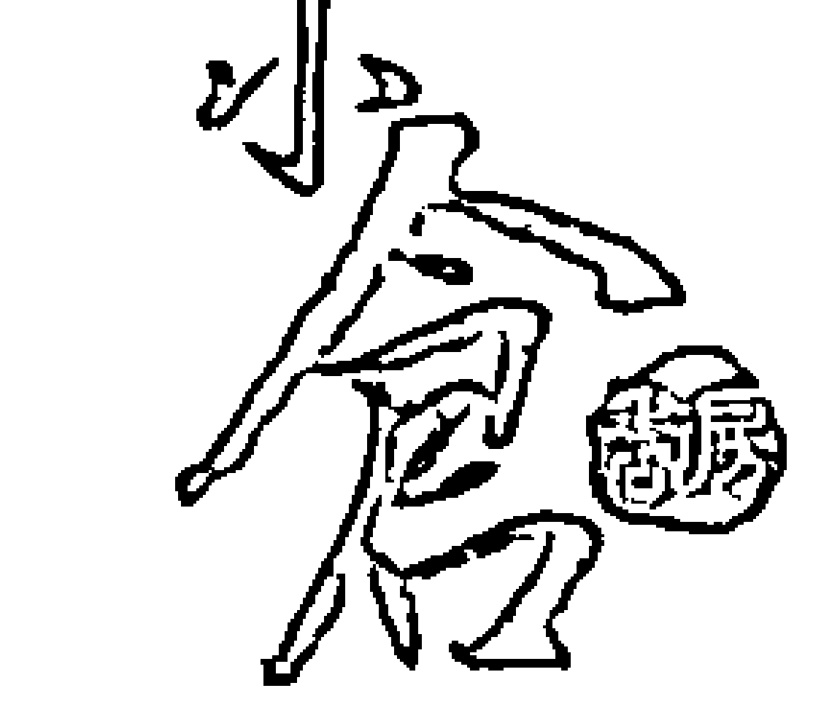

如何活用飛星紫微

活用

飛星紫微

四化用神論！

如何

褚芳裕 著。紫微斗數與子平八字學，是我國最得民心的兩門命理哲學。其博大精深，論命之精確，在星相命理上無出其右者。對於不會接觸過紫微的朋友，本書將是您的啟門鐘，將帶您進入紫微的殿堂……

制作说明：

本书由《天使神秘学院》出重金从台湾购入的原版书籍扫描制作完成。

为达到最好阅读效果，特地把书全部切开后，再经由专业扫描设备高精度扫描完成，并經過一張張的PS后期處理最終成書，其中間花費大量的人力、物力以及時間，只为能给大家提供經濟並优质的神秘學學習資料而努力。

本學院强力谴责某些机构和个人，把本學院花心血制作完成的电子书籍，包装后直接放在自家网上低价倾销的行为，以謀取不勞而獲的經濟利益。如果長此以往最終將無人願意再為大家花心思制作电子书，那以後可能大家再無新書可讀。

為讓大家以後能夠讀到更多的好書，也為了本學院的良性發展。本學院懇請大家盡量做到如下几点：

一、尽量在天使神秘学院的官方网站购买电子书籍。

官网访问地址：http://www.ac2011.cn

短网址：ac2011.cn

网址含义：(Archangel College 成立时间：2011年)

二、在收到电子书后小范围传阅即可，千万不要公开传播，更别挂到网上低价销售。

同时为答谢广大支持者，学院电子书将做如下调整：

前言

廿年前一個燠熱的午後，和幾個朋友躲在冷氣房中，不著邊際地談天說地。幾杯啤酒下肚，不知怎地，幾堆愁煩湧上每個人的心頭，聲聲嘆著人生的無常。後來，有人提議去拜訪一位不甚熟悉的朋友的朋友，因為他精通紫微，概知過去未來，雖然未曾正式掛過牌，但在朋友的圈子裡確是小有名氣。當那位紫微高手，笑談之間，一言道出我一些鮮為人知的過去與目前的困境，我啞然以對，久久不能自己。個性固執「鐵齒」的我，怎麼能相信一個人一生的軌跡竟然毫無遮掩地攤在一张紙上!?

這是我與紫微的第一次接觸。

此後廿年，一頭栽進去，而樂此不疲。

*

紫微斗數與子平八字學，是我國最得民心的兩門命理哲學，其博大精深，論命之精確，在星相命理上無出其右者。尤其紫微斗數，涵蓋之廣，窮天下之事皆在論算之中，而其易學難精之特性，尤爲一般人所著迷。

幾十年來，人類文明急速變化，科學一日千里，人们易從功利主義的社會裡迷失，於是多少人欲從「玄學」的角度去解釋、闡理。而紫微依其易學的特性，迅速攻占了絕大多數的命理市場。紫微之易學，在於對星情的解說，生動而活潑，而且變化較少，容易爲人所接受。紫微之難精，乃在於四化飛星，其化出、化入、化飛，貫穿命盤，縱橫交錯，重現可能發生、容易發生、已經發生、或即將發生的事。四化飛星是紫微斗數的精髓，沒有四化，紫微只是空架子，由於四化，紫微有了生命，氣象萬千，因果顯露。

四化之所以難精，乃在其變化不只一端，實乃多端，乃至萬端。名師指點，往往也只能夠揭其一端，餘皆要靠自身領悟。坊間大作，四化飛星著墨不多，有，則偏執於一二，難窺全貌。對於有志於紫微研究者，誠爲一大憾事，其研究之瓶頸每每出現於四化飛星而求助無門。

筆者何其幸運，先有恩師指點，復有機緣覽閱多本紫微四化名著，經歷十幾年來論命與教學經驗，將四化飛星可能的垂象，演繹歸納，彙集成冊。然紫微之學，浩瀚如大海，非三言兩語所能盡述。嚴格地說，亦非一朝一夕，一二人之力所能竟功，希望有志之士，多歸納，多驗證，多公開，使具有千年以上歷史的中國星相命理的奇葩，能在我們這一代發揚光大。好書的定義是能爲我所知，爲我所用。此書的彙集過程費時費力，誠然亦非一朝一夕之功。然而，此書的出版，能夠不再讓您在命理的書架前猶豫摸索，那麼，曾經付出過的心血，亦微不足道矣！

目录

凡例 …………………………………………9

导读 ……………………………………………10

洛阳易源四化 ……………………………………………………………

命盘製作DIY ……………………………………………………………12

命盘十二宮釋義 …………………………………28

第一章 十二宮自化

命宫自化 ……………………………………………36

兄弟宫自化 ……………………………………………………38

夫妻宫自化 ……………………………………………………39

子女宫自化 ……………………………………………………42

財帛宮自化 ……………………………………………………44

疾厄宮自化 ……………………………………………………46

遷移宮自化 ……………………………………………………48

僕役宮自化 ……………………………………………………50

官祿宮自化 ……………………………………………………52

田宅宮自化 ……………………………………………………54

福德宫自化 …………56

父母宫自化 …………57

◎重要雜記(一) …………59

第二章 生年干四化

生年祿 …………66

生年權 …………77

生年科 …………87

生年忌 …………96

◎重要雜記(二) …………108

第三章 十二宮宮干四化

命宫化祿入 …………116

命宫化權入 …………120

命宫化科入 …………123

命宫化忌入 …………126

兄弟宮化祿入 …………130

兄弟宫化權入 …………132

兄弟宮化科入 …………134

兄弟宫化忌入 …………136

夫妻宮化祿入 …………139

夫妻宮化權入 …………143

夫妻宫化科入 ………………………………………143

夫妻宫化忌入 ………………………………………147

子女宫化祿入 ………………………………………151

子女宫化權入 ………………………………………155

子女宫化科入 ………………………………………157

子女宫化忌入 ………………………………………159

財帛宮化祿入 ………………………………………163

財帛宮化權入 ………………………………………166

財帛宮化科入 ………………………………………168

財帛宮化忌入 ………………………………………170

疾厄宮化祿入 ………………………………………173

疾厄宮化權入 ………………………………………176

仆役宫化忌入 …………………………………………201

官祿宮化祿入 ……………………………………………204

官祿宮化權入 ……………………………………………207

官祿宮化科入 ……………………………………………210

官祿宮化忌入 ……………………………………………212

田宅宮化祿入 ……………………………………………216

田宅宮化權入 ……………………………………………218

田宅宮化科入 ……………………………………………220

田宅宮化忌入 ……………………………………………222

福德宮化祿入 ……………………………………………225

福德宫化權入 ……………………………………………227

福德宫化科入 ……………………………………………229

福德宫化忌入 ……………………………………………231

父母宫化祿入 ……………………………………………234

父母宫化權入 ……………………………………………236

父母宫化科入 ……………………………………………238

父母宫化忌入 ……………………………………………240

◎重要雜記(三) …………………………………………………243

範例解說 …………………………………………………………………262

後語 …………………………………………………………………268

凡例

本命造爲庚年生，生年四化，太陽化祿於兄弟，武曲化權於夫妻，天同化忌、太陰化科於子女。

詳論於本書第65頁到第107頁。

兄弟自化科，夫妻自化祿自化權，子女自化權。

詳論於本書第35頁到第58頁。

命宫四化：化祿化權入妻，化科入父母，化忌入財帛。兄弟宫四化：化祿入夫妻，化權入子女，化忌入父母。其他各宮四化……

詳論於本書第115頁到第242頁。

大限四化，流年四化，原盤與大限、流年四化交織……

散見於本書各節重要雜記。

| 地天天空梁機庚辰父母 | 本命造爲庚年生，生年四化，太陽化祿於兄弟，武曲化權於夫妻，天同化忌、太陰化科於子女。——詳論於本書第65頁到第107頁。兄弟自化科，夫妻自化祿自化權，子女自化權。——詳論於本書第35頁到第58頁。 |

| 右巨太弼門陽自化科戊寅15～24兄弟 天貪武魁狼曲自化權己丑25～34夫 左太天輔陰同自化權戊子35～44女 文天曲府丁亥45～54帛 | | | |

洛阳易源四化

| 四化星 天干 | 禄 | 權 | 科 | 忌 |
| --- | --- | --- | --- | --- |
| 甲 | 廉貞 | 破軍 | 武曲 | 太陽 |
| 乙 | 天機 | 天梁 | 紫微 | 太陰 |
| 丙 | 天同 | 天機 | 文昌 | 廉貞 |
| 丁 | 太陰 | 天同 | 天機 | 巨門 |
| 戊 | 貪狼 | 太陰 | 右弼 | 天機 |
| 己 | 武曲 | 貪狼 | 天梁 | 文曲 |
| 庚 | 太陽 | 武曲 | 太陰 | 天同 |
| 辛 | 巨門 | 太陽 | 文曲 | 文昌 |
| 壬 | 天梁 | 紫微 | 左輔 | 武曲 |
| 癸 | 破軍 | 巨門 | 太陰 | 貪狼 |

命盘製作DIY

一、定五行寅首——根據生年天干，起寅首，然後順時針，一宮順數一天干。

歌訣：甲己之年起丙寅，乙庚之年起戊寅，丙辛之年起庚寅，丁壬之年起壬寅，戊癸之年起甲寅。

二、安命、身宮——以寅宮起，順數生月。再以該宮起子，逆數至生時，即爲命宮。以寅宮起順數生月，再以該宮起子順數生時，即爲身宮。

歌訣：生月起子兩頭通，逆至生時爲命宮，順到生時即安身。

三、排列十二宮位——找出命宮、身宮後，就依下列順序將十二宮分別列出，無論男女，皆以逆時針方向填之。

命宮、兄弟宮、夫妻宮、子女宮、財帛宮、疾厄宮、遷移宮、僕役宮、官祿宮、田宅宮、福德宮、父母宮。

四、定五行局——以生年干配合命宮位置，以定五行局。

命盘製作《DIY》

. 13 .

| 命宫生年干 | 子丑 | 寅卯 | 辰巳 | 午未 | 申酉 | 戌亥 |
| --- | --- | --- | --- | --- | --- | --- |
| 甲己 | 水二局 | 火六局 | 木三局 | 土五局 | 金四局 | 火六局 |
| 乙庚 | 火六局 | 土五局 | 金四局 | 木三局 | 水二局 | 土五局 |
| 丙辛 | 土五局 | 木三局 | 水二局 | 金四局 | 火六局 | 木三局 |
| 丁壬 | 木三局 | 金四局 | 火六局 | 水二局 | 土五局 | 金四局 |
| 戊癸 | 金四局 | 水二局 | 土五局 | 火六局 | 木三局 | 水二局 |

五、起大限——大限初行起命宫，十年一度換行宮，陽男陰女順方轉，陰男陽女逆行通。若問行限何歲起，五行局數爲其宗。

例：若爲金四局人，則4～13，14～25，24～33……由命宮起，陽男陰女順行，陰男陽女逆行，一宮一限依次排入。

火六局人，則6～15，16～25，26～35……其他局依次類推。

六、起小限——小限一年一度逢，男順女逆不相同，寅午戍人辰上起，申子辰人自戌宮，巳酉丑人未宮始，亥卯未人起丑宮。

例：甲申年生人，自戌宮起算，男順女逆一歲一宮依次列算。

乙卯年生人，自丑宮起算，男順女逆一歲一宮依次列算。

命盘製作《DIY》

# ·15·

飛星紫微

·16·

| 巨門 | 天廉相貞 | 天梁 | 七殺 |
| 貪狼 | 紫微在寅 | | 天同 |
| 太陰 | 武曲 |
| 天府微 | 天機 | 破軍 | 太陽 |

| 天相 | 天梁 | 七廉殺貞 |  |
| 巨門 | 紫微在卯 | | 
| 貪狼微 | 天同 |
| 太陰機 | 天府 | 太陽 | 破武軍曲 |

命盘製作《DIY》

·17·

| 天梁 | 七殺 |   | 廉貞 |
| 天紫相微 | 紫微在辰 |   |   |
| 互天門機 | 紫微在辰 |   | 破軍 |
| 貪狼 | 太太陰陽 | 天武府曲 | 天同 |

| 七紫殺微 |   |   |   |
| 天天梁機 | 紫微在巳 |   | 破廉軍貞 |
| 天相 | 紫微在巳 |   |   |
| 互太門陽 | 貪武狼曲 | 太天陰同 | 天府 |

命盘製作《DIY》

·18·

| 天機 | 紫微 |   | 破軍 |
| 七殺 | 紫微在午 |   |   |
| 天太梁陽 |   | 天廉府貞 |
| 天武相曲 | 互天門同 | 貪狼 | 太陰 |

|   | 天機 | 破紫軍微 |   |
| 太陽 | 紫微在未 |   | 天府 |
| 七武殺曲 |   |   | 太陰 |
| 天天梁同 | 天相 | 互門 | 貪廉狼貞 |

命盘製作《DIY》

# ·19·

| 太陽 | 破軍 | 天機 | 天紫府微 |
| 武曲 | 紫微在申 | | 太陰 |
| 天同 | 紫微在申 | | 貪狼 |
| 七殺 | 天梁 | 天廉相貞 | 互門 |

| 破武軍曲 | 太陽 | 天府 | 太天陰機 |
| 天同 | 紫微在西 | | 貪紫狼微 |
|  | 紫微在西 | | 互門 |
|  | 七廉殺貞 | 天梁 | 天相 |

飛星紫微

·20·

| 天同 | 天武府曲 | 太太陰陽 | 貪狼 |
| 破軍 | 紫微在戌 | | 互天門機 |
|  | 紫微在戌 | | 天紫相微 |
| 廉貞 |  | 七殺 | 天梁 |

| 天府 | 太天陰同 | 貪武狼曲 | 互太門陽 |
|  | 紫微在亥 | | 天相 |
| 破廉軍貞 | 紫微在亥 | | 天天梁機 |
|  |  |  | 七紫殺微 |

命盘製作《DIY》

. 21 .

| 禄存 | 甲 | 乙 | 丙 | 丁 | 戊 | 己 | 庚 | 辛 | 壬 | 癸 |
|----|---|---|---|---|---|---|---|---|---|---|
| 寅 | 寅 | 卯 | 巳 | 午 | 巳 | 午 | 申 | 酉 | 亥 | 子 |
| 擎羊 | 卯 | 辰 | 午 | 未 | 午 | 未 | 酉 | 戌 | 子 | 丑 |
| 陀羅 | 丑 | 寅 | 辰 | 巳 | 辰 | 巳 | 未 | 申 | 戌 | 亥 |
| 天魁 | 丑 | 子 | 亥 | 亥 | 丑 | 子 | 丑 | 午 | 卯 | 卯 |
| 天鉞 | 未 | 申 | 酉 | 酉 | 未 | 申 | 未 | 寅 | 巳 | 巳 |
| 化祿 | 廉 | 機 | 同 | 陰 | 貪 | 武 | 陽 | 互 | 梁 | 破 |
| 化權 | 破 | 梁 | 機 | 同 | 陰 | 貪 | 武 | 陽 | 紫 | 互 |
| 化科 | 武 | 紫 | 昌 | 機 | 右 | 梁 | 陰 | 曲 | 左 | 陰 |
| 化忌 | 陽 | 陰 | 廉 | 互 | 機 | 曲 | 同 | 昌 | 武 | 貪 |

十、安月系諸星——以生月排列之。

|        | 正 | 二 | 三 | 四 | 五 | 六 | 七 | 八 | 九 | 十 | 十一 | 十二 |
| :------ | :--: | :--: | :--: | :--: | :--: | :--: | :--: | :--: | :--: | :--: | :--: | :--: |
| 左輔    | 辰   | 巳   | 午   | 未   | 申   | 酉   | 戌   | 亥   | 子   | 丑   | 寅   | 卯   |
| 右弼    | 戊   | 酉   | 申   | 未   | 午   | 巳   | 辰   | 卯   | 寅   | 丑   | 子   | 亥   |
| 天刑    | 酉   | 戌   | 亥   | 子   | 丑   | 寅   | 卯   | 辰   | 巳   | 午   | 未   | 申   |
| 天姚    | 丑   | 寅   | 卯   | 辰   | 巳   | 午   | 未   | 申   | 酉   | 戌   | 亥   | 子   |
| 天馬    | 申   | 巳   | 寅   | 亥   | 申   | 巳   | 寅   | 亥   | 申   | 巳   | 寅   | 亥   |
| 解神    | 申   | 申   | 戌   | 戌   | 子   | 子   | 寅   | 寅   | 辰   | 辰   | 午   | 午   |
| 天巫    | 巳   | 申   | 寅   | 亥   | 巳   | 申   | 寅   | 亥   | 巳   | 申   | 寅   | 亥   |
| 天月    | 戌   | 巳   | 辰   | 寅   | 未   | 卯   | 亥   | 未   | 寅   | 午   | 戌   | 寅   |
| 陰煞    | 寅   | 子   | 戌   | 申   | 午   | 辰   | 寅   | 子   | 戌   | 申   | 午   | 辰   |

十一、安日系諸星——

三台從左輔上起初一，順行至本生日安之。

八座從右弼上起初一，逆行至本生日安之。

恩光從文昌順數到生日，退後一步安之。

天貴從文曲順數到生日，退後一步安之。

十二、安時系諸星——以本生時及相關生年支排列之。

|        | 子 | 丑 | 寅 | 卯 | 辰 | 巳 | 午 | 未 | 申 | 酉 | 戌 | 亥 |
|--------|----|----|----|----|----|----|----|----|----|----|----|----|
| 文昌   | 戌 | 酉 | 申 | 未 | 午 | 巳 | 辰 | 卯 | 寅 | 丑 | 子 | 亥 |
| 文曲   | 辰 | 巳 | 午 | 未 | 申 | 酉 | 戌 | 亥 | 子 | 丑 | 寅 | 卯 |
| 寅午戌  | 火星 | 丑 | 寅 | 卯 | 辰 | 巳 | 午 | 未 | 申 | 酉 | 戌 | 亥 | 子 |
|        | 鈴星 | 卯 | 辰 | 巳 | 午 | 未 | 申 | 酉 | 戌 | 亥 | 子 | 丑 | 寅 |
| 申子辰  | 火星 | 寅 | 卯 | 辰 | 巳 | 午 | 未 | 申 | 酉 | 戌 | 亥 | 子 | 丑 |
|        | 鈴星 | 戌 | 亥 | 子 | 丑 | 寅 | 卯 | 辰 | 巳 | 未 | 申 | 酉 |
| 已酉丑  | 火星 | 卯 | 辰 | 巳 | 午 | 未 | 申 | 酉 | 戌 | 亥 | 子 | 丑 | 寅 |
|        | 鈴星 | 戌 | 亥 | 子 | 丑 | 寅 | 卯 | 辰 | 巳 | 未 | 申 | 酉 |
| 亥卯未  | 火星 | 酉 | 戌 | 亥 | 子 | 丑 | 寅 | 卯 | 辰 | 巳 | 未 | 申 |
|        | 鈴星 | 戌 | 亥 | 子 | 丑 | 寅 | 卯 | 辰 | 巳 | 未 | 申 | 酉 |
|        | 地劫 | 亥 | 子 | 丑 | 寅 | 卯 | 辰 | 巳 | 午 | 未 | 申 | 酉 | 戌 |
|        | 地空 | 亥 | 戌 | 酉 | 申 | 未 | 午 | 巳 | 辰 | 卯 | 寅 | 丑 | 子 |

十三、安支系諸星——依本生年支排列之。

|       | 子 | 丑 | 寅 | 卯 | 辰 | 巳 | 午 | 未 | 申 | 酉 | 戌 | 亥 |
| :------ | :--: | :--: | :--: | :--: | :--: | :--: | :--: | :--: | :--: | :--: | :--: | :--: |
| 天哭    | 午   | 巳   | 辰   | 卯   | 寅   | 丑   | 子   | 亥   | 戌   | 酉   | 申   | 未   |
| 天虛    | 午   | 未   | 申   | 酉   | 戌   | 亥   | 子   | 丑   | 寅   | 卯   | 辰   | 巳   |
| 龍池    | 辰   | 巳   | 午   | 未   | 申   | 酉   | 戌   | 亥   | 子   | 丑   | 寅   | 卯   |
| 鳳閣    | 戌   | 酉   | 申   | 未   | 午   | 巳   | 辰   | 卯   | 寅   | 丑   | 子   | 亥   |
| 紅鸞    | 卯   | 寅   | 丑   | 子   | 亥   | 戌   | 酉   | 申   | 未   | 午   | 巳   | 辰   |
| 天喜    | 酉   | 申   | 未   | 午   | 巳   | 辰   | 卯   | 寅   | 丑   | 子   | 亥   | 戌   |
| 孤辰    | 寅   | 寅   | 巳   | 巳   | 巳   | 申   | 申   | 申   | 亥   | 亥   | 亥   | 寅   |
| 寡宿    | 戌   | 戌   | 丑   | 丑   | 丑   | 辰   | 辰   | 辰   | 未   | 未   | 未   | 戌   |
| 蜚廉    | 申   | 酉   | 戌   | 巳   | 午   | 未   | 寅   | 卯   | 辰   | 亥   | 子   | 丑   |
| 破碎    | 巳   | 丑   | 酉   | 巳   | 丑   | 酉   | 巳   | 丑   | 酉   | 巳   | 丑   | 酉   |
| 華蓋    | 辰   | 丑   | 戌   | 未   | 辰   | 丑   | 戌   | 未   | 辰   | 丑   | 戌   | 未   |
| 咸池    | 酉   | 午   | 卯   | 子   | 酉   | 午   | 卯   | 子   | 酉   | 午   | 卯   | 子   |
| 天才    | 命   | 父   | 福   | 田   | 官   | 僕   | 遷   | 疾   | 財   | 子   | 夫   | 兄   |
| 天壽    |      |      |      |      |      |      |      |      |      |      |      |      |
|         | 身宮起子，順行數至本生年支 |

命盤製作《DIY》

十四、安五行局長生十二神——

長生、沐浴、冠帶、臨官、帝旺、衰、病、死、墓、絕、胎、養

水二局長生在申，木三局長生在亥，金四局長生在巳，土五局長生在申，火六局長生在寅。

先按五行局定長生之宮位，再按十二神順序依陽男陰女順時，陰男陽女逆時安之。

十五、安命主、身主——

安命主：以命宮宮位安之。

|      | 子 | 丑 | 寅 | 卯 | 辰 | 巳 | 午 | 未 | 申 | 酉 | 戌 | 亥 |
| :---- | :--: | :--: | :--: | :--: | :--: | :--: | :--: | :--: | :--: | :--: | :--: | :--: |
| 命主   | 貪狼  | 互門  | 禄存  | 文曲  | 廉貞  | 武曲  | 破軍  | 武曲  | 廉貞  | 文曲  | 禄存  | 互門  |

安身主：以本生年支安之。

|      | 子 | 丑 | 寅 | 卯 | 辰 | 巳 | 午 | 未 | 申 | 酉 | 戌 | 亥 |
| :---- | :--: | :--: | :--: | :--: | :--: | :--: | :--: | :--: | :--: | :--: | :--: | :--: |
| 身主   | 火星  | 天相  | 天梁  | 天同  | 文昌  | 天機  | 火星  | 天相  | 天梁  | 天同  | 文昌  | 天機  |

備註：

(1)十天干——甲、乙、丙、丁、戊、己、庚、辛、壬、癸。十二地支——子、丑、寅、卯、辰、巳、午、未、申、酉、戌、亥。天干分陰陽，甲、丙、戊、庚、壬屬陽，該年生人，男命為陽男，女命為陽女。乙、丁、己、辛、癸屬陰，該年生人，男命為陰男，女命為陰女。

(2)我國應用日光節約時間，若在下列時間內出生者，必須將出生時間往前提前一小時，如上午十點十分，調整為九點十分。

+ 民國 34～40 年 5 月 1 日～9 月 30 日
+ 民國 41 年 3 月 1 日～10 月 31 日
+ 民國 42～43 年 4 月 1 日～10 月 31 日
+ 民國 44～48 年 4 月 1 日～9 月 30 日
+ 民國 49～50 年 6 月 1 日～9 月 30 日
+ 民國 63～64 年 4 月 1 日～9 月 30 日
+ 民國 68 年 7 月 1 日～9 月 30 日

(3)流年斗君之簡易求法

視命盤寅宮為什麼宮位，如為夫妻宮，則在流年夫妻宮立流年斗君為正月，順次二、三、四……等排之。餘類推。

命盤製作《DIY》

命盤十二宮釋義

(一)命宮

+ 依一六共宗之理，命是性，疾厄宮（第六宮）是心。

+ 以六親而言，命宮也是祖母宮，因父母的父母爲福德宮，假借祖父，命宮爲福德之夫妻，乃祖母也。

+ 命宮是財帛宮的官祿宮，爲財帛之氣數位，看財帛之支出行爲狀況。

+ 命宮是官祿宮的財帛宮，事業的資金調度由此看出。

+ 命宮是疾厄宮的僕役宮，僕役宮爲交易變化之意，故可看疾厄之病變吉凶。

+ 命宮是夫妻宮的福德宮，可以看出配偶之福分、嗜好等。

+ 命宮看個性，爲顯的、陽的一面，遷移爲險的、隱的一面，內在外表互參。

(二)兄弟宮

+ 以六親人事而言，可擴充解釋為小姨、二太太、學生、弟子、部屬。

+ 子女宮是福德宮的疾厄宮，乃桃花宮，子田線乃桃花線，是享受歡樂的宮位，亦表示性能力，以及個人在性方面之癖好喜忌。

+ 子女宮是疾厄宮的福德宮，可顯現身體災厄的狀況。

+ 子女宮是遷移宮的田宅宮，意外災劫有時在此顯現。

+ 子女宮是僕役宮的氣數位，可看交友狀況或合夥關係。

+ 子女宮是官祿宮的僕役宮，財帛宮的父母，因此子女是股東位，合夥關係。

(三)夫妻宮

+ • 官祿宮為陽，夫妻宮在對宮為陰，因此夫妻宮可知事業外在因素或潛在之危機。
+ • 夫妻宮是福德宮的財帛宮，福德為前世之因果，因此婚姻有緣訂三生之說。
+ • 夫妻宮是疾厄宮的田宅宮，疾厄為我之身心，故可與疾厄同論夫妻之緣分深淺。
+ • 夫妻宮是田宅宮的疾厄宮，可查知田宅之危機。
+ • 夫妻宮是遷移宮之官祿宮，為遷移之氣數位，意外災劫之寬紬。

(四)子女宮

+ • 若論桃花，子女宮表年紀輕者，田宅宮表年紀較大者。
+ • 田宅宮為第二命宮，不可破，破則有災，故忌入子女沖田，意同入遷沖命。

(五)財帛宮

+ • 財帛宮為夫妻宮之夫妻宮，配偶的配偶就是我，財帛宮不理想，有時候對婚姻的破壞力比夫妻宮為大。
+ • 財帛宮為福德宮之對宮，為陰宮，暗藏了不為人知的因果，且表示這一輩的錢財。
+ • 財帛宮為遷移宮之福德宮，在外闖蕩之有錢無錢，有路無路在此看出。
+ • 財帛宮為官祿宮之官祿宮，表示事業中之營業狀況及損益。

(六)疾厄宫

+ • 命為性，疾厄為心，二者交互感應而發為情。
+ • 疾厄宮為福德宮之僕役宮，福德所主事務，在此變易，在此付現。
+ • 疾厄宮為父母宮之對宮，為陰，即祖上的陰德，父母之遺傳（隱的、看不見的）在此表現，是故其因為陰，其果為陽，陰陽交易，因果循環。
+ • 疾厄宮為田宅宮之官祿宮，田宅之吉凶，表象於此，屋氣與人體相因成果。
+ • 疾厄宮為官祿宮之田宅宮，為工廠或店面、公司等營業場所。
+ • 疾厄宮為夫妻宮之子女宮，配偶之桃花由此見端倪。

(七)遷移宮

+ • 相對於命宮，遷移是隱的一面。
+ • 遷移宮是福德宮的官祿宮（氣數位），父母宮之僕役宮，因此遷移宮可說是父母及祖上遺傳給我在命與性之潛在因子。
+ • 遷移宮是父母之僕役宮，故亦可以來看父母之壽元。
+ • 遷移宮是福德之氣數位，陰德如何在此展現、出外防小人。如以因果而論，是在償前世債，常有人不良於行，即遷移宮受制於福德，前世之因果也。

(八)僕役宮

+ • 命疾乃一六共宗，僕命亦為一六共宗，凡一六宮之關係者，吉凶與共。
+ • 僕役為福德之田宅，藏福之所，故不能破，破則有災，甚者亡命。
+ • 僕役宮為父母之官祿，與遷移宮參看，可知父母之壽元。
+ • 僕役宮為夫妻之疾厄，配偶之健康狀況可在本宮看出。
+ • 僕役為官祿之父母，為上司或是來貨之源頭。

(九)官祿宮

+ • 官祿宮為命宮之氣數位，命造本人之行為表現運之兌現支付處。
+ • 官祿宮乃代表一個人之形象、行為。
+ • 官祿宮乃財帛宮之財帛宮，表示財帛資金之運用情形。

(十)田宅宮

+ • 田宅宮乃財帛之疾厄，財田為一六共宗，乃表裡關係，可診斷財之病源。
+ • 田宅宮為疾厄之財帛，財帛為交易之工具，說明田宅與疾厄之風水關係。
+ • 田宅宮為僕役之夫妻，亦為夫妻之僕役，故表示為異性朋友。

一、命宮自化

凡是命宮自化的人，多半經不起考驗，做事也只有五分鐘熱度，這種人比較善於原諒自己，遇到挫折會為自己找藉口，找台階下。

* 自化祿：

做人善演中間派，說話有技巧，能言之有理而不得罪他人。斯文有禮，不粗俗，講話懂分寸。自謙、自立，六親無靠。有人緣、有藝術天分。聰明伶俐，食祿不缺。太多情、愛哭。自私、不肯布施。沒信用，做事不專心，五分鐘熱度。能獨立思考。祿出、蔭他人。話說出去又想收回。

化忌入兄，命中帶有欠朋友之格。

* 自化權：

疾厄之氣數在兄弟，而疾厄宮主我之身體，自化權乃主身體不好。

如我要掌權，則與朋友、兄弟會有爭執。又僕役之遷移位在兄弟，因此出外最好讓朋友出風頭；若在我家中，則大可當仁不讓。

朋友多半有社會地位。

兄弟霸道，又能幹。

## 自化科

兄弟乃疾厄之氣數位，為我身體之氣數，故我的外表溫文儒雅，朋友也多為有學識、修養之人，朋友交往較無利害關係或衝突。

兄弟脾氣好、清秀、溫和、聰明。

## 自化忌

基本上已有欠債忌的味道，與朋友之間最好避免錢財之交流。而兄弟為我財庫位，是指我賺的錢留不住，多半與朋友有關，自私、自己顧自己，賺多少用多少，守不住財，不宜投資（看此宮的化祿在何方）。

兄弟有損，運途不順，欠和諧。依賴心重。

老年空虛。租房子居多。

一般代表晚婚，且婚姻有波折。

除了與配偶有關外，因為對宮是我的官祿宮，故對我的事業有很大的影響。

## 自化祿

夫妻有很深的緣分，互相恩愛、幫忙。又因照官祿，主事業順利賺錢多。

此祿在未結婚前很難見其功效，起碼有多年感情的異性朋友才會有較明顯的助力。

有第三者來對事業幫助。

配偶個性隨和，人緣好，有藝術天分，長相貌美。自由戀愛而結合。

獨立創業而配偶拿錢助之。

行運逢之，有人暗戀我。

自化忌入子，已有配偶，但想再有桃花。

自化忌入命，夫妻對待關係不佳。

## 自化權

夫妻互不相讓，有爭執，看其宮干化忌何往。若在子女宮，主第三者介入的困擾；若在官祿，主為工作問題起紛爭。

對方喜歡管我，如我讓他就沒事。我管配偶，配偶不用。

配偶個性強、任性、能幹、有才華、助我創業。

閃電式、一見鍾情式結婚或被迫（兒女之命）結婚。

女命吉，男命不佳。

## 自化科

配偶家世清白，多為書香門第，有涵養、風度好、好面子、人緣好、長相清秀、有文藝才華之修養。

配偶為他人介紹認識或同事、同鄉者。

易有第三者介入。行運逢之，有人暗戀我。

就職之公司平順少波折，事業再怎麼做只是平穩而已。

## 自化忌

表示一種相欠忌，夫妻常因小事吵架，同床異夢。夫妻緣薄，找配偶難。

配偶人緣差、思想悲觀、自卑、個性直，常犯小人之災，無法助我事業。

注意用配偶名字創業而帶來災厄。

男命主妻子不會生，雖生易夭折。

所化之星較難發揮其特性。

婚姻不美。

婚後配偶之六親有人傷亡或離異。

自化祿入命，夫妻有是非，婚姻不美。

## 四、子女宮自化

對本宮而言，並無太大的意義。

除了與子女有關之外，桃花及財的問題也很重要。本宮若有自化，則一生在男女問題上煩惱，不是桃花扯不清，就是桃花交不住，找不到理想對象。性慾強，婚前異性朋友不只一人。頭胎易流產。

## 自化祿

有子緣（視何宮化忌沖子女，即為妨害得子之原）。

子女太多，不想再生了；有孕的話，會墮胎。

桃花多，而且是不需花錢的肉慾桃花。早婚，性慾強。子女聰明，女命在男女關係上較隨便。自化忌入兄，主夫妻因桃花而吵架。

自化忌入福，夫妻常吵架。

流年子女自化祿，可能有已婚對象之外遇。

自化忌入夫，離異之命。

易有流產、不孕，而收養子女之現象。

## 自化權

不想生太多小孩，但有孕想拿掉時會有麻煩。

子女個性剛強，好動、不易管教。

子女出生時有難產或開刀之現象。

## 自化科

子女清秀聰明、有風度。

若不想生太多，拿掉的話比較順利。

婚前的交往能自我約束，不會踰矩。

桃花外遇不會影響家庭。

## 自化忌

命造較不會生病，子女少、外遇少、性生活多，子女不易養育，宜拜義父母（子女）。晚婚。

生產不順，有流產或剖腹之情形，看其化星之星性、及宮內是否有煞，有則其禍難擋。

異性交往不順，更有破財之虞。

當大限行抵官祿宮，則子女為大限之僕役，自化忌主非吉也，有劫數。

防犯法坐牢。

化祿入福德，生大病。

流年子女宮自化忌，可能有未婚對象之外遇。

## 五、財帛宮自化

財帛自化的情形，其人財難守。

財帛為夫妻之夫妻，亦要注意夫妻之對待關係，一般主婚姻不理想。

## 自化祿

很會賺錢且精於成本觀念，從另一角度觀之，亦主看錢不重。也很會花錢，自賺自花。

來財輕鬆。

自立、愛面子、重享受、不知節儉。

## 自化權

賺錢不易，要經一番奮鬥與競爭才會成功。對錢財的慾望高，自掌財權，宜獨資。

## 自化科

出外賺錢，到他鄉遠地較有發展。

賺錢容易，自賺自花。

獨立、自立心（不一定白手起家）在外獨當一面。人緣好，在外時間長，出外便想家，跑不遠。

驛馬。

自化忌入父母，此人沒有大毛病。

自化忌入子，則有意外之災。

有錢也不想增置產業，而以祖業為滿足。

## 自化忌

個性強、精明能幹。任性、霸道，不拘小節。在外被人看重，喜表現，欲掌權，易得罪小人。

不可與人爭鬥，否則多是非。

## 自化科

宜出外求學或離家，宜從事文職工作。

外出吉利，多貴人助，謀事有人介紹、提拔。

## 自化忌

我與朋友之間有相欠債之情形，糾纏不清，朋友無情，自私自利，易為朋友利用、背叛。

欠人錢要還，人欠我收不回來，還斷掉友情。

部屬少，難管理。

不要與人合夥。

容易單相思，桃花短暫，留不住。

男命主妻子不會生，若生，配偶有災。

若犯桃花，為對方來找我，我租屋與他同居。

## 六、疾厄宮自化

疾厄自化的情形，主心性修養。

## 自化祿

心性有度量，不善與人計較，能贏得尊敬，樂觀。中等身材，女命大多為長頭髮。

體弱、少運多災厄。不正常發胖。

看由何星所化，可看出此人身體有何毛病，大半與胃腸有關。

有外在美，但淺緣，不耐久看，欠內在氣質。

## 自化權

心性趨向計較是非，不甘被人欺詐或吃虧。

個性強、古怪、早熟，脾氣暴躁。粗壯、任操勞、體健少病，但有病則不易治好。多意外傷害。

## 自化科

心性忠厚，談吐有風度，自我修身，不同流合污。疾病的抵抗力較強，有病恢復快，逢良醫。樂天。

## 自化忌

心性猜忌、自我矛盾、不相信他人。心胸狹窄、自私自利，有時為了己利不惜損傷他人。自大，直腸子、心直無心機。自以為是，不信命理。

身材瘦、體弱，早熟。腋下無毛，女命多為短頭髮。身體有慢性疾病或暗病纏綿，看何星所化而斷，不易得癌症，不易得傳染病。

本宮星弱，又自化忌，不會生孩子。

疾厄自化忌，大限走到為大劫數。

勿向人舉債，還不清，宜做現金冷門生意。

勞碌命，桃花多。

配偶常會拒絕「同房」。

化祿入福德，生大病。

## 七、遷移宮自化

遷移與命宮為相輔關係，從命宮可看出一個人的外在個性，遷移可看內在個性。

遷移自化除了與命宮自化之類似情形外，尚有下列之情況。

## 自化祿

出外賺錢，到他鄉遠地較有發展。

賺錢容易，自賺自花。

獨立、自立心（不一定白手起家）在外獨當一面。人緣好，在外時間長，出外便想家，跑不遠。

驛馬。

遷移化忌入父母，此人沒有大毛病。

遷移化忌入子，則有意外之災。

有錢也不想增置產業，而以祖業為滿足。

## 自化權

不可與人爭鬥，否則多是非。

## 自化科

為人做事較有風度，事業上得貴人助。

工作由別人介紹而得。工作順利，其就職之公司較穩定，說好不好、說壞不壞。化忌入僕，倒閉。

喜歡讀書，涉獵廣泛。

生意的對象較不會倒閉。

## 自化忌

不能成就大事業，眼光淺，適合領薪階級。事業不穩，任職不穩，其所就職的公司可能倒閉。沒有背景，經常換職業。賺錢不易，創業不易，守成更難。易犯小人之災。生意對象較會倒閉。

求學時不喜歡讀書，易有休學轉學之事。

事業上之不順可能影響到夫妻生活。

夫妻可能有生離死別之事。

適宜短期回收之投資。

配偶常為我的事業往外跑。

## 八、僕役宮自化

僕役自化與兄弟宮自化的情形類似。

僕役若見自化時，都非吉象，不論自化祿、權、科、忌都不是好現象，如果僕役自化大限過度時便要注意其氣遁向何方。

大限之僕役化忌入本命僕役，遇本命僕役自化忌時，為大劫難。

## 自化祿

對朋友很夠意思，即使借錢不還也不在意。朋友有錢、有地位。兄弟多。

與朋友合作，由朋友掌權，但較易賺錢。

沒有理由地待人好，錢出去不期望還。

自化忌入田或入父疾，朋友為私利找我，來揩油也。

自化忌入命，與朋友不要有金錢來往，其他不要緊。

## 自化權

朋友與我爭權，扯後腿。

## 自化科

朋友修養好、朋友多貴人，與我不甚計較，也無甚利害關係。

朋友有才能，能和睦相處。

所交之朋友，能夠感化。

## 自化忌

我與朋友之間有相欠債之情形，糾纏不清，朋友無情，自私自利，易為朋友利用、背叛。

欠人錢要還，人欠我收不回來，還斷掉友情。

部屬少，難管理。

不要與人合夥。

容易單相思，桃花短暫，留不住。

男命主妻子不會生，若生，配偶有災。

若犯桃花，為對方來找我，我租屋與他同居。

## 九、官祿宮自化

官祿自化的情形和命宮的自化，有其相似之處，官祿亦主個人的形象。

## 自化祿

為人穩重，到處受人歡迎，做事比較不會得罪人，社會關係良好，工作順利，所服務的公司生意比較興旺，若自化忌入僕，早晚會倒閉。

創業，得配偶助力，有貴人相助。

自賺自花。

求學時代，讀書不專心，貪玩，多學而不精。

上班之公司營運不錯。

## 自化權

為人喜歡專權，容易與人產生糾紛。

有創業能力，能獨當一面，事業心重，有幹勁，又較會做生意，其就職的公司業務必定不錯。

得人提拔，容易升遷。

## 自化科

為人做事較有風度，事業上得貴人助。

工作由別人介紹而得。工作順利，其就職之公司較穩定，說好不好、說壞不壞。自化忌入僕，倒閉。

喜歡讀書，涉獵廣泛。

生意的對象較不會倒閉。

## 自化忌

不能成就大事業，眼光淺，適合領薪階級。事業不穩，任職不穩，其所就職的公司可能倒閉。沒有背景，經常換職業。賺錢不易，創業不易，守成更難。易犯小人之災。生意對象較會倒閉。

求學時不喜歡讀書，易有休學轉學之事。

事業上之不順可能影響到夫妻生活。

夫妻可能有生離死別之事。

適宜短期回收之投資。

配偶常為我的事業往外跑。

## 十、田宅宮自化

田宅自化與子女宮有連帶關係，與桃花有關，又主錢財之用法。

## 自化祿

有人緣、異性緣早，重性慾，屬肉慾桃花。

很有錢。對金錢不愁，不在乎花多少。

有祖蔭、有祖業，會蔭他人。家教好。

自己會置產，住家豪華。

可從事與資金有關的生意。

自化忌入僕，此人一生必有出過家運之問題。

婚後有外遇，異性朋友多。

賣房子。

## 自化權

人緣不錯，能幹、喜掌權。

重視錢財，一毛不拔。

可增加不動產，有房子出租。

## 自化科

家中各人意見多，不很融洽。

可從事與技術有關的生意。

自化祿入官祿，房子有兩棟以上，從事不動產買賣吉。

自化科入命或衝命，此人有度量。

自化科入命或衝命，此人有人品。

自我主義重，不信命理，一意孤行。

## 自化忌

天生的憂鬱型、勞碌型的人。多愁善感、心胸不開朗。度量小、好計較，閒不住、愛花錢，「口袋有破洞」，錢花完再說。

男命主妻不助夫，妻為家庭主婦，不喜上班。

祖父不發。較無賺錢運。

健康不好，身負業障，運途坎坷，應多積陰德。

父母宮的自化，對疾厄有影響，也主心性脾氣。

## 自化祿

為人度量寬大，是當主管的最佳人選。

聰明、成績好。沒有破相。

在服務機關內受寵愛。父母自身為自立格。有祖蔭，但被我花光。自化忌入兄，乃兄弟很少在一起，且要注意股東不合。

## 自化權

為人做事有魄力，是商場上的名人。祖蔭少，能幹，易升遷。

容貌有外傷。

父母有權勢。

## 自化科

為人安分守己，是理想的上班族。有祖蔭。

容貌清秀、和睦、親切。

在學成績好。

## 自化忌

心胸狹小，常因小事起疑心，會記恨、有報復心。

與公司上司下屬難相處，不適合當主管。

口德不佳，易出口傷人。容貌有傷。

在校成績不好，有重修留級之事，不喜歡讀書。

父母運途不順。不宜與父母住在一起。幾無祖蔭。

易被人倒帳，不宜跟會，不可做股票。

## 重要雜記(一)

* 自化以人而言：願不願在於自己

自化以事而言：做事有頭無尾。

* 自化祿之宮要轉忌，此忌所沖之位為最凶。

自化忌之宮要看祿在何宮，再以此祿轉忌以定吉凶，以明自化忌之因。

* 宮位自化時，其象之產生定於：

自化祿——看化忌之所在。

自化權——看化科之所在。

自化科——目前仍不明（因為科主平穩）。

自化忌——看化祿之所在。

<例> 流年官祿自化忌——事業有頭無尾

流年官祿化祿入財帛——因金錢之故，致事業有頭無尾

* 任何宮位的自化都有抵消作用，逢「祿出」是失去，很甘心，沒有怨言；「權出」是爭到最後還是失去；「科出」是由他去，會看破；「忌出」是失去了仍有麻煩。

* 某宮自化祿（忌），而化忌（祿）入一、五、九、十宮時，該某宮必有禍，若生數宮（即一、五、九、十宮）有生年權科則凶輕。

## 飛星紫微

* 本宮自化祿（忌）而化忌（祿）到第三格，自化之宮位必有吉凶。

* 夫妻自化祿（忌）而化忌（祿）入命或入田宅，此人夫妻必不偕老，應驗時間為祿或忌沖之位。若入遷或子，乃多吵架、無緣。六親宮同此公式。

* 某宮 A 自化，而又另化至一、五、九、十宮，則 A 宮即自生自滅，但若：

+ 1. 若生數宮自化，減其威力，但同樣會發生。

+ 2. 若 A 之對宮也有自化，自生自滅即不成立。

* 宮干自化而又化忌入命或入田宅，主該宮損掉消失，在六親宮時也可能是人的損掉或消失。

命遷子田互化入沖謂之驛馬，如命宮自化而化忌入田，也為驛馬，非本人死亡。

若僕役自化而化忌入田或命，即有生命之險。

* 宮干自化而又化忌入第三格，任何事均無結局，如命宮自化祿再化忌入夫妻，一定帶有吉凶。

夫妻自化祿（忌）再化忌（祿）到財帛，或財帛自化祿（忌）再化忌（祿）到夫妻，乃婚前並無壞的格局，但婚後之對待關係不好。

* 自化祿（忌）而化忌（祿）入第四格，若非有變遷之象，則必是意外之災。

財帛化忌入僕、差四格為變遷運，且入僕役乃主損，而財

## 第一章・十二宮自化

帛若自化祿，則為錢財借朋友而被倒。

* 本宮自化而又化忌入命或田宅，有生命之險。

本宮為福德、主無福享受，大限入福德主六親之損（祖輩）或本人。

本宮為父母，大限入父母，父母健康要注意。

如命或田宅有自化忌，則緩和凶象，自化祿不能緩和。

* 田宅自化祿（忌）而化忌（祿）入父母或僕役，代表田宅多破耗，祖業難留。

* 疾厄自化而化忌入遷，為身體與遷移之關係，如果身體不好，可能與意外事故有關。

福德自化，而化祿入父，乃其錢財與父母有關。

田宅自化權而化祿入官祿，乃房子有兩棟以上，以兼業而言，從事不動產買賣吉利。

官祿化權入田，也為不動產生意，而田宅自化，乃不大管，盈虧由股東負責。

父母自化，而又化祿或權入命，有拜乾父母之象。

父母自化，而又化入福或化祿入夫，有雙父之可能。

兄弟自化而化祿入夫，多為兄弟之婚姻問題。

僕役自化祿而化忌入遷，乃朋友損我。

子女自化而化權入夫，一定有桃花，而子女自化之意，乃看個人之好惡，要不要看命造自己。

* 相對兩宮各有自化時，主無事。

如夫妻自化忌，官祿自化祿，乃主夫妻相安無事。

## 自化祿入子

已有配偶，但想再有桃花。

## 自化忌入命

夫妻對待關係不佳。

## 自化權入父

主第三者介入的困擾。

## 自化科入夫

主為工作問題起紛爭。

## 自化祿入命

夫妻有很深的緣分，互相恩愛、幫忙。又因照官祿，主事業順利賺錢多。

## 自化忌入田

有意外之災。

## 自化科入僕

主至少有部分財庫或官方運勢受損。

## 自化權入官

主至少有部分事業或權力受損。

## 官祿自化祿入命

夫妻有很深的緣分，互相恩愛、幫忙。又因照官祿，主事業順利賺錢多。

## 官祿自化忌入田

主有意外之災。

## 官祿自化權入僕

主至少有部分事業或權力受損。

## 官祿自化科入父

代表財與事業之問題與家宅或父母有關。

## 正常自化祿入命

主易有偶遇助力，且因事業偏向外，易離家。

## 正常自化忌入命

主易有纠纷，甚至與家庭內部或配偶有重大問題。

## 正常自化權入命

主易在與朋友或他人互動中受到干涉。

## 正常自化科入命

主易於成就事情，但也會因自身的偏好而導致空虛或孤獨。

## 官祿自化祿入對宮

主伴隨事業而來的朋友或人際關係，自身享有貴人相助。

## 官祿自化忌入對宮

主事業拖累自身，或會造成家庭關係不佳。

## 官祿自化權入對宮

主涉入事業最易與人爭權、競爭。

## 官祿自化科入對宮

主事業與文學、文職、與人相關之活動較有助力。

## 官祿本宮無星，化權入對宮夫妻

而化忌入鄰宮田宅，即主事業有二，主業收入比兼業好。

## 第二章 生年干四化

### （一）命宮

聪明自立。自私。多情。爱享受。有解厄之功。有人缘。爱钱，对钱之追求欲大。用钱轻松，食禄不缺，不肯施舍，有贵人助，IQ高。少年体弱，但长寿。对食物有偏好。

此禄为付出，代表劳心，此财不属于自己。缘分不表示有花必有果。

禄在命，科在疾，一生都在风月场中打滚。

个性没主见。

廉貞：为人具有领导特质，有权威，有个性，具才华，保守，做事顺利，有财又带桃花，宜上班。

天機：有智慧、想像力丰富。替人赚钱自己忙碌，庙则动必有利；陷地华而不实，为人机诈。

天同：安享、不劳而获，有口福，为人无作为。

太阴：为人聪明，心有成见，能干、愉快、享受丰富、有面子，财禄丰盈。女命老板格。

### （二）兄弟宫

兄弟人缘好，与兄弟有缘，能互助。人缘好，家用充裕，事业成功，必会赚钱。可得到母亲或配偶父母之恩惠。

子女以后会很有钱。身体佳。

自化忌，兄弟不领我的情或没有兄弟。

廉貞：兄弟有异性缘，属暗桃花。兄弟感情融洽。

天機：不主财，主兄弟中之男性有智慧。

天同：入庙兄弟众多，陷则少。

### （三）夫妻宫

对配偶有情，且配偶有人缘，家世好，有助力。婚姻缘早，婚后因配偶致富，事业顺利。

异性朋友多，配偶胖，自己也胖。

禄在夫妻，夫妻自化忌，不会娶偏房。

禄在夫妻，夫妻自化科，易有婚变。

禄在夫妻，夫妻自化禄，可能有姨太太。

廉貞：配偶有异性缘，属暗桃花。一生有艳遇。

天機：配偶有智慧，有宗教信仰。婚姻美满。

天同：注意感情纠纷，须迟婚，男主小配，女主长配。

太阴：男宜小配，女主长配，配偶内外兼顾。

贪狼：宜迟婚或婚前数遇阻碍为宜。

武曲：男命可得妻财（或妻出外赚钱），女命宜迟婚。

太阳：老板命，但无实权，为合伙之股东。

巨门：恋爱必经波折，初恋不能结合。配偶多才多能。

天梁：代表桃花，配偶宜长配，婚前有阻为宜。

破军：男命主妻夺夫权，女命主丈夫能发家。

### （四）子女宫

得贵子，子女有人缘、子女多、疼子女、子女聪明，性欲强，性功能好，一生多桃花，异性缘佳。

有祖业、住家华丽。可合伙事业。

钱财虽不透支，但也无盈余。

廉貞：子女有异性缘，属暗桃花。两代感情深厚。

天機：儿子有智慧，子女少或迟得。

天同：注意感情纠纷，子女稍嫌软弱怕事。

太阴：合伙格，股东之命，主交益友，有助力。

贪狼：聪明，多艳遇，有偏财，投机性财。

武曲：子女早离家庭自立。自己提拔之人易远离。

太阳：可当老板，但无实权，合伙之股东。有祖泽，但难守。

巨门：以迟得为宜，长子难养，子女富贵命。

天梁：先得女，子女秀发，聪明多才，既富且贵。

破军：不利长子，迟得，子女个性刚强，但能创业发家。

### （五）财帛宫

有钱，赚钱容易，靠自己赚钱，花钱不缺。

看钱重，以后会存很多钱。

生即带财，有偏财运。

钱财一如井水，用过即来，不用也不會比較多。

此禄表示财出财入，不表示赚钱状态。

廉貞：做事赚钱顺利，有不定性之投机财，抢市之生意（仿冒品），庙则财旺，陷地多收入期票。

天機：以智慧赚钱，旺而无煞，钱财源源而来，陷地到手即交他人。

天同：为人无甚作为，旺地坐享其成，陷地小财而已。

太阴：主财，财库足，女命为老阎格。庙则大旺，称心如意，陷地不如理想。

贪狼：主财，赚钱顺利，偏财，略带投机，财较虚，旺地暴利或贪污之财，陷地小财。

武曲：一生不怕没钱用。旺大富，陷地小财。

太阳：有实权，为老阎格。主人喜动不喜静。

巨门：靠口才谋利，善盖，白手成大富。

天梁：意外之财，偏财，与股票有关，赌运佳，庙则因心机而得，陷地极少。

破军：有得必有破耗，或先耗后得。财较虚。靠劳力赚钱。横发横破。陷则典当实物，或靠朋友间情面的帮助。

### （六）疾厄宫

体质差，易因饮食而伤胃，易有肥胖、肠胃、肝脏之疾，性欲强，需求多。有惰性。桃花。

深缘，劳心，乐天，考运佳，就业机会好。

自化禄，没有桃花，转禄入财，赚风月钱。

转禄入福，享受性生活，对象不一定是配偶。

廉貞：性欲强，需求多，主心火燥急。

天機：智慧、聪明，防用脑过度。肝火旺。

天同：主长寿，有解病厄之功。很会唱歌。

太阴：没有当老闆的命。主亏损之疾。

贪狼：主长寿，有解病厄之功，性欲强，注意肝胆。

武曲：有解病厄之功，小病而已，注意肺病。

太阳：视力不同于常人，一生绝无当老闆之命。

巨门：口腹之欲，肥胖、营养过剩、多胃病。

天梁：有解病厄之功，长寿、健康。注意胃病、偏食。

破军：身体无病偏爱看医生，无事补身。童年体弱。

### （七）迁移宫

财在远方出外赚钱有利，在外有人缘，贵人多。

浅缘，做事不用心，不认真，不能始终。

配偶财运好，赚的钱交给配偶。

此人喜助人，人亦帮助他。

### （八）仆役宫

朋友多，朋友有助，对朋友重情。

朋友有钱。朋友赚钱、交际多。

浅缘。

上司不错、遗传基因不错。

廉貞：交友广阔，因友得财，然须远离阿谀奉承之辈。

天機：交友广阔，时时有变换，君子之交淡如水。

天同：随和，朋友有助力。

太阴：合伙格，股东之命，主交益友，有助力。

贪狼：慷慨好客，因财给朋友之故，多酒肉之交。

武曲：性刚，财旺，亦守财，有领导能力。

太阳：性刚，有魄力，在外名声好，掌权。

巨门：靠口才谋利，善盖，白手成大富。

天梁：出外受长者照顾，理想与事实合一，不坚持己见。

破军：有开创力适合经商，凭专业或技艺起家。

### （九）官禄宫

聪明但不喜欢读书，工作上不专一事。

宜创业，喜欢投资，由事业赚钱，要钱须靠自己。

做事业，常换工作，但能赚钱，白手成家。

钱花在事业上，没得享受，工作轻松。

夫妻感情好，但易冷落。

康貞：事业顺利，庙地吉，有权贵，不然虚花。

天機：有智慧，宜宗教、哲学。主调动，旺升，陷降。

天同：主为人无作为，旺地坐享其成，陷地平平。

太阴：主晚成，宜理财。陷地职位多变，妻有老板格。

贪狼：主财，赚钱易，智商高，多得女性之助。陷地九流。

武曲：宜理财，或武职。陷地，多为会计。

太阳：老板格，有实权，掌权。陷地辛劳少成。

巨门：靠口赚钱，宜理论之职或武职。陷地无成就。

天梁：辛劳有成，陷地则劳碌少成。庙地有地位。

破军：劳力赚钱，旺则升迁，陷地多贱业或有风波。

### （十）田宅宫

性欲强，有桃花，需求多。子女聪明，很顾家。有祖产，亦能自置不动产。置业发财。生于富家，家中布置豪华，环境好，可得好风水。出生后，父亲好运连三年。女命易流产。转权入子，房子出租，卖屋再购新屋。转禄入子，本来有房子，后来无房子。

廉貞：家中平安，有财又带桃花，但祖业破败。

天機：田宅多变，终能自置，住家附近有庙堂、教会。

天同：可经由田宅发财，可以自己置业。

太阴：主财，财源滚滚，合伙格，股东之命。分期置业。

贪狼：主财，主桃花，但不主寿，聪明，产业丰厚。

武曲：一生不怕没钱用，产业增加。

太阳：可当老板，无实权，合伙之股东。有祖泽，但难守。

巨门：家宅平安无事，产业不断变换，但始终有自置。

天梁：解厄，健康，长寿，有屋住，得祖业遗产。

破军：与子女相处良好，田宅先破后置。

### （十二）福德宫

重视钱财，会赚钱，偏财，暗财，馈赠之财。

赚钱无人知，钱传子女，自己财自己享，好享受。

有錢對自己慷概，對別人吝嗇。

有食祿，來財輕鬆。

度量好，有錢享受。

廉貞：忙碌，自得其乐，虽富裕仍多忧虑。

天機：有特殊哲学观、人生观，靠智慧赚钱。

天同：主寿，有福享受，有难可解。享受为低水准的。

太阴：庙主福厚能享受，落陷日生人，主人精神孤寂。

贪狼：主寿，主解厄，性欲强，高水准的享受。

武曲：能享福，物质享受重于精神享受。

太阳：老板命，但无实权。主人喜动不喜静。

巨门：一生有口福，属暗财，偏财，靠口之财。

天梁：主寿。主解厄，健康。主人重视精神生活。

破军：入庙善于决断，凡事躬亲，落陷多成见劳心而无成。

### （三）父母宫

聪明、乐观、口才好、深缘。

与父母缘厚，父母有人缘，有长辈缘。

少年体弱，体质不佳，但长寿。宜公职或公门生意。

易有桃花，若自化禄，没有桃花。

转禄入财，赚风月钱；转禄入福，享受性生活。

廉貞：父母有异性缘，属暗桃花。

天機：父母虽缘厚，但对己无助力。

天同：主父母双全，然不易与老板上司相处。

太阴：宜从事文化事业的工作，入庙双全，落陷孤独。

贪狼：两代感情和谐，但多自私之心。

武曲：刑剋重，过继或离居可免，又主频换工作环境。

太阳：老板格，无实权，从事文书生意，由别人掌权。

巨门：父母双全，有煞，则仅为此父母富有。

天梁：主有父母长辈之荫或得遗产。

破军：无刑剋，仍主少岁离家自立。

### （二）兄弟宫

兄弟掌权，兄弟间意见较多，兄弟有人比我强。

权归朋友。

我造福人家，要获取合理的利润。

破军：长兄或长姊有事端，长与幼年齡差距大。

天梁：入庙兄弟和好，落陷分离无助力，和好亦各独立。

天機：如有创业，当属兄弟。又主兄弟少。

天同：入庙兄弟多，落陷少，虽和好，助力亦不大。

### （三）夫妻宫

配偶掌权，配偶对我之事业有助力，但喜欢干涉我的事业。夫妻意见多，我不让配偶。配偶体质弱。可能有迫婚之情形。

此命须贵人提拔。

夫妻自化忌，配偶不会另娶或与人同居，但常吵架。

夫妻自化科，易有婚变。

破军：配偶宜年长，多婚前同居，见煞易离。

天梁：配偶宜年长，宜迟婚，婚前多阻反有利。

天機：配偶秀发，性情机巧，惟家务事多烦。

天同：须迟婚，男命宜小配，女命宜长配。同居亦可。

太阴：男宜配妻年少，女宜配夫年长，女命内外兼顾。

贪狼：迟婚，婚前有阻，可免刑剋。女命不正常感情。

武曲：男命主妻性刚，婚姻不美，宜迟婚。有外遇。

太阳：男命主妻能干，争权，多劳碌，婚姻不美。

### （四）子女宫

子女多，霸道，个性强，不听管教。儿女生有權。

田宅多，房子大，有出租之象。

性生活特殊，女命易流产。

容易被轻薄，或霸王硬上。

钱财虽不透支，但也无盈余。

自化忌，子女不理我之管束，子女不领情。

破军：子女有损，不利长子，先得女为宜，又主迟得。

天梁：主先得女，子女秀发，聪明、富贵。

天機：主子少或迟得，下属、晚辈关系不常，时更换。

天同：子女能干，惟嫌软弱怕事。先生女为佳。

太阴：主先花后果，庙主生贵子，落陷则子女软弱。

贪狼：与子女有代沟，先花后果，手下人手不足。

武曲：主子女少，追随自己的后辈亦少。

太阳：主有创业做生意之举，子女秀发，有贵子。

紫微：主得强父胜祖之子，迟得为宜，个性志气高傲。

巨门：主得强父胜祖之子，迟得为宜，长子难养。

### （五）财帛宫

创业，掌财权，重财，适合做生意。钱一大笔进来，享受无节制。女命易流产。很会赚钱，有钱就想投资创业。

破军：庙则先去后来，陷则一去不回，偏财为实。

天梁：财辛劳而得，陷地，财极少，有赌运。

天機：主调头寸，庙吉，陷凶，周转不灵，或贷款创业。

天同：本钱欲破而不放手，陷则终破，庙坐享其成。

太阴：庙则富而能留，陷则不留。

贪狼：亟思创业。偏财为实，喜请客及用于女色。

武曲：无往不利，多主武职或掌财经。可玩股票。

太阳：主富，动用遂心，陷地不利。

紫微：财利大旺，贵人提拔，升迁快，陷则来而不全留。

巨门：是非只因强出头，麻烦事多，开口财。

### （六）疾厄宫

少年多灾，易有外伤。调皮、霸道，喜听顺耳话。体壮，某一器官偏强。中年开刀、跌伤，见血光。劳力，凡事不假手他人，不喜开玩笑，易翻脸。

男命易强占女性身體，女命易遭强暴。

桃花多，先上车后补票。对长辈不礼貌。

金星进入，化权为凶。

破军：个性、脾气古怪，防精神官能症。

天梁：权入病位，无作用，操心，高血压，小心中风。

天機：脑神经衰弱，流行性疾病，肝病。

天同：不利健康，可能要减肥。

太阴：自闭、郁闷、泌尿系统。

贪狼：性欲惹病，发炎，意外伤害，生病较麻烦。

武曲：多灾病，肝火、脾火、肺病、外灾，女命易流、难产。

太阳：心血管病，眼疾，创业难。

紫微：创业难、事业多阻，胃肠、心血管疾病、糖尿病。

巨门：肠胃方面。

### （七）迁移宫

出外做事业，有领导力，喜表现才华，喜做大，发号令，人格高尚，多是非，易犯小人。

破军：一生多劳碌奔波，可凭专业或技艺起家。

天梁：出外得贵人助，为人稳重，在外乡为富商。

天機：出门反利，亦主变动转业。

天同：出门得福，入庙有助，交友广。

太阴：不宜与人竞争，入庙多人缘，落陷防人阴谋。

贪狼：出门朋友众多，且多嗜好方面之应酬，得人缘。

武曲：异域贸迁顺利，尤以武贪更宜异乡求财。

太阳：主动，出门近贵能发，不利求财；落陷多忙碌。

紫微：主出外有人敬重，有人助力提携，但亦有人破坏。

巨门：是非只为强出头，麻烦事多，开口有效果。

### （八）仆役宫

朋友能力强，掌权，兄弟有权；自己受兄友指挥，交际广，不随便交友，一经交上，对朋友死忠。与朋友意见多，麻烦事多。

破军：主孤立，因友破财，不宜合作经营事业。

天梁：主得正直之友，然与人合作仍有所不宜。

天機：交游广澜，惟宜保持「君子之交淡如水」之作风。

天同：主随和，交友带感情，有助力。

太阴：入庙主交益友，落陷主交损友，化权有助力。

贪狼：主人于交际应酬中成事业，无煞可投身政治。

武曲：主交游不广，武府例外。

太阳：主施恩报怨，不宜从事政治活动。

紫微：主得宽厚诚实之友，然得助力者少。

巨门：交友虽多口舌，但多创业多谋之友。

### （九）官禄宫

天生的老闆命，有领导能力，掌实权。创业，有升迁运，职业变动。

一生事业，比别人有成就。

配偶体弱，对待关系不佳，易因事业忽略配偶。

破军：主动求变，旺吉，陷则失职，或有纠纷。

天梁：升官，成败多反复；庙成，陷败。好赌。

天機：主动换业换职，庙吉，陷凶。

天同：财经方面掌权，本有调动而本身不愿。

太阴：有暗权，工作轻松，陷地易遭嫉，不利。

贪狼：亟思创业。变迁运，庙则有飞来之机会，陷则贱。

武曲：升迁、变迁，无往不利，宜武职或经商，可兼差。

太阳：创业，必为主管，有权，宜武职。陷地，多是非。

紫微：贵人提拔掌权，称心如意。陷地无辅，平平。

巨门：是非只为强出头，麻烦事多，开口有效果。

### （+）田宅宫

早年就有不动产，不动产多，有祖产，房子大。

在家霸道，子女霸道。

创业，房子出租。

破军：田宅先破后成，终能自置。亦主修理房子。

天梁：主得祖业遗产；落陷，无祖荫。

天機：田宅时时搬动，宜从事外务。家中布置常变。

天同：可以自己置业，但有时不利购置田宅，只宜经纪。

太阴：能干，与田宅有关，可置业设农场。

贪狼：产业丰厚，住宅虽美，易时时搬迁或装修。

武曲：产业增加，能得祖产。

太阳：主有创业，做生意之举，女命主能干，掌权。

紫微：在家霸道，有名下之财产，房子比较大。

巨门：住宅附近有大暗沟，能自置产业。

## (三)父母宮

為人聰明，思想偏激、固執，講話不讓父母。

父母掌權，父母思想保守，能力強，與父母緣薄。

幼年體弱，麻煩事多。成年易腰酸背痛、敗腎。

別人蔭自己。

破軍：主孤獨，主少歲離家自立，父母無緣。

天梁：入廟，得父母福蔭，落陷，早年遠離父母（或之一）。

天機：主官祿，創業，做公門生意，公務員，能幹、霸道。

天同：父母雙全，然一般皆主難跟上司相處。

太陰：入廟，父母雙全，落陷，幼年孤獨，或遠離父母。

貪狼：兩代感情和諧，但多自利之心。

武曲：升遷，變遷，無所不利，但常變換工作環境。

太陽：男命主配偶能幹，喜爭權，婚姻不美。

紫微：父母有權威。無輔佐，則為暴君。

巨門：有代溝，父母可能富有。

## (三)夫妻宮

配偶漂亮，家世清白，不易老，好面子，為我之貴人。經人介紹而成婚，如婚姻不順，可藉筆友徵婚找另一半。

左輔：貴人，有重修、重考、轉學之事。

太陰：桃花，利於考運。

武曲：兄弟中有精於理財者。紫微：兄弟近貴，得有依靠之兄長，或富裕之兄長。文昌：兄弟聰明，有才藝。天機：兄弟少，兄弟聰明，智慧高。右弼：有重修、重考、轉學之事，可能有異胞兄弟。天梁：兄弟和好，但各自獨立，無合作互助之可能。太陰：兄弟富貴多才，聰明、智慧。文曲：兄弟聰明，有才藝。左輔：同右弼。太陰：兄弟富貴多才，聰明、智慧。

## (四)子女宮

子女長相清秀，聽話，會讀書，有藝術造詣。

子女少，子女身材瘦，生了孩子以後運氣較佳。

可能與兩個女人生小孩。桃花不斷。

有錢夠用而不缺，仍為消耗，但不大，甚至還有餘。

## (五)財帛宮

財不順，反覆不定。為錢奔波，喜歡賺錢、花錢，錢財較緊，不管有錢無錢，乃常叫無錢。賺錢辛苦，錢財被倒，第一次生意會損財。不利經商，宜上班。怎麼花錢還是有錢。

## (六)疾厄宮

無病，身體較無災厄，有病逢良醫。

應防過瘦，營養不良，貧血，身材苗條。

有桃花，婚前斯文君子行為。

心情情緒較穩定，不易得身心症，個性隨和。

武曲：身無大病，身體狀況大致良好。

紫微：身無大病，有病逢良醫。

文昌：身無大病，有病逢良醫，有點神經質。

天機：有骨骼關節方面之小問題，不嚴重。

右弼：身無大病，有病逢良醫。

天梁：身無大病，有病逢良醫。

太陰：身無大病，女性易有婦人病。

文曲：身無大病，有病逢良醫，有點神經質。

左輔：身無大病，有病逢良醫。

太陰：身無大病，女性易有婦人病。

## (七)遷移宮

出外順利，有貴人助，出國深造，發展皆吉。

武曲：財經有專長，個人適應能力強。

紫微：個人之人際關係良好。

文昌：宜從事文藝相關之行業，人際關係好。

天機：宜遠離出生地到外地發展。

右弼：人際關係良好，出外貴人助。

天梁：個人熱心公益，受人敬重，長輩為貴人。

太陰：有錢花，喜歡存私房錢，人際關係良好。

文曲：宜從事文藝相關之行業。

左輔：人際關係良好，出外貴人助。

太陰：個人之人際關係良好。

## (八)僕役宮

君子之交，朋友是貴人，對朋友好。別人蔭自己。

女命無子女。

武曲：個人精於理財，朋友亦多精於理財者。

紫微：個性文弱、隨和，所交朋友之為書生型。

文昌：有貴人助，所交之友無甚利害關係。

天機：聰明。朋友助力多。

右弼：朋友、部屬、同事助力多。

天梁：熱心公益，朋友相處良好。

## (九)官祿宮

領薪階級，事業平穩，利升遷，考試入公門。

有貴人助，從事文教工作有潛力。

夫妻相處和諧，介紹成婚。

武曲：宜財經，武職，有名聲，陷地虛名，無實權。

紫微：隨和，職高，權大，有名。弱地虛名。

文昌：有聲譽，考運好。陷地勞碌，華而不實。

天機：常變動，商號有名聲。陷地反覆不實。

右弼：因人成事，陷則輔助他人成事，有兩種以上工作。

天梁：無往不利，偏重五術，在公司受人敬重，無實權。

太陰：宜理財，有名聲。陷，華而不實，配偶有私房錢。

文曲：商號名聲響。陷地，虛名，虛設行號。

左輔：同右弼。

太陰：宜從事與女性相關之行業。

## (十)田宅宮

有祖業，亦能自己置產，得饋贈之財。

飛星紫微

家教好，花錢量入為出，子女聰明、乖巧。

房子漂亮，家中布置樸素，喜擺高雅古玩、詩書。

武曲：財產豐厚，亦表示宜從事不動產相關之行業。

紫微：個人之田宅運勢佳，住宅高級。

文昌：購置田宅順利。

天機：田宅多變，個人居所常變遷。

右弼：個人之田宅運勢平平。

天梁：不動產之運勢良好。

太陰：宜從事不動產相關之行業。

文曲：有解厄之功，田宅不會花光，宜從事房地產。

左輔：個人之田宅運勢平平。

太陰：宜從事不動產相關之行業。

## (二)福德宮

修道有利，福澤佳，老運清閒且廣積功德，很會賺錢，量入為出，享受多，需用錢時有人幫。喜歡看書，不表示會讀書。修養好，量入為出，享受多。

助配偶，男命為「某奴」。

武曲：精於理財，投資獲利良好，需錢時有錢用。

紫微：獨立性強，以自我為中心。

文昌：聰明，有特殊才藝、技能。

## (三)父母宮

為人聰明、隨和，讀書運好，長壽。有桃花。體質好，身材不錯，遺傳基因不錯，但少年體弱。父母忠厚，為人好，貴人為長輩、父親、上司。

武曲：父母精於理財，投資獲利。

紫微：父母以自我為中心，本人較勞碌。

文昌：父母學問佳，有特殊才藝。

天機：聰明、智慧、父母名望高。

右弼：有重修、重考、轉學之舉，父母人緣頗佳。

天梁：有貴人提拔，利於考試，父母德高望重。

太陰：女性長輩為貴人，亦表不動產，母親強過父親。

文曲：父母有特殊才藝，人際關係佳。

左輔：有重修、重考、轉學之舉，父母人緣頗佳。

太陰：女性長輩為貴人，母親能力強過父親。

## 生年忌

## （一）命宮

個性古怪、霸道、性急。聰明，不欠人情，心情不開朗，有獨特人生觀。易遭人嫉，多成敗起伏。

有特殊才能，學而不精，武職、偏門事業反吉。體弱多災、災厄多、易犯小人、童限多災、有隱疾，一生不順，奔波勞碌，六親緣薄。自卑感。宜上班。

一生驛馬多。

女命得之不論旺弱，易多口舌是非，旺地亦有富足，但不能貴，且晚年多病。陷地加煞，六親不和，多是非，亦貧賤。

蔭他人，不好的回收承擔，易為布施之事。

又自化忌，表固執；自化權，打破砂鍋問到底；自化祿，情緒化；自化科，很講理。

忌坐命，最怕忌入，如夫官化忌入命，則夫妻有爭執。生年忌坐守，大限宮干化忌入命，則該大限為生死劫。生年忌坐守，田宅或官祿之化忌不可入命，為絕命忌。

## （二）兄弟宮

兄弟少，兄弟感情不佳；兄弟為我一生最大困擾，前生欠兄弟債］兄弟中有夭折者，兄弟不順。

朋友三教九流。

要賺錢需先付出，家用青黃不接。

有凶兆可由陽宅改造避凶。

太陽：男性多有損傷，不利同性朋友，子女思想怪異。

太陰：女性多有損傷，兄弟有思想怪異者。

廉貞：兄弟有事業不順、潦倒者，或遭意外。

巨門：兄弟無情無義，多口角、是非，關係淡薄。

天機：男性兄弟有損，精神異常或行動不便，兄弟淡漠。

文曲：事業不順，文書契約惹禍。

天同：兄弟無福，不會享受，身體不好，關係不佳。

文昌：事業不順，文書契約惹禍。

武曲：欠兄弟債，錢財與兄弟扯不清，兄弟潦倒。

貪狼：兄弟事與我無關。

## （三）夫妻宮

配偶體弱，寡言，多猜忌，吃醋，社會背景不佳。前生

欠配偶債，婚前有阻，初戀不能結合。配偶勞碌，為家庭主婦居多，對我事業無助。

宜上班，或技術員，出外創業有災，事業不順或變動。

愛惜寵愛配偶，妻易流產。有桃花。

夫妻感情不好，宜晚婚，亦表示一定會結婚。

忌坐寅申巳亥，夫妻聚少離多，分開反比在一起好。忌坐辰戌丑未，結婚配偶帶財來（不可自化），亦表示配偶欠我債，必須出去賺錢回來養家。

生年忌逢自化祿，乃無力娶細姨。

第四大限才會結婚。

太陽：丈夫不利，多有損傷。夫妻之間有問題，配偶度量不大，或視力不良。

太陰：配偶思想怪異，能力不佳，可能終身無婚姻。

廉貞：事業有是非，被情鎖住，感情糾紛。

巨門：夫妻多是非，口舌紛爭多，感情淡漠。

天機：婚後破財，家務事多，感情多變。

文曲：事業不順，文書契約惹禍，不正常感情。

天同：有宿疾（男方），配偶無福，不會享受。

文昌：事業不順，文書契約惹禍，防意外之災。

武曲：財運不佳，破財，夫妻不合。加煞，丈夫無能。

貪狼：感情困擾，女主三嫁，男主三婚，陷宮尤是。

## (四)子女宮

疼愛子女，子女少，欠子女債，管教子女嚴格，得子晚，子女必有問題（流產或其他事故），妻易流產、墮胎。女命則自己會有此事，頭胎易夭折。喜搬家。

無祖產，家中凌亂，易有災厄，晚婚。

未購屋前頻搬遷，置產困難，宜出外，易出國。

男命性生活一度失常。錢不夠消耗，會透支負債。

太陽：子女多病多災，不利長子；提攜後進反招怨報。

太陰：子女軟弱，有刑剋，以先領養為宜。祖業難留。

廉貞：子女少，多病災或破相。女命易流產、婦女病。

巨門：得子多病多災，破耗金錢後再刑剋。

天機：主子少或遲得，女命易流產。

文曲：不正常感情，或文書契約問題。

天同：子女軟弱，易生弱智或自閉症的子女。

文昌：文書契約問題。注意交通事故。

武曲：子女出生即有災病，子女少。

貪狼：子女多病多災，須過繼。

## (五)財帛宮

財不順，反覆不定。為錢奔波，喜歡賺錢、花錢，錢財較緊，不管有錢無錢，乃常叫無錢。賺錢辛苦，錢財被倒，第一次生意會損財。不利經商，宜上班。怎麼花錢還是有錢花，想節儉但留不住財。

此人賺錢的唯一機會，係大限財帛化忌入原命財帛的十年。

福分差，享受差，勞碌，配偶身體不好。

婚姻不順，夫妻聚少離多，對待關係不好。

如坐子午卯酉，女命多為風塵女。

第四大限才會結婚。

太陽：事業有壓力，宜從事口舌競爭之行業，不宜從政。

太陰：若事業有成亦無聲名。陷地則多變，終而一事無成。

廉貞：有志難伸，懷才不遇，主雜而賤。

巨門：事業不安定，多是非口舌，多糾紛，成中多敗。易同

太陽：主恩反成仇，不宜從事政治活動。

太陰：主交損友，易招尤怨或反受拖累。

廉貢：結交損友，受友拖累，損財甚或有牢獄之災。

巨門：口舌爭紛，朋友無義，少友助，多紛擾。

天機：受朋友之累或小人陷害，多是非，亦防誤交匪人。

文曲：朋友扯後腿，受其拖累。

天同：受朋友之累或牽連，或遭手下人之不義陷害。

文昌：朋友扯後腿，受其拖累。

武曲：受下屬侵吞，或為下屬的錯誤而招致損失。

貪狼：受朋友拖累，多是非，多糾紛，因桃色或因錢財爭。

## (六)疾厄宮

體弱多災，帶疾延生，有暗疾。易有意外之災。

急性、自卑、放不開。心地好，無心機，心軟，老實人。喜吃醋，易吃虧，個子矮小，多計較。

父母緣薄，桃花少。易向人舉債，還不清。

宜做現金冷門生意。

女命主其丈夫性能力不正常。

太陽：頭痛、頭暈、眼疾、心臟、高血壓、中風。

太陰：血液、皮膚病。女命婦科暗疾。

廉貞：意外災厄，為病所困，易生怪病，失眠、性病。

巨門：口瘡、痼疾疑難雜症，與陰宅有關。女命長舌。

天機：腦神經、肝病、官能症。無手足之情、六親無靠。

天同：心病、情緒反覆、水難，加煞中風。

天同：肥胖、糖尿病、尿毒，開刀有生命之險。

文昌：心悶、肺疾、咳血。

武曲：呼吸系統、牙周病、血癌、手足傷殘。

貪狼：肝膽、內分泌、身體有難醫之症，與陽宅有關。

## (七)遷移宮

出外不順，心在外，少小離家，不耐靜，在外無貴人，有吉化時，可出外遠遊或定居。

多做少成，阻礙多，宜出外，但不順遂。宜注意車禍。流年步入遷移宮，消耗較多。

太陽：出门不利，有病災或庸碌奔忙。

太陰：進退多游疑，口舌是非，奔忙少效果。

廉貞：在外因財生災或因酒色生禍，客死異鄉。

巨門：多口舌，且內心猶豫、進退失據。

天機：出门易有虛驚、意外之災：車禍、工廠不順、迷路。

文曲：勾心鬥角，口舌紛爭，交通事故。

天同：出外多是非災禍、口舌煩惱。

文昌：易有交通事故，及因契約、支票引起之紛爭。

武曲：多是非糾紛，會羊陀則客死異鄉。

貪狼：多應酬而無收穫，因色遭災，或受陰人陷害。

## (八)僕役宮

朋友少，朋友無助力，欠朋友債。兄弟緣薄，不做善事。勿與人有金錢來往，不宜合夥事業，易犯小人之災。

配偶健康不佳，子女財運不順，父母事業不順。

家運不好，有凶兆可由陽宅改運。家運不順。

注意自己健康，命宮不可再化祿或權到僕役宮，若有則此人小時候健康一定出問題。

## (九)官祿宮

為人不拘小節，作爲不大，一生運途差。對事業執着，常換工作，心猿意馬，在職怨職，事業不順。無官運，有敬業精神，宜上班，專門技術，做現金生意。

晚婚，易因事業而夫妻感情不好。

上班之公司，經營上不大好。

遷移或田宅之化忌不可再入本宮，入則有險。

太陽：事業有壓力，宜從事口舌競爭之行業，不宜從政。

太陰：若事業有成亦無聲名。陷地則多變，終而一事無成。

廉貞：有志難伸，懷才不遇，主雜而賤。

巨門：事業不安定，多是非口舌，多糾紛，成中多敗。易同

太陽：主恩反成仇，不宜從事政治活動。

太陰：主交損友，易招尤怨或反受拖累。

廉貞：結交損友，受友拖累，損財甚或有牢獄之災。

巨門：口舌爭紛，朋友無義，少友助，多紛擾。

天機：受朋友之累或小人陷害，多是非，亦防誤交匪人。

文曲：朋友扯後腿，受其拖累。

天同：受朋友之累或牽連，或遭手下人之不義陷害。

文昌：朋友扯後腿，受其拖累。

武曲：受下屬侵吞，或為下屬的錯誤而招致損失。

貪狼：受朋友拖累，多是非，多糾紛，因桃色或因錢財爭。

## 居。

天機：不守一業，浮蕩無根，進退皆凶。

文曲：辛勞而小成。陷地無成就。

天同：業務多變動，多糾紛，亦無貴人助。

文昌：宜用現金做生意，注意文書手續延誤。

武曲：事業顛簸，進退不決。結婚難，易離婚。

貪狼：職業下賤而多是非變動，官非，感情困擾。

## 福德宮

勞碌，少享受，老實人，為布施者之一種。物慾強，心不狠，心神不寧，自我觀念強，庸人自擾。賺錢辛苦，身體不好。婚姻不美，老運差。對嗜好執着，自私但無害人之意。性慾易衝動，思想鑽牛角尖，出生時難得見祖父母。

有凶兆可由陰宅改造避凶。

較會計較，亂花錢。

太陽：無事忙，因誤會而生是非，或受壓力。

太陰：外表安靜，內心不安，精神孤寂。

廉�贞：終日憂慮不安，操心勞神。勿失眠，有意外災劫。

巨門：勞心勞力。心神不定，舉棋不定，做事不能一氣呵成。

天機：患得患失，多顧忌，進退多慮。不安寧，操勞失眠。

文曲：所求不遂，有麻煩糾紛而無福享受。

天同：煩躁不安，是非紛擾，無福可享，遇災無制化能力。

文昌：所求不遂，有麻煩糾紛而無福享受。

武曲：奔波不安，費精費神。

貪狼：多煩惱，每事雖奔波仍功敗垂成。

文昌：不動產運勢很差，購屋時契約易出問題。

武曲：因置產而成破耗，糾紛。

貪狼：時時搬遷或裝修，因田產房屋生是非。

## 父母宮

此人不拘小節，易出口傷人，口德不佳，喜揭人瘡疤。急性、無心機，心地好，孝順。破相。有官非，不可作保。與父母緣薄，欠父母債。父母體弱，喜歡管教，嚕嚇不清。人緣好，深緣，身體多災，出生時見不到祖父母。有凶兆可由陽宅改運。

- 太陽：父有損。代表官非，與上司關係始善終惡。
- 太陰：母多災病，或早年剋父，與上司關係不佳。
- 廉�贞：不利父母，重拜父母，或祀繼。亦代表行政官非。
- 巨門：不利父母，祖產漸退或為他人所奪，身有痼疾。
- 天機：主刑剋，或重拜父母，或祀繼，幼年過房。
- 文曲：父母事業不順，不宜作保，不宜跟會。
- 天同：父母操心勞力，無福可享。
- 文昌：父母事業不順，不宜作保，不宜跟會。
- 武曲：刑剋重，宜早歲離家或過繼出祀。
- 貪狼：刑剋重，早離家庭，或過繼祀出，父母不全。

## 重要雜記(二)

* 生年祿，在事主財，在人主人緣。
* 生年權，在事主爭執，在人主掌權。
* 生年科，在事主平順，在人主貴人。
* 生年忌，在事主是非，在人主體弱。
* 生年忌與前生的宿業，祖德有關，生年忌在那一宮位，屬那一顆星，即顯示今生令人難處理敗筆的地方，與該宮、該星有關。
* 化祿入亥宮——雙忌（亥藏忌水）。
* 化科入丑宮（金庫）——不是貴人（丑金剋科木）。
* 化科入卯宮（生火）——很辛苦。
* 化忌入戌宮（火庫）——化忌很敏感，不好。
* 化忌入酉宮——雙忌（金生水）。
* 生祿入疾厄，生忌入命身宮——雙忌。
* 生年化祿坐宮——
  - 自化祿——乃同類自化相抵消，為不加珍惜之意，化祿無用，錢進來又輕鬆花掉。
  - 自化權——乃有福而要更加求福，比較敢用，有得用，自化則到對宮去。
  - 自化科——賺錢本輕鬆，自化科乃更為輕鬆賺錢，科自化。

生年化忌坐宮——
  - 自化祿——祿星失去其作用，即貴人蔭不上，有忌坐宮，祿來無力，以忌為強。
  - 自化權——權星必須要費勁把忌星壓制下去，故主多辛勞。
  - 自化科——科星之力弱，無力解忌，忌星坐宮，其力較強。
  - 自化忌——反覆不定，為人個性與作為皆在反覆之中，主不領人情，個人好壞吉凶自己承擔。

* 禄忌同宮又自化忌——
忌星互相抵消，而祿逢忌本即雙忌，今抵消一忌仍留一忌，而以忌為主。若自化祿，同樣也為破格。

* 權忌同宮又自化權——
權與權同類相抵尚留忌在。若自化忌，忌與忌抵消留下權星，權忌本主霸道，自化忌，其霸道仍然不變，且加上凡事要占先之性。

* 禄權又自化科——
因無同類，故乃主因本人之才華及能力被欣賞，而有貴人愛才而相助，乃最吉之兆。

* 禄權又自化忌——
祿忌抵消，剩下權星，主需操勞。

* 禄權又自化權——
權星同類抵消，剩下祿星乃無力發揮，如在官祿宮，即做官無實權，但薪水不低。若祿權而又自化祿時，實權大。

* 生年四化入命（或六親宮）所代表之個性——
祿——無所不談，健談，談的都是賺錢之事。
權——好與人爭論，出風頭。
科——健談，較屬於文的，談來談去皆為功名事業。怕軟不怕硬，會分辨事之是與非。
忌——不愛講話，木訥，易有反面現象，易翻臉，喜聽好話，急性子。
祿權——健談，說話有說服力，有錢時便喜出風頭，帶有虛榮心，人際關係較為高級之人。
祿科——無所不談，文武皆來，可開玩笑。談吐慢吞吞，斯文，做事拖泥帶水，慢性子。
祿忌——其性起伏不定，時好時壞，事過不記仇，亦屬急性子。
權科——好爭論，有理時也會服人。性古怪。
權忌——易翻臉，有理講不清；蠻橫不直，好與人爭，且不願服輸。所喜之物一定要拿到，急性子。
科忌——有理才會與人談，屬靜的，怕軟不怕硬。

*命格合照若祿忌在三合方乃謂之純陽；權科照三合，有入乃謂之純陰。
命盤為純陽或純陰之格者，少年運必不佳，家境不好。
*生年四化乃先天之氣，在三合方會照分別命格之屬面——祿權———乃生意人，重賺錢，屬物質面，要賺大，講排場；與之談精神面之事無興趣。
科忌———乃屬學者、技術者、文人，比較不重視錢，偏重於精神面之寄託，本性誠實，日子過得去就好。
祿科———乃以所學之智識謀財，以格而言，食祿方面皆很齊全，精神、物質兩者皆有，如會計師。
權忌——精神方面空虛，但又必須謀生，故壓力很大，不過只要工作就會賺錢。如一般之技術人員。
權科——錢也要，精神也要，會賺到錢。少運不佳，但長大會轉好，靠技術賺錢，如醫生、技師。
祿忌——少運不佳，長大之後會有物質財務上之壓力。

*祿忌在辰戌丑未庫位有力。
*權科在寅申巳亥、子午卯酉力大。
*生年四化三吉入陽宮一、三、五、七、九位爲貴，入陰宮二、四、六、八、十主富，生年忌入陽宮有損貴氣，入陰宮有損財氣，縱不損財也有桃花，亦主虧欠、是非。
*忌入父疾線與健康有關。

## 生年四化入：

天之位者（子、午、卯、酉宮）本有祖產，而予以花掉。地之位者（辰、戊、丑、未宮）乃須自賺而後才花掉。人之位者（寅、申、巳、亥宮）須奔波勞碌才能賺到錢。

## 雙星組合之象意

祿權——主財利興旺，正、橫財皆有，更有乘運而發之象，升遷快。

祿科——主科甲聲名，先財後名，或先名後財，終究財名會兼得。

祿忌——為糾纏不順，得而復失，財務調度週轉不順，六親無緣，多是非，財官多悔咎。

權科——權為權力，科主名望，二者結合為地位之徵。權亦主才華、技術，故又主以才華技術揚名。

權忌——凡事費力，事倍功半，多風浪波折，勞碌而所獲不多，技術工人之流。

科忌——先難後易，拖泥帶水，遇事不易速決，不喜勞碌。不敢面對現實。

## 第三章・十二宮宮干四化

### （一）兄弟宮

有人緣，交際多，兄弟感情好，有熱忱，但只施給有敬意的人，你來我歡迎，但不輕易去遷就人家。

有肚量，本身人緣好，但得不到相等的回報。

前生欠朋友債，賺錢要在人多的地方，並適合在人多之處開百貨業，適合演藝生涯。

外向，賺錢機會大。家用充裕。易被倒會。淺緣，女命有一段同居生活，男命有小老婆。

命化忌入子（或田）主桃花之事。

### （二）夫妻宮

對配偶情深，配偶聰明，配偶胖。早熟，異性緣早，早婚，配偶對我事業有助力（夫忌不宜沖我宮）事業順利，有足夠的錢享受。有人緣。

轉忌入子，娶小老婆。轉祿入子，在外有同居的異性朋友。

### （三）子女宮

性慾強，桃花多，因好色而子女多，生子女後易賺錢，家庭觀念重。可做店面生意或房地產。轉忌入田，男命娶小星帶回家，女命有外遇對象未婚。

子女自化忌，沒結婚就與人同居；婚後散伙，對方風塵女。

### （四）財帛宮

創業迹象，錢財順心，賺錢容易，愛財，喜享受。

自立格，白手起家，宜小規模經營，可能賺風月財。

命化忌入夫，此人重事業、錢財之事。

### （五）疾厄宮

樂觀，胖，性慾強，體質弱（尤其童限），將錢花在自己身上，否則就吃補藥，惜命。不顧家。深緣。

一生勞碌（身體），父母緣好，頭腦好，人緣好，長輩提拔，宜發展大事業。轉祿入兄，本性桃花，性慾強。

命化忌入夫，管束配偶。

轉化忌入夫官，女主異性緣深，男主吃軟飯。

### （六）遷移宮

懶惰，心在外，出外吉利，在外有人緣，逢貴人助，將賺的錢給配偶管。

以祿入之方向，定事業發展之方位。

命化忌入父，主虧本之事；化忌入田，外出易有意外。

### （七）僕役宮

朋友多，欠朋友債。外向，適合開百貨業、外交工作或演藝生涯（取財於人多之處）。男命有小老婆。可做股東。容易被倒會。女命有一段同居生活，會對陌生人自我介紹，推銷自己。淺緣。

關心配偶的身體，欣賞配偶的身材。

化忌入子，女命爲妾。轉忌入夫、疾、田、主桃花。

命忌入財，雖沒錢亦想借來給朋友。

### （八）官祿宮

上班順心，薪水高，升遷快，工作忙。常換工作，最後，有成，不見得敬業，但是事業心強，白手起家，宜小規模經營，求學時代成績好。對配偶好。自立。

### （九）田宅宮

在家霸道，家中老大，管子女嚴。性慾強。
一定有房子不動產，住家豪華、氣派。
宜從事投資不動產生意。

### （十）福德宮

享受海派，花錢慷慨。做投機事業。宜注意身體。較有可能成爲技術師，如工匠。

### （十一）父母宮

身體多災，外傷，體質弱。與父母爭執，但孝順。容易不務正業。好爭辯。

## 命宮化權入

### （一）兄弟宮

喜干涉兄弟，對兄弟凶。有口角，可以給兄弟商量之餘地。對朋友霸道，社交範圍小。適合演藝生涯。

權交兄弟，自己沒搞頭。

### （二）夫妻宮

喜管束配偶，權交配偶，但自己仍有權。

會聽配偶的話，配偶身材好，個性剛強。

一見鍾情式的愛情，夫妻有爭執，大男人主義。

可自己做事業，事業光明，升遷有利。

### （三）子女宮

在家霸道，對子女管教嚴格，甚或以武力解決。

有房地產，而且不少，分家時計較財產。

合夥為主股，但由朋友掌權。

### （四）財帛宮

錢都在運轉，活用，敢賺。用錢不節制。有錢喜做投機事業，放高利貸。善理財，享受海派，不愛儲蓄，創業，自立，白手起家。上班人掌財務之權。

### （五）疾厄宮

頑皮，個性強，內心掙扎，外在衝突。有才華，好動。勞碌。不聽父母言。身體壯，易跌傷，身體常有災傷。早年有自己的事業。身體被強占或強占別人。

### （六）遷移宮

表現才華，受人敬重，喜居領導地位，但不實際。表面好看，沒有實力。從事較競爭性之工作。宜防小人，得罪他人而不自知。

### （七）僕役宮

不亂交朋友，一經交上就死忠，不會出賣朋友。好領導他人。較不會有傷心事。適合演藝生涯。管束配偶的身體。女命對丈夫健康要求甚高。

### （八）官祿宮

創業、升遷，老闊命，求學成績好。靠才華、能力、反應、技術謀生，易成功。

## 命宮化科入

#### （一）兄弟宫

兄弟聰明，兄弟不多，為兄弟貴人，可助兄弟。

女命可能無子女。

### （二）夫妻宮

配偶聰明，愛美，瘦，風情萬種。為配偶之貴人。一有桃花外遇，配偶立刻知曉，易被捉姦。夫妻隨和，但關心有限，相敬如賓。

可能離婚再嫁娶，犯桃花，女命不宜。

配偶為經人介紹，或同鄉或同事。

### （三）子女宮

子女少，愛美，對子女關心有限，很民主，由他去發展。家中整潔。小姨漂亮，風情萬種。

### （四）財帛宮

有錢用，但不多，也不缺。量入為出，平穩之財，領專技性的薪水。為面子而花錢。

### （五）疾厄宮

身材苗條，不很高大，少病，有病易好，體質好。有貴氣，喜歡羅曼蒂克氣氛。一生逢災有救。

### （六）遷移宮

在外名聲好，有貴人，得貴人提拔。與朋友交很隨和。逢凶化吉。財利平穩。

### （七）僕役宮

不與人計較，不強出頭，讓朋友做老大，很好相處。朋友有專門技術。朋友為我貴人，得友之助。

女命可能無子女。

### （八）官祿宮

事業不大，但不會關門，過得去而已。敬業樂群，宜上班，不宜做生意。有長官賞識及提拔。

求學得名，求職順利。

宜從事文化教育，服務性之行業。

### （九）田宅宮

家宅不大，但漂亮乾淨，喜歡有情調之生活。

家族相處融洽，不強人所難。購田宅無糾紛，一生少災厄。

## 命宮化忌入

### （一）兄弟宮

兄弟緣薄，對兄弟有情，兄弟對自己無助。兄弟、朋友不多，相處亦不佳，與人常爭執，是非多，無知心朋友。我欠兄弟朋友債，不宜與朋友兄弟有金錢來往。

不做善事，有暗疾。夫妻感情對待不佳。易離婚。

無祖業為自立格，我為老么。

### （二）夫妻宮

我欠配偶債，夫妻意見難和諧，無法得配偶之助。宜晚婚，早婚無法偕老，嘀嘀咕咕，愛得很痛苦。不可做生意，較無事業心，運途低，不可自己創業，若要創業，要以配偶名義做方可。犯桃花。

常換工作，事業不順，宜上班。疑心病重。

與朋友相處不好。轉化祿入命，主分居。

### （三）子女宮

有房子不動產，住家豪華、氣派。宜從事投資不動產生意。

### （四）財帛宮

賺錢辛苦，常追錢，勞力賺錢，節儉，守財奴，財亦不牢，透支、虧損、做事業沒本錢，常有花錢後悔之事。

女命，妻管夫，夫妻感情不好。可能為養子。

死要錢，與自家人常因財起爭執。無錢享受。

### （五）疾厄宮

惜命，身體瘦小，健康差，體質弱或某一器官較差，一生多病，縱無大病，亦藥罐不離。

感情脆弱，情緒化，愛哭，無心機，心地好，有德行，一生自己辛勞，照顧別人，吃虧不佔人便宜。

不怕失業，一般較窮，創業難支撐，宜上班。

與父母無緣。易有意外災劫。女命在夫家沒地位。

### （六）遷移宮

前世欠朋友債，交友不長久，交友少，但麻煩多。不做善事。善照顧朋友，但卻無友助。夫妻宜聚少離多。

女命與公婆不和，男命與岳父母不和。損財，犯小人，幼小時要過繼他人做養子。

黏住朋友，朋友不歡迎你。不要與朋友有借貸關係。

### （七）官祿宮

宜上班，從商不穩定，有敬業精神，凡事必躬親。

創業不易，不宜當負責人，宜先立業後成家，遲婚格。夫妻緣薄，兄弟緣薄，子女小時難養，長大是非麻煩。命運不順，易倒店。易離婚。婚姻不美。

論桃花是我去找他，他租屋與我同居。

轉忌入財，事業上獲利不佳。

### （八）田宅宮

不帶驛馬。節儉，財進來容易出去難，視財如命。會賺錢，吃不得虧，花錢花在家計上。常搬家。

晚婚，得子晚且少，夫妻不和，犯桃花，桃花一發生則對配偶無情義，對象為非處女或已婚者，常打朋友太太的主意。

家中諸事不順，不適合合夥。健康有問題。購屋錢不夠，太陰化忌有房子，其他星沒房子。

白手起家，不貪圖祖業。一般家中排行爲老大。

## （一）福德宮

思想偏激，鑿牛角尖，度量小，易衝動，很懶，心煩。賺無錢，口袋常空，享受差，花小錢之路邊享受。

賺錢守不住（買金子，不要參加互助會）。

勞心勞力，任勞任怨，蔭他人。不務正業，夫妻常爲錢吵。身體不好。無錢也要花，借錢亦要享受。

與子女常有是非、爭執。

### （二）父母宮

無心機，心地好，體弱，健康有問題。

父母無緣，反抗父母，不與父母同住，但孝順。

命運不順，常爲錢財煩惱，事業常變動。

身體有災，爲人所領養長大。

女命在夫家不好過。

## 兄弟宮化祿入

## (一)命宫  
兄弟相處融洽，好處皆有份，有通財之義。

## (二)夫妻宫  
妯娌和睦，兄弟有助，事業互助。  
配偶之父母有財或遺產給配偶。

## (三)子女宫  
妯娌和睦，兄弟同住，兄弟的事業忙中得利。  
錢財雖不透支，但也無盈餘。  
此人有兄弟。可能母再嫁。

## (四)財帛宫  
兄弟有貴子。兄弟彼此錢財上能互助。財旺，宜合夥，老闆命，錢是自己創業賺來的。女命賺風月錢。  
轉忌入宮，兄弟幫忙，還是賺不到錢。

## (五)疾厄宫  
兄弟賺錢養父母，兄弟有享受。忌入官，父喪母再嫁。幼年體弱多災。關心父母。

## (六)遷移宫  
兄弟助我，兄弟樂觀，不會為錢而拼命。  
出外多朋友，事業多助，賺錢。

## (七)僕役宫  
兄弟在外有貴人，運好。兄弟多驛馬。宜合夥。

## (八)官祿宫  
宜合夥事業，資金充裕。

## (九)田宅宫  
宜開店或不動產生意。妯娌和睦，兄弟同住。  
化忌入父，主財運起伏很大。

## (十)福德宫  
兄弟有錢能互助，兄弟有貴子。有錢就享受。

## (十一)父母宫  
父母感情好，兄弟多，也孝順。

## 兄弟宮化權入

## (-)命宫  
兄弟個性剛強，有才華，機智，為人自負。

## (二)夫妻宫  
妯娌意見不和。兄弟提供意見助我。  
配偶受長輩之提拔。

## (三)子女宫  
兄弟在家掌權，分產時計較。兄弟有能力創業。  
妯娌不和。錢財雖不透支，但也無盈餘。

## (四)財帛宫  
兄弟出錢出力與人合夥。以儲蓄創業投資，活用資本，以錢生錢。

## (五)疾厄宫  
兄弟提供意見助我。兄弟幼年頑皮多意外。合夥賺錢，才華佳，受人賞識。

## (六)遷移宫  
兄弟霸道，能力強。朋友才華洋溢。宜技術生涯。

## (七)僕役宫  
兄弟創業。妯娌不和。錢財雖不透支，但也無盈餘。

## (八)官祿宫  
以積蓄作投資，創業，合夥事業掌實權，而由朋友或兄弟為負責人。

## (九)田宅宫  
兄弟在家掌權，分產時計較。兄弟創業。妯娌不和。錢財雖不透支，但也無盈餘。

## (十)福德宫  
兄弟出錢出力，與人合夥。

## (十一)父母宫  
父母係戀愛結合，個性均強，常有爭執。  
兄弟個性剛強，體壯，好動，常受傷。

## 第三章・十二宮宮干四化

• 133 •

## 兄弟宮化科入

## (一)命宫  
兄弟為我之貴人，相處和睦。

## (二)夫妻宫  
兄弟與配偶和睦，兄弟幫助我事業。  
配偶多長輩貴人，配偶爲公教人員或從商。

## (三)子女宫  
兄弟爲上班格。兄弟的婚姻靠介紹。配偶家世清白。錢財消耗不大，夠用甚至還有盈餘。  
出外多風情桃花，而無桃花之紛擾。

## (四)財帛宫  
以儲值生利息，或搭會，以財生財。  
計畫性善用資本，穩妥運用，不冒險。

## (五)疾厄宫  
一生少災，逢凶化吉，多貴人助，長壽。兄弟健康，逢災有救。

## (六)遷移宫  
兄弟為我之貴人，兄弟身體無大病痛。出外多貴人賞識，收入穩定。

## (七)僕役宫  
兄弟從事文教工作，不交損友，能互相關照。

## (八)官祿宫  
善用儲蓄，做穩當之投資，合夥事業，朋友多貴人。

## (九)田宅宫  
兄弟為上班族。在家乖巧。錢財消耗不大，有盈餘。賺錢拿回家，有計畫性使用。

## (十)福德宫  
家人用錢有節制，有計畫，有儲蓄之習慣。

## (十一)父母宫  
兄弟孝順，父母為公教人員，能白首偕老。

## 兄弟宮化忌入

## (-)命宫  
兄弟無緣，本身在兄弟眼中無分量，兄弟朋友欠我債，我很會花錢，不可搭會。一生易逢劫數。  
離鄉發展。

## (二)夫妻宫  
兄弟與我配偶不合，兄弟婚後夫妻和睦，兄弟無助於我的事業，不宜與兄弟合夥，或拿錢去投資其事業。  
自小家境不好。不宜投資創業，宜上班。  
我的錢財被朋友倒掉。損財、事業起伏大。  
配偶之父母對我無助。

## (三)子女宫  
兄弟之夫妻感情不好，兄弟運途差。自小有搬家之象。兄弟會分家並且因分產而吵架。離開家鄉去發展。錢財消耗大，賺錢養子女或侍奉父母，透支負債。兄弟離鄉去創業。

## (四)財帛宫  
兄弟在錢財上拖累我，不可搭會。  
小時候與母親無緣。  
將原有之財，不斷取出花用，無節制，受朋友之災。

## (五)疾厄宫  
兄弟無力奉養父母，兄弟守財不牢，兄弟與父母無緣，母親與父親無緣。過房命。賺無錢，財出。少小喪父，或與父緣薄。錢花在父母身上或存在那兒。兄弟有與我相同病者。易被兄弟拖累。  
有先天性疾病。母體弱，兄弟有善根。

## (六)遷移宫  
兄弟無緣，無助，對我無情，兄弟體弱。可能無兄弟。錢用在應酬，容易透支，損財，賺錢給老婆管。不可合夥，不可借貸。個性好動。事業起伏大。爲大劫數。

## (七)僕役宫  
錢財花在兄弟朋友身上，損財，兄弟各自爲政，不相往來。爲獨生子。

## (八)官祿宫  
兄弟婚姻不美，兄弟對我事業無助。  
投資賺不到錢，不可搭會。父喪母再嫁。  
易犯小人，損財。

## (九)田宅宫  
上無兄長。兄弟上班為宜。兄弟的子女少。兄弟很節省，  
兄弟較無錢。小時候家中有變故，幼年兄弟不和。  
轉忌入遷，代表死亡。命中無兄弟。  
不可合夥。賺的錢都花在家用，或收藏入庫。

## (十)福德宫  
兄弟子女少。兄弟拖累我，兄弟財不旺。兄弟的子女有  
損。借不到錢，損財，不可合夥，不宜投資，宜上班。  
賺不到錢，事業起伏大，無福享受。

## (十一)父母宫  
與兄弟無緣，兄弟身體不好，兄弟中必有人早夭。  
損財，錢花在父母身上或存放在那裡，無福享受。  
兄弟不同住，妯娌不合。與父母無緣。

## 夫妻宮化祿入

## (一)命宫  
夫妻白首偕老。配偶有人緣，對我鍾情，助我事業，一生爲配偶做牛馬。婚後才發達，夫妻感情好。配偶幫忙調頭寸，生意愈做愈大，最後不可收拾。  
化忌入遷，配偶外遇。化忌入福，對方想玩玩而已，不想結婚。化忌入田，夫妻不合。  
轉忌入夫，夫妻多怨言，性關係淡泊。  
轉忌入父，先分居，後離婚。(入疾同)  
轉忌入子，女命風塵女。  
化忌入父疾，分居。化忌入子，娶細姨。  
轉忌入父，命中帶來夫妻不合之象，離異之因爲家庭不合。命有生年忌，而命又祿入田，配偶生命危險，命無生年忌，爲家務事或不好之變遷。  
祿入遷，婚後配偶之運不好。官忌入命，無配偶。

## (二)兄弟宮  
配偶與我兄弟朋友好相處，事業有成，可做貿易。  
女命主本身之桃花。  
轉忌入夫，同居。

## (三)子女宫  
生男多，第一胎生男。配偶愛子女。夫妻均有外遇。  
化忌入父，夫妻不合常吵架。  
化忌入兄，配偶與家中兄弟不合，事故多端，悔咎。  
子女自化，想生女，不想生男。

## (四)財帛宫  
配偶助我調頭寸，夫妻相敬如賓，配偶有私房錢。

## (五)疾厄宫  
配偶關心我的身體，較會生小孩，配偶黏我，配偶苗條，  
配偶體弱、吃醋。性生活不協調。  
婚後自組家庭，倒楣事一大堆。多早婚。  
男命晚婚，妻與公婆不合，女命主夫與岳父母不合。

## (六)遷移宫  
宜晚婚（第四大限以後），夫妻無緣，易生離死別。個性不合。婚前有外遇。女命做人偏房。  
娶（嫁）遠方之配偶或差七歲以上可免兠。  
雖有桃花亦不易結婚，婚嫁易散，婚姻不美。  
化祿入命，配偶有外遇。  
配偶出外易有災厄，配偶守財不牢。

## (七)僕役宫  
配偶瘦，與我朋友相處不好。若夫宮有天姚，重婚。  
女命主先生自身之事業，或桃花之事。桃花不易分開。  
防被車撞。多早婚。儲蓄之財被朋友倒債。

## (八)官祿宫  
配偶心在外，對事業無助力。活到老，吵到老。  
男命主妻運差，女命主夫不照顧她。配偶之命不好。  
交通災難大劫數。宜晚婚。  
女命官祿逢生年權，丈夫照顧她的事業。  
化祿入命，夫妻對待必不佳。  
防被車撞。夫妻緣分不足，易有同居事。不會離婚。財忌入疾，婚後身體不好，花錢不少。

## (九)田宅宫  
晚婚，晚得子。男命主第一胎要注意，女命主夫在家時間少。夫妻不和，犯桃花，縱有外遇也不會離婚。配偶有桃花，難分手。防車撞人。  
田宅有自化，婚姻早晚会結束，女命易落風塵。  
田宅有生年祿、權或命宮所化之祿權，主夫妻表面上不合，但祖業會蔭配偶。  
轉忌入父，配偶常外出導致夫妻不合。  
轉祿或忌入命，配偶死亡。  
轉忌或祿入父、兄，配偶身體不好，夫妻不和。  
婚前同居。

## (十)福德宫  
配偶專注於事業，但不順，感情不佳，因財而起。  
男主妻自私，女主花丈夫的錢投資事業或損財，福德自化忌且夫祿入命，主不能結合，結了自己不好。  
自化忌，易離婚。女命因財而賣身。

## (十一)父母宫  
配偶守財，身體不好或有開刀，沒錢孝敬我父母。  
女命與公婆不和，與兄之妻子不和。早婚居多。  
夫妻緣薄，聚少離多。交通災難大災厄。  
本人身體不好，性慾強。

## 子女宮化祿入

## (一)命宫  
桃花多，異性緣起，熱情，精神桃花，喜風花雪月。子女與我相處良好，且一定有子女。合夥生財。  
轉忌入子，主子女較少，非桃花之事。  
化忌入僕，主逢場做戲之桃花。  
化忌入田，主同居關係多，且不願生小孩。  
化忌入福，主夫妻多吵架。

## (二)兄弟宮  
賺錢先要應酬，好玩樂，桃花多，可做娛樂事業。愛虛榮，心神不定，天性風騷，女命易入風塵。  
化忌入官，女主偏房，男主娶離婚或有過婚嫁之女。  
本人有外遇，重性關係。

## (三)夫妻宮  
人家勾引配偶，我亦有外遇。男命想討小妻亦會同意。

## (四)財帛宮  
宜合夥，可賺錢。以自我為中心。本人有外遇要花錢。宜當老師。老年子女會孝養。我的財富勝於兄弟。人緣好，可從事娛樂事業。可能為金錢交易的桃花。  
化忌入遷，不宜合夥。化忌入兄，夫妻多怨言。

## (五)疾厄宮  
桃花隨身體，性慾強，容易想入非非，對象多為已婚者。  
宜店面，或貿易，不一定要合夥。大兒子身材胖。  
化忌入命，男主二妻，女主二婚。  
早熟，多情慾，婚前已有同居之象，易二配。  
身體健康出外勞碌。

## (六)遷移宮  
無祖業，自立格。  
主我之桃花，屬精神桃花，喜風花雪月。配偶對我好。

## (七)僕役宫  
賺錢先要應酬，好玩樂，桃花多，可做娛樂事業。  
異性緣厚，女命也許是風塵女，或從事類似行業者。  
化忌入田，主逢場做戲之桃花，因此夫妻多吵架。  
為戀愛行爲，對象爲未婚的。本人之外遇，重性關係。

## (八)官祿宫  
在外與人同居，或夫妻無名分。注意子女的身體。  
可賺桃花錢（旅社、咖啡廳……）。對配偶好。宜合夥。  
化忌入子女（自化）夫妻多吵架，但不會離婚。  
化忌入遷，主夫妻不合，婚前與人同居，亦主不宜合夥。

## (九)田宅宫  
桃花多，對配偶好。只要性，不要愛，不愛錢。早熟。  
化忌入夫，主同居關係多，且對方為有配偶之人。  
出外工作，或從事合夥生意。

## (十)福德宫  
合夥可賺錢。本人有外遇，花錢享受之桃花。  
忌入父，女命可能賣身賺錢，性過度，身體也不好。

## (十一)父母宫  
宜店面，貿易，不一定要合夥。  
化忌入田，女主偏房，男主對象為已有過婚嫁之人。  
父母多財。  
在外多桃花，富有異性緣。

## 子女宮化權入

## （一）命宮  
桃花多，多困擾，易被輕薄，易被強暴。

## （二）兄弟宮  
賺錢，亦要應酬。易有桃花及身體接觸現象。

## （三）夫妻宮  
注意子女的身體。子女不易管教。人家勾引配偶。男命想再娶小星。股東生意，合夥人多爭執。

## （四）財帛宮  
以自我為中心。兄弟比我賺錢多。要與人合夥，投入資金與技術，不斷擴大投資。

## （五）疾厄宮  
宜店面、貿易生意，不一定要合夥。易被人勾引上車。

## (六)遷移宮  
好動，宜外務工作，在外多變動，搬家現象。

## (七)僕役宮  
賺錢，亦要應酬。子女有錢好創業，且不計後果。

## (八)官祿宮  
注意子女的身體。桃花乃在外玩樂，不帶回家。  
子女好爭競，不服輸。員工有才華。

## (九)田宅宮  
異性緣重，對配偶好，但有壓力。  
出外打天下。子女霸性，好動。

## (十)福德宮  
子息男少女多。  
忌入父，女命可能賣身賺錢，性過度，身體不好。

## (十一)父母宮  
易有性慾衝動。子女好動常出外。

## 子女宮化科入

## （一）命宮  
桃花多，係經由介紹而來。風雅、有風度。  
合夥生財。

## （二）兄弟宮  
賺錢，較不需要交際應酬。桃花有身體愛撫現象。  
兄弟多風流。

## （三）夫妻宮  
注意子女身體。男命還想娶小星，有風情桃花。得子後，  
事業順利。

## （四）財帛宮  
要與人合夥，店面生意興旺。

## （五）疾厄宮  
異性緣重，喜歡羅曼蒂克。  
店面，貿易生意，不一定要合夥。  
出外有貴人逢災有救。

## (六)遷移宮  
出外多貴人，逢災有救。員工多助我。

## (七)僕役宮  
賺錢，較不需要交際應酬。宜合夥。

## (八)官祿宮  
乃在外桃花，不帶回家。合夥生意財。  
子女文靜，好讀。

## (九)田宅宮  
異性緣重，對配偶好，子女正派。  
出门在外，心繫家庭。

## (十)福德宮  
要與人合夥。子女善儲蓄，配偶善理家。

## (十一)父母宮  
桃花多風情，講究氣氛。父母收入穩定。

## 子女宮化忌入

## （一）命宫  
有子息，但不多，與本人有代溝但孝順，子女節儉。用錢浪費，公司易倒閉。有劫數。合夥不順。一輩子桃花多，屬被動的，桃花糾纏，緣起緣滅，主二婚或入贅。女命易被誘惑上床。  
晚婚，不易結婚，同居現象。

## （二）兄弟宫  
子女有人緣。不可合夥。有出國定居之象，常出國。屬於未婚的桃花。愛慕虛榮，天性風騷。性生活不協調。  
屬於吃喝玩樂的桃花，對象是年輕的。流產。

## （三）夫妻宫  
可能無子息，有亦難留。自己有外遇，但最後無結果。  
屬於已婚的桃花，所交朋友層次不高。結婚難。  
出外與人同居或夫妻無名分。不可合夥。

## (四)財帛宮

子女拿錢奉養我，子女的朋友少。公司易倒閉。女命恐為娼。屬於金錢買賣的桃花。易流產。投資賠錢，且不愉快，犯小人，朋友損財。

## (五)疾厄宮

桃花隨身體，性慾強，屬肉慾桃花，對象為寡婦或年紀大的。易被輕薄。上床。離婚。被裁員。

子女不孝。不可合夥。本身的疾病遺傳給子女；沒有兒子命，有則難養。驛馬，跋涉他鄉。

轉忌入子，飢不擇食，對象為已婚或年長之人。

轉忌入財，花錢買的桃花或賺娛樂財。

轉忌入僕，桃花，對方是未婚者。

## (六)遷移宮

沒有桃花（本性不喜歡），不宜股東事業，沒有兒子，有則不易養育，有子等於無，長大後遠行。不可搭會、做保，不能定居一處，租屋而住。子女宜早離膝，到外地。

化祿入子女的三合；無子緣。

## (七)僕役宮

可以合夥，賺錢靠朋友，亦可資助朋友。會被倒會。化忌入官，投資做生意而損財。

合夥與股東出同樣的錢。化忌入福，賺錢與友共用。

## (八)官祿宮

有錢便投資，賺了錢再投資，由事業賺錢，名利雙收。有錢投資企業或政治。

## (九)田宅宮

財入庫代表賺錢。投資不動產。很顧家。賺錢但亦易被倒。化忌入父，主被倒債。購買豪華宅第。賺錢來自房地，或小生意、店面。

## (十)福德宮

有錢就享受，這種享受會得到回報。生意賺錢，出外順利。有貴人。配偶常在外應酬。化忌入父，少賺而大損。

## (十一)父母宮

財產容易被倒，但心甘情願。財運旺，靠父母、長輩之助而賺錢，朋友多助。我造福他人，他人也成就我。

投資股票，賺投機錢。賺錢孝敬父母，父母為我貴人。

化忌入疾，賺錢與人共分。化忌入田，錢不易被倒。

化忌入福，賺多而損少。

## 財帛宮化祿入

## (一)命宫

自賺錢財，有錢，終必發財，一輩子風光。大限走到田宅，為財自來，再多的債務也還清。錢賺得到，也用得到。合夥出資較多。

## (二)兄弟宫

對自己慷慨，對別人吝嗇，賺錢之後幫助兄弟。可合夥事業，與股東出同樣的錢。化忌入福，一生所賺與朋友共享。

## (三)夫妻宫

祿照事業，事業順利，會賺錢，錢交太太保管。配偶蔭我，賺錢之後蔭配偶。化忌入僕，購物爲宜，以免損財，否則一文不剩。

## (四)子女宫

合夥事業能賺錢，終必發財。賺錢留給兒子，為好老公。配偶有桃花。

## (五)疾厄宫

賺錢輕鬆，但勞心，錢花在自己身上，如穿戴都是高級的，否則錢用在醫藥方面。多爲公務員。

投資於工廠。忌入官，投資全靠自己，女命爲風塵女，易有以身體換取財物之事。男命爲錢勞碌。

## (六)遷移宫

財在遠方，出外求財，宜到外地發展，白手起家，自立，自力賺錢，將錢交給配偶保管。度量大。

求財宜往國外開發市場。

## (七)僕役宫

可以合夥，但錢財掌握在朋友手中。營業佳。

合夥與股東出同樣的錢。化忌入福，賺錢與友共用。

## (八)官祿宫

有錢就投資，賺了錢再投資，由事業賺錢，名利雙收。有錢投資企業或政治。

## (九)田宅宫

財入庫代表賺錢。投資不動產。很顧家。賺錢但亦易被倒。化忌入父，主被倒債。購買豪華宅第。賺錢來自房地，或小生意、店面。

## (十)福德宫

有錢就享受，享受海派，好爭強鬥勝搶面子。勤勞賺錢，痛快花掉。

## (十一)父母宫

賺錢平順。上班格，平穩躍升。

## 財帛宮化權入

## (一)命宫

對財的慾望大，有錢想更有錢。創業、投資，靠自己賺。以技術與人合作，不須出錢，為乾股。

## (二)兄弟宮

財權落入兄弟之手，賺錢之後可助兄弟，可合夥創業。上班族不理上司。勞心勞力賺錢。

## (三)夫妻宮

財權落入配偶之手，亦能蔭配偶。創業多，事業多。

## (四)子女宮

投資賺錢再投資。投資不動產，置產。子女花錢多，房地產多。屬配偶之桃花。

## (五)疾厄宮

賺錢忙，勞心。愛賺輕鬆財，不要辛苦工作，不喜勞力，有享受的時候很慷慨。

女命易落風塵，男命易爲錢拼鬥而有異常之舉。

## (六)遷移宮

在外不順，賺錢難有是非，壓力。投資損失，有錢就去應酬，財在外地（忌所落方位）。吝嗇，自立。宜晚婚，夫妻相處不好。

## (七)僕役宮

錢心甘情願花在朋友身上，損財，事業做不好常缺錢。不要借貸，不要合夥，會被倒會。向朋友周轉有困難，宜靠技術維生，不要做生意，事業難有成。

## (八)官祿宮

有錢就投資，沒有錢也想投資，標會、借貸亦要做生意，但不一定賺錢。一生爲錢忙。限運逢生意倒閉。

我對配偶不好，夫妻常因錢吵架，婚姻不美。

不宜經商，做事業不賺錢，股東另當別論。

轉化忌入福，做生意不賺錢。

## (九)田宅宮

守財，節儉，但錢財不聚，錢一點一滴的進來。購屋錢不夠用分期或借貸。財入庫，會投資不動產。錢不易被倒。有錢，但不多，不可合夥。雖有財力，但吝嗇不敢投資，以致坐吃山空。

## (十)福德宮

有錢沒錢都要享受，是非多。不宜從商。與配偶財務關係搞不好，配偶對我不好。水命忌，須賺流動性之財，如買賣業。福薄。賺錢不足以糊口。常生病。

## (十一)父母宮

週轉不靈，因財傷身，倒他人之財，亦會被倒。不得父母之蔭。不宜經商，宜靠技術維生。宜上班，不宜搭會，不宜做保。大限財帛化忌入父，錢財虧盡。

父母有潛伏性疾病，不易斷根。

## 財帛宮化忌入

## (一)命宫

節儉，賺錢辛苦，守財奴，一生享用不盡。穩定做生意，省錢去置產。賺錢的機會不斷，不善理財。吃不得虧，喜占便宜，吝嗇。第一次創業財運不順，先困而後亨通。

## (二)兄弟宮

兄弟緣薄，本人小時難養，青少年易交壞朋友。

身體不好，限運逢之，病症出現。夫妻聚少離多。

易有桃花或賣淫行爲，桃花是非。

## (三)夫妻宮

易夫易妻只求性之滿足。車禍。

配偶感情淡薄，性生活不協調，婚後腰酸變瘦。事業不賺錢。限運逢病症嚴重，帶疾延年。配偶體弱。

## (四)子女宮

子女緣薄，管子女。性生活多，有節制，屬肉慾桃花。意外之災。易罹流行性疾病。女注意墮胎或流產。

## (五)財帛宮

心沉，為人利己，心性偏重於財，付出多而收入少。錢財不順。為勞碌而傷身，或以身體賺錢。

男命因病花錢，女命娛樂界謀生。性慾強。

一生常為病痛而破財，病症潛伏，無法斷根。

化祿入僕或妻，女命風塵女。化祿入父，亦為風塵女。化祿入子，工廠員，開店做生意，或從事娛樂業。化祿入夫、遷、田，女命以身體賺錢。

男浪蕩，女多淫。

## (六)遷移宮

意外災厄。在外不順。與朋友交而損及身體。

心沉為人利己，病症潛伏，無法斷根，身體不好。

事業不賺錢。防外來之傷害，有被撞之災。上班不如意，限運逢，病症發生。出遠門較吉。性能力衰退。

## (七)僕役宮

與朋友緣薄，易有爭執，青少年易交壞朋友。小時難養，潛伏性疾病，屬先天性，易感染流行性疾病。生意不好，周轉不易。限運逢，病症出現。虧本賣屋。易因桃花愛戀而獻身。

## (八)官祿宮

事業上盡忠職守，凡事必躬親，但工作不順，同事相處不和諧，勞心勞力，心性偏重於事業。

心性、思想與配偶不同，婚後配偶變瘦。兄弟財運不順。限運逢，病症嚴重，甚或有生死問題。

福德亦化忌入，易逢生死之事，多災病。

化祿入僕或夫，女命風塵女，化祿入父亦同。

化祿入子，工廠員，開店做生意，或從事娛樂業。

## (九)田宅宮

意外之災，損財，財運不順，勞碌，劫數，車禍。

身體欠佳，生殖系統不良。可能先天殘障（若年干與疾厄干同）。喜待家中，與子女思想有代溝，子女無緣。剖腹生產。常為利益着想，此種人要做生意。此生必有購屋機會。花錢消災，因意外而生病。女為妓女命，有流產事。

## (+)+福德宫

帶疾延年，病症難根治，易有疾病。福澤差，勞碌命，人緣不佳，事業不賺錢。此人可修德。

## (二)父母宫

在外不如意，與長輩相處不佳。身體不好，惜命。父母早離人間。兄弟財運不順。生意不好，周轉不良。易逢生死問題。身體有先天缺陷。

逢生年忌，脾氣霸道，但身體健康。

+   - 生年祿或科入大限疾厄，父母宮可解生死之劫。

- 武曲所在宮位化忌入疾，易得絕症，入兄僕，易感冒。

- 疾厄四化全部落二、四、六、八陰宮位時，與人相處難長久，思想，心思，無從捉摸，個性也不明。

## 遷移宮化祿入

## （一）命宮

出外靠自己，賺錢自己享受，食祿不缺，聰明有人緣。化忌入子，出國。化忌入兄僕父疾，易有出國之事。化忌入命，出外就想回家，不適合離開國土，不適定居國外。化忌入田，災傷，開車撞人。化忌入夫，意外之災，注意車禍。

## （二）兄弟宮

兄弟緣佳，人緣好，交際廣，能得兄友之助而賺錢，亦能回饋兄友。化忌入子田，有意外之災。

## （三）夫妻宮

事業順利與配偶有關，並得配偶之助。進財之兆。化忌入子，意外之災。

## (四)子女宫

主變動，驛馬，宜出外，計畫性的出國。賺錢拿回家，子女早得子緣。

## (五)財帛宫

財運好，賺錢易。長壽（壽九十）。

化忌入子，出國。化忌入兄僕父疾，易有出國之命。

化忌入命，出外就想回家，不適合離開國土，不適國外定居。

化忌入田，出外易有災傷，開車易生車禍撞人。

化忌入夫，出外易有災傷，注意車禍。

## (六)疾厄宫

在外如意身心愉快，人緣佳，樂天命，逢凶化吉。

## (七)僕役宫

人緣好，交際廣，能得兄友之助而賺錢，且能回饋。

化忌入子田，易有意外之事。

## (八)官祿宫

賺錢機會多，生意上勞碌求財，上班上司器重，其他同

## (九)田宅宫

在外賺錢回家用，賺錢置產、養家，產業增加，夫妻和睦。

## (十)福德宫

財運佳，有得享受，出外多口福，講派頭。夫妻和睦。化忌入子，有意外之災。

## (十一)父母宫

有長輩貴人相助，出外不讓人掛心。宜擔任公職。化忌入子田，有意外之災。

遷移自化忌，此人有暗疾。

*遷移宮化祿入寅申巳亥，宜國外貿易，常出國。

*遷移宮化祝入子午卯酉，常出國旅遊。

*遷移宮化祿入辰戌丑未，出國機會少。

## 遷移宮化權入

## (一)命宫

在外得意，欲掌權，易有糾紛，有才華，能幹，內涵。

## (二)兄弟宫

喜作領袖人物，好交際，海派作風，本身有權勢，重名利而得罪人。

## (三)夫妻宫

事業得意，配偶掌權，易有意見糾紛。

配偶能幹，才華勝過我，為賺錢而拼命。

## (四)子女宫

主變動，驛馬，動的跡象小。在家管東管西。

出外易有肉慾桃花。

## (五)財帛宫

財運佳，收入固定，量入爲出。出外多貴人。

## (六)疾厄宮

事業如意，權力慾高，易有紛爭煩惱。有意外之災。

## (七)僕役宮

在外領導朋友，交際手腕佳，花錢海派。

有長輩及朋友之蔭。

## (八)官祿宮

創業有衝勁，責任心重，位高權重，升遷機會多。

## (九)田宅宮

出外不受拘束，田宅增加或出租，不以祖業而滿足，不斷增置，亦表變動，驛馬。

## (十)福德宮

財運佳，享受海派，充老大，裝闊。

## (十一)父母宮

有長輩貴人提拔幫助，但出外家人擔心。

## (六)疾厄宮

在外不順，影響身心，水土不服，一生多出國機會。限運逢之，父母生病或死亡。

命化祿入遷，易有流血之事（捐血可解）。

## (七)僕役宮

交際手腕差，朋友少，亦少來往，兄友無助，無貴人，一生多出國機會。花錢買小動物。

自卑，易被人欺。

## (八)官祿宮

多做少成，行事不順，當防災禍意外之災。

事業上沒有人事背景，忙而無利，影響夫妻感情，耗財，業務不順，宜上班。

## (九)田宅宮

出外易有交通事故（我撞別人），意外之災。主變動，搬家。置產，不以祖業而滿足。

## (十)福德宮

勞碌，不如意，忙而無成，福澤差，浪費，縱慾，有跌傷之意外，財運不佳。

## (十一)父母宮

有承繼父母事業之現象，父母一生機遇佳。

化忌入命，對我有利。

化忌入官或財，朋友虧欠我，助我賺錢、事業。

## 僕役宮化祿入

## （一）命宮

朋友以好話求你幫助他錢財。

化忌沖三合，祿隨忌走，乃朋友損我之財。

## （二）兄弟宮

朋友損我財，對我不利，不可有金錢或物品之借貸，不可合夥。配偶體弱。意外之災。

化祿入財，朋友為他自己之兄友而欲來拐我之財。有桃花，對方來找我。

## （三）夫妻宮

朋友害我，不利於我。夫妻分手。

未婚表示新娘提早到家同居，已婚為「客兄」帶入厝。

男命愛吃醋，管束妻之桃花。

## （四）子女宮

朋友甚少到我家來。朋友向我借貸，損我財庫。有桃花，與人同居之象。

## （五）財帛宮

朋友損我財，不可搭會，不要與朋友金錢來往。幼年家境不佳。意外災劫。

如為大限之父母沖疾厄，此大限即有死兆。

## （六）疾厄宮

易有文書麻煩，不宜作保。有潛伏性疾病。

桃花，具黏性，會上車。無知心朋友，朋友拖累我。有被車撞之災。

## （七）遷移宮

朋友與我無緣，朋友少，朋友害我。

桃花縱然有也留不住，露水姻緣。

生產時，注意妻子身體。夫妻聚少離多，有離異之事。

## （八）官祿宮

上班之人不易升遷，僱用之人能力差，損我、玩弄我。朋友無助於我的事業。配偶體弱。夫妻死別。生意人多逢競

## （九）田宅宮

合夥不利。易遭竊。朋友借貸一去不返。朋友常到家中閒坐，無利於我，談無用之事。先上車。

僕役自化，有生命之險。

桃花，具黏性，會上車。生產時，注意小孩。

## （+）福德宮

福運不佳，有大災難。

朋友損我財、花我錢。多離婚。幼年家境不佳。

如為大限之父母沖疾，此大限有生命之險。

## （±）父母宮

不宜擔保、合夥、搭會，不宜投機。朋友常煩我，但無利於我。身體不佳。不宜在公民營機關服務。父母一生不順。

## 官祿宮化祿入

## (一)命宫

為人聰明，能幹，有專長，人緣好，獨當一面，自立賺錢，事業安定。

## (二)兄弟宫

宜合夥，事業靠兄友幫助。以金錢經人介紹而升官。

## (三)夫妻宮

配偶有助，事業平順，能給家族帶來財富。

在外易有桃花，得異性之助。

## (四)子女宮

宜合夥，適宜娛樂事業，不動産生意，開店亦可。

轉忌入田，小老婆帶回家。

## (五)財帛宮

## 官祿宮化權入

## (一)命宫

勞心勞力，創業，掌權，常想換工作，忙於事業，靠才能華能力事業由小而大。

## (二)兄弟宫

投資合夥事業，由別人掌權。以人情經人介紹升官，兄弟與人交往、性急多爭。

## (三)夫妻宮

配偶得力，由配偶掌權。

朋友好干涉我的工作。

## (四)子女宮

子女得力。合夥好，賺了再擴大事業。

子女易有意外之傷。

## (五)財帛宮

賺錢慾望大，賺了再投資，做生意會賺錢。責任心重，忙於事業。賺錢不穩定，大好大壞。

## (六)疾厄宮

責任感重，任勞任怨，勞心，健康情形影響事業。才華深藏。易有性慾衝動，桃花色情之行為。

## (七)遷移宮

事業得意，賺錢機會多，升遷快，宜海外貿易，忙於事業。衝動，不耐靜，宜外務。

## (八)僕役宮

投資事業賺錢，朋友掌權。以人情經人介紹而升官。工作上，上司嚴而多變，難適從。

## (九)田宅宮

經營不動產，慾望大，有賺再轉投資，或購不動產。有長上之蔭。

## (十)福德宮

事業賺錢，排場大，海派，易升遷，財務由配偶管。

## （廿）父母宮

職高權重，成就靠打拼。聰明又用功，才華外露，好爭辯，官可做大，事業損少益多，尚利。

## 官祿宮化科入

## (一)命宮

學能致用，事業平順，宜上班族。

事業由小而漸大，靠自力。一生易得名望。

## (二)兄弟宮

合夥平順，不與人計較，沒意見。兄弟支持你，有貴人相助。

## (三)夫妻宮

事業平穩，配偶關心你的健康，宜上班族。

有貴人提拔，配偶因才華而揚名。

## (四)子女宮

可以合夥，事業平順，子女得力並健康。

## (五)財帛宮

## 第三章・十二宮宮干四化

賺錢平順，無風險，做生意，會賺錢，但少餘資或無。薄利求名。

## (六)疾厄宫

賺錢輕鬆，不宜冒險，才華深藏，逢災有救。

## (七)遷移宫

事業有貴人助，平順，宜貿易批發。一生易得名望。

## (八)僕役宫

與事業上的夥伴相處融洽，朋友得力。

## (九)田宅宫

經營不動產，慢慢累積財富，收入平穩、置產。有長上之蔭。

## (十)福德宫

來財平穩，無大風波，不浪費。夫妻皆上班。

## (十一)父母宫

長輩為事業上之貴人，任職平順，屬文職。才華外露。父母保守。

## 官祿宮化忌入

## (一)命宫

上班格，無抱負，野心不大。如創業，當屬環境所迫，非自願。事業不順，勞心勞力，常想換工作。

較吝嗇。威嚴不夠，不宜當老闆。節儉、自賺自花，做小生意較固定。即使有錢也叫無錢，錢不可能借人。

## (二)兄弟宫

事業難支撐，虧本，損財。事業沒搞頭，青黃不接。兄弟各自為政，多怕被朋友帶壞，易犯小人。

## (三)夫妻宮

姻緣薄，難結婚。

事業變化大。水命忌，要做買賣變動性大的事業，公司不必大，做了即可賺錢，如貿易等。女為偏房命，易有第三者介入，有外遇之機會，男雙妻，女二夫。

夫妻有生年忌，為逆水忌，可從事生產事業，此為細水

## (四)子女宮

事業變化大，合夥不利。沖田宅，一生中倒楣的事，必與田宅有關。子女少。有外遇。

不可投資不動產，不可開工廠。虧錢、損財。

有必要時，可售屋或抵押以周轉資金。

## (五)財帛宮

再投資。對事業較無責任感。資金不足，回收慢。借貸投資，事業不可再擴大。公職人員易貪污。

夫妻對待關係不好，競花錢，不節儉。

## (六)疾厄宮

不虛偽，一旦答應你的事一定從頭做到尾。心軟。事業不振，其事業在好的大限內亦有走下坡之時。責任感重，勞碌。男有職業性疾病。事業硬撐拖拉。

損財、無利可圖、血光、意外。聰明，不讀書。

一生機遇不佳，無貴人，犯小人，官司，文書是非多。

身體有災。記憶力差。工作多變動。

一生易有一次以上身體上之劫數。

## (七)遷移宮

宜外勤工作，內勤有是非。宜上班，事業忙，利少，不可創業，工作常變動，不順，事業有壓力。

一生多倒運不順。

## (八)僕役宮

事業發展難有成就，宜獨資，不宜合夥。損財。多怕被朋友帶壞，一生易犯小人，財務被斷。上班者，無上司緣。朋友倒債，辛苦創立的事業最後都變成別人的。所收的客票經常領不到錢，上班的公司狀況不可能很好。

## (九)田宅宮

在家開店，客廳即工廠。做不動產仲介商，賺佣金。宜現金生意。不宜合夥。有外遇。

事業折夥。家運不順。

資金一部分存家中，一部分投入事業。

## (十)福德宮

借貸做生意，周轉靠借貸，無財，無福可享。

經營不善，破財，由配偶經營較好。

夫妻對待關係不佳。爲了生意應酬花費多。

債務纏身，舉債難還。

## (十一)父母宮

事業倒閉。被裁員、開除。損財。不喜讀書。為人易流於虛偽，說話不實在。心軟，無害人之心。事業在好的大限亦有走下坡之時。

一生機遇不佳，無貴人，易犯小人，犯官司，文書是非，做公務員一生難有成就。

身體有災，記憶力差。

父母個性保守，好計較，自私，可繼承祖產。

## 田宅宮化祿入

## (一)命宮

家教好，家業興旺，增加產業。有子命。

桃花對對象為有交往異性經驗，或有子女者。

## (二)兄弟宮

有錢則資助兄弟之事業，兄弟自主不動產。

易有風塵中之桃花。

## (三)夫妻宮

以配偶名義置產，財務由配偶管理較好。

## (四)子女宮

自置產業，愈老愈多。驛馬星多動。有子命。

子女人緣好，有貴人相助。

## (五)財帛宮

## 田宅宮化權入

## (一)命宮

家有祖業，惟需爭競才能得到，得到再擴增，有困難時，可用房地解化。

## (二)兄弟宮

做生意要靠親戚、兄弟、朋友。

## (三)夫妻宮

婚後置產，配偶得力，善理財，以配偶之名置產。

## (四)子女宮

驛馬星強。子女有才華，具技術才能。

## (五)財帛宮

無祖業，要靠自己購置。

從家裡拿錢去投資，或開店、創業。

## (六)疾厄宮

賺錢多靠勞力，或技術生涯。

## (七)遷移宮

不以祖業為滿足，出外賺錢再購置。

## (八)僕役宮

宜民營企業，可展才華，尊重人而後人助。

## (九)官祿宮

家中拿錢去創業，多以勞碌謀生。

女命易受輕薄。

## (十)福德宮

開銷大，花費無度。

配偶事業忙碌且多應酬。

## (十一)父母宮

錢財重複投入不動產事業。

父母霸道，主觀強，不聽忠言。

## 田宅宮化科入

## (一)命宮

家教好，以祖業收成為滿足。有困難時，可用房地解化。

## (二)兄弟宮

宜從事零售生意，有貴人相助。兄弟有從事文教工作者。

## (三)夫妻宮

財務由配偶掌管，配偶人緣好。

## (四)子女宮

子女乖巧，家道小康。逢災有貴人救。

## (五)財帛宮

## 第三章・十二宮宮干四化

家裡拿錢去放債生息，搭會等。

與異性交往，隨便大方。

## (六)疾厄宫

身體平安，逢災有貴人。

## (七)遷移宫

有祖業，逢災多得貴人助。

## (八)僕役宫

助人人助，夫妻在外皆多異性朋友。

## (九)官祿宫

事業穩定，上班工作收入安定，從事腦力工作。

## (十)福德宫

有錢買房子，夠住即滿足，量入為出。用高級貨。

## (十一)父母宫

父母為人隨和，不計較，關心我之家庭。

## 第一次購屋虧錢。

因兄弟朋友而損財。

## （八）僕役宮

與人交往有肚量，凡事不計較。

## （九）官祿宮

有祖產之蔭，事業根基穩而日益壯大。婚姻不吉。

## （十）田宅宮

家運好，有祖業，婚後易胖，配偶先天體胖。事業興旺，大發財。

## （十一）父母宮

父母為人慷慨好面子，父母資助我。

## 福德宮化祿入

## （一）命宮

有祖蔭，祖業多。從事有興趣的工作終會賺到錢，如畫家。

## （二）兄弟宮

因個性霸道，而易與朋友、同事爭執。

## （三）夫妻宮

得妻助，有福氣，婚姻吉。

## （四）子女宮

家中財務穩定，居家舒適樸素。

## （五）財帛宮

祖先長輩之蔭，財務穩定，一生不缺錢，不浪費。

## （六）疾厄宮

先天有善根，宜從事宗教或慈善事業，以積陰德。多辛勞，意志堅定，不為牛後，先苦後樂。

## （七）遷移宮

有祖蔭，有貴人，到處有人助，出外平安。

## （八）僕役宮

為朋友之貴人。

## （九）官祿宮

有祖蔭，貴人提拔，做事多事前計畫，有名聲。

## （十）田宅宮

有祖產，但不多，能守成，量入為出，家教好。

## （十一）父母宮

父母有祖蔭，自己老了享清福。

## 福德宮化權入

## （一）命宮

有祖蔭，祖業多。從事有興趣的工作終會賺到錢，如畫家。

## （二）兄弟宮

與朋友之貴人。

## （三）夫妻宮

得配偶之助，加上本身努力，事業有成。

## （四）子女宮

以技術乾股與人合夥，經常換房子或改變裝潢。

## （五）財帛宮

有祖上或長輩之暗蔭，助我賺錢。

## （六）疾厄宮

個性頑強，固執、霸道，不納忠言。體壯，好動。

## （七）遷移宮

父母管教過嚴。因本身之努力而得長上之提攜。

## （八）僕役宮

父母健壯，老而不休。父母干涉我之交友。

## （九）官祿宮

長上暗助，自己努力事業有成。朋友想投資我的事業。大發財。好爭辯。

## （十）田宅宮

家業尚由父母管理。有配偶之助。大發財。

## （十一）福德宮

易因與朋友爭而傷財傷身。

## 福德宮化忌入

## （一）命宮

修養差，度量小，好計較，喜爭名奪利。心胸不開朗，多愁善感，重享受，浪費。

## （二）兄弟宮

夫妻不洽，婚姻不美，離異，分居，破裂。朋友少，無祖業，自立格。朋友、兄弟無緣。不宜搭會。家中不和容易分家爭產。

## （三）夫妻宮

女主夫之事業不振，男主妻度量小，好計較。配偶自私，自賺自花，各自照顧，但不會離婚。配偶有刑傷。

## （四）子女宮

家運不順，多咎、多事，祖業難得，心胸狹小。

## 婚姻不美。家中不和容易分家爭產。

## （五）財帛宮

福薄（應多行善積陰德）體弱，守財不牢，重財，損福，祖蔭不保，透支式的享受。財帛有生年忌，為人主重享受。女命丈夫不給錢用。

## （六）疾厄宮

先天有善根，宜從事宗教或慈善事業，以積陰德。多辛勞，意志堅定，不為牛後，先苦後樂。

## （七）遷移宮

心術不正，無福氣，沒度量，多計較，利己損人。

## （八）僕役宮

桃花留不住，好與朋友爭執、計較。

## （九）官祿宮

夫妻各自照顧自己，互不關心，婚姻不美。

## （十）田宅宮

晚婚可偕老，心胸不能容物，為人好計較。家中不和，容易分家爭產。

## （十一）父母宮

父母運途不展，身體不健康。

本人身體不健康，易有生命之險。不宜搭會。

做保損財。有宗教信仰，喜研究哲學。

轉忌入命，三代不發。

命忌入夫，流年入官祿，死劫。

辛勞，努力，但事業不振，配偶有刑傷。

## 父母宮化祿入

## （一）命宮

有長上之蔭，配偶有嫁粧或遺產助我事業。向人討債順利。反應靈敏。父母與我緣深。

## （二）兄弟宮

父母感情好，父母與我兄弟緣厚，多照顧。

## （三）夫妻宮

長上之助，事業興旺，配偶有家族先輩之蔭。

忌入子，父親有細姨。

## （四）子女宮

得子易，子女成群，子女聰明，人緣好。

## （五）財帛宮

有長上之財蔭，朋友多有通財之義，散財童子。

## （六）疾厄宮

身體健康，先天體質良好，反應靈敏。

## （七）遷移宮

與父母緣厚，出外配偶關心。

讀書成績好。

## （八）僕役宮

父母體健，有壽。朋友資金雄厚。

## （九）官祿宮

繼承家業，蕭規曹隨。事業興旺，大發財。

## （十）田宅宮

家運好，有祖業。事業興旺，大發財。

## （十一）福德宮

父母為人慷慨好面子，父母資助我。

## 父母宮化權入

## （一）命宮

長上暗中照顧我，本身工作努力，成長順利，好爭辯。討債惡臉相向，不一定可討到。

## （二）兄弟宮

父母好干涉兄弟之事，兄弟有才華、毅力。

## （三）夫妻宮

以本身之智慧，長上之指導及配偶之祖蔭，事業有成。

## （四）子女宮

父母管教嚴厲，子女有衝勁。

## （五）財帛宮

父母資助，創業有成。合夥事業，以技術得乾股。大發財。

## （六）疾厄宮

個性頑強，固執、霸道，不納忠言。體壯，好動。

## （七）遷移宮

父母管教過嚴。因本身之努力而得長上之提攜。

## （八）僕役宮

父母健壯，老而不休。父母干涉我之交友。

## （九）官祿宮

長上暗助，自己努力事業有成。朋友想投資我的事業。大發財。好爭辯。

## （十）田宅宮

家業尚由父母管理。有配偶之助。大發財。

## （十一）福德宮

易因與朋友爭而傷財傷身。

## 父母宮化科入

## （一）命宮

父母之人事背景相蔭，在公家機構得意。討債好言商量可討回。

## （二）兄弟宮

父母讓家人無後顧之憂，兄弟有長上餘蔭。

## （三）夫妻宮

長上之照顧，配偶有祖上之蔭，使我工作順利。

## （四）子女宮

子女多貴人，事業順利，父母對家庭關照。

## （五）財帛宮

父母多關照，與友財務往來講信用。發財。

## （六）疾厄宮

體健。走文化教育工作易揚名。

## （七）遷移宮

父母長輩為我之貴人。讀書成績好。

## （八）僕役宮

朋友不貪財。女命有私房錢。

## （九）官祿宮

事業上多得長上貴人或父母人事背景之助。大發財。

## （十）田宅宮

夫妻體態適中、斯文。發財。

## （十一）福德宮

好面子，多祖蔭，量入為出。

## 父母宮化忌入

## （一）命宮

子息少，得子不易。為人善良易被人欺。不宜搭會。朋友向我調錢，不易還。反應較遲鈍。損財。

有宗教信仰，喜研究哲學。

討債用分期討回，不順。

## （二）兄弟宮

朋友損財，兄弟好計較，父母事業不振。

得子難。

## （三）夫妻宮

無長上之照顧，工作不如意。父母不滿我配偶。

## （四）子女宮

父母不與我同住，父母出外易有災厄。子女無貴人。夫妻不和。

## （五）財帛宮

易因票據、文書、契約之不當而損財。我倒他人之財。不宜搭會。朋友強取豪奪，破我之財，還錢會延宕。父母身體不好。父母無法助我資金。

## （六）疾厄宮

體弱，父母亦不健康。女為獨生女。不可與人合夥，（以身體技術除外）。反應遲鈍。

## （七）遷移宮

父母與我無緣，觀念差異大。朋友倒我債，討不到債。反應遲鈍。

## （八）僕役宮

父母運不佳，身弱體衰。

## （九）官祿宮

子息難得，但必有女兒。不宜服公職，不宜搭會，事業擴張過度，舉債周轉。

心軟，老實人、直腸子。

## （十）田宅宮

夫妻體弱多病，得子難，要忌沖過才有。

## （十一）福德宮

父母體弱多病，父親欠祖父之前世債。

朋友借錢不還，倒我之財。

錢借朋友，還我拖拖拉拉。

多半工半讀，或學業有間斷，工作再讀書之情形。

## 重要雜記(三)

* 忌入與忌出

當大限命宮化忌入本命宮時，或大限財帛化忌入本命財帛，或大限官祿化忌入本命官祿，亦即大限三合忌入本命三合時稱為「忌入」，主沒有什麼大礙，不會造成重大損害。若大限財帛化忌入本命福德沖本命財帛，這種沖本命三合的情形稱為「忌出」，忌出則主損失，會造成某種程度的傷害。

* 當四化星必須飛入本命之三合才可謂之「入」，若不入本命三合而入他宮時，皆主虛而不實。

如大限財帛化祿不入本命之命、財、官，而入本命之遷移，且為大限或流年之財帛，則此祿非入，乃主虛財，即會賺錢但還是會花掉。

換言之，大限三合所化之祿、權、科必須入本命之三合，始謂之「吉」，若令入大限之三合而非本命之三合，同樣為虛象，必有得有失，而忌星不入三合且不沖三合，其凶象也主虛驚一場。

* 生年干化祿之對宮，絕不可自化。

* 看大限兄弟宮四化，即知此大限起伏如何，如兄弟宮凶，在此大限內起伏必大。

自化權則吉，祿要用權押住。自化祿乃痛快花掉，自化科時一樣要損失，若自化科又自化忌負債還要拖拉。

本命兄弟宮凶，一生起伏很大，如事業不順，多變動等，看兄弟宮之四化如何，祿忌各落何宮，如化忌所沖之宮，其處起伏必大。

兄弟宮為疾厄之氣數位，化忌入本命遷移沖命，為大劫數。

* 命盤之災數不論何宮，皆以疾厄為主，故不論何宮，絕不可化忌入父母沖疾厄，或入疾厄沖父母。忌入父母沖疾厄者，多死亡。忌入疾厄沖父母者，多災、病、拖延不絕。同理，官祿沖夫妻與入父母沖疾同，夫妻沖官祿同入疾沖父。此即為兩條死亡線及兩條重病線。

如大限財帛化忌入官沖夫（本命）主生意倒閉，如為夫沖官（本命）則為硬撐拖拉。

大限財帛化忌入父沖疾（本命）主倒債，如為疾沖父（本命）則為拖債。

某人病重，問生死：

* 断生死之一：

用流年命宮干化祿，再以祿坐宮干化忌，若沖大限命宮時主死亡，坐命不會死。若祿化之忌沖四正之位，也是本身之劫數。

* 若大限財帛化祿入父沖疾，而同時大限之官祿也化忌入父沖疾，則斷事業虧損，營業非常不佳，但錢財有，可能為偏財，而不是由事業賺入。

大限財帛化祿照本命財帛主財運好，化忌沖本命財帛不好，即同類相照好，沖不好。

大限財帛化祿入父沖疾，主賺錢多，但其化忌入福德自沖，故而為有賺有損，而結果是賺多損少。

大限財帛化祿入福德自沖，而化忌入父沖疾，為少賺大損。

* 大限財帛之三吉化入或照二、八或六、十二時，乃主會賺錢。

大限官祿之三吉化入或照二、八或六、十二時，乃主事業做得很大。

如官祿化入二、八位，事業要選有人潮大眾化者，化入六、十二位，乃要屬於文類或政府機關之生意。財帛化入二、八位時，要做現金生意選有外來客之地方，如貿易或觀光地區人潮多之處。

化入六、十二位則事業要靠人事，靠人事關係介紹，官祿化入二、八或六、十二陰宮位，此人事業不可占名分，要依他人名分。

* 絶命忌：

生年忌坐命，而田宅或官祿之化忌不可入命，入則有生命之險。此為絕命忌。

如夫妻化忌入命，則主夫妻吵架分開，或夫妻之中有一人身體或其他事故情形發生。

若命宮無生年忌，遷移不可化忌沖命及官祿，田宅不可化忌沖命。若同時發生，生命非常危險。

官祿坐守生年忌，遷移或田宅之化忌不可再入，入則險。

以上所述乃流年或大限對本命者。

* 阴數位：

父母乃僕役之財帛，疾厄乃兄弟之財帛，亦為我財之兄弟。故父母、疾厄、兄弟、僕役乃賺他人之錢財。如流年命宮化出之祿權入陰數之宮（如父疾兄僕）乃主今年有收成，而再轉化忌又入陰宮時乃我收成後再分給他人之意，除非轉化之忌星入我之田宅或三合為自己花用。

若祿、權入子女陰數之位，同樣照賺不誤，但所不同者，乃拿出去的多，賺進來的少，即有吐出之象，亦即要賺錢須先拿錢出去之味道。故落子女實際而言，並非真吉，乃虛吉也，但若再轉忌入田宅，才可認定為實利實吉。

真正主財在兄弟，故化祿入兄弟者，必會賺錢。

* 流年遷移忌沖本命宮，本命官祿，本命田宅時皆有災厄，

以此論每十二年即有一次，故應再以大限分別，看流年遷移化忌所沖本命命宮、官祿、田宅時，忌星是否同時為大限之命遷子田或沖大限之命遷子田。

比較上以沖命沖官祿較不好，沖田宅雖會發生，但災厄不會那麼嚴重。

* 論驛馬：

凡四正之位——命子遷田（本命對大限，大限對流年，流年對流月）其化祿或化忌入父母沖疾厄，或疾厄沖父母時，謂之驛馬天星，主出外，以忌為強。其重點尤以遷移及子女兩個角度為主。

若本命父母疾厄無可化忌之星時，其驛馬之象當於四正化忌入本命四正位而予以顯現。

如流年四正與本命四正（不必同類）重疊，而遷移又自化時，驛馬之象更為強烈。

如四正坐子午卯酉，而化忌入寅申巳亥，為本命父疾，其驛馬有來得突然之象，臨時決定的。如四正坐子午卯酉，而化忌入辰戌丑未，為本命父疾，則其驛馬為計畫性的。

大限遷移化忌入大限父母疾厄，或流年遷移化忌入流年父母疾厄，亦為驛馬之象。

大限遷移化忌沖本命遷移，非驛馬，乃大災厄之象，如本命遷移坐生年祿，更為不利，若有自化時災輕。

* 隔角煞：

子午卯酉化忌入寅申巳亥謂之隔角煞，此煞之意非凶殺，乃主突然之意，隔角者，隔一宮位也，其所主之突發現象，不單指驛馬，如流年官祿落子午卯酉，而化忌入寅申巳亥，即指事業變動來得突然，如財帛在子午卯酉，而化忌入寅申巳亥即構成隔角煞，突然而來之財也，橫財之意也。

若化權、化祿、化科亦稱隔角煞，但忌主變動，為突來之驛馬，主財時財來得突然，但有是非，來得辛苦，祿主財來得容易、輕鬆。

其他宮位以此類推，而以宮位斷突然現象。巨門落四馬之地，亦謂之隔角煞，常有突然而來之是非，一生常有突發之事，亦主驛馬奔波，而其外出都是突然決定，非事先有計畫。

* 大限僕役之化忌透視隱藏之先天吉凶。

一般而言，以大限命宮之四化飛入一、五、九宮看其好壞，而產生流年之吉凶。

再查大限僕役之四化，如入本命之一、五、九、十宮而忌星不沖，則雖然大限之四化不吉，實際上仍有其特點。

反之，縱然大限三吉化入三合，而大限僕役忌沖三合，若在此大限曾經風光，終究必空。

如果所沖之三合又為大限財帛或大限官祿，則斷為在此大限事業財官皆不利。

若大限僕役之三吉化星入一、五、九宮，而忌也沖其中之一時，流年要過此忌沖之宮，才會好轉。

忌沖本命僕役時，身體要小心，必有災。

沖兄弟時，看僕役為大限何宮，若為財帛，則損財，若為疾厄則身體不安。

忌沖本命僕役時，要看大限僕役為本命何宮，陽宮主損財，事業不順，陰宮主身體不安，意外災厄，若為本命福德，

## 本命僕役化祿不可衝破生年忌星。

本命僕役化忌不可衝破生年祿星。

大限僕役化祿衝破本命僕役之忌星，或大限僕役化忌衝破本命僕役之祿星，此論稱之為祿忌同宮。若其衝破之宮之宮位為一、五、九、十時，有生命之險；其他宮位也許為損財之兆。

## 禄逢祿不一定主損，乃有賺，能否用得到？

若一、五、九、十有生年祿，而財帛化祿入，乃祿逢祿主有賺錢，也用得到錢。

如生年祿居官祿，而財帛也化祿入，乃賺錢後又將錢再投入做生意之意。

如生年祿在田宅，而財帛化祥入，主賺錢自己花；而生年祿居父母，財帛化祿入，父母為陰宮之位，有賺錢，但因無入一、五、九、十宮位，故用不到錢。

## 倒債：

生年忌星入一、五、九、十宮位乃我倒別人。

生年忌星入兄僕、父疾、陰宮，乃是被他人倒掉。

父母化忌入一、五、九、十宮位，乃我倒別人。

一、五、九、十宮位化忌入父母，乃他人倒我。

## 疾厄化祿、權、忌全部落二、四、六、八陰宮位，要注意此。

## 第三章・十二宮宮干四化

人相處難長久，思想、心思難捉摸，個性不明。

+   * 本命財帛坐生年忌，一生為財奔波，但若大限財帛化忌入本命財帛，不謂雙忌，為吉，是此人一生當中賺錢的良機，再配合流年，看何年最好。
* 以斗君宮干之沖宮為假借遷移宮，看其化忌落流年之何宮位，而知今年之吉凶。
衝流年田宅，或入流年田宅，入流年疾厄均為重劫，有生命之險，入財福主損財，入官夫主事業不振。
* 判斷本年事業之好壞：
  用流年命宮宮干化忌所落之宮位爲流月之官祿宮，而斗君須度過此流月命宮之月份，才可斷此後事業運之好壞。
* 判斷本年財運之好壞：
  用流年財帛宮宮干化忌所落之宮位，爲流月之財帛宮，而斗君須度過此流月命宮之月份，才可斷此後財運之好壞。
* 懷胎月份之好壞：
  用子女宮干（流年）宮干化忌所落之宮位，爲流月之子女宮，而年君須度過此流月命宮之月份懷胎必有子女。
* 七星訣：
  七星訣乃是起定點，由命宮爲起點，逆數生月，爲月定點，順數生日，爲日定點。再逆數生時，爲時定點。此訣可運用於大限、流年、流月、流日等。
  月定點爲天，乃主人生之重點，看人生之大慨趨向；生月定點在官祿，乃主此人事業心重；定點在財帛，主重視錢財。

## 七星訣之應用舉例：

+   1. 如現有一異性朋友，則以其生年月（假定不知日、時）以本命宮爲主，用七星訣逆數月，求出月之定點，而以其四化知此人如何及與本人之對待關係。如化祿入子女，化權入財帛，則知此友很會做生意，對我也有幫助，但因祿在子女，喜往外跑。但如忌星入我命遷線、財福線，則相處情形必不佳，但忌入夫官線不忌。

2. 問配婚，以對方之生年四化套入我命盤，看其化星對命宮、田宅產生何種關係，但同年出生者眾多，故進一步以其生月以七星訣求出月之定點，而以其四化求出對方之爲人個性。

3. 七星訣之定點乃永遠不變，而要注意四化飛落大限何宮，即爲其定數，而流月過度何宮，即知其祥。如定點宮干化祿流年兄弟，則主今年有財利；而流年兄弟爲大限田宅，則

## 一氣生死訣：

大限僕役化忌入本命僕役時定有災厄，而若本命僕役又自化忌時，此人必已亡故，（在忌入又自化之年，或其對沖之年）

大限僕役化忌入本命，疾厄、田宅，且又是流年之子女，田宅、父母、疾厄、流命時，此年桃花一定會出現，且是別人來黏自己。

## 自殺：

大限僕役化忌入本命財帛衝福德，即有自殺之傾向，而其原因與外在環境影響有關（如受逼迫、感情困擾、破產等）。再由此忌轉祿入我大限何宮，即可尋知其因果關係。

## 飛星紫微

大限福德化忌入本命財帛衝福德，亦為自殺之象，其原因多半來自自我的因素。

+   * 行限時如大限之僕役化忌入祿之坐宮，而該宮又自化時，在此大限劫數難逃。
本命宮坐祿，而大限僕役化忌入於我之命，此即構成祿忌戰剋，行限入此祿忌之沖宮，必須小心防患，過此限其難自解。
又若祿星與忌星在對宮互沖時，視為祿忌衝破，凡大限入此線主有難。
* 主事宮之祿忌入命宮之三合方時，主該宮不利，待限入祿忌成大限之三合方時發生。
如遷移宮之祿忌入命宮三合方，主有車禍。
夫妻宮之祿忌入命官三合方，主婚姻不利。

## 飛星紫微

· 261 ·

| 天巫 |
| 天鉞 |
| 天同 |
| 自化權 |
| 大限 |
| 文天武 |
| 昌府曲 |
| 地火太 |
| 太陰陽 |
| 孤辰 |
| 文天貪 |
| 馬狼 |
| 忌 |
| 丁巳 |
| 疾厄宮 |
| 52-61 |
| 戊午 |
| 財帛宮 |
| 42-51 |
| 身 |
| 己未 |
| 子女宮 |
| 32-41 |
| 庚申 |
| 夫妻宮 |
| 22-31 |
| 天喜 |
| 壬宿  左輔  破軍 |
| 丙辰 |
| 遷移宮 |
| 62-71 |
| 地天 |
| 劫魁 |
| 姓名：A先生 |
| 身命歲流 |
| 主主數年 |
| 天機  福存  四十六  戊寅 |
| 阳男女 |
| 陰男女 |
| 突巳年 × 月 × 日 × 時生 |
| 天刑 |
| 巨門 |
| 自化祿 |
| 辛酉 |
| 兄弟宮 |
| 22-21 |
| 紅鸞 |
| 右天紫微 |
| 自化權 |
| 壬戌 |
| 命宮 |
| 2-11 |
| 乙卯 |
| 僕役宮 |
| 72-81 |
| 鈴星 |
| 廉貞 |
| 自化祿 |
| 破碎 |
| 擊羊 |
| 祿存 七殺 |
| 甲寅 |
| 官祿宮 |
| 46歲 |
| 乙丑 |
| 田宅宮 |
| 甲子 |
| 福德宮 |
| 癸亥 |
| 父母宮 |
| 陀羅 |
| 天梁 |

## （範例解說）

說明：論命必須星性配合四化方為完整，然本書以斗數四化用神之解說為主，故範例仍以四化之分析為骨幹，敬請讀者、諸君諒察。

範例一，A先生，命盤請參考前頁。

一、本命分析：先論命財官田，再依次六親及其他。

命宮：紫微自化權，思想較頑固、霸道，喜歡領導他人，然有權而不實，有部下而難於發號施令，不信任他人，聰明能幹，也易發生糾紛。

命忌入財，賺錢辛苦，常追錢，財不牢，透支、虧損，常與自家為財起爭執。

命祿入父，與父母有緣、孝順，可成就大事業，前生欠朋友債。

兄弟宮：巨門生年化權，在某一行業有成就。權歸朋友，兄弟有人比我強。巨門自化祿，財庫與人共享，只要有錢，朋友開口借絕對OK，即使沒有抵押或借據也沒有關係。

兄忌入財，受朋友拖累，不可搭會，不可作保，不可濫收票據。

夫妻宮：貪狼生年化忌，婚前有阻，初戀不能結合，夫妻感

## 僕役宮：

僕祿入兄，進財之兆，兄友有助，然忌入子衝田，朋友助我賺錢，最後全部挖空。忌入子亦表桃花，與人同居。

## 官祿宮：

廉貞自化祿，社會關係良好，工作順利，創業，得配偶之助。

忌入子女，事業變化大，合夥不利，一生倒楣事必與田宅有關，有外遇。

## 田宅宮：

田祿入兄，易有風塵之桃花，有錢則資助兄弟事業。

田忌入子，桃花多，無子命，有亦若無，子女少照顧，不宜當老闆，購屋置產沒興趣。

## 福德宮：

七殺坐福德，具周期性情緒變化，祿存入福，財源不缺。

福祿入官，有祖產祖蔭，婚姻不吉。

福忌入子，家運不順，祖業難得，婚姻不美。

## 父母宮：

父祿入遷，與父母緣厚，且宮干與生年干同，父母具絕對影響力。

父忌入夫，父母不滿我配偶，工作不如意。

#### 二、大限分析：以42-51大限為例

大限命宮：為原命財帛宮，又為身宮，表示此大限與財的關係密切。

祿權入原命夫妻子女照宮祿田宅，有賺，但較虛；太陽化忌入原命子女衝田宅，財庫被沖破損大矣，又為大限之父疾線，作保、契約、支票全出問題。民國84年，流年財帛入大限財忌，財運開始出問題，迄今（87年）仍在風雨飄搖之中。民國90年，流年財帛受大限財忌衝，仍有風暴，須注意。

## 大限官祿：為原命宮，命宮為財帛之官祿，表示資金之運用。

祿權入原命命宮及父母宮，事業風光，然化忌入財福線，又為大限命遷，表示此大限資金嚴重不足，仍有事業擴大投資之象。

## 大限田宅：忌入大限命宮，為原命財帛，事業不順，實宜上班。

## 大限僕役：為原命父母，忌入夫妻衝官祿為大限福沖財，先天上即暗示本大限事業充滿危機，實宜守，不宜攻。僕役代表先天隱藏之危機。

#### 三、流年分析：以民國八十七年，戊寅年為例

大限財帛化祿入流年命宮，化權入流年福德，武曲化科入流年官祿，表面看來一片榮景，比八十六年好多了，（去年坐大財忌衝位）然太陽化忌在流年兄僕線，事業有災，仍然未可樂觀，更何況，前幾年之後遺症仍在。流年財帛為原命宮，壬武曲化忌為流月五月（陰曆）之財帛宮，須渡過五月財運才可論好壞，七月為忌衝之位，手頭稍緊，不礙事，十月忌入流月田宅，有收入。

## 四、結語：

此命造，聰明多才，能幹，外表斯文、英俊、瀟灑，內心自尊孤傲不向人求助。命格三方四正，強星聚集，不甘屈人之下，一生必有創業之舉。命與疾厄均有化權，心性倔強、不服輸。然由本命分析，很清楚可以看出，財官並不很穩定，合夥尤其不利，心地善良對朋友有求必應，朋友助他，也害他，最後挖他牆腳。有權而不實，有部下而難發號施令，成爲幾個無可彌補的致命傷。以人生欲求安定的角度來看，本命造應受僱於人（宜上班），可以風風光光。第三大限，曾受僱，財源不斷（大財祿權化入父疾兄僕），生活很寫意，然最後大財之忌走入官夫線，資金投入事業，從此起起伏伏。

本命格不宜早婚，偏有早婚之象，實際也早婚。造成日後的婚姻不幸。創業以後桃花與事業糾纏不清，婚姻與事業成敗牽扯。有道「愛人的不被愛，被愛的不愛人」。正是他感情生活的寫照（子女宮陰陽不協調）。

人必須知命而後運命，此範例提供一個思考的空間。

## 備註：

+   * 本命格一視即知為財官格，故論命角度限於篇幅只能以財官之角度論之。其他六親之對待，只擇其有關其財官者而論，其他可參考本書論述。
* 四化以祿忌為強，一般祿忌即知吉凶，限於篇幅，本範例只以祿忌角度看，宮干四化之化權化科請參考本書章節。
* 讀者假如熟讀本書「重要雜記」將可看出許多上面未列出的現象，請自行推演。

## 後語

#### ——一個小故事

若干年前有一天，正在午睡的時候，被一陣急促的門鈴聲驚醒。打開門，一個揮汗如雨的中年人，帶著連聲抱歉，說明來意。一陣寒暄，方知經由朋友介紹登門造訪，請求指點迷津。

那佈滿滄桑，略帶憂鬱的臉已說明了一切。攤開命盤檢視，去年流年忌衝，前年開始不斷被倒會倒帳，工作青黃不接，工廠瀕臨倒閉邊緣。但視其大運財官均可，並無倒閉之垂象，再撐半年應可渡過難關。又其大限化科在兄弟，囑向其兄弟求援……

一番說明，多方鼓勵，那人稱謝而去。臨走我拒絕了他的紅包，理由很簡單：我想幫助他。他正遭遇困難，拿他的錢，似乎不合邏輯。我只是笑笑地說：他日難關渡過，再來謝我！本是一句無心的話，說說也就把這件事忘記了。

事情過去約六、七個月，一天，我收到一封掛號信，裡面幾張郵政禮券，並附一張短箋：「……謝謝您的指點，使我撐下去，我的兄弟幫我週轉，現在工廠的情況已大有改善。」

## 後語

……奉上幾張禮券，讓您幫助更多的人。」一股暖流從內心底處升起，我幾乎熱淚盈眶，我看到一個充滿溫情的世界，受恩者感恩，然後想辦法幫助需要幫助的人，我體會了人性善良光明的一面。

自此而後，我決心無悔地幫助需要幫助的人，幾年下來不下幾百人。其中仍有大部分的人像上面故事的主人翁一樣，在渡過難關，情況改善之後，設法讓我，或是自己幫助更多的人。有些實質上資助我，有些一封短箋請安，我都一樣感謝。

希望藉由本書的出版，能夠結更多的善緣。

## 國家圖書館出版品預行編目資料

如何活用飛星紫微／褚芳裕／著； -- 初版 .--
臺北縣深坑鄉：新潮社， 2010.12
面； 公分 .--

ISBN 978-986-167-747-7（平裝）

1. 紫微斗數

293.11

99021023

## 如何活用飛星紫微

褚芳裕／著

2010年12月 初版

〈代理商〉

聯合發行股份有限公司

台北縣新店市寶橋路235巷6弄6號2樓

電話（02）2917-8022 * 傳真（02）2915-6275

〈企劃〉

〔出版者〕新潮社文化事業有限公司

〔總管理處〕臺北縣深坑鄉北深路三段141巷24號4F（東南大學正對面）

電話（02）2664-2511 * 傳真（02）2662-4655／2664-8448

〔E-mail〕editor@xcsbook.com.tw 印前：啟順

◎法律顧問・蕭雄淋律師 Printed in TAIWAN ISBN 978-986-167-747-7

紫微斗數大全  
NT$ 350  

完全圖解「看人術」  
NT$ 240  

十二生肖姓名學大全  
NT$ 280  

交流信箱 E-mail:editor@xcsbook.com.tw  

## 如何活用飛星紫微  

## 飛星紫微四化用神論  

## 本書簡介  
紫微斗數與子平八字學，是我國最得民心的兩門命理哲學。其博大精深，論命之精確，在星相命理上無出其右者。尤其紫微斗數，涵蓋之廣，窮天下之事皆在論算之中，而其易學難精之特性，尤為一般人所著迷。  

幾十年來，人類文明急速變化，科學一日千里，人們易在功利主義的社會裡迷失自我，於是多少人欲從「玄學」的角度去解釋、闡理。  

而紫微依其易學的特性，迅速攻占了絕大多數的命理市場。紫微之易學，在於對星情的解說，生動而活潑，而其變化較少，容易為人所接受。紫微之難精，乃在於四化飛星，其化出、化入、化飛，貫穿命盤，縱橫交錯，重現可能發生、容易發生、已經發生或即將發生的事。  

四化飛星是紫微斗數的精髓，沒有四化，紫微只是空架子。由於四化，紫微有了生命，氣象萬千，因果顯露。  

對於不曾接觸過紫微的朋友，本書將是您的敲門磚，將帶您進入紫微的殿堂......