# 媽媽的占星教養手冊

寫給媽媽的十二星座孩子教養術

作者
歐菲拉．艾蓮特
塔羅．艾蓮特

譯者
邱錦豐

被孩子搞到一個頭兩個大、日日崩潰的女性們，
本書會是妳的救贖聖經

孩子的出生使用說明＋媽媽的求生手冊。

Claudia Studio-女巫的塔羅．芳療 植物系女巫-Claudia。愛麗絲仙境版主 鍾穎
——專序推薦——

# 媽媽的占星教養手冊

寫給媽媽的十二星座孩子教養術

作者
歐拉·艾靈頓
塔麗·艾靈頓

譯者
邱繹萱

## 【推薦專文】

觀察本命盤，能夠理解孩子為什麼會有如此的反應及行為，更積極的運用，是能夠找出激勵孩子的方式，使其發揮符合本性的最佳表現。藉由《媽媽的占星教養手冊》，還可以了解自己身為母親這個角色時，會變身的模樣。讓我們貼近孩子，彼此互動更為融洽。

—— Amanda 的星空

***

身為三寶媽的我一直致力於推廣親子占星，很開心有這樣一本譯作問世！這本書以專業占星學開場，但專注在詮釋孩子與媽媽們太陽星座的個性表現，我最喜歡的是如何幫助孩子面對手足衝突、搬家等待特殊狀況，這是一本即使你不懂星盤，也會覺得被作者同理、支持的一本實用親子星座書！

—— 占星午茶之路領航人／Mina夫人

***

當自己是理工科出場的雄性邏輯人生，面對第一次生命的誕生會有一種莫名的恐懼，如同生命禮包的開箱，非常需要一本操作手冊，但生命的人格特質有千百萬種組合配件，拆箱後就開始相處模式的各種試煉，當看到這本《媽媽的占星教養手冊》出版，第一時間覺得爸爸們更是需要透徹的來理解與孩子們的相處之道，美國心理學家發現：一個人能夠取得成就，20％取決於後天努力，80％取決於父親教導。爸爸對孩子成長的影響是母親的50倍，若爸爸陪伴孩子的時間較長，在潛移默化中就會幫助孩子養成遇事不驚慌失措、不自怨自艾的大氣沉穩性格，所以也非常推薦這本書給所有的爸爸們一起學習，讓所有的家庭都能有更和諧美好的相處之道！

——塔羅公癒心創空間／Ricky Otis

## 推薦序

### 爸媽專用的生存手冊

生完小孩教養書開始佔據購書清單的絕大部分，放眼書店中的親子教養書，有蒙特梭利、阿德勒、薩提爾等各大山頭讓爸媽選不完。身為新手媽媽，頭胎就不知人間險惡地生了雙胞胎，高齡又得夾在兩頭人類幼獸中間求生存實屬不易，不多買一點訓獸指南和媽媽生存手冊，要怎麼活下來。看了這麼多心理學家和教養專家的寶典，身為怪力亂神之首的占卜師媽媽一直在尋找以星座來攻略幼獸的寶典。因此當初接觸到這本《媽媽的占星教養手冊》簡直心喜若狂。

光是知道作者同為雙胞胎媽媽，我馬上為此書按個大大的讚，因為只有雙胞胎媽媽懂雙胞胎胎媽。報章雜誌提到雙胞胎總會說：辛苦雙倍，幸福也雙倍，但身為雙胞胎媽媽當事人，我得大聲地說：幸福不一定有兩倍，但艱辛絕對有二十倍。這時候拿出星座的老本行先了解幼獸弱點與特質有效率地攻略變得非常重要，想當年了解男朋友都沒這麼勤奮。

這本書的編排可謂幼獸完全攻略手冊，不但分男女還分年紀，讓媽媽們不管是何時入手都能受用無窮。最叫人驚嘆的是，連選什麼學校，要如何處理分離焦慮都寫得一清二楚，猛然以為自己在看育兒寶典。連女兒最近讓我困擾的衣服脫光光這點，都能在書裡找到解答，簡直嚇我一大跳。書中對白羊寶寶是這麼形容的：『牡羊座由強大的火星守護……你們最好準備好面對震撼教育，他可能喜歡光著身子到處跑，對自己的身體感到自在和自豪，這點父母要習慣。』

不管你是單胞胎媽、多胞胎媽，或是想了解自己與爸媽的關係，千萬要閱讀此書。媽媽當生存手冊看，兒女當自我療癒手冊看。

沒想到占星術也能拯救媽媽們於水火之中，對作者感到敬佩萬分！
—— Claudia Studio、女巫的塔羅、芳療／Claudia

### 孩子的使用說明書

等等，找我寫推薦序？但我更想看爸爸占星學啊！
在這個時代，敢當爸媽真的是一件膽大妄為的事！當我的同事們拖著疲憊的身軀下班，正準備躺在床上滑一整晚的手機或者出門吃飯小聚的時候，剛接完小孩回家的我，真正的工作才正要開始……
但讓人煎熬的還不只有照顧孩子所需要的體力與時間，還包括做這個不好，做那個不對，以及書店裡一整排急著幫父母親充能補強的親職教養書。難道沒有專屬我孩子的說明手冊可以參考嗎？
事實上，還真的有呢！
每個跟我一樣累垮爆煩爆的爸媽們有福了，這本書不僅深入地剖析了各個星座孩子的不同需求，清楚說明了每種星座爸媽各擅勝場的教養態度（連是兒子或女兒都有不同的方式呢！這本書超神啦！），還不厭其煩地為144種不同的星座親子配對說明了性格中的合拍以及不合拍之處。

那麼各位感興趣的爸媽們需要特別懂占星嗎？不太需要喔！因為本書作者已經用簡便的方式幫我們找出個人的母親宮以及父親宮（如果你需要的話，也可以推算出保姆宮）。只要按表搜尋，很快就可以知道自己可能習慣用什麼方式照顧孩子。當然，我認為最好的方式還是上網製作一張個人的星盤（都是免付費的），找出自己的第四宮（母親宮）與第十宮（父親宮），看看它們位於哪一個星座。

同時在使用本書的時候，也可以一併參考自己的月亮以及上升星座的位置（那張免費的個人星盤上都會有喔！），合併對照太陽星座的位置與說明，一定會更立體地把你們的親子互動關係還有你對孩子的期待都勾勒出來。

千萬別相信那些似是而非的話，有些人把孩子當成一張純潔的白紙，可以任憑我們隨意塗畫。孩子是因為跟我們有著特別的緣分才會出世的喔！他們不僅是爸媽的寶貝，如果你能懂得他們與生俱來的脾氣與喜好，他們也會變成爸媽的老師跟好友。快快跟我一起把書打開，一邊罵一邊點頭，笑著跟你們的好朋友們一起把它讀完吧！

> ——愛智者書窩版主／鍾穎

謹將《媽媽的占星教養手冊》獻給我們摯愛的友人丹妮斯·托瑪索斯（Denyse Thomasos）（1964—2012），我們開始撰寫此書時她突然離世；丹妮斯是位優秀的畫家、充滿熱忱的老師，也是可愛女孩賽安的媽媽，成為母親對她而言是場心靈與靈魂的冒險。作為繼母，她證實了愛比血緣更加重要。較之於死亡，她更害怕沒能真正地活過，此生她幾乎不留任何遺憾。如果丹妮斯心有惋惜，那曾是錯過和女兒計畫共同體驗的生活。我們用一杯黑咖啡（榛果口味，購自第二大道的便利商店）向丹妮斯致意，我們想念妳。妳是永遠無法被取代的母親，也是我們真正的朋友。

我們也要特別將本書獻給我們的母親，堪比教科書的獅子座媽媽朵麗絲·艾達特（Doris Edut）教導我們對世界保持好奇和驚嘆。她始終是支持我們、無比樂觀的玩伴，教導我們要不斷成長、學習和禮讚生命。阿姨卡洛琳·米克森（Carolyn Mickelson）宛如第二個母親，這位創造力十足的水瓶座女性教我們跟著自己的節奏，鼓勵我們不畏懼表達自己、尊重自己的情緒、抽空休息，對生命的荒謬一笑置之。我們親愛的巨蟹座外婆蘇菲·賽利格森（Sophie Seligson）是家庭的中心，她毫無保留的溫暖和愛，為孩提時的我們提供庇護。

我們深愛、感謝的女兒（歐菲拉的女兒、塔麗的外甥女）獅子座的克雷蒙婷（Clementine）和天秤座的希伯莉（Cybele），她們每日展現的美、才華和智慧讓我們驚奇連連。就如諺語所言：「當孩子出生時，母親也誕生了。」謝謝這兩個特別的人「催生」了我們的新視野和新發現。

## 目錄

- 導論 ………………………………………………………………… ix
- 占星學入門 …………………………………………………… 001
- 第一部 孩子星座
  - 牡羊座 …………………………………………………………… 028
  - 金牛座 …………………………………………………………… 046
  - 雙子座 …………………………………………………………… 068
  - 巨蟹座 …………………………………………………………… 088
  - 獅子座 …………………………………………………………… 108
  - 處女座 …………………………………………………………… 130
  - 天秤座 …………………………………………………………… 154
  - 天蠍座 …………………………………………………………… 174
  - 射手座 …………………………………………………………… 194
  - 摩羯座 …………………………………………………………… 212
  - 水瓶座 …………………………………………………………… 232
  - 雙魚座 …………………………………………………………… 254
- 第二部 媽媽星座
  - 牡羊座 …………………………………………………………… 278
  - 金牛座 …………………………………………………………… 300
  - 雙子座 …………………………………………………………… 324
  - 巨蟹座 …………………………………………………………… 346
  - 獅子座 …………………………………………………………… 366

## 導論

如果有人說「你的孩子出生時沒有附帶說明書。」恕我們無法贊同。

事實上，每個孩子都有使用說明，想要了解孩子，真正的線索都藏在他們的星座之中；每個星座都涵蓋了可觀的資訊，協助妳理解孩子的「原廠設定」。

不論是先生的本性或後天教養，對塑造我們與孩子人生的作用都不容小覷，不過季節和行星所攜帶的能量也有其影響。約在二十年前，我在密西根大學就讀時，當時純粹為了娛樂，而無意間走入占星學的世界，後來沉迷於此，最終它成為我們的事業。現在我們已經研究過數千人的出生星盤，堅定相信星座是影響個人命運的其中一主因。

那是什麼在引導孩子順利長大成人呢？推動那搖籃的手——就是妳！

仰賴占星學可以幫助妳訂做專屬自己和孩子的教養方式，有時發揮優點，有時則是抑制缺點。占星學可以解釋為什麼妳好意想教牡牛座孩子規矩與責任，但他卻在屋裡騎三輪車亂竄，撞倒妳最愛的花瓶；為什麼金牛座寶寶以睡上十五個小時聞名，獅子座寶寶卻在天一亮就甦醒並要求關注。

作為媽媽和後母（歐菲拉），及作為阿姨和協力媽媽（塔麗）的我們，讀遍了市面上的母職教養書。理論類很有用（親密育兒法！費伯式哭泣睡眠訓練！親餵母乳，不用奶瓶！）但我們發現通用的教養法並不適用於每一個個體，「正確」教養孩子的方法也不存在。但我們確實感覺到，若干技巧對於一些星座的孩子會比其他星座更適用。在本書，我們幫助妳從占星學觀點理解親職教養——從給妳一張小抄開始（如果妳願意接受），羅列孩子星座的重要資訊；從選擇學校（私立或公立）到嗜好和習慣，以及理解他們頂嘴、變得黏人或不吃花椰菜時意味著什麼。第一部孩子星座，將以星座觀點引領妳在親職上的日常實踐。第二部媽媽星座，會說明每個星座媽媽的樣貌，提供妳在孩子不同年齡階段的育兒建議。第三部是極具參考價值的「星座速配表」，闡述妳的星座和孩子的星座如何配合。

市面上能見到一些關於寶寶星座的書籍，但關於母親的星座書並不多，從占星觀點講述母親和孩子互動的書籍更是寥寥無幾。然而親子連結是多麼深刻且獨特，非常值得探索！《科學人》（Scientific American）在二〇一二年十二月四日，刊登了羅伯特·馬爾托內（Robert Martone）的研究，他發現母親的身體裡可能帶有胎兒的細胞（經由胎盤或經由哺乳進入）。如果這是事實，可以毫不誇張地說，我們每個人都是自己的母親。

為人母者，比任何其他群體更容易受到評判，而且往往不太友善。身為媽媽，每天都像是身處地雷區，擔心自己一步走錯就會毀了孩子的人生：「我是否做出正確的決定？」、「怎麼讓自己與孩子的需求達到平衡？」及「是否做『對』了？」過去十年，由媽媽現身說法的部落格大受歡迎，成為諸多企業瞄準的市場，這股風潮帶來邊際效應卻也導致了混淆，育兒成為競爭性愈發激烈的事業。在二〇一二年，媽咪的消費力達到兩萬億美元（只見增加的數字），大家都渴望賺取媽咪口袋裡的錢。但另一方面，則有報章雜誌裡的文章質疑女性是否能成功兼顧事業和家庭——例如《大西洋》雜誌（Atlantic）二〇一二年七月號刊出的封面故事：〈為什麼女人仍然無法擁有一切〉。當妳在自家裡不斷跟小毛頭奮戰時，誰還想要「媽咪戰爭」以及對自己是否勝任母親職的質疑！

這就是為什麼我們要寫出這本書來支持妳；本書包含經過時間驗證的秘訣，及在這段育兒旅程裡獨一無二的資源。「膽小鬼當不了母親」，妳不是現在深有體會，就是會等到孩子出生後發現。但孩子選擇「妳」來做他／她的母親，是有著特殊、靈性上的原因。你們有宿世緣分，有許多要相互學習和共享的事物；你們越了解彼此，越容易共學共享。

占星學會讓女性成為十全十美的媽媽嗎？這本書是一劑萬靈帖？可惜不是如此，因為這不是教養的本質。教養是一種持續達成平衡的過程，在妳的需求、孩子的需求、家庭關係以及人生之間。

然而，如果星座裡剛好藏有一些問題的解答呢？就把手伸向宇宙，為自己抓取一些額外的幫助吧！媽媽，妳值得擁有這一切。

- 牡羊座 3月21日 ～ 4月19日
- 金牛座 4月20日 ～ 5月20日
- 雙子座 5月21日 ～ 6月20日
- 巨蟹座 6月21日 ～ 7月22日
- 獅子座 7月23日 ～ 8月22日
- 處女座 8月23日 ～ 9月22日
- 天秤座 9月23日 ～ 10月22日
- 天蠍座 10月23日 ～ 11月21日
- 射手座 11月22日 ～ 12月21日
- 摩羯座 12月22日 ～ 1月19日
- 水瓶座 1月20日 ～ 2月18日
- 雙魚座 2月19日 ～ 3月20日

## 占星學入門

各個星座的媽媽，歡迎妳！很高興妳選擇這本我們帶著愛寫出的書，衷心期望幫助妳建立快樂、和諧的家庭。在進入第三部〈媽媽與孩子星座配對〉之前，我們想講解一些星座的基礎知識，以強化妳對孩子及自己星座性格的了解。無論妳對占星學完全陌生，或是每天出門前都會查看今日星座運勢，都能發現占星學海無涯。老手可藉此部分溫習，新手則可習得相關新知。希望各位展卷愉快！

### 太陽星座和星盤

嗨，寶貝，妳是什麼星座？當有人這樣問妳時，指的是妳的太陽星座。地球一年繞太陽公轉一圈，而太陽在黃道上移動一圈也是一年，每個月都會行經不同星座。出生時太陽進入的星座，就是我們的太陽星座，或稱黃道星座，代表一個人的基本個性和形象。

知道自己和孩子的太陽星座，可讓妳更清楚雙方的地雷及兩個人的互動模式。如果想更深入了解，可以拿出生日期、時間和出生地算出完整的星盤（許多占星網站都有提供免費服務）。分為十二宮位的完整星盤，會揭露出生時每個行星所在的位置，每個行星代表天性裡的不同面向。比如，金星是愛、美與和諧的行星，它影響個人風格、美感品味和社交能力。因此，金星落在天秤座的孩子可能更合群，對兄弟姊妹更友愛。如果金星落在唯我獨尊的牡羊座，孩子則會更好勝。

知道孩子的月亮星座，對父母來說也是有用的資訊，因為月亮星座代表一個人內心深處的情感需求，這些需求包含什麼讓他感覺安全及與他和母親的關係。月亮運行速度極快，在每個星座只會停留兩到三天，因此一個人的太陽星座和月亮星座可能會相當不同。

每個行星繞行太陽的速度不一，因此一個人的出生星盤會非常複雜。每個行星與太陽的距離都不同，所以停留在每個星座的時間不等（水星兩到三週，木星要十二至十三個月，離太陽最遙遠的海王星則要花十二年）。不同時間出生的太陽獅子座，星盤也會大不相同。我們自己是射手座，但是星盤裡的其他行星大多落在天蠍座或摩羯座，因此給太陽射手樂天、無憂無慮的天性又添上愛恨分明、公事公辦的一面。這也是為什麼妳會覺得報紙上的星座專欄或簡短的星座運勢描述不是很準確，因為每個不同的出生星盤上還有更多可以探索的要素！

我們可以說星盤是靈魂和性格的地圖——能了解一個人的原廠設定。就像妳會用自己的螢幕保護程式和不同軟體使電腦或裝置合乎需求，人類有做出選擇的意志、意識和能力，不過我們相信妳的「內在處理器」會受到星座和出生星盤的巨大影響。

### 守護星

十二星座都有其各自的守護星（主宰星）。在閱讀本書時，有時會讀到某個行星是某個星座的「守護星」，守護星會影響該星座的特性和優點。

| 星座 | 守護星 |
| :--- | :--- |
| 牡羊座 | 火星，衝動和挑釁 |
| 金牛座 | 金星，愛、美與和諧 |
| 雙子座 | 水星，溝通和創意 |
| 巨蟹座 | 月亮，情緒和滋養 |
| 獅子座 | 太陽，勇氣和自我意識 |
| 處女座 | 水星，溝通和創意 |
| 天秤座 | 金星，愛、美、和諧 |
| 天蠍座 | 冥王星，力量和控制（少部分受到火星守護） |
| 射手座 | 木星，幸運和樂觀 |
| 摩羯座 | 土星，規矩和毅力 |
| 水瓶座 | 天王星，解放和激烈改變（少部分受土星守護） |
| 雙魚座 | 海王星，同情心和想像力（少部分受木星守護） |

### 太陽星座和人體

等等，不只如此！十二星座也和人體各部位相關。順序以居首的牡羊座開始，它掌管頭部，接著是金牛座，掌管頸部和喉部……以此類推，直到最後一個星座雙魚座，其掌管足部。妳的星座所掌管的區域可能是妳的焦點所在，像是穿衣打扮時想強調的部位、多數人會注意的位置或會發生問題的部位。例如摩羯座掌管牙齒，許多摩羯座小孩笑起來就像要拍牙膏廣告似的（或他們有天得帶牙套）；小雙魚可能很愛鞋子，或可能有足部問題；處女座掌管消化系統，吃奶、換尿布或小便的時間可能像時鐘一樣準時。

### 身體部位

| 太陽星座 | 身體部位 |
|---|---|
| 牡羊座 | 頭部、臉部、頭髮 |
| 金牛座 | 頸部、喉部 |
| 雙子座 | 手臂、手部、肩部 |
| 巨蟹座 | 胸部、胃部 |
| 獅子座 | 心臟、脊椎、上背部 |
| 處女座 | 腰部、消化系統 |
| 天秤座 | 下背部、後背 |
| 天蠍座 | 胯部、生殖器官 |
| 射手座 | 大腿、臀部、腰部 |
| 摩羯座 | 膝蓋、牙齒、皮膚、骨頭結構 |
| 水瓶座 | 小腿、腳踝 |
| 雙魚座 | 足部 |

### 四大元素

每個星座分屬火、土、風、水四大自然元素之一。

#### 火象星座

牡羊座、獅子座、射手座

火象星座是出了名的創意行動者。他們活力十足、積極主動，有時性急衝動。他們渴望多樣的變化和全新的經驗，可能一直處於忙碌、活躍中。冒險是他們的樂趣所在，火象星座孩子的父母可能需要教導孩子做事要有始有終，不要一覺得無趣就改弦易轍。追求自己熱愛的事物可能是火象星座的主要目標，但也需要學習在物質世界中賴以為生的一技之長。

火象星座的父母活躍、沒耐心且行事衝動。他們終生都在學習，會跟著孩子一起成長變化。他們也許需要培養穩定性，因為在滿檔的行事曆中，一旦必須兼顧孩子的發育工作，他們恐怕會變得手忙腳亂。

#### 土象星座

金牛座、處女座、摩羯座

土象星座是創造恆久架構的建造者，他們通常忠誠、穩重、渴望穩定與安全感。這三個星座相當傳統，改變他們需要循序漸進。不過，他們也可能陷入自己的框框，因此土象星座孩子的父母偶爾需要把他們推出舒適圈。土象星座的人也可能過於重視物質，會忽視夢想或習慣，以表面價值評斷他人。

## 土象星座的父母可能傳統、按部就班、堅定，給予孩子很棒的安全網，但他們可能會成為墨守成規的人。隨著孩子成長，他們需要適應變通，學著改變自己的生活。

#### 風象星座

雙子座、天秤座、水瓶座

風象星座是傳訊者和溝通者，他們就像風一樣會擴散到許多方向，或是有一「令人如沐春風」的性格，既風趣又受歡迎。他們的興趣嗜好多元，且多才多藝，善於客觀看待事情，但有時也會昏頭轉向。風象星座孩子的父母需要教導孩子做決定的技巧，幫助他們脫離「分析癱瘓」的狀態；鼓勵他們聆聽自己的情緒和直覺，而不是只靠邏輯推論；推動他們追求熱情，坦率地接受與表達自己的感受。

風象星座父母風趣、活力十足且聰明，在多數情況下能夠退一步客觀看待事物，因此孩子容易和他們對話，他們既是孩子的父母也是朋友。然而，有時可能太酷了，孩子只是來討個擁抱，而他們卻滔滔不絕。

#### 水象星座

巨蟹座、天蠍座、雙魚座

水象星座的人較為感情豐富、重視家庭。他們需要舒適、安全和理解。這些感受敏銳、善解人意的人通常從小就很會照顧家人，對家人以外的對象要很長的時間才能建立信任。水象星座孩子的父母需要為他們在廣闊的世界裡建立自信心。此外，水象星座有驚人的直覺，但他們需要學習動腦，而非單憑感覺。他們很敏感，習慣把事情放在心裡，需要幫助他們從強烈情緒下抽身，客觀分析情況。

水象星座父母通常多愁善感、保護欲強並且擅於照顧人。他們準確感知到孩子的感受，確保自己的家庭擁有一切需要的事物。分離對水象星座很難承受，因為他們對人有很深的依戀。學著讓孩子奮鬥或獨立找出解決辦法，對孩子來說是重要的一課。

### 特質：啟動星座、變動星座和固定星座

每個星座也可從特質上分為：啟動星座、固定星座或變動星座。每一個季節包含三個星座。啟動星座為季節的第一個星座；固定星座為季節中間的星座；變動星座為每一季的最後一個星座。理解星座特質能幫助妳發現自己是發起者、執行者或是收尾者。每個特質在世上都發揮重要作用，每個團隊（或家庭）的成員如果各有這些特質，就能達到很好的平衡（如果家庭能達到此平衡，妳可說是非常幸運）。舉例來說，如果要開啟唱片事業，分工會是這樣：啟動星座是明星、宣傳者或展開行動的引領潮流者；固定星座則是認真踏實、耐心製作專輯的幕後人員；而變動星座是編輯者，對接近完成的專輯進行最後控管和重新混音。

#### 啟動星座

牡羊座、巨蟹座、天秤座、摩羯座

啟動星座是發起者和領導者。他們會承擔責任，開啟一項任務；他們也是天生的領袖人物，喜歡做大事和承擔責任。

#### 固定星座

金牛座、獅子座、天蠍座、水瓶座

固定星座是建造者和工蜂。他們能堅強地面對困難，工作有始有終；他們也韌性十足，但可能抗拒改變。

#### 變動星座

雙子座、處女座、射手座、雙魚座

變動星座是旅行者和大使。他們靈活善變，喜歡多樣性，很快就適應新環境。他們是能將經過淬鍊的傳統以及嶄新的想法二者連結的橋樑。

## 黃道十二宮

三百六十度的黃道面分為十二個宮，每一宮各代表每個人身分和生活的不同層面。

1. 自我、外貌、第一印象、開始、你的態度
2. 金錢、價值觀、工作、日常事務、日常環境
3. 溝通能力、兄弟姊妹、朋友、左鄰右舍、社群
4. 家、家庭、根基、你的情感基礎
5. 戀愛、娛樂、自我表達、創造力
6. 健康、健身、組織、服務活動
7. 人際關係、相互關係、共享
8. 親密關係、性、連結、共有的金錢和資產
9. 旅行、學習、高等教育、道德倫理
10. 事業、目標、名聲、成功、成就、公眾形象
11. 群體、朋友、社會公益、社會
12. 結束、治療、關閉、精神面

檢視星盤來看教養線索時，我們要關注三個宮位。

### 第四宮：母親宮

星盤的第四宮跟家、家庭、孩子、母親和女性特質有關。這個宮顯示妳會是哪種媽媽及如何教養孩子；預告妳與生俱來的教養優勢以及養育兒女的方式。孩子星座的第四宮則顯示他需要哪種母親或養育方式。

### 第六宮：保母宮

無論是送孩子去托兒所，或在特別的約會夜晚雇用保母照看孩子，第六宮顯示孩子最適合哪種保母或育兒員，是活潑的玩伴或嚴肅的管家？

### 第十宮：父親宮

你的爸爸是誰？星盤第十宮跟男性、規則、社會結構、權威、父親和男子氣概相關。它代表一個男人成為父親後，會採取的教養方式。在孩子星盤上的第十宮，意味他需要哪種父親和管教方式。

### 誰在你的宮位上？宮位掌管及其影響

根據太陽星座，星盤上的每個宮位會由一個星座掌管或守護。這個守護星，或位居每個星座宮位尖端（分界線）的星座也會發揮強烈作用。一個星座掌管一個宮位，意味它對此宮位代表的任何事物都帶有強大影響力。因此，第四宮（母親宮）的守護星又左右著教育兒女的方式；第六宮（保母宮）的守護星則會顯現哪一類的保母最適合寶寶。一個宮位的守護星會塑造此人在該領域的行為、信念、反應和需求。

教養相關宮位的格外迷人，是因為讓人更深入、廣泛地認識自己。為什麼呢？妳的母親宮守護星是一個跟太陽星座截然不同的星座。妳可能是獨立自主的射手座媽媽，卻有著依賴心極強的雙魚座守護其母親宮。因此，許多人在成為媽媽後會表現出個性中截然不同的一面，起初可能會覺得不自在或不熟悉，難怪很多媽媽在生孩子之後面臨自我認同危機。除了忙著換尿布和夜夜無法安眠以外，從星盤角度來說，妳也正在探索一個全新世界。

不過別擔心，妳不需要成為星座專家也能運用本書知識。我們提供了每個教養宮位的簡便圖表。但我們首先要解釋找出宮位守護星的流程。

### 找到妳的母親宮（第四宮）守護星

要找到第四宮（母親宮）守護星，從妳的太陽星座開始按星座順序數，數到第四個：

- 牡羊座→金牛座→雙子座→巨蟹座
- 牡羊座媽媽的第四宮守護星為巨蟹座，因此牡羊座媽媽在教養風格有巨蟹座特質。
- 巨蟹座→獅子座→處女座→天秤座
- 巨蟹座媽媽的第四宮守護星為天秤座，因此巨蟹座媽媽在教養風格有天秤座特質。

### 找到孩子的保母宮（第六宮）守護星

要準確找出到第六宮（保母），從孩子的太陽星座開始數，數到第六個：

天蠍座→射手座→摩羯座→水瓶座→雙魚座→牡羊座

牡羊座為天蠍座孩子的第六宮守護星，因此，對一個天蠍座孩子而言，最佳保母要擁有牡羊座特質。

### 找到爸爸的父親宮（第十宮）守護星

找到父親的教養風格，或說他第十宮的守護星，從其太陽星座開始數，數到第十個：

金牛座→雙子座→巨蟹座→獅子座→處女座→天秤座→天蠍座→射手座→摩羯座→水瓶座

金牛座爸爸的第十宮守護星是水瓶座，因此金牛座爸爸的教養風格將有水瓶座特質。

### 妳的教養風格：哪個星座守護你的母親宮（第四宮）？

| 媽媽的太陽星座 | 第四宮守護星 |
|---|---|
| 牡羊座 | 巨蟹座 |
| 金牛座 | 獅子座 |
| 雙子座 | 處女座 |

妳對孩子有很強的占有欲，就像螃蟹一樣緊緊抓住所有珍惜的東西。令人驚訝的是，有了孩子會讓獨立的牡羊座表現出母雞捍衛小雞的一面。由於巨蟹座重視情感，孩子可能會激起妳的強烈感情（有時是強烈反應，這跟急躁的牡羊座性格不是很好的現象）。如果妳一向冷酷無情，就要準備好發現自己多愁善感的一面。

驕傲、有威嚴，妳是家族裡的女王。有愛炫耀的獅子座在第四宮，因此妳喜歡寵小孩，吹噓他們的成就，把每座獎盃和每張獎狀都掛出來。妳可能是接送區或家長會上穿得最漂亮的媽媽，如果不是，妳的孩子也會有自己的風格。妳會在家裡開豪華的生日宴會，逢年過節則會精心布置家裡。

有挑剔的處女座在第四宮，讓率性的雙子座意外變得有些A型性格。處女座是關切健康的星座，因此妳會是個講求天然食材的媽媽，準備無麩質食物、在家自製食物、買昂貴的生機寶寶食品。小心對孩子過於嚴格，因為擅長分析的處女座會讓當了媽媽的妳變得有點吹毛求疵。

| 媽媽的太陽星座 | 第四宮守護星 |
| :--- | :--- |
| 巨蟹座 | 天秤座 |
| 獅子座 | 天蠍座 |
| 處女座 | 射手座 |

## 媽媽的教養風格

天秤座是代表合群的星座，妳跟孩子在一起的時間怎樣都不夠（可說是形影不離），跟孩子在一起，對你們兩人都有撫慰作用，受到有耐心的天秤座影響，妳喜歡透過孩子的眼睛體驗每個驚奇時刻。天秤座是講求美感的星座，因此妳喜歡為孩子買東西、布置育兒房、帶他們接觸藝術。妳的孩子會打扮得光鮮整齊且教養良好。

獅子座負責任，配上強勢的天蠍座在第四宮，恐怕會事必躬親。差別是，獅子座的人勇敢、心胸開闊，天蠍座則是小心謹慎，甚至疑心過重。過往妳的招牌原則「先信任對方，以後再問」，並沒有延伸到養育孩子上。天蠍座追求深刻、永久的關係，因此很難切斷跟孩子的臍帶關係。妳會積極參與孩子生活的大小事，這點很令人敬佩，但有時會過度深入，因此要學習何時退一步，讓孩子自由發展。

不再是細節控！由處事圓融、崇尚冒險的射手座掌管這一宮，成為人母的妳變得思想開明，不再總是嚴格遵守規矩。當然，妳可能會擔心孩子有沒有好好喝奶，或是成長表的百分比例是否符合標準（畢竟是處女座），不過妳也會讓孩子接觸更寬廣的世界，帶他們認識不同文化、參與多采多姿的活動和旅行。當了媽媽以後，不再和往常一樣為小事抓狂，難怪許多處女座都很享受媽媽的角色——會放鬆下來，並且樂在其中。

| 媽媽的太陽星座 | 第四宮守護星 |
|---|---|
| 天秤座 | 摩羯座 |
| 天蠍座 | 水瓶座 |
| 射手座 | 雙魚座 |
| 摩羯座 | 牡羊座 |
| 水瓶座 | 金牛座 |
| 雙魚座 | 雙子座 |

## 媽媽的教養風格

從井井有條到混亂不堪？自由自在的天秤座是出了名的散漫，但妳的第四宮（母親宮）由條理分明的摩羯座司掌。成為母親之後，突然就能夠訂定規矩，凡事按部就班，在孩子面前有威嚴，但他們仍然喜歡妳。即使天秤座最不愛和人衝突，但可以用堅定、有威勢的方式處理孩子的蹺矩行為。天秤座容易遲到，養育孩子甚至會讓妳變得更守時。妳會擔心孩子的前途，不過因為摩羯座的影響，早早就在為孩子規劃好就讀的幼稚園，或是去巴結私立貴族中學的招生顧問。

天蠍座是性子最剛烈的星座，成為母親卻會帶出天性裡從容、不拘小節的一面。古靈精怪的水瓶座影響妳的教養方式，妳會是社交圈最新潮的媽媽，穿著打扮年輕；對孩子來說，妳既是媽媽也是朋友。但要當心彼此二元對立的個性——天蠍座對人的依戀很深，而水瓶座的特質是情感疏離。這個對比有時會讓妳對孩子忽冷忽熱；前一秒，佔有欲十足；下一秒，妳會放手，讓自己輕鬆也讓他輕鬆。

獨立的射手座要是受到善於照顧人的雙魚座影響，自由的滋味對妳而言就沒那麼甜美了。射手座率直，而富有同情心的雙魚座會幫妳磨平稜角，變得更溫和。在雙魚座的影響下，要當心過於要求引起的內疚感，讓妳被每日育兒的細節給壓垮。射手座通常意志堅定，卻容易被孩子說服，因此設定不可動搖的界線，對妳而言會變成挑戰。射手座本來就個性慷慨，可能會付出太多——第四宮守護星的影響會讓妳傾向成為「犧牲奉獻的媽媽」。

## 媽媽的教養風格

| 媽媽的太陽星座 | 第四宮守護星 |
|---|---|
| 摩羯座 | 牡羊座 |
| 水瓶座 | 金牛座 |
| 雙魚座 | 雙子座 |

誰是老大？妳的太陽星座是摩羯座，是天生的領導者，但愛扛責任的牡羊座增加妳的強勢。摩羯座可能謹慎含蓄，而急躁的牡羊座衝動又直接，使妳在當媽媽時比在其他方面更大膽。妳也是強大又能幹的榜樣，如果知道自己的行動能激勵小孩願意冒險，便會嘗試小心謹慎的摩羯座平常不會做的事。牡羊座和摩羯座都是「陽剛」的星座，因此妳可能是扛起家計、訂立規矩的那位，集傳統典型的父母角色於一身。

腳踏實地，按部就班？誰，妳嗎？還沒當媽媽以前可能不是，一旦成了媽媽，是的，隨興、自由的水瓶座媽媽在能幹金牛座的影響下，會成為計畫大師。過去無法固定下來的妳，成為事事可靠的媽媽。跟孩子在一起，潛藏的A型性格完全展露無遺。在其他層面，妳的生活狀態可能是「好複雜」。然而喜歡簡單的金牛座會排定優先順序和重點，因此妳會非常擅長處理家庭開銷、計畫、安排派對或佈置嬰兒房，及確保日常例行公事順利進行。

媽咪或永遠的好朋友？雙魚座有個老成的靈魂，而青春洋溢的雙子座為妳的腳步添加活力，為教養風格帶來有趣轉折。孩子會將妳拉出情緒深淵，讓妳開懷大笑和放鬆。由於雙子座掌管溝通，跟孩子談話至關重要；你們可能談話好幾小時，一起唸書、聽音樂，因為雙子座是雙胞胎形象的星座，你們的穿著會很相似。雙魚座天性會照顧人，傾向過度給予，甚至為不良行為找藉口。幸虧雙子座不像雙魚座一樣容易心軟，因此當孩子在欺騙捉弄妳時，能夠退一步看清這一點。

## 媽媽的教養風格

## 依照孩子星座找到終極保母

現在大多數的核心家庭父母都在工作，這代表妳需要找一位理想的保母在白天幫妳帶孩子——占星學在此派上用場。但是等一下……別想找跟妳一樣的人。孩子需要保母幫他的地方，跟作為媽媽能提供的不一樣。妳甚至會注意到，孩子會聽從保母、老師的，卻不願聽妳的；或者黏人的小孩在保母面前變得獨立。這是因為各個星座的第六宮（保母宮）有不同的守護星。這裡將介紹如何找到與孩子性格相配的保母個性。

| 孩子的太陽星座 | 第六宮守護星 | 保母的特質 |
| --- | --- | --- |
| 牡羊座 | | 注意！唯我獨尊的牡羊座渴望有一個真正只專注他們、能給予坦誠意見的保母。一個關注健康、會定規矩（但不會管過頭使孩子受不了）、給孩子任務、建立他們責任心的保母，會讓他們成長得更好。要慣壞牡羊座太容易了，因此要找一個不怕拒絕孩子的人。 |
| 金牛座 | | 是的，霸道的金牛座需要界線，但更需要友善、公平的保母帶出他們溫和的本性。找一個穩定的保母來教導莽撞的金牛座如何成為能分辨對錯、更善良溫柔的人。如果你的保母正好有藝術或音樂天分會很加分（比如來自巴黎的換宿保母），可以提升金牛座孩子的文化素養。 |
| 雙子座 | | 古靈精怪的雙子座知道怎麼耍大人，因此要雇用一位反應敏捷、不會誤中他們詭計的保母。機智聰明，但是頗具威嚴，聰明的保母與雙子座孩子會是勢均力敵的腦力對戰！ |
| 巨蟹座 | | 世故、富有冒險精神的保母最能夠將小巨蟹拖出他的殼，別想寵溺或迎合他的害羞性格。射手保母能帶著巨蟹座孩子開心出門，帶他在舒適圈以外的世界建立自信。幽默感和同理心是必要條件，找一個性格樂觀的保母，能讓這個喜怒無常的孩子變得開朗，在他鑽牛角尖時讓他稍微放鬆。 |
| 獅子座 | | 找一個了解兒童發展、條理分明的保母才能給好動的獅子座一些有益健康的建議；成就導向的保母可以幫忙教導急躁的獅子座，如何將自信心用在培養日後維生的能力和技巧。雇用稍微嚴厲的人來教獅子座成為好的運動家，讓他們無論輸贏都能保有優雅風度。 |
| 處女座 | | 處女座可能會鑽牛角尖，一位隨和的保母可以教他們不為小事煩心。這些會自我批評的小孩需要友善、性格寬厚的榜樣來教導他們：犯錯沒關係，重點是不要害怕嘗試！ |
| 天秤座 | | 相信白日夢？創意十足的天秤座需要直覺強的保母來培養想像力，這樣才會成長得順利，但請不要把嚴厲當作關愛。天秤座需要溫和、有同情心的保母，優雅而不是嚴格要求他們循規蹈矩。有些天秤座孩子可能會和保母發展出直覺性或心電感應般的連結。 |
| 天蠍座 | | 動起來！性格激烈的天蠍座需要意志強大、體力好和敢於拒絕的保姆。雖然這個強悍的星座可以擺佈媽媽，但一點嚴厲的關愛是有好處的。否則，精明的天蠍座最後會變成主導一切的人。 |
| 射手座 | | 射手座需要能扎根的土地！這個衝動頑皮的小孩根本坐不住，他們同時有無數的夢想、計畫、遊戲和冒險在進行。一個穩定、始終如一的保姆可以成為踏實的土地，承接他們動個不停的雙腳。找一個有耐心的保姆，讓射手座知道怎麼按常規做事，但又不會束縛他們。 |
| 摩羯座 | | 誰才是這裡的大人？小心謹慎的摩羯座需要開朗、多才多藝的保姆鼓勵他們開心玩樂，也跟他們一起玩。找一個有創意的人，能幫一板一眼的摩羯座跨出界線，畫出繽紛色彩，也能教導他們學習犯錯且不畏嘗試。 |
| 水瓶座 | | 古靈精怪的水瓶座享受自由，但是也需要擁抱和溺愛。信不信由妳，這些個性獨立的孩子，喜歡有強大母性的慈愛保姆呵護，即使稍微保護過度也沒關係，畢竟他能保護天不怕地不怕的水瓶座免於陷入危險。 |
| 雙魚座 | | 小雙魚座可能表現害羞，但這些敏感的孩子有很多面向。一位溫暖、保護欲強、表情豐富的保姆可以培養這些孩子的藝術家特質，鼓勵他們放輕鬆，跟世界分享他們的才華。一個自信、能幹的保姆可以成為雙魚座的榜樣，學習他們所需的自信心。 |

## 爸爸是怎樣的人？落在父親宮（第十宮）的星座是？

| 爸爸的太陽星座 | 第十宮守護星 |
|---|---|
| 牡羊座 | 摩羯座 |
| 金牛座 | 水瓶座 |
| 雙子座 | 雙魚座 |
| 巨蟹座 | 牡羊座 |
| 獅子座 | 金牛座 |

### 爸爸的教養風格

馴服這個狂野的男人?! 凡事按部就班的摩羯座守護牡羊座的父親宮，這及時行樂的男人將成為能幹的爸爸。孩子可以帶出牡羊座負責任和可靠的那一面，激發他成為孩子的榜樣。他也會幫助孩子設定目標，達成崇高的成就。唯一可能的缺點是，牡羊座本身就已經有點令人生畏、權威十足，加上摩羯座的影響，可能會是鐵腕家長，給自己和孩子太多壓力，而非享受當下。

他是按計畫做事的人，只有孩子的事例外。金牛座通常按部就班、有自己的步調，不過成為父親後，會帶出他古怪、想做就做的一面。他喜歡和孩子一起笑並探索世界，他可以是帶來歡笑的人。（比如，這個沉默寡言的男人會模仿卡通人物的聲音。）如果你有忙碌的工作，可以把陪孩子玩遊戲的任務交給金牛座爸爸。他會開心地重返青春，透過跟孩子的體驗產生與過往青春的連結。妳也可能看到他支持改革進步的一面，因為當爸爸以後，他對性別角色的看法就不再那麼傳統。

神秘男子？能言善道的雙子座在當爸爸以後變得更愛沉思，也許是陷在自己的思緒和情緒裡。受到超級感性的雙魚座影響，可能會帶出雙子座爸爸敏感的一面。這點起初可能會讓他被腦中訊息淹沒，因為他不習慣排山倒海的情緒。他會需要獨處時間來重振精神。不過，如果雙子座男人臣服於愛，就會忘掉理性的一面，只看自己的心，這對想太多的雙子座有益。

家裡的爸爸大人！巨蟹座多愁善感，有時甚至缺乏安全感，但成為爸爸以後，他變得果敢自信，成為孩子的偉大榜樣是他的第一要務。他喜歡和孩子一起冒險；內在由牡羊座掌管的體育迷傾向會出現，他可能是熱愛運動或戶外冒險的爸爸。他需要孩子的尊敬和敬仰，甚至跟其他爸爸有競爭比較的心理。小心他的脾氣，巨蟹座平常很有耐性，但受到易怒牡羊座的影響，可能容易不耐煩。

嗨，驕傲的家長。在穩重金牛座的影響下，自信的獅子座變得更高傲，自尊心更強。成為父親以後，他關注的是傳承傳統，留下傳奇及不辱家門（不必感到奇怪，他會幫兒子取祖父的名字）。他可能頑固，價值觀難以改變，但孩子知道這位獅子座父親的立場。唯一要注意的隱憂是，他可能變得太嚴肅或因循守舊。另外，金牛座的寬容天性可能讓獅子座變得懶惰，妳會看到他和孩子一起吃甜食或買一堆禮物來寵孩子。

### 爸爸的教養風格

### 爸爸的太陽星座

### 第十宮守護星

# 處女座

代表理性、智慧的水星掌管處女座和雙子座，因此這個爸爸格外有智慧且具觀察力。水星代表溝通能力，因此處女座爸爸一直在學習、說話還有教導（是的，說教）。他珍惜跟孩子交談的時間，孩子願意跟他無所不談，沒有任何禁忌話題。他享受跟孩子一起學習、閱讀和探索新點子，他希望孩子成為有見地、能批判思考的人。

# 天秤座

天秤座男人本身就和女性的一面有所連結，加上有母性強的巨蟹座守護其父親宮，因此他天性裡的養育能力可以完全發揮。喜歡待在家裡和家人在一起相處，度過有趣時光及創造回憶。笑一個！這個情感豐富的巨蟹座爸爸想用照相機捕捉每個美好時刻。妳會看到他打造出舒適、設備齊全的家，會下廚、打掃、換尿布，一有機會就會扭轉刻板的性別角色。他會坦率表達感情，要求紀律不是他的強項。若實行紀律，會變得太情緒化，就像個天秤座，脾氣從零度上升到六十度。爹地，深呼吸一下！

# 天蠍座

表現出來吧！天蠍座是出了名的神秘和深藏不露，獅子座將他們從冷峻面具後拉出來。對孩子而言，天蠍座爸爸愛開玩笑、慈愛且非常有保護欲。獅子座是最有創意的星座，成為爸爸可以讓他最愛的創意得以發揮，也能讓自己玩樂一下。他會烤餅乾、和孩子一起在地上滾、認真進行藝術計畫，做很多事以表現出自己的游刃有餘。一般相當自制的天蠍座爸爸會寵孩子，不惜成本給他們最好的生活。

# 雙子座

（此處原文未提供雙子座爸爸的詳細描述，僅列出標題。）

# 巨蟹座

（此處原文未提供巨蟹座爸爸的詳細描述，僅列出標題。）

# 獅子座

（此處原文未提供獅子座爸爸的詳細描述，僅列出標題。）

### 爸爸的教養風格

### 第十宮守護星

### 爸爸的太陽星座

### 爸爸的教養風格

# 處女座

上課了！聰明的處女座，守護探索者射手座的父親宮。這位愛說教的爸爸喜歡把他自己所知的技能和智慧傳授給孩子；分享對書本、新知和學習的熱情，培養他們的好奇心。射手座在當爸爸以前可能是豪放男子，但有了孩子以後，可能會過於正直或愛講禮義道德。在其他方面，他的注意力時間短，但作為爸爸，觀察力會變得十分敏銳。有時愛叨念說教，甚至有點愛批評。

# 摩羯座

在天秤座友愛風格的影響下，剛毅的摩羯座會出現較柔軟的一面。摩羯座事業心重，會按部就班地規劃十年計畫並付諸行動，然而受到天秤座即時行樂的影響，讓父親不再把焦點放在未來。他開始享受各種小事，品味當下，不擔憂正在發生的每件事。帶孩子接觸藝術、文化和美好事物成為摩羯座的優先選項，透過與孩子互動連結自身創造力。唯一的缺點是，他可能變得不喜歡衝突，厭惡在必要時刻堅決劃出界線或管教孩子。由於受到天秤座守護，他可能會疲於奔波在職場和家庭之間。

# 水瓶座

自由自在的水瓶座在天蠍座的影響下，會取得堅定的方向感。過去漂泊不定、愛好廣泛的水瓶座，在當了父親後找到焦點，不錯失任何細節，能調頻到孩子性格的每個微小處。他的新興趣可能變成觀察孩子每個錯綜複雜的狀態，並把時間花在有意義的事情上——陪伴彼此。這個星座平時有點疏離，但是成為父親後，他變得跟孩子很親密（情緒上，甚至是心理上），即使他不一定會表現出來。由於天蠍座特質天生多疑，保護欲很強，甚至對安全問題有點神經質，此時可能會讓孩子覺得神秘、複雜或者難懂。

# 雙魚座

敏感的雙魚座當了父親後，會發現自己世故、富冒險心的一面。原本可能臉皮薄，或者任何事都能往心裡去，但當了父親後懂得從更廣闊的視野看待事物，也學會自嘲。畢竟人生就像一齣神曲，接下來，他將和小孩一起愉悅地觀賞這齣戲。射手座能從各種角度觀察事情，擅長提出建議和捍衛公平正義。他會是愛講道理、開放的爸爸，孩子可以跟他交心，分享所有事情或是在人生、戀愛問題上徵詢他的意見。

## 星座受孕日曆

雖然關於孩子是哪個星座我們會交給大自然決定，但有時會極度渴望擁有某個星座的孩子。那麼，此時就瞄準月亮（或是太陽星座）吧！這裡列出的受孕日期可提供有更多機會懷上星座速配的孩子。

| 想要的孩子星座 | 目標受孕日期 |
|---|---|
| 牡羊座 | 6月25日～7月15日 |
| 金牛座 | 7月25日～8月15日 |
| 雙子座 | 8月25日～9月15日 |
| 巨蟹座 | 9月25日～10月15日 |
| 獅子座 | 10月25日～11月15日 |
| 處女座 | 11月25日～12月15日 |
| 天秤座 | 12月25日～1月15日 |
| 天蠍座 | 1月25日～2月15日 |
| 射手座 | 2月25日～3月15日 |
| 摩羯座 | 3月25日～4月15日 |
| 水瓶座 | 4月25日～5月15日 |
| 雙魚座 | 5月25日～6月15日 |

# 第一部

## 孩子星座

### Child Sign

# 牡羊座孩子

(3月21日～4月19日)

符號：公羊
守護星：火星
元素：火
身體部位：頭部、臉部、頭髮
誕生石：鑽石
顏色：紅色
優點：精力充沛、有競爭心、獨立、自信
缺點：霸道、幼稚、好鬥、自私或苛刻

喜歡：
- 自主和負責一件事
- 照自己的意思做事
- 獲勝以及成為「最優秀」的人
- 感情和安慰鼓勵
- 注意力和真誠讚美
- 自由
- 冒險和接受挑戰
- 明亮顏色及閃亮、嶄新的東西

不喜歡：
- 限制和規矩
- 重複
- 強迫參與
- 感官過度負荷
- 被貶低或被保護
- 形單影隻太久
- 不誠實和不坦率
- 受到忽視

妳想要一個牡羊座孩子嗎？
牡羊座孩子的目標受孕日：6月25日～7月15日

## ☆教養妳的牡羊座孩子：基礎篇

媽媽，繫好妳的運動鞋！牡羊座是由火星守護的火象星座，是一個充滿鬥爭心和抱負的火熱戰士行星。這個活力充沛的小孩缺乏耐性、渴望刺激，因此非常好動。作為第一個星座，牡羊座喜歡在群體裡當最突出的那個人，凡事都搶第一。即使小牡羊的競爭心有時可能令同儕厭惡（呼叫由牡羊座演員瑞絲·薇斯朋在電影《風流教師霹靂妹》裡扮演的崔西·弗利克，一位渴望當選學生會會長的出色學生），但是妳手裡可是一位風雲人物呢！不管是否準備好，多虧家裡的早慧神童，妳很快就可能會出演「舞台上的父母」，在履歷添上一筆。

> 過去和現在的牡羊座名人——
> 艾碧·貝絲林、海利·喬·奧斯蒙、潔美·琳·斯皮爾斯、哈珀·貝克漢、艾美麗佳·法瑞拉、艾兒·芬妮、凱莎·奈特·普萊姆、艾瑪·華森、凱莉·羅素、克莉絲汀·史都華、克萊兒·丹尼斯、海登·克里斯坦森、梅麗莎·喬·杭特、莎儂·多赫提、珍妮·嘉芙、芭莉絲·傑克森、傑西·麥卡尼、盧卡斯·哈斯、瑞克·斯克路斯、莫伊塞斯·阿里亞斯

牡羊座孩子小時候非常可愛，妳可真幸運！當從四面八方湧來對他們的讚美時，要保持冷靜，妳可能需要阻止自己不讓他操控大局，因為牡羊座孩子就是那麼可愛！要對這個意志堅決的火球說「不」是件難事，但是務必提醒自己，如果不斷使用強制手段來看管他們，最後可能會有個名副其實的小怪獸要對付。

作為星座裡的「寶寶」，牡羊座也有較不為人知、害羞的一面。他們既驚人地大膽，但也非常害怕被拋棄；在嬰幼兒時期，可以嚎啕大哭，抓著媽媽的圍裙不放（讓父母感覺無助）或是像人質！小牡羊可以在妳還沒說完「媽媽」兩個字時就從莽撞變得黏人，因此父母必須察覺這個孩子既需要安全感、也要求獨立的衝突性格。

在發展階段，給小牡羊強烈安全感格外重要。因為他們身上同時具備老成的智慧和天真爛漫的特性，所以可以教他在行動前考慮清楚，學習相信自己的直覺；也可以採取「事後諸葛」的方式，讓孩子先稍微跌入谷底，接著再透過檢討錯誤，幫助他學習深謀遠慮的道理。「鼓勵」對這個星座很有效，因為富有競爭心的牡羊座覺得閃亮的星星標章多多益善。這個孩子需要（想要）完整的關注；養育牡羊座孩子可能會令人感到疲憊，因為在他講述一天的每個細節時，妳別想偷瞧電子郵件，或一邊把衣服丟進洗衣機。（一位朋友的牡羊座幼兒搖搖晃晃地走到媽媽旁邊直接說：「我需要關注」。）

對成就導向的媽咪來說（向妳的事業道別），這可能令人挫折，但還是有好的一面，同時忙於多項任務並不健康，甚至成效不彰，牡羊座孩子會不經意地強迫妳排定優先次序，讓妳更享受當下。當然，有時意味著需要完全重新配置身分和生活型態，也許雙親之一會在孩子還小時留在家裡，或者委託爺爺奶奶在上班時照看，不過牡羊座孩子可能會直率地瞪大眼睛，因為他不相信任何人！

妳也必須學著設定限制，對自己、朋友、家庭和孩子，這孩子會開心地品味妳給的所有關注，之後只要有一些就能滿足。牡羊座是一對一的星座代表，會強烈依賴另一個人來滿足所有需要，然而引導他們建立自信和完成任務，會是個解決的方法（有兄弟姊妹或寵物要照看也可以）孩子一旦沉浸在嗜好興趣裡，對父母強烈的需要就會被手邊的任務抵銷。哎啊！妳很快就會聽到他們說「我想自己來做！」

牡羊座孩子喜歡著手做一件事，但常常不會做完，所以要防患未然，別讓他們變成沒有耐性的壞習慣。只要有機會，就訓練好動的牡羊座堅持到底的藝術。但是別逼他們堅持做不喜歡的事，因為這會招來反抗；但在家裡可能需要反覆誦念「贏家不會放棄，放棄的人絕對贏不了」，重要的是讓孩子從錯誤中學習！

要求牡羊座孩子完成某項任務，或許容易讓他們感到挫折，但如果碰到這種狀況時，不要每次都衝進去救火，偶爾讓孩子自己苦惱一下，獨立找出解決方法，使他們為自己感到驕傲，帶來成就感，這兩項都是造就牡羊座成功的基石。想像自己正在培養未來的執行長或世界領袖，畢竟這很有可能成真。如何在逆境中找到力量，是牡羊座孩子必須培養的關鍵技能。

## ☆ 牡羊座：應對挑戰

### 規則和權威

對牡羊座來說，尊重是贏來的，而不是別人給的。小牡羊不容易信任他人，他們必須覺得安全才會把控制權交給他人。如果這個極度敏感的星座懷疑妳在說謊、使用暴力、或是用高高在上的口氣說話，他會故意無視妳。牡羊座最聽從直接簡單的指令，他們喜歡被當作成熟的大人，認為自己有能力面對真相。

### 限制

那是什麼？老實說，獨立的牡羊座生來就是開創者，他們把限制視為挑戰，甚至對手。當牡羊座長大到能聽懂道理時，記得要解釋規則背後的理論或原由，這麼一來，牡羊座會感覺到你是平等跟他應對，而不是以保護為名高高在上。對於幼小或學會說話前的牡羊座，則是在安全範圍內設置最刺激的空間（比如鋪滿軟墊、布置成五彩繽紛的遊戲房，讓他玩到不想離開）。

### 分離和獨立

牡羊座孩子會想要自己玩，但不見得是獨自一人。這個喜歡獲得關注的星座有搖滾明星的本領，他想要崇拜、讚美他的觀眾！看似有自信，但也可能有被拋棄的焦慮（他們畢竟是十二星座裡的寶寶擔當）。溫和、漸進的分離效果最好，比方說，入學前幾週，讓家長待在教室裡的幼兒園，隨著孩子逐漸適應環境後，降低出現的頻率。另外，也要準備好隨時徘徊在園區周圍或是溜滑梯底部，等著膽大的牡羊座孩子高速滑下來。

### 弟弟妹妹

一個能夠敬佩、跟隨、崇拜他的跟班？是的，我想要。媽媽，謝謝妳，我可以有弟弟或妹妹嗎？

### 哥哥姊姊

這有兩種可能性。如果哥哥和姊姊關注他，小牡羊會把他們當偶像，感受聚光燈的存在；如果哥哥、姊姊憤憤不滿，對他來說會是個挑戰。不過，小牡羊的魅力很快能融化大部分的防衛，即使是冷漠的兄姊，遲早會任憑牡羊座弟妹擺佈，這個星座的孩子不會被忽視！由於牡羊座擁有超齡的聰慧（以及非常忠誠），哥哥姊姊最終會聽從牡羊座的建議，甚至反倒受他保護。

### 寶寶，掰掰：斷奶和如廁訓練

謝謝大人的教導，時候到了他自然會做。牡羊座孩子喜歡有趣的挑戰，成長這件事會成為他們的遊戲。牡羊座孩子對於成為大男孩或大女孩感到自豪，但他仍然想當妳的寶寶。如果長大後就失去他人的呵護，他會抗拒轉變。請把晚上的照看時間轉為擁抱時間。

### 性觀念

牡羊座由強大的火星守護，他可能很小就表現出性慾。如果父母保守，你們要準備好面對震撼教育。他可能喜歡光著身子到處跑，對自己的身體感到自在和自豪，這點父母要習慣。

### 學習：學校、作業和老師

「我會自己做！」牡羊座孩子有自己的直覺流程，在學校教育需要很多自主性。他雖然沒有框架，但太多規則和限制，對年輕牡羊座的心靈有如潑冷水般掃興。固執己見的牡羊通常偏好互動的學校，這會讓他有更好的表現，因為可以舉手問一些尖銳的問題，並以自己的步調學習（會指派個人學習計畫的學校是更好的選擇）。由於牡羊座體力旺盛，他們需要跑一跑或閒逛；一直坐著和保持安靜對他來說會是個挑戰，因此要避免選擇嚴格、傳統的學校環境。

### 家庭衝突

牡羊座生來就有英雄情結，他會跳出來扭轉情勢，為受到壓迫的人發聲。不過要注意，很多時候牡羊座自己就是衝突的源頭。他生氣的時候，情況會非常混亂。當家裡其他人都在逃避某個問題時，牡羊座孩子也可能直覺性地挑起麻煩，逼迫大家處理面對。

## ☆ 牡羊座男孩

讓路給這個星座的敏感多情種。牡羊座男孩既像個大男人同時也多愁善感，由強大、熱情、充滿男子氣概的火星守護，他肯定是男人中的男人。牡羊座哲學家約瑟夫·坎伯（Joseph Campbell）揭露全世界神話故事都出自同一神話，都是從男孩到男人的英雄旅程；牡羊座演員羅素·克洛（Russell Crowe）在電影《神鬼戰士》（Gladiator）裡的角色即是典型——天生的雄性首領，他是男孩們都想成為的人。然而牡羊座男性也可以柔情似水，讓女人一見鍾情，在遊戲場上，通常有一群小女孩蜂擁在他身旁。著名的花花公子休·海夫納（Hugh Hefner）和華倫·比提（Warren Beatty）都是牡羊座！

缺乏耐心的牡羊座男孩相當好動，他們飽滿的精力需要被紓解。他可以是凡事靠自己的強壯少年，即使體型瘦弱的牡羊座男孩也可能意外好強，對任何身體活動都能大膽勇敢地嘗試。你需要教導他幾項重要的非暴力練習，或在地板和牆壁鋪上軟墊，避免他的喧鬧變得過於激烈。當牡羊座男孩要求玩具劍、玩具槍和武器，或是表現出想學武術時，做好心理準備，妳理想中的和平主義教養正在瓦解。可以試著抑制他的天性，但是長遠來看，給他一把威嚇力十足的光劍或塑膠水槍會更容易，只要他曉得區分真偽。

如果擊劍遊戲讓妳不自在，能怎麼辦？沒什麼能做的。每個牡羊座男孩都是動作片英雄。電影特技演員成龍，以及自豪、有合氣道黑帶資格的史蒂芬·席格（Steven Seagal）都是牡羊座；以死裡逃生特技令觀眾驚嘆稱奇的魔術師哈利·胡迪尼（Harry Houdini）和大衛·布萊恩（David Blaine）也都是牡羊座。因此，快幫孩子找個武術老師或足球教練！在專家的引導下，會培養出紀律和毅力，這些是他無法自己獲得的技能。他也會學到如何回應權威人士，讓自稱無所不知的星座培養這個習慣也許是件好事。

有些牡羊座男孩雖然沒有運動細胞，但是他們仍然很有競爭心——或許妳的孩子是「數學高手」而非體育健將；或者是西洋棋俱樂部、辯論社、榮譽協會的明星；他可能有言語天分，是出色且機智善辯的公眾演說家。哈囉，未來訴訟律師——這個孩子不逃避爭論，也擅長策略性遊戲，那是可供他展現強大精神力量的出口。這些好爭的孩子決心要贏得勝利時，可以變得沉著專注。

事實上，牡羊座兒子有時候可能過度自命不凡，想像自己比老師和權威人士更聰明。他想要因為聰明而受到認可，如果妳不認可，那就要當心了。馬修·柏德瑞克（Matthew Broderick）爭取到《翹課天才》（Ferris Bueller's Day Off）裡法瑞斯·布瑞（Ferris Bueller）一角，他也因為這個機智過勝可愛壞男孩的角色而成爲偶像。動作喜劇也可以是這個有趣星座的強項，牡羊座演員艾迪·墨菲（Eddie Murphy）和馬丁·勞倫斯（Martin Lawrence）的電影角色都逗趣極了，準備好爲他莞爾一笑吧。

牡羊座男孩的自信無與倫比，但是遇到困難時刻，可能會對自己相當嚴厲。每個星座都跟不同身體部位相關，牡羊座掌管頭部。因此，這個星座裡有些人會想太多；可以從自信十足轉變到分析癱瘓，當事情不順利，會陷入失望和不快。牡羊座孩子需要大量讚美，但這點很具挑戰性，因為妳不願給他虛假獎勵，特別當他表現不佳時。請確保妳支持的是他的自信，而非自我。

與其積極鼓勵牡羊座，把他捧上天，不如給他專家所說的「三明治讚美法」——試著將（過於）建設性的批評夾在才華和優點之間。大略的讚美並不適合他，要簡單、清晰、直接、具體指出他能改善的地方；針對行為批評，而非孩子本身牡羊座男孩的精力沒有界限，特別是他在某個人身邊感到愉快自在時，有時候必須提醒他注意自己的處境，即使聽起來很老派，還是要讓他知道雖然夢想沒有極限，但真實生活的規範也是現實的一部分。

## ☆ 牡羊座女孩

歡迎女神！無論她是一流運動員或小小選美皇后，這個女孩知道自己想要的，並毫無愧疚地去爭取。妳可以說她頑固，但是為什麼不稱讚她的自知之明和決心就好？女權運動者先鋒葛洛莉亞·史坦能（Gloria Steinem）、知名女歌手艾瑞莎·弗蘭克林（Aretha Franklin）和席琳·狄翁（Celine Dion）、知名演員瑞絲·薇斯朋、莎拉·潔西卡·帕克（Sarah Jessica Parker）都是牡羊座——超級明星的地位適合牡羊座女性，就像馬諾洛·布拉尼克（Manolo Blahnik）的紅底鞋和莎拉·潔西卡·帕克簡直絕配（就像舒莉·克魯斯（Shuli Cruise）適合穿那些孩子高跟鞋和塗大紅色口紅）。

每個星座都有影響其性格的守護星，牡羊座的守護星是火星，是攻擊和動力的行星。毫不意外，妳的戰士小公主有遠大夢想需要實現；別擔心，她自己會找到那些夢，妳唯一的任務是為她打氣，即使她有時缺少緩航力。有一天，她會滔滔不絕地說著要成立一間動物救援中心，每當有貓咪或小狗被領養時，就會舉辦錢別派對。下一週，她會想成為第一位女總統，她會花週六一整天來設計投票箱和競選海報。她一旦下定決心進行一個自認正確的計畫，就會勇往直前。賈姬·伊凡柯（Jackie Evando）十歲時參加《美國星光大道選秀賽》，取得第二名；十三歲時，已經出過五張專輯（其中一張為白金唱片），數首歌曲進入告示牌排行榜前十名。

讓牡羊座女兒不受干涉地盡情想像。實際、合理的字眼不會出現在她的字典裡，即使妳認為是在保護她免於希望破碎，但還是別自找麻煩了。錯誤阻止不了牡羊座，她對父母好意的忠告充耳不聞。這個女孩靠本能生活、從經驗中學習，即使這意味著她踏進相同的危險處境兩次，也寧願事後請求原諒，而非事先要求許可。

牡羊座是極為「陽剛」的星座，因此跟她的女性同儕好好相處不是易事。牡羊座對女孩之間「事事平等」的權力結構沒興趣。她喜歡競爭，是的，她喜歡贏，而這樣公開的野心在女孩文化中可能會被斥責。然而她在男孩團體裡也不必然受歡迎，但這點不會令她卻步（拿過冠軍的職業賽車手丹妮卡·派翠克（Danica Patrick）正是牡羊座）。有些牡羊座女孩如果當不了女性領袖，就會乾脆不參與。一些人可能為牡羊座女孩貼上「霸道」標記，但是做父母的應該鼓勵她發展領導力——老實說，這是我們社會應該鼓勵更多女孩培養的技能。當然，妳可能需要教導她如何輪流、分享，也讓其他人領導，但是在過程中別貶低她。有牡羊座女兒的父母，請捫心自問，如果她是男孩，我會讚美她做這件事，還是懲罰？

牡羊座女孩是出名的會給自己設立高標，其自信可助她達到這些超高目標，但牡羊座老被告誡要當心衝動和不成熟（也許在比較保守的家庭），她可能會在事後指責自己。她可能變成討價還價的難纏習慣，證明她是「好的」（意思是合群，願意順應家庭和文化的要求）以替自己取得「使壞」（比如利己主義）的權利。她可能看似把忠告當耳邊風，但仍然很在意批評和認可，特別是父母給的。就讓牡羊座女兒開拓自己的路，即使她走的路與妳期待的截然不同。

牡羊座女孩可以很早熟（就像牡羊座童星艾碧·貝絲琳（Abigail Breslin）在早年電影裡的角色），甚至潑辣。有個牡羊座女兒的媽媽就說出疑惑：「等她到青春期，我得把她鎖起來嗎？」是的，她追求關注的行為可能令人疲累。但是牡羊座女孩爽朗天真，會坦率揪出錯誤，要是有人做得不好，為什麼得說做得好呢？她厭惡虛假的讚美——她不會說也不願聽。她想要努力做到最好，鼓勵女性朋友跟她一樣。當團體需要激勵時，最好的班長、隊長或最好的朋友絕對是牡羊座女孩。

## ☆ 行為解碼：牡羊座孩子

| 牡羊座有這種行為時 | 這代表...... | 妳應該這麼做 |
| --- | --- | --- |
| 哭泣 | 恐懼：突然有被遺棄焦慮。挫折：想表達看法，但妳沒聽懂。 | 抱抱他，用身體接觸給他安全感。放下妳的「我執」，讓小牡羊好好說話，別打斷。 |
| 在社交上退縮、沉默或喜怒無常 | 覺得被冷落，或是沒找到融入團體的時機點。 | 建議可以用哪些方式起頭，幫他找到「入口」。 |
| 搞亂（打、踢、回嘴） | 累積太多能量，需要發洩；或感到氣憤，覺得沒人聽他的意見。 | 起身將多餘的能量轉換到其他積極的體能活動；放慢步調，認真傾聽，他需要妳全神貫注。 |
| 變得黏人 | 注意，他想要更多和媽咪或爸爸獨處的時間。 | 停下手邊的事，帶他出門溜達。只帶著他，別讓兄弟姊妹跟著，把手機留在家裡，和他一起做件特別的事。 |
| 不吃妳給的東西 | 他不是找妳麻煩，只是不喜歡妳做的菜色。 | 給其他食物，或把菜色改成他喜歡的，因為這個星座的感官高度發達，口味出了名的刁鑽。試著以健康平衡、符合牡羊座喜好為準則，預先規劃每一餐，但是要有心理準備，最後可能都是重複在做相同的幾道菜色。 |
| 坐不住 | 累積太多能量和情緒，需要釋放一下。 | 打開門讓他出去玩。體力活動對他來說是萬靈丹！ |

## ☆ 牡羊座的社交屬性

### 家庭裡的角色

注意，如果妳容易因為每天的壓力分心，牡羊座孩子會將妳拉回現實。在家中，「迴避和否認」對這雙牡羊行不通，他不是個能睜一隻眼閉一隻眼的孩子，不能有事藏起來當作沒看見。牡羊座孩子天生的特質是衝擊和面對，特別是出生或被領養在代代存有不健康互動問題的家庭裡。這個孩子是戰士（也是炙烈的情人），如果妳遇到困難問題會習慣性地避免面對核心，那麼他會迫使妳面對事實和正面迎擊。

這個深富觀察力的星座不會錯失任何細節——甚至在他小時候，就會感覺他像一隻豹般追蹤妳的每個動作。等再長大些，會直接了當指出他覺得不公平的地方。一個小小警官（究竟誰才是爸媽？）揪出妳前後不一時，可能令妳不自在和惱怒，記得要深呼吸。與其讓孩子閉嘴，不如從他嚴厲的言詞中掏出金子來，因為這個孩子可能一針見血。不過，妳可能需要教導這個內建導航的星座，當他在說出意見時要更有技巧些，畢竟這樣的誠實會有點粗暴且令人討厭。

### 朋友和同儕

霸道先生、警告天后！牡羊座不太適合團隊合作，因為這個孩子喜歡贏，當他贏的時候會毫不猶豫大肆吹噓。即使看來害羞的牡羊座孩子，在玩紙牌遊戲、接力賽跑和任何活動時，都會帶有競爭意識。教導如何擁有良好的運動精神很重要，因為他們會非常跋扈，而且不一定是彬彬有禮的輸家或贏家！

牡羊座孩子懂得在同儕之間運用權力遂其所願。「我要拿球回家了」——這是許多牡羊座熟練、用來建立領袖地位的殺手鐧。有一些甚至有資格得到奧斯卡演技獎的怒氣爆發橋段（哎，如果妳認識牡羊座大人，會發現這特性不曾消失過。還有一些精通「撲克臉」牡羊座歌手女神卡卡（Lady Gaga）的一首歌而廣為人知），他們本能知道先說話者會輸掉談判。

牡羊座孩子是潮流創造者，偏愛作為團體的領導者。在團體裡會先仔細觀察，直到看到建立支配權的方式才會選擇加入與否。父母和照顧者應該教導牡羊座如何不只當明星，也要學習當個「最佳配角」，告訴他副手、二號人物也很強大。提供相關的例子，比如和聲歌手如何豐富一首流行歌的音色，或是他喜愛的樂團裡的鼓手如何保持音樂節拍，這些都可以幫助牡羊座孩子提高適應逆境的能力，即使他不能掌管一個團體。

同時，為牡羊座孩子尋找展現領導力的機會，並好好培養這種特質。牡羊座主動執行的事若遇到阻礙，在往後的人生會變得懶散或自我懷疑，這可是天大悲劇。請提供適宜管道讓他們學習負責和開創自己的道路，免於長大後要做好幾年的心理治療。

### 兄弟姊妹：牡羊座在其中的角色

一個新加入的弟弟或妹妹對牡羊座有好有壞，出生先後順序和性別會影響兄弟姊妹的互動關係。牡羊座通常跟異性手足關係較好，因為競爭較少。如果牡羊座孩子一直是父母寵愛的寶貝，他可能會氣憤新來的弟弟妹妹奪走父母的注意力。一旦有第三者進入，這個孩子會需要有獨自和爸媽旅行的機會，建立特殊的連結有別讓家裡新成員侵入他的神聖地盤的意義，這樣他比較不會感到地位受威脅。緊接著，他自豪和保護欲的一面會浮現，之後妳就有固定的保母和看家者了。牡羊座孩子表現好就要稱讚他，提醒他身為弟弟妹妹的指導者和榜樣是很特別的地位。排行中間或後面的牡羊座孩子會想要有景仰的對象，請父母鼓勵較大的孩子把小牡羊納入羽翼。因為牡羊座是表演者性格，他可能會想要哥哥姊姊很多的關注。不過，他可愛調皮，很快就會贏得他們的心。較大的孩子需要支持或精神援助時，小牡羊會效忠他敬愛的哥哥姊姊。

## ☆ 教養妳的牡羊座孩子：進階篇

媽媽，祝妳好運。一個任性、固執的牡羊座難以管束。他們膽大莽撞、喜愛冒險，面對這類孩子，妳老是要大喊「停！」他們也很有攻擊力，會以身體活動展現，但不一定會意識到自己的力氣。妳家牆上可能有幾個凹痕，那些是他在無聊時踢的，或是在生氣時去擲東西留下的。

跟這孩子相處最好的防衛是未雨綢繆，讓小牡羊保持忙碌活動，讓他強烈、快速累積的精力有地方可以消耗。缺乏耐心的牡羊座坐太久會變得焦躁不安（很快就變得有攻擊性），靜態活動會讓他累積挫折感。限制使用電腦和看電視的時間也是好主意，或給他一個結合跳躍、跳舞或模仿武術動作等的遊戲機，至少讓他不會好幾小時都坐在螢幕前。此外，安排團體運動或蹦床（即使是室內用的）也有幫助，晚飯後來場摔跤或跳舞派對，可以讓他比較願意乖乖就寢。

對這個驕傲的星座來說，正面強化是個非常好的激勵手段。當牡羊座孩子做一件事做得很好時，為他鼓掌，他就會持續下去。但是要知道，牡羊座孩子會察覺到別人的操控，如果有日程表，他們很快就會發現；如果他討厭收拾玩具，給他再多讚美也沒用。只要在他真正做了對的事時，趁機指出和稱讚他的努力就能達到效果。

口頭管教他時，必須直接切入重點，說出哪裡行為不對，給出相應的處罰（只因為他不吃蔬菜就罰一個星期不准看電視？保證之後沒完沒了，可說是一場暴動即將發生）。美化情況或是叨絮自己對孩子的行為有何感受，他根本不會聽。若從公事公辦的角度而非私人角度來看，就如同是一位主管在指導值得珍惜的員工般，當他感覺自己被看見、被重視，更有可能真心聽妳說話。

## ☆ 處理過渡期：搬家、離婚、死亡和其他難題

對牡羊座孩子解釋生命的實質或環境改變時，溫和地誠實以告是最佳策略。牡羊座是形象天真的星座，傾向把人生浪漫化，因此第一次領悟到人生不公平時，可能難以接受，表現出情緒化反應、不悅或是大哭大鬧。牡羊座孩子無論如何都不喜歡被欺騙，所以盡可能採取「陳述事實」的方式。他可能需要很多空間說出感受，要規劃時間聆聽他所產生的每種情緒。這個星座對自己的勇敢很自豪，所以他經常在弟弟和妹妹面前扮演英雄角色。

## ☆ 上學期間

### 最佳教育風格

牡羊座孩子需要獨立自主，所以鼓勵個體化的學校對這個倔強的星座而且最合適。規定僵化、筆挺的制服和太多可預測性，只會讓牡羊座孩子反抗、或在上課時走神。這個孩子是領導者，不是跟隨者，他需要意見被聽見、被尊重的課堂。尋找課表有彈性的學校，讓牡羊座跟隨直覺，以自己的速度學習。

對牡羊座絕對不可管得太緊，他們討厭被人監督或在做事時被人干涉；會批評的老師、權威教學或做事僵化的學校不適合他。牡羊座孩子想要自己解決，並因這點受到稱讚——即使方式獨特。他對死背硬記沒興趣，反覆練習令他厭煩，解決有創意的問題令小牡羊熱血沸騰。

但，也不是太過「正面」的學校，比如鼓勵不分階級，沒有競爭性運動或不打分數。畢竟牡羊座喜歡競爭，樂於拿閃耀的星星獎章（或是覺得他們有資格拿），一旦有機會發光，他們會發展得很好。挑選一間將另類和傳統融合得恰到好處的學校，這樣孩子既能得到紀律的益處，同時也不會覺得受壓迫。

### 最佳嗜好和活動

具有競爭性的牡羊座兼具才智和體力，像是橄欖球、曲棍球、足球或滾輪德比（Roller-derby）等性質激烈的接觸性運動會讓他感興趣。如果妳是保護型或和平型的家長，必須變得堅強，因為牡羊座孩子往後勢必會帶著傷口和瘀青回家（在牡羊座的字典裡這代表勳章）。

想加入圍棋社嗎？很多牡羊座喜歡策略性遊戲，藉此運用智慧，做出大膽和算計的選擇。牡羊座由戰士火星守護，有當軍事領袖（四星上將科林·鮑爾（Colin Powell）正是牡羊座）的潛力。妳的牡羊座孩子可能投入複雜的多玩家線上遊戲或奇幻類的桌上遊戲。準備好，家裡不久後會有孩子齊聚玩《龍與地下城》（Dungeons & Dragons）玩上好幾個小時。

燈光、攝影機，開拍！牡羊座孩子是舞台上的明星，他們無懼於站在聚光燈下，有驚人的好聲音、演技或其他才華。一位朋友貼了四歲牡羊座兒子的照片，他頂著刺蝟頭，彈著真正的吉他，看來像個不折不扣的搖滾明星。作為星座裡的第一個（因此是最小）星座，這早熟的孩子已經準備好要萬眾矚目。

## ☆ 禮物指南：送給牡羊座的最好禮物

- 可以活動身體的玩具，包括運動器材、攀爬設施和體操墊。
- 包含運動元素的遊戲主機（比如 Wii 運動）。
- 武術課程。
- 腦力策略遊戲，像是桌遊《戰國風雲》（Risk）、西洋棋、象棋和拼圖。
- 強調出臉部（牡羊座守護的身體部位）的珠寶和髮飾。
- 幫助他建立自己小事業的玩具或文具套組，像是冰淇淋機、工具組或書法文具組。

# 金牛座

（4月20日～5月20日）

孩子

符號：公牛
守護星：金星
元素：土
身體部位：頸部、喉部
誕生石：祖母綠
顏色：綠色、棕色
優點：堅定、有藝術天分和美感、自信、可靠
缺點：頑固或任性、遲遲鈍、懶惰、有破壞力

喜歡：
美麗事物和樂趣
新鮮空氣和戶外
有條理和可預料性
漂亮、質感好的衣服
刺激的東西，如開快車、雲霄飛車、摩托車
和動作電影
音樂、演奏會和表演秀
較為精緻的東西（有昂貴品味）
感覺比他所有的朋友稍微優越

不喜歡：
醜陋、臭味、廉價布料和很大的噪音
不一致
改變，特別是沒有預先通知
被迫做他們不想做的事
生理上不適或受到限制
當輸家或地位低微

妳想要一個金牛座孩子嗎？
金牛座孩子的目標受孕日：7月25日～8月15日

## ☆ 教養妳的金牛座孩子：基礎篇

一頭公牛誕生！準備好迎接愉快時光——及意志之戰。妳的小公牛以兩種速度運作：完全放鬆（比如繪本《賈迪南德的故事》裡的公牛在鬥牛場上嚼著三葉草），不然就是完全無法控制（令人想起卡通人物大嘴怪），幾乎沒有中間值，所以妳需要可以合乎這小孩開開關關模式的教養方式。

儘管公牛有好鬥的惡名，金牛座其實是十二星座中最溫和的星座之一。由愛與美的行星金星守護，金牛座孩子是小小美學家，可能從小就對食物、衣服和空間有驚人的優雅品味。即使莽撞的金牛座也知道自己的喜好，對標準毫不妥協。這個星座的確喜歡享樂，準備他喜歡的食物時，要多準備幾份，或者也要準備購買有品牌的衣服，讓他穿的衣服比妳小時候穿的更昂貴。

> 過去和現在的金牛座名人——
> 克絲汀·鄧斯特、羅伯·派汀森、史提夫·汪達、秀蘭·鄧波爾、艾波·馬丁、傑森·畢格斯、米蘭達·寇斯葛芙、瑪莉莎·吉伯特、珍娜·傑克森、蘭斯·貝斯、桃莉·貝林

金牛座也有好競爭的一面，這是地位取向的星座，有時甚至是唯物主義。金牛座孩子由華麗的金星守護，有點裝模作樣，想要比其他孩子穿得更好、做得更好。如果（很可能發生）無意中聽到小金牛誇耀自己穿品牌鞋，或是父母開的車子品牌，要稍微訓斥他保持謙遜。可以鼓勵他為自己的好品味自豪，但不可以勢利眼。雖然他難以取悅，妳卻忍不住縱容，但是別讓他變得喜歡競爭，或變成排他的習性，畢竟生日宴會不是小學的「名人」大會。甚至可以開始培養一個習慣，每年讓金牛座孩子捐款給他選擇的慈善機構，從中學到付出的快樂，而不會只懂得接受。

金牛座孩子不需要很多刺激就會變得盛氣凌人，可以透過固定的慈善捐贈或義工活動趁早消弭他評斷他人的傾向。從小培養他的同情心，就能免於養出一個自視甚高的未來菁英，他也會從經驗學習和成長。

小金牛可能會瞧不起跟他不同的人，但他若看到他人受苦或掙扎時，看法會隨之軟化並為這個課題奮鬥。關鍵在於讓這個視覺取向的星座親眼見證，所以別防止他正視困難，即使看起來嚴厲和不公平。

金牛座為土象星座，要讓這個孩子快樂不能缺乏穩定和日常規範；晚餐時間、上床睡覺時間，知道每天要期待什麼——對金牛座來說，紀律很重要，試著在彼此的生活裡將混亂降到最低。金牛是嚮往習慣的終極生物，這些愛吃肉和馬鈴薯的孩子在平靜、一致的可預測環境中會茁壯得最好。當然，這點對任何孩子都一樣，但是金牛座是十二星座中感官最敏銳的，家裡要是有事不對勁，他會變得格外敏感。

關於家庭問題或家庭環境混亂，別期望僅靠著與金牛座孩子有深度的心理談話解決。妳的孩子可能像瀝青一樣敏感（也一樣堅硬），他其實有敏銳的感知力和觀察力——他的「認知」來自他具體感受到的。舉例來說，小金牛可能會指出有怪味、房間外頭有噪音或是一件傢俱很醜，這時意味他真正感覺到有更大事情發生，或者，想讓他穿上不喜歡或不自在的衣服時，他會大發脾氣。別忽視金牛座孩子的身體反應，這些將會是妳的線索。可能代表小金牛對某件事有更深的不滿，藉由觸覺、嗅覺、味覺、聽覺或視覺的體驗，加上小金牛發出的信號，妳很快就會發現潛藏的問題。

由於金牛座是身體取向，身體接觸和情感對他很重要。幫他們梳頭、握他們的手、擁抱，甚至可以學習如何為寶寶按摩。隨著金牛座長大、變得獨立，即使是一起享受一些大人嗜好，像是做美甲、看球賽或是去餐廳吃飯，他也會滿足於待在妳身邊；這個星座看似成熟、能幹，但他們喜歡知道爸媽就在旁邊。

注意金牛座孩子頑固起來時，可能充滿炸藥！生氣的小金牛凶猛嚇人，跺腳、衝撞傢俱，甚至是打碎東西。由於金牛座掌管喉部，妳的孩子可能擁有雄渾的聲音，他可不會猶豫，直接大吼出聲，使得鄰居都會好奇探頭。很多時候，金牛座孩子不知道自己的力氣有多大，妳需要溫和但堅定地限制他的身體活動，以免他傷到自己。妳可能需要給他一個枕頭或沙發抱枕，讓他捶一捶，好讓體內的強烈情緒發洩出來。就像公牛看到紅色時，趕緊逃吧，金牛座孩子可是有天生蠻力。

說到天性，新鮮空氣是土象星座的萬靈丹。即使金牛座欣賞大城市的文化和律動，景象、聲音和氣味也可能壓垮他們的五感。由於有太多刺激，這個星座會一直運作到關機為止。如果住在都會區，盡可能帶他去公園或踏青，遠離水泥叢林；開闊空間和一點綠意能幫助金牛座重新開機和恢復活力。但要注意金牛座一旦躺到沙發上，就會一直當個懶骨頭。與其趕他離開沙發，不如主動安排他出門玩。試著預先訂立出門遊戲的時間，或是幫金牛座孩子報名運動和活動，避免他想（和妳）一整天待在室內。音樂也可安撫這隻野獸，放首他最喜歡的歌曲幫他回復平靜。

儘管金牛座固執，但這個性格也有其相對應好的一面。金牛座是十二星座中最忠誠、最強韌的。記得今天這個目中無人的孩子，未來可能是有遠見的執行長。別破壞這孩子的氣魄，雖然大概沒人辦得到！孩子知道他要什麼，當金牛座鎖定目標時，最好別擋他的路。

## ☆ 金牛座：應對挑戰

### 規矩和權威

當然為了安全和尊重，記得設定規範。但是如果妳想帶出他最好一面，就從其長處下手，給他一些真正的責任，負責某件事或照顧某個人，他就會開始學習承擔。別對金牛座無所不管，敏感的本能使他知道如何把每個任務化繁為簡。給他一些統治權，讓他掌管自己的地盤，這個「建設者」星座喜歡看到自己努力的成果，給他木塊，讓他自己建造出小王國。當然，他有時比起民主更是像個獨裁者，但妳還是要給他培養自信和決斷力的自由。協助金牛座孩子培養出這些特質，只要他願意，每件事都有可能——即使他的腳仍穩穩踏在地面上，尚未出發。

規矩讓孩子感覺安全穩定，這的確是金牛座夢寐以求的狀態。不過，許多父母的規矩似乎隨意或者說變就變，這對於這個星座來說是禁忌。倔強固執的金牛座如果感覺妳說話不算數，他會一再測試底線，堅持到底是必要的。金牛座需要夠強悍的人來管教他——父母需要堅定立場。儘管會討人嫌，但必須訂立規矩，強制執行，直到金牛座了解父母不是說著玩的。不過好消息是，這個星座的孩子會樂於服從堅定、自信、面對挑戰不會放棄的大人物。舉例來說，對小金牛跺腳說教不如保持無動於衷，每當他急著逃跑時，費勁讓他停止的育兒員，最終會贏得意志力大戰。如果一開始就對金牛座強悍，就得保持強悍；從第一天就維持一致的態度，可造就育兒結果的不同：模範生或問題孩子。

### 限制

金牛座樂於為每個人（弟弟、妹妹、朋友、寵物）設定規則，但是只有強者能給這隻金牛立下規矩。當金牛座嘗試衝過界線時，長輩必須堅定不動搖。

### 分離和獨立

自信的金牛座只要有他認識和信任的人在旁，就不會黏人。所幸，這個人可以是姑媽、舅舅、祖父母、兄弟姊妹或保母，熟悉的臉孔可讓金牛座面對任何困難時都輕鬆自在。

### 弟弟妹妹

金牛座孩子喜歡弟弟和妹妹。他不會覺得有人取代自己在家中的寶貝地位，擅長管理的他享受被視為有責任感的哥哥。他會盡可能從權力地位得到他想要的。因此妳要確定他沒有對弟弟妹妹表現得太霸道。

### 哥哥姊姊

你的金牛座孩子可能是家裡的寶貝，但「誰才是老大」這點可別搞錯了。金牛座喜歡被他崇拜的哥哥或姊姊保護，可是手足間的敵意一旦產生，這可愛的小霸王可不會退讓，如有人想打壓他，他就會起身反抗。

### 寶寶，掰掰：斷奶和如廁訓練

開始拉單槓！小金牛急著長大，他會告訴所有人長大後要做的事。這個星座不喜歡依賴，但也討厭改變。妳需要謹慎敏銳地處理過渡期，試著慢慢地讓他接受新點子，及在每一步過程中可以期待什麼。將便盆放在一眼能看到的地方，再建議他用看看，這樣做能幫助他習慣有這個新傢俱。讚美她像個大女孩，告訴她這樣做會有的好處，對於重視結果的金牛座來說，這樣做會達到效果。若突然要他做反而會適得其反，他也會全力抗拒。

### 性觀念

今天是滿月嗎？金牛座孩子就算看來正經八百或像個都市型男，仍有可能一眨眼就脫掉優雅的宴會服，裸露上身。金牛座是個重視官能感受的星座，他們喜歡感受陽光、草或新鮮空氣在皮膚上的觸感。土象星座可以兼具優雅和自然，關鍵在於別因為他的天性而嚇壞或感到難為情。父母需要引導金牛座到「指定的裸露區」，這樣他可以保持對身體的自信，也不會讓郵差吃驚。教導他健康的性知識和生命事實很重要，因為這個享樂取向的星座有時很早就會開始探索。盡可能教育他應有的責任，別把羞恥的負擔感傳遞給他；教導他有性慾是正常的事，但不需要隨意跟任何人親密接觸。

### 學習：學校、作業和老師

金牛座孩子通常是兩者之一：不是正經八百、追求分數、深受老師寵愛（這關乎地位）；不然就是懶惰、只投入真正感興趣的課程。不以學業表現漸長的金牛座，有很強的求生智慧，這在日後從事銷售或「健談」一類型的工作會很管用。如果他在學校成績不佳，與其給予標準的讀寫和算術課程，不如引導他不同的課程，也許上技術學校或貿易學校是不錯的選擇，甚至從簡單任務開始，給予一些真實世界的工作經驗，像是在親戚的店裡或公司幫忙。

### 家庭衝突

金牛座孩子就像睡眠中的火山：原本平靜如水，直到表層下有太多熱氣和壓力累積起來。若要避免大爆發，就別讓他面對混亂的狀態。如果妳感覺到周遭逐漸累積壓力，就帶金牛座離開那個環境，金牛座會像海綿一樣吸收壓力，所以盡量不要讓他暴露其中。

## ☆金牛座男孩

盛裝打扮或隨便穿，金牛座男孩一下是王子，下一刻變成小流氓。有時，他會混身沾了草和汗水從公園回來；有時，他花在鏡子前整理頭髮的時間比妳還多。這個孩子有本事弄髒自己，但也有本事清理得很好。讓他穿上整套的亞曼尼少年版西服和其他正裝，他不會有異議，別以為翼紋紳士鞋是他的弱點——這時髦男子照樣大搖大擺走路。

金牛座男孩有一種細緻的美，可以讓他看起來幾乎像天使一樣，特別是容貌與魅力結合時，只要他願意靜靜坐著和擺姿勢，絕對是當兒童模特兒的料。他對一件事感興趣時，會有無限的耐性，但要是興趣缺乏，就絲毫無法忍耐。他可能是妳見過最認真工作卻又最為懶惰的人，比如可以忘我投入製作肥皂比賽，但完全不顧社會科的作業；他也是愛開玩笑的人，會對毫無戒心的朋友和家人惡作劇。

金牛座嬰兒會是最安靜的星座，滿足於睡、吃和不停的摟抱，妳可能也需要時不時把這個老在睡覺的寶寶搖醒！但是等他能站能走，妳會是那個需要小睡一下的人。這個小惡魔一旦開始做什麼就不會停，給他小腳踏車、小摩托車或是鋪滿軟墊的房間！妳絕對會希望把他放在一個封閉區域裡，即使這個靈巧的小孩會找到方法衝出界線，千萬也別感到訝異。

金牛座男孩是個直來直往的孩子，看到什麼就說什麼。他只想要事實。媽咪，妳得快速進入重點。如果他認為自己的方式更有理（他通常這樣想），會跟妳爭論，他也喜歡捍衛自己的正確性，爭論時會堅持己見，直到論點被理解為止；因此媽媽最好要有心理準備，跟這孩子之間會出現一些激烈的爭論。最暴烈、最具爭議性的政治人物，從薩達姆·海珊（Sadam Hussein）到麥爾坎·X（Malcolm X）都是金牛座，這個星座會固執地為自己的信念辯護，甚至因而成為獨裁者。

金牛座雖倔強，家仍是他心之所在；即使喜歡嚐鮮的感覺，但是他討厭不可預期，因此一個不穩定的家對金牛座男孩特別難熬。他屬於居家型，會在家裡種下安穩的根、歷久不衰的傳統以及與家族共創快樂回憶。他可能不輕易掉淚，但是他懷舊，樂於不斷享受喜愛的度假景點和節日傳統。「每年聖誕節時，兒子都會叫我帶他去看鎮上的火車模型展。」一位金牛座兒子的媽媽說道。

他會把父親（或是父親人物）當作偶像，特別是爸爸格外可靠的話。金牛座代表供給者，他會有想表現出這一面時，表示他可能會選擇繼承家族事業，或是盡責地確保雙親有朝一日能安穩退休。別急著溺愛或慣壞他，否則最後會發出一隻「好吃懶做」的牛或名符其實的小王子。如果是單親或是兩個媽媽的家庭，需要為他找到強大的男性角色模範來做引導。試著找一位「溫和巨人」的類型，可以幫他培養男子氣概，也能培發他的個性，像是強化忠實、正直和自力更生的價值觀等。

把電鑽交給他！金牛座男孩對技術很在行，擅於將拆開的東西重新組裝，從DVD光碟機到各種小玩意，沒有任何東西可逃過金牛座的工具箱和手指；他也能幫家裡安裝揚聲器，或是妳的錢壞掉時，他能神奇地修復。如果他對修理不在行，那麼他對電器、腳踏車，甚至汽車會有很好的品味——金牛座只要最好的東西！當他幫忙替車子換油或是對購買新家用車提出睿智的建議時，妳會很高興有這個能幹的幫手在旁。不過在他還是青少年時，只想要一輛摩托車的話，他對機械的天分大概不會讓妳感到開心。

守護星是掌管享樂的金星，妳的小金牛喜歡精緻的事物，特別是料理。如果妳是個廚藝優異的美食家，他可能會在廚房裡探頭看妳做事或幫忙切菜，學習妳的料理本事；不過我們認識的一位金牛座男孩卻不准他人進廚房和碰觸精緻的碗盤（笨手笨腳的冒失鬼嘛）。無論如何，他會開心吃下妳端出的任何豐盛食物。如果有金牛座長大後突然奉行極端原則（不會永遠持續），可能會成為素食者，但他們通常無法放棄培根和馬鈴薯。

他們通常擅長體育或是音樂。一些男孩體態結實，這些「壯得像頭牛」的金牛座男孩擅長接觸類的運動，像是冰球；輕巧體格則對曲調、音色有出色的鑑賞力（我們認識幾位金牛座的音效工程人員）。如果他擅長音樂，可引導去參加歌唱課、演奏樂器，甚至參加競技舞蹈。傳奇舞者佛雷·亞斯坦（Fred Astaire）就是金牛座，靈魂樂教父詹姆士·布朗（James Brown）也是，而妳的兒子就能跳出優雅曼妙的舞步。

如果有任何人有自信穿上緊身衣或交際舞鞋，那個人必然是金牛座男孩。妳對此有疑問嗎？任何努力想了解金牛座男孩天性的父母都應該租電影《女人香》（Scent of a Woman），看看金牛座演員艾爾·帕西諾（Al Pacino）飾演的眼盲中校著名的幾幕：跳探戈，租下華爾道夫飯店（Waldorf-Astoria）套房，甚至在紐約曼哈頓駕駛法拉利（對，眼盲）；金牛座男孩在冒險時也能安然無恙。他的風格一向不受年紀限制，就算是有點搖滾風；但即使他膽大，他最渴求的還是冒險後回到安全、快樂的家園。

## ☆ 金牛座女孩

金牛座女孩是甜美和力量的奇妙混合體。她前一秒是溫柔的女孩，下一秒可能毫不留情——既是公主，也精力充沛。妳的小小鋼鐵花木蘭可能穿著短裙蹦蹦跳跳，妳很快就會明白她是認真的。金牛座掌管喉部，當女兒想被聽見時，她的聲音可能很有感染力。多位世界最剛毅的女性領袖伊娃·裴隆（Eva Perón）、果爾達·梅爾（Golda Meir）和馬德琳·歐布萊特（Madeleine Albright）都是金牛座。當她穿上昂貴高跟鞋時，得準備好不時會有權力鬥爭上演。

金牛座是由愛美的金星守護，她可能從很小開始就喜愛漂亮的東西；有金牛座女兒的媽媽要注意，引導她們不陷入物質崇拜是很重要的事。此外，她看重地位，可能會表現出一些自誇行為；有位朋友記得曾有位金牛座女同學嘲笑她穿的仿冒耐吉球鞋。金牛座占有慾強烈，因此她很容易就會囤積自己不想分享的玩具和戲服（妳家霸道的金牛座孩子可能常常說：「這是我的」）。

想要教導金牛座女孩中庸適度和循規蹈矩會花費一些時間，舉例來說，她們可能想要在開學第一天穿上最時髦、搭配最得宜的衣服，而平價品牌不在其審美品味裡。因此要注意別發出一頭怪獸，或借用蒂娜·費（Tina Fey）新創的詞「壞女孩」。

最好的預防方法是鼓勵女兒發揮創造力，很多金牛座喜歡DIY，提供她紙張、顏料、亮片和膠水，看她創作出一件傑作（對，可能是一團亂）。因此，與其批評她的奢侈，不如訓練她自己想辦法。在妳被告知以前，她可能辦起珠寶創作派對，或是集合朋友進行精緻的草地野餐，分派每個人負責的任務。努力製作三明治吧，朋友！

事實上，金牛座女兒是個訓練有素的小經理人，她不怕對任何人下命令，她開門見山，直入主題——這點可能讓她在女性同儕間不太受歡迎。不過，可以應付她務實作風的朋友會成為她一輩子的摯友。組織性佳的金牛座女孩未來可能會成為活動策劃人、電影票採購，以及幫朋友說服父母的說客。此外，她也有照顧人的一面，當她關心朋友時或許會有點像是媽媽的感覺。

雖然她在放鬆時可能看起來很懶惰，不過若是有個值得追求的目標，就能使她們充滿精力。「空閒無事是惡魔的遊樂場」，因此要讓孩子保持忙碌。起初她可能會抗拒新想法、新的人或新活動，一旦她發現做起來得心應手，便會維持下去並且忠貞不二。含有藝術氣質的金星作為其守護星，金牛座女孩可能會是個有天分的歌手、舞者和演奏家。由於這個星座具有成為耍廢冠軍的潛力，考慮讓她參加一些團體運動吧，如壘球或排球；她也會很享受夥伴間可靠的同伴友誼，同時也喜歡贏。

金牛座是掌管金錢與工作的第二宮，金牛女孩喜歡感覺自己有生產力。由於她們從很小年紀開始就能被金錢驅動，因此妳可以考慮每次她做家事就給零用錢，或提供她工具進行創意計畫，為自己做個盈利的小生意。金牛座的莉娜·丹恩（Lena Dunham）以HBO影集《女孩我最大》（Girls）掀起轟動，在二十六歲贏得兩座金球獎；神童泰薇·蓋文森（Tavi Gevinson）還沒進入青春期就成為時尚界寵兒。她當時十一歲，其時尚部落格每天有三萬名讀者，也得到《紐約時報》讚譽；推出的線上雜誌《新手》（Rookie），已出版成書籍，現在則進軍好萊塢。別低估金牛座女兒在家裡的創作，這些可能都是未來的商機。

## ☆ 行為解碼：金牛座孩子

| 金牛座有這種行為時 | 這代表…… | 你應該這麼做 |
| :--- | :--- | :--- |
| 哭泣 | 真的有不對勁的事，因為這孩子通常不是愛哭鬼。 | 哄他，安撫他，詢問怎麼回事。 |
| 在社交上退縮、沉默或喜怒無常 | 當他專注在思緒裡時，或許是在計畫或思考如何處理某個狀況。當他變得執著和偏執時，可能是被某件事困住，覺得累了。 | 問一些中性問題，像是「你在想什麼」，千萬別小題大作。他可能只是想要一個用來說話的傳聲筒。有時雪茄就只是雪茄，不代表什麼別的東西（根據金牛座的佛洛伊德說過的都市傳說）。摟摟他，讓他小睡片刻就能趕走憂鬱心情。 |
| 搞亂（打、踢、回嘴） | 這個小獨裁者沒得到想要的東西，對的，他生氣了！ | 攔住他！在有人受傷前，用身體行動制止憤怒的小金牛。讓他捶枕頭出氣，或讓他到戶外把憋在體內的能量發洩出來。 |
| 變得黏人 | 金牛座占有欲強，如果你對周遭人事物投入過多注意，小金牛就會宣示他的領土範圍。 | 給小金牛一些一對一的時間，只把注意力放在他身上，也可以送禮物，以物質方式表達你的愛。 |
| 不吃妳給的東西 | 妳的小美食家可能在小小年紀就有敏銳的味蕾，因此這會惹惱他的問題。不過金牛座也會吃個不停，他可能只是吃零食吃飽了。 | 如果挑嘴是原因，妳可能要為小金牛另外準備菜單（嘆氣），找尋他喜歡的食物；如果零食是問題，則準備健康的食物，這樣才不至於讓他吃下沒用的熱量而缺乏食慾。 |
| 坐不住 | 對金牛座來說可能是個問題，說到磨蹭功夫，這個星座可是冠軍。不過通常是緊張導致。 | 讓金牛座出去走動玩耍，如果外頭太冷，玩點摔角遊戲或跳舞也可以。金牛座需要藉由活動釋放抑制的精力和身體能量。 |

## ☆金牛座的社交屬性

### 家庭裡的角色

起床鬧鐘！金牛座掌管五感，是所有星座中最腳踏實地、活在當下的星座。金牛座孩子可以教導老是分心的父母如何活在當下——在現在這個人人得具備多工處理能力的世界，這是我們能運用的長處。金牛座知道如何品味當下的美好：一首好歌，一頓美食，或是一個令人屏息的景色。就如約翰·藍儂（John Lennon）說的：「人生就是當你忙著做其他計畫時，發生在你身上的事。」如果家裡不曾有金牛座出生，那現在就是放慢腳步、品味每一天的美好機會。

同時，金牛座孩子可以讓妳更懂得計畫，幫妳學會排定優先順序。金牛座很討厭出乎意外的改變，因為他們不容易適應。妳需要準備金牛座喜愛的食物、玩具、衣服和裝備，維持固定的行事曆和始終不變的環境。金牛座會強迫父母簡單化，說出來的話就要算話。這樣的千篇一律可能會讓一些星座（特別是火象和風象的父母）覺得進退不得且感到無聊，但金牛座孩子可以幫妳找到愉悅的日常節奏，教會妳可預測不總是等於無聊。

### 朋友和同儕

忠誠、懷舊，金牛座是一生的朋友。除非對他們做錯事了（金牛座也是樹敵高手），否則金牛座會永遠忠於朋友。金牛座女孩會是團體裡的照顧者，給予建議，支持她們的朋友；金牛座男孩喜歡有穩定的哥兒們作為同伴。雖然他可能有真正大男人的一面，但同時也很溫柔且敏感。金牛座男孩和女孩通常會同時擁有同性和異性的朋友。

穩定的金牛座往往是同儕裡的靠山。他們喜歡娛樂周圍的人，即使有時只是為了有多姿多彩的故事可講。不過，當這個有自信的星座為自己信念站出來時，並不害怕跟朋友持有不同看法或講出不受歡迎的意見。金牛座通常是任性朋友中的理智之聲，一個有價值觀的大好人，即使不見得討人喜歡。我們有位金牛座朋友公開承認自己是「直刃族」（straight edge，不飲酒、不抽菸、不吸毒），但是她會去看喜歡的樂團的演唱會，在身上打幾個洞。金牛座可以同時兼具一本正經和龐克搖滾，因此受到朋友的尊敬和仰賴。有個金牛座女兒的媽媽回憶：「我女兒在青少年時期做了幾個大膽決定，但我始終相信她會做正確的事。」

### 兄弟姊妹：金牛座在其中的角色

忠誠的金牛座具有保護慾，特別對弟弟、妹妹相當維護。他們喜歡管理和指揮其他人，享受擁有這個地位的影響力。弟弟妹妹開始模仿他或聽他吩咐時，金牛座會很自豪，甚至會耐心地花很多時間教導這位「門徒」技藝——模仿畢竟是最高形式的恭維。不過，妳得注意金牛座孩子是否變得霸道，這孩子絕對會轉向跋扈的態度，表現得像是父母，而非哥哥姊妹。一個順從的孩子，可能輕易就被金牛座壓倒或是屈服去做他要求的事。

對金牛座來說，哥哥姊姊可以是榮譽勳章（地位），他會吹噓大姊姊或大哥哥的成就，彷彿那是自己的成就。妳可能會聽到小金牛炫耀：「我的姊姊是高中戲劇的主角」或「我哥哥在全美選秀大會拿第一」，以家族為中心的金牛座感覺家庭的任何事都在自己身上反映。基於這個理由，一個有心機、自私、愛操控的兄弟姊妹會激怒金牛座，妳的小金牛不喜歡與名聲不好的人有關聯，因為那樣的評價也會落到自己身上。

如果妳的另一個孩子也是同樣意志強大的星座，那麼妳家可能會發生手足之間的競爭，可以說是「鬥牛」嗎？爭奪霸權的戰役會在家中發生，除非邊界明確劃分。妳需要凡事公平，因為金牛座對偏袒很敏感：「如果我沒有冰淇淋／玩具／可以晚點上床，別人也休想擁有一，這就是金牛座的態度。有領域觀念的金牛座不見得喜歡分享東西（或朋友），而占有慾強的金牛座可能有段時間似乎非常愛說「我的」。當家裡有一個（兩個）金牛座掀起地盤戰爭時，妳可能需要負責仲裁。

## ☆ 教養妳的金牛座孩子：進階篇

妳曾經遇上一隻充飽電的公牛嗎？除非妳是鬥牛士，否則沒有技巧來阻止這隻牛橫衝直撞；已經把目光放在某個目標、態度堅決的金牛座，要跟他溝通沒那麼容易！其實，妳可以學學職業鬥牛士的做法，秘訣就是跟著這隻動物的自然活力行動，而不是對抗。他們不會平靜地試著跟一隻生氣的公牛講道理；他們激怒公牛，讓牠噴著熱氣跺腳……最後失去力氣。

通常，最合情合理的做法是讓金牛座孩子「發洩出來」，叫他回房間或外出釋放攻擊力，免得破壞家裡精美的家具或傷害到他人。如果妳的金牛座孩子還年幼，可以幫他報名寶寶健身中心（鋪滿墊子）或是兒童攀爬中心；當孩子覺得沮喪、挫折時，可以在裡頭跑跑跳跳數小時，衝撞鋪了軟墊的圍牆。

等到他冷靜下來，能夠聽妳說話（或是年紀夠大可以理解）時，跟他清楚、簡單地解釋。只要金牛座能夠理解規則背後的理由（並且相信）妳就時來運轉了。信不信由妳，這個星座也有「好男孩好女孩」情結，妳可以運用幾個技巧來培養。給孩子一個責任，如照顧寵物、植物，甚至是照料弟妹，這將會激勵他做到最好，因為他會成為弟妹的榜樣。

就像大人喜歡「獎勵卡」和常客計畫，他也對這些時間證明有效的行銷活動很有反應，可以用物質來鼓勵孩子配合（但要謹慎使用）。有一個媽媽跟金牛座孩子約定，只要做一件好事，就能得到一顆金星星，只要他的表格上貼滿足夠的星星，就可以獲得獎賞。但她聽到他要求昂貴的運動鞋和玩具時，她明白自己創造了一頭怪物。別讓這個星座被物質誘惑——訂立明確的限制和期望，因為當金牛座得不到自己要的東西時，妳必須面對一個沮喪、生氣的孩子。

金牛座孩子是擁有習慣特質的生物，因此已經確立的行為需要一點時間才能改變。妳要體恤他：無論在哪個年紀，要打破他的行為模式都是個艱難任務。溫和、持續的改變對金牛座來說最好不過。當然，妳也必須做出改變，因為「照我說的做，卻不以身作則」對這個星座不管用。比方，如果希望孩子減少攝取糖分，妳的冰箱裡也不能有為其他孩子準備的冰棒，或者不能在他面前吃甜食，也要改變妳自己。

### ※處理過渡期：搬家、離婚、死亡和其他難題

金牛座是最穩定的星座，這孩子不喜歡改變，特別在不是他們主動開始的情況。給他一些像是毯子、玩具熊或孩子隨身攜帶可發出的聲音的電子產品，這類可給予安慰的物品通常很有用。慢慢帶入改變，摸索出持續的方式，幫助他的路徑走得更順暢。比如，如果你們要搬家，就把孩子的房間完全按以前的樣子擺設佈置，或是讓他興奮期待要過以往生活的升級版。

如果夫妻離婚的話，盡可能保持金牛座孩子的日常活動穩定不變。別太快做出改變；如果你做得到，別同時讓他搬家、換生活區域和換學校，盡可能將改變的衝擊最小化。對金牛座來說，歸屬感很重要。如果你們有宗教信仰，孩子可以在常去的教堂或禮拜堂集會中找到安慰。金牛座會從一個安全、活動中社群的成員裡得到力量，像是青年團體、課外課程或是讓他感覺像第二個家的空間。

另外，金牛座是個現實主義者，面對死亡和其他難題時，他可能出乎意料地實事求是。孩子成熟的讓妳嚇一跳，妳可以把他當作小大人一樣說明，之後他甚至會負責向弟妹解釋難題。金牛座也很傳統，如果家裡寵物或家人離世，金牛座可能需要有正式儀式或定時追憶摯愛故人的紀念日。

## ☆上學期間

### 最佳教育風格

金牛座孩子在單純、有紀律的教育體系裡學習狀況會最好。自行管理的開放教室模式或是不打分數的平等教育，可能對多數金牛座孩子來說都太輕鬆散漫；他需要日常規矩，並由強大和關愛來執行。這個星座通常在傳統教育體制裡學得最好，他的才華和成就可得到認可和獎勵。公立學校就很好，即使是私立學校，只要老師不是太嚴厲、獨裁，也適合這個星座。

金牛座會認真投入學習，他的早熟表現會深得老師寵愛。不過，如果學校對金牛座的刺激不夠，他會感到厭煩和不安分，不是因為金牛座懶惰，而是當他對一個科目不感興趣時，再怎麼高壓強迫也無法讓他專注。妳家的金牛座孩子可能在「無聊」的課堂上被要求坐好，但反而會開始搗亂。如果有這種情況，妳需要將他轉班，找一個教學互動較多的老師，或是轉到互動上課的學校。金牛座要是被問到關於一項主題的看法，或能把課堂上所學的應用到生活裡，這個代表實際的星座會比較投入學習。

有生意頭腦的金牛座也喜歡賺錢，可能從小在他腦中就有幾個創業計畫；為妳的小金牛提供工具，讓他打造出他的孩子帝國。我們認識的一位金牛座在十五歲時開始修車；另一個金牛座孩子在高中時期就開始經營自己的網站，以收取廣告費維生，那是部落格流行之前的事。有一些金牛座孩子若是進技職學校學手藝或生意，表現也會比較好。不過，他們比較喜歡從生活中獲得智慧，而非從書本。讓孩子把嗜好和熱情帶入生活，就能提早培育他的才華；讓他接觸感興趣的活動內部，舉例來說，如果他喜歡在廚房裡東弄西弄，帶他去烘焙店參觀，或是到巧克力工廠看看（呼叫旺卡先生！），讓他嘗試一些簡單食譜，跟他一起去上烹飪課。記住，對金牛座來說，最好的教育通常不在課堂裡，而是在學校生活之外。

## ☆最佳嗜好和活動

金牛座由掌管藝術、文化和美的金星守護，很多金牛座孩子對音樂、美術、舞蹈和手藝活動很有天分。妳可以帶他去上課，甚至試鏡，具競爭性的表演對他會是很大的誘因。有耐心的金牛座手藝靈巧，樂於學習技術——她也許是芭蕾舞課班上第一個做到足尖站立的孩子，甚至是當《胡桃鉗》（The Nutcracker）女主角的人。金牛座喜歡吃，有點美食家傾向，所以他可能也喜歡下廚，雖然玩具廚房很有意思，但是他可能很快就想接觸真正的爐子和食材。他想要享受做菜的滿足感，等年紀大一些，也許喜歡餵飽家人和朋友。

一些金牛座孩子似乎天生就熱愛瞭解事物運作的方式。汽車、機車和所有機器機械都令他們著迷，這個孩子學會走路以前，妳可能就需要給他一套玩具扳手、螺絲起子和錘子！敲鼓或是任何鍋子、盆子，能讓他發洩挫折感以及表現其韻律感。不過要記得，小金牛可能很快就想拆解家裡所有東西，看看它怎麼運作。家裡如有車庫，可以把它改裝成木工工場、音樂工作室或創作間。

## ☆ 禮物指南：送給金牛座的最好禮物

- 有趣的表演或演唱會的門票。
- 任何跟音樂相關的禮物：iPod、樂器、卡拉OK伴唱機。
- 到特別的餐廳吃晚餐，或是一籃的零食。
- 漂亮、舒服的房間用品——或允許他重新佈置房間。
- 香味好聞的身體產品，像是泡泡浴產品、古龍水或乳液。

067 ✦ 孩子星座 | 金牛座

# 雙子座孩子

（5月21日～6月20日）

符號：一對雙胞胎
守護星：水星
元素：風
身體部位：手臂、手部、肩部
誕生石：珍珠
顏色：黃色、橙色
優點：伶俐、獨特、迷人、有好奇心
缺點：煩躁不安、分心或不知所措、雙面或八卦、嘲諷或背後說壞話

喜歡：
任何種類的小玩意
書本和教育性質的玩具
音樂、電影和媒體
大量刺激
甜食和刺激食物
多樣性
跟上最新潮流

不喜歡：
一直坐著
規矩和權威
沉默
任何老派的東西；雙子座想要「新的、現在的」
說不
無聊、例行公事、一成不變

妳想要一個雙子座孩子嗎？
雙子座孩子的目標受孕日：8月25日～9月15日

## ☆ 教養妳的雙子座孩子：基礎篇

雙子座是雙胞胎形象的星座，集許多角色於一人。當小孩身上匯集多樣的性格，誰還需要真正的「多樣」？碰上雙子座，唯一不變的事就是變，所以要預期有很多活動和多樣的變化。他天生就有雙發亮的眼睛，「淘氣」是雙子座的名字，喜歡在不會受罰的危險邊緣做傷心事，老是惡作劇和開淘氣的玩笑。雙子座一邊肩上是天使，另一邊是魔鬼——天使和魔鬼通常同時在跟他說話。

這個孩子對太陽底下所有的事都感到好奇，因此妳需要長時間看顧他。雙子座掌管手部，所以這孩子的手老是在探索、觸摸或抓取。年紀還小時，任何東西都要選擇有兒童安全保護裝置的產品，因為他們會抓住伸手可及的所有東西。妳必須讓他的雙手保持忙碌；玩樂高、演奏樂器及各式任務。替他們報名數個語言課或在他還是嬰兒時就教他哼唱。令我們大多數人受到干擾的視覺和聲音刺激，反而可以安撫小雙子座，一位媽媽告訴我們，她開車載著兩歲的雙子女兒經過時代廣場……讓她平靜下來！

所幸雙子座還小時，妳可以跟他解釋為什麼可以與不可以，但明白不代表會遵守。雙子座由溝通行星水星守護，孩子可能很小就會說話、閱讀、比手畫腳和表達自己。一旦他開始說話就會喋喋不休，彷彿有聊不完的話題，即使雙子座安靜時，小腦袋也會動個不停。妳是雙子座或者妳有雙子座孩子時，就不會有無聊的時候。

如果妳是講「規矩」的人，有了雙子座孩子，就要準備好接受培養靈活這一課。太多的框架對好奇心重的雙子座而言並不適用，他需要不斷變換。上床時間、用餐時間和其他例行公事可能都需要有彈性，不過，如果妳堅持不能調整熄燈睡覺時間，那麼就要在平日日程中加入變化：給他一盒水洗式蠟筆、有趣的新洗髮精及按照他的要求講床邊故事。

這孩子有豐富的想像力，這可能是福也是禍。對不斷變化的雙子座來說，通常是說變就變；他們一個小時前的感受，並不意味現在還是這樣覺得。他們對「真相」的掌握理解可能是變動的，因此這個星座素以反覆無常或雙面知名。雙子座總統老布希曾經保證：「注意聽……不會有新的稅」，然後卻增加現有的稅。

擅長文字遊戲的雙子座當然知道如何在技術上爭取自己想要的，此外，多面的雙子座能夠從很多角度觀察一個情況，甚至是從矛盾的觀點。在雙子座看來，每個版本的「真相」似乎都站得住腳，他們習慣沉浸於引人入勝、甚至是荒誕不經的故事。這個滿腦子異想天開的星座喜歡像鏡子一樣，「反映」與他相處的人，跟對方達成愉快的共識與合作最讓雙子座開心。他要是跟一個喜愛嘻哈的朋友來往，妳會看到他對妳做個和平手勢，以大搖大擺的步伐走出門；跟活潑的好朋友視訊聊上一小時後，她講起話來都是南加州「山谷女孩」的口音。哪一個才是真正的雙子座？每一個都是！

不過，雙子座仍然有撒個小謊的時候，妳會想見識的，他可能編造出自己都相信的故事；有的雙子座孩子可以看著妳的眼睛說出厚顏無恥的謊言。他們認為自己如果可以說服妳（還有他們自己），就會像書寫小說般敘述故事，講得跟真的一樣。有個媽媽告訴我們，她的雙子座兒子曾講了一個完整故事，說強盜闖入家裡，吃完她為學校烘焙義賣準備的杯子蛋糕，卻沒發現自己嘴角沾了鐵鏵鏵的證據（奶油糖霜）。這位媽媽說：「我最後帶他去照鏡子，但是他到了那時候還在否認是自己吃的！」她笑著搖搖頭：「我實在有點擔心，我們還在設法讓他凡事坦誠。」雙子座有能力爭辯到妳暈頭轉向（以超快速度說話），最後妳會累到舉白旗。但等妳恢復精神，妳會發現自己搔著頭納悶，「我為什麼會同意他說的？」

雙子座是調皮的小孩，不過他們在作怪時通常沒有惡意。所以身為父母該怎麼做？既要培養雙子座的好奇心，同時也要教導他誠實的重要。在家裡備好紙張、蠟筆、扮裝服裝和錄音裝置，讓雙子座說故事的天性盡情展露。但要注意，雙子座多采多姿的故事往往點綴著他們真實的想法或感受，要學著如何解讀他們的花言巧語和詳盡的漫天大謊。如果妳注意聆聽（像老布希叮嚀的一樣），要確保妳也聽懂了他們的弦外之音。

想要了解雙子座，請注意他們的守護星——水星是一顆最接近太陽的行星。水星這個使者行星在太陽軌道上快速繞行，蒐集數據再傳播到其他行星，這是為什麼這個星座總是熟悉最新八卦或是率先發現新玩具、新書、新玩意和新點子。記得，別在七月就幫這個孩子買聖誕節禮物（當然，十一月黑色星期五特惠也嫌早）。雙子座可以很快愛上一個新朋友、新玩具或是新電影（信口就說「這是我看過最棒的電影」），他們的熱情去得也快。做好準備，雙子座每次一頭熱過後會突然地降溫。是的，這是龍捲風天氣。小雙子就像旋風吹入妳的生活，將一些事情吹得天翻地覆，但是也把妳帶到他的神奇歐茲王國。媽媽，準備好跟雙子座走上冒險的黃金大道。

## ☆ 雙子座：應對挑戰

### 規矩和權威

雙子座最愛說「為什麼」，只要他年紀大到會問問題時，他一定發問。這個星座可以從扭曲規則鬧出事來，他能聰明到在妳試著訂立的每個規矩裡找出漏洞。雙子座孩子喜歡故意唱反調，可能只是為了反抗而反抗，或是為了自娛自樂，鐵腕手段會讓雙子座更偏離妳的軌道。雙子座作為雙胞胎形象的星座，需要感覺到每件事都像雙方對話一樣。請丟開規則手冊，或者起碼樂意修正命令、對話的口吻，甚至把雙子座當作同輩對待（忍耐一下），最後妳才能從這孩子身上得到最好的反應。

### 限制

嗯……限制是限制，直到雙子座找到方法避開為止。由於雙子座總會找到漏洞，妳必須堅持自己的底線；但是避免限制過度，只挑真正不能做的行為來規範（跟陌生人講話、碰發燙的爐子、暴力）。有時候解釋一件事被禁止的理由，可以幫助追根究柢的雙子座理解妳的動機。然而，別讓雙子座操控妳來改變規則迎合他。說清楚，不行就是不行，並非任何事都可討論。

### 分離和獨立

許多雙子座跟媽媽形影不離（雙胞胎的專長），他們不敢冒險……一開始是這樣。最初的分離是最難的，等他們熟悉和其他孩子互動，雙子座的社交天性就會出現。（誰是媽咪啊？）很快的，妳的主要關注議題將是確保雙子座不會跟每個陌生人交談——或是追著蝴蝶和冒出什麼念頭而跑走了。

### 弟弟妹妹

喜歡互動的雙子座樂於教導，會耐心地照顧和保護弟妹。他們喜歡領導、指導和訓練。如果雙子座孩子是家裡的寵兒，他可能會把表弟妹、鄰居都當弟妹照顧，當然，雙子座可能不會立刻接受弟妹。一個媽媽告訴我們，她的雙子座女孩老是想要一個弟弟或妹妹。她懷孕後，跟女兒宣布這件事，她氣到一整天不跟她說話！妳根本摸不透這個善變的星座。

### 哥哥姊姊

模仿精雙子座會自行取用哥哥姊姊的玩具、衣服，甚至和他們的朋友交朋友，這點會讓他們困擾。雙子座孩子有「你的就是我的」天性，可能會跟占有欲強、需要自己空間的哥哥姊姊不合。

### 寶寶，掰掰：斷奶和如廁訓練

雙子座渴求獨立，他在學習成為大男孩、大女孩時會是好學生。這個聰明的星座能夠因應變化和喜歡學習新事物。妳很幸運，訓練他睡覺或是不穿尿布時不會有太多麻煩。

### 性觀念

早熟的雙子座對很多問題好奇，但是他們也知道如何自行找出答案。雙子座由快速運行的使者行星水星守護，孩子可能會滔滔不絕跟你講從學校裡聽來的性知識。重視感覺的雙子座也掌管手部，他們可能會用手，呃，做一點探索。與其覺得難為情，不如建議孩子在私底下才可以這麼做。雙子座是個孩子王，他們一旦知道寶寶是怎麼生出來的，就會立刻告知同學。

### 學習：學校、作業和老師

聰明、擅言語、熱切學習，雙子座會是個好學的學生。他們獲獎的詩歌、艱澀的主題報告會掛滿妳家牆壁。雙子座對成績沒那麼感興趣，他們主要是基於滿足好奇心。雙子座孩子容易分心，即使智商高，考試成績可能也不會完美或者都拿滿分。一位意志堅定、教學風趣的家教若是幫他一對一上課，可能會有所幫助，因為雙子座在鼓勵發問及能夠對話的互動環境中學習成效會最好。

### 家庭衝突

外交官或騙子？雙面的雙子座改變效忠對象的速度可能快於妳轉換電視頻道。上一秒他們站媽媽這邊，下一秒他們會為別人說話。他們擁有看到事情不同面向的天分，可以讓他們成為出色的仲介人，或讓妳措手不及。小心別讓雙子座聽到不該聽的，他們耳朵很尖。妳也要注意，一些雙子座孩子會選擇以否認現實的方式作為反應，並想像出自己的世界或是玩伴當作逃避的管道。

## ☆ 雙子座男孩

雙子座男孩對世界上任何事都感到好奇，他會突然間變得非常坦率、毫無秘密，但一下子又像謎團，難以理解；可能會喋喋不休，接著突然不與其他人交流，沉浸在玩具、計畫或小玩意裡——妳可能對這個小孩真正的樣貌完全摸不著頭緒，不過這就是雙子座男孩。「有所預期」這個形容詞是最不可能用來描述這個星座的。

雙子座的口語能力比其他男孩優秀，他有成為寫作家或演說者的天賦。文字與瑣事會是雙子座男孩喜歡的興趣；饒舌歌手圖帕克·夏庫爾（Tupac Shakur）和聲名狼藉先生（Biggie Smalls）就以他們錯綜複雜的文字遊戲聞名，他們都是雙子座。他會是個才華洋溢的模仿者，就像雙子座喜劇演員麥克·邁爾斯（Mike Myers），同時表演《王牌大賤諜》（Austin Powers）和《邪惡博士》（Dr. Evil）；他可能也喜愛做研究，在感興趣的主題上挖掘資料，妳兒子可能會有一些只有雙子座能找到的鮮為人知的知識。或許他要求飼養獨特的寵物，像是雪貂、蜥蜴或寄居蟹；不過妳可能很快就會得知他的注意力比春裝伸展台上的裙擺還短，因此，妳要避免讓他飼養需要精心照料與餵養的動物，即使他全神專注幾個月，一旦他失去興趣，便會雙手一攤，妳就得接手後續的餵養和清理籠子的工作。

當然，雙子座男孩可能基於許多理由而經歷一些身分認同危機。他們分析、質疑所有的事，腦袋從不關機——從來不會！避免雙子座惹麻煩的最好方式是讓他們保持忙碌。許多雙子座男孩對技術在行，喜歡修補東西，和金牛座一樣，對任何東西的運作都很好奇（但不像耐心的金牛座，雙子座孩子可能把東西拆開，還沒裝回去就失去興趣！）靈巧的雙子座容易覺得無聊，需要一些可以吸引他注意力的東西，比如樂器、藝術計畫以及小玩意。其實一間提供不同活動項目的遊戲室最適合，因為喜歡多樣性的雙子座熱愛同時經手幾項計畫——無事之徒易犯事，正是雙子座的寫照。體力活動也有幫助，不安定的雙子座需要持續活動，觀看新景色以激發他生動的想像力；將他從電腦或電視前拉開，騎腳踏車或跟鄰居孩子玩傳接球。即使他不運動，可能也會是某個隊伍的超級粉絲（或幻想自己是足球隊裡身價最高的球員），好處是讓他忙著做自己喜歡球員的相關統計。

雙子座孩子似乎會到處跑、停不下來、對什麼都略知一二，妳可能為此擔心，然而他終究會找到自己的方式，或找到他能投入關心超過一星期的事物。對他而言，這就如雪球效應，從數以萬計不同的出口來累積知識和經驗，之後，他所獲得的一切會成為出色、獨特的融合。雙子座兒子可能令妳抓狂，但是有一天，也可能讓妳驕傲。請儘早預約妳的門票——那將會是一場盛大的表演。

## ☆ 雙子座女孩

雙子座女孩會讓任何在她周圍的人保持警覺。這些聰明機靈、能言善道的閃亮小仙子說話像連珠砲，擁有超齡的智慧。她們會露出淘氣的微笑，提醒妳她們也愛玩，心態永遠年輕。雙子座女孩的雙面性格，既是認真的工作者也擁有自由靈魂，各占一半，是個真正獨特的人。

雙子座女孩學得很快，喜歡學習、說話及跟人互動。作為雙子座，也是善於模仿的人。當妳聽到自己說過的話從這個小孩口中說出時，妳可能大吃一驚，也會被逗笑。她可能很早就會閱讀、算數和背字母表。她可以是個優雅的舞者，不過作為風象星座，或許她對遊樂場的攀岩牆無畏無懼（地心引力？那是什麼？）。她早熟的性格和迷人的微笑，使她擁有成為兒童模特兒或演員的天分。雙子座姊妹瑪麗·凱特·歐森（Mary-Kate Olsen）和艾希莉·歐森（Ashley Olsen）在九個月大時就拍了影集《天才老爸俏皮娃》（Full House）。漂亮的小雙子娜塔莉·波特曼（Natalie Portman）十歲時推掉露華濃（Revlon）的模特兒經紀合約，卻在十三歲出道拍《終極追殺令》（Léon: The Professional）。一九四○年以後出生的女孩哪個沒有試著模仿十六歲雙子座女孩茱蒂·嘉蘭（Judy Garland）在《綠野仙蹤》（The Wizard of Oz）裡的桃樂絲角色呢！

這些人可不是輕浮的小明星。波特曼在高中畢業後專心求學，進入哈佛大學；歐森姊妹到紐約大學念書。雙子座女孩有堅定見解、獨到目標以及遠大志向。雙子座演員安潔莉娜·裘莉（Angelina Jolie）成為聯合國親善大使時，證明她不只是性感的動作片明星，啟發全球各地的人對從事國際公益感興趣。這些直率女孩天生口無遮攔，不躊躇退縮；不過她的挑剔評語可能讓她遇上麻煩（或冒犯同儕），但她通常都是在沒考慮其後果就脫口而出。

雙子座女孩需要很多嗜好和智力上的刺激——她是受訓良好的文藝復興全能女性。她有創意、緊隨潮流，腦中分類好流行文化和瑣事，可以馬上背出歌曲、書中內容、他人的生日和其他有趣的事。若要滋養雙子座對學習的愛，就讓她接觸、體驗各式各樣的事物。她不是想要妳保護的孩子，如果妳只想保護她，就只能祝妳好運了。當她想要任何東西時，總會琢磨出方法。

雙子座女兒會珍惜和媽媽一對一的相處時光。妳是她第一個摯友，獨一無二，但她也會努力和其他孩子打交道，玩伴、舞團、藝術課、音樂課，全都嘗試一番，這孩子需要五花八門的經驗。即使她很黏妳，看見妳離去就沮喪難過，但只要推她一把，她就會擴展活動範圍。此外，為了自己好，妳必須分散她的注意力，因為她可沒有停止開關。她們喜歡把夥伴捲入自己的計謀和冒險，只要其他孩子夠聰明能跟得上！雙子座女孩很早就會調情，可能緊迫盯人追著男性玩伴；安潔莉娜·裘莉在受訪時說過，她幼小時是一「親親女孩」的一員，該團體的首要宗旨是追男孩，跟他們接吻到認輸為止。雙面的雙子座盡力同時保持陽剛和女人味，其他星座只能眼巴巴望著，期待自己也擁有這項本領。

據說雙子座有多重性格，的確，妳可能會納悶今天在跟哪一個女兒說話。她可能經常冒出一個新身分或口音，或突然全心投入新嗜好，每個嗜好都需要精密工作或設備。即使服裝改變，妳仍然不會知道女兒的某個人格會帶她往哪裡去；一個名叫諾瑪·珍·雷（Norma Jean Rae）的害羞雙子座女孩離開她破碎的家庭，換上瑪麗蓮·夢露的新身分。當妳忍不住想將她的想像身分視為虛構時，要記得這個例子。如果有誰能把夢想化為現實，必然就是雙子座女孩。

# 雙子座孩子

| 這代表...... | 你應該這麼做 |
| --- | --- |
| 他感到受傷或是某件事不對勁。他處在某個情緒中，可能被取笑或感覺受傷。 | 拿起急救箱，問他是怎麼回事。讓他说出來，或給他安慰的擁抱。 |
| 雙子座的「另一面」（安靜、內向）正在顯現，就像一直在動的勁量電池兔子，可能終於故障了。 | 給雙子座一本書或讓他進行靜態的活動；或讓他上床躺著，說故事哄他小睡來恢復精神。 |
| 極度敏感的雙子座有太多能量需要消耗。他可能感到厭煩、無聊、煩躁不安或受到壓抑。他需要自由翱翔一下。 | 確認雙子座有合適的動腦和體力上的出口。如果他的日常飲食含有糖分及其他引起興奮的物質，請減少攝取量。 |
| 分離過程尚未完成，雙子座仍然將妳視為他主要「幫手」。他還猶豫著是否要跟其他人打交道。 | 神奇雙子座力量，啟動！幫雙子座孩子找到互補的玩伴，在妳發現之前，他會根本忘記妳的存在。平行的遊戲也有幫助，訂立一個遊戲日期及一個跟「其他媽媽會面」的日子，在那段期間，妳可以跟其他媽媽喝咖啡、茶建立交情，讓孩子在旁嬉戲。 |
| 雙子座掌管手部，因此這星座的孩子傾向會「吃零食」，抓起任何可以吃的現成食物。有人會再餵飽吃點心的動物嗎？ | 保存一些健康零食（把甜食藏起來，不然雙子座會找出來）。這些好動的孩子喜歡甜食帶來的活力刺激，但無可避免地，精神最後會變差。這個星座擁有成為美食家及混合有趣食材的天分，因此等他長大後，讓他進廚房幫忙。 |
| 這是新鮮事嗎？雙子座的生活就是不斷更換布景的劇場。他們容易無聊生膩，靜不下來。 | 除了用皮帶把孩子繫起來，妳沒有其他可以做的，只有接受。隨時放一些玩具、書本、小玩意等在旁邊，讓雙子座有事情可忙。 |

# ☆ 行為解碼：

| 雙子座有這種行為時 |
| --- |
| 哭泣 |
| 在社交上退縮、沉默或喜怒無常 |
| 搞亂（打、踢、回嘴） |
| 變得黏人 |
| 不吃妳給的東西 |
| 坐不住 |

## ☆ 雙子座的社交屬性

### 家庭中的角色

妳的根有多深？如果妳總是因循舊規或討厭改變，請繫好安全帶。否則……妳將展開一趟全新的旅程。喜歡嚐鮮的雙子座會登上舞台翻攪一切及挑戰妳的假設。若這個孩子帶著一個交通標誌出生，那會是「小心：前有彎路」，這小孩意料之外的干擾會使家庭傳統受到挑戰。雙子座讓妳有創造新習慣的機會，幫助妳透過迷人的萬花筒而非顯微鏡觀看世界。

### 朋友和同儕

雙子座是社交花蝴蝶，善於交際的眼裡從來沒有陌生人。事實上，雙子座往往在更深入認識一個人之前就失去興趣，又忙著結交下一個有趣的新朋友。雙子座在每個地方都有朋友，大多是泛泛之交而非真正朋友；他們擅長培養廣度而非深度。雖然雙子座會和一些人建立一生的珍貴友誼，但取得「最好朋友」這個頭銜的人經常說換就換。一部分原因在於他需要自由。雙子座想到什麼就去做，無法忍受被某個人的行事曆綁住。企圖把內疚過錯或太多義務加在雙子座身上的朋友，他可是會跟對方絕交。但是是一個充滿冒險精神、不要求條件，可以在一天內探索數以萬件新奇事物的朋友呢？那個人很快就會成為雙子座最愛的幫手。雙子座想說話，不喜歡被拖出夢想世界時，就跟他一起遊戲。雙子座的朋友需要維持談話，跟上他飛快的閒聊。厚臉皮也是必要條件，因為他會脫口說出坦率、刺骨的意見或玩笑話。

雙子座孩子可以很八卦，所以請確保妳的小雙子不是傳播流言的一員。他們不是惡意，只是受不了有趣的消息只有他們知道，畢竟守護星是代表使者的水星。雙子座不是完全忠誠的盟友，他們會把未經驗證的事洩露給不對的人（如果妳有天變成名人，狗仔隊要挖消息的對象可能就是妳的小孩）。

雙子座孩子有時會跟同儕不在同一個時空裡，尤其是他們的腦子總在運轉時。雙子座就像小型的資料儲備裝置，裡面裝滿事實和點子。他們的知識可能早了同輩好幾光年，但在情緒層面就落後好幾步。雙子座的熱情有感染力，但他們可能太多話，甚至有點自鳴得意，進而惹惱其他孩子。他們很快就能從零度加熱到六十度，因此讓人很有壓迫感。雙子座需要一群「宅一下」熱衷新嗜好的朋友，也需要幾個隨和的朋友來應對他各種面孔、心情和個性。圈內人玩笑和共享的（秘密）興趣能讓雙子座建立連結。只是別對雙子座帶回家裡或想要邀來玩的朋友產生感情，因為妳不會知道他何時改變心意，又把朋友換過一輪。

### 兄弟姊妹：雙子座在其中的角色

雙子座掌管星座第三宮兄弟宮，這些樂於互動的孩子喜歡擁有兄弟姊妹——總之，理論上如此。兄弟姊妹會是雙子座整天的玩伴和戰友，他們會坦率地表現，既是忠誠盟友也是激烈的同根生對手（每個小時都不一樣），雙子座可不是容易分享DNA的家人，更別說是房間或玩具。此外，也別想跟他們爭論；跟聰明的雙子座辯論，妳只會落得頭痛的下場。

## ☆ 教養妳的雙子座孩子：進階篇

穎、快人快語的雙子座爭論只會以眼淚、懊惱和喊暫停結束。雙子座是天生的斡旋者，可以挺身調解家人紛爭或幫兄弟姊妹辯護——聽起來像個老練的辯護律師。中止訴訟？他們可能在爭議解決之前就換邊站了。

在雙子座心情好的日子，會給兄弟姊妹無數的娛樂和惡作劇，或會設想一些精密計畫，讓整家人忙上好幾天，甚至數個月。家裡有雙子座，不會有任何漫長、無聊的冬季！這些吹笛手有無限想像力，會引導易受影響的兄弟姊妹一起冒險——通常會讓兩人都被困住的那種！不過，就算被禁足在房間，雙子座仍會計畫下次調皮的冒險。雙子座會惹兄弟姊妹生氣，但又有足夠的魅力得到原諒（雖然對方仍耿耿於懷）；雙子座只需要對火大的手足眨眨閃亮的眼睛，就有機會不斷被原諒。

當心學舌鸚鵡！舌燦蓮花的雙子座孩子可以讓甜言蜜語轉為譏諷，直擊妳的痛處；十次裡有九次，雙子座都是因為這張嘴惹上麻煩。妳可能抓到他在說謊——或者應該說半真半假。這個孩子對任何事都有答案，即使妳沒要求！他也知道如何把妳引入一個令人為難的談話，並一直繞著妳的事打轉。雙子座孩子看似能言善辯，事實上他是喜歡唱反調。有時妳可能懷疑他其實是為了娛樂自己，故意捲入麻煩（看妳氣呼呼、臉孔發紅，對他來說，純粹是好笑的消遣）。我們小時候有一個雙子座玩伴說服幾個孩子（嗯，包括我們）對他鄰居的車子丟石子。他編出一個動聽的故事，告訴我們復仇是阻止那些惡鄰居的唯一方式。我們悄悄進行了這個任務，幾天後鄰居注意到車身的凹痕後，打電話給我們父母，我們被逮到，遭遇人生最大的麻煩。

淘氣的雙子座可以是野孩子，總是在挑戰底線，然而設立更嚴格的規則和禁令，只是更慫恿他挑戰。他會認為即使破壞許多界線，仍可以無事一身輕，甚至，在試著逍遙法外時，還會把這件事視為值得誇耀的獎章。

真正有效的方法是，以人生教練兼同儕的身分跟他說話。如果妳放低姿態，他就會停止，不過，得讓他以為改變行為是他自己的主意。雙子座是天生的商人，妳有時必須將「改正」這件事當成商品推銷，甚至採取一些認知行為學的治療手段，聚焦在改變行為而非心態；也可以把這些事情悄悄融入他的日常行程（就像潔西卡·賽恩菲爾德（Jessica Seinfeld）在她的食譜書《看似美味》（Deceptively Delicious）中建議將菠菜偷偷加入孩子的果泥裡）。與其訓斥，被當成作耳邊風，不如把新的行為模式變成一種遊戲。這是狡猾、有點操控的做法嗎？當然是。但雙子座不也是那樣的性格嗎？對的，所以要以他們的方式應對。不要以父母的邏輯，而是要像個派對主辦人般的思考，妳便能積極地把雙子座變成世界上行為最良好的小惡棍。

## ☆ 處理過渡期：搬家、離婚、死亡和其他難題

改變和失去，對每個小孩來說都是打擊，但適應力強的雙子座相當歡迎某些過渡性的改變。他不會因為寧可與「已經熟知的惡魔」打交道，而留在悲慘的學校環境裡。雙子座天天都在重塑自己，所以到新學校或結交一群新朋友不會是大問題。此外，他們曉得自己無論到哪裡，都能運用聰明才智贏得朋友並影響他人。

雖然客觀的雙子座會情緒化，但也有冷靜的觀察力。死亡是生命的一部分，他們可能從很小就掌握這個概念，或者會以面無表情的方式掩飾自己的感受。在經歷失去或創傷事件後，若雙子座表現得像沒事一樣，千萬不要被他騙了。很多雙子座在成年以後會陷入憂鬱，就是因為早年沒有處理過這樣的情緒。他們小時候可以開始用「談話療法」，用藝術或音樂治療來吸引他們；聰明的雙子座偏愛用畫圖或寫作來表達，而不是坐在兒童心理醫師診所的沙發上談論他們的感覺。不過，多數的雙子座終究還是會有些反應，特別是以人生教練風格的那種溝通方式。只需要練習和一點刺激，小雙子就像上了發條的玩具，而且一旦打開話匣子，只能等他們說完才能結束。他們不喜歡當場被針對或批評，所以當雙子座孩子開口說話時，別亂給意見，否則他將不會再對妳吐露秘密。

## ☆ 上學期間

### 最好的教育風格

只要事實！求快的雙子座想要盡可能地快速進入重點，冗長乏味的課程會讓他們的眼神變得呆滯。雙子座是文藝愛好者，喜歡各式各樣的主題，而且習慣以自己的步調學習。由於學習進度通常比同學快，所以允許自主學習和自我規劃的學校，會比較適合富有創造力的他們。對雙子座來說，課外活動和閱讀、寫作、算術一樣重要，畢竟比起讓他們打呵欠的地理課或西班牙語課（請這些科目的老師勿見怪！），課外活動更能為未來職業鋪路。我們認識的一位成功雙子座媒體人，當年就是從編輯高中年鑑開始累積經驗。

如果雙子座孩子在學校表現不佳，很可能是因為他覺得上課無聊感到窒息，此外座位安排也是重要因素。雙子座是社交動物，會因為坐在附近的同學愛講話或傳筆記而分心。好奇的雙子座也喜歡問很多問題，互動交流較多的教學最會引出他追根究底的天性，而且他需要掌握課程裡的「為什麼」，如果有好學的朋友或一對一家教，會使他的成績有所進步。

珍視雙子座洞察力和獨特視角的老師，能夠引導他在學業上有最好的表現；反之，老派或權威的老師會把雙子座的疑問誤解為挑釁與反抗，說不定在教室和校長室間就有一張給雙子座的專用椅。如果孩子開始調皮搗蛋，那麼請盡快行動，轉換到欣賞雙子座前衛思想的班級或學校——這個孩子總是幻想自己比老師聰明。某些狀況下，雙子座可能是對的，但是在他畢業之前，千萬別跟他這麼說。

### 最好的嗜好和活動

雙子座孩子喜歡文化、藝術和娛樂。他們的守護星是代表使者的水星，通常會是未來的媒體大亨，無論到哪裡都幾乎喊著「號外！號外！」雙子座具有成為作家和演說家的天分，可以讓他們參加學校的報社或辯論社；若到書店參加故事時間或辦一張公共圖書館的借閱卡，等同給他們一張通往新世界的護照。雙子座也喜歡專業的技巧，因此可能會花很長時間全神貫注地打遊戲（嘆氣），特別是多位玩家參與的那種（有人也玩《魔獸世界》嗎？）妳家這位坦率的小雙子會用工具後，甚至想開創自己的數位媒體計畫。等他長大一些後，可以學攝影機拍攝，參加演藝課或舞蹈課，給他們多方面的活動學習機會，免得感到無聊。多姿多彩是雙子座生活的趣味所在，而且這些孩子天生懂得身兼數職。

靈活的雙子座可以非常大膽，他們可能有強壯手臂或超越一般人水平的靈活度。體操課或空中飛人課會讓這風象星座熱血沸騰，因為他們喜歡飛翔的感覺；他們也可以是有天賦的舞者，特別是跳嘻哈、地板舞，或任何能打破形式、創造舞步的舞蹈。此時，請清空妳的行事曆，雙子座孩子可能需要妳去看他表演、排練，甚至幫忙接聽試鏡電話。一旦野心勃勃的雙子座設定了遠大的目標，只有成為頂尖才能滿足他。當然，這孩子的興趣來得快去得也快，因此在妳打算送他進好萊塢闖蕩時，請確定孩子的夢想是否還跟以前一樣。

## ☆ 禮物指南：送給雙子座的最好禮物

- 讓他們可以下載喜歡的樂團作品。
- 可以激發他們想像力和有趣的文字遊戲（《蘇斯博士》（Dr. Seuss），謝爾·希爾弗斯坦（Shel Silverstein））的作品，等他們長大可選《多重結局冒險案例》（Choose Your Own Adventure），提供日記本讓他們記錄讀書時冒出的創意與想法。
- 線上繪圖板、藝術工具、混合媒材藝術的材料。
- 科技玩具或任何最新的小工具。
- 卡拉OK或可供錄音、錄影的半專業器材。
- 一部戲劇或演唱會門票，帶他去參觀喜歡的電視節目後台。
- 花一天的時間去有趣的地方或是郊遊，如動物園、馬戲團或有雲霄飛車的遊樂場。

# 巨蟹座孩子

（6月21日～7月22日）

符號：螃蟹
守護星：月亮
元素：水
身體部位：胸部和胃部
誕生石：紅寶石
顏色：銀色、橙色
優點：感情豐富、有愛心、有創意、樂於助人、直覺力強
缺點：喜怒無常或敏感、悲觀、黏人或占有欲強、沒安全感

喜歡：
- 豐富食物（特別是甜點）
- 團隊運動（參與其中或觀賞）
- 娃娃、茶會、老式物品或漂亮物品
- 與家人一起待在家裡
- 水相關的事物，如海灘、游泳池、浴缸
- 擁抱、親密相處、舒適和感情
- 藝術和文化：戲劇、演唱會和芭蕾

不喜歡：
- 不舒服的衣服和布料
- 在準備好之前強迫出殼
- 無味、乏味的餐點
- 敏感度低或沒感情的人
- 與家和家人分離太久
- 成為焦點
- 群眾

妳想要一個巨蟹座孩子嗎？
巨蟹座孩子的目標受孕日：9月25日～10月15日

## ☆ 教養妳的巨蟹座孩子：基礎篇

有人叫「媽媽」嘛？居家型的巨蟹座是十二星座中最戀家的星座，他們很需要照顧人，也需要被照顧。巨蟹座是和母子關係相關的星座，受到「母性能量」的強烈影響。這些善解人意的小孩需要能花時間聽聽他們講述自己感受，以及尊重他們需要經歷漫長情緒過程（請別給太多嚴厲的愛）的人。無論誰是他們早期的照護者，巨蟹座都會成天緊緊跟著。他們也對弟弟、妹妹、寵物、娃娃，任何他們關愛的對象具有保護欲。請做好心理準備，妳家會有很多下午茶餐具組、扮家家酒，他甚至會假裝娃娃的尿布濕了，或是拿著奶瓶幫寶寶餵奶。

巨蟹座是情緒化特質最明顯的星座，心情起伏說變就變。這些敏感的孩子可能很愛哭，或是用稍微鬧脾氣來表達他們強烈的感受。有時候，巨蟹座可能安靜或退縮，但當他的情緒達到臨界點時，要當心了！他們也許感覺害羞或遲疑，需要妳稍微強迫他。不過，小巨蟹可能只是需要躲進殼裡獨處一下，閱讀一本書，摟著喜歡的絨毛動物玩偶，或陷入自己的思緒。當巨蟹座年紀大到足以閱讀和寫作時，一本日記（有鎖的）是理想的禮物，這可以幫助他們書寫、理清情緒。巨蟹座最喜歡的情緒出口通常是寫作，雖然他們對音樂、舞蹈、歌唱和其他藝術一樣有天分。

巨蟹座就像這個星座的符號——螃蟹一樣，喜歡把家揹在背上。這孩子比任何其他孩子更需要「過渡期物品」——在送他們去闖蕩更大世界時，他們會需要熟悉的一個玩具、一件毛衣、或是一個物品，讓他們感覺自己就像在家裡、在妳的懷抱裡一樣安全。妳可能需要讓他穿著睡褲，或是像拖鞋般舒服的鞋子去托兒所。如果這些是激勵他走出家門的必要物品，就這麼做吧！

巨蟹座容易有被遺棄的感覺，因此他們可能需要緊黏在妳身邊。就算其他孩子從媽媽身邊獨立很久了，他仍然需要妳在場給他安心感。不管喜歡不喜歡，他會讓妳成為需要親密接觸的家長，即使將他送上床睡覺，他仍會爬到妳床上。有一對父母每早醒來時，發現剛學步的巨蟹座小孩躺在床尾。這位母親笑著說：「這件事太頻繁發生了，我們已經放棄讓她睡在自己的床上。」妳可能得仔細研究親密育兒法的原則，因為對這個孩子來說，妳得默默奉行這種方式。巨蟹座掌管胸部，因此如果妳餵母乳，他可能不願斷奶。這些孩子會把媽媽理想化，這令人開心也讓人有壓迫感，畢竟要達到期望會帶來很多壓力，妳很難在不感到內疚和操心他之間建立合理的界線。不過如果妳必須犧牲夜晚約會、讓妳恢復活力的獨處時間，此時就必須採取溫和的分離手段。建立幾個過渡儀式，像是念故事或是在妳離開前抱抱他；使用食物為獎勵的話，則要當心，他可能為了滿足情緒而吃東西，給太多的巧克力、冰淇淋安慰心靈，反倒會使他們用暴飲暴食來自我安慰。

## ☆ 巨蟹座：應對挑戰

### 規矩和權威

安守本分的巨蟹座需要強大的權威形象，讓他變成順從的小士兵。他喜歡有人告訴他該做什麼和該去哪裡，而不是自己去世界裡闖蕩。這不是說他對什麼權威都聽話——只是想要給他心理準備。事實上，這個星座可以非常霸道，他喜歡像訓練童子軍（或牧羊人）一樣，告訴其他孩子各種規則！

提升巨蟹座的自信會是父母必定要做的工作。當無可避免的事情打擊了孩子，因而陷入絕望，變成一個掃興、說些沮喪話的人，或者像是「桶子裡的螃蟹」（螃蟹心理）把其他人拉入他的悲慘處境中。如果在孩子還小時就搬家，要確保能在新住所長期定居，因為沒有比需要重新交朋友、適應新保母、新學校和新的人，更能建立或摧毀巨蟹座的安全感——他們不喜歡離開熟悉的舒適圈。

直覺性強的巨蟹座會感受到每個人的情緒，有朋友或喜歡的人心煩時，他們會第一個注意到；總是知道誰需要一個擁抱，也能感覺到父母即將爭吵。當巨蟹座興致高昂、自信滿滿地說話時，請務必傾聽，即使他的理解有錯，但是他的直覺一向很準，就像動物在暴風雨前幾小時就能察覺到異常，然後開始行動，而巨蟹座的情緒系統也有衛星接收器。如果妳不想要過度保護他、讓他變得膽怯，記得孩子需要妳的安慰，讓他知道有那樣的感受並非異常。無論是妳，或是一個有愛心、能讀懂情緒的模範人物，只要認可巨蟹座的感受（同時教導他們別過度反應），就是給予他的最棒禮物。

### 限制

巨蟹座想要知道規則和界線。注重安全感而喜歡限制，這會讓他們感覺安全。其實，妳需要記得將這些孩子推出限制以外，教導他如何冒險和建立自信。

### 分離和獨立

巨蟹座跟媽媽走得很近，是媽媽的重要男孩和女孩，也因此，妳需要花很大的力氣才能讓他冒險，離開妳的保護。如果妳在育嬰假後重回職場，帶他到有家庭氣氛的托兒所（或是去親切的親戚家）會比送入缺乏人情味的大型托兒所來得好。這些孩子需要很多熟悉的物品陪他們適應過渡期，因此妳需要讓他從「溫和」的分離過程開始。

### 弟弟妹妹

可能會出現兩種情況：巨蟹座變成妳的迷你版、助手，幫忙照顧弟妹，或變得更有占有欲，不希望妳的注意力被瓜分。敏感的巨蟹座孩子需要知道弟弟或妹妹來臨後，他仍然是妳重要的人。

### 哥哥姊姊

忠誠的巨蟹座是忠實的弟妹，他們渴望與兄姊建立羈絆，黏在他們旁邊尋求保護。即使巨蟹座是年紀較小的，母性的本能也很強，甚至可能試著像媽媽一樣照顧哥哥姊姊——同時也對他們頤指氣使。

### 寶寶，掰掰：斷奶和如廁訓練

「媽咪，別走！」對這些媽寶來說，分離是困難的，如果允許的話，可能要餵奶直到上幼稚園為止。還有個方法是把他放到老師的角色，比如給孩子玩具熊或娃娃，教它們一起學習用便盆，或給他感到安心的書本、歌曲、儀式和點心，當作激勵的誘因，當然妳也得確保書籍、歌曲、儀式和娛樂是他們所喜愛的，並在溺愛與推出舒適區之間找到平衡。「我就在附近時，我兒子自己可以做得最好。」一個媽媽說。「我不在身邊時，他要花一陣子才能適應，所以我先在一旁陪伴來鼓勵他，再慢慢拉開距離。」

### 性觀念

天性保守的巨蟹座容易難為情，太開放地談論基本性知識會讓他們不舒服。同時，他們一旦跟其他孩子相處自在後，就會變得有點激進，過於積極地想要給人好印象。萬一出現問題，妳必須教導敏感的巨蟹座追求別人的規矩，甚至教導他們「因有愛而有性」才是最好的。

### 學習：學校、作業和老師

巨蟹座會取悅他人，通常是聽話的學生，甚至是老師的寵兒。

### 家庭衝突

家是小巨蟹心之嚮往，敏感的巨蟹座無法忍受他的聖地裡有衝突發生。小巨蟹就像塊情緒海綿，吸收任何強烈的情緒，也許是躲進他的蟹殼裡（變得沉默、陰鬱及躲在家裡），或表現出極端和挑釁的行為，像是打人、摔東西或是大聲嘶吼。

## ☆ 巨蟹座男孩

呼叫媽寶男孩！在這敏感孩子還小時，妳會是他生活的重心，即使長大以後仍是。就算巨蟹座兒子沒在他的胸膛刻上媽媽的刺青，他仍是妳忠實的粉絲男孩，會在母親節送花並爭取妳的認同。即使媽媽是「難搞」的類型，他仍然是盡責的兒子，會把母親擺在第一位（這點會讓他未來的伴侶感到挫折）。

巨蟹座男孩有同理心，但是敏感不等於溫和。他們的情緒可以很強烈，其能量超越他小小身體所能負荷，如果沒有釋放會變得有攻擊性。若沒有適時發洩，教養再好的小天使也會發展出暴力傾向。看過巨蟹座演員湯姆·克魯斯（Tom Cruise）在《歐普拉秀》裡在沙發上蹦跳，或是演出電影時不用替身，就可以看出巨蟹座男孩多麼瘋狂和情緒化；但在巨蟹座男孩覺得安全，可以表現出脆弱的溫和時刻時，他比任何其他星座都能觸動妳的心弦（就像湯姆·克魯斯說那句催淚臺詞「是你讓我變得完整」時一樣）。

在某種程度上，巨蟹座男孩可以像雙子座一樣雙面，從害羞變得非常活潑。但是不像反覆無常的雙子座，他不見得會毫無來由從一個性格變到另一個。巨蟹座男性的表現力取決於他感到足夠「安全」，才能放心顯露出他的情緒反應。說起這件事，難道他顯露出真正面貌的話會被取笑、拒絕或戲弄嗎？他是否曾經沉浸在「男孩不可以哭」的環境？如果是，他可能不會揭露自己——直到他有一群無條件支持的朋友站在他這邊為止。有時他的退縮是因為他跟太多人相處，吸收太多能量，因此他需要解壓。巨蟹座的守護星（跟他的星座最像的星體）是不斷變化的月亮，就像月亮時而「躲藏」、時而出現——或者螃蟹時而從殼探出時而退到自己的世界裡，經過恢復精力的休息期後，才會帶著豐富的自我表達出現。（在他悶悶不樂時，請不要強迫他，否則他就像螃蟹一樣，會夾痛觸碰他柔軟要害的人）。如果你有觀察星座，甚至會觀察月亮週期，將會注意到孩子在接近新月時較安靜（幾乎沒有月光），但滿月時就完全活蹦亂跳。

對巨蟹座男孩的極端情緒來說，演戲其實是很好的出口，他可以安全地把情緒投射到另一個角色上；當他透過角色模仿出強烈情緒，當作是試水溫時，他會知道公開自己的獨白和感受是沒有關係的。活躍的巨蟹座演員羅賓·威廉斯（Robin Williams）據說是安靜的孩子，直到高中加入戲劇社。他語速飛快的即興獨白就跟他在《心靈捕手》（Good Will Hunting）和《春風化雨》（Dead Poets Society）裡賺人熱淚的角色一樣令人記憶猶新。說來有趣，他最初嘗試表演是模仿祖母來逗她笑。對巨蟹座男孩來說，媽媽的掌聲就是他唯一需要的鼓勵！說不定妳還不知道，這害羞的孩子可能已經登上舞台，接受大家的安可聲。

巨蟹座掌管的身體部位是胸部，走路時可能會氣喘吁吁，身體語言可能趾高氣昂，只是用大搖大擺來掩飾他的敏感。在堅硬的外表下有一顆柔軟的心在跳動，因此「表現男子氣概」只是巨蟹座的自我保護。早期他可能表現出冷淡或雄性領袖的性格，藉由沉思、自誇或是要討厭的手段爭取注意。請確保孩子沒有因為敏感性格被霸凌，或是為了避免被其他男孩取笑，變得過度有攻擊性。（因為在班上哭會被稱娘娘腔）。除非妳想培養一個愛發怒的超級保守分子，或是幽禁一個掩飾不安全感和挫折的男人，妳要讓他知道，在家裡男孩是可以哭的。

引導巨蟹座兒子接觸藝術，或進入培育人才的私立學校，可以幫助他接受自己。巨蟹座男孩需要知道富有同情心的天性是資產，而不是缺陷。這男孩也能很優雅，成為很棒的運動員，像是職業棒球選手德瑞克·基特（Derek Jeter）或奧運游泳選手麥可·費爾普斯（Michael Phelps），他們都是巨蟹座。就算巨蟹座不運動，也會看比賽，忠實地為最喜愛的運動員加油。

成為運動隊伍的一員，可以讓巨蟹座有所依歸，給予他家人的感覺和歸屬感。儘管巨蟹座男孩喜歡女性陪伴，通常會圍繞在一群女性朋友旁（想像一位男性「女王蜂」坐鎮蜂巢）。他也會創造出「男性情誼」，一群忠誠的兄弟迎合巨蟹座的多愁善感，會有幾個支持他的搭檔；妳得存錢以備幫他繳會費，因為他未來進大學後可能會想加入兄弟會。同時間，只要他一有能力就會開創自己的秘密俱樂部，跟幾個能保守秘密的夥伴建立一輩子的情誼，這些朋友能讓他耍笨，但不會讓他感到自己「低人一等」。

## ☆ 巨蟹座女孩

究竟誰才是媽媽？巨蟹座女孩是天生的照顧者，她有如小媽媽，照顧朋友、玩具、寵物，甚至是妳！這些直覺性強的女孩對錯誤也很敏感，容易受傷且經常需要安慰。如果妳是情緒豐富的人，夢想記錄小女孩每個珍貴時刻（第一次邁步、第一次約會與結婚），她會提供妳足夠裱框的母女照掛滿整個家，這個天使般的可愛孩子會開心地擺姿勢。巨蟹座女孩在公眾場合很害羞，但她在自在時表演慾就會變得旺盛。幫助她走出自己的殼，就要把變動減到最少，幫她找到能長期堅持的嗜好、社交團體和俱樂部（像是女童子軍）。

雖然巨蟹座擁有柔軟的心，但是她的殼可能很堅硬。在巨蟹座體內有一些好鬥的靈魂；我們高中時認識一位爭取進入大學橄欖球代表隊的巨蟹女孩，美國教育法修正案第九條（規定任何人不因性別被排除在任何運動之外）根本是為這星座所創設；另一個巨蟹座女孩在大學時期住進維多利亞風格的姊妹會會所，一種榮譽與共的女性社團。我們不知道她是為了馬上擁有替代家庭、歷史建築，還是無數的男性注目禮（巨蟹座女孩就像麵包吸再多的醬汁都可以，她會吸收這樣的注目。許多巨蟹座女孩享受成為「男生圈中的異類」——一群小伙子裡的女性領袖，她寧可不要同性間的嫉妒、背叛和壞女孩政治。

儘管如此，巨蟹座本質上是女孩中的女孩。她可能只有一、兩個親密的女性朋友，但交情會延續一輩子，但她會把朋友的拒絕當作刺入心裡的刀。有個巨蟹女孩說：「在我成長時期沒有很多嗜好，我想朋友就是我的嗜好！」巨蟹座偏愛親密、忠誠的女性朋友圈體，當她感覺害羞或沒安全感時，朋友會是她的情感依靠。她喜歡計畫出遊、睡衣派對、手工藝課及其他可以和摯友共同參與、規劃詳細的活動；沒有人能像巨蟹座這樣，妥善辦好一場生日宴會或睡衣派對，因為對她來說，這一切關乎於跟最親近、最摯愛的人創造回憶和共享特別時刻。來，笑一個！

由於巨蟹座會配合周遭環境（和媽媽），妳可能需要強迫他們切斷連結。巨蟹座女兒會成為妳重要的密友，但這既溫馨也棘手。雖然她從幼年就會端茶，對妳表達同理心，但她會吸收妳的情緒，甚至變成互相依賴。妳得當心讓她暴露在什麼樣的家庭氛圍，尤其是在父母情感混亂的時期。雖然她看起來足夠成熟，能理解大人的問題，甚至提供出乎意料的聰明建議，但把孩子變成自己情緒的反應測試是不公平的事。天才童星琳賽·羅涵（Lindsay Lohan）在媽媽經紀人迪娜（Dina）和爸爸離婚時，曾感到困惑與不安，這些重視家庭的女孩不容易從家庭不和中恢復。除非妳想幫她付好幾年的心理治療帳單，不然最好在混亂時期幫自己找個優秀的心理師，讓孩子就安心當個孩子！

巨蟹座女孩的青春期會很混亂，因此要小心處理這段成為女人的過渡期。作為代表女性的星座，她通常擁有曲線明顯或凹潤的體態，比如胸部豐滿的巨蟹座歌手潔西卡·辛普森（Jessica Simpson）因雙D罩杯而變得知名。由於巨蟹座女孩在情感準備好之前身體就先發育，可能因此而難為情，需要正面的身體形象支持（身為媽媽，妳就是第一個榜樣）。以儀式和特別的母女約會慶祝她轉變為女人，像是一起做美甲及看表演，或是送她能帶來力量的書，像是以女性觀點重述大部分聖經故事的《紅帳篷》（The Red Tent）或者任何一本珍·奧斯汀（Jane Austin）的作品。

無論如何，她都想跟隨妳的腳步——尤其是妳給她很好的方向。留一箱妳的舊衣服（與她祖母的衣服），因為巨蟹座女孩喜歡盛裝打扮；帽子、長袍、手套、假皮草、幾串人造珠寶，她會沉浸其中、玩上好幾個小時。幫助她跟家族的女性祖先建立連結，像是給她傳家寶、妳的古董娃娃屋、一只戒指或是象徵根源的物品，都會讓她感覺有所依歸及安全感。

# 巨蟹座孩子

| 這代表…… | 妳應該這麼做 |
| --- | --- |
| 這是新鮮事嗎？這個敏感的星座經常瀕臨哭泣邊緣，理由通常成千上萬個。 | 馬上確認是真的受傷了？或是心煩？或只是暫時情緒化（悶悶不樂）？也可能只是像鱷魚一樣流著虛假眼淚。 |
| 害羞的巨蟹座可能在社交上感到焦慮，對融入團體感到不自在。這個巨大的能量，讓他需要縮回自己的殼裡。 | 如果巨蟹座悶悶不樂，就讓他這樣，或擁抱他、讓他放心。在這種時候，不要不管他。在他覺得脆弱時，別逼他要「動」起來或加入其他孩子。 |
| 情緒過度累積！巨蟹座的小身體無法承受所有感受，需要透過身體活動釋放出來。是時候報復了！溫柔的巨蟹座覺得受傷，正在反擊。 | 用身體活動轉移體力；能量運動＝運動中的能量。試試隨興跳個舞、騎腳踏車、打枕頭仗或是任何能讓他釋放能量的活動。該出門了！ |
| 照常做妳的事。當巨蟹座覺得害羞、脆弱或害怕才會黏在妳旁邊找安慰。 | 先抱抱他或是講些鼓勵的話，再慢慢掙脫他的手。如果可能，幫他在陌生人的環境中破冰，或是給他幫助他能經歷過渡期的物品，像是毯子、熊玩偶，甚至是一張妳的照片。 |
| 巨蟹座吃東西是情感需求，渴望食物的慰藉。妳給的食物可能不是他熟悉的口味，不是他喜愛的家常菜。 | 給他新菜色時，附上他習慣的菜（比如上新菜色土耳其式肉捲，配上他喜愛的馬鈴薯泥）；加入新食物時要慢慢來，也可以讓戀家的巨蟹座幫忙準備食材。妳也可以試試潔西卡·賽恩斐爾德（Jessica Seinfeld）《看似美味》（Deceptively Delicious）裡的食譜，偷偷加入健康食材（比如在果泥裡加入菠菜）。如果這些做法都失敗，跟他說再不吃就要取消甜點！ |
| 壓抑的情緒已經到達臨界點，巨蟹座需要身體活動來釋放。 | 參見上面的「妳應該這麼做」段落。 |

## ☆ 行為解碼：

| 巨蟹座有這種行為時 |
| --- |
| 哭泣 |
| 社交上退縮、沉默或喜怒無常 |
| 搞亂（打、踢、回嘴） |
| 變得黏人 |
| 不吃妳給的食物 |
| 坐不住 |

## ☆ 巨蟹座的社交屬性

### 家庭中的角色

巨蟹座是家裡的核心，也是家庭連結的守護者。戀家的特質渴望擁有安穩的家庭根基，這也提醒我們，家庭是一切事物的基礎；起碼這心態傳統的星座是這樣認為的。巨蟹座孩子最喜歡親近的家人團聚一起過節，慶祝特別的事。從小就對家族史感興趣、喜歡翻看家族相簿、聽祖父母認識結婚的故事。妳有搭不上話的親戚嗎？或是跟自己的父母有難解問題？即使是羅密歐和茱麗葉那種互為世仇的家族，感性的巨蟹座仍會試著當中間人幫助他們和好。當巨蟹座出生到妳的家族時，凡事以家庭優先。

### 朋友和同儕

永遠的好朋友！忠實的巨蟹座會跟一組人緊密相處，培養出一生的友誼。一旦打勾勾加入他的團隊就別想叛逃。敏感的巨蟹座可能只有幾個信任的人，他們不管艱難困苦都會緊黏一起。這個星座很黏人，一部分是因為巨蟹座需要時間才能真正敞開心胸，當他們終於足夠安心放下防衛時，寧可不要重複那樣痛苦的過程，因此轉而緊黏在喜愛的對象身邊。

學校裡的心靈雞湯大師？巨蟹座孩子直覺強烈、關愛他人，是個隨時準備好給予有需要的朋友安慰的知心朋友。他們擁有多愁善感的心靈，從不會錯過任何寄送卡片問候的時刻，會為好朋友精心策劃生日慶祝或準備節日禮物。他們樂於照顧朋友，甚至會為沮喪或遭遇困境的朋友擔心。無論男女，巨蟹座對朋友可能就像「媽媽」一樣關照，有時甚至會有些專橫或占有欲太強。

當他感到受傷時，也可能會罵朋友而造成失和。這樣的狀況通常發生在巨蟹座感到「被拋棄」時，比如本來形影不離的好朋友跟其他人建立忠誠友誼關係。巨蟹座的朋友跟別人一起玩，會讓他悶悶不樂，這時可能需要安慰他，提醒他所有人都可以擁有超過一位的好朋友。將巨蟹座推出他的舒適圈，進入全新的社交情境，他才不會只依賴一個人。害羞的巨蟹座也可能試著躲在朋友後面；請引導他們接觸運動、藝術、戲劇或其他活動，在那裡可以學到成為焦點是令人愉悅而非威脅。

### 兄弟姊妹：巨蟹座在其中的角色

占有欲強的巨蟹座會黏得很緊，這是好消息也是壞消息，取決於他們緊黏的對象。如果愛照顧人的巨蟹座宣告一位手足為他所有，妳走好運了他會是個全天候的固定幫手。得分！年紀接近的手足也兼任巨蟹座最好的朋友，他會開心地共享房間，照料對方，一起共度可以拍照留念的美好時光。

不過，如果巨蟹座把妳標示為他的地盤，那麼要當心了。（他當妳是「他的」）這個星座不喜歡和別人共享妳的注意力和感情，會有嫉妒傾向。手足之間的對立可能一觸即發，他會變得愛搬弄是非或搶占注意力。他不喜歡被人搶風頭，特別是妳如果開始逗弄新生兒或是關注其他孩子。巨蟹座很怕被拋棄，妳需要撥出時間和他獨處，讓他知道他沒被取代。否則，某個倒楣的手足會成為他挫折感下的攻擊對象。

## ☆ 教養妳的巨蟹座孩子：進階篇

深呼吸、走出去，對巨蟹座大吼大叫根本沒用，即使他們犯下最不當的行為。作為十二星座最感情豐富的星座，可能像火山爆發一樣突然爆哭、亂踢、亂丟東西大發脾氣。妳可能需要約束他們，免得他們損壞東西，要知道巨蟹座的攻擊性來自於他們過於敏感。想像一隻受驚嚇的動物以「咬」作為自衛手段（或夾人的螃蟹）。他們受傷了——會以牙還牙。反覆無常的巨蟹座可能會令妳發怒，妳可能需要到車子裡大吼或是捶枕頭來紓解壓力。不過，如果妳想深入問題根源，就必須承認他的感受。先安撫，再問問題，肯定他們有沮喪的權利，雖然妳禁止他們以破壞性方式表達。當他用哭泣發洩時，給他一個擁抱，有時這樣就能帶給他生理上的安全感和自在。小巨蟹也可能緊抱安慰玩具、毯子或物品冷靜下來，找回安全感。

其他時候，妳需要讓他在休息時間自行處理怒氣——但是妳要待在他周圍。情緒失控對巨蟹座而言，可是比妳想像中還嚇人，如果他們感覺在不知所措的狀態下被妳拋棄，只會讓事情每況愈下。等到風暴過去，孩子可能會覬覦、帶著歉意衝進妳懷裡。有個巨蟹座小孩的媽媽說：「我讀很多本教養書都建議設立一個冷靜的角落，讓孩子在那裡哭出來發洩。但是那個方法對我女兒沒效。有一次她哭泣時一直說：『媽咪，妳不愛我！』結果是她擔心自己的行為會讓我不愛她。我安慰她，即使不喜歡她的行為，但是不管她做什麼我都愛她。從此以後，管教她就變得容易很多了。」

另外也要記得，巨蟹座對自己周圍的混亂和情緒騷亂相當敏感。如果他從頂著光環的天使變成製造麻煩的惡魔，妳要先確認是否家裡的環境、學校、托兒所、或者任何他待上很多時間的地方出了什麼狀況。敏感的巨蟹座會吸收每個人的心情，可能對混亂或改變有反應。與其訓斥或處罰，不如把他的不良行為視為事情不對勁的徵兆，然後再追根究底詢問原因。

## ☆ 處理過渡期：搬家、離婚、死亡和其他難題

請溫和地宣布消息！多愁善感的巨蟹座討厭變動，特別是有關他珍愛的家和家庭。從孩提時代的家搬離、或從喜歡的學校轉學，對害羞的巨蟹座來說可能會造成創傷，因為他不喜歡又要重頭開始建立關係。他需要足夠的時間才能建立舒適圈，如果非必要，不想重頭再來一次。因此請試著不要變動他的學校、俱樂部或活動。

這些孩子特別害怕被拋棄，如果父母離婚時，請確保只要開口要求就能和分開的家長接觸，即使只是透過電話或視訊，有總比沒有好。努力讓他和最好的朋友維持見面的關係，即使現在他和朋友相隔較遠的距離。

對於這個天性容易依戀的星座，死亡是格外難以克服的難題。失去一位親戚或寵物對他而言都是巨大的打擊。他會把物品、相片和其他值得記憶的事物保存在旁，為紀念這個摯愛的人做點事：到去世寵物生前玩樂的公園散步、做祖父母最愛的一道菜，甚至在餐桌旁為這位故人留一個位置。巨蟹座依戀過去，也確實如此；雖然他會繼續前進，但從未真正放手，這就是人生。別告訴他要「恢復」，或催促他的哀悼過程，而是尊重他需要過渡性的物品和儀式，這有助於他感受摯愛還在身邊的安全感。

## ☆ 上學期間

### 最佳教育風格

學校是巨蟹座第二個家，必須在神聖的學習大樓和課堂上才感覺自在與舒適。大型公立學校可能會讓害羞的巨蟹座感到被淹沒和受威脅，冷冽、公共機構的氛圍——日光燈管、簡陋金屬和其他一九七○年代殘跡等，對戀家的星座來說相當於一種苦難。

私立學校和教區學校很適合巨蟹座，如果學校有制服更好。服裝要求對一些孩子是拘束，但他一穿上制服自動就會產生歸屬感，制服也能緩和他在同儕之間的社交焦慮。理想的環境是同學都像家人，老師都是有愛的領導者，認真關注孩子的前途。巨蟹座會予以回報，並以學校和校風為榮。（嗨，未來的校友委員會成員。）

巨蟹座富創造力，密集的藝術課程，可以幫助想像力豐富的孩子找到適當的位置和活動地盤。有些巨蟹座會在友愛、無競爭的課程中（比如魯道夫·史代納（Rudolf Steiner）創立的華德福教育學校）成長茁壯，不過也需要他人的督促，不然，愛好舒適的巨蟹座會變得懶散，在畏懼的科目中表現會越來越差。一堆標準化考試和講求成績表現的學校會讓他承受巨大壓力。妳可不想讓孩子畢業時數學分數奇差，或是寫文章還要仰賴拼寫檢查。因此，給孩子自給自足的工具，即使這意味要採取嚴厲手段。

## ☆ 最好的嗜好和活動

表達自己！富有想像力的巨蟹座需要出口宣洩他們對文化和藝術的愛好。上素描課、進入學校報社、報名演戲課或歌唱課——這個星座的孩子可能害羞，但是說到才華，他們可是多才多藝。一幅畫在巨蟹座看來可訴說千言萬語，他或許無法用言語把真實感覺表達出來，但透過詩歌、攝影或一首歌就能清晰表達他的想法。

聽起來像有團隊精神？巨蟹座加入安全、關係緊密的團體會表現出色，裡面有團體才知道的笑話，而且有機會培養出一生的情誼。請不要帶他們恣意地更換活動，或是幫他報名短期課外活動，以致他每次都得遇見新的一群人。巨蟹座善解人意，會體諒錯誤，跟人建立深刻關係，他們想培養長久友誼，而非短暫交情。雖然他們會跟異性孩子社交來往，但巨蟹座在同性團隊裡表現會更好，像是童子軍、運動隊伍或是青年服務隊。等到孩子年紀大一點，可以送他參加夏令營，首先是參加者，接著當輔導員。他很愛有趣的睡衣派對，也會教養年紀比他小的孩子。我們認識的一位巨蟹座女生，在年度的夏令營裡對一位男生一見鍾情，最後他們結婚了。他是被她當偶像崇拜的輔導員哥哥，她的迷戀從未消逝。這就是一位情感豐富、忠實的巨蟹座會做的事！

## ☆ 禮物指南：送給巨蟹座的最好禮物

- 任何歷史相關事物，比如復古的茶具組、古董火車模型（加分點：他樂於繼承家族的一切東西）。
- 藝術工具：縫紉、編織或其他工藝工具。
- 娃娃屋或樹屋（或可讓這個有築巢傾向的星座打造出自己小屋的東西）。
- 樂器。
- 運動器材或是運動衫（愛國的巨蟹座一旦成為球隊的粉絲就會忠誠不變）。
- 一齣戲劇、芭蕾舞、演唱會、馬戲團表演或運動比賽的門票。
- 在市區度過特別的一天，進行喜歡的活動（像是學《廣場上的愛洛斯》（Eloise at the Plaza）裡，紐約廣場飯店棕櫚廳的華奢下午茶）或是去參觀喜歡的表演後台。

107 ☆ 孩子星座 | 巨蟹座

# 狮子座

（7月23日～8月22日）

孩子

符號：獅子
守護星：太陽
元素：火
身體部位：心臟、脊椎、上背部
誕生石：橄欖石
顏色：金色
優點：勇敢、慷慨、保護人、有趣
缺點：自我中心或虛榮、貪心、倔強、要求嚴格

- 喜歡：
  - 讚美和受到注意
  - 電影、遊戲和演唱會
  - 藝術和工具、DIY 自己動手做的計畫
  - 明亮顏色、閃亮表面或毛茸茸的質地
  - 沒有受限的遊戲時間
  - 盛大派對和事件
  - 收送禮物

- 不喜歡：
  - 被忽視
  - 第二名或是挫輸
  - 說再見
  - 太安靜或獨處
  - 批評
  - 沒感情或保守的人
  - 平淡無味的食物，中性顏色，低調穿著
  - 缺少活力或謙虛

妳想要一個獅子座孩子嗎？
獅子座孩子的目標受孕日：10 月 25 日～11 月 15 日

## ☆ 教養妳的獅子座孩子：基礎篇

注意，請鋪開紅地毯迎接：未來的獅子王或獅子后誕生了。獅子座孩子重感情又驕傲，需要崇拜人也需要被崇拜。妳很幸運！這些孩子可能是最好教養的孩子。獅子座守規矩但不被動，獨立自主但是對家族忠心。許多獅子座孩子在太陽一升起就起床，他們微笑、開心，急於迎接新的一天。還是嬰兒時獅子座就不大哭。他們是真的小孩嗎？

> 過去和現在的獅子座名人——
安娜·派昆、丹尼爾·雷德克里夫、黛咪·洛瓦托、索雷爾·默恩、弗萊、馬杜斯·裘莉—彼得、迪倫·史普洛茲、海莉·凱特·艾森柏格、傑西·契西、喬·強納斯、凱莉·詹娜、小羅密歐、里科·羅德里格茲、瑪琳·麥考米克、田培斯特·布雷蘇、祖瑪·羅斯代爾、桃樂絲·漢彌爾

多數獅子座很容易表達感受，甚至流露感情；少數獅子座則偏向安靜，沉默寡言但散發出強烈存在感。無論是哪一種，都能引起注意，有時甚至不需要多說一句話。前一分鐘緊緊抱住妳，下一秒他會以大膽行為讓妳大吃一驚；可能是攀爬到架子的最高點或是在草地上側空翻，這個星座毫無限制的熱情，及孩童般令人驚奇的表現從不會消失，有他在，總有即興舉辦的茶會、野餐、戶外冒險、時裝秀或互動遊戲等著登場。給我票券，謝謝！獅子座在劇場裡簡直玉樹臨風，甚至會是出色的新手編劇，也在劇中自導自演，連鄰家的小孩都會嘎上一角。

獅子座需要妳的專注，有時會令妳疲累不堪，但只有少數孩子會如此忠於父母、手足和喜歡的人。他就像調皮的小獅子緊跟在後，想要盡可能和妳共度最多的時光。他很關注家族歷史並引以為傲，就像帝王追溯王朝起源一樣，準備好拿出相簿，成為業餘系譜學者。他想聽到每個懷舊故事，像是祖父母怎麼相遇、或是妳孩童時期喜歡的度假地，甚至可能想要重新經驗妳的故事，拜訪祖先的家鄉、國家來尋根。

這些擅表達、活力充沛並由太陽守護、充滿太陽能量的孩子是不容忽視的力量。由於太陽是太陽系的中心，獅子座想要成為所有注意力的焦點，讚美和欣賞永不嫌多。即使是看起來謙虛的獅子座孩子，也會從掌聲得到鼓勵，他喜歡用一流的表演或成就讓妳刮目相看。請在壁爐架上清出空間來擺放他的藍緞帶、獎盃、報紙專題報導和徽章。別想扔掉他們得獎的報導和一百分成績單，對獅子座來說，每個成都重要。

他們當然有資格，因為獅子座用心投入所做的每一件事，早年的活動可能變成一生的愛好，甚至是職業。我們的獅子座朋友吉巴是藝術家，他從孩提時代就是漫畫迷，創造出一隊名叫「馬人」的黑色超級英雄，過了一段時間，即使其他人都認輸放棄，但是他繼續發展和展出其作品。有一天，我們打開《紐約時報》（New York Times）讀到吉巴那些角色的專題報導，頂尖藝人經紀公司「威廉·莫里斯奮進」（William Morris Endeavor）打電話給他不久後便簽約。

妳會學到一課：即使妳認為他太有自信或不切實際，也要鼓勵孩子堅持那些遠大、不可能的夢想，他的想像力就像強大的顯像儀器。「要求、相信、收到」或「如果你能夢想它，就能達成。」這些話對大部分人來說像是陳腔濫調，卻對獅子座很見效。將創意具體化是獅子座最有效的擊球點，毫不意外，他能吸引想要的一切。這樣驚人的自信讓獅子座女孩瑪丹娜（Madonna Louise Ciccone）帶著二十五塊美金從密西根到紐約發展。親愛的，妳看看現在的她。

獅子座守護星座第五宮創意宮和自我表達宮。如果他不是在唱歌、跳舞或表演上發光發熱，那麼就會在色彩、藝術作品或個人風格上有獨具一格的表現。獅子座喜歡以明亮色調強調自己的地位，可能經常重新裝潢房間；他也喜歡手工藝、互動遊戲及運動——任何可帶來夥伴情誼和有趣的事。

對獅子座來說，朋友很重要，他天生的領導特質讓他自然而然成為社交圈的領袖。總有一個人得負責——既然幾乎沒有人樂意站出來，那麼他通常就會變成領導者、計畫者和組織者。他心裡不會介意，因為是表現自己的良好品味和隨心所欲的機會。小獅子可能需要別人溫和地提醒他：「讓每個人輪流」，但其明星魅力不會因此變得黯淡。妳的手腕可能因為一直鼓掌而發疼，但是獅子座會以絕對忠誠或是滔滔不絕、發自內心的讚美來回報妳的熱情掌聲。

妳不可能對獅子座永遠生氣，即使他的過度要求令妳煩躁時也是；因為這是通往地獄之路——獅子座的錯誤通常是由好的意圖鋪成（多數如此），只需要他一個燦爛微笑、衷心稱讚或誠心道歉，一切就能被原就能被原諒了。獅子座美國前總統比爾·柯林頓（Bill Clinton）以全世界最具創意的使用雪茄方式來調情；獅子座瑪莎·史都華（Martha Stewart）因內線交易罪入聯邦監獄服刑，之後成為億萬富翁。獅子的毛皮上不會沾黏醜聞或罪行。小獅子是重頭來過的王子或公主——大膽、有韌性，就像他的守護星太陽，始終會讓他東山再起。

## ☆ 獅子座：應對挑戰

### 規矩和權威

獅子座通常不會是「問題小孩」。事實上這些孩子可能是家長的天使——沒有叛逆期和頂嘴。身為未來的叢林之王或叢林之后，獅子座明白階級制度並對此帶著尊重態度。畢竟，王冠總有一天會落在他頭上！同時，獅子座會對其他孩子頤指氣使，在能力所及處扛起責任，鍛鍊他的掌權技巧，妳會發現很多正能量積極的人、老師寵兒，甚至在同儕間搬弄是非的人都是獅子座。威嚴的獅子座不喜歡使用蠻力，如果他被控制或宰割，他只會「咆哮」。別壓抑這些孩子或奪去他的地盤。妳要當個公平、一致性高的角色模範，命令（而不是要求）他們遵守規定。

### 限制

除非妳指出來，否則在他眼中看不到限制，畢竟這個世界是他的遊樂場！事實上，活力充沛、張開雙臂擁抱人生的生活方式，使他經常不會意識到界線的存在（是的，孩子會跟陌生人講話，請留意）。一般來說，如果限制是公平的，獅子座會遵守，但是別妨礙他們的創造力或自由，不過一旦這些孩子設定目標，就不會輕易放棄夢想——即使有也是少有的狀況。

### 分離和獨立

對小獅子來說大家一視同仁，到哪裡都能交到朋友，妳可以放心接送就直接離開。如果他想要妳在場的話，只是想要妳去看他登場的學校戲劇、演唱會、比賽、頒獎典禮等當個崇拜的觀眾。有些獅子座最初可能是害羞，但他通常不畏懼，只是想在投入前先觀察環境……然後自然得融入其中。

### 弟弟妹妹

有保護慾的獅子座是有愛的導師和自豪的兄姊，總是當弟弟或妹妹的靠山，會想要幫弟弟妹妹換尿布、洗澡、餵育、逗弟弟妹妹開心。真是一大幸事！

### 哥哥姊姊

可以說是「頭號粉絲」嗎？忠心耿耿的獅子座會想跟著兄姊做任何事。不過，如果那位兄姊瞧不起人、壞脾氣或競爭心強，高傲的獅子座當然會反擊回去，然後把感情轉移到其他地方。沒有人可以要弄天不怕地不怕的獅子座！

### 寶寶，掰掰：斷奶和如廁訓練

小獅子願意配合，也很有彈性，大多是容易養育的寶寶。稱讚可以給予這位小小成就者動力，衷心的掌聲可以激勵孩子表現出他有多快能擺脫尿布；點心和獎賞也有效，可以訂立獎勵計畫，但是要有所節制，否則他可能會變本加厲。不見得每次成功使用便盆，就必須獎勵他聖代甜筒或新上市的蜘蛛人玩具。

### 性觀念

獅子座特性是浪漫的星座，掌管心臟。當時候來到，性在獅子座青少年眼中可以是兩位成年人表達真正愛情的方式。他對人生可以實事求是，他有滿滿的好奇問題，想要知道一些身體部位的真正名稱和寶寶是如何創造。不過，他也是浪漫的星座，寧願戴上粉紅色眼鏡；即使他很想知道寶寶是從哪裡來的，但是並不想讓自己的純真被污染。因此，直到他準備好前，可能會刻意避免成熟的議題。

### 學習：學校、作業和教師

「選我、選我！」妳知道課堂上哪個孩子會高舉著手、期望被點到嗎？這樣的孩子很可能就是獅子座。這個善於表達的星座，不會掩飾想被叫到或在需要報告的課堂當第一位發表人的強烈慾望。許多時候，甚至不需要從座位起身就能成為焦點人物。有才華、討人喜歡，光芒就是比其他學生耀眼；同學會開始期望他贏得拼寫比賽、在學校戲劇演出中擔任主角，在學生會裡奪得一席。所幸獅子座的溫暖性格讓他就算當不了萬人迷，也會有一群忠實的朋友。僅有在少數情況下無法在學校（課堂上或課外活動）得到正面的關注時，才可能會走向另一個極端，成為搗亂、被送到校長室的孩子。如果孩子開始出現行為偏差，請幫他找到一個能讓他發光的活動：運動、鋼琴課、爭取童子軍徽章或是課後的下棋俱樂部。讚美和鼓勵最能讓這個星座的孩子保持動力。

### 家庭衝突

獅子座只有在年幼或弱小親戚被欺負時，才會介入家庭紛爭——或是對任何敢侵害他權益的人大吼。雖然獅子座以小題大作出名，但卻不想進入任何人的狂妄世界裡，他會逃進自己的創意活動，隔絕周圍的紛亂。想像力豐富的獅子座會回到房間，唱歌、閱讀、玩遊戲——或是幻想自己必然成為名人的未來，他唯一聽見的尖叫聲是粉絲大喊他的名字。

## ☆ 獅子座男孩

來啦！獅子座男孩帶著大吹大擂和無限熱情到來，準備好好嚐一大口生命的滋味。獅子座男孩從誕生第一天就是陽光、迷人，他會抓住你的心，永不放開。不過他並不會總是像個天使：獅子座就像愛玩的幼獸，喜歡混戰遊戲，一旦放開會是相當狂野的孩子。妳必須經常提醒他降低聲量，但是聲音仍大到連牆壁都在震動（或歡樂的獨唱帶來震撼力）。勇敢無畏的獅子座沒有停下的時候，總在尋找下一場要完成的冒險。最好投資一台有變焦鏡頭和快速快門的頂級相機，因為妳會想為他每個值得紀念的時刻留影，但他的動作可能快到只能拍出模糊的照片！

等他大一點，妳也會需要一台有低光源和錄影功能的相機，因為妳可能花很多時間在觀眾席看孩子領獎、在學校戲劇表演裡成為焦點、發表賺人熱淚的致詞。獅子座為十二星座中最具戲劇化的星座，他可能是有才華的演員，甚至是優雅的舞者，就像獅子座的派屈克·史威茲（Patrick Swayze）和金·凱利（Gene Kelly）。妳的小男孩會讓妳非常讓妳非常驕傲！獅子座男孩都愛媽媽，你們很快就能形成互相敬佩的關係。前美國總統比爾·柯林頓和巴拉克·歐巴馬（Barack Obama）都是獅子座，他們都將成就歸功於媽媽的鼓勵和影響。

說到總統，這些外向的孩子會是未來的政治家。獅子座男孩是天生的領導人或是兄弟圈裡的領頭羊。作為代表族群的星座，他需要與人建立連結且對好友都很有感情；班·艾佛列克（Ben Affleck）和好友暨《心靈捕手》（Good Will Hunting）的共同編劇麥特·戴蒙（Matt Damon）就有著情感洋溢的關係，啟發了兄弟情（bromance）這個字的誕生。這個愛擁抱的星座掌管心臟，他會公開掏心，表露出與兄弟間的情感，對自己的男性氣概有足夠自信，所以不怕難為情。他也跟女孩很合得來，經常被一群崇拜他的女性朋友圍繞（當中很多人對他一見鍾情）。

當然，這樣的自信也可能轉變為自大，因此妳要密切注意獅子座孩子過度的自我推銷，法國軍事領袖拿破崙就是獅子座（哈囉，拿破崙情結）。獅子座演員阿諾·史瓦辛格（Arnold Schwarzenegger）、弗里德·德斯特（Fred Durst）、勞勃·狄尼洛（Robert De Niro）的名氣皆來自他們的強烈性格及其作品。

是的，獅子座男性不時會展現過度的自我。獅子座導演詹姆斯·卡麥隆（James Cameron）以《鐵達尼號》（Titanic）奪得奧斯卡獎時，得意地高喊：「我是世界之王！」獅子座男孩有其獨特的「注意力缺失症」，要是其他人沒將注意力放在他身上時就會發作。他需要被注意，這點可能也會成為讓人卻步的討厭特質。

先天性格還是後天發育？在動物王國裡，雄獅每天睡眠達二十小時，由母獅做大部分的狩獵工作。雄獅只有在盛大、壯觀的殺戮中會挺身而出。同樣地，獅子座男孩對過往成就心滿意足，唯有在盛大、華麗的秀上才會開始採取行動。

小獅子知道自己是未來的獅子王，因此妳無法指責他自認為有這樣的權力；不過，需要提醒，他不會自動成為王位繼承人，覺得自己有資格能不勞而獲。他失敗時會惱火，得勝則令人不快，而且未能如願時，沒有人會像他如此地自艾自憐。妳可能需要嚴厲教導他運動員精神。有一個媽媽讓獅子座兒子整整一季不能回到棒球隊，因為他沒碰到球棒就會生氣，甚至打架，這位媽媽說，直到他錯過球賽後的冰淇淋活動、同伴情誼和滑回本壘的快樂，他才變得沒「那麼自大和過度敏感」。她回憶：「看他百無聊賴雖然令我心痛，但這是他必須學到更大的教訓：不是所有事都圍繞著他打轉。」

妳可以幫助獅子座以收到回報來感覺自己的重要性，將他的活力引導到服務活動，從中發現生命的喜悅，即使事情不是圍繞著他打轉；提早讓他參與童子軍或志工活動會是最棒的出口。等他大一點，會成為忠實的營隊輔導員、顧問或指導者。獅子座有顆赤子之心，跟年幼孩子一起工作能夠展現他特別的天賦——

我們認識的一位獅子座男性開設了孩子人生教練服務，目前進行得相當成功。讓獅子座進入可以當明星的情境，但也要讓他懂得扮演最佳男配角。他喜歡留下好的影響，把某人納入自己的羽翼下，能給他自豪和崇高的意義，並帶出他威嚴，高貴和最好的一面。

## ☆ 獅子座女孩

她的未來前程光明到妳必須戴墨鏡以防刺眼！獅子座女孩是未來的明星，一個帝國的建立者，無論做什麼都能有出眾表現。就跟牡羊座一樣，驕傲的獅子座會吸引聚光燈，但這個女孩具有牡羊座所沒有的討人喜歡的特質。獨立自主的牡羊座就是自己的頭號粉絲，獅子座女孩則想要被大眾喜愛、崇拜和鼓掌喝采。喜歡和人們建立關係，可能從小就在朋友中擔任社交領導人。獅子座女孩就像群居的母獅，喜愛保護和養育她摯愛的對象，大方送他們各種禮物和禮品。她的胃口很大，喜歡被溺愛，但她喜歡接受也樂於付出。這裡有派對！獅子座是慶祝活動的女王，生活樂事就是精心規劃生日宴會、睡衣派對和有趣的出遊活動。獅子座女兒感情充沛、耀眼迷人、直率過頭且非常獨立自主。只要妳對她表示欽佩、給予關注，當她的觀眾，她就不會讓妳操心。

對獅子座來說生命短暫，根本沒有時間後悔和設想如果。此外，這個女孩善於得到任何她想要的，根本不用設想「如果」。許多獅子座女孩都美得驚人，這沒有什麼壞處，她有著陽光般的微笑和招牌長髮，容光煥發、充滿魅力。獅子座可能根本不會有煩惱期。如果有，也許很快就能度過。所幸大部分的獅子座女孩不是那種「別因為我漂亮就恨我」的類型。當然，她可能有點愛慕虛榮，會精心打扮，細心挑選服裝，跟媽媽去做美甲，甚至在一家人到餐廳時會在嘴唇上點唇蜜。不過獅子座女孩知道自己除了美貌還有別的——更多別的。

是的，各位女士先生，這是這場競賽的才藝表演，獅子座可能會在此項目拔得頭籌；奧斯卡獎最年輕得獎人的珍妮佛·勞倫斯（Jennifer Lawrence）和希拉蕊·史旺（Hilary Swank）都是獅子座。她可能是啦啦隊裡做後空翻的孩子，能做出無懈可擊的漂亮舞步（非常珍妮佛·洛佩茲（Jennifer Lopez）的風格），或在音樂廳裡唱流行歌。有時候，她會太惺惺作態（例如索蕾爾·默恩·弗萊（Soleil Moon Frye）飾演的那位甜美得膩人的公主）。獅子座不經意之下能成為小小完美小姐。她是好女孩，通常是老師或雙親最寵愛（不是秘密）的孩子，獅子座超級巨星瑪丹娜曾是科科拿一百分的高中生和啦啦隊員，最後以舞蹈獎學金進入密西根大學。

手藝、時尚和裝飾是她最喜愛的消遣，女孩的創造力能讓她專心好幾個小時。只要有機會，喜歡閃閃發光的獅子座會在任何樸素表面點綴亮片、寶石、發光配件或人造皮。女兒的家庭手工很快就會蒸蒸日上，開始幫朋友的泰迪熊做T恤或房間重新裝飾。歐菲拉的獅子座繼女雷蒙婷在十一歲就建立孩子星座網站，開始向同學販售馬克杯和其他商品。就像獅子座瑪莎·史都華這個有生意頭腦的孩子建立起自己的帝國。

獅子座女孩天真、熱情，只想每個人都和她一樣快樂及享樂！雖然她不會拿自己的需要做妥協，不過她會努力取悅他人。當獅子座明白不是所有朋友都和她一樣忠心時，這會讓她對現實感到大失所望。獅子座天才童星暨歌手的黛咪·洛瓦托（Demi Lovato）在青春期遭到霸凌，當時為了替飲食失調找到解方，她以獅子座的方式做了盛大回歸，倡議女孩的自尊和反霸凌措施，後來成為選秀節目《X音素》（X Factor）最年輕的評審及影集《歡樂合唱團》（Glee）的卡司。

借用歐菲雅獅子座婆婆的話（嬌小的紅髮荷蘭人，會穿戴大片金色的服飾，孫子都叫她「閃閃阿嬤」）：「獅子座就和鋼鐵一樣，可以讓它彎曲，但無法折斷它」；對於馬不停蹄的獅子座來說，成功就是最好的復仇。

## ☆ 行為解碼：獅子座孩子

| 獅子座有這種行為時 | 這代表…… | 妳應該這麼做 |
| :--- | :--- | :--- |
| 哭泣 | 獅子座孩子需要妳的關注。他可能因為沒辦法拿到玩具或得到想要的東西而生氣沮喪；或者感到喘不過氣，需要和妳接觸；這或許是他傷感的眼淚，獅子座很容易受感動，會公開表露感情。 | 在安全、適當的條件下，協助孩子滿足他的需要。花一分鐘抱抱他或握著他的手，他很快就會開心地回去一個人玩。跟獅子座孩子共度溫馨時刻，或是擁抱他，給他安慰。 |
| 社交上退縮、沉默或喜怒無常 | 獅子座覺得被忽略或不是房間裡最特別的人，這可能是他透過裝「神秘」來獲取關注的手段；他可能在摸清楚狀況後才會投入。獅子座陷入幻想中，正在想像一個有趣、有創造力的計畫。 | 讓獅子座和其他孩子一起活動。只消幾分鐘的遊戲互動就能化解短暫的害羞。給他工具，讓獅子座內在的藝術細胞盡情發揮。 |
| 搞亂（打、踢、回嘴） | 小獅子被禁閉太久，需要釋放，讓他放肆一下。他沒有得到足夠關注或是氣惱有人搶走他的風頭。 | 讓獅子座自由閒蕩，甚至放寬幾個規矩和限制。教導他輪流的重要性，告訴他真正的明星也知道如何和別人有良好的團隊合作。 |
| 變得黏人 | 獅子座對周遭環境感到不舒服……目前為止如此。 | 給他一分鐘來了解自己在哪裡、跟誰在一起。主動開始一個遊戲或活動來打破冷場，獅子座可以透過遊戲活躍起來。 |
| 不吃妳給的食物 | 獅子座知道自己喜歡什麼、不喜歡什麼。 | 因為沒法強迫他，請給他想要吃的食物；或者（不建議）用甜點換取他吃下「他不想吃」的那份食物（比如起碼吃一口）。 |
| 坐不住 | 要當心，獅子座有個重大計畫等不及要嘗試了；或者他非常想玩某個遊戲。他很興奮，等不及要開始做。 | 分散獅子座的注意力，或是設定計時器，告訴他時間一到就能自由去玩。他希望有可以期待的東西，所以預先給他期待就能奏效。 |

## ☆ 獅子座的社交屬性

### 家庭中的角色

玩樂時間！喜歡樂趣的獅子座會為家裡帶來驚奇和節慶感，他們喜歡宴會、禮物（送和收）及盛大的節日聚會，他可以為嚴肅的家庭帶來陽光和歡笑。這忠誠的星座可是能讓家庭聚在一起的潤滑劑——在一個分派系或戲劇化的家庭裡和每個人都能相處。由於獅子座掌管心臟和脊椎，他可以成為他們家族的骨髓，重新創造驕傲和傳承，他也想追蹤家譜和保持傳統，可以仰賴這點維繫這些祖先的血緣關係。

### 朋友和同儕

獅子是群體動物，妳的獅子座孩子也是。這星座最希望有一群親密好友一起玩耍，有可以拍背鼓勵的夥伴情誼。他甚至有點小集團傾向，會在學校裡建立自己的「俱樂部」，興高采烈地開一些自己人才懂的玩笑，或是跟一群高歌音樂劇歌曲的劇迷（是的，獅子座也能是唱歌的孩子）往來。獅子座自然會變成小團體的中心，只要確保他不會變成小圈圈的一員，或是刻意想爭取人氣（大聲說話、令人不悅的特性）。即使獅子座心地善良，也需要不時提醒他不要排斥其他人。

勇敢的獅子座會讓朋友嘗試一些新冒險，走出自己的小天地。受到呵護的孩子跟獅子座做朋友後，會有一些大開眼界（神奇的）經驗；「去騎馬！」或者「萬聖節那天，把家裡後院變成鬼屋！」團體領袖獅子座喜歡跟最好的朋友一起探索世界——運用他的勸誘能力讓任何邀請變得不可抗拒。獅子座的霸道特性有時會搶走朋友光彩，但是獅子座很有說服力地堅持：「你得試試這個」或是「天啊，這是最棒的事情了」，怎麼可以對他說不呢？

乾杯！獅子座將是未來會在婚禮上擔任伴郎、伴娘的朋友（負責任的獅子座會籌備單身派對，說出賺人熱淚的致詞以及跳舞帶動氣氛）。妳會在孩子擔任學校佈置委員會會長、把臥室變成很棒的睡衣派對或提前六個月籌辦主題生日派對時，注意到他籌備活動的天分。

朋友可能會被威嚇或感到嫉妒，因為獅子座是小小完美小姐或黃金男孩，比任何人優秀、亮眼。鼓勵獅子座保持謙卑和共享關注，否則他可能會因為自誇或熱烈讚美自己而惹怒同儕。如果獅子座有「一談我談夠了，來談談你吧！那你覺得我怎麼樣」的情況，妳要當心了（這個笑話正是從一個十二歲獅子座男孩半開玩笑聽說的。）獅子座可能贏得每個競賽、遊戲，在戲劇出演主角，讓他的優秀似乎有點浮誇。獅子座在最好的狀況下，會是朋友眼中不屈不撓的支持者和啦啦隊，他會用勉勵提升朋友的自信，說服他們進行全新冒險。

### 兄弟姊妹：獅子座在其中的角色

獅子座的正字標記是對家族自豪，這些孩子是忠誠、友愛的兄弟姊妹。對弟妹來說，獅子座可能如同父母一樣幫助發育並對他們造成影響。小獅子座深情親暱，會黏著兄姊，年長的獅子座會老是想抱抱、餵新生寶寶，這個弟弟或妹妹會是他第一個忠實粉絲。驕傲的獅子座會跟每個願意聽他炫耀的人吹噓手足的成就，如果某個手足遇到困境，他會變成其支持者和專屬的激勵教練。

獅子座通常對手足沒有競爭心，但肯定會有嫉妒心。獅子座通常是家裡的金童或寵兒，欠缺安全感的手足在獅子座出生後會覺得自己變成家裡的害群之馬。呃，妳要注意，不要將獅子座孩子跟其他兄弟姊妹比較，以免激起競爭和對抗。如果獅子座本身實力不夠，他會全力表現讓注意力和焦點重新回到他身上，他可不想位居老二！如果有個手足對他不好，帝王般尊貴的獅子座鮮少會屈就，若他受到攻擊也會反擊——沒人能擺布他。但他大多數只會變得傲慢冷淡，迴避衝突，專注在自己的事情上，或變得愛評判、自以為是，如果責任在別人身上，他會指出自己會以哪種有道德的方式處理。

## ☆ 教養妳的獅子座孩子：進階篇

呼叫魔術團體齊格飛和羅伊（Siegfried and Roy）！獅子座需要馴服時，可能需要專業團隊的協助。獅子座的反叛相當罕見，但一發生便石破天驚，肯定是世上最精彩的秀。當妳對這隻野獸揮出鞭子時，要從容，別企圖打擊他的精神。要記得獅子座演員派屈克·史威茲（Patrick Swayze）在電影裡著名的臺詞：「沒有人可以把寶貝冷落在角落」。其實，妳可以摸摸他，給予溫暖會比一百次禁足或取消特權更能達到治更能達到治癒的效果。

獅子座不是給妳洗腦，就是對妳言聽計從。把他當小貓寵愛，運用說服力讓他開心地發出「咕嚕」一聲臣服，減少獅子座的戲劇性。只要暴風雨過去，這個孩子通常相當溫順。

跟獅子座說話時，銘記一句箴言：「批評行為，而不是批評孩子。」驕傲的獅子座不願讓妳失望，如果妳攻擊他的性格，他可能會難過。事實上，他會開始崩潰，因為他害怕失去妳的認可。我們的獅子座媽媽曾是科科拿一百的學生，有次鋼琴課不及格就蹺家了，因為她不想面對父母。是的，獅子座可以是小題大作的國王／王后！

對這喜歡讚美的星座來說，正向鼓勵會帶來神奇效果。當他做了任何一件「好」一事，由衷讚美他。妳可以參考記者愛咪·桑德蘭（Amy Sutherland）寫的《枕邊的馴獸師：動物訓練王國教會我如何愛與生活》（What Shamu Taught Me About Life, Love and Marriage），她從觀察動物訓練師訓練殺人鯨得到靈感寫出的書。根據她的說法，成功的訓練師「忽視」負面行為，稱讚正面行為。於是她在生活裡嘗試這個技巧並收到效果。若要獅子座不走歧路，就永遠不要低估閃亮金星星的效果。給孩子一天一個鼓勵，妳就不必進校長室！有個獅子座女兒的媽媽說：「雖然我討厭賄賂，但是對我女兒真的有效。她很喜歡那些可以收集的娃娃，所以如果她累積足夠的良好行為和樂於助人，我就買一個給她。但我必須提高獎勵標準，因為她為了想集到最新的娃娃變成一位過度樂於好施的人。我們現在有一張家事清單，如果她「沒有原因」就做，就沒有獎勵，這樣她才能學習到快樂、運作良好的家庭有賴每個人的力量。我希望她出於動機行事，而不是被事情操控！」

## ☆ 處理過渡期：搬家、離婚、死亡和其他難題

一些改變對獅子座而言會令人興奮。依據獅子座的年紀，新學校、新家或新社群，都是能結交新朋友或重新裝飾房間的好機會，在他眼裡，一切都很有趣，他對改變也能適應得很好。不過，獅子座依舊是需要紮根的固定星座，因此若是要他離開珍愛的地盤，是不太能接受；倘若妳把改變轉變為冒險，增加足夠的動機，他很快就能適應，建立起新的忠誠度、快樂記憶和盟友。很幸運地，他會擺脫困境，只要改變不要太極端。比方說，將獅子座從公立學校轉學到早有清楚派系、孩子彼此都相識已久的私立貴族學校，他可能要多花點時間打入緊密的社交圈。儘管如此，他還是能以課外活動或科目，在有相同目標或計畫下建立起新的友誼。

對孩子來說，度過失去摯愛或任何跟摯愛有關的改變會是個挑戰。敏感的獅子座用情很深，比如祖父母生病，他去探病會難過流淚。善於表達的獅子座需要盡情哭泣和宣洩情緒，別跟他說「大孩子不哭」或「勇敢一點」，他有勇氣，但是「心」是他渴望守護的部位。

## ☆上學期間

### 最好的教育風格

對於族群觀念強的獅子座來說，學校是固定的社交和社群中心。他天生就有人緣，可能在鐘響前就興沖沖地上學，急著跟朋友閒話家常，或在校門打開前就衝去玩單槓。即使他抱怨某個科目無聊，某個老師愛發脾氣，但他還是熱愛學習，可以很快投入互動課程和有創意的作業。

課堂熱鬧、老師有趣、上課好玩，這是他心目中的天堂。他喜歡校外旅行和任何全校一起參與的節日。獅子座很快就能成為老師的寵兒，放學後下來幫忙裝飾告示板或是餵發班上的倉鼠。這些孩子會在老師每次提問時就急著舉手，揮動手臂大喊：「選我！選我！」

競爭心強的獅子座會受到獎勵變得積極，並過度表現來爭取——無畏地站起來做口頭報告或為一樁計畫增添喝采，他會交出得獎的文章，或在冬季演唱會上成功完成迷人的獨唱演出。說話課幾乎是為他量身打造的，老師可能需要買個鑼來打斷他熱情洋溢的報告。

乖乖坐著，保持安靜？不太可能。他可能努力維持，但最後會變得躁動不安，甚至開始行動。獅子座在鼓勵創意、具備良好藝術課程的學校會成長得最好。他可能也擅長運動；再長大些，會競選學生會，或在任何合作報告裡自願擔任組長。如果他學業成績不佳，往往是因為受到忽略或無法取悅老師。如果孩子過度依賴外界的讚美和肯定時，妳必須介入，雇用家教來給予他需要的一對一關注。

## ☆ 最好的嗜好和活動

獅子座熱衷課外活動，他放學回家的時間可能會延遲到晚餐（或更晚），跳舞課、戲劇、運動、合唱團……任何讓他積極報名的課外活動。創意十足、抱負遠大的小獅子，其嗜好甚至可能成為長大後事業的種子。由於他喜歡表演，妳會在試鏡或選美競賽為這位潛力新星扮演「經紀人」的角色。獅子座是領導者，但也是參與者，既喜歡當明星，也愛成為有趣群體的一員；喜歡參加教會或寺廟的青年團體、童子軍，或是提供社區服務的志工課後團體，例如到醫院探望病童或到動物救援中心幫忙。在行走募捐活動中，有競爭心的獅子座也許會賣出最多餅乾，取得最多標章或是募到最多的經費。他喜歡征服新領域，健行、划船、短劇表演和其他戶外活動的夏令營，會給他留下一輩子珍藏的回憶。

等他年紀大一點後，會成為出色的營隊指導人或同伴指導。他與小孩相處自然，可能會想趁閒暇時兼職保母，將賺來的錢投入未來的手工小型事業。這星座普遍很早就有創業精神，妳可能很快就要為孩子木莓檸檬汽水的攤位大量製冰，或在他手工藝市集串珠飾品攤位幫忙將二十元鈔票換成零錢。為什麼不呢？他喜歡用自己的創意賺錢，只要孩子不貪婪或拜金，做一點粗活沒有壞處——特別是對獅子座來說！

## ☆ 禮物指南：獅子座最好的禮物

- 樂器或是卡拉OK伴唱機。
- 遊戲，特別是一家人能一起玩的（大富翁！）
- 一對一的發聲課或演技課。
- 百老匯戲劇門票或熱門電影首映票（獅子座愛當第一個）。
- 戶外或運動器材供他探索野外世界。
- 衣服、鞋子、珠寶和裝飾臥室的小擺設。
- 手工藝或縫紉工作組，或其他用具提供他完成DIY計畫。
- 電玩遊戲機，特別是模仿真實的遊戲，或可以跳上跳下控制的遊戲。

129 ☆ 孩子星座 | 狮子座

# 处女座

（8月23日～9月22日）

孩子

符號：處女
守護星：水星
元素：土
身體部位：腹部、消化系統
誕生石：藍寶石
顏色：奶油色、棕褐色
優點：樂意合作、機智、好奇、勤勉
缺點：愛管閒事、膽怯、愛自我批評、負面

**喜歡：**
- 到戶外
- 大自然和動物
- 需要技巧、練習和技術的運動和活動
- 精通一件事，以自己的完美標準做事
- 幫助別人，做有用的人
- 有獨自安靜閱讀、做夢和計畫的時間
- 好氣味，乾淨，新鮮空氣

**不喜歡：**
- 被強迫社交或見陌生人
- 匆忙
- 待在室內太久
- 感官超越負荷、吵雜的地方
- 半途而廢
- 懶散、混亂、喧鬧、失序、臭味

妳想要一個處女座孩子嗎？
處女座孩子的目標受孕日：11 月 25 日～12 月 15 日

## ☆教養妳的處女座孩子：基礎篇

請幫一點忙！處女座是十二星座中的服務者，天性就是給予，想被人需要。處女座對任何需要溫柔、愛心和關懷的任何人／事有著無私的大愛，如沮喪的孩子、被忽視的動物，甚至是被踐踏的花或是被遺棄的植物。這些孩子年幼時可能安靜、順從，但是靜水流深。處女座的小小腦袋總在轉動——沒有關閉按鈕！

處女座是溝通星座由聰明的水星掌管，是熱愛學習的好奇孩子，善於分析的腦袋總在整理、排序和分類。頑皮的水星也讓處女座是個愛開玩笑、惡作劇的人，讓他眼裡閃爍著狡猾的光芒。喜歡琢磨、破解謎題或解決問題；也是十二星座的編輯者。總在重新整理其收藏品，把玩具或衣服就定位；喜歡每樣東西各安其所，這樣做最有安全感。

> 過去和現在的處女座名人——
> 麥考利·克金、麥可·傑克森、傑基·庫珀、黎安·萊姆絲、布蕾克·萊芙莉、魯伯特·葛林特、尼克·強納斯、瑞凡·費尼克斯、史考特·拜歐、班·薩維奇、「甜心波」波一愛拉娜·湯普森、伊雯·瑞秋·伍德、羅密歐·貝克漢、傑森·普雷斯利、艾娃·菲利普、查德·麥可·莫瑞、哈利王子、阿麗夏·維加、強納森·泰勒·湯瑪士、亞莉

甜美、有天使臉蛋的處女座孩子似乎誕生時就有光環圍繞，他就像個細緻的小天使，對待起來要格外細膩，否則這樣的光環會變成一種因果循環，讓帶處女座進入世界的人自食其果——哎呀，妳的忠實一號粉絲也會是妳最嚴厲的批評者。

處女座是象徵純潔的星座，意味著他暗自期望一切事物維持在純淨狀態，彷彿永遠維繫新生至福的神奇時刻；不過人生不會凡事順遂，處女座會比其他星座更容易遭受失望打擊。作為十二星座中的完美主義者，他把每個人包括自己，放在不可能達成的高標準——他的聖壇會變成監獄。

人都有人性、難免會犯錯，小處女座隨著長大可能感到幻滅，甚至變得憤恨，會自我批評和感到受傷，為每個錯誤自責，當然他也不會輕易原諒妳的錯誤。他可能會蒙受人生教練路易斯·巴斯（Lois Barth）所說的「一步錯誤症候群」——激發出嚴重的表現焦慮或是未真正嘗試就放棄以免出錯。在此為妳的孩子推薦一首歌：《芝麻街》大鳥（Big Bird）唱的《每個人都會犯錯》（Everyone Makes Mistakes）。

在孩子成長的過程中，妳也要時不時溫習與孩童發展相關的書，這些機敏的孩子需要妳既當父母也當治療師，妳可能要花很多時間安撫他的心神，鼓勵他不斷嘗試。同時也要教導孩子批判性思考技巧，這樣他才能超越善惡二元的道理。堅持己見的處女座會促做出判斷，很快陷入狹隘視角；需要小心謹慎解釋人生的運作，幫助他採取更寬廣的觀點。

當處女座想討人同情，或開始為小事煩惱時，得讓他趕緊恢復信心；志工、家務，或是照顧植物、寵物的小任務都能建立他的自尊。服務取向的處女座需要產生影響，證明他對世界有用。這不是妳該寵的孩子，當妳輕易予其所需，而不是讓他自己爭取時，會帶出他最糟的一面。勤勞的處女座必須付出，替自己掙得生活費，這是讓他覺得自己在世上有能力且感到安全的方式。

處女座孩子也可能是自尋煩惱的人，甚至是個控制狂。如果他們不知道如何照料自己，腦子裡可能出現一些驚人幻想——如果我被困在沙漠荒島上，不知道怎麼生火，會餓死嗎？他想要妳提供求生工具，然後自己組裝。用諺語來說，給處女座一條魚，他可以吃飽一天（一小時後就餓了）；教他捕魚，則會永遠餵飽自己和一家人。

關於處女座，妳很少會聽到有人說他是有趣的——甚至是令人捧腹大笑的程度！但這是真的。獨角喜劇演員戴夫·查普爾（Dave Chappelle）以犀利、譏諷的機智挖苦美國流行文化、政治和種族刻板印象，他就是處女座。這些觀察力強的孩子也是模仿高手（畢竟他會觀察妳的每個動作），把妳的腔調、身體語言和特點模仿得惟妙惟肖。他在攝影鏡頭前可能害羞，但一旦自己要求聚光燈，就會是天生的娛樂家。麥可·傑克森（Michael Jackson）、碧昂絲（Beyoncé）、黎安·萊姆絲（LeAnn Rimes）（葛萊美獎最年輕得獎人）、演出《小鬼當家》（Home Alone）的麥考利·克金（Macaulay Culkin）和奎雯贊妮·華利斯（Quvenzhané Wallis）（最年輕的奧斯卡最佳女主角獎提名者）都是處女座，從小就成名。他們的老成靈魂確實有力量能打動我們。

不過，處女座超齡的才華需要父母的忠告。一旦開始要求自己，就會導致他們過度追求完美，甚至自毀。許多處女座長大成人如艾美·懷恩豪斯（Amy Winehouse）、麥考利·克金、麥可·傑克森和瑞凡·費尼克斯（River Phoenix）都曾誤入藥物成癮的歧途，或許是想減輕成名壓力或試圖壓抑自己的內在批評。我們不是要特意警告處女座的父母，但是如果沒有檢視這星座的大腦，它就會變成危險的區域；因此要監控處女座孩子的焦慮和完美主義，為他積壓的能量找到很多發洩出口。處女座需要計畫，無論是固定的家事任務（用五彩繽紛標示的家事表單）、一隻飼養的魚或小寵物、一本字謎書，或是培養技巧的手工藝，如編織。技術取向的處女座喜歡精通某事，妳要確保他有活動和遊戲能參加，並在其中持續看到進步的跡象，體操、武術和網球都是很適合的活動。

最後記得提醒處女座，我們來到世界上是為了讓它變得更好。這些擁有自我批評傾向的孩子，很容易忘記他在地球上存在的重要性，激起他想幫助有需要的人的熱切渴望，就能帶來奇蹟。對土象星座來說，具體的結果就是最好的鼓勵。我們以前認識一位處女座，他去健行時會收集路上的莢果（如豌豆），在臥室裡種出一個迷你植物園。提醒處女座，如果他罷手或放棄了，某個有需要的人就無法從他身上獲益。請幫助處女座了解自己在某些美好事情上扮演的角色與造成的影響。

## ☆ 處女座：應對挑戰

### 規矩和權威

說到尊重權威，處女座是天使，也是麻煩製造者。當他對掌權之人有安全感時，會做任何事來取悅對方，甚至對同儕有點霸道，像個掌權者的縮小版。處女座想要有條理、清楚且實用的規則，這樣他才知道自己處在的位置，但這自律特質的星座可能需要少一點的規則——因為他已經自虐到無法單純玩耍和當個孩子了。此外，處女座也可能將其父母或照顧者置於一個崇高的地位，即使最強壯的大人都無法達到的位置，不過當生活裡的大人令他失望時，他會感到幻滅，甚至失去安全感。如果領袖人物前後矛盾或反覆無常，他可能會開始反抗，期望激起自己成為負責人的力量。為了處女座好也為了妳好，教導他「人都會犯錯——沒有人是完美的。」

### 限制

這個完美主義星座的孩子素以給自己限制聞名，而且通常限制太多。妳可能會聽到孩子責備娃娃、寵物或弟妹——表現出他的內在對話（「不行，不可以碰那個」或「那樣會違反規定」），但是太多的限制，無論是妳給的或是他自己強加的，都會使他變得偏執或膽怯，導致他對新的情況提心吊膽。請鼓勵處女座孩子冒些有益的風險；同時，過度寬容會適得其反。如果不為他劃分清楚的界線，他潛意識下會做些行為來懇求妳設定限制。

### 分離和獨立

處女座孩子只要覺得自在時，就可以是個有自信的小小領導者，但棘手的部分在於擊碎他的心牆。處女座會有分離焦慮，討厭被留下和陌生人或新狀況打交道（這星座不適合「哭聲免疫法」或是「費伯法」，這類方法提倡讓寶寶慢慢習慣獨自留在睡房或睡覺區。）處女座孩子不太相信自己的本能，他們在冒險之前需要妳的准許和鼓勵。他總會想像這個世界是個棘手的地方，自己的缺點暴露其中、或是環境很嚇人，讓他落入毫無準備和失控的地步（對處女座來說萬萬不可）。媽媽，這就像嬰兒學步一樣，有妳在旁溫和地推一把，幫助這隻小鳥相信自己能夠飛翔。

### 弟弟妹妹

善於照顧人的處女座會省掉妳很多工作！有處女座孩子等於有了可以幫忙餵食、換尿布、洗澡、教導寶寶的小幫手（儼然就像寶寶的父母）。只是要注意處女座有時會管太多，對弟妹可能掌控甚嚴。

### 哥哥姊姊

處女座會將高標準套用到所有比他年長的人身上，因此他會以對待父母、保母和其他角色模範同樣的方式來檢視哥哥姊姊。小處女座會盯著哥哥姊姊的每個舉動，如果他不是表達崇拜，就是以自以為是的方式表達不贊同。當心共同依賴問題：處女座會在有問題的家庭裡扮演英雄角色，會試著搶救陷入麻煩的哥哥或姊姊，或是成為爸媽的心腹導致手足間產生敵對競爭；處女座也可能受到忽略，安靜地逃回自己的世界，就算蠻橫的哥哥姊姊要求他注意，他也會置之不理。

### 寶寶，掰掰：斷奶和如廁訓練

處女座是注重感官變化的土象星座，需要被擁抱的觸感，感情和觸覺對他而言相當重要。不過以這星座敏感的消化系統，可能很早就從母乳變為餵奶粉（甚至是配方奶）幫助他們好消化。孩子在做如廁訓練時，當心不要強迫他，否則這會變成他多年後對心理師訴說他能力表現如何的議題！（我還小的時候……之類）處女座對批評相當敏感，他想要把所有事做到完美；教導他多次嘗試是沒有關係的，不應該碰上問題就放棄（要避免使用「不對、錯誤」的字眼）。

### 性觀念

處女座作為十二星座中的處女，這好奇的孩子可不像傳說的那樣天真。土象星座的他可能會對自己的身體有所意識，會問很多問題；會在遊戲場主動吻小玩伴，可能很小就會調情。好奇心重的處女座知道怎麼找到事實和資訊，甚至是背著妳去查寶寶是從哪裡來的；妳家書架上最好放著適合他年齡的相關書籍。在開始要聽他些談基礎知識時，妳會驚訝地發現他怎麼已經知道那麼多（或者知道的盡是錯誤資訊，哎呀！）妳最好積極主動教育處女座，讓他知道能盡情地發問問題。

### 學習：學校、作業和老師

處女座不是最好的學生就是最差的，兩種可能性都有，建議可以從他入學第一天就介入引導。在最好的情況下，學校會是處女座能夠學習、探索和展現出色智力的地方，這自以為聰明的星座可以是十二星座中最酷的那個。至於缺點？學校也是他會受到批評的地方。這星座對成績單及表現取向的學術知識很敏感，如果孩子開始落後或急著會促交出作業，家長要當心了。完美主義的處女座孩子會認為：「如果我不是拿一百分、拿到高標準，那我何必麻煩又費力呢？」低於標準的成績單、或在課堂上回答錯誤的答案（在眾人面前蒙羞對處女座是最糟的事），都可能讓這個未來以優秀成績畢業的學生成為懶鬼。如果他在課業上開始落後，很可能是一個錯誤或不好經驗使他陷入系統關閉的狀態。處女座需要妳（還有幾個經驗豐富的人）重振他的自信。一位媽媽說：「我的處女座女兒很會寫作，但她沒被選入英語課和閱讀小組資優班時，自信受到打擊。她不再寫日記，不再寫詩給我，這真是最難過的事。我最後去找老師談，並安排她寫幾篇故事、做一些閱讀理解的作業，讓她有機會再進入資優班。」

### 家庭衝突

樂於助人的處女座討厭衝突，特別是衝突發生卻莫能助、感到受挫時。作為星座中的治療師，處女座孩子會嘗試調解，解決問題，重新恢復他渴望的秩序和控制。有些處女座會把一切紛爭關在外面，埋入書中，但觀察力強的孩子一樣能眼觀四處，耳聽八方。由於處女座渴望被別人需要，他可能會扮演拯救者、英雄和幫手的角色，成為親人都依賴的中間人。要是雙親之一失去人心或發生問題，他可能不顧現實直接把責任扛在肩上，試著「當好孩子」來扭轉敗局。然而，由於他是如此善解人意，這有可能會使他走向另一個極端，表現出失序行為的誇張版本——這是潛意識裡試著去認同那個陷入危機的人，以便明白真正發生的事。此時，請謹慎處理這孩子和妳的課題，這樣才不會讓他背負大人的問題。

## ☆ 處女座男孩

腦袋運轉中！處女座男孩是心智機器，他的大腦永遠都在運轉，臉龐像個小天使，但卻張大眼睛緊盯著看，這觀察力強的男孩不會錯過任何事。他也特別挑剔，對一些事格外小題大作。這個男孩從嬰兒時期就有強烈偏好——食物、氣溫、顏色到衣服，任何妳能想到的。

聰明的處女座男孩容易感到無聊，他必須隨時保持忙碌，需要很多智力和身體上的刺激，複雜的遊戲或計畫會讓他忙碌好幾個小時，但沒有重點的話，緊張能量可能會白白浪費。作為土象星座，到戶外玩耍是最好的解藥；他跟大自然和生物有深度連結，能花好幾小時自娛娛人。淘氣的處女座小時候雖是「乖孩子」，但也喜歡挑戰界線。無論他看起來多沉默寡言，妳還是必須時常關注，在他腦袋裡可是有一整個世界在運作，有時會創造出複雜、甚至危險的遊戲和實驗。

善於言語的處女座可能比其他男孩更能清楚地表達情緒，因為他喜歡說話和分析別人，使他有很多女性朋友；他也格外有保護欲——沒有人想招惹處女座喜歡的人！處女座可能是媽寶。他喜歡跟對方有深刻的談話或是促膝長談，並提出很多好奇的問題。

妳必須講得很明確，因為處女座男孩會照字面意義完全接受妳的話，也會從中找出漏洞。我們曾拜訪一位處女座朋友傑瑞德，他當時八、九歲。抵達他家時，發現他鄰居的腳踏車綁在樹幹上，他拿著一根鋁棒在敲它。他冷靜跟我們解釋：「我爸媽說，除非這台腳踏車壞了，否則不會買我想要的特技腳踏車。所以我得毀了它。」處女座的邏輯真不是普通的強！

處女座善於機械式和策略性的思考模式，因此能讓他嘗試精進某項技能。如何讓他有朝一日在卡內基音樂廳表演（或讓他免於留校察看）呢？練習、練習再練習。無論運動、下棋、武術、音樂、演戲或電腦科學，讓他投入能深入的主題。精通某事是他的繆思，他可以自豪當個愛鑽研的「迷」。他也喜歡助人，從小開始就能讓他協助家事並指派任務給他。

處女座男孩是了不起的說故事大師，他注重細節的頭腦（加上長時間的專注），可以將英雄史詩故事、動作片人物或其他玩具結合。這講求秩序的星座充滿韻律感（買貝斯或一組鼓給他）、時間感和方位感。不令人意外，一些最知名的嚴格導演是處女座：巴茲·魯曼（Baz Luhrmann）、泰勒·派瑞（Tyler Perry）、蓋·瑞奇（Guy Ritchie）、提姆·波頓（Tim Burton）和奧利佛·史東（Oliver Stone），作家史蒂芬·金（Stephen King）和羅爾德·達爾（Roald Dahl）也都是處女座。

善於言語的處女座也會諷刺挖苦，他的幽默感可以帶有惡意，就像處女座演員亞當·山德勒（Adam Sandler）和查理·辛（Charlie Sheen）嘲笑自己也嘲弄世界。處女座也是批評的星座，他的玩笑對那些「達不到高標的人會充滿鋒刀。喔！就像處女座的基努·李維（Keanu Reeves，因講粗話遭退學）和哈利王子，其粗暴言語可會讓他們陷入麻煩。

其實處女座男孩在他讓人想比中指的外表下，是個極其敏感的人。就像處女座演員雷恩·菲利普（Ryan Philippe）和瑞凡·賈尼克斯（River Phoenix），可能內心住了一個悶著心事、稍微受挫的靈魂。他的心思細膩，當他世界裡的事物發生錯位時，就會重新整理排序，因此，當感覺到家裡缺乏秩序時，通常會出現不當行為、大發脾氣或變得寸步不讓；雖然生性樂觀，但當人生不符合其理想願景時，處女座男孩通常會因此失衡。請密切注意他的心理狀態，特別在經歷重大過渡期，例如離婚、搬家、新生兒誕生或開學時。條理分明的處女座喜歡控制和管理，經常需要更多時間適應改變。耐心是種美德——對妳和處女座孩子都是。

## ☆ 處女座女孩

教養一個處女座女兒是高風險任務。總之，妳是這完美主義星座的第一個女性角色模範。別擔心，女兒需要妳的認可與同意，就像需要氧氣一樣，她可能緊緊跟在妳身後想取悅妳、幫助妳。她會研究妳的每個行動、學習，模仿，是的，還有批評。有時候，妳可能感覺她在打量妳，甚至不贊同妳的行動，究竟誰才是媽媽？

對處女座女孩來說，母女連心的時間不嫌多，特別是漫長的深度對話。迷人的處女座喜歡分析他人，可以是個小小長舌婦，所以別對她的八卦火上加油！引導她談論自己的夢想，或是帶著她參加特別的活動，這孩子有參觀博物館或進行長程健行的持久力（處女座喜歡大自然），讓她的能量有個出口。處女座敏銳，但也天真，她會把妳理想化；妳必須在這個容易被影響的孩子面前，展現高度自尊來作為她的榜樣，這點有助於她免於身體形象帶來的壓力和社交焦慮，她對這兩者特別敏感。另一個妳該展現給女兒的榜樣特質？那就是妳會犯錯，但會調整，繼續生活，並且恢復——甚至變得比以前更好。

處女座形影相隨的存在是可愛又累人，有時會覺得女兒的過度依賴是個負擔（哈囉……媽媽需要一點自己的時間！拜託了）。女孩小時候會小題大作、要求多又黏人。她對寬廣的世界感到畏怯，但有妳作為她穩定的靠山，她會走出自己的殼；初入社交界將會精彩無比！處女座女孩可以是擅長音樂、舞蹈、武術或體操技巧精湛的表演者；土象星座的處女座也有一些聲音出色的人，像是麗婭·米歇爾（Lea Michele）、黎安·萊姆絲（LeAnn Rimes）、紅粉佳人（Pink）和珍妮佛·哈德森（Jennifer Hudson）。妳要準備好應付表演圈或競賽圈的活動——甚至是選美，如暱稱「甜心波波」（Honey Boo Boo）的處女座演員愛拉娜（Alana）。女孩有時可以表現正經，但也有完美的喜劇時刻；當她情緒沒失控時，她喜歡歡笑並帶給妳娛樂。

處女座掌管手部，女兒可能有一雙巧手，手工藝和DIY通常是最愛的消遣，精細手工業的節奏有助於平撫她煩心的情緒。她小時候喜歡拼圖、堆疊遊戲，及用顏色或形狀排列的玩具；長大時，送日記本和漂亮的空白冊子，她可能會是創造力強的作家。此外，讓她待在妳旁邊做事，她想要感覺自己有用處；讓她進廚房整理食材（等她大到可以操控刀子時就能幫忙切菜）。在家裡的辦公區放一張小桌子，就像處女座的碧昂絲和其媽媽蒂娜·諾爾斯，妳和女兒可能有一天會一起開創事業。

妳有時會希望處女座更外向或獨立，但也有些時候，妳會希望她不要那麼友善，比如她只因為對方看起來悲傷孤獨，就跟奇怪的陌生人講話。處女座女孩一開始可能害羞、難為情，但一旦建立起社交網絡後，她就會變成群體裡的女王蜂。

那些裙帶關係可能織成相互依賴的網，綁起和剪開時都要小心翼翼。處女座女孩極為敏感、臉皮薄，很容易就感到被拒絕，特別是被妳拒絕。莎莉·麥克琳（Shirley MacLaine）的處女座女兒薩奇·帕克（Sachi Parker）寫了一本尖酸苛薄的回憶錄《幸運的我》（Lucky Me），暗示她的名人媽媽把演員事業看得太重，忽視為人母的責任。喔！帕克這位觀察力十足的處女座似乎記得每個細節，也不曾原諒母親，她寫這本書已經五十六歲。

對善於言詞的處女座來說，言語是武器。處女座女孩受傷時，可能會拒絕溝通，在背後詆毀她所謂的敵人。處女座是天生的給予者，即使她不被要求就能付出善意，但她會計較；當受到輕視和嘲弄時，其怒火比地獄之火更強烈（表面上）。她需要持續被提醒，愛不僅是靠維繫關係而來；學習無條件地接受自己及他人，對愛評斷的處女座來說是重要的一課。請教導她不求回報的去分享一切，並直接說出自己的需求。最後，妳要讓有愛心的處女座孩子知道，她不需要做任何感到不自在的事，「不」這個字就是完整的回應。

## 妳應該這麼做

- 真誠地讚美他，讓他知道「不必完美就能被愛」。
- 像個人生教練跟他談話，但也保持父母之姿，讓他發洩出來，但別捲入他的受害者情緒；帶出門做點活動，轉移他的心思。
- 確認處女座是否有心事，提供他可以閱讀、畫圖、寫日記、修補東西或看電視的空間。
- 把處女座帶到一旁（私下一對一）、做些健康、愉快的戶外活動，讓他吐露心事；他需要一對一的專心和理解才能緩和心情和恐懼感。
- 提醒他，妳不會傷心，請他用不同方式表達情緒，坦承告訴妳究竟在煩什麼。
- 即使妳覺得處女座孩子是愛哭鬼，仍然要停下手邊的事關照他；不理會是最糟的做法。短暫休息，再和他一對一長談，會達到效果。
- 溫和的分離過程會有幫助。處女座喜歡測量，給他計時器或計秒錶，讓他倒數妳回來的時間；處女座是代表服務的星座，給孩子一項任務或責任，幫助他打破沉默。
- 認命吧！在媽咪餐廳裡可能需要為他準備特別的餐點；所幸這星座通常對廚藝有些天分，妳最後會給他一條圍裙，讓他當妳的副主廚或學徒。
- 快帶孩子去上體操課、舞蹈課或加入球隊；身體活動是讓他釋放壓力的最佳方式！

## ☆ 行為解碼：處女座孩子

| 處女座有這種行為時 | 這代表...... |
| :--- | :--- |
| 哭泣 | 通常是對自己感到挫折。他沒達到自己的標準時會覺得生氣。懇求憐憫，處女座辦了憐憫派對，每個人都受邀。 |
| 社交上退縮、沉默或喜怒無常 | 處女座很內向，比其他孩子需要更多的獨處時間；他們可能只是在充電。處女座感到心煩、喘不過氣，可能對某事感到不安或不自在。 |
| 搞亂（打、踢、回嘴） | 善於言語的處女座把言語當劍；他們受傷時就想以牙還牙。敏感的處女座會「假哭」，所以當他真正心煩時，妳可能會因為以前虛假的眼淚而不相信。但現在他提高層級，發出求救信號。 |
| 變得黏人 | 性格猶豫的處女座會有很多恐懼和社交焦慮，可能還沒準備好融入新情境或環境。 |
| 不吃妳給的食物 | 處女座掌管消化系統，妳的孩子可能有一個敏感的胃，或麩質不耐症、挑食等問題。 |
| 坐不住 | 精神負荷過量！愛分析的處女座腦袋無法停止運轉，這會超過他小小身體的負荷；出現這種狀況時，代表他需要動一動了。 |

## ☆ 處女座的社交屬性

### 家庭中的角色

品格檢查！處女座是十二星座中的淨化者，能將家庭恢復到整齊、平衡的狀態。不過，就像任何良好的排毒劑，必須先挖掘出「有害物質」才能對症下藥。想要知道妳家哪裡出現問題嗎？請好好觀察處女座，他通常是家庭裡的機能障礙偵測器，會針對任何失衡做出誇張的反應。我們認識的一位處女座，其家人一直否認父親有酗酒問題，直到這位處女座在高中酒駕撞毀車子時，才喚醒了大家，父親終於去接受治療。

處女座擅長解決問題和找出缺失，但是這個特質日後可能會造成更巨大的裂痕。說到錯誤，處女座可能是指責、責怪別人的人。雖然他意圖高尚、想幫忙，讓自己介入其他人的衝突，或幫助某個陷入麻煩的親戚，結果卻可能造成更多混亂。妳需要偶爾提醒他置身事外——沒有任何家庭是完美的。確保他的善舉不會變成予取予求或是相互依賴。

### 朋友和同儕

需要幫忙的朋友就是處女座的朋友。這樂於助人的孩子，喜歡在朋友裡扮演幫手、傳聲筒和冷靜分析者；他可能也是很多玩笑惡作劇的始作俑者，通常是第一個說出諷刺玩笑或者取笑朋友的人。雖然他會在朋友間說笑，但其實多數的處女座害怕破壞規矩，陷入「真正的」麻煩。有個小氣的處女座小女孩被朋友暱稱為「奶奶」。不過，對這好奇的星座來說，好奇很快會變成誘惑。妳要謹慎控管他的玩伴，因為他可能變成真正搗亂者的幫手。處女座孩子可能是天使，但是拯救者情結會使他變成小惡魔。此外，無聊是處女座最有可能從正直走偏的理由；請讓他投入一些能抓住注意力和想像力的活動，確保他的同儕不是一群流氓！

在處女座班上或學區裡有新學生嗎？愛照顧人的處女座會將這「新孩子」納入自己的羽翼，樂於告訴對方怎麼做。不是說處女座無法組成小團體——其實這星座會聊八卦、喜歡知道所有內幕。然而處女座寧願只有幾個密友，而不是一群表面的酒肉朋友，因此妳可能需要柔性推動他面對新環境，擴展社交圈。提醒孩子不要在背後議人長短，這是愛自我批評的處女座感到不安時所衍生的行為。

若有朋友心煩或有麻煩，處女座會趕去幫他，任何人都放棄的弱者，處女座會站在他那邊，他甚至對此有點自以為是，嘮嘮叨叨反對任何膽敢評斷的人。當然，處女座孩子會是最嚴厲的裁判，對待朋友會特別高標準或私下打分數。處女座樂善好施，但不是非常寬宏大量。他會突然「不跟」好朋友說話，這星座的孩子老是把很多事藏在心裡，期待朋友讀出其心思，玩伴可能根本不知道他為何低落，直到他視若無睹走過旁邊。介入孩子的友誼時必須謹慎，妳只要偶爾出面就好。當妳確認他確實感到受傷時，可以鼓勵他出面與朋友解決問題；跟孩子先來場「模擬」談話，協助他表達自己的感受，但不要以對抗或興師問罪的方式進行。有個處女座兒子的媽媽說：「我的兒子是好意，但也許太過度。而且他不知道自己其實有些霸道，即使他的意圖很好，但不是每個孩子都想要他的幫助。他會感覺受傷，所以我試著教導他別把所有事往心裡去。我告訴他：『你的朋友不喜歡你做的事，或是不想玩你的玩具，不意味著他不喜歡你。』妳那急於取悅他人的處女座孩子，很容易感到被拒絕或自討沒趣，這是跟他解釋的好方法。這些技巧對敏感的處女座來說一輩子受用，能為這容易小題大作的星座建立自信和正確的觀點。

### 兄弟姊妹：處女座在其中的角色

做事有條不紊的處女座喜歡知道他在社會裡的位置，在家庭裡也一樣。他可以是樂於助人、友愛的手足，但也絕對會跟兄弟姊妹比較，畢竟「分類」是這星座的天性。處女座喜歡列清單，他會好奇自己在你清單上的位置。

處女座是完美主義者，偏愛「黃金寵兒」的角色，然而有時會因為排行、性格和家庭互動，使處女座相形失色。就像英國王室威廉王子和處女座的紅髮弟弟哈利王子，哥哥已經佔據先天位置；另一些例子則是一位麻煩的手足鬧脾氣，奪取雙親的注意力，使得處女座感覺自己被邊緣化和遺忘——嫉妒和競爭可能就此爆發。如果處女座夠瘋狂，甚至可能激起家人間的衝突，接著他會以拯救者或中間人之姿介入，藉此強調自己的價值。父母絕不能將這孩子跟手足做比較，像是「你為什麼不能跟哥哥、姊姊一樣」，這種問題是刺入處女座溫柔、自我批判心靈的一把匕首。請時常提醒孩子他有被看見、被聆聽、被愛著，同時也是特別的，告訴他——原本的樣子就很完美。

## ☆教養妳的處女座孩子：進階篇

對這樣一個自律、上緊發條的星座來說，管教會是一種有趣的概念。有些父母甚至希望處女座可以多少宣洩一下——沒有孩子可以那麼乖。處女座是代表溝通的星座，跟他對話永遠是你最好的第一步。不過，這聰明的星座懂得表面說「好」，但在妳背後偷偷行事。想知道真相只要直視他的眼睛，眼睛不會說謊！

處女座想要取悅雙親，如果做不到就會覺得受挫。他通常為特定的事心煩（一個朋友的處女座孩子在學步時，每次腳大到超過鞋子時就嚇壞了，對每雙新鞋都很挑剔）。他甚至會使勁談論這個問題，直到妳聽他說為止，如果妳忽略他的請求，他會令妳發狂，並用更激烈的方式表現。處女座想傳達一個問題時，會確保做到徹底——他尖銳的話語是會傷人的。

一些處女座無聊煩悶時會生事惹麻煩，這個聰明、好奇的星座需要一直保持忙碌；他可能是因為擁有太多自由，於是胡鬧想要求他人設定界線。其他時候，他的惹事則與創傷有關，比如離婚、過世、霸凌或是一些突如其來的改變。處女座渴望一致性，討厭驚奇，突然而來的行為問題可能是他表達內在混亂的外顯方式；有些處女座的反叛傾向則是出於憤慨，不喜歡被強迫一直要當「乖」小孩。他想表現和取悅別人時，會給自己太多壓力，於是就走向另一個極端，表現出搗亂的樣子。

就像小小的辯護律師，處女座總是準備好做出辯護。他們可以針對一句話做出爭論或為一個懲罰討回公道；一位處女座記得自己因禁足心煩，於是推倒家裡的聖誕樹（還指責貓咪）。家長們，始終給他嚴厲的愛（加強限制，寸步不讓），這可能是阻止自命不凡處女座的唯一方法。

## ☆ 處理過渡期：搬家、離婚、死亡和其他難題

講究條理秩序的處女座很難因應突然的轉變，除非鉅細靡遺對他解釋。他厭惡失控的感覺，因此出乎意料的改變可能會導致他感到心煩。如果可以，告訴他每個步驟，幫助他能重新得到秩序感，從而適應新的現實。孩子可能會避而不談自己的挫折和掙扎，他愛心一旦說出口會令妳困擾，請鼓勵他表達或說出感受。

許多處女座會壓抑自己的情緒，照顧其他人的需要，然而他的壓力會以不由自主的方式發生：尿床、哭泣、整理東西、突然改變口味、打架。創傷時期，他需要更多無條件的愛、寵物及在大自然下享受一些療癒時間，對這星座特別有效。

## ☆上學期間

### 最好的教育風格

處女座可以是優秀的學生，實際上他比所有人都聰明，但卻拒絕努力。處女座孩子很像處女座演員麗姬·米歇爾在《歡樂合唱團》裡重視分數的乖女孩瑞秋（Rachel）。對另一些處女座來說，學校可能是折磨他、增加社交和成績表現焦慮的地方。他對自己已經很嚴格，現在還得站在全班同學面前發表口頭報告，或是交作業讓老師評分？這些頑固的孩子可能會故意搞砸作業或考試，因為他無法忍受等待知道自己是通過或失敗。有這些問題的處女座孩子可能在獨立學校會適應良好，在那裡不會給正式成績，而是讓孩子以自己的步調學習。

處女座也是代表完美主義的星座，想把所有事都做到最好，不然乾脆不做。他可能在做作業和計畫時覺得時間很趕，妳需要提醒他，作業有時只要「夠好」就行。許多處女座在真正能飛翔前需要協助，如果有必要，妳可以跟他一起坐下來學習或幫忙他寫作業。他一旦對自己的點子有自信，就能準備飛翔了。

對處女座最好的環境是讓他能樂在學習，在沒有壓力下仍有動機做出最好的表現。太多獨立自主的學習會讓他茫然失措，表現不佳；不過嚴格的分數制度或一連串的制式考試，反倒會讓完美主義的處女座深感壓力。一個願意支持他的老師也會讓處女座喜愛（或討厭）學校，請確認孩子是否願意讓積極鼓勵、感受力強的老師把他從殼拉出來，啟發他對學習的愛。大班級環境裡可能很難做到這點，可能的話，找一所班級人數較少或有重點分班的學校。課後的家教也能給予處女座一對一的關注，幫助提升他的自信和舒適圈。

## ☆ 最好的嗜好和活動

這孩子通常有少許的嗜好和興趣，是十二星座中的手工藝高手，喜歡掌握新的技巧；能讓他有時間練習、訓練、精進技巧、鍛鍊身體或累積知識的課外活動都會讓他如魚得水。許多處女座在體能上具天賦，能優雅呈現。他對需要節奏感和精確度的活動也很擅長，如武術、舞蹈、啦啦隊、體操，或是足球、網球的運動。有的處女座則是雙手非常巧，喜歡畫畫、寫作、手工藝和建造。

由於處女座擅長模仿，他可能在舞台上完全展現自己，在學校戲劇表演上有意外出色的演出。還是來件超小號的廚師服？今天對吃講究的他，可能成為明天的美食家；名人廚師馬利歐·巴塔利（Mario Batali）和瑞秋·雷（Rachael Ray）都是處女座。如果孩子喜歡混搭食材或下廚，請幫他報名美食營或廚藝課。

雖然處女座擅長競爭比賽（在大賽前，誰能練習得比他多），但一旦無法贏得渴望的名次，可能會喪失興趣。要記得，這些孩子以打擊自己出名，如果他想退出或放棄，就會對自己太嚴厲，往往需要妳的鼓勵。別強迫處女座做他厭惡的事，但請鼓勵他嘗試一次，或跟教練談一談，請他給孩子鼓勵，孩子可能就會重新振作。

處女座擁有樂於服務的性質，他可能喜歡到自然中心、社區花園或參與動物相關的志工活動。樂愛戶外的處女座喜歡露營、大自然健行及任何服務社群團體的機會；讓重視成果的處女座從頭開始養育，無論是一盆花或番茄。如果他能把種出的東西用於一道菜，或成為餐桌上的插花或擺設，將會是個加分點。一袋種子和一些陽光能啟發這位永遠的「綠手指」，並增加孩子的創意。

## ☆ 禮物指南：處女座最好的禮物

- 可以自行操控的遙控車或遙控飛機，或是坐得進去的玩具車。
- 訂閱雜誌或他最愛的書店禮物卡。
- 填字遊戲書、找字遊戲或拼字塗鴉板。
- 附鎖頭和鑰匙的美麗日記本。
- 樂器和音樂課。
- 可收納玩具的有蓋紙箱或有蓋的大箱子。
- 任何可以動手做的東西：一個小工具組（如木工、組合飛機模型或版畫），縫紉機，毛線和鉤針。
- 玩具廚房或是真正的廚房用具，如一組碗、湯匙及一本兒童食譜書。
- 瑜伽墊或是適合孩子的瑜伽DVD，或協助處女座放鬆的課程。

153 ☆ 孩子星座 | 处女座

# 天秤座

（9月23日～10月22日）

孩子

符號：天秤
守護星：金星
元素：風
身體部位：下背部、後背
誕生石：蛋白石
顏色：淡紅色、深藍色
優點：迷人、可愛、公平和慷慨、富同情心
缺點：散漫、急躁或完美主義、控制欲、情緒化

喜歡：
漂亮衣服、音樂
環境和人群
社交和結交朋友
禮物（接收和給予）
粉彩或有趣的顏色（或任何一種粉紅色）
藝術、音樂、舞蹈和文化
糖和甜食

不喜歡：
感官負荷，巨大噪音、刺眼燈光和混亂的群眾
廉價或讓人發癢的布料
獨自一人
殘酷
被忽視
說再見

妳想要一個天秤座孩子嗎？
天秤座孩子的目標受孕日：12月25日～1月15日

## ☆教養妳的天秤座孩子：基礎篇

愛，甜美的愛！天秤座孩子心地善良、敏感，一出生就散發魅力。很快地，所有家人都會被天秤座胖胖的小手握住——連童子軍都來敲門。天秤由象徵美和愛的金星守護，是個外表可愛的孩子，可能擁有酒窩或是人樂於接近的甜美氣質。注意，妳可能在發現之前就先寵壞他了。

> 過去和現在的天秤座名人——
柴克·艾弗隆、威爾·史密斯、小威廉絲、希拉蕊·朵芙、艾薇兒·拉維尼、柯克·卡梅隆、貝瑞·威廉斯、馬力歐·洛佩茲、艾莉西亞·席維史東、卡林·帕森斯、尼克·卡農、基倫·考克金、喬納森·利普尼基、蘿德絲·里昂、安格斯·瓊斯、萊西·察伯特、艾希莉·辛普森

有品味的天秤座從小就是小小美學家，喜歡美麗事物，要當心他會有過度注重物質的傾向。天秤座對光線、色彩、噪音和氣氛敏感，需要美麗和平靜的環境。有位天秤座讀小學時，哭著要離開學校裡吵鬧的咖啡廳，因為他的耳朵受不了太刺耳的噪音。喔！天秤座是可以放心帶著上漂亮餐廳的孩子，他會樂於盛裝打扮或在膝上鋪好餐巾，可能早早就選好銀餐具，並避開塑膠材質。妳也能省略搗豆泥的功夫或買嬰兒副食品，因為他寧願小口咬著任何妳準備的食物。此外，他也非常有藝術品味和文化素養，帶著他上美術館就和觀賞棒球賽一樣容易。

不過，別被這溫和的品味愚弄了，天秤座可是由糖和辣椒構成的。這個孩子討喜迷人，但他不僅是靈巧應對，當遇到不公平或極端時，他會直言不諱或拒絕讓步。不屈不撓（是的，甚至是頑固）是這星座最鮮為人知的特點。印度民族解放運動領袖甘地是天秤座，他推行不合作運動，以非暴力方式拒絕配合不公正的警察，這是終極的「你奈我何」的策略——天秤座的特長。

天秤座的象徵物為正義的天秤，他需要估量和測量一切，喜歡在做出選擇前謹慎評估所有的選項。他可能要花很長時間下決心，但一旦做出決定，就再也沒有更動的餘地。他討厭被催促做決定，不過等他做出選擇或決定方向後，就會全速進攻。（可以說「視野狹隘」嗎？）

很遺憾，步調快速的世界無法配合這星座深思熟慮的過程，當妳很急時，可能無法接受天秤座想要品味每個時刻的念頭。作為天秤座的父母，你們知道不能給這個孩子太多衣服或早餐的選擇，否則在中午之前都出不了門。他想要停下來品味每一朵玫瑰花的香味。真的很奇葩。如果是需要上班的父母或是忙碌的人，請將鬧鐘設定提早一小時，或是利用好處激勵他，才能讓他準時踏出家門。

是的，天秤座的優柔寡斷足以令人抓狂，但更好的字眼也許是「有鑑別力」。這星座對品質的眼力和耳力厲害到不可思議。天秤座依其本性，拒絕接受任何不完美的事物，完全是A型性格。天秤座西蒙·高維

## ☆ 天秤座：應對挑戰

當然，天秤座做任何事千迴百折的方式可能會令妳抓狂（他習慣以史詩般的長篇大論說明一個簡單的回答）。妳可能得不時提醒他：「直接講重點！」哎，甚至懷疑他是否真的有重點。但在童話故事裡，天秤座的生活始終以「從此以後過著快樂幸福的生活」做結尾，即使他必須屠殺掉幾條龍或是穿過幾座森林才能到達那裡，同時，他會邀請我們享受這段旅程，而不是專注在目的地。

### 規矩和權威

小天秤座想要取悅他人，喜歡讓大家開心。他可以像個天使，甚至將父母、老師、保母和其他領導人物理想化。嗨，模範公民。不過，天秤座有幾個強烈偏好，如果強迫他妥協，他會反抗，請別浪費力氣想改變他的心意。天秤座是代表正義的星座，因此規矩必須公平。否則妳會見識到溫和天秤座骨子裡固執的一面，這孩子會大聲反對任何不公平的事。

### 限制

天秤座樂於服從任何限制，除非他真的有自己的目標，否則什麼都阻止不了他的固執。天秤座是魅力大師，會對妳說好話，直到得到他想要的；或者他會溫柔地說出妳想聽的話，然後轉身去做他想做的事。妳家裡可能有個未來的政治人物。

### 分離和獨立

天秤座是象徵關係的星座，這些孩子可能永遠不想和父母與摯愛的人切斷聯繫。幸好天秤座是最會社交的星座，他一旦結交了朋友，就會忘了妳的存在，直到妳去接送或打電話叫他回家吃晚餐。一個天秤座女孩的媽媽原本很擔憂每天早上送女兒去托兒所她會不習慣，直到她明白女兒適應得有多好。這位媽媽說道：「當必須要出門時，她會睜著淚水汪汪的大眼睛說：『媽咪，我不想去托兒所』，我覺得相當內疚。我想把她留給別人照顧是不是做錯了，但我沒有餘裕，也不想當個家庭主婦。等我送她到托兒所門口，逗留一會兒，等到她與其他孩子相處融洽。只要幾分鐘，她就完全沒事。保母照了一張她和大家一起喧鬧的照片後，我就停止擔心了！當妳帶小天秤進入新環境，像是托兒所或保育中心時，溫和的分離效果最好，起碼最初幾天要這樣，他討厭說再見。

### 弟弟妹妹

天秤座有耐心和保護欲，會成為喜歡同伴關係的友愛哥哥／姊姊。不過，他不一定總是願意被搶風頭或放棄當寵兒的好處。天秤座可能也是家裡的黃金男孩，特別是排行老大時，這使得弟妹很難取代其角色。

### 哥哥姊姊

天秤座會崇拜哥哥姊姊，希望得到他們的認可。不過，他也可能會激怒人，因為會問也不問就自行取用哥哥姊姊的衣服、玩具和所有物。注意，這些孩子有看樣學樣的傾向：當他將某個人理想化時，會想要模仿對方或一直跟在身邊，形影不離到幾乎可能激怒對方，因此請引導他培養自己的嗜好和興趣。找方法讓他培養領導技巧，也許是擔任團隊隊長、成為學生會會長或承擔家裡的一些任務（甚至是照顧寵物或做午餐便當）。由於天秤座在十二星座中最具夥伴精神，可能太深陷於團隊合作，他會效仿其他人的身分（包括穿著、說話方式和癖好舉止），而不是培養自己的風格。當然，模仿是最高的讚美，但是到了某種程度可是會惹惱哥哥姊姊。請鼓勵他走出自己的路！

### 寶寶，掰掰：斷奶和如廁訓練

天秤座做大部分事時都慢慢來。在他準備好前，可能會抗拒妳想推動改變的企圖。接著有一天，他會自己坐在便盆上或是使用杯子喝奶，他成長的過程就是這樣。天秤座討厭壓力——除非是同儕壓力，要是他的朋友都在使用便盆，重視團體精神的天秤座也會想這麼做！

### 性觀念

只給事實，別有羞恥。天秤座不喜歡感覺「壞」或「骯髒」（誰會喜歡）。由於他的守護星是享樂的金星，他必須了解到性是成人表達愛的方式。妳要教導天秤座每個身體部位的正確名稱，別大驚小怪。小天秤座會從容接受一切。

### 學習：學校、作業和老師

馬上有社交生活？是的。天秤座喜歡被同儕圍繞，很小年紀就能結交一生的朋友。當然，他可能過於陷入與人稱兄道弟，以致在上課時分心。天秤座是代表知性的風象星座，可以是很好的學生，甚至是每科都拿一百分的完美主義者，勤奮地進行每項計畫，直到合乎他的標準。這些孩子善於解決創意問題，深思熟慮的能力相當強，不過背誦（數學公式、拼寫）可能令他心煩——天秤座偏愛寫申論題。

### 家庭衝突

和平、愛與和諧是天秤座的長處，這些溫和的心靈厭惡衝突。當妳家變得比中東地區更硝煙瀰漫時，天秤座會漸漸成為家裡的聯合國大使。他是老練的調解人，能保持冷靜和客觀，幫助每個人看到各自的觀點。不過，如果天秤座的協商技巧沒效，或是事情失去「公平和平衡」，當心，他會變得很反叛，表現得極端——甚至會變成家裡的害群之馬。記住，這是天秤座表達自己內在混亂的方式，以及反應出家裡環境某處失去平衡。

## ☆天秤座男孩

讒路給這位熱愛對女性獻殷勤的男士。天秤座男孩從一開始就是溫文儒雅的大眾情人，未來的敏感都會美型男。他迷人又上相，能感受情緒，很快讀懂人心，讓人任他擺布。天秤座可能有雜亂的一面，但他內心沒有攻擊性，是個總會支持、關心朋友的人。事實上，天秤座男孩是用嚴肅、正直的行為來掩藏他夢幻的心。

天秤座是由愛美的金星守護視覺取向的星座，因此他喜愛細緻優雅的事物。他是時髦、講究衣著的小孩，保持整齊乾淨，甚至比所有朋友都還穿得更正式。（天秤座服裝設計師雷夫·羅倫（Ralph Lauren）正是這星座整潔體面、有古典品味的縮影）。有一個天秤座青少年的媽媽表示，她兒子每週都會規律地用牙刷刷亮白色球鞋。她悲嘆：「要是是他把房間維持的眼球鞋一樣乾淨就好。」即使有天秤座男孩想使壞——阿姆（Eminem）、麥可·道格拉斯（Michael Douglas）、威爾·史密斯（Will Smith）、湯米·李（Tommy Lee），但是他們對稱的漂亮五官會構成阻礙，別因為他漂亮就恨他！

不過，天秤座真正有優勢是他的文字。這個表達力豐富的星座可以是多產的作家和演說家，一個談吐鋒利的詩人，並帶有自恃甚高的傲慢。比如奧斯卡·王爾德（Oscar Wilde）、法蘭西斯·史考特·費茲傑羅（Francis Scott Fitzgerald）、楚門·卡波提（Truman Capote），阿姆甚至還以《迷失自己》（Lose Yourself）贏得奧斯卡金像獎最佳原創歌曲獎，他是第一位以饒舌歌曲拿下此獎的歌手。

天秤座男孩帶有女性化的面向，（通常）不會羞於承認。（除了天秤座男孩，誰能創造出《第凡內早餐》（Breakfast at Tiffany's）裡荷莉·葛萊特利（Holly Golightly）這角色？）他甚至可能虛榮或勢利，過分講究穿著或吹噓自己的文化素養。我們認識的一位天秤座男孩就大方地帶著男士皮包，裡頭裝有去汗劑、口氣清香片和旅行修容組；未雨綢繆、凡事準備妥當。

有時候，天秤座男孩可能有點太沉迷於腦力活動，過於推理思考一切，使他陷入分析癱瘓。這完美傾向可能也是個缺點，他的 A 型性格傾向讓他變得有點緊繃和焦慮。天秤座的奧斯卡·王爾德曾說過：「我聰明到有時都聽不懂自己說的話。」

所幸天秤座有朋友（男性、女性兼有）能平衡他的天秤和保持現實。天秤座是重視夥伴關係和合作的星座，他若沒有同伴，恐怕會茫然不知所措。即使他有一百萬個熟人，也會跟永遠的摯友保持密切關係，講他們才懂的笑話和深度對談。天秤座的名人摯友組包括麥特·戴蒙與班·艾佛列克、史努比狗狗（Snoop Dogg）與德瑞博士（Dr. Dre）、約翰·藍儂與小野洋子（Yoko Ono）。小天秤找伴的速度比洪水裡諾亞方舟的動物還快。有個天秤座兒子的媽媽說：「我兒子試著冷酷，但只要是好朋友，他就很柔軟。我希望他有時候可以稍微不要那麼忠於朋友，但只要批評他的朋友，他就會變得有戒心，他把朋友當偶像。他們常常黏在一起，我都覺得自己有第二個兒子，他的朋友有時甚至叫我媽媽。」

許多天秤座男孩也是晚熟的人，這是他們能「好整以暇」的一種獨特風格，這使得妳不免納悶這孩子是否無法許下承諾，或永遠不滿足。在某種程度上，妳可能有預感這孩子二十年後還會住在家裡，成為永遠的單身漢。天秤座對約會對象跟放學後的貼心一樣挑剔。

別擔心，當他的天平大幅擺動到失衡時，可能會有幾次錯誤的開始和失誤。這懷疑心重的星座一開始需要測驗、嘗試，甚至反抗一切，但別放棄他，這是他必經的過程。他知道那些擅於等待的人會得到最好的，何必先做決定？

## ☆ 天秤座女孩

女人萬歲！天秤座是所有女孩裡最有女人味的，不需要督促就自然受到任何粉紅色和公主風格的事物吸引，她喜歡任何芭比娃娃、芭蕾舞裙和娃娃屋，不過如果妳希望養出一個不受性別刻板印象影響的現代女孩，迪士尼可能會贏得最後的勝利。由金星守護的孩子有天使般的氣質，從出生就是美人，有酒窩、完美皮膚或長睫毛，而她對人群的喜愛吸引她進入世界。她是爹地的寶貝、媽咪的小跟班，她很滿意摯愛的人陪在身旁。

笑一個！天秤座可以做作地擺姿勢，拍出無數張上相的照片。這女孩需要大量的注意和感情，她喜歡穿戴妳的鞋子和珠寶盛裝打扮，表現得像個大女孩一樣和妳一起外出購物、喝下午茶。奧菲拉的女兒西貝爾兩歲時就穿上馬克·雅各布斯（Marc Jacobs）的尖頭鞋，以完美的平衡感走著。天秤座可說是小淑女！

別把天秤座的女人味當成弱點，她可以愛人也能是個戰鬥者。這漂亮、活力充沛的女孩是真正的「外柔內剛」，知道如何溫柔地還擊，並以絕對的意志力達到目的。英國第一位女首相柴契爾夫人（Margaret Thatcher）就是天秤座，她因為不妥協的政治手腕，有著「鐵娘子」的稱號。天秤座可能是大家閨秀，但她不會落難等待拯救！柴契爾夫人曾經犀利地指出：「當個強大的人就像當淑女，如果你得告訴別人說你是，那就說明妳根本就不是。」天秤座的漂亮一擊！

柴契爾夫人也說：「我非常有耐性，只要最後達到目的。」這是天秤座女性說過最真誠的話。她在意志力戰役中能撐得比任何人都久，展現她強大的魅力、韌性和說服力。我們小學時，每年都派天秤座姊妹羅奧娜幫忙賣女童軍餅乾。她手上端著盒子，走到人們面前，眨動睫毛，輕聲說道：「女士，打擾了，您願意買幾片淡薄荷餅乾嗎？」若是由我們兜售，人們會無視匆匆走過，但換上羅奧娜，大家會拿出皺巴巴鈔票，熱切地說：「當然！妳那麼可愛！」

天秤座女孩有強烈的道德指南（即使偶爾失靈），會為自己的信念站出來。跟我們一起長大的嬌弱天秤座女孩拆穿社區的惡行，逮到破壞其他家萬聖節裝飾的孩子，即使他們正用衛生紙糊弄過去。她正巧有黃金般的心及老練的右鉤拳！天秤座作為象徵關係的星座，可以察覺到每個人的感受，任何朋友陷入苦惱時，她會是第一個給予安慰的人。她的小伙伴對她而言是全世界，而這感情豐富的女孩會牢記結交一輩子的友誼。天秤座女孩長大後會參加幾場摯友的婚禮，發表讓大家感動流淚的致詞。她總能無所顧忌地公開表露自己的心。

不過要注意，她可能變得太依賴朋友或深陷她的社交圈，以致看不到自己的目標和義務。女孩過分關心自己的外表是正常的，但妳可能要限制天秤座的打扮時間，以確保她有完成作業。（魔鏡啊，魔鏡，哪個女孩的學業成績要一落千丈了？）也別太早買給她手機，否則妳會付出超額的通話費。當天秤座女孩開始聊天時，她的電力可是會比金頂電池還持久。

當然，這是關於她認識誰，因此當這位社交高手畢業時，早已培養了廣泛的人際網絡；希望這些都是正直的人，因為天秤座有時會自然受到品德有問題的人的吸引；因為她對不公正很敏感，因此容易被來自艱困環境的受苦靈魂打動。不過，她可能因為一個悲傷的故事而愛上一個人，或是被專門行騙的失敗者所欺騙，所以要好好掌控。有些天秤座女孩可能有點虛榮勢利。天秤座心地善良，但她的言語未必如此；請確保女兒不會落入惡意八卦，甚至霸凌。天秤座是代表裁判和批評的星座，她可能對古怪或低俗的孩子嗤之以鼻。另外，她想建立關係和融入團體時，可能會犧牲別的孩子來取得地位。

就像天秤座演員艾莉西亞·席維史東（Alicia Silverstone）在電影《獨領風騷》（Clueless）中的角色，天秤座女孩可能需要被推入到更深層的水底才能看見以前未注意到的事。她一旦理解到愛和仁慈的力量，可能會變成全世界最不會評判的人，並跟她遇見的每個人成為朋友。總有一天，她會穿著JIMMY CHOO高跟鞋，謝謝朋友和家人讓她成為現在的樣子。不要走遠，妳會得到熱烈的掌聲。

## ☆ 行為解碼：天秤座孩子

| 天秤座有這種行為時 | 這代表...... | 你應該這麼做 |
| :--- | :--- | :--- |
| 哭泣 | 他想要的沒有如願，現在是在發脾氣。 | 運用分心的力量；讓他離開誘惑的環境或物品。 |
| 在社交上退縮、沉默或喜怒無常 | 感官系統負荷過多；此時他能接收的刺激已達臨界點，需要重新平衡。 | 讓孩子小睡一下，不要吵他或放舒緩的音樂都有幫助。帶他到較安靜的地方、關掉電視機，或是外出透透氣也能改變環境。 |
| 搞亂（打、踢、回嘴） | 對家裡、學校或環境不平衡能量的反應。敏感的天秤座會注意到任何不協調的地方。天秤座沒能隨心所欲得到自己要的。 | 詢問他，看看你能否解決。坦白說，妥協會更容易，否則他會大發脾氣。但是媽咪請保持堅強，否則你往後多年都要承受他的情緒勒索。 |
| 變得黏人 | 天秤座就是天秤，這星座的孩子喜歡處於最近的觀察位置。 | 花幾分鐘跟他互動一下，或起碼留在他的視線範圍內。平行遊戲對這星座很有用；也許需要過渡物品，像是你的絲巾或照片。 |
| 不吃你給的東西 | 天秤座對食物特別講究——這只是他表達的方式。渴望甜食。 | 加入一些菜色變化或加入裝飾、顏色，視覺取向的天秤座喜歡漂亮的料理。（我們知道你會怎麼想，當家裡是餐廳嗎？）天秤座以愛吃甜食聞名，小心別讓他吃甜食就吃飽了。 |
| 坐不住 | 覺得無聊了。天秤座對一些事有耐心，但對其他事情的注意力只能短暫維持。他想要吸引你的注意或是找新樂子。 | 跟他玩及互動，或讓他在安全區域裡自由地跑一跑。 |

## ☆ 天秤座的社交属性

### 家庭中的角色

天秤座作为象征关系和平衡的星座，这些天生的外交官会是家庭的和事佬。在和谐、宽容的家庭里，他就像中立国瑞士，跟每个人都处得来。他的到来宣告黄金时代的开始……或是曝露出事情不同之处。当家庭环境失调或无法容忍某些价值观时，天秤座可能会用极端的方式以取得平衡，或是反抗不公。举例来说，在一个极端保守的家庭里，他会变成直率的自由主义者；如果以教育为重，不顾其他事，天秤座可能会「随意」决定在上大学前先辍学几年；如果家庭有成瘾或失调问题，他可能有一阵子变成「坏」孩子，其不良行为会强迫家人处理和解决问题。这位感觉敏锐的孩子可能会以「害群之马」之姿成为预言使者。

## 朋友和同侪

天秤座出奇的「有人缘」，这和蔼可亲、爱好玩乐的星座为友谊而生。如果得到家长允许，甚至可以从早到晚忙于社交。他精神饱满，对任何事都跃跃欲试，喜欢拥有可以一起外出活动的同伴。对天秤座来说，与人建立羁绊和分享是有趣的事，他喜欢在朋友家过夜、交换衣服、拍照或是交换友谊信物。他亲切、体谅，喜欢送朋友特别的礼物及说出令人热泪盈眶的赞美。

在天秤座的友谊里，平衡会是个课题。有时，他可能太仰仗同侪的认同和指引，或者他的需求可能让朋友筋疲力尽；许多天秤座甚至在友谊里短暂迷失，过度困于勾心斗角和忠诚问题。有些天秤座甚至会经历过渡阶段，他融入一个团体时，会试着改用那群人的说话腔调、文化习惯、价值观和穿衣风格。天秤座的好奇心和建立连结的渴望，可能让他像个变色龙。当他自我身分形成后，可以说是相当具有实验精神——甚至会和来自完全不同背景的朋友来往。我们认识一位天秤座出生于浸信会教徒家庭，她的家乡是犹太教徒居多，高中时会去犹太教会堂参加集会。时常陪朋友外出一起做社区服务工作。她回忆：「我以前有一阵子甚至告诉别人我是犹太人。」随着时间过去，天秤座变得更自信和接受自己后，他们的友谊会变得更坚固。

天秤座的优柔寡断和犹豫不决会使朋友抓狂，但是他们的魅力总是能平抚最暴躁的心。当一天结束后，很难还会对他生气，即使这是因为他始终是最好的死党。他通常会把任何事尝试过一次（甚至两次）。

如果朋友受到伤害或在努力奋斗，他会给他们安慰的拥抱或是可以靠着哭泣的肩膀。

要是有两个朋友在打架，他会扮演调解人，努力恢复和平。这星座讨厌冲突！当然，这可能让他陷入困境，因为他不想选边站，但最终他会学会如何绕过戏剧性场面，保持中立——就让其他人自行搞定。

### 兄弟姊妹：天秤座在其中的角色

越多兄弟姊妹越有趣？在最好的情况下，在舒适的家里拥有手足等于有一个永远的好朋友和同伴。天秤座会让兄弟姊妹骄傲并展现保护欲。事实上，他可能不在意手足间的竞争——即使就发生在他眼前。他会持续友善地对待对方，并不断努力以魅力和奉承赢得他们的认可。

天秤座通常是家里的「黄金宠儿」，这点对手足关系毫无帮助，父母必须留心不要让其他孩子和他竞争。我们的天秤座祖父有一张孩子时期的巨大肖像画，画里的他留有一头卷发，十分可爱。他的三位手足从未有自己的肖像画，直到现在只要他们拜访祖父母家，就要旧话重提（那幅画挂在他家餐厅，正对餐桌）。

如果天秤座不受宠爱，那将会出现难看场面。天秤座不会介意与人共享爱，但是你最好有足够的爱留给他。如果这个孩子觉得自己被某个手足取代或比较，他可能会以不当行为来争取你的注意。

## ☆教养妳的天秤座孩子：進階篇

内有易碎品，请小心轻放！敏感的天秤座有强烈的正义感，因此惩罚力度要合于他违规的程度，小心不要大发雷霆；这些温和的心灵对大吼或任何体罚不会有好的回应。天秤座需要感觉与你保有羁绊，他害怕失去你的认可。触摸对这星座是最有力的感受方式，他大声抱怨、哭喊时，你只需要把他抱在怀里。在那过后，要提前行动，把正面行为包装为有趣的冒险（穿得像明星一样，一起把那些玩具收拾好），让心情维持轻快。

要记得，天秤座宁可事后道歉，也不会提前要求许可。作为十二星座里的万人迷，可能会很狡猾，先假装无辜，接着在重大事情上违背你的意思。

一旦他下定决定要得到某样东西，在追求时可能会变得残酷——即使他明事理。他后来才会「回想」，明白到自己的失策（当然是在得到想要的东西以后），这时他会真诚地道歉或以循规蹈矩来奉承你。一个妈妈发现天秤座儿子因为受够每次的要求都得到「下次生日再说」的回应，于是便顺手牵羊一件想要的玩具，偷偷把玩具塞进T恤里。幸亏玩具大又显眼，她在出感应门前就注意到！天秤座孩子玩心理战的行为越来越多，他最后会因为这些鬼鬼祟祟的举动背负恶名——甚至更糟。请在他有行骗行为时就立刻消灭，教导他不行就是不行的道理。

在极端的例子里，天秤座会变得非常反叛，当他感觉家庭规矩不公平或情绪能量不对劲时，会出现发泄行为。因为他对失衡特别敏感，更别提紧张和权力斗争，这通常会发生在家里有虐待、成瘾问题或关系失调时。以天秤座约翰．蓝侬为例，这星座要你「给和平一个机会」，如果这个需要没有被处理，他会肆意妄为，直到你开始注意。别射杀传令兵！天秤座的不规矩行为从不是问题，而只是一个更大课题的征兆；请

## ☆ 處理過渡期：搬家、離婚、死亡和其他難題

跟隨天秤座給的信號，找到真正的問題並處理它。這講求公平的星座也要求相互性，記得發育天秤座跟雙面刃一樣。妳必須先把自己做好，和天秤座在一起時，「照我說的做，別照我做的做」這項方針從不會見效。

天秤座以緩慢、穩定的步調生活，突然的變化會讓脆弱的天秤失去平衡。事實上，他的心情會難受到行為失控（快幫他約家庭心理治療）。離婚對他特別艱難，因為天秤座是象徵婚姻和關係的星座，他會感覺到自己被迫在父母間做選擇。他相當多愁善感和懷舊，特別是對逝去的人；如果家族有人過世，要讓他周圍有開心的朋友和家人圍繞。他在有壓力時，會比其他時間更渴望人際關係，請不要讓他獨自一人去理解壓力或創傷情況。

## ☆ 上學期間

### 最好的教育風格

作為學生，天秤座似乎會分為兩類。第一類是每科拿一百的孩子，他們想把所有事做到完美，在意分數高低。這些天秤座對結構體制反應良好，是整潔、有條理、思想成熟的學生，年年都得到老師寵愛。由於天秤座的象徵是天秤，這些孩子喜歡衡量和評估。他們可能格外偏愛論說題目、比較對照文章及能發揮批判性思考能力的作業。他們可能有精美的手寫筆跡，或是把作業報告裝在漂亮的書封和文件夾裡。老師要留心座位安排，不然喜愛社交的天秤座容易因為同學傳紙條、竊笑和交談而分心。

第二類的天秤座學生是在互動式學校裡會有優異表現，學校重視的是學生的社交能力、人緣和人際互動技巧，那裡不會有交作業期限的壓力或競爭性的測驗評分。由於天秤座的性質是晚熟或依賴型的星座，他可能需要學校的關懷，不應該有太多的自修課程。放學後，他會失去時間感，很常做白日夢或想在做功課前閒蕩一下，妳總需要問孩子：「你把書包帶回家了嗎？」

雖然投入學校功課很重要，但別讓他騙妳幫他完成！天秤座不想處理事情時會變得懶散，但如果家長溺愛他，他永遠學不會基礎。他需要一點嚴厲的愛和很多的耐性。絕對不要低估良好環境對這星座的影響；有些天秤座討厭學校，只是因為它是醜陋的工業式建築，令他不舒服；只想在家裡使用高貴的壁紙花樣、舒適椅子和五顏六色鉛筆妝點他的書房。另外，訂立獎勵方案也有幫助，因為他喜歡物質獎勵。當他完成一項重要計畫或是考試表現良好，給予特別獎賞，這對他是很大的激勵。

## ☆ 最好的嗜好和活動

妳知道若有孩子在學校年鑑裡列的嗜好是「人」，那他可能是天秤座。朋友和社交是天秤座的一切，他可能把這「加在」自己的課外活動列表中。存一筆錢送他參加營隊和夏季課程，把玩樂時間填滿，因為他幾乎無法忍受獨處。（當然，如果妳送他去營隊，請準備好豐富的補給包，在訪客日時給他，這樣他會知道妳在他不在時是想著他的。）

天秤座富創意，是視覺動物，通常擅長繪畫，有很強的色彩感和平衡感。妳可以買一套專業藝術用具，或為這有天分的孩子報名美術館靜物畫課程；喜歡服裝的天秤座可能從很小就愛時尚和打扮，會穿上雅緻的衣服，在購物中心流連忘返。天秤座可能很有音樂天賦，擅長舞蹈或樂器。這有鑑賞力的星座甚至從很小就有高雅品味，畫廊、音樂劇、ＳＰＡ療程、在美輪美奐的飯店喝下午茶——他可能很小就對高檔事物感興趣。

優雅的天秤座可以是運動高手，雖然他比較享受互動式比賽如籃球，而不是田徑這類個人運動項目。互動性運動的樂趣在於同伴情誼，天秤座作為象徵關係的星座，很能掌握時機，比如知道何時傳球給隊友。由於他喜歡幸福時刻，孩子可能是瑜珈課最年輕的學員。他天生就具平衡感，可以成功完成一些較難的姿勢！

天秤座喜歡活躍的談話，長大一點後，可能會是盛裝四處比賽的學校辯論隊成員。故意唱反調或爭論一個論點，對天秤座而言是出於好玩做的事；妳會聽到他跟朋友進行冗長、高聲的交談，來回反覆討論一個主題。擁有精心培育的品味，可以留下個人紀錄的創意活動表現良好，這些都是天秤座自豪的事。

## ☆ 禮物指南：天秤座最好的禮物

- 衣服、配件或是兒童用梳妝組（指甲油、唇蜜、閃亮髮夾）。
- 房間裝飾，最好是搭配套組或特定主題。
- 藝術用品，像是素描本和彩色鉛筆。
- 樂器和一套相關課程。
- 百老匯音樂劇門票或他喜愛的運動隊伍賽事門票。
- 小說、詩集或漂亮圖冊。
- 跟妳相處的時間，兩人一起做些特別的事，像整天購物、到兒童博物館參觀，或是專為兩人準備的特別餐點，並把餐桌佈置得漂漂亮亮。

## 天蝎座孩子

（9月23日～10月22日）

符號：蠍子
守護星：冥王星
元素：水
身體部位：胯部、生殖器官
誕生石：黃水晶
顏色：黑色、紅色、熱粉色
優點：迷人、熱情、敏銳、直覺力
缺點：狹隘、執念、占有欲、嫉妒、控制欲強

喜歡：
知道事情如何運作
音樂和文化
辛辣或可口食物
待在家裡
熬夜（天蠍座是夜貓子）
書本、拼圖、拼字遊戲和解決問題
贏，做任何事都要做得最好

不喜歡：
沒有完成手邊的任務
被迫參加團體活動
分享他最珍惜的東西或空間
吵鬧的地方、群眾和過度刺激
驚奇，私人空間遭入侵
把事情想得太簡單或毫無想像力的人

妳想要一個天蠍座孩子嗎？
天蠍座孩子的目標受孕日：1月25日～2月15日

## ☆ 教養妳的天蠍座孩子：基礎篇

大家的焦點！天蠍座有敏銳的觀察力，是十二星座的偵探，從誕生第一天開始，他那銳利的目光不會錯失任何事。天蠍座是代表轉變的星座，他們可以深刻感受一切事物，甚至會在短時間內經歷強烈的情緒起伏——從愉悅轉到憤怒。天蠍座是擁有極端特質的星座，可能在一處喧鬧活躍（通常是跟密友或家人一起），在另一處異常安靜，甚至沉默。

天蠍座的守護星冥王星是地下世界的神祇，這水象星座靜水流深，深藏不露！即使是妳生下他，這個孩子對妳而言仍是個謎團，畢竟天蠍座是象徵神秘的星座。說到這，妳的孩子可能受到一切深奧事物的吸引，妳要做好準備，他可能很早就接觸塔羅牌或者著迷於事物背後的意義——寶寶怎麼來的、消防車怎麼運作、其他星球上是否有生命（注意，天蠍座孩子未來可能成為陰謀論者）；如有待解的謎團，天蠍座會投入探究。

> 過去和現在的天蠍座名人——
> 安·海瑟薇、茱蒂·佛斯特、李奧納多·狄卡皮歐、雷恩·葛斯林、薇洛·史密斯、瓦昆·菲尼克斯、薇諾娜·瑞德、凱莉·奧斯本、捷克·奧斯本、克羅伊·塞凡尼、凱文·強納斯、坎達兒·珍娜、克里斯多福·奈特、麗莎·博內特、雷夫·馬奇歐

建立通靈朋友圈！天蠍座孩子是感知神性的通道。妳會常常納悶，這直覺力強的孩子怎麼就是知道——或像閱讀大字書一樣閱讀人心。主要原因是觀察力強的天蠍座很少會錯失細節。即使妳擺出專家撲克臉也瞞不了他，他可是一直盯著妳！

如果妳是需要有自己空間的媽媽，別期待他能給妳任何空間。「依附教養」這詞，可說是為這象徵親密感和連結的星座而創。天蠍座孩子由於感受力強，需要妳額外給他安慰和安全感。請先註冊國際母乳會員；妳會發現孩子到了托兒所還要喝奶，或他會跟妳擠在大床上，根本不睡在妳為他花大錢買的硬木兒童床。

當然，孩子不要兒童床可能有其他理由，這些孩子是出名的夜貓子。隨著成長，熄燈時間可能成為需要調整。創造力十足的天蠍座在夜深後會變得生龍活虎，他會在這時做出最好的學習和創作，或在月光下進行靈魂探索。即使妳對上床時間很堅持，他還是會躲在被子裡滑平板或看書。

在依附方面，天蠍座可能不只黏在妳身邊。他的記憶力驚人，比任何人都容易耿耿於懷，也比任何人都會記仇。他很少原諒對方，肯定不會忘記任何感受到的冷落怠慢；也很少打從心底信任別人，因此當他打開心扉時，就會是全心投入的時候。歃血為盟的摯友或得到天蠍座極難給予信任的人，都會成為他一輩子的「家人」。任何怠慢或不當行為會引發他強烈情緒，帶出刺人蠍子的報復傾向。踩輕一點，否則小天蠍會不理睬妳，他會用沉默應對，或用充滿情感的目光灼傷妳。這些孩子如果累積太多情緒，甚至會變得有攻擊性，把家裡的瓷器收好，或給他可以發洩捶打的枕頭。

若要避免孩子成為迷你暴徒或被強烈情感壓垮，請為他的能量找到好的抒發管道，他需要創意或心靈出口來保持平衡；音樂、藝術或寫作對他有療癒作用。請將他的房間改裝成小小避難所，讓他在裡面盡情作亂和發揮創意。武術可以磨練他專注的才能。他從小就能和妳一起冥想、做西藏頌缽或瑜伽——甚至會因為妳的潛移默化而放空，在嬰兒車裡睡得香甜。注意，他的思維通常狹隘；跟動物相處或參與志工活動協助需要的兒童，能防止眼光偏隘的天蠍座過於自我沉溺。他不是故意要如此專注在自己身上，而是他容易受到每件事細微處和細節所吸引，容易迷失在自己偏執的小世界。有時，妳可能需要提醒他要跟自己以外的世界建立連結。

不過，天蠍座的繆思始終來自內在。在孩子進入青春期前的焦慮時期，給他一把吉他、素描本或日記，或一台卡拉OK伴唱機？這星座雖然保護隱私，但每個蠍子都是潛藏的搖滾巨星。等他展現出來後，妳會見證到他主唱的魔力及如海嘯釋放般的魅力和力量。雖然天蠍座不想暴露弱點，可一旦偶像地位確立後，他會樂於成為大家的焦點。

別把天蠍座的表達力誤認為外向。這個孩子不是參與者（他會猶豫是否要成為被迫加入的團體活動的一員），即使他記得學校裡每個孩子的名字和特性，但他從來不是一個善於交際的人，太多的社交接觸會讓他急著回到內在房間。他就像有點瘋狂的科學家，妳永遠不會知道他在實驗室裡搞什麼名堂。請別闖進他的堡壘或不經許可就進行窺探，給他一點隱私！

## ☆ 天蠍座：應對挑戰

### 規矩和權威

雖然天蠍座孩子無法操縱一切，但他會努力嘗試；小天蠍從很小開始就顯露出堅強的意志力，讓他的影響力廣為周知。作為代表權力的星座，他敏銳地知曉「棋盤上」的「誰是誰」，策略性地決定自己的位置來巴結關鍵的決策者（比如他的爸媽）。這條理清晰的星座想知道每個人位於何處，特別是跟他自身有關聯的人。如果他能安排出「組織表」——也許會任命自己為孩童事務的副執行長或絨毛玩偶的資深委員。當心，以鐵腕手段管教或過於寬鬆恐會導致權力爭執，因為天蠍座不信任他覺得霸道專橫以及軟弱的人；妳得耐心說明特定規矩存在的目的，並在他抵抗妳時堅持立場，在這兩者之間維持平衡。

### 限制

天蠍座討厭失控的感覺，限制可以幫助尋求安全感的星座感到安心。知道碰觸熱爐會如何（燙傷）、拉貓的尾巴會如何（被抓傷），將他遭受懲罰的機會降到最低。呼，當然，許多天蠍座應該先學習走困難的路。他可能直盯妳的雙眼（天蠍座聞名的強烈凝視），然後違背妳。這個孩子心想：「我賭妳不敢阻止我。」這時妳需要對限制表達強烈堅決的態度，否則他會持續挑戰妳的極限。

### 分離和獨立

天蠍座是象徵連結的星座，強烈需要跟幾個他信任的人產生連結——通常是透過身體上的親密感。回去工作或送孩子去托兒中心？別那麼快。媽媽，孩子在初次離開妳身邊時，可能會有強烈的情感爆發。可能需要經歷一些過渡期，讓不易建立信任感的天蠍座慢慢熟悉育兒園的保育員。

### 弟弟妹妹

天蠍座天生嫉妒心和占有欲強。某天，弟弟妹妹是「他的」，但某天，他又可能成為嫉妒的綠眼怪獸，特別在他覺得自己的風采被手足取代或迎頭趕上。這樣的狀況發生時，他會巧妙地操縱他人或鬧脾氣來奪回自己的地位。

### 哥哥姊姊

敏感的天蠍座喜歡被人寵愛，如果哥哥姊姊關注他，他會沉浸在被關注的情境中。除了嬰兒時期，他其實不喜歡被當作是一個無知的愚蠢小孩，他會要求在大孩子的餐桌有個受尊重的位置，即使他比周圍孩子都矮一個頭！如果哥哥姊姊取笑或奚落他，他很快就會變得小心翼翼，甚至產生競爭心態。言語作戰可能會很激烈，因為敏銳的天蠍座知道如何直擊要害。一位朋友回憶：「我和天蠍座姊姊為彼此都喜愛的牛仔褲展開大戰。我們站在商店裡，突然間她指責我總跟她喜歡的男孩約會，這件牛仔褲在她看來又是另一個證據，證明我故意偷走她的一切，說我沒有自己的主見。」哎啊，真夠毒辣！

### 寶寶，掰掰：斷奶和如廁訓練

天蠍座是象徵連結的星座，斷奶對這些依附取向的孩子來說可能會很棘手；他討厭放棄任何帶來舒適和安全的感覺。另一方面，如果你平靜地跟他解釋每個步驟，如廁訓練對他來說會變得相當容易。不過，這個星座喜歡掌控，如果過程中變成威權角力或他覺得得被迫做出突然的改變時，即使他已經知道廁所的使用時機及方法，也會做出反抗的行為。

### 性觀念

天蠍座是象徵性慾的星座，妳應該在他小時候就跟他說明基礎的性知識，不然妳可能會發現他自己在進行「業餘者的調查」。這星座的孩子（成人）最可能脫掉衣服，一絲不掛地亂跑。有人還記得天蠍座演員馬修·麥康納（Matthew McConaughey）全裸敲打邦哥鼓的事件嗎？

## ☆ 天蠍座男孩

哈囉，神秘、魅力十足的小男人。天蠍座男孩就像強力的砲彈，他的爆炸會為生活帶來強烈衝擊。無論他是安靜地把一切看到眼裡（那雙眼睛！）或是以他的啼哭叫喊擊碎音障，天蠍座的存在感總是明顯可見。作為情感深刻的水象星座，也是無底泉源。他的情感能量會以兩種方式表現：向內或向外——他能散發出沉默魅力（妳會納悶他在想什麼），也能像煙火一樣華麗燦爛。

### 學習：學校、作業和老師

天蠍座的專注力無人能及，這善於觀察的孩子會是聰明的學生，因為他喜歡專心致志，可能會將全部精力投注在一兩個科目上。由於天蠍座的記憶力極佳，在考試和隨堂測驗都會有好的表現。另外，他或許從小就很健談；他也很有競爭心，想當班上最強壯、跑最快和最聰明的孩子。如果沒當上主角，這些不屈不撓的孩子不會放棄。強力的競爭心只會加強他想要力壓對手的決心——即使是從幼稚園就開始努力到高中。

### 家庭衝突

講究隱私的天蠍座，不希望曝露情緒醜態。他會躲在自己的避難所裡，埋入書本或電視節目，杜絕外面的一切紛擾。當然，天蠍座通常會是家裡發生衝突的起因，特別是有手足的話。當他開始戰鬥時，會使出骯髒手段。某個手足未經允許就侵入他的地盤，可是會遭到他惡毒的反擊，就算是父母也無法避免受到這般待遇。即使父母取消一個月的零用錢或特權，生氣的天蠍座也會和父母爭論到底。

我們曾聽過情感是「流動中的能量」的說法。因此妳把自己當作是天蠍座自我表達的交通指揮員，確保路上不會碰到狹窄路段、一百八十度的轉彎路口或激烈撞擊。妳可以試著控制他……但我不建議這麼做。與其壓抑天蠍座的沉迷天性，不如幫他找到值得投注熱情的領域，像是舞蹈、音樂、運動、演戲、電腦、股票市場或拆解東西，任何可以消耗他長時間注意力的事。只要他找到優勢，妳就會迎來黃金時代。接下來妳的工作就是回答他各種鉅細靡遺的問題，幫忙補充裝備或是替他找到展示早慧才能的場地。

天蠍座男孩在覺知和志向方面，可能比同儕領先好幾光年。畢卡索孩提時就是個情感強烈的孩子，下列這段描述表現出他天蠍座的性格：「作為嚴肅、過早對世界厭煩的孩子，畢卡索擁有能穿透、緊盯一切的黑色雙眼，這似乎使他注定成為偉大人物。」

這星座需要自己的地盤，家中可能是他第一個舞台或實驗室，準備好妳的《建築文摘》（Architectural Digest）被他拿來用，把家裡的飯廳或客廳將改造為天蠍座的總部，不然他要在哪裡練習街舞或放他的鼓組呢？（現在每個人都不看電視，而是看著天蠍座。任務成功！）若妳要收回公共空間，那就得考慮其他方案，像是把主臥室讓給他，變成他個人小套房，這樣妳才能再邀請客人。天啊，他真是高手。

這裡要跟妳宣布一些好消息（但他的未來女友恐怕不認為）：他是終極的媽寶。（天蠍座演員雷恩·葛斯林（Ryan Gosling）和李奧納多·迪卡皮歐（Leonardo DiCaprio）經常帶他們的母親當頒獎典禮的紅毯女伴）。心理學家同意，早到十八個月大時，男孩開始與母親分開，跟其他男性建立連結，但天蠍座不是這樣。到了年紀較大時，母子關係可能變得有點複雜。他成年後若接受心理治療，幾次談話內容應該都會著重在他切斷臍帶的內在衝突。（「我媽媽是如此強大的人物，我跟任何女人親近時很難不覺得窒息」）好吧。一位母親餵天蠍座兒子母乳餵到五歲。不做評判，不過他五歲後甚至無意斷奶。要注意，除非妳想跟天蠍座孩子結婚，不然趁他還小時就開始進行溫和分離。

但這不代表他無法吸引夠多的女性。天蠍座是十二星座的性感象徵，妳很早就會看到跡象，這魅力非凡的孩子會有一群為他瘋狂的女孩「粉絲」。所幸天蠍座是直覺性強的星座，他知道人們做某件事的理由。他也會有一群真正有交情的女性朋友。他的敏感加上驚人的存在感，使他相當迷人。

有些天蠍座男孩會因為自己的多愁善感而難為情，但多數人最後會學到如何處理這項特性，將弱點變為資產。畢竟，天蠍座老是用到直覺，他可以衡量他人，競爭前就能預先做出規劃。喔，這也有助他奪取女性芳心，因為他知道如何成為女孩裡的一分子，但不是真的成為女生。在學校裡沒人緣？別擔心。天蠍座會打造出自己的交際圈，在最後取得勝利。對這星座來說，成功是最好的復仇。只要問問天蠍座的比爾·蓋茲（Bill Gates）這位創立微軟的「怪胎」，或吹牛老爹（P. Diddy），他與上城唱片公司（Uptown Records）解約後，創立了自己的壞男孩（Bad Boy）品牌，後來變成結合音樂、時尚與娛樂的娛樂帝國。

不過，如果天蠍座變得孤僻，妳要注意。因為憂鬱實際上是內在的憤怒（如同我們所言，天蠍座的能量不是向內就是向外），這星座的男孩可能容易有此傾向。如果他在成長的環境裡老是聽到「男孩不哭」或者「像個男子漢」，這些會對他產生不利影響。一些天蠍座甚至封閉內心或稍受煎熬（例如天蠍座伊森·霍克（Ethan Hawke）在《春風化雨》（Dead Poets Society）裡的沉默角色）。

要記住，天蠍座與女性（或陰性能量）的連結是他的生命線，他的創造力、直覺和強烈本能就是如此被引導，若試圖消滅這個部分，只會讓他脆弱和毫無武裝。下一次妳因為他的敏感煩惱時，別試著讓他「變堅強」，就讓他維持原本的樣子。否則，妳可能會粉碎下一位畢卡索的靈魂！

## ☆ 天蠍座女孩

為這位小小的權力捐客讓出路來。天蠍座女孩以洞悉一切的目光和機敏展露頭角，即使才四歲就有過入四十歲的老練。只要妳和她對視，妳先眨眼，就會知道這女孩不會錯過任何細節。天蠍座女孩從很小就知道自己是誰、喜歡什麼，從衣服、音樂到人都是。只要她下定決心追求一個目標，她不會停止。我們的一個天蠍座朋友還是孩子時就為教育（耶魯大學法律系）和夢幻婚禮（在大剪貼簿裡貼好新娘雜誌剪圖）訂好計畫，她兩者都實現了。

天蠍座可以是大自然的寧靜力量，也能是狂烈的龍捲風，但是她的存在感不容忽視，她們散發的強烈氛圍會讓人當場驚呆，讓人們想對她一探究竟或雙眼直盯。茱莉亞·羅伯茲（Julia Roberts）、勞倫·赫頓（Lauren Hutton）和克蘿伊·塞凡尼（Chloë Sevigny）都擁有不尋常但迷人的美貌。

天蠍座是極有創意的星座，這些女孩喜歡把房間改造為具有自我意識的空間，她會在裡面閱讀、閒晃和恢復精神。她通常受到鮮明飽和的色彩吸引，甚至是帶有紅點或亮粉紅點的黑色。天蠍座少女可能會以黑色指甲油或龐克風飾品讓其外表更為霸氣；她也是復古女孩，喜歡在閣樓挖寶或是找舊衣服、傢俱和扔掉的舊物，會將找到的東西變成獨一無二的物品。幫這位DIY女神買台縫紉機，未來設計明星誕生；擁有同名品牌的凱文·克萊（Calvin Klein）、札克·柏森（Zac Posen）和莉莉·普立茲（Lilly Pulitzer）就是天蠍座。

天蠍座不只緊跟潮流——她本身就是潮流代表。她不會讓潮流定義她，反而會開創自己的路，乍看像是把她底牌完全亮出來（呼叫高唱《甩髮舞動》（Whip My Hair）的薇洛·史密斯（Willow Smith）和叛逆的搖滾貴族凱莉·奧斯本（Kelly Osbourne））。

# 天蠍座

天蠍座以惹人討厭或嚇人的樣子來掩飾她脆弱的心，並把藏在鐵絲網下。她內心深處其實有著強烈的感受力和同情心，把拒絕當成往刺心裡的一刀。作為象徵力量和控制的星座，她不太想展露「弱點」，可能會有一兩位密友，不過在密友看來，她仍然是如此神秘。要讓她展露情感並非易事，不過，當真情流露了，要當心，這將是一場猛烈風暴！

天蠍座是代表專注的星座，當她專心致志時，任何事都無法干擾她。天蠍座可能沉默寡言，但絕不順從，小腦袋始終都在轉動。即使她做的是幕後工作，影響力也很大。《Vogue》雜誌總編輯安娜·溫圖（Anna Wintour）和《Sassy》雜誌的創辦總編珍·普拉特（Jane Pratt）都是天蠍座，她們以雜誌吸引一群追捧者。毫不意外，排他的天蠍座喜歡知道「我們」是誰，誰是「他們」，可以像任何黑手黨一樣緊密團結。（溫圖主辦的紐約大都會藝術博物館慈善晚宴，據說比諾克斯堡（Fort Knox）更難進入）。

由於天蠍座容易受到威脅，妳可能需要監控女兒的霸凌傾向；她也可能變成社交邊緣人，因為她太難以理解或個性強烈，不易融入大眾。妳可以觀賞天蠍座薇諾娜·瑞德（Winona Ryder）主演的任何一部電影作為學習指南；《陰間大法師》（Beetlejuice）和《四個畢業生》（Reality Bites）能幫助妳了解天蠍座女兒另類、陰暗的一面；若要了解天蠍座的狡猾，黑色喜劇《希德姊妹對》（Heathers）是很好的入門，瑞德在裡面飾演一個怪咖，後來成為人氣女孩，對小團體領袖展開復仇，最後獲得勝利。

簡而言之，這就是天蠍座。即使身為了解內情的人，她始終是局外人。她可能跟某位小菁英建立短暫的盟友關係，但只有忠實的夥伴能得到她無限的忠誠。注意力集中、如老鷹般的能量能讓她走得很遠，請幫她引導這份能量。她來到世上不是為了浪費時間！她有工作要做！

## ☆ 行為解碼：天蠍座孩子

| 天蠍座有這種行為時 | 這代表...... | 妳應該這麼做 |
| --- | --- | --- |
| 哭泣 | 他被挑起強烈情緒，喘不過氣了。 | 馬上跟他談話。惡化的感受會很快累積，像火山一樣噴發；他說出難過的事，絕不是真正感覺難過的問題，妳要切入問題核心並幫他解決。 |
| 在社交上退縮、沉默或喜怒無常 | 情緒強烈的天蠍座渴求私人空間，需要退回到自己內心，特別是「運轉」太久或處在人群太久之後；不過，他也可能在盤算什麼。 | 跟他聊聊，判斷他的情緒狀況。如果沒事，就讓他隨他意思做！ |
| 搞亂（打、踢、回嘴） | 地盤戰爭！有人侵害到他的財產或阻礙他做事；這是他「撒尿佔地盤」的方式，藉此建立統轄權。 | 暫停一下！他需要整理情緒；給他枕頭捶一捶發洩一下或讓他出門活動，安全釋放憤怒。 |
| 變得黏人 | 他在新環境中感到脆弱和受威脅。 | 溫和地讓他感到自在和安全。在他準備好前別催促他放手。 |
| 不吃妳給的東西 | 敏感的天蠍座非常注重細節，可能有味道或食材不合他的味蕾；或用餐環境對他來說無法放鬆。 | 改變食譜或請他描述不喜歡的細節；觀察用餐環境，是否感覺倉促或充滿壓力？他可能都吸收了這些情緒。讓三餐時間變成交流和建立連結的平靜時間，他會「神秘地」重拾胃口。 |
| 坐不住 | 他覺得無聊，需要能投入注意力的東西。 | 將他的注意力引導到有用的出口，參與並整合複雜的玩具和遊戲、拼圖和解決問題，或能吸引他注意力的立體書。 |

## ☆ 天蠍座的社交屬性

### 家庭中的角色

孩子能將家人聚集一起，天蠍座往往是家族裡的「黏著劑」。有人因為生活而分散和忙碌嗎？天蠍座帶給家庭一個焦點，不過這有利也有弊。由於他的高度情感交流和吸引力，讓大家都想黏在他身邊！天蠍座是掌管重生的星座，他通常在重要家庭成員離世後出生。由於天蠍座天生敏銳，妳會覺得他是離開的摯愛家人送來的小使者，彷彿在跟你說：「我在這裡很好。」

### 朋友和同儕

對天蠍座來說，信任不是像萬聖節糖果一樣隨便給予，任何他視為朋友的人，必須通過一連串信任測試或是穿過天蠍座的厚重盔甲。第一條規則：他的任何朋友都必須保守秘密，否則……一旦有人將他的秘密從高度安全等級的情緒之門洩漏，就會被判終生監禁。敏感的天蠍座通常有一兩個長期摯友，他們是他僅有能信賴的人。他會是很棒的聆聽者，記得朋友告訴他的每件事；背叛會使他受到打擊，而他從沒有掌握到孩子間老是在改變的忠誠度。天蠍座有持久記憶力，不會遺忘任何小事，這也是為什麼他一開始就不容易信任他人的原因。

雖然天蠍座在走廊上可能大聲喧嘩、炫耀，甚至自吹自擂到惹人厭，但這通常是他掩飾脆弱的防禦心態。天蠍座作為代表權力的星座，充滿競爭意識和階級意識（要小心他的霸凌傾向）。不過，融入大家或成為學生會會長從來不是他的目標。不是說他不願接任學校的工作，只是他寧可靠功績成就掌權，而非人氣——展現出色才華，或以好成績、學業成果贏得獎項。

天蠍座孩子不是「參與者」，也不會不擇手段追求鎂光燈，只會以自己的節奏安靜地產生共鳴，讓所有人都想問：「那個女孩／男孩是誰？」如果他成為某個團體或俱樂部的一員，通常會是邊緣或有點怪咖的團體，像是擊劍、辯論、視聽影像和烹飪等，甚至是他自己發明的名堂。天蠍座不是融入群體的溫和小孩，他往往有匹配其性格的強烈情緒。同儕間他可能是慢熟的朋友，其強烈情感可作為識別手段，但他不介意，起碼他能知道真正的朋友是誰。

### 兄弟姊妹：天蠍座在其中的角色

占有欲強的天蠍座不是覺得與手足極度親近，不然就是覺得個人空間有受到侵入的威脅。這星座有地盤觀念，因此要他共用房間、玩具和其他「有標記」的地盤會很困難。不過，如果他當某個手足是他的財產，一切都會很好——除非那個孩子想要呼吸空間！

天蠍座是哥哥姊姊時，會密切看管弟妹，打造出聽他吩咐做事的小跟班。一旦弟妹建立自己的身分認同、想脫身時，緊張狀態恐會爆發（參考萊斯莉·戈爾（Lesley Gore）的歌曲《我不屬於你》（You Don't Own Me））。天蠍座是象徵連結的星座，手足間正常的分離過程會讓他感覺被背叛或拋棄。你可以鼓勵他在家人以外建立友誼。

作為弟妹的天蠍座可能習慣接管他想要的任何東西，可能會搶了哥哥姊姊的朋友和玩具，讓他們生氣。如果小天蠍感覺自己被冷落、忽視，嫉妒心也會是個問題；一個天蠍座被兄弟嘲笑後的怒氣，簡直比地獄之火更猛烈——他的報復可能會殘酷、經過算計，打擊對方要害或讓其他孩子坐冷板凳。除非妳看過天蠍座霸凌別人，否則妳不算看過手足不合。妳得隨時準備好堅定且迅速地介入，以免事態變得難以收拾。

## ☆ 教養妳的天蠍座孩子：進階篇

天蠍座記得妳告訴他的每條規則，但不一定代表他會全盤接受。這星座常有權力鬥爭的狀況，他會直勾勾地盯著妳並公然挑戰妳。哇！天蠍座想要顯得比妳高大，妳有必要再長高幾寸（或說「一層」），讓他知道誰才是這裡的老大。絕不要在天蠍座面前退卻，否則妳會後悔一輩子；請採取慈愛但堅定的手段，尊重他的智慧，但也不要裹上糖衣，因為他能明白言外之意——有話直說，清楚說出妳的意思。

要記住，敏感的天蠍座情緒很強烈，他們對咆哮和恐嚇極其敏感；面對這愛記仇的星座，妳得小心選擇措辭和行動，除非妳一輩子都想聽到他叨念妳在二十年前打他屁股，放下棍子和怒氣吧！

天蠍座是喜好控制的星座，這孩子討厭意外驚奇。與其一再管教他，不如讓按部就班的天蠍座知道所有規則和計畫如何運作，他自然就會變得自律。我們的朋友艾比有個天蠍座兒子，她為兒子亨利做了一張海報大小的日常活動表（洗澡、搖籃曲、講故事、睡覺時間）貼在與他視線齊平的牆上。他可以隨時查看，感覺自己在參與平日活動。天蠍座有條理的腦子喜歡拼圖和固定模式，就從他天生的優勢著手。

有些天蠍座孩子從不付諸行動，但他們也需要關注。因為這極度注重隱私的星座不一定會表達感受，孩子可能像休眠火山一樣持續抑制情緒，這可能導致未來出現憂鬱症，妳必須照看這顆定時炸彈。也許直覺力強的天蠍座感覺到妳有壓力、分心或沒有空，並不想用自己的事讓妳心煩；或者這是因為「一朝被蛇咬，十年怕草繩」，他擔心妳在嚴格紀律後的懲罰。當妳糾正他的行為時，請不要給他「壞」和「好」的二元區分，記住「批評行為而不是人」的箴言。妳如果發現自己即將在孩子面前大吼或失去理智，這是妳需要尋求更多支援的時候，把一些照顧任務委託給其他人。妳必須保持平靜和平衡，這對所有相關的人都是好事，不要各留給自己「個人時間」，特別是感情強烈的天蠍座會吸收妳很多注意力和能量，妳必須不惜代價保持他在情緒上的安全感。

## ☆ 處理過渡期：搬家、離婚、死亡和其他難題

天蠍座為掌管生命歷程的星座：出生、死亡和重生。在某種程度上，天蠍座孩子在一個摯愛的人過世後可能會出奇冷靜，甚至在之後會做啟示性的夢。神秘的天蠍座可能在轉世重生故事裡尋找答案，或是問妳有關死後生命的事。如果家裡有人離婚，直覺力強的天蠍座可能早在很久前就察覺到不合。

天蠍座不會因為預感有事發生，就意味著知道如何處理。儘管他有個老練成熟靈魂，但是在情感上是相當脆弱，其傷痕從不會完全痊癒。破裂的連結對這些孩子影響極大，特別是如果突然離開安全的家或學校。他需要花很長時間適應新環境，想到重新再來一遍，對他而言是很可怕的事。他會開始出現挑釁行為，作為驅除強烈情感的方式，然而這些孩子可能轉向內在。請調整好妳的頻率：安靜的天蠍座孩子可能會私下哀傷或掙扎。靜水流深，即使他沒有苦惱的跡象，還是建議送他去接受心理治療讓他的過渡期變得更容易些。

## ☆ 上學期間

### 最好的教育風格

專注的天蠍座可以是出色學生，在班上名列前茅。他的專注力時間比其他孩子長，也有著鋼鐵意志，在需要背誦的考試會表現得很好。天蠍座是十二星座裡的專家，可能在一、兩個學科上成績卓越，比如在科學或作文會進展非常快。孩子的「專心致志」有天會派上用處。天蠍座掌管研究，可能善於分辨出模式，很快就能掌握複雜概念的內在運作。基於這個理由，他可能也擅長數學、電腦科學、程式設計或語言（背個動詞變化？）等孩子大一點後，在追求這類目標時很像 A 型性格的人；科學夏令營、到國外讀高中、音樂或密集演藝課會讓他快速入門，或給予他渴望的專業知識。

私立學校很適合天蠍座，他在師生比例低、較小的環境裡會感覺安全，這些孩子得到越多一對一的專注會發展得更好。天蠍座容易在公立學校的大課堂裡不知所措，他會被當作一個學號對待，或被要求標準的考試分數。許多天蠍座不喜歡在大課堂上舉手發問或講話，在比較像家庭安全的小學氛圍下，其天賦和魅力就能充分展現。

### 最好的嗜好和活動

熱情洋溢的天蠍座擁有無盡的創造力，會一頭埋入興趣中。他不會淺嘗即止；不是全部就是無的天蠍座，會是個非常投入的怪咖、粉絲和狂熱者。他喜歡需要專注和注重細節的嗜好，偏愛能獨自進行或只和一兩人一起做的活動。這些孩子通常很居家，寧可獨自休息、閱讀、看電視或和家人外出。

天蠍座可能也有音樂天分（這關乎格式化的活動是他擅長的），會演奏樂器或成為合唱團團員；體能不錯的天蠍座可能有很好的柔軟度，甚至能做特技；也善於舞蹈、體操、啦啦隊或武術。他甚至年幼時就能適應瑜伽，可以和妳一起做瑜伽或冥想。這些都是不錯的活動，可以幫助他釋放一些強烈情緒。

有些天蠍座則思緒敏捷，能沉迷在謎語、字謎、策略遊戲和多玩家的網路遊戲好幾個小時。他可能會自學電腦程式設計，或用筆電製作音樂（要不要買個DJ設備呢？）由於這星座愛好神秘，可能會有整套的阿嘉莎·克莉絲蒂（Agatha Christie）偵探小說或劇情跌宕起伏的圖像小說；另外，可能也對超自然和魔術戲法入迷，幫孩子買套魔術組或塔羅牌，或讓他專注在手工藝上。我們的天蠍座朋友黛比·史托勒（Debbie Stoller）以《縫出一片天》（Stitch 'N Bitch）系列書掀起全球編織狂熱。額外好處：投入編織、縫紉或DIY，能讓這過度緊張的星座放鬆。

## ☆ 禮物指南：天蠍座最好的禮物

- 手工藝或DIY工具，如渲染套組、冰淇淋機，或是必須自己組合、甚至裝飾的精美火車組；雙手靈巧的天蠍座喜歡從草圖開始製作，讓一切作品留有他個人風格。
- 樂器、DJ設備、卡拉OK伴唱機。
- 一本日記，當然要附有鎖頭。
- 神秘、幻想、懸疑類型的書籍，特別像是《哈利波特》（Harry Potter）、《美麗魔物》（Beautiful Creatures）或《飢餓遊戲》（The Hunger Games）系列書，他會迫不及待讀完整套。
- 謎語、字謎、數獨遊戲或是任何戰略遊戲（西洋棋、海戰棋、《妙探尋兇》（Clue）遊戲）。
- 任何他想看的節目或比賽的門票（哈囉，超級粉絲）。
- 可以讓他在幕後偷窺的東西：偵探組、醫生出診包、化學遊戲組、顯微鏡或天文望遠鏡。

## 射手座孩子 (11月22日～12月21日)

符號：弓箭手、半人半馬
守護星：木星
元素：火
身體部位：大腿、臀部、腰部
誕生石：綠松石
顏色：紫色
優點：聰明且有洞見、有趣、自由奔放、堅決果敢、思想開明
缺點：粗魯無禮、散漫、頑固、過度自信、過度好動

**喜歡：**
- 新冒險
- 假期和旅行
- 在戶外玩耍
- 學習和閱讀
- 來自不同背景的朋友
- 我行我素
- 沉浸在感興趣的創意計畫

**不喜歡：**
- 別人告訴他要做什麼
- 靜靜坐著
- 跟隨某個人的規矩和行事曆
- 被關在室內
- 太多的例行公事或一成不變
- 正直或權威的人
- 無聊、無事可做

妳想要一個射手座孩子嗎？
射手座孩子的目標受孕日：2月25日～3月15日

## ☆ 教養妳的射手座孩子：基礎篇

繫好安全帶，準備冒險去！妳剛生出一位夢想家和行動者。從嬰兒時期開始，這星座就尋求自由——無論是在汽車安全座椅上焦躁亂動、丟開尿布或是試著掙脫高腳椅。射手座是活力充沛的火象星座，愛好生命，是十二星座遊歷全球的馬可波羅。他是笑口常開的快樂孩子，在妳拍的許多照片裡，他都咧嘴露齒笑著（偶爾也會有繃著臉、皺眉的表情，因為這誠實至上的孩子從不掩藏感受。）妳的孩子愛好生活，不太有時間盤腿休息，也不會有無聊時刻。這些孩子追求冒險，喜歡歡笑，會是課堂和家裡的耍寶開心果。

若要完全掌握射手座孩子的天性，可以想想代表這星座的射手或半人半馬，就像神話裡一半是人一半是馬的生物，既是高尚的哲學家也是狂野的孩子。這星座以笨拙聞名，什麼都要參「一腳」，趕著參加各種活動時經常絆到自己的「蹄子」。請在包包裡貯存一些零食，妳可能會整天趕著欣賞他的戲劇表演、送他上課和參加活動。這星座由豐饒的木星守護，總是想要更多、更多、更多，讓人精疲力竭。

射手座是代表強壯的星座，掌管大腿和臀部，擁有無限的體力。這些孩子非常活躍，甚至會是個運動健將；向妳的沙發馬鈴薯歲月告別吧，因為他會想長時間待在戶外，騎單車、爬山、跑步、在公園裡運動。

射手座也是十二星座裡的學者。很小的時候就能掌握成熟的談話和概念，有時看起來有點超齡，擅長講話和閱讀；請把妳的錄影機準備好，以便錄下他早熟、聰明的時刻。有他在旁，妳也要當心自己說的話，因為他會將每句話都聽在耳裡，他可能會問無數次為什麼，直到得到一個滿意的答案。小射手天生就有敏銳的鬼扯探測器，知道妳什麼時候說假話，他會揪出來。不過，他跟陌生人或泛泛之交在一起時，會過於信任對方以致容易受騙。他可能會經過幾次殘酷的震憾，直到理解到不是每個人的意圖都和他一樣純粹。

射手座在十二星座中代表真誠，孩子的坦白和誠實可能一針見血，他從不是出於惡意，只是以直率出名。即使他的稱謂偶爾話中帶刺：「媽咪，妳這麼霸道，但朋友算很多耶！」或者「妳年紀這麼大，竟然知道這麼多流行歌。」妳以為妳隱藏或掩飾某個不喜歡的特點，但卻被他指出來。說到想治療難為情的方法——有這個孩子在旁，妳得放棄自我才能安然存活。

希望有個可以摟摟抱抱的孩子嗎？最好考慮再生一個。靜不下來的射手座不會安靜坐著，他會在妳懷裡動來動去，甚至擦去妳的吻。這獨立的星座不想被過度溺愛，他寧可以本領和智慧向妳炫耀、寧可因此得到許多真正的讚美。要對射手座表現愛意，最好的方式是在他講笑話時捧場地笑出來及為他的大膽鼓掌。

如果你的家庭有維持很久的傳統，比如世世代代都住在同個小鎮或去同個小鎮度假，請做好心理準備，射手座將打破這個模式。射手座孩子是個外交大使，渴望跨出家鄉，到世界的其他地方看看。傳統是以固定的方式來遵守，所以別寄望他會傳承所有的家庭傳統——除非加上一點獨創的轉變。代表跨文化傾向的射手座能引入新點子，為事情增添樂趣，而不是堅持循規蹈矩、老舊的事物。他對來自不同背景的人感到好奇，甚至可能會想學習另一種語言，或在高中時參與國際交換學生計畫。他可能還沒考駕照就要求妳辦護照！

射手座由宴會之神、歡樂之神愉悅的邱比特守護，這些孩子擁有很好的胃口。他甚至可能有些矮壯或容易發胖，請給他幾堂鍛鍊身體和自我接納的課程。妳也需要告知他吃些健康的零食而非垃圾食物。吃自助餐時，他可能會夾第二次、第三次，非要吃到肚子撐飽為止，而且會選擇含糖食物和澱粉類以便快速增加飽足感。請給他沙拉當作附餐，或以泰國、地中海、印度和摩洛哥香料來替平淡的蔬菜增添滋味；有時孩子錯以為自己餓了，其實他只是需要更刺激的味道。妳需要嘗試全球的料理，端出八十道菜色後，他才會發現某個或兩個他真正喜愛的地區性料理。

幸好射手座對生活的胃口很健康。他有如業餘的人類學家，純粹出於好奇而測試底線，「不行」和「夠了」不在他的字典裡。當他聽到「你不可以……」那可不是結束，對他來說反倒是機會，他會以創意證明他其實「可以」。若告訴孩子絕不可能或不能做，只會激發他更多的動力去實現。華德·迪士尼（Walter Disney）和史帝芬·史匹柏（Steven Spielberg）都屬於無所畏懼的射手座代表，其座右銘就是：「要嘛就做大，不然就回家。」

直升機父母注意了，請停好你的直升機。你的孩子將會犯錯和失足多次，沿路上還會受幾次傷——把手伸入餅乾罐（有時是熱爐子）是必然會發生的事，不過沒有星座能像韌性十足的射手座一樣迅速恢復活力。年輕的射手座可能缺乏耐性、堅毅，而且投入太多事情，但是當他下定決心想得到某物時，沒有什麼能夠阻止他，就像射手射出一箭又一箭，直到射中目標為止，妳的孩子會朝著目標前進直到取下成功。媽咪，趕快穿上鞋子，他已經在門外等了。

## ☆ 射手座：應對挑戰

### 規矩和權威

「尊重」對射手座來說是相互的，他可能會跟大人做朋友，像跟同學說話一樣。如果一個重量級人物足夠尊重他，對他說話的方式像是對待一個有能力的人，他就能成為模範孩子；如果他感覺對方高高在上、不誠實或鐵腕獨裁，他就會反抗。精力充沛的射手座有顆獨立的心靈，不喜歡被束縛。規則不必然是用來打破，但對他來說，所有狀況都有待解讀與詮釋，應該依據個別案例看待。比如，睡覺時間是八點，他會找出完全合理的理由延到九點，他提出的論點如此有說服力，連雙親都會投降。如果這個活潑的星座只用開玩笑來打破妳嚴肅的態度，實在無法對他生太久的氣。射手座！妳做得太過頭了！

### 限制

對射手座來說，所有界線都可以協商，「不行」只是他必須先聽到好幾次的字眼，之後就會「可以」。保持妳的智慧，否則有三寸不爛之舌的射手座會說服妳改變規則——甚至讓妳覺得這就是自己的想法！妳不會想給熱愛自由的射手座過多限制，因為他需要探索；不過這孩子無畏的冒險通常會讓他身處險境，花點時間來解釋制定限制的原因，甚至討論挑戰極限而可能發生的危險，對於喜愛追根究底的射手座會有幫助。（必要的話，可以深入到稍微殘酷的細節）。雖然妳不願嚇到射手座，但拿報紙上的綁架新聞或有人不注意導致火災的新聞來當例子，可能是讓他注意安全的最後手段了。

### 分離和獨立

小射手通常要花時間才能進入獨立的一面，當他還小時，對新情境可能非常害羞，可是當他嚐到自由的滋味以後，要當心了！一旦切斷母子間的連結，別想再重新繫上。

### 弟弟妹妹

射手座可能將弟妹視為負擔，尤其是他如果承擔了照顧弟妹的責任。若彼此間的年齡差距小，他可以是理想的玩伴和最好的朋友。否則，射手座不會想被小小孩綁住。

### 哥哥姊姊

熱愛探索的射手座總想比別人快十步，因此哥哥姊姊能讓他一窺大人的刺激世界。嗨，小跟班。不過，他仍有自己的興趣和才華，別強迫他做跟哥哥、姊姊一樣的事。另外，如果想培養他的穿衣風格，也別讓他穿現成的舊衣服。

### 寶寶，掰掰：斷奶和如廁訓練

射手座急於得到自由，但很難坐得住。他有成為大女孩或大男孩的動機，但可能欠缺自律。射手座孩子沒有做完如廁訓練的耐心，在開始之前，需要多次嘗試。此外，他們可能顧著玩，常忘了去洗手間……然後就來不及，請隨時打點好備用衣物。

### 性觀念

好奇的射手座滿是疑問，可能會問出令人臉紅的問題，要有心理準備。但是這個坦白過頭的星座，才不會接受送子鳥這種蹩腳的故事，所以準備好在他很小的時候就教他基本的性知識。

### 學習：學校、作業和老師

射手座非常好動，但他也喜歡學習，是有天分的學生。射手座為第九宮的守護星，即高等教育和教育的宮位，特別喜愛獨立學習和任何能展現天生創意的機會。

### 家庭衝突

說真話的射手座是不會把事情掩蓋起來的。不過，當他感覺到有麻煩在醞釀時，積極行動的他會趕緊處理而不是先居中調解，或許在掌握情況前就急著跳下去解決。在失調的家庭狀態裡，他更可能會擔任英雄孩子的角色。如果其他手足或家人反覆無常或專橫霸道，他可能會避開，甚至躲到朋友和親戚家避開戲劇化的場面。

## ☆ 射手座男孩

呦呼！妳的小泰山用葡萄藤盪來盪去，從一個刺激冒險盪到另一個，妳逮得著就試試看吧！這個動個不停的男孩擁有大量體力和精神，妳對他的教養大多數是為他的活力找到適當處理的出口。妳必須有豐富的行事曆，否則這個精力充沛的男孩被困太久會躁動不安。他真正的家可能是戶外，在那裡他能四處跑動，跟大自然交流，而且他還偏愛打赤膊。他這種山頂洞人小時候很可愛，不過在他滿身汗泥回家時，妳可能得架著他去洗澡。

想要有個酷似自己或另一半的兒子嗎？妳在射手座身上可能找不到明顯的繼承跡象，他跟著自己的節奏走，重視自己的獨立性，不要逼迫他去符合家族的價值模式。他是領導者，不是追隨者；不畏說出引起爭議的意見或是離群，他不會承繼任何人的傳統，只按自己的模式行事。射手座在朋友當中會如實說出所見，可能會因為他坦率的評論得到粗魯的名聲（教他一些技巧和禮貌不嫌多）。射手座李小龍曾說過：「錯誤始終可以原諒，只要人勇於認錯。」但孩子的朋友和親人可能不會完全同意這番話。

射手座男孩現在可能不是人氣王，他通常是晚熟的孩子，在二十歲時才會發展出可愛和魅力的性質。他擁有各式各樣的朋友，男女兼有，通常都熱衷鑽研他也喜歡的事物。說到鑽研，射手座正是最有品味的怪咖，會嘗試一些有趣的風格，比如穿上復古衣、變形蟲花樣襯衫、吊帶和領結；或可能是偏笨拙的類型，喜歡穿著T恤、牛仔褲、健行靴以及從戶外運動用品店買的夾克。對於這個有幽閉恐懼症的孩子，活動力很重要，他看起來像是隨時準備出發去露營或當個背包客。

妳的孩子可能也是個運動健將，擅長能使用強健腿力的運動。不過他可能不想投入組織性運動令人筋疲力竭的練習行程，這會妨礙他的自主性。其他健行、騎單車、飛盤和任何互相扔撿的遊戲呢？他會參與。孩子還小時，能在單車上放坐椅或拖著拖車載他一起兜風。當然，這個好動的孩子不久後就會要求一輛自己的腳踏車。

射手座維持注意力的時間很短，他經常更換嗜好，但是一旦發現可以投入的計畫，沒有任何事能讓他離開；妳可能得讓他不吃晚餐或匆匆吃完飯就下桌——在十歲時剪輯第一支紀錄片、從草圖建起樹屋，總比跟著龐克族在街上廝混來的好吧？射手座是十二星座中的獵人，孩子需要一個值得追求的目標。

這個不受限制的星座需要一些監督，但也需要很多的獨立自主；強迫他參與太多組織活動——特別是那些得長時間安靜坐著的晚餐、比賽或宗教儀式等，會讓他惱怒。射手座男孩也不是典型的居家男孩，強迫他參加家族活動不是他會想做的事；他比較喜歡和家人一起烤肉或聚會，特別是有歡笑熱鬧和食物、能跟他孩子自由闖蕩的場合。有個媽媽終於理解到強迫射手座兒子依循傳統是徒勞無用的：「我讓他自己制定計畫，像是為假日選歌單或製作一支有特別意義的有趣生日影片。」她那位好奇心十足的兒子也喜歡擔任文化大使，他們會盡可能地度過各種節日，試著找出世界各地的食物和傳統，並邀請其他背景的朋友各自帶一道菜到家裡聚餐。（要來點阿根廷餡餅和馬鈴薯餅嗎？）

長大以後，射手座可能成為忠實、有責任感的兒子，一切取決於妳在他小時管教的程度。如果他感覺到家人的壓力或被管到窒息，他一成年就會選離家越遠越好的地方。（無論如何他都會想要離家，但起碼不是針對妳）。如果妳有機會遇見他未來的約會對象和伴侶，請別窺探打聽，他非常厭惡妳干涉他的事。別在這個孩子的房間裡探頭探腦或整理他的東西，否則會破壞彼此的信任。不過，把堆積成山的髒衣服拿去洗倒是沒關係。愛戶外活動的射手座男孩通常對舒適環境不太講究——露營、橄欖球、騎單車，妳可能根本沒注意到他把多少荒野泥土帶回家裡。

## ☆ 射手座女孩

嗨，獨立小姐。射手座性格剛烈、擁有強烈主見，從小時候就不畏說出自己的意見。這個「說話洋娃娃」一旦話匣子打開，就會沒完沒了。妳的射手座女兒甚至表現得像個小大人，跟大人相處非常自在、有自信。（我們有個朋友叫她的射手座女兒為「學生會主席」。）進娛樂圈可能是她的天命，因為這女孩天生風趣，喜歡逗每個人笑。不過她有時可能太超過，以她無窮的活力和吸引人們注意的惡作劇讓人筋疲力盡。這個女孩可是有完售演唱會的實力！毫不意外，流行天后布蘭妮·斯皮爾斯（Britney Spears）、克莉絲汀·阿奎萊拉（Christina Aguilera）、泰勒絲（Taylor Swift）和麥莉·希拉（Miley Cyrus）都是射手座。

射手座女孩小時候在公開場合會有些羞怯，有時甚至對狗或陌生人會無來由地感到恐懼。她在在家裡可能活潑過頭，但面對全新的狀況，她會退縮，直到完全感到自在為止。所幸大部分的射手座女孩隨著年紀漸長會擺脫這樣的猶豫，特別是當她找到才能或舞台展現大膽性格時。這些女孩是領袖，當她投入一個契機或發現自己的天職時，沒有任何事能阻擋她。事實上，射手女孩可能年紀輕輕就創業，將她的愛好轉為盈利的家庭小事業。

射手座女孩某些部分有點男孩子氣。她可能在街上玩棒球或騎單車騎到太陽下山才回家，接著回到用粉紅色和凱蒂貓裝飾的房間。她從小可能就有許多男性友人，因為她坦率、活躍且喜歡戶外運動，不是那種「嬌貴花朵」般的女孩；射手座女孩在同性朋友間也會維護姊妹情誼，咒罵性別偏見。女孩力量萬歲！這個愛好自由的小女性主義者，根本不接受男孩比她更有能力、更聰明或更強壯的觀念。

自信的射手座女孩不怕展露雄心壯志，也常直言不諱。她聰明，對自己的「怪咖風格」自豪。她的溝通風格可能很男性化，甚至可能會公開表達爭議性的意見。保守派名評論家安·庫爾特（Ann Coulter）及原是童星後成為神經學博士，倡導依附教養（attachment parenting）的梅茵·拜力克（Mayim Bialik）都是射手座。

射手座可能處事早熟，但在情感方面卻很晚熟。父母大可放心，她不太會早早開始約會；不過射手座生理發育並不慢，所以別被她的漠不關心或天真誤導。好奇的射手座想要無所不知，也想知道有關性的一切，儘管僅是閱讀研究，也會自己去找出答案。一旦她開始約會，她的「成年」會比你希望的更具實驗性質，所以確保她有足夠的自我防護意識和知識。如果不教導她人生的事實，她會自己去發現。麥莉·希拉從影集《孟漢娜》（Hannah Montana）裡的溫柔角色，轉而發行像是《無法抵擋》（I Can't Be Tamed）等曲風潑辣的歌曲，或在二○一三年 MTV 音樂錄影帶大獎典禮上，用「電臀舞」將她在迪士尼影集角色得到的純潔名聲一舉打破。（這時讓人聯想到綁著辮子的少女小甜甜布蘭妮用誘人神情高唱：「我沒有那麼天真無邪。」

妳最好的方法是讓女兒保持機智和足夠的知識。與其保護她，不如從她小就教導批判性思考和媒體素養，她便能理解自己急於體驗的世界。有個朋友允許女兒將幾撮頭髮染成粉紅色和紫色，她認同女兒表達個性的強烈需要。給她足夠的自由空間，但別給太多獨立，免得她陷入麻煩。讓女兒投入嗜好、藝術和課程，讓她接觸更寬廣的世界和培養領導力。一個感到無聊的射手座會陷入麻煩，但讓這個女孩有事可忙，她會建立一個王國。

## ☆ 行為解碼：射手座孩子

| 射手座有這種行為時 | 這代表…… | 妳應該這麼做 |
| --- | --- | --- |
| 哭泣 | 他對批評很敏感，妳的話太傷人或斥責太嚴厲；妳說了「不」或設下限制，使他覺得挫敗；他想要更多，因不能實現而感到失望。 | 先放吸一口氣。給他一個擁抱，表示妳不管怎樣都愛他；他不是故意要讓妳煩惱！堅持妳的立場。他會挺過的，把他的注意力轉移到別處。 |
| 在社交上退縮、沉默或喜怒無常 | 他覺得累了或筋疲力盡，需要小睡或散步，重新充電。 | 給他一本書或非電子類的玩具，讓他回房間放鬆休息。 |
| 搞亂（打、踢、回嘴） | 他試圖表達某件事，但覺得沒人聽他說，需要吸引妳的注意。他感覺被人超越或打敗，有人搶走他的風頭。 | 射手座討厭受到忽視；他要妳現在聽他說話。讓他坐下，把話說出來，直接切入讓他心煩的事。 |
| 變得黏人 | 他在社交情況下覺得害羞或彆扭。 | 妳或某個人必須將他介紹給其他孩子，幫助他打破僵局，讓他融入；讓一個朋友或老師幫他做個精彩的簡介——射手座想要被人認識！ |
| 不吃妳給的東西 | 他可能在正餐間吃了零食。他可能會貿然下定論，因此妳可能需要先逼他吃一口。 | 儲存一些健康零食或在準備晚餐時，吩咐他去外面玩。創造「不要了，謝謝」的份量（至少一口）。等他大一點，讓他參與餐點準備過程和計畫三餐內容。 |
| 坐不住 | 射手座一天需要很多嗜好、變化和活動。孩子坐立不安，可能是感覺被禁閉或有幽閉恐懼，因為他喜歡開闊空間。 | 讓他跳個舞或用五分鐘胡鬧消耗精力。孩子也可能感到無聊，結合幾種活動或給他一張詳細計畫表吸引他的注意力。 |

## ☆ 射手座的社交屬性

### 家庭裡的角色

需要吐真話藥丸嗎？養育射手座孩子就像跟狗仔隊住在一起，這孩子可能會暴露所有家庭秘密、醜事和妳犯下（不經意）的錯誤。別讓這坦率的孩子參與妳的任何密謀，哎呀，因為他會走漏風聲。孩子如果感覺到不公平或有事不對勁，甚至會挺身對抗，創造戲劇性場面。如諺語所言，白天不做虧心事，半夜不怕鬼敲門。射手座的意圖不是惹麻煩，而是為了更大好處才將一切揭露出來。

作為十二星座裡的外交官，射手座孩子有不同朋友和多元興趣。如果妳的家庭是謹慎、受保護的，他會打破妳的舒適圈，準備好看世界其他地方的生活。孩子會帶你品嚐從未嘗試過的食物、文化和活動。請保持心胸開放！

### 朋友和同儕

射手座是十二星座中的旅行者，他喜歡結交各界朋友。射手座只有少數長久、忠誠的友誼，這些孩子總是尋求認識新的人和擁有新的經驗；他最好的朋友可能每週輪替。由於射手座的興趣廣泛，可能有好幾個朋友圈：劇團朋友、運動朋友和學校報刊書呆子圈。這適應力強的孩子可以跟三教九流打交道，他喜歡多樣性。他的生日宴會可能看來像聯合國高峰會！

射手座和親近朋友一起時，需要重要的地位。這些孩子不喜歡被忽略或坐在邊緣，他想憑自己的才華和顯著性格被人認識；他會逗朋友笑或引導他們參與新活動和出遊。如果團體活力開始消退，或是一個愛哭、掃興的人主導聚會，他則會介入，讓所有人回到歡笑之中。

## ☆ 教養你的射手座孩子：進階篇

樂觀的射手座天生就積極、正向，他會變成朋友中的啦啦隊。如果一個玩伴陷入沮喪，他會試著逗對方大笑或微笑。這星座的專長是帶來輕鬆的氣氛，雖然有時可能因為太超過而惹惱朋友。這智慧超齡的星座甚至能成為朋友圈裡大家徵詢建議的對象。不過，別指望他會給予同情的擁抱和摟肩；他可能非常直率，對假裝受害的朋友所留下的鱷魚眼淚毫無耐心。「別為小事煩惱」是他的座右銘（當然，當他心煩沮喪時，那會是國家級危機，屆時又是另一回事了。）

嫉妒心強或占有慾強的朋友不會在好友名單內，因為忠誠測驗和肚量狹小會使射手座厭煩。當心八卦，因為射手座孩子愛評斷，而且非常缺乏敏感度。教導這口不擇言的孩子在說話前三思，並試著對其他孩子帶有同理心。

### 兄弟姊妹：射手座在其中的角色

小射手對手足的感受複雜，喜歡享受同伴情誼，但不喜歡義務。心情好時，喜歡有玩伴一起冒險、歡笑和說笑話；其他時候，自由奔放的射手座不喜歡有手足參與他的計畫，而且也討厭這麼做。當他沒心情時，不會歡迎一個跟前跟後的手足在旁閒晃。

情況危急時，沒有比射手座更好的夥伴了，特別是對一個猶豫不決的手足來說。他會發表激勵言詞，啟發對方正面思考、嘗試新事物和做大夢；也會給予嚴厲的愛和自顧自地提出意見，但始終是以激勵為出發點。不過，如果他變得太霸道或表現得像是自己知道最多時，妳需要介入，教導他「互相寬容」的原則。

富哲學精神的射手座遵守法律的精神，但不一定會奉行，對曾試探權威的射手座而言，「因為這是我說的」不是合適的答案。他以好發問聞名，如果一個規則過於拘束，他會企圖瓦解或找到漏洞，甚至會讓妳筋疲力盡，就此投降。

當他陷入道德兩難時，以蘇格拉底提問法和他對話：妳問他一連串值得思索的問題，幫助他找到自己的答案。當他發現自己有能力找到創意答案時，會感覺非常有力量。這不是說射手座孩子想惹麻煩，而是當他對某件事好奇時，唯有完成任務才會停止。寫出《湯姆歷險記》和《哈克歷險記》的作家馬克．吐溫（Mark Twain）即是射手座。

有時候，對這個自稱無所不知的射手座來說，經驗是最好的老師，需要吃過一番苦頭才學會一件事。當妳的教導不見效時，就讓射手座（輕輕地）體驗最困難的情況，他需要一點威嚇或震撼才能明白妳說的是對的。馬克．吐溫說過一段著名的譏諷之詞：「當我十四歲時，我受不了我的父親，他愚蠢極了。但是當我二十一歲時，我很詫異他這七年變得這麼聰明。」

## ☆ 處理過渡期：搬家、離婚、死亡和其他難題

射手座孩子有很多話要說，他比其他星座更有適應力，但他需要徹底了解這些改變發生的動機及原因。面對射手座孩子，坦誠是最好的政策，他會知道妳是不是在打官腔，這對他相當於沒有營養的卡路里，他非要知道某個困難處境為什麼發生不可，否則不會罷休。坐下來，告訴他實情，也讓他表達想法。妳可能會對他的智慧和深思熟慮刮目相看，需要早點跟他解釋成熟的話題，像是性、離婚、死亡，或是在他的書架上放上適合他年紀的書籍，幫助他理解生命艱辛的事實。

## ☆ 上學期間

### 最好的教育風格

書呆子團隊集合！追根究底的射手座喜歡學習，閱讀的書可能五花八門。當一個主題或作業吸引他的注意時，他會全神貫注；不過選擇方向或保持專一對他來說是挑戰——這個沒耐性的星座不喜歡留在同一個主題太久。在「無聊」的課堂上，可能會在課本空白處亂塗亂畫，或扮演小丑逗同學發笑來打發時間。這可能逗樂老師，也可能莫名惹惱他們。但他只要舉起手問出一個有見地的問題，就能證明自己一直很專心。

互動式課程和有許多創意、獨立學習計畫的學校最適合他的性格，資優教育或跳級也很適合。專注力較短的射手座孩子，上課時也許需要起身喝水或在教室走一圈，但對於傳統學校的老師可能會感到不悅。

課程能應用在生活或有互動、玩樂的學習，對他來說會學得最好。想像力和寓教於樂讓他堅持學習。等他年紀大一點，可能會想學別的語言，甚至去國外當交換學生，親身體驗不同的文化。

### 最好的嗜好和活動

一、二、三，開始！活動充沛的射手座孩子喜歡到處跑，他可以從早到晚都在戶外快樂玩耍；帶他去上游泳課或溜冰課，或去騎馬（這人馬星座與馬匹有特別的連結）。許多射手座是天生的運動員，但他更享受活躍的活動，而不是組織安排好的運動。

熱愛戶外的射手座喜歡大自然，可以租艘獨木舟、計畫一趟有趣的健行（他的雙腿很有力，可以承受爬山行程），或是在後院放一張大跳床。孩子還小時，可以幫他買個腳踏車座，騎車載他去探險。不管是在大自然小徑或都會通勤路上，他都會很享受新鮮空氣和不斷變化的風景。全家一起去度假村度假很適合他——對多樣性及友誼的需求。這位社交能力強的射手座孩子在玩沙灘排球或是跟新朋友一起跳入兒童池玩耍時，會變得格外外向。

童子軍、志工服務及其他的回饋行為能幫助培養他的慷慨本性，讓這位小小人類學家遇見各種背景的人也是很好的體驗。有野營和田野旅行的童子軍，會讓熱愛旅行、總尋求新經驗的射手座熱血沸騰。

射手座掌管出版，小射手會盡情地使用部落格、同人誌或一些創意寫作計畫傳達他的訊息。可能從很小年紀就將寫好的文章、詩歌集結成一冊，驕傲地展示在書架上。等年紀大一點，他會參與學校的年鑑編輯團隊，這能讓他忙碌於活動以免惹麻煩。他喜愛說故事、表演，只要妳給他一支智慧型手機，他就有機會變成導演，記錄敏銳的觀察或喜劇短片。幫他報名數位影像編輯課，可以為他打下未來從事媒體工作的基礎。

## ☆ 禮物指南：射手座最好的禮物

- 卡拉OK伴唱機，讓他可以逗樂別人。
- 有攀岩設備的健身館、兒童遊樂園或是蹦床。
- 戶外活動設備和露營、健行用具。
- 單車或摩托車，供他更快到達目的地。
- 繽紛多彩的衣服和配件，像是靴子和後背包。

# 摩羯座

(12月22日～1月19日)

孩子

符號：山羊
守護星：土星
元素：土
身體部位：膝蓋、皮膚、骨頭結構
誕生石：石榴石
顏色：深綠色、灰色
優點：平靜、有毅力、腳踏實地、有智慧
缺點：小心眼、完美主義、懶散或停滯不前、壓抑

喜歡：
- 一小群忠誠的終生朋友
- 長篇故事、傳奇和精心設計的情節
- 歷史和傳統
- 音樂：幾乎所有類型
- 獎盃、獎章及能給與他地位象徵的其他獎賞
- 承擔責任
- 名牌、昂貴品牌和地位象徵物

不喜歡：
- 人群
- 反覆無常、古怪、猶豫不決、性格懦弱的人
- 犯錯和毫無準備
- 戶外運動：自行車、健行和攀岩
- 沒有更大目標或日程規劃就行事
- 出乎意料地成為注意力焦點
- 尋求幫助

妳想要一個摩羯座孩子嗎？
摩羯座孩子的目標受孕日：3月25日～4月15日

## ☆ 教養妳的摩羯座孩子：基礎篇

究竟誰才是爸媽？聰明的小摩羯有著老成靈魂，隨著年紀漸長會變得更放鬆。他們由嚴格、志向遠大和成熟的行星土星掌管——童年看來不會無憂無慮、純樸悠哉，而是嚴肅、認真和堅決，尋著一條明確道路前進，一旦下定決心就幾乎不會偏離原來的路。

摩羯座鋼鐵般的決心有時對父母來說很難招架。這些頑固的小山羊會挖出壕溝，固守陣地，絕不讓步！他的堅持會取得成功，到達最終目的地，無論路程有多困難、有多少障礙需要克服。摩羯座馬丁·路德·金恩（Martin Luther King Jr.）以其名言：「我有一個夢」改變了世界。當然，擁有夢想對摩羯座而言只是起點。這些計畫大師迅速地就從懷抱願景進展到起而行動，何必坐著空談呢？就如摩羯座的富蘭克林（Benjamin Franklin）所言：「說得好不如做得好。」

> 過去和現在的摩羯座名人——
傑森·貝特曼、布露·艾薇·卡特、丹尼·派托羅、嘉比·道格拉斯、莎恩·強森、札哈拉·裘莉·彼特、喬伊·麥肯泰爾、連恩·漢斯沃、凱特·伯斯沃、艾莉亞、丹妮卡·麥凱勒、塞拉芬娜·阿弗萊克、喬蒂·史威汀、達斯汀·戴亞蒙德、伊麗莎·杜什庫

## 摩羯座：應對挑戰

富蘭克林也說過：「一盎司的預防抵得上一磅的治療。」沒錯，因為摩羯座厭惡毫無準備。這些小小工作狂需要地圖、計畫和目標，他總會問：「這有何用？」他不信任何輕易到手的事，這些認真的工作者寧願有所付出、有所收穫。除非確定最後得到極大回報，不然他不會浪費努力，但太專注長遠計畫讓摩羯座顯得有點偏偏重結果導向，請教導他享受過程，每到達一個里程碑就慶祝，而不只是享受最後的盛大歡呼。

銀湯匙？把它收進祖傳瓷器櫃吧！寵壞摩羯座只會帶出他最糟的一面，讓他變成自恃有權的菁英。這些孩子若是不被期待，會變得非常懶散和停滯不前。他需要很強的教練、導師或領導者或會對他提出要求的人。如果他沒有一個值得起床奮鬥的目標，寧願整天睡覺。我們的摩羯座朋友克莉絲蒂不費多少力氣就成為學校樂團的第一小提琴手，由於沒有人能挑戰她的地位，她很快就失去興趣，也停止練琴。當摩羯座達到第一名的位置時，請將他推到全新冠軍賽水平的團體，否則他的學習高原會頓時跌落到懶骨頭模式。

請確保摩羯座孩子的競爭精神不會超越他的人性，因為他可以如此刻苦努力和自我否認，也可能嚴厲批評其他人。收音機脫口秀主持人拉什·林博（Rush Limbaugh）、蘿拉·史萊辛潔（Dr. Laura Schlesinger）以及以驚世駭俗評論著名的霍華德·斯特恩（Howard Stern）都是摩羯座。他們可能沒有共同觀點，但顯然都堅持己見（有時對他人相當無情）。我們知道嚴厲的愛是什麼，就是這些人！

禁慾主義的土星是代表責任和自律的守護星，這給予摩羯座尖酸天性（有時是情感壓抑）。當然每個反應都有同等和對立的反應，摩羯座越是努力要「友善」、「正常」，就越古怪。事實上，這些孩子若沒有擺脫壓力，可能發展成小小的強迫症癖好或隱藏行為（說謊、偷竊及囤積）。摩羯座金·凱瑞（Jim Carey）近乎瘋狂的滑稽怪誕行為可能起因於受過傷害。如果妳的摩羯座孩子開始看起來像沉睡的火山，請趕快介入！

（想想富蘭克林的那句睿智話語，預防勝於治療……）

請教導摩羯座擁抱人性。摩羯座作為土象星座，由感官主宰，但他對自己慾望有罪惡感又感到焦慮。他應學會讓心和腦平衡，不應壓抑心理的感受！舉例：《暮光之城》（Twilight）的作者史蒂芬妮·梅爾（Stephenie Meyer）是摩羯座，也是不菸不酒的摩門教徒。她的吸血鬼故事頌揚貞潔，女主角貝拉為婚姻「拯救」道德（凡人）美德。然而《暮光之城》牽起全球對性感吸血鬼的渴望，激起一連串的仿效者（包括狼人和殭屍），甚至是《格雷的五十道陰影》（Fifty Shades of Grey）現象。她小說中的寓意任務可還沒完成。

摩羯座一旦接受與物質世界的關係，可能會變成神秘的「大地智慧」。如牛頓（Isaac Newton）的地心引力法則；托爾金（J.R.R. Tolkien）的《魔戒》系列帶我們到中土世界。十二星座裡的這隻山羊擁有鮮活的想像力，結合他歷史感、祖先和世系血統及編排順序和情節才能，是最好的說書人。只要確定他也能在日常生活現實世界完成冒險。人生是一趟旅程，而不是目的地！

### 規矩和權威

摩羯座由權威土星的守護，需要給這些孩子有條理的管教。他想要把規則寫成白紙黑字，一旦破壞規矩就會受處。傳統的摩羯座不介意階級，事實上，他渴望階級；相互尊重的親子界線，幫助這些需要安全感的孩子感到安心。如果沒有規則，摩羯座孩子通常會變成父母的「父母」，時機未到就承擔起大人的角色和責任。

### 限制

摩羯座喜歡限制，但喜歡得有點過頭了，他可能是一「乖巧小士兵」，害怕惹麻煩或惹惱他的父母和榜樣。他害怕犯錯，不敢越雷池一步，這使他寸步難行。妳可能需要鼓勵摩羯座孩子多冒險，幫助他明白有時只需要遵循法律基準、而非死守每字每句也是可以的。否則，他的恐懼和焦慮會壓垮他，而他壓抑的自我表達可能化為古怪和笨拙的行為。

### 分離和獨立

有責任心的摩羯座是象徵歷史的星座，他有強烈的家族忠誠度。這些自尋煩惱的孩子會想照顧妳，而可能害怕自行冒險會傷害妳的感情。當妳送他去學校時，要收起眼淚，否則他會解讀成妳在難過，以為自己做了讓媽媽哭泣的事。如果孩子很難跟妳分開，帶他去參加成員固定的小團體，像是小型家庭托育中心或慈愛的保母家。摩羯座是土象星座，這些孩子透過身體接觸及看到人就能感到安心。給他時間與幾位朋友、保母建立持久關係，他會沒事的。

### 弟弟妹妹

迷你版的爸爸媽媽，摩羯座會仿效父母的姿態對待弟弟妹妹。他很自豪能當弟妹的模範，可以保護他們或以身作則立下好榜樣。

### 哥哥姊姊

多數的摩羯座尊敬哥哥姊姊，甚至崇拜他們。如果一位哥哥姊姊陷入麻煩或走入摩羯座不贊同的道路，他可能會在心裡評斷，甚至是強烈批評，但通常不會把自己的意見表達出來。這個星座非常強硬又務實，常以表達困惑的聳肩接受大多數人類的行為——頂多譏諷一句。他的座右銘可能是：「事情就是這樣了。」如果哥哥或姊姊誤入歧途，他會稍微和他們保持距離；但是，如果對方需要幫助，忠誠的摩羯座不會置家人不顧，血總是濃於水！

### 寶寶，掰掰：斷奶和如廁訓練

想要閃亮金星星嗎？這個總是發揮超水準的星座會熱衷回應激勵，並享受挑戰。從尿布轉換到便盆的崇高目標，對摩羯座來說是令人興奮的征服。堅持不懈是他的一大優點，他會一試再試，直到掌握竅門。不過要確保他不會為了追求完美而感到壓力，這些孩子可能對自己嚴厲，完全不給犯錯的空間。要讓他知道，總會有意外狀況——就是字面上的意外！至於斷奶，摩羯座是講求感官的土象星座，可能不急於和媽媽（甚至是奶嘴）切斷身體連結，最好的手段是讓依賴習慣的孩子慢慢過渡到他喜歡的新模式，也許是將餵奶的時間改為洗泡泡澡，或用水洗式蠟筆塗鴉。不要低估獎勵方案對這些喜愛成就的孩子的威力，甚至舉行特別的宴會或儀式——都能說服摩羯座跨越障礙。

### 性觀念

摩羯座是代表壓抑的星座，談到性事可能會讓他難為情（起碼跟大人談這類事時）。然而，摩羯座是講求感官的土象星座，因此了解身體（及身體的享樂衝動），對他來說是重要的事。他可能覺得不好意思，不然就是完全無所謂—— 畢竟這是天性。這些孩子是「碰觸者」，因此他小時候會用手做些探索。教導摩羯座基礎性知識嗎？告訴他事實，包括身體每個部位的名稱，他會聽到咯咯發笑！

### 學習：學校、作業和老師

擁有雄心壯志的摩羯座會達成很高的成就，但他的成功通常取決於領導他的人。如果老師冷漠或課程太容易，他會變得懶惰或置身事外。畢竟沒人在乎，或者他閉著眼就能考滿分，為什麼還要努力做到最好呢？摩羯座對值得的挑戰才有動力，教育者要提高標準才能激發他最好的表現。信任摩羯座，也會讓他相信自己。獎賞、獎盃、獎學金也能激勵目標導向的摩羯座，他可能從小就知道這一生要做什麼，比如一位受到啟發的年輕天文物理學家，大可以不顧法語課作業（除非會影響他學業成績平均分數）。

### 家庭衝突

凱比有恃超級瑪利歐拯救！這些有英雄氣概的孩子是耐心十足的和事佬，能讓敵對的雙方握手言和。他是亂哄哄家裡唯一的理性，有世俗的沉著，不受大吼大叫或打鬥的影響，幫助劍拔弩張的家人冷靜下來。如果他無法讓所有人恢復理智，他可能會放手不管，退居到自己世界，甚至創造出另一個替代現實來當作逃避。注意妳的孩子可能吞下憤怒或隱藏感覺，但是壓抑會帶來憂鬱，請確保他不會成為需要承擔一切的那個人。

## 摩羯座男孩

哈囉，小大人。摩羯座是象徵陽剛和父親角色的星座，妳的孩子從小可能就有父親般的行為。他在家裡是媽咪的小幫手，等著取悅和幫忙妳；最好的狀況下，他是父親的翻版，否則他會熱切尋求有利的男性角色模範。他有忠誠度，一輩子都跟一小群「哥兒們」往來密切。許多同伴尊敬摩羯座，他認真看待這份責任。對這個孩子來說，作為正直、有榮譽感的人很重要。他說話言出必行！

摩羯座孩子喜歡安靜玩耍、畫畫、用樂高蓋房子，而且不太說話，但別誤以為他沒有幽默感。雖然他看來無可救藥地堅忍克己，但他其實言語充滿機智，能精準模仿別人或讓人發出笑聲。一個媽媽說：「我的青春期女兒常常大吼大叫，摩羯座兒子就安靜地坐在角落滑手機。我以為他根本沒在管外在一切，直到他抬起頭，翻了白眼，用逗趣的方式重複她說過的話，我們所有人，包括我女兒都大笑起來，之後整個氣氛都變了！」摩羯座有時可能太認真看待自己的目標和他自己，但是當他看到別人緊張生氣時，他突然能看到重點。事實上，摩羯座會成為朋友和手足尋求建議的對象，他幫他們歸結問題，放鬆心情（要是他也能為自己這麼做就好了……）。

由於摩羯座掌管的部位是牙齒、下巴和骨頭結構，所有這星座的男孩看起來像是從漫威直接走出來的人：有下巴縫、下顎線稜角分明及超級英雄般的微笑，只要露出珍珠般的牙齒就能讓妳招架不住！如艾維斯·普里斯萊（Elvis Presley）、丹佐·華盛頓（Denzel Washington）和布萊德利·庫柏（Bradley Cooper），有堅毅、古典俊俏的五官；也可能身材高大、臉孔瘦長、嚴肅；也可能有厚睫毛和奶油色皮膚，就像森林小仙子般。想像半人半羊的森林之神潘吹著笛子，就是那樣的形象。

說到半人半羊，在神話故事裡這些小山羊喜歡狂歡作樂，摩羯座男孩可能會從自我否認變成純粹的享樂主義者。雖然摩羯座是由限制和壓抑的行星土星守護，但作為土象星座，摩羯座也會受到身體和物質慾望的誘惑而喜歡俗世樂趣，會想要賺錢買部好車或自行車，建議妳可以藏些保險套，讓他偷偷發現。

對摩羯座來說，從男孩變成男人這史詩般的英雄旅程是重要的事，要離開舒適圈面對未知、面對挑戰、誘惑和障礙來找到自己的本性。事實上，男人的運動——男性集結一起「在山頂打鼓」聲張男性氣概是由摩羯座的羅伯特·布萊（Robert Bly）開創。布萊認為現代世界讓男性「變得女性化」，於是他提倡這個運動作為回應。

妳的孩子可能從小就想嘗試他似乎不在行的事，而且通常會堅持到他做得正確為止，無論嘗試多少次！他的座右銘可能是「退縮者永無勝利，勝利者永不退縮」。英雄旅程是面對障礙也要堅持完成的——這就是摩羯座會做的事。

摩羯座男孩會煽動麻煩，但維持自己清白。他的「瘋狂」朋友行動時，他會扮演興味十足的旁觀者，在《醉後大丈夫》（The Hangover）裡，布萊德利·庫柏的角色就是他本人星座特質的體現。他扮演一位伴郎，幾乎是每齣鬧劇的中心。事實上，摩羯座經常因醜聞而使名譽毀於一旦，例如水門事件的尼克森（Richard Nixon）、情婦成群的老虎伍茲（Tiger Woods）及酒醉後咆哮失控的梅爾·吉伯遜（Mel Gibson）。爭吵！當摩羯座受到自己的傳統和沉重責任束縛時，這些都是可能發生的極端狀態。

摩羯座一部分渴望打破他的「好人」角色，如作家瑪格麗特·米契爾（Margaret Mitchell）所言：「除非失去名聲，否則你從不會知道這是多大的重擔。」嗯，當摩羯座解放自己時（即使是透過惹麻煩），妳可要當心了！從瓶子放出來的精靈可塞不回去。大衛·鮑伊（David Bowie）、瑪麗蓮·曼森（Marilyn Manson）就是解放後摩羯座會有的樣子。

妳的一大任務是幫助摩羯座兒子放鬆。即使他是高材生或體育健將，偶爾也要給他當孩子的自由。他可能非常有藝術、音樂天分和想像力，請給他玩耍、展現才華和享受人生的空間。不過妳要知道，男孩最終渴望自給自足。他可能會比朋友更早就在暑假開始打工，或者找到自己賺零用錢的方式。

事實上，讓摩羯座協助做家務是很棒的事。摩羯座是十二星座的「供給者」，樂於對家務有所貢獻。如果沒有一些責任在身，或不是自己掙得的，他可能覺得自己沒有資格享有權利。溺愛摩羯座對他和妳都會帶來危害，如果妳凡事都為他做了，他就無法發展出自給自足的能力，也就成不了出色的供給者。他作為三個穩定的土象星座之一，可能會變得有些懶惰，除非給予他值得的挑戰及催促他提高生產力。因此，在他犯下一些錯誤時，親親他、原諒他，但不要接受所有過錯。請教導他真正的男子漢會哭泣，但不會發牢騷，接著送他走上少年版本的英雄旅程。

## 摩羯座女孩

收起芭蕾舞裙，如果妳夢想在這個可愛小女孩身上放蝴蝶結和亮片，還是給自己買隻茶杯型約克夏吧！摩羯座是代表男性氣概的星座，不會有嬌滴滴女孩樣。她忠實、有抱負、強悍，是妳一直想要的兒子……只是漂亮一點。

即使是女性化的摩羯座，比起公主，反而更像個女爵。她喜歡派頭勝過浮華（不妨看看摩羯座米雪兒·歐巴馬（Michelle Obama）和英國凱特王妃（Duchess Kate））。摩羯座是象徵世故的星座，女孩們從小就有出色品味，如摩羯座凱特·摩絲（Kate Moss）、席安娜·米勒（Sienna Miller）和克莉絲蒂·杜靈頓（Christy Turlington），有清新、簡樸的優雅氣質。對於十二星座中的極簡主義者來說，保持自然就可以，像辣妹合唱團裡的運動辣妹媚兒喜（Melanie Chisholm），她可能更喜歡穿隊服而不是便服！

摩羯座是代表成就和地位的星座。由於在公寓和運動場上都有由女孩主宰的潛規則，所以摩羯座女孩可能擁有更多的異性朋友而非同性。這個女孩可能遵照摩羯座喜劇演員史蒂夫·哈維（Steve Harvey）的話：「像女人一樣行動，像男人一樣思考。」她不怕公開競爭或表現自己的長處。摩羯座不會討人厭地自吹自擂，但如果是她應得的榮譽，她會收下。為什麼不呢？謙虛就太過含蓄了，她可是非常努力才爭取到自己應得的。

摩羯座的韌性是優點，但妳要確保這個女孩也懂享樂。她可能看似無憂無慮，事實上她很愛操心，把整個世界的重擔扛在肩上；她可能也是完美主義者，毫不留情地鞭策自己，對自己非常嚴厲。她對家族忠心，閒暇時會跟父母或其他大人一起，而不是和同伴玩耍。她可能打從心底無法跟同齡孩子建立交情。摩羯座在年輕時老成，但年紀大了就有童心，如八十多歲的貝蒂·懷特（Betty White）和厄莎·凱特（Eartha Kitt）依然神采奕奕。

當心冬季風暴！妳的女兒可能有時比較安靜，但她有強大意志力和決心，當她透過冷酷靜默或大吼溝通時，妳會感受到她的強大本性。這也是她在十二月、一月誕生的緣故，那時地面凍結、樹木光禿，讓摩羯座有更強大的求生本能，精神充沛是好事，但也可能是盛氣凌人。妳有時候需要後退，確立自己有能力作為權威人物的形象；懦弱和優柔寡斷的雙親必須改善自己的表現，女孩需要媽媽成為強大的女性角色模範，否則她會轉為試圖操控一切的人。

雖然摩羯座女孩會把許多事悶在心裡，可一旦她開口，聲音可能會很大；請準備好面對衝擊。她是個多話女孩，公開演講和音樂會是摩羯座女孩的表演舞台如鄉村音樂女王桃莉·芭頓（Dolly Parton）、迪斯可女王唐娜·桑莫（Donna Summer）和嘻哈靈魂女王瑪麗·布萊姬（Mary J. Blige）。

摩羯座女孩懂得掌握最佳時機，把自己的強烈意見變成喜劇；她可能是幽默大師，以堅決的撲克臉說出最有力的反駁，有趣的摩羯座名單可是無止盡，如克莉絲汀·艾力（Kirstie Alley）、柔伊·黛絲香奈（Zooey Deschanel）、黛安·基頓（Diane Keaton）和茱莉·路易絲·卓佛（Julia Louis-Dreyfus）。巧合的是，黛絲香奈和路易絲·卓佛都演過被允許加入男孩俱樂部的孤單女生（《俏妞報到》（The New Girl）和《歡樂單身派對》（Seinfeld））。就說藝術模仿生活——起碼對這個星座是如此！

另外，摩羯座女孩可能需要接受一些點感受力訓練，即使她從未真正接受女性化或穿過有花邊風格的衣服，她可能能接受對其他人和自己柔軟一些。提醒她，歲月很長，但日子很短，人生不只是關於得到一生成就的獎賞，請順其自然，不要對未來憂慮，即使她已在為明日做計畫。

## 行為解碼：摩羯座孩子

| 摩羯座有這種行為時 | 這代表…… | 你應該這麼做 |
| :--- | :--- | :--- |
| 哭泣 | 敏感的摩羯座小時候可能很愛哭，很容易不開心或被嚇到。如果已經超過四歲，可能有事情不對勁，因為他們不太會將情緒表現出來。 | 給他身體上的撫慰，如安慰的擁抱或用手摸他的背平撫苦惱；也可能是身體不舒服，檢查一下看是否有擦傷、撞傷。讓他坐下來，找出令他煩心的事，妳可能需要時間挖掘一下。 |
| 在社交上退縮、沉默或喜怒無常 | 沒什麼。摩羯座感覺不自在可能就會不太說話；他也可能只是在查看狀況。 | 不要管他。他有事情時，自然會說！ |
| 搞亂（打、踢、回嘴） | 自我防衛……或是報復！摩羯座是代表身體的星座，他可能沒有認知到自己的力氣。 | 讓摩羯座暫停一下，堅決地講解規矩，不需要誇大說明，只要說：「不准打人」。如果這樣的行為持續的話，請增加他體能活動的時間。他可能累積一些壓抑的精力需要釋放。教練，請為這個孩子準備一件制服！ |
| 變得黏人 | 社交焦慮？摩羯座可能很慢才會對新結識的人或新環境感到自在；如果他給自己太多壓力，恐懼可能也是主因。 | 慢慢來！將嚇人的任務或情況分散為多個小行動。對他而言，千里路始於一小步。 |
| 不吃妳給的東西 | 摩羯座不餓（對，他說不餓通常就是字面上的意義，不用想太多。） | 別浪費，別逼他吃。給較少的份量，如果還餓，他會要求再添一份。 |
| 坐不住 | 他正在構思一個計畫！這個目標導向的孩子把目光放在重要計畫時，會興奮激動。太多的親密。摩羯座孩子要是有太多一對一接觸會變得彆扭及焦躁不安。 | 給他力量去追求夢想；給他工具，像是樂高、藝術用品等任何所需的基本用具。讓他動一動，分散能量；或是介入，稍微打破僵局，讓他自在一點。 |

## 摩羯座的社交屬性

### 家庭裡的角色

酷似父母？自豪的摩羯座孩子想追隨妳或他所尊敬的親戚的腳步，即使他穿的是不同尺寸（以及風格）的鞋子。摩羯座為家族帶來傳承、掌管歷史，是家族譜系裡最強壯的分支；可能會繼承家業，驕傲地守護祖先珍視的傳統。他性格堅定平靜，是家裡的靠山，即使摯愛的人四分五裂，也會保持堅定。摩羯座的父母必須確保這些孩子有貨真價實的童年生活！摩羯座作為每個人的依靠，小小肩膀上可能扛著沉重負擔，請幫助他放鬆減輕負荷，避免扛起大人的問題，也要避免對他吐露太多內心話，即使他可能表現得很睿智。妳可能需要堅定地說：「我處理好了」或「我正在處理」，以行動表現妳的認真。另外，請確保玩樂時間就是玩樂，因為他可能把一局大富翁或鬼抓人遊戲變成自我批評的機會。

### 朋友和同儕

視對方為永遠的朋友，摩羯座對朋友的忠誠度極高，為了找到一生最好的朋友，挑三揀四，重質不重量。摩羯座可能只跟一兩個好友親近，多年都和他們密切來往。排他的摩羯座不會讓任何人進入他專屬的小圈子，甚至按照「是否有名望」來挑選朋友，一旦被認定有資格加入，俱樂部會員資格永遠不會過期：跟摩羯座當朋友是一輩子的事！

摩羯座本質上是簡約主義者，可能有著僧侶的特質。他享受獨處時光，可能會自己玩上好幾小時，創作、策劃及思考事物如何運作。這星座鮮少覺得無聊，他總是忙著追逐目標和擬定計畫。小摩羯可能還在讀小學時就是創業家，任命他可靠的死黨為銷售行銷經理；摩羯座的朋友應該準備好適應他的計畫——然後自己給出幾個冒險點子。他變得太認真或有煩惱時，需要朋友拉他一把，脫離自己的思維，為他帶來歡笑與放鬆。

誰是爸爸呢？摩羯座是十二星座的「父性」星座，有時候可能在同儕朋友間扮演父親角色；就像童子軍團長，確保每個人的安全和準備就緒，他甚至會給朋友核心的忠告或教導他們校園生存技巧，幫助對方變得堅強。我們認識的一位摩羯座跟他的媽媽分享一個「天啟領悟」，說到霸凌也許不是那麼糟的事，畢竟它能迫使孩子培養堅毅，並站出來為自己發聲。「為達目的不擇手段」的策略相當符合摩羯座的性格。妳可能需要提醒這些孩子嚴厲的愛與粗暴間的差異，請他保有一點同理心。

### 兄弟姊妹：摩羯座在其中的角色

血濃於水，摩羯座非常重視家庭關係，是忠誠、死心塌地的手足，經常站出來當父母的幫手——無論妳是否要求他這麼做。他天生具有保護欲，他會照顧兄弟姊妹，必要時強迫他遵守規矩。他有時會有點霸道，嚴厲地對手足下命令和指示（小教官，別那麼強硬！）

有個手足把事情戲劇化？摩羯座會後退，讓他享有舞台。摩羯座不熱衷爭取注意力，但最後他會成為家裡的「英雄」或寵兒，手足則會成為問題孩子。如果摩羯座感受到任何手足間的敵對，通常不會是他刻意挑起，可能是手足嫉妒他，尤其當他可能無意識地為自己設定高標準，科科拿一百、選上運動代表隊或者就是個順從的「好」孩子——手足必須努力才追得上時。摩羯座的父母應該留心不要把他跟兄弟姊妹做比較，即使妳內心希望其他孩子可以稍微跟他一樣。

## ☆ 教養你的摩羯座孩子：進階篇

摩羯座是擁有規矩和權威特質的星座，他們渴望有條有理、清晰的界線及合情合理的方針，只要這些條件就緒，他會相當自律及行為良好。摩羯座需要強而有力的領導者，可以強悍到引領他，當小山羊想自己做主或挑戰你的權威時，他需要看到你的力量，因此不要顯露恐懼！

要記得力量與脅迫截然不同。摩羯座從一公里外就能聞到。在他面前，強權不見得決定是非。如果你用鐵腕或發脾氣，等著吧，他一定會模仿，或對你失去尊敬。他能敏銳地覺察到階級關係，參考上頭的做法。用甘地的名言來說「成為你想要看見的改變」，妳想要孩子怎麼做，就要以身作則。維持你的尊嚴、一致性和自尊。當他測試你的底線時，妳大可以說：「我說了算。」

教養摩羯座，就把溺愛和自由放發擱在一旁。如果你的管教風格是「孩子主導」，最好簡化到擬定基本底線。在動物世界，山羊會以衝突決定領袖，如果你不扮演那樣的角色，摩羯座會掌控妳，這會出大問題，摩羯座的反叛往往是由於領導者表現不佳或父母縱容。妳也許對某件事太過歇斯底里，這反而會激起他的好奇心（「嗯，如果媽媽對這件事這麼困擾，我得看看她為什麼大驚小怪的！」）面對摩羯座，妳越抗拒，這件事越會持續下去。

感到懷疑時就提高標準。摩羯座是黃道十二星座裡的「英雄」，他會努力追求卓越。這些孩子需要值得的任務才不會惹麻煩；想要遵循盡可能的高標，代表妳相信他的能力。聽來可能冷酷，不過讓這些孩子試一試新兵訓練營高規格的鍛鍊會有好處。不是有錯就懲罰，而是給予他渴望的條理結構和紀律。孩子，趴下去再做二十個伏地挺身！

## ☆ 處理過渡期：搬家、離婚、死亡和其他難題

摩羯座作為黃道十二星座裡的歷史學家，會懷舊且深深依戀過去。他可能對發生在現在的事不太感興趣，但一旦一位朋友、摯愛的人或一段經驗進入他的時光檔案，他會為這段關係增添感情的光輝。摩羯座作為根植於地的星座，對任何變化適應得都不算快。離開童年的家，可能讓他暫時感受不到在世界上的位置；雙親離婚時，也沒辦法很好地放下。為他著想，任何改變應該盡可能漸進、溫和地發生。

苦行主義的摩羯座即使遇到艱難也會保持沉著，要他流露感情就好比要從石頭裡汲出水來。他可能只是變得安靜、憂鬱，陷入沉思當中。摩羯座普遍都有憂鬱感，即使當他笑著或開玩笑的時候。

## ☆ 上學期間

### 最好的教育風格

摩羯座可能是學業表現的「全明星」候選人，也可能是「不用功」的孩子。他會努力科科拿一百分還是表現一落千丈，通常取決於幾個因素。目標導向的摩羯座需要接受比例適當的挑戰，他喜歡漸進式地培養技能，課程得逐漸變難，但不能困難到讓摩羯座落後。他有耐性和毅力，需要時間確實掌握每個步驟，再進入到下一個階段。

妳是嚮往讓孩子接受另類教育的家長嗎？比如把孩子送到重視人本教育和非競爭為宗旨的私立學校？那麼妳可能得再生一個孩子。講求結構、有條理的摩羯座，在開放式教室環境裡很難奮發成長。他需要清晰的指示、規劃良好的作業，還有競爭。摩羯座作為追求地位與榮譽特質的星座，喜歡獎章、獎盃和閃亮的金星星；公立學校或更傳統的私立學校，更適合這個按部就班的星座，另外，可以再透過課外活動來保持他的開創精神。

摩羯座多半是有系統的思考者，擅長科學、數學和音樂，也喜歡歷史（特別是以策略和機智獲勝的史詩級戰役），由於摩羯座主掌統治，所以可能也喜歡公民學或是運作學生會。這星座的領導特質可以透過責任制的職位來培養，像是隊長、班級總務、科學研究社社長或是樂團的負責人等。

妳的摩羯座孩子是優秀學生？明星運動員？還是人氣超旺？恭喜……但在此有個警告：鼓勵摩羯座追求志向是好事，但確保他有時也需要玩耍和放鬆。這些高成就者很輕易就承擔太多責任，使得生活和上學成為負擔，可能會把批評往心裡去，因為他對自己很嚴厲。偶爾拿個低分不是世界末日，但摩羯座可能就是這麼覺得。試著讓孩子放鬆，看重全局，制止他過分憂心，提醒他每件事都會順利完成。

### 最好的嗜好和活動

對許多摩羯座來說，工作和玩耍可以互換。這個星座素有生產力，喜歡感覺自己真正在做某件事。即使是用樂高蓋著房子，或修補一件小裝置讓它運作得更好。摩羯座掌管黃道第十宮事業宮，為這個孩子買一套化學實驗玩具、一台兒童使用的顯微鏡、或扮演醫生的玩具，妳可能為這孩子播下未來事業的種子！

運動神經發達的摩羯座可能具有遠距離運動需要的持久力，比如越野賽跑、足球及游泳。無論他的身材是矮壯或纖瘦，都無比強壯、敏捷靈巧。戴上拳擊手套吧！重量級拳王阿里（Muhammad Ali）及他那位成為職業拳擊手的女兒萊拉（Laila）都是摩羯座。優雅的摩羯座可以是有天分的體操運動員，如奧運金牌得主加比·道格拉斯（Gabby Douglas）和莎恩·強森（Shawn Johnson）；他們也可能有音樂才華，無論演奏或欣賞音樂，可能會挑選出大量喜愛歌曲，涵蓋各種音樂類型，他很快就會存零用錢買 D J 設備。

到亞瑟王和圓桌武士手下當見習騎士？摩羯座由守時的土星守護，一些摩羯似乎對某個歷史時代著迷，特別是中古時期。練習擊劍、玩角色扮演遊戲、參觀文藝復興風格市集、玩《龍與地下城》桌遊；妳的「小見習騎士」或「小淑女」可能喜歡時光旅行，準備好你們會花很多時間逛博物館，或存錢來趟歐洲旅行，親眼欣賞過去的歷史遺跡。

摩羯座工作勤奮，休息也「勤奮」。在休息時間，這些孩子喜歡睡到中午、在電視前當沙發馬鈴薯、或一整天跟家人玩遊戲。一天即將結束時，他喜歡跟幾個摯愛的人待在一起——什麼也不做！

### 禮物指南：摩羯座最好的禮物

- 他喜歡的精品品牌衣服或配件（摩羯座會為了虛榮追求名牌）。
- 戶外運動設備，特別是針對崎嶇地形的，如健行靴、攀岩裝備、登山車、滑雪板。
- 音樂、樂器或 D J 設備，他們天生有節奏感和豐富的歌唱技巧。
- 他支持的運動隊伍冠軍賽門票。
- 手織毛衣或喀什米爾毛衣，他日常能穿的舒適衣服。

# 水瓶座

（1月20日～2月18日）

孩子

符號：水瓶
守護星：天王星、土星
元素：風象
身體部位：小腿、腳踝
誕生石：紫水晶
顏色：紫色、靛青色
優點：有趣、隨和、有獨創性、開明
缺點：焦慮、不可預測、叛逆、有破壞性

喜歡：
- 不畏做自己的思想自由者
- 團體活動：派對、運動比賽、音樂節、演唱會
- 最新的裝備、攝影機和科技類玩具
- 科幻小說和未來話題
- 好朋友的陪伴
- 心血來潮就
- 陽光和戶外活動：跑步、騎單車、在沙灘上漫步

不喜歡：
- 不公不義和心胸狹隘
- 獨自一人太長時間
- 安靜坐著不動
- 被人「需要」或太依賴其他人
- 規則和限制
- 寒冷、陰沉的氣候
- 多愁善感和沉緬於過去

妳想要一個水瓶座孩子嗎？
水瓶座孩子的目標受孕日：4月25日～5月15日

## ☆ 教養妳的水瓶座孩子：基礎篇

歡迎妳，波希米亞寶寶！妳的小水瓶的特質讓他有別於大眾；一種輕盈、一種火花、一種獨特光采——妳就是感覺到他的與眾不同。由不順從、無法預測的行星天王星守護，水瓶座可能是妳周圍最獨特的人。

雖然面帶稚氣的水瓶座可能看來像個鄰家女孩或男孩，但別搞錯了，作為喜愛製造驚喜的星座，他可以非常前衛。當妳以為水瓶座沒個性時，他會冒出古怪的話語或行為，這才意識到他來自另一個世界（《愛麗絲夢遊世界》的作者路易斯·卡羅（Lewis Carroll）就是水瓶座，要不要跳進兔子洞呢？）

> 過去和現在的水瓶座名人——
> 賈斯汀·提姆布萊克、克莉絲汀娜·里奇、米娜·蘇瓦利、瑞秋·闊爾、艾瑪·羅伯茨、塔提亞娜·艾力、莎拉·吉伯特、馬修·勞倫斯、碧佛莉·米契、伊莉亞·伍德、芭比·布朗、蒂凡妮·西森、茉莉·林沃德、瑪麗·盧·雷頓、加利·高文、艾瑞兒·溫特、尼可拉斯·霍爾特、克·卡特、麗莎·瑪麗·普里斯

水瓶座是代表未來的星座，不喜歡沉緬於過去，認為新的一天充滿這麼多可能性，為什麼要回顧過去呢？這些小小的烏托邦公民，非常有革新精神，也講求公平，許多社會運動人士都是水瓶座，例如羅莎·帕克斯（Rosa Parks）、小野洋子、蘇珊·安東尼（Susan B. Anthony）及歐普拉·溫芙蕾（不過，別愛好科幻小說的水瓶座掉入陰謀論，他很容易就陷入邊緣領域）。水瓶座作為重視團隊合作和友誼的星座，總把所有人的需要放在第一位。他可能把最喜愛的玩具和穿不下的衣服留給弟妹；在遊戲場上即使自己等了很久，也可能會禮讓給陌生孩子先玩溜滑梯。這些熱心的孩子想拯救每隻流浪動物，治癒生病的小孩，消滅不公不義。他的心總在正確的地方，即使天知道他腦袋在哪裡！

水瓶座是天生流浪者，喜歡四處遊蕩，在每個港口結識朋友，能跟大眾打交道，也能跟怪胎、怪咖往來。上一秒，他是按照自己的節奏、無拘無束的人；下一秒，他跟著大家一起行動。身為有智慧的風象星座，能透過庸俗情感和過往經驗看穿一切。比如，當他說不相信有聖誕老人或牙仙子存在時，別感到驚訝。

水瓶座還喜歡惡作劇，會竭盡全力逗人發笑。他的有趣發言、嘲諷反駁、機敏玩笑（想想水瓶座艾希頓·庫奇（Ashton Kutcher）和克里斯·洛克（Chris Rock）），他掌控喜劇時機的能力是一流的，雖然有點壞心眼。不過，水瓶座通常認為「帶給人痛苦卻有所助益」，而非故意不針對失敗者。他喜歡戳破那些傲慢的人的謊言，挫一下對方的威風。利他主義的水瓶座在此提醒所有人，我們都是人類！

這些孩子關注平等的立場有時讓他不願求取注目，雖然成為眾人焦點通常是誘人的事。魅力十足的水瓶座擅長運動、舞蹈、演戲——或天生就有雅致的長相。他可能得和同儕的忌妒心對抗，這是身為這個星座一生摯友絕不想有的事。其他的水瓶座會讓古怪顯得酷炫，即使他把頭髮染成藍綠色、在小學四年級改名或者養蜥蜴當寵物。水瓶座設法融入大家的同時又會突顯自己——這本事不簡單！

水瓶座看來自信滿滿，但也可能沒安全感、焦慮不安。水瓶座是感情疏離的星座，不會停留在感受裡太久，以致於無法處理擾人的情緒。他對沉重情緒感到不自在，會將嚴肅藝術轉為笑話，或給人僵硬、古怪的擁抱。不過，只要一點點刺激，他可能突然嚎啕大哭。儘管表面冷靜，緊張的身體語言會透露一切：不安的抽搐、痙攣、飄忽的眼神。他在掩藏什麼或試著保持冷靜？

要找出他行為的線索，就研究這星座的象徵——拿著一瓶水（情緒）的人。水瓶孩子就像星座符號，將情緒噴泉藏在內部。他可能微笑地說：「我很好」，但把一切悶在心裡；接著水瓶的情緒滿到邊緣，溢出後開始哭泣、發脾氣，變成熾烈憤怒。水瓶座的爆發看似突如其來，但他的情緒船隻早已滿載。（快建一艘方舟，即使是平靜的水，一下子噴湧而出也可能造成巨大傷害。）

父母可以幫忙鼓勵他說出感覺，或在他太壓抑時好好釋放情緒（瑜伽、戶外運動、引人落淚的電影）。這樣一來，他可以「倒空水瓶」，在壓抑情緒累積到爆發前，將情緒釋放出來。把這當成為他未來（及妳未來）的「洪水保險」。那麼，妳就能帶著這位有趣、迷人孩子到岸邊衝浪。

## ☆ 水瓶座：應對挑戰

### 規矩和權威

跟上人群！水瓶座是十二星座的反抗者代表，以對抗權力與發起革命聞名。換句話說，他就是個搗蛋鬼；妳多快訂立規則，這孩子就多快擊破它。他平常其實相當配合、好相處，不過當他覺得自己的權益被侵占時，就是另一回事了。性格堅定的他，會正面對抗任何強迫訂立規則的人（水瓶座的亞伯拉罕·林肯（Abraham Lincoln）簽下《解放奴隸宣言》（Emancipation Proclamation），使美國大多數的奴隸獲得自由。）水瓶座孩子講求公平性，不過這有時會有點棘手，因為某些程度的階級制度有其必要，請盡量還是與他平等對話。

水瓶座是代表群體的星座，容易受到同儕壓力的影響。一位調皮的朋友可能會讓他陷入麻煩，說服他打破規則或做一些他不應該做的事。因此，當孩子與「優秀」的朋友相處時，請給予更多的關照，因為他們會帶來更積極正面的影響。作為天生喜劇演員、風趣的小淘氣，水瓶座也會因模仿大人物而陷入麻煩，而且通常他能將對方的個性模仿得很到位——他不是未來的表演藝術之星，就是得留校察看的人物。

### 限制

對無拘無束的水瓶座來說，限制變得能夠討論。伴隨著他能言善道的說話方式及友善態度，他確實能使大部分的規則按照他的方式進行。此外，好奇心通常是造成他軌行為的罪魁禍首。（「我知道微波爐是用來加熱食物的，但我就是好奇如果把玩具放進去的話……」）一位水瓶座學步兒的媽媽被叫到房間，在那裡她發現女兒在腳上塗了刮鬍膏，拿著剃刀，「媽媽，妳看，我要來刮腳！」）請隨時密切關注這個小小瘋狂科學家。水瓶座是理性的風象星座，代表這個孩子天生會在想像與思考中迷失方向，容易分心的問題使他忘記安全的重要性；妳有一陣子可能需要在咖啡桌角上裝上緩衝墊，在插座裝上插座蓋。請讓他在安全的區域內探索，加安全墊的遊樂間或充滿許多刺激性活動與玩具的攀岩館——以及有許多成人看管的場所。讓孩子參與組織性的運動能培養他的紀律和專注力，同時也能減少他容易恍惚的傾向。

### 分離和獨立

誰是媽媽？善於社交的水瓶座是象徵友誼的星座，他喜歡和妳一起出門玩，但跟密友、表堂兄弟姊妹、姑姑阿姨、叔叔舅舅一起玩他同樣也心滿意足。

### 弟弟妹妹

越多越開心！水瓶座孩子對弟妹而言是很好的老師、指導者。他不是善妒的類型，會成為弟妹一輩子的好朋友，開心地和弟妹共用房間、玩具、衣服及自己朋友的關注。他可能非常有保護欲，喜歡付出，甚至把弟妹的需要置於自己之前。

### 哥哥姊姊

無論排行老幾，水瓶座孩子只想當手足的最好朋友。雖然他渴望同伴關係與友誼，但他的出現，可能讓感覺地位被取代的哥哥姊姊心生嫉妒。所幸，他不會因此受影響，通常會戰勝綠眼睛的嫉妒怪獸。要記住水瓶座是注重個體的星座，因此別把他跟其他手足比較，或期待他會跟別人走一樣的路，因為他不會。問他「為什麼你不能像哥哥／姊姊一樣」時，只會激起根本不存在的比較心態。

### 寶寶，掰掰：斷奶和如廁訓練

隨和的水瓶座是象徵疏離的星座，他們不介意放手任何事。不過，一些水瓶座孩子會與焦慮奮戰，因此確保妳是讓他在放鬆、壓力少的環境下受訓練。他某天可能就突然斷奶或不再穿尿布。喜歡樂趣的水瓶座對妳安排的任何遊戲都反應良好，甚至是幼稚園或托兒所的團體如廁訓練。由於同儕會對水瓶座發揮強大影響力，如果朋友炫耀自己已經穿上大男孩或大女孩褲子，他會欽佩羨慕，也會想快點穿這樣的褲子！

### 性觀念

這可尷尬了，沉重的責任話題和情緒會使孩子不自在（當妳說明孩子怎麼出生，誰會比他更彆扭不安？）這個星座以「廁所幽默」著稱，會以任何敏感的話題開玩笑；但他也非常理性，忠於事實，別用糖衣掩蓋任何資訊。如果妳把性說成卿卿我我，或想用送子鳥的虛假故事打發他，他可無法接受。

### 學習：學校、作業和老師

學校是水瓶座的社交中心，他在那裡很快會找到並組成自己的圈子。他可能是受歡迎的運動員，在學生會或「返校國王王后選舉」佔有一席之地；或可能是投入課後棋社或儀樂隊的怪咖。許多水瓶座都有A型性格的一面，分數和目標會激起他的動力；另一些水瓶座則需要提醒他，上學是為了學習，而不是社交。（可以觀看水瓶座約翰·貝魯西（John Belushi）在《動物屋》（National Lampoon's Animal House）裡扮演一位非常水瓶座的角色，妳會從那得到警惕。）

### 家庭衝突

我們就不能好好相處嗎？具有團隊精神的水瓶座厭惡衝突，特別是家裡紛爭。親戚爭吵時，他會說笑話試著緩和氣氛，如果行不通，他會逃回房間，避免面對戲劇性場面。只有在事情不公平時，他才會樂於發揮天生的外交手腕來居中調停。此外，水瓶座可能是故意煽動的人，惡作劇、打破規則或以無禮的發言挑起爭端。他陷入驚恐時，言語甚至會變得尖刻殘忍，這樣做是為了把不想處理的情緒具體化。趕快閃避為妙，以免妳成為他發洩憤怒的對象。

## ☆ 水瓶座男孩

安可！安可！有趣、獨一無二的水瓶座男孩能讓每個人露出微笑。這孩子以他古怪的洞見、驚人惡作劇及獨特觀點，不費吹灰之力就讓妳失去控制，當然，他通常是努力在逗人發笑，如水瓶座克里斯·洛克（Chris Rock）、比爾·馬厄（Bill Maher）以及《辛普森家庭》（Simpsons）的創始人馬特·格朗寧（Matt Groening），其機智背後藏著理性—他們是天生的文化評論家，嘲笑世界，也跟全世界一起笑。（警告：儘管水瓶座可能會嘲諷自己，但取笑他的任何事都會惹他發怒。說比接受容易？）

討人喜歡、臉孔稚氣的水瓶座男孩匯集愛戀「壞男孩」（參考水瓶座的詹姆斯·迪恩（James Dean）和無害的鄰家男孩特質：豪爽、淘氣，所有女孩都為這位迷人男孩神魂顛倒，就連同性也喜歡他（我們認識的一位水瓶座男孩讀中學時綽號叫「市長」）。水瓶座是代表團隊合作的星座，他可能是死黨、兄弟的社交主管，大家仰賴他擬定計畫和冒險；也是任何團體的明星成員，無論參加數學社還是運作學生會，或者像水瓶座的「空中傳奇」麥可·喬丹（Michael Jordan）一樣灌籃。

水瓶座男孩以他具感染力的魅力，頑皮又不帶威脅，也許這是為什麼許多明星男子團體都有水瓶座明星：超級男孩（N'Sync）的賈斯汀·提姆布萊克（Justin Timberlake）、新好男孩（Backstreet Boys）的尼克·卡特（Nick Carter）、新版本合唱團（New Edition）的巴比·布朗（Bobby Brown）、一世代（One Direction）的哈利·史泰爾斯（Harry Styles），槍與玫瑰合唱團（Guns N' Roses）的埃克索爾·羅斯（Axl Rose）。任何一位成長於《火爆浪子》（Grease）時代的女孩在房間牆上可能都貼著約翰·屈伏塔（John Travolta）那張「身著凸顯肌肉黑色T恤」的經典海報。

當然，水瓶座男孩可能是最後一個意識到自己魅力的人。作為知性的風象星座，他經常沉浸於自己的思緒裡，想些新點子和計畫。專注在未來的水瓶座是十二星座裡的瘋狂科學家和科技統領者，通常手持最新的科技產品，自行修筆電或把電腦變成實驗室（發明電燈泡的愛迪生就是水瓶座）；也可能對電腦程式設計、電玩遊戲和科幻小說，甚至是政府陰謀論和外星人故事極感興趣。事實上，他本人從頭到尾就是外星來的異形，包括那古怪、機器人般的動作。他可能不是露骨地表達感情的類型（抱歉了，媽咪），但會確保周圍的人都開心來表達自己的愛。

他可能冷酷、理智，對某些議題鄙夷不屑，但對當下著迷的事可以非常激動、熱衷；可能像水一樣到處悠遊，但作為風象星座，他對一個嗜好的注意力能跟風一樣容易改變，因為他任何事都只嘗試一次。此外，妳可能也需要盯著他來往的朋友，他的朋友對他具有強烈的影響力，同儕壓力從早年就會開始。他可能是惡作劇的發起者，唆使同伴製造麻煩；追求緊張刺激會讓他走上歧路。別完全讓他脫離掌控，即使妳得用較長的繩子繫住他。

不是說他就想破壞東西，而是他容易感到無聊、渴望娛樂。我們的朋友大衛打了一副學校的萬能鑰匙。他是個酷愛劇場的怪咖，他和朋友會偷溜進去，爬到鐘樓，確保「學校戲劇的照明和燈光是完美的」。這個頑皮星座的男孩會循著規則鑽研看看自己能怎樣逍遙法外，很幸運，他從未被逮到。

要讓兒子免於麻煩，就要確保他時時有事可投入，讓他保持忙碌。這個男孩無法不送托兒所只由保母來帶，他需要跟同輩相處，而且越快越好；運動、儀隊、學生會、學術性社團，任何能讓他展現獨立自我、讓動個不停的腦子有所關注的地方對他都有好處。等他再長大一點，如果有良師指導會更好，由於未來對他很重要，有個傑出的角色模範幫助水瓶座，能確保他有光明未來。

## ☆ 水瓶座女孩

水瓶座，別恍神了！這個超凡脫俗的女孩是按自己的模型製造出來的。她外在可能是典型的鄰家女孩（珍妮佛·安妮斯頓（Jennifer Aniston）或丹妮斯·理查茲（Denise Richards）），但作為給人驚喜不斷的星座，她比表面看到的還複雜。隨和的水瓶座女孩不是最有女人味的那種，她可能瘦小、穿著古怪衣服或走運動風，但絕不是嬌貴的公主，即使戴著花冠或穿著芭蕾舞裙跑來跑去，她都帶有一絲男孩子氣。

水瓶座女孩甜美，但別把她的組成成分誤解為砂糖和辣粉，她更像是砂糖和冰。她寬大的心在乎人類苦難、被遺棄的動物和需要幫助的陌生人，但在一對一的往來時，這個風象星座有點冷酷。水瓶座作為代表社會公義和情感疏離的星座，可能有點像「女性機器人」；有趣、友善，但比起小事，她更關心自己對世界的理想。

如果你想看見她真正的感受，別問她關於自己的事。對她來說，「有什麼新鮮事」是最糟的打破冷場的問話，甚至可能會製造冷場。她會回答：「呃，沒什麼事」然後低下頭，整個室內籠罩古怪、冰冷的沉默。再試一次：「妳最近在忙什麼」或「妳看過真正的科摩多巨蜥嗎？」從她未預期的問題開始，談論她最愛的動物，聽她大罵學校不公平的規定，或班級裡發生的不公平事件，這下就能得到她的注意。

由於她不喜歡聊天，可能會顯得冷淡或不投入。事實上，她的腦袋正在運作，她不是心不在焉，而是正在忙，因此不一定有時間和他人進行深入的談心，畢竟水瓶座是關注概念的星座，喜歡談論目標遠大的計畫，而不是最近的八卦。當然，她可能樂於嘲笑人類的醜惡——一旦變成搬弄是非，她就會收回爪子。

水瓶座是代表友誼和受歡迎的星座，芭黎絲·希爾頓（Paris Hilton）、莎拉·裴林（Sarah Palin）到歐普拉·溫芙瑞（Oprah Winfrey），按自己節奏的潮流創造者水瓶座，在二○○八年總統選舉期間，裴林時尚的高髮髻和眼鏡掀起模仿風潮；社交名媛希爾頓掀起「公主癖」狂熱；說起讀書俱樂部，不能不提到歐普拉。許多流行金髮偶像都是水瓶座，《霹靂嬌娃》（Charlie's Angel）的法拉·佛西（Farrah Fawcett）、《脫線家族》（The Brady Bunch）的芙蘿倫斯·亨德森（Florence Henderson）、《快樂農夫》（Green Acres）的莎莎·嘉寶（Zsa Zsa Gabor）。水瓶座女孩以她清新的面容，成為選美皇后和大眾明星如《命運之輪》（Wheel of Fortune）的主持人凡娜·懷特（Vanna White），但別誤會，她可不是傻妞。妳可以只想「買個母音」，但她會把所有字母都賣給妳，她運用自身魅力讓人解除武裝。

水瓶座陣營有許多社會運動人士和前衛思想家，如《女性的奧祕》（The Feminine Mystique）的作者貝蒂·傅瑞丹（Betty Friedan）、民權先鋒安吉拉·戴維斯（Angela Davis）及和平倡議者暨藝術家小野洋子。還有開創客觀哲學運動的艾恩·蘭德（Ayn Rand），她鼓吹個人快樂與自由思考美德的哲學，非常具水瓶座特性。

水瓶座女孩會宣揚自己的大膽意見，也喜歡讓每個人都開心，有時會為了團體利益做得太過頭。在這種狀況下，水瓶座是個矛盾體，她由解放者天王星掌管，但也是團隊合作的星座；既是抗議者也是討好者。她的群居天性使她持續尋找不適應者的「一族群」以……融入其中，一次次順從可能包含完全排斥一位朋友或結黨，這個女孩會迷失在人群裡以便再次找到自我。在自由隨興的表面下，她可能有點控制欲，可能要和焦慮不安搏鬥，於是對自己非常嚴格。請嚴格照料水瓶座女孩，特別是邁入青春期後；身體的變化、荷爾蒙激增及起伏波動的情緒，可能讓這個通常冷靜鎮定的孩子恐懼焦慮。管理好她的壓力和身體形象，因為她可能有飲食失調的問題（嘗試控制自己發育的身體，以便感覺自己能掌控世界）。

雖然她需要努力做到自我接受，但找到一群包容、思想開明的朋友，能幫助她接受自己獨特的性格和觀點。她需要讓自己的古怪大旗以「切換鍵」模式飄揚（可以參考約翰·休斯（John Hughes）電影裡莫利·林沃德（Molly Ringwald）飾演的被迫留校察看的角色）。早早就上另類學校，接受嬉皮導師教導及投入社會議題（動物權利、瀕危的海洋、運作學生會）。如同溫斯頓·邱吉爾（Winston Churchill）所言：「我們靠所得來謀生，但靠給予來創造生活。」水瓶座女孩為一個主張奮鬥時，真正的精神才會閃閃發亮。鼓勵她對自己忠實。世界在等著她！

## ☆ 行為解碼：水瓶座孩子

| 水瓶座有這種行為時 | 這代表...... | 妳應該這麼做 |
| :--- | :--- | :--- |
| 哭泣 | 他感覺受到傷害或他在情緒化；雖然他有時會開玩笑或表現心平氣和，但水瓶座敏銳。作為象徵慾望的星座，他的情緒閘門可能突然說開就開。 | 緩和妳嚴厲的愛——妳對他太嚴厲了。 |
| 在社交上退縮、沉默或喜怒無常 | 有事令他心煩，因為這個善於社交的星座絕少「斷線」。 | 平靜地觀察，問他怎麼回事。用不著大驚小怪或是惹他生氣，否則他會直接關機。 |
| 搞亂（打、踢、回嘴） | 小心妳的脾氣。水瓶座的情緒可以來得跟閃電一樣快、不可預測，有破壞力。 | 罰站差不多是為這星座而設；給這風象星座幾分鐘，讓他發過脾氣後，冷靜下來。 |
| 變得黏人 | 他在社交上覺得不自在，使妳變成他主要的「朋友」；或他覺得自己要加入的那些人似乎跟他興趣不一樣，不「理解」他。 | 主動幫水瓶座打破僵局，讓他融入大家，減緩他的社交焦慮。 |
| 不吃妳給的東西 | 權力鬥爭——水瓶座只是自己找娛樂的小鬼頭。 | 最後下通牒的時刻。平和告訴他，若不想吃盤子裡的食物悉聽尊便，但他會失去特權。讓他自己決定要怎麼做。 |
| 坐不住 | 這只是水瓶座世界的日常——這個坐立不安的星座充滿神經質、活躍的能量。 | 讓水瓶座到戶外去消耗他們過剩的精力。找出他們在心裡醞釀已久的焦慮源。當他們沮喪或是對某事物著迷時就會坐不住。 |

## ☆ 水瓶座的社交屬性

### 家庭中的角色

需要輕鬆氣氛？輕快、無憂無慮的水瓶座能將輕盈感帶回家裡，伴隨一些歡笑聲。這星座的孩子不會對任何事計較太久，即使他非常心煩、不愉快，他的情緒來得快去得也快，倏忽煙消雲散；在妳知道以前，一場悲劇已經變成喜劇，由他自己帶來連連笑聲。一個媽媽每次送出差的丈夫到機場時，就需要這樣的氣氛調劑，當大女兒因為爸爸離家而哭泣時，她二歲大的水瓶座小女兒會跟姊姊說：「媽媽才需要哭。」水瓶座從獨特觀點或非傳統角度看待事情的能力，能擴展所有家人的視野。作為嚮往未來的星座，他可能撼動太固守過去的問題或有著高貴家族傳統的家族。這個孩子不是「父母的翻版」，但他會從妳肩上拿掉古老木塊的碎片，極端的水瓶座會引入打破模式的全新事物，提醒他的親戚，別把任何事放在心上，透過革命方式進化正是他的運作方式。

### 朋友和同儕

自由地成為……妳還是我？水瓶座在和諧但成員異質性高、人人受到公平對待的團體裡最快樂。他不在乎階級，但他討厭八卦、不可靠的小團體。即使他是「一族群」（戲劇社、運動隊伍）的一員時，也厭惡團體裡的任何限制。水瓶座是黃道十二星座裡的自由靈魂，在他眼中，友誼不該用繩子約束，隨興的孩子想自由來去，沒有任何約束、盟約誓言的義務。如果他下星期六要和新認識的人一起玩，甚至不要表現出嫉妒或激起他的內疚，請和他相互尊重。

當然，由於他如此隨和，接受任何事，通常會落入占有欲強或霸道的朋友手中。父母需要介入，勸告他找到更講平等主義、更健康的摯友；幫他報名某個特定主題的營隊或社團（科學、表演藝術、動物），讓他免於陷入與朋友的權利鬥爭。妳的孩子容易被弱小者打動，他可能很小就是積極反對霸凌的戰士。

作為代表人氣和友誼的星座，水瓶座不缺朋友——當然，除非他正好生活在菁英環境，在那裡他會感到疏離。他渴望有歸屬感，但對他來說，找到志趣相投的群體是首要目標。再來是想要有一起出去玩的真實朋友。因此他可能歸屬於幾個性質不相同的群體，如啦啦隊和表演合唱團、足球隊和物理社。妳覺得這有問題嗎？他並不覺得。因為水瓶座表現得太有自信，可能會碰上利用他才能的朋友；或他想討好他人，於是減少自己的明星威力好讓別人認可。如果他的朋友因為他所做的事而接納他，這時必須提醒他要重視自己，而不是刻意降低自己的光芒好讓別人發光。

### 兄弟姊妹：水瓶座在其中的角色

兄弟會成形！群居性格的水瓶座在規模大的族群裡發展得最好——越大越讓他開心。這個孩子知道數量大的威力，也會利用這點為自己爭取好處。畢竟，誰會跟水瓶座一起玩疊羅漢、幫他搭建樹屋或表演他所編排的舞步？水瓶座的兄弟姊妹永遠會被納入實驗計畫裡（當水瓶座開口說：「我們來……」，不是開始一整天的家族冒險，就是保證他和手足接下來一個月被禁足）。

公平的水瓶座往往是跟所有人都處得很好的孩子，不會受到任何小題大作影響。一個家庭內部有不合分裂時，冷靜的水瓶座是手足間的中立國，他或多或少保持中立，與所有人和睦相處，最多涉入到邊緣，評論親戚的行為可笑云云，但是對發生的一切生氣？不會的。為什麼要浪費時間在戲劇性的場面呢？隨時都有好玩的事可以做，不是嗎？

## ☆ 教養妳的水瓶座孩子：進階篇

水瓶座既是取悅者也是反抗者；想讓父母引以為榮，也想令朋友佩服，這使他走上矛盾的行為路徑。他搗亂時，妳應該先觀察他往來的對象是誰？他可能迷上一位叛逆的朋友，模仿對方的行為讓自己覺得酷帥或有威力。他喜歡證明自己的獨立自主性，但也要學會分辨「模仿叛逆」和「自主叛逆」之間的不同。當妳管教孩子時，推測他的動機是重要的事；他也許認為自己在對抗不公平的事時，試著教導他下一次如何做會更好。不過，他也可能在享受不服從的刺激感，這時妳應該防範未然，但面對棘手的事也要放輕鬆。如果你是堅忍、克制的類型，別教導他不要哭泣。否則等到他一次把情緒傾倒而出時，妳只會面臨滾滾洪流；他可能會歇斯底里大哭，或以挖苦、刻薄的意見猛烈攻擊，甚至變得挑釁——準備好為任何管教課安排必要的休息時間。

糾正水瓶座的行為時要保持冷靜。假如父母或老師情緒激動，反而會讓他難以接受。可能的話，以「我認為」一開始妳的句子，不要用「我覺得」。如果你哭泣、大吼或丟出「你怎麼可以這樣對我？看看我為你做了什麼？」的言語，他只會冷淡以對。另外，激起他的罪惡感只會以失敗收場，因為這個公平的星座對操控特別敏感。他想被當作大人對待，而不是青少年罪犯（即使他的行為已符合後者）。

水瓶座能敏銳地感覺到不受尊重或壓迫，因此妳要展開對話，而非說教。採用蘇格拉底提問法——問一些深刻的問題，讓他自行找出答案——這麼做能真正贏得孩子的尊重，也能建立他的自信，因為自由自在的水瓶座渴望自主獨立。當他知道可以仰賴自己的判斷和決定時，往往會做出正確的事。妳甚至能讓他自已提出適合他犯錯時所得到的處罰或交換條件。

在真正的叛逆期到來時，他可能會懷疑所有大人的行為都有不可告人的動機。在一些案例中，一些嚴厲的愛或外來影響，可能是唯一讓他順利通過此時期的方法。同儕導向的計畫也許有用，進行團體療程時，與同齡孩子開誠佈公對他有正面效果（只是別在他面前使用「療程」這詞）。所有方法都失敗時，妳可能需要一位導師或輔導年輕人的人生教練。稍微比孩子年長，但按照他的標準看來是性格很酷的人，他能以妳做不到的方式打動這孩子。

## ☆ 處理過渡期：搬家、離婚、死亡和其他難題

水瓶座是十二星座裡的遊牧民族，改變是他人生旅程不可避免的部分。他比許多星座更有適應能力。如果轉學，能更快結交到新朋友；父母離婚，也能更快適應新生活。我們認識的一位水瓶座朋友經常說：「過去的事是歷史，今天的事是懸疑謎團。」

水瓶座沮喪時，不會讓妳看到他的煩惱不安，他可能堅持說自己沒事，然後有天就毫無預兆地嚎啕大哭。情緒遲鈍的水瓶座可能歇斯底里，也可能只是冷漠聳肩。一位朋友記得她的水瓶座表親在六歲大時，對一位年老鄰居的死訊如此回應：「就像餅乾會碎掉。」水瓶座能放下是好事，但要確定並不是掩蓋情緒，就像俗語說的，能感覺到痛才能治療。

## ☆ 上學期間

### 最好的教育風格

水瓶座孩子不喜歡安靜的走道、嚴格階層制度，及任何以恐懼而非熱情和想像力主導的教育制度。他在互動式課堂發展得最好，能時常舉手發問，與同學合作計畫、跟老師友善相處。以進步原則創立的私立學校或自成一格的學校適合他的性格。不過，水瓶座喜歡擴大活動範圍和結識新朋友，如果學校太小或與世隔絕，他可能覺得有幽閉恐懼。

這些孩子需要自由，但也需要條理結構，因為他可能會神遊太虛或迷失在思緒裡；截止期限和清楚的作業指示能防止他神遊，再來點權威也是有必要的，否則他可能一整天和鄰座同學說笑偷懶，根本什麼也沒學到！

有些水瓶座是競爭心強、科科拿一百的學生，他想要拿到高分進入好大學，確保有令人振奮的未來。在那樣的壓力下，考試令他緊張，使他變得不安或害怕。當他處於呆愣狀態時，就完全無法跟他傳達任何事，於是他的壓力反應（爭吵、逃跑或僵住）會很快發生，迫害他的感官知覺，導致他很快從平靜走向災難。

水瓶座作為風象星座，能從呼吸技巧、瑜伽甚至是催眠（為什麼不？）來幫助他克服不理性的恐懼。我們認識的一位水瓶座朋友在考試前運用「情緒釋放技巧」：用指尖輕敲經絡釋放阻塞能量。有時候，他需要創造出自我實現預言——搞砸一次考試或作業——來看看世界末日並未因此到來。學著放慢、活在當下，對這個關切未來的星座很重要。妳能送他一個腕帶，上面寫著「隨遇而安」，讓他在高壓力下戴在手上。

## ☆ 最好的嗜好和活動

活躍的水瓶座可能有忙碌的課外活動，他是否擅長並沒那麼重要，他只是喜歡享受在合作的環境下有其他人的陪伴。一些水瓶座有運動天分，身材修長纖細，他擅於籃球、足球、橄欖球或任何團隊運動。（或只是享受觀看比賽，他的數理頭腦密切關注統計，也許投注運動彩券都能準確預測。）由於他通常擅長技巧性的活動，也常會是勝負心強的啦啦隊隊長、田徑比賽冠軍或空手道健將。

水瓶座喜愛競爭，孩子可能每週不是帶回獎盃，就是升級後獲得不同顏色的腰帶（注意，他可能有控制和嚴厲的傾向，別讓他做任何必須保持苗條或「完美」的運動和舞蹈）。準備陪伴他參加選秀大賽，許多水瓶座天生就是娛樂高手，從早期在舞台上就有出色表現，唱歌和跳舞也有專業水平，芭蕾舞者米凱亞·巴瑞辛尼可夫（Mikhail Baryshnikov）和舞蹈家格雷戈里·海因斯（Gregory Hines）都是水瓶座。

水瓶座掌管科技，可能是電腦怪客、科學社團頭號人物、網頁設計師或數位攝影師；為他架設攝影機或麥克風，他就能從臥室開始自己的廣播事業。他的頭腦運作講求系統，因此非常擅長謀略遊戲、下棋和撲克牌戲。我們認識的一位水瓶座，每個月靠著玩撲克牌和線上版的德州撲克賺入數千美元，而且他從十八歲、高中還沒畢業就開始了。

由於一些水瓶座會焦慮不安，可以將他們的不安能量引導到服務工作，能帶來治癒效果。這些孩子喜歡動物，他會花時間拯救寵物、幫鄰居遛狗或照顧自己的毛茸茸寵物，這讓他心靈得到很大的慰藉。回報其他孩子也是很偉大的目標；我們認識的一位水瓶座女孩幫忙媽媽的慈善工作，為缺乏乾淨用水的孩子募款；另一個女孩透過指導比她小的孩子來克服自身的社交焦慮，她每年都這麼做，直到畢業。水瓶座需要的嗜好必須將他本身連結到更大的整體，帶出改變的感覺，也許孩子將來會從事追求社會公益的事業。

## ☆ 禮物指南：水瓶座最好的禮物

- 電器用品、攝影機、科技玩具和最新的小玩意。
- 運動風格衣服，像是牛仔夾克，他能加上自己的設計，或一雙能跟任何衣服搭配的時髦踝靴。
- 時髦配件（一些純銀或金屬手環、鮮豔色彩的髮夾）等能為打扮增添個人風格的物品。
- 單車、滑板或衝浪板，任何能讓風象星座享受冒險運動的器材——那種他能感受風咻咻吹過的運動。
- 星座書、科幻小說或任何前衛、難解的書籍，例如消失的亞特蘭提斯大陸，甚至是《金氏世界紀錄》（Guinness World Records）以滿足他對一切奇特事物的好奇。
- 演唱會、表演、商場派對的門票，還要包含邀請他十位最親近朋友的門票。

# 雙魚座

(2月19日～3月20日)

孩子

符號：魚
守護星：海王星、木星
元素：水象
身體部位：足部
誕生石：海藍寶石
顏色：海綠色、水色、薰衣草色
優點：富同情心、優雅、有魅力、友愛
缺點：有操控欲、自憐、感情氾濫、惡毒

喜歡：
音樂和舞蹈
水；任何有水的地方：浴缸、游泳池、海、河流
攝影和電影
童話和幻想
注重細節的漂亮工藝
靈性和所有新時代相關事務：天使、占卜卡、蠟燭、絲枕頭
有點活在危險邊緣：顫慄感
幫助有需要的人和寵物

不喜歡：
處理現實，被人說「要實際一點」
感官超過負荷：太多高樓大廈、噪音、人群和刺眼燈光、醜陋的廉價布料、糟糕設計和缺乏品味
對動物殘忍
無願景的人；以表面價值看待一切
現實主義者
社會上的任何「主義」：性別主義、種族主義等

妳想要一個雙魚座孩子嗎？
雙魚座孩子的目標受孕日：5月25日～6月15日

## ☆ 教養妳的雙魚座孩子：基礎篇

做夢吧，小小空想家。雙魚座由海王星掌管，一個代表幻想、療癒和潛意識的行星。這些有創意的孩子喜歡充滿想像力的遊樂園勝過現實世界，他可以幾小時沉浸在思緒裡，就像海神納普頓掌管的海洋，雙魚座的深海廣大又神秘。這些小美人魚和海妖會用他們的海妖歌聲迷幻妳。妳可以在他們晶亮大眼裡看到幾世生命的深度。

> 過去和現在的雙魚座名人——
茱兒·芭莉摩、小賈斯汀、達珂塔·芬尼、雀兒喜·柯林頓、珍妮佛·樂芙·休伊、艾倫·佩姬、朗·霍華、布萊斯·達拉斯·霍華、大衛·福斯蒂諾、凱莎、艾希莉·葛林、金雄鎔、鮑比·費雪、潔西卡·貝兒、鮑沃、羅伯·勞、索拉·博奇、夏綠蒂·澈奇、克魯茲·貝克漢、布魯克林·貝克漢、海莉·達夫，普林斯、傑克森二世

雙魚座是個謎團、矛盾體，代表符號是兩隻往相反方向游的魚（一隻朝向安全，另一隻朝向自由），因此他可能反覆無常。前一分鐘，這隻脆弱的小魚還黏在妳身邊，不敢離開；下一分鐘，他就安心離開去玩耍，或跟正在霸凌朋友、身高高他一倍的人對峙。雙魚座害怕這個世界，或者只是假裝害怕？也許兩者皆是。

作為十二星座的真正藝術家，他對每個微妙區別非常敏感。他就像個海綿，努力吸收所有事，不論好的與壞的。一首美妙歌曲能讓他感動流淚；受到一點怠慢輕蔑，就讓他沉默苦思好幾天。這些浪漫靈魂非常懷舊，他想要親眼見證每道彩虹、每個落日，捕捉文字、音樂和藝術裡令人心痛的美。十九世紀雙魚座詩人伊莉莎白·巴雷特·白朗寧（Elizabeth Barrett Browning）以〈我怎樣愛你？讓我逐一細數〉聞名，自四歲開始寫詩。

雙魚座是黃道最後一個星座，本質上有著老靈魂。他的第六感很強，可能「知道」一些事，能從夢境和直覺得到線索，據說雙魚座是活過多次人生的靈魂，無論是轉世再生或其他無法解釋的原因，這些孩子能展現出源頭不明的才華和能力。我們念大學時的一位雙魚座朋友，他坐到鋼琴前就能靠耳力彈出複雜的奏鳴曲，但他從未學過鋼琴；還有其他的雙魚座天才：愛因斯坦（Einstein）、史蒂芬·賈伯斯（Steve Jobs）、昆西·瓊斯（Quincy Jones，會說二十四種語言，目前還在學新的）及西洋棋冠軍鮑比·菲舍爾（Bobby Fischer）。

雙魚座活在自己的空間（也許是愛因斯坦的量子空間，那裡的時空彈性多變），而且來自於神聖之源。

雙魚座也是業力和重生的星座。對他來說，地球與精神世界間只有薄薄一層帷幕。許多雙魚座小時候多病、虛弱，彷彿這些老靈魂不願離開至福的精神世界又進入肉體（又來一次？），妳可能成為某間診所的熟面孔，孩子耳朵又發炎或扭傷腳踝了，然而這些雙魚座有九條命，每次都能恢復健康。

雙魚座天生就有巨大的同情心，對弱者、病人和不被愛的人都能深刻地感同身受。他也是護理師和治療者的星座，會為被遺棄的動物、垂危病童或貧苦人們心痛，想為他們做些什麼。有時妳會納悶為什麼他要去想那麼多人類苦難呢？他畢竟還是孩子！但這些孩子必須潛入井底才能再次重振精神。

## ☆ 雙魚座：應對挑戰

### 規矩和權威

於是，雙魚座逐漸了解人類的痛苦：這些孩子是終極的「將心比心」者。但是，注意別讓他承擔妳的煩惱，因為他有強烈「相互依存」的傾向，這可能會讓他陷入某個情緒大海的退浪裡，與現實失去連結。他需要被鼓勵（有時被推動），來發展自己的身分認同。他持續的陪伴令人愉悅，然而，如果不從小訓練他自力更生的能力，他日後會為此掙扎。此外，他也有感覺無助或扮演受害者的傾向，父母可能會陷入一次次的情緒勒索，這對所有人都有害。跟雙魚座強調直接溝通的重要性，他可能知道別人在想什麼，但不意味媽媽或其他人也有讀心能力！

雖然雙魚座博愛，但他對自己人而言未必總是好人（我們說過，這星座是矛盾體。）當這些孩子沒有安全感時，可能變得愛說閒話、尖刻、被動挑釁——甚至有些人會參與霸凌。雙魚座是擁有幻想特質的星座，會想像別人嚴厲評斷他，因此會貶低那個人來先發制人、自我保護；另一些雙魚座會將他的不安投射到更脆弱的人身上。比如，當他為貧窮困擾時，發現別人的貧窮對他是威脅，就像在放大鏡裡看到自己的不安全感，這讓他毛骨悚然。

當然，這些都不是有意識的行為，否則，他自己應該對任何霸凌或挑釁感到羞恥，因為這些都來自於他想要否定自身不喜歡的部分，通常是社會視為「弱」的敏感、脆弱部分。小雙魚要是明白敏感其實是他最大的強項就好了！雙魚座的父母可以參考布芮尼·布朗（Brené Brown）《脆弱的力量》（Daring Greatly）教導孩子面對並展現自己脆弱的一面，別讓自己因不安或害怕而成了批評者。

雙魚座的主導元素是水，而水是地球上最柔軟也最強大的物質，我們沐浴在柔和的水裡，也飲水維生；也可以強大到摧毀岩石（更別說海嘯、颶風和洪水）。你能把水放進任何東西裡，也能把任何東西放進水裡。水能是液態、固態（冰）和氣體（蒸氣）。同樣，雙魚座孩子是大自然的一股力量，會興風作浪，也會以許多形式表現。教導他尊重自己的力量，擁抱自己的療癒特性。

雙魚座有很多面向，在妳面前可能是純潔天使，在背後可能是滑溜溜的魚（或鯊魚）！別被他可愛溫柔的樣子給騙了，迷人的小雙魚可能是操控大師。不是說他愛惹麻煩，只不過這些好奇靈魂喜歡從經驗中學習——有時他就是堅持要碰熱爐子，即使所有人警告那會燙手。是的，他的頑固可能是一種消極攻擊，通常對他有害，但，是這星座選擇的業力旅程。

雙魚座天生就對弱者感同身受，會站起來反抗任何霸凌和壓迫，即使這意味自己也變成霸凌者；同理心高漲的雙魚座可能潛意識下總在招惹麻煩。他認為人性歸根究底是善的，因此他必須了解那些所謂壞孩子的心理及其動機，當他們長大後會成為傑出的治療者、顧問或復舊工作者。即使是每個人都放棄的人，雙魚座仍相信其有改過自新的可能，不過，妳也必須確保雙魚座孩子不容易受騙，或被「拯救」的人利用和榨取能量。等他大一點時，請教導他同情心和「相互依賴」間的差異。

### 限制

雙魚座是由朦朧的海王星掌管，一個代表幻覺和模糊界線的行星，限制對他而言是棘手的事。好奇心和想像經常將他引入黃磚道，直到抵達奧茲王國前都不會停下腳步。就像雙魚座愛因斯坦說的：「不曾犯錯的人，代表他不曾嘗試新事物。」對他來說，規則未必是用來打破，但肯定是用來質疑的。

### 分離和獨立

「媽咪，別走！」雙魚座渴望享有獨立，但太多分離的情況會讓這敏感靈魂受到驚嚇。他需要空間蕩，但也需要知道妳就在身旁，必要時能隨時伸手幫忙。由於雙魚座對界線很遲鈍，所以可能會過度關注妳（或保母）的生活，而忘記自己的身分，即使這星座的孩子是睿智的老靈魂，但別對他說太多心事，因為他會吸收妳的憂慮和恐懼。

### 弟弟妹妹

妳會說「媽媽」嗎？喜歡照顧人的雙魚座會將弟妹納入自己的羽翼，幫忙照顧他們。妳有時需要提醒雙魚座孩子，妳才是媽媽，因為他對弟妹可能變得霸道和管東管西。

### 哥哥姊姊

如果哥哥姊姊保護雙魚座弟弟或妹妹，而不是控制，他們的關係會非常緊密。不過，如果哥哥姊姊過度保護，禁止他做想做的事，可能偶爾會討厭哥哥姊姊。魚兒需要空間游泳及探索，因此不要給他的哥哥姊姊任何管控權。他有一個媽媽就很足夠了，謝謝！

### 寶寶，掰掰：斷奶和如廁訓練

夢幻性格的雙魚座討厭被催促，他並不想那麼快就離開照顧者的舒適懷抱，對他來說，親密育兒法是永遠不會結束的傳說故事！但所有好事——跟爸媽共享大床和吃奶終究須結束，即使妳必須慢慢來。請採取溫和和漸進的方式，在平靜安適的環境下進行。雙魚座對氣氛敏感，在孩子使用便盆時播放他最喜歡的音樂，可以讓這個過程變得更輕鬆。

### 性觀念

雙魚座是代表幻想的星座，孩子需要維持對性的浪漫觀點，或維持性的特殊性質。對雙魚座講述現實不會有好結果，即使妳已經告訴他一些身體部位的名稱，他仍會編出好笑的暱稱。此外，由於雙魚座對保持界線有困難，教導他掌控自己身體的自主權格外重要。確保雙魚座孩子對個人空間有清晰認知，如果任何人或任何事令他不舒服，要相信自己的直覺。

### 學習：學校、作業和老師

請給他條理分明的結構！這些愛做白日夢的孩子可能會陷入想像世界，上課時心不在焉或神遊去了。一些雙魚座可能會調皮搗蛋，不費吹灰之力就讓所有人捧腹大笑。這些孩子的眼神裡帶有淘氣光芒，那樣的光芒也可能是天才和創意之光。管教雙魚座要適度，否則妳可能破壞他出色的靈魂！

### 家庭衝突

雙魚座是情緒海綿，會吸取周遭環境的一切。有爭吵發生時，他會無法動彈；家庭失調時，他也無法正常運作。他的身體跟著情緒垮掉，可能會出現行為問題、對食物敏感，甚至是莫名其妙染上流行性感冒。別讓雙魚座涉入任何微小衝突，盡可能讓家裡保持和平！

## ☆ 雙魚座男孩

人生不過是場夢！雙魚座男孩帶著滿滿的驚奇和調皮來到這世界。這世上最狂野的一些想像來自於雙魚座，包括說故事的蘇斯博士和雷蒙尼·史尼琪（Lemony Snicket）以及創作《羅傑斯先生的鄰居》（Mister Rogers' Neighborhood）影集的弗雷德·羅傑斯（Fred Rogers）。愛因斯坦、發明電話的亞歷山大·葛拉罕·貝爾（Alexander Graham Bell）及史蒂芬·賈伯斯都是雙魚座，雙魚座男性受到他本身古怪的導航系統指引，他們以「想的跟別人不一樣」的能力改變了世界，從直線時間到量子時間，從點擊滑鼠到滑動手指。跟相信白日夢的星座在一起從來不會有無聊時刻，就坐下來享受這場秀，如蘇斯博士創作的兒童繪本書名《你要前往的地方！》（Oh, the Places You'll Go!）。有人說這個世界顯然缺乏好人，看來他還沒翻過許多雙魚座的生平。這星座的男人是獨特的敏感先生，不過他約會的對象可能不會同意——該說他是「戲劇王」吧？

雙魚座男孩是情人，不是鬥士；從歌手麥可·波頓（Michael Bolton）到浪漫喜劇天王比利·克里斯托（Billy Crystal），這男人總是真情流露。他也可能是有點痛苦的藝術家，例如科特·柯本（Kurt Cobain）和強尼·凱許（Johnny Cash）。當然，女孩會因為這個理由愛上他。如果你的孩子像吹笛人一樣吸引一票迷妹跟隨，別覺得驚訝。

他在一對一人際關係中會如此侷促不安，或許原因在於雙魚座天生屬於這個世界，他們的任務是終止人類受苦，他有宏大的工作要做，其中的遠大思想可能會播下一顆社會運動的種子，因此如果他沒有時間跟你一起吃晚餐或看電影，請見諒。

雙魚座的杜波依斯（W.E.B. Du Bois）是哈佛大學第一個取得博士學位的非裔美國人，為「全國有色人種協進會」（National Association for the Advancement of Colored People，NAACP）的共同創始人。他在一九〇三年出版的《黑人的靈魂》（The Souls of Black Folk）一書性塑美國人看待種族的方式。此外，性別研究專家邁克爾·基梅爾（Michael Kimmel）也是雙魚座，他是「全國反性別歧視男性組織」（驚訝！）的共同創辦人，其著作講述男性努力符合社會對男子氣概觀點的心理痛苦。

在神話裡，海神波塞頓用三叉戟引發地震。同樣地，雙魚座男孩喜歡煽動，通常使用他催眠般的「斯文加利」（Svengali）支配力量。就像激勵演說家東尼·羅賓斯（Tony Robbins）可能說服妳踏過燃燒煤炭就能走向個人解放之路；雙魚座小賈斯汀（Justin Bieber）有一群狂熱迷妹忠實追隨。雙魚男孩知道如何隨心所欲操控物理法則和宇宙法則，他可能會被自己的敏感驚嚇，但他在別的領域完全無畏。以真人實境秀《無厘取鬧》（Jackass）出名的強尼·諾克斯維爾（Johnny Knoxville）、主持《鱷魚拍檔》（Crocodile Hunter）的史帝夫·歐文（Steve Irvin）都是雙魚座，他們敢於冒任何風險。對於一些雙魚座男孩，妳可能需要掌握所有事，避免他被危險吸引。

由於雙魚座男孩常以自己的敏感為恥，他的一些瘋狂行為可能只是虛張聲勢。妳需要幫助他接受自己與「女性」一面有連結的事實。一位雙魚座的媽媽幫兒子報名男女混合的舞蹈和戲劇班，確保他不是團體裡唯一的男生。當然，他可能樂於擁有許多女朋友，但他也想融入男孩子圈。雙魚座掌管足部，讓妳的雙魚兒子主攻這類運動，如踢足球、跳舞、衝浪、玩滑板，他出色的能力會贏得男孩的欽佩和尊重。

要讓雙魚座男孩免於騷亂、充滿焦慮的水面，他需要接觸比個人更遠大的事物，並建立連結。一位雙魚座男孩的媽媽帶他到非洲，他在那裡見到發展中國家孩童的生活，深受觸動。此外，他也需要工具來表達感受，像是樂器、攝影機、藝術用品，他能結合他的想像力因此創造奇蹟，一切會發生得很快。妳無法讓他完全免於麻煩，但可以確保他陷入「正確」的麻煩——興風作浪但扭轉乾坤。

## ☆ 雙魚座女孩

愛麗兒靠邊閃，真正的小美人魚在這裡。雙魚座女孩迷人、體貼，會抓住妳的心，讓妳上鉤，對她沒轍。雙魚座女孩長相甜美、性格討喜，比起女兒更像個可愛娃娃。這星座有著空靈氣質，散發出高雅光環，就像辛蒂·克勞馥（Cindy Crawford）、潔西卡·貝兒（Jessica Biel）和凡妮莎·威廉斯（Vanessa Williams）或永遠的甜心，像是茱兒·芭莉摩（Drew Barrymore）和達科塔·芬妮（Dakota Fanning）。

不過，別被她脆弱表面騙了，她可能溫柔，但也嚴厲。雙魚座女孩知道怎麼遂己所願，不管是透過魅力、讓人心懷愧疚（世界級水平）或只是跋扈。（妳在她的幻想遊戲裡就可以看到跡象，她讓泰迪熊命令企鵝玩偶停止工作，或讓芭比嚴厲譴責肯恩的惡劣態度。）雙魚座掌管足部，當這女孩雙足落地時，當心了，沒有人可以讓她動搖分毫！不過，雙魚座女孩即使堅決抵抗，也從不會失去女人味。她在抗議遊行時，腳上穿的可能是閃亮的粉紅色瑪莉珍鞋；即使是唱饒舌的雙魚座的拉蒂法女皇（Queen Latifah）或凱莎（Kesha）都散發出女人味，她是帶著絲絨手套（或是漁網手套）的鐵腕。

雙魚座女孩跳著誘人的「來這裡，現在走開」的舞蹈，引妳上鉤，接著又把釣線拋回。她就像突然跳入深海裡的美人魚，親近但疏遠，有母性但神秘。她的矛盾人格讓其他女孩起而效尤，讓男孩如痴如狂；這是為什麼雙魚座伊莉莎白·泰勒（Elizabeth Taylor）有七任丈夫，另外，有六任老公的魯·麥克納漢（Rue McClanahan）也是雙魚座。雙魚座可能是魚，但她也是餌。出演過《黃金女郎》（The Golden Girls）的魯·麥克納漢寫過回憶錄叫《我的五個老公……》（My First Five Husbands …… and the Ones Who Got Away）。

雙魚座女孩優柔寡斷，難以做出承諾。今天報名芭蕾舞課，明天可能想改學踢踏舞；或這週蘇菲是她在全世界最好的朋友，但下禮拜是莉莉。作為十二星座的魚，她不想被釣住，雖然她也能享受最多的溺愛和照料，但這會讓親朋好友覺得她很古怪。身為雙魚座的家長，必須加強她自主獨立的能力——即使妳很想參與她的自艾自憐或「為她效勞」，但什麼都幫她做好，可能會阻礙她發展出重要的生存技巧。當妳要為雙魚座劃下界線卻感到內疚時，請想想那些神話裡的海妖，她們迷惑人的歌聲會引誘船員出航，而後遇到船難。如果妳老是被她致命女人的把戲所惑，對妳和她都有害。

惡毒女孩警告！雙魚座女孩感到威脅時，會以嚴厲或霸凌行為掩飾。不安全感對這星座有害，會帶出她一些討人厭的習慣，像是說閒話、情緒勒索，讓別人陷入對抗。請管控這樣被動式挑釁的傾向，就像雙魚座喜劇演員切爾西·韓德勒（Chelsea Handler）以露骨的辱罵引人發笑。她的幽默可能尖酸或拐彎抹角，雖對著妳笑，但在背後散布流言蜚語。父母要教導她如何說真話並說話算數，她可能需要吃過苦頭才能學會，任何嚼舌根的傳言總會反撲到自己身上，唯有失去朋友才能給她警惕。

一些雙魚座女孩會結成小圈圈來舒緩社交焦慮，她組成的女孩圈來自我保護，不過這前提就有問題，她要保護自己免於什麼傷害呢？雙魚座女孩為了避免霸凌，反而成為霸凌者，這終究走向完全錯誤的道路。就像雙魚座蕾哈娜（Rihanna）為了掩飾內在混亂就扮演冷淡、遙不可及的叛逆者角色，將自己侷限在這個角色裡，以掩蓋她的脆弱。

所幸雙魚座是變化無常（適應力強）的星座，走偏時能被引導回健康的方向。幫助那些不幸的人如生病孩童、被遺棄的動物、窮人，能給予她生命目標和展望（這個女孩喜愛任何動物或嬰兒）。當她自覺是受害者時，會變得悶悶不樂和自私，但當她運用自己的同情心和療癒力，能改變世界。

雙魚座女孩的父母能培養她的藝術和創意才華，如雙魚座歌手麗莎·明尼莉（Liza Minnelli）和妮娜·西蒙（Nina Simone）透過音樂表達強烈情緒。她內心浪漫，她的溫柔迷人；蝴蝶、日落、光線從稜鏡折射的樣子，雙魚座女孩在每個細胞裡，都能感受到令人心痛的莊嚴壯麗感。她可能擅長寫作，就像受歡迎的兒童系列書《茱蒂穆迪和她的朋友們》（Judy Mood and Friends）作家梅根．麥當勞（Megan McDonald）以及幽默作家艾爾瑪．邦貝克（Erma Bombeck），其報紙專欄《機智盡頭》（At Wit's End）廣受歡迎。

如果雙魚座女孩位居幕後會更自在，攝影機、畫筆或素描本會是她的有力工具，只要給她一些原料，如珠子、線、縫紉機、藝術工具，其餘就交給她的想像力。她一旦跟本能建立連結，就會發現自己的強項取決於開放心態。一位媽媽說：「我的女兒在學校非常害羞，總跟非常外向的朋友黏在一起。然後，她有一幅畫贏得校內的海報比賽，那幅畫放大掛在入口大廳展示，並上台領獎。從那以後，她因為創意和才華成為校園名人，開始展現更多面向。」研究發現心臟的電磁力能傳到身體外數英尺範圍。透過擴展她的心，而不是關閉它，雙魚座女孩允許宇宙對她耳邊傳遞奧妙神奇——使她「接上電源」並受到神聖指引，之後她可以既脆弱又所向無敵。

## ☆ 行為解碼：雙魚座孩子

| 雙魚座有這種行為時 | 這代表...... | 你應該這麼做 |
| :--- | :--- | :--- |
| 哭泣 | 任何事都有可能讓這孩子淚眼汪汪。 | 別過度反應，小題大作，但也別忽略他的眼淚，否則會發展出「我好可憐」的情結（妳都不在意我的感受！） |
| 在社交上退縮、沉默或喜怒無常 | 雙魚座陷入自己的想像世界。他在思索什麼，是的，想像力又把他帶往別處！ | 別打斷他的白日夢！雙魚座需要時間胡思亂想，任由繆思把他帶往任何地方。問問雙魚座，看看他的小腦袋裡現在演出那齣「電影」；如果需要，要讓他面對現實。他有時會提出一些奇特的猜疑和沒安全感。 |
| 搞亂（打、踢、回嘴） | 可能是他對身處環境感到緊張所做出的反應。情緒滿溢了。 | 加點水就好：讓他泡澡、喝茶或安撫作用的飲品都能為他的心靈帶來慰藉；降低環境壓力，關電視，把燈調暗一點，點燃蠟燭。冥想、呼吸和瑜伽也有所助益，這些方式從小開始都不嫌早。休息一下，來跳舞！讓他以創意方式表達感受，像畫畫、寫日記、唱歌或大聲聽音樂。 |
| 變得黏人 | 雙魚座的典型一天...... | 別突然剪斷連結，幫助雙魚座感到自在、安全，再從妳身邊離開去冒險。 |
| 不吃妳給的東西 | 雙魚座的頭腦、身體和心靈間的連結很強，應該有什麼事在「困擾」他，他可能甚至表現對食物過敏或對某樣食物敏感。 | 去看醫生，做過敏源測試，但也要找出是遇到什麼事而觸發此情節。 |
| 坐不住 | 繆思來了！水做的雙魚座需要讓創造力流動，身體運動可能幫助他將創意從想像轉變為具體。不安警告！雙魚座可能陷入憂慮或內疚。 | 給他必要的工具，如一些藝術用品或整理空間讓他跳舞。幫助他說出憂慮的事，要他安心，一切都會沒事。當他非常混亂時，腦力激盪法會達到效果。 |

## ☆ 雙魚座的社交屬性

### 家庭中的角色

雙魚座作為代表業力的星座，可能是家庭的靈魂和意識。這些溫柔的靈魂來到家中是為了治癒人心、修補柵欄，把同情帶回到家裡。一些雙魚座會激發尚未了解的事，或揭露被隱藏起來的問題，親戚應該注意到，當這樣的狀況發生時，別讓他成為代罪羔羊。只有當麻煩事被意識到，棘手的家庭問題才能獲得改善。

雙魚座可能比實際年紀更早熟聰明，但要注意，他也是個情緒海綿，會吸收任何情緒，讓自己變得不堪負荷和易怒。由於他從不想拒絕或傷害任何人的感情，他可能會勉強自己做不想做的事，然後默默地怒火中燒或懲罰妳。要記得，雙魚座是靈性使者，他需要額外的保護和支持，但別讓他陷入無助受害者的角色。

這些「小小殉道者」可能將其他人的問題（甚至妳的問題），當成避免承擔個人責任或盡情過自己人生的藉口。當孩子把同情變成照顧時，要提醒他誰是爸媽誰是孩子！

### 朋友和同儕

二元性的雙魚座可能有兩組截然不同的朋友：一組是心情不好時，另一組是想嘗試新事物時，把這兩組人混合在一起會是奇怪的組合，但雙魚座試過！我們的一位雙魚座朋友就讀菁英寄宿學校，參加馬術比賽，也熱衷地下音樂——「馬術比賽後，我會和隊員一起外出慶祝，然後晚上我會溜出去跟另一群朋友去市區聽樂團演出。」

當雙魚座感到脆弱時，可能會組成保護自己的小團體——就像魚兒聚集成安全的小群隊。然而，他可能「與鯊魚共舞」，透過囂凌虛張聲勢，不安全感會帶出雙魚座性格險惡的一面。當這些孩子覺得自己失去影響力時，會變得刻薄、碎嘴，完全沒意識到自己的言語有傷人的能力，甚至會折磨起比自己弱小的人，將其憤怒投射到代罪羔羊上。哎啊！父母應該關注他的情緒狀態，灌輸他自信，教導他擁抱自己的脆弱。這樣一來，他才不至於靠著武裝過度補償自己的敏感。

當雙魚座有安全感時，會擴大活動範圍，跟一些……呃……很有趣的人一起玩（怪胎、怪咖、邊緣人、獨來獨往者），越怪越好。雙魚座有種「地下」藝術氣息，會受到獨立製作、前衛的事物所吸引。他能看到人性最高層次和最低層，同理心的那一面讓他想維護弱小者。因此，他在自我憎恨時挑剔的同學，明天可能成為他維護的對象。

誰能跟得上雙魚座和他經常改變的忠誠度？朋友可能把他視為反覆無常或不可靠的人，因為他很快就會說別人閒話或在背後嘲笑，甚至揭露保密的事（「我答應她不會說，但如果你發誓不會告訴任何人……」）。作為十二星座最愛幻想的星座，雙魚座起伏不定的忠誠度讓他始終神秘，在友情裡總保持距離。這樣一來，他在面臨友誼終結時，就能飛快離開。他就像魚，不想落入任何人的網裡；就像美人魚，可能到岸上迷惑妳，但最終會游回神秘的深海獨處。

### 兄弟姊妹：雙魚座在其中的角色

血濃於水？當妳受到海王星海神涅普頓掌管時就不是這樣了。雙魚座與手足的關係就像潮汐般潮起又潮落；他可能陷入家庭紛爭和結盟關係，與手足彼此依賴，或站在某一方與另一方對抗。對他來說，置身事外是真正困難的事，但這是他們必須學會這個技巧，否則他會被其他人的問題退潮捲入，在戲劇性事件中溺水，請給他救生圈！

雙魚座變化莫測的心情通常會打壞與手足間的關係。他喜歡得到滋發，而非被控制。當他需要空間，想要一個人不受打擾時，要脫離無處不在的手足不是容易的事；不過，他也想被當作嬰兒看待。面對任何比他年長的人，他的行為模式就是：「照顧我，但別告訴我該做什麼。」遺憾的是，這不一定有好結果。因為雙魚座孩子可能看來嬌弱或脆弱，哥哥和姊姊會自然產生保護的本能。由於他經常向哥哥或姊姊請求幫助（「告訴我怎麼做！」）當他丟出餌，又要求獨立時或厭惡自己主動向別人要求的支持，這都會令人困惑。「太複雜了」，這是對雙魚座與手足關係最好的描述！

## ☆ 教養妳的雙魚座孩子：進階篇

誰？我嗎？魅力十足的雙魚座精於睜大眼睛、顯得無助。他有種脆弱、甜美的特質，妳不相信他會傷害一隻蒼蠅——更別說犯下罪行了。當妳把聲音提高半分貝，他水汪汪的大眼睛很快就溢滿淚水，最後覺得妳自己才是犯罪者；妳因為懷疑孩子而感到羞愧、有罪惡感，於是內疚地離開，覺得自己怎麼會有這樣的想法。有天一位雙魚座孩子的媽媽在為兒子的瘋狂行為向其他媽媽道歉時，她才意識到兒子的詭計。「我開始解釋說他姊姊最近上幼稚園，所以他變得特別敏感。」接著，我說：「等等！我想當那種為兒子抱歉的媽媽嗎？他這樣能學到什麼教訓呢？」

不，其實妳被他騙了，他是十二星座裡的情緒勒索高手。是的，這隻魚這次給你魚餌，妳現在上鉤了。解開鉤子可能是棘手的過程，一旦妳多次落入他設下「我好可憐」的圈套，妳就會開始明白他的把戲。不過，他總會找到新方法引妳入網——所以別太安心。這些孩子可能在妳最料想不到時讓妳上當！

當他受傷或期待妳讀懂心意時，會出現被動式挑釁，發動口頭攻擊。妳需要鼓勵他進行直接、開放的溝通以利雙向理解。就算不想用太過苛刻的「嚴厲的愛」，但設定清楚界線很重要，有助他感到安全，倘若他的界線是流動的，這會帶來風險。如果你需要像一張跳針的唱片不斷重複規矩，別吃驚。試著控制雙魚座就像用篩子留住水——妳能掌握這些孩子的程度，最多是讓他滑走。

其實，妳可能需要借用雙魚座自己的說服技巧，與其追逐，不如試著把小魚纏住。妳要當他願意咬住的餌，讓生活成為迷人的冒險，魚兒會樂意在妳身邊悠游。聽起來是需要耗心力的大工程，但妳起碼會有可靠的同伴，能確保他不惹上麻煩！在最糟的狀況下，妳可能要為他灌輸多一點恐懼感。這不是好辦法，但有效，當妳愛做夢的孩子走在太多的黑暗小巷（隱喻）時，敲響警鐘可能是唯一讓他脫離迷濛夢境的方式。

## ☆ 處理過渡期：搬家、離婚、死亡和其他難題

感受，只有感受，容易感動的雙魚座對大多數改變會有情緒反應，雖然不一定會流淚或明顯表達，但內心的小雷達已經注意到正在進行的所有事。雙魚座掌管黃道代表結束（結尾）的第十二宮，這些老靈魂內心裡靜靜地明白生命的自然循環，包括失去。如果一位親戚生病或垂死，他去探望能帶來治療能量，雙魚座是十二星座中的護理師和巫師。

所幸，雙魚座是一個變化無常（有適應力的）的星座，搬家或轉學並不會對他造成創傷，反而是他重塑自己的機會，他還滿喜歡的；或他會進入想像的世界來因應改變。父母離婚則可能令他難受，特別是因為他對家庭的幻想遭到粉碎。至於其他狀況，聰明的雙魚座知道有事情不對，聽到消息不會驚訝。父母應該留心別讓孩子涉入大人的戲劇性事件或強迫他選邊站。

對一些雙魚座來說，人生中唯一持續不變的就是改變。他會適應和「順流而行」，但要確保孩子不是把感受藏在心裡。由於雙魚座掌管潛意識，他們並不一定會覺察到自己受到改變的影響。妳可能會從孩子的藝術作品、音樂、穿衣風格或閱讀的書察覺到，他甚至可能做惡夢或一再做有象徵意義的夢。通常雙魚座沒說出口的事會給妳最多線索。

## ☆ 上學期間

### 最好的教育風格

想要看起來更像遊戲場所而不是學校的舒適小領地嗎？在那裡，學生直接喊老師的名字，孩子自己設計課程表？請給我這種學校！雙魚座在能滋發想像力的創意環境會茁壯得最好。讓這些孩子進入華德福（Waldorf）仙境般的學校，就能等著看他成為下一位藝術或音樂天才。要是把他放進強調分數和考試的高壓學校，他會徹底失敗，更渴望空氣。即使他能取得好成績、考試拿高分（有這個可能），在提供優秀藝術課程或強調解決問題創意的學校，才會激發他最好的表現。

唯一的警告是，雙魚座需要一些條理架構，否則他會神思馳遠。讓他做好面對「真實」世界的準備相當重要，因為這些敏感的心靈傾向逃避現實的殘酷；面對雙魚座，需要在任由他順流而行及給予基本維生技巧間，取得微妙的平衡。就算妳想保護和溺愛，他也需要被推動超越自我信念的限制。他可能對自己的能力感到不安，對複雜的作業覺得疲倦，請幫助他冷靜，陪伴、鼓勵他：「你做得到！」；為他安排做作業的安靜空間，這能讓他維持進度。由於雙魚座會吸收任何環境的氣氛，特別是吵鬧的教室，他可能需要放學後透過聊天時間來清理情緒。為妳的孩子準備一杯茶或熱可可，讓他釋放。畢竟，他得準備好才能做功課。

## ☆ 最好的嗜好和活動

隨時準備行動！雙魚座掌管足部，能優雅地運用雙腳，有跳舞、滑冰和踢足球的天分，就像女足運動員米亞·哈姆（Mia Hamm）。讓雙魚座就像小電子一樣繞著原子核旋轉、敲、踢、跳躍及轉動。這內省型星座也需要獨處充電；他有時需要回到自己的空間無所事事——同時排除他累積的負面能量。就像雙魚座的喬治·華盛頓（George Washington）所言：「一個人獨處總好過跟糟糕同伴相處。」

妳的雙魚座孩子害羞但有觀察力？雙魚座是與電影相關的星座，給他一台攝影機，他們可能是有天分的攝影師，具備對色彩和光線的美感。知名攝影師安塞爾·亞當斯（Ansel Adams）和黛安·阿布絲（Diane Arbus）都是雙魚座，他們樂於捕捉自己眼裡如水彩畫或油畫的畫面，請幫孩子報名美術館課程！雙魚座可能也有科學天分，會喜歡化學實驗玩具，或任何能混合材料和成分做出溶液的東西；他能透過烹飪、烘焙、泡茶或自製香皂享受調製東西的樂趣。

動物的溫柔靈魂能和雙魚座產生共鳴，雙魚座孩子可能想要領養許多寵物或幫忙救援動物。從養魚開始，再慢慢賦予他更大的責任（沙鼠、蛇、鳥、貓、狗、蜥蜴）。這些小幻想家可能缺乏時間概念，忘記在固定時間餵食或遛狗，因此除非妳準備好分擔責任，不然別讓他養太多寵物。

志工和服務工作對這星座是絕對必要，越小開始越好，他大量的同情心需要出口。如果妳注意到雙魚座小孩開始調皮搗蛋，或進入「受害者」模式，那麼他需要密切觀察物質條件差的階層是什麼樣子。黃道十二宮的每個星座都掌管或連結不同的特性、產業，雙魚座掌管醫院、機構、老年，幫助病患或長者能給予他一種神聖意義。雙魚座的愛因斯坦說：「只有為他人而活的人生，是值得的人生。」即使他不該忽略建立自身的身分認同，但愛因斯坦的話絕對是實話——特別是對雙魚同伴來說。

## ☆ 禮物指南：雙魚座最好的禮物

- 藝術和手工藝用品，特別是水性顏料。
- 任何 DIY 或家庭裝飾套座：彩繪玻璃吊飾組、串珠工具、冰淇淋機。
- 化學實驗套組或有趣的科學實驗套組。
- 攝影器材。
- 鹽水水族箱；裝滿五顏六色的熱帶魚。
- 芭蕾舞課或舞蹈課。
- 運動器材，特別是針對「足部」的運動，像足球、曲棍球、滑輪溜冰或溜冰。
- 有關魔法、巫術、靈性和神秘主題的書或入初學者專用的塔羅牌。
- 兒童博物館的門票、芭蕾舞劇門票或服裝、歷史博物館或相關機構的入場門票。

# 第二部

## 媽媽星座

### Mom Sign

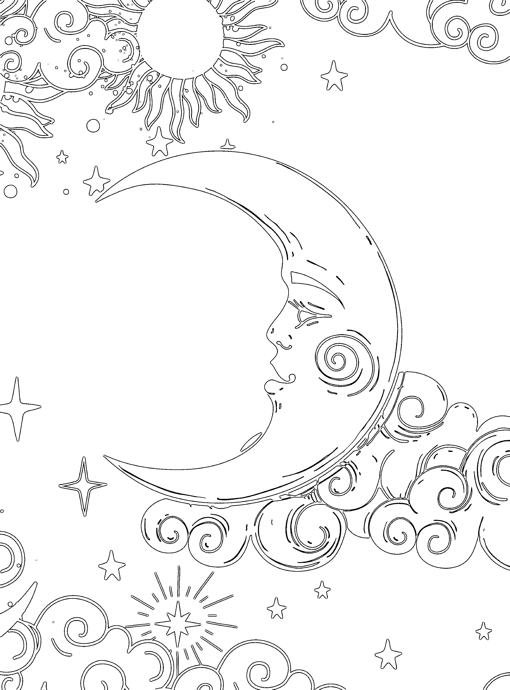

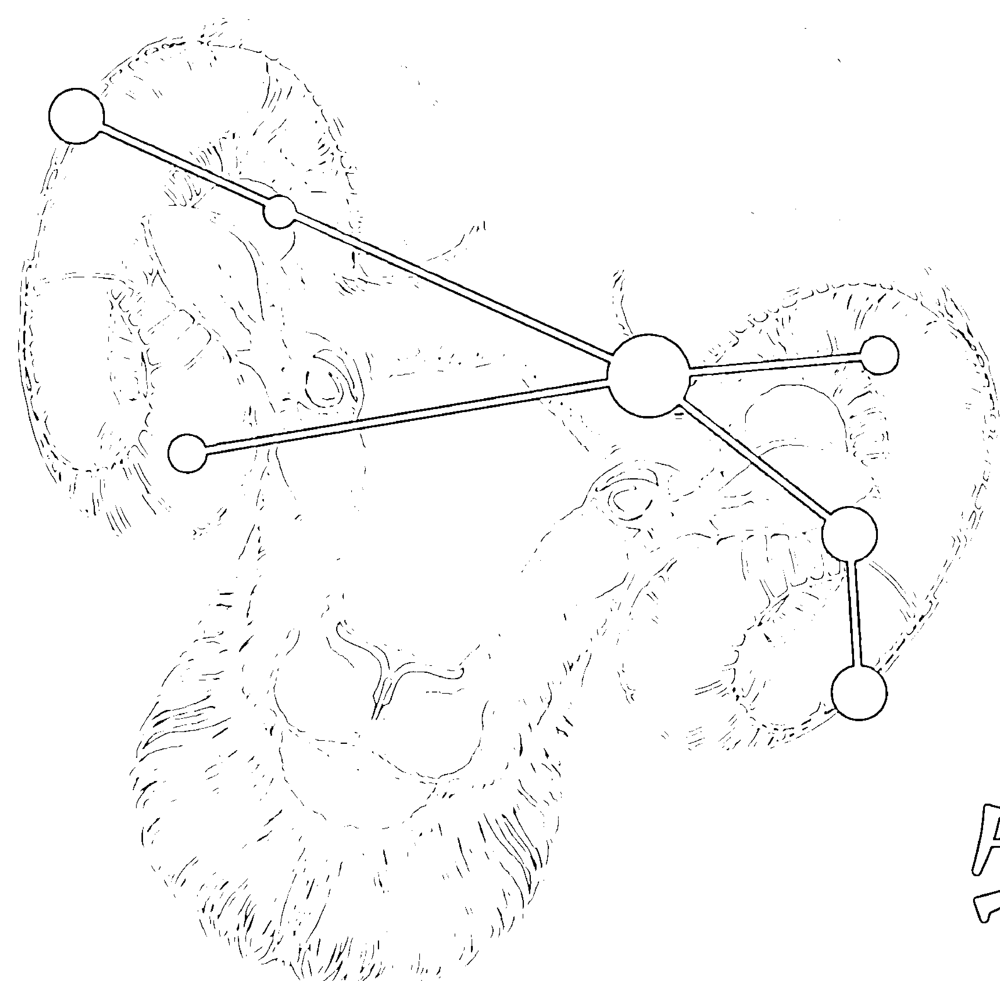

## # 牡羊座媽媽

(3月21日～4月19日)

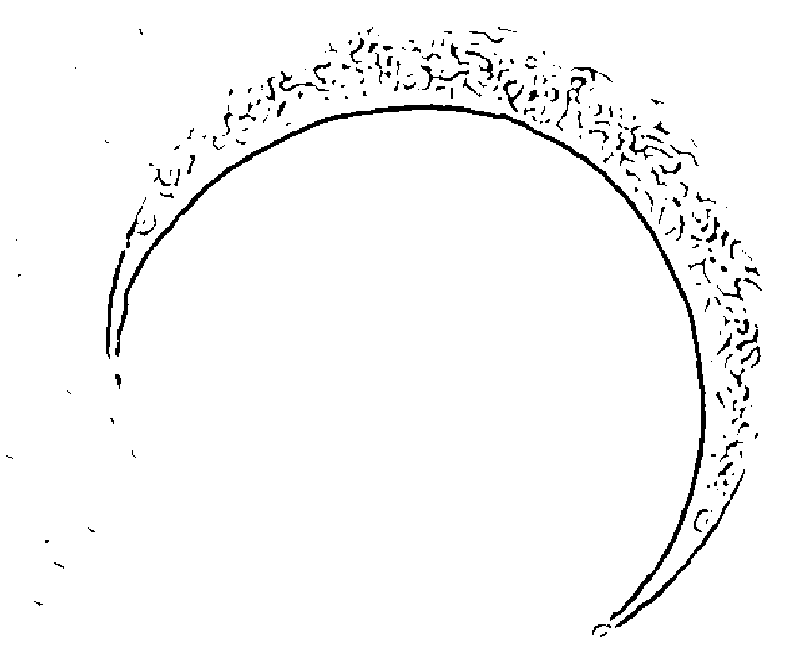

媽咪魔力  妳的優點：
自信、自覺、力量、無所畏懼

媽媽咪呀  妳的挑戰：
競爭心、憤怒、視野狹隘、偏執、
虛榮和自我中心

知名的牡羊座媽媽：
瑞絲·薇斯朋、珍妮佛·嘉納、莎拉·潔西卡·帕克、
莎拉·密雪兒·吉蘭、葛妮·卡戴珊、凱特·哈德森、
瑪麗亞·凱莉、席琳·狄翁、維多莉亞·貝克漢、
凱特·戈寶琳、克萊兒·丹妮絲、菲姬

## ☆ 妳的教養風格

哈囉，戰士媽媽！牡羊座媽媽做任何事都帶著激烈的風格，妳會一頭熱地投入教養職責，意圖留下自己的印記。牡羊座由熾熱的戰神掌管，處理生活裡的每件事彷彿都像打仗，只要活著，就要保持警覺，投入後必定要獲得勝利，為人母不是膽小鬼能做的，幸好妳從不符合這樣怯弱的描述。每個牡羊座女人都有女神資質，妳的自信從不會離開妳太久——即使是芬迪（Fendi）外套沾了奶漬，或宴會禮服沾到麗滋餅乾屑，就像牡羊座媽媽高貴辣妹維多莉亞·貝克漢（Victoria Beckham），妳甚至會讓全麥餅乾屑看起來迷人！

黃道帶分為十二宮（每一宮代表人生中的不同領域），第四宮會影響妳教養子女的風格；根據妳的星座，掌管母性第四宮的巨蟹座賦予妳教養方式特定的特色，因此無論妳多麼嚴厲和獨立，都具有母性本能，涉及家庭時，妳會是家務女神。巨蟹座的象徵符號是特別具有保護慾的螃蟹，所以妳會十分保護小孩，並且不希望孩子繼承自己大膽的性格（馬上將摩托車模型從聖誕節禮物清單上劃掉。）成為母親也可能帶出妳多愁善感的面向——連妳自己都覺得吃驚。不認為自己會看芭蕾舞表演看到流淚？開始做各種剪貼？驚訝吧！巨蟹座是象徵多情的星座，因此無論高興、憤怒或喜歡，妳對孩子的任何感受都可能非常極端。

對妳來說，成為人母最陌生的部分會在初為母親的前幾年，體驗到另一個人對妳百般依賴。牡羊座是最自主的星座，就算把自己的需求放在第一位也覺得無傷大雅。但現在要把他人的需要放在妳前面，而且對方還是個小不點？好吧，這需要一點調整。不管妳多愛自己的雛鳥，有一件事是明確的：妳和他是兩個截然不同、各自獨立的個體。

坦白說，這心態大體來說是健康的。雖然妳可能為了期許孩子更獨立自主而感到內疚，但妳擅長為他樹立這樣性格的典範；牡羊座做自己或追求目標時，從不需要別人的許可——妳絕不是犧牲自己的媽媽！妳總是力求上進，是終生學習最有力的角色典範，是一女當關的成就機器，能夠打破職場玻璃天花板。

雙魚座布蘭登談到牡羊座媽媽：「我媽媽是黑人單親女性，我們住在底特律，她有六位數的收入。那時是一九八〇年代，她開著保時捷，跟繼父分開住。媽媽是個美人，但做事認真，連高中畢業舞會也沒參加。她提前一年從高中畢業，直接進入美容學校，最後買下自己任職的沙龍成為老闆。」

牡羊座女人對任何事都有不可動搖的決心。當妳開始當母親後，可能會伴隨小小的身分認同危機，特別是妳意識到自己已經無法隨意來去。獨立自主的小姐現在得回應某個人的需要，而且二十四小時待命！

希望妳有很棒的伴侶，或一群有強烈母性本能的朋友排隊幫忙；牡羊座，妳是需要支援的！妳扮演傳統的「爸爸」角色會更稱職，像是負責厲厲指導孩子、成為經濟支柱、為孩子訂規則，在家裡，妳會是嚴格的執法者，伴侶則會負責給孩子擁抱、親吻、講床邊故事。（妳終於明白選個性格好的人當伴侶簡直是個聰明之舉。嗨，有求必應的保母！）即使妳仍扮演傳統的「媽媽」角色，妳的每個行動都會充滿力量和活力。

妳最終也會明白為人母這件事是一種技能，只能透過經驗學習。即使妳堅不可摧的自信稍有減少，但妳會接受挑戰，努力重新贏得堅定女性主義者的立足點。事實上，妳可能同時享受撫養孩子和賺錢養家的艱困任務。妳就像隻獵豹，會潛伏其中收集訊息，為需求尋找必要的資源——去排隊報名幼稚園，指揮妳的保母、親戚和育兒幫手幫助妳應付行程滿檔的生活方式。妳會幫孩子打扮得完美，報名比賽，推動他所做的任何事都做到出色，而且……妳會讓這一切看來不費吹灰之力。

不過牡羊座是競爭心強的星座，即使養兒育女，妳也有要贏的念頭。但在此要說個殘酷的事實，如果妳是領袖型的牡羊座，其他媽媽可能不會喜歡妳，除非妳少點伶牙俐嘴的作風。妳這個女性主義可能很難過，因為女人仍被教導要「友善」或依妳的見解是「虛偽」，假裝一切都是完美的、民主的，然後在每個人背後說閒話。（跟男人相處容易許多，但如果妳開始跟所有爸爸交朋友會發生什麼事？妳不會想了解的。）

在工作上爭取上位對妳益處良多（不成為董事會女會長的話，要怎麼負擔孩子的私立學校學費呢），但當個競爭心強的媽媽可會走向災難。當然，妳不該削弱自己的光芒，好讓一群嫉妒、討厭妳的人對自己感覺良好。妳是明星，就是如此。但是如果妳發現自己總想爭第一、想勝過周圍的每個媽媽，妳要檢視自己的動機，也許妳只是妳太常談自己的事。有八個孩子的媽媽凱特．戈賽琳（Kate Gosselin）來說，她的公眾形象開始有點自我吹噓，使她開始失去原本的支持者。我們認識的一位牡羊座媽媽最近在社交媒體發了一張圖文，寫道：「跟自己競爭會變得更好，跟他人競爭讓妳變得痛苦。」說得好。盡可能給其他媽媽讚美，或讓她們成為聚光燈焦點，就會發現要跟她們建立友誼變得更容易了。

牡羊座是講求個體性的星座，因此妳絕對需要獨處的時間，不用回應任何人，只有與自己獨處的時間。我們再說一次：妳必須擁有自己的時間。這是當母親最困難的部分，妳應該擁有一群值得信任的過夜保姆和照看孩子的人，這樣才能把孩子留在家裡，搭飛機去阿魯巴島享受一星期的獨處時間，或到美容沙龍體驗按摩、做臉和美甲的整套療程。我們認識一些牡羊座媽媽仍維持每週做一次SPA、和女性朋友聚會的習慣；另一些媽媽會毫不歉疚地鎖起臥房、書房或租一間臨時住所，偶爾離開孩子在那裡過夜。

妳的做法可能會讓人憤慨或被說成「自私」，但請把這些視為一種預防措施。忘記給自己減壓的牡羊座媽媽，可能會變成怒火中燒的怪物，將壓力發洩在孩子身上，作為耐性不足的星座，妳是個易怒的人，因此，成為人母會測試妳的底線，妳會需要緩和脾氣，在發育過程的某些時候管理怒氣。急性子的牡羊座媽媽有時可能太衝動。（電影《親愛媽咪》（Mommie Dearest））對髮女大吼「不許用鐵絲衣架」的瓊．克勞馥（Joan Crawford）正是牡羊座。

在管理和威嚇孩子間找到合理的平衡點非常花費心力。事實上，如果妳正在嘗試「恐嚇從善」方式，妳可能需要先處理自身的神經質與非理性恐懼，接受幾次心理治療，能讓妳免於把恐懼投射到孩子身上。此外，妳可能也會對孩子採取「照我的話做，別模仿行為」的做法。畢竟妳自己十六歲時就帶著一張巴士票和二十塊美金的戶頭離家，現在卻要孩子晚上九點前回家、高中畢業後才能約會或化妝。牡羊座媽媽，到底該怎麼向孩子解釋這一切？

妳面對客戶、同事和有需要的朋友可能是世界等級的傾聽者，但妳可能需要清空耳朵的雜音、保持靜默，學習聆聽孩子的心聲。換句話說，少說多聽。妳的目標是培養出佛教裡所謂的「初心」，不要擅自打斷孩子幫他說完或說教。自說自話和怒罵只會觸怒孩子——雖然等他長大後，可能會說出妳想聽的：「媽，妳說得對。」

## ☆ 如果妳有女兒

### 優點

女孩力量！牡羊座是講求個體性的星座，本質上是精力旺盛的戰士，妳會希望女兒繼承「妳做得到」的腳步，即使穿著馬諾洛·布拉尼克（Manolo Blahnik）或JIMMY CHOO 的高跟鞋。妳設法在當媽媽的同時保有魅力和鑑賞力，如果女兒是未來的時尚達人，她可能喜歡翻找妳爆滿的衣櫥。妳在女兒成長的每個階段都會給予支援，鼓勵她自我獨立、滿懷雄心壯志——就像媽媽一樣。無論踢足球或跳芭蕾，牡羊座媽媽擁護她追求目標和夢想。由於妳很有競爭心，肯定會以身作則；牡羊座媽媽會確保女兒明白，凡男孩能做的，女孩也能。

同時，牡羊座媽媽懂得如何要求（命令）他人將她當王后一樣敬重。儘管在極端例子中妳可能變成女神，不過考慮周全的牡羊座媽媽會教導女兒「女士優先」最高級的意義。給她王冠和權杖！女兒絕不會為了滿足男人的自我而縮小自己，或在約會時搶著付帳。總之，在妳監督下絕不會發生。

## ☆ 如果妳有兒子

### 優點

染色體 Y 是否意味著……鬆口氣？妳本人很大一部分比起女孩更能跟男孩建立連結。妳對很多事情的處理方式都是「陽剛」的，會有男孩傳統上需要的務實嚴肅；妳不是軟弱、任人欺侮的人！兒子會從妳身上學會如何尊重權威。雖然妳不會約束他的風格，但會清楚說明界線，讓妳自己成為這段關係中的雄性領袖。隨著年紀漸長，他會學會如何帶著敬意、禮貌地對待女性，成長為夢想中具有紳士風度的兒子。

### 缺點

慢慢來！就因為妳可以不流一絲汗水地征服世界，不意味女兒也想過著同樣的生活。事實上，妳超級媽媽的傾向可能會帶來意料之外的陰暗面，讓女兒覺得她必須跟上妳的步調。教導女兒凡事全力以赴時，也要記得有些星座（特別是水象與土象星座）行動的速度比妳慢很多；如果妳活躍、健康，老聊自己的新陳代謝率，或有多投入太空漫步機的訓練，但女兒缺乏同樣的運動熱忱，她可能會覺得自己不如妳，結果發生競爭心態，導致失和或讓女兒有心理負擔。

請當心妳自我對照的傾向——用自身經驗作為女兒應該如何過活的標準。是的，妳的意見周到、睿智，但這只是意見。如果妳和女兒的價值觀有抵觸，特別是等她大一點後，妳那惡名昭彰的本性可能會爆發出來；與其用鐵腕方式管控，不如尊重彼此不同的觀點，鼓勵她站在自己的角度思考。女兒在成長為個體的過程中，最好應該對所有事抱持質疑態度，包括妳的信念。畢竟，她若擁有深刻的自我覺知，可能就是她對妳最高的讚頌。

當妳繼續在生活裡忙碌時，會傳達出一個重要訊息：即使兒子可能是妳世界的王子，但媽媽還是王后，他的第一個女性角色模範是如此獨立自信，他學到媽咪的世界不是只圍繞著他打轉。日後，當他照自己意願探索人生時，會選擇一個同樣獨立自主的伴侶。也許未來會發生女神之爭或一山不容二虎的狀況，但希望妳感到榮幸，因為他按照妳的形象選擇自己的伴侶。

### 缺點

即使妳很能幹，牡羊座女人仍知道如何扮演「需要幫助」的女神（假裝的）；兒子學會幫妳拉椅子、拿外套，當妳穿著六吋高跟鞋時會挽著妳的手。儘管妳的管教策略非常現代，但關於如何對待女士——當然妳一開始會先灌輸傳統的價值觀。恢復正在消逝的紳士風尚很酷，但要確保在這過程中沒有打擊他的意志。意即，當妳發現自己管到他的每個動作細節，或試著將他打造為「媽咪的小幫手」時，請適可而止。

妳是堅持己見的媽媽，兒子很清楚妳對他的任何選擇會有的評價和觀點。不過，他有資格建立自己的信念系統——是的，即使在妳的屋簷下。否則，他可能將妳排除在他私生活外，不想有妳的干預和不請自來的意見。給他一些呼吸空間，試著在監控時維持合理的距離。妳可能不贊同他的每項嗜好、來往的朋友或約會對象；不過妳也可能因為過於贊同對方，把他的女友當成摯友，開始參與他學校的每個活動。此時，請檢視自己的想法：這麼做是真的努力融入他的生活嗎？如果妳的動機是基於確保自己的領土，那麼請離開他的地盤。若妳侵入他的私生活是因為擔憂，請先跟朋友或心理師吐露心聲，確定自己不是見樹不見林。

## ☆ 不同年齡和階段的教養

### 嬰兒期（一歲）

新生兒階段可能是牡羊座媽媽較棘手的時期。作為凡事眼見為憑、認真負責的星座，習慣事情按照自己的方式。即使懷孕過程中已經嘗到失控的滋味（哈囉，身體不再屬於自己），但沒有任何事能比新生兒更讓妳內在的戰士公主屈服。即使最強韌的牡羊座女性也沒準備好面對睡眠不足、止不住的哭嚎及伴隨照顧新生兒時各種考驗，更別提妳的皮膚、頭髮和指甲似乎在一夜之間就失去從前（當媽之前）的光彩。這不是能拍特寫照的狀態，即使妳已經跟市內最棒的家庭攝影師預約拍全家福。

往常妳很快就能從任何事恢復，不過妳可能很驚訝從生孩子到恢復竟然需要花很長的時間，無論是生理、情緒和心理。失去獨立對妳這個忙不停的星座而言是很大的打擊，此時妳要時常提醒自己，這個階段只維持一年（雖然對妳來說像經歷一個世紀，一年很快就會過去。牡羊媽媽，這是妳的大好機會：慢下腳步，休息一下！（這可能是一生中第一次也是唯一一次的休息。）仔細欣賞寶寶每天和每週的變化，唯有這一年寶寶會有如此進展。以後回想時，妳會慶幸自己沒有錯過。

妳的競爭天性在這階段也可能是個禍根。牡羊座天生會一肩扛起責任，但在育兒這件事，積極進取可能用武之地，妳可能需要稍微緩和自身的「陽剛」一面。不過，妳有時會明白自己的侷限，如果怎麼哄都無法安撫哭鬧的嬰兒時，可能開始覺得自己像個失敗者。當孩子沒有馬上回應妳的哄慰技巧，妳的挫折感會達到臨界點。

跟寶寶建立連結，特別是新生兒，可能比妳預期還要花上更久的時間，甚至會驚訝或意料不到，夢想中的與眼前睡在搖籃裡的嬰兒是多麼極端的對比。妳需要反覆提醒自己，孩子是妳最好的導師。作為一個鮮

## 嬰兒期（零歲到一歲）

少聽從指揮的頑固星座，牡羊座媽媽可能會抗拒接受這個哭哭啼啼的小小老師教導，但學校已經開學，妳的第一課：至今為止的人生都按著自己的步調，現在要如何適應另一個人的節奏。

當妳有伴侶時，成為媽媽也意味跟另一半妥協，而且必須一起做任何的決定。取得平衡不是妳的強項，但妳需要接受才能適應如此巨大的生活變化，單親的牡羊座媽媽甚至會需要一整個部落的保母、親戚、照顧者介入和提供幫助。我們的建議是：接受妳能得到的任何支援！別想當英雄，什麼都自己來，否則妳最後會變得變態不堪、難以承受。提醒自己，在這件事上不需要證明自己獨立自主的能力。

「前五個禮拜有點像在坐雲霄飛車」，兒子剛滿九個月的牡羊座媽媽蘿絲說道。「我感覺兒子和我不合。老公倒是天生好手，他知道嬰兒什麼時候餓了，知道如何把孩子處理得好好的；我則是弄得一塌糊塗，感覺根本不明白怎麼當媽媽。」

後來蘿絲媽媽給她的鼓勵為她帶來改變：「第一個星期獨自跟這脆弱的小東西待在家，真的很困難。他靜不下來，哭得非常大聲。然後來了通電話，是我媽媽的睿智話語：『相信妳自己。寶寶和妳是一體。他感覺妳所感覺的一切，有自信的話，一切會變好。』從那天起，我重新振作，放掉失敗的感受，不再回頭看。」

這就是牡羊座精神！諷刺的是，如果妳想重拾真正的勇敢本性，就必須先承認自身的弱點和短處，請摘下「無畏的面具」，讓別人支持妳。嬰兒時期的孩子不需要妳發揮目標導向的特質，我們明白這有違妳的天性，但是，當妳的小乖乖襤褸時，妳需要透過開啟一門生意或讀博士證明「我仍然是我」嗎？妳注定會崩潰。最好以現有的身分因應生活裡的變化，或是把為人母當成新的領土，勇敢、進取的去征服。

說來有趣，牡羊座正是十二星座中的「嬰兒」，妳是十二星座的第一個星座，星座裡的新生兒。如果妳想到這點，可能就能以不曾思考過的方式理解寶寶的心理狀態：需要立即滿足、遺棄課題（在妳這邊掩飾得很好）、對環境極度敏感（牡羊座掌管神經系統），及有時無法覺察別人的需求只顧自己。

是的，妳和寶寶有一些共同特質，這意味妳也仍需要被當作嬰兒寵愛。因此，妳得去做美甲或美容，即使妳穿不下懷孕前的衣服（可利用配件增添貴氣），還是要在夜晚出門約會，或趁寶寶小睡時做點自己想做的事；請姊妹充當臨時保母，自己出門上瑜珈課，或跟伴侶來場沒有孩子的迷你假期。否則，妳可能會暗暗怨恨嬰兒為什麼需求那麼多，這反而會妨礙妳與孩子建立連結的速度。牡羊座，別忽視自己的需求，即使得減少一些計畫，或花心力擬定更細緻的行事曆。

俗話所言：「一個女人生了孩子之後才成為母親。」說得有理。在這個階段，妳要向作為「新生一人母的自己致上敬意。牡羊座是講求個體性的星座，與其感覺迷失了自己，不如在這個新角色找到自己，由此展開新的探險。隨著寶寶的成長，也觀察自己每次跨越的里程碑。為妳和寶寶創造冒險的機會：如果妳熱愛運動，買台慢跑用嬰兒車，帶著寶寶出外跑步；為自己和幾個能幹的媽咪朋友規劃「夜晚約會」，一起出門放鬆。妳不知不覺會迎來一個靈光乍現的時刻，發現這可能是以父母為目標客群的創業點子，像是推出孕婦裝品牌或寫出一本育兒暢銷書，讓各地的媽媽從中得到啟發。

如果妳實在太累，沒心力征服世界，這時期也會是妳一生中絕無僅有，能鍛鍊耐性及與寶寶建立重要連結的時期。一年密集的自我發現之旅會將妳帶往新的路途，讓妳成為更充實、更好的人。

### 學步期（兩歲到五歲）

對牡羊座媽媽來說，孩子的幼兒期令妳愉悅又沮喪。一方面，妳有活力繞著公園追逐飛奔的小惡魔——工作後筋疲力盡或穿著六吋高跟鞋散步的日子除外，不過以妳的年輕心靈，對這個時期的冒險和積極步調仍樂在其中。妳和幼兒期的寶貝可能都有注意力集中短暫，及喜歡體能遊戲的共通點。要一起來場躲貓貓嗎？

不過，牡羊座媽媽仍渴望擁有屬於自己的東西，因此當孩子仰賴妳的關注和照顧時，妳還是力圖找回獨立狀態。妳喜歡當孩子生活裡最重要的人物，但這個角色可能會令妳沮喪，有個兩歲大孩子的牡羊媽媽嘆氣說：「一天的時間根本不夠用！」當然如此，如果妳像她一樣，同時上親子瑜伽課和攻讀碩士。

對獨立的牡羊座來說，有其他方法讓妳擁有自己的生活和嗜好，此時妳需要接受妳所謂的「自私」本性，起碼妳要為孩子提供獨立和自食其力的模範。孩子未來會明白媽咪不一定總在身邊、有求必應，只要程度適當，這反而能促進孩子與母親間健全的分離。但在這個階段，很多時候孩子可能不接受替代方案，妳仍須付出比想像還要多的關注。

如果改變不了他，就加入他吧。確保妳安排許多有趣活動是自己和孩子都喜歡的；別強迫自己參加青少年冰冷游泳池裡的寶寶游泳課（妳可不想失溫）或逛寵物動物園（妳的潔癖會發作）。如果妳喜歡跳舞、打鼓或親子瑜伽，那麼妳就去做。孩子在這年紀更重要的是和妳共享美好時光，即使只是用手指沾顏料亂畫或用湯匙敲打鍋碗瓢盆。

說到活動，由於妳具競爭意識，認為現在是替孩子報名小提琴教室、開始學琴的年紀，或報名一流的空手道學校、帶甜美的女兒參加選美比賽。但牡羊座媽媽，妳要謹慎踏出每一步。如果孩子心理上還沒準備好，這樣做不僅傷害他的心靈，甚至會讓妳落入時間快轉的陷阱；想像兩年後的自己：拖著孩子參加武術比賽、全國音樂大賽，或花大筆錢買美髮噴膠、亮片禮服及聘請選美教練，成為「媽媽經紀人」——肯定使妳變成為孩子而活（透過孩子活出自己人生）的犧牲奉獻型媽媽——這個角色跟牡羊座毫不相稱。

如果妳的孩子確實有天分，那麼就培養那些才華，但別因為想證明自己是傑出的媽媽就偷走他的童年，也別早早對他灌輸競爭心。妳可能非常積極，忙著排定最好的活動，籌辦幼稚園的年度籌款活動，但偶爾稍微收斂——媽咪聚會和孩子遊戲時間，不必每次都由妳負責。很多媽媽在孩子的幼兒期最常感到挫折、不堪重負，不過妳可能沒多少耐性聽其他媽媽抱怨。儘管妳無須一再展現同情，但也絕對別陷入自吹自擂的狀態；當另一位媽媽累到隨時可睡著時，千萬別說出：「我有最棒的保母」或「我的孩子都馬上入睡」等類似的話題。當一個自信、能幹的媽媽楷模是一回事，當妳要給其他媽媽打氣，提供睿智建議時，但也別忘了認可對方的情緒和經驗。

此外，孩子「可怕兩歲」的叛逆期，就算對牡羊座媽媽來說也是段艱難時期。當妳面臨巨大壓力時，會慶幸當初沒有為了成為完美媽媽而逞強，疏遠新的支持網絡。這段時期只會持續數年，對於一向單飛的牡羊座而言，這是學習團體合作力量的大好時機。因為無論妳使出任何嚴厲或威嚇手段，或按照書上的做，孩子就是會不守規矩、唱反調，讓妳在旁人眼中像個糟糕媽媽。

在這方面，妳天生的管教作風可能有點攻擊性，會想好好控制自己的情緒。當孩子在大庭廣眾下發脾氣，或突然衝到馬路，嚇得妳魂飛魄散，此時妳可能會努力保持冷靜。不過問題會慢慢浮現：妳要怎麼教導孩子保有必要的「恐懼」，以避免危險和威脅生命的情況發生呢？牡羊座媽媽，這是妳需要訓練的部分。與其把錢揮霍在昂貴的音樂課程（小孩可能記不得學了什麼），還不如花在教養工作坊——這並不代表當媽媽這件事尚有不足或做得很糟；事實上，妳需要花費一番力氣才會承認自己沒有所有問題的答案，培養這段時期需要的耐性和眼界，能讓妳在各方面成為更好的人。

另外也要記住：牡羊座媽媽開心時，所有人都會開心。要是妳沒有找到足夠的時間放鬆，妳可能需要徹底改變環境。是的，這可能意味搬家，搬到生孩子前自己不曾想過、更安靜的居所。妳一直是都市人嗎？可能破天荒地覺得郊區很吸引人。妳可能搬到完全不同的城市居住，甚至搬到別的州、縣市或國家，讓自己（及朋友）大吃一驚；或買下湖畔木屋、鄉村房子或分時渡假屋以便定期散心。妳比以往任何時候都需要在「媽咪」和「自我」間找到平衡，即使這意味著有需要重新檢視自己的優先事項和生活型態，不過對妳而言將會是很有價值的改變。

### 童年早期（六歲到十一歲）

小學鐘聲為誰響？當然是妳牡羊座！這代表自由的美妙鐘聲，妳能把孩子交給能幹的學校老師照看、指導——終於能回到自己的工作和事務上。過去起碼五年的時間裡，妳等不及開啟網路商店的生意、完成博士學位或重新找回頂尖房地產經紀人的地位；或者是時候回電給窮追不捨的獵人頭公司，接受經理的職務，妳不就是那個最完美的人選嗎？

早晨吃完早餐或送孩子上學後，妳可能會略微感傷：他怎麼成長得這麼快？畢竟妳才剛習慣媽媽這個新身分，現在比賽規則又變了。但是，一旦妳發現能重新獲得多少的自由時間，很快就回收起淚水。再說妳有很多機會能在孩子學校留下特別的足跡，總要有人計畫大家真正想參加的學校籌款活動（想像以馬戲團為主題，有活生生的動物、條紋帳篷，由當地餐廳負責外燴，舉行玩具拍賣會），妳會讓所有人大開眼界。

當妳看著孩子背著十磅重的書包回家時，誰會開始執行高科技的作業呢？立刻動員一支團隊將教科書數位化，製作成可下載的檔案。三兩下完成！有誰比妳更適合當家長會會長呢？

在這個階段，孩子開始變得更獨立，妳喜歡這樣的變化，因為這比處處唱反調的幼兒好應付。他在這個容易受外界影響的年紀時，可能會非常崇拜妳，這讓妳暗自得意，他帶回家的手繪圖畫和作文都在描繪媽媽有多厲害，妳別覺得特別驚訝（立刻貼在冰箱門上！），跟孩子相處的時間變得有趣而非挫敗，妳能在知性上與孩子產生交流，妳喜歡他熱切地提問每個問題並教導他獨立思考。這段時期可能是妳當媽媽的「黃金時期」。

不過，在這個階段妳將會面對其他挑戰，十之八九和時間管理有關。此時妳可能勤奮工作，因此在孩子的課後活動、家庭作業和工作間，找到時間完成目標、做運動和寵愛自己會是個難題。如果妳幫孩子安排過多活動，可能會壓力重重、煩躁不堪，覺得自己更像司機而不是媽媽（送女兒上芭蕾課的路上可能唸她幾句），但這會好過讓他跟著妳去辦事、開會和赴約。妳希望孩子整天有良好的監督和排遣方式，即使妳不是負責這些任務的人，不過如有人能代替妳關注孩子，妳就能多關注自己！

布蘭登這樣描述他單親的牡羊座媽媽：「我媽媽是美髮師，她週三到週六從早上七點工作到晚上。她是全力以赴的類型，因此她回家後，不會倒杯紅酒放鬆，她會問我的作業、朋友和計畫，接著準備晚餐，和我們一起看《歡樂酒店》（Cheers）。她總處於『運作』狀態。牡羊座，即使妳能幹、出色，在這個階段要是什麼都想做，可能會疲勞過度。這段時期，妳應該跨出女超人的舒適圈，開始集體合作：看顧、接送小孩以及其他必要工作，都能與其他媽媽輪流，比如妳週一負責讓所有孩子來家裡玩桌遊、做拼寫練習，另一位媽媽負責週二接送孩子上體操課，牡羊座媽媽，請發揮妳的創意。另外，如果你自己開店，能在店裡安排一個區域讓孩子畫畫、玩遊戲、寫作業。由於這個年紀的孩子仍想取悅大人，妳能派給他一些工作或任務，甚至用零用錢當作獎賞。布蘭登十一歲時，媽媽雇用他在美髮店掃地和負責洗頭，他笑說：「如果我需要額外的零用錢，就會去媽媽的美髮店幫客人洗頭。」

牡羊座的作風就是，如果無法打敗他，那麼就加入他。一位牡羊座媽媽的女兒回憶：「我媽媽在外頭經營一間照顧中心和蛋糕烘焙事業，媽媽似乎早就預想到我們會去幫忙。我和姊姊看管孩子、替蛋糕準備食材——我們就在她身旁，一起經營事業。雖然有時會有點厭倦，不過媽媽向我們展現了良好的工作態度，讓我免於一些麻煩。到目前為止我很感激她。」

隨時保持專注的牡羊座不喜歡遠離目標，但現在妳比以往更需要與生活劃清界線——為你自己留下自由及保留與孩子相處、工作、學校、活動還有談戀愛等的時間。妳是如何辦到的呢？因為妳對當下通常保持高度專注，工作時專注工作，玩樂時專注玩樂。妳可能想努力創造一個固定的「家庭日」或不可妥協的聚會傳統，如餐桌上禁止使用手機，心無旁騖享用晚餐。如果你有宗教信仰，可能會在一頓特別的家庭午餐後，一起上教堂或拜拜；也許在每個週六下午都有場冒險，例如去溜冰、爬山或參加博物館的互動活動。結合豐富性與感性能使活動走得長遠，孩子會喜歡與帥氣、能力好的媽媽一起探索世界！

參與學校活動是另一種共享時光的方法，妳能滿懷希望與一些酷媽媽結交新朋友，不過這其實對妳來說並不容易。因為牡羊座代表獨立自主，妳習慣開啟、領導群體，但不渴望加入已存在的團體，可能需要花點時間適應學校的場面，因此請先放慢腳步。布蘭登的媽媽因為太忙碌，無法參與學校家長會，但仍想密切關注兒子在校學習和行為，於是就派出她友善的射手座姊妹作為交流大使。

有個最新快訊：許多牡羊座媽媽在打入新的社群時會以兩種速度進行，一種像機關槍掃射打入團體（準備開火，這個鎮上來了一位新警官！），並以直率的態度熱心對待每個人；抑或像老鷹，看起來既勢力又高傲地觀察他人。請小心！比起帶著心機打量其他家長，還是盡可能讓自己保持溫暖和友善，不然妳可能會受到冷漠對待或得到更糟的名聲。在這樣的環境裡，謙虛是關鍵，比起一直誇耀自己的孩子、談論自己的事，不如多問問題，如妳有幾個孩子、他們都在這裡上學嗎等。另外也不要忘了微笑！牡羊座掌管臉部，妳的表情會說明一切。因此，當妳剛好感到不舒服或仍在尋找適合的環境時，妳擠眉弄眼的外表會不小心透露出「這地方不適合我」的訊息。

當妳開始感到舒適時，就會享受孩子的朋友不定期地來家中過夜或玩耍，隨時關注他們的反應，帶著他們在鎮上盡情玩樂幾天。如果事業非常忙碌，那麼就多花點精力了解孩子最好的朋友的父母。牡羊座不易相信別人，不要因為妳不容易對其他照顧者進行中央情報局般的背景調查，就壓縮孩子的社交生活。那麼就邀請整個家庭一起晚餐！當妳招待對方知名的義式獵人燴雞料理時（就算只是將在全食超市買的食物加熱，反正也沒人想知道），妳能藉此詢問對方一些重要問題，暗中觀察對方的價值觀和育兒方式。

綜合以上建議，記住請盡情享受孩子這階段的甜美時光！不過妳若太熱衷「投入」每件事，讓女兒變成數學競賽的常勝軍，或讓兒子學習中文準備改變第一強權等，導致忘記與孩子建立連結時，就會發現這些真的不重要，除非妳從來不了解彼此。只要妳透過不斷反覆嘗試，就會學習到如何在當下安排他的人生。

### 青少年期（十二歲到十八歲）

恣意妄為、固執，只要稍微要求就放縱，認為他銳不可擋，能回答任何問題……等等，我們現在是在說孩子……還是妳，牡羊座？

青少年期對任何家長來說都並非易事，不過妳具備所有的技巧來處理他在衝動、身分塑造的階段。青少年是個有趣生物：前一秒他想炫耀獨立自主，下一秒就變成一個孩子——請稍微後退一步，問自己是否使用不同的方式對待他。

妳對於堅守陣地和劃清界線無所畏懼，與缺乏智慧的青少年對話也無法對妳造成威脅或傷害。即使妳盡量讓自己不一樣，青少年確實也會劃清界線，因為這能幫助他對之後發生的事感到安心，關鍵就在於妳的規則是否合理。妳並不是害怕孩子，而是害怕他對周遭破壞性的影響，那麼要如何在不擊潰他的自主性的同時也設定界線呢？

> 「一致性是關鍵」——從人才仲介轉職為治療師的牡羊座朋友泰瑞．科爾（Terri Cole）如此說。她在十五年前嫁給鰥夫，是三位難以控制的青少年男孩的繼母。「當我走入那個家時，孩子們正在屋內四處奔跑，完全是失控狀態。第一次晚餐時，最小的孩子在餐桌上對著哥哥大叫要他住嘴。於是，我深吸一口氣，冷靜地說：『從現在開始，在這個屋內沒有尖叫聲。』他盯著我，覺得我一定是瘋了。接著我為整個家庭帶入治療，他們確實需要很多療癒。」

牡羊座特別容易動怒，在妳覺得無法控制時，挫折很快會出現，此時做些聰明之舉就顯得重要。妳需要感覺在操舵一艘船，而不是想著和叛逆的十四歲孩子搶奪船舵。泰瑞的治療訓練幫助她理解孩子潛在的情緒，如憤怒、挫折和不安全感等這些隱藏在青少年底下的溝通方式。「有一次，最小的孩子想談關於汽車和車框的事，我跟他談了關於車框的話題。」泰瑞道。「直到現在，他已經長大、變成爸爸了，還是會向我詢問意見。」

如果妳不是擁有敏銳聆聽技巧的牡羊座，而且不想因為強烈反應或情感引起恐懼，導致失去優勢，可能要從現在開始培養並投入相關課程。無論妳是否相信，孩子非常需要妳的指引，讓他能隨時找到妳、向妳傾訴，這也代表在孩子離開時，妳也能處理自己受挫的自尊心和失落感。當妳的頭號粉絲突然間變成頭號的公敵時，提醒自己，青少年時期只是他一個短暫的過渡，而孩子的離開也代表他正在形塑性格。

「有件事要記住，妳永遠是他的父母。」泰瑞提到，「妳永遠是他的大人。」當然這不代表要看起來像一個「成人」。妳能永遠保持年輕（我們也敢這麼說），維持光鮮亮麗、流行，穿搭甚至比孩子時髦，不過這也可能會讓他同時感到驕傲和尷尬，特別是妳的服裝過於前衛或性感。請將這些留到女孩午夜派對對時吧！妳不需要在家長會的場合上穿著露肩衣服。

在這時期，妳會變得非常忙碌，自己的生活也很活躍，充滿各式各樣的人事物。妳可能為了不想被孩子干擾，讓他參與太多的戶外活動，特別是妳不在孩子周圍監督時。注意，這可能會對他累積過多壓力，導致他變成一個反抗者——讓孩子擁有平衡的人生吧！比起過度保護，不如讓他接觸，不過也別太過壓迫。

妳能在寬廣世界裡對他展示許多令人興奮的可能性，啟發他追求更多事物。

「孩子成長並落入妳的期待。」一位牡羊座媽媽說道。「如果妳讓他覺得能因做壞事受到安慰的鼓勵，這就好像在告訴他，妳認為他是失敗者或能力不佳。」不要忘記此時青少年的身體和大腦還在發展，妳的期待需要符合他的發展階段。需要面對現實嗎？如果你和某人在交往，伴侶會提醒你是否處在過於嚴厲的狀態，即使妳不會每次都聽進去。有遠見的牡羊座媽媽會對她的後代想像一個精彩的未來，她不害怕藉由結果促成或推動事物。

大部分的牡羊座媽媽雖然知道如何與另一半維持浪漫關係，不過在發育孩子的階段，妳的轉變可能會威脅到原本完美無缺的伴侶關係，需要留心。因為妳可能變成過於極端、嚴厲的人，妳的另一半則會扮演溫和善良的角色，當然如果能讓孩子遠離麻煩，對於紀律操守或扮演黑臉，妳都能完美詮釋，但妳也需要創造一個統一的父母陣線。

即使妳只能出席重要的活動（比賽、學校音樂會和頒獎典禮），讓青少年孩子知道妳會支持他。如果不知道呢？至少讓他知道能回到家裡這個避風港，哭訴自己被欺負或遇到其他不公平的事情。此時，妳會進入完全的戰鬥模式，教導他克服逆境的技巧，以機智戰勝敵人。畢竟妳對於不公不義很敏感，而且有個堅不可摧的靈魂——是的，昨晚孩子抱怨不願讓他延長門禁的人就是妳——妳會給他信心，讓他能抬頭挺胸走在高中校園裡令人害怕的大廳，就像他心目中期待的媽媽一樣。

### 掰掰，小鳥離巢（十八歲以上）

美好驚喜！當孩子離開家中的那一天，會是一段美好關係（友誼）的開端。這有點像是「非禮勿視」的情況：孩子少了密切觀看的眼神，妳也能放縱自己，稍微忽略健康問題，恐懼獲得解脫，與兒女享受如朋友般的相處。一開始，妳能與後代真誠交往，展現自己有趣而非嚴肅的一面，並非妳就不表達意見或試著引領他，妳只是在等待他要求介入。一旦在法律上妳不需要對孩子負責時，對於他的過錯就能比較容易以個體的角度看待。

過去幾年妳給予孩子那些嚴格的愛，現在也獲得回報；妳越努力督促孩子獲得成功，常以「贏家從不放棄，放棄的人從不獲勝」這類老生常談訓斥他，想必越能讓他準備好面對競爭激烈的大人世界。妳自己做好典範，教導他在廣闊的世界裡有更殘酷的事實正等待著他。如果妳沒有給他太複雜的事物（妳能稍微控制），那麼妳可能就得準備幫助他謀生、繳帳單及處理他成人應負起的責任。

當然，如果孩子較脆弱或晚熟，還沒準備好離開鳥巢，這會是段艱難時刻。告訴妳最新資訊：因為「妳」覺得獨立是件很棒的事，但不代表孩子已經準備好離開。雖然也不是要孩子去當兵或將他的行李丟在路邊，但妳會對他持續施加壓力。當妳提醒孩子已經是合法成人，或住在妳的房子時要付房租，他肯定會感覺自己不受歡迎。當然妳也不希望孩子一直依賴父母，但就是有些人還沒準備好獨立生活、上學或是還不確定未來賴以為生的職業，即使他的年紀已經大到能買啤酒和投票。

對於有兒子的牡羊座媽媽來說還有個潛藏的因子：他多快搬出去，取決於他對妳是否有用。如果兒子能充當雜工，又能在自家多房住宅內當房客（當然是按月付房租），妳不會介意他待在身邊。但如果他住在開車能到的距離外，妳會把他的電話號碼存入快速鍵，每次妳需要搬重物或家務協助時就找他——當個女神媽媽。沒有兒子嗎？沒問題，女兒也能代勞。當然，妳自己也強壯到能搬動一個中型器具或油漆儲藏室。但妳認為既然養了這些孩子，妳有權要求他的協助。

成人期可能也是妳跟孩子重新建立連結的好時機。妳不像其他媽媽會為了孩子犧牲自己的身分認同，即使在他上學時也幾乎保有自己完整的生活。對妳來說，不太會有空巢期——事實上，等孩子一搬走，妳可能馬上會把他的臥室改成辦公室。即使感傷，但妳更需要個人空間！妳也需要個人時間，現在有大量屬於自己的時間，不需要做飯、帶孩子練團或配合別人的行程安排。妳能習慣的！（等等，妳已經習慣了。）

因為有這樣多餘的空間放鬆，因此當妳見到孩子時，會跟他享受更多美好時光。妳能計畫特別的外出行程，一起購物、進行真摯對談，然後與他吻別，回到自己的地盤。如果育兒一直這麼容易就好了！
嗯，就把這當作獎賞好了，妳可是在近二十年歲月裡，把另一個人的需求放在妳的需求前。對於「我最大」的牡羊座來說，這是非同小可的壯舉！

299 ✦ 媽媽星座 | 牡羊座

# 金牛座
媽媽
（4月20日～5月20日）

媽咪魔力 妳的優點：
穩定、品味佳、有常識、刻苦耐勞

媽媽咪呀 妳的挑戰：
懶散、物質主義、心情不穩定、虛榮

知名的金牛座媽媽：
桃莉·史貝林、潔西卡·艾芭、蒂娜·費、雪莉·謝波德、
雪兒、梅根·福克斯、泰瑞莎·朱迪斯、莉莉·艾倫、
潘妮洛普·克魯茲、烏瑪·舒曼、愛黛兒、姬莫拉·李·西蒙斯、
伊麗莎白·羅姆、凱特·布蘭琪

## ☆ 妳的教養風格

金牛座是蓄著前短後長的狼尾頭媽媽——看似一板一眼，實則隨興不羈。有時妳以嚴格的態度撫養孩子，讓他畏懼上帝、馬路和奇怪陌生人，不過一旦確定每個都安全、可靠，馬上轉變成派對時間！金牛座媽媽是選擇性堅定，是的，對一些關鍵課題會絕對堅持。每個金牛座都有老派的一面，不願對一些標準讓步，但在這個堅決的表面下是一位非常實事求是、樸實的大自然女神。妳可能會強迫孩子在成年以前每週去上主日學，但是會讓他在家旁觀分娩過程，或十二歲就能騎摩托車。

掌管妳第四宮的星座是威嚴的獅子座，因此妳會有種女王媽媽、莊園女主人的氣派，也讓妳對孩子有強烈的保護欲。妳的打扮時髦精緻，知道如何在公開場合展現得體。維持家族名聲的地位對金牛座很重要，畢竟名氣能打開所有可能，讓妳為家庭提供安全、美好的生活。有時候，星盤裡的獅子座部分會讓妳有點太在乎被人尊重（過頭的話，會變得有點自戀）。

金牛座是十二星座中善於規劃財務、精打細算的人，妳相信投資就有回報；因此如果花費人生的好幾年撫養孩子，妳會期待受到認可！妳將孩子撫養成品行端正、尊重權威的人，如果可能，他會是把妳視為偶像的孩子。最起碼，妳試著讓他的人生裡永遠都保有媽媽重要的位置，妳希望跟孩子親近，但不會犧牲孩子的尊重去當他最好的朋友。在義大利製的皮手套裡是一雙鐵腕（指甲精心修剪、塗上蔻丹），即使妳要費一番力氣才能舉起拳頭；只要孩子沒有當眾令妳難堪、違反某個核心價值或公然不尊重妳，就不會有任何問題，這樣夠簡單吧？

成為母親可說善用了妳的管理才能，這是多數金牛座女性天生擁有的才華。妳注重實用細節，天生有條理，是家族裡的營運長。妳喜歡管理人們的生活，哎呀，妳已經為女性朋友、家人做這件事夠久了，撫養孩子條理分明的節奏對妳而言如此自然，這跟許多其他星座的媽媽很不一樣。即使金牛座媽媽在社交聚會上總是遲到（我們就認識幾位），但對於報名菁英藝術營獎學金、登記私立學校等候名單、為孩子計畫高雅的週歲生日派對（邀請七十五位最親近的叔伯姑姨、表親堂親等），妳永遠準時。說到優先的撫養任務，妳就像雷射光一樣精準，任何其他事都是次要的，只有妳認為真正重要的，才會給予戴上白手套般的精心對待。不過妳需要注意這種模式會給人留下的印象，比方在成人禮或受洗禮最後十五分鐘才到場，錯過整場儀式和歡迎會，只因為女兒當天有舞蹈比賽。

玩具、衣服和其他孩子用品將會需要額外的儲藏空間，因為妳可能會大量囤積。我們認識的一位金牛座媽媽，七月就開始採購當年的聖誕禮物，她總在「黑色星期五」時排在購物隊伍的第一個。這就是人生！寵壞孩子是種權利，不是特權，至少就妳而言。

不是說妳一定會在各家商店掏出信用卡爆買。因為許多金牛座媽媽喜歡撿便宜及自己動手做，因此可能以樸實的方式表達自己的精緻品味。我們的金牛座朋友譚雅把兒子凱魯瓦打扮成一顆壽司，在陶器倉庫（Pottery Barn）兒童服飾店舉辦的萬聖節扮裝比賽贏得勝利。譚雅手工製的服裝設計巧妙，完成度擁有專業水平。隔年，陶器倉庫推出了嬰兒版的壽司萬聖節服裝。巧合嗎？我們永遠不會知道。但在我們看來，譚雅只花十美元就打造出來的服裝（還包括用海苔包裹的生魚片）更高明、更逼真。

這就是金牛座風格：必須在一件事上留下自己印記時，會直搗黃龍。驕傲是金牛座的標記，但太驕傲會讓妳專橫、頑固，反而成為缺點。妳過度堅持自己的信念，甚至讓不認同妳世界觀的孩子變得疏離，讓他在自家像個局外人。對金牛座來說，沒有「我沒事，你也沒事」，而是「我沒事，你卻有事」。

寬容未必是妳的長處，卻是必須學習的技巧，陷入對與錯的模式只會讓妳與孩子疏遠。此外，他可能只是在妳背後偷偷摸摸，藐視規定。最好教導孩子「看法會隨著時間改變」（是的，甚至是妳的看法）。當妳把任何情況都過度簡化為好與壞，永遠解決不了家庭紛爭。請尊重他的自我表達、做法和選擇，即使妳清楚表達不同意的態度。

金牛座是土象星座，因此妳可能是對每樣東西都講究有機的媽媽。例如金牛座演員潔西卡·艾芭（Jessica Alba）自創對環境友善的嬰幼兒品牌「誠實公司」（The Honest Company）；瑞秋·薩諾夫（Rachel Sarnoff）建立的「最環保媽咪」（Mommy Greenest）網站，為具有環保意識的人提供育兒用品的相關資訊，從不含氯的尿布到不含乙妥（DEET）成分的防蚊液。妳將以天然產品擁護者的眼光監督孩子所有的吃、穿及碰觸的東西，然而妳仍對自己的消費選擇非常挑剔，甚至勢利。好吧，高級品牌市場和商店也許要感謝妳讓他們有生意可做，別管節約了。

對另一類金牛座媽媽來說，妳的土象特質意味著腳踏實地——妳沒時間或興趣找無麩質的孩童點心、無添加某種染劑的洗衣精。妳可能把外在一切打理得體，但對環境毫無意識。妳天性就不是走在潮流尖端的人。妳會讓孩子喝酷愛（Kool-Aid）果汁、煮卡夫牌（Kraft）通心粉，孩子得好好長大了。

在金牛座陣營裡肯定有些物質主義的媽媽，她們會告訴所有人在哪裡買了哪件東西（及多麼昂貴），也許妳就是揮霍購買兒童高級訂製服的媽媽。我們的一位金牛座朋友花大錢買了匹馬和馬廄，好讓女兒參加馬術比賽。有時只是關乎妳的行事作風，但如果妳就是輸人不輸陣（或者就徹底打敗別人），請檢視妳重視地位的面向；用不著透過讓孩子擁有多少雙時髦鞋子，或讓他進入「好」學校、跟「好」家世的同學往來，來證明自己是多棒的媽媽。

金牛座媽媽可能忙著給予孩子舒適的物質環境，導致忽略孩子的情感需求，或是錯失孩子需要家人陪伴的訊息。哎呀，妳會發現朝那些問題扔扔昂貴玩具也沒用，不過妳也不會像生氣的公牛般怒吼。一位金牛座媽媽承認：「我從不打孩子，但我曾經在生氣時往牆壁扔東西。」

在為母之路上遇到顛簸？請少花點時間演戲，給孩子空間做他自己，即使妳覺得難堪，但這會讓你們建立更持久的母子關係。如果妳是那種急於衝去拯救孩子的金牛座媽媽，請先後退。當然，妳幾乎能為孩子搞定所有事，但有時最好讓他自己掙扎奮鬥，在過程中培養出性格。給孩子工具，發展自我主見，並在人生中做出可靠決定——那些讓他快樂、健康、獨立自主的決定。

## ☆ 如果妳有女兒

### 優點

由感性金星守護的金牛座媽媽，知道如何成為一位女神。妳熱衷訓練小女孩在女性特質上的培養，希望她有個死黨能一起沉溺冒險。妳能表現中規中矩，但也會出現放鬆狀態，就像妳教導女兒禮儀，但同時也鼓勵她展露情感。妳希望她把握每次機會，在餐桌課中知道使用哪支叉子，及如何寫出適當的道謝文字。其他星座不像妳對換季拍賣如此敏感，妳會教導女兒成為聰明的消費者，總以最好的價格買到最佳商品。妳負責任的性格喜愛幫她穿好衣服、精心打扮，幫助她找到個人風格。如果妳是擅長居家打理與料理的金牛座媽媽，會將簡單的食譜、裝飾技巧傳承給她，賦予她招待客人的天分；或教導她利用網路購買藝術品，及如何在晚餐時做妳最喜歡的事——預約！

當妳展露實事求是的性格時，能直白地對女兒講述性方面的基本常識。金牛座掌管五感，會連結到身體及享受的愉悅，最終妳想要女兒掌控自己的人生、身體和選擇。儘管妳觀念傳統，希望她等到成年才有性關係，不過妳也很實際，理解荷爾蒙的改變與性衝動只是生理的正常反應。因此，比起讓困惑的感覺引導她，不如形塑她的觀念。事實上，金牛座媽媽會努力確保女兒不聽取他人廢話，也知道妳會引領她回家，如果有任何人招惹她，妳會站出來替她解決。

### 缺點

雖然妳可能不想承認，其實妳和女兒間有些競爭意識；金牛座天生就帶有這樣的天性。如果孩子繼承妳固執、驕傲的性格，那麼妳們可能會在家務上釀成一些問題而產生爭執。妳可能需要（不斷）提醒自己「模仿是最真誠的恭維」，因此，妳得以身作則，減少公主病、難搞的傾向。妳無可挑剔的穿著、完美料理及如室內裝潢冠軍般的擺飾，會為女兒帶來啟發或模仿，特別是她如果沒有像妳有天分時。不過要小心，不要設定太高標準來追求每件事都完美呈現。

妳想和女兒無所不談，不過有些主題可能會踩到妳的地雷，最好盡量避免。大致來說，妳可能不認同政治、她的工作道德（能從成績及她如何對待擁有物證明）、她的朋友及任何帶有強烈觀點的敏感議題。當金牛座媽媽開講時，將會是場地獄般的磨難，不過妳可不要期待女兒會準時收聽妳的臨時演說。如果你只是單純心胸不夠開闊、無法互相寬容，此時可能得向悠閒的阿姨或老奶奶討論這些敏感話題。此外，妳是個解決問題的高手，當妳嘗試修補與女兒的一切時，自我保護的面向會發揮作用。實際的金牛座天生擅長有話直說、點出重點，找出簡單的解決方式——為每個議題劃出重點。不過將問題過於簡化的傾向，會阻擋孩子必須經歷的情緒過程，像是對失戀的女兒說「他就是配不上妳」時，是無法減輕她的痛苦；比起給她處方籤或神奇藥丸，她可能只是需要妳的「聆聽」，請讓女兒感到安心、少犯錯，並確認妳愛著她。有一天，妳可能會聽到她對妳說：「妳知道嗎，媽媽，妳是對的」而心滿意足，不過直到那天到來前，請頤指氣使的金牛座媽媽保持沉默！

## ☆ 如果妳有兒子

### 優點

一位明星誕生！金牛座媽媽會以英雄般的姿態迎接孩子到來，並在未來的日子裡持續熱烈歡迎他。妳毫不保留地培養一位「明星」，也希望他能配合妳的計畫成長。喔，金牛座媽媽，妳是不是對最年長的兒子特別期待，滿腔熱血地為他計畫，他如同妳的展示品，妳以他為傲，在部落格裡記錄他可愛的舉止和故事。

他在妳的品味影響之下，可能會成長為一名都會型男，不過，妳還是會讓他參與運動和競賽，保有基本男孩的刻板印象。當然一位對孩子感到驕傲的母親，一定會在任何場合中誇耀孩子，讓妳的小伙子受到鼓舞。兒子年輕時，妳很樂意向他介紹妳的興趣和藝文活動，與他分享對音樂、舞蹈、料理和各種事物的喜愛。在艾瑞爾·美雅度·斯托林斯（Ariel Meadows-Stalling）的部落格「打不倒的媽媽」（Unbeat Mama）裡寫道，她曾帶著兩歲兒子塔維參加在奧勒岡舉辦的四天露營與音樂祭典。

當然，妳在外面可能是熱衷接送兒子參加各種活動的足球媽媽，卻不喜歡在設備完善的家裡有任何摔角大賽的出現，這可能毀損妳珍愛的財產。妳需要將漂亮的物品先打包收起來好幾年，或將美輪美奐的客廳圍起來，免得兒子無可避免地打破東西。好吧，妳能在宜家家居（IKEA）或目標百貨公司（Target）找到完美的「複製品」，把燭台放到高一點的地方，甚至修復一個二手櫥櫃，妳不會介意這些家具時不時地被撞翻，因為只要打磨、重新上漆又能煥然一新。就是這樣，一個品味高雅的家仍經得起兒子的磨損和破壞。

### 缺點

和小男孩依偎，是妳最喜歡的愛的展現，但隨著孩子成長、想逃脫妳的掌控時，妳可能對此感到有點心痛。金牛座是始終如一的代表，妳不喜歡改變，特別在妳珍惜的關係上。不過妳仍需要發展母子間的連結、創造適合孩子年齡的界限，雖然這可能有困難。請在妳的領土範圍內做出示範，使用帶有占有性的舉動嘗試劃出界線——妳對孩子在興趣、約會、音樂和服裝上會積極參與討論、出意見，即使孩子沒請妳這麼做。此外，若妳管得過於嚴厲，可能會適得其反，特別是妳的語調變得讓他覺得失去男子氣概時。其中一位朋友記得他的金牛座母親，曾在一次激烈的青少年吵鬧中，與他的高中女友告狀他偷聽到他母親說：「如果我兒子無法料理好他的生活，他會失去發生在他人生中最好的事！」媽媽，妳前一秒把孩子當神聖，下一秒又把他放在嬰兒床——這樣不一致的教養方式會使人混淆。

因為妳盡可能在一個屋簷下（當然是在妳的屋簷）維持家庭緊密的關係，妳的任務是訓練孩子成為獨立自主、正直的個體。他同時繼承妳的一些傳統，但又創造出屬於自己的個性。即使他的選擇和行為會受到妳的影響，但到了某個階段，妳的任務就算完成。妳需要互相寬容與尊重，畢竟這是妳從其他人的批評中所得的核心建議，比起精心準備的紅酒燉牛肉，妳的王子偶爾比較想吃油膩的披薩，放輕鬆，讓他吃吧！對於灌輸優良血統這件事妳做得很好，況且他的工作也不是要幫妳獲得年度媽媽的頭銜。比起控制他的一舉一動，不如暫時轉移注意力，確保他在安全無虞的情況下展翅高飛，有一天他會自己回來的！

## ☆ 不同年齡和階段的教養

### 嬰兒期（一歲）

寶寶的祝福？新生兒的視線、聲音和味道讓妳面對現實，又或者讓妳感到不耐，要知道妳的好日子快結束了！金牛座主掌五感，擁有高度的調和能力，因此，妳能沉浸在過渡階段的感官享受。對觸覺敏感的金牛座媽媽很享受嬰兒時期的觸摸，妳會在與新生兒碰鼻子、呵護的情境下忘記時間的流逝，唱些有點可愛的歌曲、說說孩子的小名或輕咬小巧的手指和腳趾頭。此外，新生兒的味道讓妳的鼻腔感到清新（缺點是新生兒的尿布味誘發妳嘔吐）。

即使是勤勞的金牛座媽媽計畫好快速回到辦公室，都會因為寶寶發燒而更改計畫，令人驚訝的是，妳已經不在乎信箱裡累積了兩千五百封未讀的信件！因為妳寧願花時間與剛來世上的新生兒摟抱。如果你還沒開始發現育兒，那麼沒有其他任何微小的練習能改變固執的妳，妳可能樂於為自己找藉口，放慢腳步、簡化生活，日復一日，這就是金牛座最理想的生活步調。

自我要求嚴格的金牛座媽媽只要熟悉嬰兒時期的各種事物，依舊會閃閃發光。當然嬰兒不可能會按照指示行動（除了他的身體動作），不過還是有些基本的育兒秘訣能輕鬆遵守——吃飯、睡覺還有自我安慰，然後重複。嗯，這就是孩子的行事作風。

不過現在也不是說能伸展雙腳，像在懷孕期間當個貴婦、吃糖果的時候，而且撫養子女是你的工作，不要再對這些事情抱有幻想了！一些金牛座媽媽以動作慢聞名（妳優雅的行為可不能受到催促），然而當受到使命召喚時，妳會將鬧鐘設定好隨時準備行動。寶寶第一年固定的生活步調對妳來說可能不是太大問題（十點與四點的小睡、每兩個小時準時餵奶），對日常的生活節奏妳能很快適應。

畢竟新生兒一天可以睡上十六個小時（最後妳也一起打盹），這讓妳有很多時間製作有機寶寶副食品、補上之前最喜歡的表演和閱讀，或預約喜愛的女按摩師到府服務。寶寶的小睡片刻是寵愛自己的時光——誰說貝里尼（一種水果雞尾酒）和哺乳不能偶爾穿插一下！

當然如果新生兒的腸絞痛不按照規則發生，對於第一年的新手媽媽來說，可能是個挑戰。簡單來說，妳不喜歡熄火的感覺——黃道十二宮的第二宮金牛座通常會有兩種生活速度：火力全開或完全熄火。妳努力工作，但需要相同的休息時間，一到了夜晚處於斷電狀態時，妳會拿著裝有馬爾貝克紅酒的無柄酒杯，或裝有薰衣草洋甘菊茶的馬克杯，此時的妳已經下班。如果另一半不願意在晚上照顧嬰兒，或沒有能力安撫哭鬧的寶寶，妳的第一年可能會相當痛苦。而妳也需要與另一半擁有固定的性行為，這對精力充沛的金牛座媽媽相當必要；妳需要肉體的解放來減緩壓力，沒有什麼地方比閨房還適合。另外，也請做好事前措施，妳可不想最後還來個「愛爾蘭寶寶」（意指出生時間相差不超過12個月的兄弟姊妹）。

「第一年對我來說非常艱難。」金牛座媽媽米雪兒表示：「我希望寵愛自己的例行事項能保持穩定，但我在塗指甲油時，寶寶哭起來會讓我沮喪。老公叫我去美甲沙龍，但我不相信他能照顧寶寶，或按照我的規矩做所有事。這太難了！」

這階段通常是自認隨和的金牛座女性發現自身彈性受到侷限的時候。「寶寶無法預測，因此很嚇人。」金牛座媽媽珊姆表示。她的一個孩子五週大，另一個在學步，但真正令金牛座驚嚇的不是得照顧脆弱新生兒，而是毫無準備。金牛座需要知道有什麼在等著的安全感——包括前面和後面階段的事。當妳讀了書架上每本育嬰書籍，還是無法讓寶寶停止哭泣、退燒或擠出奶水，妳會非常緊張，覺得自己一無是處，因為金牛座是天生的供給者，若無法馬上給予寶寶安慰，會升起一種無助感——這是妳鮮少體驗到的感受。

金牛座媽媽吉兒說：「兒子還是嬰兒時，我沒安排生活作息表。」她吃了一番苦頭才明白，成為母親不會是她這輩子第一次體驗從容不迫的時機。「我想要『隨遇而安』，但這大錯特錯。最後還是得開始安排作息，因為太遲才進行，讓孩子遵守時間表又花了一番工夫。」

金牛座過多自尊的特質也沒有幫助。妳可能自以為是批評其他媽媽，殊不知「那雙鞋」可能也會穿到自己的腳上（依然腫脹的腳），容我們直言——妳現在寧可去隆乳而非「隆起」自我，在育兒這件事容不得牛脾氣的虛張聲勢。最好承認妳無法負荷、力不從心，進而讓親愛的朋友和家人協助妳。

所幸金牛座媽媽從各方面都是徹底的現實主義者，妳會以堅定的決心挺過一個又一個無眠的夜晚。妳也是土象星座，這有助於妳腳踏實地。基於這個理由，自然派媽媽風格非常適合，只要妳坦然接受。事實上如果可以，就將「打赤腳懷孕」變成「打赤腳過產後生活」來看待。金牛座的萊瑟姆·湯瑪斯（Latham Thomas）為一名陪產員，著有自然育兒手冊《媽媽光輝》（Mama Glow）一書。她描述兒子弗拉諾在田園度過的嬰兒時光：「我們住在布里奇漢普頓一位朋友的家裡，那裡有花園和戶外淋浴。弗拉諾沉浸在大自然裡。房間裡有張吊床，我常常和他躺在上頭。」能在雜誌《城鎮和鄉村》（Town & Country）般的環境裡育兒，這樣的幸福著實讓我們羨慕。

這樣的生活聽起來跟妳的幻想一模一樣，但現實截然不同，尤其如果你是位單親媽媽，妳很可能家裡的經濟支柱，或者起碼得分擔家庭生計。因此，寶寶出生後，幫自己一個忙，慢慢回復到以往的生活節奏。如果妳從照顧寶寶馬上轉到工作狂模式，只會讓妳的運作系統深受阻礙。

要記住，金牛座由代表美和感性的金星守護，妳需要尊重天性裡享樂至上的面向，盡可能安排一些兩人約會和呵護自己的時間。運動對妳也是一帖靈丹妙藥，雖然可能需要發奮圖強才會開始行動。金牛座媽媽在懷孕後會變得不太愛動，產後的體重可能降得很慢，但妳得保有耐性，關愛自己的身體，要是因為心煩挫折而縱容自己，就得當心了。妳將受慣性影響，一旦停止運動，就很難重新開始。鞭策自己保持活躍，選擇健康食物；不妨每天開始在社區散步，再慢慢增加活動量，整天補充大量的水分。金牛座掌管的黃道第二宮代表日常生活例行公事，對妳來說千里路（或減去三十磅體重）就從第一步開始。

等妳投入後，會開始刺激五感；用快步（帶或不帶寶寶）往返最愛的書店、咖啡店或美食雜貨店時，同時瀏覽櫥窗，出門時買束鮮花回家。妳預定了產後皮拉提斯課、加入SPA療程、在家做精油擴香、在客廳開音樂跳舞並重拾性生活。

另外也要欣賞寶寶跨過的每個「里程碑」，孩子從出生到周歲間發育最快，妳可能跟別人一樣忙碌、心不在焉，但少有其他星座能和金牛座一樣真正品味當下。擁抱妳活在當下的出色能力，從這個時期大量汲取盡可能多的美好回憶。

### 學步期（兩歲到五歲）

歡迎來到超乎想像的混亂狀態！雖然有趣，但依然混亂。對於妳這樣喜歡保有秩序且實際的星座來說，家裡有個亂跑的幼兒會讓妳龐大的耐性面臨考驗。這年齡的多數孩子注意力範圍跟蚊子一樣小，這意味當妳把摩天大樓模型或陶器拿出來時，他已經失去興趣、想做別的事。請向疲於奔命的日子說哈囉！

## 金牛座媽媽的育兒之道

多工作業不是妳的專長，妳喜歡一次做一件事，做到最好。很遺憾，專心在一件事對於應付學步期的孩子毫無幫助，因為這階段的孩子需要妳發揮三頭六臂的能力。穩定的金牛座不喜歡改變，然而改變似乎是現在這個階段唯一的不變。

如果妳打算當個在家工作的媽媽，祝妳好運，妳很快就會發現這安排離理想甚遠。孩子還小時，妳需要工作、領薪水，因此最好出門賺錢。金牛座媽媽珊姆承認：「我很難同時專注在兩件事上。我工作時專心工作，在家時專心家務，必須從中選一個，否則會很有壓力。」

妳對於將孩子交付給保母可能會感到一絲愧疚，不過還是傾向讓自己呈現多產狀態，盡可能提高生活效率，這樣能避免在生活與工作交錯間感到挫折——沒有什麼事比在孩子哭鬧時還得趕最終期限或回覆信件時糟糕。在這階段，共同育兒顯得重要。如果妳和另一半同住，就必須確保雙方有良好的協調策略。通常有許多伴侶會在這階段發生爭執，因為妳知道你們對於各種紀律、規則等有極為不同的態度。因此，盡量善用彼此的長處，分配好各種家務，例如妳處理早餐，另一半負責孩子洗澡和入睡或遵守一些簡單的家規，如下午五點前不看電視、只吃無糖點心等。

「現在擁有良好的托兒照護，工作團隊也相當支持，而且還有一位『真正』的丈夫幫忙家務。」珊姆說道。現在妳能做到的事，是分配所有事物。妳需要在身心處於良好狀態下，分派任務給另一半或是保母。即使妳得掌握所有的事，還是得要讓伴侶參與照護育兒的過程。這不僅關乎妳能多快完成任務清單，更要讓每個人都能成為育兒過程的一分子。

所幸妳就像是個紀律良好的軍人，嚴守規則，所以請放手去做，妥善安排每日行程，將各種事務交派給底下的軍隊。妳享受成為家中的管理者，設定行程，確實執行：早上七點起床、八點享用健康早餐，每晚安排固定的時間盥洗和睡前故事。當然妳也能在例行事務中發揮創意，一位認真勤勞的金牛座媽媽會事先準備各種裝好物品的包包，每個包包裝滿適合不同活動的物品，像是過夜、到親朋好友家玩耍、去幼兒園或游泳等，每個標記好的包包整齊地掛在櫃子內，這樣就能隨時拎著就走，感覺是個不錯的想法！

提高效率的好處還有什麼呢？妳能在與孩子共處的時光裡獲得良好的生活品質。妳知道妳能離開辦公室、放自己一天假，在沒有任何分心之物的打擾下，更專注在小孩身上，將地板清空讓孩子玩耍、玩麵粉、擁抱，在不用隨時專注手機時磨蹭彼此的鼻子。妳對於每天的行程也樂在其中，即使重複看五十次芝麻街影片或一直去相同的遊戲場也不太在意。

當孩子逐漸成長（變得聽話）時，妳會對孩子的學步階段樂此不彼：享受冰淇淋聖代、去最喜歡的玩具店、參加披薩派對和嘉年華，妳會帶著可靠的相機，咔嚓咔嚓地按下快門，捕捉所有可愛瞬間。

不過小心不要過於溺愛。請利用專注力技巧分散孩子對模擬遊戲、禮物的注意力，此外，購物不是適當、長期的行為修正對策，妳可能需要教導孩子如何控制自己的行為，像是「如果我大叫，媽媽會買給我一隻填充動物玩具，太棒了！」這樣的行為絕對禁止。

因為妳想在公共場合中維持良好形象，孩子聲嘶力竭地大吼大叫會讓妳丟臉。儘管金牛座媽媽也喜歡受到關注，但妳會害怕牙牙學步的孩子上演尖叫大會、咬人和示威，這讓妳看起來像個「壞」媽媽。喔，金牛座媽媽雖然能掌控人生中很多事，但不包含孩子的耍脾氣。

如果妳還是感覺到失敗、受挫，試著閱讀教養書《最快樂的新生兒》（The Happiest Toddler on the Block），書中有許多安撫失控孩子的不錯方法（我們很喜歡，因為它將小孩比喻成原始的小山頂洞人，的確如此！）這階段的小孩並不具有真正的推理技巧，他憑著直覺和原始情緒做出反應，這就像金牛座一樣，當妳生氣時，會變得跟華爾街那座金牛雕像般怒氣沖天，處於暴走模式的妳，沒有任何事物能阻止，孩子也是如此。因此，對自己和孩子多點同情心，妳一定也能理解孩子正走在跟你一樣的道路上！

對每個金牛座媽媽來說，正面強化應該是能掌握的技巧。與其用冰淇淋甜筒或棒棒糖安撫孩子的脾氣，反而應該在他表現良好時才給予獎勵；這不是賄賂，也不是每個好行為都用這樣的方式，不過，面對孩子的討價還價，會有適當的評估方式。請想想看「延遲享樂」：「孩子，只有在你穿上外套和鞋子後，才能拿到餅乾」，一旦完成良好的行為，隨之而來的就是稱讚和獎賞。孩子雖然可能沒自覺，不過他就是為了討好父母而生！

現階段妳的感覺到目標明確且心滿意足，因為妳有個重要的任務——需要管理某人的人生，這帶給妳意義。如果妳現在還沒步行在時髦的社區裡，可能就會積極地為了房產不斷努力，好讓妳家有片茂盛草皮、軟糖及鄰近完美的公立學校。妳想像在偌大的房子裡，有種滿新鮮蔬菜的花圃、裝潢別緻的房間及許多用來休閒玩樂的空間——與小孩玩耍的時間，正是孵育出這樣想法的完美人生循環。

不過，這些像是瑪莎·史都華的美好夢想可能要再等等，因為孩子如自殺攻擊隊的破壞力恐會摧毀妳美麗的物品。嘿，這些只不是雞毛蒜皮的小事，對吧！總有些東西能替代。如果無法，那麼就放在寶寶無法碰觸的位置，將東西收拾好，幾年後再拿出來。接著準備一處最大、最豪華、色彩繽紛的玩具空間，與孩子一起坐下來，將遊樂場弄得髒兮兮，灑滿牛奶和所有玩具。

### 童年早期（六歲到十一歲）

開始玩樂吧！金牛座媽媽努力工作與玩樂，享受這階段的歡愉……大部分的時間。金牛座就像只有一種速度模式的機器，如果妳將所有精力投注在孩子身上，那麼這段時光會變得相當豐富。聖誕老公公來到鎮上（至少透過妳從煙囪贈送禮物），此時，妳會安排密集的週末活動，從復古飯店裡的早餐到瘋狂大採購、冰淇淋聖代及現場表演秀之後的室內攀岩活動。實在很難說到底是誰比較享受這些娛樂活動呢。

當經歷整天活動，要進入深層的放鬆狀態，妳也已經鎖入最喜歡的沙發位置時，此時孩子的能量雖然可能也消耗殆盡，但還是想與妳有些互動——「我們不可以一起看電影就好嗎？」除了向孩子懇求外，還拋出一些賄賂。妳的小窩或許能媲美 FAO 施瓦茨玩具展示店，這樣做只是為了在家庭時間，能讓妳稍微鎖到角落享受自己的時光。

成為良好的工作典範是妳的強項，如果妳擁有事業，孩子會看到媽媽完成任務的模樣，而且妳對任何事都全力以赴。注意！如果妳無法準時在下課鐘響時接孩子回家，就得確保安排課後活動和家教來幫助妳。「自己成為小型事業的老闆及在家工作，從許多方面來說是家裡的一大福音。」艾莉兒說道，但無可否認，孩子會時常感受自己被媽媽忽略了。「因為有時媽媽就是得工作，表示他要和爸爸待在房間裡大聲叫我，但我還是必須將門關上。」

幸運地是，妳天生就是個管理者，無論負責功課、運動練習還是餐點都難不倒妳；妳也擅長排定優先順序，能確保家中一切整齊有序。此外，在這階段，妳會希望自己在孩子上學時擴大個人能力，因此會有許多計畫。為了成為生活有規律的人，妳最大的調整就是不讓孩子整天在身邊，或將他送到托兒所後，再送到能課後輔導的學校。妳的時間管理策略可能還要做些改變，不過幸運的是妳能在孩子高中畢業前，為自己創造持續堅持的基本生活行程。

很快地妳會參與學校的活動。在個階段，開始成為學校社群的固定參與者，每天在接送孩子、家長會和音樂會上看到熟面孔的父母出現。大部分的金牛座媽媽樂於作個賢妻良母，妳會踩著品味十足、使用「純素皮革」製作的靴子，戴著講究的鑽石鼻環，或用路易士威登的包包和 JIMMY CHOO 的鞋子打扮自己，孩子也會感受到相同的驕傲而受到鼓舞。

注意，來自社會的好評價能幫助妳更有效率地運作。在每個金牛座女人的內心深處都害怕來自批評的恐懼，不是說妳真的在意別人怎麼想，妳只是想支持自己的意見和選擇，讓其他人閉嘴。不過，如果有任何事物稍微威脅到妳的生活或孩子的幸福時，妳會變成一個行走的公關。妳知道學校裡的閒言閒語可能形成小團體和結盟關係（就像小孩子常做的事），變得殘酷且受到譴責。因此，妳得把事情做得滴水不漏，讓自己在混亂中站穩腳步、確保家庭名聲，及獲得任何可能的機會。這是種默默保護孩子的方式，妳本能知道如果他擁有好的評價，就會遇到好的人、獲得好機會、終身安全能獲得好的保障。

「我在相當富裕的地區撫養孩子，在那裡，大部分的媽媽都不用工作。」金牛座媽媽瑪莉亞說道。「我是全職工作但我不想要小孩受到差別待遇，所以我每年都會當班裡的愛心媽媽，積極參與學校活動，也會讓孩子買些名牌品，因為我不想要他覺得自己跟別人不一樣或受到冷落。」

請隨時留意母親角色與物質間的界線；不然，妳為了留下印象的需求，可能會自然激起競爭心態——這可能會適得其反，造成反效果，讓他人對妳失去興趣。妳喜歡用辛苦賺來的錢購買名牌包或賓士轎車，不過這樣的舉動恐怕會使孩子的價值觀變得膚淺，讓他存有沽名釣譽的心態，或充當妳喜愛的高級品牌免費宣傳大使。

在這階段，請留心不要過度溺愛孩子，讓他做些家事以換取特殊權利或零用錢，這才是比較聰明的做法。到了青少年時期，免不了要面對分離過程，過程中妳與其像打壓非法組織的執法人員般激烈，不如和緩地進行會更好。事實上，妳心裡希望在發育孩子時，讓他追隨妳的腳步，或者花更多時間陪伴，也許與孩子分享妳最喜歡的孩時興趣、訓練孩子的足球團隊或繼承妳微不足道的芭蕾舞鞋，在未來成為一名芭蕾舞者。

「我真的想要女兒像我一樣熱衷舞蹈，這樣我們就可以一起分享。」一位有十一歲女兒的媽媽米雪兒說道。「但過去我花很多時間讓她投入競爭激烈的舞蹈世界，但這已經超過她能力所及，對巨蟹座的她來說，這太敏感了，指導員也過於嚴苛。後來喜歡上了騎馬，於是我買了匹馬給她，付錢租了馬房。雖然花了我一大筆錢，但我強烈感覺到孩子擁有熱情，任何人的人生裡都必須擁有讓自己感受熱情的事！」

這就是金牛座媽媽的育兒之道。只要關乎孩子的幸福或未來成就，任何花費或付出都值得，妳會日夜不分、拼命工作以提供他想要的一切。但是這樣的方式正確嗎？檢查看看孩子每次的要求（甚至更多）是否都帶些潛藏的難過或擔憂。此外，妳需要有更多包容心，應付孩子無法避免的失落感，像是理解到根本沒有聖誕老人或復活節兔子的存在。處理妳的小男孩或小女孩成長時所帶來的難受心情，則是大人要理解的課題，他們可能在原本的親子時間裡更喜歡去跟朋友在一起。此時，請停止用物質吸引他！（幸運的是，大多數這年紀的孩子仍想與妳親近，還是能在各種時候藉機與他培養感情。）最後提醒自己，妳的任務是讓孩子隨時準備成為一位獨立自主的未來公民。

很快地，妳將會享受真正屬於自己的時間。那些必要的修指甲活動？現在妳可以在毫無打擾的情況下好好享受，甚至還能再加上十分鐘的腳部按摩。一位金牛座媽媽說道：「我記得當孩子能自己洗澡、刷牙時，我再也不用在浴盆裡彎著腰了。這讓我鬆一口氣，這感覺就像他已經從大學畢業之類的！」

在孩子練習游泳或參加生日派對時，與其他媽媽聚在一起盡情享受女神般的活動；妳可能會經營一些媽媽朋友的友好關係，習慣一起小酌、快走或購物來排解壓力。

現在也是減少固定例行行為，大量嘗試以前不會做的事的好時機。是的，金牛座媽媽，妳能嘗試和女童子軍一起露營，或學習室內曲棍球的奧妙之處，藉此讓妳和兒子產生共鳴。「我會讀《家庭圈》（Family Circle）和《七姊妹》（Woman's Day）的雜誌來尋找靈感。」瑪莉亞回憶。「我們能在地毯上擺設野餐風的週三晚餐，一起玩遊戲、看電影。我也會為女兒計畫主題式的生日派對。」

不久之後，孩子可能不想與妳一起出現在公眾場合，那麼就趁現在好好建立彼此關係的機會吧！你們相處的時間會逐漸變少——這無可避免，因為妳得和他的同儕爭奪相處的時間。為他築巢的同時，也確保能讓他能往外飛翔！

### 青少年期（十二歲到十八歲）

捧在手心的孩子轉變成脾氣易怒、多愁善感，臉上長了青春痘的青少年時，此時，你們絕對無法好好相處。突然間，家中多了一位自以為自己正確、無所不知又固執、恣意妄為的小大人。等等，這個小大人不是妳造就的嗎？妳的縮小版現在勉強稱得上一面放大鏡，這當然會經常讓妳感到不太舒服。

說到鏡子，金牛座是由表美麗的行星金星所守護，因此現在妳會因為自身的虛榮或不安而突然發怒，特別在有女兒的時候，因為這可能是妳第一次感覺到自己「老」——誰叫妳是青少年的媽媽呢！妳會試著展現自己年輕、有活力的一面，透過批判性和諷刺性的笑話與孩子產生連結，以此解決衰老的看法。妳本來就帶有冷嘲熱諷的性格，妳會發現孩子肯定對妳的幽默感印象深刻，直到他的重心不在妳身上時。但很快地，他又會重新關注妳，因此，在嘲笑自己之前，先學著擁抱自己吧！

雖然妳會發脾氣，但土象星座的特質會幫助妳維持穩定。大多數的日子裡，妳就像大地一樣是孩子最好的安全網，不過其他時候，妳的固執會是妳不斷挑戰孩子底線、產生衝突的一大障礙。金牛座，妳不是最有彈性的人——對，特別是談到妳最在乎的價值觀。無論是期待孩子在學校的表現、花多少時間和家人在一起、是否將房間整理乾淨、是否尊重他的母親（這個沒有任何討論空間），妳對底線不會有任何讓步，孩子似乎也隱隱約約清楚媽媽的習性，知道如何確實忽視那些妳在乎的事。

所以……金牛座到底要怎麼做呢？這就像任何精彩的鬥牛表演，妳需要充滿狡詐與智慧的心態。雖然妳也是頭「牛」，但可能需要汲取鬥牛士的技巧；鬥牛士當然不會朝精力充沛的野獸橫衝直衝——除非在父母有「鐵拳」的情況下才會發生——鬥牛士是一邊揮動著披肩，但在需要時會優雅地避開危險，這就是成為父母最真實的藝術。妳越是堅持己見，拒絕接受孩子展現他未成熟的獨立，越有可能會被他輕視；避開一下子火力全開，只會導致令人後悔的撕破臉場面，而妳可能會在這場攤牌裡輸掉比賽。

有個方式能幫助妳，妳需要學習如何解讀字裡行間的細微差異，軟化妳的作風，因為比起心思縝密和富同理心，妳通常太過直接且固執。即使妳名義上是母親，孩子一定知道他自己的角色，妳也表現得非常清楚；但妳是否也能將心比心，試著站在孩子的角度設想呢？「尊重」才是能讓你們彼此互相幫忙的方式。

聆聽不是金牛座的強項。妳對於「選擇性傾聽」有很厲害的過濾功能與天賦，妳只會專注在「想要」聽的部分，排除掉其他不想聽的內容；這個技巧幫助妳在需要專注於手上某個工作任務時，能表現相當有效率。然而，這項能力，在需要轉譯青少年的語言時會失去效力，往往會讓妳只能聳聳肩，兩手一攤。

「我學習只批評行為，而不是小孩。」一位金牛座媽媽說道，這是聰明的選擇。另外在證實孩子情緒狀況（妳應該常常做）及是否對他過於寬容，其實只有一線之差。理解「為什麼」青少年抽菸，是因為對融入感到痛苦、有壓力，還是希望讓某個特定的人覺得自己很酷，嗯，妳能確實捕捉到他那時的情緒。雖然妳表示認同，但不代表告訴他抽菸是正確的行為。現在你們彼此產生共鳴，因此妳能藉此設計一場真心話大冒險，用來討論所有關於同儕壓力的問題，確實引導他學習自我修正，在下次派對上拒絕香菸的誘惑。

關鍵就在發怒前自我察覺。妳的反應很有可能是基於恐懼，這份恐懼也包含他人對「妳」這個家長的看法所帶來的焦慮。（一位金牛座的成年女兒回憶，她媽媽曾在公開場合處罰她，使她難堪——嘿，妳不知道名聲對金牛座有多重要，這可能是家庭未來是否獲得機會的關鍵。）經過多年用物質獎賞孩子的經驗，妳可能嘗試藉由收回使用車子、電腦和其他擁有物的特權作為處罰的手段；或決定適時讓他學習負責，自己賺取生活費。不幸的是，妳的孩子可能不當一回事，他已經被寵壞了，習慣媽媽提供所有事物。因此，請對這段期間會發生的一些衝突做好心理準備，直到他真的習慣妳所建立的新的道德標準。

最終，付出會有所回報。「我鼓勵孩子藉由工作和家事換取零用錢。」有位成年孩子的金牛座媽媽瑪莉亞說道。「這樣的話，如果他想要某個東西，我會幫他付一半的費用，幫助他建立預算的概念。我們用咖啡儲存不同的費用資金，有長期目標和短期目標，後來兒子也能為自己買把吉他了。」

妳也會發現為孩子設立清楚目標有所幫助。「我告訴兒子，盡你最大的努力。」有位十四歲左右孩子的金牛座媽媽珍說，「當他帶著只有中等的成績單回家時，這讓他頗為失望。他回答：『妳只跟我說盡最大的努力。』我跟他說：『上帝賜給你很棒的頭腦，這不是你最好的表現，你能拿到最好的成績。』」

提供孩子嚴格的愛但適當的份量，隨時準備好讓他在下一個階段「成人」變得獨立、自給自足，而不是到時候還認為妳會為他處理每件事或提供資金。如果妳要當出資者，就需要檢視妳自身的動機（DJ，請再放一次披頭四的《為我買不到的愛》（Can't Buy Me Love））。在妳內心深處有個敏感靈魂，當小孩在這幾年離開家時，妳會感覺自己被嫌棄。不過，嘗試藉由巴結他或買人情來維持親近關係可是大忌，這會阻礙他獨立成長的機會。

現在需要與小孩分開，妳知道這樣做很安全。如果他感覺到在自己個體化過程中對妳造成傷害，就會私底下做些叛亂行為，像是和壞朋友做些蠢事，但父母卻一無所知，以為孩子像個天使，還讚賞自己育兒有成。

「我高中一年級時，我會坐在爸媽的撞球間喝啤酒。」一位有金牛座父母的兒子回憶道。「他們完全沒注意到，因為他們忙於工作，只關心我弟弟。那時我很難融入學校，我的第一次約會也有點戲劇性。現在回頭來看，我當時可能有點消沉，但又不想他們擔心，因為他們很努力工作。我想我只是需要一些關注，所以某天我被他們發現我喝得爛醉。」

記住，無論妳是哪個星座媽媽，青少年時期都是段棘手的過程。當所有其他一切都失敗了，就重複這句咒語：「一切都會過去。」妳的堅定不移是其中最好的特質，持續保留愛的空間，鼓勵小大人盡自己的全力，同時不斷灌輸他重要的工作道德觀。引領妳的孩子，而非縱容或威脅他，並以身作則，這些就是妳能做到的一切，金牛座！

### 掰掰，小鳥離巢（十八歲以上）

警報響起！「改變」絕對不在妳最喜歡之事的名單中。歷經十多年來孩子在學校、課外活動、露營和過夜的轉變，如今脫離熟悉的例行行程，會是條顛簸的道路。生活如妳所知已經告個段落，空蕩蕩的鳥巢讓妳感覺有點槁木死灰，只剩下每天哀嘆悼念的聲音。畢竟妳已經在孩子成長階段建立大多數的身分認同，現在卻沒有人能撫發、塑造或管理。即使妳可能會不斷抱怨自己就像被選到的笨蛋，不惜一切開車接送孩子參加游泳比賽或樂團彩排。「我整個心灰意冷。」一位金牛座媽媽送小孩去讀大學時回憶道，「自從離婚後，我突然覺得這偌大房子只剩我一人，於是我離開郊區，將房子出租，搬到都市公寓。」

金牛座是生活相當規律的人，需要新的例行工作來填補空白。如果妳開始每天變得愁眉苦臉、抱著女兒第一隻泰迪熊、撩起她溜冰比賽獲得的獎盃時，此時就是展開新興趣的時機了。「我開始參加聲音課程，因為我除了小孩沒有任何東西。」一位在小孩離開家裡、重拾對歌唱熱情的金牛座媽媽布蘭達說。「我以前習慣忙於孩子的事。雖然我不想時光倒流，但我必須為自己計畫安排。」

這是聰明的舉動！除非妳變成像瑪莉亞一樣有點踉蹌狂的行徑。「我兒子第一次上大學時，我每週都會開車去找他。」她笑著說。「我開了四十五分鐘去拿他大量的盥洗衣物。把衣服帶回家洗好，週日再將乾淨的衣服摺好送回去。我可能只能見到他大概十分鐘，但這是我用來確認他是否過得好的方式。」

憑心而論，這是在視訊軟體發明以前所做的事。金牛座是個重視視覺、感覺的星座，眼見為憑，所以在沒確認孩子是否過得安好前不會鬆懈。可以理解妳希望他過得舒適，但是，牛媽媽，妳得設定合理的標準啊！妳需要抑制自己迅速拿出信用卡，幫他在宿舍裡添購吊掛式燈飾，或在套房裡放花俏傢俱的衝動。沒錯，妳的女兒確實用塑膠牛奶盒當作床頭櫃（真醜！）嗯，兒子則因為太懶、太忙，或根本不知道為什麼，竟然用孔磚支撐床墊，還不去買組適當的床架（可能還用妳寄給他的支票買披薩和啤酒）。這些是關於他們……還是妳？誰在乎鄰居怎麼想，金牛座！特別是「鄰居」是二十歲《死之華》樂團的愛好者，他珍貴的房間裝飾可是放上巨大水煙壺，旁邊掛著一手的南美地毯呢（死之華萬歲！）

「和女兒在一起時，我會嘗試一些不一樣的事。」瑪莉亞說道。「她在讀大學時，我每個週六會去她的房子，為她和她的朋友煮飯。我會做一大盤筆尖麵，這樣就能讓她們吃整週。這滿足我填補例行工作的需求，我們也會度過有品質的時間。我們相處得很好，也會每週在餐廳一起享受女孩的晚餐！」

聽起來很棒，對吧？固定與孩子碰面，絕對能幫助彼此減輕過渡時期的困難，請用非侵入性的方式進行。之後他們就會在假日時回家並提著洗衣袋，接著就是帶著他學步的小嬰兒，與妳享受以前你們常做的飛高高遊戲，妳又一次機會用妳一貫的方式寵愛孫子——這是金牛座唯一會做的事！

# 雙子座

媽媽

（5月21日～6月20日）

媽咪魔力 妳的優點：
- 靈活多變、青春洋溢、好奇心、
- 心態開放、獨創性、創造力

媽媽咪呀 妳的挑戰：
- 不一致、缺乏界線、自相矛盾傾向、
- 缺乏耐心、自顧自講話或說教而非聆聽

知名的雙子座媽媽：
- 安潔莉娜·裘莉、瓊·瑞佛斯、海蒂·克隆、
- 寇特妮·考克絲、布魯克·雪德絲、娜塔莉·波曼、
- 妮可·基嫚、艾拉妮絲·莫莉塞特、伊麗莎白·哈塞貝克、
- 芭芭拉·布希、卡德拉·威爾金森、約瑟芬·貝克

## ☆ 妳的教養風格

嗯，身為一位媽媽，妳有很多不同性格，有時複雜、甚至矛盾，但絕對不會無聊。這就是由黃道帶雙胞胎所守護的雙子座媽媽，變化多端、多才多藝的特質，讓妳的家人經常猜測妳的下一步會說什麼和做什麼，甚至一些家庭成員也見慣了妳天馬行空的決策。

在某些方面，妳的教養方式帶著自由及放蕩不羈的靈魂，遵守歐式優雅的模式，把孩子當作小大人，他會自己準時上床睡覺或留著莫霍克（mohawk）髮型。當然，在雙子座的世界裡不會發生任何缺乏平等的事，妳也會在需要確實掌控孩子時，發揮母親功能。即使妳看似悠哉、打扮得很時髦，還是有所原則，用「妳自己的方式」這是妳當媽媽第一天開始就被賦予的特色。

有的雙子座媽媽會為孩子挑選具環保意識的幼兒園（配有可行生物分解的尿布包）、與孩子一起睡覺（因為妳最喜歡、有母性的寶寶古魯堅持拒絕分離焦慮），以及為了母乳堅持嚴格飲食並製作有機寶寶副食品。妳覺得最棒的寶寶產品，是有有趣的條紋和顏色的長圍巾，這樣妳就能將自己喜愛的樣式增加到新配件上。

有的雙子座媽媽一開始就立刻餵配方奶、遵守固定的入睡時間及請一位全職保母，沒理由為了孩子放棄自主權，妳會「掌握」全場，畢竟妳可能是在寫著科幻電影腳本，還開設瑜伽工作坊、營運數位行銷公司、進行樂團巡演的同時，發現驗孕棒上出現兩條清楚的線！

妳急於掌控所有細節的特質來自妳的第四宮由處女座——代表健康、幸福和組織的拘束星座所掌管，育兒可能會帶出妳嚴厲、死板的一面。另外，出現控制欲的反應可能也會令妳驚訝。無論妳對朋友如何天花亂墜地描述，畢竟成為母親是人生的一大轉變，就某層面來說，宇宙已經決定讓妳變得狂野且瘋狂，妳得對另一個人的人生負責。無論妳是自己生育或領養，兩個靈魂已經在母子共舞中纏繞一起，妳還不確定是否要踏出那一步，因此，妳可能會藉由禁止家中非有機物的出現，或是讓寶寶隨時受到看管，藉此抑制自己的緊張情緒。「我們本能上真的與孩子非常親暱。」其中一種類型的雙子座媽媽說道。

當然妳的標準會在沒有任何預告下改變，因此陽剛的一面可能夾雜一些大膽行徑，妳會在嬰兒洗澡時擦拭每個該洗的部分，但卻帶他去人滿為患的爵士俱樂部，或在烏煙瘴氣的都市裡撫發他，妳有時就是會不自覺地做出自相矛盾的事，承認吧！如果妳是非常有原則的人，就不會是漫不經心、難以預料的雙子座。

因此，妳可能會將新生兒汽車安全座椅固定在豐田普銳斯汽車內（還用代表和平象徵和 NAMASTE（印度語表問候）保險桿貼紙裝飾），載著孩子到城裡最好地區的菁英「媽咪與我」集團；或在紀律嚴明的船隻裡，真的在一艘船裡……因為妳決定在孩子第一年住在船屋。和雙子座一起，妳永遠無法預期。

雙子座以樂觀與難以下決定的特質聞名，這使得雙子座相當焦慮，此外，你們由代表溝通與智力的行星水星所守護，大腦始終保持開機狀態。結果就是，所有心理能量使雙子座成了新手媽媽裡最怪異或最固執己見的人。嘿，雙子座的母性本能可說是個特殊的結合體。

妳可能會讓孩子感到怪異或者對著他喋喋不休，不過有時妳的意見可能也是金科玉律。妳擁有一種特殊能力，可以快速抓到重點，鎖定一個機智笑話正中目標。妳固執己見嗎？是的，妳是。每個雙子座多少都有點強烈地認為「媽媽知道所有事」，但妳無法控制，妳就像知識狩獵者，會透過閱讀書籍或文章，從最隨意的角落發掘一些鮮為人知的事實。此外，妳擁有數不盡的嗜好和興趣，因此，即使孩子是妳的第一優先，但他可能也需要在妳剛起步的事業、讀書會、峽谷牧場女孩週末日、募款組織委員會或終於在三十七歲錄製好的民謠流行專輯裡爭奪妳的注意力。

有些雙子座媽媽會對於自己同時進行這麼多事感到愧疚。「我的挑戰？」一身兼部落格與作家的丹妮爾·拉波特（Danielle LaPorte）說道：「毅力，就像不間斷的內疚感，我沒有足夠時間為我想做的事、事業還有為孩子付出，這些就像個黑洞。」

當妳為人母後，多工的雙子座恐會產生很顛簸的狀態。直到妳充分發揮能力前，妳可能會一下子過分投入，下一秒又突然缺席，擺盪在極端、不連綴的狀態裡。如果妳的另一半很理性，那麼他能幫助一切恢復平衡。然而，有時小孩無法接受媽媽的替代品，在一些日子裡，他只是需要妳全心全力的關注，妳也會發現自己對於無法提供時間給孩子，特別在他開始成長的那幾年，因而感到沮喪。

「當孩子還小時，我為他們放棄一切。」一位有兩個兒子、經營一間獨立唱片公司的雙子座媽媽雅兒說。「不過我討厭這樣的自己。現在我已經承認我不是那種媽媽——我無法把所有注意力都放在孩子身上，所以我花一整天的時間在工作上。到晚上六點半，我和他們一起吃晚餐、唸故事書和玩遊戲，哄他們入睡，接著繼續忙於工作直到凌晨兩點。我現在覺得比較快樂了，這樣反而讓我覺得自己是一位更好的媽媽，因為我不再生氣，也不會時常對他們大吼大叫。」

如果所有嘗試都失敗了，妳能參考擁有一票孩子的雙子座媽媽安潔莉娜·裘莉和海蒂·克隆（Heidi Klum），或仿效約瑟芬·貝克（Josephine Baker），她從世界各地（韓國、日本、以色列、哥倫比亞和芬蘭）領養了十二名孩子，有過四段婚姻。給孩子一群兄弟姊妹，我們可以說這是一種「手足力量」？至少孩子會在妳替馬拉威蓋學校、競選市長或上六週古神話女神文化認證課程時彼此互相玩耍。

妳很快就會回到正軌，帶著復仇心態。彌補過去遺失的時間是雙子座的特殊技能，這正是妳要前往的方向！雙子座是雙胞胎的象徵，妳會想要同時擁有玩伴和小孩，是不是不切實際？也許在一些階段不切實際，但以長遠為母之道的觀點來看其實不然。雖然妳需要咬緊牙關，忍受孩子還小時得不斷重複唸《晚安，月亮》（Goodnight Moon）故事書，就把這些當成是一輩子友誼的投資吧！這樣聽起來雖然有點奇怪，不過這樣想能幫助妳度過漫長嚴苛的日子。

此外，雙子座通常會對朋友比待自己好，當覺得時間難熬時，試著調整腦袋對於「他是未來永遠最好朋友」的想法。把負面想法拋諸腦外，停下來，試著連結，再次投入；在你們一起創造回憶時，放慢腳步，品味當下。雙子座本性不是任意墮胎的人，但成為父母卻是一輩子的事情。如同安潔莉娜．裘莉所言：「（孩子）會在人生中每一天重要時刻想起妳。」母親身分是一份禮物，教導妳如何在沒有任何「退場策略」（這真的沒有承諾任何事）的情況下做出承諾。是的，這是一場長期抗戰，但妳絕對樂在其中。

## ☆ 如果妳有女兒

### 優點

腆腆、害羞？可不是妳想的那樣！和雙子座媽媽這樣的榜樣一起生活，女兒自身的創造力，將會成長為樂於發聲、發表想法及帶有真心尊重的個人特質。她不會害怕在教室裡舉手發言，又或者之後會在「男人的世界」裡競爭。畢竟，她一直看著妳運用智慧贏得每場戰役——她可是從專家那裡學習！

雙子座代表雙胞胎，妳和女兒可能形影不離——至少在沒有吵架時。是的，偶爾的爭吵是雙子座媽媽和女兒間不可或缺的事，幸運的是，妳會用大量的歡笑取得平衡，讓妳們看起來很歡樂。我們的雙子座朋友蕾吉娜和她青少年女兒會一起換上戲服，錄製自製的「音樂影片」；雙子座喜劇演員瓊．里弗斯（Joan Rivers）多年來會和水瓶座女兒米莉莎（Melissa）一起在紅毯上工作。與其說你們是母女，不如說更像姊妹！帶著妳年輕的靈魂（在某些情形下，服裝可以掩飾），妳會與小夥伴分享服裝、音樂和化妝，準備好一場狂歡派對吧！

## ☆ 如果妳有兒子

### 優點

大部分的雙子座媽媽比起女兒，和兒子相處更容易。畢竟，妳說話不會拐彎抹角，直接、武斷且絕不認錯，是典型的「男人」溝通方式。這對青少年兒子來說更有效，因為妳不像其他媽媽一樣，將他對妳的抱怨和拒絕太當一回事。妳知道如何用冷靜、有邏輯的方式引導，幫助他用客觀的方式討論一些困難決定。

### 缺點

身為榜樣是件責任重大的事，在某些日子裡，可能會讓人覺得這比起讚美更像是種重擔。妳擁有自由的靈魂並帶有實驗性的特質，況且妳也不想在這方面有所收斂。此外，因為妳的注意力短暫，對於手邊有關媽媽方面的事很難集中精神。如果女兒個性害羞、黏人或多愁善感，妳可能對於她的匱乏感到不耐煩，在她需要溫柔對待時給予強制手段。雖然妳能快速地回答每個問題，不過有時女兒只是想要妳的「傾聽」。學習如何傾聽及試著理解她的情緒，比直接說出自己的看法好（呼喚親切的阿姨現身，特別是耐性好的土象或水象星座，像摩羯座、處女座或巨蟹座）。

在女兒進入青春期階段、以為自己無所不知時，挑戰會開始浮現。鏡子啊！畢竟妳比較容易扮演那個吹毛求疵的人，甚至自己會出現自相矛盾的情形，這些狀況會導致妳與青少年的相處產生災難。雙子座很難超越某個特定觀點看待自身，又難以理解自己在不同性格轉換時的狀況。因此，妳的女兒可能會要求解釋妳前後不一的態度，即使妳只是依照情況，即時反應的方式改變想法。往後妳可能需要在給予清楚與一致的訊息上多下工夫，甚至為了防止忘記，妳需要在記事本裡寫下對她說過的話。說出妳想表達的，表達出想說的，並隨時謹惕自己。

妳以身作則，將冒險精神灌輸給兒子，讓他接觸各種人、課程、文化經驗和旅行，就像雙子座媽媽潔莉娜·裘莉和大兒子馬多克斯（Maddox），可能在兒子年輕時和他形影不離。妳很會為兒子安排、計畫有趣的活動，分享他的童心童趣。有時發現他幼稚、傻裡傻氣的行徑會令人筋疲力盡，但大部分都會讓妳笑得開懷；妳傾向讓他保有男孩子該有的模樣，不在意他和朋友打鬧或玩玩具發出很大的噪音。另外，如果他比起特種部隊更喜歡芭比，也沒有關係，對於雙子座媽媽的兒子來說，他要成為妳或他自己都無妨。

### 缺點

親密關係會使團結產生火花，但過於親近可能會失去分寸。在某些特定情況下，妳得和小男孩創造出健康良好的情感距離，雖然這可能讓妳感到艱苦。雙子座媽媽不喜愛分離，除非他是主動提出離開的人，但在特定的時間點，兒子會想要擴展媽媽範圍以外的領土，創造自己的世界。經過幾年作為彼此最喜歡談話的好夥伴後，是時候尋找一位新朋友（或三位）了，不然說個不停的雙子座攻勢會使他想摀住耳朵，妳對他的關注甚至讓他備感壓力。若妳是全職或單親媽媽，孩子也到了上學的年紀，此時妳必須將能量轉換到嗜好、課程、工作和社區投入上。

雙子座媽媽不會把力氣花在嚴格紀律上，如果妳是這樣且沒有為孩子設立界線，可能會在之後付出代價，他很快變成一個野孩子。突然間，妳可能也會發現自己漸漸失去耐心，甚至對他大吼或試著讓他「上軌道」，所以試著在孩子還小時督促自己設立一些規則。當然妳也需要在其他方面稍微鬆綁，例如他的飲食習慣。即使妳在他小學時都餵食無麩質和不含乳製品的食物，不過妳為他著想的努力，可能比不上他愛上披薩的青春期。因此，選擇適當的戰場對雙子座媽媽來說是個學習。

雙子座是由水星守護，獲得新資訊和八卦的機會比其他人都快。不過請留意任何無意間聽到的事。一位朋友的雙子座媽媽打給他，跟他說自己的高中朋友進入哈佛、買掉腳本或通過律師考試之類，當時的他正在掙扎是否要進入電影產業，而媽媽的這通電話讓他覺得自己很失敗。雙子座，請稍微過濾消息吧。當然成為一位有自己主見的堅強女性固然很好，但請確保妳不是在排擠孩子擁有不同觀點的權利。記住，男孩也很敏感的！如果妳不斷在眾人面前談論他或對他指手畫腳（他會很生氣！），他會感覺自己被放大鏡檢視。如果妳的教養風格是如此，請減少取笑和諷刺的方式。

## ☆不同年齡和階段的教養

### 嬰兒期（一歲）

歡迎來到這個世界，縮小版的妳！象徵雙胞胎的雙子座現在有了永久的陪伴者，這個與妳分散的另一半正學著放慢步伐，專注當下。一開始覺得陌生是正常的，而且是件好事，妳能在飛快的一年裡享受禪宗所帶來的感受，在這永恆、冥想（依偎、餵母乳時）時光中，感覺自己飄飄欲仙。若遇到失眠和迷失方向時，試著找些靜心的方式，例如將新生活當作是一種心靈準則，盡可能排除使妳分心的事物。

嬰兒期可能不是妳最喜歡的階段，畢竟妳是言語的星座，喜歡互動，不過，妳從不排斥新的冒險，照顧嬰兒確實也是場冒險。妳喜歡分析事物，將大量搜尋的結果與其他媽媽分享，讓自己成為行動資料庫，覺得能派上用場（而且還有點酷）。一位新手雙子座媽媽說道：「搜尋健康、營養、化學、孩子心理學等的資料已經變成我終生興趣。」因為思考敏捷及快速的搜尋能力，妳很快就會成為鄰居間的行動專家。無法擠出母乳或親餵寶寶？妳已經將「lalecheleague.org」（由七位媽媽組成的團體，旨在幫助婦女提供母乳餵養）的頁面加入書籤。不一起使用包巾包住小孩嗎？發個短信詢問經營嬰兒照護中心的朋友的朋友，謝謝妳，谷歌！

因為雙子座象徵雙胞胎，妳習慣與他人合作，不像其他星座，妳不會恥於向他人尋求幫助和建議。對任何事與其冒險犯錯，寧願謹慎追問「過多」的資訊，不過這樣反而導致自己在搜尋過程中進入「分析癱瘓」的狀態。到了一定的階段時，妳必須停止在網路上搜尋、從書中找答案和進行民意調查，請讓忙碌的腦袋稍微休息，不是所有新手媽媽的問題都要透過谷歌，雙子座！在特定階段，甚至是以前是搖滾樂追星族、整晚派對，然後「第一次」約會應該是與孩子的爸，而且還是一夜情（啊！）——像這樣的妳，都必須擁有一件無法抹滅的事，那就是母親的本能！使用它！當然妳可能需要花點時間，才能完全擁抱這屬於妳身分認同和生活形式的一部分，不過最終妳充滿情感那一面的甜美景象會湧現，一些雙子座最後會變成主要展現愛意的人，至少和孩子一起時。妳享受哄孩子入睡、說話、唱歌和發出一些有趣聲音，妳對這個令人無法拒絕、偷心大盜的可愛寶寶來說就像個吸盤。妳內心可能在一些時刻還會發出：「哇！我真的很適合做這些事！」

與寶寶一起的緩慢生活最讓妳難以適應，畢竟雙子座不擅長做乏味的事，就像要妳待在一天睡十一小時的寶寶旁，妳可能變得憂鬱。當然妳能同時享受這階段的甜美，然後一邊數著日子，直到孩子大到足以問出天空為什麼是藍色，這種人人知曉的問題。

即使妳的睡眠時間完全被剝奪，絕對還是需要投入一、兩個嗜好。一位雙子座媽媽在女兒只有一個月時，舉辦了大受歡迎的調情工作坊。隨時投入「其他」角色是關鍵，即使到現在也是如此。不然，妳可能只是不斷被家務填滿每一天，因為妳就是剛好有事要做。「我是全職媽媽……但我忙翻天了！」一位在紐約經營知名攝影工作室的雙子座媽媽吉雅達說道，當時她兒子尚未出生；另一位雙子座媽媽則抱怨道：「我很難管理好其他責任和母親該做的事。我幾乎沒有屬於自己的時間，也沒時間從事嗜好、藝術，甚至沒時間和先生一起。」

妳可能需要檢查行事曆，確定是否都塞滿用來填補空餘時間的活動和約會呢？如果能讓活動之間產生連結，創造一些具意義的空間，使焦慮能量擁有發洩管道，並盡可能地將排滿的行程做適當刪減。

雙子座掌管地區性活動與溝通，妳可能想將客廳變成（玩具散落）的遊樂間或沙龍間，多少擺些開胃小菜，邀請朋友到訪。當換成朋友負責撫慰和輕搖嬰兒時，妳則能盡情聊些牛奶、睡眠時間表；在小孩睡午覺時，則能以半開玩笑的方式談些預防接種，並混雜一些妳搜尋到最新、最火熱的部落格文章，以及一些當地的八卦或最熱門的寵物專案。

如果妳真的感到孤單，例如朋友沒有小孩，或他們的孩子都在不同的年齡層，那麼妳就參加新的媽媽群組進行交流。即使妳們只是一起看管小孩、發呆（太好了！能盡情聊些關於嬰兒用品），也能交換秘訣或稍微聊天。也許這些被生活操勞的媽媽，幾年後會變成孩子私立幼兒園資訊交換的管道之一，誰知道呢？

如果妳真的感到無聊，可以去上課，甚至比計畫中提早回到職場，即使兼職打工也無妨。我們的髮型設計師喬，是位在紐約市區經營美容沙龍「Dop Dop」的雙子座媽媽，她將新生兒放在汽車座椅內小睡，就在店內幫客人夾頭髮和燙頭髮。她盡職的摩羯座老公負責更換尿布，晚上再換她照顧。其實任何適合妳的工作，也是最適合妳家庭的工作！

### 學步期（兩歲到五歲）

準備好這將會是妳人生中最快樂也最挫折的階段！妳的小不點漸漸變得跟妳有互動，也變得多話，代表是時候和孩子一起閱讀、教導和玩耍了。隨著每天的練習，妳活潑的天性很享受與孩子分享成長的喜悅。雙子座具有模仿能力（因為「雙胞胎」的性質），因此妳天生就知道如何誇張地模仿蹣跚學步的寶寶，這對寶寶的發展來說是很好的技巧。此外，妳也喜歡語言，因此妳會培養孩子提早說話或閱讀，雖然過多的依賴會消耗妳的精力（「抱怨毀掉我的耐性」一位雙子座媽媽說道），不過妳卻喜歡有個崇拜妳的小夥伴一起分享有趣時光。

大部分的專家建議為嬰兒設定固定的範圍，但這對自主性強的雙子座來說有困難；「我就是那個最沒系統的人，有時候我也喜歡這樣」一位有三歲孩子的雙子座媽媽德西蕾承認。「固定的晚餐時間、上床時間和任何固定行程雖然不錯……不過這樣就無法做我們想做的事。」

一些雙子座媽媽可能會選擇像德西蕾這樣即興發揮，妳會發現在晚餐（洗澡、刷牙、閱讀、上床）過後立刻將孩子放到床上更容易，這樣就能多出寶貴的晚上時段。不過如果妳希望對時間和體力上有更好的彈性，可能就得逼迫自己安排時間表，即使這樣做違反天性。一旦妳做到了，就會發現讓寶寶成為眾多行程裡的一分子是多麼有趣的事。

給孩子一些無毒膠水和裝飾用的發光小碎片，為妳的信仰機構假日募款主導布置委員會。給小不點一支剛剛好的木湯匙搗碎或煮豆子，負責料理晚餐。給他一球毛線和紙板，織條圍巾。工作時也能放些音樂。

婦女藝術媽媽吉娜學校的女校長雙子座媽媽芮吉娜（Regena Thomashauer），使用「間隙跳舞」作為幫助疲憊女性恢復平靜狀態的必要工具。將碧昂絲的音樂調大聲，和寶寶一起韻律舞動，妳會發現奇蹟降臨。幸運的是，妳也不是那種需要清楚劃分「大人區」或對家具被破壞感到焦慮的星座，比起在沙發上放些塑膠品（「絕對不！」），妳的家可能會在一日大拍賣後，看起來更像陶瓷大庫房（Pottery Barn，美國高檔家居連鎖店）孩童間和玩具反斗城的展示間。

妳和寶寶的共同特徵可能是注意力短暫，但這樣的狀態會導致衝突，除非妳讓生活變得忙碌、有變化。即使妳對滿滿的行事曆感到罪惡感，但當寶寶在嬰兒車上睡覺時，缺乏耐心的雙子座，反而感到自在，尤其當妳需要從藝術教室轉換到遊樂場或出門辦事。如果妳能享受全職或兼職待在家中，當宅女應該不是妳的選項，經常足不出戶造成的幽閉煩躁症，只會讓你們陷入麻煩。當然，也不是說要從早到晚拉著孩子出門，只是需要妥善安排行程。

所幸，寶寶這階段的社交層面正好適合妳的星座，對雙子座來說人多力量大，召集妳的朋友媽媽一起前往攀岩場、兒童博物館或任何鋪有地墊、能讓孩子安全四處奔跑的地方，妳則和其他媽媽更新八卦、抱怨幼稚園的入學費或交換有機午餐的食譜。妳會不斷搜集資料和嘗試各種事物，這樣就能獲得大量資訊與其他媽媽分享。妳對於過多選擇往往會不知所措，如斷奶、日常照護、如廁訓練等。因此，有別的媽媽幫助妳釐清，會是不錯的選擇。

好奇心十足的雙子座媽媽對孩子的學習慾望感到驕傲，特別是透過玩樂和探險（畢竟這就是妳學習的方式！）孩子的教育對妳來說至關重要。因此，當孩子還在子宮時，妳就開始忙於查找各種不同的方法論，從魯道夫·史代納（華得福教育創辦人，以自然教育為主）、蒙特梭利教育法（Montessori）到家中教育，及對健康社會化和神經發展具教育意義的玩具。

一些雙子座媽媽會實驗更多「激進」的教養技巧、替代性的懲戒形式（或不懲戒）及極端的飲食規定，特別在妳的狀況中，這些資訊確實會讓妳乘載過量。在深夜看些像是《快餐王國》（Fast Food Nation）或《渴望變革》（Hungry for Change）的紀錄片後，妳可能開始清空櫃子裡任何含有精製糖分和麵粉的食物。當幼稚園發放動物餅乾或從超市買來的蘋果汁時，對妳來說可能會是場拉鋸戰。

「我們練習親密式育兒法，不讚賞也不責罰。」，「自然媽媽」（Mama Nature）以蒙特梭利為概念的網站經營者珍說道。「我的女兒非常自由。我們選擇一起奮鬥，她能理解不行就是不行。她可以做任何事，我們也讓她遠離危險的事物，她因此不被誘惑。我非常肯定無論我們多忙，女兒都會吃營養的自製食物，通常是有机的，有些則是我們在後院種植的。」其他星座的媽媽可能對珍這個特殊能力肅然起敬（甚至看到時會投以懷疑眼神），精力充沛的雙子座媽媽有點像在完成一些壯舉，而這些行為可能會讓其他媽媽變成像是只會將雞塊放入微波爐裡的懶人。不過幸運的是，這個健談的星座很願意分享她同時處理各種事物的秘訣。

雙子座也象徵「老師」，在孩子學步期時，找到能教導的瞬間會是聰明的生存策略——為什麼天空是藍色的？為什麼草地是綠色的？當其他媽媽分心敷衍回答「因為就是這樣，親愛的」時，妳則會上維基百科，以事實回答，教導四歲孩子像是「葉綠素」和「光合作用」的名詞。

聰明的水象星座雙子座受到象徵言語和理性的水星守護。一位雙子座媽媽告訴我們，模仿孩子說疊字的方式在她家絕對不能發生，就像電影《網警》（DragNet）裡的喬·富萊帝巡佐（Sergeant Joe Friday），妳只要知道事實，媽媽。妳可能堅持依照教科書的方式稱呼身體部位，而且越快摒除對於機緣和牙仙子的迷思越好。妳甚至能從大腦發展和寶寶心理科學裡獲得新知，因為那些對妳來說是更合理的事，這會讓妳對孩子如何發展感到放鬆且更順其自然。

記住妳是各種個性的集合體，因此妳也會用聚落的方式，讓每個人變成妳教養孩子的一環。妳過去曾試各種可能證明自己能承擔所有事，不過這樣做反而使其他周圍的人受苦。「我花費所有精力做一名母親，但我卻不是最好的伴侶。」德西蕾說道。「我的另一半有時回到家中，只要他說錯一件事我就會感到焦慮，並大聲怒罵。」

對一些雙子座媽媽來說，妳們的內心潛藏著不安全感。此時，請提醒自己，妳的孩子會一直愛著且崇拜妳，即使你們沒有分分秒秒在一起。然而，有時潛藏的嫉妒或競爭，可能是造成妳不安的罪魁禍首：妳想確保妳在孩子人生中扮演最重要的角色，有時甚至超過妳的另一半。因此，當孩子跑去找爸爸或奶奶而不是妳，妳內心可能不太舒服「我有做什麼事嗎？我做得不夠好嗎？比起我，他更愛他們嗎？」不是的！妳的生活過得越精彩豐富（包含妳和另一半的夜晚約會、渴望參加的陶藝課還有獨自盡情沉浸在小說裡）會使妳成為更棒的母親。所以，分享妳的愛和責任，記得妳和孩子間的關係是獨特且無可取代的。

### 童年早期（六歲到十一歲）

歡迎來到媽媽的領域！作為一個永遠的孩子，妳很懂這階段的孩子。事實上，妳應該已經發現你們之間有很多共通點：同樣具好奇心、渴望探索生命的奇蹟及你們都相當誠實。兒子或女兒的認知發展，讓你們已經具備邏輯和理性的思考能力，因此妳很享受與他對話，甚至可能在將孩子塞到被窩或帶著他回家時，進行一些吸引人的哲學對話。雙子座天生就是說故事高手，妳甚至可能有一兩本自己的童話書。

「身為母親，我做得最好的地方就是傾聽孩子，我熱愛孩子的創意所產生的火花。」一位有八歲兒子的雙子座媽媽丹妮爾說。「我會留心自己不去逼迫孩子成為他不想成為的人，但我會督促他相信自己的天賦。舉例來說，孩子對團隊運動不感興趣，也許未來會，但現在就是不感興趣，所以他拒絕投入。但如果我讓他去做他想做的事，像是游泳或拿個紙箱當作房子玩耍，這反而才是能讓他發光的方式。」

這階段也是妳成為孩子主要發言人的時機，是時候發揮雙子座大嗓門的特性。我們的朋友羅伊絲，在她還小時曾被同學欺負，當時她的雙子座媽媽愛迪漂亮地控制住整個情勢。「我那不到一百五十公分的雙子座媽媽見了當時的老師和校長。」羅伊絲回憶。「這讓那些欺負我的孩子真的嚇到了，之後每個人都待我很好，用一種有點令人發毛、如上流社會取悅他人的方式。我姊姊被霸凌時，她則是那種會直接追趕小孩並威脅他們的人，幾年之後，即使是身高一百八十公分的運動員都不敢走到那一區。」

當然，當時愛迪成長在暴力問題嚴重的布魯克林區鄰近地區，她是唯一的猶太人女孩，然而就像許多雙子座，她可擁有一些生存本事讓自己免於麻煩。「當時我媽跟當地的幫派成員還有來自狂野少年最厲害的幫派團體領導人成為朋友。」羅伊絲笑著回憶。「只有雙子座才做得到！妳一定是個生活多彩多姿的媽媽，會確保孩子受到保護，即使要妳屈尊戰鬥也在所不惜！」

沙龍店老闆雙子座的喬，因為某種原因成為孩子學校裡的家長會會長。「我就進去，後來接管成為會長。」喬說道。「當時根本一團亂！大家只是坐在旁邊吃著東西。家長會裡的電腦根本是古董。後來我讓他們知道，不只是來這裡喝咖啡聊是非，我們換掉電腦，現在會議結束前也不能吃東西。」

雖然妳對某些議題會相當嚴厲，但在其他方面，妳會保持寬容的教養方式。「我相信小孩知道，對他們來說廣闊、沒有限制的範圍是最好的。」丹妮爾說。「所以我們的孩子擁有數不盡的自由，不過對於一些不容動搖的價值觀，如尊重、安全和善良必須保持堅定態度。我們告訴孩子，如果擁有這三個價值觀，妳就能做任何想做的事。」

遇到麻煩時，雙子座媽媽會盡最大努力和小孩好好談。不過妳要記住小孩可能只是聽起來很成熟，但不代表他已經長大了。「如果我的小孩能對他所做的錯事說出具說服力的辯論，我會讓步。」雙子座媽媽克莉絲汀承認道。這個階段的小孩能分辨對錯，但是他的道德觀會在做錯事、不想被懲罰時變得有點扭曲，經常會用說謊來避免受到處罰。因此，設定合理的界線，灌輸重要的價值觀，並確保他隨時安全。一些簡單的規則能幫助孩子知道之後會發生什麼事。不然他可能會做什麼事都小心翼翼，不知道未來會遇上什麼樣的麻煩，這樣可能讓他在了解自己的過程中感到混淆，或是覺得只要夠聰明，就能按自己的方式避免任何處罰。

小孩需要一致性的管教方式，不過對於永遠都在變的雙子座來說，過多的規定像個折磨。畢竟妳大部分的人生就像是播放一部部短暫、不同主題的電影院，妳很難持續所有已經展開的興趣、活動和專案。妳對變化的渴望也可能讓妳不經意地破壞家中規則（雙子座的安潔莉娜·裘莉雖是個很棒的家長，但她的小孩可能在多次的轉學和搬家後，變成了有點奇怪的小小世界公民？）

關於日常行程與四處遊蕩間的拉鋸，可以藉由雇用一位優秀保母（特別是土象或水象星座）來減緩緊張情緒，或是將一些生活瑣事像購物、清潔、飲食、學校接送委託給其他人。另外，也能和其他媽媽用以物易物的方式進行，例如其他媽媽載著孩子上足球課，妳則負責課後外送奶昔，妳很樂意付錢。我們認識的一位雙子座媽媽雇用一位私人廚師，為她準備冷凍一週的餐點；另一位媽媽則將女兒送到寄宿學校，雖然這可能是比較極端的選擇，但能改進彼此的關係，並提升他們共享時間的品質。

或者像艾莉這樣運作。艾莉有三個女兒：雷文（十四歲）、錫達（十一歲）和暮色（五歲）的雙子座媽媽，同時也是聞名為「Bootland」，以販賣時髦、具環保意識的幼兒服飾店老闆。店內架上放了木製玩具、布尿布和前衛的嬰兒連身衣，衣服則印有「THEY'RE RAISING ME GAY」（他們把我撫養成同性戀）和「MY DAD IS A HIPSTER DOUCHEBAG」（我爸爸是個時髦討厭鬼）的字樣。

我們和艾莉說話時，女兒暮色正忙著為客人提供咖啡色紙袋，並蓋上星星和貓頭鷹的標誌，錫達則將我們付的錢放入收銀機。這些女孩藉由媽媽的安排，成為店裡的固定成員。「當妳年輕時，幫忙會是件令人興奮的事，也能為她們帶來特別經驗的技巧。她們也對此感到自信！」她堅持地說，「能將小孩帶到店裡對我很有幫助，因為我能在照顧她們的同時和客人互動。」

妳能盡全力保護孩子，但無法成為他永遠的避風港。如此就算讓他誤闖成人世界，經過媽媽的審查後也不會有事。另外在這個階段，審視自己的言行對雙子座媽媽來說也非常重要，因為妳會不斷改變心意，可能會突然說出完全不同且矛盾的內容，這會使孩子感到困惑；他不懂為什麼媽媽能在整個冬天為動物權益付出，但卻在春天吃起草飼牛肉。「照我說的做，而不是做我說的」這套說法無法通過孩子銳利的鬼扯探測器，這也會導致叛逆期的青少年為了挑戰妳的立場特意做出一些行為。因此，請有意識地挑選幾個關鍵的價值觀堅持下去，並且保持言行一致。

如果妳發現時間被數不清的事項瓜分時，選擇「一項」妳和小孩都喜歡的。無論是照相、上傳到家庭網站，或在週日晚上準備特別晚餐，或在睡覺前念故事書，這些一起分享的特別時光，會為每個階段創造不同的回憶。很快地，孩子比起和妳相處，更想去外面逛街，因此現在請好好享受這段共處的日子！

### 青少年期（十二歲到十八歲）

開啟妳的戰鬥模式，準備進入壕溝作戰！青少年時期對於全知全能的雙子座來說是段艱難時期。從正面意義看，妳是個無所不知、總能吸收最新潮流的人，會不斷更新流行文化和名人八卦，和女兒分享眼影、和兒子討論男用眼線液，比起他們的文藝青年朋友，妳了解更多鮮為人知的樂團和獨立電影的資訊。妳會真心地對孩子正在體驗的校園電影和人際互動感興趣，幫助他們討論那些在社會上遇到的掙扎，不會介意孩子留有飛機頭或甚至刺上低調的刺青或穿鼻環，見鬼了，妳自己可能就有一整條充滿墨水的「手套」呢！獨特的個性表現？你們都一樣！

儘管妳在服裝選擇或質疑事情的需求上都像青少年，但不代表有辦法處理正在成長的孩子。在這階段，孩子希望妳「不要」跟他一樣，比起同伴更希望妳像個家長，比起摯友更希望妳像個穩定的營地。妳可能對此排斥，因為這樣做會讓妳「顯老」或受到束縛：放棄喜劇工作坊的教學或對外展示從工廠農場收購的雜貨店，或帶著粉紅色假髮參加家長會會議，只因為孩子覺得尷尬？不可能！

如果妳是比較傳統的雙子座媽媽，那麼就很難不受到青少年情緒起伏的影響，讓自己不經意地陷入其中，此外，妳是象徵雙胞胎的星座，會不知不覺認定妳和孩子的關係密不可分，然而這樣的想法，在現在的階段會變得棘手，因為青少年時期主要目的是分離，孩子「需要」獨立，創造自己的人格特質。因此，妳得先解決個人焦慮，這樣才能做出適當的教養方式。

對妳來說，青少年大量表現自我情緒其實沒有問題，讓女兒在房間牆上畫壁畫，或讓兒子將車庫改裝成男人的秘密場所，放套鼓做樂團練習，然而舒適圈的界線就在孩子開始跟妳頂嘴時。妳討厭任何人覺得自己比妳聰明，尤其是小孩，畢竟妳對自己的聰慧和機智靈敏自豪。因此，當妳的頭號粉絲變成頭號公敵時，如脫韁野馬開始挖苦，用無所不知的態度面對妳，頓時陷入一場前所未有的危機。孩子難道沒想過他招惹到誰嗎？

當妳涉入這場智懸之戰，或者說出「我做給你看」時，之後產生的後果可能是利大於弊。妳的青少年其實在測試妳的底線，因為他要嘛是想摸清妳的底細，要嘛就是認為妳設立的規則不公平；妳的反應越大，他就越不尊敬妳。雙子座，要妳保持沉默並不容易，畢竟妳是代表交流的星座！因此，如果妳需要有所回應時，比起以致命回嘴或擊中要害的方式，更需要學習有智慧的手段。

我們讀過關於這個主題最好的書之一是漢恩·吉諾特博士（Dr. Haim G. Ginott）所著的《有話慢慢說——父母如何與青少年溝通》（Between Parent and Teenager）。這本指導書解釋了青少年叛逆行為背後所潛藏的含義，以及如何解讀孩子話語裡的弦外之音，讓父母能以同情心與沉著態度作出回覆。其中一個主要困境在於青少年會陷入想當孩子、但又渴望擁有大人特權的兩難。嘿，雙子座，妳能理解他的心情嗎？

妳可能會注意到，妳對於部分管教過於鬆散、有時又太過嚴苛所產生的後座力。青少年會透過習慣和特定的叛逆行為表現他的反彈，此時，如果他遇到身體意象的議題、飲酒或藥物上的麻煩，妳可能會感到力不從心，若孩子真的有點苦惱，那麼雙子座媽媽可能會把矛頭指向自己。象徵完美主義的處女座掌管第四宮，妳其實內心對自己很嚴格，即使會在內心責備發生在孩子身上的問題，可是對外則指責他人：學校、其他家長、妳自己的父母。對於可能被攻擊、被稱作糟糕媽媽讓妳感到害怕，俗話說「攻擊就是最好的防守」，妳會依照這樣的模式行走在戰場上，說出像是「他怎麼能在我為他做了所有事後還這樣對我」或是「我不知道到底是誰教他這些，現在這個世界可真危險恐怖」的空詞。

如果真的發生了上述情況，請先踩煞車，責備和感到丟臉不會有幫助。其實妳只要對個人行為負點責任，絕對比事後反省還重要。例如，也許孩子曾受到妳一些人生選擇的影響，如離婚、缺乏一致性、一年搬家四次……也或許妳曾對一些成人議題過於坦率，然後又需要一些隱私，讓孩子感覺更安心；又或許妳在某些部分過於投入之後，已經很熟悉了，導致妳進入「照我說的做，而不是我做什麼你就做什麼」的模式。

「我十六歲時離家，因為我媽對我吃飯習慣的反應太激烈。」一位雙子座媽媽的女兒說。「她有她自己身體上的問題，而且我無法將我們的問題分開看，所以我必須離開家中幾年。」

就算搞砸一切也不代表妳是壞人或很嚴苛，妳只是需要一些新技巧，身為家長的工作就是建立這些技巧，這樣孩子也會在過程中有所妥協。因此，不要害怕面對自己，感激孩子的出現，他就像使者般幫助父母，看著孩子共同成長，這就是一種愛的表現。

好消息是好奇心十足的雙子座是人生裡永遠的學生，只需要給自己一些客觀的距離（並原諒自己的不完美），就能變成一位能幹媽媽，而妳對消息和專業知識的寶貴發現，也會幫助啟發其他的媽媽。因此，就埋頭在那些孩童心理學課程、育兒工作坊和對話團體，並帶上妳的朋友，不過請記住，即使妳喜歡好點子和理論，也不要讓過程變成智力測驗。如十七世紀英國詩人約翰·威爾默特（John Wilmot）所言：「在我結婚之前，我有六種帶小孩的理論；現在我有六個小孩，但是一個理論都沒有。」將這些想法應用於生活中就會出現奇蹟，記住，孰能生巧！

### 掰掰，小鳥離巢（十八歲以上）

即使妳已經花了十八年的時間與孩子一起，但內心還是會暗暗祈禱給自己更多時間，一些雙子座媽媽會發現她們對於小孩即將離家的想法感到慌張。作為雙胞胎形象的雙子座，可能會感覺到一種占星學上的分離焦慮，無論妳和孩子在後來幾年爭吵不斷。

我們的朋友蒂娜，她的雙子座媽媽堅決反對她離家上大學，規定她上大學後依然要住在家中。最後蒂娜的媽媽同意假裝讓她去大學模擬住宿。蒂娜回憶：「我們到了宿舍，打開行李箱、整理房間，將東西放好。我爸建議我們可以一起逛逛校園，我媽說她頭疼，需要躺下，於是我們放她一人在房間裡約一小時。當我回來時，整個房間都打包好了，就像從來沒搬進來。我媽說：『現在妳已經來學校了，希望妳喜歡，好，可以回家了！』」

幸好後來蒂娜設法說服媽媽不要再做這些瘋狂的行為。老實說，妳和孩子不相見反而才倍相思。妳的孩子會學習靠著自己的力量，而不是期待妳會幫他解決所有問題，尤其妳活躍又引人注目的個性，短暫分開幾年，能幫助孩子脫離妳的聚光燈並擁有自己的生活圈。

很快你們會以好朋友的方式相聚，這段關係比起依賴的母子還更歷久彌新。現在你們都是成人了，能在更公平的環境下相處。妳能坦率說出任何主題、交換條件及提供建議並認同彼此的觀點（終於！），這對妳來說簡單多了。妳從原本提供者的角色，演變成關心他人的親密知己和朋友，彼此享受在旅行、看獨立電影、交換書和談論政治上。

當然，妳永遠是孩子的母親，孩子回到家時，妳會喜歡寵愛著他。「我雙子座的媽媽會做些讓我發狂的事。每當我回家，她會買一堆辣椒給我，因此我得帶著這些辣椒走過二十個街口。」羅伊絲說。「不過好在伴侶查理幫了很大的忙，他和我媽感情很好，他解釋我媽只是在展現她對我的愛。」

當然，妳還是會持續對孩子的約會與結婚對象以及住哪裡指手畫腳，要妳不說這些並不容易，而且妳可能也會因為不經大腦地點出一些事激怒孩子，像是「你知道嗎？我『朋友』的女兒決定大學畢業考法學院……以防她未來想從事法律工作。」

對雙子座媽媽來說抵抗徒勞無功，小孩最終也會了解這個道理，甚至等到自己變成父母後，這會是他們第一件了解的事。好消息是，隨著時光飛逝，雙子座的智慧和聰明揉合地很好，使妳變成有趣、討人喜歡的人。現在妳較少與別人爭論到底，不認為自己無所不知；妳變得更有勇氣，不害怕說出別人在想什麼。雙子座媽媽在孩子年輕時使他抓狂，最後卻變成最引人莞爾一笑的趣事製造者。我們的家族朋友蜜莉恩·薩姆森是位身體機能健全的一百零一歲雙子座，她周遊列國、為政治領袖造勢和寄送電子郵件。大家都知道她會和二十六歲的朋友從療養院出來閒晃。嘿，妳是不受時間限制、年紀越大狀態越佳的媽媽嗎？有多少人可以這麼說呢？

# 巨蟹座

媽媽

（6月21日～7月22日）

媽咪魔力 你的優點：
敏感、舒適感和居家、好品味、
奉獻、情感豐富

媽媽咪呀 你的挑戰：
過度保護欲、喜怒無常、害怕與黏人、
嫉妒心重

知名的巨蟹座媽媽：
黛安娜王妃、吉賽兒·邦臣、潘蜜拉·安德森、
寇特妮·洛芙、莎瑪·布萊兒、潔西卡·辛普森、
簡·卡特·卡什、艾迪·法柯、南西·雷根、
娜塔莉·蘇爾曼（八胞胎媽媽）、亞利安娜·哈芬登、
麗芙·泰勒、蘇菲亞·薇格拉、克莉絲汀·貝爾

## ☆ 妳的教養風格

巨蟹座掌管所有女性相關的特質，是星盤裡的女修道院院長。對大部分的巨蟹座女性來說，女性本能根本是DNA裡與生俱來的天性。從小就很會照顧人，朋友、手足、玩偶、寵物或任何需要母性安撫的人。有些星座對於小孩的事在心情上可能還有點矛盾，不過大部分的巨蟹座女性認為她們天生就適合撫養小孩。另外，妳可能會是選擇在家分娩的媽媽，就像陪產員一樣熟悉，並親餵孩子直到厭奶期。哈囉，國際母乳會主席！

生育在妳選擇配偶時是必備條件。妳可能嫁給三餐不繼的藝術家或某個教育程度比妳低的人，不過只要他談論到成立家庭時的眼神充滿憧憬就沒問題。無論妳是從頭到尾穿著設計師凱瑟琳·沃克（Catherine Walker）的服裝，讓自己像巨蟹座皇室媽媽黛安娜王妃，或打扮得像前衛的巨蟹座搖滾巨星科特妮·洛芙（Courtney Love），妳仍然等不及將塗滿花生醬和果醬的夾心三明治打包好，把孩子放在膝蓋上。

巨蟹座的第四宮由平衡、愛美的天秤座，這象徵關係的星座掌管，這讓妳對家庭抱有理想態度，還能讓妳發揮打造美麗、舒服的家的天賦。妳和小孩會建立深刻連結，和他們變成一生摯友，即使妳像《酷媽》（Hip Mama）雜誌創辦人巨蟹座的阿里爾·戈爾（Ariel Gore）一樣是穿了耳洞和布滿刺青的家長，妳仍是媽媽圈裡的終極老媽。

建立關係對妳來說很重要，有些巨蟹座媽媽甚至在第一次約會時直接討論起小孩的事，這樣做會不會嚇跑潛在的另一半對象呢？是的，一定會。但因為妳得先過濾掉那些彼得潘，以免之後變成他們的媽咪，浪費妳的育兒時間來撫養「他們」（承認吧！以前發生過這種事）。如果前菜上菜前，還是無法想像和眼前對象共組家庭，那還不如離開。畢竟還有一堆欣賞妳對家庭傳統想法及對生育具有強烈渴望的人。

妳和媽媽的關係是人生的一大主題。如果你很幸運擁有健康的母女連結，那麼妳們會是一輩子的好朋友。其他星座可能在青少年就渴望切斷臍帶，妳則想待在媽媽身旁，或至少住在能時常拜訪的距離。一旦妳變成奶奶，拉近地理上的差距會是首要之務。我們的巨蟹座朋友安娜懷孕時，她為守寡的媽媽在自家的樓上租間臨時小公寓。現在她媽媽若從中西部的家裡來到紐約市只要搭電梯就能就近看到孫子了。

有些害羞的巨蟹座在兒時很黏爸媽，有些則為了追求關注，表現出誇張情緒或過度活躍；無論哪種方式，兒時氣質大多源於在雙親愛中感到安全的渴望。因為妳知道需要媽媽是什麼感覺，因此對孩子用這樣的方式與妳相處時會非常敏感。妳不想過度保護孩子，認為每個孩子都需要有自己的生存本事，但當他招惹麻煩時，妳能敏銳地察覺到，大多時候會在一旁給予安慰（我們巨蟹座奶奶相信巧克力和酪愛櫻桃水（Kool-Aid）能為孩子帶來慰藉）。

那些宣稱缺乏「母性天職」的巨蟹座女性，可能是出自於過往有段艱苦、被忽略的成長背景，或是自戀的母親疏於給予適當的管教，又或許媽媽在年幼時就過世，這比起其他星座，對巨蟹座女孩來說會造成更大的打擊。不過無論哪種挑戰，都足以讓妳在自身發育經驗上產生過度補償的心態，妳會嘗試創造完美、五○年代風格的家，給孩子所有妳不曾擁有的東西，或對孩子每個行為提出疑慮，以免他承受妳曾經歷過的痛苦。不過這麼做會讓妳變得侷限，使孩子感到困惑，此時孩子需要的其實是妳更多的威嚴。因此，請記住清楚的界線能幫助孩子知道哪裡需要和妳站在同一邊，同時也能建立他的安全感。另外，妳不想因為說「不」而造成孩子得到一生心理上的創傷，或因此在小孩的生命中缺席。如果妳發現自己將過往痛苦投射在孩子身上時，請試著尋求心理師、或有智慧的媽媽朋友來協助妳。想想作家吉兒．邱吉爾（Jill Churchill）說過的話：「沒有任何一個方法能成為完美的母親，不過有一百萬種方法能成為一位好媽媽。」

成為媽媽會對妳的社交生活帶來健康的影響。巨蟹座有點害羞或在外人面前較內向，妳的孩子則提供完美藉口讓妳必須參與其他家長的團體。妳正在萌芽的社交圈，可能會圍繞著孩子朋友的媽媽，或是在幼稚園郊遊、家長會和孩子運動團體裡遇到的家庭。談論孩子的事情時，能讓妳決定誰值得信任，悄悄地過濾掉不適合的人。當聽到他們談論關於學校教育、紀律、飲食限制和類似的事情時，妳能從中敏銳察覺到哪些人的價值觀與妳相符。相處一段時間後，妳終於能打開心房，和他們說些自己的事，展開一段真誠的友誼。通常當妳邀請某人到家中，就代表已經信任對方。在妳的日常家務裡不會發生試用期（玩樂）的狀況，並不是任何人都能進入巨蟹座的保護殼裡！

妳是否有點勢利眼呢？是的，妳是。但巨蟹座是那種一旦隨著時間和對方建立如家人的連結時，就會成為忠心耿耿的朋友。人們雖然不容易進入妳的內心，但只要進入，妳就會視對方為一輩子的朋友。當妳打開心房接受對方，就會期待高品質的友誼關係，成為妳的朋友是一輩子的事，即使有了小孩，妳還是會珍惜你們所建立的連結。

## ☆ 如果妳有女兒

### 優點

當超音波檢查出兩條X染色體時，對巨蟹座媽媽來說是歡喜的一天，妳的腦中開始浮現蓬蓬裙、下午茶派對和傳統舞蹈的畫面，妳等不及準備各種女孩的戰利品：逛街、料理、手作、園藝和布置，加上書籍、博物館和文化，妳會用各式各樣不同的媒介，傳達妳的好品味。即使她現在身上只穿了白色尿布和連身衣，妳也會在內心開始構想她的結婚禮服和宴會。

同時間，妳會憶起妳青少年時期的混亂心情、無法控制的情緒及逐漸成為女性過程中的曲折，這一切會突然讓妳喘不過氣……妳準備好迎接這些挑戰了嗎？其實妳比自己了解得還多，巨蟹座！女兒月事來時，會激發妳創造特別的儀式，此外，巨蟹座掌管胸部，妳特別了解何時為女兒購買合適（而且漂亮）的內衣。當一些家長害怕教導孩子關於性方面的議題時，妳會用更自然的途徑傳遞這些私密話題，某部分而言，妳非常期待孩子發展成一名女人。月經週期帶來的喜悅與負擔，會是妳和女兒之間很尋常的連結。在妳的認知裡，抽筋是個很合理的藉口，藉此蹺課或蹺掉運動練習，這樣就能讓妳有時間和女兒培養感情，或一起觀看妳喜愛的珍．奧斯汀（Jane Austen）。

妳內心深層的渴望是希望女兒能把妳當成一輩子的閨蜜和摯友。妳自己的媽媽可能佔據妳電話快速撥號功能最重要的位置，妳也希望複製這樣的親密關係。巨蟹座由月亮的直覺性和感受掌管，當感受力正常運作時，會使妳變成一位令人欽佩且擅長照顧人的母親，這樣的特質是每個女兒所期望擁有的。

### 缺點

對一些巨蟹座媽媽來說，女兒相對讓妳鬆一口氣，沒有棒球棒在妳復古時尚花瓶旁揮動，沒有激烈的摔角比賽打破妳透明淺綠色的鉈玻璃，沒有沾滿泥巴的鞋子弄髒妳的天鵝絨躺椅。呼，基因真的好加在！但如果你生出的孩子，是個精神洋溢的運動員或未來的學生會主席，而且帶有自己的心智和品味時，妳夢想在廢場飯店裡喝著上流下午茶的夢想，會比妳說出「艾洛絲」（Eloise，出自電影《艾洛絲的頂級生活》（Eloise at the Plaza），女主角艾洛絲就住在廢場飯店的頂樓）之前還更快破滅。一位巨蟹座媽媽潔西卡曾說，如果女兒比起魯布托（Louboutines）的高級女鞋更想要耐吉運動鞋時，她可能會很想「抱怨」。請記住妳的任務是為她創造一個安全的基地，讓她在裡面獨立自主，即使她不追隨妳追求上流社會的腳步，也不能說妳被孩子拒絕或是有主見的女兒會變成妳人生一部分的敗筆。

有時微妙的競爭意識會在母女關係裡拉扯，妳不喜歡被搶風頭，即使對方是自己的骨肉。當女兒選擇形塑自己身分認同時，臉皮薄的巨蟹座媽媽會受傷或感到被拒絕，因此妳可能出於嫉妒（並讓她受傷），開始對她做些挖苦行為，對她說出不太好聽的言論。巨蟹座媽媽以說出「喔，她真是（不太客氣的形容詞）……」這樣負面言語聞名，即使是以疼愛和玩樂心情說出，但這些言論底下其實正醞釀著控制的意味。妳需要做些事舒緩母女關係。如果妳活在自己母親的陰影下，無法脫離那樣的控制，那麼未解決的問題，會回歸到妳自己親身教養的女兒身上。如果妳對這些議題或情況有所覺覺，才能讓妳變成更快樂的母親，同時也能減少依靠女兒來認同自己。

## ☆ 如果妳有男孩

### 優點

嗯，現在妳有個男孩，巨蟹座承認吧，妳對這個消息有點失望，下午茶派對就被這男性激素破壞了！沒機會替孩子換裝了……不過當妳習慣這個事實之後，會比較放鬆。在某些方面，撫養兒子對巨蟹座媽媽來說相對輕鬆；如果是女孩的話，妳會把她太當作自己的事，對於作為她主要的模範感到有壓力。男孩子搞砸了，妳能直接責備他的父親，或在其他方面從苛責中稍微抽身。巨蟹座很容易成為直升機父母，因此妳絕不會停下妳的螺旋槳。

如果兒子有運動天分，妳也會很高興，因為巨蟹座女性本身就擅長運動，妳的競爭傾向也會在為兒子壘球和足球比賽加油時展現出來，對惹到寶貝兒子的其他隊伍的孩子噓聲以對。此外，妳可能還會與對方媽媽在賽後攤牌……主因就是妳在一次餅乾義賣上用得獎的布朗尼（當然是出自家傳秘方）搶盡所有風頭，讓其他媽媽相形見絀。

### 缺點

幸運的是，所有寶寶會從依賴媽媽開始成長，妳與兒子嬰兒期的連結也和女兒一樣，在他性別社會化前開始產生作用，妳會給予他所有美好的回憶經驗。不過妳絕不會像跟女孩相處一樣和他如此親近，他可能會感覺自己就像闖入女孩世界的入侵者，不過妳可以試著學習跟隨他的步調，鼓勵他發展較柔性的面向。

注意，即使妳只是對孩子稍微鬆開蟹腳的控制，不意味著就是過於寬鬆的極端教養方式。對巨蟹座媽媽來說，妳的小男孩很快就會成為妳的心肝寶貝，他不會做任何錯事。在他成家以前，妳會珍惜作為他人生最重要女人的角色（我們甚至不討論他未婚妻巴結妳這個未來婆婆所歷經的欺凌，哎呀）。一位我們知道的巨蟹座媽媽在得知孩子準備求婚時，就和他兒子高傲的女友上演一場成為好友的劇碼。她突然打開心房，以溫暖和充滿魅力的方式接納這位無警戒心的女人，與她深入分享一些個人私事。「我們的家庭關係相當緊密，我擔心她可能無法融入，這樣的話，她可能會試圖拉開兒子和我的關係。」這個媽媽承認。「如果事情發生了，那麼我就需要試圖介入。一旦我開始了解她，就發現她其實很害羞，她父母是老師，她是唯一的孩子，我們吵鬧的家對她來說有點負擔太大。幸好多管閒事有好的結果，現在我和她非常親近。」

讓兒子變得獨特、享有特權、上高級私立幼稚園、給他精美禮物，成為不用做任何事就能謀生的小王子，甚至認為孩子就是不懂事、孩子就是孩子，這種站不住腳的想法沒什麼不對——巨蟹座媽媽會為兒子做任何事，不過這樣做極有可能會加深他對性別的刻板印象（也有可能使他變成不懂得尊重女性的人），也可能會使他浪費大好機會。妳需要善用妳的感受力，訓練兒子變成懂得關心和體貼約會對象（男生或女生）的成熟小大人。

## 不同年齡和階段的教養

妳僅僅需要設定界線，確保他體貼女性也擁有個人主權，暫時擱置內心想為他做所有事的心情，以及容易受傷的情緒。情緒化的巨蟹座很容易受挫，對兒子太過嚴苛時，就害怕遭到他的拒絕，他可能在妳立下規矩時又踢又叫或亂丟東西，但妳要堅定告訴自己，即使妳很嚴格，他還是愛妳。底線就是巨蟹座是女性的象徵，而妳就是老大，停止做出「我都是為他好」的行為，不然你們彼此都會非常困擾。

### 嬰兒期（一歲）

巨蟹座媽媽渴望親密關係，嬰兒期可能是妳最喜歡的階段。妳和寶寶形影不離，這個一丁點大、無助的小生物非常依賴妳，這對妳多愁善感的靈魂宛如萬靈丹，妳也會以最快速度用相機捕捉他的各種表情。如果妳親餵母乳的話，可能會迷上這種感覺，特別是哺乳時催產素（又稱作「愛的賀爾蒙」）會促進乳汁分泌。

晚上時，妳可能不會和寶寶一起睡（一方面可能是為了另一半，或是妳害怕壓到寶寶），而是聰明地投資一把優秀的搖椅，在那裡妳能在孩子趴在胸口時享受午間肥皂劇，坐在搖椅上將鼻子挪到寶寶的肌膚，深吸新生兒的味道、低聲唱著搖籃曲，給他一個溫柔的吻。充分寵愛寶寶是妳最大的樂趣，妳喜歡為他購買許多可愛的寶寶衣服、教育玩具和有機食物。出於妳高尚品味和節儉預算，妳會在高檔的寶寶品牌特賣會上（或在線上）排在隊伍的第一位（法國小帆船（Petit Bateau）的斗篷正打半折？當然要買！）大量購買無氣尿布。投資一台寶寶食物處理機，畢竟妳只想給孩子最天然的食物。

請給我隱私！巨蟹座心性多疑，可能不想成為在臉書或網路上大量上傳寶寶照片的媽媽，只要一想到某些怪異陌生人盯著寶寶的照片就不寒而慄。一個受密碼保護、用來炫耀孩子的部落格？這先暫時不提。藉由只有邀請才能觀賞的方式，讓你能透過數位影像的剪輯與編修記錄寶寶每次的咕咕聲、吹泡泡以及各種里程碑。

如果你正準備回歸職場，但此時小寶寶還穿著連身衣，最好請你的母親或其他親密的女性親戚幫你帶小孩。再強調一次，這是信任的問題。妳喜歡夫妻倆其中一名留在家中照顧小孩，不過如果另一半無法配合，那麼就找另一位親密的家人代替；或者妳可能傾向成為在家工作的媽媽，即使這代表妳得離開現在的職場。占有慾強的巨蟹座不喜歡其他人待在寶寶身旁或家中，妳不是很願意只留下寶寶和保母在一起，雖然這樣能讓妳騰出一些自由的時間。不過可以的話，盡可能地稍微抽離與寶寶的關係，和女性友人一起做指甲修護或看場電影，請記住即使妳有了家人，也不代表妳得失去自己的生活！

如果你是個單身媽媽，可能想多留點時間給重要的人或約會對象。對許多巨蟹座媽媽來說，有了小孩後，親密關係會是第一個失去的東西，因為妳會花很多精力在新的責任上。試著在一個晚上離開家裡，或找一處能聊些大人話題的地方——喔，可不是聊些選擇幼稚園或製作寶寶副食品有什麼好處之類的話題。當然妳可能會變成整晚都在聊小孩的成長有多迷人，對妳來說，要阻止自己衝動分享小孩的事很困難，妳可能需要規定自己在一週內禁止討論小孩的話題，這樣才會讓妳記得還沒生小孩前，你們曾是情侶的時光。

巨蟹座媽媽可能對於這個新角色「相當」投入，家裡會開始像個日托中心或嬰兒商店——記住，母親角色不是讓妳忽視自我認同的藉口。害羞的巨蟹座習慣躲在朋友或孩子背後，但請在躲藏自我前三思，以長遠觀點來看，孩子會從媽媽的生活和身分認同汲取優點；但現階段，妳只要確保在重要的家庭、生活和行程之間，保留自己的空間，培養嗜好和興趣，與老朋友聯繫及活出自我就好了。

### 學步期（兩歲到五歲）

學步期仍是感到歡喜的階段，你們之間的情感線尚未切斷，小不點仍需要妳，這樣的連結能彌補一些抓狂瞬間：公眾崩潰、在遊樂場亂咬及在沒有廁所的咖啡廳裡大號。此外，作為星盤中最喜怒無常的星座，妳能理解孩子這階段情緒背後的意義。一個小孩怎麼能從語無倫次的喜悅，一瞬間變成無緣由的暴怒？放輕鬆，這可是一小時前才發生的事。

然而，妳可能還是很想念寶寶一天睡十一小時（其中有七小時依偎在胸懷）的時光，學步期對妳的社交生活也很重要。基本上，妳可以約摯友到公園、音樂教室或游泳教室，這些活動可以幫助打破冷場提供話題，消除剛開始的尷尬，是的，這完整的約會儀式在媽媽間也是以同樣方式運作，和對方討論正在學步的寶寶，正是尋找好姊妹的方式。妳重視文化與教育，帶著孩子參加博物館、圖書館和自然環境保護區舉辦的活動。在前往規劃周到的策展空間時，更可能邀請志同道合的朋友一同前往。

如果妳的內在菁英程式沒被發掘，可能就會把這方面的潛力運用在為孩子尋找幼稚園上。妳想要孩子安全、受到照顧（是的，就是受到較多的保護）因此，妳會詢問學校機構關於教育方式、資格證明、藝術課程及吸引哪些家庭就學。「我知道這樣做不太好，」一位巨蟹座媽媽承認，「但是，我只是要確保圍繞在孩子周圍的人都是正確的，從第一天開始就能掌握機會。」

妳強烈希望孩子隨時安全、快樂，這對任何一位媽媽來說都是如此。可擔心越多，就會越覺得這個世界有多不安全，妳能遵循的最好資訊就是先假設所有事情都會變好。當然，妳需要相信這樣的道理，妳也只會這麼做。巨蟹座媽媽傾向表現出恐懼的狀態，然而以恐懼為基礎的教養，只會為你們製造焦慮。經常確認現在的狀況（哈囉，媽咪互助圈），會提醒妳人性是有彈性的，放輕鬆，讓孩子變得一團糟比妳想像的還難。

在這階段，妳可能也會被指責過度保護孩子，很顯然妳就是那個需要為孩子負責的人。直升機教養並非最糟的事，至少孩子知道妳關心他，只要妳不會常常入侵他的「地盤」。在妳內心並不相信孩子會被寵壞，怎麼可能會有人無法應付過多的愛呢？

然而，這年紀確實是孩子需要開始學習紀律的階段。不過因為妳發現他一些滑稽動作，即使是發出震耳欲聾聲音的鬧脾氣，妳都覺得這是他在這階段最可愛的部分，因此妳或許不是教導紀律的人。好在妳有一個謹守界限的另一半或能幫助妳敦促日常習慣的照顧者，畢竟妳可不想成為扮黑臉的人。

「我時常指責丈夫對孩子太過嚴厲，特別是對女兒的時候。」巨蟹座媽媽凱莉說。「我想將她帶到我的『安全網』裡，讓她感到安全。所以我必須在他糾正女兒時，克制自己不去阻止丈夫說教。」

如果妳是親自哺乳的話，在這個階段最困難的會是斷奶。妳可能是孩子上幼稚園大班前灌輸教育或在托兒所前看管他的人，當然大部分的醫生都贊同妳的做法，畢竟這是個人選擇，只是妳要確保分離問題不會阻止妳在適當時候停止餵奶，若要更輕鬆點，能試著創造過渡期的儀式，像是為最後一次哺乳進行閉幕儀式（甚至在一個能讓妳大哭的地方），或採取滿足寶寶的方式，例如妳通常在睡前哺乳讓孩子睡覺，現在則拿一本他喜歡的書和裝上溫熱牛奶的奶瓶，假設孩子能夠接受。此外，也有許多泌乳顧問能幫助媽媽斷奶，打通電話預約，妳需要專家教妳怎麼做。

妳可能也會問自己，我試著斷奶是因為本能想這麼做，還是因為我認為應該這麼做？一些巨蟹座對於受到家人、朋友或整體社會的批判容易感到不安。如果你還有母乳，也發現小不點還有需求，那麼最好的答案是順其自然，無論是字面上或象徵性上。「我決定餵母乳給兒子直到他不喝或我沒有乳汁為止。」一位學步期孩子的巨蟹座媽媽說。她笑著補充：「當然，我有時會擔心他變得有點『異常』，畢竟他喝母奶喝到五歲。但我認為一切都會好轉。」

### 童年早期（六歲到十一歲）

得聯絡心理師了！小學對妳來說是相當困難的過程，因為這是妳第一次被迫切斷與孩子間的連結，讓他獨立成長，對敏感的巨蟹座媽媽來說特別棘手。當這些小麻雀正準備振翅高飛時，妳開始有點心碎，任何原本潛藏在冰山底下的依附議題也突然變得更為嚴重。

此時正是母親互助團體或好朋友參與的時機。妳需要控制受傷的情緒，這樣才不會將問題轉嫁到孩子身上，或抑制他表達情緒的需求。如果做得過火，孩子會感覺他為了追求自己的喜好和想法而拋棄了妳；若妳變得冷漠，他則會覺得自己受到「懲罰」，即使妳只是在療傷。請付出更多心力，在孩子面前盡量隱藏情緒化的過程。

當然，妳能忍受的分離就只有這麼多。妳仍會盡可能參與學校的志工活動、主導女童子軍或提供妳家作為過夜和活動場所——讓孩子越靠近鳥巢越好。即使這些計畫以失敗告終，記住我們都是帶有人類經驗、有靈魂的個體，妳的孩子擁有獨特的靈魂任務，妳的工作就是協助他達成，若妳過於堅持，可能會阻擾孩子尋找他自己的道路。

此外，只要妳停止讓自己過於投入，在這幾年中妳也會擁有許多樂趣。這時正是傳承妳對文化喜愛以及培養孩子興趣的年紀，和他分享熱愛的音樂、一起完成藝術計畫及在廚房一同玩樂、料理、烘培，會是聯繫家庭關係很好的方式。許多巨蟹座喜歡瑜伽，何不攤開妳的瑜伽墊，教他幾個瑜伽姿勢呢？巨蟹座也擁有運動的一面，就和孩子一起打棒球、踢足球或舉辦足球比賽。此時也是加入國際型團體青年會的好時機，或加入其他適合各種年齡的活動的遊樂中心。現在同時也是強化家庭傳統的時機，像是每年製作假日食譜、掛上由孩子做的聖誕節特別裝飾品，或重返最喜愛的夏日渡假景點等。

在此階段學校會是妳最關注的事項。妳想保護孩子，不讓他揠苗助長，即使這樣代表得花大筆鈔票選擇私立的學校體系。就算得搬到地價較便宜的區域，縮減其他開支藉此平衡開銷，妳也在所不惜。妳會為孩子做任何事，只要能保護他免於受到成長過快所帶來的負面影響。

妳也需要盡可能插手他和同儕間的人際衝突，雖然妳可能過度袒護孩子，不過此時是教導孩子學習為自己而戰和發展倫理規範的重要時機。但不要一股腦地就闖入學校質問對方，或是在孩子或同學面前責備老師。

這階段還有一個要關注的議題是妳對性別化的傾向，特別是對玩具。如果妳有女兒，盡量不要直接給她廚房組、玩偶及散發出「女生就是照顧者」印象的玩具，可以考慮添加一些智力遊戲、工作檯及中性的藝術用品。像是學習如何製作精美玩具，或紮實學習基礎吉他，這些從零開始的做法，能讓孩子變得自主，培養孩子以創意解決問題的能力。如果妳有兒子，則要同時綜合他男性化與女性化的面向，不要只是把他丟到團體運動和特種部隊裡，也試著讓他接觸樂器、學習語言，協助廚房料理和家事，替家裡義務做事能發展他富同情心的面向，這樣比起單純變得男性化，會更富有人性。

另一個要考慮的事項是，妳有確實表達出自己的獨立性嗎？讓自己遠離孩子，在生活裡做出突破吧！為學校義賣活動烤餅乾當然沒問題，但請思考其他選擇，試著找到平衡，像是回到職場（兼職也無妨）、暗中寫小說或投入手工事業等，這樣也能避免妳因（可能是不必要的）犧牲自己生活而對孩子存有怨念。

如果妳想成為令人敬佩的母親，去吧，不需要帶有一絲罪惡感！確實每個巨蟹座都有成為優秀女性的潛力，即使這個特質較少人注意到。巨蟹座屬於四個開創星座之一，另外三個是牡羊座、天秤座和摩羯座，這使妳有成為領導者的天分，這也是為什麼一些巨蟹座女孩被指出有點「跋扈」，不要讓巨蟹座在一開始就受到性別不平等的對待（如果是男生負責的話，會有人侮辱他嗎？絕對沒有！）。妳在追求自己夢想的路上，為孩子建立很棒的典範。因此，當孩子進入世界邁向一大步時，讓自己也加入他吧！

### 青少年期（十二歲到十八歲）

是時候了，媽媽，讓你的小鳥開始為自己的所作所為負責、跌倒了再重新站起來，以及承擔更多成年人的責任。是的，對孩子的親密教養方式是時候該做取捨，現在孩子需要不同的教養方式：清楚的界線、同情理解以及在面臨困難選擇時能有智慧的引導。擦乾你的眼淚（向心理師訴苦或來場快樂的馬丁尼快樂時光），因為孩子現在需要看到你堅強的一面。

妳可能帶著恐懼不安的心進入這階段，不過很快就會發現妳已經具備教養青少年的能力——有誰比這個最敏感的星座更了解情緒起伏？越是將青少年期想得越困難，就會發現事實沒有如妳內心恐懼的還糟。妳對波動情緒的第一手經驗，能隨時應用，另外，妳記得得很清楚在妳這個年紀，對自己媽媽做的事簡直是場惡夢（尷尬……），孩子的青少年時期可能會是妳因果報應的到來，償還當初欠父母的債。

妳記得在青少年時期隱隱醞釀的憤怒和緊張，宛如昨日才發生，孩子這階段對妳來說完全不會感到驚訝。確實妳有一些過時、樸實的人格特質，不過談到讓孩子成長的想法卻相當新穎。一位我們認識的巨蟹座媽媽是她染了粉紅色頭髮、領導啦啦隊的青少年女兒的閨蜜，她們在流行音樂和圖像小說上擁有相同的品味。另一位女性衛生教育者，對於提早教導女兒觀念有自己的堅持，她一路上教導孩子正確的解剖名稱及功能，談到關於「夢遺」和生理期疼痛等害羞的性教育電影，對她的小孩來說根本無傷大雅。

如果你有女兒，可能渴望扮演看守人的角色，為她介紹經典的女性特質——教導她如何打扮、弄頭髮、化妝和戴飾品等。如果你有一些對女性特質的堅持，就像許多巨蟹座女性一樣，也會渴望灌輸她批判性思考和教她媒體素養（嘿，如果你是家事女神，不是因為你認為女性要像五○年代的家庭主婦一樣守舊，而是因為你真心享受）。從這觀點來看，你可在女權和女性領域發揮得很好。

和兒子一起時，可以著重在使用情感用語上，這樣能讓他在首次開啟戀愛、同儕衝突和一般性的生活經驗裡感到更安心。為了誘惑他和其同伴能盡量在家裡活動，妳不會介意在家築巢，這樣至少能讓他在妳的視線內，也能持續灌輸這個不算小的孩子「家即是心之所在」的價值觀。

也許孩子和妳之間的連結多數都很歡樂，不過在這年紀，妳仍需注意不要讓孩子感到不自在。巨蟹座媽媽會用有點取笑的方式，指出女兒正在發展的臀部，或兒子逐漸變厚重的聲音，妳這麼做，也許是想在孩子成長時處理自身感到的不適。但妳若讓他無意間聽到妳和他朋友或奶奶的對話「我認為馬克斯有女朋友」或「莉莉最近心情不太穩定，我想她月經該不會快來了」會破壞孩子對妳的信任。記住妳有多不自在，孩子就有多不自在，妳需要時不時提醒自己尊重他的隱私，不要向他的朋友洩密或公布妳覺得「可愛」、但讓他尷尬的事情。

妳曾擔心自己的青春期是如何處理身體意象的議題、極端的性別角色和同儕壓力嗎？如果有女兒，可閱讀開創性學者的著作，如凱羅·吉利根（Carol Gilligan）的《不同的語言》（In a Different Voice）、瓊·雅各布·布倫伯格（Joan Jacobs Brumberg）的《身體計畫》（The Body Project）和佩吉·奧倫斯坦（Peggy Orenstein）的《灰姑娘吃了我女兒》（Cinderella Ate My Daughter）；男生的話，則推薦麗莎·布魯姆（Lisa Bloom）的《昂首闊步：在失敗的學校、大規模失業和暴徒文化時代教育男孩的十條緊急規則》（Swagger: 10 Urgent Rules for Raising Boys in an Era of Failing Schools, Mass Joblessness, and Thug Culture）。對一個擔憂的巨蟹座媽媽來說，即使孩子暴露在非妳掌控的影響下，妳還是想傳授他正確的價值觀，也想在他成熟時，告知他任何可能發生在他身上的事。

此外，在他的發展階段，即使是最好的預防措施，也無法阻擋預料之內的荷爾蒙浪潮來襲。這是他將妳拒於千里之外、拒絕溝通或大聲講話的時期，這使妳脆弱的心受到傷害，妳最不想看到的狀況就是孩子把妳當敵人看待。

即使孩子無禮的回嘴讓妳受害，記住青少年很快就會從虛張聲勢轉換到需索無度。妳會很頻繁地和青少年發短信，暗中享受任何讓兒子從練習中學習某事的需求，或精心計畫女兒十六歲生日派對，至少妳正參與他的生活！即使他仍有點依賴妳，妳還是希望他能感到安全。

除非妳的孩子是相當固執的青少年，他不得不堅定表現出一些獨立的面向，若是他認識錯誤的人，導致妳怎麼引導都沒用，妳可以更加接近他，帶著同情心，真心傾聽他放學後的焦慮，在緊要關頭時衝到他的身旁，只是要記住給他權力和縱容間的微妙界線，不要過度陷入他的戲劇性場面，也不要針對青少年的痛苦煽風點火，即使他和朋友放學後聚集在妳的餐桌旁。

我們自己的媽媽和阿姨每月一次會打給她們巨蟹座的媽媽說：「我有大姨媽了。」（她們絕物經期來的暱稱），最後終於了解她們並不是在說《綠野仙蹤》（The Wizard of Oz）裡的「愛姆嬸嬸」（Aunt Em），我們始終無法相信成年婦女會打給母親閒聊月經的事，這是巨蟹座媽媽能和孩子建立一輩子連結的方式。即使孩子堅持在生活裡走冤枉路，但伴隨妳強烈的情緒敏感度，對孩子來說，妳就是他回到家時的避風港。即使孩子耍脾氣，讓妳感到棘手，不過當妳看到他受傷，會立刻卸下心房。他需要媽媽時，妳會迅速起身行動，擦乾眼淚，展現妳柔軟的一面，快速做出一頓暖心的食物，和他好好聊聊。

妳可能是傳統的媽媽，不過在許多方面可是很趕時髦的。幾年前，我們的朋友阿里爾·戈爾是位追隨流行、身上有刺青的巨蟹座作家，同時也是《酷媽媽》品牌的創辦人，該品牌的書籍與網站含有許多充滿智慧的育兒故事和建議，妳很享受在身為母親的過程中，交織著妳獨特的品味與性格。因為妳引領潮流的風格，使女兒會闖入妳的衣櫥使用化妝品和包包，妳也很喜歡跟她逛街。巨蟹座媽媽同時也是具有文化素養的女士，可能會跟小孩聽著一樣的音樂，或在一些情況下介紹他鮮為人知的樂團、獨立製片和前衛藝術家。當然，妳身為媽媽的角色不會改變，妳會烤餅乾、把他塞進被窩，即使妳做出來的薑餅是素食，然後還哼著不知名的雷蒙合唱團（Ramones）的音樂當作搖籃曲。

妳非常渴望和孩子成為好朋友，妳也有很好的機會能達成，但若要達成，妳必須在這個他充滿焦慮和騷動的階段，隨時控制自己的情緒，而且不是任何事都拿出來分享。不是說要妳隱藏自己的心情，只是不要向他提到大人的世界和自己的私事。即使孩子有多麼聰明成熟，還是要慎選話題，讓他看到妳因感動的瞬間，例如婚禮或家族聚會上哭泣，這沒問題；但其他像是和爸爸吵架而流淚，因朋友自私而發怒，這些最好讓他眼不見為淨。

安然度過這階段的訣竅？在家中隨時保持歡迎的雙臂等他回來，相信孩子在冒險後會回到家中。在妳家，假期和傳統活動可說司空見慣。此時，就讓他盡情玩樂，邀請朋友和另一半為這個家帶來一些新傳統。讓他在沒有妳的參與下（除非被要求）布置房間，鼓勵他在自己的領域發揮創意。依照妳對居家布置的天賦，加上如果他希望妳加入的話，這絕對是個將空間煥然一新、與彼此產生連結的有趣活動，像是一起翻新房子的交誼區，如休閒空間、客廳等。一旦家變成了安全的平和之地，絕對會是家人的心之所嚮，他一定會歸返！

### 掰掰，小鳥離巢（十八歲以上）

妳希望孩子心中永遠都需要妳——會的，只要妳不強迫他。當他到了該勇闖世界、走出自己的路時，妳的情緒會變得非常激動、驚奇，可能久久無法釋懷；他怎麼可以在假日，背著妳和大學的新朋友或新認識的某個家庭的人約會！妳可能因此患上了嚴重的「空巢症候群」（指父母因子女長大離家而鬱鬱寡歡），特別是妳將自己的身分不斷環繞在「母親」這個主題上。

如果你發現自己每週都會寄補給包給孩子、開車到學校和公寓、載著他的換洗衣物、擅自幫他換床單，並每天確認他的臉書貼文是否更新和留言，用自己的方式強行進入他的生活，媽媽，是時候該管好自己了。妳可能永遠無法從媽媽的身分獨立，但這不代表孩子開拓自己的路時還需要依靠媽媽。請先收斂幾年，希望將來有了孫子之後，讓妳再實現這些事。

妳還是可以為了孩子將家裡打造成溫暖的港口，一處他在未來面對無可避免的風暴時能返航的所在，不過現在是時候讓他學習自力更生，讓他得以在未來幾年建立自己的窩和家庭。請注意不要一直把他當孩子看，不然可是會讓他長大了還窩在房間、在妳的餐桌吃飯、永遠索取零用錢的老大人。需要一個警鐘（還有一抹微笑）嗎？去看看演員威爾·法洛（Will Ferrell）的《爛兄爛弟》（Stepbrothers），這部電影敘述一對老大不小、四十幾歲的兄弟拒絕離開家的故事，妳可能認為我的孩子才十幾歲，但家人分離對依附性強的巨蟹座來說，總是相當困難的任務，不過妳得學習在這階段如何和孩子適當相處，雖然過程中總會帶來一些混亂，不過以長遠來看，這些都會為你們健全的關係立下良好基礎。

365 ✦ 妈妈星座 | 巨蟹座

# 狮子座

媽媽

（7月23日～8月22日）

媽咪魔力 妳的優點：
有趣、領導力、創意、自信

媽媽咪呀 妳的挑戰：
自我中心、戲劇化、好動、過於樂觀

知名的獅子座媽媽：
瑪丹娜、荷莉·貝瑞、珍妮佛·洛佩茲、
索蕾爾·默恩·弗萊、瑪莎·史都華、
惠妮·休斯頓、賈桂琳·甘迺迪·歐納西斯、
凱特·貝琴薩、珊卓·布拉克、蕾貝卡·蓋哈特、
瑪莉·露易斯·帕克、凱希·李·基爾福特、克里基娜·蘭西克

## ☆ 妳的教養風格

燈光、照相機，開拍！富創意又張力十足的獅子座媽媽，無論到哪都能留下深刻足跡。育兒對妳來說是個人情感的極致展現，這是會讓妳付出全心全力的任務。在小孩的生活裡，獅子座都傾向當個全方位親力親為的媽媽，妳對於撫養一位成長為能幹、成功，並且為世界有所貢獻的孩子感到驕傲。

獅子座就各方面而言都相當適合成為母親，因為這會讓妳自己成為永遠的小孩！妳是個充滿耐心的媽媽，能與寶寶一起在地上俯臥，壓低身軀與寶寶平視，以誇張的姿勢處理寶寶噁心的便便還同時歡唱 A B C 兒歌。活潑的獅子座媽媽喜愛玩樂，與孩子相伴的人生被妳視為一段漫長的玩耍時光。隨著孩子不斷長大成人，妳希望盡可能地與他作伴：逛街、騎單車、手工藝、料理下廚甚至一起騎水上摩托車——妳身上用之不竭的能量簡直無人能比。先別說追著孩子跑，說不定孩子還不一定追得上妳！

獅子座的第四宮由象徵能量與控制的天蠍座掌管。即使妳很有趣，也可能會在各方面表現出專橫和緊繃，傾向什麼小事都管，或選擇直接介入孩子的生活，而且可能在某些地方太過嚴格。獅子座的瑪丹娜算是表達自由意志的冠軍，不過卻不允許自己的小孩看電視或看雜誌。瑪丹娜嫁給蓋瑞奇時，甚至取消某年的聖誕節活動，隔年，他們在耶魯節慶祝時（Yule tide，聖誕節的前身），吃著大自然平衡飲食，並限制一個小孩只能拿三個禮物。

她並不是唯一一個極端獅子座母親代表。讓我們來從雙宮絲綢背後一窺獅子座媽媽瑪莎·史都華（Martha Stewart）的秘密，在爆料回憶錄《任何一塊土地》（Whateverland）裡，瑪莎的女兒亞莉亞克斯（Alexis）就揭露她知名的媽媽會在萬聖節關掉家中所有電燈，這樣就不會有人敲門討糖。「瑪莎什麼事都做得很好。」亞莉亞克斯抱怨。「妳無法贏她，只要我做得不夠完美就得重做，我簡直是被熱融融槍抵在頭上長大的。」

妳絕不是一位苛刻的母親，只是妳對自己的標準更為嚴苛，凡事追求完美，讓妳成為趕不上的對象。我們獅子座的朋友派翠西亞·莫雷諾（Patricia Moreno）在與一個學步寶寶和雙胞胎嬰兒奮鬥的同時，持續讓其運動品牌「Sati Life」（師資訓練、課程提供、拍攝運動影片）蓬勃發展。妳給自己設下高標準（而且不費力地就達成），也可能無意識地逼迫妳的孩子或在有意識的情況下。當孩子長大變成一位成功醫生、律師、商人、藝術家或任何人時，他會感激妳，之前的投資都有了代價。此外，妳對於特殊待遇的追求，讓妳能運用每個人的優勢，幫助家人獲得進入專門學校、藝術課程或在精英夏令營的門票——當妳處在個人任務中，沒有任何事能影響妳。即使小孩未來在事業、生活形式或信仰上與妳天差地遠，妳仍然在他的教育中扮演重要角色。

欲。此外，當妳聽到某人的新聞，無論好壞，妳都會倒抽一口氣，興奮量表會在瞬間從零飆到九十。當妳喜歡某個東西時，會表現出像騎著獨角獸般：「我的天啊！這個漢堡超——級——好——吃的，是我吃過最好吃的東西！」或是「妳一定要去看這部電影，我整場哭個不停。」獅子座沒有任何中間值。

當妳處在「媽媽演員」的模式時，即使是一場普通的車禍事故，也會變成眾人拍手叫好的經驗談，因為妳會用誇大其詞的方式反覆言說：「我被困在拖車後……艾曼達的足球比賽快遲到了……我真的壓力超大，大到背都溼了！」妳可能不會注意到，自己將注意力放在冗長的故事敘述上，而忘記稍微喘口氣（是的，即使不是有意為之，但有時妳可能就是有點自我中心）；或者妳是「堅強而寡言」的類型，長期忍受並不斷給予與付出。即使不抱怨，但妳的嘆息聲特別沉重，故事就會走向妳其實在祈求讚美和恭維，這樣每個人就知道妳為家人的幸福有多麼打拼。（這些都是在演戲！端看妳在扮演夢幻浪漫喜劇的女主角，還是長期忍受煎熬如聖女貞德一般而已。）

記住，沒有任何一個扮演媽媽角色的人會獲得艾美獎，請稍微減少妳的表演欲，將頻道轉到務實的內容吧，如珊卓·布拉克（Sandra Bullock）、莎莉·賽隆（Charlize Theron）或前喜劇《麗姬·布魯斯特》女星索蕾爾·默恩（Soleil Moon Frye），她還打造了同名育兒品牌與網站，幫助新手媽媽學習擁抱養育孩子所帶來的「快樂的混亂」（如她所述）。

如果妳真的想戲劇化一點，就讓它帶點樂趣吧！獅子座媽媽通常迷人且光芒四射，憑她自己的能力打扮成像有型的明星。即使妳是隨性的人，包包裡可能還是會放支口紅（大多數是紅色的）、或一條引人注目的披巾，這樣就能在夜晚時披在肩膀上。雖然多數獅子座都會有頭標準的飄逸金髮，不過妳也會發現一些短髮造型的風格，這樣看起來會更有型，想想獅子座的荷莉·貝瑞（Halle Berry）。一位獅子座媽媽：「我注意到快樂的媽媽會讓孩子快樂，因此我要確保好好照顧自己。」

即使獅子座是獨立的火象星座，但還是帶有固定特質，代表妳喜歡建立一些傳統的價值，像是在遺產、家庭、事業方面。妳一定在孩子還小時就忙於管理一份事業，或至少策劃某些事情，妳的形象通常是典型的女強人，讓世界上其他人看起來都很懶散。我們的母親是生於七月三十一日的獅子座，她為了想在五十歲期間成為一位拉比（rābī，意指賢者），甚至搬到了紐約，到拉比學校上課以及參與城市的冒險（想像一位五十三歲的中西部婦女騎著腳踏車，穿梭在曼哈頓市區）。這是在她當了幾年的家長會會長、女童子軍領導和兼職大學學生以取得諮商學位，剩下時間則忙於家務之後的夢想（現在還有任何人需要午睡嗎？）直到現在，母親從來沒有雇用任何一位家管、廚師或任何能幫助她讓生活更輕鬆的服務；尋求外界協助這件事鮮少發生在獅子座媽媽上。即使妳是全職待在家中，也會是家裡主要發號施令的營運長，忙於按照一張清單管理家中大小事。

和黨競選人的海報。「他不知道這樣做會讓我看起來怎麼樣嗎？」她抱怨。一些獅子座媽媽必須得承認，當孩子不再是妳的大使、步兵或個人宣傳團隊時，會讓妳如夢初醒般震驚。

無論妳是用擁抱及親吻小孩，或準確出席任何孩子的重要時刻以表達妳的愛意，毫無疑問的，小孩絕對是妳的驕傲和喜樂。不要猶豫，盡情寵溺妳的小獅子，只是不要忘了教導他打獵和尋找飼料的技巧，就像妳具備好強的母性防禦天性，他也需要一些生存能力。一個關係緊密的家庭是上天的恩賜，不過妳也得稍微鬆開繩索，讓後代靠自己力量放手一搏，探索這野生的世界。

## ☆ 如果妳有女兒

### 優點

是個女孩！終於有個人可以愛、寵溺，按照妳的想像塑造。妳夢想跟迷你版的自己分享所有事，告訴她所有妳幼時的故事，介紹妳最喜歡的消遣與度假景點。妳喜歡一起逛街，為她買禮物、為她打扮。妳鼓勵女兒發展創意、表達自我及追尋她的夢想。獅子座媽媽絕不會養出一個逆子或逆女。

妳言行一致，是位了不起的女性典範，是忠誠、獨立和按照內心過活又閃閃發光的最佳範例。妳以妳的女性魅力和慾望為榮，但妳也是名努力認真的成功者及理直氣壯、幹勁十足的人，不用懷疑，女兒也會追隨妳充滿野心的步伐前進。在妳家，每天都是「帶著女兒工作」的日子，特別是妳可能已經有自己的手工事業，而且還超過兩種以上。誰知道哪天妳會和小女孩一起成立一家店鋪也說不定！

## ☆ 如果妳有男孩

### 優點

媽媽的可愛小熊在哪裡？誰是那個帥氣孩子？在小男孩的生活裡不會缺乏愛，妳和兒子的關係，不會發生像與女兒競爭或投射的問題。妳會過分關注兒子的衣著與飲食，家中牆上放滿他優秀的成績單、獎盃和成就。就像妳是男人身邊全心支持的人，妳同樣是兒子的頭號啦啦隊隊長和最大的支持。

### 缺點

請給孩子一點喘息空間！和小孩親近固然好，但妳可能過於深陷其中。妳的生活結束難道才是女兒的開始嗎？她真的需要知道妳小的時候街道的名稱嗎，或是妳第一個親的男孩是誰嗎？釐清妳要從哪開始而她要在哪結束，對獅子座媽媽來說會是個大挑戰。此外，當她走向和妳不同的道路時，奉勸妳不要太放在心上。獅子座媽媽可能會有點自負，在女兒進入青春期時，妳會發現妳將自己的身體意象投射在女兒身上。請提醒自己不要對她的體重、臉上的青春痘或穿著嘮叨不停，這會對她心理造成負擔，記住她的目標不是成為妳國中時的樣子。

當妳過度涉入她的生活，也會因自己的情緒化變得憂心忡忡。獅子座單親媽媽若去約會，可能會做出沒有把握的選擇，因為獅子座本來就容易吸引一些充滿魅力的男性，他們可能剛好符合「壞男孩」或「男偶像」的特質，其強烈的性格可能會與妳相抵觸（呼叫荷莉、貝瑞、珊卓、布拉克和珍妮佛、羅培茲這些獅子座媽媽），這會使女兒陷入風暴中。記住妳正在為女兒未來的關係立下典範，不要讓自己的任何困境混淆了女兒的價值觀。

### 缺點

獅子座媽媽對自己的所作所為感到自豪，因此妳也是他重要的女性模範。妳可能會把一天的工作依照時間分配，切割金廚、經營公司或裝飾大規模的結婚蛋糕（我們知道所有工作都由獅子座媽媽主導）。或許妳認為維持美麗的住家和家庭生活是主要的工作，並為妳的皇室家族維持奢華、安排妥當的巢穴，無論哪一種，妳都會教導他對待小姐應該如同對待皇后一般，首先從他人生中第一個女人開始，就是妳！

寵壞者警告，對，我們就是在說妳，獅子座媽媽！妳將你的辛巴培養成一位偉大的國王，此時他的自尊心會無限放大。「完全不用懷疑，我的獅子座媽媽比起姊姊還寵我。」傑佛瑞說。「我從來不需要做功課，甚至不被允許碰餐盤，因為我媽擔心我會弄碎。」另一位則記得他獅子座媽媽每天幫他打掃房間，姊姊卻要自己整理。不僅如此，還有其他像是「家中的女孩要為男生鋪床。」等事情。迪娜回憶她成長在由兩個獅子座父母所掌管的義大利大家庭中。

今天媽媽的小男孩可能變成明天的大男孩……或變成一個「怪物」。因為妳會盡可能維持母親形象，妳對兒子的事可能變得過於事必躬親，拒絕鬆開妳的韁繩。不過妳要注意時間滴答地溜走，有一天勢必會有某個人取代妳，變成他人生中最要的人。妳或許會真心對他女友展開「歡迎來我們家」溫暖的擁抱，但妳是否也暗暗地在宣告自己的主權呢？妳的被需要和被感激表現得太過火，甚至會不經意地阻擋兒子成長。

## ☆不同年齡和階段的教養

### 嬰兒期（一歲）

隆重歡迎皇后媽媽！獅子座媽媽在這階段魅力十足，勇敢與防衛的天性，讓需要備受照顧的寶寶確實變成妳的小獅子。寶寶讓妳驚奇，現在妳擁有一個活生生、有生命力的，另一個自己的延伸，這點格外吸引人。妳對於無法入眠的夜晚、尿布疹及開始承擔的重大責任感到有挑戰性，這些挑戰伴隨著高低起伏的狀況時，讓妳油然升起一股自豪感。

這個寵溺孩子、總為孩子驚嘆不已的獅子座媽媽，會追蹤寶寶每個動作，勤奮記錄每個里程碑——滿一個月了！臍帶掉了！第一次一覺到天亮！我們的獅子座媽媽在前三年就詳盡更新寶寶日記；另一位我們知道的獅子座媽媽則忠實地在部落格上做紀錄。剪貼簿的藝術完全發揮到淋漓盡致，妳可能甚至還會有一間儲存手工藝品的房間，我們認識的一位獅子座媽媽就是如此。

妳出於本性接近孩子的慾望也是一種合理的行為。美國小兒科醫生哈維·爾普（Dr. Harvey Karp），其著作《讓小baby不哭不鬧的5大妙招》（The Happiest Baby on the Block）就提到在寶寶前三個月時家長要以「妊娠第四期」（fourth trimester）來對待之，用襁褓巾包裹、保持安靜等類似的方式模擬寶寶在子宮裡的狀態。這樣妳就有正當理由能盡情地將寶寶抱在懷中了。

當然，有可能妳會是家中負責養家糊口的人，希望妳能計畫好適當的育嬰假，或至少減緩妳拼命過頭的工作步調。獅子座喜歡自己有所貢獻的感覺，妳會找到千百種方式讓母親身分成為全職工作（關於這點，老實說社會上並不認同）。作為一位典型的女強人角色，妳可能不太想將事情外包給具有同等能力的保姆、爺爺奶奶或青少年姊姊等，特別是寶寶還這麼小時。

## 新生兒階段

新生兒階段會是家中需要調整大部分生活型態的時候，這可能是妳第一次感受到明明已經做了所有管試，卻還是感到能力不足，此時妳需要做的是尋求協助。原先妳預期自己能控制所有的事（還能不費吹灰之力），之後才會猛然驚覺事情不妙。

幸運的是，在這階段還是有絕佳機會補救。獅子座媽媽索蕾爾·弗萊帶她第一個孩子回家時，她感覺到有點無法承受，覺得做什麼事情都不對勁。在她的著作《快樂的混亂》（Happy Chaos）裡，寫道關於打開嬰兒車的困難（雖然其他媽媽可能不費吹灰之力就打開），及離開家時，寶寶在她頭髮和衣服上吐得一塌糊塗。她短時間內找不到「真的」一媽媽能請教，於是利用社群媒體詢問、吐苦水，與其他家長建立聯繫。很快地，一群由不完美家長所組成的群體誕生了。索蕾爾以她真實獅子座建立王國的方式，利用數百萬追蹤者的影響力，創造了一個寶寶品牌——小種子（Little Seed），目標百貨更任命她為第一位「媽媽大使」。嗯，這就是精力旺盛的獅子座媽媽命中注定發生的事。

掌控世界對妳來說天經地義，但和伴侶分享又是另一回事。「我會做」這句話變成妳的名言，這可能會在瘋狂的第一年期間使你們之間產生壓力。畢竟妳是如此能幹，可能認為把包尿布這類的任務交付給另一半不太方便。畢竟妳能在奶瓶加熱的途中順便做，為什麼要讓寶寶哭這麼久呢？但如果在不急的時候，請試著交棒給另一半吧！這樣妳能得到應得的休息，另一半也能趁此與寶寶建立連結。把愛分享出去吧，獨立小姐！這階段還要適應的是，喜歡成為焦點的獅子座所帶來的影響。當妳懷孕時，就像個明星，每個人都會對妳的肚子說些好聽的話，讚賞妳即將成為媽媽所散發的光芒。是的，妳在這三十八週精疲力竭，但是現在在每個人的目光卻都轉移到剛出世的寶寶——我是什麼人，無名小卒嗎？妳不經會想起妳的光芒比以前退去許多。不是說妳有多羨慕孩子得到那一絲絲的關愛，妳只是不介意自己如果也能得到一些會有多好。

獅子座的超級巨星珍妮佛·羅培茲在《InStyle》雜誌中曾說：「（身為家長）會完全改變你對任何事情的看法。你不再是最重要的那一位。比起自己，有另一個人你更關心。」這對於有點習慣把焦點放在自己身上的獅子座來說，轉換想法會有額外的收穫。

獅子座是重塑女王，身為媽媽的妳，可能會巧妙地將孩子打造成魅力十足的新身分，就去奪回鎂光燈的焦點吧，就像妳現在做的一樣，展現妳的迷你版巨作。獅子座媽媽凱西·李·吉福德（Kathie Lee Gifford）對觀眾熱情地分享她孩子科迪（Cody）和卡西迪（Cassidy）上脫口秀《里吉斯和凱茜·李現場》（Live! With Regis and Kathie Lee）的事，激發她產生了混雜又愛又恨的強烈感覺；珍妮佛·羅培茲以她的雙胞胎孩子馬克斯（Max）和艾瑪（Emma）為模特兒，成功打入古馳的童裝系列；瑪丹娜的女兒羅德絲（Lourdes）則以知名的獅子座媽媽為靈感，發表了八○年代風格的服裝品牌「拜金女孩」（Material Girl）。沒有人能像你們一樣以母子雙人組合創造出如此佳績，就讓這些成為家族裡的一大美談！

### 學步期（兩歲到五歲）

學習爬步的寶寶筋疲力盡，但對妳而言這將是母親身分裡的一大亮點。妳喜愛瞪大眼睛時的喜悅、歡為觀止的發現及不停歇的玩樂。獅子座，在這個又愛又累的階段中，妳和孩子有很多相似之處。妳一定會分享剛獲得的喜悅，就像妳渴望某個東西時，一定要「現在」立刻擁有，妳完全能理解這個階段寶寶即時的情緒反應。

伴隨妳善於表達的風格，獅子座媽媽很喜歡教導，對於不斷重複唸著字母和數數、用生動講故事的聲音唸書、玩換裝遊戲及扮鬼臉，這些妳完全不介意。學步期的孩子透過模仿學習，當他開始複製妳常說的片語、常做的肢體語言時，妳就像上癮般感到有趣。模仿是最高層次的奉承，獅子座媽媽絕對不會拒絕這樣的讚美！學步幼童最主要的注意點就是討好他的父母，妳將備感窩心，完全不在意孩子有多黏人或多暴躁。

「我喜愛那兩個搗蛋的調皮鬼。」獅子座媽媽史蒂芬妮說。「雖然他們還帶有寶寶的嬌嫩感，不過已經開始像大小孩一樣舉手投足和說話。他們擁有很棒的幽默感，但還不知道如何說謊和欺騙。他們會來找妳尋求保護和摟抱，即使是鬧脾氣也很可愛！」「我們想，大概只有獅子座才會發現孩子崩潰時的魅力。其他星座的媽媽呢？可就不一定了。

談到紀律時，獅子座媽媽也有異於常人的創意，妳會發明一些聰明的想法維持孩子最好的行為。「為了要在吵鬧中吸引他們的注意，我開始使用西藏頌缽，發出聲音。」史蒂芬妮說，「這個如銅鑼般的器皿，它會從邊框和邊緣發出振動的聲音。」這比起吼叫更令人感到平靜。

嚴格來說，妳不是非常嚴厲的媽媽，以愛領導，對孩子誇張的動作處之泰然，只要孩子的安全無疑慮，妳就不會有太嚴厲的管教。此外，伴隨著足夠的管道與分配，讓他無止境的能量有地方釋放，許多學步寶寶根本不會因為無處發洩而哭鬧。妳理解那些微小、如同著名女歌手尖叫的瞬間，只是寶寶表現挫折的一種方式，此時利用新的焦點或遊戲轉移他的注意力，能幫助獅子座媽媽避免崩潰。獅子座擅長佈置出一個溫暖且舒適的空間，甚至已經打造了很棒的玩耍區域，聚集各式各樣的活動，吸引寶寶的目光。

幸運的是，獅子座也是完美的計畫者。「總比其他人還領先一步！」獅子座媽媽賽西莉雅說道，她解釋她最愛的生存策略。「每個人都有時間，但如果提前計畫，事情會變得更容易。」

然而，獅子座傾向過度安排，會在每個醒著的時刻塞滿各種活動。無論任何時候，妳會從幼兒園、舞蹈教室再到公園——可能同時還會開啟個人事業或多部門公司。只要妳是獅子座，這些都會是妳人生裡的其中一天。「我是個驚人的多工處理者。」獅子座珍妮絲說道。（嘿，謙虛不是妳的強項，即使多少有點被高估了。）「那麼有什麼其他方法能在當全職媽媽處理三個小不點，又同時處理家務事呢？」

作為象徵社交的星座，喜歡待在人群中，和寶寶一同外出和上課會是認識其他媽媽的好機會，妳能透過分享經驗增進情誼，忠誠的獅子座也可能在孩子還小時，和其他媽媽成為一生的朋友。不過妳還是要記得給自己一些「獨處時間」，獅子座！妳不能答應參加每個戶外表演、遊行活動、游泳課和生日派對，特別是妳的感情生活也需要一些關心和滋養，替自己和孩子安排過多的行程，會減少與另一半相處的時間。

另外，要記住比起當個女強人，和小孩度過有品質的時間更重要。即使妳想讓每個活動都變成指標性的瞬間，但也沒必要凡事都像做DIY般完美。請問妳的三歲孩子會知道手工縫製的萬聖節服裝和店裡買的有什麼差別嗎？不會。還有四歲小孩會需要以馬戲團為主題的生日派對，加上真實的動物及專業的小丑嗎？我想妳知道我要表達什麼。

所幸在妳心中更多理性的面向會開始產生作用。經過一兩次奢侈的派對後，可能會開始把資金存下來，用在「自己」浮誇的生日派對上（或作為孩子的大學基金）。獅子座的珍妮佛·羅培茲為了她雙胞胎第三年的生日，舉辦了卡通主題的派對，派對上只有貴賓能參加，另外還放有棉花糖機，並在大型帳篷下放了充氣彈跳屋。然而等她的「小椰子」（她這樣稱呼）五歲時，她為了他們將來的學校，僅用了餅乾和糖霜杯子蛋糕慶祝。即使她精湛廚藝只是輕描淡寫地記錄在社群媒體上，這也足以讓其他典型的媽媽相形失色，現在有任何一位媽媽能在她擔任選秀節目主持人、經營服裝和香水事業、演戲、錄製專輯和跳舞時，證明這些蛋糕其實是從店裡買來的嗎？（我們開玩笑的啦——即使無法跟上她的腳步，我們的派對也會向她致敬。）

妳對孩子的出發點是好的，不過好的東西太多會變得過猶不及。除非妳計畫加入孩子的午睡時間，學習放慢步調。發育孩子不是競賽，妳沒必要為妳的表現打成績。學步階段需要許多生活步調的轉換，即使是最厲害的多工處理者也一樣。妳為自己積極態度熱烈歡呼，但試圖刻意逃避衝突的情緒，其實是一種錯誤的加油方式。即使妳有時懷念起過往的人生和自由，或是放任自己崩潰一下，稍微陷入低潮時刻，再得到別人的支持，這些情況都是被允許的。獅子座雖然是由熾熱的太陽掌管，但請記住，人生過程裡有一些狂風暴雨也是在所難免。

### 童年早期（六歲到十一歲）

獅子座鬆開妳的管教吧！妳的小不點正準備進入世界，創造出比起你們的小部落還更寬廣的生活範圍。孩子會去上學、享受夏令營或待在朋友家過夜，這些可能都會讓妳感覺到鳥兒離巢的空虛感。無論妳喜歡與否，孩子正在塑造獨立的個體，妳需要從忠誠的陪伴者轉換為激勵者／接送司機／組織者的角色。

孩子個體化的過程並不容易，在這階段他還是會想討好父母，不過即使少了些擁抱的舉動，交互作用的能量對妳來說還是很有趣且令人興奮。妳會經歷許多派對、過夜和假期，妳的內在導航也會覺得樂不可支，也會熱愛在所有分享的時刻裡創造回憶。

> 「我喜歡和孩子解釋地球如何運行，回答他們的疑問。」獅子座媽媽史蒂芬妮滔滔不絕地說。「了解每件事有多新奇和令人興奮，對他們來說是很棒的體驗。我喜歡去運動場，在那裡我也會和他們一起攀爬、盪鞦韆。我們享受料理，我只要相信他們，他們會產生出許多火花，看著他們會如何完成。基本上，我喜歡跟著他們一起成長、學習和進步。」

在這階段，妳會稍微收斂誇耀自己的孩子，雖然其他人的孩子很棒，但妳知道自己的孩子真的非常特別，妳樂於與世界分享他的才華。妳家的樓梯間和門廊會像名人堂，擺滿家人的合照、獎盃、藝術作品和獎狀，為什麼要放棄能充分展現讓妳感到驕傲和滿意的機會呢？所以，驕傲的女獅子，去吧！讚賞妳自己的佈置空間。

學校團體也是能大量留下女獅子足跡的地方。妳對畫好領地不會有任何猶豫空間——登記加入家長會或資金募集委員，擔任六年級露營時的監管人或為學校安妮動畫獎（Annie）的製作縫製百老匯戲服。這些對妳來說是容易有點冷淡（驕傲和高高在上的女獅子）的獅子座來說，擔任學校活動的領導人會是不錯的破冰機會。

一旦妳開始主導餅乾義賣或冬季衣服義賣活動時，依照妳極高的活動標準，妳家立刻會跟那些崇高的高貴禮堂般毫無差別。（我們可以說妳是「老闆娘」嗎？）

根據獅子座媽媽驕傲和愛現的性格，保證妳會承擔過多的工作。在某一天，妳可能會辦一場盛大的過夜生日派對、做妳的全職工作及為整個學校製作杯子蛋糕。（是的，妳真的「需要」租借一間專業廚房，為八百個人做手工軟糖裝飾，這有什麼大不了的嗎？）

我的朋友迪娜·曼佐（Dina Manzo）是美國電視節目《新澤西貴婦的真實生活》（Bravo Real Housewives of New Jersey）其中一名演員成員，她是家中十一個小孩裡最年輕的，而她的獅子座母親運用獅子座聰明、足智多謀的特性料理家務。迪娜分享了她母親用熨斗做香烤起司三明治的有趣故事。「因為家裡人太多了，她就在熨斗台上排好吐司和起司，蓋上鋁箔紙，用熨斗加熱融化起司。」迪娜笑著說。「我們從來沒在店裡買任何東西。我們自己用麵粉和水揉捏麵糰，去森林裡搜集木枝製作木製品。這些事教導我，與其懶惰，更應該發揮創意。」

就像獨樹一格的獅子座，迪娜的媽媽也有間很大的工藝品房間，她甚至會依照季節改變房內裝飾，從枕頭到沙發罩單，再到天花板的吊燈。「她會做一些大型的花藝設計，告訴我她在『建造一個故事』。」迪娜回憶。「那時候，我覺得她很瘋狂。但現在我身為一位設計師和活動企劃者，我發現我會告訴我的團隊要『建造一個故事』。」這就是獅子座媽媽想留給孩子的財產！

妳會為孩子設立過高標準嗎？是的，妳會，特別是比起高成就的巨星孩子，妳更容易在安於「普通」或「平凡」的孩子身上設立標準，但其實妳只是不喜歡半途而廢。當妳跟懶惰的孩子說「你可以做得更好」時，妳是真心這麼認為。

妳也會以身作則，對使命召喚盡忠職守。我們年幼時期朋友的媽媽是獅子座，她會每週特別去一間便宜的水果攤，在一箱箱損害的商品中翻找還能食用的水果，接著會花整個下午的時間削去受傷的部分，將這些處理好的水果做成一大桶水果沙拉，這樣就能吃上一個禮拜。在女童子軍夏令營結束後，她會在停車場擺滿新鮮貝果、奶油起司和柳橙汁招待這些全身沾滿汙泥的孩子，其他家長通常只是兩手空空地出現，準備將身上充滿營火味道的孩子丟到車上、將髒兮兮的圓筒旅行包放到旅行車、叫孩子換掉衣服。不是說獅子座媽媽對自己的努力不以為然，而是這些對她而言，都只是一個身為媽媽會做的事……如果她是獅子座的話。

獅子座媽媽同時擁有節儉和鋪張的特質，妳會在特賣會上找尋家人最喜歡的東西，但在大多情況下，妳對於特賣的喜愛，比起真的省更多錢，不如說是出自於對「狩獵」快感的興奮，畢竟在其他方面妳可能連眼睛都不眨一下就揮金如土。當妳競爭的一面顯現出來時，也會喜歡炫耀在特賣會上的戰績。隨著妳對鋪張生活的喜愛，也傾向在某些地方砸下重金，以平衡其他方面的節省。

妳的競爭優勢通常也會傳承給下一代。也許妳也在督促孩子要不平凡，但那又如何呢？妳知道孩子現在容易受到影響，妳的任務是教導他標準的普世價值。不過真正讓妳火大的，其實是妳為孩子買了好東西，但他卻不懂得感激——互相尊重，不可或缺！獅子座瑪丹娜的女兒羅德絲九歲時，把她的髒衣服留在地板上以示威脅。「我們收走她所有衣服，放進袋子裡，她必須開始整理，我才會將衣服還給她。」瑪丹娜告訴一位記者。「她每天去學校都穿一樣的衣服，直到學會教訓為止。」

另一個優勢是保留孩子的純真性格。妳不喜歡孩子成長太快，錯過了孩童時期的各種驚喜。然而，越是保護他，可能會比起大部分提早讓他面對其他課題。獅子座對於性觀念及下一代如何產生的課題，不會有所隱藏（像是「陰道獨白」（vagina monologues）這類的語言在妳家可能很快就會出現）。感謝我們的獅子座媽媽，在上幼稚園前就讓我們知道每個生殖器官正確的解剖名稱，也知道寶寶如何產生，獅子座也很開心將這些資訊傳承給其他孩子。假如孩子在家裡說出「陰莖」，而不是像一般小孩說「小雞雞」時，其他家長難道不會感到緊張嗎？或是歐菲拉（本書作者）告訴她二年級的孩子根本就沒有聖誕老人呢？喔，可能不會。

### 青少年期（十二歲到十八歲）

獅子座媽媽認為誠實為上，得讓孩子知道所有他該知道的事。
當妳知道孩子正在成長，可能也會出現讓妳泛淚的瞬間。不過一旦習慣了，妳就能重獲獨立自主的福利。獅子座喜歡不斷忙碌，很快地，妳會發現可以用各種方式填滿自己的時間。妳也會很高興及時為孩子在成為青少年所做的準備，因為這階段將會有完全不一樣的規則需要制定。

歡迎（回到）來到叢林，獅子座。當然，妳的星座代表荒野中的女王，不過即使是母獅子媽媽可能也無法安然度過這階段。

在青少年孩子離開、走入與妳不同的道路時，此時會產生最大的挑戰。妳已經為小獅子打理好後續所有事宜，但當他並不想遵循妳的教導和傳統時，妳非常有可能會很介意。畢竟妳已經在養育時投入如此心血，讓他盡可能接受最好的體驗和機會，比起妳準備好的一切，他仍堅持走更艱難的道路（之前彼此間的親密和喜愛都不知道飛去哪了嗎？）

當然不是說妳在壓抑孩子的獨立自主性。事實上，妳很喜歡孩子有創意、表達自我。高中時，獅子座媽媽讓我們穿上救世軍（Salvation Army）的復古衣服，讓我們把車子繪成六○年代風格的藝術品。我們開著這輛「迷幻大車」（我們為盡得一團糟的老爺車取的名字）在城裡四處兜風，她從來沒任何意見。

當我們蹺掉週日的主日學校時，又是另當別論了。因為我們的母親非常投入宗教裡，她甚至在大學課程結束後，完成她一輩子的願望——成為拉比。獅子座媽媽有一些不能踰矩的界線，當孩子看起來在攻擊妳的要害、拒絕所有妳覺得神聖的事情時，妳可能會變得非常震驚。（跟我們一起重複：這是一個測試、這只是一個測試。）很自然地，妳會將這一切看得太重，感覺這是對妳和所有妳珍惜的一切表達拒絕的態度。

甚至在寵愛孩子這一點上，妳可能也會有傳統的一面，妳覺得給予孩子真實生活經驗很有用。如果有需要，妳會展現奇蹟，確保孩子擁有它們。我們的獅子座朋友珍妮佛是位單親媽媽，她長時間投入在工作上，就是為了能讓女兒上紐約藝術高中裡價格不菲的聲樂課程及菁英表演課。此外，珍妮佛為了保護女兒，不受城市生活不好的影響，帶她到聖多娜（Sedona）的冥想中心，認識稱作「十三位土著祖母」（13 Indigenous Grandmothers）的美國原住民長者（她們問珍妮佛和孩子關於水晶骷髏和馬雅文化結束的日子）。這對於可能懷有想進娛樂界幻想的獅子座媽媽來說，不會有所抵觸，因為妳不介意擁有一個站在舞台上的孩子，甚至成為星媽。

獅子座媽媽也是位開拓者，雖然孩子現在可能不會感激妳，但有一天會的。我們的朋友妮可，一位五十歲時因丈夫突發心臟病而失去另一半的獅子座媽媽，她決定賣掉資產，買台旅行房車，帶著三個青少年兒子橫越美國，並自行教育他們，為了尋找心中想落腳的地方。「嘿，我剛拿到教育系的碩士學位。」妮可平淡地說道。「我猜這我將來一定用得到。」

面對厄運時的機智與力量，讓妳成為孩子安全的停靠港。即使孩子想推開妳、跟你頂嘴，但他仍知道在緊要關頭時妳都會在那。儘管妳有時有點戲劇性，不過在危急發生時仍會站穩腳步——特別是孩子不會僅發生一次危急狀況。當他遇到分手、霸凌或其他青少年會遇到的磨難時，妳已經為他儲存好鋼鐵般的力量，妳會提醒孩子重視自己並予以回擊！妳是孩子驚人的靠山，能與他感同身受。另外，妳可能會被看成是孩子的姊姊，畢竟妳的外觀、穿著和舉止都洋溢著青春氣息。只是要確保妳不會最後讓他變得為所欲為或跟妳起爭執，要知道何時需要退一步思考，讓孩子自己更清楚地掌握事情。

在這階段，妳可能會督促孩子參加戶外活動，妳相信這能讓他避免一些麻煩。然而，不是每個小孩都能跟上妳快速的腳步。青少年在發展上確實需要更多的睡眠，所以，妳雖然不想發出懶鬼，但還是需要稍微放鬆。他們不需要全年無休疲於忙碌，即使是妳也一樣。

記住！獅子座，不要以為妳在學校表現得亮眼，就代表妳的女兒也想在高中裡當領袖；如果兒子是游泳隊的明星，但沒有野心成為下一位麥可·菲爾普斯（Michael Phelps），也不代表他缺乏學習動力。隨時檢查自己是否有變成過度的心態，或具有幻想獲得奧林匹克獎牌的傾向，問問自己，我真的是為他好？還是只讓自己看起來像個好媽媽？最後，不要藉由孩子的罪惡感而試著想延長孩子的童年（和妳自己的）。此外，將獅子座的夢想拼盤和堅決的決心傳給孩子並非很糟的事，妳絕對有可能會創造奇蹟，只是不要把青年時期的妳當作孩子的對照組，孩子可能和妳完全不一樣，而且比以往來得更不一樣。如果妳青少年時是個狂野的人（許多獅子座會分享他們的探索事蹟），妳可能會害怕孩子變得和妳以前一樣，成為違逆且魯莽的人。妳可能會記得妳永無止境的好奇及對所有事物直接的體驗，像是從危險之中僥倖逃脫的經驗；或是如果妳以前是屬於「好女孩」的類型，當妳回想起曾經那些愛製造麻煩的同儕走過的顛簸道路，就會努力確保孩子不要重蹈覆轍。結果就是，妳可能變得格外嚴格，這對孩子來說並不公平。

妳要記住孩子現在是獨立個體，身為家長的任務，是引領孩子安全踏上成為大人的道路，這表示妳雖然提供指導，但不要制定所有的事。在一個特定的時機點時，妳必須放手，相信孩子會從他自身的經驗學習。妳可能也需要從現在開始一點一點地練習，想想妳有多珍惜自己的獨立性，將這些自力更生的技巧傳授給下一代吧，獅子座媽媽。

### 掰掰，小鳥離巢（十八歲以上）

告訴我不是這樣！妳的寶貝正在踏入又大又危險的世界中，母獅強大的保護欲又在蠢蠢欲動。結果是，在孩子離開後，妳卻得靠那些手工卡片、嬰兒相本，以及滿屋子一波一波如浪般席捲而來的感傷回憶支撐著妳。甚至孩子已經不在餐桌上了，妳還是煮著他最喜歡的餐點。

妳不是那種將孩子送到大學後，就馬上把他房間變成工作室的人（雖然可能會透過器材或計畫分解他的衣櫥），這種鳥兒離巢的失落感，對獅子座媽媽來說，一開始很難排解。一位接近更年期的獅子座媽媽在年長孩子搬出去時，甚至開始說起想生寶寶。見鬼了，如果妳能將小孩塞回子宮，也許妳會再做一次。

同時，妳可能為了維繫情感，開始寄卡片、電子郵件、補給包以及禮物等，但滿懷的母愛與試圖使孩子忍無可忍之間，只有一線之隔。我們問了一位成年人，當他離開時，他的獅子座媽媽反應為何，他的回答很直白：「幾乎無法承受，完全不讓我走。」

為了避免妳出於善意寄出的禮物，以及感覺像是情緒勒索的舉動，妳要確保回到自身的生活上，好在這不會太困難，畢竟妳可能有數不盡的興趣和投入。妳大可回到校園，不過這得是為了向孩子證明與交換意見為出發點才做這件事。既然妳是名養育者，等到孫子到來前，先認養寵物和找個對象寵愛。獅子座媽媽渴望被需要的感覺，所以履行妳的公民責任，與長者一起擔任義工、或經營辦公室，市長媽媽這個頭銜聽起來好像也不錯……。

讓孩子回到家中感覺像在約會般雀躍，要讓他感到有趣的方式，就是讓自己隨時保持有趣。換句話說，妳要擁有一段沒有他參與的人生。很有可能妳會維持像妳遙遠黃金時期般的生活一樣，充滿活力、多采多姿及獨立自主。寫到這裡，迪娜·曼佐的媽媽奈蒂（Nedda）有個活躍的推特帳戶，上傳一些向親人隔空喊話的有趣文字，和她數千名的追蹤者閒聊互動。我們的榮譽奶奶獅子座漢娜（Hannah），試圖藉由閱讀政治人物傳記和參加活動，維持她黃金時代時的巔峰。她時髦、幽默，甚至有點淘氣。有天，她將她用各種顏色網線做成的菜瓜布拿出來。「它將你的碗盤洗得很乾淨，妳可以放到浴盆裡增加情趣。」她俏皮地說。只有獅子座會這樣！

在她去世前一天，漢娜躺在醫院病床上打給歐菲娜，提點每個家人成員，個別向每一位致上問候。這就是獅子座媽媽善良的舉動，對每個她認識的人都既溫暖又盡心。

家是心之所向，打賭妳的家會變成渡假中心，當家人回來時，能在那裡展現計畫派對的天賦。

很快地孫子到來，妳又有機會再次重回撫養孩子的時期。有個人可以寵愛——夢想實現！不過妳得停止出於善意的問候（有準備懷孕了嗎？）。幸運的話，有天妳會有機會穿上「ASK ME ABOUT MY GRANDCHILDREN」（問我關於孫子的事）的運動衫。只是要記住，妳必須依照他的時間表，而不是妳自己的！

# 媽媽的占星教養手冊

寫給媽媽的十二星座孩子教養術

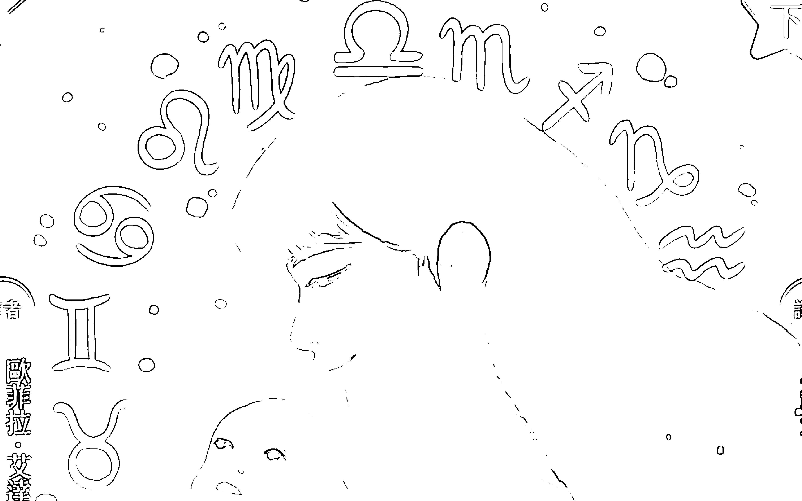

作者
歐菲拉·艾蓮特
塔麗·艾蓮特

譯者
邱錦宜

被孩子搞到一個頭兩個大、日日崩潰的女性們，
本書會是妳的救贖聖經

孩子的出生使用說明＋媽媽的求生手冊

Claudia Studio-女巫的塔羅·芳療 植物系女巫-Claudia·愛神者占星工作室 鍾穎
專序推薦

## 目錄

- 處女座 ………… 390
- 天秤座 ………… 416
- 天蠍座 ………… 440
- 射手座 ………… 466
- 摩羯座 ………… 486
- 水瓶座 ………… 510
- 雙魚座 ………… 532

### 第三部 媽媽和孩子星座配對

- 牡羊座 ………… 558
- 金牛座 ………… 575
- 雙子座 ………… 592
- 巨蟹座 ………… 606
- 獅子座 ………… 622
- 處女座 ………… 636
- 天秤座 ………… 652
- 天蠍座 ………… 667
- 射手座 ………… 682
- 摩羯座 ………… 699
- 水瓶座 ………… 714
- 雙魚座 ………… 729
- 致謝 ………… 746

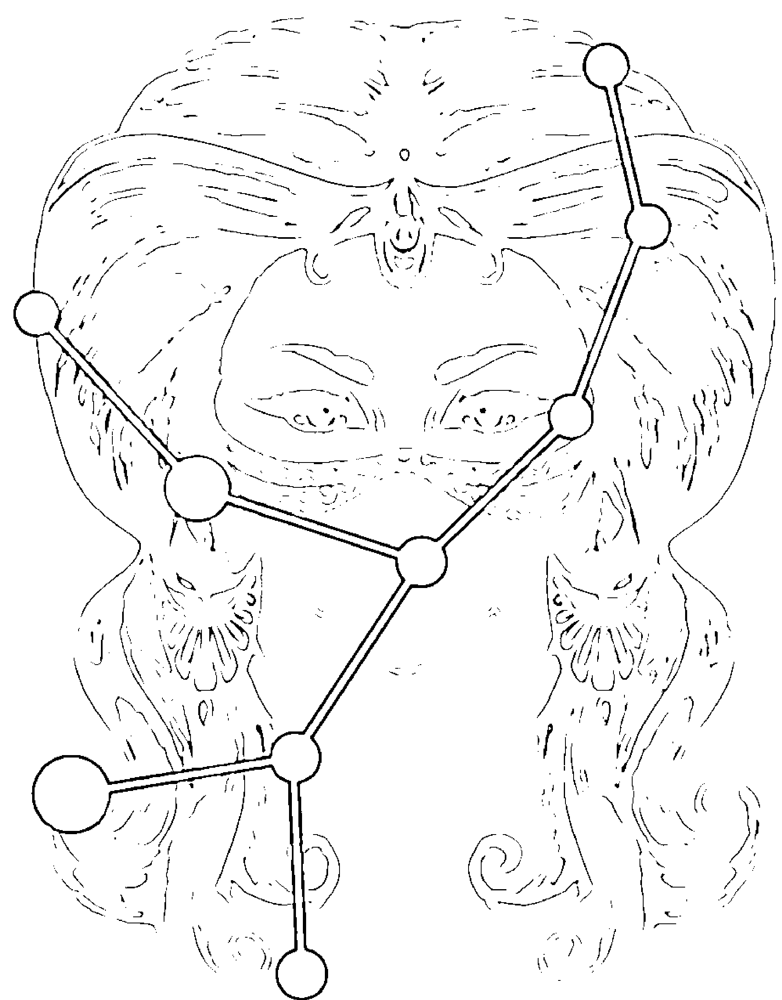

# 處女座媽媽

（8月23日～9月22日）

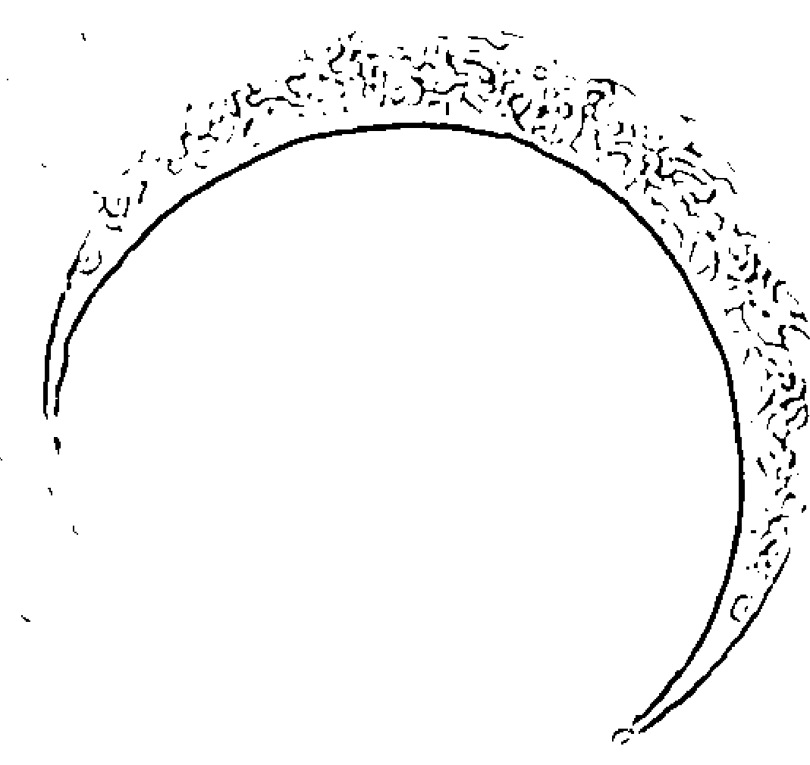

媽咪魔力 你的優點：
有組織和條理、實事求是、健康習慣、知性

媽媽咪呀 你的挑戰：
愛評判、憂慮和神經質、自以為是、過度分析的傾向

知名的處女座媽媽：
莎瑪·海耶克、費絲·希爾、珍妮佛·哈德森、瑞奇·雷克、仙妮亞·唐恩、碧昂絲、蜜雪兒·威廉絲、潔達·蘋姬·史密斯、瑞秋·佐伊、妮可·李奇、蜜雪兒·杜格爾、艾米·波勒、紅粉佳人、蘇菲亞·羅蘭

## ☆ 妳的教養風格

緊張與自由奔放的處女座媽媽是個令人好奇的對比綜合體。母親的身分，一方面，讓傾向秩序的處女座有藉口能計畫、領導和管理；另一方面，也會帶出有趣、務實的一面，這是讓妳放鬆玩樂的特別通行證，呦呼！

一些處女座媽媽對母親身分如魚得水，能從獨立搖滾樂頻道轉到兒童教育節目《嘎巴寶寶》（Yo Gabba Gabba），不過對另一種媽媽來說會比較麻煩，需要一些時間適應，特別是如果你喜歡閱讀、又重視私人空間的內向處女座。伴隨孩子的到來，個人隱私受到侵入，先不提強行奪取妳思考時間的這一點，嗯，我們得誠實一點：這個報償總是無法平衡妳所失去的。對於說服聰明的處女座，自己的思考會從博士程度降轉到 A B C，是很難以置信的事情。

不過，即使是有些抗拒的處女座，也會逐漸愛上媽媽這個身分。當然，妳每天會上演吹毛求疵和神經質的傾向，是因為母親的身分所遇到的驚嚇狀況觸發出來。不過妳可能需要依照內容做轉換——比起對黏膩、沾滿葡萄果凍的手指放在臉頰使妳厭惡，反而要學習享受可愛孩子用小手托起妳的臉龐說：「我愛妳，媽媽。」弄平妳的鼻子、鬆開嘴唇，用可愛的小嘴吃著花生醬和果凍，妳是不是覺得孩子很可愛呢？

幾乎每個我們談到的處女座媽媽，都會表達她們對制定紀律、設定穩固界線及指導小孩的能力感到自豪。即使妳只是以兩個不可妥協的規則過活，妳還是會使下一代印象深刻：適當的餐桌禮儀、不看電視的政策、打架時暫時隔離。在妳的想法裡，這些對孩子來說，從來不會因為年紀太小而無法學習。在發育小孩的清單中可能就有這些條件：良好教育、文化素養以及呼吸大量新鮮空氣。處女座是土象星座，讓孩子花時間在大自然上，對妳而言相當重要。

處女座象徵健康與幸福，妳可能對飲食習慣有所堅持，每天偷偷在孩子餐盤裡加些新鮮水果、或為他選擇無麩質餐點，只因研究宣稱含有小麥、裸麥及大麥的食物會引發自閉症。不過做這些事，對妳來說也很容易，因為處女座掌管消化系統，或妳可能本身就對一大堆食物過敏。

儘管妳帶有強迫症的天性，但還是有較放鬆的一面。妳的第四宮由射手座掌管，這個星座象徵旅行、冒險、智慧及更高尚的情操，受到這樣波希米亞式的影響，補償了妳焦慮和視野狹隘的缺陷，幫助妳以更宏觀的態度看待事物，並相信孩子未來一切都會變好。射手座是意見提供者，對妳星盤的影響是使妳更容易成為朋友間的「媽媽行動搜尋引擎」；此外，也喚醒幽默和冷靜的面向，幫助妳將母職視為是一場巨大冒險。

雖然有些女性會突然感覺到「衰老」，及了解身為母親所賦予的責任有多重大，不過小孩能減緩妳的憂慮。

「我對孩子笑臉常開感到自豪，他們總是會對我笑」，處女座媽媽凱倫說，「我們很開心。」

如果妳結婚了或有固定伴侶，忙裡偷閒會擴展你們之間的關係。伴隨妳顯著的規劃能力，妳會為晚間約會和大人的逃跑時間妥善安排，「關鍵在小孩出生以前，找時間做喜歡的事」，凱倫說道，「我和丈夫從十八歲就在一起，到現在已經二十年了。我們會一起享受表演，（最近）我們終於抽空去看了兩場表演，三週的獨處時間。這讓我們重拾自我。即使是每天早上在孩子起床前花半小時一起喝杯咖啡也很有用！」

不過也不是說妳控制狂的一面沒有展現出來，其實每個處女座都隱藏一個大女人。伴隨處女座的批判性質，妳常常有點像個女修道院院長，批評其他女性的教育風格（即使妳不會承認）。在朋友間，妳雖然是冠軍和啦啦隊隊長，但妳可能也會暗地裡中傷他們。「艾莉森是很棒的媽媽，但我就是不懂她怎麼敢讓她兒子吃整罐花生醬，然後直接放回廚櫃」，妳帶著感嘆聲說道。「難道不會有細菌嗎？我想我的小孩不會到在她那裡吃午餐。」

面對陌生人時，同理心可能不一定會發揮作用，特別當妳感覺到有點受威脅和排斥，妳可能會以緊張或輕蔑態度，仔細打量他們管教小孩的方式。在遊樂場上，妳會靠近那位管教鬆散的照顧者，要求知道為什麼她不告訴小孩停止丟沙、或者該換別人使用輪胎鞦韆。雖然妳宣稱討厭「媽媽戰爭」，但妳可能還是要負起一些挑起戰火的責任。

處女座，我們知道妳只是想試著協助，只是要記住當妳已經發表了意見，妳的原則對其他人而言就像批判。此外，在這些刺耳的信仰背後會產生什麼問題？這些非常有可能都是出於妳處女座完美主義的影響。妳為自己設下高標準，可能對自己最為嚴苛。當然擁有個人教育風格和哲學是好的，但妳可能需要問自己，是否要求自己過於「符合」一些理想媽媽的形象？這真的是妳真心感到快樂的表達方式嗎？

與其他媽媽比較，不僅讓妳感受到沒必要的不安，同時也阻撓妳去形塑支持團體，結果對妳身心產生不好影響。研究顯示，女性大腦有著比男性較高的壓力反應，我們會把「戰鬥或逃跑」的模式昇華成「照料與結盟」，簡單來說就是女性在壓力下會開始為孩子（或寵物）洗淨和照護，並與其他女性結盟；這促使大腦釋放催產素，也就是「親密賀爾蒙」，會減少恐懼，讓妳感到放鬆。處女座，這就是贊安諾（Xanax，一種抗焦慮藥品）藥品的替代品。停止評判其他人的想法，參與媽媽的聚會吧！

妳的完美主義並不見得對孩子都好，這樣的態度可能會把母性轉變成一種對孩子的壓抑。如果妳開始表現出像直升機父母的行為，請尋求他人的協助。妳非常可能會開始擔心一些具體的事，像是學校體系或鄰居是否適合妳的孩子，而且妳會為此做些改變。這當然可以，沒有問題，只要確保孩子不會受到妳焦慮、過度分析所帶來的影響。如果孩子感受到妳的焦慮或神經質，在未來寬廣的世界裡，他可能會變成容易不安的人，這一定是妳最不樂見的事。

經典幼童發展書《魔法歲月》（The Magic Years）將「神經質」定義為長期對自己過於嚴苛，處女座媽媽，就是在說妳。我們認識的一位處女座媽媽帶著她的兒子去診所治療憂鬱，結果醫師也認為她有同樣的診狀；另一位朋友的處女座媽媽一旦把家人單獨留在家中五天，就會變得神經衰弱，後來她宣稱只是食物過敏。在這樣的狀況下，妳大可先忘記養育孩子的目的，是促進他成為獨立、自給自足的人，讓他安全進入成年階段。資訊對處女座媽媽而言是最好的解藥，妳需要了解每個發展階段的機制，及運用策略複製這些機制。當妳的分析雷達知道事情如何運作時，就能提前準備，這會讓妳感到放鬆並活在當下。

但作為十二星座的終極伴侶，妳目前最需要的是讓其他人來幫助妳。母職是享受公共事務最佳的角色，所以請發揮創意分配任務。如果是大家庭呢？參考蜜雪兒·道格（Michelle Duggar），她是TLC旅遊頻道節目《19個孩子不嫌多》（19 Kids and Counting）的處女座媽媽。她用夥伴系統方式撫養她的孩子，指派最大的孩子照顧兩、三個年紀較小的孩子。雖然她的方式對大部分的人來說過於極端，不過這也顯示處女座媽媽善於解決能力的天賦。記住，給孩子負責任的方法，教導他自力更生和生存的技巧。

妳也能廣泛閱讀後期小兒科醫師兼心理分析師唐諾·威尼科特（Donald Winnicott）的著作，提出「夠好的母親」（good enough mother）的理論。他相信，成為好媽媽的方式是夠好就好，夠好的母親在人類與三維空間裡提供一個安全和餵養的環境，但不要迎合孩子的每個需求，把他當成宇宙萬物中心對待或消耗妳自己。這對處女座而言是個挑戰，畢竟妳喜歡將每件事做到完美。但是成為母親能教會妳的一些事中，最重要的就是解放自我批判的傾向，不對自己過度嚴苛並善待自己。

## ☆ 如果妳有女兒

### 優點

妳冷靜的天性終於有個出口能宣洩。和女兒一起，妳同時是媽咪、治療師和最終摯友。當遇到困難時刻或女孩心情低落時，妳是她最安全的港口，也會是她這個世上最貼心的那個人，既體貼又能給予她支援。

> 「我的處女座媽媽雖然遇到小事就會發瘋，但是當我們遇到困難時，她完全知道要做什麼、該打給誰該如何解決。」蘇西說道。

妳對兒童發展感興趣，可能會廣泛涉獵相關書籍，熟悉所有專家及其理論；也會閱讀關於女孩自尊心相關議題的內容，像是媒體對身體意象的影響等。但妳也想確認女兒對她的外觀是否感到自信。她在上高中時，妳就會帶她去給專業人士化妝，或到價格不菲的美髮院弄頭髮（甚至挑染）。妳了解，有時打扮漂亮和心情好是同時存在的，就算是稍微捲翹睫毛也能提振精神，所以就去做吧！對於會自我否定的處女座媽媽而言，女兒同時也是讓自己「變糟」（雖然我們希望妳否認這個字出現在妳的字典裡）的好藉口。妳可能會是沉溺活動裡的媽媽：逛街、在昂貴餐廳吃飯、揮霍舉辦生日派對——即使妳只需要一年全力以赴一次就好，也要讓女兒知道她對妳有多特別。

### 缺點

妳是十二星座裡最會自我批評的，不過若以這樣的方式撫養迷你版的妳，會表現出存在焦慮的意識。

> 「如果她變成跟我一樣，怎麼辦？」一位即將成為媽媽的處女座苦惱說道。比起對自身缺點過度焦慮，更需要建立一個合理且愛自己的寶庫；固定與一群互相支持的朋友參與女性團體或見面會，這樣就有安全的管道能發洩，同時擁抱妳的本質，不要為了成為媽媽犧牲自己的興趣和天賦。即使妳暫時離開工作崗位，還是需要參與廣大世界所發生的事，感覺到妳正在做些改變，這些都能激發妳的自信。我們知道的一位處女座媽媽在地下室建造了一間藝術家工作室，並且佈置得很漂亮。最後，不要對自己過於節儉：熱瑜珈、皮拉提斯、早晨蔬菜奶昔及晚間有機肌膚發生，不要因為妳是媽媽，就對這些寵愛自己的事情半途而廢。若妳不再是那個最關心自己的人，妳的心情和自我形象會變得低落，並開始懲罰自己，接著很有可能將自己的煩惱投射在女兒身上。然而成為重要的女性典範不是件容易的事，妳需要更擔當得起這樣的責任，這些是妳必須記得並每天提醒自己的事！

許多處女座媽媽對於母女關係之間尚未解決的事感到為難，像是妳可能擔心如何與女兒相處。此時，需要提前準備好寬恕孩子的心理準備，特別是妳曾理想化妳的媽媽，或是譴責她是個容易犯錯的人。如奧斯卡·王爾德（Oscar Wilde）睿智地寫道：「所有女性會變得跟她們的母親一樣。這是女人的悲劇。但沒有男人變成他們父親，這是他們的悲劇。」

記住處女座媽媽，即使妳的幼童時期曾經經歷一些困難、憤怒的時候，但不代表女兒要承襲與妳一樣的不安與憂慮。就我們所知，她可能會保有不慌不忙的信心，或是跟妳完全不一樣的體質。是的，這世界對女孩來說很殘忍，妳想要保護她免於霸凌、身體意象議題、及對女性過於嚴厲的糟糕政策的影響。但是不要「餵養一隻怪物」，不要因過度專注在妳「不想要」她變成那樣，而產生自我實現預言。妳可以試著做出一些先發制人的方式：透過知識幫助女兒認識更多危險、保護自己、事前讓她了解人生需要達成的目標，當她有疑問時，以開放心態接納。妳冷靜、聰慧的回應會灌輸她培養出驚人自信。妳必須做到讓她遠離那些焦躁又驚恐的狀態。

## ☆ 如果妳有男孩

### 優點

請王子進來！雖然妳可能永遠不想承認，但處女座媽媽對於養育兒子和女兒有完全不同的雙重標準。因為他和妳不同性別，讓妳完美主義及成為理想媽媽典範的壓力稍微舒緩。對於疼愛、寵愛與理想化兒子這點，妳感到更自由，是的，妳變得更自由。我們知道的一位處女座媽媽在為兒子命名前足足等了「十二週」，她想等到「完美」的名字降臨，不願意用隨便的名字替代。雖然這代表她得一直呼喊兒子「寶寶」和「可愛熊熊」整整三個月，以及忍受其他人催促她趕緊為兒子取名（處女座可不想隨意妥協）。當名字「自己出現」時，她和另一半舉辦了盛大的寶寶命名儀式。

妳想要孩子的童年時期自由、有趣且充滿冒險，比起和女兒相處，和兒子一起時，妳憂心忡忡的一面較不會頻繁出現。妳對自己如此嚴苛，傾向將自己的「缺陷」放大到女兒身上或和她比較，會使事情變得更棘手，因為妳將自己視為最大的審查者。和男孩一起，妳比較能把他看成是獨立個體，相信他保有彈性，能自己調整情緒和身體議題，妳也讓他隨心所欲。我們認識的一位處女座媽媽，讓兒子在她全新的專業廚房高櫃中建立一個躲藏處，甚至在角落為他放了桌椅，這樣就能讓他在想獨處、心情低落時有處舒適的秘密基地。除了讚譽他的情緒外，妳也會灌輸他好的價值觀、尊重他的想法。妳內心深處渴望他能成長為擁有堅強性格的男人，藉由他證明妳使用了正確的撫養方式。妳花時間關注他的舉止，小心引導他做正確的事，告訴他是個聰明且有能力的人。即使生活為他帶來不幸，他會知道媽媽相信他能做到。

### 缺點

妳是很棒的傾聽者和天生的治療者，這讓妳的危機處理能力異於常人。然而，妳重視自己「無所不知」的角色反而使兒子長不大，阻止他發展出嚴謹的解決問題的能力。妳需要逼迫自己讓他經歷一些掙扎，在他需要空間成長時刻意與他分開。妳可能是那種媽媽——願意帶著兒子搬到郊區、在最好的學區定居下來，為兒子的幸福犧牲所有事。但是放棄太多自我身分價值，會帶給他錯誤的訊息：認為所有女性會迎合他、塑造出他理想的未來。

談到女性，妳可能也對兒子另一半的選擇過度干涉。有任何女生好到適合妳的兒子嗎？我想非常之少。妳可能特別強調兒子伴侶的「缺陷」，對其保留態度，還會出現一些嫉妒和競爭心態，畢竟處女座媽媽喜歡當家中的女王。這樣缺乏界線的態度一定會造成妳和兒子之間的問題。我們曾看過頭腦清楚、理性的處女座媽媽過度占有兒子，使她們變得古怪。一位處女座媽媽在與兒子親吻道別時，會在他臉頰上留下具爭奪領土意味的紅色口紅印；另一位朋友的處女座媽媽，當兒子的社群換了新的大頭貼時曾留下「這位帥男孩是誰」的留言。如果他不是三十二歲的男人，這樣的文字可能還說得過去……即使妳心裡某個部分想永遠與他保持親近，最後妳還是得預防分離的感傷。因此，請確保自己保有完整、平衡的人生，這是最好的方式。

## ☆ 不同年齡和階段的教養

### 嬰兒期（一歲）

歡迎來到最甜蜜的時光：寶寶的第一年。對大部分處女座媽媽來說，新生兒階段絕對是最喜歡的時期。如同星座顯示「處女」（當然是象徵性上），妳會陷入純真狀態。處女座是天生的助人者，妳需要被需要，謹慎的天性喜歡承擔處理嬌弱新生兒的責任。對於其他媽媽容易感到氣餒的事，對妳來說反而輕而易舉。

就像女性對婚禮的夢想一樣，妳也期望有天能將孩子抱在懷中。出生的奇蹟不會讓妳退縮，而且妳想在第一年中享受寶寶的每個發展。如果妳有其他孩子，可能需要確保這位新來者沒有取代他們的地位，不要忘了他們也需要妳的寵愛，讓他們一起承擔責任。

即使妳不是個善於交際的人，可能仍是個長不大的成人。（是的，妳有兩種面向。如同一位處女座提到：「寶寶仍有部分與上帝同在，他們可不是活得煩膩又厭世的大人，大人真噁心。」）在歐菲娜生產後，第一批來醫院探望的朋友是處女座。其中一位朋友甚至在歐菲娜的病床野餐，享受將寶寶抱在懷中的喜悅，孩子的媽則在旁狼吞虎嚥地吃著晚餐；另一位提供她「專業的嬰兒包巾服務」——她甚至沒有自己的小孩！在小孩出生前一週，處女座朋友艾比「在她的堅持下」，每天幫忙施行針灸治療，幫助歐菲娜加快生產速度以避免需使用引產的方式生產。

所以，寶寶來了，妳也準備好了，可能還準備太多。尿布和連身衣的存量可能堆成一座小山；與醫生的預約已經排到六個月之後；iPod 已經存好用來安撫寶寶的貝多芬和莫札特交響曲。妳的核心自我已經確認到每個令人有點厭煩的細節：從臉書上嘮嘮著保母、手推車的價格到選擇育嬰房色調，情緒讓人幾近崩潰。

嘿，這不是妳的錯。處女座容易先做足所有準備與組織細節（雖然不見得都很整齊，妳有些不為人知的貯藏癖好），妳享受細瑣的任務，成為媽媽有堆積如山的雜事，讓妳感受到自己能有不錯的發揮。無論是一籃待刷洗的布尿布、將有機甜番茄搗成泥，或是瀏覽教育性玩具的產品介紹，即使妳會抱怨，但妳其實很喜歡。

處女座掌管消化系統（真幸運），妳可能內心對寶寶尿布裡的東西沒那麼感興趣，又或者像處女座的心理學專家安德莉·奧斯隆（Andrea Olson）甚至沒有使用任何尿布。是的，她是一名「無尿布寶寶導師」，安德莉在做了研究後，使用名為「排泄溝通」（elimination communication）的方法，運用在她新生兒兒子上，同時也開啟成功的事業。很顯然，寶寶需要上廁所時的訊號及他們與生俱來的時間感，都可以學習。安德莉自

## 孕期與新生兒階段

妳的兒子在九個月就不用尿布，出生後就一直用氣墊覆蓋在馬桶的方式上廁所。確實對一些人來說會覺得有點奇怪，但根據安德莉網站顯示，已有超過世界一半以上的人試驗這個方法，直到至今數百年來都是如此。

作為關注健康與環保意識的星座，妳會發現這是值得嘗試的方式，如果你住在一間會將波浪鼓亂丟的大型婦嬰用品連鎖店旁邊，現在尿布、垃圾、環境破壞上的統計，多到讓妳深感罪惡。讓我們面對現實吧，妳根本不需要多一件事讓妳變得更神經質。

不過，無可避免的神經質會逐漸增加，因為妳的過度分析和擔憂。對新生兒寶寶的照顧越是得心應手，越會發現有些事讓妳感到操心——綁架的新聞故事、嬰兒猝死症（SIDS）的驚人報告或海外製造的含毒玩具，接著妳會上演一場場完美主義的糾結，像是關於哪種尿布最好及何時該食用固體食物等。妳可能會嘗試從網路分析每次的鼻塞聲，或直接衝到醫生那裡「只為了確認」是否肺炎，此外當另一半或照顧者在值班時，妳簡直就是他們的惡夢，因為妳會仔細觀察他的每個舉動。

妳可能需要對自己克制一點，保持冷靜、睡個好覺、讓精力恢復、或離開現場、去逛街（如果需要，能從保母遠端監控確認一兩次）。回來時，寶寶會跟平常一樣，沒什麼問題，好好放鬆、休息後，妳會成為更好的媽媽。此外，妳會了解到，少了妳的過度介入，小孩適應力會更好。如果你能抑制住想要控制所有事的衝動，妳的感情關係會有所進步。妳的另一半應該要有別的盤算或觀點（很可能會有，畢竟你們有不同的養育方式），這段時間你們因為無法在育兒主題上有所妥協，使你們的關係產生壓力和負擔。此時，妳需要拓展一些新的共同撫育技巧，讓另一半一起參與做決定的過程。

妳的完美主義，可能也會干擾妳與寶寶間的幸福，當事情每況愈下時，妳要有所意識，留心警訊：開始認為自己比起那些給哭鬧嬰兒配方奶而非母乳的媽媽高尚、或是對強制執行睡覺訓練，造成社會心理危害的媽媽有所微詞，請將這些事看成是信號彈，因為很有可能那些妳看不起的媽媽，正反映出一些妳需要省思的事；她的恐懼或許顯現出妳自身的不足。此時，應該將處女座夥伴麥可．傑克森的歌改寫，從「鏡子裡的媽媽」（mom in the mirror，出自麥可．傑克森《鏡子裡的男人》（Man In the Mirror））開始練習。

不過很有可能，妳根本不想看到鏡子裡的妳——特別是妳可能還在為懷孕變肥而難過；處女座媽媽難以度過產後身體走樣的後果，及身體整體上的不適感受。作為象徵健康的星座，妳渴望回到原本的良好體態，但對於自己明明有良好的計畫技巧，卻還是錯過訓練而感到挫折。妳不想不戰而敗！一位處女座朋友在她女兒睡覺時，將她放在慢跑嬰兒車內，跑百米馬拉松訓練自己。比起關心自己的外表，不如提高對自我的關心及強調自我的感受。我們的處女座朋友艾比雇用一位產後陪產員，幫她在產後製作第一週的餐點，因此她才能休息，並確保家裡所有成員都能吃得好好的。

最好的防護措施，大概是一本優秀的剪貼簿或寶寶部落格。妳會開始關注孩子的舉止，可能會以某種永恆的形式詳細記錄，這樣就能在某天與孩子分享。她在遊戲墊上做出哪些可愛事情？兩歲時的健康檢查如何？第一次笑是什麼時候？伴隨這些紀錄，妳會變成一個知識大百科，像是妳真的很喜歡知道哪台嬰兒車最好，並將意見提供給其他媽媽。

記住第一年光陰似箭，這一年會被許多有趣的里程碑填滿。妳也不想錯過探索這些片刻的樂趣，而且可能會被指出嘗試讓每件事都做到好。如果妳給自己或寶寶過高的標準時，可能就得處理一些失望時刻，以及學習如何放下。冥想、深呼吸、一分鐘的下犬式瑜珈動作——任何讓妳能更快樂、回歸正軌的行為，這樣就能活在當下，這些是妳身體真的需要做的事。處女座媽媽，要記得休息。

### 學步期（兩歲到五歲）

歡迎走在狂野的道路上，特別是在孩子踏出第一步時！這是段累人但可愛的時間，讓妳發揮建構和計畫的天賦，不過很可能在變成家長後，妳會為孩子過度計畫：音樂賞析課程、寶寶學步課，可能還有寶寶語言課程。嘿，為什麼不讓孩子成為世界上使用多種語言的公民，而且讀過的各種書會使他在上大學前擁有競爭優勢（妳有聽到一頭虎媽正在怒吼咆哮嗎？）。

何不從幼稚園申請過程開始，這個問題在美國已變成親職的必要之惡。妳需要準備好，開始尋找最好的學校以及關於申請的內部消息，可能甚至計畫搬到頂尖學校的學區，觀察好申請的截止日，幫妳確認完美的郵遞區號變更，郊區生活，我們來了！

善於語言的處女座由代表溝通的行星水星掌管，妳樂於享受與學步寶寶說話，在圖表上畫好他的語言發展和達成的里程碑，也會花好幾個小時教導字母、動物聲音、身體部位的互動遊戲，或者妳會儲存通過妳認證過的幼童專家（妳也在觀察妳的小古魯）所介紹的教育性玩具和影片。妳知道如何執行妳嚴苛的語言課程，小嬰兒也會聰明地使用他的「咿呀」一聲表達意思，即使他並非每次都記得如何使用。

妳對於追求正確發育孩子的信念堅定不移，孩子還小時，妳不害怕扮演採取堅決態度的角色。不是說妳對他過分嚴厲（比教師還嚴守規則）。「我和我先生共同使用紀律」，一位處女座媽媽蘇西菲娜說道。「然而，當我糾正孩子行為時，可能又更頑固。我受不了發脾氣、頂嘴或任何不對的態度。我想向兒子展示還有很多有效的方式能表現自我。」

當事情一切順利時，妳喜愛玩樂的一面會展現出來，妳樂於唱歌、跳舞及和寶寶在戶外玩耍。處女座喜愛教導，妳會透過他睜大眼睛的驚喜萬花筒看世界，沒有任何事比這個小傢伙對蒲公英、雁子成群飛過，及每晚指著月亮驚呼時還更加甜蜜。由於妳對例行公事的喜愛，不介意一次又一次一次閱讀《晚安，月亮》（Goodnight Moon）。然而，即使妳投資館藏豐富的圖書館，我想大部分的書未必都有受到青睞。

在這個階段，妳能從社交機會中獲得益處，這對於以學習為主的星象來說會更舒服。妳享受上課，與其他媽媽彼此慰問，談談每天經歷的事。一旦妳習慣在遊戲班、藝術教室或日托中心看到相同的媽媽，理解她們並不是在評斷妳時，妳會更容易、輕鬆地加入這個新的支持性社會團體。

有時候，妳可能會走到了自以為是的領地，此時請留心。危險注意：妳詳細分享為什麼替孩子選擇另一類教育系統，並引用標準考試沒有效果的研究；或者貼出一篇關於讚賞依賴父母在心理學上的優點。當書籍像《為什麼法國媽媽可以優雅喝咖啡，孩子不哭鬧？》（Bringing Up Bebe，索引：優雅的法國媽媽可以做得很好）以及《虎媽的戰歌》（Battle Hymn of the Tiger Mother，索引：不，進取心強烈的中國媽媽會做）變成國際新聞時，我們知道的一位聰明處女座媽媽回擊說：「我是沒有反對這些教養書籍，但我比較喜歡從發展學專家學到知識，而不是這些親子法或靠老虎證明自己是好媽媽。」

妳半喜半憂的心情也開始轉為高度警戒，讓妳變成一個失去能力與希望的人。「對我來說，最糟的階段會是第十五個月左右。」凱倫回憶。「他開始走路、跑步、抓東西，妳就得不斷跟著他。」老實說，不需要太多問題就能引出妳憂心忡忡的一面，尤其是遇到小孩無法正常吃飯，或沒有「完全」百分之百站在體重機上的正確位置。妳擔憂孩子最後會搞砸，最糟的是，妳會（倒抽一口氣）做出一些無法挽回的錯誤，讓妳在大家面前丟臉和受到譴責。結果，妳不受控的過度分享，讓妳試圖說服自己是個夠好的媽媽。

對妳來說，學步期最艱難的部分是變成一團混亂。妳出於天性不喜歡缺乏不確定性和無法控制衝動。學步嬰兒大腦的發展其實就是他們無法按照順序，即使是最嚴格的紀律也無法避免崩潰情形。孩子大部分古怪的舉止會引妳發笑，更精確來說，只要那些古怪行為不會出現在公眾場合，一切都沒有問題。

「我必須說，比起學步階段我更喜歡新生兒」，處女座蘇西菲娜說，「我兒子新生兒時很溫柔、好相處。他能按照自然的例行規則，從不挑剔。現在他是個學步兒，反而變成狂野的人——簡直像衣服和腳趾沾滿沙子的加州海灘男孩！

如果你不是全職媽媽，妳的控制欲真的會變成一種狂怒。當妳無法掌控全場時，會開始憂慮，並讓擔憂蔓延成一場流行病。一位處女座媽媽記得（事後證明很感激）日間托兒所甚至開始刻意不接電話。「我會在午餐打給她，問她我兒子是否便便了，或是否有吃包好的健康點心。」就像這位媽媽，即使保母給孩子市售花生醬而非天然花生醬，讓他坐在溼透的尿布上幾分鐘，妳也需要學習相信孩子會過得很好。

再來，妳自己對細菌有偏執，特別是如果住在市區。妳對泥土和草雖不反感，但妳對遊樂園或幼稚園的接觸病毒卻有高度警戒。「我會隨時在包包裡放『媽媽工具包』，」蘇西菲娜承認。「這個非常別緻的化妝包大到可以放止痛噴霧、旅行用風倍清（Febreze）、溼紙巾、媽媽用安舒疼（Advil）止痛劑、消毒劑等。」

學步階段有任何一線希望嗎？許多處女座最終會了解到需要「一整個部落」的人協同照顧——當然不是只有一位廚師和一群懶散公民。作為代表助人者的星座，妳不會這麼快尋找協助。要說服妳將工作分發出去，只希望這件事不會讓妳變得精神衰弱或過於疲憊。不過記住在人類漫長時間裡能生存下來的理由，就是因為有共同分工撫養後代的社會模式。只是到了現代社會，西方文化重視的「強烈個人主義」，使得母職變成有點像競爭激烈的個人運動賽。

土象處女座若是以自然的方式行事，通常更能茁壯成長；這代表妳會等到孩子三歲半時才送育兒園、與孩子睡同一張床，或甚至住在大家庭裡，每個人都會主動幫忙做餐點和哄孩子睡覺，就以這樣的方式進行吧！我們認識的一位處女座媽媽曾主動尋找大坪數的房產做投資，在那裡能分享給幾個家庭以達成互助合作。發育最好的「規則」是做妳自己，另外要時常記住，制定規則就是為了打破，請放寬心胸。

### 童年早期（六歲到十一歲）

新生兒階段之後，將進入幼童發展中妳最喜歡的階段：童年早期。此時，孩子已經大到足以理解妳說的每件事，但因為他還小尚不會回嘴——至少不會說太多。這年紀的小孩比起反抗家長更想討好他們。妳很樂於教導孩子關於生活的大小事，介紹他書籍和活動、花時間在大自然裡，培養他的智力發展——讓我們開始冒險吧！

一些處女座媽媽可能現在就會進入早期空巢症候群，開始擔心孩子少了妳的管教時，他每個舉止會如何表現。習慣憂心忡忡的妳，已經對孩子的需求做出過多的預防措施；是時候該提醒自己，如果孩子經歷掙扎或困難時會自行解決，他是沒有問題的。（這個機智雋語出自諷刺作家安布羅斯·比爾斯（Ambrose Bierce），他總結處女座媽媽的模式：「當媽媽感到冷時，孩子身上已經穿上毛衣。」）妳渴望的「被需要的感覺」現在會有點緩和。

我們可以說處女座媽媽是孩子最好的擁護者，畢竟妳可能幼時也曾社會上遭遇困難，或者至少妳記得那種被老師、某個大人物誤解的感覺。如果兒子或女兒在學校做錯事，妳會待在現場直到問題解決，即使代表妳得為孩子學校的霸凌問題試圖說服對方、請老師出面解決，甚至直接將孩子轉學。作為十二星座中自然健康的掌管者，妳不會使用過於激進的方式。舉例來說，如果孩子被診斷出有學習障礙，妳會瘋狂地蒐集資料，也許還會試著在飲食、睡眠或環境改變上做些實驗，或許孩子可能是麩質不耐症或過敏，另外妳也願意靠著妳的直覺理論做測試。

有時候妳需要更大的改變，妳也會在需要時採取行動。一位處女座朋友將他外向的兒子送入一間以「另一類」哲學為基礎的菁英私立小學，在那裡不鼓勵競爭，崇尚烏托邦理想的教育方式。不幸的是，他兒子和學校老師間存在嚴重的衝突。「我甚至雇用了私人社工人員進入學校，觀察兒子在教室的互動，去看看是否問題出在他的行為上。」她承認道。結果是那位宣稱「和平主義者」的老師真的很害怕衝突，以至於教室根本失去控制。

經過這件事後，給這位處女座媽媽上了一堂課——有時候對孩子最好的事，是環境是否符合「孩子」的個性，而不是符合自己，現在她兒子轉到公立學校。妳總是害怕少了妳的囑咐叮嚀下，孩子將會無法承受又大又混亂的世界，於是不自覺對他施加過多的控制。妳可以試著培養自我察覺的態度，並讓孩子學習能自己激發出最好狀態的能力。

「我看到孩子以同情心和友善對待他人時，感到非常驕傲。」處女座媽媽莎莉說。「我知道他們是從我在家中不斷推廣的書籍、佳句和能量裡，吸收到正面資訊。」

在這個容易受到影響的時期，妳會對孩子加強好的價值觀，此時妳「波麗安娜」（Pollyanna，指一種他人對正面描述表示認同的現象）積極的一面會全力展現出來。嘿，當孩子的同儕壓力已經超過妳的影響力時，代表他離成人的階段不遠了。所以妳想盡可能地影響他，在他對性行為感到壓力或在參與高中派對有困難時，能將妳平常對他耳提面命的智慧之語聽進去。

對處女座而言，絕不會有缺少聰明對策的時候，這階段是灌輸新知很好的時機。妳享受為孩子媒合他個性的課程活動，像是大提琴課、足球課、野營課，妳能敏銳地觀察他的上課進度，默默地觀察、引導他，就像個嚴厲但可愛的圖書館館員。「我會試著找些工具、資源和素材幫助他們表達自己。」處女座媽媽貝絲說。「無論是為我兒子上課、找美術用品或甚至在穿著上。和孩子一起時保持彈性非常重要，試著將彼此作為個體看待。」

不過妳的彈性並非沒有限制——我們可以這麼說，處女座媽媽習慣事物必須遵守控制規則，「換句話說，我非常有條理」，貝絲承認，「我逼迫孩子吃健康的食物，即使他們每天會吃甜點，我還是會控制糖分的擷取。我們使用一種獎罰系統，並隨時正向強化它。伊森和西斯莉兩人都有『集點卡』，當我看見他們表現良好就會給一點。這對他們來說效果非常好。」

學校教育和成績固然重要，但妳真正在意的是小孩對教育的態度。孩子是否享受在學習過程和探索內容之中？妳是個熱愛學習的人，學習是自我成長裡一段漫長的過程，這是妳希望能與孩子分享的價值。

妳想要他找尋自己的熱情和道路，讓他的人生能充滿所有喜歡的事，『我強調『自由是讓你成為想成為的人』，莎莉說道，『我把重點放在尊重你的工作和盡你所能。』

這階段伴隨而來、需要被迫社交的場合，這使內向的處女座感到掙扎。無可避免，妳將遇到學校裡的義務教育、校外教學、學校音樂會或運動比賽，必須與孩子同儕的父母交流，不過出自於妳害羞或不安全感的特性，可能需要用身為媽媽的自豪感來與他們相處。

『只想做一個喜歡閱讀和寫作的孤僻之人有點困難』，貝絲說道，『不過最後我了解，育兒最好是以團體的方式進行，這對我來說很棒，我發現我沒有想像中這麼喜歡獨自一人。』

去吧！去加入資金募集委員會或帶領孩子參與瑜伽課程，這能讓妳不會覺得自己受到孤立，特別是孩子待在學校，會因此空出很多時間時。即使妳需要工作一整天，也會在學校與活動間取得一個新的生活節奏（可能甚至比之前還忙碌或更有壓力——這會讓妳感到沮喪）。

當然妳現在也讓自己大部分的腦細胞起死回生，將注意力轉回到自身的追求。呼！當孩子不用上學時，妳會比較喜歡帶著孩子和朋友一起玩耍，在那裡比起提供他娛樂，妳僅僅需要在周圍注意他就可以。

『當孩子還是寶寶和學走路時，我根本一本書都沒辦法讀。』莎莉回憶道。『然後歐菲娜在日記上做實驗。她提到一本名為《簡單富足》（Simple Abundance）的書，這本書改變我的人生。這是本專注在每日日常的書籍，可以一天看一頁，書中好像有什麼東西正撫慰我的心靈。後來我開始寫日記，創造與自己對話的時間，幫助我再次喚醒自我。』

在青少年風暴來臨前，這階段可能會很平靜，好好品味空氣的芬芳。享受與孩子建立連結，藉由活動和興趣證明你們都樂在其中。未來幾年說不定妳還得將這些時光作為與孩子和解的策略。

### 青少年期（十二歲到十八歲）

尷尬，自我意識，無法融入或無法被理解。等一下，我們是在說妳的青少年孩子……還是妳？

妳在青少年時期感受到的痛苦回憶，可能在孩子度過青少年這幾年仍記憶猶新。當可愛小天使蛻變成神經質的妳（帶點自虐狂特質）的放大版，可能會使妳措手不及，這是一段孩子開始對自己過度要求的時期。如果有任何人能與他產生共鳴，那個人就是妳。妳得開始拉高水平：為了妳以及孩子，妳必須跨越對自我嚴重批評的心魔。

可能只有少數家長會認為青少年時期是他們最喜歡的階段，對處女座媽媽來說，除非擁有穩固的資源和他人支援，否則妳可能會有段非常難熬的時間。這可能代表需要做家族治療，處理妳對失去控制權所帶來的恐懼，或是得在嚴厲與寬容間做出一些適量的取捨。

「隨著孩子長大、成為青少年，我感覺他們好像不見了，他們需要私密的空間。」莎莉說。「這階段對我來說帶來了兩種心情：拋棄與自由。我感到傷心及被遺棄，因為他們比起和我一起依偎在沙發上，更想和朋友在一起。突然間，我不再是他們宇宙的中心，流行文化才是。」

她繼續說，「接著感覺到自由的到來！我有更多時間上課、回到事業，和女性朋友午餐。一切如此完美。不過即使這一切很美好，但自由有其限制，因為總要有人載他一程，或要妳從皮夾裡拿出二十塊錢。」

作為一個渴求被需要的星座，當孩子離開、強硬否決妳的關心，妳可能感到被拒絕。同時，妳會因為過於擔心他的心理狀態，或是他放學後和誰一起出去而備感煎熬，此外，妳還會看到妳所有的控制欲以及奮力撫養孩子的艱辛，看起來就像一個隨時會傾倒的脆弱組織。

為孩子放棄所有事情，對處女座來說不是好主意。妳將妳的身分認同全部關注在他身上，對妳來說也不會有任何成長空間。妳已經是個高度敏感、容易感到有壓力及背叛感的人，如果孩子又為了要確認妳的媽媽角色而備感壓力，你們的關係會變得扭曲。老實說，若妳沒有足夠的興趣和嗜好，可能會激起妳「嬰兒媽媽戲劇」的情緒。突然間，妳不再談起朋友，或是妳切割掉的家庭成員（處女座受傷時會有的知名舉動），這會讓孩子感到困擾，削弱他對妳的忠誠。

頂嘴和乖戾態度也會踩到妳的地雷，妳會為此感到特別受傷。「我不太會處理衝突、無禮或不受到重視，但這些都是青少年人格常見的人格特質」，處女座媽媽克莉絲汀承認。我明明花了這麼多精力撫養他，我哪裡做錯了嗎？（提示：我沒有）；他怎麼可以在我做了這麼多之後，還這樣對待我呢？（提示：這不是針對妳，即使妳感覺是。）

一樣地，妳對於青少年痛苦的混亂和同情很敏感，正如妳因青少年可能會做出的糟糕選擇感到著急不安（不提糟糕的結果）。在這階段妳可能覺得無助，並出於恐懼而對孩子更加嚴格管教。

後果是妳偶爾會使孩子「嚇歪了」，變得有點走火入魔。為了避免讓孩子做出濫事，像是危及生命的事，妳可能會使用可怕的手段、批評他的選擇，如給孩子看因抽菸變黑的肺和健康的肺的對照圖片、給女兒聽真實「青少年媽媽」談到撫養孩子有多困難的內容，或逼迫兒子到醫院復健部做志工，去看那些因酒後駕車受傷的青少年的樣子。

哎呀！留意妳心中好與壞的道德標準是否變得過於極端，那種非黑即白，或認為教導孩子做對的事只有一種方法（保證會造成叛亂的策略）。因為妳不如妳所認為的能控制自己不去管孩子與誰交往，因此妳可能批評那個人、提出嚴苛意見，並希望孩子能感受妳想傳達的用意。

「我知道當我兒子和他高中女友開始約會時，對方就想快點懷孕」，一位處女座媽媽說，「我感覺得她的用意。然後我告訴兒子。當後來她懷孕了，那時她還是高中生，我兒子是大學生。我無法忘記那天他告訴我對方懷孕的事。在他開口說前，我還看著他的眼睛並說：『她懷孕了，對吧？』『喔，不！因為妳是個如此擅長察言觀色的人，妳可能正確嗅到他們的動機。此時妳會陷入兩難：是否該打斷他並說出妳察覺到的事情，這會讓狀況往不好的方向發展嗎？學習何時開口及何時讓青少年了解犯錯，對處女座來說難以劃分。妳知道預防勝於治療，同時妳也不可能總逼迫青少年事先預防，這些對妳來說都不容易。』

作為無所不能的媽媽，可能會在妳說出「我早就跟你說過了」，帶給妳不太踏實的滿足感，因此，未來最好還是學習實用的策略並傳授給孩子。「我很喜歡批判性思考的技巧」，布蘭達說道，一位曾撫養兒子的處女座，現在正幫忙撫養正值青少年的孫子。「我教導他們：在你做某件事情或說某件事之前，先想好會產生的後果。他們需要學習看到更重要的部分，以更寬廣或長遠的目光看待事情。我告訴他們『這是你的觀點，現在也看看其他人的。』」

如果妳的小孩「真的」來到身旁尋求建議，他會得到紮實的智慧及一些特別需要的輕鬆時刻，但重點是他要懂得求救！他了解妳只是想幫忙、保護並避免他受到傷害。

「高中時，我媽媽有次看到我為了糟糕的成績難過」，一位處女座媽媽的成人女兒回憶，「那天我沒去學校，她反而帶我去海邊，因為她覺得我把學校的事看得太重要。哇，這真的很神奇。」

「我們之間有個很好的默契」，莎莉說，「當孩子因為學校和同儕感到有點無法承受時，我允許他們放一天稱作身心健康假期。當他們來到旁邊說需要放假時，我會排開行程，我知道我們會有個美好、充滿樂趣的一天。」的一天。我讓他們選擇想做的事，無論是去城裡逛街或看場表演、看電影、穿睡衣閒晃或做些手工。關鍵在於他們那天會忘記所有不好的事，並和媽媽在一起。」

不過得提醒一句，讓這些期待有所限制，不然孩子會趁機佔妳便宜。青少年很會操控事情，他們需要確實但有彈性的界線讓他們感到安全。如果妳的目標是平衡死板與放鬆間的比例，那麼他們可能不是因為壓力需要放一天假，而且至少也不是因為妳。

妳是個調停者和善於解決事情的人，不過可能會因此不小心陷入危機，也許妳是以無意識的狀態，讓自己回復到需要被需要的舊角色，這使得孩子認為妳會出面幫他解決。然而，這會引起戰火，因為妳可能給他一個崩潰的動機或「媽媽會處理好」的想法，使得他之後在學習自我負責時受挫，所以請不要保護孩子去面對自己選擇後所產生的後果。學習串連因果關係之間的點，這是他現在必須學習到的人生技巧。妳要在場邊指導他，而不是為了救他而跳下去。

### 掰掰，小鳥離巢（十八歲以上）

孩子離開家庭獨立，對處女座而言將會特別痛苦。某種意義上，妳感覺像失去工作，妳擔心並希望他仍在妳身邊。上大學離家是個錐心又戲劇性般的轉變，妳可能會這樣說：「我不敢相信，我的寶貝都長大離開家了！」當然，如果妳和他在青少年時期處得不好，可能也會暗暗鬆口氣，這卻會讓妳感覺到（不必要的）罪惡感。

對一些處女座媽媽來說，孩子離巢可能只是人生的片刻或一剎那，特別是如果你不經意嘗試放慢離開的速度，可能甚至將家裡的一部分轉變成短期公寓，或是藉由讓孩子繼續留下來直到他「準備好」離開家前，單純拖延離開的時間。（時間滴答滴答，他已經悄悄快二十歲了，媽媽……）

少數的處女座媽媽可能會坦率地唱著「哈利路亞」，開始改造家和人生，毫無保留地表現出興奮的心情送孩子離開。伴隨妳完美主義的傾向，可能在這幾年間因為做為一位稱職的父母而筋疲力盡，犧牲了自己獨處的需求，所以妳的孩子不會再跟妳要求什麼。雖然處女座是個終極給予者，但妳也重視個人的步調，現在妳對於把自己放在第一位不再感到有罪惡感。妳能佈置家裡、讀小說、將孩子的寢室拿來做瑜伽、早晨邊喝咖啡邊做數獨……好好地享受這樣平靜時光。

> 「我慶祝了一番！」布蘭達說到她兒子離家去讀大學時，「我不能理解為什麼有人會傷心。這真的很棒……因為我重獲自由，這是我最喜歡的事了。不過每當兒子回來時，我會立刻轉變成媽媽的角色，開始擔心他是否一切順利。所以我也很開心他從學校回來。」

但是如果孩子在妳（是的，我們是說「妳」）還沒準備好前離開，妳會持續強烈維持母性天職的束縛：要他回家吃晚餐、寄送補給包、帶他去奢侈的逛街或渡假，確保妳隨時被孩子需要；妳可能會建立以情緒劃分範圍的方式，讓自己塑造成孩子有問題就會來找妳，他會隨時打電話詢問關於愛情、生活和洗衣服的建議。

一旦妳放手了，就會發現其實妳喜歡有自己的生活步調。重新裝潢房子磨損的部分或改善較少使用的空間，這些改變環境的儀式，能幫助妳打造能夠茁壯、像避難所般的空間；將家裡辦公室重新改裝成富禪意的空間，擺上妳的書和精神目標；為衣帽間的鞋子和鞋子煥然一新；改造廚房，放入精緻的餐盤以及廚具補給品；為自己和另一半張羅一頓特別餐點。如果這反而會加深妳的空巢傷痛，那麼每週和幾位摯友一起吃晚餐，這樣能持續透過準備餐點、與其他人培養感情及產生連結。雖然這沒有比妳錯過的家庭晚餐重要，但卻幫助妳撫慰傷痛。

妳也享受與年輕世代產生連結，隨意為幼稚園其他孩子準備晚餐或付錢請他們幫忙做家事。幫助朋友照顧年幼孩子，或甚至照顧一週（當妳想起有多少工作要做時，能療癒妳的產後憂鬱，此外，妳也能看本小說結束一天！）。如果你是公司老闆或管理階層，那麼就雇用一位有趣的實習生，好好培養與照料他，導師制的方式也提供妳一些「媽媽的能量」。如果孩子上大學，讓他帶著新朋友來家住上一週，或邀請他的摯友與其家人一起來場家族旅遊。雖然你們之間相處的時間越來越少且相距甚遠，但妳的目標是充分利用。

現在妳擁有完整的時間，能重新將焦點放在眾多的興趣上。妳喜歡專精在注重細節的能力或手藝，現在就將專注力放回這些事物上。如果妳還沒嘗試過，例如進修十八世紀文學課、或到加州來趟葡萄酒鄉之旅，現在妳能開始準備這些推遲的夢想，而且不會有任何罪惡感。和另一半仍維持良好關係，婚姻一切順利？如果令人厭煩的青少年時期曾經讓你們的關係變得非常難受，那麼現在是重拾火花的好時機。

幸好伴隨著處女座善於計畫的能力，妳可能已經透過晚間約會和一些短暫假期來修復你們之間的感情連結。現在妳想使用之前提過的技巧，為彼此創造新興趣和準備重要計畫，不用再以小孩為中心（嘿，親愛的，想要購買或修復一間海邊小木屋／種植有機蔬菜／到歐洲旅行六週／開間美味起司店？）。

大人之間的溝通談話可以帶來的成效，往往被低估了。妳享受恢復與另一半和朋友間的聯繫，而且希望與現在長大的孩子一起成長。當然，媽媽的角色永遠不會改變。不過美國作家南西．弗賴迪（Nancy Friday）寫道：「當我不再用純真眼光看待媽媽時，我看到的是一個把我生下來的女性。」這確實是妳要做的事。即使你們之間轉換到成人對成人的關係，記住孩子的獨立性並沒有被遺棄，實際上，妳身為母親的任務也已經完成。妳值得獲得一顆閃亮的金色星星，處女座媽媽。

415 ☆ | 處女座

# 天秤座

### 媽媽

（9月23日～10月22日）

媽咪魔力 妳的優點：
有耐性、雅緻、好品味、公平

媽媽咪呀 妳的挑戰：
不一致、勢利、虛榮

知名的天秤座媽媽：
關·史蒂芬妮、葛妮絲·派特洛、凱特·溫斯蕾、
金·卡戴珊、娜歐蜜·華茲、艾莉西亞·席薇史東、
艾希莉·辛普森、凱薩琳·麗塔·瓊斯、希拉蕊·朵芙、
莎朗·奧斯朋、凱莉·李帕

## ☆ 妳的教養風格

妳知道天秤座是難以捉摸的「平衡」，搖晃之秤是否永遠在尋找平衡？母職身分可能正合妳意，可幫助尋找內心的中心點，從自我引發的混亂中到達平靜的「暴風之眼」。嗯，不管怎麼說，有幾天就是會這樣。出生在因懶散得名的星座之下，天秤座以拖延和總是愛停下來聞每朵玫瑰味道（雖然這樣樣做並沒有錯）而聞名，現在妳突然成為一位有條理、完全是A型人格的媽媽。

天秤座在十二星座裡象徵「關係」。當妳為別人而活時，妳會最快樂，小孩提供妳完美藉口這麼做（幾乎足以對抗所有自一九八二年所寫的勵志書）。安排好自己的人生，同時也安排好「他」的生活，這個習慣對妳而言如魚得水。

大部分時候，為孩子而活會比為另一半、寵物或其他成年家人而活還健康，妳可能已經持續好幾年（伴隨著額外共同依存的重擔）。是的，妳會變得過於投入以及過於認同自己的孩子（之後會談到），但在孩子幼童期，妳穩定的存在能幫助這個小不點感到安全與被愛。知道「何時」變得獨立，或者用更適當的言語來敘述「是否」要變得獨立（嗯，這是另一個課題），特別是妳可能到現在都還沒從自己的父母身邊獨立。

所以，這個極端依賴父母的狀況又是如何發生呢？嚴格自律的摩羯座（象徵條理、紀律及長遠計畫）掌管著妳的第四宮。身為父母，妳呈現出五星大將的特質，轉變成嚴厲、以目標為導向的督察。

有時候，妳的標準甚至有點太高，因為妳逼迫孩子與菁英競爭，為他的未來擔心到引發焦慮的程度。我們的天秤座朋友丹妮絲遵循閱讀書籍給她兩歲女兒夏恩的練習，一天念「二十本」書，讓她跟著書一同成長。（是的，天秤座擁有如聖人的耐性，我們相信。）這些都是為了未來進入幼稚園所準備的，丹妮絲希望這樣做能讓孩子申請私立學校，而且必然能進入常春藤體系的學校（丹妮絲是耶魯大學的校友）。妳可能是個溫柔的星座，但是當妳鎖定目標之後，妳的能量變得無人能比，特別是這個目標關乎到妳所愛的人。

任何讀過葛妮絲·派特洛（Gwyneth Paltrow）《生活態度》（Goop）的人，才會得知天秤座媽媽私底下過於逼迫與堅守嚴厲的標準，但在那完美之下的只是攪動的恐懼，最後可能造成妳一生中最悲慘的慘案。雖然妳可能把母職看得雲淡風輕，但內心深處感覺到自己比以往還零散破碎，特別是當妳被迫急於奔命，同時處理很多事情時。作為在主流電視台美髮師的天秤座媽媽說：「我嚮往成為 A 型人格的媽媽，但我感覺我每件事都做得失敗。」

身為天秤座媽媽，當妳陷入孩子爭得妳死我活的競賽中，重要的是先問自己的動機為何。到底發生什麼事呢？通常很有可能是以下其中一項：

- ① 害怕被批評（特別是自己在欣賞的人眼裡看起來很糟的時候）。
- ② 害怕如果讓孩子食用加工食品和麵粉對健康不好，或是在他三歲時沒有上鈴木音樂的大提琴課會很差勁。（「讓我孩子吃家樂杯速食湯的話，我寧願去死」，派特洛女士曾說過）
- ③ 認為自己不足以當個好媽媽，因此過度補償孩子。

天秤座人生的主要課題，是想讓自己感覺像個「完整」的人而努力奮鬥。天秤座天生以夥伴關係為導向，如果妳把家庭生活放在第一位的話，妳可能渴望某人認同妳的決定或告訴妳方法，這可以讓妳成為優秀的共同撫養者。不過若是遇到需要做決定時，這樣的關係可能變得不利。母親身分給妳獲得自信的挑戰，妳會為了得到一切而成為一位好媽媽。大部分的天秤座可能會從唐諾·威尼科特醫生的理論「夠好的媽媽」中獲益。簡而言之，妳一開始會與寶寶形影不離，接著逐漸分開，變成引導者的角色，而非滿足他需求的提供者。

天秤座媽媽凱莉·李帕（Kelly Ripa）曾開玩笑地說：「我覺得小孩就像鬆餅：妳感覺第一次失敗了，不過在第二次時會表現得更好。」她有三個小孩，可能有很多練習機會，所以能以這樣輕鬆的態度面對。

幸運的是，小孩適應力很好，你們能一起成長。一旦妳開始擁抱這個想法，妳會發光——養育孩子時要求的一切是出於愛而非不安全感。天秤座媽媽樂於從頭開始成為發育過程的一部分，直到孩子長大。天秤座由象徵審美觀的金星掌管，是天性愛美的星座，妳喜歡讓孩子接觸藝術、文化、風格及所有精緻的事物。從很小年紀開始，孩子就知道如何分辨印象派畫作，能用完美的義大利文說「謝謝」，或在餐桌禮儀課上知道何時該使用哪支叉子，甚至會用電路模型調整時間。嘿，為什麼不為他多存點大學基金，或為他拍攝如GAP寶寶廣告上的可愛模樣呢？

妳喜歡孩童時期所有刻板印象中的誘惑，如大尺寸玩偶、迷你屋、卡車、精緻下午茶組和火車軌道；孩子還小時，裝潢完善的客廳可能佈滿精緻的玩具。天秤座不喜歡匆促，而且妳有很好的能力可以隨時出現在孩子身邊。妳被他滑稽的行為逗樂，愛上他的怪僻和疑問——樂於花好幾個小時解釋為什麼天空是藍的，或在寵物魚過世時，幫助他標示出天堂的正確位置。

天秤座媽媽也對父母身分有點浪漫主義或理想化。我們認識一位天秤座媽媽熬夜整晚製作女兒兩歲相片本；另一位則長期經營部落格，不過部落格基本上都是她對三個孩子從幼時到上學的愛的信件。是的，談到孩子時，妳總是發自內心的真摯和多愁善感，妳也不會因此覺得丟臉！

有趣的是，我們注意到許多天秤座媽媽會領養小孩，即使她們能懷孕或已經有親生孩子了；也許是出自於天秤座具正義感所致，妳只是無法忍受純真的小孩在成長時缺乏愛。哎呀，如果可以，妳希望能領養所有的孤兒。此外，如果你是孩子的繼母，妳會把他當作自己的孩子般疼愛（天秤座女演員茱莉·安德魯斯（Julie Andrews）在電影《真善美》（The Sound of Music）扮演從女教師變成瑪莉亞·馮·崔普（Maria Von Trapp）的繼母。把窗簾做成衣服，有任何願意嗎？）

天秤座是公平的象徵，這也是為什麼妳善於制定規則，因為這比起強迫性的嚴厲懲罰還更合理。

「我的小孩從來不會出現行為不當的時候。」現在有兩位成人女兒的天秤座媽媽克莉絲汀·諾思魯普醫師（Christiane Northrup）回憶，「我不曾想過她們會出現不當行為，她們從來不會這樣做。」

有些比較嚴格的家長，可能會反駁這是種自我否認的天真想法，只是想避免衝突；不過確實有些天秤座媽媽能有技巧性、以不逼迫的方式引導孩子。而且當妳尊重妳的孩子，以一個擁有自由意識的個體看待他的話（不是把他當成妳的所有物）可能就不需要大聲斥責。嗯，大部分的天秤座在理論上會認同這樣的做法，不過做得好不好又另當別論了，當天秤座媽媽擁有一個支持她的良好體系，她會變得成長茁壯。一位天秤座媽媽告訴我們，她成為一個活動「橘色犀牛挑戰」（The Orange Rhino Challenge）的追隨者，這是由擁有四個孩子的媽媽所提倡的活動，她挑戰一年內發誓絕不責罵孩子。這位創造者將怒吼表（Yelling Scale）分成零（每天的聲音音量）到七（怒氣沖天）的等級，挑戰者必須維持在零到四的範圍（四的等級大概是妳已經開始有點被激怒，但仍可控制的狀態，會發出「噢，不！」略為動怒的聲音）。如果媽媽對孩子怒吼，那麼三百六十五天的挑戰就得從頭開始算起，重新來過。「橘色犀牛」的網站甚至賣起了塑膠手環、鑰匙圈及壓力球（當然也是橘色的），利用可愛的圖片讓挑戰者保持冷靜。

只要讓孩子學習到合理的界線和尊重，何不讓實行紀律的過程盡可能地保持愉快呢？當然確實有些時候，妳可能會悄悄地否定這件事，把這個世界想像得太過美好，因此讓孩子對某些特定的事物感到害怕，但有何不可呢？因為真實的世界一定存在一些危險。即使他在表達自己時可能會讓妳覺得尷尬，也要讓孩子相信他自己的直覺。舉例來說，如果隔壁有個親切老人試著拍他的頭，而妳的兒子退縮，此時也不用逼迫他說：「比利，瓊斯先生是我們的朋友！要有禮貌並打招呼。」母親身分有時也代表能省略一些禮儀規則，尊重兒子的權利與界線。嘿，若是妳因為「禮貌」之名，被迫做出像是坐在某人大腿上、或與妳害怕的人擁抱時，感覺又會如何呢？

和另一半在晚上約會時，請收起妳的社交禮儀（以及跪坐）。如果說天秤座擅長所有的事，其中一項就是隨時保持浪漫，或至少帶點玩樂的感覺，即使妳在那些稱得上約會的時間帶上小孩也是。妳會編造各種藉口離開家裡，然後回到現場，就像社交女王一樣。

就此而言，天秤座媽媽會為孩子做好自我照顧的典範，總是打扮得宜，拒絕因為有了寶寶而「放飛」自己。當然妳可能會因為產後的緣故，體重尚未恢復原狀，不過這不會阻止天秤座媽媽使用香奈兒口紅和穿上可愛鞋子（或盡可能穿上妳能忍受的高跟鞋）。如果在前幾年還是有點邋遢，至少會確保小孩穿著得宜就像妳喜歡的那樣，把他打扮的可愛、有型。妳可能有點虛榮，有時候讓孩子成為妳個人私心的展現。因此，妳得定期提醒自己，他不是生來就該成為妳的展示品或個人親善大使，妳應該為維持「互相依賴」的健康狀態努力（個體化和獨立性需要受到尊重），就如同你們隨著時間加深彼此的親密關係也該被珍惜。

## ☆ 如果妳有女兒

### 優點

無可否認，當妳聽到這幾個字「是女孩！」時，其實內心正欣喜地狂跳。畢竟妳自己成長時少有芭蕾舞蓬蓬裙、仙女公主這類的東西，而現在妳有個機會讓它們復活。即使妳是為了妳的人類學博士學位，將芭比娃娃挖出來，也會讓女兒享受所有女性物品的完整光譜——從深紫色到螢光洋紅再到芭蕾粉紅。

天秤座公平的天性，保證妳會教導她如何成為體貼且有包容性的人。在妳家長大的女兒不會有經歷嚴苛的時候！妳花時間向她解釋事情，傾聽她的觀點。「我和女兒最大的優勢是，我會在隨時看到她的地方」，作家和人生導師的天秤座譚雅說道。

### 缺點

雖然妳可以成為一位「充滿愛的母親」，不過毫無疑問妳會為女兒的成功全心投入，甚至帶點控制意味。妳會鼓勵她發揮創意，有耐心地參與一些能建立技巧與開發自信的活動；妳會教導她如何料理、布置和如何穿著（這是妳給她的特別禮物），希望她追隨妳富有天賦的腳步。

妳是個想透過「玫瑰色」（過於美好的）眼鏡看待這世界的理想主義者，妳和女兒的關係也是如此。不過這可能會為妳們的關係帶來壓力，特別是如果用孩童驚喜的角度看待世界的方式並不適用於她時。生活並非童話故事，對孩子來說也是一樣的道理，重要的是給女孩苦惱的權利或讓她為自己奮鬥。「我老公有天對我說，我想妳可能太投入媽媽這個角色了」，譚雅笑著說，「如果女兒正為某件事在努力的話，我可能會對她這樣說：『停下來！妳現在的感覺如何呢？』我會進入教練模式陪伴她。」

愛美的天秤座媽媽也會走錯方向，轉向以虛榮心或物質來解決事情，把零售療法（指透過購物排解壓力）當作解決危機的萬靈丹，而非直搗眼前事情的根源。關心與控制有時對妳來說變得模糊，使妳將無私舉動變成自私行為。越是想藉由「給予」來展現對女兒的愛意，可能也越會使她承擔更多罪惡感。一位朋友的天秤座媽媽為女兒付清整場婚禮的費用，拿出七萬美元的貸款為她的新家添購新婚家具。結果後來婚禮告吹了，女兒對媽媽的付出頗有罪惡感，用了將近二十的時間換掉沙發和桌子這些代表她失敗關係的物品。不過她更擔心傷了天秤座媽媽的心。

天秤座媽媽，其實妳的內心與意圖很單純，嗯，大部分時候，絕對是因為妳希望女兒能成為妳一生的摯友。也許能租部電影《灰色花園》（Grey Gardens）（無論是紀錄片，抑或 HBO 原創電視版本）作為警示故事，藉由觀看天秤座媽媽「大伊蒂」比爾（Big Edie Beale）來學習什麼事情不該做。當她與富有丈夫離婚後，大伊蒂破壞天蠍座女兒的夢想，後來這兩個人一起住進紐約東漢普頓（East Hampton）的豪宅，變成古怪又孤僻的人。的確，這是很極端的劇情，但妳可能會從電影情節裡，辨別出自身恐懼的影子。避免成為她最好的方式是，讓自己有宣洩出口，像是日記、部落格、支援團體或其中任何一個嗜好，使其成為妳發洩更多緊張心情的重要之處。

## ☆ 如果妳有兒子

### 優點

妳對男孩有耐心與慈愛，這小男孩古怪的行為惹妳發笑。妳可能不是那種能壓低身軀和他（哈囉，指甲乾淨嗎？），一起躺在地板的媽媽，但妳會細心安排活動激發他的想像力或舉辦玩耍時間，同時邀請朋友的媽媽來場即興的雞尾酒花園派對。身為藝術愛好者，妳會讓兒子加入培養文藝復興鑑賞力的課程、鼓勵他學習樂器、參加表演課程或發展他的創造力。妳也會用傻氣但有趣的方式來寵溺他：帶他去露天遊樂園、邊吃爆米花和糖果邊看電影、展現出妳卓越主辦能力的生日派對。幸好妳知道在必要時刻表現出堅決態度，不過大部分的妳卻很歡迎幼童時期的他誘導妳妥協。

天秤座媽媽知道如何將「溫柔」植進這位紳士特質中。作為最重視公平特質的星座，會強調良好禮儀與禮貌的重要性，並善用妳擁有的特權：讓孩子為媽媽開門、掛外套及去餐廳接送、拉椅子；在妳家中，紳士精神會完全體現。妳也贊成嚴格地讓兒子以尊重之心對待女性。當然，有些觀念是有點過時（而且甚至違背妳兩性平權的想法），但那又如何？因為妳還是會讓兒子成為完全理解「女性優先」意義的男性。

### 缺點

做好準備，天秤座媽媽，在那個屋子裡有 Y 染色體。他幻想將坦克卡車（Tonka）塞進妳威治伍德（Wedgwood）的櫥櫃裡，使恐懼充滿妳溫柔的心。妳雖然喜歡男孩，但自己可能也是爸爸最寵愛的小女孩，一開始發育男孩的任務會讓妳怯步，於是妳可能轉向否認的態度。確實，妳的小王子很完美，但妳可能無法承認他會犯下這些罪行，像是用塑膠錘子敲打在沙堆玩耍的同伴的頭部。因為妳不喜歡衝突，不想讓自己進入需要有效訓斥他的「父性」狀態，因此最後只好草草處理這野孩子的所作所為。

是的，坐下來、好好談一下很好，但有時設定界線和認清真實生活的需求會更有效率。如果妳比起道德標準更強調禮儀的重要性，可能只會教他如何變成一個試圖操控別人的人：兒子在妳面前表現出完美先生的樣子，但在背後卻是個靠不住先生。教導的關鍵就在於，在過度嚴苛和過於寬容之間學習最正確的平衡（天秤座的關鍵字）。維持一致性只是入場門票，更困難的則是天秤座媽媽是否有辦法持續做下去，熟練的唯一途徑是「練習、練習、再練習」。

## ☆ 不同年齡和階段的教養

### 嬰兒期（一歲）

準備好平衡（及不平衡）的舉動，生活不斷在變，妳也沒時間慢慢適應。天秤座討厭急躁，不過突然間整個生活陷入妳無法控制的狀態。在充滿祝福的狂喜及與新生兒的摟抱中，會感覺到比以往更多的疲憊與無法招架。事實上，天秤座媽媽甚至會因為不安的快速新步伐而陷入產後憂鬱。妳的期待（包括寶寶出生後現實生活尖銳的聲音）都會使妳在適應的過程中感到混淆。也許妳原本在寶寶降臨前，就已經預想出理想的童話故事場景：柔和的畫面、棕色的頭髮，鑲有緞帶的剪貼簿。當妳陷入吐奶、無法入睡的夜晚還有弄髒的連身衣時，妳就得準備好接受殘酷的事實。許多天秤座媽媽，尤其是新手媽媽可能會經歷心理學家利昂·費斯汀格（Leon Festinger）創造的理論「認知失調」（cognitive dissonance），這是種當妳從熟悉環境進入到新且陌生環境時，那種在失衡狀態下奇怪與不平衡的感覺。是的，天秤座媽媽，妳的前幾週（或幾個月）可能感覺自己活在一個隨時變動的狀態中。

我們的社會將孕婦提升到神聖地位，給予產前津貼，妳也確定會發揮到極限，但卻對妳所需的幫助無濟於事。奇怪的是，那些曾一度在巴士上讓位給妳的人，如今在咖啡廳裡卻對孩子的哭鬧聲指指點點，使妳對於是否要推著嬰兒車進入星巴克的門都感到掙扎。

第二個讓妳猛然覺醒的事：理論上媽媽是神聖的角色，但在真實世界裡當她們失去了孕婦的光環，通常會令人感到羞恥、被指責及被當作代罪羔羊，是什麼讓生小孩這件事變得不一樣了！對妳來說尤其困難，因為大部分的天秤座都希望被其他人喜歡和欣賞。妳是個付出愛的人，而非為誰戰鬥，妳也不願意造成衝突。所以當別人讓妳感到不安，與在外面顧小孩時的焦慮，真的會惹惱妳。

當然這也會激發出妳正義戰士的血液，特別是妳注意到其他新手媽媽被漠視和被輕蔑時。有時天秤座可能會讓其他人超越自己，但當妳看到姊妹被欺凌，絕不會默不吭聲。妳是會第一個張貼煽動性文章的人，比如：為什麼歐洲人餵母乳時不需要遮掩？又或者一些醫生提倡哺乳期可以到兩歲以上。一些朋友可能會對妳固執己見的態度感到厭煩，但妳不但不在意，反而能讓妳激起更多鬥志，其實這是幫助度過新手媽媽階段的好方法，媽媽萬歲！

健康的社會意識或甚至是為了公平而義憤填膺，也能幫助妳避免掉入比較的陷阱。舉例來說，如果在媽媽聚會裡，每個人都宣稱她的寶寶整晚都睡得香甜，妳也會為了融入大家而編造善意的謊言。此外，妳的眼袋應該會很明顯，因為妳的小寶貝每兩小時就會起來要求喝奶。天秤座媽媽，有這麼嚴重嗎？其實這些女人可能也太忙，想著她們自己做錯哪些事，根本沒時間去想妳在做什麼。

諷刺的是，一旦妳鼓起勇氣讓事情成真，就會得到更多的社會資源。天秤座擅長維持團體的平衡，妳會像電視劇《天才保母》（The Nanny）裡的法蘭·德瑞雪（Fran Drescher）一樣，脫口說出嚴厲且不適當的言論，但卻無可否認它很真實（「我感覺我的奶頭就像被砂紙摩擦般」我們認識的一位天秤座媽媽在談論哺乳時透露。）妳釋放自己，也讓其他每個人、同伴媽媽們重獲自由，讓彼此成為之間最需要的援助。

群體和陪伴是身為新手媽媽的優勢，為什麼要假裝自己很完美而去捏造經驗呢？妳現在需要感覺自己已經不是一個人。這些寶寶音樂教室不僅對孩子好，對妳來說同樣有宣洩功用。科學研究也證實指出女性在壓力之下會出現一種獨特的因應方式，稱作「照料和結盟」（tend and befriend）；在壓力下，許多女性會開始打掃、連結和照顧，這麼做會使大腦釋放催產素，即所謂的「愛的荷爾蒙」，那天秤座的妳如何不使用看看呢？請直接給我一杯神經化學雞尾酒附上一片青檸！

一旦天秤座恢復到自己的節奏時，妳就能將專注力放在這個階段「真正」重要的事：數不盡的里程碑等妳拍照紀念、家庭旅遊，或各種任妳選擇富有創意的形式。雖然妳可能還沒準備好自己的特寫，但已經為寶寶發出咿呀咿呀聲、微笑及第一次握手時的模樣到處拍照紀念。

> 「我太太不停拍照讓我覺得很厭煩」，一位天秤座媽媽的丈夫回憶，「但是現在隨著女兒長大，我反而很感謝太太有捕捉到女兒那些特別的時光。」

如果你不只有一個孩子，可能會讓妳分身乏術，在竭力兼顧時，對於將注意力分散給其他孩子而感到內疚。記住，妳也能藉著讓年長孩子照顧年幼孩子來培養他們的手足之情（以及成為媽媽感到驕傲的小幫手）。如果你跟每位孩子都有特別的相處方式，則能幫助減緩他們的嫉妒心。過程中保持耐心與溫柔的態度，對妳自己也是！

妳能做得最好的事，是享受眨眼即逝的甜蜜負荷，讓自己得到所有的感傷與誠摯的心情。好好為孩子打扮並一起享樂，在博物館、咖啡廳及妳最喜歡的沿岸大道上漫步。如果你和另一半在一起，妳也會喜歡全家一起外出：野餐、小鎮市集、可愛動物園或在賣場與聖誕老人照相。即使妳最小的孩子還無法好好欣賞這廣大的世界，妳仍可以期待明年——在相同的時間照張可愛的相片。

即使妳可能有周遭的人做妳的後盾，讓妳回到社交高手的道路上（「當我終於離開家中時，我慶祝了一番。」一位天秤座媽媽回憶），不過妳也會高興自己加倍努力踏出舒適圈。當然，妳可能會忘記自己將鑰匙留在車上或忘記放拍囑巾，但請擁抱這短暫的時間，當作是稍微放慢腳步的機會。另外，也請停止一次處理過多的事物，不然妳會從習慣變成過度負荷，不需要報名當地青年會提供的每堂課程或活動，一切適度就好！

### 學步期（兩歲到五歲）

突發事件警戒！在妳終於適應新手媽媽的身分後，全新的篇章又展開了。哎呀，這次可不是第一章新生兒的續篇……差得遠了。認為新生兒時期是個挑戰？當他在妳最喜歡的百貨公司咬人或發脾氣，使妳成為不受店家歡迎的人物、被禁止進入孩童遊樂區前，妳可能渴望回到那段寶寶在吊床上小睡或吵著抱抱的時期，啊，那些過往的美好時光……

不過這階段仍有絕佳機會，尤其對於習慣避免衝突的天秤座來說。育養一個詭計多端的學步兒，能幫助妳發掘內在嚴格施行紀律的一面。往深處找，她在那裡！當然妳需要做各種實驗才能找出較好的平衡。妳可能對一些事情過於寬鬆，又對其他事情太過嚴厲。此時，妳需要為自己暫時停止，重新看待事物。需要進一步思考：我是否因為孩子陷入危險而感到傷心？當孩子不滿發洩時，我會因此擔心其他人怎麼想我嗎？天秤座討厭在公眾場合感到丟臉，太在乎他人的眼光。結果是，當妳的學步兒做出反抗妳的舉止，譬如打了其他孩子時，妳會反應過度，妳甚至會為了避免丟臉而賄賂小孩或對他過度嚴格。

但是妳知道嗎？管妳的鄰居還有其他家長怎麼想。雖然社交排擠對天秤座來說可能等同被判死刑，但如果學步兒表現出「就像學步兒」該有的行為，沒人會把妳從音樂教室裡趕出去！這年紀的小孩幾乎沒有能力理解是非對錯，所以期待他擁有完整的發展意識簡直不切實際。事實上，學步兒大多數都為了渴望討好父母而有所動作。在三或四歲時，他只會對少數的行為限制有反應，因此，比起情緒失控或建立不切實際的標準，更該使用積極的強化方式；表現良好就給他一個閃亮金星星，這勝過所有「不許再玩」的命令。或許像犬類心理學家西薩·米蘭（Cesar Millan）與狗狗低聲細語的一些技巧也會產生效果，像他所推薦的，可以使用冷靜、堅決的語氣建立妳的媽媽地位。

需求通常是發明之母。舉例來說，天秤座朋友丹妮絲發現她內在母親在紐約遊樂園事件所激發。當一位年長小孩故意對她兩歲女兒吐口水時，丹妮絲站在遊樂園中間吼叫「這是誰的小孩？」，這個原始的吼叫出自於一位從沒提高聲量、正常優雅的女性。

當妳處在失控的狀態時，天秤座媽媽，請先將禮儀規則放一旁；妳不用回覆每通電話、手寫感謝卡或買禮物給所有星球上的新生兒。比起妳通常會馬上完成的事，現在能晚點再去處理，甚至能（喘口氣）稍微卸下武裝離開家中。請給自己一個暫停扮演禮儀小姐的機制。

好的一面是？妳有更多時間與學步兒享受有趣的活動、做些天秤座媽媽喜歡的事。對了，還有妳會去的地方！活力十足的天秤座有無止盡的能量可以到處行走，並帶著學步兒一起行動。更好的是，如果妳能和其他學步兒媽媽在公園或室內遊樂場見面，與其他孩子一起玩耍，這樣媽媽就能在旁邊閒話家常。

「我真的不喜歡玩」，凱蒂承認，她是一位三歲年幼孩子的天秤座媽媽，「但我喜歡去某處做些事，而不和孩子一起在地上玩耍。」

因此，妳也喜歡逛街買可愛衣服，即使現在他會走路或說話（妳的懷孕朋友已經向妳預定未來的二手衣）。妳可能會預約一些專業的肖像攝影，這樣就能讓妳在孩童打扮技巧更上一層樓。一位天秤座媽媽宣稱她對「Borrow Baby Couture」的喜愛，這網站能讓媽媽租借迷你版的設計師衣服（卡瓦利、芬迪、迪奧）而且一週花不到一百美元。嘿，畢竟妳不會知道妳的孩子何時會受邀參加正式晚宴或高級的拍攝活動。

因此，在這方面妳確實有點過頭了，其他地方也是。在孩子學步階段，天秤座缺乏平衡之處可能在此最明顯，妳傾向為學步兒安排過多行程，而且不斷在「過猶不及」的狀態下做調整，但這就是天秤座媽媽的人生啊！

天秤座是個缺乏條理和守時觀念的人嗎？驚訝的是，妳可能會發現發育學步兒逼迫妳堅持例行公事。雖然一開始很棘手，但其實最後反而因禍得福，這也會在妳的人生裡產生正面的漣漪效應。

### 童年早期（六歲到十一歲）

開派對了！外向的天秤座喜愛當個「派對動物」，這階段的孩子也樂意當派對的話題中心。這活躍的階段簡直是為社交高手的天秤座媽媽量身定做——在學校委員會、戶外旅行、生日派對及所有其他能一起做的有趣事情。妳像個吹笛手，旁邊有個歡喜的小不點流動樂團跟著妳，孩子的朋友也喜歡圍繞在妳身邊。

在其他家長眼裡，妳是個永遠敞開家中大門、每週舉行睡衣派對和放學後玩耍活動最盡責的女主人。雖然妳可能帶點優越感或炫耀（妳真的不需要提供手工黑巧克力塊和櫻桃餅乾，只需要簡單的奇寶巧克力餅乾就好），一旦妳理解其他家長不是在評斷妳時，就會變得很放鬆。拿走妳的祖母陶瓷和下午茶組，這些東西比起讓人印象深刻，不如說更覺得有距離感。

如果你家空間太小不適合舉辦派對呢？這並不會阻擾妳與大家互動。妳會在遊樂場安排與其他家長會面，讓小孩一起四處遊玩，你們則能更新最近八卦和交換最近發生的事，這些都和生活息息相關（學校裡的體育比賽、載小孩去學校後順道閒聊、聚集其他媽媽一起上皮拉提斯課）生活連結越多，妳越快樂！

「我是二年級的家長會會長，積極參與兒子其他幼稚園課程」，三個小孩的天秤座媽媽瑪麗珊說，「我不太喜歡那種心態是一到學校就請老師盯所有的事、自己只要負責檢查的管教態度。妳必須參與，去了解孩子的老師。這是妳與孩子保持連結的方式，這樣當他在晚餐跟妳說些今天在學校發生的事情時，才會知道他在說什麼。」

因為妳知道學校是他未來「真實生活」的事前準備，所以對他的功課和行為舉止會非常嚴格。此時也是妳增加對孩子未來投資的時機：上小提琴課或加入收費的俱樂部會員。精明的天秤座理解這些生活裡的投資都是為誰而做，只不過妳可能讓孩子參加太多活動，做得有點過頭就是了。記住一點，讓孩子保持他該有的樣子。

「我擔心女兒在學業上有點落後」，一位八歲小孩的天秤座媽媽譚雅承認，「但她是我看過最容易滿足的孩子了。有趣的是，我希望她能增加一點渴望和動力，但又希望她是快樂的。我意識到我需要仔細管理我們之間的關係，而且我可能也會開始行動。」

一位朋友記得他小學帶了一張一百分和一張八十分成績單回家的事，平時很寵他的天秤座媽媽，決定從那天起要嚴格管教，而且說「如果全部拿一百分是不是更好呢？」

雖然妳可能不會那般極端，但要小心不要將自己的完美主義套用在小孩身上。（幸運的是，後來這位朋友的射手座阿姨介入，她用熱情的讚美激勵他。）正面強化的教養方式真的很適合這個年紀的孩子，同時也包含妳的說話方式。讓孩子試試用回饋卡和成就來評分看看妳對孩子施加多少不公平的壓力（「喔，不！我對媽媽感到失望！」）也許這位天秤座媽媽應該在意的是八十分成績單背後的故事。如果你發現自己有相同情況，記住不要掉入好學生／壞學生的陷阱，而是仔細觀察故事背後前後矛盾的地方。請先冷靜觀察！舉例來說，也許孩子成績不好其實是種徵兆，也許孩子對特定科目需要更多幫忙來理解；也許是他對某個老師覺得緊張，或是坐在他隔壁的同學使他分心，導致在課堂上受到影響而變得懶散；又或者真正的原因可能是單純肚子餓或脫水。《衡量標準：教室裡四到十四歲的孩子》（Yardsticks: Children in the Classroom Ages 4 - 14）這本優秀書裡寫道，讓孩子飲用新鮮的水能促進他一整天的專注力。

也許妳的孩子需要特別待遇，讓他在早上與中午之間吃些小點心；如果妳能向學校爭取放些水果和設置飲水站，讓學生休息時取用，那會更好。如果妳從學校那得到「這個學區沒有多餘預算」的官方回答，那就戴上妳派對計畫者的帽子，舉辦募款活動或向其他家長蒐集請願書。有志者（為公平正義而戰的天秤座媽媽）事竟成，相信自己一定能辦到。

如果妳是屬於烏托邦類型的媽媽，不相信競爭這套說法，那麼妳也需要重新思考了；這年紀的孩子一定會「出現」衝突。妳可能傾向快速干預孩子的問題，妳不是那種會讓孩子自行解決問題的媽媽；考量到霸凌日益嚴重，也許這是聰明的作法。所以，如果你有點像老鷹即將俯衝狩獵時，就去做吧！

「沒有任何事比看到兒子與其他人產生衝突時還令人生氣」，瑪雅珊說，「如果我看到他們對彼此很不友善，我會從一位平靜好媽媽迅速變成呼天搶地的妖女。我不會讓他們自己解決，而是強迫他們和解，但這會有所回報，現在他們稱彼此是好哥兒們，是對方的頭號粉絲與好朋友。」

最近譚雅在三年級女兒與同學發生衝突時，使用了她專業的教練技巧去干預。「我天秤座的天性能察覺到是哪個孩子的錯」，譚雅說，「但是他們需要找到不同的方法溝通。所以他們開始寫信給彼此，寫些自己的感受。我則能提供他們放鬆的空間，以不過度插手的方式處理。」

即使妳不鼓勵孩子以維護尊嚴或個人安全為代價來「維持和平」，這也無妨，妳仍可以教他在不使用暴力的狀況為權利而戰，幫助他了解何謂霸凌，甚至是霸凌對心理層面上的影響，這樣的的話能讓他在遇難時不害怕說出來。

如同養育孩子給妳的提醒，人生不會總是充滿完美的平衡和公平—— 雖然妳希望盡可能是，但既然他在妳的管轄內，妳仍可以為他保留孩童時期的甜美部分。在這年紀，他仍想依偎在妳身旁、牽手、鑽進被窩，在晚餐時說些今天發生的事，因此天秤座媽媽請隨時準備好，有意願並有能力隨時為他敞開雙手。

### 青少年期（十二歲到十八歲）

吸一口氣，只要呼吸就好。這幾年可能是妳需要更保持鎮靜的階段。作為代表和平與愛的星座，青少年期幾乎無可避免的混亂定會讓妳方寸大亂。

在這段期間，妳同樣需要有一定的敏感度面對青少年的騷動，畢竟妳也不是多「成熟」的大人。天秤座在家庭裡傾向成為「平衡者」，這會讓妳在年輕的人生裡進入各種有趣的原型，像是代罪羔羊或孩子王。如果家裡無法發揮正常功能或觀點過於極端，妳可能會處於強迫性的家庭自我修正階段。

舉例來說，如果你父母擁有極端保守的宗教信仰和政治立場，妳可能為了參加和平隊（Peace Corps）而拋棄大學學位或成為環保促進者；又或者家中有某種成癮，會讓妳在法律上遇到麻煩，妳會迫使每個人去面對他的不正當。

如果這是妳，天秤座，那麼妳可能在自己青少年時期，就對情緒騷動有很敏銳的雷達，對孩子的朋友也是。妳知道誰崩潰的情緒在醞釀中，也知道哪個孩子一定會為自己的孩子帶來不好影響，但也不是說妳就會特別照顧那個權力被剝奪的壞孩子。天秤座媽媽知道愛的力量能打倒憤怒之牆，妳可能是扭轉這位可憐、困惑孩子人生的大人——以一種不帶批判性的方式衷心與他分享自身經驗。妳的青少年孩子可能在與妳訴說麻煩時感到安全，知道妳認同他的感受與經驗，而非憤怒以對。

如果妳負責平衡的角色在核心家庭裡是當個「好女孩」，那可能妳從來都沒反抗過。嗯，其實妳也不需要太喜歡做個聖人天使的天秤座。這個狀況下的缺點是，妳會跳過分離過程中合理且必須經歷的某個程度來看，從父母身邊離開及形塑自身身分，對青少年而言非常必要。如果不這麼做，很有可能無法變成自信、成為自己，及無法構思想法、目標還有有別與家庭原生的價值觀。在必要時刻下定決心（做這件事對天秤座來說已經有難度）、扮演有威嚴的角色及有自信地管教孩子，對妳來說可能很困難。在妳的完美劇本裡，要有另一個人扮演強制執行規則的角色，妳只需要做個好人。妳甚至可能陷入依賴配偶、朋友或家人的狀態，繼續扮演一個孩童般的角色而非成熟大人。所以，如同妳的青少年，學習如何獨立自主時，得先在這競技場上戰戰兢兢地踏出第一步。

也許妳可能害怕失去父母的心，又或許妳因為一位家長生病、努力工作或是和一位難搞的兄弟姊妹吃飯，都可能讓妳感到愧疚。我們知道的一位天秤座在她姊姊死於車禍後，就變成一位有責任感的孩子；她會如此做，是因為她想試圖彌補爸媽的傷痛。這樣出於內心的行為是合理的，而且通常會在不知不覺中發展。

如果你仍抑制分離需求的話，要注意，你的青少年可能會以加倍力量反抗，這實際上也會迫使你開口，甚至激起一些妳從來沒對青少年宣洩過的怒氣。「我太生氣了，還破口大罵」，有三位青少年孩子的天秤座媽媽說道，「我容易對小事過度反應。」

缺少平靜的狀態下，發育青少年絕對會無法維持你的優雅，然而其實你需要的只是一些平靜而已，但在某些日子裡這卻是最求之不得的東西。「有次聖誕節休假時，我因為其中一個孩子在半夜偷看電視而下床了好幾次，最後我跑到客廳把遙控器扔掉」，一位青少年孩子的天秤座媽媽承認，「一般來說，我不太發脾氣，但其實我會，發完脾氣後我的心情變得比較好，回到床上睡覺。那件事之後整間房子變得安靜多了。」

這階段可能是在制定界線上獲得一些新技巧的好時機。妳也許想訓練自己「非暴力溝通」（nonviolent communication，又稱NVC，等同於善意溝通或協作溝通），這是由（令人驚訝的）天秤座心理學家馬歇爾·羅森伯格（Marshall Rosenberg）所發展的技巧。全世界用此技巧在解決衝突上，其採三階段：「自我同理」（self-empathy，從自我真實感受與經驗產生連結）、「同理心」（empathy，帶著同理與尊重傾聽另一個人）、「誠實自我表達」（honest self-expression，真實地溝通以喚起聽者同理心）。

像這樣的方式會讓情況變得完全不一樣。一些天秤座媽媽在這時期只會檢查她們心理上和情緒上的問題，不過直到學習了其他因應機制才懂得如何應對。當然你不需要變成性格焦躁又瘋狂的人，孩子也無須看起來笨拙，而且妳若是生悶氣，也會搞砸每次的家庭晚餐和假期。不過若缺少一些敏銳的新技巧，妳會陷入當機的狀態，假裝那些不愉快的事情沒有發生，或希望它們會自行消失（一些會，但一些不會）。

妳可能嘗試將管教責任推給另一半或其他親人。「我青少年時，我媽總會說：『去問你爸』，讓他去當那個說不的人。」一位天秤座媽媽的女兒蘿拉回憶。「我姊姊通常也會當壞人，那是因為我媽不想扮黑臉，她甚至對姊姊吼叫只為了叫姊姊來管我！」

否認的態度會讓妳無法成為青少年孩子需要的合理模範，有些孩子以鬧脾氣的方式當作一種希望妳介入的手段，雖然他可能對限制表達反抗，事實上這卻能讓孩子感到安全。當然了，原本尊敬妳的女兒第一次對妳大聲吼罵，或是妳寵愛的兒子在限定男人進入的基地門上貼了「滾開」的標語時，一定會讓妳陷入絕望。

如果妳開始對他的所作所為感到在意，請去諮詢心理師或支援團體。在妳限制他時，妳可能害怕孩子討厭妳，這對任何天秤座的內心來說都很危險。嗯，媽媽，他可能「不喜歡」妳，但他還是會愛妳和尊重妳。提醒自己是在訓練孩子成為一個自主獨立的人。一旦他離巢了，他聽到別人對他說「不」的機會可是多到無法想像，因此，妳的任務是教導他不可霸凌他人或命令他人對他言聽計從。

魔鏡啊，魔鏡。此時妳可能也需要面對一些關於老化與美貌的課題。家中有位正值青春美貌的女兒，而妳卻等著做除皺美容課程或開始遮蓋白髮時，這樣的對比不太好受。身為美麗女王的天秤座，這個過渡期恐會引發妳的不安、嫉妒，甚至是中年危機。

妳可能會試著藉由孩子散發妳的青春洋溢，也許在同一間店（大肆）購物、和年輕人調情或與女兒分享衣服。如果妳有兒子，可能會和他的女友成為朋友。也許妳在白天時是位讓人頻頻回頭的美女，或妳希望透過女兒初次體驗新生代社交活動（要注意，妳對外表上的關注會給女兒很複雜的情緒，特別是她正經歷一段尷尬的階段）。

我們的朋友蘿拉的十六歲生日夢幻派對到現在仍為眾人津津樂道。這場由她天秤座媽媽策劃的派對，而且「可能是靠借錢舉辦的」，其實蘿拉壓根兒不想讓它發生。這個仙度瑞拉主題的派對在真實的城堡舉行，而且下重本，不惜一切代價。蘿拉甚至戴了皇冠，穿上鑲了施華洛世奇鑽石的客製手工禮服。「真的跟婚禮沒兩樣」，蘿拉回憶，「我爸甚至向外婚服務訂了婚禮餐點。講台上還有八位男孩和女孩（像結婚典禮一樣）我媽買了他們每個人的衣服。我真的超尷尬，但直到現在人們談到這場世紀派對時，還會讓我媽感到自豪。」

豪。她還表現出「你看到沒？」的態度。

當女兒開始約會時，妳會變得很興奮，不像其他媽媽很害怕面對，妳可是等不及幫她準備舞會或夜晚外出。直到現在，妳還會不斷告訴她（過於美化）和另一半見面好幾次的故事。如果你不是住在童話故事裡，妳就會為她刻劃一個

再次提醒妳，小心不要讓自己的幻想投射在成長中的女兒身上，或過度認同她。對每個天秤座媽媽而言，需要透過女兒的反應來認同自己媽媽的角色。如果你發現自己會說出像「她跟我一模一樣！」一時，請後退一步思考自己的行為。她需要空間探索以成為一個獨立個體，但這不代表她遺棄妳或拒絕妳。她就像一條橡皮筋會延展與彈出，請稍微鬆開妳的韁繩，妳會看到她更自由地發展。

妳和妳母親的關係可能非常親暱，她對妳的影響直到成年還是很緊密。要天秤座女性去形容她的媽媽是「最好朋友」及反覆表現相互依賴的關係，其實這樣的狀況並不常見。天秤座要不是理想化自己的母親至不可觸碰的崇高地位；不然就是醜化其形象，將焦點放在她天生注定且無法原諒的缺陷上（相信妳會藉由成為最好母親來彌補她的缺失）。也因為這樣，妳期待與自己孩子擁有一生緊密的連結，即使他到了青少年時期也是，而且妳害怕任何他要離開的徵兆出現。再次提醒，這其中的掙扎在於妳得將自己和孩子看作兩個獨立的個體。妳何時結束依賴，他的個體化就從何時開始。對妳來說，彼此之間最好是存在模糊的界線，但如果你沒有小心以對，可能最後會演變成情緒勒索的狀況。

一位天秤座的女兒記得，她媽媽經常在她和另外兩個手足間挑選誰是「最值得疼愛的小孩」，當其中一個受到最多疼愛且樂意合作時，就能得到特殊待遇；結果造成他們為了爭奪媽媽心中最珍貴孩子的寶座以及有條件的愛而互相競爭。「回過頭來看待我的童年，我還是不知道我真正想要的和喜歡的什麼。」她回憶，「因為我忙於爭奪媽媽對我的認同。」

記住，你們仍可維持緊密的情感依賴，即使他經歷了分離和個體化的過程。當然可能讓你感覺孩子在拒絕你，或是你已經都教導他該教導的事了。實際上，你可能需要更多的支持，而不是總在不熟悉的領土上冒險。提醒自己，無論孩子如何表現，他還是很愛你，然後你也要強調自己無條件地愛他。

### 掰掰，小鳥離巢（十八歲以上）

對許多天秤座來說，從來沒有從自己父母身邊經歷真正的分離，即使在青少年時期表現出該有的樣子，但你仍在進入成人階段習慣依賴父母，無論是情緒、家務或在缺乏租金時仰賴額外的金錢支援。所以如果你發育的孩子巴不得快點踏上自己的道路，你可能會有點無法招架。

你甚至嘗試透過經濟的依賴維持完美連結，這對你來說也不是個問題，相信你可能會讓孩子承擔一些阻礙，或防止他學習自力更生的技巧。當然，（不是那麼）小小的吉米會高興自己有個棲身之處，還有當他從大學通勤回來後有煮好的料理，但如果小吉米離開家中去學校，學習如何替自己準備餐點及支付房租的話，這樣會「更好」。在缺少任何東西的情況下，能激發成熟的發分，就如馬斯洛的需求層次理論（Maslow's hierarchy of needs），當你不再提供食物、衣物和避風港時，孩子會自己找資源和管道。

你可能覺得如果孩子有其他手足陪伴，更容易面對挑戰。「我是他們二十年來的頭號偶像」，兩個年輕兒子的天秤座媽媽瑪雅珊說，「但在未來八十年他們擁有彼此。所以，我知道如果我現在好好經營他們之間的關係，我會給他們一份神奇的禮物，那就是在接下來的人生擁有一位優秀的手足相伴。」

這是聰明的舉動。但你仍得處理與面對孤單的恐懼，你傾向讓自己圍繞在人群中，這樣就不會感覺只有自己一人，或者需要面對那些自己無法應付的陰暗面。試著想想，空巢過渡期是個讓你直視焦慮的好機會，強迫自己獨立，這將是發生在天秤座上最棒的事（儘管最困難）。

也不是說妳會孤單一輩子，社交的天秤座，對於快速集滿跳舞邀請卡這件事上有不錯的天賦。在妳還沒注意到前，妳的家會變成晚餐派對、女性聚會及假日時隨時開放來客的必經場所。天秤座媽媽克莉絲汀·諾思魯普醫生自從愛上了探戈後，甚至在她女兒搬走時，將家裡客廳的家具移走換上實質的舞蹈地板；另一位我們知道的天秤座媽媽則投入社會運動，她女兒在進入軍隊、出櫃宣告自己是同性戀時，這位媽媽為了其他有相同情況的家庭，發起了維護公民權益的支持團體。

一旦妳與孩子經歷這段調整過程，你們很有可能成為真心陪伴彼此的好朋友。因為妳習慣維持永恆的年輕活力與樂趣，孩子可能也會喜歡邀請妳參加他的冒險。我們的朋友蘿拉的天秤座媽媽，堅持和蘿拉與她的外甥一起參加體育場演唱會，然後她媽媽還叫上蘿拉的阿姨，說服她們一起去。「她現在練習比任何人都還晚睡，因為她拒絕在演唱會結束前離開」，蘿拉笑著說。

最後，天秤座媽媽身上有個魔法，不過這個魔法只有在妳完全放鬆後才會發生。在妳踏出舒適圈時，無可否認這會特別讓妳變得煩躁，畢竟妳有成年的孩子，一旦妳克服「年老」這個事實，可能會了解到其實妳的靈魂有多年輕。我曾收過一張明信片寫著：「如果你不知道自己的年紀，你希望自己是幾歲呢？」挑個數字吧，天秤座媽媽！

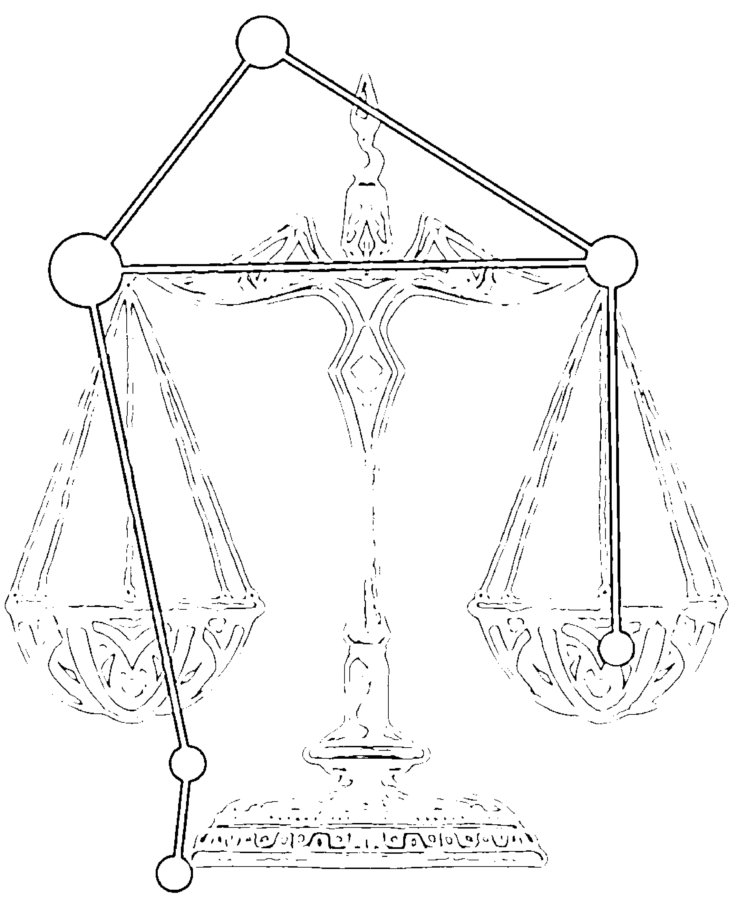

# 天秤座媽媽

（10月23日～11月21日）

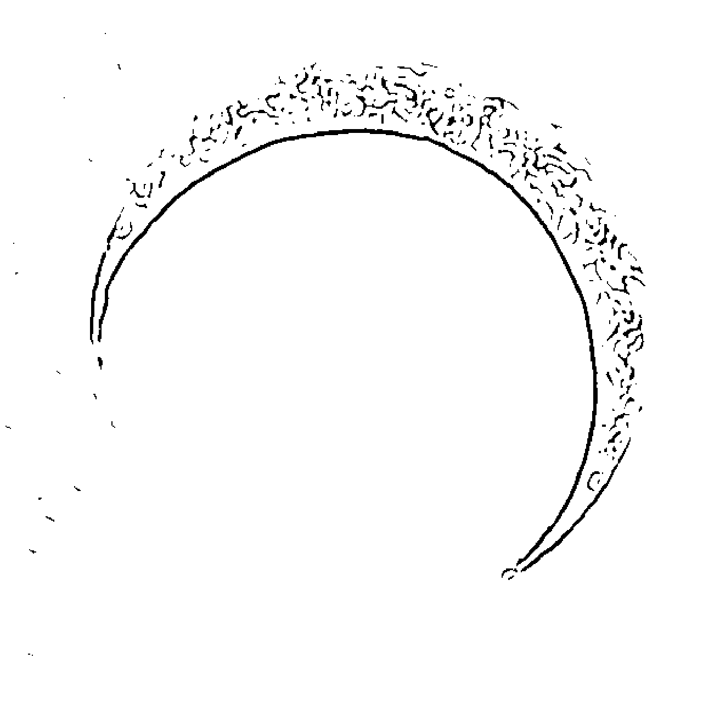

媽咪魔力 妳的優點：
力量、韌性、直覺、意志力

媽媽咪呀 妳的挑戰：
控制慾、神經質、情感疏離、偏執、
對錯誤反應過於強烈

知名的天蠍座媽媽：
黛咪·摩爾、貝珍妮·佛蘭克爾、珍妮·麥卡錫、
希拉蕊·柯林頓、克里斯·詹納、凱莉·魯瑟佛、
伊凡卡·川普、茱莉亞·羅勃茲、卡莉絲卡·佛克哈特、
拉莫納·辛格、瑪姬·葛倫霍、凡妮莎·拉奇

## ☆ 妳的教養風格

天蠍座媽媽是個有魅力的母親：古怪、控制欲強、擅長激勵又令人生畏的奇妙綜合體。依照妳的心情，孩子可能黏妳或在妳一發怒就匆匆逃開。不是說妳會把怒氣全發洩在他身上，而是天蠍座媽媽「殺人般的眼神」就足以讓任性妄為的孩子守規矩。妳有強烈的保護欲，以無可動搖的精神和力量捍衛孩子。妳具備卡梅拉·索普拉諾（Carmela Soprano）的特質：穿著細高跟鞋的黑手黨老大夫人，沒有人敢看妳第二眼。

作為對任何威脅都會炸毛發出嘶吼聲的虎媽和美洲豹媽媽，天蠍座能同時做到保有母性和性感魅力的二重性，這在一個喜歡把女性分為兩種極端「不是純潔聖母、就是惡女耶洗別（Jezebel）」的文化裡，可不是件容易的事；天蠍座女性確實在十二星座中最容易被誤解。妳的外在可能是佈滿荊棘的鐵絲網，只有少數人真正明白妳有多大的熱誠。在天蠍座的毒刺下，有溫柔、強烈的忠誠和同情心，妳會將這些東西留給與天蠍座站在同一邊的人，特別是家人。

天蠍座代表親密和永恆靈魂的連結，一旦妳投入下去，就會是一輩子的事「直到死亡將我們分開」，這是妳按字面意義遵守的誓言）。有三歲兒子夏伊的天蠍座媽媽梅根說：「我的愛非常深刻，這是我作為媽媽的優點，有些人對於我愛得太過強烈而感到害怕。我曾經和一個男人交往，但我的個性似乎能把他臉上的毛燒掉般過於強烈。我不確定他多愛自己，但我強烈的愛令他手足無措。可是在有了兒子後，我人生裡首次可以盡我所能去愛，而且這份愛會被接受和欣賞。」

這也許就是天蠍座在混雜著喜悅與不安下更稱母職，特別是新手媽媽更是如此，但如此強烈地依附某人會是令人驚慌的景象。然而，一旦妳將孩子抱在懷中感覺到連結時，就已經很難回頭。幸運的是，大部分的天蠍座很快就會接受母職角色，妳是個情緒豐富的水象星座，母性特質是與生俱來，因此即使天蠍座還在熟悉未來的世界，但孩子會融化妳堅固的心房。很快地，困難的部分不再存在，就讓它隨之而去。

同時，妳會努力確保孩子的人生不會有任何差錯，就像天蠍座媽媽經理人克莉絲·珍娜（Kris Jenner）和她的卡達夏（Kardashian）孩子，妳努力工作確保家族有個非常堅固的未來，即使這代表需要送他們進入精英預備私立學校、購買投資房產作為未來居住或（輕咳）或代言幾個熱門產品。天蠍座掌管十二星座健康、互助與長期投資的第八宮，財務安全對妳而言尤其重要，母職身分使妳為孩子更鎖定目標努力工作。有七個月大孩子的天蠍座媽媽馬里蒂斯說：「我在女兒出生時就已經設定好她的大學基金，提前把錢存下來，無論如何都得確保她大學學費付得出來。」

直覺性強的天蠍座著迷於人們處事的出發點，孩子無止盡的好奇心對妳來說很具吸引力，這是他們能被塑造與成形的地方。妳是天生的觀察者，但對於觀察目標變成自己時，會覺得不太舒服。每個天蠍座都有深層且私密的一面，這一面可能甚至連孩子和伴侶都無從得知。天蠍座是個神秘、親密以及靈性轉化的星座，即使妳會流露一些情感，但其他部分會被妳鎖入旁人無法看穿的裂縫裡。

然而，妳就像 X 光掃描機能解讀旁人心思，妳的母性直覺可能完全出於心靈感應。天蠍座妮娜說：「我不知道孩子在想些什麼，但我知道他們的感覺如何，即使他們的態度傲慢。」

> 「我媽媽說任何事都只用幾個字表達。」一位天蠍座媽媽二十五歲的女兒克里斯塔說。「我會給她看衣服，問她是否喜歡。她會說：『還可以』。這時我通常會去換掉，因為我知道她不喜歡！」

妳這麼做並非擔心自己變得過於專橫跋扈，因為比起讓孩子深受危險，妳更希望能在這瘋狂世界裡好好保護他，而且其實妳也有自己獨特的地方。妳的第四宮由水瓶座掌管，表現出反抗、前衛思想和反主流文化，是具煽動性的星座。水瓶座有自由的靈魂，讓妳的養育方式有了趣味性的反轉；前一秒是個以鐵腕手段控制的女頭目，下一秒可能是孩子慵懶的好朋友。妳鼓勵孩子展現其自主性，但會提醒他「媽媽一切都看在眼裡」，妳也允許他能突破傳統且自我表達——前提是在可控的環境內。

天蠍座和水瓶座都會被新時代思想吸引。妳會運用風水來擺設育嬰間；孩子在子宮時會詢問通靈老師的意見（只是為了確認她不是由妳可怕的曾祖母轉世），甚至將胎盤埋在後院樹苗下。有趣的是，天蠍座很少會相信人類，但卻容易對神秘學有完全的信任，妳傾向將煩惱轉向詢問命理店的塔羅師或手相術士，希望一些神聖的加持能保證母職身分所做的事都是正確的。

水瓶座是象徵年輕的星座，其影響能幫助妳維持時髦並跟上潮流，正好搭配上天蠍座的魅力，即使妳沒有穿得像母夜叉女神（許多天蠍座會），仍會明顯流露出引人注目的性感魅力。家人也期待妳的意料之外，妳出奇制勝的策略會讓人們驚訝地張口結舌——妳剛剛真的這麼說嗎？喔，妳是。天蠍座喜劇演員羅珊·巴爾（Roseanne Barr），五個小孩的媽媽，她開玩笑地說：「我知道我到家時，我的孩子都還活著，好，我的任務完成了」及「專家說妳不應該在怒氣時打小孩。那什麼時候是好時機？當妳感覺很快樂的時候？」黑色幽默可是天蠍座的正字標記。

家是妳的庇護所，妳會為家族創造一個美麗的空間。妳喜愛蜷縮在舒服的沙發上看電影、一起下廚或（如果妳是情感強烈的天蠍座）和孩子摟抱；和家人一起做事對妳而言很重要。就像天蠍座的茱莉亞·羅勃茲（Julia Roberts）放棄大城市生活，嫁到了寧靜的新墨西哥州陶斯（Taos）；成為媽媽後，妳甚至會搬到更低調的區域。一旦身邊有了緊密的家人，可能一點也不在乎世界發生什麼事，妳會盡力做所有的事，確保家人也能感同身受。

雖然妳直言不諱的天性有時也會產生衝突，但孩子會從妳身上學習大膽和自我表達的特質。妳可能不是個星媽，不過如果孩子有成為巨星的天賦，妳一定會鼓勵他。此外，孩子若擁有堅強、甚至帶點炫耀的性格，妳也會很喜歡。當他在學校遇到困難時，妳會維護到底，妳不是那種會對孩子大小聲「你做了什麼？」的媽媽。妳天生的保護欲直覺（及排他傾向）會假定孩子是無辜的，直到證明是他的錯為止……不過通常也會依據妳的解釋而定。

與天蠍座媽媽生活，可能像個令人筋疲力盡的棋賽，而且最後還是女王棋贏得勝利。妳智足多謀、控制慾強、具操控性及迴避性的特質，如同妳與宇宙間的一場神聖之舞，這來自宇宙的低聲細語，比起其他星座還大聲一些。天蠍座是十二星座裡最具直覺性（甚至神秘）的成員，傾向相信自身內在的引導系統（而且內在的引導鮮少出錯）。妳做的每件事都是刻意而為，因精明的特質，不太會在缺乏策略性的整體規劃下就草率說出或執行，即使沒有任何人知道細節。有時候妳甚至也不太確定為什麼會出自直覺行動，只是感覺到理所當然地去做。天蠍座媽媽代表一股自然的力量，但孩子會支持她！有什麼比知道這件事還更棒的呢！

## ☆ 如果妳有女兒

### 優點

這個世界缺少賦權的女強人，而且以妳所見，這算是個瀕臨絕種的自然資源。感謝世上的天蠍座媽媽，讓未來世界女性領導者的總人數不斷增加！妳將女兒撫養成強烈的女權主義者，對她自身與自身的能力有所意識，而且從不吃任何人的虧。如果女兒想在學校戶外教學日穿蓬蓬裙和球鞋，妳不會阻止她，因為即使她品味不好妳也不願她完全沒品味！

一旦她成長到能發展出更好的流行感時，她一定會「參觀」妳的衣櫥。伴隨著妳銳利的目光、嗅出哪裡有物超所值特賣會的能力，妳會教導女兒如何成為一個精打細算的消費者（要小心，當妳不斷搜尋符合女兒尺寸的可愛物件時，妳的網路購物癮可能會有點失控），但妳會確保讓她明瞭金錢或高級商品清倉的價值。直覺性強的天蠍座媽媽，也會與女兒一起讀大字書籍。除非妳寧願選擇逃避現實，不然妳會在事情發生前就察覺危險所在；若她面臨霸凌、自尊心受損或身體意象議題時，妳會在事情演變成全面爆發的危機之前，就先採取行動，將問題剔除。最後妳還會教導她為自己而戰，她知道媽媽會在一旁為她加油打氣。

### 缺點

請冷靜下來，天蠍座媽媽！妳親自將育兒帶到全新的階段。天蠍座是象徵親密的連結，妳可能很難與女兒完全劃分——是的，尤其同樣的性別更是如此。妳在女兒身上看到很多自己的影子，可能也會將自身課題投射在女兒身上。了解妳們是兩個獨立人格的個體，會是個挑戰，請記住，不是什麼事都一體適用。

天蠍座媽媽習慣對女兒比對兒子還嚴格；妳根本把兒子當寶寶寶寶，就算他已經大到能自己鋪床（及下決定）時，妳還是很寵溺他，但妳卻督促女兒要變得強壯且獨立。有時妳給她的壓力使她有點喘不過氣，反而讓她感到困惑。舉例來說，如果女兒真的不喜歡游泳隊，她不需要努力訓練一整季來「建立她的人格」。不要因為妳習慣過於逼迫自己，就認為其他人也要跟上妳的腳步；放棄並不是都代表懦弱。

嫉妒之心同樣會在天蠍座媽媽與女兒間點燃戰火。因為妳覺得承認嫉妒會有點尷尬，所以當女兒受到爸爸寵愛、與妳爭奪注意力時，妳可能會感覺到有點爭風吃醋的味道。（哎呀！難道妳沒感覺妳和婆婆間的競爭嗎？）因此，當妳意識到自己的占有欲時，請先抑制想說什麼的衝動，而且要記住愛無處不在。妳在任何年紀保持性感與解決問題的能力，可能會有點嚇到正值尷尬青春期的女兒，請試著用不同方式看待事物，確保女兒不會覺得在任何方面還得跟妳比較。

## ☆ 如果妳有男孩

### 優點

呼叫媽媽的好男孩！天蠍座媽媽一看到兒子就會興奮過頭，這小王子不會做錯任何事。妳的小男孩知道他被放在掌心上寵愛嗎？有過之而無不及，雖然這個甜美、脆弱的小男孩的某些行為會讓妳受傷，但同時也融化妳的心。妳向其他人展現出妳無須多言的舉動，因為每天最重要的事就是不停地擁抱與疼愛。妳對他的情緒也很敏感，尊重他的觀點，確保他成長為能處理自己情緒及含有文化素養的人。

雖然妳可能非常愛兒子，但妳仍是他主要女性典範的優秀範例。無庸置疑，兒子會因為妳的緣故受到強勢型女性的吸引，尤其天蠍座媽媽通常是家裡負責發家糊口的人；即使妳不是，也會以堅強意志力和決心做好孩子的表率。即使他與妳作對時可能會感到有點害怕，但他會學習尊重女性……或為他的憤怒付出代價。

### 缺點

督促者模式啟動！妳越愛兒子，越會主動幫他解決問題，不讓他自己從掙扎中學習，只會削弱他的男子氣概。沒錯，妳看到他從男孩轉變成大人時遇到瓶頸，很難拋開想保護他的直覺，母熊想保護幼熊的心態會讓妳很想幫他把事情狀況好轉，最好是能將這隻小熊直接帶回洞穴。無論妳相信與否，兒子知道妳會一直在他左右，但不要替他處理所有問題，否則可能會不經意地培養出一個缺乏自主性與自信的懶鬼。孩子會依妳的期望成長，如果妳設定的標準太低，請從現在開始增加他一些挑戰的機會。

過於嫉妒？妳對小男孩懷有的占有欲可能會使妳的心開始變質，因為妳內心深處知道有天他終究會為了另一個女人「離開」妳（或一個可愛的男人——關於這個部分妳不在意），對天蠍座媽媽來說，這過程不太容易。不過妳得控制那股嫉妒之心，尤其是他們開始約會時，他的女朋友可能已經知道妳是個優秀的女性，所以請不要藉由不友善或過於積極，讓對方穿著絨質的雙腿嚇到發抖。請劃清界線！

妳必須注意不要在兒子成年後，還讓他感到難堪或顏面無光。當然讓他的朋友覺得妳很性感是滿有面子的（而且他可能暗中感到驕傲），但妳不需要在他的足球賽穿上綁帶長靴或皮褲啊！此外，妳對心靈層面的偏好，對他來說也有點超過，如果他不想要妳的鼠尾草束越過他的門邊，或在他長大後拒絕水晶脈輪治療時，請不要試圖侵入他的領地。妳內心只需要期盼他充滿「愛與光」，然後做好自己的事就好，天蠍座媽媽。

## ☆不同年齡和階段的教養

### 嬰兒期（一歲）

開始建立連結！天蠍座象徵親密，與新生兒成為「一體」，就某些層面來說對妳很容易。在這階段歷經的輕觸、撫慰、疼愛和擁抱，會讓妳感到幸福，妳可能會很驚訝妳和寶寶如此快速地一拍即合。但，天蠍座容易變得偏執，因此妳也會設想每件事到最後一個細節可能發生的問題：天蠍座媽媽馬里蒂斯：「女兒出生前，我很焦慮可能發生的每件事。她是個怎麼樣的人？如果我的寶寶不喜歡我怎麼辦？我會不會是個糟糕的媽媽？」

如果妳領養小孩，也會準備好隨時與小不點建立連結。天蠍座是充滿靈性的星座，其主掌十二星座裡的業障與輪迴宮位，妳可能也會相信是這個靈魂選擇妳成為他的母親，而且與他分享了許多前世經驗（總之妳的靈性早就告訴妳）。所以，這真的就是重逢！我們知道的一位天蠍座，甚至在領發現現在的兒子前就先去他的出生現場，並在分娩時協助他的親生母親生產。

如果一開始孩子有腸絞痛的問題，或妳無法好好抱起寶寶時，妳會難以承受；畢竟作為凡事都做到最好、有能力的星座來說，這可能是妳第一次感到無助。馬里蒂斯說：「女兒出生時，體重一直無法增加，時常感到餓，但她根本無法喝奶。前六週真的很煎熬，我想盡量與她親近，但她就是無法開心，我們很慢才進入狀況。我根本無法理解為什麼我就是做不好。」

因為妳是個注重隱私的星座，當眾人目光從妳轉移到寶寶身上時，妳會感到鬆一口氣，所有偶像化與美化孕婦的舉止，對天蠍座來說都不太舒服，甚至有點討厭：是否有陌生人摸妳的肚子？因為懷孕，所以對妳百般奉承？這讓妳差點就想拿出辣椒粉噴霧。

當然不是說妳還沒準備好讓人察覺到妳的身孕，只是當有個陌生人瞧著妳的肚子，或入侵妳的私人空間，對妳來說可是犯了大忌。妳也不是那種任何想抱孩子就交給對方的人，因為妳對孩子可是呵護至極，加上如果對方給妳不太好的印象和氛圍，妳會在他們碰觸到孩子前就找個理由敷衍，像是「她昨天睡很少」或是「我可不想讓吐奶弄髒妳昂貴的衣服，他今天有點想吐。」對妳來說，只要妳還是天蠍座的一天，小心駛得萬年船。

天蠍座掌管生殖器官系統，因此妳在生產前、懷孕期及分娩後，須特別注意荷爾蒙方面的健康問題。如果妳決定在第一年斷奶，可能會特別受到產後情緒問題或不協調情緒轉變上的影響。此外，還有很重要的是，妳可以儲存一些富含營養價值的「超級食物」，像是酪梨、藍莓和深綠色葉菜，這些食物能幫助妳重拾平衡，再加上運動甚至是冥想。

「瑜伽、瑜伽、瑜伽……更多的瑜伽！」一位天蠍座媽媽談到她的救贖：「我渴望寧靜與空間」。妳甚至想去嘗試心靈層面的運動，像是昆達利尼（Kundalini）瑜伽或尼雅舞蹈（Nia），以感官為基礎的運動課程，結合舞蹈、武術和治療，或是鋼管舞作為伸展運動。沒有什麼找回妳的「性感本性」（erotic creature），由

## 啊，天蠍座媽媽！

「S因子」(S-Factor) 創辦人凱莉·希拉 (Kelley Shela) 稱之「更容易幫助妳恢復性感。談到性感，天蠍座媽可能是生產後又馬上懷孕的星座（也許這是為什麼許多我們談到的天蠍座媽媽，她的兩個孩子年紀不超過兩年）。不過至少妳會試著讓自己振作起來，才不至陷入不修邊幅、狼狽的狀態，妳也不是那種會讓自己在家中看起來滿頭大汗的樣子，即使如此，也會看起來相當迷人。

當妳與另一半談到養育責任時，可能會出現適應上的問題。天蠍座具有占有慾，喜歡以特別的方式完成任務，而且通常不太能與他人合作。結果就是，當妳開始漸漸失去耐性時，可能會突然無法控制情感或對另一半下指令。妳必須留意不要讓自己的情緒變得過於極端，否則可能會破壞你們之間的關係；「我積極投入在育兒上，但到了一定程度時，卻對我們的關係有害」。一位有四個小孩並管理公司「momAgenda」的創辦者尼娜·瑞斯特瑞爾 (Nina Restieri) 回憶，「我並沒有努力取得好的平衡。我只是把孩子放在我的第一位，雖然對孩子很好，但卻不利於我的婚姻。」

對小不點過多的關注，會使妳難以抗拒並造成失衡，除非妳呼叫後援部隊；我們知道一些天蠍座媽，會在孩子出生的第一年，雇用晚間照護或一同住在家中中的照顧者。雖然妳是個夜貓子，不過還是需要美容，妳可能像許多天蠍座媽媽及「瘦身女孩」(Skinnygirl) 創辦人貝辛妮·弗蘭凱爾 (Bethenny Frankel) 還經營小型企業，因此妳也會需要腦細胞。看來這些「奢侈品」似乎值得小心分配時間。

或者妳能學習與另一半組成團隊，這樣真的能強化「我們一起對抗世界」的連結。當然，比較簡單的方式是為彼此分配任務：另一半工作，妳育兒，但這樣一分為二的方式，可能會讓你們覺得更孤單和疏遠。因此，只要記住妳的目的不是逼迫另一半（或其他照顧者）完全按照妳的方式行事，重點在寶寶只要是安全且快樂就好。馬里蒂斯：「我更多時候都依照直覺與本能完成事情，但我先生卻需要說明手冊。我通常會聽女兒說話，看著她並嘗試解讀她正在做的事……但他只是按照字面上確認進度表。」每個人的想法都不一樣。

還有一件很重要的事，妳要讓其他人知道妳何時感到掙扎，而不是勉強表現出自己什麼都知道的樣子。在這階段妳比以往還脆弱，妳自己更像個新生兒，但是此時不要過分依賴同一批人的支持。事實上，妳孤立自己的傾向會更強烈，會更容易有產後憂鬱的風險。因此，請試著走出家中，與其他媽媽見面，妳現在需要一個比以往還更大的後援隊加入妳的生活，如果妳發現自己陷入挖苦人或批判性的情緒時，就是需要一些女性朋友的跡象了。

梅根說：「我從來都沒有在人生中感受到如此脆弱的時候。我體會到這是我第一次有多麼需要其他人，有多少事無法自己完成。我花了一段時間才終於開始向其他人求救：『我不會做這個，我快受不了了。』我直接說出重點，因為我太絕望了。我疲憊至極，已經無法動筆或做任何工作。得到回應使我很驚喜，但這對我而言上了一堂重要的課。在我有辦法承認我無法靠自己完成時，切入重點對我來說是個挑戰。」

當然在新手媽媽的階段中，妳可能仍想極度地保護隱私。我們知道有許多天蠍座媽媽對於將寶寶照片上傳到網路上會有所克制，有一些媽媽甚至完全拒絕上傳。如果妳終於放寬心想分享幾張照片，可能會直接安排專業攝影讓妳能發揮創意直接指導。儘管如此，即使妳將照片上傳到網路後，還是盡可能地設定最高層級的保護。

在歷經了引人入勝且超現實的第一年後，妳會重拾內在平靜，妳聰明靈活的幽默感最終會戰勝生活難關。天蠍座對超現實主義的解讀特別內行，很有可能將人體生理功能（和失調）及其他對新手媽媽的侮辱，看成是一場神聖喜劇，此外，只要妳發現有觀眾欣賞滑稽笑話和豐富故事時，就足以讓妳持續在母職的循環裡。很快地會了解到妳不是獨善其身，可能會與妳遇到的一些媽媽們成為一輩子的朋友，光是這個原因就值得讓妳離開原有的舒適圈！

### 學步期（兩歲到五歲）

準備、裝好、壓縮！一旦孩子開始學習爬步、隨意亂跑、從妳手中脫逃並胡亂猛衝時，就能準備向妳渴求的掌控欲說再見。妳不想壓抑孩子的自由，但又非常擔心他的安全，那麼就試著加上插座蓋板、角落保護墊、監視攝影機和安全門欄。此外，妳可能也會收起城市時髦的派頭與生活方式，直接搬到郊區，或是有大面積土地的地方，孩子在那裡能盡情探索，妳也無須提心吊膽擔心他的安危。

因為天蠍座是個專注力十足的星座，無論妳開始做些什麼事，會投入百分之兩百的心力。所以，如果當妳同時工作和照顧學步兒時，只能祝妳好運了，在「媽媽腦袋」與「大人物腦袋」間轉換，會使妳精力耗盡。天蠍座傾向在大家面前表現出完全進入狀況的樣子，妳也真的很享受深度專注的狀態。然而將短暫的專注力在學步兒身上，會消耗妳的精神，就像是妳才剛開始要建造一個樂高塔或沙城時，小不點卻失去興趣或發起脾氣；或是妳想讀《浮華世界》（Vanity Fair）時，孩子只想再看一次《好奇猴喬治》（Curious George），這真的令人感到相當挫敗！

天蠍座媽媽凱特回憶：「我記得我女兒安妮兩歲時，我躺在床上，她爬過我的身體，我感覺自己就像條媽媽狗。我是應該要陪她玩，但是我期望的是能玩一些獨立設施。我不是那種喜歡玩遊戲的人，我比較喜歡和安妮體驗一些事情。那時，我可能是紐約裡唯一一個腳踏車後面有裝椅子的人。她才四歲時我就開車帶她去旅行了。」

過一陣子妳可能真的會暫時脫離狀態，變得漫不經心，因為妳的頭腦真的需要休息了，或許開始創造一些家事任務（像是煮頓精緻晚餐），這樣妳就能在毫無罪惡感的情況下說出「媽媽現在很忙」的藉口。

緊急求救！是時候發出求救訊號了！雖然妳大可委託保母或親戚，但這會帶來另一個課題：天蠍座的嫉妒心。是的，妳會有點嫉妒，尤其是妳的孩子與照顧者開始相處融洽時。天蠍座媽媽妮娜：「我無法在家工作，因為我太黏小孩了，她試著在孩子旁邊設一間家裡辦公室，「如果在我工作時聽到他們跟保母玩，我會有點生悶氣。」

如果你回到工作崗位，或花幾個小時度過自己的時間，可能也需要花點時間處理自己嫉妒的問題；如果你的伴侶是家中主要照顧者，妳同樣也會感到嫉妒。此外，如果保母帶著小不點到市區走走，嗯，妳還是會出現偏執的狀況。一位天蠍座媽媽卡羅坦言：「我會偷偷跟到公園，從樹叢裡窺探兒子的保母在做些什麼，這甚至讓我得永遠帶著保母。我丈夫和我會在晚上帶兒子出去，去紐約的餐廳之類，也會一起帶著我們孩子的保母。」

另一位天蠍座媽媽在她回到工作崗位時，策略性地裝設一個「間諜軟體」。她承認：「如果沒有保母監視機，我根本無法正常工作。」（這位天蠍座媽媽給保母的訊息：這孩子的老妈正在看著你。）另一位天蠍座媽媽則是每天早上會站在公寓門外直到兒子不哭為止。她說：「在那個時間點，我真的很需要幫忙，有個姊姊照顧他讓我鬆一大口氣。不過我會等到聽見我兒子的笑聲後才會離開。」

妳需要重新點燃對職場的熱情、回到自己的生活步調，不過難就難在如何對小孩的事放手。考量預防方式或強迫管理，這樣做在幾年後能讓妳受益。比起其他任何星座，高度專注的天蠍座媽媽，更有可能在照顧小孩裡迷失自己，在未來十至十五年孩子不再依賴妳時，會讓妳陷入身分危機。

當然妳也能回到相同的職場，將事業推向高峰，這有可能為什麼妳一開始得先稍微降低工作強度。然而，此時天蠍座媽媽可能會陷入兩難：從事不感興趣、只領薪水的厭煩工作，對妳而言跟折磨沒兩樣。即使妳可能還沒準備好回到發展完善的工作場合中（妳應該有寶貴的育嬰假），應該還是會在孩子去學校時，計畫做些有價值的事情。此時妳可能需要與一位人生教練合作，幫助妳找出下一步，特別是在妳離開了原本高強度的工作，而妳現在卻完全不想打開手機回到真實世界。

一位天蠍座媽媽的成人女兒莉莉說：「我媽媽放棄工作發育我們。名義上她是個完美媽媽，但我常常感到她內心深處的不幸福，甚至還有點說不出來的抑鬱。現在家裡最小的孩子已經上高中了，但她看起來真的迷失了。我很擔心如果家裡沒人的話她可以做些什麼。而且她已經好幾年沒回到職場了。」

天蠍座媽媽，想想一些警世故事的情節，在這嚴苛的階段還是一線生機。此時，妳能逼迫自己尋找生活的平衡並做些調整，這可能是妳人生第一次這麼做。幸運的是，天蠍座媽媽擅長優先排序及選擇專注在哪些細節上，妳可不想為所有的小事忙進忙出，但對於容易煩憂與偏執的傾向，則需要好好處理或至少重新調整。將妳的精力投入在調查上吧，妳能在網路上搜尋價格實惠的尿布、手推車和其他必需用品，也可以仔細調查學校，甚至搬到能讓孩子獲得最好教育機會的學區。作為水象星座，若妳要搬家，可能也會考慮住在靠近湖泊、河川或海洋的地方。

一旦穩定下來，開始尋找屬於妳的部落，即使一開始只有一、兩位親密知己。雖然妳對自己一些直率笑話或評論表現出無所不知的態度，但通常只會對少數人相處親密。天蠍座不是那種會成群結伴的女孩，妳怎麼可能願意在陌生人面前表現出脆弱的一面呢？

相反地，妳要找到一個能撫慰心靈的社群！對許多天蠍座媽媽而言，這階段所累積的挫折，需要心靈出口：定期運動、前往靜修處、冥想團體，會是妳的救贖。我們遇過一位天蠍座媽媽，她和幾個家庭一起住在共用土地上，在那裡她每個月舉行滿月儀式，為女性創造一個「神聖的空間」，讓大家每個月聚集一起並在有「女神相伴」的情況下保持聯繫。

失去平和與寧靜，對於妳內在反思的一面會帶來問題。無論妳最喜歡逃避現實的方式是上飛輪課或參加威卡魔法工作坊，都不要覺得這必要的「個人時間」是種自私行為。天蠍座很容易吸收他人的能量，妳需要踏出家門，讓身心靈重新充電，這會讓妳在各方面成為一個更好的媽媽。

如果敵不過他們，那就加入他們。和孩子一起泡在浴缸裡洗泡泡浴；一起去海邊旅行，享受沙灘與衝浪帶來的療癒效果；找妳最喜歡（而且可能是唯一）的媽媽朋友一起帶孩子出去閒晃，這樣能夠培養感情及補充能量，也許會讓妳筋疲力盡，但也可能會滿載而歸！

### 童年早期（六歲到十一歲）

歡迎回到妳自己，天蠍座媽媽。孩子回到學校、變得更獨立後，妳就能深吸一口氣，恢復原本的生活，有時間能本讀書、進行商業活動、恢復心靈練習、培養創意與熱情，終於有自己的時間了！甚至和另一半來場浪漫的週末假期，將孩子交給祖父母或親戚，都會讓妳感到舒暢。啊，晚上約會，那遺忘的快感……

孩子去學校後，可能是妳第一次體會到空巢症候群的來襲，這樣的分離起初可能難以忍受，但現在孩子處在妳能稍微信任他的年紀。因此，如果妳還有較年幼的孩子或青少年，妳會將注意力轉移到他們身上，這會是你們母子關係裡最重要的時期。

凱特：「我最喜歡的階段是五歲到十一歲的時候，可以和孩子一起外出吃飯。他現在處於潛伏期階段，會表現出不自覺與自然的狀態，但他仍會在乎妳的想法。我有段時間失去了自我的生活，當時我渴望女兒能去其他人的家，這樣我就能有『自己的時間』—— 雖然我真的很討厭自己內心這樣的想法。」

對於回到職場的天蠍座來說，這可能是妳負責發家糊口的機會。我們知道很多天蠍座女性，其伴侶通常是扮演家庭主夫、處理家務、晚餐、接送等的角色。妳是個善於賺錢的星座，而且如果妳想送孩子去昂貴的私立學校、暑期營和活動，可能也會對金錢上有更多想法。

談到紀律，妳不害怕運用天生恫嚇他人的力量。艾曼達開玩笑地說：「和天蠍座媽媽一起時，家裡『沒有人需要等爸爸回家』。我害怕媽媽的毒刺，從來不敢與她作對。」不尊重會把妳逼到忍無可忍的地步。妳在說話時，期望孩子能仔細聆聽，對於被忽略的容忍度幾乎是零。妮娜說：「我很少生氣，但我一生氣時會真的非常抓狂。我要求孩子做些什麼，他卻公然拒絕的話，真的會讓我很不高興。」

好在天蠍座媽媽的一個眼神和直截了當的指示會讓孩子回到正軌。蘿拉回憶她天蠍座媽媽在商店裡必定會使用的紀律策略，「她大概會降低音量說：『妳現在是要讓我難堪嗎？』我也會馬上讓妳難堪。」這樣的作法已經足以讓我和我哥立刻停止發脾氣。」

談到教導孩子性觀念，天蠍座媽媽通常相當坦白。雖然一些天蠍座媽媽會將這些工作交給健康教育老師處理，不過大部分的媽媽偏愛確保孩子有適當的理解。嘿，妳可是十二星座裡的「性感星座」，妳把性知識當作生活的根本，也不會嘗試隱藏妳的感官享受。比起讓孩子渾然不知，寧願教導孩子這些成熟議題，不過這可能會誘使孩子直接去實驗，增加他無法抹滅的潛在錯誤。因此，如果能保證孩子避免成為《青少年媽》（Teen Mom）演員的候選人，妳會先把尷尬放一旁，好好教導他。

這階段的強制性的加入家長社群可能是個挑戰。既然孩子已經上學了，妳無法再推辭一些必要的家長交流團體活動，如家長會會議、學校會員委員會、運動團隊和音樂會。妳得迫使自己去跟不太喜歡的人交流，還要避免露出不悅的表情。瑪特：「我天蠍座媽媽無法忍受笨蛋，她也不善於隱藏這樣的感受。」

妳的解決方式可能是回到家中打開益智遊戲。亞曼達：「我媽媽不會做任何媽媽以外的事情。她不會趴在地上與我們一起玩，但我知道她會一直在身邊。她不是個直升機媽媽，但當大家在我們家玩時，通常有二十幾個孩子，我媽媽就像幼稚園老師一樣負責在旁邊看顧。」

妳確實需要個人時間，請試著讓自己擁有，以便日後真的需要時能發揮作用。天蠍座傾向「去碰撞、點燃再重拾熱情」。因為妳是個衝破極限的星座，情緒可能也反覆無常；有時非常親切、外向，其他時候則退回到自己的世界裡。一位天蠍座媽媽的女兒回憶：「我和兄弟姊妹還小時，我們都必須待在自己的房間，或每天到外面自己玩耍幾個小時。我媽媽需要有屬於她的時間讓自己充電，我們在房間玩的時候，她則會看書。」

確保妳有自己的避風港，即使只是浴缸也無妨，這樣當妳心情抑鬱或感到緊繃時，就能有個地方釋放累積的情緒。只是要確定讓孩子知道並不是他做錯什麼事，不然妳不太說話時，他可能會覺得有點害怕。妳不了解其實妳有多麼讓人感到畏懼！

即使妳會表達嚴厲的愛，但妳情緒上還是會跟著孩子做調整，對他們的發展隨時謹慎。妳可能會督促他在學業上的表現，但同時也擔心他是否有遇到任何掙扎。如果孩子在學業遇到困難，妳不會責怪他，反而會研究問題所在；也許是學校或老師不適合他，也許是坐的位置聽不到講課的內容，在問題上多加琢磨，尋根究底找出問題根源。

我們知道的一位天蠍座媽媽在家教育孩子多年，後來她轉向前衛的方式，使用「非學校教育」教導孩子進入「人生學校」。孩子的好奇心會由媽媽的教育引導，透過玩樂、家事和她自身的發現來學習（給天蠍座媽媽的福利：這樣能讓孩子整天待在家中）。當然後來這位媽媽的小孩進入了優秀大學，所以這樣的作法有其重要意義，天蠍座一直都是開創潮流的先鋒！

事實上有許多天蠍座媽媽對教育改革充滿熱情，畢竟妳可能多年來對自身學校教育也抱有一些無法理解的部分。妳的星座掌管心理學，妳也熱衷於孩童發展。天蠍座演員歌蒂·韓（Goldie Hawn）是位虔誠佛教徒，她為其非營利組織「韓氏基金會」（the Hawn Foundation）打造了前衛的課程「心智成長計畫」（Mind-Up program），以佛教技巧「正念」訓練學齡孩童，協助他們管理壓力、調整自身行為、學習專注並培養更好的同理心，真的是很酷的課程！

### 青少年期（十二歲到十八歲）

歡迎來到青少年暴風雨來臨的前兆：妳與他的心情變化、妳與他的鋼鐵意志，都會發生在一個屋簷下，是的，你們的關係可能變得緊繃。

青少年時期對任何一個家長來說都是個挑戰，但是比起理解它，妳更有可能會先做好萬全準備，畢竟妳知道何謂緊張的情緒波動與情緒風暴（完全不在意那些諷刺和乖戾態度——是的，妳也會有）。

在掌握他從可愛孩子轉變成製造麻煩者前，妳仍需要一些時間適應。直到現在為止，你們以前的關係還很親密，不僅像朋友，而且孩子聽話，遵守妳的規則，不會試圖挑戰。但現在開始他會頂嘴，或是即使妳盡了最大努力，他還是會把妳推開。

當孩子開始出現拒絕的行為時，妳會想是否自己做錯了什麼，畢竟到目前為止，妳對孩子的一舉一動幾乎都能覺察到。而且妳會調整到孩子的頻率（妳從不會讓他感到丟臉或覺得妳不夠時髦，就像其他媽媽）。實際上妳還可能在許多場合裡被誤會是年輕、流行（性感）的保母，謝謝大家誇獎。

但現在媽媽的工作感覺吃力不討好，不是說妳在意自己是否成為重量級人物，只是妳無法理解被看成是無趣角色。妳仍是很潮的媽媽，孩子五歲時為他穿上迷彩褲子和搖滾樂團T恤，但現階段的孩子看到妳只有一個想法：老。

妳已經習慣在家裡當受人注目的對象，不料卻發現妳的青少年現在正獲得所有的人目光；妳的內心可能有點吃醋，想努力維持（並用其他方式）妳年輕的外表。不過，老天爺啊，妳可不想成為那種外表看起來四十歲，卻行為表現出像二十一歲的樣子，或至少不會這麼明顯地表現出來。

在這時間點上，是時候在更深的層次還有控制方面做些改變。妳必須退出孩子的生活，回到自己的軌道，當然這很困難。這段期間對孩子的獨立成長相當重要，如果妳停止讓他成長，未來幾年妳會後悔的（想像下列畫面：二十三歲的孩子站在門前，提著行李，跟你說他要搬回來）。若你不想提供孩子空間，他可能會大聲責備你、試圖宣示他的主權，這肯定會讓你的心情很難受。當然孩子離開時，你很難不在意，尤其在他想要裝酷，以為自己了解所有事時。一位天蠍座媽媽承認：「當孩子不再依偎、摟抱和牽手時，我真的很好過。」

青少年不尊重的情緒爆發，可能也會喚醒你內在憤怒的魔鬼，儘管你顯現出堅不可摧的樣子，其實你是個相當敏感且情緒豐富的星座。當你感覺受傷時，脾氣會變得一觸即發，此時連地獄怒火都沒有像天蠍座這般憤怒。雖然你以為自己不會落入這般田地，但我們曾聽過不聽話的青少年激怒天蠍座媽媽，導致火山爆發的故事。

作為象徵力量和控制的星座，你的憤怒在這階段肯定會失去控制，請隨時打電話給心理醫師和幾個親密好友（及敲碎幾瓶你手邊的灰皮諾葡萄酒）。你也需要喚醒自己青少年時期有多固執的回憶：沒有任何人能跟你說任何事。也許你害怕孩子會步入你過去極端的下場，然後利用任何他手邊能得到的人事物做測試，請死了這條心吧！狹隘目光可能讓你變得更無知，而迷失方向，開始小題大作。

事實上，恐懼是讓你感到沮喪的根源，容易擔憂的天性通常會使你無力。你不相信任何人，特別是容易影響青少年的朋友，和他們爭奪孩子的注意力，像是一場與赤手空拳的對手（他們會有厚重眼線和體香劑）的鬥志戰爭，然而更令人無助的是，無論哪一種，天蠍座都無法長時間忍受。

妳會竭盡所能確保家庭維持緊密關係，提醒他黑手黨媽媽的風格，讓他除了家人外，無法百分之百相信其他任何人。如果你還帶他去很棒的旅行、為他舉辦奢華的十六歲生日派對、買昂貴的衣服，都能強化妳「血濃於水」的信條，妳可能會不時採取這樣的策略。倘若賄賂能讓孩子遠離危險，妳會為達目的不擇手段，對吧？

感受到青少年時期有多艱難時，妳可能也會採取預防性的方式。我們的朋友南西·格魯（Nancy Gruver）是位哈佛畢業、擁有一對雙胞胎的天蠍座媽媽，她在女兒十一歲時，創立了女孩成年雜誌及線上社群《新月女孩》（New Moon Girls）；她受到卡羅爾·吉利根（Carol Gilligan），這位性別研究學者具開拓性的作品產生很深的影響，發現女孩在青少年時期會失去她獨特發言權與身分認同。如同一位天蠍座的特性，南西廣泛研究雜誌和資源，試著尋找出幫助女兒經歷這段過渡期的方式，但一無所獲，於是她決定（和她的丈夫、女兒）創造出自己的方式，結果一本為女孩而寫、具影響力的雜誌在一九九二年誕生。

讓孩子接受教育且充分了解是很好的策略，這也是妳現在想實行的方式。比起保護他、限制接觸外界的機會，不如逼迫自己讓他坦然面對現實。作為十二星座裡的性慾星座，妳可能不會介意教導他生活中實是求是的精神，與其受到同儕錯誤的影響，親自教導他會更好，此外，妳有時不拘小節的習慣，也會跟他開些黃色笑話。妳的希望就是對此保持開放與習以為常的態度，讓他知道可以隨時來找妳問問題。

因為天蠍座喜歡儀式，妳會將他各種成長里程碑轉變成一些特別場合。當青春期來襲時，為什麼不為他慶祝呢？如果女兒月經來臨時，可能會帶她參加紅帳篷儀式或請她一頓特別午餐；如果是兒子的話，妳能鼓勵他邀約女性，確認他是否已經有想約會的理想對象。這樣開放的政策在他面臨青少年一些無可避免的混亂時，會是很好的方式；畢竟天蠍座媽媽很會處理各種危機狀況。即使妳自身情緒失控，瀕臨失去理性，但當孩子處在痛苦時，妳仍會維持堅毅和理智的一面。只要妳感覺到他的困難，就會立刻處理。

妳的孩子知道妳的力量有多強大，也許這就是為什麼有時他會強烈地反抗，並不是他覺得妳很弱，而是他想要找到自身的力量，證明自己能在沒有媽媽的情況下挺身而出。天蠍座媽媽凱特：「我女兒在青少年時期那幾年，她必須遠離我，因為我太固執己見了。所以在她去上大學時，她的爸爸和我真的覺得『好……去吧！』」

即使孩子翅膀硬了也不用太擔心——他會回來的，即使妳可能因為在這段發生衝突的時間不太相信。因為妳相當注重心理意識的層面，妳會廣泛閱讀這年齡團體行為模式的相關資訊，這些將成為妳的救星。一位天蠍座媽媽讚揚一本關於青少年的書籍《家家有本難念的經》（Get Out of My Life but First Could You Drive Me and Cheryl to the Mall?），這本書幫助她們騷亂的關係產生好轉。而且說不定學習人類動機、神經科學和人類發展會成為妳新的投入主題，誰知道呢？妳自身的研究甚至會引導妳激發出一條新的人生道路，一條妳能在孩子踏入社會後追尋的道路。

### 掰掰，小鳥離巢（十八歲以上）

天蠍座媽媽在孩子成年後會變得更閃耀，特別是你們歷經過渡期、彼此關係沒有過多依賴時。妳具有穿透力的洞見和情感力量，能在孩子走進又大又糟的世界時成為他的依靠。「當需要母親時，我很高興我有位天蠍座媽媽。」亞曼達說道，三十五歲的她離家後跟媽媽變得更親近。「我媽媽是我所知道最聰明、情感最豐富、最有才智的人。我打給她時，她會一直跟我聊天，她總有一些很棒的事可以分享，但我年輕時都不知道要感激她。」

放手讓孩子離開會是很難的一件事，對天蠍座媽媽尤其如此。當孩子到外縣市大學就讀或搬到國外時，妳可能表現出一副冷靜、沒事的態度，但其實內心感到一陣悲痛，特別是剩下妳一人的空巢狀態，嚴重的被遺棄問題會爆發出來。即使妳心裡很清楚這樣很不理性，但妳就是無法抑制自己將這些投射在孩子身上。一旦天蠍座對另一個人提出情感上的擁有權，這會是一輩子的關係。當孩子選擇搬到離妳半徑範圍內的地方，雖然妳能開車運送補給包，或幫他的起步房擺設家具以符合妳得來不易的認同，但妳其實對這件事很難不在意。

三十六歲的克莉絲汀：「我最近買的家具，看起來都像我媽媽會喜歡的風格，而且她很高興。她感覺有點像是：『妳看，妳繼承了我的品味。』唯一的差異是她是天蠍座，她的家具都是柔和色系，而我是獅子座，所以我的沙發和椅子有相同的款式，但我的坐墊都是明亮色系。」

妳無法抑制自己，因為妳就是要看到妳與孩子間的連結仍然存在。是的，妳渴望被需要。所以妳會讓鳥巢保持豐盈且舒適的狀態——設下（父母）的誘餌，這樣孩子就會想要回家。天蠍座是誘惑的高手，妳會使用所有的甜蜜武器。二十五歲的克莉絲塔：「我的天蠍座媽媽常常打給我問說：『何時會回家？』。她不會問我這週有什麼安排，即使我住在紐約，而且還有個男友。她只是問說我會不會帶他回來，然後我們吃些什麼好。」

亞曼達的天蠍座媽媽萊蒂在將三個小孩養育成人後，開心地重新擁有自己的空間。亞曼達笑著說：「她已經任務完成了。不過，萊蒂的家仍是所有家庭晚餐與假日的中心，『我媽媽不想要小鳥離巢後都不回家。』她解釋。『她想要我們離開鳥巢，然後還是要常常回來。」

當家人圍在桌子旁，妳可以掃過每個人的臉龐、舉止和身體語言，直覺地判斷家人是否都過得很好。天蠍座是十二星座的觀察者、一個眾觀全視野的老鷹，如果妳察覺到一些不對勁，會把孩子拉到一旁，並詢問（或有禮貌但重點式地詢問）發生何事。在孩子承認所有事前，只要小心選幾個字就行；天蠍座媽媽具洞察力的銳利目光，就像結合X光掃描機和謊言測試機的綜合體。妳對孩子的選擇也會毫不猶豫地加入討論。一位天蠍座的女兒打給她媽媽，很興奮地分享她想和男友在一年內同居。比起陷入興奮情緒，這位媽媽反而是微妙、間接地問：『妳認為他在那之前會先做一個『大買賣』（房子）嗎？』

嘿，天蠍座媽媽知道如何使用權力與尊重，如果妳有女兒，妳寧願她的男友在真的開始認真思考前先「為她戴上戒指」，或者妳可能不鼓勵孩子在還沒找到穩定的職涯道路時，倉促決定任何需要永久保證的事物。如同天蠍座媽媽凱特開玩笑說：「我女兒還小時，她對我說：『媽咪，讓我們假裝我十五歲，有個寶寶。』我回道：『讓我們假裝妳現在三十五歲，然後考慮生個小孩。』」

妳知道如何使用贊同與不贊同的權利形塑孩子——妳不會因為孩子成年了就停止這麼做，而且擅自決定十次中有九次都是自己正確。然而，有時候妳需要在衝進去拯救他之前，讓孩子藉由一些艱困經驗學習事物。一位天蠍座的成年女兒承認，她對做決定常常會很焦慮，會變成這樣的主因就出在她的媽媽太能幹了，因此她以前都不需要擔心。她說：「我最近不再每天打電話給我媽媽了。以前我可能只要感到焦慮時就打給她，但我理解到我太依賴她的力量了。我時常想『媽媽會如何認為』或是『媽媽對這件事有什麼看法』。

當妳感覺到自己不再擔任孩子最終意見提供者的角色時，這真的如扎心般痛心，不過妳可能會給予反擊。天蠍座是代表復仇的星座，所以請小心不要在孩子開始過自己的生活時懲罰他。一位朋友談到她以前曾跟天蠍座媽媽說，她想開始健康飲食、減掉一些體重，幾天後她媽媽拿著一大盤奶油乳酪拌義式寬麵出現在她面前。她說：「我感覺她是不是想刻意破壞我的計畫，不過之後我想到這件事就有罪惡感，畢竟媽媽在其他各方面都一直很支持我。」喔！這就是天蠍座會玩的心理戰術。

即使妳需要制定一些限制，但孩子知道他還是能依靠妳可靠的意見與引導，就算有時妳的狀態有點緊繃也是一樣。就像母女檔演員歌蒂·韓和凱特·哈德森（Kate Hudson）及克莉絲·詹納（Kris Jenner）與她的卡達夏家族成員，天蠍座媽媽可以成為她成年孩子最好的朋友。如果妳有兒子，妳身邊很有可能會有個一輩子的媽寶男孩。（很幸運地，妳能與他未來老婆打交道，啊，妳能處理她，她會是那個需要運氣的人。）

是的，妳會不斷形塑孩子，畢竟這就是妳的工作，妳可沒打算早早退休。然而成功的方程式，就是要擁有少了孩子的生活。因為妳容易過分關注孩子，如果沒有其他生活出口的話，當妳從孩子生活中抽離時會很難受，甚至會有點進入抑鬱的狀態。

在天蠍座戰壕裡就有些中年危機的故事。天蠍座的黛咪·摩爾（Demi Moore）曾與她女兒非常親密，就在她經歷一段艱難的公眾離婚後，三位女孩長大成年，她也來到五十歲。確實，當妳已經不再扮演義務母親的角色時，可能想重拾自己的性感，然而即使妳高興地向他人說現在重新擁有自己的生活，但是當妳已經不再被孩子需要時，這會有多麼難熬。

如果妳在這幾年間犧牲掉自己對感官上的體驗，那麼我們得督促妳重新喚醒這些熱情，不過要注意，天蠍座是極端的星座，妳可能會發現自己從零開始，然後有點衝過頭了。為了想填補先前空白，就急著到刺青店或動起隆乳手術，但在妳決定在臀部紋上無法挽回的刺青前，或讓解剖刀碰觸到妳的臉之前，請先處理好自己潛在的悲傷，甚至是悲慟的情緒。

這關鍵就在於學習如何相信自己的小孩，即使妳是個不相信任何人的星座。他努力獨立成長並非拒絕或拋棄妳，不需要將他管得太嚴或當成小孩對待，並期待他能每天回家（好吧，確實有一點這麼希望）。記住，妳天生就擁有強大的力量，妳的孩子也可能很害怕讓妳失望。因此，請確保他知道自己能為自己開闢一條新的道路，妳也會陪在他身邊隨時鼓舞他。

465 ✦ | 天蝎座

# 射手座

媽媽

（11月22日～12月21日）

媽咪魔力 你的優點：
冒險、智慧、幽默、有觀點

媽媽咪呀 你的挑戰：
缺乏耐心、魯莽、遲鈍、過於衝動且缺乏條理

知名的射手座媽媽：
布蘭妮·斯皮爾斯、貝蒂·蜜勒、
姬蒂·荷姆絲、茱莉安·摩爾、金·貝辛格、
馬伊姆·拜力克、克莉絲汀·阿奎萊拉、
珍·芳達、凱瑟琳·海格、克莉絲汀·雅柏蓋特、
珍娜·布希·海格、莫妮卡、艾莉莎·米蘭諾、
安娜·妮可·史密斯、妮可·伊莉莎白·拉瓦勒（史努姬）、
珍妮佛·康納莉、潔美·李·寇蒂斯、瓊·蒂蒂安、
妮莉·賈塔朵、泰瑞·海契、桑雅·摩根

## ☆ 妳的教養風格

作為十二星座中最自由的靈魂，育兒對妳而言是個有趣的調整。行事即興的射手座活在當下，多以衝動和直覺行動。妳重視自己的獨立性，這新的階段帶給妳一種不真實的感覺；妳是誰——領導者？重量級人物？育兒對包含小甜甜布蘭妮、史努姬（Nicole Snooki Polizzi）和安娜·妮可·史密斯（Anna Nicole Smith）這些射手座來說，都會是生活型態上的大轉變。比起把孩子當成笨蛋，妳反而對孩子感到驚奇，將他當成真正的人對待，同時花上大量的時間與能量來照顧孩子。妳那種「先安排然後再看看之後如何」的生活方式已經無法應付，即使妳擅長計畫，但自己的生活已經充滿各種行程。現在妳需要整合另一個人的需求，將其納入妳繁忙的例行事項中。

調整生活的比例分配可能需要花點時間。射手座由木星掌管，代表極端與豐盛的行星，射手座不是過分使用（自己工作到筋疲力盡），不然就是避免投入；妳以先下手為強再提問的行事風格聞名，不過這樣膽大的靈魂運用到母職身分時，將會是把雙刃劍。其中一面是，妳的隨意而為會讓生活有趣：將小孩放入車內，開車到別的縣市買煙火或觀看馬戲團表演、給孩子抹上奶油的鬆餅當作晚餐、將剩下的中國菜當作明天的早餐（嘿，至少他們會吃，對吧？）而且妳會拉著大家來場即興假期或睡衣派對，嘗試一般媽媽不會做的事，但講到計畫和構思……就沒什麼想法了。

在星盤上，射手座的第四宮由夢幻的雙魚座掌管，這星座表療癒、幻覺與同理心。雖然妳是個有衝勁的人，但母親身分會為妳帶來柔軟的一面。雙魚座以模糊界線為人所知，這樣的性質可能成為妳育兒上的挑戰。像是在還沒了解事情經緯前，可能就先感到愧疚，或是過於介入孩子個人問題，甚至可能變成一個「殉道者媽媽」，犧牲自己的底線再感到後悔，以及冒過多的風險。

制定紀律對妳而言也很棘手。因為妳對設定界線感到困難，這也許是因為妳本身幼時未解決的課題所致。一位喜愛流行文化的射手座媽媽：「我試著讓女兒遠離電視，但結果就是她跟我一樣也喜歡媒體文化。」限制過多不是妳擅長的事，畢竟妳是個充滿好奇心的靈魂，所以妳也不想阻止孩子探索世界。

雖然扮演「黑臉」可能不太有趣，但孩子需要有組織性的教導，給自己時間適應——是的，妳得為成為媽媽後失去的自由哀悼。一些射手座對於「無趣」和育兒裡乏味的細節（這占大部分的生活）不太能容忍，那些「習寶適族」和學齡前兒童，就像幼稚園申請書裡一些邪惡的「尿布精靈」偷走妳的身分一樣。比起其他星座，妳更需要確保保留有自己的自主權和「個人時間」——這讓妳快樂及成為更好的人，而且不需要任何罪惡感！

育兒是場長期抗戰（雖然也令人驚奇），對妳而言最明智的選擇，就是將其看作是一趟冒險。基本上，我們建議妳：問問題、尋求建議、吸收外在意見，接著加入自己的個性與信仰，揉合成適合的方式。獨立的射手座女性會走出自己的道路，而且沒有其他人能介入。事實上，妳可能是所有星座裡最有可能意外懷孕，或是靠自己撫養寶寶的媽媽——「自主性單親媽媽」（Single Mothers by Choice）裡的活躍成員。妳先斬後奏，假定事情最後會順利形成，但通常都缺乏認真的思考過程，可能也傲慢地拒絕任何意見和協助，但最後通常妳都得自己嚥下這口氣，然後別人大概會這樣對妳說：「看吧，我就告訴過妳了。」

射手座媽媽以短暫專注力和無止盡的多工聞名，這樣的特質會在孩子變成一個行走的獨角戲機器時，讓狀況變得棘手。當妳還沒將整個客廳佈置成類似「Elle Décor」的風格時，「媽咪，為什麼天空是藍色的？」這可愛對話在空氣中飄散，但妳在忙著為牆壁上料和修復原本的冠頂飾條，實在很難同時主持小孩的Q & A時段。有時候，妳需要強迫自己從手上的工作抽離，專注在小孩身上。小孩直覺很強，越是忽略他，他越會努力爭奪妳的注意力。

所以這十二星座裡的派對女孩，到底如何蛻變成家長會會長呢？哈囉，存在身分危機……或許根本沒有。射手座媽媽最好的策略就是採取「無法打敗他，那就加入他」的方式或是專家所說的「平行遊戲」——為廚房上九次油漆？給寶寶一把刷子和一些顏料，給他一個角落上色；種植一個英式花園？給他一個小型澆水器、小花盆，培養他成為小小綠手指。這麼做的附加價值是能培養他的領導力、技能建立以及從一起完成任務中享受一點成就感。記住，妳的孩子只是想和媽媽一起，感受親密與連結。將這些事物納入妳的冒險，然後妳會發出讚嘆聲，因為妳會在兩代之間獲得雙贏的局面。

形塑健康的關係對一些射手座媽媽來說是個挑戰，因為妳太獨立了。妳特立獨行，希望孩子凡事都要詢問過「媽媽會不會生氣」。共同撫育孩子對妳而言也很困難，如果妳和伴侶一起撫養嬰兒，可能想找些朋友給妳支援和聆聽，這樣就能在安全的環境下大吐苦水，跟她們說些另一半做了哪些讓妳發瘋的事，而妳坦率的發言也會讓其他人歡樂（有時候則是驚訝）。此外，妳會找出有創意的解決方式與新技巧挽救你們的關係。

記住，不是妳不愛妳的小孩，也不是妳沒有資格成為一位好媽媽，但是當「自由」是妳的最大特色時，就得在處理一個需要照料的孩子及忙碌行程中取得新的力量。如同射手座朋友亞曼達所說：「我只是碰巧成為媽媽的人，而不是碰巧成為人的媽媽。」就算所有一切失敗了，記住，在母職裡沒有這麼多尊嚴的問題，就利用妳先天的幽默感看待這場神聖喜劇吧！

## ☆ 如果妳有女兒

### 優點

認識妳未來最好的朋友！作為一個富有智慧的星座，妳迫不及待將所學的一切灌輸給妳這位敏感的迷你版，妳渴望將她形塑成一位未來的女權主義者或有勇氣且獨立的小領導。不像一些其他媽媽將女兒當作展示品，妳可能禁止任何過於女性化的事物：裝飾蛋糕的蝴蝶結、摺邊禮服、寶寶穿耳洞及任何限制孩子移動的東西，或是讓她看起來像待在烘培坊的櫥窗，無處可去。

作為一位獨立女性，妳會成為女兒積極的模範，教導她成為敢言且自主的人。妳不會讓她變得無助，會為女孩建立自信，鼓勵她為自己的信仰發聲。雖然妳不太喜歡親手做些孩童藝術和手工，但是妳會讓她接觸其他冒險：旅行、前衛想法，甚至是創業。妳想要創造一位「世界公民」，她對於表達問題不會感到不自在，並在各種文化中茁壯成長。

### 缺點

請注意！對於靜不下來的射手座媽媽來說，打破常規及進入小女孩世界可能會有難度，特別是女兒非常女性化。雖然泰迪熊下午茶派對創造一個拍照機會，但這時間長又累人的還要擺姿勢（……現在這個熊熊拿著一塊餅乾……然後這個需要喝一口茶……）會使媽媽放空。

當女兒開始面對那些煩人的青少年課題時，妳會用嚴厲的愛或快速的解決方式應付，但這對她不會有幫助。妳的個性會主導一切，所以有時妳需要削弱氣勢，以防止即將發生的女強人對戰。相反地，妳能使用蘇格拉底提問法——詢問一系列發人深省的問題，幫助她引導與找出自己的結論。

妳自己的競爭欲（是的，妳的男子氣概）可能會注入女兒反男性情緒的觀點，長遠來看，這無法提供女兒足夠養分。雖然妳可能是激進的女權主義者，但請記住，在這裡真正的敵人是性別不平等，不是男性（或者如妳大學社會學課程提到的「父權主義、男性主宰和文化霸權」）。請記住不要在妳家出現貶低關於小伙子的評論，或創造一個「少女」酒吧。

## ☆ 如果妳有男孩

### 優點

就如典型男性一般對話直接的反應，射手座的坦率能與兒子打成一片。此外，因為妳對他予以尊重與誠實，他會學習到將女性看成是聰明且會表達珍貴意見的人。妳教導他許多公民應知的事物：如何成為一位友善且尊重不同性別、環境及來自不同背景的人，藉由讓他參與特別的課程促進他的好奇心。許多射手座都是戶外派，妳也喜歡與他一起爬山、野餐及露營旅行。

這小男孩脆弱的地方對妳來說也覺得可愛，多年來妳會設法持續關注他敏感的情緒。在妳的關心之下，他感覺自己被理解，可能會嘗試藉由提供意見、提高他的自尊心，和他談天說地以維繫你們的連結。他知道妳會一直認真傾聽。為了讓他發揮最大潛能，妳會給兒子像「我相信你」的訊息，帶著媽媽的信念與鼓舞，他未來一定會邁向成功的道路。

### 缺點

成為一位能和兒子聊任何事的酷炫媽媽很棒沒錯，但成為兒子最好的朋友終究不是最好的主意。在某個特定的時間點，男孩必須離開他的媽媽（專家說這早在十八個月時發生）並成為他自己，這代表他要在沒有妳的確認下學習做決定——無論妳如何引導他。當然妳認同他是好的，但在特定的時間點上，你不認同也是可以的，妳能適當地跟他開玩笑，稍微開自己的玩笑，拜託，只是要避免一些隱喻性的對話內容。即使妳會和男性友人分享且擅長「男人對話」，射手座媽媽始終不屬於男人窩。

射手座媽媽擁有無與倫比的能力，所儲藏的能量會意外地削弱男孩的男子氣概。妳可不想在他高中三年級，還幫他完成所有事、介入他的感情選擇，或把他當成仍是你的「胖嘟嘟火車頭」，養育出下一位世界級的媽寶男孩（或一個懶鬼……或一個罪犯）。妳的兒子實際上也確實會從妳對這個媽媽星人所付出的嚴厲的愛裡獲益。

幾乎每個射手座女性都認為傲慢的男人低估她們的能力，妳對沙文主義容忍度的表現幾乎跟面紙一樣薄。但請小心不要將個人對男性的衝突投射在兒子身上，妳能試著在優秀的心理醫師的協助下，針對任何未解決的父權議題做些內在對話。

## ☆ 不同年齡和階段的教養

### 嬰兒期（一歲）

歡迎來到超現實世界，這裡有位完整人類對妳百般依賴。雖然妳花費一生避免接觸這樣的相處方式，但現在妳沒有轉圜的餘地。隨著新手媽媽身分帶來的幻覺，會帶給妳瞬間、單純的幸福感。妳手中這小小的生物對妳眨眨眼，新生兒的味道有如美麗的生命連結。

新生兒可能迫使妳放慢腳步，對繁忙的射手座來說並非壞事。雖然可能會有無法入眠的夜晚，但大部分的嬰兒一天需要十六小時以上的睡眠時間（或依父母守則而定），妳還是能檢查電子郵件、遠端工作，在生產完後恢復期間或適應領養過程時看著喜愛的電視節目。此外，會有些人來拜訪妳，這剛好是社交星座喜愛的，即使妳累到幾乎無法參與他們。

帶嬰兒外出走動是一項大的挑戰。妳不喜歡關在家裡，但是拖著嬰兒車的麻煩、在公共廁所換尿布等就足以讓妳不想出門，然而足不出戶的射手座會變得淒慘，這使得妳會拉著每個人不停抱怨。

荷爾蒙是產後憂鬱的因素之一，使得自我孤立的射手座變得更沮喪。此時，請主動出擊！多花點錢買台高級的嬰兒車或二手的也無妨，將寶寶的午睡時間與自己的探險時間結合起來，逛書店、剪頭髮、前往稀奇跳蚤市場，甚至與朋友來場女士午餐，推車上的寶寶通常會睡得祥和。因此，盡可能地調整你的生活，讓時間更有效利用，妳完全不需要被新手媽媽的身分綁架。

歐菲拉發現在紐約市當新手媽媽的日子裡，有些令人意想不到的地方，像是在稍微高檔的西班牙酒館或生蠔景觀餐廳裡，一個睡著的寶寶絕對是受歡迎的人物。妳的小不點可能還會受到店裡員工額外的寵愛（有人不愛小寶寶的笑臉嗎），會有幾雙手臂輪流等著摟抱這個小天使，就在妳狼吞虎嚥地吃著西班牙燉飯和肉腸，或是從下午三點開始享受一杯優良的里奧哈（Rioja）紅酒時。

在成為媽媽以前，拜訪一些喜愛的場所對射手座來說不可或缺，因為妳感覺到在這個小傢伙來臨後，妳會失去自己的身分。但請記住，母職會是妳人生新的部分，而非性格上的轉變。雖然妳可能會覺得有時自己變得邋遢、醜陋、老態或懶惰，但請不要對此動怒，因為這些都會過去。

這階段另一個調整是讓其他人幫助妳。射手座女性身上擁有「每個姊妹都流有為自己而做的血液」，要妳依賴家人或朋友的慈善心意，對妳而言不容易。像妳凡事都自己動手做的人，不太擅長開口要求他人協助，但在這階段，妳需要這麼做——如果妳想一週洗澡超過一次。妳雖然喜歡按照自己的方式行事，但稍微鬆開這樣的控制，會讓妳有更多時間恢復活力。

生活裡其中一個最大矛盾是，承諾反而讓妳覺得自由；一旦妳對某些事情許下承諾，就會有個清楚、專注的目標，能避免因猶豫而浪費寶貴的能量。說不定一個新生兒最終會讓妳變得更有生產力且更有自信。

### 學步期（兩歲到五歲）

學步期會是射手座最艱困的階段，為什麼呢？因為面對一個跟你一模一樣的人：一個拒絕接受指導、完全沒耐心、要求立刻滿足及對極限無知覺的人，他就像是一個過濾裝置，阻絕掉「沒有」這個單字，然後不斷挑戰規則。是不是聽起來很熟悉？

魔鏡啊，魔鏡，你們真的一模一樣，現在又該如何呢？每小時出現另一個崩潰危機讓你身心俱疲，有辦法對孩子喝奶時說不，嘗試斷奶嗎？如果他大哭到變得抑鬱怎麼辦？最好還是屈服？他以後長大了會記得這時候的事，然後討厭我嗎？

這個受到先天限制的學步期不會與你的線路完全一致。妳是個獨立個體的靈魂，總是擁有一群朋友、自己的嗜好與興趣，突然間，妳所有的創造性能能量都要用在確保兩歲寶寶是否會突然衝到馬路、吃東西不慎嗆到等，妳不太習慣全神專注在另一個人身上，這讓妳徹底迷失方向。

是時候找些救兵了！將工作分擔出去吧！妳可能會發現現在承認自己沒有想像得這麼能幹時，其實內心相對平靜，妳只是需要想辦法通過這幾年的考驗，不用試圖改變自己太多（雖然妳之後會知道縮減和簡化人生，確實會得到好處）。因此，在妳學習如何停止與妳的小侵略者妥協前，他在這個階段會好好的，而妳……可能還會受到束縛所抑制。

問題在於，媽媽通常對於「沒辦法任何事都表現完美」而感到丟臉。由於受到電視媒體上常稱呼的「媽媽戰爭」的影響，媽媽常被說自己不夠好，如果沒有隨時環伺在寶寶身邊、滿足他的需求，就說媽媽忽視小孩。管他什麼罪惡感，如果你自己無法處理，大可每晚讓保母哄孩子入眠。妳不是個糟糕、失敗的媽媽或騙子，畢竟妳未來還是有很多年用可有意義的睡前故事彌補，這時孩子也確實理解，甚至會記得妳為他做了哪些事。變成直升機父母——敬謝不敏！

如果你還是堅持自己做所有的事，那麼將目標轉向團體的力量。在這階段，你需要與以往沒參與過的團體交流，但問題是，所有媽媽聚在一起的景象讓射手座起雞皮疙瘩。妳只是無法用「妳懷孕了？等等，所以我……我們做朋友好嗎？」這樣平凡的理由與他人結交。對射手座來說，生命很短暫，妳無法花時間在只有拍嗝衣和私立學校申請這類無聊對話的人身上。但妳可能還是需要克服這類有點勢利的對話，強迫自己參加一兩個新的媽媽社群，取而代之的是妳會得到資源及需要的創新想法。

不快樂的人喜歡向人訴苦（是的，我們是這麼認為），有時候在筋疲力盡的階段，只能依靠同樣使用創意養育孩子的酷炫媽媽，到最後妳就能慢慢挑選妳想相處的對象。如同射手座亞曼達所言：「妳只需要一個朋友。」如果妳找不到那一個人，就算了，管他的，打開你的心房，多多嘗試幾個媽媽團體，直到找到適合的。我們都是人，如果你真的感到孤單，請給對方一個機會，因為妳現在的敵人是孤獨。

此外，聚集一群沒有小孩但喜歡小孩的朋友，讓他們當孩子的榮譽阿姨和叔叔，不管是在街上追趕瘋狂的學步兒、或與孩子連續玩五個小時的躲躲貓，他們比較不會疲憊。這樣還是應付不來？那麼運用「一週工作四小時」的原則，透過外包方式創造出自由。讓某人來家中，處理孩子的午睡、在小傢伙睡覺時幫忙摺衣服，妳會因此得到幾個小時的時間及一疊乾淨的衣服。

與單身或沒孩子的朋友一起出去，能提供另一個益處——幫妳一起照顧孩子。不過為了避免這樣的行為變得習以為常，妳一定要保留當媽媽之前有活力與生氣蓬勃的樣子。此外，偶爾不泡牛奶，改去酒吧。花一天裡的一小時（最低限度）去做想做的事並按照自己的行程。找間不錯的幼稚園或臨時音樂課程，過幾個小時後再去接孩子。一旦藉由逛二手衣、在喜歡的法式咖啡廳看雜誌、在房間裡進行「午後歡愉」來恢復活力後，就能進行下一回合的《編個玫瑰花環》（Ring Around the Rosie）童謠和手指畫畫。一些保護寶寶的用品會很有幫助，先將那些會發出尖銳聲響的危險復古家具收起來一兩年，減少那些妳會警告孩子不能靠近的物品，這樣妳就能對這個可愛但有點難以應付的孩子都說「沒問題」。

射手座是個求知者，妳會廣泛閱讀孩童發展、心理學和先進的育兒方式，覺得這些很先進且能掌握，通常也很有幫助。仔細研讀《懷孕知識百科》（What to Expect）系列書籍或是由賽爾瑪·弗雷伯格（Selma Fraiberg）所著的經典巨作《魔法歲月》，這本書解釋了十八個月到三歲孩子的心理狀態。妳會學習到這年紀的孩子並沒有判斷是非的能力，他只是依照父母的許可與否行動，這樣的說法能讓妳拋下對嚴格和條理留下心理創傷的恐懼。如果有任何想避免孩子遺傳到妳一些最具挑戰性的特質，那會是缺乏耐心、易怒脾氣及固執與任性。

當歐菲拉的女兒賽貝爾（Cybele）從溫順的嬰兒變成狂野的一歲孩子時，她發現她從《最快樂的新生兒》得到寬慰，作者哈維·卡爾普（Harvey Karp）是位小兒科醫師，他解釋小孩如何說出「學步兒語」（toddlerese），及學步兒從一歲到四歲大腦發展四階段的大綱。卡爾普將心情不好的學步兒比喻成迷你洞穴人，建議要對孩子的情緒表現做出反應，以此證明妳有「聽到」尚未會說話的寶寶嘗試用崩潰方式試圖與妳溝通。當賽貝爾大聲說：「不、不、不！」一時，歐菲拉會盡可能地模仿，一屁股坐到地板上，強烈搖晃她的頭（希望沒人看到這尷尬畫面）。雖然並不是每次都管用，但一些時候確實能阻止賽貝爾失去控制的線路。

### 童年早期（六歲到十一歲）

妳辦到了！最艱難的部分已經結束，我向妳保證，現在他會與妳互動，這可能是妳最喜歡的階段。要是在寶寶九個月大時放進時光機，把他迅速移到這裡就好了。

射手座是象徵互動的星座，妳覺得那些寶寶不會說話的時間，多到令人沮喪，甚至有些時候還覺得非常枯燥且無趣。不是說孩子不夠可愛，但追著一個蠕動的學步兒，或嘗試在他尖叫時跟他說道理，光是用十個單字就令人疲憊（這個部分只能祝妳好運），這些妳都不覺得有趣。現在孩子能確實說出他想要什麼，他擁有一定程度的自信，也會減輕你注意力不集中的問題。

嗯，是沒錯。在這階段孩子會探索語言，不過這可能是福也是禍，因為他可能會有無止盡的問題，與以前不一樣的要求。然而，哲學家性格的射手座媽媽，會很開心能回答一連串可愛問題的答案，因為妳天生就喜歡互動。妳也能教導他禮儀、耐心、按順序等候，這樣能避免孩子在大眾前崩潰，也為妳自己贏得時間。

妳現在能提供他簡單的指引，像是「請小聲說話」或「現在是打掃時間」，都能得到清楚的答覆，真棒！

這年紀的孩子喜歡忙碌的生活，正好與妳馬不停蹄的性格一致。在遊樂場，不用再提心吊膽、過度警覺，他可以自己爬上溜滑梯，自己滑下來，甚至能與其他孩子一起討論、談判。孩子去學校之後，妳擁有更多的空間和喘息的時候。射手座是個好老師，現在妳會很享受當個主要看管孩子作業的家長。妳也能更容易與想法相同的媽媽一起在孩子玩樂時做交流，在那裡孩子會自己找樂子，妳就能在旁喝著咖啡或紅酒與媽媽交換意見。妳可能也會縮減保母的預算，雇用當地的青少年，在孩子放學後，幫忙妳照顧幾個小時，或是讓孩子參加一連串的課外活動，為自己爭取一些個人時間。當妳開始感覺重回自己身分時，這個階段也會讓妳削減一些產後增肥的體重，或重新找回嗜好與目標，妳甚至喜歡孩子也一起參與這些活動。孩子正值容易受影響、極度想討好的年紀，妳可能也會灌輸妳的想法、技巧和價值給他，孩子會牢牢記住妳所說的每個字。

不過在他去學校後，妳會對空巢帶來的一些痛苦感到訝異。

妳唯一的麻煩，是成為孩子私人司機，在外面過夜、一日露營、游泳課等，此時，比起受到自己個性的影響，身為一位家長，妳仍需要更有條理。就在妳成為孩子學校團體的一環時，也是第一次意識到自己有年紀了。但年輕、有活力的射手座，不會這麼溫順地穿上牛仔褲、留著沒型的髮型或開著多功能休旅車，妳也不應該變成那樣。作為強烈的獨立個體，妳需要更像自己，在這階段，很容易投入家長會會議、班級聯絡事務、募款活動俱樂部；要督促自己對這類的事情抱持更開放的態度，妳也需要與那些分享相同興趣的人維持情誼。然而就算你們培養情誼，仍不足以與另一個媽媽有長久的情誼，妳可能會覺得你們住在兩個虛擬現實裡——媽媽的世界與妳的世界。

兩個孩子的射手座媽媽艾琳是位平面設計師，她非常想念時髦舊金山市中心的鄰居，她許多朋友還住在那裡，她解釋：「原本住在擁擠且混亂的舊區域，加上房價遠超過我的預算，所以為了孩子，我搬到郊區，我們買了離都市四十分鐘車程的房子，在家設立一個辦公室。這對小孩來說很理想，但我開始陷入生活以孩子為主的地獄裡。即使其他家長都很棒，但我就是想念原本的生活。」

為了彌補這樣的心情，艾琳決定將辦公室搬回舊金山，在那裡與另一位自由工作者租一間小型公寓工作室。她說：「我們組裝了折疊床，讓我們其中一人能在那過夜。現在我一個禮拜會去那裡工作幾天，一個月會在那住一兩次。我會去看現場表演、和朋友吃晚餐或打扮參加有趣活動。這是讓我最接近兩全其美的方式。我丈夫也知道，如果他支持我這麼做，我會變得更開心、更快樂。」

### 青少年期（十二歲到十八歲）

邁入青少年風暴！當孩子離開，踏著搖晃步伐前往獨立個體的道路上，妳很難放鬆，因為妳清楚知道，青少年在缺乏適當的引導和管理之下，可能會做出很糟糕的選擇，妳也知道自己無法時時在他左右，無法窺探女兒手機簡訊、逼迫以前多話的兒子（現在他變成一個安靜生物），要求他聊聊每天的活動。

在某些方面來說，這階段可能跟學步期一樣累人，因為孩子會一下子從一個黏人傢伙，變成自信且從容的小大人。此時也是對妳先前規定的限制做測試的階段，就在孩子往獨立踏出第一步後，他可能又會帶著孩子氣的舉止退回舒適圈。

即使射手座直率，但妳也有敏感的時候。妳很容易將自己與孩子的分離放在心上，因為感覺自己被拒絕，或是被孩子自以為無所不知的言辭、進入青春期時反覆無常的心情給激怒。在妳與這位手無寸鐵的人類進入戰爭前，可能需要不斷深呼吸、平靜心情。設定一些清楚的界線並堅持下去。再次提醒自己紀律與規則（在合理的範圍內），才能讓孩子確實感到安全與被愛。

心理學家發現青少年同時渴望自由與大人的支持。因此，此時也是將其他大人典範帶入他生活的好時機，像是親友、家教老師、甚至是課後的體育教練或音樂老師。好消息是，妳不用一手包辦，而且也不應該這麼做！因為妳的工作應該是策劃一群經過挑選且聰明的成人，讓他們接觸他們，豐富他的經驗與價值觀。

當孩子從孩童時期過渡到成人階段時，在這段容易受到影響的年紀，會是射手座運用智慧的好時機。現在孩子變成了小哲學家，妳能詢問他所有關於身分認同的問題，透過他的選擇和舉動，尋找適合充滿智慧的道德及倫理分析。另外，比起用嚴厲和硬性的規定，更應該與青少年進行開放的對話。妳能教導他批判性思考、文化與媒體素養，培養他深思熟慮的思考模式，讓他將此帶入成年階段。當女兒想在社群媒體上貼出引人聯想的圖片、或兒子揭露同學抽菸時，比起嚴厲的說教，更要透過對話挖掘孩子的心理狀態。例如使用蘇格拉底提問法：問一系列引導式的問題，幫助孩子自己「找」到答案。這種好的方式，也能為他的青少年時期奠下好的基礎，並在妳的引導之下，使孩子發掘他自身的道德標準，以培養他內在的力量。畢竟妳可不想孩子成為屈服於同儕壓力下的懦夫。

雖然殘酷的事實是，如果妳不跟孩子說他將會看到什麼、體驗什麼，他就會到任何地方找尋答案，如網路、朋友，或其他妳不知情的管道。因此，妳無法隨時保護他或保留他所謂的純真，不過能確保他比起失去發言權和身分認同，更能從青少年的常識與自我意識中獲得解答。射手座的誠實就是妳的資產，這幫助妳獲得孩子的信任，尤其在這孩子容易說謊的階段。妳以最真實的形式教導他懷疑論：對於事情的表面常抱以懷疑態度，在這裡不需要帶有犬儒主義的角色出現。

當孩子變成成熟的青少年時，妳就能獲得一直夢想的自由。但，為什麼妳會感到難過呢？有些射手座媽媽可能會感覺自己失去最好的伙伴，因為青少年會受到朋友、課後活動或異性那不可跨越的床鋪吸引。妳也會很意外自己還會想念過去你們之間堅固的需求關係——不過妳得想辦法習慣！

不過，也不用太感到害怕！當青少年恢復到需求模式時，會需要妳臨時接送、幫忙研究報告以及危機時的情緒引導，他還是有很多需要妳的時候。而且如果你是他最好的朋友，妳可能有點太喜歡他了，此時是需要與青少年拉開距離的期間；如果孩子很黏妳，大概是還沒「剪斷臍帶」的跡象，這可是會阻礙孩子情緒與心理上的發展。

青少年時期會讓你們彼此感到困惑。一方面，妳會很驚訝妳和一位如此成熟的人住在一起，他看起來比他實際年齡更有智慧，擁有不可限量的洞察力。此時，射手座仍會維持青春活力（而且通常是流行文化的愛好者），可能還會看著相同的電視節目、分享書籍和雜誌，享受一些相同的活動。

然而，妳得小心不要讓孩子對於妳的生活形式感到太舒適，覺得看著相同的實境秀、在同樣的店鋪逛街或下載音樂就很好。此外，在他向妳詢問愛的忠告、讓他接觸妳個人的私生活或承擔過多責任（像是當年幼手足的保母）時，需要劃清界線。重要的是，妳需要在可依賴與有能力的權威角色中維持平衡。

不過這對媽媽來說可能會很棘手，尤其是妳討厭變得過於嚴格。妳從來不是說「不」的愛好者，而且妳也記得年輕時那些經驗有多重要。妳很有可能仍喜歡在市區裡享受狂野夜晚，不過妳得小心別讓青少年看到這個面向。如果妳像船員一樣罵著髒話，那麼將來當青少年的對話裡摻和著不雅字眼時，妳也不用太訝異。

當妳再度說出「妳聽我的就好，不要管我做什麼！」已經讓他完全無法相信。

是的，射手座媽媽在某個程度上尊重反抗的力量，比起變成追隨者，妳更希望孩子成為一個相當獨立的自由思想者。如果狀況已發生，那麼既來之，則安之（參考第一章「孩子星座」可獲得更多資訊），訣竅就在於內心有愛，且在不侵犯孩子個人權利之下，堅定地引導。我們知道這是條艱困道路，畢竟他會受到酒精、毒品或身體意象議題等的誘惑，而且所有關於青少年不好評價的恐怖故事最後都會悲慘地走偏。

青少年的大腦在這個階段尚未發育成熟，其中「自我調節」的部分，是最晚成熟。因此，這年齡的孩子實際上需要更多的感受力，才能感覺到與成人相同的份量或樂趣。同時，妳需要透過計畫、組織、限制設定與道德勸說協助孩子（不是所有方式都是妳的強項，如果需要，請尋找其他人的協助）填補落差。

此外，無論青少年如何抱怨，此時清楚的「對與錯」會為他帶來很大的影響。不是說妳要對孩子每件事都說不行，限制他的自由，只是在一些狀況下，限制有其必要。如果他仍渴望獲得妳的認同（即使他沒表現出來），能多加使用正面的強化鞏固妳的努力。一本我們喜歡的書《枕邊的馴獸師：動物訓練王國教會我如何愛與生活》，作者愛咪．桑德蘭在研究動物馴獸師時，注意到他們不會用指責、處罰或是把重點放在不服從，使動物聽命於人，相反地，他們會對動物每次積極的行為給予獎勵。於是她決定，如果這些方式適用於動物，說不定也能運用在她反抗的老公身上，結果確實也成功了。我們建議射手座媽媽也能用在青少年上。

桑德蘭也曾嘗試用於海洋動物的「反增強法」（least reinforcing scenario），訓練師對動物的違規行為比起恫嚇，反而會用冷酷、沒反應的方式對待之。因此，當青少年對妳大吼：「我討厭妳」或「妳根本不聽我說」的一時，妳只要淡淡地忽視，面無表情的反應，持續做原本在做的事。最後，他反抗的行為會逐漸恢復平靜，若沒人為此爭吵，他的怒氣就會退去。有許多微妙方式能讓孩子知道行為並不適當，妳不需要用突然動怒的方式應對，很顯然這很有效。

另外，說教也不是很好的方式，有時妳喜愛講道理的性格，會使妳用這樣的方式對待孩子。記住，青少年相當敏感，即使是出於愛，過於嚴厲也會使他受傷。當女兒因為友情出現裂痕哭著來到身旁時，妳第一時間的反應可能是：「不管怎樣，妳不需要那些女孩了」或「妳比他們好太多了，所以就算了吧」，但是，她可能只是需要妳的擁抱。給她時間處理情緒，試著用鏡射技巧：理解並對她的心情做出反應，讓她知道妳感同身受，使她產生安全感，同時訓練她學著相信自己。

如果妳的孩子比較消極、容易自我懷疑或陰鬱，可能想讓更多導師或其他大人關照他。妳陽光、樂觀的看法可能在這裡無法扭轉狀況，即使妳對自身巨大的能力很有信心，相信自己能度過任何難關，不過如果孩子和某個人更能產生共鳴，那麼妳最好讓他成為親子溝通的資源。

不要擔心太過「入侵」他的空間，強制性的家庭時間，包含你們可以一起做的活動（像義工活動，尤其是旅行），都相當重要，能與青少年建立良好關係，也是個不錯的方法，確保妳對他仍有很大的影響力。妳重視你們之間的對話與相處的時間。比如說，一起登上美麗的山峰或為仁人家園（Habitat for Humanity）建造家園，在這段期間，孩子會真心對妳打開心房。當機會降臨時，請好好把握與運用，與他分享妳射手座有智慧與最好的一面。

### 掰掰，小鳥離巢（十八歲以上）

意想不到的變化降臨！這一次孩子代替妳收拾行李。現在情況完全不同，確實給妳一種奇怪的感受。到目前為止，大多數時候，妳的身分可能是圍繞在媽媽這個角色。雖然不一定會有空巢的感受，但一下子發生太多事情，讓這樣的感受在妳內心變得有些怪異。現在是妳旅行的時間，妳會完全開啟「終生學習」的模式，用各種經驗和探險填補這段期間的空白。妳會參與一些課程（感覺申請大學會是不錯的選擇）、開啟新事業或是特別留意孩子在大學讀些什麼。在孩子開始探索真實世界時，妳作為提供意見者的角色會受到更多重視。

從正向的角度來看，妳現在可能是位酷媽媽，妳的一些俏皮話及容易讓人發笑的性格，再也不會讓孩子覺得尷尬，你們可能經常說話且感情良好。永保青春活力的心態現在會受到孩子重視，你們可能會恢復到最好朋友的狀態。我們一位朋友的五十幾歲射手座媽媽，身體健全，個性有點淘氣，有一次打給她說發現了比基尼泳褲……然後在她們說話時穿上它；另一位朋友的射手座媽媽在兒子上學後，前往印度修道院開啟朝聖之旅，後來她還使用了新的梵文名字。

此外，妳甚至還有機會和小孩一起開啟家庭事業，運用彼此的天分在有利潤的項目一同合作。妳會大量關注他的自我成長，做任何事來鼓勵他。現在是他發掘夢想的時間，孩子應該要放手去做想做的事，而妳也會全心全力為他加油。

485 ✦ | 射手座

# 摩羯座

媽媽

（12月22日～1月19日）

媽咪魔力 你的優點：
有計畫性、有條理、傳統價值、一致性、耐心、深思熟慮

媽媽咪呀 你的挑戰：
擔心與憂慮、責任心過重或過於謹慎、悲觀主義、自我懷疑、對犯錯過於嚴肅

知名的魔羯座媽媽：
克莉絲蒂·杜靈頓、米雪兒·歐巴馬、凱特·摩絲、阿曼達·皮特、安妮·藍尼克斯、凱爾·理查茲、蒂娜·諾爾斯、凱蒂·庫瑞克、凱薩琳·密道頓、席安娜·米勒、珊達·萊梅斯、黛安·基頓、克里斯汀·卡瓦拉瑞

## ☆ 妳的教養風格

誰才是妳的爸爸，呃，媽媽？摩羯座是星盤裡的「父親屬性」星座，這在妳的母親形象上增加有趣的波折。以刻板印象來說，比起媽媽的感覺，妳可能更像爸爸或將兩個角色集於一身。不是說妳缺少感性或女性的一面，但是摩羯座的守護星是土星，這個嚴格的任務完成者與權威、男子氣概及條理有關聯。妳不害怕設定界線或教導孩子人生裡必要的課程。妳喜歡與孩子親近，但不需要和他成為最好的朋友，依照年齡來分等級對妳而言已經足夠。作為一個代表傳統的星座，妳尊重自己的父母（即使妳不喜歡他們），而且相當墨守成規。事實上，妳可能很年輕就走入婚姻，也許因為這樣，許多摩羯座女性會擁有二或三次的婚姻經驗。

摩羯座作為山羊的象徵，會以緩慢且穩定的方式攀爬至岩石覆蓋的人生巔峰；妳可能步履蹣跚或面對挫折，但從不放棄。舉例來說，如果妳有個有特殊需求的小孩，妳會堅定不移地在他身旁；或是在標準考試季之前提前雇用家教，確保孩子在學業上都做好萬全準備。摩羯座是善於謀劃的專家，總是會提前想十步，未雨綢繆。比起受情緒左右，會把實際考量放在前頭，像是放棄昂貴的迪士尼之旅，將錢省下來作為私立學校的學費。如摩羯座的桃莉·巴頓（Dolly Parton）所言：「如果你要看到彩虹，就得先忍受下雨。」

摩羯座是公共形象的象徵，名聲對妳極其重要。妳不只是個母親，也是家族裡二十四小時的代理人，對此任務妳嚴陣以待。無論承認與否，妳並不想只當一位媽媽，因為所有一切都關乎妳的風格、談吐與行為舉止。伴隨務實與優雅的特質，妳散發出十足的從容與時髦。呼叫摩羯座媽媽凱特·摩絲和她的 Topshop 陣線，或是成為品牌 J. Crew 流行時尚教主蜜雪兒·歐巴馬。摩羯座媽媽善於選擇，妳會仔細將自己的想法（有時候太多了）融入到為人處事中，妳處理事情時的確也看來易如反掌。這就是摩羯座媽媽的魔法：妳知道該如何編輯及排好優先順序——妳著迷於簡化的藝術。當妳沒有力氣表演這場秀時，妳也不會去做。

他媽媽讚賞妳清爽、務實的行事風格，無論正式或休閒，摩羯座媽媽都會做自己……還有讓自己以兼具平易近人與稍微遙不可及的特質而顯得格外出色。

摩羯座的第四宮由牡羊座掌管，具有大膽、狠角色且獨立的特質。當妳放下警戒時，旁人可窺探到妳古怪的一面，就像條紋襯衫裡的霓虹色襯線。因為牡羊座為獨立的星座，因此妳也需要「個人時間」，無論是將時間花在訓練五公里跑步、衝浪或在NBA籃球比賽休息時間擔任啦啦隊。與摩羯座相似的是，牡羊座也受到強烈男子氣概（甚至大男人）的影響，妳可能會開著閃亮的敞篷車接送孩子（然後穿著皮衣外套打扮如飛行員），或騎著哈雷機車載著孩子。我們孩童時代朋友的媽媽賈姬是摩羯座，她會開著藍色的克爾維特跑車（Corvette）在市區兜風，穿著性感的Jordache牛仔褲，留著挑染的頭髮（這可是七○年代）。七十歲時依舊令人驚艷的賈姬要再婚了，她和她的先生會在空閒時間騎著摩托車。摩羯座在年過三十五或五十歲後，心態變得更年輕。再見，老奶奶，歡迎迷人的奶奶！

受到好競爭牡羊座的驅使，妳會傾向混合努力與樸實的行事風格，成為一位優秀的媽媽。妳可能會默默打量其他家庭，讓自己的家變成食物鏈最頂層。妳鼓勵孩子與來自「好人家」的孩子往來，或無論是否有熱情，也盡量結交在運動、學業方面較為出色的孩子。這可能聽起來有些菁英主義的意味，但妳清楚知道成功取決於妳認識的人，所以可能也會在孩子年輕時，就以這樣的方式引導他。妳甚至會像孩子的經理人，如摩羯座媽媽蒂娜·諾爾斯，她協助成就女兒碧昂絲的音樂事業，在她八歲時就送去試鏡，之後為女兒的女子組合「天命真女」（Destiny's Child）設計衣服。

受到牡羊座與摩羯座結合的影響，使妳成為以嚴厲表現愛的媽媽類型，妳會同時展現出嚴格教導與帶點尷尬的擁抱。妳可能不是最會表達情感的人，但會以行動展現對家中的投入；至於妳如何發揮作用，很大程度取決於自己的成長經歷。摩羯座通常帶有「老成靈魂」的性質，妳在家庭裡扮演盡責的軍人角色，將情緒隱藏在內心。妳的孩童時期可能曾受到艱困經驗，或加諸在妳小小肩膀上責任的影響（也許是對自我要求過高，許多摩羯座都爭強好勝、追求成功）；或者是妳的雙親努力工作供應妳的需求，因此現在妳感覺到心中一股強烈的義務，需要以成功回報。

妳自己的媽媽大概也擁有強烈的性格，這會激起妳的野心。也許你們感情很好讓妳可能把她當作一個偶像人物，奮發努力追隨她堅毅的步伐；也可能她很嚴苛，對妳的要求比其他手足高。一位摩羯座媽媽成員對於她行事過頭的媽媽感到尷尬，她媽媽會穿戴著假皮草和刺眼的訂製珠寶，用她低沉的聲音談些不適當的話題。這個保守的凱比發誓絕不會讓女兒尷尬，但結果卻使她與女兒疏遠，錯過了親子間建立連結的機會。

有趣、無憂無慮的孩童時期的概念，對一些摩羯座來說也同樣陌生，因為妳可能從沒經歷過。因此，妳要不是過度補償孩子，讓他從不匱乏，不然就是將盡責的工作道德傳給孩子，強調恪盡職守的重要性。妳可能也是這種會以「我在妳這個年紀時，我們必須……（在這裡放入不公平、違反孩童勞動法的經驗）」這樣的句子開啟對話。即使妳寵愛孩子，但只要他將寵愛當作理所當然，妳會毫不猶豫地抽掉他的權益卡。

每個摩羯座媽媽內心都有個「鋼木蘭」，就像凱特·庫瑞克（Katie Couric）和蜜雪兒·歐巴馬，她們散發出來的女性魅力通常都帶有底蘊深厚的力量。妳們是家族裡的基石，擁有帶著大夥赴湯蹈火的力量。如摩羯座歌手唐娜·桑默（Donna Summer）所唱的〈她為錢努力工作（She Works Hard for the Money）〉，對妳來說就是如此真實。摩羯座是十二星座裡供應者的星座，加上妳堅毅的敬業態度，可能是家裡負責發家糊口的人；或者妳會確保嫁到好對象，挑選一位在撫養孩子時能為家中帶來金錢後盾的人。這也許聽起來有些過時，但摩羯座媽媽會守好職責需求的界線，甚至要她放棄事業，只要是對她的帝國（家庭）是好的事，她都會在所不辭。

就在妳努力工作維持一切時，許多摩羯座媽媽內心會與自我懷疑產生拉扯，對於犯錯的恐懼有時使妳元氣大傷。妳不會表現出來，但會從沉重的神態舉止，嚴肅的表情，及不知從哪冒出來的強烈嘆息聲而顯露出來。如果有動物形象能象徵妳，那妳可能是小熊維尼的朋友屹耳，甜美但抑鬱的小毛驢。

雖然妳的規劃能力無人能比，但摩羯座媽媽需要學習如何活在當下。伴隨著工作狂的習性，妳很容易就過於專注在任務上，而忽略體驗喜悅的重要。每當有機會時，請從妳的責任與義務中暫時逃脫，這樣就不會錯過孩子瞬間即逝的可愛舉止。請注意，要是有人對妳說「時間過得很快」時，他們沒有開玩笑。

關鍵就在於妳對自己非常苛刻，當妳進入工作模式，很有可能會因為負擔太多而逼近崩潰，此時妳需要緩和緊張情緒，提醒自己放鬆；沒有任何一個人會因為工作到死還獲得獎牌！就追隨柏拉圖法則（Pareto principle），即 80／20 法則，至少努力將百分之二十的時間騰出，用於個人生活與家庭維繫上，剩下的百分之八十則用於履行責任。妳的守護星土星會對妳的耐心與毅力予以回報，因此，當妳發現自己過於追求成果時，先暫時停止，將自己拉回當下。提醒自己每件事最後都會一帆風順，就讓神聖的時機使其順其自然地運轉。

## ☆ 如果妳有女兒

### 優點

妳是個完美的典範，能督促女兒培養她的天分與致力於獲得高成就，而且妳是努力的工作者，會培育出一位兼具知識與求生智慧、意志堅強的孩子，同時妳也是位有耐心的老師，會花時間向女孩細心解釋每一件事。如果妳擁有特殊技能或自己的事業，可能會將其傳承給孩子。教導她毅力與決心時，妳絕對以身作則。

因為妳能將眼光放得長遠，因此不讓女兒變成校園中的心機女孩，提醒她如果專注在自己的目標上，整個世界都會等著她。摩羯座媽媽知道真正的人生從高中畢業開始（對妳來說），妳會鼓勵女兒從年輕開始就對自己有自信並感到驕傲。當她情緒崩潰時，妳有足夠的力量讓她重拾信心。妳不像其他家長，對女兒的每個情緒波動都有反應，妳表現得有點冷漠，但妳知道如何要像個大人，這會灌輸她強烈的安全感。

### 缺點

「如果妳要面子，我就給妳面紙。」摩羯座媽媽通常不是那種會在女兒難過時表達同情的人，因為妳不太輕易表達內心的感情，而且會隱藏感受，不過這樣可能無法教導女兒情商。斯多葛主義（Stoicism）的撫養方式，結果造就她鬧脾氣、爆發出被妳平常過度壓抑的情緒。妳傾向在危機中用嚴厲的方式表達妳的愛，但這樣她可能會覺得妳不懂她。媽媽，事情不是非黑即白。雖然妳的意圖是解決問題，讓事情變得更好，但需要在妳跳入問題為她謀略前，先確認她的感受，先釋出善意擁抱她吧！記住妳是在與一個小孩說話，而不是在主持世界五百大公司的會議！

如果妳的女兒比較男孩子氣，是個運動員或擁有學術天賦，妳可能比較容易與她產生共鳴，太過女孩子氣的孩子讓妳不知所措。一位摩羯座的成人女兒說：「我想媽媽比起教我，更知道要怎樣做個女人。」可以的話，讓自己暴露一些缺點吧（或更像個人），變得脆弱也是有其他好處。當妳否認自己的感受，或在下班後處於不快樂的狀態，會轉變為過度疲勞、甚至憂鬱的情況。提醒自己的心情是有傳染力的（這經過證實），妳身上令人擔憂的能量，會慢慢滲透到女兒身上，畢竟妳是她主要的典範。努力為工作與生活之間取得平衡，這是為妳自己好，也是為了女兒。

## ☆ 如果妳有男孩

### 優點

摩羯座是十二星座中男子氣概的代表，男生對妳來說比女孩容易相處許多。妳可以直言不諱，不用擔心傷害他的心情（該死的性別刻板印象）。既然妳已擺脫主要模範的角色，就不用給自己承擔過多的負荷，妳能和兒子自由地玩樂與培養感情。一位摩羯座媽媽的女兒：「我媽確實跟我哥哥比較親近。在某些方面，她跟他在一起時是完全不同的人。」

即使妳寵愛兒子，仍鼓勵他追求成就；妳對他而言比起啦啦隊隊長更像教練，教導他人生課題，督促他學習自我獨立。因為妳在思考上許多方面都容易像個男人，因此，妳可能將兒子一些男子氣概方面的行為聯想到自己。妳甚至擅長運動且好動，如果兒子也擅長運動，妳會為他每場比賽加油。即使妳對他的電玩比賽、爵士鼓或其他男孩裝備興趣缺缺，妳也會尊重他男人秘密基地的界線，給他需要的男人時間。

### 缺點

摩羯座媽媽是優秀的提供者，但妳可能會發育出一個未來失敗者。既然妳都這麼能幹，若是為兒子做太多事，就會阻止他發展自己的生存技巧。如果妳突然發現自己正在說「我來做」時，請先暫停一下，媽媽。請使用妳擅長規劃長遠計畫的能力思考一下，如果妳今天幫他做，明天可能會讓他少了在真實世界生存的能力。

注意心情！當妳沉浸在憂鬱的圈套裡（通常是出於擔心或過度疲勞），可能會不小心將情緒轉嫁到兒子身上。他可能會感覺到這個女人不太快樂——尤其是在他嘗試想讓妳開心卻失敗時，會交織成一個混亂且過度依賴的網，讓你們的關係變得更複雜。請小心注意妳在他父親身邊或其他關鍵男性典範附近的舉止。因為妳容易剛愎自用、墨守成規，可能有時會因育兒方式轉向削弱他的男子氣概。妳將一些男性當作偶像或妖魔化其他人，這使得兒子不斷感受他正在失去妳的認同。當妳驚覺快要發出批判或輕視的言論時，試著用輕描淡寫和誠實的方式回覆。

## ☆不同年齡和階段的教養

### 嬰兒期（一歲）

地球媽媽來拯救寶寶了！妳冷靜、低調的能量讓新生兒特別容易接近。摩羯座媽媽擁有能讓寶寶喜歡的平靜氣場——光這項武器就足以在與寶寶的戰爭中十拿九穩。即使妳內在感覺焦躁、雜亂無章，但妳的外表從不會表現出不安的樣子，妳的穩重和沉穩，是寶寶的依靠。「緩慢」生活的潮流運動（慢食、慢活、慢旅等）對步調快速的世界來說，是對這個不斷成長的社會的一種回應，但對摩羯座來說，生活本該如此。緩慢育兒法，對吧？

嚴苛的摩羯座在新手媽媽階段會採取建設性且務實的方式，盡可能的將目標放在能讓孩子按照行程走的生活。在準備斷奶或睡覺訓練前，可能需要幾個月的時間適應，不過一旦妳成功了，就能更有規律地實行。「我第一個晚上在地板上放聲痛哭」，一位摩羯座媽媽回憶她嘗試使用「哭聲免疫法」（cry-it-out，意指獨自讓寶寶哭到睡著過夜），「感覺他放聲哭了好幾個小時，我變成世界上最糟糕的媽媽。但到了第三個晚上，他就能睡覺了。」

即使妳熱愛活在當下，但具備長遠眼光的能力也會隨時派上用場。媽媽的擁抱比一切重要，能提供寶寶生理上的安撫。此外，妳也懂得建立關係的技巧，像是學習自我安撫，這對發展來說很重要。雖然大家都知道妳會建立自己的規則，但是妳對歷經時間考驗的前人技巧也不會感到羞恥和排斥。請摩羯座媽媽傳送我們懷孕知識百科的守則吧！

所幸妳是容易習慣的生物（也很有耐心，妳不介意重複性的搖晃、餵奶和請寶寶安靜），雖然妳內在任務者的角色可能想在各種時候做更多事。此時，熊寶寶（BabyBjörn）嬰兒用品會是妳最好的新朋友，抱嬰背帶讓妳當寶寶在胸口睡覺時，還能洗衣服、逛商店和下廚。新鮮的空氣和陽光也是產後憂鬱不可少的慰藉。

身為土象星座，讓雙腳著實地踏在地上是抗憂鬱的自然方式。套上妳最喜歡且舒適的牛仔褲、平底鞋和T恤，盡可能像平常一樣散步。像摩羯座媽媽席安娜．米勒，即使手上拿杯咖啡和抱著寶寶依舊迷人，或穿搭波希米亞風基本款以及清爽俐落的裝扮，推著嬰兒車逛農夫市集。

有件事妳會很享受，就是當注意力從妳（那些討人厭的陌生人曾經想碰妳的孕肚，哎呀，討厭！）轉到孩子身上。拘謹的摩羯座喜歡控制其公眾形象，也不喜歡他人的恭維，並非不想讓寶寶得到他人的疼愛，只是妳傾向擁有隱私和保護，因此妳不會將寶寶每個里程碑都公開在社群媒體上，也不可能上傳一堆照片。當然妳可能會有一本筆記本，記錄寶寶的成長或寫部落格，也會用密碼保護，僅有少數人可觀看。

理智的摩羯座媽媽絕對會對「綠色」生活型態感興趣。在育兒房設置空氣過濾器，使用無氯尿布墊紙巾，甚至選擇未經處理的山毛櫸或橡木製成的嬰兒床，妳還會確認這些木頭是否來自良心企業，在砍下每棵樹後會重新種植。在妳閱讀了關於配方奶製造商煽動性的文章，或看見親自哺乳的長遠好處時，當地的母乳親餵提倡團體會在妳身上發現不一樣的地方。當妳的立場堅定時，可能未來都只會挑選有機蔬菜或地瓜製作寶寶副食品。

無法入眠的夜晚？一堆待洗的連身衣？盡責的摩羯座媽媽對此絕不會抱怨。妳會清楚意識到妳已經參與其中，會用堅毅不拔「事情既已發生就接受」的現實態度，度過第一年的試驗，既來之，則安之。當然妳也會感嘆，當被問到母職帶給妳的感受為何時，特別是當人們期待妳回答「像天堂一樣」如彩虹般明亮的回應時，妳不會對此說謊。即便妳不是閒著不做事，但也絕不會讓自己陷入悲慘的情節劇中（流著淚說「這跟地獄沒兩樣」）。在面對每件事時，妳會給予一個經過仔細思考、有智慧的簡短結論：「這個嘛，雖然我左邊的乳房要求薪水和加班費，但往好的方面想，寶寶在最後一次檢查時體重增加了兩磅。」

談到薪水，妳可能會想念自己的薪水，特別在現在請了育嬰假的時候。事實上，妳可能有點身分認同的危機感，畢竟許多摩羯座以工作證明自己。即使不是，妳的專業也是組織人生的重要支柱。這樣的轉換令妳感到苦惱，工作狂一直是摩羯座最主要的陋習，突然要戒掉這個習慣，打斷對工作勞動的沉迷，絕非好事。因此，妳甚至會一週遠距工作幾個小時或找兼職工作，甚至接受像虛擬助理這類的工作。因為妳的母性天性需要一點時間才會開始發揮作用，這些工作不僅能讓妳排出自己的時間，也能幫妳走過這段過渡期。

其他摩羯座也許開心有正當理由能打破朝九晚五的生活型態，他們也應該有這般奢侈的時候（成為媽媽雖不代表要全天候工作，但會成為這世界上無給薪勞工的最大供應者……我們會在社會學的課程上保留這段對話）。在生產後離開時髦工作崗位的摩羯座媽媽瑪格麗特：「我之前在巴尼斯百貨（Barney's）擔任全職採購，我真的很難放棄這個工作，這是很有前程的職位，我真的不想失去它。加上我真心喜歡我的工作，也喜歡這些同事，而且喜歡賺自己的錢。工作為我的人生帶來意義，也是我身分認同很重要的部分，但是我只能兼職和花所有的錢在日托上，這不太合理。」妳理智的一面，通常會讓實際考量戰勝穿著魯布托（Christian Louboutin）高跟鞋往更高階位爬的慾望。

只是要注意，一旦妳脫離朝九晚五的打卡習慣，就很難回到原本的工作崗位，比起其他星座，妳傾向創造更簡單的例行常規。像是成為家長會會長的財務、或為每月為家裡記帳，對摩羯座媽媽而言，擁有一些責任崗位是件好事。

穩定性和確實性對摩羯座來說很重要，不過在這階段會面臨無可避免的狀況，即使是準備妥當的媽媽都會受到挑戰。如果你是嚴格或完美主義的類型（就像許多摩羯座）在學習放鬆之前，妳將經歷一些黑暗期。妳的守護星土星代表不可動搖和不贊成，因此妳可能在這個時候缺乏信心，或對自己特別嚴苛。妳得找到鼓勵自己的方式，幫助妳將任務更臻完美。

摩羯座害怕失敗，妳需要不斷提醒自己，所有家長在這階段都會不斷出現大量的錯誤。因此，即使妳小心翼翼策劃的例行事務出現差錯也沒關係，尤其在妳的寶寶對這樣的方式感到更開心時。一位摩羯座媽媽分享她有多想要親餵母乳，也廣泛閱讀了關於哺乳各種健康好處的資料。不過幾星期後，她因為發炎感到痛苦，需要轉成配方奶。她回憶：「我一開始覺得自己好失敗。雖然已經調整自己的心態去面對，但我不敢諮詢其他的人建議，怕他們認為我還沒準備好，這樣的感覺我真的很不喜歡。當我必須給女兒配方奶時，我很想打我自己，怕會對她產生任何健康上的問題。現在她長大了而且很健康，回顧以前發現我對自己有多嚴厲。我花太多力氣為這些事煩惱，也剝奪了新手媽媽的一些樂趣體驗。」

可以的話，試著不要將所有事都拿來責備自己，妳不會被評分，也不會有成績單，去醫生那裡時，他也不會用孩子的成長曲線表評判妳的育兒方式。即使女兒有一天吃得比較少或少睡午覺，她一樣會好好的。因為妳容易擔心，反而使現在的情況每況愈下，尤其是第一次當媽媽的話，會特別對新生兒的脆弱感到相當不安。此時要注意自己如果出現像不停地洗手（或洗奶嘴）、小題大作的強迫性傾向。雖然妳可能不想參加媽媽的圈子，但成為其中一員的好處，是能與她們產生共鳴時感到放鬆，讓事情有轉圜餘地。

妳只准成功、不許失敗的性格，會在妳失去冷嘲式幽默感的特色後走入焦慮。如果無法開些輕蔑或諷刺玩笑時，代表妳已經看不到生命裡的神聖喜劇，是時候該讓他人介入或休息的時候了！沒有任何人比伴侶、祖父母、阿姨或親密朋友還適合。不要拒絕他人的協助，摩羯座媽媽，此時是團體合作的時機。

將家庭比喻成工作場合的話（妳當然是家庭裡的營運長）：若是一個事業體，妳會將任務分配給員工和執行團隊；若是妳嘗試承攬所有的事，公司可能會倒閉，對吧？成立一個互助組織，妳會讓事情順著自然的方向走，並允許稍作修改。妳甚至可能期待回報會超過一開始的投資。將相同的規則用於妳這間「媽媽公司」，這間「剛起步的小公司」很快就會變成一個欣欣向榮的企業。

### 學步期（兩歲到五歲）

歡迎來到不可預期的階段。如果妳認為和嬰兒一起生活令人煩躁，那麼請繫好妳的安全帶，現在妳生活裡看起來會不斷發生的就是改變，無論是在遊樂場追著站著直挺的孩子、朗誦 ABC 教具或如廁練習，妳有很多事情需要處理。就在妳已經習慣一個狀態後，新的成長里程碑馬上隨之而來，要求妳重新適應，使妳完全無法停下來休息！

無可否認，這可能不是妳最喜歡的階段，因為妳得獨自一人忙到筋疲力盡。然而，這也是讓妳能直接且謙虛面對人性的時候。如摩羯座媽媽安妮·藍妮克絲（Annie Lennox）曾言：「母職對我來說是很好的平衡器：我開始認同每一個人。」

即使一切看來不太愉快，但還是有一線光明。受成就感驅使的摩羯座，可能會第一次學習到人生不是一場賽跑或競爭。因為妳容易評斷他人（和自己）的表現，但是現在想起妳對之前在商店裡結帳、爭執不休的媽媽翻白眼，或在飛機上對不受控的學步兒頗有微詞這類的事，會默默感到懊悔。妳認為自己能做得更好？呃……可能不會。

不過妳善於組織的能力現在能派上用場了。學步兒依照例行行程逐漸成長，如果妳當時已經建立了簡單的生活節奏，那麼在此階段會相對輕鬆許多。有兩個幼小孩子的摩羯座媽媽唐娜：「當我們外出吃飯時，我們有個默認的規矩。我會交換他們的玩具或讓他們各玩二十分鐘。所以如果外出一小時，我會為每個小孩帶三個玩具」，多有效率！

像這樣規劃出聰明的策略是摩羯座的強項。妳喜歡規則，享受這階段一些「需要服從的訓練」。只是要記住，追隨法律的精神而非字面上的意義。妳可能無法每個晚上都完美堅持，有時會跳過洗澡，或孩子吃晚餐時不在餐桌上，而是邊看著電影。請對這些規則多點彈性，一切都會變好的。

潘蜜拉曾和她第一任丈夫經營一間四星級的旅館，她當時在餐旅業工作，提到她優秀的客戶服務經驗背景，為她和女兒艾兒的溝通方式帶來影響。她分享：「我讀到一本書，書裡建議用口頭陳述所有你正在做的事，像是『我正在換你的尿布』或『媽咪現在去休息一下』，即使在孩子還是嬰兒時也這麼做。一開始覺得有點不太自然，但隨著時間流逝，這樣的方式提供女兒很多安全感，因為她了解生活是如何運作以及何謂生活。現在她四歲了，對人相當親切，能明白他人的情緒需求。」

摩羯座喜歡比他人超前十步計畫未來，像是會在育兒園等候線的第一排。一位精明的摩羯座企業家多年來默默為一間私立學校捐款，等到她成為母親後，她的孩子幾乎能直接申請進入學校。妳會為妳的下一代做任何能保障他們擁有良好未來的事。

但是，即使妳提前做好最佳計畫，現在可是有數量多到驚人的事需要決定，對許多摩羯座來說會有點吃不消。當生活變得複雜，妳便無法做到盡善盡美。紙或塑膠、哺乳或奶瓶、對或錯——妳這個追根究柢的星座想要清楚的選項和直接的答案。妳現在可能需要決定簡化生活型態，搬到擁有優良校區的地區、或移到父母附近的地區（可能已經有一位住很近）。

雖然成為全職媽媽不見得是妳童年夢想的前幾名，但妳會發現，一旦適應了新環境後會如魚得水，這真的很棒！妳有很多機會將妳的管理天賦運用在育兒上，也能學習如何順水推舟，對於代表執著的星座也許能帶來全新（及有意義）的體驗。潘蜜拉說：「我第二任丈夫提供我經濟上的支援，這件事讓我感到害怕，畢竟我自己有很強的專業背景。不過一旦我接受了，就不會反悔。諷刺的是通常我都按照公式做事、努力嘗試，然後得到想要的結果，然而我在懷孕時無法事事如意。我必須去學習如何屈服或相信，這對母職來說是很好的安排。」

如果妳是喜歡計畫和掌控事情的人，記住在這階段每個時刻都是挑戰。學步兒的需求通常很即時，但此時妳的內心可能還從艾蒙（Elmo）故事和拍手遊戲轉移到是否需要為保母跑腿補充溼紙巾。一位摩羯座媽媽甚至承認在學步兒四處跑時，開始討厭遊樂場，覺得呆坐在那真的很浪費時間。妳不是個善於社交的人（至少不是馬上就能與人熟識），與其他媽媽初次見面時會覺得尷尬。一旦妳起身與她們交談，可能馬上就成為媽媽間常看到的非官方市長，哈囉，健談的摩羯座媽媽！

在大眾面前管教孩子也會喚起妳的自我意識。摩羯座媽媽史蒂芬妮回憶孩子四歲時發生一段難以控制的暑假，她說：「我要他從泳池裡出來。他看著我並說：『如果不要的話，妳會怎麼辦？』」，為了不想跟他大吵大鬧，她放棄離開；學步兒得一分，媽媽零分。

摩羯座媽媽瑪格麗特回憶：「我女兒做了一些事情來表達不滿，我整個失去理智。她隨時都需要三個奶嘴，如果她掉了一個就會耍脾氣。我笑壞了，但是也哭了很多次。住在紐約，若她在外面大聲吼叫，除了在隊伍中感到尷尬之外，我也會得到別人的白眼；那就是為什麼她隨時都會有奶嘴。」

摩羯座媽媽支持孩子的個體性，也喜歡孩子善於表達或稍微有點敏銳。妳私底下會發現他古怪搞笑的一面，不過通常任何妳可能感受到的尷尬，都源自於害怕自己被批評為管教得不適當的母親，減輕一些超級媽媽的標準吧！一個堅固的後援對象能幫助妳，你們可以交換意見，知道自己不是只有一個人。逼迫自己稍微遠離舒適圈，在公園與某人開啟話題，或與孩子育兒園的同學家庭一起玩樂，現在妳需要更主動些。

騰出時間參加社交場合，對妳而言是另一個挑戰，尤其是妳現在非常有可能回歸到職場上，如果妳又是負責發家糊口的人，妳的伴侶則會負擔大部分的家務和撫養小孩的責任。我們知道一些摩羯座女性和另一半擁有事業，可以讓特定的事情簡化（你們其中一方能隨時從托兒所接送小孩），但其他事情可能就無法了（性生活？什麼是性生活？）。育兒責任的分配通常是以經濟考量為基礎，而非心情；哪一方擁有更好的經濟條件和利益，可能就不需要負擔大部分的育兒責任。

當然妳可能對此產生一些罪惡感，但妳內心擔憂的是，總不能把孩子的大學基金交給運氣決定吧！此時，如果另一半是可以讓孩子的世界充滿有趣的人，即使無法完全取代媽媽，但是他們肯定能在妳努力工作時，讓孩子快樂、充滿樂趣。

在這段忙碌的時間，請看管好妳猶如母親戰士的傾向。畢竟妳把自己逼得很緊，甚至連自我照料都省略了；手指美甲、染護髮根、與朋友喝一杯，這些看來都很奢侈，但其實不然。如果妳不想花幾個小時上理髮院，那麼可以去看現場表演或做些戶外活動，即使妳必須提前幾週安排時間。摩羯座媽媽史蒂芬妮是腳踏車俱樂部的一員；我們認識的另一位摩羯座媽媽，是一群有趣交流團的一員，她們每個月會相聚喝雞尾酒。

如果妳必須在休息時間解決問題，那至少結合樂趣。

妳現在需要更多樂趣嗎？是的。摩羯座，這對妳來說感覺很困難嗎？嗯哼。成為一位好媽媽，不代表妳要完全違反務實的天性。妳能將學步兒看作是一位有智慧的小導師，孩子開始鬧脾氣時，就是妳的業力呼喚該回到妳的身體（並暫時放下妳的大腦）的時候。記住，無論妳為家裡付出多少費用，或有多煩惱家裡的問題，都沒比活在當下重要。

### 童年早期（六歲到十一歲）

坐在窗邊，等著孩子回家？暑假結束時就開始流淚？也許先暫停一下。在妳家，即使是空巢也會是忙碌的巢，妳會在孩子上學時間做出更具生產力的事，完成事情會讓妳成為快樂馬力歐的凱比。如果妳一直渴望回到職場或專注在事業投資上，現在就是最佳時機。

不是說妳不珍惜家庭時間，只是妳討厭將注意力同時分散到不同的事物上。現在妳的人生能與育兒劃分，讓妳更容易將工作與玩樂分開。妳的孩子也會有其他玩樂的管道：同儕、生日派對、手足、親戚、書本和電玩。隨著他的小宇宙逐漸拓展，妳不再需要成為他一整天的重心。雖然可能有那麼一絲的難過，不過同時也感到鬆一口氣。終於，妳有時間能專注在自己的優先順序上了！

兩個孩子的摩羯座媽媽克里斯蒂：「有時候得將孩子放在第一位，有時則是成人之間的交流。我感覺孩子需要學習他不是一整天都那麼重要。大人也有大人需要做的事，與小孩無關。那就是為什麼會有保母、托兒所和學校，還有迪士尼電影。」

當然妳的任務還沒完成，還有孩子的功課、學校事務還有運動或舞蹈課的課外活動需要處理，妳比妳想的還要更常幫孩子做事。因為妳想要孩子在學校表現優良、進入好大學，當然會盡所有努力確保他有紮實的學業表現，因此，可能會有幾個夜晚幫他檢查作業、填寫暑期作業或為了比賽陪他一起練習。

妳也要準備好得放棄妳辛苦賺的錢，因為妳需要在節儉和與他人比較物質生活上做平衡。瑪格麗特記得：「我在花錢買生日禮物上感到有壓力，因為女兒會從其他人那裡獲得貴到不可思議的禮物。我其實可以輕鬆地就花大把鈔票舉辦生日派對，但回神後，我很後悔花這麼多錢。我想我真的已經嘗試去適應了。」

作為代表傳統的星座，妳確實喜歡將重要場合合作上標記。即使妳都是依照自身的預算和狀況實行。有六個孩子的摩羯座媽媽潘蜜拉：「我享受儀式，喜歡餵晚餐、生日派對或假日變得有意義。我是個計畫者，會把重要的里程碑標記起來。當每個孩子十歲時，我們會一起去旅行；我丈夫跟兩個男孩有場很棒的狩獵，我則帶女孩旅行，給她們每個人一條蒂芬妮項鍊當作紀念，我們將孩子看作是獨立個體，見證他們在旅行中的成長。

妳的深思熟慮，對這年紀的孩子來說是個依靠，特別是在來自不同背景所組成的家庭裡的一分子。室內設計師兼建築師的麗莎，藉由幫每個孩子策劃和裝飾適合他們性格的房間後，進而取得未來繼子的信任，她花時間關愛他們，讓每個孩子感覺到自己的獨特。

妳理解尊重能增進彼此的關係，妳也會將尊重帶入妳的教養風格裡。雖然妳可能對標準和道德相當嚴苛，但妳會與孩子嘗試開放的對話，甚至耐心解釋，為什麼有些事比起破口大罵和訓斥，能得到更不一樣的結果。也許妳會記得以前孩童時，對自己有多嚴厲，因此想要孩子能擁抱妳所沒有的自我關懷。請確保孩子形塑這樣的行為，停止因錯誤指責自己。

因為妳對友誼有個人堅持（只選擇少數忠心的朋友），可能不喜歡強迫性的家長會議及資金募集，保守的摩羯座對於學校裡需要社交的場合感到尷尬。然而，一旦摩羯座開啟話匣子，通常會停不下來。哎呀，深度對話很少會發生在放學後接孩子的巷口，妳現在能採取「質大於量」的方式來維繫情誼。而且妳對於友誼有更多的辨別標準，絕不是因為我們的身分都是家長，然後孩子一起上學就成為朋友。

瑪格麗特：「我從來沒有聯繫其他大部分的媽媽與爸爸。雖然有在派對上看過彼此，也很有禮貌地打招呼，但主動聯繫就是很怪，而且當時我還是單親媽媽。我記得那時有和其他單親家長一起去喝過幾次酒，希望能藉此產生友誼關係，但結果還是無法。」

此外，現在妳也要小心競爭心態或掉入「比較與絕望」的陷阱。妳可能會默默地打量其他家庭，再看自己的是否能與之相比，這樣做會使妳掉入焦躁與自我懷疑的漩渦，母職是一段旅程，而非競爭。另外也要小心不要過於在意成績與排名或是一定要進入「前百分之一」的心態，不然結果可能是引起孩子反抗的行為。俗話說：「高處不勝寒」，對媽媽來說尤其如此。稍微放鬆之後，就會發現成為妳後盾的朋友們。

此外，也不要讓每天的情緒淹沒自己，說服自己不是個好媽媽。克里斯蒂：「有時我感覺我比自己想的還更自我中心。我努力去做到比最低限度還多的事：確保他們有食物可吃，告訴他們我愛他們，接著自己則坐在一旁看書。我一直擔心我會把事情搞砸，讓孩子失望。」

摩羯座知道如何讓自己成為世界級的受害者，但這通常都是他們自己釀成的。當你缺少了一些觀點時，並不是需要團體的協助，而是需要傳統且美好的休息。如果你已經沒在工作，那麼就讓自己有個理由投入在一些事情上，即使代表妳得在家裡找一處做祈禱，或是每半年舉辦一場節氣派對（我們認識的一位摩羯座媽媽就這麼做）。如果妳每天都有冗長的待辦清單，請在清單裡增加一些強制性的放鬆到妳的生活規則裡，現在立即行動！若妳有點認知也能讓妳走得更長遠。從孩子的教室裡拿些閃亮的金星星，給自己其中二十個，因為妳正在做最好的自己，摩羯座媽媽，妳值得參加有趣的活動，也許再配上一次不錯的按摩。

### 青少年期（十二歲到十八歲）

面對現實吧，摩羯座媽媽確實對孩子的反抗期沒有辦法。在你的原生家庭裡，妳有很大機會是那個「乖女孩」，認真做作業、拿好成績，嫁給高中的心上人。即使妳有反抗的舉動，也只不過是收拾行李，遠離不和的家庭，跑到妳的祖母家。即使是最外向、最壞的摩羯座，頂多只有些不為人知的秘密。

也因為如此，妳可能比較晚才進入青春期——不幸的是，這時與孩子青少年時期重疊，或者妳可能為了教養一個「典型青少年」而有所掙扎，因為妳不知道如何認同連自己都沒經歷過的怒氣。一位摩羯座媽媽回憶她自己的青少年時期：「我直接從十五歲來到四十歲。」因為妳非常自律，也不需要太多管教，所以妳對於設定適當界線的經驗、何時該支持孩子、何時該責罵都感到混亂。

摩羯座媽媽潘蜜拉：「我給孩子很多建議和指導：約會時如何表現、如何吃得健康且平衡、餐桌禮儀，但我必須確認不會太過糾正他們，使他們無法承受。有時候我注意到，比起和他們在一起，讓他們滿懷疼愛，更多的是給他們意見與回饋。」

作為象徵提供者的星座，妳是個解決問題的策略者。然而，現在妳需要從這個角色退出，讓孩子去衝撞，自己找出生存方式。在妳停止對青少年的情緒產生波動、將他情緒性的舉止當作真正的危機、或用權宜之計直接解救並做出反應之前，妳可能需要花些時間適應。這是個建立獨立自主最佳的年齡，鼓勵孩子藉由放學打工或做家事賺取零用錢。記住在妳作為傳聲筒時，也要引導他具備情緒彈性，鼓勵他想出有創意的解決方式。

對摩羯座來說，一個固執己見或不按照妳設想道路前進的孩子，在教養上會讓妳感到困難。妳可能覺得棘手，但妳不是戰士——特別和孩子一起時更是如此。所以，如果妳的孩子是那種需要他人大量關注、需要時刻提醒警告、不斷重複他界線在哪的類型，妳也許只能屈服和放棄。

「有時候，感覺不去跟她爭論會更輕鬆。」一位摩羯座媽媽說道，其固執、待在家的十七歲女兒拒絕上大學。「我已經要求三次請她整理房間，但她不想，於是我也放棄了。」妮可記得她摩羯座媽媽告訴她的男朋友就「直接留下來過夜」，因為已經太晚了，無法載他回去。「我之後跟我媽媽談到這件事，她說她寧願讓我們待在這，而不是讓我們在某輛車的後座上。」妮可回憶道。

許多我們面談過的摩羯座媽媽都強調，她們想給孩子她們所沒有的自由、上大學的機會、性教育或公平規則，這些都很棒，但是記住孩子也需要清楚的界線讓他感覺到安全。如果你有個聽話的小孩，設定一些基本規則能幫助他隨時感到安心，特別是在他遵守規則後還能得到讚美。此外，如果你的孩子比較不一樣，喜歡挑戰界線，妳可能需要讀本關於教育有主見孩子的書籍，像是由麥可·艾森（Michael Eisen）與傑佛瑞·艾森（Jeffrey Eisen）所著的《自信青春：一位父親與一位兒子邁向覺知生活之旅》（Empowered Youth: A Father and Son's Journey to Conscious Living），這本書也有談到母親和女兒），或是由阿黛爾·法貝爾（Adele Faber）和伊萊恩·馬茲利什（Elaine Mazlish）所著的《如何說孩子才會聽 & 怎麼聽孩子才肯說》（How to Talk So Kids Will Listen & Listen So Kids Will Talk）。

在眾多書籍裡共同建議的技巧是——破壞孩子的意志而非精神，換句話說，教導青少年屈服妳的權威，但用尊重的方式進行（沒有咒罵、貶低、暴力等），這樣妳就能保留孩子成為個體的權利。很顯然，這是一個需要練習的技巧，但如果運用妳招牌的堅毅性質，最後會獲得勝利。每當孩子陷入問題時，不要花時間怪罪自己或責備任何人，只要讓自己趕緊學習新的技巧和紮實的支援方式，這樣就能當事情再次發生時有所準備。摩羯座的力量能幫助青少年在身體發展時感到舒適。雖然妳也有自己的煩惱，但性觀念通常不是其中的考量。「我想性就跟食物一樣重要」，擁有一位十五歲孩子、同時是性愛產品公司「女神內衣」（Lingerie Goddess）設計師瑪格麗特說道，「我知道我女兒會想要『吃』，但我要她知道所有的一切」。她開始在房子各處留下關於身體意象、月經及青春期的書籍，「一開始我對女兒所說的內容感到驚嚇，但我不會放棄。我知道她會抵抗是正常的，但我告訴她，我要她在問問題時感到安全，這是人生裡非常正常的一部分。」

最近瑪格麗特帶女兒參加五律禪舞（5Rhythms）的課程，這是於一九七○年代創立的一種自由形式的運動系統。瑪格麗特解釋：「我有點緊張，因為她是裡面最年輕的，而且有時候會跟同伴合作跳些比較肢體接觸的舞蹈。我坐在旁邊思考：『我的天啊，我到底帶她來到什麼地方？』但之後她感謝我，並說：『一開始我覺得不太舒服，但這建立了我的自尊心。』

雖然妳和青少年很親近甚至友善，但也沒必要和他成為最好的朋友，尤其這樣的關係與妳試圖挽回失去的青春沒有關連。據說摩羯座在進入三十五歲或四十歲時，會開始呈現逆齡狀態，但此時孩子正逐漸成熟，而妳很可能會完全進入中年危機的問題。也許以前妳犧牲了所有的玩樂與女性特質，成為一位負責的家長、養家糊口的人與供應者，但現在妳內在的聲音正發出低沉的吼叫聲：「開派對了！」

妳當然有權利（終於）實踐妳一直壓抑的慾望，只是要確認孩子不會被迫成為妳的觀眾。「我媽媽在我青少年時也跟青少年沒兩樣。」妮可回憶她幾年前離婚的摩羯座媽媽的事。「她開始參加一些派對、和別人約會，而且幾乎和那個人住在一起。如果我朋友在旁邊時，她也一起加入，甚至想跟我一起參加派對。我朋友會說：『哇，她真的是最酷的媽媽了』，而我則表示：『不，一點也不。』」

不過就在一次高中足球聯賽時，發生了致命一擊的事。妮可記得：「我那時候上高中，一位足球選手朝我走過來。我那時非常驚喜，他就要和我說話了！結果他問我，我媽媽有沒有在跟任何人約會。」

不敢置信！從家庭殉道者變成性感少婦的轉變跌破每個人的眼鏡，如果發生類似的事情時，請嘗試找些成人團體，分享妳這時期的試驗。「我報名一個名叫吉娜媽媽女子藝術學院（Mama Gena's School of Womanly Arts）的組織。」潘蜜拉說道，在那裡獲得了兩百多名「姊妹女神」的支持。因為妳容易壓抑自己的女性能量，以及走向女性成年的旅程（感受情緒、打開心房、面對讓其他人進入的不安全感），這些可能跟青少年歷經青春期的過程一樣混亂。

雖然妳無法避免自己突然驚醒（妳應該會這樣），但可以監測自己在這過程中的步調。比起清楚劃分工與玩樂之間的界線，不如嘗試將更多樂趣整合到生活裡。一位摩羯座媽媽：「經過第二次離婚，我開始嘗試登山和健康飲食」，另一位媽媽則開始和一群新認識的女性朋友定期旅行。創造儀式感滿足妳的慾望與獨立個體，在妳身為媽媽這段人生過程裡，這些尤其重要。就像妳的孩子邁向獨立的個體，妳同樣也需要允許自己這麼做。

### 掰掰，小鳥離巢（十八歲以上）

終於可以成為……你、妳和我（各自獨立生活的個體）！現在孩子離開家中，妳能好好享受生活，至少拾起之前暫時擱置一旁的計畫與夢想。多年來妳為家裡做牛做馬，現在妳有數不盡的閒置時間能使用。不像一些媽媽，妳不會浪費時間去想著要如何填補空間。我們認識的一位摩羯座媽媽離婚後，直接回到校園，將她「學位夫人」（Mrs. degree，意指年輕女子讀大學以找到潛在配偶）身分直接由中世紀研究博士取代（現在「博士夫人」，謝謝）；另一位媽媽則是賣掉房子，搬到更遠的國家一間可愛的公寓，用符合她喜好的鄉村風格家具裝潢。她不諱言地說：「現在是我自己的時間了！」

在妳卸下母職工作之前，記得孩子看起來已經長大了，但不代表他的情緒發展已經完成。當然，他能合法投票、買菸或喝啤酒，但他仍需要妳——至少過渡期的時候。好消息是，他確實會將妳明智的建議聽進去。最後妳會聽到他說，「媽，妳是對的。」（好悅耳），或者看著他採用妳提供的有用建議。擁有兩位剛成年的孩子的摩羯座媽媽凱倫：「現在他們長大了，我喜歡和他們喝杯咖啡，一起聊天。我們會一起去外面晚餐或出門辦事。」

有時妳需要停止自己過度看管孩子的習慣，逼迫他去選擇穩定的專業或處理他的經濟狀況。對摩羯座來說，妳很難停止扮演供應者，妳可能會告訴自己，任務已經告一段落，但卻還在提供孩子金錢上的資助，或在他已過了壯年時期還給他情緒上的支持。一位女性說：「我的摩羯座媽媽多年來都把哥哥當作孩子養，直到她再婚，她還是會每年飛去科羅拉多待一星期幫他整理房子，這也是為什麼哥哥五十歲了還未婚。」

再次提醒，如果妳過分介入孩子的生活，不斷管理他的金錢和安全，反而會使孩子的未來弄巧成拙。一位摩羯座媽媽離婚後，她那位曾是啦啦隊隊長的十八歲女兒，在一間成人俱樂部午間時段跳大腿舞，賺取大筆鈔票並使用名為「嫉妒」的脫衣舞拐杖。

這位成功的媽媽認為她女兒的命運不該如此，於是決定用她一貫的摩羯座管教方式，利用開放的對話與女兒談談，而不是去責罵她。「我花了一天的時間與她談。我了解在一些特定的時間點上，她也許會開始感到無聊、困擾，不然就是感到厭倦」（她是對的）。媽媽補充道：「希望有天她能去做業務的工作，畢竟她很擅長讓人們從口袋掏出錢來。」這位摩羯座媽媽因為能夠退一步思考，保持冷靜態度，結果這位叛逆的女兒最後嫁給高中時期的男友，組織家庭，過著穩定且傳統的生活。

無論孩子令人感到疑問的選擇只是暫時的階段，或是開啟了他一系列不幸事件的大門，妳能控制的終究有限。「我曾經希望我是那種從脫衣俱樂部直接把女兒拖出來，然後把她關起來直到有所改變的媽媽，但我不是。」媽媽說道。妳是一個現實主義者，凡事給自己也給別人留點餘地是妳的座右銘，妳會將大部分的判斷力留給自己。妳引領孩子進入成人階段，剩下的人生就交給他；或者，如另一位摩羯座媽媽所言：「說白一點，妳的孩子不是妳的孩子。」

當然妳有自己的偏好，妳的孩子更多時候會走向傳統的路線，給妳值得驕傲的表現，而不是需要隱瞞的事情。如果有任何事出錯、遠離預期的方向，妳可能會默默責備自己，即使那時孩子已經結婚，展開新的家庭。現在是時候將你們轉換成大人的平等關係，將任務傳承給他，讓自己獲得應有的享受。

# 水瓶座媽媽

（1月20日～2月18日）

媽咪魔力 你的優點：
年輕活力、開放心態、原創、平等

媽媽咪呀 你的挑戰：
界線、混亂與情緒化、分離、傾向過度寬容

知名的水瓶座媽媽：
雪瑞兒·可洛、蜜妮·卓芙、伊莉莎白·班克斯、
卡蜜拉·艾維斯、克里斯蒂·布琳克莉、
艾莉西亞·凱斯、丹妮絲·理查茲、
艾拉·費雪、莎拉·裴琳、夏奇拉、布蘭迪、
法拉·佛西、黛安·蓮恩

## ☆ 妳的教養風格

當妳與女兒在一起時會得到什麼綜合體：一個搖滾樂團體、一位選美皇后、一個女性機器人、和妳孩童時代最好的朋友？身上多了幾個刺青、空手道黑帶或至少在衣櫃裡放一具意想不到的人體骨架，（一個悔恨的穿洞、一位星際迷航的會員）以及得到一位水瓶座媽媽——女孩兼具著妳榮耀的特質。

水瓶座媽媽是好奇心的綜合體，無法將她歸類在任何一個範圍內。妳可能感情豐富但冷血無情、嚴厲苛刻但隨興，是世界上最柔和的控制狂。妳是獨角獸上的波麗安娜，對著彩虹與陽光唱著歌，也是在街道上諷刺挖苦的大儒。妳善於面對有組織的混亂，妳的發育風格也會在沒有提醒就改變的狀況下進行。與水瓶座媽媽一起的生活會從冒險創新到超級瘋狂，但絕不無聊。妳將自己的存在視為一場巨大旅程，妳想要孩子盡可能體驗這場魔幻烏托邦之旅——由妳自己清晰的想像中塑造出來。

妳的守護星為非比尋常的天王星，此行星與情感分離、反抗、驚喜有關聯。到妳適應媽媽的角色之前，「期待意外」是妳的發育指南；妳的脾氣、心情，甚至是另一半可能會在沒有任何告知下更改。水瓶座以對親密感不自在聞名——妳是個對連結與情誼不太在意的星座，對於自己屬於世界而非某個人感到自在。所以，成為母職其中一個最大的意外，是培養妳情感上的深度。妳可能上一秒還感傷地流淚，下一秒就露出嚴肅、堅決的表情，成為籃球決賽裡最後三十秒擁有鋼鐵意志的籃球教練。即使妳外表給人好相處和寬容的模樣，但冷與熱是妳的內定值。在妳的母親身分中找到平穩狀態前，可能還需要一些時間適應。

妳的第四宮由傳統的土星掌管，為妳快速冷靜的風格添加一層保護膜，就像將土象星座的能量建造在妳福斯商旅車外圍的白色柵欄。事實上在孩子到來時，妳飄蕩不定的心會第一次渴望安全感和根源。「成為媽媽讓我內心產生動搖」，一位兩歲孩子的水瓶座媽媽這麼說，其婚禮以溜冰迪斯可為主題，現在住在華盛頓州的農場裡。突然間，妳能在網路上分享迷你杯子蛋糕食譜和無化學成分的沐浴用品，而不是上傳一些近期的雞尾酒女孩夜晚聚會。另一位水瓶座也同意：「母親身分培養出我所不知道的傳統的一面。」

此外，妳可能對於所有苦差事都落到妳身上而默默地抱怨，這會導致嚴重的身分危機。為了避免如此，有個三歲孩子的媽媽米亞自己到電影院去，她說：「我也需要成為一個人」。她強調水瓶座渴望有明顯的身分認同，「我過去有自己的興趣、自己的事，這些讓我更感興趣，而且可以使用我善於分析的能力；不過我因為想成為一位『好媽媽』，如果我去做那些事情，會感到有罪惡感，但是我需要一些像那樣的逃避出口。」

因為妳相當獨立，許多水瓶座女性依然對轉變為母職的情緒感到矛盾，有時要到三十幾歲後段或四十歲初才會擁有小孩。有的水瓶座如克里斯蒂·布琳克莉（Christie Brinkley）則在很早時就有小孩及超過一次的婚姻。雖然妳不一定年輕時就當媽媽，但妳永遠保持年輕心態，比起一般所稱的典型媽媽，妳更像個時髦的姊姊或有個性的阿姨。（幾年後妳的孩子會發現這讓他感到緊張和尷尬！）在妳身上，絕不會看到穿上牛仔褲擠出來的贅肉及俗氣的聖誕節毛衣。

因為水瓶座是人性化特質的星座，在某種意義上，妳會在自己的世界裡顧及到每個孩子；妳能接受孩子逃避，或是容忍沙發上有個尋求安全避風港的流浪青少年。妳與生俱來的社會正義，讓許多水瓶座成為令人驕傲的父母。如水瓶座的歐普拉·溫芙蕾所言：「血緣不過是成為某人媽媽的最低條件」，妳再同意不過。這也許是為什麼水瓶座的米亞·法羅（Mia Farrow）十五個小孩裡有十一個是領養的。（她也住在獨立公寓裡，與丈夫伍迪·艾倫維持將近十二年的關係（水瓶座典型的舉動，維持她的身分認同）。

水瓶座媽媽在個人層面上會為自由而戰。妳成為媽媽以前，可能會鼓吹一些社會議題或理想，妳不會因為有了小孩就停止這樣的想法。妳的星座算是（沒有小孩）女權主義先驅的一員，像是女權運動者貝蒂·傅瑞丹、客觀主義作家艾茵·蘭德（Ayn Rand）以及民權活動者安吉拉·戴維斯。水瓶座通常是個直言不諱、獨樹一幟的女性，這可能代表妳擁戴極端自由主義的價值，並以波希米亞風格、華德福教育、同性教父教母過著如同習以啜飲紅酒與成人對話的巴黎式生活型態——來撫育小孩。或者像水瓶座莎拉·裴琳（Sarah Palin），妳個人自由的連結可能包含美國全國步槍協會（NRA）成員、五個孩子及成為反對巨大政府的平台。

妳的底線在於沒人告訴妳如何思考或相信，這會讓妳成為一個矛盾的個體。舉例來說，裴琳曾作為第二位競選副總統的女性，不過她卻替反對女權的政黨效力。自我矛盾？是的，那就是妳。作為風象星座，妳隨風而逝，追隨自己的動機……無論它帶領妳往何方。

有時妳過度自由的方式會使孩子失去穩定性。雖然妳有一堆如《慾望城市》的故事可說，妳的狂野風格，也會讓妳成為他人最喜愛的故事者，不過，過多的前後不一致會讓孩子感到害怕、不安定，這使妳吸引一些自戀伴侶或緊張、不穩定的朋友，導致妳容易陷入關係情緒（或其他）的漩渦，進而使發育責任受到分心。

水瓶座是友誼特質的星座，身邊一定有多采多姿的人群圍繞著妳。然而，現在妳的身分是母親，最好能先過濾掉一些比較偏激的類型。如果妳是單親媽媽，爸爸可能是個有問題的角色（或來自匿名的捐精者），孩子幾年後有些地方會傳承其父親形象，這是妳人生中另一個需要保護的部分。一位水瓶座的女兒回憶：「我媽媽通常無條件地支持我，不過她的男朋友……呃，則另當別論，我不想提起他。」

雖然妳想與孩子當朋友，可能有時也會發現很難拿捏好朋友與權威角色之間的界線。前一秒妳可能發瘋或威嚇孩子，下一秒就變得不慌不忙和放縱。無論如何，請盡可能努力讓自己變得可以理喻。

水瓶座是象徵未來的星座，因此妳的控制傾向會來自對於眼前的事感到不確定時。當然妳喜歡即興的邀約——不過是以巴黎春裝展邀請函、或熱門音樂季門票的形式；但突然的驚喜又是另一回事了。妳是個會默默擔憂的人，習慣分析的面向，需要在能「看到某件事的幽默或有趣成分」之前，在腦中先做處理。水瓶座媽媽會是未來的媽媽部落頭目，會與人連結、互動，用你的智力與他人商量以達成目標，並以客觀的距離檢視情況，努力搜集其他的智慧與目的，將其轉化成對你有用的內容。

當然，時常處在這樣的狀態並非易事，現在與過去不是水瓶座媽媽的管轄範圍，而且妳會看起來不帶感情，偶爾無法進入狀況。任何補救方法？即使妳成為一位媽媽之後，也要確保維持自己強烈的獨立個體，這對每個媽媽來說不可或缺，特別是對外向的水瓶座極其重要，以此培養出年輕心態和社交方式。如果妳喜歡音樂節、運動比賽、藝廊開幕或週末女孩假期，找個方式持續這些活動，同上，也記得帶上妳古怪的風格。擺脫為孩子而活的形象，穿上妳的復古踝靴、貓耳毛帽和過膝長洋裝。如果妳嘗試做個完美的家庭主婦，之後妳只會想反抗，母職對妳來說，感覺就像個陷阱。請在保留獨立性與為孩子生活而提供一致性之間，取得正確的平衡。

## ☆ 如果妳有女兒

### 優點

妳永保年輕，讓女兒同時獲得朋友和媽媽，妳可能還會被誤認為是女兒的姊姊！當她需要建議時，妳不會說謊或為現實說好聽話。水瓶座媽媽尊重孩子，不會以居高臨下的語氣說話。作為一位天生的導師，妳偏好培養女兒批判性思考的技巧，妳會讓她接觸混合了通俗古怪與前衛想法的事物：博物館課程、塔羅牌、寵物救援的志工、扎染，也會鼓勵她發揮創意，教導她友善的重要，尤其對動物和環境。

水瓶座媽媽喪失獨立性，會鼓勵女兒自由思考，對任何事抱持疑問。因為大部分的水瓶座都有頑皮的氣質，妳也會與她一起享受動態活動，如騎腳踏車、滑雪、划船和登山（可能還有比較女性的活動，像逛街、外出吃飯和看電影）。妳常接觸流行文化，可能在她朋友間成為一位「酷」媽媽。妳的年輕活力，使妳與女兒的困惑、青少年時期的風暴產生連結。

### 缺點

哈囉，水瓶座妳還在嗎？當妳全神貫注時，可能會進入魂不守舍的狀態。當妳失去控制，從冷靜鎮定轉變到焦慮不安時，女兒會感受到妳的焦躁並開始為妳擔心。妳習慣壓抑自己的情緒，堅持每件事都很好，即使明明有某件事確實困擾著妳。直到妳的水杯逐漸滿溢流出，傾洩出一波使人窒息的情緒水花。請提供救生衣！

和女兒成為朋友是很好，但妳可能會搞不清楚其中的界線，讓她太早暴露在大人的問題中，甚至讓她變成妳的共謀者。在妳與另一半產生摩擦時，請不要因為她看起來像個聰明的陪伴者，就認為她足以成為妳實驗性生活方式的見證者，或逼迫她選邊站（請丟掉妳那微不足道「與媽媽同一國」的T恤）。事實上，如果妳持續過度掌控或阻止女兒成為她自己，會破壞妳與她成為人生最好朋友的可能。華麗裝飾警戒！水瓶座女性通常不是太女性化的人，所以如果女兒比起馬拉松對化妝更感興趣時，這些可能不在妳能掌控的範圍；將一些SPA活動分配給比較有女人味的奶奶或阿姨吧！

擁有兩位年長兒子與一位年幼女兒的水瓶座媽媽承認：「男孩容易多了，說真的，有時真的不知道怎麼跟女兒相處，頭髮、衣服，還有她的情緒——這完全是全新的世界，而且我還無法確認我是否喜歡。我完全不是典型的女孩，即使我喜歡衣服、化妝類的東西，但我真的對外表沒有太多要求。我對女兒喜歡的褶邊裙子和下午茶派對沒輒，而且她情緒不穩定時，我無法阻止自己去想：『我的男孩從來不會這樣』。雖然這對她不公平，但我就是無法停止比較。」維妮發現她與女兒有一起打網球的共同點，即使她承認她得用可愛網球裙來吸引女兒。嘿，反正可以成功就好！

## ☆ 如果妳有兒子

### 優點

呼！對比較男性化或理智的水瓶座類型來說，Y染色體的消息簡直鬆了一口氣。妳不會用過多的女性能量淹沒他，使兒子喘不過氣，反而會讓他變成媽咪的小王子（及未來他討厭的女人的惡夢）。有兩個兒子的水瓶座媽媽艾蒂：『我不喜歡女孩子的玩意，也無法處理女孩子家的抱怨，我根本拿女生沒輒，我每天都感謝老天讓我有兩個男孩。』

因為妳喜愛動態的生活形式，會與兒子分享許多冒險。《浮華世界》美容總監兼狂熱跑者的水瓶座仙姬·格林內爾（SunHee Grinnell）：『我會帶兒子去吃早午餐，我們走向自然，在草地上打滾，四處跑』。水瓶座是象徵未來的星座，妳會鼓勵他專注在長期目標與成就。此外，因為妳具備競爭意識，可能會從兒子很小就開始讓他投入運動，也鼓勵他成為心胸開闊能自由思考的人，歡迎他各個階層的朋友進入家中。

### 缺點

小心成為放任孩子的媽媽！水瓶座媽媽可能讓兒子過於放縱，使他上了年紀還是個男孩，不然就是讓他走偏。妳可不想手上多一頭怪獸，所以請為他制定清楚的期待與目標。

如果兒子屬於比較敏感的類型，妳不會對他過於嚴厲、要他堅強，但也不要為了拯救他就魯莽跳進去。當他對事情的態度表現太超過時，也請小心處理他脆弱的情緒，不要笑他。

水瓶座是象徵社會的星座，妳想要兒子藉由同儕融入社會，要小心，不要嘗試將他塑造成人氣王，如果他天生比較內向，也不要強迫他加入其他人。不要因為妳從沒遇過壞人，就代表他能辨別朋友的好壞（呃，妳可能還需要他在前方提醒）。

他的朋友會對妳感到崇敬，羨慕你們之間的相處，但妳可能需要從這樣哥兒們的系統裡稍微鬆手。妳傾向將他女朋友納入生活的一環；一位男性的水瓶座媽媽兩年來都和他的女友每天傳簡訊，直到他們分手為止。記住，如果你想持續在街上做個辣媽、維持年輕的一面，可能會讓妳和兒子都感到尷尬。拜託，千萬不要讓家庭的水壺傾瀉，或讓你們的母子關係擦槍走火！

## ☆ 不同年齡和階段的教養

### 嬰兒期（一歲）

水瓶座象徵偶然連結和情緒分離，這感覺不太像是能培養母性直覺的特質，而妳冷靜、沉著、鎮定……直到初來乍到的寶寶出現在妳懷中，突然間，妳與另一位人類陷入猛烈愛意，妳不再退縮或逃跑。這是一個充滿親密與安定的美麗新世界，妳的系統可能為了暫時的升級而先停止運作。

此時，沒有人比妳還驚訝地發現自己竟能與新生兒如此自然相處，誰會把妳視為在寶寶旁低聲細語的人呢？大部分的水瓶座會為寶寶穿上作工精細的連身衣，能迅速適應母親責任，母職身分引發出妳負責任的一面。當然妳可能厭惡權威，但當妳制定了規則後，請小心！現在妳有自己的領土要掌管，因此妳會變得像蘇菲旋轉舞般展現出工作效率。經營虛擬小型企業公司的創新媽媽艾蒂說道：「我喜歡寶寶的階段，因為我樂於處理每件事。」其公司使用高科技技術和衛星員工，她找出能兼顧家庭以及跟兒子相處良好的方式。

當然不是說妳在懷孕期間沒有崩潰的權利，妳是象徵未來的星座，這會引出神經質、過度準備的一面。我們見過的一位水瓶座女性（單身、沒有小孩），她存了一筆夜間照料的現金，這樣未來無論她何時有小孩，都能維持正常上班，晚上還能睡個好覺。很多水瓶座是動物愛好者，妳可能會擔心寵物如何跟寶寶相處，或是當新生兒報到時，對於自己沒有把足夠注意力花在貓咪或小狗身上感到內疚。接著妳家裡會出現寶寶防撞裝置、無毒產品等，及無止盡地查詢依附教養和賈伯法的相關資料。有時妳真的知道該如何把自己逼瘋！

有些水瓶座媽媽喜愛她們產前容光煥發的模樣，有些則受到寶寶在體內成長時的影響而變得焦躁。（一位水瓶座媽媽開玩笑說：「我感覺好像雪歌妮·薇佛（Sigourney Weaver，飾演電影《異形》的美國演員）」，她在孕期第三週時，將肚子裡兒子取了「外星人」的綽號。因為妳的星座容易有焦慮性自我懷疑的傾向，所以可能會默默擔心自己是否有辦法勝任，畢竟在妳二十歲出頭時（或更大），曾靠著沙發衝浪的方式過活。

當妳幾乎無法對自己的人生負責時，現在卻需要為另一個人的人生負責！甚至那些原本認真且有競爭性的水瓶座，到了下班時間就會立刻打卡回家，卸下她的A型人格。歡迎來到調整時期。既然妳跳入了這個媽媽兔子洞，就需要暫停追尋妳平常的活動和友誼，或甚至從社交圈中完全消失；與寶寶的連結讓妳重組人生的重心。幸運的是，抱著嬰兒真的讓妳暫時忘卻理性，感受身體上的親密碰觸。對行為怪異的水瓶座來說，寶寶就像完美、具有人性的解毒劑。妳的第四宮由感官的金牛座掌管，妳比自己想像中還更享受嬰兒的觸感。

「我可以一整天在寶寶旁低聲細語」，兩個孩子的資深出版人水瓶座媽媽基爾納·梅奧（Kierna Mayo）笑著說，「我會成為坐在某個孤兒旁的祖母，只為了要搖著嬰兒。」

水瓶座是象徵合作的星座，當妳將寶寶固定好、踏出家門時，可能會感覺你們是最重要的雙人團體。妳會對推車上的寶寶做鬼臉，為孩子指出所有令人興奮的景色與聲音。如果感覺自己出不了門呢？請呼叫救兵；妳會從朋友那裡得到一些幫助或者說更多幫助。使用妳星座裡互助精神的特質，加入一個媽媽團體，無論如何，先找到一個媽媽部落格吧！如果妳來自大家庭，對水瓶座來說，等於是擁有一群志同道合的家長（通常是女性）組員，你們能分享理想和方法。如果是虛擬的社區，正好也符合妳科技通的特質，畢竟同志情誼不管什麼形式都算數。

來自西雅圖、有個學步兒西爾維的水瓶座媽媽凱莉：「我去上了一些環保布尿布的課程，在臉書的一個團體結識了三十幾個媽媽。一半以上的媽媽都很活躍，而且她們都很棒。我能在臉書上跟她們說任何事，也得到回應。這些媽媽來自各個領域，沒人會互相批評。這真的是一個『媽媽烏托邦』。」

因為妳對社會正義的議題很敏銳，母職身分可能更能引出妳人道的一面。在寶寶睡午覺時，妳可能忙著張貼關於生育權、禁止女性在外哺乳的不公平待遇、或來自海外工廠製造的危險玩具等相關資訊；另一方面，又可能會堅定拒絕成為「那樣的媽媽」：失去先前的身分認同、失去分享關於事業、政治立場和社會追尋的媽媽，不斷將關於父母的事獨立於社會之外。妳努力工作，證明妳不是兩眼無神的「媽媽殭屍」，不讓自己成為被孩子事物忙到昏頭轉向、還沒時間洗澡的媽媽。紐約的一位藝術教授蒂芬妮：「自從我兒子出生後，我就一直把他當成一個人類對話，沒有模仿任何童言童語。現在他兩歲了，我們之間擁有很棒的對話。」

水瓶座媽媽需要維持一些原本舊生活習慣來感覺平衡。雖然現在要成功可能會很棘手，尤其是如果你以前不斷說服自己「母職不會改變妳」。不管喜不喜歡，妳整個生活型態的確已經在轉變了。加上妳是象徵巨大改變的星座，一旦決定改變所有的事，就可能會走向極端。要注意，像這種大刀闊斧的轉變方式，以前可能會成功，但現在只會讓自己陷入不熟悉的水域中（尤其剛生第一胎的妳），會使妳感到抑鬱且被孤立。

一旦妳下定決心奉獻一切給孩子，不是任何人都能阻止妳。妳最終會明白，經歷許多虛驚一場的崩潰後，連老朋友都會開始疏遠妳。

此外，水瓶座取悅他人的特質也會造成問題，尤其如果妳傾向為他人過度犧牲；妳可能會試著證明妳是個好朋友，回應每通電話，或在妳精疲力盡時還讓朋友順道拜訪。請提醒自己這階段頂多一至兩年，妳不需要在安撫寶寶睡覺時還要花時間和誰一起，或讓哪通電話進入語音信箱就失去朋友。那些不懂妳狀況的朋友（可能有不少這樣的朋友），需要從妳的生命離開，現在也是讓妳認清誰是真正朋友的時機，水瓶座身邊有很多人無法獲得此頭銜。現在是妳第一次需要設定界線，並知道自己有選擇權的時候。

此外，太多過度激烈的改變，也會對妳的感情關係造成負面影響。妳會因為現在不知所措的調整過程而完全忽略伴侶，而且假設年長的狂野孩子沒有情緒發洩出口時，妳可能對性生活也不太感興趣，也會厭惡伴侶在寶寶需要妳時在旁囉唆。有太多人要求妳的關注，這對一個不喜歡親密感的星座來說，是很大的挑戰。此時要小心一頭憤怒的猛獸正逐漸逼近，水瓶座如雷霆般的脾氣會一觸即發，造成巨大的破壞，請密切關注自己多少的厭惡感是能接受的，伴侶治療將會是妳最好的產後禮物。

當然，水瓶座會對自己最嚴格，妳習慣過度尋求同儕或社會上的認同，但是質疑妳的直覺或尋求認同，會讓妳進入混亂的漩渦——在育兒裡不容完美主義的存在！一位水瓶座：「我從學校畢業後一直責備自己，因為我無法照顧我的孩子，這讓我產生罪惡感，無法再待在受虐的婚姻裡……有太多罪惡感了，我太情緒化，有時我最大的挑戰是我得隱藏自己的情緒，在孩子面前表現出堅強的樣子。」

就像妳對世界上其他人一樣友善，請分給自己一些同情心吧！舉例來說，比起舉辦一歲主題式的生日派對，不如隨意吃飯或野餐就好。如果妳需要為緊張的能量找個出口，買台慢跑推車或跑步，或好好深呼吸（對風象星座來說很重要），將自己帶回到內在核心以及當下。

### 學步期（兩歲到五歲）

準備玩樂！其他媽媽可能在這階段感到掙扎，但妳卻沉浸於學步兒不經意的頑皮舉止和無止盡的好奇心。每個水瓶座心裡都有位自然的老師，在孩子人生中這段好動、具可塑性的階段，妳享受成為事必躬親的家長。本身就是個大孩子的妳，現在有更好的理由深入探究孩子滑稽神奇的世界，讓妳有個小小陪伴者在身旁。

水瓶座的行銷顧問漢娜：「我喜歡學步兒時期，孩子就像海綿，每件事物對他來說都很新穎，妳看著他們成長。他們還沒有強烈的性格，不會回話，沒有任何困難可以阻止妳享受育兒的樂趣。作為團體導向的星座，這幾年間妳會享受許多與家人相處的機會，當寶寶在一個封閉空間裡蹣跚爬步時，家人可以在旁閒聊。雖然妳會避免成為精英媽媽，但妳是這個小不點的辣媽玩伴，甚至成為主要的活動舉辦者，在家中辦些有創意的小聚會，附上美味點心，及在一些不知名的手作部落格裡發現需要動腦的藝術活動。

水瓶座掌管社會，妳會敏銳意識到自己正在發育下一個世界領袖——即使妳未來的國王或王后的第一個王座是在便盆上誕生。作為一位徹底的理想主義者，妳會為這個易受他人影響的孩子謹慎挑選接觸的環境。水瓶座喜歡研究與學習，妳大概會努力研讀一些關於孩童發展的先進技巧，也會四處涉獵另類教育的相關資訊，讓孩子沉浸在像華德福學校的體系裡。這套世界上最大的獨立另類教育，在超過六十個國家實行，由奧地利哲學家魯道夫·史代納於二十世紀初期所創立的教育體系，孩童會學習以三個發展階段（各七年）為基礎的課程。華德福學校教育，強調寓教於樂與培養批判性思考，有許多學校甚至強制推行無電視政策。

雖然妳可能永遠無法放棄最愛的HBO迷你劇，但將孩子安頓在這樣的環境裡，能增進他的創意精神，會更接近妳理想主義的一面。

這階段，妳會確認周遭環境是否都具備對妳而言重要的條件。我們的水瓶座姪女在一個以色列基布茲（意指純猶太人聚落）裡撫養兩個女兒，她們住在這個以社會主義原則為基礎的社區；一位喜愛自然的水瓶座媽媽則在一個有機農場社區撫養孩子。座朋友則遠離城市，與孩子在充滿羊群與雞群的農場生活；另一位時髦的都市客，將資金投入在布魯克林區的褐砂石街區，她的丈夫將三人的房子翻新成夢想中的家園。

無論妳理想的烏托邦形式為何，在前幾年，水瓶座媽媽會堅定地讓孩子維持在這樣理想的狀態中，其中有部分原因是妳在抑制自己緊張的能量，畢竟在妳冷酷外表底下，隱藏許多積聚許久的焦慮感。妳想要在孩子變得更會說話、互動時，盡情享受與孩子一起的樂趣，而且如果你是不斷擔心環境問題的媽媽，可能會因此錯過孩子在這個階段所有可愛與滑稽的舉止。因此，沒錯，妳可能是在整齊完善的社區裡，最不可能有好市多（或有機商店）會員卡的鄰居。

市郊似乎是不錯的想法，但當妳居住的範圍充滿無止盡修整整齊的樹籬，及千篇一律的商店街，這可能是會讓水瓶座的靈魂感到絕望。妳是帶有前衛性質、富創造力的星座，需要各式各樣的角色豐富每一天。部分的妳對於放棄原先的青春活力感到鬆口氣，但別開玩笑了！妳仍需要一群不按常理的人的陪伴，更需要那些拯救專屬女孩夜晚的活動，即使是羅曼諾義式餐廳裡的一杯瑪格麗特，而不是最喜愛的廉價酒吧裡的便宜烈酒，也無傷大雅。所幸水瓶座很快就能建立新的友誼。我們的水瓶座阿姨，在離開靠近軍事基地城鎮的獨特群體後，開始在新社區裡聲援公眾藝術，然後她被選為藝術委員會與博物館管理人，又離開了原先千篇一律的市區生活。

當妳和小孩在一起、無法從工作中騰出時間時，也許是妳在家工作的機會。有兩個年幼兒子的媽媽艾蒂，就在她學步兒傑森陪伴下經營自己的事業。她說：「我雖然在家工作，不過重要的是，我能在孩子身旁感受自己被需要、被包容與被讚賞。我喜歡和他一起過真實的生活。雖然我沒有跟他玩枕頭大戰、或追著他跑，但傑森會和我一起煮晚餐、追著小型購物車，而且他還有個專屬的玩具電腦和手機。有一天他對我說：『媽咪，我需要我的電腦，安靜點，我有通電話要接。』」

事實上在這階段，妳對保母沒有這麼大的需求，除非妳遇到真的需要的情況。一位水瓶座媽媽承認：「我不是會控制他人的媽媽，但對於讓寶寶和保母一起時，我肯定會有所控制。就像……如果保母說些什麼或做些什麼，孩子不喜歡的話該怎麼辦？我知道孩子很有彈性，但是這與保母無關。」

在這階段在紀律的部分，也會是第一次讓妳感到精疲力竭的時候。妳會發現孩子一些淘氣、有趣的舉止，即使他在公眾場合情緒崩潰也不會覺得尷尬，但是，像是管教要帶孩子到某處時必須的耐心，以及他藉由踢打拖延或試圖挑戰底線時，此時妳的容忍度可說是跟紙一樣薄。另外，抱怨也是妳最無法忍受的事。水瓶座媽媽仙姬藉由假裝聽不懂孩子的話以改掉他的習慣，她告訴兒子：「我不懂『抱怨』是什麼，如果你要我聽懂你想表達的，你就必須告訴我到底發生什麼事。」

妳向自己保證絕不對孩子吼叫、處罰或讓他難堪，但妳會發現在某些日子裡，妳正在將自己逼入「瀕臨神經崩潰邊緣」的境地。基爾納：「我作為水瓶座的哲學是，在教導紀律時，必須以身作則。孩子習慣拖著腳走路，若在去年，我會對他們吼叫。但我必須反省自己的做法，於是我想出能避免早晨壓力的方式。我學習如何不過於隨興，變得更有組織性。」

一旦妳從中汲取訣竅後，會變成一位富有禪理的媽媽。凱莉：「我學到保持冷靜不代表縱容。在學步階段前幾年，我感覺我不是被說服就是過度權威。不過我看了珍妮特．蘭斯伯里（Janet Lansbury），美國教育學家）的部落格，她解釋一種名為「RIE」（resources for infant educators，嬰兒教養者資源）的養育理論，建議以冷靜、有權威的語調敘述內容，就像一位執行長對員工說話一樣。所以現在我想，『怎樣像一位執行長會做的事？』或是使用我『執行長的說話語調』，結果真的奏效了！」

如果妳原本是個具備競爭性與成就導向的水瓶座，現在這階段，可能會讓妳感到挫折，因為妳無法做好任何事。此時，先將待辦清單擱置一旁，盡可能確認目前已經完成的事情，並專注、享受在與家人一起的時候，如果身邊有伴侶，也能好好享受與他相處的沉靜時間。一有機會，無論是和另一半或和一群朋友（將孩子放在一旁玩樂），這些都是創造共同撫養孩子的時機。

就在學校鐘聲緩緩敲響，或得與老師、同學、教練和朋友分享孩子的注意力之前，妳可能要盡情感受與孩子相處的每分每秒，請沉浸在成為這小烏托邦宇宙的媽媽、創意總監和主要設計師的角色！

### 童年早期（六歲到十一歲）

準備好再次改變！正當妳習慣了學步期的節奏時，孩子也開始上學了，這讓妳的人生得重新安排新的例行事項。雖然妳很珍惜好不容易回來的自由時光，不過很快地，這些時間又會被足球練習、過夜和其他家庭活動接送的行程填滿。當然只要妳有時間，都會很樂意陪伴孩子經歷這些冒險，妳也可能成為孩子朋友間最喜愛的「動感媽媽」。

如果過去幾年間妳將自己孤立起來，現在則是重拾友誼與塑造新社群的時機。所幸，學校剛好提供這個完美的機會，尤其是妳打算將孩子送入各種不同課程，在那裡，家長參與意願高，妳會發現有更多與妳意見相同的媽媽可以相處。與孩子一同參與課外活動的家長，也會是拓展妳社交圈的一環。

艾蒂說：「我和丈夫整天都在家工作。我們不是非常浪漫的一對，而且我對浪漫不感興趣，自信比花朵更能引發我的情趣。不過我們全家都參加格鬥比賽，我們會一起做訓練。如果我們有自己的時間，會邀請朋友帶著孩子，再將他們送到樓上玩耍，我們則在樓下待著。通常會有三十人左右，我們會一起看終極格鬥冠軍賽和綜合格鬥，這只是一般平常的星期五夜晚。」

在這階段，孩子會逐漸發展出人格，妳很享受回答他數不完的好奇提問，因為妳是個對凡事實踐的星座，妳會鼓勵他進行批判性思考，同時也持續小心地讓孩子接觸在妳所選擇的環境裡。妳可能還沒準備好將烏托邦的泡泡公諸於世，他現在整天和朋友相處，妳能掌握到的是他從外頭和學校範圍所學到的事物。有兩個兒子的水瓶媽媽艾蒂說：「我不想孩子成為任何事物的犧牲者，我了解自己有義務授權給他們，讓他們自己做出正確選擇並堅持下去。我要他們也支持他人，力量對我來說，無論在個性和信念上都很重要。」

隨著孩子逐漸發展出強烈的獨立性，妳卻可能發現自己有一點存在感的危機。擁有凡事爭第一的個性，水瓶座媽媽會堅持一些決定性的價值和理想，所以如果你注意到孩子正在偏離妳所期待的軌道，妳可能會陷入兩難：到底要支持他的獨立性？還是干擾他呢？

水瓶座的基爾納：「我最大的兒子非常熱衷於世界摔角娛樂（WWE），但我從沒想像過每看一次巨石強森要付七十塊美元。我替他付了好幾年，教導他非暴力的議題，告訴他：『不要因為你是男生就代表你得打架』。但我後來終於明白兒子享受摔角的評論，這是他的精神糧食。因為他有讀寫障礙，評論能增加他的詞彙量，即使他會說這些文字，也不代表他會去做。所以如果他建立了自己的聯盟，我們會一起聊那些有多酷。有時關於如何發育孩子這堂課，只需重新思考我們已經知道的事情。我原本對所有格鬥只有負面的想法，現在它則成為帶給兒子力量的來源。」

同時期，妳會想確認孩子是否融入班級、是否受到同儕的排擠。一位水瓶座媽媽承認：「我的大兒子在社交上比較笨拙，對那些舉動會感到畏縮。當他讓其他孩子覺得煩人時，我真的很擔心，甚至默默擔心起孩子是不是跟不上大家。」

妳想要孩子受他人喜愛，同時妳人道主義的內在性質也堅決反對暴力。妳天生就對自己很友善，水瓶座通常會成長為群體裡的一部分（即使妳是一群人裡有吸引力的反抗者），因此儘管妳受到其他厲害孩子的擁戴，可能也會設法讓自己不屬於任何一個團體，不做排他、殘酷舉止或對其他較不受歡迎的團體有任何偏見。嘿，妳只是碰巧與遇到的每個人相處，從怪胎、理工宅男到返校節皇后與世界的舞會之王。因此，妳會確保孩子多才多藝，善待他人，成為一位領導者，而非追隨者，並強調堅持自己的信仰與冒險。此外，妳在學業上或運動上都具競爭性，因此可能會培養出未來科學展贏家或金牌運動選手。

對妳這個活躍的星座來說，此時是母子間培養樂趣的黃金時期，因此妳可能得注意不要過度寵溺。一位水瓶座媽媽：「我不會什麼事都管，睡覺時間和家事都很彈性。」但現在是教導孩子責任心的好時機，即使妳忙於與孩子享受快樂時光，也不要忘了培養這個課題。除非妳想在培養孩子通往下一個成熟階段的大門時，他卻將家事和每天的任務當作遊戲，幾年後成為一位為所欲為的青少年。

### 青少年期（十二歲到十八歲）

任何人有中年危機？作為這個小不點的媽媽，妳從不覺得自己「老」，任何東西都使妳感到年輕有活力。然而，就在青少年開始挑戰妳的界線時，妳可能第一次得面對自己已經是位「有點土」的媽媽。水瓶座媽媽對於自己的自在與美麗感到自豪，因此妳會默默地不滿孩子沒看到或欣賞到這一面。

流行、前衛的水瓶座媽媽，總能跟上最新的書籍、電影、音樂和流行語，而且就算是妳知道這些事，也不會讓人覺得奇怪。孩子的朋友可能會來拜訪「妳」，如果妳和女兒穿同樣尺寸的衣服，那麼她會時常跟妳借衣服；妳會和兒子和其朋友坐在一旁輕鬆聊天，跟他們說妳年輕叛逆時的故事。妳相信高中和大學的學校生活對他們的重要性。

因為妳擁有自由奔放的靈魂，最不想成為嚴厲的權威者，箝制青少年的獨立自主或風格，畢竟妳自己的人生也是由各種實驗性質的瞬間（與從錯誤中學習）所拼湊而成，妳可能覺得自己不夠資格作為孩子的典範。妳過去大概花了整個青春期與權威對抗，承諾自己不會成為「那樣」的家長。

一位水瓶座媽媽回憶：「我媽媽在我青少年時，從不對我們施壓。當我想做某件事時，她都會說：『妳應該去問妳爸。』

當然妳也不想對他過度縱容，使孩子陷入麻煩之中，這將會出現道德困境上的問題。妳作為星盤上的反抗者代表，知道家長如果對孩子太過嚴厲，他就會背著你們去喝酒、抽菸、嘗試性愛與藥物。因此，到底妳應該使用鐵腕政策管教？還是持續與孩子開放對話，讓他從錯誤中學習呢？

有些水瓶座媽媽會走向過度保護的路線，和青少年成為最好的朋友或甚至同謀者。一位水瓶座媽媽的女兒米莉莎：「我媽媽和我有一些秘密的逛街行程。她會在我身上花一些我爸爸不希望她花的錢，要我答應她不要告訴爸爸。這幾乎跟姊妹淘沒兩樣。我媽媽和我在一起時更能做她自己。我們之間有我們才懂的笑話，而且還會開彼此玩笑。」

隨著青少年開始走向個體化（孩子拒絕妳成為他獨立過程的一部分），妳可能會感覺孤單和被遺棄。妳以為孩子長大、減少對妳的依賴會讓妳鬆口氣，其實這會成為妳第一次感到心碎的時候，呼喚懷舊的觸．史蒂芬妮（Gwen Stefani）：「我真的感覺我失去了我最好的朋友。」

當妳想給孩子下馬威時，可能會導致失敗下場，畢竟妳自己的行為本身就不足以成為要求孩子的典範。不是說妳真的如此，只是說妳也是個多工處理的狂人，自己也是隨風起舞四處留下足跡。基爾納：「孩子的房間簡直一團亂，讓我很煩惱。不過當你進入我的房間時，一半辦公空間、一半床舖，你可以看的出來他們都是跟我學的。」

水瓶座是追求友誼特質的星座，妳會將孩子看成是同伴或同輩。在某個程度上，這沒有問題，但當麻煩來臨時，就代表有某個人要受到控制了。如果不是妳控制自己，那麼就讓孩子自己從中分辨對錯，即使成果不甚理想。設定界線能讓孩子感到安心，也能讓他讓他知道妳的底線，同時表達出妳對孩子有足夠的關心和保護。另外，妳說「不」的能力也幫助他發展自身的道德羅盤。

不要讓自己的慾望去干涉養育的責任。當然妳與孩子（看起來）的關連能在混亂的青少年時期減緩衝突，或是……可能只會讓他感到困惑。水瓶座媽媽的女兒伯達尼，回憶母親給她高中同學喝啤酒的事，她說：「世界上所有的人都認為我媽是最酷的媽媽，但除了我以外。」

另外，請小心不要想透過孩子來恢復自己的青春年華。蘿拉：「我有位水瓶座的阿姨常常會在晚上時帶著我和她兒子去吃披薩或看電影。她可能覺得『我超愛這些事情』，就像跟朋友出去玩一樣，而且朋友還能開車。」另一位水瓶座的女兒記得她媽媽在離開一段不滿意的婚姻之後，還與對方有短暫私情。「我當時十二歲，完全不知道發生什麼事，我媽根本不夠成熟。這對我來說真的很困擾。」後來這個女兒表現得太強烈，想重新獲得她媽媽反覆無常的注意力，但狀況卻每況愈下。

一些占星學家相信水瓶座是由兩個行星共同掌管——代表反抗和年輕的天王星、以及表成熟和抑制的土星，看看這兩顆星的對比性！這也許能解釋為什麼妳一下子死板，又突然完全不慌不忙，此外，這也是為什麼一些水瓶座年輕時就結婚（我們知道的一些水瓶座嫁給她們高中的心上人）。我們所知道的就是在妳傳統價值觀之下，藏著一位無法被壓抑、獨特的自由戰士。妳拒絕成為一位「典型媽媽」，因此如果妳發現自己陷入跟少年時期一樣的混亂時，請確保讓自己得到一些援助。

「我知道我老了，但我不想被認為是那麼的老」。一位到了五十歲初仍維持時髦外貌，穿著木底鞋、打著鼻洞和留著精幹短髮的水瓶座媽媽卡拉承認。「女兒開始上高中時，我度過了一段有點哀傷的時期。感覺就像『等等，我是否應該試圖參與學校的戲劇表演和足球隊！參加看看會怎麼樣呢？』此時，妳可能需要理解自己嚮往變成彼得潘的傾向，因為在妳內心深處想完全避免一些成人的陷阱。

幸好後來卡拉將專注力轉換到公民義務上，在社區裡積極投入社區支持農業計畫，將在地農場生產的產品外銷，並在貧困地區教導孩子如何種植食物以及營養飲食。她吸引了不分年紀的志工參與，包含女兒的一些同學。卡拉說這為她的人生帶來意義，讓她不再畏懼老化。「我開了頭將人們串連起來，我再次感受到熱情與活著的體悟，就像『年輕』時最好的我一樣。我不再希望回到過去，而是愛上我自己的生活。」

## 班班，小鳥離巢（十八歲以上）

理論上是要放手了……現實卻很難說。妳能理解此時需要讓孩子離巢，但內心深處可能對此感到心情複雜；其實這在某種程度上，就跟最好朋友離開一樣。妳的孩子可能是第一個也是唯一一個讓妳感到關係可以如此深厚的人，甚至超越任何感情上的伴侶。所以妳本能上想維持這樣的連結，希望彼此發展成真正的朋友。

一位水瓶座媽媽三十九歲的女兒梅莉莎：「當我以成人身分跟媽媽說話時，她將我與她分享的事物作為生活的依據。當我開始進入自己的世界、不與她分享時，我注意到她有點魂不守舍，聲音裡少了一些熱情。我想她覺得受到冷落。我會與她分享所有事，她也從不會插嘴、做評論，她真的很支持我。我媽媽從不問我結婚或生小孩的事情。她說：『當奶奶是不錯，但我知道妳有其他事要做。』

如果妳是性格比較冷酷的水瓶座，可能會讓孩子經歷一段自我成長、鼓舞人心的壯遊。一位水瓶座媽媽的兒子：「我媽媽有次告訴我『去紐約流浪吧！這是個很棒的機會』。」另一位冷淡水瓶座媽媽的成人女兒貝絲記得，就在她隔了好幾個月終於回家時，她回憶：「我媽媽只是從她的書裡抬起頭，微微地點頭，然後繼續看書。」

雖然這些是比較極端的例子，但妳會希望擁有自己的人生，重新進入自己的生活節奏，擁有個人的「文藝復興」之旅。如果妳現在單身，可能會放縱自己去約會、搬遷或甚至回到校園。有婚姻的水瓶座能重拾過往的冒險火花，完成拖了許久的二度蜜月。一位水瓶座媽媽在接近六十歲時甚至參加了火人祭（Burning Man），與年紀小她一半的人在沙漠中露營；另一位媽媽則開始與年輕攝影師約會，陪著他到世界各地拍照。妳可能也會與孩子見面，或跟他們一起旅行，蘿拉說：「我水瓶座的阿姨通常會和我一起約會。現在她兒子都待在家，她只跟我出去！」

如果妳發現自己正為空巢期感傷，請求助水瓶座喜愛的偏方：人群的力量！去參與社區活動、慈善事業或任何努力創造連結的團體，不要在情緒化的過程中，屈服於自我孤立的陷阱。哎呀，一位水瓶座隱士通常都不會快樂。回到人群中，重拾心靈之旅，有很多事物正等著妳，然後，記住剩下的事就是照顧好自己。

# 雙魚座媽媽

（2月19日～3月20日）

媽咪魔力 妳的優點：
同理心、想像力、照料、創意

媽媽咪呀 妳的挑戰：
發狂、控制欲、不穩定、罪惡感

知名的雙魚座媽媽：
茱兒·芭莉摩、伊莉莎白·泰勒、克莉絲汀·戴維斯、
肯琳·曼罕、辛蒂·克勞馥、艾麗·拉特、
迪娜·曼佐、瑞秋·懷茲、珍妮佛·樂芙·休伊、
艾蜜莉·布朗、奧利維亞·魏爾德

## ☆ 妳的教養風格

哈囉，美人魚媽媽！雙魚座媽媽是融合誘人女性及天生母親具魅力的個體。妳喜愛將家庭安置在一個舒適但奢侈的泡泡裡，家中設備齊全，搭配相符的衣櫃，即使是運動褲，妳也會讓它看起來時髦有型，大部分時間都能隨時準備好妳的特寫鏡頭。幸好妳本身散發出足夠的溫暖，比起讓其他媽媽感到威脅，妳反而能吸引她們。妳對品味相當講究，也總是敞開雙手迎接這世界。水象的雙魚座是星盤上最後一個星座，妳具有同情心且優雅、充滿靈性且敏感，兼具智慧和感性，妳知道如何待自己像個女神，當然妳也鼓舞身邊的媽媽跟你一樣。

雙魚座媽媽有一些怪僻，大部分的雙魚座媽媽都是。即使妳的心在正確的位置，但妳的腦卻不知在何方，妳本身就是矛盾的綜合體，可能前一秒還和大家一起，但下一秒就情緒崩壞。在黃道帶上兩隻方向相反游泳的魚，象徵雙魚座，這也許是為什麼家人總說妳既虛偽或前後不一致。

但妳就是無法阻止自己這麼做。妳知道人是複雜的生物，無法容身在僅有一元論思想的機器人。雙魚座媽媽總會改變想法，反覆無常（這也許是為什麼雙魚座伊莉莎白·泰勒擁有十一任丈夫、茱兒·芭莉摩在四十歲前結婚三次）。

作為一位母親，妳跟隨自己情感上的流動，依賴直覺過活，可能某天強烈地相信某事，下一秒又支持完全不同的哲學理論。我們認識的一位雙魚座媽媽，原本是位基層組織者兼動物權益參與者，不過在她嫁給保守的共和黨人之後，成為美國全國步槍協會（NRA）的活躍成員，甚至帶著步槍旅行，參與飛碟射擊競賽。在妳的世界裡，凡事都會在無告知的情況下改變，這使妳不是變得怪裡怪氣就是很有彈性，端看妳如何詮釋。

另一個讓妳成為性格多變的媽媽的原因是妳的第四宮由代表雙胞胎的雙子座掌管，雙魚座和雙子座都是雙元星座（兩隻魚和兩個人），這帶給妳實驗性的優勢，這個宮位同樣讓妳變得有趣、古怪和年輕。妳是城市裡的媽媽，喜歡讓孩子接觸創意或能幫助進步的經驗，妳鼓勵他變得前衛，培養自身的獨立性。妳是那種會將鬆餅做成奇形怪狀的媽媽，帶著孩子看晦澀的藝術電影和博物館展覽，或是帶他去冥想處所。視覺性的雙魚座通常對拍照和電影具備天分，妳也會有展示藝術性家庭照片的畫廊。

再來談談關於妳的朋友，雙魚座媽媽身邊經常會有各式各樣的角色，從讓妳尊敬的貧窮詩人到富裕的避險基金人，邀請妳到私人遊艇上航向蔚藍海岸，這些人讓生活充滿樂趣。孩子可能會有一群同性戀叔叔或奇特的教父母，將會豐富妳孩子的生活。許多雙魚座對動物有所偏愛，特別是救出來的動物，因此妳可能也會飼養一些動物。我們知道的一位雙魚座媽媽在四十歲生日派對上，展示自己豢養一群小動物的動物園，榮譽嘉賓還是隻樹懶。

雙魚座是星盤上的落跑藝術家，妳需要一個屬於自己的發洩出口，尤其在妳進入殉道者媽媽的模式前。維持基本平衡對雙魚座來說有困難，這也是為什麼一些雙魚座媽媽有時會從無條件地疼愛變成一隻「性情冷淡」的魚。妳沒有時常注意妳的底線，所以不斷給予，直到精力耗盡為止，接著妳的系統會關閉，迫使妳抽離情緒。一位男性記得小孩時期曾有一次感到非常驚嚇，他雙魚座的媽媽將自己關在房間一整天，他去撞媽媽的門卻沒反應，就在時間慢慢流逝下，他越來越害怕。到底發生什麼事？作為一個單親家長，她凡事自己來，最後導致她無法承受，幾乎精神崩潰。她待在床上好幾個小時，提不起勁幫兒子開門。雙魚座，請將這故事當成一個警戒：知道自己的底線，尊重所有情緒反應。

對雙魚座媽媽來說，樂趣不是奢侈，是不可或缺，提醒自己適當的休息能幫助妳成為更好的媽媽；到靜修所修復、享受SPA或在提供成人飲酒的地方盡情放鬆，用快速撥號聯絡女性友人加入豪華航程，妳可

## ☆ 如果妳有女孩

確實，妳可能做得有點過頭了，但其他人無法阻止妳。對了，妳可能也會被說過度依附孩子，但妳不在乎，在妳的字典裡多少的關注都不足夠！孩子絕對會在妳的寵愛下，帶著健康的自我價值長大成人（也有可能過於健康，但就這樣吧）。在妳眼裡，他不會犯錯，妳會安撫、寵愛他，為他每項成就歡欣鼓舞。一些雙魚座媽媽會將孩子捧在手心寵愛，妳可能會讓孩子被寵溺或是自己就這麼做，無論如何，妳會珍惜每分每秒與他相處的瞬間。雖然妳有自己的人生，幾年後妳還是會與孩子維持親密關係，妳是他的媽媽、社交管理者及摯友，妳會做所有事，且看起來毫不費力。

### 優點

有個女兒簡直就像在天堂，雙魚座媽媽！妳等不及與她一起做些母女間的假日出遊、SPA旅行與兩人下午茶，妳喜愛與女兒親近，為她打扮——請幫我們照張相！伴隨著妳對文化的興趣與領悟，妳會與孩子一起享受博物館、電影院、畫廊及音樂會，甚至會一同分享音樂和衣服！

談到回饋這件事，雙魚座媽媽是個完美典範，妳本身就做了很多公益和義工活動；關於寵物議題，妳也能大聲討論，為女兒做出很棒的示範。透過自身經驗教導她友善與同情心——對她自己以及他人。

### 缺點

不再互相依賴？妳想確保女兒知道妳隨時在她左右，但妳們的關係過於親密與舒適，如果妳總是保證她，為她爭長論短，會使得她變得過度放縱。比起不斷為她解決，更應該教導她如何為自己而戰，及使用批判性思考的技巧。雙魚座媽媽不是設定界線與客觀看待事物的最好典範，哎呀，在你的圈子裡，或許有一些製造混亂的人，使妳做什麼事都是出於罪惡感。讓女兒成為妳擺脫殉道者模式的理由，教導她試著改變世界，而不是去拯救她。

記住，妳的任務是訓練她可以獨立自主的藝術。不過，這對一些雙魚座媽媽來說可能有點站不住腳，畢竟妳自己本身對此就拿不定主意。有時妳很容易感到挫折或崩潰，在悲傷中扮演可憐少女，妳不能一邊告訴女兒要強壯，然後一邊自己又表現出無助的樣子。注意妳擁有「照我說的做，而不是跟我做一樣的」的傾向，不然妳可是會失去她對妳的尊重。

## ☆ 如果妳有男孩

### 優點

男孩只能是男孩？在妳的看管下不會如此！妳的主要優先順序，是確保兒子成為有堅定的價值觀、尊重他人及富同情心的人。比起運動，妳可能會說服他接觸藝術，或至少確保在他幻想的美式足球比賽與足球競賽中，培養紮實的文化素養與情緒智商。

事前提醒兒子，他可能註定會成為一位都會美型男，或至少到達某個程度。沒有人能像雙魚座媽媽那樣，將一個男孩放在女孩堆裡的指甲修護行程裡。妳會拎著他參與妳所有活動和寵愛自己的行程，他會學習如何好好享受按摩肩膀及修剪指甲。不過他可能會抗拒妳讓他成為一位陰柔男性，等到他知道女性有多喜歡這副模樣時，他會非常感激妳，未來的女朋友也會很愛妳，甚至享受與妳在一起的美好時光。一位雙魚座媽媽從她十九歲兒子的女友那收到一則臉書貼文：「大聲對珍妮說生日快樂！謝謝妳打造出超棒的男友」。只有時髦的雙魚座媽媽，能激發出像這樣兩代間的情誼。

### 缺點

小心不要削弱孩子陽剛一面！究竟是發育還是使孩子窒息，對雙魚座媽媽和兒子之間僅有一線之隔。妳可能會將孩子看成是最好的朋友和摯友，為他投入過多的能量，並將親密式育兒發展到極限（我們知道的一位雙魚座媽媽親餵兒子直到五歲）。請小心不要與兒子的朋友和女友過於親密，這會導致妳的情緒吞噬他，或是過度參與他的事情。他需要自己的空間和一些隱私！過度親密、逗弄的舉動，可能也會傷了他的自尊心，當妳用扭捏的小名稱呼他，或跟他的朋友分享以前的糗事時，都會使他感覺不太自在。

雖然妳會教導他學習如何尊重女性：為對方開門、拉椅子，妳可能也需要在他面前隱藏妳的一些情緒起伏。雙魚座會輕易流露出自己的情感，不經意地讓孩子暴露在妳的艱苦與混亂之中。如果兒子看見妳在拭淚或情緒崩潰，他會下意識地覺得需要拯救妳，這會使他產生怨恨和無助的心情。當妳出現情緒化的一面時（可能很常發生），請打給妳的心理醫師或摯友求救吧！

## ☆ 不同年齡和階段的教養

### 嬰兒期（一歲）

啊，為妳祈禱！在與嶄新生活產生連結時，寶寶的第一年會在磨鼻子、照顧與築巢的混亂中度過。不過比較好的是根據科學顯示，妳的情緒海洋會創造出更健康的浪潮，與孩子依偎會使大腦分泌出催產素，也就是所謂愛的荷爾蒙（或擁抱荷爾蒙），在妳生產、餵乳或將寶寶抱在懷中時，會刺激其分泌。是的，妳也會很快發現自己完全陷入於愛意之中（完全不需要康復！）

雙魚座媽媽是終極的依賴型家長，妳喜歡這階段許多親親摟抱的感官享受，妳不介意換尿布也會與孩子一起睡覺。如果這小不點需要，妳會盡可能地經常親自哺乳，沒有任何東西比與孩子相處之間的愛還重要。

生產前剛考完大學測驗、取得學位的雙魚座媽媽琳達：「第一個月時，女兒睡得香甜。我們一起看電影、睡覺和摟抱，接著進入睡眠不足、有點意識模糊的狀態，對寶寶的遊戲小組、音樂玩具及洗不完的衣服感到痛苦且無聊。」

但是，就在妳已經與小不點產生靈魂上的連結時，誰需要這些小玩具和凡事都綁在一起行動呢？另一位雙魚座媽媽堅持說：「寶寶是離上帝最近的事。我覺得他比我們其他人還聰明和有所察覺」。因為雙魚座是最靈性的星座，妳應該知道！事實上，在小孩還在子宮裡時，妳會試著跟他說話、唱歌和夢到他，藉此產生親子之間的連結。

雖然妳轉為母職的第一年宛如天堂，但因為妳的星座有失去時間感的傾向，對現實的掌握比其他人還要有落差，因此也可能讓妳迷失方向。妳的生活有太多時間圍繞在寶寶的行程上，這使妳產生混淆。畢竟妳已經因為每幾個禮拜就會消失在夢幻之城的經歷而聞名（哈囉，雙魚座？妳的語音信箱……又滿了），而妳現在可能又處在更難以聯絡的狀態。

女兒九個月大的雙魚座媽媽塔拉：「前六週簡直是場災難。她是很棒的寶寶，但要適應真的很困難。我不認為人們會討論當媽媽有多難，他們可能會問：『妳不愛當一個媽媽嗎？』我會回答：『我愛我的女兒，但我不喜歡我人生裡的這些新面向。』」

其中一個課題會是自信。每個雙魚座裡都住個「悲傷少女」。雖然妳相當能幹，但妳可能是最不相信自己的人。在某些時刻，妳就像嬰兒一樣無助，任何停不下來的哭鬧、腸絞痛或無法入眠的夜晚，都使妳敏感的神經逐漸失控。妳會被自己的情緒及恐懼感所吞噬，這一年就好像搭上巨大波動的感情雲霄飛車一樣。

妳越重視親子關係，就越有可能感到孤單與孤立，因為妳與外在世界失聯過久。雙魚座，倘若妳的情緒開始無法承受時，請多加小心，加上妳又習慣當那個「請拯救我」的受害者類型，那麼現在正是改寫腳本的時機了。第一年的主題將是培養自主獨立。是的，雙魚座媽媽，妳能自己安撫寶寶的脹氣痛，當乳房從妳的絲綢襯衫漏出汁液時，妳也能自己恢復尊嚴，這些妳都做得到。母親的直覺已經讓妳成功一半了，現在勝券在握。剩下的部分妳能學習上網查詢、或詢問小兒科醫師、從妳的育兒書中找答案（在兒子成長到學步兒階段時，《寶寶五十二週完全手冊》（Your Baby's First Year）的系列書已經翻到有點破爛，邊邊都折角了）。

如果妳回歸職場，可能需要處理一些內在的嚴重衝突。生產完後很快就回到職場的雙魚座媽媽塔拉：「維持職場與媽媽之間的平衡是最難的部分。雖然我工作的負擔不是超級大，但這是個工作，要恢復到生小孩以前相同的程度讓我很有壓力。我也無法每天待在辦公室等到晚上八點。如果日托中心打來說孩子發燒了，我就得離開。作為一位職場媽媽，無論在工作還是育兒上，都有很多的罪惡感。」

妳也需要藉由依賴阿姨、叔叔、祖父母和朋友，來幫助妳減輕壓力。因為妳不想要「麻煩」任何人（或感覺欠他們），可能會避免尋求協助，直到事情瀕臨危機狀態。在妳陷入崩潰的泥淖時，請不要等待，立刻找尋協助。記住，不是每個人都有讀心術（好，也許妳有，但其他星座通常沒這樣靈敏），妳必須說出來，向他人解釋妳的需求。

就像一位優秀的女童子軍，妳需要防患未然。雖然提前準備對妳順其自然的天性有違直覺，但這能幫助妳停止將小挫折演變成早上五點的鬧劇。將鑰匙分給幾個朋友和家庭，讓他們知道家裡大門（幾乎）都是開著的。即使妳是待在家的全職媽媽，也能雇用一位保母來幫助妳，或支付青少年媽媽幫手一些費用，他能在妳上廁所時，幫妳四處巡視、偶爾幫忙寶寶換尿布或照顧嬰兒，妳也會很享受這樣的陪伴！

談到陪伴，如果妳能拖著自己離開家中，參加寶寶音樂教室、參觀博物館或寶寶媽媽瑜伽教室的話，就去做吧。將寶寶固定好在嬰兒車上，逼迫自己離開房子，即使只有一、兩個小時也好。在寶寶小睡片刻時，到博物館或喜愛的百貨公司閒晃。

妳也能引發出內在冒險的一面。雇用一位私人冥想老師，幫助妳或其他少數的媽媽一起上課，或舉辦簡單的產後派對，邀請朋友來看看寶寶。慈善事業可能也是一個讓妳盛裝打扮和回到原本世界的理由，加入捐款募資委員會，或為募款與恢復到產前的身形參加健走慈善活動。

妳的感情生活也會因為妳回到文明獲得好處。如果妳不再接觸廣大的世界，可能會過度依賴另一半，藉以尋求情緒上的支持，不過這會使對方精力耗竭；或是以為世界只有你們三人，住在夢幻的泡泡裡，這樣反而使關係變得更封閉。稍微打破這樣的模式，甚至為彼此安排一個只有你們兩個、沒有寶寶的夜晚。雙魚座是個浪漫性質的星座，稍微更換氣氛能讓關係走得長遠。透過成人對話、一頓美食和一杯紅酒重新連結彼此關係，妳的「前」媽媽時期也需要一些時間和關注。

### 學步期（兩歲到五歲）

雙魚座容易適應環境，妳隨遇而安的性格在此時能發揮作用。如果孩子在遊樂場搞得一身沙子，或脫掉褲子（或尿布）在沙堆裡尿尿時，妳不用成為實行鐵腕政策的媽媽，試圖威嚇孩子。這些都會發生對吧？妳會發現學步兒最可愛、逗笑的舉止，這些舉止也不會讓妳覺得丟臉。恭喜妳，雙魚座，妳已經接納學步兒一個恆久不變的事實——幾乎無法控制這個生物！

雙魚座媽媽蒂娜：「我愛兒子，在這個應該很恐怖的兩歲時期。儘管生活忙碌，我幾乎無法記得十五分鐘前發生的事，但我能清楚記得那一整年的每一天，每一件事在記憶裡都是如此清晰，就像美麗的九月天，透著明亮藍天、金色葉子和綠地。他做的每件事都充滿樂趣，每分每秒都是全新、有趣的體驗。」

即使小不點很可愛，但這階段的混亂，仍會不斷挑戰你的底線。因為你不喜歡扮演執行規則的角色，所以對學步兒維持一貫管教很是困難。有二歲小孩的雙魚座媽媽凱蓮絲：「我用紀律處理，因為我比伴侶更了解孩子的動機和心理。我知道孩子應該會嘗試他的界線能到哪裡。不過要小心，若你表現得太有同理心，會以為自己很了解他；如果你總對他說不，又會對他的人生造成心理傷疤。因為你拒絕當壞人，可能無法為這年紀的孩子帶來他需要的人生課題及能教導他的時間。」

事實上，妳也能開始成為一位星媽，妳會毫不猶豫地以孩子的可愛為賣點，送他到模特兒或演藝經紀公司，或讓學步兒在廣告或朋友的獨立電影裡客串。我們知道的一位雙魚座媽媽，將她臉書上的宗教狀態標記「羅西」（她女兒的名字）；一位有經驗的製片人會用照相機捕捉早熟女兒的畫面，不過不幸的是，她也讓女兒變成隨時都想吸引他人目光的孩子，她因為總想搶風頭而惹惱同儕。

在其他時間，妳的態度會一百八十度轉變，突然變得嚴格，這通常發生在學步兒做了一些恐怖的事，像是跑到街上或在百貨公司裡突然消失，此時妳可能正在試穿一雙可愛的露趾鞋。當妳受到驚嚇時，內在的控制狂會使妳出現少見但戲劇性的表現。不過像這樣從默許到鞭長莫及的轉變會使孩子困惑，此時妳應該為他指出一些明確的規則和界線。

妳可能會從遵照正向教養（positive discipline）獲得好處，這方法讓家長專注在孩子正面的行為，就像直接指出何謂好行為與壞行為，強化好行為會最有效率。實行正向教養的家長，會同時表現出友善和堅硬的態度。舉例來說，比起責罵小孩弄得一團糟，不如教導他整理，或在收拾玩具時做些有趣的儀式；與其收回他的特權，讓孩子稍微避開冷靜一下，不如在事情發生時，不斷讚美他的好行為。這樣的方式對妳這個具備友愛與同理心的星座來說會更自然。

這階段的另一個挑戰是如何有組織地管理。按時生活、遵守常規絕不是雙魚座的強項，不過對大部分的學步兒來說，按照例行常規對他比較好，即使只是個簡單的方式。他知道接下來要做什麼，能讓他在這世界裡感到安全，並建立他的自信心。學步兒特別會對未知感到恐懼，所以請制定一些例行常規，像是刷牙、收拾玩具、洗澡等，這些事情能建立他自我控制力與自主權。在這年紀，他會面對許多發展上的轉變，能在熟悉的日常活動架構下能將轉變處理得更好。

對雙魚座媽媽來說，堅持照著行事曆做事只會感到壓抑，因為妳也需要時間做夢、放鬆及潛入奇幻世界，哎呀，不過這些妳需要且能恢復元氣的事，恐怕會讓學步兒感到不安。記住，妳不是只有一個人（也不是唯一一個）能強化這些一致性的習慣，請確認孩子的人生裡有其他人也能一起實施。如果伴侶比妳還嚴格管教，讓他或她處理孩子的洗澡、吃飯和如廁訓練（妳最不想做的！）還有上床睡覺時間，或是將工作分配給照顧者。妳的孩子不會在意是誰為他做起司通心粉，但如果妳一下子晚上六點餵他、下一次又九點半餵他，他的生活可能會脫離正軌。

當然，如果妳沒為他念睡前故事書、或親自把他塞進床被裡，可能會有罪惡感，但請先放下這些心情，思考一下怎樣做對小孩（還有妳）最好！給雙魚座媽媽的規則是：別信口開河。只承諾妳能持續做到的事，除此之外沒有別的。妳可能會在週末時負責處理孩子的睡覺時間（當妳遵守不一樣的行程，隨便），然後週一到週五讓伴侶負責念《晚安月亮》；如果伴侶較會為固執的學步兒穿衣服，就讓他做，妳不需要扮演烈士，逼迫自己成為軍人。而且時間一久，妳會為自己的犧牲感到不滿，這會導致被動攻擊的反作用力，為你們的關係增加不必要的緊張。

專注於你們在一起的質而非量。妳擁有許多創意和有趣的事能交給孩子。一位雙魚座媽媽的「可取之處」列表，讀起來像本複雜的文化內容，她說：「我喜愛宮崎駿的電影《神隱少女》、《魔女宅急便》、《貓的報恩》，這些電影都很棒，充滿日本風土民情，還有勇氣十足且原創的女主角故事。」於是這位媽媽特別注意讓小孩接觸藝術性的動畫，及擁有複雜敘述的故事，用來平衡資訊龐大的標準西方媒體消費。

自我療癒的儀式對雙魚座尤其重要，而且妳會比以前更需要。如果妳回到職場的話，在離開前讓保母提前一小時到（至少），這樣妳就能慢慢打扮再前往辦公室。另外，一整天勞累後的放鬆也不可或缺，每週一次額外多付保母費用，請對方多待久一點，這樣妳就有時間好好泡澡。當妳無法退一步思考時，會在這個階段要求的選擇中感到麻痺，使得在面對簡單決定時表現得歇斯底里，進而精神崩潰。我們知道的一位雙魚座媽媽逼迫自己回到職場，當時她育有兩個年幼的孩子，這使得她的狀況完全失調：她十八個月內搬家三次，最近則搬到曼哈頓的一房公寓，她與丈夫、兩個孩子住在同一個房間裡。雙魚座媽媽，妳需要自己的空間，如果妳做出太多犧牲，身邊其他的人都會遭殃。

兩個孩子的媽媽、雙魚座健身專家吉莉安·麥可斯（Jillian Michaels）：「我回到家，我就像這樣，『好，我來幫你洗澡、改變你、餵飽你、為你讀書、安頓你——等等，我要如何才能做完所有的事？他媽的，這超難！』」她繼續說：「我的新座右銘是：『只要我贏得比輸得多，我還是贏！』」像這樣的老生常談和口號使雙魚座有所依靠，妳的廚房可能塞滿印著鼓舞人心格言的磁鐵和馬克杯。

在這時間點上，妳可能也會重新思考自己的生活型態，身邊的朋友是消耗妳精力的能量吸血鬼？還是支持妳生活的益友呢？如果妳因此對這個人出現內疚或焦慮的想法，也許這段關係已經變成了不健康的互動——一個需要妳幫忙的人會把妳的活力榨乾。嗯，雙魚座媽媽，現在妳得對一位真實的小孩負責，根本不需要再忍受那些「大人寶寶」，是該與他們切斷關係的時候了。

妳可能也會考量妳現在居住的地方。附近對家庭友善嗎？這個社區歡迎妳這位媽媽嗎？妳喜歡其他家長及這城鎮大致氛圍嗎？畢竟孩子會在這區域上學，這代表妳會與生活周遭的人度過大部分重要的時間。如果妳發現鄰居是個勢利眼（或太過低俗），也許是時候把「出售」的牌子放在草皮上了。

而這段友誼會持續接下來的十五到十八年，所以妳是否喜歡圍繞在自己身邊的人，真的很重要。雙魚座媽媽希瑟：「如果我沒有朋友，我可能會迷失方向。沒有任何事比我能與最好的朋友說話還重要，無論是和他們討論育兒經驗、或自身孩童時期經驗，都會是撫養孩子最寶貴的部分，我們之間真的跟一個部落一樣。」

根據研究顯示，妳會跟妳相處的團體變得很相像，請確認妳是否真的想成為那些媽媽的一員。她們是快樂、正向的嗎？還是經常說人壞話和挖苦呢？二○一二年七月十一日發刊的《科學人》（Scientific American）文章標題〈壞心情是否會傳染呢？〉作者麥可·李納爾帝（Michael Lenneville）和小蓋瑞·W·萊萬多夫斯基（Gary W. Lewandowski Jr.）描述了三階段過程：「情緒感染」（emotional contagion），指一個人的心情轉移到另一個人。當妳和某人說話時，會不經意做出苦惱的面部表情，這會引發大腦感受到相同的情緒，接著妳會開始針對這些情緒做出同步化的舉動（例如以前不對孩子亂發脾氣，現在卻開始對他缺乏耐性）。因為妳天生具有同理心，情緒的感染力又比其他星座還更敏感，所以請慎選妳的陪伴者！雙魚座媽媽需要一位有淨化作用的親人，和他在一起，妳能感同身受、發洩情緒和分享有趣的故事，妳會在每天的苦難中看到幽默的一面，成為「媽媽音樂劇」（媽媽喜劇）很棒的來源。一位雙魚座記得她三歲的女兒呼喚她到浴室來，當她走進去時，女兒驕傲地舉起布滿刮鬍膏的腿和一支剃刀。這段學步兒用刮鬍刀刮腳的故事，也會變成家裡流傳下來的有趣事蹟。一旦妳笑了，就能找回妳輕鬆看待事物的一面。

學步兒時期充滿許多嘗試與試驗——這毋庸置疑。本著正向教養的精神，專注在妳的優勢上，而不是那些妳認為會失敗的地方。是的，雖然妳可能上星期連續六天的晚餐都叫外帶（妳雖然嘗試下廚，但差點把廚房燒了），但妳建造了驚人的絨毛動物堡壘，以及為小不點拍了一些雜誌等級的照片。當學步兒開始發脾氣時，妳可以調高音樂，展開一場隨興的舞蹈派對，讓心情變得愉悅，而不是一直眉頭深鎖。另外，當女兒想拖著妳的細高跟鞋和戴著珍珠飾品時，就讓她做吧——雖然飾品很昂貴，但培養她的想像力卻是無法用金錢衡量的。

### 童年早期（六歲到十一歲）

雙魚座媽媽，請擦乾妳的淚水。當孩子開始上學，妳可能會感受到一些嚴重的空巢悲傷。即使他只是在對面，卻感覺在世界的另一端。因此，妳會抓緊參與孩子學校生活的機會。一位雙魚座媽媽：「我是班級媽媽，負責資金募款和每次的戶外教學。老師還必須禮貌性的建議我可以讓其他人做做看。」

是的，對於孩子的離開，妳可能也經歷一段艱苦的時間，如果孩子是依附性強的水象或土象星座，或許會更為控管他；不過相對獨立的火象或風象星座，可不想要一直被當作小孩對待。因此，如果孩子躲開妳的擁抱或擦掉妳的吻，用來顯示自主權時，妳柔軟的心恐怕會感到受傷。妳會不斷聽到孩子對妳說：「媽，我已經不是小孩了！」直到妳習慣為止。要注意不要讓孩子感到內疚，或擔心他是否傷到妳的心。

事實上，罪惡感對雙魚座媽媽來說是一直存在的課題。一位雙魚座媽媽：「當我因為金錢關係，無法完成他的要求和應得的東西時，感覺自己就是個失敗的家長。我應該更專注工作，但又很害怕忽略孩子。」

那麼在孩子上學的時間裡，妳的發育能量又該如何利用呢？當然需要有個發洩出口，現在也許是嘗試做些平衡與孩子相處時間品質的事情了。有時藝術（和工作）源於生活，妳不需要將眼光放得太高來尋找妳的天職。如果妳真的享受育兒相關的事，像是計畫生日派對、製作木偶或為孩子拍攝浮誇的影片，那麼就自己發展一個小型事業——不要錯過擺在眼前的機會！

雙魚座媽媽真的會想給孩子一些公民責任感，尤其在這容易受到影響的年紀。一起做志工是與孩子產生連結的好方法。無論是安排公園清掃、參觀醫院病房或在養老院唱聖誕歌，妳與孩子之間一些最難忘的回憶會在未來有所回饋。

妳可能會舉辦派對，教導孩子做些不一樣的事也能很有趣。我們知道的一位雙魚座媽媽，想預約一間動物收容所或動物拯救協會，幫孩子舉辦十歲生日派對（搭配放縱的披薩和冰淇淋午餐）。妳也會藉由做些人道行為來平衡妳寵溺小孩的罪惡感——在妳邀請他人參加晚宴的邀請函上，可能會有這樣的註解：「可以將送給芭比七歲生日禮物的費用捐款至自然保育協會」。

當然不是說妳會剝奪孩子的權益，妳的家還是會充滿許多夢幻的玩具、遊戲和藝術項目，尤其妳對美學和呈現方式特別敏銳，這些是妳想傳承給孩子的東西。禮物包裝、手寫卡片和傳統且有品味的裝飾會做出不同的效果，特別在這個時間點和這個年紀。妳會教導孩子不以貌取人，但一樣要為禮物包上華麗的包裝紙。

妳的創意能力也會挽救整體態勢。有兩個孩子的雙魚座媽媽蒂娜：「如果每個人都脾氣暴躁或行為不端正，我會嘗試做些不一樣且突破傳統的事。前幾天，他們脾氣不太好，所以我就宣布跟他們說今晚是SPA時間。我們在浴室放上蠟燭、放了輕快的音樂，來個燭光沐浴。」

雙魚座不喜好競爭，不過確實在意其他人怎麼想。妳對批評敏感，對學校團體裡其他家長也會感到不安，有時可能甚至有點排他或八卦。然而，妳不會為了讓孩子變得多才多藝，以他的快樂為代價，對他施加壓力、要他表現得更好。靈性的雙魚座相信命運，妳知道每個人都有來到世上要表達的神聖禮物。比起讓孩子凡事拿第一，妳更希望孩子發掘自己的人生意義，成為一個不錯的人。

為了培育孩子的創意潛能，妳會盡可能讓他接觸文化相關的事物，行程包含畫廊漫步、到博物館旅遊、音樂課程及聖誕節《胡桃鉗》（The Nutcracker）的芭蕾舞表演。雙魚座由夢幻、詩意的海王星掌管，這給予妳藝術家的靈魂，還有對音樂、裝飾、食物、流行（特別是鞋子，因為雙魚座掌管身體的腳部）與原創性的天分。妳欣賞美學，妳會幫助他重視細心的感動並講究精湛工藝的細節，孩子成長時會熟悉許多藝術形式、流行潮流及音樂種類，也會品嘗生活裡所提供的更美好事物。

具有同理心的雙魚座媽媽，對不公不義和霸凌非常敏感，妳對此也會緊盯著。一位雙魚座媽媽也因為這個原因，將她高智商的兒子送到校風優秀的學校。她解釋：「如果他去公立學校，最後他可能只會被關在置物櫃裡」。

七歲兒子凱登的雙魚座媽媽米迪：「我喜歡困難。他知道無論他做了什麼，都可以來找我。雖然我可能會有點失望，不過他能清楚明白我對他無條件的愛。我相信他也有敏銳的靈魂會注意到別人的痛苦，在有能力時幫助他人。當我看到他去安慰某個心情不好的人時，我會想：『這個孩子真的擁有寬大又美麗的心。』」

記得妳孩子的心偶爾也會受傷，你們雙方都有責任。在還沒了解事情全貌時，不要直接當著校長或老師的面前提起。記住，孩子也需要知道如何捍衛自己。他知道當他有麻煩能隨時找妳，妳會幫他解決困難，只是確保不要讓他覺得媽媽會無條件為他據理力爭。妳的目標是教導他必要的生存與社會技巧，讓他擁有力量。

### 青少年期（十二歲到十八歲）

請繫好安全帶！妳現在即將前往一趟刺激但筋疲力盡的旅程。比起其他星座，雙魚座媽媽非常了解青少年的情緒雲霄飛車。因為妳很敏感，自己也經常在一天內一下子感覺精明、一下子又變得無助，因此妳能辨別出孩子上一秒所向無敵、下一秒又變得脆弱的心情轉變。

大部分時候，妳和青少年相處融洽，比起長輩的權威形象，妳更像個朋友。家裡對青少年來說是個舒適、可待著的地方。當他來到房門，妳也能親切地與孩子對應。雙魚座常會站在弱勢的一方，因此妳家裡的沙發會變成落跑青少年或孩子同學和家長發生衝突時的避風港。妳與生俱來的同情心，會知道如何確認青少年現在的難過情緒，同時給予他可靠的建議。一個十二歲孩子的雙魚座媽媽說：「我兒子就像我的死黨。真的，我們幾乎常常在一起，雖然家裡的規則由我來定，但如果他認為我對他不公平或把他當小孩看，我還是會聽他的。我對他的想法和擔心感同身受，會以成人的角度跟他對話。」

雖然平等主義的教育風格有其好處，但當到了需要立下權威時，卻可能會使得事情產生偏頗。上一位媽媽說：「我想我有點太寬容了。我試著在產生巨大的青少年災難前掌控狀況。」

在這階段，妳真的需要抓緊界線，即使給孩子一個擁抱或屈服於他的要求看起來很簡單，但在某些時候會變得棘手。一旦確立標準，就沒有討論空間，這可能是妳第一次拿出「因為我是媽媽，就是要這樣」的尊嚴。據專家所言，孩子需要界線才能感到安全，如果妳太高估孩子，對待他像同伴而非家長，他可能會缺乏安全感。妳的青少年甚至會藉由發洩情緒來挑戰妳的界線——以青少年的方式要求妳設定限制。現在學習成為具備一致性的權威形象，也是妳需要快速適應的事。一位雙魚座媽媽的十七歲女兒解釋：「我媽媽是個偽善者。她的規則毫無道理，她自己就充滿矛盾。」她解釋媽媽是如何在她取得駕照後，接著在十七歲生日時買給她一台昂貴汽車，兩個禮拜後卻不信任她能自己開車。「我不知道為什麼她認為兩個禮拜是個魔法數字，當時覺得我已經準備好。後來我也沒有開得比第一次好，而且媽幾乎不陪我練習。」幾個月後，女兒發生了輕微車禍，她的雙魚座媽媽就把車開走了。

雖然妳會盡量解決問題，但直接跟親愛的孩子硬碰硬（這對容易受傷的雙魚座來說很痛苦）會比較好嗎？還是對他稍加寬容，這樣就不會失去孩子對妳的喜愛？現在是時候將妳的目光放得更長遠一點了。有些人相信只給予孩子他能應付的，會付出更大的代價。在卡巴拉（Kabbalah，我們只有簡略讀過），有個稱作「羞愧的麵包」（bread of shame）的概念，指的是當某人接受不該得的禮物時，某種程度會感到靈魂上的沉重或受損。這也是為什麼大部分的樂透得主會在三年內失去所有的獎金，那是因為他們沒有完成內在工程的建設，能夠處理如此高的責任或豐足感。所以在你取出信用卡前，考慮好心靈上是否能承受孩子帶來的後果。

通常罪惡感會是讓妳心軟的動機之一。身為母親，妳意識到自身的不足，覺得必須不斷補償孩子。「我真的在一致性上感到掙扎」，同時身兼單親媽媽與全職博士生學位的藝術家希瑟說道，「確保處理好兒子與學校的責任是個龐大的任務。在和他家教、朋友、老師說話時，我經常感到無法承受，我知道我也因此忽略了一些事情。」

同理心與給予權利是不同的事，學習如何在提供建議前確認孩子的情緒，接著再決定要給予安撫或控制。我們最喜歡的書籍中有一本提到這個主題，兒童心理學家海姆·吉諾特醫師（Dr. Haim G. Ginott）所著的《父母與孩子之間》（Between Parent and Teenager），他解釋渴望以成年身分體驗事物的青少年與家長間彼此的心態，認為鬥爭的根本來自家長渴望被需要，青少年卻不想要他們的父母介入。

敏感的雙魚座媽媽容易將這些舉動放在心裡，因此，當青少年回嘴時，吉諾特醫師簡單的溝通風格會特別管用。有些時候面對孩子的大膽行徑，妳會以強勢、不可輕犯的態度處理，雙魚座媽媽凱蒂：「我女兒可能真的很賤，所以我學習予以反擊。」在其他時候，妳可能需要向旁人解釋妳突如其來的爆哭，並哭著對朋友說：「為什麼她要這樣對我？」

妳的孩子可能會看到妳哭泣（妳完全不避諱，通常不加思索就哭了起來）——但妳不應該把他當成臨時的實質心理治療師。即使孩子看起來有超齡的智慧，妳在與他分享時還是要設下限制。請將妳的發洩管道留給精神科醫師，再把那些情緒留在車外，不要帶回家。妳是個敏感的星座，但當妳自己的感情受傷時，不一定會維護自己或強調直接正面迎擊，而且比起直接溝通，雙魚座媽媽會變得被動攻擊或情緒化操縱。妳堅持「我很好」，但顯然對整個家庭來說，妳並不好。雖然妳只不過是在撫慰受傷的心情，但是拒絕表達出自己的情緒，反而會帶來不利的影響。妳的言語與行為間展現出不想和睦相處的態度，這會使得孩子不相信他自己的情緒——或不相信妳。

作為一個家長，妳應該努力讓心情更透明與直接，因為青少年可是能精準感知到妳是否語帶保留。如果他察覺到妳略帶罪惡感或巧妙地處罰他，這只會使他離開。想維持他的愛以及得到尊重？請說出妳真正的想法。

此外，妳的自我界線比較模糊，導致孩子有點深入妳的隱私。雙魚座媽媽是庇護和不適當的奇怪綜合體，當妳開啟一個八卦或對某個控訴感到氣惱時，可能忘了自律的道理。快訊：容易受到影響的青少年會是妳一些大人議題最好的觀眾，還有雙魚座會掉入「受害者」的心理狀態，所以請注意不要在孩子面前做出這些行為。妳應該形塑他的個人責任，而不是教導他去責怪和指責他人。

一位雙魚座媽媽：「我在兒子十二歲時離婚，那段時間真的很難熬。我老公為了另一個女人離開我，而我就變得像是個破壞者。兒子不僅看到我哭，同時聽到我向女性友人及母親抱怨，基本上孩子只能看著我崩壞。在我最低潮的時候，我朋友和我會對著那個情婦的臉書嘲笑，開些像是『我老公為了這個原因離開我？』的玩笑。我兒子也開始對此鬧脾氣時——我知道我把一切弄得一團糟。因此我必須成長，我了解現在沒有人能為他負責，除了我，我得趕緊表現得像個大人，成為他的典範。」

每個青少年在某些點上會對他們的父母感到尷尬，妳有時可能也會給孩子一個假裝妳是陌生人的好理由。雙魚座由自由奔放的海王星掌管，天生就對另類與前衛感興趣。如果妳的前衛裝扮，像是從大都會藝術博物館時裝學院偷來的，當妳出現在孩子學校時，此時就算他假裝不認識妳也不用太驚訝。此外，雙魚座媽媽也是個派對女孩。如果你在女孩夜晚裡喝個爛醉，在調酒吧台前開始借酒澆愁，之後妳當然會想盡辦法從後門溜走或待在朋友家不敢回家。就算妳討厭「老」的感覺也無濟於事，因為在這段時間，可能會讓妳更意識到年老的事實。成為一位青少年的母親，絕對會激起妳的中年危機意識，對曾是迷人、天真無邪的少女雙魚座更是如此。

那麼妳該如何在這段騷動時期持續與孩子維持關係呢？給雙魚座最好的配方就是同時結合同理、共通點、堅毅與彈性。你們可以一起當義工、旅行和鼓勵彼此的獨立性。一些溺愛也能達到效果，就讓孩子加入樂團（妳可能還會當後補貝斯手或和聲），在婚禮、派對上給他葡萄酒，一起探索世界。

妳也能在此時鑽研靈性的一面，做些自我發展的探索，這個階段會充滿個人成長的機會。雙魚座媽媽琳達對此感到驕傲——意識到自我、依附及發育，還有確保女兒有足夠空間成為她想成為的人。雖然隨著時間流逝，妳可能無法一直維持相同程度的開放，但這會是個崇高的意圖。只要記得為妳自身的人性保留一些餘地，每天提醒自己「每個人都在盡力成為最好的自己」。

### 掰掰，小鳥離巢（十八歲以上）

抓緊面紙！敏感的雙魚座會在孩子成長過程中經歷痛苦的時期，在看到孩子房間收拾乾淨或家中空蕩的景象時，妳可能會度過一段哀悼時期或一點身份認同上的危機。畢竟妳人生過去十八年或更久的時間，都圍繞著他生活，也投注所有的精力在育兒上，所以應該會有些混亂的事情需要清理。

所幸生理上的分離可能很短暫，但情緒部分卻需要一些時間。學習獨立對妳和孩子來說會是段過程，當然孩子不會過了一晚就變成陌生人，而且如果你要維持一段健康的關係，基本上也沒理由與孩子疏離。一開始因為妳的心還保持年輕狀態，可能會在兒子或女兒長大成人後持續與他們外出。

不過，妳仍然對沒看到的地方會發生什麼事而感到害怕和多疑，哎呀，也許會偷偷窺探孩子的社群，監視他的一舉一動。妳下意識地把他當成小孩看待，因此時常傳些充滿假裝無助的簡訊或打電話給孩子。在不知不覺中，妳會成為他每次大小危機的熱線（「媽～我室友每晚都讓她男友來，我根本無法念書！我應該怎麼做？」或是「在洗有顏色的衣服時，倒柔軟精要用熱水還是冷水？」），不是說妳在意這些（而且老實說還有點喜歡），但妳也不想阻礙孩子試圖追求自我獨立。

妳甚至會巧妙地提醒孩子，妳的大門永遠敞開，如果孩子過得不順利、想搬回來都可以。小心，自己許下的願望可能會一語成讖（租電影《爛兄爛弟》（Step Brothers），確保妳的人生不是在模仿「藝術」）。就像我們談到的一位雙魚座媽媽，妳甚至想搬到孩子附近。媽媽，請不要太快打包妳的陶瓷品，孩子長大了，他需要學習自己闖蕩。

當然，妳自己的生活也很忙碌，尤其是當妳展開了一場新戀情——情勢將變得無法預測。如果妳與另一半相處很長的時間，需要重新探索你們之間的關係，至少在這個階段來說可能會有點棘手（兩個大人在晚餐桌上能說什麼）。因此，也許是需要為妳的婚姻關係進行全新改造的時候：重修舊好、去峇里島度長假、分享共同嗜好；如果你單身，試著再次開始約會吧！

幸好雙魚座是個多變（適應力好）的星座，對重塑自己持有彈性且適應良好，總能順利達成。當然不可以一開始就上演情緒化戲碼；但是，一旦這場戲結束、布幕拉下時，妳會優雅地進入下一場戲。誰知道呢？由妳發育出擁有忠誠內心與靈魂的孩子，而他將會變成妳最大的粉絲。

# 第三部

## 媽媽和孩子星座配對

### Mother and Child Matched

# 牡羊座

## ARIES

## 牡羊座媽媽 ♈ & 牡羊座孩子 ♈

### 合拍部分

女高音萬歲！一位自信、獨立的超級巨星，以牡羊座寶寶的形式誕生在這世上，妳的小不點巨星以他自己的心智破繭而出。雖然照顧他會耗費妳一些體力，不過年輕小牡羊很快就會追隨妳活躍的生活方式，會在運動到學生會上展現出興趣，妳可能需要雇用一位司機（或自己戴上司機帽），接送小牡羊在各個活動間奔波。因為你們是同一個星座，所以對於彼此內在的自我需求有一定的理解。妳不是個直升機家長，但會時時警惕他的一舉一動。小牡羊跟妳一樣橫衝直撞，覺得爬到垃圾堆上學習如何飛很有趣。哎呀！為了避免他刺傷、撞傷及開始玩角色扮演，家中得加裝額外的保護防撞措施。

你們都野心十足。當妳為孩子加油，希望他成為最好的自己時，牡羊座孩子會更感激妳對他的鼓舞，妳會也獲得相同的回報；談到捍衛妳的理念時，孩子每次都會站在妳身後，為他的超級媽媽重振旗鼓。

### 不合部分

照顧牡羊座寶寶可會讓人耗費精力；當他肚子餓、疲憊或單純覺得無聊時，可是會展現世界級的壞脾氣。你們都想要立刻滿足需求，但是為另一個人提供需求呢？哎呀，真的很痛苦。妳想要獨自一人完成計畫，需要時能自由來去。不過小牡羊停不下來（聲音大到像個女高音）的阻礙，會拖住妳一些更重要的冒險，而且你們都固執得要命，脾氣都非常暴躁，於是沉思及不理睬的態度，是牡羊座另一個能採取的對策，點燃一場冷戰能讓家中清靜幾天。

## 牡羊座媽媽 ♈ & 金牛座孩子 ♉

妳是家裡的蜂后，但是妳的迷你版性格獨立，不喜歡遵守規則，鐵腕政策只會讓小牡羊的態度越演越烈。如果妳想要他合作，就必須解釋命令背後的理由。嗯，為何不試試呢？媽媽，妳現在是在扮演一個領導者，妳會發現如果妳的決定邏輯是清楚的，這隻擁有先見之明的公羊就會跟妳合作。

### 合拍部分

雖然牡羊座和隔壁鄰居金牛座只有少許的共同點，但家務相關的事物會是你們產生連結的部分；立刻下訂那張大尺寸的沙發！由金星掌管的金牛座孩子會發展成熟於文化的人，向妳介紹一些稀有的樂團和電影，促使妳成為一位酷炫媽媽。金牛座喜愛傳統，牡羊座媽媽喜歡慶祝，你們會將一場狂歡的生日和假期合而為一。公羊與公牛都有引發激烈競爭的天性及暴躁的脾氣，你們會突然間性情爆發；請在娛樂間準備好一組沙袋，或是與孩子一起參與家庭運動社團來發洩情緒。

你們都喜歡寵溺自己，但願妳能在金牛座熱愛奢侈品的青少年時期，控制好逛街預算。你們都重視認真工作的價值，請支持勤勞的公牛在商場裡打工，彌補因開學而瘋狂購物的損失。妳關心整體全貌，金牛座喜愛分析細節；如果妳能屏住氣靜靜等待更慢、更具體的想法湧現，就能從孩子身上學習到一些東西。

### 不合部分

基本上，妳和孩子以完全不同的速度移動！金牛座討厭匆忙，能量十足的牡羊座媽媽總是忙個不停；無精打采的公牛在休假早晨換掉絲綢睡衣，將會考驗妳的耐性。雖然妳喜歡築巢，一旦妳感覺被困在裡面

## 牡羊座媽媽 ♈ & 雙子座孩子 ♊

太久，會變得過於封閉；不過對孩子來說並非如此，愛家的金牛座孩子覺得家是心之所嚮。媽媽，請試著在家中準備一些活動，因為與孩子一起長時間待在家，對妳來說更具挑戰。精力過剩的牡羊座媽媽，對於嘗試新想法和展開重要計畫會很興奮，金牛座孩子則喜愛可靠的方式，可能不太願意跟妳一起參與冒險。你們都很易怒，當其中一人生氣時，脾氣很快就會一觸即發。牡羊座媽媽生氣前請先倒數十秒，多做幾個深呼吸！

### 合拍部分

你們是聰明的母子檔，同時都有與生俱來的辯才能力，你們的話匣子一打開，絕不會有冷場的時候，嘴裡總是充滿令人耳目一新的至理名言（推特信息不斷！）。勇士牡羊座與反主流者雙子座喜愛爭辯，而雙子座孩子能在不激怒妳的情況下，按照妳的思考脈絡做出回應——那是因為好問的雙子座是出自於真誠的好奇心，而不是想要挑戰妳。舉例來說，當他問為什麼不能跑到街上時，這是因為他真心想知道原因，比較不介意別人批評的雙子座，會接受妳的回饋意見並去實行。牡羊座和雙子座都不喜歡無聊，你們在家時經常會一起發掘一些新事物，像是做些木工或一起在旁工作。準備培樂多（Play-Doh）的飛機模型組，讓小雙子在妳為某個工作提案做最後檢查時，他能將心思花在模型上。能量十足的雙子座會讓妳的城市瘋狂之旅稍微放慢腳步，因為妳可能得擠出額外時間，停留在玩具店或時髦的孩子服飾店。但是，嘿，其實他這樣做對妳也很公平，因為小雙子積極地幫助妳在商店購物、影印文件、挑雙新的長靴。從許多層面來說，小雙子會成為妳最好的朋友，雖然妳在他面前很難成為嚴格管教者，但他會是個充滿樂趣、一同冒險的好夥伴。

### 不合部分

牡羊座熱情、情緒激烈，雙子座則是冷酷的風象星座，他需要退一步，以客觀角度看待事情，因此，妳要活躍的性格可能會使孩子無法承受。牡羊座媽媽果斷，雙子座孩子猶豫不決，對妳來說，很容易就想用執行決策來打壓孩子，但千萬不要這麼做！相反地，妳要教導年輕雙子座做決定的實用技巧，像是列出利弊分析。牡羊座媽媽基本上很獨立，然而雙子座是星座上的雙胞胎，他渴望經常性的陪伴。妳有時會發現孩子有所需求，尤其是在他學步期（而且不停歇）開始不斷地以「誰、什麼、何時、哪裡、為什麼……」接二連三的問題來考驗妳。

雙子座跟妳一樣缺乏耐心，可能無法安靜地坐在學校的椅子上（不要期待孩子會遵守老師的步調），小雙子心裡可藏著一個小惡魔。有時候，兩個健談的人居住在同一個屋簷下會是個挑戰，特別對負責家務的其他同住者而言。當妳需要想稍微休息，脫離比妳還會閒扯的小孩時，請創造一些能讓妳獲得片刻安寧的區域。

## 牡羊座媽媽 ♈ & 巨蟹座孩子 ♋

### 合拍部分

巨蟹座是星盤裡的母性宮位，然而牡羊座是個寶寶——事實上，是個奇妙的角色互換。只要妳發育中的巨蟹座大到會燒水時，他會為妳泡杯熱茶。這個孩子的同理心難以想像，他願意且能夠直接專注在妳身上（一些明星牡羊座真心感激）。但是，等等……到底誰才是家長？妳也不要忘了詢問小巨蟹今天過得如何，畢竟妳可能也不想培養一位有灰姑娘情結的孩子。

巨蟹座男孩需要與他親愛的媽媽建立特別的關係。請大力讚賞他們，避免對他大聲命令。雖然妳想對他嚴加管教，但是他的敏感正是他獨特特質所在。牡羊座和巨蟹座都喜歡獨自一人，在自己的空間裡慢條斯理地處理事情。在不打擾彼此活動、共處在相同屋簷的情況下，妳會享受與安靜的巨蟹座孩子在一起的舒適感。你們都不輕易相信他人，所以妳敢打賭，任何小巨蟹帶回家中的朋友，都會經歷妳本身擴展社交聯繫時，相同嚴格的社交標準及忠誠度測試，唯有通過的人，才能打入公羊和巨蟹的世界。

### 不合部分

注意前方的情緒波動！巨蟹座孩子的心情起伏像坐上六旗遊樂園（Six Flags）的雲霄飛車一樣。雖然過妳有一兩次大發脾氣，但妳對他的情緒起伏還是有一定的耐心限度。小巨蟹負能量聚集時，妳只希望他能擺脫那些麻煩，能幫助他的方式有溫暖的擁抱、熱可可、許多同理心，而不是用妳出名嚴格的愛要求他。牡羊座媽媽，請放軟！作為象徵基本的星座，巨蟹座和牡羊座都有強悍母性的一面（雖然在任何方面巨蟹座更像隻母熊媽媽），誰才是老大呢？這孩子可不會輕易認輸，會跟妳爭奪王位……喔，是蜂后。

有時可愛小巨蟹的保守價值，會對妳狂野的風格造成阻礙，妳可不要輕易掉入這孩子對禮儀規範唯命是從的陷阱。若妳想沉浸在更多的大人冒險時，先把孩子丟給祖父母照顧；這其實就是牡羊座想盡可能待在童心純真泡泡裡的跡象。

## 牡羊座媽媽 & 獅子座孩子

### 合拍部分

大膽、愛現、喜愛成為眾人焦點且具魅力的牡羊座媽媽，與有明星潛力的獅子座公子哥；如果不是和孩子一起在演藝圈工作，那麼你們無論去哪肯定會吸引許多目光。作為火象星座的夥伴，妳和小獅子很容易就能互相協調；你們都是玩樂、冒險的愛好者，會一起狂歡，盛裝打扮看電影、戲劇和流行音樂演唱會。此外，你們體內充滿著熱情洋溢的靈魂！對話很快就會達到最大音量，讓你們得到不少白眼（沒人注意到）及嫉妒和打量的表情。

你們也是喜歡分享運動和冒險的勇者，會去遊樂園，參與其他令人興奮的活動（這些活動可能需要一些安全措施）。讚美會同時激勵牡羊座與獅子座，加上愛競爭的性格，你們會是激烈爭奪的雙人組合。問題是，你們需要知道競爭只是一場遊戲——牡羊座和獅子座都過於渴望勝利。

### 不合部分

如果舞台上只容許一位女高音登場？妳會暗中厭惡獅子座孩子輕易成為鎂光燈的焦點，更糟的是，妳可能會不經意地奪走小獅子的目光，在過程中扼殺了孩子的火花。雖然其他家長會看到妳：完美家長會會長和童子軍隊長的光鮮外表，但妳自己卻減少了參與孩子日常生活的時間，獅子座寶寶需要的是確保自己的領土，並非要和妳爭奪注意力和權力。妳不是個懂得悉心照料的人，但是小獅子對擁抱與讚美不間斷的需求，會把妳逼到邊緣。時間對獅子座來說不是個問題，他喜愛複雜的遊戲，每五分鐘就展開一場冗長又生動的故事，而妳原本就缺乏的耐心，會被這個孩子持久的自言自語磨平。

獅子座是十二星座裡的國王，他可能會挑戰牡羊座蜂后的寶座。獅子座嘗試開始到處命令妳時，權力鬥爭就此展開。不過如果妳並不想扼殺孩子崇高的性格，請給他領導的權利，賦予他做出重要決定。隨著時間流逝，妳會驕傲地看著孩子進入大學。

## 牡羊座媽媽 ♈ & 處女座孩子 ♍

### 合拍部分

牡羊座媽媽對事情很講究，凡事都得按照妳的方式完成，與一絲不苟的處女座有很多相同之處。當然，你們兩個可能會把標準服務生般的等級推到極限，而妳很樂意發育出一位獨立、果斷的孩子，不害怕任何客製化的請求，就像妳一樣。處女座是代表服務的星座，孩子會成為妳快樂的小幫手；給他任務，看著他發光發熱！對於總是需要幫忙、有太多外務的牡羊座媽媽來說，著實鬆一口氣。此外，確保妳有相對應的回饋機制，不然妳可能會不經意地強化小處女的殉道者情結。

妳和這個孩子意見明顯一致，可能會很驚訝孩子在很年輕的年紀時，彼此的談話內容就有一定的深度，最後還會共用同一個書櫃，而且你們都喜歡書店裡的自我提升專區。喔，你們也會用乾洗手劑——牡羊座和處女座都以潔癖出名。小處女的神經質可能會讓其他媽媽受不了，但不會是妳，而且妳很慶幸自己不用在充滿細菌的遊樂場閒晃。

### 不合部分

牡羊座媽媽是個有自信、愛自己的人，完美主義的處女座則在與自我懷疑對抗。媽媽，請在妳嚴厲的愛之中做些調和！小處女需要很多正面強化與鼓勵，任何否認的暗示（即牡羊座所謂的直接和誠實），都可能讓處女座掉入羞辱漩渦裡。

擅長研究的處女座，需要知道每件事的原因和如何運作，這孩子無止盡的提問會將沒耐心的牡羊座逼到發瘋——請儘速在你的網路瀏覽器加裝防止兒童開啟裝置，並教導他學習使用 Google 查詢，不然就得安排每天提問的時段，在這時段，針對處女座以監督態度提出大量的好奇提問來幫他找答案。

牡羊座媽媽會大聲說話、浮誇且有點過頭，不過謙虛的處女座，可能對妳戲劇性的性格和裸露的服裝選擇感到猶豫、無法理解，妳大概也會受到保守孩子的一些指責。因此，去孩子學校時需要稍微低調，但相反地，也不要因此喪失自己自由的靈魂，牡羊座！孩子說不定有一天會欣賞妳的勇氣與大膽。

### 合拍部分

可愛的天秤座會將牡羊座媽媽理想化，讓妳很快就掉入這孩子的溫柔陷阱。是的，妳容易受到他的擺佈；就像妳一樣，他是個少見的領導者。這愛好和平的孩子天生就有濫好人的傾向，不過牡羊座媽媽會確保孩子發展成一位有勇氣的人。相反地，天秤座孩子會幫助妳軟化姿態，讓妳更有合作意願且不那麼好鬥。

## 牡羊座媽媽 ♈ & 天秤座孩子 ♎

衣櫃！造型！你們喜歡隨時讓自己看起來很棒，在大眾面前像是一對時尚達人。此外，天秤座喜愛社交，這對妳活躍、馬不停蹄的生活型態來說非常完美。用熊寶寶摺巾將孩子包好，讓他參與妳的午餐會報、專業會議和晚餐約會。牡羊座是十二星座的勇士，天秤座代表正義的天秤；當為了追求共同目標而努力時，你們會是不可忽視的力量。讓小天秤在年幼時參加公益活動，之前由你開發的募款活動的參加者，或許會被具備外交手腕的孩子迷倒，現場觀眾很快就會為他的微笑酒窩和迷人風姿打開他們的錢包——讓這個世界更美好！

### 不合部分

牡羊座作為十二星座中的寶寶形象，妳會不斷地從最親近與最親愛的人身邊索取摟抱與愛撫；小天秤的小酒窩、女高音般的可愛要求，迫使妳讓他從的嬰兒床中爬出來——牡羊座，請不要為了渴望他人的注意力隨意耍脾氣！早晨可能是母子競賽間最糟糕的時刻。悠哉的天秤座不喜歡被催促，牡羊座媽媽則會變得非常沒耐心，就在妳等著女兒耍孩子氣，說她想要穿公主裙外出、或是等兒子精心挑選哪雙牛津鞋適合搭配襪子時，妳腳上的綁帶高跟鞋可能已經將家裡的硬木地板上踩出洞來。投降吧！這個孩子只是在教妳如何放慢腳步，享受每個時刻。

牡羊座的是十二星座的勇者象徵，天秤座則是和平主義者。妳面對衝突的各種發散性思維，可能會是關係中最大的痛處。妳不能讓關係擦槍走火，或用太直接的方式管教孩子，除非妳想讓孩子覺得不開心而哭泣，或在他成長為有勇氣的人之前，就阻斷他表達意見的能力（天秤座比起戰鬥更容易選擇放棄）。請深吸一口氣，讓脾氣冷卻下來。妳必須對天秤座這個迷人小傢伙保持更堅定的態度，當妳在設定這些規則時，也務必保持冷靜。

## 牡羊座媽媽 ♈ & 天蠍座孩子 ♏

### 合拍部分

妳從沒想過自己會是個控制慾強烈的母親，直到天蠍座寶寶出現在妳眼前。我們就稱之為命運、或是很有深淵源的前世歷史——你們的星座擁有神奇的連結。妳等不及衝到攝影棚，捕捉孩子每個成長的瞬間，妳很有可能在每次拍攝時，自己也跟著在一旁擺姿勢。忠誠的天蠍座會宣誓效忠他強權的牡羊座媽媽，他不是會質疑妳顯赫地位的孩子，而且他會跟朋友誇耀媽媽有多不可思議，有誰會不愛這樣的孩子？

牡羊座或天蠍座天性都不輕易相信他人，而且都容易變得有些偏執。妳得小心不要讓小天蠍變成強迫症的傾向，請抑制妳一些戲劇性、並帶有警告意味的故事。

你們都是成績出眾的高成就者，會一起分享對統治的渴望，而且如果你們有相同的興趣，你們會一起找到賺錢管道的契機。少年得志的天蠍座孩子可能直接接管家中事業（由妳的興趣所建立的帝國），青少年時期會先在妳的關注之下成長，未來則繼承妳的衣缽。

### 不合部分

因為你們之前有很深的連結，妳和孩子會形成「一起對抗世界」這種不太正常的互動關係。嫉妒特質是你們星座的致命傷；妳和朋友在一起時，可能會加深他對妳的佔有欲——反之亦然！當你們一同合作達成任務時，妳身上激烈競爭的特質，會使你們成為一對銳不可擋的組合；但如果妳發現自己身在敵方，那要小心了！小天蠍的毒刺有種特殊方式會使妳受到嚴重傷害，而且在許多層面上，即使妳不讓步，孩子強烈攻擊和以復仇作為處罰的方式也會讓妳完全沒轍。

## 牡羊座媽媽 ♈ & 射手座孩子 ♐

牡羊座作為一個獨立的女冒險家，會驕傲地敘述過往日子的瘋狂事蹟，就像搖滾樂迷的牡羊座媽媽凱特·哈德森。但請注意！雖然你的叛逆篇章只是火象星座歷史裡電光火石的輝煌瞬間，但水象星座的天蠍座則容易出現自我毀滅的行為。因此身為一位家長，你最大的責任就是讓天蠍座遠離麻煩；當你計畫大肆玩樂一番時，請先將孩子送到奶奶那裡。天蠍座為了讓自己能在這個世界感到安心，他眼前需要看到的是個內心堅定、可依循的榜樣。

### 合拍部分

可以說你們是最好的朋友嗎？迷人的射手座和媽媽簡直一模一樣：獨立、愛冒險，你們出去玩耍時，可能不知道到底何時回家。如果其中一人看到有趣的事時，很多時候你們會停下腳步、駐足不前。你們都是火象星座，妳是好鬥的戰士，射手座更像是有哲理的外交官；妳的神射手會冷卻妳暴躁的脾氣，在妳毀了一切之前提醒妳看到光明的一面。

牡羊座和射手座都以擅長運動聞名，不過小射手可能會有點笨拙，缺少妳靈活的運動技能。因此，妳在向射手座介紹妳擅長、需要更多協調性的運動時，請放慢速度，不然可能會看到小射手從滑雪練習坡上跌落的畫面。不過，這些跌跌撞撞會釋放出射手座源自於妳陽剛的一面，確實能讓妳從女高音的場域裡迎來休息片刻！你們天生就有創業家的性質，小射手或許會對妳的事業理想感興趣，甚至從年輕就開始幫忙妳發展其中一項事業。妳會開心地鼓勵他積極進取的做事方式，為他的檸檬汁生意建造一個攤位，甚至成為他大學畢業後第一個創業的天使投資人。

### 不合部分

牡羊座的直接令人膽怯，射手座則是完全沒心眼。如果妳尖銳的牛角與小射手的箭糾纏一起，事情可能變得一發不可收拾。作為火象星座，你們都容易怒火中燒，能自己在角落好好冷靜，可能是最好的解決方式。就請接受射手座孩子跟媽媽一樣天生的任性，感到很不耐煩嗎？當你們其中一人想去做什麼時，就是要現在去！不要拖著孩子參加活動，妳知道他不會享受其中。當聒噪的射手座孩子企圖干擾妳的好時光，抓著衣袖要妳陪他，特別是在突然說再見、發動汽車鑰匙前，此時妳最好先雇用個保姆。

談到社交，你們的交友風格可說南轅北轍。牡羊座對於誰能成為朋友非常挑剔，小射手卻很明顯能和每個人成為朋友，從老師的可愛寵物到來自失衡家庭、衣衫襤褸的麻煩製造者。有時孩子邀請來家中過夜的人，會讓妳時常處於驚嚇邊緣，但如果妳樂意接受，反而能幫助妳拓展視野。

### 合拍部分

小摩羯是妳期待已久的小神童，高成就、有幹勁的他，與妳具有相同的野心。就在小山羊為家族帶來榮耀時，妳會是每場頒獎典禮上感到驕傲的家長。有禮貌、有紀律且會自我調整的摩羯座是位模範孩子，他能陪伴妳歷經許多需要大量精力的任務。

有任何人要加入鄉村俱樂部的會員？關於挑選朋友，你們都有點排他——不是任何一個凡夫俗子都能找到方法，打入牡羊座或摩羯座的小圈圈裡。你們一起時，可能會變得有點精英氛圍，所以請小心，不要鼓勵孩子變得過於勢利。就算妳不那麼喜歡他托兒所的玩伴或籃球隊裡的孩子，但與其教他吹毛求疵，更應該教導他學習包容，及鼓勵減少對他人的評斷。嘿，這代表妳也需要以身作則，牡羊座媽媽，這也會逼迫妳拓展自己的社會界線。

### 不合部分

牡羊座是十二星座裡的寶寶，摩羯座則是與父性有關聯，因此你們可能容易就進入角色互換的關係，孩子感覺就像是妳的家長。不過呢，至少妳不用擔心年老時還需要照顧他。把時間留給妳的晚年生活，另外也不要孩子還早時就強加大人的責任在他身上。

摩羯座是天生的完美主義者。如果妳急於批評（將妳不假思索且未經思考的批判性意見脫口而出），可能會阻礙小摩羯座發展對達成目標的自信心。你們都相當固執，不過當妳說話比較大聲、更強而有力，會對感到脅迫的小摩羯造成反效果。摩羯座善於心計的方法能與授勳將軍的策略匹敵，哈囉，就是冷戰！先不要急著跟安靜的孩子說話或立即否決他的意見，不然妳的小山羊會先暫時撤退，然後準備藉由抽離情感，破壞妳為親密關係的努力，與妳進行遠距離的戰鬥。

## 牡羊座媽媽 & 水瓶座孩子

### 合拍部分

聰明的水瓶座孩子，跟媽媽的聰明機智和靈活簡直如出一轍，你們都有創新與奇特的想法，可能會一起發明一項產品或展開一場革命！孩子跟妳一樣想要改變世界，你們都有對正義的急迫性與熱情。

牡羊座和水瓶座都會邁向未來，這小水瓶傳承妳對於最新、最棒事物的喜愛，相對於妳他可能更沉迷於機械方面的事物——給他一些小玩意來制定目標，從此再也不會稱他為怪咖。

牡羊座和水瓶座是社交場合上的高手，你們會是派對上充滿活力的母子檔，通常是第一個到，最後一個離開；你們活動力十足、愛冒險，足跡遍行旅行、博物館到運動場。水瓶座是妳最重要的出遊夥伴，可能最後還會成為妳最好的朋友；你們都愛開玩笑，開個惡作劇玩笑會變成妳最喜歡的消遣，帶上會發出聲響的整人坐墊吧！

### 不合部分

即使身為一位母親，妳也需要藉由認同來生存——承認吧！妳喜歡孩子讚美妳。哎呀，不過妳精力充沛的活動能力不會從冷靜、超然的水瓶座孩子那裡得到「哇！」和「嗚！」的尖叫聲。

牡羊座和水瓶座都有反抗特質。無論妳有多前衛及善解人意，但孩子每次不可避免與權威對抗的態度，都是代表對妳的質疑，這就像對著鏡子看著自己一樣，這樣的感覺又更難承受（外婆是不是在旁邊竊笑？哎呀）。妳的鐵腕命令對水瓶座來說不太受歡迎，這孩子會以遲鈔回應妳。因此，妳可以這麼做：如果妳做○○，就會有獎勵；如果妳做△△，就要處罰。當水瓶座感覺到有選擇時，他會覺得自己已經是個能自

## 我做主的個體。

牡羊座和水瓶座都在與生氣管理做對抗，妳很容易怒火中天，水瓶座的脾氣則是來得快去得也快。對他而言，讓他感到不公平的地方容易煽動著他的怒火，而且，他不太會表露出受到挫折，這使得牡羊座媽媽難以察覺孩子情緒崩潰，也無法事先預防。（舉例來說，如果妳知道孩子不想做英文作業，是因為他覺得老師對他上一次報告的評分有失公平，妳就不會對他的不聽話太過嚴厲。）雖然妳的聲音中希望水瓶座能給妳線索，不過不要逼他一定得說出感受，不然可能會看到破壞性的怒火正蠢蠢欲動，這樣可不是一件值得高興的事！

## 牡羊座媽媽 ♈ & 雙魚座孩子 ♓

### 合拍部分

雙魚座通常代表消極，牡羊座卻表現得積極進取。這小孩很高興把韁繩交給妳，讓妳來管教他。從舞蹈課、禮儀課到青年社交俱樂部，無論妳夢想將孩子塑造成什麼模樣，性情不定的雙魚座都會接受，但這是好事嗎？這麼做會使得在形塑孩子性格時落入墨守成規，導致忘記教導雙魚座應該發展出自己的心智。

另外，也請確保培養小雙魚的興趣，不過這興趣得藉由積極觀察孩子來發掘。牡羊座和雙魚座都喜愛藝術，會成為無可限量的表演者；看是進入母子雙人跳舞比賽，作為能量十足的雙人組，盡情展現出你們的藝術天分來吸引他人。只是要記住，小雙魚話少做多，他可是會在不說任何話的情況下讓妳驚艷。

牡羊座媽媽，面對吧，妳對笨蛋的耐心非常少，但有時候可能太快拒人於門外。富同理心的雙魚座會教妳如何打開心房，反之，妳則會幫助理解力較慢的孩子設定界線並堅持下去——這對雙魚座來說是很重要的一課！

### 不合部分

牡羊座媽媽注重行動和清晰思路，對於生性飄浮不定、缺乏組織結構的雙魚座來說，人生就如一場夢。因此，妳馬不停蹄的生活方式會因而放慢，所以請準備好降低妳的速度。悠閒的雙魚座喜愛到了晚上還穿著睡衣四處徘徊，與他的玩偶朋友創造一個想像世界；或是玩著樂器，盯著某處看，沉浸在他的想像世界裡。哎呀，妳不能拖著輕飄飄的孩子陪著妳做太多雜事。這孩子老是從汽車座椅上進進出出，實在考驗妳的耐性，他喜歡在有充分的理由下，待在安全、舒適的泡泡裡。雙魚座的心靈接收器比大部分的人都強烈，妳的小雙魚會在這個空間吸收每一分能量。

牡羊座媽媽個性直接，小雙魚則是隱晦、甚至有點擅長操控他人，這時要設定邊界不太容易，而且會發現當妳其實想表達拒絕，但嘴巴卻說出「是」，這是因為妳受到這小小操弄者的影響。如果是共同養育孩子，請確保另一半在規則和管理，都與妳維持一致的態度。這個狡猾的小雙魚在妳否決他的請求時，可能會去找爸爸獲得許可！因此，請在板子上寫下家規，這樣在睡覺時間、門禁和家事上就不會有任何「不清楚的地方」。

# 金牛座

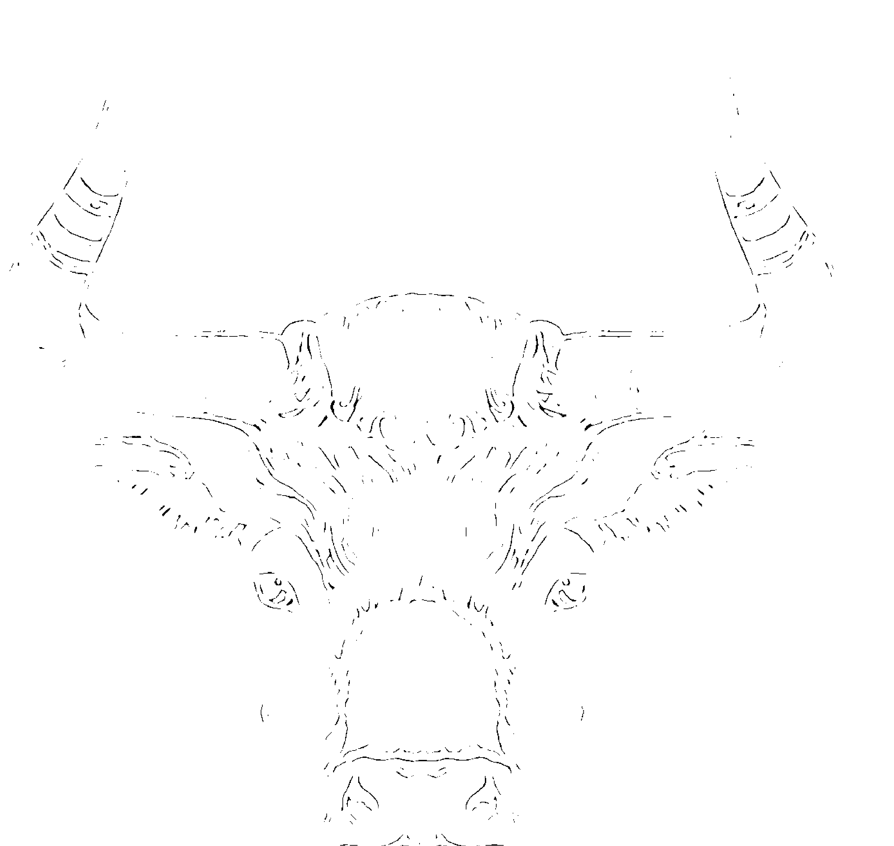

## TAURUS

## 金牛座媽媽 ♉ & 牡羊座孩子 ♈

### 合拍部分

強悍的金牛座媽媽，與任性的牡羊座孩子性格都相當激烈、果斷。妳對信仰有極度的熱情，你們雙方在敘述自己內心世界時都不會有太大問題。妳也了解小牡羊難以取悅的品味，妳不在意為挑剔的小牡羊做個簡單的漢堡，然後為其他家人做紅酒燉牛肉。

你們都是手巧的補鞋匠，擁有對機械方面的天賦，像是使用樂高、複雜的木工組與模型飛機組，用雙手建構事物會幫助妳產生連結。金牛座媽媽與牡羊座孩子的體內都有個尋求刺激的靈魂，親子運動、遊樂園，甚至是高空滑索和高空彈跳都很吸引你們。雖然小牡羊的一些滑稽舉止可能會讓妳心跳停止，但妳也會默默地受到他的啟發，開始挑戰極限。只是要確認有設下一些限制，這樣小牡羊才會理解「心靈勝於物質」的道理，並不是他想跳上車庫屋頂時就會擁有飛翔的能力。

### 不合部分

發瘋的牡羊座會以馬不停蹄的腳步四處奔波，快速地轉換方向，妳通常有條不紊，在規劃好的行程裡排好路線，以悠閒的步調悠游前進。因此，嘗試跟上妳的迷你小羊可是很累人的！

妳是相對過時、傳統的人，牡羊座則是打破常規的叛徒，試著讓這孩子在宗教禮拜時好好坐著、或是遵守服裝要求時，總是跟你拚到底的反叛兵。哎呀，金牛座媽媽，妳可不能依照教科書管束牡羊座孩子，這頭羊做任何事都是按照自己的方式，在所有育兒書裡絕不會看到有一樣的例子。不過也不要因此太為難自己，就算孩子比大部分的人還晚斷奶（或從一開始就無法理解他），或是比大部分孩子身上多了撞傷和瘀青，也不代表妳就是失敗的媽媽。容易發生意外的牡羊看起來每次都會遇到麻煩，因此妳得預期自己全天候開啟追逐模式，家中最好也多加裝一些防撞設施。

## 金牛座媽媽 ♉ & 金牛座孩子 ♉

### 合拍部分

啊，你們就像一幅公牛與小牛甜美的景象。金牛座媽媽和小孩就像是豆莢裡的兩顆豌豆，掛在甜美草皮的田野上（換個方式說，像在妳柔軟的 L 型沙發上），或在看到揮舞的紅旗後又精神飽滿（也就是逛了一天的百貨公司特賣）。你們是會寵愛自己、感情豐富的母子檔，親密時間讓你們就像在純粹的天堂裡。

傳統、傳統！金牛寶寶沿襲妳對家庭的價值觀和對儀式的喜愛，對妳來說，他就是完美的小小監護人，妳能將秘密家庭食譜和祖先故事傳承給他。假期對你們來說也很重要，你們喜愛所有圍繞在身邊的儀式，從烘培料理、房子裝潢到所有親戚聚在壁爐旁的聚會；之後也會一起製作剪貼簿，將照片印製出來，用裝飾印章和手寫筆記，讓回憶成為永恆。

金牛座同時具有享樂和務實的性質，但也請確保傳承妳的一些常識給他，不然在妳發現以前，可能會多個頤指氣使的孩子，不過，嘿，他可能也會幫妳好好管教手足和玩伴，對妳來說也會讓育兒更輕鬆些。

## 金牛座媽媽 ♉ & 雙子座孩子 ♊

### 不合部分

現在表演的是：固執者與更固執的人。任性的金牛座孩子跟你一樣頑固，你們之間的鬥爭會變成無止境的領土之爭。妳的底線是：「我已經說了！」小金牛：「妳不要逼我！」唉喲。

你們對於改變較難適應，像是從斷奶、如廁訓練到第一天上幼稚園，每天的過度轉換都讓小金牛帶點抗拒感。「拋棄的恐懼」是金牛座的致命傷，在妳掙扎著要與小金牛分別時，他的恐懼會宛如海浪般掀起，妳的放手也會格外困難。嘗試讓兩個慢郎中金牛座離開家中，會是個磨練挫折的訓練；這孩子就跟你一樣喜歡慢慢打扮與磨蹭。金牛座掌管道德與價值觀，當他到青少年時期開始受到挫折時，小金牛的反抗階段，有可能會使得他走向與妳不同的政治理念或宗教信仰的道路。此時請深吸一口氣，讓他發表自己的意見——並希望他能找到回家的路。如果妳知道自己盡力完成任務，並且已經為孩子灌輸了分辨好壞的能力，那麼就抱持一點信仰，相信他能做到！

### 合拍部分

亂無章法的雙子座就像洩氣的氦氣氣球一樣亂飛，妳永遠無法跟上這孩子的瘋狂之旅，而且妳也不應該嘗試。他需要的是條理分明、有跡可循的方式——剛好是金牛座最擅長創造的東西。家裡對小雙子來說應該像個安全的港口，可預測且牢靠，好消息是，妳就是家中的核心築巢者！同樣地，妳是否也因此有更多的機會能向外探索呢？這就是為什麼雙子座對妳來說有如天賜之物。因為你們都是熱衷於文化的人，特別是對音樂的喜愛，小雙子會陪著妳在公園裡的演唱會跟著音樂擺動，增加許多照拍的機會。

### 不合部分

用雙手打造事物也是你們都喜愛的興趣；手工製作蔬菜罐頭（妳自己發明的）、燒壺日間茶、建立遊戲組合。妳的雙子座會是熱情的助手，有可能為妳的傳統常規裡添加一些創意，真是天才！

「為什麼？媽咪，為什麼？」這是雙子座最喜歡的提問。喔，不，對總按照教科書行動的金牛座媽媽來說，生活的各種疑問是妳最不感興趣的事。妳寧願事情單純，不是黑就是白，然而小雙子卻想在每個謎團裡找尋密碼，但妳卻興趣缺缺。雖然妳得因此做更多的功課找答案，但好處是，過程中妳能因此拓展自己的智力。

不需要鉛筆和書本？雙子座不是傳統的學習者，這對古板的女教師金牛座來說也很棘手，請忘掉那些對妳有效但千篇一律的課表。小雙子需要的是另類或磁力學校（類似專門學校），像是華得福或蒙特梭利的教育體系；另外要記住，不是因為他注意力缺失才需要，而是因為這就是他的行事風格，不要讓任何人為此貼上標籤，或是在沒有尋找其他可能性前就給予阿得拉（Adderall，治療注意力不足過動症的藥劑）。在家裡，和雙子座一起沉默不會是金，一旦他的話匣子打開，絕對會阻擾妳的安靜時光，為這孩子的房間加裝防隔音設備會是不錯的主意，尤其遇到像許多雙子座孩子選了樂器把玩的時候。

## 金牛座媽媽 ♉ & 巨蟹座孩子 ♋

### 合拍部分

請給他牛奶和餅乾！身為兩個都喜愛舒適的戀家人，你會慶幸你的窩充滿溫暖與情感的氛圍。在這裡，妳不用保留自己熱心母愛的一面，因為巨蟹座喜歡被疼愛的感覺。妳可能一不小心就幫這孩子洗衣服洗到他結婚，甚至更久。與其用碎念或是逼迫他獨立，不如請這愛幫忙的小孩跟妳一起做家事，讓他轉變成妳的副主廚或花園裡的小幫手。另外，也可以帶著他一起工作，鼓勵小巨蟹離開外殼去探索世界。

保守、家庭取向的你們偏愛緊密的團隊關係，團員要不是親人、就是以完全忠誠付出獲得家庭地位的人。只是妳要確保自己沒有養育出一個性格過於內向的孩子，害羞的巨蟹座在交新朋友時，妳得稍微輕輕推他一把。巨蟹座是個美食家，妳自己也是個喜愛美食的人，警告：你們會把食物當作情緒的慰藉，得小心不要讓孩子養成嗜甜的習慣。在他身邊放一些健康的點心，並用妳熱愛巧克力棉花糖般的熱情，積極地向孩子宣導蔬菜的營養價值。

### 不合部分

是巨蟹座反應過度……還是真的有那麼嚴重？情緒化巨蟹座的敏感情緒對就事論事的金牛座媽媽來說完全陌生。哎呀，強烈要求這纖細的孩子克服問題，只會為他帶來更多的眼淚與難過。在擦乾孩子的眼淚前，需要考驗妳的耐心，但是卻因此讓妳變得更有同情心，過程中也不會像以前一樣嚴厲。

妳大而化之的態度，可能對需要保護的巨蟹座來說有點太過頭，因此當這孩子在場時，請維持「家醜不外揚」的表現方式，即使妳的朋友是一群態度開放的女孩也是一樣。當然，大部分的金牛座母親都有完美主義的特質，因此想在孩子面前表現出一切都好的樣子，不過若是扮演一位「鋼木蘭」會造成反效果的。情緒化巨蟹座需要看到妳柔軟的一面並以此與自己產生共鳴，在妳面前才能安心地打開心房；請慢慢地對他嘗試釋放一些親和的態度，分享妳的感受，不然小巨蟹最後會變得太過脆弱而容易難為情。

## 金牛座媽媽 ♉ & 獅子座孩子 ♌

### 合拍部分

女高音萬歲！愛幻想與時髦的小獅子遺傳妳對奢侈的喜愛，你們會去高檔的百貨公司，將孩子打扮得有型，在城裡最豪華、對孩子最友善的地方展現你們的作品；你們也是絕佳的星媽與明星孩子，根本就是令人驕傲的一對母子！妳甚至會帶著孩子參加選美比賽或巡迴參賽（請不要太介意用人工日曬膚色劑將皮膚漆成小麥色）。你們都是充滿愛心的人，喜愛被呵護與寵愛。親子 SPA 之旅會是你們未來的目標，請開始存錢吧！

金牛座和獅子座都有傳統的一面且喜愛歷史，孩子會陪著妳參加祈禱儀式或城鎮的藝術之旅。獅子座會帶出金牛座媽媽有活力與愛玩的能量——枕頭戰、馬鈴薯袋比賽及家族飛盤比賽。如果有任何人能讓妳從沙發上起身，那就是這個孩子！即使妳的標準很高，小獅子也樂意滿足妳。藉由給他許多金星星促使獅子王展現出最好的自己，不過請小心，雖然妳想將大部分的工作態度傳承給妳忠誠的孩子，但千萬不要教導他不付出任何努力就可以取得獎牌的心態。

### 不合部分

妳是個物質女孩，不過懂得何謂預算的概念；這孩子跟妳不一樣，小獅子對生活有龐大的慾望，總想要更多、更多與更多 —— 教導獅子座金錢價值觀的同時，也請抑制自己對奢侈品的渴望。

獅子座的創意與想像力無邊無際，不過這讓妳實事求是的內心產生恐懼。注意，妳可能為了建立他良好的工作態度，比實際需要的還更苛求他。牛媽媽，這沒有問題，不過請提供他能力範圍內能做的事，暑假時把他送到農場工作，卻不讓他待在足球聯賽裡踢球？似乎有點過頭了。

另一方面，妳會用過多的口頭稱讚與寵愛來提升他的自信心，但實際上妳應該教導他分享榮耀與認同自己的同儕，畢竟自信是他不缺少的東西。即使妳會很驕傲地培養出一位領導者，但妳應該不想發育出自大狂妄的人吧。注意家中的兩位女高音！如果妳有個獅子座女兒，有時妳們可能會在暗潮洶湧下出現一些角力。妳喜歡參與孩子的生活，但請不要過度炫耀妳是多麼厲害的媽媽，在不經意的過程中搶走孩子的風采，請給他足夠的空間讓他在朋友間發光。

## 金牛座媽媽 & 處女座孩子

### 合拍部分

處女座是土象星座金牛座的好夥伴，孩子繼承妳腳踏實地、實事求是的生活方式，而你們又都是對事情按照規則的完美主義者。當妳為家中大門使用「Elle Décor」的風格裝飾時，孩子會一絲不苟地盡心擺放她架上的多莉玩偶，或根據年分、製作方式和型號將模型汽車擺放整齊。

處女座也是敏銳的生活觀察家，妳則是擁有直率、就事論事的生活模式。妳喜歡與這領悟力高的孩子分享各種發現，你們就像一對專業的批評家，分析每個細微差別，但請小心不要散發出妳覺得說八卦或一些無意義的話「是合理」的訊息。重複提醒、規則與例行常規，會幫助這焦慮的孩子擁有安全感，這些對妳來說是小事一件：安排在固定的晚餐和關燈時間、收起這挑食孩子難得喜愛的食物，然後只在每次重要的場合中端上桌。妳的小處女會幫助妳構思一些規則，如果他們弄壞東西了，他會指出哪種處罰才公平；處女座喜歡設定系統與培養責任的機會，他可能甚至會在妳沒開口說任何一個字之前，就自己去椅子上坐著冷靜。

### 不合部分

妳過於吵雜的風格對謙虛的處女座來說有點受不了，這孩子寧願退後成為背景的一部分，也不想強出風頭，哎呀！妳可能為了想減輕他的壓力，甚至在他感到尷尬時藉機取笑他，這是非常、常、糟、糕的想法。請至少在孩子面前，稍微降低妳的音量和減少誇張的抱怨。也許妳只是想稍微抱怨一下，不過處女座是個擅長解決問題的人，他會開啟拯救模式，嘗試治療媽媽的傷痛。這對妳來說大概沒什麼，但對這敏感的孩子可是極大的考驗，因為他天生就是個焦慮的愛心者。除非事情真的很緊急，不然請妳小聲說話並保持冷靜。

處女座也是個完美主義者，妳不經大腦的想法可能會引發他的陰暗面。妳需要用讚美包裝妳的評斷，或是避免同時使用這兩種方式，完美的小處女很有可能會特別在意他的弱點，積極強化其自信是比較好的做法。透過讚美和鼓勵，妳會看到他的成長，而非總是在挑自己毛病的孩子。

## 金牛座媽媽 ♉ & 天秤座孩子 ♎

### 合拍部分

放鬆、認同與釋放。悠閒的天秤座與媽媽一樣，使用相同緩慢的速度行進，你們可能會把閒晃當成是種運動。金牛座和天秤座都是由優雅且浪漫的金星掌管，這讓你們都喜愛美食、高貴衣裳和美麗飾品；談到時尚品味，可說是有其母必有其子！妳認為妳早上已經花很長時間在挑選衣服和裝扮嗎？小天秤可是更略勝一籌，他對顏色和風格擁有獨特見解，也許從小小年紀就開始挑選自己的外出服。

不過你們可能是過得太悠哉的人，你們參加派對時通常以常人無法理解的慢速遲到，這會讓朋友、老師或玩伴感到失望，請試著在早上提早準備，以減少天秤座孩子的一些過失（與妳自己的一些壓力）。

請給我兩張電影票！天秤座就像媽媽一樣是個熱衷文化、欣賞藝術的文藝青年。妳不用等到孩子畢業才邀約他參觀博物館、音樂會和節慶，你們甚至可以開始玩音樂，先用塑膠樂器開始搖擺，然後再使用真正的樂器組團。

### 不合部分

對不講理的金牛座媽媽來說，這世界的道理就是非黑即白，然而天秤座卻喜歡思考事情的灰色地帶，不停地思考，在妳等待天秤座做出決定時，可是會增加妳不耐煩的頻率！反之，小天秤可能會討厭妳不斷逼迫他快做決定。和諧的天秤座喜歡合作與夥伴關係，金牛座媽媽則偏愛強行進入與扛起責任，簡直分秒都帶給這孩子莫大壓力。注意，不要以為天秤座配合妳的遊戲計畫，就設想一切都很好，維護和平的天秤座孩子，或許只是為了不造成衝突而犧牲自己的願望——這肯定是造成日後埋怨的原因。

外交大使天秤座喜歡在各行各業交朋友，這樣的舉動可能會激起妳內心勢利的一面。請拋棄妳可預期的習慣，讓天秤座「大愛」的態度幫妳對不同文化、哲理與生活方式打開心房。

## 金牛座媽媽 ♉ & 天蠍座孩子 ♏

### 合拍部分

金牛座和天蠍座是完全相反的星座，要不是一拍即合，不然就一觸即發。妳堅強、可靠的天性能幫助焦慮的天蠍座放鬆、感到安心；反之，孩子的忠誠度與精明、有策略性的舉動會讓妳感到自豪。請注意小天蠍和妳一樣天生就有遺棄情結的課題。妳了解他需要更多安慰與擁抱，也許得一週兩次兼職當班級監督者。因為妳喜歡參與孩子的生活，妳會發現這樣緊緊依偎的關係很迷人，只是要小心不讓天蠍座誤以為這世界是個令人害怕的地方。妳是個意志堅強的人，能教導孩子面對批評時不會輕易退縮。

你們都不喜歡改變，會自然地進入彼此的生活領域，發展出對彼此存在都感到舒適且有吸引力的習慣。這是舒服的寂靜之聲嗎？你們喜歡待在自己的小宇宙裡放空，在那裡提供許多空間做夢。一直待在妳所創造的舒適泡泡裡，未來某天可會在天蠍座離開鳥巢時遇到問題。

### 不合部分

你們的心情都容易受到波動，不過天蠍座的黑暗面會持續比妳還長。當孩子甩著門、哭著說「讓我一個人！」一時，妳可能會直接魯莽地衝進去，要他現在立刻處理。高壓手段這裡並不管用，金牛座媽媽，請讓孩子私下一個人消化，最後他會克服離開的。

實事求是的金牛座媽媽只看表面就信以為真，然而天蠍座通常會挖掘隱藏在背後的原因；天蠍座非常注重隱私，但妳卻相對性急且直言不諱。在妳分享「有趣的故事」一時請先三思，尤其在任何會提到天蠍座或讓他感到尷尬的場面。一旦你們之間信任被破壞了，便很難再重新取得他的信任，此外，他可能還會記在心裡。年輕的天蠍座可能會在網路上公開妳最尷尬的瞬間作為報復。哇，超級尷尬！

睡覺時間應該也會很有趣。天蠍座是夜貓子，但妳呢？妳到了晚上就會有點嗜睡，這孩子會在妳打瞌睡時發生一些意外事故 —— 請將餅乾罐關緊！

## 金牛座媽媽 ♉ & 射手座孩子 ♐

### 合拍部分

喜歡做自己的金牛座和射手座擁有相同坦率的頻率，不過小射手的直率可能又略勝妳一籌。幸運的是，妳喜歡聽取孩子大膽的想法，你們之間會出現許多擊掌和表示贊成的肢體語言，當然還會有許多笑聲。頑皮的射手座孩子喜歡走入大自然，這會引出妳樸實的一面。他會讓妳換下 CK 服飾，帶上露營裝備。在家中，種植植物會是妳和喜愛自然的小射手產生親密關係的有趣方法。

你們都寵愛自己，尤其在食物上更是如此。射手座是由盛宴之神的木星所掌管，妳則是屬於享樂的金星。妳把東西烤焦會是家裡津津樂道的故事，你們都很難抗拒偷咬一口在特別場合製作的蛋糕。請準備健康的食譜，讓小射手維持正常的體重範圍。

金牛座媽媽努力賺錢，射手座一樣很有野心；帶著射手座跟你一起工作。說不定在妳發現之前，這小企業家可能已經發展了割草事業（誰知道還有沒有其他的），這會讓注重物質的妳感到驕傲。

### 不合部分

哎呀！你們都會不小心說出一些真相，不過有時太過一針見血，反而會戳中你們的要害，妳未經思考的評論會讓射手座孩子感到洩氣，反之亦然。因此，妳需要教導孩子一些應對策略——嘗試以身作則的方式。金牛座媽媽做事有條理，相信欲速則不達，射手座則是飛毛腿岡薩雷斯（Speedy Gonzales）的化身。要讓這孩子穿上妳覺得可愛且講究的套裝或戴上蝴蝶結，需要一些運氣，他可能很快就直接脫掉，搞得一團亂。獨立的射手座喜愛自己挑選衣服，結交自己的朋友，但是妳會發現自己很難不去插手。談到社交，金牛座媽媽偏好按照出身交朋友，不過喜歡同樂的射手座，則會與來自不同階層的人做朋友……是的，即使是妳不喜歡的那種朋友。

妳無法將妳的價值觀加諸在孩子身上，尤其談到信仰的時候。他有他自己的信仰，妳只要確認要求他提供感想即可，之後妳會對這位小蘇格拉底表現的智慧感到驚訝！

## 金牛座媽媽 ♉ & 摩羯座孩子 ♑

### 合拍部分

工作認真、可靠、有紀律，你們簡直就是天生的母子檔。培養摩羯座成為媽媽的小幫手，因為妳從不知道，會不會有一天一起打開家中事業的大門。金牛座和摩羯座都喜歡象徵社會地位的事物，小摩羯長大後會開始分辨愛馬仕與 H & M 的差異，妳當然也會多一位逛街夥伴。哎呀，這個可能太貴了。

談到家庭，妳和摯愛的小摩羯都擁有忠誠的特質；摩羯座孩子以照顧其父母的特點聞名，妳是喜歡把孩子放在身旁的媽媽，無論經過多少年，彼此的距離依舊非常近。金牛座媽媽是個規劃者，摩羯座孩子則是打從出生以來就展望未來。因此，妳喜愛想像女兒未來的結婚典禮（她現在還穿著洗禮袍），或是在計畫兒子進入大聯盟（他才剛準備第一個小聯盟練習）。雖然想像未來如何很有趣，但也不要忘了享受當下。

### 不合部分

雖然金牛座媽媽是個堅毅不饒的人，但同時也相當多愁善感，摩羯座通常不太展現自己的情緒。妳想要滔滔不絕地表達愛意與心情，但孩子可不想妳在雨中給他一個吻，不用了，太超過了。

就像妳一樣，摩羯座是個完美主義者，但這孩子的狀況又更嚴重。妳漫不經心的評論可能變成嚴厲的批評，使摩羯座掉入過度追求成就、自我鞭策的漩渦裡。如果妳注意到孩子過度工作、皺緊眉頭，這可能是他想嘗試贏得媽媽認同的徵兆。請避免讓他掉入陷阱，盡量只使用正面的強化方式鼓勵他，讚美而非奉承，對摩羯座很有效，身為一個努力工作的人，他會為此感到驕傲。

這孩子不會讓居家的金牛座蜷縮在沙發上太久。大眾化、活躍的摩羯座會參與所有事物，從運動、童子軍到夏季舞台戲劇，妳會和其他家長一起規劃開車出遊的表單，或是因為擔任孩子的司機而疲於奔命。

## 金牛座媽媽 ♉ & 水瓶座孩子 ♒

### 合拍部分

這孩子是來自不同的星球嗎？他確實讓妳有這樣的感覺，不過妳還是很享受看著聰明、有創意的水瓶座逐漸萌芽成一位瘋狂科學家。妳行事一板一眼，水瓶座則有創意力，給他化學組、火箭模型組以及樂器發揮創意。手工的事物能幫助你們建立關係。計畫派對和邀請朋友是你們喜歡做的事；水瓶座跟妳一樣是個社交高手，雖然你們會吸引到完全不同類型的人！不過，若妳高雅的創意力符合年輕水瓶座古怪的創意時，那麼生日派對、假日慶祝及家庭聚將變成家中的傳統。

水瓶座是代表人道主義的星座；談到貧窮者，妳也擁有寬容的心。你們能參與社區服務團體，在小水瓶年輕時激發他善良的一面。水瓶座也會有叛逆的時候，這傳承自妳瘋狂的特質。當孩子長大時，妳會有個一起享受極限運動與體能挑戰的死黨，妳也會很高興旁邊有個要確認安全帽有沒有帶好的孩子。

### 不合部分

就在妳穩穩踏在土地時，宛如宇宙太空人的水瓶座，可能還在他的夢幻之城裡迷失方向。要理解這孩子的奇特想法並不容易，他偏左派的想法有時會讓妳覺得不可理喻。請嘗試盡量不要批評他實驗性的藝術計畫、龐克搖滾的芭比髮型、或從角落發出奇怪的外星人聲音。畢竟他就是妳生出來的——是十二星座裡的反抗者！談到人，妳對於人群中的特定類型可是有敏銳的觀察與偏好，不過凡事皆可的水瓶座，會與鎮上最不平凡的人、也會與班上最狂野的孩子交往——從各種文化到社經背景地位的人都有，是時候讓孩子打開妳的心房跟眼界了。

## 金牛座媽媽 ♉ & 雙魚座孩子 ♓

如果金牛座給人有種老師的氛圍，水瓶座就會是班上的小丑。對此妳需要稍微放鬆，重建一些幽默感。緊抓著缺點不放，無法讓水瓶座好好地就範，如果妳想管教他，請將家務變成遊戲。水瓶座孩子非常愛玩，帶點創意的方法會讓他們更快成為妳的快樂小幫手。

### 合拍部分

想像力豐富的雙魚座，和妳一樣擁有藝術氣質及對聲音方面的喜愛——一起跳舞、唱歌和參加演唱會，是身為音樂愛好者的你們最寶貴的消遣。妳是個酷炫媽咪，會帶著雙魚座青少年參加他人生第一場現場演出。帶上豐富的糕點，為他穿上由褶邊裝飾的外出服，這孩子不會在意穿上孩童版燕尾服、或是有許多柔軟蝴蝶結裝飾的三層蛋糕裙。畢竟妳一直等著這些換裝派對的到來，牛媽媽，童話般可愛的小雙魚也很享受其中。不過請調好鬧鐘；你們都是需要大量睡眠的人，若是舉辦了「睡眠派對」，在學校第一堂課鐘響前，就必須督促還在睡夢中的小雙魚快點起來。

妳內在的控制欲與這孩子不相上下。雖然雙魚座孩子有被動的時候，不過他也會跳出來指責他人，而且還有點道德魔人的氛圍。聽起來是不是很熟悉？看到小雙魚要求遊樂場裡其他小孩遵守規則時，妳會在一旁暗自竊笑，感覺真是似曾相識。

### 不合部分

金牛座媽媽是個堅定的現實主義者，雙魚座則是具有夢幻特質的星座，你們之間會產生極大的差異。人們極少對於妳的觀點有所疑問，畢竟妳表達地非常清楚；但是雙魚座是個變色龍，會根據遊入什麼樣的人群做適應。作為一個堅守自己價值的人，妳對於孩子無法維持自己立場感到掙扎。妳的態度堅定，雙魚座則容易輕信他人，這會引發妳過度保護的天性。這個太過相信他人的孩子需要正向的朋友來影響他，但也有可能被麻煩者拖累。妳必須更親力親為，為他的社交生活給出更多指引。因此，對金牛座來說，能夠輕易逼迫雙魚座小孩，比起反抗妳，他反而更容易屈就。不過不要因為孩子看起來什麼都同意，就認為一切都是正確的。不常表露自己的雙魚座需要放下他的害羞，需要別人鼓勵他表達真實的情緒，得先讓他感覺這空間是安心且放鬆的，他才願意開口。如果妳真的想知道孩子在想些什麼，請減少自己先入為主的評斷。

# 雙子座

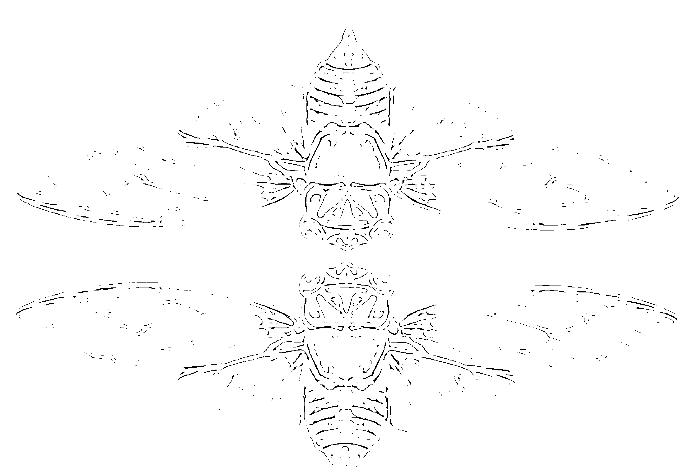

## GEMINI

## 雙子座媽媽 ♋ & 牡羊座孩子 ♈

### 合拍部分

精明的媽媽與思考敏捷的牡羊座可說棋逢對手。小牡羊頭腦清楚，能跟上妳聰慧的評論與如魔法世界般的神奇想法。你們身上都有古怪的因子，他可能會無意間讓妳進入電子線路的世界，從零件組成裝置，讓他的人生變成一場科學展覽。

陷入沙堆裡？絕不會！你們的注意力很短暫，孩子會永遠處在活動的狀態，絕不會在任何沙堆或遊戲裡待太久。就像妳一樣，牡羊座是個愛玩、帶有膽大特質的人，他會找一些原因帶妳一起去遊樂園、滑雪板、岩石攀岩場。從許多方面來說，這孩子會是妳最喜愛的出遊夥伴。

### 不合部分

若妳沒有符合他「挑剔且緊急」的需求，像是吃飯、離開、睡覺或任何其他要求時，牡羊座的脾氣會突然變得驚天動地，而妳對他易怒、完全無理的要求也很性急。此時，妳得深吸好幾口氣，從十開始倒數以維持理智。

牡羊座孩子與雙子座媽媽之間，最喜歡對話的主題就是「我的、我自己以及我」。有時候你們會為了鎂光燈產生競爭心態，尤其是比起聆聽，你們更想說話表達。獨立的牡羊座也需要許多自己的時間，他對房間具有領土意識；活躍的雙子座媽媽可能比自己想得還更喜歡待在家中，這樣孩子就能繼續完成他未完成、但體積太大難以搬到車上或推車的計畫。

## 雙子座媽媽 ♊ & 金牛座孩子 ♉

### 合拍部分

風象星座雙子座媽媽和土象金牛座孩子並沒有太多的共通點，不過可能是對很奇特的組合。你們會彼此提供很好的平衡。小金牛引發出妳更居家的一面，讓家裡充滿笑聲與活力。你們都是手工 D I Y 愛好者，會利用假日佈置與生日派對盛宴，可能很快就威脅到生活風格女王瑪莎，甚至在網路上商店展開新事業，販售起你們的手工商品。

有實驗精神的雙子座媽媽，會讓固執的金牛座孩子打開心房，嘗試新的活動、食物及友誼（有別於他過往往以狹隘目光所結交的朋友）。你們都是音樂狂熱者，開始跳起舞、在公園裡參加演唱會，也許某天還會舉辦親子即興爵士樂表演！

### 不合部分

遵照例行常規生活的金牛座孩子喜愛傳統，但雙子座媽媽經常做些沒意義的舉動（妳放棄了聖誕節假期，卻支持家庭衝浪的計畫讓人覺得莫名其妙）。金牛座是個規劃者，比起措手不及，他更喜愛事情如預期展開；在某些層面，妳討厭能預期的事。如果妳想要小金牛感到安心與安全，就得減少吉普賽人的生活方式，及隨時改變方向與計畫的習慣。

由感性金星掌管的金牛座孩子需要大量的呵護，擁抱讓妳快樂、肯定，但是當妳受到金牛座的控制時，會希望能獲得更多的空間。金牛座相當嗜睡，要將孩子從床上拖出來，非常有可能會拖慢妳快速的生活步調。

## 雙子座媽媽 ♋ & 雙子座孩子 ♊

### 合拍部分

有任何人要參加極限野外活動？對從不會累的雙子座母子來說，每天都是瘋狂的冒險以及行程滿滿的旅行。變化是雙子座人生的調味料，當你們處在同一個頻率時，會宛如身在天堂般，哈囉，最佳玩伴！你們都喜歡捉弄他人，在與其他家人成員開玩笑時，會在一旁咯咯地笑著，爆開的花生罐頭或其他一些惡搞的小禮物，都是你們的隨身法寶。

迷你小雙子會隨時掌握潮流趨勢，讓妳更容易維持酷媽媽的理想狀態。他能滔滔不絕地舉出樂團、演員和流行趨勢（有其母必有其子），盡量讓妳的腦中資料不斷更新。雙子座喜愛遊戲，妳應該與孩子一起讓家事隨時保持愉快、有趣。只要你們在一起，整個家裡就會充滿樂趣，嘻！

### 不合部分

資訊過載！你們忙於交流資訊，可能只是滔滔不絕地說些有趣的事情。暫停一下，媽咪，請先好好聆聽，也確保小雙子也跟你做一樣的事。八卦是雙子座會掉入的陷阱，當你們在一起說些什麼時，可會真的傷到別人。妳必須克制自己吹毛求疵的行為，不然會把這個壞習慣帶給孩子，另外，也請雙子座媽媽注意，不要讓孩子向其他家庭成員抱怨、說壞話！最糟糕的場景是妳或孩子的閒話，使親戚間產生裂痕，這真的非常糟糕。

管教小雙子時，「因為我這麼說」這句話並不會出現，這個孩子就像妳一樣。需要利用的是知道「為什麼」要這樣要求他。有時這對母子間的攻防戰，感覺就像一場充滿心機的棋盤比賽！

## 雙子座媽媽 ♊ & 巨蟹座孩子 ♋

### 合拍部分

這組合會是快樂的角色互換，而且你們都樂在其中。喜愛照顧人的巨蟹座孩子天生就具母性特質，雙子座的年輕性質則是永恆的象徵。當妳感到有壓力時，會是孩子端茶給妳，給予妳鼓舞人心的擁抱與建議，然後在妳無法承受時，他會在一旁安靜地做家事。反之，妳是一個態度酷炫、常給人刺激的角色，能夠幫助害羞的巨蟹座孩子打破沉默，與朋友相處，讓他從殼中爬出來嘗試新的活動。

巨蟹座的體內擁有一個老練靈魂，他可能會成為妳最好的朋友與摯友，有時甚至會以為妳是在跟另一個大人說話。這孩子非常懂得如何傾聽，給予對方完全的專注，聽妳說著故事和其他長篇大論。備註：他會記住所有妳說過的話，妳可能會有一些好聽的話……或是話中有話，開口前請三思！

### 不合部分

哎呀，妳是否打造出一頭怪獸呢？如果妳太常讓巨蟹座孩子（男孩或女孩）取代妳身為母親的角色，那麼妳可能必須奪回原本對家務的掌控權，尤其是家中還有其他手足時更需要如此——小巨蟹會變成自以為是的乖寶寶或小暴君。雙子座反覆無常，巨蟹座多愁善感，你們每一小時就會改變想法與心情，有時敏感小巨蟹的愛鬱心情會讓妳有些吃不消，要怎麼使他克服壞心情呢？

需要隱私的巨蟹座渴望一個人安靜地回到房間，然而妳響個不停的電話鈴聲或圍繞在家中的客人，都會打擾他的平靜，這也是為什麼巨蟹座害怕陌生人，也許他會對妳太過活躍的社交生活感到有些沮喪。

## 雙子座媽媽 & 獅子座孩子

### 合拍部分

妳重視原創性，獅子座孩子絕對擁有這樣的特性，小獅子的創造力會撼動妳的心靈，更有共鳴。你們都是舞台上表現最精采的人，妳喜愛孩子在台上無所畏懼的存在感，你們在一起確實會吸引許多目光。對雙子座媽媽和獅子座孩子來說，人生就是一場換裝派對，換上金屬亮片的衣服、羽毛圍巾、高禮帽及披肩，你們都喜歡古怪、五彩繽紛的服裝，在任何場合都想穿上它們，萬聖節會是妳家最熱鬧的場合。因為妳是會鼓勵孩子勇敢表達自己的媽媽，妳也不介意如果小獅子想穿上他恐龍戰隊的衣服到幼稚園——尊重自己，也尊重孩子！

你們都相當善於社交。獅子座很願意跟著妳參加許多約會，和那裡其他小孩快速成為朋友；他就像雙子座媽媽——喜歡發現新事物及玩遊戲——讓全家人都能盡情享受樂趣。

### 不合部分

是否每件事情都那麼重要？雙子座媽媽容易小題大作，小獅子則會誇大其詞。一個小事很容易就被放大檢視，進而造成你們雙方一些火上加油的怒火。渴望讚美的獅子座需要他人不斷的認可，不過雙子座媽媽也是如此。你們會開始你一言我一句，讓周圍每個人都覺得頭痛。由太陽掌管的獅子座有時可能會忘記其實他不是宇宙的中心，比起容易分心的雙子座媽媽能給予的，他會想辦法要求更多的注意力。如果妳不先暫停手邊工作來認可這孩子的努力，妳的小獅子可是會鬧脾氣來博得關注。對他來說，利用負面做法獲得關注總比被忽視好。

## 雙子座媽媽 ♊ & 處女座♍

### 合拍部分

雙子座和處女座都是由象徵好奇心與表達的水星所掌管，你們都是具備策略的思想家，會對人生各種細節吸引的瑣事上癮者。小處女最喜歡的問題是「為什麼」，就像小時候的妳一樣（現在可能也是）。妳對孩子許多隨機提問的對答都能展現出自己廣泛的學識涵養，而且又有位如此急切的觀眾看著妳表演，這是件多麼令人開心的事。

你們都喜歡分析別人，而老成靈魂的處女座，對於進入妳生活範圍的人們自有準確評斷，會讓妳大吃一驚。只是要小心，處女座是個批評家，妳可不想養育出一個沒有包容心又愛批評的孩子。你們都是變動星座，很能適應變化。雖然處女座比妳更挑剔些，但他比起大部分的人更能適應妳反覆無常的心情和想法。

### 不合部分

處女座孩子跟妳相比，有非常不一樣的社交風格：挑剔且難以滿足，有時候還有點頤指氣使，孩子對妳朋友圈中各種性格來來去去的人（嚴格的性格）不怎麼感興趣。處女座帶有急躁不安的特質，因此即使他是個狂野孩子，也不想媽媽變成這樣。如果你是個喜歡刺青、穿洞以及留雷鬼頭的雙子座媽媽，可能會從小處女那邊得到一些反對的意見與評論，因為他覺得妳跟其他媽媽不太一樣。

樂於助人的處女座嗅到問題後，會進入調停者模式。雙子座媽媽可是每件事都能嘮叨不停！雖然對妳而言只是在吐苦水，但處女座會將他聽到的抱怨當作危機處理。請減少在孩子身邊抱怨，這樣才不會讓他原本就焦躁或神經質的部分變得更為嚴重。

## 雙子座媽媽 👩‍👧‍👦 & 天秤座孩子 ♎

### 合拍部分

風象星座的靈魂夥伴雙子座媽媽與天秤座孩子，你們會帶著生活之樂愜意地過活。天秤座愛好自然的特質振奮妳的心情，在陽光孩子的身旁，會對人生感到更積極、正面。反之，妳能幫助慢步調的天秤座跟上步伐，啟發這有涵養的孩子，享受世界所有的驚喜。他會是妳逛街、博物館之旅及現場音樂表演的完美陪伴者。小天秤像妳一樣，會受到各種細節吸引，分享對流行、藝術和音樂的喜愛。他就像媽媽一樣，可能會是主要的潮流引領者。孩子也遺傳妳聰明的特質，妳會花很多時間與他一起閱讀。有耐心的天秤座也是個完美的傾聽者，他會全神貫注地傾聽妳的長篇大論，請嘗試讓他也能說上幾個字吧！

### 不合部分

做決定對你們來說，就跟中樂透一樣困難，雙子座和天秤座都非常優柔寡斷，難以下決定。要妳從一個簡單的問題開始，可能就要花上很長的時間：到底要離開家裡去遊樂園？去野餐？還有那天到底要穿什麼出門？

感性的天秤座，對於冷靜的雙子座媽媽來說，有點太過甜膩；即使妳喜歡付出每個小時與孩子擁抱、用手指畫畫，但仍希望這孩子能稍微減少一些多愁善感的情緒。天秤座是十二星座的和平主義者，他想要每個人都相處融洽；雙子座則是不斷搞麻煩，妳想爭辯和質問每件事的需求，會搗亂孩子的和諧。此外，妳常對每個人或每件事都很有意見，不過請不要期待小天秤會站在妳這邊。他只會教妳如何克服這件事——這將是很棒的一堂課！

## 雙子座媽媽 ♊ & 天蠍座孩子 ♏

### 合拍部分

雙子座媽媽和天蠍座孩子之間有種強烈業力輪迴的連結，妳會感覺這孩子的保護欲，甚至是占有欲，他一點也不介意妳將他緊緊抱在懷中。直覺的天蠍座擁有第六感，他能感應到雙子座媽媽時常忽略的一些警訊，妳會從這孩子說出的警世寓言中，學習使自己第六感變得更敏銳。

雙子座和天蠍座都有偵探般的天賦，妳喜歡玩些帶有神秘元素的遊戲及拼圖。此外，你們也擁有如老鷹的眼力，會在尋到珍稀目標時感到喜悅，在孩子高中畢業前，妳可能已經積累了相當份量的珍奇收藏品。隨著小天蠍逐漸長大，你們會開始討論這世上所有的事物：政治、道德觀、媒體，妳會好好為小天蠍灌輸批判思維的技巧，即使妳不是每次都同意他的想法，但是你們彼此會成為深度的思考者。無論是妳或孩子都無法忍受笨蛋，你們都喜歡挑戰智力。哈囉，我們可是英雄所見略同。

### 不合部分

雙子座不斷改變的特性，會讓象徵固定的星座天蠍座感到深深不安，天蠍座不喜歡讓自己變得措手不及，妳需要讓自己的生活型態維持得更穩定些。雙子座和天蠍座都過度仰賴策略性的思考方式，比起直接明瞭，你們更喜歡謀略。妳會試著愚弄天蠍座，告訴他蔬菜其實是糖果，妳的孩子則會操控妳為他完成作業；如果你不想培養出天蠍座詭計多端的特質，「誠實」會是你們之間最好的政策。

天蠍座孩子與雙子座媽媽都有對他人懷恨在心的特質，以及你們很快就會認為別人沒有用處，不過其實差別就在於妳忽冷忽熱、反覆無常，總將敵人當成是朋友；不過天蠍座一旦將對方視為敵人，就需要花永遠的時間來取得他的原諒。因此，在這孩子面前時得小心所指責的內容，不然妳可能會感覺自己永遠都在說錯話。

## 雙子座媽媽 & 射手座孩子

### 合拍部分

隨心所欲又即興的射手座孩子，是妳終極的共同冒險家，一起旅行會是場饗宴——孩子的第一張照片可能就是護照上的大頭貼。雙子座媽媽和射手座孩子都是喜愛認識新朋友的社交高手，他跟妳一樣會認識許多人，但僅有少許的知心好友。射手座獨立，喜歡獨自一人完成專案，玩自己的玩具，這會提供許多妳想要的「個人時間」，妳不需要時時照料他，呼，真是鬆一口氣！

因為妳具備敏銳的幽默感，家中可能會像個喜劇俱樂部，笑聲不斷。射手座遺傳自妳能言善道的天賦，跟媽媽一樣擁有寫作的能力，你們說不定會一起開設部落格或寫些故事，畢竟你們都善於用文字表達。

### 不合部分

射手座是妳的對宮星座，你們之間肯定會有摩擦。一方面，射手座是十二星座追求真理者，妳則是以見人說人話、見鬼說鬼話的特質聞名。這有原則的孩子會要求妳解釋自己不斷改變的觀點（在大眾面前）；妳也出於相同的理由，發現孩子有時似乎有點自視甚高。到底誰才是大人？

射手座是個熱情的火象星座，雙子座是如風的風象星座。孩子突如其來的脾氣會讓妳不寒而慄、背脊發涼。射手座和雙子座都是狩獵者，但是如果你們兩個都專注在不同的目標會發生什麼事？妳與孩子的行程產生衝突時，他可是會突然勃然大怒，而且他可不是個喜歡跟著媽媽忙碌行程跑的孩子。因此外出時，請隨時在包包裡裝滿孩子最喜愛的玩具，這樣妳就能讓坐立不安的射手座靜下心來。

## 雙子座媽媽 ♊ & 摩羯座孩子 ♑

### 合拍部分

兼具野心與事業心的小摩羯跟妳一樣喜歡複雜的計畫，這快樂的孩子是妳重要的左右手。妳會有不計其數的想法，年輕的小摩羯樂意當妳的跑腿，幫助妳將這些想法逐一實現，妳也會對他的堅毅不饒感到驚豔。

年輕的摩羯座孩子會引發出雙子座媽媽少見的傳統面向，妳會更專注在孩子身上；反之，妳有點愚鈍的幽默感與有趣想法，會成為悲觀摩羯座的支柱。你們在星盤上有一些相同之處，只要你們能接受與欣賞彼此極為不同的行事風格，就能讓你們變成一對完美的親子檔。

### 不合部分

耐性、堅毅的摩羯座會選擇一個方向並堅持到底，雙子座媽媽則是不斷地從左轉到右，沒有定性，妳有時會發現孩子嘗試過度專注在同一件事情上。這孩子不能稍微放鬆嗎？而妳善變的風格會帶給孩子挫折感，畢竟他想要有足夠的時間來完成已經開始的事。摩羯座孩子一向信守諾言，就像聖杯騎士以遵守承諾為榮，妳可能在午餐前就做了至少三個承諾（然後忘記其中兩個）。請不要以這樣的方式跟小摩羯相處，因為他會將妳說過的話牢記在心。

摩羯座經常憂心忡忡，如果他是男孩的話，會特別想保護媽媽。雙子座媽媽習慣言語表達，因此妳應該小心不要在孩子面前抱怨，不然可會讓他感受到妳的低氣壓。若妳真的想抱怨，請打電話給朋友，並讓孩子維持他該有的模樣。

## 雙子座媽媽 ♊ & 水瓶座孩子 ♒

### 合拍部分

作為一對無拘無束、自由思考的遊牧民族，妳和小水瓶簡直一模一樣。沒有人知道你們四處遊蕩的靈魂會不會踏上某個冒險，並因為沿路認識的人而結束。非常熱愛社交的水瓶座，甚至比妳更喜愛人群（是非常有可能），只要你們其中一個人認識陌生人，妳會很開心鼓勵孩子發揮其健談的特質。

雙子座和水瓶座都對科技和科學有天分。你們對教育性電腦遊戲、科學展或其他如電線、電路板或神秘密碼非常著迷。創新精神十足的你們擁有許多非常特別的想法。說不定有一天就突然創立家庭事業！

### 不合部分

理想化的水瓶座會看到每個人最棒的一面，雙子座媽媽則是帶有吹毛求疵的八卦傾向——即使是妳喜愛的人也難逃妳時不時的苛刻批評。妳希望孩子不要跟所有失敗者當朋友，但請等一下，媽媽，其實小水瓶是在教妳如何學習包容，所以請對他「特別」的朋友打開心房。水瓶座是個有團隊精神的人，他喜歡圍繞著團隊做事。作為雙胞胎形象的星座，雙子座有時比較喜歡跟另一個人說話，而水瓶座的多人遊戲會把妳累壞，譬如孩子與他們同伴在旅行車後座的尖叫聲——哎呀！從某些層面來看，妳和這孩子太相像了，你們兩個都會失去理智，此時可能需要培養溫暖與情感的特質，要不先來個擁抱呢？

## 雙子座媽媽 ♊ & 雙魚座孩子 ♓

### 合拍部分

對雙子座媽媽與雙魚座孩子來說，人生就像一場夢。小雙魚傳承自妳喜愛想像及對幻想和童話故事的熱愛，對於孩子的裝扮遊戲、培養他內在創造力的部分，妳會義不容辭。隨興的雙魚座對妳不斷變化的心理狀態也能應付得很好。請拋棄任何待辦事項和行程，一起度過沒有行程安排的一天會更有趣，也許在城市最高建築的頂樓吃著冰淇淋聖代？

你們都對視覺線索有所反應，會分享電影、影集及各式各樣（音樂性）的現場表演。甜美的雙魚座會帶出妳柔軟的一面，幫助妳對人更有同情心；反之，妳會幫助天真的孩子磨練批判性思考技巧，培養他面對困難時能更堅強的性質。

### 不合部分

注意，邁向罪惡之旅！四處遊蕩的雙魚座比雙子座媽媽還更情緒化，妳低估這孩子對情緒的敏銳；當妳發現雙魚座緊抓著痛苦不放時，可能會先忽略，最後感到震驚。習慣冷靜的雙子座，擦乾眼淚並不是妳喜愛的消遣，但這孩子需要更多的呵護，即使已經超出妳能承受的範圍。

雙子座媽媽有邏輯，雙魚座依賴直覺；妳有時對這孩子做決定的過程感到困惑，他通常不會按照常理衡量。你們都會被特別的人所吸引，但雙魚座會在任何人群中發現性格認真的人。談到孩子的朋友，請嘗試控制自己太過倉促做決定的習慣，但請確保指引他多跟積極的同儕相處，尤其是如果妳看到他嘗試拯救所有麻煩者時。

# 巨蟹座

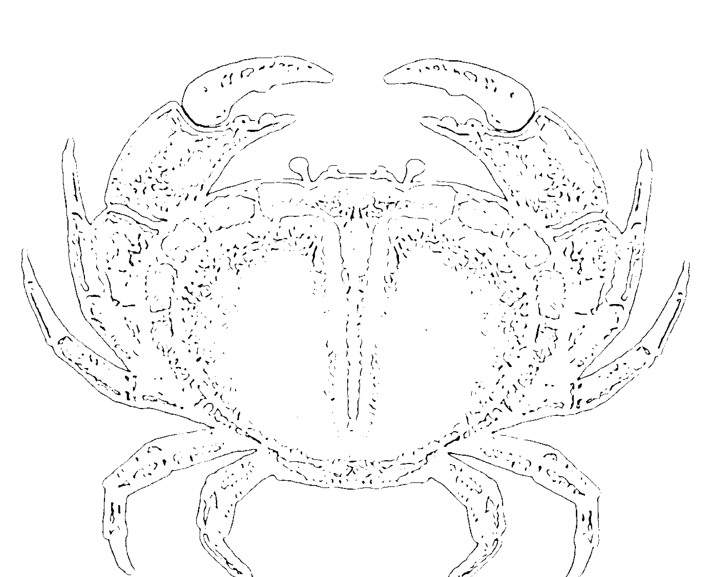

## CANCER

## 巨蟹座媽媽 ♋ & 牡羊座孩子 ♈

### 合拍部分

開始遊戲吧！兩個超級星座都喜愛運動且都帶競爭意識。你們在一起時會提升彼此的能量程度，避免讓任何一方變得自滿或懶惰。牡羊座和巨蟹座是具有領導特質的基本星座，妳對喜歡的事（就像霸道天后）又特別挑剔，對任何事只要擁有熱情都會做到極致。哈囉，母子檔超級粉絲！

巨蟹座喜歡被寵愛，牡羊座（十二星座的寶寶）會很高興收到禮物和關注，不過妳也須小心，不要讓這早熟的孩子變成令人擔心的調皮鬼。你們都有很強烈的情緒反應，沒錯，對所有的事；妳要對會造成情緒激動的場合做好心理準備，而且你們都強烈地擁有自我保護意識。不過無論你們吵得多激烈，只要在面對同一個敵人的時候，你們永遠會是彼此的後盾。

### 不合部分

小心安全！妳的小牡羊是否在還無法踩水時，就準備從游泳池的高板上直接跳下來？是的，這大膽的孩子尋找危險的古怪舉動與違反地心引力的特技表演時，會讓過度保護的巨蟹座媽媽每小時都嚇得心跳暫時停止。

在不同的領域裡，你們之間的差異通常很極端，這使得彼此的力量爭奪變得更為激烈，尤其在與妳的價值觀和優先順序產生衝突時。獨立的牡羊座喜歡被寵愛，但卻不想被保護或太過親密，然而這正是巨蟹座媽媽的發育風格，家庭取向的巨蟹座媽媽，對於鬆開對孩子的控制讓小牡羊自由飛翔感到棘手。你們都是擁有敏感特質的星座，容易將事情放在心上，如果妳沒把正當的面向放在正確的位置時，會在很多時間裡感受到自己被冒犯而憤怒。如果牡羊座孩子破壞家庭傳統，去開創他自己的道路，妳可能感覺被否定。

## 巨蟹座媽媽 & 金牛座孩子

### 合拍部分

親愛的，請給我遙控器。兩個愛家的星座都是一流的懶人，你們之間最大的爭執可能是搶奪寶貴的沙發。作為具備最傳統與家庭取向的你們，應該不會有太多價值觀上的衝突，妳也不用擔心金牛座會離巢太遠，因為你們都有一些遺棄情結的課題。情感豐富的金牛座會很高興地接受妳的擁抱與感情，請放心參加嬰兒按摩課程或每天早上為女兒梳頭髮。

金牛座由象徵美學的金星掌管，音樂和藝術是你們共同的熱情。兩個星座都不喜歡改變，而且都有務實的一面，加上對美食、設計師服裝、宵夜點心及昂貴的SPA療程的喜好，啊，多麼美好的人生！

### 不合部分

巨蟹座是代表情緒化的水象星座，金牛座則是體現執著又務實的土象星座。巨蟹媽媽會是你們之間較體貼的那一個！有時魯莽的小金牛會忽視妳的情感，一意孤行地前進。喔！妳可能需要耗費所有努力才不會前功盡棄或崩潰大哭。金牛座孩子需要勞動，即使妳想寵愛他，也要派給他一些工作。給予過多巨蟹座風格的親密擁抱，反倒會發出從沒離開圍欄、懶惰又為所欲為的一頭牛。

你們都很有自己的想法，所以罕見的爭吵會變成既冗長又痛苦的意志之戰。千萬不要嘗試改變這固執孩子的心，或提供情緒上的忠告；務實的金牛座會從痛苦的人生經驗中學習。此外，妳也需要額外努力維持體力，因為寵溺小金牛很容易就帶出彼此懶惰的一面。

## 巨蟹座媽媽 ♋ & 雙子座孩子 ♊

### 合拍部分

雖然你們是極為不同的星座，但還是有一些共同興趣，會一起探索許多有趣的事。巨蟹座和雙子都是文化愛好者，都喜愛藝術及需要實際動手做的活動。妳會發現你們對藝術表演、料理、木工與佈置的喜愛，或是在都喜愛運動的活動。

你們在一起時會變得很多話，喜歡討論關於樂團、書本、電視節目、節慶與最新的八卦。在派對上，你們也是對有趣的組合：在妳扮演完美的主辦人媽媽提供絕佳的佈置與食物時，健談的雙子座會減緩妳的社交焦慮。有實驗精神的雙子座會讓妳嘗試過去不會做的新事物，妳則教導這位無拘無束的星座定居在新地方生活的價值。

### 不合部分

是否有位外星人先綁架孩子，然後再把他帶回來……？妳可能經常想著，像妳這樣傳統的人，怎麼有辦法教育這位專注力短的王子或興趣不斷改變的公主？第一個月是小喇叭音樂課，接下來是體操課、潛水課，妳會被雙子座孩子變化多端、各種有始無終的嗜好搞得精疲力盡。在他千變萬化的個性與妳善變的心情之間，很難找到相同的頻率。

此外，價值觀也是另一個癥結。雙子座缺少感性面向，妳卻渴望簡單樸質，這讓妳感到有些沮喪，妳的保護慾會使這隨心所欲的孩子覺得窒息。雙子座對待朋友就像衛生紙一樣，享受好處後，隨即丟棄，不過妳卻擁有一群經過考驗、可靠的朋友——祝福妳能建立一個不斷壯大的媽媽圈，作為固定互相交流的夥伴。

## 巨蟹座媽媽 ♋ & 巨蟹座孩子 ♋

### 合拍部分

家是心之所嚮，你們會在舒適、充滿愛的居所裡品味彼此的陪伴；料理、種植、布置、任何家裡的事物——就算離開家中也能一起享樂。家庭假期、夜晚遊戲、共享餐點，這些都是穩固關係，讓彼此感到安全的重要架構。

青少年叛逆期會發生在巨蟹座孩子身上嗎？非常不願意離開鳥巢的孩子，妳需要用一些鞭子或糖果來推他一把。你們都喜歡懷舊的氛圍，期待每年的假期、維持家中傳統並代代傳承；如果你有女兒，那會有寵愛逛街之旅及分享彼此的衣櫃。作為天生的發育者，巨蟹座孩子會是保護弟妹的兄姊。嗨，媽媽的小幫手（省下昂貴的保姆費）。你們都喜歡擁抱、疼愛與親密感，妳天生就理解這孩子敏感的一面。

### 不合部分

情緒崩潰！家中的所有情緒起伏，會在無意間累積成山，忽然打在妳臉上。妳可能需要好市多的會員，去買一堆家庭號面紙囤積。你們兩個都像個情緒海綿，互相依賴，不斷吸收負面能量，可能也將不安全感投射在彼此身上，進而導致醜陋的爭執。成為孩子最好的朋友或許「聽起來」很棒，但還是有其不好的一面。

巨蟹座孩子容易將媽媽理想化，用較高的標準看待媽媽以滿足自己的期望。不過就在巨蟹座媽媽離婚或粉碎孩子對完美媽媽形象的粉紅泡泡時，妳只能祈求老天幫忙了。任何阻擋孩子安全感的事物都需要立刻處理，也許可直接請求家庭心理治療師的幫忙，不然可能會上演一場顛簸的情緒轉換過程，甚至變成長期的內心傷疤。可以給我們一點樂趣嗎？因為巨蟹座害怕改變，妳會需要一些性格外向的親戚點燃他潛藏內心的冒險精神，避免讓你們變成一對孤寂的隱居者。

## 巨蟹座媽媽 ♋ & 獅子座孩子 ♌

### 合拍部分

再靠近一點，碧昂絲和蒂娜·諾爾斯。你們會變成一組超級孩子與星媽的組合。就在妳為孩子的無所畏懼（以及當他的經紀人支配並掌管表演酬勞）感到欣喜之餘，獅子座本來就喜歡在大眾前表演。他也喜歡被寵愛、呵護及在他旁邊低聲細語，這些都是巨蟹座媽媽樂意為孩子效勞的事。你們都想要彼此產生連結，妳會讓小獅子忠心地待在身旁，妳也會為他著迷。

這個外向、有冒險精神的孩子會讓妳從自己的殼走出來，啟發妳發現更多有趣的活動（此外，妳的競爭心態也會因為這孩子在遊樂場受到歡迎而感到滿足）。你們會分享對文化、逛街與藝術的喜愛，等於擁有能一起參加電影首映、百老匯外的表演、藝廊開幕儀式的陪伴者，一位魅力十足的孩子，他的自信能為妳打開以前絕不會接觸到的社交圈。

### 不合部分

請我一顆鎮定劑。停不下來的獅子座孩子就像是一個電力飽滿、上了發條的玩具，不斷說話、玩樂及表演反重力的特技表演，這些都讓妳時常擔心得快要心悸。巨蟹座媽媽需要一些安靜的個人時間，但妳不太有辦法獲得，除非妳將他送到寄宿學校。妳喜歡被需要，但是要安靜地被需要！獅子座想要受到他人關注的需求讓妳筋疲力盡，妳可憐的小蟹腳會疲於為這隻需要讚美的小獵犬鼓掌。不過因為妳習慣寵愛孩子，可能也會因此培養出一頭怪獸。請確認自己有設定清楚的界線，並在感到舒服的情況對他說「不」。否則妳會成一位暴君的媽媽，不斷迎合這隻自以為是小獅子無止境的需求；或者最後孩子變成失控、不斷追求刺激的人，其大膽行徑恐讓人直冒冷汗，尤其在他取得駕照之後會更為劇烈。

## 巨蟹座媽媽 ♋ & 處女座孩子 ♍

### 合拍部分

哈囉，家事女王！你們能一起將事業變成蓬勃發展的在地手工供應商。處女座和巨蟹座對所有 DIY 的東西感興趣，其中也包括將錄音機拆掉後重新組裝，培養重要的剪貼簿習慣，或為妳的下午茶創造一桌精緻的茶組。

你們都是天生的照顧者，會照料脆弱的小生物。處女座孩子可能想要有個弟弟或妹妹，如果你同意，就能有位現成的保母、廚房助手、打理家事的小幫手，這位摯友還會很高興地跟你聊最新的八卦。你們的星座象徵語言，也會分享填字遊戲、雜誌文章及最喜歡的電視影集。說故事時間會變成親子書籍俱樂部，而且你們都對以前發生的老故事感興趣，能帶入很多情緒反應。處女座和巨蟹座都擁有個節儉的靈魂，喜歡收集與積累，相對的，也很難斷捨離！

### 不合部分

兩個星座都有指揮別人的傾向。雖然你欣賞處女座孩子非凡的成熟與負責的一面，但當這位平常不太開口、眉頭緊縮的孩子，開始主動提供一些育兒建議時，可能會讓人感到震驚。嚴厲的處女座會傷了你敏感的心，特別是因為土象星座的處女座不像你總是那麼溫暖及善於表達。

這孩子拒絕妳過度關心，讓妳感覺自己的關愛都是多餘，可能妳需要領養寵物，或擁有另一個能讓你付出關愛的孩子。雖然你們的性格通常討人喜歡，但都流於一成不變，對於事情如何處理、提供、組織和呈現等會特別挑剔。你們內心都有個戲精，只要有一方感覺被冒犯，內心的怒火就會油然而生（「你怎麼能這樣對我？」一會是你們彼此之間很常出現的台詞）。你們都很珍惜個人時間，會努力在家中開創出屬於自己的私人空間，在那個區域不會有地盤之爭，會是彼此感到最舒服的角落。

## 巨蟹座媽媽 ♋ & 天秤座孩子 ♎

### 合拍部分

妳可能會有一位很淑女的天秤座女兒、或是都市型男的天秤座兒子，不過這位大器晚成的孩子不願離開鳥巢，直到妳用嫌棄地噓聲趕他離開。你們都喜愛漂亮的事物，像是裝潢、流行及藝術，因此要發現彼此都能享受的活動不是難事；可能甚至會一起舉辦以花朵布置、優雅且精緻的派對，搭配小天秤的手寫邀請函。你們也會是喜愛逛街與美食的文化愛好者，盡情享受生活中的美好事物。

你們會注意到其他人風格上的缺陷及穿搭失誤，畢竟因為有時你們有點挑剔。不過，你們對家人和朋友（即是對低俗的朋友也是）的情感都很深刻。對人生帶著開闊心胸及單純見解的天秤座孩子，會讓妳的人避免變得苦澀或厭世。

### 不合部分

雖然妳的情緒波動，對妳來說是必要，還具備淨化心靈的效果，但那些情緒卻讓小天秤感到不知所措。妳可能需要保護孩子避免聽到負面的言語，以免他被妳的黑暗面影響，不小心掉進憂鬱的兔子洞裡——而且他比妳還更難從這裡逃脫。

在保護孩子與使他窒息間，可能只有一線之隔。這社交高手需要有舞台展現，但是他「全世界都是朋友」的態度，會令保護欲強烈的巨蟹座媽媽油然升起一股恐懼感。於是，妳可能開始窺探他的一舉一動，密切注意這容易受影響（有時還有點天真）的小天秤。

但妳也有可能創造出一頭怪獸。天秤座可以很懶散，使巨蟹座媽媽做得半死。我們能說是妳讓他變成這樣的嗎？請不要被孩子的可愛迷惑，這會讓妳為他做所有的事、為他義憤填膺，然後這孩子卻比妳還冷靜，而且小天秤可能也會因此錯失為自己努力、形塑成長期需經歷的個人認同的機會。

## 巨蟹座媽媽 ♋ & 天蠍座孩子 ♏

### 合拍部分

兩個意氣相投的水象星座，信任他人對你們而言並非易事，且你們都不太與人交流。你們之間不需要解釋或討論就能互相理解，就算在同一個空間內，也能數小時不說任何一句話，各自沉浸在書本、拼圖或複雜的事情上，享受彼此的陪伴；但也不是說你們無法進行深層、有質感的對話。具洞察力的小天蠍通常擁有超齡的智慧，不過他其實是很脆弱的，需要妳的保護與照料。孩子每次向妳訴說秘密或尋求建議時，妳的心會完全開放，因為妳知道妳是少數幾個（如果不是只有一位）能進入這個神秘星座內心的人。

廚房是另一個形成連結的場所，你們都可能成為令人驚豔的廚師與烘培師。對食物複雜口感與質地的敏銳度，讓你們成為美食家！將你們最喜歡的獨立樂團音樂調大聲點，準備來場瘋狂的廚房派對！

### 不合部分

雖然擁有相同的喜怒哀樂幫助了解彼此，但當你們感到受傷時，彼此會變得疲憊不堪。在巨蟹座的蟹腳與天蠍座的毒刺間，你們會用自己的方式抨擊對方，破壞之間脆弱的信任。哎呀！就算是妳的怒火達到高點，也要格外小心不要用卑劣的方式攻擊身邊的人。

談到性觀念，天蠍座在星盤裡代表「性」，這孩子的感官能量會使巨蟹座媽媽感到不舒服。妳可能需要在比預期的再提早告訴他性方面的知識，確保這好奇孩子能學習到合適的界線及正確的生理構造。整體來說，天蠍座孩子甚至會比妳表現地還激烈。孩子進入青春期時，會容易變得抑鬱，吸收來自自身旁的人的各種情緒。此時，妳需要處理好自身的情緒起伏，才不會讓敏感的天蠍座感到失望。

## 巨蟹座媽媽 ♋ & 射手座孩子 ♐

### 合拍部分

你們的星座特質根本是南轅北轍，因此應該會有許多有趣的連結——只要不企圖去改變彼此。外向的射手座會說服妳做些古怪但有趣的活動，像是卡啦OK、在眾人面前跳舞或為家庭演出戲劇；反之，妳會教導小射手禮儀、好品味及對文化的欣賞。坦率的射手座幫助妳說出內心想法（而不是默默地悶不吭聲），妳則教會他變得更機靈以及富有同理心。

你們也會在廚房和圖書館裡找到一些共同點，因為你們都喜歡料理、美食及學習。此外，當妳一時興起做些有收穫性的活動，像是耙樹葉、包禮物或木工時，會很容易與小射手產生共鳴。雖然這孩子並不是每次都會採用妳的建議，但當他帶著受傷的身軀與心情回家時，會感激妳提供他溫暖的擁抱。

### 不合部分

射手座是個善於處世且樂觀的星座，對於風險過於放心而且行事衝動、缺乏思考；自我保護的巨蟹座則會預期事情不好的面向，嘗試保護孩子免於潛在問題的攻擊——這也是你們產生衝突的所在。實際的射手座孩子寧願從人生學校中學習，而不是聽從妳自以為合理的警告，因此妳必須每天抑制自己向他碎念「我早就跟你說了」的心情。

巨蟹座擅長搞小團體，不過射手座則會和各式各樣的人結交作伴。大膽的射手座對所有事都保持開放、直接的態度，但這可會傷了妳柔軟的心。妳想逛法國精品店，他卻比較喜歡露營和戶外活動，而且如果是女兒，她會拒絕妳縫有摺邊的華麗外出服，這只求穿脫方便的寶寶，對於任何緊身或過分裝飾的衣服都非常排斥。因此，與其努力打造非常緊密母子關係，反而應該將彼此看成是來自國外、充滿好奇心的旅人或外交官，對彼此文化與習俗一無所知，這樣的狀況會比較好，只要以正確的包裝和份量呈現，就能提供彼此很多幫助。

## 巨蟹座媽媽 ♋ & 摩羯座孩子 ♑

### 合拍部分

你們是十二星座裡最負責且以家庭為重的星座——天生的照顧者與提供者。和摩羯座孩子一起，妳會滿心夢想創造出隔代遺產，傳承祖先留下來的傳統與習俗。你們會從經得起考驗的事物裡找到慰藉：經典小說、車子、舊照片以及不斷流傳的家族故事。

你們都有勢利的一面，會受到團體吸引，傾向以小團體的方式結交一輩子的朋友。妳從不用去想小摩羯和誰一起相處，因為那些朋友可能就是從幼稚園到大學畢業期間相同的人。這孩子喜歡帶朋友回家，這讓妳感到驕傲。當孩子與他的朋友在接客間等待時，妳會很高興為孩子摩羯座隊友扮演冷靜（但是合宜）的繼母，讓他們清光冰箱裡的食物或提供點心。在經歷混亂的青少年時期，妳甚至可能在孩子朋友與家長相處不愉快時讓他寄住。

### 不合部分

巨蟹座和摩羯座是星盤上的對宮星座，有時你們之間的差異可能會天南地北。水象星座巨蟹掌管內心，土象摩羯座則代表所有的義務、責任與謹言慎行——不像妳是由情緒驅使。請減少過度呵護的發育方式，巨蟹媽媽。

妳需要替孩子找到可以挑戰的事物，不斷設定標準，這樣他才會為新的成就努力，這也是他感到驕傲的主要來源。哎呀，妳出於直覺的發育風格可能太過感情用事，就在妳感覺到這個對自我批評又完美主義的孩子對自己太過嚴厲時，妳有需要為此做些巧妙的安排與周旋。除了擁抱與肯定之外，也必須督促自己給予他誠實的回饋與具有建設性的指責。雖然妳很渴望用擁抱緊緊環繞他、用親吻寵愛他，但是妳最好還是給他單手的擁抱與稍微親吻臉頰就好。

食物可能也會是個問題。許多摩羯座對飲食都嚴格控管，他寧願食用葵花籽或所謂的原型食物（非加工食物），也不吃妳精心準備的無麩質巧克力麵包佐貝夏梅爾調味醬。食物對巨蟹座媽媽來說也是一種愛的表現，但摩羯座孩子遵守簡樸的飲食方式，會讓妳感到被拒絕，尤其是妳花了整天清空冰箱庫存或展現妳洗鍋收汁的廚藝時。

## 巨蟹座媽媽 ♋ & 水瓶座孩子 ♒

### 合拍部分

居家巨蟹座如何生出這無拘無束的遊牧民族，著實令人驚奇，但你們之間的差異確實讓人覺得耳目一新。水瓶座是如風般的風象星座，總以輕鬆、有趣並帶些讓人捧腹的幽默觀點看待事物，趕緊幫這孩子簽進娛樂圈，就在大眾為他滑稽舉動買單時，妳就能準備當個星媽了。在妳享受星媽的角色時，可能也要將一足球媽媽（花費大量時間接送小孩參加足球課等課外活動的媽媽）加入妳的人生清單裡。水瓶座孩子通常會是優秀的運動員，也是象徵團體活動的星座，這讓妳有很棒的機會扮演訓練員媽媽，這將是你們絕佳的共同點，因為許多巨蟹座也有擅長運動的一面，妳也喜歡為孩子加油。你們會一起做些體能活動：衝浪、滑雪、划船或在沙灘上玩樂。

雖然水瓶座的孩子已經是妳最好的朋友，也是天生就受大家歡迎的孩子，但他通常不太清楚如何表達自己的情緒。幸好這是妳擅長的部分——妳會幫助他感受自己的心情，他則能教會妳在緊張時學習放鬆。

### 不合部分

妳喜歡事情在掌控內，但跟水瓶座一起，妳唯一能期待的事就是「出乎意料」；從餐桌椅子上的放屁坐墊到大學輟學前往印度當背包客，這位古怪又愛出奇招的孩子，總會迸出一些不合常理的想法。現在妳只能與美好的家庭景象說再見，並停止思考鄰居會怎麼想——如果你還能夠維持理智的話，就這麼做吧！

談到朋友，妳有些精英主義的傾向，偏愛與一起共患難後篩選出來的忠誠朋友相處，然而水瓶座就沒有這樣的顧慮，熱愛自由的星座，很快就能與睡在路邊的流浪漢結交，甚至可能邀請對方來家裡喝杯媽媽「特製」的冰茶——這讓妳感到更害怕。這天真、未經世故的孩子是否想藉機教育妳？這很難說。水瓶座代表社會正義與反抗，如果他從妳身上感受任何一絲心胸狹隘、無法接受他人的氛圍，就會用這樣的方式挑戰妳，搞得妳昏頭轉向。如果妳真心渴望與他成為摯友，關於孩子的想法，妳還是知道越少越好。妳只需要給彼此保留一些空間，當他從戰場又帶了一些傷口或瘀青回家，就直接給他一個不帶任何評斷的擁抱就好。

## 巨蟹座媽媽 ♋ & 雙魚座孩子 ♓

### 合拍部分

你們享受在這塊豐饒土地上探索人類情緒及其複雜面向，擅長培養理解他人的能力。你們的關係感覺就像充滿許多餐桌智慧的支持團體，妳可能也會發現，彼此經常拿著茶和點心聚在一起聊天。因為妳的直覺很強，會完全接收到對方的心情，不過如此敏感的風險，就是也會吸收身邊每個人的情緒，讓你們自身蒙上一層陰影，因而對人生感到恐懼及絕望，好在一趟郊外旅行能擺脫你們這些煩惱。你們天生具藝術天分與直覺性，都會在創意之土上安居立業，享受不知名樂團的音樂、參觀展覽與觀看表演、購買傳統匠人製作的藝術品，甚至一起參加藝術或音樂課程。你們也重視歷史、風格，如某時代的裝飾品、精緻服裝或是蒸汽龐克文化，各式各樣由高雅到低俗的文化涵養，都能令你們感到瘋狂。

### 不合部分

趕緊抓住救生圈，因為妳會在這情緒浪濤裡載浮載沉。即使年輕的雙魚座看起來相當脆弱，但是小魚需要自己的安全感時，便會突然游進私人領域中。這或許會引發巨蟹座的拋棄情結，尤其是孩子的情緒在毫無預警下變得忽冷忽熱，或者突然不願意與他人交流。

雙魚座孩子很容易感到內疚，小心不要讓他在獨立過程或吐露失望心情時，覺得自己很糟糕；他可能會有自我毀滅或反抗的一面，此時妳得提高警覺。雙魚座由象徵幻覺與自我欺騙的海王星掌管，因此妳不能靜靜地不出手、不做任何事，然後看著他在為了朋友、戀人或各式人生道路上做出愚蠻決定。不過妳越是想控制，雙魚座越會游到妳碰不到的地方。對妳來說，得不斷在緊緊抓住與是否放手之間尋找平衡，並教會他合理界線對自身安全是非常重要的事情。另外也要注意過於沉溺於依賴彼此，會是個燙手山芋；用怨恨填滿彼此，也不符合你們的作風，畢竟你們都會傷心是否傷了對方的心。

# 獅子座

## LEO

## 獅子座媽媽 ♌ & 牡羊座孩子 ♈

### 合拍部分

女高音登場！獅子座媽媽和牡羊座孩子都是喜歡成為焦點的搶鏡演員，也是一對終極星媽（妳同時也能獲得名聲，非常感謝）與童星的組合。帶著妳的祝福與鼓舞，小牡羊可能真的會面對滿場觀眾表演，或在其他領域以其出色天賦迷倒大眾。哈囉，媽媽縮小版的超級巨星！

你們都喜歡大張旗鼓與奢華的氛圍，如果小牡羊是個女孩，未來可會有一堆正式場合穿的外出服，喜歡嬉鬧的牡羊座男孩，則會表現出妳愛玩的天性，畢竟妳自己就是叢林女王，而且妳的瘋狂性質會訓練這孩子，讓他在大膽的冒險中跟上妳的步伐。牡羊座與獅子座都是積極、具事業心的火象星座，傾向藉由創意獲得利、或是到哪都能爬到領導位置。這幼稚園裡的小霸主，在他剛起步創立的事業可少不了媽媽的支持，幫助他登上王位吧！

### 不合部分

兩位獨裁者住在同一個房子裡？哎呀！妳可能會與這小暴君在霸權上產生一些爭奪，尤其因為你們都習慣按照自己意思行事。當然妳是媽媽，可不要因為這孩子鬧個脾氣，就讓他輕易得逞，加上牡羊座甚至比妳還更愛指揮別人，所以你們這對組合可能會出現角色互換的情形。

獅子座是個親力親為的媽媽，獨立的牡羊座會被妳過於周到的作風影響，備感窒息。獅子座依靠讚賞成長，喜歡從小孩身上得到認可，不過自我中心的牡羊座只將注意力放在自己身上，忘記跟妳說媽媽的新裙子很漂亮、晚餐很好吃，以及他真心感激妳帶著所有朋友到動物園。妳需要給他上一些禮儀課，教導他謝謝的力量，但也不要為了滿足自我價值就對這孩子抱太多期待。相反地，妳應該讓自己從牡羊座天生的自信裡獲得啟發，因為妳的小羊知道自己很棒，不管其他人是怎麼看的！

## 獅子座媽媽 & 金牛座孩子

### 合拍部分

獅子座和金牛座都是固定星座，你們都喜愛傳統、日常規則及讓事情稱心如意。你們樂於分享，會將精采的家族故事傳承下去，小金牛將這些故事視為寶藏，讓它們代代相傳。獅子座和金牛座都喜愛奢華，尤其是對有歷史痕跡的物品為之著迷。因此，妳會有個小夥伴和妳分享表演服裝、建築之旅，沒錯，還有奢侈的購物行程。

談到風格，兩個星座都做得有點過頭；為金牛座女孩穿上大蝴蝶結的衣服、為男孩戴上圓頂禮帽。由金星守護的孩子就像媽媽一樣，喜歡在鏡子前擺弄姿態。派對計畫為你們這些創意靈魂提供一個絕佳的相處機會，就一起合作規劃菜單和布置主題吧。這務實孩子可能會帶著板夾或iPad跟前跟後，協助妳有條理地安排與緊守預算！如果你的孩子像典型的金牛座「機械迷」，讓他為派對建立一個播放清單（他們都是音樂愛好者），接上燈光、音響及製作一些道具。妳看！一場能刊登在雜誌上的派對完成，同時也是愛現的獅子座媽媽喜歡的演出。

### 不合部分

獅子座和金牛座講話都很大聲，但妳比較不會降低自己的音量。妳過於熱情的精力會破壞金牛座孩子的平靜，尤其在他處於輕鬆的心情時。愛玩的獅子座媽媽喜歡活動一個換一個，不過慵懶的金牛座則需要時間放鬆與做夢；讓妳愛睡的小牛好好躺著，不要逼迫他陪著妳在城裡四處闖蕩。

雖然你們都很外向，但金牛座比妳務實許多，這老成靈魂會警告妳花太多錢在設計師鞋子上或是買太多的加熱軟糖聖代，真是掃興的人！但他也已經聽膩妳錢包失血的煩惱，或是不斷受到妳說腰圍有多粗的抱怨轟炸，哎呀，他可不會讓妳忘記自己曾經說過要如何自我提升的保證。金牛座象徵道德和倫理，他會發展出一套屬於自己的價值觀。對於喜歡看著鏡中自己的獅子座媽媽來說，要符合他的價值觀可能是個挑戰。

## 獅子座媽媽 ♌ & 雙子座孩子 ♊

### 合拍部分

你們將是最好朋友的母子檔，小雙子跟像妳一樣是個健談、誇張、愛玩與好奇心的綜合體。終於有人能跟上妳的腳步了，你們有許多充滿活力的對話，也會一起在城鎮裡閒晃。雙子座喜歡提問，獅子座則喜歡滔滔不絕地回答。你們會參加寓教於樂的活動，如天文館戶外旅行、參加有導覽的自然鐵道之旅！雙子座古怪、有創意，妳則是重視獨立個體的媽媽，妳的小小瘋狂科學家會因為妳受到激勵與鼓舞。

獅子座和雙子座都喜愛發展具創意的個人風格，你們的購物之旅將變得有趣且充滿想像，但請控管好妳的穿衣風格！如果妳穿圓形金屬片的衣服與高跟鞋去女兒的高中，她可能會在妳發她之前就偷偷溜走！

### 不合部分

妳的星座由太陽守護，但有時妳會忘記自己並不是宇宙的中心；雙子座由富有表達能力的水星守護，他需要對方不斷的回饋與認可。雖然你們都相當健談，但到底誰要閉嘴、誰要負責聽呢？有時你們可能會落得彼此互罵的結果，為了誰要爭上風而搞得筋疲力盡！

雙子座專注力短暫，喜愛不斷改變。妳夢想為孩子精心設計的目標與計畫，如後院電影院工作坊或木偶製作示範等活動，最後可能會因為這坐不住的孩子而徒勞無功。另外也不要期待雙子座會乖乖坐著看迪士尼冰上世界，只因為那是妳小時候喜愛的活動。善變的雙子座每天都在改變對別人的忠誠度；星期一小蘇西是他最好的朋友，星期三變成敵人，到了星期五他又想邀請蘇西參加睡衣派對。這些可能就足以讓妳暈頭轉向，但妳也不要過度介入。不然，就在孩子已經忘了這件事後，妳還在耿耿於懷。

## 獅子座媽媽 & 巨蟹座孩子

### 合拍部分

去吧，就去做妳想做的事。巨蟹座是星盤上的寶寶，是媽媽疼愛的男孩與女孩，他會渴望妳積極加入他的生活。家長會會長？童子軍領導人？班級助手？全部報名參加！害羞又怕受傷害的孩子，需要能保護他的母獅子（就是妳），只是注意不要太過寵愛，不然他可能無法離開對妳的依賴。妳打造出來的溫暖家庭，對於需要回到家中感到安穩、受到關愛的巨蟹座孩子來說能覺得安心。

巨蟹座沉默寡言，但妳勇於表達的個性，能幫助孩子培養出性格認同，因此就算妳在孩子旁表現自我情感（而且有時有點情緒化）也沒有關係。表達情緒能幫助這超級敏感的孩子安心地說出感受，接受自己變化多端的情緒起伏。妳會充滿愛地擦乾他的眼淚，然後稍微推孩子一把，幫助他培養勇氣。只要妳給他適當的支持與許多鼓勵，巨蟹座也能變得所向無敵！

### 不合部分

太陽守護獅子座，月亮守護巨蟹座，基本上你們的差別可能就跟夜晚和白天一樣迴異。妳會在同一個舞台上競爭，也就是白天，確保巨蟹座孩子有足夠的空間能發光。另外也因為妳大膽的個性，可能輕易地就壓低他的士氣。不過不要只是因為巨蟹座比較安靜，就認為他已經滿足，小巨蟹可會對此埋怨在心，有可能內心的怒火已經在慢慢累積，等待適當的時機用他猛烈的蟹腳還妳一擊。請適時地用「妳現在感覺如何呢，寶貝？」來確認他的心情，並確保妳真的有在聽他的回答！

不要誤以為妳能將這有自我見解的孩子變成摯友。為了安全感，他需要一位堅強、有自信的媽媽。巨蟹座通常不太與人深交，妳必須降低誇張的表達方式來取得孩子的信任，這也容易讓孩子產生自覺。當妳達成第一個標準時，可能會開派對大肆宣揚，但小巨蟹就沒這麼渴望將這些趣聞昭告天下了，噓！

## 獅子座媽媽 & 獅子座孩子

### 合拍部分

母獅子與她的小獅子——多麼迷人的景象啊！妳的縮小版繼承妳戲劇化的天賦，變化多端的秀就此展開。妳的玩樂時間結合各種天馬行空的想法，讓每次活動都盛況空前；幫助小獅子參加戲劇表演、換裝上達人秀，或讓他指揮自己的馬戲團，雖然他還只是個小學生（家裡的寵物狗不會介意換裝變成老虎吧），再戴上羽毛圍巾與大尺寸的帽子！

對獅子座媽媽與女兒來說，人生就是一場服裝派對。當心，這些逛街行程在她青少年時會讓妳所費不貲；男孩會是媽媽忠誠且有保護慾的小獅子，這可讓妳心花怒放。妳可以製作一張好孩子表格，用閃亮金星當作獎勵。就像妳一樣，小獅子也需要讚賞與獎勵來振奮自己，妳知道什麼事會讓孩子開心，而且未來妳們會有個互相讚美的美好關係。

### 不合部分

是誰坐在家中的王位？如果你給孩子太多空間，這位蠻橫、洋洋得意的孩子可會變成一位暴君。請謹慎使用稿賞機制，他才不會每次稍微幫忙就期待獲得獎勵。另外妳也要小心公開誇獎的行為，畢竟獅子座掌管自我，如果讓這隻小獅子無意間聽到太多對他的讚美，可會使他變得驕傲自滿。妳可能需要稍微挫挫他的傲氣——即使這不容易也不有趣。

小獅子跟妳一樣對人生有很多慾望，如果妳因為他充滿渴望的眼神而答應他的請求，可會增加家中的開銷預算。因此請學習設定界線（尤其談到花費支出時），這會是妳最大的挑戰。請教導小獅子正確的金錢觀，妳自己也要以身作則，延續他的滿足感才會幫助塑造性格。

## 獅子座媽媽 & 處女座孩子

### 合拍部分

高貴的獅子座是天生的幫忙者，處女座則象徵供給者，時常在親愛的彼此旁邊對你們而言相當自然。這對甜美的母子檔對家庭相當忠誠，獅子座媽媽扮演管理者的角色，處女座則是生產者——簡直是對超級完美的組合！一起煮晚餐、佈置房子和做木工，對這對喜歡動手的星座來說，所有任務都變得有趣，也會產出精緻的成果。處女座孩子具有家長的特質，如果他有年幼手足，妳等於擁有一個現成的保母。和他一起尋找答案也會充滿樂趣，剛好也有個好藉口來趟教育性的戶外郊遊。獅子座和處女座都有蒐集的癖好，雖然妳的品味比謙虛的孩子浮誇些，不過尋寶會是個愉快的相處經驗（如果有任何人在一堆垃圾裡找到彩色玻璃，那個人會是處女座）。趕緊前往戶外跳蚤市場、特賣會或是寄售選物店，盡情尋寶！

### 不合部分

獅子座永保青春，妳是個永遠與內在五歲孩子維持良好關係的媽媽，體內住個老靈魂的處女座則是個緊張、渴望紀律的人。如果你對孩子的事不夠謹慎，那麼這樣的關係會使你們產生令人失望的角色轉換。獅子座喜歡誇張的開場，但處女座卻討厭這樣的行為，對妳戲劇化的表現感到丟臉。當嚴厲的處女座對妳的行為投以異樣眼光時，妳的臉皮可能要變得厚一些。此外，處女座也容易焦慮，妳會為此擔心，特別是妳在無意間聽到孩子的嘆息聲時，還會耗費力氣處理其他瑣事。若這個敏銳的孩子偵察到妳的煩惱時，會豎起耳朵進入調停者模式。當妳身在處女座聽得到聲音的範圍時，請降低情緒音量，更好的辦法是不要讓孩子默默介入妳的問題——請讓他好好享受童年！

## 獅子座媽媽 ♌ & 天秤座孩子 ♎

### 合拍部分

向代表物質主義的獅子座媽媽和天秤座孩子打聲招呼。你們是對有創意、流行的迷人組合，就像瑪丹娜和羅德絲。確實以星座學來看，這兩個星座會一起開啟流行產業；美學領域是你們最為合拍的部分，你們會一起盯著美麗物品，創造出許多東西。

音樂是你們共同的喜好，將聲音調到最大吧！時髦的社交高手獅子座媽媽和天秤座孩子能待在屋內好幾個小時，整天穿著正式服裝四處徘徊。脾氣溫和的孩子會是容易相處的陪伴者，能在玩樂時間隨時與其他孩子打成一片。即使相對安靜的天秤座會避開沙堆，但他通常有耐性且獨立自主，完全不需要妳擔心。在妳忙於與他人交流時，孩子可能會稍微走神，開始做白日夢、念他自己的書或耐心地玩著電動。

禮物也是你們喜歡的共通語言；妳會給小天秤禮物，幾個月前開始計畫生日派對，真的很難不寵他！

### 不合部分

獅子座是火象星座，熱情、奔放，天秤座則是如風般的風象星座，可見孩子的性格比妳冷靜許多。妳熱情的特質，對溫柔的孩子來說有點過頭，特別是如果妳興致一來、越講越大聲時。活躍的獅子座媽媽總停不下腳步，慵懶的天秤座則喜歡享受自己的美好時光，若逼迫孩子，可是會破壞他微妙的平衡。啊！雖然生活對獅子座媽媽來說是場服裝派對，但虛榮心應該不是妳想讓小天秤培養的價值觀。幫助他培養品味是件好事（他也許不需要太多協助），請小心不要太過強調外在。天秤座對視覺有點著迷，特別是他會在意鏡中裡的自己。請教導孩子美麗有很多種形式，不是只有一種定義，記得鼓勵他在每個人、每件事中找到美的一面。

## 獅子座媽媽 ♌ & 天蠍座孩子 ♏

### 合拍部分

你們是對令人驚豔的母子檔，天蠍座孩子的性格跟你一樣魅力十足，人們會打從心底對你們感到好奇。獅子座媽媽本來就是眾人皆知的表演者，天蠍座則以成熟的神秘感迷倒眾生。趕緊安排一個藝術教室和音樂工作室！小天蠍就像媽媽一樣天生充滿創意，你們的隨興演奏，伴隨著妳的歌聲和天蠍座的吉他將會變成一場即興表演，或是妳彈吉他、孩子唱歌也行。忠誠度是你們高度重視的特質。妳會很高興看到小天蠍在某些層面上發展出跟你類似的榮譽守則。此外，你們都有點占有欲；小天蠍會時常在妳身旁，妳也會伴隨在他左右，出現在他的朗誦會、游泳課和學校戲劇表演的場合，給予敏感天蠍座需要感覺被愛的鼓勵和自信。

### 不合部分

獅子座媽媽，請取消伴舞！妳的性格如同拉斯維加斯賭場般浮誇，會讓神秘的天蠍座不寒而慄，尤其是妳跟他分享太多應該埋藏在家族墓穴裡的故事；妳可不想讓孩子覺得丟臉，或是但願不要發生這樣的事——背叛！這會使小天蠍快速累積對妳的怨恨。在他拒妳於千里之外時，同樣敏感的獅子座也需要培養一些挫折忍受力，請趕緊增強厚臉皮的能力。

妳作為家長的任務就是管教孩子，有時候這代表得扮黑臉。當天蠍座抗拒時，妳必須立場堅定，隨時占上風，不然這小小操控者會要妳扮演上述提到彈吉他的角色——他完全知道如何激怒妳。哎呀！雖然妳是個毫不保留的人，但天蠍座卻需要保有秘密，所以偷看他的日記絕對是禁忌，絕對不行。天蠍座男孩對媽媽很忠誠，但妳也不要因此利用這點，不然他可能會永遠無法離開鳥巢。

## 獅子座媽媽 & 射手座孩子

### 合拍部分

獅子座媽媽和射手座孩子是隨時玩樂的母子檔，你們是單純、未經世故的冒險家，熱情探索世界的每個角落，就帶著射手座寶寶的護照上路囉！妳襁褓中或坐著嬰兒車的旅行伴侶喜歡像妳一樣四處奔波。「再多一點！再多一點！」是你們共享的咒語。射手座孩子如同妳也喜歡冒險、做大夢，或將他創業想法變成生意。對於這樣有冒險心的孩子，需要有位給予支持的媽媽，他可能在國中還沒畢業前，就擁有自己的網路商店或部落格。你們對生活都非常積極，會一起參與有趣的課程和工作坊。

請給我兩張去百老匯的票！你們這對戲劇化的母子，小射手會傳承妳古怪的幽默感，妳則會附和小射手的笑話，巧妙加入一些妳的妙語如珠。說不定你們的膽識會吸引真人電視實境秀的拍攝，誰知道呢？你們將是最歡樂與狂野的一對！

### 不合部分

獅子座媽媽需要他人的讚賞和奉承，但小射手無法說謊，所以請放棄將孩子變成妳個人啦啦隊隊長的想法；相反地，妳說不定隨時有位小小人生教練，提供妳真實的回饋及一劑嚴厲的愛。請趕緊跟上潮流，獅子座！射手座會指出任何不酷或不流行的選擇——當然妳也不會經常做出像這樣的錯誤。嗯，獅子座媽媽，妳會因為孩子的指正成為更好的人，但妳會希望他能更圓融地對待他人，請盡可能地教導他這些特質。

射手座雖然有冒險精神，但可沒這麼渴望跟隨其他人的行程。請事前讓他同意妳的行程，以免發生情緒崩潰的情形。隨時帶著書本、蠟筆、運動器材和iPad，否則，當妳忙著自己的事沒有好好照料他、讓他無事可做時，就得承受這孩子的一些脾氣。

## 獅子座媽媽 & 摩羯座孩子

### 合拍部分

哈囉，最強的母子組合。野心是獅子座女性與生俱來的特質，重視地位的摩羯座同樣是心懷成就，董事長是你們常有的頭銜。不論你們做什麼都會盡最大的努力，從麻袋競走比賽到某天可能一起成立的家族事業，你們都是令人敬畏的雙人組合。

小摩羯跟妳有類似的榮譽守則。妳欣賞孩子對手足、親人與遊戲場朋友的忠誠。談到喜愛的人，你們會永遠捍衛彼此。傳統的摩羯座孩子對其父母會展現不可思議的忠誠度，也喜愛家庭的習俗，這對於討厭放手的媽媽來說，一定會喜歡為孩子慶祝每個場合，你們簡直是天生一對。

### 不合部分

獅子座媽媽的任何時間都能玩樂，妳喜歡抱持輕鬆態度，邊工作邊吹著口哨，但冷靜的摩羯座孩子則是更認真對待，沒達到標準前，會一再仔細檢查他的畫作，甚至會直接撕掉。妳對此感到憂心，希望小摩羯能稍微放鬆！好勝的摩羯座可能比起附和妳，對有趣的事會更有想法，所以不要將妳的遊戲強行加諸在他身上。如果他想傾心練習籃球跳投，不想參加妳的野餐，就讓他去吧！如果有人拒絕他的需求時，沒有人會像摩羯座這般憤怒。獅子座媽媽溫暖又喜愛交際，對世界展開雙臂；不過摩羯座拘謹，有時候可能更接近於勢利。請不要逼迫他去做不想做的事，如果摩羯座不想跟妳瑜珈夥伴的孩子一起玩，就無法改變他的想法。摩羯座容易憂心，請注意不要在他聽得到的範圍內抱怨，如果他聽到妳過得不順遂或某人傷了妳的心，他會想保護妳，表現出比他應有年紀還更成熟的模樣。

## 獅子座媽媽 ♌ & 水瓶座孩子 ♒

### 合拍部分

雖然獅子座和水瓶座是對宮星座，卻可以完美地互補。奇特的水瓶座孩子欣賞妳瘋狂的想法，分享妳有點愚益但有趣的幽默感；反之，妳對小水瓶看待世界不合常理的觀點感到敬畏，妳肯定能從這想法創新的孩子身上學習到很多東西！獨創性是你們的招牌，從無厘頭的穿搭選擇到奪走眾人目光的想法；妳不會在意小水瓶想穿戴彩虹圖案的保暖襪及獨角獸帽子去參加學校的音樂會，畢竟壓抑自我表現不是你的教育風格！

作為社交高手的你們喜愛四處飛舞、和陌生人攀談，水瓶座孩子的朋友數量可能比妳還多。因為你們都喜愛派對，這讓你們有更多的理由能慶祝；一起在萬聖節換裝派對上集思廣益，烤個巨大蛋糕！

### 不合部分

感情豐富的獅子座媽媽，對冷酷又超然的水瓶座孩子有點專橫。當小水瓶擦掉妳的吻或不想要額外摟抱時，請不要太放在心上。既然妳生出來的孩子就是如此無拘無束，就給他更多的私人空間，讓他思考與成長。

獅子座是老師的寵兒，但叛逆的水瓶座會是班上的小丑，孩子拒絕遵守規則的態度會激怒他人，甚至讓妳丟臉。比起孩子，妳更易怒，但若激怒水瓶座會使他的脾氣變得相當暴躁，大力甩門、還會大聲吼叫；冷靜和暫停休息，對你們來說都很需要。獅子座是顆獨自發光的星星，但水瓶座是團隊的一員，這位持平等主義的孩子，會因妳不斷希望他成為最好而感到失望。就讓他教導妳團隊合作的藝術吧，獅子座媽媽。

## 獅子座媽媽 ♌ & 雙魚座孩子 ♓

### 合拍部分

你們這對受到神仙祝福的組合，獅子座媽媽和雙魚座孩子之間有股令人著迷的能量。請幫孩子安排美勞、手指畫、樂器及魔法城堡遊樂間。小雙魚跟妳一樣，充滿夢想並擁有天馬行空的藝術天分，也不要忘了舞蹈課！你們能輕盈地移動腳步，在家裡盡情搖滾或享受在公園舉辦的音樂會。敏感的雙魚座在這世界裡感覺很脆弱，保護欲強烈的獅子座媽媽則會為孩子創造一個安全的避風港。小雙魚喜愛收到禮物、受到寵愛，慷慨的獅子座媽媽會情不自禁地不斷給予；而妳也會收到整片用蠟筆作畫獻給「我的媽媽」的藝術展示。獅子座和雙魚座都是喜歡取悅他人，並需要得到肯定的人。幸運的是，你們之間會對彼此互相讚美，在妳還沒開口前，這孩子就已經先說：「媽媽妳好漂亮」！

### 不合部分

獅子座媽媽充滿自信、負責任，這樣的性格會使雙魚座孩子變得更被動，或是反而帶出他跋扈的特質。等等，到底誰才媽媽啊？獅子座容易小題大作（至少聲音很大聲），請小心不要在眾人前奪走雙魚座的風采。這隻小魚需要很多鼓勵以培養出自己的力量。獅子座總是樂觀、積極，雙魚座則時常憂心忡忡，這孩子的恐懼與焦慮可能會箝制妳的自由靈魂。就在妳已經換好衣服，準備離開參加家族聚會時，這隻魚還在堅持要穿上她的扣帶漆皮皮鞋。此時請盡快安排一位優秀的保母。即使你們之間充滿愛意，但這會讓妳掉入互相依賴的田地。因此請給予孩子一些個人空間（可提醒他如果要跟妳做一樣的事也沒關係），而不是永遠都在對彼此發牢騷或自尋煩惱。

# 處女座

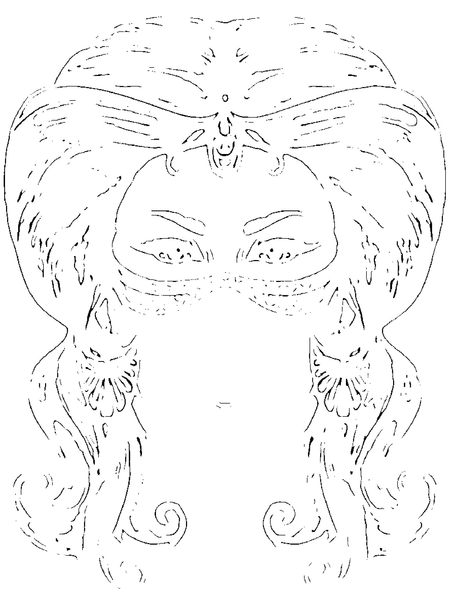

## VIRGO

## 處女座媽媽 & 牡羊座孩子

### 合拍部分

難以取悅的牡羊座孩子和處女座媽媽一樣難搞，雖然要滿足孩子的品味會讓妳有點不太高興，不過妳會因為他擁有自我意識而感到驕傲。你們都是思想家，牡羊座掌管大腦，處女座由代表智力的水星掌管，妳可以給孩子妳小時候也喜歡的書本、填字遊戲及益智遊戲。處女座媽媽喜歡疼愛她的孩子，作為星盤中寶寶象徵的牡羊座，很享受妳給他的所有關注……但是要注意不要寵愛過頭，不然會使他喘不過氣。

牡羊座男孩通常是個思想家（女孩對這方面通常較沒耐心），他會是妳許多DIY任務的完美小幫手；牡羊座女孩則是認真工作的大膽商人，她會讓有商業頭腦的處女座媽媽努力跟上自己的步伐。你們會齊心完成一些任務，從中獲得樂趣，所以請媽媽安排能共同合作的活動，如完成一幅巨大拼圖、為臥室牆壁作畫或是照顧蔬菜園圃。你們的任務會持續好幾天，請隨時保持作戰狀態，享受在兼具智力與體力的挑戰，盡情地遊戲吧！

### 不合部分

動作迅速的牡羊座靠衝動行事，請嘗試說服孩子遵守妳固定的例行常規與時間表吧！為了維持妳的理智，媽媽需要稍微鬆綁限制。大膽的牡羊座會以為自己是世界極限運動的選手，把樓梯間欄杆當成單槓、從工具間屋頂跳下來，或是騎著高速越野摩托車在陡坡上飛上飛下。孩子的古怪行徑可會讓焦慮的處女座媽媽忐忑不安！牡羊座的專注力很短暫，整間房子裡會留下他做到一半的東西和遊戲，忘記收拾搞得一團亂，這可會激怒愛乾淨的處女座媽媽！請在孩子還小時就唱「打掃歌」訓練他，並給予金星星表揚他收拾整齊。雖然妳享受滿足孩子，但若太過寵愛會使小羊變成寵過頭的搗蛋鬼。請稍微收斂，讓孩子為了得到特別獎勵而自己完成任務。

## 處女座媽媽 & 金牛座孩子

### 合拍部分

你們是土象星座的靈魂伴侶，小金牛與妳的個性相當接近，會在清楚的時間表與例行常規環境下努力成長——這對做事井然有序的處女座媽媽來說簡直就是天使！家庭傳統對你們來說也很重要；金牛座會仔細聆聽妳分享小時候的故事，努力吸收妳從曾祖母那代傳承下來的紅醬秘密配方——知道這些習俗能活用在小金牛身上，讓人感到美好。

準備一間用來創作的房間，並備好工具箱。金牛座孩子跟妳一樣喜愛居家和機械方面的活動，從編織、彈吉他到為整個房子裝設喇叭系統。此外，因為你們都是土象星座，也適合在花園種植植物，將妳對新鮮、自種食物的喜愛傳承下去。挑剔的處女座對視覺相當敏銳；雖然小金牛的品味可能比妳的極簡風格更精緻，不過他的審美觀與妳相去不遠。你們都喜歡乾淨、自然、帶有新鮮味道的物品，購買優良（有機／天然）物品來布置，也是你們會一起分享的事物。一起到手工藝品店或農場市集旅行嗎？

### 不合部分

喜愛被寵愛的金牛座由耽溺的金星掌管，處女座媽媽則是注重發生的人，妳會特意維持無糖、無麩質、無乳製品等的飲食方式。妳喜歡在孩子的午餐盒裡裝入羽衣甘藍脆片取代 M & M 餅乾（無論小孩能否接受），或是在妳說出蔬菜含有維他命 C 之前，快速將餅乾丟到垃圾桶，逼迫孩子遵守嚴格的飲食習慣將是場硬戰。

處女座喜歡服務，悠哉的金牛座則喜歡被服務（也就是不勞而獲）。如果妳持續用心靈雞湯的發育方式，可能會使小金牛變成一個懶鬼。金牛座喜歡的東西都要最好的，但習慣節儉的處女座母親，知道如何結合昂貴與低價的物品變成一個完美的複製品。當妳和這隻雄心勃勃、即將進入青春期的小牛一起逛街時，可能會不禁感到震撼，因為他可能要求比妳衣櫃裡都還昂貴的衣服。

小金牛需要很多時間休息、午覺、對著雲朵發呆。妳得減少為他排得滿滿、充滿文藝氣息薰陶的活動，不然可是會被這悠哉的靈魂搞得心浮氣躁。

## 處女座媽媽 ♍ & 雙子座孩子 ♊

### 合拍部分

處女座和雙子座都是由擅表達、聰明的水星掌管，小雙子和妳一樣都充滿好奇心！你們都對小事著迷，喜歡從一些旁門左道獲得消息，再分享給其他人，有時你們也會以為自己無所不知——有其母必有其子。妳喜歡和孩子一起破解謎題、玩益智遊戲，帶小雙子參加天文館、知名歷史人物之家導覽等寓教於樂的活動。和他一起，對話會變得生動且充滿刺激。

## 處女座媽媽 ♍ & 巨蟹座孩子 ♋

### 合拍部分

你們都很健談，喜愛分享八卦消息，但要注意的是，妳的冷嘲熱諷可能會在最不得體的時機吐露出來，此時真的會非常丟臉！但妳就是無法停止對雙子座厚臉皮的評論咯咯地笑，這孩子就像妳能看到事情的所有面向。喔，請多加注意你們的言行舉止！

### 不合部分

處女座媽媽是個照顧者，她無法看到一個受傷靈魂還不去幫他擦眼淚，給他一些鼓勵言語；停不下來的雙子座討厭背負其他人的問題。妳需要教導他要有同理心，同樣地，妳覺得雙子座是否也有理呢？承受整個世界的負擔在肩上其實沒有必要，連孩子都知道這個道理。

處女座生活規律，需要例行常規讓生活感到踏實、有重心，但反覆無常的雙子座孩子渴望變化，「媽，為什麼我們又要去那個公園／餐廳／朋友家呢？」，小雙子會抱怨的。雙子座出生後，妳的例行公事可能只會維持五分鐘，妳也會變成無法經常固定做某件事的人。安全是焦慮的處女座媽媽第一考量，但大膽的小雙子卻不斷追逐危險，妳的心絕對會跟著這孩子變得忐忑不安！妳作為一個完美主義者，有時看到雙子座生活上的一些草率行為，也使妳備感掙扎。孩子只是對事情很快失去興趣，但他能重新振作、尋找新目標——只要雙子座發現一些感興趣的事，會跟你一樣認真鑽研細節的！

多麼甜美的畫面！喜歡照顧人的處女座媽媽與感情豐富的巨蟹座孩子，是如此溫暖又舒服的組合。對你們來說，家是心之所嚮，和孩子在一起時家裡會充滿幸福的氛圍：假日烤餅乾、裝飾餅乾、為家人準備特別的週日晚餐，你們都喜歡寵愛自己的至親至愛。

小巨蟹像媽媽一樣對人很挑剔，只有真正的朋友才能進入他的秘密領域，你們會讓自己的小團體關係緊密；孩子也會像妳呵護他一樣喜歡保護他人（昏！）這有愛心的孩子會為妳泡茶，在妳對世界感到失望時，會幫妳擦乾眼淚。巨蟹座孩子喜歡親力親為的媽媽。去吧，盡情參與孩子的人生——妳的小巨蟹不會有任何意見！

### 不合部分

是舒服相處還是過度依賴？同身為容易焦慮、擔心的你們，會引發彼此最糟糕的特質：處女座媽媽變成頤指氣使的多事者，小巨蟹則表現得像個無助的寶寶。處女座媽媽，請先退一步冷靜一下，妳可以鼓勵謹慎的巨蟹座多做些冒險（吞口水），捍衛自己的權益，而不是讓他躲在妳背後受到保護。

感情豐富的巨蟹座喜歡抓住某個東西，渴望建立熟悉的感覺，即使是重新調整家具位置，都會破壞他的安全感；極簡主義的處女座媽媽則傾心於整理。擺開孩子珍貴物品，可能會默默醞釀囤積強迫症，請讓小巨蟹公開展示他的收藏品，而不是打包他「沒有用到」的娃娃，也不要在孩子去學校時自以為出於善意幫他清理物品。

處女座象徵批評，妳會不禁去指出需要改進的部分。哎呀，妳那些自以為「有幫助的提醒」會傷害巨蟹座孩子最脆弱的部分，況且他通常是藉由正面強化的方式才會學到更多。

## 處女座媽媽 & 獅子座孩子

### 合拍部分

好萊塢，我們來了！獅子座是個超級巨星，處女座則是眾所皆知的星媽。如果妳的孩子展現出童星的天賦（小獅子常有的表現），妳會讓他參加模範老師的課程、加入競爭激烈的巡迴演出，馬上參加角色試鏡。媽媽會全心全意表達支持，不過妳需要控制獅子座的自我膨脹，教導他謙虛的力量。在其他狀況下，小獅子會扮演指導者，處女座媽媽則是生產者；從精心的盛裝遊行到當地自產的有機草莓檸檬汁攤，妳會帶著積極進取孩子的想法前進到下一個階段。多麼棒的團隊合作！

你們都是喜歡讚美的乖寶寶，彼此之間會互相稱讚，維持良好的互動關係。小獅子是個快樂的小幫手，而且還有點愛管閒事。當妳趕去幫助遇到困難的朋友、鄰居、親戚還有跟陌生人時，這慷慨的孩子會跟在妳左右，或送上一張用蠟筆寫的「早日康復」卡片，心已融化！

### 不合部分

健談的母子，妳以為妳已經很多話了……直到這聒噪的孩子出現在妳眼前；獅子座不僅喋喋不休，他也會在他長篇大論時要求旁邊有個仔細聆聽的聽眾。處女座媽媽想要的安靜、沉思時間恐怕得來不易。請在家中安排一個安靜的區域，孩子如果小聲說話就獎勵他（妳可能打算服用很多的止痛藥，或喝任何妳想喝的酒。）

戲劇化獅子座的創意與浮誇，會讓象徵謙虛的處女座媽媽不寒而慄。請教導小獅子符合社交的禮儀，但請不要粉碎孩子的想像力。沒有人可以像他那樣發脾氣，他會在等待結帳、做教堂禮拜以及妳拜訪朋友時突然暴走，然後妳這位力求完美主義的處女座媽媽可能會嚴厲管教，卻發現場面變得更尷尬了。請不要過度苛求自己——孩子出現的爆哭與胡亂拳打腳踢並不能代表妳在這個部分的失敗。

## 處女座媽媽 & 處女座孩子

### 合拍部分

這是妳夢寐以求的快樂小幫手！這孩子喜歡坐在妳旁邊，跟妳一起種植物、拆解和清理古董衣櫃、替車子換油、隨心所欲地做些手工藝。處女座對枝微末節感到好奇，就像媽媽喜歡蒐集有趣事情一樣。

敬效率！妳對孩子管得很嚴，在處女座的莊園裡有明確的規則和條理，妳的絕佳伴侶會在這井然有序的環境裡努力茁壯，甚至還會扮演管理手足的角色（請小心，即使妳在旁邊默默覺得孩子可愛，也不要給他過多的權力，以免使他變得專橫）。處女座孩子挑剔、難搞，像妳一樣擁有敏銳品味，幸好妳知道直接以客製化滿足需求有多重要，妳不會像其他媽媽一樣，在孩子提出特別要求時讓他覺得為難。

小處女是個敏銳的觀察者，尤其在談到人（包括同學和同儕）的時候，妳可能會對孩子如此有洞見的言論感到驚訝。不過有個警告提醒：八卦會是處女座的陷阱，妳自己可能對他人就有點嚴厲了，請減少妳的批評，這樣孩子才不會成長為不知道如何包容他人的人。

### 不合部分

不斷挑毛病！妳的挑剔會激怒其他人。到底誰是小孩？誰是家長？小處女開始指著妳碎念時，甚至會複述妳跟他說過的建議；或妳會注意到年輕處女座對著同學嘮叨，或試著將家庭規則強行施壓在同學身上——孩子反射出的樣子完全取決妳。媽媽，妳是否有點太嚴厲了呢？如果孩子對妳選擇的口味有意見時，事情可能會演變成一場無可預料的惡夢。每晚為妳挑剔的食客煮其他晚餐？誰有時間做！

另外，妳可能也會看到妳完美主義的傾向反映在孩子身上。請注意不要在孩子面前說出一些自我貶低的言論，我想妳最不想見到的，應該是看到孩子因為認為自己不夠棒，而不斷批評自己，或是親手毀掉自己珍貴的手作美勞。

## 處女座媽媽 & 天秤座孩子

### 合拍部分

處女座是星盤上的批評者，天秤座則是代表衡量的星座，即使你們很多時候是以完全不同的角度做出評斷，但孩子跟妳一樣都講究細節。天秤座會看到光明的一面，妳則是分析、解決問題的人。妳會發現孩子的觀點令人耳目一新（如果妳不是有點樂天的人，可能不會發現）；妳也會灌輸常識給愛幻想的天秤座孩子。你們都是文化愛好者，妳會將對藝術、音樂與電影的知識傳承給也欣賞獨立音樂瑰寶的孩子。事實上，你們都有才能，準確地嗅出目前什麼最前衛，能在世界開始流行前就抓住潮流。

年輕天秤座如同處女座媽媽對顏色和細節很敏銳。讓孩子積極參與討論家裡的裝潢，也許還能幫妳挑選衣服，妳會對這孩子與生俱來的風格感到驚豔；溫和的天秤座也喜愛妳打造出來寧靜且布置合宜的窗。你們都是注重飲食的人（有許多天秤座在青少年時就成為素食者），晚餐時做一些未加工的食材和蔬菜果昔吧！

### 不合部分

分析癱瘓警戒！太在意細節會使這對母子變得過度極端：看著彼此穿什麼衣服而瞎忙、堅持小天秤用更整齊的筆跡重寫報告，或為了一些芝麻蒜皮小事開始辯論，這些可會導致你們產生爭執或拖延了時間表。在某些點上，你們可能要聰明的接受「互相寬容」的道理，而不是不斷抱怨。雖然妳害怕孩子會做出錯誤的選擇，不過不切實際的天秤座，可能會在痛苦中學習到一些事情。有時就讓老師糾正他的錯誤，並不是所有事情都要媽媽來教！

由享樂的金星掌管的天秤座，其品味通常都偏向昂貴；妳不會看到妳不喜歡的便宜架子（妳喜歡精緻的物品），而妳則需要盡力教導孩子正確的金錢觀。悠哉的天秤座有自己的時間，不要逼迫他或安排太多行程，他需要時間放空和做夢。這個時間妳能自己做些手工藝，這樣就不會在等待天秤座進入狀況前，踱步踱到地板都被妳踏出洞來。

## 處女座媽媽 & 天蠍座孩子

### 合拍部分

與妳志同道合的天蠍座孩子，感覺就像是妳最好的晚輩朋友，你們用類似的濾鏡觀看世界——抱持好奇但謹慎對待可能會發生的問題。你們這對活躍二人組會控制損失、降低損害，看顧在家中其他成員，確保大家都安全無恙。即使天蠍座是家裡最年幼的孩子，也會保護其他手足，妳知道會有另一雙眼睛替妳看管所有有的事，呼，真令人放鬆。

小天蠍是個調查者，妳是終極的研發者——而且你們都沉迷於蒐集。帶著小天蠍前往販賣古董區，教他分辨夏克式家具、法國床墊及其他有價值的收藏家作品。這孩子會試著從大海撈針裡培養出興趣，這個興趣也能讓孩子保持活躍及遠離麻煩。

即使你們嚴肅、緊張與善於分析，但你們在彼此的陪伴下會感到自在，儘管只是安靜地坐在一起看書、投入一些活動或是解決填字遊戲。哈囉，就放心沉浸在自然舒適的空間裡。

### 不合部分

孤僻的天蠍座需要很多個人時間與空間，直升機媽媽處女座有時則相對吵雜。對妳來說像是關門、鎖上抽屜等尊重孩子的需求會讓妳感到棘手，妳甚至不該想著偷看青春期天蠍座的日記（好，我們知道妳已經偷看其中一頁），除非妳想永遠破壞彼此之間的信任。

許多時候妳必須仰賴對孩子的信任，因為妳根本沒有方法讓這煩躁的孩子完全擺脫困境，妳出於本能的幫助對他來說等同於吹毛求疵，而且若是妳越過批評的界線，就要特別小心了，天蠍座的毒刺可比妳的嘴還銳利。小天蠍會針對妳的缺點用酸言酸語、讓人難受的真相來挫傷妳的士氣。啊！謙虛的處女座媽媽可能需要幾個擁抱才能從中恢復。因為天蠍座象徵「性」，這孩子對於身體毫不害臊，他會在年紀輕輕時就追問妳性方面的事，擁有小冊子和這本《寶寶是如何產生》（How Babies Are Made）的書，能幫助妳傳遞相關知識給孩子，而且比起他從一些遊樂場胡亂說話的人那裡聽來，更應該要從妳這邊獲得資訊。

## 處女座媽媽 & 射手座孩子

### 合拍部分

求知若渴的射手座孩子與博學的處女座媽媽喜歡一起學習，整個世界都是你們的學習場所！年輕的射手座喜愛跟著妳一起研讀學問，從法文對話課、陶器課（還有燒窯）到團體薩滿鼓課程。雖然土象處女座媽媽比她狂野的人馬座孩子還難搞，但戶外課也是能一起分享熱情不錯的途徑。請先忘掉在公園的清新野餐，在妳將無麩質的食物擺出來前，這孩子已經搞得一身泥、傷痕累累，將週遭弄得一團亂。請多帶些紙巾，並順其自然吧！

作為班上活寶的射手座，絕對會用荒謬但聰明的笑話幫助妳減緩壓力，克服妳嚴格的生活模式。孩子會與妳分享對語言的喜愛，妳會被他的俏皮話、有趣機智的家庭用語、為寵物重新取名逗得呵呵笑；以及將來某一天與妳享受書籍交換的樂趣，妳的世界會因為這孩子變得開闊，而且多了許多樂趣。

### 不合部分

小射手和處女座媽媽一樣喜歡雞婆地提供建議，但當這些說教的言論放在彼此身上時就要特別小心了。年輕射手座可能會擅自幫妳決定穿搭風格、選擇與誰當朋友，這會給妳不太舒服，有以其人之道還治其人之身的感覺。這孩子絕對會教導妳如何寬容他人：妳的批評越少，他就越不會這樣反擊。凡事未經大腦過濾的射手座有時候會因為「禍從口出」而吃虧，這對會在私下討論某人缺失但喜歡在大眾前更新細節、有禮貌的處女座媽媽來說感到相當難堪。請小心妳愛說八卦的習慣，處女座媽媽！妳那不修飾的言語，孩子可是會一字一句如實地跟錯誤的人複述：「嗯，我媽說我不應該留下來吃晚餐，因為妳媽不知道怎麼洗碗」。哎呀！

狂野的射手座孩子由擴張的木星掌管，限制與界限並不在他的字典裡。妳死板的規則每一次都會受到挑戰，尤其是關於食物份量的部分，因為射手座擁有比一般人還大的食慾。為了減少一些家庭戰爭，這方面妳必須稍微讓步。

## 處女座媽媽 ♍ & 摩羯座孩子 ♑

### 合拍部分

妳是不是這個鎮上感到最自豪的媽媽？品行端正、努力認真的摩羯座孩子繼承妳的光環，乖巧的女孩或男孩會達成許多標準、獲得金星星、遵守清楚的規則，他就是在這樣的環境下成長，對媽媽來說簡直就像在天堂！在高成就者摩羯座舉起獎盃和獎牌時，妳會驕傲地誇耀他各種頭銜及不斷累積的榮譽榜：班級班長、足球隊隊長、德文俱樂部領導人。標準太高？請先做好確認。小摩羯是注重地位的完美主義者，他會像妳一樣以追上隔壁炫富鄰居為目標，有時妳對於孩子的野心也會表現出不甘示弱的態度。妳可能需要提醒他不要這麼好競爭，也不要對自己太嚴苛。從許多層面來看，這孩子只是反映出妳最驕傲與最激烈性質的一面。

### 不合部分

有位垂頭喪氣的人在這個房子裡？容易悲觀的處女座媽媽與摩羯座孩子會讓自己陷入難以掌控的狀況。你們都會降低事情所造成的損失，要想出事情無法成功或不應該這樣進行的理由並不困難。此外，妳可能會不經意地潑孩子冷水，反之亦然。處女座媽媽對自己和其他批評帶著開放心態，小摩羯天生就對自己嚴格。他可能接下某件事後，就朝著恐怖的方向前進，變成在遊樂場上對其他孩子頤指氣使的上位者，或是為自己設定太高的標準。此時提供一個訣竅：在這小孩面前為自己和其他人說些好話。

種瓜得瓜，種豆得豆。處女座是代表服務的星座，妳總在緊要關頭幫助鄰居、朋友或是親戚；摩羯座代表野心，妳會發現他是個「我要成為最好」的孩子，為了滿足妳的欲望，變得有競爭心態或追逐私利。此時，請教導孩子幫助他人的重要性會是個聰明的主意。

## 處女座媽媽 & 水瓶座孩子

### 合拍部分

照顧人、有社會責任的處女座是擁有服務特質的星座，水瓶座是星盤上的博愛家。你們這對樂善好施的母子檔，很適合參加家族義工旅行、義賣活動及其他需要親自實行的社區改善計畫。小水瓶理性、系統化的特質深得有邏輯的處女座媽媽的喜愛，這也是為什麼孩子跟妳一樣喜歡學習探究原因與做法。

此外，你們同時都擁有新時代人類的特質，這無拘無束的孩子會很開心陪著妳上西塔琴課、裸食甜點製作及捕夢網編織工作坊。處女座是個忙碌的媽媽，剛好對活力十足的水瓶座來說相當完美。孩子也喜歡投入某個喜好，分享關於那些喜好鮮為人知的瑣事，這會變成你們共同的秘密話題。兩個星座都對動物有很深的愛意，要讓家裡變成動物園也不是件難事。

### 不合部分

樸實的處女座媽媽會讓雙腳踏實地踩在地上，但不切實際的水瓶座孩子不知不覺就進入他的幻想世界，孩子的異想天開可能有點超過妳的理解範圍，尤其是他開始談些像是外星人、太空旅行和獨角獸探訪的主題時，你們根本處在不同的時空。務實的處女座一心想的是如何讓現在變得更好，但妳也習慣戀棧過去；注重未來的水瓶座為明天而活，因此他會分心忘記妳現在為他做的所有小事。請教導他專注於在當下，告知他表達感謝是很重要的一課。

敏感的處女座媽媽有點小心眼，妳會為每件小事變得心煩意亂；沒有偏見的水瓶座喜歡克服難關，從容應對。溫和的孩子可能會為了滿足妳變得有點太過超然，妳應該鼓勵他好好與自己的情緒相處；反之，這孩子也會吐露出一些智慧箴言，教導妳如何停止為瑣事心煩。

## 處女座媽媽 & 雙魚座孩子

### 合拍部分

雙魚座是妳的對宮星座，因此孩子會是妳很棒的互補的老師（反之亦然）。你們都善良、慷慨：處女座無私奉獻，雙魚座則是犧牲的星座。妳會開心地看到小魚在遊樂場上表現他樂於助人的一面，然後在孩子有點專橫、搖晃著手指指責其他孩子時，也會有點默默地感到高興。

雙魚座會很開心妳對他的過度寵愛，凡事親力親為的發育方式對孩子的靈魂有如雞湯般滋潤。雙魚座天生身體就較敏感，妳需要處理各種像嬰兒的過敏與感染方面的問題。重視健康的處女座媽媽會將這件事看

# 天秤座

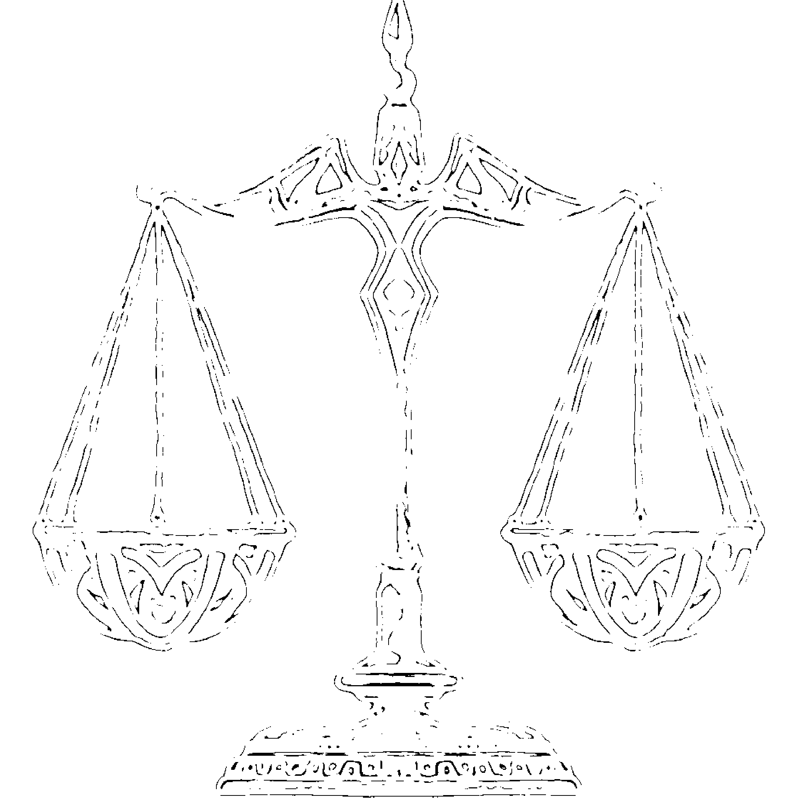

## LIBRA

## 天秤座妈妈 ♎ & 牡羊座孩子 ♈

### 合拍部分

有些妈妈可能会被有胆量又自我表达强烈的小牡羊搞得偏离正轨，不过随和的天秤座妈妈，对于养育这头羊完全没有问题。你享受培养出孩子的独立自主，同样也支持他对艺术的喜爱。率直又一心一意的小羊遇事果断，他会让你知道喜好，这对于容易摇摆不定、陷入分析瘫痪的天秤座妈妈来说是最好的解药。反之，你会帮助孩子减少一些坏习惯和无礼的行为，教导激烈的牡羊座与人为善，并使用一些外交手腕。

你们都有属于自己的偏好，因此都带点自傲的气质。嘿，即使这代表你们总是拥有一些特殊要求，但其实你们只是喜欢事情按照固定的方式进行。幸运的是，人们都不太会对你们说不。

### 不合部分

我们就不能好好相处吗？和谐的天秤座是星盘上的和平主义者，由火星守护的牡羊座则是宇宙里的战士，孩子的激进与火力会破坏你大部分的平衡。即使你平常不是一个会失去冷静的人，但这孩子还是有可能使你抓狂。顽强且独立的牡羊座需要空间培养他独立的身份认同，即使是最听话的牡羊座有时也会变成害群之马，特别是你硬是逼迫他合作时，或太过沉迷你们的相似性时，就会更觉得如此。天秤座讨厌被催促，动作敏捷又易怒的牡羊座则是用疯狂的步调移动——令人崩溃！请不要再想用你过度装饰的外出服套在孩子身上，调皮又爱乱动的小牡羊很快就会将衣服扯掉弄脏。

## 天秤座妈妈 ♎ & 金牛座孩子 ♉

### 合拍部分

小金牛就像天秤座妈妈一样，都是由创意十足、乐观的金星守护，孩子传承你对于美好及美丽事物的喜爱，为你的小牛套上精致服装、制作美味的宝宝副食品，还有让家里充满优美旋律、精美艺术品及细致气味，会让金牛座置身于天堂，你也会培养出一位富有教养，迷你版的自己！从容悠哉的步调是你们都喜欢的生活型态。

先不要管星期天的晚餐，穿着睡衣悠哉闲晃，在厨房里制作一份特别的香蕉榛果可丽饼。音乐也能陶冶你们的身心；当你心情有点失衡或小金牛开始生气时，请打开音乐一起跳个舞吧！和谐的金星完全掌控这两个星座！和恋家的小金牛在一起，你会感受更多家庭生活的幸福；反之，有文化气质的天秤座妈妈则会让固执的小牛打开心房，接受世界更多不同的面向。

### 不合部分

天秤座有文化气质且文明，金牛座则在性急与粗暴的边缘徘徊，这说话大声、固执己见的孩子，有时会搞砸你礼仪小姐的名声，他会对你（包含你）用就事论事的方式做出评论，使你觉得丢脸。只能祝福你能让金牛座降低音量。

准时出门对你们来说是不太常见的景象。小金牛会花三十分钟洗澡、在镜子面前装扮、或在准备出门前才想换衣服（是不是听起来有点耳熟？），请在早上时预留一些额外时间，不然你们可能会永远迟到。

坚持己见的金牛座会抑制有耐心的天秤座妈妈。若他自己有想法时，要宠坏这个不轻易认输的孩子其实很容易。因此教育他的第一个规则就是，直接向孩子说“不”，并设定金牛座能记住与遵守的规则。

## 天秤座妈妈 ♎ & 双子座孩子 ♊

### 合拍部分

你们是风象星座的灵魂伴侣，都喜爱乘着风，轻松感受每天惊奇的事物。小双子跟你一样对所有新鲜事感到好奇，对你们来说，生活就像是一个巨大的探险任务。推着轻型婴儿车出门吧！对比起长时间窝在家里，你们更喜欢说走就走，善于社交的你们无论到哪都能交到朋友。双子座会开心地加入别人的玩乐时间，与其他孩子相处融洽，你能尽情地与朋友闲聊。你们能透过分享你小时候的书籍，或带着小双子前往能学习新知的有趣场所来产生知性上的联结。双子座代表双胞胎，天秤座掌管伙伴关系：你们都喜欢随时身边有彼此的陪伴，感觉就像跟最好的朋友相处一样。

### 不合部分

因为天秤座妈妈不断摇摆不定的心情与双子座反复无常的兴致，使你们无法提前做出计划，假如要搞清楚对方要去哪、吃什么、与谁玩乐时，就会把彼此搞疯。双子座冷静、有逻辑，你一些充满幻想的想法对孩子来说有点不切实际。当小双子断然推开你的拥抱或拒绝你柔性的举动时，感情丰富的天秤座妈妈可能因为感到受伤。

另外，也不要期待双子座会在意你的礼仪规则与过多的社会规范！这个孩子喜欢打破规则（或不服），有时会在强烈反抗及与麻烦者厮混的边缘徘徊。和平主义者的天秤座妈妈虽然会一直用和谐的方式督促他，但双子座却总对唱反调感到兴奋。你这顽皮的孩子只是因为觉得好玩，就开始与家人起口角。唉哟！

## 天秤座妈妈 ♎ & 巨蟹座孩子 ♋

### 合拍部分

甜美、感性的天秤座妈妈和巨蟹座孩子能引出彼此最好的一面。你们都喜欢创造、反复琢磨并一同缅怀美好回忆——这些记忆会在小帮手巨蟹座的投入下，用照片好好保存在相框内（也许是场“剪贴簿派对”？）。宠爱是天秤座妈妈世界里重要的一部分，喜爱被宠爱的小巨蟹会很开心地加入自我宠溺的时刻。当你们悠哉地待在家里时，这会是你们基本的家庭幸福。

饮食在你们内心占据一个特别的位置，你很乐意教导孩子所有的家族食谱，甚至在其中一人开始重视身体健康时，将自己的自然长寿饮食加入食谱中。巨蟹座会尊敬他的母亲，你也很喜欢讨好这行为端正的孩子，小巨蟹也会尽情地关心你——你们就是彼此的心灵鸡汤。

### 不合部分

天秤座妈妈其实是个派对动物，能很快获得别人的支持与认同；与他人关系紧密的巨蟹座孩子仅与几个人相处，和特定的朋友形成一个紧密的交友圈。你黏人的孩子会抑制你的社交方式，占据你的时间及注意。即使你需要稍微将孩子从保护伞下推开，但也不要忘了给予他关心，在你被一大堆朋友围绕时，也不要忘了给孩子特别的关注。

感情丰富又直言不讳的天秤座妈妈喜欢不拘小节，不过不太吐露心思的巨蟹座则是对自己的事守口如瓶，不愿透露。因此当你像个骄傲的母亲在吹嘘自己时，会不小心透露孩子的私事——造成巨蟹座甩门和冷漠对待你的下场。孩子忧郁的情绪会成为一片遮蔽阳光的乌云，笼罩在你阳光般的乐观上，虽然你习惯以正面角度看待事物，但请不要忽视巨蟹座任何一点情绪上的波动，微小的情绪对他来说就会产生很大的影响，即使你根本不知道理由为何。

## 天秤座妈妈 ♎ & 狮子座孩子 ♌

### 合拍部分

钻石是天秤座妈妈最好的朋友，小狮子也喜欢生活充满耀眼的奢华感。你将优雅的感受力传承给这孩子，使你在镇上骄傲地推着婴儿车时，总能引起他人的注目。你们有一些喜爱的事能一起分享：穿上明亮有型的衣服、享受丰盛且美味的食物、跳着活泼的舞蹈，每天给自己一些特别的款待。你们都具音乐与戏剧方面的天分，说不定有天会一起组团，或在不分年龄的戏剧试镜中表演。

你们都是心胸宽大的乐观主义者，当你喜爱某些人时会为他做任何事，送礼物就是表达爱意的一种方式；请准备好空出一面墙，以便让你放上小狮子赠送的部落图画及其他小饰品。警告：要宠坏他很容易，所以请确保小狮子知道有些奖赏是需要付出代价的。

### 不合部分

“镜子啊，镜子……”虚荣心是天秤座妈妈和狮子座孩子共同的缺点，请记住教导孩子内在的重要性。即使狮子座是由光芒四射的太阳掌管，但他可能会忘记自己并非宇宙的中心，请在适当的时机才给予奖励，不然会变成狮子座最糟糕的特质：膨胀的自我。火象星座的狮子座会变得狂野、大吼大叫及傲慢，这些举止会使得温和的天秤座妈妈无法招架。虽然你讨厌冲突，但你可能得退一步好好管教他，以免他的权力凌驾于你。哎呀，“不行”是狮子座讨厌的字，但你需要时常让他听到。狮子座需要长时间的全神专注，但天秤座则是人群海浪的专家，可以一个换一个，在跳到下一个话题前先稍微闲聊。因此，请不要在一对一的时间里将孩子的需求轻描淡写地略过，年轻的狮子座可会藉由发脾气来博取注意，而且通常都会很激烈。

## 天秤座妈妈 ♎ & 处女座孩子 ♍

### 合拍部分

细节，细节！天秤座妈妈和处女座孩子都专注于小事，即使会拖慢所有人也无妨。因为你们都知道这其中的错综复杂，才是让事情从好变得更好的关键！处女座爱好批评，天秤座则会做出评断，因此你们都有特别讲究的品味；在处女座进入青春期前，你们可能都对彼此变得有些尖酸刻薄，小心时尚警察的出现！谦逊的处女座拘谨且合宜，喜欢学习规矩与礼仪，简直就是你的缩小版，让你在大众面前成为一位骄傲的妈妈；处女座喜欢帮忙，提供孩子一些待办清单的线索，让他协助你。此外，处女座很擅长记住你总是轻松带过的事情，而且完全不需要给他任何提醒！你们都是视觉动物，喜爱将周围装饰得很漂亮且美观。

### 不合部分

想象力十足的天秤座妈妈，会对自己的创意表达得意忘形，让所有事情偏离理智。因此，拘谨的处女座孩子，遇到这个时候，难免感到有点羞愧或想稍微避开你，你的一些表现有时对这务实孩子来说超过了能接受范围，而你的乐观主义对于看待人生相对悲观的处女座来说，又会产生矛盾。孩子的神经质确实相当考验你的耐性——为什么他就不能打开心房呢？当你的天秤开始失衡时，会陷入戏剧化的情绪漩涡中，此时处女座则会进入处理事情的角色，尝试想帮助你，不过这却使孩子内心变得更焦躁。即使你成熟的孩子像一位超龄的挚友安抚你的心，不过也请试着在他面前表现出冷静的样子，不然孩子的内心会在进入成年期之前承担过多的责任。

## 天秤座妈妈 ♎ & 天秤座孩子 ♎

### 合拍部分

多么充满爱意的组合！由金星掌管的天秤座妈妈善于与孩子分享彼此的情感。赶紧打电话预约孩童设计师，安排好照相棚，上相的你们会让相机的镜头紧紧跟随，对于街上行人的注目礼也不须感到太惊讶。你的迷你版跟你一样喜爱美丽与和谐的氛围，无论男生女生，小天秤都会是你年轻的逛街伙伴。这孩子会快乐地跟在你身旁参加户外音乐节、时装秀及文艺活动。派对一整天！善于社交的孩子跟你一样喜爱人群，带着小天秤到各个地方，你们会和各自的朋友相谈甚欢。当你们都处在平衡状态时，会是在幸福的氛围中，围绕在平静且舒适的环境里，这让你们感到放松，并在没有干扰或要求下做着自己的事。

### 不合部分

天秤座对品味极端挑剔，当你和孩子对不同的观点、固执己见时会发生什么事呢？虽然你们的星座讨厌冲突，但还是会产生严重的僵局。即使都是阳光的乐观主义者，不过你们的天秤也会往反方向摇摆，使情绪变得忧郁，这种情况特别会发生在天秤座肚子饿或疲累时；孩子会显现出当你想按照自己方式、想怎样就怎样时，是多么强迫地要求他人的模样。

你们都过度强调外表，也许是因为你们看起来都很棒。请不要忘记强化你与孩子之间智力方面的联结；你们都是深度思考者，年轻的天秤座看你以前读过的书，你也会与他分享心得。另外也请多花点时间与他一起待在家里，不要因为你们都是社交高手，就代表年轻小天秤不需要规则与例行常规来获得安全感。

## 天秤座妈妈 ♎ & 天蝎座孩子 ♏

### 合拍部分

天秤座妈妈与天蝎座孩子之间的关系有点强烈，你们之间有种业力的联结，他会紧紧地待在你身边，就像你待在旁边一样。你们一起在学校卖公益饼干、进行募款活动时总能吸引更多目光，你亲切的性格加上孩子无可抵挡的魅力，让你们创下募款金额纪录，也许某天会一起开创事业也说不定！

悠哉的天秤座妈妈，不会那么轻易就受到天蝎座强烈情绪与反应所影响。这孩子会纠结在某个情绪上，不是过于激动，就是墨守成规，此时你没有偏见的观点就能派上用场，帮助他迅速摆脱纠结情绪，并以不同观点看待事物；反之，严肃的天蝎座则帮助你不要只看事情表面，你会变成更具深度思考的人，这都要归功于孩子带给你深刻的影响。

### 不合部分

天秤座妈妈是天生的和平主义者，比起对任何人生气发火，宁愿含着橄榄枝，但你的后代天蝎座孩子可不是如此，这孩子会记仇……记一辈子！请提早教导他原谅的美德及他放手的力量。

善于社交的天秤座妈妈是舞台上的女王——只要你一踏出家门，就受到万众瞩目，对你来说，每个人都是朋友。哎呀，你如此外向的性格恐怕会引起天蝎座的嫉妒，而且如果让他觉得自己与你的众多朋友里，只排在次要位置的话，占有欲强的孩子可是会用刺耳的评论或凶恶脾气提出抗议。

天秤座妈妈和天蝎座孩子都会陷入忧郁、消极的情绪，差别就在于你们情绪上的起伏；你的情绪风暴比孩子还快散去，但要了解天蝎座孩子对人生黑暗面的执着，对你而言会满棘手的，甚至让你怀疑到底为什么会生出情绪激烈的孩子！

## 天秤座妈妈 ♎ & 射手座孩子 ♐

### 合拍部分

让阳光撒进来！积极正面的射手孩子，承袭你对人生享乐的原则及充满活力的观点，你们不会长时间陷入失望的情绪中，开朗的孩子会用揶揄的笑话和超龄的建议，提供你精神上的支柱。你们是随兴、随遇而安的母子档，会在后车厢放着轻型婴儿车到处闲晃，一趟小型超市的小旅行就能变成两个探险家全天的行程。请尽快申请图书馆借书证！年轻的小射手跟你一样渴望藉由阅读在广阔世界里学习，书籍会是你们的联结。另外，你们也是很棒的旅行伙伴，无论是家族铁道旅程还是飞到国外家乡进行寻根之旅。在许多方面，小射手是你的孩子也是你最好的朋友。

### 不合部分

爱捣蛋的射手座孩子对于挑剔的天秤座妈妈来说有点麻烦，你可能得将一些漂亮的东西（尤其是白色的）收起来。狂野的射手座总带着一身脏污回到家里，你虽然举止优雅，但小射手却是笨手笨脚；请将那些珍贵的传家之宝放到高处！和这孩子一起时，请忘掉精致的孩童服装，就在你有正当机会展现花钱的本领前，布料可能已经有些破损了。温和的天秤座妈妈是天生的外交官，你总在开口前先思考，但孩子可不一定！鲁莽、坦率的射手座常会说错话，你可能会多次被这孩子不得体的言语搞得羞愧。射手座孩子的感情不像你这么丰沛，请将感性的卡片时间留给其他孩子，并向小射手表现出你多么欣赏他的幽默感。

## 天秤座妈妈 ♎ & 摩羯座孩子 ♑

### 合拍部分

品行端正、有野心的摩羯座孩子是很多妈妈的梦想，尤其对注重礼仪的天秤座妈妈来说更是如此。你们喜欢在大众下受人瞩目，他也知道如何保持体面。请尽快加入乡村俱乐部的会员，你们都有点精英倾向；小摩羯会想和来自好人家的好孩子相处，而且不想将你为他换上的珍贵白色网球服弄脏。你们绝对是完美的母子档！

摩羯座就跟妳一样，忠诚、传统、喜欢花时间跟家人一起。你可以和孩子相处得很好，你们都喜欢享受沉静、放松的氛围。此外，你们都有点完美主义的特质：天秤座妈妈喜欢做事条理分明，小摩羯则会维持高标准和工作道德。你会因孩子的决心受到启发，从摩羯座积极行为中学习如何坚持目标；你也会帮助阴郁孩子打起精神，学习如何不带自我批评的心态突破重围。

### 不合部分

你们有点角色互换的感觉。乐天特质的天秤座妈妈，比起世俗特质的摩羯座孩子更懂得玩乐与享受，这严肃的孩子则相对悲观，这让你觉得仿佛被泼冷水一般。当摩羯座开始进行某件事时，如计划、作业、游戏等，他喜欢坚持到底；你则比较喜欢待在家里，等着年轻的小摩羯完成任务。

摩羯座会在有条理、传统的环境中努力成长，这孩子喜欢规则，随兴的天秤座妈妈对于建立规则不那么擅长，可能连规定的睡觉时间都记不起来。你的孩子渴望的是拥有一位致力于传统的母亲，而不是酷炫妈咪。专注于前方的摩羯座对规划自身未来有强烈的需求，因此活在当下的天秤座妈妈要为孩子成为更好的计划者！你老是回答“也许”这种不确定的态度，会引起孩子的不安，摩羯座需要从你那里得到明确的答案，而且这孩子也不喜欢即兴或惊喜。

## 天秤座妈妈 ♎ & 水瓶座孩子 ♒

### 合拍部分

天秤座和水瓶座都是风象星座，你们的生活就像一道清凉的微风拂过。这个悠哉的孩子承袭你对即兴与冒险的喜爱，完全不需要对郊游有任何计划，只要让孩子坐上车，随时出发！此外，这个敏锐的孩子也追随你聪敏的好奇心，你们会将小旅行变成整天行程，前往互动式博物馆、专门店来趟城市探索之旅，或是兜风到历史悠久、古色古香的小镇。当然，除了饱含文化素养的行程外，你们也会一早起来精神饱满、毫不犹豫地直接前往游乐园或动物园度过一天。

人道主义的水瓶座及爱与和平的天秤座妈妈，都对弱者充满同情，一起做志工也是让彼此产生羁绊的不错方式。此外，你们都是动物爱好者，这孩子可能会出于道德理由，年纪轻轻就变成素食者。小水瓶就像你一样对组织人群展现出天赋，你们一起时会让家庭生动活泼，藉由安排有趣的事和游戏来建立团队精神。

### 不合部分

虽然你们都擅长社交，不过天秤座比较属于单打独斗的类型，小水瓶则是十二星座里具有团队精神的人。在你渴望与孩子建立联结时，时常会被小水瓶的随从打扰——“妈妈，布伦登、史考特和约拿也可以和我们一起吗？”哎，孩子啊。你可能得清楚表达立场，不然比起做个尽责的妈妈，最后更像个接驳巴士的司机。

由金星司掌的天秤座妈妈，是个感情丰富的黏人精；水瓶座则由智慧的天王星掌管，孩子可能会躲开你的热情亲吻和经常性的拥抱。他可不是任何人的换装玩偶或是抱抱熊，这一点可能会稍微伤了你的心。不过请不要太在意！你还是能透过书籍和分享想法，与孩子产生美好联结，你会对有品质的对话感到惊艳。

当然，你得牺牲一些温暖的拥抱，但小水瓶未来有天会把你当做他最好的朋友。

## 天秤座妈妈 ♎ & 双鱼座孩子 ♓

### 合拍部分

创意是天秤座妈妈和双鱼座孩子与生俱来的天赋，你们会一起产生的杰作有手指画、乐器表演、插画书及华丽的摺边床罩，这摺边会为你的生活带来刺激，在宠爱自己这方面，你们毫无极限（请将饼干罐放在小双鱼碰不到的位置，还有，你也是！）。爱做梦的双鱼座跟你一样拥有无限的想象力，你们的生活就像一场施了魔法的旅程。嘿，天秤座妈妈，你是否还相信着美人鱼与小精灵的故事？你能从梦幻的小双鱼身上重拾对魔法的想象！

你们尽情拥抱，并在美丽马克杯里装满法式热可可——你们不仅非常感性，也很喜欢藉由安抚的仪式宠溺自己，你能和喜爱依偎在旁的小不点享受幸福时刻。

### 不合部分

你对想象通常有清晰的画面，但双鱼座对现实经常表现出不切实际的态度，这会是你们另一个议题。你可能会对孩子想象出来的朋友、神秘图画或相信房间有鬼的想法看得过于严重，妈妈，因为这孩子拥有与生俱来优异的感知能力及某些层面上的预知梦，请先试着不要做出评论。

小双鱼是天生的照顾者，当你生活失衡时，他很快就会来安慰你，但这时请小心，这容易情感转移的小家伙还只是个孩子！不要太常将双鱼座变成安抚者的角色，或者没有让他获得适当的安全感。此外，小双鱼就像你一样容易忽视时间的流逝，在正常的时间表里，可能不会感受到吃饭与睡觉时间；请为自己设定提醒闹钟，让孩子的生活步入正轨，这也会帮助你的生活过得踏实。你们都是对情绪敏感的人，但水象星座的小双鱼会变成过度沉思者；然而从更黑暗的情绪中给予孩子支持，反而使你阳光的一面蒙上阴影。因此，即使你渴望长时间的陪伴，但当小鱼陷入这些烦闷心情时，给他独处的时间及空间！

## 天蝎座

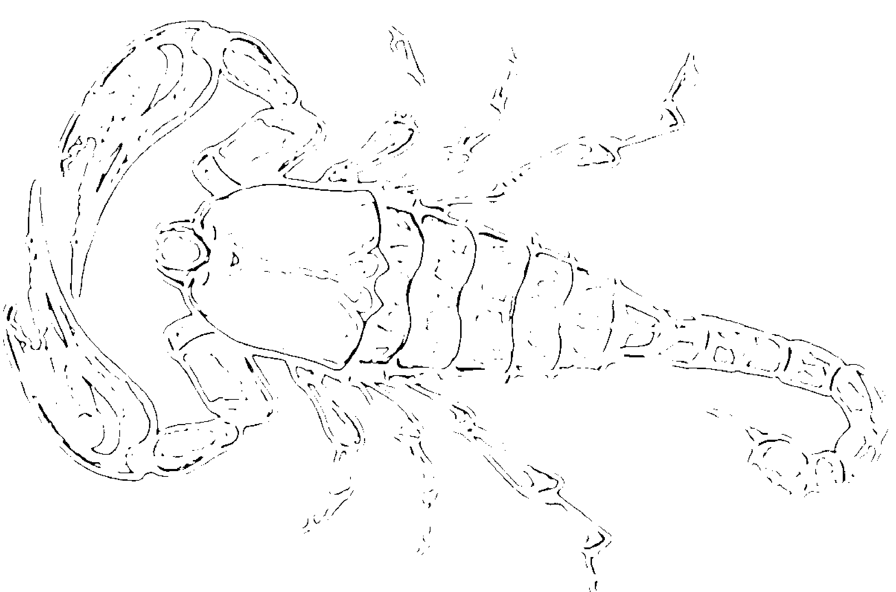

## SCORPIO

## 天蝎座妈妈 & 牡羊座孩子

### 合拍部分

热情、力量十足且由火星掌管的牡羊座跟你的性格如出一辙，具主导地位的冥王星掌管天蝎座，将行星战士火星当作共同主宰人，你本能上就清楚知道年轻牡羊座的竞争心态与锐不可挡的驱动力，无论作为足球队队长、乐队指挥或孩子人气王，牡羊座孩子通常会在团体中独占鳌头。凡事亲力亲为的天蝎座对这位神童而言，简直是完美的经纪人，你会带着小牡羊在每个比赛、试镜与表演中努力往上爬。

狂野的牡羊座孩子可能难以驯服，不过好在天蝎座虎妈完全能胜任这份工作。在你精明的管教风格下，能确保孩子维持谦虚的态度，提醒他世界不是只围绕着他打转。虽然牡羊座孩子散发自信，但他仍是星盘上的宝宝，你直觉的母性能在此派上用场，能清楚察觉到何时应该稍微推他一把，何时需要将孩子紧抱。

### 不合部分

牡羊座由侵略性的火星掌管，天蝎座妈妈和牡羊座孩子间会有个好斗的关联性；你们都性急、直言不讳，有时在爆出伤人言论后又感到后悔；牡羊座通常会不经大脑直接脱口而出，天蝎座妈妈则在感觉到被拒绝或不被认可时去刺伤他人。你们的脾气可能都来得突然，尤其在叛逆小羊违背你或直接忽略你的规则时。

要知道性格猛烈的孩子不会轻易受到你的掌控，特别是你未予他在舒适圈以外的世界探索的权利。

小羊基本上很独立，这个部分可能会让天蝎座妈妈感到不安。你需要他人的关注，而且容易焦虑，比起分心的牡羊座能给予的，你更需要的是对可爱妈妈的地位认同。请不要将自我价值放在想获得孩子的掌声上，不然最后你可能会完全失去母亲应该有的掌控权。

## 天蝎座妈妈 & 金牛座孩子

### 合拍部分

天蝎座和金牛座是对宫星座，心情好时，你们彼此会维持完美平衡。特质务实的孩子很好理解，没有任何秘密，这对多疑性格的天蝎座妈妈来说感到松口气。要与孩子培养开放的对话形式并不困难，因为他会把你当作挚友看待。

金牛座就像你一样务实，但也喜欢有品质的生活。你们会一起宠爱自己：来场冰淇淋圣代派对！可靠的孩子会是忙碌天蝎座妈妈的快乐帮手。你们都具创造力且重视细节，你能让小金牛在派对时帮你布置场地，或为背景音乐制作播放清单。虽然耽溺奢华的小牛喜欢各种精致物品，但你们都很节俭。小金牛会将铜板存在小猪扑满里，等待特卖会时再伺机而动，就跟他妈妈一样！对你们来说物质能抚慰身心，但当你们一起待在家时也会感到相当幸福。

### 不合部分

太固执了？当你们坚持某件事时，无论是固执己见的金牛座孩子，还是意志坚定的天蝎座妈妈都不会轻易退让。你们对事情的思考模式都倾向非黑即白，因此当你们产生冲突时，可能不容易找到妥协之处。当你能展现出妈妈的角色来压制孩子，而且你可能必须经常这么做，但最后还是会听从小金牛的想法。这务实的孩子通常会有值得思考的想法，即使需要花他一点时间才有办法用言语表达。记住金牛座掌管喉部，请鼓励小金牛为自己的意见发声，这对建立自信相当重要。

## 天蝎座妈妈 ♏ & 双子座孩子 ♊

作为固定星座的一员，你们都不喜欢变化，不过当遇到生活中需要转变时，你们会进入一个切换模式。金牛座掌管物质世界，与物品有所连接，因此当你企图丢掉孩子的旧玩偶或娃娃时，请小心处理。不要只是因为他几个月没玩，就认为他已经是不再需要安全毯了。充好电的小牛遇到天蝎座的毒刺时，你们的争吵可能会变得难以忍受。此时你需要给自己喘息的空间，才不会因而失去理智！

### 合拍部分

这对好奇、爱问的母子档就像福尔摩斯遇到南茜茱儿；小双子跟你一样，被生活里的有趣谜团深深吸引，你们对于解开谜题也相当迷恋，也喜爱解谜游戏。任何过于直接的事物会让你们感到厌烦，你们宁愿去厘清繁复的密码或靠着一系列的线索找出解答。试试看智力测验和策略性游戏，这会是你们最喜欢产生连接的方式。

小双子跟你一样是狂热的文化爱好者，你们会分享对电影特别的喜好，执着于细节也是共同特质。不过，你们可能因为对家事过分要求，进而逼迫家中其他成员也要遵守，因为无论是你或孩子，都要事情达到所谓的标准才会满意。

### 不合部分

天蝎座妈妈专心一致，当你想完成某个目标时，未达成前你都不会偏离正轨；难以预测的双子座则是星盘上注意力最短暂的一个，总将事情做一半，半途而废，在过程中会让你无法忍受。

## 天蝎座妈妈 & 巨蟹座孩子

对天蝎座妈妈来说，忠诚和信任比一切都重要，但要将这些信念灌输在善变的小双子身上，只能祝你好运。双子座以双面性格闻名，如果你的孩子不是彻底地爱说八卦，那他最好的朋友至少每天平均会换三次。孩子反复无常的社交方式让你感到挣扎，特别是因为你可不会随意给出最好朋友的称号。

对天蝎座妈妈来说沉默是金，你需要退回到安静的洞穴里沉思，但双子座的喋喋不休会打断你思考的时间，你可能必须离开家中寻求片刻安宁！

### 合拍部分

小巨蟹是你水象星座的灵魂伙伴，你们是对甜美的完美组合，孩子跟你一样直觉性强且不轻易妥协。你替他建立一个舒适的泡泡世界，他能在里面和你一起快乐相处，模仿你每个动作，对你们以家庭为重的传统灵魂来说，家中的幸福感不会倏忽即逝，温暖的家会成为重视隐私的水象星座深切渴望的秘密净土。感谢你的幸运星星：小巨蟹座理解舒适、宁静所带来的意义，提供你许多沉思的时间，让你得以沉淀与充电。

孩子的社交风格与你类似，你们都不轻易相信他人，通常只和特定的人有亲密的连接。小巨蟹就像你，对朋友的无意之举会十分敏感，你也了解孩子对反应上的高标准，但请小心不要让孩子变成受害者心态，你们都得学习如何不把事情牢牢放在心上的重要性！

### 不合部分

这对母子档的关系可能发展到有点亲近过头了，因为你们太喜欢彼此的陪伴，容易将他人排除在外，包括其他的家庭成员，以致于可能会对你们产生嫉妒之心。谈到交友，你们都容易起疑心，不过请小心不要形成“全世界都是我的敌人”的被害心态。如果你让生活变得太狭隘，孩子可能会永远无法离开鸟巢（你也许认为这是好事，不过到了孩子上幼儿园的第一天时，就会发现根本不然）。

年轻的巨蟹座多愁善感，但你也有自己的阴暗面，这些情绪风暴会使你们变得低落，让彼此都觉得被泼冷水。小巨蟹有时很听话、天真且想要被保护，不过你内在狂野的一面，或许会因为小巨蟹说教式的批评受到限制。你想成为很酷的妈妈，但孩子却渴望你成为喜剧《天才小麻烦》（Leave It to Beaver）里的琼·克莉佛（June Cleaver），这位五○年代温柔又严格的完美母亲形象，可是会限制你的管教风格。

## 天蝎座妈妈 ♏ & 狮子座孩子 ♌

### 合拍部分

童星与舞台妈妈的宇宙组合，小狮子在舞台上发光发热时，你会在幕后使劲角力与拉拢关系，帮助天才神童获得更高的位置，应该没有其他人比你更支持这位天赋异禀的孩子的野心，即使有时你确实想主控全场。有些孩子可能会因为受到过多瞩目而感到喘不过气，不过年轻狮子座会沉醉在你不断的关心下；你不介意让孩子变成自己宇宙的中心，自信十足的狮子座也认为如此受人尊重的位置，是他与生俱来的权利。狮子座天生的竞争心态与让自己成为最好的驱动力特质，也反映出你对人生的态度。家中的壁炉架上会摆满你们一起获得的奖状与奖杯。你们都具有迷人的性格与引人关注的特质，在一起时会吸引很多关注。即使你非常保护隐私，但你们的生活实境秀应该会相当吸引人。

### 不合部分

谁是家里的老大？你们之间会有几个主要的权力争夺。如果说你过于热衷吹捧、夸耀孩子，这位迷你小王子可能会忘记你才是家中的掌权者；若你太常对他说，他比其他孩子厉害，这会让狮子座的自我过度膨胀，请务必小心。我想你可不愿姑息养奸，导致自己吃到苦头（即使你相信会成真），不然或许会接到从学校打来的抱怨电话，说孩子无法和其他同学分享或好好游戏。

骄傲又自大的狮子座孩子不擅于保守秘密，关于这点会让你感到相当心寒。你得好好监视他是否将你与他分享的资讯透露出去，不然你会发现一些不可告人的丑事被他公诸于世。性格强烈又独立的丛林猫需要很多呐喊的空间，请试着让孩子就近管理。否则年轻狮子座会闹出一场史诗般的反抗战争，更糟的状况是直接在公众场合大吵大闹——对你这么习惯保守秘密的星座而言，这是最糟糕的噩梦了。

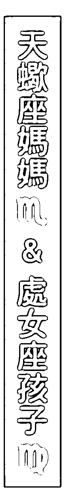

### 合拍部分

处女座孩子是天蝎座妈妈志同道合的伙伴与舒适搭档。年轻处女座几乎跟你一样，常以严肃态度面对人生，而且在处理复杂谜团或难以理解的事时，会表现得更紧张。焦虑的孩子需要更多的肯定以获得安全感，直觉性强的天蝎座妈妈知道如何安抚他，为他的人生扮演稳定且给予支持的存在。令人惊喜的是，他也欣赏你亲力亲为的妈咪风格！

你们都有些神经质，会因周遭环境的个别细微差异与变化做出调整。谈到品味，处女座孩子跟你一样挑剔，无论是一起悠闲逛街、购买设计时装或在网络大海里寻找精致古董，你们都是绝佳的购物伙伴。

乐天助人的处女座是个努力工作的孩子，让他跟在你旁边贴身工作，他会对你不懈的干劲表达钦佩与敬重，你能教导这位过度谨慎的孩子如何在生活中承担相对健康、可控管的风险。

### 不合部分

处女座是代表评论家的星座，天蝎座则注重细节——你们在一起会变得非常挑剔，需要每件事都依照自己的习惯做出客制化的调整。不过妈妈请小心，你可能因此培养出一位苛刻严厉的主角，这会让孩子上学后不太受欢迎——美术老师并不想在第一次水彩课为孩子直接用手调颜料。

此外，你会在孩子身上看到自己爱控制的习性——让你大开眼界。年轻的处女座某天开始命令你，或对你的决定表达意见时，绝对是以超龄的态度对他人品头论足。性感的天蝎座妈妈通常对外表相当有自信，但不要因为看着自己的投射，就无意间脱口说出自我评断的言论。小处女倾向完美主义，特别对身体形象更是如此，他也会从你身上学习；请教导孩子“爱自己”是你给他最棒的礼物。你们在一起时会使八卦变得更加剧烈，妈妈，请随时检查那些冷嘲热讽是否正确，不然会带出处女座孩子刻薄的一面。

## 天蝎座妈妈 & 天秤座孩子

### 合拍部分

天秤座和天蝎座都拥有重视伙伴关系的星座特征，小天秤跟你一样喜欢加入一对一的互动。你们在星盘上是隔壁邻居，有一些相同之处，而且你会发现，在开启话匣子后，孩子与生俱来的口才能力开始发挥作用。

无忧无虑的天秤座将变化带入你的生活，孩子知道如何以正面角度看待事物，而且不会为了鸡皮蒜皮的小事心烦意乱；而你能帮助反复无常的风象星座培养出更多的持久力。小天秤讨厌做决定，但你在人生舞台上脚踏实地的态度，会为他树立很棒的典范，有你这个重视人生目标的妈妈在角落为他加油，对他来说，能帮助他在选择和坚持自己所选的事物时，不容易受到情感的折磨。你们都喜爱音乐与艺术，娃娃车里的小天秤会成为逛博物馆与欣赏交响乐的好伙伴，就去参观毕卡索和二十人爵士交响乐吧！

### 不合部分

孩子是否真的如此天真？年轻天秤座单纯、好奇的眼神会让精明的天蝎座妈妈起鸡皮疙瘩，就在他以玫瑰色眼镜看待世界时，你可是带着间谍望远镜躲在暗处伺机而动。你可能会变成直升机妈妈，总担心这“过度信任他人”的孩子。天秤座的口号是“你需要的就是爱”，但对天蝎座妈妈来说，需要感受感情完整且强烈的面向，你多愁善感的特质，对愉悦的天蝎座灵魂来说过于沉重，可能会使孩子从家庭结构中脱离。

提供你聪明人一定懂的道理：把情绪留在自己的房间，当你陷入负面的情绪时，请赶紧转移目标。

虽然你们对细节很讲究，尤其是事物的表面，不过不太负责的天秤座，常会将事情做到一半，留下尚未完成的事物；请教导他，在开始一项重大的挑战时要有始有终。

## 天蝎座妈妈 ♏ & 天蝎座孩子 ♏

### 合拍部分

天蝎座妈妈与孩子的关系相当紧密，要切断与孩子间的连接，无论是字面上或实际上都不会是很快的过程——你们对于密切关系也相当满意。你们都渴望亲密感及强烈的情感，加上直觉性，就好像能读懂彼此内心想法一样。充满灵性的孩子，会承袭你对神秘学与身心灵的喜好，一起探索人生的神秘界面对你们很重要。

你们都喜欢精心安排的计划，无论是为一场华丽庆祝会精心打扮、或为邻居孩子策划寻找复活节彩蛋的活动，都会让你们沉浸在细节之中。

小天蝎是渴望权力的孩子，不过只要你引导他从这样的倾向转为更谦虚的态度，将会培养出一位很棒的领导者。你们也是魅力的化身，若一起出现在公众场合中，你们的魅力会不由自主地吸引他人目光，不过大部分的人（不会太多）对于靠近你们这对冷酷猫咪组合，还是有所畏惧。

### 不合部分

过于矜持？虽然你们都能适应不开口的气氛与隐晦的暗号，但究竟发生什么事呢？你们这两位战略师之间各种啧啧、愤怒及被动式攻击的举止，说实话，彼此的互动没必要搞得这么复杂！请逼迫自己以开放态度对话，对年轻天蝎座给予清楚的要求，不要因为孩子能读取你的心思，就认为他每次都知道该怎么做。

你想起自身孩童时期吸引危险和制造麻烦的体质，而且也可能从孩子身上看到你以前的影子，但是，这样就代表你能在孩子上学时偷看他的日记或窥视他的房间吗？喔，不，千万不要这么做，妈妈，请不要忘记自己有多重视个人隐私。如果你怀疑小天蝎正朝着难以捉摸的道路，你能试着与他进行亲密对话，确保为他创造安全的空间，并在没有责骂的情况下，让他吐露细节。这跟你与忠诚的朋友分享秘密时并无太大的差别。你会听到小天蝎滔滔不绝、充满信念地诉说，你就是他最适合的引导者，能理解孩子向往黑暗面的诱惑，不过同时也能引领他往完全相反的道路前进。

## 天蝎座妈妈 ♏ & 射手座孩子 ♐

### 合拍部分

灵敏的天蝎座妈妈与充满哲学的射手座孩子，你们都对人生的神秘领域感兴趣。虽然你比孩子更像个侦探，不过充满好奇心的小射手，也喜欢探索隐密的珍奇新事物，生活对你们来说就像一场永无止尽的寻宝之旅。此外，你们也喜欢达成宏大的目标，心胸开阔的小射手跟你一样是个梦想家，伴随着你处理细节的强项，你能帮助积极进取的孩子美梦成真。虽然你们是相邻星座，不过基本上会以不同的角度看世界，能为彼此达成有效的互补。谨慎小心的天蝎座妈妈教导躁进的射手座孩子欲速则不达的道理；而小小乐观主义者会帮助你脱离无助、执着的执念，提醒你雨后必定会出现彩虹。

### 不合部分

擅长策划的天蝎座妈妈，将人生看作是一场巨大的棋赛，你很少会未经全盘思考就贸然行进，性急的射手座孩子则是初生之犊不怕虎，就在你看到年轻射手跨越礼节和常理的界线时，经常引发出如何控制孩子的课题，这个孩子对生活鲁莽的态度绝对会让你焦虑不安。独立的射手座似乎每次都在违抗你、公然忽视你的规则，尤其在你限制他的冒险精神或用任何方法想剪掉他的翅膀时。

天蝎座妈妈不容易相信他人，若有任何人要进入你的生活圈，势必得经历像黑手党等级的忠诚度测试，然而秉持公平公正的小射手，则把生活里各行各业的人当作朋友——是的，即使对方是你不太满意的孩子。也因为受到射手孩子的影响，请你试着稍微放宽标准，或许能放宽你的心胸。

## 天蝎座妈妈 ♏ & 摩羯座孩子 ♑

### 合拍部分

当小摩羯降临到你的子宫时，梦寐以求想建立的王国终于正式成真。两个星盘上最有权力、野心特质的星座，你的小小大人物就跟妈妈一样梦想名声与财富。你会感觉在培养一位皇室或世界领袖，而且确实有可能是这样。摩羯座孩子天生带有贵族气息，你喜欢看着他在所做的一切中爬到顶峰。请为奢侈品保留预算！孩子传承自你对精致物品的喜爱，特别是那些能衬托出地位的东西。小摩羯就像你，对身边相处的人相当挑剔。家庭对你们来说代表全世界，当亲人聚集、需要将家事处理得有条有理时，小摩羯会是你得意的副手。

### 不合部分

坚持己见的摩羯座有点目中无人，虽然你乐意授权给孩子，但你可不想他夺走你在家中的王位。请清楚表达出谁是家里的负责人。如果有其他孩子，并时常将管教手足的工作交给他的话，摩羯座孩子恐怕会变成一位小小独裁者。

天蝎座和摩羯座都会受到生活阴暗面的吸引：嫉妒、执着及权力的争夺。倘若孩子暴露在这样的环境时，请务必格外注意。即使你未看到明显的迹象，但你应该不想看到孩子受到负面的影响。天蝎座妈妈行事隐匿，摩羯座孩子同样也相当封闭；请确保和孩子在一起时多聊些好事，这样能让完美主义的摩羯座学习到，就算卸下面具与展现脆弱，也是很安全的。

## 天蝎座妈妈 ♏ & 水瓶座孩子 ♒

### 合拍部分

请递上鼠尾草和冥想坐垫；你们将打造一个新世纪游牧民族的生活形式。水瓶座虽然比直觉性强的天蝎座妈妈更理性思考，不过孩子很乐意陪伴你一起追寻可吸引你内在层面自由奔放的事物，一起前往没有年龄限制的民族音乐祭典？

你们都是能跳脱框架、富创意的梦想家，说不定也能热衷于科学之中。好奇的水瓶座对研读人类并将资料汇整成报告相当有热情，你本身也像个侦探，会欣赏孩子聪明的洞见。你们面对压力时都能表现出冷静的态度，或许能一起享受极限运动或需要冒险的活动。心情相对轻松的水瓶座，不像你容易把事情往心里去，因此你能从他身上学习到不为小事心烦的态度。

### 不合部分

热情的天蝎座是象征连接的星座，因此你对孩子的爱意相当强烈，希望与他维持亲密关系。冷静镇定的水瓶座则相对超然，这孩子会想从妈妈身边独立，希望能不受束缚自由徜徉。就在水瓶座将你的关心推开时，恐怕会因此伤了你的心，并且带出你冷酷的一面；此外，如果你将孩子对个人空间的要求想得太严重，你的冷冽情绪瞬间会让周围不寒而栗。

此外，你们的社交方式也是主要的冲突原因。天蝎座妈妈会对陌生人（即使是已经认识对方超过十年）起疑心，不过外向的水瓶座在生活里没有人是陌生人。有时可能会出现一些焦虑时刻，就在你看到孩子与班上任何一位麻烦者交朋友，或在超市排队结帐时与看起来可疑的人攀谈。这……！你们都会隐藏情绪，然后突然爆发出来，因此当天蝎座的毒刺跑出来，或者水瓶座突然吃错药时，你们的争吵将演变成一发不可收拾的状态。请试着避免对天性爱反抗的水瓶座说些你之后会感到后悔的话。

## 天蝎座妈妈 ♏ & 双鱼座孩子 ♓

### 合拍部分

爱做梦的双鱼座对天蝎座妈妈来说是个舒适的存在。你们的直觉性强，彼此有深沉的根源，事实上，你会感觉早在三辈子前就认识这个孩子，就像彼此拥有心电感应般。这个与世超脱的孩子能帮助你摆脱执念、提醒你放松、发掘每个美丽瞬间。

打包好野餐物品，带着你的小美人鱼去海滩吧！作为水象星座的伙伴，接近水能抚慰你们的心灵——带着纯洁的祝福。此外，只要医生允许孩子能进入游泳池，就可开始游泳课程。你们都喜爱音乐和艺术，神秘世界也同时向你们招手。双鱼座很乐意陪着你追求像水晶疗愈、梦幻舞蹈、塔罗牌工作坊等神秘学的事物。有预知能力的双鱼座，可能会承袭你对神秘力量的追求，娃娃车上的小小奇迹带来特殊的见解，让你惊奇连连！

### 不合部分

当你在执行某项任务时，几乎不会停下脚步——哎呀，有些甚至会让你沉迷。漂泊的双鱼座则会中途改变方向，失去重心并时常半途而废。逼迫这孩子专心致志可能会徒劳无功，但你能确保小双鱼学习自己善后——玩具和美劳用品散落一地的房子，可不是你梦想中的布置风格。

天蝎座和双鱼座都会吸引拥有阴暗性格的人，你会看到自己不甚完美的倾向投射在孩子身上——教导他谨慎选择交往对象会是个聪明的主意。虽然双鱼座以被动为名，但在孩子乐意遵守你的规则且没有任何抗拒时，也不要急于表扬自己做得有多好。因为小双鱼有隐瞒事情的倾向，最好在发现他在你背后反抗前，为他打造一个安全空间，让他打开心房。

# 射手座

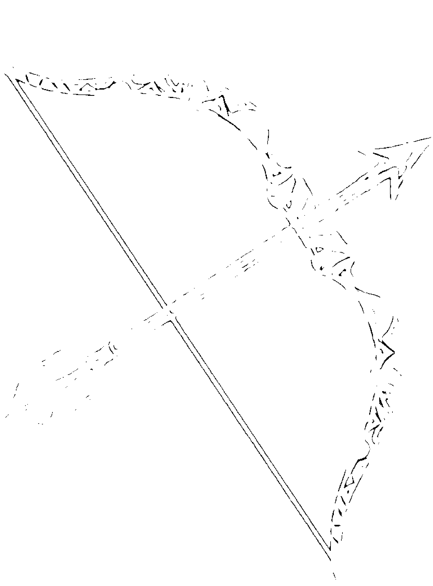

## SAGITTARIUS

## 射手座媽媽 ♐ & 牡羊座孩子 ♈

### 合拍部分

你們作為火象星座的夥伴，簡直就像對志同道合的母子檔；小牡羊反映妳放手一搏的性格，你們欣賞彼此之間產生的火花、驅動力與行動力。一起來場戶外旅行！要你們坐在椅子上超過十分鐘根本天方夜譚。儘管他對目的地的選擇比起妳的自由靈魂還難搞，而且等他準備好探索其他地方前，可能得重複回到幾個他喜歡的地方，不過他還是會和妳一起冒險。

妳的創業精神也會反映在小牡羊身上，事實上，這孩子可能比妳更有動力達成目標；當妳的後代擁有團隊隊長、學生會主席、單簧管首席、同儕團體諮詢商領導人的頭銜時，可會讓妳洋洋得意。創業家的基因也會承襲給他，你們通常能將驚人想法轉換成賺錢管道，孩子對傳統烘培義賣以不同方式呈現則會讓妳對他心生敬畏。我想應該沒有任何家長比射手座媽媽更支持這足智多謀的孩子。

### 不合部分

作為星盤上第一個星座的牡羊座雖然適合開啟事物，但卻對完成興趣缺缺。當妳看到屋子裡散落了做到一半的東西、乾掉顏料（小牡羊分心忘記蓋上蓋子）、待完成的飛機模型半成品等都可能讓妳動怒。請鼓勵小牡羊做事有始有終，告訴他完成後能獲得的獎勵。

食物可能會是產生爭執的問題。美食家射手座擁有精力充沛的食慾與嚐鮮精神，然而牡羊座挑嘴，每樣東西都會要求客製化處理，妳需要準備第二份備用餐點來滿足他的味蕾。絕對不要逼迫他嘗試妳的燉牛肋骨，或是用慢燉鍋煮食物時，要孩子等待計時器響起，當牡羊座肚子餓時，必須馬上吃到食物！

## 射手座媽媽 ♐ & 金牛座孩子 ♉

你們這對母子的能量有時可能有點太旺盛了。你們都喜歡做最好的自己，但牡羊座真的有點太……愛競爭了，如果又遇到孩子想往不同方向前進，此時在坐立不安的小牡羊後方追趕，會讓妳筋疲力盡，加上妳若是對他說不，他會變得頤指氣使、讓人傷神、還大發脾氣。此時妳習慣討好人的天性可能會產生副作用，使妳失去原有的優勢。

### 合拍部分

寵溺的射手座媽媽在金牛座寶寶身上遇到他愛好美食的對手——藉由戶外美食嘉年華來場餅乾烘焙馬拉松活動。廚房裡的創作會成為你們固定的經典活動，但在體重不斷增加或是蛀牙之前也請稍微控制一下。樸實的金牛座跟妳一樣是個自然愛好者，他喜歡陪著妳參與許多戶外郊遊——只要不是太艱難的活動。請帶著小金牛參加相對輕鬆的登山、愜意的腳踏車之旅或在公園野餐，園藝也是培養母子關係不錯的方式。小金牛通常喜愛花朵和菜園，事實上孩子可能比妳更記得何時要為植物澆水。

當你們相信某件事時都會投注熱情（金牛座是掌管道德與價值的星座），有時還會看到孩子因為妳同樣熱情的精神而被激勵。坦率與過於直白是你們共有的特質，小金牛會如實告知他所看到的一切，因此妳在表達意見時也不會覺得綁手綁腳。

### 不合部分

射手座是具實驗精神的火象星座，金牛座則是代表傳統的土象星座；即使兩個星座都關心信念與信仰，但小金牛會發展出與妳完全不同的價值觀與優先順序。當妳在焚燒鼠尾草及在山頂冥想時，小金牛則會以傳統的祈禱和慶祝進行。比起妳的世俗與奇特，金牛座相對保守、封閉。妳這另類的射手座媽媽要讓孩子感到尷尬應該不是難事……妳是否曾在孩子的樂團獨奏會上穿著鑲金邊的長裙？端莊的白色襯衣可能會一直待在妳的衣櫃裡，直到孩子央求妳與他在一起時穿上，好好扮演一位正常的母親角色吧！

金牛座是星盤上的計畫者，在他設定好計畫表與例行規則後會努力達成；然而重複性的工作不是妳的強項，畢竟射手座依靠感覺行事，而不是哪些令人窒息的行程表，不過妳必須發展出紀律以提供孩子渴望的架構與穩定。缺乏耐心的射手座媽媽，總以迅雷不及掩耳的速度進行，但金牛座是個井然有序的慢郎中——等待孩子準備上學的過程，可能會讓妳無聊到絕望，請確保前一晚先幫他準備好更換衣物。

## 射手座媽媽 👩‍👦 雙子座孩子 👦

### 合拍部分

雙子座和射手座是對宮星座，在許多方面上，這孩子會是妳完美的互補。你們都是自由的靈魂，充滿好奇心、冒險心且愛玩樂；帶上妳的嬰兒揹巾與輕型嬰兒車整裝出發！妳會帶著雙子座四處飛行，孩子也樂意陪著妳在城鎮中開啟異想天開和臨時起意的旅行。隨著孩子的成長，他會變成妳冒險之旅的最佳玩伴，親子道路之旅會是你們津津樂道的回憶。你們會駛離高速公路去採草莓、漫遊在鄉村市集、騎馬或在巨大電影院看 3D 電影。充滿好奇心的雙子座喜歡生活裡能提供的一切，而且很少拒絕妳大膽的想法。

碎嘴的孩子會滔滔不絕地講話，妳在他身上看到自己健談的特質，彼此間也會有生動的對話閒聊。你們都喜愛學習，請騰出空間放書架！好學的雙子座就像媽媽一樣是個愛書者，但是你們只看了一頁的書往往會比看完的書來得多。手工工作坊和DIY課程能讓你們歡笑好幾個小時，拿出你們的紙漿藝術品或繪布顏料。當然，在完成作品前就失去動力也沒關係，因為你們很快就會將注意力放在另一個有趣的事物上。

### 不合部分

你們都無法靜下心且缺乏耐性，但雙子座的注意力比妳短暫，跟著孩子行動可會讓妳昏頭轉向！妳喜歡從各種角度分析事物，但雙子座卻會中途改變主題，前一秒你們在為雙子座的生日晚餐設計菜單，下一秒妳會聽到他說想要有個獨角獸的願望並談起遊樂園裡聽到的謠言。多話的雙子座有時會搞到妳發瘋，比起妳這性格獨立的星座所能給予的，他需要更多的互動和認同。請盡快找位同儕陪他玩、與他產生共鳴，而不是想嘗試填補最好朋友的角色。

雙子座頑皮又愛反抗，請給他好好上一課，射手媽媽，孩子需要透過逆境學習事物。射手座是真相追求者，對妳來說，灌輸孩子誠實與正直的觀念相當重要；然而雙子座就像個狡猾的業務員，習慣編造故事、瞎說或許下無法遵守的承諾，請防患未然，及早制止這樣的習慣。不過要注意，指責小雙子會是個雙面刃——雙子座在做決定前，會聰明地考量到不同的面向，妳無法阻止他進行利弊分析及用言語表達想法，即使妳比較希望他將這些專長用在自己身上。

## 射手座媽媽 & 巨蟹座孩子

### 合拍部分

你們都是直覺性強，對於促成人們產生動機的部分感到有興趣；即使小巨蟹是比較害羞的觀察家，不過你們都不畏懼對大眾提出超過二十個問題，同時也會分析人們的行為，而且還有點八卦——你們共同的特性。

巨蟹座司掌腸胃，射手座則由饗宴之神木星掌管，你們的連結會是烘焙（沒錯，就是字面上的意思），把家族食譜拿出來，一起做些暖心食物。巨蟹座樸實的一面會引發妳愛家的特質，妳從沒想過自己竟然會成為穿上圍裙的媽媽，對廚房用具投入熱情。此外，妳也會有個搭檔協助佈置家裡，特別是有關任何 DIY 的項目，更好的是巨蟹座充滿耐心及持久力，妳能和這個小幫手一起完成窗簾的編織或修整古董服飾。

好學的巨蟹座跟妳一樣充滿求知欲，請不要省略孩子的睡前故事時間。你們也會在車裡聽很多有聲書，這對小巨蟹來說不僅是個好的消遣，同時也能啟發他的想法。

### 不合部分

當神經大條的星座（射手座）發育一位敏感到旁人都有點畏懼的孩子（巨蟹座）時，會發生什麼事？射手座媽媽的坦率會使多愁善感的小巨蟹感到受傷，即使他只是想幫忙妳！當妳和這孩子在一起，要小心翼翼地與他相處。

巨蟹座依賴性強，需要媽媽很多的照顧與關懷，要讓孩子斷奶會是個浩大工程，妳可能也需要在他開始上幼稚園前幾天，跟著他在教室裡待上好幾個小時才行。巨蟹座是個愛家的人，這點會讓射手座窒息到想大叫，但最後妳會花更長的時間待在家裡，才能提供孩子足夠的安全感。請確保家中有夠多的玩具和娛樂選項，這對小巨蟹和妳都有益處。若在巨蟹座十幾歲，他的蟹腳與射手的弓箭相抵觸時，你們之間的爭吵將變得一發不可收拾。此外，孩子的念舊情懷也讓妳惱怒。當巨蟹座哼著披頭四的《昨天》（Yesterday），妳寧可呼叫小孤兒安妮（Little Orphan Annie）唱著《明天》（Tomorrow）。更糟的是，這孩子不會原諒或忘記妳犯下的錯誤，哈囉，永無止盡的內疚感。

## 射手座媽媽 & 獅子座孩子

### 合拍部分

射手座和獅子座都是火象星座，創意力與冒險精神讓你們閃閃發光；小獅子承襲妳對享受生活的本性，對你們這兩個耀眼的人來說，生活就像一場盛大的慶祝會。你們都不喜歡被限制，想體驗世界能給予的所有事物。妳也不需要放棄社交生活，因為外向的獅子座能輕易和朋友的孩子打成一片（而且還有點愛指揮），讓妳有時間四處閒聊，享受大人時光。此外，雖然你們都不喜歡離開派對，但請設定好該出門的鬧鐘提醒，以免成為不准時的母子檔。

熱心的獅子座是個忠誠的孩子，他享受與博學的射手座媽媽學習，因此妳能灌輸他深不見底的智慧。如果妳是個創業家，會有個聰明孩子在妳左右，小獅子可能會繼承家族事業，或在高中畢業前與妳一起投資某個冒險事業。伴隨著獅子座對流行的天賦，也可能成為妳的造型師。哈囉，城裡打扮最流行的媽媽！

### 不合部分

妳大膽、熱情的個性會讓你們的關係產生競爭課題。你們都擁有強烈的想法，而且獅子座會在事情不順心時大鬧脾氣。作為一個多變特質的星座，妳可能需要屈服、認錯，以度過這些麻煩時刻。但是，射手座媽媽，妳不該這麼做！因為這樣可能會培養出一位暴君！渴望讚美的獅子座需要很多關注，他喜愛跟你玩又長又複雜的心理戰，對於缺乏耐性的射手座媽媽來說，會在十五分鐘內對這愚昧行為失去興趣。雖然妳讚賞孩子的創造力與創意性，但妳可能也會感覺自己像是個疲憊的訓獸師。我們不能中場休息嗎？拜託！接著妳可能發現孩子滑稽的炫耀行為，他確實會這麼做，不要忘記，這星座是由太陽掌管——畢竟這是宇宙的中心。此外，當獅子座女兒宣布說想嘗試當啦啦隊隊長或進入選美比賽時，妳內心的女性主義會對此猶豫，但此時絕對需要敞開胸懷。即使獅子座如此狂妄自大，雖然妳想勸告他謙虛，但請小心不要用妳的坦率與不加思索的反應來打擊他的信心。

## 射手座媽媽 & 處女座孩子

### 合拍部分

在許多層面，善於哲學思考的射手座媽媽，與善於分析的處女座孩子，簡直如出一轍。兩個星座天生就對人們的行為動機感興趣——而且你們對自己相信的事物都帶有說教的意味。如果孩子開始教導、責罵妳時，不要感到意外，妳會發現這老靈魂的智慧確實讓人耳目一新。孩子也享受妳的「老生常談」，讓妳放心灌輸大量的智慧給這求知若渴的孩子。

媽媽和孩子都是愛書者。處女座非常喜愛睡前故事時間，建議妳每晚念些史詩般的故事寓言；前往天文館、科學中心和溫室，寓教於樂的學習能讓孩子感到興奮。此外，你們都喜愛動物，家裡可能會有很多寵物。射手座媽媽是自然愛好者，同樣愛好自然的處女座也喜愛戶外活動，裝上腳踏車的椅子，來場腳踏車風景之旅，也請準備好野餐物品，因為你們都熱愛美食。種植可食用的植物也是培養親子關係的好方式。

處女座忠誠、樂於協助，比起妳更重視細節。打掃時間一到，會幫忙清掃踢腳板、整理調味料的架子，處理所有妳沒耐心處理、重複性高的事物。

### 不合部分

熱愛系統化的處女座倚靠規則存活，射手座媽媽則喜愛隨興而至——最後……這孩子會逼迫妳好好安排自己的人生，嘿，其實也許對妳是件好事。

處女座對批評很敏感，對自己又是相當嚴厲的完美主義者，妳自認對他「有幫助的提醒」，可能會直指他的要害。因此在妳指出他的錯誤前，請先等一下，也許他已經開始苛責自己的錯誤，此時比起建議，他更需要的是鼓勵和肯定。雖然妳盡情享受生命的態度能接納謙虛的處女座，哎呀，妳也需要調整自己低俗且不太適當的玩笑。這孩子比妳內向，對相處的對象也相對挑剔；事實上，媽媽，妳反而會變成被這愛批評的孩子評論的對象。雖然你們都過度分析事物，但處女座又更容易擔憂，孩子可能會表現出妳無法理解的緊張與恐懼。此時，若告訴他努力克服只會讓事情變得更糟，反而要幫助他根據恐懼找到對應的機制，即使妳不了解他的恐懼為何。

## 射手座媽媽 ♐ & 天秤座孩子 ♎

### 合拍部分

你們是對輕鬆愉快、相處如微風的母子檔，也是喜愛四處散布花粉的社交高手。小天秤對射手座媽媽來說是絕佳的活動夥伴，伴隨著他好溝通且隨興的態度，這孩子會對妳奇特、天外飛來一筆的舉動表達認同。天秤座一輩子忠於父母，他會真誠地傾聽妳的故事（無論多長），多話的射手座媽媽有很多東西能分享，擁有一位如此熱忱的聽眾非常討人喜歡。天秤座其實也很健談；隨著孩子的成長，你們會開始享受彼此的對話，大多時候都是正向且歡樂的情況。即使你們抱持不同的態度，但還是能達到互補作用。

悠哉的天秤座通常需要一個推力，而妳能讓這孩子專注、往前邁進。此外，小天秤也能幫助妳放慢腳步，仔細欣賞周圍事物。妳等不及與娃娃車上的享樂靈魂一起享受人生，請再給我更多的巧克力！

### 不合部分

天秤座很會虛度時間，像是個擁有少女心且挑剔的小公主，將美好時間拿來洗淨自己、挑選外出服、在每個早上精心打扮，喔，對了，孩子也喜歡睡美容覺，馬不停蹄的射手座媽媽為了等孩子準備出門，等到地毯都踏出個洞了（也許已經完成半天工作）。

當妳有想法時，會像電影《魔鬼暴警》（Action Jackson）般迅速展開啟動模式；但天秤座則永遠在猶豫，妳已經習慣聽他說了許多天馬行空的想法，但從來沒實現過。此外，也不要逼迫天秤座對每個創意想法都採取行動。這孩子可能比較像夢想家，而非實幹家，但這並不代表他找不到成功的道路，說不定在未來他還能教你「聰明工作，而非努力工作」的道理。

射手座媽媽不夠精練、控制自己或打扮不合時宜，這些都會輕易讓高雅的天秤座感到丟臉。天秤座這個禮儀端正的軍官，會糾正缺乏文化素養的射手座餐桌禮儀，帶妳去買專業女裝的百貨公司（但妳比較想逛休閒衣服區），或嘗試在家裡灌輸「不能把腳放在桌子上」的規則，這些舉動可是會激怒妳的。

## 射手座媽媽 ♐ & 天蠍座孩子 ♏

### 合拍部分

天蠍座是星盤上的學者，發自內心對一切事物感到好奇，小天蠍對生活裡的各種神秘感興趣，這使妳為了尋找更多解答而進行自我追尋。即使孩子比妳嚴肅、緊張，但他會承襲妳對生活的熱情。

射手座媽媽是個獵人，天蠍座孩子則喜愛尋找藏匿的寶物——來場尋找稀有寶物的遊戲！古董玻璃瓶蓋到罕見的棒球卡，你們會興奮地分享彼此的發現，一起享受挖掘寶藏的過程。你們都機敏、聰明；天蠍座會將他的東西保存起來，等待適當時候再分享他的戰績，讓人印象深刻；幸運的射手座媽媽知道如何專注在任何一個機會，再藉機提出大膽要求。妳會帶給這內斂孩子一些大膽的能量，而孩子則會教導妳珍惜自己所擁有的（而不是不斷索求！）與投資一些經得起時間考驗的物品。

### 不合部分

射手座媽媽坦率、不經修飾的生活方式，與敏感天蠍座想保有私生活的想法會相互抵觸。妳以為在分享有趣故事，但孩子卻覺得隱私被揭露、感到被背叛。妳對孩子的事過於暢所欲言，甚至還充滿驕傲、滔滔不絕地說著，這些都會破壞彼此的信任。

精明的小天蠍會觀察妳的動作，很快學習到哪些事會踩到妳的地雷，以及如何讓妳對他毫無節制的要求頻頻點頭——請不要陷入這精明孩子的遊戲裡！「因為我說了算」這理由就足以對孩子發號施令，而且如果妳想在孩子面前占上風，這可能也是最安全、可靠的做法。天蠍座為固定星座，不喜歡改變，需要重複性與生活常規，讓生活感到安心且腳踏實地，這對於每天生活像雜耍表演的妳來說會是場災難，至少在前幾年來說是如此，為了給予孩子安全感，比起關心，妳得做更多「抹肥皂、起泡」的動作然後不斷重複。

天蠍座有時多愁善感、陰沉憂鬱。雖然妳可能嘗試幫助孩子，但妳的樂觀可能並不能影響他的情緒風暴，在他陷入這樣的情緒時，請學習讓天蠍座維持他本來的樣子，不用過於在意。

## 射手座媽媽 & 射手座孩子

### 合拍部分

哈囉，媽媽的縮小版，妳的「副本」承襲妳愛冒險與獨立精神，你們享受彼此的陪伴，但這孩子不會對妳過度依賴。你們能一起在同個房間和諧相處，各自分別工作和玩耍，而且不需要彼此過多的關注，真是貼心的孩子！這個好奇、愛看書的孩子享受長時間的睡前故事，等到孩子長大些，他也會跟在妳旁邊一起閱讀，之後就能帶著他直接申請一張圖書館證！妳也會讓他聽有聲書，不過他可能無法長時間坐著好好聽書。另外也能讓他組裝樂高積木、手工品或拼圖。談到成為絕佳的多工處理者，可說是有其母必有其子。

好動、喜愛戶外活動的你們享受在自然漫步、騎腳踏車和花藝。露營之旅也是很棒的選擇，帶上一些木頭和柴火，火象星座的你們喜歡用營火烹飪。此外，你們都喜愛探索和學習，四處旅行也會是愉快的行程。小射手可能承襲妳的創業家精神，妳會很開心鼓勵他踏上這條道路。

### 不合部分

注意脾氣！你們彼此都容易被激怒，並以易怒的脾氣出名。這孩子完全知道如何踩到妳的地雷，尤其在他開始想解釋自己的觀點時，不由自主對妳大小聲。此時，妳也不再對他和藹可親，於是戰火就會蔓延到其他家人身上。這無所不知的孩子跟妳一樣愛說教，他從年輕時就會開始告訴妳該做些什麼；妳有向他請求建議嗎？完全沒有！麻煩的就是這坦率的孩子會指出比真相還更多的暗示；他肯定會反映出妳原有的面貌，逼迫妳處理自身的缺陷。嘿，說不定妳最後還因此進步了，即使妳當下很想將這個小瘋子關在他的房間。

你們都不喜歡常規，但射手座孩子還是需要從父母身上學習一些日常生活的規則；請嘗試至少每天在相同時間做一件事，像是做作業、吃晚餐、睡覺，這樣能幫助孩子感到安心且有安全感。

## 射手座媽媽 & 摩羯座孩子

### 合拍部分

即使你們是鄰近星座，但基本上沒有太多相似之處，而且也不太合拍。但積極進取的射手座媽媽與小摩羯都有相當程度的野心，都是以目標為導向的成就者，即使可能用不同的方式獲得 —— 射手座媽媽有實驗精神，願意冒險；小摩羯則是循規蹈矩，會成為一位優秀學生、團隊隊長和班長以及獲得優秀的頭銜。

冷靜的摩羯座比妳更嚴肅對待生活，但其實這孩子具有諷刺他人的幽默感，你們都能看見生命的神聖幽默，藉由機智挖苦和有趣的發現讓彼此開懷大笑。小摩羯也像個優秀的小軍官，儘管妳對於成為遵守紀律者不是很感興趣，但妳能看到孩子有多麼規矩，並因此而感到欣慰；這孩子喜愛遵守規則，所以請確保妳有為他設定一些規則。此外，戶外活動也是相處融洽的好方式；土象摩羯座是大自然愛好者，跟妳一樣享受成為一位活躍、好動的人——先來場家族足球賽如何？

### 不合部分

請舉白旗、接受自己成為不太願意成為的傳統媽媽。摩羯座渴望條理架構與例行常規，他會挑戰妳提供一些五○年代的家庭價值，但這些都不是妳擅長的部分。妳會發現年輕摩羯座需要嚴格計畫每件事到令人筋疲力盡（而且還有點無聊）；因此，妳的孩子希望妳能按照規則走。堅持己見的摩羯座孩子會讓妳臣服於他固執的一面，當他決定達成某個目標時，有耐心且循規蹈矩的摩羯座，將會完成他的目標，請不要影響他。對妳來說，若遲遲無法得到結果會讓妳失去耐心、改變方向，但請小心不要因為妳自己坐立不安就干擾他。

責任心強的摩羯座是個忠於朋友的人，他會堅守一個排他且緊密的小圈子。請不要因為妳想和其他媽媽交際，就嘗試拖著孩子也轉換玩伴。孩子喜歡維持長時間的友誼關係，妳會在孩子成長的過程中，也同時看著他的朋友一起長大。

## 射手座媽媽 & 水瓶座孩子

### 合拍部分

兩個獨立的理想主義者，水瓶座孩子會是妳的心靈伴侶。思想自由的他會用超齡的評斷、脫俗穿搭（澎短裙搭配雪褲，不行嗎？）、還有無法預測的心情，搞得妳頭昏目眩；但妳就是那個最完美的媽媽，去教導如此獨一無二的孩子，畢竟妳本身就是個變化多端的母親。

射手座媽媽的朋友來自各行各業，妳就像個國際外交大使；人道主義者水瓶座孩子承襲自妳多采多姿的大愛，想為所有人讓這世界變成更好的地方。一起做志工會是你們不錯的連結，特別是志工之旅帶有旅行的成分。

你們都擁有奇特的幽默感——是一對經典的喜劇母子檔。喜愛社交的水瓶座在友誼方面會有些超越想像的行為，因為他和大部分的人都能相處融洽，因此妳根本不需要減少妳的社交生活。

### 不合部分

火象星座射手座既溫暖又有熱情，風象星座水瓶座則是冷靜、如微風般的存在，因此妳充沛的能量對這個悠哉的孩子來說有點過頭了，他可能會拒絕妳過於熱情的擁抱，就在小水瓶沉默或對妳自以為有趣的想法興趣缺缺時，妳的心會因而感到受傷。直率的射手座急於做出評斷，對每個人和每件事都有意見，而一視同仁的水瓶座習慣在事情確認之前，對每個人抱持中立態度——這孩子絕對會教導妳學習接受他人的「缺陷」。

## 射手座媽媽 & 雙魚座孩子

你們內心都渴望自由，但這有條理的孩子如果需要感受安全感的話，又該如何做呢？雖然水瓶座可能拒絕在特定的時間回家，或遵守關燈時間，但妳還是需要教導這小小叛逆者遵循一定的規則。水瓶座是象徵反叛的星座，有時會在無法預期的情況下出現抵制的行為。此時千萬記住妳是他的媽媽，不是最好的朋友——這可是你們這對彼此關愛的母子檔很容易忘記的事。

### 合拍部分

對射手座媽媽和雙魚座孩子來說，生活就像一場夢。你們都由代表豐盛與擴張的木星掌管（雙魚座同時由海王星共同掌管），這能引出你們充滿驚喜的希望、對生活樂趣的體驗。魔幻的雙魚座喚醒妳的無限可能及妳曾擁有的童心；你們會因為出於有趣一起熬夜看流星、在客廳牆上作畫，還有戴著羽毛圍巾和寬簷大帽在街上閒晃。

靈性與形上學的主題會吸引你們。讓小雙魚跟著妳一起參與瑜珈課或佛教念誦課程，另外妳可能還有一副塔羅牌或神諭卡，能一起學習解讀——說不定這孩子會是個預言家！射手座和雙魚座都是性質善變的星座，能隨著來自不同文化與階層的人們相處融洽，就像隻變色龍。此外，你們都不喜歡受到箝制，在你們樂於分享的生活裡，總有一群不斷輪替的人們。雙魚座柔軟的面向會對射手座產生影響，妳的小雙魚能幫助妳學習冷靜；需要關心的雙魚座有時則需要妳提供心靈雞湯，給予他撫慰的力量。

### 不合部分

射手座媽媽獨立、積極主動；雙魚座依賴性強、悲觀，還有點受害者心態，孩子自認「我好可憐」的心態可會挑戰妳的脾氣，為什麼他就是無法克服呢？警告：妳可能也有點太神經大條了，對孩子的需求缺乏同理心。在妳想給孩子來場（不太受歡迎）的訓話前，請先確保已經了解孩子的需求。

即使小雙魚在成長時承襲了妳自由的靈魂，不過他的過敏、感染、腸絞痛的發作，會干擾妳預期至少在前幾年可以放任式的育兒計畫。射手座媽媽習慣取悅他人，妳的情緒容易受到這精明孩子操弄。雙魚座完全知道妳的地雷為何，會讓妳感到內疚，在他青少年時，他會以帶刺的情緒性字眼直接擊中妳的要害。當雙魚座孩子不喜歡妳設下的規則時，妳很難承受他的情緒風暴及甩門動作。射手媽媽，即使妳感覺心在淌血，也請保持鎮定。這也是為什麼在妳將富有同情心的雙魚座變成摯友時要特別注意。即使這擁有老成靈魂的孩子了解妳最深層的感受，但若是妳和孩子成為最好的朋友，可能等同把控制權交給他，務必切記彼此的界線！

# 摩羯座

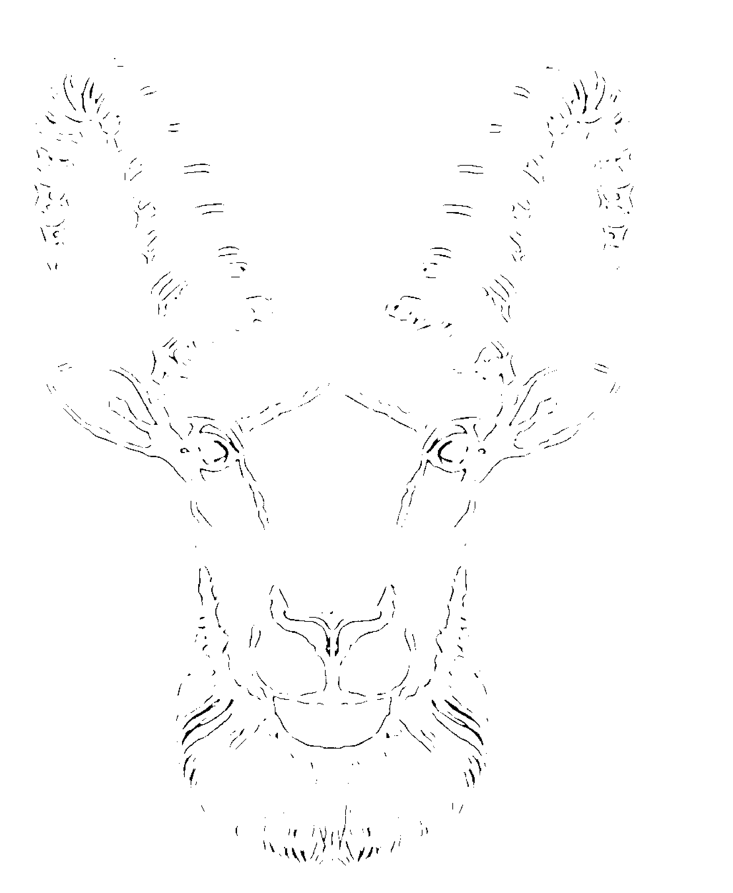

## CAPRICORN

## 摩羯座媽媽 ♑ & 牡羊座孩子 ♈

### 合拍部分

牡羊座是十二星座裡的寶寶，摩羯座是象徵提供者的星座。妳就像這火球寶寶的堅固土壤，在不眠不休歷經許多冒險與一時興起後，提供一處安穩的中途休息站。牡羊座惡名昭彰的耍脾氣會在這對母子組合裡更常發生，不過有耐心的摩羯座媽媽能提供小牡羊許多「做自己」的空間。

你們都是喜歡擔負責任的強大領導者。哈囉，傑出的孩子！牡羊座會拾起妳曾擁有的頭銜與獎勵，靠著他自己的力量在各領域中奪取好成績。確實，大家都知道你們都喜歡贏，並表現出最好的一面，隨著小牡羊因為其壯舉獲得大眾肯定時，妳也能感到相當自滿。摩羯座和牡羊座都以其傑出的運動能力出名，拿起滑雪板征服高手等級的斜坡吧！

### 不合部分

總是表現適宜的摩羯座媽媽謹守規則，不過象徵反叛的牡羊座相信規則是用來打破的……再根據需求全盤改造；對於彼此都認為自己天生具統治者天賦的你們來說，將會出現許多權力上的爭執。因此，與其對小牡羊施加嚴厲的規則，不如讓他一起參與創造規則，這麼做的話，他可能就能達到自我管理。

傳統的摩羯座媽媽會因為年輕牡羊座的狂野與戲劇性表現而感到丟臉。若是將這孩子送到原始學校的話，只能祝妳好運，因為一天結束後，妳別期待他會乾乾淨淨地回到家中，衣服上肯定有些撕裂或髒汙。工作狂的摩羯座會為了取得偉大目標而專心致志，以致於忘記給予小牡羊在成長時所需要的關注；請在孩子成長的過程中給予鼓勵，而不是只在乎成果。

## 摩羯座媽媽 ♑ & 金牛座孩子 ♉

### 合拍部分

這孩子與妳一見如故，身為土象星座夥伴的他，能開心投入妳秩序良好的世界；規則和架構能讓你們感到安心。此外對妳來說，家庭傳統比什麼都重要，妳可能會是家族裡的女王，妳珍視的祖先遺產會透過小金牛持續代代相傳。靈巧的金牛座也很樂意成為妳的小幫手，協助妳布置精細的餐桌設置、房屋裝潢及禮物包裝。

妳的孩子繼承妳具有一般常識的天賦。當你們遇到任務需要完成時，都會帶著務實的態度認真工作。雖然你們受到責任驅使，但也享受奢華的生活；小金牛喜愛精緻的物品，摩羯座則對身分象徵的物品感興趣——用高檔品牌為小金牛著裝，再用妳的高級轎車載著他去私立菁英學校；談到與他人競爭行頭，這孩子對此完全不會有任何異議！目標導向的摩羯座媽媽會幫助悠哉小牛跟上腳步，年輕的金牛座則會教導妳放慢腳步，品味生活事物——聞聞看這朵玫瑰花香不香！

### 不合部分

摩羯座由嚴苛、樸實的土星掌管，金牛座由頹廢、浪漫的金星守護；這享樂主義的孩子會挑戰妳對生活嚴肅的態度，引誘妳沉溺其中，而非對任何享樂抱持節制，想將甜點從孩子的便當盒拿出來，那麼只能祝妳好運，或許妳該考慮稍微放鬆對孩子的限制。

金牛座感情豐沛，不害怕變得有點多愁善感，他會為了重要日子寫首帶有敬意的歌曲或長篇信件（在母親節時大聲念給妳聽），但對謙虛的摩羯座媽媽來說這有點難以承受。你們的性情也不太一樣；金牛座精神飽滿的個性容易被激怒，而且聲音很大聲，但大吵大鬧可不是妳喜愛的事，妳隨時都能保持輕聲細語的個性，會為了壓抑小金牛的狂野天性而感到苦惱。兩個星座都以固執聞名，當妳開始和小孩產生爭論時，雙方都不會退讓。

## 摩羯座媽媽 ♑ & 雙子座孩子 ♊

### 合拍部分

你們都富進取心，擁有許多遠大理想。小雙子承襲妳對成功的助力——當妳經過幾年努力工作和精進而取得成就時，小雙子可能一開始就能獲得巨大成功。如何培育孩子積極進取的能量，魔羯媽媽，妳致力成功的心態，就是給他最好的禮物。除了野心之外，你們的星座沒有太多相同之處，但確實能從彼此身上學到很多東西。

有毅力的摩羯座媽媽教導善變的雙子座如何堅守崗位，堅持某事直到最後；愛玩、古怪的雙子座讓妳放鬆、大笑，透過他許多非比尋常的想法進行實驗。年輕雙子座總做些讓人搞不懂的事，如果他能回到由摩羯座媽媽所提供穩定且理智的家，對他而言是有幫助的，對內心居無定所的孩子來說，妳絕對是他的靠山。

### 不合部分

摩羯座媽媽喜歡選好固定方向，不會在行進過程中任意更改行進路線，然而雙子座孩子的足跡則遍布整個地圖——這孩子對不斷變化的需求會讓妳精疲力盡；同時，當妳又要去相同的地方（表示：妳最喜歡去的）時，小雙子可會摸著他的頭髮表現出焦慮的樣子。

摩羯座媽媽擁有百分之百的正直，妳的話語非常可靠，坦率直接，看什麼、說什麼。不過善於討好他人的雙子座則信口開河，無法遵守承諾——即使他的用意是好的，但總過度承諾他人。此外，當孩子雙面人特性出現時，妳也會感到尷尬。雙子座就是無法停止討論八卦，這樣的特質只會引來更多的批評。足智多謀的雙子座是個謀劃者，妳得隨時保持警戒，不然會被這聰明孩子玩弄在股掌之間。

## 摩羯座媽媽 ♑ & 巨蟹座孩子 ♋

### 合拍部分

啊，家庭的幸福！這個舒適、可愛的巨蟹座孩子喜愛家裡安全的港口。由於妳提供的規則與安全網，讓這拘謹的孩子在家中像盛開的花朵。溫暖、充滿愛心的巨蟹座會是妳靈魂的慰藉，暖化了堅硬的稜角，讓妳展開笑顏、放鬆及給妳許多擁抱。

巨蟹座是星盤上的母性，摩羯座則是父性星座——家庭對你們來說扮演相當重要的角色。這孩子會高興地捍衛傳統，幫著妳照料其他家人，看管其他手足。傳統，傳統！從週日晚餐、電影夜到假日布置計畫，巨蟹座和妳一樣渴望各種儀式。至於社交方面，你們的想法一致，傾向擁有幾位特定的朋友維持緊密的友誼關係。

### 不合部分

特質敏感的巨蟹座需要很多情緒出口與緊密關係，即使妳在孩子人生裡扮演堅固力量的存在，但妳能給予的耐心，頂多就是討論他心情上的煩惱。注意，不要只是因為妳無法理解為什麼有些事對他如此重要，就錯誤地認為那些問題對孩子影響不大。這孩子的孤單絕望感對妳來說總像個謎，但一個（長時間）安心的擁抱對穩定孩子內心有很大的幫助。

巨蟹座孩子需要任何能作為珍貴情感慰藉形式的安全毯，不過極簡主義摩羯座媽媽可能會在家裡計畫打造成北歐風格的現代展示間，即使如此，也請讓小巨蟹在冰箱上貼些照片和生日卡，在餐桌座椅上放填充玩偶、在起居室放些他喜愛的毛毯，或者至少讓孩子能自由佈置他自己的空間，讓他打造能給予自己安全感的小區域。

喜愛緊密關係的巨蟹座，需要他人的關切並依賴他人。雖然妳渴望教導他獨立自主，不過要讓這隻雛鳥飛出鳥巢並不容易。

## 摩羯座媽媽 ♑ & 獅子座孩子 ♌

### 合拍部分

妳的家裡會多出許多獎盃和冠軍獎牌！野心十足的小獅子想跟上媽媽成功步伐，妳會盡可能為這孩子設立高標準。重視成就的小不點喜愛妳為他設定的挑戰，特別是如果妳一路上都過關斬將，沒有任何東西比正面強化更能激勵獅子座。你們都是強大的領導者，就在妳看著小獅子負責學校團體重要角色、以及舉起妳曾經獲得過的獎盃時，妳內心會充滿自豪，絕對是妳將愛好競爭的特質傳承給這孩子！獅子座和摩羯座都想表現出最好的自己，擁有最好的一切。對外打扮得宜以吸引大眾目光，對你們來說是件大事，你們一定是鎮上最具侵略性的母子檔！

### 不合部分

謹慎的摩羯座媽媽天性悲觀，只看見玻璃杯少了一半的水（畢竟妳從不會被他人發現妳沒準備好的樣子），不過正向獅子座孩子的自信幾乎爆棚，通常都假定玻璃杯的水永遠都喝不完。因此，妳需要替這孩子指出一些殘酷生活的現實面，即使對孩子潑冷水是件痛苦的事。

特質是戲劇化的獅子座，愛現、顯眼、有時還有點自大，摩羯座大多內斂，要妳自吹自擂簡直要了妳的命，妳傾向於讓工作成果證明自己。請教導孩子謙虛，但也不要過於掩蓋他的光芒，獅子座的自信是他最好的力量，即使這對妳來說似乎有點言過其實。

## 摩羯座媽媽 ♑ & 處女座孩子

### 合拍部分

土象星座的靈魂伴侶，你們都是腳踏實地的規劃者，喜歡條理、穩定與例行常規。妳井然有序的生活方式對處女座來說完全不成問題，提供這焦慮孩子很好的基礎，讓他放鬆與茁壯成長。助人的處女座喜愛當妳的左右手，指派孩子任務並在他完成時給予獎勵，能促進孩子努力向上的天性。處女座喜愛獲得好成績，他也會因為有獎賞變得有動力。

### 不合部分

雖然一些人可能會認為你們常常潑大家冷水，但其實你們是善於控制場面、將損傷降到最低。小處女承襲妳敏銳的特質，能在危機爆發前就評估可能的潛在因子。你們能一起保衛家中安危，緊盯是否有火爐沒關火、門是否關上及行為不端正的手足。

你們都是極端的完美主義者，對自己相當嚴厲。為自己設定高標準當然沒問題，但要小心不要替處女座孩子設立過於崇高的標準，以致他無法達成。警告：若讓這孩子感到挫折，或許會讓小天使變成反抗者。妳可能本身是三鐵運動員／營運長／家長會會長，但要孩子跟上妳的步伐，對他並不公平。請確保處女座孩子了解到人生裡不是每件事都需要競爭，犯錯是沒有關係的。當妳處在悲觀情緒裡，你們彼此都會因為擔憂或煩惱而感到失落，陷入這樣的狀況時，請打開音樂跳個舞，或和孩子一起出發去遊樂園吧！你們有時候可能太深思竭慮了，喔，是對所有的事。

個性堅毅不拔的摩羯座媽媽在開始某件事時，就會迫使自己完成，然而特質善變的處女座會在任務完成前就失去動力或轉換方向，不過媽媽的溫柔鼓勵，在處女座孩子到達終點線之前，會產生很棒的作用。

## 摩羯座媽媽 ♑ & 天秤座孩子 ♎

### 合拍部分

內心已融化！天秤座孩子一降臨時，可愛的孩子已經軟化了嚴苛摩羯座媽媽的心。由金星掌管、散發出天使光芒單純的小可愛，完全知道如何觸動妳的心房。規則……什麼規則？妳條理分明的天性可能拋到九霄雲外，妳已經為這孩子著迷不已，媽媽舉雙手投降。這讓人沉醉的孩子提醒妳人生有很多樂趣，就算偶爾取消平日的限制、與孩子享用巧克力聖代，妳的世界也不會因此崩塌，是吧？此外，妳會教導天秤座孩子紀律與延遲享受的報酬，但請小心，要克制自己不要太寵著他，否則會讓妳有點棘手。

天秤座喜愛打扮，靠著他迷人的個性讓大眾驚豔。替孩子換上最好的衣服，帶著他參加各種享譽盛名的場合，小天秤會是妳彈藥庫裡最佳的破冰武器。當他走出來時，會讓那些妳平時相處煩悶的人不禁卸下心防，禮貌性地伸出手問：「你好嗎？」也太可愛了！讓對方震驚到啞口無言。

### 不合部分

不切實際的天秤座是個遠大的夢想家，時常放空，忘記每條規則和責任——包含妳用螢光筆標示的家事表。管控這位小可愛並不容易，但有其必要。哎呀，而且限制權益似乎是唯一能對天秤座造成衝擊的方式。

個人特質是感情用事的天秤座，對冷靜的摩羯座媽媽來說有點太情緒化，喔，妳不需要感傷時刻、不需要超過五分鐘的擁抱！沒錯，目標導向的摩羯座媽媽永遠將注意力放在眼前即將發生的事，活在當下的天秤座喜愛停下腳步，品味每朵玫瑰花的香味。妳希望孩子跟上妳的速度，隨時維持專注，不過請不要花時間嘗試將妳的道德觀強加在孩子身上，小天秤可能也會教導妳「聰明工作而非努力工作」的力量。

## 摩羯座媽媽 ♑ & 天蠍座孩子 ♏

### 合拍部分

小天蠍傳承妳有野心的面向——事實上你們就是對精力旺盛的母子檔！勝利對你們的星座來說是重要課題，你們都喜歡比賽與競爭。請用目標遠大的挑戰激勵妳的孩子，確保替天蠍座即將到手的勝利歡呼鼓舞。舉起獎牌（特別是能象徵地位的東西）會讓孩子跟妳一樣瞄準崇高目標。

作為固定星座的天蠍座需要許多安全感，他不喜歡變動，可靠的摩羯座媽媽知道如何提供天蠍座孩子茁壯成長、井然有序又可預測的環境。你們對於朋友都非常挑剔，天蠍座不輕易相信任何人（聽起很耳熟？），孩子跟妳一樣，喜愛維持長時間的友誼。妳喜愛看著天蠍座和忠於他的夥伴一起成長，親密無間的模樣。

天蠍座孩子需要享有公平的隱私，冷靜的摩羯座媽媽也不會窺探孩子；你們就是對美妙且情投意合的母子檔。

### 不合部分

雖然妳的眼中只有獎賞，不過小天蠍天生的競爭心態可能相對會不擇手段；鼓勵妳的孩子擁有野心，但也確保讓他知道生命裡不是只有在比賽中獲勝而已。

無論是摩羯座媽媽還是天蠍座孩子都會耽溺在脆弱中，你們失落時，可能會讓自己陷入情緒裡或悄悄躲藏起來。此時請確保孩子有個理想的典範人物能讓他表達情緒，畢竟情緒需要出口，當天蠍座把自己關在房間裡太久時，請和他談談。你們都容易憂心忡忡，可能會拖著彼此陷入陰鬱情緒裡。這個富有同理心的孩子會注意到妳的心情，所以不要放任妳的情緒風暴太長時間。天蠍座需要專一、不分心的關注，不過這對努力工作的摩羯座媽媽來說，可能會因為太忙碌而無法給予。此時，請暫時手邊工作，讓天蠍座知道他是特別的。

## 摩羯座媽媽 & 射手座孩子

### 合拍部分

有進取心的小射手承襲妳野心十足的特質——跟妳一樣喜愛為了遠大目標努力奮鬥。年輕射手座可能在高中時就展開自己的事業，而且他很難找到比媽媽（營運長）更支持他的人了。

聰明的射手座孩子充滿機智笑話，幫助嚴肅的摩羯座媽媽放鬆心情；妳自己也具備帶有諷刺風格的幽默感，孩子的笑聲對妳的靈魂來說就像解藥。你們都很活躍，喜愛戶外，一起花時間到大自然探索、騎腳踏車、爬到山頂上野餐、騎馬或加入地區性社區支持農業農場，每週一起外出採摘新鮮當地作物，這些都能為你們創造相處的經驗。具實驗精神的射手座會發想出有創意的食譜，盡責的摩羯座媽媽則負責切菜、清洗及測量食材，確保不會有任何食物在鍋裡燒焦。

### 不合部分

摩羯座是星盤裡代表嚴厲的悲觀主義者，射手座則是單純的樂觀主義者——妳和妳的孩子對這世界有完全不一樣的觀點。請先忘掉妳謹慎行事的作風，愛冒險的射手座會用他大膽的冒險心讓妳心跳加速。若是妳不想讓小射手失去信心，請教導他三思而後行的重要性。

承認吧，摩羯座媽媽，妳喜歡孩子與來自「良好」家庭的孩子交流，不過抱持平等主義的小射手反對勢利的舉動，他會與來自各階層的孩子結交；請取消鄉村俱樂部會員，讓孩子跳進公立泳池裡！妳是習慣的生物，射手座則需要不斷的變化，而妳喜愛的傳統會被他帶來一些新的可能性，就請對過程稍微讓步吧，摩羯媽媽。

## 摩羯座媽媽 ♑ & 摩羯座孩子 ♑

### 合拍部分

誰要掌管家中事業？我要，我要！忠誠的小摩羯喜愛家族遺產，他會驕傲地扮演父母親的角色，就像妳追隨自己母親或父親前程似錦的腳步，小山羊可能很小就展現出與妳相同意願的特質。即使小摩羯注定走上完全不一樣的獨特道路，妳也會在他身上看出對目標專心一致的特質。給孩子崇高目標，他會像妳一樣努力達成，你們在任何層面上都是一對令人印象深刻的組合。

盡責的摩羯座繼承妳對傳統的喜愛，妳可以帶著妳的小明星伴侶一起熱情地出席假日聚餐，安排讓整個家族都能享受的遊戲。只是確保不要玩得太興奮了。

你們都善於競爭，喜愛做到盡善盡美。讓小摩羯參與一些妳喜愛的運動，如足球、滑雪和田徑。這負責任的孩子就跟妳一樣是天生的領導者，妳也會鼓勵他嘗試成為球隊隊長、班長或其他優秀的頭銜。

### 不合部分

你們這組完美主義的組合，都對自己持有高標準。當孩子撕掉他的畫作或把不到七十分的考卷藏起來時，妳是否看到了自己的影子？妳需要稍微控制追求勝利的想法，讓小摩羯學習犯錯是沒有關係的。另外，也請趕走妳難過的心情，不然妳可能會看到自己憂鬱、負面的部分，投射在孩子身上。

根據黃道帶顯示，摩羯座天生帶有老練靈魂的特質，而且會隨著時間越活越年輕。在你們這對組合上可能會產生奇怪的角色轉換，如小摩羯會責備妳表現太狂野或過於玩樂。你們都擁有堅強意志且固執己見；如果年輕摩羯座不同意妳的規則，你們會在主要權力爭奪上發生衝突，請暫時冷漠以對或冷戰，才不會讓戰火快速蔓延。

## 摩羯座媽媽 & 水瓶座孩子

### 合拍部分

摩羯座和水瓶座是星盤上「受歡迎的孩子」。水瓶座就像他媽媽一樣迷人、友善且討人喜愛，妳會帶著這懶散的孩子到四處各地，就在妳參與連續整天的第三場志工委員會議時，妳相信他能和妳朋友的孩子打成一片，或者自己安靜地打電動自娛。

水瓶座就像妳一樣喜歡充滿野心的任務，妳雖然是個優秀的領導者，不過孩子更像個組織者。你們會一起為家族計畫組成很棒的搭檔，愉悅友善的水瓶座會召集其他親戚，讓任務感覺像玩樂般愉悅。你們都擅長需要耐力的長程運動，可以組成隊伍參與長距離自行車活動或運動競賽——尤其當這些比賽是為了募款舉辦，因為你們都喜歡回饋社會。

愛耍寶的水瓶座會用他滑稽舉止讓妳放鬆，妳則能在這種神遊太空的孩子脫離宇宙軌道前，讓他保持穩定狀態。

### 不合部分

摩羯座媽媽是規則製造者，象徵反抗的水瓶座是星盤上的規則破壞者；不要期待將妳的傳統標準直接灌輸在孩子上，他會每次都來挑戰妳的傳統價值觀。請將陳舊的菜單丟掉，考慮用最新、最流行的食譜來製作假日餅乾。這孩子會幫助妳不斷進化，而不是沉溺在那些美好時光而無法前進。

利他主義的水瓶座喜愛幫助弱者，與來自不同階級和背景的人交朋友；重視知識教養的摩羯座媽媽可能需要解決內心鄙視他人的態度。

水瓶座總是興致沖沖地展開計畫，但很容易分心，事情做到一半（或另外開啟一個計畫）就中途而廢，這會讓頑強的摩羯座媽媽感到失望，因為妳相信事情最終能設法通過障礙抵達終點。你們都是冷靜且對事情相對冷漠的人，不過請不要忘了偶爾互相依偎或分享一些感性時刻。

## 摩羯座媽媽 ♑ & 雙魚座孩子 ♓

### 合拍部分

從許多方面來看，妳會感覺和小雙魚像是來自不同的星球，這也是你們這對母子檔美妙的地方。愛做夢的小雙魚擁有數不盡的想像，這個部分補足了妳就事論事、實用主義的面向。孩子會迫使妳從電腦螢幕抬起頭來，這樣就不會錯過美麗動人的日落（或整個春天）。

沉穩的摩羯座媽媽創造了紮實的土壤，替小雙魚找到他需要「著陸」的地方。是的，妳的孩子有時會將家規拋諸腦後，不過妳所設立的界線確實能幫助缺乏建構的孩子，學習每天在相同時間做相同的事。你們都享受舒適、安全的感覺，妳會和孩子分享許多居家幸福的甜美時光，他也會替妳的想法增添更多創意。

### 不合部分

雙魚座的特性是幻想與逃跑，這孩子居住在魔法王國裡，不過摩羯座媽媽則是響往讓雙腳踏實地踩在土地上，年輕小魚的想法對妳而言有點太過美好了。雖然妳可能認為幫助小魚面對現實會有幫助，不過請小心不要摧毀他脆弱的夢想，就算他相信真的有美人魚又會帶來什麼傷害嗎？我們覺得沒有。

你們的星座都會受到自我懷疑而困擾，但是卻會以不同的方式回應：固執的摩羯座媽媽會不斷推進自我，而宛如逃脫藝術家的雙魚座則會退縮與躲藏。妳嚴厲的愛對小魚而言不會達到效果，甚至使他更洩氣。

同時，妳也希望雙魚座停止變得如此多愁善感。雙魚座會以非傳統的方式打破規則，不過妳傾向按部就班地進行——當妳用任何類似傳統的東西形塑他時，雙魚會產生掙扎，所以請停止嘗試這樣的行為。

# 水瓶座

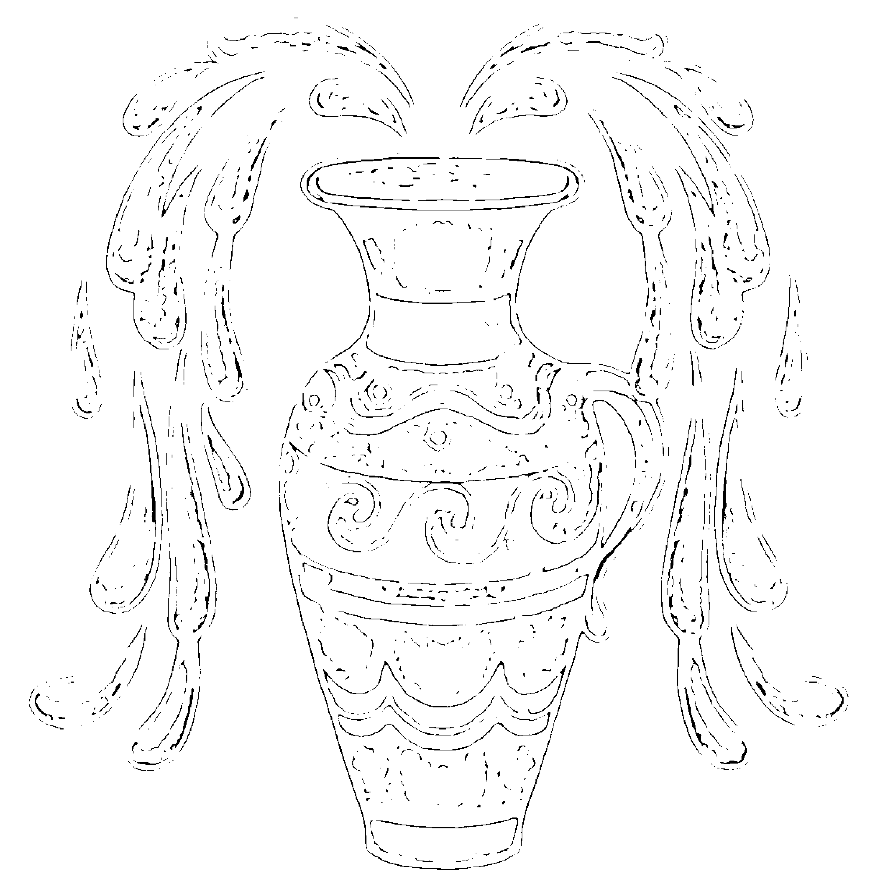

## AQUARIUS

## 水瓶座媽媽 & 牡羊座孩子♈

### 合拍部分

牡羊座孩子活力充沛，這充滿能量的調皮鬼會讓妳捧腹大笑。妳喜歡與孩子一起跟其他家人開些愚蠢玩笑，家人可能看到、也可能沒看到你們身上的幽默感，哎呀。

小牡羊充滿原創想法，這也是妳非常重視的特質。妳鼓勵孩子擁有各種像瘋狂科學家的想法，你們甚至會組隊成為共同創造者。我們已經能預想到科學展示上的獎牌和親子檔一起登上TED演說的畫面了！

在許多方面，小牡羊會是妳最好的朋友，因為你們都對未來和創新想法著迷。此外，妳在星盤上象徵團隊，妳能教導有時自我中心的牡羊座孩子學習與他人分享和玩樂。你們都具冒險心與大膽的特質，小牡羊喜愛跟你一起坐在跑車裡兜風、參與高手專用的滑雪道及嘗試其他極限運動冒險。

### 不合部分

牡羊座對於人們的氛圍很敏感，會沒由來地僅和喜歡及特定的人相處。水瓶座媽媽則是個社交高手，樂意與大多數的人成為朋友。不要期待妳的小羊會給妳最近認識、帶來家裡作客的某某人一個擁抱（或甚至一個笑容）。妳夢想替小牡羊與妳朋友的孩子安排玩樂時間，可能都會被牡羊座難以取悅的社交能量破壞，對妳來說真的非常尷尬！水瓶座媽媽通常都表現出悠哉與冷靜的狀態，妳不知道如何處理牡羊座的情緒風暴，他的脾氣可是瞬息萬變。你們彼此都是冷漠以對的專家，可能之後會演變成一場冷戰。不過，小牡羊的暴怒脾氣會想讓妳想趕緊丟給超級保母處理！牡羊座孩子喜歡贏的感覺，變得極度愛好競爭；由於妳最後通常會對弱者感到抱歉，所以對妳來說，很難支持這頑固孩子追求最好的心態。

## 水瓶座媽媽 ♒ & 金牛座孩子 ♉

### 合拍部分

你們在許多方面簡直南轅北轍。心胸開放的水瓶座媽媽會幫助目光短淺的小金牛學習打破框架，也會培養年輕金牛座孩子表達創意——這是很棒的事，因為你的孩子是由象徵美麗的金星掌管。水瓶座是理想的人道主義者，金牛座則是管理價值觀與道德的星座；你的金牛座寶寶從小就會追問妳一些關於人生的大哉問，妳也喜愛參與這些對話，但要小心，孩子可能會因為妳的價值觀變成極右派的思想。

你們都對移動速度快的交通工具（通常是跑車）有熱情。如果你有兒子，他會喜歡看著妳開著雙座跑車，用閃電般的方式停入學校停車場。小金牛比妳腳踏實地，能幫助妳放慢腳步，和愛家的小金牛在一起，讓妳感到更踏實、安穩，而且妳也承認改變步調對妳來說是件好事。

### 不合部分

你們的星座基本上完全是以不同的步調移動！溫和的小牛比起妳迅雷不及掩耳的速度，根本算是非常慵懶。水瓶座媽媽喜愛奇異、明亮且流行的衣服，還有惡搞小禮物和古怪小藝術品，但金牛座孩子非常保守與傳統，甚至在很小年紀時，他的品味就傾向歷久彌新、高品質的物品。就在妳忙著逛這些最潮的復古衫時，青少年金牛座可能會快速瀏覽專業襯衫專區，或嘗試操控妳成為符合金牛座理想中「典型媽媽」的印象。

你們生氣時都會爆發出如閃電般的脾氣。金牛座會發怒（甚至破壞玩具），妳則會甩門，並告訴孩子：「跟你爸說！」妳與某位家人不合時，親戚可能都會避而走之。水瓶座掌管未來，妳是個會在家族慶典上做些無意義的事、為自己感到驕傲且帶反抗心的媽媽，而傳統的金牛座可能抱怨家裡缺乏往常習慣的料理，此時妳必須穿上圍裙，不定期煮出經典假日餐點來安撫他想跟其他孩子一樣的渴望（有些非傳統水瓶座媽媽可能會無法理解）。

## 水瓶座媽媽 & 雙子座孩子

### 合拍部分

水瓶座媽媽和雙子座孩子擁有相似的靈魂，你們都帶著玩樂的好奇心、開闊心胸及奇特幽默感度過人生，是每個人都喜愛的古怪母子小樂隊。雙子座不斷向妳提出「為什麼？媽媽？」的好奇提問，對妳而言一點都不覺得困擾，事實上，妳很享受和他一起探索答案，特別是如果還能帶著小雙子參與教育性質的戶外教學。你們都是科技迷：小雙子靈活的手指會快速掃過妳的iPad，或在妳的手機上下載一些遊戲資訊。最好提供孩子其他適合的遊戲，不然妳的電子用品很快就不再是妳的。

多采多姿是妳生活的樂趣所在，和這孩子一起時絕不會有無聊的時候。你們都是社交高手，能快速與他人結交朋友。妳能帶著小雙子到任何地方，他很快就會成為派對的中心人物——基本上妳每小時就能從一個團體到另一個，幾乎不休息的雙子座孩子就是妳最好的夥伴！

### 不合部分

生性健談的雙子座需要不間斷的關注與認可，性急的水瓶座媽媽則需要一些沉靜時間沉澱心情；娛樂這坐立不安的雙子座孩子是份全職工作，在這樣的狀況下，希望小雙子身邊有個年齡相仿的手足或親近的玩伴，因為妳對於小雙子令人疲憊、索求關注的舉止沒什麼耐心，即使他很可愛。

年輕的雙子座善變，甚至愛說他人閒話。如果妳有女兒，可能在午餐鐘響前就得知她最好朋友已經換了三輪，不過抱持平等主義的水瓶座媽媽喜歡和每個人和睦相處，因此要教導善變雙子座包容心，對妳來說會是個令人挫折的訓練。

水瓶座媽媽與雙子座孩子間會突然出現一些競爭狀態。雖然這孩子喜歡妳，不過請小心不要奪走孩子的聚光燈，或是因為妳的笑話、故事和流行的服裝打扮而搶走他的風采。雙子座的注意力很短暫，即使是妳可能都難以跟上。當妳正在聽些街頭藝術的可憐故事時，雙子座會拉著妳的袖子，堅持說「該走了」，哎呦！

## 水瓶座媽媽 ♒ & 巨蟹座孩子 ♋

### 合拍部分

你們關愛他人靈魂的同情心會關注在不幸者身上，水瓶座媽媽與巨蟹座孩子都喜愛雪中送炭。母子檔義工任務從很早就會展開——這是你們象徵慷慨、善良的星座之間，產生連結的美好方式，這對社區裡受到壓迫與少數族群的人來說也很幸運。巨蟹座孩子就像妳一樣珍視友誼，將好朋友視為自己的親人，你們之間的差別，就在哪些朋友會成為貴賓名單——小巨蟹偏愛舒適、緊密的團員，妳在任何時刻都維持最少十位最好的朋友。此外，你們的心中都有孤僻傾向；巨蟹座孩子會逃到自己的房間，沉浸在書裡、和玩偶遊戲、畫畫、聽音樂，這讓妳有更多空間能放空，讀科幻小說、投入DIY手工藝或打電話和朋友聊天。

你們都是動物愛好者，沒有任何一隻流浪動物會錯失你們關愛的眼神。家中可能像個動物收容所，但負責、照顧他人的巨蟹座是個優秀飼育員，他會記得餵養貓咪並為動物關上籠門。

### 不合部分

巨蟹座孩子不易相信他人，對陌生人也缺乏安全感，可是水瓶座媽媽覺得身邊從來沒有人算是陌生人，妳的朋友一個接著一個換，這會讓害羞、渴望熟悉感的孩子感到痛苦。如果妳想讓孩子放鬆，請忘掉妳隨時為他人敞開大門的習慣（或是搬到群體生活的環境）。巨蟹座通常挑剔且傳統，想想看清爽的白襯衫、花朵圖案的床套及下午茶瓷器組，即使摩登的水瓶座媽媽在她生命裡看起來像是道彩虹盛開一樣精彩。請放棄替孩子花很多時間挑選外出的衣服，因為巨蟹座孩子築巢本能會抑制妳說走就走的風格，還會干擾妳的裝潢計畫；另外也請放棄突然想替客廳漆上檸檬綠油漆及每週重新調整家具位置的想法，這些行為都會讓小巨蟹不太高興，因為他想要回到家中時有熟悉的感覺。

巨蟹座專橫、擁有母性特質，水瓶座則是永遠的反抗者，這孩子對妳瘋狂的玩樂舉止不僅無法接受，還可能會反過來管妳，簡直就像變成妳的媽媽。請讓孩子維持孩子的模樣，有時請將妳的滑稽舉止等到孩子不在時再表現出來。

## 水瓶座媽媽 & 獅子座孩子

### 合拍部分

身為對宮星座，你們是對活力十足的雙人組合。小獅子承襲妳具備創造與想像的火花，讓你們迸發出藝術創作。妳是重視獨特性的母親，這孩子絕對也是最獨一無二。

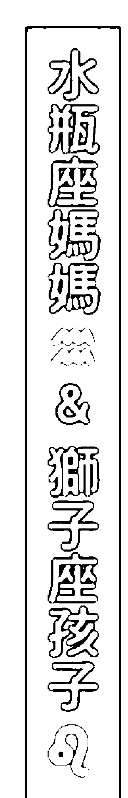

你們都為慶祝而生——沒有人像獅子座如此喜歡派對了，妳也是盛大狂歡會的女王，就為獅子座的生日展開一場特別的基金募款（更不用說妳自己的生日派對了）！你們都是社交團體裡的領導者和組織者，當小獅子為尋寶遊戲、足球比賽及才藝表演召集朋友時，會讓妳與有榮焉。此外，你們是天生的表演者，就像一對歌舞表演的母子檔；當妳用精準的模仿與不落俗套的笑話娛樂大眾時，小獅子則像個首席女舞者跳起芭蕾舞，或當起吉他表演神童而大受歡迎——表演開幕啦！

### 不合部分

小獅子簡直是個戲精，這會干擾到悠哉水瓶座媽媽的生活。妳可能無法相信孩子對一些小事如此挑剔，佔有慾強的小獅子想要妳所有的關注。對於得花更多精力在這孩子的需求上，讓妳感到掙扎，特別是還得同時應付一大群朋友的需求。為了給小獅子渴望的品質時間，妳的社交圈可能會頓時縮小。但請小心！由太陽掌管的孩子對於妳犧牲一切、讓他成為妳宇宙中心的做法，可是覺得十分自在。不過媽媽，妳也需要擁有自己的生活！

獅子座依靠稱讚與肯定茁壯成長，但超然的水瓶座媽媽可能無法給予獅子座渴望的誇張讚美。請不要怠於和孩子擊掌和給予閃亮金星星！不然獅子座可能會開始採取甩門、惱怒及模仿「妳」這個反抗者的角色特性來獲得一些關注。

## 水瓶座媽媽 & 處女座孩子

### 合拍部分

思考敏捷的你們是有天賦的組合，富創造力的處女座孩子承襲妳對世界的好奇心。你們對於使用說明書、交換書籍興致勃勃，會以敏銳、客觀的角度分析人類行為（「這就是為什麼小強尼一直拉我辮子的原因，媽媽！」）也許還會每年參加漫畫博覽會或文藝復興節。

水瓶座媽媽天生就是個人道主義者，處女座則是擁有服務特質的星座——共同負責社區服務計畫，會是你們產生連結不錯的方式，同時也能培養孩子的奉獻精神（或參與烘培特賣募款活動）。小處女會開心地跟著妳一起參與鼓圈音樂活動、水晶冥想工作坊、瑜伽課程。你們都是動物愛好者，對流浪動物有特別偏好，可能在妳還沒意識到之前，家裡的空房間早就讓給你們幾個月前認養的小貓咪或小狗。

### 不合部分

小處女對相處的人很挑剔，陌生人可能會讓他感到焦慮，然而妳擁有在沒有告知下突然出現的奇特塔羅卡友、在家庭烤肉聚會出現的雷鬼樂團貝斯手，這些可能都會讓拘謹的處女座孩子因此不安感到不自在。簡單來說，小處女相較於妳容易感到煩躁不安。哎呀，還有妳流行的酷炫媽媽服裝以及根本不會出現在大自然裡的染髮顏色，對他來說也都不太能夠欣賞。

若妳嘗試教導這孩子「包容心」可能會徒勞無功。處女座是個嚴厲的完美主義者，比起「何謂正確」，他對於「何謂錯誤」完全沒有任何討論空間。這孩子甚至會陷入討論同學八卦的陷阱。請盡可能糾正他這種行為，但妳要知道自己不可能永遠阻止他。處女座重視每個細節，這使得超然的水瓶座媽媽永遠無法理解孩子的想法，因此請不要指責孩子的過度反應，因為他真的非常敏感。

## 水瓶座媽媽 ♒ & 天秤座孩子 ♎

### 合拍部分

對你們兩個風象星座來說，生活就像一場不停歇的派對。妳愛好和平的孩子通常隨興、慵懶，他也會和妳朋友的孩子很快變熟，這會為你們帶來許多玩樂機會。你們都是好奇的文化藝術愛好者，妳喜愛為孩子介紹木偶戲藝術、芭蕾舞與鋼琴課及日本毛筆畫課程。尋找適合各種年齡的工作坊，這樣妳也能帶著妳的小畢卡索一起行動。

可愛的天秤座會引出水瓶座媽媽柔軟的一面，他會融化妳的心，為妳從玻璃瓶裡取出花朵，並為家裡帶來「我愛我媽媽」的蠟筆畫。一視同仁的天秤座和人道主義的水瓶座媽媽，都擁有強烈的正義感，你們是為社會公益挺身而出的可愛母子檔。你們之間也不缺少創意；天秤座和水瓶座都傾向生活在幻想世界裡，雖然妳屬於科幻世界，天秤座則偏向浪漫的童話故事，不過你們都對這世界每天製造的驚喜感到神奇！

### 不合部分

救救我……我需要空氣！對於獨立水瓶座媽媽的偏好來說，感情豐富的天秤座可能有點太過親暱了。雖然妳愛妳的孩子，但那些過於露骨的感情流露會讓妳覺得有點窒息；光是讓小天秤斷奶可能就需要花點時間適應，這會讓妳感到沮喪。你們都是偉大的夢想家，總是會把架構與條理拋諸腦後，小天秤會誘惑妳忘記他的上床時間，或說服妳在晚餐前吃片餅乾不是個壞主意。你們都得好好管束自己才行。

隨興的水瓶座媽媽會一邊喝著冰啤酒、一邊洗著熱水澡，將頭髮紮成馬尾，並準備好隨著睫毛膏載浮載沉。由金星掌管的天秤座又更虛榮，會花很長很長的時間泡澡、打扮及跟上最新的流行趨勢。雖然妳喜愛孩子發展自己的風格品味，不過妳希望天秤座能跟上妳的腳步，畢竟妳還有許多地方要去、許多人要見！

## 水瓶座媽媽 ♒ & 天蠍座孩子 ♏

### 合拍部分

天蠍座孩子承襲妳對生命難以言喻的奇異魅力，你們會一起仰望天空，尋找流星、幽浮與彩虹。小天蠍跟媽媽一樣是個耀眼、令人著迷的人，很少人會對你們說不，學校會因為你們所組成的募款活動創下新高紀錄而引以為傲，你們一起發揮創意發明的杯子蛋糕食譜也會成為一段佳話。

天蠍座和水瓶座都是固定星座，這孩子會引出妳更多傳統、紀律的面向，對此你們都很感激。對你們而言，私人時間與空間有其必要，年輕天蠍座會窩在自己的房間裡自娛自樂，也因而提供了妳極度渴望的個人時間。雖然比起天蠍座，妳更具有團隊精神，不過妳也具備競爭的特質，因此也會欣賞勤奮孩子的道德觀以及渴望勝利的精神。

### 不合部分

水瓶座媽媽對待每個人一視同仁，此時如果還有其他手足，可能會是個課題。天蠍座占有慾強，甚至會嫉妒，他想成為媽媽心中的唯一，需要毫無分心的關注。請創造和這孩子一對一的特別時間，但請設定界線，不然天蠍座會佔據妳所有的時間。

天蠍座會對陌生人起疑心，這可能限制妳的社交風格。請不要再想著邀請一些剛認識的泛泛之交，不然孩子可會像個小小CIA警探緊盯著對方上下檢視。不過妳也必須承認這孩子擁有敏銳的直覺；當天蠍座孩子警告妳某人不好時，也許妳應該聽進去。天蠍座對人生黑暗面的迷戀，可能會讓水瓶座媽媽的美好泡泡冷卻，還有這孩子的變心特質與暴風雨般的情緒會使妳混亂，難道他不能趕緊振作起來嗎？（嘆氣）

## 水瓶座媽媽 ♒ & 射手座孩子 ♐

### 合拍部分

兩個自由靈魂的遊牧民族會一起睜大眼睛在這世界闖蕩，與來自各階層的人們成為朋友。你們都對行為古怪的人著迷，而且小射手的社交圈比起妳的更多元且多樣。當你們兩個愛開玩笑的人一起時，每晚都像喜劇電影情節。你們都是注重未來的人，總渴望接下來會發生什麼，而小射手會激發妳一些狂野想法，如將名字改成星星沃克斯、月亮雷、在新伯爾尼火人祭露營、在家中後院設立動物收容所。請在孩子還小時慎選可讓這小小模仿者接觸的事物，或跟他解釋有些事必須等到成年再做的重要性——我們就是在說妳右手臂上的整條刺青，不過對這個跟妳一樣喜愛打破規則的孩子來說，前衛或自由的生活風格會更容易掌握。

### 不合部分

年輕的射手座情感激烈、充滿熱情；水瓶座媽媽則是冷靜、超然且不帶情感。射手座孩子會用他不停歇的對話讓妳無法承受，並用他過剩的熱情讓妳感到精疲力盡。有時妳只希望他能停止說話，冷靜下來。

你們這對組合也會突然出現一些競爭意識，特別是你們都是天生的說故事者和表演者；請小心不要在孩子朋友前搶走他的風采，同樣妳也不要讓他變成一心一意渴望眾人目光的孩子，不然妳會發現自己在一旁默默不語還生著悶氣，稍微打斷他及教導小射手成為更好的聽眾是必須的。射手座孩子直率、不夠圓滑，即使妳沒要求他任何事，他也會積極參與話題，妳也可能會感覺被孩子批評或指責。等等……到底誰是家長？你們都非常善於社交，因此會將一對一的時間擱置在一旁。此時請稍微離開朋友身邊。休息一下，這樣才能騰出時間與孩子好好相處。

## 水瓶座媽媽 ♒ & 摩羯座孩子 ♑

### 合拍部分

野心十足的摩羯座孩子對有遠見的水瓶座媽媽而言是個完美拍檔：沒有任何事是你們無法一起完成的！小摩羯全力以赴的精神激發妳對生活的瘋狂想法，妳也會在他為了取得勝利時，鼓舞這位充滿進取心的孩子。

你們通常都相當有活力，可能會一起為小型馬拉松做家庭訓練，每年一起去滑雪及滑雪板旅行（兩個星座都喜歡爬山），還有享受其他活躍的戶外活動。

過多的情感流露不是妳擅長的事，對頭腦冷靜的摩羯座孩子來說，也不是他習慣的模式。老派摩羯座擁有超齡智慧，妳會以理性的方式與孩子對話，而他就像妳的同伴一樣。妳的孩子喜愛建構、秩序與常規，這能幫助象徵反覆無常的水瓶座媽媽穩定並更腳踏實地；此外，妳狂野、充滿樂趣的想法，會提醒正經的孩子不要把生活看得過於嚴肅。

### 不合部分

摩羯座孩子喜愛傳統與老派的家庭價值觀——尤其是負責傳承家業的孩子。離經叛道的水瓶座媽媽喜歡做些徒勞無功的事，這讓小摩羯非常失望。雖然聖誕節時在考艾島露營對妳來說感覺不錯，然而現實是妳得在家圍著圍裙、一邊詛咒寒冷天氣、一邊與孩子烤著德國祖先留傳下來的番佛努斯香酥球聖誕食譜，再將包裝精緻的禮物完美地排在聖誕樹下。

摩羯座孩子喜愛競爭，喜歡被當作團體裡的資優生對待，不過妳敞開心胸接納所有人的交友風格，對這趨炎附勢的孩子來說，完全是錯誤的配置。請放棄進入華德福學校的幻想，並請為他申請私立的菁英學校或有聲望的課後活動。摩羯座喜歡按照規則走，當某人告訴他該怎麼做時會讓他感到安心；水瓶座是規則打破者，妳有時會看著觀念傳統的孩子埋頭苦思，心想怎麼會生出個性如此直腸子的孩子。

## 水瓶座媽媽 & 水瓶座孩子

### 合拍部分

兩位太空行員共同生活在同個屋簷下？真是一場冒險！小水瓶已經準備好跳上瘋狂的冒險之旅——無論是搭乘著冰箱盒飛船前往火星，或是開著頂級露營車花一年時間遊蕩整個國家。這個小水瓶跟你一樣對生命裡的奇特事物著迷；打開輕型手推車，出發到《星際迷航》大會或實驗音樂祭典。與一個像是吉普賽人的水瓶座在一起，絕不會有無聊的時候——每個人每小時都得猜想你們現在人在何方。

年輕水瓶座天生承襲妳人道主義的精神，請盡早展開社區服務計畫。在孩子還在小時，可能就因出於善意使命而一起旅行到其他國家。水瓶座媽媽和小孩都對時髦事物感興趣：請在小水瓶佔據妳的 iPod mini 和 DJ 設備之前，為他準備大量的玩具或遊戲——當然，妳也不會介意和妳的小神童分享東西。

### 不合部分

兩位反抗者處在同個屋簷下？即將產生情緒風暴。大家都說水瓶座會像閃電般沒由來地發脾氣，這些風暴雷雨會經常出現在你們這對組合裡，尤其在妳試著想在這叛逆者身上強加規則和限制時。妳可能得調整自己瘋狂的行事風格，這樣在才不會被小水瓶指出妳對他的教養要求都是出於虛偽。

用容器裝滿色彩豐富的接髮、夾式耳環和暫時性紋身——這樣的方式，孩子也能打扮及模仿妳狂野的風格（在孩子年齡還小時，這些會比真的刺青和穿洞好）。如果小水瓶接收妳喜於討好他人的社交模式，妳的家可能最後會變成青年旅舍；如果妳並不想沒有計畫地接納孩子的朋友，就需要對他的玩樂時間做出更嚴格的規則。

## 水瓶座媽媽 & 雙魚座孩子

### 合拍部分

因為水瓶座媽媽和甜美的雙魚座孩子軟心腸的性格，都喜愛照顧弱者；你們是對療癒他人的母子檔，總熱情地幫助陌生人。此外，你們帶有遊牧民族的靈魂喜愛四處探索與遊蕩，一旦妳克服了孩子的脆弱，及難以取悅的嬰兒階段（雙魚座是個嬌弱寶寶），小雙魚會是妳很棒的旅遊玩伴。

小雙魚就像妳一樣擁有奇特的特質。妳欣賞孩子的想像力，及從他口中說出的一些無厘頭的事情，你們之間帶有新時代的氛圍，具實驗精神的孩子，會高興地陪著妳加入冥想課程及讀取神秘卡牌。

愛做夢的雙魚座會迷失在夢幻世界裡，古怪的水瓶座媽媽則容易放空，活在自己的世界裡——舒適的沉靜會輕鬆、自然地發生，你們就是喜愛有彼此的存在。

### 不合部分

小雙魚的情緒化比妳有過之而無不及！妳的孩子容易陷入沉思，不過妳可沒這麼多的容忍心包容這些汙濁情緒。雙魚座可能會對他自由隨興的水瓶座媽媽潑冷水，比如說，明明已經即將準時到達某個活動時，卻突然無預警地要妳停車並繞道別的地方。大致來說，孩子移動的速度比妳慢很多：水瓶座媽媽用摩托艇的速度前進時，孩子則是乘著他的無槳獨木舟，是不是很令人絕望？雙魚座需要很多的寵愛，甚至需要很緊密的關係，這對於「需要自己空間」的水瓶座媽媽來說很棘手；要讓這孩子斷奶並不容易，還有要讓他第一天獨自上幼稚園也是。水瓶座媽媽是個夢想家與實踐家，不過雙魚座可能會說出許多想法，但從沒打算付諸行動。請不要逼迫這孩子去符合妳充滿野心的步調，放輕鬆，水瓶座媽媽，小雙魚會找到自己的方向！

# 雙魚座

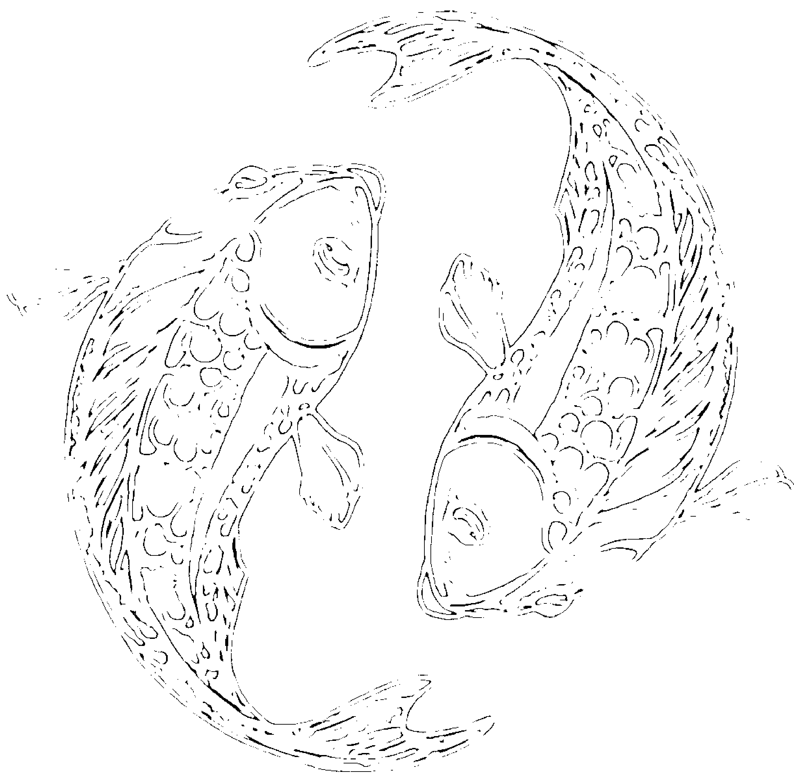

## PISCES

## 雙魚座媽媽 ♓ & 牡羊座孩子 ♈

### 合拍部分

雖然作為星盤上的鄰近星座，雙魚座媽媽與牡羊座孩子僅有少許相似之處——不過這可能是這對母子組合神奇的地方。雙魚座媽媽如海浪拍打石頭的溫柔，會幫助暴躁的火象星座牡羊座冷卻下來，妳作為星盤上最具同情心的星座，對於牡羊座的不穩情緒、脾氣及容易受傷的心靈擁有更多的耐性。

妳欣賞創造力，小牡羊就具備了許多創意想法。哈囉，孩子的超級粉絲媽媽！妳會是牡羊座創新想法與努力維持明星光環的終極啦啦隊長。你們都有點頤指氣使——妳在某個程度上有點像母雞，牡羊座則像個獨裁軍官。儘管如此，妳還是很欣賞孩子不斷嶄露頭角的領導能力，並教導牡羊座學習以更溫和的方式掌管事物；反之，小小軍官會幫助妳強化自身力量，為妳建立一個連妳自己都想借助、無所畏懼且充滿自信的典範。

### 不合部分

由戰士行星火星掌管的牡羊座，是星盤上最有攻擊性的星座，由愛做夢的海王星司長雙魚座媽媽則以被動特質聞名。有時，妳可能會因為孩子的火力而無法招架，這可會打亂妳優雅的生活律動。

雙魚座媽媽對於犧牲課題並不陌生——對妳而言，設定界線讓妳感到掙扎，然而牡羊座天生對權力有感，總會說「我先來」。這孩子易於索求無度，而且事情如果不順他意，可會大發脾氣。年輕牡羊座能輕易壓制妳，讓妳為了不斷嘗試滿足他的需求感到筋疲力盡。此時，妳應該警告自己：沒有其他星座像牡羊座一樣，能引出妳殉道者的傾向，妳必須學習向他說「不」，這樣才不會打造出一個被寵慣的孩子。牡羊座獨立自主，但妳可能相對依賴；過於親暱的撫養方式會讓小牡羊感到束縛，因此當牡羊座就是想獨處時，妳可別露出一副可憐兮兮的樣子！

## 雙魚座媽媽 ♓ & 金牛座孩子 ♉

### 合拍部分

喜愛物質享受的雙魚座媽媽與金牛座孩子會一起悠哉生活；請盡快客製鬆軟的沙發，一起放鬆與依偎，各自沉浸在白日夢裡。妳可能也不會打擾孩子馬拉松式的睡眠時間，小金牛和妳一樣喜歡閉著眼睛沉浸在夢鄉。

金牛座和雙魚座都是兼具堅強與柔軟特質的有趣綜合體；就像妳能在短時間內從超級敏感到相當遲鈍，年輕金牛座則能立刻從一隻溫順小牛變成暴怒公牛。只要妳不是他生氣的原因，妳就會欣賞孩子的這種特質。

真是個美好的生活！感官的金牛座就像媽媽一樣喜愛奢華、優質食物及被寵溺。你們兩個人很可能會從事一些高級的休閒娛樂（想想艾洛絲的頂級生活、精緻西點店面的奢華巧克力，甚至等到金牛座年紀大一點時一起做親子SPA）。大部分來說你們是對夢幻組合——很高興遇到妳這位最好的小小朋友。

### 不合部分

意志堅定、固執的金牛座孩子想要現在一切就按照自己的方式！如此要求多又直接的能量，會箱制妳順其自然的生活方式。因為妳不善於拒絕，可能在許多情況下，會被天生愛命令人的金牛座牽著鼻子走，失去身為母親原有的支配權。

金牛座在建構、重複性常規下茁壯成長，日復一日做著相同的事？這對雙魚座來說感覺有點像在地獄。有時為金牛座打造固定的例行常規，會讓妳覺得被束縛，但從好的一面來看，這能幫助妳的生活變得相對有規律（承認吧！雙魚座，妳是需要些紀律的）。小金牛實事求是，傾向將事情畫分為非黑即白的狀態，但對於生活在夢幻世界的雙魚座媽媽來說，妳則不斷在灰色地帶探索。這個做自己的孩子會刺破妳的夢幻泡泡，拒絕加入妳對超自然的追求。當妳要參與每個月的塔羅牌解讀活動或現代舞課程時，就雇用個保母吧！

### 合拍部分

讓我們迎接自由無拘的生活！你們是對不斷遊蕩的漫遊者，妳會很開心身邊還有這位還在襁褓的小嬰孩陪著妳四處旅行。作為雙胞胎形象的星座，雙子座對迷人的雙魚座媽媽來說，是個令人快樂且渴望的伴侶。讓小雙子接觸各種妳喜愛的生活驚喜（藝術、音樂、文學、靈性），這孩子跟他媽媽一樣，很快會成長為文化愛好者。電影與影集也是你們都喜愛的事物，帶著奶油爆米花和 3D 眼鏡一起享受吧！

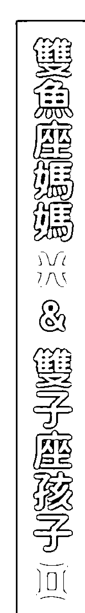

由善於表達的水星掌管的雙子座擁有能言善道的天賦，充滿詩意的雙魚座媽媽同樣善於言辭；一旦小雙子會說話了，你們之間的對話會變得相當豐富且多采多姿。有耐心的雙魚座媽媽，不會介意這充滿好奇心孩子提出兩萬個問題，妳會以創意回答他的問題，只是如果妳不知道答案時，也不要想試著編造答案，實事求是的雙子座比起妳更注重現實，而且不喜歡被誤導。

### 不合部分

妳從不急迫渴望做出決定，也不會從這孩子得到任何幫助。小雙子想檢視每個選項，妳只是討厭做出承諾；選擇要去的遊樂園、為美術計畫選擇工具（色鉛筆還是水彩筆呢？），甚至為了多聽半首歌停在廣播電台，祝妳好運！你們這對母子檔帶有一種令人疲憊的特質，而且在某些片刻，你們多變的方式會把彼此逼到發瘋。

雙魚座媽媽憑直覺行事：妳不確定為什麼要這麼做，只是追隨內在的感受，不過小雙子是以邏輯為基礎的雙子座孩子，很高興跟隨妳沒有規律的生活方式，但這會是條險路。請提供孩子一致性的規則並確實遵守，否則他可能會在開始去學校（有規則的環境）後感到難以適應。

## 雙魚座媽媽 ♓ & 巨蟹座孩子 ♋

### 合拍部分

作為兩個情緒化的水象星座，你們會在彼此的陪伴下依偎在甜美的安全感裡。雙魚座和巨蟹座都渴望親密，但同時也能獨立自主。只要你們待在彼此身邊很近的距離，任何一切都會發生。烘培、佈置、藝術創作——這對宇宙組合從不缺乏創意。當妳愛做夢的特質產生作用時，小巨蟹對「舒適寧靜」意義的理解能讓你們安靜地共處。同為音樂愛好者的你們，孩子會介紹妳一些新的音樂領域，妳則是替孩子的歌單裡增加古典爵士樂。可能會出現如下的場景：妳會是帶著小巨蟹參加他第一場現場表演的酷炫媽媽，自己也會隨著音樂盡情擺動。你們的家庭時間是個非常舒適的時光。即使妳陷入憂心忡忡的狀態，但這孩子會格外注意媽媽的心情，他幾乎沒有叛逆期，而且事實上，有時妳可能感覺自己比較像個孩子，小巨蟹則像個家長。

### 不合部分

太過親近到有點令人擔心？如果沒有將巨蟹座孩子稍微推離舒適圈，你們這樣的組合會變得有點彼此依賴，而且妳搞不好是那位在孩子第一天上幼稚園拼命緊黏著他的人。心情多變的巨蟹座，基本上需要在固定時間回到他的防空洞，這個舉動會讓敏感的雙魚座媽媽非常在意。請給孩子沉溺書中的空間，即使他正在組裝錯綜複雜的太空船模型，也不需要時時爭取妳的肯定。每個雙魚座體內都住著一位叛逆的搖滾巨星，不過在小巨蟹面前時請將這個人格隱藏起來，因為巨蟹座孩子可能會變得「像個母親」一樣關心妳，但請讓孩子維持他原有的樣子，而不是擔心他進入不成熟的家長心態，也請抑制自己向這老成靈魂孩子尋求建議的衝動。此外，你們兩個都很愛指揮他人，也容易把事情往心裡去，此時妳非常需要一些冷靜時刻，尤其是如果情緒（眼淚和所有激動反應）經常性地增加時。對了，你們可能也會小題大作。

## 雙魚座媽媽 & 獅子座孩子

### 合拍部分

對你們來說，生活即是藝術，天性愛做夢的雙魚座媽媽與天馬行空的獅子座孩子之間絕不缺乏創意與想像力。你們會住在童話故事世界裡，合作完成藝術創作、跳舞跳到腳痛，而且說不定還一起登上舞台表演（鏡頭會不斷追隨你們！）小獅子靠著自己的力量成為超級巨星，四處擔任起領導者的角色，獲得讚譽與獎勵。支持孩子的雙魚座媽媽會高興地擔任小天才的後援，甚至捧為偶像般崇拜，自己就是鎮上最令人驕傲的星媽。

妳也欣賞獅子座負責任的天性。嘿，至少這樣妳就不用做所有的決定！謙虛的雙魚座媽媽也會教導驕傲獅子座何為謙遜美德，自信的獅子座孩子則會為妳展現出鎮靜且自持的範例。有一點毋庸置疑，那就是你們的星座雖然南轅北轍，但你們都能從彼此身上學習到許多事物。

### 不合部分

戲、劇、化！獅子座誇張的天性與妳極端敏感的性格，發生在你們之間的一個小狀況很容易就變成大問題。小獅子不是唯一一個會甩門與突然眼淚潰堤的人，我們可以說這就是一崩潰的媽媽！有時獅子座孩子的怒吼讓人生畏，就像他大得驚人的食慾一樣。因為妳對設定界線感到棘手，管教這顧指氣使的小王子會是妳人生最大的挑戰。當妳逼自己向獅子座說不時，大多時候會感到愧疚，不過若因此打造一位小小自大狂，妳可能也不會高興到哪去。請好好提振精神去承受讓獅子座失望後的崩潰情緒，因為場面可是會相當吵雜且戲劇化。

## 雙魚座媽媽 ♓ & 處女座孩子 ♍

由太陽（宇宙的中心）掌管的獅子座性格自我中心，雙魚座則是象徵犧牲的星座，比起自己，妳會先考量他人的感受。雖然小獅子有時可能會讓妳感覺到不可思議的自私，不過孩子會直率地建議妳，開始學習如何更加維護自己的權益。

### 合拍部分

保持熱心助人的心！富有同情心的雙魚座媽媽與博愛的處女座孩子，是對相當關愛他人的組合。小處女跟妳一樣，無法經過不幸的靈魂身旁卻不出手相救。當看到孩子如同小小泰瑞莎修女（也是處女座）在遊樂場幫助他人時，會讓妳感到溫馨。一起當志工是你們很棒的相處方式，你們也會很高興地互相寵愛對方。這孩子會感受到妳的每個情緒，感受到的程度多，當妳在這孩子身邊時，要稍微克制自己的情緒爆發。

處女座是妳的對宮星座，你們能為彼此維持最佳的平衡。雖然妳是依靠直覺，小處女則是對事實感到好奇，這孩子記得每條妳忘記（這些甚至一開始是妳制定）的規則。對於處女座感到不安與動不動就批評人的部分，妳則感到自在且抱持開放的態度。妳會幫助這天生批評家的孩子學習包容他人的不完美，以及對此稍微放鬆。在一些狀況下，你們這對組合有點角色翻轉的意味，像是雙魚座媽媽被嚴格小處女座孩子照顧的感覺。

### 不合部分

小心苛薄的處女座！處女座嚴格的觀察力會傷到敏感的雙魚座媽媽，但用冷漠的方式對待孩子，也會傷了孩子的心。你們是星盤上的對宮星座，也因為如此，你們之間的衝突會變得緊張且難堪。雙魚座媽媽是個情緒海綿，當妳吸收過多情緒時，淚水系統會無法停止下來。警告：妳戲劇化的崩潰會讓小處女徹底嚇呆，這孩子容易變得憂心忡忡，也會是調停者（不要意外，許多處女座最後會以心理治療師謀生），但妳真的想要孩子年紀輕輕就承擔如此重擔嗎？無論妳是原諒自己、到房間流淚、打給姊妹或看心理醫師，但請不要把孩子當作發洩對象。處女座會安慰妳，他似乎能理解妳的難處，但讓他承擔這些「煩惱」，對他來說並不公平。處女座需要組織與規則來讓他感到安全，妳則傾向隨興且順其自然。妳需要培養出紀律，使這孩子保持專注，妳甚至需要為此雇用一位時間管理教練來幫助妳。

## 雙魚座媽媽 ♓ & 天秤座孩子 ♎

### 合拍部分

呼叫安徒生！在天秤座與雙魚座這對組合裡帶有童話故事的特性。異想天開的孩子和妳一樣，透過充滿樂觀的想像觀看這世界。美麗的事物不斷觸動你們，激發你們的決心。你們會一起熬夜看流星，在天秤座十五歲生日時坐著馬車、用水彩畫畫、創作歌曲及盡情跳舞。

你們都有點物質主義，但當妳覺得某些東西在孩子身上看起來很棒時，何不展現一下？為孩子佈置房間、挑選外出服（可能是妳的風格的縮小版）、安排下午茶派對——這些過程的細節都讓你們享受其中。

小天秤就像妳，是個令人喜愛的甜心，你們都能融化陌生人的心，他們會因為你們彼此愛慕的眼神而受到吸引。天秤座非常有可能承襲妳樂善好施的天性；讓他參與妳的社區服務團體及義工活動——這是與善良小天秤相處融洽的絕佳方式。

### 不合部分

當你們都帶著玫瑰色眼鏡看待世界時，雙魚座媽媽和天秤座孩子是世界上最快樂的一對，但當得面對生活現實時，妳可能感覺自己在引導天秤座的難過和失望情緒上有點準備不足。請避免如此就過度保護天秤座，而且這也許是個好機會，培發他更強大的危機處理能力。媽媽，沒必要為了一些小小考驗就緊張兮兮。

如果妳在生活裡過度注重物質，那麼被寵壞的天秤座恐會變成物質男孩或女孩，教導孩子正確的金錢觀顯得格外重要，就讓天秤座自己賺取那些高級的兒童福利，好嗎？優柔寡斷的天秤座會在短時間內利用他的權利改變心意，害怕承諾的雙魚座媽媽總喜歡衝向逃生艙口；你們會把彼此搞瘋（先不提那些指望你們的人）就像瘋子一樣，在最後一分鐘改變心意。請小心不要將妳神經質的特性（雙魚座陷阱）傳承給年輕天秤座。

## 雙魚座媽媽 ♓ & 天蠍座孩子 ♏

### 合拍部分

這是通靈熱線……還是妳家電話號碼？洞察力敏銳的天蠍座是妳的直覺好搭檔，這孩子跟妳一樣仰賴直覺行事。即使其他人沒有注意到當下氛圍、或因為情緒差突然需要離開，不過你們之間就是有種不可言喻的理解，能了解對方此時的心情。妳是能幫助天蠍座培養第六感的完美媽媽，天蠍座就像雙魚座一樣是個情緒多變的水象星座；情感世界是你們經常逗留的領域，而且當這孩子在施展魅力時，會跟妳一樣令人陶醉，他人對你們可說百依百順，或輕易地對你們展現信任 —— 和小天蠍一起為假日公益活動募款，最後一定能刷新募款紀錄！

### 不合部分

天蠍座是表示力量與掌控的星座，因此妳必須隨時保持警覺，不然這孩子可會輕易地在妳的雙魚座城堡裡掌管一切，進而引發出妳屈服、犧牲性格的天性。如果驚覺自己正試圖追趕孩子強烈要求他人的奇怪念頭時，妳知道是改變路線的時候了，立刻行動！

特質是專注的天蠍座孩子，需要他人全神的關注，這孩子也會記住妳說的每件事，並期待妳能以相同的態度作出反饋，不過妳容易放空與漠不關心的天性，讓孩子不太能接受。提供聰明人一點就通的道理：提早處理天蠍座孩子對妳的期待，並教導他，有時媽媽的腦袋也需要休息！天蠍座孩子占有慾強、會嫉妒，這樣的特質會抑制妳自由奔放的生活形式。年輕天蠍座天生對陌生人多疑，偏愛與少數朋友與身邊親人維持緊密連結，妳對自己容易感到糾結，也會吸引到一些性格「有趣」的人；雙魚座，請對交友多準備一些過濾機制，這樣年輕天蠍座才能在與妳的朋友相處時感到安心。

## 雙魚座媽媽 ♓ & 射手座孩子 ♐

### 合拍部分

請給我們兩張前往奇幻之旅的門票！小射手由豪奢木星（與妳星座相同的共同掌管行星）掌管，喔，對了，這也是妳要前往的地方。一起旅行是你們培養感情很棒的方式，所以請盡快替寶寶辦理護照吧！愛冒險的小射手對於自由來去的雙魚座媽媽來說，是個理想的陪伴者。

你們都對人生的巨大問題抱持即興且好奇的態度，妳的靈性人生觀可能與年輕、充滿情感的射手座完美吻合。你們也都相當哲學，等孩子年紀大一點時，會一起分享許多書籍。活潑、喜愛戶外的射手座會讓妳受到大自然的啟發；打包野餐裝備，前往海邊——雙魚座最喜歡的地方，妳可以在陽光下享受樂趣，也能讓妳的小射手盡情嬉鬧與探索。射手座掌管臀部、雙魚座則掌管腳部，舞蹈會是你們親睦的另一個絕佳方式，把音樂調大，讓客廳變成各年齡都適合的酒吧！

### 不合部分

坦率又直白的射手座會如實說出他所看到的事物，雙魚座媽媽則對於傷害他人心情、審視自己及不計代價避免衝突等方面過度在意——雙魚座媽媽，請盡可能培養出厚臉皮的特質吧！小射手可能會直接用他的誠實之箭射向妳，讓妳受傷；不過妳可能會因為在表述自己的情緒與意見時過於模糊和不守信，讓孩子感到挫折。妳的孩子只是想知道妳的立場為何，這會迫使妳變得更果斷（也許不是件壞事，雙魚座媽媽？）

射手座是火象星座，雙魚座是水象星座；孩子激烈的脾氣與吵鬧，會讓妳敏感情緒無用武之地，而妳的煩躁與恐懼會熄滅小射手的盛怒。射手座基本上相對獨立，然而妳卻表現出依賴他人的樣子。請理解如何給妳家中這位年輕射手座更多的私人空間（而且不要把他的所做所為看得太過嚴重），這將是妳養育這個孩子最大的挑戰。

## 雙魚座媽媽 ♓ & 摩羯座孩子 ♑

### 合拍部分

這對母子檔會是認真工作、認真玩樂的組合。勤奮努力的摩羯座孩子絕不會有他不喜歡的事物……或根本沒有完成的事！善變的雙魚座媽媽，容易為了追求任何能隨心所欲及玩樂的機會而分心。在許多情況下，你們的角色會互換：負責任的摩羯座孩子會提醒雙魚座媽媽顧好爐火，而意志堅定的雙魚座媽媽則會確保她的孩子是否為了逃避責任而逃學。你們都喜愛生活裡的良好事物，對妳而言可能是美麗的東西，小摩羯則是從小小年紀開始就會意識到地位象徵積累的事物。雖然你們個性截然不同，但你們的星座卻容易溝通，有時候妳可能感覺比起母子，更像朋友的關係。事實上，因為妳富有同情心的特質，可能會是完美主義摩羯座的人生裡，最能放鬆打開心扉的人。性格傳統的摩羯座幫助特質浮動的雙魚座媽媽腳踏實地，受到這專心致志的孩子的影響下，妳可能比平常更能在家中、工作及家庭聚會待上更長的時間。反之，妳則幫助務實的摩羯座擁抱創意，並以運用想像力獲得好結果。

### 不合部分

水杯的水只剩下一半嗎？摩羯座和雙魚座都容易悲觀，而且你們陰鬱的特質是會傳染的。當妳多愁善感時，請將自己與孩子隔開，這樣他才不會感受到妳的憂鬱氣息。

土象星座摩羯座需要更多的規範，尤其是經濟方面。不過因為金錢會不經意地從雙魚座手上消失，這可能產生問題。妳沒有節制的花錢習慣，會讓妳發現可能無法支付孩子的運動服與比賽入場費用。不穩定的經濟狀況會引出摩羯座極度負責的本性，但同時也會激起孩子的擔憂與焦慮。請小心，如果讓他感受自己得承擔拯救家人的責任時，小摩羯可能會因此錯失他的童年。摩羯座相當傳統，想跟上五○年代好爸爸和好媽媽的形象，而妳時常做些徒勞無功的事，會讓這孩子感到非常失望，哎呀，還有妳無拘無束、愛好藝術的面向，對他來說也有點無法招架。當妳以印花無肩束腰長袍，而非挺拔的西裝外套和牛仔褲，現身在孩子的學校場合時，可能會換來他滔滔不絕的責罵。有時請稍微控制一下妳的穿著，媽媽。

## 雙魚座媽媽 ♓ & 水瓶座孩子 ♒

### 合拍部分

小美人魚雙魚座與宇宙太空人水瓶座是對輕鬆又瘋狂的母子檔。妳欣賞他異於傳統的觀點，支持孩子瘋狂科學家的創新想法；水瓶座比起妳反傳統詩人的氛圍又更理性，但無論是誰，你們都喜歡打破框架。請給我們兩件超人披風！水瓶座代表人道主義，雙魚座則掌管博愛領域，你們對於弱者不會坐視不理，都會去拯救、幫助對方並給予力量。妳會充滿驕傲地看著小水瓶，因為他在遊樂場時讓最弱勢的孩子一起加入玩耍。為了每個人（特別是那些權利被剝奪的人），讓這世界變成更美好的地方，這會是你們共同的任務。雖然這有邏輯性的孩子會隨時保持鎮定，但妳能幫助他挖掘情緒面向，讓他學習表達內心的想法；而成熟的水瓶座則能提醒妳，與其對每個輕視感到憤怒，不如試著讓事情不要影響自己。此外，伴隨這孩子古怪的幽默感，他的笑聲會變成定時的提醒，告訴妳這就是人生最好的解藥。

### 不合部分

多愁善感的雙魚座媽媽心地善良，有時會覺得孩子故意冷落妳，特別是當妳用愛意轟炸孩子的時候。

如果妳想與孩子和睦相處，一手環抱孩子不是可行的好方法。請學習以朋友的方式與孩子對話，對這聰明的孩子來說，理性思考勝於一切……接著再給他親吻和擁抱吧！

有些雙魚座媽媽是比較冷漠的類型，比大部分的媽媽還少了些熱情。如果妳是這樣的類型，那麼請努力給孩子大量的關懷與呵護。水瓶座不太可能會為了疼愛而接近妳，因此如果妳不付出一些努力，彼此之間的關係會漸行漸遠甚至逐漸抽離。這喜愛處在樂觀與積極情緒的孩子能永遠抱持希望，但雙魚座媽媽情緒化的愛戀心情會讓這孩子喘不過氣，使他想從妳身邊離開；請不要期待水瓶座會成為妳的頭號知己。即使妳對他超齡的洞見感到驚訝，但若讓小水瓶過度暴露在妳的情緒崩潰下，會使孩子關閉他的情緒開關，會展現出酷似機器人的傾向。

## 雙魚座媽媽 ♓ & 雙魚座孩子 ♓

### 合拍部分

對雙魚座媽媽與她的小美人魚或美男魚而言，生活是個令人心醉神迷的神奇世界。當然你們在一起時，可能無法時常認清事實，但卻能為這孩子帶來藝術上的天賦，無論他是透過舞蹈、詩集、音樂、繪畫或是製作出令人驚豔的樂高結構。妳不會批評雙魚座想像出來的朋友——嘿，妳自己小時候也曾有過幾位。有時還有點神經質且敏感的你們，很容易憑著直覺感受彼此的情緒。

舒適泡泡圍繞在雙魚座媽媽與孩子周圍，和這可愛的小寶貝在一起時，家裡根本就像天堂。此外，你們也是四處漫遊的母子檔，一旦妳的敏感寶寶大到足以能固定在嬰兒車上時，你們會像一對遊牧民族，在這地球上四處探索。妳的小明星就跟妳一樣會關心他人，他會承襲妳關愛弱者的特質。當你們在城鎮裡四處旅行時，會時時停下腳步幫助需要幫助的人，說不定某天可能會一起展開非營利組織。

### 不合部分

親近到有點令人擔心？雙魚座媽媽與孩子彼此因為互相摟抱、創造出「只有我們兩人世界」的氛圍而變得得意忘形，以致脫離現實狀態。和這小孩陷入互相依賴的律動並不罕見，為了保護孩子免於痛苦，妳會縱容他的壞習慣。總有一天這隻雛鳥必須離開家中，當他要獨立生存時，妳會感到特別艱難，因為妳很難相信這孩子羽翼是否已經長齊。這樣過度依賴的關係有好有壞：如果妳總是在孩子身邊強烈表達妳的情感，他可能就得花更多力氣承擔這些甜蜜的負荷。

有時你們可能會覺得因為另一方心照不宣的要求而受到控制——你們真的需要好好去了解對方；試著將妳的需求用言語表達，也鼓勵你的小雙魚做同樣的事。妳知道那些別人所說的臆斷是怎麼回事，媽媽，這樣的狀況在你們的組合裡會更致命。你們在同一個屋簷下時，陰鬱氛圍會變得更為沉重，此時請重複這個能挽救你們的咒語：「感受並非事實」。

74S ☆ 媽媽和孩子星座配對 | 雙魚座

## 致謝

非常感謝接下來所列的大家，因為你們讓這本書得以成真。

獻給強大的金牛座經紀人珍德爾（Yfat Reiss Gendell）及幹練的天蠍座公關萊格特（Carol Leggett），謝謝你們聽取我們的想法，給予智慧又美好的回饋。巨蟹座編輯凱莉（Carrie Thornton）提供一切的協助，從保母上的協助、友誼再到支持這本書。

獻給我們有耐心與提供支持的丈夫傑佛瑞（Jeffrey Sleebos）與柯利（Cory Verellen）；感謝你們（以及你們堅定不移的月亮金牛座）在我們打字到凌晨或在黎明前起床時，包容所有的一切好壞，以及你們只能在我們胡思亂想、分心的時候才能獲得短暫的關注。謝謝你們在旁幫忙沖咖啡、照顧臘腸狗、替冰箱補充食物並讓生活不斷運轉著，我們真的好愛你們。

星座風格（Astrostyle）團隊：蘿拉（Laura Bruzzese，獅子座）、蘇珊娜（Suzanne Guillerette，水瓶座）、瑪麗莎（Melissa Gonzales，金牛座）還有我們的「星座怪咖」夥伴，與我們一起坐在咖啡廳、公園、花園、客廳、圖書館及高級餐廳裡高談闊論探討牡羊座媽媽、雙魚座孩子以及任何人。謝謝阿奇瑪（Akima Briggs／Iscis Malone，金牛座）慷慨地替這本書校對，還有沙第（Saadi Chowdhury，天蠍座）我們聰明的財務巫師兼爹地——謝謝你教導我們時間與金錢的神聖。

獻給幫助撫養歐菲娜孩子村落的大家，因為你們，這些篇章才得以完成：蒂娜（Tina Guarasci）、奈阿克幼兒園（Nursery School of the Nyacks）、珍妮佛（Jennifer Marks）與艾瑪尼（Imani Boswell），里歐拉（Leora Edut）與溫蒂（Wendy Valentine），謝謝你們作為媽媽代理人。

所有好成果都需要一點點魔法。謝謝靈性姊妹迪娜（Dina Manzo），米雪兒（Michelle Seelinger），泰莉（Terri Cole），潘姆（Pam Colacine），凱特（Kat Tepelyan），路加（Luke McKibben）以及凱妮（Kenny Arena）和我們一起做新月許願與滿月許願——從紐約東村的火爐到內華達沙漠的包車休旅車。獻給我們「花的力量」專家凱莉（Kern Aab），「種子開花」（Seed to Blossom）的店主，妳的巴哈花精精油以及基於治療的閒談，幫助我們頭腦保持清晰並提高生產力。獻給驚人的特蕾（Terye Trombley），謝謝妳療癒的禮物與治癒。

感謝所有慷慨填寫媽媽占星學問卷的朋友與粉絲，誠實分享你們的怪癖及令人深刻的旅程，你們幫助我們勾勒出星盤上每個星座的輪廓。我們閱讀了每個人的故事以及其他沒被引用的部分，希望你們知道你們有趣、誠實及動人的回答，已經全部都融合到這本最終成品裡。

Copyright © 2014 by Ophira Edut and Tali Edet.
Through Andrew Nurnberg Associates International Limited.

## 媽媽的占星教養手冊（合輯）

出　版／楓樹林出版事業有限公司
地　址／新北市板橋區信義路163巷3號10樓
郵政劃撥／19907596 楓書坊文化出版社
網　址／www.maplebook.com.tw
電　話／02-2957-6096
傳　真／02-2957-6435
作　者／歐菲拉·艾達特
　　　　塔麗·艾達特
譯　者／邱鈺萱
企劃編輯／陳依萱
校　對／楊心怡、周佳薇
港澳經銷／泛華發行代理有限公司
定　價／840元
出版日期／2022年2月
I S B N／9786267108079