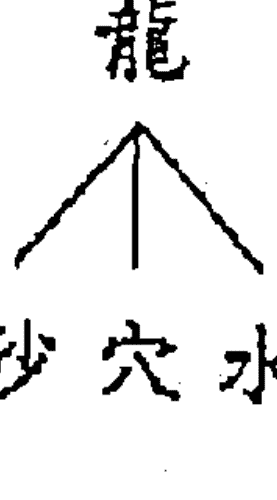
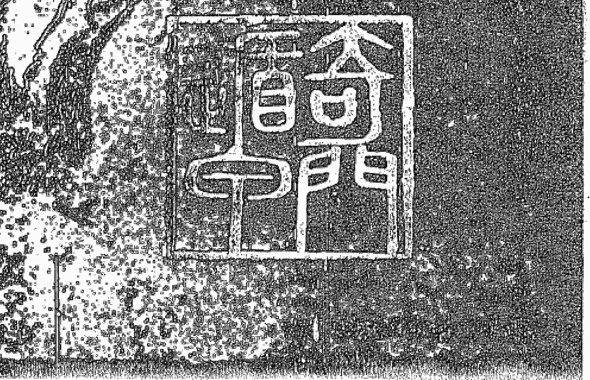
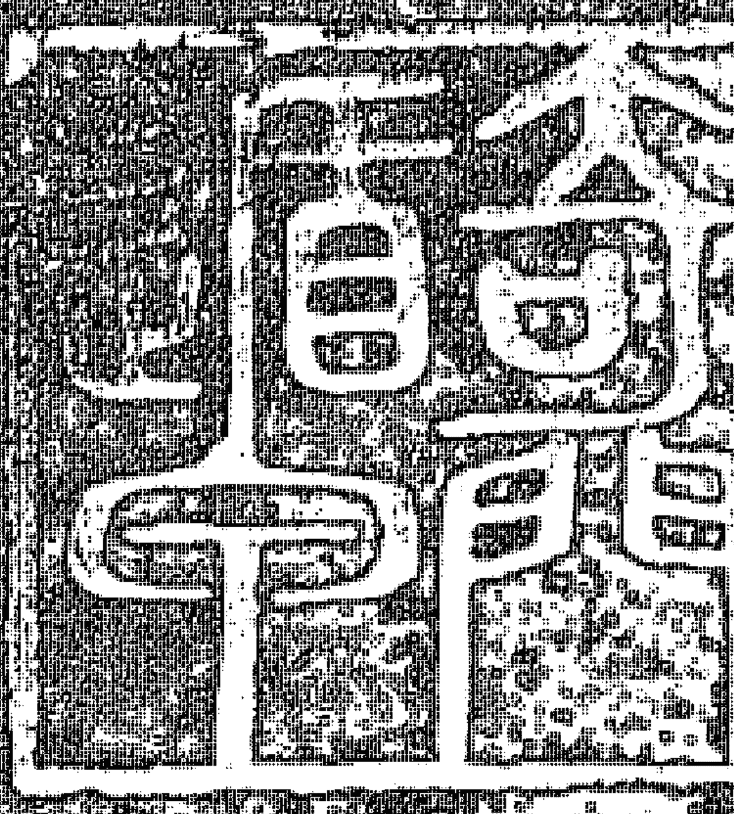
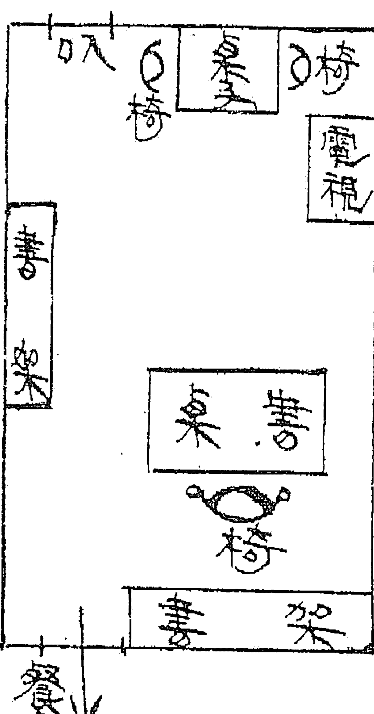
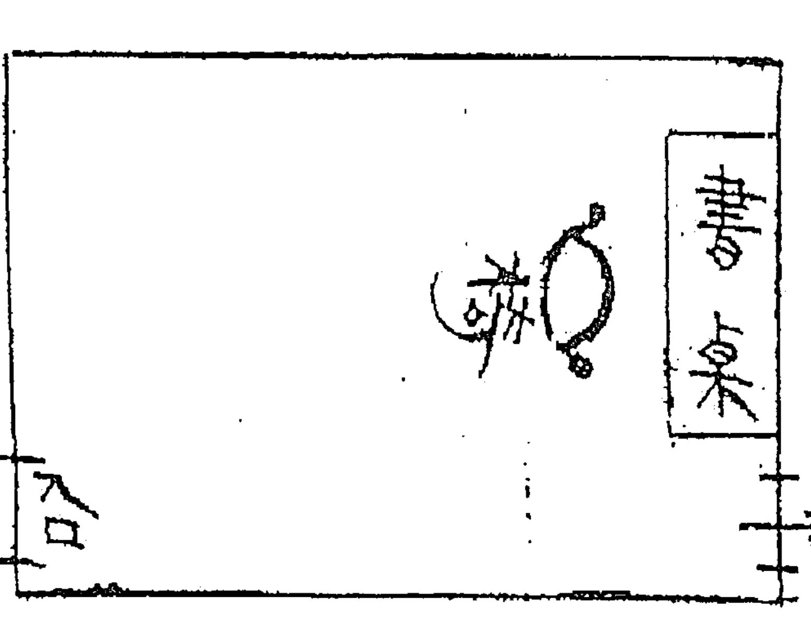
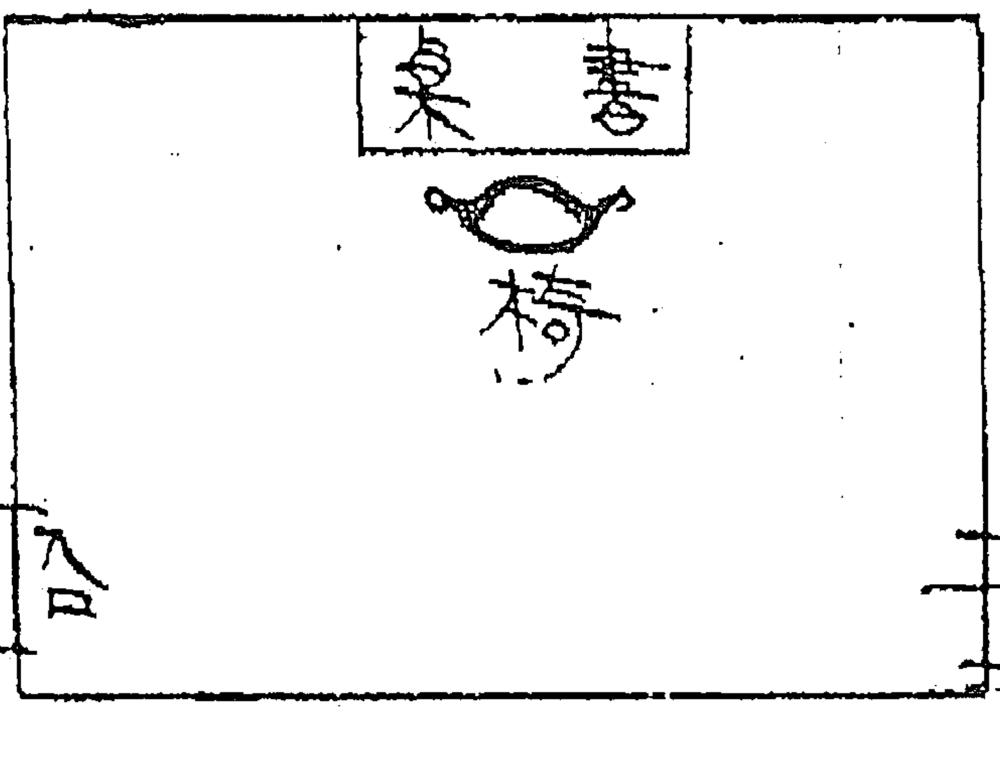
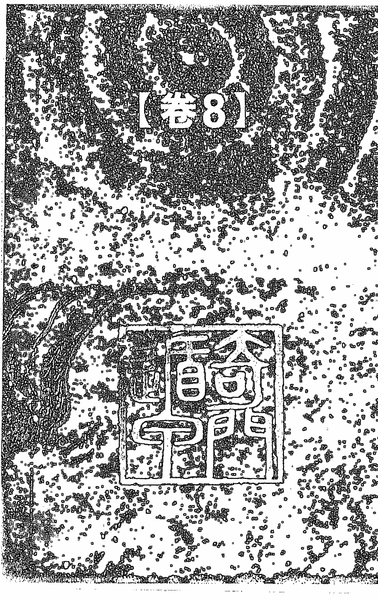
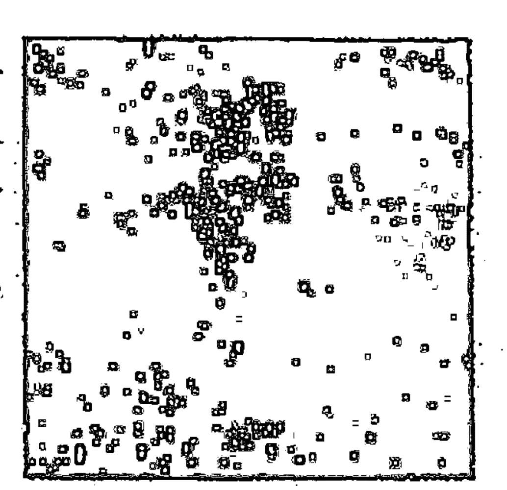
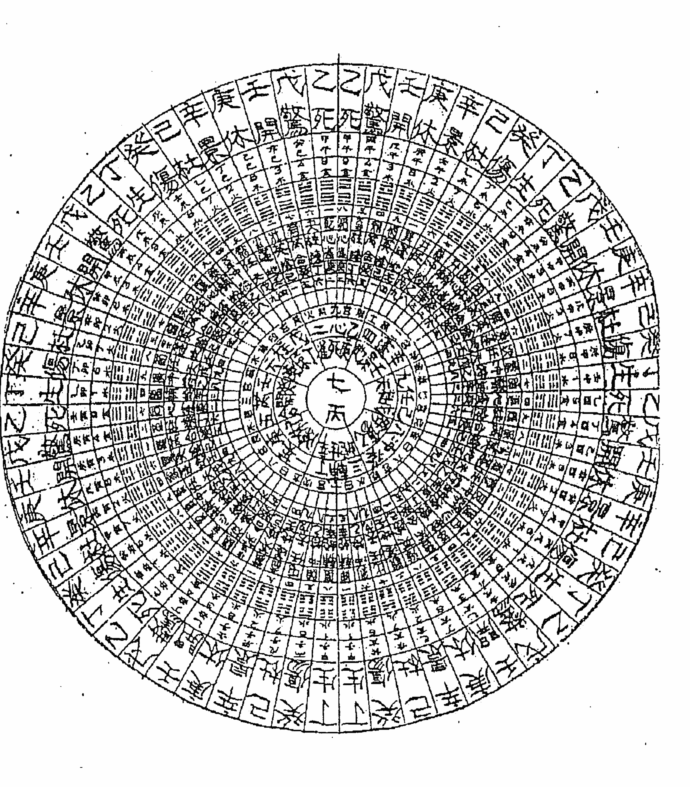
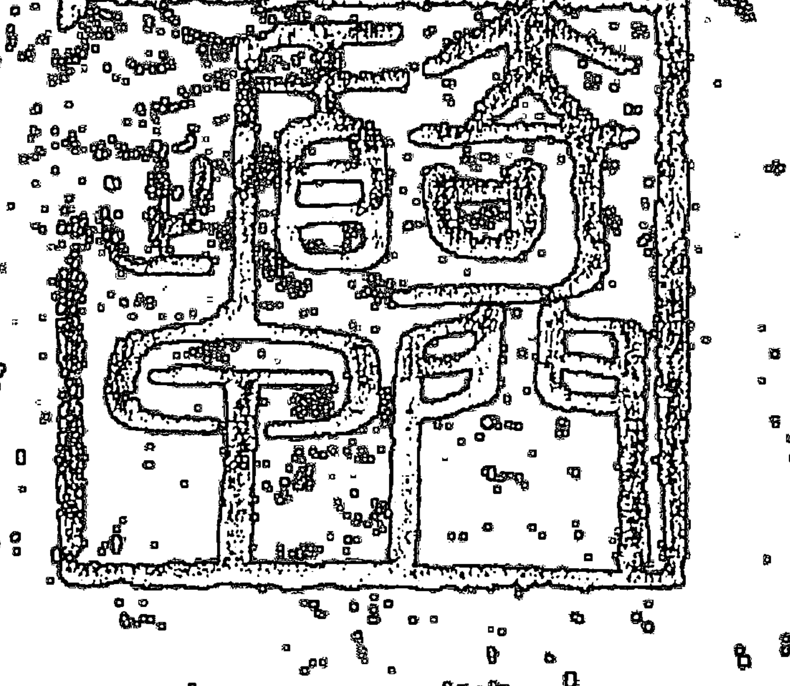

# 發智學習奇門遁甲的第一本書

本書包括所有遁甲的密傳及實際運用的密奧方法，為奇門遁甲的最高密傳書，有緣得者，希望能行功立德，造因引福，切勿持技非為。

台灣省堪輿學會 創會創理書長
吳建勳 著

中華民國易理
堪輿學會全國聯合會
張清淵
特加頒贈

## 學習奇門遁甲的第一本書

吳建勳 著

# 學習奇門遁甲必備的一本書

張清淵

奇門遁甲傳奇性的膾炙人口，而鮮少人真正接觸而知道奇門遁甲，可分為「法奇門」、「術奇門」兩大類別，市坊流通奇門遁甲群書皆歸屬於「術奇門」，卻難得接觸窺探「法奇門」，「法」與「術」，雖為一體兩面，但到底仍然有所不同。

奇門遁甲，自古係為兵家運籌帷幄決勝之思維準則，上可輔國安邦，下能便覽營謀，是帝王將相之學，大可容於運籌帷幄之機宜，小含攻防進退之妙算，其大可範圍天地而不過，曲成萬物而不遺，是為密術中之密術，可乘天之日時、擇地之方向，藉術奇門以為天時順逆之判，以行趨吉避凶之法，再假法奇門以施法行錄，藉由道家之神通奧妙之術，以踏罡步斗，以為避難潛身之用，故奇門遁甲之學，向為慎傳之秘故歷代師承嚴誡，倘非得人，不得妄傳，因而能得到奇門遁甲之真傳者是少之又少，再加上明朝開國皇帝朱元璋即位之後，因思得天下，借重劉伯溫之力甚多，深知通天文星象者絕不可輕忽，因此下詔，

## 學習奇門遁甲的第一本書

禁止民間學習天算，違者處以極刑，致使奇門遁甲之學幾乎因而失傳幾廢。

《學習奇門遁甲的第一本書》作者吳建勳精通奇門遁甲之術，是我幾十年的好朋友，他教我奇門遁甲，卻跟我學習紫微斗數與掐指神算，因而吳建勳與我亦師亦友而有些「師渡徒、徒渡師」的情誼，「學無先後，達者為師。」的韻味，因而產生了莫逆之交。

傳說黃帝戰蚩尤於涿鹿，夢受九天玄女陰符經，命風后演制奇門遁甲制式，上層象天而置九星，中層象人以開八門，下層象地以分八卦，製成一千八十局，此為遁甲之始，到帝堯命大禹治水，得洛書以畫敘九疇，而姜太公簡化而刪成為七十二局，到了漢初張良，子房則又精簡成陽九局和陰九局十八活局，而成就了決勝之功，於指掌上即可逐一推算而成精巧的藝術。

奇門遁甲三層制式，恍惚就像我的朋友「三大鬼酒」而各具特色；九宮之格式以排天蓬貪狼、天芮巨門、天衝祿存、天輔文曲、天禽廉貞、天心武曲、天柱破軍、天任左輔、天英右弼；九宮已具而分八卦，八卦已分而配八門休、生、傷、杜、景、死、驚、開；安佈三奇六儀以為辨別值符，值使，以辨別吉凶而為選擇利用之機。

吳建勳精心著作《學習奇門遁甲的第一本書》，演繹「三元遁甲神機賦」而為「選宅

# 學習奇門遁甲必備的一本書

三白」、「陰陽兩宅秘笈」之著述，並大膽的洩露了先人所不敢輕洩之「行軍三奇」及「循行太白之書」和「建國安邦萬年金鏡」之訣，同時更將研究陰陽宅之人所視為不可輕傳的至寶「入山撼龍訣」、「轉山移水元經」及「九宮入福救貧生仙產聖法」毫無保留的
一一的著述於本書，雖說是「學習奇門遁甲的第一本書，也應該可以說是學習奇門遁甲選擇
擇利用的最後一本書」，其已超越流通奇門遁甲群書的告訴我們奇門遁甲的選擇與利用之
法門。

我因吳建勳傳授奇門遁甲而知奇門遁甲之選擇與利用之奧秘，因此常揶揄吳建勳老師
自私的擁秘而自珍藏自用的自閉門造車之行徑。
今欣見吳建勳老師不再擁秘自珍，而欲著述成書，以廣為流傳，故樂以為序。

歲次癸未年季夏荔月
中華星相易理堪輿師協進會全國總會理事長
張清淵 謹序

# 序 言

《學習奇門遁甲的第一本書》是奇門遁甲的最高秘傳書，本書包括所有遁甲的秘傳及其實際應用的奧秘方法。因屬口傳心授秘笈，有緣得傳者，希能行功立德，造因引福，利益善人，切勿持術非為，恐遭天譴。

依五術傳統，一派之掌門，是從諸多的遁甲研究學員中，選出人格圓滿，福慧慈悲的賢聖者，在祖師法坐寶壇下宣誓，不傳匪人，俾言以術濟善為己任……登錄法冊後，才授予本冊傳承秘典。

希望有緣者了解這一點，絕不可濫用本冊秘訣，為害善德。

吳建勳

# 前言

誠如看得懂《奇門遁甲全書》或《奇門遁甲坐山，立向盤評註》的人所知道的『遁甲神機賦』乃是奇門遁甲術的最高奧秘訣。內容詳述於左列九章：

- 一、都天八卦
- 二、入地三元
- 三、行軍三奇
- 四、選宅三白
- 五、循行太白之書
- 六、入山撼龍之訣
- 七、轉山移水九字元經
- 八、建國安邦萬年金鏡
- 九、九宮入福救貧生仙產聖

從各章的篇名，即可了解，其主旨不在於只為了投機造作，僅求個人利益而寫傳，而是要把個人的研究成果，慢慢的向善德人士授傳，以達生仙誕聖，建國安邦，世界同善為目的。另有法術奇門的功法分初、中、高三階，待有機緣，再作傳燈之發表。

# 目 錄

學習奇門遁甲必備的一本書／張清淵

序言／吳建勳

前言

【卷一】都天八卦

【卷二】八神三元

【卷三】行軍三奇

【卷四】遁甲三白

【卷五】遁行太白之圖

【卷六】入山撼龍之訣

【卷七】轉山移水九字元經

【卷八】建國安邦萬年金鏡

【卷九】九宮八福黃生仙禽聖

# 【卷一】都天八卦 經文

戊己兩儀號都天、犯此美夢盡成煙、三奇雖是人人要、
配合奇門方不偏、談何容易奇門到、奇門豈能必相連、
吉門無奇如何好、都天代奇配神仙、戊丙天地代返首、
己休九天龍遁奇、己休九地代虎遁、己生六合風遁依、
己開太陰代雲道、己配吉神乙一批、雙戊雖為伏吟格、
生門九天天遁機、戊乙戊丙戊丁配、戊壬生天是神遁、
己乙己丁己戊配、開地鬼遁陰休人、千言萬語總是一、
戊代甲尊丙奇恩、己代乙丁是真理、不用三奇只要門。

# 【卷一】都天八卦 句解

都天——戊和己稱為都天。

談何容易——說說簡單，實際去做，卻是相當困難。

神仙——八神中之吉神也，直符、太陰、六合、九天、九地。

戊丙天地——天盤是戊、地盤是丙、八神是九天或九地。

己休九天——天盤是己、八門是休、八神是九天。

己休九地——天盤是己、八門是休、八神是九地。

己生六合——天盤是己、八門是生、八神是六合。

己開太陰——天盤是己、八門是開、八神是太陰。

乙一批——地遁、龍遁、虎遁、風遁、雲遁等組合之吉格。

雙戊——天盤及地盤皆是「戊」之意。

遁神——神遁之意。

戊乙——天盤是戊、而地盤是乙之意。

戊丙——天盤是戊、而地盤是丙之意。

# 【圖二】都天八卦 註解

六儀之中，戊己稱為都天，如果犯了這個方位，美夢必將化成輕煙。三奇乃是每個人所期望的，然而只有三奇是沒有用的，要配合吉門值宮，方可使用。雖然說要三奇和吉門齊一值宮方吉，但是乍聽似很容易，而實際操作時，卻是意外的困難！！

僅見三奇，而缺吉門，就沒有辦法，而如果有吉門而缺三奇時，則可以用都天「戊或己」和八神中吉神組合；也就是以都天和吉神的組合，替代三奇使用。天盤是戊，地盤是

戊丁」天盤是戊、而地盤是丁之意。
戊壬」天盤是戊、而地盤是壬之意。
己乙」天盤是己、而地盤是乙之意。
己丁」天盤是己、而地盤是丁之意。
己戊」天盤是己、而地盤是戊之意。
開地」八門是開、而八神是九地之意。
陰休」八門是休、而八神是太陰之意。
人」乃是人遁之意也。

# 【卷一】都天八卦

丙，八神是九天或九地時，可以使用為青龍返首吉格。

天盤是己、八門是休、八神為九天時，可用龍遁。

天盤是己、八門是休、八神為九地時，可用虎遁。

天盤是己、八門是生、八神為六合時，可用風遁。

天盤是己、八門是開、八神為太陰時，可用雲遁。

這樣子，由於天盤的己和八神的吉神巧妙組合，即使沒有三奇，也可以出現地遁、龍遁、虎遁、風遁、雲遁等吉格。當天盤和地盤都是戊時，一般視為伏吟凶格，如果有生門和九天時，則可用為天遁吉格。

天盤為戊，地盤為乙，天盤為戊，地盤為丙，天盤為戊，地盤為丁，天盤為戊，地盤為戊等的組合，若有生門和九天時，則可用為神遁吉格。

天盤為己，地盤為乙，天盤為己，地盤為丁，天盤為己，地盤為戊等的組合，若有開門和九地時，則可用為鬼遁吉格。

天盤為己，地盤為乙，天盤為己，地盤為丁，天盤為戊，地盤為戊等的組合，若有休門和太陰時，則可用為人遁吉格。

千言萬語，總之一句話，用戊代替甲、丙。用己代替乙丁。只要巧妙組合，只有門吉

即可，不必耍三奇。

# 【曾三曰】都天八卦 要點

一、戊在天盤時，門限於三吉門（不可用景門），神限於五吉神，地盤僅限用乙、丙、丁、壬。

二、己在天盤時，門限於三吉門（不可用景門），神限於五吉神，地盤僅限用乙、丁、戊。

# 都天八卦 表解

| 天盤 | 地盤 | 八門 | 八神 | 代用格局 | 註解 |
|---|---|---|---|---|---|
| 戊 | 乙 | 生 | 天 | 神遁 | 忌逢禽芮任 |
| 戊 | 丙 | 吉 | 地 | 返首 | 五黃暗劍剋 |
| 戊 | 丙 | 吉 | 天 | 返首 | 忌逢禽星及 |
| 戊 | 丙 | 生 | 天 | 神遁 | 五黃暗劍剋 |
| 戊 | 丁 | 生 | 天 | 神遁 | 忌逢禽芮任五黃暗劍 |
| 戊 | 戊 | 生 | 天 | 天遁 | 忌逢禽芮任黃劍 |

# 【卷一】都天八卦

黃—五黃星是也，二五交加必損主，或是重病。
劍—五黃所坐宮之正對方之宮是也。大約犯凶殺案，或重案之人犯，均往此方逃避，
匿居山屋岩洞。

| 戊 | 己 | 己 | 己 | 己 | 己 | 己 | 己 | 己 | 己 | 己 |
|---|---|---|---|---|---|---|---|---|---|---|
| 壬 | 吉 | 吉 | 吉 | 吉 | 乙 | 乙 | 丁 | 丁 | 戊 | 戊 |
| 生 | 也 | 休 | 生 | 開 | 休 | 開 | 休 | 開 | 休 | 開 |
| 天 | 地 | 天 | 合 | 陰 | 陰 | 地 | 陰 | 地 | 陰 | 地 |
| 天遁 | 虎遁 | 龍遁 | 風遁 | 雲遁 | 人遁 | 鬼遁 | 人遁 | 幺遁 | 人遁 | 鬼遁 |
| 忌禽芮黃暗劍 | 忌禽英逢黃劍 | 忌禽英逢黃劍 | 忌禽丙任黃劍 | 忌禽輔心黃劍 | 忌禽英逢黃劍 | 忌禽輔心黃劍 | 忌禽英逢黃劍 | 忌禽輔逢黃劍 | 忌禽英逢黃劍 | 忌禽輔逢黃劍 |

# 【卷二】入地三元 經文

三元一百八十年、念年一局順相連、上一中四下七起、
戊按局數奇儀填、八山分為廿四向、雙山五行十二道、
門向加甲為旨首、陰支求陽六合全、屋向卦內求儀奇、
旬首加干為天機、星門宮神次第佈、地理五常勿著迷、
一為龍來二為穴、三為砂來四水依、龍頭四常理氣一、
五為向來五常齊、一日龍來龍要活、龍管貴賤必要驗、
龍活人貴仕君側、龍死人賤業平凡、起伏彎曲多帳幕、
必是貴龍多轉圜、蠢粗筋露氣散漫、賤龍土飛無攔關、
二曰穴來穴要的、穴司吉凶必要深、穴的人吉常安泰、
穴歪人凶禍臨門、龍行彎曲有真結、必是吉穴有天恩、
蠢粗筋露勉成結、凶穴來鬼不來神、三曰砂來砂要秀、
砂司壽夭必要扶、砂秀人壽多翁姥、砂鄙人夭趕酆都、
清潤不澱固不頑、必是壽砂石如珠、旱飛雨泥無草木、

# 【卷二】入地三元 句解

三元——上元、中元、下元，合稱為三元，元會運世，年月日時皆有其序。

念年——此處念就是泛指二十的意思，念即廿年也。

順相連——三元地理的法則，是只有陽局，沒有陰局，意思為連續順局，沒有逆局。

上一——上元從順一局開始念算。

天砂命短精神枯、四曰水來水要抱、水管富貧必要情、
水抱人富堆金玉、水背人貧家產傾、水清流緩繞旁側、
必是富水月精英、水濁流急又直去、貧水財散總不成、
五曰向來向要正、向管成敗必要純、向正人成青雲上、
向邪人敗怨乾坤、奇門齊到不受害、必是成向富貴春、
奇門不到又反伏、敗向貧天兌脫混、吉門有吉怕反伏、
凶門不凶保平安、八門只怕反伏吟、不反不伏不困難、
吉神有吉怕中五、凶神不兌心不寒、八神只怕五黃殺、
若逢五黃不必談。

## 【卷二】入地三元

中四——中元從順四局開始推排。
下七——下元從順七局開始佈值。
戊——甲子戊，句首也。
八山——坎山、艮山、震山、巽山、離山、坤山、兌山、乾山等合稱也。
廿四向——一山管三向，八山共計廿四向也。含括左列干支山：

| 坎山之中有壬、子、癸 | 艮山之中有丑、艮、寅 | 震山之中有甲、卯、乙 | 巽山之中有辰、巽、巳 | 離山之中有丙、午、丁 | 坤山之中有未、坤、申 | 兌山之中有庚、酉、辛 | 乾山之中有戌、乾、亥 |
| --- | --- | --- | --- | --- | --- | --- | --- |
| 壬陽 | 丑陰 | 甲陽 | 辰陰 | 丙陽 | 未陰 | 庚陽 | 戌陰 |
| 子 | 艮 | 卯 | 巽 | 午 | 坤 | 酉 | 乾 |
| 癸陰 | 寅陽 | 乙陰 | 巳陽 | 丁陰 | 申陽 | 辛陰 | 亥陽 |

雙山五行——二十四山向中，每兩向為十二支之一代表之。

## 【卷二】入地三元

壬子合為子
癸丑合為丑
艮寅合為寅
甲卯合為卯
乙辰合為辰
巽巳合為巳
丙午合為午
丁未合為未
坤申合為申
庚酉合為酉
辛戌合為戌
乾亥合為亥

①入三元二十四山圖，並雙山五行詩歌。

②同時標示八干四維及十二支之訣。

十二道指十二支也。

## 【卷二】入地三元

門向——大門所向的角度也。

陰支求陽——陰支不能加甲，是以改用陽支加甲。

丑換成子　戌換成卯　巳換成申
未換成午　辰換成酉　亥換成寅

星門宮神——乃泛指九星、八門、九宮、八神之意。

地理五常——龍、穴、砂、水、向等之合稱也。

巒頭——從形狀可看出來的情況。

理氣——從形狀看不出來的狀態。

活——生氣蓬勃的樣子。

彎——起伏頓跌曲轉有情之意。

仕君側——登上高位、伴在領袖君王之左右，為輔弼助力之意。

死——沒有生氣之意也。

業平凡——事業平凡也。

帳幕——地形像帳棚之態勢。

轉圜——彎曲聚止也。

## 【卷二】入地三元

筋露——露出許多的石頭岩塊。

無攔關——遮攔關鎖在此處言，缺迎送護衛之意象。

的——擊中目標的意思。

歪——未命中目標之意。

天恩——承蒙上蒼的恩澤，得保平安的過日子也。

勉——勉強。

來鬼不來神——災禍很多之意。

扶——扶助家運。

翁姥——年老的男女之謂。

砂鄙——左右迎送護衛砂，形態地質條件不佳也。

趕酆都——匆忙赶赴地獄，終結性命之意。

旱飛雨泥——沒下雨時，砂土飛揚，雨後又泥濘不堪的惡劣地質是也。

抱——之玄九曲包圍明朝暗拱。

情——滌選穴場，欲去還留，朝顧合意之謂也。

月精英——「石」龍之骨、「土」龍之肉、「草」龍之毛、「水」龍之血，好而有情之

## 【卷二】入地三元

水神，可以接收到月之精華。

不行——不可以之意也。

純——很容易分辨是屬於那一個方位。

霄雲——大成功或大發展之謂也。

乾坤——天地。

奇門齊到——三奇和三吉門相配合之格局。

不受害——沒有不好的干支關係或反伏吟凶格而言。

四季富貴春——一年四季吉祥，好事連連，富貴如春也。

反伏——指反吟或伏吟凶格局。

中五——五黃及暗劍殺。

心不寒——沒有害怕的事。

五黃殺——不僅指五黃，還帶有暗劍殺。

# 【圖三】入地三元 註解

三元共為一百八十年，廿年為一局，全部使用順局，不用逆局。

## 【卷二】入地三元

上元從一局開始，接著是二局、三局。
中元從四局開始，接著是五局、六局。
下元從七局開始，接著是八局、九局。

確定了局數，將戊布入該局數中適當之位置，即可安排九干定位了。

八山分為廿四向，依雙山五行的方法，廿四向歸納取出十二支向。一卦管三山，共廿四山，然後換成十二支，每支十二道，劃圓各佔圓周卅度。

作盤的最開始，在門向的十二支上加甲，作成六儀，如果是陰支的話，則依支的六合轉換成陽支。

（註）句首求法

| 門向 | 甲子戊 |
|---|---|
| 門向為丑，依六合改成子，則亦是甲子戊 | |
| 門向寅 | 甲寅癸 |
| 門向為亥，依六合改成癸，則亦是甲寅癸 | |
| 門向辰 | 甲辰壬 |
| 門向為酉，依六合改成壬，則亦是甲辰壬 | |
| 門向午 | 甲午辛 |
| 門向為未，依六合改成辛，則亦是甲午辛 | |
| 門向申 | 甲申庚 |
| 門向為巳，依六合改成庚，則亦是甲申庚 | |
| 門向戌 | 甲戌己 |
| 門向為卯，依六合改成戌，則亦是甲戌己 | |

## 【卷二】入地三元

旬首決定之後，就可以定出屋向卦、內中九干的用干，旬首加用干，就可作出天地盤。天地盤作好之後就能依序，將九星、九門、九宮、八神等填入定位。但是在看遁甲盤前，必須注意何謂地理的五常。龍、穴、砂、水、向五常中，前四者泛指巒頭形態而言也，向則說明理氣之一事。

# 註 地理五常的意義

龍：指地勢的流向，務必起伏頓跌曲折的部分都合乎好的方位。

穴：指地勢的流向動態，正中藏風聚氣的位置。

砂：指地勢的流向正中位置附近的環境。大體上最重要的是空氣及地質。

水：指附近所有的江、河、溪、溝、湖、海、蕩等水流的狀況。

向：指所形成的遁甲盤。

由此有下列的情形：

第一項最重要的，就是龍，龍必須要活（活是指地勢的流法，蜿蜒曲折，生氣活潑）。龍若是活的，在這裡居住的人，即為貴命，可有高尚的身分和地位。

龍若是死的，在這裡居住的人，即為賤命，僅能有平凡的事業。

（死，指地勢的流法筆直完全沒有曲折）

所謂貴龍，指起伏彎曲，有許多帳幕之形。

## 【卷二】入地三元

所謂淺龍，指沒有起伏彎曲，只是非常散漫寬大蠢粗，露出石塊，毫無遮掩，稍有起風，就塵土飛揚。

第二重要的是穴，穴必須是在正中央。（指穴的正中心點）
穴司吉凶，必須要深淺得度。穴若在正中央，在這裡的人為吉命，能常保安泰。穴若不在中央，在這裡的人為凶命，經常災禍連連（指偏離了穴）。所謂吉穴，指在龍的彎曲之內側，形成真正的結。

所謂凶穴，指沒有彎曲的龍，在稍微彎曲的地方，勉強作成穴，這必然有許多災禍。

第三項重要的是砂，砂必須秀（秀指空氣清新地質良好），砂主壽夭，住在此地的人必有助益。砂若秀，住於斯的人，多為長壽之人；砂若鄙，住在這裡的人為天命，早年即天折（鄙指空氣混濁，地質惡劣）。

所謂壽砂，指地質清秀，潤而不濕，穩固適中，所謂天砂，指地質惡劣，乾旱時，砂石飛揚，雨滂時泥濘不堪，草木無法生長，居此環境，將使壽命短縮，形影枯槁，精神憔悴。

第四項重要的是水，水必須抱（抱者，指水流將住家圍繞住的意思）。
水主富與貧，必須有情（水有繞抱朝顧稱有情，硬直斜側，偏離反跳稱無情，而在此

## 【卷二】入地三元

所謂情，是專指有情而言）。若有水環抱，在這居住的人，為富命，能積蓄財富。水若背離，在此居住的人為貧命，將會耗損金錢，家業終將破產。

所謂富水，為水質清澈，水流緩和，包圍其側，形成為日月形。

所謂貧水，為水質混濁，水流湍急，直直地流去，臨著這種水而居者，會日愈貧窮。

第五重要的是向，向必須要正。

向若是正，居住在此的人為成命，可有大成功或大發展。向若不正，住在這的人為敗命，終將失敗而恨天怨地。

所謂的成向，是具備了三奇和吉門。

所謂的敗向，是三奇和吉門不齊，又有反吟或伏吟，敗命就會發生貧乏、夭折、凶災、下賤等。吉門有吉的作用，而若有反吟，則吉作用消失。凶門沒有凶作用，只要沒有反伏吟，則能保平安無事。八門唯恐有反伏吟，只要沒有反伏吟，有凶門也無所謂。

吉神中有吉作用，但是唯恐遇上五黃或暗劍，只要沒有五黃或暗劍，就不足畏懼。

八門就怕五黃或暗劍，如是遇上了，即使是吉神也幫不上忙。

> 「五黃沖關打道過、六神有主」，神之語配合所祀之神及術法符咒之妙用改制之，此

## 【四三】入地三元 詳釋

有關遁甲的家相盤，請參考①《陽宅遁甲圖佈值秘笈》②《三元三式遁甲、六壬、太乙挨星家相盤完成圖》③《三元遁甲家相圖面集要》三書。

在此謹說明判斷的要訣：家相的看法，不僅止於家宅本身，必須從地勢的流法等開始看起。

地勢的流法稱為龍，主司人的身分之貴賤。換言之：好的龍之地帶，會容易形成高級住宅區。不好的龍之地帶，容易變成貧民窟。龍之來勢，分成貴賤兩者，貴龍之條件必須是：一、緩和的起伏。二、緩和的彎曲。相反的：一、筆直而無起伏。二、死硬而不彎曲。三、石塊脊露砂飛水走。這樣子，就叫做賤龍。

以台灣為例：台北市、台中市、高雄市、雲林元長鄉、北港鎮等地為貴龍。東勢、霧峰、中寮、旗山月世界附近則為賤龍。所以在這附近居住的人，大體上可以瞭解是那一樣階級的人，實踐立判。然後再看到穴，如果在穴的正中央居住，在一生中，很少罹致災禍橫厄。若離正穴愈遠，則禍患愈多了。

## 【卷二】入地三元

而確定穴之後，從穴心前瞻，可能瞭望愈遠愈好。所謂穴，大多在龍曲折角的內側，所以如果人居宅於此，首先比較平穩無事。了解了吉凶，再從護砂探究，看壽天，也就是計量生命的短長。

所謂砂，指附近的空氣和地質，重要的是空氣的清新，地質以溫潤不潮濕為宜，地上石面閃閃發光者為佳。

不下雨時，塵飛土揚，一下雨又泥濘不堪的地質為最下等。

接著再看水。水主財祿，關係富或貧：

好的水條件是：一、圍繞家宅。二、水流緩和噤聲暗拱。三、清澈但不見底。四、多彎曲。這樣的狀況，則可多進財發富。

反之惡劣的水，所見之條件為：

- 一、反跳弓割，背離家宅。二、水流湍急，去而不顧。三、清澈可見淺底或混濁不清。四、筆直死硬，不見彎曲。似此情況則無法進財。以上的龍、穴、砂、水合稱樹頭。

再者所謂理氣，則為向「遁甲盤」：

遁甲盤的判斷如下：

- 一、九干可和方位一樣同判斷。

- 二、以星門而言：
  1. 吉門若無反伏吟則吉。
  2. 吉門若有反伏吟則為中吉。
  3. 凶門若有反伏吟則凶。
  4. 凶門若無反伏吟則中凶。

- 三、以宮神而言：
  1. 吉神中若無五黃或暗劍為吉。
  2. 凶神中若無五黃或暗劍為中吉。
  3. 凶神中若有五黃或暗劍為凶。
  4. 吉神中若有五黃或暗劍為中凶。

以上是家相判斷的要訣，只要牢記在心，則在判斷上就沒有問題了！！

## 【卷三】

## 【卷三】行軍三奇 經文

行軍三奇乙丙丁：求安求財，求學情。
先將八門安排好，乙開丁休丙是生，乙怕乙庚兼辛癸，
丙怕丙庚壬癸冰，丁怕丙己兼辛癸，十中只有六個精，
坐山立向上下排，單用地盤天地來，十中只有六個精，
彼我主客必分開，奇儀門神相比較，勝者歡喜敗者哀，
直符天地陰合吉，雀蛇陳凶墓裡埋。

## 【卷三】行軍三奇 句解

行軍三奇——即三奇的意思，奇門遁甲原本是在行軍中開始使用的，所以三奇，又稱行軍三奇。

求安——祈求平安無事，亦包括追求配偶。

求學情——冀求丙丁考拔，登科及第之事也。

情——六丁乃指兌妙於丁，十天盤藏象，亦指玉女之意，是以丁奇會休門，是謂玉女守

## 【卷三】行軍三奇

乙開——將開門配置於天盤的乙中也。
丙是生——將生門配置於天盤的丙中也。
丁休——將休門配置於天盤的丁中也。

乙怕乙庚兼辛癸——乙在天盤時，地盤忌乙庚辛癸。
丙怕丙庚壬癸冰——丙在天盤時，地盤忌丙壬癸。冰指壬和癸水之意思，非是子丑合化冰也。

丁怕丙己兼辛癸——丁在天盤時，地盤忌丙己辛癸干。

十中只有六個精——三奇在天盤時，和地盤十干的組合共有十組，而好的組合只有六個對也。

天地來——天盤和地盤都齊至。

天地陰合——泛指稱九天、九地、太陰、六合。

雀蛇陳——乃指朱雀、騰蛇、勾陳八神也。

## 【卷三】行軍三奇 詳解

所謂行軍三奇即乙丙丁；乙為求安，丙為求財，丁為求學或求愛情也。

首先應該配合天盤的三奇來配置吉門，可分為：乙配開門，丙配生門，丁配休門。

天盤是乙，則地盤忌乙庚辛癸等干。

天盤是丙，則地盤忌丙庚壬癸等干。

天盤是丁，則地盤忌逢丙己辛癸等干。

因此三奇在天盤時，各有十組的天地組合型態，而任何一個三奇好的組合，只有十組中六組而已。

再者，更精密的用法是：坐山盤在下，立向盤在上。這種用法，只用地盤，不用天盤，就可構成天地。

方法是：坐山盤、地盤的干為地；立向盤地盤的干為天。於是，坐山為固定的一方，而立向為建作的一方。

當在判斷事情時，必須先認識自己是運作的一方呢？還是待而不動的一方呢？要決定那一方勝？就必須憑坐山和立向地盤中的干、八門、八神。

## 【卷三】行軍三奇 註釋

八神的強弱之順序為：
第一、直符，第二、九天，第三、九地，第四、太陰，第五、六合，第六、朱雀，第七、騰蛇，第八、勾陳是也。

吉方的取法，大致可分為：
甲在天盤為求官，乙在天盤為求安。
丙在天盤為求財，丁在天盤為求學或愛情。

世上最難求的乃是高官顯貴之位，需要經常參與許多激烈的競爭。測試考驗，層層篩檢或淘汰；如未能通過考試，就無法謀得官位，是以在吉格中甲在天盤的格最是稀少。

其次是求平安。在人的一生中，總會有些災禍關劫，想要平穩無事是很困難的，因此乙在天盤的吉格，排在甲之後為第二順位。

求財是比較容易的，因為錢財本屬流通的東西，只要巧妙取得吉方，錢財就能輕易到手入庫，所以丙在天盤吉格，當然比較多了。

人生之中，最簡單的就是求學，所以在天盤最容易構成吉格。因此，想依吉方來開運

時，首先就必須確定自己意求的是求官、求安、求財、求學、求愛情？中的那一項。決定了天盤，為了使這天盤的作用更有效果，就必須決定八門，當然如果不是吉門的話就很麻煩，而吉門中，若依如下的原則來決定，會更好：

天盤為乙，八門為開。天盤若為丙，八門為生。天盤若為丁，八門為休。

決定了八門，其次決定地盤的干：

天盤為乙的狀況下，亦即為了求安，應該避免乙乙、乙辛、乙庚、乙癸等的組合。

天盤為丙的情況下，亦即為了求財，應該避免丙丙、丙庚、丙壬、丙癸等的組合。

天盤為丁的情況下，亦即為了求學，應該避免丁丙、丁己、丁辛、丁癸等的組合。

但是如我們所知道的，乙癸、丙壬、丁丙等因用法而異，也有好的表現，不能以偏概全斷定它不好。以上與我們目前所學到的差不多，可以說是常識程度而已。

接下來要說的，則為至今尚未公開的資料，乃相當秘密的訣竅。

到目前為止，雖有吉方和凶方之分，但是只有自我本位的吉方，分別求安、求學、求財等，卻都沒有競爭者的存在。如果有競爭對手的話，就不能先只求吉方，這樣子成功率是不那麼確實的。

因為比方說：自己取得了八十分的吉方，而對方有八十五分的吉方，在為了某一目的

而爭時，雖然本身占有吉方，仍然會失敗。
同此理，如果自己為五十分的凶方，而對方卻是五十五分的凶方，當為某一目的而競爭時，雖然本身為凶方，終將成功。
所以要占卜成功或失敗，一定必須將兩方所使用的盤相互對照，才能正確判斷。
而在這說明，為了補充上述缺點，組合兩方的地盤、八門、八神，來判斷的方法。
首先：坐山盤的地盤、八門、八神置於上方為天盤。
這就是所謂「坐山、立向、上下並列，只用地盤，即可有天地，然後干和干、門和門、神和神比較，那一個勝即可分明，但是在這之前，必先了解，在這盤本身是立向（上）呢？還是坐山（下）呢？而兩個干的比較方法為：

- 甲和乙，甲勝。甲和丙，丙勝。甲和丁，丁勝。
- 甲和戊，甲勝。甲和己，甲勝。甲和庚，庚勝。
- 甲和辛，甲勝。甲和壬，壬勝。甲和癸，癸勝。
- 乙和丙，丙勝。乙和丁，丁勝。乙和戊，戊勝。
- 乙和己，乙勝。乙和庚，庚勝。乙和辛，辛勝。

乙和壬，壬勝。乙和癸，癸勝。丙和丁，丙勝。
丙和戊，丙勝。丙和己，己勝。丙和庚，庚勝。
丙和辛，丙勝。丙和壬，壬勝。丙和癸，癸勝。
丁和戊，戊勝。丁和己，己勝。丁和庚，庚勝。
丁和辛，丁勝。丁和壬，壬勝。丁和癸，癸勝。
戊和己，戊勝。戊和庚，庚勝。戊和辛，辛勝。
戊和壬，壬勝。戊和癸，癸勝。己和庚，庚勝。
己和辛，己勝。己和壬，壬勝。己和癸，癸勝。
庚和辛，庚勝。庚和壬，壬勝。庚和癸，癸勝。
辛和壬，壬勝。辛和癸，癸勝。壬和癸，癸勝。

八門和八門的比較如下：
休門和生門比，休門勝。休門和傷門比，休門勝。
休門和杜門比，休門勝。休門和景門比，休門勝。
休門和死門比，休門勝。休門和驚門比，休門勝。
休門和開門比，休門勝。生門和傷門比，生門勝。

生門和杜門比，生門勝。生門和景門比，生門勝。生門和死門比，生門勝。生門和開門比，生門勝。傷門和開門比，開門勝。傷門和驚門比，驚門勝。杜門和景門比，景門勝。杜門和驚門比，驚門勝。景門和死門比，死門勝。景門和開門比，開門勝。死門和開門比，開門勝。

八神的比較是這樣的：直符與騰蛇比，直符勝。直符與六合比，直符勝。直符與朱雀比，直符勝。直符與九天比，直符勝。直符與太陰比，直符勝。直符與勾陳比，直符勝。直符與九地比，九地勝。

騰蛇與太陰比，太陰勝。騰蛇與六合比，六合勝。
騰蛇與勾陳比，騰蛇勝。騰蛇與朱雀比，朱雀勝。
騰蛇與九地比，九地勝。騰蛇與九天比，朱雀勝。
太陰與六合比，太陰勝。太陰與勾陳比，太陰勝。
太陰與朱雀比，太陰勝。太陰與九地比，九天勝。
太陰與九天比，九天勝。六合與勾陳比，六合勝。
六合與朱雀比，六合勝。六合與九地比，九地勝。
六合與九天比，九天勝。勾陳與朱雀比，朱雀勝。
勾陳與九地比，九地勝。勾陳與九天比，九天勝。
朱雀與九地比，九地勝。朱雀與九天比，九天勝。
九地與九天比，九天勝。

而比較的要素有三個項目，只要其中兩項勝了，就能勝過對方。

茲舉兩個例題來說明一下，請參考圖盤解說：

例一、辨方——時盤——求財（丁未年巳月癸酉日未時）

廖君鑑於休假美軍來台者眾多，擬開酒吧於中市五權路，但苦於資金不足，前曾告貸

| 兩方 | 其兄 | 廖君 |
| :--- | :--- | :--- |
| 盤 | 坐山 | 立向 |
| 干 | 丁 | 丙 |
| 門 | 休 | 生 |
| 八神 | 蛇 | 地 |

從廖君看來，兄長的方位是西，我將西兌的「立向」設定為吉方，而且以西兌的「立向」選擇比「坐山」更強的時間去行動。結果其嫂不斷從旁給予支持，終於「求財」而如願以償。那一天的陽遁從十二月十六己酉日開始，巳月的癸酉。是立夏的中元，為陽一局，因此己未的陽一局比較西兌更好。

| 五心己 | 三輔丁 | 七任丙 |
| 雀休庚 | 陳開戊 | 合驚任 |
| 一芮乙 | 八癸 | 辛柱庚 |
| 地生丙 | 英癸 | 陰死辛 |
| 九蓬辛 | 四禽壬 | 二沖戊 |
| 天傷丁 | 符杜己 | 蛇景乙 |

於其胞兄遭嚴拒，束手無策之際，求卜吉凶；展卷佈盤後，告之曰：令兄所在屬西兌。待西兌為吉時，速往可矣。癸酉日，未時乃天乙地丙，三奇順遂，而財豐，雖有星門反吟而九地，謙卦出現，若將計劃詳情及收益預計列表獻於令兄，令兄必肯助君一臂之力也。廖君果於適時前往，獻諸表以代說明，其兄乃頓躊躇，適其嫂出，聞其計劃而大感興趣，力促其兄貸款百萬與廖君創業。

從上表分析，干、門、神全部都是廖君勝利。因是向西行動的廖君獲勝。

在西的廖君兄長為負終於借出百萬元。

## 例二、造作——時盤——索償（丁未年午月己未日丑時）

台北吳君放款取利，其中艮方十萬元無法收回，求卜於余，答曰：依六壬神課觀之，

此人有錢不還非無錢可還也。午月己未日丑時艮方，為天丙地己，大地普照之象。兼之天

柱景門，實為革卦之兆。又有八白九天，施於造作，必可如願索償得償。

| 己 丙 二 達 合 休 | 丁 庚 七 心 陰 生 | 癸 辛 六 禽 蛇 傷 |
| 乙 戊 九 任 陳 開 | 壬 壬 五 輔 | 戊 乙 一 英 符 杜 |
| 辛 癸 四 沖 雀 驚 | 庚 丁 三 丙 地 死 | 丙 己 八 柱 天 景 |

及待應期丙到（己巳時也）可前往索討欠債。吳君乘夜埋下羅經，至早晨巳時，往索

賁款，適其店有訂貨者來，以廿萬元為約金，吳君見狀強索之。店主因有訂貨者在側，恐

因債務糾紛而失去店譽，故勉強歸還十萬元。這是遁甲造作法的用法所舉的實例。

坐山為六月十四日的己酉，所以為陰遁，即是陰六局的乙丑。如例二，艮方位表如左圖：

| 兩方 | 吳君 | 借主 |
| :--- | :--- | :--- |
| 盤 | 立 | 坐 |
| 干 | 己 | 丙 |
| 門 | 景 | 景 |
| 神 | 天 | 雀 |

八門兩方均為景門，不分勝負，而干和神都是吳君獲勝。

所以膠著不動，取不回來的錢，用了造作法之後，就能毫無困難地取回，立向盤的方向，不僅是非常好，最重要的是要勝過對方。因此可瞭解到，為什麼遁甲中必須有二種盤，這樣子在有對手的情況下，就必須要做比較了。

## 【卷四】

## 【卷四】選宅三白星訣經文

三元九運排九宮，正隅南北與西東，山向九宮卦內取，放在中宮由此從，更見九宮之定位，三分詳審陰陽中，陽順陰逆挨星訣，陽宅遁甲此為宗，造吉剋擇看地支，不知所向支為師，雙山五行由此定，干卦為前陰為遲，年月日時有前後，有下無上愚如斯，上下紫白為最吉，紫白皆無商短資，若知立向向為依，三分八卦是天機，五黃為凶紫白吉，二三四七運不移，反吟伏吟不是吉，紫白亦是凶一批，上下翻卦世爻定，六親詳看不順迷。

## 【卷四】選宅三白 句解

三元——泛指上、中、下元也，實含二八天元，三七人元，四六地元，一九父母，亦即是江東、江西、南北、三般大卦也。

九運——上元上一白運之、坤母、震父、離母、兌母、乾父、巽母、坎父、艮父之八神卦也。

下元下九紫運之、益、既濟、損、泰、恆、未濟、咸否、等南北父母三般大卦。

## 【卷四】選宅三白

上元中二黑江西天元運之升、蒙、蹇、觀、睽、革、妄、壯。

上元下三碧江西人元運之，孚、小過、明夷、訟、晉、需、頤、大過。

中元上四綠江西地元運之、屯、家人、臨、小畜、鼎、解、遯、萃，反之則為六、

七、八運之天、人、地三元之先天八卦。

九宮——一白、二黑、三碧、四綠、五黃、六白、七赤、八白、九紫。

正——坎、離、震、兌、☰、☱、☳、☲。在此而言乃指相對相剋之後天八卦，佈值

於相對相生之先天八卦定位上之子午卯酉四孟位之四正卦。非是卦圖反覆顛倒而不變其象形情性之三、三、三、三、三、三、三、三、三、三、三、三、三、三、三、三、三、三、三、三、三、三、三、三、三、三、三、三、三、三、三、三、三、三、三、三、三、三、三、三、三、三、三、三、三、三、三、三、三、三、三、三、三、三、三、三、三、三、三、三、三、三、三、三、三、三、三、三、三、三、三、三、三、三、三、三、三、三、三、三、三、三、三、三、三、三、三、三、三、三、三、三、三、三、三、三、三、三、三、三、三、三、三、三、三、三、三、三、三、三、三、三、三、三、三、三、三、三、三、三、三、三、三、三、三、三、三、三、三、三、三、三、三、三、三、三、三、三、三、三、三、三、三、三、三、三、三、三、三、三、三、三、三、三、三、三、三、三、三、三、三、三、三、三、三、三、三、三、三、三、三、三、三、三、三、三、三、三、三、三、三、三、三、三、三、三、三、三、三、三、三、三、三、三、三、三、三、三、三、三、三、三、三、三、三、三、三、三、三、三、三、三、三、三、三、三、三、三、三、三、三、三、三、三、三、三、三、三、三、三、三、三、三、三、三、三、三、三、三、三、三、三、三、三、三、三、三、三、三、三、三、三、三、三、三、三、三、三、三、三、三、三、三、三、三、三、三、三、三、三、三、三、三、三、三、三、三、三、三、三、三、三、三、三、三、三、三、三、三、三、三、三、三、三、三、三、三、三、三、三、三、三、三、三、三、三、三、三、三、三、三、三、三、三、三、三、三、三、三、三、三、三、三、三、三、三、三、三、三、三、三、三、三、三、三、三、三、三、三、三、三、三、三、三、三、三、三、三、三、三、三、三、三、三、三、三、三、三、三、三、三、三、三、三、三、三、三、三、三、三、三、三、三、三、三、三、三、三、三、三、三、三、三、三、三、三、三、三、三、三、三、三、三、三、三、三、三、三、三、三、三、三、三、三、三、三、三、三、三、三、三、三、三、三、三、三、三、三、三、三、三、三、三、三、三、三、三、三、三、三、三、三、三、三、三、三、三、三、三、三、三、三、三、三、三、三、三、三、三、三、三、三、三、三、三、三、三、三、三、三、三、三、三、三、三、三、三、三、三、三、三、三、三、三、三、三、三、三、三、三、三、三、三、三、三、三、三、三、三、三、三、三、三、三、三、三、三、三、三、三、三、三、三、三、三、三、三、三、三、三、三、三、三、三、三、三、三、三、三、三、三、三、三、三、三、三、三、三、三、三、三、三、三、三、三、三、三、三、三、三、三、三、三、三、三、三、三、三、三、三、三、三、三、三、三、三、三、三、三、三、三、三、三、三、三、三、三、三、三、三、三、三、三、三、三、三、三、三、三、三、三、三、三、三、三、三、三、三、三、三、三、三、三、三、三、三、三、三、三、三、三、三、三、三、三、三、三、三、三、三、三、三、三、三、三、三、三、三、三、三、三、三、三、三、三、三、三、三、三、三、三、三、三、三、三、三、三、三、三、三、三、三、三、三、三、三、三、三、三、三、三、三、三、三、三、三、三、三、三、三、三、三、三、三、三、三、三、三、三、三、三、三、三、三、三、三、三、三、三、三、三、三、三、三、三、三、三、三、三、三、三、三、三、三、三、三、三、三、三、三、三、三、三、三、三、三、三、三、三、三、三、三、三、三、三、三、三、三、三、三、三、三、三、三、三、三、三、三、三、三、三、三、三、三、三、三、三、三、三、三、三、三、三、三、三、三、三、三、三、三、三、三、三、三、三、三、三、三、三、三、三、三、三、三、三、三、三、三、三、三、三、三、三、三、三、三、三、三、三、三、三、三、三、三、三、三、三、三、三、三、三、三、三、三、三、三、三、三、三、三、三、三、三、三、三、三、三、三、三、三、三、三、三、三、三、三、三、三、三、三、三、三、三、三、三、三、三、三、三、三、三、三、三、三、三、三、三、三、三、三、三、三、三、三、三、三、三、三、三、三、三、三、三、三、三、三、三、三、三、三、三、三、三、三、三、三、三、三、三、三、三、三、三、三、三、三、三、三、三、三、三、三、三、三、三、三、三、三、三、三、三、三、三、三、三、三、三、三、三、三、三、三、三、三、三、三、三、三、三、三、三、三、三、三、三、三、三、三、三、三、三、三、三、三、三、三、三、三、三、三、三、三、三、三、三、三、三、三、三、三、三、三、三、三、三、三、三、三、三、三、三、三、三、三、三、三、三、三、三、三、三、三、三、三、三、三、三、三、三、三、三、三、三、三、三、三、三、三、三、三、三、三、三、三、三、三、三、三、三、三、三、三、三、三、三、三、三、三、三、三、三、三、三、三、三、三、三、三、三、三、三、三、三、三、三、三、三、三、三、三、三、三、三、三、三、三、三、三、三、三、三、三、三、三、三、三、三、三、三、三、三、三、三、三、三、三、三、三、三、三、三、三、三、三、三、三、三、三、三、三、三、三、三、三、三、三、三、三、三、三、三、三、三、三、三、三、三、三、三、三、三、三、三、三、三、三、三、三、三、三、三、三、三、三、三、三、三、三、三、三、三、三、三、三、三、三、三、三、三、三、三、三、三、三、三、三、三、三、三、三、三、三、三、三、三、三、三、三、三、三、三、三、三、三、三、三、三、三、三、三、三、三、三、三、三、三、三、三、三、三、三、三、三、三、三、三、三、三、三、三、三、三、三、三、三、三、三、三、三、三、三、三、三、三、三、三、三、三、三、三、三、三、三、三、三、三、三、三、三、三、三、三、三、三、三、三、三、三、三、三、三、三、三、三、三、三、三、三、三、三、三、三、三、三、三、三、三、三、三、三、三、三、三、三、三、三、三、三、三、三、三、三、三、三、三、三、三、三、三、三、三、三、三、三、三、三、三、三、三、三、三、三、三、三、三、三、三、三、三、三、三、三、三、三、三、三、三、三、三、三、三、三、三、三、三、三、三、三、三、三、三、三、三、三、三、三、三、三、三、三、三、三、三、三、三、三、三、三、三、三、三、三、三、三、三、三、三、三、三、三、三、三、三、三、三、三、三、三、三、三、三、三、三、三、三、三、三、三、三、三、三、三、三、三、三、三、三、三、三、三、三、三、三、三、三、三、三、三、三、三、三、三、三、三、三、三、三、三、三、三、三、三、三、三、三、三、三、三、三、三、三、三、三、三、三、三、三、三、三、三、三、三、三、三、三、三、三、三、三、三、三、三、三、三、三、三、三、三、三、三、三、三、三、三、三、三、三、三、三、三、三、三、三、三、三、三、三、三、三、三、三、三、三、三、三、三、三、三、三、三、三、三、三、三、三、三、三、三、三、三、三、三、三、三、三、三、三、三、三、三、三、三、三、三、三、三、三、三、三、三、三、三、三、三、三、三、三、三、三、三、三、三、三、三、三、三、三、三、三、三、三、三、三、三、三、三、三、三、三、三、三、三、三、三、三、三、三、三、三、三、三、三、三、三、三、三、三、三、三、三、三、三、三、三、三、三、三、三、三、三、三、三、三、三、三、三、三、三、三、三、三、三、三、三、三、三、三、三、三、三、三、三、三、三、三、三、三、三、三、三、三、三、三、三、三、三、三、三、三、三、三、三、三、三、三、三、三、三、三、三、三、三、三、三、三、三、三、三、三、三、三、三、三、三、三、三、三、三、三、三、三、三、三、三、三、三、三、三、三、三、三、三、三、三、三、三、三、三、三、三、三、三、三、三、三、三、三、三、三、三、三、三、三、三、三、三、三、三、三、三、三、三、三、三、三、三、三、三、三、三、三、三、三、三、三、三、三、三、三、三、三、三、三、三、三、三、三、三、三、三、三、三、三、三、三、三、三、三、三、三、三、三、三、三、三、三、三、三、三、三、三、三、三、三、三、三、三、三、三、三、三、三、三、三、三、三、三、三、三、三、三、三、三、三、三、三、三、三、三、三、三、三、三、三、三、三、三、三、三、三、三、三、三、三、三、三、三、三、三、三、三、三、三、三、三、三、三、三、三、三、三、三、三、三、三、三、三、三、三、三、三、三、三、三、三、三、三、三、三、三、三、三、三、三、三、三、三、三、三、三、三、三、三、三、三、三、三、三、三、三、三、三、三、三、三、三、三、三、三、三、三、三、三、三、三、三、三、三、三、三、三、三、三、三、三、三、三、三、三、三、三、三、三、三、三、三、三、三、三、三、三、三、三、三、三、三、三、三、三、三、三、三、三、三、三、三、三、三、三、三、三、三、三、三、三、三、三、三、三、三、三、三、三、三、三、三、三、三、三、三、三、三、三、三、三、三、三、三、三、三、三、三、三、三、三、三、三、三、三、三、三、三、三、三、三、三、三、三、三、三、三、三、三、三、三、三、三、三、三、三、三、三、三、三、三、三、三、三、三、三、三、三、三、三、三、三、三、三、三、三、三、三、三、三、三、三、三、三、三、三、三、三、三、三、三、三、三、三、三、三、三、三、三、三、三、三、三、三、三、三、三、三、三、三、三、三、三、三、三、三、三、三、三、三、三、三、三、三、三、三、三、三、三、三、三、三、三、三、三、三、三、三、三、三、三、三、三、三、三、三、三、三、三、三、三、三、三、三、三、三、三、三、三、三、三、三、三、三、三、三、三、三、三、三、三、三、三、三、三、三、三、三、三、三、三、三、三、三、三、三、三、三、三、三、三、三、三、三、三、三、三、三、三、三、三、三、三、三、三、三、三、三、三、三、三、三、三、三、三、三、三、三、三、三、三、三、三、三、三、三、三、三、三、三、三、三、三、三、三、三、三、三、三、三、三、三、三、三、三、三、三、三、三、三、三、三、三、三、三、三、三、三、三、三、三、三、三、三、三、三、三、三、三、三、三、三、三、三、三、三、三、三、三、三、三、三、三、三、三、三、三、三、三、三、三、三、三、三、三、三、三、三、三、三、三、三、三、三、三、三、三、三、三、三、三、三、三、三、三、三、三、三、三、三、三、三、三、三、三、三、三、三、三、三、三、三、三、三、三、三、三、三、三、三、三、三、三、三、三、三、三、三、三、三、三、三、三、三、三、三、三、三、三、三、三、三、三、三、三、三、三、三、三、三、三、三、三、三、三、三、三、三、三、三、三、三、三、三、三、三、三、三、三、三、三、三、三、三、三、三、三、三、三、三、三、三、三、三、三、三、三、三、三、三、三、三、三、三、三、三、三、三、三、三、三、三、三、三、三、三、三、三、三、三、三、三、三、三、三、三、三、三、三、三、三、三、三、三、三、三、三、三、三、三、三、三、三、三、三、三、三、三、三、三、三、三、三、三、三、三、三、三、三、三、三、三、三、三、三、三、三、三、三、三、三、三、三、三、三、三、三、三、三、三、三、三、三、三、三、三、三、三、三、三、三、三、三、三、三、三、三、三、三、三、三、三、三、三、三、三、三、三、三、三、三、三、三、三、三、三、三、三、三、三、三、三、三、三、三、三、三、三、三、三、三、三、三、三、三、三、三、三、三、三、三、三、三、三、三、三、三、三、三、三、三、三、三、三、三、三、三、三、三、三、三、三、三、三、三、三、三、三、三、三、三、三、三、三、三、三、三、三、三、三、三、三、三、三、三、三、三、三、三、三、三、三、三、三、三、三、三、三、三、三、三、三、三、三、三、三、三、三、三、三、三、三、三、三、三、三、三、三、三、三、三、三、三、三、三、三、三、三、三、三、三、三、三、三、三、三、三、三、三、三、三、三、三、三、三、三、三、三、三、三、三、三、三、三、三、三、三、三、三、三、三、三、三、三、三、三、三、三、三、三、三、三、三、三、三、三、三、三、三、三、三、三、三、三、三、三、三、三、三、三、三、三、三、三、三、三、三、三、三、三、三、三、三、三、三、三、三、三、三、三、三、三、三、三、三、三、三、三、三、三、三、三、三、三、三、三、三、三、三、三、三、三、三、三、三、三、三、三、三、三、三、三、三、三、三、三、三、三、三、三、三、三、三、三、三、三、三、三、三、三、三、三、三、三、三、三、三、三、三、三、三、三、三、三、三、三、三、三、三、三、三、三、三、三、三、三、三、三、三、三、三、三、三、三、三、三、三、三、三、三、三、三、三、三、三、三、三、三、三、三、三、三、三、三、三、三、三、三、三、三、三、三、三、三、三、三、三、三、三、三、三、三、三、三、三、三、三、三、三、三、三、三、三、三、三、三、三、三、三、三、三、三、三、三、三、三、三、三、三、三、三、三、三、三、三、三、三、三、三、三、三、三、三、三、三、三、三、三、三、三、三、三、三、三、三、三、三、三、三、三、三、三、三、三、三、三、三、三、三、三、三、三、三、三、三、三、三、三、三、三、三、三、三、三、三、三、三、三、三、三、三、三、三、三、三、三、三、三、三、三、三、三、三、三、三、三、三、三、三、三、三、三、三、三、三、三、三、三、三、三、三、三、三、三、三、三、三、三、三、三、三、三、三、三、三、三、三、三、三、三、三、三、三、三、三、三、三、三、三、三、三、三、三、三、三、三、三、三、三、三、三、三、三、三、三、三、三、三、三、三、三、三、三、三、三、三、三、三、三、三、三、三、三、三、三、三、三、三、三、三、三、三、三、三、三、三、三、三、三、三、三、三、三、三、三、三、三、三、三、三、三、三、三、三、三、三、三、三、三、三、三、三、三、三、三、三、三、三、三、三、三、三、三、三、三、三、三、三、三、三、三、三、三、三、三、三、三、三、三、三、三、三、三、三、三、三、三、三、三、三、三、三、三、三、三、三、三、三、三、三、三、三、三、三、三、三、三、三、三、三、三、三、三、三、三、三、三、三、三、三、三、三、三、三、三、三、三、三、三、三、三、三、三、三、三、三、三、三、三、三、三、三、三、三、三、三、三、三、三、三、三、三、三、三、三、三、三、三、三、三、三、三、三、三、三、三、三、三、三、三、三、三、三、三、三、三、三、三、三、三、三、三、三、三、三、三、三、三、三、三、三、三、三、三、三、三、三、三、三、三、三、三、三、三、三、三、三、三、三、三、三、三、三、三、三、三、三、三、三、三、三、三、三、三、三、三、三、三、三、三、三、三、三、三、三、三、三、三、三、三、三、三、三、三、三、三、三、三、三、三、三、三、三、三、三、三、三、三、三、三、三、三、三、三、三、三、三、三、三、三、三、三、三、三、三、三、三、三、三、三、三、三、三、三、三、三、三、三、三、三、三、三、三、三、三、三、三、三、三、三、三、三、三、三、三、三、三、三、三、三、三、三、三、三、三、三、三、三、三、三、三、三、三、三、三、三、三、三、三、三、三、三、三、三、三、三、三、三、三、三、三、三、三、三、三、三、三、三、三、三、三、三、三、三、三、三、三、三、三、三、三、三、三、三、三、三、三、三、三、三、三、三、三、三、三、三、三、三、三、三、三、三、三、三、三、三、三、三、三、三、三、三、三、三、三、三、三、三、三、三、三、三、三、三、三、三、三、三、三、三、三、三、三、三、三、三、三、三、三、三、三、三、三、三、三、三、三、三、三、三、三、三、三、三、三、三、三、三、三、三、三、三、三、三、三、三、三、三、三、三、三、三、三、三、三、三、三、三、三、三、三、三、三、三、三、三、三、三、三、三、三、三、三、三、三、三、三、三、三、三、三、三、三、三、三、三、三、三、三、三、三、三、三、三、三、三、三、三、三、三、三、三、三、三、三、三、三、三、三、三、三、三、三、三、三、三、三、三、三、三、三、三、三、三、三、三、三、三、三、三、三、三、三、三、三、三、三、三、三、三、三、三、三、三、三、三、三、三、三、三、三、三、三、三、三、三、三、三、三、三、三、三、三、三、三、三、三、三、三、三、三、三、三、三、三、三、三、三、三、三、三、三、三、三、三、三、三、三、三、三、三、三、三、三、三、三、三、三、三、三、三、三、三、三、三、三、三、三、三、三、三、三、三、三、三、三、三、三、三、三、三、三、三、三、三、三、三、三、三、三、三、三、三、三、三、三、三、三、三、三、三、三、三、三、三、三、三、三、三、三、三、三、三、三、三、三、三、三、三、三、三、三、三、三、三、三、三、三、三、三、三、三、三、三、三、三、三、三、三、三、三、三、三、三、三、三、三、三、三、三、三、三、三、三、三、三、三、三、三、三、三、三、三、三、三、三、三、三、三、三、三、三、三、三、三、三、三、三、三、三、三、三、三、三、三、三、三、三、三、三、三、三、三、三、三、三、三、三、三、三、三、三、三、三、三、三、三、三、三、三、三、三、三、三、三、三、三、三、三、三、三、三、三、三、三、三、三、三、三、三、三、三、三、三、三、三、三、三、三、三、三、三、三、三、三、三、三、三、三、三、三、三、三、三、三、三、三、三、三、三、三、三、三、三、三、三、三、三、三、三、三、三、三、三、三、三、三、三、三、三、三、三、三、三、三、三、三、三、三、三、三、三、三、三、三、三、三、三、三、三、三、三、三、三、三、三、三、三、三、三、三、三、三、三、三、三、三、三、三、三、三、三、三、三、三、三、三、三、三、三、三、三、三、三、三、三、三、三、三、三、三、三、三、三、三、三、三、三、三、三、三、三、三、三、三、三、三、三、三、三、三、三、三、三、三、三、三、三、三、三、三、三、三、三、三、三、三、三、三、三、三、三、三、三、三、三、三、三、三、三、三、三、三、三、三、三、三、三、三、三、三、三、三、三、三、三、三、三、三、三、三、三、三、三、三、三、三、三、三、三、三、三、三、三、三、三、三、三、三、三、三、三、三、三、三、三、三、三、三、三、三、三、三、三、三、三、三、三、三、三、三、三、三、三、三、三、三、三、三、三、三、三、三、三、三、三、三、三、三、三、三、三、三、三、三、三、三、三、三、三、三、三、三、三、三、三、三、三、三、三、三、三、三、三、三、三、三、三、三、三、三、三、三、三、三、三、三、三、三、三、三、三、三、三、三、三、三、三、三、三、三、三、三、三、三、三、三、三、三、三、三、三、三、三、三、三、三、三、三、三、三、三、三、三、三、三、三、三、三、三、三、三、三、三、三、三、三、三、三、三、三、三、三、三、三、三、三、三、三、三、三、三、三、三、三、三、三、三、三、三、三、三、三、三、三、三、三、三、三、三、三、三、三、三、三、三、三、三、三、三、三、三、三、三、三、三、三、三、三、三、三、三、三、三、三、三、三、三、三、三、三、三、三、三、三、三、三、三、三、三、三、三、三、三、三、三、三、三、三、三、三、三、三、三、三、三、三、三、三、三、三、三、三、三、三、三、三、三、三、三、三、三、三、三、三、三、三、三、三、三、三、三、三、三、三、三、三、三、三、三、三、三、三、三、三、三、三、三、三、三、三、三、三、三、三、三、三、三、三、三、三、三、三、三、三、三、三、三、三、三、三、三、三、三、三、三、三、三、三、三、三、三、三、三、三、三、三、三、三、三、三、三、三、三、三、三、三、三、三、三、三、三、三、三、三、三、三、三、三、三、三、三、三、三、三、三、三、三、三、三、三、三、三、三、三、三、三、三、三、三、三、三、三、三、三、三、三、三、三、三、三、三、三、三、三、三、三、三、三、三、三、三、三、三、三、三、三、三、三、三、三、三、三、三、三、三、三、三、三、三、三、三、三、三、三、三、三、三、三、三、三、三、三、三、三、三、三、三、三、三、三、三、三、三、三、三、三、三、三、三、三、三、三、三、三、三、三、三、三、三、三、三、三、三、三、三、三、三、三、三、三、三、三、三、三、三、三、三、三、三、三、三、三、三、三、三、三、三、三、三、三、三、三、三、三、三、三、三、三、三、三、三、三、三、三、三、三、三、三、三、三、三、三、三、三、三、三、三、三、三、三、三、三、三、三、三、三、三、三、三、三、三、三、三、三、三、三、三、三、三、三、三、三、三、三、三、三、三、三、三、三、三、三、三、三、三、三、三、三、三、三、三、三、三、三、三、三、三、三、三、三、三、三、三、三、三、三、三、三、三、三、三、三、三、三、三、三、三、三、三、三、三、三、三、三、三、三、三、三、三、三、三、三、三、三、三、三、三、三、三、三、三、三、三、三、三、三、三、三、三、三、三、三、三、三、三、三、三、三、三、三、三、三、三、三、三、三、三、三、三、三、三、三、三、三、三、三、三、三、三、三、三、三、三、三、三、三、三、三、三、三、三、三、三、三、三、三、三、三、三、三、三、三、三、三、三、三、三、三、三、三、三、三、三、三、三、三、三、三、三、三、三、三、三、三、三、三、三、三、三、三、三、三、三、三、三、三、三、三、三、三、三、三、三、三、三、三、三、三、三、三、三、三、三、三、三、三、三、三、三、三、三、三、三、三、三、三、三、三、三、三、三、三、三、三、三、三、三、三、三、三、三、三、三、三、三、三、三、三、三、三、三、三、三、三、三、三、三、三、三、三、三、三、三、三、三、三、三、三、三、三、三、三、三、三、三、三、三、三、三、三、三、三、三、三、三、三、三、三、三、三、三、三、三、三、三、三、三、三、三、三、三、三、三、三、三、三、三、三、三、三、三、三、三、三、三、三、三、三、三、三、三、三、三、三、三、三、三、三、三、三、三、三、三、三、三、三、三、三、三、三、三、三、三、三、三、三、三、三、三、三、三、三、三、三、三、三、三、三、三、三、三、三、三、三、三、三、三、三、三、三、三、三、三、三、三、三、三、三、三、三、三、三、三、三、三、三、三、三、三、三、三、三、三、三、三、三、三、三、三、三、三、三、三、三、三、三、三、三、三、三、三、三、三、三、三、三、三、三、三、三、三、三、三、三、三、三、三、三、三、三、三、三、三、三、三、三、三、三、三、三、三、三、三、三、三、三、三、三、三、三、三、三、三、三、三、三、三、三、三、三、三、三、三、三、三、三、三、三、三、三、三、三、三、三、三、三、三、三、三、三、三、三、三、三、三、三、三、三、三、三、三、三、三、三、三、三、三、三、三、三、三、三、三、三、三、三、三、三、三、三、三、三、三、三、三、三、三、三、三、三、三、三、三、三、三、三、三、三、三、三、三、三、三、三、三、三、三、三、三、三、三、三、三、三、三、三、三、三、三、三、三、三、三、三、三、三、三、三、三、三、三、三、三、三、三、三、三、三、三、三、三、三、三、三、三、三、三、三、三、三、三、三、三、三、三、三、三、三、三、三、三、三、三、三、三、三、三、三、三、三、三、三、三、三、三、三、三、三、三、三、三、三、三、三、三、三、三、三、三、三、三、三、三、三、三、三、三、三、三、三、三、三、三、三、三、三、三、三、三、三、三、三、三、三、三、三、三、三、三、三、三、三、三、三、三、三、三、三、三、三、三、三、三、三、三、三、三、三、三、三、三、三、三、三、三、三、三、三、三、三、三、三、三、三、三、三、三、三、三、三、三、三、三、三、三、三、三、三、三、三、三、三、三、三、三、三、三、三、三、三、三、三、三、三、三、三、三、三、三、三、三、三、三、三、三、三、三、三、三、三、三、三、三、三、三、三、三、三、三、三、三、三、三、三、三、三、三、三、三、三、三、三、三、三、三、三、三、三、三、三、三、三、三、三、三、三、三、三、三、三、三、三、三、三、三、三、三、三、三、三、三、三、三、三、三、三、三、三、三、三、三、三、三、三、三、三、三、三、三、三、三、三、三、三、三、三、三、三、三、三、三、三、三、三、三、三、三、三、三、三、三、三、三、三、三、三、三、三、三、三、三、三、三、三、三、三、三、三、三、三、三、三、三、三、三、三、三、三、三、三、三、三、三、三、三、三、三、三、三、三、三、三、三、三、三、三、三、三、三、三、三、三、三、三、三、三、三、三、三、三、三、三、三、三、三、三、三、三、三、三、三、三、三、三、三、三、三、三、三、三、三、三、三、三、三、三、三、三、三、三、三、三、三、三、三、三、三、三、三、三、三、三、三、三、三、三、三、三、三、三、三、三、三、三、三、三、三、三、三、三、三、三、三、三、三、三、三、三、三、三、三、三、三、三、三、三、三、三、三、三、三、三、三、三、三、三、三、三、三、三、三、三、三、三、三、三、三、三、三、三、三、三、三、三、三、三、三、三、三、三、三、三、三、三、三、三、三、三、三、三、三、三、三、三、三、三、三、三、三、三、三、三、三、三、三、三、三、三、三、三、三、三、三、三、三、三、三、三、三、三、三、三、三、三、三、三、三、三、三、三、三、三、三、三、三、三、三、三、三、三、三、三、三、三、三、三、三、三、三、三、三、三、三、三、三、三、三、三、三、三、三、三、三、三、三、三、三、三、三、三、三、三、三、三、三、三、三、三、三、三、三、三、三、三、三、三、三、三、三、三、三、三、三、三、三、三、三、三、三、三、三、三、三、三、三、三、三、三、三、三、三、三、三、三、三、三、三、三、三、三、三、三、三、三、三、三、三、三、三、三、三、三、三、三、三、三、三、三、三、三、三、三、三、三、三、三、三、三、三、三、三、三、三、三、三、三、三、三、三、三、三、三、三、三、三、三、三、三、三、三、三、三、三、三、三、三、三、三、三、三、三、三、三、三、三、三、三、三、三、三、三、三、三、三、三、三、三、三、三、三、三、三、三、三、三、三、三、三、三、三、三、三、三、三、三、三、三、三、三、三、三、三、三、三、三、三、三、三、三、三、三、三、三、三、三、三、三、三、三、三、三、三、三、三、三、三、三、三、三、三、三、三、三、三、三、三、三、三、三、三、三、三、三、三、三、三、三、三、三、三、三、三、三、三、三、三、三、三、三、三、三、三、三、三、三、三、三、三、三、三、三、三、三、三、三、三、三、三、三、三、三、三、三、三、三、三、三、三、三、三、三、三、三、三、三、三、三、三、三、三、三、三、三、三、三、三、三、三、三、三、三、三、三、三、三、三、三、三、三、三、三、三、三、三、三、三、三、三、三、三、三、三、三、三、三、三、三、三、三、三、三、三、三、三、三、三、三、三、三、三、三、三、三、三、三、三、三、三、三、三、三、三、三、三、三、三、三、三、三、三、三、三、三、三、三、三、三、三、三、三、三、三、三、三、三、三、三、三、三、三、三、三、三、三、三、三、三、三、三、三、三、三、三、三、三、三、三、三、三、三、三、三、三、三、三、三、三、三、三、三、三、三、三、三、三、三、三、三、三、三、三、三、三、三、三、三、三、三、三、三、三、三、三、三、三、三、三、三、三、三、三、三、三、三、三、三、三、三、三、三、三、三、三、三、三、三、三、三、三、三、三、三、三、三、三、三、三、三、三、三、三、三、三、三、三、三、三、三、三、三、三、三、三、三、三、三、三、三、三、三、三、三、三、三、三、三、三、三、三、三、三、三、三、三、三、三、三、三、三、三、三、三、三、三、三、三、三、三、三、三、三、三、三、三、三、三、三、三、三、三、三、三、三、三、三、三、三、三、三、三、三、三、三、三、三、三、三、三、三、三、三、三、三、三、三、三、三、三、三、三、三、三、三、三、三、三、三、三、三、三、三、三、三、三、三、三、三、三、三、三、三、三、三、三、三、三、三、三、三、三、三、三、三、三、三、三、三、三、三、三、三、三、三、三、三、三、三、三、三、三、三、三、三、三、三、三、三、三、三、三、三、三、三、三、三、三、三、三、三、三、三、三、三、三、三、三、三、三、三、三、三、三、三、三、三、三、三、三、三、三、三、三、三、三、三、三、三、三、三、三、三、三、三、三、三、三、三、三、三、三、三、三、三、三、三、三、三、三、三、三、三、三、三、三、三、三、三、三、三、三、三、三、三、三、三、三、三、三、三、三、三、三、三、三、三、三、三、三、三、三、三、三、三、三、三、三、三、三、三、三、三、三、三、三、三、三、三、三、三、三、三、三、三、三、三、三、三、三、三、三、三、三、三、三、三、三、三、三、三、三、三、三、三、三、三、三、三、三、三、三、三、三、三、三、三、三、三、三、三、三、三、三、三、三、三、三、三、三、三、三、三、三、三、三、三、三、三、三、三、三、三、三、三、三、三、三、三、三、三、三、三、三、三、三、三、三、三、三、三、三、三、三、三、三、三、三、三、三、三、三、三、三、三、三、三、三、三、三、三、三、三、三、三、三、三、三、三、三、三、三、三、三、三、三、三、三、三、三、三、三、三、三、三、三、三、三、三、三、三、三、三、三、三、三、三、三、三、三、三、三、三、三、三、三、三、三、三、三、三、三、三、三、三、三、三、三、三、三、三、三、三、三、三、三、三、三、三、三、三、三、三、三、三、三、三、三、三、三、三、三、三、三、三、三、三、三、三、三、三、三、三、三、三、三、三、三、三、三、三、三、三、三、三、三、三、三、三、三、三、三、三、三、三、三、三、三、三、三、三、三、三、三、三、三、三、三、三、三、三、三、三、三、三、三、三、三、三、三、三、三、三、三、三、三、三、三、三、三、三、三、三、三、三、三、三、三、三、三、三、三、三、三、三、三、三、三、三、三、三、三、三、三、三、三、三、三、三、三、三、三、三、三、三、三、三、三、三、三、三、三、三、三、三、三、三、三、三、三、三、三、三、三、三、三、三、三、三、三、三、三、三、三、三、三、三、三、三、三、三、三、三、三、三、三、三、三、三、三、三、三、三、三、三、三、三、三、三、三、三、三、三、三、三、三、三、三、三、三、三、三、三、三、三、三、三、三、三、三、三、三、三、三、三、三、三、三、三、三、三、三、三、三、三、三、三、三、三、三、三、三、三、三、三、三、三、三、三、三、三、三、三、三、三、三、三、三、三、三、三、三、三、三、三、三、三、三、三、三、三、三、三、三、三、三、三、三、三、三、三、三、三、三、三、三、三、三、三、三、三、三、三、三、三、三、三、三、三、三、三、三、三、三、三、三、三、三、三、三、三、三、三、三、三、三、三、三、三、三、三、三、三、三、三、三、三、三、三、三、三、三、三、三、三、三、三、三、三、三、三、三、三、三、三、三、三、三、三、三、三、三、三、三、三、三、三、三、三、三、三、三、三、三、三、三、三、三、三、三、三、三、三、三、三、三、三、三、三、三、三、三、三、三、三、三、三、三、三、三、三、三、三、三、三、三、三、三、三、三、三、三、三、三、三、三、三、三、三、三、三、三、三、三、三、三、三、三、三、三、三、三、三、三、三、三、三、三、三、三、三、三、三、三、三、三、三、三、三、三、三、三、三、三、三、三、三、三、三、三、三、三、三、三、三、三、三、三、三、三、三、三、三、三、三、三、三、三、三、三、三、三、三、三、三、三、三、三、三、三、三、三、三、三、三、三、三、三、三、三、三、三、三、三、三、三、三、三、三、三、三、三、三、三、三、三、三、三、三、三、三、三、三、三、三、三、三、三、三、三、三、三、三、三、三、三、三、三、三、三、三、三、三、三、三、三、三、三、三、三、三、三、三、三、三、三、三、三、三、三、三、三、三、三、三、三、三、三、三、三、三、三、三、三、三、三、三、三、三、三、三、三、三、三、三、三、三、三、三、三、三、三、三、三、三、三、三、三、三、三、三、三、三、三、三、三、三、三、三、三、三、三、三、三、三、三、三、三、三、三、三、三、三、三、三、三、三、三、三、三、三、三、三、三、三、三、三、三、三、三、三、三、三、三、三、三、三、三、三、三、三、三、三、三、三、三、三、三、三、三、三、三、三、三、三、三、三、三、三、三、三、三、三、三、三、三、三、三、三、三、三、三、三、三、三、三、三、三、三、三、三、三、三、三、三、三、三、三、三、三、三、三、三、三、三、三、三、三、三、三、三、三、三、三、三、三、三、三、三、三、三、三、三、三、三、三、三、三、三、三、三、三、三、三、三、三、三、三、三、三、三、三、三、三、三、三、三、三、三、三、三、三、三、三、三、三、三、三、三、三、三、三、三、三、三、三、三、三、三、三、三、三、三、三、三、三、三、三、三、三、三、三、三、三、三、三、三、三、三、三、三、三、三、三、三、三、三、三、三、三、三、三、三、三、三、三、三、三、三、三、三、三、三、三、三、三、三、三、三、三、三、三、三、三、三、三、三、三、三、三、三、三、三、三、三、三、三、三、三、三、三、三、三、三、三、三、三、三、三、三、三、三、三、三、三、三、三、三、三、三、三、三、三、三、三、三、三、三、三、三、三、三、三、三、三、三、三、三、三、三、三、三、三、三、三、三、三、三、三、三、三、三、三、三、三、三、三、三、三、三、三、三、三、三、三、三、三、三、三、三、三、三、三、三、三、三、三、三、三、三、三、三、三、三、三、三、三、三、三、三、三、三、三、三、三、三、三、三、三、三、三、三、三、三、三、三、三、三、三、三、三、三、三、三、三、三、三、三、三、三、三、三、三、三、三、三、三、三、三、三、三、三、三、三、三、三、三、三、三、三、三、三、三、三、三、三、三、三、三、三、三、三、三、三、三、三、三、三、三、三、三、三、三、三、三、三、三、三、三、三、三、三、三、三、三、三、三、三、三、三、三、三、三、三、三、三、三、三、三、三、三、三、三、三、三、三、三、三、三、三、三、三、三、三、三、三、三、三、三、三、三、三、三、三、三、三、三、三、三、三、三、三、三、三、三、三、三、三、三、三、三、三、三、三、三、三、三、三、三、三、三、三、三、三、三、三、三、三、三、三、三、三、三、三、三、三、三、三、三、三、三、三、三、三、三、三、三、三、三、三、三、三、三、三、三、三、三、三、三、三、三、三、三、三、三、三、三、三、三、三、三、三、三、三、三、三、三、三、三、三、三、三、三、三、三、三、三、三、三、三、三、三、三、三、三、三、三、三、三、三、三、三、三、三、三、三、三、三、三、三、三、三、三、三、三、三、三、三、三、三、三、三、三、三、三、三、三、三、三、三、三、三、三、三、三、三、三、三、三、三、三、三、三、三、三、三、三、三、三、三、三、三、三、三、三、三、三、三、三、三、三、三、三、三、三、三、三、三、三、三、三、三、三、三、三、三、三、三、三、三、三、三、三、三、三、三、三、三、三、三、三、三、三、三、三、三、三、三、三、三、三、三、三、三、三、三、三、三、三、三、三、三、三、三、三、三、三、三、三、三、三、三、三、三、三、三、三、三、三、三、三、三、三、三、三、三、三、三、三、三、三、三、三、三、三、三、三、三、三、三、三、三、三、三、三、三、三、三、三、三、三、三、三、三、三、三、三、三、三、三、三、三、三、三、三、三、三、三、三、三、三、三、三、三、三、三、三、三、三、三、三、三、三、三、三、三、三、三、三、三、三、三、三、三、三、三、三、三、三、三、三、三、三、三、三、三、三、三、三、三、三、三、三、三、三、三、三、三、三、三、三、三、三、三、三、三、三、三、三、三、三、三、三、三、三、三、三、三、三、三、三、三、三、三、三、三、三、三、三、三、三、三、三、三、三、三、三、三、三、三、三、三、三、三、三、三、三、三、三、三、三、三、三、三、三、三、三、三、三、三、三、三、三、三、三、三、三、三、三、三、三、三、三、三、三、三、三、三、三、三、三、三、三、三、三、三、三、三、三、三、三、三、三、三、三、三、三、三、三、三、三、三、三、三、三、三、三、三、三、三、三、三、三、三、三、三、三、三、三、三、三、三、三、三、三、三、三、三、三、三、三、三、三、三、三、三、三、三、三、三、三、三、三、三、三、三、三、三、三、三、三、三、三、三、三、三、三、三、三、三、三、三、三、三、三、三、三、三、三、三、三、三、三、三、三、三、三、三、三、三、三、三、三、三、三、三、三、三、三、三、三、三、三、三、三、三、三、三、三、三、三、三、三、三、三、三、三、三、三、三、三、三、三、三、三、三、三、三、三、三、三、三、三、三、三、三、三、三、三、三、三、三、三、三、三、三、三、三、三、三、三、三、三、三、三、三、三、三、三、三、三、三、三、三、三、三、三、三、三、三、三、三、三、三、三、三、三、三、三、三、三、三、三、三、三、三、三、三、三、三、三、三、三、三、三、三、三、三、三、三、三、三、三、三、三、三、三、三、三、三、三、三、三、三、三、三、三、三、三、三、三、三、三、三、三、三、三、三、三、三、三、三、三、三、三、三、三、三、三、三、三、三、三、三、三、三、三、三、三、三、三、三、三、三、三、三、三、三、三、三、三、三、三、三、三、三、三、三、三、三、三、三、三、三、三、三、三、三、三、三、三、三、三、三、三、三、三、三、三、三、三、三、三、三、三、三、三、三、三、三、三、三、三、三、三、三、三、三、三、三、三、三、三、三、三、三、三、三、三、三、三、三、三、三、三、三、三、三、三、三、三、三、三、三、三、三、三、三、三、三、三、三、三、三、三、三、三、三、三、三、三、三、三、三、三、三、三、三、三、三、三、三、三、三、三、三、三、三、三、三、三、三、三、三、三、三、三、三、三、三、三、三、三、三、三、三、三、三、三、三、三、三、三、三、三、三、三、三、三、三、三、三、三、三、三、三、三、三、三、三、三、三、三、三、三、三、三、三、三、三、三、三、三、三、三、三、三、三、三、三、三、三、三、三、三、三、三、三、三、三、三、三、三、三、三、三、三、三、三、三、三、三、三、三、三、三、三、三、三、三、三、三、三、三、三、三、三、三、三、三、三、三、三、三、三、三、三、三、三、三、三、三、三、三、三、三、三、三、三、三、三、三、三、三、三、三、三、三、三、三、三、三、三、三、三、三、三、三、三、三、三、三、三、三、三、三、三、三、三、三、三、三、三、三、三、三、三、三、三、三、三、三、三、三、三、三、三、三、三、三、三、三、三、三、三、三、三、三、三、三、三、三、三、三、三、三、三、三、三、三、三、三、三、三、三、三、三、三、三、三、三、三、三、三、三、三、三、三、三、三、三、三、三、三、三、三、三、三、三、三、三、三、三、三、三、三、三、三、三、三、三、三、三、三、三、三、三、三、三、三、三、三、三、三、三、三、三、三、三、三、三、三、三、三、三、三、三、三、三、三、三、三、三、三、三、三、三、三、三、三、三、三、三、三、三、三、三、三、三、三、三、三、三、三、三、三、三、三、三、三、三、三、三、三、三、三、三、三、三、三、三、三、三、三、三、三、三、三、三、三、三、三、三、三、三、三、三、三、三、三、三、三、三、三、三、三、三、三、三、三、三、三、三、三、三、三、三、三、三、三、三、三、三、三、三、三、三、三、三、三、三、三、三、三、三、三、三、三、三、三、三、三、三、三、三、三、三、三、三、三、三、三、三、三、三、三、三、三、三、三、三、三、三、三、三、三、三、三、三、三、三、三、三、三、三、三、三、三、三、三、三、三、三、三、三、三、三、三、三、三、三、三、三、三、三、三、三、三、三、三、三、三、三、三、三、三、三、三、三、三、三、三、三、三、三、三、三、三、三、三、三、三、三、三、三、三、三、三、三、三、三、三、三、三、三、三、三、三、三、三、三、三、三、三、三、三、三、三、三、三、三、三、三、三、三、三、三、三、三、三、三、三、三、三、三、三、三、三、三、三、三、三、三、三、三、三、三、三、三、三、三、三、三、三、三、三、三、三、三、三、三、三、三、三、三、三、三、三、三、三、三、三、三、三、三、三、三、三、三、三、三、三、三、三、三、三、三、三、三、三、三、三、三、三、三、三、三、三、三、三、三、三、三、三、三、三、三、三、三、三、三、三、三、三、三、三、三、三、三、三、三、三、三、三、三、三、三、三、三、三、三、三、三、三、三、三、三、三、三、三、三、三、三、三、三、三、三、三、三、三、三、三、三、三、三、三、三、三、三、三、三、三、三、三、三、三、三、三、三、三、三、三、三、三、三、三、三、三、三、三、三、三、三、三、三、三、三、三、三、三、三、三、三、三、三、三、三、三、三、三、三、三、三、三、三、三、三、三、三、三、三、三、三、三、三、三、三、三、三、三、三、三、三、三、三、三、三、三、三、三、三、三、三、三、三、三、三、三、三、三、三、三、三、三、三、三、三、三、三、三、三、三、三、三、三、三、三、三、三、三、三、三、三、三、三、三、三、三、三、三、三、三、三、三、三、三、三、三、三、三、三、三、三、三、三、三、三、三、三、三、三、三、三、三、三、三、三、三、三、三、三、三、三、三、三、三、三、三、三、三、三、三、三、三、三、三、三、三、三、三、三、三、三、三、三、三、三、三、三、三、三、三、三、三、三、三、三、三、三、三、三、三、三、三、三、三、三、三、三、三、三、三、三、三、三、三、三、三、三、三、三、三、三、三、三、三、三、三、三、三、三、三、三、三、三、三、三、三、三、三、三、三、三、三、三、三、三、三、三、三、三、三、三、三、三、三、三、三、三、三、三、三、三、三、三、三、三、三、三、三、三、三、三、三、三、三、三、三、三、三、三、三、三、三、三、三、三、三、三、三、三、三、三、三、三、三、三、三、三、三、三、三、三、三、三、三、三、三、三、三、三、三、三、三、三、三、三、三、三、三、三、三、三、三、三、三、三、三、三、三、三、三、三、三、三、三、三、三、三、三、三、三、三、三、三、三、三、三、三、三、三、三、三、三、三、三、三、三、三、三、三、三、三、三、三、三、三、三、三、三、三、三、三、三、三、三、三、三、三、三、三、三、三、三、三、三、三、三、三、三、三、三、三、三、三、三、三、三、三、三、三、三、三、三、三、三、三、三、三、三、三、三、三、三、三、三、三、三、三、三、三、三、三、三、三、三、三、三、三、三、三、三、三、三、三、三、三、三、三、三、三、三、三、三、三、三、三、三、三、三、三、三、三、三、三、三、三、三、三、三、三、三、三、三、三、三、三、三、三、三、三、三、三、三、三、三、三、三、三、三、三、三、三、三、三、三、三、三、三、三、三、三、三、三、三、三、三、三、三、三、三、三、三、三、三、三、三、三、三、三、三、三、三、三、三、三、三、三、三、三、三、三、三、三、三、三、三、三、三、三、三、三、三、三、三、三、三、三、三、三、三、三、三、三、三、三、三、三、三、三、三、三、三、三、三、三、三、三、三、三、三、三、三、三、三、三、三、三、三、三、三、三、三、三、三、三、三、三、三、三、三、三、三、三、三、三、三、三、三、三、三、三、三、三、三、三、三、三、三、三、三、三、三、三、三、三、三、三、三、三、三、三、三、三、三、三、三、三、三、三、三、三、三、三、三、三、三、三、三、三、三、三、三、三、三、三、三、三、三、三、三、三、三、三、三、三、三、三、三、三、三、三、三、三、三、三、三、三、三、三、三、三、三、三、三、三、三、三、三、三、三、三、三、三、三、三、三、三、三、三、三、三、三、三、三、三、三、三、三、三、三、三、三、三、三、三、三、三、三、三、三、三、三、三、三、三、三、三、三、三、三、三、三、三、三、三、三、三、三、三、三、三、三、三、三、三、三、三、三、三、三、三、三、三、三、三、三、三、三、三、三、三、三、三、三、三、三、三、三、三、三、三、三、三、三、三、三、三、三、三、三、三、三、三、三、三、三、三、三、三、三、三、三、三、三、三、三、三、三、三、三、三、三、三、三、三、三、三、三、三、三、三、三、三、三、三、三、三、三、三、三、三、三、三、三、三、三、三、三、三、三、三、三、三、三、三、三、三、三、三、三、三、三、三、三、三、三、三、三、三、三、三、三、三、三、三、三、三、三、三、三、三、三、三、三、三、三、三、三、三、三、三、三、三、三、三、三、三、三、三、三、三、三、三、三、三、三、三、三、三、三、三、三、三、三、三、三、三、三、三、三、三、三、三、三、三、三、三、三、三、三、三、三、三、三、三、三、三、三、三、三、三、三、三、三、三、三、三、三、三、三、三、三、三、三、三、三、三、三、三、三、三、三、三、三、三、三、三、三、三、三、三、三、三、三、三、三、三、三、三、三、三、三、三、三、三、三、三、三、三、三、三、三、三、三、三、三、三、三、三、三、三、三、三、三、三、三、三、三、三、三、三、三、三、三、三、三、三、三、三、三、三、三、三、三、三、三、三、三、三、三、三、三、三、三、三、三、三、三、三、三、三、三、三、三、三、三、三、三、三、三、三、三、三、三、三、三、三、三、三、三、三、三、三、三、三、三、三、三、三、三、三、三、三、三、三、三、三、三、三、三、三、三、三、三、三、三、三、三、三、三、三、三、三、三、三、三、三、三、三、三、三、三、三、三、三、三、三、三、三、三、三、三、三、三、三、三、三、三、三、三、三、三、三、三、三、三、三、三、三、三、三、三、三、三、三、三、三、三、三、三、三、三、三、三、三、三、三、三、三、三、三、三、三、三、三、三、三、三、三、三、三、三、三、三、三、三、三、三、三、三、三、三、三、三、三、三、三、三、三、三、三、三、三、三、三、三、三、三、三、三、三、三、三、三、三、三、三、三、三、三、三、三、三、三、三、三、三、三、三、三、三、三、三、三、三、三、三、三、三、三、三、三、三、三、三、三、三、三、三、三、三、三、三、三、三、三、三、三、三、三、三、三、三、三、三、三、三、三、三、三、三、三、三、三、三、三、三、三、三、三、三、三、三、三、三、三、三、三、三、三、三、三、三、三、三、三、三、三、三、三、三、三、三、三、三、三、三、三、三、三、三、三、三、三、三、三、三、三、三、三、三、三、三、三、三、三、三、三、三、三、三、三、三、三、三、三、三、三、三、三、三、三、三、三、三、三、三、三、三、三、三、三、三、三、三、三、三、三、三、三、三、三、三、三、三、三、三、三、三、三、三、三、三、三、三、三、三、三、三、三、三、三、三、三、三、三、三、三、三、三、三、三、三、三、三、三、三、三、三、三、三、三、三、三、三、三、三、三、三、三、三、三、三、三、三、三、三、三、三、三、三、三、三、三、三、三、三、三、三、三、三、三、三、三、三、三、三、三、三、三、三、三、三、三、三、三、三、三、三、三、三、三、三、三、三、三、三、三、三、三、三、三、三、三、三、三、三、三、三、三、三、三、三、三、三、三、三、三、三、三、三、三、三、三、三、三、三、三、三、三、三、三、三、三、三、三、三、三、三、三、三、三、三、三、三、三、三、三、三、三、三、三、三、三、三、三、三、三、三、三、三、三、三、三、三、三、三、三、三、三、三、三、三、三、三、三、三、三、三、三、三、三、三、三、三、三、三、三、三、三、三、三、三、三、三、三、三、三、三、三、三、三、三、三、三、三、三、三、三、三、三、三、三、三、三、三、三、三、三、三、三、三、三、三、三、三、三、三、三、三、三、三、三、三、三、三、三、三、三、三、三、三、三、三、三、三、三、三、三、三、三、三、三、三、三、三、三、三、三、三、三、三、三、三、三、三、三、三、三、三、三、三、三、三、三、三、三、三、三、三、三、三、三、三、三、三、三、三、三、三、三、三、三、三、三、三、三、三、三、三、三、三、三、三、三、三、三、三、三、三、三、三、三、三、三、三、三、三、三、三、三、三、三、三、三、三、三、三、三、三、三、三、三、三、三、三、三、三、三、三、三、三、三、三、三、三、三、三、三、三、三、三、三、三、三、三、三、三、三、三、三、三、三、三、三、三、三、三、三、三、三、三、三、三、三、三、三、三、三、三、三、三、三、三、三、三、三、三、三、三、三、三、三、三、三、三、三、三、三、三、三、三、三、三、三、三、三、三、三、三、三、三、三、三、三、三、三、三、三、三、三、三、三、三、三、三、三、三、三、三、三、三、三、三、三、三、三、三、三、三、三、三、三、三、三、三、三、三、三、三、三、三、三、三、三、三、三、三、三、三、三、三、三、三、三、三、三、三、三、三、三、三、三、三、三、三、三、三、三、三、三、三、三、三、三、三、三、三、三、三、三、三、三、三、三、三、三、三、三、三、三、三、三、三、三、三、三、三、三、三、三、三、三、三、三、三、三、三、三、三、三、三、三、三、三、三、三、三、三、三、三、三、三、三、三、三、三、三、三、三、三、三、三、三、三、三、三、三、三、三、三、三、三、三、三、三、三、三、三、三、三、三、三、三、三、三、三、三、三、三、三、三、三、三、三、三、三、三、三、三、三、三、三、三、三、三、三、三、三、三、三、三、三、三、三、三、三、三、三、三、三、三、三、三、三、三、三、三、三、三、三、三、三、三、三、三、三、三、三、三、三、三、三、三、三、三、三、三、三、三、三、三、三、三、三、三、三、三、三、三、三、三、三、三、三、三、三、三、三、三、三、三、三、三、三、三、三、三、三、三、三、三、三、三、三、三、三、三、三、三、三、三、三、三、三、三、三、三、三、三、三、三、三、三、三、三、三、三、三、三、三、三、三、三、三、三、三、三、三、三、三、三、三、三、三、三、三、三、三、三、三、三、三、三、三、三、三、三、三、三、三、三、三、三、三、三、三、三、三、三、三、三、三、三、三、三、三、三、三、三、三、三、三、三、三、三、三、三、三、三、三、三、三、三、三、三、三、三、三、三、三、三、三、三、三、三、三、三、三、三、三、三、三、三、三、三、三、三、三、三、三、三、三、三、三、三、三、三、三、三、三、三、三、三、三、三、三、三、三、三、三、三、三、三、三、三、三、三、三、三、三、三、三、三、三、三、三、三、三、三、三、三、三、三、三、三、三、三、三、三、三、三、三、三、三、三、三、三、三、三、三、三、三、三、三、三、三、三、三、三、三、三、三、三、三、三、三、三、三、三、三、三、三、三、三、三、三、三、三、三、三、三、三、三、三、三、三、三、三、三、三、三、三、三、三、三、三、三、三、三、三、三、三、三、三、三、三、三、三、三、三、三、三、三、三、三、三、三、三、三、三、三、三、三、三、三、三、三、三、三、三、三、三、三、三、三、三、三、三、三、三、三、三、三、三、三、三、三、三、三、三、三、三、三、三、三、三、三、三、三、三、三、三、三、三、三、三、三、三、三、三、三、三、三、三、三、三、三、三、三、三、三、三、三、三、三、三、三、三、三、三、三、三、三、三、三、三、三、三、三、三、三、三、三、三、三、三、三、三、三、三、三、三、三、三、三、三、三、三、三、三、三、三、三、三、三、三、三、三、三、三、三、三、三、三、三、三、三、三、三、三、三、三、三、三、三、三、三、三、三、三、三、三、三、三、三、三、三、三、三、三、三、三、三、三、三、三、三、三、三、三、三、三、三、三、三、三、三、三、三、三、三、三、三、三、三、三、三、三、三、三、三、三、三、三、三、三、三、三、三、三、三、三、三、三、三、三、三、三、三、三、三、三、三、三、三、三、三、三、三、三、三、三、三、三、三、三、三、三、三、三、三、三、三、三、三、三、三、三、三、三、三、三、三、三、三、三、三、三、三、三、三、三、三、三、三、三、三、三、三、三、三、三、三、三、三、三、三、三、三、三、三、三、三、三、三、三、三、三、三、三、三、三、三、三、三、三、三、三、三、三、三、三、三、三、三、三、三、三、三、三、三、三、三、三、三、三、三、三、三、三、三、三、三、三、三、三、三、三、三、三、三、三、三、三、三、三、三、三、三、三、三、三、三、三、三、三、三、三、三、三、三、三、三、三、三、三、三、三、三、三、三、三、三、三、三、三、三、三、三、三、三、三、三、三、三、三、三、三、三、三、三、三、三、三、三、三、三、三、三、三、三、三、三、三、三、三、三、三、三、三、三、三、三、三、三、三、三、三、三、三、三、三、三、三、三、三、三、三、三、三、三、三、三、三、三、三、三、三、三、三、三、三、三、三、三、三、三、三、三、三、三、三、三、三、三、三、三、三、三、三、三、三、三、三、三、三、三、三、三、三、三、三、三、三、三、三、三、三、三、三、三、三、三、三、三、三、三、三、三、三、三、三、三、三、三、三、三、三、三、三、三、三、三、三、三、三、三、三、三、三、三、三、三、三、三、三、三、三、三、三、三、三、三、三、三、三、三、三、三、三、三、三、三、三、三、三、三、三、三、三、三、三、三、三、三、三、三、三、三、三、三、三、三、三、三、三、三、三、三、三、三、三、三、三、三、三、三、三、三、三、三、三、三、三、三、三、三、三、三、三、三、三、三、三、三、三、三、三、三、三、三、三、三、三、三、三、三、三、三、三、三、三、三、三、三、三、三、三、三、三、三、三、三、三、三、三、三、三、三、三、三、三、三、三、三、三、三、三、三、三、三、三、三、三、三、三、三、三、三、三、三、三、三、三、三、三、三、三、三、三、三、三、三、三、三、三、三、三、三、三、三、三、三、三、三、三、三、三、三、三、三、三、三、三、三、三、三、三、三、三、三、三、三、三、三、三、三、三、三、三、三、三、三、三、三、三、三、三、三、三、三、三、三、三、三、三、三、三、三、三、三、三、三、三、三、三、三、三、三、三、三、三、三、三、三、三、三、三、三、三、三、三、三、三、三、三、三、三、三、三、三、三、三、三、三、三、三、三、三、三、三、三、三、三、三、三、三、三、三、三、三、三、三、三、三、三、三、三、三、三、三、三、三、三、三、三、三、三、三、三、三、三、三、三、三、三、三、三、三、三、三、三、三、三、三、三、三、三、三、三、三、三、三、三、三、三、三、三、三、三、三、三、三、三、三、三、三、三、三、三、三、三、三、三、三、三、三、三、三、三、三、三、三、三、三、三、三、三、三、三、三、三、三、三、三、三、三、三、三、三、三、三、三、三、三、三、三、三、三、三、三、三、三、三、三、三、三、三、三、三、三、三、三、三、三、三、三、三、三、三、三、三、三、三、三、三、三、三、三、三、三、三、三、三、三、三、三、三、三、三、三、三、三、三、三、三、三、三、三、三、三、三、三、三、三、三、三、三、三、三、三、三、三、三、三、三、三、三、三、三、三、三、三、三、三、三、三、三、三、三、三、三、三、三、三、三、三、三、三、三、三、三、三、三、三、三、三、三、三、三、三、三、三、三、三、三、三、三、三、三、三、三、三、三、三、三、三、三、三、三、三、三、三、三、三、三、三、三、三、三、三、三、三、三、三、三、三、三、三、三、三、三、三、三、三、三、三、三、三、三、三、三、三、三、三、三、三、三、三、三、三、三、三、三、三、三、三、三、三、三、三、三、三、三、三、三、三、三、三、三、三、三、三、三、三、三、三、三、三、三、三、三、三、三、三、三、三、三、三、三、三、三、三、三、三、三、三、三、三、三、三、三、三、三、三、三、三、三、三、三、三、三、三、三、三、三、三、三、三、三、三、三、三、三、三、三、三、三、三、三、三、三、三、三、三、三、三、三、三、三、三、三、三、三、三、三、三、三、三、三、三、三、三、三、三、三、三、三、三、三、三、三、三、三、三、三、三、三、三、三、三、三、三、三、三、三、三、三、三、三、三、三、三、三、三、三、三、三、三、三、三、三、三、三、三、三、三、三、三、三、三、三、三、三、三、三、三、三、三、三、三、三、三、三、三、三、三、三、三、三、三、三、三、三、三、三、三、三、三、三、三、三、三、三、三、三、三、三、三、三、三、三、三、三、三、三、三、三、三、三、三、三、三、三、三、三、三、三、三、三、三、三、三、三、三、三、三、三、三、三、三、三、三、三、三、三、三、三、三、三、三、三、三、三、三、三、三、三、三、三、三、三、三、三、三、三、三、三、三、三、三、三、三、三、三、三、三、三、三、三、三、三、三、三、三、三、三、三、三、三、三、三、三、三、三、三、三、三、三、三、三、三、三、三、三、三、三、三、三、三、三、三、三、三、三、三、三、三、三、三、三、三、三、三、三、三、三、三、三、三、三、三、三、三、三、三、三、三、三、三、三、三、三、三、三、三、三、三、三、三、三、三、三、三、三、三、三、三、三、三、三、三、三、三、三、三、三、三、三、三、三、三、三、三、三、三、三、三、三、三、三、三、三、三、三、三、三、三、三、三、三、三、三、三、三、三、三、三、三、三、三、三、三、三、三、三、三、三、三、三、三、三、三、三、三、三、三、三、三、三、三、三、三、三、三、三、三、三、三、三、三、三、三、三、三、三、三、三、三、三、三、三、三、三、三、三、三、三、三、三、三、三、三、三、三、三、三、三、三、三、三、三、三、三、三、三、三、三、三、三、三、三、三、三、三、三、三、三、三、三、三、三、三、三、三、三、三、三、三、三、三、三、三、三、三、三、三、三、三、三、三、三、三、三、三、三、三、三、三、三、三、三、三、三、三、三、三、三、三、三、三、三、三、三、三、三、三、三、三、三、三、三、三、三、三、三、三、三、三、三、三、三、三、三、三、三、三、三、三、三、三、三、三、三、三、三、三、三、三、三、三、三、三、三、三、三、三、三、三、三、三、三、三、三、三、三、三、三、三、三、三、三、三、三、三、三、三、三、三、三、三、三、三、三、三、三、三、三、三、三、三、三、三、三、三、三、三、三、三、三、三、三、三、三、三、三、三、三、三、三、三、三、三、三、三、三、三、三、三、三、三、三、三、三、三、三、三、三、三、三、三、三、三、三、三、三、三、三、三、三、三、三、三、三、三、三、三、三、三、三、三、三、三、三、三、三、三、三、三、三、三、三、三、三、三、三、三、三、三、三、三、三、三、三、三、三、三、三、三、三、三、三、三、三、三、三、三、三、三、三、三、三、三、三、三、三、三、三、三、三、三、三、三、三、三、三、三、三、三、三、三、三、三、三、三、三、三、三、三、三、三、三、三、三、三、三、三、三、三、三、三、三、三、三、三、三、三、三、三、三、三、三、三、三、三、三、三、三、三、三、三、三、三、三、三、三、三、三、三、三、三、三、三、三、三、三、三、三、三、三、三、三、三、三、三、三、三、三、三、三、三、三、三、三、三、三、三、三、三、三、三、三、三、三、三、三、三、三、三、三、三、三、三、三、三、三、三、三、三、三、三、三、三、三、三、三、三、三、三、三、三、三、三、三、三、三、三、三、三、三、三、三、三、三、三、三、三、三、三、三、三、三、三、三、三、三、三、三、三、三、三、三、三、三、三、三、三、三、三、三、三、三、三、三、三、三、三、三、三、三、三、三、三、三、三、三、三、三、三、三、三、三、三、三、三、三、三、三、三、三、三、三、三、三、三、三、三、三、三、三、三、三、三、三、三、三、三、三、三、三、三、三、三、三、三、三、三、三、三、三、三、三、三、三、三、三、三、三、三、三、三、三、三、三、三、三、三、三、三、三、三、三、三、三、三、三、三、三、三、三、三、三、三、三、三、三、三、三、三、三、三、三、三、三、三、三、三、三、三、三、三、三、三、三、三、三、三、三、三、三、三、三、三、三、三、三、三、三、三、三、三、三、三、三、三、三、三、三、三、三、三、三、三、三、三、三、三、三、三、三、三、三、三、三、三、三、三、三、三、三、三、三、三、三、三、三、三、三、三、三、三、三、三、三、三、三、三、三、三、三、三、三、三、三、三、三、三、三、三、三、三、三、三、三、三、三、三、三、三、三、三、三、三、三、三、三、三、三、三、三、三、三、三、三、三、三、三、三、三、三、三、三、三、三、三、三、三、三、三、三、三、三、三、三、三、三、三、三、三、三、三、三、三、三、三、三、三、三、三、三、三、三、三、三、三、三、三、三、三、三、三、三、三、三、三、三、三、三、三、三、三、三、三、三、三、三、三、三、三、三、三、三、三、三、三、三、三、三、三、三、三、三、三、三、三、三、三、三、三、三、三、三、三、三、三、三、三、三、三、三、三、三、三、三、三、三、三、三、三、三、三、三、三、三、三、三、三、三、三、三、三、三、三、三、三、三、三、三、三、三、三、三、三、三、三、三、三、三、三、三、三、三、三、三、三、三、三、三、三、三、三、三、三、三、三、三、三、三、三、三、三、三、三、三、三、三、三、三、三、三、三、三、三、三、三、三、三、三、三、三、三、三、三、三、三、三、三、三、三、三、三、三、三、三、三、三、三、三、三、三、三、三、三、三、三、三、三、三、三、三、三、三、三、三、三、三、三、三、三、三、三、三、三、三、三、三、三、三、三、三、三、三、三、三、三、三、三、三、三、三、三、三、三、三、三、三、三、三、三、三、三、三、三、三、三、三、三、三、三、三、三、三、三、三、三、三、三、三、三、三、三、三、三、三、三、三、三、三、三、三、三、三、三、三、三、三、三、三、三、三、三、三、三、三、三、三、三、三、三、三、三、三、三、三、三、三、三、三、三、三、三、三、三、三、三、三、三、三、三、三、三、三、三、三、三、三、三、三、三、三、三、三、三、三、三、三、三、三、三、三、三、三、三、三、三、三、三、三、三、三、三、三、三、三、三、三、三、三、三、三、三、三、三、三、三、三、三、三、三、三、三、三、三、三、三、三、三、三、三、三、三、三、三、三、三、三、三、三、三、三、三、三、三、三、三、三、三、三、三、三、三、三、三、三、三、三、三、三、三、三、三、三、三、三、三、三、三、三、三、三、三、三、三、三、三、三、三、三、三、三、三、三、三、三、三、三、三、三、三、三、三、三、三、三、三、三、三、三、三、三、三、三、三、三、三、三、三、三、三、三、三、三、三、三、三、三、三、三、三、三、三、三、三、三、三、三、三、三、三、三、三、三、三、三、三、三、三、三、三、三、三、三、三、三、三、三、三、三、三、三、三、三、三、三、三、三、三、三、三、三、三、三、三、三、三、三、三、三、三、三、三、三、三、三、三、三、三、三、三、三、三、三、三、三、三、三、三、三、三、三、三、三、三、三、三、三、三、三、三、三、三、三、三、三、三、三、三、三、三、三、三、三、三、三、三、三、三、三、三、三、三、三、三、三、三、三、三、三、三、三、三、三、三、三、三、三、三、三、三、三、三、三、三、三、三、三、三、三、三、三、三、三、三、三、三、三、三、三、三、三、三、三、三、三、三、三、三、三、三、三、三、三、三、三、三、三、三、三、三、三、三、三、三、三、三、三、三、三、三、三、三、三、三、三、三、三、三、三、三、三、三、三、三、三、三、三、三、三、三、三、三、三、三、三、三、三、三、三、三、三、三、三、三、三、三、三、三、三、三、三、三、三、三、三、三、三、三、三、三、三、三、三、三、三、三、三、三、三、三、三、三、三、三、三、三、三、三、三、三、三、三、三、三、三、三、三、三、三、三、三、三、三、三、三、三、三、三、三、三、三、三、三、三、三、三、三、三、三、三、三、三、三、三、三、三、三、三、三、三、三、三、三、三、三、三、三、三、三、三、三、三、三、三、三、三、三、三、三、三、三、三、三、三、三、三、三、三、三、三、三、三、三、三、三、三、三、三、三、三、三、三、三、三、三、三、三、三、三、三、三、三、三、三、三、三、三、三、三、三、三、三、三、三、三、三、三、三、三、三、三、三、三、三、三、三、三、三、三、三、三、三、三、三、三、三、三、三、三、三、三、三、三、三、三、三、三、三、三、三、三、三、三、三、三、三、三、三、三、三、三、三、三、三、三、三、三、三、三、三、三、三、三、三、三、三、三、三、三、三、三、三、三、三、三、三、三、三、三、三、三、三、三、三、三、三、三、三、三、三、三、三、三、三、三、三、三、三、三、三、三、三、三、三、三、三、三、三、三、三、三、三、三、三、三、三、三、三、三、三、三、三、三、三、三、三、三、三、三、三、三、三、三、三、三、三、三、三、三、三、三、三、三、三、三、三、三、三、三、三、三、三、三、三、三、三、三、三、三、三、三、三、三、三、三、三、三、三、三、三、三、三、三、三、三、三、三、三、三、三、三、三、三、三、三、三、三、三、三、三、三、三、三、三、三、三、三、三、三、三、三、三、三、三、三、三、三、三、三、三、三、三、三、三、三、三、三、三、三、三、三、三、三、三、三、三、三、三、三、三、三、三、三、三、三、三、三、三、三、三、三、三、三、三、三、三、三、三、三、三、三、三、三、三、三、三、三、三、三、三、三、三、三、三、三、三、三、三、三、三、三、三、三、三、三、三、三、三、三、三、三、三、三、三、三、三、三、三、三、三、三、三、三、三、三、三、三、三、三、三、三、三、三、三、三、三、三、三、三、三、三、三、三、三、三、三、三、三、三、三、三、三、三、三、三、三、三、三、三、三、三、三、三、三、三、三、三、三、三、三、三、三、三、三、三、三、三、三、三、三、三、三、三、三、三、三、三、三、三、三、三、三、三、三、三、三、三、三、三、三、三、三、三、三、三、三、三、三、三、三、三、三、三、三、三、三、三、三、三、三、三、三、三、三、三、三、三、三、三、三、三、三、三、三、三、三、三、三、三、三、三、三、三、三、三、三、三、三、三、三、三、三、三、三、三、三、三、三、三、三、三、三、三、三、三、三、三、三、三、三、三、三、三、三、三、三、三、三、三、三、三、三、三、三、三、三、三、三、三、三、三、三、三、三、三、三、三、三、三、三、三、三、三、三、三、三、三、三、三、三、三、三、三、三、三、三、三、三、三、三、三、三、三、三、三、三、三、三、三、三、三、三、三、三、三、三、三、三、三、三、三、三、三、三、三、三、三、三、三、三、三、三、三、三、三、三、三、三、三、三、三、三、三、三、三、三、三、三、三、三、三、三、三、三、三、三、三、三、三、三、三、三、三、三、三、三、三、三、三、三、三、三、三、三、三、三、三、三、三、三、三、三、三、三、三、三、三、三、三、三、三、三、三、三、三、三、三、三、三、三、三、三、三、三、三、三、三、三、三、三、三、三、三、三、三、三、三、三、三、三、三、三、三、三、三、三、三、三、三、三、三、三、三、三、三、三、三、三、三、三、三、三、三、三、三、三、三、三、三、三、三、三、三、三、三、三、三、三、三、三、三、三、三、三、三、三、三、三、三、三、三、三、三、三、三、三、三、三、三、三、三、三、三、三、三、三、三、三、三、三、三、三、三、三、三、三、三、三、三、三、三、三、三、三、三、三、三、三、三、三、三、三、三、三、三、三、三、三、三、三、三、三、三、三、三、三、三、三、三、三、三、三、三、三、三、三、三、三、三、三、三、三、三、三、三、三、三、三、三、三、三、三、三、三、三、三、三、三、三、三、三、三、三、三、三、三、三、三、三、三、三、三、三、三、三、三、三、三、三、三、三、三、三、三、三、三、三、三、三、三、三、三、三、三、三、三、三、三、三、三、三、三、三、三、三、三、三、三、三、三、三、三、三、三、三、三、三、三、三、三、三、三、三、三、三、三、三、三、三、三、三、三、三、三、三、三、三、三、三、三、三、三、三、三、三、三、三、三、三、三、三、三、三、三、三、三、三、三、三、三、三、三、三、三、三、三、三、三、三、三、三、三、三、三、三、三、三、三、三、三、三、三、三、三、三、三、三、三、三、三、三、三、三、三、三、三、三、三、三、三、三、三、三、三、三、三、三、三、三、三、三、三、三、三、三、三、三、三、三、三、三、三、三、三、三、三、三、三、三、三、三、三、三、三、三、三、三、三、三、三、三、三、三、三、三、三、三、三、三、三、三、三、三、三、三、三、三、三、三、三、三、三、三、三、三、三、三、三、三、三、三、三、三、三、三、三、三、三、三、三、三、三、三、三、三、三、三、三、三、三、三、三、三、三、三、三、三、三、三、三、三、三、三、三、三、三、三、三、三、三、三、三、三、三、三、三、三、三、三、三、三、三、三、三、三、三、三、三、三、三、三、三、三、三、三、三、三、三、三宮之定位也。

360°八卦均分之等於各占45°；45°三山分之每山各占15°，如先天六十四卦分之，每卦各占5.625°度，則384爻，每爻為0.9375度，這種分法即得廿四山向。

三分一卦再分為三。

一白正坎分為壬、子、癸。

八白隅艮分為丑、艮、寅。

三碧正震分為甲、卯、乙。

四綠隅巽分為辰、巽、巳。

九紫正離分為丙、午、丁。

二黑隅坤分為未、坤、申。

七赤正兌分為庚、酉、辛。

六白隅乾分為戌、乾、亥。

陰陽——廿四山的陰陽（壬、艮寅、甲、巽巳、丙、坤申、庚、乾亥）等為陽，填紅為記，順佈。（子癸、丑、卯乙、辰、午丁、未、酉辛、戌）為陰填黑為記，逆推。

## 【卷四】選宅三白

造吉——選擇吉利方位的意思，剋擇亦同。

雙山五行——廿四山向中，並聯二個山向構成十二支之一。

- 1、壬和子為「子」；2、癸和丑為「丑」；3、艮和寅為「寅」；
- 4、甲和卯為「卯」；5、乙和辰為「辰」；6、巽和巳為「巳」；
- 7、丙和午為「午」；8、丁和未為「未」；9、坤和申為「申」；
- 10、庚和酉為「酉」；11、辛和戌為「戌」；12、乾和亥為「亥」。

陰——指雙山五行之組合的己庚辛壬癸。

陽——指雙山五行之組合的甲乙丙丁戊。

前支——壬、癸、艮、甲、乙、巽、丙、丁、坤、庚、辛、乾、戌、己等。乃指雙山五行十二支中，後半的部分也。

遲——子、丑、寅、卯、辰、巳、午、未、申、酉、戌、亥等。雙山五行十二支中，後半的部分也。

上——從挨星法所得的九宮。

紫——九紫火。

白一、六、八三白也。

商短資——如生意人資金不足，萬事不順的意思。

二、三、四、五、七——二黑、三碧、四綠、五黃、七赤等。

反吟——上下都是同樣的星。

伏吟——上下星的定位對沖。

例如：一白為上而九紫為下。二黑為上而八白為下。

三碧為上而七赤為下。四綠為上而六白為下。

六白為上而四綠為下。七赤為上而三碧為下。

八白為上而二黑為下。九紫為上而一白為下。

以上的佈值組合情況時為伏吟格。

翻卦——指在上下做卦，上外卦也，下則為內卦。

例如：一白坎水三為上，而二黑三土為下，則為水地比卦。

六白乾天三為上，而三碧三木為下，則為無妄卦。

八白艮山三為上，而九紫三火為下，則為山火賁卦。

世爻——斷易（五行易）的世爻。

應爻——斷易（五行易）的應爻。

六親——兄弟、子孫、妻財、官鬼、父母等合稱六親。

詳細說明請參照斷易書。（野鶴老人著《增刪卜易》）

## 【卷四】選宅三白 詳解

按照三元的九運來排列九宮，首先將九個位置填入九宮。然後將坐山（墓相）或立向（家相）的卦中的九宮取出，置於正中央。接著：將中央的九宮的定位與坐山或立向的三分之一對照。決定等於廿四山向的那一向。依所得廿四山的陰陽決定順逆，從中央開始佈值九宮。

如用於選擇日子的吉凶時，因為還沒有決定坐山或立向。所以坐山或立向的九宮，就用代表這個時間的地支表示。

雙山五行的組合中，干（甲乙丙丁、庚辛壬癸）及卦（乾、坤、巽、艮）等為前半年（月、日、時、刻）。十二支（子、丑、寅、卯、辰、巳、午、未、申、酉、戌、亥）則代表後半年（月、日、時、真氣刻）。如此一來，年、月、日、時，各有前半與後半，也各有上、下的九宮。只有下，沒有上，就不算正確的九宮法。如果上、下皆為紫白，是非常好的，而如果上、下都不是紫白，就像商人資金短缺，有不足應用之感。如果知道立向的方向就可以清楚瞭解廿四山。將立向的九宮放在中間之後。從廿四山的陰陽，就能判斷順逆。其判斷的方法是五黃為凶，紫白為吉，二黑、三碧、四綠、七赤、無吉凶。如果有反吟或伏吟，即使是紫白吉星值宮，也是變成凶。

## 【卷四】選宅三白 舉例

從上下的九宮，製作成卦，確定世爻，然後六親出現，就可以更詳細的看出來。

例一：六白運，午向的家相盤：

| 四三 | 六一 | 二五 |
|---|---|---|
| 八八 | 一六 | 三四 |
| 九七 | 五二 | 七九 |

因為是午向，所以南正離出現一白。並也在太極中宮值位(一)也。

一白的定位為坎、離的午為坎等於是子，所以取子，子為陰，為天元龍故為逆向分配，如右上圖。

例二：中華民國五十八己酉年，後半期的坐山盤：

西元一九六九巳酉年是六局盤，年盤是依年支來決定中央的九宮。

第一注意到的是酉。因酉在廿四山中，分為酉的庚和酉的酉，所以依年的前半或後半來決定庚或酉，這個例子是後半期，所以為酉之酉，得入兌宮的八白，放在中央宮。八白的定位為艮；兌的當作艮，等於艮的艮紅為陽，因之八白入中後，為順的配置。

| 五三 | 三一 | 七五 |
|---|---|---|
| 一八 | 八六 | 六四 |
| 九七 | 四二 | 二九 |

例三：西元一九三四甲戌年，前半期的坐山盤：

民國廿三年，為甲戌的三碧，所以首先作出三碧在中央的下卦盤。順佈按著取年支戌，區別出是戌的辛或戌的戌。因為是前半期，當然是戌的辛，因此以辛作基準，取兌的五黃為中央。五黃的定位是中宮，所以要看辛是陽或陰；辛在廿四山中為陰，因此五黃放在中宮之後，必須以逆向佈值。五黃居中，逆向佈值的卦盤如右上圖。

例四：西元一九七〇庚戌年的立向盤：

這是以民國五十九庚戌年的壬與子的立向盤為例，元運中元、庚戌三碧的立向盤如次表：

| 八九 | 一七 | 六二 |
|---|---|---|
| 三五 | 五三 | 七一 |
| 四四 | 九八 | 二六 |

以氣學而言，是三碧中宮的年。壬是立向而言者，壬在坎卦之中八白入坎卦，因之八白入主中宮太極坎卦的壬，變為八白定中，艮宮之丑，丑在廿四山屬陰，所以八白入中宮之後為逆

子癸山盤則為艮寅陽山順佈而如下圖：

| 一九 | 四七 | 九二 |
|---|---|---|
| 六五 | 八三 | 二一 |
| 七四 | 三八 | 五六 |

| 五九 | 三七 | 七二 |
|---|---|---|
| 一五 | 八三 | 六一 |
| 九四 | 四八 | 二六 |

則子癸雙山30°皆變成風山漸卦矣。

以上所舉的四個例子，盤做出上、下之後必須轉換成六十四卦。

| 九 | 七 | 二 |
|---|---|---|
| 五 | 三 | 一 |
| 四 | 八 | 六 |

六十四卦的換法為：

下的九宮為內卦，上的九宮為外卦，所以各例之宮色成卦如左：

例一的離宮午方是六白在上而一白在下，所以為天水訟卦。

例一的坎宮壬、子、癸方是四綠在上，而二黑在下，所以為風地觀卦。

例一的艮宮丑、艮、寅方是二黑在上，而九紫在下，為地火明夷之卦。

例一的震宮甲、卯、乙方是六白在上，而四綠在下，所以為天風姤卦。

例一的巽宮辰、巽、巳方是七赤在上，而五黃在下，所以為兌為澤之卦。

例一的丙、午、丁方是三碧在上，而一白在下，所以為雷水解之卦。

例一的未、坤、申方是五黃在上，而三碧在下，所以為震為雷之卦。

例二的庚、酉、辛方是一白在上，而八白在下，所以為山水蹇之卦。

例二的戌、乾、亥方是九紫在上，而八白在下，所以為火澤睽之卦。

例四的壬方是三碧在上，而八白在下，所以為雷山小過之卦。

例四的子方是四綠在上，而八白在下，所以為風山漸之卦。

例三的廿四方位和例二同一要領，因之省略之。（五行易）。

卦出來之後，六親也出現世爻。請參照《斷易》一書，在此僅舉例列出、卦的六親和世爻，至於在什麼爻，變易下，會出現什麼狀況，這是斷易的常識，於此不作說明。

註一五行易（斷易）。雖僅只使用於卜，然而在鐵版神數，果老星宗，手、面相、四柱、斗數、家相方位，太乙數等一切高等占術上，則用五行易。所以為了增進占術，必須了解五行易。

例一的午

例二的癸子壬

例三的寅艮丑

例四的乙卯甲

例五的巳巽辰

子孫 · 戌

妻財 · 卯

父母 ·· 酉

父母 · 辰

父母 ·· 未爻 世

妻財 · 申

官鬼 · 巳

兄弟 ·· 亥

妻財 · 寅

兄弟 · 酉

兄弟 · 午爻 世

父母 ·· 未爻 世

官鬼 ·· 丑爻 世

子孫 · 子

子孫 · 亥

兄弟 ·· 午

妻財 ·· 卯

兄弟 · 亥

兄弟 · 酉

父母 ·· 丑

子孫 · 辰

官鬼 ·· 巳

官鬼 ·· 丑

子孫 · 亥

妻財 · 卯

父母 ·· 寅

父母 ·· 未

子孫 · 卯

父母 ·· 丑爻 世

官鬼 · 巳

訟卦

觀卦

明夷卦

姤卦

澤卦

## 【卷四】選宅三白

| 例一的 丁午丙 | 例一的 申坤未 | 例一的 辛酉庚 | 例二的 亥乾戌 | 例三的 癸子壬 |
|---|---|---|---|---|
| 妻財 戌 | 妻財 戌 | 子孫 戌 | 兄弟 戌 | 官鬼 子 |
| 官鬼 申 | 官鬼 申 | 父母 申 | 父母 午 | 子孫 戌 |
| 子孫 午 | 子孫 午 | 兄弟 午 | 子孫 申 | 妻財 申 |
| 子孫 午 | 妻財 辰 | 父母 辰 | 兄弟 丑 | 妻財 申 |
| 妻財 辰 | 兄弟 寅 | 官鬼 寅 | 官鬼 卯 | 兄弟 午 |
| 兄弟 寅 | 父母 子 | 父母 子 | 父母 巳 | 子孫 辰 |
| 解卦 | 雷卦 | 蹇卦 | 睽卦 | 旅卦 |

學習奇門遁甲的第一本書 64

| 例三的 寅艮丑 | 例三的 乙卯甲 | 例三的 巳巽辰 | 例三的 丁午丙 | 例三的 申坤未 |
|---|---|---|---|---|
| 子孫 ·· 酉 | 父母 ·· 未 | 父母 · 戌 | 兄弟 ·· 子 | 父母 · 未 |
| 妻財 ·· 亥 | 兄弟 · 酉 | 兄弟 · 申 | 官鬼 · 戌 | 兄弟 ·· 酉 |
| 兄弟 ·· 丑 | 子孫 · 亥 | 官鬼 · 午 | 父母 ·· 申 | 子孫 ·· 亥 |
| 兄弟 · 辰爻 | 官鬼 ·· 午 | 妻財 ·· 卯爻 | 官鬼 ·· 丑 | 子孫 · 亥 |
| 官鬼 · 寅 | 父母 · 辰 | 官鬼 ·· 巳 | 子孫 · 卯 | 父母 ·· 丑 |
| 妻財 · 子 | 妻財 ·· 寅爻 | 父母 ·· 未 | 妻財 · 巳爻 | 妻財 · 卯爻 |
| 泰卦 | 困卦 | 否卦 | 節卦 | 賁卦 |

## 【卷四】選宅三白

二六三遊內錯是。

七運內卦歸原回：

一八四九外卦本：

例四的子

例四的壬

例三的亥乾戌

例三的辛酉庚

| 卦名 | 六爻 | 五行 | 六亲 | 世应 |
|---|---|---|---|---|
| 漸卦 | 卯 | 木 | 官鬼 | |
| | 巳 | 火 | 父母 | |
| | 未 | 土 | 兄弟 | |
| | 申 | 金 | 子孙 | 世 |
| | 午 | 火 | 父母 | |
| | 辰 | 土 | 兄弟 | |
| 小過卦 | 戌 | 土 | 兄弟 | |
| | 申 | 金 | 子孙 | |
| | 午 | 火 | 父母 | 世 |
| | 申 | 金 | 子孙 | |
| | 午 | 火 | 父母 | |
| | 辰 | 土 | 兄弟 | |
| 風卦 | 卯 | 木 | 兄弟 | 世 |
| | 巳 | 火 | 子孙 | |
| | 未 | 土 | 妻财 | |
| | 酉 | 金 | 官鬼 | |
| | 亥 | 水 | 父母 | |
| | 丑 | 土 | 妻财 | |
| 雷卦 | 戌 | 土 | 妻财 | 世 |
| | 申 | 金 | 官鬼 | |
| | 午 | 火 | 子孙 | |
| | 辰 | 土 | 妻财 | |
| | 寅 | 木 | 兄弟 | |
| | 子 | 水 | 父母 | |

☆乾巽角、坎離斗、艮坤奎、震兌井，八純歸魂之宿，先世應而自外，以至內，384爻，各有一星司之，吉凶禍福，依壬象示兆；飛爻定干支生肖貞咎。

☆8一、4二、97三、23四、6五、1六、此是卦運定世訣。

☆1.8.4.9外本卦；2.6.3遊內錯卦；七運內卦歸返原。

| 裝爻干支 | 運世應爻 |
|---|---|
| 兌少未丁 | 一運北父 |
| 坎女酉丁 | 六世三應 |
| 坤女亥丁 | 六沖八純卦 |
| 千四丑丁 | 一運天元 |
| 卯丁 | 一世四應 |
| 丁金巳丁 | 一世卦 |
| 己木卯己 | 二運地元 |
| 辛火丑辛 | 二世五應 |
| 乙水未乙 | 二世卦 |
| 丙水辰丙 | 三運南母 |
| 戊火寅戊 | 三世六應 |
| 庚木子庚 | 三世卦 |
| 甲金申甲 | 四運天元 |
| 壬水午壬 | 四世一應 |
| 甲金申甲 | 四世卦 |
| 丙水辰丙 | 五運地元 |
| 戊火寅戊 | 五世二應 |
| 庚木子庚 | 五世卦 |
| 甲金申甲 | 六運人元 |
| 壬水午壬 | 遊魂四應 |
| 甲金申甲 | 遊魂卦 |
| 丙水辰丙 | 七運人元 |
| 戊火寅戊 | 歸魂三應 |
| 庚木子庚 | 歸魂卦 |

## 【卷四】選宅三白 要點

右述的方法，主要是用在家相建築之上。家宅中最重要的當屬大門，所以特別將大門設計為紫白的方位，更是重要。

吉凶的判斷為：

- (一) 上下紫白為大吉。
- (二) 上下有一為吉。
- (三) 上下皆無紫白為普通。
- (四) 上下有一五黃為凶。
- (五) 上下皆為五黃為大凶。
- (六) 上下為伏吟或反吟為凶；即使是紫白，若配上伏吟或反吟，則變成凶。所以如何設計使紫白不致變成伏吟或反吟，是最大課題。

關於家相，也可以應用方位的坐山或立向盤。

將所舉的各例配合諸原則加以研判如下：

例一的午方為六白在上，一白在下，世爻在兄弟，所以與斷易的兄弟有關者（交際、競爭等）皆大吉。

例二的坎方，四綠在上，二黑在下，世爻在父母，所以與斷易的父母有關者（文書、學問等）皆普通。

例二的艮方，二黑在上，一白在下，世爻在官鬼，所以與斷易的官鬼相關者（裁判、就職等）皆中吉。

例二的震方，六白在上，四綠在下，世爻在父母，所以與斷易的父母相關者（文書、學問等）皆中凶。

例二的巽方，六赤在上，五黃在下，世爻在父母，所以與斷易的父母相關者（文書、學問等）皆中凶。

例二的離方，三碧在上，一白在下，世爻在妻財，所以與斷易的妻財相關者（金錢、僱傭等）皆中吉。

例二的坤方，五黃在上，三碧在下，世爻在妻財，所以與斷易的妻財方面為中凶。

例二的兌方，一白在上，八白在下，世爻在兄弟，所以與斷易的兄弟相關者（交際、競爭等）皆中吉。

例二的乾方，九紫在上，七赤在下，世爻在子孫，所以與斷易的子孫相關者（養生、一般等）皆中吉。

例三的坎方，一白在上，八白在下，世爻在子孫，所以與斷易的子孫方面為大吉。

例三的艮方，二黑在上，六白在下，世爻在兄弟，所以與斷易的兄弟方面為中吉。

例三的震方，七赤在上，一白在下，世爻在妻財，所以與斷易的妻財方面為中吉。

例三的巽方，六白在上，二黑在下，世爻在妻財，所以與斷易的妻財方面為中吉。

例三的離方，一白在上，七赤在下，世爻在妻財，所以與斷易的妻財方面為中吉。

例三的坤方，八白在上，九紫在下，世爻在妻財，所以與斷易的妻財方面為大吉。

例三的乾方，三碧在上，五黃在下，世爻在妻財，所以與斷易的妻財相關者（金錢、僱傭等）皆中凶。

例三的乾方，四綠在上，四綠在下，世爻在兄弟，所以與斷易的兄弟相關者（交際、競爭等）皆中凶。

例四的壬方，三碧在上，八白在下，世爻在父母，所以與斷易的父母相關者（文書、學問等）皆中吉。

例四的子方，四綠在上，八白在下，世爻在子孫，所以與斷易的子孫相關者（養生、一般等）皆中吉。

以上乃是選宅三白的例舉要點。另補述八卦飛伏爻法於後，以利生庚年干及蔭福生肖之直納及應期寶訣。

# 卷5

# 【卷五】循行太白之書 正訣經文

庚甲伏宮人必死，配合死門是天機，一度二度至三度，四度必死不須疑，傷門必傷杜門病，驚門是非來一批，立向不如坐山急，若非凶門事不齊，庚乙殘花事必遂，立向共行坐山鋪，傷門最靈次開杜，休生兩門亦可圖，惟有死門與驚門，寧死不從莫強魯，敗柳教向刑格去，莫使灰心向酆都，庚丙橫柴燒直灶，惺勢怕權人最愚，坐山立向必兼用，驚杜開門皆通渠，庚丁用在頑鐵上，休生開景方不迂，坐山恒用不可罷，那有孩子頭如驢，庚戌大夫如仲景，庚已用在鳳求凰，人雖不死病難好，人雖異夢可同床，庚庚離間必相門，誤用庚辛淚汪汪，庚壬庚癸無所用，三代粒積一代光。

## 【卷五】循行太白之書 句解

庚甲——天盤為庚而地盤為甲的意思。伏宮亦如上解。

庚乙——天盤為庚而地盤為乙的意思。

殘花——比喻未開的花蕾、被摧毀蹂躪之意也。

敗柳——比喻被強暴失貞的婦女。

鋪——在臥室的床鋪下施行造作法。

最靈——效果最大。

強魯——逞強施為之意。

刑格——天盤為庚而地盤為己的格局。

灰心——因悲憤而生出厭世之心。

酆都——地府也。

庚丙——天盤為庚而地盤為丙的格局。

橫柴燒直灶——不顧橫直的硬幹。

通渠——使一件事情能順暢的運作。

庚丁——天盤為庚而地盤為丁的格局。

頑鐵——不用功，走入歧途，腦筋不好的小孩。

愚——迂腐也。

恆用——繼續常用。

頭如髓——腦筋非常壞且頑劣不堪。

庚戊——天盤為庚而地盤為戊的格局。

大夫——古時對醫生的稱呼。

仲景——指張仲景，漢朝名醫。

庚己——天盤為庚而地盤為己的格局。

鳳求凰——男女求緣的一種方法。

庚庚——天盤為庚而地盤亦是庚的格局。

庚辛——庚壬、庚癸，等格局也。

粒積——慢慢地積蓄。

光——比喻在短時間內花費掉祖上三代的積蓄。

## 【卷五】循行太白之書 詳解

「甲」在地盤，「庚」在天盤，稱為伏宮。這種格局若一而再的使用，一定會使人死亡；如果要加害他人，經常使用它，但是光只有「伏宮」並沒有太大的效果，加「死門」一起使用乃最大的秘訣。而且是一次、二次、三次、四次地，必須連續使用四次，才能置人於死地。所以使用一、二次，很難看出效果，這伏宮如果；加「傷門」使用將受傷。配合「杜門」使用將生病。配合「驚門」使用，將生是非。伏宮的害處，坐山比立向更大，而如果沒有加上凶門一起用，其害不會發生。

「乙」在地盤，「庚」在天盤時，乃用在奪取女性的貞操身體，一定有效。使用立向盤時，則二人皆採「庚乙」的方位。使用坐山盤時，就必須在「庚乙」的方位上，配合一些造作法。可配置的門，最有效果的是「傷門」。其次為「開門」和「杜門」。再其次為「休門」和「生門」。只有「死門」和「驚門」對女性絕對沒有效果，不可以勉強運行。對於被奪去身體的女性必須再使用一次「刑格」，否則將會因失身而悲觀自殺。

「丙」在地盤，「庚」在天盤的格局，乃用在強行做事。如果不用此格，就只會一味的畏懼他人的權勢，可以同時使用坐山和立向，可使用的門為：『驚門』、『杜門』、『開門』等。

『丁』在地盤，『庚』在天盤，用在增強小孩的頭腦，矯正愚蠢的小孩，可使用的門為：休、生、開、景等門。

如果持續用在坐山，則家中就沒有愚笨的小孩了。

『戊』在天盤，用在生病的時候。在這個方位的醫生，在為這個病人治病時，會像名醫張仲景一般，但這只能免除人於一死，病情仍無法痊癒。

『己』在地盤，『庚』在天盤，用在男性追求女性上，使用了這個方位之後，女方即對這位男人完全沒有感情，也會因為某種機緣而委身於他。

『庚』在地盤，『庚』在天盤，乃用在與人斷絕友誼上方法，但是如果地盤誤用為『辛』，則將會遭遇極大的災害。

『壬』在地盤，『庚』在天盤，或『癸』在地盤，『庚』在天盤，此兩種情況是完全沒有任何用處的，如果誤用的話，將損失全部財產，連三代累積的祖業，亦將虧耗一空的。

## 【卷五】循行太白之書 秘訣要點

這一章是說明：「庚」在天盤時，使用的方法，從前面所敘述的內容，可歸納要點如下：

## 【庚、甲】

- 作用＝懲殺惡人。
- 配門＝死門。
- 立向、坐山＝坐山盤。
- 注意＝連續使用四次。

- 其他＝配合傷門，令人受傷。
- 配合杜門，令人生病。
- 配合驚門，令人招惹是非。

## 【庚、乙】

- 作用＝奪取女性貞操。
- 配門＝傷門、開門、杜門，皆可用。
- 立向「坐山」都有效。
- 注意——事後必須再使用一次「刑格」。

## 【庚、丙】

- 作用——強行做事。
- 配門——驚、杜、開等門皆可。
- 立坐——兩盤兼用。

## 【庚、丁】

- 作用——教育。
- 配門——休、生、開、景等門皆可。
- 立坐——坐山。

## 【庚、戊】

- 作用——治病。
- 配門——生門。
- 立坐——兼用。

## 【庚、己】

- 作用——追求女性。
- 配門——開門。
- 立坐——兼用。

## 【庚、庚】

- 作用——友誼破裂斷絕。
- 配門——杜門。
- 立坐——坐山。

## 【庚、辛】【庚、壬】【庚、癸】

別有用途於于，大吉衰死訣之課格。此懲治土豪劣紳，民族敗類，貪官小人之術法。

入天干、地干、百格圖。

## 【卷六】

## 【圖六】入山撼龍之訣 經文

大率行龍自有真、星峰磊落是龍身、
高山須認星峰起、平地龍形別有名、
峰以星名取其類、星辰下照山成形、
神龍二字尋山脈、神是主來龍是賓、
莫道高山方有龍、卻來平地失真蹤、
平地龍從高脈發、高起星峰低落穴、
高山須認星峰位、平地兩旁尋水勢、
兩水夾起是真龍、枝葉周回中者是、
莫令山反如葉散、山若反兮水散漫、
外山百里作羅城、此是平地龍局段、
星峰頓伏落平去、外山隔水來相顧、
平中似掌似回窩、隱隱微微邱阜露、
便從邱阜見回窩、或有勾夾如旋贏、

## 【卷六】入山撼龍之訣

勾夾似案贏似穴、山去明堂聚氣分、
四旁繞護如城郭、水繞山環聚一窩、
霜降水涸尋不見、春夏水高龍脊現、
此是平洋看龍法、過脈如絲或如線、
高水一寸即是山、低土一寸水迴環、
水纏便是山、
水纏便是山纏象、纏得真龍如仰掌、
窩心掌裡或乳頭、端然有穴昭天象、
水繞山纏在平坡、遠有圍山近有河、
祗愛山來抱身體、不愛水急去從他、
莫道高山龍易識、行到平洋失藕跡、
藕斷絲連正好尋、退卸愈多愈有力、
高龍多下低處藏、四沒神機便尋得、
祖宗父母數程遙、誤得時師皆不識、
凡到平洋莫問蹤、祗觀水繞是真龍、
念尋龍亞無良力、萬卷參藏也是空。

## 【卷六】入山撼龍之訣 句註

- 大率——大體上。
- 低落——凹下去的地方。
- 真——真正的道理。
- 羅城——在龍四旁高起的屏障。
- 磊落——非常清高。
- 局段——捕捉的裁剪方法。
- 神——氣魄。
- 頓伏——突然的平靜坦伏。
- 高起——盛大昇起，高漲起來。
- 相顧——有情意的意思。
- 勾夾——曲轉勾纏有情。
- 案——如桌似几。
- 旋贏——縈繞渦旋，有情意。

## 【卷六】入山撼龍之訣

- 乳頭——旁邊凹陷，中間隆起。
- 抱——包圍有情，圓彎有意。
- 身體——泛指龍身。
- 反——背反弓直，無情無意。
- 退卸——剝換輕清。
- 祖宗——亦稱祖山，也就是來龍之源的山。
- 父母——出脈剝換脫劫後，近穴之山峯。

## 【卷六】入山撼龍之訣 詳解

大體說來，龍的動向有一定的自然法則，在山峯高聳之處就有龍。

高山中，只要看到高聳的秀峯，即可分辨龍的所在；而在平地，則無法憑此辨認。因為平地無峯可資證驗山情水意的向背。

峯，依其形態，可取九星的類形分別為九九八十一形。因地形的造勢運動，在整個宇宙秩序平衡裡，受引力、磁場力的星辰影響，而凸凹成形。陸地板塊的漂移、擠壓、弓隆

「神」和「龍」二字，是尋求山脈趨向的要領。而山本身的氣魄（神），最為重要，龍的形態，反在於次要的條件。

在高山上，見龍是非常容易的，到了平地，卻很難分辨其形態，要尋龍點穴是非常辛苦。平地的龍其實也是源自高山；高高隆起處為峰，凹陷處為穴。而在高山找龍時，最好站在最高的峰頂上來看；而在平地的找法，則是按水流的方向，去掌握龍的走向，而後裁點穴竅。

被兩側的水夾著的部分為真正的龍，如果有許多小水流，則其中被包圍的部分，就是龍。

如果附近山的形勢對龍無情，而水的走勢亦是弓反無意，那麼，這就是非常不好的龍。如果離龍約百里之外，仍自成環繞龍的一個環境，就不能草率忽視了；這是在平地尋龍的方法，與在山上自然不同。

其次，來說明從龍的形勢條件上，去找穴的方法。高立的山峰，突然轉為平坦凹陷時，或者，遠方的山脈，即使把水區隔了，仍有情的圍繞，形成了穴。再者，不是高立的山峰，而是平地上，有如手掌般的地形正中央有稍微圓形的凹陷處，似有似無，在稍隆起的地方，有個凹處的話，即為穴。

## 【卷六】入山撼龍之訣

所有的態勢，就是從這個凹陷處中，以稍微隆起的地方為中心，開始運作印證龍、穴、砂、水的坐標卦爻度之是否合乎，天地定位，山澤通氣，雷風相薄，水火不相財，地元、天元、人元、江東、江西、南北父母三般卦等等之法訣。

在形態上有的或如釣針一般彎曲也說不定，也就是說，像釣針一般彎曲的渦紋外；如桌几一般高、正中央如穴。而明堂（穴之前）有水，截斷了氣被消盡的通路，是很好的穴場。漂亮的穴場，是四面八方被環抱著，如似城郭一般的形勢，亦即為山或水所環繞，在正中央處，形成一個凹陷處。霜降之後，溪流會乾涸，所以不容易按水流來找龍；但是春、夏，期間。水流明顯判斷平地的龍，就比較簡單。

以上是關於平地上尋龍點穴的方法，依其流動的狀況，即使是像絲一般的細流，只要按此原則行事不難發覺，龍真穴的穴場。

只要比水高一寸，那裡就是山；只要比土低一寸，水就向這個方向流。

如果被水包圍，就一定會被山環繞，而被山和水所圍繞者為真龍，會如手掌向上仰一般，形成一個完整的窩凹處。

而像手掌心一般的正中央，凹陷處中間有一處稍微隆起的地方（乳頭），這樣子的徵象，清楚的表示出穴的所在。平地被水和山圍繞著，喜遠處有山作靠，近處有河邊抱。

水有情，是非常好的事；若無情則萬萬不可行。

水若有情，山也一定有情；水若無意，山也一定無情。龍行於高山，非常容易判斷，但是若入平地，因其走勢不易看出，所以必須特別注意！！

高山上的龍，到了平地，大多隱藏了起來。因此，若沒有相當的機智是看不出來的。

如果稍有中斷，又馬上連接的話，還是容易看出來。而愈是傾斜，力量愈強。

從源頭或其前方的山，一下到了平地，往往失去蹤跡，是以不學無術的風水堪輿師，很難以判斷龍的動向。如果已經到了平地，與其要尋找其蹤跡，不如將被水環繞處，視為龍的藏身處。

縱使讀過千萬冊有關闡述「龍」的秘笈；如果自己沒有眼力，這些書冊只能算是書櫃上的點綴品，虛飾自己的工具罷了！！

## 【卷六】入山撼龍之訣 要點

墓地是築造在山上，所以必須找尋山上的龍穴，而由於山的起伏很大，在山上找龍穴，是非常艱難的。家相是建設在平地上的，平坦地段，起伏較小，所以判斷龍的方法，要微中求妙，就更困難了！！

在平地找龍的方法，可以按附近水流的方向，看出龍的走勢；如果附近沒有河流，在下過雨後，可依雨水的流向，判斷龍的動向。即使如此，當難以判斷龍的走勢時，只要以家宅所在地為中心，看看遠山近水，是否有情，即可了解。所謂有情，指圍繞之意；而無情，則指反弓、割腳等。

在台北、台中、高雄由於建築物很多，視野受礙，可將水溝視為水，道路當作龍，因此道路彎曲的內側為吉，外側為凶，大概就錯不了。

## 【卷七】

## 【卷七】轉山移水九字元經 經文

龍若不真、屋頂必須高。穴若不的、屋後必須高。

砂若不秀、屋籠必須高。水若不抱、屋基必須高。

屋頂若高、鶴立野雞群。屋後若高、背有幾萬軍。

屋籠若高、宅如多重雲。屋基若高、水氣不能存。

大門不佳、董公亦難醫。廁所不佳、乾淨是生機。

書房不佳、面門是生機。客廳不佳、平坐是生機。

儲倉不佳、砌石是生機。炊灶不佳、造窗是生機。

臥房不佳、納妾是生機。廁所乾淨、百病不能侵。

桌案面門、終夜不思眠。主客平坐、來客不是賓。

地面礴石、損物不致貧。炊灶造窗、惡砂不成因。

主人納妾、房中不傷恩。

## 【卷七】轉山移水九字元經 詳解

設在龍不好的地方（即賤龍）的家宅，屋頂應該要高。陰宅可喻此論。

設在穴不好的地方（即凶穴）的家宅，屋後應該要高。

設在砂不好的地方（即天砂）的家宅，圍牆應該要高。

設在水不好的地方（即貧水）的家宅，地基應該要高。

屋頂較高的房子，自然就受惠於貴氣，即使站在賤龍之中，也不致陷於貧賤。

屋後較高的房子，自然能受惠於吉氣，即使站在凶穴之中，也不致陷於凶煞。

圍牆較高的房子，自然受惠於壽氣，即使站在天砂之中，也不會發生天折之事。

地基較高的房子，不會受到貧水的作用，即使站在貧水之中，亦不會導致貧困。

大門不好的房子，縱使是像董公那麼偉大的家相行家來了，亦是沒有辦法挽救了。

廁所不好的時候，只要保持清潔、乾燥、無臭味、整潔、豪華、除濕，即是改造不好家相的好方法。

書房不好時，只要將桌子面向入口，即可挽救。

客廳不好時，不要讓客人坐上座，而以對等的坐法，即可挽救。

倉庫不好時，可將地面鋪上石頭，即可挽救。

廚房不好時，多開幾扇窗戶，或安裝排油煙機，是一個挽救的方法。

臥室不好時，納妾是一個挽救的辦法。

廁所若能保持乾淨，就不會滋生細菌。

桌子若面向門，讓整晚的書，也不會困。

主人與客人對等而坐，就不會受客人的威勢壓制。

地上鋪上石頭，即使貨物有損失，也不致於貧困。

廚房多開窗戶，則惡劣的空氣、塵砂、油煙就不會受到強烈日光的影響。

丈夫納了妾，就不會發生妻剋夫或夫剋妻的事情。

## 【捲七】轉山移水九字元經 要點

「轉山移水九字元經」這一章，是每一句由九個字構成。為避免家相缺點的方法。

最開始是提到關於樁頭的缺點，並敘述其改良的方法。首先列舉有關屋外的樁頭：

- 賤龍＝不真的龍。
- 凶穴＝不中的穴。
- 天砂——不秀的砂。
- 貧水——不抱的水。

所謂賤龍或不真的龍，乃指地勢沒有起伏彎曲，住在這樣的地方，在社會上，無法成為高身分地位的人。

所謂凶穴或不中的穴，乃指離地勢走向的「凹陷處」很遠，住在這種地方，容易招致疾病、災難、事故。

所謂天砂或不秀的砂，乃指空氣或地質不佳的地方，對健康，有惡劣的影響，住在這種房子，會經常生病，無法長壽。

所謂貧水或不抱水，乃指房子在水流彎曲的外側，這對財運有惡劣的影響，住在這種房子，經常耗損錢財，終致貧困。

針對以上缺點，在「九字元經」中，說明了只要稍加改善，就能避免家相惡運的方法。

在賤龍，亦即不真的龍上蓋房子時，最好將屋頂加高。原本較高的屋頂，就自然帶有貴氣。所以即使在賤龍上蓋房子，也不致於有損身分。

在凶穴，亦即不中的穴上蓋房子時，最好將屋後的地加高，因為屋後的地較高，自然帶有吉氣，所以即使房子蓋在凶穴上，也不致會發生太多事故。

在天砂，亦即不秀的砂上蓋房子時，最好將外牆的根基加高，因為圍牆較高，自然帶有壽氣，所以，即使房子在天砂上，也不致於短命天折。

在貧水，亦即不抱的水之穴上蓋房子時，最好將地基加高，因為地基加高了，自然帶有富氣。所以即使住在有貧水條件的房子，也不致會貧困。

那麼！為什麼屋頂加高，就不會下賤？屋後加高，就不會多災？圍牆加高，就不會短命？地基加高，就不會貧困呢？接著，為您說明理由：

屋頂加高的房子，儼然鶴立雞群、威風八面，與周遭的卑賤有別。

屋後的地勢加高，則背後如有堅強的支柱一般，頭枕山，腳蹬水，高枕無憂，災不生，所以能增加安全感。

圍牆加高的房子，與外界有所隔離，因此，塵土及其他不好的東西，就不會侵入屋。

而地基加高，則不受水的影響，即使遇到貧水，也沒關係，但是，卻也不能占卜出，是否有富水。換句話說：這只是能避免水的貧之作用；因此當碰到富水時，也一樣不會有錢的。山管人丁，水管財祿，取捨之間各有訣竅，本經僅述移凶之術，其次，再說明理氣的缺點。首先以大門的門向不好為例：大門之相不好的話，是無法化解的。

## 【卷七】轉山移水九字元經

凶格代號，構成及其活動

| 代號 | 格局 | 天盤 | 地盤 | 八門 | 八神 | 宮位 | 避免用事 |
| :--- | :--- | :--- | :--- | :--- | :--- | :--- | :--- |
| 一 | 青龍逃走 | 乙 | 辛 | | | | 財利不順，易受騙上當，受部屬拖累。 |
| 二 | 白虎猖狂 | 辛 | 乙 | | | | 遠行不利，婚姻破滅，修造不利，諸事不宜。 |
| 三 | 螣蛇妖嬌 | 癸 | 丁 | | | | 官非糾紛，迷失疑惑，虛驚受怕，百事不宜。 |
| 四 | 朱雀投江 | 丁 | 癸 | | | | 文書失誤，訴訟糾紛，慎防火災，奸細，驚慌。 |
| 五 | 熒入白 | 丙 | 庚 | | | | 宜靜觀不宜動，如有來賊或說客當自退。 |
| 六 | 白入熒 | 庚 | 丙 | | | | 須防賊來，利於客得進財，為主破財。 |
| 七 | 乙奇入墓 | 乙 | | | | 西南 | 吉事不宜，百事盡休。 |
| 八 | 丙丁奇入墓 | 丙丁 | | | | 西北 | 吉事不宜，百事盡休。 |
| 九 | 戰格 | 庚 | 庚 | | | | 天地同盤，天盤伏吟，極凶之格。 |
| 十 | 刑格 | 庚 | 己 | | | | 破財，求謀不得，官非受刑，病災相連。 |
| 十一 | 大格 | 庚 | 癸 | | | | 百事皆凶，忌用吉事。 |
| 十二 | 伏格 | 庚 | 壬 | | | | 百事皆凶，忌用吉事。 |
| 十三 | 伏宮格 | 庚 | 符首 | | | | 百事皆凶，忌用吉事。 |
| 十四 | 飛宮格 | 符首 | 庚 | | | | 生命有危險，易數大損失。 |
| 十五 | 飛干格 | 時干 | 庚 | | | | 宜靜不宜動，主客俱傷。 |
| 十六 | 符勃格 | 丙 | 時干 | | | | 宜靜不宜動，主客俱傷。 |
| 十七 | 天網四張 | 癸 | 時干 | | | | 用事易見血光，災殃。 |
| 十八 | 地網遮張 | 壬 | 時干 | | | | 用事易見血光，災殃。 |
| 十九 | 戊儀擊刑 | 戊 | | | | | 極凶，諸事不宜，易致壓迫感。 |
| 廿 | 己儀擊刑 | 己 | | | | 西南 | 極凶，諸事不宜，易致壓迫感。 |
| 廿一 | 庚儀擊刑 | | | | | 東北 | 極凶，諸事不宜，易致壓迫感。 |
| 廿二 | 辛儀擊刑 | | | | | 南 | 極凶，諸事不宜，易致壓迫感。 |
| 廿三 | 壬儀擊刑 | | | | | 東南 | 極凶，諸事不宜，易致壓迫感。 |
| 廿四 | 癸儀擊刑 | | | | | 東南 | 極凶，諸事不宜，易致壓迫感。 |
| 廿五 | 時干剋日干 | | | | | | 百事皆凶，雖得奇門亦不用。 |

單從理氣來談，大門的缺點有：

- 青龍逃走——損財。
- 白虎猖狂——傷害他人。
- 熒惑入白——爭鬥的事情很多。
- 太白入熒——爭鬥的事情不斷。
- 朱雀投江——課業考不好。
- 螣蛇妖嬌——蒙受冤屈。

學習奇門遁甲的第一本書

10

- 天網——迷惑。
- 地網——迷惑。
- 飛天
- 伏干——主人早夭。
- 飛宮
- 戰格——進退兩難。
- 悖格——出不孝子孫。
- 己壬
- 丁辛——發生緋聞等。

如果改變門向，則家相盤將完全不同，理氣也會改變。

除此之外，再怎麼改變樞頭也不能挽救。但是改變理氣的方法，乃屬秘傳，幾乎不為人知。

其次說到廁所，清潔是其改造的方法。

有關廁所，有下列原則：

好的理氣，是好的結果；壞的理氣，有壞的結果。

好的樞頭，是好的結果；壞的樞頭，有壞的結果。

因此鬮頭比理氣更重要。但是廁所的鬮頭雖僅說乾淨（清潔）。真正的意思是，最好豪華一點。

讀書的地方，不好的理氣有：

- 青龍逃走——考試不及格，不得名聲。
- 白虎猖狂、朱雀投江——再怎麼努力用功，仍無法出人頭地。
- 飛宮
- 伏宮——不能用功。

書房的鬮頭方面，必須注意一點：背向出入口讀書的話，任何好的理氣，也產生不了吉的作用。面向出入口讀書的話，任何壞的理氣，也產生不了凶的作用。

所以在此，桌子的面向，可說是改善一切壞理氣的方法。總之，和廁所的情形一樣，這是一般的常識。廁所保持乾淨，則在如廁時，就能精神清爽，而快速排洩屎尿，亦無禁尿便秘之患也。且廁所乃細菌最容易繁殖的地方，所以若能保持乾淨，常作殺菌消毒的清潔工作，便能避免傳染性的疾病。

同理的，書桌如是背牆，面向出口，能使心情穩定、精神集中。相反的，背向出口，面向牆壁，則心情不僅不能安靜，而且會容易想睡覺，在這種書房唸書的小孩，大多無法用功。這種現象，可知學童的學業成績與書桌的方向，有著密切的關係，幾乎沒有例外。

關於客廳，接待室等的理氣缺點有：

- 青龍逃走——好客人不來。
- 白虎猖狂——發生刀刀傷害。
- 熒惑入白——言談多爭執。
- 太白入熒——
- 朱雀投江——往來只有一些次級客人。
- 螣蛇妖嬌——受到使用人的迫害。
- 悖格——
- 刑格——協談策劃諸事均失敗。
- 戰格——
- 飛宮——
- 伏宮——
- 飛干——不平不滿之事特多。
- 伏干——
- 天羅——客人不臨門、交際圈日愈狹窄。
- 地網——
- 奇墓
- 儀墓——只有比自己身分低的客人來，身分高者不來。

在理氣上，如果客廳為凶格，當客人上門時，採平坐的方式較好。所謂的平坐，就是不要讓客人坐在上座，為對等的位置。無論如何，這個作法，卻不太容易，而如果仔細思案平坐的意義，仍可以用別的方法來做。

大體上所謂上座，就是面向出入口的位置，而下座則為背對出入口。所以和書房的原理一樣的取捨之。

如果讓客人上座，自己在下座，則在談話或交涉時，自己會感到壓迫感。所以要讓客人在理氣上占下風就必須多下功夫，最好是：上座的面不朝向出入口，下座的背不朝向出入口。其次是：上座的背向出入口，坐的面向出入口。如此，就可消除理氣上的缺點。

壁龕——是日式客廳靠牆面門邊，一地板高出，並以柱隔間，用以掛畫及陳列花瓶或銅鼎古器之所。在中式客廳的話，就是入門，對面牆的中心之位。

誠如下頁書桌椅佈置三圖的桌座位佈置，不難瞭解山水動靜，光線左照為吉，反之為凶的要訣，明此零正法竅，再合於內陽納氣法，則全吉無名咎矣！！

※左圖為吉格的書房。

## 【卷七】轉山移水九字元經

※下列二圖乃凶格書房。

倉庫的壞格局理氣有：

- 青龍逃走——財的大損失。
- 白虎猖狂——祿的大損失。
- 朱雀投江——經常的經濟不足。
- 螣蛇妖嬌——有經濟不足的傾向。

刑格、戰格、小格、大格、飛宮、飛干、伏宮、伏干——浪費頗多。

所謂砌石，即在地板上鋪上石板、地磚或混凝土水泥等的工程。但石頭去濕功能好，對物品的保存比較妥當。若是怕塵粒，怕靜電感應，怕潮氣的，矽晶體、電子零件等的倉儲則又須加強裝備，如側圓壁、吸塵風洞及排水系統良好的基礎工程了。

廚房的理氣凶格有：

- 朱雀投江——容易發生火災。
- 青龍逃走——孩子養不大。
- 白虎猖狂——孩子養不大。
- 熒惑入白——易遭偷盜之殃。
- 奇墓——多生病。

## 【卷七】轉山移水九字元經

伏干、伏宮、飛干、飛宮、刑格、戰格——容易受傷。

雖然最好多開幾扇窗，並不是在某個方位開個大窗戶，或開許多窗戶；而是在各方位的牆，都開一扇窗戶，甚至造假窗增光，依人體高度及力學，配合動線按裝壁櫃、流理台、抽油煙機，這麼一來，理氣上的凶戾之氣，就會逃失掉，不致滯留廚房，所以油腥廢氣的排除，污水垃圾的處理，衛生條件的完善，光線的充足，這些都決定了廚房吉或凶的效果。

臥房的壞理氣為：

- 飛宮、伏宮、飛干、伏干——夫妻的一方死亡。
- 刑格、戰格、小格、大格——夫妻不和或分離。

這些都會對夫妻間發生不好的影響；所以納妾，則夫妻同房的次數少了，就能避免夫妻相剋了。

最後一個就是避免上述所有凶格的制破方法；即埋藏或懸掛奇門遁甲羅盤。在奇門遁甲的坐山中當月盤為吉格時，配合其應期的局數（如應期是三局，就是埋藏三個羅盤）埋藏羅盤以制之。可保證有五年的吉兆。但是，因效力僅有五年，故應牢記年月日時，在期滿時，必須再施法一次為要，慎記。

## 【卷七】轉山移水九字元經 表解

### 【屋外】

- 壹、龍
  - 一、凶兆—不真（沒有彎曲或起伏）。
  - 二、扶龍—屋頂加高。

- 貳、穴
  - 一、凶兆—不的（在龍彎曲的外側）。
  - 二、補穴—屋後加高。

- 參、砂
  - 一、凶兆—不秀（空氣或地質惡劣）。
  - 二、補砂—圍牆加高。

- 肆、水
  - 一、凶兆—不抱（在水流彎曲的外側）。
  - 二、補水—地基加高。

### 【屋內】

- 壹、大門

## 【卷七】轉山移水九字元經

### 貳、廁所

#### 一、凶兆

1. 形頭——和家宅不相配。
2. 理氣——青龍逃走、白虎猖狂、朱雀投江、格局：騰蛇妖嬌、熒惑入白、太白入熒、己土濁壬、火燒珠壬、天羅、地網、戰格、飛宮、伏宮、飛干、伏干。

#### 二、救法

1. 形頭——無良策。
2. 理氣——埋藏或懸掛奇門遁甲開運鎮煞羅盤以制化之。

格局：青龍返首、飛鳥跌穴、玉女守門、日奇得使、月奇得庚、星奇得使、天、人、地、神、鬼、龍、虎、風、雲遁等吉格之時內逢吉兆之慶，並可用符咒助護之。

### 參、書房

- 一、凶兆
  1. 形頭——背向入口、窗子很小，在臥室、廚房、廚房的隔壁。
  2. 理氣——青龍逃走、白虎猖狂、朱雀投江、螣蛇妖嬌、飛干、飛宮、伏宮、伏干等格。

- 二、救法
  1. 形頭——窗戶加大，書桌向入門。
  2. 理氣——埋藏或懸掛奇門遁甲，求智開運鎮剋聚寶專用羅盤。推算用天遁、人遁、神遁、鬼遁、月奇得使、星奇得使。

### 肆、客廳、接客室

- 一、凶兆
  1. 形頭——設備不好、不清潔、狹窄、風可進入；離開母屋。
  2. 理氣——無。

- 二、救法
  1. 形頭——設備改良、保持清潔、豪華勝過各房室。
  2. 理氣——無。

## 【卷七】轉山移水九字元經

### 伍、倉庫

#### 一、凶兆

1. 懸頭——通風不佳、濕氣很重、塵粒密度過高、排水不良、高壓電磁場。
2. 理氣——青龍逃走、白虎猖狂、朱雀投江、螣蛇妖嬌、刑、戰、大、小、飛宮、飛干、伏干、伏宮等格。

#### 二、救法

1. 懸頭
   ①客人的臉不向入口。
   ②主人的背不向入口。

2. 理氣
   ①埋藏或懸掛奇門遁甲、鎮剋、聚寶、求地位高昇、求財、開運專用羅盤。
   ②青龍返首、飛鳥跌穴、日奇得使、月奇得使、星奇得使、天遁、人遁、地遁、神遁、鬼遁、龍遁、虎遁、風遁、雲遁、等奇門吉格，空間時間互用，自見其妙。

1. 懸頭——在臥室附近。從家宅整體看起來，在非常深處。

2. 理氣——青龍逃走、白虎猖狂、朱雀投江、螣蛇妖嬌、熒惑入白、太白入熒、悖格、刑格、戰格、奇墓、儀墓、飛宮、伏宮、飛干、伏干。

#### 二、救法

1. 繼頭——鋪石子；磨地磚。
2. 理氣——埋藏或懸掛奇門遁甲、鎮剋、聚寶羅盤。用地遁龍遁、虎遁、風遁、雲遁等吉格。

### 陸、廚房

#### 一、凶兆

1. 繼頭——在西側、窗子很小、濕氣很重、容易惹塵埃。
2. 理氣——青龍逃走、白虎猖狂、朱雀投江、騰蛇妖嬌、熒惑入白、太白入熒、刑格、丁奇昇殿、戰格、飛宮、飛干、伏宮、伏干之墓、丁墓、丙墓。

#### 二、救法

1. 繼頭——多設窗戶，改善通風。
2. 理氣——埋藏或懸掛奇門遁甲開運羅盤。飛鳥跌穴、玉女守門、日奇昇殿、月奇昇殿、天遁、人遁、地遁、神遁、鬼遁、風遁、虎遁、風遁、龍、雲遁。

### 柒、臥室

#### 一、凶兆

1. 繼頭——旁邊有通道，在客廳、廁所、廚房的旁邊。

2. 理氣——青龍逃走、朱雀投江、刑格、戰格、大隔、小隔、飛宮、伏宮。

#### 二、救法

1. 繼頭——無。雖有納妾的方法，但是並不能真正解決問題。

2. 理氣——埋藏或懸掛奇門遁甲開運羅盤。玉女守門、地遁、人遁、龍遁、虎遁、風遁、雲遁、鬼遁等吉格到方到山時候吉兆剋應出現時應出現時嘆氣，鳴天鼓，掐印，步飛罡，焚符，唸咒，佈值吉方懸掛或里藏禰制之。

## 【卷八】建國安邦萬年金鏡 經文

楊公養老看雌雄、天下諸書對不同。
先看金龍動不動、次察血脈認來龍。
龍分兩片陰陽取、水對三叉細認蹤。
江南龍來江北望、江西龍去望江東。
是以聖人卜河洛、灤澗二水交華嵩。
相其陰陽觀流泉、卜年卜世宅都宮。
晉世景純傳此術、演經立義出玄空。
朱雀發源生旺氣、一一講說開愚蒙。
一生二兮二生三、三生萬物是玄關。
山管山兮水管水、此是陰陽不待言。
識得陰陽玄妙理、知其衰旺生與死。
不問來山與來水、但逢死氣皆無取。
先天羅經十二支、後天再用干與維。

## 【卷八】建國安邦萬年金鏡

八干四維輔支位、子母公孫同此推。
二十四山分順逆、共成四十有八局。
五行即在此中分、祖宗卻從陰陽出。
陽從左邊團團轉、陰從右路轉相通。
有人識得陰陽者、何愁大地不相逢。
陽山陽向水流陽、執定此說甚荒唐。
陰山陰向水流陰、笑殺拘泥都一般。
若能堪破個中理、妙用本來同一體。
陰陽相見兩為難、一山一水何足言。
二十四山雙雙起、少有時師通此義。
五行分佈二十四、時師此訣何曾記。
山上龍神不下水、水裡龍神不上山。
用此量山與步水、百里江山一瞬間。
更有淨陰淨陽法、前後八卦不相雜。
斜正受來陰陽取、氣乘生旺方無煞。

來山起頂須要知，三節四節不須拘。
只要龍神得生旺，陰陽卻與穴中殊。
天上星辰似織羅，水交三八要相過。
水發城門須要會，卻如湖裡雁交鵝。
富貴貧賤在水神，水是山家血脈精。
山靜水動晝夜是，水主財祿山人丁。
乾坤艮巽號御街，四大尊神在內排。
生剋須憑五行佈，要識天機元妙處。
乾坤艮巽水長流，吉神先入國豪富。
請驗一國舊京都，十京設下九都貧。
惟有一京能發福，去水來水盡合情。
宗廟本是陰陽元，得四失六難為全。
三才六建雖為妙，得三失五盡為偏。
蓋因一行擾外國，遂把五行顛倒編。
以訛傳訛竟不明，所以禍福為胡亂。

## 【卷八】建國安邦萬年金鏡

楊公——大唐國朝國師，官拜金紫光祿大夫，職掌靈臺（國家、天文、星辰測占、制曆）

## 【卷八】建國安邦萬年金鏡 句註

門教及印度四大之好戰宗教。

佛教之所謂外道，並不包含道教，乃泛指當釋尊在印度、尼泊爾傳道時所遇到的婆羅

（唐有公子張一行，修道出家，道號一行禪師。）

此為果老星宗推度算命訣

清高僧人。馳名於世而已矣。

相接。不能食天之祿。只為有養

化凶為吉。

身命遇之。以但祿主退遠。官祿主退行離遠。此所以近貴不得爵祿。只為名僧耳。當於

貴人

一行僧命。安寅坐孤劫。孤辰劫殺。皆守命宮。木起同無從身。木不

孤星。更掌在申妻位。孤劫伴身。水為妻元失經。即失

陽刃。妻臨。刃也。此所以清孤。由此而為僧也。燈曰。然近貴何也。

既為僧。如先生曰。身坐斗杓。杓者。北斗之。又是注受之地。

何有近貴。

清閒孤高。

更守妻宮。

又失

哩也。

本為

木不

正朔，江西興國人氏，著有：《撼龍》、《疑龍》、《兩經》。

養老——過、頤養餘年的生活。

雌雄——泛指山龍一片之理氣鬱頭，及水龍這一片之證穴方法。

對——相對照罡訣法之內容，依三星排龍入穴訣，入首對向起破軍。

金龍——陸塊地勢、地脈的流向和龍運之衰旺選擇。

動——氣勢佳，彎曲有情貌。理氣上則指可用或不可用。

血脈——龍氣界水便止、山有情、水有意，此指水之氣。

兩片——將圓周三百六十度二等分，南北劃一線則分左（東）右（西），但此處的兩片乃指坐山龍一片及向山之水、峰一片。

陰——伏朝拱揖低凹的向山一片。

陽——龍樓鳳閣、太祖、少祖、左右夾護，陽凸端圓的坐山一片；餘同右。

三爻——排龍立穴，以水，察認吉凶，實指多條水系匯流漩渦處起破軍。

卜河洛——欲建都於河南洛陽縣，而由公劉卜占堪輿地形之吉凶。

灃——河名，發源於河南孟津縣，向南流經陽陰縣，合於洛。

澗——河名，發源於河南繩津縣，向東流經安陰縣，合於洛。

華——山名，位於陝西華陰縣，又稱西嶽，為五嶽之一。

嵩——山名，河南登封縣內，稱中嶽，五嶽之一。

世——三十年。

時間的單位共分為：元、會、運、世、年、月、日、時、刻、分、秒。計算方法如下：

一元十二會，一會三十運，一運十二世，一世三十年，一年十二月，一月三十日，一日十二辰，一時三十分（現約為兩個小時），一分十二秒（現約為四分鐘），一秒（為現今的二十秒）。

習世——漢朝三國之後，由司馬氏所建之朝代。

景純——人名，姓郭名琪，字景純，晉朝聞喜地方人氏，以詞賦聞名當時，擅長五術，著有《爾雅注》、《山海經注》、《楚詞注》等，其後為王敦殺害，葬後，啟攢不見屍骸，諭為仙逸矣！

玄空——指氣與運的天人地三才的宇宙秩序之象數理。

朱雀——南方的九十度宿主象神。先天的乾，後天的離。

開——啟發使了解。

愚蒙——童蒙之弊，心智未聰的人。

## 元關——根本的原理是訣法竅

衰——使用短期過去的氣或運之卦（此處有山、水兩片之大用法，有向水流歸一路行，有八卦不出位，代代人尊貴，有江西龍去望江東，……等之寶訣在內，須待有緣者方予口傳心授。例如一局之時，用一水泰九運卦為坐山者是。卦氣得時，卦運則零正真顛倒矣。

此處，理氣分：外氣之法訣和內運之法訣，用氣則龍峰向水，件件須合氣配用，則與泰之九運無關，不作零神到山論。但天時用課，則僅履、訟、乾、否、同人、無妄、遯、坤、謙、明夷、泰、臨、師、升等十四組干支可資擇用，且須合先天奇門遁甲之吉格吉神吉兆剋應之，應瑞兆象真氣刻作用之，此乃奪天地之造化亦謂之衰死大吉訣也，但主事生庚或仙命年支亦須合右列十四卦方驗。

玄空五行外氣天卦：一六共宗水、二七同道火、三八為朋木、四九為友金、五十同途歸中土。

陽從左邊順、復、頤、屯、益……一、六、七、二、八、三、四、九、艮、震巽至午中之乾為天而盡，氣轉入太極中。陽道依此休生傷杜景死驚開，陰從右邊逆姤、大過、鼎、恆、……九、四、三、八、二、七、六、一、經坤、兌乾，至子中之坤為地而盡，氣迴入太極中。陰道依此休生傷杜景死驚開，而排龍入穴之訣卻是依廿四山之支陰（右轉）

## 【卷八】建國安邦萬年金鏡

干與維屬陽（左轉，佈值禽、巨、武、輔、弼、五吉星、定龍之吉凶。此需待口傳。

| 玄空天卦 | 九金 | 四金 | 三木 | 八木 | 二火 | 七火 | 六水 | 一水 |
|---|---|---|---|---|---|---|---|---|
| 外氣五行 | 乾為天 | 澤天夬 | 火天大有 | 雷天大壯 | 風天小畜 | 水天需 | 山天大畜 | 地天泰 |
| | 天澤履 | 兌為澤 | 火澤睽 | 雷澤歸妹 | 風澤中孚 | 水澤節 | 山澤損 | 地澤臨 |
| | 天火同人 | 澤火革 | 離為火 | 雷火豐 | 風火家人 | 水火既濟 | 山火賁 | 地火明夷 |
| | 天雷無妄 | 澤雷隨 | 火雷噬嗑 | 雷為雷 | 風雷益 | 水雷屯 | 山雷頤 | 地雷復 |
| | 天風姤 | 澤風大過 | 火風鼎 | 雷風恒 | 巽為風 | 水風井 | 山風蠱 | 地風升 |
| | 天水訟 | 澤水困 | 火水未濟 | 雷水解 | 風水渙 | 坎為水 | 山水蒙 | 地水師 |
| | 天山遯 | 澤山咸 | 火山旅 | 雷山小過 | 風山漸 | 水山蹇 | 艮為山 | 地山謙 |
| | 天地否 | 澤地萃 | 火地晉 | 雷地豫 | 風地觀 | 水地比 | 山地剝 | 坤為地 |

旺 使用現在的局的天卦氣或地卦運，例如一局之時用乾為天九金三三一白水，等

一運卦。二、三、四局則神而明之。

生 用下一運的天卦氣或地卦運，例如二局之時用庚寅三木三三一白水，或辛丑一

水三三三碧木。明夷卦。

支——二十四山中的子、丑、寅、卯、辰、巳、午、未、申、酉、戌、亥等十二支。

干——二十四山中的壬、甲、丙、庚、乙、丁、辛、癸等八干。

維——二十四山中的乾、艮、巽、坤等四維也。

子母——指八卦與二十四山的關係，即八卦為母，二十四山為子。

公孫——指八卦與六十四卦的關係，即八卦為公，六十四卦為孫。

祖宗——指八卦。

廿四山雙起——廿四山統臨十二支，十二支又合二支為一句首如左下列：壬為子支，旬首為戊。

子為子支，旬首為戊。

癸為丑支，旬首為戊。

坤為申支，旬首為庚。

丑為丑支，旬首為戊。

申為申支，旬首為庚。

艮為寅支，旬首為癸。

## 【卷八】建國安邦萬年金鏡

庚為酉支，旬首為壬。
寅為寅支，旬首為癸。
酉為酉支，旬首為壬。
甲為卯支，旬首為己。
辛為戌支，旬首為己。
卯為卯支，旬首為己。
戌為戌支，旬首為己。
乙為辰支，旬首為壬。
乾為亥支，旬首為癸。
辰為辰支，旬首為壬。
亥為亥支，旬首為癸。

吳註：上解乃指壬子同宮，癸丑同宮……乾亥同宮之雙山五行而言；與廿四山雙雙起之干維陽（左旋，支陰（右轉，排龍入穴之三星訣用法有別。

巽巳子支，旬首為庚。
巳為子支，旬首為庚。

丙為午支，旬首為辛。
午為午支，旬首為辛。
丁為未支，旬首為辛。
未為未支，旬首為辛。

步水——目測，步量，規算，判斷來水、去水的卦，爻位。

淨陰——來自陰方的龍，到陽方的水，不能發展。

淨陽——來自陽方的龍，不能在陰方的水中發展。

煞——災難的氣運。

天上星辰——天地、干星門、宮神等諸要素。

織羅——羅盤中的六十干支分佈，卦爻錯綜，三叉水交會點。

三八——廿四山之謂也，廿四山字字有水兮，然非字字可用，須分辨旺衰元運，並依相交過之三叉水口定點，測出五吉位。

雁交鵝——雁是空中飛鳥，鵝是水中遊，其交媾後必成鴉鳳，鯉龍之變易，形容六十四卦配六十干支後。另革、蒙、復、姤四卦之陰陽胚變作用，在天、人、地、上、中、下三元中所具之妙用，各有巧妙奧秘。說明如下：

## 【卷八】建國安邦萬年金鏡

甲子一水三三八白土。地雷復卦，天運一陽初生，冬至節入之時春雷鳴、地氣、震生、籽發根芽十天盤，始坼於甲、七日間而生機兆現，陰陽同欣，天地皆春，生氣勃然，天一生水，為先天奇門陽遁之休門首序。排列為陽儀第一卦，上元甲子一白水，中元甲子六白金，下元甲子八白土為三元三白管元星主，是以下元八白為主而統七赤、九紫。中元六白為主而統四綠、五黃、上元一白統二黑、三碧。此皇字之由來也，中國仙道首重金白、銀白、玉白之光氣也在此，而瑜珈修行者恰克拉的觀想且是以碧、綠、黃、紫、赤、白、黑綜之。錯之。成道得仙反而不多，此其證也。

是以甲子復，在「天」時之元會運世年月日時刻分秒，皆有神秘之大作用，奧秘須待有緣方可口授心傳。在「人」之方面，如西元一九八四之甲子年，戊辰月，辛未月壬申月之中之甲子日，子時誕生者，若有好的祖墳、住宅、教育，則在九紫運終之前，皆為皇尊之命，是為國之棟樑，是為民族救星，可具有多種博士身分。在「地」之方面而言：復卦為江東天元龍，凡在下元七赤天運起有仙命不詳者，皆可以坐此山，或坐塔，或葬金均宜，若精神病院，坐此山，則病患恢復迅速，若安養老人院坐此山，而老人均去老返童。若衰官坐此山之住宅，則一歲九昇，平步青雲，升官比坐直升機還快。並用於遁法內之乙酉遜，乙卯臨，甲午姤之謁訪道仙，甲子復之元神或陽神之復歸本殿的懸身出陽神之去訣咒

術。復卦乃從無而有，姤卦則反其道而行，從有而無，是謂還虛合道。其天、人、地作用與復反。

庚申七火三三一白水，可變而為六水三三二黑土，分別使用於六白時運及七赤時運之外氣，及一白運和二黑之上元運，六白之中元運和下元之七赤氣而吉無外口。

例：仙命庚申，而空間條件是坐山六水三三二，蒙卦的龍、穴、砂、水。在庚申年（一九八〇）則此年變為六水三三二黑之六水氣矣。再擇癸未困月，丙戌艮月中有四金或六水之卦氣的日時，配成山澤通氣之八大格局，大吉、大利也。用之神童才女必應蔭而生。

庚寅三木三三二一白水，離火卦，則專指「地」的座標效果在天運上元上一白時與上元下三碧時，前者得運，後者得氣，皆主文翰女婕；中元上入衰，楚才吳用、中元中，才子才女出科、中元下，男俊女秀、紅粉場中空快樂，大小登科假如意，下元上桿打鴛鴦兩分離，興風浪起，官場秋風急，摧枯拉朽，慘兮兮。外氣零神發凶意，下元中，同父異母齊會齊，假歡喜，真心疾。下元下兮、山亂水顛倒，文人博士變瘋子敗財損丁兮婦告夫。

庚寅四金三三二黑土，澤火革卦，則主管上元上為生氣運為餓虎遊街。出利嘴女文

## 【卷八】建國安邦萬年金鏡

才，俊秀女勝男。當然此處是指陽宅或陰墳坐山而言之效應。

上元中，為正運生龍口，若龍峰向水，合得天元龍江西運吉格之條件，則女貴至后妃、文、財、美冠群芳；四維有缺，則是女賤，但亦艷色、取財、富甲一方，入幕賓眾，非寡既妖，產于歪種，家無黃花閨女，為淫樹威權，如夏幽后，鼓鑄干戈，以革夫之命。

制破之法陰宅則以烘爐鍛鋼針、炙釘碑上之中心位，每年清明寅、午、戌日為之。陽宅，則以在子、午、卯、位開井，畢月烏位作灶，以制之。上元下三碧運中，如日中天，狼虎專橫，上下兩口，咥人無數，心機重重，文字陷阱，入人於罪。作惡得善報。中元上四綠木運，白虎吞胎，山得元運並得外氣到山、金口少女嬌艷容，屢屢墮胎，或死胎，不孕不育，妖是真，運星顛旺，財自進；氣強山河，貴財雙生，貴勿嬌枉，財豐行善，雖得惡報，但亦如文天祥之丹青留芳名者是也，此飽虎吐肉，墳作在肉堆上之風水效應也。

六十甲子配六十四卦的關係如下：

六十甲子配卦之法，是依照太陽天道之運行而定的，楊公的天機秘訣三元地理，一切訣竅皆是合乎天道、人道、地道的科學。（現在自稱三元地理學的，多的太多了）

楊公以冬至之後一陽初生，十天盤、始拆於甲，十二支地盤神后從子，合甲子起陽儀，陽遁順一，六水，七、二火，八、三木四、九金，值休生陽杜景死驚開而合，甲子、丙子、戊子、庚子、壬子、乙丑、丁丑、己丑，及另一組一六、七二、八三、四九之辛丑、癸丑、甲寅、丙寅、戊寅、庚寅、壬寅等十六卦成為可變化之少陰象二。陽儀卅二卦中，具備全陰的卦僅有辛丑明夷、丙寅家人、庚寅革、庚寅離、辛卯中孚、甲辰睽、丙辰兌澤共七卦而已。陰儀卅二卦中，此七卦之對反是全陽。

但居於少陰象中，而占於春分點上的，則僅有三三離為火卦及三三革卦，是配庚寅於三木四金以區虎、豹之別。生肖雖僅十二，實為廿八宿演繹而來，廿八宿中凡屬金、火、日之宿者方配入十二支中，餘之水、木、月、土宿，如箕水豹、奎木狼、畢月烏、女土蝠等宿不納入十二支中。是知革之治曆明時，已曰乃孚，確矣。二太陽象中十六卦之中孚及三三睽，不予變化，僅按一、六、七、二、八、三、四、九的排列秩序，參與奇門的陽儀陽遁循環。每局不分陰陽順逆，五與十恆居太極中之戊己。一待陽盡年中之甲午九金三三，一白水運時。河洛轉戾陰陽闢闔，由圓經五、十太極中界S線回歸陰儀卅二卦

二少陽象中之甲午九金三三八白垢卦循九、四、三、八、七、二、六、一佈值丙午大過，戊午鼎，壬午風，乙未井，丁未蠱，己未升而辛未九訟，癸未四金困，甲申三木未濟，丙申八木解，庚申七火坎，庚申六水蒙，在此二少陽變象，至壬申一水三三師而終。太陰象從乙酉九金三三遯卦始而丁酉四金咸，己酉三未旅。……直至甲子一水三三坤為地陰盡子中：十天盤、癸入歸藏。

成卦中反覆顛倒而情性不變者，計有辛卯二火三三三碧木，中孚卦；辛酉八木三三三碧木，小過卦；丙子六水三三三碧木，頤卦；丙午四金三三三碧木，大過卦；甲子一水三三一白水坤；庚申七火三三一白水，坎；庚寅三木三三一白水，離；及甲午九金三三一白水，乾，等八個霸王卦，是乃天地中攻守自如，顛撲不破，正反一致的八正卦，亦是因循一、六、七、二、八、三、四、九的奇門佈值於正反兩儀之中，七星打劫的主卦。

寅申為日月出沒之位，地球繞日公轉及自轉，運動中此兩方位是一年四季的近日軸心點，細而微妙之變化還有春、夏、秋、冬、晦、朔、弦、望、晝、夜、長、短、盈、縮之別是。是以庚寅四金三三二黑土、革卦之象辭曰：澤中有火，革；君子以治曆明時。是言天象之變革，以年言之，己丑牛年，過了是庚寅年；以月而言，己丑月結束後為一年的終了，庚寅月是新的一年（丙或辛的年干）的正月干支，亦為春季的起點；以日而言己丑日過了是庚寅日，以時而言，己丑時後，庚寅而繼，天開於子，地闢於丑，人生於寅，人以仁義而立陽世之中，順陰陽而和樂益世。陽動陰靜是為其序，今寅夜成晝，必有所謀，是殃是禍，肇基在茲，是新是舊，革故鼎新，植福從此。由是而證，庚寅之變易，如革卦初九爻之象詞：己日乃孚，元亨利貞悔亡。信其有徵。印之陳水扁，革故鼎新，樹立執政之機，可得其證。

## 學習奇門遁甲的第一本書 13

| 六十甲子花 | 玄空五行 | 外天卦 | 內地卦 | 六十四卦名 | 挨星 | 運卦 | 紫白五行 |
|---|---|---|---|---|---|---|---|
| 甲子 | 1 水 | ☵ | ☷ | 坤為地 | 一 | 白 | 水 |
| 甲子 | 1 水 | ☳ | ☳ | 地雷復 | 八 | 白 | 土 |
| 乙丑 | 3 木 | ☲ | ☳ | 火雷噬嗑 | 六 | 白 | 金 |
| 丙寅 | 2 火 | ☴ | ☲ | 風火家人 | 四 | 綠 | 木 |
| 丁卯 | 6 水 | ☶ | ☱ | 山澤損 | 九 | 紫 | 火 |
| 戊辰 | 9 金 | ☱ | ☰ | 天澤履 | 六 | 白 | 金 |
| 己巳 | 8 木 | ☳ | ☰ | 雷天大壯 | 二 | 黑 | 土 |
| 庚午 | 8 木 | ☳ | ☴ | 雷風恆 | 九 | 紫 | 火 |
| 辛未 | 9 金 | ☵ | ☵ | 天水訟 | 三 | 碧 | 木 |
| 壬申 | 1 水 | ☷ | ☵ | 地水師 | 七 | 赤 | 金 |
| 癸酉 | 2 火 | ☴ | ☶ | 風山漸 | 七 | 赤 | 金 |
| 甲戌 | 7 火 | ☵ | ☶ | 水山蹇 | 二 | 黑 | 土 |
| 乙亥 | 3 木 | ☲ | ☷ | 火地晉 | 三 | 碧 | 木 |
| 丙子 | 6 水 | ☶ | ☳ | 山雷頤 | 三 | 碧 | 木 |
| 丁丑 | 4 金 | ☱ | ☳ | 澤雷隨 | 七 | 赤 | 金 |
| 戊寅 | 8 木 | ☳ | ☲ | 雷火豐 | 六 | 白 | 金 |
| 己卯 | 7 火 | ☷ | ☳ | 水澤節 | 八 | 白 | 土 |
| 庚辰 | 1 水 | ☷ | ☰ | 地天泰 | 九 | 紫 | 火 |
| 辛巳 | 3 木 | ☲ | ☰ | 火天大有 | 七 | 赤 | 金 |
| 壬午 | 2 火 | ☴ | ☴ | 巽為風 | 一 | 白 | 水 |
| 癸未 | 4 金 | ☱ | ☵ | 澤水困 | 八 | 白 | 土 |
| 甲申 | 3 木 | ☵ | ☲ | 水火未濟 | 九 | 紫 | 火 |
| 乙酉 | 9 金 | ☰ | ☶ | 天山遯 | 四 | 綠 | 木 |
| 丙戌 | 6 水 | ☳ | ☷ | 雷地豫 | 一 | 白 | 水 |
| 丁亥 | 8 木 | ☵ | ☳ | 水雷屯 | 四 | 綠 | 木 |
| 戊子 | 7 火 | ☰ | ☳ | 天雷無妄 | 二 | 黑 | 土 |
| 己丑 | 9 金 | ☲ | ☲ | 離為火 | 一 | 白 | 水 |
| 庚寅 | 3 木 | ☱ | ☲ | 澤火革 | 二 | 黑 | 土 |
| 辛卯 | 4 金 | ☴ | ☱ | 風澤中孚 | 三 | 碧 | 木 |
| 壬辰 | 6 水 | ☶ | ☰ | 山天大畜 | 四 | 綠 | 木 |
| 癸巳 | 4 金 | ☱ | ☰ | 澤天夬 | 六 | 白 | 金 |

| 六十花甲 | 五玄行空 | 外天內卦 | 六十四卦名 | 運卦星挨 | 白紫 | 行五白紫 |
|---|---|---|---|---|---|---|
| 甲午 | 9金 | ☰☰ | 乾為天 | 一 | 白 | 水 |
| 乙未 | 7火 | ☵☴ | 水風井 | 六 | 白 | 金 |
| 丙申 | 8木 | ☵☵ | 雷水解 | 四 | 綠 | 木 |
| 丁酉 | 4金 | ☶☱ | 澤山咸 | 九 | 紫 | 火 |
| 戊戌 | 1水 | ☶☷ | 地山謙 | 六 | 白 | 金 |
| 己亥 | 2火 | ☴☷ | 風地觀 | 二 | 黑 | 土 |
| 庚子 | 2火 | ☴☳ | 風雷益 | 九 | 紫 | 火 |
| 辛丑 | 1水 | ☷☲ | 地火明夷 | 三 | 碧 | 木 |
| 壬寅 | 9金 | ☰☲ | 天火同人 | 七 | 赤 | 金 |
| 癸卯 | 8木 | ☳☱ | 雷澤歸妹 | 七 | 赤 | 金 |
| 甲辰 | 3木 | ☲☱ | 火澤睽 | 二 | 黑 | 土 |
| 乙巳 | 7火 | ☵☰ | 水天需 | 三 | 碧 | 木 |
| 丙午 | 4金 | ☱☴ | 澤風大過 | 三 | 碧 | 木 |
| 丁未 | 6水 | ☶☴ | 山風蠱 | 七 | 赤 | 金 |
| 戊申 | 2火 | ☴☵ | 風水渙 | 六 | 白 | 金 |
| 己酉 | 3木 | ☰☶ | 火山旅 | 八 | 白 | 土 |
| 庚戌 | 9金 | ☷☰ | 天地否 | 九 | 紫 | 火 |
| 辛亥 | 7火 | ☵☷ | 水地比有 | 七 | 赤 | 金 |
| 壬子 | 8木 | ☳☳ | 震為雷 | 一 | 白 | 水 |
| 癸丑 | 6水 | ☶☲ | 山火賁 | 八 | 白 | 土 |
| 甲寅 | 7火 | ☵☲ | 水火既濟 | 九 | 紫 | 火 |
| 乙卯 | 1水 | ☷☱ | 地澤臨 | 四 | 綠 | 木 |
| 丙辰 | 4金 | ☱☱ | 兌為澤 | 一 | 白 | 水 |
| 丁巳 | 2火 | ☴☰ | 風天小畜 | 八 | 白 | 土 |
| 戊午 | 3木 | ☲☴ | 火風鼎 | 四 | 綠 | 木 |
| 己未 | 1水 | ☷☴ | 地風升 | 二 | 黑 | 土 |
| 庚申 | 7火 | ☵☶ | 坎為水 | 一 | 白 | 水 |
| 辛酉 | 6水 | ☶☵ | 山水蒙 | 二 | 黑 | 土 |
| 壬戌 | 8木 | ☳☶ | 雷山小過 | 三 | 碧 | 木 |
| 癸亥 | 4金 | ☱☷ | 澤地萃 | 四 | 綠 | 木 |
| 甲子 | 6水 | ☶☷ | 山地剝 | 六 | 白 | 金 |

六十干支甲子配六十四卦，子母公孫，方位，情性井然有序陰陽對待，元運零正，紫白疇宮一絲不紊。正如湖裡雁交鵝之匹配。

乾九金三三一白水，坤一水三三一白水，此兩卦在一白貪狼運及九紫弼星運，有其吉凶之大作用外，其干支亦兼用於天運日課三、一倒挨生旺及一、九貪弼吉課和庚申七火三三一泉，庚寅三木三三一白水之用於日課是一樣的；但是其玄空外氣五行則有木火，金水四正卦，用法之不同，此須得訣之傳心方見其奧。

復、姤兩卦入用於八白土。天元龍元運，在空間上，自有其三元得用之玄。但在時間上，仍以左輔配巨門之天運的零正為得當。

唯革，蒙兩卦，固亦是二黑天元之龍運，但因病符氣盛，除了是上元中得令乘時外，中元下上皆可作用。總之甲午、姤、庚申蒙，甲子復，庚寅革，四卦之卦理不用入天運選擇之用。但其理氣及巒頭形態，仍受卦理情性之影響。

先天甲午九金三三一白水。「乾」指景門；後天南離宮。

先天甲午一水三三一白水。「坤」指休門；後天北坎宮。

先天丙戌六水三三一白水。「艮」指開門；後天西北乾宮。

先天壬子八木三三一白水。「震」指生門；後天東北艮宮。

御街＝吉門是也。

尊神＝為吉神也。

合情＝合乎排龍，起星，下卦，收山，出煞之原理。

宗廟＝指結有大龍穴的京或都之大地。（泛指紫微垣局）

得四失六＝指全局佈值錯誤，山亂水顛倒也。

三才＝天干、地干；星、宮、神等三組之關係。

六建＝天地盤、八門、九宮、九星、八神等六個因素。

## 【卷八】建國安邦萬年金鏡 詳解

堪輿風水宗師楊公筠松，晚年隱居江西省興國縣養老時，將歷代以來五術上的文化集其大成，道法術訣，編著流傳以濟世，現今之世尚流傳許多其研究的成果著作，為歷代以來，行此業者，奉為圭臬。堪察風水時，首先應判斷「龍」是動或不動。再依地勢狀況判斷「龍」來自那一個方位。「龍」的看法是：南與北劃一線，而面向南，右西側為陰。

水在東的方位是很重要的，從它的分歧，彎曲看它的流動狀況。

如果龍來自水之南，那麼到龍走向水之北的情形，都必須好好觀察。

如果龍來自水之西，那麼到龍走向水之東的狀況，也必須仔細觀察。

這麼一來，如果龍從穴的某方位而來，在相反方位的延伸不長，則不具規模。

所以昔時的聖人鑑此條件，建都於洛陽。因為這裡有灤水、潤水和嵩山、華山交會。

觀其陰陽兩側的流水，占卜選擇好的年代以建府會，都城，宮殿，大住宅區，農工商業區。這種大都市的規劃方術乃晉朝郭璞大師所傳下；應用易經的原理，奇門遁甲術細膩的分區使用、規劃佈值。確立風水的法則。按其卦理判斷的方法，是以南方為基準，坐暗向明，響明而治。於陰陽兩儀測求生旺之氣。在此有詳細說明，資質愚鈍者，亦能了解。根據老子本體論，一生二、二生三。因此萬物從三開始乃根本的原理，於是，風水的原理它是從所謂的：天盤與地盤；九星與八門；九宮與八神，三組的關係開始的。

所最基本的看法是：

理氣看坐山的狀態。

巒頭看水流的狀態。

這就是龍分兩片，陰陽取的原理。

深識陽從左邊團團轉一六水，七二火，八三木，四九金，陰循右路轉相通，九四金，三八木，二七火，六一水顛倒兮，順道行，有條不紊，五行不雜，天元，人元，地元，南北父母三般大卦，江西，江東，玄空外氣；挨星內運，陽卦、陰卦、陽儀、陰儀、各卦、爻、度、生死，旺、衰均有氣、數、象、理、運可推據之。

所謂理氣的看法：首先以先天定位，在羅盤中填上六壬十二支將星，後於後天定位佈八卦，使先後天各自定位取八卦，加上干和維。

在八干和四維加十二支作出廿四山，所以其母子關係為：

地元：天元、人元

正北坎為母，生壬子癸為子。壬為陽，子癸為陰。

地元：天元、人元

東北艮為母，生丑艮寅為子。艮寅為陽，丑為陰。

地元：天元、人元

正東震為母，生甲、卯、乙為子。甲為陽，卯乙為陰。

地元：天元、人元

東南巽為母，生辰、巽巳為子。巽巳為陽，辰為陰。

地元：天元、人元

正南離為母，生丙、午、丁為子。丙為陽，午丁為陰。

地元龍：天元龍、人元龍

西南坤為母，生未坤、申為子。坤申為陽，未為陰。

地元龍：天元、人元龍

西正兌為母，生庚酉、辛為子。庚為陽，酉辛為陰。

地元龍：天元龍、人元龍

西北乾為母，生成乾、亥為子。乾亥為陽，戌為陰。

公孫的關係如左列：

坎（正北）為公；統率，觀、比、剝、坤、復、頤、屯、益等之孫。

艮（東北）為公；統率，震、噬嗑、隨、妄、夷、賁、既、家人等之孫。

震（正東）為公；統率，豐、離、革、同、臨、損、節、孚等之孫。

巽（東南）為公；統率，妹、睽、兌、履、泰、需、小畜等之孫。

離（正南）為公；統率，壯、有、夬、乾、姤、大過、鼎、恆等之孫。

坤（西南）為公：統率，巽、井、蠱、升、訟、困、未、解等之孫。

兌（正西）為公：統率，渙、次、蒙、師、遯、咸、旅、小過等之孫。

乾（西北）為公：統率，漸、蹇、艮、謙、否、萃、晉、豫等之孫。

分成廿四山，有關某些局運，包括順（十二支為陰）和逆（八干及四維為陽）等。有四十八局。陽入陽出，陽入陰出。陰入陽出，陰入陽出。無論五行的道理，或其中誕生的，或所謂的卦原本皆始於，陽陰之作用而分佈四破軍及貪巨武祿文廉，武輔弼陽是從乾卦到復卦，向左往下配置卅二卦。陽是從姤卦到坤卦，向右往下配置卅二卦。只要了解這些個陰陽配置的方法，必然可以了解風水。有人以為陽山乃向陽，水也流向陽。此說甚不足取。有人以為陰山乃向陽，水也流向陰。此說亦甚不足取。

重要的是，瞭解六十四卦配六十花甲和二十四山的道理，其用法完全相同。

其實看風水時，必須來陰陽兩側，所以感覺上有此困難，然而再怎樣的複雜，只要能：

坐山看巒頭。

龍水看理氣。

這樣就毫無困難了。

（遁甲圖佈值秘笈），關於這個方法，普通的堪輿師是不太了解的。

廿四山先換成十二支；再將十二支門向推算出六儀，其五行為：門向為壬、子、癸、丑，則六儀為戊，所以是「土」。

門向為辛、戌、甲、卯，則六儀為己，所以屬「土」。

門向為坤、申、巽、巳，則六儀為庚，所以屬「金」。

門向為丙、午、丁、未，則六儀為辛，當然是「金」。

門向是乙、辰、庚、酉，則六儀為壬，所以屬「水」。

門向是艮、寅、乾、亥，則六儀為癸，所以也是「水」。

而一般的風水師，對於這一點也不太了解。

山龍（陸地的龍）之源在高處，不可與水龍的看法混淆。

水龍（水流的龍）之源在高處，不可與山龍的看法混淆。

其方法是看巒頭的理氣，不論多大的範圍。也能馬上判斷出。再者，淨陽與淨陰之法，並非纏連前後的八卦。只要有龍或水，任何一個到來，皆得陰陽；正因為卦氣生旺，而災害消失。

當山龍來時，其頂點最重要，碰到如第二節或第四節的中段，即使氣已漸失，也沒關係。只要龍或水，進入生旺的玄空天卦外氣或挨星內運。就是作為穴的最佳處，亦既是定都的最好局勢。分為六十四卦的奇門遁甲盤，和一般廿四山作成的八方盤不同。天干、地干、九星、八門、九宮、八神等，依六十干支而定。（參考例舉項目演繹說明）；所以水流，如果從東來，經過東北是最好的。

水和城門的關係，希望會（三合），這個會，是廿四山的會；非六十四卦之會，六十四卦之會是指如，艮山中三運明夷卦，丙山中七運大有卦，辛山中，三運小過卦之會，是破運軍中，挨星用法之舉例，又如坤、壬、乙、巨門從頭出乃指坤中二黑升卦、壬中之觀卦，配乙中之節卦皆天元一氣，是為巨門從頭出，非盡巨門，而與巨門為一例；本訣亦為替星十三星之基準秘訣也另詳別冊。

富貴和貧賤的決定關鍵在於水；水對風水而言，是尋龍點穴，吉、凶、悔、吝的最大決定關鍵。山龍是靜態的，如夜暝一般，有看不見的作用。水龍是動態的，如白天一般，有看得見的作用。水龍是對財祿的作用；山龍則是針對人丁的作用。

甲午九金三三「乾」在後天南離之景門。
甲子一水三三「坤」在後天北坎之休門。

壬子八木三三「震」在後天東北艮之生門。

以上等四卦稱為御街（吉門）喜與四大尊神結合（太陰六合、九天、九地）。根據五行生剋的原理而設計的國都，乃是符合天機與秘最佳的理想。關於京都；如果從乾（景門）的卦，坤（休門）的卦，艮（開門）的卦，震（生門）的卦，來的水，這些卦，再配合吉神的話，這個國家，一定能有經濟上的大繁榮。

回顧一國的古都；十之八九都是終致一個國家貧困的首都，如阿根廷的首都格局；能令這個國家有福氣的首都，必須合乎山龍和水龍的風水原理。都本應以陰陽之理為基準。

即使有四個長處，卻有六個缺點，就不能算是完美的京都。

即使在理氣上：

- 天盤與地盤的關係。
- 九星和八門的關係。
- 九宮和八神的關係。

等都很好，若巒頭方面，缺點多於優點，就不適合了，由於偏重於理氣，如果巒頭有所缺陷，將招致災害。風水的原理在今日之所以會如此混亂；乃唐一行禪師張遂（唐玄宗時的天文曆算風水家）為了欺騙外國人，奉旨編著錯誤的五行原理。其後，以訛傳訛導致

## 【卷八】建國安邦萬年金鏡

禍福顛倒，害人不成反害己，偽學惑民，求福得禍，為中國之大不幸也！！

## 【卷八】建國安邦萬年金鏡 要點

一般的家相盤，將方位分為廿四山；由門向和屋向，製作奇門遁甲的家相盤，依這個盤來判斷吉凶；這個秘訣在《陽宅遁甲圖佈值秘笈》有很詳細的說明，請參閱。

本文所述的方法，乃將方位分為六十四卦；配入六十甲子；玄空外氣五行；挨星紫白卦運五行。……這是專用於大都市的規劃、新興造鎮、大購物場所、航發中心、總統府、新港口、機場、港埠、首都、省府、縣市政府等大建築群的方法。普通的家相或建築群是難於使用的，但可做選擇上的確定。

巒頭的看法，各派統一，所以在此不予敘述；而理氣則各派不同，又因所看對象（家、宮殿、首都）而有別。理氣是由時間和方位所構成，所以必須先談到時間的問題，首先，須知道時間的最小單位，如下：

- 「秒」丙寅秒開始到乙丑秒，相當於現在二十秒；十二秒為一分。
- 「分」甲子分到癸亥分，相當於現在的四分鐘，廿分為一時。
- 「日」甲子日到癸亥日，相當於現在的一天，卅日為一月。
- 「月」丙寅月到乙丑月，相當於現在的一個月，十二月為一年。
- 「年」甲子年到癸亥年，相當於現在的一年，卅年為一世。
- 「世」甲子世到癸亥世，相當於現在的卅年，十二世為一運。
- 「運」甲子運到癸亥運，相當於現在的三百六十年，卅運為一會。
- 「會」丙寅會到乙丑會，相當於現在的一萬零八百年，十二會為一元。
- 「元」甲子元到癸亥元，相當於現在的十二萬九千六百年，元為時間的最大單位。

以元來說，是始於文化開發，如今一元尚未結束，所以在風水學之上，幾乎未用到「元」這個單位；會和運也都因時間很長，所以不常用到奇門遁甲盤。在堪輿學上，較常用到的時間單位是：年和世這兩單位，以奇門遁甲的用語來說：世的坐山盤最常用到。

奇門遁甲時的坐山盤為六十時（即五天）為一天。

月的坐山盤為六十月（即五年）為一局，所以，

世的坐山盤亦為六十世（即五運）為一局，都市為人們所居住的地方為多，所以皆用陽局，不用陰局，定世的坐山盤的局之方法如下：

- 丙寅會的甲子運開始到戊辰運五運為上元陽一局
- 己巳運開始到癸酉運五運為上元陽七局
- 甲戌運開始到戊寅運五運為上元陽四局
- 己卯運開始到癸未運五運為上元陽二局
- 甲申運開始到戊子運五運為上元陽八局
- 己丑運開始到癸巳運五運為上元陽五局
- 丁卯會的甲子運開始到戊戌運五運為上元陽三局
- 己亥運開始到癸卯運五運為上元陽九局
- 甲辰運開始到戊申運五運為上元陽六局
- 丁卯會的己酉運開始到癸丑運五運為上元陽一局
- 甲寅運開始到戊午運五運為上元陽七局
- 己未運開始到癸亥運五運為上元陽四局
- 戊辰會的甲子運開始到戊辰運五運為中元陽二局
- 己巳運開始到癸酉運五運為中元陽八局
- 甲戌運開始到戊寅運五運為中元陽五局
- 己卯運開始到癸未運五運為中元陽三局
- 己巳會的甲午運開始到戊戌運五運為中元陽一局
- 己丑運開始到癸巳運五運為中元陽六局
- 甲申運開始到戊子運五運為中元陽九局
- 庚午會的己巳運開始到癸酉運五運為下元陽九局
- 甲戌運開始到戊寅運五運為下元陽六局
- 己卯運開始到癸未運五運為下元陽一局
- 辛未會的甲午運開始到戊戌運五運為下元陽二局
- 己丑運開始到癸巳運五運為下元陽四局
- 甲申運開始到戊子運五運為下元陽七局
- 甲辰運開始到戊申運五運為下元陽四局
- 己酉運開始到癸丑運五運為下元陽二局
- 甲寅運開始到戊午運五運為下元陽八局
- 己未運開始到癸亥運五運為下元陽五局
- 甲戌運開始到戊寅運五運為上元陽四局
- 己巳運開始到癸酉運五運為上元陽七局
- 甲申運開始到戊子運五運為上元陽八局
- 己丑運開始到癸巳運五運為上元陽五局
- 甲午運開始到戊戌運五運為上元陽三局
- 己亥運開始到癸卯運五運為上元陽七局
- 甲辰運開始到戊申運五運為上元陽四局
- 己酉運開始到癸丑運五運為上元陽二局
- 甲寅運開始到戊午運五運為上元陽八局
- 己未運開始到癸亥運五運為上元陽五局
- 甲戌會的甲子運開始到戊辰運五運為中元陽二局
- 己巳運開始到癸酉運五運為中元陽八局
- 甲戌運開始到戊寅運五運為中元陽五局
- 己卯運開始到癸未運五運為中元陽三局
- 甲申運開始到戊子運五運為中元陽九局
- 己丑運開始到癸巳運五運為中元陽六局
- 乙亥會的甲午運開始到戊戌運五運為中元陽一局
- 己亥運開始到癸卯運五運為中元陽七局
- 甲辰運開始到戊申運五運為中元陽四局
- 己酉運開始到癸丑運五運為中元陽二局
- 甲寅運開始到戊午運五運為中元陽八局
- 乙亥會的己未運開始到癸亥運五運為中元陽五局

甲子元是從丙寅會開始，此即稱為開物之始。換句話說：不論是宇宙中首次出現地球的時期，或者在地球上首次出現有生物或者人類的時期，這些就由天文、地質、細菌、生物考古學者去研究；我們只要把它視為這個「世」之紀年初即可。

地球上的文明，在五行上來說，是從「火」開始。

即丙寅會為開物期

庚午會為華物期

甲戌會為閉物期

庚午會是文化的成熟期，而甲戌會乃世界的終點，丙寅會時，世界開創，逐漸進化，到了己巳會將結束時，中國也逐漸成長；庚午會時夏朝成立，中國歷代自此開展，而公元一九七五乙卯年，為

甲子元

庚午會

乙亥運

癸未世 之中的乙卯年

因此從局數來看，為陽六局，確定了局數，首先決定地盤中「干」的位置。

局數上的「地盤」的干，和八方廿四山完全相同。陽一局，則戊在「一」的位置。

（即先天的二火三三的巽，後天的坤）先安置「戊」在局數中的位置，然後陽遁順布六儀戊己庚辛壬癸。逆佈三奇丁、丙、乙的順序排列九干入地盤定位：例如現在是陽六局，則為：

| 癸 | 辛 | 丙 |
|---|---|---|
| 己 | 乙 | 丁 |
| 戊 | 壬 | 庚 |

在此與一般的遁甲完全相同，但是「天盤」之作法則不一樣，通常的遁甲，因為癸未世，而取旬首的甲戌己，而已上若加癸則最好，但是建都的方位卻不是這樣。首先，由六十干支配六十四先天卦玄空五行之方法的關連，而找出天乙；其方法為：

例如：現在為癸未世，所以在先天四金（後天四綠巽位）上的「丙」干為天乙。決定了天乙，則將天乙之丙干，加在癸（用干）之上，而用旋轉式依序填上，辛干在兌己之上癸干在乾戊之上，己干在坎壬之上，戊干在艮庚之上而壬丁，而庚丙，而丁辛，而乙乙入中宮。

由於天乙是由干支來決定，所以和旬首一樣，不一定只有六儀，有時候，三奇也可成天乙。

陽宅盤的旬首，一定為六儀，所以甲尊，一定存在，三奇也一定在。建都盤的天乙為三奇和六儀，所以也可能沒有甲，而三奇則一定存在。

亦即天儀變成天乙，則為甲；三奇作天乙時則用三奇，不換作甲。

| 六十花甲 | 甲子 | 甲子 | 乙丑 | 丙寅 | 丁卯 | 戊辰 | 己巳 | 庚午 | 辛未 | 壬申 | 癸酉 | 甲戌 | 乙亥 | 丙子 | 丁丑 | 戊寅 |
| :--- | :--- | :--- | :--- | :--- | :--- | :--- | :--- | :--- | :--- | :--- | :--- | :--- | :--- | :--- | :--- | :--- |
| 玄空五行 | 1水 | 1水 | 3木 | 2火 | 6水 | 9金 | 8木 | 8木 | 9金 | 1水 | 2火 | 7火 | 3木 | 6水 | 4金 | 8木 |
| 外天卦 | ☷ | ☷ | ☲ | ☴ | ☶ | ☰ | ☳ | ☳ | ☰ | ☶ | ☲ | ☵ | ☴ | ☵ | ☱ | ☳ |
| 內地卦 | ☷ | ☳ | ☳ | ☲ | ☶ | ☱ | ☴ | ☴ | ☱ | ☶ | ☲ | ☳ | ☵ | ☵ | ☷ | ☲ |
| 六十四卦名 | 坤為地 | 地雷復 | 火雷噬嗑 | 風火家人 | 山澤損 | 天澤履 | 雷天大壯 | 雷風恒 | 天水訟 | 地水師 | 風山漸 | 水山蹇 | 火地晉 | 山雷頤 | 澤雷隨 | 雷火豐 |
| | 甲子入一水位，則在天乙處，取地盤的干 | 甲子入一水位，則在天乙處，取地盤的干 | 乙丑入三木位，則在天乙處，取地盤的干 | 丙寅入二火位，則在天乙處，取地盤的干 | 丁卯入六水位，則在天乙處，取地盤的干 | 戊辰入九金位，則在天乙處，取地盤的干 | 己巳入八木位，則在天乙處，取地盤的干 | 庚午入八木位，則在天乙處，取地盤的干 | 辛未入九金位，則在天乙處，取地盤的干 | 壬申入一水位，則在天乙處，取地盤的干 | 癸酉入二火位，則在天乙處，取地盤的干 | 甲戌入七火位，則在天乙處，取地盤的干 | 乙亥入三木位，則在天乙處，取地盤的干 | 丙子入六水位，則在天乙處，取地盤的干 | 丁丑入四金位，則在天乙處，取地盤的干 | 戊寅入八木位，則在天乙處，取地盤的干 |

| 六十花甲 | 玄空五行 | 外天卦 | 內地卦 | 六十四卦名 | |
|---|---|---|---|---|---|
| 己卯 | 7 火 | ☷ | ☵ | 水澤節 | 己卯入七火位，則在天乙處，取地盤的干 |
| 庚辰 | 1 水 | ☰ | ☷ | 地天泰 | 庚辰入一水位，則在天乙處，取地盤的干 |
| 辛巳 | 5 木 | ☲ | ☴ | 火天大有 | 辛巳入三木位，則在天乙處，取地盤的干 |
| 壬午 | 2 火 | ☴ | ☴ | 巽為風 | 壬午入二火位，則在天乙處，取地盤的干 |
| 癸未 | 4 金 | ☱ | ☵ | 澤水困 | 癸未入四金位，則在天乙處，取地盤的干 |
| 甲申 | 3 木 | ☵ | ☲ | 水火未濟 | 甲申入三木位，則在天乙處，取地盤的干 |
| 乙酉 | 9 金 | ☰ | ☶ | 天山遯 | 乙酉入九金位，則在天乙處，取地盤的干 |
| 丙戌 | 6 水 | ☶ | ☶ | 艮為山 | 丙戌入六水位，則在天乙處，取地盤的干 |
| 丁亥 | 8 木 | ☳ | ☷ | 雷地豫 | 丁亥入八木位，則在天乙處，取地盤的干 |
| 戊子 | 7 火 | ☵ | ☳ | 水雷屯 | 戊子入七火位，則在天乙處，取地盤的干 |
| 己丑 | 9 金 | ☰ | ☳ | 天雷無妄 | 己丑入九金位，則在天乙處，取地盤的干 |
| 庚寅 | 3 木 | ☲ | ☲ | 離為火 | 庚寅入三木位，則在天乙處，取地盤的干 |
| 辛卯 | 4 金 | ☱ | ☲ | 澤火革 | 辛卯入四金位，則在天乙處，取地盤的干 |
| 壬辰 | 6 水 | ☴ | ☱ | 風澤中孚 | 壬辰入六水位，則在天乙處，取地盤的干 |
| 癸巳 | 4 金 | ☶ | ☰ | 山天大畜 | 癸巳入四金位，則在天乙處，取地盤的干 |

| 六十花甲 | 玄空五行 | 外天卦 | 內地卦 | 六十四卦名 | |
|---|---|---|---|---|---|
| 甲午 | 9金 | ☰ | ☰ | 乾為天 | 甲午入九金位，則在天乙處，取地盤的干 |
| 乙未 | 7火 | ☵ | ☲ | 水風井 | 乙未入七火位，則在天乙處，取地盤的干 |
| 丙申 | 8木 | ☳ | ☵ | 雷水解 | 丙申入八木位，則在天乙處，取地盤的干 |
| 丁酉 | 4金 | ☱ | ☶ | 澤山咸 | 丁酉入四金位，則在天乙處，取地盤的干 |
| 戊戌 | 1水 | ☶ | ☷ | 地山謙 | 戊戌入一水位，則在天乙處，取地盤的干 |
| 己亥 | 2火 | ☴ | ☷ | 風地觀 | 己亥入二火位，則在天乙處，取地盤的干 |
| 庚子 | 2火 | ☳ | ☴ | 風雷益 | 庚子入二火位，則在天乙處，取地盤的干 |
| 辛丑 | 1水 | ☷ | ☲ | 地火明夷 | 辛丑入一水位，則在天乙處，取地盤的干 |
| 壬寅 | 9金 | ☰ | ☲ | 天火同人 | 壬寅入九金位，則在天乙處，取地盤的干 |
| 癸卯 | 8木 | ☳ | ☱ | 雷澤歸妹 | 癸卯入八木位，則在天乙處，取地盤的干 |
| 甲辰 | 3木 | ☲ | ☱ | 火澤睽 | 甲辰入三木位，則在天乙處，取地盤的干 |
| 乙巳 | 7火 | ☵ | ☰ | 水天需 | 乙巳入七火位，則在天乙處，取地盤的干 |
| 丙午 | 4金 | ☱ | ☴ | 澤風大過 | 丙午入四金位，則在天乙處，取地盤的干 |
| 丁未 | 6水 | ☶ | ☴ | 山風蠱 | 丁未入六水位，則在天乙處，取地盤的干 |
| 戊申 | 2水 | ☵ | ☱ | 水澤節 | 戊申入二水位，則在天乙處，取地盤的干 |

| 六十花甲 | 己酉 | 庚戌 | 辛亥 | 壬子 | 癸丑 | 甲寅 | 乙卯 | 丙辰 | 丁巳 | 戊午 | 己未 | 庚申 | 辛酉 | 壬戌 | 癸亥 |
|---|---|---|---|---|---|---|---|---|---|---|---|---|---|---|---|
| 玄空五行 | 3木 | 9金 | 7火 | 8木 | 6水 | 7火 | 1水 | 4金 | 2火 | 3木 | 1水 | 7火 | 8木 | 4金 | 6水 |
| 外卦 | ☷ | ☰ | ☵ | ☳ | ☶ | ☲ | ☷ | ☱ | ☴ | ☲ | ☷ | ☵ | ☶ | ☱ | ☶ |
| 內卦 | ☲ | ☷ | ☵ | ☳ | ☶ | ☲ | ☱ | ☱ | ☴ | ☴ | ☴ | ☵ | ☶ | ☱ | ☷ |
| 六十四卦名 | 火山旅 | 天地否 | 水地比 | 震為雷 | 山水蒙 | 水火既濟 | 地澤臨 | 兌為澤 | 風天小畜 | 火風鼎 | 地風升 | 坎為水 | 雷山小過 | 澤地萃 | 山地剝 |
| | 己酉入三木位，則在天乙處，取地盤的干 | 庚戌入九金位，則在天乙處，取地盤的干 | 辛亥入七火位，則在天乙處，取地盤的干 | 壬子入八木位，則在天乙處，取地盤的干 | 癸丑入六水位，則在天乙處，取地盤的干 | 甲寅入七火位，則在天乙處，取地盤的干 | 乙卯入一水位，則在天乙處，取地盤的干 | 丙辰入四金位，則在天乙處，取地盤的干 | 丁巳入二火位，則在天乙處，取地盤的干 | 戊午入三木位，則在天乙處，取地盤的干 | 己未入一水位，則在天乙處，取地盤的干 | 庚申入七火位，則在天乙處，取地盤的干 | 辛酉入八木位，則在天乙處，取地盤的干 | 壬戌入四金位，則在天乙處，取地盤的干 | 癸亥入六水位，則在天乙處，取地盤的干 |

決定天地盤後，必須配置八門，八門的配置方法，也與一般的遁甲不同。

陽宅盤的八門，稱為奇門遁甲的小八門，直接開始排起，只有順時針的排列。

建都盤的八門，稱為金函玉鏡的大八門，是從休門起，順時或逆時排列。

亦就是先確定休門的位置，再配置其他七門，不依序排亦可；休門的位置如次表：

在這裡必須注意的是，休門的位置確定後，其他七門不一定要順時針方向去排列；其排列之方法是依干支的陰陽而定：

- 陽干支則順。
- 陰干支則逆。

現在為下元的癸未世，所以休門的位置在二宮（先天為二火之巽為風，圓圖卦：後天為坤 45° 之卦）因而其他七個門的佈值如下：

- 生門九金乾先天位；後天則在離正南 45°。
- 傷門四金兌先天位；後天則在巽東南 45°。
- 杜門三木離先天位；後天則在震正東 45°。
- 景門八木震先天位；後天則在艮東北 45°。
- 驚門六水艮先天位；後天則在乾西北 45°。
- 開門七火坎先天位；後天則在兌正西 45°。

若填佈入盤中九宮定位，則如下表：

| 丙 癸 | 丁 辛 | 庚 丙 |
|---|---|---|
| 休 辛 己 | 生 乙 乙 | 傷 壬 丁 |
| 驚 癸 戊 | 死 己 壬 | 杜 戊 庚 |
| | | 景 |

再來就要佈值九星入宮囉，九星的排法，也與一般的不同；天禽星列在中宮皇極位，其餘諸星則隨著天乙之動向，圍繞四周；亦即是

- 陽宅盤【用飛宮式】奇門遁甲小八門。
- 建都盤【用旋轉式】金函玉鏡大八門。

天乙的丙奇是從四位加到二位。

直符的天輔星，也是從四位移到二位，其他七星也是依照旋轉式而填佈各宮，亦即：

| 干支\三元 | 上元 | 中元 | 下元 |
|---|---|---|---|
| 甲子 | 一 | 七 | 四 |
| 乙丑 | 一 | 七 | 四 |
| 丙寅 | 二 | 七 | 四 |
| 丁卯 | 二 | 八 | 六 |
| 戊辰 | 二 | 八 | 六 |
| 己巳 | 二 | 八 | 六 |
| 庚午 | 三 | 九 | 七 |
| 辛未 | 三 | 九 | 七 |
| 壬申 | 三 | 九 | 七 |
| 癸酉 | 四 | 一 | 八 |
| 甲戌 | 四 | 一 | 八 |
| 乙亥 | 四 | 一 | 八 |
| 丙子 | 六 | 二 | 九 |
| 丁丑 | 六 | 二 | 九 |
| 戊寅 | 六 | 二 | 九 |
| 己卯 | 七 | 三 | 一 |
| 庚辰 | 七 | 三 | 一 |
| 辛巳 | 七 | 三 | 一 |
| 壬午 | 八 | 四 | 二 |
| 癸未 | 八 | 四 | 二 |

| 干支\三元 | 上元 | 中元 | 下元 |
|---|---|---|---|
| 甲申 | 八 | 四 | 二 |
| 乙酉 | 九 | 六 | 三 |
| 丙戌 | 九 | 六 | 三 |
| 丁亥 | 九 | 六 | 三 |
| 戊子 | 一 | 七 | 四 |
| 己丑 | 一 | 七 | 四 |
| 庚寅 | 一 | 七 | 四 |
| 辛卯 | 二 | 六 | 八 |
| 壬辰 | 二 | 六 | 八 |
| 癸巳 | 二 | 六 | 八 |
| 甲午 | 三 | 九 | 七 |
| 乙未 | 三 | 九 | 七 |
| 丙申 | 三 | 九 | 七 |
| 丁酉 | 四 | 一 | 八 |
| 戊戌 | 四 | 一 | 八 |
| 己亥 | 四 | 一 | 八 |
| 庚子 | 六 | 二 | 九 |
| 辛丑 | 六 | 二 | 九 |
| 壬寅 | 六 | 二 | 九 |
| 癸卯 | 七 | 三 | 一 |

| 干支\三元 | 上元 | 中元 | 下元 |
|---|---|---|---|
| 甲辰 | 七 | 三 | 一 |
| 乙巳 | 七 | 三 | 一 |
| 丙午 | 八 | 四 | 二 |
| 丁未 | 八 | 四 | 二 |
| 戊申 | 八 | 四 | 二 |
| 己酉 | 九 | 六 | 三 |
| 庚戌 | 九 | 六 | 三 |
| 辛亥 | 九 | 六 | 三 |
| 壬子 | 一 | 七 | 四 |
| 癸丑 | 一 | 七 | 四 |
| 甲寅 | 一 | 七 | 四 |
| 乙卯 | 二 | 六 | 八 |
| 丙辰 | 二 | 六 | 八 |
| 丁巳 | 二 | 六 | 八 |
| 戊午 | 三 | 九 | 七 |
| 己未 | 三 | 九 | 七 |
| 庚申 | 三 | 九 | 七 |
| 辛酉 | 四 | 一 | 八 |
| 壬戌 | 四 | 一 | 八 |
| 癸亥 | 四 | 一 | 八 |

天蓬星從一位移易到三位。

天芮星從二位移易到六位。

天冲星從三位移易到九位。

天輔星從四位移易到二位。

天禽星從五位移易到五位。

天心星從六位移易到八位。

天柱星從七位移易到一位。

天壬星從八位移易到四位。

天英星從九位移易到七位。

布值入九宮疇盤，則如右下之圖；則依圖而知先天入後天之變易矣。

雖然天禽星，在皇極中宮臨制四方，但幾乎沒有作用，是以名義上是九星，實際上是八星，在八方產生作用而已，但是中宮太極之禽星，蘊藏特大之作用。其訣須待口授心傳，方知元，會，運，世在地球這個大磁場上，什麼時候會產生什麼狀況，其象數理的巧妙。及聖，魔治世之興衰，一目了然，尤如軒轅之與蚩尤，有如孔子春秋之明判，幾與貶，一字定忠奸，其盜世欺名者，難逃術數之判亦明矣：確定九星定宮之後，而八神亦直符常隨天乙奔而定宮在先天二火之巽為風之位、七蛇、六陰、一合、八陳、三雀、四地、九天之位矣。

| 丙 癸 | 輔 休 | 丁 壬 | 冲 生 | 庚 丙 | 任 傷 |
| 辛 己 | 英 開 | 乙 乙 | 禽 | 壬 丁 | 蓬 杜 |
| 癸 戊 | 芮 驚 | 己 壬 | 柱 死 | 戊 庚 | 心 景 |

其列圖佈值如左圖：八神定位如上圖，最後是宮色的配置，因為是一「世」盤，所以不是單單按局數，就把紫白九宮色飛佈排列進去，而是依下列方式：

子午卯酉運的子世為一白水，入中宮。
丑未辰戌運的子世為四綠木，入中宮。
寅申巳亥運的子世為七赤金，入中宮。

作成圖表如下：

| 運 | 世 | 子 | 丑 | 寅 | 卯 | 辰 | 巳 | 午 | 未 | 申 | 酉 | 戌 | 亥 |
|---|---|---|---|---|---|---|---|---|---|---|---|---|---|
| 子午卯酉 | 一 | 二 | 三 | 四 | 五 | 六 | 七 | 八 | 九 | 一 | 二 | 三 |
| 丑未辰戌 | 四 | 五 | 六 | 七 | 八 | 九 | 一 | 二 | 三 | 四 | 五 | 六 |
| 寅申巳亥 | 七 | 八 | 九 | 一 | 二 | 三 | 四 | 五 | 六 | 七 | 八 | 九 |

現在是亥「運」的「未」世；所以是五黃入中宮也。因此九宮皆可紫白定色矣；至此「世」盤業已作成八方的四十五度盤；但是這個盤卻乃未臻精緻，還須轉換成五點六二五度的六十四先天圓圖卦，並在六十四卦中，佈值，紫白、天干、地干、八神、八門、九天星、九支疇，並定出吉凶格局。亦即是說：

| 丙 輔 二 | 丁 衝 九 | 庚 任 四 |
| 癸 休 符 | 辛 生 天 | 丙 傷 地 |
| 辛 英 七 | 乙 五 | 壬 蓬 三 |
| 己 蛇 開 | | 丁 雀 杜 |
| 癸 芮 六 | 己 柱 一 | 戊 心 八 |
| 戊 驚 陰 | 壬 死 合 | 庚 景 陳 |

將在後天坎位之天干己，地干壬，九星柱，八門死，八神六合，宮色一白水，九疇子的象數理，轉易入玄空外氣五行，屬一水之泰父卦，臨江西地元卦，夷江西人元卦，升江西天元卦，坤母卦，復江東天元卦，師江東人元卦，謙江東地元卦的天地父母三般卦內。

將在後天西南坤位的天干丙，地干癸，休門，天輔星，九疇丑，直符二黑土的象，數，理，變易入玄空外氣五行屬二火之，益父卦，中孚江西人元卦，觀江西天元卦，江西地方龍家人卦巽母南北父母三般卦，小畜江東天元卦，江東地元龍渙卦，江東，人元龍漸卦。

將在後天正東震位的天干壬，地干丁，天蓬星，杜門，九疇寅，三碧木，朱雀神的象數理，三變陰陽些子轉入玄空卦影天卦外三爻象陽卦之三木的未濟父卦弼星龍，子卦江西天元龍睽，晉子卦江西人元龍，鼎逆子卦江西地元龍。離母卦，姤旌卦江東天元龍，姤大有卦江東人元龍、逆媳噬嗑卦武曲星江東地元龍內；數往者順，知來者逆。將在後天東南巽位之天干庚，地干丙，天任星，傷門，九疇，卯，四綠木，九地的象數理列入先天圓圖六十四卦內，屬玄空外氣五行爲四金之兌，夬，隨，困，咸，革，大過，萃卦等八卦之內，亦同樣化入後天方圖六十四卦。將在六西北乾位的天地干，星，門，宮，神，九疇申，六白金，加在先天六水三三艮卦，剝，蠱，賁，損，蒙，頤，大畜等八方位上之八卦裡。並在方圖六十四卦裡顯象。

將在七正西兌位天地干，星，門，宮神，九疇酉支，化入先天七火三三坎爲水，一運貪狼星，井，比，節，既濟，蹇，需，屯等先天八卦之，內亦可化入後天方圖六十四卦。

將在八白星，臨東北四十五度之，天地干，星門，宮神，九疇戌，化入先天八木三三震爲雷卦，豐，歸妹，豫。恒，大壯，辛酉雷山小過飛鳥遺音卦，解，等八卦裡。

將在正南四十五度上九紫位之天地干，星門，宮神，九野亥，化入先天八卦外氣五行九金三三甲午乾爲天卦，及陰儀，首卦九金三三甲午姤卦，正東之同人，東南之履，西北之否北東之無妄卦，西南之訟卦，正西之遯，等先天之五，六二五度卦。

如此一來，六十四卦中，所加進的各要素，如左列表格。

## 【卷八】建國安邦萬年金鏡

| 六十甲子配卦 | 甲午 | 癸巳 | 辛巳 | 己巳 | 丁巳 | 乙巳 | 壬辰 | 庚辰 | 戊辰 | 丙辰 | 甲辰 | 癸卯 | 辛卯 | 己卯 | 丁卯 | 乙卯 | 壬寅 | 庚寅 | 戊寅 | 丙寅 |
|---|---|---|---|---|---|---|---|---|---|---|---|---|---|---|---|---|---|---|---|---|
| 挨卦星運 | 一白 | 六白 | 七赤 | 二黑 | 八白 | 三碧 | 四綠 | 九紫 | 一白 | 六白 | 七赤 | 二黑 | 八白 | 三碧 | 四綠 | 九紫 | 一白 | 六白 | 七赤 | 二黑 |
| 先天圓圖 | 乾 | 夬 | 有 | 壯 | 小畜 | 需 | 大畜 | 泰 | 履 | 兌 | 睽 | 妹 | 孚 | 節 | 損 | 臨 | 同 | 革 | 離 | 豐 |
| 五行玄空 | 九 | 四 | 三 | 八 | 二 | 七 | 六 | 一 | 九 | 四 | 三 | 八 | 二 | 七 | 六 | 一 | 九 | 四 | 三 | 八 |
| 天 | 丁 | 庚 | 壬 | 戊 | 丙 | 辛 | 己 | 癸 | 丁 | 庚 | 壬 | 戊 | 丙 | 辛 | 己 | 癸 | 丁 | 庚 | 壬 | 戊 |
| 地 | 辛 | 丙 | 丁 | 庚 | 癸 | 己 | 戊 | 壬 | 辛 | 丙 | 丁 | 庚 | 癸 | 己 | 戊 | 壬 | 辛 | 丙 | 丁 | 庚 |
| 星 | 冲 | 任 | 蓬 | 心 | 輔 | 英 | 芮 | 柱 | 冲 | 任 | 蓬 | 心 | 輔 | 英 | 芮 | 柱 | 冲 | 任 | 蓬 | 心 |
| 門 | 生 | 傷 | 杜 | 景 | 休 | 開 | 驚 | 死 | 生 | 傷 | 杜 | 景 | 休 | 開 | 驚 | 死 | 生 | 傷 | 杜 | 景 |
| 宮 | 九 | 四 | 三 | 八 | 二 | 七 | 六 | 一 | 九 | 四 | 三 | 八 | 二 | 七 | 六 | 一 | 九 | 四 | 三 | 八 |
| 神 | 天 | 地 | 雀 | 陳 | 符 | 蛇 | 陰 | 合 | 天 | 地 | 雀 | 陳 | 符 | 蛇 | 陰 | 合 | 天 | 地 | 雀 | 陳 |
| 六十甲子配卦 | 甲寅 | 癸丑 | 辛丑 | 己丑 | 丁丑 | 乙丑 | 壬子 | 庚子 | 戊子 | 丙子 | 甲子 | 癸亥 | 辛亥 | 己亥 | 丁亥 | 乙亥 | 壬戌 | 庚戌 | 戊戌 | 丙戌 |
| 挨卦星運 | 九紫 | 八白 | 三碧 | 二黑 | 七赤 | 六白 | 一白 | 一白 | 六白 | 三碧 | 八白 | 九紫 | 四綠 | 二黑 | 七赤 | 一白 | 六白 | 四綠 | 九紫 | 三碧 |
| 先天圓圖 | 既 | 賁 | 夷 | 妄 | 隨 | 噬 | 震 | 益 | 屯 | 頤 | 復 | 坤 | 剝 | 比 | 觀 | 豫 | 晋 | 萃 | 否 | 謙 |
| 五行玄空 | 七 | 六 | 一 | 九 | 四 | 三 | 八 | 二 | 七 | 六 | 一 | 九 | 四 | 三 | 八 | 二 | 七 | 六 | 一 | 九 |
| 天 | 辛 | 癸 | 己 | 丁 | 庚 | 壬 | 戊 | 丙 | 辛 | 癸 | 己 | 丁 | 庚 | 壬 | 戊 | 丙 | 辛 | 癸 | 己 | 丁 |
| 地 | 巳 | 戊 | 壬 | 丁 | 丙 | 庚 | 癸 | 己 | 巳 | 戊 | 壬 | 丁 | 丙 | 庚 | 癸 | 己 | 巳 | 戊 | 壬 | 丁 |
| 星 | 英 | 芮 | 柱 | 冲 | 任 | 蓬 | 心 | 輔 | 英 | 芮 | 柱 | 冲 | 任 | 蓬 | 心 | 輔 | 英 | 芮 | 柱 | 冲 |
| 門 | 開 | 驚 | 死 | 生 | 傷 | 杜 | 景 | 休 | 開 | 驚 | 死 | 生 | 傷 | 杜 | 景 | 休 | 開 | 驚 | 死 | 生 |
| 宮 | 七 | 六 | 一 | 九 | 四 | 三 | 八 | 二 | 七 | 六 | 一 | 九 | 四 | 三 | 八 | 二 | 七 | 六 | 一 | 九 |
| 神 | 蛇 | 陰 | 合 | 天 | 地 | 雀 | 陳 | 符 | 蛇 | 陰 | 合 | 天 | 地 | 雀 | 陳 | 符 | 蛇 | 陰 | 合 | 天 |

學習奇門遁甲的第一本書 164

| 六十甲子配卦 | 甲 | 癸 | 辛 | 己 | 丁 | 乙 | 壬 | 庚 | 戊 | 丙 | 丙 |
|---|---|---|---|---|---|---|---|---|---|---|---|
| 按星 | 戌 | 酉 | 酉 | 酉 | 酉 | 酉 | 申 | 申 | 申 | 申 | 申 |
| 先天 | 二黑 | 七赤 | 三碧 | 八白 | 九紫 | 四綠 | 七赤 | 一白 | 六白 | 四綠 | 四綠 |
| 玄空 | 蹇 | 漸 | 小過 | 旅 | 咸 | 遯 | 師 | 坎 | 渙 | 解 | 解 |
| 五行 | 七 | 二 | 八 | 三 | 四 | 九 | 一 | 七 | 二 | 八 | 八 |
| 天 | 辛 | 丙 | 戊 | 壬 | 丁 | 己 | 庚 | 申 | 丙 | 戊 | 戊 |
| 地 | 巳 | 癸 | 庚 | 丁 | 丙 | 辛 | 壬 | 申 | 癸 | 庚 | 庚 |
| 星 | 英 | 輔 | 心 | 蓬 | 任 | 沖 | 柱 | 二 | 輔 | 心 | 心 |
| 門 | 開 | 休 | 景 | 杜 | 傷 | 生 | 死 | 蒙 | 休 | 景 | 景 |
| 宮 | 七 | 二 | 八 | 三 | 四 | 九 | 一 | 六 | 二 | 八 | 八 |
| 神 | 蛇 | 符 | 陳 | 雀 | 地 | 天 | 合 | 壬 | 符 | 陳 | 陳 |
| 六十甲子配卦 | 甲 | 癸 | 辛 | 己 | 丁 | 乙 | 壬 | 庚 | 戊 | 丙 | 甲 |
| 按星 | 申 | 未 | 未 | 未 | 未 | 未 | 午 | 午 | 午 | 午 | 午 |
| 先天 | 九紫 | 八白 | 三碧 | 二黑 | 七赤 | 六白 | 一白 | 九紫 | 四綠 | 三碧 | 八白 |
| 玄空 | 未 | 困 | 訟 | 升 | 蠱 | 井 | 巽 | 恒 | 鼎 | 大過 | 姤 |
| 五行 | 三 | 四 | 九 | 一 | 六 | 七 | 二 | 八 | 三 | 四 | 九 |
| 天 | 壬 | 丁 | 己 | 癸 | 辛 | 丙 | 戊 | 庚 | 丁 | 丙 | 丁 |
| 地 | 丁 | 丙 | 壬 | 戊 | 巳 | 癸 | 庚 | 戊 | 丁 | 庚 | 辛 |
| 星 | 蓬 | 任 | 沖 | 柱 | 英 | 輔 | 心 | 蓬 | 任 | 沖 | 生 |
| 門 | 杜 | 傷 | 死 | 驚 | 開 | 休 | 景 | 杜 | 傷 | 生 | 九 |
| 宮 | 三 | 四 | 九 | 一 | 六 | 七 | 二 | 八 | 三 | 四 | 九 |
| 神 | 雀 | 地 | 天 | 合 | 陰 | 蛇 | 符 | 陳 | 雀 | 地 | 天 |

實際上能活用的各要點，幾乎僅限於天盤和八門，其他的完全不受重視。所以在方位盤中，正式記入的要素亦只有天盤和八門。

天盤主司象意
八門則司吉凶

在建都立京上是用世盤，然一「世」僅有三十年，如是一州、一府、一國之都，每卅年變動一次的話，是很不切合實際上應用的。但若用在村裡，或普通規模的大型建築單位，則仍符合規劃為合乎吉利，及最環保功能的效益。

## 【卷八】建國安邦萬年金鏡

依三元玄空挨星卦影派的原則是不用世盤；用運盤。一運為十二世，共是三百六十年；實際上；中國歷代的首都之規劃建造，都是用「運」盤。運盤的佈值方法，可說與世盤相同，只是在時間單位上稍微有差異，其他大致上是一樣的。

下面開始，傳授運盤的作法：首先依二十運為一局皆用陽局，不用陰遁局；定局的方法：分上、中、下元。

上元是：

- 甲子運到癸未運的二十運間為陽遁一局
- 甲申運到癸卯運的二十運間為陽遁二局
- 甲辰運到癸亥運的二十運間為陽遁三局

中元是：

- 甲子運到癸未運的二十運間為陽遁四局
- 甲申運到癸卯運的二十運間為陽遁五局
- 甲辰運到癸亥運的二十運間為陽遁六局

下元是：

甲申運到癸卯運的二十運間為陽遁八局

甲辰運到癸亥運的二十運間為陽遁九局

但是光只有這般是無法分辨，現今是上、中、下元的那一元？所以必須加上「會」屬何元的資訊：

丙寅會和丁卯會的六十運為上元

戊辰會和己巳會的六十運為中元

庚午會和辛未會的六十運為下元

壬申會和癸酉會的六十運為上元

甲戌會之後，這個地球或因環保、人禍、天殃地咎！已經不存在了，所以不需要考慮是那一元。現今是庚午會，所以為下元；下元的乙亥運，所以屬於下元，為陽遁七局；因此地盤干定戊七火坎，己八震。庚九金乾，辛一水坤，壬二火巽，癸三木離，丁四金兌，丙中宮乙奇入在六水先天艮位。

| 壬 | 庚 | 丁 |
|---|---|---|
| 戊 | 丙 | 癸 |
| 乙 | 辛 | 己 |

所用干支為「乙」亥三木三三三晉卦，所以先天三三三卦位置上的「癸」為天乙。然後在用干「乙」所繼之先天艮位乙上加癸，而天干盤癸，地干盤乙組合格局已成，則仍依旋轉式佈丁奇入一水坤，庚入八木震，壬入三木離，戊入四金兌位乙奇入金乾位。辛入二火巽位，己入七火坎位，如下圖：

| 辛壬 | 乙庚 | 戊丁 |
| 己戊 | 丙 | 壬癸 |
| 癸乙 | 丁辛 | 庚己 |

八門的配置方法：是由下元的乙亥順佈陽七局。休門在八木震位，逆時針排列：

| 辛壬己戊癸乙 | 乙庚庚丙丁辛 | 戊丁丁壬癸庚 |
| 景 | 死 | 驚 |
| 杜 | | 開 |
| 傷 | 生 | 休 |

另立一圖示之：

| 辛未 | 庚午 | 己巳 |
| 甲子壬申 | | 戊辰 |
| 乙丑 | 丙寅甲戌 | 丁卯乙亥 |

甲子戊入七火位順佈
乙丑至乙亥入八木位

學習奇門遁甲的第一本書 168

生門在一位水坤位。
傷門在六水艮位。
杜門在七火坎位。
景門在二火巽位。
死門在九金乾位。
驚門在四金兌位。
開門在三位離位。

| 蓬辛景壬 | 心乙死庚 | 柱戊驚丁 |
| 任己杜戊 | 禽丙 | 芮壬開癸 |
| 衝癸傷乙 | 輔丁生辛 | 英庚休己 |

以天禽為中心，八星羅列井然：

九星之後，填入「八神」，最後再填九宮，八神的排法與世盤完全一樣，而九宮則稍有不同；九宮是只要將與局數的數，同一的九宮，排在中央即可，也就是九宮的排法元、

| 四蓬辛景壬 | 二心乙死庚 | 六柱戊驚丁 |
| 九壬己杜戊 | 七禽丙 | 五芮壬開癸 |
| 八衝癸傷乙 | 三輔丁生辛 | 一英庚休己 |

確定八門值宮後，其次是決定九星。配合天乙癸儀的動向；直符的天衝星，也從三木三位，移動入六水先天艮位而旋轉式的將輔、英、芮、柱、心、蓬、任，其他七星，以同樣的間隔由右往左移動佈值如下圖：

## 【卷八】建國安邦萬年金鏡

運、年、日、分、等和會、世、月、時、秒的排法不同。

將上圖填入先天六十四卦圓圖，則如左表：

| 六十甲子配卦 | 卦運 | 先天圓圖 | 玄空五行 | 天干 | 地干 | 九星 | 八門 | 九宮 | 八神 |
|---|---|---|---|---|---|---|---|---|---|
| 甲午 | 一白 | 乾 | 金九 | 乙 | 庚 | 心 | 死 | 二 | 雀 |
| 癸巳 | 六白 | 夬 | 金四 | 戊 | 丁 | 柱 | 驚 | 六 | 陳 |
| 辛巳 | 七赤 | 有 | 木三 | 壬 | 癸 | 芮 | 開 | 五 | 合 |
| 己巳 | 二黑 | 壯 | 木八 | 庚 | 己 | 英 | 休 | 一 | 陰 |
| 丁巳 | 八白 | 小畜 | 火二 | 辛 | 壬 | 蓬 | 景 | 四 | 地 |
| 乙巳 | 三碧 | 需 | 火七 | 戊 | 戊 | 任 | 杜 | 九 | 天 |
| 壬辰 | 四綠 | 大畜 | 水六 | 癸 | 乙 | 衝 | 傷 | 八 | 符 |
| 庚辰 | 九紫 | 泰 | 水一 | 丁 | 辛 | 輔 | 生 | 三 | 蛇 |
| 戊辰 | 六白 | 履 | 金九 | 乙 | 庚 | 心 | 死 | 二 | 雀 |
| 丙辰 | 一白 | 兌 | 金四 | 戊 | 丁 | 柱 | 驚 | 六 | 陳 |
| 甲辰 | 二黑 | 睽 | 木三 | 壬 | 癸 | 芮 | 開 | 五 | 合 |
| 癸卯 | 七赤 | 妹 | 木八 | 庚 | 己 | 英 | 休 | 一 | 陰 |
| 辛卯 | 三碧 | 孚 | 火二 | 辛 | 壬 | 蓬 | 景 | 四 | 地 |
| 己卯 | 八白 | 節 | 火七 | 戊 | 戊 | 任 | 杜 | 九 | 天 |
| 丁卯 | 四綠 | 損 | 水六 | 癸 | 乙 | 衝 | 傷 | 八 | 符 |
| 乙卯 | 九紫 | 臨 | 水一 | 丁 | 辛 | 輔 | 生 | 三 | 蛇 |
| 甲子 | 七赤 | 同 | 金九 | 乙 | 庚 | 心 | 死 | 二 | 雀 |
| 壬寅 | 二黑 | 革 | 金四 | 戊 | 丁 | 柱 | 驚 | 六 | 陳 |
| 庚寅 | 一白 | 離 | 木三 | 壬 | 癸 | 芮 | 開 | 五 | 合 |
| 戊寅 | 六白 | 豐 | 木八 | 庚 | 己 | 英 | 休 | 一 | 陰 |
| 丙寅 | 九紫 | 家 | 火二 | 辛 | 壬 | 蓬 | 景 | 四 | 地 |
| 甲寅 | 四綠 | 既 | 火七 | 戊 | 戊 | 任 | 杜 | 九 | 天 |
| 癸丑 | 八白 | 賁 | 水六 | 癸 | 乙 | 衝 | 傷 | 八 | 符 |
| 辛丑 | 三碧 | 夷 | 水一 | 丁 | 辛 | 輔 | 生 | 三 | 蛇 |
| 己丑 | 二黑 | 妄 | 金九 | 乙 | 庚 | 心 | 死 | 二 | 雀 |
| 丁丑 | 七赤 | 隨 | 金四 | 戊 | 丁 | 柱 | 驚 | 六 | 陳 |
| 丙丑 | 六白 | 噬 | 木三 | 壬 | 癸 | 芮 | 開 | 五 | 合 |
| 乙丑 | 一白 | 震 | 木八 | 庚 | 己 | 英 | 休 | 一 | 陰 |
| 壬子 | 九紫 | 益 | 火二 | 辛 | 壬 | 蓬 | 景 | 四 | 地 |
| 庚子 | 四綠 | 屯 | 火七 | 戊 | 戊 | 任 | 杜 | 九 | 天 |
| 戊子 | 三碧 | 頤 | 水六 | 癸 | 乙 | 衝 | 傷 | 八 | 符 |
| 丙子 | 八白 | 復 | 水一 | 丁 | 辛 | 輔 | 生 | 三 | 蛇 |

學習奇門遁甲的第一本書

| 六十甲子配卦 | 挨星 | 先天圓圖 | 玄空五行 | 天干 | 地干 | 九星 | 八門 | 九宮 | 八神 |
|---|---|---|---|---|---|---|---|---|---|
| 癸 | 亥 | 六白 | 剝 | 水六 | 癸 | 乙 | 冲 | 傷 | 八 | 符 |
| 辛 | 亥 | 七赤 | 比 | 火七 | 己 | 戊 | 任 | 杜 | 九 | 天 |
| 己 | 亥 | 二黑 | 觀 | 火二 | 壬 | 己 | 蓬 | 景 | 四 | 地 |
| 丁 | 亥 | 八白 | 豫 | 木八 | 庚 | 癸 | 英 | 休 | 一 | 陰 |
| 乙 | 亥 | 三碧 | 晉 | 木三 | 戊 | 丁 | 丙 | 開 | 五 | 合 |
| 壬 | 戌 | 四綠 | 萃 | 金四 | 丁 | 庚 | 柱 | 驚 | 六 | 陳 |
| 庚 | 戌 | 九紫 | 否 | 金九 | 乙 | 辛 | 心 | 死 | 二 | 雀 |
| 戊 | 戌 | 六白 | 謙 | 水六 | 丁 | 乙 | 輔 | 生 | 三 | 蛇 |
| 丙 | 戌 | 一白 | 艮 | 水一 | 癸 | 戊 | 冲 | 傷 | 八 | 符 |
| 甲 | 戌 | 二黑 | 遯 | 火二 | 己 | 壬 | 任 | 杜 | 九 | 天 |
| 癸 | 酉 | 七赤 | 漸 | 火七 | 辛 | 己 | 蓬 | 景 | 四 | 地 |
| 辛 | 酉 | 三碧 | 小過 | 木三 | 庚 | 壬 | 英 | 休 | 一 | 陰 |
| 己 | 酉 | 八白 | 旅 | 木八 | 壬 | 癸 | 丙 | 開 | 五 | 合 |
| 丁 | 酉 | 九紫 | 咸 | 金九 | 戊 | 丁 | 柱 | 驚 | 六 | 陳 |
| 乙 | 酉 | 四綠 | 遜 | 金四 | 乙 | 庚 | 心 | 死 | 二 | 雀 |
| 壬 | 申 | 七赤 | 師 | 水七 | 丁 | 辛 | 輔 | 生 | 三 | 蛇 |

陰儀卅二卦，由垢卦，由玄空五行數從右往左逆9、4、3、8、2、7、6、1而值→陽儀卅二卦，由玄空五行從左往右順一、六、七、二、八、三、四、九佈

| 六十甲子配卦 | 挨星 | 先天圓圖 | 玄空五行 | 天干 | 地干 | 九星 | 八門 | 九宮 | 八神 |
|---|---|---|---|---|---|---|---|---|---|
| 庚 | 申 | 二黑 | 蒙 | 水六 | 癸 | 乙 | 冲 | 傷 | 八 | 符 |
| 戊 | 申 | 一白 | 坎 | 火七 | 己 | 戊 | 任 | 杜 | 九 | 天 |
| 丙 | 申 | 六白 | 漁 | 火二 | 壬 | 己 | 蓬 | 景 | 四 | 地 |
| 甲 | 申 | 四綠 | 解 | 木八 | 庚 | 癸 | 英 | 休 | 一 | 陰 |
| 丙 | 申 | 四綠 | 解 | 木三 | 戊 | 丁 | 丙 | 開 | 五 | 合 |
| 甲 | 未 | 九紫 | 未 | 金四 | 丁 | 庚 | 柱 | 驚 | 六 | 陳 |
| 癸 | 未 | 八白 | 困 | 金九 | 乙 | 辛 | 心 | 死 | 二 | 雀 |
| 辛 | 未 | 三碧 | 訟 | 水六 | 丁 | 乙 | 輔 | 生 | 三 | 蛇 |
| 己 | 未 | 二黑 | 升 | 水一 | 癸 | 戊 | 冲 | 傷 | 八 | 符 |
| 丁 | 未 | 七赤 | 蠱 | 火二 | 己 | 壬 | 任 | 杜 | 九 | 天 |
| 乙 | 未 | 六白 | 井 | 火七 | 辛 | 己 | 蓬 | 景 | 四 | 地 |
| 壬 | 午 | 一白 | 巽 | 木三 | 庚 | 壬 | 英 | 休 | 一 | 陰 |
| 庚 | 午 | 九紫 | 恆 | 木八 | 壬 | 癸 | 丙 | 開 | 五 | 合 |
| 戊 | 午 | 四綠 | 鼎 | 金九 | 戊 | 丁 | 柱 | 驚 | 六 | 陳 |
| 丙 | 午 | 三碧 | 大過 | 金四 | 乙 | 庚 | 心 | 死 | 二 | 雀 |
| 甲 | 午 | 八白 | 姤 | 水七 | 丁 | 辛 | 輔 | 生 | 三 | 蛇 |

## 171 【卷八】建國安邦萬年金鏡

雖然運盤作好了，但是要如何具體的活用呢？只要如以前所述的原則即可活用。也就是如下二點：

第一原則為只活用天盤和八門，其他的要素不必在乎。

第二原則為天盤司象意，八門主吉凶。

亦即：

- 始於甲干是官廳用地區、求地位
- 震作於乙干是住宅用地區、求安定
- 離明於丙干是商業用地區、求財利
- 兌妙於丁干是學校用地區、求學問
- 度權於戊干是商店用地區、求信用
- 風行於己干是遊興用地區、求媚魅
- 制刑於庚干是工業用地區、求長壽
- 飛勝於辛干是寺廟用地區、求仙道
- 交錯於壬干是兵營用地區、求勝利
- 歸藏於癸干是儲倉用地區、求秘密

## 【卷八】建國安邦萬年金鏡

天盤逆佈的配置，八門的吉凶如下述：

休門是吉、特別是在官廳或學校地區為良好。

生門是吉、特別是在商業或商店地區為良好。

傷門是凶、但是在商業或商店地區則佳。

杜門是凶、但是在寺廟或倉儲地區則佳。

景門是吉、特別是在官廳或學校地區則佳。

死門是凶、特別是不可以在商業或商店地區。但在屠宰場或墓塔或殯儀火葬場或垃圾焚化場區則吉。

驚門是凶、但是在工業地區與兵營地區則佳。

開門是吉、特別是在住宅地區與學校地區最佳。

首先將土地分為幾個區域，好的區域的幾何中心，不可入凶門的卦。作好運盤，然後整理全部區域的幾何中心，配合運盤的中心。之後設計各區域的中心入吉門中，但是我們並沒有活用這種設計的機會！！

只有配合既有的都市區域，用在選擇自己的住家上。其選擇方法為：

第一、選擇的巒頭吉者。

第二、選擇的理氣吉者。

理氣的具體吉利之選擇方法為：

第一、八門和區域的性質，為吉的關係。

第二、天盤和區域的性質，在象意上吻合。

第三、玄空五行外氣的數，和挨星紫白卦運為生旺的坐山。

第四、地理風水之玄秘，半在於天時，半在於地利；更要人為及環保之努力條件相配合，方能全吉無咎。

## 卷91

## 【卷九】九宮入福救貧生仙產聖 經文

江東一卦從來吉，八神四個一。江西一卦排龍位，八神四個二。南北八神共一卦，端的應無差。二十四龍管三卦，莫與時師話。忽然知得便通仙，代代鼓駢闐。天卦江東掌上尋，知了值千金。人劃八卦誰能會，山與水相對。父母陰陽仔細尋，前後相兼兩路看，分定兩邊安。卦內八卦不出位，代代人尊貴。向水流歸一路行，到處有聲名。龍行出卦無官職，不用勞心力。只把天醫福德裝，未解見榮光。倒排父母蔭龍位，山向同流水。

十二陰陽一路排，總是卦中來。關天關地定雌雄。富貴此中逢。翻天倒地對不同，秘密在玄空。三陽水向盡源流，富貴永無休。三陽六秀二神當，立見入朝堂。水到御街，官便至，神童狀元出。印綬若然居水口，御街近台輔。鑾鑾鼓角隨流水。艷艷紅旗歸。上按三才井六建，排定陰陽算，下按玉輦捍門流，龍去要回頭。

## 【卷九】九宮入福救貧生仙產聖

六建分明號六龍，名姓達天聰。正山正向流支上，寡天遭刑杖。共路兩神為夫婦，認取真神路。仙人秘密定陰陽，便是真龍岡。陰陽兩字看零正，坐向須知病。若遇正神正門裝，撥水入零堂。零堂正向須知好，認取來山腦。水上排龍點位裝，積粟萬餘倉。正神百步始成龍，水短便遭凶。零神不問長和短，凶吉不同斷。父母排來到子息，須去認生剋。水上排龍照位分，兄弟更子孫。二十四山分兩路，認取五行主，龍中交戰水中裝。便是正龍傷。前面若無凶交破，莫斷為凶禍。凶星看在何公頭，仔細認蹤由。先定坐山後定向，聯珠不相放。須知細覓五行蹤，富貴結金龍。五行若然翻值向，百年子孫旺。陰陽配合亦同論，富貴此中尋。東西父母三般卦，算值千金價。二十四路出高官，緋紫入長安。父母不是未為好，無官只豪富。父母排來看左右，向首分休咎。雙山雙向水零神，富貴永無貧。若遇正向須敗絕，五行當分別。隔向一神仲子當，千萬須推詳。若行公位看順逆，接得方奇特。公位若來見逆龍，男女失其蹤。更看父母下三吉，三般卦第一。二十四山起八宮，貪，巨，武，輔，雄。四邊盡是逃亡穴，下後令人絕。惟有挨星最為貴，洩漏天機秘。天機若然安在內，家活當富貴；天機若然安在外，家活盡退敗。五行配出九星名，天下任橫行。干維、乾、巽、坤、艮、壬、陽順星辰輪。支神、坎、震、離、兌、癸；陰卦並行取。分定陰陽歸兩路，順逆推排去。知生，知死，亦知貧。留取教兒孫。天地父母三般卦，時師未曾話。玄空大卦，神仙說，本是此經訣。不說宗枝但亂傳，開口莫胡言。若還不信此經文，但覆古人墳；分卻東西兩個卦，會者傳天下。學取仙人經一宗，切莫亂談空。五行山下問來由，入首便知蹤。分定子孫十二位，災禍相連值。千災萬禍少人知，剋者論宗枝。五行位中出一位，仔細秘中記。假若來龍骨不真，從此誤千人。一個排來千百個，莫把星辰錯。龍要合向，向合水，水合三吉位，合祿合馬，合官星，本卦生旺尋。合凶、合吉、合祥瑞，何法能趨避。

但看太歲是何神，立地見分明。成敗定斷何公位，三合年中是。排星仔細看五行，看自何卦生。來山八卦不知蹤，八卦九星空。順逆排來各不同。天卦在其中。甲、庚、壬、丙俱屬陽，順推五行詳。乙、辛、丁、癸俱屬陰，逆推論五行。陰陽順逆各不同，盡向此中求。九星雙起，雌雄異，元關真妙處。東西二卦真奇異，須知本向水。本向本水四神奇，代代著緋衣。水流山卦有何全，一代作官員。一拆一代為官祿，二拆二代福。三拆父母共長流，馬上錦衣遊；馬上斬頭水出卦，一代為官罷。

直山直水，若無翻，場務小官班。乾山乾向，水朝乾，乾峰出狀元。卯山卯向，卯源水，聯富石崇比。

午山午向，午來堂，大將鎮邊疆。
坤山坤向，水坤流，富貴永無休。
辨得陰陽兩路行，五星要分明。泥鰍浪裡跳龍門，渤海便翻身。依得四神為第一，官職無休歇。穴上八卦要知情。穴內卦裝清。要求富貴三般卦，出卦家貧乏。寅、申、巳、亥、水來長，五行向中藏。辰、戌、丑、未、叩金龍，動得永無窮。若還借庫富後貧，自庫樂長春。大都星起何方是。五行長生旺。大旗相對起高岡，職位在學堂。捍門宮殿華表起，山水亦同例。水秀峰奇出大官，四位一般看。坎、離、水火中天過，龍墀移帝坐。寶蓋鳳閣四羅朝，寶殿登龍樓。罡劫弔殺休犯著，四墓多銷鑠。
金枝玉葉四孟裝，金箱玉印藏。
帝釋一神定州縣，紫微同八武。
倒排父母蔭龍位，富貴萬餘春。
識得父母三般卦，便是真神路。北斗七星去打劫，離宮要相合。子、午、卯、酉四龍岡，作祖人財旺。水長百里佐君王，水短便遭傷。識得陰陽兩路行，富貴達京城。不識陰陽兩路行，萬丈火坑深。前兼龍神，前兼向，聯珠莫相放。後兼龍神，後兼向，排定陰陽算。

息達天聰。順排父母到子息代代人財退。

一龍宮中水便行，子息受艱辛，四、三、二、一龍逆去，四子均榮貴。龍行位遠主離鄉，四位發經商。時師未識挨星學，只作天心摸。東邊財穀引歸西。北到南方推。老龍終日山中臥，何嘗不易逢只怪自家眼不的，亂把山岡覓。世人不知天機秘，洩破有何益。汝今傳得地中仙，玄空妙難言。翻天倒地更玄玄，大卦不易傳，更有收山出煞訣，亦兼為汝說。相逢大地能幾人，個個是知心。若還求地不種德，隱口深藏舌。

## 【卷九】九宮入福救貧生仙產聖 句註

江東一卦」江東，為七運、八運、六運，共廿四卦，是一運八卦所生之子息泛指東北、生門。江東一卦，乃謂之，有生門和甲尊的方位也。

八神四個」指四吉神、太陰、六合、九地、九天等。

一指甲尊也。亦指地元龍之甲、庚、壬、丙、戊、戊、丑、未，八單山。遊子局也。

江西一卦」江西為二運、三運、四運，共廿四卦，是九運八卦所產之子息。西北，指開門。江西一卦，是指有關門和甲尊之方位。

二指乙奇。亦指天元龍及人元龍之子癸、艮寅、卯乙、巽巳、午丁、坤申、酉辛、乾亥，共十六雙山，順子局也。

南指景門。亦指九運八卦。八卦是指一運，合稱南北父母卦。

北指休門。

端的絕對的。

應驗準確也。

二十四龍廿四除以三等於八，是指三之傷門及八之生門。

三卦丙奇所入的方位，亦指江東、江西、南北及父母。

鼓勵學優而仕、登科及第、御街遊。

天卦丙奇入占之方位也。

地卦乙奇入占之方位。

人卦丁奇所入之方位。

會領會、理解，做得到的意思。

山指生門而言。

水——指休門而說。

母——指八門。

陰——八門、八神、地盤等。

仔細——用心詳細的意思。

陰——九星、九宮、天盤等。

不出位——指龍坐、合、共宗、同道；一卦純滑，八大格局，八龍二坐，或三龍七坐等。

一路——指向水合共宗為朋；一卦純滑八大格局，或合十歸中或自庫。

天醫——指戊儀。

出卦——違反龍坐不出位；或向水流歸一路行的秘訣之謂也。

福德——指己儀。

倒排父母——天盤和八門相剋的時候，例如左：

一甲木尊入土之生門。二乙木奇和金之開門。丁火奇和水之休門等的組合雖好，但其五行關係是相剋的。上列這種情形其效應主貴。反之如是相生的情況下，其終結效應則主富。例如丙火奇在生門。

蔭龍位——為貴，為富之效用也。

山——坐山盤之理氣也。

向——立向盤之組合狀況。

雌雄——陰、陽兩片之金龍。

玄空——日、月磁場，宇宙秩序。易经理論，八卦象數理。外氣，內運，與天人地之關係。

二神——相對於，天盤的乙奇有九地。和相對於天盤的丙奇有九天。

御街——吉門的意思。

印綬——甲尊的意思。

鼓角——壬儀。

十二陰陽——和甲尊的組合。為好的關係的地盤（乙、丙、丁）、八門（休、生、景、開）、八神（符、陰、合、地、天）等。

三陽——天盤的丙奇。

六秀——天盤的丁奇。

入廟堂——入閣為中央的高官。

狀元——國家考試第一名者。

台輔——中央的高官。

二天丁建——為者甲乙日中三組關係，利大但要求。三夫老：天為天盤和地盤。人為，九星和八門。地為九宮和八神等。而六建為，一建為地盤，二建為八門，三建為八神，四建為天盤，五建為九星，六建為九宮等。

玉簣——指屋向。

擇——訂定——門流——指門向。

分明——吉象分明。

六龍——六要素皆吉。

天聰——朝庭天子的耳朵裡。

流支——水的支流。

寡——一家之主死了。

天——家人早天幼亡。

刑杖——受刑罰。

共路兩神——太陰和六合。

為夫婦——指天盤的干和八神的關係特別好。例如：甲尊和直符，乙奇配九地，丙奇會九天，丁奇逢太陰，戊儀見六合，己儀遇六合等的組合。

真神格，真龍岡—天盤和八神的關係特別好。例如：只有一個死門，也會招致凶禍。

零—指水之旺氣也。

正—指山一片之旺氣也（但不指峰）。

病—須知何謂零與正也，否則零正有病，災禍立至。

正神—與目的相符的八神，例如：求官為直符。求安用九地。求財用九天。求知用太陰。求信為六合。但亦指山之旺氣也，旺山旺向。

正門—與目的相符的八門。例如：求官為景門。求安為開門。求財用生門。求知用休門。

零堂—大水交小水之三叉水位也。

正向—面向三叉水位，察血脈之雁交鵝處起破軍也。

山腦—入首龍何字之確定以分辨陽逆，陰順也。

點位—由子癸，丑艮，寅甲，卯之，辰巽，巳丙，午丁，未坤，申庚，酉辛，戌乾，亥壬，順逆排。

百步—距離很遠。

零神——乃水之旺氣也。水以衰為旺，所以是亦指七運卦之三。九運卦之一運卦。

子息——地元、逆子、人元順媳也。

兄弟——地盤的奇儀，對江西龍與江東龍之配卦而言。

子孫——地盤的奇儀，對順局與逆局、排龍點位之方法論。

交戰——指有不好的理氣。

公頭——突頑之宮位。

聯珠——河圖排龍定向後；洛書飛星下卦，或替星翻卦之太乙挨星訣也。

公位——指一四七、二五八、三六九房位之山水情意，男丁女口之禍福效應也。

註：貪、巨、武、輔、弼五星為吉；此三星排龍立向之妙訣也。

貪——貪狼的略稱，即為一白。

巨——巨門的略稱，即為二黑。

武——武曲的略稱，即為六白。

輔——左輔的略稱，即為八白。

弼——九紫也。

安在內——依干維陽破右廉，破武貪，破左文，破巨祿，而排龍立向也。

安在外—不守原則。不知天機為何缺，亂挨、亂猜，只作天心摸也。亦即不知排龍挨星訣也。

家活—家族之富或貴，貧或賤等狀。

洛書九星—木星為三碧和四綠。火星為九紫。土星為二黑、五黃和八白土。水星為一白土。金星則為六白和七赤。

河圖五星—指貪、巨、武、輔、弼五星為吉。破廉祿文四星凶。

八干—乙、丁、辛、癸四陰干，甲、丙、庚、壬四陽干。

四維—乾、艮、巽、坤。

壬—為陽干，在此指甲、丙、庚、壬四干之一。

坎—子的意思。

離—午的意思。

震—卯的意思。

兌—酉的意思。

癸—為陰干，在此指乙、丁、辛、癸四干之一。

## 學習奇門遁甲的第一本書

18

旁析——主副。

東西——東為生門，而西為開門。亦指陽干逆陰支順之排龍兩圖。

十二位——十二除以三為四。而三是傷門，四是杜門。亦泛指子癸、丑艮、寅甲、卯乙、辰巽、巳丙、午丁、未坤、申庚、酉辛、戌乾、亥壬十二宮位。

三吉——休門、生門、開門等之謂也。

祿——指生門。

馬——指開門。

官——指景門。

太歲——即年干支神之名諱。

年中——即年的干支。

雙起——指上、下盤。

四神——天盤和八神的關係非常好。例如：

乙奇和九地，丙奇和九天，丁奇和太陰，戊儀和六合等四組的關係。

著緋衣——形容富貴衣錦。

乾——指景門。

卯——易門之門也。

## 【卷九】九宮入福救貧生仙產聖

乾—指景門。
卯—傷門之謂也。
午—景門也。
坤—休門也。
寅—甲尊也。
申—庚儀也。
巳—丁奇亥—癸儀。
辰—戊儀。
戌—戊儀。
丑—己儀。
未—己儀。

借庫—水流向戊儀或己儀。
自庫—水流自戊儀或己儀。亦指八白之氣運山，消二黑之氣運水。

長生旺—對三奇而言，為長生或生旺，即如左式：

乙奇的長生為開門，而帝旺為傷門。

丁奇的長生為生門，而帝旺為景門。

大旗—丁。

華蓋—甲。

四位—休、生、開、景等四吉門所入的方位。

坎—休門。

離—景門。

水—休門。

火—景門。

中天—甲。

龍堀—乙。

帝坐—甲。

寶蓋—甲。

風闌—乙。

四維—開門、生門、杜門、死門等四隅乾艮巽坤。

寶殿—甲。

## 【卷九】九宮入福救貧生仙產聖

- 龍樓——乙。
- 罡劫——庚。
- 吊殺——癸。
- 四墓——開門、生門、杜門、死門等之謂。
- 金校——乙。
- 玉葉——乙。
- 四孟——開、生、杜、死等四門。
- 金箱——庚。
- 玉印——辛。
- 帝釋——甲。
- 一神——甲。
- 縣府——景門。
- 紫微——休門。
- 八——生門。

養龍神＝指理氣非常好。

北斗七星＝甲、乙、丙、丁、戊、己、庚之謂，亦泛指一、四、七運，二、五、八及三、六、九運，這三組奇妙的搭檔。亦指乾、坤、坎、離、小過、中孚、頤、大過這八個主卦。

打劫＝和八門的組合。

離宮＝和景門的組合。

子＝壬儀。

午＝丙奇。

卯＝乙奇。

酉＝辛儀。

作祖＝龍的長生。

火坑＝災難。

指日＝可期待的。青雲平步高昇。

絕除根＝毫無夢想和希望。

順排父母＝天盤和八門相生，例如：丙奇和生門，戊儀和生門，己儀和開門等的情形。

四丁奇。

三丙奇。

逆去天盤和八門相。

四位丁奇所入的方位。

天心摸胡亂推測。

## 【卷九】九宮入福救貧生仙產聖 詳解

生門和甲的天盤在一起的方位，可稱吉方。再者，太陰、六合、九地、九天和甲的地盤在一起的方位，亦可稱吉方。

像開門和甲的天盤在一起，應該取其方位，再者，太陰、六合、九地、九天和乙的天盤在一起的方位，也可取為吉方。景門和吉神和地盤的甲，休門和吉神和地盤甲等的組合，可稱為絕對的好方位。傷門和天盤的丙奇；生門和天盤的丙奇，這樣的組合，是對合，可稱為絕對的好方位。

## 【卷九】九宮入福救貧生仙產聖

丁奇和八門的組合，應該每個人都能領悟吧?!和丁奇最好的組合是生門和休門。好好檢討，天盤和八門的組合方法。包括龍頭也應該一併考慮，看龍頭和理氣都要仔細。方位中，八門如果不錯，則代代皆可得高官。屋向或水流的方位是甲，則所到之處，聲名遠播。如果龍出自不好的方位，那麼再如何的努力也是枉然。那麼另有戊儀和己儀等，會有什麼光榮呢?甲尊和生門，乙奇和開門，丁奇和休門等，天盤和八門的三奇所組合的好的關係主貴。這適合用於坐山，立向，流水等的方位。方位的取法，如是以貴為目標：則天盤為甲尊，地盤為乙奇，丙奇，丁奇。八門為休門，生門，景門，開門。八神為直符（天盤若是甲尊，則八神一定要是真符），關於天地兩盤，如能好好活用風水的原理，一定能致富貴。否則，再怎麼做，也沒有效果，所謂最大的秘密，在於風水之理。

流向丙奇的水，如果從源頭開始就氣勢雄偉，那麼將有永遠的富貴。丙奇的天盤配九天；乙奇的天盤配九地等的組合，即能很快成為中央的高官。如果水流來自吉門的方位，就能馬上當官，住在這種家相的人，一定出神童或狀元。如果水流來自甲門，就能成為中央的高階官員。如果水流來自壬儀的方位（指地盤），天盤若為丁，仍是對於求知方面的好方位也。

在理氣上，有奇儀和八門的條件配合，就應好好活用。

在理氣上，要活用屋向和門向，並配合巒頭。

在理氣上，如果奇門的六要素皆很好，則名聲可達朝廷。即使巒頭和理氣都很好，但是水在門前成很大的分歧，會造成短命或刑罰連連。天盤和八神，特別好的關係為：

甲尊和直符，乙奇和九地，丙奇和九天，丁奇和太陰，戊儀和六合，己儀和六合稱為真神格。仙人在秘密中，奠定了這個法則，又稱為真龍岡。

必須好好看清奇門諸要素的單獨作用和組合後的作用，及瞭解坐山或立向的缺點。

如果有和目的相符的八神或八門，將是很好的狀況。這時只要有一個好條件的方法，

若有水配合仍然是吉相。坐向只有一個好條件，並入吉方。而其方位更是龍的發源地的話，仍然很好。如有蔭龍池的長白山，乃是滿清帝室上發祥地也。

有水流形成山龍時，應該選擇好的方位。水主財，所以，如能善加利用水，就能儲積很多錢。

八神若與目的相符，但是龍距離很遠，就毫無用處。甚至水流如果很短，反而為凶！！

只有八神時，可以不管水流之長短。但是，只有八神的話，有吉也有凶，不可一概而論。

天盤、八門，乃至於八神的關係，有關其組合的生剋必須注意，其區別是：

若目的是富，則用相生；若目的在貴，則用相剋，水龍並非一定只主財，依照地盤對格式的作用而有不同。例如：地盤的格式為比劫或食傷，就沒有「財」的意思。

廿四山是分為十二支和八干四維，各方位有其五行；亦分順逆行佈，如果龍或水，所入的方位是不好的理氣，即使是旺龍（好龍），也有不好的作用，乃因其不好的條件，不可因此判定為凶禍。再者雖然理氣不好，並不是有那些地方不好，必須注意其要素的意象。

方位的使用方法，首先從坐山開始，再到立向，但是不論坐山或立向，最忌伏吟。

有一點必須知道的，那就是：理氣固然重要，但是所謂的富貴，必須有好的巒頭印證，巒頭非常好的話，能蒙受永長的福德。理氣非常好的話，同樣能蒙受富貴。如果能活用生門、開門、丙奇等其技法，隨得于兩萬金。好好活用廿四山（指方位）就能得高官。

妥善組合天盤和八門的話，不一定能有相當地位（貴），有時只能達到豪富的階段。妥善組合天盤和八門的話，並活用旬首（甲），則必有地位。

如果坐山、立向、巒頭、理氣等齊全，則富貴不斷。理氣中最輕的是八神，八神再好，如果其他條件不佳，則仍失敗，所以必須特別注意巒頭。

屋向只是有甲、子、戊和直符，並不能保證貴，必須要有其他條件。在甲所入的方位上，如果是不好的龍，則會有小孩失蹤的事。從天盤和三吉門的關係來說，對三吉而言，一般最好的應屬丙奇了。

遁甲盤之外，還有挨星盤，這是由廿四山來決定順逆，八方位分別是一白、二黑……六白……八白……。遁甲盤之外，在挨星盤中，即使條件很好，但是若在不好的穴，仍然是絕路一條。

所謂挨星者，在神判派原只是一個可用的原則。此挨星法，其實可說是洩露理氣的秘密的方法。亦即是洛書紫白佈值曜宮太乙挨星些子法，如果能遵守巒頭和理氣的方法原則，必得富貴。如果不能遵守，巒頭和理氣的方法原則，必得貧賤。九宮原本乃五行的星。而因為木、土、金、星，各有兩顆以上而成九星，只要了解九宮原理之一，可橫行天下。由甲、丙、庚、壬、乾、巽、坤、艮、乙、辛、丁、癸、八干、四維等而成的十二宮，是依三星排龍訣順行排繞。逆時針方向依先天河圖而佈值。由子、丑、寅、卯、辰、巳、午、未、申、酉、戌、亥十二支等而成的九宮，是依三星排龍訣逆行排列。順時針方向排破右廉、破武貪、破左文、破巨祿，就像這樣，廿四山，也有陰陽，分順和逆排列十二宮。根據巒頭和理氣的原則，我們可以知道生、死、富、貴。所以應將此罡訣，傳習於後世子孫。

天盤和地盤的關係，天盤和八門的關係，丙奇和門神的關係等，是一般的堪輿師連說也沒說過的原則。不會分辨原則的主副，只會亂傳言是不行的。更不可信口胡言。如果還不能深信此經文，但請去看看古人墳宅的遺跡。以資佐證參究吧！！

使用生門和開門的專業學術是很重要的，精通此道者，應選擇品行特佳者培教之。如果學得這種堪稱為仙人之術的大秘傳，就不能談論如三合神煞派等的空虛理論。巒頭的看法，亦應經常的沙盤推演，形勢評鑑，目力練習。龍若進入，必須馬上追蹤其前後。

地盤的天為命式的食傷或傷門、杜門。其災禍將接連不斷。關於各種禍災，知道的人，反而因得趨避而很好。災禍在各要素上，也有主副，巒頭在不好的方位之中，若有甲的凶格，將有很大的災禍。這個秘傳必須牢記於心。如果來的龍不是很穩定，而因好的理氣，下了好的判斷，這將是錯誤判斷的開始。理氣的要素，也各有其任務，絕不可將其任務弄錯。

龍必須和屋向有良好關係，屋向也必須和水有好的關係。而且水應是從三吉門進來，如此才是好家相。生門、開門、景門等吉門上，更逢長生或帝旺的奇儀是最好的。一切吉或凶要看準，以趨吉避凶。這個方位是吉是凶，只要看該年的流年干支，即可分曉。成敗的關鍵在於流年的『干』對影響天盤的甲和丙的地盤有何作用而定。

學習許多理氣的要素之後，必須仔細注意龍頭。特別是必須了解龍和水是從那一個方位進來。

當山龍從某一個方位進入時，如果不能看其前後，則一切理氣皆白費了。

順或逆的配置方法有許多種，而最須注意的是丙奇所入占的方位。

甲、庚、壬、丙，皆屬陽的方位，廿四山上，以填紅為記。另有乾亥、坤申、艮寅、巽巳，這八山亦是，共十二山。在挨星法上，九宮為順的配置；乙、丁、辛、癸，皆屬陰的方位，以填黑為記，另尚有辰、戌、丑、未、卯、子、午、酉八山亦是。依廿四山的陰陽，而順逆有異。所謂挨星法者，這點正是其法竅。九宮有上下兩層，各種看法各異，這正是其秘密所在。生門和開門是非常好的，但是若能入屋向或水的方向是會更好的。屋向或水的方位中，有：

乙奇和九地、丙奇和九天、丁奇和太陰、戊儀和六合等奇儀和八神的完美組合的話，代代可得富貴。在水流方位上，有好的要素，則至少有一代可發富貴。水的流動，因彎曲的狀況，而吉兆剋應，各有不同。若彎曲一次，則有一代的富貴，若彎曲二次，則有二代可成高官。但如是像斷了頭一般，水流相對的流出。這樣的家相即使是理氣很好，也只是一代當官吏罷了。

而如果山龍或水，再怎麼漂亮，卻沒有彎曲朝拱倉板直流，傾瀉淒聲，那只能成為平凡的小吏了。如果有景門的山龍，景門的屋向，景門的水流等，這個家將出狀元，將出將軍。

如果有傷門的山龍，傷門的屋向，傷門的水流等，這個家將出富豪。

如果有休門的山龍，休門的屋向，休門的水流等，住在這個家的人可蒙福蔭，而得富貴康寧。如是了解以陰陽之別，行佈順逆九宮的『挨星法』不僅對盤的作法，關於九宮的意象，也必能有更深入的分辨。若果能活用挨星法，即使是小魚，也能跳過黃河的龍門，化成金龍，游入渤海，翻騰海隅。再者如能善用八神、太陰、六合、九地、九天等成為上上的方位，就能一歲九遷，登仕高官權位。即使家在正穴之中心點上，也必須仔細看清各方位的理氣。若要求得富貴，最好是丙在吉格的方位。相反地，丙若在凶格上，將致貧困。從甲、庚、丁、癸所入的水流，如若很長，則可視為理氣有充沛的活力。

如果龍從戊、己、干而來，龍力充沛，就不會有永久的貧困。水若從戊、己、干而出，則先富後貧。水從戊、己、干而來，則先富後貧。水從戊、己、干而出，則先富後貧。

不管要素是在那一個方位，應該要選三奇中的長生和帝旺的門。

在丁干的方位，若有高岡，可成教師表。

宮殿的門向在甲干的方位是非常好的，不僅是門向，即使是龍或水所入的方位，也是一樣的。

水流或山峰如果特別秀麗，則出大官，其方位有四吉門，則更佳。

在休門和景門上，最喜甲，甲比乙效果很大。

在開門和生門上，最喜乙，乙比甲更有效力之應。

不可侵犯庚和癸，尤其是門在死或杜之時。

乙是向開門、生門、杜門、死門等。而若為開門和生門，則逢值庚儀或辛儀都無所謂。

甲最喜與景門組合，其次為休、生、開等門。

如果天盤和吉門相剋，理氣好的話，則可永遠有錢。如是丙奇和吉門組合，八神好的話，可稱為真神格。甲、乙、丙、丁、戊、己、庚等七干，任何一干都可和景門組合。如果壬、丙、乙、辛等方位的巒頭很好，則不僅可以長壽而且多子、多財。長長的水流，若有吉方，則可成為君王的重臣。若在凶方，有短小的水流，則對運勢有傷害。如果知道挨星與，為人築屋造墳，那就會陷人於萬丈火坑中，損人而不利己，敗德造孽也。

首先在看龍頭上，宜以龍經為本，理氣則一定要避免反吟及伏吟兩大凶格，其後才能考慮各格的組合。如能了解八神單獨的作用和組合的作用，則可望出人頭地，反之就一無是處，毫無希望了。

天盤和吉門相剋，又有吉神，而龍又好，則能榮登大官位。天盤和吉門相生，又有吉神，則世代財富又子孫眾多。

龍入的方位中，又有水進來，則八神的意象有凶意的狀況。

丁、丙、乙、甲等，若與吉門相剋，則眾多的子女們，皆可得榮華富貴。

如果龍在遠處，則必離鄉，若該方位為「丁」，則因生意買賣而離鄉。時下的堪輿師不懂挨星法，只是胡亂猜。雖然東邊有財利的吉方，但是西方也有吉方。雖然北邊有旺財利或出官貴的吉方，南邊也是有的。一方水米，養一方之人。幹龍枝龍各有應時應運而生仙誕聖。所謂好花年年開，英雄年年出也。所謂尋龍點穴，並非難懂的學術，只是求師開示難，真誠拜師的更少又難。因之不學無術，自我貿高者多。一本地理五訣，一本陽宅三要及八宅明鏡，一本三合神剎通書，一個三合羅盤，一個月的惡補，即可掛牌稱師矣，當然眼光不好的，滿山亂找了。

世俗人，不知道前述的仙法秘訣，有緣者如你，現在能得傳習此秘訣仙法，但是是否了解這一番話呢？事實上，仰觀於天，俯視於地的法訣，仍是一門困難的學術。所謂方位之理不容易傳授，有天律也。更有收山出煞之訣者，內陽納氣，水口城門訣在這傳承的機緣後，再告訴你們。

於這大地上，我們會遇上許許多多的人，而真正能交心信賴的，能有幾人呢？尤其是光要求得風水之蔭而不積德的人，絕不可以出口傳授，免遭天譴也！

以上轉述古經文註，非常難懂，請看後記要點部分：第四卷的「建國安邦萬年金鏡」，其方法乃是將廿四山細分納入六十四卦，方位狹小，範圍細膩；後天入先天，體用廣泛，應兆剋應精準，所以稱「小遁甲」。以先天為體之爻神變化，從相對相生的狀況，三變陰陽為後天相對相剋，剋剋無窮的方圖八卦為用之法訣，範圍及於日、月、年、世，所以稱「中遁甲」。本章所述的方法，因是將方位分成四正與四隅八等分，九宮飛佈之，所以稱「大遁甲」。換言之，本章乃涵蓋較寬廣。

## 【卷九】九宮入福救貧生仙產聖 要點

### 入福救貧（求財）

### 生仙產聖（求知）

等為目的，在一般遁甲的學術法訣中：「求財」必以丙奇與生門為用。「求知」必以丁奇與休門為用。然而本卷不單僅傳授奇門遁甲的各要素之活用，更要詳細傳授立向盤、坐山盤家相的用法。在此所用的方法，是以用八方位，九宮佈值的遁甲為主。而

- 一、距離非常遠的遷移。
- 二、面積非常大的家相。則必須活用六十四卦方位的小遁甲，方得準驗。

在立向盤方面，使用六十四卦方位時，對如台灣、日本……等小島國而言，如是在島國內的遷移，根本就沒有必要用此法訣，不過若是遷至國外，遠及大的他洲去，則必須使用四方位。若是造作法或家相，包括有壹萬坪左右的範圍，則也須應用六十四卦方位小遁甲。

註：奇門遁甲有專用的真傳正授羅盤、廿四山陰陽正確、太乙挨星格局、九宮紫白、月將、月建纏次、六壬、六十四卦、爻、策、度、分、秒，精準無比。

研究本書之前，須先購備參研，若以其他派系雜剝羅盤悟修批用，易犯斷驗差錯，誤學難精之弊，更在以後的法術奇門中發用有困，降虎伏鬼不驗，呼龍不應，喝山山不動，嗒水水不來，以致丁、財難興，禍患百出，蹈鬼遁而不出……等等禍患……此又玄中之玄也，非修仙道及觀靈落陰之法術奇門者不足與語也。

用立向盤時，與巒頭完全沒有關係，不必考慮之。但對於目的地坐標要精準經緯度，坐山盤也是一樣。而家相盤或墓相盤，與巒頭有密切的關係，所以一定必須考慮到巒頭。

巒頭的一般原則為：龍司貴賤、穴司吉凶、砂司壽夭、水司富貴。所以財的問題？應該重視那一點？一看就知道了。不過至於求知，應該屬於右述的那一項呢？就稍令人迷惑了。

本章中是針對龍，所以如果是：入福救貧的問題，則用「水」解決；生仙產聖的問題，則用「龍」解決。關於龍和水的看法等訣，在《陽宅遁甲圖佈值秘笈》、《入地三元》、《入山撼龍之訣》、《轉山移水九字元經》。亦即是《奇門遁甲、太乙挨星、六壬》、《奇門遁甲家相設計裝潢圖面集要》……等冊已有詳細傳述，請函治著者，郵購上述書籍參研自明。

考慮理氣時，若是立向盤時：

入福救貧，則用丙奇；生仙產聖，則用丁奇或甲尊。

八門的選擇為：在丙奇則生門。

在丁奇則休門。

在甲尊則景門等為優先擇取者。

八神的選擇為：丙奇則優先取九天。

丁奇則優先取太陰。

使用方法為，善用於旅行或遷移等，盤在時間上的選法為：短期的旅行則為時盤和日盤。長期則再增月盤。永久的遷移，則為時盤、日盤、月盤和年盤共用。若說最好用那一種使用方法，則：

若為了準備考試，則用旅行。

若為了矯正惡習，則用遷移。

所以若為了求財，則坐山盤比立向盤為好用，因為使用立向盤所需的費用比坐山盤所費費用要大得多了。因使用立向盤本身就已經是非常散財的事也，要用來求財，實在不容易，在進行中，一定要能使用時盤的吉方。坐山盤的理氣的選法，與立向盤完全相同，再者在時間上選盤的方法也與立向盤一樣。

坐山盤的用法是僅限於造作法。立向盤除非本人沒有意向，否則別人是無法強制去作的。

但是，造作法就是沒有承諾，別人也可能對他發生作用，所以不能安然公開此術，須待善德而授。家相的用法是專用於房間的配置。

坐山盤是短時間的，而家相盤是永久的。

要言之可善用家相於：

將讀書的房間設在丁奇的吉格上。

交易的場所設在丙奇的吉格上。

## 【卷九】九宮入福救貧生仙產聖 表解

罡：立向盤：壹、入福救貧法

- (一) 選格【丙奇、生門、九天。

### 貳、生仙產聖法

- (一) 選格——丁奇、休門、太陰。
- 甲尊、景門、直符。

- (二) 選盤——準備考試、旅行——時、日、月盤。
- 惡習矯正
- 智慧增進 (永久) 共 時盤、日盤、月盤、年盤。

### 訣：坐山盤：壹、入福救貧法

- (一) 選格——丙奇、生門、九天。

- (二) 選盤——交易成功——時盤。
- 生意繁昌——時、日、月盤。

### 貳、生仙產聖法

- (一) 選格——丁奇、休門、太陰。
- 甲尊、景門、直符。

- (二) 選盤——準備考試——時盤、日盤、月盤。
- 惡習矯正
- 智慧增進 V 時盤、日盤、月盤、年盤

### 法：家相盤：壹、入福救貧法

九章表述運用巧妙之訣盡此，本人有定期授徒，請電話或書信報名，學費面議，外埠另有函授課程。

- 貳、生仙產聖法
- (一) 樹頭—水、營業場所。
- (二) 理氣—丙奇、生門、九天。
- (一) 樹頭—龍、唸書的房間。
- (二) 理氣—丁奇、休門、太德。
- 甲尊、景門、直符。

## 服務項目

- 祖墳壽基
- 六壬占算
- 風水堪察
- 太乙泊宮
- 造鎮規劃
- 卜卦問事
- 陽宅裝潢
- 紫微斗數
- 富貴佈局
- 果老星宗
- 姓名論吉
- 四柱推命
- 藝名法名
- 流年編造
- 改名撰號
- 公司取名

服務處：中華民國台灣省台中市中區公園里自由路二段72號四樓之一

專線電話：○四—二二二五—二三五

行動電話：○九五五—八一一七九九

傳真 FAX：○四—二二二五—六七○