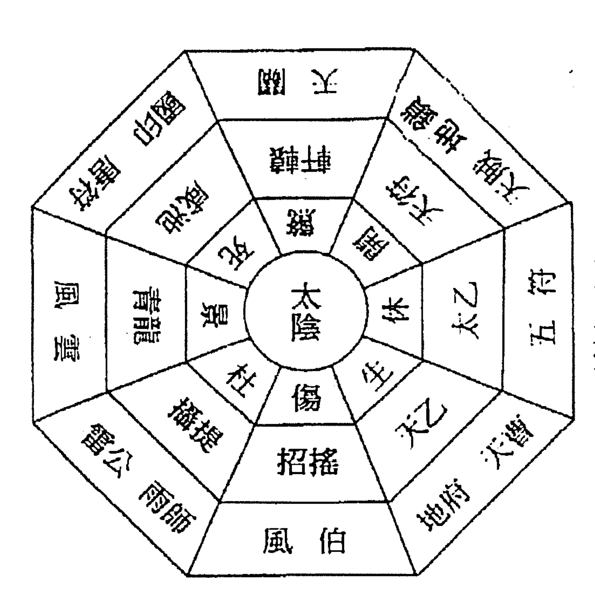
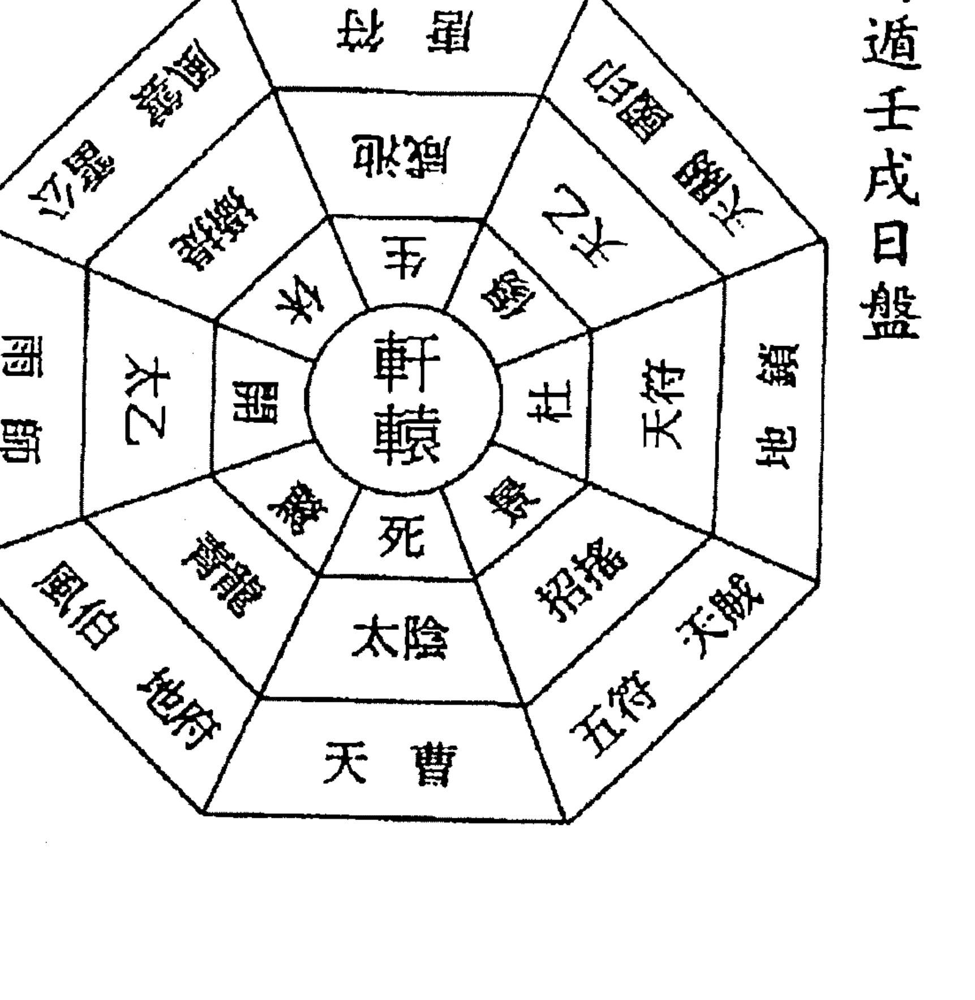
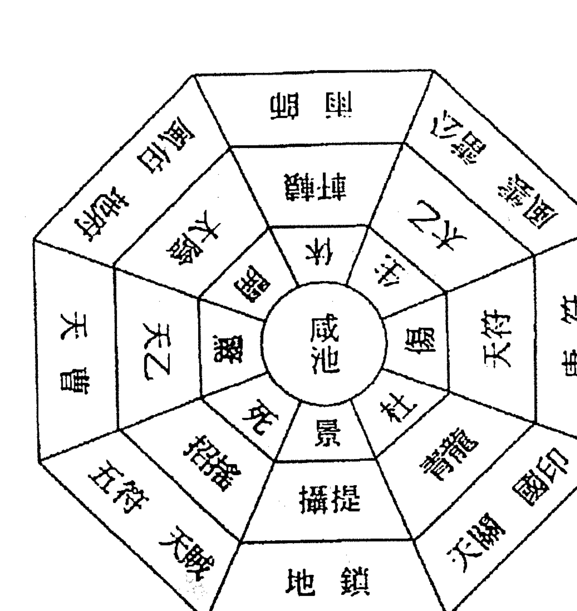
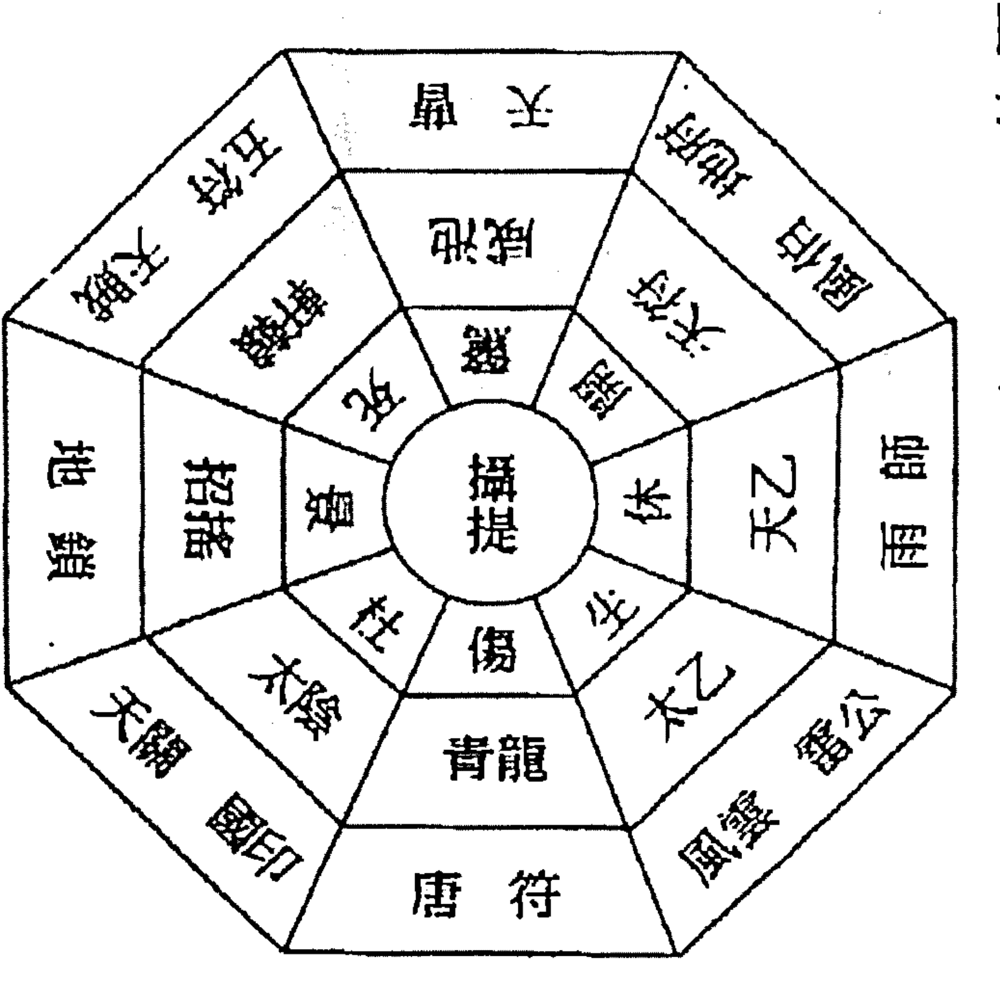

# 学奇门遁甲这本最好用

## 這是一本可以自己看得懂的奇門遁甲

您是不是買不到一本真正可以自己看得懂的奇門遁甲書？

這一本您一定看得懂，而且學得會！

從排盤到應用，用最簡單的方式編寫，易懂易學。

附奇門遁甲時盤局數表，讓您快速查閱省去翻閱通書的麻煩。

將複雜的公式、理論轉化成一般沒學過奇門遁甲的人也都看得懂的文字。

實用的公式，讓您在實際應用時，公式非常容易記，且簡單好用。

Easy Quick EQ088

內附價值1200元的排盤軟體

0秒排好年盤、月盤、日盤、時盤

# 序一

奇門遁甲學是一門沒有老師教，自己看比較不容易懂的古代成功戰略學，因為不好教也不好學，以此學術就不像八字、姓名學、紫微斗數那麼普遍，因為奇門遁甲有固定的公式，所以能夠運用電腦程式將其盤局排出，因此能夠讓學習更簡單化，於是就寫了這本書。

然而奇門遁甲的應用相當廣泛，如果不把它簡單化會覺得太可惜，所以我就運用電腦軟體的設計，將一些複雜的公式、理論轉化成一般沒學過奇門遁甲的人也都看得懂的文字，以便把此門學術推廣開來，期望能對奇門遁甲的學術探討有一層更簡單的應用。

聽說：奇門遁甲的著作很少，確實不多，又聽說：奇門遁甲這門學術很好用，不學可惜，確有這回事，難道就沒有一本自己能看得懂的奇門遁甲著作嗎？

恭喜您……找到我，把這本帶回家保證看得懂，如果看不懂也有電腦軟體會幫您啦！

黃恆堉

# 序二

奇門遁甲相傳在軒轅氏黃帝戰蚩尤時，始創奇門四千三百二十局，並令大撓定六十甲子，而分天干、地支。羲和占日，常儀占月，臾區占星，年、月、日、時自此有所依據。容成制訂曆法，而有天文學，再由風后修訂奇門遁甲為一千零八十局，才打敗能呼風喚雨又諳陰陽的蚩尤。

夏朝末年，奇門遁甲經由元始天尊的弟子姜太公刪成七十二局，輔佐武王姬發推翻紂王，而創立周朝。至秦朝末年，才由黃石公的弟子張良精簡成陽遁九局、陰遁九局共十八局，輔佐劉邦得天下。此法並流傳應用至今。

漢朝末年北極教主傳授奇門遁甲於諸葛孔明而三分天下，而後有晉朝葛洪（抱朴子），南北朝信都芳，隋朝梁有，唐朝李淳風，宋朝趙普、楊維德，元朝劉秉忠，明朝劉伯溫……等先賢都曾應用奇門遁甲輔佐明君得天下或救世助人。

奇門遁甲曾被記載於隋書經籍志，漢書藝文志，唐書經籍志，宋史藝文志，明史四庫全書和中央圖書善本書內。它是運用宇宙磁波力量、地磁學、方位學，且合乎相對論的科學。是古代兵家運籌帷幄、決勝負之兵法，亦是現代人在日常生活中不論是商場、職場、考場、求人、求事、求貴、求名、求利或旅遊度假、隱遁避災、比賽求勝、陽宅應用、開運化煞、占卜吉凶……均可應用的良方。

以前奇門遁甲的古書艱澀難懂，學習過程也倍覺困難，若非明師願意教導，自己摸索很難一窺堂奧，所幸吾先師不厭其煩傳授與我等，又逢五術怪傑——黃恒堉老師邀我一同把奇門遁甲由繁化簡，以便在日常生活上應用更能一目了然，本人不敢自珍，願將所學貢獻，以利有緣人能在最短時間內，習得先賢智慧，讀完本書並融會貫通，相信您也能趨吉避凶，直達成功的途徑。

林錦洲

丁亥年臘月謹識於台中豐原

# 奇門遁甲問事兆應及卜卦軟體使用說明

電腦開至WIN2000或XP或VISTA的桌面上

將軟體放入光碟機中會自動起動或按光碟檔案中AUTORUN執行

1、會出現奇門遁甲「試用版」後按繼續就可使用

不會安裝請電04-24521393

## 本書附贈的奇門遁甲軟體功能解說

以下有打◎均可使用預覽及列印（其他功能專業版才可執行），有意購買專業版請洽

0936286531．04-24521393 黃老師．或04-25353141．0933411186 林老師

一、問事時基本資料 時間 年 月 日 時

也可自行輸入陰陽局數（1080局）

## 二、基本奇門遁甲盤預覽及列印

◎ 1、年盤預覽 A「原盤」列印 B「分數盤」列印

◎ 2、月盤預覽 A「原盤」列印 B「分數盤」列印

◎ 3、日盤預覽 A「原盤」列印 B「分數盤」列印

◎ 4、時盤預覽 A「原盤」列印 B「分數盤」列印

5、每年之每日（365天）的各時盤財運方位預覽列印

## 三、奇門遁甲問事及兆應，不管您要問任何事只要選擇您想要的選項，電腦就會依照各盤局找出最佳的用事方位讓您得心應手

1、買賣求財、投資買賣、業務推廣、招標接單、商品銷售

2、考試推甄、入學推甄、一般考試、各類考試

3、開張、入宅、擇吉日良時、開幕開工、安機械、掛招牌、應徵人才

4、討債訴訟、借貸求見、談判、比賽、賭博

5、安神開光、動土修造、租屋、售屋

6、健康娛樂、旅行平安、約會、結婚、看病

## 四、各項事務之占卜，電腦可將各項問事的各項結果直接在奇門遁甲盤中找到答案

- □ 占求財吉凶
- ◎ □ 占購屋吉凶
- ◎ □ 占疾病吉凶
- □ 占婚姻吉凶
- □ 占考試吉凶
- □ 占旅遊吉凶
- □ 占盜賊失物
- □ 占生男生女
- □ 占開店吉凶
- □ 占合夥吉凶
- □ 占朋友來訪
- □ 占討債訴訟

## 五、預選最佳之日盤及時盤，只要輸入問事之日期區間及問事條件，電腦就會將區間內的最佳日盤及時盤按照分數高低排列出來

1、買賣求財、投資買賣、業務推廣、招標接單、商品銷售

2、考試推甄、入學推甄、一般考試、各類考試

3、開張、入宅、擇吉日良時、開幕開工、安機械、掛招牌、應徵人才

4、討債訴訟、借貸求見、談判、比賽、賭博

5、安神開光、動土修造、租屋、售屋

6、健康娛樂、旅行平安、約會、結婚、看病

## 六、館號修改及封面列印，也可印成一本精美用事命書

# 「前言」：為什麼我要寫這本書及這套軟體

學過奇門遁甲的人都知道，奇門遁甲不好學，尤其是奇門遁甲時盤，總共有1080盤，每盤組合的元素又不一樣。

到後來都懶得排盤，直接查書本，但查書本必須帶兩本書，一本是通書，一本是奇門遁甲盤局，好像很麻煩，如果查出某天某個時辰的局盤後，又需去判斷三奇、八門、九星、八神、天地對應、吉神吉格、凶神凶格及用神等，如果沒有很仔細去挑選，很容易挑錯宮位，以致弄錯方位，那當然等於是前功盡棄了。

本人以前也有如此情形發生，所以就用電腦整理所有1080局的資料，花了很長一段時間，寫了一套奇門遁甲軟體來輔助應用所需，更將每日時盤用最直接方式印成手冊，好讓讀者一目了然，省掉每天查盤時間。

作者將本書及軟體定位為工具書，俗語說：「工欲善其事，必先利其器。」平常我們要將事情辦好，如果有本工具書的參考，能讓事情更容易完成，那豈不是只花一點小錢，就能運用老祖宗的智慧，讓我們凡事都能事半功倍嗎？希望本書的問世，能讓奇門遁甲這門比較冷門的學術，引起更多人的研究及應用。

這套軟體的完成最感謝中國五術教育協會理事長洪富連老師全力教導及協助，同時也感謝中華民國奇門學會常務理事林錦洲老師實際印證指導及修正校對，才得以順利完成。

現代的社會已是快速的社會，一般人沒有太多的時間去學不容易學的學問或技術，於是本人就將每一年每天的奇門遁甲時盤排出，而且用最直接了當的方法，標示出每一個時辰的最吉方位，用分數代表，分數愈高代表該宮位愈吉，分數愈低或成負數代表該宮位愈凶。

如此一來，您將可節省許多查表的時間，這何嘗不是一種省時、省錢又容易達成目標的方法嗎？奇門遁甲最大功用是：用對時間與方位，就能感應出最佳的磁場，讓我們辦事時能有事半功倍的效果，所以老祖宗這門學問如果沒有好好運用將會太可惜！於是本人整理了許多資料，且附加奇門遁甲排盤軟體，好讓讀者靈活應用……謝謝！

# 第一章 奇門遁甲的源由

「奇門遁甲」，乃在於教導您如何有效地掌握「地球磁場變化」之最有利、最好的方法，提升您的運勢，以達趨吉避凶、扭轉劣勢、改善命運之效，進而造福家人及協助他人創造更好的佳績。

奇門遁甲之流傳根據四庫全書記載，軒轅黃帝戰蚩尤於涿鹿，夢見天神授予符訣後，命風后氏根據伏羲八卦及天地九宮之原理依河圖、洛書，製作成奇門遁甲之術總共1080局，分陽局、陰局，最後遂平定蚩尤之亂。

> 孔明曰：「不通天文是庸才也。」（為將而不通天文、不識地理、不知奇門、不曉陰陽、不看陣圖、不明兵勢、是庸才也。）

奇門遁甲之術經孔明予以增刪並分列後傳到劉伯溫手中，劉伯溫協助朱元璋建立大明江山，傳說也用奇門遁甲術。

經歷時空轉變，古代有戰爭，現代有競爭，聰明的現代人將奇門遁甲方位學運用於日常生活中來佔盡優勢，它是一門生活空間哲學。

## 第一節 何謂「奇門遁甲」

「奇門遁甲」乃是一門結合「時間」、「空間」和天時、地利、人和之學說。用以發揮無形力量，創造最佳機運，提升您的潛能，進而改造運勢和命運。並且也是一門富有挑戰性、攻擊性和創造性的學問。

奇門遁甲其實是一門磁場學的原理，因人體本身就有磁場，也就是一個小太極，能支配此磁場大小者有太陽、九大行星、地球、月球等，其行動軌道之變化影響著個人本身小太極之變化，因星球的自轉及公轉在九宮八卦裡有著各種組合，這即是奇門遁甲的應用學理。

奇門遁甲是運用天時、地利，配合人和，以創造最有利的環境。也就是說本身立於天時、地利加上人和，把握最佳優勢，爭取主動，所以遇事就能逢凶化吉，轉禍為福。簡單的說，奇門遁甲術能為本身創造更好的機會，進可攻、退可守，以達心想事成的目的。

## 第二節 「奇門遁甲」的基本定義

「奇」就是三奇，包含乙、丙、丁，用此三天干為代表。

「門」就是八門，包括休門、生門、傷門、杜門、景門、死門、驚門、開門。

「休門」代表輕鬆、愉快之地；「生門」代表源源不斷、萬事吉利；「傷門」代表資源欠缺，又有傷害、破壞之現象；「杜門」代表堵塞、陰暗、隱密；「景門」代表華麗、顯現；「死門」代表陰氣、不能生存；「驚門」代表驚險、緊張、急躁；「開門」代表突破重圍、掃除困難。

故可知以休門、生門、開門三門最吉；景門次吉，其餘傷、杜、死、驚四門代表各類凶意，除了特殊用途，少取用為妙。

「遁」就是隱避、隱藏不見之意，即遁於六儀之中。

「甲」為天干中首位，是至尊之神，也就是主事者。甲五行屬陽木，在十天干中對甲威脅最大的是庚，五行屬陽金、陽金剋陽木。為了保護甲，依五行相生相剋的原理，就必須運用他干的力量除去庚金之害。

要如何除去庚金之害，首先用乙木去跟庚金來合，因為乙庚合在五行之中，木生火，火是木的子女，用運用兒子陽火丙、女兒陰火丁來剋制庚金，以化解庚金對甲之威脅。

所以「乙、丙、丁三奇」保護甲的功勞最大，為甲最得力之助手。如此還是不安全，故隱藏於六儀之中，由六儀輪流代替甲出面，甲就藏隱於其中，就是所謂神龍見首不見尾；「甲子旬遁藏隱於戊儀」，「甲戌旬遁藏隱於庚儀」，「甲申旬遁藏隱於辛儀」，「甲午旬遁藏隱於壬儀」，「甲辰旬遁藏隱於癸儀」；如此一來甲本尊就安全無憂了。

所以當您學會使用奇門遁甲盤局時，您就可以應用三奇八門九星法來開運，以下就來介紹奇門遁甲可以用在什麼事情上。

現實社會競爭激烈、瞬息萬變，若能適當運用「奇門遁甲」之學，則能發揮潛能，提升實力，也可增加成功的機率，產生速戰速決的效果，是以現代之一「奇門遁甲」用途更為寬廣，舉凡：

◎在商場上：如接洽客戶、談判、索償、工程招標、洽接訂單、投資買賣、開市、開幕、業務推廣、商品銷售。

◎在財運上：如股市證券、偏財、彩券、比賽、標會、金融投資、房地產買賣、借貸、事業投資、財運亨通。

◎開張造勢：如擇吉日良時、開工開張、組織增員。

◎在感情上：男女夫妻和合、約會、戀愛、相親、訂婚、結婚。

◎在官場上：如應徵求職、招募員工、升遷、上任、選舉、官運步步高升。

◎在考場上：如潛能提升、入學推甄、升遷、檢定考試順利、金榜題名。

◎在健康上：如禍運去除、旅遊平安、強身保健、求醫、祛病。

◎在陽宅、陰宅：如建築、修造、裝潢、動土、破土、安神位、安床、搬家、入厝、安葬、啟攢、火化、進塔、謝土。

◎在旅遊：如娛樂、宴會、購物、休閒、出國、旅行。

◎在其他：如移民、催討訴訟、借貸求見、談判、要債、比賽、博戲、簽證等等皆可運用。

## 第三節 一位資深醫師的納悶

在二○○五年一月一日的那一天，我參加了雲林縣五術教育協會成立大會，當時理事長邀請一位中國醫藥學院畢業多年，目前擔任中醫院院長的郭醫師談到，以前在醫院實習時，經常發現夜間急診常有外傷病患就診，經過時間的統計，在某天的夜間急診就診病患中，竟然都是摔斷手的，而過兩天所有的就診病患中有九成全是摔斷腿，又過幾天有八成以上的病患是因為肚子痛而來就醫。

郭醫師很納悶就問問主任醫師，主任回答說，像這種現象一直存在很多年，主任也覺得奇怪，直到郭醫師學了中國五術的易經後才發覺到五行的巧妙變化，同時也證明了磁場因素的存在，由以上的論述，我們更可以證明這門奇門遁甲的方位學，是以提供現代人做為用事的參考，建議您可以將這本書擺在最明顯處，當需要用的時候就可以隨手一查，30秒內就可得知用事的最佳方位，相信它會幫助您在用事時，讓您得到最佳的運勢喔。

經由郭醫師的印證後，更能證實天地間確實有磁場強弱的存在，奇門遁甲乃是藉重空間與時間之組合，而感應出磁場強弱，也就是說：在某一個時間的某一個方位，會感應出不同的磁場。

奇門遁甲演變至今，可以成為現代人用事的一種方位參考學，也就是說只要在某時選定特定的好方位而去辦事，對事情的成功率會有很大的幫助。

一些人生上的大道理可以來印證奇門遁甲術一定可行。

- 因為：人靠溝通而取得共識
- 因為：社會用互動取得和諧
- 因為：生意靠服務取得信賴
- 因為：產品靠創新取得優勢
- 因為：事情要圓滿需靠方法
- 因為：生意要成必須懂策略
- 因為：策略吉凶藉重奇門遁甲

本書將運用老祖宗的智慧，用淺顯易懂的方式呈現給各位讀者，共同運用奇門遁甲來創造奇蹟。

奇門遁甲共有1080盤，每年、月、日、時的盤都不同，單要排盤就要花上10～20分鐘，而且需要查閱萬年曆（通書），有了本書以後就用這一本就夠了。

## 第四節 奇門遁甲盤所需的基本條件

接著我們來談一個標準的奇門遁甲盤需要哪些基本條件。

奇門遁甲盤的組合需有以下元素：

一、九宮→一、二、三、四、五、六、七、八、九

二、地盤→戊、己、庚、辛、壬、癸、乙、丙、丁

三、天盤→乙、丙、丁、戊、己、庚、辛、壬、癸

四、八門→休、生、傷、杜、景、死、驚、開

五、九星→天蓬、天任、天沖、天輔、天英、天芮、天柱、天心、天禽

六、八神→值符、螣蛇、太陰、勾陳、朱雀、九地、九天、六合

七、奇門吉格，奇門凶格各落於何宮

因為要分清各元素所代表之吉凶分量對初學者可能很難，以下就用分數來代表，相信可以很快且很迅速找出每一個宮位的吉凶。

| 八門 | 分數 | 天盤 | 分數 | 天地 | 分數 | 九星 | 分數 | 八神 | 分數 | 九宮 | 分數 |
|---|---|---|---|---|---|---|---|---|---|---|---|
| 休 | 10 | 乙 | +5 | 生 | +2 | 天心 | +3 | 直符 | +2 | 一白 | +1 |
| 生 | 10 | 丙 | +5 | 生 | +2 | 天輔 | +3 | 九天 | +2 | 六白 | +1 |
| 開 | 10 | 丁 | +5 | 生 | +2 | 天禽 | +2 | 九地 | +2 | 八白 | +1 |
| 景 | 6 | 戊 | +0 | 同 | +1 | 天任 | +1 | 六合 | +2 | 九紫 | +1 |
| 衝 | -6 | 己 | -0 | 同 | +1 | 天沖 | +1 | 太陰 | +2 | 二黑 | -2 |
| 杜 | -6 | 庚 | -5 | 同 | +1 | 天英 | -1 | 勾陳 | -2 | 五黃 | -2 |
| 驚 | -9 | 辛 | -3 | 剋 | -2 | 天柱 | -1 | 朱雀 | -2 | 三碧 | -1 |
| 死 | -10 | 壬 | -3 | 剋 | -2 | 天蓬 | -2 | 螣蛇 | -2 | 四綠 | -1 |
| | | 癸 | -3 | 剋 | -2 | 天芮 | -2 | | | 七赤 | -1 |

各宮星神得分一覽表

### 第五節 八門的意義及用途

九宮星指：一白、二黑、三碧、四綠、五黃、六白、七赤、八白、九紫，這九種情形依節氣時刻的不同而有所改變，其飛動順序依固定路線而移動；原則上九宮星除五黃外，均能用，五黃煞為大凶之煞，其對宮稱為暗箭煞，亦是凶煞，奇門遁甲用事應盡量避開此凶煞。

八神中，直符、太陰、六合、九地、九天為五吉神，除五黃煞及暗箭煞外，其餘不論處於何宮皆論吉；騰蛇、勾陳、朱雀為三凶神，逢之皆論凶，逢五黃煞及暗箭煞則為大凶。

八神為天將神名，是為九宮八卦之守護神，在奇門遁甲吉凶用事論斷上，有其重要的參考價值，其作用意義及其吉凶應驗如下：

以下就來解釋八門，九星，八神各代表的意義及作用

| 八門 | 開門 | 休門 | 生門 | 傷門 | 杜門 |
| :--- | :--- | :--- | :--- | :--- | :--- |
| 方位 | 六乾 金 | 一坎 水 | 八艮 土 | 三震 木 | 四巽 木 |
| 吉凶 | 吉 | 吉 | 吉 | 小凶 | 小凶 |
| 意義 | 事情開端、重新開始、公開進行、突破困難。 | 貴氣臨門、和諧安定、輕鬆休閒、解除禍厄。 | 生機活躍、新生長成、積極發展、生命旺盛。 | 奔取傷害、刑殺破壞、投機變動。 | 閉塞安靜、隱藏避難。 |
| 用途 | 新官上任、求見官貴、開市開幕、約會婚嫁、外出遠行、動工破土、祭拜祈福、官司訴訟、萬事皆吉。 | 請託求貴、學問深造、研究實驗、婚嫁情緣、溝通原諒、糾紛和解、分離聚合、關說借貸、休閒娛樂、旅遊渡假、入宅安神、百事皆吉。 | 謀職謁貴、生財獲利、借貸收債、談判洽商、逃命避難、修建營造、入宅安神、求醫治病、手術保健、祭祀祈福、人神溝通、諸事皆吉。 | 捕捉盜賊、打獵捕魚、官司刑責、賠償索債、投機奪取、創傷報復、其他破壞性質的事。 | 潛藏匿跡、隱遁埋伏、逃難避禍、秘密會商、密件遞送、隱密幽會、其他不願曝光之事。 |

| 八門 | 景門 | 死門 | 驚門 |
| :--- | :--- | :--- | :--- |
| 方位 | 九離 火 | 二坤 土 | 七兌 金 |
| 吉凶 | 吉 中 | 凶 大 | 凶 小 |
| 意義 | 華麗榮盛、虛張膨脹。 | 現象停止、事情終結。 | 驚嚇不安、緊張惶恐。 |
| 用途 | 考試面試、競選比賽、文書獻策、演講廣告、訴狀報案、社交公關、捐款散財、娛樂旅遊、購物消費。 | 招魂牽亡、弔祭送葬、行刑誅戮、破土埋葬。 | 捕捉逃犯、擒拿壞人、鎮暴壓制、興訟官司、警告逃家、博奕虛驚、悲劇玩笑、設疑驚嚇。 |

### 第六節 九星的意義及用途

| 九星 | 方位 | 吉凶 | 適用季節 | 用途 |
|---|---|---|---|---|
| 天心 | 六乾 金 | 上吉 | 秋冬吉 春夏凶 | 遠行經商、訂婚嫁娶、豎造營建、破土埋葬、出師破敵、求醫療病、祈福避災、百事皆吉。 |
| 天輔 | 四巽 木 | 上吉 | 四時皆吉 | 商賈得財、訂婚嫁娶、起造營建、破土安葬、攻守征戰、謁貴求職、移徙遠行。 |
| 天禽 | 中央 土 | 上吉 | 四時皆吉 | 賞功受爵、謁貴應舉、求親嫁娶、出師破敵、行商獲利、遷徙遠行、祭祀祈福。 |
| 天任 | 八艮 土 | 中吉 | 四時皆吉 | 求官謁貴、科舉功名、嫁娶生子、出師交戰、豎造埋葬、買賣求財、祭祀祈福、除凶離禍。 |
| 天沖 | 三震 木 | 中吉 | 春夏吉 | 出師交戰、報仇攻擊、其他行事宜春夏，不利秋冬，且宜主動積極。 |
| 天英 | 九離 火 | 小凶 | 春夏吉 | 求官謁貴、升遷應舉、社交娛樂、不利求財。 |
| 天柱 | 七兌 金 | 小凶 | 秋冬吉 春夏凶 | 屯兵藏形、築營訓士、遁跡隱形、不求名利。 |
| 天蓬 | 一坎 水 | 大凶 | 春夏吉 秋冬半凶 | 屯兵固守、謙忍守成、只宜爭訟。 |
| 天芮 | 二坤 土 | 大凶 | 秋冬吉 春夏凶 | 固守為安、拜師學藝、養精蓄銳。 |

### 第七節 八神的意義及用途

| 直符 | 九天 | 六合 | 太陰 | 九地 | 勾陳 | 朱雀 | 螣蛇 |
|---|---|---|---|---|---|---|---|
| 陽木 | 陽金 | 陰木 | 陰金 | 陰土 | 陽土 | 陽火 | 陰火 |
| 天乙貴神 (吉) | 威猛之神 (吉) | 護衛之神 | 庇蔭之神 (吉) | 堅牢之神 (吉) | 凶惡之神 (凶) | 是非之神 (凶) | 虛詐之神 (凶) |
| 諸神之首、百惡消散、諸凶寂滅。 | 剛健好動、揚眉吐氣、名正言順。 | 神性平和、媒合仲介。 | 溫和潛藏。 | 靜柔虛慕。 | 爭訟戰鬥、乖張、乖張頑固、糾纏不清。 | 口舌奸讒、形象破敗。 | 驚恐疑懼、陰沉怪異。 |
| 新官上任、謁貴求職、求財求名、營造修繕、官非興訟、有利攻擊。 | 攻擊有力、追求正財、謁貴上任。 | 婚姻媒介、調節交易、陰私避難。 | 謁貴求名、陰私藏匿、伏兵暗誘。 | 求取偏財、暗中圖謀、利於隱伏。 | 田產爭訟、糾紛爭執、橫生枝節。 | 奸細賊掠、口舌之災。 | 妖言惑眾、行事虛恍、表裡不一。 |

### 第八節 奇門遁甲吉格及用途

| 格局 | 天盤 | 地盤 | 八門 | 九宮 | 八神 | 用途 |
| :--- | :--- | :--- | :--- | :--- | :--- | :--- |
| 三奇上門 | 乙丙丁 | | 休生開 | | | 求財求利、求名求貴、百事皆吉。 |
| 日奇得使 | 乙 | | | 乾離 | | 求財求貴、婚喪喜慶、商賈交易、拜謁求職、入宅遷徙、糾紛和解、修持祈禱、宴客娛樂、諸事順利。 |
| 月奇得使 | 丙 | | | 坎坤 | | |
| 星奇得使 | 丁 | | | 巽艮 | | |
| 乙奇升殿 | 乙 | | | 震 | | 約會訂婚、職務升遷、交易洽談、官非訴訟、建築裝修、豎造埋葬、娛樂交際、增強實力、諸事大吉。 |
| 丙奇升殿 | 丙 | | | 離 | | |
| 丁奇升殿 | 丁 | | | 兌 | | |
| 真詐 | 乙丙丁 | | 休生開 | | 太陰 | 隱遁密謀、開市買賣、嫁娶官貴、修道祀禱、營造旅遊、諸事皆吉。 |
| 重詐 | 乙丙丁 | | 休生開 | | 九地 | 拜官任職、納采嫁娶、買賣求財、遠行旅遊、百事大吉。 |
| 休詐 | 乙丙丁 | | 休生開 | | 六合 | 祭祀消災、法符祛邪、醫藥康壽、合解弭謗、商賈買賣、遠行旅遊。 |
| 天遁 | 丙 | 戊 丁 | 開 生 | | | 遁跡隱形、開市求財、文書奏章、修造安葬、祭祀祈願、百事皆吉。 |
| 地遁 | 乙 | 己 | 開 | | | 遁跡隱形、陰私謀畫、修造安葬。 |
| 人遁 | 丁 | | 休 | | 太陰 | 禍貴請託、溝通談判、交易求財、探密獻策、人事和合、諸事吉利。 |
| 神遁 | 丙 | | 生 | | 九天 | 人神溝通、修塑神像、宗教法會、神佛開光、化煞驅邪、修練靜坐。 |
| 鬼遁 | 乙 | | 杜 生 | 艮 | 九地 | 埋伏偷襲、超渡驅鬼、探路偵察、使鬼計、祭祀掃墓。 |
| 雲遁 | 乙 | 辛 | 休生開 | | 九地 | 藏形避跡、遠道遠行、祭祀求雨。 |
| 風遁 | 乙 | | 休生開 | 巽 | | 廣告宣傳、約會嫁娶、揚帆遠行。 |
| 龍遁 | 乙 | | 休生開 | 坎 | | 祭祀祈雨、游泳旅行、水產養殖、造橋渡河、結婚生子、水戰攻敵。 |
| 虎遁 | 乙 | 辛 | 休 | 艮 | | 求官任職、建築基地、用計設陣、鎮邪化煞、計謀招降。 |
| 天假 | 乙丙丁 | | 景 | | 九天 | 求貴謀事、選舉應試、謁貴請託、諸兵求援、提升地位、消除禍運。 |
| 地假 | 丁己癸 | | 杜 | | 九地 太陰 六合 | 埋伏隱藏、密探間諜、躲避災難。 |
| 人假 | 壬 | | 驚 | | 九天 | 利捕人犯、逃避災難。 |
| 神假 | 丁己癸 | | 傷 | | 九地 | 祭祀祈神、安葬祭祖、求貴安神。 |
| 鬼假 | 丁己癸 | | 死 | | 九地 | 撫眾安民、超渡亡魂、祭祀化煞。 |
| 相佐 | 符首 三奇 | | | | | 求貴訪談、求才交易、娛樂遠行、建築購物。 |
| 惺怡 | 三奇 符首 | | | | | 求名求貴、求財求利、婚嫁喜事、謁貴上任、借貸買賣、移徙遠行、舉兵興訟、百事大吉。 |
| 青龍返首 | 符首 丙 | | | | | 求名求貴、求財求利、婚娶吉慶、求財求利、移徙遠行、交易借貸、豎造安葬、舉兵興訟、百事大吉。 |
| 飛鳥跌穴 | 丙 符首 | | | | | |

### 第九節 奇門遁甲凶格及用途

| 格局 | 天盤 | 地盤 | 九宮 | 用途 |
| :--- | :--- | :--- | :--- | :--- |
| 青龍逃走 | 乙 | 辛 | | 受騙破財、部屬潛逃、百事不為。 |
| 白虎猖狂 | 辛 | 乙 | | 家敗人亡、婚姻破裂、遠行災殃、修造不利、百事不吉。 |
| 螣蛇天矯 | 癸 | 丁 | | 文書牽連、官司糾紛、百事不為。 |
| 朱雀投江 | 丁 | 癸 | | 火災驚恐、文書有誤、訴訟必敗、用兵防奸。 |
| 熒惑入太白 | 丙 | 庚 | | 門戶破敗、盜賊自退。 |
| 太白入熒惑 | 庚 | 丙 | | 為客進利、為主破財、防敵偷襲。 |
| 三奇入墓 | 乙 | | 坤 | 百事不利、有奇亦不吉。 |
| | 丙 | | 乾 | |
| | 丁 | | 艮 | |
| 六儀擊刑 | 戊 | 卯（震） | | 驚惶害怕、有壓迫感、極凶不用。 |
| 天網四張 | 己 | 未（坤） | | |
| 地網遮張 | 庚 | 寅（艮） | | |
| 戰格 | 辛 | 午（離） | | |
| 伏干格 | 壬、癸 | 辰、巳（巽） | | |
| 飛干格 | 癸 | 時干 | | 血光災殃、不宜出行用兵。 |
| 伏宮格 | 壬 | 時干 | | 雙方都有大損傷。 |
| 飛宮格 | 庚 | 庚 | | 戰鬥遭擒。主客皆傷。 |
| 大格 | 庚 | 庚 | | 兩敗俱傷。大將遭擒，故宜固守。人財兩破、忌用事遠行。 |

### 玉女守門時

甲己日庚午時、乙庚日己卯時、丙辛日戊子時或丁酉時、丁壬日丙午時、戊癸日乙卯時。

| 上格 | 刑格 | 奇格 | 戩格 | 月格（月朔） | 日格（日干） | 時格 | 符勃 | 飛勃 |
|---|---|---|---|---|---|---|---|---|
| 庚 | 庚 | 庚 | 庚 | 庚 | 庚 | 庚 | 丙 | 時干 |
| 壬 | 己 | 三奇 | 年干 | 月干 | 日干 | 時干 | 甲 | 丙 |
| 不宜行師。 | 失名、破財、疾病。 | 忌用吉事。 | 用事凶。 | 綱紀紊亂。 | | | | |

伏吟格 九星伏吟，直符伏吟 天地盤的八門、九星、直符皆在本宮不動。扣 3 分（時盤）

反伏吟 九星反吟，直符反吟 天地盤的八門、九星、直符入對宮。扣 3 分（時盤）

伏吟、反吟格令人痛苦憂疑、財利難成、婚姻不成、諸事皆凶。

五不過時 ：指時天干剋日干，陰剋陰、陽剋陽。忌就職、遠行、出兵修造。

甲日庚午時 乙日辛巳時 丙日壬辰時 丁日癸卯時 戊日甲寅時
己日乙丑時 庚日丙子時 辛日丁酉時 壬日戊申時 癸日己未時

### ◎奇門遁甲盤的組合需有以下元素

要在奇門遁甲盤中找出最佳方位，一定要知道該宮位哪些是吉神，哪些是凶神，以下我們直接將其標示出來：

- 一、九宮→一、二、三、四、五、六、七、八、九——（一、六、八、九為吉）
- 二、地盤→戊、己、庚、辛、壬、癸、乙、丙、丁——（乙、丙、丁為吉）
- 三、天盤→乙、丙、丁、戊、己、庚、辛、壬、癸——（乙、丙、丁為吉）
- 四、八門→休、生、傷、杜、景、死、驚、開——（休、生、開、景為吉）
- 五、九星→天蓬、任、沖、輔、英、芮、柱、心、禽——（天心、輔、禽、任、沖為吉）
- 六、八神→值符、騰蛇、太陰、勾陳、朱雀、九地、九天——（值符、九天、九地、六合、太陰為吉）
- 七、奇門吉格，奇門凶格各落於何宮

奇門遁甲的吉格：飛鳥跌穴、青龍返首、玉女守門、天遁、地遁、人遁、雲遁、風遁、龍遁、虎遁、神遁、真詐、重詐、休詐等等為吉。

奇門遁甲盤的看法與用法就是，在哪一個宮位吉星愈多（分數愈高）代表該宮位愈佳（本書所附之奇門遁甲盤已將1080盤之各宮分數統計出來以便各位讀者查閱）。

| 八門 | 分數 | 天盤 | 分數 | 天地 | 分數 | 九星 | 分數 | 八神 | 分數 | 九宮 | 分數 |
| :--- | :--- | :--- | :--- | :--- | :--- | :--- | :--- | :--- | :--- | :--- | :--- |
| 休 | 10 | 乙 | +5 | 生 | +2 | 天心 | +3 | 直符 | +2 | 一白 | +1 |
| 生 | 10 | 丙 | +5 | 生 | +2 | 天輔 | +3 | 九天 | +2 | 六白 | +1 |
| 開 | 10 | 丁 | +5 | 生 | +2 | 天禽 | +2 | 九地 | +2 | 八白 | +1 |
| 景 | 6 | 戊 | +0 | 同 | +1 | 天任 | +1 | 六合 | +2 | 九紫 | +1 |
| 傷 | -6 | 己 | -0 | 同 | +1 | 天沖 | +1 | 太陰 | +2 | 二黑 | -2 |
| 杜 | -6 | 庚 | -5 | 同 | +1 | 天英 | -1 | 勾陳 | -2 | 五黃 | -2 |
| 驚 | -9 | 辛 | -3 | 剋 | -2 | 天柱 | -1 | 朱雀 | -2 | 三碧 | -1 |
| 死 | -10 | 壬 | -3 | 剋 | -2 | 天蓬 | -2 | 螣蛇 | -2 | 四綠 | -1 |
| | | 癸 | -3 | 剋 | -2 | 天芮 | -2 | | | 七赤 | -1 |

# 第二章

# 奇門遁甲之年、月、日、時盤局數的排法

## 第一節 奇門遁甲年盤局數求法

首先定陰陽局數
13年～72年＝中元
73年～132年＝下元
133年～193年＝上元

在製作遁甲盤前，要先決定局數，局數有陽九局、陰九局，共十八局。局數的決定，因年、月、日、時等盤而不同。

年盤求法：一年一局，全用陰局逆行，一八〇年為一週期，分上元、中元、下元，每元六十年。

「上元甲子起陰一局，中元甲子起陰四局，下元甲子起陰七局。」例如下元甲子年為陰七局，乙丑年為陰六局，丙寅年為陰五局……依次類推。（見下表）

| 干支 | 上元 | 中元 | 下元 | 干支 | 上元 | 中元 | 下元 | 干支 | 上元 | 中元 | 下元 |
|---|---|---|---|---|---|---|---|---|---|---|---|
| 甲子 | 1 | 4 | 7 | 甲申 | 8 | 2 | 5 | 甲辰 | 6 | 9 | 3 |
| 乙丑 | 9 | 3 | 6 | 乙酉 | 7 | 1 | 4 | 乙巳 | 5 | 8 | 2 |
| 丙寅 | 8 | 2 | 5 | 丙戌 | 6 | 9 | 3 | 丙午 | 4 | 7 | 1 |
| 丁卯 | 7 | 1 | 4 | 丁亥 | 5 | 8 | 2 | 丁未 | 3 | 6 | 9 |
| 戊辰 | 6 | 9 | 3 | 戊子 | 4 | 7 | 1 | 戊申 | 2 | 5 | 8 |
| 己巳 | 5 | 8 | 2 | 己丑 | 3 | 6 | 9 | 己酉 | 1 | 4 | 7 |
| 庚午 | 4 | 7 | 1 | 庚寅 | 2 | 5 | 8 | 庚戌 | 9 | 3 | 6 |
| 辛未 | 3 | 6 | 9 | 辛卯 | 1 | 4 | 7 | 辛亥 | 8 | 2 | 5 |
| 壬申 | 2 | 5 | 8 | 壬辰 | 9 | 3 | 6 | 壬子 | 7 | 1 | 4 |
| 癸酉 | 1 | 4 | 7 | 癸巳 | 8 | 2 | 5 | 癸丑 | 6 | 9 | 3 |
| 甲戌 | 9 | 3 | 6 | 甲午 | 7 | 1 | 4 | 甲寅 | 5 | 8 | 2 |
| 乙亥 | 8 | 2 | 5 | 乙未 | 6 | 9 | 3 | 乙卯 | 4 | 7 | 1 |
| 丙子 | 7 | 1 | 4 | 丙申 | 5 | 8 | 2 | 丙辰 | 3 | 6 | 9 |
| 丁丑 | 6 | 9 | 3 | 丁酉 | 4 | 7 | 1 | 丁巳 | 2 | 5 | 8 |
| 戊寅 | 5 | 8 | 2 | 戊戌 | 3 | 6 | 9 | 戊午 | 1 | 4 | 7 |
| 己卯 | 4 | 7 | 1 | 己亥 | 2 | 5 | 8 | 己未 | 9 | 3 | 6 |
| 庚辰 | 3 | 6 | 9 | 庚子 | 1 | 4 | 7 | 庚申 | 8 | 2 | 5 |
| 辛巳 | 2 | 5 | 8 | 辛丑 | 9 | 3 | 6 | 辛酉 | 7 | 1 | 4 |
| 壬午 | 1 | 4 | 7 | 壬寅 | 8 | 2 | 5 | 壬戌 | 6 | 9 | 3 |
| 癸未 | 9 | 3 | 6 | 癸卯 | 7 | 1 | 4 | 癸亥 | 5 | 8 | 2 |

## 第二節 奇門遁甲月盤局數求法

月盤求法：一月一局，至用陰局逆行，三十六個月為一週期，分孟年即寅申巳亥年，仲年即子午卯酉年，季年即辰戌丑未年，每年十二個月。例如：丙戌年正月為陰五局，二月為陰四局，三月為陰三局……至十二月為陰二局，丁亥年正月為陰二局，二月為陰一局，三月為陰九局……依此類推。（見下表）

| 月份 | 孟年即寅申巳亥年 | 仲年即子午卯酉年 | 季年即辰戌丑未年 |
| :---: | :---: | :---: | :---: |
| 正 | 二 | 八 | 五 |
| 二 | 一 | 七 | 四 |
| 三 | 九 | 六 | 三 |
| 四 | 八 | 五 | 二 |
| 五 | 七 | 四 | 一 |
| 六 | 六 | 三 | 九 |
| 七 | 五 | 二 | 八 |
| 八 | 四 | 一 | 七 |
| 九 | 三 | 九 | 六 |
| 十 | 二 | 八 | 五 |
| 十一 | 一 | 七 | 四 |
| 十二 | 九 | 六 | 三 |

## 第三節 奇門遁甲日盤局數求法

奇門遁甲日盤流傳的方法有很多種，本書是依據清朝《古今圖書集成》所收錄之日家奇門遁甲法所編著。

日家奇門遁甲日盤以冬至和夏至分陽遁和陰遁，換遁日以近冬至或夏至的甲日干為基準。

### 一、奇門遁甲日盤的超神、接氣與正授：

凡是冬至或夏至當天的日干是乙、丙、丁、戊、己，則在乙日的前一天甲日起換遁，謂之超神。

如果冬至或夏至當天的日干是庚、辛、壬、癸，則在癸日的後一天甲日才換遁，謂之接氣。

倘若冬至或夏至當天的日干剛好是甲日，則在當天換遁，謂之正授。

例如戊子年的夏至是國曆6月21日，干支為壬辰，則在6月23日甲午日起換陽遁，稱為接氣。

又如戊子年的冬至是國曆12月21日，干支為乙未，則在12月20日甲午日起換陽遁，即為超神。

上一次的正授在甲申年的冬至，是國曆12月21日甲戌日。

下一次的正授在丙申年的夏至，是國曆6月21日甲戌日。

### 二、奇門遁甲日盤的排法：

奇門遁甲日盤由八門、九星、十二神組合而成。

奇門遁甲日盤八門為：休、生、傷、杜、景、死、驚、開順佈八方。

奇門遁甲日盤九星為：太乙、攝提、軒轅、招搖、天符、青龍、咸池、太陰、天乙，陽遁順飛九宮，陰遁逆飛九宮。

奇門遁甲日盤十二神為：五符、天曹、地府、風伯、雨師、雷公、風雲、唐符、國印、天關、地鎖、天賊順行十二地支。

1，冬至后陽遁日盤八門順佈八方起例：

甲戊壬子坎上休，丁辛乙卯向坤求，戊庚甲馬歸震位，丁癸辛雞巽上搜，丙庚鼠行乾天上，己癸兔居水澤幽，壬丙馬行山上路，乙己雞與火為儔。

其法一卦管三日，即甲子、乙丑、丙寅三日，戊子、己丑、庚寅三日，壬子、癸丑、甲寅三日，共九日坎宮起休門，艮宮佈生門，震宮佈傷門，順行八宮，順佈杜門、景門、死門、驚門、開門……餘仿此。

2，夏至后陰遁日盤八門順佈八方起例：

甲戊壬子九宮求，丁辛乙卯艮八收，戊庚甲馬兌上坐，丁癸辛雞向乾遊，丙庚二子巽位立，己癸二兔震宮收，壬丙二馬坤宮站，乙己雞飛水上浮。

其法一卦管三日，即甲子、乙丑、丙寅三日，戊子、己丑、庚寅三日，壬子、癸丑、甲寅三日，共九日離宮起休門，坤宮佈生門，兌宮佈傷門，順行八宮，順佈杜門、景門、死門、驚門、開門……餘仿此。

3，冬至后阳遁日盘九星顺飞九宫起例：

甲子山前起艮，甲戌离上横行，甲申坎宫顺数，甲午坤宫发动，甲辰震雷吐雾，甲寅巽上生风。

其法依每旬旬首起的方位顺行九宫，顺佈九星。即甲子日自艮宫起太乙，乙丑日自离宫起太乙，丙寅日自坎宫起太乙……餘仿此。

4，夏至后阴遁日盘九星逆飞九宫起例：

甲子起逐老母，狗儿戏水腾波，猿猴马上笑呵呵，甲午艮宫独乐，甲辰兑上寻觅，甲寅向乾位无那。

其法依每旬旬首起的方位逆行九宫，顺佈九星。即甲子日自坤宫起太乙，乙丑日自坎宫起太乙，丙寅日自离宫起太乙……餘仿此。

5，十二神顺布十二地支起例：

甲日起寅乙日卯，丙戊在巳丁己午，庚日申位辛入酉，壬亥癸子是五符，天曹地府風伯來，雨師風雲唐符動，國印天關地賊至，陰陽順佈十二支。

其法即甲日自寅位起五符，乙日自卯位起五符，丙日和戊日都從巳位起五符……餘仿此順行十二地支。

### ◎陽遁辛巳日盤

日盤八門為：休、生、傷、杜、景、死、驚、開順佈八方。
日盤九星為：太乙、攝提、軒轅、招搖、天符、青龍、咸池、太陰、天乙，陽遁順飛九宮。
日盤十二神為：五符、天曹、地府、風伯、雨師、雷公、風雲、唐符、國印、天關、地鎖、天賊順行十二地支。

### ◎陽遁壬戌日盤

日盤八門為：休、生、傷、杜、景、死、驚、開順佈八方。
日盤九星為：太乙、攝提、軒轅、招搖、天符、青龍、咸池、太陰、天乙，陽遁順飛九宮。
日盤十二神為：五符、天曹、地府、風伯、雨師、雷公、風雲、唐符、國印、天關、地鎖、天賊順行十二地支。

### ◎陰遁甲子日盤

日盤八門為：休、生、傷、杜、景、死、驚、開順佈八方。
日盤九星為：太乙、攝提、軒轅、招搖、天符、青龍、咸池、太陰、天乙，陰遁逆飛九宮。
日盤十二神為：五符、天曹、地府、風伯、雨師、雷公、風雲、唐符、國印、天關、地鎖、天賊順行十二地支。

### ◎陰遁丙申日盤

## 第四節 奇門遁甲時盤局數求法

奇門遁甲以「時」盤為主，吉凶剋應的「時辰」為應驗點。

時盤以冬至上元甲子時起陽一局（甲子時必由甲、己日起），每六十個時辰為一局，即甲子、乙丑、丙寅……癸亥，共六十時辰為陽一局。

上元五日六十時，自陽一局起。中元甲子時起陽七局。下元甲子時則起陽四局。

- 陰局
  - 夏至管理局裡分上元、中元、下元
  - 小暑管理局裡分上元、中元、下元
  - 大暑管理局裡分上元、中元、下元

- 陽局
  - 冬至管理局裡分上元、中元、下元
  - 小寒管理局裡分上元、中元、下元
  - 大寒管理局裡分上元、中元、下元

### ◎ 超接置閏

煙波釣叟歌曰：「陰陽逆順妙無窮，二至還鄉一九宮。若能了達陰陽理，天地都來一掌中。」其意即太極靜而生陰，動而生陽，且陰中有陽，陽中有陰，先有陰後有陽。故冬至後，陽爻升，氣則順行；到夏至後，陰爻起，而逆行其氣，此大自然之理妙難窮也。故此二至（冬至、夏至），一陽生於「子」，故冬至節居一宮（坎）；一陰生於午，故夏至節居九宮（離）。若能了解此節氣陰陽變化之理，就能徹悟天地之道矣。

### ◎ 奇門遁甲二十四節氣陰陽遁局數

| 月份 | 節氣 | 類型 | 陰陽遁 | 上元 | 中元 | 下元 |
| :--- | :--- | :--- | :--- | :--- | :--- | :--- |
| 十一月 | 冬至 | 中 | 陽遁 | 1 | 7 | 4 |
| 十二月 | 小寒 | 節 | 陽遁 | 2 | 8 | 5 |
| 十二月 | 大寒 | 中 | 陽遁 | 3 | 9 | 6 |
| 一月 | 立春 | 節 | 陽遁 | 8 | 5 | 2 |
| 一月 | 雨水 | 中 | 陽遁 | 9 | 6 | 3 |
| 二月 | 驚蟄 | 節 | 陽遁 | 1 | 7 | 4 |
| 二月 | 春分 | 中 | 陽遁 | 3 | 9 | 6 |
| 三月 | 清明 | 節 | 陽遁 | 4 | 1 | 7 |
| 三月 | 穀雨 | 中 | 陽遁 | 5 | 2 | 8 |
| 四月 | 立夏 | 節 | 陽遁 | 4 | 1 | 7 |
| 四月 | 小滿 | 中 | 陽遁 | 5 | 2 | 8 |
| 五月 | 芒種 | 節 | 陽遁 | 6 | 3 | 9 |
| 五月 | 夏至 | 中 | 陰遁 | 9 | 3 | 6 |
| 六月 | 小暑 | 節 | 陰遁 | 8 | 2 | 5 |
| 六月 | 大暑 | 中 | 陰遁 | 7 | 1 | 4 |
| 七月 | 立秋 | 節 | 陰遁 | 2 | 5 | 8 |
| 七月 | 處暑 | 中 | 陰遁 | 1 | 4 | 7 |
| 八月 | 白露 | 節 | 陰遁 | 9 | 3 | 6 |
| 八月 | 秋分 | 中 | 陰遁 | 7 | 1 | 4 |
| 九月 | 寒露 | 節 | 陰遁 | 6 | 9 | 3 |
| 九月 | 霜降 | 中 | 陰遁 | 5 | 8 | 2 |
| 十月 | 立冬 | 節 | 陰遁 | 6 | 9 | 3 |
| 十月 | 小雪 | 中 | 陰遁 | 5 | 8 | 2 |
| 十一月 | 大雪 | 節 | 陰遁 | 4 | 7 | 1 |

在時盤求法中，有「超接置閏」之法。由於一年三百六十五日，三百六十日為一週期，多出的五日，經三年就多出十五日，故時盤每三年多一閏局，亦即在冬至或夏至前置閏；差距在九天以上時，則必須再置一閏局（此為奇門曆法的閏月），稱閏大雪上中下元或閏芒種上中下元。

下列有幾個名詞要了解：

- 符頭：甲己配四仲日，即甲子、己卯、甲午、己酉。
- 正授：節氣與符頭同時到，即冬至或夏至之日，其干支正好是甲子、己卯、甲午己酉日，謂之「正授」。
- 超神：即節或中氣未到，符頭先到。
- 接氣：即節或中氣先到，符頭未到。
- 置閏：即超神超過九天以上，就要多置一閏局，謂之「置閏」。而置閏必須在大雪過後、冬至之前，和芒種過後、夏至之前進行。

通常正授以後為超神，超神超過九天要置閏，置閏後才接氣。

# 第二章 奇門遁甲排盤步驟

## 第一節 先定局數、陽局或陰局

陽局——以年或月或日或時來決定陰，陽局

陽局：有九局（順行）

| 9 | 5 | 7 |
|---|---|---|
| 8 | 1 | 3 |
| 4 | 6 | 2 |

方位圖

| 四巽 東南 | 九離 南 | 二坤 西南 |
|---|---|---|
| 三震 東 | 五 | 七兑 西 |
| 八艮 東北 | 一坎 北 | 六乾 西北 |

陰局：有九局（逆行）

| 2 | 6 | 4 |
|---|---|---|
| 3 | 1 | 8 |
| 7 | 5 | 9 |

## 第二節 地盤排法（用三奇六儀代入）

1、陽局順佈，陰局逆佈。

2、陽一局將戊排入一坎（參考方位圖），陽二局將戊排入二坤，陽三局將戊排入三震，以此類推，然後順佈六儀（戊己庚辛壬癸），順佈三奇（丁丙乙）。

| 七 己 | 五 乙 | 九 辛 |
| 三 丁 | 一 壬 | 八 庚 |
| 二 癸 | 六 戊 | 四 丙 |

此為陽一局佈法（順佈六儀順佈三奇）

| 八 戊 | 六 丙 | 一 庚 |
| 四 癸 | 二 辛 | 九 己 |
| 三 壬 | 七 乙 | 五 丁 |

此為陽二局佈法（順佈六儀順佈三奇）

3、陰三局將戊排入三震、陰四局將戊排入四巽、陰五局將戊排入中宮，以此類推，然後逆佈六儀（戊己庚辛壬癸），逆佈三奇（丁丙乙）。

| 九 己 | 七 辛 | 二 乙 |
| 五 癸 | 三 丙 | 一 戊 |
| 四 丁 | 八 庚 | 六 壬 |

此為陰三局佈法（逆佈六儀逆佈三奇）

| 三 壬 | 一 丁 | 五 庚 |
| 八 乙 | 六 己 | 四 辛 |
| 七 戊 | 二 癸 | 九 丙 |

此為陰六局佈法（逆佈六儀逆佈三奇）

## 第三節 天盤排法（佈三奇六儀）

1、依用時之干支查出旬首及符首。

| 旬首 | 旬 | 符首 |
|---|---|---|
| 甲子 | 乙丑 丙寅 丁卯 戊辰 己巳 庚午 辛未 壬申 癸酉 | 戊 |
| 甲戌 | 乙亥 丙子 丁丑 戊寅 己卯 庚辰 辛巳 壬午 癸未 | 己 |
| 甲申 | 乙酉 丙戌 丁亥 戊子 己丑 庚寅 辛卯 壬辰 癸巳 | 庚 |
| 甲午 | 乙未 丙申 丁酉 戊戌 己亥 庚子 辛丑 壬寅 癸卯 | 辛 |
| 甲辰 | 乙巳 丙午 丁未 戊申 己酉 庚戌 辛亥 壬子 癸丑 | 壬 |
| 甲寅 | 乙卯 丙辰 丁巳 戊午 己未 庚申 辛酉 壬戌 癸亥 | 癸 |

2、將符首加在地盤的用時干上，依陽順陰逆之法布入，即得天盤之天干

例如陽九局戊寅時：將用時「戊寅」之符首「己」（查上表），加在地盤「戊」（時干）上，再以地盤的「己」順時鐘佈局原地盤干之順序，所以在戊的上方放入己，然後再依地盤己、乙、辛、壬、戊、庚、丙、丁的順序放到戊、庚、丙、丁、己、乙、辛、壬之上，中宮癸地盤寄在坤二宮，在庚位旁註明「癸」，天盤癸跟著庚來到艮八宮，因此在天盤庚位旁註明「癸」，即為該局之天盤。

又如陰九局丁巳時：將用時「丁巳」之符首「癸」（查上表），加在地盤「丁」（時干）上，再以地盤的天干癸順時鐘佈局原地盤干之順序，所以在丁的上方放入癸，然後再依地盤癸、戊、丙、庚、辛、乙、己、丁放到丁、癸、戊、丙、庚、辛、乙、己上，中宮壬地盤寄在坤二宮，在丙位旁註明「壬」，天盤壬跟著丙來到離九宮，因此在天盤丙位旁註明「壬」，即為該局之天盤。

| 戊 癸 | 丙(壬) 戊 | 庚 丙(壬) |
| 癸 丁 | 壬 | 辛 庚 |
| 丁 己 | 己 乙 | 乙 辛 |

| 丁 壬 | 己 戊 | 乙 庚(癸) |
| 丙 辛 | 癸 | 辛 丙 |
| 庚(癸) 乙 | 戊 己 | 壬 丁 |

### 3、旬首入中宮的排法

旬首入中宮或時干入中宮，其天盤排法是把中宮寄往「坤」一位。

例如陰九局乙巳時，乙巳時的符首為「壬」在中宮，那就以壬寄往坤位，然後以坤宮的「丙」和「壬」，加在地盤用時「乙」上，即成。

再以地盤的丙、庚、辛、乙、己、丁、癸、戊之順序佈在地盤的乙、己、丁、癸、戊、丙、庚、辛上面，中宮壬跟著丙來到坎一宮，因此在丙附加「壬」，即為該局之天盤。

| 丁 丙(壬) | 己 戊 | 乙 癸 |
| 癸 庚 | 壬 | 辛 丁 |
| 戊 辛 | 丙(壬) 乙 | 庚 己 |

## 第四節 八門的排法

八門順序，即休門（坎一）、生門（艮八）、傷門（震三）、杜門（巽四）、景門（離九）、死門（坤二）、驚門（兌七）、開門（乾六）。

1、原始八門宮位，以地盤符首所在宮位而定，即陰陽原位相同。

### 2、天盤八門定法

先看用時之符首所臨位置，為原始八門的何門（即為直使），再以旬首之支數到用時之支，陽順陰逆逢中宮寄坤，即為天盤八門直使之位。

| 二死 | 九景 | 四杜 |
| 七驚 | 五 | 三傷 |
| 六開 | 一休 | 八生 |

八門圖（一）

如果是五則归二坤死

例如陽一局戊午時：旬首為甲寅 用時「戊午」，符首為「癸」，在乾六（即直使為六開門）請對照八門圖（一）。

| 景己 | 杜乙 | 傷辛 |
| 死丁 | 壬 | 生庚 |
| 驚癸 | 開戊 | 休丙 |

將句首地支寅（六）順數到用時的地支午為「一坎」，再將「開」放入「一坎」的位置然後順佈八門。

開、休、生、傷、杜、景、死、驚，八門即完成佈局。

| 九巳 | 一午 | 未 | 申 |
| 八辰 | | | 酉 |
| 七卯 | | | 戌 |
| 六寅 | 丑 | 子 | 亥 |

例如陽九局己未時：旬首為甲寅 用時「己未」，符首為「癸」入中為五，如果是五則归二坤死

將旬首地支寅（五）順數到用時的地支未為「二坎」再將「死」放入「二坎」的位置然後順佈八門。

死、驚、開、休、生、傷、杜、景、八門即完成佈局。

| 休 壬 | 生 戊 | 傷 庚 |
| 開 辛 | 癸 | 杜 丙 |
| 驚 乙 | 死 己 | 景 丁 |

| 八巳 | 九午 | 一未 | 申 |
| 七辰 | | | 酉 |
| 六卯 | | | 戌 |
| 五寅 | 丑 | 子 | 亥 |

例如陰七局戊申時：旬首為甲辰 用時「戊申」，符首為「壬」，在震三（即直使為三傷門）請對照八門圖（一）。

| 驚 癸 | 死 丙 | 景 辛 |
| 開 戊 | 庚 | 杜 壬 |
| 休 己 | 生 丁 | 傷 乙 |

將「旬首地支辰（三）逆數到用時的地支申為「八艮」，再將「傷」放入「八艮」的位置然後順佈八門。

| 二巳 | 一午 | 九未 | 八申 |
| 三辰 | | | 酉 |
| 卯 | | | 戌 |
| 寅 | 丑 | 子 | 亥 |

傷、杜、景、死、驚、開、休、生、八門即完成佈局。

## 第五節 九星排法

九星順序為：天蓬（坎一）、天芮（坤二）、天沖（震三）、天輔（巽四）、天禽（中五）、天心（乾六）、天柱（兌七）、天任（艮八）、天英（離九）。

1、原始九星宮位，陰陽原位相同。

| 芮 | 英 | 輔 |
|---|---|---|
| 柱 | 禽 | 沖 |
| 心 | 蓬 | 任 |

### 2、天盤九星定法

先看符首所臨位置，為原始九星的何宮位（即為直符），再加於地盤的時干上，依蓬、任、沖、輔、英、芮、柱、心、禽之順序排佈，即完成排盤。

例如：陽一局戊午時：用時「戊午」，符首「癸」在乾（天心），將「心」加在地盤時干「戊」上，然後依序排佈，完成九星之佈局。

| 英己 | 芮丁 | 柱癸 |
| 輔乙 | 禽壬 | 心戊 |
| 沖辛 | 任庚 | 蓬丙 |

例如：陰七局戊申時：用時「戊申」，符首「壬」在震（天沖），將「沖」加在地盤時干「戊」上，然後依序排佈，完成九星之佈局。

| 任癸 | 沖戊 | 輔己 |
| 蓬丙 | 禽庚 | 英丁 |
| 心辛 | 柱壬 | 芮乙 |

## 第六節 八神的排法

八神亦稱「八詐門」，順序為：直符、騰蛇、太陰、六合、勾陳、朱雀、九地、九天。簡稱「符、蛇、陰、合、陳、雀、地、天」。

八神之首宮在天盤符首位置，只要依所定之局，將「直符」字佈入，然後陽順陰逆，即完成佈局。

例如陽九局：庚戌日、辛巳時：辛巳時的時干，「辛」在震三宮，故八神之首宮為震三宮。將「符」字佈入，順時針方向將其他七神分別佈入，即完成八神佈局。

| 合庚 | 陰戊 | 蛇壬 |
| 陳丙 | 癸 | 符辛 |
| 雀丁 | 地己 | 天乙 |

### 八神佈局有陰佈與陽佈之分

例如陰八局：辛巳日、乙未時：乙未時的時干「乙」在離九宮，故八神之首宮為離九宮。將「符」字佈入，逆時針方向將其他七神分別佈入，即完成八神佈局。

| 天丁 | 符乙 | 蛇壬 |
|---|---|---|
| 地己 | 辛 | 陰癸 |
| 雀庚 | 陳丙 | 合戊 |

## 第七節 奇門遁甲年盤製作範例

104年陰三局：乙未年
句首＝甲午：符首＝辛

| 辛 符 二 相佐 八門克 天地克 白虎 乙 馬 英 | 己 天 七 八門克 天地生 辛 開 芮 | 癸 地 九 八門克 天地克 己 休 柱 |
|---|---|---|
| 乙 蛇 一 乙奇 八門克 天地克 戊 死 輔 | 丙 禽 | 丁 雀 五 三奇 丁奇 八門生 天地克 朱雀 癸 生 心 |
| 戊 陰 六 八門生 天地克 壬 景 沖 | 壬 合 八 八門生 天地生 庚 杜 任 | 庚 陳 四 八門克 天地克 奇格 丁 傷 蓬 |

1、年盤一律用陰遁：得為陰三局；三入中宮。
2、排地盤，將戊排入「三震」位置，然後逆佈六儀三奇。
3、排天盤，找出符首→「辛」放入年干（地盤）的上方，後順排天盤。
4、排八門，找出符首（辛）在地盤為九離（景門），然後將九由旬首地支逆算至年支看為何宮，再將景門排入該宮。
5、排九星，找出符首「辛」套入地盤得天英，再由天英排入地盤年干乙落宮即巽四宮順佈九星。
6、排八神，找出符首「辛」直接將直符套入天盤符首位一律逆行。

## 第八節 奇門遁甲月盤製作範例

93年8月：甲申年：癸酉月：陰四局
旬首＝甲子；符首＝戊

| 戊(乙) 地 三 | 丁 異 八 | 丙 戌 一 |
|---|---|---|
| 八門伏、天地生 伏宮 | 八門伏、天地旺 | 八門伏、天地旺 變惑 |
| 戊 杜 芮 | 壬 景 柱 | 戊(乙) 死 心 |
| 壬 天 二 | 四 | 中 合 六 |
| 八門伏、天地旺 | | 八門伏、天地旺 |
| 己 傳 英 | 乙 六 | 丁 瑞 旌 |
| 戊 符 七 | 巳 蛇 九 | 癸 陰 五 |
| 八門伏、天地旺 | 八門伏、天地生 | 八門伏、天地旺 |
| 癸 生 蓬 | 辛 休 沖 | 丙 陽 任 |

1、月盤一律用陰遁，得為陰四局，四入中宮。
2、排地盤，將戊排入「四巽」位置，然後逆佈六儀三奇。
3、排天盤，找出符首「戊」放入月干（地盤）的上方，後順排天盤。
4、排八門，找出符首「戊」在地盤為四巽（杜門），然後將四由旬首地支逆算至月支看為何宮，再將杜門排入該宮。
5、排九星，找出符首「戊」套入地盤得天輔，再用天輔套入天盤「戊」位，順佈九星。
6、排八神，找出符首「戊」直接將直符套入天盤符首位一律逆行，逆佈八神。

## 第九節 奇門遁甲日盤製作範例

97年7月23日：戊子年：己未月：甲子日：陰遁

1、定陰陽局：本日在夏至後為陰遁。
2、排八門：依起例得知，甲子日自離宮起休門，坤宮佈生門。
3、排九星：依起例得知，甲子日自坤宮起太乙後，依攝提、軒轅、招搖、天符、青龍、咸池、太陰、天乙，逆飛九宮。
4、排十二神：依起例得知，甲日自寅位起五符後，依天曹、地符、風伯、雨師、雷公、風雲、唐符、國印、天開、地鎖、天賊，順佈十二地支。
5、再找吉星和凶星。

### ◎九星法製作範例

93年10月6日；甲申年；癸酉月；
戊午日；陰三局
旬首＝甲寅；符首＝癸

| 丁 天 二 三奇、生奇 八門剋、天地生、八門反、九星反 乙 開 心 | 庚 地 七 八門剋、天地合、八門反、九星反 辛 休 蓬 | 壬 省 九 八門合、天地剋、八門反、九星反 己(丙) 生 任 |
|---|---|---|
| 癸 符 一 八門剋、天地剋、八門反、九星反 戊 驚 柱 | 三 丙 禽 | 戊 陳 五 八門剋、天地剋、八門反、九星反 癸 傷 沖 |
| 己(丙) 蛇 六 八門合、天地剋、八門反、九星反 壬 死 芮 | 辛 陰 八 八門剋、天地合、八門反、九星反 庚 景 英 | 乙 合 四 八門剋、天地生、八門反、九星反 丁 杜 輔 |

1、定陰陽局；本日為陰三局；三入中宮。
2、排地盤，將戊排入「三震」位置，然後逆佈六儀三奇。
3、排天盤，找出符首「癸」放入日干（地盤）的上方，後順排天盤。
4、排八門，找出符首「癸」在地盤為兌（驚門），然後將七由旬首地支逆算至日支看為何宮，（注意順算或逆算）再將驚門排入該宮。
5、排九星，找出符首「癸」套入地盤得天柱，再用天柱套入天盤「癸」位後，順佈九星。
6、排八神，找出符首「癸」直接將直符套入天盤符首位（注意陰陽）逆佈八神。
7、再排出吉格及凶格。
8、本日盤為另一種九星法之日盤法，僅供參考。

## 第十節 奇門遁甲時盤製作範例

93年12月31日8點，甲申年，丙子月，甲申日，戊辰時，陽七局
旬首＝甲子；符首＝戊

| 丁 省 六 丁丑時 八門生、天地伏、九星伏 丁 景 輔 | 庚 地 二 八門生、天地伏、九星伏 庚 死 英 | 壬(丙) 天 四 人儀 八門生、天地伏、九星伏 壬(丙) 躍 芮 |
|---|---|---|
| 癸 陳 五 天地伏、八門合、九星伏 癸 杜 衝 | 七 丙 禽 | 戊 符 九 天地伏、八門合、九星伏 戊 開 柱 |
| 己 合 一 八門剋、天地伏、九星伏 己 傷 任 | 辛 陰 三 八門剋、天地伏、九星伏 辛 生 蓬 | 乙 蛇 八 三奇 八門生、天地伏、九星伏 乙 休 心 |

1、定陰陽局：本日為陽七局：七入中宮。
2、排地盤，將戊排入「七兌」位置，然後逆佈六儀三奇。
3、排天盤，找出符首「戊」放入時干（地盤）的上方，後順排天盤。
4、排八門，找出符首「戊」在地盤為兌（驚門），然後將七由旬首地支逆算至日支看為何宮（注意順算或逆算），再將驚門排入該宮。
5、排九星，找出符首「戊」套入地盤得天柱，再用天柱套入天盤「戊」位後順佈九星。
6、排八神，找出符首「戊」直接將直符套入天盤符首位（注意陰陽）順佈八神。
7、再排出吉格及凶格。

## 第十一節 奇門遁甲各宮之分數計算

排盤遇奇門遁甲吉格 加三分 排盤遇奇門遁甲凶格 扣二分
如果碰上反吟或伏吟各扣三分

◎奇門遁甲問事之事項中如有以下之吉神請加分（用神）
如果想問買賣求財時該宮有以下吉神，除了原來的分數外，
因為是用神所以再加以下分數

| 吉神 | 分數 |
|---|---|
| 月奇得使 | 再加3分 |
| 青龍返首 | 再加5分 |
| 重詐 | 再加3分 |
| 天遁 | 再加5分 |
| 人遁 | 再加5分 |
| 相佐 | 再加3分 |
| 懽怡 | 再加3分 |
| 生門 | 再加6分 |

如果想問考試推甄時該宮有以下吉神

| 飛鳥跌穴 | 月奇得使 | 真詐 | 天遁 | 天假 | 青龍返首 | 景門 |
|---|---|---|---|---|---|---|
| 再加5分 | 再加3分 | 再加3分 | 再加5分 | 再加5分 | 再加5分 | 再加16分 |

如果想問開張入宅時該宮有以下吉神

| 日奇得使 | 月奇得使 | 星奇得使 | 青龍返首 | 飛鳥跌穴 |
|---|---|---|---|---|
| 再加3分 | 再加3分 | 再加3分 | 再加5分 | 再加5分 |

如果想問討債博戲時該宮有以下吉神

| 星奇得使 | 人遁 | 青龍返首 | 休詐 | 休門 | 傷門 |
|---|---|---|---|---|---|
| 再加3分 | 再加5分 | 再加3分 | 再加3分 | 再加6分 | 再加16分 |

| 天遁 | 重詐 | 風遁 | 天假 | 雲遁 | 開門 |
|---|---|---|---|---|---|
| 再加5分 | 再加3分 | 再加3分 | 再加3分 | 再加3分 | 再加6分 |

### 如果想問安神開光時該宮有以下吉神

| 真詐 | 天遁 | 神遁 | 神假 | 虎遁 | 雲遁 | 開門 |
|---|---|---|---|---|---|---|
| 再加3分 | 再加5分 | 再加5分 | 再加3分 | 再加3分 | 再加3分 | 再加6分 |

### 如果想問健康娛樂時該宮有以下吉神

| 真詐 | 休詐 | 風遁 | 龍遁 | 重詐 | 玉女守門 | 景門 |
|---|---|---|---|---|---|---|
| 再加3分 | 再加3分 | 再加3分 | 再加3分 | 再加3分 | 再加6分 | 再加6分 |

### ◎奇門遁甲問事之項中如有以下之凶神請扣分（忌神）

如果想問買賣求財時該宮有以下凶神
如果想問考試推甄時該宮有以下凶神
如果想問開張入宅時該宮有以下凶神
如果想問討債博戲時該宮有以下凶神
如果想問安神開光時該宮有以下凶神
如果想問健康娛樂時該宮有以下凶神

| 青龍逃走 | 白虎猖狂 | 螣蛇妖矯 | 朱雀投江 | 熒惑入太白 | 太白入熒惑 | 三奇入墓 | 六儀擊刑 |
|---|---|---|---|---|---|---|---|
| 再扣5分 | 再扣5分 | 再扣5分 | 再扣5分 | 再扣3分 | 再扣3分 | 再扣3分 | 再扣3分 |

| 天網四張 | 地網遮張 | 伏干格 | 飛干格 | 伏宮格 | 飛宮格 | 大格 | 上格 | 刑格 | 奇格 | 歲格 | 月格（月朔） 日格（日干） | 時格 | 符勃 | 飛勃 |
|---|---|---|---|---|---|---|---|---|---|---|---|---|---|---|
| 再扣3分 | 再扣3分 | 再扣3分 | 再扣3分 | 再扣3分 | 再扣3分 | 再扣3分 | 再扣3分 | 再扣3分 | 再扣3分 | 再扣3分 | 再扣3分 | 再扣3分 | 再扣3分 | 再扣3分 |

在使用奇門遁甲盤時，如何選出盤局中最好的宮位呢？

要在奇門遁甲盤中找出最佳方位，一定要知道該宮位哪些是吉神，哪些是凶神，以下我們直接將吉數及吉神標示出來：

一、九宮→（一、六、八、九為吉）
二、地盤→（乙、丙、丁為吉）
三、天盤→（乙、丙、丁為吉）
四、八門→（休門、生門、開門、景門為吉）
五、九星→（天心、天輔、天禽、天任、天沖為吉）
六、八神→（值符、九天、九地、六合、太陰為吉）

七、奇門吉格：飛鳥跌穴、青龍返首、玉女守門、天遁、地遁、人遁、雲遁、風遁、龍遁、虎遁、神遁、真詐、重詐、休詐等等。

| 八門 | 分數 | 天盤 | 分數 | 天地 | 分數 | 九星 | 分數 | 八神 | 分數 | 九宮 | 分數 |
|---|---|---|---|---|---|---|---|---|---|---|---|
| 休 | 10 | 乙 | +5 | 生 | +2 | 天心 | +3 | 直符 | +2 | 一白 | +1 |
| 生 | 10 | 丙 | +5 | 生 | +2 | 天輔 | +3 | 九天 | +2 | 六白 | +1 |
| 開 | 10 | 丁 | +5 | 生 | +2 | 天禽 | +2 | 九地 | +2 | 八白 | +1 |
| 景 | 6 | 戊 | +0 | 同 | +1 | 天任 | +1 | 六合 | +2 | 九紫 | +1 |
| 傷 | -6 | 己 | -0 | 同 | +1 | 天沖 | +1 | 太陰 | +2 | 二黑 | -2 |
| 杜 | -6 | 庚 | -5 | 同 | +1 | 天英 | -1 | 勾陳 | -2 | 五黃 | -2 |
| 驚 | -9 | 辛 | -3 | 剋 | -2 | 天柱 | -1 | 朱雀 | -2 | 三碧 | -1 |
| 死 | -10 | 壬 | -3 | 剋 | -2 | 天蓬 | -2 | 螣蛇 | -2 | 四綠 | -1 |
| | | 癸 | -3 | 剋 | -2 | 天芮 | -2 | | | 七赤 | -1 |

奇門遁甲盤的看法與用法就是，在哪一個宮位吉星愈多（分數愈高）代表該宮位愈佳，然後再加上您想問事的用神再將其加總，分數就很明顯了（本書所附之奇門遁甲盤已將1080盤之各宮分數統計出來以便各位讀者查閱）。當您選定某個宮位後，由該宮位的三奇、八門、九星、八神各星神碰撞的結果大概會有以下的現象。

在進行的過程中有可能會碰到以下即將討論的狀況：兆應。

# 第四章 奇門遁甲用事的各種兆應

## 第一節 乙奇到八宮所顯現出來的兆應現象

| 到宮 | 兆應現象 |
|---|---|
| 乾 | ※有穿黃衣之人提著錢包，或碰見穿孝服或白色衣服者來應。 ※百日或六十日內可進財物。 |
| 坎 | ※有看到穿黑衣服者，或聽到鼓樂聲，或看到手拿金屬物品者來應。 ※七日內有主喜事、財物。 |
| 艮 | ※有飛禽或飛行物來，或見穿青衣人至，或姓名有水者身上帶著物品來應，或見有人帶魚貨來應。 ※一年內進財物，三年內大發。 |
| 震 | ※有漁販，或小孩三五成群。 ※三七日內進財帛，東方有生產不順，主大發。 |
| 巽 | ※見白衣人乘車、看見火災或有小孩來應，或見枯木，或在東方有人自縊、失火，或見紅光皆算。 ※主大發財利後，一年內得貴子、田產。 |
| 離 | ※有患眼疾，或足疾人，或小孩牽動物來應，或黑白飛禽，或飛行物來。 ※三七日內進財物後，一年內大發。 |

## 第二節 丙奇到八宮所顯現出來的兆應現象

| 到宮 | 兆應現象 |
|---|---|
| 乾 | ※會見黑衣人至、見隻飛禽或飛行物，或有人執刀斧來或有人牽牛或有角六畜。 ※百日內進女人財物，或逢女貴人扶助。 |
| 坎 | ※有執杖人、禽由北來，黃白飛禽西來，東方人家火發，或見雷電、驚恐的事物為應主大發。 |
| 艮 | ※大發後，六十日或一百二十日內，進房地契約書、合約、證書等。 ※見小孩持銅鐵器物之人來應，或青衣人過，或小孩啼哭。 |
| 坤 | ※見穿孝服之人，或雞犬牛馬模型亦可，或聽見雷電聲或在西方見大貨車。 |
| 兌 | ※見三五成群女人，或東方人家有買大貨車或鳥鵲成群飛來。 ※三七日內會有買賣契約或得田地，或生氣之物。 |

## 第三節 丁奇到八宮所顯現出來的兆應現象

| 到宮 | 兆應現象 |
|---|---|
| 乾 | ※見鐵器或電器之人至，或牽動物走過或黑禽成雙為應。 ※三七日內進金銀錢物，一百二十日或一年內進黑白器物入內，大發。 |
| 震 | ※見安全人員持武器至，聞雷聲或鼓聲。 ※三九日進生氣物，一年生貴子，或子女得名。 |
| 巽 | ※官貴至，聞鑼鼓樂曲聲，或南方有驚慌事，或見火驚。 ※七日內貴人來，進色衣人財物、契約。 |
| 離 | ※有黑黃二鳥或飛行物應。 ※七日或六十日內進橫財，一年內進田契房產合約大發。 |
| 坤 | ※聞東方有人吵雜聲、鼓樂聲或烏鴉南方鳴叫。 ※三七日內進女人財物，一年後進田產。 |
| 兌 | ※東北方有執杖人並拿酒器，或抱小孩人應，聞鼓樂聲，西南或東北方有老人往生。 ※七日內進財帛衣物，百日內進人才，一年進田產。 |
| 坎 | ※見抱小孩人至，或南風雲雨大作，或西北方有哭聲，或有人自縊病卒往生。 ※二七日內進黑色財物，百日內有喜慶婚姻事。 |
| 艮 | ※見小孩持物器，或有人持文書紙筆來，或有人與小孩打狗或玩狗為應。 ※三七日內進青黃白色財物，一百二十日進人才、契書發旺。 |
| 震 | ※南方有飛禽（飛行物）應，或兩人來，或有人拿酒物到。 ※七日內進黃白物及牲畜財物。 |
| 巽 | ※見南方遇風雨、見人落水、戲水或小兒騎車過。 ※三日內進人才，三七日內進橫財。 |
| 離 | ※見赤衣人，或東方有人修剪花木，或青衣人、青鳥成群來，或足疾人、眼疾人、小兒騎車過。 ※七日內進酒物、進入口、進錢財。 |
| 坤 | ※有黑禽（或飛行物）飛過、女人提水，或青衣人與僧道同行，或黑色貨車。 ※三七日內進水產品，北方水沖田破、放水時發。 |
| 兌 | ※有人持紙筆來或見菜販貨車、見黃鳥或飛行物來應。 ※七日內進豬雞財物，二七日進書契房產，東北、西南方有人往生，或火驚時大發。 |

## 第四節 休門到各宮的各項兆應

| 九宮 | 乾 | 坎 | 艮 | 震 | 巽 | 離 | 坤 | 兌 |
|---|---|---|---|---|---|---|---|---|
| 八門原位 | 開 | 休 | 生 | 傷 | 杜 | 景 | 死 | 驚 |
| 兆應現象 | 6公里、16公里逢人打架或嘆氣、畜物打鬥。主開店大吉、得貴人助、求財喜慶大吉。 | 1公里內逢青衣夫婦，或唱歌為應。主謁貴、拜見上官、求財、進人口及修造大吉。 | 8公里，18公里逢穿黃色或暗色衣物的公務人員、老師或婦人。主得女人財物或貴人相助，願望雖遲緩但終究會實現。 | 3公里內逢匠人持木器，或穿制服之公務人員。主上任官職有喜慶，但求財不順；有親故分產，有變動事物不吉。 | 4公里內著青色、綠色之衣服的女人，或留長髮教小孩唱歌者。主破財遭小偷而有失物較難尋找。 | 9公里內逢車隊多輛相隨，穿黑色、紅衣服之公務人員。主女人、小孩不寧，或文書失而後得，主易有文書失誤，慎防口舌官非。 | 2公里內逢孝服人哭泣、喪葬之事，或穿綠色衣物者相伴。主文書、印信、官司、僧道、遠行不吉。 | 7公里內逢人趕動物，或有人談訴訟事，穿黑色衣服打赤腳的人或媽媽帶小孩。主遭盜賊、破財、疾病、驚恐。 |

## 第五節 生門到各宮的各項兆應

| 九宮 | 乾 | 坎 | 艮 | 震 | 巽 | 離 | 坤 | 兌 |
| :--- | :--- | :--- | :--- | :--- | :--- | :--- | :--- | :--- |
| 八門原位 | 開 | 休 | 生 | 傷 | 杜 | 景 | 死 | 驚 |
| 兆應現象 | 6公里內逢達官顯要車隊經過、車禍發生。主得貴人扶助、求財大發。 | 1公里內逢穿藍黑衣之人，或敲打鐵器之人。主女人求財得利。 | 8公里內逢穿紅衣政府官員或立法委員等。主遠方求財大吉。 | 3公里內逢公務人員持棍或指揮器，或培土栽種樹。主親友多變動、道路不通。 | 4公里內逢人拿彩色物品，邊走邊唸、嘆息。主有陰謀陷阱，政務官，或因女人而破財。 | 9公里內逢車隊多輛相隨。主女人小孩不寧，或文書失而後得。 | 2公里內逢孝服人哭泣、喪葬之事。主田宅官司難勝訴。 | 7公里內逢人趕動物，或有人談訴訟事。主遭盜破財、疾病、驚恐。 |

## 第六節 傷門到各宮的各項兆應

| 九宮 | 乾 | 坎 | 艮 | 震 | 巽 | 離 | 坤 | 兌 |
| :--- | :--- | :--- | :--- | :--- | :--- | :--- | :--- | :--- |
| 八門原位 | 開 | 休 | 生 | 傷 | 杜 | 景 | 死 | 驚 |
| 兆應現象 | 6公里內逢人修補道路、裝大門、修造店面，或二豬相咬。主貴人開張有利，走失、變動之事不利。 | 1公里內逢老婦與少男同行。主變動或託人謀事（職）不利。 | 8公里內逢人修剪樹木或栽種樹木。主變動田產、腹疾，少男凶。 | 3公里內逢二車併行快速爭相行駛。主變動遠行皆不吉。 | 4公里內逢公務人員或有人修剪樹木，或婦人抱小孩經過。主變動、失竊、官司、拘留，百事凶。 | 9公里內逢女性打扮亮眼乘車。主文書、印信、口舌、是非。 | 2公里內逢埋葬及孝服人哭泣或喪葬之事。主官司凶、出行大忌、卜卦問病凶。 | 7公里內逢人打架鬥嘴之事，有婦人與少女同行。主親人疾病、憂懼、謀事不利。 |

## 第七節 杜門到各宮的各項兆應

| 九宮 | 乾 | 坎 | 艮 | 震 | 巽 | 離 | 坤 | 兌 |
| :--- | :--- | :--- | :--- | :--- | :--- | :--- | :--- | :--- |
| 八門原位 | 開 | 休 | 生 | 傷 | 杜 | 景 | 死 | 驚 |
| 兆應現象 | 6公里內逢唱歌或狗咬豬。主見貴人會長官，主先破財後吉。 | 1公里內逢唱歌、表演或有黑衣人抱小孩。主求財有利。 | 8公里內逢人在提款機領錢或手拿食物講電話或唱歌。主小口破財及田產破財。 | 3公里內逢木匠在工作或拿材料。主兄弟相爭田產破財。 | 4公里內逢婦人帶孫兒著綠衣。主父母疾病、田宅出脫事凶。 | 9公里內逢孕婦著色衣或公務人員乘紅色車輛。主文書、印信阻隔、小口疾病。 | 2公里內逢喪服人哭泣。主田宅、文書失落、官司、破財小凶。 | 7公里內逢唱歌鑼鼓聲，或多人聚集討論官司事。主門戶內憂疑驚恐，並有詞訟事。 |

## 第八節 景門到各宮的各項兆應

| 九宮 | 乾 | 坎 | 艮 | 震 | 巽 | 離 | 坤 | 兌 |
| :--- | :--- | :--- | :--- | :--- | :--- | :--- | :--- | :--- |
| 八門原位 | 開 | 休 | 生 | 傷 | 杜 | 景 | 死 | 驚 |
| 兆應現象 | 6公里內逢遊行隊伍、政府官員車隊。主官人陞遷吉，求文印更吉。 | 1公里內逢女人哭泣，與賣魚人同行或水族館前並行。主文書遺失、爭訟不休。 | 8公里內逢小孩在大貨車上玩耍、有人在提款機前領款。主求財旺、利行人、女人生產大吉。 | 3公里內逢漂亮的女人乘坐車子。主姻親眷小口舌紛擾。 | 4公里內逢老少婦帶領穿黑色衣服小孩。主失脫、文書、散財後平。 | 9公里內逢人在路邊看書，更有火光驚恐。主文狀未動有預先顯現之意、家內小口憂患。 | 2公里內逢喪服人哭泣、穿著鮮豔的人騎車經過。主官訟、因田宅事爭吵。 | 7公里內逢打架、圍毆、吵架。主小口疾病事凶。 |

## 第九節 死門到各宮的各項兆應

| 九宮 | 乾 | 坎 | 艮 | 震 | 巽 | 離 | 坤 | 兌 |
| :--- | :--- | :--- | :--- | :--- | :--- | :--- | :--- | :--- |
| 八門原位 | 開 | 休 | 生 | 傷 | 杜 | 景 | 死 | 驚 |
| 兆應現象 | 6公里內逢喪葬隊伍，或畜牲鬥傷，或車禍。主見貴人求印信、文書事大利。 | 1公里內逢青衣婦人哭泣。主求財物不吉，問僧道求方吉。 | 8公里內人手中拿往生者的遺物大哭。主喪事、求財可得、占病死者復生。 | 3公里內逢人抬棺木，逢出殯隊伍。主被刑杖或退田產。 | 4公里內逢埋葬及紙紫彩色物。主破財、婦人風疾、腹腫。 | 9公里內逢重孝人哭泣，退吉進凶。主囚印信、文契、財產事、見官先怒後喜。 | 2公里內逢婦人哭泣。主官司、被毆打凶。 | 7公里內逢喪哭泣或死畜物類。主囚官司不給、憂疑悲病。 |

## 第十節 驚門到各宮的各項兆應

| 九宮 | 乾 | 坎 | 艮 | 震 | 巽 | 離 | 坤 | 兌 |
| :--- | :--- | :--- | :--- | :--- | :--- | :--- | :--- | :--- |
| 八門原位 | 開 | 休 | 生 | 傷 | 杜 | 景 | 死 | 驚 |
| 兆應現象 | 6公里內逢公務人員與人起爭執。主受疑官司驚恐，又主上見喜不凶。 | 1公里內逢青衣婦人串門子。主求財事或因口舌求財遲滯。 | 8公里內逢媽媽帶孩子趕動物、小孩手中拿吃的食物。主因婦人因求財生受疑。 | 3公里內逢男女吵鬧打孩子，宜改道或退回，否則傷亡。主因商議同謀害人事洩惹訟。 | 4公里內逢修行僧道之人同行或男女相商。主因失脫破財驚恐。 | 9公里內逢穿著華麗婦人聊八卦是非。主詞訟不息及小口疾病。 | 2公里內逢女人哭泣及喪亡者。主因宅中怪異而生是非。 | 7公里內逢二女吵鬧，一堆人圍觀、勸架。主疾病、憂慮、驚疑。 |

## 第十一節 開門到各宮的各項兆應

| 九宮 | 乾 | 坎 | 艮 | 震 | 巽 | 離 | 坤 | 兌 |
| :--- | :--- | :--- | :--- | :--- | :--- | :--- | :--- | :--- |
| 八門原位 | 開 | 休 | 生 | 傷 | 杜 | 景 | 死 | 驚 |
| 兆應現象 | 6公里內逢貴人及打門者為應。主得貴人之助，喜得寶物財喜。 | 1公里內逢四足動物相鬥，婦人著素色衣服及多人圍繞議論。主得貴人和財喜，開發、開市、貿易大吉。 | 8公里內逢喪葬或宗教人物，或四足動物或有人爭產帛事。主爭得財帛事，或得貴人助。 | 3公里內見孕婦乘車，有車隊相隨，或有人玩火，或從事電器施工之事。凡事多變動更改、遷徙或搬家皆不吉。 | 4公里內見有人唱歌或見僧道者為應。主遺失文書、文具、合約。 | 9公里內見公務人員或議會委員乘車或抱文書來應。主貴人因文書事不利。 | 2公里內見老人哭啼，或動土、房地產事，或破土埋葬事。主官司驚憂，先憂後喜。 | 7公里內見兄弟同行，或見娛樂唱飲事，或見池塘泳池來應。主百事不利，慎防口舌官非。 |

### ◎乙奇會吉門

乙會開門：路逢紅衣人或公務人員。可埋葬、豎造，主子孫富貴。

乙會休門：路逢車隊成群或有人扛抬物具。可埋葬、豎造，主子孫繁衍，世代官祿。

乙會生門：路逢動物打架、嬉戲或喪葬隊伍、飛鳥成群、風雲、微雨。可上官赴任、嫁娶、破土、埋葬，主子孫繁衍，科甲恩榮。

### ◎丙奇會吉門

丙會開門：路逢持杖老人或悲啼拾荒者。可埋葬、豎造，主子孫富貴。

丙會休門：五十里聞鼓樂聲，有鳥鳥、風雲、白鶴應。可上官赴任、嫁娶、埋葬、豎造，主子孫富貴。

丙會生門：路逢眼疾或打架之人。可埋葬、豎造，主子孫富貴。

### ◎丁奇會吉門

丁會開門：路逢小孩手拿很長的東西，或見大小車輛，白雲、戊亥日與天英會合，有鳥鳥、白鶴、雷鳴應。主富貴。宜上官赴任、嫁娶、豎柱、上樑、入宅。

丁會休門：路逢黑色衣人或女人二十里來應。可上官赴任、嫁娶、埋葬、豎造，主子孫富貴。

丁會生門：路逢有狗在追逐或安全人員。主子孫繁衍，官祿不絕。可上官赴任、嫁娶、豎柱、上樑、入宅。

奇門遁甲盤是由八神、八門、九宮、九星、天盤、地盤所組成；若吉門逢吉神、吉星，事半功倍，逢凶化吉，反敗為勝。若凶門逢凶神、凶星、凶干、凶格，此乃最差之組合，用之必然凶禍連連，事倍無功。

依經驗，奇門遁甲盤之八門、八神、九宮、九星、天盤、地盤，在使用上有輕重緩急之別，若以百分比來論：八門佔40%、天盤佔20%、地盤佔10%、八神佔10%、九星佔10%、吉格佔10%。時盤共1080局中，少有全吉者，該宮若得八十分或七十分即可用事，若低於五十分則不可用。

若逢天輔時加20%，逢五不遇時扣20%，九宮星逢五黃扣40%，逢暗箭煞（五黃的對宮）扣20%。

# 第五章

## 奇門遁甲用事的各神應用方法

## ◎本書運用如下

本書已將奇門遁甲1080盤的最好方位用電腦精算出，請由電腦列印出來做參考，讓沒學過奇門遁甲的人也能輕易的來使用，希望本書的出版能幫助更多的人，儘速達成心中所想要的，以下我就舉例15種跟我們息息相關的事項，如何應用奇門遁甲幫助我們達成想要的目標。

## 第一節 學習如何判斷方位、方向的觀念

「奇門遁甲」是五術中對於「方位、方向」研究及運用最透徹、最實用的一門學問。要熟練「奇門遁甲」須先建立「方位」觀念。

### ◎如何運用方位：

- 一、以「昨天晚上睡覺的地方」為太極點。
- 二、太極：就是坐標的中心。也是「奇門遁甲」裡的甲。
- 三、使用「奇門遁甲」的人：為「甲」、為「我」。
- 四、如果您想前往「時盤」上的「吉事方位」充電或辦事，在盤中很容易就能找到最吉方位。

### ◎奇門遁甲應用方法共分三種盤法：

- 一、座向盤法：由使用者所在地立太極，來判斷方位吉凶。
- 二、立向盤法：因時間差的關係由使用者提前到目的地對宮立太極，再來判斷方位吉凶。
- 三、座盤法：由使用者所在地立太極，來判斷方位吉凶再來選有利方位，可挑選適合的方法或相互配合應用均可。

| 四巽 東南 | 九離 南 | 二坤 西南 |
| :--- | :--- | :--- |
| 三震 東 | 五 | 七兑 西 |
| 八艮 東北 | 一坎 北 | 六乾 西北 |

方位圖

### 國曆:2008.05.15 甲申時盤(陽一局)

| 辛 蛇 九 | 乙 陰 五 | 己 合 七 |
| :--- | :--- | :--- |
| 天地伏、八門伏、九星伏 | 天地伏、八門伏、九星伏 | 天地伏、八門伏、九星伏 |
| 辛 杜 開 | 乙 景 英 | 己 死 芮 |
| 庚 符 八 | | 丁 隊 三 |
| 天地伏、八門伏、九星伏 | | 天地伏、八門伏、九星伏 |
| 庚 傷 沖 | 壬 | 丁 驚 柱 |
| 丙 天 四 | 戊 地 六 | 癸 畜 二 |
| 天地伏、八門伏、九星伏 | 天地伏、八門伏、九星伏 | 天地伏、八門伏、九星伏 |
| 丙 生 任 | 戊 休 蓬 | 癸 開 心 |

| -3 -2 1 | 5 2 -2 | 0 2 -1 |
| :--- | :--- | :--- |
| 3 | | |
| (-13) | (7) | (-17) |
| -6 | -6 | -6 |
| 0 -6 3 | 0 6 -1 | 0 -9 0 |
| -5 2 1 | | 5 -2 -1 |
| 6 | | 3 |
| (-19) | | (-11) |
| -6 | | -6 |
| 0 -6 1 | | 0 -9 -1 |
| 5 2 -1 | 0 2 1 | -3 -2 -2 |
| 6 | | |
| (17) | (5) | (0) |
| -6 | -6 | -6 |
| 0 10 1 | 0 10 -2 | 0 10 3 |

◎如何使用「座向盤法」來解釋奇門遁甲術

由使用者所在地立太極 來判斷方位吉凶

例如：我們在2008年5月15日下午4點要跟客戶談生意買賣，查本書萬年曆得知為陽一局，我們直接查詢陽一局的盤「買賣求財」最佳方位是艮方（得分為17分）。

首先我們需先用指北針確認客戶是在我們居住地的哪一方，以下我們就舉例說明：

年盤、月盤一般很少用，日盤也不太多，如果使用日盤，一般感應時間約2小時。如果使用時盤一般感應時間需約15～20分鐘。

我們從盤中得知「買賣求財」方在艮方，我們就可直接在該時辰出發到客戶那兒，自然就可吸到最佳的吉氣。

從盤中得知「買賣求財」方在東北方，但客戶位在西方，所以我們出發前往客戶那兒之前，要先前往東北方15～20分鐘吸取吉氣後再前往位在西方的客戶點。

### 國曆：2008.03.20 戊辰時盤（陽四局）

| 戊 符 三 | 癸 蛇 八 | 丙(己) 陰 一 |
| :--- | :--- | :--- |
| 八門剋、天地伏、九星伏 | 八門剋、天地伏、九星伏 | 三奇、月奇、真符、天遁 |
| 戊 死 輔 | 癸 跣 英 | 丙(己) 開 芮 |
| 乙 天 二 | 四 | 辛 合 六 |
| 乙奇、天假 | | |
| 八門生、天地伏、九星伏 | | 八門生、天地伏、九星伏 |
| 乙 景 沖 | 己 禽 | 辛 休 柱 |
| 壬 地 七 | 丁 雀 九 | 庚 陳 五 |
| 八門剋、天地伏、九星伏 | 八門生、天地伏、九星伏 | 八門生、天地伏、九星伏 |
| 壬 杜 任 | 丁 傷 蓬 | 庚 生 心 |

| 0 2 -1 | -3 -2 1 | 5 2 1 |
| :--- | :--- | :--- |
| -11 | -20 | 25 |
| -6 | -6 | -2 |
| 0 -9 3 | 0 -9 -1 | 0 10 0 |
| 5 2 -2 | | -3 2 1 |
| 16 | | 7 |
| -2 | | -2 |
| 0 6 1 | | 0 10 -1 |
| -3 2 -1 | 5 -2 1 | -5 -2 -2 |
| -13 | -6 | 2 |
| -6 | -2 | -2 |
| 0 -6 1 | 0 -6 -2 | 0 10 3 |

◎如何使用「立向盤法」來解釋奇門遁甲術

因時間差的關係由使用者提前到目的地對宮立太極
再來判斷方位吉凶

例如：我們在2008年3月20日早上8點要參加考試，人住台中，而考場在台北，而我們從盤中得知該日8點「考試推甄」最吉方位在東方（16分），所以我們可以在3月19日就前往台北找一家飯店是位在考場吉方的對宮方位西方住下來，等隔天7點多時就直接前往東方考場參加考試，因為立向盤的使用需在該地方停留2小時以上才會有較明顯的效果。

同時每堂課考完休息時盡量在教室或考場的東方做休息以便得吉氣。

考試當天最好也使用綠色或青色的配戴物，及穿綠色或青色的衣物或內衣褲，這樣一來，就可以得到很好的考運喔！

### 國曆：2007.02.18 庚申時盤（陽九局）

| 壬 地 八 | 戊 天 四 | 庚 符 六 |
| :--- | :--- | :--- |
| 天地伏、八門伏、九星伏、六儀、 | 天地伏、八門伏、九星伏 | 天地伏、八門伏、中生時格 |
| 壬 杜 輔 | 戊 景 英 | 庚 死 禽 |
| 辛 雀 七 | 九 | 丙 蛇 二 |
| 天地伏、八門伏、九星伏 | | 天地伏、八門伏、九星伏 |
| 辛 傷 沖 | 癸 芮 | 丙 驚 柱 |
| 乙 陳 三 | 己 合 五 | 丁 陰 一 |
| 三奇 | | 三奇、真詐 |
| 天地伏、八門伏、九星伏 | 天地伏、八門伏、九星伏 | 天地伏、八門伏、九星伏 |
| 乙 生 任 | 己 休 蓬 | 丁 開 心 |

| -3 2 1 | 0 2 -1 | -5 2 1 |
| :--- | :--- | :--- |
| -17 | -5 | -18 |
| -8 -6 0 -6 3 | -5 -6 0 6 -1 | -8 -2 0 -9 3 |
| -3 -2 -1 | | 5 -2 -2 |
| -22 | | -20 |
| -5 -6 0 -6 1 | | -5 -6 0 -9 -1 |
| 5 -2 -1 | 0 2 -2 | 5 2 1 |
| 2 | -3 | 13 |
| -5 -6 0 10 1 | -5 -6 0 10 -2 | -5 -6 0 10 3 |

◎如何使用「座盤法」來解釋奇門遁甲術

由使用者所在地立太極，來判斷方位吉凶再來還有利方位

例如：我們在2007年2月18日下午3～5點要跟某人討論買賣，當到達目的地時可以選擇最有利的方位坐下來，也就是可以用「座盤法」來增加運勢。

「座盤法」就是要尋找座位的方法。

我們從盤中得知「買賣求財」最吉方為西北方（13分）。

那我們採取的最佳對策就是用該時辰的「座向盤法」，先往西北方（15～20分鐘吸取吉氣）後再前往討論買賣地點進入屋內後選擇坐在西北的方位，如此一來對該次的「買賣求財」會有一倍以上的加分效果。如果能搭配幸運顏色（西北方為金色或白色系列）那就更棒了。

## 第二節 一般正常上班者該如何開運

社會大眾一般的工作性質都屬於固定型態居多，有內勤或外勤性質，也許是數年來如一日，像這樣一群人要如何運用奇門遁甲術來達成好運的目的呢？運用此方法可得到的成果有很多。

例如：

- 一、能精神放鬆。
- 二、工作效率增加。
- 三、生命力延長。
- 四、業績增長、長官印象好。
- 五、好運增強。
- 六、神清氣爽。

因為每天一出門就吸到最佳的吉氣不好都難。

例如我們每天固定7點30分出門上班，可以依盤中每天的「買賣求財」方的吉方位出發15～20分鐘去吸取吉氣，這樣一來整天的好運將會跟隨著您，因為奇門遁甲的好氣以時盤來論，好運氣場可以停留約17個小時左右。

### 國曆：2008.05.14 戊辰時盤（陽一局）

| 辛 合 九 | 乙 陳 五 | 己(壬) 雀 七 |
| :--- | :--- | :--- |
| 八門剋、天地伏、九星伏 | 八門剋、天地伏、九星伏 | 八門剋、天地伏、九星伏 六儀 |
| 辛 驚 輔 | 乙 開 英 | 己(壬) 休 芮 |
| 庚 陰 八 | 一 | 丁 地 三 |
| 八門剋、天地伏、九星伏 | | 八門生、天地伏、九星伏 |
| 庚 死 沖 | 壬 禽 | 丁 生 柱 |
| 丙 蛇 四 | 戊 符 六 | 癸 天 二 |
| 八門生、天地伏、九星伏 | 八門生、天地伏、九星伏 | 八門剋、天地伏、九星伏 |
| 丙 景 任 | 戊 杜 蓬 | 癸 傷 心 |

| -3 2 1 | 5 -2 -2 | 0 -2 -1 |
| :--- | :--- | :--- |
| 3 | | |
| (-12) | (7) | (-2) |
| -6 | -6 | -3 -6 |
| 0 -9 3 | 0 10 -1 | 0 10 0 |
| -5 2 1 | | 5 2 -1 |
| | | 6 |
| (-16) | | (19) |
| -6 | | -2 |
| 0 -9 1 | | 0 10 -1 |
| 5 -2 -1 | 0 2 1 | -3 2 -2 |
| | | |
| (7) | (-7) | (-12) |
| -2 | -2 | -6 |
| 0 8 1 | 0 -8 -2 | 0 -6 3 |

本案例2008年5月14日辰時之最佳「買賣求財」為兌位西方，所以我們早上出門就先往西方位走15～20分鐘，如果您有心的話可以每天照奇門遁甲盤來做看看，相信會有不錯的效果。

## 第三節 買賣求財如何運用

2007年12月24日午時的奇門遁甲盤。
做生意或業務代表每天的工作就是要招攬生意，如何在每天的工作裡都有很好的財運呢？下表例為

### 國曆：2007.12.24 丙午時盤（陰一局）

| 戊 天 九 | 庚 地 五 | 丙 睽 七 |
|---|---|---|
| 八門剋、天地生、八門反 | 八門剋、天地生、八門反 刑格 | 八門合、天地生、八門反 |
| 丁 開 蓬 | 巳 休 任 | 乙(癸) 生 沖 |
| 壬 符 八 | | 丁 陳 三 |
| 相佐、返首 | | 丁奇 |
| 八門剋、天地剋、八門反 地网 | | 八門剋、天地剋、八門反 |
| 丙 驚 心 | 癸 禽 | 辛 傷 輔 |
| 辛 蛇 四 | 乙(癸) 陰 六 | 己 合 二 |
| | 日奇 | 地假 |
| 八門合、天地合、八門反 | 八門剋、天地剋、八門反 | 八門剋、天地剋、八門反 |
| 庚 死 柱 | 戊 景 芮 | 壬 杜 英 |

| 0 2 1 | -5 2 -2 | 5 -2 -1 |
|---|---|---|
| 9 | 1 | 20 |
| -2 | -2 | 1 |
| 0 10 -2 | 0 10 1 | 0 10 1 |
| -3 2 1 | | 5 -2 -1 |
| 8 | | 3 |
| -9 | | -4 |
| -3 -6 | | -6 |
| 0 -9 3 | | 0 -6 3 |
| -3 -2 -1 | 5 2 1 | 0 2 -2 |
| | | 3 |
| -16 | 8 | -10 |
| | -6 | -6 |
| 0 -9 -1 | 0 6 0 | 0 -6 -1 |

玉女守門

做生意當然就是要買賣求財嘛！所以我們每天在上班前先查得每日上班時辰的最吉方在哪個方位，我們就朝那個方位行進 15 ～ 20 分鐘以便吸取該方位的吉氣，如果每天都這麼做，這種靈動力的停留時間約可以維持 17 個小時左右。

PS：如果有特別重要的約會或談判、會議，請以該時辰的最佳方位來操作效果會更好，以本盤為例，最吉方在坤方（20 分），會談前先往西南方是最佳選擇。

請配合「座盤法」選擇座位的方位來行事更棒，衣物配戴物也需搭配幸運色為宜。

## 第四節 考試、面試、應徵的運用

每一個人從小到大都會面臨大大小小的考試，有人聰明，但考運不佳，有人不是很用功，但考運特別好，真的很奇怪，如果懂得奇門遁甲術的人，運用在考試時會有一股無形的能量來增加考運，對考試絕對有加分的效果。

### 國曆：2008.07.01 甲辰時盤（陰三局）

由該日之時盤得知「考試推甄」最吉方在乾方（西北方），如果考場就在西北方，那就直接前往即

例如：2008年7月1日8點要參加考試。

| 乙 地 二 | 辛 雀 七 | 己(丙) 陳 九 |
|---|---|---|
| 天地伏、八門伏、九星伏 | 天地伏、八門伏、九星伏、六儀 | 天地伏、八門伏、九星伏、六儀 |
| 乙 杜 輔 | 辛 景 英 | 己(丙) 死 芮 |
| 戊 天 一 | 三 | 癸 含 五 |
| 天地伏、八門伏、九星伏、六儀 | | 天地伏、八門伏、九星伏 |
| 戊 傲 沖 | 丙 禽 | 癸 躡 柱 |
| 壬 符 六 | 庚 蛇 八 | 丁 陰 四 |
| 天地伏、八門伏、九星伏、地網 | 天地伏、八門伏、九星伏、殘格 | 天地伏、八門伏、九星伏 |
| 壬 生 任 | 庚 休 蓬 | 丁 開 心 |

| 5 2 -2 | -3 -2 -1 | 0 -2 1 |
|---|---|---|
| 3 | | |
| -1 | -10 | -19 |
| -6 -3 -6 | -3 -6 -3 | -6 -6 |
| 0 -6 3 | 0 6 -1 | 0 -9 0 |
| 0 2 1 | | -3 2 -2 |
| -11 | | -19 |
| -3 -6 | | -6 |
| 0 -6 1 | | 0 -9 -1 |
| -3 2 1 | -5 -2 1 | 5 2 -1 |
| 3 | | |
| 5 | -4 | 16 |
| -6 -6 | -6 | -6 |
| 0 10 1 | 0 10 -2 | 0 10 3 |

可，如果考場不在西北方，那請先前往西北方 15 ～ 20 分鐘吸取吉氣後再行前往考場。

同時每堂課考完休息時盡量在教室或者考場的西北方做休息。

考試最好拿白色或銀色的配戴物及穿白色或銀色的衣物或內衣褲亦可。

依此盤看來離方（南方）有景門，但因無其他吉格且又有凶格所以不選此方。

## 第五節 電話開發人員（電訪代表）

如果您是一位從事電話開發人員，如果要增加好運及成交率，可以運用奇門遁甲的吉方位來達成。

每天要撥打開發電話的時辰先查奇門遁甲盤看最吉方在哪個方位，再以公司為中心點（太極點），撥打最吉方位的客戶群，如果換了時辰則需再查另一時辰的最吉方在哪一方，再繼續撥打該吉方位的客戶群，如此一來您會慢慢發覺被拒絕的次數會明顯降低，且成功率會提高許多，不信您可以馬上試試看。

## 第六節 如何運用在拜訪客戶上

如果您是一位業務代表，業績就是代表薪水高低，每個月績效是影響薪水高低的依據。在此有一種方法可以讓每天的運勢旺旺的方法，您願意學嗎？請運用古代諸葛孔明的成功戰略奇門遁甲術來幫我們在「買賣求財」上佔盡優勢。

例如：我們可以從每天上班的時辰盤中，看「買賣求財」最吉方在哪方，上班之前先前往吸取吉氣後再前往上班地點。

PS：若是用電話傳真的方式與客戶聯絡也可以在該時辰選最吉方位的客戶來做傳真的動作。

PS：為了正確掌握方位，請準備一張完整的地圖，先將八個方位確實劃出，這樣一來才不會搞錯方向。

### 國曆：2007.09.02 辛未時盤（陰四局）

例如：2007年9月2日未時要去拜訪客戶，從盤中很明顯可以看出「離方」分數最高，也就是南方氣場最好（但在巽方即東南方八門為開門，因此從此方也行），所以請先前往南方或東南方15～20分鐘吸取南方或東南方吉氣後再行前往客戶家，一定會有加分的效果。

| 丁 三奇、星奇、值符 | 丙 三奇、月奇 | 辛 合 |
|---|---|---|
| 八門剋、天地生、八門反 | 八門剋、天地剋、八門反 | 八門合、天地合、八門反 |
| 戊 開 柱 | 壬 休 心 | 庚(乙) 生 蓬 |
| 庚(乙) 地 二 | 四 | 癸 陰 六 |
| 八門剋、天地生、八門反 刑格 | | 八門剋、天地剋、八門反 膝蛇 |
| 己 瑞 芮 | 乙 禽 | 丁 傷 任 |
| 壬 天 七 | 戊 符 九 | 己 蛇 五 |
| 八門合、天地合、八門反 | 八門剋、天地生、八門反 | 八門剋、天地生、八門反 |
| 癸 死 英 | 辛 景 輔 | 丙 杜 衝 |

| 5 -2 -1 | 5 -2 1 | -3 2 1 |
|---|---|---|
| 6 | 6 | |
| 15 | 17 | 8 |
| -2 | -6 | |
| 0 10 -1 | 0 10 3 | 0 10 -2 |
| -5 2 -2 | | -3 2 1 |
| -19 | | -31 |
| 3 -2 | -20 | -6 |
| 0 -9 0 | | 0 -6 1 |
| -3 2 -1 | 0 2 1 | 0 -2 -2 |
| -12 | 10 | -11 |
| -2 | -2 | |
| 0 -9 -1 | 0 6 3 | 0 -6 1 |

PS：公司所在地，也許每天都一樣，但奇門遁甲每日每個時辰的最吉方卻都不一樣，所以我們每天都需從盤局（得知最吉方在哪兒，在前往公司之前必須前往最吉方 15 ～ 20 分鐘後再行前往公司，每天這樣做好運加倍）。

PS：如果有特別重要的約會或談判、會議，請以該時辰的最佳方位來操作效果會更好。

請配合「座盤法」選擇座位的方位來行事更棒，衣物配戴物也需搭配幸運色為宜。

## 第七節 拜拜、祈福開運法

常常聽人家在講，有燒香就會有保佑，沒拜就會出事情，任何宗教都是勸人向善，提升心靈，如果您有到寺廟拜拜的習慣，請配合奇門遁甲方位學來行事，這樣一來更能提升好運氣喔！

例如：想在 2008 年 8 月 13 日未時前往廟宇拜拜，如果廟宇的位置在所在地的西北方。

### 國曆：2008.08.13 癸未時盤（陰五局）

| 庚 蛇 四 | 己 符 九 | 癸 天 二 |
|---|---|---|
| 八門伏、天地生 伏宮，刑格，時墓 己 杜 沖 | 八門伏、天地剋 時墓 癸 景 輔 | 八門伏、天地生 時墓 辛(戊) 死 英 |
| 丁 陰 三 | 五 | 辛(戊) 地 七 |
| 八門伏、天地剋 時墓 庚 傷 任 | 時墓 戊 禽 | 八門伏、天地剋 時墓 丙 驚 芮 |
| 壬 合 八 | 乙 陳 一 | 丙 畜 六 |
| 八門伏、天地剋 時墓 丁 生 蓬 | 三奇、龍遁 八門伏、天地生 時墓 壬 休 心 | 三奇、天遁 八門伏、天地生 入墓，時墓 乙 開 柱 |

| -5 -2 -1 | 0 2 1 | -3 2 -2 |
|---|---|---|
| -22 | 5 | -15 |
| -9 0 -6 1 | -3 0 6 3 | -3 0 -9 -1 |
| 5 2 -1 | | -3 2 -1 |
| -6 | | -18 |
| -3 0 -8 1 | | -3 0 -9 0 |
| -3 2 1 | 5 -2 1 | 5 -2 1 |
| 1 | 17 | 10 |
| -3 0 10 -2 | -3 0 10 3 | -6 0 10 -1 |

從盤局中得「開張造勢」的最吉方為北方（17分），我們要前往西北方廟宇拜拜，因為吉方就在北方，所以請您先前往西北方行進20分鐘後再前往目的地。前往拜拜時最好搭配深藍或黑色的配戴物或穿深藍或黑色的衣物或內衣褲也可增加好運。

## 第八節 摸彩時如何中大獎

目前各行各業在生意上都很競爭，常舉辦摸彩促銷或抽獎活動，或公司行號尾牙也都會舉辦摸彩活動，您想在摸彩活動中中大獎嗎？您可以運用下述的奇門開運法來操作，中大獎的機會會提高很多唷！

國曆：2008.09.11 甲戌時盤（陰三局）

| 乙 陰 二 | 辛 蛇 七 | 己(丙) 符 九 |
|---|---|---|
| 天地伏、八門伏、九星伏 | 天地伏、八門伏、九星伏、六儀 | 天地伏、八門伏、九星伏、六儀 |
| 乙 杜 鑰 | 辛 景 英 | 己(丙) 死 芮 |
| 戊 合 一 | 三 | 癸 天 五 |
| 天地伏、八門伏、九星伏、六儀 | | 天地伏、八門伏、九星伏 |
| 戊 傲 沖 | 丙 禽 | 癸 驚 柱 |
| 壬 陳 六 | 庚 省 八 | 丁 地 四 |
| 天地伏、八門伏、九星伏 | 天地伏、八門伏、九星伏、戰格 | 天地伏、八門伏、九星伏 |
| 壬 生 任 | 庚 休 蓬 | 丁 開 心 |

| 5 | 2 | -2 | -3 | -2 | -1 | 0 | 2 | 1 |
|---|---|---|---|---|---|---|---|---|
| 3 | | | | | | | | |
| | -1 | | | -10 | | | -15 | |
| | | -6 | 3 | | -6 | 3 | | -6 |
| 0 | -6 | 3 | 0 | 6 | -1 | 0 | -9 | 0 |
| 0 | 2 | 1 | | | | -3 | 2 | -2 |
| | -11 | | | | | | -19 | |
| -3 | | -6 | | | | | | -6 |
| 0 | -6 | 1 | | | | 0 | -9 | -1 |
| -3 | -2 | 1 | -5 | -2 | 1 | 5 | 2 | -1 |
| | 1 | | | -4 | | 3 | 16 | |
| | | -6 | | | -6 | | | -6 |
| 0 | 10 | 1 | 0 | 10 | -2 | 0 | 10 | 3 |

例如：2008年9月11日下午19～21點準時舉辦抽獎，那您可以在該時辰盤局中之最吉方西北方（16分），請手持抽獎單前往該活動場所的西北方停留約20分鐘後，再將抽獎單投入摸彩箱中，在抽獎同時也請在西北方，同時心中要冥想一定會中獎的情況，那中獎的機會則會大增，因為該時辰經奇門遁甲排盤後，西北方為最吉利的方位應該錯不了，您已在該方取得最佳的得分位置，抽中大獎的機會很大。

## 第九節 奇門遁甲用在討債

聽說現今社會上做生意欠錢不還的情況不勝枚舉，如果您有被欠錢不還的經驗，是不是很不爽，在討債的過程中不是很順利，而且常是欠錢的比要債的人還凶，對嗎？今天有一種方法可以運用在討債上，就是運用奇門遁甲八門法中的傷門法，它可以讓您在討債的過程中佔優勢，不妨嘗試看看（但傷門的宮位如有太多的凶格就不一定要用該宮，可以選擇分數最高的那一宮），以下就舉例說明。

例如：想在2008年10月11日17～19點前前往在自家或公司東北方的客戶討債，從盤局中得知17～19點「討債」的最吉方為南方。

### 國曆：2008.10.11 癸酉時盤（陰九局）

建議您可以先前往南方吸吉氣約15～20分鐘後再行前往東北方的客戶家中收款，這樣自然就能降服客戶的磁場，讓討債過程順利一些。

進入屋內後選擇坐在南方位，如此一來對該次的討債會有一倍以上的加分效果。如果能搭配幸運顏色那就更棒了。

| 戊 符 八 | 丙 天 四 | 庚 地 六 |
|---|---|---|
| 八門伏、天地剋 | 八門伏、天地生 | 八門伏、天地剋 |
| 癸 杜 英 | 戊 景 芮 | 丙 死 柱 |
| 癸 蛇 七 | 九 | 辛 雀 二 |
| 八門伏、天地剋 | | 八門伏、天地合 |
| 丁 傷 輔 | 壬 禽 | 庚 馬 心 |
| 丁 陰 三 | 己 合 五 | 乙 陳 一 |
| 三奇、真詐 | | 三奇、安遁 |
| 八門伏、天地生 | 八門伏、天地剋 | 八門伏、天地剋 |
| 八墓 | | 逃走 |
| 己 生 沖 | 乙 休 任 | 辛 開 蓬 |

| 0 2 1 | 5 2 -1 | -5 2 1 |
|---|---|---|
| -8 | 27 | -22 |
| 0 -6 -1 | 0 6 0 | 0 -9 -1 |
| -3 -2 -1 | | -3 -2 -2 |
| -33 | | -14 |
| 0 -6 3 | | 0 -9 3 |
| 5 2 -1 | 0 2 -2 | 5 -2 1 |
| 17 | 7 | -9 |
| 0 10 1 | 0 10 1 | 0 10 -2 |

## 第十節 如何有效散發廣告傳單

一個公司必須靠廣告吸引消費者，一個新公司或店面更需要靠廣告來吸引客人上門，廣告又可分推銷產品、徵人、房屋租售、廣告車或郵寄、選舉造勢等都可以運用奇門遁甲選擇好時辰及好方位來操作，這樣一來廣告效果鐵定會更好。

我們可以用查奇門遁甲盤得知某一天的某一個時辰「買賣求財或開張入宅」的最吉方位都很適合來散發廣告傳單，如果公司需要派發廣告時，我們就可以參考該時辰之最好方位來發出廣告傳單，效果會有一倍以上的效用。

PS：該時辰最好吉方是表示廣告必須發在該方位區塊，效果才會好。

如果同一天要派發2～3次以上，請仔細查奇門遁甲盤中的時辰方位來操作。派發廣告的時辰方位是以商家的公司為中心點（因為有許多公司是委外派發）。

## 第十一節 開市、開工、動土的運用

做生意要開市，工廠、公司要開工，建造房子要動土，如果能選個吉日良時來開市，相信會有好彩頭，請運用奇門遁甲來幫您決定好方位以吸收更好吉氣。

陽曆：2008.12.28 乙巳時盤（陽七局）

| 己 陳 六 | 癸 雀 二 | 丁 地 四 |
|---|---|---|
| 門剋、天地生 | 入門剋、天地生 | 入門剋、天地剋 |
| 丁 驚 任 | 庚 開 沖 | 壬(丙) 休 輔 |
| 辛 合 五 | 七 | 庚 天 九 |
| 入門剋、天地生 | | 入門生、天地生 |
| 癸 死 蓮 | 丙 禽 | 戊 生 英 |
| 乙 陰 一 | 戊 蛇 三 | 壬(丙) 符 八 |
| 入門生、天地剋 | 入門生、天地生 | 入門剋、天地生 |
| 己 景 心 | 辛 杜 柱 | 乙 傷 芮 |

| 0 -2 1 | -3 -2 -2 | 5 2 -1 |
|---|---|---|
| -9 | 4 | 24 |
| 0 -9 1 | 0 10 1 | 0 10 3 |
| -3 2 -2 | | -5 2 1 |
| -14 | | 11 |
| 0 -9 -2 | | 0 10 -1 |
| 5 2 1 | 0 -2 -1 | -3 2 1 |
| 17 | -6 | -6 |
| 0 6 3 | 0 -6 -1 | 0 -6 0 |

例如：我們已選定想在2008年12月28日9～11點開市或動土，那我們就可參考奇門遁甲盤中的「開張入宅」的最吉方位「坤卦」西南方（24分）來拜拜，且拜完後放鞭炮也需選擇西南方來施放鞭炮，這叫炮響福到。

PS：拜拜之前先在吉方位停留、聊天、看書、打座15～20分鐘後再開始拜拜儀式，如果在燒香後到燒金紙的這段時間，也在吉方位休息，更符合奇門遁甲造運術，這樣一來，就符合開市吸好氣行好運的磁場運作了。

## 第十二節 放假旅行開運法

我們每年大約有一百天左右的假日，許多人都會安排休閒旅遊，如今有一種放假旅行開運法，在此建議您不妨參考參考，如果您照本書所提供的方法（方位建議），保證您身心越來越健康，運氣越來越好。

### 國曆：2008.05.03 乙卯時盤（陽二局）

| 丁 合 一 三奇、五奇、休門 八門生、天地剋 庚 休 任 | 己 陳 六 八門生、天地生 丙 生 沖 | 庚 雀 八 八門剋、天地生 戊(辛) 傷 輔 |
|---|---|---|
| 乙 陰 九 三奇、乙奇、真詐、地遁 八門剋、天地剋 己 開 蓬 | 辛 命 癸 符 七 相佐 八門剋、天地生 天網 乙 死 柱 | 丙 地 四 惶怕、跌穴 八門剋、天地剋 癸 杜 英 |
| 壬 蛇 五 八門生、天地剋 丁 路 心 | 戊(辛) 天 三 八門剋、天地剋 壬 景 芮 | |

| 5 2 1 6 (25) 0 10 1 | 0 -2 1 (14) 4 0 10 1 | -5 -2 1 (-9) 0 -6 3 |
|---|---|---|
| 5 2 1 9 (21) -4 0 10 -2 | | 5 2 -1 6 (1) -4 0 -6 -1 |
| -3 -2 -2 (-13) 0 -9 3 | -3 2 -1 3 (-12) -3 0 -9 -1 | 0 2 -1 (3) -4 0 6 0 |

因為每個人的放假旅行，也許不是同一天，所以在此教您如何查盤。

玉女守門

如果您選定2008年5月3日卯時要出國旅行，那您就可以去查看盤中的「健康娛樂」，如果在「巽方」東南方，那建議您可以在出發往目的地前，先往東南方15～20分鐘吸吉氣或買一罐礦泉水喝幾口或做三次深呼吸後，再前往目的地，這樣一來保證此次旅行會得到很棒的感覺，因為您已吸完吉氣再前往目的地，等於身體中已充滿歡欣愉快的好氣，保證這次的旅行將會有很好的感覺。

## 第十三節 搬家也可以選好方位來搬

搬家這種行為一般人一輩子一定會碰上好幾次，有的人是搬到更棒的房子，但有的人則會搬往較差的地方，但無論如何，搬家總是一件重要的事情，也就是在搬家的那一刻，建議您可以參考奇門遁甲術，選擇一個好時辰、好方位才開始搬吧！

例如：想要在2001年9月12～15日搬家。

如果您想要搬去的地方是在目前所在地的北方，那您可以查表在9月12～15日這幾天之中，在您預定搬家的時辰中，有沒符合「安祿開光」最吉方在北方的是哪一天，如果有，那您可以選擇在該日的該時辰來進行搬家，這樣就可得到最佳的運勢。

當然能配合一般的搬家擇日選出良辰吉日最好。

## 第十四節 如何運用運動前吸收好氣

> 楊森將軍說過：「要活就要動，水不動就是死水，人不動就是死人，所以一個人要健康就要多運動。」

在奇門遁甲學中每天運動前，可以先前往最吉方吸上15分鐘的吉祥氣，那這次的運動將增加10成的效果。

例如：2009年8月3日早上5～7點要做運動。

由盤中得知5～7點「健康娛樂」最吉方為「坤方」西南方（7分），那請您在該時辰先前往西南

### 國曆：2009.08.03 己卯時盤（陰二局）

| 丙 省 一 | 庚 陳 六 | 戊(丁)合 八 |
| --- | --- | --- |
| 八門剋、天地伏、九星伏 | 八門剋、天地伏、九星伏 | 八門剋、天地伏、九星伏 |
| 丙 驚 輔 | 庚 開 英 | 戊(丁)休 芮 |
| 乙 地 九 | 二 | 壬 陰 四 |
| 八門剋、天地伏、九星伏 | | 八門生、天地伏、九星伏 |
| 乙 死 沖 | 丁 禽 | 壬 生 柱 |
| 辛 天 五 | 己 符 七 | 癸 蛇 三 |
| 八門生、天地伏、九星伏 | 八門生、天地伏、九星伏 | 八門剋、天地伏、九星伏 |
| 辛 景 任 | 己 杜 蓬 | 癸 傷 心 |

| 5 -2 1 | -5 -2 1 | 0 2 1 |
| --- | --- | --- |
| 3 | | |
| (-5) | (-3) | (7) |
| -6 | -6 | .6 |
| 0 -9 3 | 0 10 -1 | 0 10 0 |
| 5 2 1 | | -3 2 -1 |
| 3 | | |
| (-3) | | (5) |
| -6 | | -2 |
| 0 -9 1 | | 0 10 -1 |
| -3 2 -2 | 0 2 -1 | -3 -2 -1 |
| (2) | (-9) | (-15) |
| -2 | -2 | -6 |
| 0 6 1 | 0 -6 -2 | 0 -6 3 |

方 15 ~ 20 分鐘吸收西南方的吉祥氣，最後再前往平常的定點去做運動，這樣的行為對身體健康及運勢有加分的效果。

如果運動習慣是每天的，那請您參考每天 5 ~ 7 點的「健康娛樂」最吉方，按表去操作，保證效果加倍。

玉女守門

## 第十五節 如果您是一位樂彩的玩家

近年來政府開放樂透彩以來，確實吸引了一票忠實的玩家，政府也藉此做了許多的社會公益，觀察以往大獎的中獎地方是各地都有，甚至多位風水師都前往開大獎的地點做勘查而有一個共同的結論，就是陽宅風水佳好運容易走到，不管此論調是否準確，我們來談如何才能在某個時刻前往何處買彩券才比較有機會中大獎。

有一種方法可試看看（此論調是根據古代傳承下來的奇門遁甲學而演算出來的，以下就簡單說明）

例如：我們想要在2009年1月8日未時買彩券，要前往哪個方位的投注站比較會中獎呢？

由盤中得知該時辰「買賣求財」吉方是西南方（21分），所以要在該時辰前往西南方的投注站購買彩券，如果在該時辰配合穿著，或配戴黃色或棕色的衣物，則中獎機率會高出許多。

PS：建議如果前往該方位可沿該吉方路線多買兩家，中獎率會更高，記得買樂透彩時要冥想一定會中獎。

### 國曆：2009.01.08 己未時盤（陽二局）

在前往的路途中所看到的景象如果可以轉換成數字，將其記起來，成為下注的號碼或依據，這樣一來便可以提高中獎率，信不信由您，不試怎麼知道靈不靈，最後還是希望您能順利中獎。

| 壬 蛇 一 | 乙 陰 六 | 丁 合 八 |
| --- | --- | --- |
| 入門剋、天地生、入門反、九星反、六儀、不遇 | 入門剋、天地生、入門反、九星反、不遇 | 入門合、天地生、入門反、九星反、不遇 |
| 庚 開 心 | 丙 休 總 | 戊(辛) 生 任 |
| 癸 符 九 | 二 | 己 陳 四 |
| 入門剋、天地剋、入門反、九星反、天網、不遇 | 不遇 | 入門剋、天地剋、入門反、九星反、不遇 |
| 己 柱 | 辛 禽 | 癸 傷 沖 |
| 戊(辛) 天 五 | 丙 地 七 | 庚 苦 三 |
| 入門合、天地生、入門反、九星反、不遇 | 入門剋、天地生、入門反、九星反、不遇 | 入門剋、天地生、入門反、九星反、上格、不遇 |
| 丁 死 芮 | 乙 景 英 | 壬 杜 鋪 |

| -3 -2 1 | 5 2 1 | 5 2 1 |
| --- | --- | --- |
| 8 | 8 | |
| -1 | 15 | 21 |
| -6 -4 | 3 -4 | 3 -1 |
| 0 10 3 | 0 10 -2 | 0 10 1 |
| -3 2 1 | | 0 -2 -1 |
| -24 | | -19 |
| 6 -8 | | -3 -8 |
| 0 -9 -1 | | 0 -6 1 |
| 0 2 -2 | 5 2 -1 | -5 -2 -1 |
| -13 | 4 | -21 |
| 3 -1 | 3 -4 | 6 -4 |
| 0 -9 0 | 0 6 -1 | 0 -6 3 |

## 第十六節 真正論斷時的吉凶剋應該怎麼回應

西元2008年5月25日（農曆：4月21日乙丑）庚辰時盤（陽五局）

如果我們想要在2008年5月25日辰時出門做生意，我們可以用「買賣求財」當用神來看看奇門遁甲

真正的用事準則及兆應如何。

| 壬 省 四 | 丁(戊)地 九 | 庚 天 二 |
| --- | --- | --- |
| 八門生、天地生 | 八門生、天地剋 | 八門剋、天地剋 |
| 六儀 | 三奇 | 五符 |
| 乙 休 英 | 壬 生 芮 | 丁(戊)禽 柱 |
| 乙 聽 三 | 五 | 己 符 七 |
| 三奇、乙奇 | | |
| 八門剋、天地生 | | 八門剋、天地生 |
| | | 飛宮 |
| 丙 開 鑰 | 戊 奇 | 庚 杜 心 |
| 丙 合 八 | 辛 陰 一 | 癸 蛇 六 |
| 八門生、天地剋 | 八門剋、天地生 | 八門剋、天地剋 |
| 辛 驚 沖 | 癸 死 任 | 己 景 蓬 |

| -3 -2 -1 | 5 2 1 | -5 2 -2 |
| --- | --- | --- |
| 0 | 15 | 0 |
| 4 | 33 | -19 |
| -3 4 | | -3 -4 |
| 0 10 -1 | 0 10 0 | 0 -6 -1 |
| 5 -2 -1 | | 0 2 -1 |
| 3 | | 0 |
| 18 | | -5 |
| | | -3 |
| 0 10 3 | | 0 -6 3 |
| 5 2 1 | -3 2 1 | -3 -2 1 |
| 0 | 0 | 0 |
| 0 | -8 | -4 |
| | | -4 |
| 0 -9 1 | 0 -9 1 | 0 6 -2 |

以此盤來看，目前已求得一個最佳的行動方位來增加成功率，以奇門遁甲學理所求得的盤勢如下，如奇門遁甲盤看不懂沒關係，老師已將最吉方位及穿著或隨身配戴物標示如下解說，建議您可放心依該方位行動。

如果您遵循奇門遁甲方式造運時，請在行進時隨時注意兆應狀況，如有其中一～三項應驗，表示天地間真的有時間與空間磁場吉凶，最後希望您常心存善念，常說好話，常做好事，那好運就會常伴您左右。

解答：依您所擇定之時間點用奇門遁甲公式求得如下：

- 一，你可用座向盤方式進行所要的工作；由所在地往「南」（33分）方向行進，至少5～20分鐘後再前往目的地。

例：如果辦事地點（目的地）是在您目前所在地的南方，那請您直接前往即可（至少要有15～20分鐘以上之路程）。

例二：如果辦事地點（目的地）不在您目前所在地的南方，那請您提供先前往南方，行進 15 ～ 20 分找地方喝水或深呼吸或稍作停留，再前往目的地，這樣一來才能達成所要的目標。

可並用座盤方式來加強座向盤或立向盤的功效，在座位方的選擇可選擇坐在「南」方位，以求得最佳的優勢。

例一：如果在辦事時需要坐下談論時，建議您可選擇坐在南方來進行，對該事情有極大幫助。

你可以同時還用紅色，紫色的衣服或隨身搭配物來加強該時辰的最佳運勢。本條的用意為：在本用事時辰，如能配合穿著之顏色或隨身配戴物，含身上內衣，均可增加該用時的能量。

PS：在進行的過程中有可能會碰到以下狀況：兆應

- 1、見赤衣人，或東方有人修剪花木，或青衣人、青鳥成群而來。七日內進酒物、進人口、進錢財。
- 2、9里、19里逢喜事車隊多輛相隨。主女人、小孩不寧，或文書失而復得。
- 3、路逢有狗在追逐或安全人員。主子孫繁衍，官祿不絕。
- 4、有東方樹倒傷人，鼓樂鳴，女人著紅衣至為應，鵲繞屋飛鳴，因賊破財，作用後，六十日行動不方便之人上門爭吵，婚後生貴子發旺。

# 第六章 奇門遁甲各種占卜人應用水方法

有聽說過奇門遁甲的朋友們都知道奇門遁甲不只可以運用在方位的選擇上，更可以運用在事物的占卜上。

目前在坊間的占卜方式很多，大概也都有其準確度，現在我們就來介紹奇門遁甲的占卜方式，它可以占卜財運、購屋、疾病、婚姻、考試、旅遊、失物、生男生女、開店、合夥、討債訴訟等吉凶。

只要您會排奇門遁甲時盤，再記住一些基本公式，您就是一位占卜大師了，使用過奇門遁甲的老師們都深信此種占卜方式很準，所以當您學會了此種占卜方式後，如果遇上一些麻煩而不能做決定的事時，不妨用奇門占卜術來幫您解迷津吧！

第六章列舉十二種案例來說明奇門遁甲實際用法，本中心開發一套電腦軟體可以用在奇門用事及占卜上，能夠在一分鐘內就斷出吉凶，如果您有需求請來電詢問。

## 第一節 占求財吉凶

國曆:2008.01.08 甲辰時盤(陽四局)

要問事時請隨意唸出一個時間點之後就開始起奇門遁甲盤

| 戊 陰 三 | 癸 合 八 | 丙(己) 陳 一 |
| --- | --- | --- |
| 天地伏、八門伏、九星伏 | 天地伏、八門伏、九星伏 | 天地伏、八門伏、九星伏 |
| 戊 杜 輔 | 癸 景 英 | 丙(己) 死 芮 |
| 乙 蛇 二 | 四 | 辛 雀 六 |
| 天地伏、八門伏、九星伏 | | 天地伏、八門伏、九星伏 |
| 乙 傷 沖 | 己 禽 | 辛 柱 |
| 壬 符 七 | 丁 天 九 | 庚 地 五 |
| 天地伏、八門伏、九星伏 | 天地伏、八門伏、九星伏 | 天地伏、八門伏、九星伏 |
| 壬 生 任 | 丁 休 蓬 | 庚 開 心 |

### 五行方位盤

| (木)東南 | (火)南 | (土)西南 |
| --- | --- | --- |
| (木)東 | | (金)西 |
| (土)東北 | (水)北 | (金)西北 |

依照此盤解籤結果：

B．無法得財。

E．無法得財。

以下為：解盤條件

- 1、以天盤（戊）為財神。
- 2、八門的生門為財方（屬意外之財、非投資之財）。

以下為：各種答案

A．如兩宮的五行相生又得三奇或吉格且無八門伏吟
ANS：「可得財」。

B．如兩宮相剋又無吉格則為凶卦
ANS：「無法得財」。

C、如兩宮同五行又得三奇或吉格且無八門伏吟
ANS：「可得小財」。

D、地盤時干為財位得奇門在外地
ANS：「很久才會得財」。

E、如兩宮其一又位於九宮的五黃位或八門伏吟則為凶卦
ANS：「無法得財」。

## 第二節 占購屋吉凶

國曆:2008.02.03 己未時盤(陽九局)

要問事時請隨意唸出一個時間點之後就開始起奇門遁甲盤

| 己 合 八 | 乙 陰 四 | 辛 省 六 |
| --- | --- | --- |
| 三奇、日奇 | | |
| 八門生、天地剋 | 八門生、天地剋 | 八門剋、天地合、入中生 |
| 不過 | 不過 | 不過 |
| 壬 休 蓬 | 戊 生 任 | 庚 傷 沖 |
| 丁 陰 七 | 九 | 壬 地 二 |
| 三奇、真詐 | | |
| 八門剋、天地剋 | | 八門剋、天地剋 |
| 不過 | 不過 | 不過 |
| 辛 開 心 | 癸 芮 | 丙 杜 輔 |
| 丙 蛇 三 | 庚 符 五 | 戊 天 一 |
| 八門生、天地生 | 八門剋、天地生、入中剋 | 八門剋、天地生 |
| 不過 | 刑格、時格、不遇 | 不過 |
| 乙 驚 柱 | 己 死 禽 | 丁 景 英 |

### 五行方位盤

| (木)東南 | (火)南 | (土)西南 |
| --- | --- | --- |
| (木)東 | | (金)西 |
| (土)東北 | (水)北 | (金)西北 |

依照此盤解籤結果：

F．可以買到更低的價格。

以下為：解盤條件

- 1、以八門的生門為房屋、死門為土地。
- 2、以八神的直符為買主。

以下為：各種答案

A、生門所落之宮生直符所落之宮且生門又有三奇及吉格
ANS：「如為此情況：買了會賺錢」。

B、死門所落之宮生直符所落之宮且死門又有三奇及吉格
ANS：「如為此情況：買了會賺錢」。

C、如生門或死門所落之宮剋、直符宮又是凶格
ANS：「如為此情況：買了會破財」。

D、直符宮生死門或生門，亦主不利之格
ANS：「可能會買貴了」。

E、生門或死門所落之宮與直符宮同五行且生或死門是吉格
ANS：「買的價格還算合理」。

F、直符宮剋生門或死門所落之宮
ANS：「可以買到更低的價格」。

## 第三節 占疾病吉凶

要問事時請隨意唸出一個時間點，之後就開始起奇門遁甲盤

國曆：2008.03.05 庚午時盤（陽三局）

### 奇門遁甲時盤

| 丙 地 二 (三奇 重詐) | 癸 天 七 | 戊 符 九 (相佐) |
| --- | --- | --- |
| 八門剋、天地生 | 八門生、天地剋 | 八門剋、天地剋 |
| 不過 | 騰蛇 不過 | 不過 |
| 己 生 蓬 | 丁 傷 任 | 乙(庚) 杜 沖 |
| 辛 雀 一 | 三 | 己 蛇 五 |
| 八門生、天地生 | | 八門剋、天地剋 |
| 不過 | 不過 | 不過 |
| 戊 休 心 | 庚 禽 | 壬 景 輔 |
| 壬 陳 六 | 乙(庚) 合 八 | 丁 陰 四 |
| 八門生、天地合 | 八門生、天地生 | 八門生、天地剋 |
| 不過 | 不過 | 不過 |
| 癸 開 柱 | 丙 驚 芮 | 辛 死 英 |

### 五行方位盤

| (木)東南 | (火)南 | (土)西南 |
| --- | --- | --- |
| (木)東 | | (金)西 |
| (土)東北 | (水)北 | (金)西北 |

依照此盤解籤結果：

E．可能要治療一段時間才可痊癒。

以下為：解盤條件

- 1、以天芮星為疾病星。
- 2、以天芮星所落之宮的八門來判斷吉凶，天心為醫生。

以下為：各種答案

A、得生門則
ANS：「生病可以治癒」。

B、得死門則
ANS：「可能很難治癒」。

C、得開門則
ANS：「可能要開刀」。

D、天芮星本為五行屬「土」，芮星落入「震」、「巽」兩宮為病受宮剋，如又得三奇或吉格
ANS：「很快痊癒」。

E、天芮星如落入坎宮為病剋宮
ANS：「可能要治療一段時間才可痊癒」。

F、天芮星落入兌、乾兩宮為病生宮
ANS：「病可能很難治癒」。

G、天芮星落入艮、坤、離，為比旺或宮「生」病
ANS：「可能要長期治療且很難復原」。

H、天心所落宮生天芮星所落宮，天芮宮又是吉格
ANS：「醫生對病人有幫助」。

I、天芮星所落宮與天心所落宮相剋，又是凶格
ANS：「該醫生跟病人磁場不對」。

J、天芮星所落宮與天心所落宮同五行
ANS：「可能要治療一段時間才可痊癒」。

## 第四節 占婚姻吉凶

要問事時請隨意唸出一個時間點之後就開始起奇門遁甲盤

國曆:2008.04.16 辛卯時盤(陽一局)

### 奇門遁甲時盤

| 庚 符 九 | 辛 蛇 五 | 乙 陰 七 |
| :--- | :--- | :--- |
| 八門剋、天地合 | 八門剋、天地剋 | 八門生、天地剋 |
| 時格 | 白虎、六儀 | 入墓 |
| 辛 死 沖 | 乙 驚 輔 | 己(壬) 開 英 |
| 丙 天 八 | | 己(壬) 合 三 |
| 天假、權怡、跌穴 | | |
| 八門生、天地剋 | | 八門生、天地生 |
| 葵惑 | | |
| 戊 景 任 | 壬 禽 | 丁 休 芮 |
| 戊 地 四 | 癸 玄 六 | 丁 隱 二 |
| 八門剋、天地生 | 八門生、天地剋 | 八門生、天地剋 |
| | | 朱雀 |
| 丙 杜 蓬 | 戊 傷 心 | 癸 生 柱 |

### 五行方位盤

| (木)東南 | (火)南 | (土)西南 |
| --- | --- | --- |
| (木)東 | | (金)西 |
| (土)東北 | (水)北 | (金)西北 |

依照此盤解籤結果：

B．婚事不樂觀。

G．女方會希望媒人盡力促成。

以下為：解盤條件

- 1、以天盤（庚）為男方，以天盤（乙）為女方。
- 2、八神的六合為媒人看各落入哪一宮？

以下為：各種答案

A、如庚、乙所落之宮相生或同五行比旺
ANS：「婚事可成」。

B、如庚、乙所落之宮相剋
ANS：「婚事不樂觀」。

C、如六合之宮生庚之宮
ANS：「媒人偏向男方」。

D、如庚之宮生六合之宮
ANS：「男方會希望媒人盡力促成」。

E、如庚之宮與六合之宮比合
ANS：「男方與媒人會很積極盡力促成」。

F、如六合之宮生乙之宮
ANS：「媒人偏向女方」。

G、如乙之宮生六合之宮
ANS：「女方會希望媒人盡力促成」。

H、如乙之宮與六合之宮比合
ANS：「女方與媒人會很積極盡力促成」。

## 第五節 占考試吉凶

國曆：2008.05.11 癸巳時盤（陽四局）

要問事時請隨意唸出一個時間點之後就開始起奇門遁甲盤

| 辛 天 三 | 庚 符 八 | 丁 蛇 一 |
| :--- | :--- | :--- |
| 八門伏、天地生 | 八門伏、天地生 | 八門伏、天地合 |
| 戊 杜 柱 | 癸 景 心 | 丙(己) 死 蓬 |
| 丙(己) 地 二 | 四 | 壬 陰 六 |
| 八門伏、天地生 | | 八門伏、天地生 |
| 乙 傷 芮 | 己 禽 | 辛 驚 任 |
| 癸 雀 七 | 戊 陳 九 | 乙 合 五 |
| 八門伏、天地合 | 八門伏、天地生 | 八門伏、天地剋 |
| 壬 生 英 | 丁 休 輔 | 庚 開 衝 |

### 奇門遁甲時盤

### 五行方位盤

| (木)東南 | (火)南 | (土)西南 |
| :--- | :--- | :--- |
| (木)東 | | (金)西 |
| (土)東北 | (水)北 | (金)西北 |

依照此盤解籤結果：

C．考試成績不理想。

以下為：解盤條件

條件：以日干（天盤）為考生，直符為主考官，「朱雀、旬首」為考試科目

以下為：各種答案

A、直符所落之宮生或比合（同五行），日干所落之宮又得景門，或為吉格（天地盤）
ANS：「金榜題名」。

B、『朱雀、旬首』所落之宮生或比合（同五行），日干所落之宮又得景門或為吉格（天地盤）
ANS：「金榜題名」。

C、考生與考試科目之宮為相剋狀況又不得景門或不為吉格，
ANS：「考試成績不理想」。

D、如日干所落之宮為傷門或傷門在九宮之五黃位上
ANS：「會很辛苦，要努力一點」。

## 第六節 占旅遊吉凶

國曆：2008.08.11 丁巳時盤（陰二局）

要問事時請隨意唸出一個時間點之後就開始起奇門遁甲盤

### 奇門遁甲時盤

| 戊(丁)陰 一 | 壬 蛇 六 | 癸 符 八 |
| :--- | :--- | :--- |
| 八門生、天地生 | 八門生、天地生 | 八門剋、天地剋 |
| 丙 休 芮 | 庚 生 柱 | 戊(丁) 傷 心 |
| 庚 合 九 | 二 | 己 天 四 |
| 八門剋、天地剋 | | 八門剋、天地剋 |
| 奇格 | | |
| 乙 開 英 | 丁 禽 | 壬 杜 蓬 |
| 丙 陳 五 | 乙 雀 七 | 辛 地 三 |
| 八門生、天地剋 | 八門剋、天地剋 | 八門剋、天地生 |
| 辛 驚 輔 | 己 死 沖 | 癸 景 任 |

### 五行方位盤

| (木)東南 | (火)南 | (土)西南 |
| :--- | :--- | :--- |
| (木)東 | | (金)西 |
| (土)東北 | (水)北 | (金)西北 |

依照此盤解籤結果：

B．不太愉快或小意外發生。

以下為：解盤條件

以日干所落之宮為旅行之人，要跟欲旅遊的方位之宮做比對。

以下為：各種答案

A、欲旅遊的方位所座落之宮相生或比合日干所座落之宮且又有三奇（乙、丙、丁），
奇門（休、生、開、景）又是吉格
ANS：「會很愉快喔」。

B、欲旅遊的方位所座落之宮剋日干所座落之宮
ANS：「不太愉快或小意外發生」。

C、欲旅遊的方位所座落之宮與日干所座落之宮比合
ANS：「此次旅程感覺還不錯」。

D、欲旅遊的方位所座落之宮為日干所座落之宮沖剋
ANS：「此次旅遊會由您主導喔」。

## 第七節 占盜賊失物

國曆：2008.09.23 癸巳時盤（陰七局）

要問事時請隨意唸出一個時間點之後就開始起奇門遁甲盤

### 奇門遁甲時盤

| 辛 陰 六 | 丙 蛇 二 | 癸 度 符 四 |
| :--- | :--- | :--- |
| 天地伏、八門伏、九星伏 | 日奇、丙奇 天地伏、八門伏、九星伏 | 天地伏、八門伏 天網 |
| 辛 杜 輔 | 丙 景 英 | 癸 度 死 禽 |
| 壬 合 五 | 七 | 戊 天 九 |
| 天地伏、八門伏、九星伏 | | 天地伏、八門伏、九星伏 |
| 壬 傷 沖 | 度 芮 | 戊 驚 柱 |
| 乙 陳 一 | 丁 雀 三 | 己 地 八 |
| 三奇 | 三奇 | |
| 天地伏、八門伏、九星伏 | 天地伏、八門伏、九星伏 | 天地伏、八門伏、九星伏 |
| 乙 生 任 | 丁 休 蓬 | 己 開 心 |

### 五行方位盤

| (木)東南 | (火)南 | (土)西南 |
| :--- | :--- | :--- |
| (木)東 | | (金)西 |
| (土)東北 | (水)北 | (金)西北 |

依照此盤解籤結果：

A．可破案。捕盜方向為東南方。

以下為：解盤條件

- 1、以八神的勾陳為警察。
- 2、以九星的天蓬星為盜賊。
- 3、以八門的杜門為捕盜方向。

以下為：各種答案

A、如勾陳所落之宮剋天蓬星所落之宮
ANS：「可破案」。

B、如勾陳所落之宮相生或比合天蓬星所落之宮
ANS：「難破案」。

C、如勾陳與天蓬同宮
ANS：「可能是內賊所為」。

D、如天蓬星所落之宮剋勾陳所落之宮同宮
ANS：「可能是盜賊很狡猾」。

E、八門的杜門為捕盜方向。

## 第八節 占生男生女

要問事時請隨意唸出一個時間點之後就開始起奇門遁甲盤

國曆：2009.03.04 壬戌時盤（陽三局）

### 奇門遁甲時盤

| 壬 雀 二 | 辛 地 七 | 丙 天 九 |
| :--- | :--- | :--- |
| 八門剋、天地剋 | 八門剋、天地剋 | 八門剋、天地生 |
| 執儀 | 六儀 | 三奇、月奇 |
| 己 驚 柱 | 丁 開 心 | 乙(庚) 休 蓬 |
| 乙(庚) 陳 一 | 三 | 癸 符 五 |
| 乙奇 | | 八門生、天地合 |
| 八門剋、天地剋 | | 天網 |
| 戊 死 芮 | 庚 禽 | 壬 生 任 |
| 丁 合 六 | 己 陰 八 | 戊 蛇 四 |
| 鳥佔 | 地假 | |
| 八門生、天地剋 | 八門生、天地生 | 八門剋、天地生 |
| 朱雀、八景 | | |
| 癸 景 英 | 丙 杜 輔 | 辛 傷 衝 |

### 五行方位盤

| (木)東南 | (火)南 | (土)西南 |
| :--- | :--- | :--- |
| (木)東 | | (金)西 |
| (土)東北 | (水)北 | (金)西北 |

依照此盤解籤結果：

B．可生男孩。

以下為：解盤條件

看落入坤宮的八門為「何種星」來做判斷

以下為：各種答案

A、開門、休門、生門、傷門
ANS：「可生男孩」。

B、杜門、景門、死門、驚門
ANS：「可生女孩」。

## 第九節 占開店吉凶

要問事時請隨意唸出一個時間點之後就開始起奇門遁甲盤

國曆：2008.11.09 壬戌時盤（陰六局）

### 奇門遁甲時盤

| 乙 陰 五 | 戊 蛇 一 | 癸 符 三 |
| :--- | :--- | :--- |
| 入門剋、天地剋 | 入門剋、天地生 | 入門剋、天地合 |
| 天網 | | |
| 庚 驚 柱 | 丁 開 心 | 壬(己) 休 蓮 |
| 壬 合 四 | 六 | 丙 天 八 |
| 三奇 | 神遁 | |
| 入門剋、天地生 | | 入門生、天地生 |
| 辛 死 芮 | 己 禽 | 乙 生 任 |
| 丁 陳 九 | 庚 雀 二 | 辛 地 七 |
| 入門生、天地合 | 入門生、天地生 | 入門剋、天地生 |
| 入墓 | 伏宮、大格 | |
| 丙 景 英 | 癸 杜 輔 | 戊 傷 衝 |

### 五行方位盤

| (木)東南 | (火)南 | (土)西南 |
| :--- | :--- | :--- |
| (木)東 | | (金)西 |
| (土)東北 | (水)北 | (金)西北 |

依照此盤解籤結果：

A．此次開店會賺錢。

以下為：解盤條件

- 1．以開門所落之宮為「a」
- 2．以日干所落之宮為「b」

以下為：各種答案

A、所占之卦象如「a」「b」相生且不落入五黃位又有奇門、吉格（天地盤）
ANS：「此次開店會賺錢」。

B、所占之卦象如「a」「b」為相剋且為凶格或落入五黃宮
ANS：「此次開店會賠錢」。

C、所占之卦象如「a」「b」為比合（同五行）且不落入五黃宮
ANS：「此次開店剛開始不好後來還不錯」。

## 第十節 占合夥吉凶

要問事時請隨意唸出一個時間點之後就開始起奇門遁甲盤

國曆：2009.03.04 壬戌時盤（陽三局）

### 奇門遁甲時盤

| 壬 雀 二 | 辛 地 七 | 丙 天 九 |
| :--- | :--- | :--- |
| 入門剋、天地剋 | 入門剋、天地剋 | 入門剋、天地生 |
| 六儀 | 六儀 | 三奇、月奇 |
| 己 柱 | 丁 開 心 | 乙(庚) 休 蓬 |
| 乙(庚) 陳 一 | 三 | 癸 符 五 |
| 乙奇 | | 天網 |
| 入門剋、天地剋 | | 入門生、天地合 |
| 戊 死 芮 | 庚 禽 | 壬 生 任 |
| 丁 合 六 | 己 陰 八 | 戊 蛇 四 |
| 朱雀、入墓 | 地假 | |
| 入門生、天地剋 | 入門生、天地生 | 入門剋、天地生 |
| 癸 景 英 | 丙 杜 輔 | 辛 傷 衝 |

### 五行方位盤

| (木)東南 | (火)南 | (土)西南 |
| :--- | :--- | :--- |
| (木)東 | | (金)西 |
| (土)東北 | (水)北 | (金)西北 |

依照此盤解籤結果：

E．我佔優勢但對方有意見。

以下為：解盤條件

- 1、以日干所落之宮為我。
- 2、以時干所落之宮為合夥人。

以下為：各種答案

A、時干之宮生日干之宮
ANS：「可合夥且利於我」。

B、日干之宮生時干之宮
ANS：「利於合夥人」。

C、日干之宮與時干之宮比合
ANS：「合夥公平」。

D、時干之宮剋日干之宮，日干之宮剋時干之宮
ANS：「不利於我、最好不要合夥」。

E、日干之宮剋時干之宮
ANS：「我佔優勢但對方有意見」。

## 第十一節 占朋友來訪吉凶

國曆：2009.06.04 丙戌時盤（陽六局）

要問事時請隨意唸出一個時間點之後就開始起奇門遁甲盤

| 庚 符 五 | 丁 蛇 一 | 丙 陰 三 |
| :--- | :--- | :--- |
| 相佐、返首 | | 月奇 |
| 八門生、天地剋 | 八門生、天地剋 | 八門生、天地剋 |
| 太白、奇格、時格、不遇、時墓 | 不遇、時墓 | 不遇、時墓 |
| 丙 景 任 | 辛 死 沖 | 癸(乙) 驚 輔 |
| 壬 天 四 | 六 | 辛 合 八 |
| 八門合、天地剋 | | 八門合、天地生 |
| 不遇、時墓 | 不遇、時墓 | 不遇、時墓 |
| 丁 杜 蓬 | 乙 禽 | 己 開 英 |
| 戊 地 九 | 己 雀 二 | 癸(乙) 陳 七 |
| 八門剋、天地生 | 八門剋、天地剋 | 八門生、天地剋 |
| 不遇、時墓 | 不遇、時墓 | 不遇、時墓 |
| 庚 傷 心 | 壬 生 柱 | 戊 休 芮 |

| (木)東南 | (火)南 | (土)西南 |
| :--- | :--- | :--- |
| (木)東 | | (金)西 |
| (土)東北 | (水)北 | (金)西北 |

依照此盤解籤結果：

C．不利於我。

以下為：解盤條件

- 1．以朋友所居住的方位宮（天地）盤為標的。
- 2．天盤為朋友。
- 3．地盤為我。

以下為：各種答案

A、天盤生地盤
ANS：「有利於我」。

B、地盤生天盤
ANS：「不利於我」。

C、地盤跟天盤相剋
ANS：「不利於我」。

D、地盤跟天盤比合
ANS：「見面相談甚歡」。

## 第十二節 占討債訴訟吉凶

要問事時請隨意唸出一個時間點之後就開始起奇門遁甲盤

國曆：2009.06.27 丁巳時盤（陰三局）

| 戊 陳 二 | 乙 合 七 | 辛 陰 九 |
| :--- | :--- | :--- |
| 三奇、日奇、休祚、茲通 | | |
| 入門剋、天地剋 | 入門剋、天地剋 | 入門剋、天地生 |
| 逃走 | | |
| 乙 驚 沖 | 辛 開 輔 | 己(丙) 休 英 |
| 壬 雀 一 | 三 | 己(丙) 蛇 五 |
| 入門剋、天地剋 | | 入門生、天地剋 |
| 戊 死 任 | 丙 禽 | 癸 生 芮 |
| 庚 地 六 | 丁 天 八 | 癸 符 四 |
| 相佐 | | |
| 入門生、天地生 | 入門生、天地剋 | 入門剋、天地剋 |
| 六儀 上格 | | 騰蛇 天網 |
| 壬 景 蓮 | 庚 杜 心 | 丁 傷 柱 |

| (木)東南 | (火)南 | (土)西南 |
| :--- | :--- | :--- |
| (木)東 | | (金)西 |
| (土)東北 | (水)北 | (金)西北 |

依照此盤解籤結果：

D．要不到錢。

以下為：解盤條件

- 1．以日干所落之宮為我。
- 2．以時干所落之宮為欠債之人。

以下為：各種答案

A、如時干所落之宮有傷門且不剋日干
ANS：「可要到錢」。

B、如時干所落之宮生日干所落之宮
ANS：「可要到錢」。

C、如時干所落之宮無傷門且剋日干所落之宮

D、如日干所落之宮生時干所落之宮且無傷門
ANS：「要不到錢」。

E、如日干所落之宮與時干所落之宮同五行
ANS：「還會拖一陣子」。

F、如日干所落之宮剋時干所落之宮
ANS：「會強行要回」。

# 第七章

## 奇門遁甲萬年曆

## 西元2001年（辛巳）肖蛇 民國90年（男艮命）

奇門遁甲局數如標示為 一 ～九表示陰局 如標示為1 ～9 表示陽局

| 六月 | 五月 | 潤四月 | 四月 | 三月 | 二月 | 正月 |
| :--- | :--- | :--- | :--- | :--- | :--- | :--- |
| 乙未 | 甲午 | 甲午 | 癸巳 | 壬辰 | 辛卯 | 庚寅 |
| 六白金 | 七赤金 | | 八白土 | 九紫火 | 一白水 | 二黑土 |
| 運氣 | 大暑 | 奇門 | 夏至 | 奇門 | 小滿 | 奇門 | 穀雨 | 奇門 | 春分 | 奇門 | 雨水 | 奇門 |
| | 02初 | 遁 | 15初 | 遁 | 07廿 | 遁 | 08廿 | 遁 | 21廿 | 遁 | 22廿 | 遁 |
| | 時三 | 甲 | 時一 | 甲 | 時九 | 甲 | 時七 | 甲 | 時六 | 甲 | 時六 | 甲 |
| | 28丑 | 局 | 39申 | 局 | 45辰 | 局 | 37辰 | 局 | 32亥 | 局 | 29亥 | 局 |
| | 分時 | 數 | 分時 | 數 | 分時 | 數 | 分時 | 數 | 分時 | 數 | 分時 | 數 |
| 農曆 | 干支 | 時日 | 農曆 | 干支 | 時日 | 農曆 | 干支 | 時日 | 農曆 | 干支 | 時日 | 農曆 | 干支 | 時日 | 農曆 | 干支 | 時日 | 農曆 | 干支 | 時日 |
| 1 | 7/21 | 乙酉 | 一六 | 1 | 6/21 | 乙卯 | 三九 | 1 | 5/23 | 丙戌 | 28 | 1 | 4/23 | 丙辰 | 25 | | | | 1 | 2/23 | 丁巳 | 69 | 1 | 1/24 | 丁亥 | 96 |
| 2 | 7/22 | 丙戌 | 一五 | 2 | 6/22 | 丙辰 | 三八 | 2 | 5/24 | 丁亥 | 29 | 2 | 4/24 | 丁巳 | 26 | 2 | 3/26 | 戊子 | 94 | 2 | 2/24 | 戊午 | 61 | 2 | 1/25 | 戊子 | 97 |
| 3 | 7/23 | 丁亥 | 一四 | 3 | 6/23 | 丁巳 | 三七 | 3 | 5/25 | 戊子 | 21 | 3 | 4/25 | 戊午 | 27 | 3 | 3/27 | 己丑 | 65 | | | | 3 | 1/26 | 己丑 | 68 |
| 4 | 7/24 | 戊子 | 一三 | | | | | 4 | 5/26 | 己丑 | 82 | 4 | 4/26 | 己未 | 83 | 4 | 3/28 | 庚寅 | 66 | 4 | 2/26 | 庚申 | 33 | 4 | 1/27 | 庚寅 | 69 |
| 5 | 7/25 | 己丑 | 四二 | 5 | 6/25 | 己未 | 六五 | | | | | 5 | 4/27 | 庚申 | 89 | 5 | 3/29 | 辛卯 | 67 | 5 | 2/27 | 辛酉 | 34 | | | |
| 6 | 7/26 | 庚寅 | 四一 | 6 | 6/26 | 庚申 | 六四 | 6 | 5/28 | 辛卯 | 84 | 6 | 4/28 | 辛酉 | 81 | 6 | 3/30 | 壬辰 | 68 | 6 | 2/28 | 壬戌 | 35 | 6 | 1/29 | 壬辰 | 62 |
| 7 | 7/27 | 辛卯 | 四九 | 7 | 6/27 | 辛酉 | 六三 | 7 | 5/29 | 壬辰 | 85 | | | | | 7 | 3/31 | 癸巳 | 69 | 7 | 3/1 | 癸亥 | 36 | 7 | 1/30 | 癸巳 | 63 |
| 8 | 7/28 | 壬辰 | 四八 | 8 | 6/28 | 壬戌 | 六二 | 8 | 5/30 | 癸巳 | 86 | 8 | 4/30 | 癸亥 | 83 | | | | | 8 | 3/2 | 甲子 | 17 | 8 | 1/31 | 甲午 | 84 |
| 9 | 7/29 | 癸巳 | 四七 | 9 | 6/29 | 癸亥 | 六一 | 9 | 5/31 | 甲午 | 67 | 9 | 5/1 | 甲子 | 44 | 9 | 4/2 | 乙未 | 42 | 9 | 3/3 | 乙丑 | 18 | 9 | 2/1 | 乙未 | 85 |
| 10 | 7/30 | 甲午 | 二六 | 10 | 6/30 | 甲子 | 八九 | 10 | 6/1 | 乙未 | 68 | 10 | 5/2 | 乙丑 | 45 | 10 | 4/3 | 丙申 | 43 | | | | | 10 | 2/2 | 丙申 | 86 |
| 11 | 7/31 | 乙未 | 二五 | | | | | 11 | 6/2 | 丙申 | 69 | 11 | 5/3 | 丙寅 | 46 | 11 | 4/4 | 丁酉 | 44 | 11 | 3/5 | 丁卯 | 11 | 11 | 2/3 | 丁酉 | 87 |
| 12 | 8/1 | 丙申 | 二四 | 12 | 7/2 | 丙寅 | 八七 | | | | | 12 | 5/4 | 丁卯 | 47 | 12 | 4/5 | 戊戌 | 45 | 12 | 3/6 | 戊辰 | 12 | | | |
| 13 | 8/2 | 丁酉 | 二三 | 13 | 7/3 | 丁卯 | 八六 | 13 | 6/4 | 戊戌 | 62 | 13 | 5/5 | 戊辰 | 48 | 13 | 4/6 | 己亥 | 16 | 13 | 3/7 | 己巳 | 73 | 13 | 2/5 | 己亥 | 59 |
| 14 | 8/3 | 戊戌 | 二二 | 14 | 7/4 | 戊辰 | 八五 | 14 | 6/5 | 己亥 | 33 | | | | | 14 | 4/7 | 庚子 | 17 | 14 | 3/8 | 庚午 | 74 | 14 | 2/6 | 庚子 | 51 |
| 15 | 8/4 | 己亥 | 五一 | 15 | 7/5 | 己巳 | 二四 | 15 | 6/6 | 庚子 | 34 | 15 | 5/7 | 庚午 | 11 | | | | | 15 | 3/9 | 辛未 | 75 | 15 | 2/7 | 辛丑 | 52 |
| 16 | 8/5 | 庚子 | 五九 | 16 | 7/6 | 庚午 | 二三 | 16 | 6/7 | 辛丑 | 35 | 16 | 5/8 | 辛未 | 12 | 16 | 4/9 | 壬寅 | 19 | 16 | 3/10 | 壬申 | 76 | 16 | 2/8 | 壬寅 | 53 |
| 17 | 8/6 | 辛丑 | 五八 | 17 | 7/7 | 辛未 | 二二 | 17 | 6/8 | 壬寅 | 36 | 17 | 5/9 | 壬申 | 13 | 17 | 4/10 | 癸卯 | 11 | | | | | 17 | 2/9 | 癸卯 | 54 |
| 18 | 8/7 | 壬寅 | 五七 | | | | | 18 | 6/9 | 癸卯 | 37 | 18 | 5/10 | 癸酉 | 14 | 18 | 4/11 | 甲辰 | 72 | 18 | 3/12 | 甲戌 | 48 | 18 | 2/10 | 甲辰 | 25 |
| 19 | 8/8 | 癸卯 | 五六 | 19 | 7/9 | 癸酉 | 二九 | | | | | 19 | 5/11 | 甲戌 | 75 | 19 | 4/12 | 乙巳 | 73 | 19 | 3/13 | 乙亥 | 49 | | | |
| 20 | 8/9 | 甲辰 | 八五 | 20 | 7/10 | 甲戌 | 五八 | 20 | 6/11 | 乙巳 | 99 | 20 | 5/12 | 乙亥 | 76 | 20 | 4/13 | 丙午 | 74 | 20 | 3/14 | 丙子 | 41 | 20 | 2/12 | 丙午 | 27 |
| 21 | 8/10 | 乙巳 | 八四 | 21 | 7/11 | 乙亥 | 五七 | 21 | 6/12 | 丙午 | 91 | | | | | 21 | 4/14 | 丁未 | 75 | 21 | 3/15 | 丁丑 | 42 | 21 | 2/13 | 丁未 | 28 |
| 22 | 8/11 | 丙午 | 八三 | 22 | 7/12 | 丙子 | 五六 | 22 | 6/13 | 丁未 | 92 | 22 | 5/14 | 丁丑 | 78 | | | | | 22 | 3/16 | 戊寅 | 43 | 22 | 2/14 | 戊申 | 29 |
| 23 | 8/12 | 丁未 | 八二 | 23 | 7/13 | 丁丑 | 五五 | 23 | 6/14 | 戊申 | 93 | 23 | 5/15 | 戊寅 | 79 | 23 | 4/16 | 己酉 | 57 | 23 | 3/17 | 己卯 | 34 | 23 | 2/15 | 己酉 | 91 |
| 24 | 8/13 | 戊申 | 八一 | 24 | 7/14 | 戊寅 | 五四 | 24 | 6/15 | 己酉 | 94 | 24 | 5/16 | 己卯 | 51 | 24 | 4/17 | 庚戌 | 58 | | | | | 24 | 2/16 | 庚戌 | 92 |
| 25 | 8/14 | 己酉 | 一九 | | | | | 25 | 6/16 | 庚戌 | 九五 | 25 | 5/17 | 庚辰 | 52 | 25 | 4/18 | 辛亥 | 59 | 25 | 3/19 | 辛巳 | 36 | 25 | 2/17 | 辛亥 | 93 |
| 26 | 8/15 | 庚戌 | 一八 | 26 | 7/16 | 庚辰 | 七二 | | | | | 26 | 5/18 | 辛巳 | 53 | 26 | 4/19 | 壬子 | 51 | 26 | 3/20 | 壬午 | 37 | | | |
| 27 | 8/16 | 辛亥 | 一七 | 27 | 7/17 | 辛巳 | 七一 | 27 | 6/18 | 壬子 | 九七 | 27 | 5/19 | 壬午 | 54 | 27 | 4/20 | 癸丑 | 52 | 27 | 3/21 | 癸未 | 38 | 27 | 2/19 | 癸丑 | 95 |
| 28 | 8/17 | 壬子 | 一六 | 28 | 7/18 | 壬午 | 七九 | 28 | 6/19 | 癸丑 | 九八 | | | | | 28 | 4/21 | 甲寅 | 23 | 28 | 3/22 | 甲申 | 99 | 28 | 2/20 | 甲寅 | 66 |
| 29 | 8/18 | 癸丑 | 一五 | 29 | 7/19 | 癸未 | 七八 | 29 | 6/20 | 甲寅 | 三九 | 29 | 5/21 | 甲申 | 26 | | | | | 29 | 3/23 | 乙酉 | 91 | 29 | 2/21 | 乙卯 | 67 |
| | | | | 30 | 7/20 | 甲申 | 一七 | | | | | 30 | 5/22 | 乙酉 | 27 | | | | | 30 | 3/24 | 丙戌 | 92 | 30 | 2/22 | 丙辰 | 68 |

## 西元2001年（辛巳）肖蛇 民國90年（女兌命）

奇門遁甲局數如標示為 一 ～九表示陰局 如標示為1 ～9 表示陽局

| 十二月 | 十一月 | 十月 | 九月 | 八月 | 七月 |
|---|---|---|---|---|---|
| 辛丑 | 庚子 | 己亥 | 戊戌 | 丁酉 | 丙申 |
| 九紫火 | 一白水 | 二黑土 | 三碧木 | 四綠木 | 五黃土 |
| 大寒 14初時八 04未分時 | 冬至 03初時八 23亥分時 | 小寒 14初時八 02未分時 | 霜降 16初時七 27申分時 | 秋分 07初時七 06辰分時 | 白露 09初時五 29巳分時 |
| 奇門遁甲局數 | 奇門遁甲局數 | 奇門遁甲局數 | 奇門遁甲局數 | 奇門遁甲局數 | 奇門遁甲局數 |
| 農曆 國曆 干支 時日盤盤 | 農曆 國曆 干支 時日盤盤 | 農曆 國曆 干支 時日盤盤 | 農曆 國曆 干支 時日盤盤 | 農曆 國曆 干支 時日盤盤 | 農曆 國曆 干支 時日盤盤 |
| 1 12/15 壬子 四三 | 1 11/15 壬午 五六 | 1 10/17 癸丑 五八 | 1 9/17 癸未 七二 | | |
| 2 1/14 壬午 2 1 | 2 11/16 癸未 五五 | 2 10/18 甲寅 八七 | 2 9/18 甲申 一一 | 2 8/20 乙卯 四三 | |
| 3 1/15 癸未 2 2 | 3 12/17 甲寅 七一 | 3 11/17 甲申 八四 | 3 10/19 乙卯 八六 | 3 9/19 乙酉 一九 | 3 8/21 丙辰 四二 | |
| 4 1/16 甲申 8 3 | 4 12/18 乙卯 七九 | | 4 10/20 丙辰 八五 | 4 9/20 丙戌 一八 | 4 8/22 丁巳 四一 | |
| 5 1/17 乙酉 8 4 | 5 12/19 丙辰 七八 | 5 11/19 丙戌 八二 | | 5 9/21 丁亥 一七 | 5 8/23 戊午 四九 | |
| 6 1/18 丙戌 8 5 | 6 12/20 丁巳 七七 | 6 11/20 丁亥 八一 | 6 10/22 戊午 八三 | 6 9/22 戊子 一六 | 6 8/24 己未 七八 | |
| 7 1/19 丁亥 8 6 | 7 12/21 戊午 七六 | 7 11/21 戊子 八九 | 7 10/23 己未 二二 | | 7 8/25 庚申 七七 | |
| 8 12/22 己未 一5 | 8 11/22 己丑 二八 | 8 10/24 庚申 二一 | 8 9/24 庚寅 四四 | | |
| 9 1/21 己丑 5 8 | | 9 11/23 庚寅 二七 | 9 10/25 辛酉 二九 | 9 9/25 辛卯 四三 | 9 8/27 壬戌 七五 | |
| 10 1/22 庚寅 5 9 | 10 12/24 辛酉 一7 | 10 11/24 辛卯 二六 | 10 10/26 壬戌 二八 | 10 9/26 壬辰 四二 | 10 8/28 癸亥 七四 | |
| 11 1/23 辛卯 5 1 | 11 12/25 壬戌 一8 | | 11 10/27 癸亥 二七 | 11 9/27 癸巳 四一 | 11 8/29 甲子 九三 | |
| 12 1/24 壬辰 5 2 | 12 12/26 癸亥 一9 | 12 11/26 癸巳 二四 | | 12 9/28 甲午 六九 | 12 8/30 乙丑 九二 | |
| 13 1/25 癸巳 5 3 | 13 12/27 甲子 1 1 | 13 11/27 甲午 四三 | 13 10/29 乙丑 六五 | 13 9/29 乙未 六八 | 13 8/31 丙寅 九一 | |
| 14 1/26 甲午 3 4 | 14 12/28 乙丑 1 2 | 14 11/28 乙未 四二 | 14 10/30 丙寅 六四 | | 14 9/1 丁卯 九九 | |
| 15 12/29 丙寅 1 3 | 15 11/29 丙申 四一 | 15 10/31 丁卯 六三 | 15 10/1 丁酉 六六 | | |
| 16 1/28 丙申 3 6 | | 16 11/30 丁酉 四九 | 16 11/1 戊辰 六二 | 16 10/2 戊戌 六五 | 16 9/3 己巳 三七 | |
| 17 1/29 丁酉 3 7 | 17 12/31 戊辰 1 5 | 17 12/1 戊戌 四八 | 17 11/2 己巳 九一 | 17 10/3 己亥 九四 | 17 9/4 庚午 三六 | |
| 18 1/30 戊戌 3 8 | 18 1/1 己巳 7 6 | | 18 11/3 庚午 九九 | 18 10/4 庚子 九三 | 18 9/5 辛未 三五 | |
| 19 1/31 己亥 9 9 | 19 1/2 庚午 7 7 | 19 12/3 庚子 七六 | | 19 10/5 辛丑 九二 | 19 9/6 壬申 三四 | |
| 20 2/1 庚子 9 1 | 20 1/3 辛未 7 8 | 20 12/4 辛丑 七五 | 20 11/5 壬申 九七 | 20 10/6 壬寅 九一 | 20 9/7 癸酉 三三 | |
| 21 2/2 辛丑 9 2 | 21 1/4 壬申 7 9 | 21 12/5 壬寅 七四 | 21 11/6 癸酉 九六 | | 21 9/8 甲戌 六二 | |
| 22 1/5 癸酉 7 1 | 22 12/6 癸卯 七三 | 22 11/7 甲戌 三五 | 22 10/8 甲辰 三八 | | |
| 23 2/4 癸卯 9 4 | | 23 12/7 甲辰 一一 | 23 11/8 乙亥 三四 | 23 10/9 乙巳 三七 | 23 9/10 丙子 六九 | |
| 24 2/5 甲辰 6 5 | 24 1/7 乙亥 4 3 | 24 12/8 乙巳 一一 | 24 11/9 丙子 三三 | 24 10/10 丙午 三六 | 24 9/11 丁丑 六八 | |
| 25 2/6 乙巳 6 6 | 25 1/8 丙子 4 4 | | 25 11/10 丁丑 三二 | 25 10/11 丁未 三五 | 25 9/12 戊寅 六七 | |
| 26 2/7 丙午 6 7 | 26 1/9 丁丑 4 5 | 26 12/10 丁未 一八 | | 26 10/12 戊申 三四 | 26 9/13 己卯 七六 | |
| 27 2/8 丁未 6 8 | 27 1/10 戊寅 4 6 | 27 12/11 戊申 一七 | 27 11/12 己卯 五九 | 27 10/13 己酉 五三 | 27 9/14 庚辰 七五 | |
| 28 2/9 戊申 6 9 | 28 1/11 己卯 2 7 | 28 12/12 己酉 四六 | 28 11/13 庚辰 五八 | | 28 9/15 辛巳 七四 | |
| 29 1/12 庚辰 2 8 | 29 12/13 庚戌 四五 | 29 11/14 辛巳 五七 | 29 10/15 辛亥 五一 | | |
| 30 2/11 庚戌 8 2 | | 30 12/14 辛亥 四四 | | 30 10/16 壬子 五九 | |

## 西元2002年（壬午）肖馬 民國91年（男兌命）

奇門遁甲局數如標示為 一 ～九表示陰局 如標示為1 ～9 表示陽局

| 六月 | 五月 | 四月 | 三月 | 二月 | 正月 |
|---|---|---|---|---|---|
| 丁未 | 丙午 | 乙巳 | 甲辰 | 癸卯 | 壬寅 |
| 三碧木 | 四綠木 | 五黃土 | 六白金 | 七赤金 | 八白土 |
| 大暑 08時16分 奇門遁甲局數 | 夏至 21時26分 奇門遁甲局數 | 小滿 13時30分 奇門遁甲局數 | 穀雨 14時22分 奇門遁甲局數 | 春分 03時17分 奇門遁甲局數 | 雨水 04時15分 奇門遁甲局數 |
| 農曆 | 國曆 | 干支 | 時盤 | 門盤 | 農曆 | 國曆 | 干支 | 時盤 | 日盤 | 農曆 | 國曆 | 干支 | 時盤 | 日盤 | 農曆 | 國曆 | 干支 | 時盤 | 日盤 | 農曆 | 國曆 | 干支 | 時盤 | 日盤 | 農曆 | 國曆 | 干支 | 時盤 | 日盤 |
| 1 | 7/10 | 己卯 | 八 | 三 | 1 | 6/11 | 庚戌 | 6 | 5 | | | | | | 1 | 4/13 | 辛亥 | 4 | 9 | 1 | 3/14 | 辛巳 | 1 | 6 | 1 | 2/12 | 辛亥 | 8 | 3 |
| 2 | 7/11 | 庚辰 | 八 | 二 | 2 | 6/12 | 辛亥 | 6 | 6 | 2 | 5/13 | 辛巳 | 4 | 3 | | | | | | 2 | 3/15 | 壬午 | 1 | 7 | 2 | 2/13 | 壬子 | 8 | 4 |
| 3 | 7/12 | 辛巳 | 八 | 一 | 3 | 6/13 | 壬子 | 6 | 7 | 3 | 5/14 | 壬午 | 4 | 4 | 3 | 4/15 | 癸丑 | 4 | 2 | 3 | 3/16 | 癸未 | 1 | 8 | 3 | 2/14 | 癸丑 | 8 | 5 |
| 4 | 7/13 | 壬午 | 八 | 九 | 4 | 6/14 | 癸丑 | 6 | 8 | 4 | 5/15 | 癸未 | 4 | 5 | 4 | 4/16 | 甲寅 | 1 | 3 | | | | | | 4 | 2/15 | 甲寅 | 5 | 6 |
| | | | | | 5 | 6/15 | 甲寅 | 3 | 9 | 5 | 5/16 | 甲申 | 1 | 6 | 5 | 4/17 | 乙卯 | 1 | 4 | 5 | 3/18 | 乙酉 | 7 | 1 | 5 | 2/16 | 乙卯 | 5 | 7 |
| 6 | 7/15 | 甲申 | 二 | 七 | | | | | | 6 | 5/17 | 乙酉 | 1 | 7 | 6 | 4/18 | 丙辰 | 1 | 5 | 6 | 3/19 | 丙戌 | 7 | 2 | | | | | |
| 7 | 7/16 | 乙酉 | 二 | 六 | 7 | 6/17 | 丙辰 | 3 | 2 | 7 | 5/18 | 丙戌 | 1 | 8 | 7 | 4/19 | 丁巳 | 1 | 6 | 7 | 3/20 | 丁亥 | 7 | 3 | 7 | 2/18 | 丁巳 | 5 | 9 |
| 8 | 7/17 | 丙戌 | 二 | 五 | 8 | 6/18 | 丁巳 | 3 | 3 | | | | | | 8 | 4/20 | 戊午 | 1 | 7 | 8 | 3/21 | 戊子 | 7 | 4 | 8 | 2/19 | 戊午 | 5 | 1 |
| 9 | 7/18 | 丁亥 | 二 | 四 | 9 | 6/19 | 戊午 | 3 | 4 | 9 | 5/20 | 戊子 | 1 | 1 | | | | | | 9 | 3/22 | 己丑 | 4 | 5 | 9 | 2/20 | 己未 | 2 | 2 |
| 10 | 7/19 | 戊子 | 二 | 三 | 10 | 6/20 | 己未 | 9 | 5 | 10 | 5/21 | 己丑 | 7 | 2 | 10 | 4/22 | 庚申 | 7 | 9 | 10 | 3/23 | 庚寅 | 4 | 6 | 10 | 2/21 | 庚申 | 2 | 3 |
| 11 | 7/20 | 己丑 | 五 | 二 | 11 | 6/21 | 庚申 | 9 | 四 | 11 | 5/22 | 庚寅 | 7 | 3 | 11 | 4/23 | 辛酉 | 7 | 1 | | | | | | 11 | 2/22 | 辛酉 | 2 | 4 |
| | | | | | 12 | 6/22 | 辛酉 | 9 | 三 | 12 | 5/23 | 辛卯 | 7 | 4 | 12 | 4/24 | 壬戌 | 7 | 2 | 12 | 3/25 | 壬辰 | 4 | 8 | 12 | 2/23 | 壬戌 | 2 | 5 |
| 13 | 7/22 | 辛卯 | 五 | 九 | | | | | | 13 | 5/24 | 壬辰 | 7 | 5 | 13 | 4/25 | 癸亥 | 7 | 3 | 13 | 3/26 | 癸巳 | 4 | 9 | | | | | |
| 14 | 7/23 | 壬辰 | 五 | 八 | 14 | 6/24 | 癸亥 | 9 | 一 | 14 | 5/25 | 癸巳 | 7 | 6 | 14 | 4/26 | 甲子 | 5 | 4 | 14 | 3/27 | 甲午 | 3 | 1 | 14 | 2/25 | 甲子 | 9 | 7 |
| 15 | 7/24 | 癸巳 | 五 | 七 | 15 | 6/25 | 甲子 | 九 | 九 | | | | | | 15 | 4/27 | 乙丑 | 5 | 5 | 15 | 3/28 | 乙未 | 3 | 2 | 15 | 2/26 | 乙丑 | 9 | 8 |
| 16 | 7/25 | 甲午 | 七 | 六 | 16 | 6/26 | 乙丑 | 九 | 八 | 16 | 5/27 | 乙未 | 5 | 8 | | | | | | 16 | 3/29 | 丙申 | 3 | 3 | 16 | 2/27 | 丙寅 | 9 | 9 |
| 17 | 7/26 | 乙未 | 七 | 五 | 17 | 6/27 | 丙寅 | 九 | 七 | 17 | 5/28 | 丙申 | 5 | 9 | 17 | 4/29 | 丁卯 | 5 | 7 | 17 | 3/30 | 丁酉 | 3 | 4 | 17 | 2/28 | 丁卯 | 9 | 1 |
| 18 | 7/27 | 丙申 | 七 | 四 | 18 | 6/28 | 丁卯 | 九 | 六 | 18 | 5/29 | 丁酉 | 5 | 1 | 18 | 4/30 | 戊辰 | 5 | 8 | | | | | | 18 | 3/1 | 戊辰 | 9 | 2 |
| | | | | | 19 | 6/29 | 戊辰 | 九 | 五 | 19 | 5/30 | 戊戌 | 5 | 2 | 19 | 5/1 | 己巳 | 2 | 9 | 19 | 4/1 | 己亥 | 9 | 6 | 19 | 3/2 | 己巳 | 6 | 3 |
| 20 | 7/29 | 戊戌 | 七 | 二 | | | | | | 20 | 5/31 | 己亥 | 2 | 3 | 20 | 5/2 | 庚午 | 2 | 1 | 20 | 4/2 | 庚子 | 9 | 7 | | | | | |
| 21 | 7/30 | 己亥 | 一 | 一 | 21 | 7/1 | 庚午 | 三 | 三 | 21 | 6/1 | 庚子 | 2 | 4 | 21 | 5/3 | 辛未 | 2 | 2 | 21 | 4/3 | 辛丑 | 9 | 8 | 21 | 3/4 | 辛未 | 6 | 5 |
| 22 | 7/31 | 庚子 | 一 | 九 | 22 | 7/2 | 辛未 | 三 | 二 | | | | | | 22 | 5/4 | 壬申 | 2 | 3 | 22 | 4/4 | 壬寅 | 9 | 9 | 22 | 3/5 | 壬申 | 6 | 6 |
| 23 | 8/1 | 辛丑 | 一 | 八 | 23 | 7/3 | 壬申 | 三 | 一 | 23 | 6/3 | 壬寅 | 2 | 6 | | | | | | 23 | 4/5 | 癸卯 | 9 | 1 | 23 | 3/6 | 癸酉 | 6 | 7 |
| 24 | 8/2 | 壬寅 | 一 | 七 | 24 | 7/4 | 癸酉 | 三 | 九 | 24 | 6/4 | 癸卯 | 2 | 7 | 24 | 5/6 | 甲戌 | 8 | 5 | 24 | 4/6 | 甲辰 | 6 | 2 | 24 | 3/7 | 甲戌 | 3 | 8 |
| 25 | 8/3 | 癸卯 | 一 | 六 | 25 | 7/5 | 甲戌 | 六 | 八 | 25 | 6/5 | 甲辰 | 8 | 8 | 25 | 5/7 | 乙亥 | 8 | 6 | | | | | | 25 | 3/8 | 乙亥 | 3 | 9 |
| | | | | | 26 | 7/6 | 乙亥 | 六 | 七 | 26 | 6/6 | 乙巳 | 8 | 9 | 26 | 5/8 | 丙子 | 8 | 7 | 26 | 4/8 | 丙午 | 6 | 4 | 26 | 3/9 | 丙子 | 3 | 1 |
| 27 | 8/5 | 乙巳 | 四 | 四 | | | | | | 27 | 6/7 | 丙午 | 8 | 1 | 27 | 5/9 | 丁丑 | 8 | 8 | 27 | 4/9 | 丁未 | 6 | 5 | | | | | |
| 28 | 8/6 | 丙午 | 四 | 三 | 28 | 7/8 | 丁丑 | 六 | 五 | 28 | 6/8 | 丁未 | 8 | 2 | 28 | 5/10 | 戊寅 | 8 | 9 | 28 | 4/10 | 戊申 | 6 | 6 | 28 | 3/11 | 戊寅 | 3 | 3 |
| 29 | 8/7 | 丁未 | 四 | 二 | 29 | 7/9 | 戊寅 | 六 | 四 | | | | | | 29 | 5/11 | 己卯 | 4 | 1 | 29 | 4/11 | 己酉 | 4 | 7 | 29 | 3/12 | 己卯 | 1 | 4 |
| 30 | 8/8 | 戊申 | 四 | 一 | | | | | | 30 | 6/10 | 己酉 | 6 | 4 | | | | | | 30 | 4/12 | 庚戌 | 4 | 8 | 30 | 3/13 | 庚辰 | 1 | 5 |

## 西元2002年（壬午）肖馬 民國91年（女艮命）

奇門遁甲局數如標示為 一 ～九表示陰局 如標示為1 ～9 表示陽局

| 十二月 | 十一月 | 十月 | 九月 | 八月 | 七月 |
|---|---|---|---|---|---|
| 癸丑 | 壬子 | 辛亥 | 庚戌 | 己酉 | 戊申 |
| 六白金 | 七赤金 | 八白土 | 九紫火 | 一白水 | 二黑土 |
| 大寒 19時54分 | 冬至 09時16分 | 小雪 19時55分 | 霜降 22時19分 | 秋分 12時57分 | 處暑 15時18分 |
| 奇門遁甲局數 | 奇門遁甲局數 | 奇門遁甲局數 | 奇門遁甲局數 | 奇門遁甲局數 | 奇門遁甲局數 |
| 農曆 | 國曆 | 干支 | 時盤 | 日盤 | 農曆 | 國曆 | 干支 | 時盤 | 日盤 | 農曆 | 國曆 | 干支 | 時盤 | 日盤 | 農曆 | 國曆 | 干支 | 時盤 | 日盤 | 農曆 | 國曆 | 干支 | 時盤 | 日盤 | 農曆 | 國曆 | 干支 | 時盤 | 日盤 |
| 1 | 1/3 | 丙子 | 4 | 4 | 1 | 12/4 | 丙午 | 九 | 1 | 11/5 | 丁丑 | 二 | 二 | | | | | | | 1 | 9/7 | 戊寅 | 七 | 七 | 1 | 8/9 | 己酉 | 二 | 九 |
| 2 | 1/4 | 丁丑 | 4 | 5 | 2 | 12/5 | 丁未 | 二 | 八 | 2 | 11/6 | 戊寅 | 二 | 一 | 2 | 10/7 | 戊申 | 四 | 四 | | | | | | | 2 | 8/10 | 庚戌 | 二 | 八 |
| 3 | | | | | 3 | 12/6 | 戊申 | 三 | 七 | 3 | 11/7 | 己卯 | 六 | 九 | 3 | 10/8 | 己酉 | 六 | 三 | 3 | 9/9 | 庚辰 | 九 | 五 | | | | | | |
| 4 | 1/6 | 己卯 | 2 | 7 | 4 | 12/7 | 己酉 | 四 | 六 | 4 | 11/8 | 庚辰 | 六 | 八 | 4 | 10/9 | 庚戌 | 六 | 二 | 4 | 9/10 | 辛巳 | 九 | 四 | 4 | 8/12 | 壬子 | 二 | 六 |
| 5 | 1/7 | 庚辰 | 2 | 8 | | | | | | 5 | 11/9 | 辛巳 | 六 | 七 | 5 | 10/10 | 辛亥 | 六 | 一 | 5 | 9/11 | 壬午 | 九 | 三 | 5 | 8/13 | 癸丑 | 二 | 五 |
| 6 | 1/8 | 辛巳 | 2 | 9 | 6 | 12/9 | 辛亥 | 四 | 四 | | | | | | 6 | 10/11 | 壬子 | 六 | 九 | 6 | 9/12 | 癸未 | 九 | 二 | 6 | 8/14 | 甲寅 | 五 | 四 |
| 7 | 1/9 | 壬午 | 2 | 1 | 7 | 12/10 | 壬子 | 四 | 三 | 7 | 11/11 | 癸未 | 六 | 五 | 7 | 10/12 | 癸丑 | 六 | 八 | 7 | 9/13 | 甲申 | 三 | 一 | 7 | 8/15 | 乙卯 | 五 | 三 |
| 8 | 1/10 | 癸未 | 2 | 2 | 8 | 12/11 | 癸丑 | 四 | 二 | 8 | 11/12 | 甲申 | 九 | 四 | | | | | | | 8 | 9/14 | 乙酉 | 三 | 九 | 8 | 8/16 | 丙辰 | 五 | 二 |
| 9 | 1/11 | 甲申 | 8 | 3 | 9 | 12/12 | 甲寅 | 七 | 一 | 9 | 11/13 | 乙酉 | 九 | 三 | 9 | 10/14 | 乙卯 | 九 | 六 | | | | | | | 9 | 8/17 | 丁巳 | 五 | 一 |
| 10 | | | | | 10 | 12/13 | 乙卯 | 七 | 九 | 10 | 11/14 | 丙戌 | 九 | 二 | 10 | 10/15 | 丙辰 | 九 | 五 | 10 | 9/16 | 丁亥 | 三 | 七 | | | | | | |
| 11 | 1/13 | 丙戌 | 8 | 5 | 11 | 12/14 | 丙辰 | 七 | 八 | 11 | 11/15 | 丁亥 | 九 | 一 | 11 | 10/16 | 丁巳 | 九 | 四 | 11 | 9/17 | 戊子 | 三 | 六 | 11 | 8/19 | 己未 | 八 | 八 |
| 12 | 1/14 | 丁亥 | 8 | 6 | | | | | | 12 | 11/16 | 戊子 | 九 | 九 | 12 | 10/17 | 戊午 | 九 | 三 | 12 | 9/18 | 己丑 | 六 | 五 | 12 | 8/20 | 庚申 | 八 | 七 |
| 13 | 1/15 | 戊子 | 8 | 7 | 13 | 12/16 | 戊午 | 七 | 六 | | | | | | 13 | 10/18 | 己未 | 三 | 二 | 13 | 9/19 | 庚寅 | 六 | 四 | 13 | 8/21 | 辛酉 | 八 | 六 |
| 14 | 1/16 | 己丑 | 5 | 8 | 14 | 12/17 | 己未 | 七 | 五 | 14 | 11/18 | 庚寅 | 三 | 七 | 14 | 10/19 | 庚申 | 三 | 一 | 14 | 9/20 | 辛卯 | 六 | 三 | 14 | 8/22 | 壬戌 | 八 | 五 |
| 15 | 1/17 | 庚寅 | 5 | 9 | 15 | 12/18 | 庚申 | 四 | 四 | 15 | 11/19 | 辛卯 | 三 | 六 | | | | | | | 15 | 9/21 | 壬辰 | 六 | 二 | 15 | 8/23 | 癸亥 | 八 | 四 |
| 16 | 1/18 | 辛卯 | 5 | 1 | 16 | 12/19 | 辛酉 | 三 | 三 | 16 | 11/20 | 壬辰 | 三 | 五 | 16 | 10/21 | 壬戌 | 三 | 八 | | | | | | | 16 | 8/24 | 甲子 | 一 | 三 |
| 17 | | | | | 17 | 12/20 | 壬戌 | 三 | 二 | 17 | 11/21 | 癸巳 | 三 | 四 | 17 | 10/22 | 癸亥 | 三 | 七 | 17 | 9/23 | 甲午 | 七 | 九 | | | | | | |
| 18 | 1/20 | 癸巳 | 5 | 3 | 18 | 12/21 | 癸亥 | 三 | 一 | 18 | 11/22 | 甲午 | 五 | 三 | 18 | 10/23 | 甲子 | 五 | 六 | 18 | 9/24 | 乙未 | 七 | 八 | 18 | 8/26 | 丙寅 | 一 | 一 |
| 19 | 1/21 | 甲午 | 3 | 4 | | | | | | 19 | 11/23 | 乙未 | 五 | 二 | 19 | 10/24 | 乙丑 | 五 | 五 | 19 | 9/25 | 丙申 | 七 | 七 | 19 | 8/27 | 丁卯 | 一 | 九 |
| 20 | 1/22 | 乙未 | 3 | 5 | 20 | 12/23 | 乙丑 | 1 | 2 | | | | | | 20 | 10/25 | 丙寅 | 五 | 四 | 20 | 9/26 | 丁酉 | 七 | 六 | 20 | 8/28 | 戊辰 | 一 | 八 |
| 21 | 1/23 | 丙申 | 3 | 6 | 21 | 12/24 | 丙寅 | 1 | 3 | 21 | 11/25 | 丁酉 | 七 | 九 | 21 | 10/26 | 丁卯 | 五 | 三 | 21 | 9/27 | 戊戌 | 七 | 五 | 21 | 8/29 | 己巳 | 四 | 七 |
| 22 | 1/24 | 丁酉 | 3 | 7 | 22 | 12/25 | 丁卯 | 1 | 4 | 22 | 11/26 | 戊戌 | 五 | 八 | | | | | | | 22 | 9/28 | 己亥 | 一 | 四 | 22 | 8/30 | 庚午 | 四 | 六 |
| 23 | 1/25 | 戊戌 | 3 | 8 | 23 | 12/26 | 戊辰 | 1 | 5 | 23 | 11/27 | 己亥 | 八 | 七 | 23 | 10/28 | 己巳 | 八 | 一 | | | | | | | 23 | 8/31 | 辛未 | 四 | 五 |
| 24 | | | | | 24 | 12/27 | 己巳 | 7 | 6 | 24 | 11/28 | 庚子 | 八 | 六 | 24 | 10/29 | 庚午 | 八 | 九 | 24 | 9/30 | 辛丑 | 一 | 二 | | | | | | |
| 25 | 1/27 | 庚子 | 9 | 1 | 25 | 12/28 | 庚午 | 7 | 7 | 25 | 11/29 | 辛丑 | 八 | 五 | 25 | 10/30 | 辛未 | 八 | 八 | 25 | 10/1 | 壬寅 | 一 | 一 | 25 | 9/2 | 癸酉 | 四 | 三 |
| 26 | 1/28 | 辛丑 | 9 | 2 | | | | | | 26 | 11/30 | 壬寅 | 八 | 四 | 26 | 10/31 | 壬申 | 八 | 七 | 26 | 10/2 | 癸卯 | 一 | 九 | 26 | 9/3 | 甲戌 | 七 | 二 |
| 27 | 1/29 | 壬寅 | 9 | 3 | 27 | 12/30 | 壬申 | 7 | 9 | | | | | | 27 | 11/1 | 癸酉 | 八 | 六 | 27 | 10/3 | 甲辰 | 四 | 八 | 27 | 9/4 | 乙亥 | 七 | 一 |
| 28 | 1/30 | 癸卯 | 9 | 4 | 28 | 12/31 | 癸酉 | 7 | 1 | 28 | 12/2 | 甲辰 | 二 | 二 | 28 | 11/2 | 甲戌 | 二 | 五 | 28 | 10/4 | 乙巳 | 四 | 七 | 28 | 9/5 | 丙子 | 七 | 九 |
| 29 | 1/31 | 甲辰 | 6 | 5 | 29 | 1/1 | 甲戌 | 4 | 2 | 29 | 12/3 | 乙巳 | 二 | 一 | | | | | | | 29 | 10/5 | 丙午 | 四 | 六 | 29 | 9/6 | 丁丑 | 七 | 八 |
| 30 | | | | | 30 | 1/2 | 乙亥 | 4 | 3 | | | | | | 30 | 11/4 | 丙子 | 二 | 三 | | | | | | | | | | | |

## 西元2003年（癸未）肖羊 民國92年（男乾命）

奇門遁甲局數如標示為 一 ～九表示陰局 如標示為1 ～9 表示陽局

| 六月 | 五月 | 四月 | 三月 | 二月 | 正月 |
|---|---|---|---|---|---|
| 己未 | 戊午 | 丁巳 | 丙辰 | 乙卯 | 甲寅 |
| 九紫火 | 一白水 | 二黑土 | 三碧木 | 四綠木 | 五黃土 |
| 大暑 14時05分 | 夏至 03時12分 | 小滿 19時14分 | 穀雨 20時04分 | 春分 09時01分 | 雨水 10時02分 |
| 奇門遁甲局數 | 奇門遁甲局數 | 奇門遁甲局數 | 奇門遁甲局數 | 奇門遁甲局數 | 奇門遁甲局數 |
| 農曆 | 國曆 | 干支 | 時盤 | 日盤 | 農曆 | 國曆 | 干支 | 時盤 | 日盤 | 農曆 | 國曆 | 干支 | 時盤 | 日盤 | 農曆 | 國曆 | 干支 | 時盤 | 日盤 | 農曆 | 國曆 | 干支 | 時盤 | 日盤 | 農曆 | 國曆 | 干支 | 時盤 | 日盤 |
| 1 | 6/30 | 甲戌 | 六 | 八 | 1 | 5/31 | 甲辰 | 8 | 8 | 1 | 5/1 | 甲戌 | 8 | 5 | 1 | 4/2 | 乙巳 | 6 | 3 | 1 | 3/3 | 乙亥 | 3 | 9 | 1 | 2/1 | 乙巳 | 6 | 6 |
| 2 | 7/1 | 乙亥 | 六 | 七 | | | | | | 2 | 5/2 | 乙亥 | 8 | 6 | 2 | 4/3 | 丙午 | 6 | 4 | 2 | 3/4 | 丙子 | 3 | 1 | | | | | |
| 3 | 7/2 | 丙子 | 六 | 六 | 3 | 6/2 | 丙午 | 8 | 1 | 3 | 5/3 | 丙子 | 8 | 7 | 3 | 4/4 | 丁未 | 6 | 5 | 3 | 3/5 | 丁丑 | 3 | 2 | 3 | 2/3 | 丁未 | 6 | 8 |
| 4 | 7/3 | 丁丑 | 六 | 五 | 4 | 6/3 | 丁未 | 8 | 2 | | | | | | 4 | 4/5 | 戊申 | 6 | 6 | 4 | 3/6 | 戊寅 | 3 | 3 | 4 | 2/4 | 戊申 | 6 | 9 |
| 5 | 7/4 | 戊寅 | 六 | 四 | 5 | 6/4 | 戊申 | 8 | 3 | 5 | 5/5 | 戊寅 | 8 | 9 | | | | | | 5 | 3/7 | 己卯 | 1 | 4 | 5 | 2/5 | 己酉 | 8 | 1 |
| 6 | 7/5 | 己卯 | 八 | 三 | 6 | 6/5 | 己酉 | 6 | 4 | 6 | 5/6 | 己卯 | 4 | 1 | 6 | 4/7 | 庚戌 | 4 | 8 | 6 | 3/8 | 庚辰 | 1 | 5 | 6 | 2/6 | 庚戌 | 8 | 2 |
| | | | | | 7 | 6/6 | 庚戌 | 6 | 5 | 7 | 5/7 | 庚辰 | 4 | 2 | 7 | 4/8 | 辛亥 | 4 | 9 | | | | | | 7 | 2/7 | 辛亥 | 8 | 3 |
| 8 | 7/7 | 辛巳 | 八 | 一 | 8 | 6/7 | 辛亥 | 6 | 6 | 8 | 5/8 | 辛巳 | 4 | 3 | 8 | 4/9 | 壬子 | 4 | 1 | 8 | 3/10 | 壬午 | 1 | 7 | 8 | 2/8 | 壬子 | 8 | 4 |
| 9 | 7/8 | 壬午 | 八 | 九 | | | | | | 9 | 5/9 | 壬午 | 4 | 4 | 9 | 4/10 | 癸丑 | 4 | 2 | 9 | 3/11 | 癸未 | 1 | 8 | | | | | |
| 10 | 7/9 | 癸未 | 八 | 八 | 10 | 6/9 | 癸丑 | 6 | 8 | 10 | 5/10 | 癸未 | 4 | 5 | 10 | 4/11 | 甲寅 | 1 | 3 | 10 | 3/12 | 甲申 | 7 | 9 | 10 | 2/10 | 甲寅 | 5 | 6 |
| 11 | 7/10 | 甲申 | 二 | 七 | 11 | 6/10 | 甲寅 | 3 | 9 | | | | | | 11 | 4/12 | 乙卯 | 1 | 4 | 11 | 3/13 | 乙酉 | 7 | 1 | 11 | 2/11 | 乙卯 | 5 | 7 |
| 12 | 7/11 | 乙酉 | 二 | 六 | 12 | 6/11 | 乙卯 | 3 | 1 | 12 | 5/12 | 乙酉 | 1 | 7 | | | | | | 12 | 3/14 | 丙戌 | 7 | 2 | 12 | 2/12 | 丙辰 | 5 | 8 |
| 13 | 7/12 | 丙戌 | 二 | 五 | 13 | 6/12 | 丙辰 | 3 | 2 | 13 | 5/13 | 丙戌 | 1 | 8 | 13 | 4/14 | 丁巳 | 1 | 6 | 13 | 3/15 | 丁亥 | 7 | 3 | 13 | 2/13 | 丁巳 | 5 | 9 |
| | | | | | 14 | 6/13 | 丁巳 | 3 | 3 | 14 | 5/14 | 丁亥 | 1 | 9 | 14 | 4/15 | 戊午 | 1 | 7 | | | | | | 14 | 2/14 | 戊午 | 5 | 1 |
| 15 | 7/14 | 戊子 | 二 | 三 | 15 | 6/14 | 戊午 | 3 | 4 | 15 | 5/15 | 戊子 | 1 | 1 | 15 | 4/16 | 己未 | 7 | 8 | 15 | 3/17 | 己丑 | 4 | 5 | 15 | 2/15 | 己未 | 2 | 2 |
| 16 | 7/15 | 己丑 | 五 | 二 | | | | | | 16 | 5/16 | 己丑 | 7 | 2 | 16 | 4/17 | 庚申 | 7 | 9 | 16 | 3/18 | 庚寅 | 4 | 6 | | | | | |
| 17 | 7/16 | 庚寅 | 五 | 一 | 17 | 6/16 | 庚申 | 9 | 6 | 17 | 5/17 | 庚寅 | 7 | 3 | 17 | 4/18 | 辛酉 | 7 | 1 | 17 | 3/19 | 辛卯 | 4 | 7 | 17 | 2/17 | 辛酉 | 2 | 4 |
| 18 | 7/17 | 辛卯 | 五 | 九 | 18 | 6/17 | 辛酉 | 9 | 7 | | | | | | 18 | 4/19 | 壬戌 | 7 | 2 | 18 | 3/20 | 壬辰 | 4 | 8 | 18 | 2/18 | 壬戌 | 2 | 5 |
| 19 | 7/18 | 壬辰 | 五 | 八 | 19 | 6/18 | 壬戌 | 9 | 8 | 19 | 5/19 | 壬辰 | 7 | 5 | | | | | | 19 | 3/21 | 癸巳 | 4 | 9 | 19 | 2/19 | 癸亥 | 2 | 6 |
| 20 | 7/19 | 癸巳 | 五 | 七 | 20 | 6/19 | 癸亥 | 9 | 9 | 20 | 5/20 | 癸巳 | 7 | 6 | 20 | 4/21 | 甲子 | 5 | 4 | 20 | 3/22 | 甲午 | 3 | 1 | 20 | 2/20 | 甲子 | 9 | 7 |
| | | | | | 21 | 6/20 | 甲子 | 九 | 1 | 21 | 5/21 | 甲午 | 5 | 7 | 21 | 4/22 | 乙丑 | 5 | 5 | | | | | | 21 | 2/21 | 乙丑 | 9 | 8 |
| 22 | 7/21 | 乙未 | 七 | 五 | 22 | 6/21 | 乙丑 | 九 | 2 | 22 | 5/22 | 乙未 | 5 | 8 | 22 | 4/23 | 丙寅 | 5 | 6 | 22 | 3/24 | 丙申 | 3 | 3 | 22 | 2/22 | 丙寅 | 9 | 9 |
| 23 | 7/22 | 丙申 | 七 | 四 | | | | | | 23 | 5/23 | 丙申 | 5 | 9 | 23 | 4/24 | 丁卯 | 5 | 7 | 23 | 3/25 | 丁酉 | 3 | 4 | | | | | |
| 24 | 7/23 | 丁酉 | 七 | 三 | 24 | 6/23 | 丁卯 | 九 | 六 | 24 | 5/24 | 丁酉 | 5 | 1 | 24 | 4/25 | 戊辰 | 5 | 8 | 24 | 3/26 | 戊戌 | 3 | 5 | 24 | 2/24 | 戊辰 | 9 | 2 |
| 25 | 7/24 | 戊戌 | 七 | 二 | 25 | 6/24 | 戊辰 | 九 | 五 | | | | | | 25 | 4/26 | 己巳 | 2 | 9 | 25 | 3/27 | 己亥 | 9 | 6 | 25 | 2/25 | 己巳 | 6 | 3 |
| 26 | 7/25 | 己亥 | 一 | 一 | 26 | 6/25 | 己巳 | 三 | 四 | 26 | 5/26 | 己亥 | 2 | 3 | | | | | | 26 | 3/28 | 庚子 | 9 | 7 | 26 | 2/26 | 庚午 | 6 | 4 |
| 27 | 7/26 | 庚子 | 一 | 九 | 27 | 6/26 | 庚午 | 三 | 三 | 27 | 5/27 | 庚子 | 2 | 4 | 27 | 4/28 | 辛未 | 2 | 2 | 27 | 3/29 | 辛丑 | 9 | 8 | 27 | 2/27 | 辛未 | 6 | 5 |
| | | | | | 28 | 6/27 | 辛未 | 三 | 二 | 28 | 5/28 | 辛丑 | 2 | 5 | 28 | 4/29 | 壬申 | 2 | 3 | | | | | | 28 | 2/28 | 壬申 | 6 | 6 |
| 29 | 7/28 | 壬寅 | 一 | 七 | 29 | 6/28 | 壬申 | 三 | 一 | 29 | 5/29 | 壬寅 | 2 | 6 | 29 | 4/30 | 癸酉 | 2 | 4 | 29 | 3/31 | 癸卯 | 9 | 1 | 29 | 3/1 | 癸酉 | 6 | 7 |
| | | | | | 30 | 5/30 | 癸卯 | 2 | 7 | | | | | | 30 | 4/1 | 甲辰 | 6 | 2 | | | | | |

## 西元2003年（癸未）肖羊 民國92年（女離命）

奇門遁甲局數如標示為 一 ～九表示陰局 如標示為1 ～9 表示陽局

| 十二月 | 十一月 | 十月 | 九月 | 八月 | 七月 |
|---|---|---|---|---|---|
| 乙丑 | 甲子 | 癸亥 | 壬戌 | 辛酉 | 庚申 |
| 三碧木 | 四綠木 | 五黃土 | 六白金 | 七赤金 | 八白土 |
| 大寒 01時44分 | 冬至 15時05分 | 小雪 01時45分 | 霜降 04時09分 | 秋分 18時48分 | 白露 21時10分 |
| 奇門遁甲局數 | 奇門遁甲局數 | 奇門遁甲局數 | 奇門遁甲局數 | 奇門遁甲局數 | 奇門遁甲局數 |
| 農曆 | 國曆 | 干支 | 時盤 | 日盤 | 農曆 | 國曆 | 干支 | 時盤 | 日盤 | 農曆 | 國曆 | 干支 | 時盤 | 日盤 | 農曆 | 國曆 | 干支 | 時盤 | 日盤 | 農曆 | 國曆 | 干支 | 時盤 | 日盤 | 農曆 | 國曆 | 干支 | 時盤 | 日盤 |
| 1 | 12/23 | 庚午 | 7 | 7 | 1 | 11/24 | 辛丑 | 八 | 五 | 1 | 10/25 | 辛未 | 八 | 八 | 1 | 9/26 | 壬寅 | 一 | 一 | 1 | 8/28 | 癸酉 | 四 | 三 | 1 | 7/29 | 癸卯 | 一 | 六 |
| 2 | 12/24 | 辛未 | 7 | 8 | 2 | 11/25 | 壬寅 | 八 | 四 | 2 | 10/26 | 壬申 | 八 | 七 | 2 | 9/27 | 癸卯 | 一 | 九 | 2 | 8/29 | 甲戌 | 七 | 二 | 2 | 7/30 | 甲辰 | 四 | 五 |
| 3 | 12/25 | 壬申 | 7 | 9 | 3 | 11/26 | 癸卯 | 八 | 三 | 3 | 10/27 | 癸酉 | 八 | 六 | 3 | 9/28 | 甲辰 | 一 | 八 | 3 | 8/30 | 乙亥 | 七 | 一 | 3 | 7/31 | 乙巳 | 四 | 四 |
| 4 | 12/26 | 癸酉 | 7 | 1 | 4 | 11/27 | 甲辰 | 二 | 二 | 4 | 10/28 | 甲戌 | 二 | 五 | 4 | 9/29 | 乙巳 | 四 | 七 | 4 | 8/31 | 丙子 | 七 | 九 | 4 | 8/1 | 丙午 | 四 | 三 |
| 5 | 12/27 | 甲戌 | 4 | 2 | 5 | 11/28 | 乙巳 | 二 | 一 | 5 | 10/29 | 乙亥 | 二 | 四 | 5 | 9/30 | 丙午 | 四 | 六 | 5 | 9/1 | 丁丑 | 七 | 八 | 5 | 8/2 | 丁未 | 四 | 二 |
| 6 | 12/28 | 乙亥 | 4 | 3 | 6 | 11/29 | 丙午 | 二 | 九 | 6 | 10/30 | 丙子 | 二 | 三 | 6 | 10/1 | 丁未 | 四 | 五 | 6 | 9/2 | 戊寅 | 七 | 七 | 6 | 8/3 | 戊申 | 四 | 一 |
| 7 | 12/29 | 丙子 | 4 | 4 | 7 | 11/30 | 丁未 | 二 | 八 | 7 | 10/31 | 丁丑 | 二 | 二 | 7 | 10/2 | 戊申 | 四 | 四 | 7 | 9/3 | 己卯 | 九 | 六 | 7 | 8/4 | 己酉 | 二 | 九 |
| 8 | 12/30 | 丁丑 | 4 | 5 | 8 | 12/1 | 戊申 | 二 | 七 | 8 | 11/1 | 戊寅 | 二 | 一 | 8 | 10/3 | 己酉 | 六 | 三 | 8 | 9/4 | 庚辰 | 九 | 五 | 8 | 8/5 | 庚戌 | 二 | 八 |
| 9 | 12/31 | 戊寅 | 4 | 6 | 9 | 12/2 | 己酉 | 四 | 六 | 9 | 11/2 | 己卯 | 四 | 九 | 9 | 10/4 | 庚戌 | 六 | 二 | 9 | 9/5 | 辛巳 | 九 | 四 | 9 | 8/6 | 辛亥 | 二 | 七 |
| 10 | 1/1 | 己卯 | 2 | 7 | 10 | 12/3 | 庚戌 | 四 | 五 | 10 | 11/3 | 庚辰 | 六 | 八 | 10 | 10/5 | 辛亥 | 六 | 一 | 10 | 9/6 | 壬午 | 九 | 三 | 10 | 8/7 | 壬子 | 二 | 六 |
| 11 | 1/2 | 庚辰 | 2 | 8 | 11 | 12/4 | 辛亥 | 四 | 四 | 11 | 11/4 | 辛巳 | 六 | 七 | 11 | 10/6 | 壬子 | 六 | 九 | 11 | 9/7 | 癸未 | 九 | 二 | 11 | 8/8 | 癸丑 | 二 | 五 |
| 12 | 1/3 | 辛巳 | 2 | 9 | 12 | 12/5 | 壬子 | 四 | 三 | 12 | 11/5 | 壬午 | 六 | 六 | 12 | 10/7 | 癸丑 | 六 | 八 | 12 | 9/8 | 甲申 | 三 | 一 | 12 | 8/9 | 甲寅 | 五 | 四 |
| 13 | 1/4 | 壬午 | 2 | 1 | 13 | 12/6 | 癸丑 | 四 | 二 | 13 | 11/6 | 癸未 | 六 | 五 | 13 | 10/8 | 甲寅 | 九 | 七 | 13 | 9/9 | 乙酉 | 三 | 九 | 13 | 8/10 | 乙卯 | 五 | 三 |
| 14 | 1/5 | 癸未 | 2 | 2 | 14 | 12/7 | 甲寅 | 九 | 四 | 14 | 11/7 | 甲申 | 九 | 四 | 14 | 10/9 | 乙卯 | 九 | 六 | 14 | 9/10 | 丙戌 | 三 | 八 | 14 | 8/11 | 丙辰 | 五 | 二 |
| 15 | 1/6 | 甲申 | 8 | 3 | 15 | 12/8 | 乙卯 | 七 | 九 | 15 | 11/8 | 乙酉 | 九 | 三 | 15 | 10/10 | 丙辰 | 九 | 五 | 15 | 9/11 | 丁亥 | 三 | 七 | 15 | 8/12 | 丁巳 | 五 | 一 |
| 16 | 1/7 | 乙酉 | 8 | 4 | 16 | 12/9 | 丙辰 | 七 | 八 | 16 | 11/9 | 丙戌 | 九 | 二 | 16 | 10/11 | 丁巳 | 九 | 四 | 16 | 9/12 | 戊子 | 三 | 六 | 16 | 8/13 | 戊午 | 五 | 九 |
| 17 | 1/8 | 丙戌 | 8 | 5 | 17 | 12/10 | 丁巳 | 七 | 七 | 17 | 11/10 | 丁亥 | 九 | 一 | 17 | 10/12 | 戊午 | 九 | 三 | 17 | 9/13 | 己丑 | 六 | 五 | 17 | 8/14 | 己未 | 八 | 八 |
| 18 | 1/9 | 丁亥 | 8 | 6 | 18 | 12/11 | 戊午 | 七 | 六 | 18 | 11/11 | 戊子 | 九 | 九 | 18 | 10/13 | 己未 | 三 | 二 | 18 | 9/14 | 庚寅 | 六 | 四 | 18 | 8/15 | 庚申 | 八 | 七 |
| 19 | 1/10 | 戊子 | 8 | 7 | 19 | 12/12 | 己未 | 七 | 五 | 19 | 11/12 | 己丑 | 三 | 八 | 19 | 10/14 | 庚申 | 三 | 一 | 19 | 9/15 | 辛卯 | 六 | 三 | 19 | 8/16 | 辛酉 | 八 | 六 |
| 20 | 1/11 | 己丑 | 8 | 8 | 20 | 12/13 | 庚申 | 七 | 四 | 20 | 11/13 | 庚寅 | 三 | 七 | 20 | 10/15 | 辛酉 | 三 | 九 | 20 | 9/16 | 壬辰 | 六 | 二 | 20 | 8/17 | 壬戌 | 八 | 五 |
| 21 | 1/12 | 庚寅 | 5 | 9 | 21 | 12/14 | 辛酉 | 三 | 六 | 21 | 11/14 | 辛卯 | 三 | 六 | 21 | 10/16 | 壬戌 | 三 | 八 | 21 | 9/17 | 癸巳 | 六 | 一 | 21 | 8/18 | 癸亥 | 八 | 四 |
| 22 | 1/13 | 辛卯 | 5 | 1 | 22 | 12/15 | 壬戌 | 一 | 三 | 22 | 11/15 | 壬辰 | 三 | 五 | 22 | 10/17 | 癸亥 | 三 | 七 | 22 | 9/18 | 甲午 | 七 | 九 | 22 | 8/19 | 甲子 | 一 | 三 |
| 23 | 1/14 | 壬辰 | 5 | 2 | 23 | 12/16 | 癸亥 | 一 | 一 | 23 | 11/16 | 癸巳 | 三 | 四 | 23 | 10/18 | 甲子 | 五 | 六 | 23 | 9/19 | 乙未 | 七 | 八 | 23 | 8/20 | 乙丑 | 一 | 二 |
| 24 | 1/15 | 癸巳 | 5 | 3 | 24 | 12/17 | 甲子 | 一 | 九 | 24 | 11/17 | 甲午 | 五 | 三 | 24 | 10/19 | 乙丑 | 五 | 五 | 24 | 9/20 | 丙申 | 七 | 七 | 24 | 8/21 | 丙寅 | 一 | 一 |
| 25 | 1/16 | 甲午 | 3 | 4 | 25 | 12/18 | 乙丑 | 一 | 八 | 25 | 11/18 | 乙未 | 五 | 二 | 25 | 10/20 | 丙寅 | 五 | 四 | 25 | 9/21 | 丁酉 | 七 | 六 | 25 | 8/22 | 丁卯 | 一 | 九 |
| 26 | 1/17 | 乙未 | 3 | 5 | 26 | 12/19 | 丙寅 | 一 | 七 | 26 | 11/19 | 丙申 | 五 | 一 | 26 | 10/21 | 丁卯 | 五 | 三 | 26 | 9/22 | 戊戌 | 七 | 五 | 26 | 8/23 | 戊辰 | 一 | 八 |
| 27 | 1/18 | 丙申 | 3 | 6 | 27 | 12/20 | 丁卯 | 一 | 六 | 27 | 11/20 | 丁酉 | 五 | 九 | 27 | 10/22 | 戊辰 | 五 | 二 | 27 | 9/23 | 己亥 | 一 | 四 | 27 | 8/24 | 己巳 | 一 | 七 |
| 28 | 1/19 | 丁酉 | 3 | 7 | 28 | 12/21 | 戊辰 | 一 | 五 | 28 | 11/21 | 戊戌 | 五 | 八 | 28 | 10/23 | 己巳 | 八 | 一 | 28 | 9/24 | 庚子 | 一 | 三 | 28 | 8/25 | 庚午 | 四 | 六 |
| 29 | 1/20 | 戊戌 | 3 | 8 | 29 | 12/22 | 己巳 | 7 | 6 | 29 | 11/22 | 己亥 | 八 | 七 | 29 | 10/24 | 庚午 | 八 | 九 | 29 | 9/25 | 辛丑 | 一 | 二 | 29 | 8/26 | 辛未 | 四 | 五 |
| 30 | 1/21 | 己亥 | 9 | 9 | 30 | 12/23 | 庚午 | 4 | 5 | 30 | 11/23 | 庚子 | 八 | 六 | 30 | 10/25 | 辛未 | 八 | 八 | 30 | 9/26 | 壬寅 | 一 | 一 | 30 | 8/27 | 壬申 | 四 | 四 |

## 西元2004年（甲申）肖猴 民國93年（男坤命）

奇門遁甲局數如標示為 一～九表示陰局 如標示為1～9表示陽局

| 六月 | 五月 | 四月 | 三月 | 潤二月 | 二月 | 正月 |
|---|---|---|---|---|---|---|
| 辛未 | 庚午 | 己巳 | 戊辰 | 戊辰 | 丁卯 | 丙寅 |
| 六白金 | 七赤金 | 八白土 | 九紫火 | | 一白水 | 二黑土 |
| 立秋 12時計 19初時六 51戊局分時數 | 夏至 08初時四 58辰局分時數 | 小滿 01初時三 00丑局分時數 | 穀雨 01初時二 52丑局分時數 | | 春分 14時十 50未分時 | 雨水 15時九 51申分時 |
| 奇門遁甲局數 | 奇門遁甲局數 | 奇門遁甲局數 | 奇門遁甲局數 | 奇門遁甲局數 | 奇門遁甲局數 | 奇門遁甲局數 |
| 國曆 干支 時日盤盤 | 國曆 干支 時日盤盤 | 國曆 干支 時日盤盤 | 國曆 干支 時日盤盤 | 國曆 干支 時日盤盤 | 國曆 干支 時日盤盤 | 國曆 干支 時日盤盤 |
| 1 7/17 丁酉 七三 1 | 6/18 戊辰 九5 1 | 5/19 戊戌 5 2 1 | 4/19 戊辰 5 8 | | 1 2/20 己巳 6 3 1 | 1/22 庚子 9 1 |
| 2 7/18 | 2 6/19 己巳 三6 2 | 5/20 己亥 2 3 2 | 4/20 己巳 2 9 2 | 3/22 庚子 9 7 2 | 2/21 庚午 6 4 2 | 1/23 辛丑 9 2 |
| 3 7/19 己亥 一 | | 3 5/21 庚子 2 4 3 | 4/21 庚午 2 1 3 | 3/23 辛丑 9 8 | | 3 1/24 壬寅 9 3 |
| 4 7/20 庚子 一九 4 | 6/21 辛未 三二 4 | 5/22 辛丑 2 5 4 | 4/22 辛未 2 2 4 | 3/24 壬寅 9 9 4 | 2/23 壬申 6 6 | |
| 5 7/21 辛丑 一八 5 | 6/22 壬申 三一 | | 5 4/23 壬申 2 3 5 | 3/25 癸卯 9 1 5 | 2/24 癸酉 6 7 5 | 1/26 甲辰 6 5 |
| 6 7/22 壬寅 一七 6 | 6/23 癸酉 三九 6 | 5/24 癸卯 2 7 6 | 4/24 癸酉 2 4 6 | 3/26 甲辰 6 2 6 | 2/25 甲戌 3 8 6 | 1/27 乙巳 6 6 |
| 7 7/23 癸卯 一六 7 | 6/24 甲戌 六八 7 | 5/25 甲辰 8 8 | | 7 3/27 乙巳 6 3 7 | 2/26 乙亥 3 9 7 | 1/28 丙午 6 7 |
| 8 7/24 甲辰 四五 8 | 6/25 乙亥 六七 8 | 5/26 乙巳 8 9 8 | 4/26 乙亥 8 6 | | 8 2/27 丙子 3 1 8 | 1/29 丁未 6 8 |
| 9 7/25 | 9 6/26 丙子 六六 9 | 5/27 丙午 8 1 9 | 4/27 丙子 8 7 9 | 3/29 丁未 6 5 9 | 2/28 丁丑 3 2 9 | 1/30 戊申 6 9 |
| 10 7/26 丙午 四三 | | 10 5/28 丁未 8 2 10 | 4/28 丁丑 8 8 10 | 3/30 戊申 6 6 | | 10 1/31 己酉 8 1 |
| 11 7/27 丁未 四二 11 | 6/28 戊寅 六四 11 | 5/29 戊申 8 3 11 | 4/29 戊寅 8 9 11 | 3/31 己酉 4 7 11 | 3/1 己卯 1 4 | |
| 12 7/28 戊申 四一 12 | 6/29 己卯 八三 | | 12 4/30 己卯 4 1 12 | 4/1 庚戌 4 8 12 | 3/2 庚辰 1 5 12 | 2/2 辛亥 8 3 |
| 13 7/29 己酉 二九 13 | 6/30 庚辰 八二 13 | 5/31 庚戌 6 5 13 | 5/1 庚辰 4 2 13 | 4/2 辛亥 4 9 13 | 3/3 辛巳 1 6 13 | 2/3 壬子 8 4 |
| 14 7/30 庚戌 二八 14 | 7/1 辛巳 八一 14 | 6/1 辛亥 6 6 | | 14 4/3 壬午 4 1 14 | 3/4 壬午 1 7 14 | 2/4 癸丑 8 5 |
| 15 7/31 辛亥 二七 15 | 7/2 壬午 八九 15 | 6/2 壬子 6 7 15 | 5/3 壬午 4 4 | | 15 3/5 癸未 1 8 15 | 2/5 甲寅 5 6 |
| 16 8/1 | 16 7/3 癸未 八八 16 | 6/3 癸丑 6 8 16 | 5/4 癸未 4 5 16 | 4/5 甲寅 1 3 16 | 3/6 甲申 7 9 16 | 2/6 乙卯 5 7 |
| 17 8/2 癸丑 二五 | | 17 6/4 甲寅 3 9 17 | 5/5 甲申 1 6 17 | 4/6 乙卯 1 4 | | 17 2/7 丙辰 5 8 |
| 18 8/3 甲寅 五四 18 | 7/5 乙酉 二六 18 | 6/5 乙卯 3 1 18 | 5/6 乙酉 1 7 18 | 4/7 丙辰 1 5 18 | 3/8 丙戌 7 2 | |
| 19 8/4 乙卯 五三 19 | 7/6 丙戌 二五 | | 19 5/7 丙戌 1 8 19 | 4/8 丁巳 1 6 19 | 3/9 丁亥 7 3 19 | 2/9 戊午 5 1 |
| 20 8/5 丙辰 五二 20 | 7/7 丁亥 二四 20 | 6/7 丁巳 3 3 20 | 5/8 丁亥 1 9 20 | 4/9 戊午 1 7 20 | 3/10 戊子 7 4 20 | 2/10 己未 2 2 |
| 21 8/6 丁巳 五一 21 | 7/8 戊子 二三 21 | 6/8 戊午 3 4 | | 21 4/10 己未 7 8 21 | 3/11 己丑 4 5 21 | 2/11 庚申 2 3 |
| 22 8/7 戊午 五九 22 | 7/9 己丑 五二 22 | 6/9 己未 9 5 22 | 5/10 己丑 7 2 | | 22 3/12 庚寅 4 6 22 | 2/12 辛酉 2 4 |
| 23 8/8 | 23 7/10 庚寅 五一 23 | 6/10 庚申 9 6 23 | 5/11 庚寅 7 3 23 | 4/12 辛酉 7 1 23 | 3/13 辛卯 4 7 23 | 2/13 壬戌 2 5 |
| 24 8/9 庚申 八七 | | 24 6/11 辛酉 9 7 24 | 5/12 辛卯 7 4 24 | 4/13 壬戌 7 2 | | 24 2/14 癸亥 2 6 |
| 25 8/10 辛酉 八六 25 | 7/12 壬辰 五八 25 | 6/12 壬戌 9 8 25 | 5/13 壬辰 7 5 25 | 4/14 癸亥 7 3 25 | 3/15 癸巳 4 9 | |
| 26 8/11 壬戌 八五 26 | 7/13 癸巳 五七 | | 26 5/14 癸巳 7 6 26 | 4/15 甲子 5 4 26 | 3/16 甲午 3 1 26 | 2/16 乙丑 9 8 |
| 27 8/12 癸亥 八四 27 | 7/14 甲午 七六 27 | 6/14 甲子 九1 27 | 5/15 甲午 5 7 27 | 4/16 乙丑 5 5 27 | 3/17 乙未 3 2 27 | 2/17 丙寅 9 9 |
| 28 8/13 甲子 一三 28 | 7/15 乙未 七五 28 | 6/15 乙丑 九2 | | 28 4/17 丙寅 5 6 28 | 3/18 丙申 3 3 28 | 2/18 丁卯 9 1 |
| 29 8/14 乙丑 一二 29 | 7/16 丙申 七四 29 | 6/16 丙寅 九3 29 | 5/17 丙申 5 9 | | 29 3/19 丁酉 3 4 29 | 2/19 戊辰 9 2 |
| 30 8/15 | | 30 6/17 丁卯 九4 30 | 5/18 丁酉 5 1 | | 30 3/20 戊戌 3 5 | |

## 西元2004年（甲申）肖猴 民國93年（女坎命）

奇門遁甲局數如標示為 一 ～ 九表示陰局 如標示為1 ～9 表示陽局

| 十二月 | 十一月 | 十月 | 九月 | 八月 | 七月 |
|---|---|---|---|---|---|
| 丁丑 | 丙子 | 乙亥 | 甲戌 | 癸酉 | 壬申 |
| 九紫火 | 一白水 | 二黑土 | 三碧木 | 四綠木 | 五黃土 |

| 大寒 07時23分 | 冬至 20時43分 | 小寒 07時23分 | 霜降 09時50分 | 秋分 00時31分 | 處暑 02時55分 |
|---|---|---|---|---|---|
| 奇門遁甲局數 | 奇門遁甲局數 | 奇門遁甲局數 | 奇門遁甲局數 | 奇門遁甲局數 | 奇門遁甲局數 |

| 農曆 | 國曆 | 干支 | 時盤 | 門盤 | 農曆 | 國曆 | 干支 | 時盤 | 門盤 | 農曆 | 國曆 | 干支 | 時盤 | 門盤 | 農曆 | 國曆 | 干支 | 時盤 | 門盤 | 農曆 | 國曆 | 干支 | 時盤 | 門盤 | 農曆 | 國曆 | 干支 | 時盤 | 門盤 |
|---|---|---|---|---|---|---|---|---|---|---|---|---|---|---|---|---|---|---|---|---|---|---|---|---|---|---|---|---|---|
| 1 | 1/10 | 甲午 | 2 | 4 | | | | | | 1 | 11/12 | 乙未 | 五 | 三 | 1 | 10/14 | 丙寅 | 五 | 四 | 1 | 9/14 | 丙申 | 七 | 七 | 1 | 8/16 | 丁卯 | 一 | 九 |
| 2 | 1/11 | 乙未 | 2 | 5 | 2 | 12/13 | 丙寅 | 四 | 七 | 2 | 11/13 | 丙申 | 五 | 一 | 2 | 10/15 | 丁卯 | 五 | 三 | 2 | 9/15 | 丁酉 | 七 | 六 | 2 | 8/17 | 戊辰 | 一 | 八 |
| 3 | 1/12 | 丙申 | 2 | 6 | 3 | 12/14 | 丁卯 | 四 | 六 | | | | | | 3 | 10/16 | 戊辰 | 五 | 二 | 3 | 9/16 | 戊戌 | 七 | 五 | 3 | 8/18 | 己巳 | 四 | 七 |
| 4 | 1/13 | 丁酉 | 2 | 7 | 4 | 12/15 | 戊辰 | 四 | 五 | 4 | 11/15 | 戊戌 | 五 | 八 | | | | | | 4 | 9/17 | 己亥 | 一 | 四 | 4 | 8/19 | 庚午 | 四 | 六 |
| 5 | 1/14 | 戊戌 | 2 | 8 | 5 | 12/16 | 己巳 | 七 | 四 | 5 | 11/16 | 己亥 | 八 | 七 | 5 | 10/18 | 庚午 | 八 | 九 | 5 | 9/18 | 庚子 | 一 | 三 | 5 | 8/20 | 辛未 | 四 | 五 |
| 6 | 1/15 | 己亥 | 8 | 9 | 6 | 12/17 | 庚午 | 七 | 三 | 6 | 11/17 | 庚子 | 八 | 六 | 6 | 10/19 | 辛未 | 八 | 八 | | | | | | 6 | 8/21 | 壬申 | 四 | 四 |
| | | | | | 7 | 12/18 | 辛未 | 七 | 二 | 7 | 11/18 | 辛丑 | 八 | 五 | 7 | 10/20 | 壬申 | 八 | 七 | 7 | 9/20 | 壬寅 | 一 | 一 | | | | | |
| 8 | 1/17 | 辛丑 | 8 | 2 | | | | | | 8 | 11/19 | 壬寅 | 八 | 四 | 8 | 10/21 | 癸酉 | 八 | 六 | 8 | 9/21 | 癸卯 | 一 | 九 | 8 | 8/23 | 甲戌 | 七 | 二 |
| 9 | 1/18 | 壬寅 | 8 | 3 | 9 | 12/20 | 癸酉 | 七 | 九 | 9 | 11/20 | 癸卯 | 八 | 三 | 9 | 10/22 | 甲戌 | 二 | 五 | 9 | 9/22 | 甲辰 | 四 | 八 | 9 | 8/24 | 乙亥 | 七 | 一 |
| 10 | 1/19 | 癸卯 | 8 | 4 | 10 | 12/21 | 甲戌 | 一 | 二 | | | | | | 10 | 10/23 | 乙亥 | 二 | 四 | 10 | 9/23 | 乙巳 | 四 | 七 | 10 | 8/25 | 丙子 | 七 | 九 |
| 11 | 1/20 | 甲辰 | 5 | 5 | 11 | 12/22 | 乙亥 | 一 | 三 | 11 | 11/22 | 乙巳 | 二 | 一 | | | | | | 11 | 9/24 | 丙午 | 四 | 六 | 11 | 8/26 | 丁丑 | 七 | 八 |
| 12 | 1/21 | 乙巳 | 5 | 6 | 12 | 12/23 | 丙子 | 一 | 四 | 12 | 11/23 | 丙午 | 二 | 九 | 12 | 10/25 | 丁丑 | 二 | 二 | 12 | 9/25 | 丁未 | 四 | 五 | 12 | 8/27 | 戊寅 | 七 | 七 |
| 13 | 1/22 | 丙午 | 5 | 7 | 13 | 12/24 | 丁丑 | 一 | 五 | 13 | 11/24 | 丁未 | 二 | 八 | 13 | 10/26 | 戊寅 | 二 | 一 | | | | | | 13 | 8/28 | 己卯 | 九 | 六 |
| | | | | | 14 | 12/25 | 戊寅 | 一 | 六 | 14 | 11/25 | 戊申 | 二 | 七 | 14 | 10/27 | 己卯 | 八 | 九 | 14 | 9/27 | 己酉 | 六 | 三 | | | | | |
| 15 | 1/24 | 戊申 | 5 | 9 | | | | | | 15 | 11/26 | 己酉 | 四 | 六 | 15 | 10/28 | 庚辰 | 六 | 八 | 15 | 9/28 | 庚戌 | 六 | 二 | 15 | 8/30 | 辛巳 | 九 | 四 |
| 16 | 1/25 | 己酉 | 3 | 1 | 16 | 12/27 | 庚辰 | 一 | 八 | 16 | 11/27 | 庚戌 | 四 | 五 | 16 | 10/29 | 辛巳 | 六 | 七 | 16 | 9/29 | 辛亥 | 六 | 一 | 16 | 8/31 | 壬午 | 九 | 三 |
| 17 | 1/26 | 庚戌 | 3 | 2 | 17 | 12/28 | 辛巳 | 一 | 九 | | | | | | 17 | 10/30 | 壬午 | 六 | 六 | 17 | 9/30 | 壬子 | 六 | 九 | 17 | 9/1 | 癸未 | 九 | 二 |
| 18 | 1/27 | 辛亥 | 3 | 3 | 18 | 12/29 | 壬午 | 一 | 一 | 18 | 11/29 | 壬子 | 四 | 三 | | | | | | 18 | 10/1 | 癸丑 | 六 | 八 | 18 | 9/2 | 甲申 | 三 | 一 |
| 19 | 1/28 | 壬子 | 3 | 4 | 19 | 12/30 | 癸未 | 一 | 二 | 19 | 11/30 | 癸丑 | 四 | 二 | 19 | 11/1 | 甲申 | 九 | 四 | 19 | 10/2 | 甲寅 | 九 | 七 | 19 | 9/3 | 乙酉 | 三 | 九 |
| 20 | 1/29 | 癸丑 | 3 | 5 | 20 | 12/31 | 甲申 | 七 | 三 | 20 | 12/1 | 甲寅 | 七 | 一 | 20 | 11/2 | 乙酉 | 九 | 三 | | | | | | 20 | 9/4 | 丙戌 | 三 | 八 |
| | | | | | 21 | 1/1 | 乙酉 | 七 | 四 | 21 | 12/2 | 乙卯 | 七 | 九 | 21 | 11/3 | 丙戌 | 九 | 二 | 21 | 10/4 | 丙辰 | 九 | 五 | | | | | |
| 22 | 1/31 | 乙卯 | 9 | 7 | | | | | | 22 | 12/3 | 丙辰 | 七 | 八 | 22 | 11/4 | 丁亥 | 九 | 一 | 22 | 10/5 | 丁巳 | 九 | 四 | 22 | 9/6 | 戊子 | 三 | 六 |
| 23 | 2/1 | 丙辰 | 9 | 8 | 23 | 1/3 | 丁亥 | 七 | 六 | 23 | 12/4 | 丁巳 | 七 | 七 | 23 | 11/5 | 戊子 | 九 | 九 | 23 | 10/6 | 戊午 | 九 | 三 | 23 | 9/7 | 己丑 | 六 | 五 |
| 24 | 2/2 | 丁巳 | 9 | 9 | 24 | 1/4 | 戊子 | 七 | 七 | | | | | | 24 | 11/6 | 己丑 | 三 | 八 | 24 | 10/7 | 己未 | 三 | 二 | 24 | 9/8 | 庚寅 | 六 | 四 |
| 25 | 2/3 | 戊午 | 9 | 1 | 25 | 1/5 | 己丑 | 四 | 八 | 25 | 12/6 | 己未 | 一 | 五 | | | | | | 25 | 10/8 | 庚申 | 三 | 一 | 25 | 9/9 | 辛卯 | 六 | 三 |
| 26 | 2/4 | 己未 | 6 | 2 | 26 | 1/6 | 庚寅 | 四 | 九 | 26 | 12/7 | 庚申 | 四 | 四 | 26 | 11/8 | 辛卯 | 三 | 六 | 26 | 10/9 | 辛酉 | 三 | 九 | 26 | 9/10 | 壬辰 | 六 | 二 |
| 27 | 2/5 | 庚申 | 6 | 3 | 27 | 1/7 | 辛卯 | 四 | 一 | 27 | 12/8 | 辛酉 | 一 | 三 | 27 | 11/9 | 壬辰 | 三 | 五 | | | | | | 27 | 9/11 | 癸巳 | 六 | 一 |
| | | | | | 28 | 1/8 | 壬辰 | 4 | 2 | 28 | 12/9 | 壬戌 | 一 | 二 | 28 | 11/10 | 癸巳 | 三 | 四 | 28 | 10/11 | 癸亥 | 三 | 七 | | | | | |
| 29 | 2/7 | 壬戌 | 6 | 5 | | | | | | 29 | 12/10 | 癸亥 | 一 | 一 | 29 | 11/11 | 甲午 | 五 | 三 | 29 | 10/12 | 甲子 | 五 | 六 | 29 | 9/13 | 乙未 | 七 | 八 |
| 30 | 2/8 | 癸亥 | 6 | 6 | | | | | | 30 | 12/11 | 甲子 | 四 | 九 | | | | | | 30 | 10/13 | 乙丑 | 五 | 五 | | | | | |

## 西元2005年（乙酉）肖雞 民國94年（男巽命）

奇門遁甲局數如標示為 一 ～九表示陰局 如標示為1 ～9 表示陽局

| 六月 | 五月 | 四月 | 三月 | 二月 | 正月 |
|---|---|---|---|---|---|
| 癸未 | 壬午 | 辛巳 | 庚辰 | 己卯 | 戊寅 |
| 三碧木 | 四綠木 | 五黃土 | 六白金 | 七赤金 | 八白土 |
| 大暑 01時42分丑時 | 夏至 14時47分未時 | 小滿 06時49分卯時 | 穀雨 07時38分辰時 | 春分 20時35分戌時 | 雨水 21時33分亥時 |
| 奇門遁甲局數 | 奇門遁甲局數 | 奇門遁甲局數 | 奇門遁甲局數 | 奇門遁甲局數 | 奇門遁甲局數 |
| 農曆 | 國曆 | 干支 | 時盤 | 日盤 | 農曆 | 國曆 | 干支 | 時盤 | 日盤 | 農曆 | 國曆 | 干支 | 時盤 | 日盤 | 農曆 | 國曆 | 干支 | 時盤 | 日盤 | 農曆 | 國曆 | 干支 | 時盤 | 日盤 | 農曆 | 國曆 | 干支 | 時盤 | 日盤 |
| 1 | 7/6 | 辛卯 | 六 | 九 | 1 | 6/7 | 壬戌 | 8 | 8 | 1 | 4/9 | 癸亥 | 6 | 3 | 1 | 3/10 | 癸巳 | 3 | 9 | 1 | 2/9 | 甲子 | 8 | 7 |
| 2 | 7/7 | 壬辰 | 六 | 八 | 2 | 6/8 | 癸亥 | 8 | 9 | 2 | 5/9 | 癸巳 | 8 | 6 | 2 | 3/11 | 甲午 | 1 | 1 | 2 | 2/10 | 乙丑 | 8 | 8 |
| 3 | 7/8 | 癸巳 | 六 | 七 | 3 | 6/9 | 甲子 | 6 | 1 | 3 | 5/10 | 甲午 | 4 | 7 | 3 | 4/11 | 乙丑 | 4 | 5 | 3 | 3/12 | 乙未 | 1 | 2 | 3 | 2/11 | 丙寅 | 8 | 9 |
| 4 | 7/9 | 甲午 | 八 | 六 | 4 | 6/10 | 乙丑 | 6 | 2 | 4 | 5/11 | 乙未 | 4 | 8 | 4 | 4/12 | 丙寅 | 4 | 6 | 4 | 2/12 | 丁卯 | 8 | 1 |
| 5 | 6/11 | 丙寅 | 6 | 3 | 5 | 5/12 | 丙申 | 4 | 9 | 5 | 4/13 | 丁卯 | 4 | 7 | 5 | 3/14 | 丁酉 | 1 | 4 |
| 6 | 7/11 | 丙申 | 八 | 四 | 6 | 5/13 | 丁酉 | 4 | 1 | 6 | 4/14 | 戊辰 | 4 | 8 | 6 | 3/15 | 戊戌 | 1 | 5 | 6 | 2/14 | 己巳 | 5 | 3 |
| 7 | 7/12 | 丁酉 | 八 | 三 | 7 | 6/13 | 戊辰 | 6 | 5 | 7 | 5/14 | 戊戌 | 4 | 2 | 7 | 4/15 | 己巳 | 1 | 9 | 7 | 3/16 | 己亥 | 7 | 6 | 7 | 2/15 | 庚午 | 5 | 4 |
| 8 | 7/13 | 戊戌 | 八 | 二 | 8 | 6/14 | 己巳 | 3 | 6 | 8 | 4/16 | 庚午 | 1 | 1 | 8 | 3/17 | 庚子 | 7 | 7 | 8 | 2/16 | 辛未 | 5 | 5 |
| 9 | 7/14 | 己亥 | 二 | 一 | 9 | 6/15 | 庚午 | 3 | 7 | 9 | 5/16 | 庚子 | 1 | 4 | 9 | 3/18 | 辛丑 | 7 | 8 | 9 | 2/17 | 壬申 | 5 | 6 |
| 10 | 7/15 | 庚子 | 二 | 九 | 10 | 6/16 | 辛未 | 3 | 8 | 10 | 5/17 | 辛丑 | 1 | 5 | 10 | 4/18 | 壬申 | 1 | 3 | 10 | 3/19 | 壬寅 | 7 | 9 | 10 | 2/18 | 癸酉 | 5 | 7 |
| 11 | 7/16 | 辛丑 | 二 | 八 | 11 | 6/17 | 壬申 | 3 | 9 | 11 | 5/18 | 壬寅 | 1 | 6 | 11 | 4/19 | 癸酉 | 1 | 4 | 11 | 2/19 | 甲戌 | 2 | 8 |
| 12 | 6/18 | 癸酉 | 3 | 1 | 12 | 5/19 | 癸卯 | 1 | 7 | 12 | 4/20 | 甲戌 | 7 | 5 | 12 | 3/21 | 甲辰 | 4 | 2 |
| 13 | 7/18 | 癸卯 | 二 | 六 | 13 | 5/20 | 甲辰 | 7 | 8 | 13 | 4/21 | 乙亥 | 7 | 6 | 13 | 3/22 | 乙巳 | 4 | 3 | 13 | 2/21 | 丙子 | 2 | 1 |
| 14 | 7/19 | 甲辰 | 五 | 五 | 14 | 6/20 | 乙亥 | 9 | 3 | 14 | 5/21 | 乙巳 | 7 | 9 | 14 | 4/22 | 丙子 | 7 | 7 | 14 | 3/23 | 丙午 | 4 | 4 | 14 | 2/22 | 丁丑 | 2 | 2 |
| 15 | 7/20 | 乙巳 | 五 | 四 | 15 | 6/21 | 丙子 | 9 | 六 | 15 | 4/23 | 丁丑 | 7 | 8 | 15 | 3/24 | 丁未 | 4 | 5 | 15 | 2/23 | 戊寅 | 2 | 3 |
| 16 | 7/21 | 丙午 | 五 | 三 | 16 | 6/22 | 丁丑 | 9 | 五 | 16 | 5/23 | 丁未 | 7 | 2 | 16 | 3/25 | 戊申 | 4 | 6 | 16 | 2/24 | 己卯 | 9 | 4 |
| 17 | 7/22 | 丁未 | 五 | 二 | 17 | 6/23 | 戊寅 | 9 | 四 | 17 | 5/24 | 戊申 | 7 | 3 | 17 | 4/25 | 己卯 | 5 | 1 | 17 | 3/26 | 己酉 | 3 | 7 | 17 | 2/25 | 庚辰 | 9 | 5 |
| 18 | 7/23 | 戊申 | 五 | 一 | 18 | 6/24 | 己卯 | 九 | 三 | 18 | 5/25 | 己酉 | 5 | 4 | 18 | 4/26 | 庚辰 | 5 | 2 | 18 | 2/26 | 辛巳 | 9 | 6 |
| 19 | 6/25 | 庚辰 | 九 | 二 | 19 | 5/26 | 庚戌 | 5 | 5 | 19 | 4/27 | 辛巳 | 5 | 3 | 19 | 3/28 | 辛亥 | 3 | 9 |
| 20 | 7/25 | 庚戌 | 七 | 八 | 20 | 5/27 | 辛亥 | 5 | 6 | 20 | 4/28 | 壬午 | 5 | 4 | 20 | 3/29 | 壬子 | 3 | 1 | 20 | 2/28 | 癸未 | 9 | 8 |
| 21 | 7/26 | 辛亥 | 七 | 七 | 21 | 6/27 | 壬午 | 九 | 九 | 21 | 5/28 | 壬子 | 5 | 7 | 21 | 4/29 | 癸未 | 5 | 5 | 21 | 3/30 | 癸丑 | 3 | 2 | 21 | 3/1 | 甲申 | 6 | 9 |
| 22 | 7/27 | 壬子 | 七 | 六 | 22 | 6/28 | 癸未 | 九 | 八 | 22 | 4/30 | 甲申 | 2 | 6 | 22 | 3/31 | 甲寅 | 9 | 3 | 22 | 3/2 | 乙酉 | 6 | 1 |
| 23 | 7/28 | 癸丑 | 七 | 五 | 23 | 6/29 | 甲申 | 三 | 七 | 23 | 5/30 | 甲寅 | 2 | 9 | 23 | 4/1 | 乙卯 | 9 | 4 | 23 | 3/3 | 丙戌 | 6 | 2 |
| 24 | 7/29 | 甲寅 | 一 | 四 | 24 | 6/30 | 乙酉 | 三 | 六 | 24 | 5/31 | 乙卯 | 2 | 1 | 24 | 5/2 | 丙戌 | 2 | 8 | 24 | 4/2 | 丙辰 | 9 | 5 | 24 | 3/4 | 丁亥 | 6 | 3 |
| 25 | 7/30 | 乙卯 | 一 | 三 | 25 | 7/1 | 丙戌 | 三 | 五 | 25 | 6/1 | 丙辰 | 2 | 2 | 25 | 5/3 | 丁亥 | 2 | 9 | 25 | 3/5 | 戊子 | 6 | 4 |
| 26 | 7/2 | 丁亥 | 三 | 四 | 26 | 6/2 | 丁巳 | 2 | 3 | 26 | 5/4 | 戊子 | 2 | 1 | 26 | 4/4 | 戊午 | 9 | 7 |
| 27 | 8/1 | 丁巳 | 一 | 一 | 27 | 6/3 | 戊午 | 2 | 4 | 27 | 5/5 | 己丑 | 8 | 2 | 27 | 4/5 | 己未 | 6 | 8 | 27 | 3/7 | 庚寅 | 3 | 6 |
| 28 | 8/2 | 戊午 | 一 | 九 | 28 | 7/4 | 己丑 | 六 | 二 | 28 | 6/4 | 己未 | 8 | 5 | 28 | 5/6 | 庚寅 | 8 | 3 | 28 | 4/6 | 庚申 | 6 | 9 | 28 | 3/8 | 辛卯 | 3 | 7 |
| 29 | 8/3 | 己未 | 四 | 八 | 29 | 7/5 | 庚寅 | 六 | 一 | 29 | 5/7 | 辛卯 | 8 | 4 | 29 | 4/7 | 辛酉 | 6 | 1 | 29 | 3/9 | 壬辰 | 3 | 8 |
| 30 | 8/4 | 庚申 | 四 | 七 | 30 | 6/6 | 辛酉 | 8 | 7 | 30 | 4/8 | 壬戌 | 6 | 2 |

## 西元2005年（乙酉）肖雞 民國94年（女坤命）

奇門遁甲局數如標示為 一 ～ 九表示陰局 如標示為1 ～9 表示陽局

| 十二月 | 十一月 | 十月 | 九月 | 八月 | 七月 |
|---|---|---|---|---|---|
| 己丑 | 戊子 | 丁亥 | 丙戌 | 乙酉 | 甲申 |
| 六白金 | 七赤金 | 八白土 | 九紫火 | 一白水 | 二黑土 |
| 大寒 13時17分 未時 | 冬至 02時37分 丑時 | 小寒 13時17分 未時 | 霜降 15時44分 申時 | 秋分 06時25分 卯時 | 白露 08時47分 辰時 |
| 奇門遁甲局數 | 奇門遁甲局數 | 奇門遁甲局數 | 奇門遁甲局數 | 奇門遁甲局數 | 奇門遁甲局數 |
| 農曆 | 國曆 | 干支 | 時盤 | 日盤 | 農曆 | 國曆 | 干支 | 時盤 | 日盤 | 農曆 | 國曆 | 干支 | 時盤 | 日盤 | 農曆 | 國曆 | 干支 | 時盤 | 日盤 | 農曆 | 國曆 | 干支 | 時盤 | 日盤 | 農曆 | 國曆 | 干支 | 時盤 | 日盤 |
| 1 | 12/31 | 己丑 | 4 | 8 | 1 | 12/1 | 己未 | 二 | 五 | 1 | 11/2 | 庚寅 | 二 | 七 | 1 | 10/3 | 庚申 | 四 | 一 | 1 | 9/5 | 壬辰 | 七 | 二 | 1 | 8/5 | 辛酉 | 四 | 六 |
| 2 | 1/1 | 庚寅 | 4 | 1 | 2 | 12/2 | 庚申 | 二 | 四 | 2 | 11/3 | 辛卯 | 二 | 六 | 2 | 10/4 | 辛酉 | 四 | 九 | 2 | 9/6 | 癸巳 | 七 | 一 | 2 | 8/6 | 壬戌 | 四 | 五 |
| 3 | 1/2 | 辛卯 | 4 | 1 | 3 | 12/3 | 辛酉 | 二 | 三 | 3 | 11/4 | 壬辰 | 二 | 五 | 3 | 10/5 | 壬戌 | 四 | 八 | 3 | 9/7 | 甲午 | 九 | 九 | 3 | 8/8 | 甲子 | 二 | 三 |
| 4 | 1/3 | 壬辰 | 4 | 2 | 4 | 11/5 | 癸巳 | 二 | 四 | 4 | 10/6 | 癸亥 | 四 | 七 | 4 | 9/8 | 乙未 | 九 | 八 | 4 | 8/9 | 乙丑 | 二 | 二 |
| 5 | 1/4 | 癸巳 | 4 | 3 | 5 | 12/5 | 癸亥 | 二 | 一 | 5 | 10/7 | 甲子 | 六 | 六 | 5 | 9/9 | 丙申 | 九 | 七 | 5 | 8/10 | 丙寅 | 二 | 一 |
| 6 | 1/5 | 甲午 | 2 | 4 | 6 | 12/6 | 甲子 | 四 | 九 | 6 | 11/7 | 乙未 | 六 | 二 | 6 | 10/8 | 乙丑 | 六 | 五 | 6 | 9/10 | 丁酉 | 九 | 六 | 6 | 8/11 | 丁卯 | 二 | 九 |
| 7 | 1/6 | 乙未 | 2 | 5 | 7 | 12/7 | 乙丑 | 四 | 八 | 7 | 11/8 | 丙申 | 六 | 一 | 7 | 9/12 | 己亥 | 三 | 四 | 7 | 8/13 | 己巳 | 五 | 七 |
| 8 | 1/7 | 丙申 | 2 | 6 | 8 | 12/8 | 丙寅 | 四 | 七 | 8 | 11/9 | 丁酉 | 六 | 九 | 8 | 10/10 | 丁卯 | 六 | 三 | 8 | 8/12 | 戊辰 | 二 | 八 |
| 9 | 12/9 | 丁卯 | 四 | 六 | 9 | 11/10 | 戊戌 | 六 | 八 | 9 | 10/11 | 戊辰 | 六 | 二 | 9 | 9/13 | 庚子 | 三 | 三 |
| 10 | 1/9 | 戊戌 | 2 | 8 | 10 | 12/10 | 戊辰 | 四 | 五 | 10 | 11/11 | 己亥 | 九 | 七 | 10 | 10/12 | 己巳 | 九 | 一 | 10 | 9/14 | 辛丑 | 三 | 二 | 10 | 8/15 | 辛未 | 五 | 五 |
| 11 | 1/10 | 己亥 | 8 | 9 | 11 | 11/12 | 庚子 | 九 | 六 | 11 | 10/13 | 庚午 | 九 | 九 | 11 | 9/15 | 壬寅 | 三 | 一 | 11 | 8/16 | 壬申 | 五 | 四 |
| 12 | 1/11 | 庚子 | 8 | 1 | 12 | 12/12 | 庚午 | 七 | 三 | 12 | 10/14 | 辛未 | 九 | 八 | 12 | 9/16 | 癸卯 | 三 | 九 | 12 | 8/17 | 癸酉 | 五 | 三 |
| 13 | 1/12 | 辛丑 | 8 | 2 | 13 | 12/13 | 辛未 | 七 | 二 | 13 | 11/14 | 壬寅 | 九 | 四 | 13 | 10/15 | 壬申 | 九 | 七 | 13 | 9/17 | 甲辰 | 六 | 八 | 13 | 8/18 | 甲戌 | 八 | 二 |
| 14 | 1/13 | 壬寅 | 8 | 3 | 14 | 12/14 | 壬申 | 七 | 一 | 14 | 11/15 | 癸卯 | 九 | 三 | 14 | 9/19 | 丙午 | 六 | 六 | 14 | 8/20 | 丙子 | 八 | 九 |
| 15 | 1/14 | 癸卯 | 8 | 4 | 15 | 12/15 | 癸酉 | 七 | 九 | 15 | 11/16 | 甲辰 | 三 | 二 | 15 | 10/17 | 甲戌 | 三 | 五 | 15 | 8/19 | 乙亥 | 八 | 一 |
| 16 | 12/16 | 甲戌 | 一 | 八 | 16 | 11/17 | 乙巳 | 三 | 一 | 16 | 10/18 | 乙亥 | 三 | 四 | 16 | 9/20 | 丁未 | 六 | 五 |
| 17 | 1/16 | 乙巳 | 5 | 6 | 17 | 12/17 | 乙亥 | 一 | 七 | 17 | 11/18 | 丙午 | 三 | 九 | 17 | 10/19 | 丙子 | 三 | 三 | 17 | 9/21 | 戊申 | 六 | 四 | 17 | 8/22 | 戊寅 | 八 | 七 |
| 18 | 1/17 | 丙午 | 5 | 7 | 18 | 11/19 | 丁未 | 三 | 八 | 18 | 10/20 | 丁丑 | 三 | 二 | 18 | 9/22 | 己酉 | 七 | 三 | 18 | 8/23 | 己卯 | 一 | 六 |
| 19 | 1/18 | 丁未 | 5 | 8 | 19 | 12/19 | 丁丑 | 一 | 五 | 19 | 10/21 | 戊寅 | 三 | 一 | 19 | 9/23 | 庚戌 | 七 | 二 | 19 | 8/24 | 庚辰 | 一 | 五 |
| 20 | 1/19 | 戊申 | 5 | 9 | 20 | 12/20 | 戊寅 | 一 | 四 | 20 | 11/21 | 己酉 | 五 | 六 | 20 | 10/22 | 己卯 | 五 | 九 | 20 | 9/24 | 辛亥 | 七 | 一 | 20 | 8/25 | 辛巳 | 一 | 四 |
| 21 | 1/20 | 己酉 | 3 | 1 | 21 | 12/21 | 己卯 | 一 | 三 | 21 | 11/22 | 庚戌 | 五 | 五 | 21 | 9/26 | 癸丑 | 七 | 八 | 21 | 8/27 | 癸未 | 一 | 二 |
| 22 | 1/21 | 庚戌 | 3 | 2 | 22 | 12/22 | 庚辰 | 一 | 八 | 22 | 11/23 | 辛亥 | 五 | 四 | 22 | 10/24 | 辛巳 | 五 | 七 | 22 | 8/26 | 壬午 | 一 | 三 |
| 23 | 12/23 | 辛巳 | 一 | 九 | 23 | 11/24 | 壬子 | 五 | 三 | 23 | 10/25 | 壬午 | 五 | 六 | 23 | 9/27 | 甲寅 | 一 | 七 |
| 24 | 1/23 | 壬子 | 3 | 4 | 24 | 12/24 | 壬午 | 一 | 一 | 24 | 11/25 | 癸丑 | 五 | 二 | 24 | 10/26 | 癸未 | 五 | 五 | 24 | 9/28 | 乙卯 | 一 | 六 | 24 | 8/29 | 乙酉 | 四 | 九 |
| 25 | 1/24 | 癸丑 | 3 | 5 | 25 | 11/26 | 甲寅 | 八 | 一 | 25 | 10/27 | 甲申 | 八 | 四 | 25 | 9/29 | 丙辰 | 一 | 五 | 25 | 8/30 | 丙戌 | 四 | 八 |
| 26 | 1/25 | 甲寅 | 9 | 6 | 26 | 12/26 | 甲申 | 7 | 3 | 26 | 10/28 | 乙酉 | 八 | 三 | 26 | 9/30 | 丁巳 | 一 | 四 | 26 | 8/31 | 丁亥 | 四 | 七 |
| 27 | 1/26 | 乙卯 | 9 | 7 | 27 | 12/27 | 乙酉 | 7 | 4 | 27 | 11/28 | 丙辰 | 八 | 八 | 27 | 10/29 | 丙戌 | 八 | 二 | 27 | 10/1 | 戊午 | 一 | 三 | 27 | 9/1 | 戊子 | 四 | 六 |
| 28 | 1/27 | 丙辰 | 9 | 8 | 28 | 12/28 | 丙戌 | 7 | 5 | 28 | 11/29 | 丁巳 | 八 | 七 | 28 | 10/31 | 戊子 | 八 | 九 | 28 | 9/2 | 己丑 | 七 | 五 |
| 29 | 1/28 | 丁巳 | 9 | 9 | 29 | 12/29 | 丁亥 | 7 | 6 | 29 | 11/30 | 戊午 | 八 | 六 | 29 | 9/3 | 庚寅 | 七 | 四 |
| 30 | 12/30 | 戊子 | 7 | 7 | 30 | 11/1 | 己丑 | 二 | 八 |

## 西元2006年（丙戌）肖狗 民國95年（男震命）

奇門遁甲局數如標示為 一 ～九表示陰局 如標示為1 ～9 表示陽局

| 六月 | 五月 | 四月 | 三月 | 二月 | 正月 |
|---|---|---|---|---|---|
| 乙未 | 甲午 | 癸巳 | 壬辰 | 辛卯 | 庚寅 |
| 九紫火 | 一白水 | 二黑土 | 三碧木 | 四綠木 | 五黃土 |
| 大暑 07時19分 | 夏至 20時27分 | 小滿 12時33分 | 穀雨 13時27分 | 春分 02時27分 | 雨水 03時27分 |
| 奇門遁甲局數 | 奇門遁甲局數 | 奇門遁甲局數 | 奇門遁甲局數 | 奇門遁甲局數 | 奇門遁甲局數 |
| 農曆 | 國曆 | 干支 | 時盤 | 日盤 | 農曆 | 國曆 | 干支 | 時盤 | 日盤 | 農曆 | 國曆 | 干支 | 時盤 | 日盤 | 農曆 | 國曆 | 干支 | 時盤 | 日盤 | 農曆 | 國曆 | 干支 | 時盤 | 日盤 | 農曆 | 國曆 | 干支 | 時盤 | 日盤 |
| 1 | 6/26 | 丙戌 | 三 | 五 | 1 | 5/27 | 丙辰 | 2 | 2 | 1 | 4/28 | 丁亥 | 2 | 9 | 1 | 3/29 | 丁巳 | 9 | 6 | 1 | 2/28 | 戊子 | 6 | 4 | | | | | |
| 2 | 6/27 | 丁亥 | 三 | 四 | | | | | | 2 | 4/29 | 戊子 | 2 | 1 | 2 | 3/30 | 戊午 | 9 | 7 | 2 | 3/1 | 己丑 | 3 | 5 | 2 | 1/30 | 己未 | 6 | 2 |
| 3 | 6/28 | 戊子 | 三 | 三 | 3 | 5/29 | 戊午 | 2 | 4 | | | | | | 3 | 3/31 | 己未 | 6 | 8 | 3 | 3/2 | 庚寅 | 3 | 6 | 3 | 1/31 | 庚申 | 6 | 3 |
| 4 | 6/29 | 己丑 | 六 | 二 | 4 | 5/30 | 己未 | 8 | 5 | 4 | 5/1 | 庚寅 | 8 | 3 | 4 | 4/1 | 庚申 | 6 | 9 | 4 | 3/3 | 辛卯 | 3 | 7 | 4 | 2/1 | 辛酉 | 6 | 4 |
| 5 | 6/30 | 庚寅 | 六 | 一 | 5 | 5/31 | 庚申 | 8 | 6 | 5 | 5/2 | 辛卯 | 8 | 4 | | | | | | 5 | 3/4 | 壬辰 | 3 | 8 | 5 | 2/2 | 壬戌 | 6 | 5 |
| 6 | 7/1 | 辛卯 | 六 | 九 | 6 | 6/1 | 辛酉 | 8 | 7 | 6 | 5/3 | 壬辰 | 8 | 5 | 6 | 4/3 | 壬戌 | 6 | 2 | | | | | | 6 | 2/3 | 癸亥 | 6 | 6 |
| | | | | | 7 | 6/2 | 壬戌 | 8 | 8 | 7 | 5/4 | 癸巳 | 8 | 6 | 7 | 4/4 | 癸亥 | 6 | 3 | 7 | 3/6 | 甲午 | 1 | 1 | 7 | 2/4 | 甲子 | 8 | 7 |
| 8 | 7/3 | 癸巳 | 六 | 七 | 8 | 6/3 | 癸亥 | 8 | 9 | 8 | 5/5 | 甲午 | 4 | 7 | 8 | 4/5 | 甲子 | 4 | 4 | 8 | 3/7 | 乙未 | 1 | 2 | | | | | |
| 9 | 7/4 | 甲午 | 八 | 六 | | | | | | 9 | 5/6 | 乙未 | 4 | 8 | 9 | 4/6 | 乙丑 | 4 | 5 | 9 | 3/8 | 丙申 | 1 | 3 | 9 | 2/6 | 丙寅 | 8 | 9 |
| 10 | 7/5 | 乙未 | 八 | 五 | 10 | 6/5 | 乙丑 | 6 | 2 | | | | | | 10 | 4/7 | 丙寅 | 4 | 6 | 10 | 3/9 | 丁酉 | 1 | 4 | 10 | 2/7 | 丁卯 | 8 | 1 |
| 11 | 7/6 | 丙申 | 八 | 四 | 11 | 6/6 | 丙寅 | 6 | 3 | 11 | 5/8 | 丁酉 | 4 | 1 | 11 | 4/8 | 丁卯 | 4 | 7 | 11 | 3/10 | 戊戌 | 1 | 5 | 11 | 2/8 | 戊辰 | 8 | 2 |
| 12 | 7/7 | 丁酉 | 八 | 三 | 12 | 6/7 | 丁卯 | 6 | 4 | 12 | 5/9 | 戊戌 | 4 | 2 | | | | | | 12 | 3/11 | 己亥 | 7 | 6 | 12 | 2/9 | 己巳 | 5 | 3 |
| 13 | 7/8 | 戊戌 | 八 | 二 | 13 | 6/8 | 戊辰 | 6 | 5 | 13 | 5/10 | 己亥 | 1 | 3 | 13 | 4/10 | 己巳 | 1 | 9 | | | | | | 13 | 2/10 | 庚午 | 5 | 4 |
| | | | | | 14 | 6/9 | 己巳 | 3 | 6 | 14 | 5/11 | 庚子 | 1 | 4 | 14 | 4/11 | 庚午 | 1 | 1 | 14 | 3/13 | 辛丑 | 7 | 8 | 14 | 2/11 | 辛未 | 5 | 5 |
| 15 | 7/10 | 庚子 | 二 | 九 | 15 | 6/10 | 庚午 | 3 | 7 | 15 | 5/12 | 辛丑 | 1 | 5 | 15 | 4/12 | 辛未 | 1 | 2 | 15 | 3/14 | 壬寅 | 7 | 9 | | | | | |
| 16 | 7/11 | 辛丑 | 二 | 八 | | | | | | 16 | 5/13 | 壬寅 | 1 | 6 | 16 | 4/13 | 壬申 | 1 | 3 | 16 | 3/15 | 癸卯 | 7 | 1 | 16 | 2/13 | 癸酉 | 5 | 7 |
| 17 | 7/12 | 壬寅 | 二 | 七 | 17 | 6/12 | 壬申 | 3 | 9 | | | | | | 17 | 4/14 | 癸酉 | 1 | 4 | 17 | 3/16 | 甲辰 | 4 | 2 | 17 | 2/14 | 甲戌 | 2 | 8 |
| 18 | 7/13 | 癸卯 | 二 | 六 | 18 | 6/13 | 癸酉 | 3 | 1 | 18 | 5/15 | 甲辰 | 7 | 8 | 18 | 4/15 | 甲戌 | 7 | 5 | 18 | 3/17 | 乙巳 | 4 | 3 | 18 | 2/15 | 乙亥 | 2 | 9 |
| 19 | 7/14 | 甲辰 | 五 | 五 | 19 | 6/14 | 甲戌 | 9 | 2 | 19 | 5/16 | 乙巳 | 7 | 9 | | | | | | 19 | 3/18 | 丙午 | 4 | 4 | 19 | 2/16 | 丙子 | 2 | 1 |
| 20 | 7/15 | 乙巳 | 五 | 四 | 20 | 6/15 | 乙亥 | 9 | 3 | 20 | 5/17 | 丙午 | 7 | 1 | 20 | 4/17 | 丙子 | 7 | 7 | | | | | | 20 | 2/17 | 丁丑 | 2 | 2 |
| | | | | | 21 | 6/16 | 丙子 | 9 | 4 | 21 | 5/18 | 丁未 | 7 | 2 | 21 | 4/18 | 丁丑 | 7 | 8 | 21 | 3/20 | 戊申 | 4 | 6 | 21 | 2/18 | 戊寅 | 2 | 3 |
| 22 | 7/17 | 丁未 | 五 | 二 | 22 | 6/17 | 丁丑 | 9 | 5 | 22 | 5/19 | 戊申 | 7 | 3 | 22 | 4/19 | 戊寅 | 7 | 9 | 22 | 3/21 | 己酉 | 3 | 7 | | | | | |
| 23 | 7/18 | 戊申 | 五 | 一 | | | | | | 23 | 5/20 | 己酉 | 5 | 4 | 23 | 4/20 | 己卯 | 5 | 1 | 23 | 3/22 | 庚戌 | 3 | 8 | 23 | 2/20 | 庚辰 | 9 | 5 |
| 24 | 7/19 | 己酉 | 七 | 九 | 24 | 6/19 | 己卯 | 九 | 7 | | | | | | 24 | 4/21 | 庚辰 | 5 | 2 | 24 | 3/23 | 辛亥 | 3 | 9 | 24 | 2/21 | 辛巳 | 9 | 6 |
| 25 | 7/20 | 庚戌 | 七 | 八 | 25 | 6/20 | 庚辰 | 九 | 8 | 25 | 5/22 | 辛亥 | 5 | 6 | 25 | 4/22 | 辛巳 | 5 | 3 | 25 | 3/24 | 壬子 | 3 | 1 | 25 | 2/22 | 壬午 | 9 | 7 |
| 26 | 7/21 | 辛亥 | 七 | 七 | 26 | 6/21 | 辛巳 | 九 | 一 | 26 | 5/23 | 壬子 | 5 | 7 | | | | | | 26 | 3/25 | 癸丑 | 3 | 2 | 26 | 2/23 | 癸未 | 9 | 8 |
| 27 | 7/22 | 壬子 | 七 | 六 | 27 | 6/22 | 壬午 | 九 | 九 | 27 | 5/24 | 癸丑 | 5 | 8 | 27 | 4/24 | 癸未 | 5 | 5 | | | | | | 27 | 2/24 | 甲申 | 6 | 9 |
| | | | | | 28 | 6/23 | 癸未 | 九 | 八 | 28 | 5/25 | 甲寅 | 2 | 9 | 28 | 4/25 | 甲申 | 2 | 6 | 28 | 3/27 | 乙卯 | 9 | 4 | 28 | 2/25 | 乙酉 | 6 | 1 |
| 29 | 7/24 | 甲寅 | 一 | 四 | 29 | 6/24 | 甲申 | 三 | 七 | 29 | 5/26 | 乙卯 | 2 | 1 | 29 | 4/26 | 乙酉 | 2 | 7 | 29 | 3/28 | 丙辰 | 9 | 5 | | | | | |
| | | | | | | | | | | 30 | 4/27 | 丙戌 | 2 | 8 | | | | | | | | | | | | | | | | |

## 西元2006年（丙戌）肖狗 民國95年（女震命）

奇門遁甲局數如標示為 一 ～九表示陰局 如標示為1 ～9 表示陽局

| 十二月 | 十一月 | 十月 | 九月 | 八月 | 潤七月 | 七月 |
|---|---|---|---|---|---|---|
| 辛丑 | 庚子 | 己亥 | 戊戌 | 丁酉 | 丁酉 | 丙申 |
| 三碧木 | 四綠木 | 五黃土 | 六白金 | 七赤金 | | 八白土 |
| 大寒 19時02分 | 冬至 08時24分 | 小雪 19時03分 | 霜降 21時28分 | 秋分 12時05分 | | 處暑 14時24分 |
| 奇門遁甲局數 | 奇門遁甲局數 | 奇門遁甲局數 | 奇門遁甲局數 | 奇門遁甲局數 | 奇門遁甲局數 | 奇門遁甲局數 |
| 1 | 1/19 | 癸丑 | 3 | 5 | 1 | 12/20 | 癸未 | 1 | 八 | 1 | 11/21 | 甲寅 | 八 | | 1 | 9/22 | 甲寅 | 一 | 七 | 1 | 8/24 | 乙酉 | 四 | 九 | 1 | 7/25 | 乙卯 |
| 2 | 1/20 | 甲寅 | 9 | 6 | 2 | 12/21 | 甲申 | 7 | 七 | 2 | 11/22 | 乙卯 | 八 | 九 | 2 | 10/23 | 乙酉 | 八 | 三 | 2 | 9/23 | 乙卯 | 一 | 六 | 2 | 8/25 | 丙戌 | 四 | 八 | 2 | 7/26 | 丙辰 |
| 3 | 1/21 | 乙卯 | 9 | 7 | 3 | 12/22 | 乙酉 | 7 | 四 | 3 | 11/23 | 丙辰 | 八 | 八 | 3 | 10/24 | 丙戌 | 八 | 二 | 3 | 9/24 | 丙子 | 一 | 五 | 3 | 8/26 | 丁亥 | 四 | 七 | 3 | 7/27 | 丁巳 |
| 4 | 1/22 | 丙辰 | 9 | 8 | 4 | 12/23 | 丙戌 | 7 | 五 | 4 | 11/24 | 丁巳 | 八 | 七 | 4 | 10/25 | 丁亥 | 八 | 一 | 4 | 9/25 | 丁丑 | 一 | 四 | 4 | 8/27 | 戊子 | 五 | 六 | 4 | 7/28 | 戊午 |
| 5 | 1/23 | 丁巳 | 9 | 九 | 5 | 12/24 | 丁亥 | 7 | 六 | 5 | 11/25 | 戊午 | 八 | 六 | 5 | 10/26 | 戊子 | 八 | 九 | 5 | 9/26 | 戊寅 | 一 | 三 | 5 | 8/28 | 己丑 | 七 | 五 | 5 | 7/29 | 己未 |
| 6 | 1/24 | 戊午 | 9 | 一 | 6 | 12/25 | 戊子 | 7 | 七 | 6 | 11/26 | 己未 | 八 | 五 | 6 | 10/27 | 己丑 | 二 | 八 | 6 | 9/27 | 己卯 | 四 | 二 | 6 | 8/29 | 庚寅 | 七 | 四 | 6 | 7/30 | 庚申 |
| 7 | 1/25 | 己未 | 6 | 二 | 7 | 12/26 | 己丑 | 4 | 八 | 7 | 11/27 | 庚申 | 二 | 四 | 7 | 10/28 | 庚寅 | 二 | 七 | 7 | 9/28 | 庚辰 | 四 | 一 | 7 | 8/30 | 辛卯 | 七 | 三 | 7 | 7/31 | 辛酉 |
| 8 | 1/26 | 庚申 | 6 | 三 | 8 | 12/27 | 庚寅 | 4 | 九 | 8 | 11/28 | 辛酉 | 二 | 三 | 8 | 10/29 | 辛卯 | 二 | 六 | 8 | 9/29 | 辛巳 | 四 | 九 | 8 | 8/31 | 壬辰 | 七 | 二 | 8 | 8/1 | 壬戌 |
| 9 | 1/27 | 辛酉 | 6 | 四 | 9 | 12/28 | 辛卯 | 4 | 一 | 9 | 11/29 | 壬戌 | 二 | 一 | 9 | 10/30 | 壬辰 | 二 | 五 | 9 | 9/30 | 壬午 | 四 | 八 | 9 | 9/1 | 癸巳 | 七 | 一 | 9 | 8/2 | 癸亥 |
| 10 | 1/28 | 壬戌 | 6 | 五 | 10 | 12/29 | 壬辰 | 4 | 二 | 10 | 11/30 | 癸亥 | 二 | 一 | 10 | 10/31 | 癸巳 | 二 | 四 | 10 | 10/1 | 甲申 | 九 | 九 | 10 | 9/2 | 甲午 | 九 | 九 | 10 | 8/3 | 甲子 |
| 11 | 1/29 | 癸亥 | 6 | 六 | 11 | 12/30 | 癸巳 | 4 | 三 | 11 | 12/1 | 甲子 | 四 | 九 | 11 | 11/1 | 甲午 | 六 | 三 | 11 | 10/2 | 乙未 | 六 | 六 | 11 | 9/3 | 乙未 | 九 | 八 | 11 | 8/4 | 乙丑 |
| 12 | 1/30 | 甲子 | 8 | 七 | 12 | 12/31 | 甲午 | 4 | 四 | 12 | 12/2 | 乙丑 | 四 | 八 | 12 | 11/2 | 乙未 | 六 | 二 | 12 | 10/3 | 丙申 | 六 | 五 | 12 | 9/4 | 丙申 | 九 | 七 | 12 | 8/5 | 丙寅 |
| 13 | 1/31 | 乙丑 | 8 | 八 | 13 | 1/1 | 乙未 | 2 | 五 | 13 | 12/3 | 丙寅 | 四 | 七 | 13 | 11/3 | 丙申 | 六 | 一 | 13 | 10/4 | 丁酉 | 六 | 四 | 13 | 9/5 | 丁酉 | 九 | 六 | 13 | 8/6 | 丁卯 |
| 14 | 2/1 | 丙寅 | 8 | 九 | 14 | 1/2 | 丙申 | 2 | 六 | 14 | 12/4 | 丁卯 | 四 | 六 | 14 | 11/4 | 丁酉 | 六 | 九 | 14 | 10/5 | 戊戌 | 六 | 三 | 14 | 9/6 | 戊戌 | 九 | 五 | 14 | 8/7 | 戊辰 |
| 15 | 2/2 | 丁卯 | 8 | 一 | 15 | 1/3 | 丁酉 | 2 | 七 | 15 | 12/5 | 戊辰 | 四 | 五 | 15 | 11/5 | 戊戌 | 六 | 八 | 15 | 10/6 | 己亥 | 六 | 二 | 15 | 9/7 | 己亥 | 三 | 四 | 15 | 8/8 | 己巳 |
| 16 | 2/3 | 戊辰 | 8 | 二 | 16 | 1/4 | 戊戌 | 2 | 八 | 16 | 12/6 | 己巳 | 七 | 四 | 16 | 11/6 | 己亥 | 九 | 七 | 16 | 10/7 | 庚子 | 九 | 一 | 16 | 9/8 | 庚子 | 三 | 三 | 16 | 8/9 | 庚午 |
| 17 | 2/4 | 己巳 | 8 | 三 | 17 | 1/5 | 己亥 | 8 | 九 | 17 | 12/7 | 庚午 | 七 | 三 | 17 | 11/7 | 庚子 | 九 | 六 | 17 | 10/8 | 辛丑 | 九 | 八 | 17 | 9/9 | 辛丑 | 三 | 二 | 17 | 8/10 | 辛未 |
| 18 | 2/5 | 庚午 | 5 | 四 | 18 | 1/6 | 庚子 | 8 | 一 | 18 | 12/8 | 辛未 | 七 | 二 | 18 | 11/8 | 辛丑 | 九 | 五 | 18 | 10/9 | 壬寅 | 九 | 七 | 18 | 9/10 | 壬寅 | 三 | 一 | 18 | 8/11 | 壬申 |
| 19 | 2/6 | 辛未 | 5 | 五 | 19 | 1/7 | 辛丑 | 8 | 二 | 19 | 12/9 | 壬申 | 七 | 一 | 19 | 11/9 | 壬寅 | 九 | 四 | 19 | 10/10 | 癸卯 | 九 | 六 | 19 | 9/11 | 癸卯 | 三 | 九 | 19 | 8/12 | 癸酉 |
| 20 | 2/7 | 壬申 | 5 | 六 | 20 | 1/8 | 壬寅 | 8 | 三 | 20 | 12/10 | 癸酉 | 七 | 一 | 20 | 11/10 | 癸卯 | 九 | 三 | 20 | 10/11 | 甲辰 | 九 | 五 | 20 | 9/12 | 甲辰 | 六 | 八 | 20 | 8/13 | 甲戌 |
| 21 | 2/8 | 癸酉 | 5 | 七 | 21 | 1/9 | 癸卯 | 8 | 四 | 21 | 12/11 | 甲戌 | 一 | 八 | 21 | 11/11 | 甲辰 | 三 | 二 | 21 | 10/12 | 乙巳 | 三 | 四 | 21 | 9/13 | 乙巳 | 六 | 七 | 21 | 8/14 | 乙亥 |
| 22 | 2/9 | 甲戌 | 2 | 八 | 22 | 1/10 | 甲辰 | 5 | 五 | 22 | 12/12 | 乙亥 | 一 | 七 | 22 | 11/12 | 乙巳 | 三 | 一 | 22 | 10/13 | 丙午 | 三 | 三 | 22 | 9/14 | 丙午 | 六 | 六 | 22 | 8/15 | 丙子 |
| 23 | 2/10 | 乙亥 | 2 | 九 | 23 | 1/11 | 乙巳 | 5 | 六 | 23 | 12/13 | 丙子 | 一 | 六 | 23 | 11/13 | 丙午 | 三 | 九 | 23 | 10/14 | 丁未 | 三 | 二 | 23 | 9/15 | 丁未 | 六 | 五 | 23 | 8/16 | 丁丑 |
| 24 | 2/11 | 丙子 | 2 | 一 | 24 | 1/12 | 丙午 | 5 | 七 | 24 | 12/14 | 丁丑 | 一 | 五 | 24 | 11/14 | 丁未 | 三 | 八 | 24 | 10/15 | 戊申 | 三 | 一 | 24 | 9/16 | 戊申 | 六 | 四 | 24 | 8/17 | 戊寅 |
| 25 | 2/12 | 丁丑 | 2 | 二 | 25 | 1/13 | 丁未 | 5 | 八 | 25 | 12/15 | 戊寅 | 一 | 四 | 25 | 11/15 | 戊申 | 三 | 七 | 25 | 10/16 | 己酉 | 三 | 一 | 25 | 9/17 | 己酉 | 七 | 三 | 25 | 8/18 | 己卯 |
| 26 | 2/13 | 戊寅 | 2 | 三 | 26 | 1/14 | 戊申 | 5 | 九 | 26 | 12/16 | 己卯 | 一 | 三 | 26 | 11/16 | 己酉 | 五 | 六 | 26 | 10/17 | 庚戌 | 五 | 九 | 26 | 9/18 | 庚戌 | 七 | 二 | 26 | 8/19 | 庚辰 |
| 27 | 2/14 | 己卯 | 9 | 四 | 27 | 1/15 | 己酉 | 3 | 一 | 27 | 12/17 | 庚辰 | 五 | 五 | 27 | 11/17 | 庚戌 | 五 | 五 | 27 | 10/18 | 辛亥 | 五 | 八 | 27 | 9/19 | 辛亥 | 七 | 一 | 27 | 8/20 | 辛巳 |
| 28 | 2/15 | 庚辰 | 9 | 五 | 28 | 1/16 | 庚戌 | 3 | 二 | 28 | 12/18 | 辛巳 | 五 | 四 | 28 | 11/18 | 辛亥 | 五 | 四 | 28 | 10/19 | 壬子 | 五 | 七 | 28 | 9/20 | 壬子 | 七 | 九 | 28 | 8/21 | 壬午 |
| 29 | 2/16 | 辛巳 | 9 | 六 | 29 | 1/17 | 辛亥 | 3 | 三 | 29 | 12/19 | 壬午 | 五 | 三 | 29 | 11/19 | 壬子 | 五 | 三 | 29 | 10/20 | 癸丑 | 五 | 六 | 29 | 9/21 | 癸丑 | 七 | 八 | 29 | 8/22 | 癸未 |
| 30 | 2/17 | 壬午 | 9 | 七 | 30 | 1/18 | 壬子 | 3 | 四 | 30 | 12/20 | 癸未 | 五 | 二 | 30 | 11/20 | 癸丑 | 五 | 二 | 30 | 10/21 | 甲寅 | 五 | 五 | 30 | 9/22 | 甲寅 | 七 | 七 | 30 | 8/23 | 甲申 |

## 西元2007年（丁亥）肖豬 民國96年（男坤命）

奇門遁甲局數如標示為 一 ～九表示陰局 如標示為1 ～9 表示陽局

| 六月 | 五月 | 四月 | 三月 | 二月 | 正月 |
|---|---|---|---|---|---|
| 丁未 | 丙午 | 乙巳 | 甲辰 | 癸卯 | 壬寅 |
| 六白金 | 七赤金 | 八白土 | 九紫火 | 一白水 | 二黑土 |
| 大暑 13初 時十 01未 分時 | 夏至 02初 時八 08丑 分時 | 小滿 18初 時五 13丙 分時 | 穀雨 19初 時四 08戊 分時 | 春分 08初 時三 09辰 分時 | 雨水 09初 時二 11巳 分時 |
| 奇門 遁甲 局 數 | 奇門 遁甲 局 數 | 奇門 遁甲 局 數 | 奇門 遁甲 局 數 | 奇門 遁甲 局 數 | 奇門 遁甲 局 數 |
| 農曆 | 國曆 | 干支 | 時盤 | 日盤 | 農曆 | 國曆 | 干支 | 時盤 | 日盤 | 農曆 | 國曆 | 干支 | 時盤 | 日盤 | 農曆 | 國曆 | 干支 | 時盤 | 日盤 | 農曆 | 國曆 | 干支 | 時盤 | 日盤 | 農曆 | 國曆 | 干支 | 時盤 | 日盤 |
| 1 | 7/14 | 己酉 | 八 | 九 | 1 | 6/15 | 庚辰 | 6 | 8 | 1 | 5/17 | 辛亥 | 5 | 6 | 1 | 4/17 | 辛巳 | 5 | 3 | 1 | 3/19 | 壬子 | 3 | 1 | | | | | |
| 2 | | | | | 2 | 6/16 | 辛巳 | 6 | 9 | 2 | 5/18 | 壬子 | 5 | 7 | 2 | 4/18 | 壬午 | 5 | 4 | 2 | 3/20 | 癸丑 | 3 | 2 | 2 | 2/19 | 甲申 | 6 | 9 |
| 3 | 7/16 | 辛亥 | 八 | 七 | | | | | | 3 | 5/19 | 癸丑 | 5 | 8 | 3 | 4/19 | 癸未 | 5 | 5 | 3 | 3/21 | 甲寅 | 9 | 3 | 3 | 2/20 | 乙酉 | 6 | 1 |
| 4 | 7/17 | 壬子 | 八 | 六 | 4 | 6/18 | 癸未 | 6 | 2 | | | | | | 4 | 4/20 | 甲申 | 2 | 6 | 4 | 3/22 | 乙卯 | 9 | 4 | 4 | 2/21 | 丙戌 | 6 | 2 |
| 5 | 7/18 | 癸丑 | 八 | 五 | 5 | 6/19 | 甲申 | 3 | 3 | 5 | 5/21 | 乙卯 | 2 | 1 | 5 | 4/21 | 乙酉 | 2 | 7 | 5 | 3/23 | 丙辰 | 9 | 5 | 5 | 2/22 | 丁亥 | 6 | 3 |
| 6 | 7/19 | 甲寅 | 二 | 四 | 6 | 6/20 | 乙酉 | 3 | 4 | 6 | 5/22 | 丙辰 | 2 | 2 | | | | | | 6 | 3/24 | 丁巳 | 9 | 6 | 6 | 2/23 | 戊子 | 6 | 4 |
| 7 | 7/20 | 乙卯 | 二 | 三 | 7 | 6/21 | 丙戌 | 3 | 5 | 7 | 5/23 | 丁巳 | 2 | 3 | 7 | 4/23 | 丁亥 | 2 | 9 | | | | | | 7 | 2/24 | 己丑 | 3 | 5 |
| 8 | 7/21 | 丙辰 | 二 | 二 | 8 | 6/22 | 丁亥 | 3 | 四 | 8 | 5/24 | 戊午 | 2 | 4 | 8 | 4/24 | 戊子 | 2 | 1 | 8 | 3/26 | 己未 | 6 | 8 | | | | | |
| 9 | | | | | 9 | 6/23 | 戊子 | 3 | 三 | 9 | 5/25 | 己未 | 8 | 5 | 9 | 4/25 | 己丑 | 8 | 2 | 9 | 3/27 | 庚申 | 6 | 9 | 9 | 2/26 | 辛卯 | 3 | 7 |
| 10 | 7/23 | 戊午 | 二 | 九 | | | | | | 10 | 5/26 | 庚申 | 8 | 6 | 10 | 4/26 | 庚寅 | 8 | 3 | 10 | 3/28 | 辛酉 | 6 | 1 | 10 | 2/27 | 壬辰 | 3 | 8 |
| 11 | 7/24 | 己未 | 五 | 八 | 11 | 6/25 | 庚寅 | 9 | 一 | | | | | | 11 | 4/27 | 辛卯 | 8 | 4 | 11 | 3/29 | 壬戌 | 6 | 2 | 11 | 2/28 | 癸巳 | 3 | 9 |
| 12 | 7/25 | 庚申 | 五 | 七 | 12 | 6/26 | 辛卯 | 9 | 九 | 12 | 5/28 | 壬戌 | 8 | 8 | 12 | 4/28 | 壬辰 | 8 | 5 | 12 | 3/30 | 癸亥 | 6 | 3 | 12 | 3/1 | 甲午 | 1 | 1 |
| 13 | 7/26 | 辛酉 | 五 | 六 | 13 | 6/27 | 壬辰 | 9 | 八 | 13 | 5/29 | 癸亥 | 8 | 9 | | | | | | 13 | 3/31 | 甲子 | 4 | 4 | 13 | 3/2 | 乙未 | 1 | 2 |
| 14 | 7/27 | 壬戌 | 五 | 五 | 14 | 6/28 | 癸巳 | 9 | 七 | 14 | 5/30 | 甲子 | 6 | 1 | 14 | 4/30 | 甲午 | 4 | 7 | | | | | | 14 | 3/3 | 丙申 | 1 | 3 |
| 15 | 7/28 | 癸亥 | 五 | 四 | 15 | 6/29 | 甲午 | 九 | 六 | 15 | 5/31 | 乙丑 | 6 | 2 | 15 | 5/1 | 乙未 | 4 | 8 | 15 | 4/2 | 丙寅 | 4 | 6 | | | | | |
| 16 | | | | | 16 | 6/30 | 乙未 | 九 | 五 | 16 | 6/1 | 丙寅 | 6 | 3 | 16 | 5/2 | 丙申 | 4 | 9 | 16 | 4/3 | 丁卯 | 4 | 7 | 16 | 3/5 | 戊戌 | 1 | 5 |
| 17 | 7/30 | 乙丑 | 七 | 二 | | | | | | 17 | 6/2 | 丁卯 | 6 | 4 | 17 | 5/3 | 丁酉 | 4 | 1 | 17 | 4/4 | 戊辰 | 4 | 8 | 17 | 3/6 | 己亥 | 7 | 6 |
| 18 | 7/31 | 丙寅 | 七 | 一 | 18 | 7/2 | 丁酉 | 九 | 三 | | | | | | 18 | 5/4 | 戊戌 | 4 | 2 | 18 | 4/5 | 己巳 | 1 | 9 | 18 | 3/7 | 庚子 | 7 | 7 |
| 19 | 8/1 | 丁卯 | 七 | 九 | 19 | 7/3 | 戊戌 | 九 | 二 | 19 | 6/4 | 己巳 | 3 | 6 | 19 | 5/5 | 己亥 | 1 | 3 | 19 | 4/6 | 庚午 | 1 | 1 | 19 | 3/8 | 辛丑 | 7 | 8 |
| 20 | 8/2 | 戊辰 | 七 | 八 | 20 | 7/4 | 己亥 | 三 | 一 | 20 | 6/5 | 庚午 | 3 | 7 | | | | | | 20 | 4/7 | 辛未 | 1 | 2 | 20 | 3/9 | 壬寅 | 7 | 9 |
| 21 | 8/3 | 己巳 | 一 | 七 | 21 | 7/5 | 庚子 | 三 | 九 | 21 | 6/6 | 辛未 | 3 | 8 | 21 | 5/7 | 辛丑 | 1 | 5 | | | | | | 21 | 3/10 | 癸卯 | 7 | 1 |
| 22 | 8/4 | 庚午 | 一 | 六 | 22 | 7/6 | 辛丑 | 三 | 八 | 22 | 6/7 | 壬申 | 3 | 9 | 22 | 5/8 | 壬寅 | 1 | 6 | 22 | 4/9 | 癸酉 | 1 | 4 | | | | | |
| 23 | | | | | 23 | 7/7 | 壬寅 | 三 | 七 | 23 | 6/8 | 癸酉 | 3 | 1 | 23 | 5/9 | 癸卯 | 1 | 7 | 23 | 4/10 | 甲戌 | 7 | 5 | 23 | 3/12 | 乙巳 | 4 | 3 |
| 24 | 8/6 | 壬申 | 一 | 四 | | | | | | 24 | 6/9 | 甲戌 | 9 | 2 | 24 | 5/10 | 甲辰 | 7 | 8 | 24 | 4/11 | 乙亥 | 7 | 6 | 24 | 3/13 | 丙午 | 4 | 4 |
| 25 | 8/7 | 癸酉 | 一 | 三 | 25 | 7/9 | 甲辰 | 六 | 五 | | | | | | 25 | 5/11 | 乙巳 | 7 | 9 | 25 | 4/12 | 丙子 | 7 | 7 | 25 | 3/14 | 丁未 | 4 | 5 |
| 26 | 8/8 | 甲戌 | 四 | 二 | 26 | 7/10 | 乙巳 | 六 | 四 | 26 | 6/11 | 丙子 | 9 | 4 | 26 | 5/12 | 丙午 | 7 | 1 | 26 | 4/13 | 丁丑 | 7 | 8 | 26 | 3/15 | 戊申 | 4 | 6 |
| 27 | 8/9 | 乙亥 | 四 | 一 | 27 | 7/11 | 丙午 | 六 | 三 | 27 | 6/12 | 丁丑 | 9 | 5 | | | | | | 27 | 4/14 | 戊寅 | 7 | 9 | 27 | 3/16 | 己酉 | 3 | 7 |
| 28 | 8/10 | 丙子 | 四 | 九 | 28 | 7/12 | 丁未 | 六 | 二 | 28 | 6/13 | 戊寅 | 9 | 6 | 28 | 5/14 | 戊申 | 7 | 3 | | | | | | 28 | 3/17 | 庚戌 | 3 | 8 |
| 29 | 8/11 | 丁丑 | 四 | 八 | 29 | 7/13 | 戊申 | 六 | 一 | 29 | 6/14 | 己卯 | 6 | 7 | 29 | 5/15 | 己酉 | 5 | 4 | 29 | 4/16 | 庚辰 | 5 | 2 | | | | | |
| | | | | | | | | | | 30 | 5/16 | 庚戌 | 5 | 5 | | | | | | | | | | | | | | | |

## 西元2007年（丁亥）肖豬 民國96年（女巽命）

奇門遁甲局數如標示為 一 ～九表示陰局 如標示為1 ～9 表示陽局

| 十二月 | 十一月 | 十月 | 九月 | 八月 | 七月 |
|---|---|---|---|---|---|
| 癸丑 | 壬子 | 辛亥 | 庚戌 | 己酉 | 戊申 |
| 九紫火 | 一白水 | 二黑土 | 三碧木 | 四綠木 | 五黃土 |
| 大寒 00時45分 奇門遁甲局數 | 冬至 14時09分 奇門遁甲局數 | 小雪 00時52分 奇門遁甲局數 | 霜降 03時17分 奇門遁甲局數 | 秋分 17時53分 奇門遁甲局數 | 處暑 20時09分 奇門遁甲局數 |
| 農曆 | 國曆 | 干支 | 時盤 | 日盤 | 農曆 | 國曆 | 干支 | 時盤 | 日盤 | 農曆 | 國曆 | 干支 | 時盤 | 日盤 | 農曆 | 國曆 | 干支 | 時盤 | 日盤 | 農曆 | 國曆 | 干支 | 時盤 | 日盤 | 農曆 | 國曆 | 干支 | 時盤 | 日盤 |
| 1 | 1/8 | 丁未 | 4 | 8 | 1 | 12/10 | 戊寅 | 二 | 四 | 1 | 11/10 | 戊申 | 二 | 七 | 1 | 10/11 | 戊寅 | 四 | 一 | 1 | 9/11 | 戊申 | 七 | 四 | 1 | 8/13 | 己卯 | 二 | 六 |
| 2 | 1/9 | 戊申 | 4 | 9 | 2 | 12/11 | 己卯 | 四 | 三 | 2 | 10/12 | 己卯 | 六 | 九 | 2 | 9/12 | 己酉 | 九 | 三 | 2 | 8/14 | 庚辰 | 二 | 五 |
| 3 | 1/10 | 己酉 | 2 | 1 | 3 | 12/12 | 庚辰 | 四 | 二 | 3 | 11/12 | 庚戌 | 六 | 五 | 3 | 10/13 | 庚辰 | 六 | 八 | 3 | 9/13 | 戊戌 | 九 | 二 | 3 | 8/15 | 辛巳 | 二 | 四 |
| 4 | 1/11 | 庚戌 | 2 | 2 | 4 | 12/13 | 辛巳 | 四 | 一 | 4 | 11/13 | 辛亥 | 六 | 四 | 4 | 9/14 | 辛亥 | 九 | 一 | 4 | 8/16 | 壬午 | 二 | 三 |
| 5 | 1/12 | 辛亥 | 2 | 3 | 5 | 12/14 | 壬午 | 四 | 九 | 5 | 11/14 | 壬子 | 六 | 三 | 5 | 10/15 | 壬午 | 六 | 六 | 5 | 9/15 | 壬子 | 九 | 九 | 5 | 8/17 | 癸未 | 二 | 二 |
| 6 | 12/15 | 癸未 | 四 | 八 | 6 | 11/15 | 癸丑 | 六 | 二 | 6 | 10/16 | 癸未 | 六 | 五 | 6 | 8/18 | 甲申 | 五 | 一 |
| 7 | 1/14 | 癸丑 | 2 | 5 | 7 | 11/16 | 甲寅 | 九 | 七 | 7 | 10/17 | 甲申 | 九 | 四 | 7 | 9/17 | 甲寅 | 三 | 七 |
| 8 | 1/15 | 甲寅 | 8 | 6 | 8 | 12/17 | 乙酉 | 七 | 六 | 8 | 11/17 | 乙卯 | 九 | 九 | 8 | 10/18 | 乙酉 | 九 | 三 | 8 | 9/18 | 乙卯 | 三 | 六 | 8 | 8/20 | 丙戌 | 五 | 八 |
| 9 | 1/16 | 乙卯 | 8 | 7 | 9 | 12/18 | 丙戌 | 七 | 五 | 9 | 10/19 | 丙戌 | 九 | 二 | 9 | 9/19 | 丙辰 | 三 | 五 | 9 | 8/21 | 丁亥 | 五 | 七 |
| 10 | 1/17 | 丙辰 | 8 | 8 | 10 | 12/19 | 丁亥 | 七 | 四 | 10 | 11/19 | 丁巳 | 九 | 七 | 10 | 10/20 | 丁亥 | 九 | 一 | 10 | 9/20 | 丁巳 | 三 | 四 | 10 | 8/22 | 戊子 | 五 | 六 |
| 11 | 1/18 | 丁巳 | 8 | 9 | 11 | 12/20 | 戊子 | 七 | 三 | 11 | 11/20 | 戊午 | 九 | 六 | 11 | 9/21 | 戊午 | 三 | 三 | 11 | 8/23 | 己丑 | 八 | 五 |
| 12 | 1/19 | 戊午 | 8 | 1 | 12 | 12/21 | 己丑 | 一 | 二 | 12 | 11/21 | 己未 | 三 | 五 | 12 | 10/22 | 己丑 | 三 | 八 | 12 | 9/22 | 己未 | 六 | 二 | 12 | 8/24 | 庚寅 | 八 | 四 |
| 13 | 12/22 | 庚寅 | 九 | 13 | 11/22 | 戊申 | 三 | 四 | 13 | 10/23 | 庚寅 | 三 | 七 | 13 | 8/25 | 辛卯 | 八 | 三 |
| 14 | 1/21 | 戊申 | 5 | 3 | 14 | 11/23 | 辛酉 | 三 | 三 | 14 | 10/24 | 辛卯 | 三 | 六 | 14 | 9/24 | 辛酉 | 六 | 九 |
| 15 | 1/22 | 辛酉 | 5 | 4 | 15 | 12/24 | 壬辰 | 二 | 15 | 11/24 | 壬戌 | 三 | 二 | 15 | 10/25 | 壬辰 | 三 | 五 | 15 | 9/25 | 壬戌 | 六 | 八 | 15 | 8/27 | 癸巳 | 八 | 一 |
| 16 | 1/23 | 壬戌 | 5 | 5 | 16 | 12/25 | 癸巳 | 一 | 3 | 16 | 10/26 | 癸巳 | 三 | 四 | 16 | 9/26 | 癸亥 | 六 | 七 | 16 | 8/28 | 甲午 | 一 | 九 |
| 17 | 1/24 | 癸亥 | 5 | 6 | 17 | 12/26 | 甲午 | 1 | 4 | 17 | 11/26 | 甲子 | 五 | 九 | 17 | 10/27 | 甲午 | 五 | 二 | 17 | 9/27 | 甲子 | 七 | 六 | 17 | 8/29 | 乙未 | 一 | 八 |
| 18 | 1/25 | 甲子 | 3 | 7 | 18 | 12/27 | 乙未 | 1 | 5 | 18 | 11/27 | 乙丑 | 五 | 八 | 18 | 9/28 | 乙丑 | 七 | 五 | 18 | 8/30 | 丙申 | 一 | 七 |
| 19 | 1/26 | 乙丑 | 3 | 8 | 19 | 12/28 | 丙申 | 1 | 6 | 19 | 11/28 | 丙寅 | 五 | 七 | 19 | 10/29 | 丙申 | 五 | 一 | 19 | 9/29 | 丙寅 | 七 | 四 | 19 | 8/31 | 丁酉 | 一 | 六 |
| 20 | 12/29 | 丁酉 | 1 | 7 | 20 | 11/29 | 丁卯 | 五 | 六 | 20 | 10/30 | 丁酉 | 五 | 九 | 20 | 9/1 | 戊戌 | 一 | 五 |
| 21 | 1/28 | 丁卯 | 3 | 1 | 21 | 11/30 | 戊辰 | 五 | 九 | 21 | 10/31 | 戊戌 | 五 | 八 | 21 | 10/1 | 戊辰 | 七 | 二 |
| 22 | 1/29 | 戊辰 | 3 | 2 | 22 | 12/31 | 己亥 | 7 | 9 | 22 | 12/1 | 己巳 | 八 | 四 | 22 | 11/1 | 己亥 | 八 | 七 | 22 | 10/2 | 己巳 | 一 | 一 | 22 | 9/3 | 庚子 | 四 | 三 |
| 23 | 1/30 | 己巳 | 9 | 3 | 23 | 1/1 | 庚子 | 7 | 1 | 23 | 11/2 | 庚子 | 八 | 六 | 23 | 10/3 | 庚午 | 一 | 九 | 23 | 9/4 | 辛丑 | 四 | 二 |
| 24 | 1/31 | 庚午 | 9 | 4 | 24 | 1/2 | 辛丑 | 7 | 2 | 24 | 12/3 | 辛未 | 八 | 二 | 24 | 11/3 | 辛丑 | 八 | 五 | 24 | 10/4 | 辛未 | 一 | 八 | 24 | 9/5 | 壬寅 | 四 | 一 |
| 25 | 2/1 | 辛未 | 9 | 5 | 25 | 1/3 | 壬寅 | 7 | 3 | 25 | 12/4 | 壬申 | 八 | 一 | 25 | 10/5 | 壬申 | 一 | 七 | 25 | 9/6 | 癸卯 | 四 | 九 |
| 26 | 2/2 | 壬申 | 9 | 6 | 26 | 1/4 | 癸卯 | 7 | 4 | 26 | 12/5 | 癸酉 | 八 | 九 | 26 | 11/5 | 癸卯 | 八 | 三 | 26 | 10/6 | 癸酉 | 一 | 六 | 26 | 9/7 | 甲辰 | 七 | 八 |
| 27 | 1/5 | 甲辰 | 4 | 5 | 27 | 12/6 | 甲戌 | 二 | 八 | 27 | 11/6 | 甲辰 | 二 | 二 | 27 | 9/8 | 乙巳 | 七 | 七 |
| 28 | 2/4 | 甲戌 | 6 | 8 | 28 | 12/7 | 乙亥 | 二 | 七 | 28 | 11/7 | 乙巳 | 二 | 一 | 28 | 10/8 | 乙亥 | 四 | 四 |
| 29 | 2/5 | 乙亥 | 6 | 9 | 29 | 1/7 | 丙午 | 4 | 7 | 29 | 12/8 | 丙子 | 二 | 六 | 29 | 11/8 | 丙午 | 二 | 九 | 29 | 10/9 | 丙子 | 四 | 三 | 29 | 9/10 | 丁未 | 七 | 五 |
| 30 | 2/6 | 丙子 | 6 | 1 | 30 | 11/9 | 丁未 | 二 | 八 | 30 | 10/10 | 丁丑 | 四 | 二 |

## 西元2008年（戊子）肖鼠 民國97年（男坎命）

奇門遁甲局數如標示為 一 ～九表示陰局 如標示為1 ～9 表示陽局

| 六月 | 五月 | 四月 | 三月 | 二月 | 正月 |
|---|---|---|---|---|---|
| 己未 | 戊午 | 丁巳 | 丙辰 | 乙卯 | 甲寅 |
| 三碧木 | 四綠木 | 五黃土 | 六白金 | 七赤金 | 八白土 |
| 大暑 18時56分 | 夏至 08時01分 | 小滿 00時02分 | 穀雨 00時52分 | 春分 13時50分 | 雨水 14時51分 |
| 奇門遁甲局數 | 奇門遁甲局數 | 奇門遁甲局數 | 奇門遁甲局數 | 奇門遁甲局數 | 奇門遁甲局數 |
| 1 7/3 甲辰 六五 | 1 6/4 乙亥 8 3 | 1 5/5 乙巳 8 9 | 1 3/8 丁未 3 5 | 1 2/7 丁丑 6 2 | |
| 2 7/4 乙巳 六四 | 2 6/5 丙子 8 4 | 2 5/6 丙午 8 1 | 2 4/7 丁丑 6 8 | 2 2/8 戊寅 6 3 | |
| 3 7/5 丙午 六三 | 3 6/6 丁丑 8 5 | 3 5/7 丁未 8 2 | 3 4/8 戊寅 6 9 | 3 2/9 己卯 8 4 | |
| 4 6/7 戊寅 8 6 | 4 5/8 戊申 8 3 | 4 4/9 己卯 4 1 | 4 3/10 己酉 1 7 | 4 2/10 庚辰 1 8 | |
| 5 7/7 戊申 六一 | 5 5/9 己酉 4 4 | 5 4/10 庚辰 4 2 | 5 3/12 辛亥 1 9 | 5 2/11 辛巳 8 6 | |
| 6 7/8 己酉 八九 | 6 6/9 庚辰 6 8 | 6 5/10 庚戌 4 5 | 6 4/11 辛巳 4 3 | 6 2/12 壬午 8 7 | |
| 7 7/9 庚戌 八八 | 7 6/10 辛巳 6 9 | 7 4/12 壬午 4 4 | 7 3/14 癸丑 1 2 | 7 2/13 癸未 8 8 | |
| 8 7/10 辛亥 八七 | 8 6/11 壬午 6 1 | 8 5/12 壬子 4 7 | 8 3/15 甲寅 7 3 | 8 2/14 甲申 5 9 | |
| 9 7/11 壬子 八六 | 9 6/12 癸未 6 2 | 9 5/13 癸丑 4 8 | 9 4/14 甲申 1 6 | 9 2/15 乙酉 5 1 | |
| 10 7/12 癸丑 八五 | 10 6/13 甲申 3 3 | 10 5/14 甲寅 1 9 | 10 4/15 乙酉 1 7 | 10 2/16 丙戌 5 2 | |
| 11 6/14 乙酉 3 4 | 11 5/15 乙卯 1 1 | 11 4/16 丙戌 1 8 | 11 3/18 丁巳 7 6 | 11 2/17 丁亥 5 3 | |
| 12 7/14 乙卯 二三 | 12 5/16 丙辰 1 2 | 12 4/17 丁亥 1 9 | 12 3/19 戊午 7 7 | 12 2/18 戊子 5 4 | |
| 13 7/15 丙辰 二二 | 13 6/16 丁亥 3 6 | 13 5/17 丁巳 1 3 | 13 4/18 戊子 1 1 | 13 3/20 己未 4 8 | 13 2/19 己丑 2 5 |
| 14 7/16 丁巳 二一 | 14 6/17 戊子 3 7 | 14 4/19 己丑 7 2 | 14 3/21 庚申 4 9 | 14 2/20 庚寅 2 6 | |
| 15 7/17 戊午 二九 | 15 6/18 己丑 9 8 | 15 5/19 己未 7 5 | 15 3/22 辛酉 4 1 | 15 2/21 辛卯 2 7 | |
| 16 7/18 己未 五八 | 16 6/19 庚寅 9 9 | 16 5/20 庚申 7 6 | 16 4/21 辛卯 7 4 | 16 2/22 壬辰 2 8 | |
| 17 7/19 庚申 五七 | 17 6/20 辛卯 9 1 | 17 5/21 辛酉 7 7 | 17 4/22 壬辰 7 5 | 17 2/23 癸巳 2 9 | |
| 18 6/21 壬辰 9 八 | 18 5/22 壬戌 7 8 | 18 4/23 癸巳 7 6 | 18 3/25 甲子 3 4 | 18 2/24 甲午 5 1 | |
| 19 7/21 壬戌 五五 | 19 5/23 癸亥 7 9 | 19 4/24 甲午 5 7 | 19 3/26 乙丑 3 5 | 19 2/25 乙未 9 2 | |
| 20 7/22 癸亥 五四 | 20 6/23 甲午 九六 | 20 5/24 甲子 5 1 | 20 4/25 乙未 5 8 | 20 3/27 丙寅 3 6 | 20 2/26 丙申 9 3 |
| 21 7/23 甲子 七三 | 21 6/24 乙未 九五 | 21 4/26 丙申 5 9 | 21 3/28 丁卯 3 7 | 21 2/27 丁酉 9 4 | |
| 22 7/24 乙丑 七二 | 22 6/25 丙申 九四 | 22 5/26 丙寅 5 3 | 22 3/29 戊辰 3 8 | 22 2/28 戊戌 9 5 | |
| 23 7/25 丙寅 七一 | 23 6/26 丁酉 九三 | 23 5/27 丁卯 5 4 | 23 4/28 戊戌 5 2 | 23 2/29 己亥 6 6 | |
| 24 7/26 丁卯 七九 | 24 6/27 戊戌 九二 | 24 5/28 戊辰 5 5 | 24 4/29 己亥 2 3 | 24 3/31 庚午 9 1 | 24 3/1 庚子 6 7 |
| 25 6/28 己亥 三一 | 25 5/29 己巳 2 6 | 25 4/30 庚子 2 4 | 25 4/1 辛未 9 2 | 25 3/2 辛丑 6 8 | |
| 26 7/28 己巳 一七 | 26 5/30 庚午 2 7 | 26 5/1 辛丑 2 5 | 26 4/2 壬申 9 3 | 26 3/3 壬寅 6 9 | |
| 27 7/29 庚午 一六 | 27 6/30 辛丑 三八 | 27 5/31 辛未 2 8 | 27 5/2 壬寅 2 6 | 27 4/3 癸酉 9 4 | 27 3/4 癸卯 6 1 |
| 28 7/30 辛未 一五 | 28 7/1 壬寅 三七 | 28 5/3 癸卯 2 7 | 28 4/4 甲戌 6 5 | 28 3/5 甲辰 3 2 | |
| 29 7/31 壬申 一四 | 29 7/2 癸卯 三六 | 29 6/2 癸酉 2 1 | 29 4/5 乙亥 6 6 | 29 3/6 乙巳 3 3 | |
| 30 6/3 甲戌 8 2 | 30 3/7 丙午 3 4 | | | | |

## 西元2008年（戊子）肖鼠 民國97年（女艮命）

奇門遁甲局數如標示為 一 ～ 九表示陰局 如標示為1 ～9 表示陽局

| 十二月 | 十一月 | 十月 | 九月 | 八月 | 七月 |
|---|---|---|---|---|---|
| 乙丑 | 甲子 | 癸亥 | 壬戌 | 辛酉 | 庚申 |
| 六白金 | 七赤金 | 八白土 | 九紫火 | 一白水 | 二黑土 |
| 大寒 06時42分 | 冬至 20時05分 | 小雪 06時46分 | 霜降 09時10分 | 秋分 23時46分 | 白露 02時04分 |
| 奇門遁甲局數 | 奇門遁甲局數 | 奇門遁甲局數 | 奇門遁甲局數 | 奇門遁甲局數 | 奇門遁甲局數 |
| 農曆 國曆 干支 時盤 日盤 | 農曆 國曆 干支 時盤 日盤 | 農曆 國曆 干支 時盤 日盤 | 農曆 國曆 干支 時盤 日盤 | 農曆 國曆 干支 時盤 日盤 | 農曆 國曆 干支 時盤 日盤 |
| 1 12/27 辛丑 7 5 | 1 11/28 壬申 八 一 | 1 10/29 壬寅 八 四 | 1 9/29 壬申 七 | 1 8/1 癸酉 一 三 | |
| 2 11/29 癸酉 八 九 | 2 10/30 癸卯 八 三 | 2 9/30 癸酉 一 六 | 2 9/1 甲戌 七 八 | 2 8/2 甲戌 四 二 | |
| 3 12/29 癸卯 7 7 | 3 10/31 甲辰 二 二 | 3 10/1 甲戌 四 五 | 3 9/2 乙巳 七 七 | 3 8/3 乙亥 七 七 | |
| 4 12/30 甲辰 4 8 | 4 12/1 乙亥 七 七 | 4 11/1 乙巳 二 一 | 4 10/2 乙亥 四 四 | 4 9/3 丙午 七 六 | 4 8/4 丙子 四 九 |
| 5 12/31 乙巳 4 9 | 5 12/2 丙子 二 六 | 5 10/3 丙子 四 三 | 5 9/4 丁未 七 五 | 5 8/5 丁丑 四 八 | |
| 6 1/1 丙午 4 1 | 6 12/3 丁丑 二 五 | 6 11/3 丁未 二 八 | 6 10/4 丁丑 四 二 | 6 9/5 戊申 七 四 | 6 8/6 戊寅 四 七 |
| 7 1/2 丁未 4 2 | 7 12/4 戊寅 一 四 | 7 11/4 戊申 二 七 | 7 9/6 己酉 九 三 | 7 8/7 己卯 二 六 | |
| 8 1/3 戊申 4 3 | 8 12/5 己卯 四 三 | 8 11/5 己酉 六 六 | 8 10/6 己卯 六 九 | 8 8/8 庚辰 二 五 | |
| 9 12/6 庚辰 四 二 | 9 11/6 庚戌 六 九 | 9 10/7 庚辰 六 八 | 9 9/8 辛亥 九 一 | 9 8/9 辛巳 二 四 | |
| 10 1/5 庚戌 2 5 | 10 11/7 辛亥 六 四 | 10 10/8 辛巳 六 七 | 10 9/9 壬子 九 九 | 10 8/10 壬午 九 九 | |
| 11 1/6 辛亥 2 6 | 11 12/8 壬午 四 九 | 11 11/8 壬子 六 三 | 11 10/9 壬午 六 六 | 11 9/10 癸丑 九 八 | 11 8/11 癸未 二 二 |
| 12 1/7 壬子 2 7 | 12 12/9 癸未 四 八 | 12 10/10 癸未 六 五 | 12 9/11 甲寅 三 七 | 12 8/12 甲申 五 一 | |
| 13 1/8 癸丑 2 8 | 13 12/10 甲申 七 七 | 13 11/10 甲寅 九 一 | 13 10/11 甲申 九 四 | 13 9/12 乙卯 三 六 | 13 8/13 乙酉 五 九 |
| 14 1/9 甲寅 8 9 | 14 12/11 乙酉 七 六 | 14 11/11 乙卯 九 九 | 14 9/13 丙辰 三 五 | 14 8/14 丙戌 五 八 | |
| 15 1/10 乙卯 8 1 | 15 12/12 丙戌 七 五 | 15 11/12 丙辰 九 八 | 15 10/13 丙戌 九 二 | 15 8/15 丁亥 五 七 | |
| 16 12/13 丁亥 七 四 | 16 11/13 丁巳 九 七 | 16 10/14 丁亥 九 一 | 16 9/15 戊午 三 三 | 16 8/16 戊子 五 六 | |
| 17 1/12 丁巳 8 3 | 17 11/14 戊午 九 六 | 17 10/15 戊子 九 九 | 17 9/16 己未 六 二 | 17 8/17 己丑 六 一 | |
| 18 1/13 戊午 8 4 | 18 12/15 己未 三 五 | 18 11/15 己未 三 五 | 18 10/16 己丑 三 八 | 18 9/17 庚申 六 一 | 18 8/18 庚寅 八 四 |
| 19 1/14 己未 5 5 | 19 12/16 庚申 一 | 19 10/17 庚寅 三 七 | 19 9/18 辛酉 六 九 | 19 8/19 辛卯 八 三 | |
| 20 1/15 庚申 5 6 | 20 12/17 辛卯 九 | 20 11/17 辛酉 三 三 | 20 10/18 辛卯 三 六 | 20 9/19 壬戌 六 八 | 20 8/20 壬辰 八 二 |
| 21 1/16 辛酉 5 7 | 21 12/18 壬辰 八 | 21 11/18 壬戌 三 二 | 21 9/20 癸亥 六 七 | 21 8/21 癸巳 八 一 | |
| 22 1/17 壬戌 5 8 | 22 12/19 癸巳 七 | 22 11/19 癸亥 三 一 | 22 10/20 癸巳 三 四 | 22 8/22 甲午 一 九 | |
| 23 12/20 甲午 一 六 | 23 11/20 甲子 五 九 | 23 10/21 甲午 五 三 | 23 9/22 乙丑 七 五 | 23 8/23 乙未 一 八 | |
| 24 1/19 甲子 3 1 | 24 11/21 乙丑 九 八 | 24 10/22 乙未 五 二 | 24 9/23 丙寅 七 四 | 24 8/24 丙申 一 七 | |
| 25 1/20 乙丑 3 2 | 25 12/22 丙申 一 九 | 25 11/22 丙寅 五 七 | 25 10/23 丙申 五 一 | 25 9/24 丁卯 七 三 | 25 8/25 丁酉 一 六 |
| 26 1/21 丙寅 3 3 | 26 12/23 丁酉 一 一 | 26 10/24 丁酉 五 九 | 26 9/25 戊辰 七 二 | 26 8/26 戊戌 一 五 | |
| 27 1/22 丁卯 3 4 | 27 12/24 戊戌 一 二 | 27 11/24 戊辰 五 五 | 27 10/25 戊戌 五 八 | 27 9/26 己巳 一 一 | 27 8/27 己亥 四 四 |
| 28 1/23 戊辰 3 5 | 28 12/25 己亥 七 三 | 28 11/25 己巳 八 四 | 28 9/27 庚午 一 九 | 28 8/28 庚子 四 三 | |
| 29 1/24 己巳 9 6 | 29 12/26 庚子 七 四 | 29 11/26 庚午 八 三 | 29 10/27 庚子 八 六 | 29 8/29 辛丑 四 二 | |
| 30 11/27 辛未 八 二 | 30 10/28 辛丑 八 五 | 30 8/30 壬寅 四 一 | | | |

## 西元2009年（己丑）肖牛 民國98年（男離命）

奇門遁甲局數如標示為 一 ～九表示陰局 如標示為1 ～9 表示陽局

| 六月 | 潤五月 | 五月 | 四月 | 三月 | 二月 | 正月 |
|---|---|---|---|---|---|---|
| 辛未 | 辛未 | 庚午 | 己巳 | 戊辰 | 丁卯 | 丙寅 |
| 九紫火 | | 一白水 | 二黑土 | 三碧木 | 四綠木 | 五黃土 |

| | 大暑 | | | 夏至 | | | 小滿 | | | 穀雨 | | | 春分 | | | 雨水 | | |
|---|---|---|---|---|---|---|---|---|---|---|---|---|---|---|---|---|---|
| | 00初 | 奇門 | | | 奇門 | 13 廿 | | 奇門 | 05 廿 | | 奇門 | 06 廿 | | 奇門 | 19 廿 | | 奇門 | 20 廿 |
| | 時二 | 遁甲 | | | 遁甲 | 時九 | | 遁甲 | 時七 | | 遁甲 | 時五 | | 遁甲 | 時四 | | 遁甲 | 時四 |
| | 37子 | 局 | | | 局 | 47未 | | 局 | 52卯 | | 局 | 46卯 | | 局 | 45戌 | | 局 | 48戌 |
| | 分時 | 數 | | | 數 | 分 時 | | 數 | 分 時 | | 數 | 分 時 | | 數 | 分 時 | | 數 | 分 時 |

| 農曆 | 國曆 | 干支 | 時盤 | 日盤 | 農曆 | 國曆 | 干支 | 時盤 | 日盤 | 農曆 | 國曆 | 干支 | 時盤 | 日盤 | 農曆 | 國曆 | 干支 | 時盤 | 日盤 | 農曆 | 國曆 | 干支 | 時盤 | 日盤 | 農曆 | 國曆 | 干支 | 時盤 | 日盤 | 農曆 | 國曆 | 干支 | 時盤 | 日盤 |
|---|---|---|---|---|---|---|---|---|---|---|---|---|---|---|---|---|---|---|---|---|---|---|---|---|---|---|---|---|---|---|---|---|---|---|
| 1 | 7/22 | 戊辰 | 七 | 五 | 1 | 6/23 | 己亥 | 三 | 七 | | | | | | 1 | 4/25 | 戊子 | 2 | 7 | 1 | 3/27 | 辛未 | 9 | 5 | 1 | 2/25 | 辛丑 | 6 | 2 | 1 | 1/26 | 辛未 | 9 | 8 |
| 2 | 7/23 | 己巳 | 一 | 四 | 2 | 6/24 | 庚子 | 三 | 六 | 2 | 5/25 | 庚午 | 2 | 1 | | | | | | 2 | 3/28 | 壬申 | 9 | 6 | 2 | 2/26 | 壬寅 | 6 | 3 | 2 | 1/27 | 壬申 | 9 | 9 |
| 3 | 7/24 | 庚午 | 一 | 三 | 3 | 6/25 | 辛丑 | 三 | 五 | 3 | 5/26 | 辛未 | 2 | 2 | 3 | 4/27 | 壬寅 | 2 | 9 | | | | | | 3 | 2/27 | 癸卯 | 6 | 4 | 3 | 1/28 | 癸酉 | 9 | 1 |
| 4 | 7/25 | 辛未 | 一 | 二 | 4 | 6/26 | 壬寅 | 三 | 四 | 4 | 5/27 | 壬申 | 2 | 3 | 4 | 4/28 | 癸卯 | 2 | 1 | 4 | 3/30 | 甲戌 | 6 | 8 | 4 | 2/28 | 甲辰 | 3 | 5 | 4 | 1/29 | 甲戌 | 6 | 2 |
| 5 | 7/26 | | | | 5 | 6/27 | 癸卯 | 三 | 三 | 5 | 5/28 | 癸酉 | 2 | 4 | 5 | 4/29 | 甲辰 | 8 | 2 | 5 | 3/31 | 乙亥 | 6 | 9 | | | | | | 5 | 1/30 | 乙亥 | 6 | 3 |
| 6 | 7/27 | 癸酉 | 一 | 九 | | | | | | 6 | 5/29 | 甲戌 | 8 | 5 | 6 | 4/30 | 乙巳 | 8 | 3 | 6 | 4/1 | 丙子 | 6 | 1 | 6 | 3/2 | 丙午 | 3 | 7 | 6 | 1/31 | 丙子 | 6 | 4 |
| 7 | 7/28 | 甲戌 | 四 | 八 | 7 | 6/29 | 乙巳 | 六 | 一 | 7 | 5/30 | 乙亥 | 8 | 6 | 7 | 5/1 | 丙午 | 8 | 4 | 7 | 4/2 | 丁丑 | 6 | 2 | 7 | 3/3 | 丁未 | 3 | 8 | | | | | | |
| 8 | 7/29 | 乙亥 | 四 | 七 | 8 | 6/30 | 丙午 | 六 | 九 | | | | | | 8 | 5/2 | 丁未 | 8 | 5 | 8 | 4/3 | 戊寅 | 6 | 3 | 8 | 3/4 | 戊申 | 3 | 9 | 8 | 2/2 | 戊寅 | 6 | 6 |
| 9 | 7/30 | 丙子 | 四 | 六 | 9 | 7/1 | 丁未 | 六 | 八 | 9 | 6/1 | 丁丑 | 8 | 8 | | | | | | 9 | 4/4 | 己卯 | 4 | 4 | 9 | 3/5 | 己酉 | 1 | 1 | 9 | 2/3 | 己卯 | 8 | 7 |
| 10 | 7/31 | 丁丑 | 四 | 五 | 10 | 7/2 | 戊申 | 六 | 七 | 10 | 6/2 | 戊寅 | 8 | 9 | 10 | 5/4 | 己巳 | 4 | 7 | | | | | | 10 | 3/6 | 庚戌 | 1 | 2 | 10 | 2/4 | 庚辰 | 8 | 8 |
| 11 | 8/1 | 戊寅 | 四 | 四 | 11 | 7/3 | 己酉 | 八 | 六 | 11 | 6/3 | 己卯 | 6 | 1 | 11 | 5/5 | 庚戌 | 4 | 8 | 11 | 4/6 | 辛巳 | 4 | 6 | 11 | 3/7 | 辛亥 | 1 | 3 | 11 | 2/5 | 辛巳 | 8 | 9 |
| 12 | 8/2 | | | | 12 | 7/4 | 庚戌 | 八 | 五 | 12 | 6/4 | 庚辰 | 6 | 2 | 12 | 5/6 | 辛亥 | 4 | 9 | 12 | 4/7 | 壬午 | 4 | 7 | | | | | | 12 | 2/6 | 壬午 | 8 | 1 |
| 13 | 8/3 | 庚辰 | 二 | 二 | | | | | | 13 | 6/5 | 辛巳 | 6 | 3 | 13 | 5/7 | 壬子 | 4 | 1 | 13 | 4/8 | 癸未 | 4 | 8 | 13 | 3/9 | 癸丑 | 1 | 5 | 13 | 2/7 | 癸未 | 8 | 2 |
| 14 | 8/4 | 辛巳 | 二 | 一 | 14 | 7/6 | 壬午 | 八 | 三 | 14 | 6/6 | 壬午 | 6 | 4 | 14 | 5/8 | 癸丑 | 4 | 2 | 14 | 4/9 | 甲申 | 1 | 9 | 14 | 3/10 | 甲寅 | 7 | 6 | | | | | | |
| 15 | 8/5 | 壬午 | 二 | 九 | 15 | 7/7 | 癸未 | 八 | 二 | | | | | | 15 | 5/9 | 甲寅 | 1 | 3 | 15 | 4/10 | 乙酉 | 1 | 1 | 15 | 3/11 | 乙卯 | 7 | 7 | 15 | 2/9 | 乙酉 | 5 | 4 |
| 16 | 8/6 | 癸未 | 二 | 八 | 16 | 7/8 | 甲申 | 二 | 一 | 16 | 6/8 | 甲申 | 3 | 6 | | | | | | 16 | 4/11 | 丙戌 | 1 | 2 | 16 | 3/12 | 丙辰 | 7 | 8 | 16 | 2/10 | 丙戌 | 5 | 5 |
| 17 | 8/7 | 甲申 | 五 | 七 | 17 | 7/9 | 乙酉 | 二 | 九 | 17 | 6/9 | 乙酉 | 3 | 7 | 17 | 5/11 | 丙辰 | 1 | 5 | | | | | | 17 | 3/13 | 丁巳 | 7 | 9 | 17 | 2/11 | 丁亥 | 5 | 6 |
| 18 | 8/8 | 乙酉 | 五 | 六 | 18 | 7/10 | 丙戌 | 二 | 八 | 18 | 6/10 | 丙戌 | 3 | 8 | 18 | 5/12 | 丁巳 | 1 | 6 | 18 | 4/13 | 戊子 | 1 | 4 | 18 | 3/14 | 戊午 | 7 | 1 | 18 | 2/12 | 戊子 | 5 | 7 |
| 19 | 8/9 | | | | 19 | 7/11 | 丁亥 | 二 | 七 | 19 | 6/11 | 丁亥 | 3 | 9 | 19 | 5/13 | 戊午 | 1 | 7 | 19 | 4/14 | 己丑 | 7 | 5 | | | | | | 19 | 2/13 | 己丑 | 2 | 8 |
| 20 | 8/10 | 丁亥 | 五 | 四 | | | | | | 20 | 6/12 | 戊子 | 3 | 1 | 20 | 5/14 | 己未 | 7 | 8 | 20 | 4/15 | 庚寅 | 7 | 6 | 20 | 3/16 | 庚申 | 4 | 3 | 20 | 2/14 | 庚寅 | 2 | 9 |
| 21 | 8/11 | 戊子 | 五 | 三 | 21 | 7/13 | 己未 | 五 | 五 | 21 | 6/13 | 己丑 | 9 | 2 | 21 | 5/15 | 庚申 | 7 | 9 | 21 | 4/16 | 辛卯 | 7 | 7 | 21 | 3/17 | 辛酉 | 4 | 4 | | | | | | |
| 22 | 8/12 | 己丑 | 八 | 二 | 22 | 7/14 | 庚申 | 五 | 四 | | | | | | 22 | 5/16 | 辛酉 | 7 | 1 | 22 | 4/17 | 壬辰 | 7 | 8 | 22 | 3/18 | 壬戌 | 4 | 5 | 22 | 2/16 | 壬辰 | 2 | 2 |
| 23 | 8/13 | 庚寅 | 八 | 一 | 23 | 7/15 | 辛酉 | 五 | 三 | 23 | 6/15 | 辛卯 | 9 | 4 | | | | | | 23 | 4/18 | 癸巳 | 7 | 9 | 23 | 3/19 | 癸亥 | 4 | 6 | 23 | 2/17 | 癸巳 | 2 | 3 |
| 24 | 8/14 | 辛卯 | 八 | 九 | 24 | 7/16 | 壬戌 | 五 | 二 | 24 | 6/16 | 壬辰 | 9 | 5 | 24 | 5/18 | 癸亥 | 7 | 3 | | | | | | 24 | 3/20 | 甲子 | 3 | 7 | 24 | 2/18 | 甲午 | 9 | 4 |
| 25 | 8/15 | 壬辰 | 八 | 八 | 25 | 7/17 | 癸亥 | 五 | 一 | 25 | 6/17 | 癸巳 | 9 | 6 | 25 | 5/19 | 甲子 | 5 | 4 | 25 | 4/20 | 乙未 | 5 | 2 | 25 | 3/21 | 乙丑 | 3 | 8 | 25 | 2/19 | 乙未 | 9 | 5 |
| 26 | 8/16 | | | | 26 | 7/18 | 甲子 | 七 | 九 | 26 | 6/18 | 甲午 | 九 | 7 | 26 | 5/20 | 乙丑 | 5 | 5 | 26 | 4/21 | 丙申 | 5 | 3 | | | | | | 26 | 2/20 | 丙申 | 9 | 6 |
| 27 | 8/17 | 甲午 | 一 | 六 | | | | | | 27 | 6/19 | 乙未 | 九 | 8 | 27 | 5/21 | 丙寅 | 5 | 6 | 27 | 4/22 | 丁酉 | 5 | 4 | 27 | 3/23 | 丁卯 | 3 | 1 | 27 | 2/21 | 丁酉 | 9 | 7 |
| 28 | 8/18 | 乙未 | 一 | 五 | 28 | 7/20 | 丙寅 | 七 | 七 | 28 | 6/20 | 丙申 | 九 | 9 | 28 | 5/22 | 丁卯 | 5 | 7 | 28 | 4/23 | 戊戌 | 5 | 5 | 28 | 3/24 | 戊辰 | 3 | 2 | | | | | | |
| 29 | 8/19 | 丙申 | 一 | 四 | 29 | 7/21 | 丁卯 | 七 | 六 | | | | | | 29 | 5/23 | 戊辰 | 5 | 8 | 29 | 4/24 | 己亥 | 2 | 6 | 29 | 3/25 | 己巳 | 9 | 3 | 29 | 2/23 | 己亥 | 6 | 9 |
| | | | | | 30 | 6/22 | 戊戌 | 九 | 八 | | | | | | | | | | | | | | | | 30 | 3/26 | 庚午 | 9 | 4 | 30 | 2/24 | 庚子 | 6 | 1 |

## 西元2009年（己丑）肖牛 民國98年（女乾命）

奇門遁甲局數如標示為 一 ～九表示陰局 如標示為1 ～9 表示陽局

| 十二月 | 十一月 | 十月 | 九月 | 八月 | 七月 |
|---|---|---|---|---|---|
| 丁丑 | 丙子 | 乙亥 | 甲戌 | 癸酉 | 壬申 |
| 三碧木 | 四綠木 | 五黃土 | 六白金 | 七赤金 | 八白土 |
| 大寒 12初 時六 29午 分時 | 冬至 01初 時七 48丑 分時 | 小寒 12初 時六 24午 分時 | 霜降 14初 時六 45未 分時 | 秋分 05初 時五 20卯 分時 | 處暑 07初 時四 40辰 分時 |
| 奇門遁甲局數 | 奇門遁甲局數 | 奇門遁甲局數 | 奇門遁甲局數 | 奇門遁甲局數 | 奇門遁甲局數 |
| 農曆 | 國曆 | 干支 | 時盤 | 日盤 | 農曆 | 國曆 | 干支 | 時盤 | 日盤 | 農曆 | 國曆 | 干支 | 時盤 | 日盤 | 農曆 | 國曆 | 干支 | 時盤 | 日盤 | 農曆 | 國曆 | 干支 | 時盤 | 日盤 | 農曆 | 國曆 | 干支 | 時盤 | 日盤 |
| 1 | 1/15 | 乙丑 | 3 | 2 | 1 | 12/16 | 乙未 | 1 | 二 | 1 | 11/17 | 丙寅 | 五 | 四 | | | | | | 1 | 9/19 | 丁卯 | 七 | 九 | 1 | 8/20 | 丁酉 | 一 | 三 |
| 2 | 1/16 | 丙寅 | 3 | 3 | 2 | 12/17 | 丙申 | 1 | 二 | 2 | 11/18 | 丁卯 | 五 | 三 | 2 | 10/19 | 丁酉 | 五 | 六 | | | | | | 2 | 8/21 | 戊戌 | 一 | 二 |
| | | | | | 3 | 12/18 | 丁酉 | 1 | 九 | 3 | 11/19 | 戊辰 | 五 | 二 | 3 | 10/20 | 戊戌 | 五 | 五 | 3 | 9/21 | 己巳 | 一 | 七 | 3 | 8/22 | 己亥 | 四 | 一 |
| 4 | 1/18 | 戊辰 | 3 | 5 | 4 | 12/19 | 戊戌 | 1 | 八 | 4 | 11/20 | 己巳 | 八 | 一 | 4 | 10/21 | 己亥 | 八 | 四 | 4 | 9/22 | 庚午 | 一 | 六 | | | | | |
| 5 | 1/19 | 己巳 | 9 | 6 | | | | | | 5 | 11/21 | 庚午 | 八 | 九 | 5 | 10/22 | 庚子 | 八 | 三 | 5 | 9/23 | 辛未 | 一 | 五 | 5 | 8/24 | 辛丑 | 四 | 八 |
| 6 | 1/20 | 庚午 | 9 | 7 | 6 | 12/21 | 庚子 | 7 | 六 | | | | | | 6 | 10/23 | 辛丑 | 八 | 二 | 6 | 9/24 | 壬申 | 一 | 四 | 6 | 8/25 | 壬寅 | 四 | 七 |
| 7 | 1/21 | 辛未 | 9 | 8 | 7 | 12/22 | 辛丑 | 7 | 5 | 7 | 11/23 | 壬申 | 八 | 七 | 7 | 10/24 | 壬寅 | 八 | 一 | 7 | 9/25 | 癸酉 | 一 | 三 | 7 | 8/26 | 癸卯 | 四 | 六 |
| 8 | 1/22 | 壬申 | 9 | 9 | 8 | 12/23 | 壬寅 | 7 | 6 | 8 | 11/24 | 癸酉 | 八 | 六 | | | | | | 8 | 9/26 | 甲戌 | 四 | 二 | 8 | 8/27 | 甲辰 | 七 | 五 |
| 9 | 1/23 | 癸酉 | 9 | 1 | 9 | 12/24 | 癸卯 | 7 | 7 | 9 | 11/25 | 甲戌 | 二 | 五 | 9 | 10/26 | 甲辰 | 二 | 八 | | | | | | 9 | 8/28 | 乙巳 | 七 | 四 |
| | | | | | 10 | 12/25 | 甲辰 | 4 | 8 | 10 | 11/26 | 乙亥 | 二 | 四 | 10 | 10/27 | 乙巳 | 二 | 七 | 10 | 9/28 | 丙子 | 四 | 九 | 10 | 8/29 | 丙午 | 七 | 三 |
| 11 | 1/25 | 乙亥 | 6 | 3 | 11 | 12/26 | 乙巳 | 4 | 9 | 11 | 11/27 | 丙子 | 二 | 三 | 11 | 10/28 | 丙午 | 二 | 六 | 11 | 9/29 | 丁丑 | 四 | 八 | | | | | |
| 12 | 1/26 | 丙子 | 6 | 4 | | | | | | 12 | 11/28 | 丁丑 | 二 | 二 | 12 | 10/29 | 丁未 | 二 | 五 | 12 | 9/30 | 戊寅 | 四 | 七 | 12 | 8/31 | 戊申 | 七 | 一 |
| 13 | 1/27 | 丁丑 | 6 | 5 | 13 | 12/28 | 丁未 | 4 | 2 | | | | | | 13 | 10/30 | 戊申 | 二 | 四 | 13 | 10/1 | 己卯 | 六 | 六 | 13 | 9/1 | 己酉 | 九 | 九 |
| 14 | 1/28 | 戊寅 | 6 | 6 | 14 | 12/29 | 戊申 | 4 | 3 | 14 | 11/30 | 己卯 | 四 | 九 | 14 | 10/31 | 己酉 | 六 | 三 | 14 | 10/2 | 庚辰 | 六 | 五 | 14 | 9/2 | 庚戌 | 九 | 八 |
| 15 | 1/29 | 己卯 | 8 | 7 | 15 | 12/30 | 己酉 | 2 | 4 | 15 | 12/1 | 庚辰 | 四 | 八 | | | | | | 15 | 10/3 | 辛巳 | 六 | 四 | 15 | 9/3 | 辛亥 | 九 | 七 |
| 16 | 1/30 | 庚辰 | 8 | 8 | 16 | 12/31 | 庚戌 | 2 | 5 | 16 | 12/2 | 辛巳 | 四 | 七 | 16 | 11/2 | 辛亥 | 六 | 一 | | | | | | 16 | 9/4 | 壬子 | 九 | 六 |
| | | | | | 17 | 1/1 | 辛亥 | 2 | 6 | 17 | 12/3 | 壬午 | 四 | 六 | 17 | 11/3 | 壬子 | 六 | 九 | 17 | 10/5 | 癸未 | 六 | 二 | 17 | 9/5 | 癸丑 | 九 | 五 |
| 18 | 2/1 | 壬午 | 8 | 1 | 18 | 1/2 | 壬子 | 2 | 7 | 18 | 12/4 | 癸未 | 四 | 五 | 18 | 11/4 | 癸丑 | 六 | 八 | 18 | 10/6 | 甲申 | 九 | 一 | | | | | |
| 19 | 2/2 | 癸未 | 8 | 2 | | | | | | 19 | 12/5 | 甲申 | 七 | 四 | 19 | 11/5 | 甲寅 | 九 | 七 | 19 | 10/7 | 乙酉 | 九 | 九 | 19 | 9/7 | 乙卯 | 三 | 三 |
| 20 | 2/3 | 甲申 | 5 | 3 | 20 | 1/4 | 甲寅 | 8 | 9 | | | | | | 20 | 11/6 | 乙卯 | 九 | 六 | 20 | 10/8 | 丙戌 | 九 | 八 | 20 | 9/8 | 丙辰 | 三 | 二 |
| 21 | 2/4 | 乙酉 | 5 | 4 | 21 | 1/5 | 乙卯 | 8 | 1 | 21 | 12/7 | 丙戌 | 七 | 二 | 21 | 11/7 | 丙辰 | 九 | 五 | 21 | 10/9 | 丁亥 | 九 | 七 | 21 | 9/9 | 丁巳 | 三 | 一 |
| 22 | 2/5 | 丙戌 | 5 | 5 | 22 | 1/6 | 丙辰 | 8 | 2 | 22 | 12/8 | 丁亥 | 七 | 一 | | | | | | 22 | 10/10 | 戊子 | 九 | 六 | 22 | 9/10 | 戊午 | 三 | 九 |
| 23 | 2/6 | 丁亥 | 5 | 6 | 23 | 1/7 | 丁巳 | 8 | 3 | 23 | 12/9 | 戊子 | 七 | 九 | 23 | 11/9 | 戊午 | 九 | 三 | | | | | | 23 | 9/11 | 己未 | 六 | 八 |
| | | | | | 24 | 1/8 | 戊午 | 8 | 4 | 24 | 12/10 | 己丑 | 一 | 八 | 24 | 11/10 | 己未 | 三 | 二 | 24 | 10/12 | 庚寅 | 三 | 四 | 24 | 9/12 | 庚申 | 六 | 七 |
| 25 | 2/8 | 己丑 | 2 | 8 | 25 | 1/9 | 己未 | 5 | 5 | 25 | 12/11 | 庚寅 | 一 | 七 | 25 | 11/11 | 庚申 | 三 | 一 | 25 | 10/13 | 辛卯 | 三 | 三 | | | | | |
| 26 | 2/9 | 庚寅 | 2 | 9 | | | | | | 26 | 12/12 | 辛卯 | 一 | 六 | 26 | 11/12 | 辛酉 | 三 | 九 | 26 | 10/14 | 壬辰 | 三 | 二 | 26 | 9/14 | 壬戌 | 六 | 五 |
| 27 | 2/10 | 辛卯 | 2 | 1 | 27 | 1/11 | 辛酉 | 5 | 7 | | | | | | 27 | 11/13 | 壬戌 | 三 | 八 | 27 | 10/15 | 癸巳 | 三 | 一 | 27 | 9/15 | 癸亥 | 六 | 四 |
| 28 | 2/11 | 壬辰 | 2 | 2 | 28 | 1/12 | 壬戌 | 5 | 8 | 28 | 12/14 | 癸巳 | 一 | 四 | 28 | 11/14 | 癸亥 | 三 | 七 | 28 | 10/16 | 甲午 | 五 | 九 | 28 | 9/16 | 甲子 | 七 | 三 |
| 29 | 2/12 | 癸巳 | 2 | 3 | 29 | 1/13 | 癸亥 | 5 | 9 | 29 | 12/15 | 甲午 | 一 | 三 | | | | | | 29 | 10/17 | 乙未 | 五 | 八 | 29 | 9/17 | 乙丑 | 七 | 二 |
| 30 | 2/13 | 甲午 | 9 | 4 | 30 | 1/14 | 甲子 | 3 | 1 | | | | | | 30 | 11/16 | 乙丑 | 五 | 五 | | | | | | 30 | 9/18 | 丙寅 | 七 | 一 |

## 西元2010年（庚寅）肖虎 民國99年（男艮命）

奇門遁甲局數如標示為 一 ～九表示陰局 如標示為1 ～9 表示陽局

| 六月 | 五月 | 四月 | 三月 | 二月 | 正月 |
|---|---|---|---|---|---|
| 癸未 | 壬午 | 辛巳 | 庚辰 | 己卯 | 戊寅 |
| 六白金 | 七赤金 | 八白土 | 九紫火 | 一白水 | 二黑土 |
| 大暑 06十時二23卯分時 奇門遁甲局數 | 夏至 19初時十30戌分時 奇門遁甲局數 | 小滿 11初時八35午分時 奇門遁甲局數 | 穀雨 12初時七31午分時 奇門遁甲局數 | 春分 01初時六34丑分時 奇門遁甲局數 | 雨水 02初時六37丑分時 奇門遁甲局數 |
| 農曆 國曆 干支 時日盤盤 | 農曆 國曆 干支 時日盤盤 | 農曆 國曆 干支 時日盤盤 | 農曆 國曆 干支 時日盤盤 | 農曆 國曆 干支 時日盤盤 | 農曆 國曆 干支 時日盤盤 |
| 1 7/12 癸亥 六 一 1 | 6/12 癸巳 9 6 1 | 5/14 甲子 5 4 1 | 4/14 甲午 5 1 1 | 3/16 乙丑 3 8 | |
| 2 7/13 甲子 八 几 | | 2 5/15 乙丑 5 5 2 | 4/15 乙未 5 2 2 | 3/17 丙寅 3 9 2 | 2/15 丙申 9 6 |
| 3 7/14 乙丑 八 八 3 | 6/14 乙未 6 8 | | 3 4/16 丙申 5 3 3 | 3/18 丁卯 3 1 3 | 2/16 丁酉 9 7 |
| 4 7/15 丙寅 八 七 4 | 6/15 丙申 6 9 4 | 5/17 丁卯 5 7 4 | 4/17 丁酉 5 4 4 | 3/19 戊辰 3 2 4 | 2/17 戊戌 9 8 |
| 5 7/16 丁卯 八 六 5 | 6/16 丁酉 6 1 5 | 5/18 戊辰 5 8 | | 5 3/20 己巳 9 3 5 | 2/18 己亥 6 9 |
| 6 7/17 戊辰 八 五 6 | 6/17 戊戌 6 2 6 | 5/19 己巳 2 9 6 | 4/19 己亥 2 6 | | 6 2/19 庚子 6 1 |
| | 7 6/18 己亥 3 3 7 | 5/20 庚午 2 1 7 | 4/20 庚子 2 7 7 | 3/22 辛未 9 5 7 | 2/20 辛丑 6 2 |
| 8 7/19 庚午 二 三 8 | 6/19 庚子 3 4 8 | 5/21 辛未 2 2 8 | 4/21 辛丑 2 8 8 | 3/23 壬申 9 6 | |
| 9 7/20 辛未 二 二 | | 9 5/22 壬申 2 3 9 | 4/22 壬寅 2 9 9 | 3/24 癸酉 9 7 9 | 2/22 癸卯 6 4 |
| 10 7/21 壬申 二 一 10 | 6/21 壬寅 3 四 | | 10 4/23 癸卯 2 1 10 | 3/25 甲戌 6 8 10 | 2/23 甲辰 3 5 |
| 11 7/22 癸酉 二 九 11 | 6/22 癸卯 3 三 11 | 5/24 甲戌 8 5 11 | 4/24 甲辰 8 2 11 | 3/26 乙亥 6 9 11 | 2/24 乙巳 3 6 |
| 12 7/23 甲戌 五 八 12 | 6/23 甲辰 9 二 12 | 5/25 乙亥 8 6 | | 12 3/27 丙子 6 1 12 | 2/25 丙午 3 7 |
| 13 7/24 乙亥 五 七 13 | 6/24 乙巳 9 一 13 | 5/26 丙子 8 7 13 | 4/26 丙午 8 4 | | 13 2/26 丁未 3 8 |
| | 14 6/25 丙午 9 九 14 | 5/27 丁丑 8 8 14 | 4/27 丁未 8 5 14 | 3/29 戊寅 6 3 14 | 2/27 戊申 3 9 |
| 15 7/26 丁丑 五 五 15 | 6/26 丁未 9 八 15 | 5/28 戊寅 8 9 15 | 4/28 戊申 8 6 15 | 3/30 己卯 4 4 | |
| 16 7/27 戊寅 五 四 | | 16 5/29 己卯 6 1 16 | 4/29 己酉 4 7 16 | 3/31 庚辰 4 5 16 | 3/1 庚戌 1 2 |
| 17 7/28 己卯 七 三 17 | 6/28 己酉 九 六 | | 17 4/30 庚戌 4 8 17 | 4/1 辛巳 4 6 17 | 3/2 辛亥 1 3 |
| 18 7/29 庚辰 七 二 18 | 6/29 庚戌 九 五 18 | 5/31 辛巳 6 3 18 | 5/1 辛亥 4 9 18 | 4/2 壬午 4 7 18 | 3/3 壬子 1 4 |
| 19 7/30 辛巳 七 一 19 | 6/30 辛亥 九 四 19 | 6/1 壬午 6 4 | | 19 4/3 癸未 4 8 19 | 3/4 癸丑 1 5 |
| 20 7/31 壬午 七 九 20 | 7/1 壬子 九 三 20 | 6/2 癸未 6 5 20 | 5/3 癸丑 4 2 | | 20 3/5 甲寅 7 6 |
| | 21 7/2 癸丑 九 二 21 | 6/3 甲申 3 6 21 | 5/4 甲寅 1 3 21 | 4/5 乙酉 1 1 21 | 3/6 乙卯 7 7 |
| 22 8/2 甲申 一 七 22 | 7/3 甲寅 三 一 22 | 6/4 乙酉 3 7 22 | 5/5 乙卯 1 4 22 | 4/6 丙戌 1 2 | |
| 23 8/3 乙酉 一 六 | | 23 6/5 丙戌 3 8 23 | 5/6 丙辰 1 5 23 | 4/7 丁亥 1 3 23 | 3/8 丁巳 7 9 |
| 24 8/4 丙戌 一 五 24 | 7/5 丙辰 三 八 | | 24 5/7 丁巳 1 6 24 | 4/8 戊子 1 4 24 | 3/9 戊午 7 1 |
| 25 8/5 丁亥 一 四 25 | 7/6 丁巳 三 七 25 | 6/7 戊子 3 1 25 | 5/8 戊午 1 7 25 | 4/9 己丑 7 5 25 | 3/10 己未 4 2 |
| 26 8/6 戊子 一 三 26 | 7/7 戊午 三 六 26 | 6/8 己丑 9 2 | | 26 4/10 庚寅 7 6 26 | 3/11 庚申 4 3 |
| 27 8/7 己丑 四 二 27 | 7/8 己未 六 五 27 | 6/9 庚寅 9 3 27 | 5/10 庚申 7 9 | | 27 3/12 辛酉 4 4 |
| | 28 7/9 庚申 六 四 28 | 6/10 辛卯 9 4 28 | 5/11 辛酉 7 1 28 | 4/12 壬辰 7 8 28 | 3/13 壬戌 4 5 |
| 29 8/9 辛卯 四 九 29 | 7/10 辛酉 六 三 29 | 6/11 壬辰 9 5 29 | 5/12 壬戌 7 2 29 | 4/13 癸巳 7 9 | |
| | | | 30 5/13 癸亥 7 3 | | 30 3/15 甲子 3 7 |

## 西元2010年（庚寅）肖虎 民國99年（女兌命）

奇門遁甲局數如標示為 一 ～九表示陰局 如標示為1 ～9 表示陽局

| 十二月 | 十一月 | 十月 | 九月 | 八月 | 七月 |
|---|---|---|---|---|---|
| 己丑 | 戊子 | 丁亥 | 丙戌 | 乙酉 | 甲申 |
| 九紫火 | 一白水 | 二黑土 | 三碧木 | 四綠木 | 五黃土 |
| 大寒 18時20分 | 冬至 07時40分 | 小雪 18時16分 | 霜降 20時37分 | 秋分 11時11分 | 白露 13時28分 |
| 奇門遁甲局數 | 奇門遁甲局數 | 奇門遁甲局數 | 奇門遁甲局數 | 奇門遁甲局數 | 奇門遁甲局數 |
| 農曆 | 國曆 | 干支 | 時盤 | 日盤 | 農曆 | 國曆 | 干支 | 時盤 | 日盤 | 農曆 | 國曆 | 干支 | 時盤 | 日盤 | 農曆 | 國曆 | 干支 | 時盤 | 日盤 | 農曆 | 國曆 | 干支 | 時盤 | 日盤 | 農曆 | 國曆 | 干支 | 時盤 | 日盤 |
| 1 | 1/4 | 己未 | 4 | 5 | 1 | 12/6 | 庚寅 | 二 | 七 | 1 | 11/6 | 庚申 | 二 | 一 | 1 | 10/8 | 辛卯 | 四 | 三 | 1 | 9/8 | 辛酉 | 七 | 六 | 1 | 8/10 | 壬辰 | 四 | 八 |
| 2 | 1/5 | 庚申 | 4 | 6 | 2 | 12/7 | 辛卯 | 二 | 六 | 2 | 10/9 | 壬辰 | 四 | 二 | 2 | 9/9 | 壬戌 | 七 | 五 | 2 | 8/11 | 癸巳 | 四 | 七 |
| 3 | 1/6 | 辛酉 | 4 | 7 | 3 | 12/8 | 壬辰 | 二 | 五 | 3 | 11/8 | 壬戌 | 二 | 八 | 3 | 9/10 | 癸亥 | 七 | 四 | 3 | 8/12 | 甲午 | 二 | 六 |
| 4 | 1/7 | 壬戌 | 4 | 8 | 4 | 12/9 | 癸巳 | 二 | 四 | 4 | 11/9 | 癸亥 | 二 | 七 | 4 | 10/11 | 甲午 | 六 | 九 | 4 | 9/11 | 甲子 | 九 | 三 | 4 | 8/13 | 乙未 | 二 | 五 |
| 5 | 1/8 | 癸亥 | 4 | 9 | 5 | 12/10 | 甲午 | 四 | 三 | 5 | 11/10 | 甲子 | 六 | 六 | 5 | 10/12 | 乙未 | 六 | 八 | 5 | 8/14 | 丙申 | 二 | 四 |
| 6 | 12/11 | 乙未 | 四 | 一 | 6 | 11/11 | 乙丑 | 六 | 五 | 6 | 10/13 | 丙申 | 六 | 七 | 6 | 9/13 | 丙寅 | 九 | 一 |
| 7 | 1/10 | 乙丑 | 2 | 2 | 7 | 11/12 | 丙寅 | 六 | 四 | 7 | 10/14 | 丁酉 | 六 | 六 | 7 | 9/14 | 丁卯 | 九 | 九 | 7 | 8/16 | 戊戌 | 二 | 一 |
| 8 | 1/11 | 丙寅 | 2 | 3 | 8 | 12/13 | 丁酉 | 四 | 九 | 8 | 11/13 | 丁卯 | 六 | 三 | 8 | 10/15 | 戊戌 | 六 | 五 | 8 | 9/15 | 戊辰 | 九 | 八 | 8 | 8/17 | 己亥 | 五 | 一 |
| 9 | 1/12 | 丁卯 | 2 | 4 | 9 | 12/14 | 戊戌 | 四 | 八 | 9 | 10/16 | 己亥 | 九 | 四 | 9 | 9/16 | 己巳 | 三 | 七 | 9 | 8/18 | 庚子 | 五 | 九 |
| 10 | 1/13 | 戊辰 | 2 | 5 | 10 | 12/15 | 己亥 | 七 | 七 | 10 | 11/15 | 己巳 | 九 | 一 | 10 | 9/17 | 庚午 | 三 | 六 | 10 | 8/19 | 辛丑 | 五 | 八 |
| 11 | 1/14 | 己巳 | 8 | 6 | 11 | 12/16 | 庚子 | 七 | 六 | 11 | 11/16 | 庚午 | 九 | 九 | 11 | 10/18 | 辛未 | 九 | 一 | 11 | 9/18 | 辛未 | 三 | 五 | 11 | 8/20 | 壬寅 | 五 | 七 |
| 12 | 1/15 | 庚午 | 8 | 7 | 12 | 12/17 | 辛丑 | 七 | 五 | 12 | 11/17 | 辛未 | 九 | 八 | 12 | 10/19 | 壬申 | 九 | 一 | 12 | 8/21 | 癸卯 | 五 | 六 |
| 13 | 12/18 | 壬寅 | 七 | 四 | 13 | 11/18 | 壬申 | 九 | 七 | 13 | 10/20 | 癸卯 | 九 | 九 | 13 | 9/20 | 癸酉 | 三 | 三 |
| 14 | 1/17 | 壬申 | 8 | 9 | 14 | 11/19 | 癸酉 | 九 | 六 | 14 | 10/21 | 甲辰 | 三 | 八 | 14 | 9/21 | 甲戌 | 六 | 二 | 14 | 8/23 | 乙巳 | 八 | 四 |
| 15 | 1/18 | 癸酉 | 8 | 1 | 15 | 12/20 | 甲辰 | 三 | 二 | 15 | 11/20 | 甲戌 | 三 | 五 | 15 | 10/22 | 乙巳 | 三 | 七 | 15 | 9/22 | 乙亥 | 六 | 一 | 15 | 8/24 | 丙午 | 八 | 三 |
| 16 | 1/19 | 甲戌 | 5 | 2 | 16 | 12/21 | 乙巳 | 一 | 一 | 16 | 10/23 | 丙午 | 三 | 六 | 16 | 9/23 | 丙子 | 六 | 九 | 16 | 8/25 | 丁未 | 八 | 二 |
| 17 | 1/20 | 乙亥 | 5 | 3 | 17 | 12/22 | 丙午 | 一 | 一 | 17 | 11/22 | 丙子 | 三 | 三 | 17 | 9/24 | 丁丑 | 六 | 八 | 17 | 8/26 | 戊申 | 八 | 一 |
| 18 | 1/21 | 丙子 | 5 | 4 | 18 | 12/23 | 丁未 | 二 | 二 | 18 | 11/23 | 丁丑 | 一 | 二 | 18 | 10/25 | 戊申 | 三 | 四 | 18 | 9/25 | 戊寅 | 六 | 七 | 18 | 8/27 | 己酉 | 九 | 九 |
| 19 | 1/22 | 丁丑 | 5 | 5 | 19 | 12/24 | 戊申 | 三 | 三 | 19 | 11/24 | 戊寅 | 三 | 一 | 19 | 10/26 | 己酉 | 五 | 三 | 19 | 8/28 | 庚戌 | 一 | 八 |
| 20 | 12/25 | 己酉 | 一 | 四 | 20 | 11/25 | 己卯 | 五 | 九 | 20 | 10/27 | 庚戌 | 五 | 二 | 20 | 9/27 | 庚辰 | 七 | 五 |
| 21 | 1/24 | 己卯 | 3 | 7 | 21 | 11/26 | 庚辰 | 五 | 八 | 21 | 10/28 | 辛亥 | 五 | 一 | 21 | 9/28 | 辛巳 | 七 | 四 | 21 | 8/30 | 壬子 | 一 | 六 |
| 22 | 1/25 | 庚辰 | 3 | 8 | 22 | 12/27 | 辛亥 | 一 | 六 | 22 | 11/27 | 辛巳 | 五 | 七 | 22 | 10/29 | 壬子 | 五 | 九 | 22 | 9/29 | 壬午 | 七 | 三 | 22 | 8/31 | 癸丑 | 一 | 五 |
| 23 | 1/26 | 辛巳 | 3 | 9 | 23 | 12/28 | 壬子 | 一 | 七 | 23 | 10/30 | 癸丑 | 五 | 八 | 23 | 9/30 | 癸未 | 七 | 二 | 23 | 9/1 | 甲寅 | 四 | 四 |
| 24 | 1/27 | 壬午 | 3 | 1 | 24 | 12/29 | 癸丑 | 一 | 八 | 24 | 11/29 | 癸未 | 五 | 五 | 24 | 10/1 | 甲申 | 一 | 一 | 24 | 9/2 | 乙卯 | 四 | 三 |
| 25 | 1/28 | 癸未 | 3 | 2 | 25 | 12/30 | 甲寅 | 七 | 九 | 25 | 11/30 | 甲申 | 八 | 四 | 25 | 11/1 | 乙卯 | 八 | 六 | 25 | 10/2 | 乙酉 | 一 | 九 | 25 | 9/3 | 丙辰 | 四 | 二 |
| 26 | 1/29 | 甲申 | 9 | 3 | 26 | 12/31 | 乙卯 | 七 | 一 | 26 | 12/1 | 乙酉 | 八 | 三 | 26 | 11/2 | 丙辰 | 八 | 五 | 26 | 9/4 | 丁巳 | 四 | 一 |
| 27 | 1/1 | 丙辰 | 7 | 2 | 27 | 12/2 | 丙戌 | 八 | 二 | 27 | 11/3 | 丁巳 | 八 | 四 | 27 | 10/4 | 丁亥 | 一 | 七 |
| 28 | 1/31 | 丙戌 | 9 | 5 | 28 | 12/3 | 丁亥 | 八 | 一 | 28 | 11/4 | 戊午 | 八 | 一 | 28 | 10/5 | 戊子 | 一 | 六 | 28 | 9/6 | 己未 | 七 | 八 |
| 29 | 2/1 | 丁亥 | 9 | 6 | 29 | 1/3 | 戊午 | 7 | 4 | 29 | 12/4 | 戊子 | 八 | 九 | 29 | 11/5 | 己未 | 二 | 二 | 29 | 10/6 | 己丑 | 四 | 五 | 29 | 9/7 | 庚申 | 七 | 七 |
| 30 | 2/2 | 戊子 | 9 | 7 | 30 | 10/7 | 庚寅 | 四 | 四 |

## 西元2011年（辛卯）肖兔 民國100年（男兌命）

奇門遁甲局數如標示為 一 ～九表示陰局 如標示為1 ～9 表示陽局

| 六月 | 五月 | 四月 | 三月 | 二月 | 正月 |
|---|---|---|---|---|---|
| 乙未 | 甲午 | 癸巳 | 壬辰 | 辛卯 | 庚寅 |
| 三碧木 | 四綠木 | 五黃土 | 六白金 | 七赤金 | 八白土 |
| 大暑 12廿時 13午分時 | 夏至 01廿時 18丑分時 | 小滿 17十時 22酉分時 | 穀雨 18十時 19酉分時 | 春分 07十時 22辰分時 | 雨水 08十時 27辰分時 |
| 奇門遁甲局數 | 奇門遁甲局數 | 奇門遁甲局數 | 奇門遁甲局數 | 奇門遁甲局數 | 奇門遁甲局數 |
| 農曆 國曆 干支 時盤 日盤 | 農曆 國曆 干支 時盤 日盤 | 農曆 國曆 干支 時盤 日盤 | 農曆 國曆 干支 時盤 日盤 | 農曆 國曆 干支 時盤 日盤 | 農曆 國曆 干支 時盤 日盤 |
| 1 7/1 丁巳 三 七 | 1 6/2 戊子 2 1 | 1 5/3 戊午 2 7 | 1 3/5 己未 3 2 | 1 2/3 己丑 6 8 | |
| 2 7/2 戊午 三 六 | 2 6/3 己丑 8 2 | 2 5/4 己未 8 8 | 2 4/4 己丑 6 5 | 2 2/4 庚寅 6 9 | |
| 3 6/4 庚寅 8 3 | 3 5/5 庚申 8 9 | 3 4/5 庚寅 6 6 | 3 3/7 辛酉 3 4 | 3 2/5 辛卯 6 1 | |
| 4 7/4 庚申 六 四 | 4 5/6 辛酉 8 1 | 4 4/6 辛卯 6 7 | 4 3/8 壬戌 3 5 | | |
| 5 7/5 辛酉 六 三 | 5 6/6 壬辰 8 5 | 5 5/7 壬戌 8 2 | 5 4/7 壬辰 6 8 | 5 3/9 癸亥 3 6 | 5 2/7 癸巳 6 3 |
| 6 7/6 壬戌 六 二 | 6 6/7 癸巳 8 6 | 6 4/8 癸巳 6 9 | 6 3/10 甲子 1 7 | 6 2/8 甲午 8 4 | |
| 7 7/7 癸亥 六 一 | 7 6/8 甲午 6 7 | 7 5/9 甲子 4 4 | 7 4/9 甲午 4 1 | 7 3/11 乙丑 1 8 | 7 2/9 乙未 8 5 |
| 8 7/8 甲子 八 九 | 8 6/9 乙未 6 8 | 8 5/10 乙丑 4 5 | 8 3/12 丙寅 1 9 | 8 2/10 丙申 8 6 | |
| 9 7/9 乙丑 八 八 | 9 6/10 丙申 6 9 | 9 5/11 丙寅 4 6 | 9 4/11 丙申 4 3 | 9 2/11 丁酉 8 7 | |
| 10 6/11 丁酉 6 1 | 10 5/12 丁卯 4 7 | 10 4/12 丁酉 4 4 | 10 3/14 戊辰 1 2 | 10 2/12 戊戌 8 8 | |
| 11 7/11 丁卯 八 六 | 11 5/13 戊辰 4 8 | 11 4/13 戊戌 4 5 | 11 3/15 己巳 7 3 | | |
| 12 7/12 戊辰 八 五 | 12 6/13 己亥 3 3 | 12 5/14 己巳 1 9 | 12 4/14 己亥 1 6 | 12 3/16 庚午 7 4 | 12 2/14 庚子 5 1 |
| 13 7/13 己巳 二 四 | 13 6/14 庚子 3 4 | 13 4/15 庚子 1 7 | 13 3/17 辛未 7 5 | 13 2/15 辛丑 5 2 | |
| 14 7/14 庚午 二 三 | 14 6/15 辛丑 3 5 | 14 5/16 辛未 1 2 | 14 4/16 辛丑 1 8 | 14 3/18 壬申 7 6 | 14 2/16 壬寅 5 3 |
| 15 7/15 辛未 二 二 | 15 6/16 壬寅 3 6 | 15 5/17 壬申 1 3 | 15 3/19 癸酉 7 7 | 15 2/17 癸卯 5 4 | |
| 16 7/16 壬申 二 一 | 16 6/17 癸卯 3 7 | 16 5/18 癸酉 1 4 | 16 4/18 癸卯 1 1 | 16 2/18 甲辰 2 5 | |
| 17 6/18 甲辰 9 8 | 17 5/19 甲戌 7 5 | 17 4/19 甲辰 7 2 | 17 3/21 乙亥 4 9 | 17 2/19 乙巳 2 6 | |
| 18 7/18 甲戌 五 八 | 18 5/20 乙亥 7 6 | 18 4/20 乙巳 7 3 | 18 3/22 丙子 4 1 | | |
| 19 7/19 乙亥 五 七 | 19 6/20 丙午 9 1 | 19 5/21 丙子 7 7 | 19 4/21 丙午 7 4 | 19 3/23 丁丑 4 2 | 19 2/21 丁未 2 8 |
| 20 7/20 丙子 五 六 | 20 6/21 丁未 9 2 | 20 4/22 丁未 7 5 | 20 3/24 戊寅 4 3 | 20 2/22 戊申 2 9 | |
| 21 7/21 丁丑 五 五 | 21 6/22 戊申 9 七 | 21 5/23 戊寅 7 9 | 21 4/23 戊申 7 6 | 21 3/25 己卯 3 4 | 21 2/23 己酉 9 1 |
| 22 7/22 戊寅 五 四 | 22 6/23 己酉 九 六 | 22 5/24 己卯 5 1 | 22 3/26 庚辰 3 5 | 22 2/24 庚戌 9 2 | |
| 23 7/23 己卯 七 三 | 23 6/24 庚戌 九 五 | 23 5/25 庚辰 5 2 | 23 4/25 庚戌 5 8 | 23 2/25 辛亥 9 3 | |
| 24 6/25 辛亥 九 四 | 24 5/26 辛巳 5 3 | 24 4/26 辛亥 5 9 | 24 3/28 壬午 3 7 | 24 2/26 壬子 9 4 | |
| 25 7/25 辛巳 七 一 | 25 5/27 壬午 5 4 | 25 4/27 壬子 5 1 | 25 3/29 癸未 3 8 | | |
| 26 7/26 壬午 七 九 | 26 6/27 癸丑 九 二 | 26 5/28 癸未 5 5 | 26 4/28 癸丑 5 2 | 26 3/30 甲申 9 9 | 26 2/28 甲寅 6 6 |
| 27 7/27 癸未 七 八 | 27 6/28 甲寅 三 一 | 27 4/29 甲寅 2 3 | 27 3/31 乙酉 9 1 | 27 3/1 乙卯 6 7 | |
| 28 7/28 甲申 一 七 | 28 6/29 乙卯 三 九 | 28 5/30 乙酉 2 7 | 28 4/30 乙卯 2 4 | 28 4/1 丙戌 9 2 | 28 3/2 丙辰 6 8 |
| 29 7/29 乙酉 一 六 | 29 6/30 丙辰 三 八 | 29 5/31 丙戌 2 8 | 29 4/2 丁亥 9 3 | 29 3/3 丁巳 6 9 | |
| 30 7/30 丙戌 一 五 | 30 6/1 丁亥 2 9 | 30 5/2 丁巳 2 6 | 30 3/4 戊午 6 1 | | |

## 西元2011年（辛卯）肖兔 民國100年（女艮命）

奇門遁甲局數如標示為 一 ～ 九表示陰局 如標示為1 ～9 表示陽局

| 十二月 | 十一月 | 十月 | 九月 | 八月 | 七月 |
|---|---|---|---|---|---|
| 辛丑 | 庚子 | 己亥 | 戊戌 | 丁酉 | 丙申 |
| 六白金 | 七赤金 | 八白土 | 九紫火 | 一白水 | 二黑土 |
| 大寒 00時11分 | 冬至 13時32分 | 小雪 00時09分 | 霜降 02時32分 | 秋分 17時06分 | 處暑 19時22分 |
| 奇門遁甲局數 | 奇門遁甲局數 | 奇門遁甲局數 | 奇門遁甲局數 | 奇門遁甲局數 | 奇門遁甲局數 |
| 農曆 | 國曆 | 干支 | 時盤 | 日盤 | 農曆 | 國曆 | 干支 | 時盤 | 日盤 | 農曆 | 國曆 | 干支 | 時盤 | 日盤 | 農曆 | 國曆 | 干支 | 時盤 | 日盤 | 農曆 | 國曆 | 干支 | 時盤 | 日盤 | 農曆 | 國曆 | 干支 | 時盤 | 日盤 |
| 1 | 11/25 | 甲申 | 八 | 四 | 1 | 10/27 | 乙卯 | 八 | 六 | 1 | 9/27 | 乙酉 | 九 | 1 | 8/29 | 丙辰 | 四 | 二 | | | | | | | | | | | | | | | | | | | | | | | | | | | | | | | | | | | | | | | | | | | | | | | | | | | | | | | | | | | | | | | | | | | | | | | | | | | | | | | | | | | | | | | | | | | | | | | | | | | | | | | | | | | | | | | | | | | | | | | | | | | | | | | | | | | | | | | | | | | | | | | | | | | | | | | | | | | | | | | | | | | | | | | | | | | | | | | | | | | | | | | | | | | | | | | | | | | | | | | | | | | | | | | | | | | | | | | | | | | | | | | | | | | | | | | | | | | | | | | | | | | | | | | | | | | | | | | | | | | | | | | | | | | | | | | | | | | | | | | | | | | | | | | | | | | | | | | | | | | | | | | | | | | | | | | | | | | | | | | | | | | | | | | | | | | | | | | | | | | | | | | | | | | | | | | | | | | | | | | | | | | | | | | | | | | | | | | | | | | | | | | | | | | | | | | | | | | | | | | | | | | | | | | | | | | | | | | | | | | | | | | | | | | | | | | | | | | | | | | | | | | | | | | | | | | | | | | | | | | | | | | | | | | | | | | | | | | | | | | | | | | | | | | | | | | | | | | | | | | | | | | | | | | | | | | | | | | | | | | | | | | | | | | | | | | | | | | | | | | | | | | | | | | | | | | | | | | | | | | | | | | | | | | | | | | | | | | | | | | | | | | | | | | | | | | | | | | | | | | | | | | | | | | | | | | | | | | | | | | | | | | | | | | | | | | | | | | | | | | | | | | | | | | | | | | | | | | | | | | | | | | | | | | | | | | | | | | | | | | | | | | | | | | | | | | | | | | | | | | | | | | | | | | | | | | | | | | | | | | | | | | | | | | | | | | | | | | | | | | | | | | | | | | | | | | | | | | | | | | | | | | | | | | | | | | | | | | | | | | | | | | | | | | | | | | | | | | | | | | | | | | | | | | | | | | | | | | | | | | | | | | | | | | | | | | | | | | | | | | | | | | | | | | | | | | | | | | | | | | | | | | | | | | | | | | | | | | | | | | | | | | | | | | | | | | | | | | | | | | | | | | | | | | | | | | | | | | | | | | | | | | | | | | | | | | | | | | | | | | | | | | | | | | | | | | | | | | | | | | | | | | | | | | | | | | | | | | | | | | | | | | | | | | | | | | | | | | | | | | | | | | | | | | | | | | | | | | | | | | | | | | | | | | | | | | | | | | | | | | | | | | | | | | | | | | | | | | | | | | | | | | | | | | | | | | | | | | | | | | | | | | | | | | | | | | | | | | | | | | | | | | | | | | | | | | | | | | | | | | | | | | | | | | | | | | | | | | | | | | | | | | | | | | | | | | | | | | | | | | | | | | | | | | | | | | | | | | | | | | | | | | | | | | | | | | | | | | | | | | | | | | | | | | | | | | | | | | | | | | | | | | | | | | | | | | | | | | | | | | | | | | | | | | | | | | | | | | | | | | | | | | | | | | | | | | | | | | | | | | | | | | | | | | | | | | | | | | | | | | | | | | | | | | | | | | | | | | | | | | | | | | | | | | | | | | | | | | | | | | | | | | | | | | | | | | | | | | | | | | | | | | | | | | | | | | | | | | | | | | | | | | | | | | | | | | | | | | | | | | | | | | | | | | | | | | | | | | | | | | | | | | | | | | | | | | | | | | | | | | | | | | | | | | | | | | | | | | | | | | | | | | | | | | | | | | | | | | | | | | | | | | | | | | | | | | | | | | | | | | | | | | | | | | | | | | | | | | | | | | | | | | | | | | | | | | | | | | | | | | | | | | | | | | | | | | | | | | | | | | | | | | | | | | | | | | | | | | | | | | | | | | | | | | | | | | | | | | | | | | | | | | | | | | | | | | | | | | | | | | | | | | | | | | | | | | | | | | | | | | | | | | | | | | | | | | | | | | | | | | | | | | | | | | | | | | | | | | | | | | | | | | | | | | | | | | | | | | | | | | | | | | | | | | | | | | | | | | | | | | | | | | | | | | | | | | | | | | | | | | | | | | | | | | | | | | | | | | | | | | | | | | | | | | | | | | | | | | | | | | | | | | | | | | | | | | | | | | | | | | | | | | | | | | | | | | | | | | | | | | | | | | | | | | | | | | | | | | | | | | | | | | | | | | | | | | | | | | | | | | | | | | | | | | | | | | | | | | | | | | | | | | | | | | | | | | | | | | | | | | | | | | | | | | | | | | | | | | | | | | | | | | | | | | | | | | | | | | | | | | | | | | | | | | | | | | | | | | | | | | | | | | | | | | | | | | | | | | | | | | | | | | | | | | | | | | | | | | | | | | | | | | | | | | | | | | | | | | | | | | | | | | | | | | | | | | | | | | | | | | | | | | | | | | | | | | | | | | | | | | | | | | | | | | | | | | | | | | | | | | | | | | | | | | | | | | | | | | | | | | | | | | | | | | | | | | | | | | | | | | | | | | | | | | | | | | | | | | | | | | | | | | | | | | | | | | | | | | | | | | | | | | | | | | | | | | | | | | | | | | | | | | | | | | | | | | | | | | | | | | | | | | | | | | | | | | | | | | | | | | | | | | | | | | | | | | | | | | | | | | | | | | | | | | | | | | | | | | | | | | | | | | | | | | | | | | | | | | | | | | | | | | | | | | | | | | | | | | | | | | | | | | | | | | | | | | | | | | | | | | | | | | | | | | | | | | | | | | | | | | | | | | | | | | | | | | | | | | | | | | | | | | | | | | | | | | | | | | | | | | | | | | | | | | | | | | | | | | | | | | | | | | | | | | | | | | | | | | | | | | | | | | | | | | | | | | | | | | | | | | | | | | | | | | | | | | | | | | | | | | | | | | | | | | | | | | | | | | | | | | | | | | | | | | | | | | | | | | | | | | | | | | | | | | | | | | | | | | | | | | | | | | | | | | | | | | | | | | | | | | | | | | | | | | | | | | | | | | | | | | | | | | | | | | | | | | | | | | | | | | | | | | | | | | | | | | | | | | | | | | | | | | | | | | | | | | | | | | | | | | | | | | | | | | | | | | | | | | | | | | | | | | | | | | | | | | | | | | | | | | | | | | | | | | | | | | | | | | | | | | | | | | | | | | | | | | | | | | | | | | | | | | | | | | | | | | | | | | | | | | | | | | | | | | | | | | | | | | | | | | | | | | | | | | | | | | | | | | | | | | | | | | | | | | | | | | | | | | | | | | | | | | | | | | | | | | | | | | | | | | | | | | | | | | | | | | | | | | | | | | | | | | | | | | | | | | | | | | | | | | | | | | | | | | | | | | | | | | | | | | | | | | | | | | | | | | | | | | | | | | | | | | | | | | | | | | | | | | | | | | | | | | | | | | | | | | | | | | | | | | | | | | | | | | | | | | | | | | | | | | | | | | | | | | | | | | | | | | | | | | | | | | | | | | | | | | | | | | | | | | | | | | | | | | | | | | | | | | | | | | | | | | | | | | | | | | | | | | | | | | | | | | | | | | | | | | | | | | | | | | | | | | | | | | | | | | | | | | | | | | | | | | | | | | | | | | | | | | | | | | | | | | | | | | | | | | | | | | | | | | | | | | | | | | | | | | | | | | | | | | | | | | | | | | | | | | | | | | | | | | | | | | | | | | | | | | | | | | | | | | | | | | | | | | | | | | | | | | | | | | | | | | | | | | | | | | | | | | | | | | | | | | | | | | | | | | | | | | | | | | | | | | | | | | | | | | | | | | | | | | | | | | | | | | | | | | | | | | | | | | | | | | | | | | | | | | | | | | | | | | | | | | | | | | | | | | | | | | | | | | | | | | | | | | | | | | | | | | | | | | | | | | | | | | | | | | | | | | | | | | | | | | | | | | | | | | | | | | | | | | | | | | | | | | | | | | | | | | | | | | | | | | | | | | | | | | | | | | | | | | | | | | | | | | | | | | | | | | | | | | | | | | | | | | | | | | | | | | | | | | | | | | | | | | | | | | | | | | | | | | | | | | | | | | | | | | | | | | | | | | | | | | | | | | | | | | | | | | | | | | | | | | | | | | | | | | | | | | | | | | | | | | | | | | | | | | | | | | | | | | | | | | | | | | | | | | | | | | | | | | | | | | | | | | | | | | | | | | | | | | | | | | | | | | | | | | | | | | | | | | | | | | | | | | | | | | | | | | | | | | | | | | | | | | | | | | | | | | | | | | | | | | | | | | | | | | | | | | | | | | | | | | | | | | | | | | | | | | | | | | | | | | | | | | | | | | | | | | | | | | | | | | | | | | | | | | | | | | | | | | | | | | | | | | | | | | | | | | | | | | | | | | | | | | | | | | | | | | | | | | | | | | | | | | | | | | | | | | | | | | | | | | | | | | | | | | | | | | | | | | | | | | | | | | | | | | | | | | | | | | | | | | | | | | | | | | | | | | | | | | | | | | | | | | | | | | | | | | | | | | | | | | | | | | | | | | | | | | | | | | | | | | | | | | | | | | | | | | | | | | | | | | | | | | | | | | | | | | | | | | | | | | | | | | | | | | | | | | | | | | | | | | | | | | | | | | | | | | | | | | | | | | | | | | | | | | | | | | | | | | | | | | | | | | | | | | | | | | | | | | | | | | | | | | | | | | | | | | | | | | | | | | | | | | | | | | | | | | | | | | | | | | | | | | | | | | | | | | | | | | | | | | | | | | | | | | | | | | | | | | | | | | | | | | | | | | | | | | | | | | | | | | | | | | | | | | | | | | | | | | | | | | | | | | | | | | | | | | | | | | | | | | | | | | | | | | | | | | | | | | | | | | | | | | | | | | | | | | | | | | | | | | | | | | | | | | | | | | | | | | | | | | | | | | | | | | | | | | | | | | | | | | | | | | | | | | | | | | | | | | | | | | | | | | | | | | | | | | | | | | | | | | | | | | | | | | | | | | | | | | | | | | | | | | | | | | | | | | | | | | | | | | | | | | | | | | | | | | | | | | | | | | | | | | | | | | | | | | | | | | | | | | | | | | | | | | | | | | | | | | | | | | | | | | | | | | | | | | | | | | | | | | | | | | | | | | | | | | | | | | | | | | | | | | | | | | | | | | | | | | | | | | | | | | | | | | | | | | | | | | | | | | | | | | | | | | | | | | | | | | | | | | | | | | | | | | | | | | | | | | | | | | | | | | | | | | | | | | | | | | | | | | | | | | | | | | | | | | | | | | | | | | | | | | | | | | | | | | | | | | | | | | | | | | | | | | | | | | | | | | | | | | | | | | | | | | | | | | | | | | | | | | | | | | | | | | | | | | | | | | | | | | | | | | | | | | | | | | | | | | | | | | | | | | | | | | | | | | | | | | | | | | | | | | | | | | | | | | | | | | | | | | | | | | | | | | | | | | | | | | | | | | | | | | | | | | | | | | | | | | | | | | | | | | | | | | | | | | | | | | | | | | | | | | | | | | | | | | | | | | | | | | | | | | | | | | | | | | | | | | | | | | | | | | | | | | | | | | | | | | | | | | | | | | | | | | | | | | | | | | | | | | | | | | | | | | | | | | | | | | | | | | | | | | | | | | | | | | | | | | | | | | | | | | | | | | | | | | | | | | | | | | | | | | | | | | | | | | | | | | | | | | | | | | | | | | | | | | | | | | | | | | | | | | | | | | | | | | | | | | | | | | | | | | | | | | | | | | | | | | | | | | | | | | | | | | | | | | | | | | | | | | | | | | | | | | | | | | | | | | | | | | | | | | | | | | | | | | | | | | | | | | | | | | | | | | | | | | | | | | | | | | | | | | | | | | | | | | | | | | | | | | | | | | | | | | | | | | | | | | | | | | | | | | | | | | | | | | | | | | | | | | | | | | | | | | | | | | | | | | | | | | | | | | | | | | | | | | | | | | | | | | | | | | | | | | | | | | | | | | | | | | | | | | | | | | | | | | | | | | | | | | | | | | | | | | | | | | | | | | | | | | | | | | | | | | | | | | | | | | | | | | | | | | | | | | | | | | | | | | | | | | | | | | | | | | | | | | | | | | | | | | | | | | | | | | | | | | | | | | | | | | | | | | | | | | | | | | | | | | | | | | | | | | | | | | | | | | | | | | | | | | | | | | | | | | | | | | | | | | | | | | | | | | | | | | | | | | | | | | | | | | | | | | | | | | | | | | | | | | | | | | | | | | | | | | | | | | | | | | | | | | | | | | | | | | | | | | | | | | | | | | | | | | | | | | | | | | | | | | | | | | | | | | | | | | | | | | | | | | | | | | | | | | | | | | | | | | | | | | | | | | | | | | | | | | | | | | | | | | | | | | | | | | | | | | | | | | | | | | | | | | | | | | | | | | | | | | | | | | | | | | | | | | | | | | | | | | | | | | | | | | | | | | | | | | | | | | | | | | | | | | | | | | | | | | | | | | | | | | | | | | | | | | | | | | | | | | | | | | | | | | | | | | | | | | | | | | | | | | | | | | | | | | | | | | | | | | | | | | | | | | | | | | | | | | | | | | | | | | | | | | | | | | | | | | | | | | | | | | | | | | | | | | | | | | | | | | | | | | | | | | | | | | | | | | | | | | | | | | | | | | | | | | | | | | | | | | | | | | | | | | | | | | | | | | | | | | | | | | | | | | | | | | | | | | | | | | | | | | | | | | | | | | | | | | | | | | | | | | | | | | | | | | | | | | | | | | | | | | | | | | | | | | | | | | | | | | | | | | | | | | | | | | | | | | | | | | | | | | | | | | | | | | | | | | | | | | | | | | | | | | | | | | | | | | | | | | | | | | | | | | | | | | | | | | | | | | | | | | | | | | | | | | | | | | | | | | | | | | | | | | | | | | | | | | | | | | | | | | | | | | | | | | | | | | | | | | | | | | | | | | | | | | | | | | | | | | | | | | | | | | | | | | | | | | | | | | | | | | | | | | | | | | | | | | | | | | | | | | | | | | | | | | | | | | | | | | | | | | | | | | | | | | | | | | | | | | | | | | | | | | | | | | | | | | | | | | | | | | | | | | | | | | | | | | | | | | | | | | | | | | | | | | | | | | | | | | | | | | | | | | | | | | | | | | | | | | | | | | | | | | | | | | | | | | | | | | | | | | | | | | | | | | | | | | | | | | | | | | | | | | | | | | | | | | | | | | | | | | | | | | | | | | | | | | | | | | | | | | | | | | | | | | | | | | | | | | | | | | | | | | | | | | | | | | | | | | | | | | | | | | | | | | | | | | | | | | | | | | | | | | | | | | | | | | | | | | | | | | | | | | | | | | | | | | | | | | | | | | | | | | | | | | | | | | | | | | | | | | | | | | | | | | | | | | | | | | | | | | | | | | | | | | | | | | | | | | | | | | | | | | | | | | | | | | | | | | | | | | | | | | | | | | | | | | | | | | | | | | | | | | | | | | | | | | | | | | | | | | | | | | | | | | | | | | | | | | | | | | | | | | | | | | | | | | | | | | | | | | | | | | | | | | | | | | | | | | | | | | | | | | | | | | | | | | | | | | | | | | | | | | | | | | | | | | | | | | | | | | | | | | | | | | | | | | | | | | | | | | | | | | | | | | | | | | | | | | | | | | | | | | | | | | | | | | | | | | | | | | | | | | | | | | | | | | | | | | | | | | | | | | | | | | | | | | | | | | | | | | | | | | | | | | | | | | | | | | | | | | | | | | | | | | | | | | | | | | | | | | | | | | | | | | | | | | | | | | | | | | | | | | | | | | | | | | | | | | | | | | | | | | | | | | | | | | | | | | | | | | | | | | | | | | | | | | | | | | | | | | | | | | | | | | | | | | | | | | | | | | | | | | | | | | | | | | | | | | | | | | | | | | | | | | | | | | | | | | | | | | | | | | | | | | | | | | | | | | | | | | | | | | | | | | | | | | | | | | | | | | | | | | | | | | | | | | | | | | | | | | | | | | | | | | | | | | | | | | | | | | | | | | | | | | | | | | | | | | | | | | | | | | | | | | | | | | | | | | | | | | | | | | | | | | | | | | | | | | | | | | | | | | | | | | | | | | | | | | | | | | | | | | | | | | | | | | | | | | | | | | | | | | | | | | | | | | | | | | | | | | | | | | | | | | | | | | | | | | | | | | | | | | | | | | | | | | | | | | | | | | | | | | | | | | | | | | | | | | | | | | | | | | | | | | | | | | | | | | | | | | | | | | | | | | | | | | | | | | | | | | | | | | | | | | | | | | | | | | | | | | | | | | | | | | | | | | | | | | | | | | | | | | | | | | | | | | | | | | | | | | | | | | | | | | | | | | | | | | | | | | | | | | | | | | | | | | | | | | | | | | | | | | | | | | | | | | | | | | | | | | | | | | | | | | | | | | | | | | | | | | | | | | | | | | | | | | | | | | | | | | | | | | | | | | | | | | | | | | | | | | | | | | | | | | | | | | | | | | | | | | | | | | | | | | | | | | | | | | | | | | | | | | | | | | | | | | | | | | | | | | | | | | | | | | | | | | | | | | | | | | | | | | | | | | | | | | | | | | | | | | | | | | | | | | | | | | | | | | | | | | | | | | | | | | | | | | | | | | | | | | | | | | | | | | | | | | | | | | | | | | | | | | | | | | | | | | | | | | | | | | | | | | | | | | | | | | | | | | | | | | | | | | | | | | | | | | | | | | | | | | | | | | | | | | | | | | | | | | | | | | | | | | | | | | | | | | | | | | | | | | | | | | | | | | | | | | | | | | | | | | | | | | | | | | | | | | | | | | | | | | | | | | | | | | | | | | | | | | | | | | | | | | | | | | | | | | | | | | | | | | | | | | | | | | | | | | | | | | | | | | | | | | | | | | | | | | | | | | | | | | | | | | | | | | | | | | | | | | | | | | | | | | | | | | | | | | | | | | | | | | | | | | | | | | | | | | | | | | | | | | | | | | | | | | | | | | | | | | | | | | | | | | | | | | | | | | | | | | | | | | | | | | | | | | | | | | | | | | | | | | | | | | | | | | | | | | | | | | | | | | | | | | | | | | | | | | | | | | | | | | | | | | | | | | | | | | | | | | | | | | | | | | | | | | | | | | | | | | | | | | | | | | | | | | | | | | | | | | | | | | | | | | | | | | | | | | | | | | | | | | | | | | | | | | | | | | | | | | | | | | | | | | | | | | | | | | | | | | | | | | | | | | | | | | | | | | | | | | | | | | | | | | | | | | | | | | | | | | | | | | | | | | | | | | | | | | | | | | | | | | | | | | | | | | | | | | | | | | | | | | | | | | | | | | | | | | | | | | | | | | | | | | | | | | | | | | | | | | | | | | | | | | | | | | | | | | | | | | | | | | | | | | | | | | | | | | | | | | | | | | | | | | | | | | | | | | | | | | | | | | | | | | | | | | | | | | | | | | | | | | | | | | | | | | | | | | | | | | | | | | | | | | | | | | | | | | | | | | | | | | | | | | | | | | | | | | | | | | | | | | | | | | | | | | | | | | | | | | | | | | | | | | | | | | | | | | | | | | | | | | | | | | | | | | | | | | | | | | | | | | | | | | | | | | | | | | | | | | | | | | | | | | | | | | | | | | | | | | | | | | | | | | | | | | | | | | | | | | | | | | | | | | | | | | | | | | | | | | | | | | | | | | | | | | | | | | | | | | | | | | | | | | | | | | | | | | | | | | | | | | | | | | | | | | | | | | | | | | | | | | | | | | | | | | | | | | | | | | | | | | | | | | | | | | | | | | | | | | | | | | | | | | | | | | | | | | | | | | | | | | | | | | | | | | | | | | | | | | | | | | | | | | | | | | | | | | | | | | | | | | | | | | | | | | | | | | | | | | | | | | | | | | | | | | | | | | | | | | | | | | | | | | | | | | | | | | | | | | | | | | | | | | | | | | | | | | | | | | | | | | | | | | | | | | | | | | | | | | | | | | | | | | | | | | | | | | | | | | | | | | | | | | | | | | | | | | | | | | | | | | | | | | | | | | | | | | | | | | | | | | | | | | | | | | | | | | | | | | | | | | | | | | | | | | | | | | | | | | | | | | | | | | | | | | | | | | | | | | | | | | | | | | | | | | | | | | | | | | | | | | | | | | | | | | | | | | | | | | | | | | | | | | | | | | | | | | | | | | | | | | | | | | | | | | | | | | | | | | | | | | | | | | | | | | | | | | | | | | | | | | | | | | | | | | | | | | | | | | | | | | | | | | | | | | | | | | | | | | | | | | | | | | | | | | | | | | | | | | | | | | | | | | | | | | | | | | | | | | | | | | | | | | | | | | | | | | | | | | | | | | | | | | | | | | | | | | | | | | | | | | | | | | | | | | | | | | | | | | | | | | | | | | | | | | | | | | | | | | | | | | | | | | | | | | | | | | | | | | | | | | | | | | | | | | | | | | | | | | | | | | | | | | | | | | | | | | | | | | | | | | | | | | | | | | | | | | | | | | | | | | | | | | | | | | | | | | | | | | | | | | | | | | | | | | | | | | | | | | | | | | | | | | | | | | | | | | | | | | | | | | | | | | | | | | | | | | | | | | | | | | | | | | | | | | | | | | | | | | | | | | | | | | | | | | | | | | | | | | | | | | | | | | | | | | | | | | | | | | | | | | | | | | | | | | | | | | | | | | | | | | | | | | | | | | | | | | | | | | | | | | | | | | | | | | | | | | | | | | | | | | | | | | | | | | | | | | | | | | | | | | | | | | | | | | | | | | | | | | | | | | | | | | | | | | | | | | | | | | | | | | | | | | | | | | | | | | | | | | | | | | | | | | | | | | | | | | | | | | | | | | | | | | | | | | | | | | | | | | | | | | | | | | | | | | | | | | | | | | | | | | | | | | | | | | | | | | | | | | | | | | | | | | | | | | | | | | | | | | | | | | | | | | | | | | | | | | | | | | | | | | | | | | | | | | | | | | | | | | | | | | | | | | | | | | | | | | | | | | | | | | | | | | | | | | | | | | | | | | | | | | | | | | | | | | | | | | | | | | | | | | | | | | | | | | | | | | | | | | | | | | | | | | | | | | | | | | | | | | | | | | | | | | | | | | | | | | | | | | | | | | | | | | | | | | | | | | | | | | | | | | | | | | | | | | | | | | | | | | | | | | | | | | | | | | | | | | | | | | | | | | | | | | | | | | | | | | | | | | | | | | | | | | | | | | | | | | | | | | | | | | | | | | | | | | | | | | | | | | | | | | | | | | | | | | | | | | | | | | | | | | | | | | | | | | | | | | | | | | | | | | | | | | | | | | | | | | | | | | | | | | | | | | | | | | | | | | | | | | | | | | | | | | | | | | | | | | | | | | | | | | | | | | | | | | | | | | | | | | | | | | | | | | | | | | | | | | | | | | | | | | | | | | | | | | | | | | | | | | | | | | | | | | | | | | | | | | | | | | | | | | | | | | | | | | | | | | | | | | | | | | | | | | | | | | | | | | | | | | | | | | | | | | | | | | | | | | | | | | | | | | | | | | | | | | | | | | | | | | | | | | | | | | | | | | | | | | | | | | | | | | | | | | | | | | | | | | | | | | | | | | | | | | | | | | | | | | | | | | | | | | | | | | | | | | | | | | | | | | | | | | | | | | | | | | | | | | | | | | | | | | | | | | | | | | | | | | | | | | | | | | | | | | | | | | | | | | | | | | | | | | | | | | | | | | | | | | | | | | | | | | | | | | | | | | | | | | | | | | | | | | | | | | | | | | | | | | | | | | | | | | | | | | | | | | | | | | | | | | | | | | | | | | | | | | | | | | | | | | | | | | | | | | | | | | | | | | | | | | | | | | | | | | | | | | | | | | | | | | | | | | | | | | | | | | | | | | | | | | | | | | | | | | | | | | | | | | | | | | | | | | | | | | | | | | | | | | | | | | | | | | | | | | | | | | | | | | | | | | | | | | | | | | | | | | | | | | | | | | | | | | | | | | | | | | | | | | | | | | | | | | | | | | | | | | | | | | | | | | | | | | | | | | | | | | | | | | | | | | | | | | | | | | | | | | | | | | | | | | | | | | | | | | | | | | | | | | | | | | | | | | | | | | | | | | | | | | | | | | | | | | | | | | | | | | | | | | | | | | | | | | | | | | | | | | | | | | | | | | | | | | | | | | | | | | | | | | | | | | | | | | | | | | | | | | | | | | | | | | | | | | | | | | | | | | | | | | | | | | | | | | | | | | | | | | | | | | | | | | | | | | | | | | | | | | | | | | | | | | | | | | | | | | | | | | | | | | | | | | | | | | | | | | | | | | | | | | | | | | | | | | | | | | | | | | | | | | | | | | | | | | | | | | | | | | | | | | | | | | | | | | | | | | | | | | | | | | | | | | | | | | | | | | | | | | | | | | | | | | | | | | | | | | | | | | | | | | | | | | | | | | | | | | | | | | | | | | | | | | | | | | | | | | | | | | | | | | | | | | | | | | | | | | | | | | | | | | | | | | | | | | | | | | | | | | | | | | | | | | | | | | | | | | | | | | | | | | | | | | | | | | | | | | | | | | | | | | | | | | | | | | | | | | | | | | | | | | | | | | | | | | | | | | | | | | | | | | | | | | | | | | | | | | | | | | | | | | | | | | | | | | | | | | | | | | | | | | | | | | | | | | | | | | | | | | | | | | | | | | | | | | | | | | | | | | | | | | | | | | | | | | | | | | | | | | | | | | | | | | | | | | | | | | | | | | | | | | | | | | | | | | | | | | | | | | | | | | | | | | | | | | | | | | | | | | | | | | | | | | | | | | | | | | | | | | | | | | | | | | | | | | | | | | | | | | | | | | | | | | | | | | | | | | | | | | | | | | | | | | | | | | | | | | | | | | | | | | | | | | | | | | | | | | | | | | | | | | | | | | | | | | | | | | | | | | | | | | | | | | | | | | | | | | | | | | | | | | | | | | | | | | | | | | | | | | | | | | | | | | | | | | | | | | | | | | | | | | | | | | | | | | | | | | | | | | | | | | | | | | | | | | | | | | | | | | | | | | | | | | | | | | | | | | | | | | | | | | | | | | | | | | | | | | | | | | | | | | | | | | | | | | | | | | | | | | | | | | | | | | | | | | | | | | | | | | | | | | | | | | | | | | | | | | | | | | | | | | | | | | | | | | | | | | | | | | | | | | | | | | | | | | | | | | | | | | | | | | | | | | | | | | | | | | | | | | | | | | | | | | | | | | | | | | | | | | | | | | | | | | | | | | | | | | | | | | | | | | | | | | | | | | | | | | | | | | | | | | | | | | | | | | | | | | | | | | | | | | | | | | | | | | | | | | | | | | | | | | | | | | | | | | | | | | | | | | | | | | | | | | | | | | | | | | | | | | | | | | | | | | | | | | | | | | | | | | | | | | | | | | | | | | | | | | | | | | | | | | | | | | | | | | | | | | | | | | | | | | | | | | | | | | | | | | | | | | | | | | | | | | | | | | | | | | | | | | | | | | | | | | | | | | | | | | | | | | | | | | | | | | | | | | | | | | | | | | | | | | | | | | | | | | | | | | | | | | | | | | | | | | | | | | | | | | | | | | | | | | | | | | | | | | | | | | | | | | | | | | | | | | | | | | | | | | | | | | | | | | | | | | | | | | | | | | | | | | | | | | | | | | | | | | | | | | | | | | | | | | | | | | | | | | | | | | | | | | | | | | | | | | | | | | | | | | | | | | | | | | | | | | | | | | | | | | | | | | | | | | | | | | | | | | | | | | | | | | | | | | | | | | | | | | | | | | | | | | | | | | | | | | | | | | | | | | | | | | | | | | | | | | | | | | | | | | | | | | | | | | | | | | | | | | | | | | | | | | | | | | | | | | | | | | | | | | | | | | | | | | | | | | | | | | | | | | | | | | | | | | | | | | | | | | | | | | | | | | | | | | | | | | | | | | | | | | | | | | | | | | | | | | | | | | | | | | | | | | | | | | | | | | | | | | | | | | | | | | | | | | | | | | | | | | | | | | | | | | | | | | | | | | | | | | | | | | | | | | | | | | | | | | | | | | | | | | | | | | | | | | | | | | | | | | | | | | | | | | | | | | | | | | | | | | | | | | | | | | | | | | | | | | | | | | | | | | | | | | | | | | | | | | | | | | | | | | | | | | | | | | | | | | | | | | | | | | | | | | | | | | | | | | | | | | | | | | | | | | | | | | | | | | | | | | | | | | | | | | | | | | | | | | | | | | | | | | | | | | | | | | | | | | | | | | | | | | | | | | | | | | | | | | | | | | | | | | | | | | | | | | | | | | | | | | | | | | | | | | | | | | | | | | | | | | | | | | | | | | | | | | | | | | | | | | | | | | | | | | | | | | | | | | | | | | | | | | | | | | | | | | | | | | | | | | | | | | | | | | | | | | | | | | | | | | | | | | | | | | | | | | | | | | | | | | | | | | | | | | | | | | | | | | | | | | | | | | | | | | | | | | | | | | | | | | | | | | | | | | | | | | | | | | | | | | | | | | | | | | | | | | | | | | | | | | | | | | | | | | | | | | | | | | | | | | | | | | | | | | | | | | | | | | | | | | | | | | | | | | | | | | | | | | | | | | | | | | | | | | | | | | | | | | | | | | | | | | | | | | | | | | | | | | | | | | | | | | | | | | | | | | | | | | | | | | | | | | | | | | | | | | | | | | | | | | | | | | | | | | | | | | | | | | | | | | | | | | | | | | | | | | | | | | | | | | | | | | | | | | | | | | | | | | | | | | | | | | | | | | | | | | | | | | | | | | | | | | | | | | | | | | | | | | | | | | | | | | | | | | | | | | | | | | | | | | | | | | | | | | | | | | | | | | | | | | | | | | | | | | | | | | | | | | | | | | | | | | | | | | | | | | | | | | | | | | | | | | | | | | | | | | | | | | | | | | | | | | | | | | | | | | | | | | | | | | | | | | | | | | | | | | | | | | | | | | | | | | | | | | | | | | | | | | | | | | | | | | | | | | | | | | | | | | | | | | | | | | | | | | | | | | | | | | | | | | | | | | | | | | | | | | | | | | | | | | | | | | | | | | | | | | | | | | | | | | | | | | | | | | | | | | | | | | | | | | | | | | | | | | | | | | | | | | | | | | | | | | | | | | | | | | | | | | | | | | | | | | | | | | | | | | | | | | | | | | | | | | | | | | | | | | | | | | | | | | | | | | | | | | | | | | | | | | | | | | | | | | | | | | | | | | | | | | | | | | | | | | | | | | | | | | | | | | | | | | | | | | | | | | | | | | | | | | | | | | | | | | | | | | | | | | | | | | | | | | | | | | | | | | | | | | | | | | | | | | | | | | | | | | | | | | | | | | | | | | | | | | | | | | | | | | | | | | | | | | | | | | | | | | | | | | | | | | | | | | | | | | | | | | | | | | | | | | | | | | | | | | | | | | | | | | | | | | | | | | | | | | | | | | | | | | | | | | | | | | | | | | | | | | | | | | | | | | | | | | | | | | | | | | | | | | | | | | | | | | | | | | | | | | | | | | | | | | | | | | | | | | | | | | | | | | | | | | | | | | | | | | | | | | | | | | | | | | | | | | | | | | | | | | | | | | | | | | | | | | | | | | | | | | | | | | | | | | | | | | | | | | | | | | | | | | | | | | | | | | | | | | | | | | | | | | | | | | | | | | | | | | | | | | | | | | | | | | | | | | | | | | | | | | | | | | | | | | | | | | | | | | | | | | | | | | | | | | | | | | | | | | | | | | | | | | | | | | | | | | | | | | | | | | | | | | | | | | | | | | | | | | | | | | | | | | | | | | | | | | | | | | | | | | | | | | | | | | | | | | | | | | | | | | | | | | | | | | | | | | | | | | | | | | | | | | | | | | | | | | | | | | | | | | | | | | | | | | | | | | | | | | | | | | | | | | | | | | | | | | | | | | | | | | | | | | | | | | | | | | | | | | | | | | | | | | | | | | | | | | | | | | | | | | | | | | | | | | | | | | | | | | | | | | | | | | | | | | | | | | | | | | | | | | | | | | | | | | | | | | | | | | | | | | | | | | | | | | | | | | | | | | | | | | | | | | | | | | | | | | | | | | | | | | | | | | | | | | | | | | | | | | | | | | | | | | | | | | | | | | | | | | | | | | | | | | | | | | | | | | | | | | | | | | | | | | | | | | | | | | | | | | | | | | | | | | | | | | | | | | | | | | | | | | | | | | | | | | | | | | | | | | | | | | | | | | | | | | | | | | | | | | | | | | | | | | | | | | | | | | | | | | | | | | | | | | | | | | | | | | | | | | | | | | | | | | | | | | | | | | | | | | | | | | | | | | | | | | | | | | | | | | | | | | | | | | | | | | | | | | | | | | | | | | | | | | | | | | | | | | | | | | | | | | | | | | | | | | | | | | | | | | | | | | | | | | | | | | | | | | | | | | | | | | | | | | | | | | | | | | | | | | | | | | | | | | | | | | | | | | | | | | | | | | | | | | | | | | | | | | | | | | | | | | | | | | | | | | | | | | | | | | | | | | | | | | | | | | | | | | | | | | | | | | | | | | | | | | | | | | | | | | | | | | | | | | | | | | | | | | | | | | | | | | | | | | | | | | | | | | | | | | | | | | | | | | | | | | | | | | | | | | | | | | | | | | | | | | | | | | | | | | | | | | | | | | | | | | | | | | | | | | | | | | | | | | | | | | | | | | | | | | | | | | | | | | | | | | | | | | | | | | | | | | | | | | | | | | | | | | | | | | | | | | | | | | | | | | | | | | | | | | | | | | | | | | | | | | | | | | | | | | | | | | | | | | | | | | | | | | | | | | | | | | | | | | | | | | | | | | | | | | | | | | | | | | | | | | | | | | | | | | | | | | | | | | | | | | | | | | | | | | | | | | | | | | | | | | | | | | | | | | | | | | | | | | | | | | | | | | | | | | | | | | | | | | | | | | | | | | | | | | | | | | | | | | | | | | | | | | | | | | | | | | | | | | | | | | | | | | | | | | | | | | | | | | | | | | | | | | | | | | | | | | | | | | | | | | | | | | | | | | | | | | | | | | | | | | | | | | | | | | | | | | | | | | | | | | | | | | | | | | | | | | | | | | | | | | | | | | | | | | | | | | | | | | | | | | | | | | | | | | | | | | | | | | | | | | | | | | | | | | | | | | | | | | | | | | | | | | | | | | | | | | | | | | | | | | | | | | | | | | | | | | | | | | | | | | | | | | | | | | | | | | | | | | | | | | | | | | | | | | | | | | | | | | | | | | | | | | | | | | | | | | | | | | | | | | | | | | | | | | | | | | | | | | | | | | | | | | | | | | | | | | | | | | | | | | | | | | | | | | | | | | | | | | | | | | | | | | | | | | | | | | | | | | | | | | | | | | | | | | | | | | | | | | | | | | | | | | | | | | | | | | | | | | | | | | | | | | | | | | | | | | | | | | | | | | | | | | | | | | | | | | | | | | | | | | | | | | | | | | | | | | | | | | | | | | | | | | | | | | | | | | | | | | | | | | | | | | | | | | | | | | | | | | | | | | | | | | | | | | | | | | | | | | | | | | | | | | | | | | | | | | | | | | | | | | | | | | | | | | | | | | | | | | | | | | | | | | | | | | | | | | | | | | | | | | | | | | | | | | | | | | | | | | | | | | | | | | | | | | | | | | | | | | | | | | | | | | | | | | | | | | | | | | | | | | | | | | | | | | | | | | | | | | | | | | | | | | | | | | | | | | | | | | | | | | | | | | | | | | | | | | | | | | | | | | | | | | | | | | | | | | | | | | | | | | | | | | | | | | | | | | | | | | | | | | | | | | | | | | | | | | | | | | | | | | | | | | | | | | | | | | | | | | | | | | | | | | | | | | | | | | | | | | | | | | | | | | | | | | | | | | | | | | | | | | | | | | | | | | | | | | | | | | | | | | | | | | | | | | | | | | | | | | | | | | | | | | | | | | | | | | | | | | | | | | | | | | | | | | | | | | | | | | | | | | | | | | | | | | | | | | | | | | | | | | | | | | | | | | | | | | | | | | | | | | | | | | | | | | | | | | | | | | | | | | | | | | | | | | | | | | | | | | | | | | | | | | | | | | | | | | | | | | | | | | | | | | | | | | | | | | | | | | | | | | | | | | | | | | | | | | | | | | | | | | | | | | | | | | | | | | | | | | | | | | | | | | | | | | | | | | | | | | | | | | | | | | | | | | | | | | | | | | | | | | | | | | | | | | | | | | | | | | | | | | | | | | | | | | | | | | | | | | | | | | | | | | | | | | | | | | | | | | | | | | | | | | | | | | | | | | | | | | | | | | | | | | | | | | | | | | | | | | | | | | | | | | | | | | | | | | | | | | | | | | | | | | | | | | | | | | | | | | | | | | | | | | | | | | | | | | | | | | | | | | | | | | | | | | | | | | | | | | | | | | | | | | | | | | | | | | | | | | | | | | | | | | | | | | | | | | | | | | | | | | | | | | | | | | | | | | | | | | | | | | | | | | | | | | | | | | | | | | | | | | | | | | | | | | | | | | | | | | | | | | | | | | | | | | | | | | | | | | | | | | | | | | | | | | | | | | | | | | | | | | | | | | | | | | | | | | | | | | | | | | | | | | | | | | | | | | | | | | | | | | | | | | | | | | | | | | | | | | | | | | | | | | | | | | | | | | | | | | | | | | | | | | | | | | | | | | | | | | | | | | | | | | | | | | | | | | | | | | | | | | | | | | | | | | | | | | | | | | | | | | | | | | | | | | | | | | | | | | | | | | | | | | | | | | | | | | | | | | | | | | | | | | | | | | | | | | | | | | | | | | | | | | | | | | | | | | | | | | | | | | | | | | | | | | | | | | | | | | | | | | | | | | | | | | | | | | | | | | | | | | | | | | | | | | | | | | | | | | | | | | | | | | | | | | | | | | | | | | | | | | | | | | | | | | | | | | | | | | | | | | | | | | | | | | | | | | | | | | | | | | | | | | | | | | | | | | | | | | | | | | | | | | | | | | | | | | | | | | | | | | | | | | | | | | | | | | | | | | | | | | | | | | | | | | | | | | | | | | | | | | | | | | | | | | | | | | | | | | | | | | | | | | | | | | | | | | | | | | | | | | | | | | | | | | | | | | | | | | | | | | | | | | | | | | | | | | | | | | | | | | | | | | | | | | | | | | | | | | | | | | | | | | | | | | | | | | | | | | | | | | | | | | | | | | | | | | | | | | | | | | | | | | | | | | | | | | | | | | | | | | | | | | | | | | | | | | | | | | | | | | | | | | | | | | | | | | | | | | | | | | | | | | | | | | | | | | | | | | | | | | | | | | | | | | | | | | | | | | | | | | | | | | | | | | | | | | | | | | | | | | | | | | | | | | | | | | | | | | | | | | | | | | | | | | | | | | | | | | | | | | | | | | | | | | | | | | | | | | | | | | | | | | | | | | | | | | | | | | | | | | | | | | | | | | | | | | | | | | | | | | | | | | | | | | | | | | | | | | | | | | | | | | | | | | | | | | | | | | | | | | | | | | | | | | | | | | | | | | | | | | | | | | | | | | | | | | | | | | | | | | | | | | | | | | | | | | | | | | | | | | | | | | | | | | | | | | | | | | | | | | | | | | | | | | | | | | | | | | | | | | | | | | | | | | | | | | | | | | | | | | | | | | | | | | | | | | | | | | | | | | | | | | | | | | | | | | | | | | | | | | | | | | | | | | | | | | | | | | | | | | | | | | | | | | | | | | | | | | | | | | | | | | | | | | | | | | | | | | | | | | | | | | | | | | | | | | | | | | | | | | | | | | | | | | | | | | | | | | | | | | | | | | | | | | | | | | | | | | | | | | | | | | | | | | | | | | | | | | | | | | | | | | | | | | | | | | | | | | | | | | | | | | | | | | | | | | | | | | | | | | | | | | | | | | | | | | | | | | | | | | | | | | | | | | | | | | | | | | | | | | | | | | | | | | | | | | | | | | | | | | | | | | | | | | | | | | | | | | | | | | | | | | | | | | | | | | | | | | | | | | | | | | | | | | | | | | | | | | | | | | | | | | | | | | | | | | | | | | | | | | | | | | | | | | | | | | | | | | | | | | | | | | | | | | | | | | | | | | | | | | | | | | | | | | | | | | | | | | | | | | | | | | | | | | | | | | | | | | | | | | | | | | | | | | | | | | | | | | | | | | | | | | | | | | | | | | | | | | | | | | | | | | | | | | | | | | | | | | | | | | | | | | | | | | | | | | | | | | | | | | | | | | | | | | | | | | | | | | | | | | | | | | | | | | | | | | | | | | | | | | | | | | | | | | | | | | | | | | | | | | | | | | | | | | | | | | | | | | | | | | | | | | | | | | | | | | | | | | | | | | | | | | | | | | | | | | | | | | | | | | | | | | | | | | | | | | | | | | | | | | | | | | | | | | | | | | | | | | | | | | | | | | | | | | | | | | | | | | | | | | | | | | | | | | | | | | | | | | | | | | | | | | | | | | | | | | | | | | | | | | | | | | | | | | | | | | | | | | | | | | | | | | | | | | | | | | | | | | | | | | | | | | | | | | | | | | | | | | | | | | | | | | | | | | | | | | | | | | | | | | | | | | | | | | | | | | | | | | | | | | | | | | | | | | | | | | | | | | | | | | | | | | | | | | | | | | | | | | | | | | | | | | | | | | | | | | | | | | | | | | | | | | | | | | | | | | | | | | | | | | | | | | | | | | | | | | | | | | | | | | | | | | | | | | | | | | | | | | | | | | | | | | | | | | | | | | | | | | | | | | | | | | | | | | | | | | | | | | | | | | | | | | | | | | | | | | | | | | | | | | | | | | | | | | | | | | | | | | | | | | | | | | | | | | | | | | | | | | | | | | | | | | | | | | | | | | | | | | | | | | | | | | | | | | | | | | | | | | | | | | | | | | | | | | | | | | | | | | | | | | | | | | | | | | | | | | | | | | | | | | | | | | | | | | | | | | | | | | | | | | | | | | | | | | | | | | | | | | | | | | | | | | | | | | | | | | | | | | | | | | | | | | | | | | | | | | | | | | | | | | | | | | | | | | | | | | | | | | | | | | | | | | | | | | | | | | | | | | | | | | | | | | | | | | | | | | | | | | | | | | | | | | | | | | | | | | | | | | | | | | | | | | | | | | | | | | | | | | | | | | | | | | | | | | | | | | | | | | | | | | | | | | | | | | | | | | | | | | | | | | | | | | | | | | | | | | | | | | | | | | | | | | | | | | | | | | | | | | | | | | | | | | | | | | | | | | | | | | | | | | | | | | | | | | | | | | | | | | | | | | | | | | | | | | | | | | | | | | | | | | | | | | | | | | | | | | | | | | | | | | | | | | | | | | | | | | | | | | | | | | | | | | | | | | | | | | | | | | | | | | | | | | | | | | | | | | | | | | | | | | | | | | | | | | | | | | | | | | | | | | | | | | | | | | | | | | | | | | | | | | | | | | | | | | | | | | | | | | | | | | | | | | | | | | | | | | | | | | | | | | | | | | | | | | | | | | | | | | | | | | | | | | | | | | | | | | | | | | | | | | | | | | | | | | | | | | | | | | | | | | | | | | | | | | | | | | | | | | | | | | | | | | | | | | | | | | | | | | | | | | | | | | | | | | | | | | | | | | | | | | | | | | | | | | | | | | | | | | | | | | | | | | | | | | | | | | | | | | | | | | | | | | | | | | | | | | | | | | | | | | | | | | | | | | | | | | | | | | | | | | | | | | | | | | | | | | | | | | | | | | | | | | | | | | | | | | | | | | | | | | | | | | | | | | | | | | | | | | | | | | | | | | | | | | | | | | | | | | | | | | | | | | | | | | | | | | | | | | | | | | | | | | | | | | | | | | | | | | | | | | | | | | | | | | | | | | | | | | | | | | | | | | | | | | | | | | | | | | | | | | | | | | | | | | | | | | | | | | | | | | | | | | | | | | | | | | | | | | | | | | | | | | | | | | | | | | | | | | | | | | | | | | | | | | | | | | | | | | | | | | | | | | | | | | | | | | | | | | | | | | | | | | | | | | | | | | | | | | | | | | | | | | | | | | | | | | | | | | | | | | | | | | | | | | | | | | | | | | | | | | | | | | | | | | | | | | | | | | | | | | | | | | | | | | | | | | | | | | | | | | | | | | | | | | | | | | | | | | | | | | | | | | | | | | | | | | | | | | | | | | | | | | | | | | | | | | | | | | | | | | | | | | | | | | | | | | | | | | | | | | | | | | | | | | | | | | | | | | | | | | | | | | | | | | | | | | | | | | | | | | | | | | | | | | | | | | | | | | | | | | | | | | | | | | | | | | | | | | | | | | | | | | | | | | | | | | | | | | | | | | | | | | | | | | | | | | | | | | | | | | | | | | | | | | | | | | | | | | | | | | | | | | | | | | | | | | | | | | | | | | | | | | | | | | | | | | | | | | | | | | | | | | | | | | | | | | | | | | | | | | | | | | | | | | | | | | | | | | | | | | | | | | | | | | | | | | | | | | | | | | | | | | | | | | | | | | | | | | | | | | | | | | | | | | | | | | | | | | | | | | | | | | | | | | | | | | | | | | | | | | | | | | | | | | | | | | | | | | | | | | | | | | | | | | | | | | | | | | | | | | | | | | | | | | | | | | | | | | | | | | | | | | | | | | | | | | | | | | | | | | | | | | | | | | | | | | | | | | | | | | | | | | | | | | | | | | | | | | | | | | | | | | | | | | | | | | | | | | | | | | | | | | | | | | | | | | | | | | | | | | | | | | | | | | | | | | | | | | | | | | | | | | | | | | | | | | | | | | | | | | | | | | | | | | | | | | | | | | | | | | | | | | | | | | | | | | | | | | | | | | | | | | | | | | | | | | | | | | | | | | | | | | | | | | | | | | | | | | | | | | | | | | | | | | | | | | | | | | | | | | | | | | | | | | | | | | | | | | | | | | | | | | | | | | | | | | | | | | | | | | | | | | | | | | | | | | | | | | | | | | | | | | | | | | | | | | | | | | | | | | | | | | | | | | | | | | | | | | | | | | | | | | | | | | | | | | | | | | | | | | | | | | | | | | | | | | | | | | | | | | | | | | | | | | | | | | | | | | | | | | | | | | | | | | | | | | | | | | | | | | | | | | | | | | | | | | | | | | | | | | | | | | | | | | | | | | | | | | | | | | | | | | | | | | | | | | | | | | | | | | | | | | | | | | | | | | | | | | | | | | | | | | | | | | | | | | | | | | | | | | | | | | | | | | | | | | | | | | | | | | | | | | | | | | | | | | | | | | | | | | | | | | | | | | | | | | | | | | | | | | | | | | | | | | | | | | | | | | | | | | | | | | | | | | | | | | | | | | | | | | | | | | | | | | | | | | | | | | | | | | | | | | | | | | | | | | | | | | | | | | | | | | | | | | | | | | | | | | | | | | | | | | | | | | | | | | | | | | | | | | | | | | | | | | | | | | | | | | | | | | | | | | | | | | | | | | | | | | | | | | | | | | | | | | | | | | | | | | | | | | | | | | | | | | | | | | | | | | | | | | | | | | | | | | | | | | | | | | | | | | | | | | | | | | | | | | | | | | | | | | | | | | | | | | | | | | | | | | | | | | | | | | | | | | | | | | | | | | | | | | | | | | | | | | | | | | | | | | | | | | | | | | | | | | | | | | | | | | | | | | | | | | | | | | | | | | | | | | | | | | | | | | | | | | | | | | | | | | | | | | | | | | | | | | | | | | | | | | | | | | | | | | | | | | | | | | | | | | | | | | | | | | | | | | | | | | | | | | | | | | | | | | | | | | | | | | | | | | | | | | | | | | | | | | | | | | | | | | | | | | | | | | | | | | | | | | | | | | | | | | | | | | | | | | | | | | | | | | | | | | | | | | | | | | | | | | | | | | | | | | | | | | | | | | | | | | | | | | | | | | | | | | | | | | | | | | | | | | | | | | | | | | | | | | | | | | | | | | | | | | | | | | | | | | | | | | | | | | | | | | | | | | | | | | | | | | | | | | | | | | | | | | | | | | | | | | | | | | | | | | | | | | | | | | | | | | | | | | | | | | | | | | | | | | | | | | | | | | | | | | | | | | | | | | | | | | | | | | | | | | | | | | | | | | | | | | | | | | | | | | | | | | | | | | | | | | | | | | | | | | | | | | | | | | | | | | | | | | | | | | | | | | | | | | | | | | | | | | | | | | | | | | | | | | | | | | | | | | | | | | | | | | | | | | | | | | | | | | | | | | | | | | | | | | | | | | | | | | | | | | | | | | | | | | | | | | | | | | | | | | | | | | | | | | | | | | | | | | | | | | | | | | | | | | | | | | | | | | | | | | | | | | | | | | | | | | | | | | | | | | | | | | | | | | | | | | | | | | | | | | | | | | | | | | | | | | | | | | | | | | | | | | | | | | | | | | | | | | | | | | | | | | | | | | | | | | | | | | | | | | | | | | | | | | | | | | | | | | | | | | | | | | | | | | | | | | | | | | | | | | | | | | | | | | | | | | | | | | | | | | | | | | | | | | | | | | | | | | | | | | | | | | | | | | | | | | | | | | | | | | | | | | | | | | | | | | | | | | | | | | | | | | | | | | | | | | | | | | | | | | | | | | | | | | | | | | | | | | | | | | | | | | | | | | | | | | | | | | | | | | | | | | | | | | | | | | | | | | | | | | | | | | | | | | | | | | | | | | | | | | | | | | | | | | | | | | | | | | | | | | | | | | | | | | | | | | | | | | | | | | | | | | | | | | | | | | | | | | | | | | | | | | | | | | | | | | | | | | | | | | | | | | | | | | | | | | | | | | | | | | | | | | | | | | | | | | | | | | | | | | | | | | | | | | | | | | | | | | | | | | | | | | | | | | | | | | | | | | | | | | | | | | | | | | | | | | | | | | | | | | | | | | | | | | | | | | | | | | | | | | | | | | | | | | | | | | | | | | | | | | | | | | | | | | | | | | | | | | | | | | | | | | | | | | | | | | | | | | | | | | | | | | | | | | | | | | | | | | | | | | | | | | | | | | | | | | | | | | | | | | | | | | | | | | | | | | | | | | | | | | | | | | | | | | | | | | | | | | | | | | | | | | | | | | | | | | | | | | | | | | | | | | | | | | | | | | | | | | | | | | | | | | | | | | | | | | | | | | | | | | | | | | | | | | | | | | | | | | | | | | | | | | | | | | | | | | | | | | | | | | | | | | | | | | | | | | | | | | | | | | | | | | | | | | | | | | | | | | | | | | | | | | | | | | | | | | | | | | | | | | | | | | | | | | | | | | | | | | | | | | | | | | | | | | | | | | | | | | | | | | | | | | | | | | | | | | | | | | | | | | | | | | | | | | | | | | | | | | | | | | | | | | | | | | | | | | | | | | | | | | | | | | | | | | | | | | | | | | | | | | | | | | | | | | | | | | | | | | | | | | | | | | | | | | | | | | | | | | | | | | | | | | | | | | | | | | | | | | | | | | | | | | | | | | | | | | | | | | | | | | | | | | | | | | | | | | | | | | | | | | | | | | | | | | | | | | | | | | | | | | | | | | | | | | | | | | | | | | | | | | | | | | | | | | | | | | | | | | | | | | | | | | | | | | | | | | | | | | | | | | | | | | | | | | | | | | | | | | | | | | | | | | | | | | | | | | | | | | | | | | | | | | | | | | | | | | | | | | | | | | | | | | | | | | | | | | | | | | | | | | | | | | | | | | | | | | | | | | | | | | | | | | | | | | | | | | | | | | | | | | | | | | | | | | | | | | | | | | | | | | | | | | | | | | | | | | | | | | | | | | | | | | | | | | | | | | | | | | | | | | | | | | | | | | | | | | | | | | | | | | | | | | | | | | | | | | | | | | | | | | | | | | | | | | | | | | | | | | | | | | | | | | | | | | | | | | | | | | | | | | | | | | | | | | | | | | | | | | | | | | | | | | | | | | | | | | | | | | | | | | | | | | | | | | | | | | | | | | | | | | | | | | | | | | | | | | | | | | | | | | | | | | | | | | | | | | | | | | | | | | | | | | | | | | | | | | | | | | | | | | | | | | | | | | | | | | | | | | | | | | | | | | | | | | | | | | | | | | | | | | | | | | | | | | | | | | | | | | | | | | | | | | | | | | | | | | | | | | | | | | | | | | | | | | | | | | | | | | | | | | | | | | | | | | | | | | | | | | | | | | | | | | | | | | | | | | | | | | | | | | | | | | | | | | | | | | | | | | | | | | | | | | | | | | | | | | | | | | | | | | | | | | | | | | | | | | | | | | | | | | | | | | | | | | | | | | | | | | | | | | | | | | | | | | | | | | | | | | | | | | | | | | | | | | | | | | | | | | | | | | | | | | | | | | | | | | | | | | | | | | | | | | | | | | | | | | | | | | | | | | | | | | | | | | | | | | | | | | | | | | | | | | | | | | | | | | | | | | | | | | | | | | | | | | | | | | | | | | | | | | | | | | | | | | | | | | | | | | | | | | | | | | | | | | | | | | | | | | | | | | | | | | | | | | | | | | | | | | | | | | | | | | | | | | | | | | | | | | | | | | | | | | | | | | | | | | | | | | | | | | | | | | | | | | | | | | | | | | | | | | | | | | | | | | | | | | | | | | | | | | | | | | | | | | | | | | | | | | | | | | | | | | | | | | | | | | | | | | | | | | | | | | | | | | | | | | | | | | | | | | | | | | | | | | | | | | | | | | | | | | | | | | | | | | | | | | | | | | | | | | | | | | | | | | | | | | | | | | | | | | | | | | | | | | | | | | | | | | | | | | | | | | | | | | | | | | | | | | | | | | | | | | | | | | | | | | | | | | | | | | | | | | | | | | | | | | | | | | | | | | | | | | | | | | | | | | | | | | | | | | | | | | | | | | | | | | | | | | | | | | | | | | | | | | | | | | | | | | | | | | | | | | | | | | | | | | | | | | | | | | | | | | | | | | | | | | | | | | | | | | | | | | | | | | | | | | | | | | | | | | | | | | | | | | | | | | | | | | | | | | | | | | | | | | | | | | | | | | | | | | | | | | | | | | | | | | | | | | | | | | | | | | | | | | | | | | | | | | | | | | | | | | | | | | | | | | | | | | | | | | | | | | | | | | | | | | | | | | | | | | | | | | | | | | | | | | | | | | | | | | | | | | | | | | | | | | | | | | | | | | | | | | | | | | | | | | | | | | | | | | | | | | | | | | | | | | | | | | | | | | | | | | | | | | | | | | | | | | | | | | | | | | | | | | | | | | | | | | | | | | | | | | | | | | | | | | | | | | | | | | | | | | | | | | | | | | | | | | | | | | | | | | | | | | | | | | | | | | | | | | | | | | | | | | | | | | | | | | | | | | | | | | | | | | | | | | | | | | | | | | | | | | | | | | | | | | | | | | | | | | | | | | | | | | | | | | | | | | | | | | | | | | | | | | | | | | | | | | | | | | | | | | | | | | | | | | | | | | | | | | | | | | | | | | | | | | | | | | | | | | | | | | | | | | | | | | | | | | | | | | | | | | | | | | | | | | | | | | | | | | | | | | | | | | | | | | | | | | | | | | | | | | | | | | | | | | | | | | | | | | | | | | | | | | | | | | | | | | | | | | | | | | | | | | | | | | | | | | | | | | | | | | | | | | | | | | | | | | | | | | | | | | | | | | | | | | | | | | | | | | | | | | | | | | | | | | | | | | | | | | | | | | | | | | | | | | | | | | | | | | | | | | | | | | | | | | | | | | | | | | | | | | | | | | | | | | | | | | | | | | | | | | | | | | | | | | | | | | | | | | | | | | | | | | | | | | | | | | | | | | | | | | | | | | | | | | | | | | | | | | | | | | | | | | | | | | | | | | | | | | | | | | | | | | | | | | | | | | | | | | | | | | | | | | | | | | | | | | | | | | | | | | | | | | | | | | | | | | | | | | | | | | | | | | | | | | | | | | | | | | | | | | | | | | | | | | | | | | | | | | | | | | | | | | | | | | | | | | | | | | | | | | | | | | | | | | | | | | | | | | | | | | | | | | | | | | | | | | | | | | | | | | | | | | | | | | | | | | | | | | | | | | | | | | | | | | | | | | | | | | | | | | | | | | | | | | | | | | | | | | | | | | | | | | | | | | | | | | | | | | | | | | | | | | | | | | | | | | | | | | | | | | | | | | | | | | | | | | | | | | | | | | | | | | | | | | | | | | | | | | | | | | | | | | | | | | | | | | | | | | | | | | | | | | | | | | | | | | | | | | | | | | | | | | | | | | | | | | | | | | | | | | | | | | | | | | | | | | | | | | | | | | | | | | | | | | | | | | | | | | | | | | | | | | | | | | | | | | | | | | | | | | | | | | | | | | | | | | | | | | | | | | | | | | | | | | | | | | | | | | | | | | | | | | | | | | | | | | | | | | | | | | | | | | | | | | | | | | | | | | | | | | | | | | | | | | | | | | | | | | | | | | | | | | | | | | | | | | | | | | | | | | | | | | | | | | | | | | | | | | | | | | | | | | | | | | | | | | | | | | | | | | | | | | | | | | | | | | | | | | | | | | | | | | | | | | | | | | | | | | | | | | | | | | | | | | | | | | | | | | | | | | | | | | | | | | | | | | | | | | | | | | | | | | | | | | | | | | | | | | | | | | | | | | | | | | | | | | | | | | | | | | | | | | | | | | | | | | | | | | | | | | | | | | | | | | | | | | | | | | | | | | | | | | | | | | | | | | | | | | | | | | | | | | | | | | | | | | | | | | | | | | | | | | | | | | | | | | | | | | | | | | | | | | | | | | | | | | | | | | | | | | | | | | | | | | | | | | | | | | | | | | | | | | | | | | | | | | | | | | | | | | | | | | | | | | | | | | | | | | | | | | | | | | | | | | | | | | | | | | | | | | | | | | | | | | | | | | | | | | | | | | | | | | | | | | | | | | | | | | | | | | | | | | | | | | | | | | | | | | | | | | | | | | | | | | | | | | | | | | | | | | | | | | | | | | | | | | | | | | | | | | | | | | | | | | | | | | | | | | | | | | | | | | | | | | | | | | | | | | | | | | | | | | | | | | | | | | | | | | | | | | | | | | | | | | | | | | | | | | | | | | | | | | | | | | | | | | | | | | | | | | | | | | | | | | | | | | | | | | | | | | | | | | | | | | | | | | | | | | | | | | | | | | | | | | | | | | | | | | | | | | | | | | | | | | | | | | | | | | | | | | | | | | | | | | | | | | | | | | | | | | | | | | | | | | | | | | | | | | | | | | | | | | | | | | | | | | | | | | | | | | | | | | | | | | | | | | | | | | | | | | | | | | | | | | | | | | | | | | | | | | | | | | | | | | | | | | | | | | | | | | | | | | | | | | | | | | | | | | | | | | | | | | | | | | | | | | | | | | | | | | | | | | | | | | | | | | | | | | | | | | | | | | | | | | | | | | | | | | | | | | | | | | | | | | | | | | | | | | | | | | | | | | | | | | | | | | | | | | | | | | | | | | | | | | | | | | | | | | | | | | | | | | | | | | | | | | | | | | | | | | | | | | | | | | | | | | | | | | | | | | | | | | | | | | | | | | | | | | | | | | | | | | | | | | | | | | | | | | | | | | | | | | | | | | | | | | | | | | | | | | | | | | | | | | | | | | | | | | | | | | | | | | | | | | | | | | | | | | | | | | | | | | | | | | | | | | | | | | | | | | | | | | | | | | | | | | | | | | | | | | | | | | | | | | | | | | | | | | | | | | | | | | | | | | | | | | | | | | | | | | | | | | | | | | | | | | | | | | | | | | | | | | | | | | | | | | | | | | | | | | | | | | | | | | | | | | | | | | | | | | | | | | | | | | | | | | | | | | | | | | | | | | | | | | | | | | | | | | | | | | | | | | | | | | | | | | | | | | | | | | | | | | | | | | | | | | | | | | | | | | | | | | | | | | | | | | | | | | | | | | | | | | | | | | | | | | | | | | | | | | | | | | | | | | | | | | | | | | | | | | | | | | | | | | | | | | | | | | | | | | | | | | | | | | | | | | | | | | | | | | | | | | | | | | | | | | | | | | | | | | | | | | | | | | | | | | | | | | | | | | | | | | | | | | | | | | | | | | | | | | | | | | | | | | | | | | | | | | | | | | | | | | | | | | | | | | | | | | | | | | | | | | | | | | | | | | | | | | | | | | | | | | | | | | | | | | | | | | | | | | | | | | | | | | | | | | | | | | | | | | | | | | | | | | | | | | | | | | | | | | | | | | | | | | | | | | | | | | | | | | | | | | | | | | | | | | | | | | | | | | | | | | | | | | | | | | | | | | | | | | | | | | | | | | | | | | | | | | | | | | | | | | | | | | | | | | | | | | | | | | | | | | | | | | | | | | | | | | | | | | | | | | | | | | | | | | | | | | | | | | | | | | | | | | | | | | | | | | | | | | | | | | | | | | | | | | | | | | | | | | | | | | | | | | | | | | | | | | | | | | | | | | | | | | | | | | | | | | | | | | | | | | | | | | | | | | | | | | | | | | | | | | | | | | | | | | | | | | | | | | | | | | | | | | | | | | | | | | | | | | | | | | | | | | | | | | | | | | | | | | | | | | | | | | | | | | | | | | | | | | | | | | | | | | | | | | | | | | | | | | | | | | | | | | | | | | | | | | | | | | | | | | | | | | | | | | | | | | | | | | | | | | | | | | | | | | | | | | | | | | | | | | | | | | | | | | | | | | | | | | | | | | | | | | | | | | | | | | | | | | | | | | | | | | | | | | | | | | | | | | | | | | | | | | | | | | | | | | | | | | | | | | | | | | | | | | | | | | | | | | | | | | | | | | | | | | | | | | | | | | | | | | | | | | | | | | | | | | | | | | | | | | | | | | | | | | | | | | | | | | | | | | | | | | | | | | | | | | | | | | | | | | | | | | | | | | | | | | | | | | | | | | | | | | | | | | | | | | | | | | | | | | | | | | | | | | | | | | | | | | | | | | | | | | | | | | | | | | | | | | | | | | | | | | | | | | | | | | | | | | | | | | | | | | | | | | | | | | | | | | | | | | | | | | | | | | | | | | | | | | | | | | | | | | | | | | | | | | | | | | | | | | | | | | | | | | | | | | | | | | | | | | | | | | | | | | | | | | | | | | | | | | | | | | | | | | | | | | | | | | | | | | | | | | | | | | | | | | | | | | | | | | | | | | | | | | | | | | | | | | | | | | | | | | | | | | | | | | | | | | | | | | | | | | | | | | | | | | | | | | | | | | | | | | | | | | | | | | | | | | | | | | | | | | | | | | | | | | | | | | | | | | | | | | | | | | | | | | | | | | | | | | | | | | | | | | | | | | | | | | | | | | | | | | | | | | | | | | | | | | | | | | | | | | | | | | | | | | | | | | | | | | | | | | | | | | | | | | | | | | | | | | | | | | | | | | | | | | | | | | | | | | | | | | | | | | | | | | | | | | | | | | | | | | | | | | | | | | | | | | | | | | | | | | | | | | | | | | | | | | | | | | | | | | | | | | | | | | | | | | | | | | | | | | | | | | | | | | | | | | | | | | | | | | | | | | | | | | | | | | | | | | | | | | | | | | | | | | | | | | | | | | | | | | | | | | | | | | | | | | | | | | | | | | | | | | | | | | | | | | | | | | | | | | | | | | | | | | | | | | | | | | | | | | | | | | | | | | | | | | | | | | | | | | | | | | | | | | | | | | | | | | | | | | | | | | | | | | | | | | | | | | | | | | | | | | | | | | | | | | | | | | | | | | | | | | | | | | | | | | | | | | | | | | | | | | | | | | | | | | | | | | | | | | | | | | | | | | | | | | | | | | | | | | | | | | | | | | | | | | | | | | | | | | | | | | | | | | | | | | | | | | | | | | | | | | | | | | | | | | | | | | | | | | | | | | | | | | | | | | | | | | | | | | | | | | | | | | | | | | | | | | | | | | | | | | | | | | | | | | | | | | | | | | | | | | | | | | | | | | | | | | | | | | | | | | | | | | | | | | | | | | | | | | | | | | | | | | | | | | | | | | | | | | | | | | | | | | | | | | | | | | | | | | | | | | | | | | | | | | | | | | | | | | | | | | | | | | | | | | | | | | | | | | | | | | | | | | | | | | | | | | | | | | | | | | | | | | | | | | | | | | | | | | | | | | | | | | | | | | | | | | | | | | | | | | | | | | | | | | | | | | | | | | | | | | | | | | | | | | | | | | | | | | | | | | | | | | | | | | | | | | | | | | | | | | | | | | | | | | | | | | | | | | | | | | | | | | | | | | | | | | | | | | | | | | | | | | | | | | | | | | | | | | | | | | | | | | | | | | | | | | | | | | | | | | | | | | | | | | | | | | | | | | | | | | | | | | | | | | | | | | | | | | | | | | | | | | | | | | | | | | | | | | | | | | | | | | | | | | | | | | | | | | | | | | | | | | | | | | | | | | | | | | | | | | | | | | | | | | | | | | | | | | | | | | | | | | | | | | | | | | | | | | | | | | | | | | | | | | | | | | | | | | | | | | | | | | | | | | | | | | | | | | | | | | | | | | | | | | | | | | | | | | | | | | | | | | | | | | | | | | | | | | | | | | | | | | | | | | | | | | | | | | | | | | | | | | | | | | | | | | | | | | | | | | | | | | | | | | | | | | | | | | | | | | | | | | | | | | | | | | | | | | | | | | | | | | | | | | | | | | | | | | | | | | | | | | | | | | | | | | | | | | | | | | | | | | | | | | | | | | | | | | | | | | | | | | | | | | | | | | | | | | | | | | | | | | | | | | | | | | | | | | | | | | | | | | | | | | | | | | | | | | | | | | | | | | | | | | | | | | | | | | | | | | | | | | | | | | | | | | | | | | | | | | | | | | | | | | | | | | | | | | | | | | | | | | | | | | | | | | | | | | | | | | | | | | | | | | | | | | | | | | | | | | | | | | | | | | | | | | | | | | | | | | | | | | | | | | | | | | | | | | | | | | | | | | | | | | | | | | | | | | | | | | | | | | | | | | | | | | | | | | | | | | | | | | | | | | | | | | | | | | | | | | | | | | | | | | | | | | | | | | | | | | | | | | | | | | | | | | | | | | | | | | | | | | | | | | | | | | | | | | | | | | | | | | | | | | | | | | | | | | | | | | | | | | | | | | | | | | | | | | | | | | | | | | | | | | | | | | | | | | | | | | | | | | | | | | | | | | | | | | | | | | | | | | | | | | | | | | | | | | | | | | | | | | | | | | | | | | | | | | | | | | | | | | | | | | | | | | | | | | | | | | | | | | | | | | | | | | | | | | | | | | | | | | | | | | | | | | | | | | | | | | | | | | | | | | | | | | | | | | | | | | | | | | | | | | | | | | | | | | | | | | | | | | | | | | | | | | | | | | | | | | | | | | | | | | | | | | | | | | | | | | | | | | | | | | | | | | | | | | | | | | | | | | | | | | | | | | | | | | | | | | | | | | | | | | | | | | | | | | | | | | | | | | | | | | | | | | | | | | | | | | | | | | | | | | | | | | | | | | | | | | | | | | | | | | | | | | | | | | | | | | | | | | | | | | | | | | | | | | | | | | | | | | | | | | | | | | | | | | | | | | | | | | | | | | | | | | | | | | | | | | | | | | | | | | | | | | | | | | | | | | | | | | | | | | | | | | | | | | | | | | | | | | | | | | | | | | | | | | | | | | | | | | | | | | | | | | | | | | | | | | | | | | | | | | | | | | | | | | | | | | | | | | | | | | | | | | | | | | | | | | | | | | | | | | | | | | | | | | | | | | | | | | | | | | | | | | | | | | | | | | | | | | | | | | | | | | | | | | | | | | | | | | | | | | | | | | | | | | | | | | | | | | | | | | | | | | | | | | | | | | | | | | | | | | | | | | | | | | | | | | | | | | | | | | | | | | | | | | | | | | | | | | | | | | | | | | | | | | | | | | | | | | | | | | | | | | | | | | | | | | | | | | | | | | | | | | | | | | | | | | | | | | | | | | | | | | | | | | | | | | | | | | | | | | | | | | | | | | | | | | | | | | | | | | | | | | | | | | | | | | | | | | | | | | | | | | | | | | | | | | | | | | | | | | | | | | | | | | | | | | | | | | | | | | | | | | | | | | | | | | | | | | | | | | | | | | | | | | | | | | | | | | | | | | | | | | | | | | | | | | | | | | | | | | | | | | | | | | | | | | | | | | | | | | | | | | | | | | | | | | | | | | | | | | | | | | | | | | | | | | | | | | | | | | | | | | | | | | | | | | | | | | | | | | | | | | | | | | | | | | | | | | | | | | | | | | | | | | | | | | | | | | | | | | | | | | | | | | | | | | | | | | | | | | | | | | | | | | | | | | | | | | | | | | | | | | | | | | | | | | | | | | | | | | | | | | | | | | | | | | | | | | | | | | | | | | | | | | | | | | | | | | | | | | | | | | | | | | | | | | | | | | | | | | | | | | | | | | | | | | | | | | | | | | | | | | | | | | | | | | | | | | | | | | | | | | | | | | | | | | | | | | | | | | | | | | | | | | | | | | | | | | | | | | | | | | | | | | | | | | | | | | | | | | | | | | | | | | | | | | | | | | | | | | | | | | | | | | | | | | | | | | | | | | | | | | | | | | | | | | | | | | | | | | | | | | | | | | | | | | | | | | | | | | | | | | | | | | | | | | | | | | | | | | | | | | | | | | | | | | | | | | | | | | | | | | | | | | | | | | | | | | | | | | | | | | | | | | | | | | | | | | | | | | | | | | | | | | | | | | | | | | | | | | | | | | | | | | | | | | | | | | | | | | | | | | | | | | | | | | | | | | | | | | | | | | | | | | | | | | | | | | | | | | | | | | | | | | | | | | | | | | | | | | | | | | | | | | | | | | | | | | | | | | | | | | | | | | | | | | | | | | | | | | | | | | | | | | | | | | | | | | | | | | | | | | | | | | | | | | | | | | | | | | | | | | | | | | | | | | | | | | | | | | | | | | | | | | | | | | | | | | | | | | | | | | | | | | | | | | | | | | | | | | | | | | | | | | | | | | | | | | | | | | | | | | | | | | | | | | | | | | | | | | | | | | | | | | | | | | | | | | | | | | | | | | | | | | | | | | | | | | | | | | | | | | | | | | | | | | | | | | | | | | | | | | | | | | | | | | | | | | | | | | | | | | | | | | | | | | | | | | | | | | | | | | | | | | | | | | | | | | | | | | | | | | | | | | | | | | | | | | | | | | | | | | | | | | | | | | | | | | | | | | | | | | | | | | | | | | | | | | | | | | | | | | | | | | | | | | | | | | | | | | | | | | | | | | | | | | | | | | | | | | | | | | | | | | | | | | | | | | | | | | | | | | | | | | | | | | | | | | | | | | | | | | | | | | | | | | | | | | | | | | | | | | | | | | | | | | | | | | | | | | | | | | | | | | | | | | | | | | | | | | | | | | | | | | | | | | | | | | | | | | | | | | | | | | | | | | | | | | | | | | | | | | | | | | | | | | | | | | | | | | | | | | | | | | | | | | | | | | | | | | | | | | | | | | | | | | | | | | | | | | | | | | | | | | | | | | | | | | | | | | | | | | | | | | | | | | | | | | | | | | | | | | | | | | | | | | | | | | | | | | | | | | | | | | | | | | | | | | | | | | | | | | | | | | | | | | | | | | | | | | | | | | | | | | | | | | | | | | | | | | | | | | | | | | | | | | | | | | | | | | | | | | | | | | | | | | | | | | | | | | | | | | | | | | | | | | | | | | | | | | | | | | | | | | | | | | | | | | | | | | | | | | | | | | | | | | | | | | | | | | | | | | | | | | | | | | | | | | | | | | | | | | | | | | | | | | | | | | | | | | | | | | | | | | | | | | | | | | | | | | | | | | | | | | | | | | | | | | | | | | | | | | | | | | | | | | | | | | | | | | | | | | | | | | | | | | | | | | | | | | | | | | | | | | | | | | | | | | | | | | | | | | | | | | | | | | | | | | | | | | | | | | | | | | | | | | | | | | | | | | | | | | | | | | | | | | | | | | | | | | | | | | | | | | | | | | | | | | | | | | | | | | | | | | | | | | | | | | | | | | | | | | | | | | | | | | | | | | | | | | | | | | | | | | | | | | | | | | | | | | | | | | | | | | | | | | | | | | | | | | | | | | | | | | | | | | | | | | | | | | | | | | | | | | | | | | | | | | | | | | | | | | | | | | | | | | | | | | | | | | | | | | | | | | | | | | | | | | | | | | | | | | | | | | | | | | | | | | | | | | | | | | | | | | | | | | | | | | | | | | | | | |

## 西元2012年（壬辰）肖龍 民國101年（男乾命）

奇門遁甲局數如標示為 一 ～九表示陰局 如標示為1 ～9 表示陽局

| 六月 | 五月 | 潤四月 | 四月 | 三月 | 二月 | 正月 |
|---|---|---|---|---|---|---|
| 丁未 | 丙午 | 丙午 | 乙巳 | 甲辰 | 癸卯 | 壬寅 |
| 九紫火 | 一白水 | | 二黑土 | 三碧木 | 四綠木 | 五黃土 |

| | 大暑 | | 夏至 | | 小滿 | | 穀雨 | | 春分 | | 雨水 | |
|---|---|---|---|---|---|---|---|---|---|---|---|---|
| | 18初 | 奇門 | 07初 | 奇門 | | 23 | 奇門 | 00 | 奇門 | 13 | 奇門 | 14 |
| | 時四 | 遁甲 | 時三 | 遁甲 | | 三 | 遁甲 | 三 | 遁甲 | 廿 | 遁甲 | 廿 |
| | 02西 | 局 | 10辰 | 局 | | 十 | 局 | 十 | 局 | 八 | 局 | 八 |
| | 分時 | 數 | 分時 | 數 | | 17子 | 數 | 13子 | 數 | 16未 | 數 | 19未 |
| | | | | | | 分時 | | 分時 | | 分時 | | 分時 |

| 農曆 | 國曆 | 干支 | 時盤 | 日盤 | 農曆 | 國曆 | 干支 | 時盤 | 日盤 | 農曆 | 國曆 | 干支 | 時盤 | 日盤 | 農曆 | 國曆 | 干支 | 時盤 | 日盤 | 農曆 | 國曆 | 干支 | 時盤 | 日盤 | 農曆 | 國曆 | 干支 | 時盤 | 日盤 | 農曆 | 國曆 | 干支 | 時盤 | 日盤 |
|---|---|---|---|---|---|---|---|---|---|---|---|---|---|---|---|---|---|---|---|---|---|---|---|---|---|---|---|---|---|---|---|---|---|---|
| 1 | 7/19 | 辛巳 | 七 | 一 | 1 | 6/19 | 辛亥 | 九 | 6 | 1 | 5/21 | 壬午 | 5 | 4 | 1 | 4/21 | 壬子 | 5 | 1 | 1 | 3/22 | 壬午 | 3 | 7 | 1 | 2/22 | 癸丑 | 9 | 5 | 1 | 1/23 | 癸未 | 3 | 2 |
| 2 | 7/20 | 壬午 | 七 | 九 | 2 | 6/20 | 壬子 | 九 | 7 | 2 | 5/22 | 癸未 | 5 | 5 | | | | | | | 2 | 3/23 | 癸未 | 3 | 8 | 2 | 2/23 | 甲寅 | 6 | 6 | 2 | 1/24 | 甲申 | 9 | 3 |
| 3 | 7/21 | 癸未 | 七 | 八 | 3 | 6/21 | 癸丑 | 九 | 二 | 3 | 5/23 | 甲申 | 2 | 6 | 3 | 4/23 | 甲寅 | 2 | 3 | 3 | 3/24 | 甲申 | 9 | 9 | 3 | 2/24 | 乙卯 | 6 | 7 | 3 | 1/25 | 乙酉 | 9 | 4 |
| 4 | | | | | 4 | 6/22 | 甲寅 | 三 | 一 | 4 | 5/24 | 乙酉 | 2 | 7 | 4 | 4/24 | 乙卯 | 2 | 4 | | | | | | 4 | 2/25 | 丙辰 | 6 | 8 | 4 | 1/26 | 丙戌 | 9 | 5 |
| 5 | 7/23 | 乙酉 | 一 | 六 | 5 | 6/23 | 乙卯 | 三 | 九 | 5 | 5/25 | 丙戌 | 2 | 8 | 5 | 4/25 | 丙辰 | 2 | 5 | 5 | 3/26 | 丙戌 | 9 | 2 | | | | | | 5 | 1/27 | 丁亥 | 9 | 6 |
| 6 | 7/24 | 丙戌 | 一 | 五 | | | | | | 6 | 5/26 | 丁亥 | 2 | 9 | 6 | 4/26 | 丁巳 | 2 | 6 | 6 | 3/27 | 丁亥 | 9 | 3 | 6 | 2/27 | 戊午 | 6 | 1 | 6 | 1/28 | 戊子 | 9 | 7 |
| 7 | 7/25 | 丁亥 | 一 | 四 | 7 | 6/25 | 丁巳 | 三 | 七 | | | | | | 7 | 4/27 | 戊午 | 2 | 7 | 7 | 3/28 | 戊子 | 9 | 4 | 7 | 2/28 | 己未 | 3 | 2 | | | | | | |
| 8 | 7/26 | 戊子 | 一 | 三 | 8 | 6/26 | 戊午 | 三 | 六 | 8 | 5/28 | 己丑 | 8 | 2 | 8 | 4/28 | 己未 | 8 | 8 | 8 | 3/29 | 己丑 | 6 | 5 | 8 | 2/29 | 庚申 | 3 | 3 | 8 | 1/30 | 庚寅 | 6 | 9 |
| 9 | 7/27 | 己丑 | 四 | 二 | 9 | 6/27 | 己未 | 六 | 五 | 9 | 5/29 | 庚寅 | 8 | 3 | | | | | | 9 | 3/30 | 庚寅 | 6 | 6 | 9 | 3/1 | 辛酉 | 3 | 4 | 9 | 1/31 | 辛卯 | 6 | 1 |
| 10 | 7/28 | 庚寅 | 四 | 一 | 10 | 6/28 | 庚申 | 六 | 四 | 10 | 5/30 | 辛卯 | 8 | 4 | 10 | 4/30 | 辛酉 | 8 | 1 | 10 | 3/31 | 辛卯 | 6 | 7 | 10 | 3/2 | 壬戌 | 3 | 5 | 10 | 2/1 | 壬辰 | 6 | 2 |
| 11 | | | | | 11 | 6/29 | 辛酉 | 六 | 三 | 11 | 5/31 | 壬辰 | 8 | 5 | 11 | 5/1 | 壬戌 | 8 | 2 | | | | | | 11 | 3/3 | 癸亥 | 3 | 6 | 11 | 2/2 | 癸巳 | 6 | 3 |
| 12 | 7/30 | 壬辰 | 四 | 八 | 12 | 6/30 | 壬戌 | 六 | 二 | 12 | 6/1 | 癸巳 | 8 | 6 | 12 | 5/2 | 癸亥 | 8 | 3 | 12 | 4/2 | 癸巳 | 6 | 9 | | | | | | 12 | 2/3 | 甲午 | 8 | 4 |
| 13 | 7/31 | 癸巳 | 四 | 七 | | | | | | 13 | 6/2 | 甲午 | 6 | 7 | 13 | 5/3 | 甲子 | 4 | 4 | 13 | 4/3 | 甲午 | 4 | 1 | 13 | 3/5 | 乙丑 | 1 | 8 | 13 | 2/4 | 乙未 | 8 | 5 |
| 14 | 8/1 | 甲午 | 二 | 六 | 14 | 7/2 | 甲子 | 八 | 九 | | | | | | 14 | 5/4 | 乙丑 | 4 | 5 | 14 | 4/4 | 乙未 | 4 | 2 | 14 | 3/6 | 丙寅 | 1 | 9 | | | | | | |
| 15 | 8/2 | 乙未 | 二 | 五 | 15 | 7/3 | 乙丑 | 八 | 八 | 15 | 6/4 | 丙申 | 6 | 9 | 15 | 5/5 | 丙寅 | 4 | 6 | 15 | 4/5 | 丙申 | 4 | 3 | 15 | 3/7 | 丁卯 | 1 | 1 | 15 | 2/6 | 丁酉 | 8 | 7 |
| 16 | 8/3 | 丙申 | 二 | 四 | 16 | 7/4 | 丙寅 | 八 | 七 | 16 | 6/5 | 丁酉 | 6 | 1 | | | | | | 16 | 4/6 | 丁酉 | 4 | 4 | 16 | 3/8 | 戊辰 | 1 | 2 | 16 | 2/7 | 戊戌 | 8 | 8 |
| 17 | 8/4 | 丁酉 | 二 | 三 | 17 | 7/5 | 丁卯 | 八 | 六 | 17 | 6/6 | 戊戌 | 6 | 2 | 17 | 5/7 | 戊辰 | 4 | 8 | 17 | 4/7 | 戊戌 | 4 | 5 | 17 | 3/9 | 己巳 | 7 | 3 | 17 | 2/8 | 己亥 | 5 | 9 |
| 18 | 8/5 | 戊戌 | 二 | 二 | 18 | 7/6 | 戊辰 | 八 | 五 | 18 | 6/7 | 己亥 | 3 | 3 | 18 | 5/8 | 己巳 | 1 | 9 | | | | | | 18 | 3/10 | 庚午 | 7 | 4 | 18 | 2/9 | 庚子 | 5 | 1 |
| 19 | 8/6 | 己亥 | 五 | 一 | 19 | 7/7 | 己巳 | 二 | 四 | 19 | 6/8 | 庚子 | 3 | 4 | 19 | 5/9 | 庚午 | 1 | 1 | 19 | 4/9 | 庚子 | 1 | 7 | | | | | | 19 | 2/10 | 辛丑 | 5 | 2 |
| 20 | 8/7 | 庚子 | 五 | 九 | | | | | | 20 | 6/9 | 辛丑 | 3 | 5 | 20 | 5/10 | 辛未 | 1 | 2 | 20 | 4/10 | 辛丑 | 1 | 8 | 20 | 3/12 | 壬申 | 7 | 6 | 20 | 2/11 | 壬寅 | 5 | 3 |
| 21 | 8/8 | 辛丑 | 五 | 八 | 21 | 7/9 | 辛未 | 二 | 二 | | | | | | 21 | 5/11 | 壬申 | 1 | 3 | 21 | 4/11 | 壬寅 | 1 | 9 | 21 | 3/13 | 癸酉 | 7 | 7 | | | | | | |
| 22 | 8/9 | 壬寅 | 五 | 七 | 22 | 7/10 | 壬申 | 二 | 一 | 22 | 6/11 | 癸卯 | 3 | 7 | 22 | 5/12 | 癸酉 | 1 | 4 | 22 | 4/12 | 癸卯 | 1 | 1 | 22 | 3/14 | 甲戌 | 4 | 8 | 22 | 2/13 | 甲辰 | 2 | 5 |
| 23 | 8/10 | 癸卯 | 五 | 六 | 23 | 7/11 | 癸酉 | 二 | 九 | 23 | 6/12 | 甲辰 | 9 | 8 | | | | | | 23 | 4/13 | 甲戌 | 7 | 2 | 23 | 3/15 | 乙亥 | 4 | 9 | 23 | 2/14 | 乙巳 | 2 | 6 |
| 24 | 8/11 | 甲辰 | 八 | 五 | 24 | 7/12 | 甲戌 | 五 | 八 | 24 | 6/13 | 乙巳 | 9 | 9 | 24 | 5/14 | 乙亥 | 7 | 6 | 24 | 4/14 | 乙巳 | 7 | 3 | 24 | 3/16 | 丙子 | 4 | 1 | 24 | 2/15 | 丙午 | 2 | 7 |
| 25 | 8/12 | 乙巳 | 八 | 四 | 25 | 7/13 | 乙亥 | 五 | 七 | 25 | 6/14 | 丙午 | 9 | 1 | 25 | 5/15 | 丙子 | 7 | 7 | | | | | | 25 | 3/17 | 丁丑 | 4 | 2 | 25 | 2/16 | 丁未 | 2 | 8 |
| 26 | 8/13 | 丙午 | 八 | 三 | 26 | 7/14 | 丙子 | 五 | 六 | 26 | 6/15 | 丁未 | 9 | 2 | 26 | 5/16 | 丁丑 | 7 | 8 | 26 | 4/16 | 丁未 | 7 | 5 | | | | | | 26 | 2/17 | 戊申 | 2 | 9 |
| 27 | 8/14 | 丁未 | 八 | 二 | | | | | | 27 | 6/16 | 戊申 | 9 | 3 | 27 | 5/17 | 戊寅 | 7 | 9 | 27 | 4/17 | 戊申 | 7 | 6 | 27 | 3/19 | 己卯 | 3 | 4 | 27 | 2/18 | 己酉 | 9 | 1 |
| 28 | 8/15 | 戊申 | 八 | 一 | 28 | 7/16 | 戊寅 | 五 | 四 | | | | | | 28 | 5/18 | 己卯 | 5 | 1 | 28 | 4/18 | 己酉 | 5 | 7 | 28 | 3/20 | 庚辰 | 3 | 5 | | | | | | |
| 29 | 8/16 | 己酉 | 一 | 九 | 29 | 7/17 | 己卯 | 七 | 三 | 29 | 6/18 | 庚戌 | 九 | 5 | 29 | 5/19 | 庚辰 | 5 | 2 | 29 | 4/19 | 庚戌 | 5 | 8 | 29 | 3/21 | 辛巳 | 3 | 6 | 29 | 2/20 | 辛亥 | 9 | 3 |
| 30 | | | | | 30 | 7/18 | 庚辰 | 七 | 二 | | | | | | 30 | 4/20 | 辛亥 | 5 | 9 | | | | | | 30 | 2/21 | 壬子 | 9 | 4 |

## 西元2012年（壬辰）肖龍 民國101年（女離命）

奇門遁甲局數如標示為 一 ～九表示陰局 如標示為1 ～9 表示陽局

| 十二月 | 十一月 | 十月 | 九月 | 八月 | 七月 |
|---|---|---|---|---|---|
| 癸丑 | 壬子 | 辛亥 | 庚戌 | 己酉 | 戊申 |
| 三碧木 | 四綠木 | 五黃土 | 六白金 | 七赤金 | 八白土 |
| 大寒 05初時九 53分時 奇門遁甲局數 | 冬至 19初時九 13分時 奇門遁甲局數 | 小寒 05初時九 52分時 奇門遁甲局數 | 霜降 08初時九 15分時 奇門遁甲局數 | 秋分 22初時七 51分時 奇門遁甲局數 | 白露 01初時七 08分時 奇門遁甲局數 |
| 農曆 國曆 干支 時日盤 | 農曆 國曆 干支 時日盤 | 農曆 國曆 干支 時日盤 | 農曆 國曆 干支 時日盤 | 農曆 國曆 干支 時日盤 | 農曆 國曆 干支 時日盤 |
| 1 1/12 戊寅 5 6 | 1 12/13 戊申 七 1 | 1 11/14 己卯 九 1 | 1 10/15 己酉 五 三 | 1 9/17 辛巳 七 四 | 1 8/17 庚戌 一 八 |
| 2 1/13 己卯 6 1 | 2 12/14 己酉 1 八 2 | 2 11/15 庚辰 五 八 2 | 2 10/16 庚戌 五 二 2 | 2 9/18 壬午 七 三 | 2 8/18 辛亥 一 七 |
| 3 1/14 庚辰 3 8 3 | 3 12/15 庚戌 1 五 3 | 3 11/16 辛巳 五 七 3 | 3 10/17 辛亥 五 一 3 | 3 9/19 癸未 七 二 | 3 8/19 壬子 一 六 |
| 4 1/15 辛巳 3 9 | 4 12/16 辛亥 1 二 4 | 4 11/17 壬午 五 六 4 | 4 10/18 壬子 五 九 4 | 4 9/20 甲申 一 一 | 4 8/20 癸丑 一 五 |
| 5 1/16 壬午 3 1 5 | 5 12/17 壬子 1 三 | 5 11/18 癸未 五 五 5 | 5 10/19 癸丑 五 八 5 | 5 9/21 乙酉 九 九 | 5 8/21 甲寅 四 四 |
| 6 1/17 癸未 3 2 6 | 6 12/18 癸丑 1 二 6 | 6 11/19 甲申 八 四 6 | 6 10/20 甲寅 八 七 6 | 6 9/22 丙戌 八 七 | 6 8/22 乙卯 四 三 |
| 7 1/18 甲申 9 3 7 | 7 12/19 甲寅 7 七 7 | 7 11/20 乙酉 八 三 | 7 10/21 乙卯 八 六 | 7 9/23 丁亥 八 六 | 7 8/23 丙辰 四 二 |
| 8 1/19 乙酉 9 4 8 | 8 12/20 乙卯 7 九 8 | 8 11/21 丙戌 八 二 8 | 8 10/22 丙辰 八 五 | 8 9/24 戊子 六 九 | 8 8/24 丁巳 四 一 |
| 9 1/20 丙戌 9 5 9 | 9 12/21 丙辰 7 二 9 | 9 11/22 丁亥 八 一 9 | 9 10/23 丁巳 八 四 9 | 9 9/25 己丑 四 五 | 9 8/25 戊午 四 九 |
| 10 1/21 丁亥 9 6 10 | 10 12/22 丁巳 7 三 10 | 10 11/23 戊子 八 九 10 | 10 10/24 戊午 八 三 10 | 10 9/26 庚寅 四 四 | 10 8/26 己未 四 八 |
| 11 1/22 戊子 9 7 | 11 12/23 戊午 7 四 11 | 11 11/24 己丑 二 八 11 | 11 10/25 己未 二 二 11 | 11 9/27 辛卯 四 三 | 11 8/27 庚申 七 七 |
| 12 1/23 己丑 6 8 12 | 12 12/24 己未 4 五 | 12 11/25 庚寅 二 七 12 | 12 10/26 庚申 二 一 12 | 12 9/28 壬辰 四 二 | 12 8/28 辛酉 七 六 |
| 13 1/24 庚寅 6 9 13 | 13 12/25 庚申 4 六 13 | 13 11/26 辛卯 二 六 13 | 13 10/27 辛酉 二 九 13 | 13 9/29 癸巳 四 一 | 13 8/29 壬戌 七 五 |
| 14 1/25 辛卯 6 1 14 | 14 12/26 辛酉 4 七 14 | 14 11/27 壬辰 二 五 | 14 10/28 壬戌 二 八 | 14 9/30 甲午 九 三 | 14 8/30 癸亥 七 四 |
| 15 1/26 壬辰 6 2 15 | 15 12/27 壬戌 4 八 15 | 15 11/28 癸巳 二 四 15 | 15 10/29 癸亥 二 七 | 15 10/1 乙未 六 八 | 15 8/31 甲子 九 三 |
| 16 1/27 癸巳 6 3 16 | 16 12/28 癸亥 4 九 16 | 16 11/29 甲午 四 三 16 | 16 10/30 甲子 六 六 16 | 16 10/2 丙申 六 七 | 16 9/1 乙丑 九 二 |
| 17 1/28 甲午 8 4 17 | 17 12/29 甲子 2 一 17 | 17 11/30 乙未 四 二 17 | 17 10/31 乙丑 六 五 17 | 17 10/3 丁酉 六 六 | 17 9/2 丙寅 六 一 |
| 18 1/29 乙未 8 5 | 18 12/30 乙丑 2 二 18 | 18 12/1 丙申 四 一 18 | 18 11/1 丙寅 六 四 18 | 18 10/4 戊戌 六 五 | 18 9/3 丁卯 九 九 |
| 19 1/30 丙申 8 6 19 | 19 12/31 丙寅 2 三 19 | 19 12/2 丁酉 四 九 19 | 19 11/2 丁卯 六 三 19 | 19 10/5 己亥 九 四 | 19 9/4 戊辰 九 八 |
| 20 1/31 丁酉 8 7 20 | 20 1/1 丁卯 2 四 20 | 20 12/3 戊戌 四 八 20 | 20 11/3 戊辰 六 二 20 | 20 10/6 庚子 九 三 | 20 9/5 己巳 三 七 |
| 21 2/1 戊戌 8 8 21 | 21 1/2 戊辰 2 五 21 | 21 12/4 己亥 七 七 | 21 11/4 己巳 三 一 | 21 10/7 辛丑 九 二 | 21 9/6 庚午 三 六 |
| 22 2/2 己亥 5 9 22 | 22 1/3 己巳 8 六 22 | 22 12/5 庚子 七 六 22 | 22 11/5 庚午 九 九 | 22 10/8 壬寅 九 一 | 22 9/7 辛未 三 五 |
| 23 2/3 庚子 5 1 23 | 23 1/4 庚午 8 七 23 | 23 12/6 辛丑 七 五 23 | 23 11/6 辛未 九 八 23 | 23 10/9 癸卯 九 九 | 23 9/8 壬申 三 四 |
| 24 2/4 辛丑 5 2 24 | 24 1/5 辛未 8 八 24 | 24 12/7 壬寅 七 四 24 | 24 11/7 壬申 九 七 24 | 24 10/10 甲辰 三 八 | 24 9/9 癸酉 三 三 |
| 25 2/5 壬寅 5 3 | 25 1/6 壬申 8 九 25 | 25 12/8 癸卯 七 三 25 | 25 11/8 癸酉 九 六 25 | 25 10/11 乙巳 三 七 | 25 9/10 甲戌 六 二 |
| 26 2/6 癸卯 5 4 26 | 26 1/7 癸酉 8 一 | 26 12/9 甲辰 三 八 26 | 26 11/9 甲戌 三 五 26 | 26 10/12 丙午 三 六 | 26 9/11 乙亥 六 一 |
| 27 2/7 甲辰 2 5 27 | 27 1/8 甲戌 5 二 27 | 27 12/10 乙巳 三 七 27 | 27 11/10 乙亥 三 四 27 | 27 10/13 丁未 三 五 | 27 9/12 丙子 六 九 |
| 28 2/8 乙巳 2 6 28 | 28 1/9 乙亥 5 三 28 | 28 12/11 丙午 三 六 28 | 28 11/11 丙子 六 九 | 28 10/14 戊申 七 七 | 28 9/13 丁丑 六 八 |
| 29 2/9 丙午 2 7 29 | 29 1/10 丙子 5 四 29 | 29 12/12 丁未 三 五 29 | 29 11/12 丁丑 三 二 | 29 10/15 己酉 七 六 | 29 9/14 戊寅 六 七 |
| 30 2/10 丁未 2 8 30 | 30 1/11 丁丑 5 五 | 30 12/13 戊申 七 七 30 | 30 11/13 戊寅 三 一 | 30 10/16 庚戌 五 五 | 30 9/15 己卯 七 六 |

## 西元2013年（癸巳）肖蛇 民國102年（男坤命）

奇門遁甲局數如標示為 一 ～九表示陰局 如標示為1 ～9 表示陽局

| 六月 | 五月 | 四月 | 三月 | 二月 | 正月 |
|---|---|---|---|---|---|
| 己未 | 戊午 | 丁巳 | 丙辰 | 乙卯 | 甲寅 |
| 六白金 | 七赤金 | 八白土 | 九紫火 | 一白水 | 二黑土 |
| 大暑 23時57分 | 夏至 13時05分 | 小滿 05時11分 | 穀雨 06時05分 | 春分 19時03分 | 雨水 20時03分 |
| 奇門遁甲局數 | 奇門遁甲局數 | 奇門遁甲局數 | 奇門遁甲局數 | 奇門遁甲局數 | 奇門遁甲局數 |
| 農曆 國曆 干支 時盤 日盤 | 農曆 國曆 干支 時盤 日盤 | 農曆 國曆 干支 時盤 日盤 | 農曆 國曆 干支 時盤 日盤 | 農曆 國曆 干支 時盤 日盤 | 農曆 國曆 干支 時盤 日盤 |
| 1 7/8 乙亥 六 七 | | 1 5/10 丙子 7 7 | 1 4/10 丙午 7 4 | 1 3/12 丁丑 4 2 | |
| 2 7/9 丙子 六 六 | 2 6/10 丁未 9 2 | 2 5/11 丁丑 7 8 | 2 4/11 丁未 7 5 | 2 3/13 戊寅 4 3 | 2 2/11 戊申 2 9 |
| 3 7/10 丁丑 六 五 | 3 6/11 戊申 9 3 | | 3 4/12 戊申 7 6 | 3 3/14 己卯 3 4 | 3 2/12 己酉 9 1 |
| 4 7/11 戊寅 六 四 | 4 6/12 己酉 6 4 | 4 5/13 己卯 5 1 | 4 4/13 己酉 5 7 | 4 3/15 庚辰 3 5 | 4 2/13 庚戌 9 2 |
| 5 7/12 己卯 八 三 | 5 6/13 庚戌 6 5 | 5 5/14 庚辰 5 2 | | 5 3/16 辛巳 3 6 | 5 2/14 辛亥 9 3 |
| 6 7/13 庚辰 八 二 | 6 6/14 辛亥 6 6 | 6 5/15 辛巳 5 3 | 6 4/15 辛亥 5 9 | | 6 2/15 壬子 9 4 |
| | 7 6/15 壬子 6 7 | 7 5/16 壬午 5 4 | 7 4/16 壬子 5 1 | 7 3/18 癸未 3 8 | 7 2/16 癸丑 9 5 |
| 8 7/15 壬午 八 九 | | 8 5/17 癸未 5 5 | 8 4/17 癸丑 5 2 | 8 3/19 甲申 9 9 | |
| 9 7/16 癸未 八 八 | 9 6/17 甲寅 3 9 | 9 5/18 甲申 2 6 | 9 4/18 甲寅 2 3 | 9 3/20 乙酉 9 1 | 9 2/18 乙卯 6 7 |
| 10 7/17 甲申 二 七 | 10 6/18 乙卯 3 1 | | 10 4/19 乙卯 2 4 | 10 3/21 丙戌 9 2 | 10 2/19 丙辰 6 8 |
| 11 7/18 乙酉 二 六 | 11 6/19 丙辰 3 2 | 11 5/20 丙戌 2 8 | 11 4/20 丙辰 2 5 | 11 3/22 丁亥 9 3 | 11 2/20 丁巳 6 9 |
| 12 7/19 丙戌 二 五 | 12 6/20 丁巳 3 3 | 12 5/21 丁亥 2 9 | | 12 3/23 戊子 9 4 | 12 2/21 戊午 6 1 |
| 13 7/20 丁亥 二 四 | 13 6/21 戊午 3 4 | 13 5/22 戊子 2 1 | 13 4/22 戊午 2 7 | | 13 2/22 己未 3 2 |
| | 14 6/22 己未 9 五 | 14 5/23 己丑 8 2 | 14 4/23 己未 8 8 | 14 3/25 庚寅 6 6 | 14 2/23 庚申 3 3 |
| 15 7/22 己丑 五 三 | | 15 5/24 庚寅 8 3 | 15 4/24 庚申 8 9 | 15 3/26 辛卯 6 7 | |
| 16 7/23 庚寅 五 一 | 16 6/24 辛酉 9 三 | 16 5/25 辛卯 8 4 | 16 4/25 辛酉 8 1 | 16 3/27 壬辰 6 8 | 16 2/25 壬戌 3 5 |
| 17 7/24 辛卯 五 九 | 17 6/25 壬戌 9 二 | | 17 4/26 壬戌 8 2 | 17 3/28 癸巳 6 9 | 17 2/26 癸亥 3 6 |
| 18 7/25 壬辰 五 八 | 18 6/26 癸亥 9 一 | 18 5/27 癸巳 8 6 | 18 4/27 癸亥 8 3 | 18 3/29 甲午 4 1 | 18 2/27 甲子 1 7 |
| 19 7/26 癸巳 五 七 | 19 6/27 甲子 九 九 | 19 5/28 甲午 6 7 | | 19 3/30 乙未 4 2 | 19 2/28 乙丑 1 8 |
| 20 7/27 甲午 七 六 | 20 6/28 乙丑 九 八 | 20 5/29 乙未 6 8 | 20 4/29 乙丑 4 5 | | 20 3/1 丙寅 1 9 |
| | 21 6/29 丙寅 九 七 | 21 5/30 丙申 6 9 | 21 4/30 丙寅 4 6 | 21 4/1 丁酉 4 4 | 21 3/2 丁卯 1 1 |
| 22 7/29 丙申 七 四 | | 22 5/31 丁酉 6 1 | 22 5/1 丁卯 4 7 | 22 4/2 戊戌 4 5 | |
| 23 7/30 丁酉 七 三 | 23 7/1 戊辰 九 五 | 23 6/1 戊戌 6 2 | 23 5/2 戊辰 4 8 | 23 4/3 己亥 1 6 | 23 3/4 己巳 7 3 |
| 24 7/31 戊戌 七 二 | 24 7/2 己巳 三 四 | | 24 5/3 己巳 1 9 | 24 4/4 庚子 1 7 | 24 3/5 庚午 7 4 |
| 25 8/1 己亥 一 一 | 25 7/3 庚午 三 三 | 25 6/3 庚子 3 4 | 25 5/4 庚午 1 1 | 25 4/5 辛丑 1 8 | 25 3/6 辛未 7 5 |
| 26 8/2 庚子 一 九 | 26 7/4 辛未 三 二 | 26 6/4 辛丑 3 5 | | 26 4/6 壬寅 1 9 | 26 3/7 壬申 7 6 |
| 27 8/3 辛丑 一 八 | 27 7/5 壬申 三 一 | 27 6/5 壬寅 3 6 | 27 5/6 壬申 1 3 | | 27 3/8 癸酉 7 7 |
| | 28 7/6 癸酉 三 九 | 28 6/6 癸卯 3 7 | 28 5/7 癸酉 1 4 | 28 4/8 甲辰 7 2 | 28 3/9 甲戌 4 8 |
| 29 8/5 癸卯 一 六 | | 29 6/7 甲辰 9 8 | 29 5/8 甲戌 7 5 | 29 4/9 乙巳 7 3 | |
| 30 8/6 甲辰 四 五 | | 30 6/8 乙巳 9 9 | 30 5/9 乙亥 7 6 | | 30 3/11 丙子 4 1 |

## 西元2013年（癸巳）肖蛇 民國102年（女坎命）

奇門遁甲局數如標示為 一 ～ 九表示陰局 如標示為1 ～9 表示陽局

| 十二月 | 十一月 | 十月 | 九月 | 八月 | 七月 |
|---|---|---|---|---|---|
| 乙丑 | 甲子 | 癸亥 | 壬戌 | 辛酉 | 庚申 |
| 九紫火 | 一白水 | 二黑土 | 三碧木 | 四綠木 | 五黃土 |
| 大寒 11時53分 | 冬至 01時13分 | 小寒 11時50分 | 霜降 14時11分 | 秋分 04時46分 | 處暑 07時03分 |
| 奇門遁甲局數 | 奇門遁甲局數 | 奇門遁甲局數 | 奇門遁甲局數 | 奇門遁甲局數 | 奇門遁甲局數 |
| 農曆 國曆 干支 時盤 日盤 | 農曆 國曆 干支 時盤 日盤 | 農曆 國曆 干支 時盤 日盤 | 農曆 國曆 干支 時盤 日盤 | 農曆 國曆 干支 時盤 日盤 | 農曆 國曆 干支 時盤 日盤 |
| 1 1/1 壬申 7 9 | 1 12/3 癸卯 八 三 | | 1 10/5 甲辰 四 八 | 1 9/5 甲戌 七 二 | 1 8/7 乙巳 四 四 |
| 2 1/2 癸酉 7 1 | 2 12/4 甲辰 二 二 | 2 11/4 甲戌 二 五 | | 2 9/6 乙亥 七 一 | 2 8/8 丙午 四 三 |
| 3 1/3 甲戌 4 2 | 3 12/5 乙巳 二 三 | 3 11/5 乙亥 二 四 | 3 10/7 丙午 四 六 | 3 9/7 丙子 七 九 | 3 8/9 丁未 四 二 |
| 4 1/4 乙亥 4 3 | 4 12/6 丙午 二 九 | 4 11/6 丙子 二 三 | 4 10/8 丁未 四 五 | | 4 8/10 戊申 四 一 |
| | | 5 12/7 丁未 二 八 | 5 11/7 丁丑 二 二 | 5 10/9 戊申 四 四 | 5 9/9 戊寅 七 七 | |
| 6 1/6 丁丑 4 5 | | | 6 11/8 戊寅 二 一 | 6 10/10 己酉 六 三 | 6 9/10 己卯 九 六 | 6 8/12 庚戌 二 八 |
| 7 1/7 戊寅 4 6 | 7 12/9 己酉 四 六 | 7 11/9 己卯 六 九 | 7 10/11 庚戌 六 二 | 7 9/11 庚辰 九 五 | 7 8/13 辛亥 二 七 |
| 8 1/8 己卯 2 7 | 8 12/10 庚戌 四 五 | | 8 10/12 辛亥 六 一 | 8 9/12 辛巳 九 四 | 8 8/14 壬子 二 六 |
| 9 1/9 庚辰 2 8 | 9 12/11 辛亥 四 四 | 9 11/11 辛巳 六 七 | | 9 9/13 壬午 九 三 | 9 8/15 癸丑 二 五 |
| 10 1/10 辛巳 2 9 | 10 12/12 壬子 四 三 | 10 11/12 壬午 六 六 | 10 10/14 癸丑 六 八 | 10 9/14 癸未 九 二 | 10 8/16 甲寅 五 四 |
| 11 1/11 壬午 2 1 | 11 12/13 癸丑 四 二 | 11 11/13 癸未 六 五 | 11 10/15 甲寅 九 七 | | 11 8/17 乙卯 五 三 |
| | | 12 12/14 甲寅 七 一 | 12 11/14 甲申 九 四 | 12 10/16 乙卯 九 六 | 12 9/16 乙酉 三 九 | |
| 13 1/13 甲申 8 3 | | | 13 11/15 乙酉 九 三 | 13 10/17 丙辰 九 五 | 13 9/17 丙戌 三 八 | 13 8/19 丁巳 五 一 |
| 14 1/14 乙酉 8 4 | 14 12/16 丙辰 七 八 | 14 11/16 丙戌 九 二 | 14 10/18 丁巳 九 四 | 14 9/18 丁亥 三 七 | 14 8/20 戊午 五 九 |
| 15 1/15 丙戌 8 5 | 15 12/17 丁巳 七 七 | | 15 10/19 戊午 九 三 | 15 9/19 戊子 三 六 | 15 8/21 己未 八 八 |
| 16 1/16 丁亥 8 6 | 16 12/18 戊午 七 六 | 16 11/18 戊子 九 九 | | 16 9/20 己丑 六 五 | 16 8/22 庚申 八 七 |
| 17 1/17 戊子 8 7 | 17 12/19 己未 七 五 | 17 11/19 己丑 三 八 | 17 10/21 庚申 三 一 | 17 9/21 庚寅 六 四 | 17 8/23 辛酉 八 六 |
| 18 1/18 己丑 5 8 | 18 12/20 庚申 一 四 | 18 11/20 庚寅 三 七 | 18 10/22 辛酉 三 九 | | 18 8/24 壬戌 八 五 |
| | | 19 12/21 辛酉 一 三 | 19 11/21 辛卯 三 六 | 19 10/23 壬戌 三 八 | 19 9/23 壬辰 六 二 | |
| 20 1/20 辛卯 5 1 | | | 20 11/22 壬辰 三 五 | 20 10/24 癸亥 三 七 | 20 9/24 癸巳 六 一 | 20 8/26 甲子 一 三 |
| 21 1/21 壬辰 5 2 | 21 12/23 癸亥 一 九 | 21 11/23 癸巳 三 四 | 21 10/25 甲子 五 六 | 21 9/25 甲午 七 九 | 21 8/27 乙丑 一 二 |
| 22 1/22 癸巳 5 3 | 22 12/24 甲子 一 一 | | 22 10/26 乙丑 五 五 | 22 9/26 乙未 七 八 | 22 8/28 丙寅 一 一 |
| 23 1/23 甲午 3 4 | 23 12/25 乙丑 一 二 | 23 11/25 乙未 五 二 | | 23 9/27 丙申 七 七 | 23 8/29 丁卯 一 九 |
| 24 1/24 乙未 3 5 | 24 12/26 丙寅 一 三 | 24 11/26 丙申 五 一 | 24 10/28 丁卯 五 三 | 24 9/28 丁酉 七 六 | 24 8/30 戊辰 一 八 |
| 25 1/25 丙申 3 6 | 25 12/27 丁卯 一 四 | 25 11/27 丁酉 五 九 | 25 10/29 戊辰 五 一 | | 25 8/31 己巳 四 七 |
| | | 26 12/28 戊辰 一 五 | 26 11/28 戊戌 五 八 | 26 10/30 己巳 八 一 | 26 9/30 己亥 一 四 | |
| 27 1/27 戊戌 3 8 | | | 27 11/29 己亥 八 七 | 27 10/31 庚午 八 九 | 27 10/1 庚子 一 三 | 27 9/2 辛未 四 五 |
| 28 1/28 己亥 9 9 | 28 12/30 庚午 七 七 | 28 11/30 庚子 八 六 | 28 11/1 辛未 八 八 | 28 10/2 辛丑 一 二 | 28 9/3 壬申 四 四 |
| 29 1/29 庚子 9 1 | 29 12/31 辛未 七 八 | | 29 11/2 壬申 八 七 | 29 10/3 壬寅 一 一 | 29 9/4 癸酉 四 三 |
| 30 1/30 辛丑 9 2 | | 30 12/2 壬寅 八 四 | | 30 10/4 癸卯 一 九 | |

## 西元2014年（甲午）肖馬 民國103年（男巽命）

奇門遁甲局數如標示為 一 ～九表示陰局 如標示為1 ～9 表示陽局

| 六月 | 五月 | 四月 | 三月 | 二月 | 正月 |
|---|---|---|---|---|---|
| 辛未 | 庚午 | 己巳 | 戊辰 | 丁卯 | 丙寅 |
| 三碧木 | 四綠木 | 五黃土 | 六白金 | 七赤金 | 八白土 |
| 大暑 05時43分 廿七卯時 | 夏至 18時52分 廿四丙時 | 小滿 11時00分 廿三午時 | 穀雨 11時57分 廿一午時 | 春分 00時59分 廿一丁時 | 雨水 02時01分 二十一丑時 |
| 奇門遁甲局數 | 奇門遁甲局數 | 奇門遁甲局數 | 奇門遁甲局數 | 奇門遁甲局數 | 奇門遁甲局數 |
| 農曆 國曆 干支 時盤 日盤 | 農曆 國曆 干支 時盤 日盤 | 農曆 國曆 干支 時盤 日盤 | 農曆 國曆 干支 時盤 日盤 | 農曆 國曆 干支 時盤 日盤 | 農曆 國曆 干支 時盤 日盤 |
| 1 6/27 己巳 三 四 | 1 5/29 庚子 2 4 | 1 4/29 庚午 2 1 | 1 3/31 辛丑 9 8 | 1 3/1 辛未 6 5 | 1 1/31 壬寅 9 3 |
| 2 6/28 庚午 三 三 | 2 5/30 辛丑 2 5 | 2 4/30 辛未 2 2 | 2 4/1 壬寅 9 9 | 2 2/1 癸卯 9 4 | |
| 3 5/31 壬寅 2 6 | 3 5/1 壬申 2 3 | 3 4/2 癸卯 9 1 | 3 3/3 癸酉 6 7 | | |
| 4 6/30 壬申 三 4 | 5/2 癸酉 2 4 | 4 4/3 甲辰 6 2 | 4 3/4 甲戌 3 8 | 4 2/3 乙巳 6 6 | |
| 5 7/1 癸酉 三 九 | 5 6/2 甲戌 8 8 | 5 5/3 甲戌 8 5 | 5 4/4 乙巳 6 3 | 5 3/5 乙亥 3 9 | 5 2/4 丙午 6 7 |
| 6 7/2 甲戌 六 八 | 6 6/3 乙巳 8 9 | 6 4/5 丙午 6 4 | 6 3/6 丙子 3 1 | 6 2/5 丁未 6 8 | |
| 7 7/3 乙亥 六 七 | 7 6/4 丙午 8 1 | 7 5/5 丙子 8 7 | 7 3/7 丁丑 3 2 | 7 2/6 戊申 6 9 | |
| 8 7/4 丙子 六 六 | 8 6/5 丁未 8 2 | 8 5/6 丁丑 8 8 | 8 4/7 戊申 6 6 | 8 3/8 戊寅 3 3 | 8 2/7 己酉 8 1 |
| 9 7/5 丁丑 六 五 | 9 6/6 戊申 8 3 | 9 5/7 戊寅 8 9 | 9 4/8 己酉 4 7 | 9 2/8 庚戌 8 2 | |
| 10 6/7 己酉 6 4 | 10 5/8 己卯 4 1 | 10 4/9 庚戌 4 8 | 10 3/10 庚辰 1 5 | | |
| 11 7/7 己卯 八 三 | 11 5/9 庚辰 4 2 | 11 4/10 辛亥 4 9 | 11 3/11 辛巳 1 6 | 11 2/10 壬子 8 4 | |
| 12 7/8 庚辰 八 二 | 12 6/9 辛亥 6 6 | 12 5/10 辛巳 4 3 | 12 4/11 壬子 4 1 | 12 3/12 壬午 1 7 | 12 2/11 癸丑 8 5 |
| 13 7/9 辛巳 八 一 | 13 6/10 壬子 6 7 | 13 4/12 癸丑 4 2 | 13 3/13 癸未 1 8 | 13 2/12 甲寅 5 6 | |
| 14 7/10 壬午 八 九 | 14 6/11 癸丑 6 8 | 14 5/12 癸未 4 5 | 14 3/14 甲申 7 9 | 14 2/13 乙卯 5 7 | |
| 15 7/11 癸未 八 八 | 15 6/12 甲寅 3 9 | 15 5/13 甲申 1 6 | 15 4/14 乙卯 1 4 | 15 3/15 乙酉 7 1 | 15 2/14 丙辰 5 8 |
| 16 7/12 甲申 二 七 | 16 6/13 乙卯 3 1 | 16 5/14 乙酉 1 7 | 16 4/15 丙戌 1 5 | 16 2/15 丁巳 5 9 | |
| 17 6/14 丙辰 3 2 | 17 5/15 丙戌 1 8 | 17 4/16 丁巳 1 6 | 17 3/17 丁亥 7 3 | | |
| 18 7/14 丙戌 二 五 | 18 5/16 丁亥 1 9 | 18 4/17 戊午 1 7 | 18 3/18 戊子 7 4 | 18 2/17 己未 2 2 | |
| 19 7/15 丁亥 二 四 | 19 6/16 戊午 3 4 | 19 5/17 戊子 1 1 | 19 4/18 己未 7 8 | 19 3/19 己丑 4 5 | 19 2/18 庚申 2 3 |
| 20 7/16 戊子 二 三 | 20 6/17 己未 9 5 | 20 4/19 庚申 7 9 | 20 3/20 庚寅 4 6 | 20 2/19 辛酉 2 4 | |
| 21 7/17 己丑 五 二 | 21 6/18 庚申 9 6 | 21 5/19 庚寅 7 3 | 21 3/21 辛卯 4 7 | 21 2/20 壬戌 2 5 | |
| 22 7/18 庚寅 五 一 | 22 6/19 辛酉 9 7 | 22 5/20 辛卯 7 4 | 22 4/21 壬戌 7 2 | 22 3/22 壬辰 4 8 | 22 2/21 癸亥 2 6 |
| 23 7/19 辛卯 五 九 | 23 6/20 壬戌 9 8 | 23 5/21 壬辰 7 5 | 23 4/22 癸亥 7 3 | 23 2/22 甲子 9 7 | |
| 24 6/21 癸亥 9 1 | 24 5/22 癸巳 7 6 | 24 4/23 甲子 5 4 | 24 3/24 甲午 3 1 | | |
| 25 7/21 癸巳 五 七 | 25 5/23 甲午 5 7 | 25 4/24 乙丑 5 5 | 25 3/25 乙未 3 2 | 25 2/24 丙寅 9 9 | |
| 26 7/22 甲午 七 六 | 26 6/23 乙丑 九 八 | 26 5/24 乙未 5 8 | 26 4/25 丙寅 5 6 | 26 3/26 丙申 3 3 | 26 2/25 丁卯 9 1 |
| 27 7/23 乙未 七 五 | 27 6/24 丙寅 九 七 | 27 4/26 丁卯 5 7 | 27 3/27 丁酉 3 4 | 27 2/26 戊辰 9 2 | |
| 28 7/24 丙申 七 四 | 28 6/25 丁卯 九 六 | 28 5/26 丁酉 5 1 | 28 3/28 戊戌 3 5 | 28 2/27 己巳 6 3 | |
| 29 7/25 丁酉 七 三 | 29 6/26 戊辰 九 五 | 29 5/27 戊戌 5 2 | 29 4/28 己巳 2 9 | 29 3/29 己亥 9 6 | 29 2/28 庚午 6 4 |
| 30 7/26 戊戌 七 二 | 30 5/28 己亥 2 3 | | | | |

## 西元2014年（甲午）肖馬 民國103年（女坤命）

奇門遁甲局數如標示為 一 ～九表示陰局 如標示為1 ～9 表示陽局

| 十二月 | 十一月 | 十月 | 潤九月 | 九月 | 八月 | 七月 |
|---|---|---|---|---|---|---|
| 丁丑 | 丙子 | 乙亥 | 乙亥 | 甲戌 | 癸酉 | 壬申 |
| 六白金 | 七赤金 | 八白土 | | 九紫火 | 一白水 | 二黑土 |
| 大雪 17初時 45分 | 冬至 07初時 05分 | 小雪 17初時 40分 | | 霜降 19三時 59分 | 秋分 10三時 31分 | 處暑 12廿時 47分 |
| 奇門遁甲局數 | 奇門遁甲局數 | 奇門遁甲局數 | | 奇門遁甲局數 | 奇門遁甲局數 | 奇門遁甲局數 |

| 農曆 | 國曆 | 干支 | 時盤 | 日盤 | 農曆 | 國曆 | 干支 | 時盤 | 日盤 | 農曆 | 國曆 | 干支 | 時盤 | 日盤 | 農曆 | 國曆 | 干支 | 時盤 | 日盤 | 農曆 | 國曆 | 干支 | 時盤 | 日盤 | 農曆 | 國曆 | 干支 | 時盤 | 日盤 | 農曆 | 國曆 | 干支 | 時盤 | 日盤 |
|---|---|---|---|---|---|---|---|---|---|---|---|---|---|---|---|---|---|---|---|---|---|---|---|---|---|---|---|---|---|---|---|---|---|---|
| 1 | 1/20 | 丙申 | 3 | 6 | 1 | 12/22 | 丁卯 | 1 | 4 | 1 | 11/22 | 丁酉 | 五 | 九 | 1 | 10/24 | 戊辰 | 五 | 二 | 1 | 9/24 | 戊戌 | 七 | 五 | 1 | 8/25 | 戊辰 | 三 | 八 | | | | | | | | | | | | | | | | | | | | | | | | | | | | | | | | | | | | | | | | | | | | | | | | | | | | | | | | | | | | | | | | | | | | | | | | | | | | | | | | | | | | | | | | | | | | | | | | | | | | | | | | | | | | | | | | | | | | | | | | | | | | | | | | | | | | | | | | | | | | | | | | | | | | | | | | | | | | | | | | | | | | | | | | | | | | | | | | | | | | | | | | | | | | | | | | | | | | | | | | | | | | | | | | | | | | | | | | | | | | | | | | | | | | | | | | | | | | | | | | | | | | | | | | | | | | | | | | | | | | | | | | | | | | | | | | | | | | | | | | | | | | | | | | | | | | | | | | | | | | | | | | | | | | | | | | | | | | | | | | | | | | | | | | | | | | | | | | | | | | | | | | | | | | | | | | | | | | | | | | | | | | | | | | | | | | | | | | | | | | | | | | | | | | | | | | | | | | | | | | | | | | | | | | | | | | | | | | | | | | | | | | | | | | | | | | | | | | | | | | | | | | | | | | | | | | | | | | | | | | | | | | | | | | | | | | | | | | | | | | | | | | | | | | | | | | | | | | | | | | | | | | | | | | | | | | | | | | | | | | | | | | | | | | | | | | | | | | | | | | | | | | | | | | | | | | | | | | | | | | | | | | | | | | | | | | | | | | | | | | | | | | | | | | | | | | | | | | | | | | | | | | | | | | | | | | | | | | | | | | | | | | | | | | | | | | | | | | | | | | | | | | | | | | | | | | | | | | | | | | | | | | | | | | | | | | | | | | | | | | | | | | | | | | | | | | | | | | | | | | | | | | | | | | | | | | | | | | | | | | | | | | | | | | | | | | | | | | | | | | | | | | | | | | | | | | | | | | | | | | | | | | | | | | | | | | | | | | | | | | | | | | | | | | | | | | | | | | | | | | | | | | | | | | | | | | | | | | | | | | | | | | | | | | | | | | | | | | | | | | | | | | | | | | | | | | | | | | | | | | | | | | | | | | | | | | | | | | | | | | | | | | | | | | | | | | | | | | | | | | | | | | | | | | | | | | | | | | | | | | | | | | | | | | | | | | | | | | | | | | | | | | | | | | | | | | | | | | | | | | | | | | | | | | | | | | | | | | | | | | | | | | | | | | | | | | | | | | | | | | | | | | | | | | | | | | | | | | | | | | | | | | | | | | | | | | | | | | | | | | | | | | | | | | | | | | | | | | | | | | | | | | | | | | | | | | | | | | | | | | | | | | | | | | | | | | | | | | | | | | | | | | | | | | | | | | | | | | | | | | | | | | | | | | | | | | | | | | | | | | | | | | | | | | | | | | | | | | | | | | | | | | | | | | | | | | | | | | | | | | | | | | | | | | | | | | | | | | | | | | | | | | | | | | | | | | | | | | | | | | | | | | | | | | | | | | | | | | | | | | | | | | | | | | | | | | | | | | | | | | | | | | | | | | | | | | | | | | | | | | | | | | | | | | | | | | | | | | | | | | | | | | | | | | | | | | | | | | | | | | | | | | | | | | | | | | | | | | | | | | | | | | | | | | | | | | | | | | | | | | | | | | | | | | | | | | | | | | | | | | | | | | | | | | | | | | | | | | | | | | | | | | | | | | | | | | | | | | | | | | | | | | | | | | | | | | | | | | | | | | | | | | | | | | | | | | | | | | | | | | | | | | | | | | | | | | | | | | | | | | | | | | | | | | | | | | | | | | | | | | | | | | | | | | | | | | | | | | | | | | | | | | | | | | | | | | | | | | | | | | | | | | | | | | | | | | | | | | | | | | | | | | | | | | | | | | | | | | | | | | | | | | | | | | | | | | | | | | | | | | | | | | | | | | | | | | | | | | | | | | | | | | | | | | | | | | | | | | | | | | | | | | | | | | | | | | | | | | | | | | | | | | | | | | | | | | | | | | | | | | | | | | | | | | | | | | | | | | | | | | | | | | | | | | | | | | | | | | | | | | | | | | | | | | | | | | | | | | | | | | | | | | | | | | | | | | | | | | | | | | | | | | | | | | | | | | | | | | | | | | | | | | | | | | | | | | | | | | | | | | | | | | | | | | | | | | | | | | | | | | | | | | | | | | | | | | | | | | | | | | | | | | | | | | | | | | | | | | | | | | | | | | | | | | | | | | | | | | | | | | | | | | | | | | | | | | | | | | | | | | | | | | | | | | | | | | | | | | | | | | | | | | | | | | | | | | | | | | | | | | | | | | | | | | | | | | | | | | | | | | | | | | | | | | | | | | | | | | | | | | | | | | | | | | | | | | | | | | | | | | | | | | | | | | | | | | | | | | | | | | | | | | | | | | | | | | | | | | | | | | | | | | | | | | | | | | | | | | | | | | | | | | | | | | | | | | | | | | | | | | | | | | | | | | | | | | | | | | | | | | | | | | | | | | | | | | | | | | | | | | | | | | | | | | | | | | | | | | | | | | | | | | | | | | | | | | | | | | | | | | | | | | | | | | | | | | | | | | | | | | | | | | | | | | | | | | | | | | | | | | | | | | | | | | | | | | | | | | | | | | | | | | | | | | | | | | | | | | | | | | | | | | | | | | | | | | | | | | | | | | | | | | | | | | | | | | | | | | | | | | | | | | | | | | | | | | | | | | | | | | | | | | | | | | | | | | | | | | | | | | | | | | | | | | | | | | | | | | | | | | | | | | | | | | | | | | | | | | | | | | | | | | | | | | | | | | | | | | | | | | | | | | | | | | | | | | | | | | | | | | | | | | | | | | | | | | | | | | | | | | | | | | | | | | | | | | | | | | | | | | | | | | | | | | | | | | | | | | | | | | | | | | | | | | | | | | | | | | | | | | | | | | | | | | | | | | | | | | | | | | | | | | | | | | | | | | | | | | | | | | | | | | | | | | | | | | | | | | | | | | | | | | | | | | | | | | | | | | | | | | | | | | | | | | | | | | | | | | | | | | | | | | | | | | | | | | | | | | | | | | | | | | | | | | | | | | | | | | | | | | | | | | | | | | | | | | | | | | | | | | | | | | | | | | | | | | | | | | | | | | | | | | | | | | | | | | | | | | | | | | | | | | | | | | | | | | | | | | | | | | | | | | | | | | | | | | | | | | | | | | | | | | | | | | | | | | | | | | | | | | | | | | | | | | | | | | | | | | | | | | | | | | | | | | | | | | | | | | | | | | | | | | | | | | | | | | | | | | | | | | | | | | | | | | | | | | | | | | | | | | | | | | | | | | | | | | | | | | | | | | | | | | | | | | | | | | | | | | | | | | | | | | | | | | | | | | | | | | | | | | | | | | | | | | | | | | | | | | | | | | | | | | | | | | | | | | | | | | | | | | | | | | | | | | | | | | | | | | | | | | | | | | | | | | | | | | | | | | | | | | | | | | | | | | | | | | | | | | | | | | | | | | | | | | | | | | | | | | | | | | | | | | | | | | | | | | | | | | | | | | | | | | | | | | | | | | | | | | | | | | | | | | | | | | | | | | | | | | | | | | | | | | | | | | | | | | | | | | | | | | | | | | | | | | | | | | | | | | | | | | | | | | | | | | | | | | | | | | | | | | | | | | | | | | | | | | | | | | | | | | | | | | | | | | | | | | | | | | | | | | | | | | | | | | | | | | | | | | | | | | | | | | | | | | | | | | | | | | | | | | | | | | | | | | | | | | | | | | | | | | | | | | | | | | | | | | | | | | | | | | | | | | | | | | | | | | | | | | | | | | | | | | | | | | | | | | | | | | | | | | | | | | | | | | | | | | | | | | | | | | | | | | | | | | | | | | | | | | | | | | | | | | | | | | | | | | | | | | | | | | | | | | | | | | | | | | | | | | | | | | | | | | | | | | | | | | | | | | | | | | | | | | | | | | | | | | | | | | | | | | | | | | | | | | | | | | | | | | | | | | | | | | | | | | | | | | | | | | | | | | | | | | | | | | | | | | | | | | | | | | | | | | | | | | | | | | | | | | | | | | | | | | | | | | | | | | | | | | | | | | | | | | | | | | | | | | | | | | | | | | | | | | | | | | | | | | | | | | | | | | | | | | | | | | | | | | | | | | | | | | | | | | | | | | | | | | | | | | | | | | | | | | | | | | | | | | | | | | | | | | | | | | | | | | | | | | | | | | | | | | | | | | | | | | | | | | | | | | | | | | | | | | | | | | | | | | | | | | | | | | | | | | | | | | | | | | | | | | | | | | | | | | | | | | | | | | | | | | | | | | | | | | | | | | | | | | | | | | | | | | | | | | | | | | | | | | | | | | | | | | | | | | | | | | | | | | | | | | | | | | | | | | | | | | | | | | | | | | | | | | | | | | | | | | | | | | | | | | | | | | | | | | | | | | | | | | | | | | | | | | | | | | | | | | | | | | | | | | | | | | | | | | | | | | | | | | | | | | | | | | | | | | | | | | | | | | | | | | | | | | | | | | | | | | | | | | | | | | | | | | | | | | | | | | | | | | | | | | | | | | | | | | | | | | | | | | | | | | | | | | | | | | | | | | | | | | | | | | | | | | | | | | | | | | | | | | | | | | | | | | | | | | | | | | | | | | | | | | | | | | | | | | | | | | | | | | | | | | | | | | | | | | | | | | | | | | | | | | | | | | | | | | | | | | | | | | | | | | | | | | | | | | | | | | | | | | | | | | | | | | | | | | | | | | | | | | | | | | | | | | | | | | | | | | | | | | | | | | | | | | | | | | | | | | | | | | | | | | | | | | | | | | | | | | | | | | | | | | | | | | | | | | | | | | | | | | | | | | | | | | | | | | | | | | | | | | | | | | | | | | | | | | | | | | | | | | | | | | | | | | | | | | | | | | | | | | | | | | | | | | | | | | | | | | | | | | | | | | | | | | | | | | | | | | | | | | | | | | | | | | | | | | | | | | | | | | | | | | | | | | | | | | | | | | | | | | | | | | | | | | | | | | | | | | | | | | | | | | | | | | | | | | | | | | | | | | | | | | | | | | | | | | | | | | | | | | | | | | | | | | | | | | | | | | | | | | | | | | | | | | | | | | | | | | | | | | | | | | | | | | | | | | | | | | | | | | | | | | | | | | | | | | | | | | | | | | | | | | | | | | | | | | | | | | | | | | | | | | | | | | | | | | | | | | | | | | | | | | | | | | | | | | | | | | | | | | | | | | | | | | | | | | | | | | | | | | | | | | | | | | | | | | | | | | | | | | | | | | | | | | | | | | | | | | | | | | | | | | | | | | | | | | | | | | | | | | | | | | | | | | | | | | | | | | | | | | | | | | | | | | | | | | | | | | | | | | | | | | | | | | | | | | | | | | | | | | | | | | | | | | | | | | | | | | | | | | | | | | | | | | | | | | | | | | | | | | | | | | | | | | | | | | | | | | | | | | | | | | | | | | | | | | | | | | | | | | | | | | | | | | | | | | | | | | | | | | | | | | | | | | | | | | | | | | | | | | | | | | | | | | | | | | | | | | | | | | | | | | | | | | | | | | | | | | | | | | | | | | | | | | | | | | | | | | | | | | | | | | | | | | | | | | | | | | | | | | | | | | | | | | | | | | | | | | | | | | | | | | | | | | | | | | | | | | | | | | | | | | | | | | | | | | | | | | | | | | | | | | | | | | | | | | | | | | | | | | | | | | | | | | | | | | | | | | | | | | | | | | | | | | | | | | | | | | | | | | | | | | | | | | | | | | | | | | | | | | | | | | | | | | | | | | | | | | | | | | | | | | | | | | | | | | | | | | | | | | | | | | | | | | | | | | | | | | | | | | | | | | | | | | | | | | | | | | | | | | | | | | | | | | | | | | | | | | | | | | | | | | | | | | | | | | | | | | | | | | | | | | | | | | | | | | | | | | | | | | | | | | | | | | | | | | | | | | | | | | | | | | | | | | | | | | | | | | | | | | | | | | | | | | | | | | | | | | | | | | | | | | | | | | | | | | | | | | | | | | | | | | | | | | | | | | | | | | | | | | | | | | | | | | | | | | | | | | | | | | | | | | | | | | | | | | | | | | | | | | | | | | | | | | | | | | | | | | | | | | | | | | | | | | | | | | | | | | | | | | | | | | | | | | | | | | | | | | | | | | | | | | | | | | | | | | | | | | | | | | | | | | | | | | | | | | | | | | | | | | | | | | | | | | | | | | | | | | | | | | | | | | | | | | | | | | | | | | | | | | | | | | | | | | | | | | | | | | | | | | | | | | | | | | | | | | | | | | | | | | | | | | | | | | | | | | | | | | | | | | | | | | | | | | | | | | | | | | | | | | | | | | | | | | | | | | | | | | | | | | | | | | | | | | | | | | | | | | | | | | | | | | | | | | | | | | | | | | | | | | | | | | | | | | | | | | | | | | | | | | | | | | | | | | | | | | | | | | | | | | | | | | | | | | | | | | | | | | | | | | | | | | | | | | | | | | | | | | | | | | | | | | | | | | | | | | | | | | | | | | | | | | | | | | | | | | | | | | | | | | | | | | | | | | | | | | | | | | | | | | | | | | | | | | | | | | | | | | | | | | | | | | | | | | | | | | | | | | | | | | | | | | | | | | | | | | | | | | | | | | | | | | | | | | | | | | | | | | | | | | | | | | | | | | | | | | | | | | | | | | | | | | | | | | | | | | | | | | | | | | | | | | | | | | | | | | | | | | | | | | | | | | | | | | | | | | | | | | | | | | | | | | | | | | | | | | | | | | | | | | | | | | | | | | | | | | | | | | | | | | | | | | | | | | | | | | | | | | | | | | | | | | | | | | | | | | | | | | | | | | | | | | | | | | | | | | | | | | | | | | | | | | | | | | | | | | | | | | | | | | | | | | | | | | | | | | | | | | | | | | | | | | | | | | | | | | | | | | | | | | | | | | | | | | | | | | | | | | | | | | | | | | | | | | | | | | | | | | | | | | | | | | | | | | | | | | | | | | | | | | | | | | | | | | | | | | | | | | | | | | | | | | | | | | | | | | | | | | | | | | | | | | | | | | | | | | | | | | | | | | | | | | | | | | | | | | | | | | | | | | | | | | | | | | | | | | | | | | | | | | | | | | | | | | | | | | | | | | | | | | | | | | | | | | | | | | | | | | | | | | | | | | | | | | | | | | | | | | | | | | | | | | | | | | | | | | | | | | | | | | | | | | | | | | | | | | | | | | | | | | | | | | | | | | | | | | | | | | | | | | | | | | | | | | | | | | | | | | | | | | | | | | | | | | | | | | | | | | | | | | | | | | | | | | | | | | | | | | | | | | | | | | | | | | | | | | | | | | | | | | | | | | | | | | | | | | | | | | | | | | | | | | | | | | | | | | | | | | | | | | | | | | | | | | | | | | | | | | | | | | | | | | | | | | | | | | | | | | | | | | | | | | | | | | | | | | | | | | | | | | | | | | | | | | | | | | | | | | | | | | | | | | | | | | | | | | | | | | | | | | | | | | | | | | | | | | | | | | | | | | | | | | | | | | | | | | | | | | | | | | | | | | | | | | | | | | | | | | | | | | | | | | | | | | | | | | | | | | | | | | | | | | | | | | | | | | | | | | | | | | | | | | | | | | | | | | | | | | | | | | | | | | | | | | | | | | | | | | | | | | | | | | | | | | | | | | | | | | | | | | | | | | | | | | | | | | | | | | | | | | | | | | | | | | | | | | | | | | | | | | | | | | | | | | | | | | | | | | | | | | | | | | | | | | | | | | | | | | | | | | | | | | | | | | | | | | | | | | | | | | | | | | | | | | | | | | | | | | | | | | | | | | | | | | | | | | | | | | | | | | | | | | | | | | | | | | | | | | | | | | | | | | | | | | | | | | | | | | | | | | | | | | | | | | | | | | | | | | | | | | | | | | | | | | | | | | | | | | | | | | | | | | | | | | | | | | | | | | | | | | | | | | | | | | | | | | | | | | | | | | | | | | | | | | | | | | | | | | | | | | | | | | | | | | | | | | | | | | | | | | | | | | | | | | | | | | | | | | | | | | | | | | | | | | | | | | | | | | | | | | | | | | | | | | | | | | | | | | | | | | | | | | | | | | | | | | | | | | | | | | | | | | | | | | | | | | | | | | | | | | | | | | | | | | | | | | | | | | | | | | | | | | | | | | | | | | | | | | | | | | | | | | | | | | | | | | | | | | | | | | | | | | | | | | | | | | | | | | | | | | | | | | | | | | | | | | | | | | | | | | | | | | | | | | | | | | | | | | | | | | | | | | | | | | | | | | | | | | | | | | | | | | | | | | | | | | | | | | | | | | | | | | | | | | | | | | | | | | | | | | | | | | | | | | | | | | | | | | | | | | | | | | | | | | | | | | | | | | | | | | | | | | | | | | | | | | | | | | | | | | | | | | | | | | | | | | | | | | | | | | | | | | | | | | | | | | | | | | | | | | | | | | | | | | | | | | | | | | | | | | | | | | | | | | | | | | | | | | | | | | | | | | | | | | | | | | | | | | | | | | | | | | | | | | | | | | | | | | | | | | | | | | | | | | | | | | | | | | | | | | | | | | | | | | | | | | | | | | | | | | | | | | | | | | | | | | | | | | | | | | | | | | | | | | | | | | | | | | | | | | | | | | | | | | | | | | | | | | | | | | | | | | | | | | | | | | | | | | | | | | | | | | | | | | | | | | | | | | | | | | | | | | | | | | | | | | | | | | | | | | | | | | | | | | | | | | | | | | | | | | | | | | | | | | | | | | | | | | | | | | | | | | | | | | | | | | | | | | | | | | | | | | | | | | | | | | | | | | | | | | | | | | | | | | | | | | | | | | | | | | | | | | | | | | | | | | | | | | | | | | | | | | | | | | | | | | | | | | | | | | | | | | | | | | | | | | | | | | | | | | | | | | | | | | | | | | | | | | | | | | | | | | | | | | | | | | | | | | | | | | | | | | | | | | | | | | | | | | | | | | | | | | | | | | | | | | | | | | | | | | | | | | | | | | | | | | | | | | | | | | | | | | | | | | | | | | | | | | | | | | | | | | | | | | | | | | | | | | | | | | | | | | | | | | | | | | | | | | | | | | | | | | | | | | | | | | | | | | | | | | | | | | | | | | | | | | | | | | | | | | | | | | | | | | | | | | | | | | | | | | | | | | | | | | | | | | | | | | | | | | | | | | | | | | | | | | | | | | | | | | | | | | | | | | | | | | | | | | | | | | | | | | | | | | | | | | | | | | | | | | | | | | | | | | | | | | | | | | | | | | | | | | | | | | | | | | | | | | | | | | | | | | | | | | | | | | | | | | | | | | | | | | | | | | | | | | | | | | | | | | | | | | | | | | | | | | | | | | | | | | | | | | | | | | | | | | | | | | | | | | | | | | | | | | | | | | | | | | | | | | | | | | | | | | | | | | | | | | | | | | | | | | | | | | | | | | | | | | | | | | | | | | | | | | | | | | | | | | | | | | | | | | | | | | | | | | | | | | | | | | | | | | | | | | | | | | | | | | | | | | | | | | | | | | | | | | | | | | | | | | | | | | | | | | | | | | | | | | | | | | | | | | | | | | | | | | | | | | | | | | | | | | | | | | | | | | | | | | | | | | | | | | | | | | | | | | | | | | | | | | | | | | | | | | | | | | | | | | | | | | | | | | | | | | | | | | | | | | | | | | | | | | | | | | | | | | | | | | | | | | | | | | | | | | | | | | | | | | | | | | | | | | | | | | | | | | | | | | | | | | | | | | | | | | | | | | | | | | | | | | | | | | | | | | | | | | | | | | | | | | | | | | | | | | | | | | | | | | | | | | | | | | | | | | | | | | | | | | | | | | | | | | | | | | | | | | | | | | | | | | | | | | | | | | | | | | | | | | | | | | | | | | | | | | | | | | | | | | | | | | | | | | | | | | | | | | | | | | | | | | | | | | | | | | | | | | | | | | | | | | | | | | | | | | | | | | | | | | | | | | | | | | | | | | | | | | | | | | | | | | | | | | | | | | | | | | | | | | | | | | | | | | | | | | | | | | | | | | | | | | | | | | | | | | | | | | | | | | | | | | | | | | | | | | | | | | | | | | | | | | | | | | | | | | | | | | | | | | | | | | | | | | | | | | | | | | | | | | | | | | | | | | | | | | | | | | | | | | | | | | | | | | | | | | | | | | | | | | | | | | | | | | | | | | | | | | | | | | | | | | | | | | | | | | | | | | | | | | | | | | | | | | | | | | | | | | | | | | | | | | | | | | | | | | | | | | | | | | | | | | | | | | | | | | | | | | | | | | | | | | | | | | | | | | | | | | | | | | | | | | | | | | | | | | | | | | | | | | | | | | | | | | | | | | | | | | | | | | | | | | | | | | | | | | | | | | | | | | | | | | | | | | | | | | | | | | | | | | | | | | | | | | | | | | | | | | | | | | | | | | | | | | | | | | | | | | | | | | | | | | | | | | | | | | | | | | | | | | | | | | | | | | | | | | | | | | | | | | | | | | | | | | | | | | | | | | | | | | | | | | | | | | | | | | | | | | | | | | | | | | | | | | | | | | | | | | | | | | | | | | | | | | | | | | | | | | | | | | | | | | | | | | | | | | | | | | | | | | | | | | | | | | | | | | | | | | | | | | | | | | | | | | | | | | | | | | | | | | | | | | | | | | | | | | | | | | | | | | | | | | | | | | | | | | | | | | | | | | | | | | | | | | | | | | | | | | | | | | | | | | | | | | | | | | | | | | | | | | | | | | | | | | | | | | | | | | | | | | | | | | | | | | | | | | | | | | | | | | | | | | | | | | | | | | | | | | | | | | | | | | | | | | | | | | | | | | | | | | | | | | | | | | | | | | | | | | | | | | | | | | | | | | | | | | | | | | | | | | | | | | | | | | | | | | | | | | | | | | | | | | | | | | | | | | | | | | | | | | | | | | | | | | | | | | | | | | | | | | | | | | | | | | | | | | | | | | | | | | | | | | | | | | | | | | | | | | | | | | | | | | | | | | | | | | | | | | | | | | | | | | | | | | | | | | | | | | | | | | | | | | | | | | | | | | | | | | | | | | | | | | | | | | | | | | | | | | | | | | | | | | | | | | | | | | | | | | | | | | | | | | | | | | | | | | | | | | | | | | | | | | | | | | | | | | | | | | | | | | | | | | | | | | | | | | | | | | | | | | | | | | | | | | | | | | | | | | | | | | | | | | | | | | | | | | | | | | | | | | | | | | | | | | | | | | | | | | | | | | | | | | | | | | | | | | | | | | | | | | | | | | | | | | | | | | | | | | | | | | | | | | | | | | | | | | | | | | | | | | | | | | | | | | | | | | | | | | | | | | | | | | | | | | | | | | | | | | | | | | | | | | | | | | | | | | | | | | | | | | | | | | | | | | | | | | | | | | | | | | | | | | | | | | | | | | | | | | | | | | | | | | | | | | | | | | | | | | | | | | | | | | | | | | | | | | | | | | | | | | | | | | | | | | | | | | | | | | | | | | | | | | | | | | | | | | | | | | | | | | | | | | | | | | | | | | | | | | | | | | | | | | | | | | | | | | | | | | | | | | | | | | | | | | | | | | | | | | | | | | | | | | | | | | | | | | | | | | | | | | | | | | | | | | | | | | | | | | | | | | | | | | | | | | | | | | | | | | | | | | | | | | | | | | | | | | | | | | | | | | | | | | | | | | | | | | | | | | | | | | | | | | | | | | | | | | | | | | | | | | | | | | | | | | | | | | | | | | | | | | | | | | | | | | | | | | | | | | | | | | | | | | | | | | | | | | | | | | | | | | | | | | | | | | | | | | | | | | | | | | | | | | | | | | | | | | | | | | | | | | | | | | | | | | | | | | | | | | | | | | | | | | | | | | | | | | | | | | | | | | | | | | | | | | | | | | | | | | | | | | | | | | | | | | | | | | | | | | | | | | | | | | | | | | | | | | | | | | | | | | | | | | | | | | | | | | | | | | | | | | | | | | | | | | | | | | | | | | | | | | | | | | | | | | | | | | | | | | | | | | | | | | | | | | | | | | | | | | | | | | | | | | | | | | | | | | | | | | | | | | | | | | | | | | | | | | | | | | | | | | | | | | | | | | | | | | | | | | | | | | | | | | | | | | | | | | | | | | | | | | | | | | | | | | | | | | | | | | | | | | | | | | | | | | | | | | | | | | | | | | | | | | | | | | | | | | | | | | | | | | | | | | | | | | | | | | | | | | | | | | | | | | | | | | | | | | | | | | | | | | | | | | | | | | | | | | | | | | | | | | | | | | | | | | | | | | | | | | | | | | | | | | | | | | | | | | | | | | | | | | | | | | | | | | | | | | | | | | | | | | | | | | | | | | | | | | | | | | | | | | | | | | | | | | | | | | | | | | | | | | | | | | | | | | | | | | | | | | | | | | | | | | | | | | | | | | | | | | | | | | | | | | | | | | | | | | | | | | | | | | | | | | | | | | | | | | | | | | | | | | | | | | | | | | | | | | | | | | | | | | | | | | | | | | | | | | | | | | | | | | | | | | | | | | | | | | | | | | | | | | | | | | | | | | | | | | | | | | | | | | | | | | | | | | | | | | | | | | | | | | | | | | | | | | | | | | | | | | | | | | | | | | | | | | | | | | | | | | | | | | | | | | | | | | | | | | | | | | | | | | | | | | | | | | | | | | | | | | | | | | | | | | | | | | | | | | | | | | | | | | | | | | | | | | | | | | | | | | | | | | | | | | | | | | | | | | | | | | | | | | | | | | | | | | | | | | | | | | | | | | | | | | | | | | | | | | | | | | | | | | | | | | | | | | | | | | | | | | | | | | | | | | | | | | | | | | | | | | | | | | | | | | | | | | | | | | | | | | | | | | | | | | | | | | | | | | | | | | | | | | | | | | | | | | | | | | | | | | | | | | | | | | | | | | | | | | | | | | | | | | | | | | | | | | | | | | | | | | | | | | | | | | | | | | | | | | | | | | | | | | | | | | | | | | | | | | | | | | | | | | | | | | | | | | | | | | | | | | | | | | | | | | | | | | | | | | | | | | | | | | | | | | | | | | | | | | | | | | | | | | | | | | | | | | | | | | | | | | | | | | | | | | | | | | | | | | | | | | | | | | | | | | | | | | | | | | | | | | | | | | | | | | | | | | | | | | | | | | | | | | | | | | | | | | | | | | | | | | | | | | | | | | | | | | | | | | | | | | | | | | | | | | | | | | | | | | | | | | | | | | | | | | | | | | | | | | | | | | | | | | | | | | | | | | | | | | | | | | | | | | | | | | | | | | | | | | | | | | | | | | | | | | | | | | | | | | | | | | | | | | | | | | | | | | | | | | | | | | | | | | | | | | | | | | | | | | | | | | | | | | | | | | | | | | | | | | | | | | | | | | | | | | | | | | | | | | | | | | | | | | | | | | | | | | | | | | | | | | | | | | | | | | | | | | | | | | | | | | | | | | | | | | | | | | | | | | | | | | | | | | | | | | | | | | | | | | | | | | | | | | | | | | | | | | | | | | | | | | | | | | | | | | | | | | | | | | | | | | | | | | | | | | | | | | | | | | | | | | | | | | | | | | | | | | | | | | | | | | | | | | | | | | | | | | | | | | | | | | | | | | | | | | | | | | | | | | | | | | | | | | | | | | | | | | | | | | | | | | | | | | | | | | | | | | | | | | | | | | | | | | | | | | | | | | | | | | | | | | | | | | | | | | | | | | | | | | | | | | | | | | | | | | | | | | | | | | | | | | | | | | | | | | | | | | | | | | | | | | | | | | | | | | | | | | | | | | | | | | | | | | | | | | | | | | | | | | | | | | | | | | | | | | | | | | | | | | | | | | | | | | | | | | | | | | | | | | | | | | | | | | | | | | | | | | | | | | | | | | | | | | | | | | | | | | | | | | | | | | | | | | | | | | | | | | | | | | | | | | | | | | | | | | | | | | | | | | | | | | | | | | | | | | | | | | | | | | | | | | | | | | | | | | | | | | | | | | | | | | | | | | | | | | | | | | | | | | | | | | | | | | | | | | | | | | | | | | | | | | | | | | | | | | | | | | | | | | | | | | | | | | | | | | | | | | | | | | | | | | | | | | | | | | | | | | | | | | | | | | | | | | | | | | | | | | | | | | | | | | | | | | | | | | | | | | | | | | | | | | | | | | | | | | | | | | | | | | | | | | | | | | | | | | | | | | | | | | | | | | | | | | | | | | | | | | | | | | | | | | | | | | | | | | | | | | | | | | | | | | | | | | | | | | | | | | | | | | | | | | | | | | | | | | | | | | | | | | | | | | | | | | | | | | | | | | | | | | | | | | | | | | | | | | | | | | | | | | | | | | | | | | | | | | | | | | | | | | | | | | | | | | | | | | | | | | | | | | | | | | | | | | | | | | | | | | | | | | | | | | | | | | | | | | | | | | | | | | | | | | | | | | | | | | | | | | | | | | | | | | | | | | | | | | | | | | | | | | | | | | | | | | | | | | | | | | | | | | | | | | | | | | | | | | | | | | | | | | | | | | | | | | | | | | | | | | | | | | | | | | | | | | | | | | | | | | | | | | | | | | | | | | | | | | | | | | | | | | | | | | | | | | | | | | | | | | | | | | | | | | | | | | | | | | | | | | | | | | | | | | | | | | | | | | | | | | | | | | | | | | | | | | | | | | | | | | | | | | | | | | | | | | | | | | | | | | | | | | | | | | | | | | | | | | | | | | | | | | | | | | | | | | | | | | | | | | | | | | | | | | | | | | | | | | | | | | | | | | | | | | | | | | | | | | | | | | | | | | | | | | | | | | | | | | | | | | | | | | | | | | | | | | | | | | | | | | | | | | | | | | | | | | | | | | | | | | | | | | | | | | | | | | | | | | | | | | | | | | | | | | | | | | | | | | | | | | | | | | | | | | | | | | | | | | | | | | | | | | | | | | | | | | | | | | | | | | | | | | | | | | | | | | | | | | | | | | | | | | | | | | | | | | | | | | | | | | | | | | | | | | | | | | | | | | | | | | | | | | | | | | | | | | | | | | | | | | | | | | | | | | | | | | | | | | | | | | | | | | | | | | | | | | | | | | | | | | | | | | | | | | | | | | | | | | | | | | | | | | | | | | | | | | | | | | | | | | | | | | | | | | | | | | | | | | | | | | | | | | | | | | | | | | | | | | | | | | | | | | | | | | | | | | | | | | | | | | | | | | | | | | | | | | | | | | | | | | | | | | | | | | | | | | | | | | | | | | | | | | | | | | | | | | | | | | | | | | | | | | | | | | | | | | | | | | | | | | | | | | | | | | | | | | | | | | | | | | | | | | | | | | | | | | | | | | | | | | | | | | | | | | | | | | | | | | | | | | | | | | | | | | | | | | | | | | | | | | | | | | | | | | | | | | | | | | | | | | | | | | | | | | | | | | | | | | | | | | | | | | | | | | | | | | | | | | | | | | | | | | | | | | | | | | | | | | | | | | | | | | | | | | | | | | | | | | | | | | | | | | | | | | | | | | | | | | | | | | | | | | | | | | | | | | | | | | | | | | | | | | | | | | | | | | | | | | | | | | | | | | | | | | | | | | | | | | | | | | | | | | | | | | | | | | | | | | | | | | | | | | | | | | | | | | | | | | | | | | | | | | | | | | | | | | | | | | | | | | | | | | | | | | | | | | | | | | | | | | | | | | | | | | | | | | | | | | | | | | | | | | | | | | | | | | | | | | | | | | | | | | | | | | | | | | | | | | | | | | | | | | | | | | | | | | | | | | | | | | | | | | | | | | | | | | | | | | | | | | | | | | | | | | | | | | | | | | | | | | | | | | | | | | | | | | | | | | | | | | | | | | | | | | | | | | | | | | | | | | | | | | | | | | | | | | | | | | | | | | | | | | | | | | | | | | | | | | | | | | | | | | | | | | | | | | | | | | | | | | | | | | | | | | | | | | | | | | | | | | | | | | | | | | | | | | | | | | | | | | | | | | | | | | | | | | | | | | | | | | | | | | | | | | | | | | | | | | | | | | | | | | | | | | | | | | | | | | | | | | | | | | | | | | | | | | | | | | | | | | | | | | | | | | | | | | | | | | | | | | | | | | | | | | | | | | | | | | | | | | | | | | | | | | | | | | | | | | | | | | | | | | | | | | | | | | | | | | | | | | | | | | | | | | | | | | | | | | | | | | | | | | | | | | | | | | | | | | | | | | | | | | | | | | | | | | | | | | | | | | | | | | | | | | | | | | | | | | | | | | | | | | | | | | | | | | | | | | | | | | | | | | | | | | | | | | | | | | | | | | | | | | | | | | | | | | | | | | | | | | | | | | | | | | | | | | | | | | | | | | | | | | | | | | | | | | | | | | | | | | | | | | | | | | | | | | | | | | | | | | | | | | | | | | | | | | | | | | | | | | | | | | | | | | | | | | | | | | | | | | | | | | | | | | | | | | | | | | | | | | | | | | | | | | | | | | | | | | | | | | | | | | | | | | | | | | | | | | | | | | | | | | | | | | | | | | | | | | | | | | | | | | | | | | | | | | | | | | | | | | | | | | | | | | | | | | | | | | | | | | | | | | | | | | | | | | | | | | | | | | | | | | | | | | | | | | | | | | | | | | | | | | | | | | | | | | | | | | | | | | | | | | | | | | | | | | | | | | | | | | | | | | | | | | | | | | | | | | | | | | | | | | | | | | | | | | | | | | | | | | | | | | | | | | | | | | | | | | | | | | | | | | | | | | | | | | | | | | | | | | | | | | | | | | | | | | | | | | | | | | | | | | | | | | | | | | | | | | | | | | | | | | | | | | | | | | | | | | | | | | | | | | | | | | | | | | | | | | | | | | | | | | | | | | | | | | | | | | | | | | | | | | | | | | | | | | | | | | | | | | | | | | | | | | | | | | | | | | | | | | | | | | | | | | | | | | | | | | | | | | | | | | | | | | | | | | | | | | | | | | | | | | | | | | | | | | | | | | | | | | | | | | | | | | | | | | | | | | | | | | | | | | | | | | | | | | | | | | | | | | | | | | | | | | | | | | | | | | | | | | | | | | | | | | | | | | | | | | | | | | | | | | | | | | | | | | | | | | | | | | | | | | | | | | | | | | | | | | | | | | | | | | | | | | | | | | | | | | | | | | | | | | | | | | | | | | | | | | | | | | | | | | | | | | | | | | | | | | | | | | | | | | | | | | | | | | | | | | | | | | | | | | | | | | | | | | | | | | | | | | | | | | | | | | | | | | | | | | | | | | | | | | | | | | | | | | | | | | | | | | | | | | | | | | | | | | | | | | | | | | | | | | | | | | | | | | | | | | | | | | | | | | | | | | | | | | | | | | | | | | | | | | | | | | | | | | | | | | | | | | | | | | | | | | | | | | | | | | | | | | | | | | | | | | | | | | | | | | | | | | | | | | | | | | | | | | | | | | | | | | | | | | | | | | | | | | | | | | | | | | | | | | | | | | | | | | | | | | | | | | | | | | | | | | | | | | | | | | | | | | | | | | | | | | | | | | | | | | | | | | | | | | | | | | | | | | | | | | | | | | | | | | | | | | | | | | | | | | | | | | | | | | | | | | | | | | | | | | | | | | | | | | | | | | | | | | | | | | | | | | | | | | | | | | | | | | | | | | | | | | | | | | | | | | | | | | | | | | | | | | | | | | | | | | | | | | | | | | | | | | | | | | | | | | | | | | | | | | | | | | | | | | | | | | | | | | | | | | | | | | | | | | | | | | | | | | | | | | | | | | | | | | | | | | | | | | | | | | | | | | | | | | | | | | | | | | | | | | | | | | | | | | | | | | | | | | | | | | | | | | | | | | | | | | | | | | | | | | | | | | | | | | | | | | | | | | | | | | | | | | | | | | | | | | | | | | | | | | | | | | | | | | | | | | | | | | | | | | | | | | | | | | | | | | | | | | | | | | | | | | | | | | | | | | | | | | | | | | | | | | | | | | | | | | | | | | | | | | | | | | | | | | | | | | | | | | | | | | | | | | | | | | | | | | | | | | | | | | | | | | | | | | | | | | | | | | | | | | | | | | | | | | | | | | | | | | | | | | | | | | | | | | | | | | | | | | | | | | | | | | | | | | | | | | | | | | | | | | | | | | | | | | | | | | | | | | | | | | | | | | | | | | | | | | | | | | | | | | | | | | | | | | | | | | | | | | | | | | | | | | | | | | | | | | | | | | | | | | | | | | | | | | | | | | | | | | | | | | | | | | | | | | | | | | | | | | | | | | | | | | | | | | | | | | | | | | | | | | | | | | | | | | | | | | | | | | | | | | | | | | | | | | | | | | | | | | | | | | | | | | | | | | | | | | | | | | | | | | | | | | | | | | | | | | | | | | | | | | | | | | | | | | | | | | | | | | | | | | | | | | | | | | | | | | | | | | | | | | | | | | | | | | | | | | | | | | | | | | | | | | | | | | | | | | | | | | | | | | | | | | | | | | | | | | | | | | | | | | | | | | | | | | | | | | | | | | | | | | | | | | | | | | | | | | | | | | | | | | | | | | | | | | | | | | | | | | | | | | | | | | | | | | | | | | | | | | | | | | | | | | | | | | | | | | | | | | | | | | | | | | | | | | | | | | | | | | | | | | | | | | | | | | | | | | | | | | | | | | | | | | | | | | | | | | | | | | | | | | | | | | | | | | | | | | | | | | | | | | | | | | | | | | | | | | | | | | | | | | | | | | | | | | | | | | | | | | | | | | | | | | | | | | | | | | | | | | | | | | | | | | | | | | | | | | | | | | | | | | | | | | | | | | | | | | | | | | | | | | | | | | | | | | | | | | | | | | | | | | | | | | | | | | | | | | | | | | | | | | | | | | | | | | | | | | | | | | | | | | | | | | | | | | | | | | | | | | | | | | | | | | | | | | | | | | | | | | | | | | | | | | | | | | | | | | | | | | | | | | | | | | | | | | | | | | | | | | | | | | | | | | | | | | | | | | | | | | | | | | | | | | | | | | | | | | | | | | | | | | | | | | | | | | | | | | | | | | | | | | | | | | | | | | | | | | | | | | | | | | | | | | | | | | | | | | | | | | | | | | | | | | | | | | | | | | | | | | | | | | | | | | | | | | | | | | | | | | | | | | | | | | | | | | | | | | | | | | | | | | | | | | | | | | | | | | | | | | | | | | | | | | | | | | | | | | | | | | | | | | | | | | | | | | | | | | | | | | | | | | | | | | | | | | | | | | | | | | | | | | | | | | | | | | | | | | | | | | | | | | | | | | | | | | | | | | | | | | | | | | | | | | | | | | | | | | | | | | | | | | | | | | | | | | | | | | | | | | | | | | | | | | | | | | | | | | | | | | | | | | | | | | | | | | | | | | | | | | | | | | | | | | | | | | | | | | | | | | | | | | | | | | | | | | | | | | | | | | | | | | | | | | | | | | | | | | | | | | | | | | | | | | | | | | | | | | | | | | | | | | | | | | | | | | | | | | | | | | | | | | | | | | | | | | | | | | | | | | | | | | | | | | | | | | | | | | | | | | | | | | | | | | | | | | | | | | | | | | | | | | | | | | | | | | | | | | | | | | | | | | | | | | | | | | | | | | | | | | | | | | | | | | | | | | | | | | | | | | | | | | | | | | | | | | | | | | | | | | | | | | | | | | | | | | | | | | | | | | | | | | | | | | | | | | | | | | | | | | | | | | | | | | | | | | | | | | | | | | | | | | | | | | | | | | | | | | | | | | | | | | | | | | | | | | | | | | | | | | | | | | | | | | | | | | | | | | | | | | | | | | | | | | | | | | | | | | | | | | | | | | | | | | | | | | | | | | | | | | | | | | | | | | | | | | | | | | | | | | | | | | | | | | | | | | | | | | | | | | | | | | | | | | | | | | | | | | | | | | | | | | | | | | | | | | | | | | | | | | | | | | | | | | | | | | | | | | | | | | | | | | | | | | | | | | | | | | | | | | | | | | | | | | | | | | | | | | | | | | | | | | | | | | | | | | | | | | | | | | | | | | | | | | | | | | | | | | | | | | | | | | | | | | | | | | | | | | | | | | | | | | | | | | | | | | | | | | | | | | | | | | | | | | | | | | | | | | | | | | | | | | | | | | | | | | | | | | | | | | | | | | | | | | | | | | | | | | | | | | | | | | | | | | | | | | | | | | | | | | | | | | | | | | | | | | | | | | | | | | | | | | | | | | | | | | | | | | | | | | | | | | | | | | | | | | | | | | | | | | | | | | | | | | | | | | | | | | | | | | | | | | | | | | | | | | | | | | | | | | | | | | | | | | | | | | | | | | | | | | | | | | | | | | | | | | | | | | | | | | | | | | | | | | | | | | | | | | | | | | | | | | | | | | | | | | | | | | | | | | | | | | | | | | | | | | | | | | | | | | | | | | | | | | | | | | | | | | | | | | | | | | | | | | | | | | | | | | | | | | | | | | | | | | | | | | | | | | | | | | | | | | | | | | | | | | | | | | | | | | | | | | | | | | | | | | | | | | | | | | | | | | | | | | | | | | | | | | | | | | | | | | | | | | | | | | | | | | | | | | | | | | | | | | | | | | | | | | | | | | | | | | | | | | | | | | | | | | | | | | | | | | | | | | | | | | | | | | | | | | | | | | | | | | | | | | | | | | | | | | | | | | | | | | | | | | | | | | | | | | | | | | | | | | | | | | | | | | | | | | | | | | | | | | | | | | | | | | | | | | | | | | | | | | | | | | | | | | | | | | | | | | | | | | | | | | | | | | | | | | | | | | | | | | | | | | | | | | | | | | | | | | | | | | | | | | | | | | | | | | | | | | | | | | | | | | | | | | | | | | | | | | | | | | | | | | | | | | | | | | | | | | | | | | | | | | | | | | | | | | | | | | | | | | | | | | | | | | | | | | | | | | | | | | | | | | | | | | | | | | | | | | | | | | | | | | | | | | | | | | | | | | | | | | | | | | | | | | | | | | | | | | | | | | | | | | | | | | | | | | | | | | | | | | | | | | | | | | | | | | | | | | | | | | | | | | | | | | | | | | | | | | | | | | | | | | | | | | | | | | | | | | | | | | | | | | | | | | | | | | | | | | | | | | | | | | | | | | | | | | | | | | | | | | | | | | | | | | | | | | | | | | | | | | | | | | | | | | | | | | | | | | | | | | | | | | | | | | | | | | | | | | | | | | | | | | | | | | | | | | | | | | | | | | | | | | | | | | | | | | | | | | | | | | | | | | | | | | | | | | | | | | | | | | | | | | | | | | | | | | | | | | | | | | | | | | | | | | | | | | | | | | | | | | | | | | | | | | | | | | | | | | | | | | | | | | | | | | | | | | | | | | | | | | | | | | | | | | | | | | | | | | | | | | | | | | | | | | | | | | | | | | | | | | | | | | | | | | | | | | | | | | | | | | | | | | | | | | | | | | | | | | | | | | | | | | | | | | | | | | | | | | | | | | | | | | | | | | | | | | | | | | | | | | | | | | | | | | | | | | | | | | | | | | | | | | | | | | | | | | | | | | | | | | | | | | | | | | | | | | | | | | | | | | | | | | | | | | | | | | | | | | | | | | | | | | | | | | | | | | | | | | | | | | | | | | | | | | | | | | | | | | | | | | | | | | | | | | | | | | | | | | | | | | | | | | | | | | | | | | | | | | | | | | | | | | | | | | | | | | | | | | | | | | | | | | | | | | | | | | | | | | | | | | | | | | | | | | | | | | | | | | | | | | | | | | | | | | | | | | | | | | | | | | | | | | | | | | | | | | | | | | | | | | | | | | | | | | | | | | | | | | | | | | | | | | | | | | | | | | | | | | | | | | | | | | | | | | | | | | | | | | | | | | | | | | | | | | | | | | | | | | | | | | | | | | | | | | | | | | | | | | | | | | | | | | | | | | | | | | | | | | | | | | | | | | | | | | | | | | | | | | | | | | | | | | | | | | | | | | | | | | | | | | | | | | | | | | | | | | | | | | | | | | | | | | | | | | | | | | | | | | | | | | | | | | | | | | | | | | | | | | | | | | | | | | | | | | | | | | | | | | | | | | | | | | | | | | | | | | | | | | | | | | | | | | | | | | | | | | | | | | | | | | | | | | | | | | | | | | | | | | | | | | | | | | | | | | | | | | | | | | | | | | | | | | | | | | | | | | | | | | | | | | | | | | | | | | | | | | | | | | | | | | | | | | | | | | | | | | | | | | | | | | | | | | | | | | | | | | | | | | | | | | | | | | | | | | | | | | | | | | | | | | | | | | | | | | | | | | | | | | | | | | | | | | | | | | | | | | | | | | | | | | | | | | | | | | | | | | | | | | | | | | | | | | | | | | | | | | | | | | | | | | | | | | | | | | | | | | | | | | | | | | | | | | | | | | | | | | | | | | | | | | | | | | | | | | | | | | | | | | | | | | | | | | | | | | | | | | | | | | | | | | | | | | | | | | | | | | | | | | | | | | | | | | | | | | | | | | | | | | | | | | | | | | | | | | | | | | | | | | | | | | | | | | | | | | | | | | | | | | | | | | | | | | | | | | | | | | | | | | | | | | | | | | | | | | | | | | | | | | | | | | | | | | | | | | | | | | | | | | | | | | | | | | | | | | | | | | | | | | | | | | | | | | | | | | | | | | | | | | | | | | | | | | | | | | | | | | | | | | | | | | | | | | | | | | | | | | | | | | | | | | | | | | | | | | | | | | | | | | | | | | | | | | | | | | | | | | | | | | | | | | | | | | | | | | | | | | | | | | | | | | | | | | | | | | | | | | | | | | | | | | | | | | | | | | | | | | | | | | | | | | | | | | | | | | | | | | | | | | | | | | | | | | | | | | | | | | | | | | | | | | | | | | | | | | | | | | | | | | | | | | | | | | | | | | | | | | | | | | | | | | | | | | | | | | | | | | | | | | | | | | | | | | | | | | | | | | | | | | | | | | | | | | | | | | | | | | | | | | | | | | | | | | | | | | | | | | | | | | | | | | | | | | | | | | | | | | | | | | | | | | | | | | | | | | | | | | | | | | | | | | | | | | | | | | | | | | | | | | | | | | | | | | | | | | | | | | | | | | | | | | | | | | | | | | | | | | | | | | | | | | | | | | | | | | | | | | | | | | | | | | | | | | | | | | | | | | | | | | | | | | | | | | | | | | | | | | | | | | | | | | | | | | | | | | | | | | | | | | | | | | | | | | | | | | | | | | | | | | | | | | | | | | | | | | | | | | | | | | | | | | | | | | | | | | | | | | | | | | | | | | | | | | | | | | | | | | | | | | | | | | | | | | | | | | | | | | | | | | | | | | | | | | | | | | | | | | | | | | | | | | | | | | | | | | | | | | | | | | | | | | | | | | | | | | | | | | | | | | | | | | | | | | | | | | | | | | | | | | | | | | | | | | | | | | | | | | | | | | | | | | | | | | | | | | | | | | | | | | | | | | | | | | | | | | | | | | | | | | | | | | | | | | | | | | | | | | | | | | | | | | | | | | | | | | | | | | | | | | | | | | | | | | | | | | | | | | | | | | | | | | | | | | | | | | | | | | | | | | | | | | | | | | | | | | | | | | | | | | | | | | | | | | | | | | | | | | | | | | | | | | | | | | | | | | | | | | | | | | | | | | | | | | | | | | | | | | | | | | | | | | | | | | | | | | | | | | | | | | | | | | | | | | | | | | | | | | | | | | | | | | | | | | | | | | | | | | | | | | | | | | | | | | | | | | | | | | | | | | | | | | | | | | | | | | | | | | | | | | | | | | | | | | | | | | | | | | | | | | | | | | | | | | | | | | | | | | | | | | | | | | | | | | | | | | | | | | | | | | | | | | | | | | | | | | | | | | | | | | | | | | | | | | | | | | | | | | | | | | | | | | | | | | | | | | | | | | | | | | | | | | | | | | | | | | | | | | | | | | | | | | | | | | | | | | | | | | | | | | | | | | | | | | | | | | | | | | | | | | | | | | | | | | | | | | | | | | | | | | | | | | | | | | | | | | | | | | | | | | | | | | | | | | | | | | | | | | | | | | | | | | | | | | | | | | | | | | | | | | | | | | | | | | | | | | | | | | | | | | | | | | | | | | | | | | | | | | | | | | | | | | | | | | | | | | | | | | | | | | | | | | | | | | | | | | | | | | | | | | | | | | | | | | | | | | | | | | | | | | | | | | | | | | | | | | | | | | | | | | | | | | | | | | | | | | | | | | | | | | | | | | | | | | | | | | | | | | | | | | | | | | | | | | | | | | | | | | | | | | | | | | | | | | | | | | | | | | | | | | | | | | | | | | | | | | | | | | | | | | | | | | | | | | | | | | | | | | | | | | | | | | | | | | | | | | | | | | | | | | | | | | | | | | | | | | | | | | | | | | | | | | | | | | | | | | | | | | | | | | | | | | | | | | | | | | | | | | | | | | | | | | | | | | | | | | | | | | | | | | | | | | | | | | | | | | | | | | | | | | | | | | | | | | | | | | | | | | | | | | | | | | | | | | | | | | | | | | | | | | | | | | | | | | | | | | | | | | | | | | | | | | | | | | | | | | | | | | | | | | | | | | | | | | | | | | | | | | | | | | | | | | | | | | | | | | | | | | | | | | | | | | | | | | | | | | | | | | | | | | | | | | | | | | | | | | | | | | | | | | | | | | | | | | | | | | | | | | | | | | | | | | | | | | | | | | | | | | | | | | | | | | | | | | | | | | | | | | | | | | | | | | | | | | | | | | | | | | | | | | | | | | | | | | | | | | | | | | | | | | | | | | | | | | | | | | | | | | | | | | | | | | | | | | | | | | | | | | | | | | | | | | | | | | | | | | | | | | | | | | | | | | | | | | | | | | | | | | | | | | | | | | | | | | | | | | | | | | | | | | | | | | | | | | | | | | | | | | | | | | | | | | | | | | | | | | | | | | | | | | | | | | | | | | | | | | | | | | | | | | | | | | | | | | | | | | | | | | | | | | | | | | | | | | | | | | | | | | | | | | | | | | | | | | | | | | | | | | | | | | | | | | | | | | | | | | | | | | | | | | | | | | | | | | | | | | | | | | | | | | | | | | | | | | | | | | | | | | | | | | | | | | | | | | | | | | | | | | | | | | | | | | | | | | | | | | | | | | | | | | | | | | | | | | | | | | | | | | | | | | | | | | | | | | | | | | | | | | | | | | | | | | | | | | | | | | | | | | | | | | | | | | | | | | | | | | | | | | | | | | | | | | | | | | | | | | | | | | | | | | | | | | | | | | | | | | | | | | | | | | | | | | | | | | | | | | | | | | | | | | | | | | | | | | | | | | | | | | | | | | | | | | | | | | | | | | | | | | | | | | | | | | | | | | | | | | | | | | | | | | | | | | | | | | | | | | | | | | | | | | | | | | | | | | | | | | | | | | | | | | | | | | | | | | | | | | | | | | | | | | | | | | | | | | | | | | | | | | | | | | | | | | | | | | | | | | | | | | | | | | | | | | | | | | | | | | | | | | | | | | | | | | | | | | | | | | | | | | | | | | | | | | | | | | | | | | | | | | | | | | | | | | | | | | | | | | | | | | | | | | | | | | | | | | | | | | | | | | | | | | | | | | | | | | | | | | | | | | | | | | | | | | | | | | | | | | | | | | | | | | | | | | | | | | | | | | | | | | | | | | | | | | | | | | | | | | | | | | | | | | | | | | | | | | | | | | | | | | | | | | | | | | | | | | | | | | | | | | | | | | | | | | | | | | | | | | | | | | | | | | | | | | | | | | | | | | | | | | | | | | | | | | | | | | | | | | | | | | | | | | | | | | | | | | | | | | | | | | | | | | | | | | | | | | | | | | | | | | | | | | | | | | | | | | | | | | | | | | | | | | | | | | | | | | | | | | | | | | | | | | | | | | | | | | | | | | | | | | | | | | | | | | | | | | | | | | | | | | | | | | | | | | | | | | | | | | | | | | | | | | | | | | | | | | | | | | | | | | | | | | | | | | | | | | | | | | | | | | | | | | | | | | | | | | | | | | | | | | | | | | | | | | | | | | | | | | | | | | | | | | | | | | | | | | | | | | | | | | | | | | | | | | | | | | | | | | | | | | | | | | | | | | | | | | | | | | | | | | | | | | | | | | | | | | | | | | | | | | | | | | | | | | | | | | | | | | | | | | | | | | | | | | | | | | | | | | | | | | | | | | | | | | | | | | | | | | | | | | | | | | | | | | | | | | | | | | | | | | | | | | | | | | | | | | | | | | | | | | | | | | | | | | | | | | | | | | | | | | | | | | | | | | | | | | | | | | | | | | | | | | | | | | | | | | | | | | | | | | | | | | | | | | | | | | | | | | | | | | | | | | | | | | | | | | | | | | | | | | | | | | | | | | | | | | | | | | | | | | | | | | | | | | | | | | | | | | | | | | | | | | | | | | | | | | | | | | | | | | | | | | | | | | | | | | | | | | | | | | | | | | | | | | | | | | | | | | | | | | | | | | | | | | | | | | | | | | | | | | | | | | | | | | | | | | | | | | | | | | | | | | | | | | | | | | | | | | | | | | | | | | | | | | | | | | | | | | | | | | | | | | | | | | | | | | | | | | | | | | | | | | | | | | | | | | | | | | | | | | | | | | | | | | | | | | | | | | | | | | | | | | | | | | | | | | | | | | | | | | | | | | | | | | | | | | | | | | | | | | | | | | | | | | | | | | | | | | | | | | | | | | | | | | | | | | | | | | | | | | | | | | | | | | | | | | | | | | | | | | | | | | | | | | | | | | | | | | | | | | | | | | | | | | | | | | | | | | | | | | | | | | | | | | | | | | | | | | | | | | | | | | | | | | | | | | | | | | | | | | | | | | | | | | | | | | | | | | | | | | | | | | | | | | | | | | | | | | | | | | | | | | | | | | | | | | | | | | | | | | | | | | | | | | | | | | | | | | | | | | | | | | | | | | | | | | | | | | | | | | | | | | | | | | | | | | | | | | | | | | | | | | | | | | | | | | | | | | | | | | | | | | | | | | | | | | | | | | | | | | | | | | | | | | | | | | | | | | | | | | | | | | | | | | | | | | | | | | | | | | | | | | | | | | | | | | | | | | | | | | | | | | | | | | | | | | | | | | | | | | | | | | | | | | | | | | | | | | | | | | | | | | | | | | | | | | | | | | | | | | | | | | | | | | | | | | | | | | | | | | | | | | | | | | | | | | | | | | | | | | | | | | | | | | | | | | | | | | | | | | | | | | | | | | | | | | | | | | | | | | | | | | | | | | | | | | | | | | | | | | | | | | | | | | | | | | | | | | | | | | | | | | | | | | | | | | | | | | | | | | | | | | | | | | | | | | | | | | | | | | | | | | | | | | | | | | | | | | | | | | | | | | | | | | | | | | | | | | | | | | | | | | | | | | | | | | | | | | | | | | | | | | | | | | | | | | | | | | | | | | | | | | | | | | | | | | | | | | | | | | | | | | | | | | | | | | | | | | | | | | | | | | | | | | | | | | | | | | | | | | | | | | | | | | | | | | | | | | | | | | | | | | | | | | | | | | | | | | | | | | | | | | | | | | | | | | | | | | | | | | | | | | | | | | | | | | | | | | | | | | | | | | | | | | | | | | | | | | | | | | | | | | | | | | | | | | | | | | | | | | | | | | | | | | | | | | | | | | | | | | | | | | | | | | | | | | | | | | | | | | | | | | | | | | | | | | | | | | | | | | | | | | | | | | | | | | | | | | | | | | | | | | | | | | | | | | | | | | | | | | | | | | | | | | | | | | | | | | | | | | | | | | | | | | | | | | | | | | | | | | | | | | | | | | | | | | | | | | | | | | | | | | | | | | | | | | | | | | | | | | | | | | | | | | | | | | | | | | | | | | | | | | | | | | | | | | | | | | | | | | | | | | | | | | | | | | | | | | | | | | | | | | | | | | | | | | | | | | | | | | | | | | | | | | | | | | | | | | | | | | | | | | | | | | | | | | | | | | | | | | | | | | | | | | | | | | | | | | | | | | | | | | | | | | | | | | | | | | | | | | | | | | | | | | | | | | | | | | | | | | | | | | | | | | | | | | | | | | | | | | | | | | | | | | | | | | | | | | | | | | | | | | | | | | | | | | | | | | | | | | | | | | | | | | | | | | | | | | | | | | | | | | | | | | | | | | | | | | | | | | | | | | | | | | | | | | | | | | | | | | | | | | | | | | | | | | | | | | | | | | | | | | | | | | | | | | | | | | | | | | | | | | | | | | | | | | | | | | | | | | | | | | | | | | | | | | | | | | | | | | | | | | | | | | | | | | | | | | | | | | | | | | | | | | | | | | | | | | | | | | | | | | | | | | | | | | | | | | | | | | | | | | | | | | | | | | | | | | | | | | | | | | | | | | | | | | | | | | | | | | | | | | | | | | | | | | | | | | | | | | | | | | | | | | | | | | | | | | | | | | | | | | | | | | | | | | | | | | | | | | | | | | | | | | | | | | | | | | | | | | | | | | | | | | | | | | | | | | | | | | | | | | | | | | | | | | | | | | | | | | | | | | | | | | | | | | | | | | | | | | | | | | | | | | | | | | | | | | | | | | | | | | | | | | | | | | | | | | | | | | | | | | | | | | | | | | | | | | | | | | | | | | | | | | | | | | | | | | | | | | | | | | | | | | | | | | | | | | | | | | | | | | | | | | | | | | | | | | | | | | | | | | | | | | | | | | | | | | | | | | | | | | | | | | | | | | | | | | | | | | | | | | | | | | | | | | | | | | | | | | | | | | | | | | | | | | | | | | | | | | | | | | | | | | | | | | | | | | | | | | | | | | | | | | | | | | | | | | | | | | | | | | | | | | | | | | | | | | | | | | | | | | | | | | | | | | | | | | | | | | | | | | | | | | | | | | | | | | | | | | | | | | | | | | | | | | | | | | | | | | | | | | | | | | | | | | | | | | | | | | | | | | | | | | | | | | | | | | | | | | | | | | | | | | | | | | | | | | | | | | | | | | | | | | | | | | | | | | | | | | | | | | | | | | | | | | | | | | | | | | | | | | | | | | | | | | | | | | | | | | | | | | | | | | | | | | | | | | | | | | | | | | | | | | | | | | | | | | | | | | | | | | | | | | | | | | | | | | | | | | | | | | | | | | | | | | | | | | | | | | | | | | | | | | | | | | | | | | | | | | | | | | | | | | | | | | | | | | | | | | | | | | | | | | | | | | | | | | | | | | | | | | | | | | | | | | | | | | | | | | | | | | | | | | | | | | | | | | | | | | | | | | | | | | | | | | | | | | | | | | | | | | | | | | | | | | | | | | | | | | | | | | | | | | | | | | | | | | | | | | | | | | | | | | | | | | | | | | | | | | | | | | | | | | | | | | | | | | | | | | | | | | | | | | | | | | | | | | | | | | | | | | | | | | | | | | | | | | | | | | | | | | | | | | | | | | | | | | | | | | | | | | | | | | | | | | | | | | | | | | | | | | | | | | | | | | | | | | | | | | | | | | | | | | | | | | | | | | | | | | | | | | | | | | | | | | | | | | | | | | | | | | | | | | | | | | | | | | | | | | | | | | | | | | | | | | | | | | | | | | | | | | | | | | | | | | | | | | | | | | | | | | | | | | | | | | | | | | | | | | | | | | | | | | | | | | | | | | | | | | | | | | | | | | | | | | | | | | | | | | | | | | | | | | | | | | | | | | | | | | | | | | | | | | | | | | | | | | | | | | | | | | | | | | | | | | | | | | | | | | | | | | | | | | | | | | | | | | | | | | | | | | | | | | | | | | | | | | | | | | | | | | | | | | | | | | | | | | | | | | | | | | | | | | | | | | | | | | | | | | | | | | | | | | | | | | | | | | | | | | | | | | | | | | | | | | | | | | | | | | | | | | | | | | | | | | | | | | | | | | | | | | | | | | | | | | | | | | | | | | | | | | | | | | | | | | | | | | | | | | | | | | | | | | | | | | | | | | | | | | | | | | | | | | | | | | | | | | | | | | | | | | | | | | | | | | | | | | | | | | | | | | | | | | | | | | | | | | | | | | | | | | | | | | | | | | | | | | | | | | | | | | | | | | | | | | | | | | | | | | | | | | | | | | | | | | | | | | | | | | | | | | | | | | | | | | | | | | | | | | | | | | | | | | | | | | | | | | | | | | | | | | | | | | | | | | | | | | | | | | | | | | | | | | | | | | | | | | | | | | | | | | | | | | | | | | | | | | | | | | | | | | | | | | | | | | | | | | | | | | | | | | | | | | | | | | | | | | | | | | | | | | | | | | | | | | | | | | | | | | | | | | | | | | | | | | | | | | | | | | | | | | | | | | | | | | | | | | | | | | | | | | | | | | | | | | | | | | | | | | | | | | | | | | | | | | | | | | | | | | | | | | | | | | | | | | | | | | | | | | | | | | | | | | | | | | | | | | | | | | | | | | | | | | | | | | | | | | | | | | | | | | | | | | | | | | | | | | | | | | | | | | | | | | | | | | | | | | | | | | | | | | | | | | | | | | | | | | | | | | | | | | | | | | | | | | | | | | | | | | | | | | | | | | | | | | | | | | | | | | | | | | | | | | | | | | | | | | | | | | | | | | | | | | | | | | | | | | | | | | | | | | | | | | | | | | | | | | | | | | | | | | | | | | | | | | | | | | | | | | | | | | | | | | | | | | | | | | | | | | | | | | | | | | | | | | | | | | | | | | | | | | | | | | | | | | | | | | | | | | | | | | | | | | | | | | | | | | | | | | | | | | | | | | | | | | | | | | | | | | | | | | | | | | | | | | | | | | | | | | | | | | | | | | | | | | | | | | | | | | | | | | | | | | | | | | | | | | | | | | | | | | | | | | | | | | | | | | | | | | | | | | | | | | | | | | | | | | | | | | | | | | | | | | | | | | | | | | | | | | | | | | | | | | | | | | | | | | | | | | | | | | | | | | | | | | | | | | | | | | | | | | | | | | | | | | | | | | | | | | | | | | | | | | | | | | | | | | | | | | | | | | | | | | | | | | | | | | | | | | | | | | | | | | | | | | | | | | | | | | | | | | | | | | | | | | | | | | | | | | | | | | | | | | | | | | | | | | | | | | | | | | | | | | | | | | | | | | | | | | | | | | | | | | | | | | | | | | | | | | | | | | | | | | | | | | | | | | | | | | | | | | | | | | | | | | | | | | | | | | | | | | | | | | | | | | | | | | | | | | | | | | | | | | | | | | | | | | | | | | | | | | | | | | | | | | | | | | | | | | | | | | | | | | | | | | | | | | | | | | | | | | | | | | | | | | | | | | | | | | | | | | | | | | | | | | | | | | | | | | | | | | | | | | | | | | | | | | | | | | | | | | | | | | | | | | | | | | | | | | | | | | | | | | | | | | | | | | | | | | | | | | | | | | | | | | | | | | | | | | | | | | | | | | | | | | | | | | | | | | | | | | | | | | | | | | | | | | | | | | | | | | | | | | | | | | | | | | | | | | | | | | | | | | | | | | | | | | | | | | | | | | | | | | | | | | | | | | | | | | | | | | | | | | | | | | | | | | | | | | | | | | | | | | | | | | | | | | | | | | | | | | | | | | | | | | | | | | | | | | | | | | | | | | | | | | | | | | | | | | | | | | | | | | | | | | | | | | | | | | | | | | | | | | | | | | | | | | | | | | | | | | | | | | | | | | | | | | | | | | | | | | | | | | | | | | | | | | | | | | | | | | | | | | | | | | | | | | | | | | | | | | | | | | | | | | | | | | | | | | | | | | | | | | | | | | | | | | | | | | | | | | | | | | | | | | | | | | | | | | | | | | | | | | | | | | | | | | | | | | | | | | | | | | | | | | | | | | | | | | | | | | | | | | | | | | | | | | | | | | | | | | | | | | | | | | | | | | | | | | | | | | | | | | | | | | | | | | | | | | | | | | | | | | | | | | | | | | | | | | | | | | | | | | | | | | | | | | | | | | | | | | | | | | | | | | | | | | | | | | | | | | | | | | | | | | | | | | | | | | | | | | | | | | | | | | | | | | | | | | | | | | | | | | | | | | | | | | | | | | | | | | | | | | | | | | | | | | | | | | | | | | | | | | | | | | | | | | | | | | | | | | | | | | | | | | | | | | | | | | | | | | | | | | | | | | | | | | | | | | | | | | | | | | | | | | | | | | | | | | | | | | | | | | | | | | | | | | | | | | | | | | | | | | | | | | | | | | | | | | | | | | | | | | | | | | | | | | | | | | | | | | | | | | | | | | | | | | | | | | | | | | | | | | | | | | | | | | | | | | | | | | | | | | | | | | | | | | | | | | | | | | | | | | | | | | | | | | | | | | | | | | | | | | | | | | | | | | | | | | | | | | | | | | | | | | | | | | | | | | | | | | | | | | | | | | | | | | | | | | | | | | | | | | | | | | | | | | | | | | | | | | | | | | | | | | | | | | | | | | | | | | | | | | | | | | | | | | | | | | | | | | | | | | | | | | | | | | | | | | | | | | | | | | | | | | | | | | | | | | | | | | | | | | | | | | | | | | | | | | | | | | | | | | | | | | | | | | | | | | | | | | | | | | | | | | | | | | | | | | | | | | | | | | | | | | | | | | | | | | | | | | | | | | | | | | | | | | | | | | | | | | | | | | | | | | | | | | | | | | | | | | | | | | | | | | | | | | | | | | | | | | | | | | | | | | | | | | | | | | | | | | | | | | | | | | | | | | | | | | | | | | | | | | | | | | | | | | | | | | | | | | | | | | | | | | | | | | | | | | | | | | | | | | | | | | | | | | | | | | | | | | | | | | | | | | | | | | | | | | | | | | | | | | | | | | | | | | | | | | | | | | | | | | | | | | | | | | | | | | | | | | | | | | | | | | | | | | | | | | | | | | | | | | | | | | | | | | | | | | | | | | | | | | | | | | | | | | | | | | | | | | | | | | | | | | | | | | | | | | | | | | | | | | | | | | | | | | | | | | | | | | | | | | | | | | | | | | | | | | | | | | | | | | | | | | | | | | | | | | | | | | | | | | | | | | | | | | | | | | | | | | | | | | | | | | | | | | | | | | | | | | | | | | | | | | | | | | | | | | | | | | | | | | | | | | | | | | | | | | | | | | | | | | | | | | | | | | | | | | | | | | | | | | | | | | | | | | | | | | | | | | | | | | | | | | | | | | | | | | | | | | | | | | | | | | | | | | | | | | | | | | | | | | | | | | | | | | | | | | | | | | | | | | | | | | | | | | | | | | | | | | | | | | | | | | | | | | | | | | | | | | | | | | | | | | | | | | | | | | | | | | | | | | | | | | | | | | | | | | | | | | | | | | | | | | | | | | | | | | | | | | | | | | | | | | | | | | | | | | | | | | | | | | | | | | | | | | | | | | | | | | | | | | | | | | | | | | | | | | | | | | | | | | | | | | | | | | | | | | | | | | | | | | | | | | | | | | | | | | | | | | | | | | | | | | | | | | | | | | | | | | | | | | | | | | | | | | | | | | | | | | | | | | | | | | | | | | | | | | | | | | | | | | | | | | | | | | | | | | | | | | | | | | | | | | | | | | | | | | | | | | | | | | | | | | | | | | | | | | | | | | | | | | | | | | | | | | | | | | | | | | | | | | | | | | | | | | | | | | | | | | | | | | | | | | | | | | | | | | | | | | | | | | | | | | | | | | | | | | | | | | | | | | | | | | | | | | | | | | | | | | | | | | | | | | | | | | | | | | | | | | | | | | | | | | | | | | | | | | | | | | | | | | | | | | | | | | | | | | | | | | | | | | | | | | | | | | | | | | | | | | | | | | | | | | | | | | | | | | | | | | | | | | | | | | | | | | | | | | | | | | | | | | | | | | | | | | | | | | | | | | | | | | | | | | | | | | | | | | | | | | | | | | | | | | | | | | | | | | | | | | | | | | | | | | | | | | | | | | | | | | | | | | | | | | | | | | | | | | | | | | | | | | | | | | | | | | | | | | | | | | | | | | | | | | | | | | | | | | | | | | | | | | | | | | | | | | | | | | | | | | | | | | | | | | | | | | | | | | | | | | | | | | | | | | | | | | | | | | | | | | | | | | | | | | | | | | | | | | | | | | | | | | | | | | | | | | | | | | | | | | | | | | | | | | | | | | | | | | | | | | | | | | | | | | | | | | | | | | | | | | | | | | | | | | | | | | | | | | | | | | | | | | | | | | | | | | | | | | | | | | | | | | | | | | | | | | | | | | | | | | | | | | | | | | | | | | | | | | | | | | | | | | | | | | | | | | | | | | | | | | | | | | | | | | | | | | | | | | | | | | | | | | | | | | | | | | | | | | | | | | | | | | | | | | | | | | | | | | | | | | | | | | | | | | | | | | | | | | | | | | | | | | | | | | | | | | | | | | | | | | | | | | | | | | | | | | | | | | | | | | | | | | | | | | | | | | | | | | | | | | | | | | | | | | | | | | | | | | | | | | | | | | | | | | | | | | | | | | | | | | | | | | | | | | | | | | | | | | | | | | | | | | | | | | | | | | | | | | | | | | | | | | | | | | | | | | | | | | | | | | | | | | | | | | | | | | | | | | | | | | | | | | | | | | | | | | | | | | | | | | | | | | | | | | | | | | | | | | | | | | | | | | | | | | | | | | | | | | | | | | | | | | | | | | | | | | | | | | | | | | | | | | | | | | | | | | | | | | | | | | | | | | | | | | | | | | | | | | | | | | | | | | | | | | | | | | | | | | | | | | | | | | | | | | | | | | | | | | | | | | | | | | | | | | | | | | | | | | | | | | | | | | | | | | | | | | | | | | | | | | | | | | | | | | | | | | | | | | | | | | | | | | | | | | | | | | | | | | | | | | | | | | | | | | | | | | | | | | | | | | | | | | | | | | | | | | | | | | | | | | | | | | | | | | | | | | | | | | | | | | | | | | | | | | | | | | | | | | | | | | | | | | | | | | | | | | | | | | | | | | | | | | | | | | | | | | | | | | | | | | | | | | | | | | | | | | | | | | | | | | | | | | | | | | | | | | | | | | | | | | | | | | | | | | | | | | | | | | | | | | | | | | | | | | | | | | | | | | | | | | | | | | | | | | | | | | | | | | | | | | | | | | | | | | | | | | | | | | | | | | | | | | | | | | | | | | | | | | | | | | | | | | | | | | | | | | | | | | | | | | | | | | | | | | | | | | | | | | | | | | | | | | | | | | | | | | | | | | | | | | | | | | | | | | | | | | | | | | | | | | | | | | | | | | | | | | | | | | | | | | | | | | | | | | | | | | | | | | | | | | | | | | | | | | | | | | | | | | | | | | | | | | | | | | | | | | | | | | | | | | | | | | | | | | | | | | | | | | | | | | | | | | | | | | | | | | | | | | | | | | | | | | | | | | | | | | | | | | | | | | | | | | | | | | | | | | | | | | | | | | | | | | | | | | | | | | | | | | | | | | | | | | | | | | | | | | | | | | | | | | | | | | | | | | | | | | | | | | | | | | | | | | | | | | | | | | | | | | | | | | | | | | | | | | | | | | | | | | | | | | | | | | | | | | | | | | | | | | | | | | | | | | | | | | | | | | | | | | | | | | | | | | | | | | | | | | | | | | | | | | | | | | | | | | | | | | | | | | | | | | | | | | | | | | | | | | | | | | | | | | | | | | | | | | | | | | | | | | | | | | | | | | | | | | | | | | | | | | | | | | | | | | | | | | | | | | | | | | | | | | | | | | | | | | | | | | | | | | | | | | | | | | | | | | | | | | | | | | | | | | | | | | | | | | | | | | | | | | | | | | | | | | | | | | | | | | | | | | | | | | | | | | | | | | | | | | | | | | | | | | | | | | | | | | | | | | | | | | | | | | | | | | | | | | | | | | | | | | | | | | | | | | | | | | | | | | | | | | | | | | | | | | | | | | | | | | | | | | | | | | | | | | | | | | | | | | | | | | | | | | | | | | | | | | | | | | | | | | | | | | | | | | | | | | | | | | | | | | | | | | | | | | | | | | | | | | | | | | | | | | | | | | | | | | | | | | | | | | | | | | | | | | | | | | | | | | | | | | | | | | | | | | | | | | | | | | | | | | | | | | | | | | | | | | | | | | | | | | | | | | | | | | | | | | | | | | | | | | | | | | | | | | | | | | | | | | | | | | | | | | | | | | | | | | | | | | | | | | | | | | | | | | | | | | | | | | | | | | | | | | | | | | | | | | | | | | | | | | | | | | | | | | | | | | | | | | | | | | | | | | | | | | | | | | | | | | | | | | | | | | | | | | | | | | | | | | | | | | | | | | | | | | | | | | | | | | | | | | | | | | | | | | | | | | | | | | | | | | | | | | | | | | | | | | | | | | | | | | | | | | | | | | | | | | | | | | | | | | | | | | | | | | | | | | | | | | | | | | | | | | | | | | | | | | | | | | | | | | | | | | | | | | | | | | | | | | | | | | | | | | | | | | | | | | | | | | | | | | | | | | | | | | | | | | | | | | | | | | | | | | | | | | | | | | | | | | | | | | | | | | | | | | | | | | | | | | | | | | | | | | | | | | | | | | | | | | | | | | | | | | | | | | | | | | | | | | | | | | | | | | | | | | | | | | | | | | | | | | | | | | | | | | | | | | | | | | | | | | | | | | | | | | | | | | | | | | | | | | | | | | | | | | | | | | | | | | | | | | | | | | | | | | | | | | | | | | | | | | | | | | | | | | | | | | | | | | | | | | | | | | | | | | | | | | | | | | | | | | | | | | | | | | | | | | | | | | | | | | | | | | | | | | | | | | | | | | | | | | | | | | | | | | | | | | | | | | | | | | | | | | | | | | | | | | | | | | | | | | | | | | | | | | | | | | | | | | | | | | | | | | | | | | | | | | | | | | | | | | | | | | | | | | | | | | | | | | | | | | | | | | | | | | | | | | | | | | | | | | | | | | | | | | | | | | | | | | | | | | | | | | | | | | | | | | | | | | | | | | | | | | | | | | | | | | | | | | | | | | | | | | | | | | | | | | | | | | | | | | | | | | | | | | | | | | | | | | | | | | | | | | | | | | | | | | | | | | | | | | | | | | | | | | | | | | | | | | | | | | | | | | | | | | | | | | | | | | | | | | | | | | | | | | | | | | | | | | | | | | | | | | | | | | | | | | | | | | | | | | | | | | | | | | | | | | | | | | | | | | | | | | | | | | | | | | | | | | | | | | | | | | | | | | | | | | | | | | | | | | | | | | | | | | | | | | | | | | | | | | | | | | | | | | | | | | | | | | | | | | | | | | | | | | | | | | | | | | | | | | | | | | | | | | | | | | | | | | | | | | | | | | | | | | | | | | | | | | | | | | | | | | | | | | | | | | | | | | | | | | | | | | | | | | | | | | | | | | | | | | | | | | | | | | | | | | | | | | | | | | | | | | | | | | | | | | | | | | | | | | | | | | | | | | | | | | | | | | | | | | | | | | | | | | | | | | | | | | | | | | | | | | | | | | | | | | | | | | | | | | | | | | | | | | | | | | | | | | | | | | | | | | | | | | | | | | | | | | | | | | | | | | | | | | | | | | | | | | | | | | | | | | | | | | | | | | | | | | | | | | | | | | | | | | | | | | | | | | | | | | | | | | | | | | | | | | | | | | | | | | | | | | | | | | | | | | | | | | | | | | | | | | | | | | | | | | | | | | | | | | | | | | | | | | | | | | | | | | | | | | | | | | | | | | | | | | | | | | | | | | | | | | | | | | | | | | | | | | | | | | | | | | | | | | | | | | | | | | | | | | | | | | | | | | | | | | | | | | | | | | | | | | | | | | | | | | | | | | | | | | | | | | | | | | | | | | | | | | | | | | | | | | | | | | | | | | | | | | | | | | | | | | | | | | | | | | | | | | | | | | | | | | | | | | | | | | | | | | | | | | | | | | | | | | | | | | | | | | | | | | | | | | | | | | | | | | | | | | | | | | | | | | | | | | | | | | | | | | | | | | | | | | | | | | | | | | | | | | | | | | | | | | | | | | | | | | | | | | | | | | | | | | | | | | | | | | | | | | | | | | | | | | | | | | | | | | | | | | | | | | | | | | | | | | | | | | | | | | | | | | | | | | | | | | | | | | | | | | | | | | | | | | | | | | | | | | | | | | | | | | | | | | | | | | | | | | | | | | | | | | | | | | | | | | | | | | | | | | | | | | | | | | | | | | | | | | | | | | | | | | | | | | | | | | | | | | | | | | | | | | | | | | | | | | | | | | | | | | | | | | | | | | | | | | | | | | | | | | | | | | | | | | | | | | | | | | | | | | | | | | | | | | | | | | | | | | | | | | | | | | | | | | | | | | | | | | | | | | | | | | | | | | | | | | | | | | | | | | | | | | | | | | | | | | | | | | | | | | | | | | | | | | | | | | | | | | | | | | | | | | | | | | | | | | | | | | | | | | | | | | | | | | | | | | | | | | | | | | | | | | | | | | | | | | | | | | | | | | | | | | | | | | | | | | | | | | | | | | | | | | | | | | | | | | | | | | | | | | | | | | | | | | | | | | | | | | | | | | | | | | | | | | | | | | | | | | | | | | | | | | | | | | | | | | | | | | | | | | | | | | | | | | | | | | | | | | | | | | | | | | | | | | | | | | | | | | | | | | | | | | | | | | | | | | | | | | | | | | | | | | | | | | | | | | | | | | | | | | | | | | | | | | | | | | | | | | | | | | | | | | | | | | | | | | | | | | | | | | | | | | | | | | | | | | | | | | | | | | | | | | | | | | | | | | | | | | | | | | | | | | | | | | | | | | | | | | | | | | | | | | | | | | | | | | | | | | | | | | | | | | | | | | | | | | | | | | | | | | | | | | | | | | | | | | | | | | | | | | | | | | | | | | | | | | | | | | | | | | | | | | | | | | | | | | | | | | | | | | | | | | | | | | | | | | | | | | | | | | | | | | | | | | | | | | | | | | | | | | | | | | | | | | | | | | | | | | | | | | | | | | | | | | | | | | | | | | | | | | | | | | | | | | | | | | | | | | | | | | | | | | | | | | | | | | | | | | | | | | | | | | | | | | | | | | | | | | | | | | | | | | | | | | | | | | | | | | | | | | | | | | | | | | | | | | | | | | | | | | | | | | | | | | | | | | | | | | | | | | | | | | | | | | | | | | | | | | | | | | | | | | | | | | | | | | | | | | | | | | | | | | | | | | | | | | | | | | | | | | | | | | | | | | | | | | | | | | | | | | | | | | | | | | | | | | | | | | | | | | | | | | | | | | | | | | | | | | | | | | | | | | | | | | | | | | |

## 西元2015年（乙未）肖羊 民國104年（男震命）

奇門遁甲局數如標示為 一 ～九表示陰局 如標示為1 ～9 表示陽局

| 六月 | 五月 | 四月 | 三月 | 二月 | 正月 |
|---|---|---|---|---|---|
| 癸未 | 壬午 | 辛巳 | 庚辰 | 己卯 | 戊寅 |
| 九紫火 | 一白水 | 二黑土 | 三碧木 | 四綠木 | 五黃土 |
| 大暑 11時32分 | 夏至 00時39分 | 小滿 16時46分 | 穀雨 17時43分 | 春分 06時47分 | 雨水 07時51分 |
| 奇門遁甲局數 | 奇門遁甲局數 | 奇門遁甲局數 | 奇門遁甲局數 | 奇門遁甲局數 | 奇門遁甲局數 |
| 農曆 國曆 干支 時盤 日盤 | 農曆 國曆 干支 時盤 日盤 | 農曆 國曆 干支 時盤 日盤 | 農曆 國曆 干支 時盤 日盤 | 農曆 國曆 干支 時盤 日盤 | 農曆 國曆 干支 時盤 日盤 |
| 1 7/16 癸巳 五 七 | 1 6/16 癸亥 九 九 | 1 5/18 甲午 五 七 | 1 3/20 乙未 三 二 | 1 2/19 丙寅 九 九 | |
| 2 7/17 甲午 七 六 | 2 6/17 甲子 九 一 | 2 5/19 乙未 五 八 | 2 4/20 丙寅 五 六 | 2 2/20 丁卯 九 一 | |
| 3 7/18 乙未 七 五 | 3 6/18 乙丑 九 二 | 3 5/20 丙申 五 九 | 3 4/21 丁卯 五 七 | 3 2/21 戊辰 九 二 | |
| 4 7/19 丙申 七 四 | 4 6/19 丙寅 九 三 | 4 5/21 丁酉 五 一 | 4 4/22 戊辰 五 八 | 4 2/22 己巳 九 三 | |
| 5 7/20 丁酉 七 三 | 5 6/20 丁卯 九 四 | 5 5/22 戊戌 五 二 | 5 4/23 己巳 二 九 | 5 2/23 庚午 六 四 | |
| 6 7/21 戊戌 七 二 | 6 6/21 戊辰 九 五 | 6 5/23 己亥 五 三 | 6 4/24 庚午 二 一 | 6 2/24 辛未 六 五 | |
| 7 7/22 己亥 一 一 | 7 6/22 己巳 三 四 | 7 5/24 庚子 五 四 | 7 4/25 辛未 二 二 | 7 2/25 壬申 六 六 | |
| 8 7/23 庚子 一 九 | 8 6/23 庚午 三 三 | 8 5/25 辛丑 二 五 | 8 4/26 壬申 二 三 | 8 2/26 癸酉 六 七 | |
| 9 7/24 辛丑 一 八 | 9 6/24 辛未 三 二 | 9 5/26 壬寅 二 六 | 9 4/27 癸酉 二 四 | 9 2/27 甲戌 三 八 | |
| 10 7/25 壬寅 一 七 | 10 6/25 壬申 三 一 | 10 5/27 癸卯 二 七 | 10 4/28 甲戌 八 五 | 10 2/28 乙亥 三 九 | |
| 11 7/26 癸卯 一 六 | 11 6/26 癸酉 三 九 | 11 5/28 甲辰 八 八 | 11 4/29 乙亥 八 六 | 11 3/1 丙子 三 一 | |
| 12 7/27 甲辰 四 五 | 12 6/27 甲戌 六 八 | 12 5/29 乙巳 八 九 | 12 4/30 丙子 八 七 | 12 3/2 丁丑 三 二 | |
| 13 7/28 乙巳 四 四 | 13 6/28 乙亥 六 七 | 13 5/30 丙午 八 一 | 13 5/1 丁丑 八 八 | 13 3/3 戊寅 三 三 | |
| 14 7/29 丙午 四 三 | 14 6/29 丙子 六 六 | 14 5/31 丁未 八 二 | 14 5/2 戊寅 八 九 | 14 3/4 己卯 一 四 | |
| 15 7/30 丁未 四 二 | 15 6/30 丁丑 六 五 | 15 6/1 戊申 八 三 | 15 5/3 己卯 四 七 | 15 3/5 庚辰 一 五 | |
| 16 7/31 戊申 四 一 | 16 7/1 戊寅 六 四 | 16 6/2 己酉 六 四 | 16 5/4 庚辰 四 二 | 16 3/6 辛巳 一 六 | |
| 17 8/1 己酉 二 九 | 17 7/2 己卯 八 三 | 17 6/3 庚戌 六 五 | 17 5/5 辛巳 四 三 | 17 3/7 壬午 一 七 | |
| 18 8/2 庚戌 二 八 | 18 7/3 庚辰 八 二 | 18 6/4 辛亥 六 六 | 18 5/6 壬午 四 四 | 18 3/8 癸未 一 八 | |
| 19 8/3 辛亥 二 七 | 19 7/4 辛巳 八 一 | 19 6/5 壬子 六 七 | 19 5/7 癸未 四 五 | 19 3/9 甲申 七 九 | |
| 20 8/4 壬子 二 六 | 20 7/5 壬午 八 九 | 20 6/6 癸丑 六 八 | 20 5/8 甲申 一 六 | 20 3/10 乙酉 七 一 | |
| 21 8/5 癸丑 二 五 | 21 7/6 癸未 八 八 | 21 6/7 甲寅 三 一 | 21 5/9 乙酉 一 七 | 21 3/11 丙戌 七 二 | |
| 22 8/6 甲寅 五 四 | 22 7/7 甲申 二 七 | 22 6/8 乙卯 三 二 | 22 5/10 丙戌 一 八 | 22 3/12 丁亥 七 三 | |
| 23 8/7 乙卯 五 三 | 23 7/8 乙酉 二 六 | 23 6/9 丙辰 三 三 | 23 5/11 丁亥 一 九 | 23 3/13 戊子 七 四 | |
| 24 8/8 丙辰 五 二 | 24 7/9 丙戌 二 五 | 24 6/10 丁巳 三 四 | 24 5/12 戊子 一 一 | 24 3/14 己丑 四 五 | |
| 25 8/9 丁巳 五 一 | 25 7/10 丁亥 二 四 | 25 6/11 戊午 三 五 | 25 5/13 己丑 七 二 | 25 3/15 庚寅 四 六 | |
| 26 8/10 戊午 五 九 | 26 7/11 戊子 二 三 | 26 6/12 己未 九 五 | 26 5/14 庚寅 七 三 | 26 3/16 辛卯 四 七 | |
| 27 8/11 己未 八 八 | 27 7/12 己丑 二 二 | 27 6/13 庚申 九 六 | 27 5/15 辛卯 七 四 | 27 3/17 壬辰 四 八 | |
| 28 8/12 庚申 八 七 | 28 7/13 庚寅 五 一 | 28 6/14 辛酉 九 七 | 28 5/16 壬辰 七 五 | 28 3/18 癸巳 四 九 | |
| 29 8/13 辛酉 八 六 | 29 7/14 辛卯 五 九 | 29 6/15 壬戌 九 八 | 29 5/17 癸巳 七 六 | 29 3/19 甲午 三 一 | |
| 30 8/14 壬戌 八 五 | 30 7/15 壬辰 五 八 | 30 6/16 癸亥 九 九 | 30 5/18 甲午 五 四 | 30 3/20 乙未 三 二 | |

## 西元2015年（乙未）肖羊 民國104年（女震命）

奇門遁甲局數如標示為 一 ～九表示陰局 如標示為1 ～9 表示陽局

| 十二月 | 十一月 | 十月 | 九月 | 八月 | 七月 |
|---|---|---|---|---|---|
| 己丑 | 戊子 | 丁亥 | 丙戌 | 乙酉 | 甲申 |
| 三碧木 | 四綠木 | 五黃土 | 六白金 | 七赤金 | 八白土 |
| 大寒 23時29分 | 冬至 12時50分 | 小寒 23時27分 | 霜降 01時48分 | 秋分 16時22分 | 白露 18時39分 |
| 奇門遁甲局數 | 奇門遁甲局數 | 奇門遁甲局數 | 奇門遁甲局數 | 奇門遁甲局數 | 奇門遁甲局數 |
| 農曆 國曆 干支 時盤 日盤 | 農曆 國曆 干支 時盤 日盤 | 農曆 國曆 干支 時盤 日盤 | 農曆 國曆 干支 時盤 日盤 | 農曆 國曆 干支 時盤 日盤 | 農曆 國曆 干支 時盤 日盤 |
| 1 12/11 辛酉 三 三 | 1 11/12 壬辰 三 五 | 1 10/13 壬戌 三 八 | 1 9/14 癸巳 六 一 | 1 8/14 壬戌 八 五 | 1 8/15 癸亥 八 四 |
| 2 1/11 壬戌 四 二 | 2 12/12 壬戌 二 二 | 2 11/13 癸巳 三 四 | 2 10/14 癸亥 三 七 | 2 9/14 癸巳 六 一 | 2 8/15 癸亥 八 四 |
| 3 1/12 癸亥 四 三 | 3 11/14 甲午 五 三 | 3 10/15 甲子 五 六 | 3 9/15 甲午 七 九 | 3 8/16 甲子 九 二 | 3 8/17 乙丑 一 二 |
| 4 1/13 甲子 二 四 | 4 12/14 甲子 四 九 | 4 10/16 乙丑 五 五 | 4 9/16 乙未 七 八 | 4 8/17 乙丑 一 二 | 4 8/18 丙寅 一 一 |
| 5 1/14 乙丑 二 五 | 5 12/15 乙丑 四 八 | 5 11/16 丙申 五 五 | 5 10/17 丙寅 五 四 | 5 8/18 丙寅 一 一 | 5 8/19 丁卯 一 九 |
| 6 1/15 丙寅 二 六 | 6 12/16 丙寅 四 七 | 6 11/17 丁酉 五 九 | 6 9/18 丁酉 七 六 | 6 8/19 丁卯 一 九 | 6 8/20 戊辰 一 八 |
| 7 1/16 丁卯 二 七 | 7 12/17 丁卯 四 六 | 7 11/18 戊戌 五 八 | 7 10/19 戊辰 五 二 | 7 9/19 戊戌 七 五 | 7 8/21 己巳 四 七 |
| 8 1/17 戊辰 四 五 | 8 12/18 戊辰 四 五 | 8 11/19 己亥 八 七 | 8 10/20 己巳 八 一 | 8 9/21 庚子 三 九 | 8 8/22 庚午 四 六 |
| 9 1/18 己巳 八 九 | 9 12/19 己巳 七 四 | 9 11/20 庚子 八 六 | 9 10/21 庚午 八 九 | 9 9/22 辛丑 一 二 | 9 8/23 辛未 四 五 |
| 10 1/19 庚午 八 一 | 10 12/20 庚午 七 三 | 10 11/21 辛丑 八 五 | 10 10/22 辛未 八 八 | 10 9/23 壬寅 一 一 | 10 8/24 壬申 四 四 |
| 11 1/20 辛未 八 二 | 11 12/21 辛未 七 二 | 11 11/22 壬寅 八 四 | 11 10/23 壬申 八 七 | 11 9/24 癸卯 九 九 | 11 8/25 癸酉 四 三 |
| 12 1/21 壬申 八 三 | 12 12/22 壬申 七 九 | 12 11/23 癸卯 八 三 | 12 10/24 癸酉 八 六 | 12 9/25 甲辰 四 八 | 12 8/26 甲戌 七 二 |
| 13 1/22 癸酉 八 四 | 13 12/23 癸酉 七 一 | 13 11/24 甲辰 二 二 | 13 9/26 乙巳 四 七 | 13 8/27 乙亥 七 一 | 13 8/28 丙子 七 九 |
| 14 1/23 甲戌 五 五 | 14 12/24 甲戌 一 二 | 14 11/25 乙巳 二 一 | 14 10/26 乙亥 二 四 | 14 8/29 丁丑 七 八 | 14 8/29 丁丑 七 八 |
| 15 1/24 乙亥 一 三 | 15 12/25 乙亥 一 三 | 15 11/26 丙午 二 九 | 15 10/27 丙子 二 三 | 15 8/31 己卯 九 六 | 15 9/1 庚辰 九 五 |
| 16 1/25 丙子 五 七 | 16 12/26 丙子 一 四 | 16 11/27 丁未 二 八 | 16 10/28 丁丑 二 二 | 16 9/2 辛巳 九 四 | 16 9/2 辛巳 九 四 |
| 17 1/26 丁丑 五 八 | 17 12/27 丁未 一 五 | 17 11/28 戊申 二 七 | 17 10/29 戊寅 二 一 | 17 9/3 壬午 九 三 | 17 9/3 壬午 九 三 |
| 18 1/27 戊寅 五 九 | 18 12/28 戊寅 一 六 | 18 11/29 己酉 二 六 | 18 10/30 己卯 六 九 | 18 9/4 癸未 九 二 | 18 9/4 癸未 九 二 |
| 19 1/28 己卯 三 一 | 19 12/29 己卯 一 七 | 19 11/30 庚戌 四 五 | 19 10/31 庚辰 六 八 | 19 9/5 甲申 三 一 | 19 9/5 甲申 三 一 |
| 20 1/29 庚辰 三 二 | 20 12/30 庚辰 一 八 | 20 12/1 辛亥 四 四 | 20 11/1 辛巳 九 四 | 20 9/6 乙酉 三 九 | 20 9/6 乙酉 三 九 |
| 21 1/30 辛巳 三 三 | 21 12/31 辛巳 一 九 | 21 12/2 壬子 四 三 | 21 11/2 壬午 六 六 | 21 9/7 丙戌 三 八 | 21 9/7 丙戌 三 八 |
| 22 1/31 壬午 一 一 | 22 1/1 壬午 一 一 | 22 12/3 癸丑 四 二 | 22 11/3 癸未 六 五 | 22 9/8 丁亥 三 七 | 22 9/8 丁亥 三 七 |
| 23 2/1 癸未 三 五 | 23 1/2 癸未 一 二 | 23 12/4 甲寅 七 一 | 23 11/4 甲申 九 四 | 23 9/9 戊子 三 六 | 23 9/9 戊子 三 六 |
| 24 2/2 甲申 九 六 | 24 1/3 甲申 一 三 | 24 12/5 乙卯 七 九 | 24 11/5 乙酉 九 三 | 24 9/10 己丑 六 五 | 24 9/10 己丑 六 五 |
| 25 2/3 乙酉 九 七 | 25 1/4 乙酉 七 四 | 25 12/6 丙辰 七 八 | 25 11/6 丙戌 九 二 | 25 9/11 庚寅 六 四 | 25 9/11 庚寅 六 四 |
| 26 2/4 丙戌 九 八 | 26 1/5 丙戌 七 五 | 26 12/7 丁巳 七 七 | 26 11/7 丁亥 九 一 | 26 9/12 辛卯 六 三 | 26 9/12 辛卯 六 三 |
| 27 2/5 丁亥 九 九 | 27 1/6 丁亥 七 六 | 27 12/8 戊午 七 六 | 27 11/8 戊子 九 九 | 27 9/13 壬辰 六 二 | 27 9/13 壬辰 六 二 |
| 28 2/6 戊子 九 一 | 28 1/7 戊子 七 七 | 28 12/9 己未 一 五 | 28 11/9 己丑 三 八 | 28 9/14 癸巳 六 一 | 28 9/14 癸巳 六 一 |
| 29 2/7 己丑 四 八 | 29 1/8 己丑 四 八 | 29 12/10 庚申 一 四 | 29 11/10 庚寅 三 七 | 29 9/15 甲午 七 九 | 29 9/15 甲午 七 九 |
| 30 2/8 庚寅 四 九 | 30 1/9 庚寅 四 九 | 30 12/11 辛酉 一 三 | 30 11/11 辛卯 三 六 | 30 9/16 乙未 七 八 | 30 9/16 乙未 七 八 |

## 西元2016年（丙申）肖猴 民國105年（男坤命）

奇門遁甲局數如標示為 一 ～九表示陰局 如標示為1 ～9 表示陽局

| 六月 | 五月 | 四月 | 三月 | 二月 | 正月 |
|---|---|---|---|---|---|
| 乙未 | 甲午 | 癸巳 | 壬辰 | 辛卯 | 庚寅 |
| 六白金 | 七赤金 | 八白土 | 九紫火 | 一白水 | 二黑土 |
| 大暑 17時32分 | 夏至 06時35分 | 小滿 22時38分 | 穀雨 23時31分 | 春分 12時32分 | 雨水 13時35分 |
| 奇門遁甲局數 | 奇門遁甲局數 | 奇門遁甲局數 | 奇門遁甲局數 | 奇門遁甲局數 | 奇門遁甲局數 |
| 農曆 國曆 干支 時盤 日盤 | 農曆 國曆 干支 時盤 日盤 | 農曆 國曆 干支 時盤 日盤 | 農曆 國曆 干支 時盤 日盤 | 農曆 國曆 干支 時盤 日盤 | 農曆 國曆 干支 時盤 日盤 |
| 1 7/4 丁亥 三 四 | | | 1 5/7 己丑 八 二 | 1 4/7 己未 六 八 | 1 3/9 庚寅 三 六 |
| 2 7/5 戊子 三 三 | 2 6/6 己未 八 五 | | 2 5/8 庚申 八 三 | 2 4/8 庚申 六 九 | 2 3/10 辛卯 三 七 |
| 3 7/6 己丑 六 二 | 3 6/7 庚申 八 六 | 3 5/9 辛卯 八 四 | 3 5/9 辛卯 八 四 | 3 4/9 辛酉 六 一 | 3 3/11 壬辰 三 八 |
| 4 7/7 庚寅 六 一 | 4 6/8 辛酉 八 七 | 4 5/10 壬辰 八 五 | 4 5/10 壬辰 八 五 | 4 4/10 壬戌 六 二 | 4 3/12 癸巳 三 九 |
| 5 7/8 辛卯 六 九 | 5 6/9 壬戌 八 八 | 5 5/11 癸巳 八 六 | 5 5/11 癸巳 八 六 | 5 4/11 癸亥 六 三 | 5 3/13 甲午 八 七 |
| 6 7/9 壬辰 六 八 | 6 6/10 癸亥 八 九 | 6 5/12 甲午 四 七 | 6 5/12 甲午 四 七 | 6 4/12 甲子 四 四 | 6 3/14 乙未 八 八 |
| 7 7/10 癸巳 六 七 | 7 6/11 甲子 六 一 | 7 5/13 乙未 四 八 | 7 5/13 乙未 四 八 | 7 4/13 乙丑 四 五 | 7 3/15 丙申 一 三 |
| 8 7/11 甲午 八 六 | 8 6/12 乙丑 六 二 | 8 5/14 丙申 四 九 | 8 5/14 丙申 四 九 | 8 4/14 丙寅 四 六 | 8 3/16 丁酉 一 四 |
| 9 7/12 乙未 八 五 | 9 6/13 丙寅 六 三 | 9 5/15 丁酉 四 一 | 9 5/15 丁酉 四 一 | 9 4/15 丁卯 四 七 | 9 3/17 戊戌 一 五 |
| 10 7/13 丙申 八 四 | 10 6/14 丁卯 六 四 | 10 5/16 戊戌 四 二 | 10 5/16 戊戌 四 二 | 10 4/16 戊辰 四 八 | 10 3/18 己亥 七 六 |
| 11 7/14 丁酉 八 三 | 11 6/15 戊辰 六 五 | 11 5/17 己亥 一 三 | 11 5/17 己亥 一 三 | 11 4/17 己巳 一 九 | 11 3/19 庚子 七 七 |
| 12 7/15 戊戌 八 二 | 12 6/16 己巳 三 六 | 12 5/18 庚子 一 四 | 12 5/18 庚子 一 四 | 12 4/18 庚午 一 一 | 12 3/20 辛丑 七 八 |
| 13 7/16 己亥 二 一 | 13 6/17 庚午 三 七 | 13 5/19 辛丑 一 五 | 13 5/19 辛丑 一 五 | 13 4/19 辛未 一 二 | 13 3/21 壬寅 七 九 |
| 14 7/17 庚子 二 九 | 14 6/18 辛未 三 八 | 14 5/20 壬寅 一 六 | 14 5/20 壬寅 一 六 | 14 4/20 壬申 一 三 | 14 3/22 癸卯 七 一 |
| 15 7/18 辛丑 二 八 | 15 6/19 壬申 三 九 | 15 5/21 癸卯 一 七 | 15 5/21 癸卯 一 七 | 15 4/21 癸酉 一 四 | 15 3/23 甲辰 四 二 |
| 16 7/19 壬寅 二 七 | 16 6/20 癸酉 三 一 | 16 5/22 甲辰 一 八 | 16 5/22 甲辰 一 八 | 16 4/22 甲戌 七 五 | 16 3/24 乙巳 四 三 |
| 17 7/20 癸卯 二 六 | 17 6/21 甲戌 九 八 | 17 5/23 乙巳 七 九 | 17 5/23 乙巳 七 九 | 17 4/23 乙亥 七 六 | 17 3/25 丙午 四 四 |
| 18 7/21 甲辰 五 五 | 18 6/22 乙亥 九 七 | 18 5/24 丙午 七 一 | 18 5/24 丙午 七 一 | 18 4/24 丙子 九 七 | 18 3/26 丁未 四 五 |
| 19 7/22 乙巳 五 四 | 19 6/23 丙子 九 六 | 19 5/25 丁未 七 二 | 19 5/25 丁未 七 二 | 19 4/25 丁丑 七 八 | 19 3/27 戊申 四 六 |
| 20 7/23 丙午 五 三 | 20 6/24 丁丑 九 五 | 20 5/26 戊申 七 三 | 20 5/26 戊申 七 三 | 20 4/26 戊寅 七 九 | 20 3/28 己酉 三 七 |
| 21 7/24 丁未 五 二 | 21 6/25 戊寅 九 四 | 21 5/27 己酉 五 四 | 21 5/27 己酉 五 四 | 21 4/27 己卯 五 一 | 21 3/29 庚戌 三 八 |
| 22 7/25 戊申 五 一 | 22 6/26 己卯 九 三 | 22 5/28 庚戌 五 五 | 22 5/28 庚戌 五 五 | 22 4/28 庚辰 五 二 | 22 3/30 辛亥 三 九 |
| 23 7/26 己酉 七 九 | 23 6/27 庚辰 九 二 | 23 5/29 辛亥 五 六 | 23 5/29 辛亥 五 六 | 23 4/29 辛巳 五 三 | 23 3/31 壬子 三 一 |
| 24 7/27 庚戌 七 八 | 24 6/28 辛巳 九 一 | 24 5/30 壬子 五 七 | 24 5/30 壬子 五 七 | 24 4/30 壬午 五 四 | 24 4/1 癸丑 三 二 |
| 25 7/28 辛亥 七 七 | 25 6/29 壬午 九 九 | 25 5/31 癸丑 五 八 | 25 5/31 癸丑 五 八 | 25 5/1 癸未 九 五 | 25 4/2 甲寅 九 三 |
| 26 7/29 壬子 七 六 | 26 6/30 癸未 九 八 | 26 6/1 甲寅 二 九 | 26 6/1 甲寅 二 九 | 26 5/2 甲申 二 六 | 26 4/3 乙酉 九 四 |
| 27 7/30 癸丑 七 五 | 27 7/1 甲申 三 七 | 27 6/2 乙卯 二 一 | 27 6/2 乙卯 二 一 | 27 5/3 乙酉 二 七 | 27 4/4 丙辰 九 五 |
| 28 7/31 甲寅 七 四 | 28 7/2 乙酉 三 六 | 28 6/3 丙辰 二 二 | 28 6/3 丙辰 二 二 | 28 5/4 丙戌 二 八 | 28 4/5 丁巳 九 六 |
| 29 8/1 乙卯 一 三 | 29 7/3 丙戌 三 五 | 29 6/4 丁巳 二 三 | 29 6/4 丁巳 二 三 | 29 5/5 丁亥 二 九 | 29 4/6 戊午 九 七 |
| 30 8/2 丙辰 一 二 | 30 7/4 丁亥 三 四 | 30 6/5 戊午 二 四 | 30 6/5 戊午 二 四 | 30 5/6 戊子 二 一 | 30 4/7 己未 三 八 |

## 西元2016年（丙申）肖猴 民國105年（女巽命）

奇門遁甲局數如標示為 一 ～九表示陰局 如標示為1 ～9 表示陽局

| 十二月 | 十一月 | 十月 | 九月 | 八月 | 七月 |
|---|---|---|---|---|---|
| 辛丑 | 庚子 | 己亥 | 戊戌 | 丁酉 | 丙申 |
| 九紫火 | 一白水 | 二黑土 | 三碧木 | 四綠木 | 五黃土 |
| 大寒 05時25分 | 冬至 18時46分 | 小雪 05時24分 | 霜降 07時47分 | 秋分 22時23分 | 處暑 00時40分 |
| 奇門遁甲局數 | 奇門遁甲局數 | 奇門遁甲局數 | 奇門遁甲局數 | 奇門遁甲局數 | 奇門遁甲局數 |
| 農曆 | 國曆 | 干支 | 時盤 | 日盤 | 農曆 | 國曆 | 干支 | 時盤 | 日盤 | 農曆 | 國曆 | 干支 | 時盤 | 日盤 | 農曆 | 國曆 | 干支 | 時盤 | 日盤 | 農曆 | 國曆 | 干支 | 時盤 | 日盤 | 農曆 | 國曆 | 干支 | 時盤 | 日盤 |
| 1 | 12/29 | 乙酉 | 7 | 4 | 1 | 11/29 | 乙卯 | 八 | 九 | 1 | 10/31 | 丙戌 | 八 | 一 | 1 | 10/1 | 丙辰 | 一 | 五 | 1 | 9/1 | 丙戌 | 四 | 八 | 1 | 8/3 | 丁巳 | 一 | 一 |
| 2 | 12/30 | 丙戌 | 7 | 5 | 2 | 11/30 | 丙辰 | 八 | 八 | 2 | 11/1 | 丁亥 | 八 | 一 | 2 | 10/2 | 丁巳 | 一 | 四 | 2 | 9/2 | 丁亥 | 四 | 七 | 2 | 8/4 | 戊午 | 一 | 九 |
| 3 | 12/31 | 丁亥 | 7 | 6 | 3 | 12/1 | 丁巳 | 八 | 七 | 3 | 11/2 | 戊子 | 八 | 九 | 3 | 10/3 | 戊午 | 一 | 三 | 3 | 9/3 | 戊子 | 四 | 六 | 3 | 8/5 | 己未 | 四 | 八 |
| 4 | 1/1 | 戊子 | 7 | 7 | 4 | 12/2 | 戊午 | 八 | 六 | 4 | 11/3 | 己丑 | 二 | 八 | 4 | 10/4 | 己未 | 四 | 二 | 4 | 9/4 | 己丑 | 四 | 五 | 4 | 8/6 | 庚申 | 四 | 七 |
| 5 | 1/2 | 己丑 | 4 | 8 | 5 | 12/3 | 己未 | 三 | 五 | 5 | 11/4 | 庚寅 | 二 | 七 | 5 | 10/5 | 庚申 | 四 | 一 | 5 | 9/5 | 庚寅 | 七 | 四 | 5 | 8/7 | 辛酉 | 四 | 六 |
| 6 | 1/3 | 庚寅 | 4 | 9 | 6 | 12/4 | 庚申 | 三 | 四 | 6 | 11/5 | 辛卯 | 二 | 六 | 6 | 10/6 | 辛酉 | 四 | 九 | 6 | 9/6 | 辛卯 | 七 | 三 | 6 | 8/8 | 壬戌 | 四 | 五 |
| 7 | 1/4 | 辛卯 | 4 | 1 | 7 | 12/5 | 辛酉 | 三 | 三 | 7 | 11/6 | 壬辰 | 二 | 五 | 7 | 10/7 | 壬戌 | 四 | 八 | 7 | 9/7 | 壬辰 | 七 | 二 | 7 | 8/9 | 癸亥 | 四 | 四 |
| 8 | 1/5 | 壬辰 | 4 | 2 | 8 | 12/6 | 壬戌 | 二 | 二 | 8 | 11/7 | 癸巳 | 一 | 四 | 8 | 10/8 | 癸亥 | 四 | 七 | 8 | 9/8 | 癸巳 | 七 | 一 | 8 | 8/10 | 甲子 | 二 | 三 |
| 9 | 1/6 | 癸巳 | 4 | 3 | 9 | 12/7 | 癸亥 | 二 | 一 | 9 | 11/8 | 甲午 | 六 | 三 | 9 | 10/9 | 甲子 | 二 | 六 | 9 | 9/9 | 甲午 | 九 | 九 | 9 | 8/11 | 乙丑 | 二 | 二 |
| 10 | 1/7 | 甲午 | 2 | 4 | 10 | 12/8 | 甲子 | 四 | 九 | 10 | 11/9 | 乙未 | 六 | 二 | 10 | 10/10 | 乙丑 | 六 | 五 | 10 | 9/10 | 乙未 | 九 | 八 | 10 | 8/12 | 丙寅 | 二 | 一 |
| 11 | 1/8 | 乙未 | 2 | 5 | 11 | 12/9 | 乙丑 | 四 | 八 | 11 | 11/10 | 丙申 | 六 | 一 | 11 | 10/11 | 丙寅 | 六 | 四 | 11 | 9/11 | 丙申 | 九 | 七 | 11 | 8/13 | 丁卯 | 二 | 九 |
| 12 | 1/9 | 丙申 | 2 | 6 | 12 | 12/10 | 丙寅 | 四 | 七 | 12 | 11/11 | 丁酉 | 六 | 九 | 12 | 10/12 | 丁卯 | 六 | 三 | 12 | 9/12 | 丁酉 | 九 | 六 | 12 | 8/14 | 戊辰 | 二 | 八 |
| 13 | 1/10 | 丁酉 | 2 | 7 | 13 | 12/11 | 丁卯 | 四 | 六 | 13 | 11/12 | 戊戌 | 六 | 八 | 13 | 10/13 | 戊辰 | 六 | 二 | 13 | 9/13 | 戊戌 | 九 | 五 | 13 | 8/15 | 己巳 | 五 | 七 |
| 14 | 1/11 | 戊戌 | 2 | 8 | 14 | 12/12 | 戊辰 | 四 | 五 | 14 | 11/13 | 己亥 | 六 | 七 | 14 | 10/14 | 己巳 | 九 | 一 | 14 | 9/14 | 己亥 | 三 | 四 | 14 | 8/16 | 庚午 | 五 | 六 |
| 15 | 1/12 | 己亥 | 8 | 9 | 15 | 12/13 | 己巳 | 七 | 四 | 15 | 11/14 | 庚子 | 九 | 六 | 15 | 10/15 | 庚午 | 九 | 九 | 15 | 9/15 | 庚子 | 三 | 三 | 15 | 8/17 | 辛未 | 五 | 五 |
| 16 | 1/13 | 庚子 | 8 | 1 | 16 | 12/14 | 庚午 | 七 | 三 | 16 | 11/15 | 辛丑 | 九 | 五 | 16 | 10/16 | 辛未 | 九 | 八 | 16 | 9/16 | 辛丑 | 三 | 二 | 16 | 8/18 | 壬申 | 五 | 四 |
| 17 | 1/14 | 辛丑 | 8 | 2 | 17 | 12/15 | 辛未 | 七 | 二 | 17 | 11/16 | 壬寅 | 九 | 四 | 17 | 10/17 | 壬申 | 九 | 七 | 17 | 9/17 | 壬寅 | 三 | 一 | 17 | 8/19 | 癸酉 | 五 | 三 |
| 18 | 1/15 | 壬寅 | 8 | 3 | 18 | 12/16 | 壬申 | 七 | 一 | 18 | 11/17 | 癸卯 | 九 | 三 | 18 | 10/18 | 癸酉 | 九 | 六 | 18 | 9/18 | 癸卯 | 三 | 九 | 18 | 8/20 | 甲戌 | 八 | 二 |
| 19 | 1/16 | 癸卯 | 8 | 4 | 19 | 12/17 | 癸酉 | 七 | 九 | 19 | 11/18 | 甲辰 | 三 | 二 | 19 | 10/19 | 甲戌 | 三 | 五 | 19 | 9/19 | 甲辰 | 六 | 八 | 19 | 8/21 | 乙亥 | 八 | 一 |
| 20 | 1/17 | 甲辰 | 5 | 5 | 20 | 12/18 | 甲戌 | 三 | 八 | 20 | 11/19 | 乙巳 | 三 | 一 | 20 | 10/20 | 乙亥 | 三 | 四 | 20 | 9/20 | 乙巳 | 六 | 七 | 20 | 8/22 | 丙子 | 八 | 九 |
| 21 | 1/18 | 乙巳 | 5 | 6 | 21 | 12/19 | 乙亥 | 三 | 七 | 21 | 11/20 | 丙午 | 三 | 九 | 21 | 10/21 | 丙子 | 三 | 三 | 21 | 9/21 | 丙午 | 六 | 六 | 21 | 8/23 | 丁丑 | 八 | 八 |
| 22 | 1/19 | 丙午 | 5 | 7 | 22 | 12/20 | 丙子 | 三 | 六 | 22 | 11/21 | 丁未 | 三 | 八 | 22 | 10/22 | 丁丑 | 三 | 二 | 22 | 9/22 | 丁未 | 六 | 五 | 22 | 8/24 | 戊寅 | 八 | 七 |
| 23 | 1/20 | 丁未 | 5 | 8 | 23 | 12/21 | 丁丑 | 三 | 五 | 23 | 11/22 | 戊申 | 三 | 七 | 23 | 10/23 | 戊寅 | 三 | 一 | 23 | 9/23 | 戊申 | 六 | 四 | 23 | 8/25 | 己卯 | 一 | 六 |
| 24 | 1/21 | 戊申 | 5 | 9 | 24 | 12/22 | 戊寅 | 三 | 四 | 24 | 11/23 | 己酉 | 五 | 六 | 24 | 10/24 | 己卯 | 五 | 九 | 24 | 9/24 | 己酉 | 七 | 三 | 24 | 8/26 | 庚辰 | 一 | 五 |
| 25 | 1/22 | 己酉 | 1 | 1 | 25 | 12/23 | 己卯 | 一 | 七 | 25 | 11/24 | 庚戌 | 五 | 五 | 25 | 10/25 | 庚辰 | 五 | 八 | 25 | 9/25 | 庚戌 | 七 | 二 | 25 | 8/27 | 辛巳 | 一 | 四 |
| 26 | 1/23 | 庚戌 | 3 | 2 | 26 | 12/24 | 庚辰 | 一 | 八 | 26 | 11/25 | 辛亥 | 五 | 四 | 26 | 10/26 | 辛巳 | 五 | 七 | 26 | 9/26 | 辛亥 | 七 | 一 | 26 | 8/28 | 壬午 | 一 | 三 |
| 27 | 1/24 | 辛亥 | 3 | 3 | 27 | 12/25 | 辛巳 | 一 | 九 | 27 | 11/26 | 壬子 | 五 | 三 | 27 | 10/27 | 壬午 | 五 | 六 | 27 | 9/27 | 壬子 | 七 | 九 | 27 | 8/29 | 癸未 | 一 | 二 |
| 28 | 1/25 | 壬子 | 3 | 4 | 28 | 12/26 | 壬午 | 一 | 一 | 28 | 11/27 | 癸丑 | 五 | 二 | 28 | 10/28 | 癸未 | 五 | 五 | 28 | 9/28 | 癸丑 | 七 | 八 | 28 | 8/30 | 甲申 | 四 | 一 |
| 29 | 1/26 | 癸丑 | 3 | 5 | 29 | 12/27 | 癸未 | 一 | 二 | 29 | 11/28 | 甲寅 | 八 | 一 | 29 | 10/29 | 甲申 | 八 | 四 | 29 | 9/29 | 甲寅 | 七 | 七 | 29 | 8/31 | 乙酉 | 四 | 九 |
| 30 | 1/27 | 甲寅 | 9 | 6 | 30 | 12/28 | 甲申 | 七 | 三 | 30 | 11/29 | 乙卯 | 八 | 九 | 30 | 10/30 | 乙酉 | 八 | 三 | 30 | 9/30 | 乙卯 | 一 | 六 | 30 | 9/1 | 丙戌 | 四 | 八 |

## 西元2017年（丁酉）肖雞 民國106年（男坎命）

奇門遁甲局數如標示為 一 ～九表示陰局 如標示為1 ～9 表示陽局

| 潤六月 | 六月 | 五月 | 四月 | 三月 | 二月 | 正月 |
|---|---|---|---|---|---|---|
| 戊申 | 丁未 | 丙午 | 乙巳 | 甲辰 | 癸卯 | 壬寅 |
| 三碧木 | 四綠木 | 五黃土 | 六白金 | 七赤金 | 八白土 | 九紫火 |
| 奇門遁甲局數 | 奇門遁甲局數 | 奇門遁甲局數 | 奇門遁甲局數 | 奇門遁甲局數 | 奇門遁甲局數 | 奇門遁甲局數 |
| 大暑 23時17分 | 夏至 12時25分 | 小暑 04時32分 | 穀雨 05時28分 | 春分 18時30分 | 雨水 19時33分 | 驚蟄 18時30分 |

| 農曆 | 國曆 | 干支 | 時盤 | 日盤 | 農曆 | 國曆 | 干支 | 時盤 | 日盤 | 農曆 | 國曆 | 干支 | 時盤 | 日盤 | 農曆 | 國曆 | 干支 | 時盤 | 日盤 | 農曆 | 國曆 | 干支 | 時盤 | 日盤 | 農曆 | 國曆 | 干支 | 時盤 | 日盤 | 農曆 | 國曆 | 干支 | 時盤 | 日盤 |
|---|---|---|---|---|---|---|---|---|---|---|---|---|---|---|---|---|---|---|---|---|---|---|---|---|---|---|---|---|---|---|---|---|---|---|
| 1 | | | | | 1 | 6/24 | 壬午 | 九 | 九 | 1 | 5/26 | 癸丑 | 五 | 八 | 1 | 4/26 | 癸未 | 五 | 五 | 1 | 3/28 | 甲寅 | 九 | 三 | | | | | | | | | | | | | | | | | | | | | | | | | | | | | | | | | | | | | | | | | | | | | | | | | | | | | | | | | | | | | | | | | | | | | | | | | | | | | | | | | | | | | | | | | | | | | | | | | | | | | | | | | | | | | | | | | | | | | | | | | | | | | | | | | | | | | | | | | | | | | | | | | | | | | | | | | | | | | | | | | | | | | | | | | | | | | | | | | | | | | | | | | | | | | | | | | | | | | | | | | | | | | | | | | | | | | | | | | | | | | | | | | | | | | | | | | | | | | | | | | | | | | | | | | | | | | | | | | | | | | | | | | | | | | | | | | | | | | | | | | | | | | | | | | | | | | | | | | | | | | | | | | | | | | | | | | | | | | | | | | | | | | | | | | | | | | | | | | | | | | | | | | | | | | | | | | | | | | | | | | | | | | | | | | | | | | | | | | | | | | | | | | | | | | | | | | | | | | | | | | | | | | | | | | | | | | | | | | | | | | | | | | | | | | | | | | | | | | | | | | | | | | | | | | | | | | | | | | | | | | | | | | | | | | | | | | | | | | | | | | | | | | | | | | | | | | | | | | | | | | | | | | | | | | | | | | | | | | | | | | | | | | | | | | | | | | | | | | | | | | | | | | | | | | | | | | | | | | | | | | | | | | | | | | | | | | | | | | | | | | | | | | | | | | | | | | | | | | | | | | | | | | | | | | | | | | | | | | | | | | | | | | | | | | | | | | | | | | | | | | | | | | | | | | | | | | | | | | | | | | | | | | | | | | | | | | | | | | | | | | | | | | | | | | | | | | | | | | | | | | | | | | | | | | | | | | | | | | | | | | | | | | | | | | | | | | | | | | | | | | | | | | | | | | | | | | | | | | | | | | | | | | | | | | | | | | | | | | | | | | | | | | | | | | | | | | | | | | | | | | | | | | | | | | | | | | | | | | | | | | | | | | | | | | | | | | | | | | | | | | | | | | | | | | | | | | | | | | | | | | | | | | | | | | | | | | | | | | | | | | | | | | | | | | | | | | | | | | | | | | | | | | | | | | | | | | | | | | | | | | | | | | | | | | | | | | | | | | | | | | | | | | | | | | | | | | | | | | | | | | | | | | | | | | | | | | | | | | | | | | | | | | | | | | | | | | | | | | | | | | | | | | | | | | | | | | | | | | | | | | | | | | | | | | | | | | | | | | | | | | | | | | | | | | | | | | | | | | | | | | | | | | | | | | | | | | | | | | | | | | | | | | | | | | | | | | | | | | | | | | | | | | | | | | | | | | | | | | | | | | | | | | | | | | | | | | | | | | | | | | | | | | | | | | | | | | | | | | | | | | | | | | | | | | | | | | | | | | | | | | | | | | | | | | | | | | | | | | | | | | | | | | | | | | | | | | | | | | | | | | | | | | | | | | | | | | | | | | | | | | | | | | | | | | | | | | | | | | | | | | | | | | | | | | | | | | | | | | | | | | | | | | | | | | | | | | | | | | | | | | | | | | | | | | | | | | | | | | | | | | | | | | | | | | | | | | | | | | | | | | | | | | | | | | | | | | | | | | | | | | | | | | | | | | | | | | | | | | | | | | | | | | | | | | | | | | | | | | | | | | | | | | | | | | | | | | | | | | | | | | | | | | | | | | | | | | | | | | | | | | | | | | | | | | | | | | | | | | | | | | | | | | | | | | | | | | | | | | | | | | | | | | | | | | | | | | | | | | | | | | | | | | | | | | | | | | | | | | | | | | | | | | | | | | | | | | | | | | | | | | | | | | | | | | | | | | | | | | | | | | | | | | | | | | | | | | | | | | | | | | | | | | | | | | | | | | | | | | | | | | | | | | | | | | | | | | | | | | | | | | | | | | | | | | | | | | | | | | | | | | | | | | | | | | | | | | | | | | | | | | | | | | | | | | | | | | | | | | | | | | | | | | | | | | | | | | | | | | | | | | | | | | | | | | | | | | | | | | | | | | | | | | | | | | | | | | | | | | | | | | | | | | | | | | | | | | | | | | | | | | | | | | | | | | | | | | | | | | | | | | | | | | | | | | | | | | | | | | | | | | | | | | | | | | | | | | | | | | | | | | | | | | | | | | | | | | | | | | | | | | | | | | | | | | | | | | | | | | | | | | | | | | | | | | | | | | | | | | | | | | | | | | | | | | | | | | | | | | | | | | | | | | | | | | | | | | | | | | | | | | | | | | | | | | | | | | | | | | | | | | | | | | | | | | | | | | | | | | | | | | | | | | | | | | | | | | | | | | | | | | | | | | | | | | | | | | | | | | | | | | | | | | | | | | | | | | | | | | | | | | | | | | | | | | | | | | | | | | | | | | | | | | | | | | | | | | | | | | | | | | | | | | | | | | | | | | | | | | | | | | | | | | | | | | | | | | | | | | | | | | | | | | | | | | | | | | | | | | | | | | | | | | | | | | | | | | | | | | | | | | | | | | | | | | | | | | | | | | | | | | | | | | | | | | | | | | | | | | | | | | | | | | | | | | | | | | | | | | | | | | | | | | | | | | | | | | | | | | | | | | | | | | | | | | | | | | | | | | | | | | | | | | | | | | | | | | | | | | | | | | | | | | | | | | | | | | | | | | | | | | | | | | | | | | | | | | | | | | | | | | | | | | | | | | | | | | | | | | | | | | | | | | | | | | | | | | | | | | | | | | | | | | | | | | | | | | | | | | | | | | | | | | | | | | | | | | | | | | | | | | | | | | | | | | | | | | | | | | | | | | | | | | | | | | | | | | | | | | | | | | | | | | | | | | | | | | | | | | | | | | | | | | | | | | | | | | | | | | | | | | | | | | | | | | | | | | | | | | | | | | | | | | | | | | | | | | | | | | | | | | | | | | | | | | | | | | | | | | | | | | | | | | | | | | | | | | | | | | | | | | | | | | | | | | | | | | | | | | | | | | | | | | | | | | | | | | | | | | | | | | | | | | | | | | | | | | | | | | | | | | | | | | | | | | | | | | | | | | | | | | | | | | | | | | | | | | | | | | | | | | | | | | | | | | | | | | | | | | | | | | | | | | | | | | | | | | | | | | | | | | | | | | | | | | | | | | | | | | | | | | | | | | | | | | | | | | | | | | | | | | | | | | | | | | | | | | | | | | | | | | | | | | | | | | | | | | | | | | | | | | | | | | | | | | | | | | | | | | | | | | | | | | | | | | | | | | | | | | | | | | | | | | | | | | | | | | | | | | | | | | | | | | | | | | | | | | | | | | | | | | | | | | | | | | | | | | | | | | | | | | | | | | | | | | | | | | | | | | | | | | | | | | | | | | | | | | | | | | | | | | | | | | | | | | | | | | | | | | | | | | | | | | | | | | | | | | | | | | | | | | | | | | | | | | | | | | | | | | | | | | | | | | | | | | | | | | | | | | | | | | | | | | | | | | | | | | | | | | | | | | | | | | | | | | | | | | | | | | | | | | | | | | | | | | | | | | | | | | | | | | | | | | | | | | | | | | | | | | | | | | | | | | | | | | | | | | | | | | | | | | | | | | | | | | | | | | | | | | | | | | | | | | | | | | | | | | | | | | | | | | | | | | | | | | | | | | | | | | | | | | | | | | | | | | | | | | | | | | | | | | | | | | | | | | | | | | | | | | | | | | | | | | | | | | | | | | | | | | | | | | | | | | | | | | | | | | | | | | | | | | | | | | | | | | | | | | | | | | | | | | | | | | | | | | | | | | | | | | | | | | | | | | | | | | | | | | | | | | | | | | | | | | | | | | | | | | | | | | | | | | | | | | | | | | | | | | | | | | | | | | | | | | | | | | | | | | | | | | | | | | | | | | | | | | | | | | | | | | | | | | | | | | | | | | | | | | | | | | | | | | | | | | | | | | | | | | | | | | | | | | | | | | | | | | | | | | | | | | | | | | | | | | | | | | | | | | | | | | | | | | | | | | | | | | | | | | | | | | | | | | | | | | | | | | | | | | | | | | | | | | | | | | | | | | | | | | | | | | | | | | | | | | | | | | | | | | | | | | | | | | | | | | | | | | | | | | | | | | | | | | | | | | | | | | | | | | | | | | | | | | | | | | | | | | | | | | | | | | | | | | | | | | | | | | | | | | | | | | | | | | | | | | | | | | | | | | | | | | | | | | | | | | | | | | | | | | | | | | | | | | | | | | | | | | | | | | | | | | | | | | | | | | | | | | | | | | | | | | | | | | | | | | | | | | | | | | | | | | | | | | | | | | | | | | | | | | | | | | | | | | | | | | | | | | | | | | | | | | | | | | | | | | | | | | | | | | | | | | | | | | | | | | | | | | | | | | | | | | | | | | | | | | | | | | | | | | | | | | | | | | | | | | | | | | | | | | | | | | | | | | | | | | | | | | | | | | | | | | | | | | | | | | | | | | | | | | | | | | | | | | | | | | | | | | | | | | | | | | | | | | | | | | | | | | | | | | | | | | | | | | | | | | | | | | | | | | | | | | | | | | | | | | | | | | | | | | | | | | | | | | | | | | | | | | | | | | | | | | | | | | | | | | | | | | | | | | | | | | | | | | | | | | | | | | | | | | | | | | | | | | | | | | | | | | | | | | | | | | | | | | | | | | | | | | | | | | | | | | | | | | | | | | | | | | | | | | | | | | | | | | | | | | | | | | | | | | | | | | | | | | | | | | | | | | | | | | | | | | | | | | | | | | | | | | | | | | | | | | | | | | | | | | | | | | | | | | | | | | | | | | | | | | | | | | | | | | | | | | | | | | | | | | | | | | | | | | | | | | | | | | | | | | | | | | | | | | | | | | | | | | | | | | | | | | | | | | | | | | | | | | | | | | | | | | | | | | | | | | | | | | | | | | | | | | | | | | | | | | | | | | | | | | | | | | | | | | | | | | | | | | | | | | | | | | | | | | | | | | | | | | | | | | | | | | | | | | | | | | | | | | | | | | | | | | | | | | | | | | | | | | | | | | | | | | | | | | | | | | | | | | | | | | | | | | | | | | | | | | | | | | | | | | | | | | | | | | | | | | | | | | | | | | | | | | | | | | | | | | | | | | | | | | | | | | | | | | | | | | | | | | | | | | | | | | | | | | | | | | | | | | | | | | | | | | | | | | | | | | | | | | | | | | | | | | | | | | | | | | | | | | | | | | | | | | | | | | | | | | | | | | | | | | | | | | | | | | | | | | | | | | | | | | | | | | | | | | | | | | | | | | | | | | | | | | | | | | | | | | | | | | | | | | | | | | | | | | | | | | | | | | | | | | | | | | | | | | | | | | | | | | | | | | | | | | | | | | | | | | | | | | | | | | | | | | | | | | | | | | | | | | | | | | | | | | | | | | | | | | | | | | | | | | | | | | | | | | | | | | | | | | | | | | | | | | | | | | | | | | | | | | | | | | | | | | | | | | | | | | | | | | | | | | | | | | | | | | | | | | | | | | | | | | | | | | | | | | | | | | | | | | | | | | | | | | | | | | | | | | | | | | | | | | | | | | | | | | | | | | | | | | | | | | | | | | | | | | | | | | | | | | | | | | | | | | | | | | | | | | | | | | | | | | | | | | | | | | | | | | | | | | | | | | | | | | | | | | | | | | | | | | | | | | | | | | | | | | | | | | | | | | | | | | | | | | | | | | | | | | | | | | | | | | | | | | | | | | | | | | | | | | | | | | | | | | | | | | | | | | | | | | | | | | | | | | | | | | | | | | | | | | | | | | | | | | | | | | | | | | | | | | | | | | | | | | | | | | | | | | | | | | | | | | | | | | | | | | | | | | | | | | | | | | | | | | | | | | | | | | | | | | | | | | | | | | | | | | | | | | | | | | | | | | | | | | | | | | | | | | | | | | | | | | | | | | | | | | | | | | | | | | | | | | | | | | | | | | | | | | | | | | | | | | | | | | | | | | | | | | | | | | | | | | | | | | | | | | | | | | | | | | | | | | | | | | | | | | | | | | | | | | | | | | | | | | | | | | | | | | | | | | | | | | | | | | | | | | | | | | | | | | | | | | | | | | | | | | | | | | | | | | | | | | | | | | | | | | | | | | | | | | | | | | | | | | | | | | | | | | | | | | | | | | | | | | | | | | | | | | | | | | | | | | | | | | | | | | | | | | | | | | | | | | | | | | | | | | | | | | | | | | | | | | | | | | | | | | | | | | | | | | | | | | | | | | | | | | | | | | | | | | | | | | | | | | | | | | | | | | | | | | | | | | | | | | | | | | | | | | | | | | | | | | | | | | | | | | | | | | | | | | | | | | | | | | | | | | | | | | | | | | | | | | | | | | | | | | | | | | | | | | | | | | | | | | | | | | | | | | | | | | | | | | | | | | | | | | | | | | | | | | | | | | | | | | | | | | | | | | | | | | | | | | | | | | | | | | | | | | | | | | | | | | | | | | | | | | | | | | | | | | | | | | | | | | | | | | | | | | | | | | | | | | | | | | | | | | | | | | | | | | | | | | | | | | | | | | | | | | | | | | | | | | | | | | | | | | | | | | | | | | | | | | | | | | | | | | | | | | | | | | | | | | | | | | | | | | | | | | | | | | | | | | | | | | | | | | | | | | | | | | | | | | | | | | | | | | | | | | | | | | | | | | | | | | | | | | | | | | | | | | | | | | | | | | | | | | | | | | | | | | | | | | | | | | | | | | | | | | | | | | | | | | | | | | | | | | | | | | | | | | | | | | | | | | | | | | | | | | | | | | | | | | | | | | | | | | | | | | | | | | | | | | | | | | | | | | | | | | | | | | | | | | | | | | | | | | | | | | | | | | | | | | | | | | | | | | | | | | | | | | | | | | | | | | | | | | | | | | | | | | | | | | | | | | | | | | | | | | | | | | | | | | | | | | | | | | | | | | | | | | | | | | | | | | | | | | | | | | | | | | | | | | | | | | | | | | | | | | | | | | | | | | | | | | | | | | | | | | | | | | | | | | | | | | | | | | | | | | | | | | | | | | | | | | | | | | | | | | | | | | | | | | | | | | | | | | | | | | | | | | | | | | | | | | | | | | | | | | | | | | | | | | | | | | | | | | | | | | | | | | | | | | | | | | | | | | | | | | | | | | | | | | | | | | | | | | | | | | | | | | | | | | | | | | | | | | | | | | | | | | | | | | | | | | | | | | | | | | | | | | | | | | | | | | | | | | | | | | | | | | | | | | | | | | | | | | | | | | | | | | | | | | | | | | | | | | | | | | | | | | | | | | | | | | | | | | | | | | | | | | | | | | | | | | | | | | | | | | | | | | | | | | | | | | | | | | | | | | | | | | | | | | | | | | | | | | | | | | | | | | | | | | | | | | | | | | | | | | | | | | | | | | | | | | | | | | | | | | | | | | | | | | | | | | | | | | | | | | | | | | | | | | | | | | | | | | | | | | | | | | | | | | | | | | | | | | | | | | | | | | | | | | | | | | | | | | | | | | | | | | | | | | | | | | | | | | | | | | | | | | | | | | | | | | | | | | | | | | | | | | | | | | | | | | | | | | | | | | | | | | | | | | | | | | | | | | | | | | | | | | | | | | | | | | | | | | | | | | | | | | | | | | | | | | | | | | | | | | | | | | | | | | | | | | | | | | | | | | | | | | | | | | | | | | | | | | | | | | | | | | | | | | | | | | | | | | | | | | | | | | | | | | | | | | | | | | | | | | | | | | | | | | | | | | | | | | | | | | | | | | | | | | | | | | | | | | | | | | | | | | | | | | | | | | | | | | | | | | | | | | | | | | | | | | | | | | | | | | | | | | | | | | | | | | | | | | | | | | | | | | | | | | | | | | | | | | | | | | | | | | | | | | | | | | | | | | | | | | | | | | | | | | | | | | | | | | | | | | | | | | | | | | | | | | | | | | | | | | | | | | | | | | | | | | | | | | | | | | | | | | | | | | | | | | | | | | | | | | | | | | | | | | | | | | | | | | | | | | | | | | | | | | | | | | | | | | | | | | | | | | | | | | | | | | | | | | | | | | | | | | | | | | | | | | | | | | | | | | | | | | | | | | | | | | | | | | | | | | | | | | | | | | | | | | | | | | | | | | | | | | | | | | | | | | | | | | | | | | | | | | | | | | | | | | | | | | | | | | | | | | | | | | | | | | | | | | | | | | | | | | | | | | | | | | | | | | | | | | | | | | | | | | | | | | | | | | | | | | | | | | | | | | | | | | | | | | | | | | | | | | | | | | | | | | | | | | | | | | | | | | | | | | | | | | | | | | | | | | | | | | | | | | | | | | | | | | | | | | | | | | | | | | | | | | | | | | | | | | | | | | | | | | | | | | | | | | | | | | | | | | | | | | | | | | | | | | | | | | | | | | | | | | | | | | | | | | | | | | | | | | | | | | | | | | | | | | | | | | | | | | | | | | | | | | | | | | | | | | | | | | | | | | | | | | | | | | | | | | | | | | | | | | | | | | | | | | | | | | | | | | | | | | | | | | | | | | | | | | | | | | | | | | | | | | | | | | | | | | | | | | | | | | | | | | | | | | | | | | | | | | | | | | | | | | | | | | | | | | | | | | | | | | | | | | | | | | | | | | | | | | | | | | | | | | | | | | | | | | | | | | | | | | | | | | | | | | | | | | | | | | | | | | | | | | | | | | | | | | | | | | | | | | | | | | | | | | | | | | | | | | | | | | | | | | | | | | | | | | | | | | | | | | | | | | | | | | | | | | | | | | | | | | | | | | | | | | | | | | | | | | | | | | | | | | | | | | | | | | | | | | | | | | | | | | | | | | | | | | | | | | | | | | | | | | | | | | | | | | | | | | | | | | | | | | | | | | | | | | | | | | | | | | | | | | | | | | | | | | | | | | | | | | | | | | | | | | | | | | | | | | | | | | | | | | | | | | | | | | | | | | | | | | | | | | | | | | | | | | | | | | | | | | | | | | | | | | | | | | | | | | | | | | | | | | | | | | | | | | | | | | | | | | | | | | | | | | | | | | | | | | | | | | | | | | | | | | | | | | | | | | | | | | | | | | | | | | | | | | | | | | | | | | | | | | | | | | | | | | | | | | | | | | | | | | | | | | | | | | | | | | | | | | | | | | | | | | | | | | | | | | | | | | | | | | | | | | | | | | | | | | | | | | | | | | | | | | | | | | | | | | | | | | | | | | | | | | | | | | | | | | | | | | | | | | | | | | | | | | | | | | | | | | | | | | | | | | | | | | | | | | | | | | | | | | | | | | | | | | | | | | | | | | | | | | | | | | | | | | | | | | | | | | | | | | | | | | | | | | | | | | | | | | | | | | | | | | | | | | | | | | | | | | | | | | | | | | | | | | | | | | | | | | | | | | | | | | | | | | | | | | | | | | | | | | | | | | | | | | | | | | | | | | | | | | | | | | | | | | | | | | | | | | | | | | | | | | | | | | | | | | | | | | | | | | | | | | | | | | | | | | | | | | | | | | | | | | | | | | | | | | | | | | | | | | | | | | | | | | | | | | | | | | | | | | | | | | | | | | | | | | | | | | | | | | | | | | | | | | | | | | | | | | | | | | | | | | | | | | | | | | | | | | | | | | | | | | | | | | | | | | | | | | | | | | | | | | | | | | | | | | | | | | | | | | | | | | | | | | | | | | | | | | | | | | | | | | | | | | | | | | | | | | | | | | | | | | | | | | | | | | | | | | | | | | | | | | | | | | | | | | | | | | | | | | | | | | | | | | | | | | | | | | | | | | | | | | | | | | | | | | | | | | | | | | | | | | | | | | | | | | | | | | | | | | | | | | | | | | | | | | | | | | | | | | | | | | | | | | | | | | | | | | | | | | | | | | | | | | | | | | | | | | | | | | | | | | | | | | | | | | | | | | | | | | | | | | | | | | | | | | | | | | | | | | | | | | | | | | | | | | | | | | | | | | | | | | | | | | | | | | | | | | | | | | | | | | | | | | | | | | | | | | | | | | | | | | | | | | | | | | | | | | | | | | | | | | | | | | | | | | | | | | | | | | | | | | | | | | | | | | | | | | | | | | | | | | | | | | | | | | | | | | | | | | | | | | | | | | | | | | | | | | | | | | | | | | | | | | | | | | | | | | | | | | | | | | | | | | | | | | | | | | | | | | | | | | | | | | | | | | | | | | | | | | | | | | | | | | | | | | | | | | | | | | | | | | | | | | | | | | | | | | | | | | | | | | | | | | | | | | | | | | | | | | | | | | | | | | | | | | | | | | | | | | | | | | | | | | | | | | | | | | | | | | | | | | | | | | | | | | | | | | | | | | | | | | | | | | | | | | | | | | | | | | | | | | | | | | | | | | | | | | | | | | | | | | | | | | | | | | | | | | | | | | | | | | | | | | | | | | | | | | | | | | | | | | | | | | | | | | | | | | | | | | | | | | | | | | | | | | | | | | | | | | | | | | | | | | | | | | | | | | | | | | | | | | | | | | | | | | | | | | | | | | | | | | | | | | | | | | | | | | | | | | | | | | | | | | | | | | | | | | | | | | | | | | | | | | | | | | | | | | | | | | | | | | | | | | | | | | | | | | | | | | | | | | | | | | | | | | | | | | | | | | | | | | | | | | | | | | | | | | | | | | | | | | | | | | | | | | | | | | | | | | | | | | | | | | | | | | | | | | | | | | | | | | | | | | | | | | | | | | | | | | | | | | | | | | | | | | | | | | | | | | | | | | | | | | | | | | | | | | | | | | | | | | | | | | | | | | | | | | | | | | | | | | | | | | | | | | | | | | | | | | | | | | | | | | | | | | | | | | | | | | | | | | | | | | | | | | | | | | | | | | | | | | | | | | | | | | | | | | | | | | | | | | | | | | | | | | | | | | | | | | | | | | | | | | | | | | | | | | | | | | | | | | | | | | | | | | | | | | | | | | | | | | | | | | | | | | | | | | | | | | | | | | | | | | | | | | | | | | | | | | | | | | | | | | | | | | | | | | | | | | | | | | | | | | | | | | | | | | | | | | | | | | | | | | | | | | | | | | | | | | | | | | | | | | | | | | | | | | | | | | | | | | | | | | | | | | | | | | | | | | | | | | | | | | | | | | | | | | | | | | | | | | | | | | | | | | | | | | | | | | | | | | | | | | | | | | | | | | | | | | | | | | | | | | | | | | | | | | | | | | | | | | | | | | | | | | | | | | | | | | | | | | | | | | | | | | | | | | | | | | | | | | | | | | | | | | | | | | | | | | | | | | | | | | | | | | | | | | | | | | | | | | | | | | | | | | | | | | | | | | | | | | | | | | | | | | | | | | | | | | | | | | | | | | | | | | | | | | | | | | | | | | | | | | | | | | | | | | | | | | | | | | | | | | | | | | | | | | | | | | | | | | | | | | | | | | | | | | | | | | | | | | | | | | | | | | | | | | | | | | | | | | | | | | | | | | | | | | | | | | | | | | | | | | | | | | | | | | | | | | | | | | | | | | | | | | | | | | | | | | | | | | | | | | | | | | | | | | | | | | | | | | | | | | | | | | | | | | | | | | | | | | | | | | | | | | | | | | | | | | | | | | | | | | | | | | | | | | | | | | | | | | | | | | | | | | | | | | | | | | | | | | | | | | | | | | | | | | | | | | | | | | | | | | | | | | | | | | | | | | | | | | | | | | | | | | | | | | | | | | | | | | | | | | | | | | | | | | | | | | | | | | | | | | | | | | | | | | | | | | | | | | | | | | | | | | | | | | | | | | | | | | | | | | | | | | | | | | | | | | | | | | | | | | | | | | | | | | | | | | | | | | | | | | | | | | | | | | | | | | | | | | | | | | | | | | | | | | | | | | | | | | | | | | | | | | | | | | | | | | | | | | | | | | | | | | | | | | | | | | | | | | | | | | | | | | | | | | | | | | | | | | | | | | | | | | | | | | | | | | | | | | | | | | | | | | | | | | | | | | | | | | | | | | | | | | | | | | | | | | | | | | | | | | | | | | | | | | | | | | | | | | | | | | | | | | | | | | | | | | | | | | | | | | | | | | | | | | | | | | | | | | | | | | | | | | | | | | | | | | | | | | | | | | | | | | | | | | | | | | | | | | | | | | | | | | | | | | | | | | | | | | | | | | | | | | | | | | | | | | | | | | | | | | | | | | | | | | | | | | | | | | | | | | | | | | | | | | | | | | | | | | | | | | | | | | | | | | | | | | | | | | | | | | | | | | | | | | | | | | | | | | | | | | | | | | | | | | | | | | | | | | | | | | | | | | | | | | | | | | | | | | | | | | | | | | | | | | | | | | | | | | | | | | | | | | | | | | | | | | | | | | | | | | | | | | | | | | | | | | | | | | | | | | | | | | | | | | | | | | | | | | | | | | | | | | | | | | | | | | | | | | | | | | | | | | | | | | | | | | | | | | | | | | | | | | | | | | | | | | | | | | | | | | | | | | | | | | | | | | | | | | | | | | | | | | | | | | | | | | | | | | | | | | | | | | | | | | | | | | | | | | | | | | | | | | | | | | | | | | | | | | | | | | | | | | | | | | | | | | | | | | | | | | | | | | | | | | | | | | | | | | | | | | | | | | | | | | | | | | | | | | | | | | | | | | | | | | | | | | | | | | | | | | | | | | | | | | | | | | | | | | | | | | | | | | | | | | | | | | | | | | | | | | | | | | | | | | | | | | | | | | | | | | | | | | | | | | | | | | | | | | | | | | | | | | | | | | | | | | | | | | | | | | | | | | | | | | | | | | | | | | | | | | | | | | | | | | | | | | | | | | | | | | | | | | | | | | | | | | | | | | | | | | | | | | | | | | | | | | | | | | | | | | | | | | | | | | | | | | | | | | | | | | | | | | | | | | | | | | | | | | | | | | | | | | | | | | | | | | | | | | | | | | | | | | | | | | | | | | | | | | | | | | | | | | | | | | | | | | | | | | | | | | | | | | | | | | | | | | | | | | | | | | | | | | | | | | | | | | | | | | | | | | | | | | | | | | | | | | | | | | | | | | | | | | | | | | | | | | | | | | | | | | | | | | | | | | | | | | | | | | | | | | | | | | | | | | | | | | | | | | | | | | | | | | | | | | | | | | | | | | | | | | | | | | | | | | | | | | | | | | | | | | | | | | | | | | | | | | | | | | | | | | | | | | | | | | | | | | | | | | | | | | | | | | | | | | | | | | | | | | | | | | | | | | | | | | | | | | | | | | | | | | | | | | | | | | | | | | | | | | | | | | | | | | | | | | | | | | | | | | | | | | | | | | | | | | | | | | | | | | | | | | | | | | | | | | | | | | | | | | | | | | | | | | | | | | | | | | | | | | | | | | | | | | | | | | | | | | | | | | | | | | | | | | | | | | | | | | | | | | | | | | | | | | | | | | | | | | | | | | | | | | | | | | | | | | | | | | | | | | | | | | | | | | | | | | | | | | | | | | | | | | | | | | | | | | | | | | | | | | | | | | | | | | | | | | | | | | | | | | | | | | | | | | | | | | | | | | | | | | | | | | | | | | | | | | | | | | | | | | | | | | | | | | | | | | | | | | | | | | | | | | | | | | | | | | | | | | | | | | | | | | | | | | | | | | | | | | | | | | | | | | | | | | | | | | | | | | | | | | | | | | | | | | | | | | | | | | | | | | | | | | | | | | | | | | | | | | | | | | | | | | | | | | | | | | | | | | | | | | | | | | | | | | | | | | | | | | | | | | | | | | | | | | | | | | | | | | | | | | | | | | | | | | | | | | | | | | | | | | | | | | | | | | | | | | | | | | | | | | | | | | | | | | | | | | | | | | | | | | | | | | | | | | | | | | | | | | | | | | | | | | | | | | | | | | | | | | | | | | | | | | | | | | | | | | | | | | | | | | | | | | | | | | | | | | | | | | | | | | | | | | | | | | | | | | | | | | | | | | | | | | | | | | | | | | | | | | | | | | | | | | | | | | | | | | | | | | | | | | | | | | | | | | | | | | | | | | | | | | | | | | | | | | | | | | | | | | | | | | | | | | | | | | | | | | | | | | | | | | | | | | | | | | | | | | | | | | | | | | | | | | | | | | | | | | | | | | | | | | | | | | | | | | | | | | | | | | | | | | | | | | | | | | | | | | | | | | | | | | | | | | | | | | | | | | | | | | | | | | | | | | | | | | | | | | | | | | | | | | | | | | | | | | | | | | | | | | | | | | | | | | | | | | | | | | | | | | | | | | | | | | | | | | | | | | | | | | | | | | | | | | | | | | | | | | | | | | | | | | | | | | | | | | | | | | | | | | | | | | | | | | | | | | | | | | | | | | | | | | | | | | | | | | | | | | | | | | | | | | | | | | | | | | | | | | | | | | | | | | | | | | | | | | | | | | | | | | | | | | | | | | | | | | | | | | | | | | | | | | | | | | | | | | | | | | | | | | | | | | | | | | | | | | | | | | | | | | | | | | | | | | | | | | | | | | | | | | | | | | | | | | | | | | | | | | | | | | | | | | | | | | | | | | | | | | | | | | | | | | | | | | | | | | | | | | | | | | | | | | | | | | | | | | | | | | | | | | | | | | | | | | | | | | | | | | | | | | | | | | | | | | | | | | | | | | | | | | | | | | | | | | | | | | | | | | | | | | | | | | | | | | | | | | | | | | | | | | | | | | | | | | | | | | | | | | | | | | | | | | | | | | | | | | | | | | | | | | | | | | | | | | | | | | | | | | | | | | | | | | | | | | | | | | | | | | | | | | | | | | | | | | | | | | | | | | | | | | | | | | | | | | | | | | | | | | | | | | | | | | | | | | | | | | | | | | | | | | | | | | | | | | | | | | | | | | | | | | | | | | | | | | | | | | | | | | | | | | | | | | | | | | | | | | | | | | | | | | | | | | | | | | | | | | | | | | | | | | | | | | | | | | | | | | | | | | | | | | | | | | | | | | | | | | | | | | | | | | | | | | | | | | | | | | | | | | | | | | | | | | | | | | | | | | | | | | | | | | | | | | | | | | | | | | | | | | | | | | | | | | | | | | | | | | | | | | | | | | | | | | | | | | | | | | | | | | | | | | | | | | | | | | | | | | | | | | | | | | | | | | | | | | | | | | | | | | | | | | | | | | | | | | | | | | | | | | | | | | | | | | | | | | | | | | | | | | | | | | | | | | | | | | | | | | | | | | | | | | | | | | | | | | | | | | | | | | | | | | | | | | | | | | | | | | | | | | | | | | | | | | | | | | | | | | | | | | | | | | | | | | | | | | | | | | | | | | | | | | | | | | | | | | | | | | | | | | | | | | | | | | | | | | | | | | | | | | | | | | | | | | | | | | | | | | | | | | | | | | | | | | | | | | | | | | | | | | | | | | | | | | | | | | | | | | | | | | | | | | | | | | | | | | | | | | | | | | | | | | | | | | | | | | | | | | | | | | | | | | | | | | | | | | | | | | | | | | | | | | | | | | | | | | | | | | | | | | | | | | | | | | | | | | | | | | | | | | | | | | | | | | | | | | | | | | | | | | | | | | | | | | | | | | | | | | | | | | | | | | | | | | | | | | | | | | | | | | | | | | | | | | | | | | | | | | | | | | | | | | | | | | | | | | | | | | | | | | | | | | | | | | | | | | | | | | | | | | | | | | | | | | | | | | | | | | | | | | | | | | | | | | | | | | | | | | | | | | | | | | | | | | | | | | | | | | | | | | | | | | | | | | | | | | | | | | | | | | | | | | | | | | | | | | | | | | | | | | | | | | | | | | | | | | | | | | | | | | | | | | | | | | | | | | | | | | | | | | | | | | | | | | | | | | | | | | | | | | | | | | | | | | | | | | | | | | | | | | | | | | | | | | | | | | | | | | | | | | | | | | | | | | | | | | | | | | | | | | | | | | | | | | | | | | | | | | | | | | | | | | | | | | | | | | | | | | | | | | | | | | | | | | | | | | | | | | | | | | | | | | | | | | | | | | | | | | | | | | | | | | | | | | | | | | | | | | | | | | | | | | | | | | | | | | | | | | | | | | | | | | | | | | | | | | | | | | | | | | | | | | | | | | | | | | | | | | | | | | | | | | | | | | | | | | | | | | | | | | | | | | | | | | | | | | | | | | | | | | | | | | | | | | | | | | | | | | | | | | | | | | | | | | | | | | | | | | | | | | | | | | | | | | | | | | | | | | | | | | | | | | | | | | | | | | | | | | | | | | | | | | | | | | | | | | | | | | | | | | | | | | | | | | | | | | | | | | | | | | | | | | | | | | | | | | | | | | | | | | | | | | | | | | | | | | | | | | | | | | | | | | | | | | | | | | | | | | | | | | | | | | | | | | | | | | | | | | | | | | | | | | | | | | | | | | | | | | | | | | | | | | | | | | | | | | | | | | | | | | | | | | | | | | | | | | | | | | | | | | | | | | | | | | | | | | | | | | | | | | | | | | | | | | | | | | | | | | | | | | | | | | | | | | | | | | | | | | | | | | | | | | | | | | | | | | | | | | | | | | | | | | | | | | | | | | | | | | | | | | | | | | | | | | | | | | | | | | | | | | | | | | | | | | | | | | | | | | | | | | | | | | | | | | | | | | | | | | | | | | | | | | | | | | | | | | | | | | | | | | | | | | | | | | | | | | | | | | | | | | | | | | | | | | | | | | | | | | | | | | | | | | | | | | | | | | | | | | | | | | | | | | | | | | | | | | | | | | | | | | | | | | | | | | | | | | | | | | | | | | | | | | | | | | | | | | | | | | | | | | | | | | | | | | | | | | | | | | | | | | | | | | | | | | | | | | | | | | | | | | | | | | | | | | | | | | | | | | | | | | | | | | | | | | | | | | | | | | | | | | | | | | | | | | | | | | | | | | | | | | | | | | | | | | | | | | | | | | | | | | | | | | | | | | | | | | | | | | | | | | | | | | | | | | | | | | | | | | | | | | | | | | | | | | | | | | | | | | | | | | | | | | | | | | | | | | | | | | | | | | | | | | | | | | | | | | | | | | | | | | | | | | | | | | | | | | | | | | | | | | | | | | | | | | | | | | | | | | | | | | | | | | | | | | | | | | | | | | | | | | | | | | | | | | | | | | | | | | | | | | | | | | | | | | | | | | | | | | | | | | | | | | | | | | | | | | | | | | | | | | | | | | | | | | | | | | | | | | | | | | | | | | | | | | | | | | | | | | | | | | | | | | | | | | | | | | | | | | | | | | | | | | | | | | | | | | | | | | | | | | | | | | | | | | | | | | | | | | | | | | | | | | | | | | | | | | | | | | | | | | | | | | | | | | | | | | | | | | | | | | | | | | | | | | | | | | | | | | | | | | | | | | | | | | | | | | | | | | | | | | | | | | | | | | | | | | | | | | | | | | | | | | | | | | | | | | | | | | | | | | | | | | | | | | | | | | | | | | | | | | | | | | | | | | | | | | | | | | | | | | | | | | | | | | | | | | | | | | | | | | | | | | | | | | | | | | | | | | | | | | | | | | | | | | | | | | | | | | | | | | | | | | | | | | | | | | | | | | | | | | | | | | | | | | | | | | | | | | | | | | | | | | | | | | | | | | | | | | | | | | | | | | | | | | | | | | | | | | | | | | | | | | | | | | | | | | | | | | | | | | | | | | | | | | | | | | | | | | | | | | | | | | | | | | | | | | | | | | | | | | | | | | | | | | | | | | | | | | | | | | | | | | | | | | | | | | | | | | | | | | | | | | | | | | | | | | | | | | | | | | | | | | | | | | | | | | | | | | | | | | | | | | | | | | | | | | | | | | | | | | | | | | | | | | | | | | | | | | | | | | | | | | | | | | | | | | | | | | | | | | | | | | | | | | | | | | | | | | | | | | | | | | | | | | | | | | | | | | | | | | | | | | | | | | | | | | | | | | | | | | | | | | | | | | | | | | | | | | | | | | | | | | | | | | | | | | | | | | | | | | | | | | | | | | | | | | | | | | | | | | | | | | | | | | | | | | | | | | | | | | | | | | | | | | | | | | | | | | | | | | | | | | | | | | | | | | | | | | | | | | | | | | | | | | | | | | | | | | | | | | | | | | | | | | | | | | | | | | | | | | | | | | | | | | | | | | | | | | | | | | | | | | | | | | | | | | | | | | | | | | | | | | | | | | | | | | | | | | | | | | | | | | | | | | | | | | | | | | | | | | | | | | | | | | | | | | | | | | | | | | | | | | | | | | | | | | | | | | | | | | | | | | | | | | | | | | | | | | | | | | | | | | | | | | | | | | | | | | | | | | | | | | | | | | | | | | | | | | | | | | | | | | | | | | | | | | | | | | | | | | | | | | | | | | | | | | | | | | | | | | | | | | | | | | | | | | | | | | | | | | | | | | | | | | | | | | | | | | | | | | | | | | | | | | | | | | | | | | | | | | | | | | | | | | | | | | | | | | | | | | | | | | | | | | | | | | | | | | | | | | | | | | | | | | | | | | | | | | | | | | | | | | | | | | | | | | | | | | | | | | | | | | | | | | | | | | | | | | | | | | | | | | | | | | | | | | | | | | | | | | | | | | | | | | | | | | | | | | | | | | | | | | | | | | | | | | | | | | | | | | | | | | | | | | | | | | | | | | | | | | | | | | | | | | | | | | | | | | | | | | | | | | | | | | | | | | | | | | | | | | | | | | | | | | | | | | | | | | | | | | | | | | | | | | | | | | | | | | | | | | | | | | | | | | | | | | | | | | | | | | | | | | | | | | | | | | | | | | | | | | | | | | | | | | | | | | | | | | | | | | | | | | | | | | | | | | | | | | | | | | | | | | | | | | | | | | | | | | | | | | | | | | | | | | | | | | | | | | | | | | | | | | | | | | | | | | | | | | | | | | | | | | | | | | | | | | | | | | | | | | | | | | | | | | | | | | | | | | | | | | | | | | | | | | | | | | | | | | | | | | | | | | | | | | | | | | | | | | | | | | | | | | | | | | | | | | | | | | | | | | | | | | | | | | | | | | | | | | | | | | | | | | | | | | | | | | | | | | | | | | | | | | | | | | | | | | | | | | | | | | | | | | | | | | | | | | | | | | | | | | | | | | | | | | | | | | | | | | | | | | | | | | | | | | | | | | | | | | | | | | | | | | | | | | | | | | | | | | | | | | | | | | | | | | | | | | | | | | | | | | | | | | | | | | | | | | | | | | | | | | | | | | | | | | | | | | | | | | | | | | | | | | | | | | | | | | | | | | | | | | | | | | | | | | | | | | | | | | | | | | | | | | | | | | | | | | | | | | | | | | | | | | | | | | | | | | | | | | | | | | | | | | | | | | | | | | | | | | | | | | | | | | | | | | | | | | | | | | | | | | | | | | | | | | | | | | | | | | | | | | | | | | | | | | | | | | | | | | | | | | | | | | | | | | | | | | | | | | | | | | | | | | | | | | | | | | | | | | | | | | | | | | | | | | | | | | | | | | | | | | | | | | | | | | | | | | | | | | | | | | | | | | | | | | | | | | | | | | | | | | | | | | | | | | | | | | | | | | | | | | | | | | | | | | | | | | | | | | | | | | | | | | | | | | | | | | | | | | | | | | | | | | | | | | | | | | | | | | | | | | | | | | | | | | | | | | | | | | | | | | | | | | | | | | | | | | | | | | | | | | | | | | | | | | | | | | | | | | | | | | | | | | | | | | | | | | | | | | | | | | | | | | | | | | | | | | | | | | | | | | | | | | | | | | | | | | | | | | | | | | | | | | | | | | | | | | | | | | | | | | | | | | | | | | | | | | | | | | | | | | | | | | | | | | | | | | | | | | | | | | | | | | | | | | | | | | | | | | | | | | | | | | | | | | | | | | | | | | | | | | | | | | | | | | | | | | | | | | | | | | | | | | | | | | | | | | | | | | | | | | | | | | | | | | | | | | | | | | | | | | | | | | | | | | | | | | | | | | | | | | | | | | | | | | | | | | | | | | | | | | | | | | | | | | | | | | | | | | | | | | | | | | | | | | | | | | | | | | | | | | | | | | | | | | | | | | | | | | | | | | | | | | | | | | | | | | | | | | | | | | | | | | | | | | | | | | | | | | | | | | | | | | | | | | | | | | | | | | | | | | | | | | | | | | | | | | | | | | | | | | | | | | | | | | | | | | | | | | | | | | | | | | | | | | | | | | | | | | | | | | | | | | | | | | | | | | | | | | | | | | | | | | | | | | | | | | | | | | | | | | | | | | | | | | | | | | | | | | | | | | | | | | | | | | | | | | | | | | | | | | | | | | | | | | | | | | | | | | | | | | | | | | | | | | | | | | | | | | | | | | | | | | | | | | | | | | | | | | | | | | | | | | | | | | | | | | | | | | | | | | | | | | | | | | | | | | | | | | | | | | | | | | | | | | | | | | | | | | | | | | | | | | | | | | | | | | | | | | | | | | | | | | | | | | | | | | | | | | | | | | | | | | | | | | | | | | | | | | | | | | | | | | | | | | | | | | | | | | | | | | | | | | | | | | | | | | | | | | | | | | | | | | | | | | | | | | | | | | | | | | | | | | | | | | | | | | | | | | | | | | | | | | | | | | | | | | | | | | | | | | | | | | | | | | | | | | | | | | | | | | | | | | | | | | | | | | | | | | | | | | | | | | | | | | | | | | | | | | | | | | | | | | | | | | | | | | | | | | | | | | | | | | | | | | | | | | | | | | | | | | | | | | | | | | | | | | | | | | | | | | | | | | | | | | | | | | | | | | | | | | | | | | | | | | | | | | | | | | | | | | | | | | | | | | | | | | | | | | | | | | | | | | | | | | | | | | | | | | | | | | | | | | | | | | | | | | | | | | | | | | | | | | | | | | | | | | | | | | | | | | | | | | | | | | | | | | | | | | | | | | | | | | | | | | | | | | | | | | | | | | | | | | | | | | | | | | | | | | | | | | | | | | | | | | | | | | | | | | | | | | | | | | | | | | | | | | | | | | | | | | | | | | | | | | | | | | | | | | | | | | | | | | | | | | | | | | | | | | | | | | | | | | | | | | | | | | | | | | | | | | | | | | | | | | | | | | | | | | | | | | | | | | | | | | | | | | | | | | | | | | | | | | | | | | | | | | | | | | | | | | | | | | | | | | | | | | | | | | | | | | | | | | | | | | | | | | | | | | | | | | | | | | | | | | | | | | | | | | | | | | | | | | | | | | | | | | | | | | | | | | | | | | | | | | | | | | | | | | | | | | | | | | | | | | | | | | | | | | | | | | | | | | | | | | | | | | | | | | | | | | | | | | | | | | | | | | | | | | | | | | | | | | | | | | | | | | | | | | | | | | | | | | | | | | | | | | | | | | | | | | | | | | | | | | | | | | | | | | | | | | | | | | | | | | | | | | | | | | | | | | | | | | | | | | | | | | | | | | | | | | | | | | | | | | | | | | | | | | | | | | | | | | | | | | | | | | | | | | | | | | | | | | | | | | | | | | | | | | | | | | | | | | | | | | | | | | | | | | | | | | | | | | | | | | | | | | | | | | | | | | | | | | | | | | | | | | | | | | | | | | | | | | | | | | | | | | | | | | | | | | | | | | | | | | | | | | | | | | | | | | | | | | | | | | | | | | | | | | | | | | | | | | | | | | | | | | | | | | | | | | | | | | | | | | | | | | | | | | | | | | | | | | | | | | | | | | | | | | | | | | | | | | | | | | | | | | | | | | | | | | | | | | | | | | | | | | | | | | | | | | | | | | | | | | | | | | | | | | | | | | | | | | | | | | | | | | | | | | | | | | | | | | | | | | | | | | | | | | | | | | | | | | | | | | | | | | | | | | | | | | | | | | | | | | | | | | | | | | | | | | | | | | | | | | | | | | | | | | | | | | | | | | | | | | | | | | | | | | | | | | | | | | | | | | | | | | | | | | | | | | | | | | | | | | | | | | | | | | | | | | | | | | | | | | | | | | | | | | | | | | | | | | | | | | | | | | | | | | | | | | | | | | | | | | | | | | | | | | | | | | | | | | | | | | | | | | | | | | | | | | | | | | | | | | | | | | | | | | | | | | | | | | | | | | | | | | | | | | | | | | | | | | | | | | | | | | | | | | | | | | | | | | | | | | | | | | | | | | | | | | | | | | | | | | | | | | | | | | | | | | | | | | | | | | | | | | | | | | | | | | | | | | | | | | | | | | | | | | | | | | | | | | | | | | | | | | | | | | | | | | | | | | | | | | | | | | | | | | | | | | | | | | | | | | | | | | | | | | | | | | | | | | | | | | | | | | | | | | | | | | | | | | | | | | | | | | | | | | | | | | | | | | | | | | | | | | | | | | | | | | | | | | | | | | | | | | | | | | | | | | | | | | | | | | | | | | | | | | | | | | | | | | | | | | | | | | | | | | | | | | | | | | | | | | | | | | | | | | | | | | | | | | | | | | | | | | | | | | | | | | | | | | | | | | | | | | | | | | | | | | | | | | | | | | | | | | | | | | | | | | | | | | | | | | | | | | | | | | | | | | | | | | | | | | | | | | | | | | | | | | | | | | | | | | | | | | | | | | | | | | | | | | | | | | | | | | | | | | | | | | | | | | | | | | | | | | | | | | | | | | | | | | | | | | | | | | | | | | | | | | | | | | | | | | | | | | | | | | | | | | | | | | | | | | | | | | | | | | | | | | | | | | | | | | | | | | | | | | | | | | | | | | | | | | | | | | | | | | | | | | | | | | | | | | | | | | | | | | | | | | | | | | | | | | | | | | | | | | | | | | | | | | | | | | | | | | | | | | | | | | | | | | | | | | | | | | | | | | | | | | | | | | | | | | | | | | | | | | | | | | | | | | | | | | | | | | | | | | | | | | | | | | | | | | | | | | | | | | | | | | | | | | | | | | | | | | | | | | | | | | | | | | | | | | | | | | | | | | | | | | | | | | | | | | | | | | | | | | | | | | | | | | | | | | | | | | | | | | | | | | | | | | | | | | | | | | | | | | | | | | | | | | | | | | | | | | | | | | | | | | | | | | | | | | | | | | | | | | | | | | | | | | | | | | | | | | | | | | | | | | | | | | | | | | | | | | | | | | | | | | | | | | | | | | | | | | | | | | | | | | | | | | | | | | | | | | | | | | | | | | | | | | | | | | | | | | | | | | | | | | | | | | | | | | | | | | | | | | | | | | | | | | | | | | | | | | | | | | | | | | | | | | | | | | | | | | | | | | | | | | | | | | | | | | | | | | | | | | | | | | | | | | | | | | | | | | | | | | | | | | | | | | | | | | | | | | | | | | | | | | | | | | | | | | | | | | | | | | | | | | | | | | | | | | | | | | | | | | | | | | | | | | | | | | | | | | | | | | | | | | | | | | | | | | | | | | | | | | | | | | | | | | | | | | | | | | | | | | | | | | | | | | | | | | | | | | | | | | | | | | | | | | | | | | | | | | | | | | | | | | | | | | | | | | | | | | | | | | | | | | | | | | | | | | | | | | | | | | | | | | | | | | | | | | | | | | | | | | | | | | | | | | | | | | | | | | | | | | | | | | | | | | | | | | | | | | | | | | | | | | | | | | | | | | | | | | | | | | | | | | | | | | | | | | | | | | | | | | | | | | | | | | | | | | | | | | | | | | | | | | | | | | | | | | | | | | | | | | | | | | | | | | | | | | | | | | | | | | | | | | | | | | | | | | | | | | | | | | | | | | | | | | | | | | | | | | | | | | | | | | | | | | | | | | | | | | | | | | | | | | | | | | | | | | | | | | | | | | | | | | | | | | | | | | | | | | | | | | | | | | | | | | | | | | | | | | | | | | | | | | | | | | | | | | | | | | | | | | | | | | | | | | | | | | | | | | | | | | | | | | | | | | | | | | | | | | | | | | | | | | | | | | | | | | | | | | | | | | | | | | | | | | | | | | | | | | | | | | | | | | | | | | | | | | | | | | | | | | | | | | | | | | | | | | | | | | | | | | | | | | | | | | | | | | | | | | | | | | | | | | | | | | | | | | | | | | | | | | | | | | | | | | | | | | | | | | | | | | | | | | | | | | | | | | | | | | | | | | | | | | | | | | | | | | | | | | | | | | | | | | | | | | | | | | | | | | | | | | | | | | | | | | | | | | | | | | | | | | | | | | | | | | | | | | | | | | | | | | | | | | | | | | | | | | | | | | | | | | | | | | | | | | | | | | | | | | | | | | | | | | | | | | | | | | | | | | | | | | | | | | | | | | | | | | | | | | | | | | | | | | | | | | | | | | | | | | | | | | | | | | | | | | | | | | | | | | | | | | | | | | | | | | | | | | | | | | | | | | | | | | | | | | | | | | | | | | | | | | | | | | | | | | | | | | | | | | | | | | | | | | | | | | | | | | | | | | | | | | | | | | | | | | | | | | | | | | | | | | | | | | | | | | | | | | | | | | | | | | | | | | | | | | | | | | | | | | | | | | | | | | | | | | | | | | | | | | | | | | | | | | | | | | | | | | | | | | | | | | | | | | | | | | | | | | | | | | | | | | | | | | | | | | | | | | | | | | | | | | | | | | | | | | | | | | | | | | | | | | | | | | | | | | | | | | | | | | | | | | | | | | | | | | | | | | | | | | | | | | | | | | | | | | | | | | | | | | | | | | | | | | | | | | | | | | | | | | | | | | | | | | | | | | | | | | | | | | | | | | | | | | | | | | | | | | | | | | | | | | | | | | | | | | | | | | | | | | | | | | | | | | | | | | | | | | | | | | | | | | | | | | | | | | | | | | | | | | | | | | | | | | | | | | | | | | | | | | | | | | | | | | | | | | | | | | | | | | | | | | | | | | | | | | | | | | | | | | | | | | | | | | | | | | | | | | | | | | | | | | | | | | | | | | | | | | | | | | | | | | | | | | | | | | | | | | | | | | | | | | | | | | | | | | | | | | | | | | | | | | | | | | | | | | | | | | | | | | | | | | | | | | | | | | | | | | | | | | | | | | | | | | | | | | | | | | | | | | | | | | | | | | | | | | | | | | | | | | | | | | | | | | | | | | | | | | | | | | | | | | | | | | | | | | | | | | | | | | | | | | | | | | | | | | | | | | | | | | | | | | | | | | | | | | | | | | | | | | | | | | | | | | | | | | | | | | | | | | | | | | | | | | | | | | | | | | | | | | | | | | | | | | | | | | | | | | | | | | | | | | | | | | | | | | | | | | | | | | | | | | | | | | | | | | | | | | | | | | | | | | | | | | | | | | | | | | | | | | | | | | | | | | | | | | | | | | | | | | | | | | | | | | | | | | | | | | | | | | | | | | | | | | | | | | | | | | | | | | | | | | | | | | | | | | | | | | | | | | | | | | | | | | | | | | | | | | | | | | | | | | | | | | | | | | | | | | | | | | | | | | | | | | | | | | | | | | | | | | | | | | | | | | | | | | | | | | | | | | | | | | | | | | | | | | | | | | | | | | | | | | | | | | | | | | | | | | | | | | | | | | | | | | | | | | | | | | | | | | | | | | | | | | | | | | | | | | | | | | | | | | | | | | | | | | | | | | | | | | | | | | | | | | | | | | | | | | | | | | | | | | | | | | | | | | | | | | | | | | | | | | | | | | | | | | | | | | | | | | | | | | | | | | | | | | | | | | | | | | | | | | | | | | | | | | | | | | | | | | | | | | | | | | | | | | | | | | | | | | | | | | | | | | | | | | | | | | | | | | | | | | | | | | | | | | | | | | | | | | | | | | | | | | | | | | | | | | | | | | | | | | | | | | | | | | | | | | | | | | | | | | | | | | | | | | | | | | | | | | | | | | | | | | | | | | | | | | | | | | | | | | | | | | | | | | | | | | | | | | | | | | | | | | | | | | | | | | | | | | | | | | | | | | | | | | | | | | | | | | | | | | | | | | | | | | | | | | | | | | | | | | | | | | | | | | | | | | | | | | | | | | | | | | | | | | | | | | | | | | | | | | | | | | | | | | | | | | | | | | | | | | | | | | | | | | | | | | | | | | | | | | | | | | | | | | | | | | | | | | | | | | | | | | | | | | | | | | | | | | | | | | | | | | | | | | | | | | | | | | | | | | | | | | | | | | | | | | | | | | | | | | | | | | | | | | | | | | | | | | | | | | | | | | | | | | | | | | | | | | | | | | | | | | | | | | | | | | | | | | | | | | | | | | | | | | | | | | | | | | | | | | | | | | | | | | | | | | | | | | | | | | | | | | | | | | | | | | | | | | | | | | | | | | | | | | | | | | | | | | | | | | | | | | | | | | | | | | | | | | | | | | | | | | | | | | | | | | | | | | | | | | | | | | | | | | | | | | | | | | | | | | | | | | | | | | | | | | | | | | | | | | | | | | | | | | | | | | | | | | | | | | | | | | | | | | | | | | | | | | | | | | | | | | | | | | | | | | | | | | | | | | | | | | | | | | | | | | | | | | | | | | | | | | | | | | | | | | | | | | | | | | | | | | | | | | | | | | | | | | | | | | | | | | | | | | | | | | | | | | | | | | | | | | | | | | | | | | | | | | | | | | | | | | | | | | | | | | | | | | | | | | | | | | | | | | | | | | | | | | | | | | | | | | | | | | | | | | | | | | | | | | | | | | | | | | | | | | | | | | | | | | | | | | | | | | | | | | | | | | | | | | | | | | | | | | | | | | | | | | | | | | | | | | | | | | | | | | | | | | | | | | | | | | | | | | | | | | | | | | | | | | | | | | | | | | | | | | | | | | | | | | | | | | | | | | | | | | | | | | | | | | | | | | | | | | | | | | | | | | | | | | | | | | | | | | | | | | | | | | | | | | | | | | | | | | | | | | | | | | | | | | | | | | | | | | | | | | | | | | | | | | | | | | | | | | | | | | | | | | | | | | | | | | | | | | | | | | | | | | | | | | | | | | | | | | | | | | | | | | | | | | | | | | | | | | | | | | | | | | | | | | | | | | | | | | | | | | | | | | | | | | | | | | | | | | | | | | | | | | | | | | | | | | | | | | | | | | | | | | | | | | | | | | | | | | | | | | | | | | | | | | | | | | | | | | | | | | | | | | | | | | | | | | | | | | | | | | | | | | | | | | | | | | | | | | | | | | | | | | | | | | | | | | | | | | | | | | | | | | | | | | | | | | | | | | | | | | | | | | | | | | | | | | | | | | | | | | | | | | | | | | | | | | | | | | | | | | | | | | | | | | | | | | | | | | | | | | | | | | | | | | | | | | | | | | | | | | | | | | | | | | | | | | | | | | | | | | | | | | | | | | | | | | | | | | | | | | | | | | | | | | | | | | | | | | | | | | | | | | | | | | | | | | | | | | | | | | | | | | | | | | | | | | | | | | | | | | | | | | | | | | | | | | | | | | | | | | | | | | | | | | | | | | | | | | | | | | | | | | | | | | | | | | | | | | | | | | | | | | | | | | | | | | | | | | | | | | | | | | | | | | | | | | | | | | | | | | | | | | | | | | | | | | | | | | | | | | | | | | | | | | | | | | | | | | | | | | | | | | | | | | | | | | | | | | | | | | | | | | | | | | | | | | | | | | | | | | | | | | | | | | | | | | | | | | | | | | | | | | | | | | | | | | | | | | | | | | | | | | | | | | | | | | | | | | | | | | | | | | | | | | | | | | | | | | | | | | | | | | | | | | | | | | | | | | | | | | | | | | | | | | | | | | | | | | | | | | | | | | | | | | | | | | | | | | | | | | | | | | | | | | | | | | | | | | | | | | | | | | | | | | | | | | | | | | | | | | | | | | | | | | | | | | | | | | | | | | | | | | | | | | | | | | | | | | | | | | | | | | | | | | | | | | | | | | | | | | | | | | | | | | | | | | | | | | | | | | | | | | | | | | | | | | | | | | | | | | | | | | | | | | | | | | | | | | | | | | | | | | | | | | | | | | | | | | | | | | | | | | | | | | | | | | | | | | | | | | | | | | | | | | | | | | | | | | | | | | | | | | | | | | | | | | | | | | | | | | | | | | | | | | | | | | | | | | | | | | | | | | | | | | | | | | | | | | | | | | | | | | | | | | | | | | | | | | | | | | | | | | | | | | | | | | | | | | | | | | | | | | | | | | | | | | | | | | | | | | | | | | | | | | | | | | | | | | | | | | | | | | | | | | | | | | | | | | | | | | | | | | | | | | | | | | | | | | | | | | | | | | | | | | | | | | | | | | | | | | | | | | | | | | | | | | | | | | | | | | | | | | | | | | | | | | | | | | | | | | | | | | | | | | | | | | | | | | | | | | | | | | | | | | | | | | | | | | | | | | | | | | | | | | | | | | | | | | | | | | | | | | | | | | | | | | | | | | | | | | | | | | | | | | | | | | | | | | | | | | | | | | | | | | | | | | | | | | | | | | | | | | | | | | | | | | | | | | | | | | | | | | | | | | | | | | | | | | | | | | | | | | | | | | | | | | | | | | | | | | | | | | | | | | | | | | | | | | | | | | | | | | | | | | | | | | | | | | | | | | | | | | | | | | | | | | | | | | | | | | | | | | | | | | | | | | | | | | | | | | | | | | | | | | | | | | | | | | | | | | | | | | | | | | | | | | | | | | | | | | | | | | | | | | | | | | | | | | | | | | | | | | | | | | | | | | | | | | | | | | | | | | | | | | | | | | | | | | | | | | | | | | | | | | | | | | | | | | | | | | | | | | | | | | | | | | | | | | | | | | | | | | | | | | | | | | | | | | | | | | | | | | | | | | | | | | | | | | | | | | | | | | | | | | | | | | | | | | | | | | | | | | | | | | | | | | | | | | | | | | | | | | | | | | | | | | | | | | | | | | | | | | | | | | | | | | | | | | | | | | | | | | | | | | | | | | | | | | | | | | | | | | | | | | | | | | | | | | | | | | | | | | | | | | | | | | | | | | | | | | | | | | | | | | | | | | | | | | | | | | | | | | | | | | | | | | | | | | | | | | | | | | | | | | | | | | | | | | | | | | | | | | | | | | | | | | | | | | | | | | | | | | | | | | | | | | | | | | | | | | | | | | | | | | | | | | | | | | | | | | | | | | | | | | | | | | | | | | | | | | | | | | | | | | | | | | | | | | | | | | | | | | | | | | | | | | | | | | | | | | | | | | | | | | | | | | | | | | | | | | | | | | | | | | | | | | | | | | | | | | | | | | | | | | | | | | | | | | | | | | | | | | | | | | | | | | | | | | | | | | | | | | | | | | | | | | | | | | | | | | | | | | | | | | | | | | | | | | | | | | | | | | | | | | | | | | | | | | | | | | | | | | | | | | | | | | | | | | | | | | | | | | | | | | | | | | | | | | | | | | | | | | | | | | | | | | | | | | | | | | | | | | | | | | | | | | | | | | | | | | | | | | | | | | | | | | | | | | | | | | | | | | | | | | | | | | | | | | | | | | | | | | | | | | | | | | | | | | | | | | | | | | | | | | | | | | | | | | | | | | | | | | | | | | | | | | | | | | | | | | | | | | | | | | | | | | | | | | | | | | | | | | | | | | | | | | | | | | | | | | | | | | | | | | | | | | | | | | | | | | | | | | | | | | | | | | | | | | | | | | | | | | | | | | | | | | | | | | | | | | | | | | | | | | | | | | | | | | | | | | | | | | | | | | | | | | | | | | | | | | | | | | | | | | | | | | | | | | | | | | | | | | | | | | | | | | | | | | | | | | | | | | | | | | | | | | | | | | | | | | | | | | | | | | | | | | | | | | | | | | | | | | | | | | | | | | | | | | | | | | | | | | | | | | | | | | | | | | | | | | | | | | | | | | | | | | | | | | | | | | | | | | | | | | | | | | | | | | | | | | | | | | | | | | | | | | | | | | | | | | | | | | | | | | | | | | | | | | | | | | | | | | | | | | | | | | | | | | | | | | | | | | | | | | | | | | | | | | | | | | | | | | | | | | | | | | | | | | | | | | | | | | | | | | | | | | | | | | | | | | | | | | | | | | | | | | | | | | | | | | | | | | | | | | | | | | | | | | | | | | | | | | | | | | | | | | | | | | | | | | | | | | | | | | | | | | | | | | | | | | | | | | | | | | | | | | | | | | | | | | | | | | | | | | | | | | | | | | | | | | | | | | | | | | | | | | | | | | | | | | | | | | | | | | | | | | | | | | | | | | | | | | | | | | | | | | | | | | | | | | | | | | | | | | | | | | | | | | | | | | | | | | | | | | | | | | | | | | | | | | | | | | | | | | | | | | | | | | | | | | | | | | | | | | | | | | | | | | | | | | | | | | | | | | | | | | | | | | | | | | | | | | | | | | | | | | | | | | | | | | | | | | | | | | | | | | | | | | | | | | | | | | | | | | | | | | | | | | | | | | | | | | | | | | | | | | | | | | | | | | | | | | | | | | | | | | | | | | | | | | | | | | | | | | | | | | | | | | | | | | | | | | | | | | | | | | | | | | | | | | | | | | | | | | | | | | | | | | | | | | | | | | | | | | | | | | | | | | | | | | | | | | | | | | | | | | | | | | | | | | | | | | | | | | | | | | | | | | | | | | | | | | | | | | | | | | | | | | | | | | | | | | | | | | | | | | | | | | | | | | | | | | | | | | | | | | | | | | | | | | | | | | | | | | | | | | | | | | | | | | | | | | | | | | | | | | | | | | | | | | | | | | | | | | | | | | | | | | | | | | | | | | | | | | | | | | | | | | | | | | | | | | | | | | | | | | | | | | | | | | | | | | | | | | | | | | | | | | | | | | | | | | | | | | | | | | | | | | | | | | | | | | | | | | | | | | | | | | | | | | | | | | | | | | | | | | | | | | | | | | | | | | | | | | | | | | | | | | | | | | | | | | | | | | | | | | | | | | | | | | | | | | | | | | | | | | | | | | | | | | | | | | | | | | | | | | | | | | | | | | | | | | | | | | | | | | | | | | | | | | | | | | | | | | | | | | | | | | | | | | | | | | | | | | | | | | | | | | | | | | | | | | | | | | | | | | | | | | | | | | | | | | | | | | | | | | | | | | | | | | | | | | | | | | | | | | | | | | | | | | | | | | | | | | | | | | | | | | | | | | | | | | | | | | | | | | | | | | | | | | | | | | | | | | | | | | | | | | | | | | | | | | | | | | | | | | | | | | | | | | | | | | | | | | | | | | | | | | | | | | | | | | | | | | | | | | | | | | | | | | | | | | | | | | | | | | | | | | | | | | | | | | | | | | | | | | | | | | | | | | | | | | | | | | | | | | | | | | | | | | | | | | | | | | | | | | | | | | | | | | | | | | | | | | | | | | | | | | | | | | | | | | | | | | | | | | | | | | | | | | | | | | | | | | | | | | | | | | | | | | | | | | | | | | | | | | | | | | | | | | | | | | | | | | | | | | | | | | | | | | | | | | | | | | | | | | | | | | | | | | | | | | | | | | | | | | | | | | | | | | | | | | | | | | | | | | | | | | | | | | | | | | | | | | | | | | | | | | | | | | | | | | | | | | | | | | | | | | | | | | | | | | | | | | | | | | | | | | | | | | | | | | | | | | | | | | | | | | | | | | | | | | | | | | | | | | | | | | | | | | | | | | | | | | | | | | | | | | | | | | | | | | | | | | | | | | | | | | | | | | | | | | | | | | | | | | | | | | | | | | | | | | | | | | | | | | | | | | | | | | | | | | | | | | | | | | | | | | | | | | | | | | | | | | | | | | | | | | | | | | | | | | | | | | | | | | | | | | | | | | | | | | | | | | | | | | | | | | | | | | | | | | | | | | | | | | | | | | | | | | | | | | | | | | | | | | | | | | | | | | | | | | | | | | | | | | | | | | | | | | | | | | | | | | | | | | | | | | | | | | | | | | | | | | | | | | | | | | | | | | | | | | | | | | | | | | | | | | | | | | | | | | | | | | | | | | | | | | | | | | | | | | | | | | | | | | | | | | | | | | | | | | | | | | | | | | | | | | | | | | | | | | | | | | | | | | | | | | | | | | | | | | | | | | | | | | | | | | | | | | | | | | | | | | | | | | | | | | | | | | | | | | | | | | | | | | | | | | | | | | | | | | | | | | | | | | | | | | | | | | | | | | | | | | | | | | | | | | | | | | | | | | | | | | | | | | | | | | | | | | | | | | | | | | | | | | | | | | | | | | | | | | | | | | | | | | | | | | | | | | | | | | | | | | | | | | | | | | | | | | | | | | | | | | | | | | | | | | | | | | | | | | | | | | | | | | | | | | | | | | | | | | | | | | | | | | | | | | | | | | | | | | | | | | | | | | | | | | | | | | | | | | | | | | | | | | | | | | | | | | | | | | | | | | | | | | | | | | | | | | | | | | | | | | | | | | | | | | | | | | | | | | | | | | | | | | | | | | | | | | | | | | | | | | | | | | | | | | | | | | | | | | | | | | | | | | | | | | | | | | | | | | | | | | | | | | | | | | | | | | | | | | | | | | | | | | | | | | | | | | | | | | | | | | | | | | | | | | | | | | | | | | | | | | | | | | | | | | | | | | | | | | | | | | | | | | | | | | | | | | | | | | | | | | | | | | | | | | | | | | | | | | | | | | | | | | | | | | | | | | | | | | | | | | | | | | | | | | | | | | | | | | | | | | | | | | | | | | | | | | | | | | | | | | | | | | | | | | | | | | | | | | | | | | | | | | | | | | | | | | | | | | | | | | | | | | | | | | | | | | | | | | | | | | | | | | | | | | | | | | | | | | | | | | | | | | | | | | | | | | | | | | | | | | | | | | | | | | | | | | | | | | | | | | | | | | | | | | | | | | | | | | | | | | | | | | | | | | | | | | | | | | | | | | | | | | | | | | | | | | | | | | | | | | | | | | | | | | | | | | | | | | | | | | | | | | | | | | | | | | | | | | | | | | | | | | | | | | | | | | | | | | | | | | | | | | | | | | | | | | | | | | | | | | | | | | | | | | | | | | | | | | | | | | | | | | | | | | | | | | | | | | | | | | | | | | | | | | | | | | | | | | | | | | | | | | | | | | | | | | | | | | | | | | | | | | | | | | | | | | | | | | | | | | | | | | | | | | | | | | | | | | | | | | | | | | | | | | | | | | | | | | | | | | | | | | | | | | | | | | | | | | | | | | | | | | | | | | | | | | | | | | | | | | | | | | | | | | | | | | | | | | | | | | | | | | | | | | | | | | | | | | | | | | | | | | | | | | | | | | | | | | | | | | | | | | | | | | | | | | | | | | | | | | | | | | | | | | | | | | | | | | | | | | | | | | | | | | | | | | | | | | | | | | | | | | | | | | | | | | | | | | | | | | | | | | | | | | | | | | | | | | | | | | | | | | | | | | | | | | | | | | | | | | | | | | | | | | | | | | | | | | | | | | | | | | | | | | | | | | | | | | | | | | | | | | | | | | | | | | | | | | | | | | | | | | | | | | | | | | | | | | | | | | | | | | | | | | | | | | | | | | | | | | | | | | | | | | | | | | | | | | | | | | | | | | | | | | | | | | | | | | | | | | | | | | | | | | | | | | | | | | | | | | | | | | | | | | | | | | | | | | | | | | | | | | | | | | | | | | | | | | | | | | | | | | | | | | | | | | | | | | | | | | | | | | | | | | | | | | | | | | | | | | | | | | | | | | | | | | | | | | | | | | | | | | | | | | | | | | | | | | | | | | | | | | | | | | | | | | | | | | | | | | | | | | | | | | | | | | | | | | | | | | | | | | | | | | | | | | | | | | | | | | | | | | | | | | | | | | | | | | | | | | | | | | | | | | | | | | | | | | | | | | | | | | | | | | | | | | | | | | | | | | | | | | | | | | | | | | | | | | | | | | | | | | | | | | | | | | | | | | | | | | | | | | | | | | | | | | | | | | | | | | | | | | | | | | | | | | | | | | | | | | | | | | | | | | | | | | | | | | | | | | | | | | | | | | | | | | | | | | | | | | | | | | | | | | | | | | | | | | | | | | | | | | | | | | | | | | | | | | | | | | | | | | | | | | | | | | | | | | | | | | | | | | | | | | | | | | | | | | | | | | | | | | | | | | | | | | | | | | | | | | | | | | | | | | | | | | | | | | | | | | | | | | | | | | | | | | | | | | | | | | | | | | | | | | | | | | | | | | | | | | | | | | | | | | | | | | | | | | | | | | | | | | | | | | | | | | | | | | | | | | | | | | | | | | | | | | | | | | | | | | | | | | | | | | | | | | | | | | | | | | | | | | | | | | | | | | | | | | | | | | | | | | | | | | | | | | | | | | | | | | | | | | | | | | | | | | | | | | | | | | | | | | | | | | | | | | | | | | | | | | | | | | | | | | | | | | | | | | | | | | | | | | | | | | | | | | | | | | | | | | | | | | | | | | | | | | | | | | | | | | | | | | | | | | | | | | | | | | | | | | | | | | | | | | | | | | | | | | | | | | | | | | | | | | | | | | | | | | | | | | | | | | | | | | | | | | | | | | | | | | | | | | | | | | | | | | | | | | | | | | | | | | | | | | | | | | | | | | | | | | | | | | | | | | | | | | | | | | | | | | | | | | | | | | | | | | | | | | | | | | | | | | | | | | | | | | | | | | | | | | | | | | | | | | | | | | | | | | | | | | | | | | | | | | | | | | | | | | | | | | | | | | | | | | | | | | | | | | | | | | | | | | | | | | | | | | | | | | | | | | | | | | | | | | | | | | | | | | | | | | | | | | | | | | | | | | | | | | | | | | | | | | | | | | | | | | | | | | | | | | | | | | | | | | | | | | | | | | | | |

## 西元2017年（丁酉）肖雞 民國106年（女艮命）

奇門遁甲局數如標示為 一 ～ 九表示陰局 如標示為1 ～9 表示陽局

| 十二月 | 十一月 | 十月 | 九月 | 八月 | 七月 |
|---|---|---|---|---|---|
| 癸丑 | 壬子 | 辛亥 | 庚戌 | 己酉 | 戊申 |
| 六白金 | 七赤金 | 八白土 | 九紫火 | 一白水 | 二黑土 |
| 大寒 11初 時六 11下 分時 | 冬至 00初 時五 30下 分時 | 小寒 11初 時五 06下 分時 | 霜降 13初 時四 28未 分時 | 秋分 04初 時四 03寅 分時 | 處暑 06初 時二 22卯 分時 |
| 奇門 遁甲 局數 | 奇門 遁甲 局數 | 奇門 遁甲 局數 | 奇門 遁甲 局數 | 奇門 遁甲 局數 | 奇門 遁甲 局數 |
| 1 1/17 己酉 3 1 1 | 12/18 己卯 1 三 1 | 11/18 己酉 五 六 1 | 10/20 癸辰 五 八 1 | 9/20 庚戌 七 二 1 | 8/22 辛巳 一 四 |
| 2 1/18 庚戌 3 2 2 | 12/19 庚辰 1 二 | | 2 10/21 辛巳 五 七 2 | 9/21 辛亥 七 一 2 | 8/23 壬午 一 三 |
| 3 1/19 辛亥 3 3 3 | 12/20 辛巳 1 三 3 | 11/20 辛亥 五 四 | | 3 9/22 壬子 七 九 3 | 8/24 癸未 二 二 |
| 4 1/20 壬子 3 4 4 | 12/21 壬午 1 九 4 | 11/21 壬子 五 三 4 | 10/23 癸未 五 五 4 | 9/23 癸丑 七 八 4 | 8/25 甲申 四 一 |
| | 5 12/22 癸未 1 二 5 | 11/22 癸丑 五 二 5 | 10/24 甲申 八 四 | | 5 8/26 乙酉 四 九 |
| 6 1/22 甲寅 9 6 6 | 12/23 甲申 7 三 6 | 11/23 甲寅 八 一 6 | 10/25 乙酉 八 三 6 | 9/25 乙卯 一 六 | |
| 7 1/23 乙卯 9 7 | | 7 11/24 乙卯 八 九 7 | 10/26 丙戌 八 二 7 | 9/26 丙辰 一 五 7 | 8/28 丁亥 四 七 |
| 8 1/24 丙辰 9 8 8 | 12/25 丙戌 7 五 8 | 11/25 丙辰 八 八 8 | 10/27 丁亥 八 一 8 | 9/27 丁巳 一 四 8 | 8/29 戊子 四 六 |
| 9 1/25 丁巳 9 9 9 | 12/26 丁亥 7 6 | | 9 10/28 戊子 八 九 9 | 9/28 戊午 一 三 9 | 8/30 己丑 七 五 |
| 10 1/26 戊午 9 1 10 | 12/27 戊子 7 7 10 | 11/27 戊午 八 六 | | 10 9/29 己未 四 二 10 | 8/31 庚寅 七 四 |
| 11 1/27 己未 6 2 11 | 12/28 己丑 4 八 11 | 11/28 己未 二 五 11 | 10/30 庚寅 二 七 11 | 9/30 庚申 四 一 11 | 9/1 辛卯 七 三 |
| | 12 12/29 庚寅 4 九 12 | 11/29 庚申 二 四 12 | 10/31 辛卯 二 六 | | 12 9/2 壬辰 七 二 |
| 13 1/29 辛酉 6 4 13 | 12/30 辛卯 4 一 13 | 11/30 辛酉 二 三 13 | 11/1 壬辰 二 五 13 | 10/2 壬戌 四 八 | |
| 14 1/30 壬戌 6 5 | | 14 12/1 壬戌 二 二 14 | 11/2 癸巳 二 四 14 | 10/3 癸亥 四 七 14 | 9/4 甲午 九 九 |
| 15 1/31 癸亥 6 6 15 | 1/1 癸巳 4 三 15 | 12/2 癸亥 二 一 15 | 11/3 甲午 六 三 15 | 10/4 甲子 六 六 15 | 9/5 乙未 九 八 |
| 16 2/1 甲子 8 7 16 | 1/2 甲午 2 四 | | 16 11/4 乙未 六 二 16 | 10/5 乙丑 六 五 16 | 9/6 丙申 九 七 |
| 17 2/2 乙丑 8 8 17 | 1/3 乙未 2 五 17 | 12/4 乙丑 四 八 | | 17 10/6 丙寅 六 四 17 | 9/7 丁酉 九 六 |
| 18 2/3 丙寅 8 9 18 | 1/4 丙申 2 六 18 | 12/5 丙寅 四 七 18 | 11/6 丁酉 六 九 18 | 10/7 丁卯 六 三 18 | 9/8 戊戌 九 五 |
| | 19 1/5 丁酉 2 七 19 | 12/6 丁卯 四 六 19 | 11/7 戊戌 六 八 | | 19 9/9 己亥 三 四 |
| 20 2/5 戊辰 8 二 20 | 1/6 戊戌 2 八 20 | 12/7 戊辰 四 五 20 | 11/8 己亥 九 七 20 | 10/9 己巳 九 一 | |
| 21 2/6 己巳 5 三 | | 21 12/8 己巳 七 四 21 | 11/9 庚子 九 六 21 | 10/10 庚午 九 九 21 | 9/11 辛丑 三 二 |
| 22 2/7 庚午 5 四 22 | 1/8 庚子 8 一 22 | 12/9 庚午 七 三 22 | 11/10 辛丑 九 五 22 | 10/11 辛未 九 八 22 | 9/12 壬寅 三 一 |
| 23 2/8 辛未 5 五 23 | 1/9 辛丑 8 二 | | 23 11/11 壬寅 九 四 23 | 10/12 壬申 九 七 23 | 9/13 癸卯 三 九 |
| 24 2/9 壬申 5 六 24 | 1/10 壬寅 8 三 24 | 12/11 壬申 七 一 | | 24 10/13 癸酉 九 六 24 | 9/14 甲辰 六 八 |
| 25 2/10 癸酉 5 七 25 | 1/11 癸卯 8 四 25 | 12/12 癸酉 七 九 25 | 11/13 甲辰 三 二 25 | 10/14 甲戌 三 五 25 | 9/15 乙巳 六 七 |
| | 26 1/12 甲辰 5 五 26 | 12/13 甲戌 一 八 26 | 11/14 乙巳 三 一 | | 26 9/16 丙午 六 六 |
| 27 2/12 乙亥 2 九 27 | 1/13 乙巳 5 六 27 | 12/14 乙亥 一 七 27 | 11/15 丙午 三 九 27 | 10/16 丙子 三 三 | |
| 28 2/13 丙子 2 一 | | 28 12/15 丙子 一 六 28 | 11/16 丁未 三 八 28 | 10/17 丁丑 三 二 28 | 9/18 戊申 六 四 |
| 29 2/14 丁丑 2 二 29 | 1/15 丁未 5 八 29 | 12/16 丁丑 一 五 29 | 11/17 戊申 三 七 29 | 10/18 戊寅 三 一 29 | 9/19 己酉 七 三 |
| 30 2/15 戊寅 2 三 30 | 1/16 戊申 5 九 | | | 30 10/19 己卯 五 九 | |

## 西元2018年（戊戌）肖狗 民國107年（男離命）

奇門遁甲局數如標示為 一 ～九表示陰局 如標示為1 ～9 表示陽局

| 六月 | 五月 | 四月 | 三月 | 二月 | 正月 |
|---|---|---|---|---|---|
| 己未 | 戊午 | 丁巳 | 丙辰 | 乙卯 | 甲寅 |
| 九紫火 | 一白水 | 二黑土 | 三碧木 | 四綠木 | 五黃土 |
| 大暑 05十時 02卯分時 | 夏至 18初時 09酉分時 | 小滿 10初時 16巳分時 | 驚雨 11初時 14午分時 | 春分 (00)初時 17子分時 | 雨水 01初時 20丑分時 |
| 奇門遁甲局數 | 奇門遁甲局數 | 奇門遁甲局數 | 奇門遁甲局數 | 奇門遁甲局數 | 奇門遁甲局數 |
| 農曆 國曆 干支 時盤 日盤 農曆 國曆 干支 時盤 日盤 農曆 國曆 干支 時盤 日盤 農曆 國曆 干支 時盤 日盤 農曆 國曆 干支 時盤 日盤 農曆 國曆 干支 時盤 日盤 |
| 1 7/13 丙午 九三 1 6/14 丁丑 9 5 1 5/15 丁未 7 2 1 4/16 戊申 7 9 1 3/17 戊申 4 6 1 2/16 己卯 9 4 |
| 2 7/14 丁未 九二 2 6/15 戊寅 9 6 2 5/16 戊申 7 3 2 4/17 己酉 5 1 2 3/18 己酉 3 8 2 2/17 庚辰 9 5 |
| 3 7/15 戊申 九一 3 6/16 己卯 九七 3 5/17 己酉 5 4 3 4/18 庚戌 5 2 3 3/19 庚戌 3 8 3 2/18 辛巳 9 6 |
| 4 7/16 己酉 七九 4 6/17 庚辰 九六 4 5/18 庚戌 5 5 4 4/19 辛亥 5 3 4 3/20 辛亥 3 9 4 2/19 壬午 9 7 |
| 5 7/17 庚戌 七八 5 6/18 辛巳 九五 5 5/19 辛亥 5 6 5 4/20 壬子 5 4 5 3/21 壬子 3 1 5 2/20 癸未 9 8 |
| 6 7/18 辛亥 七七 6 6/19 壬午 九四 6 5/20 壬子 5 7 6 4/21 癸丑 5 5 6 3/22 癸丑 3 2 6 2/21 甲申 6 9 |
| 7 7/19 壬子 七六 7 6/20 癸未 九三 7 5/21 癸丑 5 8 7 4/22 甲寅 5 6 7 3/23 甲寅 9 3 7 2/22 乙酉 6 1 |
| 8 7/20 癸丑 七五 8 6/21 甲申 三七 8 5/22 甲寅 2 9 8 4/23 乙卯 2 7 8 3/24 乙卯 9 4 8 2/23 丙戌 6 2 |
| 9 7/21 甲寅 一四 9 6/22 乙酉 三六 9 5/23 乙卯 2 1 9 4/24 丙辰 2 8 9 3/25 丙辰 9 5 9 2/24 丁亥 6 3 |
| 10 7/22 乙卯 一三 10 6/23 丙戌 三五 10 5/24 丙辰 2 2 10 4/25 丁巳 2 9 10 3/26 丁巳 9 6 10 2/25 戊子 6 4 |
| 11 7/23 丙辰 一二 11 6/24 丁亥 三四 11 5/25 丁巳 2 3 11 4/26 戊午 2 1 11 3/27 戊午 9 7 11 2/26 己丑 3 5 |
| 12 7/24 丁巳 一一 12 6/25 戊子 三三 12 5/26 戊午 2 4 12 4/27 己未 8 2 12 3/28 己未 6 8 12 2/27 庚寅 3 6 |
| 13 7/25 戊午 九九 13 6/26 己丑 三二 13 5/27 己未 2 5 13 4/28 庚申 8 3 13 3/29 庚申 6 9 13 2/28 辛卯 3 7 |
| 14 7/26 己未 四八 14 6/27 庚寅 三一 14 5/28 庚申 8 6 14 4/29 辛酉 8 4 14 3/30 辛酉 6 1 14 3/1 壬辰 3 8 |
| 15 7/27 庚申 四七 15 6/28 辛卯 三九 15 5/29 辛酉 8 7 15 4/30 壬戌 8 5 15 3/31 壬戌 6 2 15 3/2 癸巳 3 9 |
| 16 7/28 辛酉 四六 16 6/29 壬辰 三八 16 5/30 壬戌 8 8 16 5/1 癸亥 8 6 16 4/1 癸亥 6 3 16 3/3 甲午 1 1 |
| 17 7/29 壬戌 四五 17 6/30 癸巳 三七 17 5/31 癸亥 8 9 17 5/2 甲子 4 7 17 4/2 甲子 4 4 17 3/4 乙未 1 2 |
| 18 7/30 癸亥 四四 18 7/1 甲午 一六 18 6/1 甲子 6 1 18 5/3 乙丑 4 8 18 4/3 乙丑 4 5 18 3/5 丙申 1 3 |
| 19 7/31 甲子 二三 19 7/2 乙未 一五 19 6/2 乙丑 6 2 19 5/4 丙寅 4 9 19 4/4 丙寅 4 6 19 3/6 丁酉 1 4 |
| 20 8/1 乙丑 二二 20 7/3 丙申 一四 20 6/3 丙寅 6 3 20 5/5 丁卯 4 1 20 4/5 丁卯 4 7 20 3/7 戊戌 1 5 |
| 21 8/2 丙寅 二一 21 7/4 丁酉 一三 21 6/4 丁卯 6 4 21 5/6 戊辰 1 3 21 4/6 戊辰 4 8 21 3/8 己亥 7 6 |
| 22 8/3 丁卯 二九 22 7/5 戊戌 一二 22 6/5 戊辰 6 5 22 5/7 己巳 1 4 22 4/7 己巳 1 9 22 3/9 庚子 7 7 |
| 23 8/4 戊辰 二八 23 7/6 己亥 二一 23 6/6 己巳 3 6 23 5/8 庚午 1 5 23 4/8 庚午 1 1 23 3/10 辛丑 7 8 |
| 24 8/5 己巳 二七 24 7/7 庚子 二九 24 6/7 庚午 3 7 24 5/9 辛未 1 6 24 4/9 辛未 1 2 24 3/11 壬寅 7 9 |
| 25 8/6 庚午 五六 25 7/8 辛丑 二八 25 6/8 辛未 3 8 25 5/10 壬申 1 7 25 4/10 壬申 1 3 25 3/12 癸卯 7 1 |
| 26 8/7 辛未 五五 26 7/9 壬寅 二七 26 6/9 壬申 3 9 26 5/11 癸酉 1 8 26 4/11 癸酉 1 4 26 3/13 甲辰 4 2 |
| 27 8/8 壬申 五四 27 7/10 癸卯 二六 27 6/10 癸酉 3 1 27 5/12 甲戌 7 8 27 4/12 甲戌 7 5 27 3/14 乙巳 4 3 |
| 28 8/9 癸酉 五三 28 7/11 甲辰 二五 28 6/11 甲戌 9 2 28 5/13 乙亥 7 9 28 4/13 乙亥 7 6 28 3/15 丙午 4 4 |
| 29 8/10 甲戌 八二 29 7/12 乙巳 五四 29 6/12 乙亥 9 3 29 5/14 丙子 7 1 29 4/14 丙子 7 7 29 3/16 丁未 4 5 |
| 30 8/11 乙亥 八一 30 7/13 丙午 四三 30 6/13 丙子 9 4 30 5/15 丁丑 7 2 30 4/15 丁丑 7 8 30 3/17 戊申 4 6 |

## 西元2018年（戊戌）肖狗 民國107年（女乾命）

奇門遁甲局數如標示為 一 ～九表示陰局 如標示為1 ～9 表示陽局

| 十二月 | 十一月 | 十月 | 九月 | 八月 | 七月 |
| :--- | :--- | :--- | :--- | :--- | :--- |
| 乙丑 | 甲子 | 癸亥 | 壬戌 | 辛酉 | 庚申 |
| 三碧木 | 四綠木 | 五黃土 | 六白金 | 七赤金 | 八白土 |
| 大寒 17時01分 | 冬至 06時24分 | 小雪 17時03分 | 霜降 19時24分 | 秋分 09時56分 | 處暑 12時10分 |
| 奇門遁甲局數 | 奇門遁甲局數 | 奇門遁甲局數 | 奇門遁甲局數 | 奇門遁甲局數 | 奇門遁甲局數 |
| 農曆 | 國曆 | 干支 | 時盤 | 日盤 | 農曆 | 國曆 | 干支 | 時盤 | 日盤 | 農曆 | 國曆 | 干支 | 時盤 | 日盤 | 農曆 | 國曆 | 干支 | 時盤 | 日盤 | 農曆 | 國曆 | 干支 | 時盤 | 日盤 | 農曆 | 國曆 | 干支 | 時盤 | 日盤 |
| 1 | 12/7 | 癸酉 | 七 | 九 | 1 | 11/8 | 甲辰 | 二 | 二 | 1 | 10/9 | 甲戌 | 三 | 五 | 1 | 9/10 | 乙巳 | 六 | 七 | 1 | 8/11 | 乙亥 | 八 | |
| 2 | 1/7 | 甲戌 | 四 | 五 | 2 | 12/8 | 甲戌 | 一 | 八 | 2 | 11/9 | 乙巳 | 三 | 一 | 2 | 10/10 | 乙亥 | 三 | 四 | 2 | 9/11 | 丙午 | 六 | 六 |
| 3 | 1/8 | 乙亥 | 四 | 六 | | | | | | 3 | 11/10 | 丙午 | 三 | 九 | 3 | 10/11 | 丙子 | 三 | 三 | 3 | 9/12 | 丁未 | 六 | 五 | 3 | 8/13 | 丁丑 | 八 | 八 |
| 4 | 1/9 | 丙子 | 四 | 七 | 4 | 12/10 | 丙子 | 一 | 六 | | | | | | 4 | 10/12 | 丁丑 | 三 | 二 | 4 | 9/13 | 戊申 | 六 | 四 | 4 | 8/14 | 戊寅 | 八 | 七 |
| 5 | 1/10 | 丁丑 | 四 | 八 | 5 | 12/11 | 丁丑 | 一 | 五 | 5 | 11/12 | 戊申 | 三 | 七 | 5 | 10/13 | 戊寅 | 三 | 一 | 5 | 9/14 | 己酉 | 七 | 三 | 5 | 8/15 | 己卯 | 一 | 六 |
| 6 | 1/11 | 戊寅 | 四 | 九 | 6 | 12/12 | 戊寅 | 一 | 四 | 6 | 11/13 | 己酉 | 五 | 六 | | | | | | 6 | 9/15 | 庚戌 | 七 | 二 | 6 | 8/16 | 庚辰 | 一 | 五 |
| 7 | 1/12 | 己卯 | 二 | 一 | 7 | 12/13 | 己卯 | 四 | 三 | 7 | 11/14 | 庚戌 | 五 | 五 | 7 | 10/15 | 庚辰 | 五 | 八 | | | | | | 7 | 8/17 | 辛巳 | 一 | 四 |
| | | | | | 8 | 12/14 | 庚辰 | 四 | 二 | 8 | 11/15 | 辛亥 | 五 | 四 | 8 | 10/16 | 辛巳 | 五 | 七 | 8 | 9/17 | 壬子 | 七 | 九 | 8 | 8/18 | 壬午 | 一 | 三 |
| 9 | 1/14 | 辛巳 | 二 | 三 | 9 | 12/15 | 辛巳 | 四 | 一 | 9 | 11/16 | 壬子 | 五 | 三 | 9 | 10/17 | 壬午 | 五 | 六 | 9 | 9/18 | 癸丑 | 七 | 八 | | | | | |
| 10 | 1/15 | 壬午 | 二 | 四 | | | | | | 10 | 11/17 | 癸丑 | 五 | 二 | 10 | 10/18 | 癸未 | 五 | 五 | 10 | 9/19 | 甲寅 | 一 | 七 | 10 | 8/20 | 甲申 | 四 | 一 |
| 11 | 1/16 | 癸未 | 二 | 五 | 11 | 12/17 | 癸未 | 四 | 八 | | | | | | 11 | 10/19 | 甲申 | 八 | 四 | 11 | 9/20 | 乙卯 | 一 | 六 | 11 | 8/21 | 乙酉 | 四 | 九 |
| 12 | 1/17 | 甲申 | 八 | 六 | 12 | 12/18 | 甲申 | 七 | 七 | 12 | 11/19 | 乙卯 | 八 | 九 | 12 | 10/20 | 乙酉 | 八 | 三 | 12 | 9/21 | 丙辰 | 一 | 五 | 12 | 8/22 | 丙戌 | 四 | 八 |
| 13 | 1/18 | 乙酉 | 八 | 七 | 13 | 12/19 | 乙酉 | 七 | 六 | 13 | 11/20 | 丙辰 | 八 | 八 | | | | | | 13 | 9/22 | 丁巳 | 一 | 四 | 13 | 8/23 | 丁亥 | 四 | 七 |
| 14 | 1/19 | 丙戌 | 八 | 八 | 14 | 12/20 | 丙戌 | 七 | 五 | 14 | 11/21 | 丁巳 | 八 | 七 | 14 | 10/22 | 丁亥 | 八 | 一 | | | | | | 14 | 8/24 | 戊子 | 四 | 六 |
| | | | | | 15 | 12/21 | 丁亥 | 七 | 四 | 15 | 11/22 | 戊午 | 八 | 六 | 15 | 10/23 | 戊子 | 八 | 九 | 15 | 9/24 | 己未 | 四 | 二 | 15 | 8/25 | 己丑 | 七 | 五 |
| 16 | 1/21 | 戊子 | 八 | 一 | 16 | 12/22 | 戊子 | 七 | 七 | 16 | 11/23 | 己未 | 二 | 五 | 16 | 10/24 | 己丑 | 三 | 八 | 16 | 9/25 | 庚申 | 四 | 一 | | | | | |
| 17 | 1/22 | 己丑 | 五 | 二 | | | | | | 17 | 11/24 | 庚申 | 二 | 四 | 17 | 10/25 | 庚寅 | 二 | 七 | 17 | 9/26 | 辛酉 | 四 | 九 | 17 | 8/27 | 辛卯 | 七 | 三 |
| 18 | 1/23 | 庚寅 | 五 | 三 | 18 | 12/24 | 庚寅 | 一 | 九 | | | | | | 18 | 10/26 | 辛卯 | 二 | 六 | 18 | 9/27 | 壬戌 | 四 | 八 | 18 | 8/28 | 壬辰 | 七 | 二 |
| 19 | 1/24 | 辛卯 | 五 | 四 | 19 | 12/25 | 辛卯 | 一 | 一 | 19 | 11/26 | 壬戌 | 二 | 二 | 19 | 10/27 | 壬辰 | 二 | 五 | 19 | 9/28 | 癸亥 | 四 | 七 | 19 | 8/29 | 癸巳 | 七 | 一 |
| 20 | 1/25 | 壬辰 | 五 | 五 | 20 | 12/26 | 壬辰 | 一 | 二 | 20 | 11/27 | 癸亥 | 二 | 一 | | | | | | 20 | 9/29 | 甲子 | 六 | 六 | 20 | 8/30 | 甲午 | 九 | 九 |
| 21 | 1/26 | 癸巳 | 五 | 六 | 21 | 12/27 | 癸巳 | 一 | 三 | 21 | 11/28 | 甲子 | 四 | 九 | 21 | 10/29 | 甲午 | 六 | 三 | | | | | | 21 | 8/31 | 乙未 | 九 | 八 |
| | | | | | 22 | 12/28 | 甲午 | 一 | 四 | 22 | 11/29 | 乙丑 | 四 | 八 | 22 | 10/30 | 乙未 | 六 | 二 | 22 | 10/1 | 丙寅 | 六 | 四 | 22 | 9/1 | 丙申 | 九 | 七 |
| 23 | 1/28 | 乙未 | 三 | 八 | 23 | 12/29 | 乙未 | 一 | 五 | 23 | 11/30 | 丙寅 | 四 | 七 | 23 | 10/31 | 丙申 | 六 | 一 | 23 | 10/2 | 丁卯 | 六 | 三 | | | | | |
| 24 | 1/29 | 丙申 | 三 | 九 | | | | | | 24 | 12/1 | 丁卯 | 四 | 六 | 24 | 11/1 | 丁酉 | 六 | 九 | 24 | 10/3 | 戊辰 | 六 | 二 | 24 | 9/3 | 戊戌 | 九 | 五 |
| 25 | 1/30 | 丁酉 | 三 | 一 | 25 | 12/31 | 丁酉 | 一 | 七 | | | | | | 25 | 11/2 | 戊戌 | 六 | 八 | 25 | 10/4 | 己巳 | 九 | 一 | 25 | 9/4 | 己亥 | 三 | 四 |
| 26 | 1/31 | 戊戌 | 三 | 二 | 26 | 1/1 | 戊戌 | 一 | 八 | 26 | 12/3 | 己巳 | 七 | 四 | 26 | 11/3 | 己亥 | 九 | 七 | 26 | 10/5 | 庚午 | 九 | 九 | 26 | 9/5 | 庚子 | 三 | 三 |
| 27 | 2/1 | 己亥 | 九 | 三 | 27 | 1/2 | 己亥 | 七 | 九 | 27 | 12/4 | 庚午 | 七 | 三 | | | | | | 27 | 10/6 | 辛未 | 九 | 八 | 27 | 9/6 | 辛丑 | 三 | 二 |
| 28 | 2/2 | 庚子 | 九 | 四 | 28 | 1/3 | 庚子 | 七 | 一 | 28 | 12/5 | 辛未 | 七 | 二 | 28 | 11/5 | 辛丑 | 九 | 五 | | | | | | 28 | 9/7 | 壬寅 | 三 | 一 |
| | | | | | 29 | 1/4 | 辛丑 | 七 | 二 | 29 | 12/6 | 壬申 | 七 | 一 | 29 | 11/6 | 壬寅 | 九 | 四 | 29 | 10/8 | 癸酉 | 九 | 六 | 29 | 9/8 | 癸卯 | 三 | 九 |
| 30 | 2/4 | 壬申 | 九 | 六 | 30 | 1/5 | 壬寅 | 七 | 三 | | | | | | 30 | 11/7 | 癸卯 | 九 | 三 | | | | | | | | | | |

## 西元2019年（己亥）肖豬 民國108年（男艮命）

奇門遁甲局數如標示為 一～九表示陰局 如標示為1～9表示陽局

| 六月 | 五月 | 四月 | 三月 | 二月 | 正月 |
|---|---|---|---|---|---|
| 辛未 | 庚午 | 己巳 | 戊辰 | 丁卯 | 丙寅 |
| 六白金 | 七赤金 | 八白土 | 九紫火 | 一白水 | 二黑土 |
| 大暑 10時52分 廿一巳時 | 夏至 23時56分 十九子時 | 小滿 16時00分 十七申時 | 穀雨 16時57分 十六申時 | 春分 06時00分 十六卯時 | 雨水 07時06分 十五辰時 |
| 奇門遁甲局數 | 奇門遁甲局數 | 奇門遁甲局數 | 奇門遁甲局數 | 奇門遁甲局數 | 奇門遁甲局數 |
| 農曆 | 國曆 | 干支 | 時盤 | 日盤 | 農曆 | 國曆 | 干支 | 時盤 | 日盤 | 農曆 | 國曆 | 干支 | 時盤 | 日盤 | 農曆 | 國曆 | 干支 | 時盤 | 日盤 | 農曆 | 國曆 | 干支 | 時盤 | 日盤 | 農曆 | 國曆 | 干支 | 時盤 | 日盤 |
| 1 | 7/3 | 辛丑 | 三八 | 1 | 6/3 | 辛未 | 2 | 8 | | | | | | | 1 | 4/5 | 壬申 | 9 | 3 | 1 | 3/6 | 壬寅 | 6 | 9 | 1 | 2/5 | 癸酉 | 9 | 7 |
| 2 | 7/4 | 壬寅 | 三七 | 2 | 6/4 | 壬申 | 2 | 9 | 2 | 5/6 | 癸卯 | 2 | 7 | 2 | 4/6 | 癸酉 | 9 | 4 | 2 | 3/7 | 癸卯 | 6 | 1 | 2 | 2/6 | 甲戌 | 6 | 8 |
| 3 | 7/5 | 癸卯 | 三六 | 3 | 6/5 | 癸酉 | 2 | 1 | 3 | 5/7 | 甲辰 | 8 | 8 | | | | | | 3 | 3/8 | 甲辰 | 3 | 2 | 3 | 2/7 | 乙亥 | 6 | 9 |
| 4 | 7/6 | 甲辰 | 六五 | 4 | 6/6 | 甲戌 | 8 | 2 | 4 | 5/8 | 乙巳 | 8 | 9 | 4 | 4/8 | 乙亥 | 6 | 6 | 4 | 3/9 | 乙巳 | 3 | 3 | 4 | 2/8 | 丙子 | 6 | 1 |
| 5 | | | | 5 | 6/7 | 乙亥 | 8 | 3 | 5 | 5/9 | 丙午 | 8 | 1 | 5 | 4/9 | 丙子 | 6 | 7 | | | | | | 5 | 2/9 | 丁丑 | 6 | 2 |
| 6 | 7/8 | 丙午 | 六三 | 6 | 6/8 | 丙子 | 8 | 4 | 6 | 5/10 | 丁未 | 8 | 2 | 6 | 4/10 | 丁丑 | 6 | 8 | 6 | 3/11 | 丁未 | 3 | 5 | | | | | | |
| 7 | 7/9 | 丁未 | 六二 | | | | | | 7 | 5/11 | 戊申 | 8 | 3 | 7 | 4/11 | 戊寅 | 6 | 9 | 7 | 3/12 | 戊申 | 3 | 6 | 7 | 2/11 | 己卯 | 8 | 4 |
| 8 | 7/10 | 戊申 | 六一 | 8 | 6/10 | 戊寅 | 8 | 6 | | | | | | 8 | 4/12 | 己卯 | 4 | 1 | 8 | 3/13 | 己酉 | 1 | 7 | 8 | 2/12 | 庚辰 | 8 | 5 |
| 9 | 7/11 | 己酉 | 八九 | 9 | 6/11 | 己卯 | 6 | 7 | 9 | 5/13 | 庚戌 | 4 | 5 | 9 | 4/13 | 庚辰 | 4 | 2 | 9 | 3/14 | 庚戌 | 1 | 8 | 9 | 2/13 | 辛巳 | 8 | 6 |
| 10 | 7/12 | 庚戌 | 八八 | 10 | 6/12 | 庚辰 | 6 | 8 | 10 | 5/14 | 辛亥 | 4 | 6 | | | | | | 10 | 3/15 | 辛亥 | 1 | 9 | 10 | 2/14 | 壬午 | 8 | 7 |
| 11 | 7/13 | 辛亥 | 八七 | 11 | 6/13 | 辛巳 | 6 | 9 | 11 | 5/15 | 壬子 | 4 | 7 | 11 | 4/15 | 壬午 | 4 | 4 | 11 | 3/16 | 壬子 | 1 | 1 | 11 | 2/15 | 癸未 | 8 | 8 |
| 12 | | | | 12 | 6/14 | 壬午 | 6 | 1 | 12 | 5/16 | 癸丑 | 4 | 8 | 12 | 4/16 | 癸未 | 4 | 5 | | | | | | 12 | 2/16 | 甲申 | 5 | 9 |
| 13 | 7/15 | 癸丑 | 八五 | 13 | 6/15 | 癸未 | 6 | 2 | 13 | 5/17 | 甲寅 | 1 | 9 | 13 | 4/17 | 甲申 | 1 | 6 | 13 | 3/18 | 甲寅 | 7 | 3 | | | | | | |
| 14 | 7/16 | 甲寅 | 二四 | | | | | | 14 | 5/18 | 乙卯 | 1 | 1 | 14 | 4/18 | 乙酉 | 1 | 7 | 14 | 3/19 | 乙卯 | 7 | 4 | 14 | 2/18 | 丙戌 | 5 | 2 |
| 15 | 7/17 | 乙卯 | 二三 | 15 | 6/17 | 乙酉 | 3 | 4 | | | | | | 15 | 4/19 | 丙戌 | 1 | 8 | 15 | 3/20 | 丙辰 | 7 | 5 | 15 | 2/19 | 丁亥 | 5 | 3 |
| 16 | 7/18 | 丙辰 | 二二 | 16 | 6/18 | 丙戌 | 3 | 5 | 16 | 5/20 | 丁巳 | 1 | 3 | 16 | 4/20 | 丁亥 | 1 | 9 | 16 | 3/21 | 丁巳 | 7 | 6 | 16 | 2/20 | 戊子 | 5 | 4 |
| 17 | 7/19 | 丁巳 | 二一 | 17 | 6/19 | 丁亥 | 3 | 6 | 17 | 5/21 | 戊午 | 1 | 4 | | | | | | 17 | 3/22 | 戊午 | 7 | 7 | 17 | 2/21 | 己丑 | 2 | 5 |
| 18 | 7/20 | 戊午 | 二九 | 18 | 6/20 | 戊子 | 3 | 7 | 18 | 5/22 | 己未 | 7 | 5 | 18 | 4/22 | 己丑 | 7 | 2 | 18 | 3/23 | 己未 | 4 | 8 | 18 | 2/22 | 庚寅 | 2 | 6 |
| 19 | | | | 19 | 6/21 | 己丑 | 9 | 二 | 19 | 5/23 | 庚申 | 7 | 6 | 19 | 4/23 | 庚寅 | 7 | 3 | | | | | | 19 | 2/23 | 辛卯 | 2 | 7 |
| 20 | 7/22 | 庚申 | 五七 | 20 | 6/22 | 庚寅 | 9 | 一 | 20 | 5/24 | 辛酉 | 7 | 7 | 20 | 4/24 | 辛卯 | 7 | 4 | 20 | 3/25 | 辛酉 | 4 | 1 | | | | | | |
| 21 | 7/23 | 辛酉 | 五六 | | | | | | 21 | 5/25 | 壬戌 | 7 | 8 | 21 | 4/25 | 壬辰 | 7 | 5 | 21 | 3/26 | 壬戌 | 4 | 2 | 21 | 2/25 | 癸巳 | 2 | 9 |
| 22 | 7/24 | 壬戌 | 五五 | 22 | 6/24 | 壬辰 | 9 | 八 | | | | | | 22 | 4/26 | 癸巳 | 7 | 6 | 22 | 3/27 | 癸亥 | 4 | 3 | 22 | 2/26 | 甲午 | 9 | 1 |
| 23 | 7/25 | 癸亥 | 五四 | 23 | 6/25 | 癸巳 | 9 | 七 | 23 | 5/27 | 甲子 | 5 | 1 | 23 | 4/27 | 甲午 | 5 | 7 | 23 | 3/28 | 甲子 | 3 | 4 | 23 | 2/27 | 乙未 | 9 | 2 |
| 24 | 7/26 | 甲子 | 七三 | 24 | 6/26 | 甲午 | 九六 | 24 | 5/28 | 乙丑 | 5 | 2 | | | | | | 24 | 3/29 | 乙丑 | 3 | 5 | 24 | 2/28 | 丙申 | 9 | 3 |
| 25 | 7/27 | 乙丑 | 七二 | 25 | 6/27 | 乙未 | 九五 | 25 | 5/29 | 丙寅 | 5 | 3 | 25 | 4/29 | 丙申 | 5 | 9 | 25 | 3/30 | 丙寅 | 3 | 6 | 25 | 3/1 | 丁酉 | 9 | 4 |
| 26 | | | | 26 | 6/28 | 丙申 | 九四 | 26 | 5/30 | 丁卯 | 5 | 4 | 26 | 4/30 | 丁酉 | 5 | 1 | | | | | | 26 | 3/2 | 戊戌 | 9 | 5 |
| 27 | 7/29 | 丁卯 | 七九 | 27 | 6/29 | 丁酉 | 九三 | 27 | 5/31 | 戊辰 | 5 | 5 | 27 | 5/1 | 戊戌 | 5 | 2 | 27 | 4/1 | 戊辰 | 3 | 8 | | | | | | |
| 28 | 7/30 | 戊辰 | 七八 | | | | | | 28 | 6/1 | 己巳 | 2 | 6 | 28 | 5/2 | 己亥 | 2 | 3 | 28 | 4/2 | 己巳 | 9 | 9 | 28 | 3/4 | 庚子 | 6 | 7 |
| 29 | 7/31 | 己巳 | 一七 | 29 | 7/1 | 己亥 | 三一 | | | | | | | 29 | 5/3 | 庚子 | 2 | 4 | 29 | 4/3 | 庚午 | 9 | 1 | 29 | 3/5 | 辛丑 | 6 | 8 |
| 30 | | | | 30 | 7/2 | 庚子 | 三九 | | | | | | | 30 | 5/4 | 辛丑 | 2 | 5 | 30 | 4/4 | 辛未 | 9 | 2 | | | | | | |

## 西元2019年（己亥）肖豬 民國108年（女兌命）

奇門遁甲局數如標示為 一～九表示陰局 如標示為1～9表示陽局

| 十二月 | 十一月 | 十月 | 九月 | 八月 | 七月 |
|---|---|---|---|---|---|
| 丁丑 | 丙子 | 乙亥 | 甲戌 | 癸酉 | 壬申 |
| 九紫火 | 一白水 | 二黑土 | 三碧木 | 四綠木 | 五黃土 |
| 大寒 22時56分 | 冬至 12時21分 | 小雪 23時01分 | 霜降 01時21分 | 秋分 15時52分 | 處暑 18時03分 |
| 奇門遁甲局數 | 奇門遁甲局數 | 奇門遁甲局數 | 奇門遁甲局數 | 奇門遁甲局數 | 奇門遁甲局數 |
| 農曆 | 國曆 | 干支 | 時盤 | 日盤 | 農曆 | 國曆 | 干支 | 時盤 | 日盤 | 農曆 | 國曆 | 干支 | 時盤 | 日盤 | 農曆 | 國曆 | 干支 | 時盤 | 日盤 | 農曆 | 國曆 | 干支 | 時盤 | 日盤 | 農曆 | 國曆 | 干支 | 時盤 | 日盤 |
| 1 | 12/26 | 丁酉 | 1 | 7 | 1 | 11/26 | 丁卯 | 五 | 六 | 1 | 10/28 | 戊戌 | 五 | 八 | | | | | | | 1 | 8/30 | 己亥 | 四 | 四 | 1 | 8/1 | 庚午 | 一 | 六 |
| 2 | 12/27 | 戊戌 | 1 | 8 | 2 | 11/27 | 戊辰 | 五 | 五 | 2 | 10/29 | 己亥 | 八 | 七 | 2 | 9/30 | 庚午 | 一 | 九 | 2 | 8/31 | 庚子 | 四 | 三 | 2 | 8/2 | 辛未 | 一 | 五 |
| 3 | 12/28 | 己亥 | 7 | 9 | 3 | 11/28 | 己巳 | 八 | 四 | 3 | 10/30 | 庚子 | 八 | 六 | 3 | 10/1 | 辛未 | 一 | 八 | | | | | | | 3 | 8/3 | 壬申 | 一 | 四 |
| | | | | | 4 | 11/29 | 庚午 | 八 | 三 | 4 | 10/31 | 辛丑 | 八 | 五 | 4 | 10/2 | 壬申 | 一 | 七 | 4 | 9/2 | 壬寅 | 四 | 一 | | | | | | |
| 5 | 12/30 | 辛丑 | 7 | 2 | 5 | 11/30 | 辛未 | 八 | 二 | 5 | 11/1 | 壬寅 | 八 | 四 | 5 | 10/3 | 癸酉 | 一 | 六 | 5 | 9/3 | 癸卯 | 四 | 九 | 5 | 8/5 | 甲戌 | 四 | 二 |
| 6 | 12/31 | 壬寅 | 7 | 3 | | | | | | 6 | 11/2 | 癸卯 | 八 | 三 | 6 | 10/4 | 甲戌 | 四 | 五 | 6 | 9/4 | 甲辰 | 七 | 八 | 6 | 8/6 | 乙亥 | 四 | 一 |
| 7 | 1/1 | 癸卯 | 7 | 4 | 7 | 12/2 | 癸酉 | 八 | 九 | | | | | | 7 | 10/5 | 乙亥 | 四 | 四 | 7 | 9/5 | 乙巳 | 七 | 七 | 7 | 8/7 | 丙子 | 四 | 九 |
| 8 | 1/2 | 甲辰 | 4 | 5 | 8 | 12/3 | 甲戌 | 一 | 八 | 8 | 11/4 | 乙巳 | 一 | 一 | | | | | | | 8 | 9/6 | 丙午 | 七 | 六 | 8 | 8/8 | 丁丑 | 四 | 八 |
| 9 | 1/3 | 乙巳 | 4 | 6 | 9 | 12/4 | 乙亥 | 一 | 七 | 9 | 11/5 | 丙午 | 二 | 九 | 9 | 10/7 | 丁丑 | 四 | 二 | 9 | 9/7 | 丁未 | 七 | 五 | 9 | 8/9 | 戊寅 | 四 | 七 |
| 10 | 1/4 | 丙午 | 4 | 7 | 10 | 12/5 | 丙子 | 二 | 六 | 10 | 11/6 | 丁未 | 二 | 八 | 10 | 10/8 | 戊寅 | 四 | 一 | | | | | | | 10 | 8/10 | 己卯 | 二 | 六 |
| | | | | | 11 | 12/6 | 丁丑 | 二 | 五 | 11 | 11/7 | 戊申 | 二 | 七 | 11 | 10/9 | 己卯 | 六 | 九 | 11 | 9/9 | 己酉 | 九 | 三 | | | | | | |
| 12 | 1/6 | 戊申 | 4 | 9 | 12 | 12/7 | 戊寅 | 二 | 四 | 12 | 11/8 | 己酉 | 六 | 六 | 12 | 10/10 | 庚辰 | 六 | 八 | 12 | 9/10 | 庚戌 | 九 | 二 | 12 | 8/12 | 辛巳 | 二 | 四 |
| 13 | 1/7 | 己酉 | 2 | 1 | | | | | | 13 | 11/9 | 庚戌 | 六 | 五 | 13 | 10/11 | 辛巳 | 六 | 七 | 13 | 9/11 | 辛亥 | 九 | 一 | 13 | 8/13 | 壬午 | 二 | 三 |
| 14 | 1/8 | 庚戌 | 2 | 2 | 14 | 12/9 | 庚辰 | 四 | 二 | | | | | | 14 | 10/12 | 壬午 | 六 | 六 | 14 | 9/12 | 壬子 | 九 | 九 | 14 | 8/14 | 癸未 | 二 | 二 |
| 15 | 1/9 | 辛亥 | 2 | 3 | 15 | 12/10 | 辛巳 | 四 | 一 | 15 | 11/11 | 壬子 | 六 | 三 | | | | | | | 15 | 9/13 | 癸丑 | 九 | 八 | 15 | 8/15 | 甲申 | 五 | 一 |
| 16 | 1/10 | 壬子 | 2 | 4 | 16 | 12/11 | 壬午 | 四 | 九 | 16 | 11/12 | 癸丑 | 六 | 二 | 16 | 10/14 | 甲申 | 九 | 四 | 16 | 9/14 | 甲寅 | 三 | 七 | 16 | 8/16 | 乙酉 | 五 | 九 |
| 17 | 1/11 | 癸丑 | 2 | 5 | 17 | 12/12 | 癸未 | 四 | 八 | 17 | 11/13 | 甲寅 | 九 | 一 | 17 | 10/15 | 乙酉 | 九 | 三 | | | | | | | 17 | 8/17 | 丙戌 | 五 | 八 |
| | | | | | 18 | 12/13 | 甲申 | 七 | 七 | 18 | 11/14 | 乙卯 | 九 | 九 | 18 | 10/16 | 丙戌 | 九 | 二 | 18 | 9/16 | 丙辰 | 三 | 五 | | | | | | |
| 19 | 1/13 | 乙卯 | 8 | 7 | 19 | 12/14 | 乙酉 | 七 | 六 | 19 | 11/15 | 丙辰 | 九 | 八 | 19 | 10/17 | 丁亥 | 九 | 一 | 19 | 9/17 | 丁巳 | 三 | 四 | 19 | 8/19 | 戊子 | 五 | 六 |
| 20 | 1/14 | 丙辰 | 8 | 8 | | | | | | 20 | 11/16 | 丁巳 | 九 | 七 | 20 | 10/18 | 戊子 | 九 | 九 | 20 | 9/18 | 戊午 | 三 | 三 | 20 | 8/20 | 己丑 | 八 | 五 |
| 21 | 1/15 | 丁巳 | 8 | 9 | 21 | 12/16 | 丁亥 | 七 | 四 | | | | | | 21 | 10/19 | 己丑 | 三 | 八 | 21 | 9/19 | 己未 | 六 | 二 | 21 | 8/21 | 庚寅 | 八 | 四 |
| 22 | 1/16 | 戊午 | 8 | 1 | 22 | 12/17 | 戊子 | 七 | 三 | 22 | 11/18 | 己未 | 三 | 九 | | | | | | | 22 | 9/20 | 庚申 | 六 | 一 | 22 | 8/22 | 辛卯 | 八 | 三 |
| 23 | 1/17 | 己未 | 5 | 2 | 23 | 12/18 | 己丑 | 一 | 二 | 23 | 11/19 | 庚申 | 三 | 四 | 23 | 10/21 | 辛卯 | 三 | 六 | 23 | 9/21 | 辛酉 | 六 | 九 | 23 | 8/23 | 壬辰 | 八 | 二 |
| 24 | 1/18 | 庚申 | 5 | 3 | 24 | 12/19 | 庚寅 | 一 | 一 | 24 | 11/20 | 辛酉 | 三 | 三 | 24 | 10/22 | 壬辰 | 三 | 五 | | | | | | | 24 | 8/24 | 癸巳 | 八 | 一 |
| | | | | | 25 | 12/20 | 辛卯 | 一 | 九 | 25 | 11/21 | 壬戌 | 三 | 二 | 25 | 10/23 | 癸巳 | 三 | 四 | 25 | 9/23 | 癸亥 | 六 | 七 | | | | | | |
| 26 | 1/20 | 壬戌 | 5 | 5 | 26 | 12/21 | 壬辰 | 一 | 八 | 26 | 11/22 | 癸亥 | 三 | 一 | 26 | 10/24 | 甲午 | 五 | 三 | 26 | 9/24 | 甲子 | 七 | 六 | 26 | 8/26 | 乙未 | 一 | 八 |
| 27 | 1/21 | 癸亥 | 5 | 6 | | | | | | 27 | 11/23 | 甲子 | 五 | 九 | 27 | 10/25 | 乙未 | 五 | 二 | 27 | 9/25 | 乙丑 | 七 | 五 | 27 | 8/27 | 丙申 | 一 | 七 |
| 28 | 1/22 | 甲子 | 3 | 7 | 28 | 12/23 | 甲午 | 1 | 4 | | | | | | 28 | 10/26 | 丙申 | 五 | 一 | 28 | 9/26 | 丙寅 | 七 | 四 | 28 | 8/28 | 丁酉 | 一 | 六 |
| 29 | 1/23 | 乙丑 | 3 | 8 | 29 | 12/24 | 乙未 | 1 | 5 | 29 | 11/25 | 丙寅 | 五 | 七 | | | | | | | 29 | 9/27 | 丁卯 | 七 | 三 | 29 | 8/29 | 戊戌 | 一 | 五 |
| 30 | 1/24 | 丙寅 | 3 | 9 | 30 | 12/25 | 丙申 | 1 | 6 | | | | | | | | | | | | 30 | 9/28 | 戊辰 | 七 | 二 | | | | | | |

## 西元2020年（庚子）肖鼠 民國109年（男兌命）

奇門遁甲局數如標示為 一～九表示陰局 如標示為1～9表示陽局

| 六月 | 五月 | 潤四月 | 四月 | 三月 | 二月 | 正月 |
|---|---|---|---|---|---|---|
| 癸未 | 壬午 | 壬午 | 辛巳 | 庚辰 | 己卯 | 戊寅 |
| 三碧木 | 四綠木 | | 五黃土 | 六白金 | 七赤金 | 八白土 |
| 大暑 16初時二38申分時 | 夏至 05初時45卯分時 | | 小滿 21廿時八51亥分時 | 穀雨 22廿時七47亥分時 | 春分 11廿時七51午分時 | 雨水 12廿時六59午分時 |
| 奇門遁甲局數 | 奇門遁甲局數 | | 奇門遁甲局數 | 奇門遁甲局數 | 奇門遁甲局數 | 奇門遁甲局數 |
| 1 7/21 乙丑 七 八 | | 1 5/23 丙寅 5 3 | 1 4/23 丙申 5 9 | 1 3/24 丙寅 3 6 | | 1 1/25 丁卯 3 1 |
| 2 7/22 丙寅 七 七 | 2 6/22 丙申 九 一 | | 2 4/24 丁酉 5 1 | 2 3/25 丁卯 3 7 | 2 2/24 丁酉 9 4 | |
| 3 7/23 丁卯 七 六 | 3 6/23 丁酉 九 九 | 3 5/25 戊辰 5 5 | 3 4/25 戊戌 5 2 | 3 3/26 戊辰 3 8 | 3 2/25 戊戌 9 5 | 3 1/27 己巳 9 3 |
| 4 7/24 戊辰 七 五 | 4 6/24 戊戌 九 八 | 4 5/26 己巳 2 6 | | 4 3/27 己巳 9 9 | 4 2/26 己亥 6 6 | 4 1/28 庚午 9 4 |
| 5 7/25 己巳 一 四 | 5 6/25 己亥 三 七 | 5 5/27 庚午 2 7 | 5 4/27 庚子 2 4 | 5 3/28 庚午 9 1 | 5 2/27 庚子 6 7 | 5 1/29 辛未 9 5 |
| | 6 6/26 庚子 三 六 | 6 5/28 辛未 2 8 | 6 4/28 辛丑 2 5 | | 6 2/28 辛丑 6 8 | 6 1/30 壬申 9 6 |
| 7 7/27 辛未 一 二 | 7 6/27 辛丑 三 五 | 7 5/29 壬申 2 9 | 7 4/29 壬寅 2 6 | 7 3/30 壬申 9 3 | 7 2/29 壬寅 6 9 | 7 1/31 癸酉 9 7 |
| 8 7/28 壬申 一 一 | | 8 5/30 癸酉 2 1 | 8 4/30 癸卯 2 7 | 8 3/31 癸酉 9 4 | | 8 2/1 甲戌 6 8 |
| 9 7/29 癸酉 一 九 | 9 6/29 癸卯 三 三 | | 9 5/1 甲辰 8 8 | 9 4/1 甲戌 6 5 | 9 3/2 甲辰 3 2 | |
| 10 7/30 甲戌 四 八 | 10 6/30 甲辰 六 二 | 10 6/1 乙亥 8 3 | 10 5/2 乙巳 8 9 | 10 4/2 乙亥 6 6 | 10 3/3 乙巳 3 3 | 10 2/3 丙子 6 1 |
| 11 7/31 乙亥 四 七 | 11 7/1 乙巳 六 一 | 11 6/2 丙子 8 4 | | 11 4/3 丙子 6 7 | 11 3/4 丙午 3 4 | 11 2/4 丁丑 6 2 |
| 12 8/1 丙子 四 六 | 12 7/2 丙午 六 九 | 12 6/3 丁丑 8 5 | 12 5/4 丁未 8 2 | 12 4/4 丁丑 6 8 | 12 3/5 丁未 3 5 | 12 2/5 戊寅 6 3 |
| | 13 7/3 丁未 六 八 | 13 6/4 戊寅 8 6 | 13 5/5 戊申 8 3 | | 13 3/6 戊申 3 6 | 13 2/6 己卯 8 4 |
| 14 8/3 戊寅 四 四 | 14 7/4 戊申 六 七 | 14 6/5 己卯 6 7 | 14 5/6 己酉 4 4 | 14 4/6 己卯 4 1 | 14 3/7 己酉 1 7 | 14 2/7 庚辰 8 5 |
| 15 8/4 己卯 二 三 | | 15 6/6 庚辰 6 8 | 15 5/7 庚戌 4 5 | 15 4/7 庚辰 4 2 | | 15 2/8 辛巳 8 6 |
| 16 8/5 庚辰 二 二 | 16 7/6 庚戌 八 五 | | 16 5/8 辛亥 4 6 | 16 4/8 辛巳 4 3 | 16 3/9 辛亥 1 9 | |
| 17 8/6 辛巳 二 一 | 17 7/7 辛亥 八 四 | 17 6/8 壬午 6 1 | 17 5/9 壬子 4 7 | 17 4/9 壬午 4 4 | 17 3/10 壬子 1 1 | 17 2/10 癸未 8 8 |
| 18 8/7 壬午 二 九 | 18 7/8 壬子 八 三 | 18 6/9 癸未 6 2 | | 18 4/10 癸未 4 5 | 18 3/11 癸丑 1 2 | 18 2/11 甲申 5 9 |
| 19 8/8 癸未 二 八 | 19 7/9 癸丑 八 二 | 19 6/10 甲申 3 3 | 19 5/11 甲寅 1 9 | 19 4/11 甲申 1 6 | 19 3/12 甲寅 7 3 | 19 2/12 乙酉 5 1 |
| | 20 7/10 甲寅 二 一 | 20 6/11 乙酉 3 4 | 20 5/12 乙卯 1 1 | | 20 3/13 乙卯 7 4 | 20 2/13 丙戌 5 2 |
| 21 8/10 乙酉 五 六 | 21 7/11 乙卯 二 九 | 21 6/12 丙戌 3 5 | 21 5/13 丙辰 1 2 | 21 4/13 丙戌 1 8 | 21 3/14 丙辰 7 5 | 21 2/14 丁亥 5 3 |
| 22 8/11 丙戌 五 五 | | 22 6/13 丁亥 3 6 | 22 5/14 丁巳 1 3 | 22 4/14 丁亥 1 9 | | 22 2/15 戊子 5 4 |
| 23 8/12 丁亥 五 四 | 23 7/13 丁巳 三 七 | | 23 5/15 戊午 1 4 | 23 4/15 戊子 1 1 | 23 3/16 戊午 7 7 | |
| 24 8/13 戊子 五 三 | 24 7/14 戊午 二 六 | 24 6/15 己丑 9 8 | 24 5/16 己未 7 5 | 24 4/16 己丑 7 2 | 24 3/17 己未 4 8 | 24 2/17 庚寅 2 6 |
| 25 8/14 己丑 八 二 | 25 7/15 己未 五 五 | 25 6/16 庚寅 9 9 | | 25 4/17 庚寅 7 3 | 25 3/18 庚申 4 9 | 25 2/18 辛卯 2 7 |
| 26 8/15 庚寅 八 一 | 26 7/16 庚申 五 四 | 26 6/17 辛卯 9 1 | 26 5/18 辛酉 7 7 | 26 4/18 辛卯 7 4 | 26 3/19 辛酉 4 1 | 26 2/19 壬辰 2 8 |
| | 27 7/17 辛酉 五 三 | 27 6/18 壬辰 9 2 | 27 5/19 壬戌 7 8 | | 27 3/20 壬戌 4 2 | 27 2/20 癸巳 2 9 |
| 28 8/17 壬辰 八 八 | 28 7/18 壬戌 五 二 | 28 6/19 癸巳 9 3 | 28 5/20 癸亥 7 9 | 28 4/20 癸巳 7 6 | 28 3/21 癸亥 4 3 | 28 2/21 甲午 9 1 |
| 29 8/18 癸巳 八 七 | | 29 6/20 甲午 九 4 | 29 5/21 甲子 5 1 | 29 4/21 甲午 5 7 | | 29 2/22 乙未 9 2 |
| | 30 7/20 甲子 七 九 | | 30 5/22 乙丑 5 2 | 30 4/22 乙未 5 8 | 30 3/23 乙丑 3 5 | |

## 西元2020年（庚子）肖鼠 民國109年（女艮命）

奇門遁甲局數如標示為 一～九表示陰局 如標示為1～9表示陽局

| 十二月 | 十一月 | 十月 | 九月 | 八月 | 七月 |
|---|---|---|---|---|---|
| 己丑 | 戊子 | 丁亥 | 丙戌 | 乙酉 | 甲申 |
| 六白金 | 七赤金 | 八白土 | 九紫火 | 一白水 | 二黑土 |
| 大寒 04初時八42寅分時 | 冬至 18初時七04酉分時 | 小寒 04初時八42寅分時 | 霜降 07初時七01辰分時 | 秋分 21初時六32亥分時 | 處暑 23初時四46子分時 |
| 奇門遁甲局數 | 奇門遁甲局數 | 奇門遁甲局數 | 奇門遁甲局數 | 奇門遁甲局數 | 奇門遁甲局數 |
| 農曆 國曆 干支 時盤 門盤 | 農曆 國曆 干支 時盤 日盤 | 農曆 國曆 干支 時盤 日盤 | 農曆 國曆 干支 時盤 日盤 | 農曆 國曆 干支 時盤 日盤 | 農曆 國曆 干支 時盤 日盤 |
| 1 1/13 辛酉 5 7 | 1 12/15 壬辰 五 1 | 1 10/17 癸巳 三 一 | 1 9/17 癸亥 六 四 | 1 8/19 甲午 一 六 |
| 2 1/14 壬戌 5 8 | 2 12/16 癸巳 四 2 | 2 11/16 癸亥 三 七 | 2 9/18 甲子 七 三 | 2 8/20 乙未 一 五 |
| 3 1/15 癸亥 5 9 | 3 12/17 甲午 一 三 | 3 11/17 甲子 五 六 | 3 10/19 乙未 五 八 | 3 9/19 乙丑 七 二 | 3 8/21 丙申 一 四 |
| 4 1/16 甲子 3 1 | 4 12/18 乙未 一 二 | 4 11/18 乙丑 五 五 | 4 10/20 丙申 五 七 | 4 8/22 丁酉 一 三 |
| 5 12/19 丙申 一 五 | 11/19 丙寅 五 四 | 5 10/21 丁酉 五 六 | 5 9/21 丁卯 七 九 |
| 6 1/18 丙寅 3 3 | 6 11/20 丁卯 五 三 | 6 10/22 戊戌 五 五 | 6 9/22 戊辰 七 八 | 6 8/24 己亥 四 一 |
| 7 1/19 丁卯 3 4 | 7 12/21 戊戌 一 二 | 7 11/21 戊辰 五 二 | 7 10/23 己亥 八 四 | 7 9/23 己巳 一 七 | 7 8/25 庚子 四 九 |
| 8 1/20 戊辰 3 5 | 8 12/22 己亥 七 三 | 8 10/24 庚子 八 三 | 8 9/24 庚午 一 六 | 8 8/26 辛丑 四 八 |
| 9 1/21 己巳 9 6 | 9 12/23 庚子 七 四 | 9 11/23 庚午 八 九 | 9 9/25 辛未 一 五 | 9 8/27 壬寅 四 七 |
| 10 1/22 庚午 9 7 | 10 12/24 辛丑 七 五 | 10 11/24 辛未 八 八 | 10 10/26 壬寅 八 一 | 10 9/26 壬申 一 四 | 10 8/28 癸卯 四 六 |
| 11 1/23 辛未 9 8 | 11 12/25 壬寅 七 六 | 11 11/25 壬申 八 七 | 11 10/27 癸卯 八 九 | 11 8/29 甲辰 七 五 |
| 12 12/26 癸卯 七 七 | 12 11/26 癸酉 八 六 | 12 10/28 甲辰 二 八 | 12 9/28 甲戌 四 二 |
| 13 1/25 癸酉 9 1 | 13 11/27 甲戌 二 五 | 13 10/29 乙巳 二 七 | 13 9/29 乙亥 四 一 | 13 8/31 丙午 七 三 |
| 14 1/26 甲戌 6 2 | 14 12/28 乙巳 四 九 | 14 11/28 乙亥 一 四 | 14 10/30 丙午 二 六 | 14 9/30 丙子 四 九 | 14 9/1 丁未 七 二 |
| 15 1/27 乙亥 6 3 | 15 12/29 丙午 四 一 | 15 10/31 丁未 二 五 | 15 10/1 丁丑 四 八 | 15 9/2 戊申 七 一 |
| 16 1/28 丙子 6 4 | 16 12/30 丁未 四 二 | 16 11/30 丁丑 二 二 | 16 10/2 戊寅 四 七 | 16 9/3 己酉 九 九 |
| 17 1/29 丁丑 6 5 | 17 12/31 戊申 四 三 | 17 12/1 戊寅 二 一 | 17 11/2 己酉 六 三 | 17 10/3 己卯 六 六 | 17 9/4 庚戌 九 八 |
| 18 1/30 戊寅 6 6 | 18 1/1 己酉 二 四 | 18 12/2 己卯 四 九 | 18 11/3 庚戌 六 二 | 18 9/5 辛亥 九 七 |
| 19 1/2 庚戌 二 五 | 19 12/3 庚辰 四 八 | 19 11/4 辛亥 六 一 | 19 10/5 辛巳 六 四 |
| 20 2/1 庚辰 8 8 | 20 12/4 辛巳 四 七 | 20 11/5 壬子 六 九 | 20 10/6 壬午 六 三 | 20 9/7 癸丑 九 五 |
| 21 2/2 辛巳 8 9 | 21 1/4 壬午 二 七 | 21 12/5 壬午 四 八 | 21 11/6 癸丑 六 八 | 21 10/7 癸未 六 二 | 21 9/8 甲寅 三 四 |
| 22 2/3 壬午 8 1 | 22 1/5 癸未 二 八 | 22 11/7 甲寅 九 七 | 22 10/8 甲申 九 一 | 22 9/9 乙卯 三 三 |
| 23 2/4 癸未 8 2 | 23 1/6 甲寅 8 9 | 23 12/7 甲申 七 四 | 23 10/9 乙酉 九 九 | 23 9/10 丙辰 三 二 |
| 24 2/5 甲申 5 3 | 24 1/7 乙卯 8 1 | 24 12/8 乙酉 七 三 | 24 11/9 丙辰 九 五 | 24 10/10 丙戌 九 八 | 24 9/11 丁巳 三 一 |
| 25 2/6 乙酉 5 4 | 25 1/8 丙辰 8 2 | 25 12/9 丙戌 七 二 | 25 11/10 丁巳 九 四 | 25 9/12 戊午 三 九 |
| 26 1/9 丁巳 8 3 | 26 12/10 丁亥 七 一 | 26 11/11 戊午 九 三 | 26 10/12 戊子 九 六 |
| 27 2/8 丁亥 5 6 | 27 12/11 戊子 七 九 | 27 11/12 己未 三 二 | 27 10/13 己丑 三 五 | 27 9/14 庚申 六 七 |
| 28 2/9 戊子 5 7 | 28 1/11 己未 5 5 | 28 12/12 己丑 一 八 | 28 11/13 庚申 三 一 | 28 10/14 庚寅 三 四 | 28 9/15 辛酉 六 六 |
| 29 2/10 己丑 2 8 | 29 1/12 庚申 5 6 | 29 11/14 辛酉 三 九 | 29 10/15 辛卯 三 三 | 29 9/16 壬戌 六 五 |
| 30 2/11 庚寅 2 9 | 30 12/14 辛卯 一 六 | 30 10/16 壬辰 三 二 |

## 西元2021年（辛丑）肖牛 民國110年（男乾命）

奇門遁甲局數如標示為 一～九表示陰局 如標示為1～9表示陽局

| 六月 | 五月 | 四月 | 三月 | 二月 | 正月 |
|---|---|---|---|---|---|
| 乙未 | 甲午 | 癸巳 | 壬辰 | 辛卯 | 庚寅 |
| 九紫火 | 一白水 | 二黑土 | 三碧木 | 四綠木 | 五黃土 |
| 大暑 22時28分 | 夏至 11時34分 | 小滿 03時39分 | 穀雨 04時35分 | 春分 17時39分 | 雨水 18時46分 |
| 奇門遁甲局數 | 奇門遁甲局數 | 奇門遁甲局數 | 奇門遁甲局數 | 奇門遁甲局數 | 奇門遁甲局數 |
| 農曆 國曆 干支 時盤 日盤 | 農曆 國曆 干支 時盤 日盤 | 農曆 國曆 干支 時盤 日盤 | 農曆 國曆 干支 時盤 日盤 | 農曆 國曆 干支 時盤 日盤 | 農曆 國曆 干支 時盤 日盤 |
| 1 7/10 己未 五 五 | 1 6/10 己丑 9 2 | 1 5/12 庚申 7 9 | 1 4/12 庚寅 7 6 | 1 3/13 庚申 4 3 | 1 2/12 辛卯 2 1 |
| 2 6/11 庚寅 9 3 | 2 5/13 辛酉 7 1 | 2 4/13 辛卯 7 7 | 2 2/13 壬辰 2 2 |
| 3 7/12 辛酉 五 三 | 3 6/12 辛卯 9 4 | 3 5/14 壬戌 7 2 | 3 4/14 壬辰 7 8 | 3 3/15 壬戌 4 5 |
| 4 7/13 壬戌 七 二 | 4 5/15 癸亥 7 3 | 4 4/15 癸巳 7 9 | 4 3/16 癸亥 4 6 | 4 2/15 甲午 9 4 |
| 5 7/14 癸亥 五 一 | 5 6/14 癸巳 9 6 | 5 4/16 甲午 5 1 | 5 3/17 甲子 3 7 | 5 2/16 乙未 9 5 |
| 6 7/15 甲子 七 九 | 6 6/15 甲午 九 7 | 6 5/17 乙丑 5 5 | 6 4/17 乙未 5 2 | 6 3/18 乙丑 3 8 | 6 2/17 丙申 9 6 |
| 7 7/16 乙丑 七 八 | 7 6/16 乙未 九 8 | 7 5/18 丙寅 5 6 | 7 3/19 丙寅 3 9 | 7 2/18 丁酉 9 7 |
| 8 7/17 丙寅 七 七 | 8 6/17 丙申 九 9 | 8 5/19 丁卯 5 7 | 8 4/19 丁酉 5 4 | 8 3/20 丁卯 3 1 | 8 2/19 戊戌 9 8 |
| 9 6/18 丁酉 九 1 | 9 5/20 戊辰 5 8 | 9 4/20 戊戌 5 5 | 9 2/20 己亥 6 9 |
| 10 7/19 戊辰 七 五 | 10 6/19 戊戌 九 2 | 10 5/21 己巳 2 9 | 10 4/21 己亥 2 6 | 10 3/22 己巳 9 3 |
| 11 7/20 己巳 四 | 11 5/22 庚午 2 1 | 11 4/22 庚子 2 7 | 11 3/23 庚午 9 4 | 11 2/22 辛丑 6 2 |
| 12 7/21 庚午 一 | 12 6/21 庚子 三 六 | 12 4/23 辛丑 2 8 | 12 3/24 辛未 9 5 | 12 2/23 壬寅 6 3 |
| 13 7/22 辛未 一 二 | 13 6/22 辛丑 三 五 | 13 5/24 壬申 2 3 | 13 4/24 壬寅 2 9 | 13 3/25 壬申 9 6 | 13 2/24 癸卯 6 4 |
| 14 7/23 壬申 一 | 14 6/23 壬寅 三 四 | 14 5/25 癸酉 2 4 | 14 3/26 癸酉 9 7 | 14 2/25 甲辰 3 5 |
| 15 7/24 癸酉 九 | 15 6/24 癸卯 三 三 | 15 5/26 甲戌 8 5 | 15 4/26 甲辰 8 2 | 15 3/27 甲戌 6 8 | 15 2/26 乙巳 3 6 |
| 16 6/25 甲辰 六 二 | 16 5/27 乙亥 8 6 | 16 4/27 乙巳 8 3 | 16 2/27 丙午 3 7 |
| 17 7/26 乙亥 四 七 | 17 6/26 乙巳 六 一 | 17 5/28 丙子 8 7 | 17 4/28 丙午 8 4 | 17 3/29 丙子 6 1 |
| 18 7/27 丙子 四 六 | 18 5/29 丁丑 8 8 | 18 4/29 丁未 8 5 | 18 3/30 丁丑 6 2 | 18 3/1 戊申 3 9 |
| 19 7/28 丁丑 四 五 | 19 6/28 丁未 六 八 | 19 4/30 戊申 8 6 | 19 3/31 戊寅 6 3 | 19 3/2 己酉 1 1 |
| 20 7/29 戊寅 四 四 | 20 6/29 戊申 六 七 | 20 5/31 己卯 6 1 | 20 5/1 己酉 4 7 | 20 4/1 己卯 4 4 | 20 3/3 庚戌 1 2 |
| 21 7/30 己卯 三 三 | 21 6/30 己酉 八 六 | 21 6/1 庚辰 6 2 | 21 4/2 庚辰 4 5 | 21 3/4 辛亥 1 3 |
| 22 7/31 庚辰 二 二 | 22 7/1 庚戌 八 五 | 22 6/2 辛巳 6 3 | 22 5/3 辛亥 4 9 | 22 4/3 辛巳 4 6 | 22 3/5 壬子 1 4 |
| 23 7/2 辛亥 八 四 | 23 6/3 壬午 6 4 | 23 5/4 壬子 4 1 | 23 3/6 癸丑 1 5 |
| 24 8/2 壬午 二 九 | 24 7/3 壬子 八 三 | 24 6/4 癸未 6 5 | 24 5/5 癸丑 4 2 | 24 4/5 癸未 4 8 |
| 25 8/3 癸未 二 八 | 25 6/5 甲申 3 6 | 25 5/6 甲寅 1 3 | 25 4/6 甲申 1 9 | 25 3/8 乙卯 7 7 |
| 26 8/4 甲申 五 七 | 26 7/5 甲寅 二 一 | 26 5/7 乙卯 1 4 | 26 4/7 乙酉 1 1 | 26 3/9 丙辰 7 8 |
| 27 8/5 乙酉 五 六 | 27 7/6 乙卯 二 九 | 27 6/7 丙戌 3 8 | 27 5/8 丙辰 1 5 | 27 4/8 丙戌 1 2 | 27 3/10 丁巳 7 9 |
| 28 8/6 丙戌 五 五 | 28 7/7 丙辰 二 八 | 28 6/8 丁亥 3 9 | 28 4/9 丁亥 1 3 | 28 3/11 戊午 7 1 |
| 29 8/7 丁亥 五 四 | 29 7/8 丁巳 二 七 | 29 6/9 戊子 3 1 | 29 5/10 戊午 1 7 | 29 4/10 戊子 1 4 | 29 3/12 己未 4 2 |
| 30 7/9 戊午 二 六 | 30 5/11 己未 7 8 |

## 西元2021年（辛丑）肖牛 民國110年（女離命）

奇門遁甲局數如標示為 一 ～ 九表示陰局 如標示為1 ～9 表示陽局

| 十二月 | 十一月 | 十月 | 九月 | 八月 | 七月 |
|---|---|---|---|---|---|
| 辛丑 | 庚子 | 己亥 | 戊戌 | 丁酉 | 丙申 |
| 三碧木 | 四綠木 | 五黃土 | 六白金 | 七赤金 | 八白土 |
| 大寒 10時41分 十八巳時 | 冬至 00時01分 十九子時 | 小雪 10時36分 十八巳時 | 霜降 12時53分 十八午時 | 秋分 03時23分 十七寅時 | 處暑 05時37分 十六卯時 |
| 農曆 | 國曆 | 干支 | 時盤 | 日盤 | 農曆 | 國曆 | 干支 | 時盤 | 日盤 | 農曆 | 國曆 | 干支 | 時盤 | 日盤 | 農曆 | 國曆 | 干支 | 時盤 | 日盤 | 農曆 | 國曆 | 干支 | 時盤 | 日盤 | 農曆 | 國曆 | 干支 | 時盤 | 日盤 |
| 1 | 1/3 | 丙辰 | 7 | 2 | 1 | 12/4 | 丙戌 | 七 | 二 | 1 | 11/5 | 丁巳 | 九 | 四 | 1 | 10/6 | 丁亥 | 九 | 七 | 1 | 9/7 | 戊午 | 三 | 九 | | | | | |
| 2 | 1/4 | 丁巳 | 7 | 3 | | | | | | 2 | 11/6 | 戊午 | 九 | 三 | 2 | 10/7 | 戊子 | 九 | 六 | 2 | 9/8 | 己未 | 六 | 八 | 2 | 8/9 | 己丑 | 八 | 二 |
| 3 | 1/5 | 戊午 | 7 | 4 | 3 | 12/6 | 戊子 | 七 | 九 | | | | | | 3 | 10/8 | 己丑 | 三 | 五 | 3 | 9/9 | 庚申 | 六 | 七 | 3 | 8/10 | 庚寅 | 八 | 一 |
| 4 | 1/6 | 己未 | 4 | 5 | 4 | 12/7 | 己丑 | 一 | 八 | 4 | 11/8 | 庚申 | 三 | 一 | 4 | 10/9 | 庚寅 | 三 | 四 | 4 | 9/10 | 辛酉 | 六 | 六 | 4 | 8/11 | 辛卯 | 八 | 九 |
| 5 | 1/7 | 庚申 | 4 | 6 | 5 | 12/8 | 庚寅 | 一 | 七 | 5 | 11/9 | 辛酉 | 三 | 九 | | | | | | 5 | 9/11 | 壬戌 | 六 | 五 | 5 | 8/12 | 壬辰 | 八 | 八 |
| 6 | 1/8 | 辛酉 | 4 | 7 | 6 | 12/9 | 辛卯 | 一 | 六 | 6 | 11/10 | 壬戌 | 三 | 八 | 6 | 10/11 | 壬辰 | 三 | 二 | | | | | | 6 | 8/13 | 癸巳 | 八 | 七 |
| | | | | | 7 | 12/10 | 壬辰 | 一 | 五 | 7 | 11/11 | 癸亥 | 三 | 七 | 7 | 10/12 | 癸巳 | 三 | 一 | 7 | 9/13 | 甲子 | 七 | 三 | 7 | 8/14 | 甲午 | 一 | 六 |
| 8 | 1/10 | 癸亥 | 4 | 9 | 8 | 12/11 | 癸巳 | 一 | 四 | 8 | 11/12 | 甲子 | 五 | 六 | 8 | 10/13 | 甲午 | 五 | 九 | 8 | 9/14 | 乙丑 | 七 | 二 | | | | | |
| 9 | 1/11 | 甲子 | 2 | 1 | | | | | | 9 | 11/13 | 乙丑 | 五 | 五 | 9 | 10/14 | 乙未 | 五 | 八 | 9 | 9/15 | 丙寅 | 七 | 一 | 9 | 8/16 | 丙申 | 一 | 四 |
| 10 | 1/12 | 乙丑 | 2 | 2 | 10 | 12/13 | 乙未 | 四 | 二 | | | | | | 10 | 10/15 | 丙申 | 五 | 七 | 10 | 9/16 | 丁卯 | 七 | 九 | 10 | 8/17 | 丁酉 | 一 | 三 |
| 11 | 1/13 | 丙寅 | 2 | 3 | 11 | 12/14 | 丙申 | 四 | 一 | 11 | 11/15 | 丁卯 | 五 | 三 | 11 | 10/16 | 丁酉 | 五 | 六 | 11 | 9/17 | 戊辰 | 七 | 八 | 11 | 8/18 | 戊戌 | 一 | 二 |
| 12 | 1/14 | 丁卯 | 2 | 4 | 12 | 12/15 | 丁酉 | 四 | 九 | 12 | 11/16 | 戊辰 | 五 | 二 | | | | | | 12 | 9/18 | 己巳 | 一 | 七 | 12 | 8/19 | 己亥 | 四 | 一 |
| 13 | 1/15 | 戊辰 | 2 | 5 | 13 | 12/16 | 戊戌 | 四 | 八 | 13 | 11/17 | 己巳 | 八 | 一 | 13 | 10/18 | 己亥 | 八 | 四 | | | | | | 13 | 8/20 | 庚子 | 四 | 九 |
| | | | | | 14 | 12/17 | 己亥 | 七 | 七 | 14 | 11/18 | 庚午 | 八 | 九 | 14 | 10/19 | 庚子 | 八 | 三 | 14 | 9/20 | 辛未 | 一 | 五 | 14 | 8/21 | 辛丑 | 四 | 八 |
| 15 | 1/17 | 庚午 | 8 | 7 | 15 | 12/18 | 庚子 | 七 | 六 | 15 | 11/19 | 辛未 | 八 | 八 | 15 | 10/20 | 辛丑 | 八 | 二 | 15 | 9/21 | 壬申 | 一 | 四 | | | | | |
| 16 | 1/18 | 辛未 | 8 | 8 | | | | | | 16 | 11/20 | 壬申 | 八 | 七 | 16 | 10/21 | 壬寅 | 八 | 一 | 16 | 9/22 | 癸酉 | 一 | 三 | 16 | 8/23 | 癸卯 | 四 | 六 |
| 17 | 1/19 | 壬申 | 8 | 9 | 17 | 12/20 | 壬寅 | 七 | 四 | | | | | | 17 | 10/22 | 癸卯 | 八 | 九 | 17 | 9/23 | 甲戌 | 四 | 二 | 17 | 8/24 | 甲辰 | 七 | 五 |
| 18 | 1/20 | 癸酉 | 8 | 1 | 18 | 12/21 | 癸卯 | 七 | 三 | 18 | 11/22 | 甲戌 | 二 | 五 | 18 | 10/23 | 甲辰 | 二 | 八 | 18 | 9/24 | 乙亥 | 四 | 一 | 18 | 8/25 | 乙巳 | 七 | 四 |
| 19 | 1/21 | 甲戌 | 5 | 2 | 19 | 12/22 | 甲辰 | 一 | 八 | 19 | 11/23 | 乙亥 | 二 | 四 | | | | | | 19 | 9/25 | 丙子 | 四 | 九 | 19 | 8/26 | 丙午 | 七 | 三 |
| 20 | 1/22 | 乙亥 | 5 | 3 | 20 | 12/23 | 乙巳 | 一 | 九 | 20 | 11/24 | 丙子 | 一 | 三 | 20 | 10/25 | 丙午 | 二 | 六 | | | | | | 20 | 8/27 | 丁未 | 七 | 二 |
| | | | | | 21 | 12/24 | 丙午 | 一 | 一 | 21 | 11/25 | 丁丑 | 一 | 二 | 21 | 10/26 | 丁未 | 二 | 五 | 21 | 9/27 | 戊寅 | 四 | 七 | 21 | 8/28 | 戊申 | 七 | 一 |
| 22 | 1/24 | 丁丑 | 5 | 5 | 22 | 12/25 | 丁未 | 一 | 二 | 22 | 11/26 | 戊寅 | 二 | 一 | 22 | 10/27 | 戊申 | 三 | 四 | 22 | 9/28 | 己卯 | 六 | 六 | | | | | |
| 23 | 1/25 | 戊寅 | 5 | 6 | | | | | | 23 | 11/27 | 己卯 | 四 | 九 | 23 | 10/28 | 己酉 | 六 | 三 | 23 | 9/29 | 庚辰 | 六 | 五 | 23 | 8/30 | 庚戌 | 九 | 八 |
| 24 | 1/26 | 己卯 | 3 | 7 | 24 | 12/27 | 己酉 | 1 | 4 | | | | | | 24 | 10/29 | 庚戌 | 六 | 二 | 24 | 9/30 | 辛巳 | 六 | 四 | 24 | 8/31 | 辛亥 | 九 | 七 |
| 25 | 1/27 | 庚辰 | 3 | 8 | 25 | 12/28 | 庚戌 | 1 | 5 | 25 | 11/29 | 辛巳 | 四 | 七 | 25 | 10/30 | 辛亥 | 六 | 一 | 25 | 10/1 | 壬午 | 六 | 三 | 25 | 9/1 | 壬子 | 九 | 六 |
| 26 | 1/28 | 辛巳 | 3 | 9 | 26 | 12/29 | 辛亥 | 1 | 6 | 26 | 11/30 | 壬午 | 四 | 六 | | | | | | 26 | 10/2 | 癸未 | 六 | 二 | 26 | 9/2 | 癸丑 | 九 | 五 |
| 27 | 1/29 | 壬午 | 3 | 1 | 27 | 12/30 | 壬子 | 1 | 7 | 27 | 12/1 | 癸未 | 四 | 五 | 27 | 11/1 | 癸丑 | 六 | 八 | | | | | | 27 | 9/3 | 甲寅 | 三 | 四 |
| | | | | | 28 | 12/31 | 癸丑 | 1 | 8 | 28 | 12/2 | 甲申 | 七 | 四 | 28 | 11/2 | 甲寅 | 九 | 七 | 28 | 10/4 | 乙酉 | 九 | 九 | 28 | 9/4 | 乙卯 | 三 | 三 |
| 29 | 1/31 | 甲申 | 9 | 3 | 29 | 1/1 | 甲寅 | 7 | 9 | 29 | 12/3 | 乙酉 | 七 | 三 | 29 | 11/3 | 乙卯 | 九 | 六 | 29 | 10/5 | 丙戌 | 九 | 八 | | | | | |
| | | | | | | | | | | 30 | 11/4 | 丙辰 | 九 | 五 | | | | | | 30 | 9/6 | 丁巳 | 三 | 一 |

## 西元2022年（壬寅）肖虎 民國111年（男坤命）

奇門遁甲局數如標示為 一 ～九表示陰局 如標示為1 ～9 表示陽局

| 六月 | 五月 | 四月 | 三月 | 二月 | 正月 |
|---|---|---|---|---|---|
| 丁未 | 丙午 | 乙巳 | 甲辰 | 癸卯 | 壬寅 |
| 六白金 | 七赤金 | 八白土 | 九紫火 | 一白水 | 二黑土 |

| 大暑 | 夏至 | 小滿 | 穀雨 | 春分 | 雨水 |
|---|---|---|---|---|---|
| 04時08分 寅時 | 17時15分 酉時 | 09時24分 巳時 | 10時26分 巳時 | 23時35分 子時 | 00時44分 子時 |
| 奇門遁甲局數 | 奇門遁甲局數 | 奇門遁甲局數 | 奇門遁甲局數 | 奇門遁甲局數 | 奇門遁甲局數 |

| 農曆 | 國曆 | 干支 | 時盤 | 日盤 | 農曆 | 國曆 | 干支 | 時盤 | 日盤 | 農曆 | 國曆 | 干支 | 時盤 | 日盤 | 農曆 | 國曆 | 干支 | 時盤 | 日盤 | 農曆 | 國曆 | 干支 | 時盤 | 日盤 | 農曆 | 國曆 | 干支 | 時盤 | 日盤 |
|---|---|---|---|---|---|---|---|---|---|---|---|---|---|---|---|---|---|---|---|---|---|---|---|---|---|---|---|---|---|
| 1 | 6/29 | 癸丑 | 九 | 二 | 1 | 5/30 | 癸未 | 5 | 5 | | | | | | 1 | 4/1 | 甲申 | 9 | 9 | 1 | 3/3 | 乙卯 | 6 | 7 | 1 | 2/1 | 乙酉 | 9 | 4 |
| 2 | 6/30 | 甲寅 | 三 | 二 | 2 | 5/31 | 甲申 | 2 | 6 | 2 | 5/2 | 乙卯 | 2 | 4 | 2 | 4/2 | 乙酉 | 9 | 1 | 2 | 3/4 | 丙辰 | 6 | 8 | 2 | 2/2 | 丙戌 | 9 | 5 |
| 3 | 7/1 | 乙卯 | 三 | 九 | 3 | 6/1 | 乙酉 | 2 | 7 | 3 | 5/3 | 丙辰 | 2 | 5 | | | | | | 3 | 3/5 | 丁巳 | 6 | 9 | 3 | 2/3 | 丁亥 | 9 | 6 |
| 4 | 7/2 | 丙辰 | 三 | 八 | 4 | 6/2 | 丙戌 | 2 | 8 | 4 | 5/4 | 丁巳 | 2 | 6 | 4 | 4/4 | 丁亥 | 9 | 3 | | | | | | 4 | 2/4 | 戊子 | 9 | 7 |
| | | | | | 5 | 6/3 | 丁亥 | 2 | 9 | 5 | 5/5 | 戊午 | 2 | 7 | 5 | 4/5 | 戊子 | 9 | 4 | 5 | 3/7 | 己未 | 3 | 2 | 5 | 2/5 | 己丑 | 6 | 8 |
| 6 | 7/4 | 戊午 | 三 | 六 | 6 | 6/4 | 戊子 | 2 | 1 | 6 | 5/6 | 己未 | 8 | 8 | 6 | 4/6 | 己丑 | 6 | 5 | 6 | 3/8 | 庚申 | 3 | 3 | | | | | |
| 7 | 7/5 | 己未 | 六 | 五 | | | | | | 7 | 5/7 | 庚申 | 8 | 9 | 7 | 4/7 | 庚寅 | 6 | 6 | 7 | 3/9 | 辛酉 | 3 | 4 | 7 | 2/7 | 辛卯 | 6 | 1 |
| 8 | 7/6 | 庚申 | 六 | 四 | 8 | 6/6 | 庚寅 | 8 | 3 | | | | | | 8 | 4/8 | 辛卯 | 6 | 7 | 8 | 3/10 | 壬戌 | 3 | 5 | 8 | 2/8 | 壬辰 | 6 | 2 |
| 9 | 7/7 | 辛酉 | 六 | 三 | 9 | 6/7 | 辛卯 | 8 | 4 | 9 | 5/9 | 壬戌 | 8 | 2 | 9 | 4/9 | 壬辰 | 6 | 8 | 9 | 3/11 | 癸亥 | 3 | 6 | 9 | 2/9 | 癸巳 | 6 | 3 |
| 10 | 7/8 | 壬戌 | 六 | 二 | 10 | 6/8 | 壬辰 | 8 | 5 | 10 | 5/10 | 癸亥 | 8 | 3 | | | | | | 10 | 3/12 | 甲子 | 1 | 7 | 10 | 2/10 | 甲午 | 8 | 4 |
| 11 | 7/9 | 癸亥 | 六 | 一 | 11 | 6/9 | 癸巳 | 8 | 6 | 11 | 5/11 | 甲子 | 4 | 4 | 11 | 4/11 | 甲午 | 4 | 1 | | | | | | 11 | 2/11 | 乙未 | 8 | 5 |
| | | | | | 12 | 6/10 | 甲午 | 6 | 7 | 12 | 5/12 | 乙丑 | 4 | 5 | 12 | 4/12 | 乙未 | 4 | 2 | 12 | 3/14 | 丙寅 | 1 | 9 | 12 | 2/12 | 丙申 | 8 | 6 |
| 13 | 7/11 | 乙丑 | 八 | 八 | 13 | 6/11 | 乙未 | 6 | 8 | 13 | 5/13 | 丙寅 | 4 | 6 | 13 | 4/13 | 丙申 | 4 | 3 | 13 | 3/15 | 丁卯 | 1 | 1 | | | | | |
| 14 | 7/12 | 丙寅 | 八 | 七 | | | | | | 14 | 5/14 | 丁卯 | 4 | 7 | 14 | 4/14 | 丁酉 | 4 | 4 | 14 | 3/16 | 戊辰 | 1 | 2 | 14 | 2/14 | 戊戌 | 8 | 8 |
| 15 | 7/13 | 丁卯 | 八 | 六 | 15 | 6/13 | 丁酉 | 6 | 1 | | | | | | 15 | 4/15 | 戊戌 | 4 | 5 | 15 | 3/17 | 己巳 | 7 | 3 | 15 | 2/15 | 己亥 | 5 | 9 |
| 16 | 7/14 | 戊辰 | 八 | 五 | 16 | 6/14 | 戊戌 | 6 | 2 | 16 | 5/16 | 己巳 | 1 | 9 | 16 | 4/16 | 己亥 | 1 | 6 | 16 | 3/18 | 庚午 | 7 | 4 | 16 | 2/16 | 庚子 | 5 | 1 |
| 17 | 7/15 | 己巳 | 二 | 四 | 17 | 6/15 | 己亥 | 3 | 3 | 17 | 5/17 | 庚午 | 1 | 1 | | | | | | 17 | 3/19 | 辛未 | 7 | 5 | 17 | 2/17 | 辛丑 | 5 | 2 |
| 18 | 7/16 | 庚午 | 二 | 三 | 18 | 6/16 | 庚子 | 3 | 4 | 18 | 5/18 | 辛未 | 1 | 2 | 18 | 4/18 | 辛丑 | 1 | 8 | | | | | | 18 | 2/18 | 壬寅 | 5 | 3 |
| | | | | | 19 | 6/17 | 辛丑 | 3 | 5 | 19 | 5/19 | 壬申 | 1 | 3 | 19 | 4/19 | 壬寅 | 1 | 9 | 19 | 3/21 | 癸酉 | 7 | 7 | 19 | 2/19 | 癸卯 | 5 | 4 |
| 20 | 7/18 | 壬申 | 二 | 一 | 20 | 6/18 | 壬寅 | 3 | 6 | 20 | 5/20 | 癸酉 | 1 | 4 | 20 | 4/20 | 癸卯 | 1 | 1 | 20 | 3/22 | 甲戌 | 4 | 8 | | | | | |
| 21 | 7/19 | 癸酉 | 二 | 九 | | | | | | 21 | 5/21 | 甲戌 | 7 | 5 | 21 | 4/21 | 甲辰 | 7 | 2 | 21 | 3/23 | 乙亥 | 4 | 9 | 21 | 2/21 | 乙巳 | 2 | 6 |
| 22 | 7/20 | 甲戌 | 五 | 八 | 22 | 6/20 | 甲辰 | 9 | 8 | | | | | | 22 | 4/22 | 乙巳 | 7 | 3 | 22 | 3/24 | 丙子 | 4 | 1 | 22 | 2/22 | 丙午 | 2 | 7 |
| 23 | 7/21 | 乙亥 | 五 | 七 | 23 | 6/21 | 乙巳 | 9 | 九 | 23 | 5/23 | 丙子 | 7 | 7 | 23 | 4/23 | 丙午 | 7 | 4 | 23 | 3/25 | 丁丑 | 4 | 2 | 23 | 2/23 | 丁未 | 2 | 8 |
| 24 | 7/22 | 丙子 | 五 | 六 | 24 | 6/22 | 丙午 | 9 | 九 | 24 | 5/24 | 丁丑 | 7 | 8 | | | | | | 24 | 3/26 | 戊寅 | 4 | 3 | 24 | 2/24 | 戊申 | 2 | 9 |
| 25 | 7/23 | 丁丑 | 五 | 五 | 25 | 6/23 | 丁未 | 9 | 八 | 25 | 5/25 | 戊寅 | 7 | 9 | 25 | 4/25 | 戊申 | 7 | 6 | | | | | | 25 | 2/25 | 己酉 | 9 | 1 |
| | | | | | 26 | 6/24 | 戊申 | 9 | 七 | 26 | 5/26 | 己卯 | 5 | 1 | 26 | 4/26 | 己酉 | 5 | 7 | 26 | 3/28 | 庚辰 | 3 | 5 | 26 | 2/26 | 庚戌 | 9 | 2 |
| 27 | 7/25 | 己卯 | 七 | 三 | 27 | 6/25 | 己酉 | 九 | 六 | 27 | 5/27 | 庚辰 | 5 | 2 | 27 | 4/27 | 庚戌 | 5 | 8 | 27 | 3/29 | 辛巳 | 3 | 6 | | | | | |
| 28 | 7/26 | 庚辰 | 七 | 二 | | | | | | 28 | 5/28 | 辛巳 | 5 | 3 | 28 | 4/28 | 辛亥 | 5 | 9 | 28 | 3/30 | 壬午 | 3 | 7 | 28 | 2/28 | 壬子 | 9 | 4 |
| 29 | 7/27 | 辛巳 | 七 | 一 | 29 | 6/27 | 辛亥 | 九 | 四 | | | | | | 29 | 4/29 | 壬子 | 5 | 1 | 29 | 3/31 | 癸未 | 3 | 8 | 29 | 3/1 | 癸丑 | 9 | 5 |
| 30 | 7/28 | 壬午 | 七 | 九 | 30 | 6/28 | 壬子 | 九 | 三 | | | | | | 30 | 4/30 | 癸丑 | 5 | 2 | | | | | | 30 | 3/2 | 甲寅 | 6 | 6 |

## 西元2022年（壬寅）肖虎 民國111年（女坎命）

奇門遁甲局數如標示為 一 ～九表示陰局 如標示為1 ～9 表示陽局

| 十二月 | 十一月 | 十月 | 九月 | 八月 | 七月 |
|---|---|---|---|---|---|
| 癸丑 | 壬子 | 辛亥 | 庚戌 | 己酉 | 戊申 |
| 九紫火 | 一白水 | 二黑土 | 三碧木 | 四綠木 | 五黃土 |
| 大寒 16 廿時 31 申分時 | 冬至 05 廿時 50 卯分時 | 小雪 16 廿時 22 申分時 | 霜降 18 廿時 37 酉分時 | 秋分 09 廿時 05 巳分時 | 處暑 11 廿時 18 午分時 |
| 奇門遁甲局數 | 奇門遁甲局數 | 奇門遁甲局數 | 奇門遁甲局數 | 奇門遁甲局數 | 奇門遁甲局數 |
| 農曆 | 國曆 | 干支 | 時盤 | 日盤 | 農曆 | 國曆 | 干支 | 時盤 | 日盤 | 農曆 | 國曆 | 干支 | 時盤 | 日盤 | 農曆 | 國曆 | 干支 | 時盤 | 日盤 | 農曆 | 國曆 | 干支 | 時盤 | 日盤 | 農曆 | 國曆 | 干支 | 時盤 | 日盤 |
| 1 | 12/23 | 庚戌 | 1 | 5 | 1 | 11/24 | 辛巳 | 五 | 七 | 1 | 10/25 | 辛亥 | 五 | 一 | 1 | 9/26 | 壬午 | 七 | 三 | 1 | 8/27 | 壬子 | 一 | 六 | 1 | 7/29 | 癸未 | 七 | 八 |
| 2 | 12/24 | 辛亥 | 1 | 6 | 2 | 11/25 | 壬午 | 五 | 六 | 2 | 10/26 | 壬子 | 五 | 九 | 2 | 9/27 | 癸未 | 七 | 二 | | | | | | | | | | | 2 | 7/30 | 甲申 | 一 | 七 |
| | | | | | 3 | 11/26 | 癸未 | 五 | 五 | 3 | 10/27 | 癸丑 | 五 | 八 | 3 | 9/28 | 甲申 | 一 | 一 | 3 | 8/29 | 甲寅 | 四 | 四 | | | | | | |
| 4 | 12/26 | 癸丑 | 1 | 8 | | | | | | 4 | 10/28 | 甲寅 | 八 | 七 | 4 | 9/29 | 乙酉 | 一 | 九 | 4 | 8/30 | 乙卯 | 四 | 三 | 4 | 8/1 | 丙戌 | 一 | 五 |
| 5 | 12/27 | 甲寅 | 7 | 9 | 5 | 11/28 | 乙酉 | 八 | 三 | 5 | 10/29 | 乙卯 | 八 | 六 | 5 | 9/30 | 丙戌 | 一 | 八 | 5 | 8/31 | 丙辰 | 四 | 二 | 5 | 8/2 | 丁亥 | 一 | 四 |
| 6 | 12/28 | 乙卯 | 7 | 1 | 6 | 11/29 | 丙戌 | 八 | 二 | | | | | | 6 | 10/1 | 丁亥 | 一 | 七 | 6 | 9/1 | 丁巳 | 四 | 一 | 6 | 8/3 | 戊子 | 一 | 三 |
| 7 | 12/29 | 丙辰 | 7 | 2 | 7 | 11/30 | 丁亥 | 八 | 一 | 7 | 10/31 | 丁巳 | 八 | 四 | | | | | | 7 | 9/2 | 戊午 | 四 | 九 | 7 | 8/4 | 己丑 | 四 | 二 |
| 8 | 12/30 | 丁巳 | 7 | 3 | 8 | 12/1 | 戊子 | 八 | 九 | 8 | 11/1 | 戊午 | 八 | 三 | 8 | 10/3 | 己丑 | 四 | 五 | 8 | 9/3 | 己未 | 七 | 八 | 8 | 8/5 | 庚寅 | 四 | 一 |
| 9 | 12/31 | 戊午 | 7 | 4 | 9 | 12/2 | 己丑 | 二 | 八 | 9 | 11/2 | 己未 | 二 | 二 | 9 | 10/4 | 庚寅 | 四 | 四 | | | | | | 9 | 8/6 | 辛卯 | 四 | 九 |
| | | | | | 10 | 12/3 | 庚寅 | 二 | 七 | 10 | 11/3 | 庚申 | 二 | 一 | 10 | 10/5 | 辛卯 | 四 | 三 | 10 | 9/5 | 辛酉 | 七 | 六 | | | | | | |
| 11 | 1/2 | 庚申 | 4 | 6 | | | | | | 11 | 11/4 | 辛酉 | 二 | 九 | 11 | 10/6 | 壬辰 | 四 | 二 | 11 | 9/6 | 壬戌 | 七 | 五 | 11 | 8/8 | 癸巳 | 四 | 七 |
| 12 | 1/3 | 辛酉 | 4 | 7 | 12 | 12/5 | 壬辰 | 二 | 五 | 12 | 11/5 | 壬戌 | 二 | 八 | 12 | 10/7 | 癸巳 | 四 | 一 | 12 | 9/7 | 癸亥 | 七 | 四 | 12 | 8/9 | 甲午 | 二 | 六 |
| 13 | 1/4 | 壬戌 | 4 | 8 | 13 | 12/6 | 癸巳 | 二 | 四 | | | | | | 13 | 10/8 | 甲午 | 六 | 九 | 13 | 9/8 | 甲子 | 九 | 一 | 13 | 8/10 | 乙未 | 二 | 五 |
| 14 | 1/5 | 癸亥 | 4 | 9 | 14 | 12/7 | 甲午 | 四 | 三 | 14 | 11/7 | 甲子 | 六 | 六 | | | | | | 14 | 9/9 | 乙丑 | 九 | 二 | 14 | 8/11 | 丙申 | 二 | 四 |
| 15 | 1/6 | 甲子 | 2 | 1 | 15 | 12/8 | 乙未 | 四 | 二 | 15 | 11/8 | 乙丑 | 六 | 五 | 15 | 10/10 | 丙申 | 六 | 七 | 15 | 9/10 | 丙寅 | 九 | 一 | 15 | 8/12 | 丁酉 | 二 | 三 |
| 16 | 1/7 | 乙丑 | 2 | 2 | 16 | 12/9 | 丙申 | 四 | 一 | 16 | 11/9 | 丙寅 | 六 | 四 | 16 | 10/11 | 丁酉 | 六 | 六 | | | | | | 16 | 8/13 | 戊戌 | 二 | 二 |
| | | | | | 17 | 12/10 | 丁酉 | 四 | 九 | 17 | 11/10 | 丁卯 | 六 | 三 | 17 | 10/12 | 戊戌 | 六 | 五 | 17 | 9/12 | 戊辰 | 九 | 八 | | | | | | |
| 18 | 1/9 | 丁卯 | 2 | 4 | | | | | | 18 | 11/11 | 戊辰 | 六 | 二 | 18 | 10/13 | 己亥 | 九 | 四 | 18 | 9/13 | 己巳 | 三 | 七 | 18 | 8/15 | 庚子 | 五 | 九 |
| 19 | 1/10 | 戊辰 | 2 | 5 | 19 | 12/12 | 己亥 | 七 | 七 | 19 | 11/12 | 己巳 | 九 | 一 | 19 | 10/14 | 庚子 | 九 | 三 | 19 | 9/14 | 庚午 | 三 | 六 | 19 | 8/16 | 辛丑 | 五 | 八 |
| 20 | 1/11 | 己巳 | 8 | 6 | 20 | 12/13 | 庚子 | 七 | 六 | | | | | | 20 | 10/15 | 辛丑 | 九 | 二 | 20 | 9/15 | 辛未 | 三 | 五 | 20 | 8/17 | 壬寅 | 五 | 七 |
| 21 | 1/12 | 庚午 | 8 | 7 | 21 | 12/14 | 辛丑 | 七 | 五 | 21 | 11/14 | 辛未 | 九 | 八 | | | | | | 21 | 9/16 | 壬申 | 三 | 四 | 21 | 8/18 | 癸卯 | 五 | 六 |
| 22 | 1/13 | 辛未 | 8 | 8 | 22 | 12/15 | 壬寅 | 七 | 四 | 22 | 11/15 | 壬申 | 九 | 七 | 22 | 10/17 | 癸卯 | 九 | 九 | 22 | 9/17 | 癸酉 | 三 | 三 | 22 | 8/19 | 甲辰 | 八 | 五 |
| 23 | 1/14 | 壬申 | 8 | 9 | 23 | 12/16 | 癸卯 | 七 | 三 | 23 | 11/16 | 癸酉 | 九 | 六 | 23 | 10/18 | 甲辰 | 三 | 八 | | | | | | 23 | 8/20 | 乙巳 | 八 | 四 |
| | | | | | 24 | 12/17 | 甲辰 | 一 | 二 | 24 | 11/17 | 甲戌 | 三 | 五 | 24 | 10/19 | 乙巳 | 三 | 七 | 24 | 9/19 | 乙亥 | 六 | 一 | | | | | | |
| 25 | 1/16 | 甲戌 | 5 | 2 | | | | | | 25 | 11/18 | 乙亥 | 三 | 四 | 25 | 10/20 | 丙午 | 三 | 六 | 25 | 9/20 | 丙子 | 六 | 九 | 25 | 8/22 | 丁未 | 八 | 二 |
| 26 | 1/17 | 乙亥 | 5 | 3 | 26 | 12/19 | 丙午 | 一 | 九 | 26 | 11/19 | 丙子 | 三 | 三 | 26 | 10/21 | 丁未 | 三 | 五 | 26 | 9/21 | 丁丑 | 六 | 八 | 26 | 8/23 | 戊申 | 八 | 一 |
| 27 | 1/18 | 丙子 | 5 | 4 | 27 | 12/20 | 丁未 | 一 | 八 | | | | | | 27 | 10/22 | 戊申 | 三 | 四 | 27 | 9/22 | 戊寅 | 六 | 七 | 27 | 8/24 | 己酉 | 一 | 九 |
| 28 | 1/19 | 丁丑 | 5 | 5 | 28 | 12/21 | 戊申 | 一 | 七 | 28 | 11/21 | 戊寅 | 三 | 一 | | | | | | 28 | 9/23 | 己卯 | 七 | 六 | 28 | 8/25 | 庚戌 | 一 | 八 |
| 29 | 1/20 | 戊寅 | 5 | 6 | 29 | 12/22 | 己酉 | 1 | 4 | 29 | 11/22 | 己卯 | 五 | 九 | 29 | 10/24 | 庚戌 | 五 | 二 | 29 | 9/24 | 庚辰 | 七 | 五 | 29 | 8/26 | 辛亥 | 一 | 七 |
| 30 | 1/21 | 己卯 | 3 | 7 | | | | | | 30 | 11/23 | 庚辰 | 五 | 八 | | | | | | | | | | | | | | | |

## 西元2023年（癸卯）肖兔 民國112年（男巽命）

奇門遁甲局數如標示為 一 ～九表示陰局 如標示為1 ～9 表示陽局

| 六月 | 五月 | 四月 | 三月 | 潤二月 | 二月 | 正月 |
|---|---|---|---|---|---|---|
| 巳未 | 戊午 | 丁巳 | 丙辰 | 丙辰 | 乙卯 | 甲寅 |
| 三碧木 | 四綠木 | 五黃土 | 六白金 | | 七赤金 | 八白土 |
| ... | ... | ... | ... | ... | ... | ... |

## 西元2023年（癸卯）肖兔 民國112年（女坤命）

奇門遁甲局數如標示為 一 ～九表示陰局 如標示為1 ～9 表示陽局

| 十二月 | 十一月 | 十月 | 九月 | 八月 | 七月 |
|---|---|---|---|---|---|
| 乙丑 | 甲子 | 癸亥 | 壬戌 | 辛酉 | 庚申 |
| 六白金 | 七赤金 | 八白土 | 九紫火 | 一白水 | 二黑土 |
| 大寒 22初時十 09亥分時 奇門遁甲局數 | 冬至 11初時十 29午分時 奇門遁甲局數 | 小雪 22初時十 04亥分時 奇門遁甲局數 | 霜降 00初時十 23子分時 奇門遁甲局數 | 秋分 14初時九 52未分時 奇門遁甲局數 | 處暑 17初時八 03酉分時 奇門遁甲局數 |
| 農曆 國曆 干支 時盤 日盤 | 農曆 國曆 干支 時盤 日盤 | 農曆 國曆 干支 時盤 日盤 | 農曆 國曆 干支 時盤 日盤 | 農曆 國曆 干支 時盤 日盤 | 農曆 國曆 干支 時盤 日盤 |
| 1 1/11 甲戌 5 2 | 1 12/13 乙巳 一 一 | 1 11/13 乙亥 三 四 | | 1 9/15 丙子 六 九 | 1 8/16 丙午 八 三 |
| 2 1/12 乙亥 5 3 | 2 12/14 丙午 一 九 | 2 11/14 丙子 三 三 | 2 10/16 丁未 三 五 | 2 9/16 丁丑 六 八 | 2 8/17 丁未 八 二 |
| 3 1/13 丙子 5 4 | 3 12/15 丁未 一 八 | 3 11/15 丁丑 三 二 | 3 10/17 戊申 三 四 | | 3 8/18 戊申 八 一 |
| | 4 12/16 戊申 一 七 | 4 11/16 戊寅 三 一 | 4 10/18 己酉 五 三 | 4 9/18 己卯 七 六 | 4 8/19 己酉 一 九 |
| 5 1/15 戊寅 5 6 | | 5 11/17 己卯 五 九 | 5 10/19 庚戌 五 二 | 5 9/19 庚辰 七 五 | |
| 6 1/16 己卯 3 7 | 6 12/18 庚戌 1 五 | 6 11/18 庚辰 五 八 | 6 10/20 辛亥 五 一 | 6 9/20 辛巳 七 四 | 6 8/21 辛亥 一 七 |
| 7 1/17 庚辰 3 8 | 7 12/19 辛亥 1 四 | | 7 10/21 壬子 五 九 | 7 9/21 壬午 七 三 | 7 8/22 壬子 一 六 |
| 8 1/18 辛巳 3 9 | 8 12/20 壬子 1 三 | 8 11/20 壬午 五 六 | | 8 9/22 癸未 七 二 | 8 8/23 癸丑 一 五 |
| 9 1/19 壬午 3 1 | 9 12/21 癸丑 1 二 | 9 11/21 癸未 五 五 | 9 10/23 甲寅 八 七 | 9 9/23 甲申 一 一 | 9 8/24 甲寅 四 四 |
| 10 1/20 癸未 3 2 | 10 12/22 甲寅 7 9 | 10 11/22 甲申 八 四 | 10 10/24 乙卯 八 六 | | 10 8/25 乙卯 四 三 |
| | 11 12/23 乙卯 7 1 | 11 11/23 乙酉 八 三 | 11 10/25 丙辰 八 五 | 11 9/25 丙戌 一 八 | 11 8/26 丙辰 四 二 |
| 12 1/22 乙酉 9 4 | | 12 11/24 丙戌 八 一 | 12 10/26 丁巳 八 四 | 12 9/26 丁亥 一 七 | |
| 13 1/23 丙戌 9 5 | 13 12/25 丁巳 7 3 | 13 11/25 丁亥 八 一 | 13 10/27 戊午 八 三 | 13 9/27 戊子 一 六 | 13 8/28 戊午 四 九 |
| 14 1/24 丁亥 9 6 | 14 12/26 戊午 7 4 | | 14 10/28 己未 二 二 | 14 9/28 己丑 四 五 | 14 8/29 己未 七 八 |
| 15 1/25 戊子 9 7 | 15 12/27 己未 4 5 | 15 11/27 己丑 二 八 | | 15 9/29 庚寅 四 四 | 15 8/30 庚申 七 七 |
| 16 1/26 己丑 6 8 | 16 12/28 庚申 4 6 | 16 11/28 庚寅 二 七 | 16 10/30 辛酉 二 九 | 16 9/30 辛卯 四 三 | 16 8/31 辛酉 七 六 |
| 17 1/27 庚寅 6 9 | 17 12/29 辛酉 4 7 | 17 11/29 辛卯 二 六 | 17 10/31 壬戌 二 八 | | 17 9/1 壬戌 七 五 |
| | 18 12/30 壬戌 4 8 | 18 11/30 壬辰 二 五 | 18 11/1 癸亥 一 七 | 18 10/2 癸巳 四 一 | 18 9/2 癸亥 七 四 |
| 19 1/29 壬辰 6 2 | | 19 12/1 癸巳 二 四 | 19 11/2 甲子 六 六 | 19 10/3 甲午 六 九 | |
| 20 1/30 癸巳 6 3 | 20 1/1 甲子 2 1 | 20 12/2 甲午 四 三 | 20 11/3 乙丑 六 五 | 20 10/4 乙未 六 八 | 20 9/4 乙丑 九 二 |
| 21 1/31 甲午 8 4 | 21 1/2 乙丑 2 2 | | 21 11/4 丙寅 六 四 | 21 10/5 丙申 六 七 | 21 9/5 丙寅 九 一 |
| 22 2/1 乙未 8 5 | 22 1/3 丙寅 2 3 | 22 12/4 丙申 四 一 | | 22 10/6 丁酉 六 六 | 22 9/6 丁卯 九 九 |
| 23 2/2 丙申 8 6 | 23 1/4 丁卯 2 4 | 23 12/5 丁酉 四 九 | 23 11/6 戊辰 六 二 | 23 10/7 戊戌 六 五 | 23 9/7 戊辰 九 八 |
| 24 2/3 丁酉 8 7 | 24 1/5 戊辰 2 5 | 24 12/6 戊戌 四 八 | 24 11/7 己巳 九 一 | | 24 9/8 己巳 三 七 |
| | 25 1/6 己巳 8 6 | 25 12/7 己亥 七 七 | 25 11/8 庚午 九 九 | 25 10/9 庚子 九 三 | 25 9/9 庚午 三 六 |
| 26 2/5 己亥 5 9 | | 26 12/8 庚子 七 六 | 26 11/9 辛未 九 八 | 26 10/10 辛丑 九 二 | |
| 27 2/6 庚子 5 1 | 27 1/8 辛未 8 8 | 27 12/9 辛丑 七 五 | 27 11/10 壬申 九 七 | 27 10/11 壬寅 九 一 | 27 9/11 壬申 三 四 |
| 28 2/7 辛丑 5 2 | 28 1/9 壬申 8 9 | | 28 11/11 癸酉 九 六 | 28 10/12 癸卯 九 九 | 28 9/12 癸酉 三 三 |
| 29 2/8 壬寅 5 3 | 29 1/10 癸酉 8 1 | 29 12/11 癸卯 七 三 | | 29 10/13 甲辰 三 八 | 29 9/13 甲戌 六 二 |
| 30 2/9 癸卯 5 4 | | 30 12/12 甲辰 一 二 | | 30 10/14 乙巳 三 七 | 30 9/14 乙亥 六 一 |

## 西元2024年（甲辰）肖龍 民國113年（男震命）

奇門遁甲局數如標示為 一 ～九表示陰局 如標示為1 ～9 表示陽局

| 六月 | 五月 | 四月 | 三月 | 二月 | 正月 |
|---|---|---|---|---|---|
| 辛未 | 庚午 | 己巳 | 戊辰 | 丁卯 | 丙寅 |
| 九紫火 | 一白水 | 二黑土 | 三碧木 | 四綠木 | 五黃土 |
| 大暑 15時26分 申時 | 夏至 04時52分 寅時 | 小滿 21時01分 亥時 | 穀雨 22時01分 亥時 | 春分 11時08分 午時 | 雨水 12時15分 午時 |
| 奇門遁甲局數 | 奇門遁甲局數 | 奇門遁甲局數 | 奇門遁甲局數 | 奇門遁甲局數 | 奇門遁甲局數 |
| 農曆 | 國曆 | 干支 | 時盤 | 日盤 | 農曆 | 國曆 | 干支 | 時盤 | 日盤 | 農曆 | 國曆 | 干支 | 時盤 | 日盤 | 農曆 | 國曆 | 干支 | 時盤 | 日盤 | 農曆 | 國曆 | 干支 | 時盤 | 日盤 | 農曆 | 國曆 | 干支 | 時盤 | 日盤 |
| 1 | 7/6 | 辛未 | 二 | 二 | 1 | 6/6 | 辛丑 | 3 | 5 | 1 | 5/8 | 壬申 | 1 | 3 | 1 | 4/9 | 癸卯 | 1 | 1 | | | | | | | 1 | 2/10 | 甲辰 | 2 | 5 |
| 2 | | | | | 2 | 6/7 | 壬寅 | 3 | 6 | 2 | 5/9 | 癸酉 | 1 | 4 | 2 | 4/10 | 甲辰 | 7 | 2 | 2 | 3/11 | 甲戌 | 4 | 8 | | | | | | |
| 3 | 7/8 | 癸酉 | 二 | 九 | 3 | 6/8 | 癸卯 | 3 | 7 | 3 | 5/10 | 甲戌 | 7 | 5 | 3 | 4/11 | 乙巳 | 7 | 3 | 3 | 3/12 | 乙亥 | 4 | 9 | 3 | 2/12 | 丙午 | 2 | 7 |
| 4 | 7/9 | 甲戌 | 五 | 八 | | | | | | 4 | 5/11 | 乙亥 | 7 | 6 | 4 | 4/12 | 丙午 | 7 | 4 | 4 | 3/13 | 丙子 | 4 | 1 | 4 | 2/13 | 丁未 | 2 | 8 |
| 5 | 7/10 | 乙亥 | 五 | 七 | 5 | 6/10 | 乙巳 | 9 | 9 | | | | | | 5 | 4/13 | 丁未 | 7 | 5 | 5 | 3/14 | 丁丑 | 4 | 2 | 5 | 2/14 | 戊申 | 2 | 9 |
| 6 | 7/11 | 丙子 | 五 | 六 | 6 | 6/11 | 丙午 | 9 | 1 | 6 | 5/13 | 丁丑 | 7 | 8 | | | | | | 6 | 3/15 | 戊寅 | 4 | 3 | 6 | 2/15 | 己酉 | 9 | 1 |
| 7 | 7/12 | 丁丑 | 五 | 五 | 7 | 6/12 | 丁未 | 9 | 2 | 7 | 5/14 | 戊寅 | 7 | 9 | 7 | 4/15 | 己酉 | 5 | 7 | 7 | 3/16 | 己卯 | 3 | 4 | 7 | 2/16 | 庚戌 | 9 | 2 |
| 8 | 7/13 | 戊寅 | 五 | 四 | 8 | 6/13 | 戊申 | 9 | 3 | 8 | 5/15 | 己卯 | 5 | 1 | 8 | 4/16 | 庚戌 | 5 | 8 | | | | | | 8 | 2/17 | 辛亥 | 9 | 3 |
| 9 | | | | | 9 | 6/14 | 己酉 | 九 | 4 | 9 | 5/16 | 庚辰 | 5 | 2 | 9 | 4/17 | 辛亥 | 5 | 9 | 9 | 3/18 | 辛巳 | 3 | 6 | | | | | | |
| 10 | 7/15 | 庚辰 | 七 | 二 | 10 | 6/15 | 庚戌 | 九 | 5 | 10 | 5/17 | 辛巳 | 5 | 3 | 10 | 4/18 | 壬子 | 5 | 1 | 10 | 3/19 | 壬午 | 3 | 7 | 10 | 2/19 | 癸丑 | 9 | 5 |
| 11 | 7/16 | 辛巳 | 七 | 一 | | | | | | 11 | 5/18 | 壬午 | 5 | 4 | 11 | 4/19 | 癸丑 | 5 | 2 | 11 | 3/20 | 癸未 | 3 | 8 | 11 | 2/20 | 甲寅 | 6 | 6 |
| 12 | 7/17 | 壬午 | 七 | 九 | 12 | 6/17 | 壬子 | 九 | 7 | | | | | | 12 | 4/20 | 甲寅 | 2 | 3 | 12 | 3/21 | 甲申 | 9 | 9 | 12 | 2/21 | 乙卯 | 6 | 7 |
| 13 | 7/18 | 癸未 | 七 | 八 | 13 | 6/18 | 癸丑 | 九 | 8 | 13 | 5/20 | 甲申 | 2 | 6 | | | | | | 13 | 3/22 | 乙酉 | 9 | 1 | 13 | 2/22 | 丙辰 | 6 | 8 |
| 14 | 7/19 | 甲申 | 一 | 七 | 14 | 6/19 | 甲寅 | 三 | 9 | 14 | 5/21 | 乙酉 | 2 | 7 | 14 | 4/22 | 丙辰 | 2 | 5 | 14 | 3/23 | 丙戌 | 9 | 2 | 14 | 2/23 | 丁巳 | 6 | 9 |
| 15 | 7/20 | 乙酉 | 一 | 六 | 15 | 6/20 | 乙卯 | 三 | 1 | 15 | 5/22 | 丙戌 | 2 | 8 | 15 | 4/23 | 丁巳 | 2 | 6 | | | | | | 15 | 2/24 | 戊午 | 6 | 1 |
| 16 | | | | | 16 | 6/21 | 丙辰 | 三 | 八 | 16 | 5/23 | 丁亥 | 2 | 9 | 16 | 4/24 | 戊午 | 2 | 7 | 16 | 3/25 | 戊子 | 9 | 4 | | | | | | |
| 17 | 7/22 | 丁亥 | 一 | 四 | 17 | 6/22 | 丁巳 | 三 | 七 | 17 | 5/24 | 戊子 | 2 | 1 | 17 | 4/25 | 己未 | 8 | 8 | 17 | 3/26 | 己丑 | 6 | 5 | 17 | 2/26 | 庚申 | 3 | 3 |
| 18 | 7/23 | 戊子 | 一 | 三 | | | | | | 18 | 5/25 | 己丑 | 8 | 2 | 18 | 4/26 | 庚申 | 8 | 9 | 18 | 3/27 | 庚寅 | 6 | 6 | 18 | 2/27 | 辛酉 | 3 | 4 |
| 19 | 7/24 | 己丑 | 四 | 二 | 19 | 6/24 | 己未 | 六 | 五 | | | | | | 19 | 4/27 | 辛酉 | 8 | 1 | 19 | 3/28 | 辛卯 | 6 | 7 | 19 | 2/28 | 壬戌 | 3 | 5 |
| 20 | 7/25 | 庚寅 | 四 | 一 | 20 | 6/25 | 庚申 | 六 | 四 | 20 | 5/27 | 辛卯 | 8 | 4 | | | | | | 20 | 3/29 | 壬辰 | 6 | 8 | 20 | 2/29 | 癸亥 | 3 | 6 |
| 21 | 7/26 | 辛卯 | 四 | 九 | 21 | 6/26 | 辛酉 | 六 | 三 | 21 | 5/28 | 壬辰 | 8 | 5 | 21 | 4/29 | 癸亥 | 8 | 3 | 21 | 3/30 | 癸巳 | 6 | 9 | 21 | 3/1 | 甲子 | 1 | 7 |
| 22 | 7/27 | 壬辰 | 四 | 八 | 22 | 6/27 | 壬戌 | 六 | 二 | 22 | 5/29 | 癸巳 | 8 | 6 | 22 | 4/30 | 甲子 | 4 | 4 | | | | | | 22 | 3/2 | 乙丑 | 1 | 8 |
| 23 | | | | | 23 | 6/28 | 癸亥 | 六 | 一 | 23 | 5/30 | 甲午 | 6 | 7 | 23 | 5/1 | 乙丑 | 4 | 5 | 23 | 4/1 | 乙未 | 4 | 2 | | | | | | |
| 24 | 7/29 | 甲午 | 二 | 六 | 24 | 6/29 | 甲子 | 八 | 九 | 24 | 5/31 | 乙未 | 6 | 8 | 24 | 5/2 | 丙寅 | 4 | 6 | 24 | 4/2 | 丙申 | 4 | 3 | 24 | 3/4 | 丁卯 | 1 | 1 |
| 25 | 7/30 | 乙未 | 二 | 五 | | | | | | 25 | 6/1 | 丙申 | 6 | 9 | 25 | 5/3 | 丁卯 | 4 | 7 | 25 | 4/3 | 丁酉 | 4 | 4 | 25 | 3/5 | 戊辰 | 1 | 2 |
| 26 | 7/31 | 丙申 | 二 | 四 | 26 | 7/1 | 丙寅 | 八 | 七 | | | | | | 26 | 5/4 | 戊辰 | 4 | 8 | 26 | 4/4 | 戊戌 | 4 | 5 | 26 | 3/6 | 己巳 | 7 | 3 |
| 27 | 8/1 | 丁酉 | 二 | 三 | 27 | 7/2 | 丁卯 | 八 | 六 | 27 | 6/3 | 戊戌 | 6 | 2 | | | | | | 27 | 4/5 | 己亥 | 1 | 6 | 27 | 3/7 | 庚午 | 7 | 4 |
| 28 | 8/2 | 戊戌 | 二 | 二 | 28 | 7/3 | 戊辰 | 八 | 五 | 28 | 6/4 | 己亥 | 3 | 3 | 28 | 5/6 | 庚午 | 1 | 1 | 28 | 4/6 | 庚子 | 1 | 7 | 28 | 3/8 | 辛未 | 7 | 5 |
| 29 | 8/3 | 己亥 | 五 | 一 | 29 | 7/4 | 己巳 | 二 | 四 | 29 | 6/5 | 庚子 | 3 | 4 | 29 | 5/7 | 辛未 | 1 | 2 | | | | | | 29 | 3/9 | 壬申 | 7 | 6 |
| 30 | | | | | 30 | 7/5 | 庚午 | 二 | 三 | | | | | | | | | | | | | | | | | | | | | |

## 西元2024年（甲辰）肖龍 民國113年（女震命）

奇門遁甲局數如標示為 一 ～ 九表示陰局 如標示為1 ～9 表示陽局

| 十二月 | 十一月 | 十月 | 九月 | 八月 | 七月 |
|---|---|---|---|---|---|
| 丁丑 | 丙子 | 乙亥 | 甲戌 | 癸酉 | 壬申 |
| 三碧木 | 四綠木 | 五黃土 | 六白金 | 七赤金 | 八白土 |
| 大寒 04時02分 寅時 | 冬至 17時22分 酉時 | 小雪 03時58分 寅時 | 霜降 06時16分 卯時 | 秋分 20時45分 戌時 | 處暑 22時57分 亥時 |
| 奇門遁甲局數 | 奇門遁甲局數 | 奇門遁甲局數 | 奇門遁甲局數 | 奇門遁甲局數 | 奇門遁甲局數 |
| 農曆 | 國曆 | 干支 | 時盤 | 日盤 | 農曆 | 國曆 | 干支 | 時盤 | 日盤 | 農曆 | 國曆 | 干支 | 時盤 | 日盤 | 農曆 | 國曆 | 干支 | 時盤 | 日盤 | 農曆 | 國曆 | 干支 | 時盤 | 日盤 | 農曆 | 國曆 | 干支 | 時盤 | 日盤 |
| 1 | 12/31 | 己巳 | 7 | 6 | | | | | | 1 | 11/1 | 己巳 | 九 | | 1 | 10/3 | 庚子 | 九 | 三 | 1 | 9/3 | 庚午 | 三 | 六 | | | | | |
| 2 | 1/1 | 庚午 | 7 | 7 | 2 | 12/2 | 庚子 | 七 | 六 | 2 | 11/2 | 庚午 | 九 | 九 | 2 | 10/4 | 辛丑 | 九 | 二 | 2 | 9/4 | 辛未 | 三 | 五 | 2 | 8/5 | 辛丑 | 五 | 八 |
| 3 | 1/2 | 辛未 | 7 | 8 | 3 | 12/3 | 辛丑 | 七 | 五 | | | | | | 3 | 10/5 | 壬寅 | 九 | 一 | 3 | 9/5 | 壬申 | 三 | 四 | 3 | 8/6 | 壬寅 | 五 | 七 |
| 4 | 1/3 | 壬申 | 7 | 9 | 4 | 12/4 | 壬寅 | 七 | 四 | 4 | 11/4 | 壬申 | 九 | 七 | | | | | | 4 | 9/6 | 癸酉 | 三 | 三 | 4 | 8/7 | 癸卯 | 五 | 六 |
| 5 | 1/4 | 癸酉 | 7 | 1 | 5 | 12/5 | 癸卯 | 七 | 三 | 5 | 11/5 | 癸酉 | 九 | 六 | 5 | 10/7 | 甲辰 | 三 | 八 | 5 | 9/7 | 甲戌 | 六 | 二 | 5 | 8/8 | 甲辰 | 八 | 五 |
| | | | | | 6 | 12/6 | 甲辰 | 一 | 二 | 6 | 11/6 | 甲戌 | 三 | 五 | 6 | 10/8 | 乙巳 | 三 | 七 | | | | | | 6 | 8/9 | 乙巳 | 八 | 四 |
| 7 | 1/6 | 乙亥 | 4 | 3 | 7 | 12/7 | 乙巳 | 一 | 一 | 7 | 11/7 | 乙亥 | 三 | 四 | 7 | 10/9 | 丙午 | 三 | 六 | 7 | 9/9 | 丙子 | 六 | 九 | 7 | 8/10 | 丙午 | 八 | 三 |
| 8 | 1/7 | 丙子 | 4 | 4 | | | | | | 8 | 11/8 | 丙子 | 三 | 三 | 8 | 10/10 | 丁未 | 三 | 五 | 8 | 9/10 | 丁丑 | 六 | 八 | | | | | |
| 9 | 1/8 | 丁丑 | 4 | 5 | 9 | 12/9 | 丁未 | 一 | 八 | 9 | 11/9 | 丁丑 | 三 | 二 | 9 | 10/11 | 戊申 | 三 | 四 | 9 | 9/11 | 戊寅 | 六 | 七 | 9 | 8/12 | 戊申 | 八 | 一 |
| 10 | 1/9 | 戊寅 | 4 | 6 | 10 | 12/10 | 戊申 | 一 | 七 | | | | | | 10 | 10/12 | 己酉 | 五 | 三 | 10 | 9/12 | 己卯 | 七 | 六 | 10 | 8/13 | 己酉 | 一 | 九 |
| 11 | 1/10 | 己卯 | 2 | 7 | 11 | 12/11 | 己酉 | 四 | 六 | 11 | 11/11 | 己卯 | 五 | 九 | | | | | | 11 | 9/13 | 庚辰 | 七 | 五 | 11 | 8/14 | 庚戌 | 一 | 八 |
| 12 | 1/11 | 庚辰 | 2 | 8 | 12 | 12/12 | 庚戌 | 四 | 五 | 12 | 11/12 | 庚辰 | 五 | 八 | 12 | 10/14 | 辛亥 | 五 | 一 | 12 | 9/14 | 辛巳 | 七 | 四 | 12 | 8/15 | 辛亥 | 一 | 七 |
| | | | | | 13 | 12/13 | 辛亥 | 四 | 四 | 13 | 11/13 | 辛巳 | 五 | 七 | 13 | 10/15 | 壬子 | 五 | 九 | | | | | | 13 | 8/16 | 壬子 | 一 | 六 |
| 14 | 1/13 | 壬午 | 2 | 1 | 14 | 12/14 | 壬子 | 四 | 三 | 14 | 11/14 | 壬午 | 五 | 六 | 14 | 10/16 | 癸丑 | 五 | 八 | 14 | 9/16 | 癸未 | 七 | 二 | 14 | 8/17 | 癸丑 | 一 | 五 |
| 15 | 1/14 | 癸未 | 2 | 2 | | | | | | 15 | 11/15 | 癸未 | 五 | 五 | 15 | 10/17 | 甲寅 | 八 | 七 | 15 | 9/17 | 甲申 | 一 | 一 | | | | | |
| 16 | 1/15 | 甲申 | 8 | 3 | 16 | 12/16 | 甲寅 | 七 | 一 | 16 | 11/16 | 甲申 | 八 | 四 | 16 | 10/18 | 乙卯 | 八 | 六 | 16 | 9/18 | 乙酉 | 一 | 九 | 16 | 8/19 | 乙卯 | 四 | 三 |
| 17 | 1/16 | 乙酉 | 8 | 4 | 17 | 12/17 | 乙卯 | 七 | 九 | | | | | | 17 | 10/19 | 丙辰 | 八 | 五 | 17 | 9/19 | 丙戌 | 一 | 八 | 17 | 8/20 | 丙辰 | 四 | 二 |
| 18 | 1/17 | 丙戌 | 8 | 5 | 18 | 12/18 | 丙辰 | 七 | 八 | 18 | 11/18 | 丙戌 | 八 | 二 | | | | | | 18 | 9/20 | 丁亥 | 一 | 七 | 18 | 8/21 | 丁巳 | 四 | 一 |
| 19 | 1/18 | 丁亥 | 8 | 6 | 19 | 12/19 | 丁巳 | 七 | 七 | 19 | 11/19 | 丁亥 | 八 | 一 | 19 | 10/21 | 戊午 | 八 | 三 | 19 | 9/21 | 戊子 | 一 | 六 | 19 | 8/22 | 戊午 | 四 | 九 |
| | | | | | 20 | 12/20 | 戊午 | 七 | 六 | 20 | 11/20 | 戊子 | 八 | 九 | 20 | 10/22 | 己未 | 二 | 二 | | | | | | 20 | 8/23 | 己未 | 七 | 八 |
| 21 | 1/20 | 己丑 | 5 | 8 | 21 | 12/21 | 己未 | 一 | 五 | 21 | 11/21 | 己丑 | 二 | 八 | 21 | 10/23 | 庚申 | 二 | 一 | 21 | 9/23 | 庚寅 | 四 | 四 | 21 | 8/24 | 庚申 | 七 | 七 |
| 22 | 1/21 | 庚寅 | 5 | 9 | | | | | | 22 | 11/22 | 庚寅 | 二 | 七 | 22 | 10/24 | 辛酉 | 二 | 九 | 22 | 9/24 | 辛卯 | 四 | 三 | | | | | |
| 23 | 1/22 | 辛卯 | 5 | 1 | 23 | 12/23 | 辛酉 | 一 | 七 | 23 | 11/23 | 辛卯 | 二 | 六 | 23 | 10/25 | 壬戌 | 二 | 八 | 23 | 9/25 | 壬辰 | 四 | 二 | 23 | 8/26 | 壬戌 | 七 | 五 |
| 24 | 1/23 | 壬辰 | 5 | 2 | 24 | 12/24 | 壬戌 | 一 | 8 | | | | | | 24 | 10/26 | 癸亥 | 二 | 七 | 24 | 9/26 | 癸巳 | 四 | 一 | 24 | 8/27 | 癸亥 | 七 | 四 |
| 25 | 1/24 | 癸巳 | 5 | 3 | 25 | 12/25 | 癸亥 | 一 | 9 | 25 | 11/25 | 癸巳 | 二 | 四 | | | | | | 25 | 9/27 | 甲午 | 六 | 九 | 25 | 8/28 | 甲子 | 九 | 三 |
| 26 | 1/25 | 甲午 | 3 | 4 | 26 | 12/26 | 甲子 | 1 | 1 | 26 | 11/26 | 甲午 | 四 | 三 | 26 | 10/28 | 乙丑 | 六 | 五 | 26 | 9/28 | 乙未 | 六 | 八 | 26 | 8/29 | 乙丑 | 九 | 二 |
| | | | | | 27 | 12/27 | 乙丑 | 1 | 2 | 27 | 11/27 | 乙未 | 四 | 二 | 27 | 10/29 | 丙寅 | 六 | 四 | | | | | | 27 | 8/30 | 丙寅 | 九 | 一 |
| 28 | 1/27 | 丙申 | 3 | 6 | 28 | 12/28 | 丙寅 | 1 | 3 | 28 | 11/28 | 丙申 | 四 | 一 | 28 | 10/30 | 丁卯 | 六 | 三 | 28 | 9/30 | 丁酉 | 六 | 六 | 28 | 8/31 | 丁卯 | 九 | 九 |
| 29 | 1/28 | 丁酉 | 3 | 7 | | | | | | 29 | 11/29 | 丁酉 | 四 | 九 | 29 | 10/31 | 戊辰 | 六 | 二 | 29 | 10/1 | 戊戌 | 六 | 五 | | | | | |
| | | | | | 30 | 12/30 | 戊辰 | 1 | 5 | 30 | 11/30 | 戊戌 | 四 | 八 | | | | | | 30 | 10/2 | 己亥 | 九 | 四 | 30 | 9/2 | 己巳 | 三 | 七 |

## 西元2025年（乙巳）肖蛇 民國114年（男坤命）

奇門遁甲局數如標示為 一 ～ 九表示陰局 如標示為1 ～9 表示陽局

| 閏六月 | 六月 | 五月 | 四月 | 三月 | 二月 | 正月 |
|---|---|---|---|---|---|---|
| 甲申 | 癸未 | 壬午 | 辛巳 | 庚辰 | 己卯 | 戊寅 |
| 六白金 | 七赤金 | 八白土 | 九紫火 | 一白水 | 二黑土 | 二黑土 |
| 奇門遁甲局數 | 奇門遁甲局數 | 奇門遁甲局數 | 奇門遁甲局數 | 奇門遁甲局數 | 奇門遁甲局數 | 奇門遁甲局數 |
| 大暑 21 廿八 31 亥時 分 | 夏至 10 廿六 44 巳時 分 | 小滿 02 廿四 56 丑時 分 | 穀雨 03 廿三 57 寅時 分 | 春分 17 廿一 03 酉時 分 | 雨水 18 廿一 08 酉時 分 | 雨水 18 廿一 08 酉時 分 |

| 農曆 | 國曆 | 干支 | 時盤 | 日盤 | 農曆 | 國曆 | 干支 | 時盤 | 日盤 | 農曆 | 國曆 | 干支 | 時盤 | 日盤 | 農曆 | 國曆 | 干支 | 時盤 | 日盤 | 農曆 | 國曆 | 干支 | 時盤 | 日盤 | 農曆 | 國曆 | 干支 | 時盤 | 日盤 | 農曆 | 國曆 | 干支 | 時盤 | 日盤 |
|---|---|---|---|---|---|---|---|---|---|---|---|---|---|---|---|---|---|---|---|---|---|---|---|---|---|---|---|---|---|---|---|---|---|---|
| 1 | 6/25 | 乙丑 | 九 | 八 | 1 | 5/27 | 丙申 | 5 | 9 | 1 | 4/28 | 丁卯 | 5 | 7 | 1 | 3/29 | 丁酉 | 3 | 4 | 1 | 2/28 | 戊辰 | 9 | 2 | 1 | 1/29 | 戊戌 | 3 | 8 | 1 | 1/29 | 戊戌 | 3 | 8 |
| 2 | 6/26 | 丙寅 | 九 | 七 | 2 | 5/28 | 丁酉 | 5 | 1 | 2 | 4/29 | 戊辰 | 5 | 8 | 2 | 3/1 | 己巳 | 6 | 3 | 2 | 1/30 | 己亥 | 9 | 9 | 2 | 1/30 | 己亥 | 9 | 9 | 2 | 1/30 | 己亥 | 9 | 9 |
| 3 | 6/27 | 丁卯 | 九 | 六 | 3 | 5/29 | 戊戌 | 5 | 2 | 3 | 4/30 | 己巳 | 2 | 9 | 3 | 3/31 | 己亥 | 9 | 6 | 3 | 1/31 | 庚子 | 9 | 1 | 3 | 1/31 | 庚子 | 9 | 1 | 3 | 1/31 | 庚子 | 9 | 1 |
| 4 | 6/28 | 戊辰 | 九 | 五 | 4 | 5/30 | 己亥 | 2 | 3 | 4 | 5/1 | 庚午 | 2 | 1 | 4 | 4/1 | 庚子 | 9 | 7 | 4 | 3/3 | 辛未 | 6 | 5 | 4 | 2/1 | 辛丑 | 9 | 2 | 4 | 2/1 | 辛丑 | 9 | 2 |
| 5 | 6/29 | 己巳 | 九 | 四 | 5 | 5/31 | 庚子 | 2 | 4 | 5 | 5/2 | 辛未 | 2 | 2 | 5 | 4/2 | 辛丑 | 9 | 8 | 5 | 3/4 | 壬申 | 6 | 6 | 5 | 2/2 | 壬寅 | 6 | 5 | 5 | 2/2 | 壬寅 | 6 | 5 |
| 6 | 6/30 | 庚午 | 三 | 三 | 6 | 6/1 | 壬寅 | 2 | 6 | 6 | 5/3 | 壬申 | 2 | 3 | 6 | 4/3 | 壬寅 | 9 | 9 | 6 | 3/5 | 癸酉 | 6 | 7 | 6 | 2/3 | 癸卯 | 9 | 4 | 6 | 2/3 | 癸卯 | 9 | 4 |
| 7 | 7/1 | 辛未 | 三 | 二 | 7 | 6/2 | 壬寅 | 2 | 6 | 7 | 5/4 | 癸卯 | 2 | 7 | 7 | 4/4 | 癸卯 | 9 | 1 | 7 | 3/6 | 甲戌 | 3 | 8 | 7 | 2/4 | 甲辰 | 6 | 5 | 7 | 2/4 | 甲辰 | 6 | 5 |
| 8 | 7/2 | 壬申 | 三 | 一 | 8 | 6/3 | 癸卯 | 2 | 7 | 8 | 5/5 | 甲戌 | 8 | 5 | 8 | 4/5 | 甲辰 | 6 | 2 | 8 | 3/7 | 乙亥 | 3 | 9 | 8 | 2/5 | 乙巳 | 6 | 6 | 8 | 2/5 | 乙巳 | 6 | 6 |
| 9 | 7/3 | 癸酉 | 三 | 九 | 9 | 6/4 | 甲辰 | 8 | 8 | 9 | 5/6 | 乙亥 | 8 | 6 | 9 | 3/8 | 丙子 | 3 | 1 | 9 | 2/6 | 丙午 | 6 | 7 | 9 | 2/6 | 丙午 | 6 | 7 | 9 | 2/6 | 丙午 | 6 | 7 |
| 10 | 7/4 | 甲戌 | 六 | 八 | 10 | 6/5 | 乙巳 | 8 | 9 | 10 | 5/7 | 丙子 | 8 | 7 | 10 | 4/7 | 丙午 | 6 | 4 | 10 | 2/7 | 丁未 | 6 | 8 | 10 | 2/7 | 丁未 | 6 | 8 | 10 | 2/7 | 丁未 | 6 | 8 |
| 11 | 7/5 | 乙亥 | 六 | 七 | 11 | 6/6 | 丙午 | 8 | 1 | 11 | 5/8 | 丁丑 | 8 | 8 | 11 | 4/8 | 丁未 | 6 | 5 | 11 | 3/10 | 戊寅 | 3 | 3 | 11 | 2/8 | 戊申 | 6 | 9 | 11 | 2/8 | 戊申 | 6 | 9 |
| 12 | 7/6 | 丙子 | 六 | 六 | 12 | 6/7 | 丁未 | 8 | 2 | 12 | 5/9 | 戊寅 | 8 | 9 | 12 | 4/9 | 戊申 | 6 | 6 | 12 | 3/11 | 己卯 | 1 | 4 | 12 | 2/9 | 己酉 | 4 | 7 | 12 | 2/9 | 己酉 | 4 | 7 |
| 13 | 7/7 | 丁丑 | 六 | 五 | 13 | 6/8 | 戊申 | 6 | 6 | 13 | 5/10 | 己卯 | 4 | 1 | 13 | 4/10 | 己酉 | 4 | 7 | 13 | 3/12 | 庚辰 | 1 | 5 | 13 | 2/10 | 庚戌 | 8 | 2 | 13 | 2/10 | 庚戌 | 8 | 2 |
| 14 | 7/8 | 戊寅 | 六 | 四 | 14 | 6/9 | 己酉 | 6 | 4 | 14 | 5/11 | 庚辰 | 1 | 5 | 14 | 4/11 | 庚戌 | 4 | 8 | 14 | 3/13 | 辛巳 | 1 | 6 | 14 | 2/11 | 辛亥 | 8 | 3 | 14 | 2/11 | 辛亥 | 8 | 3 |
| 15 | 7/9 | 己卯 | 八 | 三 | 15 | 6/10 | 庚戌 | 6 | 5 | 15 | 5/12 | 辛巳 | 4 | 3 | 15 | 4/12 | 辛亥 | 4 | 9 | 15 | 3/14 | 壬午 | 1 | 7 | 15 | 2/12 | 壬子 | 8 | 4 | 15 | 2/12 | 壬子 | 8 | 4 |
| 16 | 7/10 | 庚辰 | 八 | 二 | 16 | 6/11 | 辛亥 | 6 | 6 | 16 | 5/13 | 壬午 | 4 | 4 | 16 | 4/13 | 壬子 | 1 | 7 | 16 | 3/15 | 癸未 | 1 | 8 | 16 | 2/13 | 癸丑 | 8 | 5 | 16 | 2/13 | 癸丑 | 8 | 5 |
| 17 | 7/11 | 辛巳 | 八 | 一 | 17 | 6/12 | 壬子 | 6 | 7 | 17 | 5/14 | 癸未 | 4 | 5 | 17 | 4/14 | 癸丑 | 4 | 2 | 17 | 2/14 | 甲寅 | 5 | 6 | 17 | 2/14 | 甲寅 | 5 | 6 | 17 | 2/14 | 甲寅 | 5 | 6 |
| 18 | 7/12 | 壬午 | 八 | 九 | 18 | 6/13 | 癸丑 | 6 | 8 | 18 | 5/15 | 甲申 | 1 | 6 | 18 | 4/15 | 甲寅 | 1 | 3 | 18 | 3/17 | 乙酉 | 7 | 1 | 18 | 2/15 | 乙卯 | 5 | 7 | 18 | 2/15 | 乙卯 | 5 | 7 |
| 19 | 7/13 | 癸未 | 三 | 五 | 19 | 6/14 | 甲寅 | 3 | 9 | 19 | 5/16 | 乙酉 | 1 | 7 | 19 | 4/16 | 乙卯 | 1 | 4 | 19 | 3/18 | 丙戌 | 7 | 2 | 19 | 2/16 | 丙辰 | 3 | 8 | 19 | 2/16 | 丙辰 | 3 | 8 |
| 20 | 7/14 | 甲申 | 五 | 四 | 20 | 6/15 | 乙卯 | 5 | 7 | 20 | 5/17 | 丙戌 | 1 | 8 | 20 | 4/17 | 丙辰 | 1 | 5 | 20 | 3/19 | 丁亥 | 7 | 3 | 20 | 2/17 | 丁巳 | 5 | 9 | 20 | 2/17 | 丁巳 | 5 | 9 |
| 21 | 7/15 | 乙酉 | 五 | 三 | 21 | 6/16 | 丙辰 | 3 | 2 | 21 | 5/18 | 丁亥 | 7 | 3 | 21 | 4/18 | 丁巳 | 1 | 6 | 21 | 3/20 | 戊子 | 7 | 4 | 21 | 2/18 | 戊午 | 5 | 1 | 21 | 2/18 | 戊午 | 5 | 1 |
| 22 | 7/16 | 丙戌 | 五 | 二 | 22 | 6/17 | 丁巳 | 3 | 3 | 22 | 5/19 | 戊子 | 1 | 1 | 22 | 4/19 | 戊午 | 1 | 7 | 22 | 3/21 | 己丑 | 4 | 5 | 22 | 2/19 | 己未 | 2 | 2 | 22 | 2/19 | 己未 | 2 | 2 |
| 23 | 7/17 | 丁亥 | 五 | 一 | 23 | 6/18 | 戊午 | 3 | 4 | 23 | 5/20 | 己丑 | 7 | 2 | 23 | 4/20 | 己未 | 2 | 2 | 23 | 3/22 | 庚寅 | 4 | 6 | 23 | 2/20 | 庚申 | 2 | 3 | 23 | 2/20 | 庚申 | 2 | 3 |
| 24 | 7/18 | 戊子 | 二 | 三 | 24 | 6/19 | 己未 | 9 | 5 | 24 | 5/21 | 庚寅 | 7 | 3 | 24 | 4/21 | 庚申 | 7 | 9 | 24 | 2/21 | 辛酉 | 2 | 4 | 24 | 2/21 | 辛酉 | 2 | 4 | 24 | 2/21 | 辛酉 | 2 | 4 |
| 25 | 7/19 | 己丑 | 五 | 二 | 25 | 6/20 | 庚申 | 9 | 6 | 25 | 5/22 | 辛卯 | 7 | 4 | 25 | 4/22 | 辛酉 | 7 | 1 | 25 | 3/24 | 壬辰 | 4 | 8 | 25 | 2/22 | 壬戌 | 2 | 5 | 25 | 2/22 | 壬戌 | 2 | 5 |
| 26 | 7/20 | 庚寅 | 八 | 七 | 26 | 6/21 | 辛酉 | 9 | 1 | 26 | 5/23 | 壬辰 | 7 | 5 | 26 | 4/23 | 壬戌 | 7 | 2 | 26 | 3/25 | 癸巳 | 4 | 9 | 26 | 2/23 | 癸亥 | 7 | 3 | 26 | 2/23 | 癸亥 | 7 | 3 |
| 27 | 7/21 | 辛卯 | 五 | 九 | 27 | 6/22 | 壬戌 | 2 | 5 | 27 | 5/24 | 癸巳 | 7 | 6 | 27 | 4/24 | 癸亥 | 7 | 3 | 27 | 3/26 | 甲午 | 3 | 1 | 27 | 2/24 | 甲子 | 9 | 7 | 27 | 2/24 | 甲子 | 9 | 7 |
| 28 | 7/22 | 壬辰 | 五 | 八 | 28 | 6/23 | 癸亥 | 9 | 1 | 28 | 5/25 | 甲午 | 3 | 1 | 28 | 4/25 | 甲子 | 5 | 4 | 28 | 3/27 | 乙未 | 3 | 2 | 28 | 2/25 | 乙丑 | 9 | 8 | 28 | 2/25 | 乙丑 | 9 | 8 |
| 29 | 7/23 | 癸巳 | 五 | 七 | 29 | 6/24 | 甲子 | 九 | 九 | 29 | 5/26 | 乙未 | 5 | 8 | 29 | 4/26 | 乙丑 | 5 | 5 | 29 | 3/28 | 丙申 | 3 | 3 | 29 | 2/26 | 丙寅 | 9 | 9 | 29 | 2/26 | 丙寅 | 9 | 9 |
| 30 | 7/24 | 甲午 | 七 | 六 | 30 | 6/25 | 乙丑 | 九 | 八 | 30 | 5/27 | 丙申 | 5 | 9 | 30 | 4/27 | 丙寅 | 9 | 9 | 30 | 3/29 | 丁酉 | 3 | 4 | 30 | 2/27 | 丁卯 | 9 | 1 | 30 | 2/27 | 丁卯 | 9 | 1 |

## 西元2025年（乙巳）肖蛇 民國114年（女巽命）

奇門遁甲局數如標示為 一 ～九表示陰局 如標示為1 ～9 表示陽局

| 十二月 | 十一月 | 十月 | 九月 | 八月 | 七月 |
|---|---|---|---|---|---|
| 己丑 | 戊子 | 丁亥 | 丙戌 | 乙酉 | 甲申 |
| 九紫火 | 一白水 | 二黑土 | 三碧木 | 四綠木 | 五黃土 |
| 大寒 09初時二47巳分時 | 冬至 23初時二05子分時 | 小雪 09初時三37巳分時 | 霜降 11初時三53午分時 | 秋分 02初時二21丑分時 | 處暑 04初時一35寅分時 |
| 奇門遁甲局數 | 奇門遁甲局數 | 奇門遁甲局數 | 奇門遁甲局數 | 奇門遁甲局數 | 奇門遁甲局數 |
| 農曆 國曆 干支 時盤 日盤 | 農曆 國曆 干支 時盤 日盤 | 農曆 國曆 干支 時盤 日盤 | 農曆 國曆 干支 時盤 日盤 | 農曆 國曆 干支 時盤 日盤 | 農曆 國曆 干支 時盤 日盤 |
| 1 1/19 癸巳 5 3 | 1 12/20 癸亥 --- | 1 11/20 癸巳 三 四 | 1 10/21 癸亥 三 七 | 1 9/22 甲午 七 九 | 1 8/23 甲子 一 三 |
| 2 1/20 甲午 3 4 | | 2 11/21 甲午 五 三 | 2 10/22 甲子 五 六 | 2 9/23 乙未 七 八 | |
| 3 1/21 乙未 3 5 | 3 12/22 乙丑 1 2 | 3 11/22 乙未 五 二 | 3 10/23 乙丑 五 五 | 3 9/24 丙申 七 七 | 3 8/25 丙寅 --- |
| 4 1/22 丙申 3 6 | 4 12/23 丙寅 1 3 | | 4 10/24 丙寅 五 四 | 4 9/25 丁酉 七 六 | 4 8/26 丁卯 一 九 |
| 5 1/23 丁酉 3 7 | 5 12/24 丁卯 1 4 | 5 11/24 丁酉 五 九 | 5 10/25 丁卯 五 三 | 5 9/26 戊戌 七 五 | 5 8/27 戊辰 --- 八 |
| 6 1/24 戊戌 3 8 | 6 12/25 戊辰 1 5 | 6 11/25 戊戌 五 八 | | 6 9/27 己亥 一 四 | 6 8/28 己巳 四 七 |
| | 7 12/26 己巳 7 6 | 7 11/26 己亥 八 七 | 7 10/27 己巳 八 一 | | 7 8/29 庚午 四 六 |
| 8 1/26 庚子 9 1 | 8 12/27 庚午 7 7 | 8 11/27 庚子 八 六 | 8 10/28 庚午 八 九 | 8 9/29 辛丑 --- 二 | 8 8/30 辛未 四 五 |
| 9 1/27 辛丑 9 2 | | 9 11/28 辛丑 八 五 | 9 10/29 辛未 八 八 | 9 9/30 壬寅 --- --- | |
| 10 1/28 壬寅 9 3 | 10 12/29 壬申 7 9 | 10 11/29 壬寅 八 四 | 10 10/30 壬申 八 七 | 10 10/1 癸卯 一 九 | 10 9/1 癸酉 四 三 |
| 11 1/29 癸卯 9 4 | 11 12/30 癸酉 7 1 | | 11 10/31 癸酉 八 六 | 11 10/2 甲辰 四 八 | 11 9/2 甲戌 七 二 |
| 12 1/30 甲辰 6 5 | 12 12/31 甲戌 4 2 | 12 12/1 甲辰 二 二 | 12 11/1 甲戌 二 五 | 12 10/3 乙巳 四 七 | 12 9/3 乙亥 七 一 |
| 13 1/31 乙巳 6 6 | 13 1/1 乙亥 4 3 | 13 12/2 乙巳 二 --- | | 13 10/4 丙午 四 六 | 13 9/4 丙子 七 九 |
| | 14 1/2 丙子 4 4 | 14 12/3 丙午 二 九 | 14 11/3 丙子 二 三 | | 14 9/5 丁丑 七 八 |
| 15 2/2 丁未 6 8 | 15 1/3 丁丑 4 5 | 15 12/4 丁未 二 八 | 15 11/4 丁丑 二 二 | 15 10/6 戊申 四 四 | 15 9/6 戊寅 七 七 |
| 16 2/3 戊申 6 9 | | 16 12/5 戊申 二 七 | 16 11/5 戊寅 二 --- | 16 10/7 己酉 六 三 | |
| 17 2/4 己酉 8 1 | 17 1/5 己卯 2 7 | 17 12/6 己酉 四 六 | 17 11/6 己卯 六 九 | 17 10/8 庚戌 六 二 | 17 9/8 庚辰 九 五 |
| 18 2/5 庚戌 8 2 | 18 1/6 庚辰 2 8 | | 18 11/7 庚辰 六 八 | 18 10/9 辛亥 六 --- | 18 9/9 辛巳 九 四 |
| 19 2/6 辛亥 8 3 | 19 1/7 辛巳 2 9 | 19 12/8 辛亥 四 四 | 19 11/8 辛巳 六 七 | 19 10/10 壬子 六 九 | 19 9/10 壬午 九 三 |
| 20 2/7 壬子 8 4 | 20 1/8 壬午 2 1 | 20 12/9 壬子 四 --- | | 20 10/11 癸丑 六 八 | 20 9/11 癸未 九 二 |
| | 21 1/9 癸未 2 2 | 21 12/10 癸丑 四 二 | 21 11/10 癸未 六 五 | | 21 9/12 甲申 三 一 |
| 22 2/9 甲寅 5 6 | 22 1/10 甲申 8 3 | 22 12/11 甲寅 七 --- | 22 11/11 甲申 九 四 | 22 10/13 乙卯 九 六 | 22 9/13 乙酉 三 九 |
| 23 2/10 乙卯 5 7 | | 23 12/12 乙卯 七 九 | 23 11/12 乙酉 九 三 | 23 10/14 丙辰 九 五 | |
| 24 2/11 丙辰 5 8 | 24 1/12 丙戌 8 5 | 24 12/13 丙辰 七 八 | 24 11/13 丙戌 九 二 | 24 10/15 丁巳 九 四 | 24 9/15 丁亥 三 七 |
| 25 2/12 丁巳 5 9 | 25 1/13 丁亥 8 6 | | 25 11/14 丁亥 九 --- | 25 10/16 戊午 九 三 | 25 9/16 戊子 三 六 |
| 26 2/13 戊午 5 1 | 26 1/14 戊子 8 7 | 26 12/15 戊午 七 六 | 26 11/15 戊子 九 九 | 26 10/17 己未 三 二 | 26 9/17 己丑 六 五 |
| 27 2/14 己未 2 2 | 27 1/15 己丑 5 8 | 27 12/16 己未 一 五 | | 27 10/18 庚申 三 --- | 27 9/18 庚寅 六 四 |
| | 28 1/16 庚寅 5 9 | 28 12/17 庚申 一 四 | 28 11/17 庚寅 三 七 | | 28 9/19 辛卯 六 三 |
| 29 2/16 辛酉 2 4 | 29 1/17 辛卯 5 1 | 29 12/18 辛酉 一 三 | 29 11/18 辛卯 三 六 | 29 10/20 壬戌 --- 八 | 29 9/20 壬辰 六 二 |
| | 30 12/19 壬戌 --- 二 | 30 11/19 壬辰 三 五 | | | |

## 西元2026年（丙午）肖馬 民國115年（男坎命）

奇門遁甲局數如標示為 一 ～九表示陰局 如標示為1 ～9 表示陽局

| 六月 | 五月 | 四月 | 三月 | 二月 | 正月 |
|---|---|---|---|---|---|
| 乙未 | 甲午 | 癸巳 | 壬辰 | 辛卯 | 庚寅 |
| 三碧木 | 四綠木 | 五黃土 | 六白金 | 七赤金 | 八白土 |
| 大暑 03初時十15寅分時 | 夏至 16初時七26申分時 | 小滿 08初時五38辰分時 | 穀雨 09初時四41巳分時 | 春分 22初時二47亥分時 | 雨水 23初時二54子分時 |
| 奇門遁甲局數 | 奇門遁甲局數 | 奇門遁甲局數 | 奇門遁甲局數 | 奇門遁甲局數 | 奇門遁甲局數 |
| 農曆 國曆 干支 時盤 日盤 | 農曆 國曆 干支 時盤 日盤 | 農曆 國曆 干支 時盤 日盤 | 農曆 國曆 干支 時盤 日盤 | 農曆 國曆 干支 時盤 日盤 | 農曆 國曆 干支 時盤 日盤 |
| 1 7/14 己丑 五 二 1 | 6/15 庚申 9 6 | | 1 4/17 辛酉 7 1 1 | 3/19 壬辰 4 8 1 | 2/17 壬戌 2 5 |
| 2 7/15 庚寅 五 一 2 | 6/16 辛酉 9 7 2 | 5/18 壬辰 7 5 2 | 4/18 壬戌 7 2 2 | 3/20 癸巳 4 9 2 | 2/18 癸亥 2 6 |
| 3 7/16 辛卯 五 九 3 | 6/17 壬戌 9 8 3 | 5/19 癸巳 7 6 | | 3 3/21 甲午 3 1 3 | 2/19 甲子 9 7 |
| 4 7/17 壬辰 五 八 4 | 6/18 癸亥 9 9 4 | 5/20 甲午 5 7 4 | 4/20 甲子 5 4 | | 4 2/20 乙丑 9 8 |
| 5 7/18 癸巳 五 七 5 | 6/19 甲子 九 1 5 | 5/21 乙未 5 8 5 | 4/21 乙丑 5 5 5 | 3/23 丙申 3 3 5 | 2/21 丙寅 9 9 |
| | 6 6/20 乙丑 九 2 6 | 5/22 丙申 5 9 6 | 4/22 丙寅 5 6 6 | 3/24 丁酉 3 4 | |
| 7 7/20 乙未 七 五 | | 7 5/23 丁酉 5 1 7 | 4/23 丁卯 5 7 7 | 3/25 戊戌 3 5 7 | 2/23 戊辰 9 2 |
| 8 7/21 丙申 七 四 8 | 6/22 丁卯 九 六 | | 8 4/24 戊辰 5 8 8 | 3/26 己亥 9 6 8 | 2/24 己巳 6 3 |
| 9 7/22 丁酉 七 三 9 | 6/23 戊辰 九 五 9 | 5/25 己亥 2 3 9 | 4/25 己巳 2 9 9 | 3/27 庚子 9 7 9 | 2/25 庚午 6 4 |
| 10 7/23 戊戌 七 二 10 | 6/24 己巳 三 四 10 | 5/26 庚子 2 4 | | 10 3/28 辛丑 9 8 10 | 2/26 辛未 6 5 |
| 11 7/24 己亥 一 一 11 | 6/25 庚午 三 三 11 | 5/27 辛丑 2 5 11 | 4/27 辛未 2 2 | | 11 2/27 壬申 6 6 |
| 12 7/25 庚子 九 12 | 6/26 辛未 三 二 12 | 5/28 壬寅 2 6 12 | 4/28 壬申 2 3 12 | 3/30 癸卯 9 1 12 | 2/28 癸酉 6 7 |
| | 13 6/27 壬申 三 一 13 | 5/29 癸卯 2 7 13 | 4/29 癸酉 2 4 13 | 3/31 甲辰 6 2 | |
| 14 7/27 壬寅 一 七 | | 14 5/30 甲辰 8 8 14 | 4/30 甲戌 8 5 14 | 4/1 乙巳 6 3 14 | 3/2 乙亥 3 9 |
| 15 7/28 癸卯 一 六 15 | 6/29 甲戌 六 八 | | 15 5/1 乙亥 8 6 15 | 4/2 丙午 6 4 15 | 3/3 丙子 3 1 |
| 16 7/29 甲辰 四 五 16 | 6/30 乙亥 六 七 16 | 6/1 丙午 8 1 16 | 5/2 丙子 8 7 16 | 4/3 丁未 6 5 16 | 3/4 丁丑 3 2 |
| 17 7/30 乙巳 四 四 17 | 7/1 丙子 六 六 17 | 6/2 丁未 8 2 | | 17 4/4 戊申 6 6 17 | 3/5 戊寅 3 3 |
| 18 7/31 丙午 四 三 18 | 7/2 丁丑 六 五 18 | 6/3 戊申 8 3 18 | 5/4 戊寅 8 9 | | 18 3/6 己卯 1 4 |
| 19 8/1 丁未 四 二 19 | 7/3 戊寅 六 四 19 | 6/4 己酉 6 4 19 | 5/5 己卯 4 1 19 | 4/6 庚戌 4 8 19 | 3/7 庚辰 1 5 |
| | 20 7/4 己卯 八 三 20 | 6/5 庚戌 6 5 20 | 5/6 庚辰 4 2 20 | 4/7 辛亥 4 9 | |
| 21 8/3 己酉 二 九 | | 21 6/6 辛亥 6 6 21 | 5/7 辛巳 4 3 21 | 4/8 壬子 4 1 21 | 3/9 壬午 1 7 |
| 22 8/4 庚戌 二 八 22 | 7/6 辛巳 八 一 | | 22 5/8 壬午 4 4 22 | 4/9 癸丑 4 2 22 | 3/10 癸未 1 8 |
| 23 8/5 辛亥 二 七 23 | 7/7 壬午 八 九 23 | 6/8 癸丑 6 8 23 | 5/9 癸未 4 5 23 | 4/10 甲寅 1 3 23 | 3/11 甲申 7 9 |
| 24 8/6 壬子 二 六 24 | 7/8 癸未 八 八 24 | 6/9 甲寅 3 9 | | 24 4/11 乙卯 1 4 24 | 3/12 乙酉 7 1 |
| 25 8/7 癸丑 二 五 25 | 7/9 甲申 二 七 25 | 6/10 乙卯 3 1 25 | 5/11 乙酉 1 7 | | 25 3/13 丙戌 7 2 |
| 26 8/8 甲寅 五 四 26 | 7/10 乙酉 二 六 26 | 6/11 丙辰 3 2 26 | 5/12 丙戌 1 8 26 | 4/13 丁巳 1 6 26 | 3/14 丁亥 7 3 |
| | 27 7/11 丙戌 二 五 27 | 6/12 丁巳 3 3 27 | 5/13 丁亥 1 9 27 | 4/14 戊午 1 7 | |
| 28 8/10 丙辰 五 二 | | 28 6/13 戊午 3 4 28 | 5/14 戊子 1 1 28 | 4/15 己未 7 8 28 | 3/16 己丑 4 5 |
| 29 8/11 丁巳 五 一 29 | 7/13 戊子 二 一 | | 29 5/15 己丑 7 2 29 | 4/16 庚申 7 9 29 | 3/17 庚寅 4 6 |
| 30 8/12 戊午 五 九 | | | 30 5/16 庚寅 7 3 | | 30 3/18 辛卯 4 7 |

## 西元2026年（丙午）肖馬 民國115年（女艮命）

奇門遁甲局數如標示為 一 ～九表示陰局 如標示為1 ～9 表示陽局

| 十二月 | 十一月 | 十月 | 九月 | 八月 | 七月 |
|---|---|---|---|---|---|
| 辛丑 | 庚子 | 己亥 | 戊戌 | 丁酉 | 丙申 |
| 六白金 | 七赤金 | 八白土 | 九紫火 | 一白水 | 二黑土 |
| 大寒 15十時三32申分時 奇門遁甲局數 | 冬至 04十時四52寅分時 奇門遁甲局數 | 小雪 15十時四25申分時 奇門遁甲局數 | 霜降 17十時四40酉分時 奇門遁甲局數 | 秋分 08十時三07辰分時 奇門遁甲局數 | 處暑 10十時三20巳分時 奇門遁甲局數 |
| 農曆 國曆 干支 時盤 日盤 | 農曆 國曆 干支 時盤 日盤 | 農曆 國曆 干支 時盤 日盤 | 農曆 國曆 干支 時盤 日盤 | 農曆 國曆 干支 時盤 日盤 | 農曆 國曆 干支 時盤 日盤 |
| 1 1/8 丁亥 8 6 | 1 12/9 丁巳 七 七 | 1 11/9 丁亥 九 一 | 1 10/10 丁巳 九 四 | 1 9/11 戊子 三 六 | 1 8/13 己未 八 八 |
| 2 1/9 戊子 8 7 | 2 12/10 戊午 七 六 | 2 11/10 戊子 九 九 | 2 10/11 戊午 九 三 | 2 9/12 己丑 六 五 | 2 8/14 庚申 八 七 |
| 3 1/10 己丑 8 8 | 3 12/11 己未 一 五 | 3 11/11 己丑 三 八 | 3 10/12 己未 三 二 | 3 9/13 庚寅 五 四 | 3 8/15 辛酉 八 六 |
| 4 1/11 庚寅 5 9 | 4 12/12 庚申 一 四 | 4 11/12 庚寅 三 七 | 4 10/13 庚申 三 一 | 4 9/14 辛卯 六 三 | 4 8/16 壬戌 七 五 |
| 5 1/12 辛卯 5 1 | 5 12/13 辛酉 三 六 | 5 11/13 辛卯 三 六 | 5 10/14 辛酉 三 九 | 5 9/15 壬辰 六 二 | 5 8/17 癸亥 八 四 |
| 6 1/13 壬辰 5 2 | 6 12/14 壬戌 一 二 | 6 11/14 壬辰 三 五 | 6 10/15 壬戌 三 八 | 6 9/16 癸巳 六 一 | 6 8/18 甲子 一 三 |
| 7 1/14 癸巳 5 3 | 7 12/15 癸亥 一 一 | 7 11/15 癸巳 三 四 | 7 10/16 癸亥 三 七 | 7 9/17 甲午 七 九 | 7 8/19 乙丑 一 二 |
| 8 1/15 甲午 3 4 | 8 12/16 甲子 一 九 | 8 11/16 甲午 五 三 | 8 10/17 甲子 五 六 | 8 9/18 乙未 七 八 | 8 8/20 丙寅 一 一 |
| 9 1/16 乙未 3 5 | 9 12/17 乙丑 一 八 | 9 11/17 乙未 五 二 | 9 10/18 乙丑 五 五 | 9 9/19 丙申 七 七 | 9 8/21 丁卯 一 九 |
| 10 1/17 丙申 3 6 | 10 12/18 丙寅 一 七 | 10 11/18 丙申 五 一 | 10 10/19 丙寅 五 四 | 10 9/20 丁酉 七 六 | 10 8/22 戊辰 一 八 |
| 11 1/18 丁酉 3 7 | 11 12/19 丁卯 一 六 | 11 11/19 丁酉 五 九 | 11 10/20 丁卯 五 三 | 11 9/21 戊戌 七 五 | 11 8/23 己巳 一 七 |
| 12 1/19 戊戌 3 8 | 12 12/20 戊辰 一 五 | 12 11/20 戊戌 五 八 | 12 10/21 戊辰 五 二 | 12 9/22 己亥 一 四 | 12 8/24 庚午 四 六 |
| 13 1/20 己亥 9 9 | 13 12/21 己巳 七 四 | 13 11/21 己亥 八 七 | 13 10/22 己巳 八 一 | 13 9/23 庚子 一 三 | 13 8/25 辛未 四 五 |
| 14 1/21 庚子 9 1 | 14 12/22 庚午 七 七 | 14 11/22 庚子 八 四 | 14 10/23 庚午 八 九 | 14 9/24 辛丑 一 二 | 14 8/26 壬申 四 四 |
| 15 1/22 辛丑 9 2 | 15 12/23 辛未 七 八 | 15 11/23 辛丑 八 五 | 15 10/24 辛未 八 八 | 15 9/25 壬寅 一 一 | 15 8/27 癸酉 四 三 |
| 16 1/23 壬寅 9 3 | 16 12/24 壬申 七 九 | 16 11/24 壬寅 八 四 | 16 10/25 壬申 八 七 | 16 9/26 癸卯 一 九 | 16 8/28 甲戌 七 二 |
| 17 1/24 癸卯 9 4 | 17 12/25 癸酉 七 一 | 17 11/25 癸卯 八 三 | 17 10/26 癸酉 八 六 | 17 9/27 甲辰 七 八 | 17 8/29 乙亥 七 一 |
| 18 1/25 甲辰 6 5 | 18 12/26 甲戌 四 二 | 18 11/26 甲辰 二 二 | 18 10/27 甲戌 二 五 | 18 9/28 乙巳 四 七 | 18 8/30 丙子 七 九 |
| 19 1/26 乙巳 6 6 | 19 12/27 乙亥 四 一 | 19 11/27 乙巳 二 一 | 19 10/28 乙亥 二 四 | 19 9/29 丙午 四 六 | 19 8/31 丁丑 七 八 |
| 20 1/27 丙午 6 7 | 20 12/28 丙子 四 四 | 20 11/28 丙午 二 九 | 20 10/29 丙子 二 三 | 20 9/30 丁未 四 五 | 20 9/1 戊寅 七 七 |
| 21 1/28 丁未 6 8 | 21 12/29 丁丑 四 五 | 21 11/29 丁未 二 八 | 21 10/30 丁丑 二 二 | 21 10/1 戊申 四 四 | 21 9/2 己卯 九 六 |
| 22 1/29 戊申 6 9 | 22 12/30 戊寅 四 六 | 22 11/30 戊申 二 七 | 22 10/31 戊寅 二 一 | 22 10/2 己酉 六 三 | 22 9/3 庚辰 九 五 |
| 23 1/30 己酉 8 1 | 23 12/31 己卯 二 七 | 23 12/1 己酉 四 六 | 23 11/1 己卯 四 九 | 23 10/3 庚戌 六 二 | 23 9/4 辛巳 九 四 |
| 24 1/31 庚戌 8 2 | 24 1/1 庚辰 二 八 | 24 12/2 庚戌 四 五 | 24 11/2 庚辰 六 八 | 24 10/4 辛亥 六 一 | 24 9/5 壬午 九 三 |
| 25 2/1 辛亥 8 3 | 25 1/2 辛巳 二 九 | 25 12/3 辛亥 四 四 | 25 11/3 辛巳 六 七 | 25 10/5 壬子 六 九 | 25 9/6 癸未 九 二 |
| 26 2/2 壬子 8 4 | 26 1/3 壬午 二 一 | 26 12/4 壬子 四 三 | 26 11/4 壬午 六 六 | 26 10/6 癸丑 六 八 | 26 9/7 甲申 三 一 |
| 27 2/3 癸丑 8 5 | 27 1/4 癸未 二 二 | 27 12/5 癸丑 四 二 | 27 11/5 癸未 六 五 | 27 10/7 甲寅 九 七 | 27 9/8 乙酉 三 九 |
| 28 2/4 甲寅 5 6 | 28 1/5 甲申 八 三 | 28 12/6 甲寅 九 一 | 28 11/6 甲申 九 四 | 28 10/8 乙卯 九 六 | 28 9/9 丙戌 三 八 |
| 29 2/5 乙卯 5 7 | 29 1/6 乙酉 八 四 | 29 12/7 乙卯 七 九 | 29 11/7 乙酉 九 三 | 29 10/9 丙辰 九 五 | 29 9/10 丁亥 三 七 |
| 30 2/6 丙辰 5 8 | 30 1/7 丙戌 八 五 | 30 12/8 丙辰 七 八 | 30 11/8 丙戌 九 二 | 30 10/10 丁巳 九 四 | 30 9/11 戊子 三 六 |

## 西元2027年（丁未）肖羊 民國116年（男離命）

奇門遁甲局數如標示為 一 ～九表示陰局 如標示為1 ～9 表示陽局

| 六月 | 五月 | 四月 | 三月 | 二月 | 正月 |
|---|---|---|---|---|---|
| 丁未 | 丙午 | 乙巳 | 甲辰 | 癸卯 | 壬寅 |
| 九紫火 | 一白水 | 二黑土 | 三碧木 | 四綠木 | 五黃土 |
| 大暑 09十時06巳分時 | 夏至 22十時12亥分時 | 小滿 14十時20未分時 | 穀雨 15十時19申分時 | 春分 04十時26寅分時 | 雨水 05十時35卯分時 |
| 奇門遁甲局數 | 奇門遁甲局數 | 奇門遁甲局數 | 奇門遁甲局數 | 奇門遁甲局數 | 奇門遁甲局數 |
| 農曆 國曆 干支 時盤 日盤 | 農曆 國曆 干支 時盤 日盤 | 農曆 國曆 干支 時盤 日盤 | 農曆 國曆 干支 時盤 日盤 | 農曆 國曆 干支 時盤 日盤 | 農曆 國曆 干支 時盤 日盤 |
| 1 6/5 乙卯 3 1 | 1 5/6 乙酉 1 7 | 1 4/7 丙辰 1 5 | 1 3/8 丙戌 7 2 | 1 2/6 丙辰 5 8 | |
| 2 7/5 乙酉 二 六 | 2 5/7 丙戌 1 8 | 2 4/8 丁巳 1 6 | 2 3/9 丁亥 7 3 | | |
| 3 7/6 丙戌 二 五 3 6/7 丁巳 3 3 | 3 5/8 丁亥 1 9 | 3 4/9 戊午 1 7 | 3 3/10 戊子 7 4 | 3 2/8 戊午 5 1 | |
| 4 7/7 丁亥 二 四 4 6/8 戊午 3 4 | | 4 4/10 己未 7 8 | 4 3/11 己丑 4 5 | 4 2/9 己未 2 2 | |
| 5 7/8 戊子 二 三 5 6/9 己未 9 5 | 5 5/10 己丑 7 2 | | 5 3/12 庚寅 4 6 | 5 2/10 庚申 2 3 | |
| 6 7/9 己丑 五 二 6 6/10 庚申 9 6 | 6 5/11 庚寅 7 3 | 6 4/12 辛酉 7 1 | 6 3/13 辛卯 4 7 | 6 2/11 辛酉 2 4 | |
| 7 7/10 庚寅 五 一 7 6/11 辛酉 9 7 | 7 5/12 辛卯 7 4 | 7 4/13 壬戌 7 2 | | 7 2/12 壬戌 2 5 | |
| 8 6/12 壬戌 9 8 | 8 5/13 壬辰 7 5 | 8 4/14 癸亥 7 3 | 8 3/15 癸巳 4 9 | 8 2/13 癸亥 2 6 | |
| 9 7/12 壬辰 五 八 | 9 5/14 癸巳 7 6 | 9 4/15 甲子 5 4 | 9 3/16 甲午 3 1 | | |
| 10 7/13 癸巳 五 七 10 6/14 甲子 九 1 | 10 5/15 甲午 5 7 | 10 4/16 乙丑 5 5 | 10 3/17 乙未 3 2 | 10 2/15 乙丑 9 8 | |
| 11 7/14 甲午 七 六 11 6/15 乙丑 九 2 | | 11 4/17 丙寅 5 6 | 11 3/18 丙申 3 3 | 11 2/16 丙寅 9 9 | |
| 12 7/15 乙未 七 五 12 6/16 丙寅 九 3 | 12 5/17 丙申 5 9 | | 12 3/19 丁酉 3 4 | 12 2/17 丁卯 9 1 | |
| 13 7/16 丙申 七 四 13 6/17 丁卯 九 4 | 13 5/18 丁酉 5 1 | 13 4/19 戊辰 5 8 | 13 3/20 戊戌 3 5 | 13 2/18 戊辰 9 2 | |
| 14 7/17 丁酉 七 三 14 6/18 戊辰 九 5 | 14 5/19 戊戌 5 2 | 14 4/20 己巳 2 9 | | 14 2/19 己巳 6 3 | |
| 15 6/19 己巳 三 6 | 15 5/20 己亥 2 3 | 15 4/21 庚午 2 1 | 15 3/22 庚子 9 7 | 15 2/20 庚午 6 4 | |
| 16 7/19 己亥 一 一 | 16 5/21 庚子 2 4 | 16 4/22 辛未 2 2 | 16 3/23 辛丑 9 8 | | |
| 17 7/20 庚子 九 17 6/21 辛未 三 二 | 17 5/22 辛丑 2 5 | 17 4/23 壬申 2 3 | 17 3/24 壬寅 9 9 | 17 2/22 壬申 6 6 | |
| 18 7/21 辛丑 八 18 6/22 壬申 三 一 | | 18 4/24 癸酉 2 4 | 18 3/25 癸卯 9 1 | 18 2/23 癸酉 6 7 | |
| 19 7/22 壬寅 七 19 6/23 癸酉 三 九 | 19 5/24 癸卯 2 7 | | 19 3/26 甲辰 6 2 | 19 2/24 甲戌 3 8 | |
| 20 7/23 癸卯 六 20 6/24 甲戌 六 八 | 20 5/25 甲辰 8 8 | 20 4/26 乙亥 8 6 | 20 3/27 乙巳 6 3 | 20 2/25 乙亥 3 9 | |
| 21 7/24 甲辰 四 九 21 6/25 乙亥 六 七 | 21 5/26 乙巳 8 9 | 21 4/27 丙子 8 7 | | 21 2/26 丙子 3 1 | |
| 22 6/26 丙子 六 六 | 22 5/27 丙午 8 1 | 22 4/28 丁丑 8 8 | 22 3/29 丁未 6 5 | 22 2/27 丁丑 3 2 | |
| 23 7/26 丙午 四 三 | | 23 5/28 丁未 8 2 | 23 4/29 戊寅 8 9 | 23 3/30 戊申 6 6 | |
| 24 7/27 丁未 四 二 24 6/28 戊寅 六 四 | 24 5/29 戊申 8 3 | 24 4/30 己卯 4 1 | 24 3/31 己酉 4 7 | 24 3/1 己卯 1 4 | |
| 25 7/28 戊申 四 一 25 6/29 己卯 八 三 | | 25 5/1 庚辰 4 2 | 25 4/1 庚戌 4 8 | 25 3/2 庚辰 1 5 | |
| 26 7/29 己酉 二 九 26 6/30 庚辰 八 二 | 26 5/31 庚戌 6 5 | | 26 4/2 辛亥 4 9 | 26 3/3 辛巳 1 6 | |
| 27 7/30 庚戌 二 八 27 7/1 辛巳 八 一 | 27 6/1 辛亥 6 6 | 27 5/3 壬午 4 4 | 27 4/3 壬子 4 1 | 27 3/4 壬午 1 7 | |
| 28 7/31 辛亥 二 七 28 7/2 壬午 八 九 | 28 6/2 壬子 6 7 | 28 5/4 癸未 4 5 | | 28 3/5 癸未 1 8 | |
| 29 7/3 癸未 八 八 | 29 6/3 癸丑 6 8 | 29 5/5 甲申 1 6 | 29 4/5 甲寅 1 3 | 29 3/6 甲申 7 9 | |
| 30 6/4 甲寅 3 9 | | | 30 4/6 乙卯 1 4 | | |

## 西元2027年（丁未）肖羊 民國116年（女乾命）

奇門遁甲局數如標示為 一 ～九表示陰局 如標示為1 ～9 表示陽局

| 十二月 | 十一月 | 十月 | 九月 | 八月 | 七月 |
|---|---|---|---|---|---|
| 癸丑 | 壬子 | 辛亥 | 庚戌 | 己酉 | 戊申 |
| 三碧木 | 四綠木 | 五黃土 | 六白金 | 七赤金 | 八白土 |
| 大寒 21廿時四24亥分時 | 冬至 10廿時五44巳分時 | 小雪 21廿時五18亥分時 | 霜降 23廿時四35子分時 | 秋分 14廿時三03未分時 | 處暑 16廿時二16申分時 |
| 奇門遁甲局數 | 奇門遁甲局數 | 奇門遁甲局數 | 奇門遁甲局數 | 奇門遁甲局數 | 奇門遁甲局數 |
| 農曆 國曆 干支 時盤 日盤 | 農曆 國曆 干支 時盤 日盤 | 農曆 國曆 干支 時盤 日盤 | 農曆 國曆 干支 時盤 日盤 | 農曆 國曆 干支 時盤 日盤 | 農曆 國曆 干支 時盤 日盤 |
| 1 12/28 辛巳 1 9 | | 1 10/29 辛巳 六七 | 1 9/30 壬子 六九 | 1 9/1 癸未 九二 | 1 8/2 癸丑 二五 |
| 2 12/29 壬午 1 1 | 2 11/29 壬子 四二 | 2 10/30 壬午 六六 | 2 10/1 癸丑 六八 | 2 9/2 甲申 三 | 2 8/3 甲寅 五四 |
| 3 12/30 癸未 1 2 | 3 11/30 癸丑 四二 | | 3 10/2 甲寅 九七 | 3 9/3 乙酉 三九 | 3 8/4 乙卯 五三 |
| 4 12/31 甲申 7 3 | 4 12/1 甲寅 七一 | 4 11/1 甲申 九四 | | 4 9/4 丙戌 三八 | 4 8/5 丙辰 五二 |
| 5 1/1 乙酉 7 4 | 5 12/2 乙卯 七九 | 5 11/2 乙酉 九三 | 5 10/4 丙辰 九五 | | 5 8/6 丁巳 五一 |
| | 6 12/3 丙辰 七八 | 6 11/3 丙戌 九二 | 6 10/5 丁巳 九四 | 6 9/6 戊子 三六 | 6 8/7 戊午 五九 |
| 7 1/3 丁亥 7 6 | 7 12/4 丁巳 七七 | 7 11/4 丁亥 九一 | 7 10/6 戊午 九三 | 7 9/7 己丑 六五 | |
| 8 1/4 戊子 7 7 | | 8 11/5 戊子 九九 | 8 10/7 己未 三二 | 8 9/8 庚寅 六四 | 8 8/9 庚申 八七 |
| 9 1/5 己丑 4 8 | 9 12/6 己未 五 | 9 11/6 己丑 三八 | 9 10/8 庚申 三 | 9 9/9 辛卯 六三 | 9 8/10 辛酉 八六 |
| 10 1/6 庚寅 4 9 | 10 12/7 庚申 一四 | | 10 10/9 辛酉 三九 | 10 9/10 壬辰 六二 | 10 8/11 壬戌 八五 |
| 11 1/7 辛卯 4 1 | 11 12/8 辛酉 一三 | 11 11/8 辛卯 三六 | | 11 9/11 癸巳 六一 | 11 8/12 癸亥 八四 |
| 12 1/8 壬辰 4 2 | 12 12/9 壬戌 一二 | 12 11/9 壬辰 三五 | 12 10/11 癸亥 三七 | | 12 8/13 甲子 一三 |
| | 13 12/10 癸亥 一 | 13 11/10 癸巳 三四 | 13 10/12 甲子 五六 | 13 9/13 乙未 七八 | 13 8/14 乙丑 一二 |
| 14 1/10 甲午 2 4 | 14 12/11 甲子 四九 | 14 11/11 甲午 五三 | 14 10/13 乙丑 五五 | 14 9/14 丙申 七七 | |
| 15 1/11 乙未 2 5 | | 15 11/12 乙未 五二 | 15 10/14 丙寅 五四 | 15 9/15 丁酉 七六 | 15 8/16 丁卯 一九 |
| 16 1/12 丙申 2 6 | 16 12/13 丙寅 四七 | 16 11/13 丙申 五 | 16 10/15 丁卯 五 | 16 9/16 戊戌 七五 | 16 8/17 戊辰 一八 |
| 17 1/13 丁酉 2 7 | 17 12/14 丁卯 四六 | | 17 10/16 戊辰 五二 | 17 9/17 己亥 一四 | 17 8/18 己巳 四七 |
| 18 1/14 戊戌 2 8 | 18 12/15 戊辰 四五 | 18 11/15 戊戌 五八 | | 18 9/18 庚子 一三 | 18 8/19 庚午 四六 |
| 19 1/15 己亥 8 9 | 19 12/16 己巳 七四 | 19 11/16 己亥 八七 | 19 10/18 庚午 八九 | | 19 8/20 辛未 四五 |
| | 20 12/17 庚午 七三 | 20 11/17 庚子 八六 | 20 10/19 辛未 八八 | 20 9/20 壬寅 一 | 20 8/21 壬申 四四 |
| 21 1/17 辛丑 8 2 | 21 12/18 辛未 七二 | 21 11/18 辛丑 八五 | 21 10/20 壬申 八七 | 21 9/21 癸卯 一九 | |
| 22 1/18 壬寅 8 3 | | 22 11/19 壬寅 八四 | 22 10/21 癸酉 八六 | 22 9/22 甲辰 四八 | 22 8/23 甲戌 七二 |
| 23 1/19 癸卯 8 4 | 23 12/20 癸酉 七九 | 23 11/20 癸卯 八三 | 23 10/22 甲戌 二五 | 23 9/23 乙巳 四七 | 23 8/24 乙亥 七一 |
| 24 1/20 甲辰 5 5 | 24 12/21 甲戌 一八 | | 24 10/23 乙亥 二四 | 24 9/24 丙午 四六 | 24 8/25 丙子 七九 |
| 25 1/21 乙巳 5 6 | 25 12/22 乙亥 一三 | 25 11/22 乙巳 二一 | | 25 9/25 丁未 四五 | 25 8/26 丁丑 七八 |
| 26 1/22 丙午 5 7 | 26 12/23 丙子 一四 | 26 11/23 丙午 二九 | 26 10/25 丁丑 二二 | | 26 8/27 戊寅 七七 |
| | 27 12/24 丁丑 一五 | 27 11/24 丁未 二八 | 27 10/26 戊寅 二 | 27 9/27 己酉 六三 | 27 8/28 己卯 九六 |
| 28 1/24 戊申 5 9 | 28 12/25 戊寅 一六 | 28 11/25 戊申 二七 | 28 10/27 己卯 六九 | 28 9/28 庚戌 六二 | |
| 29 1/25 己酉 3 1 | | 29 11/26 己酉 四六 | 29 10/28 庚辰 六八 | 29 9/29 辛亥 六一 | 29 8/30 辛巳 九四 |
| | 30 12/27 庚辰 1 8 | 30 11/27 庚戌 四五 | | | 30 8/31 壬午 九三 |

## 西元2028年（戊申）肖猴 民國117年（男艮命）

奇門遁甲局數如標示為 一 ～九表示陰局 如標示為1 ～9 表示陽局

| 月 | 潤五月 | 五月 | 四月 | 三月 | 二月 | 正月 |
|---|---|---|---|---|---|---|
| 上未 | 己未 | 戊午 | 丁巳 | 丙辰 | 乙卯 | 甲寅 |
| 白金 | 七赤金 | 八白土 | 九紫火 | 一白水 | 二黑土 | |
| 奇門遁甲局數 | 奇門遁甲局數 | 奇門遁甲局數 | 奇門遁甲局數 | 奇門遁甲局數 | 奇門遁甲局數 | 奇門遁甲局數 |
| 夏至 04 廿時 九 03 寅分時 | 小滿 20 廿時 六 11 戌分時 | 穀雨 21 廿時 五 11 亥分時 | 春分 10 廿時 五 19 巳分時 | 雨水 11 廿時 五 28 午分時 | | |
| 農曆 | 國曆 | 干支 | 農曆 | 國曆 | 干支 | 農曆 | 國曆 | 干支 | 農曆 | 國曆 | 干支 | 農曆 | 國曆 | 干支 | 農曆 | 國曆 | 干支 | 農曆 | 國曆 | 干支 |
| 1 | 6/23 | 己卯 | 1 | 5/24 | 己酉 | 1 | 4/25 | 庚辰 | 1 | 3/27 | 辛亥 | 1 | 2/26 | 辛巳 | 1 | 1/26 | 庚戌 |
| 2 | 6/24 | 庚辰 | 2 | 5/25 | 庚戌 | 2 | 4/26 | 辛巳 | 2 | 3/28 | 壬子 | 2 | 2/27 | 壬午 | 2 | 1/27 | 辛亥 |
| 3 | 6/25 | 辛巳 | 3 | 5/26 | 辛亥 | 3 | 4/27 | 壬午 | 3 | 3/29 | 癸丑 | 3 | 2/28 | 癸未 | 3 | 1/28 | 壬子 |
| 4 | 6/26 | 壬午 | 4 | 5/27 | 壬子 | 4 | 4/28 | 癸未 | 4 | 3/30 | 甲寅 | 4 | 3/1 | 甲申 | 4 | 1/29 | 癸丑 |
| 5 | 6/27 | 癸未 | 5 | 5/28 | 癸丑 | 5 | 4/29 | 甲申 | 5 | 3/31 | 乙卯 | 5 | 3/2 | 乙酉 | 5 | 1/30 | 甲寅 |
| 6 | 6/28 | 甲申 | 6 | 5/29 | 甲寅 | 6 | 4/30 | 乙酉 | 6 | 4/1 | 丙辰 | 6 | 3/3 | 丙戌 | 6 | 1/31 | 乙卯 |
| 7 | 6/29 | 乙酉 | 7 | 5/30 | 乙卯 | 7 | 5/1 | 丙戌 | 7 | 4/2 | 丁巳 | 7 | 3/4 | 丁亥 | 7 | 2/1 | 丙辰 |
| 8 | 6/30 | 丙戌 | 8 | 5/31 | 丙辰 | 8 | 5/2 | 丁亥 | 8 | 4/3 | 戊午 | 8 | 3/5 | 戊子 | 8 | 2/2 | 丁巳 |
| 9 | 7/1 | 丁亥 | 9 | 6/1 | 丁巳 | 9 | 5/3 | 戊子 | 9 | 4/4 | 己未 | 9 | 3/6 | 己丑 | 9 | 2/3 | 戊午 |
| 10 | 7/2 | 戊子 | 10 | 6/2 | 戊午 | 10 | 5/4 | 己丑 | 10 | 4/5 | 庚申 | 10 | 3/7 | 庚寅 | 10 | 2/4 | 己未 |
| 11 | 7/3 | 己丑 | 11 | 6/3 | 己未 | 11 | 5/5 | 庚寅 | 11 | 4/6 | 辛酉 | 11 | 3/8 | 辛卯 | 11 | 2/5 | 庚申 |
| 12 | 7/4 | 庚寅 | 12 | 6/4 | 庚申 | 12 | 5/6 | 辛卯 | 12 | 4/7 | 壬戌 | 12 | 3/9 | 壬辰 | 12 | 2/6 | 辛酉 |
| 13 | 7/5 | 辛卯 | 13 | 6/5 | 辛酉 | 13 | 5/7 | 壬辰 | 13 | 4/8 | 癸亥 | 13 | 3/10 | 癸巳 | 13 | 2/7 | 壬戌 |
| 14 | 7/6 | 壬辰 | 14 | 6/6 | 壬戌 | 14 | 5/8 | 癸巳 | 14 | 4/9 | 甲子 | 14 | 3/11 | 甲午 | 14 | 2/8 | 癸亥 |
| 15 | 7/7 | 癸巳 | 15 | 6/7 | 癸亥 | 15 | 5/9 | 甲午 | 15 | 4/10 | 乙丑 | 15 | 3/12 | 乙未 | 15 | 2/9 | 甲子 |
| 16 | 7/8 | 甲午 | 16 | 6/8 | 甲子 | 16 | 5/10 | 乙未 | 16 | 4/11 | 丙寅 | 16 | 3/13 | 丙申 | 16 | 2/10 | 乙丑 |
| 17 | 7/9 | 乙未 | 17 | 6/9 | 乙丑 | 17 | 5/11 | 丙申 | 17 | 4/12 | 丁卯 | 17 | 3/14 | 丁酉 | 17 | 2/11 | 丙寅 |
| 18 | 7/10 | 丙申 | 18 | 6/10 | 丙寅 | 18 | 5/12 | 丁酉 | 18 | 4/13 | 戊辰 | 18 | 3/15 | 戊戌 | 18 | 2/12 | 丁卯 |
| 19 | 7/11 | 丁酉 | 19 | 6/11 | 丁卯 | 19 | 5/13 | 戊戌 | 19 | 4/14 | 己巳 | 19 | 3/16 | 己亥 | 19 | 2/13 | 戊辰 |
| 20 | 7/12 | 戊戌 | 20 | 6/12 | 戊辰 | 20 | 5/14 | 己亥 | 20 | 4/15 | 庚午 | 20 | 3/17 | 庚子 | 20 | 2/14 | 己巳 |
| 21 | 7/13 | 己亥 | 21 | 6/13 | 己巳 | 21 | 5/15 | 庚子 | 21 | 4/16 | 辛未 | 21 | 3/18 | 辛丑 | 21 | 2/15 | 庚午 |
| 22 | 7/14 | 庚子 | 22 | 6/14 | 庚午 | 22 | 5/16 | 辛丑 | 22 | 4/17 | 壬申 | 22 | 3/19 | 壬寅 | 22 | 2/16 | 辛未 |
| 23 | 7/15 | 辛丑 | 23 | 6/15 | 辛未 | 23 | 5/17 | 壬寅 | 23 | 4/18 | 癸酉 | 23 | 3/20 | 癸卯 | 23 | 2/17 | 壬申 |
| 24 | 7/16 | 壬寅 | 24 | 6/16 | 壬申 | 24 | 5/18 | 癸卯 | 24 | 4/19 | 甲戌 | 24 | 3/21 | 甲辰 | 24 | 2/18 | 癸酉 |
| 25 | 7/17 | 癸卯 | 25 | 6/17 | 癸酉 | 25 | 5/19 | 甲辰 | 25 | 4/20 | 乙亥 | 25 | 3/22 | 乙巳 | 25 | 2/19 | 甲戌 |
| 26 | 7/18 | 甲辰 | 26 | 6/18 | 甲戌 | 26 | 5/20 | 乙巳 | 26 | 4/21 | 丙子 | 26 | 3/23 | 丙午 | 26 | 2/20 | 乙亥 |
| 27 | 7/19 | 乙巳 | 27 | 6/19 | 乙亥 | 27 | 5/21 | 丙午 | 27 | 4/22 | 丁丑 | 27 | 3/24 | 丁未 | 27 | 2/21 | 丙子 |
| 28 | 7/20 | 丙午 | 28 | 6/20 | 丙子 | 28 | 5/22 | 丁未 | 28 | 4/23 | 戊寅 | 28 | 3/25 | 戊申 | 28 | 2/22 | 丁丑 |
| 29 | 7/21 | 丁未 | 29 | 6/21 | 丁丑 | 29 | 5/23 | 戊申 | 29 | 4/24 | 己卯 | 29 | 3/26 | 己酉 | 29 | 2/23 | 戊寅 |
| 30 | 6/22 | 戊申 | | | | 30 | 4/25 | 庚辰 | 30 | 3/27 | 辛巳 | 30 | 2/24 | 己卯 | | | |

## 西元2028年（戊申）肖猴 民國117年（女兌命）

奇門遁甲局數如標示為 一 ～九表示陰局 如標示為1 ～9 表示陽局

| 十二月 | 十一月 | 十月 | 九月 | 八月 | 七月 |
|---|---|---|---|---|---|
| 乙丑 | 甲子 | 癸亥 | 壬戌 | 辛酉 | 庚申 |
| 九紫火 | 一白水 | 二黑土 | 三碧木 | 四綠木 | 五黃土 |
| 大寒 03初時六 03寅分時 | 奇門遁甲局數 | 冬至 16初時六 21申分時 | 奇門遁甲局數 | 小寒 02初時七 56丑分時 | 奇門遁甲局數 | 霜降 05初時六 15卯分時 | 奇門遁甲局數 | 秋分 19初時四 47戌分時 | 奇門遁甲局數 | 處暑 22初時二 02亥分時 | 奇門遁甲局數 |
| 農曆 | 國曆 | 干支 | 時盤 | 日盤 | 農曆 | 國曆 | 干支 | 時盤 | 日盤 | 農曆 | 國曆 | 干支 | 時盤 | 日盤 | 農曆 | 國曆 | 干支 | 時盤 | 日盤 | 農曆 | 國曆 | 干支 | 時盤 | 日盤 | 農曆 | 國曆 | 干支 | 時盤 | 日盤 |
| 1 | 1/15 | 乙巳 | 5 | 6 | 1 | 12/16 | 乙亥 | 一 | 七 | 1 | 11/16 | 乙巳 | 三 | 一 | 1 | 10/18 | 丙子 | 三 | 三 | 1 | 9/19 | 丁未 | 六 | 五 | | | | | |
| 2 | 1/16 | 丙午 | 5 | 7 | | | | | | 2 | 11/17 | 丙午 | 三 | 九 | 2 | 10/19 | 丁丑 | 三 | 二 | 2 | 9/20 | 戊申 | 六 | 四 | 2 | 8/21 | 戊寅 | 八 | 七 |
| 3 | 1/17 | 丁未 | 5 | 8 | 3 | 12/18 | 丁丑 | 一 | 五 | 3 | 11/18 | 丁未 | 三 | 八 | 3 | 10/20 | 戊寅 | 一 | 一 | 3 | 9/21 | 己酉 | 七 | 三 | 3 | 8/22 | 己卯 | 一 | 六 |
| 4 | 1/18 | 戊申 | 5 | 9 | 4 | 12/19 | 戊寅 | 一 | 四 | | | | | | 4 | 10/21 | 己卯 | 五 | 九 | 4 | 9/22 | 庚戌 | 七 | 二 | 4 | 8/23 | 庚辰 | 一 | 五 |
| 5 | 1/19 | 己酉 | 3 | 1 | 5 | 12/20 | 己卯 | 1 | 三 | 5 | 11/20 | 己酉 | 五 | 六 | | | | | | 5 | 9/23 | 辛亥 | 七 | 一 | 5 | 8/24 | 辛巳 | 一 | 四 |
| 6 | 1/20 | 庚戌 | 3 | 2 | 6 | 12/21 | 庚辰 | 1 | 8 | 6 | 11/21 | 庚戌 | 五 | 五 | 6 | 10/23 | 辛巳 | 五 | 七 | | | | | | 6 | 8/25 | 壬午 | 一 | 三 |
| | | | | | 7 | 12/22 | 辛巳 | 1 | 9 | 7 | 11/22 | 辛亥 | 五 | 四 | 7 | 10/24 | 壬午 | 五 | 六 | 7 | 9/25 | 癸丑 | 七 | 八 | 7 | 8/26 | 癸未 | 一 | 二 |
| 8 | 1/22 | 壬子 | 3 | 4 | 8 | 12/23 | 壬午 | 1 | 1 | 8 | 11/23 | 壬子 | 五 | 三 | 8 | 10/25 | 癸未 | 五 | 五 | 8 | 9/26 | 甲寅 | 一 | 七 | | | | | |
| 9 | 1/23 | 癸丑 | 3 | 5 | | | | | | 9 | 11/24 | 癸丑 | 五 | 二 | 9 | 10/26 | 甲申 | 八 | 四 | 9 | 9/27 | 乙卯 | 一 | 六 | 9 | 8/28 | 乙酉 | 四 | 九 |
| 10 | 1/24 | 甲寅 | 9 | 6 | 10 | 12/25 | 甲申 | 7 | 3 | 10 | 11/25 | 甲寅 | 八 | 一 | 10 | 10/27 | 乙酉 | 八 | 三 | 10 | 9/28 | 丙辰 | 一 | 五 | 10 | 8/29 | 丙戌 | 四 | 八 |
| 11 | 1/25 | 乙卯 | 9 | 7 | 11 | 12/26 | 乙酉 | 7 | 4 | | | | | | 11 | 10/28 | 丙戌 | 八 | 二 | 11 | 9/29 | 丁巳 | 一 | 四 | 11 | 8/30 | 丁亥 | 四 | 七 |
| 12 | 1/26 | 丙辰 | 9 | 8 | 12 | 12/27 | 丙戌 | 7 | 5 | 12 | 11/27 | 丙辰 | 八 | 八 | | | | | | 12 | 9/30 | 戊午 | 一 | 三 | 12 | 8/31 | 戊子 | 四 | 六 |
| 13 | 1/27 | 丁巳 | 9 | 9 | 13 | 12/28 | 丁亥 | 7 | 6 | 13 | 11/28 | 丁巳 | 八 | 七 | 13 | 10/30 | 戊子 | 八 | 九 | | | | | | 13 | 9/1 | 己丑 | 七 | 五 |
| | | | | | 14 | 12/29 | 戊子 | 7 | 7 | 14 | 11/29 | 戊午 | 八 | 六 | 14 | 10/31 | 己丑 | 二 | 八 | 14 | 10/2 | 庚申 | 四 | 一 | 14 | 9/2 | 庚寅 | 七 | 四 |
| 15 | 1/29 | 己未 | 6 | 2 | 15 | 12/30 | 己丑 | 4 | 8 | 15 | 11/30 | 己未 | 二 | 五 | 15 | 11/1 | 庚寅 | 二 | 七 | 15 | 10/3 | 辛酉 | 四 | 九 | | | | | |
| 16 | 1/30 | 庚申 | 6 | 3 | | | | | | 16 | 12/1 | 庚申 | 二 | 四 | 16 | 11/2 | 辛卯 | 二 | 六 | 16 | 10/4 | 壬戌 | 四 | 八 | 16 | 9/4 | 壬辰 | 七 | 二 |
| 17 | 1/31 | 辛酉 | 6 | 4 | 17 | 1/1 | 辛卯 | 4 | 1 | 17 | 12/2 | 辛酉 | 二 | 三 | 17 | 11/3 | 壬辰 | 二 | 五 | 17 | 10/5 | 癸亥 | 四 | 七 | 17 | 9/5 | 癸巳 | 七 | 一 |
| 18 | 2/1 | 壬戌 | 6 | 5 | 18 | 1/2 | 壬辰 | 4 | 2 | | | | | | 18 | 11/4 | 癸巳 | 一 | 四 | 18 | 10/6 | 甲子 | 六 | 六 | 18 | 9/6 | 甲午 | 九 | 九 |
| 19 | 2/2 | 癸亥 | 6 | 6 | 19 | 1/3 | 癸巳 | 4 | 3 | 19 | 12/4 | 癸亥 | 二 | 一 | | | | | | 19 | 10/7 | 乙丑 | 六 | 五 | 19 | 9/7 | 乙未 | 九 | 八 |
| 20 | 2/3 | 甲子 | 8 | 7 | 20 | 1/4 | 甲午 | 2 | 4 | 20 | 12/5 | 甲子 | 四 | 九 | 20 | 11/6 | 乙未 | 六 | 二 | | | | | | 20 | 9/8 | 丙申 | 九 | 七 |
| | | | | | 21 | 1/5 | 乙未 | 2 | 5 | 21 | 12/6 | 乙丑 | 四 | 八 | 21 | 11/7 | 丙申 | 六 | 一 | 21 | 10/9 | 丁卯 | 六 | 三 | 21 | 9/9 | 丁酉 | 九 | 六 |
| 22 | 2/5 | 丙寅 | 8 | 9 | 22 | 1/6 | 丙申 | 2 | 6 | 22 | 12/7 | 丙寅 | 四 | 七 | 22 | 11/8 | 丁酉 | 六 | 九 | 22 | 10/10 | 戊辰 | 六 | 二 | | | | | |
| 23 | 2/6 | 丁卯 | 8 | 1 | | | | | | 23 | 12/8 | 丁卯 | 四 | 六 | 23 | 11/9 | 戊戌 | 六 | 八 | 23 | 10/11 | 己巳 | 九 | 一 | 23 | 9/11 | 己亥 | 三 | 四 |
| 24 | 2/7 | 戊辰 | 8 | 2 | 24 | 1/8 | 戊戌 | 2 | 8 | 24 | 12/9 | 戊辰 | 四 | 五 | 24 | 11/10 | 己亥 | 九 | 七 | 24 | 10/12 | 庚午 | 九 | 九 | 24 | 9/12 | 庚子 | 三 | 三 |
| 25 | 2/8 | 己巳 | 5 | 3 | 25 | 1/9 | 己亥 | 8 | 9 | | | | | | 25 | 11/11 | 庚子 | 九 | 六 | 25 | 10/13 | 辛未 | 九 | 八 | 25 | 9/13 | 辛丑 | 三 | 二 |
| 26 | 2/9 | 庚午 | 5 | 4 | 26 | 1/10 | 庚子 | 8 | 1 | 26 | 12/11 | 庚午 | 七 | 三 | | | | | | 26 | 10/14 | 壬申 | 九 | 七 | 26 | 9/14 | 壬寅 | 三 | 一 |
| 27 | 2/10 | 辛未 | 5 | 5 | 27 | 1/11 | 辛丑 | 8 | 2 | 27 | 12/12 | 辛未 | 七 | 二 | 27 | 11/13 | 壬寅 | 九 | 四 | | | | | | 27 | 9/15 | 癸卯 | 三 | 九 |
| | | | | | 28 | 1/12 | 壬寅 | 8 | 3 | 28 | 12/13 | 壬申 | 七 | 一 | 28 | 11/14 | 癸卯 | 九 | 三 | 28 | 10/16 | 甲戌 | 三 | 五 | 28 | 9/16 | 甲辰 | 六 | 八 |
| 29 | 2/12 | 癸酉 | 5 | 7 | 29 | 1/13 | 癸卯 | 8 | 4 | 29 | 12/14 | 癸酉 | 七 | 九 | 29 | 11/15 | 甲辰 | 三 | 二 | 29 | 10/17 | 乙亥 | 二 | 四 | | | | | |
| | | | | | | | | | | 30 | 12/15 | 甲戌 | 一 | 八 | | | | | | | | | | | | | | | | | | |

## 西元2029年（己酉）肖雞 民國118年（男兌命）

奇門遁甲局數如標示為 一 ～九表示陰局 如標示為1 ～9 表示陽局

| 六月 | 五月 | 四月 | 三月 | 二月 | 正月 |
|---|---|---|---|---|---|
| 辛未 | 庚午 | 己巳 | 戊辰 | 丁卯 | 丙寅 |
| 三碧木 | 四綠木 | 五黃土 | 六白金 | 七赤金 | 八白土 |
| 人暑 20時44分 | 夏至 09時50分 | 小滿 01時57分 | 穀雨 02時57分 | 春分 16時04分 | 雨水 17時10分 |
| 奇門遁甲局數 | 奇門遁甲局數 | 奇門遁甲局數 | 奇門遁甲局數 | 奇門遁甲局數 | 奇門遁甲局數 |
| 農曆 國曆 干支 時日 | 農曆 國曆 干支 時日 | 農曆 國曆 干支 時日 | 農曆 國曆 干支 時日 | 農曆 國曆 干支 時日 | 農曆 國曆 干支 時日 |
| 1 7/11 壬寅 二七 | 1 6/12 癸酉 3 1 | 1 4/14 甲戌 7 5 | 1 3/15 甲辰 4 2 | 1 2/13 甲戌 2 8 | 2 7/12 癸卯 二六 |
| 2 6/13 甲戌 9 2 | 2 5/14 甲辰 7 8 | 2 3/16 乙巳 4 3 | 2 2/14 乙亥 2 9 | 3 7/13 甲辰 五五 | 3 6/14 乙亥 9 3 |
| 3 5/15 乙巳 7 9 | 3 4/16 丙子 7 7 | 3 3/17 丙午 4 4 | 3 2/15 丙子 2 1 | 4 7/14 乙巳 五四 | 4 6/15 丙子 9 4 |
| 4 5/16 丙午 7 1 | 4 4/17 丁丑 7 8 | 4 2/16 丁丑 2 2 | 5 6/16 丁丑 9 5 | 5 5/17 丁未 7 2 | 5 4/18 戊寅 7 9 |
| 5 3/19 戊申 4 6 | 5 2/17 戊寅 2 3 | 6 7/16 丁未 五二 | 6 5/18 戊申 7 3 | 6 4/19 己卯 5 1 | 6 3/20 己酉 3 7 |
| 7 7/17 戊申 五一 | 7 6/18 己卯 九7 | 7 5/19 己酉 5 4 | 7 4/20 庚辰 5 2 | 7 3/21 庚戌 3 8 | 7 2/19 庚辰 9 5 |
| 8 7/18 己酉 七九 | 8 6/19 庚辰 九8 | 8 4/21 辛巳 5 3 | 8 3/22 辛亥 3 9 | 8 2/20 辛巳 9 6 | 9 7/19 庚戌 七八 |
| 9 6/20 辛巳 九9 | 9 5/21 辛亥 5 6 | 9 3/23 壬子 3 1 | 9 2/21 壬午 9 7 | 10 7/20 辛亥 七七 | 10 6/21 壬午 九九 |
| 10 5/22 壬子 5 7 | 10 4/23 癸未 5 5 | 10 3/24 癸丑 3 2 | 10 2/22 癸未 9 8 | 11 7/21 壬子 七六 | 11 6/22 癸未 九八 |
| 11 5/23 癸丑 5 8 | 11 4/24 甲申 2 6 | 11 2/23 甲申 6 9 | 12 6/23 甲申 三七 | 12 5/24 甲寅 2 9 | 12 4/25 乙酉 2 7 |
| 12 3/26 乙卯 9 4 | 12 2/24 乙酉 6 1 | 13 7/23 甲寅 一四 | 13 5/25 乙卯 2 1 | 13 4/26 丙戌 2 8 | 13 3/27 丙辰 9 5 |
| 14 7/24 乙卯 一三 | 14 6/25 丙戌 三五 | 14 5/26 丙辰 2 2 | 14 4/27 丁亥 2 9 | 14 3/28 丁巳 9 6 | 14 2/26 丁亥 6 3 |
| 15 7/25 丙辰 一二 | 15 6/26 丁亥 三四 | 15 4/28 戊子 2 1 | 15 3/29 戊午 9 7 | 15 2/27 戊子 6 4 | 16 7/26 丁巳 一一 |
| 16 6/27 戊子 三二 | 16 5/28 戊午 2 4 | 16 3/30 己未 6 8 | 16 2/28 己丑 3 5 | 17 7/27 戊午 九九 | 17 6/28 己丑 六二 |
| 17 5/29 己未 8 5 | 17 4/30 庚寅 8 3 | 17 3/31 庚申 6 9 | 17 3/1 庚寅 3 6 | 18 7/28 己未 四八 | 18 6/29 庚寅 六一 |
| 18 5/30 庚申 8 6 | 18 5/1 辛卯 8 4 | 18 3/2 辛卯 3 7 | 19 6/30 辛卯 六九 | 19 5/31 辛酉 8 7 | 19 5/2 壬辰 8 5 |
| 19 4/2 壬戌 6 2 | 19 3/3 壬辰 3 8 | 20 7/30 辛酉 四六 | 20 6/1 壬戌 8 8 | 20 5/3 癸巳 8 6 | 20 4/3 癸亥 6 3 |
| 21 7/31 壬戌 四五 | 21 7/2 癸巳 六七 | 21 6/2 癸亥 8 9 | 21 5/4 甲午 4 7 | 21 4/4 甲子 4 4 | 21 3/5 甲午 1 1 |
| 22 8/1 癸亥 四四 | 22 7/3 甲午 八六 | 22 5/5 乙未 4 8 | 22 4/5 乙丑 4 5 | 22 3/6 乙未 1 2 | 23 8/2 甲子 二三 |
| 23 7/4 乙未 八五 | 23 6/4 乙丑 6 2 | 23 4/6 丙寅 4 6 | 23 3/7 丙申 1 3 | 24 8/3 乙丑 二二 | 24 7/5 丙申 八四 |
| 24 6/5 丙寅 6 3 | 24 5/7 丁酉 4 1 | 24 4/7 丁卯 4 7 | 24 3/8 丁酉 1 4 | 25 8/4 丙寅 二一 | 25 7/6 丁酉 八三 |
| 25 6/6 丁卯 6 4 | 25 5/8 戊戌 4 2 | 25 3/9 戊戌 1 5 | 26 7/7 戊戌 八二 | 26 6/7 戊辰 6 5 | 26 5/9 己亥 1 3 |
| 26 4/9 己巳 1 9 | 26 3/10 己亥 7 6 | 27 8/6 戊辰 二八 | 27 6/8 己巳 3 6 | 27 5/10 庚子 1 4 | 27 4/10 庚午 1 1 |
| 28 8/7 己巳 五七 | 28 7/9 庚子 二九 | 28 6/9 庚午 3 7 | 28 5/11 辛丑 1 5 | 28 4/11 辛未 1 2 | 28 3/12 辛丑 7 8 |
| 29 8/8 庚午 五六 | 29 7/10 辛丑 二八 | 29 5/12 壬寅 1 6 | 29 4/12 壬申 1 3 | 29 3/13 壬寅 7 9 | 30 8/9 辛未 五五 |
| 30 6/11 壬申 3 9 | 30 4/13 癸酉 1 4 | 30 3/14 癸卯 7 1 | | | |

## 西元2029年（己酉）肖雞 民國118年（女艮命）

奇門遁甲局數如標示為 一 ～九表示陰局 如標示為1 ～9 表示陽局

| 十二月 | 十一月 | 十月 | 九月 | 八月 | 七月 |
|---|---|---|---|---|---|
| 丁丑 | 丙子 | 乙亥 | 甲戌 | 癸酉 | 壬申 |
| 六白金 | 七赤金 | 八白土 | 九紫火 | 一白水 | 二黑土 |
| 大寒 08時56分 農曆12/4 國曆1/4 干支己亥 時盤8 日盤9 | 冬至 22時16分 農曆12/5 國曆1/5 干支庚子 時盤8 日盤1 | 小雪 08時51分 農曆11/6 國曆1/6 干支辛丑 時盤9 日盤2 | 霜降 11時10分 農曆10/8 國曆1/8 干支癸卯 時盤9 日盤3 | 秋分 01時40分 農曆9/8 國曆1/8 干支辛未 時盤9 日盤1 | 處暑 03時53分 農曆8/10 國曆1/10 干支壬申 時盤5 日盤4 |
| 1 | 1/4 | 己亥 | 8 | 9 | 1 | 12/5 | 己巳 | 七 | 四 | 1 | 11/6 | 庚子 | 九 | 六 | 1 | 10/8 | 辛未 | 九 | 八 | 1 | 9/8 | 辛未 | 九 | 八 | 1 | 8/10 | 壬申 | 五 | 四 |
| 2 | 1/5 | 庚子 | 8 | 1 | 2 | 12/6 | 庚午 | 七 | 三 | 2 | 11/7 | 辛丑 | 九 | 五 | 2 | 10/9 | 壬申 | 九 | 七 | 2 | 9/9 | 壬申 | 九 | 七 | 2 | 8/11 | 癸酉 | 五 | 三 |
| 3 | 1/6 | 辛丑 | 8 | 2 | 3 | 12/7 | 辛未 | 七 | 二 | 3 | 11/8 | 壬寅 | 九 | 四 | 3 | 10/10 | 癸酉 | 九 | 六 | 3 | 9/10 | 癸卯 | 九 | 九 | 3 | 8/12 | 甲戌 | 五 | 二 |
| 4 | 1/7 | 壬寅 | 8 | 3 | 4 | 12/8 | 壬申 | 七 | 一 | 4 | 11/9 | 癸卯 | 九 | 三 | 4 | 10/11 | 甲戌 | 九 | 五 | 4 | 9/11 | 甲辰 | 九 | 八 | 4 | 8/13 | 乙亥 | 八 | 一 |
| 5 | 1/8 | 癸卯 | 8 | 4 | 5 | 12/9 | 癸酉 | 七 | 九 | 5 | 11/10 | 甲辰 | 九 | 二 | 5 | 10/12 | 乙亥 | 九 | 四 | 5 | 9/12 | 乙巳 | 九 | 七 | 5 | 8/14 | 丙子 | 八 | 九 |
| 6 | 1/9 | 甲辰 | 5 | 5 | 6 | 12/10 | 甲戌 | 一 | 八 | 6 | 11/11 | 乙巳 | 九 | 一 | 6 | 10/13 | 丙子 | 九 | 三 | 6 | 9/13 | 丙午 | 九 | 六 | 6 | 8/15 | 丁丑 | 八 | 八 |
| 7 | 1/10 | 乙巳 | 5 | 6 | 7 | 12/11 | 乙亥 | 一 | 七 | 7 | 11/12 | 丙午 | 三 | 九 | 7 | 10/14 | 丁丑 | 九 | 二 | 7 | 9/14 | 丁未 | 九 | 五 | 7 | 8/16 | 戊寅 | 八 | 七 |
| 8 | 1/11 | 丙午 | 5 | 7 | 8 | 12/12 | 丙子 | 一 | 六 | 8 | 11/13 | 丁未 | 三 | 八 | 8 | 10/15 | 戊寅 | 三 | 一 | 8 | 9/15 | 戊申 | 六 | 四 | 8 | 8/17 | 己卯 | 一 | 六 |
| 9 | 1/12 | 丁未 | 5 | 8 | 9 | 12/13 | 丁丑 | 一 | 五 | 9 | 11/14 | 戊申 | 三 | 七 | 9 | 10/16 | 己卯 | 五 | 九 | 9 | 9/16 | 己酉 | 五 | 三 | 9 | 8/18 | 庚辰 | 一 | 五 |
| 10 | 1/13 | 戊申 | 5 | 9 | 10 | 12/14 | 戊寅 | 一 | 四 | 10 | 11/15 | 己酉 | 五 | 六 | 10 | 10/17 | 庚辰 | 五 | 八 | 10 | 9/17 | 庚戌 | 七 | 二 | 10 | 8/19 | 辛巳 | 七 | 三 |
| 11 | 1/14 | 己酉 | 3 | 1 | 11 | 12/15 | 己卯 | 一 | 三 | 11 | 11/16 | 庚戌 | 五 | 五 | 11 | 10/18 | 辛巳 | 五 | 七 | 11 | 9/18 | 辛亥 | 七 | 一 | 11 | 8/20 | 壬午 | 七 | 二 |
| 12 | 1/15 | 庚戌 | 3 | 2 | 12 | 12/16 | 庚辰 | 一 | 二 | 12 | 11/17 | 辛亥 | 五 | 四 | 12 | 10/19 | 壬午 | 五 | 六 | 12 | 9/19 | 壬子 | 七 | 九 | 12 | 8/21 | 癸未 | 七 | 一 |
| 13 | 1/16 | 辛亥 | 3 | 3 | 13 | 12/17 | 辛巳 | 一 | 一 | 13 | 11/18 | 壬子 | 七 | 三 | 13 | 10/20 | 癸未 | 五 | 五 | 13 | 9/20 | 癸丑 | 七 | 八 | 13 | 8/22 | 甲申 | 四 | 一 |
| 14 | 1/17 | 壬子 | 3 | 4 | 14 | 12/18 | 壬午 | 一 | 九 | 14 | 11/19 | 癸丑 | 五 | 二 | 14 | 10/21 | 甲申 | 五 | 四 | 14 | 9/21 | 甲寅 | 七 | 七 | 14 | 8/23 | 乙酉 | 四 | 九 |
| 15 | 1/18 | 癸丑 | 3 | 5 | 15 | 12/19 | 癸未 | 一 | 八 | 15 | 11/20 | 甲寅 | 七 | 一 | 15 | 10/22 | 乙酉 | 八 | 三 | 15 | 9/22 | 乙卯 | 一 | 六 | 15 | 8/24 | 丙戌 | 四 | 八 |
| 16 | 1/19 | 甲寅 | 9 | 6 | 16 | 12/20 | 甲申 | 七 | 七 | 16 | 11/21 | 乙卯 | 八 | 九 | 16 | 10/23 | 丙戌 | 八 | 二 | 16 | 9/23 | 丙辰 | 八 | 五 | 16 | 8/25 | 丁亥 | 四 | 七 |
| 17 | 1/20 | 乙卯 | 9 | 7 | 17 | 12/21 | 乙酉 | 七 | 四 | 17 | 11/22 | 丙辰 | 八 | 八 | 17 | 10/24 | 丁亥 | 八 | 一 | 17 | 9/24 | 丁巳 | 一 | 四 | 17 | 8/26 | 戊子 | 四 | 六 |
| 18 | 1/21 | 丙辰 | 9 | 8 | 18 | 12/22 | 丙戌 | 七 | 五 | 18 | 11/23 | 丁巳 | 八 | 七 | 18 | 10/25 | 戊子 | 八 | 九 | 18 | 9/25 | 戊午 | 一 | 三 | 18 | 8/27 | 己丑 | 七 | 五 |
| 19 | 1/22 | 丁巳 | 9 | 9 | 19 | 12/23 | 丁亥 | 七 | 六 | 19 | 11/24 | 戊午 | 八 | 六 | 19 | 10/26 | 己丑 | 二 | 八 | 19 | 9/26 | 己未 | 四 | 二 | 19 | 8/28 | 庚寅 | 七 | 四 |
| 20 | 1/23 | 戊午 | 9 | 1 | 20 | 12/24 | 戊子 | 七 | 七 | 20 | 11/25 | 己未 | 四 | 五 | 20 | 10/27 | 庚寅 | 二 | 七 | 20 | 9/27 | 庚申 | 四 | 一 | 20 | 8/29 | 辛卯 | 七 | 三 |
| 21 | 1/24 | 己未 | 6 | 2 | 21 | 12/25 | 己丑 | 四 | 八 | 21 | 11/26 | 庚申 | 二 | 四 | 21 | 10/28 | 辛卯 | 四 | 九 | 21 | 9/28 | 辛酉 | 四 | 九 | 21 | 8/30 | 壬辰 | 七 | 二 |
| 22 | 1/25 | 庚申 | 6 | 3 | 22 | 12/26 | 庚寅 | 四 | 九 | 22 | 11/27 | 辛酉 | 二 | 三 | 22 | 10/29 | 壬辰 | 二 | 五 | 22 | 9/29 | 壬戌 | 四 | 八 | 22 | 8/31 | 癸巳 | 七 | 一 |
| 23 | 1/26 | 辛酉 | 6 | 4 | 23 | 12/27 | 辛卯 | 四 | 一 | 23 | 11/28 | 壬戌 | 二 | 二 | 23 | 10/30 | 癸巳 | 二 | 四 | 23 | 9/30 | 癸亥 | 四 | 七 | 23 | 9/1 | 甲午 | 九 | 九 |
| 24 | 1/27 | 壬戌 | 6 | 5 | 24 | 12/28 | 壬辰 | 四 | 二 | 24 | 11/29 | 癸亥 | 二 | 一 | 24 | 10/31 | 甲午 | 六 | 三 | 24 | 10/1 | 甲子 | 六 | 六 | 24 | 9/2 | 乙未 | 六 | 八 |
| 25 | 1/28 | 癸亥 | 6 | 6 | 25 | 12/29 | 癸巳 | 四 | 三 | 25 | 11/30 | 甲子 | 四 | 九 | 25 | 11/1 | 乙未 | 六 | 二 | 25 | 10/2 | 乙丑 | 六 | 五 | 25 | 9/3 | 丙申 | 九 | 七 |
| 26 | 1/29 | 甲子 | 8 | 7 | 26 | 12/30 | 甲午 | 六 | 四 | 26 | 12/1 | 乙丑 | 四 | 八 | 26 | 11/2 | 丙申 | 六 | 一 | 26 | 10/3 | 丙寅 | 六 | 四 | 26 | 9/4 | 丁酉 | 九 | 六 |
| 27 | 1/30 | 乙丑 | 8 | 8 | 27 | 12/31 | 乙未 | 二 | 五 | 27 | 12/2 | 丙寅 | 六 | 七 | 27 | 11/3 | 丁酉 | 六 | 九 | 27 | 10/4 | 丁卯 | 六 | 三 | 27 | 9/5 | 戊戌 | 九 | 五 |
| 28 | 1/31 | 丙寅 | 8 | 9 | 28 | 1/1 | 丙申 | 二 | 六 | 28 | 12/3 | 丁卯 | 四 | 六 | 28 | 11/4 | 戊戌 | 六 | 八 | 28 | 10/5 | 戊辰 | 六 | 二 | 28 | 9/6 | 己亥 | 三 | 四 |
| 29 | 2/1 | 丁卯 | 8 | 1 | 29 | 1/2 | 丁酉 | 二 | 七 | 29 | 12/4 | 戊辰 | 四 | 五 | 29 | 11/5 | 己亥 | 九 | 七 | 29 | 10/6 | 己巳 | 九 | 一 | 29 | 9/7 | 庚子 | 三 | 三 |
| 30 | 2/2 | 戊辰 | 8 | 2 | 30 | 1/3 | 戊戌 | 二 | 八 | 30 | 12/5 | 己巳 | 四 | 四 | 30 | 11/6 | 庚子 | 三 | 六 | 30 | 10/7 | 庚午 | 三 | 九 | 30 | 9/8 | 辛丑 | 三 | 二 |

## 西元2030年（庚戌）肖狗 民國119年（男乾命）

奇門遁甲局數如標示為 一 ～九表示陰局 如標示為1 ～9 表示陽局

| 六月 | 五月 | 四月 | 三月 | 二月 | 正月 |
|---|---|---|---|---|---|
| 癸未 | 壬午 | 辛巳 | 庚辰 | 己卯 | 戊寅 |
| 九紫火 | 一白水 | 二黑土 | 三碧木 | 四綠木 | 五黃土 |
| 大暑 02 廿三 26 丑時分 | 夏至 15 廿一 33 申時分 | 小滿 07 一 42 辰時分 | 穀雨 08 十八 45 辰時分 | 春分 21 十七 54 亥時分 | 雨水 23 十六 02 子時分 |
| 奇門遁甲局數 | 奇門遁甲局數 | 奇門遁甲局數 | 奇門遁甲局數 | 奇門遁甲局數 | 奇門遁甲局數 |
| 農曆 國曆 干支 時盤 日盤 | 農曆 國曆 干支 時盤 日盤 | 農曆 國曆 干支 時盤 日盤 | 農曆 國曆 干支 時盤 日盤 | 農曆 國曆 干支 時盤 日盤 | 農曆 國曆 干支 時盤 日盤 |
| 1 7/1 丁酉 九 一 | 1 6/1 丁卯 6 4 | 1 5/2 丁酉 4 1 | 1 4/3 戊辰 4 8 | 1 3/4 戊戌 1 5 | 1 2/2 戊辰 8 2 |
| 2 7/2 戊戌 九 二 | | 2 5/3 戊戌 4 2 | 2 4/4 己巳 1 9 | 2 3/5 己亥 7 6 | |
| 3 7/3 己亥 九 三 | 3 6/3 己巳 3 6 | 3 5/4 己亥 1 3 | 3 4/5 庚午 1 1 | 3 3/6 庚子 7 7 | 3 2/4 庚午 5 4 |
| 4 7/4 庚子 三 九 | 4 6/4 庚午 3 7 | | 4 4/6 辛未 1 2 | 4 3/7 辛丑 7 8 | 4 2/5 辛未 5 5 |
| 5 7/5 辛丑 三 八 | 5 6/5 辛未 3 8 | 5 5/6 辛丑 1 5 | | 5 3/8 壬寅 7 9 | 5 2/6 壬申 5 6 |
| 6 7/6 壬寅 三 七 | 6 6/6 壬申 3 9 | 6 5/7 壬寅 1 6 | 6 4/8 癸酉 1 4 | 6 3/9 癸卯 7 1 | 6 2/7 癸酉 5 7 |
| | 7 6/7 癸酉 3 1 | 7 5/8 癸卯 1 7 | 7 4/9 甲戌 7 5 | | 7 2/8 甲戌 2 8 |
| 8 7/8 甲辰 六 五 | 8 6/8 甲戌 9 2 | 8 5/9 甲辰 7 8 | 8 4/10 乙亥 7 6 | 8 3/11 乙巳 4 3 | 8 2/9 乙亥 2 9 |
| 9 7/9 乙巳 六 四 | | 9 5/10 乙巳 7 9 | 9 4/11 丙子 7 7 | 9 3/12 丙午 4 4 | |
| 10 7/10 丙午 六 三 | 10 6/10 丙子 9 4 | 10 5/11 丙午 7 1 | 10 4/12 丁丑 7 8 | 10 3/13 丁未 4 5 | 10 2/11 丁丑 2 2 |
| 11 7/11 丁未 六 二 | 11 6/11 丁丑 9 5 | | 11 4/13 戊寅 7 9 | 11 3/14 戊申 4 6 | 11 2/12 戊寅 2 3 |
| 12 7/12 戊申 六 一 | 12 6/12 戊寅 9 6 | 12 5/13 戊申 7 3 | | 12 3/15 己酉 3 7 | 12 2/13 己卯 9 4 |
| 13 7/13 己酉 八 九 | 13 6/13 己卯 6 7 | 13 5/14 己酉 5 4 | 13 4/15 庚辰 5 2 | 13 3/16 庚戌 3 8 | 13 2/14 庚辰 9 5 |
| | 14 6/14 庚辰 6 8 | 14 5/15 庚戌 5 5 | 14 4/16 辛巳 5 3 | | 14 2/15 辛巳 9 6 |
| 15 7/15 辛亥 八 七 | 15 6/15 辛巳 6 9 | 15 5/16 辛亥 5 6 | 15 4/17 壬午 5 4 | 15 3/18 壬子 3 1 | 15 2/16 壬午 9 7 |
| 16 7/16 壬子 八 六 | | 16 5/17 壬子 5 7 | 16 4/18 癸未 5 5 | 16 3/19 癸丑 3 2 | |
| 17 7/17 癸丑 八 五 | 17 6/17 癸未 6 2 | 17 5/18 癸丑 5 8 | 17 4/19 甲申 2 6 | 17 3/20 甲寅 9 3 | 17 2/18 甲申 6 9 |
| 18 7/18 甲寅 二 四 | 18 6/18 甲申 3 3 | | 18 4/20 乙酉 2 7 | 18 3/21 乙卯 9 4 | 18 2/19 乙酉 6 1 |
| 19 7/19 乙卯 二 三 | 19 6/19 乙酉 3 4 | 19 5/20 乙卯 2 1 | | 19 3/22 丙辰 9 5 | 19 2/20 丙戌 6 2 |
| 20 7/20 丙辰 二 二 | 20 6/20 丙戌 3 5 | 20 5/21 丙辰 2 2 | 20 4/22 丁亥 2 9 | 20 3/23 丁巳 9 6 | 20 2/21 丁亥 6 3 |
| | 21 6/21 丁亥 3 四 | 21 5/22 丁巳 2 3 | 21 4/23 戊子 2 1 | | 21 2/22 戊子 6 4 |
| 22 7/22 戊午 二 九 | 22 6/22 戊子 3 三 | 22 5/23 戊午 2 4 | 22 4/24 己丑 8 2 | 22 3/25 己未 6 8 | 22 2/23 己丑 3 5 |
| 23 7/23 己未 五 八 | | 23 5/24 己未 8 5 | 23 4/25 庚寅 8 3 | 23 3/26 庚申 6 9 | |
| 24 7/24 庚申 五 七 | 24 6/24 庚寅 9 | 24 5/25 庚申 8 6 | 24 4/26 辛卯 8 4 | 24 3/27 辛酉 6 1 | 24 2/25 辛卯 3 7 |
| 25 7/25 辛酉 五 六 | 25 6/25 辛卯 9 九 | | 25 4/27 壬辰 8 5 | 25 3/28 壬戌 6 2 | 25 2/26 壬辰 3 8 |
| 26 7/26 壬戌 五 五 | 26 6/26 壬辰 9 八 | 26 5/27 壬戌 8 8 | | 26 3/29 癸亥 6 3 | 26 2/27 癸巳 3 9 |
| 27 7/27 癸亥 五 四 | 27 6/27 癸巳 9 七 | 27 5/28 癸亥 8 9 | 27 4/29 甲午 4 7 | 27 3/30 甲子 4 4 | 27 2/28 甲午 1 1 |
| | 28 6/28 甲午 九 六 | 28 5/29 甲子 6 1 | 28 4/30 乙未 4 8 | | 28 3/1 乙未 1 2 |
| 29 7/29 乙丑 七 二 | 29 6/29 乙未 九 五 | 29 5/30 乙丑 6 2 | 29 5/1 丙申 4 9 | 29 4/1 丙寅 4 6 | 29 3/2 丙申 1 3 |
| | 30 5/31 丙寅 6 3 | | 30 4/2 丁卯 4 7 | | |

## 西元2030年（庚戌）肖狗 民國119年（女離命）

奇門遁甲局數如標示為 一 ～九表示陰局 如標示為1 ～9 表示陽局

| 十二月 | 十一月 | 十月 | 九月 | 八月 | 七月 |
|---|---|---|---|---|---|
| 己丑 | 戊子 | 丁亥 | 丙戌 | 乙酉 | 甲申 |
| 三碧木 | 四綠木 | 五黃土 | 六白金 | 七赤金 | 八白土 |
| 大寒 14時50分 | 冬至 04時11分 | 小雪 14時46分 | 霜降 17時02分 | 秋分 07時28分 | 處暑 09時38分 |
| 奇門遁甲局數 | 奇門遁甲局數 | 奇門遁甲局數 | 奇門遁甲局數 | 奇門遁甲局數 | 奇門遁甲局數 |
| 農曆 國曆 干支 時盤 日盤 | 農曆 國曆 干支 時盤 日盤 | 農曆 國曆 干支 時盤 日盤 | 農曆 國曆 干支 時盤 日盤 | 農曆 國曆 干支 時盤 日盤 | 農曆 國曆 干支 時盤 日盤 |
| 1 12/25 甲午 1 4 | 1 11/25 甲子 五 九 | | 1 9/27 乙丑 七 五 | 1 8/29 丙申 七 一 | 1 7/30 丙寅 七 一 |
| 2 12/26 乙未 1 5 | 2 11/26 乙丑 五 八 | 2 10/28 丙申 五 一 | 2 9/28 丙寅 七 四 | 2 8/30 丁酉 一 六 | 2 7/31 丁卯 七 九 |
| 3 12/27 丙申 1 6 | 3 11/27 丙寅 五 七 | 3 10/29 丁酉 五 九 | | 3 8/31 戊戌 五 三 | 3 8/1 戊辰 七 八 |
| 4 12/28 丁酉 1 7 | 4 11/28 丁卯 五 六 | 4 10/30 戊戌 五 八 | 4 9/30 戊辰 七 二 | | 4 8/2 己巳 一 七 |
| | 5 11/29 戊辰 五 五 | 5 10/31 己亥 八 七 | 5 10/1 己巳 一 一 | 5 9/2 庚子 四 一 | 5 8/3 庚午 一 六 |
| 6 12/30 己亥 7 9 | 6 11/30 己巳 八 四 | 6 11/1 庚子 八 六 | 6 10/2 庚午 一 九 | 6 9/3 辛丑 四 二 | |
| 7 12/31 庚子 7 1 | | 7 11/2 辛丑 八 五 | 7 10/3 辛未 一 八 | 7 9/4 壬寅 四 一 | 7 8/5 壬申 一 四 |
| 8 1/1 辛丑 7 2 | 8 12/2 辛未 八 二 | | 8 10/4 壬申 一 七 | 8 9/5 癸卯 四 九 | 8 8/6 癸酉 一 三 |
| 9 1/2 壬寅 7 3 | 9 12/3 壬申 八 一 | 9 11/4 癸卯 八 三 | 9 10/5 癸酉 一 六 | 9 9/6 甲辰 七 八 | 9 8/7 甲戌 四 二 |
| 10 1/3 癸卯 7 4 | 10 12/4 癸酉 八 九 | 10 11/5 甲辰 二 二 | | 10 9/7 乙巳 七 七 | 10 8/8 乙亥 四 一 |
| 11 1/4 甲辰 4 5 | 11 12/5 甲戌 二 八 | 11 11/6 乙巳 二 一 | 11 10/7 乙亥 四 四 | | 11 8/9 丙子 四 九 |
| | 12 12/6 乙亥 二 七 | 12 11/7 丙午 二 九 | 12 10/8 丙子 四 三 | 12 9/9 丁未 七 五 | 12 8/10 丁丑 四 八 |
| 13 1/6 丙午 4 7 | 13 12/7 丙子 二 六 | 13 11/8 丁未 二 八 | 13 10/9 丁丑 四 二 | 13 9/10 戊申 七 四 | |
| 14 1/7 丁未 4 8 | | 14 11/9 戊申 二 七 | 14 10/10 戊寅 四 一 | 14 9/11 己酉 九 三 | 14 8/12 己卯 二 六 |
| 15 1/8 戊申 4 9 | 15 12/9 戊寅 二 四 | | 15 10/11 己卯 六 九 | 15 9/12 庚戌 九 二 | 15 8/13 庚辰 二 五 |
| 16 1/9 己酉 2 1 | 16 12/10 己卯 四 三 | 16 11/11 庚戌 六 五 | 16 10/12 庚辰 六 八 | 16 9/13 辛亥 九 一 | 16 8/14 辛巳 二 四 |
| 17 1/10 庚戌 2 2 | 17 12/11 庚辰 四 二 | 17 11/12 辛亥 六 四 | | 17 9/14 壬子 九 九 | 17 8/15 壬午 二 三 |
| 18 1/11 辛亥 2 3 | 18 12/12 辛巳 四 一 | 18 11/13 壬子 六 三 | 18 10/14 壬午 六 六 | | 18 8/16 癸未 二 二 |
| | 19 12/13 壬午 四 九 | 19 11/14 癸丑 六 二 | 19 10/15 癸未 六 五 | 19 9/16 甲寅 二 七 | 19 8/17 甲申 五 一 |
| 20 1/13 癸丑 2 5 | 20 12/14 癸未 四 八 | 20 11/15 甲寅 九 一 | 20 10/16 甲申 九 四 | 20 9/17 乙卯 二 六 | |
| 21 1/14 甲寅 8 6 | | 21 11/16 乙卯 九 九 | 21 10/17 乙酉 九 三 | 21 9/18 丙辰 二 五 | 21 8/19 丙戌 五 八 |
| 22 1/15 乙卯 8 7 | 22 12/16 乙酉 七 六 | | 22 10/18 丙戌 九 二 | 22 9/19 丁巳 二 四 | 22 8/20 丁亥 五 七 |
| 23 1/16 丙辰 8 8 | 23 12/17 丙戌 七 五 | 23 11/18 丁巳 九 七 | 23 10/19 丁亥 九 一 | 23 9/20 戊午 三 三 | 23 8/21 戊子 五 六 |
| 24 1/17 丁巳 8 9 | 24 12/18 丁亥 七 四 | 24 11/19 戊午 九 六 | | 24 9/21 己未 六 二 | 24 8/22 己丑 八 五 |
| 25 1/18 戊午 8 1 | 25 12/19 戊子 七 三 | 25 11/20 己未 三 五 | 25 10/21 己丑 三 八 | | 25 8/23 庚寅 八 四 |
| | 26 12/20 己丑 一 二 | 26 11/21 庚申 三 四 | 26 10/22 庚寅 三 七 | 26 9/23 辛酉 六 九 | 26 8/24 辛卯 八 三 |
| 27 1/20 庚申 5 3 | 27 12/21 庚寅 一 一 | 27 11/22 辛酉 三 三 | 27 10/23 辛卯 三 六 | 27 9/24 壬戌 六 八 | |
| 28 1/21 辛酉 5 4 | | 28 11/23 壬戌 三 二 | 28 10/24 壬辰 三 五 | 28 9/25 癸亥 六 七 | 28 8/26 癸巳 八 一 |
| 29 1/22 壬戌 5 5 | 29 12/23 壬辰 一 2 | | 29 10/25 癸巳 三 四 | 29 9/26 甲子 七 六 | 29 8/27 甲午 一 九 |
| | 30 12/24 癸巳 一 3 | | 30 10/26 甲午 五 三 | | 30 8/28 乙未 一 八 |

## 西元2031年（辛亥）肖豬 民國120年（男坤命）

奇門遁甲局數如標示為 一 ～九表示陰局 如標示為1 ～9 表示陽局

| 月 | 五月 | 四月 | 潤三月 | 三月 | 二月 | 正月 |
|---|---|---|---|---|---|---|
| 未 | 甲午 | 癸巳 | 癸巳 | 壬辰 | 辛卯 | 庚寅 |
| 白金 | 七赤金 | 八白土 | | 九紫火 | 一白水 | 二黑土 |
| 大暑 18初時五12辰分時 | 夏至 21初時二18亥分時 | 小滿 13初時一29未分時 | | 穀雨 14廿時九33未分時 | 春分 03廿時九42寅分時 | 雨水 04廿時八52寅分時 |
| 奇門遁甲局數 | 奇門遁甲局數 | 奇門遁甲局數 | 奇門遁甲局數 | 奇門遁甲局數 | 奇門遁甲局數 | 奇門遁甲局數 |
| 干支 | 時日農國 | 干支 | 時日農國 | 干支 | 時日農國 | 干支 | 時日農國 | 干支 | 時日農國 | 干支 | 時日農國 | 干支 | 時日農國 |
| 庚申 | 五七1 6/20 | 辛卯 | 九1 1 5/21 | 辛酉 | 7 7 1 4/22 | 壬辰 | 7 5 | | | 1 2/21 | 壬辰 | 2 8 1 1/23 | 癸亥 | 5 6 |
| | 2 6/21 | 壬辰 | 九八2 5/22 | 壬戌 | 7 8 2 4/23 | 癸巳 | 7 6 2 3/24 | 癸亥 | 4 3 2 2/22 | 癸巳 | 2 9 2 1/24 | 甲子 | 3 7 |
| 壬戌 | 九五 | | | 3 5/23 | 癸亥 | 7 9 3 4/24 | 甲午 | 5 7 3 3/25 | 甲子 | 3 4 | | | 3 1/25 | 乙丑 | 3 8 |
| 癸亥 | 五四4 6/23 | 甲午 | 九六4 5/24 | 甲子 | 5 1 4 4/25 | 乙未 | 5 8 4 3/26 | 乙丑 | 3 5 4 2/24 | 乙未 | 9 2 | | | 丁卯 | 3 1 |
| 甲子 | 七三5 6/24 | 乙未 | 九五 | | | 5 4/26 | 丙申 | 5 9 5 3/27 | 丙寅 | 3 6 5 2/25 | 丙申 | 9 3 5 1/27 | 丁卯 | 3 1 |
| 乙丑 | 七二6 6/25 | 丙申 | 九四6 5/26 | 丙寅 | 5 3 | | | 6 3/28 | 丁卯 | 3 7 6 2/26 | 丁酉 | 9 4 6 1/28 | 戊辰 | 3 2 |
| 丙寅 | 七7 6/26 | 丁酉 | 九三7 5/27 | 丁卯 | 5 4 7 4/28 | 戊戌 | 5 2 7 3/29 | 戊辰 | 3 8 7 2/27 | 戊戌 | 9 5 7 1/29 | 己巳 | 9 3 |
| 丁卯 | 七九8 6/27 | 戊戌 | 九二8 5/28 | 戊辰 | 5 5 8 4/29 | 己亥 | 2 3 | | | 8 2/28 | 己亥 | 6 6 8 1/30 | 庚午 | 9 4 |
| | | 9 6/28 | 己亥 | 三一9 5/29 | 己巳 | 2 6 9 4/30 | 庚子 | 2 4 9 3/31 | 庚午 | 9 1 9 3/1 | 庚子 | 6 7 9 1/31 | 辛未 | 9 5 |
| 己巳 | 七 | | | 10 5/30 | 庚午 | 2 7 10 5/1 | 辛丑 | 2 5 10 4/1 | 辛未 | 9 2 | | | 10 2/1 | 壬申 | 9 6 |
| 庚午 | 一六11 6/30 | 辛丑 | 三八11 5/31 | 辛未 | 2 8 11 5/2 | 壬寅 | 2 6 11 4/2 | 壬申 | 9 3 11 3/3 | 壬寅 | 6 9 | | | |
| 辛未 | 五12 7/1 | 壬寅 | 三七 | | | 12 5/3 | 癸卯 | 2 7 12 4/3 | 癸酉 | 9 4 12 3/4 | 癸卯 | 6 1 12 2/3 | 甲戌 | 6 8 |
| 壬申 | 一四13 7/2 | 癸卯 | 三六13 6/2 | 癸酉 | 2 1 | | | 13 4/4 | 甲戌 | 6 5 13 3/5 | 甲辰 | 3 2 13 2/4 | 乙亥 | 6 9 |
| 癸酉 | 一三14 7/3 | 甲辰 | 六五14 6/3 | 甲戌 | 8 2 14 5/5 | 乙巳 | 8 9 14 4/5 | 乙亥 | 6 6 14 3/6 | 乙巳 | 3 3 14 2/5 | 丙子 | 6 1 |
| 甲戌 | 四二15 7/4 | 乙巳 | 六四15 6/4 | 乙亥 | 8 3 15 5/6 | 丙午 | 8 1 | | | 15 3/7 | 丙午 | 3 4 15 2/6 | 丁丑 | 6 2 |
| | | 16 7/5 | 丙午 | 六三16 6/5 | 丙子 | 8 4 16 5/7 | 丁未 | 8 2 16 4/7 | 丁丑 | 6 8 16 3/8 | 丁未 | 3 5 16 2/7 | 戊寅 | 6 3 |
| 丙子 | 四九 | | | 17 6/6 | 丁丑 | 8 5 17 5/8 | 戊申 | 8 3 17 4/8 | 戊寅 | 6 9 | | | 17 2/8 | 己卯 | 8 4 |
| 丁丑 | 四八18 7/7 | 戊申 | 六一18 6/7 | 戊寅 | 8 6 18 5/9 | 己酉 | 4 4 18 4/9 | 己卯 | 4 1 18 3/10 | 己酉 | 1 7 | | | |
| 戊寅 | 四七19 7/8 | 己酉 | 八九 | | | 19 5/10 | 庚戌 | 4 5 19 4/10 | 庚辰 | 4 2 19 3/11 | 庚戌 | 1 8 19 2/10 | 辛巳 | 8 6 |
| 己卯 | 二六20 7/9 | 庚戌 | 八八20 6/9 | 庚辰 | 6 8 | | | 20 4/11 | 辛巳 | 4 3 20 3/12 | 辛亥 | 1 9 20 2/11 | 壬午 | 8 7 |
| 庚辰 | 二五21 7/10 | 辛亥 | 八七21 6/10 | 辛巳 | 6 9 21 5/12 | 壬子 | 4 7 21 4/12 | 壬午 | 4 4 21 3/13 | 壬子 | 1 1 21 2/12 | 癸未 | 8 8 |
| 辛巳 | 二四22 7/11 | 壬子 | 八六22 6/11 | 壬午 | 6 1 22 5/13 | 癸丑 | 4 8 | | | 22 3/14 | 癸丑 | 1 2 22 2/13 | 甲申 | 5 9 |
| | | 23 7/12 | 癸丑 | 八五23 6/12 | 癸未 | 6 2 23 5/14 | 甲寅 | 1 9 23 4/14 | 甲申 | 1 6 23 3/15 | 甲寅 | 7 3 23 2/14 | 乙酉 | 5 1 |
| 癸未 | 二二 | | | 24 6/13 | 甲申 | 3 3 24 5/15 | 乙卯 | 1 1 24 4/15 | 乙酉 | 1 7 | | | 24 2/15 | 丙戌 | 5 2 |
| 甲申 | 五一25 7/14 | 乙卯 | 二三25 6/14 | 乙酉 | 3 4 25 5/16 | 丙辰 | 1 2 25 4/16 | 丙戌 | 1 8 25 3/17 | 丙辰 | 7 5 | | | |
| 乙酉 | 五九26 7/15 | 丙辰 | 二二 | | | 26 5/17 | 丁巳 | 1 3 26 4/17 | 丁亥 | 1 9 26 3/18 | 丁巳 | 7 6 26 2/17 | 戊子 | 5 4 |
| 丙戌 | 五八27 7/16 | 丁巳 | 二一27 6/16 | 丁亥 | 3 6 | | | 27 4/18 | 戊子 | 1 1 27 3/19 | 戊午 | 7 7 27 2/18 | 己丑 | 2 5 |
| 丁亥 | 五七28 7/17 | 戊午 | 二九28 6/17 | 戊子 | 3 7 28 5/19 | 己未 | 7 5 28 4/19 | 己丑 | 7 2 28 3/20 | 己未 | 4 8 28 2/19 | 庚寅 | 2 6 |
| 戊子 | 五六29 7/18 | 己未 | 五八29 6/18 | 己丑 | 9 8 29 5/20 | 庚申 | 7 6 | | | 29 3/21 | 庚申 | 4 9 29 2/20 | 辛卯 | 2 7 |
| | | 30 6/19 | 庚寅 | 9 9 | | | | 30 4/21 | 辛卯 | 7 4 30 3/22 | 辛酉 | 4 1 | | |

## 西元2031年（辛亥）肖豬 民國120年（女坎命）

奇門遁甲局數如標示為 一 ～九表示陰局 如標示為1 ～9 表示陽局

| 十二月 | 十一月 | 十月 | 九月 | 八月 | 七月 |
|---|---|---|---|---|---|
| 辛丑 | 庚子 | 己亥 | 戊戌 | 丁酉 | 丙申 |
| 九紫火 | 一白水 | 二黑土 | 三碧木 | 四綠木 | 五黃土 |
| 大寒 20初時八 33戊分時 奇門遁甲局數 | 冬至 09初時九 57巳分時 奇門遁甲局數 | 小寒 20初時八 34戊分時 奇門遁甲局數 | 霜降 22初時八 51亥分時 奇門遁甲局數 | 秋分 13初時七 17未分時 奇門遁甲局數 | 處暑 15初時六 25申分時 奇門遁甲局數 |
| 農曆 國曆 干支 時盤 日盤 | 農曆 國曆 干支 時盤 日盤 | 農曆 國曆 干支 時盤 日盤 | 農曆 國曆 干支 時盤 日盤 | 農曆 國曆 干支 時盤 日盤 | 農曆 國曆 干支 時盤 日盤 |
| 1 1/13 戊午 8 4 | | 1 11/15 己未 三 五 | 1 10/16 己丑 三 八 | 1 9/17 庚申 六 一 | 1 8/18 庚寅 八 四 |
| 2 1/14 己未 5 5 | 2 12/15 己丑 一 二 | 2 10/17 庚寅 三 七 | 2 9/18 辛酉 六 九 | 2 8/19 辛卯 八 三 | |
| 3 1/15 庚申 5 6 | 3 12/16 庚寅 一 一 | 3 11/17 辛酉 三 三 | 3 10/18 辛卯 三 六 | 3 9/19 壬戌 六 八 | 3 8/20 壬辰 八 二 |
| 4 1/16 辛酉 5 7 | 4 12/17 辛卯 一 九 | 4 11/18 壬戌 三 二 | 4 9/20 癸亥 六 七 | 4 8/21 癸巳 八 一 | |
| 5 1/17 壬戌 5 8 | 5 12/18 壬辰 一 八 | 5 11/19 癸亥 三 一 | 5 10/20 癸巳 三 四 | 5 8/22 甲午 一 九 | |
| 6 12/19 癸巳 一 七 | 6 11/20 甲子 五 九 | 6 10/21 甲午 五 三 | 6 9/22 乙丑 七 五 | 6 8/23 乙未 一 八 | |
| 7 1/19 甲子 3 1 | 7 12/20 甲午 1 六 | 7 11/21 乙丑 五 八 | 7 10/22 乙未 五 二 | 7 9/23 丙寅 七 四 | |
| 8 1/20 乙丑 3 2 | 8 11/22 丙寅 五 七 | 8 10/23 丙申 五 一 | 8 9/24 丁卯 七 三 | 8 8/25 丁酉 一 六 | |
| 9 1/21 丙寅 3 3 | 9 12/22 丙申 1 9 | 9 10/24 丁酉 五 九 | 9 9/25 戊辰 七 二 | 9 8/26 戊戌 一 五 | |
| 10 1/22 丁卯 3 4 | 10 12/23 丁酉 1 1 | 10 11/24 戊辰 五 五 | 10 10/25 戊戌 五 八 | 10 9/26 己巳 一 一 | 10 8/27 己亥 四 四 |
| 11 1/23 戊辰 3 5 | 11 12/24 戊戌 1 2 | 11 11/25 己巳 八 四 | 11 9/27 庚午 一 九 | 11 8/28 庚子 四 三 | |
| 12 1/24 己巳 9 6 | 12 12/25 己亥 7 3 | 12 11/26 庚午 八 三 | 12 10/27 庚子 八 六 | 12 8/29 辛丑 四 二 | |
| 13 12/26 庚子 7 4 | 13 11/27 辛未 八 二 | 13 10/28 辛丑 八 五 | 13 9/29 壬申 一 七 | 13 8/30 壬寅 四 一 | |
| 14 1/26 辛未 9 8 | 14 12/27 辛丑 7 5 | 14 11/28 壬申 八 一 | 14 10/29 壬寅 八 四 | 14 9/30 癸酉 一 六 | |
| 15 1/27 壬申 9 9 | 15 11/29 癸酉 八 九 | 15 10/30 癸卯 八 二 | 15 10/1 甲戌 四 五 | 15 9/1 甲辰 七 八 | |
| 16 1/28 癸酉 9 1 | 16 12/29 癸卯 7 7 | 16 10/31 甲辰 二 二 | 16 10/2 乙亥 四 四 | 16 9/2 乙巳 七 七 | |
| 17 1/29 甲戌 6 2 | 17 12/30 甲辰 4 8 | 17 12/1 乙亥 二 七 | 17 11/1 乙巳 二 一 | 17 10/3 丙子 四 三 | 17 9/3 丙午 七 六 |
| 18 1/30 乙亥 6 3 | 18 12/31 乙巳 4 9 | 18 12/2 丙子 二 六 | 18 10/4 丁丑 四 二 | 18 9/4 丁未 七 五 | |
| 19 1/31 丙子 6 4 | 19 1/1 丙午 4 1 | 19 12/3 丁丑 二 五 | 19 11/3 丁未 二 八 | 19 9/5 戊申 七 四 | |
| 20 1/2 丁未 4 2 | 20 12/4 戊寅 二 四 | 20 11/4 戊申 二 七 | 20 10/6 己卯 六 九 | 20 9/6 己酉 九 三 | |
| 21 2/2 戊寅 6 6 | 21 1/3 戊申 4 3 | 21 12/5 己卯 四 三 | 21 11/5 己酉 六 六 | 21 10/7 庚辰 六 八 | |
| 22 2/3 己卯 8 7 | 22 12/6 庚辰 四 二 | 22 11/6 庚戌 六 五 | 22 10/8 辛巳 六 七 | 22 9/8 辛亥 九 一 | |
| 23 2/4 庚辰 8 8 | 23 1/5 庚戌 2 5 | 23 11/7 辛亥 六 四 | 23 10/9 壬午 六 六 | 23 9/9 壬子 九 九 | |
| 24 2/5 辛巳 8 9 | 24 1/6 辛亥 2 6 | 24 12/8 壬午 四 九 | 24 11/8 壬子 六 三 | 24 10/10 癸未 六 五 | 24 9/10 癸丑 九 八 |
| 25 2/6 壬午 8 1 | 25 1/7 壬子 2 7 | 25 12/9 癸未 四 八 | 25 10/11 甲申 九 四 | 25 9/11 甲寅 三 七 | |
| 26 2/7 癸未 8 2 | 26 1/8 癸丑 2 8 | 26 12/10 甲申 七 七 | 26 11/10 甲寅 九 一 | 26 9/12 乙卯 三 六 | |
| 27 1/9 甲寅 8 9 | 27 12/11 乙酉 七 六 | 27 11/11 乙卯 九 九 | 27 10/13 丙戌 九 二 | 27 9/13 丙辰 三 五 | |
| 28 2/9 乙酉 5 4 | 28 1/10 乙卯 8 1 | 28 12/12 丙戌 七 五 | 28 11/12 丙辰 九 八 | 28 10/14 丁亥 九 一 | |
| 29 2/10 丙戌 5 5 | 29 12/13 丁亥 七 四 | 29 11/13 丁巳 九 七 | 29 10/15 戊子 九 九 | 29 9/15 戊午 三 三 | |
| 30 1/12 丁巳 8 3 | 30 11/14 戊午 九 六 | 30 9/16 己未 六 二 | | | |

## 西元2032年（壬子）肖鼠 民國121年（男巽命）

奇門遁甲局數如標示為 一 ～九表示陰局 如標示為1 ～9 表示陽局

| 六 月 | 五 月 | 四 月 | 三 月 | 二 月 | 正 月 |
|---|---|---|---|---|---|
| 丁未 | 丙午 | 乙巳 | 甲辰 | 癸卯 | 壬寅 |
| 三碧木 | 四綠木 | 五黃土 | 六白金 | 七赤金 | 八白土 |
| 大暑 14 十六 06 未 分 時 | 夏至 03 十四 10 寅 分 時 | 小滿 19 十二 16 戌 分 時 | 穀雨 20 初十 16 戌 分 時 | 春分 09 初九 23 巳 分 時 | 雨水 10 初九 33 巳 分 時 |
| 奇門遁甲局數 | 奇門遁甲局數 | 奇門遁甲局數 | 奇門遁甲局數 | 奇門遁甲局數 | 奇門遁甲局數 |
| 農曆 國曆 干支 時盤 日盤 | 農曆 國曆 干支 時盤 日盤 | 農曆 國曆 干支 時盤 日盤 | 農曆 國曆 干支 時盤 日盤 | 農曆 國曆 干支 時盤 日盤 | 農曆 國曆 干支 時盤 日盤 |
| 1 7/7 甲寅 二 一 | 1 6/8 乙酉 3 7 | | 1 4/10 丙戌 1 2 | 1 3/12 丁巳 7 9 | 1 2/11 丁亥 5 6 |
| 2 7/8 乙卯 二 九 | 2 6/9 丙戌 3 8 | 2 5/10 丙辰 1 5 | | 2 3/13 戊午 7 1 | 2 2/12 戊子 5 7 |
| 3 7/9 丙辰 二 八 | 3 6/10 丁亥 3 9 | 3 5/11 丁巳 1 6 | 3 4/12 戊子 1 4 | | 3 2/13 己丑 2 8 |
| 4 7/10 丁巳 二 七 | 4 6/11 戊子 3 1 | 4 5/12 戊午 1 7 | 4 4/13 己丑 7 5 | 4 3/15 庚申 4 3 | 4 2/14 庚寅 2 9 |
| | 5 6/12 己丑 9 2 | 5 5/13 己未 7 8 | 5 4/14 庚寅 7 6 | 5 3/16 辛酉 4 4 | |
| 6 7/12 己未 五 五 | | 6 5/14 庚申 7 9 | 6 4/15 辛卯 7 7 | 6 3/17 壬戌 4 5 | 6 2/16 壬辰 2 2 |
| 7 7/13 庚申 五 四 | 7 6/14 辛卯 9 4 | 7 5/15 辛酉 7 1 | 7 4/16 壬辰 7 8 | 7 3/18 癸亥 4 6 | 7 2/17 癸巳 2 3 |
| 8 7/14 辛酉 五 三 | 8 6/15 壬辰 9 5 | | 8 4/17 癸巳 7 9 | 8 3/19 甲子 3 7 | 8 2/18 甲午 9 4 |
| 9 7/15 壬戌 五 二 | 9 6/16 癸巳 9 6 | 9 5/17 癸亥 7 3 | | 9 3/20 乙丑 3 8 | 9 2/19 乙未 9 5 |
| 10 7/16 癸亥 五 一 | 10 6/17 甲午 九 7 | 10 5/18 甲子 5 4 | 10 4/19 乙未 5 2 | | 10 2/20 丙申 9 6 |
| 11 7/17 甲子 七 九 | 11 6/18 乙未 九 8 | 11 5/19 乙丑 5 5 | 11 4/20 丙申 5 3 | 11 3/22 丁卯 3 1 | 11 2/21 丁酉 9 7 |
| | 12 6/19 丙申 九 9 | 12 5/20 丙寅 5 6 | 12 4/21 丁酉 5 4 | 12 3/23 戊辰 3 2 | |
| 13 7/19 丙寅 七 七 | | 13 5/21 丁卯 5 7 | 13 4/22 戊戌 5 5 | 13 3/24 己巳 9 3 | 13 2/23 己亥 6 9 |
| 14 7/20 丁卯 七 六 | 14 6/21 戊戌 九 八 | 14 5/22 戊辰 5 8 | 14 4/23 己亥 2 6 | 14 3/25 庚午 9 4 | 14 2/24 庚子 6 1 |
| 15 7/21 戊辰 七 五 | 15 6/22 己亥 三 七 | | 15 4/24 庚子 2 7 | 15 3/26 辛未 9 5 | 15 2/25 辛丑 6 2 |
| 16 7/22 己巳 一 四 | 16 6/23 庚子 三 六 | 16 5/24 庚午 2 1 | | 16 3/27 壬申 9 6 | 16 2/26 壬寅 6 3 |
| 17 7/23 庚午 一 三 | 17 6/24 辛丑 三 五 | 17 5/25 辛未 2 2 | 17 4/26 壬寅 2 9 | | 17 2/27 癸卯 6 4 |
| 18 7/24 辛未 一 二 | 18 6/25 壬寅 三 四 | 18 5/26 壬申 2 3 | 18 4/27 癸卯 2 1 | 18 3/29 甲戌 6 8 | 18 2/28 甲辰 3 5 |
| | 19 6/26 癸卯 三 三 | 19 5/27 癸酉 2 4 | 19 4/28 甲辰 8 2 | 19 3/30 乙亥 6 9 | |
| 20 7/26 癸酉 一 九 | | 20 5/28 甲戌 8 5 | 20 4/29 乙巳 8 3 | 20 3/31 丙子 6 1 | 20 3/1 丙午 3 7 |
| 21 7/27 甲戌 四 八 | 21 6/28 乙巳 六 一 | 21 5/29 乙亥 8 6 | 21 4/30 丙午 8 4 | 21 4/1 丁丑 6 2 | 21 3/2 丁未 3 8 |
| 22 7/28 乙亥 四 七 | 22 6/29 丙午 六 九 | | 22 5/1 丁未 8 5 | 22 4/2 戊寅 6 3 | 22 3/3 戊申 3 9 |
| 23 7/29 丙子 四 六 | 23 6/30 丁未 六 八 | 23 5/31 丁丑 8 8 | | 23 4/3 己卯 4 4 | 23 3/4 己酉 1 1 |
| 24 7/30 丁丑 四 五 | 24 7/1 戊申 六 七 | 24 6/1 戊寅 8 9 | 24 5/3 己酉 4 7 | | 24 3/5 庚戌 1 2 |
| 25 7/31 戊寅 四 四 | 25 7/2 己酉 八 六 | 25 6/2 己卯 6 1 | 25 5/4 庚戌 4 8 | 25 4/5 辛巳 4 6 | 25 3/6 辛亥 1 3 |
| | 26 7/3 庚戌 八 五 | 26 6/3 庚辰 6 2 | 26 5/5 辛亥 4 9 | 26 4/6 壬午 4 7 | |
| 27 8/2 庚辰 二 二 | | 27 6/4 辛巳 6 3 | 27 5/6 壬子 4 1 | 27 4/7 癸未 4 8 | 27 3/8 癸丑 1 5 |
| 28 8/3 辛巳 二 一 | 28 7/5 壬子 八 三 | 28 6/5 壬午 6 4 | 28 5/7 癸丑 4 2 | 28 4/8 甲申 1 9 | 28 3/9 甲寅 7 6 |
| 29 8/4 壬午 二 九 | 29 7/6 癸丑 八 二 | | 29 5/8 甲寅 1 3 | 29 4/9 乙酉 1 1 | 29 3/10 乙卯 7 7 |
| 30 8/5 癸未 二 八 | | 30 6/7 甲申 3 6 | | | 30 3/11 丙辰 7 8 |

## 西元2032年（壬子）肖鼠 民國121年（女坤命）

奇門遁甲局數如標示為 一 ～九表示陰局 如標示為1 ～9 表示陽局

| 十二月 | 十一月 | 十月 | 九月 | 八月 | 七月 |
|---|---|---|---|---|---|
| 癸丑 | 壬子 | 辛亥 | 庚戌 | 己酉 | 戊申 |
| 六白金 | 七赤金 | 八白土 | 九紫火 | 一白水 | 二黑土 |
| 大寒 02時34分 二丑時 | 冬至 15時58分 十九申時 | 小雪 02時32分 二丑時 | 霜降 04時47分 二寅時 | 秋分 19時12分 十八戌時 | 處暑 21時19分 十七亥時 |
| 農曆 國曆 干支 時盤 日盤 | 農曆 國曆 干支 時盤 日盤 | 農曆 國曆 干支 時盤 日盤 | 農曆 國曆 干支 時盤 日盤 | 農曆 國曆 干支 時盤 日盤 | 農曆 國曆 干支 時盤 日盤 |
| 1 1/1 壬子 2 7 | 1 12/3 癸未 四 五 | 1 11/3 癸丑 六 八 | 1 10/4 癸未 六 二 | | 1 8/6 甲申 五 七 |
| | 2 12/4 甲申 七 四 | 2 11/4 甲寅 九 七 | 2 10/5 甲申 九 一 | 2 9/6 乙卯 三 三 | 2 8/7 乙酉 五 六 |
| 3 1/3 甲寅 8 9 | | 3 11/5 乙卯 九 六 | 3 10/6 乙酉 九 九 | 3 9/7 丙辰 三 二 | |
| 4 1/4 乙卯 8 1 | 4 12/6 丙戌 七 二 | 4 11/6 丙辰 九 五 | 4 10/7 丙戌 九 八 | 4 9/8 丁巳 三 一 | 4 8/9 丁亥 五 四 |
| 5 1/5 丙辰 8 2 | 5 12/7 丁亥 七 一 | | 5 10/8 丁亥 九 七 | 5 9/9 戊午 三 九 | 5 8/10 戊子 五 三 |
| 6 1/6 丁巳 8 3 | 6 12/8 戊子 七 九 | 6 11/8 戊午 九 三 | 6 10/9 戊子 九 六 | 6 9/10 己未 六 八 | 6 8/11 己丑 八 二 |
| 7 1/7 戊午 8 4 | 7 12/9 己丑 一 八 | 7 11/9 己未 三 二 | | 7 9/11 庚申 六 七 | 7 8/12 庚寅 八 一 |
| 8 1/8 己未 5 5 | 8 12/10 庚寅 一 七 | 8 11/10 庚申 三 一 | 8 10/11 庚寅 三 四 | | 8 8/13 辛卯 八 九 |
| | 9 12/11 辛卯 一 六 | 9 11/11 辛酉 三 九 | 9 10/12 辛卯 三 三 | 9 9/13 壬戌 六 五 | 9 8/14 壬辰 八 八 |
| 10 1/10 辛酉 5 7 | | 10 11/12 壬戌 三 八 | 10 10/13 壬辰 三 二 | 10 9/14 癸亥 六 四 | |
| 11 1/11 壬戌 5 8 | 11 12/13 癸巳 一 四 | 11 11/13 癸亥 三 七 | 11 10/14 癸巳 三 一 | 11 9/15 甲子 七 三 | 11 8/16 甲午 一 六 |
| 12 1/12 癸亥 5 9 | 12 12/14 甲午 1 三 | | 12 10/15 甲午 五 九 | 12 9/16 乙丑 七 二 | 12 8/17 乙未 一 五 |
| 13 1/13 甲子 3 1 | 13 12/15 乙未 1 二 | 13 11/15 乙丑 五 五 | 13 10/16 乙未 五 八 | 13 9/17 丙寅 七 一 | 13 8/18 丙申 一 四 |
| 14 1/14 乙丑 3 2 | 14 12/16 丙申 1 一 | 14 11/16 丙寅 五 四 | | 14 9/18 丁卯 七 九 | 14 8/19 丁酉 一 三 |
| 15 1/15 丙寅 3 3 | 15 12/17 丁酉 1 九 | 15 11/17 丁卯 五 三 | 15 10/18 丁酉 五 六 | | 15 8/20 戊戌 一 二 |
| | 16 12/18 戊戌 1 八 | 16 11/18 戊辰 五 二 | 16 10/19 戊戌 五 五 | 16 9/20 己巳 一 七 | 16 8/21 己亥 四 一 |
| 17 1/17 戊辰 3 5 | | 17 11/19 己巳 八 一 | 17 10/20 己亥 八 四 | 17 9/21 庚午 一 六 | |
| 18 1/18 己巳 9 6 | 18 12/20 庚子 7 六 | 18 11/20 庚午 八 九 | 18 10/21 庚子 八 三 | 18 9/22 辛未 一 五 | 18 8/23 辛丑 四 八 |
| 19 1/19 庚午 9 7 | 19 12/21 辛丑 7 5 | | 19 10/22 辛丑 八 二 | 19 9/23 壬申 一 四 | 19 8/24 壬寅 四 七 |
| 20 1/20 辛未 9 8 | 20 12/22 壬寅 7 6 | 20 11/22 壬申 八 七 | 20 10/23 壬寅 八 一 | 20 9/24 癸酉 一 三 | 20 8/25 癸卯 四 六 |
| 21 1/21 壬申 9 9 | 21 12/23 癸卯 7 7 | 21 11/23 癸酉 八 六 | | 21 9/25 甲戌 四 二 | 21 8/26 甲辰 七 五 |
| 22 1/22 癸酉 9 1 | 22 12/24 甲辰 4 8 | 22 11/24 甲戌 二 五 | 22 10/25 甲辰 二 八 | | 22 8/27 乙巳 七 四 |
| | 23 12/25 乙巳 4 9 | 23 11/25 乙亥 二 四 | 23 10/26 乙巳 二 七 | 23 9/27 丙子 四 九 | 23 8/28 丙午 七 三 |
| 24 1/24 乙亥 6 3 | | 24 11/26 丙子 二 三 | 24 10/27 丙午 二 六 | 24 9/28 丁丑 四 八 | |
| 25 1/25 丙子 6 4 | 25 12/27 丁未 4 2 | 25 11/27 丁丑 二 二 | 25 10/28 丁未 二 五 | 25 9/29 戊寅 四 七 | 25 8/30 戊申 七 一 |
| 26 1/26 丁丑 6 5 | 26 12/28 戊申 4 3 | | 26 10/29 戊申 二 四 | 26 9/30 己卯 六 六 | 26 8/31 己酉 九 九 |
| 27 1/27 戊寅 6 6 | 27 12/29 己酉 2 4 | 27 11/29 己卯 四 九 | 27 10/30 己酉 六 三 | 27 10/1 庚辰 六 五 | 27 9/1 庚戌 九 八 |
| 28 1/28 己卯 8 7 | 28 12/30 庚戌 2 5 | 28 11/30 庚辰 四 八 | | 28 10/2 辛巳 六 四 | 28 9/2 辛亥 九 七 |
| 29 1/29 庚辰 8 8 | 29 12/31 辛亥 2 6 | 29 12/1 辛巳 四 七 | 29 11/1 辛亥 六 一 | | 29 9/3 壬子 九 六 |
| | 30 12/2 壬午 四 六 | 30 11/2 壬子 六 九 | | 30 9/4 癸丑 九 五 |

## 西元2033年（癸丑）肖牛 民國122年（男震命）

奇門遁甲局數如標示為 一 ～九表示陰局 如標示為1 ～9 表示陽局

| 六月 | 五月 | 四月 | 三月 | 二月 | 正月 |
|---|---|---|---|---|---|
| 己未 | 戊午 | 丁巳 | 丙辰 | 乙卯 | 甲寅 |
| 九紫火 | 一白水 | 二黑土 | 三碧木 | 四綠木 | 五黃土 |
| 大暑 19廿時六54戊分時 | 夏至 09廿時五02巳分時 | 小滿 01廿時三12丑分時 | 穀雨 02廿時二15丑分時 | 春分 15二十時24申分時 | 雨水 16十九時35申分時 |
| 奇門遁甲局數 | 奇門遁甲局數 | 奇門遁甲局數 | 奇門遁甲局數 | 奇門遁甲局數 | 奇門遁甲局數 |
| 農曆 國曆 干支 時日盤盤 | 農曆 國曆 干支 時日盤盤 | 農曆 國曆 干支 時日盤盤 | 農曆 國曆 干支 時日盤盤 | 農曆 國曆 干支 時日盤盤 | 農曆 國曆 干支 時日盤盤 |
| 1 6/27 己酉 九六 1 | 5/28 己卯 6 1 | 1 4/29 庚戌 4 8 | 1 3/31 辛巳 4 6 | 1 3/1 辛亥 1 3 | 1 1/31 壬午 8 1 |
| 2 6/28 庚戌 九五 | | 2 4/30 辛亥 4 9 | 2 4/1 壬午 4 7 | 2 3/2 壬子 1 4 | 2 2/1 癸未 8 2 |
| 3 6/29 辛亥 九四 3 | 5/30 辛巳 6 3 | | 3 4/2 癸未 4 8 | 3 3/3 癸丑 1 5 | 3 2/2 甲申 5 3 |
| 4 6/30 壬子 九三 4 | 5/31 壬午 6 4 | 4 5/2 癸丑 4 2 | | 4 3/4 甲寅 7 6 | 4 2/3 乙酉 5 4 |
| 5 7/1 癸丑 九二 5 | 6/1 癸未 6 5 | 5 5/3 甲寅 1 3 | 5 4/4 乙酉 1 1 | 5 3/5 乙卯 7 7 | 5 2/4 丙戌 5 5 |
| 6 7/2 甲寅 九一 6 | 6/2 甲申 3 6 | 6 5/4 乙卯 1 4 | 6 4/5 丙戌 1 2 | | 6 2/5 丁亥 5 6 |
| 7 | 6/3 乙酉 3 7 | 7 5/5 丙辰 1 5 | 7 4/6 丁亥 1 3 | 7 3/7 丁巳 7 9 | |
| 8 7/4 丙辰 三八 8 | 6/4 丙戌 3 8 | 8 5/6 丁巳 1 6 | 8 4/7 戊子 1 4 | 8 3/8 戊午 7 1 | 8 2/7 己丑 2 8 |
| 9 7/5 丁巳 三七 | | 9 5/7 戊午 1 7 | 9 4/8 己丑 7 5 | 9 3/9 己未 4 2 | 9 2/8 庚寅 2 9 |
| 10 7/6 戊午 三六 10 | 6/6 戊子 3 1 | | 10 4/9 庚寅 7 6 | 10 3/10 庚申 4 3 | 10 2/9 辛卯 2 1 |
| 11 7/7 己未 六五 11 | 6/7 己丑 9 2 | 11 5/9 庚申 7 9 | | 11 3/11 辛酉 4 4 | 11 2/10 壬辰 2 2 |
| 12 7/8 庚申 六四 12 | 6/8 庚寅 9 3 | 12 5/10 辛酉 7 1 | 12 4/11 壬辰 7 8 | 12 3/12 壬戌 4 5 | 12 2/11 癸巳 2 3 |
| 13 7/9 辛酉 六三 13 | 6/9 辛卯 9 4 | 13 5/11 壬戌 7 2 | 13 4/12 癸巳 7 9 | | 13 2/12 甲午 9 4 |
| 14 | 6/10 壬辰 9 5 | 14 5/12 癸亥 7 3 | 14 4/13 甲午 5 1 | 14 3/14 甲子 3 7 | |
| 15 7/11 癸亥 六一 15 | 6/11 癸巳 9 6 | 15 5/13 甲子 5 4 | 15 4/14 乙未 5 2 | 15 3/15 乙丑 3 8 | 15 2/14 丙申 9 6 |
| 16 7/12 甲子 八九 | | 16 5/14 乙丑 5 5 | 16 4/15 丙申 5 3 | 16 3/16 丙寅 3 9 | 16 2/15 丁酉 9 7 |
| 17 7/13 乙丑 八八 17 | 6/13 乙未 6 8 | | 17 4/16 丁酉 5 4 | 17 3/17 丁卯 3 1 | 17 2/16 戊戌 9 8 |
| 18 7/14 丙寅 八七 18 | 6/14 丙申 6 9 | 18 5/16 丁卯 5 7 | | 18 3/18 戊辰 3 2 | 18 2/17 己亥 6 9 |
| 19 7/15 丁卯 八六 19 | 6/15 丁酉 6 1 | 19 5/17 戊辰 5 8 | 19 4/18 己亥 2 6 | 19 3/19 己巳 9 3 | 19 2/18 庚子 6 1 |
| 20 7/16 戊辰 八五 20 | 6/16 戊戌 6 2 | 20 5/18 己巳 2 9 | 20 4/19 庚子 2 7 | | 20 2/19 辛丑 6 2 |
| 21 | 6/17 己亥 3 3 | 21 5/19 庚午 2 1 | 21 4/20 辛丑 2 8 | 21 3/21 辛未 9 5 | |
| 22 7/18 庚午 二三 22 | 6/18 庚子 3 4 | 22 5/20 辛未 2 2 | 22 4/21 壬寅 2 9 | 22 3/22 壬申 9 6 | 22 2/21 癸卯 6 4 |
| 23 7/19 辛未 二二 | | 23 5/21 壬申 2 3 | 23 4/22 癸卯 2 1 | 23 3/23 癸酉 9 7 | 23 2/22 甲辰 3 5 |
| 24 7/20 壬申 二一 24 | 6/20 壬寅 3 6 | | 24 4/23 甲辰 8 2 | 24 3/24 甲戌 6 8 | 24 2/23 乙巳 3 6 |
| 25 7/21 癸酉 二九 25 | 6/21 癸卯 3 三 | 25 5/23 甲戌 8 5 | | 25 3/25 乙亥 6 9 | 25 2/24 丙午 3 7 |
| 26 7/22 甲戌 五八 26 | 6/22 甲辰 9 二 | 26 5/24 乙亥 8 6 | 26 4/25 丙午 8 4 | 26 3/26 丙子 6 1 | 26 2/25 丁未 3 8 |
| 27 7/23 乙亥 五七 27 | 6/23 乙巳 9 三 | 27 5/25 丙子 8 7 | 27 4/26 丁未 8 5 | | 27 2/26 戊申 3 9 |
| 28 | 6/24 丙午 9 九 | 28 5/26 丁丑 8 8 | 28 4/27 戊申 8 6 | 28 3/28 戊寅 6 3 | |
| 29 7/25 丁丑 五五 29 | 6/25 丁未 9 八 | 29 5/27 戊寅 8 9 | 29 4/28 己酉 4 7 | 29 3/29 己卯 4 4 | 29 2/28 庚戌 1 2 |
| | | | 30 3/30 庚辰 4 5 | | |

## 西元2033年（癸丑）肖牛 民國122年（女震命）

奇門遁甲局數如標示為 一 ～九表示陰局 如標示為1 ～9 表示陽局

| 十二月 | 十一月 | 十月 | 九月 | 八月 | 潤七月 | 七月 |
|---|---|---|---|---|---|---|
| 乙丑 | 甲子 | 癸亥 | 壬戌 | 辛酉 | 辛酉 | 庚申 |
| 三碧木 | 四綠木 | 五黃土 | 六白金 | 七赤金 | | 八白土 |

| 大寒 | 冬至 | 小雪 | 霜降 | 秋分 | 處暑 |
|---|---|---|---|---|---|
| 08初時一29辰分時 | 21三時十48亥分時 | 08初時二18辰分時 | 10初時一29巳分時 | 00初時一53子分時 | 03廿時九03寅分時 |
| 奇門遁甲局數 | 奇門遁甲局數 | 奇門遁甲局數 | 奇門遁甲局數 | 奇門遁甲局數 | 奇門遁甲局數 |

| 農曆 | 國曆 | 干支 | 時盤 | 日盤 | 農曆 | 國曆 | 干支 | 時盤 | 日盤 | 農曆 | 國曆 | 干支 | 時盤 | 日盤 | 農曆 | 國曆 | 干支 | 時盤 | 日盤 | 農曆 | 國曆 | 干支 | 時盤 | 日盤 | 農曆 | 國曆 | 干支 | 時盤 | 日盤 | 農曆 | 國曆 | 干支 | 時盤 | 日盤 |
|---|---|---|---|---|---|---|---|---|---|---|---|---|---|---|---|---|---|---|---|---|---|---|---|---|---|---|---|---|---|---|---|---|---|---|
| 1 | 1/20 | 丙子 | 5 | 4 | 1 | 12/22 | 丁未 | 一 | 2 | 1 | 11/22 | 丁丑 | 三 | 二 | | | | | | 1 | 9/23 | 丁丑 | 六 | 八 | 1 | 8/25 | 戊申 | 八 | 一 | 1 | 7/26 | 戊寅 | 五 | 五 |
| 2 | 1/21 | 丁丑 | 5 | 5 | 2 | 12/23 | 戊申 | 一 | 3 | 2 | 11/23 | 戊寅 | 三 | 一 | 2 | 10/24 | 戊申 | 三 | 四 | 2 | 9/24 | 戊寅 | 六 | 七 | 2 | 8/26 | 己酉 | 一 | 九 | 2 | 7/27 | 己卯 | 七 | 三 |
| 3 | | | | | 3 | 12/24 | 己酉 | 1 | 4 | 3 | 11/24 | 己卯 | 五 | 九 | 3 | 10/25 | 己酉 | 五 | 三 | | | | | | 3 | 8/27 | 庚戌 | 一 | 八 | 3 | 7/28 | 庚辰 | 七 | 三 |
| 4 | 1/23 | 己卯 | 3 | 7 | | | | | | 4 | 11/25 | 庚辰 | 五 | 八 | 4 | 10/26 | 庚戌 | 五 | 二 | 4 | 9/26 | 庚辰 | 七 | 五 | | | | | | 4 | 7/29 | 辛巳 | 七 | 三 |
| 5 | 1/24 | 庚辰 | 3 | 8 | 5 | 12/26 | 辛亥 | 1 | 6 | 5 | 11/26 | 辛巳 | 五 | 七 | 5 | 10/27 | 辛亥 | 五 | 一 | 5 | 9/27 | 辛巳 | 七 | 四 | 5 | 8/29 | 壬子 | 一 | 六 | 5 | 7/30 | 丁亥 | 七 | 三 |
| 6 | 1/25 | 辛巳 | 3 | 9 | 6 | 12/27 | 壬子 | 1 | 7 | | | | | | 6 | 10/28 | 壬子 | 五 | 九 | 6 | 9/28 | 壬午 | 七 | 三 | 6 | 8/30 | 癸丑 | 一 | 五 | | | | | | |
| 7 | 1/26 | 壬午 | 3 | 1 | 7 | 12/28 | 癸丑 | 1 | 8 | 7 | 11/28 | 癸未 | 五 | 五 | 7 | 10/29 | 癸丑 | 五 | 八 | 7 | 9/29 | 癸未 | 七 | 二 | 7 | 8/31 | 甲寅 | 四 | 四 | 7 | 8/1 | 甲申 | 七 | 三 |
| 8 | 1/27 | 癸未 | 3 | 2 | 8 | 12/29 | 甲寅 | 7 | 9 | 8 | 11/29 | 甲申 | 八 | 四 | | | | | | 8 | 9/30 | 甲申 | 一 | 一 | 8 | 9/1 | 乙卯 | 四 | 三 | 8 | 8/2 | 乙酉 | 七 | 三 |
| 9 | 1/28 | 甲申 | 9 | 3 | 9 | 12/30 | 乙卯 | 7 | 1 | 9 | 11/30 | 乙酉 | 八 | 三 | 9 | 10/31 | 乙卯 | 八 | 六 | 9 | 10/1 | 乙酉 | 一 | 九 | 9 | 9/2 | 丙辰 | 四 | 二 | 9 | 8/3 | 丙戌 | 七 | 三 |
| 10 | | | | | 10 | 12/31 | 丙辰 | 7 | 2 | 10 | 12/1 | 丙戌 | 八 | 二 | 10 | 11/1 | 丙辰 | 八 | 五 | | | | | | 10 | 9/3 | 丁巳 | 四 | 一 | 10 | 8/4 | 丁亥 | 七 | 三 |
| 11 | 1/30 | 丙戌 | 9 | 5 | | | | | | 11 | 12/2 | 丁亥 | 八 | 一 | 11 | 11/2 | 丁巳 | 八 | 四 | 11 | 10/3 | 丁亥 | 一 | 七 | | | | | | 11 | 8/5 | 戊子 | 七 | 三 |
| 12 | 1/31 | 丁亥 | 9 | 6 | 12 | 1/2 | 戊午 | 7 | 4 | 12 | 12/3 | 戊子 | 八 | 九 | 12 | 11/3 | 戊午 | 八 | 三 | 12 | 10/4 | 戊子 | 一 | 六 | 12 | 9/5 | 己未 | 七 | 八 | 12 | 8/6 | 己丑 | 七 | 三 |
| 13 | 2/1 | 戊子 | 9 | 7 | 13 | 1/3 | 己未 | 4 | 5 | | | | | | 13 | 11/4 | 己未 | 二 | 二 | 13 | 10/5 | 己丑 | 四 | 五 | 13 | 9/6 | 庚申 | 七 | 七 | | | | | | |
| 14 | 2/2 | 己丑 | 6 | 8 | 14 | 1/4 | 庚申 | 4 | 6 | 14 | 12/5 | 庚寅 | 二 | 七 | 14 | 11/5 | 庚申 | 二 | 一 | 14 | 10/6 | 庚寅 | 四 | 四 | 14 | 9/7 | 辛酉 | 七 | 六 | 14 | 8/8 | 辛卯 | 七 | 三 |
| 15 | 2/3 | 庚寅 | 6 | 9 | 15 | 1/5 | 辛酉 | 4 | 7 | 15 | 12/6 | 辛卯 | 二 | 六 | | | | | | 15 | 10/7 | 辛卯 | 四 | 三 | 15 | 9/8 | 壬戌 | 七 | 五 | 15 | 8/9 | 丁亥 | 七 | 三 |
| 16 | 2/4 | 辛卯 | 6 | 1 | 16 | 1/6 | 壬戌 | 4 | 8 | 16 | 12/7 | 壬辰 | 二 | 五 | 16 | 11/7 | 壬戌 | 二 | 八 | 16 | 10/8 | 壬辰 | 四 | 二 | 16 | 9/9 | 癸亥 | 七 | 四 | 16 | 8/10 | 癸巳 | 四 | 三 |
| 17 | | | | | 17 | 1/7 | 癸亥 | 4 | 9 | 17 | 12/8 | 癸巳 | 二 | 四 | 17 | 11/8 | 癸亥 | 二 | 七 | | | | | | 17 | 9/10 | 甲子 | 九 | 三 | 17 | 8/11 | 甲午 | 七 | 三 |
| 18 | 2/6 | 癸巳 | 6 | 3 | | | | | | 18 | 12/9 | 甲午 | 四 | 三 | 18 | 11/9 | 甲子 | 六 | 六 | 18 | 10/10 | 甲午 | 六 | 九 | | | | | | 18 | 8/12 | 乙未 | 七 | 三 |
| 19 | 2/7 | 甲午 | 8 | 4 | 19 | 1/9 | 乙丑 | 2 | 2 | 19 | 12/10 | 乙未 | 四 | 二 | 19 | 11/10 | 乙丑 | 六 | 五 | 19 | 10/11 | 乙未 | 六 | 八 | 19 | 9/12 | 丙寅 | 九 | 一 | 19 | 8/13 | 丙申 | 七 | 三 |
| 20 | 2/8 | 乙未 | 8 | 5 | 20 | 1/10 | 丙寅 | 2 | 3 | | | | | | 20 | 11/11 | 丙寅 | 六 | 四 | 20 | 10/12 | 丙申 | 六 | 七 | 20 | 9/13 | 丁卯 | 九 | 九 | | | | | | |
| 21 | 2/9 | 丙申 | 8 | 6 | 21 | 1/11 | 丁卯 | 2 | 4 | 21 | 12/12 | 丁酉 | 四 | 九 | 21 | 11/12 | 丁卯 | 六 | 三 | 21 | 10/13 | 丁酉 | 六 | 六 | 21 | 9/14 | 戊辰 | 九 | 八 | 21 | 8/15 | 戊戌 | 七 | 三 |
| 22 | 2/10 | 丁酉 | 8 | 7 | 22 | 1/12 | 戊辰 | 2 | 5 | 22 | 12/13 | 戊戌 | 四 | 八 | | | | | | 22 | 10/14 | 戊戌 | 六 | 五 | 22 | 9/15 | 己巳 | 三 | 七 | 22 | 8/16 | 己亥 | 七 | 三 |
| 23 | 2/11 | 戊戌 | 8 | 8 | 23 | 1/13 | 己巳 | 8 | 6 | 23 | 12/14 | 己亥 | 七 | 七 | 23 | 11/14 | 己巳 | 九 | 一 | 23 | 10/15 | 己亥 | 九 | 四 | 23 | 9/16 | 庚午 | 三 | 六 | 23 | 8/17 | 庚子 | 七 | 三 |
| 24 | | | | | 24 | 1/14 | 庚午 | 8 | 7 | 24 | 12/15 | 庚子 | 七 | 六 | 24 | 11/15 | 庚午 | 九 | 九 | | | | | | 24 | 9/17 | 辛未 | 三 | 五 | 24 | 8/18 | 辛丑 | 七 | 三 |
| 25 | 2/13 | 庚子 | 5 | 1 | | | | | | 25 | 12/16 | 辛丑 | 七 | 五 | 25 | 11/16 | 辛未 | 九 | 八 | 25 | 10/17 | 辛丑 | 九 | 二 | | | | | | 25 | 8/19 | 壬寅 | 七 | 三 |
| 26 | 2/14 | 辛丑 | 5 | 2 | 26 | 1/16 | 壬申 | 8 | 9 | 26 | 12/17 | 壬寅 | 七 | 四 | 26 | 11/17 | 壬申 | 九 | 七 | 26 | 10/18 | 壬寅 | 九 | 一 | 26 | 9/19 | 癸酉 | 三 | 三 | 26 | 8/20 | 癸卯 | 七 | 三 |
| 27 | 2/15 | 壬寅 | 5 | 3 | 27 | 1/17 | 癸酉 | 8 | 1 | | | | | | 27 | 11/18 | 癸酉 | 九 | 六 | 27 | 10/19 | 癸卯 | 九 | 九 | 27 | 9/20 | 甲戌 | 六 | 二 | | | | | | |
| 28 | 2/16 | 癸卯 | 5 | 4 | 28 | 1/18 | 甲戌 | 5 | 2 | 28 | 12/19 | 甲辰 | 一 | 二 | 28 | 11/19 | 甲戌 | 三 | 五 | 28 | 10/20 | 甲辰 | 三 | 八 | 28 | 9/21 | 乙亥 | 六 | 一 | 28 | 8/22 | 乙巳 | 七 | 三 |
| 29 | 2/17 | 甲辰 | 2 | 5 | 29 | 1/19 | 乙亥 | 5 | 3 | 29 | 12/20 | 乙巳 | 一 | 一 | | | | | | 29 | 10/21 | 乙巳 | 三 | 七 | 29 | 9/22 | 丙子 | 六 | 九 | 29 | 8/23 | 丙午 | 七 | 三 |
| 30 | 2/18 | 乙巳 | 2 | 6 | | | | | | 30 | 12/21 | 丙午 | 一 | 1 | 30 | 11/21 | 丙子 | 三 | 三 | 30 | 10/22 | 丙午 | 三 | 六 | | | | | | 30 | 8/24 | 丁未 | 七 | 三 |

## 西元2034年（甲寅）肖虎 民國123年（男坤命）

奇門遁甲局數如標示為 一 ～九表示陰局 如標示為1 ～9 表示陽局

| 六月 | 五月 | 四月 | 三月 | 二月 | 正月 |
|---|---|---|---|---|---|
| 辛未 | 庚午 | 己巳 | 戊辰 | 丁卯 | 丙寅 |
| 六白金 | 七赤金 | 八白土 | 九紫火 | 一白水 | 二黑土 |
| 大暑 01初時八 38丑分時 | 夏至 14初時六 46未分時 | 小滿 06初時四 58卯分時 | 穀雨 08初時二 05辰分時 | 春分 21初時一 19亥分時 | 雨水 22初時二 31亥分時 |
| 奇門遁甲局數 | 奇門遁甲局數 | 奇門遁甲局數 | 奇門遁甲局數 | 奇門遁甲局數 | 奇門遁甲局數 |
| 農曆 國曆 干支 時盤 日盤 | 農曆 國曆 干支 時盤 日盤 | 農曆 國曆 干支 時盤 日盤 | 農曆 國曆 干支 時盤 日盤 | 農曆 國曆 干支 時盤 日盤 | 農曆 國曆 干支 時盤 日盤 |
| 1 6/16 癸卯 3 7 | 1 5/18 甲戌 7 5 | 1 4/19 乙巳 7 3 | 1 3/20 乙亥 4 9 | | |
| 2 7/17 甲戌 五 八 2 6/17 甲辰 9 8 | 2 5/19 乙亥 7 6 | 2 4/20 丙午 7 4 | 2 3/21 丙子 4 1 | 2 2/20 丁未 2 8 | |
| 3 7/18 乙亥 五 七 | 3 5/20 丙子 7 7 | 3 4/21 丁未 7 5 | 3 3/22 丁丑 4 2 | 3 2/21 戊申 2 9 | |
| 4 7/19 丙子 五 六 4 6/19 丙午 9 1 | | 4 4/22 戊申 7 6 | 4 3/23 戊寅 4 3 | 4 2/22 己酉 9 1 | |
| 5 7/20 丁丑 五 五 5 6/20 丁未 9 2 | 5 5/22 戊寅 7 9 | | 5 3/24 己卯 3 4 | 5 2/23 庚戌 9 2 | |
| 6 7/21 戊寅 五 四 6 6/21 戊申 9 七 | 6 5/23 己卯 5 1 | 6 4/24 庚戌 5 8 | 6 3/25 庚辰 3 5 | 6 2/24 辛亥 9 3 | |
| 7 7/22 己卯 七 三 7 6/22 己酉 九 六 | 7 5/24 庚辰 5 2 | 7 4/25 辛亥 5 9 | | 7 2/25 壬子 9 4 | |
| 8 6/23 庚戌 九 五 | 8 5/25 辛巳 5 3 | 8 4/26 壬子 5 1 | 8 3/27 壬午 3 7 | | |
| 9 7/24 辛巳 七 九 9 6/24 辛亥 九 四 | 9 5/26 壬午 5 4 | 9 4/27 癸丑 5 2 | 9 3/28 癸未 3 8 | 9 2/27 甲寅 6 6 | |
| 10 7/25 壬午 七 九 | 10 5/27 癸未 5 5 | 10 4/28 甲寅 2 3 | 10 3/29 甲申 9 9 | 10 2/28 乙卯 6 7 | |
| 11 7/26 癸未 七 八 11 6/26 癸丑 九 二 | | 11 4/29 乙卯 2 4 | 11 3/30 乙酉 9 1 | 11 3/1 丙辰 6 8 | |
| 12 7/27 甲申 七 12 6/27 甲寅 三 一 | 12 5/29 乙酉 2 7 | | 12 3/31 丙戌 9 2 | 12 3/2 丁巳 6 9 | |
| 13 7/28 乙酉 一 六 13 6/28 乙卯 三 九 | 13 5/30 丙戌 2 8 | 13 5/1 丁巳 2 6 | 13 4/1 丁亥 9 3 | 13 3/3 戊午 6 1 | |
| 14 7/29 丙戌 一 五 14 6/29 丙辰 三 八 | 14 5/31 丁亥 2 9 | 14 5/2 戊午 2 7 | | 14 3/4 己未 3 2 | |
| 15 6/30 丁巳 三 七 | 15 6/1 戊子 2 1 | 15 5/3 己未 8 8 | 15 4/3 己丑 6 5 | | |
| 16 7/31 戊子 一 三 16 7/1 戊午 三 六 | 16 6/2 己丑 8 2 | 16 5/4 庚申 8 9 | 16 4/4 庚寅 6 6 | 16 3/6 辛酉 3 4 | |
| 17 8/1 己丑 四 二 | 17 6/3 庚寅 8 3 | 17 5/5 辛酉 8 1 | 17 4/5 辛卯 6 7 | 17 3/7 壬戌 3 5 | |
| 18 8/2 庚寅 四 18 7/3 庚申 六 四 | | 18 5/6 壬戌 8 2 | 18 4/6 壬辰 6 8 | 18 3/8 癸亥 3 6 | |
| 19 8/3 辛卯 四 九 19 7/4 辛酉 六 三 | 19 6/5 壬辰 8 5 | | 19 4/7 癸巳 6 9 | 19 3/9 甲子 1 7 | |
| 20 8/4 壬辰 四 八 20 7/5 壬戌 六 二 | 20 6/6 癸巳 8 6 | 20 5/8 甲子 4 4 | 20 4/8 甲午 4 1 | 20 3/10 乙丑 1 8 | |
| 21 8/5 癸巳 四 七 21 7/6 癸亥 六 一 | 21 6/7 甲午 6 7 | 21 5/9 乙丑 4 5 | | 21 3/11 丙寅 1 9 | |
| 22 7/7 甲子 八 九 | 22 6/8 乙未 6 8 | 22 5/10 丙寅 4 6 | 22 4/10 丙申 4 3 | | |
| 23 8/7 乙未 二 五 23 7/8 乙丑 八 八 | 23 6/9 丙申 6 9 | 23 5/11 丁卯 4 7 | 23 4/11 丁酉 4 4 | 23 3/13 戊辰 1 2 | |
| 24 8/8 丙申 二 四 | 24 6/10 丁酉 6 1 | 24 5/12 戊辰 4 8 | 24 4/12 戊戌 4 5 | 24 3/14 己巳 7 3 | |
| 25 8/9 丁酉 二 三 25 7/10 丁卯 八 六 | | 25 5/13 己巳 1 9 | 25 4/13 己亥 1 6 | 25 3/15 庚午 7 4 | |
| 26 8/10 戊戌 二 二 26 7/11 戊辰 八 五 | 26 6/12 己亥 3 3 | | 26 4/14 庚子 1 7 | 26 3/16 辛未 7 5 | |
| 27 8/11 己亥 五 27 7/12 己巳 二 四 | 27 6/13 庚子 3 4 | 27 5/15 辛未 1 2 | 27 4/15 辛丑 1 8 | 27 3/17 壬申 7 6 | |
| 28 8/12 庚子 五 九 28 7/13 庚午 二 三 | 28 6/14 辛丑 3 5 | 28 5/16 壬申 1 3 | | 28 3/18 癸酉 7 7 | |
| 29 7/14 辛未 二 二 | 29 6/15 壬寅 3 6 | 29 5/17 癸酉 1 4 | 29 4/17 癸卯 1 1 | | |
| 30 7/15 壬申 二 一 | | | 30 4/18 甲辰 7 2 | | |

## 西元2034年（甲寅）肖虎 民國123年（女巽命）

奇門遁甲局數如標示為 一 ～九表示陰局 如標示為1 ～9 表示陽局

| 十二月 | 十一月 | 十月 | 九月 | 八月 | 七月 |
|---|---|---|---|---|---|
| 丁丑 | 丙子 | 乙亥 | 甲戌 | 癸酉 | 壬申 |
| 九紫火 | 一白水 | 二黑土 | 三碧木 | 四綠木 | 五黃土 |
| 大寒 14十時二 16未分時 | 冬至 03十時二 36寅分時 | 小雪 14十時二 07未分時 | 霜降 16十時二 18申分時 | 秋分 06十時一 41卯分時 | 處暑 08初時十 49辰分時 |
| 奇門遁甲局數 | 奇門遁甲局數 | 奇門遁甲局數 | 奇門遁甲局數 | 奇門遁甲局數 | 奇門遁甲局數 |
| 農曆 國曆 干支 時盤 日盤 | 農曆 國曆 干支 時盤 日盤 | 農曆 國曆 干支 時盤 日盤 | 農曆 國曆 干支 時盤 日盤 | 農曆 國曆 干支 時盤 日盤 | 農曆 國曆 干支 時盤 日盤 |
| 1 1/9 庚午 8 7 | 1 12/11 辛丑 七 五 | 1 11/11 辛未 九 八 | 1 10/12 辛丑 九 二 | 1 9/13 壬申 三 四 | 1 8/14 壬寅 五 七 |
| 2 1/10 辛未 8 8 | 2 12/12 壬寅 七 四 | 2 11/12 壬寅 九 一 | 2 10/13 壬寅 九 一 | 2 9/14 癸酉 三 三 | 2 8/15 癸卯 五 六 |
| 3 1/11 壬申 8 9 | 3 12/13 癸卯 七 三 | 3 11/13 癸酉 九 六 | 3 10/14 癸卯 九 九 | 3 9/15 甲戌 六 二 | 3 8/16 甲辰 八 五 |
| 4 1/12 癸酉 8 1 | 4 12/14 甲辰 一 二 | 4 11/14 甲戌 三 五 | 4 10/15 乙亥 六 一 | 4 9/16 乙亥 六 一 | 4 8/17 乙巳 八 四 |
| 5 1/13 甲戌 5 2 | 5 12/15 乙巳 一 一 | 5 11/15 乙亥 三 四 | 5 10/16 乙巳 三 七 | 5 9/17 丙子 六 八 | 5 8/18 丙午 八 三 |
| 6 1/14 乙亥 5 3 | 6 12/16 丙午 九 九 | 6 11/16 丙子 三 三 | 6 10/17 丙午 三 六 | 6 9/18 丁丑 六 八 | 6 8/19 丁未 八 二 |
| 7 1/15 丙子 5 4 | 7 12/17 丁未 九 八 | 7 11/17 丁丑 三 二 | 7 10/18 丁未 三 五 | 7 9/19 戊寅 六 七 | 7 8/20 戊申 九 一 |
| 8 1/16 丁丑 5 5 | 8 12/18 戊申 一 七 | 8 11/18 戊寅 三 一 | 8 10/19 戊申 三 四 | 8 9/20 己卯 七 六 | 8 8/21 己酉 一 九 |
| 9 1/17 戊寅 5 6 | 9 12/19 己酉 一 六 | 9 11/19 己卯 七 五 | 9 10/20 己酉 五 三 | 9 9/21 庚辰 七 五 | 9 8/22 庚戌 一 八 |
| 10 1/18 己卯 3 7 | 10 12/20 庚戌 一 五 | 10 11/20 庚辰 五 八 | 10 10/21 庚戌 五 二 | 10 9/22 辛巳 七 四 | 10 8/23 辛亥 一 七 |
| 11 1/19 庚辰 3 8 | 11 12/21 辛亥 一 四 | 11 11/21 辛巳 五 七 | 11 10/22 辛亥 五 一 | 11 9/23 壬午 七 三 | 11 8/24 壬子 一 六 |
| 12 1/20 辛巳 3 9 | 12 12/22 壬子 一 七 | 12 11/22 壬午 五 六 | 12 10/23 壬子 五 九 | 12 9/24 癸未 七 二 | 12 8/25 癸丑 一 五 |
| 13 1/21 壬午 3 1 | 13 12/23 癸丑 一 八 | 13 11/23 癸未 五 五 | 13 10/24 癸丑 五 八 | 13 9/25 甲申 一 一 | 13 8/26 甲寅 四 四 |
| 14 1/22 癸未 3 2 | 14 12/24 甲寅 四 四 | 14 11/24 甲申 八 四 | 14 10/25 甲寅 八 七 | 14 9/26 乙酉 一 九 | 14 8/27 乙卯 四 三 |
| 15 1/23 甲申 9 3 | 15 12/25 乙卯 七 一 | 15 11/25 乙酉 八 三 | 15 10/26 乙卯 八 六 | 15 9/27 丙戌 一 八 | 15 8/28 丙辰 四 二 |
| 16 1/24 乙酉 9 4 | 16 12/26 丙辰 七 二 | 16 11/26 丙戌 一 二 | 16 10/27 丙辰 八 五 | 16 9/28 丁亥 一 七 | 16 8/29 丁巳 四 一 |
| 17 1/25 丙戌 9 5 | 17 12/27 丁巳 七 三 | 17 11/27 丁亥 八 一 | 17 10/28 丁巳 八 四 | 17 9/29 戊子 一 六 | 17 8/30 戊午 四 九 |
| 18 1/26 丁亥 9 6 | 18 12/28 戊午 七 四 | 18 11/28 戊子 八 九 | 18 10/29 戊午 八 三 | 18 9/30 己丑 四 五 | 18 8/31 己未 七 八 |
| 19 1/27 戊子 9 7 | 19 12/29 己未 四 五 | 19 11/29 己丑 二 八 | 19 10/30 己未 二 二 | 19 10/1 庚寅 七 七 | 19 9/1 庚申 七 七 |
| 20 1/28 己丑 9 8 | 20 12/30 庚申 四 六 | 20 11/30 庚寅 二 七 | 20 10/31 庚申 二 一 | 20 10/2 辛卯 四 三 | 20 9/2 辛酉 七 六 |
| 21 1/29 庚寅 6 9 | 21 12/31 辛酉 四 七 | 21 12/1 辛卯 二 六 | 21 11/1 辛酉 二 九 | 21 10/3 壬辰 四 二 | 21 9/3 壬戌 七 五 |
| 22 1/30 辛卯 6 1 | 22 1/1 壬戌 四 八 | 22 12/2 壬辰 二 五 | 22 11/2 壬戌 二 八 | 22 10/4 癸巳 四 一 | 22 9/4 癸亥 七 四 |
| 23 1/31 壬辰 6 2 | 23 1/2 癸亥 四 九 | 23 12/3 癸巳 二 四 | 23 11/3 癸亥 二 七 | 23 10/5 甲午 六 九 | 23 9/5 甲子 九 三 |
| 24 2/1 癸巳 6 3 | 24 1/3 甲子 二 一 | 24 12/4 甲午 四 三 | 24 11/4 甲子 六 六 | 24 10/6 乙未 六 八 | 24 9/6 乙丑 九 二 |
| 25 2/2 甲午 8 4 | 25 1/4 乙丑 二 二 | 25 12/5 乙未 四 二 | 25 11/5 乙丑 六 五 | 25 10/7 丙申 六 七 | 25 9/7 丙寅 九 一 |
| 26 2/3 乙未 8 5 | 26 1/5 丙寅 二 三 | 26 12/6 丙申 四 一 | 26 11/6 丙寅 六 四 | 26 10/8 丁酉 六 六 | 26 9/8 丁卯 九 九 |
| 27 2/4 丙申 8 6 | 27 1/6 丁卯 二 四 | 27 12/7 丁酉 四 九 | 27 11/7 丁卯 六 三 | 27 10/9 戊戌 六 五 | 27 9/9 戊辰 九 八 |
| 28 2/5 丁酉 8 7 | 28 1/7 戊辰 四 五 | 28 12/8 戊戌 四 八 | 28 11/8 戊辰 六 二 | 28 10/10 己亥 九 四 | 28 9/10 己巳 九 七 |
| 29 2/6 戊戌 8 8 | 29 1/8 己巳 八 六 | 29 12/9 己亥 七 七 | 29 11/9 己巳 九 一 | 29 10/11 庚子 九 三 | 29 9/11 庚午 三 六 |
| 30 2/7 己亥 5 9 | 30 1/9 庚午 八 七 | 30 12/10 庚子 七 六 | 30 11/10 庚午 九 九 | 30 10/12 辛丑 九 二 | 30 9/12 辛未 三 五 |

## 西元2035年（乙卯）肖兔 民國124年（男坎命）

奇門遁甲局數如標示為 一 ～九表示陰局 如標示為1 ～9 表示陽局

| 六月 | 五月 | 四月 | 三月 | 二月 | 正月 |
|---|---|---|---|---|---|
| 癸未 | 壬午 | 辛巳 | 庚辰 | 己卯 | 戊寅 |
| 三碧木 | 四綠木 | 五黃土 | 六白金 | 七赤金 | 八白土 |
| 大暑 07時九30分 | 夏至 20時六35分 | 小滿 12時四45分 | 穀雨 13時三50分 | 春分 03時二04分 | 雨水 04時二18分 |
| 奇門遁甲局數 | 奇門遁甲局數 | 奇門遁甲局數 | 奇門遁甲局數 | 奇門遁甲局數 | 奇門遁甲局數 |
| 農曆 國曆 干支 時盤 日盤 | 農曆 國曆 干支 時盤 日盤 | 農曆 國曆 干支 時盤 日盤 | 農曆 國曆 干支 時盤 日盤 | 農曆 國曆 干支 時盤 日盤 | 農曆 國曆 干支 時盤 日盤 |
| 1 7/5 丁卯 八 六 | 1 6/6 戊戌 六 2 | 1 5/8 己巳 1 9 | | 1 3/10 庚午 7 4 | 1 2/8 庚子 5 1 |
| 2 7/6 戊辰 八 五 | 2 6/7 己亥 3 3 | 2 5/9 庚午 1 1 | 2 4/9 庚子 1 7 | | 2 2/9 辛丑 5 2 |
| 3 7/7 己巳 二 四 | 3 6/8 庚子 3 4 | 3 5/10 辛未 1 2 | 3 4/10 辛丑 1 8 | 3 3/12 壬申 7 6 | 3 2/10 壬寅 5 3 |
| | 4 6/9 辛丑 3 5 | 4 5/11 壬申 1 3 | 4 4/11 壬寅 1 9 | 4 3/13 癸酉 7 7 | |
| 5 7/9 辛未 二 二 | | 5 5/12 癸酉 1 4 | 5 4/12 癸卯 1 1 | 5 3/14 甲戌 4 8 | 5 2/12 甲辰 2 5 |
| 6 7/10 壬申 二 一 | 6 6/11 癸卯 3 7 | | 6 4/13 甲辰 7 2 | 6 3/15 乙亥 4 9 | 6 2/13 乙巳 2 6 |
| 7 7/11 癸酉 二 九 | 7 6/12 甲辰 9 8 | 7 5/14 乙亥 7 6 | 7 4/14 乙巳 7 3 | 7 3/16 丙子 4 1 | 7 2/14 丙午 2 7 |
| 8 7/12 甲戌 五 八 | 8 6/13 乙巳 9 9 | 8 5/15 丙子 7 7 | | 8 3/17 丁丑 4 2 | 8 2/15 丁未 2 8 |
| 9 7/13 乙亥 五 七 | 9 6/14 丙午 9 1 | 9 5/16 丁丑 7 8 | 9 4/16 丁未 7 5 | | 9 2/16 戊申 2 9 |
| 10 7/14 丙子 五 六 | 10 6/15 丁未 9 2 | 10 5/17 戊寅 7 9 | 10 4/17 戊申 7 6 | 10 3/19 己卯 3 4 | 10 2/17 己酉 9 1 |
| | 11 6/16 戊申 9 3 | 11 5/18 己卯 5 1 | 11 4/18 己酉 5 7 | 11 3/20 庚辰 3 5 | |
| 12 7/16 戊寅 五 四 | | 12 5/19 庚辰 5 2 | 12 4/19 庚戌 5 8 | 12 3/21 辛巳 3 6 | 12 2/19 辛亥 9 3 |
| 13 7/17 己卯 七 三 | 13 6/18 庚戌 九 5 | | 13 4/20 辛亥 5 9 | 13 3/22 壬午 3 7 | 13 2/20 壬子 9 4 |
| 14 7/18 庚辰 七 二 | 14 6/19 辛亥 九 6 | 14 5/21 壬午 5 4 | 14 4/21 壬子 5 1 | 14 3/23 癸未 3 8 | 14 2/21 癸丑 9 5 |
| 15 7/19 辛巳 七 一 | 15 6/20 壬子 九 7 | 15 5/22 癸未 5 5 | | 15 3/24 甲申 9 9 | 15 2/22 甲寅 6 6 |
| 16 7/20 壬午 七 九 | 16 6/21 癸丑 九 一 | 16 5/23 甲申 2 6 | 16 4/23 甲寅 2 3 | | 16 2/23 乙卯 6 7 |
| 17 7/21 癸未 七 八 | 17 6/22 甲寅 三 一 | 17 5/24 乙酉 2 7 | 17 4/24 乙卯 2 4 | 17 3/26 丙戌 9 2 | 17 2/24 丙辰 6 8 |
| | 18 6/23 乙卯 三 九 | 18 5/25 丙戌 2 8 | 18 4/25 丙辰 2 5 | 18 3/27 丁亥 9 3 | |
| 19 7/23 乙酉 一 六 | | 19 5/26 丁亥 2 9 | 19 4/26 丁巳 2 6 | 19 3/28 戊子 9 4 | 19 2/26 戊午 6 1 |
| 20 7/24 丙戌 一 五 | 20 6/25 丁巳 三 七 | | 20 4/27 戊午 2 7 | 20 3/29 己丑 6 5 | 20 2/27 己未 3 2 |
| 21 7/25 丁亥 一 四 | 21 6/26 戊午 三 六 | 21 5/28 己丑 8 2 | 21 4/28 己未 8 8 | 21 3/30 庚寅 6 6 | 21 2/28 庚申 3 3 |
| 22 7/26 戊子 一 三 | 22 6/27 己未 六 五 | 22 5/29 庚寅 8 3 | | 22 3/31 辛卯 6 7 | 22 3/1 辛酉 3 4 |
| 23 7/27 己丑 四 二 | 23 6/28 庚申 六 四 | 23 5/30 辛卯 8 4 | 23 4/30 辛酉 8 1 | | 23 3/2 壬戌 3 5 |
| 24 7/28 庚寅 四 一 | 24 6/29 辛酉 六 三 | 24 5/31 壬辰 8 5 | 24 5/1 壬戌 8 2 | 24 4/2 癸巳 6 9 | 24 3/3 癸亥 3 6 |
| | 25 6/30 壬戌 六 二 | 25 6/1 癸巳 8 6 | 25 5/2 癸亥 8 3 | 25 4/3 甲午 4 1 | |
| 26 7/30 壬辰 四 八 | | 26 6/2 甲午 6 7 | 26 5/3 甲子 4 4 | 26 4/4 乙未 4 2 | 26 3/5 乙丑 1 8 |
| 27 7/31 癸巳 四 七 | 27 7/2 甲子 八 九 | | 27 5/4 乙丑 4 5 | 27 4/5 丙申 4 3 | 27 3/6 丙寅 1 9 |
| 28 8/1 甲午 二 六 | 28 7/3 乙丑 八 八 | 28 6/4 丙申 6 9 | 28 5/5 丙寅 4 6 | 28 4/6 丁酉 4 4 | 28 3/7 丁卯 1 1 |
| 29 8/2 乙未 二 五 | 29 7/4 丙寅 八 七 | 29 6/5 丁酉 6 1 | | 29 4/7 戊戌 4 5 | 29 3/8 戊辰 1 2 |
| 30 8/3 丙申 二 四 | | | 30 5/7 戊辰 4 8 | | 30 3/9 己巳 7 3 |

## 西元2035年（乙卯）肖兔 民國124年（女艮命）

奇門遁甲局數如標示為 一 ～九表示陰局 如標示為1 ～9 表示陽局

| 十二月 | 十一月 | 十月 | 九月 | 八月 | 七月 |
|---|---|---|---|---|---|
| 己丑 | 戊子 | 丁亥 | 丙戌 | 乙酉 | 甲申 |
| 六白金 | 七赤金 | 八白土 | 九紫火 | 一白水 | 二黑土 |
| 大寒 20時13分 廿三戊時 | 冬至 09時33分 廿三巳時 | 小雪 20時05分 廿三戊時 | 霜降 22時18分 廿三亥時 | 秋分 12時41分 廿二午時 | 處暑 14時46分 二十未時 |
| 奇門遁甲局數 | 奇門遁甲局數 | 奇門遁甲局數 | 奇門遁甲局數 | 奇門遁甲局數 | 奇門遁甲局數 |
| 農曆 國曆 干支 時盤 日盤 | 農曆 國曆 干支 時盤 日盤 | 農曆 國曆 干支 時盤 日盤 | 農曆 國曆 干支 時盤 日盤 | 農曆 國曆 干支 時盤 日盤 | 農曆 國曆 干支 時盤 日盤 |
| 1 12/29 甲子 1 1 | 1 11/30 乙未 四 二 | 1 10/31 乙丑 六 五 | 1 10/1 乙未 六 八 | | 1 8/4 丁酉 二 二 |
| 2 12/1 丙申 四 一 | 2 11/1 丙寅 六 四 | 2 10/2 丙申 六 七 | 2 9/3 丁卯 九 九 | | |
| 3 12/31 丙寅 1 3 | | 3 11/2 丁卯 六 三 | 3 10/3 丁酉 六 六 | 3 9/4 戊辰 九 八 | 3 8/6 己亥 五 一 |
| 4 1/1 丁卯 1 4 | 4 12/3 戊戌 四 八 | 4 11/3 戊辰 六 二 | 4 10/4 戊戌 六 五 | 4 9/5 己巳 七 七 | 4 8/7 庚子 五 九 |
| 5 1/2 戊辰 1 5 | 5 12/4 己亥 七 七 | | 5 10/5 己亥 九 四 | 5 9/6 庚午 三 六 | 5 8/8 辛丑 五 八 |
| 6 1/3 己巳 7 6 | 6 12/5 庚子 七 六 | 6 11/5 庚午 九 九 | 6 10/6 庚子 九 三 | 6 9/7 辛未 三 五 | 6 8/9 壬寅 五 七 |
| 7 1/4 庚午 7 7 | 7 12/6 辛丑 七 五 | 7 11/6 辛未 九 八 | | 7 9/8 壬申 一 四 | 7 8/10 癸卯 五 六 |
| 8 1/5 辛未 7 8 | 8 12/7 壬寅 七 四 | 8 11/7 壬申 九 七 | 8 10/8 壬寅 九 一 | | 8 8/11 甲辰 八 五 |
| | 9 12/8 癸卯 七 三 | 9 11/8 癸酉 九 六 | 9 10/9 癸卯 九 九 | 9 9/10 甲戌 六 二 | |
| 10 1/7 癸酉 7 1 | | 10 11/9 甲戌 三 五 | 10 10/10 甲辰 三 八 | 10 9/11 乙亥 六 一 | 10 8/13 丙午 八 三 |
| 11 1/8 甲戌 4 2 | 11 12/10 乙巳 一 一 | 11 11/10 乙亥 三 四 | 11 10/11 乙巳 三 七 | 11 9/12 丙子 六 九 | 11 8/14 丁未 八 二 |
| 12 1/9 乙亥 4 3 | 12 12/11 丙午 一 九 | | 12 10/12 丙午 三 六 | 12 9/13 丁丑 六 八 | 12 8/15 戊申 八 一 |
| 13 1/10 丙子 4 4 | 13 12/12 丁未 一 八 | 13 11/12 丁丑 三 二 | 13 10/13 丁未 三 五 | 13 9/14 戊寅 六 七 | 13 8/16 己酉 一 九 |
| 14 1/11 丁丑 4 5 | 14 12/13 戊申 一 七 | 14 11/13 戊寅 三 一 | | 14 9/15 己卯 七 六 | 14 8/17 庚戌 一 八 |
| 15 1/12 戊寅 4 6 | 15 12/14 己酉 四 六 | 15 11/14 己卯 五 九 | 15 10/15 己酉 五 三 | | 15 8/18 辛亥 一 七 |
| | 16 12/15 庚戌 四 五 | 16 11/15 庚辰 五 八 | 16 10/16 庚戌 五 二 | 16 9/17 辛巳 七 四 | |
| 17 1/14 庚辰 2 8 | | 17 11/16 辛巳 五 七 | 17 10/17 辛亥 五 一 | 17 9/18 壬午 七 三 | 17 8/20 癸丑 一 五 |
| 18 1/15 辛巳 2 9 | 18 12/17 壬子 四 三 | 18 11/17 壬午 五 六 | 18 10/18 壬子 五 九 | 18 9/19 癸未 七 二 | 18 8/21 甲寅 四 四 |
| 19 1/16 壬午 2 1 | 19 12/18 癸丑 四 二 | | 19 10/19 癸丑 五 八 | 19 9/20 甲申 一 一 | 19 8/22 乙卯 四 三 |
| 20 1/17 癸未 2 2 | 20 12/19 甲寅 七 一 | 20 11/19 甲申 八 四 | 20 10/20 甲寅 八 七 | 20 9/21 乙酉 一 九 | 20 8/23 丙辰 四 二 |
| 21 1/18 甲申 8 3 | 21 12/20 乙卯 七 九 | 21 11/20 乙酉 八 三 | | 21 9/22 丙戌 一 八 | 21 8/24 丁巳 四 一 |
| 22 1/19 乙酉 8 4 | 22 12/21 丙辰 七 八 | 22 11/21 丙戌 八 二 | 22 10/22 丙辰 八 五 | | 22 8/25 戊午 四 九 |
| | 23 12/22 丁巳 七 3 | 23 11/22 丁亥 八 一 | 23 10/23 丁巳 八 四 | 23 9/24 戊子 一 六 | |
| 24 1/21 丁亥 8 6 | | 24 11/23 戊子 八 九 | 24 10/24 戊午 八 三 | 24 9/25 己丑 四 五 | 24 8/27 庚申 七 七 |
| 25 1/22 戊子 8 7 | 25 12/24 己未 一 5 | 25 11/24 己丑 二 八 | 25 10/25 己未 一 一 | 25 9/26 庚寅 四 四 | 25 8/28 辛酉 七 六 |
| 26 1/23 己丑 5 8 | 26 12/25 庚申 一 6 | | 26 10/26 庚申 二 一 | 26 9/27 辛卯 四 三 | 26 8/29 壬戌 七 五 |
| 27 1/24 庚寅 5 9 | 27 12/26 辛酉 一 7 | 27 11/26 辛卯 二 六 | 27 10/27 辛酉 二 九 | 27 9/28 壬辰 四 二 | 27 8/30 癸亥 七 四 |
| 28 1/25 辛卯 5 1 | 28 12/27 壬戌 一 8 | 28 11/27 壬辰 二 五 | | 28 9/29 癸巳 四 一 | 28 8/31 甲子 九 三 |
| 29 1/26 壬辰 5 2 | 29 12/28 癸亥 一 9 | 29 11/28 癸巳 二 四 | 29 10/29 癸亥 二 七 | | 29 9/1 乙丑 九 二 |
| | 30 11/29 甲午 四 三 | 30 10/30 甲子 六 六 | | | |

## 西元2036年（丙辰）肖龍 民國125年（男離命）

奇門遁甲局數如標示為 一 ～九表示陰局 如標示為1 ～9 表示陽局

| 潤六月 | 六月 | 五月 | 四月 | 三月 | 二月 | 正月 |
|---|---|---|---|---|---|---|
| 丙申 | 乙未 | 甲午 | 癸巳 | 壬辰 | 辛卯 | 庚寅 |
| 九紫火 | 一白水 | 二黑土 | 三碧木 | 四綠木 | 五黃土 | 五黃土 |
| 大暑 13時24分 廿九未時 | 夏至 02時34分 廿七丑時 | 小滿 18時46分 廿五酉時 | 穀雨 19時52分 廿三戌時 | 春分 09時04分 廿三巳時 | 雨水 10時16分 廿三巳時 |
| 奇門遁甲局數 | 奇門遁甲局數 | 奇門遁甲局數 | 奇門遁甲局數 | 奇門遁甲局數 | 奇門遁甲局數 | 奇門遁甲局數 |
| 農曆 國曆 干支 時盤 日盤 | 農曆 國曆 干支 時盤 日盤 | 農曆 國曆 干支 時盤 日盤 | 農曆 國曆 干支 時盤 日盤 | 農曆 國曆 干支 時盤 日盤 | 農曆 國曆 干支 時盤 日盤 | 農曆 國曆 干支 時盤 日盤 |
| 1 6/24 壬戌 9 二 | 1 5/26 癸巳 7 6 | 1 4/26 癸亥 7 3 | 1 3/28 甲午 3 1 | 1 2/27 甲子 9 7 | 1 1/28 甲午 3 4 |
| 2 6/25 癸亥 9 二 | 2 5/27 甲午 5 7 | 2 3/29 乙未 3 2 | 2 2/28 乙丑 9 8 | 2 1/29 乙未 3 5 |
| 3 6/26 甲子 九 九 | 3 5/28 乙未 5 8 | 3 4/28 乙丑 5 5 | 3 2/29 丙寅 9 9 | 3 1/30 丙申 3 6 |
| 4 6/27 乙丑 九 八 | 4 5/29 丙申 5 9 | 4 4/29 丙寅 5 6 | 4 3/31 丁酉 3 4 | 4 3/1 丁卯 9 1 | 4 1/31 丁酉 3 7 |
| 5 6/28 丙寅 九 七 | 5 5/30 丁酉 5 1 | 5 4/30 丁卯 5 7 | 5 4/1 戊戌 3 5 | 5 2/1 戊戌 3 8 |
| 6 5/31 戊戌 5 2 | 6 5/1 戊辰 5 8 | 6 4/2 己亥 9 6 | 6 3/3 己巳 6 3 | 6 2/2 己亥 9 9 |
| 7 6/30 戊辰 九 五 | 7 5/2 己巳 2 9 | 7 4/3 庚子 9 7 | 7 3/4 庚午 6 4 |
| 8 7/1 己巳 三 四 | 8 6/2 庚子 2 4 | 8 5/3 庚午 2 1 | 8 4/4 辛丑 9 8 | 8 3/5 辛未 6 5 | 8 2/4 辛丑 9 2 |
| 9 7/2 庚午 三 三 | 9 6/3 辛丑 2 5 | 9 4/5 壬寅 9 9 | 9 3/6 壬申 6 6 | 9 2/5 壬寅 9 3 |
| 10 7/3 辛未 三 二 | 10 6/4 壬寅 2 6 | 10 5/5 壬申 2 3 | 10 3/7 癸酉 6 7 | 10 2/6 癸卯 9 4 |
| 11 7/4 壬申 三 一 | 11 6/5 癸卯 2 7 | 11 5/6 癸酉 2 4 | 11 4/7 甲辰 6 2 | 11 3/8 甲戌 3 8 | 11 2/7 甲辰 6 5 |
| 12 7/5 癸酉 三 九 | 12 6/6 甲辰 8 8 | 12 5/7 甲戌 8 5 | 12 4/8 乙巳 6 3 | 12 2/8 乙巳 6 6 |
| 13 6/7 乙巳 8 9 | 13 5/8 乙亥 8 6 | 13 4/9 丙午 6 4 | 13 3/10 丙子 3 1 | 13 2/9 丙午 6 7 |
| 14 7/7 乙亥 六 七 | 14 5/9 丙子 8 7 | 14 4/10 丁未 6 5 | 14 3/11 丁丑 3 2 |
| 15 7/8 丙子 六 六 | 15 6/9 丁未 8 2 | 15 5/10 丁丑 8 8 | 15 4/11 戊申 6 6 | 15 3/12 戊寅 3 3 | 15 2/11 戊申 6 9 |
| 16 7/9 丁丑 六 五 | 16 6/10 戊申 8 3 | 16 4/12 己酉 4 7 | 16 3/13 己卯 1 4 | 16 2/12 己酉 8 1 |
| 17 7/10 戊寅 六 四 | 17 6/11 己酉 6 4 | 17 5/12 己卯 4 1 | 17 3/14 庚辰 1 5 | 17 2/13 庚戌 8 2 |
| 18 7/11 己卯 八 三 | 18 6/12 庚戌 6 5 | 18 5/13 庚辰 4 2 | 18 4/14 辛亥 4 9 | 18 3/15 辛巳 1 6 | 18 2/14 辛亥 8 3 |
| 19 7/12 庚辰 八 二 | 19 6/13 辛亥 6 6 | 19 5/14 辛巳 4 3 | 19 4/15 壬子 4 1 | 19 2/15 壬子 8 4 |
| 20 6/14 壬子 6 7 | 20 5/15 壬午 4 4 | 20 4/16 癸丑 4 2 | 20 3/17 癸未 1 8 | 20 2/16 癸丑 8 5 |
| 21 7/14 壬午 八 九 | 21 5/16 癸未 4 5 | 21 4/17 甲寅 1 3 | 21 3/18 甲申 7 9 | 21 2/17 甲寅 5 6 |
| 22 7/15 癸未 八 八 | 22 6/16 甲寅 3 9 | 22 5/17 甲申 1 6 | 22 4/18 乙卯 1 4 | 22 3/19 乙酉 7 1 | 22 2/18 乙卯 5 7 |
| 23 7/16 甲申 二 七 | 23 6/17 乙卯 3 1 | 23 4/19 丙辰 1 5 | 23 3/20 丙戌 7 2 | 23 2/19 丙辰 5 8 |
| 24 7/17 乙酉 二 六 | 24 6/18 丙辰 3 2 | 24 5/19 丙戌 1 8 | 24 3/21 丁亥 7 3 | 24 2/20 丁巳 5 9 |
| 25 7/18 丙戌 二 五 | 25 6/19 丁巳 3 3 | 25 5/20 丁亥 1 9 | 25 4/21 戊午 1 7 | 25 3/22 戊子 7 4 | 25 2/21 戊午 5 1 |
| 26 7/19 丁亥 二 四 | 26 6/20 戊午 3 4 | 26 5/21 戊子 1 1 | 26 4/22 己未 7 8 | 26 2/22 己未 2 2 |
| 27 6/21 己未 9 五 | 27 5/22 己丑 7 2 | 27 4/23 庚申 7 9 | 27 3/24 庚寅 4 6 | 27 2/23 庚申 2 3 |
| 28 7/21 己丑 五 二 | 28 5/23 庚寅 7 3 | 28 4/24 辛酉 7 1 | 28 3/25 辛卯 4 7 |
| 29 7/22 庚寅 五 一 | 29 6/23 辛酉 9 三 | 29 5/24 辛卯 7 4 | 29 4/25 壬戌 7 2 | 29 3/26 壬辰 4 8 | 29 2/25 壬戌 2 5 |
| 30 3/27 癸巳 4 9 | 30 2/26 癸亥 2 6 |

## 西元2036年（丙辰）肖龍 民國125年（女乾命）

奇門遁甲局數如標示為 一 ～九表示陰局 如標示為1 ～9 表示陽局

| 十二月 | 十一月 | 十月 | 九月 | 八月 | 七月 |
|---|---|---|---|---|---|
| 辛丑 | 庚子 | 己亥 | 戊戌 | 丁酉 | 丙申 |
| 三碧木 | 四綠木 | 五黃土 | 六白金 | 七赤金 | 八白土 |
| 大寒 01時56分 初五丑時 | 冬至 15時15分 初五申時 | 小寒 01時47分 初五丑時 | 霜降 04時01分 初五寅時 | 秋分 18時25分 初三酉時 | 處暑 20時34分 初一戌時 |
| 奇門遁甲局數 | 奇門遁甲局數 | 奇門遁甲局數 | 奇門遁甲局數 | 奇門遁甲局數 | 奇門遁甲局數 |
| 農曆 國曆 干支 時盤 日盤 | 農曆 國曆 干支 時盤 日盤 | 農曆 國曆 干支 時盤 日盤 | 農曆 國曆 干支 時盤 日盤 | 農曆 國曆 干支 時盤 日盤 | 農曆 國曆 干支 時盤 日盤 |
| 1 1/16 戊子 8 7 | 1 12/17 戊午 七 六 | 1 11/18 己丑 三 八 | | 1 9/20 庚寅 六 四 | 1 8/22 辛酉 八 六 |
| 2 1/17 己丑 5 8 | 2 12/18 己未 一 五 | 2 11/19 庚寅 三 七 | 2 10/20 庚申 三 | | 2 8/23 壬戌 八 五 |
| 3 | 3 12/19 庚申 四 | 3 11/20 辛卯 三 六 | 3 10/21 辛酉 三 九 | 3 9/22 壬辰 六 二 | |
| 4 1/19 辛卯 5 1 | 4 12/20 辛酉 二 | 4 11/21 壬辰 三 五 | 4 10/22 壬戌 三 八 | 4 9/23 癸巳 六 一 | 4 8/25 甲子 三 |
| 5 1/20 壬辰 5 2 | | 5 11/22 癸巳 三 四 | 5 10/23 癸亥 三 七 | 5 9/24 甲午 七 九 | 5 8/26 乙丑 一 二 |
| 6 1/21 癸巳 5 3 | 6 12/22 癸亥 9 | | 6 10/24 甲子 五 六 | 6 9/25 乙未 七 八 | 6 8/27 丙寅 一 |
| 7 1/22 甲午 3 4 | 7 12/23 甲子 1 1 | 7 11/24 乙未 五 二 | 7 10/25 乙丑 五 五 | 7 9/26 丙申 七 七 | 7 8/28 丁卯 九 |
| 8 1/23 乙未 3 5 | 8 12/24 乙丑 1 2 | 8 11/25 丙申 五 一 | | 8 9/27 丁酉 七 六 | 8 8/29 戊辰 一 八 |
| 9 1/24 丙申 3 6 | 9 12/25 丙寅 1 3 | 9 11/26 丁酉 五 九 | 9 10/27 丁卯 五 一 | | 9 8/30 己巳 四 七 |
| 10 | 10 12/26 丁卯 1 4 | 10 11/27 戊戌 五 八 | 10 10/28 戊辰 五 二 | 10 9/29 己亥 四 |
| 11 1/26 戊戌 3 8 | 11 12/27 戊辰 1 5 | 11 11/28 己亥 八 七 | 11 10/29 己巳 八 一 | 11 9/30 庚子 一 三 | 11 9/1 辛未 四 五 |
| 12 1/27 己亥 9 9 | | 12 11/29 庚子 八 六 | 12 10/30 庚午 八 九 | 12 10/1 辛丑 二 | 12 9/2 壬申 四 四 |
| 13 1/28 庚子 9 1 | 13 12/29 庚午 7 7 | | 13 10/31 辛未 八 八 | 13 10/2 壬寅 一 | 13 9/3 癸酉 四 三 |
| 14 1/29 辛丑 9 2 | 14 12/30 辛未 7 8 | 14 12/1 壬寅 八 四 | 14 11/1 壬申 八 七 | 14 10/3 癸卯 一 九 | 14 9/4 甲戌 七 二 |
| 15 1/30 壬寅 9 3 | 15 12/31 壬申 7 9 | 15 12/2 癸卯 八 三 | | 15 10/4 甲辰 四 八 | 15 9/5 乙亥 七 一 |
| 16 1/31 癸卯 9 4 | 16 1/1 癸酉 7 1 | 16 12/3 甲辰 二 一 | 16 11/3 甲戌 二 五 | | 16 9/6 丙子 七 九 |
| 17 | 17 1/2 甲戌 4 2 | 17 12/4 乙巳 二 一 | 17 11/4 乙亥 二 四 | 17 10/6 丙午 四 六 |
| 18 2/2 乙巳 6 6 | 18 1/3 乙亥 4 3 | 18 12/5 丙午 二 九 | 18 11/5 丙子 二 三 | 18 10/7 丁未 四 五 | 18 9/8 戊寅 七 七 |
| 19 2/3 丙午 6 7 | | 19 12/6 丁未 二 八 | 19 11/6 丁丑 二 二 | 19 10/8 戊申 四 四 | 19 9/9 己卯 九 六 |
| 20 2/4 丁未 6 8 | 20 1/5 丁丑 4 5 | | 20 11/7 戊寅 二 一 | 20 10/9 己酉 六 一 | 20 9/10 庚辰 九 五 |
| 21 2/5 戊申 6 9 | 21 1/6 戊寅 4 6 | 21 12/8 己酉 四 六 | 21 11/8 己卯 六 九 | 21 10/10 庚戌 六 二 | 21 9/11 辛巳 九 四 |
| 22 2/6 己酉 8 1 | 22 1/7 己卯 2 7 | 22 12/9 庚戌 四 五 | | 22 10/11 辛亥 六 一 | 22 9/12 壬午 九 三 |
| 23 2/7 庚戌 8 2 | 23 1/8 庚辰 2 8 | 23 12/10 辛亥 四 四 | 23 11/10 辛巳 六 七 | | 23 9/13 癸未 九 二 |
| 24 | 24 1/9 辛巳 2 9 | 24 12/11 壬子 四 三 | 24 11/11 壬午 六 六 | 24 10/13 癸丑 六 八 |
| 25 2/9 壬子 8 4 | 25 1/10 壬午 2 1 | 25 12/12 癸丑 四 二 | 25 11/12 癸未 六 五 | 25 10/14 甲寅 九 七 | 25 9/15 乙酉 三 九 |
| 26 2/10 癸丑 8 5 | | 26 12/13 甲寅 七 一 | 26 11/13 甲申 九 四 | 26 10/15 乙卯 九 六 | 26 9/16 丙戌 三 八 |
| 27 2/11 甲寅 5 6 | 27 1/12 甲申 8 3 | | 27 11/14 乙酉 九 三 | 27 10/16 丙辰 九 五 | 27 9/17 丁亥 三 七 |
| 28 2/12 乙卯 5 7 | 28 1/13 乙酉 8 4 | 28 12/15 丙辰 七 八 | 28 11/15 丙戌 九 二 | 28 10/17 丁巳 九 四 | 28 9/18 戊子 三 六 |
| 29 2/13 丙辰 5 8 | 29 1/14 丙戌 8 5 | 29 12/16 丁巳 七 七 | | 29 10/18 戊午 九 三 | 29 9/19 己丑 六 五 |
| 30 2/14 丁巳 5 9 | 30 1/15 丁亥 8 6 | | 30 11/17 戊子 九 九 | | |

## 西元2037年（丁巳）肖蛇 民國126年（男艮命）

奇門遁甲局數如標示為 一 ～九表示陰局 如標示為1 ～9 表示陽局

| 六月 | 五月 | 四月 | 三月 | 二月 | 正月 |
|---|---|---|---|---|---|
| 丁未 | 丙午 | 乙巳 | 甲辰 | 癸卯 | 壬寅 |
| 六白金 | 七赤金 | 八白土 | 九紫火 | 一白水 | 二黑土 |
| 人響 19初 時十 14戊 分時 | 奇門 遁甲 局數 | 夏至 08初 時八 24辰 分時 | 奇門 遁甲 局數 | 小滿 00初 時七 37子 分時 | 奇門 遁甲 局數 | 穀雨 01初 時五 42丑 分時 | 奇門 遁甲 局數 | 春分 14初 時四 52未 分時 | 奇門 遁甲 局數 | 雨水 16初 時四 01申 分時 | 奇門 遁甲 局數 |
| 農曆 | 國曆 | 干支 | 時盤 | 日盤 | 農曆 | 國曆 | 干支 | 時盤 | 日盤 | 農曆 | 國曆 | 干支 | 時盤 | 日盤 | 農曆 | 國曆 | 干支 | 時盤 | 日盤 | 農曆 | 國曆 | 干支 | 時盤 | 日盤 | 農曆 | 國曆 | 干支 | 時盤 | 日盤 |
| 1 | 7/13 | 丙戌 | 二 | 五 | | | | | | 1 | 5/15 | 丁亥 | 1 | 9 | 1 | 4/16 | 戊午 | 1 | 7 | 1 | 3/17 | 戊子 | 7 | 4 | | | | | |
| 2 | 7/14 | 丁亥 | 二 | 四 | 2 | 6/15 | 戊午 | 3 | 4 | 2 | 5/16 | 戊子 | 1 | 1 | 2 | 4/17 | 己未 | 7 | 8 | 2 | 3/18 | 己丑 | 4 | 5 | 2 | 2/16 | 己未 | 2 | 2 |
| 3 | 7/15 | 戊子 | 二 | 三 | 3 | 6/16 | 己未 | 9 | 5 | | | | | | 3 | 4/18 | 庚申 | 7 | 9 | 3 | 3/19 | 庚寅 | 4 | 6 | 3 | 2/17 | 庚申 | 2 | 3 |
| 4 | 7/16 | 己丑 | 五 | 二 | 4 | 6/17 | 庚申 | 9 | 6 | 4 | 5/18 | 庚寅 | 7 | 3 | | | | | | 4 | 3/20 | 辛卯 | 4 | 7 | 4 | 2/18 | 辛酉 | 2 | 4 |
| 5 | 7/17 | 庚寅 | 五 | 一 | 5 | 6/18 | 辛酉 | 9 | 7 | 5 | 5/19 | 辛卯 | 7 | 4 | 5 | 4/20 | 壬戌 | 7 | 2 | 5 | 3/21 | 壬辰 | 4 | 8 | 5 | 2/19 | 壬戌 | 2 | 5 |
| 6 | 7/18 | 辛卯 | 五 | 九 | 6 | 6/19 | 壬戌 | 9 | 8 | 6 | 5/20 | 壬辰 | 7 | 5 | 6 | 4/21 | 癸亥 | 7 | 3 | | | | | | 6 | 2/20 | 癸亥 | 2 | 6 |
| | | | | | 7 | 6/20 | 癸亥 | 9 | 9 | 7 | 5/21 | 癸巳 | 7 | 6 | 7 | 4/22 | 甲子 | 5 | 4 | 7 | 3/23 | 甲午 | 3 | 1 | 7 | 2/21 | 甲子 | 9 | 7 |
| 8 | 7/20 | 癸巳 | 五 | 七 | | | | | | 8 | 5/22 | 甲午 | 5 | 7 | 8 | 4/23 | 乙丑 | 5 | 5 | 8 | 3/24 | 乙未 | 3 | 2 | | | | | |
| 9 | 7/21 | 甲午 | 七 | 六 | 9 | 6/22 | 乙丑 | 九 | 八 | 9 | 5/23 | 乙未 | 5 | 8 | 9 | 4/24 | 丙寅 | 5 | 6 | 9 | 3/25 | 丙申 | 3 | 3 | 9 | 2/23 | 丙寅 | 9 | 9 |
| 10 | 7/22 | 乙未 | 七 | 五 | 10 | 6/23 | 丙寅 | 九 | 七 | | | | | | 10 | 4/25 | 丁卯 | 5 | 7 | 10 | 3/26 | 丁酉 | 3 | 4 | 10 | 2/24 | 丁卯 | 9 | 1 |
| 11 | 7/23 | 丙申 | 七 | 四 | 11 | 6/24 | 丁卯 | 九 | 六 | 11 | 5/25 | 丁酉 | 5 | 1 | | | | | | 11 | 3/27 | 戊戌 | 3 | 5 | 11 | 2/25 | 戊辰 | 9 | 2 |
| 12 | 7/24 | 丁酉 | 七 | 三 | 12 | 6/25 | 戊辰 | 九 | 五 | 12 | 5/26 | 戊戌 | 5 | 2 | 12 | 4/27 | 己巳 | 2 | 9 | 12 | 3/28 | 己亥 | 9 | 6 | 12 | 2/26 | 己巳 | 6 | 3 |
| 13 | 7/25 | 戊戌 | 七 | 二 | 13 | 6/26 | 己巳 | 三 | 四 | 13 | 5/27 | 己亥 | 2 | 3 | 13 | 4/28 | 庚午 | 2 | 1 | | | | | | 13 | 2/27 | 庚午 | 6 | 4 |
| | | | | | 14 | 6/27 | 庚午 | 三 | 三 | 14 | 5/28 | 庚子 | 2 | 4 | 14 | 4/29 | 辛未 | 2 | 2 | 14 | 3/30 | 辛丑 | 9 | 8 | 14 | 2/28 | 辛未 | 6 | 5 |
| 15 | 7/27 | 庚子 | 一 | 九 | | | | | | 15 | 5/29 | 辛丑 | 2 | 5 | 15 | 4/30 | 壬申 | 2 | 3 | 15 | 3/31 | 壬寅 | 9 | 9 | | | | | |
| 16 | 7/28 | 辛丑 | 一 | 八 | 16 | 6/29 | 壬申 | 三 | 一 | 16 | 5/30 | 壬寅 | 2 | 6 | 16 | 5/1 | 癸酉 | 2 | 4 | 16 | 4/1 | 癸卯 | 9 | 1 | 16 | 3/2 | 癸酉 | 6 | 7 |
| 17 | 7/29 | 壬寅 | 一 | 七 | 17 | 6/30 | 癸酉 | 三 | 九 | | | | | | 17 | 5/2 | 甲戌 | 8 | 5 | 17 | 4/2 | 甲辰 | 6 | 2 | 17 | 3/3 | 甲戌 | 3 | 8 |
| 18 | 7/30 | 癸卯 | 一 | 六 | 18 | 7/1 | 甲戌 | 六 | 八 | 18 | 6/1 | 甲辰 | 8 | 8 | | | | | | 18 | 4/3 | 乙巳 | 6 | 3 | 18 | 3/4 | 乙亥 | 3 | 9 |
| 19 | 7/31 | 甲辰 | 四 | 五 | 19 | 7/2 | 乙亥 | 六 | 七 | 19 | 6/2 | 乙巳 | 8 | 9 | 19 | 5/4 | 丙子 | 8 | 7 | 19 | 4/4 | 丙午 | 6 | 4 | 19 | 3/5 | 丙子 | 3 | 1 |
| 20 | 8/1 | 乙巳 | 四 | 四 | 20 | 7/3 | 丙子 | 六 | 六 | 20 | 6/3 | 丙午 | 8 | 1 | 20 | 5/5 | 丁丑 | 8 | 8 | | | | | | 20 | 3/6 | 丁丑 | 3 | 2 |
| | | | | | 21 | 7/4 | 丁丑 | 六 | 五 | 21 | 6/4 | 丁未 | 8 | 2 | 21 | 5/6 | 戊寅 | 8 | 9 | 21 | 4/6 | 戊申 | 6 | 6 | 21 | 3/7 | 戊寅 | 3 | 3 |
| 22 | 8/3 | 丁未 | 四 | 二 | | | | | | 22 | 6/5 | 戊申 | 8 | 3 | 22 | 5/7 | 己卯 | 4 | 1 | 22 | 4/7 | 己酉 | 4 | 7 | | | | | |
| 23 | 8/4 | 戊申 | 四 | 一 | 23 | 7/6 | 己卯 | 八 | 三 | 23 | 6/6 | 己酉 | 6 | 4 | 23 | 5/8 | 庚辰 | 4 | 2 | 23 | 4/8 | 庚戌 | 4 | 8 | 23 | 3/9 | 庚辰 | 1 | 5 |
| 24 | 8/5 | 己酉 | 二 | 九 | 24 | 7/7 | 庚辰 | 八 | 二 | | | | | | 24 | 5/9 | 辛巳 | 4 | 3 | 24 | 4/9 | 辛亥 | 4 | 9 | 24 | 3/10 | 辛巳 | 1 | 6 |
| 25 | 8/6 | 庚戌 | 二 | 八 | 25 | 7/8 | 辛巳 | 八 | 一 | 25 | 6/8 | 辛亥 | 6 | 6 | | | | | | 25 | 4/10 | 壬子 | 4 | 1 | 25 | 3/11 | 壬午 | 1 | 7 |
| 26 | 8/7 | 辛亥 | 二 | 七 | 26 | 7/9 | 壬午 | 八 | 九 | 26 | 6/9 | 壬子 | 6 | 7 | 26 | 5/11 | 癸未 | 4 | 5 | 26 | 4/11 | 癸丑 | 4 | 2 | 26 | 3/12 | 癸未 | 1 | 8 |
| 27 | 8/8 | 壬子 | 二 | 六 | 27 | 7/10 | 癸未 | 八 | 八 | 27 | 6/10 | 癸丑 | 6 | 8 | 27 | 5/12 | 甲申 | 1 | 6 | | | | | | 27 | 3/13 | 甲申 | 7 | 9 |
| | | | | | 28 | 7/11 | 甲申 | 二 | 七 | 28 | 6/11 | 甲寅 | 3 | 9 | 28 | 5/13 | 乙酉 | 1 | 7 | 28 | 4/13 | 乙卯 | 1 | 4 | 28 | 3/14 | 乙酉 | 7 | 1 |
| 29 | 8/10 | 甲寅 | 五 | 四 | | | | | | 29 | 6/12 | 乙卯 | 3 | 1 | 29 | 5/14 | 丙戌 | 1 | 8 | 29 | 4/14 | 丙辰 | 1 | 5 | | | | | |
| | | | | | 30 | 6/13 | 丙辰 | 3 | 2 | | | | | | 30 | 4/15 | 丁巳 | 1 | 6 | 30 | 3/16 | 丁亥 | 7 | 3 |

## 西元2037年（丁巳）肖蛇 民國126年（女兌命）

奇門遁甲局數如標示為 一 ～九表示陰局 如標示為1 ～9 表示陽局

| 十二月 | 十一月 | 十月 | 九月 | 八月 | 七月 |
|---|---|---|---|---|---|
| 癸丑 | 壬子 | 辛亥 | 庚戌 | 己酉 | 戊申 |
| 九紫火 | 一白水 | 二黑土 | 三碧木 | 四綠木 | 五黃土 |
| 大寒 07時51分 辰時 | 冬至 21時10分 亥時 | 小雪 07時40分 辰時 | 霜降 09時52分 巳時 | 秋分 00時14分 子時 | 處暑 02時24分 丑時 |
| 奇門遁甲局數 | 奇門遁甲局數 | 奇門遁甲局數 | 奇門遁甲局數 | 奇門遁甲局數 | 奇門遁甲局數 |
| 農曆 | 國曆 | 干支 | 時盤 | 日盤 | 農曆 | 國曆 | 干支 | 時盤 | 日盤 | 農曆 | 國曆 | 干支 | 時盤 | 日盤 | 農曆 | 國曆 | 干支 | 時盤 | 日盤 | 農曆 | 國曆 | 干支 | 時盤 | 日盤 | 農曆 | 國曆 | 干支 | 時盤 | 日盤 |
| 1 | 1/5 | 壬午 | 2 | 1 | 1 | 12/7 | 癸丑 | 四 | 二 | 1 | 11/7 | 癸未 | 六 | 五 | 1 | 10/9 | 甲寅 | 九 | 七 | 1 | 9/10 | 乙酉 | 三 | 九 | 1 | 8/11 | 乙卯 | 五 | 二 |
| 2 | 1/6 | 癸未 | 2 | 2 | 2 | 12/8 | 甲寅 | 七 | 一 | 2 | 11/8 | 甲申 | 九 | 六 | 2 | 10/10 | 乙卯 | 九 | 六 | 2 | 9/11 | 丙戌 | 三 | 八 | 2 | 8/12 | 丙辰 | 五 | 二 |
| 3 | 1/7 | 甲申 | 8 | 3 | 3 | 12/9 | 乙卯 | 七 | 九 | 3 | 11/9 | 乙酉 | 九 | 三 | 3 | 10/11 | 丙辰 | 九 | 五 | 3 | 9/12 | 丁亥 | 三 | 七 | 3 | 8/13 | 丁巳 | 五 | 一 |
| 4 | 1/8 | 乙酉 | 8 | 4 | 4 | 12/10 | 丙辰 | 七 | 八 | 4 | 11/10 | 丙戌 | 九 | 二 | 4 | 10/12 | 丁巳 | 九 | 四 | 4 | 9/13 | 戊子 | 三 | 六 | 4 | 8/14 | 戊午 | 五 | 九 |
| 5 | 1/9 | 丙戌 | 8 | 5 | 5 | 12/11 | 丁巳 | 七 | 七 | 5 | 11/11 | 丁亥 | 九 | 一 | 5 | 10/13 | 戊午 | 九 | 三 | 5 | 9/14 | 己丑 | 六 | 五 | 5 | 8/15 | 己未 | 八 | 八 |
| 6 | 1/10 | 丁亥 | 8 | 6 | 6 | 12/12 | 戊午 | 七 | 六 | 6 | 11/12 | 戊子 | 九 | 九 | 6 | 10/14 | 己未 | 三 | 二 | 6 | 9/15 | 庚寅 | 六 | 四 | 6 | 8/16 | 庚申 | 八 | 七 |
| 7 | 1/11 | 戊子 | 8 | 7 | 7 | 12/13 | 己未 | 七 | 五 | 7 | 11/13 | 己丑 | 三 | 八 | 7 | 10/15 | 庚申 | 三 | 一 | 7 | 9/16 | 辛卯 | 六 | 三 | 7 | 8/17 | 辛酉 | 八 | 六 |
| 8 | 1/12 | 己丑 | 5 | 8 | 8 | 12/14 | 庚申 | 一 | 四 | 8 | 11/14 | 庚寅 | 二 | 七 | 8 | 10/16 | 辛酉 | 三 | 九 | 8 | 9/17 | 壬辰 | 六 | 二 | 8 | 8/18 | 壬戌 | 八 | 五 |
| 9 | 1/13 | 庚寅 | 5 | 9 | 9 | 12/15 | 辛酉 | 一 | 三 | 9 | 11/15 | 辛卯 | 二 | 六 | 9 | 10/17 | 壬戌 | 三 | 八 | 9 | 9/18 | 癸巳 | 六 | 一 | 9 | 8/19 | 癸亥 | 八 | 四 |
| 10 | 1/14 | 辛卯 | 5 | 10 | 10 | 12/16 | 壬戌 | 一 | 二 | 10 | 11/16 | 壬辰 | 三 | 五 | 10 | 10/18 | 癸亥 | 三 | 七 | 10 | 9/19 | 甲午 | 七 | 九 | 10 | 8/20 | 甲子 | 一 | 三 |
| 11 | 1/15 | 壬辰 | 5 | 11 | 11 | 12/17 | 癸亥 | 一 | 一 | 11 | 11/17 | 癸巳 | 三 | 四 | 11 | 10/19 | 甲子 | 五 | 六 | 11 | 9/20 | 乙未 | 七 | 八 | 11 | 8/21 | 乙丑 | 一 | 二 |
| 12 | 1/16 | 癸巳 | 5 | 12 | 12 | 12/18 | 甲子 | 一 | 九 | 12 | 11/18 | 甲午 | 五 | 三 | 12 | 10/20 | 乙丑 | 五 | 五 | 12 | 9/21 | 丙申 | 七 | 七 | 12 | 8/22 | 丙寅 | 一 | 一 |
| 13 | 1/17 | 甲午 | 5 | 13 | 13 | 12/19 | 乙丑 | 一 | 八 | 13 | 11/19 | 乙未 | 五 | 二 | 13 | 10/21 | 丙寅 | 五 | 四 | 13 | 9/22 | 丁酉 | 七 | 六 | 13 | 8/23 | 丁卯 | 一 | 九 |
| 14 | 1/18 | 乙未 | 3 | 14 | 14 | 12/20 | 丙寅 | 一 | 七 | 14 | 11/20 | 丙申 | 五 | 一 | 14 | 10/22 | 丁卯 | 五 | 三 | 14 | 9/23 | 戊戌 | 七 | 五 | 14 | 8/24 | 戊辰 | 一 | 八 |
| 15 | 1/19 | 丙申 | 3 | 15 | 15 | 12/21 | 丁卯 | 一 | 四 | 15 | 11/21 | 丁酉 | 五 | 九 | 15 | 10/23 | 戊辰 | 五 | 二 | 15 | 9/24 | 己亥 | 一 | 四 | 15 | 8/25 | 己巳 | 四 | 七 |
| 16 | 1/20 | 丁酉 | 3 | 16 | 16 | 12/22 | 戊辰 | 一 | 五 | 16 | 11/22 | 戊戌 | 五 | 八 | 16 | 10/24 | 己巳 | 八 | 一 | 16 | 9/25 | 庚子 | 二 | 三 | 16 | 8/26 | 庚午 | 四 | 六 |
| 17 | 1/21 | 戊戌 | 3 | 17 | 17 | 12/23 | 己巳 | 七 | 六 | 17 | 11/23 | 己亥 | 八 | 七 | 17 | 10/25 | 庚午 | 八 | 九 | 17 | 9/26 | 辛丑 | 二 | 二 | 17 | 8/27 | 辛未 | 四 | 五 |
| 18 | 1/22 | 己亥 | 9 | 18 | 18 | 12/24 | 庚午 | 七 | 七 | 18 | 11/24 | 庚子 | 八 | 六 | 18 | 10/26 | 辛未 | 八 | 八 | 18 | 9/27 | 壬寅 | 二 | 一 | 18 | 8/28 | 壬申 | 四 | 四 |
| 19 | 1/23 | 庚子 | 9 | 19 | 19 | 12/25 | 辛未 | 七 | 八 | 19 | 11/25 | 辛丑 | 八 | 五 | 19 | 10/27 | 壬申 | 八 | 七 | 19 | 9/28 | 癸卯 | 一 | 九 | 19 | 8/29 | 癸酉 | 四 | 三 |
| 20 | 1/24 | 辛丑 | 9 | 20 | 20 | 12/26 | 壬申 | 七 | 九 | 20 | 11/26 | 壬寅 | 八 | 四 | 20 | 10/28 | 癸酉 | 八 | 六 | 20 | 9/29 | 甲辰 | 四 | 八 | 20 | 8/30 | 甲戌 | 四 | 二 |
| 21 | 1/25 | 壬寅 | 9 | 21 | 21 | 12/27 | 癸酉 | 七 | 一 | 21 | 11/27 | 癸卯 | 八 | 三 | 21 | 10/29 | 甲戌 | 二 | 五 | 21 | 9/30 | 乙巳 | 四 | 七 | 21 | 8/31 | 乙亥 | 七 | 一 |
| 22 | 1/26 | 癸卯 | 9 | 22 | 22 | 12/28 | 甲戌 | 四 | 二 | 22 | 11/28 | 甲辰 | 二 | 二 | 22 | 10/30 | 乙亥 | 二 | 四 | 22 | 10/1 | 丙午 | 四 | 六 | 22 | 9/1 | 丙子 | 七 | 九 |
| 23 | 1/27 | 甲辰 | 6 | 23 | 23 | 12/29 | 乙亥 | 四 | 三 | 23 | 11/29 | 乙巳 | 二 | 一 | 23 | 10/31 | 丙子 | 二 | 三 | 23 | 10/2 | 丁未 | 四 | 五 | 23 | 9/2 | 丁丑 | 七 | 八 |
| 24 | 1/28 | 乙巳 | 6 | 24 | 24 | 12/30 | 丙子 | 四 | 四 | 24 | 11/30 | 丙午 | 二 | 九 | 24 | 11/1 | 丁丑 | 二 | 二 | 24 | 10/3 | 戊申 | 四 | 四 | 24 | 9/3 | 戊寅 | 七 | 七 |
| 25 | 1/29 | 丙午 | 6 | 25 | 25 | 12/31 | 丁丑 | 四 | 五 | 25 | 12/1 | 丁未 | 二 | 八 | 25 | 11/2 | 戊寅 | 二 | 一 | 25 | 10/4 | 己酉 | 四 | 三 | 25 | 9/4 | 己卯 | 九 | 六 |
| 26 | 1/30 | 丁未 | 6 | 26 | 26 | 1/1 | 戊寅 | 四 | 六 | 26 | 12/2 | 戊申 | 二 | 七 | 26 | 11/3 | 己卯 | 六 | 九 | 26 | 10/5 | 庚戌 | 六 | 二 | 26 | 9/5 | 庚辰 | 九 | 五 |
| 27 | 2/1 | 戊申 | 8 | 27 | 27 | 1/2 | 己卯 | 二 | 七 | 27 | 12/3 | 己酉 | 四 | 六 | 27 | 11/4 | 庚辰 | 六 | 八 | 27 | 10/6 | 辛亥 | 六 | 一 | 27 | 9/6 | 辛巳 | 九 | 四 |
| 28 | 2/2 | 己酉 | 8 | 28 | 28 | 1/3 | 庚辰 | 二 | 八 | 28 | 12/4 | 庚戌 | 四 | 五 | 28 | 11/5 | 辛巳 | 六 | 七 | 28 | 10/7 | 壬子 | 六 | 九 | 28 | 9/7 | 壬午 | 九 | 三 |
| 29 | 2/3 | 庚戌 | 8 | 29 | 29 | 1/4 | 辛巳 | 二 | 九 | 29 | 12/5 | 辛亥 | 四 | 四 | 29 | 11/6 | 壬午 | 六 | 六 | 29 | 10/8 | 癸丑 | 六 | 八 | 29 | 9/8 | 癸未 | 九 | 二 |
| 30 | 2/4 | 辛亥 | 8 | 30 | 30 | 1/5 | 壬午 | 二 | 一 | 30 | 12/6 | 壬子 | 四 | 三 | 30 | 11/7 | 癸未 | 六 | 五 | 30 | 10/9 | 甲寅 | 三 | 七 | 30 | 9/9 | 甲申 | 三 | 一 |

## 西元2038年（戊午）肖馬 民國127年（男兌命）

奇門遁甲局數如標示為 一 ～九表示陰局 如標示為1 ～9 表示陽局

| 六月 | 五月 | 四月 | 三月 | 二月 | 正月 |
|---|---|---|---|---|---|
| 己未 | 戊午 | 丁巳 | 丙辰 | 乙卯 | 甲寅 |
| 三碧木 | 四綠木 | 五黃土 | 六白金 | 七赤金 | 八白土 |
| 大暑 01時01分 | 夏至 14時11分 | 小滿 06時24分 | 穀雨 07時30分 | 春分 20時42分 | 雨水 21時54分 |
| 奇門遁甲局數 | 奇門遁甲局數 | 奇門遁甲局數 | 奇門遁甲局數 | 奇門遁甲局數 | 奇門遁甲局數 |
| 農曆 | 國曆 | 干支 | 時盤 | 日盤 | 農曆 | 國曆 | 干支 | 時盤 | 日盤 | 農曆 | 國曆 | 干支 | 時盤 | 日盤 | 農曆 | 國曆 | 干支 | 時盤 | 日盤 | 農曆 | 國曆 | 干支 | 時盤 | 日盤 | 農曆 | 國曆 | 干支 | 時盤 | 日盤 |
| 1 | 7/2 | 庚辰 | 八 | 二 | 1 | 6/3 | 辛亥 | 6 | 6 | 1 | 5/4 | 辛巳 | 4 | 3 | 1 | 4/5 | 壬子 | 4 | 1 | 1 | 3/6 | 壬午 | 1 | 7 | 1 | 2/4 | 壬子 | 8 | 4 |
| 2 | 7/3 | 辛巳 | 八 | 一 | 2 | 6/4 | 壬子 | 6 | 7 | 2 | 5/5 | 壬午 | 4 | 4 | 2 | 4/6 | 癸丑 | 4 | 2 | | | | | | | 2 | 2/5 | 癸丑 | 8 | 5 |
| | | | | | 3 | 6/5 | 癸丑 | 6 | 8 | 3 | 5/6 | 癸未 | 4 | 5 | 3 | 4/7 | 甲寅 | 1 | 3 | 3 | 3/8 | 甲申 | 7 | 9 | 3 | 2/6 | 甲寅 | 5 | 6 |
| 4 | 7/5 | 癸未 | 八 | 八 | | | | | | 4 | 5/7 | 甲申 | 1 | 6 | 4 | 4/8 | 乙卯 | 1 | 4 | 4 | 3/9 | 乙酉 | 7 | 1 | | | | | | |
| 5 | 7/6 | 甲申 | 二 | 七 | 5 | 6/7 | 乙卯 | 3 | 1 | 5 | 5/8 | 乙酉 | 1 | 7 | 5 | 4/9 | 丙辰 | 1 | 5 | 5 | 3/10 | 丙戌 | 7 | 2 | 5 | 2/8 | 丙辰 | 5 | 8 |
| 6 | 7/7 | 乙酉 | 二 | 六 | 6 | 6/8 | 丙辰 | 3 | 2 | | | | | | 6 | 4/10 | 丁巳 | 1 | 6 | 6 | 3/11 | 丁亥 | 7 | 3 | 6 | 2/9 | 丁巳 | 5 | 9 |
| 7 | 7/8 | 丙戌 | 二 | 五 | 7 | 6/9 | 丁巳 | 3 | 3 | 7 | 5/10 | 丁亥 | 1 | 9 | | | | | | 7 | 3/12 | 戊子 | 7 | 4 | 7 | 2/10 | 戊午 | 5 | 1 |
| 8 | 7/9 | 丁亥 | 二 | 四 | 8 | 6/10 | 戊午 | 3 | 4 | 8 | 5/11 | 戊子 | 1 | 1 | 8 | 4/12 | 己未 | 7 | 8 | 8 | 3/13 | 己丑 | 4 | 5 | 8 | 2/11 | 己未 | 2 | 2 |
| 9 | 7/10 | 戊子 | 二 | 三 | 9 | 6/11 | 己未 | 9 | 5 | 9 | 5/12 | 己丑 | 7 | 2 | 9 | 4/13 | 庚申 | 7 | 9 | | | | | | 9 | 2/12 | 庚申 | 2 | 3 |
| | | | | | 10 | 6/12 | 庚申 | 9 | 6 | 10 | 5/13 | 庚寅 | 7 | 3 | 10 | 4/14 | 辛酉 | 7 | 1 | 10 | 3/15 | 辛卯 | 4 | 7 | 10 | 2/13 | 辛酉 | 2 | 4 |
| 11 | 7/12 | 庚寅 | 五 | 一 | | | | | | 11 | 5/14 | 辛卯 | 7 | 4 | 11 | 4/15 | 壬戌 | 7 | 2 | 11 | 3/16 | 壬辰 | 4 | 8 | | | | | | |
| 12 | 7/13 | 辛卯 | 五 | 九 | 12 | 6/14 | 壬戌 | 9 | 8 | 12 | 5/15 | 壬辰 | 7 | 5 | 12 | 4/16 | 癸亥 | 7 | 3 | 12 | 3/17 | 癸巳 | 4 | 9 | 12 | 2/15 | 癸亥 | 2 | 6 |
| 13 | 7/14 | 壬辰 | 五 | 八 | 13 | 6/15 | 癸亥 | 9 | 9 | | | | | | 13 | 4/17 | 甲子 | 5 | 4 | 13 | 3/18 | 甲午 | 3 | 1 | 13 | 2/16 | 甲子 | 9 | 7 |
| 14 | 7/15 | 癸巳 | 五 | 七 | 14 | 6/16 | 甲子 | 九 | 1 | 14 | 5/17 | 甲午 | 5 | 7 | | | | | | 14 | 3/19 | 乙未 | 3 | 2 | 14 | 2/17 | 乙丑 | 9 | 8 |
| 15 | 7/16 | 甲午 | 七 | 六 | 15 | 6/17 | 乙丑 | 九 | 2 | 15 | 5/18 | 乙未 | 5 | 8 | 15 | 4/19 | 丙寅 | 5 | 6 | 15 | 3/20 | 丙申 | 3 | 3 | 15 | 2/18 | 丙寅 | 9 | 9 |
| 16 | 7/17 | 乙未 | 七 | 五 | 16 | 6/18 | 丙寅 | 九 | 3 | 16 | 5/19 | 丙申 | 5 | 9 | 16 | 4/20 | 丁卯 | 5 | 7 | | | | | | 16 | 2/19 | 丁卯 | 9 | 1 |
| | | | | | 17 | 6/19 | 丁卯 | 九 | 4 | 17 | 5/20 | 丁酉 | 5 | 1 | 17 | 4/21 | 戊辰 | 5 | 8 | 17 | 3/22 | 戊戌 | 3 | 5 | 17 | 2/20 | 戊辰 | 9 | 2 |
| 18 | 7/19 | 丁酉 | 七 | 三 | | | | | | 18 | 5/21 | 戊戌 | 5 | 2 | 18 | 4/22 | 己巳 | 2 | 9 | 18 | 3/23 | 己亥 | 9 | 6 | | | | | | |
| 19 | 7/20 | 戊戌 | 七 | 二 | 19 | 6/21 | 己巳 | 三 | 四 | 19 | 5/22 | 己亥 | 2 | 3 | 19 | 4/23 | 庚午 | 2 | 1 | 19 | 3/24 | 庚子 | 9 | 7 | 19 | 2/22 | 庚午 | 6 | 4 |
| 20 | 7/21 | 己亥 | 一 | 一 | 20 | 6/22 | 庚午 | 三 | 三 | | | | | | 20 | 4/24 | 辛未 | 2 | 2 | 20 | 3/25 | 辛丑 | 9 | 8 | 20 | 2/23 | 辛未 | 6 | 5 |
| 21 | 7/22 | 庚子 | 一 | 九 | 21 | 6/23 | 辛未 | 三 | 二 | 21 | 5/24 | 辛丑 | 2 | 5 | | | | | | 21 | 3/26 | 壬寅 | 9 | 9 | 21 | 2/24 | 壬申 | 6 | 6 |
| 22 | 7/23 | 辛丑 | 一 | 八 | 22 | 6/24 | 壬申 | 三 | 一 | 22 | 5/25 | 壬寅 | 2 | 6 | 22 | 4/26 | 癸酉 | 2 | 4 | 22 | 3/27 | 癸卯 | 9 | 1 | 22 | 2/25 | 癸酉 | 6 | 7 |
| 23 | 7/24 | 壬寅 | 一 | 七 | 23 | 6/25 | 癸酉 | 三 | 九 | 23 | 5/26 | 癸卯 | 2 | 7 | 23 | 4/27 | 甲戌 | 8 | 5 | | | | | | 23 | 2/26 | 甲戌 | 3 | 8 |
| | | | | | 24 | 6/26 | 甲戌 | 六 | 八 | 24 | 5/27 | 甲辰 | 8 | 8 | 24 | 4/28 | 乙亥 | 8 | 6 | 24 | 3/29 | 乙巳 | 6 | 3 | 24 | 2/27 | 乙亥 | 3 | 9 |
| 25 | 7/26 | 甲辰 | 四 | 五 | | | | | | 25 | 5/28 | 乙巳 | 8 | 9 | 25 | 4/29 | 丙子 | 8 | 7 | 25 | 3/30 | 丙午 | 6 | 4 | | | | | | |
| 26 | 7/27 | 乙巳 | 四 | 四 | 26 | 6/28 | 丙子 | 六 | 六 | 26 | 5/29 | 丙午 | 8 | 1 | 26 | 4/30 | 丁丑 | 8 | 8 | 26 | 3/31 | 丁未 | 6 | 5 | 26 | 3/1 | 丁丑 | 3 | 2 |
| 27 | 7/28 | 丙午 | 四 | 三 | 27 | 6/29 | 丁丑 | 六 | 五 | | | | | | 27 | 5/1 | 戊寅 | 8 | 9 | 27 | 4/1 | 戊申 | 6 | 6 | 27 | 3/2 | 戊寅 | 3 | 3 |
| 28 | 7/29 | 丁未 | 四 | 二 | 28 | 6/30 | 戊寅 | 六 | 四 | 28 | 5/31 | 戊申 | 8 | 3 | | | | | | 28 | 4/2 | 己酉 | 4 | 7 | 28 | 3/3 | 己卯 | 1 | 4 |
| 29 | 7/30 | 戊申 | 四 | 一 | 29 | 7/1 | 己卯 | 八 | 三 | 29 | 6/1 | 己酉 | 6 | 4 | 29 | 5/3 | 庚辰 | 4 | 2 | 29 | 4/3 | 庚戌 | 4 | 8 | 29 | 3/4 | 庚辰 | 1 | 5 |
| 30 | 7/31 | 己酉 | 二 | 九 | | | | | | 30 | 6/2 | 庚戌 | 6 | 5 | | | | | | | | | | | 30 | 3/5 | 辛巳 | 1 | 6 |

## 西元2038年（戊午）肖馬 民國127年（女艮命）

奇門遁甲局數如標示為 一 ～九表示陰局 如標示為1 ～9 表示陽局

| 十二月 | 十一月 | 十月 | 九月 | 八月 | 七月 |
|---|---|---|---|---|---|
| 乙丑 | 甲子 | 癸亥 | 壬戌 | 辛酉 | 庚申 |
| 六白金 | 七赤金 | 八白土 | 九紫火 | 一白水 | 二黑土 |
| 大寒 13時45分 未時 | 冬至 03時04分 寅時 | 小雪 13時33分 未時 | 霜降 15時42分 申時 | 秋分 06時04分 卯時 | 處暑 08時12分 辰時 |
| 農曆 | 國曆 | 干支 | 時盤 | 日盤 | 農曆 | 國曆 | 干支 | 時盤 | 日盤 | 農曆 | 國曆 | 干支 | 時盤 | 日盤 | 農曆 | 國曆 | 干支 | 時盤 | 日盤 | 農曆 | 國曆 | 干支 | 時盤 | 日盤 | 農曆 | 國曆 | 干支 | 時盤 | 日盤 |
| 1 | 11/26 | 丁未 | 二 | 八 | 1 | 10/28 | 戊寅 | 二 | 一 | 1 | 9/29 | 己酉 | 六 | 三 | 1 | 8/30 | 己卯 | 九 | 六 | | | | | | | | | | |
| 2 | 12/27 | 戊申 | 一 | 六 | 2 | 11/27 | 戊申 | 二 | 七 | 2 | 10/29 | 己卯 | 六 | 九 | 2 | 9/30 | 庚戌 | 六 | 二 | 2 | 8/31 | 庚辰 | 九 | 五 | 2 | 8/2 | 辛亥 | 二 | 七 |
| 3 | 12/28 | 己酉 | 一 | 七 | | | | | | 3 | 10/30 | 庚辰 | 六 | 八 | 3 | 10/1 | 辛亥 | 六 | 一 | 3 | 9/1 | 辛巳 | 九 | 四 | 3 | 8/3 | 壬子 | 二 | 六 |
| 4 | 12/29 | 庚戌 | 一 | 八 | 4 | 11/29 | 庚戌 | 四 | 五 | | | | | | 4 | 10/2 | 壬子 | 六 | 九 | 4 | 9/2 | 壬午 | 九 | 三 | 4 | 8/4 | 癸丑 | 二 | 五 |
| 5 | 12/30 | 辛亥 | 一 | 九 | 5 | 11/30 | 辛亥 | 四 | 四 | 5 | 11/1 | 壬午 | 六 | 六 | | | | | | 5 | 9/3 | 癸未 | 九 | 二 | 5 | 8/5 | 甲寅 | 五 | 四 |
| 6 | 12/31 | 壬子 | 一 | 一 | 6 | 12/1 | 壬子 | 四 | 三 | 6 | 11/2 | 癸未 | 六 | 五 | 6 | 10/4 | 甲寅 | 九 | 七 | 6 | 9/4 | 甲申 | 三 | 一 | 6 | 8/6 | 乙卯 | 五 | 三 |
| 7 | 1/1 | 癸丑 | 一 | 二 | 7 | 12/2 | 癸丑 | 四 | 二 | 7 | 11/3 | 甲申 | 九 | 四 | 7 | 10/5 | 乙卯 | 九 | 六 | | | | | | 7 | 8/7 | 丙辰 | 五 | 二 |
| | | | | | 8 | 12/3 | 甲寅 | 七 | 一 | 8 | 11/4 | 乙酉 | 九 | 三 | 8 | 10/6 | 丙辰 | 九 | 五 | 8 | 9/6 | 丙戌 | 三 | 八 | | | | | |
| 9 | 1/3 | 乙酉 | 七 | 四 | 9 | 12/4 | 乙卯 | 七 | 九 | 9 | 11/5 | 丙戌 | 九 | 二 | 9 | 10/7 | 丁巳 | 九 | 四 | 9 | 9/7 | 丁亥 | 三 | 七 | 9 | 8/9 | 戊午 | 五 | 九 |
| 10 | 1/4 | 丙戌 | 七 | 五 | | | | | | 10 | 11/6 | 丁亥 | 九 | 一 | 10 | 10/8 | 戊午 | 九 | 三 | 10 | 9/8 | 戊子 | 三 | 六 | 10 | 8/10 | 己未 | 八 | 八 |
| 11 | 1/5 | 丁亥 | 七 | 六 | 11 | 12/6 | 丁巳 | 七 | 七 | | | | | | 11 | 10/9 | 己未 | 三 | 二 | 11 | 9/9 | 己丑 | 六 | 五 | 11 | 8/11 | 庚申 | 八 | 七 |
| 12 | 1/6 | 戊子 | 七 | 七 | 12 | 12/7 | 戊午 | 七 | 六 | 12 | 11/8 | 己丑 | 三 | 八 | | | | | | 12 | 9/10 | 庚寅 | 六 | 四 | 12 | 8/12 | 辛酉 | 八 | 六 |
| 13 | 1/7 | 己丑 | 四 | 八 | 13 | 12/8 | 己未 | 一 | 五 | 13 | 11/9 | 庚寅 | 三 | 七 | 13 | 10/11 | 辛酉 | 三 | 九 | 13 | 9/11 | 辛卯 | 六 | 三 | 13 | 8/13 | 壬戌 | 八 | 五 |
| 14 | 1/8 | 庚寅 | 四 | 九 | 14 | 12/9 | 庚申 | 一 | 四 | 14 | 11/10 | 辛卯 | 三 | 六 | 14 | 10/12 | 壬戌 | 三 | 八 | | | | | | 14 | 8/14 | 癸亥 | 八 | 四 |
| | | | | | 15 | 12/10 | 辛酉 | 一 | 三 | 15 | 11/11 | 壬辰 | 三 | 五 | 15 | 10/13 | 癸亥 | 三 | 七 | 15 | 9/13 | 癸巳 | 六 | 一 | | | | | |
| 16 | 1/10 | 壬辰 | 四 | 二 | 16 | 12/11 | 壬戌 | 一 | 二 | 16 | 11/12 | 癸巳 | 三 | 四 | 16 | 10/14 | 甲子 | 五 | 六 | 16 | 9/14 | 甲午 | 七 | 九 | 16 | 8/16 | 乙丑 | 一 | 二 |
| 17 | 1/11 | 癸巳 | 四 | 三 | | | | | | 17 | 11/13 | 甲午 | 五 | 三 | 17 | 10/15 | 乙丑 | 五 | 五 | 17 | 9/15 | 乙未 | 七 | 八 | 17 | 8/17 | 丙寅 | 一 | 一 |
| 18 | 1/12 | 甲午 | 二 | 四 | 18 | 12/13 | 甲子 | 四 | 九 | | | | | | 18 | 10/16 | 丙寅 | 五 | 四 | 18 | 9/16 | 丙申 | 七 | 七 | 18 | 8/18 | 丁卯 | 一 | 九 |
| 19 | 1/13 | 乙未 | 二 | 五 | 19 | 12/14 | 乙丑 | 四 | 八 | 19 | 11/15 | 丙申 | 五 | 一 | | | | | | 19 | 9/17 | 丁酉 | 七 | 六 | 19 | 8/19 | 戊辰 | 一 | 八 |
| 20 | 1/14 | 丙申 | 二 | 六 | 20 | 12/15 | 丙寅 | 四 | 七 | 20 | 11/16 | 丁酉 | 五 | 九 | 20 | 10/18 | 戊辰 | 五 | 二 | 20 | 9/18 | 戊戌 | 七 | 五 | 20 | 8/20 | 己巳 | 四 | 七 |
| 21 | 1/15 | 丁酉 | 二 | 七 | 21 | 12/16 | 丁卯 | 四 | 六 | 21 | 11/17 | 戊戌 | 五 | 八 | 21 | 10/19 | 己巳 | 八 | 一 | | | | | | 21 | 8/21 | 庚午 | 四 | 六 |
| | | | | | 22 | 12/17 | 戊辰 | 四 | 五 | 22 | 11/18 | 己亥 | 八 | 七 | 22 | 10/20 | 庚午 | 八 | 九 | 22 | 9/20 | 庚子 | 一 | 三 | | | | | |
| 23 | 1/17 | 己亥 | 八 | 九 | 23 | 12/18 | 己巳 | 七 | 四 | 23 | 11/19 | 庚子 | 八 | 六 | 23 | 10/21 | 辛未 | 八 | 八 | 23 | 9/21 | 辛丑 | 一 | 二 | 23 | 8/23 | 壬申 | 四 | 四 |
| 24 | 1/18 | 庚子 | 八 | 一 | | | | | | 24 | 11/20 | 辛丑 | 八 | 五 | 24 | 10/22 | 壬申 | 八 | 七 | 24 | 9/22 | 壬寅 | 一 | 一 | 24 | 8/24 | 癸酉 | 四 | 三 |
| 25 | 1/19 | 辛丑 | 八 | 二 | 25 | 12/20 | 辛未 | 七 | 二 | | | | | | 25 | 10/23 | 癸酉 | 八 | 六 | 25 | 9/23 | 癸卯 | 一 | 九 | 25 | 8/25 | 甲戌 | 七 | 二 |
| 26 | 1/20 | 壬寅 | 八 | 三 | 26 | 12/21 | 壬申 | 七 | 一 | 26 | 11/22 | 癸卯 | 八 | 三 | | | | | | 26 | 9/24 | 甲辰 | 四 | 八 | 26 | 8/26 | 乙亥 | 七 | 一 |
| 27 | 1/21 | 癸卯 | 八 | 四 | 27 | 12/22 | 癸酉 | 七 | 一 | 27 | 11/23 | 甲辰 | 二 | 二 | 27 | 10/25 | 乙亥 | 二 | 四 | 27 | 9/25 | 乙巳 | 四 | 七 | 27 | 8/27 | 丙子 | 七 | 九 |
| 28 | 1/22 | 甲辰 | 五 | 五 | 28 | 12/23 | 甲戌 | 一 | 二 | 28 | 11/24 | 乙巳 | 二 | 一 | 28 | 10/26 | 丙子 | 二 | 三 | | | | | | 28 | 8/28 | 丁丑 | 七 | 八 |
| | | | | | 29 | 12/24 | 乙亥 | 一 | 三 | 29 | 11/25 | 丙午 | 二 | 九 | 29 | 10/27 | 丁丑 | 二 | 二 | 29 | 9/27 | 丁未 | 四 | 五 | | | | | |
| | | | | | 30 | 12/25 | 丙子 | 一 | 四 | | | | | | | | | | | 30 | 9/28 | 戊申 | 四 | 四 | | | | | |

## 西元2039年（己未）肖羊 民國128年（男乾命）

奇門遁甲局數如標示為 一 ～ 九表示陰局 如標示為1 ～9 表示陽局

| 月 | 潤五月 | 五月 | 四月 | 三月 | 二月 | 正月 |
|---|---|---|---|---|---|---|
| 辛未 | 辛未 | 庚午 | 己巳 | 戊辰 | 丁卯 | 丙寅 |
| 紫火 | 一白水 | 二黑土 | 三碧木 | 四綠木 | 五黃土 | 五黃土 |

| 大暑 | 奇門遁甲局數 | 夏至 | 奇門遁甲局數 | 小滿 | 奇門遁甲局數 | 穀雨 | 奇門遁甲局數 | 春分 | 奇門遁甲局數 | 雨水 | 奇門遁甲局數 |
|---|---|---|---|---|---|---|---|---|---|---|---|
| 16初時 | 50卯時 | 19三時 | 59戌時 | 12廿時 | 12午時 | 13廿時 | 19未時 | 02廿時 | 34丑時 | 03廿時 | 47寅時 |

| 干支 | 時日 | 農曆 | 國曆 | 干支 | 時日 | 農曆 | 國曆 | 干支 | 時日 | 農曆 | 國曆 | 干支 | 時日 | 農曆 | 國曆 | 干支 | 時日 | 農曆 | 國曆 | 干支 | 時日 | 農曆 | 國曆 | 干支 | 時日 | 農曆 | 國曆 |
|---|---|---|---|---|---|---|---|---|---|---|---|---|---|---|---|---|---|---|---|---|---|---|---|---|---|---|---|
| 甲辰 | 九五 | 1 | 6/22 | 乙亥 | 九七 | 1 | 5/23 | 乙巳 | 七九 | 1 | 4/23 | 乙亥 | 七六 | 1 | 3/25 | 丙午 | 四四 | 1 | 2/23 | 丙子 | 二一 | 1 | 1/24 | 丙午 | 五七 | 1 | 1/24 |
| 乙巳 | 五四 | 2 | 6/23 | 丙子 | 九六 | 2 | 5/24 | 丙午 | 七一 | 2 | 4/24 | 丁未 | 四五 | 2 | 3/26 | 丁丑 | 二二 | 2 | 2/24 | 丁未 | 五八 | 2 | 1/25 | 丁未 | 五八 | 2 | 1/25 |
| 丙午 | 五三 | 3 | 6/24 | 丁丑 | 九五 | 3 | 5/25 | 丁未 | 七二 | 3 | 4/25 | 戊申 | 七三 | 3 | 3/27 | 戊寅 | 二三 | 3 | 2/25 | 戊申 | 五九 | 3 | 1/26 | 戊申 | 五九 | 3 | 1/26 |
| 丁未 | 五四 | 4 | 6/25 | 戊寅 | 九四 | 4 | 5/26 | 戊申 | 七三 | 4 | 4/26 | 己酉 | 七四 | 4 | 3/28 | 己卯 | 二四 | 4 | 2/26 | 己酉 | 三一 | 4 | 1/27 | 己酉 | 三一 | 4 | 1/27 |
| 戊申 | 五一 | 5 | 6/26 | 己卯 | 九三 | 5 | 5/27 | 己酉 | 七四 | 5 | 4/27 | 庚戌 | 七五 | 5 | 3/29 | 庚辰 | 二五 | 5 | 2/27 | 庚戌 | 三二 | 5 | 1/28 | 庚戌 | 三二 | 5 | 1/28 |
| 己酉 | 七九 | 6 | 6/27 | 庚辰 | 九二 | 6 | 5/28 | 庚戌 | 七五 | 6 | 4/28 | 辛亥 | 七六 | 6 | 3/30 | 辛巳 | 二六 | 6 | 2/28 | 辛亥 | 三三 | 6 | 1/29 | 辛亥 | 三三 | 6 | 1/29 |
| 庚戌 | 七八 | 7 | 6/28 | 辛巳 | 九一 | 7 | 5/29 | 辛亥 | 七六 | 7 | 4/29 | 壬子 | 七七 | 7 | 3/31 | 壬午 | 二七 | 7 | 3/1 | 壬子 | 三五 | 7 | 1/30 | 壬子 | 三五 | 7 | 1/30 |
| 辛亥 | 七七 | 8 | 6/29 | 壬午 | 九九 | 8 | 5/30 | 壬子 | 七七 | 8 | 4/30 | 癸丑 | 七八 | 8 | 4/1 | 癸未 | 二八 | 8 | 3/2 | 癸丑 | 三五 | 8 | 1/31 | 癸丑 | 三五 | 8 | 1/31 |
| 壬子 | 七六 | 9 | 6/30 | 癸未 | 九八 | 9 | 5/31 | 癸丑 | 七八 | 9 | 5/1 | 甲寅 | 七九 | 9 | 4/2 | 甲申 | 二九 | 9 | 3/3 | 甲寅 | 三六 | 9 | 2/1 | 甲寅 | 三六 | 9 | 2/1 |
| 癸丑 | 七五 | 10 | 7/1 | 甲申 | 三七 | 10 | 6/1 | 甲寅 | 二九 | 10 | 5/2 | 乙卯 | 二六 | 10 | 4/3 | 乙酉 | 二一 | 10 | 3/4 | 乙卯 | 三七 | 10 | 2/2 | 乙卯 | 三七 | 10 | 2/2 |
| 甲寅 | 二六 | 11 | 7/2 | 乙酉 | 三六 | 11 | 6/2 | 乙卯 | 二一 | 11 | 5/3 | 丙辰 | 二七 | 11 | 4/4 | 丙戌 | 二二 | 11 | 3/5 | 丙辰 | 三八 | 11 | 2/3 | 丙辰 | 三八 | 11 | 2/3 |
| 乙卯 | 二五 | 12 | 7/3 | 丙戌 | 三五 | 12 | 6/3 | 丙辰 | 二二 | 12 | 5/4 | 丁巳 | 二八 | 12 | 4/5 | 丁亥 | 二三 | 12 | 3/6 | 丁巳 | 三九 | 12 | 2/4 | 丁巳 | 三九 | 12 | 2/4 |
| 丙辰 | 二四 | 13 | 7/4 | 丁亥 | 三四 | 13 | 6/4 | 丁巳 | 二三 | 13 | 5/5 | 戊午 | 二九 | 13 | 4/6 | 戊子 | 二四 | 13 | 3/7 | 戊午 | 三一 | 13 | 2/5 | 戊午 | 三一 | 13 | 2/5 |
| 丁巳 | 二三 | 14 | 7/5 | 戊子 | 三三 | 14 | 6/5 | 戊午 | 二四 | 14 | 5/6 | 己未 | 二一 | 14 | 4/7 | 己丑 | 二五 | 14 | 3/8 | 己未 | 三二 | 14 | 2/6 | 己未 | 三二 | 14 | 2/6 |
| 戊午 | 二二 | 15 | 7/6 | 己丑 | 三二 | 15 | 6/6 | 己未 | 二五 | 15 | 5/7 | 庚申 | 二二 | 15 | 4/8 | 庚寅 | 二六 | 15 | 3/9 | 庚申 | 三三 | 15 | 2/7 | 庚申 | 三三 | 15 | 2/7 |
| 己未 | 四八 | 16 | 7/7 | 庚寅 | 三一 | 16 | 6/7 | 庚申 | 二六 | 16 | 5/8 | 辛酉 | 二三 | 16 | 4/9 | 辛卯 | 二七 | 16 | 3/10 | 辛酉 | 三四 | 16 | 2/8 | 辛酉 | 三四 | 16 | 2/8 |
| 庚申 | 四七 | 17 | 7/8 | 辛卯 | 三九 | 17 | 6/8 | 辛酉 | 二七 | 17 | 5/9 | 壬戌 | 二四 | 17 | 4/10 | 壬辰 | 二八 | 17 | 3/11 | 壬戌 | 三五 | 17 | 2/9 | 壬戌 | 三五 | 17 | 2/9 |
| 辛酉 | 四六 | 18 | 7/9 | 壬辰 | 三八 | 18 | 6/9 | 壬戌 | 二八 | 18 | 5/10 | 癸亥 | 二五 | 18 | 4/11 | 癸巳 | 二九 | 18 | 3/12 | 癸亥 | 三六 | 18 | 2/10 | 癸亥 | 三六 | 18 | 2/10 |
| 壬戌 | 四五 | 19 | 7/10 | 癸巳 | 三七 | 19 | 6/10 | 癸亥 | 二九 | 19 | 5/11 | 甲子 | 二六 | 19 | 4/12 | 甲午 | 二一 | 19 | 3/13 | 甲子 | 三七 | 19 | 2/11 | 甲子 | 三七 | 19 | 2/11 |
| 癸亥 | 四四 | 20 | 7/11 | 甲午 | 三六 | 20 | 6/11 | 甲子 | 二一 | 20 | 5/12 | 乙丑 | 二七 | 20 | 4/13 | 乙未 | 二二 | 20 | 3/14 | 乙丑 | 三八 | 20 | 2/12 | 乙丑 | 三八 | 20 | 2/12 |
| 甲子 | 三三 | 21 | 7/12 | 乙未 | 三五 | 21 | 6/12 | 乙丑 | 二二 | 21 | 5/13 | 丙寅 | 二八 | 21 | 4/14 | 丙申 | 二三 | 21 | 3/15 | 丙寅 | 三九 | 21 | 2/13 | 丙寅 | 三九 | 21 | 2/13 |
| 乙丑 | 三二 | 22 | 7/13 | 丙申 | 三四 | 22 | 6/13 | 丙寅 | 二三 | 22 | 5/14 | 丁卯 | 二九 | 22 | 4/15 | 丁酉 | 二四 | 22 | 3/16 | 丁卯 | 三一 | 22 | 2/14 | 丁卯 | 三一 | 22 | 2/14 |
| 丙寅 | 三一 | 23 | 7/14 | 丁酉 | 三三 | 23 | 6/14 | 丁卯 | 二四 | 23 | 5/15 | 戊辰 | 二一 | 23 | 4/16 | 戊戌 | 二五 | 23 | 3/17 | 戊辰 | 三二 | 23 | 2/15 | 戊辰 | 三二 | 23 | 2/15 |
| 丁卯 | 三九 | 24 | 7/15 | 戊戌 | 三二 | 24 | 6/15 | 戊辰 | 二五 | 24 | 5/16 | 己巳 | 二二 | 24 | 4/17 | 己亥 | 二六 | 24 | 3/18 | 己巳 | 三三 | 24 | 2/16 | 己巳 | 三三 | 24 | 2/16 |
| 戊辰 | 三八 | 25 | 7/16 | 己亥 | 三一 | 25 | 6/16 | 己巳 | 二六 | 25 | 5/17 | 庚午 | 二三 | 25 | 4/18 | 庚子 | 二七 | 25 | 3/19 | 庚午 | 三四 | 25 | 2/17 | 庚午 | 三四 | 25 | 2/17 |
| 己巳 | 三七 | 26 | 7/17 | 庚子 | 三九 | 26 | 6/17 | 庚午 | 二七 | 26 | 5/18 | 辛未 | 二四 | 26 | 4/19 | 辛丑 | 二八 | 26 | 3/20 | 辛未 | 三五 | 26 | 2/18 | 辛未 | 三五 | 26 | 2/18 |
| 庚午 | 三六 | 27 | 7/18 | 辛丑 | 三八 | 27 | 6/18 | 辛未 | 二八 | 27 | 5/19 | 壬申 | 二五 | 27 | 4/20 | 壬寅 | 二九 | 27 | 3/21 | 壬申 | 三六 | 27 | 2/19 | 壬申 | 三六 | 27 | 2/19 |
| 辛未 | 三五 | 28 | 7/19 | 壬寅 | 三七 | 28 | 6/19 | 壬申 | 二九 | 28 | 5/20 | 癸酉 | 二六 | 28 | 4/21 | 癸卯 | 二一 | 28 | 3/22 | 癸酉 | 三七 | 28 | 2/20 | 癸酉 | 三七 | 28 | 2/20 |
| 壬申 | 三四 | 29 | 7/20 | 癸卯 | 三六 | 29 | 6/20 | 癸酉 | 二一 | 29 | 5/21 | 甲戌 | 二七 | 29 | 4/22 | 甲辰 | 二二 | 29 | 3/23 | 甲戌 | 三八 | 29 | 2/21 | 甲戌 | 三八 | 29 | 2/21 |
| 癸酉 | 三三 | 30 | 7/21 | 甲戌 | 三五 | 30 | 6/21 | 甲戌 | 二二 | 30 | 5/22 | 乙亥 | 二八 | 30 | 4/23 | 乙巳 | 二三 | 30 | 3/24 | 乙亥 | 三九 | 30 | 2/22 | 乙亥 | 三九 | 30 | 2/22 |

## 西元2039年（己未）肖羊 民國128年（女離命）

奇門遁甲局數如標示為 一 ～九表示陰局 如標示為1 ～9 表示陽局

| 十二月 | 十一月 | 十月 | 九月 | 八月 | 七月 |
|---|---|---|---|---|---|
| 丁丑 | 丙子 | 乙亥 | 甲戌 | 癸酉 | 壬申 |
| 三碧木 | 四綠木 | 五黃土 | 六白金 | 七赤金 | 八白土 |
| 大寒 19初 時七 23戌 分時 | 冬至 08初 時七 42辰 分時 | 小雪 19初 時七 14戌 分時 | 霜降 21初 時六 27亥 分時 | 秋分 11初 時六 51午 分時 | 處暑 14初 時四 00未 分時 |
| 奇門遁甲局數 | 奇門遁甲局數 | 奇門遁甲局數 | 奇門遁甲局數 | 奇門遁甲局數 | 奇門遁甲局數 |
| 農曆 國曆 干支 時盤 日盤 | 農曆 國曆 干支 時盤 日盤 | 農曆 國曆 干支 時盤 日盤 | 農曆 國曆 干支 時盤 日盤 | 農曆 國曆 干支 時盤 日盤 | 農曆 國曆 干支 時盤 日盤 |
| 1 1/14 辛丑 8 2 | 1 12/16 壬申 七 一 | 1 11/16 壬寅 九 四 | 1 10/18 癸酉 九 六 | | 1 8/20 甲戌 八 二 |
| 2 | 2 12/17 癸酉 七 九 | 2 11/17 癸卯 九 三 | 2 10/19 甲戌 三 五 | 2 9/19 甲辰 六 八 | |
| 3 1/16 癸卯 8 4 | | 3 11/18 甲辰 三 一 | 3 10/20 乙亥 三 四 | 3 9/20 乙巳 六 七 | 3 8/22 丙子 八 九 |
| 4 1/17 甲辰 5 5 | 4 12/19 乙亥 一 七 | 4 11/19 乙巳 三 一 | 4 10/21 丙子 三 三 | 4 9/21 丙午 六 六 | 4 8/23 丁丑 八 八 |
| 5 1/18 乙巳 5 6 | 5 12/20 丙子 一 六 | | 5 10/22 丁丑 三 二 | 5 9/22 丁未 六 五 | 5 8/24 戊寅 八 七 |
| 6 1/19 丙午 5 7 | 6 12/21 丁丑 一 五 | 6 11/21 丁未 三 八 | | 6 9/23 戊申 六 四 | 6 8/25 己卯 一 六 |
| 7 1/20 丁未 5 8 | 7 12/22 戊寅 一 六 | 7 11/22 戊申 三 七 | 7 10/24 己卯 九 九 | 7 9/24 己酉 七 三 | 7 8/26 庚辰 一 五 |
| 8 1/21 戊申 5 9 | 8 12/23 己卯 一 七 | 8 11/23 己酉 五 六 | 8 10/25 庚辰 五 八 | | 8 8/27 辛巳 一 四 |
| 9 | 9 12/24 庚辰 一 八 | 9 11/24 庚戌 五 五 | 9 10/26 辛巳 五 七 | 9 9/26 辛亥 七 一 | |
| 10 1/23 庚戌 3 2 | | 10 11/25 辛亥 五 四 | 10 10/27 壬午 五 六 | 10 9/27 壬子 七 九 | 10 8/29 癸未 一 二 |
| 11 1/24 辛亥 3 3 | 11 12/26 壬午 一 一 | 11 11/26 壬子 五 三 | 11 10/28 癸未 五 五 | 11 9/28 癸丑 七 八 | 11 8/30 甲申 四 一 |
| 12 1/25 壬子 3 4 | 12 12/27 癸未 一 二 | | 12 10/29 甲申 八 四 | 12 9/29 甲寅 一 七 | 12 8/31 乙酉 四 九 |
| 13 1/26 癸丑 3 5 | 13 12/28 甲申 七 三 | 13 11/28 甲寅 八 一 | | 13 9/30 乙卯 一 六 | 13 9/1 丙戌 四 八 |
| 14 1/27 甲寅 9 6 | 14 12/29 乙酉 七 四 | 14 11/29 乙卯 八 九 | 14 10/31 丙戌 八 二 | 14 10/1 丙辰 一 五 | 14 9/2 丁亥 四 七 |
| 15 1/28 乙卯 9 7 | 15 12/30 丙戌 七 五 | 15 11/30 丙辰 八 八 | 15 11/1 丁亥 八 一 | | 15 9/3 戊子 四 六 |
| 16 | 16 12/31 丁亥 七 六 | 16 12/1 丁巳 八 七 | 16 11/2 戊子 八 九 | 16 10/3 戊午 一 三 | |
| 17 1/30 丁巳 9 9 | | 17 12/2 戊午 八 六 | 17 11/3 己丑 二 八 | 17 10/4 己未 四 二 | 17 9/5 庚寅 七 四 |
| 18 1/31 戊午 9 1 | 18 1/2 己丑 四 八 | 18 12/3 己未 二 五 | 18 11/4 庚寅 二 七 | 18 10/5 庚申 四 一 | 18 9/6 辛卯 七 三 |
| 19 2/1 己未 6 2 | 19 1/3 庚寅 四 九 | | 19 11/5 辛卯 二 六 | 19 10/6 辛酉 四 九 | 19 9/7 壬辰 七 二 |
| 20 2/2 庚申 6 3 | 20 1/4 辛卯 四 一 | 20 12/5 辛酉 二 二 | | 20 10/7 壬戌 四 八 | 20 9/8 癸巳 七 一 |
| 21 2/3 辛酉 6 4 | 21 1/5 壬辰 四 二 | 21 12/6 壬戌 二 二 | 21 11/7 癸巳 二 四 | 21 10/8 癸亥 四 七 | 21 9/9 甲午 九 九 |
| 22 2/4 壬戌 6 5 | 22 1/6 癸巳 四 三 | 22 12/7 癸亥 二 一 | 22 11/8 甲午 六 三 | | 22 9/10 乙未 九 八 |
| 23 | 23 1/7 甲午 二 四 | 23 12/8 甲子 四 九 | 23 11/9 乙未 六 二 | 23 10/10 乙丑 六 五 | |
| 24 2/6 甲子 8 7 | | 24 12/9 乙丑 四 八 | 24 11/10 丙申 六 一 | 24 10/11 丙寅 六 四 | 24 9/12 丁酉 九 六 |
| 25 2/7 乙丑 8 8 | 25 1/9 丙申 二 六 | 25 12/10 丙寅 四 七 | 25 11/11 丁酉 六 九 | 25 10/12 丁卯 六 三 | 25 9/13 戊戌 九 五 |
| 26 2/8 丙寅 8 9 | 26 1/10 丁酉 二 七 | | 26 11/12 戊戌 六 八 | 26 10/13 戊辰 六 二 | 26 9/14 己亥 三 四 |
| 27 2/9 丁卯 8 1 | 27 1/11 戊戌 二 八 | 27 12/12 戊辰 四 五 | | 27 10/14 己巳 九 一 | 27 9/15 庚子 三 三 |
| 28 2/10 戊辰 8 2 | 28 1/12 己亥 八 九 | 28 12/13 己巳 七 四 | 28 11/14 庚子 九 六 | 28 10/15 庚午 九 九 | 28 9/16 辛丑 三 二 |
| 29 2/11 己巳 5 3 | 29 1/13 庚子 八 一 | 29 12/14 庚午 七 三 | 29 11/15 辛丑 九 五 | | 29 9/17 壬寅 三 一 |
| | 30 12/15 辛未 七 二 | | | 30 10/17 壬申 九 七 | |

## 西元2040年（庚申）肖猴 民國129年（男坤命）

奇門遁甲局數如標示為 一 ～九表示陰局 如標示為1 ～9 表示陽局

| 六月 | 五月 | 四月 | 三月 | 二月 | 正月 |
|---|---|---|---|---|---|
| 癸未 | 壬午 | 辛巳 | 庚辰 | 己卯 | 戊寅 |
| 六白金 | 七赤金 | 八白土 | 九紫火 | 一白水 | 二黑土 |
| 大暑 12時42分 | 夏至 01時48分 | 小滿 17時57分 | 穀雨 19時01分 | 春分 08時13分 | 雨水 09時26分 |
| 奇門遁甲局數 | 奇門遁甲局數 | 奇門遁甲局數 | 奇門遁甲局數 | 奇門遁甲局數 | 奇門遁甲局數 |
| 農曆 國曆 干支 時盤 日盤 | 農曆 國曆 干支 時盤 日盤 | 農曆 國曆 干支 時盤 日盤 | 農曆 國曆 干支 時盤 日盤 | 農曆 國曆 干支 時盤 日盤 | 農曆 國曆 干支 時盤 日盤 |
| 1 7/9 戊戌 八 二 | | 1 5/11 己亥 1 3 | 1 4/11 己巳 1 9 | 1 3/13 庚子 7 7 | |
| 2 7/10 己亥 一 一 | 2 6/11 庚午 3 7 | 2 5/12 庚子 1 4 | 2 4/12 庚午 1 1 | 2 3/14 辛丑 7 8 | 2 2/13 辛未 5 5 |
| 3 7/11 庚子 二 九 | 3 6/12 辛未 3 8 | | 3 4/13 辛未 1 2 | 3 3/15 壬寅 7 9 | 3 2/14 壬申 5 6 |
| 4 7/12 辛丑 二 八 | 4 6/13 壬申 3 9 | 4 5/14 壬寅 1 6 | 4 4/14 壬申 1 3 | 4 3/16 癸卯 7 1 | 4 2/15 癸酉 5 7 |
| 5 7/13 壬寅 三 七 | 5 6/14 癸酉 3 1 | 5 5/15 癸卯 1 7 | | 5 3/17 甲辰 4 2 | 5 2/16 甲戌 2 8 |
| 6 7/14 癸卯 三 六 | 6 6/15 甲戌 9 2 | 6 5/16 甲辰 7 8 | 6 4/16 甲戌 7 5 | | 6 2/17 乙亥 2 9 |
| | 7 6/16 乙亥 9 3 | 7 5/17 乙巳 7 9 | 7 4/17 乙亥 7 6 | 7 3/19 丙午 4 4 | 7 2/18 丙子 2 1 |
| 8 7/16 乙巳 五 四 | | 8 5/18 丙午 7 1 | 8 4/18 丙子 7 7 | 8 3/20 丁未 4 5 | |
| 9 7/17 丙午 五 三 | 9 6/18 丁丑 9 5 | 9 5/19 丁未 7 2 | 9 4/19 丁丑 7 8 | 9 3/21 戊申 4 6 | 9 2/20 戊寅 2 3 |
| 10 7/18 丁未 五 二 | 10 6/19 戊寅 9 6 | | 10 4/20 戊寅 7 9 | 10 3/22 己酉 3 7 | 10 2/21 己卯 9 4 |
| 11 7/19 戊申 五 一 | 11 6/20 己卯 九 7 | 11 5/21 己酉 5 4 | 11 4/21 己卯 5 1 | 11 3/23 庚戌 3 8 | 11 2/22 庚辰 9 5 |
| 12 7/20 己酉 七 九 | 12 6/21 庚辰 九 二 | 12 5/22 庚戌 5 5 | | 12 3/24 辛亥 3 9 | 12 2/23 辛巳 9 6 |
| 13 7/21 庚戌 七 八 | 13 6/22 辛巳 九 一 | 13 5/23 辛亥 5 6 | 13 4/23 辛巳 5 3 | | 13 2/24 壬午 9 7 |
| | 14 6/23 壬午 九 九 | 14 5/24 壬子 5 7 | 14 4/24 壬午 5 4 | 14 3/26 癸丑 3 2 | 14 2/25 癸未 9 8 |
| 15 7/23 壬子 七 六 | | 15 5/25 癸丑 5 8 | 15 4/25 癸未 5 5 | 15 3/27 甲寅 9 3 | |
| 16 7/24 癸丑 七 五 | 16 6/25 甲申 三 七 | 16 5/26 甲寅 2 9 | 16 4/26 甲申 2 6 | 16 3/28 乙卯 9 4 | 16 2/27 乙酉 6 1 |
| 17 7/25 甲寅 一 四 | 17 6/26 乙酉 三 六 | | 17 4/27 乙酉 2 7 | 17 3/29 丙辰 9 5 | 17 2/28 丙戌 6 2 |
| 18 7/26 乙卯 一 三 | 18 6/27 丙戌 三 五 | 18 5/28 丙辰 2 2 | 18 4/28 丙戌 2 8 | 18 3/30 丁巳 9 6 | 18 2/29 丁亥 6 3 |
| 19 7/27 丙辰 一 二 | 19 6/28 丁亥 三 四 | 19 5/29 丁巳 2 3 | | 19 3/31 戊午 9 7 | 19 3/1 戊子 6 4 |
| 20 7/28 丁巳 一 一 | 20 6/29 戊子 三 三 | 20 5/30 戊午 2 4 | 20 4/30 戊子 2 1 | | 20 3/2 己丑 3 5 |
| | 21 6/30 己丑 六 二 | 21 5/31 己未 8 5 | 21 5/1 己丑 8 2 | 21 4/2 庚申 6 9 | 21 3/3 庚寅 3 6 |
| 22 7/30 己未 四 八 | | 22 6/1 庚申 8 6 | 22 5/2 庚寅 8 3 | 22 4/3 辛酉 6 1 | |
| 23 7/31 庚申 四 七 | 23 7/2 辛卯 六 九 | 23 6/2 辛酉 8 7 | 23 5/3 辛卯 8 4 | 23 4/4 壬戌 6 2 | 23 3/5 壬辰 3 8 |
| 24 8/1 辛酉 四 六 | 24 7/3 壬辰 六 八 | | 24 5/4 壬辰 8 5 | 24 4/5 癸亥 6 3 | 24 3/6 癸巳 3 9 |
| 25 8/2 壬戌 四 五 | 25 7/4 癸巳 六 七 | 25 6/4 癸亥 8 9 | 25 5/5 癸巳 8 6 | 25 4/6 甲子 4 4 | 25 3/7 甲午 1 1 |
| 26 8/3 癸亥 四 四 | 26 7/5 甲午 八 六 | 26 6/5 甲子 6 1 | | 26 4/7 乙丑 4 5 | 26 3/8 乙未 1 2 |
| 27 8/4 甲子 二 三 | 27 7/6 乙未 八 五 | 27 6/6 乙丑 6 2 | 27 5/7 乙未 4 8 | | 27 3/9 丙申 1 3 |
| | 28 7/7 丙申 八 四 | 28 6/7 丙寅 6 3 | 28 5/8 丙申 4 9 | 28 4/9 丁卯 4 7 | 28 3/10 丁酉 1 4 |
| 29 8/6 丙寅 二 一 | | 29 6/8 丁卯 6 4 | 29 5/9 丁酉 4 1 | 29 4/10 戊辰 4 8 | |
| 30 8/7 丁卯 二 九 | | 30 6/9 戊辰 6 5 | 30 5/10 戊戌 4 2 | | 30 3/12 己亥 7 6 |

## 西元2040年（庚申）肖猴 民國129年（女坎命）

奇門遁甲局數如標示為 一 ～九表示陰局 如標示為1 ～9 表示陽局

| 十二月 | 十一月 | 十月 | 九月 | 八月 | 七月 |
|---|---|---|---|---|---|
| 己丑 | 戊子 | 丁亥 | 丙戌 | 乙酉 | 甲申 |
| 九紫火 | 一白水 | 二黑土 | 三碧木 | 四綠木 | 五黃土 |
| 大寒 01時14分 十八丑時 | 冬至 14時35分 十八未時 | 小雪 01時07分 十八丑時 | 霜降 03時22分 十八寅時 | 秋分 17時47分 十七酉時 | 處暑 19時55分 十五戌時 |
| 農曆 | 國曆 | 干支 | 時盤 | 日盤 | 農曆 | 國曆 | 干支 | 時盤 | 日盤 | 農曆 | 國曆 | 干支 | 時盤 | 日盤 | 農曆 | 國曆 | 干支 | 時盤 | 日盤 | 農曆 | 國曆 | 干支 | 時盤 | 日盤 | 農曆 | 國曆 | 干支 | 時盤 | 日盤 |
| 1 | 1/3 | 丙申 | 2 | 6 | 1 | 12/4 | 丙寅 | 四 | 七 | 1 | 11/5 | 丁酉 | 六 | 九 | 1 | 10/6 | 丁卯 | 六 | 二 | 1 | 9/6 | 丁酉 | 九 | 六 | 1 | 8/8 | 戊辰 | 二 | 八 |
| 2 | 1/4 | 丁酉 | 2 | 7 | 2 | 12/5 | 丁卯 | 四 | 六 | 2 | 11/6 | 戊戌 | 六 | 八 | | | | | | | | | | | 2 | 9/7 | 戊戌 | 九 | 五 | 2 | 8/9 | 己巳 | 五 | 七 |
| 3 | 1/5 | 戊戌 | 2 | 8 | 3 | 12/6 | 戊辰 | 四 | 五 | 3 | 11/7 | 己亥 | 九 | 七 | 3 | 10/8 | 己巳 | 九 | 一 | 3 | 9/8 | 己亥 | 三 | 四 | 3 | 8/10 | 庚午 | 五 | 六 |
| | | | | | 4 | 12/7 | 己巳 | 七 | 四 | 4 | 11/8 | 庚子 | 九 | 六 | 4 | 10/9 | 庚午 | 九 | 九 | | | | | | | | | | | | | | | | | |
| 5 | 1/7 | 庚子 | 8 | 1 | 5 | 12/8 | 庚午 | 七 | 三 | 5 | 11/9 | 辛丑 | 九 | 五 | 5 | 10/10 | 辛未 | 九 | 八 | 5 | 9/10 | 辛丑 | 三 | 二 | | | | | | |
| 6 | 1/8 | 辛丑 | 8 | 2 | | | | | | 6 | 11/10 | 壬寅 | 九 | 四 | 6 | 10/11 | 壬申 | 九 | 七 | 6 | 9/11 | 壬寅 | 三 | 一 | 6 | 8/13 | 癸酉 | 五 | 三 |
| 7 | 1/9 | 壬寅 | 8 | 3 | 7 | 12/10 | 壬申 | 七 | 一 | | | | | | 7 | 10/12 | 癸酉 | 九 | 六 | 7 | 9/12 | 癸卯 | 三 | 九 | 7 | 8/14 | 甲戌 | 八 | 二 |
| 8 | 1/10 | 癸卯 | 8 | 4 | 8 | 12/11 | 癸酉 | 七 | 九 | 8 | 11/12 | 甲辰 | 三 | 二 | 8 | 10/13 | 甲戌 | 三 | 五 | 8 | 9/13 | 甲辰 | 六 | 八 | 8 | 8/15 | 乙亥 | 八 | 一 |
| 9 | 1/11 | 甲辰 | 5 | 5 | 9 | 12/12 | 甲戌 | 一 | 八 | 9 | 11/13 | 乙巳 | 三 | 一 | | | | | | | | | | | 9 | 9/14 | 乙巳 | 六 | 七 | 9 | 8/16 | 丙子 | 八 | 九 |
| 10 | 1/12 | 乙巳 | 5 | 6 | 10 | 12/13 | 乙亥 | 一 | 七 | 10 | 11/14 | 丙午 | 三 | 九 | 10 | 10/15 | 丙子 | 三 | 二 | 10 | 9/15 | 丙午 | 六 | 六 | 10 | 8/17 | 丁丑 | 八 | 八 |
| | | | | | 11 | 12/14 | 丙子 | 一 | 六 | 11 | 11/15 | 丁未 | 三 | 八 | 11 | 10/16 | 丁丑 | 三 | 二 | | | | | | | | | | | | | | | | |
| 12 | 1/14 | 丁未 | 5 | 8 | 12 | 12/15 | 丁丑 | 五 | 五 | 12 | 11/16 | 戊申 | 三 | 七 | 12 | 10/17 | 戊寅 | 三 | 一 | 12 | 9/17 | 戊申 | 六 | 四 | | | | | | |
| 13 | 1/15 | 戊申 | 5 | 9 | | | | | | 13 | 11/17 | 己酉 | 五 | 六 | 13 | 10/18 | 己卯 | 五 | 九 | 13 | 9/18 | 己酉 | 七 | 三 | 13 | 8/20 | 庚辰 | 一 | 五 |
| 14 | 1/16 | 己酉 | 3 | 1 | 14 | 12/17 | 己卯 | 一 | 三 | | | | | | 14 | 10/19 | 庚辰 | 五 | 八 | 14 | 9/19 | 庚戌 | 七 | 二 | 14 | 8/21 | 辛巳 | 三 | 四 |
| 15 | 1/17 | 庚戌 | 3 | 2 | 15 | 12/18 | 庚辰 | 一 | 二 | 15 | 11/19 | 辛亥 | 五 | 四 | 15 | 10/20 | 辛巳 | 五 | 七 | 15 | 9/20 | 辛亥 | 七 | 一 | 15 | 8/22 | 壬午 | 三 | 三 |
| 16 | 1/18 | 辛亥 | 3 | 3 | 16 | 12/19 | 辛巳 | 一 | 一 | 16 | 11/20 | 壬子 | 五 | 三 | | | | | | | | | | | 16 | 9/21 | 壬子 | 七 | 九 | 16 | 8/23 | 癸未 | 三 | 二 |
| 17 | 1/19 | 壬子 | 3 | 4 | 17 | 12/20 | 壬午 | 一 | 九 | 17 | 11/21 | 癸丑 | 五 | 二 | 17 | 10/22 | 癸未 | 五 | 五 | 17 | 9/22 | 癸丑 | 七 | 八 | 17 | 8/24 | 甲申 | 四 | 一 |
| | | | | | 18 | 12/21 | 癸未 | 一 | 二 | 18 | 11/22 | 甲寅 | 八 | 一 | 18 | 10/23 | 甲申 | 八 | 四 | | | | | | | | | | | | | | | | |
| 19 | 1/21 | 甲寅 | 9 | 6 | 19 | 12/22 | 甲申 | 七 | 三 | 19 | 11/23 | 乙卯 | 八 | 九 | 19 | 10/24 | 乙酉 | 八 | 三 | 19 | 9/24 | 乙卯 | 一 | 六 | | | | | | |
| 20 | 1/22 | 乙卯 | 9 | 7 | | | | | | 20 | 11/24 | 丙辰 | 八 | 八 | 20 | 10/25 | 丙戌 | 八 | 二 | 20 | 9/25 | 丙辰 | 一 | 五 | 20 | 8/27 | 丁亥 | 四 | 七 |
| 21 | 1/23 | 丙辰 | 9 | 8 | 21 | 12/24 | 丙戌 | 七 | 五 | | | | | | 21 | 10/26 | 丁亥 | 八 | 一 | 21 | 9/26 | 丁巳 | 一 | 四 | 21 | 8/28 | 戊子 | 四 | 六 |
| 22 | 1/24 | 丁巳 | 9 | 9 | 22 | 12/25 | 丁亥 | 七 | 六 | 22 | 11/26 | 戊午 | 八 | 六 | 22 | 10/27 | 戊子 | 八 | 九 | 22 | 9/27 | 戊午 | 一 | 三 | 22 | 8/29 | 己丑 | 七 | 五 |
| 23 | 1/25 | 戊午 | 9 | 1 | 23 | 12/26 | 戊子 | 七 | 七 | 23 | 11/27 | 己未 | 二 | 五 | | | | | | | | | | | 23 | 9/28 | 己未 | 四 | 二 | 23 | 8/30 | 庚寅 | 七 | 四 |
| 24 | 1/26 | 己未 | 6 | 2 | 24 | 12/27 | 己丑 | 四 | 八 | 24 | 11/28 | 庚申 | 二 | 四 | 24 | 10/29 | 庚寅 | 二 | 七 | 24 | 9/29 | 庚申 | 四 | 一 | 24 | 8/31 | 辛卯 | 七 | 三 |
| | | | | | 25 | 12/28 | 庚寅 | 四 | 九 | 25 | 11/29 | 辛酉 | 二 | 三 | 25 | 10/30 | 辛卯 | 二 | 六 | | | | | | | | | | | | | | | | |
| 26 | 1/28 | 辛酉 | 6 | 4 | 26 | 12/29 | 辛卯 | 四 | 一 | 26 | 11/30 | 壬戌 | 二 | 二 | 26 | 10/31 | 壬辰 | 二 | 五 | 26 | 10/1 | 壬戌 | 四 | 八 | | | | | | |
| 27 | 1/29 | 壬戌 | 6 | 5 | | | | | | 27 | 12/1 | 癸亥 | 二 | 一 | 27 | 11/1 | 癸巳 | 二 | 四 | 27 | 10/2 | 癸亥 | 四 | 七 | 27 | 9/3 | 甲午 | 九 | 九 |
| 28 | 1/30 | 癸亥 | 6 | 6 | 28 | 12/31 | 癸巳 | 四 | 三 | | | | | | 28 | 11/2 | 甲午 | 六 | 三 | 28 | 10/3 | 甲子 | 六 | 六 | 28 | 9/4 | 乙未 | 九 | 八 |
| 29 | 1/31 | 甲子 | 8 | 7 | 29 | 1/1 | 甲午 | 二 | 四 | 29 | 12/3 | 乙丑 | 四 | 八 | 29 | 11/3 | 乙未 | 六 | 二 | 29 | 10/4 | 乙丑 | 六 | 五 | 29 | 9/5 | 丙申 | 九 | 七 |
| | | | | | 30 | 1/2 | 乙未 | 二 | 五 | | | | | | | | | | | | | | | | | | | | | | | | |

## 西元2041年（辛酉）肖雞 民國130年（男巽命）

奇門遁甲局數如標示為 一 ～九表示陰局 如標示為1 ～9 表示陽局

| 六月 | 五月 | 四月 | 三月 | 二月 | 正月 |
|---|---|---|---|---|---|
| 乙未 | 甲午 | 癸巳 | 壬辰 | 辛卯 | 庚寅 |
| 三碧木 | 四綠木 | 五黃土 | 六白金 | 七赤金 | 八白土 |
| 大暑 18時28分 | 夏至 07時37分 | 小滿 23時50分 | 穀雨 00時56分 | 春分 14時08分 | 雨水 15時18分 |
| 奇門遁甲局數 | 奇門遁甲局數 | 奇門遁甲局數 | 奇門遁甲局數 | 奇門遁甲局數 | 奇門遁甲局數 |
| 農曆 | 國曆 | 干支 | 時盤 | 日盤 | 農曆 | 國曆 | 干支 | 時盤 | 日盤 | 農曆 | 國曆 | 干支 | 時盤 | 日盤 | 農曆 | 國曆 | 干支 | 時盤 | 日盤 | 農曆 | 國曆 | 干支 | 時盤 | 日盤 | 農曆 | 國曆 | 干支 | 時盤 | 日盤 |
| 1 | 6/28 | 壬辰 | 六 | 八 | 1 | 5/30 | 癸亥 | 8 | 9 | 1 | 4/30 | 癸巳 | 8 | 6 | 1 | 4/1 | 甲子 | 4 | 4 | 1 | 3/2 | 甲午 | 1 | 1 | 1 | 2/1 | 乙丑 | 8 | 8 |
| 2 | 6/29 | 癸巳 | 六 | 七 | 2 | 5/31 | 甲子 | 6 | 1 | 2 | 5/1 | 甲午 | 4 | 7 | 2 | 4/2 | 乙丑 | 4 | 5 | | | | | | | 2 | 2/2 | 丙寅 | 8 | 9 |
| | | | | | 3 | 6/1 | 乙丑 | 6 | 2 | 3 | 5/2 | 乙未 | 4 | 8 | 3 | 4/3 | 丙寅 | 4 | 6 | 3 | 3/4 | 丙申 | 1 | 3 | | | | | | |
| 4 | 7/1 | 乙未 | 八 | 五 | | | | | | 4 | 5/3 | 丙申 | 4 | 9 | 4 | 4/4 | 丁卯 | 4 | 7 | 4 | 3/5 | 丁酉 | 1 | 4 | 4 | 2/4 | 戊辰 | 8 | 2 |
| 5 | 7/2 | 丙申 | 八 | 四 | 5 | 6/3 | 丁卯 | 6 | 4 | 5 | 5/4 | 丁酉 | 4 | 1 | 5 | 4/5 | 戊辰 | 4 | 8 | 5 | 3/6 | 戊戌 | 1 | 5 | 5 | 2/5 | 己巳 | 5 | 3 |
| 6 | 7/3 | 丁酉 | 八 | 三 | 6 | 6/4 | 戊辰 | 6 | 5 | | | | | | 6 | 4/6 | 己巳 | 1 | 9 | 6 | 3/7 | 己亥 | 7 | 6 | 6 | 2/6 | 庚午 | 5 | 4 |
| 7 | 7/4 | 戊戌 | 八 | 二 | 7 | 6/5 | 己巳 | 3 | 6 | 7 | 5/6 | 己亥 | 1 | 3 | | | | | | 7 | 3/8 | 庚子 | 7 | 7 | 7 | 2/7 | 辛未 | 5 | 5 |
| 8 | 7/5 | 己亥 | 二 | 一 | 8 | 6/6 | 庚午 | 3 | 7 | 8 | 5/7 | 庚子 | 1 | 4 | 8 | 4/8 | 辛未 | 1 | 2 | 8 | 3/9 | 辛丑 | 7 | 8 | 8 | 2/8 | 壬申 | 5 | 6 |
| 9 | 7/6 | 庚子 | 二 | 九 | 9 | 6/7 | 辛未 | 3 | 8 | 9 | 5/8 | 辛丑 | 1 | 5 | 9 | 4/9 | 壬申 | 1 | 3 | | | | | | 9 | 2/9 | 癸酉 | 5 | 7 |
| | | | | | 10 | 6/8 | 壬申 | 3 | 9 | 10 | 5/9 | 壬寅 | 1 | 6 | 10 | 4/10 | 癸酉 | 1 | 4 | 10 | 3/11 | 癸卯 | 7 | 1 | | | | | | |
| 11 | 7/8 | 壬寅 | 二 | 七 | | | | | | 11 | 5/10 | 癸卯 | 1 | 7 | 11 | 4/11 | 甲戌 | 7 | 5 | 11 | 3/12 | 甲辰 | 4 | 2 | 11 | 2/11 | 乙亥 | 2 | 9 |
| 12 | 7/9 | 癸卯 | 二 | 六 | 12 | 6/10 | 甲戌 | 9 | 2 | 12 | 5/11 | 甲辰 | 7 | 8 | 12 | 4/12 | 乙亥 | 7 | 6 | 12 | 3/13 | 乙巳 | 4 | 3 | 12 | 2/12 | 丙子 | 2 | 1 |
| 13 | 7/10 | 甲辰 | 五 | 五 | 13 | 6/11 | 乙亥 | 9 | 3 | | | | | | 13 | 4/13 | 丙子 | 7 | 7 | 13 | 3/14 | 丙午 | 4 | 4 | 13 | 2/13 | 丁丑 | 2 | 2 |
| 14 | 7/11 | 乙巳 | 五 | 四 | 14 | 6/12 | 丙子 | 9 | 4 | 14 | 5/13 | 丙午 | 7 | 1 | | | | | | 14 | 3/15 | 丁未 | 4 | 5 | 14 | 2/14 | 戊寅 | 2 | 3 |
| 15 | 7/12 | 丙午 | 五 | 三 | 15 | 6/13 | 丁丑 | 9 | 5 | 15 | 5/14 | 丁未 | 7 | 2 | 15 | 4/15 | 戊寅 | 7 | 9 | 15 | 3/16 | 戊申 | 4 | 6 | 15 | 2/15 | 己卯 | 9 | 4 |
| 16 | 7/13 | 丁未 | 五 | 二 | 16 | 6/14 | 戊寅 | 9 | 6 | 16 | 5/15 | 戊申 | 7 | 3 | 16 | 4/16 | 己卯 | 5 | 1 | | | | | | 16 | 2/16 | 庚辰 | 9 | 5 |
| | | | | | 17 | 6/15 | 己卯 | 九 | 7 | 17 | 5/16 | 己酉 | 5 | 4 | 17 | 4/17 | 庚辰 | 5 | 2 | 17 | 3/18 | 庚戌 | 3 | 8 | | | | | | |
| 18 | 7/15 | 己酉 | 七 | 九 | | | | | | 18 | 5/17 | 庚戌 | 5 | 5 | 18 | 4/18 | 辛巳 | 5 | 3 | 18 | 3/19 | 辛亥 | 3 | 9 | 18 | 2/18 | 壬午 | 9 | 7 |
| 19 | 7/16 | 庚戌 | 七 | 八 | 19 | 6/17 | 辛巳 | 九 | 9 | 19 | 5/18 | 辛亥 | 5 | 6 | 19 | 4/19 | 壬午 | 5 | 4 | 19 | 3/20 | 壬子 | 3 | 1 | 19 | 2/19 | 癸未 | 9 | 8 |
| 20 | 7/17 | 辛亥 | 七 | 七 | 20 | 6/18 | 壬午 | 九 | 1 | | | | | | 20 | 4/20 | 癸未 | 5 | 5 | 20 | 3/21 | 癸丑 | 3 | 2 | 20 | 2/20 | 甲申 | 6 | 9 |
| 21 | 7/18 | 壬子 | 七 | 六 | 21 | 6/19 | 癸未 | 九 | 2 | 21 | 5/20 | 癸丑 | 5 | 8 | | | | | | 21 | 3/22 | 甲寅 | 9 | 3 | 21 | 2/21 | 乙酉 | 6 | 1 |
| 22 | 7/19 | 癸丑 | 七 | 五 | 22 | 6/20 | 甲申 | 三 | 3 | 22 | 5/21 | 甲寅 | 2 | 9 | 22 | 4/22 | 乙酉 | 2 | 7 | 22 | 3/23 | 乙卯 | 9 | 4 | 22 | 2/22 | 丙戌 | 6 | 2 |
| 23 | 7/20 | 甲寅 | 一 | 四 | 23 | 6/21 | 乙酉 | 三 | 六 | 23 | 5/22 | 乙卯 | 2 | 1 | 23 | 4/23 | 丙戌 | 2 | 8 | | | | | | 23 | 2/23 | 丁亥 | 6 | 3 |
| | | | | | 24 | 6/22 | 丙戌 | 三 | 五 | 24 | 5/23 | 丙辰 | 2 | 2 | 24 | 4/24 | 丁亥 | 2 | 9 | 24 | 3/25 | 丁巳 | 9 | 6 | | | | | | |
| 25 | 7/22 | 丙辰 | 一 | 二 | | | | | | 25 | 5/24 | 丁巳 | 2 | 3 | 25 | 4/25 | 戊子 | 2 | 1 | 25 | 3/26 | 戊午 | 9 | 7 | 25 | 2/25 | 己丑 | 3 | 5 |
| 26 | 7/23 | 丁巳 | 一 | 一 | 26 | 6/24 | 戊子 | 三 | 三 | 26 | 5/25 | 戊午 | 2 | 4 | 26 | 4/26 | 己丑 | 8 | 2 | 26 | 3/27 | 己未 | 6 | 8 | 26 | 2/26 | 庚寅 | 3 | 6 |
| 27 | 7/24 | 戊午 | 一 | 九 | 27 | 6/25 | 己丑 | 六 | 二 | | | | | | 27 | 4/27 | 庚寅 | 8 | 3 | 27 | 3/28 | 庚申 | 6 | 9 | 27 | 2/27 | 辛卯 | 3 | 7 |
| 28 | 7/25 | 己未 | 四 | 八 | 28 | 6/26 | 庚寅 | 六 | 一 | 28 | 5/27 | 庚申 | 8 | 6 | | | | | | 28 | 3/29 | 辛酉 | 6 | 1 | 28 | 2/28 | 壬辰 | 3 | 8 |
| 29 | 7/26 | 庚申 | 四 | 七 | 29 | 6/27 | 辛卯 | 六 | 九 | 29 | 5/28 | 辛酉 | 8 | 7 | 29 | 4/29 | 壬辰 | 8 | 5 | 29 | 3/30 | 壬戌 | 6 | 2 | 29 | 3/1 | 癸巳 | 3 | 9 |
| 30 | 7/27 | 辛酉 | 四 | 六 | | | | | | 30 | 5/29 | 壬戌 | 8 | 8 | | | | | | | | | | | | | | | |

## 西元2041年（辛酉）肖雞 民國130年（女坤命）

奇門遁甲局數如標示為 一 ～九表示陰局 如標示為1 ～9 表示陽局

| 十二月 | 十一月 | 十月 | 九月 | 八月 | 七月 |
|---|---|---|---|---|---|
| 辛丑 | 庚子 | 己亥 | 戊戌 | 丁酉 | 丙申 |
| 六白金 | 七赤金 | 八白土 | 九紫火 | 一白水 | 二黑土 |
| 大寒 07時01分 廿九辰時 | 冬至 20時19分 廿八戌時 | 小雪 06時50分 廿九卯時 | 霜降 09時03分 廿九巳時 | 秋分 23時28分 廿七子時 | 處暑 01時37分 廿七丑時 |
| 奇門遁甲局數 | 奇門遁甲局數 | 奇門遁甲局數 | 奇門遁甲局數 | 奇門遁甲局數 | 奇門遁甲局數 |
| 農曆 | 國曆 | 干支 | 時盤 | 日盤 | 農曆 | 國曆 | 干支 | 時盤 | 日盤 | 農曆 | 國曆 | 干支 | 時盤 | 日盤 | 農曆 | 國曆 | 干支 | 時盤 | 日盤 | 農曆 | 國曆 | 干支 | 時盤 | 日盤 | 農曆 | 國曆 | 干支 | 時盤 | 日盤 |
| 1 | 12/23 | 庚寅 | 一 | 9 | | | | | | 1 | 10/25 | 辛卯 | 二 | 六 | 1 | 9/25 | 辛酉 | 四 | 九 | 1 | 8/27 | 壬辰 | 七 | 二 | | | | | |
| 2 | 12/24 | 辛卯 | 一 | 1 | 2 | 11/25 | 壬戌 | 二 | 二 | 2 | 10/26 | 壬辰 | 二 | 九 | 2 | 9/26 | 壬戌 | 四 | 八 | 2 | 8/28 | 癸巳 | 七 | 一 | 2 | 7/29 | 癸亥 | 四 | 四 |
| 3 | 12/25 | 壬辰 | 一 | 2 | 3 | 11/26 | 癸亥 | 二 | 一 | | | | | | 3 | 9/27 | 癸亥 | 四 | 七 | 3 | 8/29 | 甲午 | 九 | 九 | 3 | 7/30 | 甲子 | 二 | 三 |
| 4 | 12/26 | 癸巳 | 一 | 3 | 4 | 11/27 | 甲子 | 四 | 九 | 4 | 10/28 | 甲午 | 六 | 三 | 4 | 9/28 | 甲子 | 六 | 六 | 4 | 8/30 | 乙未 | 九 | 八 | 4 | 7/31 | 乙丑 | 二 | 一 |
| 5 | 12/27 | 甲午 | 1 | 4 | 5 | 11/28 | 乙丑 | 四 | 八 | 5 | 10/29 | 乙未 | 六 | 二 | | | | | | 5 | 8/31 | 丙申 | 九 | 七 | 5 | 8/1 | 丙寅 | 二 | 一 |
| 6 | 12/28 | 乙未 | 1 | 5 | 6 | 11/29 | 丙寅 | 四 | 七 | 6 | 10/30 | 丙申 | 六 | 一 | 6 | 9/30 | 丙寅 | 六 | 四 | | | | | | 6 | 8/2 | 丁卯 | 二 | 九 |
| | | | | | 7 | 11/30 | 丁卯 | 四 | 六 | 7 | 10/31 | 丁酉 | 六 | 九 | 7 | 10/1 | 丁卯 | 六 | 二 | 7 | 9/2 | 戊戌 | 九 | 五 | 7 | 8/3 | 戊辰 | 二 | 八 |
| 8 | 12/30 | 丁酉 | 1 | 7 | | | | | | 8 | 11/1 | 戊戌 | 六 | 八 | 8 | 10/2 | 戊辰 | 六 | 二 | 8 | 9/3 | 己亥 | 三 | 四 | | | | | |
| 9 | 12/31 | 戊戌 | 1 | 8 | 9 | 12/2 | 己巳 | 七 | 四 | 9 | 11/2 | 己亥 | 九 | 七 | 9 | 10/3 | 己巳 | 九 | 一 | 9 | 9/4 | 庚子 | 三 | 三 | 9 | 8/5 | 庚午 | 五 | 六 |
| 10 | 1/1 | 己亥 | 7 | 9 | 10 | 12/3 | 庚午 | 七 | 三 | | | | | | 10 | 10/4 | 庚午 | 九 | 九 | 10 | 9/5 | 辛丑 | 三 | 二 | 10 | 8/6 | 辛未 | 五 | 五 |
| 11 | 1/2 | 庚子 | 7 | 1 | 11 | 12/4 | 辛未 | 七 | 二 | 11 | 11/4 | 辛丑 | 九 | 五 | 11 | 10/5 | 辛未 | 九 | 八 | 11 | 9/6 | 壬寅 | 三 | 一 | 11 | 8/7 | 壬申 | 五 | 四 |
| 12 | 1/3 | 辛丑 | 7 | 2 | 12 | 12/5 | 壬申 | 七 | 一 | 12 | 11/5 | 壬寅 | 九 | 四 | | | | | | 12 | 9/7 | 癸卯 | 三 | 九 | 12 | 8/8 | 癸酉 | 五 | 三 |
| 13 | 1/4 | 壬寅 | 7 | 3 | 13 | 12/6 | 癸酉 | 七 | 九 | 13 | 11/6 | 癸卯 | 九 | 三 | 13 | 10/7 | 癸酉 | 九 | 六 | | | | | | 13 | 8/9 | 甲戌 | 八 | 二 |
| | | | | | 14 | 12/7 | 甲戌 | 一 | 八 | 14 | 11/7 | 甲辰 | 三 | 二 | 14 | 10/8 | 甲戌 | 三 | 五 | 14 | 9/9 | 乙巳 | 六 | 七 | 14 | 8/10 | 乙亥 | 八 | 一 |
| 15 | 1/6 | 甲辰 | 4 | 5 | | | | | | 15 | 11/8 | 乙巳 | 三 | 一 | 15 | 10/9 | 乙亥 | 三 | 四 | 15 | 9/10 | 丙午 | 六 | 六 | | | | | |
| 16 | 1/7 | 乙巳 | 4 | 6 | 16 | 12/9 | 丙子 | 一 | 六 | 16 | 11/9 | 丙午 | 三 | 九 | 16 | 10/10 | 丙子 | 三 | 三 | 16 | 9/11 | 丁未 | 六 | 五 | 16 | 8/12 | 丁丑 | 八 | 八 |
| 17 | 1/8 | 丙午 | 4 | 7 | 17 | 12/10 | 丁丑 | 一 | 五 | | | | | | 17 | 10/11 | 丁丑 | 三 | 二 | 17 | 9/12 | 戊申 | 六 | 四 | 17 | 8/13 | 戊寅 | 八 | 七 |
| 18 | 1/9 | 丁未 | 4 | 8 | 18 | 12/11 | 戊寅 | 一 | 四 | 18 | 11/11 | 戊申 | 三 | 七 | 18 | 10/12 | 戊寅 | 三 | 一 | 18 | 9/13 | 己酉 | 七 | 三 | 18 | 8/14 | 己卯 | 八 | 六 |
| 19 | 1/10 | 戊申 | 4 | 9 | 19 | 12/12 | 己卯 | 四 | 三 | 19 | 11/12 | 己酉 | 五 | 六 | | | | | | 19 | 9/14 | 庚戌 | 七 | 二 | 19 | 8/15 | 庚辰 | 一 | 五 |
| 20 | 1/11 | 己酉 | 2 | 1 | 20 | 12/13 | 庚辰 | 四 | 二 | 20 | 11/13 | 庚戌 | 五 | 五 | 20 | 10/14 | 庚辰 | 五 | 八 | | | | | | 20 | 8/16 | 辛巳 | 一 | 四 |
| | | | | | 21 | 12/14 | 辛巳 | 四 | 一 | 21 | 11/14 | 辛亥 | 五 | 四 | 21 | 10/15 | 辛巳 | 五 | 七 | 21 | 9/16 | 壬子 | 七 | 九 | 21 | 8/17 | 壬午 | 一 | 三 |
| 22 | 1/13 | 辛亥 | 2 | 3 | | | | | | 22 | 11/15 | 壬子 | 五 | 三 | 22 | 10/16 | 壬午 | 五 | 六 | 22 | 9/17 | 癸丑 | 七 | 八 | | | | | |
| 23 | 1/14 | 壬子 | 2 | 4 | 23 | 12/16 | 癸未 | 四 | 八 | 23 | 11/16 | 癸丑 | 五 | 二 | 23 | 10/17 | 癸未 | 五 | 五 | 23 | 9/18 | 甲寅 | 七 | 七 | 23 | 8/19 | 甲申 | 四 | 一 |
| 24 | 1/15 | 癸丑 | 2 | 5 | 24 | 12/17 | 甲申 | 七 | 七 | | | | | | 24 | 10/18 | 甲申 | 八 | 四 | 24 | 9/19 | 乙卯 | 一 | 六 | 24 | 8/20 | 乙酉 | 四 | 九 |
| 25 | 1/16 | 甲寅 | 8 | 6 | 25 | 12/18 | 乙酉 | 七 | 六 | 25 | 11/18 | 乙卯 | 八 | 九 | 25 | 10/19 | 乙酉 | 八 | 三 | 25 | 9/20 | 丙辰 | 一 | 五 | 25 | 8/21 | 丙戌 | 四 | 八 |
| 26 | 1/17 | 乙卯 | 8 | 7 | 26 | 12/19 | 丙戌 | 七 | 五 | 26 | 11/19 | 丙辰 | 八 | 八 | | | | | | 26 | 9/21 | 丁巳 | 一 | 四 | 26 | 8/22 | 丁亥 | 四 | 七 |
| 27 | 1/18 | 丙辰 | 8 | 8 | 27 | 12/20 | 丁亥 | 七 | 四 | 27 | 11/20 | 丁巳 | 八 | 七 | 27 | 10/21 | 丁亥 | 八 | 一 | | | | | | 27 | 8/23 | 戊子 | 四 | 六 |
| | | | | | 28 | 12/21 | 戊子 | 七 | 7 | 28 | 11/21 | 戊午 | 八 | 六 | 28 | 10/22 | 戊子 | 八 | 九 | 28 | 9/23 | 己未 | 四 | 二 | 28 | 8/24 | 己丑 | 七 | 五 |
| 29 | 1/20 | 戊午 | 8 | 1 | | | | | | 29 | 11/22 | 己未 | 二 | 五 | 29 | 10/23 | 己丑 | 二 | 八 | 29 | 9/24 | 庚申 | 四 | 一 | | | | | |
| 30 | 1/21 | 己未 | 5 | 2 | | | | | | 30 | 11/23 | 庚申 | 二 | 四 | 30 | 10/24 | 庚寅 | 二 | 七 | | | | | | 30 | 8/26 | 辛卯 | 七 | 三 |
