# 安静冥想的力量（十册套装）

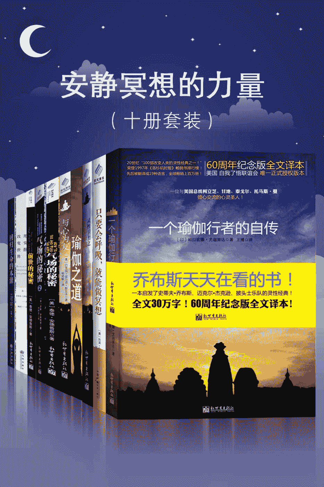

# 总目录

一个瑜伽行者的自传只要会呼吸，就能做冥想灵性卫士之征服心敌瑜伽之道与心为友气场的秘密气场的秘密 2 前世的秘密用安静改变世界回归生命的本源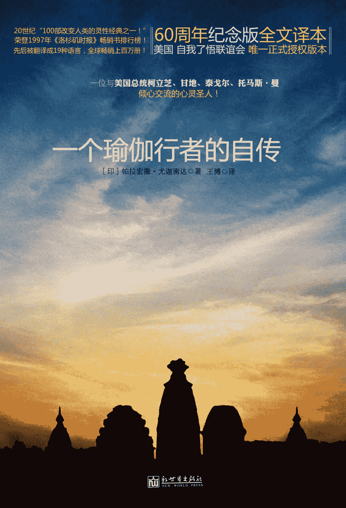

图书在版编目（CIP）数据 

一个瑜伽行者的自传 / (印) 尤迦南达著 ; 王博译 

. -- 北京 : 新世界出版社, 2012.2(2012.3 重印)

ISBN 978-7-5104-2410-6

Ⅰ. ①一… Ⅱ. ①尤… ②王… Ⅲ. ①印度教－僧侣 

－生平事迹－印度－现代 Ⅳ. ①B949.935.1

中国版本图书馆 CIP 数据核字(2011)第 242019 号 

北京版权保护中心外国图书合同登记号：01-2011-7501

Crystal Clarity，Publishers, © 2005 14618 Tyler Foote Rd., Nevada City, California 95959; Tel. 530-478-7600; www.crystalclarity.com.

Arranged through CA-LINK International LLC

一个瑜伽行者的自传 

策    划：北京阳光博客文化艺术有限公司 

作    者：【印】帕拉宏撒·尤迦南达 （Paramhansa Yogananda）

译    者：王    博 

责任编辑：刘    媛 

校    对：张海霞 

责任印制：李一鸣  刘社涛 

出版发行：新世界出版社 

社    址：北京西城区百万庄大街 24 号（100037） 

发 行 部：（010）6899 5968   （010）6899 8733（传真） 

总 编 室：（010）6899 5424   （010）6832 6679（传真） 

http://www.nwp.cn

http://www.newworld-press.com

版 权 部：+8610 6899 6306

版权部电子信箱：frank@nwp.com.cn

印    刷：大厂回族自治县彩虹印刷有限公司 

经    销：新华书店 

开    本：710×1000  1/16

字    数：300 千字 

印    张：28.25

版    次：2012 年 2 月第 1 版  2012 年 3 月第 2 次印刷 

书    号：978-7-5104-2410-6

定    价：49.80 元 

版权所有，侵权必究       

凡购本社图书，如有缺页、倒页、脱页等印装错误，可随时退换。 

客服电话：（010）6899 8638

# 目录

第一章 我的父母及童年第二章 母亲之死和神秘护身符第三章 分身的圣人第四章 未能成行的喜玛拉雅山之旅第五章 芳香圣人显奇迹第六章 猛虎尊者第七章 飘浮在空中的圣人第八章 大科学家博斯第九章 极乐的信奉者及其宇宙传奇第十章 遇到上师圣尤地斯瓦尔第十一章 在布伦德本的经历第十二章 与上师在修道院第十三章 拜访不眠的圣人第十四章 体验宇宙意识第十五章 花椰菜失窃案第十六章 智胜星象第十七章 萨西和三块蓝宝石的故事第十八章 巧遇神奇的回教术士第十九章 上师分身加尔各答和塞伦波尔第二十章 中断的喀什米尔之旅第二十一章 喀什米尔之旅终于成行第二十二章 石雕圣像之心第二十三章 拿到学士学位第二十四章 加入僧团第二十五章 哥哥阿南达与妹妹娜里尼第二十六章 感悟克利亚瑜伽科学第二十七章 在兰契创办瑜伽学校第二十八章 卡西的再生第二十九章 泰戈尔和我关于创办学校的讨论第三十章 奇迹法则第三十一章 拜会师母第三十二章 死而复生的罗摩第三十三章 遇见近代印度的瑜伽基督—巴巴吉第三十四章 在喜玛拉雅山里变出宫殿第三十五章 拿希里·玛哈赛的生活第三十六章 巴巴吉对西方的兴趣第三十七章 前往美国第三十八章 玫瑰花圣人—路德·柏尔本第三十九章 圣痕天主教徒—泰瑞莎·诺伊曼第四十章 回到印度第四十一章 在南印度领略迷人的田园风景第四十二章 古茹的临终时光第四十三章 圣尤地斯瓦尔复活记第四十四章 在瓦尔达拜见圣雄甘地第四十五章 在孟加拉拜会“喜悦”之母第四十六章 从不进食的女瑜伽行者第四十七章 回到西方第四十八章 在加州安西尼塔斯第四十九章 1940—1951 年附录：纪念莫罕达斯·甘地返回总目录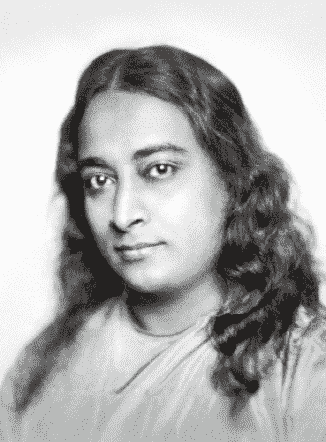

帕拉宏撒·尤迦南达( Paramhansa Yogananda ) 画像

帕拉宏撒·尤迦南达( Paramhansa Yogananda )简介

帕拉宏撒·尤迦南达( Paramhansa Yogananda )大师于 1893 年 1 月 5 日出生于印度戈勒克浦尔，1915 年获取得加尔各答大学文学学士学位，同年正式加入僧团。1920 年，他前往美国，开始了在西方为期约三十年的弘法生涯。1952 年 3 月 7 日，尤迦南达在加州洛杉矶毕尔特摩尔（Biltmore）饭店参加欢迎印度大使毕内·山（H.E. Binay R. Sen）的宴会，致词结束后，他进入最终涅槃。

自古以来，人类一直在致力于追求终极之“道”这一法门。数千年来，该法门以不同名称和形式存在于世界各民族文化中。近几个世纪以来，由于外在环境的变化和对求法者的严格要求，导致求法之人越来越少，这无上的法门几乎名存实亡。19 世纪中期，整个大环境再度成熟，喜玛拉雅山传奇的不死圣者巴巴吉（Babaji）再度将“直接与上帝接触”的克利亚瑜伽法门传给印度圣人拿希里·玛哈赛（Lahiri Mahasaya），并应后者请求，放宽了对求法者的诸多限制条件。拿希里开始传授这个法门，并由此造就了许多圣人徒弟。圣尤地斯瓦尔(Sri Yukteswar Giri)就是他最主要的徒弟之一。

1910 年，尤迦南达高中毕业，随后遇见圣尤地斯瓦尔，并成为他的首徒。1920 年，尤迦南达肩负着“平衡人类精神与现代科学文明”的使命，前往美国。他是近代印度第一位将此亘古不变的法门传至西方的圣者。从此，至高无上的“道”的法门，终于开始在西方广为流传。

同一年，尤迦南达在美国创办了自我了悟联谊会（Self-Realization Fellowship）。1924 年起，他开始在全美巡回演讲，广泛传授克利亚瑜伽。各行各业中的杰出人士相继成为其追随者，其中著名的有农业专家路德·柏尔本（Luther Burbank）、女高音歌唱家阿美利塔·加利库尔奇（Amelita Galli Curci）、柯达相机发明者乔冶·伊士曼（George Eastman）、诗人爱德温·马克姆（Edwin Markham）和指挥家利奥波德·史托科夫斯基（Leopold Stokowski）等。1927 年，美国总统卡尔文·柯立芝（Calvin Coolidge）正式邀请他访问白宫。

1946 年，尤迦南达出版自传，以幽默轻松的笔调、一连串生动有趣的真实生活故事，描绘出一位历史罕见的开悟圣人的生平体验及内在情感世界。该书曾于 1997 年荣登《洛杉矶时报》畅销书排行榜，先后被翻译成 18 国文字，被公认为“现代灵性书籍的经典之作”。

1952 年，尤迦南达圆寂后，洛杉矶森林殡仪馆（Forest Lawn Memorial Park）馆长哈利·罗（Harry T. Rowe）在给自我了悟联谊会的信中，详细描述道：“在 3 月 11 日移至殡仪馆后到 3 月 27 日入土之前这段时间内，尤迦南达的遗体栩栩如生，没有任何改变，这是我前所未见的。”

一代开悟大师终其一生勤奋耕耘，为人类散播及培育了难以计数的灵性种子，为现代人树立了完美的生活典范，并为宇宙生命创造了更加璀灿的未来。

原文序

《一个瑜伽行者的自传》极具价值，它不是由新闻记者或外国人，而是由一位在印度土生土长的人，用英文写的有关印度智者的书—简言之，这是一本由瑜伽大师描写有关瑜伽大师的书。这种情况极其罕见。作为一本介绍印度现代圣人及其非凡能力的书，本书既注重现实，同时又超越时代。希望每位读者都能欣赏并感谢这位在印度和美国都家喻户晓的作者。他为我们留下的这份不寻常的生活文献，无疑是所有曾在西方出版过的有关人类心灵、情感及精神财富的书籍中最有深度，最具价值的。

书中描述了多位圣人，我有幸见过其中一位—圣尤地斯瓦尔·吉利。我曾在我的《西藏瑜伽与奥秘的教义》一书前的插图中公开过这位圣人的画像。我是在孟加拉湾遇见他的，当时他是一间靠海的修道院的院长，这间修道院极其安静，圣尤地斯瓦尔主要负责训练一群年轻的徒弟。但他同时对美国、全美洲及英国人民的福祉都非常关注，并问我有关帕拉宏撒·尤迦南达在西方，特别是在加州地区的活动状况。

圣尤地斯瓦尔态度温和，风度优雅，令人喜爱，他能让追随者由然对他产生尊敬。无论是否属于他的团体，每个认识他的人都非常敬重他。我至今还清楚地记得他有着一副高大而挺直的身材，当时他穿着橘黄色的僧袍，前往修道院的入口迎接我。他的头发长而微卷，脸上有胡须。他的身体肌肉结实，身材修长匀称，精力充沛，步伐敏捷而坚定。他选择了神圣的城市布利(Puri)作为自己在尘世的住处，那里每天都有成群虔诚的印度教徒在著名的“世界之主”札格纳斯（Jagannath）神庙朝圣。1936 年，圣尤地斯瓦尔在布利合上了他用来审视人世这短暂存在的肉眼，同时他知道自己的化身已经圆满完结。

很高兴能在此证实圣尤地斯瓦尔神圣高贵的特质，这于我是一件高兴的事。圣尤地斯瓦尔远离喧嚣，安于平静，毫无保留地为群众献身，这样的理想生活，正是他的徒弟尤迦南达在本书中所描述的。

伊文斯—文茨博士（W. Y. EVANS—WENTZ， M.A.， D.）

《西藏度亡经》《西藏伟大的瑜伽行者密勒日巴》《西藏瑜伽与奥秘》编译者

致  谢

衷心感激普莱特（L.V. Pratt）小姐为编辑本书原稿所付出的长期努力。感谢露丝·桑（Ruth Zahn）小姐为本书整理索引，理查·莱特（Richard Wright）先生允许我摘录他在印度旅游时所写的日记，以及伊文斯·文茨博士的建议与鼓励。

帕拉宏撒·尤迦南达

1945 年 10 月 28 日

安西尼塔斯(Encinitas)，加州

第一章 我的父母及童年  

长久以来，印度文化的一个主要特征就是追求真理，并随之产生了维系众生的“古茹—徒弟”关系。在我追求真理的道路上，也遇到了一位如基督般神圣的上师，他的生命永恒而美好，仿佛能照亮千年岁月。他是所有那些伟大上师中的一位，这些上师正是印度唯一保留下来的财富。他们在每个世代都会出现，保卫着自己的家园，使其不致遭到像古埃及、巴比伦那般的灭亡命运。

我最早的记忆可以追溯到我的前世，我还清楚地记得，在遥远的世代，我曾是倘佯在喜玛拉雅山雪地的瑜伽行者。

在我的婴儿时期，我曾感觉非常无助，我怨恨自己不能自由自在地表达自己，甚至无法正常行走。意识到自己肉体的无能之后，我开始在内心发出虔诚的祷告。虽然我的说话能力很差，但我的耳朵却逐渐习惯了周围人的孟加拉语调。很多成年人总以为婴儿的心智只限于玩具和脚趾头，这是多么大的误解啊！ 

心理骚乱但身体却力不从心，这种感觉让我经常哭个不停。我还记得家人经常感到迷惑，不知道我为何总是如此苦恼。当然，童年的回忆里也充满了很多美好，比如母亲的抚抱、第一次呀呀学语、第一次蹒跚学步等。虽然这些早期的成就很快就被遗忘，但却是我建立自信的基础。

我这样的经历并不独特，许多瑜伽行者都保持着自己的自觉意识，不会被“生”“死”轮回间戏剧性的转换中断。如果人只是一个肉体，那么肉体一旦灭亡，本体也应该结束了。但如果几千年来先知们流传下来的教理是真实的，人类的本质应该是精神。那么人类所谓的“自我”的核心只是暂时与感官相连结而已。

竟然对婴儿时期有着清晰的记忆，这种事听起来虽然有些奇怪，但却并非罕见。后来我在许多国家旅行时，先后从许多人口中听到他们的早年回忆。

19 世纪末，我出生于印度东北部联合省的戈勒克浦尔（Gorakhpur），并在那里度过 8 年的童年岁月。我们兄弟姐妹一共八个，四男四女。我当时名叫穆昆达·拉尔·高绪（Mukunda Lal Ghosh），排行老四，是家中的次子。

我的父母亲是孟加拉人，属于刹帝利（Kshatriyas）阶级。两人都具有圣人般的品质。他们互敬互爱，内心平静，举止庄重，从不会有任何轻浮的举止。他们之间完美和谐，是八个闹哄哄的小孩寻求安宁庇护的中心。

父亲名叫巴格拔第·夏蓝·高绪（Bhagabati Charan Ghosh），他仁慈、勇敢，有时又很严格。我们都很爱他，但他让人敬畏，我们始终跟他保持距离。他是个杰出的数学和逻辑学家，为人非常理性。母亲则总是充满爱，她是我们的精神女王，凡事都以爱来教导我们。自母亲死后，父亲就经常显示出他内在温柔的一面。他的眼神也经常转换为母亲般的眼神。

母亲在世时，我们就开始了苦乐参半的圣典学习生活。一旦需要强调纪律，母亲就会用《摩诃婆罗多》（Mahabharata）或《罗摩衍那》（Ramayana）的故事来教导我们，有时也会进行惩戒。

父亲当时在一家名叫“孟加拉·那格浦尔（Bengal·Nagpur）铁路局”的大公司做副总裁。为了表示对父亲的尊敬，每天下午，母亲都会精心地将我们穿戴整齐，迎接他的归来。父亲的工作地点经常变换，小时候，我们曾先后住过几个不同的城市。

母亲对贫苦的人慷慨好施，虽然父亲也同情穷人，但他比较理性。有一次，在不到半个月的时间里，母亲将父亲一个多月的薪水都用来接济穷人。

“我只是希望，你在帮助别人时，能尽量合理。”父亲轻声责备道。但尽管如此，母亲还是觉得难以忍受。她不动声色地雇了一辆出租马车。

“再见！我要回娘家去了。”

我们惊慌失措！幸好舅舅及时出现，他在父亲耳旁私语了一些忠告，父亲立刻说了一些安抚的话。母亲高高兴兴地把马车打发了，结束了我生平唯一注意到的一次父母之间的纷争。我记得，在我的童年时代，他们之间的对话通常如下：

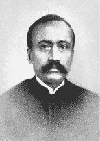

我的父亲巴格拔第·夏蓝·高绪

“请给我 10 个卢布，我要给一位无助的妇人。”母亲微笑着说，她的笑容有着巨大的说服力。

“为什么要 10 个卢布？1 个就够了。”父亲说道，“当我的父亲和祖父母突然去世时，我第一次尝到贫穷的滋味，那时我早餐只有 1 根香蕉，之后还要步行几英里去上学。后来读大学时，我曾向一位法官求助，求他每个月施舍我 1 个卢布。他拒绝了，还说：‘1 个卢布也很重要。’”

“被拒绝的那个卢布带给你的回忆是多么痛苦啊！”母亲反驳道，“你难道希望这位妇人以后也像你一样苦涩地记着被拒绝的 10 个卢布吗？”

“你赢了！”自古以来，丈夫总是说不过妻子。父亲打开钱包，“这是一张 10 卢布的纸钞，请给她，并送上我的祝福。”

对于任何新的提议，父亲通常总是先说“不”。刚才的故事就是一个典型的例子。不立即接受，这是典型的法国式心态。但我发觉父亲总是理性而公正。一旦我提出任何请求，只要能列出一两项正当的理由，父亲总会让我梦想成真—不论是一辆崭新的摩托车还是一次假期旅游。

父亲对我们很严格，但他自己的生活更加斯巴达式。比方说他从不看戏，他唯一的消遣就是修行及阅读《薄伽梵歌》（Bhagavad Gita）。他从不曾拥有任何奢侈品，鞋子总是穿到不能再穿时才扔掉。当儿子们开着早已普及的汽车时，他还是每日乘坐电车上班，而且心满意足。他从不会为了权势而积聚钱财，这与他的本性不符。有一次，在组建了加尔各答市银行后，他拒绝领取该银行的股权来为自己谋利—他只希望能在空闲时尽一个公民的责任。

父亲退休几年之后，从英国来了一位会计师审查孟加拉·那格浦尔铁路公司的账，后者惊讶地发现，父亲从未申请额外的津贴。

“他一个人做了三个人的工作！”这位会计师说，“公司应该补偿他 125000 卢布（约 41250 美金）。”出纳开了一张支票给父亲。父亲觉得这是一件微不足道的小事，也没有向家人提及。很久以后，弟弟毕修（Bishnu）在银行往来明细表上注意到这笔数额庞大的存款，才问起他来。

我的母亲

“为什么要为物质上的利益高兴呢？”父亲回答道：“一个追求心灵平静的人，向来不会为得到什么而开心，也不会为失去什么而忧虑。他知道，世间万物都是生不带来，死不带走的。”

父母亲结婚之后不久，就成为贝拿勒斯（Benares）伟大上师拿希里·玛哈赛（Lahiri Mahasaya）的徒弟。这让父亲变得更加苦行。有一次，母亲告诉大姐：“你父亲和我一年只有一次夫妻生活，而且还只是为了生儿育女。”

父亲第一次见到拿希里·玛哈赛，还是因为铁路局戈勒克浦尔分处的职员阿毕那斯·巴布（Abinash Babu）。在我小时候，阿毕那斯跟我讲过许多引人入胜的印度圣人故事。每次讲到最胡，他总是会称颂他无限荣耀的古茹。

一个慵懒的夏日午后，我和阿毕那斯坐在家中的院子里，他问我：“你知不知道你父亲是如何成为拿希里·玛哈赛的徒弟的？”

我笑着摇头，期待他的回答。

“几年前，那时候你还没出生，有一天，我要求我的上司—你父亲—给我一个礼拜假，让我放下工作，到贝拿勒斯去看我的古茹，结果遭到你父亲的嘲笑。

“‘你要变成一个宗教狂吗？’他问道，‘要出人头地，你就得专心工作。’

“下班后，我伤心地走在回家路上，途中碰到你父亲坐在轿子上，他辞退了轿子，下来跟我一起步行，一路上他列出了努力工作的的种种好处，试图来安慰我，我无精打采地听着，心里一直念着：‘拿希里·玛哈赛！看不到你我就活不下去！’

“前面有一片寂静的空地，草丛波浪起伏，夕阳的余晖撒在草丛上方，景色宜人，我们驻足欣赏。就在离我们几码远的空地上，我伟大的古茹突然出现了。

“‘巴格拔第，你对员工太苛刻了！’他的声音清晰地回响在我们的耳朵里。接着他立刻消失了。我跪在地上，叫了起来：‘拿希里·玛哈赛！拿希里·玛哈赛！’你父亲呆若木鸡地站着。

“‘阿毕那斯，我不但要给你假，也要给我自己假，明天我也要到贝拿勒斯去。我一定要认识这位伟大的拿希里·玛哈赛！我将带我的妻子一起前往，并请求这位上师传授他的法门给我们，你愿意带路吗？’

“‘当然！’我兴奋不已，我的祷告奇迹般地应验了。

“第二天晚上，你父母和我一起搭火车到贝拿勒斯。次日，我们乘坐马车来到我古茹家附近，接着要走进一条窄巷，最后才能到达我古茹隐居的地方。进到他的小客厅之后，我们对以莲花姿势端坐的古茹鞠躬致意。他眨着眼睛，目光停留在你父亲身上。

“‘巴格拔第，你对员工太苛刻了！’他说出两天前在戈勒克浦尔空地上说过的话，一字不差。他接着又说道：‘我很高兴你准许阿毕那斯来看我，你和你的妻子也一起来了。’

“令你父母高兴的是，古茹将克利亚瑜伽（Kriya Yoga）灵修的法门传给了他们。就这样，你父亲和我成了师兄弟，并且从那个值得纪念的日子开始，我们成了亲近的朋友。拿希里·玛哈赛对你怀有极大的兴趣，你的生命必定与他息息相关：上师的祝福从未失败过。”

我出生之后不久，拿希里·玛哈赛就离开尘世了。我们随着父亲工作的调动搬到不同的城市，但父亲总是会在家中祭坛上供奉拿希里·玛哈赛的照片。许多个早晨和晚上，母亲和我都会在临时圣坛前打坐，上面供奉着浸染在檀香泥中的花，我们以虔诚的心向拿希里·玛哈赛致意。

他的照片对我影响很大。我对他的思念与日俱增。打坐时，我常看到他从相框中走出来，坐在我面前。可当我试图去触摸他发光的双脚时，它却会立刻变回到照片里去。从幼儿期迈入童年期之后，每当有了困惑或遇到考验时，我就会向他祷告，寻求他的引领。起初我会为他的离世而伤感，但当我发现他无所不在时，就不再悲伤了。他常给那些过于渴望见到他的徒弟写信：“为什么要见到我的血肉之躯呢？我永远存在于你们智能眼（第三眼）的视界内啊！”

八岁那年，拿希里·玛哈赛的照片曾经奇迹般地治愈了我的病，这次经历进一步加强了我对他的爱。当时我在孟加拉宜佳浦尔（Ichapur）的家中感染到霍乱，生命垂危，医生们束手无策，坐在床旁的母亲万分着急，示意我看着床头拿希里·玛哈赛的照片。

“在心里向他顶礼祷告吧！”她知道我太虚弱，根本不可能举手致意，“只要你真正地表达你的忠诚，在心里向他下跪，他就能挽救你的生命。”

我注视着照片，突然看见一道令人目眩的光包围了我的身体，弥漫到整个房间。一瞬间，我不再感到恶心，病也完全好了。我立刻可以弯下身子去触摸母亲的脚，感激她对古茹无限的信任。母亲对着照片不住地磕头。

“啊！无所不在的上师啊，感谢您治愈了我儿子的病。”

我知道，母亲也看到了那道使我从致命的疾病瞬间恢复健康的强光。

我最喜爱的珍藏品之一就是这张照片，是拿希里·玛哈赛亲手交给父亲的，上面有着神圣的波动力。

我是从父亲的师兄弟卡力·库玛·罗伊（Kali Kumar Roy）那里听到这张照片的由来的，整个过程非常神奇。

上师一直不喜欢拍照。但徒弟们不顾他的反对，将他和一群虔信者—包括卡力·库玛·罗伊在内—的合照拍了下来。照相师惊讶地发现，底片中所有徒弟的影像都很清楚，但唯独在中央拿希里·玛哈赛站着的地方，却是一片空白，这件事迅速成了大家议论的话题。

拿希里·玛哈赛的另一位徒弟恒伽·达尔巴布（Ganga Dhar）是个摄影专家，吹嘘说自己能拍出哪怕瞬间即逝的形体。隔天早上，古茹以莲花座坐在一张木板凳上，背后放了一扇屏风，恒伽·达尔巴布带着他的器材来了。他每个步骤都非常小心，防止任何纰漏，最后他很贪心地拍了 12 张照片。但他很快发现，虽然每一张都有木板凳子和屏风的显影，但却看不到上师的形像。

6 岁时的我

几个小时后，古茹才打破沉默，意味深长地说：

“我是道，你的相机可以照出无所不在但却不可见的道吗？”

“我知道不能！但，神圣的先生啊，我衷心地想要一张你身体圣殿的照片。那是在我狭隘视野里唯一能见到道完全展现的地方。”

“那么好吧，明天早上来，我会让你拍照。”

第二天，照相师再次来到上师面前，神圣的身体不再隐形，而是清楚地显影在底片上。从那以后，上师再也没拍过照，至少我没见过。

本书把这张照片复印出来，你会发现，拿希里·玛哈赛白晰的相貌很普通，人们很难从照片上看出他的种族。他与上帝融合的强烈的喜悦些微地透露在他谜般的笑容中；他双眼半睁，表示与世俗有着象征性的关联，同时也是半闭的，全然无视世俗的诱惑；他任何时候都完全了解那些接近他的追寻者们灵性上的问题。

在古茹照片的力量让我康复后不久，我有了一次意义深远的内在体验。一天早上，我坐在床上，进入了内在深沉的境界。

“闭上双眼一片漆黑的后面是什么？”这个想法强烈地进到我心中。一道巨大的闪光马上出现在我内在的凝视中，就像小型影片放映在大银幕上，在我的额头内，出现了天国圣人在山洞里盘腿打坐的形像。

我大声问：“你们是谁？”

“我们是喜玛拉雅山上的瑜伽行者。”天国的响应是笔墨难以形容的，我非常兴奋。

“啊，我渴望到喜玛拉雅山去，像你们一样！”

“这奇妙的光是什么？”

“我是大自在天（Iswara）。我是光。”空中传来有如云层中的呢喃之声。

“我要与您合一！”

天国的极乐慢慢消褪后，我下定决心去追寻上帝。“他是一种永恒而常新的欢乐！”那天狂喜的记忆久久挥之不去。

另一件早年的回忆也令我印象深刻，直到今天，我身上还留着那时的疤痕。有一天一大早，姐姐乌玛（Uma）和我坐在戈勒克浦尔家中院子的苦楝树下，她教我读初级孟加拉语，我一有空就看着近旁鹦鹉啄食成熟的金铃子。乌玛抱怨她脚上生了疖子，并拿来一瓶药膏。我涂了一点在前臂上。

“你在健康的手臂上用药干什么？”

“哦，姐姐，我觉得我明天会长疖子。我先在疖子会长出来的地方涂些药膏试验一下。”

“撒谎的小家伙！”

“等明天早上再这么叫我也不迟。”我愤慨地说道。

乌玛无动于衷，继续奚落我。我坚定而缓慢地回答道：

“明天我的手臂就会在这个地方长出一个大疖子，而你的疖子会肿到目前的两倍！”

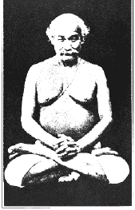

拿希里·玛哈赛

第二天早上，我预示的地方果然长了一个结实的疖子，姐姐的疖子也有两倍大。她尖叫着奔向母亲。“穆昆达成巫师了！”妈妈严肃地告诫我，绝不可用语言的力量伤人，我此后一直都记得她的忠告，并遵守着。

我最终通过开刀的方式治好了疖子。一直到现在，我手臂上还有一个很明显的疤痕。它就在右边的前臂上，时刻在提醒我人类语言的力量。

那些看似对乌玛简单而无伤的话语，由于是以高度集中的力量说出的，所以具有巨大的力量，可像炸弹般地爆炸，并会产生伤害性的结果。后来我了解到，语言中爆发性的波动力可以被用来解脱人生的困境，如此一来，这种力量就可发挥作用，但同时又不会留下疤痕或让人受到斥责。

后来我们家搬到了旁遮普（Punjab）的拉合尔（Lahore）。在那里我得到了一张圣母以卡力女神形像显现出来的肖像。这张肖像圣化了我家阳台上的小祭坛。我坚信在那个地方祷告的任何事情都会应验。有一天，我与乌玛站在阳台上，看着两个风筝飞在窄巷两边的屋顶上。

“你怎么那么安静？”乌玛看着我，感觉有些好笑。

“我只是在想，圣母实在太仁慈了，我要求什么她都给我。”

“我想她会把那两个风筝给你！”乌玛嘲笑地说。

“为什么不？”我开始暗自祈祷，希望能得到那两个风筝。

在印度盛行斗风筝，人们在风筝线上粘上玻璃粉。每个参赛者都会努力割断对手的风筝线。胜利者会抓到飘到屋顶上的断线的风筝。由于乌玛和我是站在阳台上，所以断线的风筝根本不可能飘到我们手上。

比赛开始了。一条风筝线被割断；风筝立刻朝我的方向飘来。风突然变小了，风筝停了一下，它的线稳固地缠绕在对街房顶的仙人掌上，形成一个完美的环状，刚好让我抓住。我把战利品拿给乌玛。

姐姐深色的眼睛里有些惊讶。“这只是特殊情况，并不是对你祷告的响应。如果另一个风筝也落到你的手中，我就相信了。”

我继续祷告。另一个风筝的线被风筝手突然用力一扯，也断掉了。风筝在空中飞舞着，向我飘过来。仙人掌再次将风筝线稳固地缠住。我再次交给乌玛。

“圣母真听你的！这实在是太神奇了！”姐姐像一只受惊的小鹿，突然跑开了。

第二章 母亲之死和神秘护身符

母亲在世时最大的心愿就是大哥能结婚。“只要能看到阿南达(Ananta)妻子的脸，我就等于找到天堂了！”母亲经常这么说。

阿南达订婚时，我大概只有 11 岁。母亲满心欢喜，在加尔各答筹划婚礼细节。我和父亲待在印度北部巴莱利（Bareil1y）的家中—父亲在拉合尔两年后被调到这里。

在此之前，我已见过姐姐罗玛（Roma）和乌玛的婚礼。但长子阿南达的婚礼显然隆重得多，每天都有亲戚从老远的地方来到加尔各答表示祝贺，母亲一一欢迎，把他们安置在新买的大房子内。房子坐落在阿默斯特街（Amherst）50 号。婚礼的所有东西都准备好了：盛宴佳肴，哥哥坐在上面要抬到新娘家去的华丽轿子，成排的五光十色的灯，厚纸板做成的巨象和骆驼，英式、苏格兰和印度式的管弦乐团，还有熟悉古老仪式的僧侣们。

父亲和我带着欢乐的心情，计划在举行典礼时赴宴。但就在大日子来到之前，我内心突然有了一种不祥的体验。

那是一个午夜，在巴莱利家中平房的阳台上，我睡在父亲旁边。突然，我被床上蚊帐一阵奇异的飘动惊醒了：轻薄的蚊帐分开了，我看到母亲慈爱的形像。

“喊醒你父亲！”她低语道，“如果你们还想见到我的话，坐早上 4 点的第一班火车，赶紧来加尔各答！”然后影像消失了。

“爸爸，爸爸！妈妈快死了！”我的声音满怀惊恐，立即吵醒了爸爸。

“那只是你的幻想，别在意。你妈非常健康，而且我们明天就走。”

“如果不马上出发的话，你一辈子都不会原谅自己！”愤怒像一阵巨浪席卷了我，“我将来也永远不会原谅你！”

第二天早上，讯息传来：“母病危，婚礼延期，速返。” 爸爸和我心烦意乱地立刻动身。在转车途中，我们在站台上等车时碰到一位叔叔。火车隆隆，渐渐驶向我们。我纷乱的内心突然升起一个念头，想把自己丢到铁轨上去。我觉得母亲离开之后，我将再也无法忍受这个世界了。我深爱着母亲，她是我在这世上最好的朋友。她抚慰的眼神是我童年时最可靠的庇护所。

“她还活着吗？”我问这位叔叔。

他迅速察觉到我的绝望，并回答道：“当然活着！”但我根本不相信他。 

当我们到达加尔各答的家中时，母亲已经离世。我瞬间崩溃了。直到多年以后，我的心才平息下来。我的哭泣猛烈地敲击着天堂的门，终于惊醒了圣母。她告诉我：

“是我借着每一个温柔的母亲，生生世世地照顾着你！看着我黑色的双眼，那不正是你所寻找的美丽双眸吗？”

母亲的火葬仪式结束后，父亲和我回到巴莱利。每天清晨，我都以悲痛的心情在平房前面一棵高大的无花果树下悼念着母亲。树荫照在平滑的黄绿色草坪上。泪水和着露珠，我经常看到一道来自其他世界的光从晨曦中出现。我的内心极度渴望上帝，强烈的痛苦困扰着我。我多么想去喜玛拉雅山啊！

当时我的一个堂兄刚从圣山旅行归来，他到巴莱利来看我们。我满心好奇地听着他叙述住在圣山上的瑜伽行者和斯瓦米们的故事。

“去喜玛拉雅山吧。”有一天我对房东小儿子德瓦卡·普拉萨(Dwarka Prasad)说道，但他却把我的计划泄漏给来看望父亲的大哥。阿南达觉得这种小孩子的想法不仅不切实际，而且非常好笑，他甚至把它变成嘲笑我的题材。

“你的橘色僧袍在哪里？没有它你怎么成为斯瓦米呢？”

他的话虽然是在嘲笑，但却难以理解地鼓动着我。它让我清晰地看到自己在印度云游的清晰画面。也许它们唤醒了我前世的记忆吧！但无论如何，我开始相信自己终究会穿上古代僧团的袈裟了。

一天早上，在跟德瓦卡闲聊时，我感到自己对上帝的爱突然如雪崩似地降临到我身上。我的朋友心不在焉地听我滔滔不绝，但其实我完全是在说给自己听。

当天下午，我就跑到喜玛拉雅山脚下的奈尼塔尔(Naini Tal)。阿南达锲而不舍地追到了我，我被迫伤心地返回了巴莱利。我只能像往常一样到无花果树前朝圣，心中哭泣着失去了人间及天国的母亲。

失去母亲是一个家庭中无法弥补的空隙。父亲在随后将近四十年的余生中一直没有再娶。由于要像母亲一样照料一群小孩，父亲明显地变得更温柔，也更容易亲近了。他能发现并平静地解决家中的许多问题。下班之后，他会像隐士般地退到自己的小房间内，愉快而平静地修习克利亚瑜伽。母亲过世很久之后，我想雇一位英国护士料理父亲的生活，让他过得更舒适，但父亲摇摇头。

“只有你母亲可以服侍我。”他的眼神望向遥远的地方，带着深沉的虔敬，“我不接受其他女性的服侍。”

母亲过世 14 个月后，我得知她有重要遗言留给我。母亲临终时，阿南达随侍在侧，并记录下她的遗言。虽然母亲吩咐哥哥一年之后一定要告诉我，但他却延迟了。在他即将离开巴莱利，到加尔各答去跟母亲替他选择的女子结婚时，他把我叫到身边。

“穆昆达，我不喜欢告诉你奇异的事情。”阿南达说，“因为我怕你会离家出走。但无论如何，你内心始终充满了对上帝的爱。最近在你逃往喜玛拉雅山的途中捉到你时，我下定决心。我不该再延迟这神圣的承诺。”哥哥交给我一个小盒子，并转述了母亲的遗言。

“我挚爱的儿子穆昆达，这是我的临终祝福！”母亲说道，“是时候了，我必须告诉你在你出生之后发生的一些非比寻常的事。当你还在襁褓中时，我就知道你的命运了。之后我带着你到贝拿勒斯我古茹的家去，古茹被一大群弟子围着，我隐约只能看到拿希里·玛哈赛在深沉地打坐。

“我轻拍着你，暗自祈祷伟大的古茹能注意到并赐福给你。当我无声的祷告变得愈来愈强烈时，他张开了眼睛，示意我过去。其他人为我让开了一条通道，我拜在他脚下。上师把你放在他的膝上，以灵性洗礼的方式将手放在你的额头上，为你加持。

“‘小母亲，你的儿子将会成为一名瑜伽行者，他会带着许多灵魂到上帝的国度去。’

“我的心雀跃不已。在你出生之前不久，上师已告诉了我，你将追随他的道路。

“我的儿子，后来你姐姐罗玛和我从隔壁房间看到你动也不动地躺在床上，知道你体验到了‘伟大的光’。你的小脸闪烁着光辉，斩钉截铁地说你要到喜玛拉雅山去追寻天国。

“我的孩子，从这几方面来看，我知道你未来的道路将远离世俗，尤其是在我经历了有生以来最奇特的一件事后，我的看法更加坚定，这件事也促使我留下了临终遗言。

“那是在旁遮普与一位圣人的会晤。当时我们还住在拉合尔，一天早上，仆人匆忙来到我的房间。

“‘夫人，一位陌生的隐士（sadhu）坚持要见穆昆达的母亲。’

“这简单的几个字让我心中一动，我立即出去迎接访客。我跪拜在他脚下，意识到在我面前的是一位上帝的化身。

“‘母亲啊’，他说，‘伟大的上师们希望你知道你在这世上的余日已经不多了。下一次将是你最后一次生病’。我没有惊恐，反而觉得非常平静。他又说道：

“‘你将是这块银制护身符的保管人。今天我不会给你，但为了表示我话的真实性，明天你打坐时，护身符会出现在你手中。在你临死之时，你必须指示你的长子阿南达保管这块护身符，一年以后再交给你的第二个儿子穆昆达，穆昆达会从一位伟大圣者处了解这块护身符的意义。在准备好舍弃所有世俗的欲望，开始追寻上帝时，他会得到它。在他保有这块护身符几年后，护身符已完成任务时，它就会自动消失。即使被藏在最隐密的地方，它还是会回到它来的地方。’

“我呈上给圣人的供养，并极其尊敬地鞠躬致意。他没有接受供养就转身离开了。第二天晚上，在我叠手打坐时，一块银制的护身符突然出现在我手中。两年多来，我一直很谨慎地守卫着，现在只能交给阿南达保管了。不要为我悲伤，伟大的古茹会引领我进入‘无限’的怀抱。再见了，我的孩子，宇宙之母会时刻护卫着你的。”

我拿着护身符，突然感到一道强光，许多蛰伏已久的记忆被唤醒了。这块圆圆的护身符上刻有梵文字母。我知道它是历代上师们一代一代传递下来的，他们一直在暗中引领着我的脚步。

后来这块护身符在我生命中最不快乐的时候突然消失，而它的失去，也预示着我古茹的出现。

第三章 分身的圣人

父亲很少会阻止我对旅游的热爱。甚至在我的孩提时代，他就准许我去造访许多城市和圣地。每次旅行时，通常会有朋友相伴，我们舒适地坐在父亲为我们提供的头等车厢里—铁路公司高级职员的身份对家里喜爱旅行的人来说，是很合适的。

父亲答应会适度地考虑我的请求。第二天他把我叫过去，给我一张巴莱利到贝拿勒斯的来回车票、一些钞票和两封信。

“我想跟贝拿勒斯的一个朋友基达·那斯巴布（Kedar Nath）谈一个生意上的计划。可我不小心把他地址弄丢了。但我想你可以通过我们共同的朋友普拉纳贝南达（Pranabananda）斯瓦米将信送到他手上。那位斯瓦米是我的同门师兄弟，灵性已经达到很高的境界。跟他做朋友会让你受益良多。第二封是你的介绍信。”

父亲又说道：“这次不要再离家出走了！”

时间从未影响我对新地方和陌生面孔的喜好，我怀着 12 岁的热情启程了。到达贝拿勒斯后，我立刻赶到这位斯瓦米的住处。前门开着，我走进二楼一个长形大厅似的房间。只见一个只穿着腰布的结实男人，以莲花座盘坐在一个稍为高起的平台上。他的头和脸刮得干干净净，脸上没有皱纹，嘴角挂着快乐的笑容。他像老朋友一样欢迎我。

“亲爱的，祝福你。”他以孩童般的声音欢迎我。我跪在他面前，触碰他的双脚。

“您就是普拉纳贝南达斯瓦米吗？”

他点点头。“你是巴格拔第的儿子吗？”我还没来得及从口袋里掏出爸爸的介绍信，他已经知道我是谁了。

“当然，我会帮你找到基达·那斯巴布的。”这位圣人的神童再次让我大吃一惊。他看了一下信，并亲切地问候了我父亲。

“你知道，我有两笔退休金。一笔是由你的父亲推荐得来的，以前在铁路局时，我在他的手下工作过。另一笔是天父那里得来的，在他的手下，我会尽责地完成此生世俗的责任。”

我有些迷惑了：“先生，您从天父那儿领到什么样的退休金？他把钱交给您了吗？”

他笑了起来：“我指的是深远而无穷的退休金—许多年深入打坐后的报酬。我现在从不渴望金钱，我简单的物质需求已经得到满足了。以后你会了解第二笔退休金的意义的。”

突然，我们的谈话中断，圣人变得静止不动。谜样的气氛包围着他。开始时他的眼睛发亮，好像正看着有趣的事情，接着就黯淡了下来。他的寡言让我尴尬，他还没有告诉我该怎么见到父亲的朋友。我略感不安地四下张望这个房间，除了我们两人之外，房间里一无所有，空空如也。

“小朋友，别担心。你要见的人半小时内就会来。”这位斯瓦米看透了我的想法！

他再度陷入了让人无法理解的静默中。时间已经过去 30 分钟了。

斯瓦米自己醒来了。“我想基达·那斯巴布已经快走到门口了。”

我突然听到有人上楼的声音，觉得非常难以置信：“父亲的朋友怎么可能在没有得到消息的情况下来到这里？我来到这里之后，除了我以外，斯瓦米没跟任何人说过话！”

唐突之间，我离开房间下楼去。刚爬到一半，就碰到一位瘦削、皮肤白晰、身材中等的先生。他看起来很匆忙。

“分身的圣人”普拉纳贝南达斯瓦米

“你是基达·那斯巴布吗？”我有些激动。

“是的。你难道不是在这里等着见我的巴格拔第的儿子吗？”他笑着说道。

“先生，你怎么会正巧来到这里？”我感觉有些难以理解，内心充满困惑。

“真是太不可思议了！不到一个小时之前，普拉纳贝南达斯瓦米来找我，当时我刚结束在恒河的沐浴。我不明白他怎么会知道我当时在那里。”

“‘巴格拔第的儿子正在我房间等你。’他说：‘你要不要跟我来？’我欣然同意。虽然我穿的是一双牢固的步行鞋，斯瓦米穿的是木拖鞋，可很奇怪，他总是能走在我前面。

“‘你到我家要多久？’普拉纳贝南达突然停下来问。

“‘大约半个小时。’

“‘现在我有些事要办。’他看了我一下，‘我必须先走。你可以到我家跟我会合，我和巴格拔第的儿子会在那里等你。’

“我还没反应过来，他已迅速地越过我消失在人群里。于是，我就立刻赶到这里来了。”

这个解释反而加深了我的迷惑。我问他认识斯瓦米有多久了。

“去年我们见过几次面，不过最近没见过。”

“我不能相信我的耳朵！我是不是精神错乱了？你真正见到他本人、碰到他的手、听到他的脚步声了吗？”

“你到底是什么意思？”他有些生气了，涨红了脸，“我没骗你，道理很简单，只有经过斯瓦米，我才有可能知道你在这里等我！”

“那为什么普拉纳贝南达斯瓦米从我到达这里一个小时以来，没有片刻离开过我的视线？”

他张大了眼睛：“我们是在做梦吗？我这辈子从来没想到会亲眼目睹这样的奇迹！我还以为斯瓦米只是个普通人。没想到他能化出另一个分身去工作！”我们一边说着，一边走进圣人的房间。

“看，那正是他在河边阶梯上穿的拖鞋。”基达·那斯巴布低声说道，“当时他只穿一条腰布，就像我现在看到的一样。”

当访客在他面前鞠躬时，圣人微笑转向我。

“为什么对此感到惊讶呢？现象的世界无法隐蔽真正的瑜伽行者与它微妙的一统性。我可以实时地看到远在加尔各答的徒弟们，并与他们交谈。同样，他们也能随心所欲地超越物质世界的障碍。”

这位斯瓦米可能想要激起我对灵性的热爱，所以他开始细致地告诉我他那灵界收音机及电视机的能力。但我的内心只有敬畏，而没有热忱。因为我注定要在圣尤地斯瓦尔的引导下去追寻天国，而我暂时还没有碰到他。我没有接受普拉纳贝南达做我古茹的意愿。我以怀疑的眼光看着他，纳闷在我前面的是他的本尊还是分身。

为了消除我的疑虑，这位上师看着我，目光好像能唤醒灵魂，他说了些激励的话：

“拿希里·玛哈赛是我所知道的最伟大的瑜伽行者。他是上帝的化身。”

我心里想着，如果徒弟都能随心所欲分身有术，那他的上师还有什么做不到的呢？

“我跟你说个故事，你就明白古茹的帮助是多么重要了。我曾经跟另一个师兄弟每个晚上打坐 8 个小时。白天我们必须在铁路局工作。我发现自己很难继续担任这一职务，而希望将所有时间都献给上帝。此前我坚忍了 8 年，每天晚上都有半数时间在打坐中度过。效果非常好，美好的体验照亮了我的心灵。但我与无限之间始终存在着一层薄幕。无论我怎么努力，都无法达成最终的融合。一天晚上，我去拜访拿希里·玛哈赛，请求他帮忙。我一直强烈地祈求了一整晚。

“‘圣洁的的古茹啊，我的精神是如此痛苦，我再也无法忍受生命中不能面对面地见到‘伟大的至爱’的生活了！’

“‘我能做些什么呢？你要更深入地打坐。’

“‘我请求您，我的上师！请赐福我，让我得见无限的您！’

“拿希里·玛哈赛以仁慈的姿势伸出手来，‘你现在可以去打坐了。我已经替你向梵天（Brahma）祈求了。’我得到了巨大的鼓舞，回到了家中。当天晚上，我在打坐中实现了此生梦寐以求的目标。现在我正在无尽地享用着这灵性的退休金。从那天起，再也没有任何世间幻像的帘幕能遮蔽我的双眼，隐藏极乐的造物主了。”

普拉纳贝南达脸上充满着天国的光辉。另一个世界的平静进入了我的心房，所有的恐惧都消失的无影无踪。

“几个月之后，我再次去见拿希里·玛哈赛，去感谢他那‘无限’的礼物。同时我提到了另一件事情。

“‘我的古茹啊，我再也无法在办公室工作了。请释放我吧。梵天的体验让我陶醉不已。’

“‘向你的公司申请退休金吧。’

“‘这么早就要退休，我有什么理由呢？’

“‘说出你的感受。’

“第二天我提出了申请。医生问我为何要提早退休。

“‘每当工作时，我都感觉有一股无法克制的感觉由背脊升起，逐渐散布到全身，让我无法再继续工作。’

“医生没再多问，便强烈建议我申请一笔退休金，我很快就拿到了。我知道拿希里·玛哈赛的旨意在通过医生和包括你父亲在内的铁路局职员们发挥了作用。他们遵循着伟大古茹的指示，让我解放，使我整个生命能不间断地与挚爱的天国相互交融。”

普拉纳贝南达斯瓦米再度静默良久。当我恭敬地触摸他的双脚并准备离去时，他祝福着我：

“你的生命是属于出家和瑜伽之路的。以后我会再见到你，之后再见到你和你的父亲。”几年后，这两项预言都实现了。

暮色逐渐黯淡下来，基达·那斯巴布走在我身边。我给他看父亲的信，他在街灯下打开信。

“你父亲建议我接受他铁路公司在加尔各答分处的职位，有一笔像普拉纳贝南达斯瓦米那样的退休金，这是一件多么令人愉快的事情！但那是不可能的，我暂时不能离开贝拿勒斯。唉，我还做不到分身啊！”

第四章 未能成行的喜玛拉雅山之旅

我告诉我的高中同学阿玛·米特（Amar Mitter），“找个理由离开学校，租一辆四轮马车。停在我家人看不到的巷子里。”

他计划跟我一起去喜玛拉雅山去。我们约好第二天就走。由于阿南达时刻在关注我的行动，所以我要特别小心。阿南达料到我会出家，他决心破坏我的出逃计划。护身符像是个灵性的催化剂，始终在我内心无声地运作着。我想要在喜玛拉雅山找到经常出现在我体验中的上师。

当时我们一直住在加尔各答，父亲被永久地调到这里来。按照印度习俗，阿南达带着新娘跟我们同住在古柏（Gurpar）路 4 号的家中。我每天在阁楼上的一个小房间打坐修炼，准备追寻天国的心灵。

听到马路上阿玛的马车声后，我赶紧捆扎好行李（包括一条毯子、拿希里·玛哈赛的照片、一双拖鞋、一本《薄伽梵歌》、一串念珠和两条腰布），把行李从三楼窗户上丢下去。然后我跑下楼梯，碰到在门口买鱼的叔叔。

“什么事让你那么兴奋？”他怀疑地打量着我。

我向他笑了一下，继续往巷子走去，拾起行李，小心地跟阿玛会合。我们先驱车前往昌德尼商业广场（Chadni Chowk)。几个月以来，为了要买英式衣服—我想用欧式服装来骗过侦探般的哥哥—我们一直在节省午餐钱。

在前往车站的路上，我们停下车来接我的堂兄乔汀·高绪（Jotin Ghosh），我叫他贾汀达（Jatinda）。他是个新道友，也想要在喜玛拉雅山为自己找到一位古茹。他换上我们新买的衣服。大家内心都充满了喜悦。

“现在只差一双布鞋了。”我带着同伴到一家有胶底布鞋的鞋店，“既然这是趟神圣的旅程，我们就不应该穿有动物皮革的鞋子。”

到了火车站，我们购票前往柏德旺（Burdwan），准备在那里换车，前往喜玛拉雅山脚下的哈得瓦（Hardwar）。当火车开始奔驰时，我们满怀欣喜。

“想想看！”我兴奋地说，“上师会传法给我们，我们可以体验到宇宙意识。我们身体充满着磁场，会让喜玛拉雅山上的野生动物们温驯地靠近我们。老虎会像柔顺的家猫一样，等着我们抚摸！”

阿玛热情地微笑响应着。但贾汀达移开了他的目光，看着窗外倒退的风景。

“我们把钱分做三份。”半天不说话的贾汀达说道，“在柏德旺我们买各自的车票。这样一来，车站人员就不会怀疑我们是离家出走的。”

我毫无怀疑地同意了。黄昏时刻，火车到达柏德旺。贾汀达去买票，阿玛和我坐在月台上等他。我们等了 15 分钟，然后开始四处找他，找遍了整个车站，我气急败坏地叫着贾汀达的名字。在夜色的掩护下，他已经消失到这个车站某个不知名的角落里了。

我整个愣住了，非常气馁。上帝竟然允许这种令人沮丧的事情发生！我第一次周密计划的浪漫行程就这样给破坏了。

“阿玛，我们必须回家。”我哭得像个小孩子，“贾汀达的离去是一个不好的兆头，这趟行程注定失败。”

“你是这样爱上帝的吗？难道经不起这样一个小考验吗？”

经阿玛这么一说，我的心立刻安定下来了。我们吃了些柏德旺有名的甜点：希塔哈格（sitabhog，给女神吃的圣餐）和茂提库尔（motichur，珍珠丸）。然后重新振作起来。几个小时后，我们将坐上火车经巴莱利去哈得瓦。在蒙兀尔·塞莱（Moghul Serai）月台上等候换车时，我们讨论了一件重要的事情。

“阿玛，我们可能很快就会遭到站长盘问。我哥哥可是个足智多谋的侦探。不论结果如何，我都不会说一句假话。”

“穆昆达，你只要保持平静就可以了。我说话的时候你不要笑，也不要开口。”

就在这个时候，一位欧洲站长走上前来跟我打招呼。他挥着手上的一封电报，我马上知道了电文的内容。

“你们是不是离家出走的？”

“不！”

然后站长转向阿玛。两人之间的对话让我差一点笑出声来。

“第三个男孩在哪里？”站长的声音充满威严，“快，说实话！”

“先生！你戴着眼镜呢！难道看不出来我们只有两个人吗？”阿玛毫无顾忌地笑着，“我又不是魔术师，没办法变出第三个同伴来。”

这位站长的询问策略显然被这种无礼的顶撞给扰乱了，他转而寻求新的攻击点。

“你叫什么名字？”

“我叫汤玛斯（Thomas）。妈妈是英国人，父亲是改信基督教的印度人。”

“你的朋友叫什么名字？”

“我叫他汤普生（Thompson）。”

我几乎忍俊不禁，眼看就要笑出来了，我赶快走向鸣笛要开的火车。阿玛跟随着站长，他不但相信他，而且还热心地将我们安排到欧洲人专用的车厢去。想到两个英国混血儿要坐在本地人的车厢旅行显然让他感到痛心。在他礼貌有加地离去之后，我靠着椅背大笑起来。没想到竟然能骗过老练的欧洲站长，阿玛也面露得意之色。

在月台上时，我设法看到了那封电报，果然是哥哥发的，电文如下：“三个着英式衣服的孟加拉男孩逃家出走，通过蒙兀尔·塞莱至哈得瓦。请留置，待我抵达。必有重谢。”

“阿玛，我告诉过你，不要在家里留下做有记号的火车时刻表。”我责备道，“哥哥一定是在你家找到的。”

阿玛羞愧地承认了。我们在巴莱利耽搁了一下，德瓦卡·普拉萨已收到阿南达的电报，在此等候我们。我的老朋友英勇地试图留下我们，我告诉她我们并不是随便离家出走的。像上次一样，德瓦卡拒绝跟我一起去喜玛拉雅山。

当天晚上，我还在半睡半醒时，火车停在另一个车站。阿玛被一个车站职员唤醒。在“汤玛斯”和“汤普生”混合的魅力下，那个职员再度成为牺牲者。火车载着我们在黎明时分胜利到达哈得瓦，远方巍峨的山脉隐约动人。我们冲出车站，进入人群中。阿南达不知用什么方式已识破了我们欧式的伪装，所以我们第一步就是要换回印度人的服装。

看起来必须马上离开哈得瓦，我们买了车票，继续向北方里斯凯斯（Rishikesh）前进，那是一块长久以来被许多上师们的脚步祝福过的圣地。当我已经上了车，而阿玛还留在月台上时，他突然被一个警察大声叫住。讨厌的警察把我们押送到车站的一间平房，并搜走了我们的钱。他亲切地告诉我们，他必须留置我们直到我哥哥的到来。

听说我们是要去喜玛拉雅山后，这位警察跟我们讲述了一个不可思议的故事。

“你们这些疯狂追寻圣人的孩子啊！我昨天碰到的那位才叫伟大呢！我和同事第一次碰到这位圣人是在五天前，当时我们在恒河边巡逻，正在全力追缉一位杀人犯。他装扮成隐士在抢劫朝圣者，上级下令不论死活都要捉到他。我们在前面不远处，发现一个很像那位杀人犯的身影，于是便叫他停下来，他毫不理会，于是我们跑过去打算制伏他。靠近他背后时，我用力挥舞着斧头，几乎把他的右臂砍断下来。

“这个陌生人没有叫喊，甚至连看都没看一眼那可怕的伤口，而是继续快速前进。当我们跳到他面前时，他平静地说道：

“‘我不是你们要找的杀人犯。’

“看到自己伤害了一个神圣的人，我非常羞愧，拜倒在他的脚下，恳求他的宽恕，并用我的头巾帮他包扎。

“‘孩子，这是一个可以理解的错误。’圣人亲切地看着我。‘去吧，不要责备自己了。慈爱的圣母会照顾我。’他把悬荡着的手臂推回原位，瞧！一下子就黏回去了！血也止住不流了。

“‘三天以后，在那棵树下见我，你会看到我已完全恢复。这样你就不会觉得懊悔了。’

“昨天，我和同事如约赶到指定的地方。在那里，那位隐士让我们检视了他的手臂，居然没有任何疤痕！

“‘我路过里斯凯斯，正要到喜玛拉雅山去隐居。’这位隐士祝福我们，然后很快就离开了。”

我和哥哥阿南达

警官以虔诚的声音结束了这个故事。对他而言，这显然是次不同寻常的经历。

阿玛和我惋惜自己没能亲自见到这位像基督般原谅伤害自己的人的伟大瑜伽行者。最近两个世纪以来，印度尽管物质贫乏，但精神财富却源源不竭。即使是普通人，就像这位警官，都有可能在路边偶遇修行多年的行者。

我们感谢警官告诉我们这个美妙的故事。他也许是在暗示自己比我们幸运，可以不费吹灰之力就遇见圣人，而我们辛苦了半天，结果却是待在粗俗的警察局里！

喜玛拉雅山是那么近，然而对我们来说，却又是那么遥远。

“只要一有机会，我们就溜走。我们可以走路到神圣的里斯凯斯去。”我微笑地鼓励着阿玛。

但自从我们的钱被拿走以后，阿玛就变得悲观了。

“如果我们试图穿过如此危险的丛林，最终到达的，不会是圣人的城市，而是老虎的肚子里！”

三天后，阿南达和阿玛的哥哥抵达了。阿玛如释重负地迎接他哥哥。我却不妥协。

“我了解你的感觉！”哥哥安抚着我，“我只要求你跟我到贝拿勒斯去见一位圣人，再回到加尔各答去探望已经伤心几天的父亲，然后你可以回到这里，继续追寻你的上师。”

阿玛在这个时候插进来，说他不想再跟我回哈得瓦去了。他喜欢家庭的温暖，但我知道我永远不会放弃去追寻古茹。

我们一起坐火车去贝拿勒斯。在这里，我的祷告得到了即刻的回答。

阿南达很有技巧地事先做了安排。在去哈得瓦接我以前，他首先在伯那利斯停留，请求某位经典梵文学家稍后接见我。梵文学家和他儿子答应劝说我放弃出家的计划。

阿南达带着我到他们家去。一个年轻人在庭院里热情地欢迎我们。然后他开始跟我论述冗长乏味的哲理，还假装有天眼通可预知我的未来，反对我去出家修行。

“没有世俗的历练，你无法消除过去数世的业障。如果坚持放弃日常的责任，你会碰到一连串的不幸，也找不到上帝！”

奎师那（Krishna）不朽的名言浮现在我的脑海里，我回答道：“‘即使是业障最深重的人，只要毫无间断地冥想着‘我’，也可以很快脱离以往业力的影响，成为一个高贵的灵魂，获得永恒的平静！’”

但这个年轻人强有力的预言稍微动摇了我的信心。我默默地全心全意地向上帝祈祷：

“请您解决我的困惑，您究竟要我成为一个出家人还是世俗之人？”

我注意到一位态度高雅的隐士就站在庭院门外。他叫我过去，显然他无意中听到我的祷告。我感觉到一股巨大的能量从他平静的双眼中流向我。

“孩子，不要听那个无明之人（译注：“无明”与“无知”不同，无知是指一个人缺乏知识，而无明则是指一个人不真正了解真理）的话。上帝会响应你的祷告，他要我向你保证，出家是你今生唯一的路。”

我既惊讶又感激，这个讯息让我兴奋不已。

“离开那个疯子！”那个“无明的人”在庭院里大叫起来。我神圣的引导者举手祝福我，然后慢慢离开。

“那人跟你一样疯狂。”这时那位白头发的梵文学家说道。他和他的儿子好像是在可怜我，“我听说他也是在离家徒然地找寻上帝。”

我转头就走，跟阿南达说我不想再跟他们做任何进一步的讨论了。哥哥同意马上离开，我们很快地就坐上火车回加尔各答。

“侦探先生，你是怎么发现我跟两个同伴离家的？”回家的途中，在好奇心的驱使下，我问了阿南达。他淘气地笑了。

“我发现阿玛离开教室以后，就再也没有回去。第二天我去他家，看见一张做了记号的火车时刻表。阿玛的爸爸正要坐马车离去，在跟车夫说话。

“‘我儿子今天早上不能跟我一起坐车去上学了，他失踪了！’他伤心地说道。

“‘我听别的车夫说，你儿子和另外两个穿欧式西服的人在豪拉（Howrah）车站乘火车，’车夫说道，‘他们还把皮鞋送给了车夫当礼物。’

“如此一来，我就有了三个线索—火车时刻表，三个男孩，英式服装。”

我听着阿南达的分析，感觉好笑又好气。我们对车夫的慷慨显然用错地方了！

“于是我马上打电报到每个阿玛在时刻表上划线的车站。他也在巴莱利做了记号，所以我打电报给你在那里的朋友德瓦卡。在加尔各答附近的地区打听之后，我得知表弟贾汀达也消失了一个晚上，但第二天就穿着欧式服装回家了。我请他出来吃饭。他接受了，我的友善彻底瓦解了他的戒心。他没想到我会在半路上带他去警察局。在警察局，他被几个我事先安排好的看起来很凶的警察围着，便立刻屈服了。

“‘刚开始我们满怀希望地向喜玛拉雅山出发。’他解释道，‘想着可以见到大师们，我充满了喜悦。但当穆昆达说：‘当我们在喜玛拉雅山的洞穴中入定时，老虎会像温驯的小猫坐在我们身旁，’我的灵性冻住了，成串汗珠从额头上渗出,‘怎么办？’我在想：‘如果我们灵性的力量不足以制服老虎，他们还会像家猫一样对我们吗？’在内心深处，我已经看到自己成为某只老虎肚子里的餐点—还不是一次吞进去，而是分成好几块！’”

我对贾汀达的怒气烟消云散，甚至大笑起来。

“阿南达，你是个天生的侦探！我会告诉贾汀达，我很高兴他不是存心背叛我们，而只是出于自保的本能。”

在加尔各答的家中，父亲要求我，只是在念完高中之前，不要再离家出走。他的态度催人泪下，我不在的时候，父亲慈爱地安排了一项计划，聘请一位圣人般的梵文老师—凯巴·南达（Kebal Ananda）斯瓦米定期来我家。

“这位圣人将成为你的梵文家庭教师。”父亲宣布道。

他希望通过博学之士的教导来满足我宗教上的渴望。不过这个计划被微妙地改变了：我的新老师根本没有教我那些枯燥乏味的理论，相反，他反而重燃了我对上帝的热情。父亲不知道的是，凯巴·南达斯瓦米也是拿希里·玛哈赛的徒弟。不仅如此，拿希里·玛哈赛甚至经常称赞凯巴·南达是一位“先知”（rishi）或“开悟的圣人”。

老师卷发浓密，衬托出他英俊的脸庞。他那黑色无邪的眼睛像孩子般的透明。他体态轻巧，举止从容有致，温柔慈爱，似乎时时刻刻都在禅定中。我们在一起度过了许多快乐的时光，他教会了我克利亚瑜伽的打坐。

凯巴·南达是著名的古代圣典权威，他的学问为他赢得“圣典之王”（Shastri Mahasaya）的美誉。但我在梵文上的进展却乏善可陈，只要一有机会，我就会抛开枯燥的文法，跟他谈论瑜伽和拿希里·玛哈赛。有一天，他答应我告诉我发生在他和上师之间的故事。

“我在上师的附近待了十年，这是少有的幸运。我每天都区他在贝拿勒斯的家朝圣。古茹一直待在一楼前面的小客厅。他以莲花座盘坐在没有靠背的木头座位上，徒弟献上的花围绕着他。他的眼睛闪亮，飞舞着天国的喜悦。他从不长篇大论。偶而目光会集中在一个需帮助的学生身上，随后便会有具有治愈力量的语句倾泻而出。

“上师的目光能让人感到一种难以形容的平静。他那如一朵莲花散发出的芬芳渗透着我。跟他在一起，即使多日不说话，我也会觉得整个人被改变了。如果在专注冥想过程中遇到了无形的障碍，我就会坐到古茹脚下，这时我很容易就能掌握很细微的状态。这些体验让我巧妙地躲开了那些等级不高的老师。上师就像是一座活的上帝殿堂，他的奥秘之门时刻在为所有虔诚的弟子打开。

“拿希里·玛哈赛从来不是一个学究式的解经者。他可以不费吹灰之力地进入‘天国的图书馆’。他字字珠玑、句句真理。他好像有一把神奇之钥，能解开几世纪之前蕴藏在吠陀经（Vedas）中的奥义。如果你请他解释古代典籍中提到的不同意识层次，他会欣然同意。

“‘我将经历那些意识层次并立刻告诉你我所理解的。’而有些教师则只会把经典塞进脑袋里，然后复诵出来连他们自己都不懂的东西。

“上师从不劝人盲目地信仰。‘文字只是外壳。’他说，‘只有通过打坐，与上帝接触，一个人才能确信上帝的存在。’

“不论徒弟的问题是什么，古茹总是建议用克利亚瑜伽作为解决之道。

“‘当我的身体不再引导你时，瑜伽之钥仍然有效。这个法门不能用理论的方式限制住，不能记录下来、归档，然后被人遗忘。悟道之路耍靠永不止息地练习克利亚瑜伽，那也正是它的力量之所在。’

“我个人认为，克利亚瑜伽是人类自远古以来，所有创造出的最有效的解脱方法。”凯巴·南达总结道，“通过瑜伽的方式，隐藏在每个人身上的全能的上帝，将会显现在拿希里·玛哈赛的肉身及他的一些徒弟身上。”

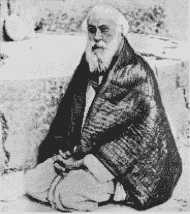

拿希里·玛哈赛

凯巴·南达曾亲眼看到在拿希里·玛哈赛身上发生一件神迹。“有一天，老师告诉我这个故事”。

“瞎眼的弟子拉姆（Ramu）触动了我的怜悯之心。他忠心耿耿地侍奉着我们的上师，难道他的眼睛不应该看得见光明吗？一天早晨，我试图去找他谈话，但他正很有耐心地用手制的芭蕉扇替古茹扇了好几个小时。当这位虔诚的徒弟离开房间时，我跟着他。

“‘拉姆，你眼睛看不见东西多久了？’

“‘从我出生起，先生！我从来没看见过阳光。’

“‘我们无所不能的古茹可以帮助你，请你向他提出祈求。’

“第二天拉姆羞怯地接近拿希里·玛哈赛，一想到自己要请求有关肉体的事，他便感到羞愧。

“‘上师，宇宙的创造者就在您里面，我祈求您将他的光带进我的双眼，让我看见阳光。’

“‘拉姆，有人想给我出难题，我不会治病啊。’

“‘上师，你一定可以治愈的。’

“‘拉姆，上帝是没有极限的！他能用奇妙的生命之光点燃星星和肉体，也一定能够把可见的光带进你的双眼。’

“上师触摸拉姆前额的眉心处。

“‘专注于此处，默念先知罗摩（Rama）之名七天。在一个特别的黎明，太阳的荣光将会加宠于你。’

“一个星期之后果真如此。拉姆第一次见到自然之美。这是全知者准确地引导其弟子复诵他最崇敬的圣者罗摩之名。古茹威力强大的种子在拉姆虔诚耕耘的田地上，终于开花结果了。”凯巴·南达静默了一会儿，对他的古茹表示尊敬。

“拿希里·玛哈赛从不认为自己完成了这些奇迹。他表示，自己只是在完全没有我执和毫无抵抗的臣服下，愈病的能量顺畅地流过了他。

“虽然无数被拿希里·玛哈赛治愈的躯体最终还是要送去火葬。但是他引起了无声的灵性觉醒，造就了基督般的徒弟，这才是他真正不朽的奇迹。”

我一直没有成为一名梵文学者，凯巴·南达教我的是圣人的文法。

第五章 芳香圣人显奇迹

“凡事有定期，万物有定时。”

我没有这种所罗门王的智能，无法安心等待，所以每次外出旅行时，我总是在四处寻找我命中注定的古茹。但直到高中毕业，我的道路都没有与他交汇到一起。

从我和阿玛逃家去喜玛拉雅山之后，两年时间过去了。在这段期间里，我碰到了几位圣人—“芳香圣人（Gand ha Baba）”、“猛虎尊者（Sohong Swami）”、那旃陀·纳斯·巴笃利（Nagendra Nath Bhaduri）、玛哈赛上师和孟加拉著名的科学家加格底斯·钱卓拉·博斯（Jagadis Chandra Bose）。

我与芳香圣人的相遇有两组前奏曲：一组是和谐的，另一组是幽默的。

“上帝单纯，其余都是复杂的。不要在相对世界中寻找绝对价值。”

当我静静地站在圣殿卡力的雕像前时，突然听到这些哲学定论。我转过头去，看见一位衣着寒酸的高大男子，似乎是一位游方的隐士。

“没错，你看透了我的迷惑！”我感激地笑道，“自然界善良与邪恶混淆，如同卡力大神，困惑了多少比我聪明的人啊！”

“有几人能解开她的秘密？生命将善与恶这个谜语，如同斯芬克斯之谜般地摆在每个聪明人面前。多数人为了寻找答案付出了他们的生命，今日的苦难依然相当于远古底比斯（Thebes）的时代。四处屹立的雕像从来不曾为挫败而叫喊。他们从马雅（Maya）的二元性中汲取到统一的真理。”

“先生，你的话很有道理。”

“长久以来，我一直在用非常辛苦的内省接近智能。我持续地关注自己内在的思想，进行充分的自我省察，这是一种严格但令人震撼的体验。它瓦解了牢不可破的‘我执’。”

“如果不能从虚妄中解放出来，人类就无法了解永恒的真理。人类的心灵暴露在时间的泥泞下，生命中充满了无数令人厌恶的幻象。对比于人类内在的敌人，战场上的争斗变得毫无意义！这些不是用强大武装力量就可以征服的敌人！它们是巧妙装配着无明贪欲的士兵，随时随地都在试图残害我们所有人。”

“可敬的先生啊，你难道不同情那些迷惘的大众吗？”

圣人静默了片刻，侧面回答道：

“要同时爱道德完美无瑕无形的上帝与显然毫无美德的有形人类，这点是令人困惑的！但智能可以解决这个难题。通过内在的探讨，我们会发现人类心智的一统性—坚定不移只顾自己利益。至少从某种层面上来说，绝大多数人都是如此。随着这个发现伴随而来的，是人类的谦卑。当谦卑发展到一定地步时，人类就会怜悯自己的同类—那些等待救援却无视治疗力量存在的灵魂。”

“先生，你和每个世代的圣人一样地悲天悯人。”

“只有浅薄的人才会在自己遭遇痛苦时只顾自怜，失去对其他同样身处苦难的人的同情心。”隐士的表情明显缓和下来，“那些敢于详细剖析自己内在的人，会了解遍及宇宙的怜悯之情，并最终得到解脱。对上帝的爱的花朵将会绽放在这样的土地上。众生最终会转向造物主，他们会苦恼地追问：‘为什么，上帝，为什么？’在低等痛苦的鞭策下，人类最后会被驱使进入一个美得让人无法抵御的无穷存在。”

我本来是要来参观卡力圣庙著名的殿堂的。但这位偶遇的同伴却用一个概括性的手势消除了它的华丽庄严。

“砖头灰泥并不能为我们唱出有声的曲调，心灵只为人类唱颂生命而开。”

我们慢步走向入口处，走进迷人的阳光中。成群的信徒络绎不绝地往来。

“你还很年轻，”圣人看着我说道，“印度也很年轻，古代的先知为我们找到了稳固的灵性生活方式。他们古老的名言至今仍然适用于这块土地。那些对抗狡诈的物质主义的戒律永不过时，至今仍影响着印度。数千年的人类历史证实了吠陀经典的价值。把它当做印度的遗产，好好继承吧。”

当我尊敬地向这位隐士告别时，他预言道：

“离开这里后，你在路上将会有一次不平凡的经历。”

离开卡力庙后，我漫无目的地闲逛，突然碰到一个以前的朋友—一个啰里啰嗦说起话来没完没了的人。

“只要你告诉我，在我们分开这六年的时间里，你都经历了什么，我马上就让你走。”

“岂有此理！我现在就要走。”

但他抓住我的手，强迫我说些什么。我告诉自己，此人就像一只饿坏的狼，我讲得越多，他越会饥渴地嗅到新消息的味道。我在心里向卡力女神请求，求她让我优雅地脱身。

突然，我的朋友离开我。我松了一口气，加快脚步，唯恐被他再次附身。听到身后快速的脚步声，我加快了速度，不敢回头。但他一跃而起赶上我，高兴地拍着我的肩膀说道：“我忘了告诉你甘达巴巴（即芳香圣人）的事情了。”他指着几码外的一间房子，“你一定要去看他，他很有意思。你也许会有一次不平凡的经验。再见！”然后他真的离开了。

卡力圣庙前隐士的预言闪过我的心头。我好奇地进入那间房子，并被领进一间宽敞的大厅。一群人面朝东，散坐在厚厚的橘色地毯上。我听到一阵惊叹的低语：

“仔细看豹皮上的甘达巴巴。他能使一朵没有香味的花儿散发出任何花朵的自然香味，能让枯萎的花朵恢复生机，或使一个人的皮肤发散出令人愉快的香味。”

我直视着这位圣人，他快速移动的目光停在我身上。他身材圆胖，留着胡子，皮肤黝黑，一双眼睛大而明亮。

“孩子，很高兴见到你。告诉我，你想要什么。一些香味吗？”

“香味有什么用吗？”我觉得他的提议很幼稚。

“我可以让你用神奇的方式享受香味。”

“利用上帝制造香味？”

“有什么不对吗？”

“是的，但上帝能制造花瓣。你能吗？”

“小朋友，我制造香味。”

“那香水工人们就要失业了。”

“我会让他们保留工作的！我的目的只是要显示上帝的力量。”

“先生，有必要去证明上帝吗？他不是无处不在吗？”

“是的，但我们有时也必须展现他那无限丰富的创造力。”

“要花多久才能精通你这套技巧？”

“12 年。”

“只是为了用灵力制造香味？可敬的圣人，看来你浪费了 12 年，因为只要花几个卢布就可以在花店买到花香了。”

“在花店买到的花香很快会消逝。”

“那为什么我要渴望只会使肉体愉快的东西呢？”

“哲学先生，你真有意思。好吧，伸出你的右手来。”他做了一个祝福的手势。

我离开甘达巴巴有几尺远，周围没有人能碰到我的身体。

“你想要什么样的香味？”

“玫瑰花。”

“好。”

让我吃惊的是，迷人的玫瑰花香立刻从我的掌心飘出来。我笑着从附近的花瓶中拿起一大把白色没有香味的花朵。

“这没有香味的花朵能不能发出茉莉花的香味？”

“好。”

茉莉花的香味马上从花瓣中散发出来。我感谢这位芳香圣人，然后坐到他的学生旁边。他告诉我甘达巴巴的正式名字是维稣达南达（Vishudhananda），他曾跟一位西藏的大师学到许多惊人的瑜伽秘法—他向我保证，那位西藏瑜伽大师已经超过 1000 岁了。

“甘达巴巴通常不会随便展现制造香气的法术。”这位学生显然以他的上师为荣，“他很了不起！许多加尔各答的知识分子都是他的追随者。”

我暗自决定自己不要成为这些知识分子中的一员。实际上，我并不想要太“神奇”的古茹。在礼貌地谢过甘达巴巴之后，我就离开漫步回家了，一路之上，我仔细回想着当天所遇到的三件不同的奇事。

走进古柏路的家门时，我碰到了姐姐乌玛。

“你越来越时髦了，还用香水！”

我让她闻闻我的手。

“多好闻的玫瑰花香啊！真是太浓郁了！”

我悄悄地把由法术生出香味的花朵放到她鼻子下。

“啊，我喜欢茉莉花香！”她拿着花朵。她知道茉莉花通常是没有香味的，当她反复地闻着这朵茉莉花时，脸上浮现出迷惑的表情，很滑稽。她的反应消除了我对甘达巴巴的疑虑，我发现，只有我能闻得到那香味。

后来我从一位朋友阿拉卡拉南达（Alakananda）那儿听说“芳香圣人”有一种神奇的力量，我真希望亚洲几百万饥民能有这种力量。

“有一次我跟一百多位客人齐聚在甘达巴巴柏德旺的家中”，阿拉卡拉南达告诉我，“那是一次盛大的节庆宴会。因为这位瑜伽大师拥有从空气中变出东西的法力，我笑着要求他变出一些不当季的橘子。他马上让所有芭蕉叶盘子上圆扁的面包（luchis）胀了起来。每个面包都包着一个去了皮的橘子。我不安地咬了一小口，美味可口极了。”

几年之后，经过内在的领悟，我终于了解到甘达巴巴是怎么做到无中生有的：人类所拥有不同的感官刺激—色、声、香、味、触觉都是由于质子和电子变异的波动力所产生的。“生命粒子”（lifetron）调节着这种波动力。微细的生命力或是比原子还微小的能量灵巧地充塞着这五种含有特殊感觉的物质。

甘达巴巴通过某种瑜伽的方式，可以引导生命粒子重新排列它们振动性的结构，从而达到自己想要的结果。他的香气、水果和其他奇迹，都是在真正地将世俗的波动力物质化，而不是通过催眠让人产生某种内在感觉。

“芳香圣人”所展示的奇迹虽然看起来很神奇，但却对灵性毫无帮助。除了达到娱乐效果外，这些奇迹几乎没什么用，它们是追寻上帝道路上的歧途。

众所周知，当病人对麻药过敏时，医生们会用催眠术来让其进入麻醉状态。但人类如果经常处于催眠的状态下，那对他们将是有害的，并会产生一些负面心理效果，甚至会扰乱他的脑细胞。总而言之，催眠术侵犯了他人意识的领域，它所产生的暂时性现象与悟道之人所展现的奇迹完全不同。真正了悟上帝的圣人是通过调和至宇宙造物者的意图而在现实世界里制造变化的。

真正的大师们会谴责卖弄神通法力的行为。波斯密行者阿布·赛义得（Abu Said） 曾经嘲弄过一些以操控水、空气及空间等超自然力量为荣的回教术士。

“青蛙在水里也很自在！”阿布·赛义得轻蔑地指出“乌鸦和秃鹰能轻易地飞翔在空中，魔鬼同时存在于东方和西方！一位得道的人，反而会像普通人那样生活在群众中，但内心无时无刻不在默念上帝！”还有一次，这位伟大的波斯上师讲述他对修道生活的观点：“搁下你头脑里原来的东西（自私的想法和野心），自在地给予他人你所拥有的，在遭遇逆境打击时永不退缩！这就是修道！”

卡力庙前的圣人或是西藏上师训练出来的瑜伽行者都不是我心中期盼的古茹。我的上师只是通过他的榜样力量，就教导了我如何衡量一位得道的人。

第六章 猛虎尊者

“我知道猛虎尊者的住处，我们明天就去拜访他。”

我的高中同学羌迪（Chandi）兴奋地告诉我。我非常想去见这位圣人，在还没出家之前，他曾经赤手空拳地与老虎搏斗并捉住老虎。我非常醉心于这种让男孩子热血沸腾的高强武艺。

第二天一大早，尽管天气奇冷，但羌迪和我还是兴高采烈地出发了。我们在加尔各答市郊柏瓦尼浦尔（Bhowanipur）找了很久，终于来到猛虎尊者的房子前面。我用力地敲击大门上的两个铁环。一个佣人不紧不慢地向我们走来，脸上挂着冷笑，似乎是在暗示，不论访客如何喧闹都无法干扰到一个圣人住处的安宁。

我跟同伴虽感觉像是遭到了斥责，但还是很高兴能被邀请进入客厅。在那儿，我们等了很长时间，漫长的等待让我们感到不安。按照印度的不成文法，真理的追寻者必须具有耐心—一位上师可能会故意试探一个人到底有多么渴望见到他。在西方，医生和牙医也会通过这种心理策略来试探病人！

终于，佣人叫羌迪和我进入一间卧房。声名远播的猛虎尊者苏宏（Sohong）斯瓦米就坐在床上。看到他那魁武的身材，我们惊异地呆住了，站在那里无话可说。我们的眼珠都快凸出来了，从来没见过那么厚大的胸膛和橄榄球般发达的二头肌。猛虎尊者有着粗大的脖子，凶猛而平静的脸孔上有着平顺的头发、胡子和八字须。他深色的眼睛显露出似鸽又似虎的特性。除了腰上围了一张虎皮外，他没穿任何别的衣服。

待我们回过神来后，朋友和我向斯瓦米致意，表达我们对他英勇驯虎事迹的仰慕。

“您能告诉我们，怎么可能赤手空拳地去降服丛林中最凶猛的孟加拉虎吗？”

“我的孩子们，对我来说，跟老虎搏斗不算什么。只要有必要，我随时都可以这么做。”他像个孩子般地笑了起来，“你们认为老虎是老虎，我看老虎就像家猫。”

“斯瓦米，我想我可以让自己的潜意识认为老虎只是猫，但我能让老虎也这么想吗？”

“当然，力量也是必要的！你不能指望一个婴儿靠把老虎当成猫就能打败老虎！你必须有强有力的双手。”

他叫我们跟他到天井去。然后他一拳打在墙上，一块砖头碎落在地，我想，他如果一拳就能把墙上的砖头敲下，一定也能敲下老虎的牙齿！

“很多人都有我这种体能，但他们还是缺乏自信和冷静。那些身体强壮但精神并不勇敢的人只要看到野兽在丛林里自由跳跃就要昏倒了。要知道，自然状态下的老虎和马戏团里喂了鸦片的老虎是完全不同的！

“许多力大无比的人一旦碰到老虎，就会被吓得手足无措。因为在这个人的心理上已经让自己变成家猫了。一个人如果拥有强壮的身体及坚强的决心，便可以扭转形势，可以迫使老虎像无助的家猫般臣服。每次我都是这样做的！”

我完全地相信面前的这位巨人可以完成“老虎—家猫”的转化。

“心会主导肌肉的运作。一个人通过自己的身体所展现出来的力量取决于他的意志和勇气。身体实质上是由心灵制造及维持的。通过不断转世累积而成的压力、长处及弱点逐渐渗入了人类的意识。它们表现出来就是习性，接着形成一个令人合意或不合意的身体。人类所有外在的弱点都有着精神上的源起。在一个恶性循环中，受习惯限制的肉体会阻碍心灵的发展。如果一个主人让自己被佣人指挥着，佣人就会变得独裁；同样，如果让心灵受肉体主宰，心灵也会屈服于肉体的命令而被奴役着。”

在我们的恳求下，猛虎尊者告诉了我们一些有关他自己的故事。

“我最初的野心是征服老虎。我的意志力很坚强，但肉体却软弱无力。”

我大吃一惊。实在令人难以置信，这位有着巨人阿特拉斯（Atlas）般身材的人，也曾有过软弱的时侯。

“我在心里不屈不挠坚持地想着健康及力量，终于克服了障碍。我现在百分之百相信心灵的力量，我发现那才是真正征服百兽之王的力量。”

“可敬的斯瓦米，您认为我也能征服老虎吗？”我的心里突然浮现出这样的念头！

“可以。”他笑了起来，“但老虎有很多种，有些老虎漫步在人类欲望的丛林里，打败林间野兽并不能帮助你获得灵性上的进步。相比之下，我更愿意去征服潜伏于人类内在的那些不良习性。”

“先生，请问您是如何产生这种想法的？”

猛虎尊者沉默下来。他开始回想往日的情景。我感觉他是在考虑是否要答应我的要求。最后他笑着默许了。

“当时我的名声如日中天，我感觉有些飘飘然了。我决定不只要征服老虎，还要展现各种不同的手法。我要迫使这些猛兽变成驯养的动物。我开始公开地进行各种表演，也得到了令人满意的成功。

“一天晚上，我的父亲满怀忧虑地来到我的房间。

“‘孩子啊，我有些话要警告你，希望能让你免于即将到来的灾难。’

“‘爸爸，您是一个宿命论者吗？’

“‘孩子，我不是宿命的人。但我相信圣典中的教导，因果报应法则是公正的。一旦丛林里的猛兽家族对你产生怨恨，你将来是要付出代价的。’

“‘爸爸，您让我讶异！您明知道老虎都是美丽而残忍的！哪怕刚饱餐完一只不幸的动物，只要再看到新猎物，它马上又会激起新的贪欲—那也许是一只快乐的瞪羚，在丛林的草原上蹦跳着。捕捉到它以后，老虎这恶毒的野兽会在它柔软的喉咙上咬一个洞，喝点血，然后就扬长而去。’

“‘老虎是丛林中最可鄙的了！也许我的拳头可以为它们混浊的脑袋注入些清醒。我会成为森林精修学校的校长，教导它们仁慈的规矩！ ’

“‘爸爸，请把我看作一名驯服老虎的人，我不是在屠杀老虎。我善意的行为怎么会带来灾难呢？我求您不要叫我改变生活方式。’”

羌迪和我全神贯注地听着。在印度，子女通常是不会随便违反父母意愿的。

“父亲沉默地听着我的解释。接着他沉重地告诉我：

“‘孩子，昨天我在走廊上例行打坐时，一位圣人靠近我。 ’

“‘亲爱的朋友，请告诉你那好斗的儿子，请他停止他那野蛮的行为。否则他下次与老虎相遇时，他会受重伤，接下来六个月，他会染上致命的疾病。然后他会尽弃前尘，出家为僧。’

“我没有把这些话放在心上，反而认为父亲只是一个容易受骗的老好人。”

然后猛虎尊者黯然地沉默了很长一段时间，似乎忘记了我们的存在。当他重新开始讲话时，他的声音突然缓和了下来。

“在听到父亲的警告后不久，我到库曲比哈尔（Cooch Behar）的首府游历。那图画般的景色对我来说是个崭新的经验，我期望有个平静的转变。跟往常一样，好奇的人们在街道上跟随我到处走。我听到有人在窃窃私语：

“‘这就是那位征服猛虎的人。’

“‘他有三头六臂吗？’

“‘看他的脸！想必是虎中之王转世而来！’

“小孩子们四处散播消息，然后是妇女们挨家挨户流传，就像是有声的公告栏！几小时之内，整个城市为我的到来陷入了一阵兴奋。

“那天晚上，我正在安静地休息时，突然听到外面传来奔驰的马蹄声。一辆马车停在我的住所前面，接着一些身材高大戴着头巾的警察走了进来。

“我震惊了。‘欲加之罪，何患无辞啊！’我想，‘他们是否要陷害我呢？’但警官们却不寻常地向我鞠躬致意。

“‘尊敬的阁下，我们代表库曲比哈尔王子欢迎您的到来。他很高兴邀请您明早入宫。’

“我考虑了一下。警察们恳求的方式感动了我。我同意前往。

“第二天，我从门口被逢迎护送到一辆四匹马拖着的豪华马车上。一位仆人为我撑起一把华丽的遮阳伞。我享受着这趟旅程，经过市区及近郊森林，舒适极了。王子殿下亲自在皇宫门口迎接我。他让出自己的黄金宝座，面露微笑地坐在一张相对简单的座椅上。

“‘所有这些殷勤，一定都是有代价的！’我想着。果然，短暂的闲聊后，王子开口了。

“‘市面上充满了谣传，说你可以赤手空拳打败猛虎。那是真的吗？’

“‘的确如此。’

“‘我简直无法相信！你是来自加尔各答的孟加拉人，是吃着白米长大的都市人。恕我直言，你打败的难道是那些马戏团里喂以鸦片的动物吗？’他的声音响亮，略带嘲讽，带有明显的地方口音。

“对他这个侮辱性的问题，我没有答复。

“‘我要向你挑战，要你去打败我最近捉到的老虎—雌雄王（Raja Begum）。如果你能用铁链拴住它，而且神智清楚地离开笼子，你就可以拥有这只孟加拉虎！此外还有几千卢布以及其它许多礼物。如果你拒绝战斗，那么我将告诉所有人，说你是一个骗子。’

“他的话像成排的子弹，带着侮辱扫射着我。我愤怒地接受了。他兴奋地从座椅上半站起来，接着又笑着坐了回去。这使我想起古罗马皇帝将基督徒与野兽一起放在竞技场内搏斗的情景。

“‘搏斗将在七天后举行，很抱歉我不能让你事先去看这只猛虎。’

“是不是王子怕我找机会催眠这只野兽，或偷偷地喂它鸦片，我不知道！

“离开皇宫时，我注意到大伞盖及华丽的马车不见了。

“接下来的这个礼拜，为了这场即将到来的搏斗，我的心灵及身体有条不紊地准备着。从仆人那里，我听到了一些荒诞的流言。不知怎么的，那位圣人告诉我父亲的预言，被夸大后传开了。很多单纯的村民相信，有一个受到诸神诅咒的邪恶灵魂已经投胎转世成了一只老虎，晚上它会变成各种形态的恶魔，但白天它还是一只有条纹的猛虎。这只恶魔老虎就是要来教训我的。

“另一个版本是说动物们向虎神祈祷，最终得到了雌雄王的响应。它就是虎神用来惩罚我的工具。一个没有皮毛、没有利齿的人竟然敢向筋骨强劲的老虎挑战！村人们宣称，所有被羞辱的老虎们所聚集的怨恨已经累积了足够的能量，它们将要击倒这位狂妄的驯虎人。

“我的仆人还告诉我，作为比赛负责人的王子已经指挥搭起了一座能遮风避雨的场地，可供数千人观赏比赛时使用。场地中央是一个巨大的铁笼子，里面关着雌雄王，外面环绕着安全室。雌雄王不停地发出一连串令人毛骨悚然的怒吼。为了激发它的胃口，饲养员们每天只喂它很少。也许王子希望我成为它的餐点吧！

“争相购票的人潮从城市和郊区涌入。比赛当天，好几百人因为买不到票而被拒绝入内。许多人冲破帐篷的出入口，甚至在别人的座位下面趴着观看。

我随着猛虎尊者的故事进入高潮而兴奋起来，羌迪也一语不发，显然是入迷了。

“在雌雄王刺耳的吼叫和群众的吵闹声中，我安静地出场了。除了腰间系的围布，我没有任何其他衣服保护。我打开了安全室的门栓，镇静地将它在我身后锁回。闻到血腥味后，雌雄王闪电般地一跃而起，重击在栏杆上，发出令人恐惧的怒吼。我犹如一只待宰的羔羊，观众感到一种巨大的恐惧，一下子变得安静无声。

“一转眼，我已经走进笼子了。当我猛然关上门时，雌雄王扑了上来。我的右手被严重地撕裂。老虎最喜欢看到人类的血，此时我的血大量涌出。圣人的预言即将实现。

“我从未受过如此严重的伤害，不由感到一阵震惊，但我很快又振作起来。将流着血的手指藏在腰布下，左手挥出粉身碎骨的一拳。猛兽向后溃退，在笼子的后端转身，又痉挛般地向我跳跃过来。我巨大的拳头如雨点般地痛击在它头上。

“尝到人血的滋味后，雌雄王变得像一个很久没有喝到酒的酒鬼啜饮到第一口美酒一样。夹杂着震耳欲聋的吼叫，这只野兽的攻击变得猛烈起来。此时我只有一只手可用，这使我容易受伤。但我发出了令人眩目的攻击。我们两个血迹斑斑，展开了一场生死搏斗。笼子里一片狼藉，鲜血溅得到处都是，雌雄王的喉咙里发出阵阵痛苦的吼叫。

“‘杀死它！’‘杀死那只老虎！’观众叫喊着。我鼓起所有的意志，凶猛地怒吼着，最后给了老虎一击。老虎倒了下去，躺着不动了。”

“像只家猫！”我插口道。

斯瓦米欣慰地笑了起来，然后继续他的故事。

“雌雄王终于被打败了。我用被撕裂的手，大胆地掰开它的嘴巴。在那戏剧性的一刻，我把头放进它张开的嘴巴里。我拉了一条铁链圈住老虎脖子，把它绑在笼子的栏杆上，胜利地走向门口。

“但那魔鬼竟然还有力气，令人难以置信地向我扑了过来，它拉断铁链，跳到我的背上。我猛然摔倒，肩膀靠近了它的下颚。但转瞬间，我把它压在下面，毫不留情地一阵痛打，直到这只猛兽陷入了半昏迷状态。这次我更加小心地把它绑好，然后慢慢离开笼子。

“我发现自己处于一阵新的欢乐的骚动。群众的欢呼喝彩声好像从同一个巨大的喉咙中发出来。虽然受了重伤，但我还是完成了三件事：打昏老虎，把它拴住，自己清醒地离开笼子。

“伤口处理好之后，我受到尊崇并被套上花环，数百片金子如雨般地落到我的脚下。整个城市陷入了节庆的欢腾。人们到处都在讨论，讨论我降服雌雄王的胜利。正如王子当初所承诺的，雌雄王成了我的私人财产，但我并不开心。当我最后离开笼子时，似乎也关上了自己世俗野心的大门。

“接着而来的是一段悲惨期。六个月的时间里，我患上了毒血症，每天躺在死亡的边缘。最终，当我恢复到可以离开库曲·比哈尔时，我回到了家乡。

“‘我知道那个给我明智警告的圣人将成为我的古茹。’我谦卑地向父亲承认，‘但愿我能找到他！’我的渴望很快得到答复，圣人很快到来了。

“‘驯够老虎了吧，’他平静地说道，‘跟我来，我会教你如何降服在人类心灵丛林里漫游的无明野兽。你一向习惯有一群观众，现在让一群天使做你的观众，享受令人振奋的瑜伽术吧！’

“就这样，我神圣的古茹正式引领我走上灵性之路。他开启了我由于长久不用已生锈的灵魂之门。我们手牵着手，开始在喜玛拉雅山的训练。”

羌迪和我拜倒在斯瓦米的脚下，感谢他生动地讲述了他传奇的生平。我觉得在寒冷的客厅里，我们的长久等待是值得的！

第七章 飘浮在空中的圣人

“昨晚在一个聚会上，我看到一位瑜伽行者飘浮在空中离地面几英尺的地方。”我的朋友乌潘卓·摩宏·乔杜里（Upendra Mohun Chowdhury）告诉我。

我笑着说道：“是不是上环路上的巴笃利·玛哈赛（Bhaduri Mahasaya）？”

乌潘卓点点头，感觉有些失望，他本来是想在我面前炫耀一下的。认识我的人都知道我对圣人的兴趣，他们也以能带给我一些新消息为乐。

“这位瑜伽行者住的地方离我家很近，我经常去拜访他。”我的话引起了乌潘卓的兴趣，我接着说道：

“我看过他的展示。他精通各种古代瑜伽八步功法中的能量控制调息法（Pranayamas）。有一次巴笃利·玛哈赛在我面前示范风箱式调息能量控制法（Bhastrika Pranayama），力量惊人，房间里就像刮起一场风暴！然后他停下了那雷电般的气息，一动也不动地停留在超意识的状态里。”

“听说这位圣人从来没离开过家。”乌潘卓有些怀疑。

“千真万确！过去二十年来，他一直住在屋子内。只有在圣典节庆时，他会稍微走动一下，但最远也只是走到前面的人行道上施舍乞丐们。”

“他如何能抗拒地心引力，停留在空中呢？”

“在练习某些调息法后，一个瑜伽行者的身体会失去它的粗重性，接着就会凌空浮起或像一只青蛙般四处跳跃。即使那些没正式练过瑜伽的圣人，一旦他们能极度地向上帝祈祷，也能飘浮在空中。”

“我想多了解一些这位圣人的事情。你去参加他晚上的聚会吗？”乌潘卓的眼睛里充满好奇。

“是的，我经常去。我非常喜欢他的幽默。偶而我的大笑会破坏会中庄严的气氛，但圣人并不生气，倒是他的徒弟们却会怒目而视！”

那天下午，在放学回家的路上，我经过巴笃利·玛哈赛的修道院，决定去拜访他。这位瑜伽行者并不公开会客。一名弟子待在楼下，守卫着他的上师。这名弟子是那种严格执行纪律的人，他问我有没有预约。幸好他的古茹及时露面，我才没被拒绝在外。

“穆昆达想来就让他进来。”圣人的眼晴闪亮着，“我所定下的规矩不是为了我自己的舒适，而是为了其他人。世俗之人不喜欢坦率和正直，因为那会粉碎他们的幻觉。圣人不但稀有，而且会觉得困窘。即便在经典里，他们也经常陷入困境！”

我跟着巴笃利·玛哈赛上到他顶楼简朴的房间，在这里很少有人会打扰他。

“伟大的圣人（maharishi），您是我所知道的第一个一直待在屋子里的瑜伽行者。”

“上帝有时会在意想不到的地方安置他的圣人，免得我们会把上帝简化成一个法则！”

圣人盘成莲花座姿。虽然已经七十多岁了，但他没显出任何老态。他身体硬朗而挺直，在各方面都很完美。他的脸像古书上所描述的先知：高贵的头，满脸胡子，他总是坐得笔直，平静的眼睛专注于无所不在的上帝。

圣人和我进入了禅定状态，一个钟头之后，他柔和地唤起了我。

“看得出来，你经常进入寂静，但你有没有训练阿奴哈瓦（anubhava）？”他提醒我要爱上帝甚于爱打坐，“不要把手段当成目标。”

他给了我一些芒果。我很喜欢他的风趣。他说道：“一般人通常喜欢加拉（Jala）瑜伽（与食物合一）甚于禅定（Dhyana）瑜伽（与神合一）。”

他的双关语让我捧腹大笑。

“你笑得真开心！”他的眼神闪烁着温柔的亲切。他的脸虽然严肃，但却有着动人的微笑。那双莲花似的大眼睛里隐含着天国的笑意。

“这些信件来自遥远的美国。”圣人指着桌上几个厚信封，“我一直在与一些团体通信，他们都对瑜伽有兴趣。他们比哥伦布更有方向感，能重新发现印度！我很乐意去帮助他们。瑜伽的知识就像无需修饰的日光，只要你愿意，随时都可以免费获得它。

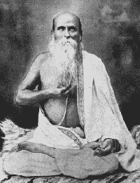

“凌空飘浮的圣人”：巴笃利·玛哈赛。

“先知体悟到，印度那些使人类解脱的本质同样地适用于西方。不论是东方或西方，如果不实行某种有传统的瑜伽，都无法兴盛起来。”

圣人宁静的眼神吸引着我。当时我并不知道他的话里隐含着导引我的预言。一直到现在，当我写下这些话时，我才完全了解到，他经常会给我一些看似随意的暗示，比如说暗示我有一天我将带着印度的教导去美国。

“伟大的圣人，为了世界的福祉，我希望您能写一本有关瑜伽的书。”

“我训练徒弟。他们及他们的徒弟们将会是活的书本，不会随着时间的流逝而自然瓦解，并证实那些评论家的解释是错误的。”巴笃利的风趣又让我开怀大笑起来。

我陪着这位瑜伽行者直到晚上他徒弟的到来。然后巴笃利·玛哈赛开始他别具一格的演讲，他的话语像一股平和的洪流，扫除了听者心灵上的残渣，向上帝奔流而去。他用完美无瑕的孟加拉语讲述了一些让人印象深刻的寓言。

那天晚上，巴笃利详细解说了有关圣女密罗跋伊（Mirabai）不同的哲学观点。密罗跋伊是中世纪拉吉普塔尼（Rajputani）的一位公主，她抛弃了皇宫的生活，想与圣人为伍。但因为她是女性，一位伟大的托钵僧拒绝收她为徒，结果她的回答反而使这位圣人谦卑地拜在她的脚下。

“告诉您，”她说，“除了上帝，我不知道宇宙中还有任何男性。在他的面前，我们不都是一样吗？”

密罗跋伊写了许多悟道的诗歌，至今仍被广泛流传。我在这里翻译了一篇，以飨读者：

“如果天天沐浴就能了悟上帝

我会迫不及待地成为一只深海的鲸鱼；

如果啃树根吃水果就能认识他

我宁愿做一只羊；

如果数念珠就能发现他

我会数个不停；

如果跪拜石像就能看到他

我会谦卑地礼拜石山；

如果喝牛奶就能被上帝接受

许多小牛和小孩都会认识他；

如果远离妻子就能唤来上帝

成千上万的人都要阉了？

密罗跋伊知道，要找到神圣的上帝

唯一的途径就是播撒大爱。”

几个学生把钱放到巴笃利身旁的拖鞋里。在印度的习俗里，这种尊敬的供奉代表徒弟将他的物质财富放在古茹脚下。

“上师，您真了不起！”一位正要告退的学生热切地注视着这位德高望重的圣人，“为了要寻求上帝并教导我们智能，您舍弃了财富和舒适！”众所周知，巴笃利·玛哈赛从小就放弃了庞大的家族财产，一心一意地踏上了瑜伽之路。

“正好相反！”圣人有些不高兴了，“为了宇宙王国无止尽的祝福，我只是离开几个没有价值的卢布及一些小乐趣。我哪有舍弃什么？那算是牺牲吗？只有短视的世俗凡夫才真正在舍弃宝贵的财富！他们放弃了天国无比的财富，只为了尘世间那些少得可怜的玩具！”

“上帝比任何保险公司都懂得安排我们的未来。”上师说道，“世界上到处都是缺乏外在安全感的信徒。他们的想法就像是他们额头上的疤，每天都流露在外。事实上，从我们首次呼吸时就供给我们空气和牛奶的上帝知道如何眷养他的子民。”

我每天放学后都去到圣人居处朝圣学习。他默默地热心帮我达到阿奴哈瓦的境界。终于有一天，他搬到摩罕罗伊路去了，离我古柏路上的家很远。敬爱他的弟子为他盖了一间新的修道院，名为“那旃陀精舍”（Nagendra Math）。

在我启程前往西方之前，我找到上师并谦卑地跪在他面前，请求他临别的祝福。

“孩子，去美国吧。带着古老印度的尊严作为你的盾牌。胜利写在你的额头上，远方尊贵的人们将会完全接受你。”

第八章 大科学家博斯

“加格底斯·钱卓拉·博斯（Jagadis Chandra Bose）发明无线电的时间甚至早于马可尼。”

无意中听到这句令人兴奋的话后，我开始靠近人行道上一群忙着讨论科学的教授们。

“先生，请问您刚才说的是怎么一回事？”

那位教授耐心地解释道：“博斯是世界上第一个发明无线电检波器和显示电波折射仪器的人。但印度科学家并没有把这些发明商业化。所以很快地，博斯教授将他的注意力从无机物转到有机的世界。作为一名植物生理学家，他革命性的发现甚至超过了他在做一个物理学家时的卓越成就。”

他补充道：“这位大科学家是我在普省（Presidency）学院的同事。”

第二天我造访这位圣人在我古柏路上的家附近的住所。这位已经退休的植物学家亲切地接待了我。他是一个五十多岁的人，英俊、健壮，有着浓密的头发，宽广的额头以及梦想家们特有的若有所思的眼睛。他用词精确，显示了身为科学家多年养成的习惯。

“我最近才考察西方的科学团体回来。他们对我发明的那些显示所有生命都是不可分的精密仪器表示出浓厚的兴趣。一般的显微镜只放大到数千倍就能为生物科学带来重大冲击，而我的加强检测仪（crescograph）则可以放大至数千万倍。我的生长测量仪则让人们看到了不可限量的远景。”

“先生，您用客观的科学方式做了许多事，加速了东方与西方的结合。”

“我是在剑桥接受教育的。西方人要求对所有的理论都以谨慎的实验来求证，这点非常值得赞扬！这样的思想与我传承自东方的内省能力相辅相成。将二者结合在一起，我才能打破长久以来不能与自然界沟通的沮丧。哪怕是极端不相信植物有灵敏神经系统及各种不同感情生活的人，都无法否认我的加强检测仪上曲线图的证据。植物与动物一样，也有爱、恨、欢喜、恐惧、满足、痛苦、兴奋、麻木以及无数适当的情感反应。”

“在您之前，全世界所有生命的独特悸动似乎都只是富有诗意的想象，教授！我曾听说一位圣人从来不摘花朵。‘我应该掠夺玫瑰吗？我怎能因我粗鲁的抢夺而残忍地破坏它的尊严呢？’您实际上证明了他这些富有同情心的话是有道理的！”

“诗人们直接亲近真理，科学家们却显得很笨拙。你看哪天到我实验室来吧，看我加强检测仪上显示的证据。”

我充满感激地接受了这个邀请，然后离开了。我后来听说这位植物学家离开普省学院，打算在加尔各答成立研究中心。

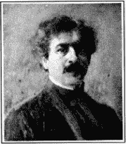

大科学家加格底斯·钱卓拉·博斯

博斯研究院开幕时，我主动去当义工。看到数以百计的热心人士在屋内走动。我被这座新的艺术与灵性的象征迷住了，它的大门是一个神殿百年的遗物。在莲花喷泉之后，有一座手持火炬的女性雕像。花园里有一座小庙，供奉着超越现象界的本体。没有任何祭坛的神像让人联想到上帝是无形的。

博斯在这个盛大场合发表了致词，样子就像出自古代一位得到启示的先知。

“今天这个机构不仅是一个实验室，同时也是一座庙宇。在研究的过程中，我不知不觉地被引向物理和生理学的交界处。我很惊奇地发现，两者之间的界线消失了，在生物界与无生物界的中间出现了交集点。一般人们认为，无机物是不会动的，但在众多不同力量的作用下，它的确会颤动。

“金属、植物和动物看起来都有一样的反应。实际上，它们都会疲劳及消沉，也会复原及兴奋，在死亡时也会停止对外界刺激做出反应。我对这个惊人的发现充满了敬畏之情。我非常希望能在皇家协会面前宣布我的实验成果。但如今的生理学家劝我将自己的发现局限在物理学上，不要侵犯他们的禁区。他们认为我无意中踏入了另一个不熟悉的领域，冒犯了它的成规。

“神学上也存在着一个不自觉的偏见，就是将无知与信心混淆在一起。人们经常忘了上帝时刻在以不断演化的奥秘环绕着我们，同时也让我们对一切产生怀疑，渴望了解。经过多年，我才发现，献身科学的人不可避免地会陷入永无止境的挣扎。他的生命本来就是用来扮演成一个热诚的奉献者—一个视得失、成功和失败为一体的人。

“世界上那些最先进的科学团体终将接受我的理论，并了解印度对世界科学界的重要贡献。几千年来，印度人总是在放弃眼前吸引人的荣耀，寻求生命中的最高理想—不是被动地放弃，而是主动地奋斗。拒绝竞争的弱者最终将一无所获。只有奋斗而且成功的人才能丰富这个世界，为世人献上他胜利的果实。

“博斯实验室在物质反应及植物生命现象上的发现，已经开启了物理、生理、医学、农业，甚至于心理学上新的领域。以往人们认为不能解决的问题，现在都成了可以实验研究的对象。

“但没有严密的精确性，我们就无法获得高度的成功。因此在大厅进口处，陈列在架子上的，是我设计的长效型超灵敏度仪器。它们所要告诉你们的，就是一定要长时间地去努力看穿虚伪的表象，进入看不见的实相，用坚韧不拔的毅力和机智去克服人类的极限。所有富有创造力的科学家都知道，人的心灵才是真正的实验室，在那里，他们发现了幻象背后的真理。

“将来我们会在这些厅堂里宣布新的发现，本院将定期发表研究成果，印度的这些贡献会遍及全世界。它们将会变成公共财产，我们永远不会申请任何专利。我们国家的精神要求我们，永远不能只为个人的私利而使用知识。

“我希望，在可能的范围内，所有国家的工作人员都可以使用本院的各种设施。在这方面，我试图沿袭我们国家的传统—正如 2500 年前，印度古代的那烂陀（Nalanda）和塔席拉（Taxila）大学欢迎世界各地的学者前来交流一样。

“虽然科学是国际性的，不专属于东方或西方，但印度特别适合做出伟大的贡献。印度人拥有强烈的想象力，可以从一堆互相矛盾的事物中挖掘出新的秩序，但同时又能保持巨大的耐心和克制。”

这位科学家的结论我热泪盈眶，“耐心”不也正是印度的同义字吗？

开幕后不久，我再度造访这位伟大的植物学家，他记得自己的承诺，带我走进他安静的实验室。

“我要将加强检测仪接到蕨类植物上，放到极大的倍数，这种倍数会让蜗牛爬行的速度看起来像是特快车！”

透过加强检测仪，我看到这株植物生长得非常缓慢。科学家用一根小金属棒碰触蕨类植物的尖端，它的生长便突然停了下来，当棒子拿走后，它立刻恢复动人的韵律。

“你可以看到，任何轻微的外界干扰都会伤害到敏感的组织，”博斯说道，“看，我现在先给它加上哥罗芳麻药，然后再给它解药。”

哥罗芳加上后，一切生长活动都停止了下来，解药使之重新启动。整个过程比电影情节更令人着迷。我的同伴博斯（在此扮演坏人的角色）用尖锐的工具刺进了蕨类植物，植物痛苦地痉挛了一下。当他用剃刀穿过部分的茎时，植物也猛烈地颤动着，接着划上死亡最后的标点，一动不动了。

“最早我用哥罗芳麻醉成功地移植了一棵大树。通常像这种森林大树移植后会死得很快。我的曲线图证明，树也有循环系统，树汁的移动相当于动物体内血液的循环。树汁向上的移动用一般机械学原理是无法解释的。但如今这个问题已通过加强检测仪解答出来了，根源来自于活细胞的活动。那是从一棵树延伸向下圆柱形的管状器官发出的蠕动性波动！越深入地了解，我们就越会发现，这世上有一个统一的计划连结着自然界的每一种形体。”

这位伟大的科学家指向另一台博斯仪器。

“我用一块锡做实验给你看。金属对刺激也有反应。墨水的痕迹会记下各种不同的反应。”

我全神贯注地观察记录原子结构特有的讯号波图。当教授在那块锡上加上哥罗芳后，振动的笔迹停止了，接着，当金属慢慢恢复至常态时，它就重新开始。博斯加了一种有毒的化学物质。在锡颤动结束的同时，笔尖也戏剧性地在图上画出一个死亡标记。

“博斯仪器告诉我们，剪刀和机器所用的不锈钢之类的金属也会感到疲劳，但只要稍加休息它们便可恢复功效。如果对金属通上电流或施以高压，它的生命力就会受到重创，甚至完全失去生命力。”

我看着房间内无数的发明，它们说明了博斯教授的确是一位孜孜不倦的天才。

“先生，很可惜，大众农业未能充分应用您的机器。用这些仪器检测各种不同的肥料对植物生长的影响，这不是很简单吗？”

“没错，的确如此，未来的世代将广泛地使用博斯仪器。科学家很少能在自己在世时收到回报，我只要享受创造的乐趣就够了。”

我对这位勤奋的圣人表达了由衷的感激，然后离开了。“他那惊人的天才会不会有枯竭的时候呢？”我心里想着。

但事实证明，几年以后，他的创造力丝毫未减。他又发明了一种精细复杂的仪器“共振心脏仪”（Resonant Cardiography），并对印度无数的植物进行了广泛研究，发现了许多前人未知的新药。心脏仪绘出的图形精确度可达百分之一秒。共振记录仪可测量植物、动物和人类构造中极为微小的震动。这位伟大的植物学家预测，将来人们会用他的心脏仪来对植物进行活体解剖。

他指出：“植物能预示所有会在人类身上发生的事情。在植物身上做实验，将大大有助于减轻人类的痛苦。”

几年以后，博斯在植物学的创见被其他科学家证实了。《纽约时报》报导了哥伦比亚大学在 1938 年所做的研究：

“在过去几年中，科学家们证实了，当神经在脑和身体其它部分间传递信息时，会产生微小的电流。这种电流可以用灵敏的检测器测出并用现代的放大器放大至数百万倍。直到现在，还没有令人满意的方法可以研究人体和活的动物体内沿着神经纤维移动的电流信道，因为它们传播的速度太快了。

“柯尔（K.S. Cole）和柯帝士（H.J. Curtis）博士发现，在金鱼缸中常见的淡水植物长形单细胞的水藻（nitella）实际上类似那些单一的神经纤维。他们更进一步发现：当水藻纤维受到刺激时，它所发出的电流在各方面（除速度外）都与人类及动物神经纤维发出的电流类似，只是植物比动物的神经电流要慢了许多。哥伦比亚大学的工作人员把握住这个发现，拍下了电流在神经内移动的慢动作。”

这些水藻也许就像是罗塞达石（Rosetta stone）（解释古埃及象形文字的可靠线索），可以解释人类心灵与物质之间被紧密看守着的秘密。

美妙的孟加拉诗人鲁宾卓纳斯·泰戈尔（Rabindranath Tagore）是博斯坚定的朋友，曾为他写下如下的诗行：

哦，隐者，以古称萨马（Sama）赞美诗的真言

来呼唤你，“上升吧！觉醒吧！”

召唤那些狂言经典之徒

从自负无益的争论中走出来，

召唤那些愚蠢自夸之徒

超越这无限大地自然的表象，

召唤所有的学者，

一起围绕你奉献之火

让他们聚集起来。愿我们印度，

回到她古老的土地

哦，再次回到不变的

责任，奉献，

最热诚冥思到入定，让她再度处于

平静，无欲，无争，纯洁，

重拾她往昔崇高的地位

成为全世界的导师。

第九章 极乐的信奉者及其宇宙传奇

“孩子啊，请坐好。我正在跟圣母说话。”

我带着敬畏的心静静地进入了玛哈赛上师的房间。上师天使般的外表让我赞叹不已。他的胡子光滑而雪白，眼睛又大又明亮，他看来像是纯洁的化身。他抬高的下巴和重叠的双手告诉我，我这第一次的访问打扰了他的打坐。

他的欢迎辞虽然简单，但所产生的影响力却是到目前为止，我所经历过的最为猛烈的。我以为丧母之痛是所有苦难中最难以忍受的，但现在与圣母分离的巨大痛苦对心灵而言，更是一种难以言喻的折磨。我呜咽着哭倒在地上。

“孩子啊，平静下来！”圣人表示同情。

我好像被遗弃在孤寂的汪洋中，他的脚就是我唯一的救生艇。

“神圣的先生啊，请代我祈求！请问圣母，在她的心里，会不会给我任何的恩赐！”

上师沉默无语。

毋庸置疑，我深信玛哈赛上师正与宇宙圣母深入地交谈。即使是在这个时候，当玛哈赛上师可以看到圣母时，我的眼睛却看不到，这实在是极大的羞辱。我厚着脸皮抓住上师的双脚，一次又一次地恳求他代为祈求。

“我会将你的请求上达挚爱的圣母。”上师微笑着同意了。

“先生，请记得您的承诺！我很快就会回来倾听她的讯息！”刚刚还在悲伤啜泣的我，现在声音里回响着愉快的期待。

我走下长长的楼梯，完全淹没在美好的回忆里。这栋座落在阿默斯特街五十号的房子曾经是我的家，是母亲离世的地方，而现在却成了玛哈赛上师的住所。在这里，我曾为突然失去母亲而心碎。今天在此，我的心也因为见不到圣母而被折磨着。

我急切地赶回位于古柏路的家。躲到我的小阁楼里寻找安宁，我打坐到十点钟。印度温暖的黑夜突然被一个奇妙的景像照亮了。

圣母站在我的面前，全身围绕着神圣的光环，美丽的脸上带着温柔的微笑。

“我一直都在爱着你！我会永远爱着你！”

天国的声音荡漾在空气中，然后她消失了。

第二天早晨，我迫不及待地再度去拜访玛哈赛上师。我爬到了他在四楼的房间。关着的门上，一件衣服挂在把手上，我觉得这说明圣人不希望受到干扰。当我站在那里不知如何是好时，圣人打开了门，我跪在他神圣的脚下。为了好玩，我装出一副严肃的脸孔，隐藏起内心的喜悦。

“先生，我来了，为了你的讯息。挚爱的圣母有没有说任何关于我的事呢？”

“淘气的小孩子！”

显然，我的假装并未影响到他。

“为什么这么神秘？难道圣人从不明讲吗？”我有点儿被激怒了。

“你一定要测试我吗？”他平静的眼神充满了谅解，“难道昨晚十点你没有看到美丽的圣母吗？”

我立刻再度拜倒在他的脚下。但这次我涌出的是欢喜的眼泪。

“你以为你的虔诚没有感动那无限的慈悲吗？你所敬爱的上帝以人类和天国的形态存在着，从来未曾忽略响应你被遗弃的哭泣。”

这个单纯的圣人是谁，他只对宇宙做了最小的请求，就得到了甜美的默许？在我所认识的人当中，他可说是最伟大谦卑的人了。玛哈赛上师在这阿默斯特街的房子里开办了一所小型的男子高中。他从未斥责过任何学生，也不需要规则或戒尺去维持纪律。在这些不大的班级里，他传播他通过灵性接触的智能，而非死板的教条。他一心纯真地热爱着圣母，跟小孩一样，不需要别人外在形式上的尊敬。

“我不是你的古茹，他稍后才会到来，”他告诉我，“通过他的引导，你对上帝爱与虔诚将会转变成深不可测的智能。”

每天傍晚，我都会前往阿默斯特街，以前我从不曾因尊敬而鞠躬致意，但是现在，哪怕只是踩在玛哈赛上师走过的土地，我都觉得是无上的恩典。

一天晚上，我带着一串花朵前往拜访上师，“先生，请戴上这个我为您做的金香木花环。”但他害羞地拒绝了。最后察觉到我受到了伤害，他微笑着同意了。

“既然我们都是圣母的信徒，你可以把花环戴在这身体的圣殿上，就好像是供奉给内在的她。”他不允许一丝一毫的我执出现在他身上。

“我们明天去被我古茹圣化的达森斯瓦尔（Dakshineswar）圣庙。”玛哈赛的上师是基督般的圣·瑞玛奎师那·帕拉宏撒（Sri Ramakrishna Paramhansa）。

第二天早晨，我们坐船沿着恒河航行了四英里，最后来到有九个圆形屋顶的卡力圣庙内，圣母和希瓦的神像被安置在亮丽的银雕莲花上，上面有精雕细琢的千片花瓣。玛哈赛上师高兴地眉开眼笑。当他吟颂圣母的圣名时，我不由得心花怒放。

随后我们漫步于这个神圣的场地，驻足在柽柳树下。这种树会渗出特有的汁液，象征着玛哈赛上师赐予的天国食物。他在进行天国的祈祷。我动也不动地坐在围绕着柽柳粉红色羽状花朵的草地上，感觉自己短暂地离开了身体，造访天国。

这是我跟神圣的上师往后多次到达森斯瓦尔圣庙朝圣的第一次。从他那里，我学到上帝母性和慈悲甜美的一面。

有一天，当我看着上师在祈祷时，我突然深情地想道：“他可以作为天国的天使在人间树立榜样！”他用长久以来他所熟悉的纯洁的眼光审视这个世界，不带一丝的责备或批评。他的身体、心灵、言语及行为毫不费力地与他单纯的心灵调和着。

一天晚上，上师和我手牵着手在他的校区内散步。一个充满自负的熟人突然到来，他用冗长的谈论烦扰着我们。

“我发现你不喜欢这个人。”上师对我耳语到，但这个自大狂根本没有听到，而是继续他的长篇大论。上师说：“我跟圣母说过这件事了，她了解我们糟糕的困境。她答应当我们到达那间红房子时，就会提醒他还有更重要的事情。”

我开始盯着解救的地方。快要到达它红色的大门时，这个人突然转身离去，连再见都没说。

还有一天，我单独走近豪拉火车站。我在一座庙旁站了一下，旁边有一小群敲着铙钹，打着鼓，激烈唱颂着圣歌的人，这让我心里感觉很是厌烦。

“他们竟然用机械的方式覆诵上帝的圣名，这是多么不虔敬啊！”我心里想着。突然我看到玛哈赛上师迅速地靠近，我上前问道：“先生，您怎么会在这里？”

圣人没有理会我的问题，而是直接回答了我的想法：“孩子，无论任何人念诵上帝的名字，不管这人是无明或聪明的，听起来都是甜美的，难道不是吗？”他深情地环抱着我，我发现自己好像乘着他的魔毯到了慈悲之境。

“你要不要去看一些影片？”一天下午，玛哈赛上师提出了这个问题，这让我又惊又喜，当时印度“影片”的意思就是“电影”。我同意了。不论干什么，只要能跟他一起，我都很高兴。我们轻快地走到加尔各答大学对面的花园。上师指着水池旁的一条长椅。

“在这里坐几分钟。我的上师总是告诫我，只要看到一片广阔的水域就要打坐。它的平静让我们想起上帝广大无边的宁静。所有事物都可以被水反照出来，所以整个宇宙也映照在‘宇宙心灵’的湖上。我的古茹经常这么说。”

我们很快进入了大学里一间正在进行演讲的大厅。演讲非常单调无聊。

“这就是上师要我看的？”我有些不耐烦了。

“孩子，我知道你不喜欢这个影片。我已经向圣母提过了，她十分同情我们两个人。她告诉我电灯现在会熄灭，等我们离开这里后，它才会再亮起来。”

他刚说完，大厅陷入一片黑暗。教授刺耳的声音安静了下来：“大厅的电路系统看起来有问题。”在这个时候，玛哈赛上师和我已安全地穿过了门槛。我回头一望，我们受难的地方灯又亮了起来。

“孩子啊，很明显，你不喜欢那部影片，但我想你会喜欢另一种的。”圣人和我站在大学建筑前面的人行道上。他轻拍我胸部靠近心脏的地方。

突然我感到一种有趣的寂静。就好像如今有声电影的扬声器突然坏掉，变成无声影片一样，上帝用某种神奇的方式消除了尘世的喧扰。所有行人及经过的电车、汽车、牛车及铁轮子的出租马车都变得毫无声音了。我好像长了千里眼一样，可以轻易地看到万事万物后面及旁边的景象。在加尔各答市这一小块地区内所有活动的场景，都在我面前无声地通过。

我的身体看起来只是众多影子中的一个，不过当其他人轻快无声地穿梭往来时，它是不动的。我的几个朋友从我身边经过，虽然他们直接看到我，却没有认出我来。

这个奇特的默剧让我感到一种难以言喻的狂喜。我痛饮着极乐的泉源。突然之间，玛哈赛上师在我胸前轻拍了一下，世界的喧闹再度回到我的耳中。我像是从梦中被粗暴地唤醒。

“孩子啊，我看你喜欢这种影片。”圣人微笑着。我感激地正要跪倒在他面前时，他说道：“现在不能这样，你知道上帝也在你的殿堂里！我不会让圣母通过你的手碰触我的双脚！”

当我尝试用贫乏的字汇描述他的仁慈时，我纳闷玛哈赛上师以及其他有洞察力的圣人们是否知道，多年以后，在西方的土地上，我会写下他们作为天国虔信者的生活。

第十章 遇到上师圣尤地斯瓦尔

“上帝可以制造任何奇迹，但却也不能让你不读书就通过考试。”这样的书让我厌恶，通常我只有在空闲时才会拿起来看。

“作者显然对上帝就缺乏信心，”我想，“可怜的家伙，他倒是很敬重午夜的油灯！”

我答应过父亲要完成高中学业。但我显然不是个用功的学生。过去几个月时间里，我出现在加尔各答市郊区石阶边幽静的地方的概率大大超过了出现在教室的概率。郊区石阶边的火葬场在晚上分外阴森，但对瑜伽行者来说却是个好地方—了悟不死本质的人是不会被几个没有处理过的骷髅头吓倒的。

高中毕业考快到了。口试的教室像一座坟场，会在考生心中激起一种熟知的恐惧。我的心却很平静。我每天勇敢地面对盗墓者，发掘了许多在课堂上学不到的知识。但我缺乏普拉那贝南达斯瓦米的本事，无法同时出现在两个地方。

“你好，穆昆达！这些日子来很少看到你啊！”一天下午，一位同学在古柏路上跟我打招呼。

“你好，南杜（Nantu）！是啊，我很少在学校出现，这显然让我陷入了麻烦。”看到他友善的眼神，我如释重负。

南杜是一名好学生，他衷心地笑了起来—我眼前的处境的确有些好笑。

“看来你完全没有准备好毕业考试！我想帮你！”

这些简单的话语像是上帝的允诺，我欣然同意。他亲切扼要地讲述了他觉得老师可能会出的各种不同考题的答案。

“这些问题都是圈套，会使很多粗心的学生陷入试题的陷阱里。记住我的答案，你就可以全身而退了。”

我离开时已经是深夜了。我脑袋里塞满了许多半生不熟的考题和答案，我虔诚地祷告着，希望能记到接下来那几个重要的日子。南杜辅导我准备了几个不同科目的考试，但由于时间紧迫，他忘记了梵文课。上帝显然疏忽了！

第二天早上，为了赶上考试时间，我决定抄小路前往考场，一边走，我一边随着摇晃的脚步消化新的知识。在转角的地方，我的目光落在了几张印有松散文字的纸上。拿到手之后，我发现上面是一些梵文的诗句。我找到一个梵文学家修正我不甚流利的翻译。他圆润的声音使空中充满了古代韵律无边的优美。

“这些诗节不可能对你的梵文考试有任何帮助。”学者坚信自己不是在帮我作弊。

但事实上，这首特殊的诗篇却正使我在第二天通过了梵文的考试。多谢南杜的帮忙，我所有其他科目都刚好及格。

父亲很高兴我能遵守诺言结束高中的课程。我迅速向上帝表示了感激，他指引我拜访南杜，是他指引我改变平常行走的路线。他用很好玩的方式拯救了我。

现在我可以公开地计划离家了。跟我在一起的还有一位名叫纪腾卓拉·玛诸达尔（Jitendra Mazumdar）的朋友，我决定前往贝拿勒斯的摩诃曼达拉（Mahamandal）修道院，并在那里受戒。

自从母亲死后，我对两个弟弟萨南达（Sananda）和毕修的感情变得尤其温柔。一天早晨，当我感觉自己要离开家时，突然感到巨大的伤感。我冲到小阁楼的静修处，泪如泉涌地哭了两个小时，然后我觉得自己像被某种炼金术奇异地净化了，所有感情上的执着都消失了，我要寻找上帝的决心变得像花岗石般坚定。我很快完成旅行前的准备工作。

“我只有最后一个请求。”当我在父亲前做临别祝福时，他悲伤地说道，“不要忘记我和你悲伤的兄弟姐妹们。”

“敬爱的父亲啊，我无法描述我是多么地爱着您！但我更爱天父，是他在尘世间给了我一个完美的父亲。让我走吧，有一天我会带着更多天国的领悟回来。”

征得父亲的同意后，我出发前往贝拿勒斯，跟已经在修道院的纪腾卓拉会合。当我到达修道院时，年轻的院长第亚南达（Dyananda）在门口迎接我。他身材高瘦，似乎总是在沉思，白晰的面孔有着佛陀般的平静。

我很高兴我的新家有一间阁楼，我可以在早晨和黄昏时待在那里。修道院里的人不太懂得打坐，他们觉得我应该将所有时间都用在组织工作上，所以他们很赞赏我在他们办公室午后的工作。

“不要那么快就想见到上帝！”一天清早，我正要离去打坐时，一个同伴嘲弄地说道。我去找第亚南达，看到他正忙着在他的小房间里眺望恒河。

“可敬的斯瓦米，我不明白我在这里必须修习些什么。我的目的是直接了悟上帝。没有他，我不会加入僧团或遵守教律，这样的活动根本不可能让我满足。”

身着赭色僧袍的院长温柔地拍着我的肩膀。他近乎斥责地告诫近旁的徒弟们：“不要打扰穆昆达。他会学会我们的方式的。”

我礼貌地藏起了我的怀疑。学生们不服气地鞠躬离开房间。第亚南达告诉我：

“穆昆达，我发现你父亲在定期寄钱给你。请把钱退还给他，在这里你不需要任何金钱。第二个指示是有关食物的。即使你饿了，也不要说要吃饭的事。”

我不知道当时自己的眼神中是不是在闪着饥饿。但我很清楚，我的确饿了。修道院里的第一餐饭永远是在中午十二点。而我在家里已经习惯在早上九点就吃一顿丰盛的早餐。

三个小时的差距使得日子更长了。在加尔各答，我可以因为厨子迟到十分钟而责骂他，现在这样的日子已经一去不复返了。现在我只能学会控制自己的食欲—有一天我进行 24 小时的断食，随后便加倍渴望第二天中午的到来。

“第亚南达的火车晚点了，要等他回来时我们才能开饭。”纪腾卓拉带给我这可怕的消息。为了表示对离开了两个星期的斯瓦米的欢迎，我们准备了好多佳肴。剌激食欲的香味充满空气。

“上帝啊，让火车快些开吧！”然而上帝的注意力显然转向了别的地方。时钟好像在跟我的肚子作对，慢吞吞地走了好几个钟头。当我们的领导者进到门内时，天色都已经暗下来了。我带着一种真诚的喜悦迎接他。

“等第亚南达洗澡静坐完，我们再开饭。”纪腾卓拉再次像只预兆不祥的鸟靠近我。

我都要崩溃了。我那毫无空腹经验的胃阵痛地表示抗议。我以往见过的饥民像鬼魂似的在我面前飘过。

我想：“下一个贝拿勒斯的饿死鬼马上就要在这所修道院出现了。”即将到来的噩运在九点时离开了。天国美味的召唤！那顿饭就像是我这一生中最完美的时刻。

尽管我当时全部心思都在食物上，但我还是发现第亚南达吃饭时竟然心不在焉。

“可敬的斯瓦米，您不饿吗？”

“啊，是的！我最近这四天不吃不喝。我从不在充满世俗之人混杂的火车上吃东西。我严格遵守经典上出家人需要遵守的戒律。

“此外我还惦记着一些组织工作上的问题。所以今晚在家里我忽视晚餐。明天我再正常进食也不迟。”他愉快地笑道。

我顿时感到一种巨大的羞愧。但昨天的折磨可不是那么容易忘记的，我大胆地问道。

“可敬的斯瓦米，我有些疑惑。假使我从不要求食物，也没有任何人给我食物。难道我不会饿死吗？”

“那么就死吧！穆昆达，如果有必要，就死吧！永远要靠上帝的力量，而不是食物来存活！每一种食物都是上帝创造的，是他赐予我们食欲，当然他也知道他的子民们会得到足够的支持！不要误以为是稻米在养育你，更不要以为是金钱或其他人在支持你！如果上帝撤回你的气息，那些东西还有什么用？他们只是上帝间接的工具而已。穆昆达，挥起你那分辨智能的剑吧！斩断那些代理工具的锁链，去找寻那单一的源起吧。”

他的这段话让我刻骨铭心。在那个时刻，我体验到了精神足以充满一切。在我往后不断旅行的生活中，在无数个陌生的城市里，我的经历好几次证明这堂在贝拿勒斯修道院上的课是多么有用！

我从加尔各答带来的唯一宝物是母亲留传给我的银制护身符。守护它几年后，现在我小心地把它藏在我修道院的房间里。一天早上，由于想要重新得到我在护身符上感受到的欢乐，我打开上锁的盒子—虽然封好的外表并没有被动过，但护身符已不见了。我伤心地撕开外层的封套，确信无误。它正如当初那位隐士所预言的，“已消失至他所召唤来的以太中了”。

古茹和他的徒弟

我与第亚南达追随者们的关系逐渐淡化。整个房子的人被我伤害了，他们开始对我产生冷淡的态度。我严格坚持打坐，结果却招来了来自各方的批评。

精神上的痛苦折磨着我，有一天黎明，我进入阁楼，下定决心，一直要等到得到回答才会停止祷告。

“慈悲的宇宙之母啊，请您亲自教导我，或通过一位您所送来的古茹教导我！”

几个小时过去了，我的恳求没有得到响应。突然间，我觉得身体好像上升到了一个无限的领域。

“你的上师今天会来！”我听到一个无所不在的天国女性的声音。

这个天国的体验突然被一阵叫喊打断了。一个年轻的名叫哈布（Habu）的僧人在楼下的厨房叫我。

“穆昆达，打坐够了吧！快下来，有事要做。”

换成是别的日子，我会很不耐烦。但现在我却拭干了脸上的眼泪，温顺地走下楼去。哈布和我一起前往贝拿勒斯孟加拉区远方的市场。我们穿过穿着色彩鲜艳的服装的家庭主妇、导游、僧人，衣着简单的寡妇，庄严的婆罗门以及无处不在的圣牛，经过一条不起眼的巷子。

一位穿着赭色僧袍的男子在巷子另一端站着，一动不动。他看起来是那么熟悉，怀疑开始困扰着我。

“你一定是认错人了。”我想，“别做白日梦了，继续走吧。”

十分钟之后，我觉得双脚异常沉重，好像要变成石块，再也无法前进。我费力地转过身去，双脚就恢复正常了。但当我再度转向相反的方向前进时，这个奇怪的力量就又回来了。

“那位圣人正在吸引我去他那里！”我心里想着，并把我的包裹交给哈布。他看到我奇怪的举止，忍不住大笑起来。

“你怎么啦？疯了吗？”

我思绪混乱，没做任何反驳，而是安静地快步离开了。

一时间，我像装了翅膀似的，顺着原路折返，直到那条窄巷。我一眼看见那平静的身影正稳定地注视着我的方向。我连忙上前几步，拜倒在他的脚下。

“天国的导师（Gurudeva）啊！”这个面孔不是别人，正是我在上千次体验中看到的。狮子般的头，宁静的双眼，尖尖的胡子，平滑的头发。

“我的天啊！你到我这里来了！”我的古茹用孟加拉语一遍又一遍地说道，声音充满了喜悦，“多少年来，我一直在等着你！”

我们沉浸在合而为一的宁静中，言语似乎是多余的了。我感觉到我的古茹知道上帝，并会带我去他那里。这一世的经历消失在出生前记忆的精细曙光中。多么富有戏剧性的时刻啊！过去、现在和未来开始在我眼前不停地循环。

我的古茹牵着我的手，带我到他位于这个城市瑞拿玛哈（Rana Mahal）区的临时住所。他的身材像运动员，迈着稳定的步伐。他此时大约 55 岁，身型高大、身材挺直、精力充沛，像年轻人一般活跃，一双深色的眼睛蕴含着渊博的智能，大而美丽，微卷的头发柔化了他的面孔，散发出一种温柔的气息。

当我们走到一栋俯视恒河的房子的石头走廊时，他深情地说：

“我将给你我的修道院，以及我所拥有的一切。”

“先生，我是为了智能和接触上帝而来。那些才是我所要追求的！”

此时夜幕早已降临，上师的眼神充满了深不可测的温柔。

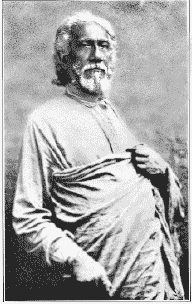

我的上师圣尤地斯瓦尔

“我会给你我无条件的爱。”

多么珍贵的话啊！一直到四分之一个世纪后，我才有机会再次听到他的爱。上师不习惯表达感情，他那广大无垠的心胸更加喜欢寂静。

“你会给我同样无条件的爱吗？”他如孩子般地注视着我。

“我会永远地爱着您，天国的导师！”

“一般的爱是自私的，根植于欲望及满足。而天国的爱则是无条件的，没有界限、永远不变。”他又补充道，“如果任何时候，你发现我背弃了悟上帝的状态，请将我的脑袋放在你的膝盖上，带我回到我们两个都祟敬的宇宙挚爱里。”

天色逐渐暗下来，他起身带我走进里面的房间。我们一边吃着芒果和杏仁的甜点，他一边说出我的经历，这不由得让我对他的伟大智能肃然起敬。

“不要为你的护身符难过了。它已经完成它的任务了。”

“上师，您的出现带给我的喜悦超过了一切。”

“该是改变的时候了，你在修道院相当不快乐。”

“你应该回到加尔各答。既然你爱着人类，为什么要把你的亲属排除在外呢？”

他的建议让我感到沮丧。尽管我不太理会家人的请求，但他们还是希望我会回去。“让年轻的鸟儿飞翔在形而上的天空，”阿南达曾说，“他的翅膀很快就会感到疲乏。我们将会看到，他会猝然下降，收起他的翅膀，温顺地安定在家庭的窝中。”这个令人泄气的比喻鲜明地印在我的心里，我决心不要“猝然下降”了，不要回到加尔各答。

“先生，我不要回家。我要跟随您四处游历。请给我您的大名和住址。”

“圣尤地斯瓦尔吉利。我的修道院在塞伦波尔（Serampore）拉埃沟特（Rai Ghat）。我只是来这里几天探望我的母亲。”

上帝与他的徒弟间的游戏真是让我感到惊讶！塞伦波尔离加尔各答不过 12 英里，但我却从来没看到过我的古茹，而是要旅行到这被拿希里·玛哈赛圣化的卡希（Kasi）古城贝拿勒斯和他见面—释迦牟尼佛、商卡拉查尔雅（Shankaracharya）和其他瑜伽行者的脚步都踏上过这块圣地。

“四个星期之内，你会来找我。”圣尤地斯瓦尔严肃地说道，“现在我已经告诉你我的感情，也表示了找到你的快乐。下次我们再见面时，你必须重新唤起我的兴趣，否则我将不会接受你做我的徒弟。你必须严格服从我的训练，要做到完全舍弃。”

我固执地沉默着。我的古茹一眼看透了我的心思。

“你觉得你的家人会嘲笑你吗？”

“我不想回去。”

“三十天内，你将回到家中。”

“绝不。”我恭敬地向鞠了一躬，却没有试图减轻争论所产生的紧张，然后就转身离开了。在午夜的黑暗中，我感到困惑，为什么这奇迹般的相遇最终竟会以争辩收场。马雅天平的双重性总是以悲伤平衡着每一段喜悦！我年轻的心尚未适应我的古茹。

第二天早上，我发现，修道院的人对我的敌意更重了。三个星期后，第亚南达离开修道院前往孟买去参加一个会议，其他人开始向我发起猛烈攻击。

“穆昆达就是一只寄生虫，他受到了修道院的款待，却没有任何适当的回馈。”无意中听到这段对话后，我第一次后悔将钱还给父亲，并心情沉重地去找我唯一的朋友纪腾卓拉。

“纪腾卓拉，我要离开了！等第亚南达回来时，请你转达我对他的尊敬和歉意。”

“我也要离开了！我想在这里打坐，但情况比你也好不到哪儿去。”纪腾卓拉说道。

“我已遇到一位基督般的圣人。我们到塞伦波尔去找他吧。”

就这样，“鸟儿”开始准备“猝然下降”，前往加尔各答了！

第十一章 在布伦德本的经历

“穆昆达，就算父亲取消你的继承权，你也活该！你怎么会蠢笨到要放弃生活呢！”一个兄长斥责我。

纪腾卓拉和我走下火车，前往阿南达家去。阿南达在孟加拉—那格浦尔铁路局担任稽查会计，最近才从加尔各答调到古城亚格拉（Agra）来。

“阿南达，你很清楚，我在向天父寻求我应当继承的财产。”

“金钱是最重要的，上帝可以晚些来！谁知道呢？生命可能太长。”

“上帝第一，金钱只是他的奴隶！谁又能告诉你呢？生命可能太短。”

我当时只是被迫反击，并没有任何预言的意思。但时间的流逝证明了阿南达的确很短命。几年之后，他进入了金钱再也无用的国度。

“我想这是从修道院学来的智能吧！但我看到你已经离开贝拿勒斯了。”阿南达显得很满意。他希望从此把我的翅膀紧系在家庭的巢中。

“我在贝拿勒斯的逗留并没有白费！我找到了内心所渴望的每一样东西！绝不是你那个梵文学者或他儿子！”

想起往事，阿南达跟我一起笑了起来。他承认他在贝拿勒斯选的“天眼通”其实是个短视的人。

“我流浪的兄弟啊，你下一步计划做什么？”

“纪腾卓拉说服我到亚格拉来。我们将去欣赏泰姬玛哈陵的美景。”我解释道，“然后我们将到我新找到的古茹那边去，他的修道院在塞伦波尔。”

阿南达殷勤地款待我们。但晚上有几次，我注意到他在盯着我，仿佛若有所思。

“我知道那种眼神！”我想，“他在酝酿一个计划！”

我们一大清早用餐时，一切真相大白。

“你觉得你可以完全不依靠父亲的财富吗？”阿南达的目光充满无辜。

“我知道我对上帝的依赖。”

“说得容易！到目前为止，父亲一直都保护着你！想想看，如果你为着食物及庇护被迫去寻找那只看不见的手，你将会遇到什么样的困境？你很快地就要在街上乞讨了！”

“不可能！我对上帝抱有信心！除了乞讨之外，他会为他的子民想出上千种生活来源！”

“更夸张了！为什么不试试呢？”

“我同意！你难道将上帝局限在想象的世界里？”

“答案很快就见分晓。今天你将会有机会证明你的观点！”阿南达停顿了一下，然后严肃地宣布道：

“我提议，今早把你和你的同修纪腾卓拉送到附近的布伦德本市（Brindaban）。你不能带一毛钱，不可以乞讨任何食物或金钱，不能对任何人泄露你们的困境，而且你们不能被困在布伦德本。如果今晚十二点以前，你能在不违反任何规则的情况下回到我这边，我将会是亚格拉最惊讶的人。”

“我接受挑战”，我的心里没有丝毫犹豫。以往那些神奇的经历依次出现在我面前：拿希里·玛哈赛的照片使我从霍乱中痊愈；与乌玛在拉合尔屋顶上时，那两个风筝；在我沮丧时出现的护身符；在贝拿勒斯陌生圣人传达的讯息；看到圣母以及她无上爱的言语，她通过玛哈赛上师实时地注意到我不足以道的窘境，并用最后一分钟指引我拿到高中文凭，指引我见到我梦寐以求的古茹。我完全相信我的“哲学”能胜任这严酷世界的任何试验！

“说到做到。我这就送你去火车站。”阿南达转向惊呆的纪腾卓拉，“你也要去做个证人，并且很有可能也是一名牺牲者。”

半个小时后，纪腾卓拉和我拿着临时旅行的单程车票。我们躲到了车站的一个隐蔽角落里，阿南达搜遍了我们全身：我们没有除必需品以外的任何东西。

纪腾卓拉抗议道：“阿南达，为安全起见，请给我一两个卢布，万一有什么差错，我还可以发电报给你。”

“纪腾卓拉！”我出声制止道，“如果你拿任何一毛钱，我就不会继续进行这项试验。”

“有些东西比铜币的叮当声更可靠。”纪腾卓拉看到我严厉地看着他，就不再说话了。

“穆昆达，我不是无情无义。”阿南达的声音里不知不觉地出现了谦卑的迹象。也许他觉得良心不安，因为他要送两个身无分文的男孩到一个陌生的城市去，也可能是因为他自己对宗教有怀疑，“如果你成功地通过了布伦德本的考验，我将拜你为师，做你的徒弟。”

这个承诺显然违反传统的习俗。在印度的家庭中，长兄的地位仅次于父亲，很少向弟妹低头。但我已没有任何时间发表评论了，我们的车在这时候开动了。

火车行驶了好几英里，纪腾卓拉一直沉浸在哀伤之中。最后他鼓起勇气，靠了过来，捏了我一把。

“我没有看到上帝会提供给我们下一餐的迹象！”

“安静点，怀疑主义者，上帝会和我们一起解决问题的。”

“你能不能请他快点儿？光是想到我们的前景，我就已经非常饿了。我离开贝拿勒斯是要去看泰姬陵，而不是去看自己的陵墓！”

“纪腾卓拉，振作点儿！难道我们连看到威伦德旺圣迹的机会都没有吗？”只要想到踩在被奎师那圣主祝福过的土地，我的内心就充满了极度的喜悦。

我们车厢的门被打开了，两个人坐了下来。下一站就是最后一站了。

“年轻人，你们有朋友在威伦德旺吗？”坐在我对面的陌生人说道。

“不关你的事！”我无礼地移开了目光。

“你们可能被偷心之神迷住了，所以才离家出走。我也是有虔诚信仰的人。我想我有责任提供你们食物和地方，帮你们避免这无法忍受的酷热。”

“不，先生，别管我们。你人很好，但是你错了。”

接着我们就没有再谈下去，火车到站了，当纪腾卓拉和我下到月台上时，我们偶遇的同伴拉着我们的手招来一辆出租马车。

我们在一间庄严的修道院前下了车，修道院周围是整理得很好的长青树。我们的恩人显然很熟悉这里，一个微笑的少年直接带领我们去了客厅去。很快，一位风度高雅的年长女性出来迎接我们。

“尊敬的格莉妈（Gauri Ma），王子不能前来。”其中一位男士对修道院的女主人说道，“在即将出发的最后一刻，他们的计划出了问题，他们向您致上最深的歉意。但我们带来了另外两位嘉宾。我们在火车上碰面，我被他们吸引住了，我相信他们是圣主奎师那的虔信者。”

“欢迎你们。”格莉妈慈母般地微笑着表示欢迎，“你们来得正是时候。我正准备接待两位赞助这间修道院的皇家贵宾。如果我准备的佳肴没人享用，那可就太让人遗憾了！”

这些谈话让纪腾卓拉掉下泪来。他在布伦德本所担忧的“前景”结果却是皇家式的招待，这一切让他有些不知所措了。我们的女主人惊讶地看着他，但没有说什么，也许她已经习惯了眼前的这一幕了吧。

午饭时间到了。格莉妈带着我们前往用餐的露台，那里香气四溢。她走进邻近的厨房里。

我在纪腾卓拉身上选了一处适当的位置，就像他在火车上对我做的一样，用力地回捏了一把。

“怀疑主义者，上帝动作也很快！”

女主人拿着风扇走进来。当我们在华丽的毛毯上落座时，她用东方人特有的方式替我们扇凉。修道院的徒弟们进进出出，一共供应了大约三十道菜。我只能用“奢华的盛宴”来形容这顿饭。纪腾卓拉和我自出生到这个世界上以来，从没享用过如此丰盛的佳肴。

“真是皇家的待遇，可敬的妈妈！我很难想象您那皇室的赞助人为什么没来？难道还有比这场盛宴更紧急的事情？您的款待将让我们终生回味无穷！”

由于阿南达的要求，我们无法向这位女士解释我们为何如此感激。不过至少我们的诚意是很明显的。最后，我们带着她的祝福和再度拜访修道院的邀请离去。

室外是无情的酷热。纪腾卓拉和我走向修道院门口一株雄伟的菩提树下遮荫。纪腾卓拉再度陷入担忧，开始口出恶语。

“太糟糕了！刚才的午餐只是偶然的好运罢了！我们身上连一块钱都没有，怎么参观这个城市？还有，我们怎么回阿南达的家啊？”

“肚子刚一填饱，你马上就忘记上帝了。”我责备道。人类对上帝的恩惠竟然如此健忘！

“跟你这样鲁莽的人一起冒险可真是太愚蠢了！”

“安静点儿，纪腾卓拉！上帝刚喂饱我们，接下来他会向我们展示布伦德本，并送我们回到亚格拉啊。”

一位瘦小但讨人喜爱的年轻人快步走向我们，停在树下向我鞠躬。

“亲爱的朋友，您和您的同伴一定对这里不熟，请容许我当你们的向导和主人吧。”

一般来说，印度人的脸色几乎不可能变成苍白，但纪腾卓拉的脸色却突然间变得如生病般苍白。我婉拒了这项帮助。

“您不是在赶我走吧？”陌生人担忧地说道。

“为什么不？”

“您是我的古茹。”他深信不移地看着我，“在中午祷告时，神圣的奎师那上主在我的体验中出现。他向我显示，就在这棵树下，会坐着两个孤独的人。其中一个就是您，我的上师！我经常在打坐中看到您！如果您能接受我卑微的服侍，我将会感到无比快乐！”

“我也很高兴你能找到我。上帝是不会遗弃我们的！”此刻我的内心早已投拜在上帝的脚下。

“亲爱的朋友！要不要光临我家呢？”

“你很好。但我们不能这么做。我们已经是我在亚格拉的兄弟的客人了。”

“至少让我留下与您同游布伦德本吧，这将是一段美好的回忆。”

我欣然同意。这位自称是普拉塔波·查特吉（Pratap Chatterji）的年轻人随即招呼了一辆马车。我们一起参观了玛丹那摩汉那（Madanamohana）神殿以及其它奎师那的圣殿。当我们在圣殿祈祷时，夜色开始降临。

“对不起，我去买一些甜点（sandesh）。”普拉塔波走进一间靠近火车站的商店。纪腾卓拉和我沿着宽广的街道继续闲逛，街道现在较为凉爽，挤满了人。我们的朋友消失了一段时间，最后带回来好多甜点。

“请允许我获得这份宗教上的功德。”当普拉塔波拿出一卷卢布和两张刚买的到亚格拉的车票时，他笑了。

那无形的手让我崇敬地接受了，它的慷慨难道不是远超过所需的吗？

我们在火车站附近找到一个隐密的地方。

“普拉塔波，我将指导你当代最伟大的瑜伽行者拿希里·玛哈赛所传授的克利亚瑜伽。这个法门将成为你的古茹。”

半个小时内，传法结束。“克利亚就是你神话中的宝石（Chintamani），”我告诉这位新徒弟，“这个法门看似简单，却包含了加速人类精神进化的技巧。印度经典上记载着，自我的肉体需要经过一百万年才能从马雅中解脱出来。通过克利亚瑜伽，这段过程可以大幅地缩短。就像加格底斯·钱卓拉·博斯所展示的植物生长可加速到远超过它正常的速度一样，人类的心灵发展也可通过内在科学的方法加速。认真修习吧，你会接近所有古茹们的古茹。”

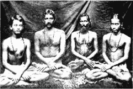

从左向右：纪腾卓拉·玛诸达尔、我的堂兄乔汀·高绪、“圣典之王”凯巴·南达、中学时代的我。

“我很高兴终于找到了自己一直在追寻的瑜伽之钥！”普拉塔波沉思道，“它解开了我感官的束缚，让我更上一层楼。”

我们静默着坐了一会儿，然后漫步走向车站。坐上火车时，我的内心充满了喜悦，纪腾卓拉眼睛里却充满了泪水。我充满深情地向普拉塔波的告别，却被他们两个忍不住的哭泣不时打断。在旅程中，纪腾卓拉再度陷于悲痛之中。跟之前不同的是，他这次的悲痛是在责备自己。

“我是多么地浅薄啊！将来我绝不再怀疑上帝了！”

临近午夜时，两个身无分文被送出去的人走进阿南达的卧室。

“纪腾卓拉，说实话吧！”阿南达开玩笑地说道， “你们没抢劫别人吧？”

当纪腾卓拉说完整个经过之后，阿南达变得严肃起来。

“这是我第一次了解到你为什么对贵重物品及世俗财富的累积毫无兴趣。”

虽然已经很晚了，但阿南达仍然坚持要我传授给他克利亚瑜伽。

第二天上午，我对纪腾卓拉笑着说道：

“你并没有被泰姬欺骗。让我们在前往塞伦波尔之前去参观它吧。”

向阿南达道别后，纪腾卓拉和我很快来到泰姬玛哈陵前面。它对称地耸立着，白色大理石在太阳下闪闪发光。暗色的柏树、光滑的草坪及平静的湖泊形成了完美的环境。它的内部非常精美，有镶嵌着半宝石的花边雕刻。精致的花环和涡卷形装饰复杂地浮现在褐色及紫色的大理石上。灯光由圆顶照射到沙贾汗（Shah—Jahan）君王和他的皇后慕塔芝·玛哈（Mumtaz Mahall）的纪念碑上。

参观完毕！我渴望见到我的古茹。纪腾卓拉和我不久就搭火车南下孟加拉。

“穆昆达，我有几个月没有看到家人了。我很想念他们。也许以后我会再去塞伦波尔拜访你的上师。”

就这样，我的朋友在加尔各答离开了我。我坐上当地的火车向北 12 英里，很快地就到达了塞伦波尔。

自从在贝拿勒斯见到我的古茹后，28 天过去了，一阵奇怪的悸动潜入我的心房。“四个星期之内，你会来找我。”现在我已经在这里了，就站在他拉埃沟特静巷的庭院内，心在狂跳。我第一次走进这所修道院，在这里我将与印度的嘉南瓦塔尔（Jyanavatar，“智能的化身”）一起度过以后十年的美好时光。

第十二章 与上师在修道院

“你来了。”圣尤地斯瓦尔在一间带阳台的、铺着虎皮地毯的客厅接待我。他声音冷淡，没有感情。

“是的，亲爱的上师，我是来追随您的。”我跪下来触碰他的脚。

“为什么？你不是不理会我的意愿吗？”

“再也不会了，可敬的古茹！您的旨意就是我的律法！”

“那就好！现在我将要担负起你一生的责任。”

“上师，我很乐意将这个重担转移给您。”

“那么我对你的第一个要求就是：回家去，进加尔各答大学，完成你的学业。”

“是的，先生。”我尽力掩饰着内心的惊愕。难道说，往后的几年中，我还要被讨厌的书本所纠缠？开始是父亲，现在是圣尤地斯瓦尔！

“总有一天你会到西方去。如果你这位他们不熟悉的印度老师有大学学历，他们的耳朵接受起古代印度的智能来就比较容易。”

“您知道得最清楚，可敬的古茹。”我不再沮丧了。虽然西方对我而言是遥远而未知的，但这是我可以立刻服从上师，让他高兴的机会。

“你还在加尔各答附近，有空就可以过来。”

“上师，如果可能的话，我天天都想过来！我心怀感激地接受您对我生活中的每个细节进行监督—但有一个条件。”

“什么条件？”

“您要承诺向我显现上帝！”

接下来是整整一个钟头的热烈争论。一个上师的话是不会错的，他的话不是随便说的。事实上，一个古茹在显现造物主之前，与他必定有着非常深入的关系！我意识到圣尤地斯瓦尔与天国是一体的。作为他的徒弟，我一定要尽量利用自己的优势。

“你真会提要求！”上师的应允中带着最终的慈悲，“让你的意愿成为我的意愿吧。”

生平的阴影从我心中移除了，到处懵懵懂懂地探寻彻底结束了。我在一个真正的古茹那里找到了永恒的庇护。

“来，我带你看看道场。”上师从虎皮垫子上站起来。我环顾四周，最后惊异的目光落在墙上一张被茉莉花环围绕的照片上。

“拿希里·玛哈赛！”

“是的，我天国的古茹。”圣尤地斯瓦尔的声音里充满虔敬，“无论作为一个人，还是一位瑜伽行者，他比任何我接触过的老师都要伟大。”

我无声地向这张熟悉的照片鞠躬致意。灵性的敬意迅速传向了这位无与伦比的上师。他的祝福引领着我的脚步直到现在。

在古茹的带领下，我游遍了整栋房子和整个庭院。这座修道院古老、宽敞而坚固，庭院的四周围绕着粗大的柱子，外墙上布满青苔，鸽子非正式地分享着修道院灰色平坦的屋顶。后院种满了各种令人愉悦的植物：菠萝蜜、芒果和香蕉树。房子是一栋二层建筑，楼上房间的阳台朝向庭院，三面围着栏杆。楼下是一间高大宽敞的大厅，成列的柱子支撑着天花板。据上师说：每年杜尔加祭典（Durgapuja）的节庆就在这里举办。一条窄梯通到圣尤地斯瓦尔的起居室，室外的小阳台朝着街道。总的来说，修道院布置简朴，每样东西都简单、清洁而实用。

上师邀我过夜。两位在修道院接受训练的年轻徒弟准备了咖哩素菜晚餐。

“可敬的古茹，请给我讲讲您生平的故事。”我盘坐在离他的虎皮垫不远的草席上。友善的星星离我那么近，好像就在阳台上。

“我出生在塞伦波尔，俗家的名字是普利亚·纳斯·卡拉尔（Priya Nath Karar）。我的父亲是个有钱的商人。这栋祖传的大楼就是他留给我的，现在成了我的修道院。我没接受过多少学校教育，我觉得那些教育肤浅而无聊。早年我尽一家之主的义务，有一个女儿，现在已经结婚了。中年我有幸得到拿希里·玛哈赛的指引。妻子死了以后，我加入了僧团，圣尤地斯瓦尔吉利成了我的法名。这就是我的简单履历。”

上师看着我渴望的脸，微笑着。他所讲的就像传记中描述的一样，都只是外在的事情，没有触及内在的世界。

“可敬的古茹，给我讲讲您童年的故事。”

“我会给你讲几则—每一则都有一个寓意！”圣尤地斯瓦尔讲起这些引以为戒的故事时，眼神亮晶晶的：“有一次我母亲指着一间黑房子，讲里面发生的可怕的鬼故事，想以此来吓唬我。我马上跑进黑房子，并且表达了我对没有看到鬼的失望之情。从此以后，母亲再也不向我说恐怖故事了。寓意：直面恐惧，它就不再是你的障碍。

“另外一个童年记忆是：我看上了邻居家一只很丑的狗。为了得到那只狗，我弄得家里一连几个星期都鸡犬不宁，再讨人喜欢的宠物都入不了我的眼睛。寓意：执着是盲目的，它会在想象中为你欲求的东西笼罩上一层光环。

“第三个故事是关于儿童心智的可塑性。我偶尔听母亲提到过：‘当某个人在别人手下工作时，他就是一个奴隶。’这句话给我的印象如此根深蒂固，以至于到结婚后，我都拒绝接受任何职位，家庭的开销都来自于我在土地上的投资。寓意：儿童的耳朵容易受影响，要给予正面的、肯定的建议。早期的信念会给他们留下长久而深远的烙印。”

上师陷入了沉思。半夜时分，他安排我睡在一张狭窄的帆布床上。这是我在古茹家度过的第一个晚上，我睡得又香又甜。

第二天早晨，圣尤地斯瓦尔将克利亚瑜伽传法给我。虽然我已从拿希里·玛哈赛的两位徒弟—我的父亲和我的家庭教师凯巴·南达高僧那儿学到了方法，但在上师面前，我还是感到了转化的力量。通过他的接触，一道强大的光进入了我的本质，就像无数个太阳的光芒汇聚在一起，难以形容的潮水般的喜乐淹没了我内心最深处。这种奇妙的感觉一直延续到第三天，在我下定决心离开修道院时，已经是傍晚了。

“30 天内你将回去。”当我回到加尔各答的家时，蓦然想到上师的预言应验了。没有亲人尖酸地提起让我害怕的关于“翱翔的鸟儿”的典故。

我爬上我的小阁楼，深情地看着它，仿佛它是活生生的：“你见证了我的打坐、我求道之路上经历的风雨和泪水。现在我这艘小船已经驶入天国导师的避风港了。”

“儿子，我为我们两人感到高兴。”晚上父亲和我平静地坐在一起，“我也曾奇迹般地找到了古茹，现在你和我一样，找到了你的古茹。拿希里·玛哈赛神圣的手护卫着我们的生活。你的上师不是那些喜玛拉雅山上遥不可及的圣人，他就在附近。我的祷告得到了回应：你不会为了追寻上帝而永远离开我的视线。”

对于我继续完成学业的决定，父亲也很高兴，他为我做了妥善的安排。第二天我就到加尔各答的苏格兰教会学院（Scottish Church College）去报到了。

快乐的时光转瞬即逝。聪明的读者们一定已经猜到了：我很少出现在学校的教室里。塞伦波尔的修道院对我有着无法抗拒的诱惑。上师没有批评我的随时出现。他很少提及学业，这让我松了一口气。很明显，我从来没打算做一个学者，不过我还是尽量让成绩达到及格线。

修道院的生活每天都风平浪静，鲜少变动。上师在黎明前就醒来，有时躺着，有时坐在床上进入三摩地（samadhi）。要知道上师是不是醒了很简单：惊人的鼾声突然停止，接着是一两声的调息，有时身体再动一下，然后就进入无声无息的境界中—他在享受深入瑜伽禅定的喜悦。

接下来，上师要做的不是吃早餐，而是到恒河边长距离地散步。我也会一起去。直到现在，那段早晨与古茹漫步的时光仍历历在目，让我记忆犹新！我经常觉得自己仿佛还在他身旁。清早的太阳温暖着河水。他的声音响亮，蕴含着真理的能量。

洗过澡，该吃午餐了。每一天，年轻的徒弟都要根据上师的指示小心准备餐点。他是个素食者，不过在出家之前，他也吃蛋和鱼。他劝学生依据个人体质，吃适合自己的、单纯的食物。

上师吃得很少，通常是米饭，浇上咖哩或甜菜汁、菠菜汁上色，再洒上少许水牛奶油或是溶化的奶油。有时他也吃扁豆浓汤、乳酪（Channa）或咖哩蔬菜。甜点通常是芒果或橘子加上大米布丁或是菠萝蜜汁。

下午一般会有访客。他们像一条稳定的溪流，由世俗的喧闹注入修道院的宁静中。上师对每个人都同样地殷勤与仁慈。对于一个已经洞彻清明的人来说，心灵以外的部分总是相似的。

圣人根植于智能，不存有偏见。圣尤地斯瓦尔并没有特别关照那些有势力或有成就的人，也从不忽视那些穷人或文盲。他会尊敬地倾听一个小孩的真话，而公开地忽略另一个自以为博学而自负的人。

晚上 8 点是晚餐时刻。如果有些访客还没有离开，那么我的古茹是不会单独用餐的。没有人会饿着肚子，或是没有吃饱就离开修道院。即使有突如其来的访客，圣尤地斯瓦尔也不会不知所措。在他富有策略的指示下，一丁点食物也能变成一桌宴席。然而他是节俭的，不多的基金足够他用上很长时间。“在你的限度内量力而为，”他常说，“奢侈只会为你带来不适。”不论是在修道院招待访客的细节上，建筑物的修缮上，还是其他与实际相关的事物上，上师都极具创意。

安静的夜晚通常是古茹的演讲时间—那是徒弟们永恒的宝藏。他说的每一句话都是经过慎重考量和琢磨的，充满了智慧的能量。他表达的方式非常独特，显现出崇高的自信。在我的经验中，他说出的话是从未有人说过的，他的思想在传达出来之前，都已经在精细的天平上衡量过。我总觉得自己面对的是一个活生生的上帝的代表。他那来自天国的影响力使我不由自主地低下头去。

在徒弟或访客面前，圣尤地斯瓦尔不会装腔作势地炫耀内在的禅定。他一直都与上帝合二而一，不需要特意找时间与上帝交融。“结了果，花就落了。”因此，一个自我了悟的上师是不太需要打坐的。不过，为了鼓励徒弟们，圣人们还会经常坚持禅修。

快到午夜时，古茹会像孩子似的打个盹。他不需要特别铺床，甚至经常连枕头都没有，就躺在虎皮座垫后面的一张狭窄的长沙发上。

彻夜进行哲学探讨也是常有的事—任何一个怀着强烈的兴趣请求他指点的徒弟，他都予以满足。那时的我毫无倦意，也不想睡觉，光是听上师生动的话就足够了。“喔，天亮了！我们到恒河边去散步吧。”许多个通宵的教导都是这样结束的。

在我与圣尤地斯瓦尔最初几个月的相处中，一堂关于“如何骗过蚊子”的讲课堪称高潮。在家里，我们晚上都使用蚊帐，而塞伦波尔的修道院却并不遵循这个谨慎的习俗。于是，我被叮得从头到脚都是包。古茹很同情我。

“给你自己买一顶蚊帐，也给我买一顶。”他笑着补充道，“如果你只为自己买一顶，那么所有蚊子都会向我集中！”

我感激不尽地遵从了。从那以后，在塞伦波尔睡觉的每个晚上，古茹都会要求我准备好蚊帐。

有一天晚上，蚊子特别凶悍，但上师并没有发出他惯常的指示。我惴惴不安地听着嗡嗡作响的蚊虫声。半小时之后，我故意咳嗽，企图引起古茹的注意。我想我被叮得快要抓狂了，而蚊子们庆祝嗜血仪式的嗡嗡的合唱声更是让我受不了。

上师没有任何反应。这是我第一次在瑜伽的禅定中观察他。我小心翼翼地接近他，发现他没有呼吸。我惊讶不已。

“他的心脏一定停止跳动了！”我将一面镜子放在他鼻子下，没有发现任何显示呼吸的气息。为了再次确认，我用手指捂住他的鼻子和嘴巴。几分钟过去了，他身体冰凉，纹丝不动。在一阵迷乱中，我冲到门口准备请求援助。

“哦！一个刚萌芽的实验主义者！我可怜的鼻子！”上师的声音里夹杂着笑声，“你为什么不上床去睡？你指望整个世界为你改变吗？先改变你自己：去除蚊子的意念。”

我顺从地回到了床上。果然，没有一只蚊子敢贸然靠近我。我终于明白：先前古茹同意使用蚊帐只是为了让我高兴，他根本不怕蚊子。瑜伽的力量可以使蚊子不叮他，或者说，他会进入不受伤害的内在。

“他给我上了一课。”我想，“那是我必须努力去达到的瑜伽境界。”一个瑜伽行者必须能够超越自己，进入并停留在超意识里。不管这个世界存在多少令人分心的事，比如虫子的嗡嗡作响，或是弥漫着的刺眼的日光，通过感官存在的表征必须被阻断。此后，比被放逐伊甸园还要美丽的体验就会进来。

早期我在修道院的另一堂课也是蚊子给我上的—多么具有教育意义的蚊子。在一个温和的黄昏，古茹正在以无与伦比的方式阐释古代的圣典。我在他的脚下，正处于全然的平静中。这时，一只鲁莽的蚊子闯入这田园般的景色，吸引了我的注意。当它将有毒的刺叮入我的大腿皮下时，我自然地举起了复仇之手。然而，“死刑”并没有立即执行，伯坦伽利瑜伽的警句之一—“不杀生”（无害）适时地出现在我的脑海里。

“你为什么不打它？”

“上师！难道您主张杀生吗？”

“不！不过，那致命的打击已侵袭了你的心灵。”

“我不明白。”

“伯坦伽利的意思是完全除去杀生的念头。”在圣尤地斯瓦尔的面前，我的意识一目了然，如同一本翻开的书，“在这个世界上，不杀生的行为执行起来并不是那么容易。人类也许被迫要去消灭有害的生物，但绝不是被迫感到愤怒或仇恨的。所有生命形式都有着同样的生存权利。揭开造物者奥秘的圣人可以和无数令人迷惑的物种和谐地共存着。这是所有已经抑制住内在毁灭情绪的人都了解的。”

“可敬的古茹，一个人应该牺牲自己而不杀一只野兽吗？”

“不！人的身体是很宝贵的。我们有独特的头脑和脊髓中心，具有最高的进化价值。这也使得那些高等的虔信者可以完全掌握及表达天国最崇高的一面。任何次等的生命形式都没有如此‘装备’。如果一个人被迫去杀死一只动物或其他生物，的确会招致微小的业障，不过根据吠陀经的教导：随便损伤人类的肉体是一种很严重且违反因果法律的罪过。”

我的古茹在布利的居所

我松了一口气：人类自然的本能并不是随时都能在经典上找到支持的。

我从来没有看过上师接近一只豹或老虎，但有一次，一条致命的眼镜蛇面对着他，结果被他的爱给征服了。在印度，这种蛇令人闻风丧胆，平均每年有 5000 多人遭受它的袭击而死亡。这次惊险的遭遇发生在布利，在那里圣尤地斯瓦尔有另外一座修道院，就座落在孟加拉湾附近。圣尤地斯瓦尔晚期的年轻弟子普罗富拉（Prafulla）那时正跟上师在一起。

“我们坐在修道院附近的户外，”普罗富拉告诉我，“一条眼镜蛇在附近出现了。它足有 4 英尺长，非常吓人。它愤怒地抬着头，飞快地向我们移动过来。上师就像面对小孩似的，低声轻笑着。我既惊愕又兴奋地看着上师有节奏地拍手—他在欢迎这位令人丧胆的访客！我保持绝对的安静，心里热切地进行着所有我能进行的祷告。那只飞快接近我和古茹的眼镜蛇突然一动也不动，好像被他亲切的态度给迷住了。只见它可怕的头逐渐低下去，滑溜过上师的脚间，消失在灌木丛中。”

“为什么古茹要拍手？为什么那只眼镜蛇不会攻击他？对那时的我而言，这些问题是难以理解的，”普罗富拉总结道，“从那时起，我了解到我天国的上师已经超越了对受到任何生物伤害的恐惧。”

那是我到修道院的前几个月，一天下午，我发现圣尤地斯瓦尔正用锐利的目光凝视着我。

“穆昆达，你太瘦了。”

他说中了要害。我双眼深陷、外表衰弱，可我不是故意要这样：在加尔各答家中成堆的补药可以证实这一点。不过，没有一种补药有效，我从小就消化不良。偶而我对自己身体的绝望会达到顶点，我问自己：一个病怏怏的身体是否值得我继续此生？

“医药有它的限制，而生命的创造力却没有。要相信自己，你将会健康又强壮。”

圣尤地斯瓦尔的话激起了我的勇气，那是许多被我厌倦了的治疗师都不能在我身上召唤起来的。

日子一天天过去，我真的胖起来了。在上师不动声色的祝福下，两个星期之后，我的体重就增加到一个令人鼓舞的数字，那是我过去再怎么努力也无法做到的。我的慢性肠胃病永久地消失了。在后来的日子里，我还有幸见证到古茹对许多恶性疾病，比如结核病、糖尿病、癫痫、麻痹等的瞬间治愈能力。我想没有人比我更感激他的治疗了，是他让我从如尸体般憔悴的状态下突然解脱出来。

“几年前，我也很想增加一些体重。”圣尤地斯瓦尔告诉我，“我得了一场大病，在恢复期里，我到贝拿勒斯造访了拿希里·玛哈赛。

我说：‘先生，我先前病得很厉害，体重掉了好几磅。’

他回答我：‘我知道，尤地斯瓦尔，是你让自己有病的，现在你又觉得自己很单薄。’

这个回答是我当初完全没有预料到的。不过我的古茹鼓励我说：

‘让我看看，我相信你明天就会觉得好多了。’

我的内心是乐于接受暗示的，我认为他的话里隐含着痊愈的示意。第二天早上，我愉快地发现：自己果然有了力气。我去找我的上师，欣喜地叫着：‘先生，我今天觉得好多了。’

‘真的！是你鼓舞你自己的。’

‘不，上师！’我抗议道，‘是您帮助了我。几个星期以来，这是我第一次有点力气。’

‘哦，是的！你的病的确很严重，你的身体还是相当衰弱的。谁知道明天会变得怎样？’

衰弱可能会复发的想法令我不寒而栗。第三天早晨，我几乎没有办法把自己拖到拿希里·玛哈赛的家。

‘先生！我又病了。’

我古茹带着揶揄的眼神说：‘哦！你又让自己感到不适了。’

‘天国的导师，我现在知道了你每天都在嘲弄我。’我不耐烦地说，‘我不明白，为什么你不相信我的真实感受呢？’

‘实际上，是你的想法让你觉得虚弱或强壮。’上师充满感情地看着我说，‘你看到你的健康是如何准确地吻合着你的期望。思想是一种力量，就像电力或重力。人类的心灵是上帝全能意识的表现。我能让你看到：只要你强大而有力的心灵坚信不疑，无论什么事都能即刻发生。’

我知道拿希里·玛哈赛从不说假话，于是感激而敬畏地问他：‘上师，如果我认为我没事并会恢复先前的体重，那也会发生吗？’

‘一定会的，即使是在这个时刻。’我的古茹严肃地说着，凝视着我的眼睛。

那时，我觉得自己不仅是力气，就连体重都增加了。拿希里·玛哈赛不再说话。我在他脚下呆了几个小时之后，就回到了贝拿勒斯我母亲的家。

‘我的儿子！怎么回事？你是不是水肿了？’母亲不敢相信她的眼睛：我的身体已恢复到像生病以前一样强健。

我称了体重，发现在一天之内，我竟然增加了 50 磅。那些看过我骨瘦如柴样子的朋友和旧识们，都被我现在的样子吓呆了。因为这个奇迹，一些人真的改变了他们的生活形态，并成为拿希里·玛哈赛的徒弟。

从此，我了悟了上帝的古茹，明白了这个世界只是造物主一个客观的梦。拿希里·玛哈赛清楚地知道：自己已与天国的梦想家合而为一，所以宇宙在他的视野里可以物质化、非物质化（使东西消失），或者是进行他所希望的任何改变。”

“全世界都在律法的统治之下。”圣尤地斯瓦尔总结道，“那些表现在宇宙外部的、被科学家们发现的法则，统称为自然法则，此外还有支配着意识领域的、只能从内在瑜伽科学来了解的更精细的法则。隐藏在精神层面内的事物，也有它们自己自然且合于律法的运行原则。物体真正的本质是被那些完全自我了悟的大师们，而不是被自然科学家们发现的。正因为如此，基督的仆人虽然被他的一个徒弟切掉了耳朵，但仍然能被基督恢复。”

圣尤地斯瓦尔是一个无与伦比的经典阐释者。我许多最快乐的回忆都来自于他的论述。不过他珍贵的思想不会白白扔在愚蠢或心不在焉的灰烬里。我的一个烦躁的动作，或些微的分神，都足以让上师的讲述突然停止。

“你不在这里。”一天下午，上师中断他的解说，并指出我的问题。像往常一样，他可以精确地追踪我的注意力。

“可敬的古茹！”我的语调中带着抗议，“我没有分心，我的眼皮没有动，我能复述您刚才所说的每一个字！”

“不管怎么样，你没有完全专心。你在心里创造出三个建筑物：一个在平原上，森林中的静修场地；另一个在山顶上；第三个在海边。”

事实上，那些模糊的想法几乎是在潜意识中形成的。我歉疚地看着他：

“对这样的上师我能做什么？他可以看穿我随意的冥想。”

“是你授予我这个权利的。如果你没有全神贯注，就无法领会我详细解释的微妙真理。除非必要，我不会侵入别人内心的保留处。人类天生就有这样的权利，可以隐密地漫游在自己的思想里。未受请求的上帝不会入内，我也不会贸然闯入。”

“您永远都是受欢迎的，上师！”

“你那些建筑物的梦想日后会实现，现在是学习的时间！”

在这样的不经意中，古茹以他简明的方式透露了我生命中即将发生的三件大事。早在青少年时期，我就常常看到三栋分别位于不同背景中的建筑物，对此我自己也难以理解。后来，这些影像全都一一实现了，并且顺序与圣尤地斯瓦尔指出的顺序完全吻合：第一个实现的是我在兰契的平原上创立的一所男孩的瑜伽学校，第二个是坐落在洛杉矶山顶上的美国总部，最后是一间位于南加州的修道院，邻近浩瀚的太平洋。

我的上师从不自大地声称：“据我预测，怎样怎样的事情将会发生！”他宁可采用暗示的方法：“你不认为这有可能会发生吗？”然而，他简单的言词中蕴藏着预言的力量，我也从来没发现他轻描淡写的语言有哪一句是不正确的。

圣尤地斯瓦尔的态度是有所保留而讲求实际的。有些人却对他抱着不切实际甚至愚蠢的幻想。他的脚稳固地踏在大地上，他的头在天国的避风港中。他也赞扬讲求实际的人：“神圣不是哑口无言！天国的领悟不会使人无能！良好的行为会产生最敏锐的智能。”

从上师的生活里，我彻底领悟到了精神实际主义与隐晦神秘主义之间的分歧，尽管从外表上看，它们伪装得像是一体两面。我的古茹不愿意对超物质世界的领域多加谈论。他“非凡的”光环只是他完美单纯的表现之一。在谈话中，他很少引用惊人的证据；在行动上，他直率地表现出来。其他人谈论着奇迹，但拿不出任何东西，圣尤地斯瓦尔鲜少提及这类细微的法则，却在随心所欲地、隐密地操作着。

“悟道的人不会轻易展现任何奇迹，除非得到内在的应允。”上师解释道，“上帝不希望他创造的奥秘被随便揭示出来。再者，世界上每一个个体都有他的自由意志，不能被随意夺取。一个圣人不会侵犯这种独立性。”

圣尤地斯瓦尔习以为常的静默来自于他对无限深入的领悟，只有未曾真正开悟的教师才会整天忙于没完没了的“显示”。“在浅薄之人的心胸里，有一点想法就能像小鱼般激起骚乱；在大洋的心灵里，鲸鱼般的灵感也几乎不会激起丝毫的波浪。”这句印度的经典谚语明显带着洞察性的幽默。

由于我的古茹的外在不引人注目，因此同时代只有少数的人才知道他的超凡。俗谚“不能隐藏智能的人是个傻子”绝不适用于圣尤地斯瓦尔。虽然他像其他人一样，出生为人，却已达到了主宰时空的境界。从他的生活中，我察觉到上帝般的一统性，那是一种天人合一的境界。在那里，他没有克服不了的障碍。我还了解到：若不是人类心灵的怠惰，这种阻碍本来是不会存在的。

每次碰触到圣尤地斯瓦尔神圣的脚，我总会深受感动。瑜伽中有教导：一个徒弟在与上师虔诚地接触时，他的心灵会受到吸引，产生细微的能量交流。虔信者在脑海中的不良习惯机制将就此焚毁，世俗倾向的思维定势会受到有益的扰动，至少他还可以短暂地察觉到马雅的神秘面纱被揭开，瞥见极乐的真实性。每当我用印度的方式跪在古茹面前时，整个身体就微微地散发出如释重负的光芒。

“即使拿希里·玛哈赛在静默中，”上师告诉我，“或者当他谈论的话题严格说来不属于宗教范畴时，我发现他仍然在向我传递着说不出来的知识。”

圣尤地斯瓦尔也在以类似的方式影响着我。当我带着忧虑等负面情绪进入修道院时，我的态度会不自觉地发生改变。不过，只要看到我的古茹，一阵有治愈作用的平静感就会传来。每一天跟他在一起，我都会充满新的喜悦、平静以及智能的经验。我从未在他身上发现轻信、贪婪、愤怒，以及任何人类执着的感情。

“马雅的黑暗已经在无声无息地逼近了，让我们的内在赶快回家。”每到黄昏时刻，上师都会用这些警语提醒他的徒弟修习克利亚瑜伽的必要性，因为新的学生偶尔会对自己是否应该学习瑜伽表示怀疑。

“忘记过去，”圣尤地斯瓦尔安慰他说，“所有人的过去世都带有许多黑暗的罪恶，直到他停泊在天国中。人类的行为永远都是不可信赖的。如果你从现在开始做灵性上的努力，将来每件事情都会改善的。”

在上师的修道院中你总能看见他的年轻小徒弟。对他们进行灵性和知识的教育是他终身的兴趣。就在他过世前不久，他还接受了训练两个 6 岁男孩和一个 16 岁少年的任务，周到地为他们的心智和生活提供指导。修道院的学生敬爱他们的古茹，他轻轻地一拍手，就足以让他们热切地围绕在他身旁。当他进入沉默不语的内在状态时，没有人敢说话；当他发出愉快的笑声时，孩子们都认为那也是他们自己的笑声。

上师极少要求别人为他提供私人服务。如果不是非常需要，他也不会接受学生的帮助。当他的徒弟忘记了为他洗衣服这项无比荣幸的工作时，我的古茹会不动声色地自己洗衣服。圣尤地斯瓦尔穿的是传统的赭色僧袍，根据瑜伽的习俗，鞋子是虎皮或鹿皮的，不用系鞋带。

上师能说流利的英语、法语、印度语和孟加拉语，且梵文也相当地好。他会自己设计巧妙的快捷方法来研读英文和梵文，并且很有耐心地把这套方法教给年轻的徒弟们。

上师会用谨慎但不执着的方式爱惜自己的身体。他指出：无限是通过健全的身体和精神，恰当地显现出来的。他不赞成任何极端的做法。有一次，一个徒弟要开始一段长时间的断食。我的古茹知道后只是笑道：“为什么不给狗扔根骨头呢？”

圣尤地斯瓦尔非常健康，我从没有看他不舒服过。他尊重世俗的习俗，允许学生去看医生：“医生治病也要使用上帝用在物质上的律法。”不过，他更加颂扬心灵治疗的优越性，并反复强调：“智能是最伟大的净化者。”

“身体是一个不可靠的朋友。给它应得的，但不要超量，”他说道，“痛苦和欢乐都是短暂的，用平静来忍受它们，同时试着摆脱他们的控制力。想象力可以引起疾病，反过来也能帮助痊愈。即使你在生病时，也不要相信疾病真的存在—未被认可的访客就会逃得无影无踪！”

上师的徒弟中有很多位医生。“那些已探索出身体法则的人，研究起心灵的科学来就更加轻松，”他告诉他们，“微妙的精神就隐藏在身体组织之后”。

圣尤地斯瓦尔建议他的学生集合起东西方的所有优点。他自己外在的行为习惯是西方式的，而内在的精神则是东方式的。他赞扬西方的进取性、策略性和卫生的习惯，也认可东方几个世纪以来带着光环的宗教理想。

我并不是个不守纪律的人—在家里父亲是严格的，阿南达经常是严厉的，但圣尤地斯瓦尔的训练，我只能用“激烈”来形容。作为一个完美主义者，我的古茹对他的徒弟是苛求的，不论是重要的大事，还是微小的行为差异。

“缺乏诚意的良好礼貌，就像一具美丽女子的尸体，”他在适当的时候会这样说，“缺乏礼貌的直率，就如同外科医师的手术刀，有效但使人不舒服。只有有礼的真诚才是有用且令人钦佩的。”

上师对我在灵性上的进步显然非常满意，但在其他方面，我的耳朵对斥责可是一点也不陌生。我的主要过错有这么几项：心不在焉，间歇性地沉溺于悲伤之中，不遵守某些礼节规范，以及偶尔做事没有条理。

“观察你父亲巴格拔第是如何做到凡事都井井有条的。”我的古茹指出。就在我去塞伦波尔修道院朝圣的旅程开始后不久，这两个拿希里·玛哈赛的徒弟就见面了。父亲和圣尤地斯瓦尔彼此惺惺相惜，两人的内在都发展出经久不渝的灵性生命。

我在早期悟道的过程中，曾从那些短期的老师身上学到了一些不正确的概念，比如：一个徒弟不需要努力关注自己的世俗任务。当我忽视世俗的任务，或是执行得漫不经心时，并不会受到责罚。人类的本性对这种指示是非常乐意遵从的。然而在上师毫不留情的棒子下，我很快就从不负责任的美梦中醒来了。

圣尤地斯瓦尔说：“只要你呼吸着地球上免费的空气，就有义务回报。一个人只有完全精通无息的境界，才可免于宇宙法则的限制。当你达到这样的完美境界时，我一定会告诉你。”

我的古茹从不接受贿赂，即使是以爱的形式。他不会对任何人特别宽大，即使是像我这种心甘情愿成为他的徒弟，只求奉献的人。不论是被他的学生或是陌生人围绕着，还是单独在一起，上师对我说话时总是意思明确，谴责起来也格外犀利。无论是容易养成肤浅习惯的轻率行为，还是前后的矛盾，都逃不过他的责骂。这种摧毁性的治疗着实令我难以忍受，但我已下定决心，要让圣尤地斯瓦尔消除我每种灵性上的缺点，他也十分乐意帮我进行这项巨大而费力的转变工程。在他“纪律铁锤”的重击之下，我被撼动了好几次。

“如果你不喜欢我说的话，可以随时离开。”上师向我保证，“我不要你的任何东西，除了你自己的进步。

他用谦虚的重击处理我的自负，用令人震惊的准确性敲松我灵性颚骨上的每一颗牙齿。我的感激是无法用笔墨来形容的。人类我执的坚硬核心除了用这种粗暴的方式以外，是很难根除的。只有当我执被除去以后，上帝才可以找到一条没有被阻塞的信道。在此之前，想要渗入一颗包裹着坚硬外壳的自私的心只能是徒劳。

圣尤地斯瓦尔的智能是如此的敏锐，他经常能将一般人没有说出口的想法说出来：“一个人所听到的语言，往往与说话人真正的意思南辕北辙，”他说道，“要试着去了解人们混乱语言背后的想法。”

然而，天国的洞察力对世俗的耳朵而言却是痛苦的：上师不受肤浅学生的欢迎，只有真正的聪明人才会深深地崇敬着他，但这些人永远居于少数。我想，如果圣尤地斯瓦尔的话不是那么坦白而直接，那么他一定会是印度最受欢迎的古茹。

“我对来这里受训的学生都很严厉，”他向我承认，“可这就是我的方式。接受它，不然就离开。我绝不妥协。相比起来，你对你的徒弟就温和多了，那也是你的方式。我只用严厉之火剧烈地烧灼我的学生，使他们得到净化，这种痛苦超过了一般人所能忍受的程度。用充满爱心的温和方式也能改变情况。若是在智能下，使用刚硬或柔和的方法都是同样有效的。你将来会到西方去传播印度讯息，在那里直率地抨击我执是行不通的。如果没有大量丰富亲切的耐心和包容力，一个老师将无法受到欢迎。”

虽然在圣尤地斯瓦尔的有生之日，他的率直言论为他阻止了一大群追随者，但是通过诚挚的克利亚瑜伽学生，他的精神和教理如今已遍及世界各地。他在人类心灵上拥有的更深层的统辖权，已经远超过了亚历山大大帝所能梦想的程度。

有一天，父亲来问候圣尤地斯瓦尔，他很可能期望会听到一些赞美他儿子的话，却震惊地听到一大堆数落我的不是。那是上师的惯例：以将来会引起严重后果的语气，只说我的小缺点。父亲赶紧过来找我：“按照你古茹的说法，我发现你一无是处！”他哭笑不得地说。

那时我引起圣尤地斯瓦尔不满的最重要原因，就是我置上师温和的暗示于不顾，固执地要改变某个人，使他走上灵性的道路。

我愤怒地跑去找古茹。他目光低垂，好像已经心怀愧疚，等着向我认错。这是我唯一一次看到天国的狮子温顺地在我面前。那个独特的时刻让我始终回味无穷。

“先生，您为什么在我父亲前面如此无情地批判我？这么做合理吗？”

“我不会再这么做了。”上师的语调带着歉意。

一瞬间我怒气全消。伟大的人多么容易承认自己的错误！虽然他再也没有在父亲面前数落我，搅乱他宁静的心灵，但上师还会在他认为合适的任何时间、任何地点下继续无情地剖析着我。

新来的徒弟经常模仿圣尤地斯瓦尔，像他一样彻底地批评别人。他们希望像古茹一样聪明，拥有古茹般无懈可击的辨识模式，却没有他的防御能力。一旦上师从他分析的箭筒里取出几支箭，向着他们的方向射过去，那些爱挑剔的学生就急遽地逃离了。

有些徒弟希望看到一个符合自己想象的古茹。一旦他们看不到，就会抱怨他们不了解圣尤地斯瓦尔。

“你也不了解上帝！”有一次我忍不住反驳道，“当你真正了解一个圣人时，你跟他就是一体的了。”

学生们总是来了又走。那些以得到他人同情为目的的人，无法在修道院中找到他们想要的。上师提供的是永世的庇护与指导，但许多徒弟同样贪婪地要求得到我执的慰藉。他们宁愿忍受生活中无数的羞辱，也不愿获得任何先前的谦卑。上师智能中开放的阳光太具有穿透性，对他们精神上的疾病而言太强烈了。他们转头去寻找次一级的，愿意用奉承的话来遮蔽他们，允许他们一直沉溺在睡梦中的老师。

与上师相处的最初几个月里，我有些敏感，害怕受到他的斥责。不过，我很快就发现：当那些与我有同样苦恼的学生向圣尤地斯瓦尔提出抗议时，他并不会生气，只是不说话。他的言辞是客观而有智能的，且从不带着愤怒。

上师的洞察力不会留给那些没有做好准备的，或是随意来访的客人，他很少指出他们的缺点，即使是显而易见的缺点。不过，对于专程来找他咨询的学生，圣尤地斯瓦尔就会把这当作重大的责任。可以说，古茹是勇敢的—他要改变弥漫在人性中的我执的原矿！他的勇气则来自于他对这个世界盲目错误的同情心。

当我放弃潜在的愤怒后，受斥责的次数反而显著减少了。上师非常微妙地将相当的仁慈渐渐融入到对待我的方式中。我拆除了每一面合理化的墙，放弃了潜意识中的所有保留，隐藏在这些后面的其实往往是人类用来保卫自己性格的东西，而我得到的回报是：轻松地与上师取得了和谐一致。那时我才发现：他体贴、值得信赖并默默地爱着他人，含蓄而不使用感情字眼。

我自己的个性主要是奉献型的。刚开始时，我不安地以为古茹只有充沛的智能（jnana），而奉献（bhakti）看起来似乎不够充沛—他只用冷淡精确的精神方式表达自己。然而，当我将自己调整到他的本质时，才发现我对上帝虔诚的接近不但没有减少，反而在增加。一个完全开悟的上师懂得如何顺应天生自然的倾向，有能力引导不同类型的徒弟。

我与圣尤地斯瓦尔之间的关系如果要用语言来形容，那么一定包含了所有动人的词语。我经常会在思想中发现他所留下的无声的印记。我喜欢安静地坐在他身旁，感受他慷慨的布施正平和地注入我的心灵。

在大学第一年的暑假里，我终于可以一连几个月在塞伦波尔与古茹待在一起。借着这次难得的机会，我也切身体会到了他不偏不倚的公正态度。

“你可以负责管理修道院，”上师对我的到来也很高兴，“你的职责是接待客人，以及监督其他徒弟的工作。”

两个星期之后，修道院同意训练库玛（Kumar），一个来自东孟加拉的年轻的农民。他非常聪明，很快就赢得了圣尤地斯瓦尔的欢心。由于某种无法解释的原因，上师对这位新来的徒弟格外宽容。

“穆昆达，让库玛接管你的工作，你负责打扫和煮饭。”在这个男孩来了一个月后，上师下达了这项指示。

坐上领导人的位子后，库玛的行为变得更像是一个心胸狭窄的家庭暴君。其他徒弟继续找我为他们的日常工作提供忠告，以此作为对库玛无声的反抗。

“穆昆达实在让人受不了！您让我做督导，但其他人却都去听他的。”三个星期之后，库玛向我的古茹抱怨。当时我正在隔壁的房间，无意中都听到了。

“这就是我指派他到厨房而你到大厅去的原因，”圣尤地斯瓦尔用库玛从未见识过的严苛语调说道，“通过这件事你将了解到，一个好的领导者是用心服务的，而不是支配他人的。你要了穆昆达的位子，却无法将位子坐安稳。现在你还是回去做你早先的厨房助理的工作吧。”

在这次事件之后，上师对库玛的态度又恢复先前那种不同寻常的纵容了。谁能将吸引的秘密解释清楚呢？我们的古茹在库玛的身上发现了其他师兄弟都未曾发现的迷人泉源。虽然这个男孩显然是圣尤地斯瓦尔的最爱，但我一点也不觉得沮丧。即使是大师，也总会有他们个人的习性。生活本来就是多采多姿的。天性使然，我极少会被枝节小事所困扰。我在圣尤地斯瓦尔身上追寻的是比表面的赞美更难以得到的好处。

有一天，库玛毫无理由地对我恶语相向，深深地伤害了我。

“你的脑袋已经自负到快要爆裂了！”我警告他，“除非你改变你的方式，否则总有一天你会被赶出这所修道院。”

库玛带着一脸嘲笑，向刚走进房间的古茹复述我的话。我以为自己会受到责备，就温顺地退到角落去。

“穆昆达有可能是对的。”上师以少见的冷漠回答库玛。我逃过了一场责备。

一年之后，库玛不顾圣尤地斯瓦尔无声的反对，回到他童年时的家—上师从来不用权威控制徒弟们的行动。几个月之后，当他回到塞伦波尔时，那张神色庄严安详的灿烂面孔不见了，站在我们面前的，是一个刚刚养成一些坏习惯的乡下人。

上师召唤我去，伤心地说到这个男孩现在已经不适合在修道院里待下去。

“穆昆达，这件事情你去做：通知库玛明天离开修道院，我没办法做这件事！”泪水在圣尤地斯瓦尔的眼眶打转，但他很快控制住自己：“他若是肯听我的，不离开修道院，不与那些不良的同伴混在一起，也不至于堕落到这一步。既然他拒绝我的保护，那看来他仍然将冷酷的世界视为他的古茹。”

库玛的离开并没有让我开心。我既悲哀又纳闷：为何一个能够赢得上师喜爱的人，会连廉价的诱惑都禁不住？对酒色的贪爱根植于人类的天性当中，不需要任何精细的觉察就可以享受。这种来自感官的诱惑就像长青的欧洲夹竹桃，多彩的花朵散发着芬芳，但它的每个部分都有毒。痊愈的土地是隐藏在里面的，快乐洋溢在外，被上千个错误的指导盲目地追寻着。

“敏锐的智能像是一把锋利的双刃剑，”有一次，上师谈及库玛聪明的心智时说，“它可以是助益的，也可能是毁灭的；可以割除无明的肿瘤，也可以砍下自己的脑袋。只有让心智明白心灵的法则不可或缺，聪明才智才能得到正确的引导。”

古茹的徒弟男女都有，每个人都被他视作自己的小孩。他了解他们心灵上的平等，没有表现出任别偏袒。

“睡觉时，你不知道自己是男人还是女人。”他说，“就像一个男人，可以扮演成女人，但不会成为一个女人，所以心灵可以没有性别，可以扮演成男人或女人。心灵就是上帝纯洁不变的形象。”

圣尤地斯瓦尔从不回避女人，也不会将“诱惑者”的罪名加在她们头上，相反，他还认为男人对女人而言也是一种诱惑。我有一次问上师：“为什么古代一位伟大的圣人把女人称作是‘通往地狱之门’？”

“在他年轻的时候，必定有个女孩扰乱过他心灵的平静。”古茹讥讽地回答道，“不然他就不会指责女人，而会指责自己自我控制上的某种缺失了。”

如果有访客敢在修道院里叙述色情故事，上师会毫无反应，保持静默。“不要让自己被一张美丽面孔挥舞的鞭子所抽打，”他告诉徒弟，“做了感官的奴隶，你如何能享受这个世界？当你匍匐在原始的泥浆里时，就无法记起这世界精致的品味。再美好的辨识力都会在人类原始的欲望中消失。”

对于寻求脱离马雅二元幻相性的学生，圣尤地斯瓦尔会给他们耐心的忠告：

“吃饭是为了满足饥饿而不是贪婪，同样地，性的本能是根据自然法则的设计，作为种族繁衍之用的，从来不是为了点燃永无止境的渴望，”他说：“要将错误的欲望马上摧毁，否则就算灵体离开肉体的外壳，它们也还是会跟着你。即使肉体变得软弱，心灵也该持续地具备抵抗力。如果诱惑以残忍的方式攻击你，你要用客观的分析及不屈不挠的意志去打败它。每一种自然的激情都能得到控制。

“保存你的能量。像广阔的大海那样，汲取所有感官的支流。再微小的渴望也是你内在平静的缺口，会让宝贵的痊愈之水浪费在物质沙漠的土壤中。错误欲望发起的强大冲动是人类得到快乐的最大障碍。要像一只懂得自我控制的狮子那样漫游在这个世界上，让那些青蛙般的弱点无法将你踢得到处乱窜。”

虔信的人最终会避免所有本能的冲动。他对人类情感的需要会完全转化为对上帝的渴望—无所不在的爱。

圣尤地斯瓦尔的母亲住在贝拿勒斯的瑞拿玛哈区，也就是我第一次拜访古茹的地方。她亲切和蔼，同时也很有主见。有一天我站在她家的阳台上，看着她和儿子谈话。当时上师用他平静且合于情理的方式，想要就某事说服她，但没有成功，因为她用力地摇着头。

“不！不！我的儿子，停止吧！你那些睿智的语言不适合我！我不是你的徒弟！”

圣尤地斯瓦尔像一个挨骂的小孩似的，退到一旁不再辩驳了。这件事让我深受感动。即使是在意见不一致的情况下，他仍然非常尊敬他的母亲。在她眼中，他只是她的小男孩，而不是什么圣人。这段迷人的小插曲让我从一个侧面了解到古茹不平凡的本质。他的内在是谦卑的，而外在是全心全意的。

根据出家的戒律：一位僧人在正式出家后，就不能再与世俗保持联系。因此，他不能再主持正式的家庭仪式—这原本是一家之主的义务。不过，古代创立僧团制度的商卡拉并不理会这项规定。当他挚爱的母亲去世时，他举起双手喷出天国的火焰焚化她的遗体。

圣尤地斯瓦尔同样不理会这项限制。在他的母亲过世时，他用比较不显眼的方式，在贝拿勒斯神圣的恒河边将她火葬，并遵照古老的习俗供养了许多婆罗门的僧侣。

经典禁令的目的是帮助出家人克服狭隘的认同。商卡拉和圣尤地斯瓦尔自身已经完全融入无我的心灵，不再需要禁令的援助了。有时候一个上师也会故意忽视禁令，以此表明原则是超越并独立于外在形式的。这也是耶稣在安息日采玉米的由来。对那些不可避免的批评，他说：“安息日是为人而设的，但人不是为安息日而设的。”

除了经典之外，几乎没有什么书能让圣尤地斯瓦尔细读。然而他总是知道最新的科学发现，也了解其他知识的进展。他是一个出色的健谈者，喜欢就各种主题与客人交换意见。他机智的谈吐和愉快的笑声会让每一次讨论都生动活泼。他本人倒经常是严肃认真的，但绝不阴沉。“不要摆张难看的脸去追寻上帝。”他评论道，“记住，找到了上帝就意味着所有悲伤的消逝。”

修道院的访客形形色色，其中不乏哲学家、教授、律师和科学家等。有些人在第一次拜访前，以为自己会见到的只是一个传统的宗教家，但他们的不愿离去反而说明：圣尤地斯瓦尔对他们的专业领域显示出了精确的洞察力。

我的古茹对访客通常是温和而友善的，他会用热忱愉快的态度欢迎他们。不过有时候，个别顽固的自大者也会受到刺激性的震憾。他们遭遇的不是上师冷淡的漠视，就是难以招架的反对：像冰或铁！

有一次，一位著名的化学家与圣尤地斯瓦尔短兵相接。这位访客拒不承认上帝的存在，原因是：科学上没有设计出探测上帝的方法。

“你无法把至上的力量在你的试管中分离！”上师用严厉的目光注视着他，“我建议你做一个未曾听说过的实验：24 小时不间断地检视自己的思想。之后你就不会怀疑上帝是否存在了。”

一位出名的梵文学家也遭到了类似的震憾。这位学者以他炫耀的热情和经典的知识震动了修道院的梁柱。经典名段从《摩呵婆罗多》、《奥义书》（Upanishads）、商卡拉的《巴萨斯》（bhasyas）中源源不断地倾泻而出。

“我正等着听呢。”圣尤地斯瓦尔用怀疑的语气说，好像梵文学家先前在表演哑剧一样。可怜的学者感到很困惑。

“引经据典的材料已经够多了。”上师的话使我乐不可支。我蹲坐在角落里，对这位访客敬而远之，“你从自己的生活中，能提供什么原创的、独特的评论呢？你从神圣的原文中吸收到了什么，把它变成自己的东西呢？这些永恒的真理是怎样改善了你的本质？难道你甘愿成为一台空洞的留声机，机械性地重复别人的话吗？”

“我承认，”这位学者无比懊恼，“我没有内在的了悟。”

“这些毫无生气的学究们！他们通宵达旦，却只是在死读著书。”古茹在这位受到惩戒的学者走后说，“他们宁愿把哲学当作一种和缓智力训练的运动。他们崇高的思想从未与外在粗糙的行为或内在痛苦的纪律有所关联！”

上师在其他场合也强调过死读书本是无用的。

“不要混淆‘了解’与‘知道’，”他提到，“哪怕每次只选一小节，慢慢地消化吸收，那么神圣的著作对激起内在了悟的欲望就是有益的。连续研读大量章节只能满足虚荣心，并对那些未经充分理解的知识产生出一种不真实的满足感。”

圣尤地斯瓦尔还讲述了他自己在经典教导上的一次经历。事情发生在东孟加拉森林中的一间修道院，当时他在观察一位著名的老师达布鲁·巴拉（Dabru Ballav）的方法。他的方法在古代的印度被普遍使用，既简单又困难。

在森林幽静的地方，达布卢·巴拉将徒弟们召集在他的周围，翻开神圣的《薄伽梵歌》。他们花了半个小时看着同一段文字，然后闭上眼睛。又过了半小时，上师简短地评论了一下。他们一动不动地再打坐一个小时，最后上师开口了：

“现在你们明白了吗？”

“是的，先生。”团体中有个人大胆地应声道。

“不，还未完全明白。去找寻那些赋予文字力量的、使印度在不同的世纪保持常新的精神活力。”在静默中，又一个钟头过去了。上师解散学生并转向圣尤地斯瓦尔。

“你知道《薄伽梵歌》吗？”

“不，先生，我不能说真正地知道。虽然我用眼睛和心智浏览过它好几次。”

“上千的人都不是这样回答的！”这位伟大的圣人微笑着祝福上师，“如果一个人忙着展示外在的经典财富，那他还有多少时间留给内在，安静地去探究那些无价之宝呢？”

圣尤地斯瓦尔也用同样重点密集的方式来指导他自己的徒弟研习学问：“智能不是被眼睛，而是被微粒子消化吸收的，”他说道，“当你整个人都确信一个真理，而不只是头脑确信时，就可以谦虚地保证它的意义了。”

“先知写下一句奥义的话，就可让评论的学者世代忙个不停，”他提道，“只有无所事事的心灵才会在字义上永无休止地争论。”

然而，人要回到单纯的状态并不容易。他的我执总是满足于自己可以抓住如此广博的学识。

在上师面前，那些为自己享有崇高社会地位而自傲的人，很可能会把上师的谦卑也算进他们的“资产”中。有一次，一个当地的行政官员到布利海边的修道院来拜访上师。这个人的无情是出了名的，而且他还拥有十足的权力，可以把我们从修道院中统统赶走。我警告过古茹这个人的专横，但他毫不妥协地坐着，拒不起身迎接官员。我有些紧张地坐在门边，等着古茹命我去拿椅子给官员坐，但古茹并没有下令。于是这个人只能坐在木头箱子上。

随之而来的是形而上学的讨论。这个官员对经典的误解使他犯了明显的错误。随着他权威的消失，他的愤怒也升高了。

“你知不知道我取得了硕士考试第一名？”他的理性已经丧失了。

“官员先生，你忘了这不是你的办公室，”上师平静地答道，“从你幼稚的谈论中，我推断出你大学的经历是不足取的。无论如何，大学文凭与吠陀经典的了悟没有一点关系。圣人可不是大学教师，可以每学期制造一整批出来。”

在一阵惊讶的沉默后，访客衷心地笑了起来。

“这是我第一次碰到天国的官员。”他说道。随后他以法律术语—很明显那是他的习惯用语—正式请求成为一个“见习”的徒弟。

有关财产管理上的细节，我的古茹都会亲自处理。有不少无耻的人企图通过各种手段取得上师祖传的土地。圣尤地斯瓦尔下定决心，甚至不惜通过法律诉讼来战胜每一个对手。他经历这些痛苦，只是为了绝对不做一个乞讨的古茹，也不成为徒弟们的负担。

我直言不讳的上师之所以可以免于狡诈的外交辞令，原因之一就是他在经济上的独立。他和那些需要奉承他们资助者的老师们不一样。无论公开还是私下里，他都不会被他人的财富所影响。我从来没有听过他以任何名目要求或暗示金钱回报。所有徒弟在他的修道院里受训都是自由免费的。

有一天，一位无礼的法院代理人来到塞伦波尔修道院，给圣尤地斯瓦尔送传票。我和一位名叫卡耐（Kanai）的徒弟当时在场。这位代理人对圣尤地斯瓦尔的态度着实令人反感。

“走出你修道院的阴影，呼吸法庭诚实的空气对你有益。”那位代理人轻蔑地笑着。我无法自控地冲了上去：

“再卑鄙地多说一句，我会让你躺在地上！”我威胁地说。

与此同时，卡耐也叫了起来：“你，无耻的人！怎敢将你的侮慢带进这神圣的修道院来？”

然而，上师却站在辱骂他的人面前保护他：“你们不要无端地激动。这个人只是在履行他的职责。”

那位职员被不同的态度给弄糊涂了。他尊敬地道了歉，迅速离去。

上师拥有那么热烈的感情，内在却如此平静，这实在让我惊讶。他符合吠陀经对上帝化身的描述：“当涉及仁慈时，比花朵还要柔软；当原则濒于险境时，比雷电还要有力。”

套用白朗宁（Browning）的说法：在这个世界上总有些人“不能忍受光亮，隐身在暗处”。有的人偶尔会因为想象中的不满而严厉地斥责圣尤地斯瓦尔。我冷静的古茹会有礼地听着，同时自我分析，查看那些谴责中有无丝亳的真实性。这些情景让我想起上师独特的评论之一：“有些人为了显示自己的高大，宁愿砍掉别人的头！”

一位圣人始终如一地保持镇静，这是难以形容且令人难忘的。“一位不轻易发怒的人强过一位强有力的人，能驾驭自己心灵的人胜过能占领一座城市的人。”

我经常在想：如果我崇高的上师将心思集中在声名或世俗成就上，一定可以成为一位皇帝或是一名震撼世界的武士。相反地，他却选择对内在的愤怒及自负的城堡发起猛攻。

第十三章 拜访不眠的圣人

“请允许我到喜玛拉雅山去隐居。我希望在不受干扰的环境下，持续不断地与天国融合。”

事实上，我曾经向上师说过这些令人不悦的话。我被一个偶尔会袭击虔信者的不可预料的幻想困扰着，对修道院的职务以及大学的学业逐渐失去了耐心。稍情有可原的是，向圣尤地斯瓦尔说出这样的话时，我才跟了他 6 个月，尚未完全了解他的崇高境界。

“许多村民就住在喜玛拉雅山上，也没有领悟到上帝，”我的古茹缓慢而简单地答道，“追寻智慧要向悟道之人寻求，而不是没有生命的高山。”

可惜，我没有重视上师的简单暗示—他才是我的老师而非山丘—继续重复我的请求。圣尤地斯瓦尔没有再回答。我错误地把他的沉默当作同意。这种解释没有根据，完全是我自己提出的。

当天晚上，我回到加尔各答的家中打包行李。我把一些物品捆在毯子里。我记得几年前也打过一个类似的包裹，还把它从阁楼的窗户里偷偷丢下去。我怀疑这是否预示着另一次运气不佳的喜玛拉雅山之旅。第一次我的情绪是欢欣而高昂的，可今晚我一想到要离开我的古茹，良心就非常不安。

第二天早晨，我找到我在苏格兰教会学院的梵文老师贝哈里（Behari）。

“先生，您对我提到过您跟拿希里·玛哈赛一位伟大的徒弟的友谊。请您把他的住址告诉我。”

“你是指兰·高帕·玛珠达尔（Ram Gopal Muzumdar）吗？我称他为‘不眠的圣人’。他永远都在清醒出神的状态。他家住在兰巴浦尔（Ranbajpur），离塔瑞克斯瓦尔（Tarakeswar）不远。”

我谢过梵文老师后，就立刻搭火车前往塔瑞克斯瓦尔。我希望自己能从“不眠的圣人”那里得到支持，在喜玛拉雅山单独打坐来平息我的焦虑。我听说贝哈里的朋友在一个与世隔绝的山洞里修行克利亚瑜伽多年，现在已经开悟了。

在塔瑞克斯瓦尔有一座著名的圣殿，印度人对它的崇敬就像天主教徒对法国卢尔德（Lourdes）圣殿的崇敬一样。这里发生过无数疾病痊愈的奇迹，其中包括我的大伯父。

“我在那边的庙里坐了一个星期，”有一次我的大伯母告诉我，“我遵守完全的断食戒律，祈祷你伯父沙拉达（Sarada）的慢性疾病能够痊愈。到了第七天，我发现手中出现了一种草药！我把叶子煮水给你伯父喝，他的疾病马上就消失了，而且再也没有复发过。”

我进入那座神圣的塔瑞克斯瓦尔圣殿。祭坛上什么都没有，只有一块圆石。它的形状无始亦无终，巧妙地象征着宇宙的无限。在印度，就连最低微的乡下人都知道宇宙抽象的概念，而他们却被西方人谴责为“生活在不切实际中”！

我当时的心态太过于拘谨严肃，以至于不愿意在这块有象征意义的石头前鞠躬。我认为：上帝只能在心灵里找到。

我没有跪拜就离开了圣殿，急切地寻找偏远的兰巴浦尔村庄。我向一个路人问路，他想了很久，最后才像得到神谕似的说：

“走到十字路口时，向右转并一直往前走。”

我按照他指示的方向，沿着一条水道的堤岸一直向前走。夜幕降临了，村子周围的丛林里充满了闪烁的萤火虫，附近隐约还有胡狼的嗥叫。月色十分微弱，我蹒跚着，又艰难地走了两个小时。

终于传来了令人兴奋的牛铃声！我反复叫喊着，唤来了一位农夫。

“我要找兰·高帕先生。”

“我们村子里没有这个人。”农夫的语调并不友善，“你不会是个撒谎的调查员吧？”

我希望打消他心理上的政治疑虑，就用诚挚的语调向他解释了我的困境。他把我带回家，殷勤地招待了我。

“兰巴浦尔离这里远着呢，”他说，“在十字路口你应该左转，而不是右转。”

我伤心地想：白天为我指路的人对旅行者显然是个危害。在一顿由糙米、扁豆浓汤和生香蕉咖哩马铃薯组成的美味晚餐后，我被安排在了庭院旁的一间小屋里。远处传来响亮的手鼓（mridangas）和铙钹声，以及村民伴着音乐唱颂圣歌的声音。那晚睡觉已不再重要了，我一心祈求被引导到瑜伽行者兰·高帕的隐居处。

当黎明的第一道曙光刚刚穿透我黑暗房间的缝隙时，我就启程前往兰巴浦尔了。我越过崎岖不平的稻田，跋涉过荆棘的残枝和干燥的土堆。偶而碰到的农夫总是告诉我同一句话：离兰巴浦尔“只剩两英里了”。在 6 个小时之内，太阳从地平线胜利地升到了头顶，而我却觉得我再怎么走，都走不完这剩下的两英里路。

下午 3 点左右，我还在无尽的稻田里走着。热气从天空中倾注而下，我无可躲避，几乎快要晕倒了。当一个人悠闲地向我靠近时，我几乎不敢开口再问相同的问题，只怕又招来相同的回答：“只剩两英里了”。

这个陌生人在我身旁停了下来。他身材瘦小，除了一双非凡的、具有穿透力的眼睛以外，并没有什么引人注目之处。

“我本来准备离开兰巴浦尔，但是你的意图是好的，所以我等候你的前来。”他用食指指着惊讶的我，“你怎么不想想，没有事先通知，你能找到我吗？那位贝哈里教授没有权利把我的住址给你。”

我想在这位上师面前做自我介绍，又觉得是多余，只好无话可说地站着，并感觉我受到的接待有点不太公平。他突然提到：

“告诉我，你认为上帝在哪里？”

“当然，他在我心里，而且他无所不在。”我觉得自己的表情必定带着疑惑。

“无所不在？”圣人低声窃笑道，“那么年轻人，为什么你昨天在塔瑞克斯瓦尔圣殿的石头前不鞠躬呢？你的自大已经让你受到了那个左右不分的路人指错路的惩罚，而且你今天也相当不好受！”

我完完全全地同意他的话，并且惊讶不已。我面前那具不起眼的身体里隐藏着一双无所不知的眼睛。瑜伽行者发出了痊愈的力量，我在炙热的田地里顿感清凉。

“虔信者总是以为他追求上帝的途径才是唯一的路。”他说，“通过瑜伽就能找寻到天国—拿希里·玛哈赛是这样告诉我们的。只要发现上帝就在我们里面，我们很快就会发现他也在外面。塔瑞克斯瓦尔及其他地方的圣殿就像是精神力量的核心，理应受到朝拜。”

圣人谴责的态度消失了，眼神也随之变得慈悲柔和起来。他轻拍着我的肩膀。

“年轻的瑜伽行者，我看到你从你的上师那里跑掉。你应该回到他那里去。他有你所需要的一切，高山并不能成为你的古茹。”兰·高帕把圣尤地斯瓦尔和我最后一次见面时所说的话重复了一遍。

“上师们不受宇宙的束缚，他们存在的地方也不受限制。”我的朋友偷笑着看了我一眼，“印度和西藏的喜玛拉雅山并没有对他们的独占权。一个人内在不费心去找寻的东西，即使他的身体四处奔波，他也无法找到。当虔信者为了开悟而愿意到天涯海角去时，他的古茹就会在他身旁出现。”

我默默地表示着同意，想起了我在贝拿勒斯修道院的祷告，以及在一条拥挤的巷子里碰到圣尤地斯瓦尔的经过。

“你有可以关门独处的小房间吗？”

“有的。”我意识到这位圣人用令人不安的速度从一般性的题目跳跃到具体的题目。

“那就是你的洞穴。”这位瑜伽行者赐予了我永生难忘的凝视，“那就是你的圣山。在那里你会找到上帝的国度。”

我终身对喜玛拉雅山的痴迷就这样被他简单几句话瞬间消除了。我站在焦灼的稻田上，从对永恒白雪的炽热的梦中醒来。

“年轻人，你对天国的渴望是值得赞赏的。我能感觉到你伟大的爱。”

兰·高帕牵着我的手，把我带到一间雅致的小房子里。这是一间泥砖造的房子，上面覆盖着椰子叶，门口装饰着石块。

圣人让我坐在他小屋前面的平台上，这里被竹子遮蔽着，分外荫凉。他给我喝甜的莱姆汁，还给了我一块硬糖，之后，他就进入天井，并以莲花坐姿坐了下来。大约过了 4 个小时，我睁开冥想的双眼，看到瑜伽行者的身影在月色的映照下寂然不动。当我严厉地提醒我的胃“人不是只靠面包存活”时，兰·高帕向我走来。

“我看你非常饥饿了，食物很快就会预备好。”

在天井土制的炉灶中生起了火，米饭和扁豆浓汤盛在大芭蕉叶上，很快供应上来。主人有礼地拒绝了我所有的帮忙。“客人就是上帝。”这句印度谚语从无始的时间以来就被衷心地奉行着。后来我在世界各地旅游，很高兴地看到许多国家的乡村地区对访客有同样的尊敬。至于城市居民，他们好客的品性已被过多的陌生脸孔给磨钝了。

在这与世隔绝的丛林小村庄里，我坐在这位瑜伽行者的身旁，世俗的尘嚣变得遥远而模糊。这间小屋内有着神秘而柔美的光。兰·高帕在地上铺了些破旧的毯子，作为我的床，他自己坐在草席上。我淹没在他灵性的磁力下，大胆地提出请求：

“先生，您是否能授予我一次三摩地的体验？”

“亲爱的，我很乐意传递天国的接触，但我的立场不允许我这样做。”圣人眼睛半闭地看着我，“不久之后，你的上师就会赐予你这种经验。现在，你的身体还没有调整好，你的神经还没准备好适应宇宙能量的流动。这就像一盏小灯不能承受过高的电压。如果我现在就给予你无穷的极乐，你会被焚毁，每个细胞都像是着火一般。”

“你从我这里要求了悟，”瑜伽行者沉思着继续说道，“我感到疑惑—像我这样渺小的人，只打坐一点点—如果我已经让上帝高兴，那么在最后的总结时，我可以在他的眼里找到什么样的无价之宝？”

“先生，您不是一心一意追求上帝很久了吗？”

“我没有做很多。贝哈里一定告诉过你一些我的生活。我在一个隐密的石洞中待了 20 年，每天打坐 18 个小时。然后我搬到另一个更难到达的洞穴，在那里待了 25 年，每天都有 20 个小时的时间进入瑜伽融合的状态。我一直都与上帝在一起，所以不需要睡眠。在完全平静的超意识里，我的身体可以休息得更好，比在只有部分宁静的普通潜意识里要好。

“在普通潜意识里睡觉时，人的肌肉是放松的，但心脏、肺和循环系统仍不断地工作着，无法得到休息。在超意识的状态下，内在的器官就可以暂停，由宇宙的能量充着电。用这种方法，好几年来，我发现睡觉不是必要的。将来的某一天，你也可以把睡眠省掉。”

“我的天啊！您已经打坐了那么久，还不确定上帝的恩典！”我诧异地注视着他，“那我们这些可怜的凡人又该怎么办呢？”

“喔！我亲爱的男孩，难道你不明白上帝就是永恒本身吗？一个人打坐 45 年就可以完全知道上帝，这是一个相当荒谬的想法。不过拿希里·玛哈赛的古茹巴巴吉（Babaji） 向我们保证过：即使只是很少的打坐，也可以使一个人免于对死亡以及死后悲惨状况的恐惧。不要把你灵性的理想固定在一座小山上，而要将它拴在无限天国的星星上。只要你努力，就一定会到达那里。”

我被他对未来的展望迷住了，请求他做进一步的开示。他讲了一个他第一次碰到巴巴吉时的奇妙故事。午夜时分，兰·高帕陷入沉默。我躺在毯子上，闭上眼睛，看到了闪亮的光芒。那是充满了我广阔无垠的内在空间的炽热之光。当我睁开眼睛时，仍能看到同样耀眼的光辉。这个房间成为我看到的无限苍穹的一部分。

“你为什么还不睡？”

“先生，我有什么办法能在这不论睁着眼睛还是闭着眼睛都能看到的炽烈光芒下入睡？”

“有这样的经验，说明你是受到祝福的，灵性上的照耀并不是人人都能看到。”圣人说了几句充满感情的话。

黎明时分，兰·高帕给我几块硬糖，告诉我必须离开了。我非常不情愿地与他道别，泪水流下了脸颊。

“我不会让你空手而回的。”瑜伽行者温柔地说着，“我会为你做些事。”

他面带微笑，目不转睛地看着我。我好像生根似地站在地上，平静如同一股巨大的洪流，冲进我眼睛的闸门。整年断断续续困扰着我的背痛霍然痊愈。焕然一新的我沐浴在光辉喜悦的大海里，不再流泪。碰触圣人的脚后，我从容转身，穿过那片茂密缠结的丛林，回到塔瑞克斯瓦尔。

我再次走进那座著名的圣殿中朝拜，在祭坛前我五体投地。那块圆石在我内在的体验中逐渐扩大到整个宇宙，一圈接着一圈，一区接着一区，都是来自天国的恩赐。

一个小时之后，我高兴地乘火车回到加尔各答。我的旅程并没有结束在雄伟的高山，而是结束在我“喜玛拉雅山”上师的面前。

第十四章 体验宇宙意识

“可敬的古茹，我回来了。”我满脸羞愧。

“让我们到厨房去找点吃的吧。”圣尤地斯瓦尔态度自然，好像我们只分开了几个小时。

“上师，我突然丢下职务离开这里，一定让您非常失望，我想您可能会生我的气。”

“不，当然不会！愤怒只是因为欲望受到了挫折。我并不在别人身上期待任何东西，所以他们的行为不会违反我的希望。我不会为了个人目的而利用你们，你们自己真正的快乐才是我的快乐。”

“先生，人们往往是通过模糊的方式听到天国的爱，这是我第一次通过具体实例体会到您天使的本质！在世界上，当一个儿子没有事先通知就离开父亲的事业时，即使是父亲也很难轻易地原谅儿子。我丢下了许多未完成的工作就离开，必定引起您诸多的不便，但您却一点也不恼火。”

我们彼此对望，泪水闪烁。充满喜悦的波涛吞噬了我。我意识到上帝正以我古茹的形态，将我心中的一点点热情结实地扩展至宇宙之爱的范围内。

过了几天，我走进上师无人的卧室，准备打坐。我的目的本来值得赞美，结果却事与愿违。我的思绪如同猎人到来之前的鸟儿一样，四散纷飞。

“穆昆达！”圣尤地斯瓦尔的声音从远处的阳台传来。

我逆反地想着：“上师不是总鼓励我打坐吗，”我低声咕哝道，“他又不是不知道我为什么到他房间来，他不应该打扰我。”

他再次叫我，我固执地沉默不语。他第三次叫我时，口气是斥责的。

“先生，我正在打坐！”我抗议地叫喊着。

“我知道你现在是怎么打坐的，”我的古茹大声说道，“你的心就像是暴风雨中的落叶！到我这里来。”

我受到斥责，而且内心被揭发，只好伤心地走到他身旁。

“可怜的孩子，群山不能给你想要的。”上师疼爱地安慰着我，他平静的凝视深不可测，“你衷心的渴望将会得到满足。”

圣尤地斯瓦尔很少随意说出这种谜一样的话。我被他迷惑住了。他轻轻地敲击我心脏前方的胸口。

我的身体一下子像生根似地无法移动，我的气息好像受到一块巨大磁铁的吸引，从肺中一下子被吸出。心智和灵体瞬间失去了它们肉体上的束缚，像一道光流般从我身体的每个毛细孔中穿透而出。我的肉体好像是死了，然而在强烈的知觉中，我知道我以前从来没有真正地、完全地活过。我本体的意识已经不再被局限在一个狭窄的身体内，而是包含了周围的原子。远方街道上的人好像是在我自己遥远的边界处轻柔地移动着，树木和花草的根穿过一层暗淡透明的土壤深入地下，我甚至可以看到它们内在汁液的流动。

所有邻近的地区全都呈现在我面前，一览无遗。平常在我前方的视野现在变成了可以同时看到各个方向的、广大的球面视野。越过头的后方，我看到远在拉埃沟特巷散步的人们。一只白色的母牛悠闲地走过来，当它走到修道院开着的大门前时，我能用肉眼观察到它。当它走到砖墙后面时，我仍然可以清楚地看到它。

所有在我广角凝视下的物体都像快速转动的影片一样震颤着。我的身体、上师、有柱子的庭院、家具、地板、树木和阳光偶尔也会剧烈地震动，最后全部融入一片冷光的海洋，就像结晶的糖倒入一杯水中，摇晃之后就溶解了。合为一体的光与物质的形式交替轮流着，在变形中揭露了宇宙因果的法则。

喜悦如同大洋一般，冲击着我平静而无止境的心灵海岸。我了解到：上帝的心灵是永不枯竭的喜乐，他的本体是无数光的集合。我内在逐渐膨胀的荣光开始笼罩着城镇、大陆、地球、太阳系、行星系、稀薄的星云，以及飘浮的宇宙。整个宇宙散发着轻柔的光，好像是在晚上从远处看到的城市，在我无限的存在中闪烁着。鲜明的球状轮廓在最远的边缘处稍微地黯淡下来，在那里我可以看到一道始终不会衰减的、柔美的光。那种微妙难以形容。整个行星的景色就是由一团浓密的光所形成的。

天国的光芒由永恒的源头倾泻而出，四散开来，又汇聚成星河，以难以形容的灵光进行着变形。一次又一次，我看到创造的光芒浓缩成星群，又分解成一片片的透明光海。周而复始，百千万亿个世界逐渐变成了透明的光彩，火焰变成了苍天。

我还了解到：太虚的中心就是我心中直觉感知的核心点。灿烂的光辉从我的核心放射到宇宙结构中的每个部分。永恒的喜悦，不朽的甘露，像水银般闪亮的液体在我的全身流动着。我听到上帝的创造之音“嗡（Aum）”，这是宇宙原动力的振动。

突然间，气息回到了我的肺里。我被再度限制在难与心灵协调的身体樊笼里。我像一个浪荡的孩子，被迫放弃大宇宙的家，将自己禁锢在狭隘的小宇宙内。

我的古茹站在我面前，一动不动。我立刻拜倒在他神圣的脚下，感激他赐予我宇宙意识的体验，这是我长久以来所热切追求的。他扶我起来，平静而质朴地说着：

“你不可以过度耽溺在出神的狂喜中。世界上还有许多工作等着你去做。走吧，让我们去清扫阳台的地板，然后再到恒河边去散步。”

我知道上师在教我平衡生活的奥秘：身体是用来执行日常工作的，而心灵必须要扩展到宇宙的深处。于是，我拿了一只扫帚。又过了一会儿，当我们出发去河边散步时，我仍然陶醉在无法形容的喜悦中。我看到我们的身体是两个灵体，本质是纯粹的光，正沿着河边的路前进。

“宇宙中每一种存在的形式和力量都是由上帝的心灵主动维持着的，只不过他是超凡的，而且远远存在于永恒无忧的太虚之中，超越了由振动现象组成的世界。”上师解释道，“开悟的圣人们即使是在肉身之中，也知道类似存在的双重性。他们认真尽责地致力于尘世间的工作，但同时也沉浸于内在至上的幸福里。上帝以他无限喜乐的本质创造了所有人类。虽然他们被痛苦地限制在身体里，不过上帝还是希望按照他的形象所创造出的心灵，最终能超越所有感官的束缚，重新与他结合。”

这次宇宙体验留给我许多永恒的教导。以后，我只要每日平静自己的思想，就可以从身体只是血肉之躯幻想的认知中解放出来，穿梭在这个物质世界坚硬的土地上。我知道呼吸和永不安宁的心智就像是暴风雨，冲击着光之海，激起了物质形态的波浪—地球、天空、人类、动物和树木。除非平息那些暴风雨，否则我就无法感知无限就是“合而为一的光”。每当平息这两种自然的骚乱后，我就会看到无数创造的波融为一片光亮的海洋。这就如同海上的波浪一般，风暴消退后，宁静地融入了大一统。

当徒弟通过打坐强化自己的心智，直到能承受这些广阔的远景时，上师就可以赐予他宇宙意识和天国的体验。这种经验不是仅凭理智上的意愿或是开放性的心胸就能给予的，而是要经过瑜伽的修习及专注的虔信才能充分地将心智扩大，准备好去吸收无所不在的冲击。诚挚的虔信者无可避免地会得到它。他强烈的渴望几乎无法抗拒上帝的力量。

几年后，我写了小诗《三摩地》，试图传达宇宙状态的荣耀：

消失的是光与影的帷幕，

消散的是每个悲伤的幻想。

所有黎明的喜悦飞驰启航，

离去的是朦胧知觉的妄想。

爱、恨、健康、疾病、生、死，

消逝的是这些二元性银幕上虚假的阴影。

笑声的浪潮，嘲讽的礁岩，忧郁的漩涡，

溶化在喜乐的汪洋中。

马雅的风暴止息了，

通过深沉直觉的魔杖。

宇宙万物，遗忘的梦想，潜伏在下意识里，

准备好入侵我新近唤醒的天国的记忆。

我不再有宇宙阴影地活着，

但我无所损失，

就像没有波浪的海洋。

但他们不靠海洋不能呼吸。

梦，醒，熟睡间，

我不再有过去、现在、未来，

永远存在，永远满溢的我，我，无所不在。

行星、恒星、星团、地球，

世界末日地壳剧烈变动的火山爆发，

造物主铸造的熔炉，

无声的 X 射线冰河，火热的电子洪流，

所有人类过去、现在、未来的思想，

草的每一叶片、我自己、人类，

宇宙微尘的每一个颗粒，

愤怒，贪婪、善、恶、拯救、贪欲，

我咽下，转化一切

到我自己广阔血海的一体中！

打坐中经常喷出，难以抑制的喜悦，

模糊了我充满泪水的双眼，

爆发成不朽极乐的火焰，

充满着我的泪水，我的身躯，我的一切。

您是我，我是您，

知道，知者，受知者，都是合一的！

宁静，完整的兴奋，永生，常新的和平！

超乎期待想象的喜悦，三摩地的极乐！

不是无意识的状态

或不能回转的心灵麻醉。

三摩地延伸我意识的领域

超越死生的限制

达到永恒最远处。

在那里，我、宇宙之海，

看着小小的我执漂浮在真我内。

麻雀，每粒沙，逃不过我视线。

所有空间冰山似地漂浮在我心灵之海。

巨大的容器，我，所有组成的东西。

由更深入，长久，渴求的，古茹赐予的打坐

来到的是天国的三摩地。

听到原子活动的喃喃声，

黑暗的泥土、群山、溪谷，瞧！熔化的液体！

流动的海洋变化成星云的蒸汽！

“嗡”吹散了烟雾，惊奇地揭开了它们的面纱，

大海显露出，闪亮的电子群，

直到，宇宙最后的太鼓声，

浓密的光团消失成永恒的射线

到处弥漫的极乐。

我从喜悦中来，我为喜悦而活，我融入神圣的喜悦里。

心灵的海洋，我啜饮着宇宙万物的浪潮，

固体、液体、气体、光的四种帏幕，

正确地升起。

存在一切事物中的自我，进入了大我。

永久离去的是，断续闪烁死亡记忆的阴影，

毫无瑕疵的是在我之下、之前以及高高在上心灵的天空。

永恒与我，是一道结合的光。

欢笑的小气泡，我

成为欢乐之海的本身。

圣尤地斯瓦尔教我如何随心所欲地召唤极乐的体验，以及当别人直觉的信道发展成熟时，如何将这种体验传给他们。几个月的时间里，我进入了与极乐的融合，了解到为什么《奥义书》上说上帝就是瑞萨（Rasa，最受喜爱的）。不过有一天，我还是带着一个问题去找上师。

“先生，我想知道我什么时候才能找到上帝？”

“你已经找到他了。”

“喔不，先生，我不这么认为！”

我的古茹笑了起来：“我相信你不会以为在宇宙某个无菌的角落里，有一个令人肃然起敬的大人物坐在华丽的王座里！不过我知道，你认为只有拥有神奇的力量才是了解上帝。一个人可能拥有整个宇宙，但仍然觉得上帝是难以了解的！灵性上的进步不是凭借外在的力量，而是凭借打坐中获得的喜乐的深度来衡量的。

“常新的喜乐就是上帝。他永不枯竭。当你经年累月地坚持打坐时，他会使你陶醉在无限的创造力里。像你这种已经求得上帝之路的人，绝不想用任何其他的快乐去交换他。他胜过一切的魅力，是超乎想象的。

“世俗的快乐总是很快就让我们厌烦！物质的欲望永无止尽，人从来没有完全满足过，因此，他们总是追求一个又一个的目标。其实，他们所寻找的‘其他东西’就是上帝，单独地就可以赐予他永恒的快乐。

“向外的渴望驱使着我们离开内在的伊甸园，但它能提供的只是模仿心灵快乐的虚幻乐趣。通过打坐，人们可以迅速重新拾回失落的乐园。因为上帝是不可预期、永恒常新的，所以我们对他永不厌倦。谁会厌烦于永恒多变的欢乐喜悦呢？”

“先生，现在我明白了。这就是为什么圣人称呼上帝是深不可测的，甚至连永生都不足以估量他。”

“那是真的。当心灵感觉上的障碍被克利亚瑜伽清除后，打坐提供了上帝存在的双重证明。常新的喜悦是他存在的证据之一，使我们打从心底里信服。再者，在打坐中一个人可以得到他立即的指引和他对每个困难适当的响应。”

“可敬的古茹，我明白了。您解决了我心中的问题。”我感激地笑着，“现在我真的相信我已经找到上帝了，不论在我活动的哪个时刻里，只要打坐的喜悦回到潜意识，我就会受到微妙的指引，在每件事的细节上采取正确的方式。”

“人类的生活被悲伤困扰着，直到我们懂得如何去接收天国的旨意。他‘正确的方式’对我执的心智来说经常是难以理解的。上帝担负了宇宙的重责大任，他单独地就可以给予正确无误的忠告。”

第十五章 花椰菜失窃案

“上师，我有个礼物送给您！这六棵硕大的花椰菜是我亲手栽种的，我悉心地保护着它们的生长，就像母亲温柔地照料她的小孩一样。”我将一篮系着庆典装饰带的蔬菜呈给上师。

“谢谢！”圣尤地斯瓦尔微笑着表示衷心的感谢，“请把它们放在你的房间里，我明天有个特别的晚餐会，需要用到它们。”

这是我大学的暑假。我刚刚到布利，和古茹一起住在他海边的修道院里。这栋二层楼的小休养所面对着孟加拉湾，是由上师和他的徒弟建造的，令人心旷神怡。

第二天早晨，我起个大早。带着咸味的海风和四周迷人的环境使我神清气爽。圣尤地斯瓦尔悦耳动听的声音在召唤我了。我看了一眼我心爱的花椰菜，并把它们整齐地堆放在床下。

“走吧，让我们去海边。”上师带路，我和几个年轻的徒弟三五成群地跟在后面。古茹带着些微的挑剔审视着我们。

“我们西方的兄弟走路时，通常以步伐一致而自豪。现在，请排成两列，用有节奏而整齐的步伐前进。”圣尤地斯瓦尔看着我们遵行，他开始唱着：“男孩们排成小小一列，来回地走着。”我不得不佩服上师能够轻松地配合年轻学生轻快的步伐。

“暂停！”我的古茹用眼睛搜索着我，“你锁上修道院的后门了吗？”

“我想锁了吧，先生。”

圣尤地斯瓦尔沉默了几分钟，嘴角挂着半抑制住的微笑，“不，你忘记了，”他最后说道，“天国的冥想不能作为对物质事物粗心大意的借口。你疏忽了保护修道院安全的职责，你将因此受到惩罚。”

他又说道：“你的六棵花椰菜很快就会只剩下五棵。”那时我想，他开的玩笑实在是令人费解。

我们在上师的命令下向后转，齐步往回走，直到接近修道院。

“休息一下。穆昆达，你从我们左手边的院子看过去，注意那边那条路。用不了多久，有一个人就会到达，他将是惩罚你的工具。”

这些评论实在是难以理解。我隐藏起苦恼，留神地看着。很快，一个农夫就出现在路上，他怪异且毫无意义地手舞足蹈着。我盯着这极为可笑的场面，好奇地呆住了。当这个人走到上师说的那条路上，即将从我们的视线范围内消失时，圣尤地斯瓦尔说道：“现在，他会回头。”

农夫马上改变了他的方向，走向修道院的后面。他越过一大片沙地，从后门进入房子。正如古茹所说的：我没锁后门。不久这个人又出现了，怀里抱着一棵我心爱的花椰菜。现在他带着拥有财物的尊严，体面地迈开大步走着。

在眼看这出闹剧上演的过程中，虽然我的角色看起来像个困惑的牺牲者，不过我还不至于惊惶失措到忘记愤怒地去追逐。跑到一半，上师唤我回去。他从头到脚笑个不停。

“那个古怪的可怜人想要一棵花椰菜。”他在爆笑声中解释道，“如果你这么不小心地保管你的花椰菜，那么他倒是可以得到一棵！”

我冲进我的房间，发现那个小偷显然只是个蔬菜狂热者。我的金戒指、手表和钱就放在毯子上的显眼处，他都没有动，却趴到通常没有人留意的床底下，被我的一棵花椰菜激起全心的渴望。

当晚我请求圣尤地斯瓦尔解释这个事件，这对我来说有些不可理解。

古茹慢慢地摇着头：“有一天你会了解的。科学很快就会发现这些隐藏的法则。”

几年以后，当世界震撼于收音机的惊人发明时，我想起了上师的预言。由来已久的时空观念被消灭了，声音信号可以进入任何一个乡下农夫的家！人类在这无可争议、无所不在的证明前，连最愚钝的心智都扩大了。

收音机的比喻可以彻底地帮人们了解花椰菜喜剧的“来龙去脉”。圣尤地斯瓦尔就像是一台完美的人类收音机。他的思想在以太中做着非常轻柔的波动。就像一台灵敏的收音机可以从四面八方上千个节目中接收到自己想要的音乐频道一样，古茹也能够在世界上无数人类思想的广播中，捕捉到那个渴望花椰菜的人的思想。

同时，上师也是一个人类的广播站，他成功地引导了那个农夫，让他为了一棵花椰菜反转脚步，走进某个他未曾想到的房间。

直觉是灵魂的引导者，在人类心灵平静的瞬间会自然地出现。几乎每个人都有过无法解释的正确“预感”，或是曾经成功地把自己的思想传给另外一个人。

人类的心灵在免除纷扰不安的静电干扰后，可以通过直觉的天线，像所有收音机一样去执行复杂的功能—接收或送出思想，并过滤掉不想要的干扰电波。正如收音机功率的大小取决于它可使用的电流一样，人类的收音机也会根据不同的人所拥有的意志力的强弱而具备大小不同的能量。

所有的思想永恒地在宇宙中振动着。一个上师能侦测到或死或活的任何心灵思想。思想有着普遍而非个别的根源。真理不能被创造，只能被感知。人类错误的思想起源于不完美的感知力。瑜伽科学的目的就在于找寻平静的心灵，因为只有在不受扭曲的情况下，它才可以反映出宇宙天国的体验。

收音机和电视机将千里之外某个人的实时影音带进百万户的家庭中，这是自然科学首度模糊的暗示：人是一个普遍存在的心灵。人类不是被限制在空间中某一点的身体，而是广大无边的灵魂。因此，即使“我执”用最野蛮的方式去禁锢他，也只能是徒劳的。

“非常奇怪，非常惊人，看起来非常不可能的现象可能还没有出现，”查理斯·罗伯特·里契特，诺贝尔生理医学奖得主曾说过：“我们现在一点也不惊奇的现象，我们就认为它再也不会令我们惊奇，因为我们已经完全了解它们了。然而事实上并不是这么一回事。如果它们不会令我们惊奇，不是因为它们已经被了解，而是因为它们已经被熟悉。如果不了解的事物会使我们惊奇，那么我们应该对每件事情都感到惊奇—扔到空中的石头掉落，橡果成为橡树，水银加热膨胀，磁石吸铁，磷摩擦后起火……今日的科学只是初级的事物，在未来的十万年内它会经历的改变与发展将远远超过即使是最大胆的预测，因为我们的后世子孙将会发现远远超出我们预料之外的实相—真理，而它现在就在我们四周，甚至可以说，就在我们的眼前，只不过，我们看不到它们。不对，只说“我们看不到它们”是不够的，正确地说，应该是我们不希望看到它们，因为只要一个非预期的、不熟悉的事实出现，我们就会试着将它套入已习得的、陈腐的知识架构中。如果有任何人胆敢去做进一步的实验，我们都会很愤怒。”

就在我难以置信地丢掉一棵花椰菜之后的几天，发生了一件有趣的事：一盏煤油灯找不到了。鉴于最近刚见证到古茹全知的洞察力，我想他会帮我显示，毕竟找出那盏灯对他只是小孩子的把戏。

上师觉察到我的期望。他很夸张、很认真地逐一询问了修道院的所有人员。一位年轻的徒弟承认他到后院水井取水的时候曾用过煤油灯。

圣尤地斯瓦尔郑重地宣告道：“在井的附近找找。”

我冲过去，却没有看到灯，只好垂头丧气地回到古茹那里去。他对我幻想的破灭没有任何歉疚，反而笑得很痛快。

“真是糟糕，我无法指引你找到那盏消失的油灯，我不是一个算命师！”他眨眨眼睛，补充道，“我甚至不是一个令人满意的福尔摩斯！”

我明白了：上师绝不会为了芝麻小事，或者挑战什么事而展现他的法力。

愉快的几个礼拜飞驰而过。圣尤地斯瓦尔计划举行一个宗教游行。他要求我带领徒弟们走过城镇和布利的海滩。游行举办的那天恰好也是夏天最热的日子之一。

“可敬的古茹，我怎么能带领这些赤脚的学生走在炙热的沙上呢？”我绝望地说道。

“告诉你一个秘密。”上师回答道，“上帝会送一把云制的伞来，让你们舒服地走。”

于是，我高兴地组织了这次游行。我们的队伍从修道院出发，带着一面由圣尤地斯瓦尔设计的代表真理团体（Sat—Sanga）的旗帜，上面画有单眼的图案，象征着直觉的天眼。

刚刚离开修道院，我们头上的天空就魔术般地布满了云层。在四周一片惊讶的欢呼声中，天空飘起了一阵细雨。市区的街道及炙热的海滨凉爽了。使人宽心的雨滴在 2 个小时的游行过程中一直下着。当我们的队伍一回到修道院时，云和雨立刻消失得无影无踪。

“你看到上帝是如何体谅着我们。” 在我表达感激之情后，上师回答道，“上帝响应所有的人，也为所有的人工作。他回应我的祈求送雨下来，也满足虔信者任何诚挚的渴求。人们极少了解到上帝会常常注意到他们的祈求。他不会只偏袒一部分人，他倾听每一个接近他，对他深信不疑的人。他的子女应该永远对他们无所不在的天父的仁慈抱有绝对的信心。”

圣尤地斯瓦尔每年庆祝春分、夏至、秋分、冬至四个节日。每到这时，他远近的学生们都会聚集起来。冬至的庆典在塞伦波尔举行，这是我参加的第一个庆典，也给我留下了永恒的祝福。

庆祝活动从早上沿着街道的赤脚游行开始。一百多位学生唱着响亮甜美的圣歌，一些乐师吹奏着笛子，敲着鼓和铙钹。热情的镇民在路上铺满了花，他们很乐意从平淡的工作中，被我们赞诵上帝神圣名字的响亮声音召唤出来。这段漫长的游行在修道院的庭院内结束。我们最后环绕着古茹，楼上阳台上的学生如阵雨般地向我们洒下金盏花。

许多客人到楼上享用布丁及柳橙。我走到一群今天执行厨房工作的师兄弟那里帮忙。每逢这种盛大的聚会，食物都必须在户外用巨大的锅子烹煮。临时搭架起来的砖头炉子烧着木柴，冒着催泪的浓烟，但我们工作得很愉快。在印度，人们从来不会觉得宗教庆典是麻烦的。每一个人都会尽自己的一分责任，提供钱财、米、蔬菜或是个人能够提供的服务。

上师很快就来到我们当中，督导筵席的细节。他就像一个最有活力的年轻学生一样忙个不停。

二楼传来用小风琴和印度手鼓伴奏的圣歌咏唱，圣尤地斯瓦尔欣赏地聆听着。他拥有绝对的乐感。

“他们走调了！”上师离开了我们，加入艺人的行列里。优美的旋律再度响起，这一次演奏者没有再出错。

在印度，音乐、绘画和戏剧被认为是天国的艺术。梵天（Brahma）、毗湿奴（Vishnu）和希瓦（Shiva）—永恒的三位一体—是最早的音乐家。根据经典上的描述：天国的舞者希瓦在宇宙创造、维持及灭亡之舞中设计出无限节奏的调式，同时梵天以铿锵的铙钹强调着拍子，而毗湿奴敲响神圣的鼓声。在印度的艺术里，毗湿奴的化身之一奎师那总是伴随着一只长笛出现。他能吹奏出迷人的曲子，让流浪在马雅幻想之中的人类灵魂回想起他们真正的家。萨拉斯瓦提（Saraswati）—智能女神，以弹奏七弦琴作为象征，这种琴是所有弦乐器之母。印度的萨马吠陀（Sama Veda）则包含了世界最早的音乐学方面的记载。

印度音乐的基石是拉格（Ragas），或称作固定音阶。基本的拉格有 6 个，它们扩充成 126 种衍生的拉吉尼斯（raginis，妻子）和普查斯（putras，儿子）。每一个拉格最少有 4 个调：主调（瓦帝，Vadi 或国王）、次调（萨马瓦帝，Samavadi 或首相）、助调（阿努瓦帝，anuvadi 或侍者）和不和谐调（维瓦帝，vivadi 或敌人）。

在 6 个基本的拉格里，每一个都有与之相对应的自然的时辰、季节以及赐予特殊力量的主司神。于是（1） 印多拉格（Hindole）只有春天的黎明才能听到，可以唤起宇宙之爱的情操；（2）底帕卡拉格（Deepaka）只能在夏天的晚上弹奏，可以唤起同情心；（3） 摩哈拉格（Magha）只出现在雨季中午的旋律，可以召唤勇气；（4）拜拉瓦拉格（Bhairava Raga）只在 8、9、10 月的早晨弹奏，可以达到平静；（5）斯利拉格（Sri）只出现在秋天的黄昏，可获得纯洁的爱；（6）玛昆撒拉格（Malkounsa）只能在冬天的午夜听到，可以获得勇气。

古代的先知们发现，这些音律联结着自然与人类。因为自然界是“嗡”—这个字代表着最原始的声音或振动—具体化的表现，人类可以使用某些咒语或旋律来控制所有的自然现象。根据历史文献记载：16 世纪爱克巴（Akbar）大帝的宫廷乐师米扬腾森（Miyan Tan Sen）拥有超凡的能力。在正午时分，皇帝命令他唱一首晚上的拉格。腾森吟咏了一篇祈祷文，于是整个皇宫地区旋即笼罩在黑暗中。

印度音乐把八度音阶分成 22 个斯陆提斯（srutis），或称四分之一音符。这些微分音的音程使得音乐表现出细微的差异，这是西方 12 个半音阶音程所无法实现的效果。在印度神话里，八度音阶中有七个基本的音调，每一个都与一种颜色和一种鸟或野兽的天然叫声相对应—Do 绿色，孔雀；Re 红色，云雀；Mi 金色，山羊；Fa 淡黄白色，苍鹭；Sol 黑色，夜莺；La 黄色，马；Si 各种颜色的组合，大象。

古代梵文的文献描述了 120 种塔拉斯（talas）或拍子。据说，印度传统音乐的创始人帕拉塔（Bharata）能在云雀的歌声中分辨出 32 种塔拉斯。塔拉斯或节奏起源于人体的动作—它是走路时间的 2 倍，是睡觉时呼吸时间的 3 倍，睡觉时吸气时间是呼气时间的 2 倍。印度人一直都认为：人类的声音才是最完美的乐器，所以印度音乐基本上都限制在人声 3 个八度音阶的范围内。也是出于同样的理由，旋律（连续音符之间的关系）而非和弦（同步音符之间的关系）始终被强调着。

早期先知的音乐家们有一个深层的目的：通过唤醒人类奥秘的脊髓中心，听到歌手与宇宙之歌相互间的交融。印度的音乐是主观的、灵性的而且是个别性的艺术，其目的不在于交响乐式的灿烂，而在于个人与超灵间的和谐。在梵文中，音乐家是巴格瓦萨尔（bhagavathar），意思是“唱颂赞美上帝的人”。桑可尔坦斯（Sankirtans）或音乐的集结是一种有效的瑜伽或是心灵训练方式，它需要深入的专注，以及极度地全神贯注在声音和思想的根源里。因为人类本身就是创造之音的显示，对他而言，声音有着最强烈的、最即时的效果，为他提供可以忆起自己天国源起的方式。

庆典当天，从圣尤地斯瓦尔二楼卧室传出来的桑可尔坦斯激励着在蒸汽锅之间忙碌的厨子们。我和师兄弟们用手打着拍子快乐地唱和着。

夕阳西下之前，我们已经向数百位访客供应了开丘哩（khichuri）（米和扁豆）、蔬菜咖哩和大米布丁。夜幕降临后，我们在庭院中铺上棉制地毯，与会者很快地蹲坐在布满繁星的苍穹下，安静且专注地听着从圣尤地斯瓦尔口中倾泻而出的智能。他公开强调克利亚瑜伽的价值，号召大家自重、平静、有决心、简单饮食和规律运动地生活。

接着是一群年幼的徒弟唱几首圣歌，最后聚会在桑可尔坦斯中结束。从夜里 10 点到午夜，修道院的成员们忙着清洗锅碗、打扫庭院。古茹叫我到他身旁去。

“我很高兴你在过去的一星期以来所做的准备以及今天兴高采烈的工作。我希望你在我旁边，今晚你可以睡在我床上。”

我从来没有想过这份殊荣会降临在我头上。我们在极度平静的天国状态下坐了一会儿，就躺下了。躺了还不到 10 分钟，上师就起身开始穿衣服。

“先生，怎么回事？”我还没从睡在古茹身旁的意外喜悦中缓过神来，感到一丝虚幻。

“我想一些没有赶上接驳火车的学生很快就会回来。让我们准备些食物吧。”

“可敬的古茹，没有人会在凌晨 1 点来的！”

“你就待在床上吧。你工作已经很辛苦了。不过我要去煮饭。”

在圣尤地斯瓦尔坚定的语气下，我只好跳起来跟着他，到二楼阳台旁每天使用的小厨房里去。米饭和扁豆浓汤很快就在炉上沸腾着。

我的古茹充满深情地笑着说：“今晚你克服了疲倦及对辛苦工作的恐惧，将来你再也不会被它们困扰了。”

他刚刚说完这些终身祝福的话，庭院就传来了脚步声。我跑到楼下，让一群学生进来。

“亲爱的兄弟，我们在这个时候实在是不愿意打扰上师！”一个人道歉地向我说道，“我们弄错火车时刻表了，同时也觉得不再看我们的古茹一眼不能回去。”

“他已经预料到了，现在已经在准备你们的食物了。”

圣尤地斯瓦尔欢迎的声音传了下来。我把惊讶的访客们带到厨房去，上师向我眨了眨眼。

半个小时之后我跟着他回到了卧室，心中想着我将睡在一个上帝般古茹的身旁。

第十六章 智胜星象

“穆昆达，你为什么不戴个星座臂环呢？”

“上师，我需要戴吗？我又不相信占星术。”

“那不是相不相信的问题。科学的态度是：一个人是否接受一样东西，取决于它的真实性。不论在牛顿之前还是之后，万有引力都是一样有效率地运作着。如果宇宙的法则没有人类的认可就不运行的话，那将会是一团混乱。

“是那些江湖术士使得星象的科学沦落到如今这般声名狼藉的地步。星相学中包含的数学及哲学实在是太广泛了，除非深入地加以了解，否则一般人很难正确地掌握它。在这个不完美的世界里，如果被不学无术的人错误地解释了天体，我们就无法看出明显的迹象。不要因为那些所谓的‘智者’而摒除真正的智能。

“宇宙万物的每个部分都连结在一起，彼此交换着它们的影响力。和谐的宇宙律动就根植于这种相互性。”我的古茹继续说道，“人就人类的层面而言，必需对抗的力量有两种—第一种是由地、水、火、风及以太等元素混合所产生的本体内在的波动；第二种是外在自然体的力量。只要人类为他的生存奋斗，就不可避免地会受到天地间无数变化的影响。

“星相学研究的是人类对行星刺激的反应。星座并没有善或恶的意识，它们只是放射出或正或负的辐射能。它们本身并不刻意帮助或伤害人类，只提供一个平衡每个人过去所造成的因果的管道。

“一个小孩诞生在天体射线与他个人的因果在数学上形成和谐共振的时刻。他的星象图是一幅具有预言性的写照，透露了他无法改变的过去以及未来可能出现的结果。只有具有直觉智能的人才能正确地解释出生图，这样的人是少之又少的。

“在一个人的出生时刻出现在天空的讯息，并不是用来强调他的个人命运的，而是用来唤醒人类脱离他束缚自我的意志。他所做的，他也可以解除。除了他自己，再没有人是造成他现在生活的始作俑者。他可以克服任何限制，因为这些限制从一开始就是他自己的行为造成的，也因为他有不受行星压力影响的灵性资源。

“对星相学的敬畏使人更像是机器人，只会盲目地依赖着无意识的引导。聪明人将他对宇宙万物的忠诚转移至造物主而击败他的行星—也就是说，他的过去。他越是了解自己与灵性的合一，就越不会被物质所控制。灵魂永远是自由的，它没有生或死，也不受星座的统辖。

“人是灵魂，还有一个身体。当他将自己认同的意识进行适当安置时，他就超过了所有强迫性的形式。不过，只要他还维持在平常心灵记忆缺失困惑的状态中，他就会知道周围环境微妙束缚的法则。

“上帝就是和谐，已经与他取得调和的虔信者，他的任何行动不会出现差错，都能正确且自然地符合星象的法则。在深入地祷告和打坐后，他接触到了天国的意识，没有比内在的保护力更伟大的力量了。”

“那么，亲爱的上师，您为什么希望我戴星象手环呢？”在一阵长久静默后，我大胆地提出这个问题，同时在这段时间里我也尝试着去了解和吸收圣尤地斯瓦尔高深的阐释。

“一个旅行者，只有当他抵达目的地时，才有足够的理由丢开他的地图。在旅程中，他可以利用任何快捷方式。古代的先知发现了许多方法，可以缩短人类流亡于幻想的时期。在因果的法则中，有些不含意识的部分可用智能之手巧妙地调整着。

“所有人类的疾病都来自于违反宇宙的法律。经典上指出：人必须符合自然的律法，同时也不要怀疑全能的上帝。他应该说：‘上帝，我相信您，也知道您能够帮助我，但我也会尽我所能，弥补我所犯下的任何过错。’如果可以借助一些方法—祷告、意志力、瑜伽打坐、求教于圣者、佩戴星象手环—过去错误造成的不好影响就可以减少，甚至消除。

“就像一间房子可以安装铜棒吸收雷电的冲击一样，身体的庙堂也可以通过各种不同的保护方式而受益。几个世纪以前，我们的瑜伽行者发现：纯粹的金属可以放射出一种灵光，可以强力中和行星的负面拉力。微细的电磁辐射在宇宙中是不断循环着的。当一个人的身体受到帮助时，他不知道；当它处于被分解状态时，他还是不知道。这样他能为它做任何事吗？

“这个问题吸引了先知们的注意。他们发现：不只是合成的金属有帮助，植物以及两克拉以上完美无瑕的宝石也有帮助。在印度以外，人们很少研究如何预防性地使用星相学。一个鲜为人知的事实是：除非达到足够的重量，并且要将这些治疗物直接戴在皮肤上，否则这些宝石、金属或是植物的配制都是无效的。”

“先生，我当然会接受你的建议，并戴上手环，不过我被智胜行星这个想法给迷住了！”

“对一般的目的，我建议使用金、银或铜打造的臂环。如果为了特殊的目的，我希望你使用银铅合金。”圣尤地斯瓦尔仔细地指示着。

“可敬的古茹，您所说的‘特殊的目的’指的是什么？”

“穆昆达，星座即将对你产生不友善的影响。不用怕，你会受到保护的。在一个月之内，你的肝会给你带来很大的麻烦。这个病本来预计会持续 6 个月，但你使用星象臂环后，可以缩短到 24 天。”

隔天，我就找到一个宝石匠为我打造了一个臂环，并很快就戴上。我的健康状况良好，上师的预言很快就从我的心中溜走了。后来，他离开塞伦波尔去造访贝拿勒斯。在我们那次谈话的 30 天后，我突然觉得肝脏部位一阵剧痛。随之而来的是几个星期难以忍受的疼痛的梦魇。我不愿意去打扰古茹，想着我可以勇敢地独自忍受这份考验。

然而，23 天的折磨松动了我的决心，我最终还是坐火车到贝拿勒斯去了。在那里，圣尤地斯瓦尔以非比寻常的热情欢迎我，但没有给我私下吐露病痛的机会。那天来了许多虔信者，他们只为得到加持（darshan）。我坐在一个角落里，生着病，但得不到重视。直到晚餐后，所有的访客都离开了，古茹才把我唤到那间房子的八角形走廊去。

“你一定是为了你的肝病而来。”圣尤地斯瓦尔的眼神移开了。他来回地踱步着，偶而遮住了月光，“让我算算，你已经病了 24 天，不是吗？”

“是的，先生。”

“请做我教过你的胃部运动。”

“上师，如果您知道我受的苦，就不会让我做运动了。”不过我还是听从他，衰弱地尝试着。

“你说你会痛，我说你不会痛。这种矛盾怎么有可能存在？”古茹探询地看着我。

我起初茫然不解，接着心里就溢满了解脱的喜悦。几个星期以来使我几乎不能睡觉的痛苦再也感觉不到了。在圣尤地斯瓦尔的言辞下，痛苦就好像从未存在过似地突然消失了。

我感激地要跪在他的脚下，但他迅速阻止了我。

“别孩子气了。站起来，享受恒河美丽的月色吧。”当我安静地站在上师的身旁时，他的眼睛高兴得闪闪发光。从他的态度，我能知道他的想法：真正的治疗者是上帝而不是他，他希望我这么认为。

直到现在，我还戴着那笨重的银铅手环作为那天的纪念，因为那天我才重新发现：自己是跟一个重要的人，实际上是个超人，生活在一起。后来，每次我带朋友去向圣尤地斯瓦尔请求治疗时，他总是推荐宝石或手环，盛赞它们的使用是种星相智能的行为。

我从小就对占星术存有偏见，一部分原因是我不喜欢看到许多人盲目地依赖它，另一部分原因是我们的家庭星象家对我的预测：“你会结婚三次，做两次鳏夫。”这件事让我郁郁寡欢，觉得自己好像一只被命运摆布的羔羊，等着在三次婚姻的祭坛前牺牲。

“你最好顺从命运，”哥哥阿南达提道，“你的星相图解已经印证了你早年会逃开家，到喜玛拉雅山去，但会被迫折回。有关你婚姻的预言也一定会成真。”

有一天晚上，一个清晰的直觉进入我的念头：那些预言不完全是真实的。我一把火烧掉了那些星相的卷轴，把灰烬放在一个纸袋内，在上面写着：“过去业障的种子经过上帝智能之火的灼烧，再也不能萌芽了。”我把袋子放在显眼的地方。阿南达立刻读到了我蔑视的评注。

“你不可能像烧毁纸卷似的，这么容易地就毁灭事实。”哥哥嘲笑道。

他说得没错。在我成年之前，家里三次试图为我安排订婚，都被我拒绝了。我知道我对上帝的爱远超过任何星象的说服力。

“一个人越是深入自我了悟，他细微的灵性振动对整个宇宙的影响也就越大，而现象世界变动对他自身带来的影响就越小。”上师这些话经常鼓舞着我的心灵。

偶尔我会请星相家根据星座的运行判断出我最坏的时期，并设法完成我在这段期间的工作。的确，在最坏的时期内，我的成功通常伴随着极大的困难，但我总有足够的理由支持自己的信念—我对上帝所持的信心。

一个人的生辰八字所传达的讯息，与其说一个人是他过去的傀儡，倒不如说是一种荣耀的提醒。天空的星座试图去唤醒人类脱离每一种限制的决心。上帝创造的每个灵魂都被赋予了不同的个性。不论他在暂时的角色中是中流砥柱，还是寄生虫，都是宇宙组织内不可或缺的一部分。只要他愿意，就可以得到立刻且最终的解脱，那是取决于内在而非外在的胜利。

圣尤地斯瓦尔发现了一个 24000 年的周期。这个周期划可分成一个上升的圆弧和一个下降的圆弧，每一个圆弧代表了 12000 年。在每个圆弧内又包含了四个时期：卡力、德帕拉（Dwapara）、崔塔（Treta）和萨特亚（Satya），相当于希腊人思想中的黑铁、青铜、白银和黄金时代。

我的古茹通过不同的运算，发现上升圆弧中最近一次的卡力，或称作黑铁时期，始于公元 500 年，是物质主义时期，为期 1200 年，即大约结束于公元 1700 年。同年德帕拉时期开始，也就是一个为期 2400 年的电与原子能发展的时期，是电报、无线电、飞机及其他超越空间的发明争相涌现的时代。

为期 3600 年的崔塔时代将开始于公元 4100 年，这个时期的特征是：心电感应及其他超越时间的方式将成为人类常识的一部分。在上升圆弧中最后一个 4800 年的萨特亚时期，人类的智力将得到完全发展，与天国的旨意一起和谐地工作着。

12000 年的下降圆弧将开始于为期 4800 年的下降黄金时代，人类将逐渐沉沦到无明中。这些周期是马雅—相对的及对比性的现象世界—永恒的循环。当人类意识到自己与造物主其实是不可分离的一体时，便会陆续逃离世界二元性的监狱。

上师不仅扩展了我对星相学的了解，还补充了我在经典方面的知识。他将神圣的经典放在无瑕心灵的桌子上，用直觉推理的手术刀剖析它们，识别出哪些是先知所传达出的真理，哪些又是学者改过的或错误的部分。

“把注意力集中在鼻尖。”这个对《薄伽梵歌》诗节的错误解释曾经普遍被东方的梵文学家及西方的译者所接受，上师开玩笑地对比批评道：

“瑜伽行者之路本来就已经很奇特了，”他评论道，“为什么还要让他们变成斗鸡眼？那西卡格兰（Nasikagram）这个字的原意是‘鼻子的根源’，而不是‘鼻尖’。鼻子开始于两条眉毛之间，第三眼的位置。”

数论派（Sankhya）有一句格言：“大自在天—阿须达哈（Iswar—ashidha）”—“造物主是不能被推论的”，或解释为：“上帝并没有被证实”—许多学者据此认为这个学派是无神论的。

“这个诗节并非宣扬虚无主义，”圣尤地斯瓦尔解释道：“它的意思是，对于不开悟的人来说，他们依赖感官做所有的判断，对上帝的证明一定仍旧处于未知的阶段，因此他是不存在的。然而真正数论派的信徒，通过打坐产生了深信不移的洞察，了解到上帝不但存在，而且是可以认知的。”

上师还完美清晰地解释过基督教的《圣经》。我就是从这样一位一般基督徒绝对叫不出来的印度古茹那里，真正学习并领悟到《圣经》的不朽精髓，也了解到基督所主张的真理。

基督指出：“你们只有持续遵守我的道，才真的是我的门徒。你们必晓得真理，真理必让你们得以自由。”所有自由的人都是自己的主宰。印度那些基督般的瑜伽行者都是永恒兄弟会的一员。他们已了悟天父一体，达到解脱的境界。

“对我来说，亚当和夏娃的故事是难以理解的！”起初我看到这则寓言后，内心相当激烈地挣扎着：“为什么上帝不只惩罚有罪的那一对，还要殃及他们尚未出世的、无辜的后世子孙？”

我猛烈的感情比无明更让上师觉得好笑：“创世纪是具有深度象征意义的，不能单纯从字面意思上去理解，”他解释道，“‘生命之树’指的是人类的身体，脊椎就像是一棵倒立的树，人类的头发是它的根，传入与传出神经是它的树枝。神经系统的树上结了许多快乐的果实，它们是色、声、香、味、触各种感觉。人类可以正当地享用这些果实，但唯独禁止去体验性行为，也就是所谓的‘苹果’，在身体园子的中央。”

“‘蛇’代表着盘旋向上的脊椎能量，会刺激着性神经。‘亚当’代表理智，‘夏娃’代表感情。不论是谁，当他的感情被性的冲动击败时，他的理智也就随之屈服了。

“上帝通过他的意志力用产生男人与女人身体的方式创造出了人类的种族，并且使新的人种用纯洁无瑕的天国的方式生产子女。因为到那时为止，他在个体灵魂上所显示的，只限于那些束缚于本能且缺乏发展完全理性潜力的动物，所以上帝造出了最早人类的身体，并象征性地称他们为亚当和夏娃。为了利于进化，他赋予人类两种动物灵魂，或是叫作天国的本质：在亚当或男人身上，理智占了优势；在夏娃或女人身上，感觉表现得更多。这个安排表现了现象世界内隐含的二元性或是双极性。只要人类的心灵不被动物的倾向—蛇般的能量—所欺骗，理智和感情就可以保持合作的喜悦。

“因此人类的身体不是由野兽进化而来的，而是由上帝特别创造的。动物的形态太过粗糙了，不能展现出完全的神性，只有人类被赋予了极大的心灵能力—独特的脑部‘千瓣莲花’—以及隐藏在脊髓内、同样可被敏锐唤醒的中心。”

“上帝，或最早被创造出来的那对人被赋予的天国意识，劝告他们可以享受人类所有的感觉，但不要把注意力集中在触觉上。之所以要禁止这些行为，目的是避免生殖器官的发展，使人类不至于陷入低等动物的繁殖方式，但人类并未听从这一警告。恢复野兽般的生殖方式之后，亚当和夏娃就从原本自然、完美、无瑕的天堂喜乐人状态中，掉落了下来。”

“‘善与恶’的知识指的是宇宙双重性的冲动。错误地使用理智和感情，或是所谓的‘亚当—夏娃’意识，人类就掉落在马雅的控制下，弃绝了进入天国伊甸园的权利。因此，每个人都有责任恢复他的‘双亲’或所谓的伊甸园。”

当圣尤地斯瓦尔结束他的开示后，我对《圣经》有了新的理解和尊敬。

“亲爱的上师，”我说，“这是我第一次觉得我对亚当和夏娃有一份子女的义务！”

第十七章 萨西和三块蓝宝石的故事

“既然你和我儿子对圣尤地斯瓦尔的评价如此之高，我会去看看他的。”纳拉扬·昌德尔·罗伊（Narayan Chunder Roy）医生说这句话的口气，仿佛他是在迁就愚蠢的人。我隐藏起我的愤怒，尽量以传统的宽容对待信仰不同的人。

他是我的朋友，一个兽医，也是一个根深蒂固的不可知论者。虽然他的小儿子山度士（Santosh）请求我关照他的父亲，但是到目前为止，我的帮忙似乎没有什么价值，也并没有取得任何效果。

第二天，罗伊医生跟我到塞伦波尔修道院去。上师应允他一个简短的会晤，可大多数的时间里双方都处在克制无言的状态下，随后这位访客粗暴地离开了。

“为什么带一个死人到修道院来？”这位来自加尔各答的无神论者一关上门，圣尤地斯瓦尔就探询地看着我。

“先生！这位医生活得好好的！”

“但用不了多久他就会死掉。”

我非常震惊：“先生，这对他儿子是一个多么可怕的打击！山度士还希望我能慢慢改变他父亲的唯物主义观点。上师！我恳求您帮助这个人。”

“很好，我可以为了你帮帮他。”我的古茹面无表情地说道：“这位傲慢的兽医已经患上很严重的糖尿病，但他自己并不知道。15 天之内，他就会卧病在床。医生们也对他束手无策。从今天算起 6 个礼拜以后，本该是他离开这个世界的时间。由于你的祈求，他将在那天恢复健康。不过，我有一个条件：你必须说服他戴上一个星象手环。毫无疑问，他会像那些手术前的马儿一样做出激烈地反抗！”上师轻声地笑了起来。

接着是一阵沉默。我在考虑如何和山度士一起“诱骗”这位倔强的医生。圣尤地斯瓦尔进一步透露道：

“这个人病好之后，劝他不要吃肉。不过他不会听。6 个月之内，当他觉得身体再好不过的时候，就会暴毙。就算是这 6 个月延长的生命，也只是因为你的恳求而赐予他的。”

第二天，我建议山度士在宝石店订做一个臂环。过了一星期，臂环做好了，但不出所料，罗伊医生拒绝戴上它。

“我的身体很好。你们别想用这些星象的迷信来影响我。”医生挑衅地看着我。

我回想到上师把这个人比做一匹倔强的马，真是贴切得很。又过了一个星期，医生突然间病倒，并温顺地同意戴上手环。两个礼拜之后，他的主治医生告诉我，他已经没希望了。

我摇着头：“我的古茹说过，发病一个月后，罗伊医生会康复的。”

医生怀疑地瞪着我，但两个星期之后他来找我，脸上带着震惊的神情。

“罗伊医生完全恢复了！”他惊讶地叫道，“这是我碰到过的最惊人的病例。我从来没有见过哪个垂死的人会这样无法解释地康复。你的古茹一定是治病的先知！”

我跟罗伊医生见过一次面后，有 6 个月没有再见到他。此前我曾向他反复强调圣尤地斯瓦尔让他不要吃肉的忠告。有一天晚上，我正坐在古柏路家中的阳台上，他刚好经过，停下来跟我聊天。

“告诉你的老师，吃肉让我的体力完全恢复了。他别想用不科学的饮食观念影响我。”表面看来一点没错，罗伊医生一副很健康的样子。

然而，隔天山度士从和我家只隔一条街的他家跑来找我：“今天早上父亲暴毙了！”

这是我跟上师在一起的日子里所发生过的最奇怪的事件之一。他不顾这位兽医的怀疑，治愈了他的绝症，将他在尘世的生命延长了 6 个月，为的只是我诚挚的恳求。当圣尤地斯瓦尔面临虔信者紧急的祈求时，他的慈悲是无穷的。

带大学的朋友去见我的古茹是我最自豪的特权。他们之中有许多人—至少在修道院时—会把他们那套宗教怀疑论的学术外衣放在一旁。

我的一个朋友萨西在塞伦波尔度过了几个愉快的周末。上师很喜欢这个男孩，但对他混乱且荒唐的私生活倍感惋惜。

“萨西，除非你改过自新，否则从现在起一年后，你会病得很严重。”圣尤地斯瓦尔用充满深情的眼神注视着我的朋友，“穆昆达可以做证人：以后可别说我没有警告过你。”

萨西笑了起来：“上师，我的灵魂是愿意的，但我的意志力是软弱的。您是我在世上唯一的救星。除您之外我什么都不信。”

“你至少应该戴个两克拉的蓝宝石。它可以帮助你。”

“我买不起。如果麻烦真的来临，无论如何，我尊敬的古茹，我相信您会保护着我。”

“一年之内，你会带三块蓝宝石来。”圣尤地斯瓦尔隐喻地回答道，“但真到了那个时候，它们就都没有用了。”

类似这样的对话经常发生着。“我没有办法改过！”萨西常以一副绝望可笑的样子说，“上师，对我来说，对您的信心比任何宝石都要珍贵！”

一年以后，我去上师的徒弟纳伦巴布（Naren）在加尔各答的家里拜访上师。上午 10 点左右，圣尤地斯瓦尔和我安静地坐在二楼的客厅。这时，我听到前门被打开了。上师挺直了身子。

“是那个萨西，”他沉重地说着，“一年的时间已经到了，他两边的肺也完了。他终于还是漠视了我的劝告。告诉他我不想见他。”

我有点被圣尤地斯瓦尔的严肃神情震惊住了，飞快地跑下楼去。果然是萨西，他正要爬上来。

“穆昆达啊！我真希望上师就在这里。我有预感，他可能会在这里。”

“是的，但他不希望被打扰。”

萨西突然哭了起来。他从我身旁冲了过去，拜倒在圣尤地斯瓦尔脚下，并拿出三块美丽的蓝宝石。

“无所不知的古茹，医生说我患了急性肺结核，并预测我活不过 3 个月的时间！我谦卑地乞求您的帮助，我知道只有您可以治愈我！”

“现在才担忧你的生命是不是晚了一点？带着你的宝石一起离开吧，它们有用的时间已经过去了。”上师像斯芬克司似地坐着，无情的静默不时被萨西恳求慈悲的啜泣声打断。

凭着直觉，我相信圣尤地斯瓦尔只是在测试萨西对天国治愈力量的信心。果然，在坚持了一小时之后，上师的冷漠转变为同情，凝视着拜倒在地的我的朋友。

“起来，萨西，你在别人的房子里造成了何等的骚乱！把宝石退还给珠宝商吧！它们现在已经没有作用了。不过，你要准备一个星相手环并戴着它。不用害怕，在几个星期之内，你就会痊愈。”

萨西充满泪水的脸上绽放出明亮的笑容，犹如太阳突然照在一幅湿透的风景画上。“敬爱的古茹，我需要服用医生的处方药吗？”

圣尤地斯瓦尔用无所谓的语气说：“你自己决定吧，要喝就喝，不喝就扔掉，都没有关系。”他突然加了一句，“现在就离开！趁我还没有改变心意！”

我的朋友激动地鞠了个躬，匆忙离开了。接下来的几个星期里，我去探望过他几次，惊骇地发现他的情况越来越糟。

“萨西拖不过今晚。”医生的话，以及萨西现在几乎只剩一副骨头的样子，使我焦急万分。我火速赶到塞伦波尔去，含着泪水向我的古茹报告情况，而他只是冷漠地听着。

“你为什么到这里来烦我？我向萨西保证过他会痊愈的，当时你也听到了。”

我以极大的敬畏向他鞠躬，然后退到门口去。圣尤地斯瓦尔没有说任何道别的话，他陷入了一片沉寂，眼睛眨也不眨地半开着，视线飞到了另外一个世界。

我立即赶回加尔各答，来到萨西的家，却无比惊异地看到我的朋友正坐着喝牛奶。

“穆昆达啊！这是何等的奇迹！4 个小时之前，我觉得上师仿佛出现在房间里，我可怕的症状马上消失了。通过他的恩典，我觉得自己完全好了。”

几个星期之内，萨西的身体结实了起来，健康情况也比以前任何时候都要好。只不过，面对异常的痊愈，他的反应带有一丝忘恩负义的味道：他很少再来拜访圣尤地斯瓦尔！有一天我的朋友告诉我原因：他深切地后悔先前的生活方式，所以羞于面对上师。

我只能得出结论：萨西的病不仅强化了他的意志力，而且还损害了他的礼貌。

我在苏格兰教会学院前两年的课程即将结束。我出现在教室的次数很有限，我读那一点书也只是为了能跟家人和平相处。有两位家庭教师会定期到家里来，而我也定期地不在家！

在印度，成功读完两年的学院课程便可以获得文学预科的文凭，接着再读两年就可以拿到学士学位。

文学预科毕业考试的梦魇迫在眉梢。我逃到布利，古茹在那里待了几个礼拜。我尴尬地告诉他我对考试毫无准备，隐约地希望他会支持我不去参加毕业考试。

然而圣尤地斯瓦尔笑着安慰我说：“你全心全意地从事你灵性的职责，所以不得不忽略了学院的课业。从下个星期起，你努力专心在你的书本上。放心吧，你会通过严酷的考验，不会失败。”

我回到加尔各答，抑制住内心的紧张不安，以及偶尔冒出的理性怀疑。望着桌上堆积如山的书本，我突然觉得自己像是一个迷失在荒野中的旅行者。我做了一个长时间的打坐，获得了一个省力的灵感：我随意地翻开每一本书，只读打开的那几页。我就靠着这种方式，每天学习 18 个小时，坚持了一个星期。

接下来，考试的那几天证明了这一方法的有效性：我竟然通过了所有的测验，虽然刚好都在及格线的边缘。朋友和家人的道贺声中滑稽地夹杂着惊叹声，这或多或少地泄露了他们的惊讶。

从布利回来时，圣尤地斯瓦尔给了我一个惊喜：“现在你加尔各答的学业已经结束了。我会在塞伦波尔看着你继续读完最后两年大学的课业。”

我困惑了：“先生，在这个镇子里并没有文学学士的课程。”塞伦波尔仅有的高等学府塞伦波尔学院，只提供两年文学预科的课程。

上师淘气地笑了起来：“我会着手募款，为你建立一所文学院。我已经太老了，所以我想安排其他人进行这件事。”

2 个月之后，塞伦波尔学院院长霍尔威斯（Howells）教授公开宣布：他已成功地筹到一笔足够的基金，可以提供四年的课程。塞伦波尔学院从此变成加尔各答大学的一个分校，而我是首批在塞伦波尔注册成为文学学士候选人的学生之一。

“可敬的古茹，您对我是如此的仁慈！我一直渴望离开加尔各答到塞伦波尔来，每天在您的身旁。霍尔威斯教授做梦也没想到您默默地帮了他多少忙！”

圣尤地斯瓦尔装着一本正经地看着我：“现在你不必花那么多时间在火车上了，你可以把这些时间用来读书！也许你以后会比较像一个学者，而不是一个最后一分钟临阵磨枪的人。”

第十八章 巧遇神奇的回教术士

“几年前，就在你现在住的这个房间，一个神奇的回教术士在我面前展示了 4 个奇迹！”

圣尤地斯瓦尔首次造访我的新住处时，这样对我说道。进入塞伦波尔学院后，我马上在学校附近一个名为庞锡（Panthi）的宿舍里租了一间屋子。这是一栋面对着恒河的旧式砖造大楼。

“上师，怎么这么巧！这些被重新粉刷过的墙壁真的留有古老的记忆吗？”我带着被激起的兴趣四下打量着这间陈设简单的屋子。

“这是一个很长的故事。”我的古茹微笑着沉湎于往事，“那个回教术士名叫阿夫扎尔·汗（Afzal Khan）。他偶然间与一位印度瑜伽行者相遇，并获得了非凡的能力。”

“在阿夫扎尔还是个小男孩时，他住在东孟加拉的一个小村庄里。有一天，一个满身尘土的印度托钵僧向他请求：‘孩子，我渴了，给我一些水。’

‘上师，我是一个回教徒，而您是一个印度人。您怎么能从我手中接受饮料呢？’

‘你的诚实让我很高兴，我的孩子。不过我并不遵守荒唐的教派主义者们的信条。去吧！快拿水给我。’

阿夫扎尔恭敬地遵从了，瑜伽行者喝了水，用钟爱的眼光看着他。

‘你拥有前世的福报。’他严肃地说道，‘我要教你一个瑜伽法门，让你能控制一个无形的领域。你将拥有神奇的力量，但你要将这种力量运用在有价值的目的上，绝对不可以用来谋私利！我也看到了，哎！你从前世带了一些具有毁灭倾向的种子。记住，不要再用新的邪恶行为灌溉它们，使它们发芽。你先前复杂的业力显示，今生你要以瑜伽的成就来达成人道主义最高的目标。’

在把瑜伽法门的复杂方法传授给这位男孩之后，上师消失了。

阿夫扎尔忠实地修习这个瑜伽法门 20 年。他神奇的法术开始引起人们的注意。一个叫哈拉特（Hazrat）的无形精灵一直伴随着他。它可以让回教术士哪怕是最微小的愿望得以实现。

阿夫扎尔开始忽视上师的警告，滥用他的力量。无论是什么东西，只要他碰过，再放回去后，很快地就会消失得无影无踪。这种让人惊慌失措的法术使得这位回教徒成了一个令人讨厌的客人！

他不时地造访加尔各答的各大珠宝店，装作一个可能的买主。在他离开商店后不久，任何被他摸过的宝石就会消失。

几百个学生被阿夫扎尔吸引着，经常围绕着他，希望学到他的秘密。他偶尔会邀请他们随他一起旅行。在火车站，他会设法接触到一叠车票，然后将这些票退还给售票员：‘我改变主意了，这些票我不买了。’可是，当他跟随售票员坐上火车时，手上却拿着所有的票。

毫无疑问，这些事情激起了愤怒的骚动，孟加拉的珠宝商和售票员们都要精神崩溃了！去逮捕阿夫扎尔的警察发现他们根本找不到罪证，回教术士只要说：‘哈拉特，把它拿走。’就可以消除所有的证据。”

讲到这里，圣尤地斯瓦尔从座位上站起来，走到我房间的阳台上，从这里俯视恒河。我跟着他，渴望多听一些这个文质彬彬但令人困惑的回教大盗的故事。

“这栋庞锡大楼先前属于我一个朋友。他认识阿夫扎尔，曾邀请他到这里来。我朋友还邀了大约 20 位邻居，也包括我。当时我还只是一个少年，对这位声名狼藉的回教术士相当好奇。”上师笑着说，“我小心谨慎地不戴任何值钱的东西！阿夫扎尔好奇地看着我，然后说道：

‘你有一双有力的手。下楼到花园去，拿一块平滑的石头，用粉笔把你的名字写在上面，然后把石头丢到恒河里，越远越好。’

我照做了。眼看着石头消失在远处的水波时，我跑了回去。这个回教徒又对我说：

‘到这房子前面的恒河边，装满一壶水。’

我带回来一壶水之后，这位回教术士就叫道：‘哈拉特，把石头放到水壶里！’

立刻，石头出现了！我把它从水壶里拿出来，发现我的签名和我写的时候一样清晰。

我的一个朋友巴布也在房中，戴着一只贵重的古董金表和一条金链子。回教术士用不祥的羡慕检视了它们。果然，它们很快就失踪了！

‘阿夫扎尔！请把我的传家宝归还给我。’巴布几乎要哭了。

回教术士高度自制地静默了一会儿，接着说道：‘你在一个铁制的保险箱里放了 500 个卢布。带来给我，我就会告诉你到哪里找回你的表。’

心烦意乱的巴布立刻回家。不久后又回来，并把阿夫扎尔要求的钱如数交给他。

‘到你房子附近的小桥，’回教术士指示着巴布，‘请求哈拉特给你表和链子。’

巴布匆忙离开了。回来时，他带着轻松的笑容，但身上再也不戴任何珠宝了。

‘当我依照指示命令哈拉特时，’他声称，‘我的表从空中翻滚而下，落到我的右手中！在再度加入这边的团体之前，我已把传家宝锁在保险箱了！’

巴布的朋友们目击了这出赎金表的闹剧，都愤慨地瞪着阿夫扎尔。阿尔扎夫赶忙安抚大家：

‘请说出任何你们想要的饮料。哈拉特会制造出来。’

一些人要求牛奶，还有一些人要果汁。当失去镇定力的巴布提出要威士忌时，我并不太震惊！回教徒指示下去，收到命令的哈拉特送来一个密封罐子，从空中砰砰地落在地板上。每个人都得到了他想要的饮料。

当天第四个戏剧化表演，无疑使我们的主人非常满意：阿夫扎尔提议供应一顿实时的午餐！

‘我们点最贵的菜，’巴布不甘心地提议道，‘为了那 500 个卢布，我要一顿精致的大餐！每样菜都要用金制的盘子供应着！’

在每个人都表达完他的意见时，回教术士就向无穷尽的哈拉特下达命令。接着就传来一阵巨大的碰击声，金制的浅盘上装满了精致复杂的咖哩、热面包，还有许多不是当季的水果，从不知名的地方降落到我们脚下。所有食物都很可口。尽情地享受了一个小时的美味后，我们陆续离开房间。只听一声巨响，盘子好像被堆积起来似的。我们转身去瞧，房间里已经刹那间没有任何盘子或是残羹剩菜的迹象了。”

“可敬的古茹，”我插嘴道，“如果阿夫扎尔轻易就能获取像金制盘子这类的东西，他为什么还要贪图别人的财物呢？”

“回教术士在灵性上并没有高度地发展，”圣尤地斯瓦尔解释道，“他精通某种瑜伽的法门，使他能够进入一个任何欲望都可以立即实体化的灵界。通过哈拉特在灵界的力量，这个回教徒可以用强大的意志力从以太的能量中召唤原子，形成他想要的任何物质。只不过，这种灵界的产物会逐渐消失，不能久留。阿夫扎尔还是渴望得到物质世界的财富，虽然它们赚来得比较辛苦，却更具有持久性。”

我笑了起来：“它有时也会消失，而且以更加难以解释的方式！”

“阿夫扎尔不是一个了悟上帝的人，”上师继续说道，“只有真正的圣人才能完成永久的奇迹，因为他们已经与全能的造物主调和一致了。阿夫扎尔只是一个普通人，无意间拥有了穿入一个细微国度的特殊能力，而那通常是一般人死后才能进入的地方。”

“现在我了解了，可敬的古茹。死后的世界看起来也有它的迷人之处。”

上师点头同意：“那天之后，我再也没见到过阿夫扎尔。几年之后，巴布到我家给我看一篇报导，那是回教徒发表的公开忏悔。我是从那里才知道阿夫扎尔早年时曾接受过一位印度古茹的传法。”

圣尤地斯瓦尔还依稀记得那篇公开报导后半部分的重点，内容如下：“我，阿夫扎尔·汗，之所以写下这些文字，除了表示悔过外，还要提醒警示那些追寻神通法力的人。多年来，我滥用了上帝和我的上师慈悲赐予我的神奇能力，在自大中忘乎所以，觉得自己超越了平常的道德法律。我受报应的时刻终于到了。

最近我在加尔各答城外的路上碰到一个老人。他痛苦地蹒跚着，带着一个看起来像是金子的东西。我心中带着贪念跟他说话：

‘我是阿夫扎尔·汗，伟大的回教术士。你带着什么东西？’

‘这个金球是我唯一的物质财富，回教术士是不可能对它有兴趣的。先生，我恳求你治好我的跛足。’

我摸了摸金球，没有回答就走开了。那个老人蹒跚着追我，很快就叫了起来：‘我的金子不见了！’

不过我毫不在意。突然间他从虚弱的身体里怪异地发出洪亮的声音，说道：

‘难道你不认得我了吗？’

我惊讶地站住，仔细打量他，终于发现了答案，但为时已晚：这个不起眼的年老的跛子不是别人，正是很久以前将瑜伽法术传授给我的那位圣人。他挺直了身体，瞬间变得强壮而年轻。

‘就这样吧！’我的古茹带着炽热的眼光，‘我亲眼看到你用你的力量，不是去帮助痛苦的人，而是像小偷一样地掠夺财物！我将收回你的法力。从现在起，哈拉特不再听命于你了。在孟加拉，你也不再是个令人拍案惊奇的人物了！’

我以痛苦的声音召唤着哈拉特，这是头一次，他没有出现在我的灵视里。内在一道黑暗的帷幕突然升起，我清楚地看到了我那亵渎上帝的前半生。

‘我的古茹，感谢您，消除我长久以来的幻想。’我在他的脚下啜泣着，‘我想抛弃世俗的野心，退隐到山谷中独自冥想上帝。我只希望能弥补过去的罪恶。’

我的上师沉默怜悯地注视着我。‘我感觉到你的诚意，’他最后说道：‘由于你早年绝对地服从，也由于你现在的忏悔，我将给你一个恩赐。现在你其他的力量都消失了，但不论何时，只要你需要食物和衣服，你还是可以成功地召唤哈拉特，请他提供绐你。你将隐居在山林里，全心全意地专注于了解天国。’

接着，古茹就消失了，只留下我带着眼泪和耻辱。再见了，世界！“我要去寻求挚爱的宇宙的宽恕了。”

第十九章 上师分身加尔各答和塞伦波尔

“无神论常让我疑虑苦恼。而且有时候折磨人的臆测也会困扰着我：存在没有阻塞的灵魂吗？人如果不去探索，难道不会错过他真正的命运吗？”

我邀请在“庞锡”宿舍的室友迪仁 (Dijen) 去见古茹，我告诉他：

“圣尤地斯瓦尔会传克利亚瑜伽给你，通过内在天国的确定性，它可将二元性的骚乱平静下来。”

那天晚上我和迪仁一起去修道院。我朋友的心灵因为上师的在场充满平静，很快他就成为常客。占据着日常生活的俗务并不能满足人类，智能也是一种天生的渴求。

迪仁和我都在塞伦波尔学院主修文学，我们习惯一下课就去修道院。我们经常看到圣尤地斯瓦尔站在他二楼的阳台上，微笑地欢迎我们。

一天下午，一位年轻的修道院成员卡耐在门口告诉迪仁和我一个令人失望的消息。

“上师不在，他被紧急召唤到加尔各答去了。”

第二天我收到古茹的明信片。“星期三早上我会离开加尔各答，你和迪仁九点到塞伦波尔车站接我。”

星期三早上八点半左右，从圣尤地斯瓦尔传来心电感应的讯息突然持续地闪进我心里：“我晚点了，不用九点来接站。”

我把最新的感应信息告诉迪仁，他已穿好衣服准备离开了。

“你和你的直觉！”我朋友的口气带着嘲笑，“我宁愿相信上师留下来的字。”

我耸耸肩膀，安静地坐下来。迪仁咕哝地抱怨着走向门口，把门用力地关上。

因为房间内相当暗，我走到窗口俯看着街道。微弱的阳光突然间光亮无比，窗户上的铁条都看不见了。在这耀眼的背景中清晰地出现了圣尤地斯瓦尔的身影。

我既困惑又震惊，从椅子上起来，跪在他面前，以习惯的姿势在古茹的脚下碰触他的鞋子表示尊敬的欢迎。我很熟悉这双系着鞋带橘色帆布鞋。赭色的僧袍掠过了我，我清楚地感觉到的不仅是他僧袍上的质料，还有沙粒般的鞋面，以及脚趾头的力量。我惊讶地说不出话来，站起来满脸疑惑地看着他。

“我很高兴你收到我心电感应的讯息。”上师的声音平静而且正常，“我现在处理完了加尔各答的事情，会搭乘十点抵达塞伦波尔的火车。”

我还是哑口无言地看着他，圣尤地斯瓦尔继续说道，“这不是幻影，而是我的血肉之躯。上帝喻令我给你这种在世界上极少人能做到的体验。在车站见我，你和迪仁可以看到我以就像这样的现在穿着，走向你们。在我前面的是同车一位带着银壶的小男孩。”

古茹将双手放在我的头上，低语着祝福。当他以再见(Tabaasi)作为结束时，我听到奇异的隆隆声。他的身体在耀眼的光芒开始逐渐溶解。首先是他的脚和腿，接着是他的躯干和头，就像一幅卷轴被收了起来。到最后，我可以感觉到他的手指头轻轻地放在我的头发上。光辉消褪了，什么都没有留下，在我面前只剩下窗户和一缕微弱的阳光。

我还处在恍惚和混乱中，怀疑自己是不是一个妄想者。气馁的迪仁很快走到房间。

“上师不在九点的火车上，也不在九点半的车上。”我的朋友以些微失望的口气告诉我。

“我知道他会在十点钟到达。”我不由分说地拉着迪仁的手，带着他跟我冲出去。十分钟后，我们到了车站，火车已经喷着烟停了下来。

“上师的灵光充满了整列火车！他在那里！”我高兴地喊着。

“你梦到了？”迪仁嘲弄地笑着。

“我们在这里等一下。”我告诉我的朋友古茹接近我的方式与细节。当我描述完以后，圣尤地斯瓦尔就出现在我们的视野里，穿着与我先前看到的衣服，接着一个带着银壶的小男孩慢慢走过来。

有那片刻的时间，我对这前所未有不可思议的事情打了个冷颤。我觉得二十世纪唯物主义的世界从我身上溜走了，难道我回到了耶稣在海上出现于彼得面前的古代时光？

当这位现代基督似的瑜伽行者圣尤地斯瓦尔走到迪仁和我面前时，我们一动不动地站着，上师对我的朋友笑着说：

“我也送了讯息给你，但你无法收到。”

迪仁没有作声，怀疑地怒视着我。送古茹到修道院之后，我的朋友和我走向塞伦波尔学院。迪仁在路上停了下来，怒气冲天。

“哦！上师送了讯息给我！但你把它藏起来了！你得给我解释！”

“如果你心灵的镜子是如此无休止地波动着，是无法显示古茹的指示，我能帮什么忙？”我反击道。

迪仁脸上的愤怒消失了。“我知道你的意思了，”他失望地说着，“但请你要告诉我，你怎么会知道那个带着壶子的小孩。”

当我讲完了上午上师出现在宿舍的故事后，我们也到了塞伦波尔学院。

“我刚才所听到有关古茹法力的描述，”迪仁说，“让我觉得世上所有的大学都是幼儿园而已。”

第二十章 中断的喀什米尔之旅

“爸爸，暑假期间，我想请上师和四个朋友陪我到喜玛拉雅山麓去。您可以提供给我们六张到喀什米尔的火车票和旅费吗？”

如我所料，父亲笑起来了。“这已是第三次听到你同样的请求了。去年夏天和一年前你也提过类似的要求？到最后，圣尤地斯瓦尔拒绝陪你一起去。”

“那是真的，爸爸，我不知道古茹为什么不愿意给我有关喀什米尔确切的指示。但如果我告诉他我准备好车票和旅费，我想这次他会同意去的。”

父亲并不相信，但隔天在一阵愉快地嘲弄后，他交给我六张车票及一沓 10 卢布的钞票。

“我不认为你理论上的旅行需要这么多旅费和车票，”他说，“不过它们全都在这里。”

那天下午，我向圣尤地斯瓦尔展示我的战利品。虽然他对我微笑着，但他的话却很含糊：“我是愿意去的，再看看吧。”当我要求他的小徒弟卡耐跟我们一起去时，他没有说什么。我也邀请了另外三位朋友—罗真得拉·纳斯·密特拉（Rajendra Nath Mitra）、乔汀·奥迪（Jotin Auddy） 和另外一个男孩。出发的日期定在第二个星期一。

星期六和星期天一位堂兄在我家举行结婚典礼，我待在加尔各答。星期一一大早我就带着行李到了塞伦波尔。罗真得拉在修道院门口碰到我。

“上师出去散步了。他不会去了。”

我既难过又固执。“我不会给父亲第三次机会嘲笑我妄想去喀什米尔的计划。走吧，无论如何，我们其他人都会去。”

罗真得拉同意陪我去。我离开修道院想去找一个仆人。我知道上师不去，卡耐是不会去的，但需要一个人照顾行李。我想到了贝哈里，他曾在我家做过仆人，现在在塞伦波尔一位校长的家帮佣。我很快朝前走，在塞伦波尔法院的基督教堂前，碰到了古茹。

“你去哪里？”圣尤地斯瓦尔的脸上没有笑容。

“先生，我听说您和卡耐都不参加我们的旅行。我准备去找贝哈里。你记得去年他很渴望去喀什米尔，甚至愿意提供免费的服务。”

“我记得。不过，我想贝哈里也不会去。”

我很生气。“他正热切地等待这个机会呢！”

古茹默默地接着散步。我很快到了那位校长家。贝哈里在庭院中，当我提到喀什米尔时，他亲切热情的招呼突然间消失了。然后低声说着抱歉，离开了我，进入他雇主的房子内。我等了半个小时，焦急不安地安慰自己，贝哈里的耽搁是因为他在准备行李。最后我敲了前门。

“贝哈里大约在 30 分钟前由后面的楼梯离开了。”一个人告诉我，嘴角挂着些微的笑意。

我失望地离开了，我很纳闷是不是我的邀请太强制性了，或是上师看不见的影响力在运作着。再次经过基督教堂时，我看到古茹慢慢地向我走来。没等我开口，他就高声地说道：

“看来贝哈里不去了！现在，你有什么计划？”

我觉得自己像个固执的小孩，决意去反抗专横的父亲。“先生，我要去请求伯父把他的仆人赖·达利（Lai Dhari）借给我。”

“如果你想要的话，就去见你的伯父吧，”圣尤地斯瓦尔轻声笑着，“但我想你不会喜欢这次造访。”

我带着忧虑离开古茹，进入塞伦波尔法院。我的伯父沙拉达·高绪是政府检察官，热情地接待了我。

“我今天想跟几个朋友去喀什米尔，”我告诉他，“几年以来，我一直期盼这趟喜玛拉雅山之旅。”

“穆昆达，我为你高兴。有什么事我可以帮忙，让你的旅行更为顺利吗？”

这些话鼓起了我的勇气。“亲爱的伯父，”我说道，“您能不能把你的仆人赖·达利借给我？”

我简单的请求却带来了地震般的效果。伯父猛地跳起来，连椅子都翻了，桌上的纸张四处飞散，还有他那支椰子长柄水烟袋都掉在地上。

“你这个自私的年轻人，”他愤怒颤抖地咆哮着，“这是什么荒谬的想法！如果为了你愉快的旅行带走我的仆人，谁来照顾我？”

我隐藏起惊讶，想着和蔼可亲的伯父态度突然的转变，这完全不可理解的一天内，又一桩难解的谜。与其说是我体面离开法院，毋宁说是敏捷地撤退。

我回到修道院，朋友们已经聚集在那里。我越来越相信上师的态度背后有着充分的，也可说是极度隐秘的理由。我开始为违反上师的意愿而后悔。

“穆昆达，你不愿意跟我多待一会儿吗？”圣尤地斯瓦尔问道，“罗真得拉和其他人可以先走，在加尔各答等你。你们还有充足的时间去搭乘晚上最后一班由加尔各答开往喀什米尔的火车。”

“先生，我不在乎您不跟我们一起去。”我悲哀地说道。

我的朋友一点也没有注意到我的话。他们叫了一辆出租马车，带着所有的行李离开了。卡耐和我安静地坐在古茹的脚下。沉默了半小时后，上师起身走向二楼用餐的露台。

“卡耐，请准备好穆昆达的食物。他的火车快要开了。”

当我从毯子上爬起来时，胃突然可怕地翻滚着，伴随着恶心的感觉，我踉跄着。刺痛是如此的强烈，我觉得好像突然被扔到某个凶暴的地狱里。我摸索到古茹那里，倒在他的面前，所有可怕的亚细亚霍乱的症状侵袭着我。圣尤地斯瓦尔和卡耐扶我到房间去。

我被痛苦折磨着，哭喊道：“上师，我把生命交给您了。”

圣尤地斯瓦尔把我的头放在他的膝盖上，天使般温柔地抚摸我的额头。

“你现在知道了如果现在你跟朋友在车站会发生什么样的事情，”他说道，“因为你怀疑这个特殊时间去旅行的判断，所以我必须以这种奇怪的方式照顾你。”

我最后了解到，伟大的上师们很少需要公开展示他们的法力，一个偶然的旁观者可能会觉得那天所发生的一连串事情是很自然的。古茹的介入隐秘到让人难以发觉。他以极其隐秘的方式将他的意愿通过贝哈里、我的伯父、罗真得拉和其他人实现，每个人，除了我以外，可能都认为这些情况是很合理的。

圣尤地斯瓦尔从不忽视他的社会责任，他派卡耐去找一个专科医生，并通知我伯父。

“上师，”我抗议道，“只有您能治好我，对任何医生来说，我的病都无法医治。”

“孩子，你在天国仁慈的保护之下。不用担心医生，他不会认为你有什么病。你已经被治愈了。”

随着古茹的这些话，难以忍受的痛苦离我而去。我虚弱地坐起来。一个医生很快就到了并仔细地检查着我。

“你看起来已经度过了最危险的时候了。”他说。

第二天早晨，医生赶过来。我精神很好地坐着。

“很好，很好，你在这里有说有笑，好像并没有接近过死亡的边缘。”他轻拍我的手说道，“当我检查发现你的病是亚细亚霍乱后，根本想不到你还会活着。年轻人，你真幸运，有一位有天国治愈力量的古茹！这点我是确信的！”

我完全同意。当医生准备离去，罗真得拉和奥迪出现在门口。他们看到医生和我仍有些苍白的脸，脸上的愤怒转为同情。

“当你没有按照约定出现在加尔各答火车站时，我们很生气。你生病了？”

“是的。”当我朋友把行李放到昨天相同的位置时，我忍不住笑了起来，说道：“一艘船要去西班牙，当它到达时，它又回来了！”

上师走进房间。我深情地抓住他的手。

“可敬的古茹，”我说，“从 12 岁开始，我好几次尝试要去喜玛拉雅山都没有成功。现在我终于相信了，没有你的祝福，女神帕瓦蒂（Parvati）是不会接受我的！”

第二十一章 喀什米尔之旅终于成行

“现在你已经可以去旅行了。我会陪你去喀什米尔。”在我从亚细亚霍乱奇迹似地恢复后两天，圣尤地斯瓦尔告诉我。

那天晚上，我们一行六人乘火车北上。我们第一个停下来的车站是西姆拉（Simla），一个坐落在喜玛拉雅山麓上像皇后般高雅的城市。我们在陡峭的街道上闲逛，欣赏着壮丽的景色。

“英国草莓！”一位老妇人蹲坐在景色如画的自由市场上叫卖着。

上师对这种红色的小颗水果很好奇。他买了一篮，并拿给近旁的卡耐和我。我尝了一颗草莓但随即吐到地上。

“先生，太酸了！我是永远不会喜欢草莓的！”

古茹笑了起来。“哦！在美国你会喜欢它们的。那里，在一次晚餐中，你的女主人会给你加着糖和奶油的草莓。在她用叉子把草莓压碎后，你会尝一尝并说，‘多么美味的草莓啊！’接着你就会记起在西姆拉的这一天。”

我当时并没有把圣尤地斯瓦尔的预言放在心上，但许多年后，在我到达美国不久后，这个预言出现了。我在爱丽丝·哈塞（Alice T. Hasey）夫人在麻萨诸塞州西萨默维尔（Somerville）的家中作客吃晚餐。当一道草莓甜点放到桌上时，女主人拿起了她的叉子，压碎草莓，加上奶油和糖。“这种水果相当酸，我想你会喜欢这种吃法。”她说道。

我吃了一口，说道：“多么美味的草莓啊！”古茹在西姆拉的预言立即从我深远记忆的洞穴中浮现出来。

我们很快离开了西姆拉，坐车到了拉瓦品第（Rawalpindi）。在那里我们租了一辆由两匹马拉着的大马车，开始了一段为期七天到喀什米尔首府斯利那加（Srinagar）的行程。在我们北上的第二天，雄伟的喜玛拉雅山进入了视野。当马车的铁轮子缓慢地辗轧在石头路上时，我们沉醉在群山变换着的壮丽远景里。

“先生，”奥迪跟上师说，“在您神圣地陪同下，我非常欣赏这些壮观的景色。”

我对奥迪的谢意感到一阵欣喜，因为我充当着这趟旅游的主人。圣尤地斯瓦尔看出我的想法，转过来跟我耳语道：

“不要自以为是！奥迪对这些风景着迷的程度远不及他离开我们去抽根烟。”

我震惊了。“先生，”我低声说道，“请不要用这些不愉快的话破坏我们和谐的气氛。我不相信奥迪想要抽烟。”我忧虑地看着我不能反驳的古茹。

“很好，我不会跟奥迪说任何事情。”上师轻声地笑道，“不过你很快就会看到，当马车停下来时，奥迪会迅速地逮住机会。”

马车来到一家小旅社。当马匹被带去喝水时，奥迪询问着：“先生，您介意我跟车夫一起骑一会儿马吗？我想呼吸些外面的空气。”

圣尤地斯瓦尔答应了，但跟我说：“他想要的是新鲜的烟而不是空气。”

马车继续在尘土飞扬的路上前进。上师眨眨眼睛，指示我说：“伸长你的脖子，看看奥迪在跟空气做些什么。”

我遵从了，惊讶地看到奥迪正在吐着烟圈。我对圣尤地斯瓦尔的眼神充满了歉意。

“您一直都是对的，先生。奥迪正喷着烟欣赏着风景。”我猜我的朋友接受了马车夫的礼物，我知道奥迪从加尔各答没带烟来。

我们继续走在错综复杂的路上，在沿途的景色中，有遍布的河流、山谷、悬崖峭壁和无数重叠的山峦。每个晚上我们都停在乡下的客栈，自己准备食物。圣尤地斯瓦尔特别注意我的饮食，坚持我每顿饭都要有莱姆汁。我还是很虚弱，但每天都在恢复中，不过嘎嘎作响的马车绝对不是为了舒适而设计的。

当我们接近喀什米尔中心时，心中都充满了兴奋的期待，莲花湖上的乐园、水上花园、有遮篷的船屋、基拉姆（Jhelum）河，还有落英缤纷的牧场，都被雄伟的喜玛拉雅山环绕着。我们经过一条林荫大道到达斯利那加（Srinagar）。我们在一栋两层可以俯瞰壮丽丘陵的旅馆订了房间。由于这里没有水，我们必须到附近的水井去取水。这里夏日的天气非常理想，白天温暖，晚上则有些凉爽。

我们到斯利那加纪念商卡拉斯瓦米的古庙去朝圣。当我凝视着山顶上的修道院时，进入了禅定的状态。在远方的土地上出现了一栋山顶上的大楼。在我面前高耸的商卡拉修道院变成了一栋高楼，几年后，我在美国建立了自我了悟联谊会的总部。当我第一次造访洛杉矶，在华盛顿山顶看到那栋大楼时，我根据从喀什米尔及其它地方长久以前的体验，马上就认出它来。

我们在斯利那加停留了几天，接着继续上到 6000 英尺高的古尔马（Gulmarg）。在那里我第一次骑高大的马。罗真得拉骑上一匹充满速度野心的小马。我们冒险走上陡峭的奇兰玛（Khilanmarg）。这条路通过茂密的森林，两旁是弥漫着雾气的危险小路。但即使是在最危险的弯道处，罗真得拉的小马也不让我那匹大马有休息的机会。它毫无倦意地跑着，无视一切，只是乐此不疲地和我们比赛。

我们激烈的比赛伴随着令人兴奋的景色。这是我有生以来第一次看到积雪覆顶的雄伟的喜马拉雅山，山峦层层重叠，像是巨大北极熊的侧面剪影。我尽情地欣赏着蔚蓝的晴空下绵延的冰山。

我与我的朋友们，穿着大衣在白雪亮丽的山坡上打滚。在下山的旅途中，我们看到远方一大片黄色的花海，使得冷峻的山丘完全改观。

下一站是著名的贾罕吉尔（Jehangir）大帝的皇家“快乐花园”—夏里玛（Shalimar）和尼夏特花园（Nishat Bagh）。位于尼夏特花园的古代宫殿直接盖在天然瀑布上。从山上急冲而下的奔流，经过巧妙设计的控制，流过五颜六色的梯台，涌进了灿烂夺目万花丛中的喷泉。水流也流经了宫殿的几处厢房，最后像小仙子似的滴落在湖泊中。巨大的花园充满了缤纷的色彩—各种不同颜色的玫瑰花、金鱼藻、薰衣草、三色堇、罂粟盛开着。外面有成排翠绿的悬铃木（chinar）、扁柏和樱桃树对称地围绕着。远处能看到喜玛拉雅山的雪白。

在加尔各答，喀什米尔的葡萄被认为是稀有的美味。罗真得拉希望自己抵达喀什米尔后会有一顿名副其实的盛宴，却失望地发现这里根本没有大型的葡萄园。我偶尔揶揄着他那不切实际的希望。

“啊，我的肚子塞满了葡萄，再也走不动了！”我说道，“无形的葡萄在我体内发酵了！”后来我听说甜美的葡萄是大量产在西喀什米尔的喀布尔（Kabul）。我们吃到了罗布利（rabri）—一种浓缩的牛奶做成的冰淇淋，加上整颗的开心果聊以自慰。

我们旅程中搭乘了几趟西卡拉斯（shikaras）或是船屋，上有红色刺绣遮荫的顶篷，沿着达勒湖（Dal）错综复杂有如蜘蛛网般的水道上前进。这里有许多以木头和泥土临时搭成的简陋的水上园圃，使人非常惊奇，我第一次看到在广大的水面上生长着蔬菜和甜瓜。

在这享有盛名的溪谷中，我们可以看到所有地球美景的缩影。喀什米尔像是一个贵妇，以山岭为皇冠，湖泊为花环，花朵为鞋子。在以后的岁月里，当我游历过许多地方后，才知道为什么喀什米尔被誉为“世上景色最秀丽的地方”。它有瑞士阿尔卑斯山、苏格兰洛蒙德（Lomond）湖的魅力，以及英格兰湖泊的精美。美国游客在喀什米尔会发现有许多地方让他们想起粗犷壮丽的阿拉斯加和靠近丹佛的派克悬崖（Pike Peak）。

若论及风景名胜的选美大赛，第一特奖我会颁给墨西哥华丽的索兹米口（Xochimilco）。在那里山岭、蓝天与白杨倒映在无数的水道上、嬉戏的鱼群中，另外一个是由冷峻的喜玛拉雅山看守美丽姑娘般地守护着的喀什米尔湖上。这两个地方在我的记忆中脱颖而出，它们是世界上最美丽的地方。

不过当我看到黄石国家公园、科罗拉多和阿拉斯加大峡谷的奇观时，也惊叹不已。黄石公园也许是世界唯一可看到无数喷泉年复一年像时钟般规律地喷向高空的地方。它的蛋白石、深蓝色的水池、硫磺温泉，它的熊和野生动物都反复提醒着我们，在这里，大自然留下了她最早期的创作样本。坐着汽车沿着怀俄明州的公路到“魔王的水彩罐”去，你会看到冒泡的热泥浆、汩汩流动的泉水、氤氲的喷泉，以及向四方喷射的间歇泉。可以这么说，黄石公园值得一座特别奖。

优胜美地谷（Yosemite）古老宏伟的红杉林，向上伸展它们巨大的树干，直到深不可测的天空，这是天国巧妙设计的天然绿色教堂。东方虽然有美妙的瀑布，但没有一个比得上加拿大边境尼加拉瓜大瀑布奔流的美。肯塔基州的毛象窟（Mammoth Caves）和新墨西哥州卡尔斯巴洞窟（Carlsbad Caverns）内五彩缤纷的冰柱是人间绝美的仙境，锥形钟乳石长长的针状结晶从洞顶悬垂而下，映照在地下的水面上，形成一幅人类对其他世界想象的图案。

喀什米尔印度人的美丽世界闻名，他们的肤色像欧洲的白人，相貌和骨架也极为类似，许多人蓝眼金发，穿上西式的衣服，看起来像是美国人。寒冷的喜玛拉雅山保护着喀什米尔人免于炙热的阳光并维持着他们浅淡的肤色。当一个人往南旅行到印度热带地方时，会发现人们的肤色愈来愈深。

在喀什米尔过了几个愉快的礼拜后，我必须返回孟加拉，上塞伦波尔学院秋季的课。圣尤地斯瓦尔则和卡耐、奥迪留在斯利那加。在我离开前，上师暗示着他的身体在喀什米尔会有不适。

“先生，您看起来很健康。”我反驳道。

“我甚至会有可能离开这个世界。”

“可敬的古茹！”我恳求地拜倒在他脚下，“请答应我现在不要离开。我完全没有准备好没有您而要继续活下去的日子。”

圣尤地斯瓦尔沉默着，但他慈悲地向我笑着，让我觉得放心。我不情愿地离开了。

“上师病危。”我回到塞伦波尔后不久接到奥迪的电报。

“先生，”我急切地发电报给古茹，“我请求您答应我不要离开我。请留住您的身体，否则我也会死。”

“如你所愿。”这是上师在喀什米尔的回复。

几天后，奥迪送来了一封信，告诉我上师已经康复了。过了两个星期，古茹回到塞伦波尔，我伤心地发现他的体重比平时减轻了一半。

对他的徒弟来说，这是幸运的，圣尤地斯瓦尔在喀什米尔严重热病的火烧掉了他们许多业障。高等进化的瑜伽行者知道如何移转肉体疾病。强者可借着担负弱者的重担来帮助弱者，灵性的超人可以分担他徒弟由于过去的行为所造成的业障，而将他们身体或精神上的负担减到最少。就像一个富人为了替他浪子回头的儿子清偿大笔的债务，虽然损失一些钱，但使他儿子免于因自己的愚行而导致悲惨的结局一样，一个上师也可以牺牲他部分肉体去减轻徒弟的不幸。

瑜伽行者通过一种神秘的方法，可以联结自己与那些受苦人彼此的心灵和灵界，疾病可部分或全部地转移到圣人的身上。由于在物质的层次上已经领悟到了上帝，上师不会在乎发生在肉体上的事。虽然他会为了减轻他人痛苦而让自己的身体患上某些疾病，但他的心灵从不会受到影响，能够提供这种帮助，他认为自己是幸运的。

他在这个世界的工作是减轻人类的忧伤，不论是通过灵性的方式、理性的忠告、意志力或身体疾病的移转。任何时候，只要他愿意，一位上师可随时遁入超意识而持续忘却肉体上的病痛，有些时候，为了给徒弟作榜样，他会选择坚忍地承受肉体上的痛苦。通过承担他人的病痛，一位瑜伽行者可以为他们还清因果循环。

灵性的法则并没有要求一位上师在治愈另一个人的时候就要生病。圣人通常知道各种不同瞬间治愈的方法，使痊愈发生而且不会牵涉到对心灵治疗者的伤害。然而在极少数情况下，当一位上师希望他徒弟大幅度地进步时，可以自愿地在自己身上处理他们很多不好的业障。

只有自我了悟的上师可以移转自己的生命力，或是转移他人的疾病到自己身上。普通人无法使用这种愈病的瑜伽方法，也不应该这么做，因为一个不健全的肉体工具是对上帝禅定的一种障碍。印度的经典教导，人类首要的职责就是保持身体的健康，否则他的心灵就无法虔诚地专注。

不过非常坚强的心灵可以超越所有身体的困境而达到悟上帝的境界。许多圣人无视病痛，成功地到达他们追寻的天国。阿西西（Assisi）的圣佛朗西斯（St. Francis）被病痛严重折磨着，但他能治愈他人，甚至将死人救活。

我认识一位印度圣人，他的身体曾经有一半都是疼痛的脓疮。他因为严重的糖尿病，以致在正常的状况下，甚至不能一次静坐超过 15 分钟。但他心灵的希望却是不受阻碍的。“主啊，”他祈祷着，“您愿意进到我这间损坏的殿堂吗？”就这样，他以永不止息的意志力，每天逐渐地能够以莲花座的姿势连续静坐 18 个小时，全神贯注在禅定的极乐境界中。

“而且，”他告诉我说，“在第三年后，我发现无限的光闪耀在我破碎的身体内。后来我看到，凭着天国的慈悲，它变得完整了。”

历史上有一个有关在印度建立蒙兀儿帝国巴尔（Baber，1483—1530）国王愈病的事件。他的儿子胡默元（Humayun）王子病危。这位父亲极度痛苦地祈祷着，希望他能承受病痛，让他的儿子恢复健康。在所有医生都放弃希望后，胡默元康复了。但巴卑尔病死于与他儿子所患的病。

很多人想象每个灵性的上师都有或者应该有像山度（Sandow）运动家般的健康和力量，这种假设是没有根据的。一个有病的身体并不表示一位古茹未与天国的力量接触，也不会比终生健康的身体更不能显示内在的光辉。换言之，身体的状况并不能帮人们正确地评价一位上师。他特殊的品质必须在他自己的领域，也就是精神中寻找。

只有伟大的古茹能够承担徒弟们的业障。圣尤地斯瓦尔除非已经得到内在圣灵的指令，使用这种奇特的方式帮助他的徒弟，否则他不会在喀什米尔生病的。只有极少数圣人比我已与上帝谐调的上师具备更敏锐的智能去执行天国的指令。

当我大胆地说些同情他消瘦的身体的话时，古茹高兴地说着：

“这是有它的优点的，现在我可以穿得下那些已经多年嫌小没穿的内衣了！”

听到上师愉快的笑声，我想起了圣弗朗西斯的话：“一位圣人若是悲哀的，那他就是一位可悲的圣人。”

第二十二章 石雕圣像之心

“作为一名忠诚的印度妻子，我并不愿意抱怨自己的先生。但我希望他能改变唯物主义的观点。他以嘲笑我对着房间内圣人的画像打坐为乐。亲爱的弟弟，我深信你能够帮助他，你愿意吗？”

大姐罗玛恳求地看着我。我正在她加尔各答基理士维地亚拉南巷（Girish Vidyaratna）的家做客。她的请求打动了我，在我早年的生活里，她对我的灵性有很深的影响，她的慈爱填补了母亲死后家中留下来的缺憾。

“亲爱的姐姐，我当然会尽我所能。”我微笑着，希望能消除她的闷闷不乐。

罗玛和我坐了一会儿，安静地祈祷着上帝的引导。早在一年前，姐姐就要求我传给她克利亚瑜伽，在这方面她的进步很显著。

我突然有一个灵感。“明天，”我说，“我要到达森斯瓦尔圣庙去。请跟我来，并说服你丈夫一起来。我觉得在那个地方神圣的振动中，圣母会感动他的心。不过你在要求他去的时候不要告诉他此行的目的。”

姐姐满怀希望地同意了。次日一大早，我很高兴看到罗玛和她的先生已经准备好要一起去。当我们的出租马车喀嚓喀嚓地沿着上环路走向达森斯瓦尔时，我的姐夫萨提斯·昌卓尔·博斯（Satish Chandra Bose）以嘲弄过去、现在及未来的精神古茹自娱。我注意到罗玛无声地流着眼泪。

“姐姐，高兴点！”我低声说道，“不要让你先生认为我们在意他的嘲笑。”

“穆昆达，你怎么会敬佩无用的骗子？”萨提斯说道，“圣人的长相令人反感。他要么是瘦得只剩下一把骨头，要么是胖得像只大象！”

我大笑起来，这反应惹恼了萨提斯，他绷着脸陷入了沉默。当马车进入达森斯瓦尔圣庙的场地时，他讽刺地笑着说：

“我想这趟旅行是一个改造我的计划？”

我转过头去，不理会他，他抓住我的手臂。“年轻的和尚先生，”他说，“不要忘了跟圣庙安排好我们的午餐。”

“我现在要去打坐。不要担心你们的午餐，”我尖声地回答道，“圣母会负责这件事的。”

“我相信圣母不会为我做任何事。但我的确认为你应该为我的食物负责。”萨提斯的语气充满威胁。

我独自走到卡力大殿前有列柱的大厅，找了一个有柱子阴影的地方。我将身体盘成莲花座。虽然那时才七点，但早晨的太阳很快地就会变得令人难以忍受了。

当我虔诚地入定时，世界消褪了。我的心专注在卡力女神上，上师圣瑞玛奎师那帕拉宏撒特别崇敬她。为了回答他极度苦恼的要求，这间特殊庙堂的石雕圣像经常化现成形并与他交谈。

“沉默的母亲，”我祈祷着，“在您亲爱的徒弟瑞马奎师那的请求下，您就充满了生命，为什么您不留意您这个儿子渴望的哀诉呢？”

伴随着天国的平静，我强烈的热情无限度地增加着。然而，五个小时过去了，女神没有在我内在的体验中响应，我有一点沮丧。有时上帝会以延迟祷告的实现来作为一种测试。但他最终会对锲而不舍的虔信者以他认同的任何形态出现。一位虔诚的基督徒会看到耶稣，一位印度人会看到奎师那、卡力女神，或是一道扩展着的光—如果他的崇拜是不具有人相的。

我不情愿地睁开眼睛，看到庙门已被一位僧人锁上了。我从这间屋顶有开放大厅隐蔽的位子上站起来，步入了庭院，在正午的烈日下，石头的地面是炽热的，我光着的脚灼热得疼痛。

“圣母，”我无声地抗议着，“您不到我的体验中来，现在您又隐藏在圣庙关着的门后。我今天是代表我的姐夫向您提出特殊祈求的。”

我内在的祈求立即被认可了。首先，一阵愉快的冷流下降到我的背部及脚底，消除了所有的不适。然后令我惊讶的是，圣庙变得非常巨大。它的大门缓慢地打开了，出现了卡力女神的石像。它逐渐地变成活生生的形像，微笑地点头打着招呼，使我充满了难以形容的喜悦。好像有一个神秘的针筒，将气息从我的肺中吸走。我的身体变得完全静止，但不是没有生命。

接着是扩张着的禅定意识。我可以清楚地看到，在我左边恒河的河面上几英里远，越过圣庙可看到整个达森斯瓦尔地区。所有建筑物的墙壁都透明地闪烁着。穿过它们，我看到人们在远处的土地上往来穿梭着。

虽然我是无息的，而且我的身体处在一种奇特安静的状况下，不过我还是能够自由地移动我的手脚。有几分钟的时间，我试着闭上及张开眼睛。在任何一种状况下，我都可以清楚地看到整个达森斯瓦尔的全景。

天眼就像 X 光可穿透所有的事物。每个地方都是天国眼睛的中心，没有边界。站在太阳照耀的庭院里，我重新了解到，当人们停止专注梦幻泡沫般毫无基础的物质世界，不再是上帝浪荡的儿子时，他会再度继承他永恒的王国。

我在达森斯瓦尔神圣的体验中，只有庙宇和女神的形像非凡地扩大了。其他东西看起来仍旧是它们正常的大小，不过每一个物体都包围在一层柔和的光圈中—有白色、蓝色和浅淡的彩虹色。我的身体看起来像是由以太组成，随时可以飘浮起来。完全清楚地意识着周围的物质环境，我环顾四周走了几步，并没有妨碍到极乐体验的连续性。

在庙堂墙壁的后面，我突然看到姐夫坐在一株神圣的孟加拉苹果树多刺的树枝下。我毫不费力地就可以知道他的想法。在达森斯瓦尔神圣的影响下，他的心灵多少被提升了一些，但却对我带着不友善的想法。我直接转向了慈悲的女神形象。

“圣母，”我祈求着，“您愿不愿意改变我姐夫的灵性？”

美丽的女神像，至此都是沉默的，最后终于说话了：“你的祈求被应允了！”

我快乐地看着萨提斯。好像本能地已察觉到某种灵性的力量在运作，他忿恨地从地上站起来。我看到他在圣庙后面跑着，挥动着拳头接近我。

所有围绕的体验消失了。我再也看不到荣耀的女神，高耸的庙堂失去了它的透明性，恢复到原先的大小。我的身体在强烈的太阳下再度热得难以忍受。我匆忙走到那间有柱子大厅的蔽荫处，萨提斯愤怒地追着我。我看看表，已经是一点了。天国的体验持续了一个小时。

“你真是个白痴，”姐夫脱口而出，“你在这里盘着腿，斗鸡眼似的坐了 6 个钟头。我来回走动地看着你。我的食物呢？现在庙门已经关了，你忘了通知有关方面！我们没有午饭可吃！”

恒河边上达森斯瓦尔的自我了悟修道院

女神出现的欣喜还在我心中荡漾着，我大胆地叫道：“圣母会供应我们的！”

萨提斯怒不可抑。“这是最后一次了，”他咆哮道，“我倒要看看你的圣母在没有事先安排的情况下，如何给我们食物！”

当庙里的一个僧人穿过庭院朝我们这边走来时，姐夫几乎说不出话来。

“孩子，”他对我说，“我注意到你的脸在几个小时的打坐中洋溢着安祥。今天早上我看到你们的到来，就觉得要为你们准备丰富的午餐。供应食物给没有事先要求的人是违反庙堂规定的，但你是个例外。”

我向他道谢，直视着萨提斯的眼睛。他满脸通红，哑口无言，羞愧地垂下了头。我们享用了一顿丰盛的大餐，包括了不是当季的芒果，我注意到姐夫的胃口很小。他迷惑地潜入思想的深海中。在回加尔各答的路上，萨提斯的态度软化了，偶尔会祈求似地看着我。但从僧人出现邀请我们午餐后，他没说过一句话。

第二天下午，我到姐姐家去看她。她亲切地欢迎我。

“亲爱的弟弟，”她叫道，“真是奇迹！昨天晚上，我先生在我面前竟然哭了。

“‘尊敬的女神（devi）’，他说，‘你弟弟改造的计划成功了，我的快乐是难以形容的。我会弥补以前在你身上所犯的每一个错误。从今晚开始，我们的大卧房只用来打坐，你的小禅房变成我们睡觉的地方。我真诚地忏悔，不应该嘲笑你的弟弟。由于我可耻的行为，我会惩罚自己不再跟穆昆达讲话，直到我在灵性的路上取得长足进步为止。从现在开始，我要在内心深处寻求圣母，有朝一日我一定会找到她的！’”

几年以后，我到德里（Delhi）探访姐夫，非常高兴地得知：他在自我了悟上已有高度的发展，而且还受到祝福地体验到了圣母。当我跟他住在一起时，我注意到萨提斯虽然有严重的疾病，而且白天还要忙办公室的工作，但他私底下每天晚上将大部分时间都用来打坐。

我心里冒出一种想法：姐夫寿命不长了。罗玛一定察觉到了我的心思。

“亲爱的弟弟，”她说道，“我身体健康，而我先生却是病着的。不过我要你知道，作为一个忠诚的印度妻子，我会先死。我去世的日子不会太久了。”

我为她不祥的话感到震惊，但我了解那些话是真实的。大约在她预言后一年，我在美国的时候，姐姐死了。事后我的小弟毕修告诉我详情。

“罗玛死时和萨提斯都在加尔各答，”毕修告诉我，“那天早上，她穿着婚礼那天穿过的华丽衣服。”

“‘为什么要穿这么特殊的衣服？’萨提斯问道。

“‘今天是我在世界上服侍你的最后一天，’罗玛回答道。没过多久，她就心脏病发。当她的儿子急着冲去找援助时，她说：

“‘儿子，不要离开我。那是没用的，我会在医生赶到之前就走了。’十分钟后，罗玛握着丈夫的双脚以示尊敬，没有痛苦地去世了。

“妻子死后，萨提斯变得非常隐遁，”毕修继续说道，“有一天他和我在看一张罗玛微笑的照片。

“‘你为什么笑呢？’萨提斯突然叫了起来，好像他的太太还活着，就在场。‘你认为安排先我一步离开是聪明的。我会证明你是永远不会离开我的，很快我就会跟你会合。’

“虽然此时萨提斯已经完全从疾病中康复，身体状况非常良好，但就在照片前奇怪的言谈后不久，他就在没有明显原因的情况下过世了。”

就这样，萨提斯在达森斯瓦从一个凡夫俗子变成一个沉默寡言的圣人。现在，他去追寻我最亲爱的大姐罗玛了。

第二十三章 拿到学士学位

“你忽略了课本上的作业。你想不费力气地靠‘直觉’通过考试。除非你多用点功读书，否则你是不能通过这门考试的。”

塞伦波尔学院戈夏尔（D. C. Ghoshal）教授严厉地对我说。如果不能通过他的期末考的笔试，我就没有资格参加毕业考试。这是加尔各答大学的教授们定的制度，塞伦波尔学院是它的分校之一。印度大学的学生若在文学学士学位的期末考中有任何一科科目不及格，来年就得重考所有科目。

我在塞伦波尔学院的老师们对我通常都很友善，但这其中也包含着一些自娱。“穆昆达有点过度沉浸在宗教里。”他们把我归入此类，并避开要我回答课堂问题的窘境，他们相信期末考试会把我从文学学士的候选人名单上剔除。

我采取了一个巧妙的办法来应对戈夏尔教授对我成绩会不及格的威胁。当期末考试成绩即将公布时，我请一位同学陪我去教授的研究室。

“跟我来，我需要一名证人，”我告诉同学，“如果我不能以机智胜过老师的话，我会非常地失望。”

我问戈夏尔教授他给了我什么样的成绩，他摇摇头。

“你不在及格名单里，”他得意地说着，同时在他桌上一大叠卷子里查找，“你的试卷根本不在这里，因为你没有参加考试。”

我低声笑起来，我问：“先生，我参加了考试。我可以自己在这堆卷子里头找找看吗？”

教授愣了一下，同意了。我很快地就找到自己的试卷，试卷上我很小心地只写上座号而没写上名字。老师给我的试卷评了高分。

教授识破了我的手法，大声叫道 ：“纯粹是无耻的好运！”他补充道，“你一定无法通过文学学士毕业考试的。”

上完四年的大学，现在我具备了参加文学学士毕业考试的资格。然而，我并不期望去使用这个权利。塞伦波尔学院的期末考比起加尔各答大学艰难的文学学士考试，只是小孩子的游戏。我几乎每天都去看圣尤地斯瓦尔，很少去学校。事实上，我的出现比缺席更会引起同学们的诧异！

我习惯每天早上九点半骑着脚踏车出发。手里拿着给古茹的礼物—我在庞锡宿舍花园摘的一些花朵。上师会热情地欢迎我，邀我共进午餐。我总是欣然同意，很高兴地将学校的顾虑抛在脑后。跟圣尤地斯瓦尔在一起几个小时后，将近午夜时，我才恋恋不舍地回到庞锡。偶而我会整晚留下来，全神贯注于他的谈话，几乎没有注意到东方已经发白了。

有一天晚上，大约 11 点钟，当我正在穿鞋时，上师严肃地问我。

“你文学学士的考试什么时候开始？”

“还有五天，先生。”

“我希望你都已经准备好了。”

我愣住了，一只鞋子还提在半空中。“先生，”我解释道，“您知道我整天都跟您在一起，而不是跟那些教授们。我怎么能去参加那些艰难的毕业考试，让自己闹笑话呢？”

圣尤地斯瓦尔的眼神严厉地看着我。“你必须参加。”他的口气冷静而不容置辩，“我们不能给你父亲和其他亲戚借口，批评你偏好修道院的生活。你只需要答应我你会去考试，尽你所能地回答。”

我抑制不住地泪流满面，觉得上师的命令不近情理，而且他的关心也太迟了。

“如果您希望的话，我会去的，”我在啜泣中说着，“但我已经没有足够的时间做准备了。”我低声地咕哝着，“我会将您的教导填满整张卷子！”

第二天我在跟往常一样的时间来到修道院，心中带着一些忧伤，严肃地献上了花。圣尤地斯瓦尔嘲笑着我悲哀的样子。

“穆昆达，上帝曾经让你在考试中或别的地方失败过吗？”

“没有，先生。”我积极地响应着。感恩的回忆像苏醒的洪流般流入。

“对上帝强烈的热情，而不是懒散，阻止了你追求学院优异的成绩。”古茹体贴地说着。沉默了一会儿，他引述道：“你们要先追求上帝的国度和他的正义，接着所有这些东西都会加诸你们。”

我觉得在上师的面前，我的重担消失了。当我们提早结束午餐时，他建议我回庞锡去。

“你的朋友罗米西·昌卓尔·杜特还住在宿舍吗？”

“是的，先生。”

“跟他联络，上帝会鼓励他帮助你的考试。”

“太好了，先生。可是罗米西非常忙，他是我们班上的优等生，并且比其他人修更多的课。”

上师对我的反驳置之不理。“罗米西会有时间给你的。现在就去。”

我骑着单车回到庞锡，在宿舍院子碰到的第一个人就是博学的罗米西。他的日子好像很休闲，并亲切地同意了我羞怯的请求。

“当然，我随时为你服务。”那天下午，他花了几小时辅导我科目。后续的几天，他坚持帮我复习其他科目。

“我相信英国文学很多题目都会集中在恰尔德·哈洛德（Childe Harold）所走过的路，”他告诉我，“我们必须马上找到一本地图。”

我赶紧到沙拉达伯父家借了一本地图。罗米西在欧洲地图上把拜伦式传奇的旅游者到过的地方画上了记号。

有几个同学围过来听辅导。“罗米西的建议是错误的，”其中一个人评论道，“通常只有 50%的问题是有关书本的，另一半是有关作者的生平。”

次日参加英国文学的考试，我第一眼看到试题时，感激的眼泪夺眶而出，弄湿了试卷。监考人员来到我桌旁同情地问着。

“古茹预言到罗米西会帮我的忙，”我解释道，“看，罗米西口授给我的问题就在试卷上！我很幸运，今年有关英国作家的考题很少，就我而言，他们的生平像是隐蔽在深奥难解的事物中！”

当我回去时，宿舍里一阵骚动。那些嘲笑罗米西教导的男孩敬畏地看着我，恭贺声一直萦绕在我的耳边。在考试的那个星期，我花了很多时间跟罗米西在一起，他选出他认为教授可能会考的问题。一天天地考试，罗米西的问题几乎是以同样的形式出现在考卷上。

发生类似奇迹事件在学院内广为流传，大家纷纷传说心不在焉的“疯和尚”看起来可以通过考试。我没有去掩盖这个事实。学院的教授没有权力去改变加尔各答大学的试题。

一天早上，当我仔细回忆英国文学的考试时，发现我犯了一个严重错误。有一组试题分为两部分：A 或 B 以及 C 或 D。我没有分组回答问题，却不小心地都用第一组的答案回答两组的问题，忘了考虑第二组问题的答案。也就是说，我所能得到最高的成绩是 33 分，比起及格的 36 分还少 3 分。我匆忙地跑到上师那里去，诉说我的不幸。

“先生，我犯了一个不可原谅的错误。我不配得到通过罗米西带来的天国恩典，我实在是不值得。”

“高兴点，穆昆达。”圣尤地斯瓦尔的语调轻松。

离开修道院时，我心情平静了许多—虽然从数字上看起来我很难及格。

当我回到庞锡时，无意中听到一个同学说：“我刚刚才知道，今年通过英国文学考试的分数线降低了。”

我快速冲进那个男孩的房间，他惊慌地看着我。我急切地问他。

“长发和尚，”他笑容满面地说，“为什么突然对学校的事情有兴趣了？为什么在最后关头才关注起来？不过及格的标准刚刚降到 33 分，千真万确的。”

我快乐地跳回房间，跪下来赞美天父完美的数学。

每天我充满着意识到灵性存在的喜悦，清楚地感觉到它通过罗米西来指引我。一件有意义的事发生在有关孟加拉文的考试上。罗米西很少触及这个科目，当我在到考场的途中，他叫我回去。

“罗米西在叫你，”一位同学不耐烦地跟我说，“不要回去，我们会迟到的。”

我没有理会他的警告，跑回宿舍去。

“通常我们孟加拉男孩可以轻易地通过孟加拉文考试，”罗米西告诉我，“但我有个预感，今年教授们计划以古典文学上的问题来考倒学生。”接着我的朋友简要地叙述了著名慈善家维地亚萨格尔（Vidyasagar）的两则故事。

我谢过了罗米西，快速地骑脚踏车到学校的讲堂去。孟加拉文的试题果然包含了两部分。第一个是：“试举二例有关维地亚萨格尔的慈善事迹。”当我在纸上写下答案时，我对自己留意到罗米西最后时刻的召唤，低语了些感恩的祈祷。如果我不知道维地亚萨格尔对人类（最后也包括到我自己）的慈善行为，我是不能通过孟加拉文考试的。只要有任何一科不及格，我明年就得被迫重考所有科目。

考卷上第二个问题是：“用孟加拉文写一篇影响你最深的生平的短文。”读者诸君，我已不需要告诉各位我选谁做我的题材了。当我一页又一页地写着对我古茹的赞美时，我微笑着发现我低声咕哝的预言已成真了：“我会将您的教导填满整张卷子！”

在哲学科目上我没有请教罗米西。我相信自己在圣尤地斯瓦尔长期的熏陶下，已经很有把握，不用理会教科书上的知识。结果我的哲学一科拿到最高分。其他科目都刚好及格而已。

还有一件令人愉快的事，我无私的友人罗米西以优等成绩获得学位。

父亲对我的顺利的毕业很高兴。“我以为你会通不过考试的，穆昆达，”他承认道，“你花那么多的时间跟古茹在一起。”事实上，上师是已看出父亲没有说出来的责备。

几年来，我一直不确定是否有这么一天能看到自己的名字后跟着文学学士的头衔。事实上，我很少用到此头衔，因为想不到天国为什么会授予我这一礼物。我偶尔会听到大学毕业生提到他们在大学里塞满的知识在毕业后只有极少部分留下来，这让我稍感安慰。

在加尔各答大学接受学位的那天，我跪在古茹的脚下，感谢所有从他生命中流向我的祝福。

我必须客观地评价戈夏尔教授，承认我们之间紧张的关系不是他的问题，而完全是因为我的缺席。戈夏尔教授有非常丰富的哲学知识，他一直都是位杰出的演讲者。在以后的日子，我们达成了真诚的相互理解。

第二十四章 加入僧团

“上师，父亲希望我能够接受孟加拉戈格浦尔铁路局的一份行政工作。但我已经明确地拒绝了。”我满怀希望地补充道，“先生，您能让我成为僧团中的和尚吗？”我祈求地看着我的古茹。之前的几年，为了探测我的决心，他拒绝了我同样的请求。然而今天，他慈爱地笑了。

“很好，明天我就让你正式加入僧团。”他平静地继续说道，“我很高兴你坚守成为一个和尚的愿望。希里·玛哈赛常说，如果夏天你不邀请上帝成为你的客人，在你生命中的冬天他也不会来。”

“亲爱的上师，我加入僧团的愿望，就如同对您的尊敬一样从没动摇过。”我以无限的感激笑着说。

“未婚的人在意属于上帝的事情，如何能使上帝高兴；但已婚的人在意世俗的事情，如何使他的妻子高兴。”我分析过很多朋友的生活，他们经历了一些灵性的训练以后，便结婚了。很快在世俗责任的海洋里，他们忘记了深入打坐的决心。

对我而言，将上帝放到生命次要的地位是不可思议的。虽然他是宇宙唯一的主人，生生世世地倾注大量恩赐给我们，但有一样东西是他不会拥有的，那就是人类的爱。造物主费尽千辛万苦，秘密地将自己隐藏在宇宙万物的每一个原子里，只有一个可能的动机—仁慈地希望人类通过自由意志去寻求他。

第二天是我人生中最值得纪念的日子之一。记得那是在 1914 年 7 月，大学毕业几个星期后的一个晴朗的礼拜四。在上师塞伦波尔修道院内部的阳台上，他把一块白色的丝绸染成传统僧袍的赭色。布干了以后，古茹把它当成出家的僧袍披在我身上。

“有一天你会去西方，那里的人比较喜欢丝绸，”他说，“我为你选择丝绸取代传统的棉布。”

在印度斯瓦米信奉清贫的理想中，穿着丝绸的僧袍是颇为不寻常的。不过，依然有许多瑜伽行者穿着丝绸，因为它比棉布更能保存身体某些细微的能量流动。

“我不喜欢形式，”圣尤地斯瓦尔说道，“我为你举行不拘泥于形式的皈依仪式（bidwat）。”

毕比底萨（bibidisa）或复杂的僧团皈依仪式包括火祭仪式，届时将会举行象征性的葬礼，代表徒弟的身体在智能的火焰下已烧成灰烬，然后对新生的斯瓦米咏唱“灵魂就是梵天”或“你就是那个”或“我是他”。不过，圣尤地斯瓦尔喜好简单，省掉所有的繁文褥节，只要求我选一个新的法名。

“我给你自主选择的权利。”他微笑着说。

“尤迦南达。”我想了一下，回答道。这个名字的意思是：通过天国融合（“尤迦”）的极乐（“南达”）。

“就这样。放弃你的俗家名字穆昆达·拉尔·高绪，从现在开始，你就称为尤迦南达，属于僧团中的吉利宗。”

当我跪在圣尤地斯瓦尔的面前，第一次听他念我的新名字时，我的心中溢满了感激之情。他是多么慈爱，让一个叫穆昆达的男孩变成了斯瓦米尤迦南达！我高兴地唱了几节赞美圣主商卡拉的梵文诵词：

“心灵，不是智力，不是自我、情感；

不是地，不是金属，我是天空。

我是他，我是他，神圣的灵性，我是他！

无生，无死，我没有身分；

父亲，母亲，我都没有。

我是他，我是他，神圣的灵性，我是他！

超越幻想的飞翔，我是无形的，

充满所有生命的手足；

我不怕束缚；我是自由的，永远自由的，

我是他，我是他，神圣的灵性，我是他！”

每一位斯瓦米都隶属于古代商卡拉所创立的流传至今的僧团。这是一个正式制度，代表着圣人一脉相传地成为一位积极的领导者。没有人可以自封为斯瓦米。他只能从另一位斯瓦米处正式受封。因此所有的和尚追本溯源都是同一个古茹—圣主商卡拉。无论是发誓谨守清贫、禁欲和服从灵性的导师，还是许多天主教、基督教神职修道士的教团，都是如此。

斯瓦米通常除了用“阿南达”作为法名的字尾外，也使用头衔来代表他属于僧团中十个宗派的哪一个。这十个宗派包括：吉利（山），即圣尤地斯瓦尔，也就是我所属的。萨迦尔（Sagar，海），帕拉提（土地），阿兰亚（Aranya，森林），布利（信道），提尔塔（Tirtha，圣地）和萨拉斯瓦提（自然的智能）等。

因此斯瓦米所接受的法名有着双重意义，它代表了通过一些天国的品质或状态—爱、智能、奉献、服务、瑜伽—所达到的终极喜乐（阿南达），以及与表现在无限广大的海洋、山岭、天空中的自然和谐。

由于拥有无私服务于全体人类的理想，放弃了个人野心的牵绊，多数斯瓦米在印度，或偶尔会在国外的土地上，积极从事人道主义和教育工作。一个斯瓦米无视于种姓阶层、信仰、阶级、肤色、性别或种族的偏见，奉行着四海之内皆兄弟的戒律。他的目标是要与灵性完全合一。不论是在清醒或睡觉时，“我是他”的想法都充斥着他的意识，他安心地漫游在世界上。所以，只有他自己可以证明自己，是否合于斯瓦米的头衔—寻求达成与自我或是斯瓦（Swa）合一的人。毫无疑问，并非所有正式冠上斯瓦米头衔的人，都一样成功地达到了他们崇高的目的。

圣尤地斯瓦尔是一个斯瓦米，同时也是个瑜伽行者。严格地说，一个和尚凭借着他与古代制度的关系而称为斯瓦米，但不见得能称为一名瑜伽行者。任何人，只要修行与上帝接触的科学方法，就可以成为一位瑜伽行者，他可以是已婚或未婚的，也可以是在家或出家的人。斯瓦米或许只是遵循枯燥的理论或将泠漠的舍弃作为行为标准，但瑜伽行者则以明确的方式逐步训练自己的身体和心灵，使灵魂得以解脱。瑜伽行者所进行的练习不仅仅是单凭信念或在感情上认为理所当然就去做，而是由早期的先知们制定出来，并经过全面测试的练习系列。在每一个时代，印度都有人凭借着瑜伽达到真正的解脱。

像其他科学一样，瑜伽适用于各种气候下、不同时代的人。先前某些无知的人认为瑜伽是“不适合西方人的”，这种说法不但是完全错误的，而且令人惋惜地阻止了许多诚挚的学生去追求它的恩赐。那些原本会阻碍所有地方、所有人去窥见精神本质的思想，可以被瑜伽抑制住。只要人类的心中存在着永不止息的思想，瑜伽还是普遍需要的。

古代先知帕坦伽利定义“瑜伽”为“控制心智本质的波动”。他简短精湛地阐述了《瑜伽经》（Yoga Sutras），构成了印度哲学六大体系中的一个。对比西方哲学，印度的六大哲学系统不仅包括了理论，还包含实用性的教导。这六个系统制定了六套明确的戒律，它们的目的是帮助人们永久脱离苦难，达到永恒极乐。

贯穿所有这六个体系的思想是：人类若不明最终的真理，就没有真正的自由可言。后来的《奥义书》确认了这六个系统里的瑜伽经，含有达成直接体验真理的最有效方法。通过瑜伽的实际技巧，人们可将无用的思索永远抛诸脑后，在体验中认知到真实的本体。

帕坦伽利所概述的瑜伽系统就是所谓的八步功法。首要的步骤是（1）内在控制（yama）及（2）外在控制（niyama），需要遵守十种正反戒律：避免伤害其他生命，不说谎，不偷盗，不邪淫，不收礼物，净化身体和意念，知足，自制，学习和奉献上帝。

其次的步骤是（3）体位（asana）（正确的姿势）：脊椎要挺直，身体稳固地以舒适的姿势打坐。（4）调息能量控制，控制生命能量（prana）。（5）收敛感觉（pratyahara），收回对外在物体的感觉。

最后的步骤是瑜伽本体的形式：（6）集中（dharana）（专心）：集中注意力在一个念头上。（7）禅定（打坐）和（8）三摩地（超意识的体验）。以上就是瑜伽的八步功法。

“谁比较殊胜？”有人可能会问，“斯瓦米还是瑜伽行者？”事实上，当最后达到与上帝合而为一时，不同途径的分别已然消失了。不过《薄伽梵歌》指出，瑜伽的方法是无所不包的，它的方法并不意味着单纯适合某些类型及气质的人，譬如少数倾向出家生活的人，瑜伽并不需要形式上的忠诚。瑜伽的科学可以满足人们的普遍需要，它有着自然普遍的适用性。

一个真正的瑜伽行者可以尽职地生活在社会上，他更像是水上的奶油，而不是未经搅拌及训练、很容易被稀释的人性牛奶。履行一个人的世俗责任实际上是比较高等的路径，它可以让瑜伽行者在没有我执的情况下成为上帝的工具，并称职地扮演他的角色。

如今，有一些住在美国、欧洲或其它非印度国家的伟大灵魂，虽然他们可能从来没有听说过瑜伽行者或斯瓦米的字眼，但他们却是这些名词真正的典范。通过对人类无私的服务，或是对自己思想的掌控，或是对上帝全心全意的爱，或是他们专注起来的巨大力量，在本质意义上来说，他们就是瑜伽行者，他们为自己设定的目标就是瑜伽的目标—对自我的控制。这些人如果能够教以明确的瑜伽科学，使他们更能意识到心灵和生活的方向，则很快可以达到更高的境界。

瑜伽一度受到某些西方作家们肤浅的误解，但它的批评者从来都不是修习过瑜伽的人。在许多深度推崇瑜伽的文章中，有一篇是由瑞士著名心理学家荣格博士（C. G. Jung）写的：

“在西方，当一个宗教的法门介绍自己是‘符合科学’时，就可以确定它的公众性。瑜伽合乎这个预期，”荣格博士写道，“除了相当新奇及一知半解的魅力外，瑜伽之所以会有众多拥护者，是有其充分原因的。它提供了控制经验的可能性，满足了科学上‘事实’的需要，除此之外，也是因为它的深度和广度，它令人肃然起敬的久远年代，包括它对生活中每个阶段提出的教义和方法，以及它预示了梦想不到的可能性。

“每种宗教或哲学上的修习都意味着心理上的训练，也可以说是精神上的保健方法。瑜伽多种纯粹身体上的动作也意味着生理上的保健。瑜伽优于一般的体操和控制呼吸的运动，因为它不仅是机械的，科学的，同时也是哲学的。在训练身体的各个部分方面，它将身体与人类的精神结合起来。在调息能量控制的练习中，生命能量是气息，也是宇宙普遍的动力。

“当个体所做的事也是整个宇宙的事件时，身体所体验到的感受（神经感应）与精神上的情感（宇宙意识）结合起来，由此发展出生动的统一性，这是用任何科学方式都无法产生的。若是没有瑜伽基础的概念，瑜伽的修习不但是难以想象的，同时也是没有用的。它用非常完整的方式将身体与心灵结合起来。

“在东方，这些理念和实践数千年来已发展成为具有延续性的传统，形成了必要的心灵基础。我确信，瑜伽无庸置疑是最完美且最合适的身心融合方式。这种融合可以产生让直觉超越意识的精神特质。

第二十五章 哥哥阿南达与妹妹娜里尼

“阿南达活不下去了，他这一世业力的寿命已经到期了。”

一天早上，当我打坐入定时，这些无情的字眼进入我内在的意识里。加入僧团后不久，我去了出生地戈勒克浦尔，并看望了哥哥阿南达。他突然病倒在床，我深情地看护着他。

这个沉重的宣告使我充满了悲痛。我再也无法忍受在戈勒克浦尔继续待下去，眼睁睁地看着哥哥离去了。在亲戚不谅解的批评声中，我坐上了最早可以离开印度的船。它沿着缅甸经过中国海，驶向日本。我在神户上岸，只停留了几天。我的心情实在太沉重了，无心观光。

在返航到印度的途中，船停靠在上海。随船的密斯拉（Misra）医生带着我到几家古董店去，我为圣尤地斯瓦尔、家人和朋友们选购不同的礼物。我买了一个大型的竹雕，打算送给阿南达。当中国店员把竹制纪念品交给我的时候，我把它掉在地上，叫喊着：“这是为我即将死去的哥哥买的！”

一个清楚的事实扫过了我，他的灵魂刚刚在无限中解脱了。纪念品猛烈地掉下来碎裂了，在啜泣声中，我在竹子上写道：“献给已经离去的阿南达。”

陪伴我的医生目睹了这一切，嘲讽地笑着。

“省下你的眼泪吧，”他说道，“等你确定他的死亡时，再流泪还不迟呢！”

当我们的船抵达加尔各答时，密斯拉医生再度陪着我。我的小弟毕修在码头等着迎接我。

“我知道阿南达离开这一世了。”在他还来不及开口以前，我就跟毕修说，“请告诉我以及在这里的医生，哥哥是什么时候死的？”

毕修说了日期，正是我在上海买纪念品的那一天。

“小心点！”密斯拉医生叫了起来，“不要让这个消息的只言片语传出去！那些教授们会在原本已经够冗长的医学课程中再加入一年心电感应课的！”

当我回到古柏路的家时，父亲亲切地拥抱了我。“你回来了，”他温柔地说，大颗的泪珠从眼睛里滚了下来。他通常是含蓄的，过去从未对我显露出这样的情感。外表看起来很严肃的父亲，其实拥有一颗母亲般柔软的心。在处理家庭事务上，他很清晰地表现出父兼母职的双重角色。

阿南达去世没多久，妹妹娜里尼（Nalini）凭借天国的治愈力从死亡的边缘被救回来。在讲述这个故事以前，我先提一些她早年生活的片段。

坦白地说，我跟娜里尼小时候的关系并不是很愉快。我很瘦，但她更瘦。由于一种精神病学家毫无困难就可以辨识出来的潜意识或所谓的“心理情结”，我过去经常取笑妹妹僵尸样的外表。她的反击同样也充满了无知无情的率直。有时候母亲会介入，轻轻给年长的我一记耳光，暂时结束我们幼稚的争吵。

时光飞逝。娜里尼与加尔各答一名年轻的医生潘嘉隆·博斯（Panchanon Bose）订了婚。他从父亲那里获得了一份丰富的嫁妆，大概是（我是这样跟妹妹说的）要补偿这位准新郎即将与一个瘦得像支竹竿的女人结婚的命运。

繁琐的婚礼在预定的时间举行。当天晚上，我跟一大群快乐的亲戚坐在加尔各答家中的客厅里。新郎斜靠在一个金线织花锦缎的大枕头上，娜里尼在他旁边。哎，华丽的紫色丝绸纱丽服并不能完全掩盖住她的瘦削。我藏在妹婿的枕头后面，友善地对他露齿而笑。他没有见过娜里尼，一直要到婚礼当天，他才知道自己中了什么样的婚姻大奖。

博斯医生感受到我的同情，悄悄地指着娜里尼，跟我耳语道：“喂，这是什么？”

“当然啦，医生，”我回答道，“这是一副给你用来观察的骨架！”

妹夫和我都快笑翻了，我们几乎无法在亲戚面前维持适度的庄重。

我跟罗玛和娜里尼在一起（左），以及年轻时的乌玛（右）。

随着时间的流逝，博斯医生得到了我们家人的喜爱，只要有人生病，就会去找他。我们常聚在一起开玩笑，对象经常是娜里尼。

“这是医学上的奇事，”有一天妹夫跟我评论道，“我在你瘦削的妹妹身上试过各种方法—鱼肝油、奶油、麦芽、蜂蜜、鱼、肉、蛋、补药。她还是连百分之一英寸都胖不起来。”我们两个同时咯咯地笑了起来。

几天以后我到博斯家去。我在那里的差事只需要几分钟，我以为娜里尼没有注意到我的离去。然而，当我走到前门时，却听到了她的声音。

“哥哥，到这里来。这一次我不会让你溜走。我有话要跟你谈。”

我上楼到她房间去，惊讶地发现她在哭泣。

“亲爱的哥哥，”她说道，“让我们重修旧好。我现在看到你的脚稳固地踩在灵性的路上。我希望在每一方面都变得跟你一样。”她满怀希望地补充道，“现在你看起来很强壮，你可不可以帮助我？我的丈夫不靠近我，而我是那么地爱他！但我更希望能够在了悟上帝方面有所进步，即使我总是这么瘦且无吸引力。”

我的心被她的请求深深感动着。我们新生的友谊稳定地进展着，有一天她请求做我的徒弟。

“你可以用你喜欢的任何方式训练我。我把信心放在上帝而非补药上。”她把成堆的药品聚集起来，将它们倒进屋顶的排水管中。

作为一项信心的测试，我要求她在饮食中去除所有的鱼、肉和蛋。

几个月之后，我去探访她。在这段时间，虽然有无数的阻碍，娜里尼还是严格地遵守了我告诉她的各种规定，并且坚定地维持着素食。

“妹妹，你非常认真地遵守灵性的训谕，你的奖赏近了。”我淘气地笑了起来，“你希望有多丰满？像舅妈一样，胖到都看不到自己的脚了？”

“不！但我希望像你一样结实。”

我庄重地回答道：“通过上帝的恩典，正如同我一向都说实话，我现在真诚地说。通过天国的恩赐，从今天起你的身体将会有真正的改变，一个月之内，你会拥有跟我一样的体重。”

这些衷心的话实现了。30 天之内，娜里尼的体重跟我相同。新的浑圆给她带来优美，她的丈夫非常喜爱。他们的婚姻，开始是如此的不祥，结果却是完美快乐的。

我从日本回来，得知当我不在时，娜里尼感染了伤寒。我赶到她家去，惊骇地发现她病得只剩下皮包骨，已经处于昏迷状态。

“在她神智还没陷入恍惚之前，”妹夫告诉我，“她常说：‘如果哥哥穆昆达在这里，我就不会病到这个地步了。’”他绝望地补充道，“我和其他医生都觉得没希望了。除了长期和伤寒对抗，她又得了出血性痢疾。”

我开始竭尽全力地祷告，并请了一个在印度的英国护士。她全力配合，我在妹妹身上使用了各种不同的瑜伽治疗方法，出血性痢疾消失了。

但博斯医师悲伤地摇着头说：“她已经没有血可以再流出来了。”

“她会恢复的。”我坚决地回答道，“七天之内她的烧就会消退。”

一个礼拜后，我很高兴地看到娜里尼张开她的眼睛，深情地凝视着我。从那天起，她恢复得很快。但致命的疾病却在她身上留下了一个悲伤的痕迹：她的双脚麻痹了。为了她的生命，持续祷告已经使我筋疲力尽。我到塞伦波尔去请求圣尤地斯瓦尔帮忙。当我告诉他娜里尼的困境时，他的眼神流露出深切的同情。

“你妹妹的脚在一个月内，就会恢复正常。”他补充道，“让她贴着皮肤戴一条带子，上面用勾环固定住没有打孔的两克拉珍珠。”

我如释重负地拜倒在他的脚下。

“先生，您是一位大师，光是您的话就够了。但如果您坚持，我会马上为她取得珍珠。”

我的古茹点点头：“是的，就这样做。”他准确地描述了他从未见过的娜里尼的身体和精神上的特性。

“先生，”我问道，“这是星相的分析吗？您并不知道她的出生日期或是时辰。”

圣尤地斯瓦尔笑了起来：“还有更深入的星象学，不是依据日历和钟表的。每个人都是造物者的一部分或是宇宙的人，他在天国有一个与地球上完全一样的身体。肉眼只看得见肉体，但内在的眼睛可以更深入地透视，甚至达到宇宙的形式，每个人都是它完整而又个别的一部分。”

我回到了加尔各答，买了一颗珍珠给娜里尼。一个月后，她瘫痪的脚就完全恢复了。

妹妹要我转达她对古茹的衷心感激。古茹静静地听着她的信息。当我正要离去时，他却说：

“许多医生都说你妹妹不可能生小孩。但你可以向她保证，在几年内，她会生出两个女儿。”

几年以后，娜里尼很高兴地生了一个女儿，又过了几年，另一个女儿也出生了。

“你的上师赐福给了我们家，我们整个家族，”妹妹说道，“这种人的存在圣洁了全印度。亲爱的哥哥，请告诉圣尤地斯瓦尔，通过你，我谦卑地把自己也算成他克利亚瑜伽的徒弟之一。”

第二十六章 感悟克利亚瑜伽科学

在本书中经常被提及的克利亚瑜伽科学，在现代印度通过我师祖拿希里·玛哈赛的传播已广为人知。克利亚梵文字根“克利”（kri）是“做”、 “行动”和“反应”的意思，与自然因果律“业障”的字根一样。所以克利亚瑜伽就是“借着某种动作或仪式与无限融合”。一个瑜伽行者若能忠诚地遵行它的方法，就可以逐渐脱离业障或是宇宙因果的循环。

由于一些古代瑜伽大师的训谕，我不能在一本公开给大众看的书中详细解说克利亚瑜伽。具体的方法必须向克利亚瑜伽老师学习。在此，概略的提及应该足够了。

克利亚瑜伽是一种简单的精神生理方法，可排除人体血液中的二氧化碳，充满氧气。这个额外的氧原子会转变成生命能量的流动，活化头脑与脊椎中心。通过阻止静脉血液的聚积，瑜伽行者能减少或防止组织的衰退，高级别的瑜伽行者可以将他的细胞转变成纯粹的能量。以利亚（Elijah）、耶稣、卡比尔（Kabir）以及其他的先知们都是过去的上师，他们使用克利亚或类似的方法，可以让身体随意消失。

克利亚瑜伽是一门古老科学。在黑暗时代失传，之后巴巴吉重新发现并阐明了这项技巧。拿希里·玛哈赛正是从他的古茹巴巴吉处学到的。

“在 19 世纪，我将克利亚瑜伽通过你传给这个世界，”巴巴吉告诉拿希里·玛哈赛，“这是与几千年前由奎师那传给阿周那，随后又传给帕坦伽利、基督、圣约翰、圣保罗及其他门徒相同的科学复兴。”

印度最伟大的先知奎师那在《薄伽梵歌》诗中的一节中提到克利亚瑜伽：“把吸入的气息送进呼出的气息，把呼出的气息送进吸入的气息，瑜伽行者调和这两种气息，如此，他就可以从心脏那里释放出生命的力量并控制它。”这句话的解释如下：“瑜伽行者借着生命力的增加阻止身体衰退，借着阿潘（apan）（消除能量的流动）阻止身体生长的变异。如此，衰变和生长互相抵消，瑜伽行者通过平息心脏，学会了如何控制生命。”

奎师那也提到，那是他前世的化身，把这个不朽的瑜伽传给古代的觉者维瓦斯瓦特（Vivasvat），再传给伟大的立法家摩奴（Manu），接着他指导印度太阳勇士王朝的始祖伊斯瓦库（Ikshwaku）。如此代代相传，这个高贵的瑜伽由先知守护着，直到物质主义时期来临。后来，由于僧侣的秘藏以及人类的忽视，这个神圣的知识逐渐失传了。

最早的瑜伽阐述者—古代圣人帕坦伽利提过克利亚瑜伽两次，他写道：“克利亚瑜伽包括了身体的规律、心灵的控制及‘嗡’（Aum）的冥想。”帕坦伽利谈到上帝是在打坐中听到的真实宇宙之声“嗡”。 “嗡”也是创造的源起，是“振动发动机”的声音。即使初学瑜伽的人，也可以很快在心灵内听到这个奇妙的“嗡”声。接收到这个快乐灵性上的鼓舞后，虔信者可以确信他实际上已经接触到天国的领域。

第二次帕坦伽利提到生命的控制或是克利亚技巧时，他这样阐述：“借着分开吸气和呼气的做法，达到能量控制，获得解脱。”

在与上帝接触的最初状态，萨比卡帕三摩地（Sabikalpa samadhi），虔信者的意识融入了宇宙的心灵。他的生命力从身体收回，看起来好像是“死了”，僵硬不动。但瑜伽行者完全清楚暂停运作的身体状况。随着他进步到更高的灵性境界—涅比卡帕三摩地（nirbikalpa samadhi），他不再需要固定的身体。在日常清醒的意识下，甚至在艰难的世俗工作中，他也是与上帝融为一体的。

“克利亚瑜伽是一种可以加速人类进化的工具，”圣尤地斯瓦尔向学生解释道，“古代瑜伽行者发现宇宙意识的奥秘与呼吸的掌控是紧密相关的。这是印度对世界知识宝库独特而永恒的贡献。生命的力量通常消耗在维持心脏的基本作用方面，必须通过平息止住呼吸的需求方式，将它释放出来，用在更高层次的活动上。”

在心灵上，克利亚瑜伽将人的生命能量导引在六个脊椎中心（延髓，颈椎，背脊，腰部，荐骨和尾椎神经丛）周围，旋转、向上及向下移动。这些中心相当于星相上的十二宫，也是人类宇宙的象征。能量在人类敏感的脊髓周围循环半分钟就可以产生进化上微妙的发展，这半分钟的克利亚相当于心灵在自然情况下一整年的进步。

人类的灵体系统有六个（若包括正反极性的差异是十二个）内在星座，围绕在全知第三眼的太阳与自然界的太阳及黄道十二宫中。因此，所有人都受内在及外在宇宙的影响。古代先知们发现，人类在地球和天文上的环境，以十二年为一个周期，推动着自然的进化。经典上言明，人类在正常没有疾病的状况下，需要一百万年的时间，才能使他的头脑完美进化到足以表现宇宙意识的程度。

一天花费 8 小时练习 1000 次克利亚，带给瑜伽行者相当于 1000 年的自然进化，一年下来就相当于 365000 年的进化。因此一个克利亚瑜伽行者在三年内，靠着自己的努力，可以达到在自然界中一百万年才能产生的进化。当然，克利亚的快捷方法只能由高水平的瑜伽行者采用。通过古茹的指引，这些瑜伽行者小心地准备好他们的身体和头脑，以接受密集练习所产生的力量。

克利亚的初学者一天只能练习两次瑜伽，每次 14 到 28 下。一些瑜伽行者可在 6 年、12 年、24 年或 48 年后达到解脱。倘若尚未到达完全的了悟就过世的话，他们会带着过去练习克利亚成果的善业，在新的生命中，继续和谐地向无限目标推进。

普通人的身体像一盏 50 瓦特的灯，无法承受过度练习克利亚所产生的 10 亿瓦特的能量。通过有规律地逐渐增加简单且“安全无比”的克利亚方法，人类的身体一天天地灵体化，最后就可以表现出宇宙能量的无限潜能。

克利亚瑜伽与一些误入歧途热心人士所教授的非科学呼吸运动完全不一样。后者试图强制性地屏住肺部呼吸，这不但违反了自然规律，而且会让人不舒服。反之，克利亚从一开始就伴随着平静，以及恢复脊椎所产生的镇静感觉。

古代的瑜伽法门将气息转变为心智。通过灵性的发展，人们可以体认到，呼吸是心智的一种行为。

有许多图表可以显示人类在各种不同意识状态下呼吸速度的变化。一个人在全神贯注时（例如在紧凑的辩论中），在试图做一些精密或困难的身体动作时，呼吸会自然而然地变得很慢。稳定的注意力依赖和缓的呼吸。有害的情绪，例如恐惧、贪欲、愤怒等，无可避免地伴随着快速或者不规则的呼吸。人类平均每分钟呼吸 18 次，活蹦乱跳的猴子每分钟呼吸 32 次，那些以长寿著称的大象、乌龟、蛇与其它动物的呼吸速度小于人类—可活到 300 岁的乌龟每分钟只呼吸 4 次。

睡眠之所以可以让人恢复精神，是由于人类暂时忘却了身体和呼吸。睡觉的人成了一位瑜伽行者。每个晚上，他不自觉地进行着将自己从肉体的认同中解放出来的瑜伽仪式，融合了脑部及六个脊椎次要发电中心所具有的痊愈能量，以及流动的生命力。

拥有自由意志的瑜伽行者实行的是有意识、简单并且自然的步骤，不像那些步调缓慢的睡眠者是无意识的。克利亚瑜伽以它的技巧，用永不衰变的光，养育并充实身体的全部细胞，保持它们的磁化状态。它科学化地使呼吸变得不再必需，并且不会产生潜意识的睡眠或无意识状态。

通过练习克利亚，一个人向外的生命力不会被感官浪费掉，而会与更细微的脊椎能量重新结合。在这种生命力的强化下，瑜伽行者的身体和脑细胞被灵性的万灵丹补充。如此他可以从自然法则中脱离出来。即使只是脑部构造的一个细微改变，也需要 12 年健康正常的生活。若要纯净大脑的基质，显现宇宙意识，则需要一百万个太阳年。

克利亚解开了将灵魂绑在身体上的索带，可以延长生命并将意识扩展到无限。瑜伽的方法克服了心灵和物质感官之间的拉锯战，解脱的虔信者将重新进入自己的永恒王国。他知道，自己真正的本质既不会受到肉体外壳的束缚，也不会受到呼吸的限制。

内省或是“安静地坐着”不是科学的方法，它们只是企图强行分开被生命力系在一起的心灵和感觉，索回被流动的生命能量不断拉向感官天国的心灵。克利亚则用生命力直接控制住心灵，它是通往无限最简单、最有效而且最科学的大道。对比于那些缓慢、不确定、“牛车”般朝向上帝的神学之路，克利亚可称为“飞机之路”。

瑜伽可使修行者能够随心所欲地打开并关上来自色、声、香、味、触五种感官通向生命能量的流动。一旦达到这种阻断感官的能力，瑜伽行者就可以很容易地联结心灵与天国的领域，或是物质的世界。他不会再不情愿地被生命力带回这个嘈杂、永不止息的世俗阶层。一旦掌控了他的身体和心灵，瑜伽行者就等于战胜了他的终极敌人—死亡。

若你以死亡为食，它就以人为食。

死亡一旦逝去，就不再有死亡。

高等克利亚瑜伽行者的生命是不受过去行为控制的，完全受灵魂的影响。如此，虔诚的信奉者便免于渐进缓慢地监控我执的行为。日常生活的好坏，对老鹰般迅捷的心而言只是累赘，像蜗牛一样慢。

灵魂生存的高等方式解放了脱离我执牢狱的瑜伽行者，让他们体验到无所不在的奥妙气氛。相比之下，自然生活的束缚是设置于屈辱的步调之上的。即使顺应进化进程地活着，灵魂还是需要大约一百万年人身的道具才能了悟，并最终得到解脱。一个人不能既要求自然做出让步性加速，又毫无错误地生活在违反天生身体和精神的法则中。

粗俗的人很少或从未了解过自己的身体像一个王国一样，由坐在头颅上的灵魂皇帝统治着，由六个脊椎中心或意识范畴作为摄政王。在平均 60 岁的寿命中，这个神权政体统治着一群顺服的子民：27 万亿个细胞， 5000 万个基本的思想感情，以及人类在不同轮替时期所产生的意识形态。任何身体或大脑的细胞如果明显地违反灵魂，就会表现出疾病或精神抑郁，这不是因为那些谦卑的子民不忠，而是因为人类灵魂滥用了自己的自由意志。

一旦浅薄地认同“我执”，人类便理所当然地以为那是他，在想、在希望、在感觉、在消化食物以及维持自己的生存，他从未自省（只要一点点就足够了）。它其实什么都不是，它只是过去行为（业力）及自然或是环境的傀儡。每个人在理智上的反应、感觉、心态和习惯，都被过去业力的作用限制了，不管今世还是前世的。不过，位于这些影响之上的，是他崇高的灵魂。所有经典都表示，人类并不是会腐败的肉体，而是活生生的灵魂。藉由克利亚，有一个可以证实经典真实性的方法。

“外在的仪式不能消灭无明，因为他们不是相反的事物，”商卡拉在他的著作《诗的世纪》中写道，“仅凭了悟的知识就可以摧毁无明……光是询问，知识是不会出现的。‘我是谁？这个宇宙是如何诞生的？谁是它的造物主？它的物质起因是什么？’这些就是先前所指的询问。”知识分子没有这些问题的答案，因此先知们发展出瑜伽作为探索灵性的方式。

《薄伽梵歌》经常赞美克利亚瑜伽是真正的“火祭”。瑜伽净化之火带来了永恒的照耀，与效果微小的外在宗教火祭仪式有着极大的差异，对真理的感知经常被烧成伴随着焚香庄严唱颂的伴奏！

高等级瑜伽行者阻止了所有因身体欲望而产生的心理、意志和感觉上的错误认同，融合了心灵与脊椎圣殿中的超意识力量，由此可以在这个世界上，如同上帝所计划般生活，不会被过去的冲动或人类后来的愚昧所驱使。这样的瑜伽行者实现了他的最高渴望，稳固在最终无穷极乐心灵的避风港中。

瑜伽行者将他人性中错综复杂的渴望供奉给上帝的火焰。事实上，这才是真正的瑜伽火祭，当中所有过去和现在的欲望都是爱的天国焚烧的燃料。最终的火焰接受所有人的疯狂祭品，使人类变得纯净，不含渣滓。他的骨头剔除了所有欲望的肉体，他的业力骨架在智能抗菌的太阳中漂白了，最后在造物主与人类面前，他是洁净无害的。

有关瑜伽的可靠性和方法的有效性，克里斯那曾用下面的话称赞那些技术性的瑜伽行者：“瑜伽行者比修练身体的苦行者更伟大，甚至比智能之路（即智能瑜伽）或行动之路（即行动瑜伽（Karma yoga））的追随者更伟大。啊！阿周那徒弟，成为一个瑜伽行者吧！”

第二十七章 在兰契创办瑜伽学校

“为什么你厌恶组织性的工作？”

上师的问题让我有些吃惊。的确，那个时候我曾私下里相信，组织团体是“蜂窝”。

“那是吃力不讨好的工作，先生，”我回答道，“不论领导人做或不做什么，都会挨批评。”

“难道你希望全天国的凝乳（channa）就只有你一个人享用？”古茹的反驳伴随着严峻的表情，“如果一脉相传，心胸宽大的上师们不愿意将知识传递给他人，你或任何其他人能从瑜伽中完成与上帝的接触吗？”他还说道，“上帝是蜂蜜，组织是蜂巢，两者都是必要的。当然，若是缺乏灵性，任何形式都是无用的。但你为什么不在一开始就让忙碌的蜂巢充满灵性的蜂蜜呢？”

他的忠告深深打动了我的心。虽然我外表没有响应，但胸中升起了一个坚定的决心：我要与朋友分享在古茹脚下学到的解除枷锁的真理。“上帝，”我祈祷着，“愿您的爱永远照耀我奉献的圣殿，让我能够唤醒更多人心中的爱。”

在我加入僧团之前，圣尤地斯瓦尔与我有过一次非常出乎意料的谈话。

“当你老迈的时候，你会非常想念一个妻子的陪伴！”他说道。

“先生，”我惊恐地抗议着，“您知道，我此世的愿望仅仅是娶宇宙为情人。”

上师笑得非常高兴，我知道他只是在试探我的信心。

“记住，”他缓慢地说道，“抛弃世俗责任的人，只能通过承担另一个比一般家庭的责任都大的东西，才能证明自己的行为是正当的。”

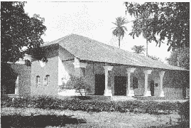

我于 1918 年在比哈尔省建立的兰契学校

对青少年进行全方位教育的理想一直盘踞在我的心头。我清楚地了解到，一般只以身体和智力发展为目标的教学只会产生枯燥乏味的结果。人类如果不重视道德和精神的价值，就无法接近快乐，这也是正规教育课程中所缺乏的。我决定创办一所在各方面都能让男孩们完全发展到成人阶段的学校。第一步，我将从孟加拉的乡下小地方迪西卡（Dihika）的七个儿童开始。

一年以后的 1918 年，通过卡辛巴刹尔（Kasimbazar）郡主曼尼卓拉·昌卓尔·南第（Manindra Chandra Nundy）阁下的慷慨解囊，我将快速成长的团体迁往位于比哈尔省，离加尔各答大约 200 英里的兰契。那里有印度最宜人的气候。卡辛巴刹尔在兰契的宫殿变成了新学校的总部，依据先知们的教育理想，我将它命名为“梵志维地拉亚”（Brahmacharya Vidyalaya）。

我在兰契安排了初中及高中两种教学课程，包括农业、工业、商业及文学等科目，也教授学生瑜伽的专注和打坐，以及独特的进化身体的系统—“尤高达”（Yogoda），我在 1916 年发现它的原理。

人体就像一块电池，它可以在人类意志的运作下直接充满能量。人一旦失去意志力，任何行动都是不可能的，人类可以利用他最基本的动力—意志，去更新身体组织，而不需要麻烦的设备或是机械性的运动。我教给兰契的学生以简单的“尤高达”技巧，让他们可以意识到并实时汲取无限量的宇宙能量，让它重新充满以人体延髓为中心的生命力。

男孩们对这项训练的反响非常好，他们锻炼出将生命能量从身体的一部分转移到另一部分的非凡能力，并可以完美平稳地以高难度姿势坐着。他们展现出来的力量和持久技巧，是许多有力的成年人都难以做到的。我的小弟毕修·夏蓝·高绪加入了兰契学校，他后来成了孟加拉体育界的领导者。他曾经和一个学生旅行到欧洲、美国，他们展示出来的力量及技巧震惊了包括哥伦比亚大学在内的许多知名大学的专家学者。

第一年结束时，申请入学的学生达到了 2000 人。但学校在那个时候完全是住校性质的，只能容纳约 100 人左右。

在维地拉亚，我必须在小孩子们面前扮演父亲兼母亲的角色，并应付许多行政上的难题。我常记着基督的话：“我实在地告诉你们，没有人会因为我和福音离开自己的房子、兄弟、姐妹、父亲、母亲、妻子、儿女或土地。”圣尤地斯瓦尔曾经解释这句话：“虔信的人放弃了婚姻与家庭的生活，将小家庭问题及有限的活动换成了服务社会这一更大的责任，就大体而言是承担了一项经常因误解而受到迫害的工作，但同时也伴随着天国内在的满足。”

有一天父亲来到兰契，给了我一个作为父亲的祝福，因为先前我拒绝了他所提供的在孟加拉那格浦尔铁路局的职位，这件事伤了他的心。

“儿子，”他说道，“我现在很满意你在生命中做出的选择。看到你在这群快乐的小孩中间，我很开心。你属于这里，而不属于铁路局时刻表上死气沉沉的数字。”他向一群紧紧跟随我的小家伙挥了挥手，“我只有八个孩子，”他眨着眼睛说道，“但是，我可以理解你的感受！”

我们可以使用 25 英亩的肥沃土地以及一个大果园，老师、学生和我本人在这个理想的环境里享受着大量户外劳动的欢乐时光。我们有很多宠物，包括一只相当受孩子们欢迎的小鹿。我也很喜爱它，允许它睡在我的房间里。天一亮，这个小家伙就会蹒跚地走到我床边，让我送给它一个清晨的拥抱。

有一天，我因为在兰契镇上有些事情要处理，便提早喂了小鹿。虽然我告诫过孩子们在我回来之前不要喂它，但有人不听话，给了小鹿大量牛奶。我晚上回来的时候，一个悲伤的消息已经在等着我了：“小鹿由于进食太多，快要死了。”

我流着眼泪，把看起来已经没有生命迹象的小鹿放在膝上。我向上帝祷告，希望他能赦免小鹿的生命。几个小时后，小鹿睁开眼睛，站了起来，衰弱地走动着。全校欢呼起来。

但是那天晚上，我上了一堂永远也不会忘记的课。我跟小鹿一直待到半夜两点才睡着。随后，它出现在我的梦中，跟我说：

“您留住了我。请让我走，让我走！”

“好的。”我在梦里回答道。

我立刻醒过来，叫喊道：“孩子们，小鹿要死了！”孩子们冲到我身旁。

我跑到房间里安置小鹿的角落，它正在做最后的挣扎，站起来摇晃地走向我，接着倒在我的脚边，死去了。

根据命运业力的法则，小鹿的生命已经走到了尽头，它准备好了要进化到更高的形式中去。但由于我身后的感情—后来我了解到那是自私的—以及我强烈的祷告，我把小鹿留在了它的灵魂挣扎着要解脱的动物形态限制中。小鹿的灵魂在梦中恳求我，因为没有我的许可，它是不会也不能走的。我同意了，它就该离开了。

所有的悲伤全部远去，我重新认识到，上帝希望他的子女爱每一样东西，就好像要成为他的一部分，而不是单纯地认为死亡能够终结一切。无明的人类只看到无法超越的死亡，好像永久地隐藏住他珍爱的朋友。但一个没有受到束缚的人，爱他人如同爱上帝的人会了解到，亲人的死亡，只是为了回到他内在欢乐时期。

兰契从一所简单的小学校发展成一所印度知名的教育机构。学校的许多部门都是由乐意永久保存先知教育理念的人自动捐献和支持的。在尤高达真理团体（Yogoda Sat—Sanga）的旗帜下，我们先后在密那波尔（Midnapore）、拉克斯曼浦尔（Lakshmanpur）以及布利开办了分校。

兰契总校拥有一个医务部门，医生免费为穷人及当地民众提供医疗服务和药品。平均每年就诊的患者超过 18000 人。维地拉亚在印度的竞赛性运动及学术上也享誉盛名，许多兰契的校友日后进入大学都有杰出的表现。

这所学校现已迈入第 28 个年头，是许多活动的举办中心，东西方知名人士的造访使它荣誉倍增。第一年最早视察维地拉亚的伟大人物之一是贝拿勒斯“有两个分身的圣人”普拉那贝南达斯瓦米。当这位伟大的上师看到在户外的树下，如画般美丽的课堂，以及夜晚年轻男孩们数个小时静止不动的瑜伽打坐时，他深受感动。

“喜悦住进我的心中，”他说道，“看到拿希里·玛哈赛训练青少年的理想在这个机构得以延续，我古茹的祝福一定也在其中。”

一个坐在我旁边的少年大着胆子问这位伟大的瑜伽行者：

“先生，”他说，“我会成为一个和尚吗？我的命是否只为上帝而生？”

尽管普拉那贝南达斯瓦米温和地微笑着，但他的眼睛仿佛能透视未来。

“孩子，”他回答道，“你长大以后，有一位美丽的新娘在等着你。”这个男孩在计划了多年要进入僧团后，终于还是结婚了。

在普拉那贝南达斯瓦米造访兰契之后，有一天，我陪伴父亲去加尔各答，到那位瑜伽行者作短暂停留的房子里去。多年以前，普拉那贝南达对我作出的预言浮现在脑海中：“以后，我会再见到你的，而且，还会见到你的父亲。”

当父亲进入斯瓦米的房间时，伟大的瑜伽行者从座位上站起身，以深厚的敬意拥抱了他。

“巴格拔第，”他说道，“你做得怎么样了？有没有看到你的儿子正以飞快的速度跑向无限？”在父亲面前听到他的称赞，我的脸红了。斯瓦米继续说道，“你还记得我们神圣的古茹经常说的话吗？‘巴纳特，巴纳特，班胜利（banat，banat，ban jai）’（努力，努力，看啊，终点）。只要不间断地修习克利亚瑜伽，很快就能到达天国的大门。”

我第一次在贝拿勒斯拜访普拉那贝南达时，他的身体看起来非常健壮，但现在明显显露出老化的迹象，不过他的身材还是令人赞赏的笔直。

“可敬的斯瓦米，”我看着他的眼睛问道，“请告诉我实话：您有没有感觉到岁月在悄然流逝？当身体变得衰弱时，您对上帝的感知有没有减少？”

他像个天使般笑了起来：“亲爱的上帝依然跟我在一起，比任何时候都要更加亲密。”他的绝对信念使我的心智和灵魂非常感动。他继续说道，“我仍然享受着两份退休金—一份是从巴格拔第来的，另一份是从上面来的。”他的手指指向天堂。圣人进入了入定状态，他的脸散发着天国的光辉。

我注意到普拉那贝南达的房间里有许多包种子和植物，我问了问它们的用途。

“我永远离开贝拿勒斯了。”他说道，“现在正在前往喜玛拉雅山的途中。我将在那里为徒弟创建一所修道院。这些是菠菜和一些其它蔬菜的种子。那些我所爱的人将过着简朴的生活，把时间用在与上帝的极乐融合里。除此之外，没有什么东西是必不可少的。”

父亲问他的师兄弟什么时候能回到加尔各答。

“再也不会回来了，”圣人回答道，“今年是拿希里·玛哈赛告诉我永远离开心爱的贝拿勒斯、前往喜玛拉雅山的年份，在那里，我将扔掉自己凡夫俗子的身体。”

听了他的话，我热泪盈眶，但斯瓦米依旧平静地微笑着。他使我想到了天堂的小孩，安稳地坐在圣母的膝头。岁月的沉重负担并没有在一个伟大的瑜伽行者充分拥有的精神力量上造成不良影响。他可以随心所欲地更新身体，但有时候，他不想阻止老化的过程，而是听凭业力在肉体层面上自行运作着，将他老化的身体作为节省时间的工具，排除来世还要洗去业力的必要。

几个月后，我碰到了普拉那贝南达亲近的弟子—我的老友萨南丹（Sanandan）。

“我敬爱的古茹去世了，”他含泪告诉我，“他在里希凯斯附近建了一所修道院，慈爱地训练我们。当我们都安顿好，并且在他的训练下灵性有了快速进步的时候，有一天，他提出宴请里希凯斯的一大群人。我问他为什么要请那么多人。”

“他说，这是我的最后一次庆典仪式了。当时，我并没有完全了解他的话中隐含的意思。

“普拉那贝南达帮忙烹煮了大量的食物。我们邀请了将近两千位客人。宴会结束后，他坐在一个高高的讲台上，做了一个关于无限的主题演讲。结束时，在上千人的注目下，他转向了我，因为我就坐在讲台上，他的旁边。他用不寻常的语气说道：

“‘萨南丹，准备好，我要抛弃身体了。’

“在一阵沉默的震惊后，我大声地哭喊道：‘上师，不要这样做！千万不要这么做！’客人们瞠目结舌，奇怪地看着我们。我的古茹对我微笑着，但他神圣的眼睛已经凝视在永恒中了。

“‘不要自私，’他说，‘也不要为我悲伤。我长久以来快乐地服侍你们，现在欢庆并祝福我一路平安吧。我将去见宇宙的至爱。’普拉那贝南达私下里低低地补充道，‘我很快就会再生。在享受过短暂的无穷极乐之后，我会回到地球上，加入巴巴吉的行列。你很快就会知道我的灵魂在何时何地进驻到怎样的新身体里。’

“他又叫道，‘萨南丹，我在此用第二种克利亚瑜伽舍弃肉体。’

“他看着我们面前众多的脸孔，赐予了祝福。他的凝视转入了内在的第三眼，他变得静止不动了。当困惑的群众以为他进入了打坐入定的状态时，他已经离开了这个暂住的肉体，灵魂投入到了无穷无尽的宇宙中。徒弟们触摸他莲花坐姿的身体，但再也不是温暖的肉体了，只是个僵直的躯壳，它的房客已消失到永世的彼岸去了。”

我问他，普拉那贝南达会在哪里重生？

“那是一个神圣的嘱托，我不能泄露给任何人，”萨南丹回答道，“也许你可以用别的方式知道。”

几年之后，我从凯斯本南达斯瓦米处得知，普拉那贝南达在新身体出生后几年，就到喜玛拉雅山的巴尊纳拉扬（Badrinarayan）去了，在那里加入了伟大的巴巴吉的圣人团体。

第二十八章 卡西的再生

“请不要进入水中，让我们用桶子舀水上来洗。”

我告诫随我一起步行八英里来到邻近山丘的年轻学生们。我们面前的池塘令人心动，但我对它有一股厌恶之情。我周围大部分的人跟随我的示范用桶子汲水，然而，依然有一些男孩抵挡不住冰凉池水的诱惑。他们一同跳入水中，巨大的水蛇马上在他们身旁游动。那些男孩们敏捷而又滑稽地跳出了池塘。

到达目的地后，我们享用了一顿野餐。我坐在树下，被一群学生围绕着。他们发现我充满灵感，于是不断地向我提问。

“先生，请告诉我，”一个青少年询问道，“我是否能一直跟随着你，走在出家的路上。”

“喔！不！”我回答道，“你会被迫返家，以后你会结婚。”

他不相信，并强烈地抗议道：“只有我死了，我才会被带回家。”但几个月之后，他的双亲不理会他流着泪水的抗议，强行带他回去了。几年以后，他结婚了。

回答了许多问题之后，一个名叫卡西的少年向我提问。他约莫 12 岁，很有才华，受到所有人的喜爱。

“先生，”他说，“我的命运会怎样？”

“你很快就会死了。”这个回答带着一股不可抗拒的力量，从我的口中说出。

这个没有预料到的回答让包括我在内的每个人感到震惊且难过。我默默地自责，自己像顽皮不负责任的小孩，然后拒绝回答进一步的问题。

我们回到学校后，卡西来到我的房间。

“如果我真的死了，当我重生时，您能找到我并再次带我走上心灵之路吗？”他哭泣道。

我觉得必须拒绝这个艰难隐秘的责任。但随后的几个星期里，卡西固执地请求着我。看到他烦恼不安、甚至快要崩溃了，我只好安慰他。

“好的，”我答应道，“只要天父提供他的帮助，我会尝试去找你。”

暑假的时候，我开始了一趟短途旅行。很遗憾不能带着卡西同行，离开之前，我叫他到我的房间来，耐心地指导他。不知怎的，我觉得如果他不回家，也许可以避免即将发生的灾难。

我一离开，卡西的父亲就到达兰契。他告诉儿子，只要到加尔各答，看望他的母亲，过后他就可以回来了。卡西一直拒绝。这个父亲最后说他要去找警察帮忙来把小孩带走。这个威胁烦恼着卡西，他不愿意为学校带来任何麻烦，只好走了。

几天后我回到兰契。当我听到卡西已经被带走时，我立即坐上抵达加尔各答的火车。在那里我租了一辆马车。很奇怪，当车子通过恒河上的豪拉桥时，我看到了卡西的父亲和其他亲戚穿着丧服。我急忙叫车夫停了下来，冲过去，恼怒地看着不幸的父亲。

“凶手先生，”我有些失去理智地叫喊道，“你杀了我的孩子！”

这个父亲已经知道他强制带卡西回加尔各答是个严重的错误了。在短短的几天内，男孩吃到被污染的食物，感染了霍乱并去世了。

我对卡西的爱，以及承诺找到他的誓言，日夜萦绕着我。不论我去往哪里，他的脸总是隐约地出现在我的眼前。我开始进行了一段难忘的找寻，就像很久以前，寻找我失去的母亲一样。

我觉得上帝既然给了我推理的能力，我就必须运用它并且使用自己的全部力量去找寻这男孩灵体的下落。他是一个振动着未完成愿望的灵魂，在这么多其他灵魂振动的光体中，我该如何调整、进入他的频道呢？

我用瑜伽的秘法，通过位于两眉中间第三眼的麦克风，广播我对卡西灵魂的爱。我将举起来的手和手指作为天线，时常转来转去，尝试着寻找他已再生为胚胎的方向。我希望内心的收音机能够接收到他的回应。

我直觉地感到卡西很快就会回到地球，只要我保持对他不断的召唤，他的灵魂就会回应。我知道，卡西哪怕是发送出最微小的脉冲，我的手指、手掌、手臂、脊椎和神经都能感觉得到。

在卡西死后大约六个月，我热情不减地实行这个瑜伽方法。一天早上，当我跟几个朋友走在加尔各答拥挤的保巴沙（Bowbazar）区时，我照常举起了手。这是第一次，我感受到了回应。我非常兴奋地侦测到电流的脉冲细细地向下经过我的手指和手掌。这些电流在我意识深处转化为一个强烈的思想：“我是卡西，我是卡西，到我这里来！”

当我专注于内心的收音机时，这个思想几乎变成可以听见的。我听到卡西特有的略带沙哑的低语声，一次又一次地呼唤。我抓往其中一个同伴普罗卡希·达斯（Prokash Das）的手臂，快乐地对他笑着。

“看起来我好像找到卡西了！”

我开始转过来转过去，我的朋友和过往的群众毫不掩饰他们的笑意。电流的脉冲只有当我朝向附近一条名为“蜿蜒巷”的巷子时，才会传递到我的手指上。当我转到其他方向时，引起灵体的电流就消失了。

“啊，”我叫道，“卡西的灵魂一定住在这条巷子里某位母亲的子宫里。”

朋友和我靠近蜿蜒巷，我举起的手震动更为强烈、明愿。我好像被磁铁吸引住了，被拉向路的右侧。到了某间房子的门口，我惊异地发现自己被固定住了。我在极度兴奋的状态下敲着门，屏住气息。我感到长久以来艰难追寻的谜底已经找到！

一个仆人出来开门，她告诉我主人在家。他从二楼的楼梯下来时，探询地对我微笑着。我几乎不知道如何说出我的问题。

“先生，请告诉我，你和你的妻子是否期待一个小孩的出生大概有六个月了？”

“是的，的确如此。”看到我是一个斯瓦米，一个穿着传统橘色僧袍的出家人客气地补充道，“请告诉我你是怎么知道的。”

当他听到有关于卡西的事情和我所给予的承诺时，震惊的主人还是相信了我所说的故事。

“你们会生一个皮肤白皙的男孩，”我告诉他，“他会有一个宽阔的脸型，额头上有着卷发。性格很明显是属于灵性的。”我确定地感觉到这个即将到来的孩子会拥有这些与卡西相似的相貌。

后来我去探访那个孩子，他的双亲给他沿用了他的旧名卡西。即使是在婴儿时期，他的外表已显著地酷似我那亲爱的兰契学生。那个孩子对我立刻表现出亲切的感情，过去吸引力的觉醒，加倍了它的强度。

几年之后，当我在美国时，这个十几岁的男孩写信给我，诉说他对走上出家之路的深切渴望。我指点他前往喜玛拉雅山的一个上师处，至今这位上师仍引导着再生的卡西。

第二十九章 泰戈尔和我关于创办学校的讨论

“鲁宾卓纳斯·泰戈尔教我们像小鸟般自然地流露出自我。”

有一天早上，在我赞美兰契学校一个 14 岁快乐少年柏拉·纳斯（Bhola Nath）悦耳动听的歌声时，他给了我这样的解释。这个男孩不论是否被引导着，总能唱出和谐动人的曲调。他先前曾就读于泰戈尔在波浦尔（Bolpur）著名的“圣提尼克坦”（Santiniketan，和平的天堂）学校。

再生的卡西

“我从小就唱着泰戈尔的歌。”我告诉同伴，“全孟加拉的人，就连不识字的农夫都喜欢他高雅的诗歌。”

柏拉和我一起合唱了几首泰戈尔的叠句，泰戈尔为数千首印度诗谱曲，有一些是出于他的创作，其他的则是远古的诗歌。

“我在泰戈尔获得诺贝尔文学奖后不久就与他会面，”合唱之后我说道，“我很想去拜访他，因为我欣赏他毫不做作地对待那些文学评论者的勇气。”我低声笑道。

柏拉好奇地问起这个故事。

“泰戈尔采用了一种新的孟加拉诗文格式，结果遭到了学者们严厉的抨击，”我开始说道，“他混合了口语与古典的表达方式，完全无视那些学者专家们所熟知的现有规范。他的歌在动人的词句中蕴含了深远的哲学真理，很少考虑到公认的诗词格律。”

“一个颇有影响力的批评家轻蔑地说泰戈尔是‘为了一块钱把他咕咕的声音印在纸上出卖的鸽子诗人。’但泰戈尔的回击马上到来，在他将自己的作品《吉檀迦利》（Gitanjali）译成英文后，整个西方世界很快就拜倒在他的脚下。整车的学者专家，包括先前批评他的人，都到圣提尼坦去祝贺他。

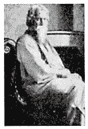

鲁宾卓纳斯·泰戈尔

“泰戈尔故意拖延了很久才出来接待客人，然后默不作声地听着他们的赞美。最后他以那些人惯用的批评武器还击了对方。

“‘各位，’他说道，‘你们在这里给予我的芳香赞誉里很不协调地混杂着过去的轻视臭味。我获得诺贝尔奖跟你们突然变得敏锐的鉴赏力有任何可能的关系吗？我依然是那个第一次在孟加拉文学殿堂里献上我卑微的花朵，因而触怒你们的诗人。’ ”

“报纸报导了泰戈尔令人瞩目的斥责。我欣赏一个不沉迷于奉承之人坦率的言论，”我继续说道，“在加尔各答，他的秘书安德鲁斯（C.F. Andrews）先生穿着朴素的孟加拉腰布引我去见泰戈尔。他还深情地提到泰戈尔是他的天国导师。

“泰戈尔殷勤地接待了我。他散发出迷人谦逊而富有涵养的气息。在回答我有关他文学背景的问题时，泰戈尔告诉我，除了宗教史诗外，古典诗人毕迪尔帕提（Bidyapati）也是他古代诗歌灵感的来源之一。”

受到这些回忆的鼓舞，我唱起了一首泰戈尔改编的孟加拉古歌—《点燃你的爱之灯》。柏拉和我漫步在维地拉亚的校园里，愉快地合唱着。

大约在兰契学校创办两年后，我收到了泰戈尔请我到圣提尼克坦商讨教育理想的邀请函。我很高兴地前往。当我进去时，诗人正坐在书房里。那时我在想，如同我们首次会面所想的，他是任何画家都会喜欢的绝佳的模特儿人选：轮廓分明的美丽面孔，高贵的气质，衬托着长长的头发和飘逸的胡须，大而动人的眼睛，天使般的笑容，还有笛子般迷人的声调。结实、高大、庄严，他融合了几乎所有女性的温柔和孩子般纯真的快乐。没有人比这个高贵的诗人更适合做理想诗人的化身了。

泰戈尔和我很快地深入比较了我们创办的这两所学校，二者都是走非传统路线的。我们发现了许多相同的特色—户外教学、简单、多元化、启发儿童的创意。不过，泰戈尔比较注重诗词与文学的研习，以及通过音乐和歌曲进行自我表达，这一点我已经从柏拉的身上注意到了。圣提尼克坦的孩童们遵守禁语的时段，但是没有接受特别的瑜伽训练。

诗人兴致勃勃地专心听我描述了所有兰契学生都会学到的、供给能量的“尤高达”锻炼和瑜伽专注集中的技巧。

泰戈尔告诉我他自己早年受教育时的挣扎：“我五年级以后就逃离了学校，”他笑了起来。我很能理解他天生的细致是如何被课堂上沉闷、纪律性的气氛所亵渎的。

“所以我在树荫和灿烂的天空下开办了圣提尼克坦。”他指着一小群在美丽的花园里读书的孩子，“小孩子应当在鸟语花香的环境里成长。只有如此，他才能完全显露出内在的、隐藏的个人天赋。真正的教育不可能是由外界挤压注入的，我们必须帮助他们将贮藏在内心无限的智能自然地引导出来。”

诗人深情地谈到了鼓励他开办圣提尼克坦的父亲，迪文卓纳斯（Devendranath）。

“父亲提供我这块肥沃的土地时，上面已经盖有宾馆和寺庙，”泰戈尔告诉我，“我在 1910 年开办这个学校时，只有十个男孩。8000 英镑的诺贝尔奖金全都投入到了学校的维护中。”

老泰戈尔·迪文卓纳斯，远近驰名的“大圣人（Maharish）”，从他的自传中就可以看出他是一个非常杰出的人物。他成年后有两年时间在喜玛拉雅山中打坐。再往上数，他的父亲德瓦卡纳斯·泰戈尔（Dwarkanath Tagore）是全孟加拉出名的公益慈善家。从这个辉煌的世系里产生了一个天才的家族。不仅是泰戈尔，他所有的亲戚都以富有创意的表现而著称。他的兄弟戈高南卓拉（Gogonendra）和阿宾宁卓拉（Abanindra）是印度最重要的艺术家，另一个兄弟杜真卓拉（Dwijendra）是一个有深厚造诣的哲学家，在他轻柔的召唤下，鸟儿和林中的走兽都会响应。

泰戈尔邀请我在宾馆过夜。晚上，诗人和一群人坐在内院实在是一个迷人的场面。时光倒流：在我面前的好像是古代修道院的景象—快乐的演唱家被忠诚的听众环绕着，所有人都笼罩在天国之爱的光晕中。泰戈尔以和谐的弦编织着每个关联的曲调。他令人无法抗拒的磁力不用夸饰就能吸引虏获人心。稀有诗文的花朵盛开在上帝的花园里，绽放着自然诱人的芬芳！

泰戈尔以悦耳动听的声音向我们朗诵了几首他新近创作的绝妙好诗。他大部分为学生的快乐而写的歌曲和戏剧都是在圣提尼克坦完成的。对我而言，他字里行间的美妙在于：几乎每一节诗文都言及上帝，但很少直接提及他的圣名。“沉醉在咏唱的喜悦中，”他写道，“我浑然忘却了自己，赞颂您，我的上主，为朋友。”

次日午餐后，我依依不舍地道别了诗人。我很高兴他的小学校现在已经发展成为一所国际性的大学“维斯瓦帕拉提”，来自世界各地的学者都认为这是一个理想的环境。

在一无所惧、抬头挺胸的地方，

在知识是自由的地方，

在世界不被狭隘的国界裂成碎片的地方，

在言语出自真理深处的地方，

在永不倦怠的努力伸展它的手臂向完美的地方，

在理智的清流没有在阴郁沙漠中迷失方向的地方，

在心灵由您引领向前进入永远扩展着思想和行为的地方，

进入自由的天堂，我的天父，让我的国家觉醒吧！

—鲁宾卓纳斯·泰戈尔  

第三十章 奇迹法则

伟大的小说家列奥·托尔斯泰（Leo Tolstoy）写了一则很有意思的“三个隐士”的故事。他的朋友尼古拉斯·罗瑞克（Nicholas Roerich）总结这个故事如下：

在一个岛上住着三位老迈的隐士。他们极其单纯，唯一使用的祷告词是：我们是三位，您是三位一体，怜悯我们吧！在这个纯真的祷告中显现出伟大的奇迹。

“当地的主教听到这三位隐士及他们没有被认可的祷告后，决定去拜访他们，教他们正确的祷告方式。他到岛上去，告诉那些隐士他们对天国的请愿是不庄重的，并教导了他们许多常用的祷告词。随后主教就坐船离开了。跟在船后，他看到了一道耀眼的光芒。当它靠近时，他认出是那三位隐士，手牵着手跑在海浪上，努力地追赶他的船。

“我们忘记你教我们的祷文了，”他们叫喊道，“所以我们追来，请求您再重复一次。”惊叹的主教摇着他的头。

“亲爱的，”他谦卑地回答道，“继续沿用你们以前的祷告词吧！”

那三位圣人是如何走在水上的？

基督是如何复活钉死在十字架上的身体？

拿希里·玛哈赛和圣尤地斯瓦尔是如何展现奇迹的？

现代科学尚未有答案，不过随着原子弹和雷达的出现，心智世界的范围突然变大了。“不可能”一词在科学领域变得越来越不起眼了。

古代吠陀的经典认为，物质世界是在马雅一个基本的原则下运作的，也就是相对性与二元性。上帝“唯一的生命”是“一个绝对的整体”。除非是在虚妄或不真实的帷幕下，否则他无法显示成个别多变性的万物。宇宙的幻象就是马雅。近代每个伟大的科学发现都证实了先知的这个简单看法。

牛顿的运动定律是马雅的法则：“每一个作用力必有一个相等的反作用力，任何两个物体相互的作用力必定相等且方向相反。”因此作用力和反作用力是完全相等的。“单一的力是不可能的。作用力必须而且永远是成对的，它们大小相等且方向相反。”

大自然的基本活动都显示出他们马雅的根源。例如，电是一种斥力和引力的现象，电子和质子带着相反的电性。另一个例子：物质中的原子或终极粒子与地球相同，是一块带着正负极的磁铁。整个现象的世界都处在不能改变的极性振荡下。从来没有物理、化学或任何其它的科学能免于相对或对比的原则。

所以物理学不可能独立于构成万物本质的马雅而形成公式。自然界本身就是马雅，自然科学一定要处理她无可避免的本质。在自己的领域里，她是永恒而无穷尽的，将来的科学家也只能探索她一个接一个无穷多变的外在。科学因此停留在无休止的变化中，无法达到终点。它实际上适合于系统地阐述已经存在运行着的宇宙法则，但无法侦测到此法则的“组成者”与“唯一的操作者”。万有引力与电力壮观的表现众所周知，但万有引力和电力究竟是什么，没有人知道。

超越马雅是千年以来先知们所指派给人类的任务。人类最高的目的就是超越创造的二元性，意识到造物者的一体性。那些执着于宇宙幻象的人必须接受它基本的两极法则：涨潮与退潮、上升与降落、日夜、苦乐、善恶、生死。在人类经历了数千次的诞生后，这个循环方式显现出某种极度痛苦的单调性，它开始对马雅强制性的冲动，投出充满希望的目光。

撕裂马雅的面纱就是洞察造化的奥秘。那些将宇宙如此展现出来的瑜伽行者是真正的、仅有的一神论者。其他所有人都只是崇拜偶像而已。只要人还停留在臣服于自然界二元的幻象中，双面的马雅依然是他的女神，他无法认识真正、唯一的上帝。

这个世界的幻象马雅，也称之为“无明”（avidya），字义是“非知识性的”、无明、妄想。马雅或无明是不可能用理智的信念或分析摧毁的，只能通过内在“涅比卡帕三摩地”的境界达成。旧约中的预言家及所有地方、所有时代的先知都是在这种境界下预言事情的。

在宇宙百万兆的奥秘中，最显著的就是光。不像音波的传导需要空气或其它的物质当媒介，光波自由地穿过星际之间的真空。即使是在波动的理论中，假设星球之间存在着光的介质以太，根据爱因斯坦的理论，空间的几何性质使得以太的理论是没有必要且可以抛弃的。在两种假说中，光是自然界表现形式中最细微、最不受限于物质形式的。

在爱因斯坦广阔的观念中，光速—每秒 186000 英里—在整个相对论中占有重要的地位。他用数学证明了，光速是到目前为止在变迁流动的宇宙中，人类有限的心智所能想到的唯一常数。光速独特的绝对值取决于所有人类时间和空间的标准。时间与空间是相对而且是有限的因素，它们的实际测量值是由光速的标准而来，并不是人类迄今为止所认为的那样是抽象永恒的。在加入空间成为一个相对性的次元中，时间放弃了由来已久的认知，变成了一个确定的数值。时间现在被裸露在外，显示出它正确的本质—一个简单又模棱两可的要素！爱因斯坦大笔挥下了几个公式，除光之外，排除了宇宙中每个不变的事实。

这位伟大的物理学家后来发展的“统一场理论”，用一个数学方程式包含了万有引力与电磁力。爱因斯坦把宇宙的结构归纳为单一法则的变异，跨越到先知们声称千变万化的马雅是造化的唯一组成时代。

在时代的相对论理论中，发展出以数学探测最终原子的可能性。伟大的科学家们现在不仅大胆地主张原子是能量而非物质，而且相信原子的能量实际上是心智的材料。

“清楚地了解到自然科学是有关于幻影的世界，这可以说是最有意义的进展之一。”亚瑟·史坦利·艾丁顿（Sir Arthur Stanley Eddington）在《自然界的本质》（The Nature of the Physical World）中写道：“在物理学的世界中，我们观看着日常生活戏剧影子的演出。我手肘的影子靠在幻影的桌上，幻影的墨水流动在幻影的纸上，这些全都是象征性的，物理学家把它们当做记号留下来。接着到来的是炼金术士的心智，转变这些记号……粗略的结论就是说世界的材料是心智性质的原料……先前物理实际物质和力场的理论是全然不合用的，除了它们在心智材料自己编织成的影像上…… 外在的世界是这样变成幻影世界的。当我们移去幻觉时，也移除了物质，而实际上我们已经知道物质是我们最大的幻想之一。”

最近发明的电子显微镜确切地证明了原子光的本质及自然界无可避免的二元性。《纽约时报》对 1937 年在美国科学促进会上所展示的电子显微镜报道如下：

“先前只能用 X 射线间接地了解钨的晶体结构，现在可以轮廓分明地显示在荧光屏上，有九个原子正确地出现在立方晶格的位置上，每个角落及中间各有一个原子。钨结晶格中的原子在荧光屏上看起来像排列成几何图形的光点。在这个光的晶格上，可以看到高能空气分子的冲击，就好像太阳光在波动的水面上闪烁的、跳动的光点……

“电子显微镜的原理最早在 1927 年由贝尔电话实验室的克林顿·大卫森（Clinton J. Davison）和利斯特尔·德莫尔（Lester H. Germer）博士发现。他们发现电子同时带有波及粒子双重的特性。波的性质赋予电子光的特质，因此，一项设计如何使用透镜聚光的方式去集中电子束方法的研究就展开了。

“大卫森博士发现了电子双重的本质，证实了法国诺贝尔奖得主物理学家德布洛伊（De Broglie）在 1924 年所做的预测，并且显示了整个自然界的本质是二元性的，他也获得了诺贝尔物理奖。”

詹姆斯·金斯（Sir James Jeans）在《神秘宇宙》（The Mysterious Universe） 中写道：“知识的潮流朝向非机械性的事实发展，宇宙已经开始看起来像一个巨大的思想，而不是一个巨大的机器。”20 世纪的科学因此更像是古老吠陀经中的一页。

爱因斯坦在他著名的质能互变的方程式中，证明了任何物质粒子的能量等于质量或重量乘以光速的平方。物质粒子的消灭释放出原子的能量。物质的“死亡”也是原子时代的“诞生”。

光速是一个数学的标准或是常数，不是因为每秒 186000 英里的绝对值，而是因为当质量随着速度的增加而加大时，没有物体能够达到光速。换句话说：只有质量是无限的物体才可能相等于光速。

这个观念带给了我们“奇迹的法则”。

大师们可以将他们的身体或任何其它东西物质化或非物质化，以光速移动，利用富有创造力的光线实时产生任何可见的物质现象，这符合了爱因斯坦的必要条件：他们的质量是无限的。

完美瑜伽行者的意识很容易认同宇宙的结构而非狭隘的身体。不论是牛顿所谓的“力”或是爱因斯坦“惯性的现象”，万有引力无法迫使一位大师显出“重量”的性质，这是所有物质东西所特有的重力情况。当他知道自己是无所不在的心灵时，就再也不会受到时空中刚硬身体的影响。

第三十一章 拜会师母

“尊敬的师母，在我还是婴儿时，您先知的丈夫曾给我洗礼。他是我双亲及我古茹圣尤地斯瓦尔的古茹。您能否因此让我有幸听到一些在您神圣生活中所发生的事情？”

我跟拿希里·玛哈赛的终生伴侣施瑞玛蒂·卡西·摩妮（Srimati Kashi Moni）说着话。我利用在贝拿勒斯短暂的停留时间达成了长久以来想要拜访这位可敬女士的心愿。她在贝拿勒斯市格鲁迪斯瓦尔摩呼拉（Garudeswar Mohulla）区拿希里的旧家亲切地接待了我。虽然已经上了年纪，但她像一朵盛开的莲花，安详地散发着灵性的芳香。她身材中等，有着细长的颈子和白皙的皮肤，闪亮的大眼睛柔和了她慈母般的脸庞。

“孩子，欢迎你到这里来，上楼吧。”

卡西·摩妮带我到一个曾经是她和她先生住的非常小的房间。我觉得很荣幸能够亲眼目睹这位无与伦比的上师演出人类婚姻剧本的圣地。这位仁慈的女士示意我坐在她身旁一个有垫子的座位上。

“过了好几年，我才了解到我丈夫高等的天国境界，”她开始说道，“有一天晚上，就在这个房间，我做了一个鲜明的梦。光辉的天使优美地飘浮在我的上方。那个景象极为真实，我立刻醒了过来，整个房间奇异地笼罩在耀眼的光辉里。 我丈夫以莲花坐姿飘浮在房间中央，天使们庄严地合掌围绕、崇拜着他。我以为自己还在睡梦中。

“‘女人，’拿希里·玛哈赛说道，‘你不是在做梦。永远永远地摒弃你的睡梦吧。’当他缓慢地降到地板上时，我拜伏在他的脚下。

“‘上师，’我叫喊道，‘一次又一次我在您的面前俯首致敬。您能宽恕我吗？过去我一直认为您是我的丈夫，现在我了解到自己是在一个天国觉醒人的身旁，却依然沉睡在无明中，我羞愧得要死。从今晚开始，您将不再是我的丈夫，而是我的古茹。您能接受卑微的我做您的徒弟吗？’

“上师温柔地触摸我。‘神圣的灵魂，起来吧。你被接受了。’他示意那些天使，‘请依次向这些神圣的天使们鞠躬致意。’

“当我完成谦卑的跪拜之后，天使的声音齐声响起，像是古代经典里说的合唱。

“‘天国圣人的伴侣，您是受到祝福的。我们向您致敬。’他们跪拜在我脚下，瞧！他们灿烂的形体消失了。房间暗了下来。

“我的古茹要求我接受克利亚瑜伽的传法。

“‘当然啦，’我反应道，‘我很遗憾没有早一点在我的生命中得到它的祝福。’”

“‘时机尚未成熟，’拿希里·玛哈赛微笑着安慰我，‘我已经默默地帮你去除大多数的业力。现在你已经愿意并准备好了。’

“他触摸我的额头。旋转的光团出现了，光芒逐渐形成了蓝白色的第三眼，有着环状的金边，中间为五角形白色的星星。”

“‘将你的意识穿过星星进入无限的领域。’我的古茹声调有些陌生，柔和得像是远方的音乐。 ”

“体验一幕接着一幕的来临，像是冲击着灵魂海岸的海潮。这一连串球面的景象最后融入极乐的海洋中。我沉醉在永恒澎湃的幸福里。几个小时后，回神到这个世界，上师传授了我克利亚瑜伽的技巧。

“从那晚起，拿希里·玛哈赛再也没有在我的房间睡过觉。并且，他也没有睡过觉。他一直待在楼下前面的房间，日夜都有徒弟陪伴着。”

这位杰出的女士陷入了一片沉默。了解到她与无上的瑜伽行者独特的关系后，我大胆地请求她回忆更多的往事。

“孩子，你够贪心了。不过，你还可以再听一个故事。”她腼腆地笑着，“我要承认我犯了一项违背我古茹丈夫的罪行。接受传法后几个月，我开始觉得孤独及受到忽视。有一天早上，拿希里·玛哈赛进到这个小房间来拿东西，我很快地跟上他。我被强烈的妄想压倒了，苛刻地对他说道：‘你把所有的时间都花在徒弟身上。你对妻子和孩子的责任呢？我很遗憾你没有把心放在给家里提供更多的金钱上。’

“上师看了我一下，然后走了。我既敬畏又害怕地听到从房间的每个部分都传来一个响亮的声音：‘你难道不明白，所有这些都不算什么吗？像我这种什么都不算的人，怎么能为你带来财富呢？’

“‘可敬的古茹’，我叫喊道，‘我千百万次地恳求您的原谅！我罪孽深重的眼睛看不到您，请现出您神圣的形象吧’。

“‘我在这里。’这个回答从上方传来。我仰望着看到上师在空中出现，头顶着天花板。他的眼睛有如眩目的火焰。我害怕极了，在他安静地下降到地板后，我匍匐在他的脚下啜泣。

“‘女人，’他说道，‘要寻求天国的财富，而不是尘世浮华没有价值的东西。得到内在的财富后，你会发现外在的供给在需要时总是立即可得的。’他补充道，‘我一个灵性的儿子会为你做准备。’

“古茹的话很自然地实现了，一个徒弟为我们家留下了一大笔钱。”

我谢谢卡西·摩妮和我分享她奇妙的体验。次日我又到她家，享受着与廷库利（Tincouri）和杜库利·拿希里（Ducouri Lahiri）几个小时的哲学讨论。这两位印度伟大瑜伽行者圣人般的儿子紧紧追随着他完美的脚步。两个人都很高大、结实，有着白皙的肤色、浓密的胡子、温和的声音，以及老式迷人的态度。

拿希里·玛哈赛的妻子不是他唯一的女徒弟，包括我母亲在内，他还有其他几百个女徒弟。有一次，一个女徒弟请求得到古茹的照片，他给她一张并说道：“如果你认为它有保护作用，那它就有，否则它只是一张照片。”

几天以后，这位妇女碰巧与拿希里·玛哈赛的妻子正在一张后面挂着古茹相片的桌上研读着《薄伽梵歌》，突然外面响起了一阵巨大而猛烈的雷声。

“拿希里·玛哈赛，保护我们！”两人向照片鞠躬致意，闪电击中他们正在读的书本，但这两位虔信者并没有受到丝毫伤害。

“我觉得好像被一层冰围绕住，使我避开了灼热的高温。”这位弟子事后解释道。

拿希里·玛哈赛也在女徒弟阿荷雅（Abhoya）身上展现过两次奇迹。有一天，她跟着在加尔各答做律师的丈夫启程前往贝拿勒斯去拜访古茹。繁忙的交通延误了他们的马车，当他们到达豪拉火车站时，只听到开往贝拿勒斯的火车已经鸣笛，准备离去了。

阿荷雅静静地站在售票处附近。

“拿希里·玛哈赛，我急切地请求您停下这班火车！”她无声地祈祷着，“我不能忍受还要再延迟一天才能见到您的痛苦。”

喷着蒸汽声的火车轮子继续转动着，却不能继续前进。火车司机和乘客都下到月台上来察看这个奇怪的现象。一位英国籍的列车长走近阿荷雅和她的丈夫，一反常态地主动提供帮忙。

“先生，”他说道，“把车钱给我。我帮你们买车票，你们先上车。”

当这对夫妻坐好位子并拿到票时，火车缓慢地向前移动了。司机和乘客们惊恐地爬回原来的位子，不知道车子是怎么启动的，也不知道刚才为什么会停下来。

当阿荷雅到达拿希里·玛哈赛贝拿勒斯的家时，她无声地拜伏在上师面前，企图去碰触他的脚。

“镇定些，阿荷雅。”他说道，“你真喜欢麻烦我！好像你坚决不能搭下一班火车到这里来似的！”

关于拿希里·玛哈赛，还有一次难忘的传奇。这次阿荷雅希望他调解的，不是火车，而是送子鹳鸟。

“我祈求您赐福我的第九个孩子活下来，”她说道，“我生了八个婴儿，出生之后，他们很快都夭折了。”

上师同情地微笑着：“你即将诞生的孩子会活下来。请小心地遵守我的指示。这个婴儿是个女孩，会在晚上出生。注意让油灯持续燃烧到天亮。不要睡着，不要让灯光熄灭。”

阿荷雅果然在晚上产下一个女婴，正如无所不知的古茹所预见的那样。这个母亲指示护士保持油灯处于添满油的状态。两个女人警醒地守护着油灯直到大清早，但最后还是睡着了。灯油几乎要烧光了，灯火微弱地闪烁着。

卧房的门栓被拉开了，伴随着一声巨响，门突然打开了。她们惊醒过来，惊讶的眼睛看到了拿希里·玛哈赛的身影。

“阿荷雅，注意啊，灯就快要熄灭了！”他指着油灯，护士赶紧去添满油。当油灯再度明亮地照耀时，上师消失了。门关了起来，门栓回到原来的位置，没有移动过的迹象。

阿荷雅的第九个孩子存活了下来，当我在 1935 年询问她的情况时，她还活着。

拿希里·玛哈赛的徒弟之一，可敬的卡力·库玛·罗伊，告诉过我许多他跟上师之间详细而迷人的故事。

“我经常在古茹贝拿勒斯的家中作客，一去就是几个星期，”罗伊告诉我，“我看到许多圣徒般的人，拄杖派的僧人们，在夜晚安静的时刻到来，坐在古茹的脚下。有时他们会讨论禅修和哲学的观点。这些欢喜的客人会在黎明时分离去。在我拜访期间，我发现拿希里·玛哈赛没有一次躺下来睡过觉。

“在我跟上师早期的往来中，我必须应付老板的反对，”罗伊继续说道，“他是沉浸在物质主义中的人。

“‘我不希望职员中有宗教狂热者，’他讥讽地说道，‘如果我碰到你那位江湖术士的古茹，我会给他一点颜色瞧瞧。’

“这个惊人的威胁无法阻碍我常规的作息，我几乎每个晚上都出现在古茹面前。有一个晚上，我的老板跟着我，并无礼地冲进了客厅。这个人一坐下来，拿希里·玛哈赛就跟在座大约十二个徒弟的小团体说道：‘你们想要看场电影吗？’

“当我们点头时，他要求我们让房间暗下来。‘一个跟在一个的后面围成圆圈坐着，’他说，‘将你的手放在前面人的眼睛上。’

“我一点也不惊讶地看到我老板，虽然不情愿，但也照着上师的指示做了。几分钟之后，拿希里·玛哈赛问我们看到了什么。

“‘先生，’我回答道，‘一个美丽的女人出现了。她穿着一件红色饰边的纱服，站在一棵叶子如象耳大的植物旁’。所有其他的徒弟都有着相同的描述。上师转向我的老板：‘你认得那个女人吗？’

“‘是的，’显然他的内心有些挣扎，‘虽然我已经有了一个好妻子，但我还是很愚蠢地将钱花在这个女人身上。促使我来到这里的动机令我感到羞愧。您能原谅我，并接受我成为您的徒弟吗？’

“‘如果你能过六个月良好的道德生活，我就接受你。’上师谜一般地补充道，‘否则，我就不用传法给你了。’

“有三个月的时间，我的老板都在克制自己远离诱惑，然而后来，他恢复了与那个女人先前的关系。两个月之后，他死了。”

拿希里·玛哈赛有个非常出名的朋友翠蓝加（Trailanga）斯瓦米，很多人认为他已经超过 300 岁了。这两位瑜伽行者经常在一起打坐。翠蓝加声名远播，很少有印度人会否认他那惊人的、奇迹般故事的真实性。如果基督回到这个世界，走在纽约的街道上，展现他天国的法力，所引起的轰动会像数十年前，翠蓝加通过贝拿勒斯拥挤的街道所造成的轰动一样。

有好几次，人们看到这位斯瓦米喝下最致命的毒药，却没有产生任何不良影响。成千上万的人，包括一些现在还活着的，看过翠蓝加漂浮在恒河上。他会连续坐在水上好几天或是在波浪下隐藏很久。在贝拿勒斯河边沐浴的石阶上，经常可以看到斯瓦米寂然不动的身体坐在极热的石板上，完全暴露在印度无情的烈焰之下。通过这些事迹，翠蓝加试图教导人们，一个瑜伽行者的生活并不是依赖着氧气或是普通的环境及种种预防措施。不论在水上或水下，身体是否受到严酷的日晒，上师证明，他是靠着天国的意识生活的，死亡接触不到他。

这个瑜伽行者不仅在灵性上卓越，连身体都很伟大。他的体重超过 300 磅，一磅代表他生命中的一年！而他很少吃东西。当一个上师为了某些通常只有他自己知道的微妙的特殊理由而意欲如此时，他可以轻易地忽视所有健康常规。那些从宇宙马雅的梦幻中觉醒的伟大圣人们，由于了解到这个世界是天国心灵的一个计划，知道身体只是一个可以操控浓缩或凝结的能量形式，所以他们能够随心所欲地处理身体。

翠蓝加总是完全赤裸着身体。贝拿勒斯烦恼的警察把他视为一个难以对付的问题儿童。自然的斯瓦米，像早期伊甸园中的亚当，浑然不觉自己的赤裸。不过，警察却清楚地知道用非正式的方式将他拘禁起来。令公众难堪的事情接着发生了，翠蓝加庞大的身体很快就出现在监狱的屋顶上。他的牢房依旧稳固地锁得好好的，没人知道他是如何逃跑的。

气馁的警官再次执行他们的职责。这一次派了一个守卫在翠蓝加牢房的前面。强权再次在正义之前撤退，翠蓝加很快又被看到他漫不经心地在屋顶上溜达。

这位伟大的瑜伽行者保持着习惯性的沉默，尽管翠蓝加有着丰满的脸和巨大的桶状肚子，但他偶尔才进食一次。在几个星期的禁食后，他会中止断食，食用虔信者所供养的整壶酸乳。有一次，一个疑心的人把翠蓝加当成骗子，决心揭发他。他把一大桶用来粉刷墙壁的石灰水放在斯瓦米的面前。

“上师，”这位唯物主义者假装尊敬地说，“我为您带来了一些酸乳，请饮用。”

翠蓝加毫不犹豫地把容器中发热的石灰水一饮而尽，几分钟之后，这个做坏事的人极度痛苦地倒在了地上。

“救命，斯瓦米，救命啊！”他哭喊道，“我像着了火一样！原谅我邪恶的试验！”

这位伟大的瑜伽行者打破了他惯常的沉默。“嘲笑的人，”他说道，“你不了解当你提供给我毒物时，我与你自己的生命是一体的。要不是因为我知道上帝在我的肚子里，就像在万物的每一个原子里这个道理，这石灰水会致我于死地的。现在你已经知道自作自受的天国意义，就不要再对任何人玩弄诡计了。”

这个被翠蓝加的言辞治愈、彻底认罪的罪人，最后虚弱地溜走了。

公理的自动调整，就像翠蓝加及本来要谋害他的人，经常在意想不到的地方付出代价，缓和了我们对人类不公正的轻率愤怒。“上帝说，复仇是我的事，我将回敬。”

基督凯旋进入耶路撒冷时，曾提到了无所不能的心灵法则。门徒和群众们欢乐地叫喊道：“天国的和平，至上的荣耀！”某些法利赛人抱怨这个不庄重的场面，“上师，”他们抗议道，“制止您的门徒吧。”

耶稣回答道：“我告诉你们，如果这些能维持他们的和平，连石头也会立刻叫起来的。”

在这场对法利赛人的谴责中，基督指出天国的正义绝非是抽象性的象征，而一个平静的人，纵使他的舌头被连根拔除，也会发现他言语上的答辩和防卫还是在宇宙本身的秩序中，在造化的基石里。

“你们想想看，”耶稣说道，“要和平的人不说话，就好像你们希望压制上帝的声音，连石头都唱颂着他的荣耀和无所不在一样。难道你们要求世人不要庆祝天堂的和平，而应该只为世上的战争聚集起来叫喊吗？然后你们再做准备？法利赛人啊！要超过世界的基础，不单只是温和的人们，连石头或是泥土、水和火、还有空气都会联合起来反对你们。”

基督般的瑜伽行者翠蓝加的恩典有一次赐给了我舅舅。一天早晨，舅舅在贝拿勒斯河边的阶梯上看到上师被一群虔信者围绕着。他设法侧身接近翠蓝加并谦卑地触摸他的脚。舅舅惊讶地发现自己慢性疼痛的疾病突然消失了。

这位伟大的瑜伽行者唯一已知的在世徒弟是个女子，商卡莉·麦·杰（Shankari Mai Jiew）。她是翠蓝加一个徒弟的女儿，从小就接受斯瓦米的训练。有四十年的时间，她一直住在喜玛拉雅山一系列靠近巴尊纳斯（Badrinath）、凯达尔纳斯（Kedarnath）、阿玛尔纳斯（Amarnath）和帕苏帕汀纳斯（Pasupatinath）的偏僻洞穴里。这位女性苦行者生于 1826 年，现在已超过百年了，却看不出她衰老的迹象，她保有黑色的头发、洁白的牙齿，还有惊人的活力。每隔几年她就会离开隐居的地方，出来参加定期的昆巴大会或是宗教集会。

这位女圣人经常拜访拿希里·玛哈赛。据说有一天，在靠近加尔各答的巴瑞克浦尔（Barackpur）区，当她正坐在拿希里·玛哈赛的身旁时，伟大的古茹巴巴吉安静地进到房间，跟他们两人谈话。

有一次她的上师翠蓝加摒弃他惯常的沉默，当众非常醒目地向拿希里·玛哈赛致敬，一个贝拿勒斯的徒弟反对道：

“先生，”他说，“为什么您，一个斯瓦米及出家人，对一个在家人显示出如此的敬意？”

“我的孩子，”翠蓝加回答道，“拿希里·玛哈赛就像是天国的小猫，待在宇宙圣母放置他的地方。当他尽责地扮演着世俗角色的同时，也获得了完全自我的了悟境界。那是我舍弃一切，甚至是腰布所追求的！”

第三十二章 死而复生的罗摩

“现在有个名叫拉撒路（Lazarus）的人生病了……耶稣听到后，他说道，这病不至于死亡，而是为着上帝的荣耀，上帝的儿子可以由此得到荣耀。”

一个充满阳光的早晨，在塞伦波尔修道院的阳台上，圣尤地斯瓦尔正详细地解释着基督教的《圣经》。除了上师的一些徒弟，我和一小群兰契的学生也在场。

“在这段文字中，耶稣称自己是上帝的儿子。虽然实际上他已经与上帝合一了，但他在此处这样的提及具有深层次的客观意义，”我的古茹解释道，“上帝的儿子就是人类的内在基督或天国的意识。没有人能荣耀上帝。人类唯一能够对造物主表示的尊敬就是去追寻他，人类无法使那些连自己都不知道的抽象事物获得荣耀。环绕在圣人头上的荣耀或光环是他们对天国表示敬意的证明。”

圣尤地斯瓦尔继续读着拉撒路复活的故事。结束时，上师陷入了一阵长时间的沉默，神圣的书本摊在他的膝头上。

“我也有幸看到过一个类似的奇迹。”我的古茹最后郑重地说，“拿希里·玛哈赛使我一个朋友死而复活。”

我旁边的少年们很有兴趣地微笑着。我也童心未泯，不仅只是欣赏其中的哲理，也喜欢听圣尤地斯瓦尔陈述有关他与古茹之间的奇妙经历。

“罗摩和我是形影不离的朋友，”上师开始讲道，“因为他害羞而且隐遁，他只选择在午夜和黎明时分去看我们的古茹拿希里·玛哈赛，那个时间白天群聚的弟子都不在了。作为罗摩最亲近的朋友，我是他丰富的灵性知觉宣泄的对象。我在他理想的友谊中找到了激励。”古茹的表情在回忆中和缓下来。”

“罗摩突然间受到严厉的考验，”圣尤地斯瓦尔继续说道，“他感染上亚细亚霍乱。由于我们的上师从不反对在严重疾病时找医生诊治，于是，有两位专家被请来了。在忙乱地照料着病人的同时，我真诚地向拿希里·玛哈赛请求帮助。我赶到他家，呜咽地说着这事。”

“‘医生们正在诊察罗摩，他会安好的。’我的古茹愉快地笑着。

“我心情轻松地回到朋友的床边，结果却发现他处于垂死的状态。

“‘他最多拖不过两小时了。’一个医生绝望地对我说。我再度赶到拿希里·玛哈赛那里。

“‘那些医生是有良心的人。我确信罗摩会安好的。’上师快乐地打发我回去。

“回到罗摩的地方，我发现两位医生都离开了。留给我一张字条：‘我们已经尽力了，但他没有救了。’

“我的朋友实际上处在垂死的状态。我不明白拿希里·玛哈赛的话怎么可能没有成真，但是看到罗摩迅速衰弱的生命，我心里一直想着：‘现在一切都结束了’。就这样摆荡在信心和忧虑、怀疑的波涛中，我尽力地照料着我的朋友。他醒过来哭喊道：‘尤地斯瓦尔，你跑到上师那里去，告诉他我走了。请求他在临终的圣礼仪式前祝福我的身体。’罗摩说完这些话后，沉重地叹了一口气就去世了。

“我在他亲爱的身体旁哭了一个小时。一个总是喜爱宁静的人，现在他获得了全然的宁静。当另一个徒弟进来时，我要求他守在屋子里直到我回来。我精神恍惚地蹒跚走到古茹那里。

“‘罗摩现在情况如何？’拿希里·玛哈赛的表情充满着笑容。

“‘先生，您很快就会知道他如何了，’我冲动地脱口而出，‘几个小时之内，在他的身体被移到火葬场前，您就会看到他了。’我精神崩溃，当众呜咽着。

“‘尤地斯瓦尔，克制你自己。平静地坐下来打坐。’我的古茹退隐进入了三摩地。下午及夜晚在持续的沉默中过去，我挣扎着企图恢复内在的平静，可惜无法成功。

“黎明时分，拿希里·玛哈赛安慰地看着我，‘我看你仍然被困扰着。昨天为什么没有解释说你希望我给罗摩某些药品形式的帮助呢？’上师指着一盏内含天然蓖麻油的杯形灯，‘从灯中取一小瓶油，滴七滴进罗摩的口中。’

“‘先生’，我抗议道，‘他昨天中午就死了。现在这些油有什么用？’

“‘别担心。照我的要求去做。’拿希里·玛哈赛愉快的心情令人难以理解。我倒出少量的油，前往罗摩的房子去了。

“我看到我朋友的身体处在死亡的状态。我不管他可怕的样子，用右手打开他的嘴唇，并设法在左手及软木塞的帮助下，把油滴进他咬紧的牙关中。

“当第七滴油接触到他冰冷的嘴唇时，罗摩猛烈地颤抖起来。当他疑惑地坐起来时，他的肌肉从头到脚震动着。

“‘我看到拿希里·玛哈赛在一道强烈的光辉里，’他叫道，‘他像太阳般照耀着。’‘起来吧，舍弃你的睡梦。’他命令我，‘跟尤地斯瓦尔来看我。’”

“我几乎不能相信自己的眼睛，罗摩在致命的疾病之后自己穿上衣服，并且强壮到能走路到古茹家。在那里，他带着感恩的泪水跪拜在拿希里·玛哈赛面前。

“上师大喜过望。他的眼睛对我淘气地眨了眨。

“‘尤地斯瓦尔，’他说道，‘从今以后，想必你不会忘记随身带上一瓶蓖麻油了！每当你看到尸体时，只要滴些油！当然啦，七滴灯油必能击退阎罗王的法力！’

“‘可敬的古茹，你在揶揄我。我不明白，请指出我错误的本质。’

“‘我告诉过你两次，罗摩会安好的，但你就是不能完全相信，’拿希里·玛哈赛解释道，‘我并非是指医生能治愈他，我只是说他们在照顾他而已。我的两个陈述间并没有因果关联。我不想干扰到医生，他们也需要生活。’我的古茹愉悦地补充道，‘永远要记住，无穷至上的大我（Paramatman）能治愈任何人，不论是否有医生。’

“‘我明白我的错误了，’我极为后悔地承认，‘我现在知道整个宇宙必须遵守您简单的言辞。’

当圣尤地斯瓦尔结束了这个令人敬畏的故事时，一个入迷的听众大胆地提了一个问题。

“先生，”他说，“为什么你的古茹用蓖麻油？”

“孩子，用什么油是没有区别的，那是因为我期待着某些物质东西，拿希里·玛哈赛为了唤醒我更大的信心，就近选择了灯油作为一种客观存在的象征。因为我有所怀疑，上师允许罗摩死去。但天国的古茹知道，只要他说过这个徒弟会安好，痊愈定会发生，即使他必须将罗摩从死亡中治愈！”

随后，圣尤地斯瓦尔解散了这个小团体，示意我坐在他脚下的毯子上。

“尤迦南达，”他不同寻常地严肃说道，“你从一出生，就被拿希里·玛哈赛嫡系的徒弟围绕在身边。这位伟大的上师半隐居地过着崇高的生活，而且总是不变地拒绝他的追随者根据他的教义建立任何组织。然而，他意味深长地预示过。他说：‘在我过世之后大约五十年左右，我的生活会被写下来，因为西方会表露出对瑜伽的深切兴趣。瑜伽的讯息会环绕全球，帮助人类建立四海之内皆兄弟的理想，而那是从直接感知唯一天父而来的。’”

“我的孩子尤迦南达，”圣尤地斯瓦尔继续说道，“你必须尽你的责任传播那些讯息，并写下那些神圣的生活。”

拿希里·玛哈赛于 1895 年去世。50 年后，也就是 1945 年，正是本书完成的年份。我不能不惊讶这一切的巧合，1945 年也是一个新纪元的开始—革命性原子能时代的到来。所有深思的心灵都转向先前未曾有过的、迫切的和平问题与四海之内皆兄弟的观念，深恐物质武力的继续使用会使人类与其伴随的问题一并灭绝。

虽然人类和他的成就在时间或核子弹中会消失得无影无踪，但太阳并不会偏离它的轨道，星星也维持着它们不变的守夜。宇宙的法则不能被阻止或是更改，人如果与它谐调一致就会有良好的进展。如果宇宙对抗强权，如果太阳对抗行星而在应该作用的时间退隐，让星星们行使它们狭小的统治权，我们盔甲武装的拳头又有什么用？和平会因此出现吗？是善意而非残忍守护着宇宙的砥柱，处于和平中的人类将会品尝到无数比在血泊中滋养出来的更为甜美胜利的果实。

虽然印度有着最古老的文明，但只有很少的历史学家注意到这个民族的延续性是由合理而非偶然的事件组成。印度在每一世代里都有最好的人把自己奉献给永恒的真理。通过纯粹而不随时代转移的连续的存在，对任何人有关时间的挑战，印度都给出了最有价值的答案。

圣经故事中，亚伯拉罕（Abraham）恳求上主，如果自己能在城中找到十个正义之人，上帝就赦免索多玛（Sodom）城，上帝回答：“为那十人故，我将不会毁灭它。”在这方面印度避免了曾经与她同时代的巴比伦、埃及及其它强盛国家的命运。上主的回答清楚地表明，一个国家的生存不在于它物质上的成就，而在于其中的杰出之人。

如今的二十世纪，血染两次的前半段已经过去了，让我们再听一听天国的话：没有一个国家，在无法贿赂的最高审判者的眼中拥有十个伟大的人而会被消灭。每个世代自我了悟的上师们神圣了她的土地，近代基督般的圣人，像拿希里·玛哈赛和他的徒弟圣尤地斯瓦尔的兴起，就是为了显示瑜伽的科学比任何物质上的进步对人类精神的快乐和国家的长久都更为重要。

有关拿希里·玛哈赛的生平及他一般的教理绝少被刊印出来。三十年来，我发现在印度、美国和欧洲的许多地方，人们对他释放出来的瑜伽讯息产生了深刻而诚挚的兴趣。正如他所预言的那样，在对现代伟大瑜伽行者们的生活知之甚少的西方，人们正需要有关这位上师生平的书面描述。

只有一本或两本英文小册子写过有关这位古茹的生平。一本是孟加拉文的传记《圣圣夏玛·夏蓝·拿希里·玛哈赛》（Sri Sri Shyama Charan Lahiri Mahasaya），于 1941 年上市，是由我的徒弟，在兰契维地拉亚多年的灵性教师萨提阿南达（Satyananda）斯瓦米写的。我从他的书中翻译了几段文字在此，献给拿希里·玛哈赛。

拿希里·玛哈赛于 1828 年 9 月 30 日出生于一个虔诚的婆罗门世家。他出生的地方在孟加拉靠近那迪亚（Nadia）区的戈尔尼（Ghurni）村。他是穆特卡西（Muktakashi）最小的儿子，穆特卡西是广受尊敬的高尔·摩罕·拿希里（Gaur Mohan Lahiri）的第二任妻子（他的首任妻子在生了三个儿子后，死在一次朝圣中）。这个男孩的母亲在他童年时期就去世了，我们对她知道的不多，只知道她是经典上称之为“瑜伽之王”的希瓦神的忠实信徒。

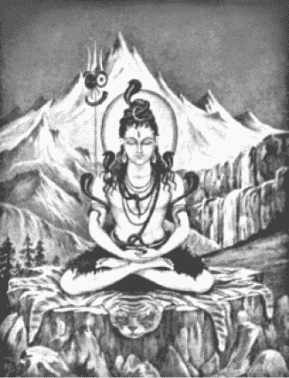

希瓦神像

男孩拿希里的名字是夏玛·夏蓝，在那迪亚祖传的老宅中度过了幼年时光。他在三四岁左右就经常被看到以瑜伽行者的姿势全身隐藏在沙下，只露出头来。

1833 年冬季，夏玛·夏蓝的家园因附近札南济河（Jalangi）改变河道注入恒河而被摧毁。拿希里家族建立的一座希瓦神殿和他们的家一起被河水冲走了。一位虔信者从涡旋的河水中救起了希瓦神的石像，将它安置在一座新的神殿中，这就是现在著名的戈尔尼希瓦圣迹。

高尔·摩罕·拿希里和他的家人离开了那迪亚，成为贝拿勒斯的居民。在那里，这位父亲立即建造了一间希瓦神殿。他依照吠陀经典的教规，带领他的家庭，规律地遵守礼拜的仪式，慈善布施，并且研读经典。他有着公正而开阔的胸襟，并没有忽视有益的现代思潮。

夏玛·夏蓝在贝拿勒斯的读书团体学习北印度语和乌都语（Urdu）。他在一所由乔伊·纳拉扬·戈萨尔（Joy Narayan Ghosal）所办的学校中学习梵文、孟加拉文、法文和英文。这位年轻的瑜伽行者致力于吠陀经典的深入研读，他热切地倾听着博学的婆罗门在经典上的讨论，其中包括伟大的梵文权威那格巴特（Nag—Bhatta）。

夏玛·夏蓝是一位所有朋友都喜欢、仁慈、温和而又勇敢的青年。他均衡发展的聪颖头脑及强健的身体擅长游泳及各种技术性活动。

1846 年，夏玛·夏蓝与圣底比纳拉扬·萨雅（Sri Debnarayan Sanyal）的女儿卡西·摩妮结婚。卡西·摩妮是一个模范的印度家庭主妇。她快乐地操持家务并履行传统责任，服侍宾客及穷人。两个圣人般的儿子廷库利和杜库利赐福了这个家庭。

夏玛·夏蓝在 1851 年 23 岁时接受英国政府军方工程部门会计师的职位。服务期间他数度晋升。因此他不仅是上帝眼中的大师，在人类社会的小小戏剧中，他也成功地扮演了文职人员的角色。

当军队办公部门调动时，夏玛·夏蓝也随着迁往格日浦尔（Gazipur）、密佳浦尔（Mijapur）、达纳浦尔（Danapur）、奈尼塔尔，贝拿勒斯及其他地方。父亲死后，夏玛·夏蓝必须承担起整个家庭的重担，他在贝拿勒斯附近的格鲁迪斯瓦尔摩呼拉为他们买了一处安静的居所。

夏玛·夏蓝在 33 岁时了解到他转世到人间所为的目的。他长期闷烧灰烬隐含的余焰，接受它爆发燃出火焰的机会。在一个适当的时间，一道神秘运作的天国谕令，显现出所有的事件。他在瑞尼凯特（Ranikhet）附近碰到伟大的古茹巴巴吉，并接受克利亚瑜伽的传法，从此成为拿希里·玛哈赛。

这个值得庆贺的事件不仅仅发生在他身上，那是全体人类的幸运时刻，许多人后来都幸运地接受到唤醒灵魂的克利亚礼物。这个原已失传或长久消失的瑜伽最高技艺终于重见天日。许多心灵干涸的男女最后终于找到克利亚瑜伽清凉水源的途径。就像在印度传说中，恒河之母提供她天国的甘露给干涸的虔信者巴吉瑞斯（Bhagirath），同样地，克利亚天国的洪流从喜玛拉雅山隐秘的要塞流入了尘封已久的人类心灵。

第三十三章 遇见近代印度的瑜伽基督—巴巴吉

喜玛拉雅山北麓的悬崖峭壁，即靠近巴尊那拉扬处，至今还受到拿希里·玛哈赛的古茹巴巴吉的祝福。这位与世隔绝的上师几个世纪以来一直维持着肉身的形态，也许已有数千年之久了。不死的巴巴吉是一个阿瓦塔尔（avatara），梵文为“下降”之意，它的字根“阿瓦（ava）”是“向下”的意思，“塔（tri）”是“经过”的意思，在印度的经典里，“阿瓦塔尔”表示神性下凡化为肉身。

“巴巴吉的精神境界是超越人类的理解范畴的，”圣尤地斯瓦尔向我解释,“人类相形失色的视野无法透视他这颗超凡的明星。即使只是尝试着描述阿瓦塔尔的成就都是徒劳的，因为它是人们无法想象的。”

《奥义书》中将灵性发展的每个阶段都进行了详细分类。一个悉达（siddha，即完美的存在），由吉凡穆塔（jivanmukta，即活着解脱）进化到帕拉穆塔 （paramukta，即无上的的解脱—完全凌驾在死亡之上的能力）。后者完全脱离了马雅的束缚及轮回转世。因此，一个帕拉穆塔很少会回到肉身，如果他回来的话，就是个阿瓦塔尔，上帝任命天国赐福给世界的媒介。

阿瓦塔尔不受制于世俗的法则。他纯净的身体看起来像是光的形象，免于自然界的任何债务。人类随意一瞥可能无法看到阿瓦塔尔形体有什么特殊的地方，但它不会产生影子或在地上留下脚印。这些是内在没有黑暗、外在脱离物质束缚的证明。这种上帝化身的人清楚地知道生死背后的真理。被严重误解的奥玛·海亚姆（Omar Khayyam）曾经唱颂这种解脱的人：

“啊！我喜爱的月亮不知有月亏，

天空中的月亮再度升起了：

今后她升起时将会经常在，

这同样的园中找寻我—只是惘然！”

“喜爱的月亮”就是永不过时的上帝，永恒的北极星。“天空中的月亮”就是被周期性循环发生法则束缚的外在宇宙。它的锁链被这位波斯的先知通过自我了悟永远地溶化了。“今后她升起时将会找寻我—只是惘然！”

奎师那、罗摩、佛陀和帕坦伽利都属于印度古代的阿瓦塔尔。围绕着印度南方的阿格斯提亚（Agastya）阿瓦塔尔，发展出许多坦米尔（Tamil）诗歌文学。

巴巴吉在印度的使命是帮助先知们完成特殊的天命。因此他符合经典分类中的摩诃阿瓦塔尔（Mahavatar）（伟大的阿瓦塔尔）。他曾将瑜伽方法传给古代僧团制度的创始者商卡拉和著名中世纪圣人卡比尔。他十九世纪主要的徒弟就是我们都知道的克利亚技艺的复兴者拿希里·玛哈赛。

摩诃阿瓦塔尔永不间断地与基督意识交流着。他们一起放出救赎的振动力，并拟定了拯救这个时代灵性的方法。这两位已经完全了悟的大师—一位具有肉身另一位则没有，他们的工作是鼓励每个国家放弃自杀性战争、种族仇恨、宗教派系斗争及物质主义邪恶的自作自受。巴巴吉洞察现代趋势，尤其是西方文明的复杂性和影响力，了解在东方及西方传播自我解脱瑜伽的必要性。

因此我们无需惊讶历史文献中没有关于巴巴吉的记载。这位伟大的古茹不曾在任何世纪公开出现过。公众误解的怒视在他千年的计划里并没有立足之地。就像造物主唯一但无声的“力量”，巴巴吉谦卑隐匿地工作着。

伟大的先知们像基督和奎师那那样为了特殊的目的来到世上，当目的达成时，他们就离开了。其它的阿瓦塔尔们（像巴巴吉）所从事的工作，跟历史上著名的事件相比，更倾向于自有人类世纪以来，人类缓慢进化的工作。这类型的上师总是尽量掩饰自己，让自己不受公众关注，并具有随意隐形的能力。由于这些因素，再加上他们通常指示徒弟对有关他们的事迹保持沉默，使得一些卓越的灵性人物在世上仍旧不为人知。我在这几页所描述的仅是巴巴吉生活中的点滴—这些是他认为适合公开透露的。

拿希里·玛哈赛说过，“任何时候、任何人，只要尊敬地念着巴巴吉的名字，这个虔信者就会立即受到灵性的祝福。”

在这位不死的古茹身上看不到岁月的痕迹，他外表看起来像不超过 25 岁的年轻人。巴巴吉肤色白皙，中等身材，强壮出色的身体散发着能够感知的光辉。他有着平静温柔的黑色双眸，长而漂亮的古铜色头发。奇怪的是，巴巴吉跟他的徒弟拿希里·玛哈赛有着异常类似的外表。他们极为相似，拿希里·玛哈赛在晚年的时候看起来就像是年轻巴巴吉的父亲。

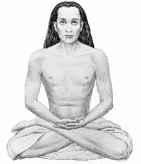

拿希里·玛哈赛的古茹巴巴吉上师

我那圣人般的梵文家庭教师凯巴·南达斯瓦米曾跟巴巴吉在喜玛拉雅山一起相处过一段时间。

“这位无与伦比的大师和他的团体在群山中不同的地方移动着，”凯巴·南达告诉我，“他的小组中有两个灵性高度发展的美国徒弟。巴巴吉在一个地方待了一段时间之后，就说，‘Dera danda uthao’（让我们拔营吧），他带着一根具有象征意义的竹杖。他的言辞是他的团体从一处立即移到另一处的信号。他不是一直使用这种灵体的方式旅行，有时他会用步行的方式，从一座山走到另一座山。

巴巴吉只有在他愿意时，才会让人看到或是认出来。他对不同的信仰者显示出多种不同的样子—有时留着胡子和八字须，有时没有。由于上师不会衰弱的身体不需要食物，他很少吃东西。当他探视徒弟时，为了社交上的礼节，他偶尔会接受水果、煮在牛奶里的饭和净化的奶油。

“我知道两件巴巴吉在生活中令人惊异的事情，”凯巴·南达说道，“有一天晚上，他的徒弟们围坐在庆祝神圣吠陀祭典的盛大营火旁边。上师突然抓住一块燃烧的木头，轻轻地碰触营火旁一位徒弟裸露的肩膀。”

“‘先生，您怎么这么残忍！’当时在场的拿希里·玛哈赛抗议道。

“‘依照他过去的业报，难道你宁愿让他在你眼前烧成灰烬吗？’

“巴巴吉把痊愈的手放在徒弟变形的肩膀上，‘我今晚让你免除痛苦的死亡。你被火灼烧，这点轻微的痛苦已经满足了业障的法则。’

“还有一次，巴巴吉神圣的圈子被一个陌生人的到来打扰了。他以惊人的技巧攀爬上几乎是无法到达的突出岩壁上，靠近上师扎营的地方。

“‘先生，您一定是伟大的巴巴吉。’这个人的脸上闪过难以形容的尊敬之情，‘有几个月的时间，我在这些险恶的峭壁中持续不断地寻找您。我恳求您，接受我成为您的徒弟。’

“当伟大的古茹没有响应时，这个人指着他脚下岩石的悬崖。

“‘您若拒绝我，我就从山上跳下去。如果我无法赢得你到天国的指引，生命对我来说就没有价值了。’

“‘那就跳下去吧，’巴巴吉无动于衷地道，‘以你现在的情况来说，我无法接受你。’

“这个人立即跃下悬崖。巴巴吉指示震惊的徒弟取回这个陌生人的身体。当他们带着严重受损的形体回来时，上师将他天国的手放在这死亡的人身上，他睁开眼睛谦卑地拜伏在全能的古茹前。

“‘现在你已经准备好成为一个徒弟了。’巴巴吉满脸慈爱地对着他复活的徒弟说道，‘你很勇敢地通过了艰难的考验。死亡不会再接触到你，你现在是我们不朽团体中的一员了’。接着他说，‘Dera danda uthao’，然后，整个团体从山谷中消失。”

在我到兰巴浦尔拜访兰·高帕这位“不眠的圣人”时，他叙述了第一次与巴巴吉相遇的奇妙故事。

“我有时会离开与世隔绝的洞穴，坐在贝拿勒斯拿希里·玛哈赛的脚下，”兰·高帕告诉我，“有一天午夜，当我正安静地与他的一群徒弟打坐时，上师出乎意外地要求道：

“‘兰·高帕，’他说，‘马上到达萨沙美（Dasasamedh）河边沐浴的阶梯去。’

“我很快就到达了那个隐密的地方。当晚月色明亮，星光闪耀。我安静耐心地坐了一会儿之后，注意力被吸引到靠近脚边的一块巨大石板上。它慢慢地升起，露出一个地下洞穴。当那块石板以某种未知的方式维持着平衡时，一个身着宽大衣服、非常秀丽的年轻女子从洞穴中冉冉上升到空中。她全身围绕着柔和的光，慢慢地降到我面前，静止不动地站着，沉浸在内在的极乐状态中。她最后移动了，并温柔地说道：‘我是玛塔吉（Mataji），巴巴吉的妹妹。我今晚请求他还有拿希里·玛哈赛到我洞穴来讨论一件非常重要的事情。’

“一道朦胧的光团快速地漂浮在恒河上，奇妙的冷光反射在暗淡的河水上。它越靠越近，直到一束眩目的闪光出现在玛塔吉的身旁，并立即凝缩成拿希里·玛哈赛的人形。他谦卑地跪拜在这位女圣人脚下。

“在尚未从迷惑中恢复以前，我更吃惊地看到一团神秘旋转的光在天空中移动着。它飞快地下降，火焰般的漩涡靠近我们这群人，并化为一位出色年轻人的身体，我马上认出那就是巴巴吉。他看起来很像拿希里·玛哈赛，唯一的差别是巴巴吉看起来年轻多了，而且还有一头漂亮的长发。

“拿希里·玛哈赛、玛塔吉和我跪在这位古茹的脚下。当我碰触到他天国的肉体时，快乐飘逸的感觉刺激着我身上的每根神经。

“‘受到祝福的姐妹，’巴巴吉说道，‘我想抛弃我的形体，投入无限的洪流中。’

“‘亲爱的上师，我已看见您的计划了。今晚，我要跟您讨论这件事情。为什么您要离开身体呢？’这个灿烂辉煌的女子恳求地看着他。

“‘我在心灵的海洋上保持自由，有形或无形又有什么区别呢？’”

“玛塔吉灵光一闪，机智地回答道：‘不死的古茹，如果没有什么区别，那么请永远不要抛弃您的形体。’

“‘就这样，’巴巴吉庄严地说道，‘我将永远不会离开我的肉体。在这个世界上总会有少数几个人可以看见它。上帝通过你的口说出他的意愿。’”

“当我敬畏地听着这些崇高灵性生命的谈话时，这位伟大的古茹以仁慈的姿态转向我。

‘兰·高帕，不要害怕，’他说，‘你是受到祝福的，作为这个永恒不朽承诺的见证人。’

“当巴巴吉悦耳的声音逐渐消失时，他和拿希里·玛哈赛的形体慢慢升起并且向后移到恒河上。当他们消失在夜空中时，眩目的光环绕着他们的身体。玛塔吉的形体飘向洞穴并降了下去，石板好像有无形的杠杆在作用着，自动关闭了。

“我得到无限的启示，离开并回到拿希里·玛哈赛的住处。当我大清早在他面前鞠躬致意时，我的古茹会心地对我微笑着。

“‘我为你高兴，兰·高帕，’他说，‘你经常向我表示希望看见巴巴吉和玛塔吉，最后终于实现了。’”

“我的师兄弟告诉我，拿希里·玛哈赛从前一晚开始就没有离开过讲台。

“一个徒弟告诉我：‘在你离开到达萨沙美河边的阶梯后，他做了一场有关永生的精彩开示。这是我第一次完全了解到经典文章上所叙述的，一个自我了悟的人可以在同一时间、不同地点，出现两个或更多的身体。’”

兰·高帕总结道：“为了这个特殊世界循环的周期，上帝选择了巴巴吉并留在他的身体里。时代不断地变化着—依然是不死的上师—观看着地球舞台上，将要上演的世纪戏剧。”

第三十四章 在喜玛拉雅山里变出宫殿

“巴巴吉跟拿希里·玛哈赛的第一次相遇是个传奇，也是为数不多的几个能够让我们从中窥见这位不死古茹的故事之一。”

这些话是凯巴·南达斯瓦米对这个奇妙故事的导引。当他第一次讲给我听时，我就被迷住了。我好几次央求这位温和的梵文家庭教师重复这个故事，后来圣尤地斯瓦尔实际上也是使用相同的字眼告诉我这个故事的。这两位拿希里·玛哈赛的徒弟都曾从他们古茹的口中直接听到过这个令人敬畏的故事。

“我第一次碰到巴巴吉是在 33 岁，”拿希里·玛哈赛说道，“1861 年秋天，我驻扎在丹拿浦尔（Danapur），在陆军工程部门担任会计师一职。一天早上，部门主管叫我过去。

“‘拿希里，’他说，‘总部刚才传来了一封电报。你被调到瑞尼凯特去，现在，那里成立了一个军营。’

“我带着一个仆人开始了 500 英里的旅程。我们骑马或乘坐轻便的马车，花了 30 天时间才到达喜玛拉雅山的瑞尼凯特。

“我办公室的工作并不繁重，有很多时间可以在壮丽的山谷中游览。传闻中，伟大的圣人们以他们的出现祝福这个地区，我有一股强烈的想见到他们的渴望。在一个午后的闲逛中，我惊讶地听到远处有一个声音在呼唤我的名字。我在庄吉里（Drongiri）山继续奋力地往上爬。当我想到在夜色降临丛林之前，也许无法顺原路返回时，我开始有点烦恼不安。

“后来，我到达了一小块空地，旁边布满了洞穴。在一块突出的岩石上站着一位微笑的年轻人，他伸出手来表示欢迎。我很惊讶地注意到，除了他那古铜色的头发，他长得几乎跟我一模一样。

“‘拿希里，你来了!’这位圣人亲切地用印度语跟我说，‘在这个洞穴休息一下吧，是我在呼唤你。’

“我进入一间整洁的小石室，里面有几张羊毛毯子和几个卡曼德拉斯（kamandulus）（托钵用的碗）。

“‘拿希里，你还记得那个座位吗?’这位瑜伽行者指着角落里的一块折叠好的毛毯。

‘不，先生。’我对自己奇异的冒险觉得有些迷惑，我补充道，‘我现在必须离开了，天快黑了，明早我在办公室还有事情要做。’

“这位神密的圣人以英语回答道：‘办公室是为你而设的，而不是你为办公室而来的。’

“我惊呆了，这位森林的苦行者不仅会讲英语而且还能改述基督的话。

“瑜伽行者接着说：‘我知道我的电报生效了。’我不能理解他的话，于是我询问他的意思。

“‘我指的是那封召唤你到这个与世隔绝地方来的电报。是我无声地暗示你上司的意志，将你调到瑞尼凯特的。当一个人感觉到他与全体人类是一体时，所有的心灵都变成了传播站，借此他可以随心所欲地工作。’他温和地补充道，‘拿希里，这个洞穴想必你看起来很熟悉？’

“当我保持着困惑的沉默时，圣人靠近我并轻敲我的额头。在他磁性的触碰下，一道不可思议的电流扫过我的大脑，释放出我前生愉快的记忆之源。

“‘我记得了！’我带着喜极而泣的音调，半哽咽道，‘您是我的古茹巴巴吉!’ 过去的情景历历如绘地显现在我心头，‘前世我就在这个洞穴里度过了许多年！’当难以形容的回忆淹没我时，我泪眼汪汪地抱住古茹的脚。

“‘三十多年来，我一直在这里等你—等你回到我身旁！’巴巴吉的声音回响着天国的爱，‘你滑走了，消失在死亡后骚乱的生命洪流中。业力的魔杖碰触到你，你迷失了！虽然你看不到我，但你从来没有离开过我的视线！我像母鸟守护小鸟般地，跟随着你通过阴霾、暴风雨、动乱和光明。当你在母亲子宫里成为胎儿，出生成为婴孩的时期，我的目光始终跟随着你。当你幼时将你小小莲花坐姿的形体覆盖在那迪亚的沙下时，我也隐形在场！月复一月，年复一年，我耐心地保护着你，等待着这个完美的日子。现在你在我身旁了! 瞧，这里是你往昔所爱的洞穴！我一直为你保持洁净以便随时可用。这里是你神圣的阿沙拿（asana）毯子，你每天坐在上面让你舒展的心灵包裹着上帝！那边是你的碗，你经常用来啜饮我调制的甘露！我让这只铜杯干净得闪闪发亮，好让你可以再度用来喝水！我的爱，你现在明白了吗？’

“‘我的古茹，我能说什么？’我断断续续地低语道，‘一个人能在何处遇到这种不朽的爱？’我长久陶醉地凝视着我永恒的宝藏，生死不离的古茹。

“‘拿希里，你需要净化。喝下这碗里的油，在河边躺下。’我很快微笑地记起巴巴吉实用的智能永远是先知的。

“我遵照了他的指示。虽然喜玛拉雅山寒冷的夜晚已经降临，但一种内在辐射舒服温暖的感觉在我体内的每个细胞中跃动着。我感到惊异，难道那个不知名的油里包含宇宙的能量？

“在黑暗中，寒冷刺骨的风凄厉而猛烈地抽打在我身上。冰冷的戈高士（Gogash ）河波涛不时地拍打着我，甚至越过我的身体冲到岸上。老虎就在附近吼叫着，但我的心无所畏惧，在我内在新产生的辐射力量传送着无懈可击的安全感。几个小时很快就过去了，另一世退去的记忆编织成了现在与我天国古茹重聚的光华。

“我独自的冥想被逐渐接近的脚步声打断了。在黑暗中，有人温柔地扶起我来，并递给我一些干衣服。

“‘兄弟，走吧，’我的同伴说道，‘上师等着你。’

“他带路，穿过了森林。黑暗的夜晚突然被远方稳定的光辉照亮了。

“‘那是日出吗?’我询问道，‘可是整个夜晚还没有过去呢！’

“‘现在是午夜时分。’带路的人轻轻地笑着说，‘远处的光是一座黄金宫殿发出的光辉，是无与伦比的巴巴吉今晚在此变化出来的。在暗淡的过去，有一次你表示想要欣赏宫殿的华美。现在上师满足你的愿望，借此让你脱离业力的束缚。’他又说道，‘这座奢华的宫殿将是你今晚接受克利亚瑜伽传法的地点。你在这里的所有师兄弟们都将参与欢迎你的赞诵，庆祝你长久以来流放的结束。注意看吧！’

“一座巨大耀眼的黄金宫殿矗立在我的眼前，上面装饰着无数的宝石，花园里呈现出罕见的奇观。天使般容颜的圣人站在光彩夺目、被红宝石的光辉染红的大门前。巨大光彩的钻石、珍珠、蓝宝石和绿宝石镶嵌在装饰用的拱门里。

“我随着同伴进入一个宽敞的接待大厅。空中飘荡着焚香和玫瑰的香味，朦胧的灯放射着彩色的光辉。小团体的虔信者，有些肤色是白皙的，有些是深色的。他们优美地唱颂着，或是以打坐的姿势坐着，沉浸于内在的宁静中。空气里，弥漫着喜悦振动的气氛。

“‘尽情地欣赏吧！享受这座宫殿精美辉煌的艺术，这完全是因你的荣耀而产生的。’当我惊奇失声地叫出来时，我的向导体谅地微笑着。

“‘兄弟，’我说道，‘这座建筑之美超过了人类想象的极限。请告诉我它产生的秘密。’

“‘我很乐意指点你。’我同伴的黑色眼睛闪烁着智慧的光芒，‘事实上，化出物质是没什么难以理解的。整个宇宙都是造物者思想的体现。这个飘浮在太空中沉重的地球泥块，是上帝的一场梦。他从意识里造出万物，正如同人类在他的梦境中复制万物并赋予生命一样。’

“‘上帝最早以一个想法创造了地球。接着他活化它，具有能量的原子形成了。他组合原子形成这个实体的星球。它的所有分子是借着上帝的旨意连结在一起的。当上帝收回他的旨意时，地球会再度分解成能量。能量会融回意识里，这个地球的想法也会客观地消失。

“‘在做梦者潜意识的思想中维持着梦境本质的实际性。当他觉醒时，凝聚的思想被收回了，梦和它的成份也就消失了。一个人闭上眼睛，建立了一个梦幻的世界，当他醒来后，梦境毫不费力地消失了。他跟随着天国原型的范例。同样的，当他在宇宙意识中醒来时，宇宙梦境的幻象也会毫无困难地消失。”

“‘巴巴吉与无所不成的无限意志是一体的，他可以召集基本的原子聚合起来，表现出任何形态。这座瞬间创造出来的黄金宫殿是真实的，就像这个地球是真实的一样。巴巴吉从心中创造出这座宫殿的大厦，用他的意志力维持着原子的结合，就像上帝创造这个世界，并保持它的完整性，’他补充道，‘当这座宫殿达成它的目的时，巴巴吉就会将它分解。’

“当我还处在敬畏的沉默中时，我的向导做了一个总括性的手势，‘这座华美的、装饰着宝石的闪亮宫殿，不是用人类的劳力或艰辛开采出来的黄金和宝石建造起来的。它坚固地耸立着，是一个对人类挑战的里程碑。任何了解自己是上帝儿女的人，如同巴巴吉，都可以用隐藏于他内在无限的力量达成任何目的。一块普通的石头里锁着巨大的原子能秘密。相同的，一个凡人也是天国的发电所。’

“这个圣人从近旁的桌上拿起了一个把手上闪耀着钻石的雅致花瓶。‘我们伟大的古茹凝结了无数自由的宇宙光射线创造了这座宫殿，’他继续说道，‘摸摸这个花瓶和它上面的钻石，它们可以满足所有感官的欲望。’

“我凝视着这个花瓶，用手摸过平滑、闪亮、厚实的金质瓶身。上面遍布的一块块宝石足以让每一个国王都心动。我感到心满意足。在生命潜意识里隐匿的欲望现在都离去了，它们看起来同时被满足并消失了。

“庄严的同伴带我穿过华丽的拱门和回廊，来到一系列按皇帝宫殿的风格布置的富丽堂皇的房间。我们进入一间非常宽敞的大厅。中间有一个金制的王座，外层嵌有散发着灿烂光彩的宝石。至上的巴巴吉以莲花姿势盘坐在上面。我跪在他脚下闪闪发光的地板上。

“‘拿希里，你还在享受你梦想的黄金宫殿吗？’古茹的眼睛像蓝宝石般闪烁着，‘醒来吧！所有你在尘世的渴望即将永远平息。’他低语着一些神秘祝福的字眼，‘我的孩子，上升吧。接受克利亚瑜伽的传法，进入上帝的国度。’

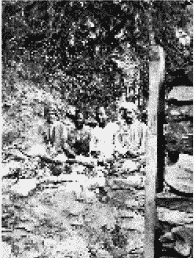

拿希里·玛哈赛的孙子阿南达·莫罕·拿希里和其他几位信徒一起拜访庄吉里山巴巴吉修行时住过的洞穴。

“巴巴吉伸出他的手，一道荷玛（homa）（献祭）的火焰出现了，外围环绕着水果和鲜花。我在这燃烧的圣坛前接受了解脱之道的瑜伽法门。

“仪式在黎明时完成。在极乐的状态下，我不觉得需要睡眠，我在到处充满着宝藏及贵重艺术品的宫殿中游览着。我向下走到华美的花园，注意到附近相同的洞穴和山中不毛的岩壁，并没有昨天可夸称毗邻的宫殿或花园的平台。

“我再度进入位于喜玛拉雅山寒冷的阳光下、闪耀着惊人光辉的宫殿，寻找上师。他仍在王位上，旁边围绕着许多安静的徒弟。

“‘拿希里，你饿了。’巴巴吉又说道，‘闭上你的眼睛。’

“当我再次睁开眼睛时，美丽的宫殿和如画般的花园消失了。我自己的身体、巴巴吉的形体和整群的徒弟现在全都坐在原来宫殿所在的荒野上，离阳光照耀着入口的岩洞不远。我想起那位向导提到过宫殿会消失，那些被掳获的原子会被释放回到它们的思想本质。我虽然很惊讶，但依然信任地看着我的古茹，不知道下一步该期待些什么。

“‘创造宫殿的目的现在已经达成了，’巴巴吉解释道，他从地上拿起一个陶制的碗，‘手放在那里，接受任何你想吃的食物。’

“我一触碰到那个宽阔的空碗，它就盛满了热的奶油烤面包、咖喱，还有罕见的甜点。我自行取用着，注意到碗里的食物总是装满的。吃完饭，我环顾四周找水喝。我的古茹指着我前面的碗。瞧！食物不见了，碗里是山泉般清澈的水。

“‘凡人很少知道上帝的国度也包含世俗的成就，’巴巴吉说道，‘天国的领域延伸到尘世，但后者，由于是幻相的，无法包含真正的本质。’

“‘亲爱的古茹，昨晚您为我展现了天国与地球之美的连结！’我欣慰地回想着消失的宫殿，确信没有任何单纯的瑜伽行者曾经在比这更令人印象深刻的豪华环境里接受传法，进入使人敬畏的心灵奥秘！我平静地看着眼前荒凉的景象。光秃秃的土地，高耸的屋顶，提供原始庇护的洞穴—这一切看起来都像是为了我周围圣人而设立的天然而优美环境。

“那天下午我坐在自己的毯子上，感到前世的了悟在圣化着我。我天国的古茹靠近我，把手放在我的头上。我进入了极乐三摩地，连续七天在它的祝福庇佑里。越过连续的层层自觉，我穿过了真正不死的领域。所有幻象的限制远去了，我的灵魂完全建立在宇宙心灵永久的圣坛上。第八天，我跪在古茹脚下，恳求他让我在这神圣的荒野中永远跟随他。

“‘我的孩子，’巴巴吉拥抱着我说道，‘你必须在外界的舞台扮演这一世的角色。你在出生之前已经受到许多单独冥想生命的祝福，现在你必须与世俗中人生活在一起。

“‘你一直要到结婚并有适当的工作职责才能遇到我，这种安排自有深层的目的。你必须把加入我们这个喜玛拉雅山秘密团体的想法放在一旁。你的生活是在拥挤的市场上，做一个在家修行瑜伽行者的榜样。

“‘尘世间许多迷途男女的哭喊并非没有传到上帝的耳朵，’他继续说道，‘你被选出来借着克利亚瑜伽带给无数真诚的追寻者精神上的安慰。几百万个被家庭的牵绊及繁重的社会职责所拖累的人将因你—像他们一样是个在家人—而鼓起新的勇气。你必须引导他们了解到，在家生活并不是达成最高瑜伽成就的阻碍。’

“‘无需强迫自己离开社会，因为内在的你已经切断了每一个业力的束缚。虽然不属于这个世界，但你仍然必须留在这个世界中。你还需要好几年的时间认真负责地完成你的家庭、事业、社会和灵性责任。清新甜美的天国将会打动世人干枯的心灵。从你均衡的生活中，他们将会了解到解脱是取决于内在而非外在的出家。’

“当我在孤寂的喜玛拉雅高山上聆听古茹的话时，家庭、办公室和这个世界看起来是如此遥远。但他的话里回响着坚定的真理，我顺服地同意离开这个被祝福的宁静天堂。巴巴吉以适用于瑜伽法门，由古茹传承到徒弟的古老规则严格教导着我。

“‘克利亚的钥匙只能赐予合格的徒弟，’巴巴吉说道，‘发誓在追寻天国的过程中可以做任何牺牲的人，才适合通过静坐的科学，解开生命中最后的奥秘。’

“‘天使般的古茹，您是否能将成为徒弟的限制放宽，以扩大福泽？’我恳求地看着巴巴吉，‘我祈求您准许我把克利亚传给所有追寻它的人，即使他们在刚开始时无法发誓完全做到内在的舍弃。世上被三重痛苦纠缠、饱受折磨的男女们，需要特别加以鼓励。如果克利亚不能传给这些人，他们可能永远不会尝试通向解脱之路。’

“‘如你所愿。天国的愿望通过你表达出来。’以这些简单的话语，仁慈的古茹解除了使克利亚世代以来隐藏于世的严格保护规则，‘自由地将克利亚传给所有谦卑并需要帮助的人吧。’

“一阵沉默后，巴巴吉又说道，‘向你每个徒弟复述这句出自《薄伽梵歌》的崇高承诺 ：Swalpamasya dharmasya， trayata mahato bhoyat（即使只是些微地修习这个仪式，也可以将你从悲惨的恐惧和惊人的痛苦中拯救出来）。’

“隔天早上，当我跪在古茹脚下接受临别的祝福时，他感觉到我对即将离开他是多么不情愿。

“‘我心爱的孩子，我们之间是没有分离的。’他深情地触摸我的肩膀，‘无论你在何处，只要你呼唤我，我即刻与你同在。’

“我被他不可思议的承诺安抚着，满载着新近发现上帝智能的财宝，下山回去。同事在办公室里欢迎我，十天以来，他们以为我迷失在喜玛拉雅山的丛林里了。很快从总部传来了一封信。

“‘拿希里应该回到丹拿浦尔的办公室，’信上写着，‘他被错误地调派到瑞尼凯特去，另一个人将会被派去担任瑞尼凯特的职务。’

“我微笑着，想着这件事中隐藏的逆流，将我带到印度最远的地方。

“回到丹拿浦尔前，我在莫拉达巴德（Moradabad）一个孟加拉人的家里住了几天。六个朋友聚集起来欢迎我。当我将话题转到灵性上时，主人悲观地说：

“‘唉!如今印度已经没有圣人了！’

“‘先生，’我强烈地抗议道，‘在这块土地上当然还有伟大的上师！’

“在热切的情绪中，我觉得应该说出我在喜玛拉雅山上不可思议的经验。这个小团体礼貌地怀疑着。

“‘拿希里，’一个人安慰地说道，‘在山上那种稀薄的空气中，你的心理可能过度紧张了。你所叙述的只是个白日梦。’

“我热切地期望向他们证实，便未经思索地脱口而出：‘如果我呼唤古茹，他就会出现在这间屋子里。’

“每双眼睛都闪现出兴趣，整群人都渴望见到一个圣人以这种奇妙的化身方式出现。我要求他们给我一个安静的房间和两条新的羊毛毯子。

“‘上师会从以太中化现出来，’我说道，‘你们在门外安静地等着；我很快就会叫你们。’

“我进入了冥想状态，谦卑地召唤我的古茹。黑暗的房间很快地充满了暗淡月色的光辉，巴巴吉光亮的身体出现了。

“‘拿希里，你为了小事呼唤我吗？’上师的目光是严峻的，‘真理是为了诚挚的追寻者，而不是为了那些无谓的好奇心。那些克服了天生唯物主义怀疑态度的人才值得，也才能发现超越感觉的真理。’他又严肃地说道，‘让我走吧！’

我乞求地倒在他的脚下。‘神圣的古茹，我知道我错了，我谦卑地请求原谅。我是为了要让这些盲目的心灵产生信心，才大胆地呼唤您。既然您已经在我的祈求下仁慈地出现了，就请您不要没有赐予我朋友祝福就离开。虽然他们不相信，但至少他们愿意查证我声明的真实性。’

‘好吧，我会留下来一会儿。我不希望你在朋友面前食言。’巴巴吉的表情缓和了下来，但是他温和地补充道，‘我的孩子，从今以后，每当你需要我的时候，我就会来，但不是总在你呼唤我的时候。’

当我开门时，紧绷的寂静弥漫在那一小群人里。我的朋友们好像不相信自己的眼睛一样，紧盯着在毯子上的光辉形体。”

“‘这是群体催眠术！’一个人露骨地笑道，“没有人可以在我们不知情的情况下进入这个房间！’

巴巴吉微笑地前进着，示意每个人接触他温暖结实的身体。怀疑消失了，我的朋友们敬畏地、忏悔地拜伏在地上。

‘准备好哈卢亚（halua）。’巴巴吉要求道。我知道，他是想进一步让这群人确信他肉体的真实性。粥在沸腾，这位天国的古茹和蔼可亲地闲聊着。这些眼见为信者完全变成了虔敬的圣保罗。我们吃完之后，巴巴吉逐一赐福我们。突然间一道圣光，我们目睹巴巴吉身体的电荷组成瞬间分解成雾状散开。上师协调上帝的意志力，解除了对那些聚集在一起成为他身体的以太原子的控制，顷刻间百万兆微小生命粒子的光芒消失在无限宇宙的储藏库中。

麦特拉（Maitra）是这群人当中的一个，他恭敬地说道，‘我亲眼看到征服死亡的人。’他的脸因新近觉醒的喜悦而容光焕发，‘至上的古茹玩时间和空间，就好像小孩子玩泡沫。我看到一个拥有天国与尘世钥匙的人。’

我很快就要回到丹拿浦尔，再度担负起各种日常工作以及一家之主的责任。”

拿希里·玛哈赛也告诉凯巴·南达和圣尤地斯瓦尔另一次跟巴巴吉碰面的故事，那个情况使人回想起古茹的承诺：“每当你需要我的时候，我就会来。”

“那是在阿拉哈巴（Allahabad）昆巴大会的现场，”拿希里·玛哈赛告诉他的徒弟们，“我会在一个短暂的假期里前往。当我漫步在那些从遥远的地方前来参加这个神圣节庆的僧侣和圣人中时，我注意到一个全身涂满灰泥的苦行僧，拿着一个讨饭钵。我心里升起一个念头，这个人是伪善的，外在是出家的表象，而内在却没有相对应的美德。

正当我经过这个苦行僧时，我惊讶的眼睛落在巴巴吉身上。他正跪在一个盘着头发的隐士面前。

‘可敬的古茹！’我赶紧走到他身旁，‘先生，您在这里做什么？’

‘我正在替这位出家人洗脚，接着还要清洗他的炊具。’巴巴吉像个小孩般对我微笑着。我知道他在暗示我不要批评任何人，上帝是平等地存在于所有身体中，不论高贵或是卑贱。伟大的古茹还说：‘通过侍奉聪明与无明的圣人，我正在学习最伟大的美德，那是在所有美德当中最能使上帝高兴的美德—谦卑。’”

第三十五章 拿希里·玛哈赛的生活

就一个虔诚研读《圣经》的东方人观点、以及直觉的认知来看，我确信施洗约翰前世曾是基督的古茹。《圣经》中有多处意味着约翰和耶稣的前世分别是以利亚和他的徒弟以利沙（Elisha）。

《旧约》的结尾正是以利亚和以利沙转世的预言：“看，在上主来到这个令人敬畏的伟大日子之前，我会先差遣先知以利亚给你们。”因此约翰（以利亚）稍早于基督的诞生，在“上主到来之前”被差遣来，作为耶稣的先驱者。一位天使出现在父亲撒迦利亚（Zacharias）面前，表明他即将到来的儿子约翰就是以利亚（以利亚斯）。

“天使向他说道，撒迦利亚，不要害怕，你的祈祷已经被上帝听见了，你的妻子伊莉莎白将为你生一个儿子，你要将他取名为约翰……他会将许多以色列的子民转向他们的上帝上主。他将会有以利亚斯的心灵和力量，在上主到来之前，将父亲的心转向子女，让悖逆的心转向正义，让一个民族准备好接受上主。”

耶稣两次明确地确认以利亚（以利亚斯）就是约翰：“以利亚斯已经来了，但人们却不认得他……后来门徒们才明白耶稣对他们说的就是施洗约翰。”耶稣说道：“若你们接受它，这人就是应当来的以利亚。”

当约翰否认他是以利亚斯（以利亚）时，意味着在约翰这个卑微的装扮里，他不再是以显而易见崇高伟大的古茹以利亚的身份到来。在前世中，他已将他荣耀的“衣钵”及灵性的财富给了徒弟以利沙。以利沙说道，我祈求您，让您的精神加倍于我。以利亚说，你请求了一件困难的事。不过，当我在你的身上减弱时，若你见着我，就可如此地得着……他拾起了从以利亚身上掉下来的衣钵。

角色颠倒过来了，因为以利亚（约翰）不再需要现在已完美了悟天国的以利沙（耶稣）外在的古茹了。

当基督在山上改变外形时，他所看到的就是他的古茹以利亚斯和摩西。在十字架上陷入绝境时，耶稣叫喊着天国的名字：我的上帝！我的上帝！为什么您遗弃我？一些站在那边的人听到声音后说道：“这人向以利亚斯求援呢，让我们看看以利亚斯会不会来救他。”

同样的关系也出现在巴巴吉和拿希里·玛哈赛之间。这位不死的古茹深情关爱地游走在他徒弟最后两世的生命间、忘川河的漩涡里，引导着拿希里·玛哈赛向前的脚步。一直等到这个徒弟 33 岁，巴巴吉认为公开恢复那未曾断绝的联系，时机已经成熟了。接着在瑞尼凯特附近短暂的相会后，这位无私的上师为了外在世俗任务，将他深爱的徒弟从山中的小团体中放逐出来。“我的孩子，每当你需要我时，我就会来。”有什么世间的爱能给予这种无限的承诺？

在社会大众不知不觉的情况下，伟大的灵性复兴从贝拿勒斯遥远的角落开始奔涌。就像花的芳香是无法抑制的，拿希里·玛哈赛也是一样，虽然他安静地过着一个理想居士的生活，但他内在的荣光却无法隐藏。慢慢地，从印度每个地方，蜜蜂般的虔信者开始追寻这位已经解脱的上师天国的花蜜。

办公室里的英籍主管是最早注意到自己员工奇妙变化的人，他亲切地称拿希里·玛哈赛为“入定先生”。

“先生，你看起来很忧愁。有什么让你烦恼的事？”一天早晨，拿希里·玛哈赛问他的上司。

“我太太在英国病得很严重。我非常担忧。”

“我将为你接收一些有关她的消息。”拿希里·玛哈赛离开房间，在一个隐蔽的地方坐了一会。他一回去就安慰地微笑道。

“你的妻子在康复中，她正在写信给你。”这位无所不知的瑜伽行者引述了部分信上的内容。

“入定先生，我早就知道你不是普通人。但我实在无法相信你可以随心所欲地摒弃时空！”

信件终于来了。震惊的主管发现信中不只包含着妻子痊愈的好消息，还有与拿希里·玛哈赛数周前复述过的一样的话语。

几个月后，这位妻子来到印度。当她来到办公室拜访时，拿希里·玛哈赛正坐在他的桌前。这位女子恭敬地走近他。

“先生，”她说道，“几个月前，我在伦敦的病榻上看到的就是您的形体，围绕着闪耀的光环。刹那间，我的病完全恢复了！随后，我很快就可以通过海上的长途旅行来到印度。”

日复一日，一个或两个虔信者恳求这位崇高的古茹传授克利亚的法门。除了这些灵性职责以及家庭和工作的生活责任外，伟大的上师还热心关注着教育。他组织了许多研读小组，并且在贝拿勒斯孟加利托拉（Bengalitola）区一所大型中学中扮演着活跃的角色。许多真理的追寻者热情地参与他后来称之为“梵歌聚会”的演讲活动。

拿希里·玛哈赛借着这些不同的活动企图回答一个常见的疑问：“一个人在履行工作和社会的责任后，哪里还有时间虔诚地打坐？”这位伟大的在家古茹和谐平衡的生活无声地鼓舞了成千上万疑惑的心灵。上师只赚取一份普通薪水，节俭朴素，平易近人，他自然、快乐地走在世俗生活的道路上。

虽然安居在至高无上的位置，但拿希里·玛哈赛尊敬所有人，赞赏他们不同的美德。当虔信者向他行礼时，他定然鞠躬回礼。上师经常像孩子般谦卑地碰触他人的脚，但很少让他们向他行类似的礼，即使这种对古茹的致敬是东方古老的习俗。

拿希里·玛哈赛生平一个重要的特色就是他将克利亚传给各种不同信仰之人的能力。不单是印度教徒，他早期的徒弟中还有回教及基督教徒。不管是一元论或二元论者，所有不同宗教信仰或没有信仰的人，都受到古茹平等的接纳和指导。他那些灵性高度发达的徒弟中有一位名叫阿杜尔·古夫尔·汗（Abdul Gufoor Khan）的人，是一个回教徒。拿希里·玛哈赛虽位居最高的婆罗门阶级，但他在那个时代显示出了伟大的勇气，他尽最大努力消除顽固偏执的种姓阶级制度，带给社会上贱民阶级及受到压迫的人们以新的希望。

“永远记住，你不属于任何人，任何人也不属于你。仔细想想，总有一天，你必须突然离开这世界上的每一样东西—所以现在就要认识并接触上帝，这位伟大的古茹告诉徒弟们，‘每天搭乘感知上帝的气球，为下一个死亡的灵体旅行做好准备。通过幻象，你认为自己是一堆血肉和骨头，但充其量那只是一窝麻烦而已。通过不断打坐，你很快就可以看到自己是无限的本质。停止一个肉体囚犯，使用克利亚的奥秘钥匙，学会遁入心灵之中。”

伟大的古茹鼓励不同的学生坚守他们自己信仰中传统善良的戒律。拿希里·玛哈赛强调，作为一种实际可行的解脱技巧，克利亚的本质是包含一切的。他让徒弟们自由地生活在养育他们的环境中。

“一个回教徒每天应该礼拜阿拉四次，”上师指出，“一个印度教徒每天应该打坐四次。一个基督徒每天应该下跪四次，向上帝祷告并研读《圣经》。”

具备智能洞察力的古茹根据他的追随者天生不同的倾向，引导他们步上奉献、业力（行动）、智能或王者（皇家或完全）瑜伽之路。上师不轻易认同希望正式走上出家之路的虔信者，总是告诫他们要先考虑修道士的艰苦生活。

伟大的古茹教导徒弟避免理论性的争论。“致力于实践而不是单纯阅读古代启示才是聪明的人，”他说道，“通过打坐解决所有问题。以实际与上帝的接触取代无益的宗教推论。清除心中神学教条的垃圾，让直接感知常新痊愈的活水进入。将自己协调到内在主动的‘引导’上，天国的声音对生命中每一个难题都有答案。”

有一天，上师在一群聆听他阐述《薄伽梵歌》的徒弟前表现了他的无所不在。当时他正在解释灵界能量和所有振动的万物内在基督意识的意义时，突然倒抽了一口气，叫喊道：

“我在日本外海许多灵魂快要淹死的身体里！”

隔天早上，徒弟们看到一则前一天有艘靠近日本的船沉没，有许多人遇难的新闻。

拿希里·玛哈赛远处的徒弟经常觉察到他拥抱似的存在。“我永远与那些修习克利亚的人同在，”他安慰那些不能经常接近他的徒弟说，“通过你们扩大的感知，我将引领你们到宇宙的家去。”

有一个虔信者告诉萨提阿南达斯瓦米，他虽然不能到贝拿勒斯去，不过拿希里·玛哈赛响应了这位徒弟的祈求，显现在他的梦中教导他，让他接受正确的克利亚传法。

如果徒弟疏忽了世俗的责任，上师会温和地纠正并惩戒他。

“即使是被迫公开指出徒弟的错误时，拿希里·玛哈赛的用词也是温和而疗伤止痛的，”圣尤地斯瓦尔有一次告诉我，“从来没有一个徒弟会逃离我们上师的倒钩。”我控制不住地大笑起来，但我真诚地向圣尤地斯瓦尔保证，不论严厉与否，他所说的每个字在我的耳中听来都是音乐。

拿希里·玛哈赛仔细地将克利亚分成四个循序渐进的传法阶段。徒弟只有在表现出灵性上切实的进步时，他才传授那三个较高的法门。有一天，某个徒弟深信自己的等级没有被适当地评估，他表示不满。

“上师，”他说道，“我确信自己已经准备好接受第二阶段的传法了”。

就在这个时候，门打开了，进来一位在贝拿勒斯当邮差的徒弟布伦达·巴格特（Brinda Bhagat）。

“布伦达，到这里来，坐在我旁边。”伟大的古茹亲切地对他微笑着，“告诉我，你准备好接受克利亚第二阶段的法门了吗？”

这个矮小的邮差合掌恳求，惊慌地说道，“天国的导师，拜托！不要更多的传法了，我怎么能吸收更高级的教导呢？我今天来是请求您的赐福的，因为初级的克利亚让我如此陶醉，以至于无法投递邮件！”

“布伦达已经徜徉在灵性的海洋里了。”拿希里·玛哈赛的这些话，让其他徒弟感到羞愧。

“上师，”他说道，“我知道了，我是一个差劲的工匠，挑剔着我的工具。”

拿希里·玛哈赛除了在贝拿勒斯的许多徒弟外，还有数百人从印度遥远的地方来到他这里。他自己也有几次旅行到孟加拉，拜访两个儿子岳父的家乡。由于他的祝福，孟加拉像蜂巢般地充满了许多克利亚的小团体。特别是在奎师那佳尔和比斯奴浦尔（Bishnupur）区，直到今天，仍有许多不为大家知道的徒弟保持着这股无形灵性打坐潮流的流动。

许多圣人从拿希里·玛哈赛那里接受克利亚，当中值得一提的有贝拿勒斯著名的维斯克阿南达·萨拉斯瓦堤（Vhaskarananda Saraswati）斯瓦米、高等境界的迪欧高尔（Deogarh）苦行者及巴尔阿南达·布拉玛查理（Balananda Brahmachari）。拿希里·玛哈赛还一度当过贝拿勒斯伊斯瓦理·纳拉扬·辛哈（Iswari Narayan Sinha）大君阁下儿子的家庭教师。体认到上师在灵性上的成就后，大君和他的儿子以及乔汀卓拉·摩罕·台库尔（Jotindra Mohan Thakur）大君都请求了克利亚的传法。

一些拿希里·玛哈赛在社会上有影响、有地位的徒弟想要公开宣扬扩展克利亚的圈子，古茹拒绝了这一想法。有一位徒弟是贝拿勒斯郡主的御医，他发起了一个活动，想称上师为“卡西巴巴（Kashi Baba）”（贝拿勒斯上人），并广为宣传。古茹再次禁止了。

“让克利亚花朵的芬芳在没有任何展示的情况下自然地飘送，”他说道，“它的种子将生根在灵性富饶的心田里。”

虽然伟大的上师没有采用现代化的组织方式或是新闻媒体来传道，但他知道自己讯息中的力量会像一股无法抗拒的洪水，可以影响并淹没人类心灵的堤岸。虔信者改变及净化的生活就是克利亚不朽生命力最简单的保证。

1886 年，在瑞尼凯特接受传法后的 25 年，拿希里·玛哈赛领退休金退休了。随着他白天时间的空闲，追随他的徒弟不断增加。伟大的古茹现在多数时间都平静地固定在他的莲花坐姿上。他很少离开他的小客厅，甚至不会随意走动或到房子内部其它的地方。为了得到古茹的加持（神圣的会面），徒弟们像一道宁静的溪流，几乎是源源不断地来到这里。

让所有旁观者敬畏的，是拿希里·玛哈赛超人特质的生理状态，无息、不眠、脉搏心跳的停止、数小时眨也不眨的平静双眼，及深沉和平的气息。没有一个访客在离去时，心灵不被提升的，所有人都知道自己接受到一位真正上帝化身之人的无声祝福。

上师允许他的徒弟潘嘉隆·巴特阿查尔亚（Panchanon Bhattacharya）在加尔各答开办一所“阿利亚传道会”（Arya Mission Institution）。圣人般的徒弟们在这里传播克利亚瑜伽，并为公众准备一些瑜伽草药。

依据古代的风俗，上师给一般大众一种兰姆油，治疗各种不同的疾病。当古茹要求徒弟蒸馏这种油时，他可以轻易地完成这项工作。但如果其它任何人照着做，都会遭遇奇怪的难题，他会发现在蒸馏必经的过程中，这些医疗用油几乎全部挥发了。显然，上师的祝福是一项必要的原料。

上图是拿希里·玛哈赛孟加拉文的手稿和签名。这段文字出现在给一位徒弟的信中。伟大的上师解释一首梵文诗意如下：“达到安宁境界而眼皮不会眨的人已经获得了三哈地印证（Sambhadi Mudra）。—圣夏玛·夏蓝·迪瓦·沙文（Sri Shyama Charan Deva Sharman）”

阿利亚传道会发表了许多古茹对于经典的论述。像耶稣及其它伟大的先知们一样，拿希里·玛哈赛本人未曾写下任何书，但他极具洞察力的口述由不同的徒弟记录、编辑。通过他们的热情，这个世界拥有了拿希里·玛哈赛对 26 种古代典籍的评论。

上师的孙子圣阿南达·摩罕·拿希里写了一本有关克利亚的有趣小册子。“《薄伽梵歌》的原文是伟大史诗《摩诃婆罗多》的一部分，有几个论点上的难题，”圣阿南达写道，“如果不去质疑那些论点上的难题，我们只会认为那是种独特并容易受到误解的神秘故事形态。保持那些论点上的难题不去解释，在我们失去了东方数千年的实验探索后，以超人的耐性保留下来的科学。”拿希里·玛哈赛的评论澄清了象征性的寓意，揭露了宗教特有的科学是如此巧妙地放在经典文字和意象谜语的字里行间的有趣现象。它不再只是一场晦涩难懂的文字游戏，不是无意义吠陀礼拜仪式的常规，在上师的证实下，这一切充满了科学的意义。

“我们知道人类通常无法抵抗邪恶欲望的冲击，但通过克利亚了悟到高层意识和持久极乐时，这些冲击就变得软弱无力了，而且人们也会发现自己再不想沉溺其中了。

我们对世俗活动的渴望扼杀了灵性敬畏的感觉。我们不会因为科学让我们确信如何使用自然的力量就能领会在所有名字和形式背后的伟大生命。我们与自然的关系是一件实际的事情。我们知道如何使用她来满足我们的目的，我们利用她的能量，但其源头仍是未知的。我们与自然在科学上的关系就好像主人与仆人，在哲学的观点上，她像是证人席上的囚犯。我们盘问她，质疑她，以人类无法计量的隐含的价值尺度，仔细地评估她。反之，当自我与更高的力量交流时，自然界无需压力或努力，便会自动遵行人类的意志。不了解的唯物论者称这种对自然轻松的控制为‘奇迹’。

拿希里·玛哈赛的生活树立了一个榜样，改变了瑜伽是一种神秘修行的错误观念。每个人通过克利亚，都可以找到一个能够了解自己与自然适当关系的方式，而且会对所有不论是神秘或是日常发生的现象感到心灵上的敬畏，尽管在物理科学上物质才是事实。我们必需记得，一千年前被认为是神秘的事，现在已经不是了，而现在被认为是神秘的事，此后一百年可能会变成可以理解的定律。在所有表相背后的，是无限，是动力之海。

克利亚瑜伽的法则是永恒的。像数学一样真实，克利亚法则像简单的加减法规则，是不可能被摧毁的。即使将所有数学书籍烧成灰烬，逻辑推理的心智还是会再度发现这种事实，同样，即便摧毁所有瑜伽的神圣书籍，任何时候只要出现一位真正的瑜伽行者，带着纯粹奉献的心和随之而来的单纯知识，它的基本法则就会再度出现。”

就像巴巴吉属于最伟大的阿瓦塔尔一样，圣尤地斯瓦尔也是一个智能阿瓦塔尔（Jnanavatar）或智能的化身，拿希里·玛哈赛则可称之为瑜伽阿瓦塔尔（Yogavatar）或瑜伽的化身。他在质与量两方面都提升了社会灵性的水平。

作为一名先知，他的独特之处在于实际强调克利亚明确的方法，率先对所有人类开启瑜伽解脱之门。除了自身生平的奇迹外，这位瑜伽阿瓦塔尔将古代繁复的瑜伽转变成常人可以掌握的简单有效的方式，无疑达到了所有奇迹的顶点。

在提到奇迹时，拿希里·玛哈赛经常说：“一般不为公众所知的微妙法则，若未能适当地识别，不应公开地讨论或发表。”在本书的章节中，如果我看起来像是藐视了他所告诫的言辞，那是因为他给了我内在的保证。此外，在记载巴巴吉、拿希里·玛哈赛和圣尤地斯瓦尔的生活时，我想我已明智地省略了许多真实的奇迹故事，那些几乎是不可能包括进来的，除非同时也写下需要整本书才能解释的深奥哲理。

瑜伽阿瓦塔尔宣称：“通过自身的努力，与天国的融合是可能的，不需要依赖神学上的信仰或是‘宇宙独裁者’的专制意志。”

通过克利亚之钥，那些不相信任何内在神性的人，最终也会看到他们自己的内在神性。

第三十六章 巴巴吉对西方的兴趣

“上师，你是否见过巴巴吉？”

那是在塞伦波尔一个平静的夏夜，修道院二楼阳台上，我坐在圣尤地斯瓦尔的身旁，漫天繁星在我们头顶闪烁着。

“没错。”上师冲我微笑的眼睛闪亮着。“我有幸三次见到不死的古茹。第一次相遇是在阿拉哈巴的昆巴大会上。”

“这个不知道何时就开始在印度举行的宗教集会被称为‘昆巴大会 ’。每隔六年，就有几百万虔诚的印度人聚集起来，来会见各种不同的圣人、瑜伽行者、僧人及苦行者。他们当中有许多人甚至是隐士，除了来参加这个大会为世俗男女恩赐祝福外，从来不离开隐居的地方。

刚遇到他时，我还没有出家，”圣尤地斯瓦尔继续说道，“但我已经接受拿希里·玛哈赛克利亚的传法。他鼓励我参加这个在阿拉哈巴举行的大会。那是我的第一次昆巴经验，汹涌嘈杂的人声让我觉得有些眩晕。我用目光四下搜索着，没有看到任何一张发亮的大师的脸庞。只有在经过恒河岸边的一座桥时，我注意到我的一个旧相识站在附近向行人伸出乞食钵。唉，这个集会不过是一团混乱的噪音和一群乞丐而已，我的梦幻破灭了，‘那些西方科学家们坚忍不拔地在对人类有实际益处的知识领域做着贡献，难道不比这些宣称信仰宗教但却集中精神在要求物质施舍和游手好闲的人更有价值吗？’”

“我的思绪被一位停在我面前的高大托钵僧的声音打断了。”

“‘先生，’他说道，‘一位圣人找你过去。’”

“‘他是谁？’”

“‘你自己过来看吧。’”

“我犹豫地遵循着这个简洁的忠告，很快就来到一棵树旁边，它的枝干蔽荫着一位古茹和一群引人注目的徒弟。这位上师，有着非凡伟岸的形体和洞察一切的眼睛。他起身迎接并拥抱了我。”

“‘可敬的斯瓦米，欢迎’”他亲切地说道。

“‘先生’，”我强调道，“我不是一个斯瓦米。”

“‘那些被我借着上帝的指示赋予斯瓦米头衔的人，我是从来不会离弃他的。’圣人向我说了这样一句简单却又极具可信度的话。我的心灵瞬间被祝福的浪潮吞噬了。突然被提升到古代僧团的地位，我微笑着拜倒在上师脚下。”

“巴巴吉—也就是他—示意我坐在树下靠近他的地方。他年轻强壮，看起来很像拿希里·玛哈赛。巴巴吉拥有阻止一个人心中升起任何杂念的力量。这位伟大的古茹希望我在他面前能够完全自然，不会因为知道他的身份而手足无措。”

“‘你对昆巴大会有什么想法？’”

“‘先生，我非常失望。’但我赶紧补充道，‘但直到我碰到了您。您和这些骚乱看起来不像是在一起的。’”

“‘孩子，’上师说道，虽然表面上看起来我的年龄几乎是他的两倍。‘许多人都犯了以偏概全的错误。世上每样东西都是混合的，就像沙和糖的混合。而一只聪明的蚂蚁，就会只攫取糖，而不触动沙子。虽然这里的许多隐士还漫游在幻想中，但这个大会仍被一些已经了悟上帝的人祝福着。’”

“在这位崇高上师的指引下，我很快就同意了他的看法。”

“‘先生，’我说道，‘我正在想着，那些远在欧洲和美国的科学家们，到目前为止，他们的智商比大多数聚集在这里的人都优秀，他们精通不同的法则，但却不知道眼前这种大会真正的价值。他们若能遇到印度上师，就一定能得到极大益处。虽然他们在智力上达到很高的成就，但许多人却执着在低下的物质主义中。而其他在科学和哲学上享有盛名的人，也没有认识到宗教存在的必然的统一性。他们的教条成为无法逾越的藩篱，与我们相分离。’”

“‘我知道你同时关心着东方与西方，’巴巴吉的脸上显示出赞同的笑容，‘我感到你的内心已经足够广大，甚至可以涵盖全人类的痛苦。这就是我为什么召唤你前来的原因。’”

“‘东方和西方必须建立一条行动和心灵合而为一的中间路线，’他继续说道，‘在物质文明的发展上，印度有许多地方要向西方学习，那么，印度就可以以教导参透宇宙的方法作为回报，使西方可以将他们的宗教信仰建立在瑜伽科学这个坚固不移的基础上。’”

“‘你，可敬的斯瓦米，在即将来临的东西方和谐的交流中，将要扮演一定的角色。从现在开始或者几年后，我会派遣一位徒弟给你。你可以训练他到西方去传播瑜伽。我感觉那里有许多追寻灵性的灵魂正像潮水般涌向我。我已经感知到美国和欧洲潜在的圣人正等着被唤醒。’”

当故事讲到这里时，圣尤地斯瓦尔把他的眼光转向了我。

“我的孩子，”他在月光下微笑地说道，“你就是巴巴吉那时承诺过要派给我的徒弟。”

我很高兴地知道巴巴吉把我引到圣尤地斯瓦尔处这个事实，但我还是很难想象自己将远离亲爱的古茹和简单、宁静的修道院而到遥远的西方去。

“巴巴吉接着说到了《薄伽梵歌》，”圣尤地斯瓦尔继续说道，“令我惊讶的是，他用一些赞美的言辞表示，他知道我曾写下许多对梵歌章节的阐释。”

“可敬的斯瓦米，请答应我的要求，接受另一项任务，”这位伟大的上师说道，“你可否写一本有关基督教和印度教经典之间潜在的基本单一性的小书？以平行参照的方式去说明受到上帝启示的子女都掌握着同样的真理，只是现在被人类宗派下来的差异遮蔽了。”

我信心不足地回答道：“这是何等重大的使命啊！我能完成吗？”

巴巴吉温柔地笑了起来。“我的孩子，为什么你会怀疑自己呢？”接着，他再度保证说，“事实上，所有这些是谁的工作，谁又是一切行为的行动者？任何上帝让我说的事情就像真理一样一定会实现。”

我认为自己接到圣人祝福的授权，同意去写那本书。感到告别的时刻到了，我不情愿地从树下的座位上起身。

“你认识拿希里吗？”上师询问道，“他有着一个伟大的灵魂，不是吗？告诉他我们的会面。”接着，他给我了一个传给拿希里·玛哈赛的讯息。

我谦卑地鞠躬告别之后，上师仁慈地微笑着承诺，“当你的书完成时，我会拜访你，那么，‘暂时再见了。”

我隔天就离开了阿拉哈巴，搭乘火车到贝拿勒斯去。到了古茹的家中，我述说着昆巴大会上这位奇妙圣人的故事。

“哦，你没有认出他来吗？”拿希里·玛哈赛有些忍俊不禁，“我知道你没有，因为他阻止了你。他就是我无与伦比的古茹，神圣的巴巴吉！”

“巴巴吉！”我震惊了，“瑜伽行者的基督巴巴吉！那可遇不可求的巴巴吉！啊，我真希望能再次在他的面前，在他的莲花座下显示我的虔敬。”

“没有关系，”拿希里·玛哈赛安慰我，“他已经答应会再来看你。”

“天国的导师，这位上师要求我带一个讯息给您。‘告诉拿希里，’他说，‘他为这世界贮存的能量现在已经变低了，它即将结束。’”

在我说着这些我难以理解的话时，拿希里·玛哈赛的身体像被雷电击中般地震颤着。顷刻间，周遭的每件事物都陷入了寂静，他充满微笑的表情此刻已变得严肃。他像一尊纹丝不动僵硬在位子上的雕像，身体也变得苍白。我惊恐而且迷惑了。在我一生中，从来没有见过这个欢乐的灵魂有过如此惊人的严肃。其他在场的徒弟们也担心地注视着。

三个小时就这样在全然的寂静中过去了。之后，拿希里·玛哈赛又恢复了他愉快的行为，亲切地与每个徒弟谈话。所有人都松了一口气。

他的反应，让我了解到，巴巴吉的讯息是一个明确的信号，拿希里·玛哈赛从中明白他的身体很快就不能再使用了。那令人敬畏的静默证明了我的古茹正在控制自己的本质，切断他与物质世界最后的索带，飞向心灵永恒存在的本体。

虽然巴巴吉和拿希里·玛哈赛都是无所不知的，不需要我或任何其他中间者来互相联系，但这些伟大的人物经常屈尊在人类的戏剧中担任一个角色。偶尔，他们也会用平常的方式通过使者传达他们的预言。而当他们的预言最终得到实现时，就可让那些后来知道这个故事的人对天国获得更大的信心。

“我很快就离开了贝拿勒斯，在塞伦波尔开始认真写着巴巴吉所要求的经典文章。”圣尤地斯瓦尔继续说道，“我刚开始工作，就写出了一首献给这位不死古茹的诗。虽然之前我从来没有写过梵文诗，但我却毫不费力地写下了这些优美的诗句。”

“在夜晚的寂静中，我忙着比较《圣经》和《萨南腾达摩》（Sanatan Dharma）的经典。我引述神圣上主耶稣的话，显示他的教义在本质上与吠陀经典中的启示是一致的。书在很短的时间内就完成了，这让我松了一口气。我知道这个加速的祝福是我摩诃拉甲师祖对我的恩典。书中的章节最早被刊载在《圣人森巴》（Sadhusambad）杂志上，后来我一个基德波尔（Kidderpore）的徒弟私下把它印成了一本书。”

“完稿之后的早晨，”上师继续说道，“我到废弃的拉埃浴场那里，沐浴在恒河中。我静止着站了一会儿，充分享受着阳光下的平静。在闪闪发光的河水里浸泡过后，我启程回家。寂静中，只有我身上那被恒河水浸透的衣服，随着脚步冲击的嗖嗖声。当我经过恒河岸边的一棵大榕树时，一股强烈的冲动驱使我转过头去。就在那儿，在榕树的树荫下，被一些徒弟围绕着，坐着伟大的巴巴吉！”

“‘可敬的斯瓦米，欢迎！’上师的美妙声音让我确信自己不是在做梦。‘我知道你已成功地完成了你的任务。正如我所允诺的，我在这里感谢你。’”

“我心跳加速地拜伏在他的脚下。‘可敬的师祖，’我恳求道，‘您和徒弟们能否光临我就在附近的家？’”

“至上的古茹微笑着婉拒了。‘不，孩子，’他说道，‘我们是喜欢树荫的人，这里就相当的舒服。’”

“‘请稍等一会儿，上师。’我恳求地看着他，‘我马上去拿一些特别的甜点回来。’”

“几分钟之后，当我端着一盘美味佳肴回来时，瞧！宏伟的榕树还在，天国的团体却不见了。我找遍了河边附近的阶梯，但心里明白他们已经用以太的翅膀飞走了。”

“我的感情受到了深深的伤害。‘即使我们再度见面，我也不想再跟他说话了。’我对自己说，‘他如此突然地离开我是不仁慈的。’这当然只是种爱的愤怒，没有别的意思。”

“几个月之后，我到贝拿勒斯看望拿希里·玛哈赛。当我走进他的小客厅时，我的古茹微笑着欢迎我。”

“‘欢迎你，尤地斯瓦尔，’他说道，‘你刚才有没有在我房间门口碰到巴巴吉？’”

“‘什么？没有啊。’我惊讶地回答道。

“到这里来。”拿希里·玛哈赛轻触我的额头，我立即看到了，在靠近门口的地方，巴巴吉像一朵完美绽放的莲花。

我因记起旧日的创伤，并没有鞠躬致意。拿希里·玛哈赛惊讶地看着我。

天国的古茹用深不可测的目光看着我：“你在生我的气。”

“先生，为什么我不应该？”我回答道，“您和您神奇的团体从天空中来，又那么快消失在稀薄的空气中。”

“我说过我会去看你，但没有说会待多久。”巴巴吉轻轻地笑了起来，“你充满了兴奋的激动。我是由于你带来了纷扰不安的气息，才消失在以太中的。”

我马上接受了这个真实的解释。我跪在他脚下，至上的古茹亲切地拍拍我的肩膀。

“孩子，你必须多多打坐， ”他说，“你的眼光还没有完美无瑕—你看不到隐藏在日光后的我。”天国笛声般的话音落后，巴巴吉就消失在隐藏的光辉里了。

“那是我最后一次到贝拿勒斯拜访我的古茹，”圣尤地斯瓦尔说道，“正如在昆巴大会中巴巴吉所预示的那样，拿希里·玛哈赛转世在家的生命即将结束。1895 年夏天，他结实的背后长了一个小脓包。他反对用柳叶刀把它切开，说是要用自己的肉体来偿还一些徒弟的恶业。”一些徒弟变得非常急切，上师隐秘地回答道：

“我的身体必须找一个理由离开，但我会开心地接受任何你们想做的事。”

其后不久，这位无与伦比的古茹就在贝拿勒斯放弃了他的身体。我也不再需要到他的小客厅找他了，因为我发现他无处不在地在引导、祝福着我每天的生活。”

几年以后，从拿希里·玛哈赛的入室徒弟凯斯本南达斯瓦米的口中，我又听到许多有关他去世时的奇异故事。

“在古茹离开肉身的前几天，”凯斯本南达告诉我，“当我坐在哈得瓦的修道院时，他的化身出现在了我面前。

“马上到贝拿勒斯来。”说完这些话，拿希里·玛哈赛就消失了。

我立刻搭乘火车前往贝拿勒斯。在古茹的家中，我看到许多徒弟聚集在那里。那天，上师花了几个小时来解说《薄伽梵歌》，之后他简单地对我们说。

“我要回家了。”

悲痛的泪水像一股无法压抑的洪流瞬间爆发了出来。

“我会复活的。”说完这些后，拿希里·玛哈赛顺着圆圈转身三次，最后，把莲花座朝向北方，荣耀地进入了摩诃三摩地。

“虔信者非常珍爱拿希里·玛哈赛的身体，在神圣恒河边的曼尼卡尼卡（Manikarnika）阶梯举行了庄严的火葬仪式。”凯斯本南达继续说道，“第二天早上 10 点钟，当我还在贝拿勒斯时，我的房间闪现了一道巨光。瞧!在我前面站着的是有着血肉之躯的拿希里·玛哈赛！看起来与他原本的身体完全一样，而且，显得更为年轻且光亮了。我天国的古茹跟我说话了：

‘凯斯本南达，’他说道，‘这是我。从火葬身体瓦解的原子中，又重新组成了一个新的形体。我在人世间的任务已经达成，但我不会完全离开地球。今后，我将与巴巴吉一起在喜玛拉雅山中待一段时间。’”

在说完一些祝福的话后，这位超越宇宙的上师就消失了。他激励的妙语充满了我的心，我的灵性也被提升了。

“当我回到哈得瓦与世隔绝的修道院时，”凯斯本南达继续说道，“我带着神圣古茹的骨灰。我知道他已经逃脱了时空的牢笼，如大自然的鸟儿一样自由了。但是，奉祀他神圣的骨灰却能安慰着我的心。”

另一位受到祝福看到古茹复活的徒弟是加尔各答阿利亚传道所的创办人，圣人潘嘉隆·巴特阿查尔亚。

我到潘嘉隆加尔各答的家中拜访他，他告诉了我他一生中觉得最不可思议的事情。

“在加尔各答，”潘嘉隆说，“就在拿希里·玛哈赛火化后隔天早上 10 点，他居然活生生地出现在我面前。”

“分身的圣人。”普拉纳贝南达斯瓦米也向我透露他自己非凡经历的细节。

普拉纳贝南达斯瓦米访问兰契学校时告诉我，“拿希里·玛哈赛离开身体的前几天，我收到他的信，让我马上到贝拿勒斯去。然而，我因事耽搁了，没有马上赶过去。那天早晨 10 点左右，当我正在做行前的准备时，突然看到我古茹闪亮的形体，我被喜悦淹没了。

“‘为什么还要赶去贝拿勒斯？’拿希里·玛哈赛微笑地说道，‘你去那里已经看不到我了。’”

当我明白他话中的含意时，心碎地啜泣起来了，我认为自己此刻只是在梦幻中看到他。

“上师走过来。‘这里，触摸我的肉体，’他说，‘我一直是活着的。不要哀伤。我会永远跟你在一起的。’”

从这三位伟大徒弟的口中，我得出了一个不可思议的却又真实的结论：在拿希里·玛哈赛的遗体被付之一炬的隔天早上 10 点，这位复活的上师以真实但又美化过的身体同时出现在居于不同城市的三个徒弟的面前。

“如果像这样，会朽的变成不朽，会死的变成不死，那经上所记载的‘死亡消失在胜利中’的话就应验了。到那时，死亡的刺痛在哪里？坟墓的胜利又在哪里？”

第三十七章 前往美国

“美国！他们真的是美国人！”

此刻，我在兰契学校储藏室中一些布满灰尘的箱子后面专心地打坐。在那些与小孩相处的忙碌岁月里，我很难找得到一个隐密的地方。

内在的体验持续着，一大群人专心地看着我，在意识的舞台上像演员般掠过。

储藏室的门被打开了，如往常一样，一个小家伙发现了我的藏身之处。

“毕玛（Bimal），到这里来，”我高兴地叫道，“我告诉你一个消息，上帝召唤我到美国去！”

“到美国去？”男孩重复这话的口气好像听到我说“到月球去。”

“是的！我将像哥伦布那样前去发现美国。但他认为自己找到的是印度，这两块土地无疑有着因果上的关联性！”

毕玛蹦蹦跳跳地出去了，很快，消息就传遍了整个学校。我召集了困惑的教职员们，把学校交给他们负责。

“我知道你们会永远将拿希里·玛哈赛的瑜伽教育理想摆在首位，”我说，“我会经常给你们写信，根据上帝的旨意，有一天我会回来的。”

当我对小男孩们和充满欢乐的兰契的土地投以最后的一瞥时，泪水在我的眼眶中打转。我知道，我生命中的确定的时光现在已经结束了，今后我将居住在遥远的地方。几个小时以后，我就搭乘火车前往加尔各答。隔天我接到邀请函，要求我代表印度出席在美国举行的国际自由宗教大会。那年的大会在波士顿召开，由美国一个神派协会赞助。

我的头脑一片混乱，就到塞伦波尔去找圣尤地斯瓦尔。

“可敬的古茹，我刚被邀请到美国的一个宗教会议上发表演说。我必须要去吗？”

“所有的门都为你而开，”上师简单地答道，“莫失良机。”

“但，先生，”我沮丧地说道，“我对演讲一无所知，我很少演讲，更没有用英语讲过。”

“不管用不用英语，西方人都会听到你对瑜伽的宣扬。”

我笑了起来。“好吧，亲爱的古茹，我无法想象美国人会学孟加拉语！请把英语的障碍推到一边来祝福我吧。”

当我向父亲说出这项计划时，他感到很震惊。对他来说，美国简直是难以想象的遥远，他担心再也看不到我了。

“你怎么去？”他严肃地问道，“谁资助你？”因为他已经担负起了我的全部教育费用和一生的生活费。无疑，他希望这个问题会让我放弃我的计划。

“上帝一定会资助我的。”当我这样回答时，想起了很久以前，在亚格拉对哥哥阿南达也有过类似的回答。没有过多的拐弯抹角，我补充说，“爸爸，也许上帝已经把这件事交给您让您来帮助我。”

“不，绝不！”他同情地看着我。

因此，当第二天父亲把一张巨额支票交给我时，我吓了一跳。

“我给你这笔钱，”他说，“不是因为我是你的父亲，而是因为我是拿希里·玛哈赛忠诚的徒弟。到遥远的西方的土地上去吧，你要在那里传扬没有宗派区分的克利亚瑜伽的精神。”

父亲的这种能够迅速将一己私欲抛在一边的无私精神无疑让我深受感动。昨天晚上，他深刻地了解到我到国外的旅游并不是出于我个人的普通欲望。

“此生也许我们再也无法碰面了。”已经 67 岁的父亲伤心地说道。

可我的直觉促使我回答道，“上帝一定会让我们有机会再次相聚。”

当我着手准备离开上师及家乡去往未知的美国的土地时，我一点也不觉得惊慌。我听过很多有关西方物质主义氛围的故事，与印度许多世纪以来弥漫着的圣人气氛的精神背景迥然不同。“一个敢面对西方气氛的东方教师，”我想，“必定是强壮到可以承受超过喜玛拉雅山任何寒冷的试炼！”

有一天，一大清早我就开始祷告，下定决心要坚持到能听见上帝的声音，为此，即使在祷告中死去亦在所不惜。我需要他的祝福来保证自己不会迷失在西方现代功利主义的迷雾中。我在心里已经准备好要到美国去，但更坚定的决心是要听到来自天国的许可的安慰。

我抑制着哭泣，祷告了又祷告，却没有得到回应。我无声的请求逐渐难以忍受地加强着，直到过了中午。我的头脑已无法再忍受这样痛苦的压力了。我觉得如果我再次以更深入内在的热情把这种压力叫喊出来，我的头就会分裂开来。就在那时，古柏路房间的前厅外，传来了敲门声。我打开门，看到一个穿着出家人的简朴衣服的年轻人。他走进来关上门后，拒绝了我请他坐下的要求，示意他希望站着跟我说话。

“他一定是巴巴吉！”我迷惑地想，因为我面前的这个人有着年轻的拿希里·玛哈赛的相貌。

他回答了我的想法。“是的，我是巴巴吉。”他说着悦耳的印度话，“我们的天父听到了你的祈祷。他派我来告诉你：遵照你古茹的指示到美国去。不要害怕，你会受到保护的。”

“你就是我选择的到西方去传播克利亚瑜伽讯息的人。很久以前，我在昆巴大会上遇到你的古茹尤地斯瓦尔，那时我告诉他我会送你到他那里去接受训练。”

我激动得说不出话来，对他的出现充满着虔诚的敬畏。从他的口中亲耳听到他引领我到圣尤地斯瓦尔处，让我深受感动。我拜伏在这位不死的古茹面前。他仁慈地把我从地上扶起来，并告诉我许多有关生命的事情，接着，他给了我一些个人指示，并说了一些秘密的预言。

“克利亚瑜伽，了悟上帝的科学法门，”他最后庄重地说道，“最后一定会传遍天下，提升人类对‘无限天父’超自然的感知，促进国家、民族的和谐。”

上师最后满含宇宙意识的一瞥震撼了我。过了一会儿，他向门口走去。

“不要试图跟随我，”他说，“你做不到的。”

“巴巴吉，请不要离开！”我再三叫喊道，“请带我离开!”

他回头答道，“不是现在。在其他时间。”

我被感情压倒了，不去理会他的警告。当我试图去追随他的时候，发现我的脚被牢牢固定在地上。巴巴吉在门口的地方慈祥地看了我一眼。他举起手作为祝福，然后就离开了。我充满渴望地凝视着他离去的地方。

几分钟后，我的脚自由了。我坐下来更深入地打坐，并不断地感谢上帝，因为他不但响应我的祷告，还赐福我与巴巴吉会面。在与这位亘古长青的上师接触之后，我的全身好像都被净化了。因为我一直热切地渴望能够亲眼看到他。

但是，直到现在，我都没有跟任何人说过这个我与巴巴吉会面的故事。我把它珍藏在心里，认为那是我最神圣的人生体验。但如果我说出自己曾亲眼看到他，我想这本自传的读者们也许会更加相信巴巴吉以及他对世界兴趣的真实性。我请一位画家描绘出了这位近代印度瑜伽行者的真实画像，附在书中。

去美国前夕，我来到圣尤地斯瓦尔神圣的面前。

“忘掉你生来是个印度人，也不要变成一个美国人。取他们两者之中为最好。”上师平静地说道，“做真正的你自己，上帝的儿子。寻找散布在世界各地的不同种族弟兄们的最好的品质并将其融入你的本体。”

接着他祝福我：“所有那些满怀信心来找你寻求上帝帮助的人都会得到帮助。当你看着他们时，从你眼中发出的灵性波流会进入他们的大脑，改变他们的物质习性，使他们能更好地感知到上帝。”

他继续说道，“你能吸引真诚灵魂的命运会非常好。无论你到何处，哪怕在荒野中，你也能找到朋友。”

他的两样祝福最后都被充分地证实了。我独自一人来到美国，一个朋友都没有，但在这里我发现成千上万的人已经准备好接受历经时间考验的灵魂的教导。

1920 年 8 月，我搭乘“斯巴特城号”（the City of Sparta）离开了印度。那是第一次世界大战结束后第一艘从印度开往美国的客轮。

在两个月的航程中，有一位同船的乘客发现我是印度出席波士顿宗教大会的代表。

“尤迦南达斯瓦米，”他说道，这是我第一次听到日后美国人提到我名字时的有趣的发音，“下星期四晚上，请给船上的乘客做一场演讲。我想我们都会得到‘生命中的战役与如何战斗’这个讲题的教益。”

天啊！我开始拼命努力将我的想法组织成英文的演讲稿，但最后还是放弃了。我的思绪像一匹野生的小雄马，瞪着马鞍，拒绝与英文文法有任何的合作。但是，我完全信任上师曾经对我的保证，所以，星期四我还是准时出现在了轮船交谊大厅内。我站在群众面前说不出话来。观众忍耐了十分钟，了解到我的尴尬处境后，开始笑了起来。

当时的情况对我来说却不那么乐观，我愤怒地向上师无声地祷告着。

“你可以！说话！”他的声音马上在我的头脑中响起。

我的思想在这一瞬间联结上了英文。45 分钟之后，观众依然在凝神倾听。这次的演讲的成功也为我赢得了一些日后在美国各种不同团体前演讲的机会。

演讲结束后，我无法记起我讲的任何一个字。一些乘客评价道：“你用正确激励人心的英语给我们带来一场鼓舞人心的演讲。”我谦卑地感谢我古茹的实时的帮忙，更深切了解到他真的超越了所有的时空障碍，永远与我同在。

在那次航海旅行中，有一些时候，我还是会担心自己无法承担在即将到来的波士顿大会上的英语演讲。

“上主，”我祷告着，“请将我的灵感当成是您自己的，而不再是听众的笑谈！”

9 月底，“斯巴特城号”泊在了波士顿码头。10 月 6 日，我在大会上发表了首次在美国的演说。听众反应良好，我松了一口气。美国一神派协会宽宏大量的秘书处在出版的大会记录报道中写了如下评论：

“尤迦南达斯瓦米，来自印度兰契布拉玛查理亚亚修道院的代表，带来了他和他的团体对本次大会的敬意。他以流利的英语、强劲的风格，做了一场有关‘宗教的科学’的讲演。他的演讲现已被印成小册子广为流传。他主张，宗教是普遍性并且一统的。我们不可能将特定的风俗习惯普遍化，但宗教上共同的本质却可以普遍化，我们可以请求所有相似的人遵循并追随。”

凭借父亲慷慨的支票，我在大会结束后还能留在美国。四年快乐的时光就这样在波士顿单纯的环境中度过了。我经常公开演讲、教课并写了一本名为《灵魂之歌》（Songs of the Souls）的诗，由纽约市立学院院长腓特烈·鲁宾逊（Frederick B. Robinson）博士撰写了序文。

1924 年夏天，我开始了横贯新大陆的旅行，并在沿途各主要城市向数千人演讲。西部的旅程在美丽的阿拉斯加到达终点。

在一些学生的慷慨资助下，1925 年底前，我在洛杉矶华盛顿区成立了在美国的总部。这栋建筑是我几年前在喀什米尔的体验中看过的。建筑落成后，我赶快将这些远在美国的活动照片寄给圣尤地斯瓦尔。他以孟加拉文给我回了一张名信片，现将文字翻译如下：

1926 年 8 月 11 日

我心爱的孩子，尤迦南达啊！

看到你的学校和学生的相片，我无法表达内心是的极度的喜悦。看见你那些处于不同城市的瑜伽学生，我非常感动而且高兴。看着大门内蜿蜒向上的山路以及华盛顿山丘下显露的美丽景象，我真向往能亲眼目睹这所有的一切。

这里的每样事情也都进行得很顺利。感谢上帝的恩典，祝你永远在极乐中。

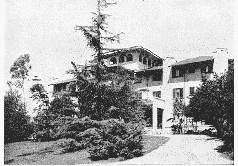

位于旧金山市华盛顿山的美国自我了悟联谊会总部

圣尤地斯瓦尔吉利

几年时间很快就过去了。我就在这块土地上的每个地方授课，在俱乐部、大学、教会及各种教派团体中演讲。有好几万的美国人已经接受我的瑜伽传法。我在 1929 年写的有关祈祷思想的新书—《从永恒来的耳语》（Whispers From Eternity），完全是献给他们的。书前有阿美利塔·加利库尔奇（Amelita Galli Curci）撰写的序文。在此，我摘录书上一首名为《上帝！上帝！上帝！》的诗，那是有一天晚上我站在讲台上写的：

从睡眠的深渊中，

当我登上觉醒的螺旋阶梯时，

我低语着：

上帝！上帝！上帝！

您就是食粮，当我中止

夜晚与您隔绝而来的饥饿时，

我尝到您，精神上说着：

上帝！上帝！上帝！

不论我到何处，我心中的聚光灯

永远保持在您身上；

在对抗喧嚣的活动中

我无声永远地呐喊着：上帝！上帝！上帝！

当猛烈考验的风暴尖叫着，

当忧虑对我狂吼着，

我压过他们的吵闹，大声唱颂着：

上帝！上帝！上帝！

当我的心里以回忆的丝线

编织着梦想，

接着在那神奇的衣服上我发现凸显着：

上帝！上帝！上帝！

每晚，睡眠最深沉的时刻里，

宁静的梦里，呼叫，喜悦！喜悦！喜悦！

我的喜悦来临时永远唱着：

上帝！上帝！上帝！

在清醒，吃东西，工作，梦想，睡觉，

服侍，打坐，唱颂，深爱天国时，

我的灵魂不断地哼着，任何人听不见的：

上帝！上帝！上帝！

有时候—通常是一个月的第一天，当维护华盛顿总部及其他自我了悟联谊会中心的账单大量堆到我面前时，我就思念起在印度的单纯、平静的生活。但当我看到东西方的相互了解逐渐深入时，我的心里又充满了欢喜。

我发现，美国伟大的精神就隐藏在艾玛·拉撒路（Emma Lazarus）刻在自由女神像底座美妙的诗行里—“流亡的母亲”：

她持着明亮灯塔的手中

闪烁着世界性的欢迎，她温柔的眼睛俯视着

空中桥梁架构成孪生城市的港口。

“维特，古代土地，你们传说中的壮丽！”她叫喊着

以无声的口。

给我你的陈腐，你的贫穷，

你缩成一团渴望呼吸自由的群众，

你拥挤在海岸悲苦无依的人。

将这些，无家可归的，遭暴风雨袭击的人给我，

我在黄金的门旁提起我的灯。

第三十八章 玫瑰花圣人—路德·柏尔本

“除了科学知识外，唯一能促进植物生长的秘诀就是爱。”当我在路德·柏尔本（Luther Burbank）圣塔罗莎（Santa Rosa）的花园里，和他一起漫步时，他说出了这句名言。我们在一畦可食用的仙人掌的苗圃边停下了脚步。

“当我在进行‘无刺仙人掌’的培育实验时，”他继续说道，“我常通过跟植物说话，来营造一种爱的振动力。‘没有什么好害怕的，’我告诉它们，‘你们不需要自卫的针刺了，我会保护你们的。’长期下来，这种在沙漠里极为有用的植物就缓慢地成长为没有刺的变种。”

我对这个奇迹很是着迷，就对他说：“亲爱的路德，请给我一些仙人掌的叶子，我想在华盛顿山丘的花园里种一些。”

一个站在近旁的工人正准备摘下一些叶子，柏尔本阻止了他。

“我自己为这位斯瓦米采摘。”他亲手采下了三片叶子交给我，在我种下之后，它们很快繁殖了好大一片。

这位伟大的园艺家告诉我，他的第一个成就是现在以他个人的名字命名的巨大马铃薯。后来，他又坚持不懈地以非凡的创造才能，继续奉献给世界数以百计经过自然改良的杂交新品种—柏尔本蕃茄、玉米、番瓜、樱桃、梅子、油桃、草莓、罂粟、百合与玫瑰等等。

当路德带我到那棵以能像望远镜般伸缩而出名的胡桃树前时，我照了张相片。

“才 16 年的时间，”他说道，“这株胡桃树就可以产出大量的坚果，若是在一般情况下，这需要两倍的时间才能得到。”

这时，柏尔本领养的小女儿跟她的小狗蹦蹦跳跳地跑进花园。

“她就像是我人类的植物。”路德慈爱地向她挥着手，“我现在把人类看成是一株巨大的植物，要让她到达最高的成就，就需要爱、自然的祝福和明智地选择与配种。我观察到的植物的进化过程是如此的奇妙，只要孩子们被教以简单理性的生活原则，我就可以乐观地期盼着收获一个健康快乐的世界。因此，我们必须回归到自然及自然的上帝。”

“路德，你会喜欢我兰契学校的户外课堂及简单愉快的气氛。”

我的这句话拨动了柏尔本的心弦深处—儿童教育。他开始不断地问我问题，深邃平静的眼睛里闪烁着兴味盎然的光辉。

“斯瓦米，”他最后说道，“像你们那种学校才是未来千禧年的希望。我反对现在这种隔绝自然并扼杀所有个性的教育体系。我在心灵上完全同意你的教育理想。”

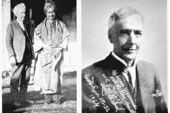

我和路德·柏尔本在圣塔罗莎花园

      路德·柏尔本

当我向这位温和的圣人告辞时，他在一本小书上签了名并赠送给我。

“这是我有关‘人类植物训练（The Training of the Human Plant)’的书，”他说道，“新形态的训练法—无畏的实验，这是必要的。有时，最大胆的试验可以成功产出最好的果实与花朵。儿童教育上的革新同样也应该变得更多样化，更有勇气。”

当晚，我津津有味地看完了这本小书。在对人类辉煌的未来进行展望时，他写道：“在这个世界上，最顽固最难改造的生物，是一株已经在某些习惯上定型的生物……记着，这种植物自长远以来，已经保留了它的个性。它就像那种可以追溯至万古以前的岩石，在长远的时间中从来不曾有过任何巨大的改变。在经过所有这些时期的重复后，你会认为这株植物不会拥有意志吗？事实上，有些植物比如说某些棕榈树，是如此地固执，以致于人类至今尚未能改变它们的习性。和植物的意志相比，人类的意志力无疑是薄弱的。但你看，这长久固执的整株植物的意志，现在只要简单地混入一种新的生活就能打破了。通过配种可对它的生命造成彻底强力的改变。之后，当这个突破实现后，再通过这些耐心的监督和选择将它固定住，这样，这株新的植物，就会开始它新的生长方式，再也不会回到老路。

“当一件事变得像小孩子般敏感柔顺时，问题就会容易解决得多了。”

我被这位伟大的美国人吸引住了，便多次去拜访他。有一天早上，我跟邮差同时到达，他送来了大约 1000 封来自世界各地园艺家的信。

“可敬的斯瓦米，你的出现正好是我需要到花园去的理由。”路德兴高采烈地说着，然后打开了书桌的一个大抽屉，里面有数百份旅游卷宗。

“看！”他说，“这就是我旅游的方式。由于要照顾这些植物和信件，我只能偶尔看看这些照片来满足我对异国土地的渴望。”

之后，沿着小镇的道路上，路德和我在车内欣赏着花园里的景色。他的花园里有着各式不同的圣诞玫瑰、紫红玫瑰和柏尔本玫瑰。

“我朋友亨利·福特和我人都相信古代轮回的理论，”路德告诉我，“它说明了生命中以其他方式无法解释的一面。记忆之所以不被作为事实的检测标准，只因为人类无法记起他的前世，但这并不能证明未曾有过。比如有关他胎儿和婴儿时期的记忆也是空白的，但他显然已经历过了！”他轻声地笑着。

这位伟大的园艺科学家在我之前的一次拜访中已经接受了克利亚的传法。“可敬的斯瓦米，我虔诚地修习这个法门。”他说道。在问了许多有关瑜伽方面的问题后，路德缓慢地说道：

“东方实际上拥有无限的知识，许多都是西方几乎还没有开始探索的。”

在柏尔本长期与自然亲密的交流下，大自然向他显露了许多秘密，让他对自然界产生心灵上的无限崇敬。

“有时，我觉得非常接近那个无限的力量，”他腼腆地表达着，敏感的脸庞上闪现着回忆的光采，“那时，我就可以治愈我周遭生病的人和许多有病的植物。”

他跟我讲了他的母亲，一个虔诚的基督徒的故事。“她死了之后，有许多次，”路德说道，“我有幸在体验中看到她出现，和她说话。”

我们不情愿地离开花园，又开车回到他的家和那上千封等着回复的信件。

“路德，”我说道，“下个月我要创立一本介绍东方与西方在真理贡献方面的杂志。请帮我为这本杂志取个好名字吧。”

我们讨论了一会儿之后，决定用《东方与西方》。再进入他的书房后，柏尔本给了我一篇他在《科学与文明》（Science and Civilization）上发表的文章。

“这篇文章会发表在《东方与西方》的第一期上。”我感激地说着。

当我们的友谊逐渐加深后，我称柏尔本为我的“美国圣人”。他的内心的谦卑、耐性和牺牲精神是深不可测的。他在玫瑰丛中的小家非常简朴，因为他知道奢华是无用的，很少的财产却能给他带来快乐。他的伴随着名声而来的谦虚再三地提醒我，结满成熟果实的枝条才会低垂，而不结果实的枝条总是把头抬得高高的。

1926 年，当这位我亲爱的朋友过世时，在纽约的我流着眼泪想：“噢！为了再看他一眼，我会乐意从这里一路走到圣塔罗莎！”在随后的 24 小时，我闭关不接见秘书和访客，把自己隔绝了起来。

次日，在路德的一张大照片前，我为他举行了一场吠陀的纪念仪式。一群美国学生穿着印度衣服，唱颂着古代的圣歌，以花、水和火作为供奉，象征着各种身体的元素已回归到自然的源头。

虽然柏尔本的形体躺在他几年前在圣塔罗莎园中亲手种下的一棵黎巴嫩柏树下面，但他的灵魂却被我珍藏在路边每一朵盛开的花里。

他的名字现在逐渐变成了日常生活用语。新《韦氏国际辞典》将‘柏尔本’归类为及物动词，定义是：“（植物的）异种交配或嫁接。比喻通过选择或加入好的或排斥坏的品质来改进事物，如一个过程或是制度。”

“亲爱的柏尔本，”我读完定义后哭道，“你的名字现在已成为美好的同义词了！”

第三十九章 圣痕天主教徒—泰瑞莎·诺伊曼

“回到印度吧。我耐心地等你 15 年了。我很快就要离开肉身到光亮的地方去了。尤迦南达，回来吧！”

当我在华盛顿山丘的总部打坐时，圣尤地斯瓦尔的声音惊人地在我内心响起。刹那间，他的讯息越过了一万英里，闪电般穿透了我。

15 年了！是的，我知道，现在是 1935 年，我在美国传扬我古茹的教理已经 15 年的时间了。现在，他正召唤我回去。

那天下午，我将这个体验告诉我一个来访的徒弟。在克利亚瑜伽的培育下，他的灵性已经卓越到我经常称他为“圣人”。这也证实了巴巴吉的预言：在古代瑜伽的熏陶下，美国也会出现了悟天国的男女。

他和其他一些徒弟慷慨地坚持要捐赠我回去的旅费。费用问题于是就这样解决了，我从欧洲回到了印度。1935 年 3 月，自我了悟联谊会根据加州的法律立案成为一家非营利性组织。所有公众的捐献，包括贩售我的著作、杂志、讲义还有学费和其他所有收入都由这个机构全权处理。

“我会回来的，”我告诉学生们，“我永远也不会忘记美国。”

我的那些亲爱的朋友们在洛杉矶为我饯行。我一直看着他们的脸，感激地想着，“上帝啊，那些记得您是‘唯一的给予者’的人，在人群中永不缺乏友谊带来的甜美的欢乐。”

1935 年 6 月 9 日，我乘欧罗巴（Europa）号从纽约启程。有两个学生陪伴着我：我的秘书查理·莱特先生和艾提·布利慈（Ettie Bletch）小姐，一位来自辛辛那提的年长女士。与过去忙碌的几周相比，我们此刻正享受着海上令人愉快平静的日子。可惜，我们的悠闲时光是短暂的，现代轮船的速度某种意义上，也是让人遗憾的东西！

和其他好奇的观光团体一样，我们到处游览着伦敦这个庞大、古老的城市。次日，法兰西斯·杨毫斯本（Francis Younghusband）爵士邀请我在卡克斯顿厅堂（Caxton Hall）的一个大型会议上演讲，要把我介绍给伦敦的民众。于是，我们一行人就成为哈利·劳德（Harry Lauder）爵士的客人，在他苏格兰的庄园里度过了愉快的一天。很快，我们就渡过英吉利海峡到达欧洲大陆，我想要到巴伐利亚（Bavaria）做一次特别的朝圣。因为我觉得这将是我拜访柯能路斯（Konnersreuth）伟大的天主教神秘主义者泰瑞莎·诺伊曼的唯一机会。

几年前我看到过有关泰瑞莎的惊人的报道。那篇文章所提供的资料如下：

（1）泰瑞莎生于 1898 年，20 岁时由于一场意外，成为瞎子并且瘫痪。

（2）通过向“小花”圣女大德兰（St. Teresa）的祷告，1923 年，泰瑞莎·诺伊曼奇迹般地恢复了视力，她的肢体也在之后瞬间痊愈了。

（3）1923 年之后，泰瑞莎每天除了吃一小片圣饼外，弃绝任何食物和饮料。

（4）1926 年，基督神圣的伤疤出现在泰瑞莎的头、胸、手和脚部。之后的每个星期五，她都要经历基督的苦难。

（5）泰瑞莎平常只会说家乡的简单的德语，但在星期五进入出神状态时，她说着被学者认定为古代阿拉姆语（Aramaic）的语词，有时还会说希伯莱或希腊语。

（6）在教会的许可下，泰瑞莎受过几次严谨的科学观察。德国《新教徒日报》的编辑傅里兹·德里克博士（Fritz Gerlick）本打算到柯能路斯去“揭发天主教的骗局”，结果却很尊敬地写了有关她的传记。

像往常一样，不管是在东方还是西方，我都渴望能够会见圣人。当我们一行人在 7 月 16 日进入古朴雅致的柯能路斯村庄时，我高兴极了。巴伐利亚的农人对我的福特车子（我们从美国带来的），也显露出了强烈的兴趣。

泰瑞莎的小屋整齐干净，简朴的井旁盛开着天竺葵，门却静静地关着。开始下雨了，我的伙伴们提议要离去。

“不！”我顽固地说道，“我要待在这里，直到获得可以找到泰瑞莎的线索。”

在沉闷的雨里等待了两个小时之后，我们依旧坐在车中。“上帝，”我叹息着抱怨说，“如果她已经消失的话，为什么您会带我来此？”

一位会讲英语的人停在我们旁边，有礼貌地向我们提供帮助。

“我不确知泰瑞莎在哪里，”他说，“但她会经常拜访埃希史得特（Eichstatt）神学院院长伍尔兹（Wurz）教授，那儿离这儿还有 80 英里。”

第二天早晨，我们一行人就开车前往宁静的艾斯特村。狭窄的路面上铺着鹅卵石。伍尔兹博士在家里热情地接待了我们：“是的，泰瑞莎在这里。”他派人告诉她有关访客的讯息。报信的人马上出现并回复道：

“虽然主教要求我，没有他的允许不可接见任何人，不过我会接见来自印度的上帝的化身。”

我被这些话深深地感动了，并跟随伍尔兹博士到了楼上的客厅。泰瑞莎马上进来了，浑身散发着一股和平喜悦的气息。她穿着黑色长袍和洁白的头巾。虽然这时她已 37 岁了，但看起来比实际年龄年轻多了，她身上拥有着可以说是孩子般的清新与魅力。健康、苗条，两颊红润而且兴高采烈，这就是不吃饭的圣人！

泰瑞莎非常轻柔地握手欢迎我。我们无声地微笑交流着，彼此知道对方是上帝的热爱者。

伍尔兹博士仁慈地充当我们的口译员。坐下来后，我注意到泰瑞莎用天真好奇的眼光看着我—显然，巴伐利亚很少有印度人。

“你不吃任何东西吗？”我想从她的口中得到最确切的答案。

“是的，除了每天早上六点钟的一片圣薄酥饼。”

泰瑞莎·诺伊曼

“薄酥饼有多大?”

“像纸一般薄，一个小铜板大小。”她补充道，“我吃它是因为圣礼的缘故，如果它没有被圣化过，我就无法咽下去。”

“但是，在过去的 12 年里，你不可能只靠它过活。”

“我靠上帝的光生存着。”她的回答是多么的简单，多么的爱因斯坦式！

“我知道你已经了解能量可以从以太、太阳和空气中流入你的身体。”

她的脸上迅速闪过一抹微笑，“这说明你了解我是如何生存的。”

“你神圣的生活每天都见证着基督所说的真理：‘人不是靠面包而活，而是靠出自上帝口中的每一个字。’”

她对我的解释再一次表示出欢喜，“事实的确如此。我今天存在在这个世界的原因之一就是要证明人可以靠上帝无形的光生活，而不是只靠食物。”

“你可以教导其他人如何不靠食物生活下去吗？”

她听到后有些震惊。“我不能那样做，上帝并不希望如此。”

当我的眼光落到她强壮优美的手上时，泰瑞莎就给我看她手掌上新近才痊愈的伤口。在她每只手的手背上，都有较小的新月形新愈的伤痕。这些伤口都笔直地穿过了手掌。这个景象使我清晰地记起了东方现在还在使用的大的、方形、有着新月形尖端的铁钉，但在西方，我不记得曾经见过。

圣人告诉我她每个星期出神的事情：“我就像一个无助的旁观者，观看着基督的整个受难过程。”每个礼拜，从星期四午夜到星期五下午一点，她的伤口就会裂开流血，平常 121 磅的体重会也会减轻 10 磅。虽然她在感同身受的爱里也忍受着极大的痛苦，但泰瑞莎仍旧快乐地期待这每周一次能见到上帝的体验。

伍尔兹教授叙述了他对这位圣人的一些经验。

“我们几个人，包括泰瑞莎在内，经常在德国境内进行为期数天的观光旅游，”他告诉我，“那是个明显的对比：我们一天三餐，泰瑞莎却什么都不吃。但她却能保持着玫瑰花般的气色，丝毫不像我们要受旅行所引起的疲劳的影响。当我们怀着饥饿，忙着找寻路边的饭店时，她会笑得很高兴。”

教授又补充了一些有关她的有趣的生理细节：“泰瑞莎不吃食物，所以她的胃萎缩了。她没有排泄物，但她的汗腺依然运作着，所以她的皮肤总是柔软结实的。”

离开的时候，我向泰瑞莎表达了希望能见证她出神的意愿。

“好的，请在下个星期五到柯能路斯来，”她亲切地说着，“主教会给你许可证的，我很高兴你到埃希史得特来找我。”

泰瑞莎又温柔地跟我握了好几次手，并且送我们到门口。莱特先生打开了车上的收音机，圣人面露浅笑地检视了它一下。一大群小孩围了过来，泰瑞莎退回屋内。我们看到她在窗边，像孩子般地望着我们并挥着手。

次日，我们又通过和两个与泰瑞莎非常亲切友善的兄弟谈话得知，圣人晚上只睡一到两个小时。尽管她身上有许多伤口，但她很活跃并充满了精力。她喜爱小鸟，又养了一缸鱼，所以经常在她的花园里工作。另外，她的通信量很大，天主教的虔信者们为了她的祷告和祝福她痊愈写了很多信给她。许多患重病的追寻者通过她，也恢复了健康。

她 23 岁左右的兄弟斐迪南（Ferdinand）解释说，泰瑞莎通过祷告可以把别人身上的病痛，转移到自己身上。

星期四下午，我们一行人开车到了主教家。他有些惊讶地看着我平滑的长发但却立即开出了必要的许可证。没有收取任何费用。教会订下的许可证这个规矩只是单纯为了要保护泰瑞莎不受蜂拥而来的观光客随意打扰。因为在前几年，每个星期五，这里都会聚集数千名观光客。

星期五早上，我们大约是九点半到达了柯能路斯。我注意到，泰瑞莎小屋的屋顶有一部分是玻璃的，可以提供给她充足的光照。这次，我们很高兴看到门不再是关着的，而是欢欣地敞开着的。一边，大约还有二十人带着他们的许可证排成了一行。许多人都从很远的地方来见证这不可思议的出神状态。

泰瑞莎在教授家已直觉地通过了我的第一次的测试，她也知道我是为了灵性的原因而不是只为满足偶发的好奇才去见她。

我的第二个测试是：在我上楼到达她的房间之前，为了要与她的心灵感应及内在显像融合一致，我让自己进到了瑜伽的出神状态。我走进她充满访客的房间，看到她穿着白袍躺在床上。莱特先生紧跟着我，我踏入门槛后就停了下来，眼前奇怪而又极为可怕的景象让我大为吃惊。

从泰瑞莎的下眼皮稀疏不断地流着血，她的眼神往上集中在了额头中央的第三眼上。她头上包裹的布也浸染在棘刺王冠圣伤口所流出的血中。白色的衣服在她心脏上方的伤口处沾满了鲜红的血迹，那正是基督的身体在很久以前忍受的最后侮辱—士兵用矛刺入的地方。

泰瑞莎以母性的、恳求的姿势伸张着手，脸上同时显现着痛苦而神圣的表情。她看起来较为消瘦，许多的内在和外在都细微改变了。她轻声喃喃地讲着异国的语言，些微颤动的嘴唇在与出现在她内在体验中的人对话。

当我与她协调到一致时，我开始看到她的体验。她看到耶稣在充满嘲笑的人群中背负着十字架。突然，她惊恐地抬起头来，上主跌倒在了残忍的重压下。景象消失了。泰瑞莎的头沉重地陷入了枕中。

就在这个时候，我听到身后“砰”的一声巨响。回过头去，我看到有两个人正把一个倒在地上的人抬出去。因为我刚从深沉的超意识状态中回来，并没有立即认出倒下的人。我的目光再度注视着泰瑞莎在汩汩的血流中变得死亡般惨白的脸。她现在是平静的，正散发着神圣和纯洁的光辉。我向后看了一下，看到莱特先生正用手压着脸颊站着，血从那里滴出来。

莱特先生、我、布利慈女士在埃及

“迪克，”我焦急地问道，“你是倒下来的那个人吗？”

“是的，我被这恐怖的景象吓晕了。”

“好吧，”我安慰地说道，“你敢于回来并再度面对这个景象，说明你很勇敢。”

想起外面还有那些排着长龙耐心等候的朝圣者，莱特先生和我默默地向泰瑞莎道别，离开了她神圣的拜会。

第二天，我们的小团体又开车南下了。我很欣慰我们不必依靠火车，可以在任何地方随处停下我们旅行的脚步。我们享受着途经德国、荷兰、法国和瑞士阿尔卑斯山的每一分钟。在意大利，我们特别前往阿西西向谦卑的使徒圣弗朗西斯致敬。整个欧洲之旅在希腊结束，在那里，我们参观了雅典神庙以及让高贵的苏格拉底喝下致命毒药的监狱。希腊人到处以雪白大理石承载他们非凡想象力的艺术创作，令人激赏。

坐船通过阳光普照的地中海，我们在巴勒斯坦上岸。天天漫游在神圣的土地上，我更加相信朝圣的价值。基督精神弥漫整个巴勒斯坦，在伯利恒（Bethlehem）、客西马尼（Gethsemane）、髑髅地（Calvary）、神圣的橄榄山、约旦河和加利利海，我恭敬地走在他旁边。

我们一行人造访了耶稣诞生的马槽，木匠约瑟夫的工作坊，拉撒路的墓地，马大（Martha）和玛利亚的房子以及最后晚餐的厅堂。古代的生活一幕又一幕地展开，我看到基督为了那个世代所演出的天国戏剧。

到了埃及，我们看到了现代化的开罗和古老的金字塔，接着，又乘船离开了狭窄的红海，穿过广阔的阿拉伯海。瞧，印度到了。

第四十章 回到印度

我感激地呼吸着印度神圣的空气。1935 年 8 月 22 日，我们乘坐的船“拉吉普坦拿号”（Rajputana）停泊在了孟买的港口。我离船上岸的第一天就预示着未来的一年内—连续 12 个月不会间断的活动。朋友们带着花环群集在码头欢迎我们，在我们下榻的泰姬玛哈旅馆房间内，很快就聚集了成群的记者和摄影师。

孟买对我来说是有些陌生的，我发现它充满了活力，有许多来自西方的现代化的革新。这里有高大棕榈树织就的林荫大道，宏伟的市政建筑与古代的庙宇竞相争辉。然而我急切地渴望去见我心爱的古茹和其他亲爱的人，没有时间和心情去观光游览。将福特车交由火车托运后，我们一行人就坐上火车朝东向加尔各答奔驰而去。

到达豪拉车站时，我们看到一大群人聚集起来欢迎我们，阵容庞大，以至于好长时间，我们都无法从火车上下来。年轻的卡辛巴刹尔摩诃拉甲和弟弟毕修领导着这个欢迎委员会。我没想到会有这么盛大、热烈的欢迎场面。

弟弟毕修、卡辛巴刹尔摩诃拉甲、我的父亲、莱特先生、我、图尔斯·博斯、萨提阿南达

在汽车、摩托车队的前导下，街道两旁交织着欢乐的鼓声和海螺声。布利慈小姐、莱特先生和我从头到脚都挂满了花环，车缓缓地驶向父亲的家。

上了年纪的父亲好像我死而复生似的拥抱着我，我们欢欣地看着对方，良久无语。兄弟姐妹、伯父、伯母、堂兄弟、学生和多年前的老友都围绕在我身旁，没有一个人的眼眶是干的。这一切现在虽然已经尘封在我记忆的档案里，但我在心里却会永远记得这历久弥新的一幕—爱的重聚的景象。

至于会见圣尤地斯瓦尔，我更是无法用言语来形容。就通过我秘书的如下描述来满足大家吧。

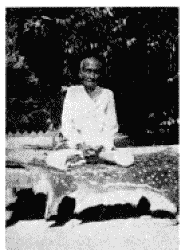

1936 年，父亲在加尔各答以莲花姿势端坐

“今天，我满怀着最高的期待，从加尔各答开车送可敬的尤迦南达到塞伦波尔去，”莱特先生在旅行日记上写道，“我们经过古雅的商店，还有一间尤迦南达在大学时代最喜欢光顾的食堂，最后进入了一条有墙壁的窄巷。突然，一个左转，在我们面前矗立着一幢简朴却有着动人力量的两层楼的修道院。它的二楼有着西班牙式突出的阳台，给人的感觉是宁静隐密的。”

“我非常谦卑地走在可敬的尤迦南达后面，进入围墙内的修道院的庭院。我们心跳加速地踏上一些旧的，可能被无数真理追寻者踩踏过的水泥阶梯。大步前行着，我的心里愈来愈紧张。靠近楼梯口处，伟大的圣尤地斯瓦尔在我们面前安静地出现了，他以一个圣人般高贵的姿态站着。

“尤迦南达跪下磕头，奉献着他发自灵魂的感恩和敬意，又用他的手碰触古茹的脚。当他接着用他的头谦卑地敬礼时，泪水模糊了我的视线。起身后，他被可敬的圣尤地斯瓦尔紧紧拥抱着。

“起初，他们并没有说任何话，但最热烈的情感却在以无声的言语表达着。他们彼此的眼睛闪烁着为灵魂重逢所激起的热情！温柔的震动奔腾在静谧的阳台上，连太阳都避开了云，突然闪现了一道光辉。

“在上师面前跪着，我表达着我未说出口的爱意和感恩。触摸他因岁月和行走服务而结满老茧的脚，接受他的祝福。随后我站起来，看到了一双美丽深沉，燃着内省和快乐光芒的眼睛。我们进到了客厅，客厅的四面都有阳台，从街上就可以直接看到。上师倚靠着一张旧的长沙发，坐在水泥地板上一张有罩的垫子上。可敬的尤迦南达和我斜靠着橘色的靠枕，轻松地坐在古茹脚边的草垫上。

“从他真诚温暖的微笑及闪亮的眼神中，我感受到了这位伟大人物的神圣。在他认真愉悦的谈话中，我们很容易就能辨识一个有识之士的特点。因为他了解上帝，他也知道自己了解。他所拥有的那些伟大的智慧、达成目标的力量和果敢在各方面都表现得很明显。

“我注意到，他有着高大的运动员般的身材，出家的历练和牺牲使他变得更加强壮。他有着威严的仪态，明显有些倾斜的额头在他的对他的面容有着重要的影响，好像在寻找天堂。他有一个相当大却其貌不扬的鼻子，空闲的时候，他会像小孩般用手揉搓它自娱。在他炯炯有神的深色眼眸外，有一圈蓝色的光环。他的头发是中分的，从根部起由银白色转为条纹状的银黄色和银黑色，末稍卷曲贴在肩膀上。他的胡须和髭很稀疏了，但看起来却增加了他的相貌的吸引力，就像他同时具有的深沉及明亮的特质。

“他有着来自胸腔深处却能颤动全身的愉快欢乐的笑声—非常高兴且真诚。他的身材、容貌和肌肉以及发达的手指都显示出坚实的力量。他以庄严的步态、挺直的姿势行动着。

“他简单地裹着曾被染成深赭色但现已褪成橘色的衬衫和腰布。

“环顾四周，我发现这个房间相当破旧，这暗示着主人毫不执着于物质的舒适。长方形的房间看起来已历经风霜，白色的墙壁上掺杂着蓝色灰泥褪色的斑驳条纹。房间的尽头挂了一幅环绕着花环的拿希里·玛哈赛照片。还有一张旧照片，上面是可敬的尤迦南达首次抵达波士顿时与其他参加宗教大会代表站着的合照。

“我注意到，现代与古代在这里奇特有趣地共存着。一盏大的玻璃做的枝形蜡烛吊灯由于废弃不用，已布满了蜘蛛网，墙上却挂着一本鲜明的新式日历。整个房间散发出和平宁静的气氛。越过阳台，我可以看到高耸的椰子树正在无声地护卫着整个修道院。

“上师只要拍手，谈话结束之前就会有一些小徒弟前来，这个很有意思。其中一个名叫普罗富拉的瘦小少年特别吸引我，他有着及肩的黑色长发、一双闪亮透澈的眼睛及天使般的笑容。当他咧开嘴时，闪烁的眼睛就好像是黄昏过后天边挂起的一轮新月和星星。

“可敬的圣尤地斯瓦尔斯瓦米对他的‘产品’成功回归显然非常喜悦（并且看起来对我这个‘产品的产品’也有些好奇）。不过，伟大的人物天生智能的主导优势阻止了他表面所表现出的内在的感觉。

“遵照徒弟远行回来后看望古茹的习俗，可敬的尤迦南达还呈献了一些礼物给他。稍晚，我们坐下来一起吃了一顿简单精致的午餐。每一道菜都是米和蔬菜的不同搭配。可敬的圣尤地斯瓦尔很高兴看到我能入乡随俗，比如用手吃饭。

在彼此用热情的微笑和快乐的目光交流了几个小时后，我们在他脚下顶礼，然后举手致意告辞，并带着永恒的回忆前往加尔各答。虽然我写的主要是对他的一些外在的印象，但我一直在品味着这位圣人的灵性的荣光。我感受着他的力量，并带着那种感觉作为我天国的祝福。”

在美国、欧洲和巴勒斯坦，我特地为圣尤地斯瓦尔买了许多礼物。送给他时，他微笑着接受了，却没有说什么。我自己在德国买了一把还可以作手杖的雨伞。但到了印度，我决定把它献给上师。

“我实在欣赏这件礼物！”当古茹发出这一难得的评论时，他深情地看了看我。在所有的礼物中，他也专挑出手杖给来访的客人看。

“上师，请允许我帮客厅换一张新的地毯。”当我注意到圣尤地斯瓦尔的虎皮正放在一张破旧的小地毯上。

“如果那会使你高兴，就去做吧。”我古茹的声调显得并不十分乐意，“我觉得这虎皮垫子挺舒适而且干净，我是自己小王国内的君主。没有了它就是只对外表有兴趣的世界。”

当他说出这些话时，我觉得时光倒流了，我再次成为一个年轻的徒弟，我的灵魂每天都在斥责的火焰中净化着！

当我们依依不舍地离开塞伦波尔和加尔各答后，我和莱特先生就立刻出发前往兰契。真是盛大热烈的欢迎! 当我拥抱着那些无私的教师，泪水在我的眼眶里打转。没有我的这十五年里，他们让学校的旗帜依旧飘扬着，那些住校生和通勤生一张张明亮的脸和快乐的笑容也充分证明了学校的多元化和瑜伽训练的价值。

兰契机构的财务此时正处于极端的处境。昔日的卡辛巴刹尔宫变成学校的中心大楼，曾经有过许多慷慨捐赠的曼尼卓拉·昌卓尔·南第摩诃拉甲却已经过世了。由于缺乏足够的公众支援，学校举步维艰的财政状况已严重地危及了学校的许多免费的慈善措施。

我在兰契待了一个礼拜，努力帮助解决一些关键问题。包括在加尔各答和重要的领导者及教育学家会晤，与年轻的卡辛巴刹尔摩诃拉甲长谈，恳求他们给予财务上的援助。瞧！兰契有些动摇的根基开始恢复了。我美国学生的许多捐献（包括一张大额的支票）也实时到达了。

我回到印度后的几个月内，欣喜地得知兰契学校已成为法人组织。我毕生的梦想实现了—有了一所永久献给瑜伽的教育中心。这个理想引领着我谦卑地从 1917 年只有 7 个男孩的团体向前走去。

自 1935 年之后的 10 年，兰契的规模的扩充远超过了男子中学的范围。现在，那里在严格地执行着夏玛·夏蓝·拿希里·玛哈赛的使命，广泛地进行各种慈善活动。

学校或尤高达真理团有一些户外课，教授初中和高中课程。住校生和通勤生也在接受某些职业训练。男孩组织的自治委员会规范他们自我的大多数活动。我在从事教育工作的早期，发现以前比较顽皮、会欺骗老师的学生竟会乐意接受同学订下的纪律规则。从来就不是模范学生的我，对所有男孩们的恶作剧有着本能上的共呜。

运动和游戏受到鼓励后，运动场上就充满了练习曲棍球和足球的声音。兰契学生经常在各种竞赛中获奖，户外体育馆也建的到处都是。通过意志的力量使肌肉重新充电是尤高达的特色，用心灵导引生命到达身体的任何部位。这些男孩们也同时接受瑜伽体位、剑术、棍棒术和柔道的教导。有成千上万人参加过兰契在维地拉雅的医疗展。

兰契学校合影

我们用北印度语教授当地寇尔（Kols）、圣淘斯（Santals）和曼达斯（Mundas）族部落一些基本的科目，也为邻近村庄的女孩子们系统开课。

兰契的最大特色就是克利亚瑜伽的传法。男孩子们每天修习灵性的功课，参加梵歌的吟诵，用戒律和例子学习单纯、自我牺牲、荣誉和真理的美德，以及邪恶会产生苦果，美善才能导致真正的快乐。邪恶可以被比作有毒的蜂蜜，诱人但充斥着毁灭。

第四十一章 在南印度领略迷人的田园风景

“迪克，你是第一个走进那个圣殿的西方人。许多人也曾尝试过，但都白费力气。”

听到这些话，莱特感到十分惊讶但随后就变得很高兴。我们刚离开印度南部俯视着迈索尔山丘（Mysore）美丽的肯孟迪庙（Chamundi）。在那里，我们在摩诃拉甲统治家族守护女神肯孟迪的黄金与白银的圣坛前鞠躬行礼。

“作为这个特殊荣耀的纪念品，”莱特先生小心翼翼地收起一些神圣的玫瑰花瓣，说道，“我会一直保存这些花并让神父用玫瑰水滋润它们。”

1935 年 11 月，我和同伴应邀至迈索尔区做客一个月。摩诃拉甲圣奎师那拉甲·瓦迪亚尔四世（H. H. Sri Krishnaraja Wadiyar IV）是一个模范王子，总是智慧地为他的人民奉献着。这位摩诃拉甲（一个虔诚的印度教徒）授权一个回教徒（能干的伊斯美（Ismail））做他的首相或总理（Dewan）。然后由迈索尔 700 万居民民意选择组成了议会和立法机构。

摩诃拉甲的继承人优瓦拉甲（H. H. the Yuvaraja）、圣圣奎师那·那拉辛哈拉·瓦迪亚尔（Sir Sri Krishna Narasingharaj Wadiyar）邀请我和秘书到他开明进步的王国访问。在过去的两周里，我先后在市政大厅、摩诃拉甲学院、大学的医学院向迈索尔成千上万的市民和学生演讲。在班加罗尔，我有三个大型的会议要参加，分别是在国立高中、先修学院和超过 3000 人参加的雀提（Chetty）市政大厅。我不知道台下那些热切的听众能否想象得出我所描绘的美国民众的热情场景，但当我说到东方与西方彼此交流可以互相受益时，听众的掌声总是最热烈的。

现在，莱特先生和我轻松地享受着热带的宁静。他的旅游日记记载了迈索尔给他留下的印象：

“绿油油的稻田，与流苏状的甘蔗园交替出现，依偎在岩壁保护的山脚下的丘陵—丘陵上散布的翠绿景色就好像是黑宝石上的赘生物—当太阳突然戏剧性地沉没，在庄严丘陵后歇息时，色彩的视觉变化就更加强了。

“我凝视着上帝在穹苍渐渐铺展开来时的极尽变幻，度过了许多几乎是忘我的时刻。他随意的碰触就足以涂画出振动着新鲜生命的色彩。当人们试图只用颜料模仿时，那种在色彩上的青春就失去了，因为上帝使用的是更简单、有效的材料—既非油彩亦非染料，只是光束。他在这里抛掷一片光，映照出红色；又在那里挥洒着画笔，使红色中逐渐融入橙色和金色；接着，他又锐利地一推，在云中刺出一道紫色的斑痕，留下了一圈边缘渗着血红的伤口。如此不断进行着，涂抹着，不断变幻，永远新鲜。没有固定，没有复制，甚至没有一模一样的颜色。印度从早到晚优美且不断改变的景色是别的地方无法比拟的。那里的天空看起来经常像是上帝从他的工具箱中拿出所有的色彩，然后奋力地将它们如同万花筒般地投掷到天空中。

“我必须叙述黄昏造访离迈索尔 12 英里的奎师那拉甲萨加尔（Krishnaraja Sagar）大水坝时壮丽的景象。可敬的尤迦南达和我搭上一辆小巴士，还有一个负责转动曲柄或代用电池的小男孩。当太阳挂在地平线上，像熟透的蕃茄般被压扁时，我们从一条平坦的泥土路上出发。

“经过无所不在的方形稻田，我们穿过一排长在高大的椰子树丛中的榕树林，以及其他茂密丛生的植物，最后到达山丘的顶端。我们正对着一个巨大的人工湖，湖面反射着星星、四周的棕榈树及其他树木，美丽的梯形花园和一排灯光环绕着水坝的边缘。在它的下面，我们看到了炫目的景象，五彩的光束打在间歇喷涌泉水的水池上，像是许多道倾泻而出的亮丽光灿的蓝色瀑布。醒目的红色的激流，绿色和黄色的浪花，还有喷着水柱的大象，像是一个小型的芝加哥世界博览会，不过却神奇地凸显在这块充满水田和纯朴劳动人民的古老土地上。

“还有一个少有的优待—那是我第一次骑大象。昨天，优瓦拉甲邀请我们到他的夏季行宫去乘坐他的大象—一种庞大的动物。我爬上事先准备好用来登上象轿或象鞍的梯子。象轿像个箱子，铺着丝绸的垫子。骑上象背后，大象旋转、上下摇晃、左右摇摆及颠簸着到一个小峡谷去。我对这其中的刺激到了无法担心或叫喊的程度，为了宝贵的生命我只能抓紧不放！”

南印度充满历史和考古遗迹，实在是一块迷人的土地。迈索尔的北方是印度原本最大的国家海得拉巴（Hyderabad），如画般的高原被浩荡的哥达瓦里河（Godavari）切割着。宽广肥沃的平原，优美的尼矶瑞斯（Nilgiris），还有其他石灰石或花岗岩的不生草木的山丘。海得拉巴有着多彩多姿的悠久的历史，始于 3000 年前的安达罗（Andhra）君王。信奉印度教的王朝还在延续着，直到公元 1294 年，政权才转移给至今仍在位统治的回教徒。

全印度最令人叹为观止的有关建筑、雕刻和绘画的展示是在海得拉巴的艾洛拉（Ellora）和阿旃陀（Ajanta）的古代石雕洞窟内。艾洛拉有一块巨石雕凿出的凯伊拉沙（Kailasa）大神庙。刻画有诸神、人和动物的雕像，这些雕像都有着像米开朗基罗般惊人均衡的比例。阿旃陀有 5 间大教堂和 25 间修道院，所有用岩石开凿出的洞穴都以巨大的石柱支撑着，上面有艺术家和雕刻家创作的巧夺天工的不朽壁画。

土耳其大学与可容纳 10000 名回教徒聚集祈祷的宏伟麦加清真寺也为海得拉巴市增添了光彩。

迈索尔地区也是称得上是景色秀丽的人间仙境，它高出海平面 3000 英尺，有着葱郁、茂密的热带雨林，是野生象、野牛、熊、豹和老虎的故乡。它的两个主要城市，班加罗尔和迈索尔都很干净、很吸引人，有很多公园。

从 11 世纪到 15 世纪，在印度君主的赞助下，印度的建筑和雕塑艺术在迈索尔达到了完美的高峰。在贝鲁尔（Belur）维希奴瓦尔汉那（Vishnuvardhana）君王统治时期完成的庙宇是 11 世纪的经典之作，它里面的细腻、丰富的雕像是举世无双的。

在北迈索尔发现的石柱可追溯至公元前 3 世纪，它引起了人们对阿育王（Asoka）的回忆。阿育王继承了孔雀（Maurya）王朝的王位并扩大了他继位时的国家版图。他治下的帝国包括了几乎现代印度的全部、阿富汗以及俾路支（Baluchistan）。这位著名的皇帝，连西方史学家都认为是举世无双的统治者，在一块石碑上刻下了如下的智慧：

这篇宗教性碑文的雕刻是为了让我们后世的子孙明白，新的征服是不必要的，武力征服算不上真正的征服。让他们了解，武力只不过是毁灭和暴力，除了宗教上的征服，没有什么是真正的征服。这种征服在这个以及下一个世界里自有它的价值。

阿育王是令人敬畏的旃陀罗笈多孔雀王（Chandragupta Maurya）的孙子。旃陀罗笈多在他年轻的时候曾遇见过亚历山大大帝。后来，他摧毁了马其顿人留在印度的驻军，在旁遮普省击败了入侵塞琉卡斯（Seleucus）的希腊军队，在他巴特纳（Patna）的宫廷接见了希腊使节梅嘉苏德尼斯（Megasthenes）。

希腊的历史学家和其他伴随或是追随亚历山大远征印度的人都详细记下了许多极为有趣的故事。麦克蓝道博士（J. W. M'Crindle）翻译了阿里安（Arrian）、狄尔多勒斯（Diodoros）、普卢塔克（Plutarch）和地理学家斯特拉博（Strabo）的叙事文章，让人对古印度有了些了解。亚历山大表现出了对印度哲学及偶尔遇到的瑜伽行者和圣人的深切的兴趣，他们所处的社会也是他渴望追求的。在希腊战士到达北印度塔席拉不久后，他派遣希腊第欧根尼（Diogenes）学派的信徒欧尼西克里多斯（Onesikritos）为使者，并邀请塔席拉伟大的印度托钵僧丹达密斯（Dandamis）上师一同前往。

“婆罗门的导师啊！我向您致敬，”欧尼西克里多斯找到在森林中隐居的丹达密斯后说道，“非凡的天神宙斯之子，亚历山大是全人类的王中之王。他要求你去见他，你若遵从，他会赏赐你许多礼物，你若拒绝，他就会砍下你的头！”

这位瑜伽行者平静地听完这个带有强迫性的邀请，“躺卧在树叶上，连头都不抬一下”。

“如果亚历山大是宙斯之子，那我也是，”他评论道，“我不想要亚历山大的任何东西，我已经满足于我所拥有的。他与他的手下只是在毫无益处地飘洋过海游荡着，而且，他的飘荡没有止境。

“请回去转告亚历山大，至上的上帝从来都不会是个侮慢的错误的唆使者，而是光、和平、水、人类肉体和灵魂的创造者。当死亡使人类自由时，他会接纳所有的人，而决不会受到邪恶和疾病的影响。我唯一尊崇的上帝，他厌恶屠杀，更不会挑起战争。”

“亚历山大不是神，他最后必会尝到死亡的滋味，”圣人平静轻蔑地继续说道，“像他这样的人不可能成为世界的主宰，因为他无法坐上统治内在宇宙的宝座。他尚未能活着进入冥府，也不知道太阳经过地球中心区域的轨迹，还有很多国家的人民甚至还没有听过他的名字呢！”

在这番无疑称得上是所有曾经送给这位“世界之主”的最为刻薄的斥责后，圣人讽刺地补充道，“如果现有的广阔领土还不能满足亚历山大的欲望，那就让他度过恒河吧！如果这边的国家对他而言太过狭窄的话，在那里他会发现一个足以容纳他和所有人的地区。”

“我了解了你刚才所说的，不过，亚历山大所提议的和他所允诺的礼物对我来说都是毫无意义的东西。我所珍视并认为有实际价值和用途的东西是这些树叶，我的屋子，这些开着花的供应我日常食物的植物，还有我可以饮用的水。而所有其他以焦虑、烦恼累积起来的财产，通常被证实是具有毁灭性的，只能带给每个可怜的凡人已经充满的忧伤和苦恼。至于我，躺在森林的树叶上，没有任何需要守护的东西，可以闭上眼睛安宁地睡觉。反之，如果我有任何需要守护的东西，就无法安稳睡觉了。大地供应我每样东西，就像每个母亲给她的小孩喂奶一样。我到任何喜爱的地方去，都没有任何牵累。”

“即使亚历山大砍下我的头，他也无法摧毁我的灵魂。我离开身体的头颅就像一件破旧的衣服，将会安静地，停留在它所来的地方。而我的灵魂，会上升到上帝那里。他以血肉之躯包着我们所有的人，放我们在地球上以考验我们在下面时，是否会顺服他的旨意生活。他也要求我们所有的人，当回到他面前时，要叙述自己在下面的生活。作为所有罪恶的审判者，他会把那些被压迫人的呻吟最终变成对压迫者的惩罚。

“让亚历山大用这些威胁、恐吓去对付那些渴望财富、畏惧死亡的人吧，这两种武器对我们来说都是无用的。婆罗门既不喜爱金子，也不怕死亡。你回去告诉亚历山大：丹德密斯不需要任何属于他的东西，所以不会到他那里去，如果他想得到任何属于丹德密斯的东西，只能请他到我这里来。”

亚历山大非常认真地倾听了这位瑜伽行者通过欧尼西克里多斯传达的讯息之后，“感到比先前任何时候更渴望见到丹德密斯。那个人虽然年老且赤裸，但却是这位许多国家的征服者所碰到的唯一比自己更为强劲的对手。”

亚历山大邀请了一些以简练回答哲学问题而著称的婆罗门苦行僧一起来到了塔席拉。普卢塔克记述了这段言语上的争论，所有问题均由亚历山大自己构思而来。

“活的或死的，哪一种为数较多？”

“活的，因为死的已什么都不是。”

“海洋或陆地，哪一样更能孕育较大型的动物？”

“陆地，因为海洋只是陆地的一部分。”

“哪一种动物最聪明？”

“人类尚未知悉的那一种。”（人类害怕未知的事物。）

“白天或夜晚，哪一个先存在？”

“一天中的白天。”可是，亚历山大对这个的答案表示惊讶。婆罗门补充道，“不可能的问题需要不可能的答案。”

“一个人受人爱戴的最高程度是什么？”

“一个人如果拥有伟大的力量而仍不被人所惧，就是受人爱戴。”

“一个人如何能成为一个神？

“做人所不能做的事。”

“生或死，哪一个较为强壮？”

“生，因为它承担了许多罪恶。”

就这样，亚历山大成功地找出一位真正的印度瑜伽行者作为他的老师。这个人就是斯凡斯（Sphines）斯瓦米。因为这位圣人是上帝卡力化身的虔信者，念着他吉祥的名字欢迎着每个人，因此，希腊人称他为“卡拉诺斯”（Kalanos）。

卡拉诺斯伴随亚历山大到波斯去。在波斯苏萨（Susa）一个预定的日子里，卡拉诺斯在马其顿军队的注视下从容走进火葬用的柴堆中，舍弃他年老的肉体。史学家们记载，那些士兵都非常惊讶地看着这位对痛苦和死亡毫无恐惧的瑜伽行者，在吞噬的火焰中未曾移动过他的身体。卡拉诺斯在接受火葬前，拥抱了他所有亲近的朋友，但却没有跟亚历山大告别。这位印度圣人只跟他这样说：

“不久之后，我会在巴比伦见你。”

亚历山大离开波斯，果然，一年之后死在了巴比伦。

旃陀罗笈多王在纪元前 305 年时，击退了亚历山大的将军塞琉卡斯，七年后将印度王朝交给他的儿子统治。而他自己则到印度的南部去旅行，在其还有 12 年的余生里作为一个身无分文的苦行僧，在斯洛凡那比拉葛拉（Sravanabelagola）的一个岩洞中寻求自我了悟。现在，该处被尊称为“迈索尔圣地”。并且，附近耸立着世界上最大的雕像，在公元后 983 年由耆那教徒（Jains）用一块巨大的圆石雕琢而成，纪念神圣的可梅提斯瓦拉（Comateswara）。

迈索尔无处不在的宗教圣殿让我们想起了南印度许多伟大的圣人。这些上师中的一位，萨曼阿瓦塔尔（Thayumanavar），留下了如下意味深长的诗篇：

你可以控制一头疯狂的象，

你可以闭上一头熊和老虎的嘴巴，

你可以骑在一只狮子上，

你可以与一条眼镜蛇玩耍，

用炼金术你可以勉强维持生计，

你可以微服漫游宇宙，

你可以做诸神的侍从，

你可以永远年轻，

你可以走在水上，生活在火中，

但要想更好地控制心灵，很困难。

位于印度最南端的优美富饶的特拉凡科（Travancore）区水道纵横。摩诃拉甲每年都要承担世袭的责任，去弥补过去并吞几个小国到特拉凡科以及战争所带来的罪恶。每年连续有 56 天，摩诃拉甲每天要到庙里听取三次吠陀的吟唱和朗颂，赎罪的仪式以拉西底潘（Lakshadipam）或点燃十万根蜡烛照亮寺庙作为结束。

伟大的印度立法者摩奴概述了一位君王的职责。“他必须像因陀罗（Indra）（天神的上主）般赐予人民舒适的 生活；像太阳从水中获得水汽般轻柔微细地征缴税赋；像到处都去的风，关心他臣民的生活；像阎罗王般地给予所有人同样的正义；像波罗那（Varuna）（吠陀的天空和风神）般将犯罪者绳之以法；像月亮般让所有人喜爱；像诸神之火烧尽邪恶的仇敌；像大地之母扶持所有的人。

“在战争中，一位君王不应使用有毒或用火烧过的武器，也不该杀害弱者、没有准备、手无寸铁的敌人或是那些恐惧、请求保护和逃跑的人。战争应该只应该被视为一种最后的手段。因为战争的结果通常是使人疑惑的。”

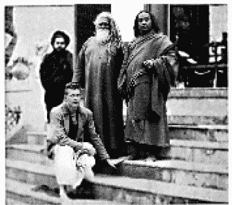

莱特先生和我一起拜访凯巴·南达

在印度东南沿海马德拉斯的辖区，分布有平坦、宽敞、环海的马德拉斯市和黄金城市康吉布勒姆（Conjeeveram）—巴拉瓦（Pallava）王朝的首都。它的君王统治着基督纪元的前几个世纪。在现代马德拉斯的辖区内，圣雄甘地非暴力主义的理想在此伟大地弥漫着，白色独特的“甘地帽”到处可见。在南方，这位圣人为“贱民”完成了许多重要庙宇以及种姓阶级制度方面的改革。

当种姓阶级制度在几个世纪以来成为一种对民众根深蒂固的束缚后，就产生了严重的祸害。现今印度社会的改革者（像甘地以及其他许多团体的成员）正缓慢、稳健地恢复古代种姓阶级制度的价值观念，并以天生的属性而非血统作为基础。世上每个国家都有它自己特有的不幸的业障需要应付和消除。而印度就以她无懈可击的坚持精神，证明自己能够胜任种姓阶级制度改革这一任务。

南印度如此令人陶醉，莱特先生和我渴望延长我们的田园诗篇。但我已定好要在加尔各答大学即将举行的印度哲学大会上做闭幕演讲。在造访迈索尔的最后，我很高兴地与印度科学院院长拉曼（C. V. Raman）爵士进行了会谈。这位杰出的印度物理学家在 1930 年因为在光漫射方面的重要发现获得了诺贝尔奖。“拉曼效应”现在是每个学童都知道的。

依依不舍地向一群马德拉斯的学生和朋友们挥手道别后，莱特先生和我向北出发。中途我们在一间纪念沙达希瓦婆罗门（Sadasiva）的小庙停了下来。他在 18 世纪时创造了一连串奇迹般的故事。普达柯泰王（Pudukkottai）在尼尔（Nerur）所建的较大的沙达希瓦圣庙则是个朝圣的景点，那里见证了许多天国的痊愈。

在印度南部，还有许多有关这位令人喜爱而且完全开悟的沙达希瓦上师的轶事在广为流传。有一天，在卡威里（Kaveri）河畔，当沙达希瓦沉醉在三摩地时，有人看到他突然被一阵浪潮卷走了。几个礼拜后，人们发现他被深埋在一堆土石下。可当村民的铲子刚触碰到他的身体时，这位圣人却很快起身并走掉了。

沙达希瓦从不说话也不穿衣服。有一天早上，这位赤裸的瑜伽行者唐突地进入了一个回教族长的帐篷里。里面的女士们惊恐地尖叫着，武士把剑凶猛地刺向沙达希瓦，于是，他的手臂被切断了。但这位上师不在意地离去了。那位后悔不已的回教徒从地上拾起手臂追赶沙达希瓦。追上后，这位瑜伽行者平静地将那只手臂接回自己流着血的臂膀。当这位武士谦卑地要求希望得到一些灵性上的指引时，沙达希瓦用手指在沙上写下：

“不要做你想做的，之后你就可以做你喜欢做的。”

这位回教徒的心灵顿时被提升到一个崇高的境界，了悟了圣人看似矛盾的忠告。它是指引人们，必须通过对自我的掌控才能解放灵魂。

有一次，村里的小孩对沙达希瓦表示想要观赏 150 英里外马都拉（Madura）举行的宗教庆典。瑜伽行者就让这些小孩碰触他的身体。瞧！瞬间整群人都移到马都拉去了。小孩子们快乐地漫游在成千上万的朝圣者中。几个小时后，瑜伽行者又用他简单的运送方式将这群人带回家。惊讶的父母听着孩子们讲述的生动的神像列队游行的故事，还注意到有几个小孩带回了成袋的马都拉甜点。

我和朋友们在泰姬陵前合影

一个年轻人对此表示怀疑。隔天早上，他跑来找沙达希瓦。

“上师，”他轻蔑地说道，“为什么你不带我去那个庆典，就像昨天你对其他小孩所做的那样？”

沙达希瓦应允了，于是男孩马上发现自己已经身在遥远城市的人群中。但，天啊！当年轻人想要离开的时候，却没有看到圣人的影子。于是，这个筋疲力竭的男孩只好步行回家。

第四十二章 古茹的临终时光

“可敬的古茹，我很高兴今早我能与您单独见面。”说这句话时，我带了许多芳香的水果和玫瑰，到达塞伦波尔修道院。圣尤地斯瓦尔和蔼地看着我。

“你有什么问题吗?”上师环顾四周，好像准备离开。

“可敬的古茹，我到您这里来时只是个高中青年，现在已经是个成年人了，甚至有了一两根白发。从那时到现在，您一直对我倾注着无言的爱，您只在初次见面那天对我说过‘我爱你’。”我祈求地看着他。

上师目视下方说道：“尤迦南达，我需要把心中无法用言语表达的温暖感情拿到冷酷的语言世界来吗？”

“可敬的古茹，我知道您爱我，但我肉体的耳朵非常渴望听到您这么说。”

“如你所愿。在婚姻生活中，我经常盼望能有一个儿子，可以培养他走上瑜伽的道路。但当你进入我的生命中时，我满意了。我在你身上找到了我对儿子的那种感觉。”两颗晶莹的泪珠将要从圣尤地斯瓦尔的眼眶中滴落，“尤迦南达，我一直是爱着你的。”

圣尤地斯瓦尔在塞伦波尔修道院的餐厅，我坐在圣尤地斯瓦尔旁边。

“您的回答是我去往天堂的通行证。”我心中的一块石头落了下来，并在他的话语中永久地消融了。

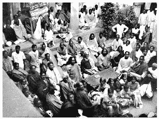

1935 年圣尤地斯瓦尔在塞伦波尔修道院举办的最后一次冬至庆典，我的古茹坐在中央，我坐在他的右侧。

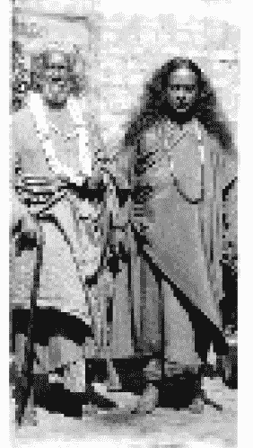

1935 年，圣尤地斯瓦尔和我在加尔各答。 

几天以后，当我在加尔各答的亚伯特（Albert）会堂向一群听众演讲时，圣尤地斯瓦尔和山多斯（Santosh）的摩诃拉甲以及加尔各答的市长都坐我旁边的讲台上。虽然上师没有跟我说什么，但我在演讲时不时看他一下，看到了他闪亮的眼光。

接下来，是与塞伦波尔学院校友的谈话。当我看着老同学，他们也看着昔日的“疯和尚”时，喜悦的泪水坦然地流了出来。口才绝佳的哲学教授戈夏尔博士走上前来欢迎我，我们过去的一切误会也在时间的神奇魔力下烟消云散。

12 月底，在塞伦波尔修道院有一场冬至庆典。如往常一样，圣尤地斯瓦尔的徒弟从各处聚集起来。虔诚的桑可尔坦斯歌舞，克里斯多·达（Kristo·da）甜美的独唱，年轻徒弟布置的盛宴，还有星光下，上师在挤满人群的修道院的动人的演讲！

“尤迦南达，请跟大家说些话—用英语。”当上师提出这个非比寻常的要求时，他眨着眼睛。他是否想到我那时在船上第一次用英语演讲之前的困境？我告诉了师兄弟们这个故事，最后引来了大家对我们的古茹的热烈推崇。

“他对我的引导无所不在，不仅只是在轮船上，”我总结道，“在美国那块广大好客的土地上，15 年来他也始终与我同在。”

当客人离去后，圣尤地斯瓦尔召唤我到他的卧房—只有一次，在早年的一个节庆后—我被允许睡在他的木板床上。今晚我的古茹静静地坐在那里，徒弟们在他脚下围成半圆。当我迅速走进房间时，他微笑着。

“尤迦南达，你要离开这里到加尔各答去了吗？明天请回到这里来。我有些事情要告诉你。”

第二天下午，圣尤地斯瓦尔说了一些简单祝福的话，赐给我一个更高的出家者的头衔—帕拉宏撒（Paramhansa）。

当我跪在他面前时，他说：“现在它正式取代你之前斯瓦米的头街，”我想到我那些美国的学生可能要与“帕拉宏撒”的发音奋斗时，暗自觉得好笑。

“我已经完成了我在世上的任务，你要继续下去。”上师轻声地说着，他的目光温和而平静。我的心却惊惧地跳动着。

“请你委派一个人负责我们在布利的修道院，”圣尤地斯瓦尔继续说道，“我把所有事情都交给你，相信你会成功地驾驶着载着你的生命和团体的船只到达天国的彼岸。”

我抱着他的脚，泪水长流。他站起来，充满爱意地祝福我。

“可敬的古茹，”我啜泣着恳求他，“不要这么说！永远不要跟我说这样的话！”

圣尤地斯瓦尔的脸色缓和了下来，带着平静的微笑。虽然快到 81 岁生日，他看起来还是很健壮。

“先生，昆巴大会就在这个月举行，地点是阿拉哈巴。”我用手指指向孟加拉月历上大会的日期，向上师示意。

“你真的想去吗？”

丝毫没有觉察到圣尤地斯瓦尔并不愿意我离开他，我自顾自说道，“您有一次在阿拉哈巴的昆巴大会上看到神圣的巴巴吉。也许这次我也够幸运，可以看到他。”

“我不认为你在那里能够遇到他。”古茹说完沉默了下来，他不希望干涉我的计划。

次日，当我与一小群人启程前往阿拉哈巴时，上师仍以他平常的方式祝福我。我浑然不觉圣尤地斯瓦尔态度中的暗示，显然，这是上帝希望免除我被迫目睹古茹死亡的经验。在我一生中，每当那些我所挚爱的人过世时，上帝总是慈悲地安排我远离现场。

1936 年 1 月 23 日，我们一行人抵达昆巴大会会场。近乎两百万的汹涌的人潮给我留下了极为深刻的印象。印度人，即使是最低下的农夫，也都具有与生俱来的特殊的本质，那就是崇敬灵性财富和那些舍弃世俗束缚寻求先知依靠的僧侣和隐士。事实上，在那个地方也有骗子和伪君子，但印度人会尊重所有的人。

斯瓦米奎师那南达和他的狮子

我们的团体在第一天只是纯粹地观看。这边，有无数的沐浴者，为了减轻罪恶，浸泡在神圣的恒河水里；那边，我们看到了崇敬庄严的仪式；远处，有虔诚的奉物散落在圣人沾满灰尘的脚下。我们转过头去，又看到一列象队和有着华丽披挂的马匹，与缓步行走的拉吉普坦拿骆驼组成一个纵队行进着，还有奇特有趣的宗教游行队伍，或者是挥动着金银制成的令牌、旗子和丝绒的幡的赤裸的隐士。

1936 年的昆巴梅拉大会，中间那位妇人当时已经 112 岁了。

隐士们只着腰布，小团体地静静地坐着。他们的身上涂满了灰烬，使他们避免过于酷热和寒冷。他们额头的第三只眼处有用檀香膏描绘的鲜明的标记。接着，有成千上万个身着赭色僧袍，带着竹杖和乞食钵的光头斯瓦米出现。当他们四处走动或是与徒弟讨论哲学时，脸上就会散发着出家人特有的宁静的光彩。

在树下，四堆巨大的正在燃烧的木头周围，生动地环绕着如画般的隐士们。他们的头发都编成辫子盘绕在头上，有些还留着几英尺长、卷曲而打结的胡子。他们安静地或打坐，或伸出手来祝福过往的群众—乞丐、坐在大象上的摩诃拉甲、穿着五颜六色纱丽服的妇女，她们的手镯和脚环叮叮作响。托钵僧细瘦的手臂奇异地把钵举在头顶上，布拉玛查理携带着静坐用的肘架，庄严谦卑的圣人们隐含着内心的祝福。在喧嚣之中，我们还听到了寺庙的钟声不断地召唤着。

大会的第二天，同伴和我进入不同的修道院和一些临时搭建的帐篷向重要的圣人致意。我们接受了吉利僧派教主的祝福—一个瘦小，眼中带着微笑的火焰的苦行僧。我们接下来拜访的修道院，它的古茹在过去九年中坚守着禁语及严格水果和餐饮限制的誓言。修道院大厅中央的讲台上坐着一个盲眼的圣人—布拉格拉·查克舒（Pragla Chakshu）。他精通古代经典，受到各个宗派的尊敬。

我用印度话简短地演讲了一通吠陀哲学后，我们就离开了宁静的修道院去问候附近的斯瓦米奎师那南达（Krishnananda）—一位英俊的和尚，有着红润的双颊和让人印象深刻的臂膀。斜躺在他旁边的是一只被驯服的母狮。我确信它是屈服于和尚的精神魅力而不是他孔武有力的体格！这只从丛林走出来的猛兽拒绝所有的肉类，只喜欢米饭和牛奶。

我们下一个邂逅的是一个年轻博学的圣人，莱特先生文采斐然的旅行日记里有过生动的描述。

“我们开着福特车经过快要枯竭的恒河上面一座咯吱作响的浮桥，曲折艰难地越过了人群，又穿过狭窄弯曲的巷道，在经过河边的一个地方时，尤迦南达向我指出，那就是巴巴吉与圣尤地斯瓦尔碰面的地方。不久，我们下车开始步行，在穿过隐士围绕着的冒着浓烟的火堆和滑溜的沙地后，到达一个坐落有几间简朴泥巴的稻草小屋的地方。我们在这些不起眼的临时住所中的一间停下了，没有门的一个低矮的入口里面是一个以非凡智能著称的年轻漫游隐士的住处，他叫卡罗·佩特里（Kara Patri）。在那儿，他盘腿坐在一堆稻草上，身上唯一的遮盖物—也可以说是他仅有的财产—一块儿披在肩上的赭色的布。

“我们匍匐着爬进茅屋，并在这位有着开悟的灵魂的圣人脚下顶礼。一副天国的面庞向我们真诚地微笑着，挂在入口处的煤油灯在茅草墙上映出各种怪异的影子。他的眼睛和整齐洁白的牙齿闪耀着光辉。虽然我听不太懂印度话，但他的表情富含启示性，我感觉得出，他充满了热情、爱与灵性的荣光。没有人会错认他的伟大的。”

“想象一个不执着于物质世界的人所过的快乐生活：免除了衣服的问题，免除了对食物的渴望，从不乞讨，也不碰煮过的食物，除非那是隔日的。从不带乞食钵，避免所有有关金钱的牵扯，从来不用管钱，也不需储存任何东西。一直信赖着上帝，不必为交通忧虑，也从不搭乘任何交通工具，总是沿着圣河行走。从不在一个地方停留超过一个星期，避免产生执着。

“如此谦虚的一个灵魂！而且不可思议地精通吠陀经典，还有着贝拿勒斯大学‘夏斯特里’（Shastri）（经典大师）的头衔和文学硕士学位。当我坐在他脚下时，被一种崇高的感觉笼罩了。这一切看起来完全实现了我想要看到古代真实印度的意愿，因为他就是这块土地上有着最高灵性巨人的真正代表。”

我向卡罗·佩特里询问有关他的流浪生涯。“您在冬天也没有穿任何额外的衣服吗？”

“没有，这就够了。”

“您不会随身携带任何一本书吗？”

“不，我用记忆教导那些愿意听我讲道的人。”

“您还会做什么其他的事？”

“我会在恒河边漫步。”

从这些平静的话语中，我强烈地渴望获得他生活中的单纯。我想起了美国以及落在我肩膀上的所有的责任。

“不，尤迦南达，”我伤心了一下，想着“此生你是不可以只在恒河边漫游的。”

隐士又告诉我一些他灵性上的了悟后，我提出了一个唐突的问题。

“您这些描述是从典籍还是内在的体验上得来的？”

“一半是从书本中学习，”他坦率地笑着回答，“另一半是从体验中来的。”

我们在一起静默着打坐，快乐地坐了一会儿。离开他的神圣后，我告诉莱特先生，“他是坐在黄金稻草宝座上的国王。”

几天后，我们的小团体抵达了加尔各答。我想去看望圣尤地斯瓦尔，结果却失望地听到他离开塞伦波尔了，现在在南方 300 英里远的布利。

“马上到布利的修道院来。”这是一封在 3 月 8 日由一位师兄弟拍给上师在加尔各答的门徒阿塔尔·昌卓尔·罗伊·乔杜利（Atul Chandra Roy Chowdhry）的电报。消息传到我的耳朵的时候，我对它其中的暗示感到极为痛苦，连忙跪下来恳求上帝让我古茹活下来。当我正准备离开父亲的家去搭乘火车时，一个内在的天国声音说道：

“今晚不要到布利去。你的祷告不能被准许。”

“上主，”我极为悲伤地说道，“我知道您不希望跟我在布利来一场‘拔河’，在那里，您必须拒绝我为上师的生命而作的持续不断的祷告。难道他必须在您的指示下为更重要的任务离开吗？”

因为要顺从内在的指令，那晚我没有到布利去。第二天晚上，我才出发去坐火车。走在半路上，7 点的时候，一团黑色的星云突然间遮蔽了天空。之后，当火车还在隆隆地驶向布利时，圣尤地斯瓦尔的影像出现在了我面前。他表情严肃地坐着，周边有一道道光。

“一切都结束了吗？”我恳求地举起了手。

他点点头，然后又慢慢地消失了。

次晨，当我已经站在布利火车站的月台上时，我依然抱着一丝希望。这时，一个陌生人向我走来。

“你有没有听说你的上师过世了？”他只说了这一句没说别的就离开了。我却一直没有想起他是谁或他是怎么知道能在那里找到我。

我震惊地摇晃了两下倒在月台的墙边。了解到我的古茹真的是在以不同的方式试着向我传达这个噩耗，我的灵魂像一座火山，翻腾着，反抗着。当我到达布利的修道院时，已经几乎要崩溃了。这时，一个内在的声音在温柔地重复着：“镇静下来，冷静点。”

我进到修道院的房间，上师的身体难以想象地竟然是以生动的莲花姿势盘坐着—一副健康优美的样子。我古茹在过世前不久，曾有轻微的发烧，但就在他升到天国的前一天，他的身体已完全康复了。所以此刻，不管我再怎么细看他亲爱的形体，也无法接受它的生命已经离去了。他的皮肤光滑柔软，脸上的表情也是快乐宁静的。但是，在神秘召唤的时刻，他还是自觉地放弃了他的肉体。

“孟加拉之狮走了!”我茫然地哭着。

我主持了 3 月 10 日举行的庄严的葬仪。圣尤地斯瓦尔按着古代斯瓦米的礼俗被埋葬在布利修道院的花园里。他的从远近不同的地方随后抵达的徒弟也在一个春分的纪念仪式上向他致敬。加尔各答主要的报纸《暸望经济日报》（Amrita Bazar Patrika）刊登了他的照片及如下的报道：

吉利派宗师圣尤地斯瓦尔斯瓦米逝世，享年 81 岁。3 月 21 日在布利举行丧礼。许多徒弟前来悼祭。

斯瓦米是贝拿勒斯瑜伽行者夏玛·夏蓝·拿希里·玛哈赛的一个伟大的徒弟，《薄伽梵歌》最伟大的阐述者之一。斯瓦米是印度境内几个尤高达真理团（自我了悟联谊会） 中心的创办人，也是瑜伽活动背后的伟大鼓舞力量。他首要的徒弟尤迦南达将其带到了西方世界。圣尤地斯瓦尔的预示能力和深切的体验鼓舞着尤迦南达斯瓦米远渡重洋，到美国去亲身传播印度上师托付给自己的讯息。

他对《薄伽梵歌》以及其他经典的诠释证明了圣尤地斯瓦尔已经深入掌握了东西方的哲学，并且始终是东西方结合的启迪者。圣尤地斯瓦尔相信，所有宗教信仰都有一统性，因此，在各种宗派信仰领导者的大力协助下，他创办了圣人协会（Sadhu Sabha）来阐发、宣扬宗教中的科学精神。在他逝世之前，他指定尤迦南达斯瓦米为继承这一职责成为圣人协会的会长。  

一个如此伟大的人过世了，实在是今日印度的不幸。祝福所有幸运地受到过他谆谆教诲的人，可以从他身上体验真正的印度文化和灵修精神。

我又回到了加尔各答。直到今天，也不确信自己会不会回到有着神圣回忆的塞伦波尔修道院。我召唤圣尤地斯瓦尔在塞伦波尔的小徒弟普罗富拉前来，并安排他进入兰契学校。

“你离开前往阿拉哈巴大会那天的早上，”普罗富拉告诉我，“上师沉重地倒在了长沙发上。”

“‘尤迦南达走了！’他叫道，‘尤迦南达走了！’他还说，‘我必须用别的方法告诉他。’然后就沉默着坐了几个小时。”

我往后的日子里充满了演讲、授课、会面以及与老朋友的重聚。在空洞的微笑和不断活动的生活中，一道徘徊不去的黑泉污染了我内在极乐的河流，这么多年来，它缓慢曲折地流动在在我所有感知的沙粒下。

“天国的圣人到哪里去了？”我在内心深处无声地叫喊着。

没有任何回答。

“上师完成了他挚爱的与宇宙的合一，这是最好的了，”我的心向我保证着，“他在不死的国度会散发着永恒的光芒。”

“你在塞伦波尔陈旧的大楼里再也看不到他了，”我的心悲痛地诉说着，“你再也不能带你的朋友去看他，也不能再骄傲地对他们说：‘看呀，那里坐着印度的智能阿瓦塔尔！’”

莱特先生为我们安排六月初从孟买到西方的航行。在五月为期两周的送行宴会和加尔各答的演讲结束后，布利慈小姐、莱特先生和我就开着福特车到孟买去。当我们抵达时，船务当局却要求我们取消行程，因为找不到空舱可放我们在欧洲还要用的福特车。

“没有关系，”我沮丧地跟莱特先生说道，“反正我还想再次回到布利。”我无声地补充着，“让我的眼泪在我古茹的墓前再洒一遍吧。”

第四十三章 圣尤地斯瓦尔复活记

“奎师那圣主！”坐在孟买丽晶饭店的房间里，我在闪耀的光芒中看到了这位阿瓦塔尔的光辉的形体。我从三楼敞开的长窗向外凝视，这个不可思议的景象突然出现在我的视线里，他带来的光辉照耀着对街高楼的屋顶。

这个天国的形体向我挥手、微笑并点头致意。那时，我无法了解奎师那圣主所代表的确切的讯息。他祝福之后就离开了。我的灵魂被奇妙地提升了，觉得他预示了某个灵性事件。

我西方的航程就这样暂时被取消了。在回到孟加拉访问之前，我在孟买又做了几场公开的演讲。

1936 年 6 月 19 日下午 3 点，我在孟买旅馆房间的床上坐着—时间距上次看到奎师那一周以后—一道圣洁的光将我从打坐中唤醒。在我惊讶地张开眼后，整个房间变成了一个奇妙的世界，阳光变成了天国的光彩。

我欣喜若狂地看到有着血肉之躯的圣尤地斯瓦尔！

“我的孩子！”上师温柔地说着，脸上洋溢着天使般迷人的笑容。

这是我生平第一次没有先跪在他的脚下向他致意，而是立即向前热烈地拥抱了他。此时此刻！现在，突然降临的令我奔腾的狂喜使得我在过去数月里的极度痛苦一下子烟消云散了。

“我的上师，我心所爱，您为何要离开我？”我因为过度的喜悦变得有些语无伦次，“您为何没有阻止我去昆巴大会？我是多么悲痛、自责离开您啊！”

“我不希望干扰你对能够参观我第一次碰到巴巴吉的圣地所持的快乐的期待。我离开你只有一会儿而已，现在，我不是又跟你在一起了吗？”

“但这真的是您，上师，与原来一样的上帝之狮吗？您现在和埋葬在无情的布利的沙土下的肉体是同一个吗？”

“是的，我的孩子，还是原来的我。这一个血肉之躯，虽然我看它是灵体，在你的眼中却是肉体。我用宇宙的原子创造了一个全新的身体，和你在梦幻世界中埋在布利的肉体是完全一样的。我真的复活了—不过，不是在地球上，而是在一个灵界的星球上。那里的居民比地球上的人更符合我的高标准。你还有那些你所喜爱的高贵的人总有一天会来这里与我在一起。”

“不死的古茹，请多告诉我一些！”

上师高兴地轻笑着：“亲爱的，请你，”他说道，“能否把抱着我的手松开一点？”

“只能一点！”我还是像只章鱼般地拥抱着他。我甚至可以感受到他身上跟从前一样特有的一种自然微香。

“就像先知被派到地球上帮助人类消除肉体的业障一样，我被上帝指派到一个灵界的星球去担任教主。”圣尤地斯瓦尔解释道，“它被称为希兰亚洛卡（Hiranyaloka）或‘光亮的灵界星球。’在那里，我帮助已经进化的灵魂消除他们自身的灵界业力，让他们能够从灵界的轮回中解脱。希兰亚洛卡的居民都有着很高的灵性。这里所有的居民，当他们在地球上最后死亡的时候，通过打坐的力量就已经能够到达意识清醒地离开肉体的程度。一个地球人除非已从萨比卡帕三摩地进入更高等涅比卡帕三摩地的境界，否则是无法进入希兰亚洛卡的。

“希兰亚洛卡的居民已经通过了几乎所有地球生物在死的时候都要去的普通灵界。在普通灵界中，他们努力消除许多过去行为所遗留的结果，也只有进化了的灵魂才能在灵界中有效地执行此种工作。接着，为了能更彻底地从灵体业障的束缚中挣脱出来，这些较为高等的灵魂会受到宇宙法则的牵引，以新的灵体重新诞生在希兰亚洛卡—灵界的太阳或天堂，我就是在那里复活并帮助他们的。希兰亚洛卡中也有从更高等精细的因果世界来的高级进化的灵魂。”

“你在经典上读到过，”上师继续说道，“上帝将人类的灵魂安放在连续的三层身体中—意念或因果的躯体，精细的灵体—人类心智及感情本质的所在，以及粗糙的肉体。在地球上，人类只具备肉体的感官。在灵界，灵魂通过意识、感觉和生命粒子组成的身体工作。而一个有着因果体的灵魂则会停留在极乐意念的领域中。我的工作就是给那些准备进入因果世界的灵魂提供帮助。”

“敬爱的上师，请再多说一些有关灵界宇宙的事情吧。”在圣尤地斯瓦尔的要求下，我稍微放松了对他的拥抱，但手臂还是围绕着他。

“灵界的许多星球都住满了居民，”上师开始说道，“那里的居民们使用灵界的飞机或是聚集的光束在各个星球间穿梭，那速度比电波及辐射能还要快。

“灵界的宇宙是由各种不同的微细的光和色彩的震动构成的，比物质世界的宇宙大数百倍。整个物质世界就像是悬挂在灵界的光亮气球下的一个很小的实心篮子。在物质世界的宇宙里有许多太阳和星球漫游其中，灵界宇宙也有无数的太阳与行星系统。各个星球上的太阳和月亮都比物质世界的要漂亮得多。灵界的光体像是北极光—灵界太阳的极光比月亮柔和的极光更为耀眼。灵界的白昼及夜晚也都比地球上的更长。”

“灵界极其美丽、清洁、纯净、有序。没有死寂的星球或寸草不生的地方。地球上的缺点—野草、细菌、昆虫、蛇等等，那里都不存在。另外，不像地球上有多变的气候及不同的季节，灵界的星球永远维持着如地球上的春天一般的恒温，偶尔会有闪亮的白雪及五彩的光雨。灵界星球上还有许多乳白色的湖泊、光辉灿烂的海洋以及如彩虹般斑斓的河流。

“普通的灵界宇宙—不是较为精细的希兰亚洛卡灵界天堂—住了数百万个，最近来自地球的灵魂，当中还有无数的仙子、美人鱼、鱼、动物、小妖精、土地公、半人半神和精灵等，全都依照业力的归属分住在不同的灵界星球上。还有各种不同的天体宅第或振动区域提供善灵及恶灵。善灵可以自由旅行，但恶灵会被限制在有限的区域中。如同人类住在陆地表面，虫在土里，鱼在水中，鸟儿在空中一样，不同等级的灵魂都被分配到适合他们振动的区域。

“在那些被其他世界驱逐的邪恶堕落的天使之间也会经常发生争执和战争，他们用生命粒子炸弹或心智咒语震动发出的射线为武器来互相攻击。这些灵魂居住在灵界宇宙较为低层且充满阴暗的地区，需要努力消除他们邪恶的业力。

“在黑暗灵界监狱之上的广大区域，则是完全的光亮及美丽。灵界宇宙比地球空间更加自然协调，几乎接近上帝完美的旨意及计划。灵界居民拥有一种能力，可以修饰或美化任何上帝已创造出来的事物。这是上帝给予他灵界子民的可以随心所欲改变或增进灵界宇宙的自由和权力。在地球上，固体必须经过自然或化学程序最终转化成液体或其他形式，但灵界固体通过居民的意愿能够立刻完全转变成灵界内的液体、气体或能量。

“地球上的海、陆、空各处因战争和屠杀而变得阴暗，”古茹继续说道，“但在灵界感受到的是快乐的和谐与平等。灵界居民能随心所欲组合、显现或分解、消除自己的形体。花、鱼或动物也可暂时变形为灵界居民。所有灵界居民都可以自由选择变幻为任何形体，并可以轻松地实现互相交流。没有固定的自然法来限制和包围他们—例如，他们可以要求任何一种灵界树木长出灵界芒果或其他他们想要的水果、花朵甚至任何其他东西。当然，在灵界，还是存在对某些业力的限制的，但不同形体的魅力是没有区别的。每样事物都生气勃勃地充满了上帝创造的光芒。

“没有任何灵体是由妇女诞生的，灵界居民通过对自己宇宙意愿的帮助，形成有着灵界特殊浓缩形态的后代。最近才脱离肉体的灵魂，则通过与自己具有相同心智及精神倾向的灵界家庭的邀请而到来。

“灵体不受冷、热或其他自然情况的影响。他们的结构包括灵体的头脑或千瓣莲花之光，以及在中脉（sushumna）或灵体脑脊髓中枢里的六个觉醒中心。心脏可以汲取宇宙的能量，同时也从灵体的头脑中汲取光束，再灌注到灵体的神经、细胞或生命粒子中。灵魂可用生命粒子或咒语的震动力来影响自己的身体。

“灵体的外观与最后一世肉身完全一样。所以，灵界居民可以保留他们先前旅居在地球时的年轻的外貌。偶尔也会像我一样，选择保持年老时的模样。”散发着特有的青春气息的上师愉快地轻笑起来。

“不像三维空间的物质世界只能凭依靠五种感官认知，包含一切感觉的第六种感官—直觉—在灵界是可见的，”圣尤地斯瓦尔继续说道，“所有的灵界居民看、听、闻、品尝及碰触，纯粹都凭借直觉。他们有三只眼睛，两只是部分闭着的，第三只主要的灵体眼睛，是睁开且直立地位于额头上。灵体也有所有外在的感官—耳朵、眼睛、鼻子、舌头及皮肤，但他们使用直觉操纵其他感官来体验感觉。他们可以用耳朵、鼻子、皮肤来看东西，也可以用眼睛或舌头来听，还可以用耳朵或皮肤来品尝，诸如此类。

“人类的肉体总是暴露在无数的危险中，而且很容易就会受到伤害或变成残废。灵体偶尔也会被割伤或挫伤，但凭借意志力就可以立即痊愈。”

“天国的导师，灵界的每一个人都很美丽吗？”

“在灵界中，美丽被认为是一种心灵的品质，而不是外在的形态。”圣尤地斯瓦尔回答道，“因此，灵界居民不重视外在的长相。不过，他们有权随心所欲为自己设计出崭新的五彩的灵界物质躯体。就像地球上的人在节庆时可以穿上各种华服一样，灵魂在盛典时也会将自己装扮成经过特殊设计的形态。

“在像希兰亚洛卡这样较高等级的灵界星球上，当居民通过心灵的进化，从灵界解脱并准备好进入因果世界的天堂时，就会举行欢乐的灵界庆典。在这种场合里，无形的天父及那些与他合一的圣人们，就会化身成他们自己想成为的形象来参加庆典。而为了取悦他所钟爱的虔信者，上帝也可以变幻成任何他们喜欢的形态。比如说，如果虔信者是通过虔诚祈祷的，他所看到的上帝的形象就是圣母的样子。至于无穷的个体，父性一面的耶稣，他的魅力已超越了任何其他的想象。造物主赋予万物各异的特性，造成了每个可以想象得到和意想不到的对上帝多变的需求！”古茹和我一起快乐地笑了起来。

“在灵界中，去世的朋友很容易就能互相认出对方，”圣尤地斯瓦尔以悦耳的声音继续说道，“他们会欢庆不朽的友谊，了解到爱是不能被毁灭的，而在地球悲伤、困惑的生活时刻中，那是经常受到怀疑的。

“灵界居民可以通过直觉透视表层的面纱，看到人类在地球上的活动，但是人类却无法看到灵界，除非他的第六感比较发达。

“在漫长的白天和夜晚中，希兰亚洛卡上进化的居民大部分时间都保持在清醒的入定状态，帮助宇宙政府解决复杂的问题，救赎那些受到尘世束缚的浪子的灵魂。当希兰亚洛卡的居民在睡觉时，他们偶尔会进入灵界的梦境。他们的心智经常清醒地沉浸在最高的涅比卡帕极乐的境界中。”

“在灵界中，居民依然会遭受到灵魂上的痛苦。像在希兰亚洛卡这类星球上进化的灵魂，如果在对真理的认知或行为上犯下任何错误，他们敏锐的心智就会感受到强烈的痛苦。因此，这些进化的灵魂会努力调整自己的每一个行动和思想，力求与完美的灵性法则趋于一致。 ”

“灵界居民相互间则完全依靠灵界的心灵感应和视觉感应来沟通，不用忍受像地球居民的那种由语言、文字上的混淆与误解带来的麻烦。就像电影银幕上的人，只通过一连串的光影、图像来呈现移动和行动。他们并未真正地呼吸，灵魂也只是巧妙引导、协调光影图像般的行走和工作，不需要从氧气中汲取能量。与人类依靠固体、液体、气体及能量生活不同，灵界居民主要以宇宙光维持生存。”

“我的上师，灵界居民们不用吃任何东西吗？”

“灿烂光束般的蔬菜大量生长于灵界的土壤中，”他回答道，“灵界居民食用这些蔬菜，饮用从美丽喷泉及灵界溪流中涌出的琼浆。就像在地球上，人类看不见的影像可在以太中发掘并借着电视等设备显像出来，之后就再度消失到空中，灵界居民也是如此。用意愿将上帝造出的在以太中飘浮、无形的灵界蔬菜及植物，沉降在灵界的星球上。这些灵魂也用同样的方式，通过他们最狂野的想象，催开满园芬芳的花朵，之后再回到看不见的以太中。”

“从地球上解脱的灵魂会遇到许多出现在各种不同的灵界领域和各个轮回的亲戚：父亲、母亲、丈夫、妻子及朋友。因此，他不知道该特别爱谁。而正是这种方式让他学到了要对天国众生保持平等的爱。虽然那些亲人的外表多少可能会依据那个灵魂特定的最近一世的肉体而有所改变，但灵界居民仍能以其准确的直觉，认出那些所有过去在其他领域中的亲人，并欢迎他们来到灵界的新家。 ”

“灵界上的生命远比地球上的长久。如以地球上的时间为标准来估算，正常进化的灵界居民平均的生命周期是 500 到 1000 岁。”

我并不是唯一看见古茹复活的幸运之人。

圣尤地斯瓦尔有一位徒弟是个老妇人，大家亲切地称她为“妈”，她的家靠近布利修道院。上师在早上散步时经常会停下来与她聊天。1936 年 3 月 16 日傍晚，她到修道院去，要求会见古茹。

“上师一周前就过世了！”负责布利修道院的西巴南达斯瓦米悲伤地看着她。

“那是不可能的！”她笑着说，“你只是要保护古茹不被访客打扰吧？”

“不。”西巴南达对她详述了葬礼的细节，“来吧，”他说，“我带你到可敬的圣尤地斯瓦尔在前面花园中的墓地去。”

这位母亲摇摇头，“他不会有墓地的！今天早上 10 点时，他还像往常一样，散步经过我的门前！我在光亮的户外和他聊了几分钟。”

“请您今天傍晚到修道院来!”他说。

惊讶的西巴南达跪在她面前。

“母亲，”他说道，“您知道您从我心中移去了多么沉重的悲痛吗？他复活了！”

第四十四章 在瓦尔达拜见圣雄甘地

“欢迎来到瓦尔达！”摩诃迪瓦·得赛先生（Mahadev Desai），圣雄甘地的秘书，以热忱的言辞及用白色棉布手工编织的花环迎接布利慈小姐、莱特先生和我。我们一小群人在八月的一个清晨终于脱离了车厢中的灰尘及闷热，从瓦尔达火车站下车。我们将行李安置在牛车上，和得赛先生及他的同伴巴巴萨黑·得沙穆克（Babasaheb Deshmukh）先生、彭格尔（Pingale）博士一起坐进一辆敞篷汽车。驶过一小段泥泞的乡村道路之后，来到印度政治圣人修道院的所在地—玛冈瓦地（Magannvadi）。

得赛先生马上带我们到书房去。在那里，圣雄甘地正盘腿坐着，一手持笔，另一手拿着一小片碎纸。他的脸上溢溢满开朗、胜利及热情的微笑！

“欢迎！”他潦草地用印度文写着。星期一，是他每周禁语的日子。

虽然这只是第一次会面，但我们热情地朝对方微笑着。1925 年，圣雄甘地曾亲临兰契学校，还在学校的贵宾簿上留下了优雅的颂词。

这位只有 100 磅重的瘦小圣人在身体、心智、灵魂各方面都散发着健康的光彩。他柔和的棕色的双眸散发出智慧、真诚和洞察力。这位机智的政治家曾在无数法律、社会及政治战斗中赢得胜利。世界上没有一位领导者可以像他这样，成为上百万未受过教育的印度人民心中的安全庇护所。他们自发地为他献上这一举世闻名的光辉称号—圣雄（“伟大的灵魂”）。

“修道院的人们全部都可以任由你们使唤，有任何需求只需吩咐他们。”当得赛先生准备带领我们从书房走向招待所时，圣雄以特有的谦逊递给我这张字迹潦草的纸条。

我们的向导带领我们穿过果园和花圃，来到一栋有着格子窗户和瓦片屋顶的建筑面前。在前院有个水井，直径有 25 英尺，得赛先生说是用来储水的。附近还竖着一个可以旋转着打米的水泥轮子。我们每个人的小卧室只放置了不能再少的陈设—由手工编织绳索做成的床。砌着石灰墙壁的厨房一角有个水龙头，另一角还有个煮饭用的炉灶。质朴的田园牧歌传入我们耳中—乌鸦、麻雀的叫声，牛鸣声及雕凿石块的的敲击声。

得赛先生看着莱特的旅行日记，并翻开一页写下“不合作主义”（Satyagraha）誓约的明细：

“凡追随圣雄者均需严格遵守：

非暴力；诚实；不偷窃；独身；无恒产；身体劳动；控制味觉；无惧；平等尊重所有宗教；使用本国自制品；释放贱民。这十一项誓言应以谦恭之心来遵守。”

在我们抵达这里两小时后，我和同伴被通知去吃午餐。圣雄从书房经过庭院，坐在修道院入口的拱廊下。一共大约 25 个赤足的不合作主义者蹲在黄铜制的杯盘前。全体同声祈祷后，开始享用黄铜大碗里面装着的洒上印度酥油的烤面饼、切成小方块的水煮蔬菜以及柠檬酱。

圣雄吃着烤面饼，水煮甜菜，一些生菜和柑橘。在他的盘中另外有一堆非常苦的印度楝叶，是一种出名的清血剂。他用汤匙舀了一些放在我盘中。我和着水匆匆咽下，想起儿时母亲曾经强迫我吞下这讨厌的食物。然而，甘地却津津有味地细嚼慢咽着这苦楝糊，仿佛是道可口的甜点。

从这件微不足道的小事中，我注意到，圣雄其实可以随心所欲地分离心灵及感官。我回想起数年前他那场轰动的盲肠开刀手术。他拒绝麻醉，整个手术过程中也都在高兴地和徒弟聊天，那富有感染力的笑容显露出他对疼痛的毫无感觉。

那天下午，我有个机会和甘地的一个著名的徒弟，一位英国海军上将的掌上明珠玛德琳·斯莱德（Madeleine Slade）小姐闲聊。当她以流畅的印度语向我讲述她每日的活动时，她坚强平静的脸庞上散发出热情、快乐的光芒。

“农村重建工作是很有意义的！我们一群人每天清晨五点就出门，为附近的村民服务，并且教导他们一些简易的卫教知识。我们将清洁公厕及茅草、泥土房舍当作工作重点。这些村民均未受过教育。除非实际操作示范，否则是无法教导他们的！”她愉快地笑着。

我赞赏地看着这位出身名门的英国女士，她的谦逊使她能够抛却尊贵的身份而去做这些通常只有“贱民”才会从事的工作。

“1925 年我来到印度，”她告诉我，“在这片土地上我有‘回家’的感觉。现在，我已绝不愿意再回到过去的生活及喜好中。”

我们讨论了一会儿有关美国的事情。“我一直很高兴也很惊奇，”她说，“许多造访印度的美国人，对灵性的探索都显示出了极大的兴趣。”

密罗跋伊的手很快开始在纺纱车上忙碌起来，纺车在修道院的所有房间都可以见到—因为圣雄的推广。

我们三人成为巴巴萨黑·得沙穆克的贵宾，在晚上 6 点享受了一顿晚宴。7 点是祈祷时间，我们回到玛冈瓦地修道院爬上屋顶，在那里，已有 30 位不合作主义者呈半圆形环绕着甘地。他盘腿坐在草垫上，面前是一个古代的怀表。夕阳的余晖映照在棕榈树及印度榕树上。夜色笼罩下，蟋蟀开始鸣叫。宁静的气氛中，我沉迷了。

先是由得赛先生领唱，接着团体响应，他们唱了一首庄严的圣歌，然后朗读梵歌。圣雄示意我主持结束时的祷告。此时心与灵是如此的神圣和谐！永世难忘的回忆，那一次瓦尔达屋顶上，在初升星光下的打坐。

到了 8 点，甘地准时结束了他的禁语。超量的工作使他必须精确地分配时间。

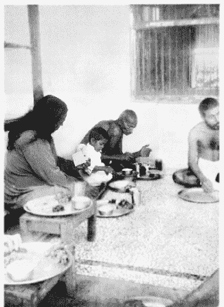

跟“圣雄”甘地在一起用餐

“欢迎，可敬的斯瓦米！”圣雄这次不再用纸笔向我们致意。我们刚刚才从屋顶下楼到达他的书房，屋内简单陈设着正方形的坐垫（没有椅子），一张低矮的书桌上放着书、纸及一些普通的笔（不是钢笔）。一只普通的时钟在角落中滴答响着。充满了平静与虔诚的气息。甘地露出了他令人迷醉的微笑。

“多年以前，”他解释道，“我有了每周禁语一天的习惯，专门用来回复信件。但是现在，这 24 小时却成为我灵性生活中重要的必需品。这种定期禁语对我来说不是折磨，而是恩赐。”

我完全同意。接着，圣雄向我询问了有关美国及欧洲的情形，我们还讨论了印度及国际形势。

“摩诃迪瓦，”当得赛先生走进书房中时，甘地对他说，“明天晚上请在镇上的大礼堂安排可敬的斯瓦米演讲有关瑜伽的修行。”

当我向圣雄道晚安时，他体贴地递给我一瓶香茅油。

“可敬的斯瓦米，瓦尔达的蚊子是不懂尊重生命的！”他笑着说。

隔天早上，我们一小群人很早就用了早餐，享用添加了糖蜜及牛奶的美味麦片粥。十点半，我们被通知到修道院前廊与甘地和那些不合作主义者一起共享午餐。今天的菜单居然有糙米、新鲜精选蔬菜及豆蔻种子。

中午，我在修道院内到处闲逛，在牧场上看到了一些悠闲自在的牛。甘地充满热情地保护着这些动物。

“对我而言，牛代表着一切低于人类的生物，”圣雄解释说，“通过牛，人类可以了解自己与其他生命其实是一体的。为何古代的先知选择神化牛？答案对我来说非常清楚。印度的牛是最佳的例子，她是慷慨的给予者。她不仅提供牛奶，还帮助耕田。牛是一首让人怜悯的诗篇，通过这温和的动物，人类可以感受到怜悯。她可说是数百万人类的第二个母亲。保护牛就意味着保护所有上帝创造的无法言语的生物。因为无法言语，所以他们的恳求会更加强有力。”

在刚过完中午不久，就我在户外用印度语做的简短演讲快要接近尾声时，天空突然降下倾盆大雨。在暴雨中莱特先生和我笑着爬上车，疾驶回玛冈瓦地。这真是典型的热带骤雨及泥泞！

当我回到招待所时，再度被这简朴至极，到处都体现着自我牺牲的现象震撼着。甘地在他的婚姻生活中早就实践了他所立下的无恒产的誓言。圣雄放弃了一家每年能为他带来超过两万美元收入的大型法律事务所，还将他的财富分给了穷人。

圣尤地斯瓦尔曾温和地嘲讽一般人对舍弃持有的不正确的概念。

“一个乞丐无法舍弃财富，”上师说，“如果有个人伤心地说‘我的事业失败了，妻子离开我，我要舍弃一切出家，’那他所指的牺牲是什么样的？其实，他并未舍弃财富和爱，而是财富和爱抛弃了他！”

在另一方面，像甘地这样的圣人们，不但做到了有形的物质牺牲，还做到了更为困难的舍弃自私的动机及目标，将他们内在的最深沉的本质与人道主义的洪流合而为一。

圣雄了不起的妻子卡斯特拉拜（Kasturabai），在甘地没有保留任何财产给她及孩子使用时，她并未反对。甘地和妻子年轻时结婚，在有了数个儿子后就立誓禁欲。在这出由他们夫妻共同演出的激烈生活戏剧中，她确实是一个镇定的女英雄。她追随丈夫入狱，与他一起绝食三周，而且完全地帮他分担着他无止尽的责任。

几年以来，卡斯特拉拜都在担任圣雄所募到数百万元公众基金的会计。在印度民间流传着许多幽默故事，就是丈夫会很紧张妻子打扮得珠光宝气地去参加甘地的会议—因为圣雄神奇的口才会把这些贵妇的金镯、钻石项链立刻吸引到捐款箱中！

有一天，基金会的会计卡斯特拉拜实在无法解释其中 4 卢布的支出。甘地就正式公布查账结果，并毫不留情地指出妻子的账目有 4 卢布的问题。

我经常在班上对美国学生讲这个故事。有天晚上，有位女士在讲堂上非常愤慨地说：

“管他什么圣雄不圣雄，”她大叫道，‘如果他是我丈夫，并且让我受到这种不必要的公然侮辱，我一定会赏他一个黑眼圈！’”

我在与他们幽默善意地讨论了美国与印度妻子的主题后，又做了一个完整的解释。

“甘地的妻子是把圣雄视为她的古茹，而不是丈夫。所以，即使只是一点小错，古茹也有权惩戒学生。”我指出，“在卡斯特拉拜被公开指责没不久，甘地就因为政治因素被宣判入狱。当他平静地向妻子道别时，她跪在他的脚下，‘上师，’她谦卑地说道，‘如果我曾经冒犯你，请原谅我。’”

那天下午 3 点，在瓦尔达，我依照约定来到圣人的书房，甘地面带令人难忘的笑容望着我。

“可敬的圣雄，”当我盘腿坐在他身旁的草席上时，我问他，“请告诉我你对不杀生的定义。”

“在思想或行为上，避免伤害任何生物。”

“非常好！但世人总是会问：难道不能为了保护孩子或自己杀死一条眼镜蛇吗？”

“我无法杀死眼镜蛇并且不违反我的两个誓言—无惧及不杀生。我宁愿尝试先用爱的振动力使蛇平静下来。我不可能降低我的标准去迎合环境。”甘地接着以令人惊奇的坦率补充道，“我必须承认，如果真的面对眼镜蛇，我也无法坚持刚才的讨论！”

这时，我注意到他的桌子上放着几本西方最近出版的有关饮食的书籍。

“是的，饮食对不合作运动是非常重要的。”他轻笑着说道，“因为我对不合作运动者提倡彻底禁欲，所以我一直在努力寻找对独身者最佳的饮食。一个人要先控制好口欲才能控制好性欲。半饥饿状态或不均衡的饮食都不是解决的办法。一位不合作主义者只有先克服身体内在对食物的贪欲后，同时，必须持续遵循合理的素食以获得必要的维他命、矿物质、热量等。并要借着内在及外在的智能，把生殖性的体液转变成为全身的活力。”

圣雄和我讨论着比较优质的肉类替代品。“鳄梨是非常好的，”我说，“在加州我的总部附近有许多鳄梨树丛。”

甘地脸上露出感兴趣的表情。“我不知道它们能不能在瓦尔达生长？不合作主义者会很感谢有新的食物。”

“我一定会从加州寄一些鳄梨树苗到瓦尔达。”我接着说道，“鸡蛋是一种高蛋白食物，不合作主义者也不吃吗？”

“没有受精的蛋是不被禁止的。”圣雄笑着回忆道，“但是多年来，我都不支持他们食用，即使现在，我自己也不吃鸡蛋。”

“‘可敬的甘地，’医师说，‘未受精的蛋没有活的精虫，完全不涉及杀生。’”

甘地对我表达了他想要接受拿希里·玛哈赛克利亚瑜伽的意愿。我被圣雄的宽大心胸及探索精神深深感动了。在对天国的追寻中他像个孩子，有着耶稣赞美儿童所拥有的赤子之心。

到了我答应的授课时间，几位不合作主义者走进了房间—得赛先生、彭格尔博士及其他一些渴望学习克利亚的人。

我先教导这几个学生身体的尤高达运动。身体被区分为 20 个部分，意志依次导引能量到达每一部分。很快，每人在我前面像马达般开始颤动。甘地身体的 20 个部位的起伏很容易被看见，几乎所有时间都看得到！虽然他很瘦，但并不难看，他的皮肤光滑而无皱纹。

接着我向他传授了克利亚瑜伽解脱的法门。

在瓦尔达的最后一晚，得赛先生安排我到镇上大礼堂发表演讲。室内挤满了大约四百位听众。我先以印度语，接着又以英文来演说。待我们这个小团体回到修道院时，正好赶上对被平静和信件包围了的甘地道晚安。

凌晨五点我起床时，夜色仍徘徊不去。而村庄的生活早就开始活跃：一辆牛车停在修道院的大门边，一位农民头上顶着庞然重物摇摇摆摆地经过。早餐后，我们三人前去向甘地顶礼道别。圣雄在凌晨四点就已经起床开始早祷了。

“可敬的圣雄，再见了！”我跪下来碰触他的脚，“印度在您的护佑下一定会平安的！”

挥别瓦尔达田园生活后的数年，印度的大地、海洋及天空均因世界大战而蒙尘。甘地提出务实的非暴力来代替军备武力。为了平反冤情，消除不公，圣雄使用非暴力的方法，而这些方法一次又一次地被证明是有效的。他用如下的文字表达着他的信念：

我发现生命在毁灭中仍然持续存在，因此，必定有高于毁灭的法则存在。只有在这一法则下，秩序井然的理性社会才能存在，生命才值得存续下去。

如果那就是生命的法则，我们必须在日常生活中去实践它。不论战争在何处，不论我们在何处面对敌人，都要用爱去征服他们。把不可避免的爱的法成功用于生活中，那是那些毁灭性的法则所无法达成的。

甘地通过非暴力的方式已经为他的国家赢得了无数政治上的权利，这是任何国家任何领袖除了子弹外无法实现的。杜绝所有错误及罪恶的非暴力方法，不但引发了政治领域的改革，还引发了轰轰烈烈的社会改革。甘地及他的追随者通过这一途径消除了许多印度教徒及回教徒之间的世仇。数十万名回教徒将圣雄视为他们的领袖。“贱民”在他身上找到了无畏的斗志。“如果我还有重返人世的宿命，”甘地写道，“我希望生为贱民，因为只有如此，我才能为他们更有效地服务。”

这位温柔的先知在他的国土上广受尊敬。他完全相信人类具有与生俱来的高尚本质。即使失败也从未使他失去信心。“即使敌人欺骗你 20 次，”他写道，“不合作主义者还是准备好相信他第 21 次，因为对人类天性的绝对信任是信条特有的本质。”

第四十五章 在孟加拉拜会“喜悦”之母

“先生，在离开印度之前，您一定要见一见尼尔玛拉·迪维（Nirmala Devi）。她的灵性已经发展到了相当高的境界，大家都知道她是阿南达摩伊妈（极乐之母）。”我的外甥女阿密尤·博斯（Amiyo Bose）说这话时，诚恳地望着我。

“那当然！我也非常希望能够见到这位女圣人。”我接着说道，“我曾经读过有关她了悟上帝高度境界的报道。几年前，《东方与西方》上面刊载过有关她的短文。”

“我曾经见过她，”阿密尤继续说道，“她最近来过我住的小镇詹谢浦尔（Jamshedpur）。由于一位徒弟的恳求，阿南达摩伊妈去了一个垂死病人的家中。她站在病人的床边，当她以手碰触他的前额时，他停止了痛苦的呻吟声。疾病瞬间消失，那人惊喜地发现自己已经痊愈了。”

几天后，听说极乐之母正在加尔各答柏瓦尼浦尔区的一位徒弟家中。莱特先生和我立即从我加尔各答的家中出发。当车子驶近柏瓦尼浦尔的居民区时，同伴和我都感叹这奇异的街景。

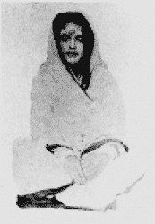

“喜悦之母”阿南达摩伊妈

阿南达摩伊妈站在一辆敞篷车上，祝福着近百位徒弟，显然她正要离去。莱特先生把车子停在稍远处，和我一起徒步走向安静的人群。这位女圣人望着我们的方向，从车上下来并向我们走来。

“父亲，你来了！”她一边热情地说着，一边把手绕过我的颈部并将头靠在我的肩上。我刚对莱特提到我不认识这位圣人，但我非常喜欢这个特别的欢迎方式。一百名徒弟的眼睛也有些惊讶地盯着这个热情的场面。

我立即看到这位圣人是在极高的三摩地的境界。她完全不在意自己外在女性的装扮，而把自己看作不变的灵魂。她牵着我到她的车上去。

“阿南达摩伊妈，我会延误你的行程！”我郑重地说道。

“父亲，这是长久以来，我第一次见到你！”她说道，“请不要离开。”

我们一起坐在车子的后座。极乐之母很快就进入了静止极乐的状态。她美丽的眼睛朝向天堂半闭着，静止着，凝视着远近内在的极乐世界。徒弟们温和地唱着：“胜利属于圣母！”

我在印度发现有许多了悟上帝的人，但从未遇到过如此高贵的女圣人。她温柔的脸庞上散发着难以形容的喜悦。乌黑的长发披散在她未戴面纱的肩上。她的前额涂了一点红色的檀香膏，象征她内在永恒开启的第三只眼。细小的脸庞，纤瘦的手和小巧的脚，与她广阔的心胸形成了强烈的对比！

当阿南达摩伊妈还在入定状态中时，我向周围她的女徒弟提出一些问题。

“极乐之母在印度各地旅行，在许多地方都有数百名徒弟，”那位徒弟告诉我，“她的勇敢和努力促成了许多令人满意的社会改革。虽然是个婆罗门，但这位圣人并不介意种姓阶级分别。我们总是和她一起旅行，照顾着她的生活起居。我们必须像母亲般地照顾她，因为她自己一点也不关心自己的肉体。如果没人给她食物，她就不吃。即使将饭放在她面前，她也不会去碰触。为了阻止她的肉体从这个世界很快消失，我们只好用手喂她。她经常连续数天停留在入定状态，几乎没有呼吸，双眼也不眨动。她的丈夫是她主要的徒弟之一。许多年前，在他们婚后不久，他就发誓不再说话。”

这个女徒弟指着一位留着长发及灰白胡子，肩膀宽阔，相貌出众的男子。他安静地站在一群徒弟中，也以徒弟式的恭敬姿势双手合十。

阿南达摩伊妈从无垠的沉浸中恢复活力，她正在将意识集中到物质世界。

“父亲，请告诉我你住在哪里。”她的声音清晰且悦耳动听。

“现在是在加尔各答或兰契，但很快就要返回美国。”

“美国？”

“是的。那里的心灵追寻者一定会诚挚地赞赏一位印度女圣人。你愿意去吗？”

“如果父亲肯带我去，我愿意去。”

这个答案让她近旁的徒弟有点担心。

“我们当中的二十位或更多人总是跟随极乐之母一起旅行，”他们其中一位明确地告诉我，“我们不能离开她。无论她去哪里，我们一定会跟去。”

我只有不情愿地放弃这项计划！

“请你和徒弟至少来兰契一次，”我在告别时对圣人说，“作为天国的孩子，你会喜欢我学校的那些小孩的。”

“不论父亲带我去哪里，我都会欣然前往。”

不久之后，兰契维地拉雅就列队欢迎女圣人的到访。小孩子总是期盼任何节日的到来—没有功课，却有数小时美妙的音乐演奏以及压轴大餐！

“胜利！阿南达摩伊妈！”当圣人的团体进入学校大门时，数十个热情的小孩子反复唱着这赞颂的话来欢迎他们。阵雨般洒落的金盏花，铙钹敲击的叮当声，海螺活泼的吹奏声以及手鼓咚咚的打击声交汇在了一起！极乐之母微笑着漫步在充满阳光的土地上，带着她内在移动式的天堂。

“这里真美丽，”当我带着阿南达摩伊妈向中央大楼走去时，她优雅地说道。她坐在我旁边，像孩子般微笑着。

“请告诉我一些有关你的生活。”

“父亲知道一切，为何还要我复述呢？”她显然觉得短暂的肉身的经历是不值一提的。

我笑了起来，温和地重复同样的问题。

“父亲，没有什么可说的。”她歉意地张开双手，“我的意识从未和这暂居的肉体结合起来。我来到地球上，成了一个小女孩，然后又长大成人，由家人为我这肉体安排婚事。当我丈夫陶醉在激情里，在身旁对我示爱并轻触我身体时，他经历到了猛烈的冲击，仿佛被闪电打到。 ”

“我丈夫双手合十在我面前跪下，恳求我的原谅。”

“‘母亲，’他说道，‘因为我情欲的碰触亵渎了你肉身的殿堂—我不知道在这肉体中的不是我的妻子而是圣母—所以，我立下重誓：我要成为您的徒弟，一个独身的追随者，永远像仆人般沉默着侍奉您，并且，有生之年不再和任何人说话。我的古茹，希望这样可以弥补我今天冒犯您所犯下的大错。’”

阿南达摩伊妈陷入了深沉的入定状态，像雕像般一动不动，她遁入了随时召唤她的王国。黑色的眼眸看起来没有活力而且呆滞。当圣人的意识从肉体中脱离时，常会出现这种表情，此时的肉体不过是个没有灵魂的空壳。我们一起进入这极乐入定的境界大约一小时。后来，她愉快地轻笑着回到了现实世界。

“阿南达摩伊妈，”我说，“请随我到外面花园转转，莱特先生想为你拍照。”

“当然，父亲。你的意愿就是我的意愿。”当她在为拍照而变换各种姿势时，亮丽的双眸一直闪烁着天国不变的光彩。

宴会时间到了！阿南达摩伊妈盘腿坐在毯子上，一位徒弟在旁边喂她。圣人就像婴儿般顺从地把徒弟送到自己嘴边的食物咽下。极乐之母显然并不能分辨出咖哩与甜点的味道的不同！

黄昏降临时，圣人与她的团体离开了，深厚玫瑰花瓣如阵雨般洒落。她举起双手为那些小男孩祝福。他们的脸上绽放着她毫不费力就唤醒的爱的光芒。

阿南达摩伊妈抛弃了低等的执着，忠诚地将自己完全奉献给上主。这位孩子般的圣人没有学者吹毛求疵拘泥细节的特色，而是凭借确实、可靠、合理的信念，来解决人类生活唯一的问题—与上帝合一。

在她造访兰契后的另一个场合，我又有机会看到了阿南达摩伊妈。那是几个月后，她与徒弟在塞伦波尔火车站的月台上候车。

“父亲，我将前往喜玛拉雅山，”她告诉我，“慷慨的徒弟在得拉敦（Dehra Dun）为我盖了一间修行的小屋。”

当她上车时，我很惊讶地看到，不论在人群中、火车上、宴会中或者只是安静地坐着，她的视线都没有离开上帝。我的心里依然听得见她的无限甜美的声音在回响：“看，此时到永远与永恒是一体的。”

第四十六章 从不进食的女瑜伽行者

“先生，今天早上我们要去哪里？”莱特先生开着福特车，将目光从眼前的路上移开，眨着眼睛满怀疑问地看着我。几乎每一天，他都很期待在孟加拉接下来会有什么新发现。

“遵照上帝的旨意，”我回答道，“我们此刻正要前往观看世界第八奇观—一位以稀薄空气为食的女圣人！”

“泰瑞莎·诺伊曼之后的又一个奇迹。”莱特先生还是一样充满期待地笑着，他甚至把车子开得更快。看来，他的旅游日记又要增添特别的内容了！

我们天未亮就出发。除了秘书和我之外，还有三位孟加拉朋友同行。在令人兴奋的气氛中，我们畅饮着清晨天然的醇酒。

我们的司机正小心翼翼地在早起的农夫和缓慢拖着二轮牛车的阉牛之间，以不速之客的汽笛声和他们争路。

“先生，我们很想多知道一些与那禁食女圣人相关的事迹。”

“她叫吉利·芭拉（Giri Bala），”我告诉朋友，“多年前，我从一位绅士型学者斯西提·拉尔·南第（Sthiti Lal Nundy）先生口中第一次听说有关她的事迹。那位学者经常去我们位于古柏路的家，指导我弟弟毕修。”

“‘我相当了解吉利·芭拉，’斯西提巴布告诉我，‘她可以运用某种瑜伽方法，使她不需进食就生存得了。在宜佳浦尔附近的纳瓦刚（Nawabganj），我曾是她的近邻。我特别仔细地去观察她，但从未发现她有任何进食或喝水的蛛丝马迹。后来，我的兴趣愈来愈浓，所以去面见柏德旺的摩诃拉甲，请求他主导这一调查。他听后非常惊讶，就邀请女圣人去皇宫。那位圣人同意前去受试，然后被关在皇宫的小房间中两个月。后来，她又回到皇宫访问了 20 天，接着再到皇宫做第三次为期 15 天的测试。摩诃拉甲亲自告诉我，经过这三次严格的观察，他对这位圣女不需饮食的情况深信不疑。”

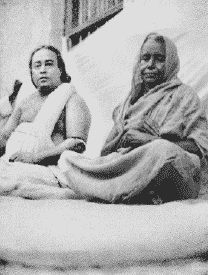

拜访吉利·芭拉（Giri Bala）

“这个故事一直深藏我心中，已经超过了 25 年，”我总结道，“我在美国的时候，有时会担心时间的洪流会在我能见到这位女瑜伽修行者之前将她吞噬。她现在应该已经相当老了。我甚至不知道她住在何处，是否依然健在。但此刻，我们将于数小时之后抵达普鲁里亚（Purulia），她的兄弟住在那里。”

10 点 30 分，我们这一小群人正在和她的兄弟—一个普鲁里亚的律师朗巴达尔·迪（Lambadar Dey）寒暄。

“是的，舍妹依然健在。她有时会来这儿和我一起住，但目前她住在我们的比兀尔（Biur）老家。”朗巴达尔巴布怀疑地看了一眼福特车说，“可敬的斯瓦米，我想不出有任何一部汽车曾经穿过印度内陆到达比兀尔。如果你们愿意坐破旧、颠簸的牛车，那将是最好的选择！”

然而我们大家对这来自美国汽车制造中心底特律的产品都异口同声保证不会有问题。

“这辆福特汽车来自美国，”我告诉律师，“如果剥夺它可以了解孟加拉中心的机会，那真是令人遗憾！”

“愿幸运之神（Ganesh）与你们同在！”朗巴达尔笑着说。接着，他又客气道，“如果你们真的能到达那里，我相信吉利·芭拉会很乐意接见你们。虽然她快 70 岁了，但身体依然康健。”

“先生，请告诉我她是否真的什么都不吃？”我直视着他的眼睛问道。

“是真的。”他的眼神直率且让人尊敬，“五十多年来，我从未看她吃过一口东西。”

“吉利·芭拉并没有寻找什么隐僻的地方来练习瑜伽，”朗巴达尔巴布继续说道，“她一生都和朋友及亲人在一起生活。而他们现在都很习惯她的奇异状况。如果哪天吉利·芭拉突然决定要进食，我想他们全部都会昏倒！妹妹守寡后严格依照印度习俗，不参加社交活动，但在普鲁里亚及比兀尔的小型社交圈内大家都知道她是一个‘特别’的妇人。”

这位兄弟非常有诚意。我们也衷心地感谢他，并出发前往比兀尔。我们在街上停了下来到餐厅享用咖喱及圆扁的面包，这吸引了一群顽童围绕在莱特先生旁边。我们大家都胃口大开努力用餐，当时不知道，后来才明白原来是为了迎接这个要耗尽体力的下午。

我们现在朝东前进，经过晒干的稻田进入孟加拉柏德旺区。路旁有一排排茂密的植物，颈部有条纹的知更鸟的歌声从有着巨大的遮阳伞般的树枝的树上倾泻而出。牛车的铁皮木轮的车轴在行走时不时发出的咯吱声，与城市中汽车轮胎滑过高级柏油路面发出的嗖嗖声形成强烈对比。

“迪克，停一下！”我的突然的要求惹来福特车一阵晃动，“那棵负荷过重的芒果树正在大声呼唤我们呢！”

车停稳后，我们五个人就孩子般地冲向掉满芒果的地方，捡拾芒果树仁慈地掉下的成熟果实。

“许多芒果受到忽视，”我说道，“被无情的土地糟蹋了它的甜美。”

“可敬的斯瓦米，美国没有这种水果，是吗？”我的一个孟加拉学生萨伊里斯·玛珠达尔（Saliesh Mazumdar）笑了起来。

“没有，”我承认，“我在西方是多么想念这种水果啊！没有芒果的印度天堂是无法想象的！”

我捡起一块石头，打下一颗自豪地隐藏在最高树枝上的肥美芒果。

“迪克，”我在慢慢品味着这神仙美食的空当问他，热带的阳光非常温暖，“所有摄影器材都在车上吗？”

“是的，先生。都在车子的行李箱内。”

“如果吉利·芭拉是一位真正的圣人，我想在美国宣扬有关她的事迹。一位拥有如此激励人心的力量的印度女瑜伽行者不应该像这些芒果一样不为人知。”

一个半小时后，我依然在宁静的森林中散着步。

“先生，”莱特先生说道，“要想有足够的光线照相，我们必须在日落前到达吉利·芭拉那里。”他面带微笑地说道，“西方人都是怀疑论者，没有照片，他们很难会相信这位女士的一切！”

我于是拒绝了自然的诱惑，再度坐进车内。

“迪克，你是对的，”当车子重新疾驶赶路时，我叹了一口气，“一定要有照片！”

路况变得愈来愈糟：车辙的凹洞，突起的硬土块，着实令人伤感！我们偶尔还要下去帮忙推车，好让莱特先生比较容易操控车子。

“朗巴达尔巴布说得对，”萨伊里斯承认，“不是这车载运我们，而是我们在运送车子！”

我们在车内不停爬进爬出的厌烦，被不时出现的简朴有趣的乡村景色消除了。

“我们蜿蜒地从林荫下穿过，”莱特先生在 1936 年 5 月 5 日的旅行日记中写道，“这些茅草搭建的泥屋每一扇门都装饰有一个神的名字，非常迷人。许多裸体小孩在天真无邪地四处嬉戏。当我们这辆庞大、黑色、没有牛拖着而且有着飞快速度的汽车驶过他们的村庄时，他们都暂停下来观望或疯狂地追车。妇女们只在暗处中窥伺，男人们则懒洋洋地倚靠在路旁的树下，漠然中藏着一份好奇。在某个地方，所有村民都正快乐地在一个大水池中洗澡（穿着衣服洗，洗完后用干布包裹身体，再将湿衣服脱掉）。妇女用高大的黄铜罐灌满水后带回家。

“向前延伸的路引领着我们快乐地追逐着重重山脉，我们颠簸晃动着，驶过小溪，绕过尚未完成的堤防，滑过干涸的布满沙子的河床。大约下午五点，我们终于接近了目的地—比兀尔。这个隐蔽在密林中的小村庄位于班库拉（Bankura）区内部，雨季时溪水会泛滥成洪流，路上飞溅的泥浆好似毒蛇吐出的毒液，一般观光客是不会到这里来的。”

“我们向一群刚从庙里礼拜完毕正要回家的礼拜者问路，却被一群衣着褴褛攀爬在车边的男童围住，他们热心地为我们指引着去吉利·芭拉家的路。”

“那条路朝向枣椰树丛庇荫下的一些泥土屋舍，但在我们抵达之前，福特车突然倾斜成危险的角度，并且上下晃动。狭窄的道路周围遍布树木与池塘。越过山脊，路上都是坑洞和深陷的车痕。车子先是在灌木丛中抛锚了，接着又在小山丘上搁浅，这时，需要我们把泥块移开。我们缓慢且小心地把车往前开去，可一次又一次，前面的路似乎通不过去，但是朝圣之旅必须继续。当数百名儿童与他们的父母在路旁观看我们时，那些热心助人的少年就拿着铲子帮忙将障碍物移除。

“不久之后，我们又沿着这两条古老、深陷的车辙上路，妇女在泥屋门前睁大眼睛看着我们，男人则跟随在后面，孩子们也蹦蹦跳跳地加入、壮大了这个行列。看来我们大概是第一辆驶过这些道路的汽车！我突然不知有何种感受—一个由美国人驾驶着的轰隆作响的汽车，首次开进这位于丛林深处的他们的村落，侵犯了这古老文明之地的隐私与神圣！

“我们把车停在一条窄巷旁，发现距离吉利·芭拉的老家还有大概一百英尺。在结束艰辛而漫长的旅行之后，我们都感到了一种巨大的兴奋。我们慢慢向一座很大的由砖泥砌成的两层楼房靠近。这楼房高耸于附近的泥砖小屋之上，房子正在整修中，四周围绕着典型的热带竹架。

“不久，一个矮小的身影出现在门口—吉利·芭拉！她身上裹着一件用黯淡的金色丝线织成的衣服，谨慎犹豫地向我们走来，并且从包裹着头部的印度头巾下看着我们。她的眼睛含着像是黑暗中燃烧的火苗的光彩。我们被这张最仁慈、善良的面容深深吸引住了，这是一张了悟一切的脸，没有世俗的污染。

“她终于温顺地走过来，并且默许我们用照相机及摄影机为她拍照。她耐心而又害羞地忍受我们在拍照时要求她摆出的姿势。最后，我们终于为后人留下了这不吃不喝超过 50 年的唯一妇人的许多照片。（当然，泰瑞莎·诺伊曼自 1923 年起也未进食。）”

莱特先生对吉利·芭拉的印象和我一样，觉得灵性就像她那优雅闪亮的面纱一般包围着她。她以一般人对出家人表示欢迎的传统手势向我顶礼。她那单纯的魅力及安静微笑着的欢迎远胜过甜言蜜语。我们旅途中的艰难和劳累都被抛在了脑后。

这个矮小的圣人盘腿坐在阳台上，虽然脸上也有了岁月留下的痕迹，但并不显得衰老，橄榄色的肌肤依然洁净并且富有弹性。

“母亲”，我用孟加拉语对她说，“已经超过 25 年了，我一直渴望着这次朝圣之旅！我从斯西提·拉尔·南第巴布那儿得知了你神圣的事迹。”

她点头同意，“是的，在纳瓦刚，他是我的好邻居。”

“这些年我虽然远渡重洋，但从未忘记有朝一日要来看你。你在这里毫不张扬地表演着伟大的戏剧，应该让世人都知道这久已被遗忘的内在天国的食粮。”

圣人抬起眼睛看了我一下，安详而感兴趣地微笑着。

“巴巴（天父）最清楚。”她温顺地回答道。

我很高兴她没有生气，一般人永远不知道瑜伽行者对要把将自己公之于众的想法会有什么反应。通常他们都会避免这些，而希望能够默默地追求更深层的灵性。

“母亲，”我继续说道，“请原谅我接下来还要向你请教许多问题。你只需要回答那些你想回答的问题，我也会了解你的沉默。”

她以优雅的姿势张开双手说，“我很乐意回答，如果像我这样一个无足轻重的人能够给出令你满意的回答的话。”

“喔，不，一点也不无足轻重！”我诚挚地抗议道，“您是伟大的圣人。”

“我只是大家卑微的仆人。”她接着说道，“我喜欢煮饭给大家吃。”

我想这对一个不吃不喝的圣人来说，真是一个奇怪的消遣！

“母亲，请亲口告诉我—您是否真的不靠食物生活？”

“这是真的。”她静默了一会儿，之后的话则显示了她刚才正在努力地做心算，“从我 12 岁 4 个月到现在 68 岁—我已经不吃不喝超过 56 年了。”

“你从来也不想吃吗？”

“如果我对食物有渴望，我就必须去吃。”

“那你还是吃东西！”我的声调带有抗议的味道。

“当然！”她微笑着。

“你的养分是来自空气与阳光中的细微能量，以及可以通过延髓处充电的宇宙力量？”

“巴巴知道。”她再次默认，态度温和，没有强调的意味。

“母亲，请告诉我有关你早期的生活。这对全印度甚至海外的兄弟姐妹都具有很大的吸引力。”

吉利·芭拉撇开她习惯性的保留，放松心情开始聊天。

“好吧。”她的声音低沉且稳定，“我出生在这丛林中。我的童年除了永不满足的食欲外没什么可提的。我从小就订婚了。”

“‘孩子，’我的母亲时常警告我，‘要努力控制你的贪吃。当你婚后与夫家的陌生亲戚同住时，如果你整天不停地吃东西，他们会怎么看你呢？’

“她预知的灾难应验了。我住进纳瓦刚夫家时才 12 岁。我婆婆从早到晚地羞辱我贪吃的习惯。然而她的责骂也是掩饰的祝福，它们唤醒了我沉睡的灵性。有天早上，她又对我进行恶毒的嘲讽。

“‘我很快就可以证明给你看，’我回答道，‘只要我还活着，我将不会再碰触任何食物。’”

“我婆婆嘲弄地笑了起来。‘喔！’她说道，‘当你无法控制你过分的贪吃时，你如何能不靠食物生存？’”

“当时，这句话是我无法反驳的！但是钢铁般的决心支撑着我的心灵。我开始在一个隐蔽的地方追寻天父。 ”

“‘天主啊，’我不断祈祷着，‘请遣送一位可以教导我只靠您的光而不用食物来生活的古茹。’”

“一种神圣的喜悦降临在我身上。在神圣祝福的引导下，我走向纳瓦刚恒河边的阶梯。在路上我碰到了夫家的祭司。”

“‘可敬的先生，’我信任地说道，‘请仁慈地告诉我如何可以不靠食物生活。’”

“他看着我，没有回答。最后他以安慰的语气说，‘孩子，今天傍晚来庙里，我会为你举行特别的吠陀仪式。’”

“这含糊的回答不是我要寻找的，我继续朝阶梯所在的方向前进。早晨的阳光射进水中，我在恒河中净身，仿佛是为了一个神圣的传法。当我离开河岸时，身上穿着湿透的衣服，在白天的强光下我的上师化身出现在了我的面前！”

“‘亲爱的孩子，’他同情地对我说，‘我就是上帝为了实现你急迫的祈祷而被派来这里的古茹。他被你那不寻常的祈求深深地感动！从今天起，你将借着灵光存活，你身体内的原子将以无限流动的能量为食物。’”

圣人继续说着她的故事，她细微的声音只能勉强听见，“那个沐浴石阶现在已经废弃了，但是我古茹在我们周围投出了环绕护卫的光环，这样就不会有迷路的洗澡者来打扰我们。他传授给我一种克利亚的方法，可以使肉体免于依赖粗糙的食物。这方法包括使用某些咒语及一般人难以办到的呼吸练习。只有克利亚没有用到药物或魔法。”

我用美国报社那些记者采访的方法，请教了吉利·芭拉许多我认为世人可能会感兴趣的问题，而这些采访的程序也是那些记者在不知不觉中教会我的。她一点一滴地透露着下面的讯息：

“我并没有孩子，许多年前就成为寡妇。我睡得很少，因为睡着和醒来对我来说是一样的。我一般晚上打坐，白天则料理家务。我几乎感觉不到季节交替和气候的变换。我也从来不生病，只有在意外受伤时才会感到轻微的疼痛。我没有排泄物，并且能够控制我的心跳及呼吸。我经常在体验中看到我古茹及其他伟大的灵魂。”

“母亲，”我问道，“为何你不教导其他人不靠食物生存的方法？”

我对世上数以万计的饥民怀有的热切的希望刚萌芽就被扼杀了。

“不。”她摇摇头，“我的古茹严禁我泄漏这个秘密。如果我教导许多人不需进食生活，农民是不会感谢我的！很多甜美多汁的水果也将会被遗弃在地上。不幸、饥荒、疾病都是我们业障的鞭子，这些业障最终将驱使我们追寻生命真正的意义。”

“母亲，”我问道，“那你被挑中不需进食而活有什么意义？”

“是为证明人是灵性的。”她的脸庞充满智能的光芒，“显示人类通过灵性的修习可以逐渐学到凭借永恒之光而非食物生活。”

圣人陷入了深沉的冥思状态。她的目光集中朝向内在，温和的目光深处变得没有表情。她发出了某种特定的叹息声，那是进入极乐无息入定状态的前奏。有一段时间，她遁入了没有疑问的王国，充满内在喜乐的天堂。

热带的黑夜已经降临。微小的煤油灯光闪烁不定地照在一些村民的脸上，他们无声地蹲在阴影中。疾飞的萤火虫及远处小屋的油灯在这舒适的夜晚交织出了一幅明亮怪异的画面。这是令人痛苦的分离时刻，在我们眼前的是一段缓慢冗长的回程。

“吉利·芭拉，”当圣人睁开眼睛时我对她说，“请给我一条你的纱丽当作纪念品吧。”

她迅速回去拿了一条贝拿勒斯丝质的纱丽，并将它摊开在手上，突然，她拜伏在地上。

“母亲，”我虔诚地说道，“还是让我来碰触你神圣的脚吧！”

第四十七章 回到西方

“在印度和美国，我都曾教过许多瑜伽课程，但我必须承认，身为一个印度人，我却非常高兴教英国学生。”

我在伦敦授课时，班上的学生会心地笑着，没有任何政治干扰，也不会妨碍修习瑜伽的平静。

印度现在对我是一个神圣的回忆。1936 年 9 月，我在英国实现了 16 个月前的承诺—要再次来到伦敦演讲。

英国人很容易就能够接受永恒的瑜伽讯息。新闻记者和摄影师挤满了我在格洛斯维诺（Grosvenor）的公寓。9 月 29 日，英国国家宗教评议会在怀特菲尔德公理会教堂（Whitefield’s Congregational Church）举办了一场会议，在那里，我针对“人类联谊的信仰如何拯救文明”这一重要议题发表了一场演说。在卡克思顿大厅 8 点钟开始的那场演讲极其成功，接连两个晚上，无法入场的群众都在温莎（Windsor）大厦会堂等待 9 点 30 分我的第二场演讲。随后几周，来参加瑜伽课程的人越来越多，莱特先生不得不将上课场地安排到别的大厅。

英国人对灵性的执着的追求令人印象深刻。我离开后，伦敦的瑜伽学生忠诚地组织起了一个自我了悟联谊会中心，这个中心即使在激烈的战乱期间都还坚持每周举办共修聚会。

我在伦敦游览了数日，接着转往美丽的乡村，在那里度过了数周难忘的时光。莱特先生和我就驾驶着那可靠耐用的福特车拜访了英国历史上的伟大诗人和英雄的墓园以及出生地。

我们一行人在 10 月底搭乘“不来梅号”（Bremen）从南安普敦港（Soouthampton）启程赴美。当看到纽约港口庄严的胜利女神雕像时，不只是布利慈小姐和莱特先生，我的情绪也相当兴奋和激动。

这辆福特车虽然因为长期艰难地在古老的土地上行进而有些变旧，但依然很强有力。现在，我们要横越大陆到加州去。1936 年底，看呀！已经可以看到华盛顿山丘了。

每年，在洛杉矶中心都有圣诞节欢庆活动，12 月 24 日（灵性圣诞）会举行八小时的共修，隔日是宴会。这一年的庆典被扩大举行，许多亲朋好友及学生都远道而来，为三位世界旅行者的返程洗尘。

圣诞晚宴上有从万里之外为这个欢乐庆典送上的佳肴：如喀什米尔的古曲蘑菇（gucchi）、罐装的茹萨咕拉（rasagulla）、芒果干、帕帕尔饼，还有淋在冰淇淋上的印度凯欧拉（keora）花子油。晚上，大家围绕一棵高大闪亮的圣诞树聚集起来，附近的壁炉在噼啪地燃烧着芳香丝柏树做的薪柴。

赠送礼物的时间到了！这些礼物都来自世界各个遥远的角落—巴勒斯坦、埃及、印度、英国、法国、意大利等等。每次在国外转换交通工具时，莱特先生总要不辞劳苦地仔细清点着行李，免得这些要带给美国友人的宝贝落入宵小手中。这些宝贝包括，用圣地神圣橄榄树做成的牌匾，来自比利时、荷兰的精致的织品和刺绣，波斯地毯，细工织成的喀什米尔披肩，麦索尔永远芬芳的檀香木盘，印度中央省希瓦的“牛眼”宝石，印度古王朝的钱币，镶着珠宝的花瓶及茶杯，宫笔画，挂毡，寺庙用的焚香和香料，印度的印花棉布、瓷漆器，麦索尔的象牙雕刻，令人好奇的前端尖长的波斯拖鞋以及发人深省的手稿、天鹅绒、锦缎、甘地帽、陶器、丝质高顶硬帽、铜器、祷告用的毯子等等—全是来自三大洲的战利品！

我把这些东西逐一分送到树下那一大堆包装精美的礼物中去。

“盖尔南玛塔（Gyanamata）师姐！”我拿起一个长方形盒子送给这位有着甜美容貌及深刻了悟的美国女士。我不在的时候，由她负责华盛顿山丘的总部的管理事务。她从衬纸中拿起了一件贝拿勒斯金色丝织的纱丽。

“谢谢您，先生。让我一睹印度纱丽的华美。”

“狄金森（Dickinson）先生！”下个包裹着的礼物是我在加尔各答的市集上买的。“狄金森先生会喜欢的，”当时我这样想。我心爱的徒弟狄金森先生从 1925 年华盛顿山丘总部成立以来，每年都来参加圣诞晚会。今年是第 11 个年头，他站在我面前解开了方形小盒子上的缎带。

“银制的杯子！”他抑制不住激动，凝视着礼物—一只长形水杯。他坐在稍远的地方，显然在发呆。在继续扮演圣诞老人之前，我满怀深情地微笑着看着他。

快乐的一夜在感谢所有礼物的“赠予者”的祷告声中结束，大家一起齐唱圣诞颂歌。

过后，狄金森先生与我聊了一些。

“先生，”他说，“现在我要感谢您送我的银制杯子。我在圣诞夜无法用言语表达的感谢。”

“那个礼物是特别为你买的。”

“43 年来我一直在期待着这个银制杯子！故事说来话长，我一直把它隐藏在心里。”狄金森先生腼腆地看着我，继续说道，“一开始是很有戏剧性的：我快被淹死了。在内布拉斯加（Nebraska）州的小镇上，哥哥开玩笑地把我推进了 15 英尺深的水池里。那时我才 5 岁。当我第二次又快要沉到水下时，一道充满所有空间的耀眼的光彩闪现。光芒中有一个人，他有着宁静的双眸和让人安心的微笑。当我的身体第三次下沉时，哥哥的同伴弄弯了一棵高大细长的柳树伸到到水面，使绝望中的我可以用手抓住它。然后，他们把我抬到岸上并成功地给我施救。

“1893 年，也就是 12 年后，我成了一个 17 岁的年轻人，我和妈妈到了芝加哥。那里正在进行盛大的世界宗教大会。母亲和我走在马路上，这时，我又看到了那道强烈的闪光。隔着几步路，一个人在悠闲地走着，就是几年前我在那次体验中看到的那个人。他正朝着一间大讲堂走去，然后消失在门内。

“‘妈，’我大叫道，‘那个人就是在我快淹死时看到的！’

“我和妈妈也迅速进入那栋房子，这个人正坐在讲台上。我们很快就得知他是从印度来的维威克南达（Vivekananda）斯瓦米。在他发表完一篇极为发人深省的演讲后，我上前去拜见他。他亲切地对着我笑，仿佛我们已是老朋友。我那时太年轻，所以不知道如何表达我的感觉，但在心里，我希望我可以做他的徒弟，他也看出了我的想法。

“‘不，我的孩子，我不是你的古茹。’维威克南达那美丽的双眸深入地透视着我，‘你的老师以后会来的。他会给你一个银制的杯子。’停了一下后，他又笑着说道，‘他将会对你倾注比你现在所能承受的更多的祝福。’

“几天之后，我离开了芝加哥，”狄金森先生继续说道，“我再也没有遇见过伟大的维威克南达。但是他对我说的每一句话都刻在了我的内心深处。许多年过去了，老师再也没有出现。1925 年的一个晚上，我虔诚地向上帝祷告，求他派遣一位古茹给我。几个小时后，我听到了优美的旋律，然后从睡梦中醒来。就在我面前，出现了带着笛子及其他乐器的天使乐团。在整个房间都充满美妙的音乐后，天使们慢慢地消失了。

“隔天晚上，那是我第一次参加您在洛杉矶的讲座，那时我就知道我的祷告应验了。”

我们互相默默微笑着。

“到现在，我成为您克利亚瑜伽的徒弟已经 11 年了，”狄金森先生继续说道，“有时我会疑惑银制杯子的事，我几乎相信维威克南达的话只是一种形而上的比喻。但在圣诞夜，当你把装着礼物的小方盒递给我时，我有生以来第三次看到了同样耀眼的闪光。片刻间，我就看到了 43 年前维威克南达就已预知的我的古茹将要送我的礼物—一个银制的杯子！”

第四十八章 在加州安西尼塔斯

“给您一个惊喜，先生！在您出国期间，我们盖了这座安西尼塔斯修道院，作为‘欢迎您回家’的礼物！”盖尔南玛塔姐妹微笑着带领我穿过大门踏上树荫树下的步道。

我在华盛顿特区发表演讲

我抬头看到了一栋像一艘大型白色远洋客轮般的房子，面对着蔚蓝色的海洋。我一时有些说不出话来，接着大声地惊呼，“哦！”“啊！”，言语已经不足以表达我的喜悦和感激之情了。我检视了这座美丽的修道院—16 间非常大的房间，每间都有着迷人的布置。

庄严的中央大厅有很大的落地窗，透过窗子一眼望去，就是碧草、海洋和天空三者联合构成的祭坛，一片和谐的翠绿，乳白和天蓝交织形成的色彩。大厅巨大的壁炉台上放着拿希里·玛哈赛的照片，他微笑着，仿佛在祝福这位于遥远的太平洋彼岸的天堂。

大厅的正下方，就在同样的悬崖上，雕凿了两个单独的打坐洞穴，正对着无尽的穹苍和汪洋。走廊、日光浴的角落、辽阔的果园、尤加利树丛、穿过玫瑰和百合花丛的宁静凉亭和石板路，一段终止于隔离的海滩和广大水域的漫长美丽的阶梯。

“愿美好英雄善良圣人的灵魂来此，”在修道院的门口贴着摘自波斯祆教圣典中的《雅舍祈祷文》，“愿他们与我们手牵手齐走，为促进人的康复，为增加富饶与荣耀，请赐予他们神圣美好的才能，如大地般辽阔，如河流般广布，如太阳般高悬。

“在这房中，愿顺服战胜反叛，愿平静征服纷乱，慷慨终结贪婪，诚实代替欺骗，尊敬替代藐视。如此，我们的心灵将充满喜悦，我们的灵魂将向上提升。让我们的身体同样被荣耀着，光之神啊，愿我们能瞻仰您，愿我们靠近您身旁，并获得您所有的友谊！”

这座自我了悟联谊会的修道院得以顺利落成，不得不感谢一些美国徒弟的慷慨奉献。美国的企业家们虽然工作繁忙，仍不忘却每日抽空练习克利亚瑜伽。在我在印度和欧洲漫游期间，我从未被告知任何有关建立新的修道院的讯息。我难免会惊讶、喜悦！

早先我在美国时，曾彻底地搜了一遍加州海岸，希望能寻求一小处海滨作为修道院的用地。但每次当我找到一块理想的地方，总会横生枝节发生很多阻扰。现在，我凝视着广阔的安西尼塔斯，我谦卑地看到圣尤地斯瓦尔很久以前的预言现在不费吹灰之力就得到了应验：“海边的修道院。”

几个月之后， 1937 年的复活节，我在安西尼塔斯平滑的草坪上举行了在此的第一次早祷。数百名学生怀着虔诚的敬畏之心凝望着每日的奇迹—清晨东方天空上的太阳的火祭。西边是无尽的太平洋，隆隆作响歌颂着这庄严的美，远方，有一艘白色小帆船和孤独飞翔着的海鸥。“基督，您复活了！”不只是在春天的太阳中，同时也在心灵永恒的曙光中！

快乐的数月一闪而过，在美丽景色的平静氛围中，我得以在修道院完成一项长期计划的工作—《宇宙颂》（Cosmic Chants），我将 40 首歌曲填上英文歌词并谱上西方音符。有些是原创，有些是我从古代旋律中改编来的。包括商卡拉的圣歌《无生无死》，两首圣尤地斯瓦尔的最爱：《醒醒我的圣人！》及《欲望是我的大敌》，古老的梵文歌《梵天的赞美》，古代孟加拉歌曲《何等闪电般的闪现！》及《他们听见了您的名字》，泰戈尔的《谁在我的圣殿里？》。我自己的作品有：《我永远属于您》《在超乎梦想的土地上》《来自寂静的天空》《静听灵魂的召唤》《在无声的殿堂》及《您是我生命》。

在这本乐辑的序言中，我描述了有关西方人对东方古雅虔诚气氛的接受程度的，我的首次深刻体验。那是一次公开的演讲。时间是 1926 年 4 月 18 日；地点在纽约卡内基（Carnegie）大厅。

“哈辛格尔（Hunsicker）先生，”我向一个美国学生表示，“我打算邀请一些听众唱一首印度古代的赞美诗—《主啊，您真美丽！》”

“先生，”哈辛格尔先生反对说，“这些东方歌曲对美国人来说太陌生了。如果演讲被评论成烂蕃茄，那就太糟糕了！”

我大笑着表示反对：“音乐是世界语言。美国人不会感觉不到这高雅赞诵诗歌中灵魂的热切渴望。”

哈辛格尔先生在我演讲时一直待在讲台上，坐在我的后方，大概是担心我的安全。他的疑虑其实完全是多余的，事实证明，不但没有不受欢迎的蔬菜，而且，在 1 小时 25 分钟内，《主啊，您真美丽！》的旋律不断地从 3000 副喉咙中传送出来。亲爱的纽约人是不会唱腻的，他们的心在唱着这首简单、欢乐的赞美之歌时已经向上提升了。天国的祝福降临在当晚诚挚地唱着上帝圣明的虔信者中。

下面是《一个瑜伽行者的自传》最后一章，“1940—1951 年”。由尤迦南达本人于 1951 年—即该书第一版问世五年后—创作完成。

1952 年，大师去世后，曾有不少人对《一个瑜伽行者的自传》做了增补或删减，我们在此呈现的则是大师原作，未作任何改动，以求帮助读者感受到大师作品的真正力量。

第四十九章 1940—1951 年

“我们真正地学到了打坐的价值，”1941 年伦敦自我了悟联谊会中心的负责人写信给我，“并且知道，没有任何事物可以干扰我们内在的平静。最近几周，当我们聚会听到空袭警报以及延时炸弹的爆炸声时，学生们仍然聚在一起，完全地享受着美好的祈祷。”

另一封信来自被战火蹂躏的英格兰，刚好在美国加入战事前。《东方智能丛刊》（The Wisdom of the East Series）知名编辑克兰麦·宾博士（L. Cranmer Byng）以高雅感人的字句写道：

“当我在读《东方与西方》时，我了解到，我们看起来显然是生活在两个相隔甚远的不同世界的人。美好、秩序、平静、安宁从洛杉矶来到我面前，像是满载着圣杯祝福与安慰的船驶进了受困城市的港口。”

“我仿佛在梦中看见你们的棕榈树丛，安西尼塔斯延伸入海的圣殿及山光景色，最重要的是，那些充满灵性的男女们，都在致力于创造性的工作，以苦思冥想恢复精神活力。这是我所看到的世界，我也希望自己能够略尽绵薄之力来参与其中，但是现在……”

“也许，我没有机会亲身造访你们的黄金海岸，或在你们的圣堂内礼拜。但这是仍然是相当重要的，在战争中能看到此种景象，知道仍有一片净土存在于你们的海湾中及山丘上。一个平民战士问候所有的伙伴，写于等待破晓的瞭望台上。”

战争的迫近激发了人类对灵性的渴求，人们从来没有像现在这样渴望灵性的觉醒！通过在加州与上千人的会晤以及与世界各地的人的通信，我发现，不论男女都强烈渴望着追寻自我心灵，悲惨外在的不安愈发凸显了永恒停泊的需要。

很快，我每月各有两周时间待在洛杉矶和安西尼塔斯。周日祷告、上课，在学院及俱乐部演讲，与学生面谈，处理如潮水般不停涌进的信件，撰写《东方与西方》的文章，指导印度及美国许多城市小中心的活动……同时，我还要付出许多时间为那些远地而来的瑜伽追寻者安排克利亚及其他有关自我了悟的教导。

1938 年，我在华盛顿特区举行了所有宗教自我了悟教堂的欢乐的开幕仪式。在这风景如画的土地上，庄严的教堂坐落在城市中被一块被称为“友谊高地”的区域中。华盛顿地区的负责人是普利玛南达斯瓦米，他曾在兰契学校及加尔各答大学就读。我在 1928 年请他担任华盛顿地区自我了悟联谊会中心的负责人。

位于加州安西尼塔斯，俯瞰太平洋的自我了悟联谊会修道院

“普利玛南达，”访问新教堂时我告诉他，“这东岸的总部是你孜孜不倦地奉献的纪念碑。在这里，在这国家的首都，你已将拿希里·玛哈赛的理想发扬光大。”

普利玛南达陪我从华盛顿前往自我了悟联谊会波士顿小中心进行短暂的访问。再度看到自 1920 年起就屹立不摇的克利亚瑜伽团体真是令人高兴！路易斯博士（M. W. Lewis）安排我及同伴住在一间装饰极为现代、典雅的套房中。

“先生，”路易斯博士微笑着对我说道，“您早年待在这个美国城市时，住的是连浴室都没有的单人房。我希望您知道波士顿还有一些豪华公寓！”

苦涩战争药草中的甜美的蒸馏！为了满足逐渐增加的需求，一间小型的振奋人心的各种宗教的自我了悟教堂于 1942 年在好莱坞建造落成。教堂所在地正对着橄榄丘及远处的洛杉矶天文台。教堂外观漆着的蓝、白及金黄色，倒映在了大水塘的风信子中。庭园中种满艳丽的花草，几只有着惊愕表情的石鹿和一座彩色的玻璃凉亭，以及一座精巧有趣的许愿池。通过许愿池将硬币与人类千变万化的愿望一起扔进去的，有许多是纯粹渴望心灵的单独的宝藏！一股来自小壁龛中的雕像的宇宙的仁慈力量，有拿希里·玛哈赛、圣尤地斯瓦尔、奎师那、佛陀、孔子、圣方济以及一幅重现基督最后的晚餐的美丽珍珠图画。

另一座各宗教自我了悟教堂于 1943 年在圣地亚哥创建。这是一间坐落在宁静山丘上的圣堂，建在尤加利山谷的斜坡上，俯瞰着闪亮的圣地亚哥海湾。

一天晚上，我坐在这宁静的避风港中，用歌曲抒发心情。我弹奏着教堂中那架音色优美的管风琴，唱着古孟加拉虔信者永恒追寻的慰藉的悲叹： 

在这世界，母亲，没人能爱我，

在这世界他们不知道爱上帝。

单纯深情的爱在哪里？

真正深情的你在哪里？

哪里是我心渴望之处？

小礼拜堂内，陪伴我的圣地亚哥小中心负责人劳埃德·肯乃尔博士（Lloyd Kennell）微笑着听完这首歌的歌词。

“可敬的帕拉宏撒，坦白告诉我，你认为这一切都值得吗？”他真诚热切地看着我，期待我了解他简短的问题后的深意：“您在美国快乐吗？您对那些梦想的破灭和一些心痛的事情，比如小中心负责人无法胜任，学生冥顽不灵，有什么感觉？”

“受上主试炼的人是有福的，博士！他偶尔也会记得给我一些重担！”然后我想到了所有那些忠实的人，想到了美国人心中的爱、虔诚与了解。我继续缓慢强调地说道，“但我的答案是绝对肯定的！这些的确是非常值得的。看到东西方通过唯一不变的连结—灵性而逐渐接近，这经常激励着我，远超过我的梦想。”

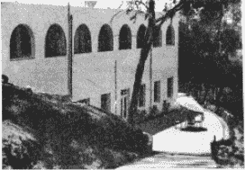

加利福尼亚圣地亚哥所有宗教自我了悟教堂

接着，我无声地加上了一段祷文：“愿巴巴吉及可敬的圣尤地斯瓦尔觉得我已尽力，不要对我弘道西方的任务的完成情况失望。”

1945 年的新年，我在安西尼塔斯的书房工作，修订这本书的手稿。

“可敬的帕拉宏撒，请到屋外来。”从波士顿来访的路易斯博士在我窗外对着我恳切地微笑。我们在阳光下散步。我的同伴指向沿着教区边缘紧邻海岸公路旁的那座正在兴建中的高楼。

“先生，自上次来访后我在这里看到许多新的建筑。”路易斯博士每年要从波士顿来安西尼塔斯两次。

“是的，博士，我长期思考的一个计划将即将成形。我已经开始着手在这美丽的环境中建立一个小型的世界社区，也许这可以激励世界上其他的理想社群。”

“先生，这真是个好主意！如果每个人都能善尽一己之力，这社区一定会成功。”

“‘世界’是一个范围广大的语词，但人类必须扩展他的忠诚，把自己视为一个世界公民，”我继续说道，“一个人，如果他真的感觉到‘世界是我的家乡：这是我的美国、我的印度、我的菲律宾、我的英国甚至我的非洲，那他就将永不缺少有益且快乐生活的机会。”

路易斯博士和我在修道院附近的莲花池上停下脚步，无垠的太平洋就在我们脚下。

“同样的海水公平地冲击着东方中国与西方加州的海岸。”我的同伴朝这 7000 万平方英里的汪洋中丢了一块小石子，“安西尼塔斯就是世界社区的象征地。”

“博士你说得没错。我们将在这里举行许多会议，还要邀请世界各地的代表来此参加宗教大会。世界各国的国旗都将悬挂在大厅中。还要在庭院中盖一座献给世界主要宗教的圣殿模型。”

我继续说道，“我还计划尽快在这里开设瑜伽学会。克利亚瑜伽在西方神圣的任务才刚开始。我希望所有人都能了解，在这里有一种明确且科学的自我了悟方法，可以战胜人类所有的不幸！”

我亲爱的朋友—第一个美国克利亚瑜伽行者—一直和我讨论到深夜，关于世界社区需要建立在灵性基础上的问题。肇始于“社会”这个拟人化抽象概念的痛苦或不幸，也许会更具体地出现在每个人的门前。乌托邦在成为公众美德之前，必须先在人们的心中萌芽。人是有灵性的，而不是一个机制。只要内心改革就能够带来外在的永久改变。一个可以验证“四海之内皆兄弟”的社区通过强调自我了悟的心灵价值，能够将激励人心的讯息传送到世界各地。

1945 年 8 月 15 日，第二次世界大战结束了！旧世界结束了，不可思议的原子时代来临！修道院的居民为感恩节聚集在大厅祈祷：“天父，愿战争不会再发生，您的子民从今以后将如同兄弟。”

战争时期的紧张消逝了，我们的心灵在和平的阳光下欢呼。我快乐地凝视着我的每一个美国同志。

“天主，感谢您赐给我这和尚一个和谐的大家庭！”

附录：纪念莫罕达斯·甘地

“他是真正意义上的民族之父，却被一个极端主义分子暗杀身亡。数以亿计的人发起悼念，他们心中的明灯终于熄灭……但这并非一盏普通的明灯，在未来千年时间里，它将继续照耀这个世界，照亮我们的内心。”1948 年 1 月 30 日，莫罕达斯·甘地在新德里被暗杀之后，印度总理发表了上述祷文。

就在甘地被暗杀之前五个月，印度通过和平方式取得独立。这位 78 岁的英雄感觉大事已成，自己时日也不多了。“艾娃，帮我把那些重要的文件取来，”悲剧发生的当天早晨，他这样告诉自己的孙女。“我今天就要做完这些，因为我的明天可能再也不会到来了。”

三颗子弹穿透他疲惫脆弱的身体，就在即将倒地的那一刻，甘地伸出手做了一个印度传统的欢迎手势，表明自己已经原谅了凶手。终其一生，甘地都在像一个纯净的艺术家那样行事，在其临死的那一刻，他的行为让他成了一名绝世的伟大艺术家。只有一个终身奉献的无私之士，才能在临终的一刻原谅杀害自己的人。

“可能在未来的许多代人心中，”爱因斯坦在悼念甘地的文章中这样写道，“人们都无法相信人能活到如此境界！”罗马梵蒂冈发来祷文，“这次暗杀让这个世界陷入了巨大的悲痛。甘地成为全世界悼念的对象。”

纵观历史上所有伟大的人物，他们的一生都是为了实现某种正义。甘地之死也给这个支离破碎的世界发出了一个重要的启示：

“非暴力已经降临此世，它将成为未来世界和平最坚实的柱石！”

尤迦南达·帕拉宏撒

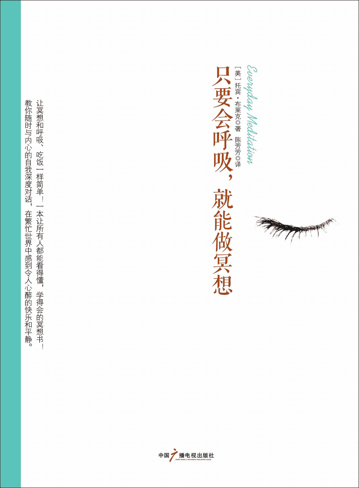

图书在版编目（CIP）数据 

只要会呼吸，就能做冥想 / (美) 布莱克著；陈芳 

芳译. -- 北京：中国广播电视出版社，2012.8

书名原文：Everyday Meditation

ISBN 978-7-5043-6677-1

Ⅰ. ①只… Ⅱ. ①布… ②陈… Ⅲ. ①情绪－自我控 

制－通俗读物 Ⅳ. ①B842.6-49

中国版本图书馆 CIP 数据核字(2012)第 154138 号 

北京市版权局著作权合同登记号 图字：01–2012–4670 号  

Everyday Meditation by Tobin Blake

Copyright © 2012 by Tobin Blake

First published in the United States of America by New World Library

All rights reserved.

Arranged through CA-LINK International LLC

只要会呼吸，就能做冥想

(美) 托宾·布莱克 著 陈芳芳 译  

责任编辑 刘 媛  

封面设计 水玉银文化 

出版发行 中国广播电视出版社 

电    话 010-86093580 010-86093583

社    址 北京市西城区真武庙二条 9 号 

邮政编码 100045

网    址 www.crtp.com.cn

电子邮箱 crtp8@sina.com

经  销 全国各地新华书店 

印  刷 北京画中画印刷有限公司 

开   本 710 毫米×1000 毫米 1/16

字  数 220（千）字 

印  张 16

版  次 2012 年 8 月第 1 版 2012 年 8 月第 1 次印刷 

书  号 ISBN 978-7-5043-6677-1  

定  价 36.00 元 

（版权所有 翻印必究·印装有误 负责调换）

# 目录

第一部分 了解冥想为什么你体会不到冥想的精妙 100 天冥想第二部分 发展自己的技能第一天～第十天：每日冥想练习第一天第二天第三天第四天第五天第六天第七天第八天第九天第十天第十一天～第二十天：打败“黑暗之狼”黑暗之狼的三个故事第十一天第十二天第十三天第十四天第十五天第十六天第十七天第十八天第十九天第二十天第二十一天～第三十天：宁静的开发第二十一天第二十二天第二十三天第二十四天第二十五天第二十六天第二十七天第二十八天第二十九天第三十天第三部分 重新设计你“思想的瀑布”简介第三十一天～第四十天：通往神秘时刻的道路第三十一天第三十二天第三十三天第三十四天第三十五天第三十六天第三十七天第三十八天第三十九天第四十天第四十一天～第五十天：情感平衡的关键第四十一天第四十二天第四十三天第四十四天第四十五天第四十六天第四十七天第四十八天第四十九天第五十天第五十一天～第六十天：相互作用律法第五十一天第五十二天第五十三天第五十四天第五十五天第五十六天第五十七天第五十八天第五十九天第六十天第六十一天～第七十天：宽恕的真正理由第六十一天第六十二天第六十三天第六十四天第六十五天第六十六天第六十七天第六十八天第六十九天第七十天第七十一天～第八十天：健康与康复第七十一天第七十二天第七十三天第七十四天第七十五天第七十六天第七十七天第七十八天第七十九天第八十天第八十一天～第九十天：人际关系的康复及性行为额外练习第八十一天第八十二天第八十三天第八十四天第八十五天第八十六天第八十七天第八十八天第八十九天第九十天第九十一天～第一百天：形成每日练习的习惯为冥想练习提供能量第九十一天第九十二天第九十三天第九十四天第九十五天第九十六天第九十七天第九十八天第九十九天第一百天结语：和你内心的老师在一起“六要点”之路关于作者返回总目录

这本书就像一块跳板，能够让人很简单地达到内心的沉静状态。

—杰拉尔德· G · 詹波斯基, 硕士, 《爱让恐惧随风而逝》一书的作者

我爱这本书。它很清晰，具有原创性，而且比较有趣，它很友好。最为重要的一点是，它对我有很大帮助。我真的难以想象有人读了哪怕很小的一部分，会不受益于此。我尤其喜欢布莱克通过一本讲述冥想的书带给读者只有布道者才能达到的深度思考的状态。

—休·裴雷德,《如何生存并快乐生活》一书的作者 

这本充满智慧的书将读者带到伟大的冥想传统中，同时又向读者介绍了在当今繁忙的世界中如何在每一天实施冥想。托宾·布莱克不仅仅指出了通往宁静的道路，同时他也是一位博学的引路人，在这条道路上告诉我们兴趣所在、陷阱所在。

— 帕特丽夏·莫纳亨, 《冥想—完全的向导》一书的作者之一 

当沉默的时候，人的心灵会受到启示，它指引我们向神敞开心扉，扩大我们的自我意识。冥想真的是一种公开的秘密，一种最为珍贵的精神练习。托宾·布莱克明白沉默的含义，而且通过自身的冥想经历进一步了解沉默的内涵。《沉默的力量》这本书博大精深又很实用，它有效地唤起了人们对于坐下来思考的渴望，对于成为真正的自己的渴望。

— 韦恩·蒂斯代尔, 《神秘的心灵》一书的作者 

第一部分 了解冥想

为什么你体会不到冥想的精妙

当我第一次了解冥想的时候，那天我正站在父亲房子后面的门廊处，远眺俄勒冈州环状的莫阚泽河，看着夕阳从远山中一点一点落下。我是在洛杉矶长大的，在我看来，那座城市就像是一个巨大的、坚不可摧的囚笼，我无处可逃。那时，我唯一感觉放松的时候就是远眺太平洋。凝望海面，我感觉人类和一切人类的杰作都结束了，那里只有大自然和它的杰作—通往无边无际的自由。

当我面对着宽广的莫阚泽河时，也有同样的感觉。它一路向前，不受任何人、任何时间以及任何障碍物的影响。如果将一座大山拦在它的前面，它会将大山吞噬成低谷。我很欣赏这种精神！那个时候，我并不知道到底是什么向我的眼睛施了魔法，让我对眼前的景象如此着迷，但是，现在我明白了：真正让我着迷的并非土地的美，也非河流的蜿蜒，抑或落日的妖娆，而是那一时刻的自由自在。就是在那一瞬间，我将自己迷失在生命的河流里，感受到了从未有过的自由。

你很可能也有过这样的时刻：感觉“迷失”了自我，甚至感觉被某种神秘的、充满磁性的力量吸引，它将你与内心深处某个地方的自己紧密相连。对于多数人来说，这样的时刻就像是透过窗子向外一瞥。这扇窗子一般情况下都是隐藏着的，但是它会提醒我们生活远远不止我们所看、所听、所触，这就是神秘的时刻。就是那一瞬间，使生命充满了意义，让我们重新建立了目标。

进行冥想练习，就是积极地让自己处在这样的经历以及紧接而来的、更能激发兴趣的经历中，因为这种常见的、短暂的经历和内心广阔的空间相比只不过是冰山一角。只要学会积极冥想，你就能到达一种极度平静的境界，并获得无限快乐，这种平静和快乐无法用文字描述。印度教徒几千年来延续着冥想的传统，并将这种令人痴迷的沉思状态称为“三昧”。

在冥想的过程中，你会将自己的注意力从外在的世界—充满复杂的压力和距离感，转移到内在的世界—这个世界在每一个方面都和外在的世界截然相反。通过这种转变，你可能会发现：就在平常的意识之外一点点，生命就成了一张互相连接的网络，这种网络只有在完全平静的状态下才存在。最为根本的是，通过冥想，你可以感受到你并非只是一种暂时的物理存在，和这个世界的其他一切毫无关系；你是一种永远的精神存在，和宇宙万物都有着联系—他们都是你的一部分。

这种领悟无法描述，因为世界上没有与之相似的过程可以进行类比，所以理解起来难度就更大了。深度冥想曾被比作性高潮，但是我认为这种类比对人是一种误导。不过，我觉得冥想有些像性高潮快要到来之前的那个瞬间。有一点不同的是，它在强度和深度上的发展从未停止过，而且这种经历在某种程度上是纯洁和天真的，这是性无法达到的。

虽然我致力于冥想研究长达 20 年之久，到现在我却依然不知道冥想的领域到底有多大。逐渐地，我开始相信与灵魂保持一致就是听从越来越强烈的创造冲动，让它得到释放，并且放弃自我。至于这种强烈的冲动带来的感觉是什么，如果主流大众对于冥想带来的强烈的快乐感表示怀疑，那就推开大门，一看究竟吧。毫无疑问，这种实践已经被证实对健康的保持和疾病的康复很有效果，幸福感和平静感能够很自然地促进免疫系统发挥作用。

本书会从理论上向你介绍如何实践冥想。我会先让你理解什么是冥想，实践冥想要用到哪些基本知识，如何利用冥想过上更为幸福、更为健康的生活。然后我会向你全面介绍一些可以自己亲手实践的、最常用的冥想技巧，让你自己直接体验实践冥想的乐趣所在。如果你已经开始冥想了，那么这样的练习可以增加冥想的途径，帮助你晋升到下一阶段。

尽管从理论上来看，冥想极其简单，但是，如果没有正确的工具，它也会变得非常困难。很多人在还没有意识到冥想到底能够给他们带来什么之前就已经放弃了冥想练习，因为一开始他们可能要面临很大的阻力。很多冥想教学只是教会学生一些技巧，比如念经、打坐、专注以及目视，却几乎不教授如何在达到深度冥想状态的过程中克服困难。本书则不同，它不仅向读者传授冥想的基本知识和基本技能，还将带领你超越冥想的形式，帮助你释放内心的阻力，这样你就可以进行深度的、持久的冥想练习了。

本书向读者提供了一种可以亲自实践的经历之旅，让读者能够践行冥想，同时向读者展示了一种精神训练体系，以便读者能过上一种更为清醒的、充满宁静的生活。这种体系主要着眼于以下三个基本目标：

1.每日练习 这一点似乎是显而易见的，但是如果你知道有很多人以为只要看看书、了解一下什么是冥想，而不需要实际去做的话，你可能就会感到惊讶了。请记住我的话—你不可以这么想！你必须去做、去冥想，逐渐地你就会从中获益。冥想给你带来的益处真的是让人难以置信的。实际上，冥想是你能做的、对身心健康来说最好的事情之一，就和戒烟一样。它的窍门在于：就像锻炼身体一样，你必须去做。这本书包含了 100 天的冥想实践，能够积极地帮你迈出这一步。你可以把这 100 天看作是一次自我发现的旅行，它不仅可以帮助你进行冥想，同时也可以帮助你将这些年来积累的一点一滴的伤痛和恐惧连根拔除，将一切病痛治愈。按照书中写的去实践，你会感受到无比的平静。就算只是实践几次，也会增加你进行冥想的力量。

2.了解并解决阻力问题 要想到达深度冥想的境界，你就要弄清楚到底是什么阻碍了你的行为。在进行冥想练习的过程中，的确会有阻力存在。你必须克服一层又一层的阻力，才能一步步地接近内心真实的自我。你是不是觉得冥想象是一份工作？嗯，没错，它就是一份工作，是一份享有最高位置的自我工作—进行有意识的个人发展。通过学习如何进行冥想，你就能开启一条有力的康复之旅，它和世界上其他任何事物都不一样。冥想带着你走向内心，让你能够直接和内心深处的自己（也就是灵魂）联系—它是一种净化灵魂、让人充满力量和喜悦的经历，它能让一种不可思议的力量从你的内心深处涌出。如果你用这种力量调整自我，你的生命就会立刻发生变化。我们在后面的内容中会更加详细地讨论这种内心深处的自我。现在你只需要知道：除了每天进行冥想之外，本书还会帮助你找到真正阻碍冥想的根源在哪里。

3.重新设计“思想的瀑布” 如果你已经开始进行冥想了，毫无疑问你会感受到来自思想深处无穷无尽的思潮。这种由文字材料形成的流是恒定的，佛教徒将之称为“思想的瀑布”，因为它“嗡嗡”的声音就像是从高处呼啸而下的瀑布，永无止境且震耳欲聋。 

当你第一次开始进行冥想的时候，你会感觉思维加速了一样，然而实际并非如此，你只是更为关注思维持续不断的活动了而已。不断有人要给思维活动强加一种规范，但是几乎没有什么成功的先例—你根本无法让这种由思考内容形成的瀑布停下来。但是，你可以改变“瀑布”的内容。多数人的思考内容基本上都是一些消极的东西—未经治愈的罪恶感、恐惧感和愤怒感酿成的结果。这样的情感与平静的心态本身就是对立的，而平静本身就是冥想的一种状态。因此，消极的思想使冥想变得十分困难。如果你想要进一步深化冥想，那就改变思维深处的一些想法，更好地表现出积极的情绪，这一点很重要。本书中所介绍的冥想练习就是为了帮助你开启这种改变的过程。

从某种意义上来说，这本书不仅仅是关于冥想的，它还为思维的锻炼提供了指导。重新设计内心深处的对话不仅可以改善你的冥想进程，还可以带来诸多其他益处。通过把消极的“思想瀑布”调整成积极模式，你会看到你的整个生活都发生了变化，因为消极的思想不仅影响你的冥想练习，还会影响你的健康、幸福以及你和他人的关系。

冥想还有很多重要的好处。现代科学对于冥想的研究已经进行了几十年，研究结果让人震惊。有些结果是显而易见的：在冥想过程中，人的血压和心率都会降低，呼吸会放缓，大脑中的α波活动会增加（说明身体处在一种平静的状态）。一般来说，这个时候人的压力就会降低，单这一项就足以为消费者每年省下数十亿投在医疗保健方面的支出—根据估计数据，人类超过 90%的疾病都是因为没有解决好压力问题。

除了缓解压力这种较为常见的效果之外，我们还发现，冥想可以给身体带来一些物理变化。《神经意象》杂志上就发表过一篇研究报道，几名加州大学洛杉矶分校的研究人员发现，冥想者的海马体以及前额叶脑皮层有所增大，这就说明冥想这种行为对大脑皮层产生了物理影响，而大脑皮质是和更高的人类行为相联系的，比如做决定、产生积极的情绪以及记忆等。

近期还有些突破性研究也挖掘出了定期冥想的一些生物学效应。马萨诸塞州综合医院从事身心医学研究的班森·亨利研究所的研究人员与贝丝·以色列·迪肯尼斯医疗中心的基因学中心合作，发现冥想本身能够直接到达生物体进行规划设计的根部—基因。他们研究了进行冥想的被试者与从不进行冥想的被试者之间 2200 多个基因的显著区别，其中包含那些与发炎、自由基处理以及细胞死亡有关的基因—这三种基因堪称“杀手基因”，它们就像时间老人的左右手，控制着人们的衰老和疾病。该中心的负责人赫伯特·班森这样描述了他们的研究：

现在我们已经发现了思维活动变化是如何改变最基本的基因指令的实施了。  

这是一条惊人的消息。多年以来，人们都在研究冥想的治愈效果，其实这种效果通过最基本的实验就可以检测出来。现在我们开始挖掘隐藏在冥想表层效果之下的深层效果，力求发现一些对身体健康有好处的根本原因。不管怎样，冥想都在重新塑造我们的身体构建模块。

现在，关于冥想的新兴研究也依然充满希望，我们每一天都对这一领域了解得更多。在广播秀节目《谈到信仰》的采访中，托瑞斯·泰勒硕士介绍了冥想对于干细胞的令人难以置信的影响。泰勒是一位非常有名的心脏病研究专家，她曾给一只心脏停止跳动的老鼠注入干细胞，使之复活。现在，干细胞被认为是导致衰老和疾病的关键因素。

干细胞堪称父母遗传给我们的黄金。从生物学角度来说，你的干细胞越年轻，你就越年轻；当你的干细胞死亡的时候，你就慢慢地衰老了，而杀死干细胞的“元凶”之一就是压力。冥想可以对拯救干细胞起到不少作用。首先，通过减轻压力，冥想可以很轻松地减缓干细胞衰老的过程。当然，实际的过程远比这句话要复杂得多。事实证明，冥想可以增加血液中的干细胞数量。在威斯康星大学的一项初步研究中，研究人员发现：一位有经验的冥想者仅仅在 15 分钟的冥想之后，他血液中的干细胞数量就有了明显的上升。需要说明的是，这个测试只是一群好奇的科学家进行的一次随意调查，但是实验结果确实让人大吃一惊。在采访过程中，托瑞斯·泰勒几乎无法隐藏她的兴奋，称这一现象为“我见过的（干细胞数目的）最大的增长。”这一结果可能有助于解释冥想对于人类健康的巨大影响，定期进行冥想的人可能会：

● 患中风的几率降低 33%；

● 患癌症的几率降低 50%；

● 患心脏病的几率降低 20%—在美国，不管对于男性还是女性，心脏病都是第一杀手。 

除了对身体有好处以外，冥想对于我们的精神也大有裨益。定期进行冥想的人称，不管在个人生活还是人际关系上，他们都能感觉到一种更为明显的、全面的满足感，而且抑郁、焦虑及恐慌的发生率和强度都更低。冥想实际上是一种自然的药物，而且完全没有什么副作用。

在这个世界上，能够给我们提供如此多好处，却几乎不必耗费什么的活动还真不多。实际上，进行冥想几乎不需要任何直接的花费。想要达到更好的效果，你所需要的就是坚持不懈。你的冥想练习不需要做得完美无缺，你只要每一天都坚持做就很好了。

除了定期练习之外，最有助于提升冥想效果的做法就是将冥想看成是一种慢慢展开的旅程。在这个旅程中，你可以扩大自己的意识范围，慢慢离开以自我为中心的意识，趋向于以精神为中心的意识。这是一个温和而缓慢的进程，你要有耐心，并且相信它。在冥想的同时，你可以闭上双眼，让注意力远离身外的世界，朝向你生命的内部—你的思想，你最为核心的自我。这是一种在安静的环境下、在你内心深处进行的活动，是和真实的自己进行的交流。在这个神圣的过程中，你脱离了原本的性格和肉体，开始治疗内心深处的创伤，获得了最为深刻的成长。从这个方面来说，冥想之旅是我们所有人能够进行的最为神圣的旅行。它是一次康复之旅，一次自我回归的平静之旅。通过与核心的自我进行交流，我们同时也与深不可测的能量来源取得了联系—这是在每次心跳、每次呼吸以及存在于每个宇宙中的原子后面的一种创造性的能量。

停下来，想想这一点吧。冥想可以将你和万物之源的能量有意识地再次相连—我们与能量来源的联系从来就没有断开过，如果没有这种联系我们根本无法生存。然而，多数人完全没有意识到这种联系的存在。冥想可以净化并优化这种联系，这就是它拥有巨大康复功效的原因所在。通过这种古老而历史悠久的练习，你会逐步地尝试与万物之源的能量相联系，并且你能够切实意识到这一点，不管是物质上还是非物质上的星系及行星、照亮我们夜空的繁星，数十亿居住在这个星球上的人、动物以及其他，构成我们身体的每个细胞……单从人类的观点出发，你远远不能理解创造的重要性，但是当你将自己与能量之源相联系时，那种给予生命的力量会流经你的全身，从各个层面为你疗伤，让你有一种获得新生、拥有崭新目标的感觉。这种能量已经是你身体的一部分了，你所要做的就是学会去掉内在的阻力，真正意识到能量的存在。

100 天冥想

想象一下：你现在正沿着一条花园小径散步，小径的另一端是缤纷斑斓的光源，它照耀到哪里，就给哪里带去温暖和营养。小径幽长，旁边是洋溢着生命活力的花园。这里宁静安全，放眼望去，是那么美丽。然而，如果你转过身，回头看一看来时走的路，你就无法直接感受到那道斑斓的光了—它现在在你的背后。就是这突然的位置改变，让你把眼前的世界投入到了阴影当中。现在你知道了，阴影只不过是光与黑暗的游戏。但是，在阴影中，真实的世界以及存在于你周围的自然之美都被隐藏了。就算你定睛去看突然出现的黑暗，也只能依赖想象了。在一个阴影的世界里，你可以“看”到一切，但无论是令人愉悦的还是令人毛骨悚然的，都不是真实的存在—你“看”到的只不过是你的思想、恐惧以及信念的反应。从本质上来说，这只不过是你思想的投射。

当谈到我们身外的世界时，这个类比基本上也适用。当你抬头看外面的世界时，就是在转身，把脸从生命之源那里转开了。生命不会从外缘向中心展示，而只会从中心向外缘展示。因此，如果你一味地关注外在，就是将自己置于这样的一个位置—你所感知的一切都深深地被你自己的思想状态所影响，而真实的世界却被遮盖了。

冥想就是让你有意识地转个身，朝向另一方—内在的世界。你每天只用一小会儿时间，坐下来，闭上双眼，不再去管外面的世界，将注意力集中于内在的世界中，那里有你的核心自我，也就是能量之源的延伸，它始终存在。核心的自我就是一切创造火花的源头，你所知道的生命中的一切都源于此处。如果用盖房子来比喻，那么这里就是房子的地基。每个人都有核心的自我，尽管人们称呼它的方式各不相同：有人称之为灵魂，有人称之为精神，而我更喜欢用“核心的自我”来称呼它，因为这个称呼能更好地表述它，而且不带任何传统意义上的负面联想，这也是我喜欢用“万物源头”来代替“上帝”这个词的原因—尽管这两个词是可以相互替换的。

你的核心自我存在于纯粹的生命中，它超越所有的个体概念、所有的信念、所有个人的思想与肉体，甚至超越了时间。你可以想一想婴儿的意识，那是一种还没有形成偏见，没有对世界万物冠以标签，没有自我概念，没有野心，没有区分对错、大小、美丑、好坏、高矮等概念之前的意识状态。他们可能会很快形成一种微弱的自我意识，但还是要比多数的成年人更为自由，更能跟随自己的核心自我。我相信这就是为什么耶稣告诉他的信徒们必须要变得“像个小孩”的原因—他是为了让信徒们能够进天堂，这也是为什么小婴儿的眼睛闪烁着生命的光芒、笑声中饱含着生命的快乐的原因，更是为什么他们的哭声和眼泪会让成年人产生难以置信的痛苦的原因—当一个婴儿哭泣的时候，那声音就像是上帝在哭泣，我们几乎无法忍受这种哭泣。

我认为，构成生命的大多数内容，比如想法、个性特征、思想等，其实并非真正的生命，只不过是我们强加在核心自我—那个只有婴儿才听从的、赤裸裸的、最为本质的生命之源—身上的东西，其他一切都是另外的自我，也就是所谓的“虚假的自我”，它与我们的肉体以及外在的世界保持一致。构成你的远非这个自我。

想象一棵枝繁叶茂的阔叶树，它的树干、树枝和树根就像你的核心自我。一年年过去，它们并没有发生多少变化，而树的花朵会开放、叶子会成长，当秋天到来，它们枯黄、凋零，等到来年春天又被新萌发的花与叶取代。同样的，我们对地球上的生命变化已形成了固化的认识，总是太过于关注虚假自我和肉体存在的变化。当你通过冥想抵达内心深处时，你会试着去除那些外在的一切—哪怕只是暂时的，你会直接地、有意识地与你的核心自我接触。从本质上来说，你是从关注变化着的树叶，转而去直接感受树本身的生命完整性。

然而，刚开始转变并不容易，你需要花很多精力维持对于外在事物的关注—这种精力消耗非常大，会让我们感觉特别疲惫。到了晚上你躺下来的时候，可以让注意力自由自在地游走，你会朝着睡眠状态快速前进，这也是去向内在空间以及核心自我的一种无意识的短暂逗留。正是这种与核心自我的联系才使得睡眠变得如此重要，尽管这种联系并非有意识的，但无论是对于身体还是精神，睡眠依然具有康复作用，它能够给人带来焕然一新的感受。冥想也能够带你走进同样的内在领域，除非你冥想的时候完全清醒，完全能够意识到一切。 

如何进行冥想

闭上双眼后，你能看到什么呢？可能以前你自己也做过很多次，紧闭双眼，感觉不到什么乐趣。很多人看到他们的内心世界一片黑暗，经常充斥着从内心深处传来的对话声。这种思想的流就是我在前文中所说的“思想的瀑布”。我们每个人都有一条“思想的瀑布”，正是它把我们禁锢在头脑中的狭隘空间里，将我们等同于那个虚假的自我。当你的思想更加平和安静，你就能更容易地与核心自我联系在一起。

一开始，你可能会把冥想当作找到核心自我的一种方式；你也可能没想太多，只是出于缓解压力、改善健康状况或其他一些原因才对冥想感兴趣。不管基于哪种情况，你都会发现，冥想实践需要你和自己的思想作斗争，而实际上这也是大多数冥想技巧最需要关注的地方。很多冥想练习都告诉你要将注意力集中在一个简单的句子、一个字或者是一个意象上，总之是一个简单的“思想”，然后将其他一切都排除在脑海之外。这么做的目的就是要让你的思想集中于某一个事物或者某一个行为上，同时尽力避免干扰性的思维模式，防止注意力被困之后从冥想中慢慢偏离出去。只有这么做，冥想者才能更好地感受存在于思想之间、“瀑布”之外的平和安静，并与内在空间进行联系。

有很多技巧能够帮助你到达这种境界，比如打坐。这是禅学的一种练习方式，它要求你注意自己的某种感觉，比如气体进入你的体内，又从你的体内出去。打坐练习可以和某种专门的注意力练习结合在一起，比如：当你吸进空气的同时轻轻数“1”（在心里默数就可以了）；呼出空气时默默数“2”；然后吸入，数“3”；呼出，数“4”……如此这般进行下去。这种练习的目的就是让你通过数自己的呼吸，控制思想不从练习中溜走。只要你发现自己停止了数数，开始想别的，那就说明你轻轻地、但是非常确定地转移了思维方向，你要重新数数，从“1”开始。

这种形式的打坐和另一种非常受欢迎的冥想形式很接近—念经，只不过，念经不是数自己的呼吸，而是以某个字、某种声音，或者是某个小短句作为注意力的集中点，在冥想过程中，你可以将它大声念出，也可以在心中默念，这么做同样是为了将注意力集中在你念的经上，而非其他的想法上。念经的频率可以与你的呼吸频率合拍，就像在打坐中数数一样，也可以不与呼吸合拍。

这种方法对于机械化思维模式的人来说可能是不错的选择，但是对于有着强大想象力的人来说，就没有那么好了。对于后者来说，有指导的冥想或者视觉化的练习往往更合适一些。典型的视觉化练习是将注意力集中在一个预先准备好的意象上，比如：想象自己正在海滩上冥想，试着感觉自己和大海融为一体，你也可以在心里塑造出神的意象，或者想象烛光、卵石、寺庙、花朵或者无形的光。此外，还有一些其他形式的冥想练习，其目的也是要你集中注意力于某种可视的东西，让其他的想法从大脑中经过，不打断你的注意力。

查克拉冥想是将注意力集中在能量涡流中—通常认为，这种涡流是连接微妙的精神与粗野的肉体间的桥梁。查克拉冥想练习中有一种叫做“第三只眼冥想”，如果不亲自尝试，你会觉得理解起来非常困难，因为对这种练习的指导往往说得比较模糊，比如“将你的注意力集中在双眉之间”。

你或许已经看到了，多数冥想技巧都有一个共同的特点，那就是冥想者要集中注意力于一个词、一个句子、一个意象或者一种行为（比如数自己的呼吸次数或者是注意某种感觉）上，同时将其他一切想法排除在外。所有技巧在一定程度上都有效果，因为注意力转向内在世界实际上是非常自然的，你只要简单地尝试一下，或多或少都会有所成功。然而，技巧本身都是有局限性的，因为技巧只是让人将注意力集中于行为的形式上，对于那些阻止人们获得最大益处的精神障碍，它却无计可施。你给学生一句经文，让他们反复吟诵，并告诉他们要将注意力集中在经文上，这难免让人觉得异常困难，只会给他们增加挫败感。如果没有任何其他的精神训练相佐，结果就更是如此。

在这本书中，我给精神训练下了个定义—它是一种教义，用来帮助学生释放恐惧，让他们的思想达到一种平和的状态，而这正是深度冥想的关键点。你将会发现，本书中一百天的每日冥想不只是教会学习者冥想的技巧，更关注于帮助读者重新进行精神与思想的训练—用我喜欢的话来说，就是“重新设计你的瀑布”。

要冥想多久  

好心的冥想指导者通常都会犯一个严重的错误：建议学生花过多的时间进行冥想。这个错误已经存在很久了，它反映了典型的美国式认知错误—越大越好，越多越有价值，超额就是成功。太长时间的冥想对于多数的初学者来说只会增加疲惫感，结果反而增加了他们冥想的阻力。其实冥想根本就不需要太多时间。任何人都可以闭上眼睛，花一个小时或者更长的时间进行思考，但这并不是冥想；相反，哪怕只是一瞬间的集中注意力，就足以让你与内心深处的自我相连。你离你的核心自我并不遥远，它是你的一部分—实际上，它才是你的真实存在，其他一切都只是临时的，就像天空中漂浮的云朵。

说来说去，每次需要冥想多久你才能和你的核心自我相连呢？答案是：不必太久，冥想真正需要的是纯粹的渴望与免于争斗的自由。这个问题我们稍后会讨论，

在进行冥想的过程中，你要铭记一点：冥想的质量远比冥想的时间和数量要重要得多。如果你想花更多的时间来做冥想练习，我不建议你一次持续过长时间，而是可以增加每一天的冥想次数。如果你计划每日冥想三十分钟，我觉得你不必一次三十分钟，而是分成三次十分钟—早晨一次、下午一次、傍晚一次，或者两次十五分钟。当然了，对于那些经验丰富的、坐多久都没问题的人来说，一次三十分钟也是可以的，甚至一次六十分钟也是合适的。但是，对于刚开始进行冥想练习的学生来说，一次五分钟至二十分钟就已经足够了。

如何选择坐姿

在决定冥想坐姿的时候，你的脑海里要有两个词：舒适、骄傲。虽然冥想有很多种特殊的坐姿，比如著名的莲花坐，也就是盘腿而坐，将两只脚的脚踝分别放在另一条大腿之上，但实际上，选择何种坐姿并不是那么重要，你只要记住这样几点就可以了：

1.舒适 这是第一点，也是最为重要的一点，你选择的坐姿应该让你感觉舒适惬意。你可能喜欢坐在椅子上，或者床上、沙发上；可以盘腿而坐，也可以伸直双腿而坐，甚至盘腿席地而坐；你还可以使用枕头来调整位置，给身体提供支持及舒适感。

2.骄傲 不要躺下，这样会增加退缩感，这种感觉在冥想过程中可能会引发一些问题。你应该气宇轩昂地坐好，这种姿势可以让你充满活力，也能减少因懒散带来的不安之感。要让背部自然而然挺直，抬头挺胸，将双手放在膝盖或腿上，或者自然垂放。最为重要的一点就是—要放松。试着找找那种肌肉得到放松的感觉，让压力和紧张感都荡然无存，享受此刻短暂的平静—身体的平静和精神的平静。

除了参照这些指导以外，你在做冥想练习的时候要忘掉身体的存在。冥想其实是一种让注意力从肉体层面转移开来的训练，如果过于纠缠如何坐、如何放置身体的某一部分、手应该做什么等诸如此类的问题，这本身就是分心了。

将一些基本的技巧放在心里。对学习冥想最为有助的一种态度就是“非偏见的态度”，即不要去评判你建立在日常基础之上的行为，不管当时它看起来是好还是坏。冥想是一种扩张，但在整个过程中，你的意识会经历扩张与收缩的不同阶段。也就是说，你会感觉到冥想意识加深，然后又变窄。这个过程是很自然的，整个的方向总是慢慢拓宽的。有倒退的感觉只是暂时的，而且这种感觉很重要，进步与倒退的交替出现会产生一种月圆月亏的效应，它能从根本上提供一种对比—和核心自我达成一致与和核心自我失去联络的对比，这样你就会了解到哪个方向会带给你平静感，哪个方向会让你不舒服，然后你就会产生进一步深化冥想练习的动力。如果没有这些，冥想之旅很快就会停滞不前。

因此，不要评判。你唯一需要做的就是将注意力集中于你每日的练习中，让冥想之旅自然而然地在面前铺开。

另外一种有益的态度就是：在开始冥想练习之前，往自己心里装满深深的崇敬感。不要只是“扑通”一声坐下，就开始练习，你应该在坐下之前稍微停顿一下，提醒自己将要做的事情很重要。你要试着超越自己的肉体，超越所有的意象与思想，甚至超越整个世界，直接到达自己的内心深处。你马上就要去寻找存在于你肉体中心、将你与生命源头相连的生命火花之源，你将去寻找这种意识体验，去触摸你的核心自我，哪怕只是一瞬间，也充满无法描述的力量。这种力量很强大，一旦你切实感觉到了，你的整个生命就会转向崭新的方向—朝向平静，朝向真正的力量，朝向最深层次的康复。

第二部分 发展自己的技能

第一天～第十天：每日冥想练习

下面介绍一百种每日冥想的方法，它能帮助你建立一种丰富的、充满活力的冥想行为；对于有经验的冥想者来说，它能加深冥想行为的深度。在冥想的过程中，本书会提供详细而明确的指导。每天尝试一种冥想方式，如果某种方式对你来说尤其有趣，你可以连续几天进行。如果你想要达到最好的结果，就不要停顿，而且，至少要将书从头到尾读一遍，因为每一部分都包含着对于你至关重要的小贴士。

本节内容当中会穿插几个短小的章节，讨论一些与冥想有关的话题。当你开始下一阶段的冥想练习之前，请通读这些章节，并仔细思考。如果需要，你还可以回看这些内容。

如果你想要充分利用冥想练习，我建议你每天冥想两次，早晨一次、晚上一次。当然，你要感觉舒适才行。如果你没有办法一天进行两次冥想练习，至少要努力每天抽出几分钟的时间来。还有一点很重要，如果你一连错过了好多天甚至好多周的练习，一定不要把这当作彻底放弃的理由。一旦你感觉自己有意愿或者能够进行冥想练习时，就立刻从断开的地方继续下去。你很可能在继续冥想练习时遇到各种来自现实自我的阻力，请做好心理准备。本书中一百个每日冥想方法会帮助你理解这种阻力并且克服它，但是，你一定要把自己该做的都做好。 

刚开始进行冥想练习的人应该把目标设定在每次五到二十分钟，高级冥想者可能会选择冥想一个小时甚至更久。不管你冥想多久都要全神贯注，将生活中的其他事情都暂时搁在一边。就像前文中说过的一样，时间更长的冥想未必就是更好。如果你没有真正集中精力，那么坐的时间太久反而没什么好处，反倒是时间更短的、集中注意力的冥想会更让你受益。

冥想的时候，如果你感觉到焦虑，而且持续几分钟不退，那么你就可以睁开眼睛，直到焦虑感消退了再继续练习。如果这种感觉一直都在，那就结束这次练习，直到下次练习时间到了再开始。大多数焦虑感都是很微小的，随着平静的感觉越来越强，焦虑感很容易就会过去。就像冥想中走神一样，只要你不把它当作很大的问题，它自己就会消失。在开始的 30 天中，你的冥想之旅会带着你尝试一系列的练习，找到对你来说最有效的冥想技巧。接下来的冥想练习越来越注重内在平静感的发展，它将重新设计你的“思想瀑布”，以便你保持乐观稳定的心态。

要记得，冥想是最高层次的活动。如果一开始你感觉很困难，那是正常的。冥想会用最深远的方式向你发出挑战，促进你的成长，因此，进行冥想必然需要花费一番努力。不过，也有些人能够很快投入到冥想练习中去。不管你属于哪种情况，每天进行一次冥想练习就好。每天的冥想练习都要有些想法，在练习的过程中要做到最好，其他的就都不需要了。冥想就像一个高息的投资账户，每天付出一点点的努力，过一段时间就会有很大的回报。留点儿时间给自己，减缓一下压力，放松一下自我，开始过一种更有意识、更鼓舞人心、更平衡的生活吧。

第一天

我们马上从一个简单的练习，开始进入我们一百天的旅程。今天的冥想练习形式就是打坐，在前面我们已经简要讨论过。如果你是第一次尝试冥想，可能会觉得这更像一次没有任何作用的行为，但是我向你保证：冥想练习是有意义的。尽量不要去评判接下来的任何冥想练习，只要尽你最大能力去做就好。我们更关注冥想能够带领我们达到的精神状态，而不会太多关注个别的冥想练习本身。

有一点你要牢记在心：最简单的冥想练习方式通常都是最有效果的。我们都愿意通过不太复杂的技巧达到内心的平静，过于繁琐和复杂的技巧就像在饭里放了太多的作料，饭菜本身的微妙味道反而会被作料的味道毁掉。

1.一天两次 早晨一次、晚上一次。你可以寻找一处安静的地方，单独待 5～15 分钟（如果你已经有了一定的经验，时间或许可以更长一些），然后选择一种让你感觉舒服的坐姿。

2.从几次深入透彻的呼吸开始 用鼻子吸入空气，然后用嘴巴呼出。每次吸气时，要将空气彻底吸入肺部，你的腹部会像孕妇一样隆起。同样地，呼气时也要将气体完全呼出。你可以将肺部想象成海绵，通过挤压膈膜，将包括二氧化碳在内的废气完全清理出去。

3.接下来，继续深呼吸 每次呼出气体时，感受从头部到脚趾的每一块肌肉都得到了放松，每次集中注意力于身体的某一个部分，比如头部、脸部（尤其是下巴和眉毛）、脖子、肩膀、手臂、手、手指、躯干、臀部，然后是腿部、脚和脚趾。要把存储在体内的所有压力都驱赶走，然后花一小会儿时间来研究你的身体，尽力放松那些仍然压力重重的部位。当你有了放松的感觉时，可以将呼吸调整到正常状态。整个放松过程用时大约两分钟。

4.然后，默默地数自己呼气和吸气的次数 吸进气体时，心里想“一”，呼气的时候，想“二”；吸气—“三”，呼气—“四”。

5.继续数自己的呼吸次数 不要让其他想法干扰你，不要在练习中分心。当你数到“十”时，再回到“一”重新开始。只要你意识到自己停止数数开始想别的了，就务必要轻轻回到数呼吸的练习中来，从“一”开始。

这就是全部的练习，也是在整个冥想练习中都要坚持的做法。你可以用计时器、表或者闹钟来计时，或者简单地睁开眼睛看一下时间。当你做完练习后，睁开眼睛，花一两分钟的时间重新适应外面的世界，让这种平静的感觉继续陪伴你一段时间，然后慢慢消失。冥想的一个重要目标就是，学习如何把冥想时的平静状态转移到现实生活中以及应对压力的过程中来。

每日小贴士

1.早晚各一次，每次 5～15 分钟；

2.选择舒服的坐姿，放松每一块肌肉；

3.深呼吸，鼻子吸气，嘴巴呼气；

4.默数呼吸次数。数到“十”，重新回到“一”；分心后，也重新回到“一”。

第二天

今天我们将再次进行昨天介绍过的冥想练习—打坐。请将昨天的说明再读一遍，然后按照指导练习，要牢记一点：只要你在练习时意识到你的思想被每一天的惯常思维模式拉走，就要将它拽回来，这是我们进行冥想练习很重要的一部分。

今天的冥想由两部分构成：不仅要数自己的呼吸次数，还要在思想游离之后将它拉回来，继续数自己的呼吸次数，后者尤其能够帮助你培养集中注意力的能力。每次回到数呼吸之后，你集中注意力的能力都会有所加强。在冥想练习过程中思想云游是很自然的，只是对于初学者来说，这一点有些让人沮丧，但一定不要过于烦恼。你可以尽力将其想象成体能锻炼—集中注意力、丢掉注意力、再集中注意力，就像健身一样举重、放下、再举重，以此来锻炼肌肉，只不过你锻炼的是你的思想。

这个练习不仅可以帮助你在冥想过程中集中注意力，还有助于你在每日的生活中集中注意力。很多定期进行冥想练习的人发现，他们在现实生活中的状态比以前更好了。你可能还会观察到其他的正面效果，比如体内有更多的原能量，或是创造力比以前有进步了。

每日小贴士

1.参照昨日的冥想练习法；

2.在冥想中，思想游离很正常，不要为此烦恼。

第三天

今天的冥想练习依然是在早晨和傍晚各做一次—如果可能的话，而且内容也和前两天的很相似，除了一点—今天我们要在前两天的内容中增加一个关键词，而不仅仅使用数字了。数自己的呼吸次数是一种非常简单的行为，把它作为开始的练习是非常合适的。然而，数字是非常中性的，它的用法要比文字局限得多。在冥想过程中，文字被称为经文。有些传统的冥想行为比较喜欢用数字，但在我的经验中，经文可以帮助冥想行为建立一种意义感。挑选适合你的文字或文字组合，有助于你尽快进入平静安宁的状态，也可以深化冥想练习。 

在你开始冥想之前，重复一下从第一天开始学到的三个步骤：先寻找一处相对安静的地方，舒适地坐下来；进行几次深呼吸；然后彻底放松。这些都不需要你做得尽善尽美—也许你无法找到一处绝对安静的场所，也许你静止不动地坐着也不会完全感觉到舒适，冥想的意义并不在于找到身体之外的最佳平静场所，而是去开发内心的平静。当你能够在内心建立起平静感时，你就可以由内而外，去处理外在的混乱，保持身体的平静了。不管怎样，你的方向是对的！在冥想的练习阶段中，你只要尽力去做，找到方向，感觉到放松就很好了。

当你准备好之后，先像昨天一样，开始数自己的呼吸次数。不过今天你需要数的只是吸气的次数；在呼气的时候，你不需要再像昨天那样数数，只要安静地在心里想“平静”这个词。比如，当你吸气的时候，心里默数“一”；当你呼气时，心里想“平静”这个词；然后吸气，心里默数“二”；呼气，想“平静”这个词。

今天还是一样，从“一”数到“十”，然后再从“一”开始。每次当你意识到自己停止数数转而想别的事情时，和昨天一样，再回到“一”重新开始。

每日小贴士

1.舒服地坐下，放松，深呼吸；

2.默数呼吸次数，吸气数“一”，呼气想“平静”；

3.数到“十”，重新回到“一”；分心后，也重新回到“一”。

第四天

今天要把昨天的冥想练习重复两次，而且今天你要尝试将自己的感觉集中在“平静”这个词上，感觉平静正慢慢灌入自己的内心里。每次重复念经的时候，允许自己的身体和思想比之前多一些放松感。我要重申一点：你所进行的最基本的冥想练习—吸气的时候数数，呼气的时候默念“平静”，这样做的目的是为了感受到来自核心自我的真正平静，和你数数的能力没有任何关系。因此，当你呼气并默念“平静”的时候，要尽力去感受身体内更深层次的平静感，这种感觉远远超出单纯数自己的呼吸次数带来的效果。

每日小贴士

1.重复昨日的冥想练习两次；

2.默念“平静”时，感受体内深层次的平静感。

第五天

就像前文中说到的那样，在冥想中注意力的集中点可以有很多种形式：文字、意象、数字、颜色等，每种形式可能都会带来稍许不同的感受，但是这种微小的差异感只在最低层次的冥想练习中才存在。在深层冥想过程中，你的练习会超越任何形式，直接带你进入一种惯常的、内心深处的平静当中，而且，最后基本上能够获得核心自我和生命之源的完全认同。

不要纠缠于冥想的各种形式，它们最基本的目的都是为了帮助你达到内心的平静和安宁状态，这样你才能和你的核心自我相连，而核心自我只存在于永恒的平静和安宁当中。你需要先与核心自我的自然状态进行匹配，然后才能获得它的认同。你的思想越是平静、安宁、稳定，你才越能近距离地和核心自我相联系。至于技巧，充其量也就是到达平静和安宁的工具而已。在最初的三十天里，当你努力按照建议冥想时，要注意体会哪些技巧最能为你带来平静感。

每日小贴士

1.重复昨日的冥想练习；

2.不要太过纠缠于不同的冥想技巧，技巧只是带给你平静感的工具。

第六天

今天的冥想练习要试着去倾听思想深处的安宁。有一种安宁感可以超越来自外在自我的噪音，当你的思想变得越来越平静的时候，你就能感受到一种深深的、有力的安宁。让今天的经文—“平静”—带着你，有意识地去倾听思想深处的这种安宁吧。在倾听过程中，你要明白一点，我们的思想在永不停歇地奔跑着，但文字或句子却有很自然的停顿。当我们用文字或句子来思考时，思想就可以随之停顿下来。你要关注出现在思想中间的小停顿。如果它们很有用，那就在心里出现的每个句子结尾处放一个停顿符，然后集中注意力于这些小的片段，问问自己：“在我思想的空间里都存在些什么呢？”这个问题的答案不是以文字的形式出现的，而是以感觉的形式出现的。

在你每次呼气的时候重复“平静”这个词，同时允许自己深度放松，慢慢深入内在的平静中。不要想着数自己的呼吸，只要关注深度放松就好。

每日小贴士

1.舒服地坐下，放松，深呼吸；

2.不要把注意力放在默数呼吸次数上，而要放在深度放松上；

3.倾听思想深处的安宁。

第七天

“平静”这个词作为经文很短、很简单，而且很有效。不过，今天我们将会使用长一些的经文，这主要为了帮你感受到肉体和精神之间的联系—通常我们会把这两个方面分开来看，但它们在根本上是紧密缠绕的，就像在舞蹈中彼此交织的两个人。 

今天，当你吸气时，想着“平静和安宁”；当你呼气时，想着“肉体和精神”。 

不断重复这两句经文，并让你的思想通过一种深入的、逐渐增长的平静感和健康感，与你的肉体联系在一起，让经文融入到其中。试着去感受：随着你的每一次吸气，平静感都会进入思想中，安抚你的心灵，解除你的压力、焦虑和累积已久的愤怒感；当你呼气的时候，你可以想象平静的感觉从你的心灵直接流向你的肉体，将健康感与放松感带到了各个部位。随着呼吸，它遍布了整个肺部；随着血管，它流经全身，从头部到指甲，一直到脚趾，甚至直接到达各个器官内部，最后完全覆盖了皮肤。想象一下这种平静的感觉，这种正在给你的肉体和心灵带来活跃生命力的力量吧！

让经文与你的呼吸同步，一遍一遍地重复，试着将注意力集中在经文上，试着去感受平静。要记得：不管什么时候，如果你的思想回到了日常生活中，你都要把它拽回来。

每日小贴士

1.吸气时，想“平静和安宁”；呼气时，想“肉体和精神”；

2.不要把注意力放在默数呼吸次数上，而要放在深度放松上；

3.倾听思想深处的安宁。

第八天

今天的练习与昨天的很相似，只是形式是昨天的缩减版。你可以按照自己的喜好将经文缩短或增长。经文应该有节奏感，这样气流才会很稳定，而且能慢慢产生出催眠的作用。我喜欢把好的经文看作一种精神上的磁石，它可以吸引你的内在意识，朝向一种面对当下的心境。

就像我们以前使用过的所有经文一样，今天的经文依然是帮助你释放负面情感的。将冥想中的安静带进内心并不难，只要你能够从吵闹的心绪中自我解放出来就好。实际上，这种过程是自然而然发生的，因为安静是生命潜在的特性。你要做的就是学会放松，对复杂的想法听之任之，然后沉浸到安静中。这样就可以让冥想变得简单而自然。

当你吸气的时候，心里默念“平静”；当你呼气的时候，心里想着“安宁”；吸气—“平静”；呼气—“安宁”。

就像前几天一样，试着将注意力集中在平静上。随着每一次重复经文，这种平静感会增加，就好像经文本身具有一种磁性，吸引着你的心朝向它潜在的、自然的安静状态。

每个进行冥想练习的学生都会经历这样一个阶段：他们会质疑自己的冥想方式是否“正确”。思想有时候特别固执己见，它向你开火，让你觉得做下去好像没有任何结果，再加上冥想练习和任何一种练习方式都不同，它的确偶尔会让人感到毫无意义可言。可能你已经有过这样的感受了—虽然只是一瞬间。你要记得，一开始感到沮丧是常见的，而在冥想中获得成功更是可能的。

如果你已经有过这种经历，那就一定要鼓起勇气来。只要你每天努力去做冥想练习，就会取得进步。不管你是否注意到了，你的身体内存在巨大的力量，每次你坐下来开始练习时，这种力量就会显露出来，尝试着和你连在一起。正因为如此，即便是最没有经验的初学者笨拙地开始了冥想练习，从某种程度上来说他也会获得成功。你不可能全盘失败，这种情况不会出现，不用怀疑。当然，你偶尔会感觉到很沮丧，好像自己这么做根本没有结果，自己离平静太遥远了。不管这种感觉多么强烈，你都是错的—哪怕是朝向核心自我的再微小的转变，都是有结果的。实际上，我们总是在获得最大成功的当口处，体会到的挣扎感也最为强烈。当你在冥想中快要取得成功时，你的外在自我就会感觉到威胁。因此，当你接近最大的突破时，你可能会对自己的冥想练习指手划脚，给它打上最低分。

不必担心自己是否进入了练习当中，也不要对自己在冥想过程中没有感受到什么而觉得困惑。只要你一直往前走，一切都会明朗化的。同时，在每天的练习中持久存在的信任会看着你慢慢度过每一个关口。此外，就像我之前说的那样，如果你现在还感觉每日练习像家庭琐事也没有关系，冥想是你能够做的最有益于健康的事情，它带给你的益处远远超过了它所需要的时间投资。即便你一时不确定或者感到困惑，你也依然能够从冥想练习中获得身体上和精神上的回报，只要你坚持每天花时间练习。这一点很难接受，但是对于冥想来说，智力上的理解并不是很重要。你不需要对冥想有多么深刻的理解，就像你不需要为了享受海滩上美好的一天而去理解太阳为什么能够发光一样。

每日小贴士

1.吸气时，想“平静”；呼气时，想“安宁”；

2.经文要有节奏感，才利于释放负面情绪；

3.不要怀疑冥想的巨大作用，坚持每日练习。

第九天

今天的经文和我们之前尝试的略有不同。它增加了一个部分，而不只是原来的“呼气—吸气”循环的两个部分了。当你做好准备并且已经放松，在吸入空气的时候，默默地想：“吸进空气，我的身体充满了光亮。”当你呼出废气的时候，默默地想：“呼出废气，我感觉自己很平静。”在下一次吸进空气的时候，默默地想：“吸进空气，我的精神充满了快乐。”在呼出废气时，默默地想：“呼出废气，我感觉到了我很快乐。”

对比是一位强有力的老师。人在平静时的思想是安静的、稳定的，而在斗争状态下的思想却是吵闹的、仓促的、刺耳的。这种对比看起来很明显，但是我们选择用什么样的思想状态来占据我们的内心相较起来却不太明显。你的思想、你的内心以及你的感觉是你最为宝贵的资产—当然，还有你最爱的人。你的思想对你的经历有一种强大的、无法估量的影响。如果有人会对你的财产造成非常大的破坏，你一定不会让他住在你的家里，对不对？然而，你却把具有敌意的、伤心的、有罪恶感的、充满恐惧的以及其他形式的黑暗感觉放在思想里，让它们占据重要的位置—这无异于积极邀请一个原本不应受到欢迎的客人到你家里来。你的思想是一块非常神圣的领地，如果你还没有建立起这样的态度，我希望你现在就开始这么做。

学习如何进行冥想，同样是在学习如何清醒地有意识地生活，也就是说你不能对生活听之任之，相反，你主动地、有意识地去掌控生活。想想看，你会坐进车里，点着引擎，发动车子，却不去掌握好方向盘吗？至少在这个时候，你的车是不会自己去控制方向的。这与有意识地掌控生活是同样的道理：你为什么要过一种无目的的生活呢？你为什么只对推到面前的事情被动地做出回应，而不是主动引导这些事情的发生呢？

开始有意识地生活，方法之一就是每天早晨进行冥想。在某种意义上，你是在通过这种行为向自己宣布要清醒地、有意识地生活，也可以借此来弄清楚你想要度过怎样的一天。在早晨的冥想练习中，用一两分钟的时间告诉自己这一天你想要经历什么样的事情，想要过什么样的日子，希望别人怎么看待你，想和生活中遇到的人有怎样的交流。比如，你是否希望自己的一天是平静安宁的？是否希望这一天里充满了灵感？是否愿意与他人取得真正的联系？你是否希望在这一天里感觉到自己被爱着、被尊重着，生活得有价值？你是否希望这一天是分享的一天，你能够大大方方、毫无畏惧地给予和获得，能够与他人亲密地交流和分享，朝着目标一步步前行？如果是这样，那就要在早晨的冥想里把这些希望明确地告诉自己的意识。

每日小贴士

1.吸气—我的身体充满了光亮，呼气—我感觉自己很平静；吸气—我的精神充满了快乐，呼气—我感觉到了我很快乐；

2.将黑暗的感觉驱逐出思想圣地；

3.有意识地掌控生活。

第十天

今天关于平静的冥想练习，依然还是由四个部分组成，你要配合呼吸来进行： 

吸气，我的全身都充满了宁静感；呼气，我的思想非常平静；吸气，宁静感已将我包围；呼气，我现在获得了心神稳定。

既然现在你已经有了一定的冥想经验，那就让我们回到前几天进行的课程练习：数呼吸次数，包括呼气和吸气，就像你在第一天里做的那样，除了一点：当你数到“十”的时候不要停下，接着数，在你失去注意力之前能数多少就数多少；失去注意力后，再从“一”开始数。把你现在的成果和你第一次尝试做冥想练习时的收获相比较：现在比之前是容易了呢，还是更困难了呢？你甚至可以把这种练习看作精神游戏：在你重新回到“一”之前，你能够数到多少呢？

每日小贴士

1.吸气—我的全身充满宁静感，呼气—我的思想非常平静；吸气— 宁静感已将我包围，呼气—我现在达到了心神稳定；

2.数呼吸次数，能数多少就数多少。分神之后，从“一”开始重新数；

3.挑战自己的数数记录。

第十一天～第二十天：打败“黑暗之狼”

如果恐惧感太过活跃，就会阻碍你对于核心自我的感知。其他一些负面的情感因素—尤其是罪恶感以及愤怒感，都与恐惧感紧密相连，它们也会对你产生同样的影响。

一天晚上，一位上了年纪的切诺基族人（译注：美国田纳西州一支印第安人部落，也是吉普车“切诺基”的名字来源）和他的孙子们一起坐在篝火旁，他把他一生中学到的东西以及他认为孙子们需要知道的东西传授给他们。“在我心里有一场很大的战斗，是两只狼之间的战斗”，他说，声音温和但是充满了力量，“一只狼代表着愤怒、嫉妒、伤心、后悔、贪婪、自负、自怜、罪恶、怨恨、自卑、谎言、妄自尊大、竞争、优越性以及外在自我。”祖父稍微安静了一下，让他的孙子们慢慢处理这些信息，然后继续说道：“另外一只狼代表着快乐、平静、爱、希望、安详、谦虚、善良、仁慈、同情、慷慨、真诚、热情以及信仰。”他看着孩子们，一个一个地与他们的眼睛对视：“这场战斗同样也发生在你们身上，每个人身上都有。”

这时，祖父陷入了深深的沉默，他的眼睛在火光的照耀下炯炯发光。他慢慢抬头，最后看向繁星点点的天空。没有哪个孩子打断祖父的沉默，因为他们知道，祖父有能力进入自己的内心，也能够穿过世界的面纱，进入别的世界。沉默就像湖水的涟漪，慢慢扩散开来。直到最后，有一个孩子—最小的那个，他还那么天真，不像别的孩子那样有足够的耐心—他实在忍不住了：“但是，祖父”，这个孩子终于脱口而出，“最后哪只狼胜利了呢？哪只呀？”

祖父将目光移到了这个孩子的脸上，耸耸肩，温和地说道：“你喂养哪只，哪只就胜利了。”

这则美国印第安人的传奇故事反映了一个真理，相信很多人已经悟出来了：在我们心里确实有两股力量，分别代表着截然相反的两种态度。就像很多人喜欢看的《星球大战》系列电影一样，一场战役在正义与邪恶之间进行。再比如《哈利波特》系列，它抓住了数百万读者以及电影观众的想象力，不管处于什么年龄层次，他们都能从故事中看到类似的主题。

当你看这类电影或读这类书的时候，你看到的远远不只是投射在荧幕上的图像或者印刷在书页上的文字，你看到的更多的是我们内在集体无意识的投射。这些故事所描述的，恰恰是我们凭借直觉或多或少都知道的宇宙真理。

在我们心里，正义力量与邪恶力量的斗争自从有记录的历史以来就一直在进行。然而，当你近距离地审视这种战争的性质时，你会意识到：所有身体之外的战争都可以从我们的心里找到源头。就像上述那个印第安人的故事所反映的，并不是只有国家与国家之间才有战争，我们每个人的心里都有一场内战。这场战争—不管是在民族之间还是在个人之间，不管是以躯体暴力的形式还是以精神暴力的形式—都是古老的、内在疾病的外在表现。我们不一定能解决国家之间的斗争，但是，作为个人，我们心里的斗争却需要解决。

对于灵魂来说，冥想是一盏强有力的聚光灯—我们关掉外在的投射，轻轻点亮冥想发出的治愈之光，用它来照亮心灵和精神的内在领土。当我们这么做了之后，就能慢慢感受到心里那两只狼的战斗，继而有意识地选择要喂养哪只狼。我们只有认识到外面世界中的战争是由心灵所引起，才能真正感受到个人以及全世界的平静。

如何来喂养你选择的那只狼呢？很简单，你爱它；你对它投资；你每天都想它；你每一次做决定的时候，都邀请它积极参与其中；当你看待另一个人的时候，你会求助于它：“我应该怎么看待这个人呢？”；当你看待生命中的事物时，你会问它：“我应该怎么看待这件事情呢？”；当你要选择方向的时候，你会说：“哪条路才是通往光明的道路呢？”基本上，你是通过每一天的选择、你的思想以及你的爱来喂养你选择的狼。

我在前文中说过，我们在冥想过程中可能会经历巨大的阻力，而且这种情况出现也有它的原因。我们在喂养一只狼的同时，也在让另一只狼挨饿。换句话说，我们对光亮进行投资的同时，也就是在照亮黑暗，就好比我们在夜晚打开灯，黑暗就自动消失了。一开始，这种情况会让你怅然若失，就像丢掉了自己的某个很重要的方面。突然出现的光亮可能会让你感到震惊。即便是肉体层面，在黑暗的屋子里突然打开灯，光线也会刺痛我们的眼睛，直到眼睛适应了光亮。你可以想象一下，对于那些穷尽一生都把自己封锁在黑暗的监狱里、对外面世界一无所知的人来说，这会是一种怎样的经历—他们很可能被吓坏了。 

这就像我们此刻的经历一样—我们需要时间来适应深度冥想突然带给我们的光亮，确认这种新的意识是绝对安全的。更重要的是，确信它会带给我们真正的愉悦之感。

接下来，你就要自己对付这种阻力了—你心里正义与邪恶的战斗。因为冥想实际上就是黑暗向光明的转变。我们用双眼去观察世界，眼睛就是用来对外界的一切备案的。从某种意义上来说，正因为眼睛对外界可视，就使得我们对内在的自我视而不见，我们就好像生活在一片漆黑的监狱里。然而，黑暗与光明不可能同时存在于你的内心，在任何时刻，你都只是经历其中的一种。因此，当你朝向冥想产生的理解之光前行时，黑暗之狼就会感觉到威胁。它会极力说服你停止冥想，或者在你继续冥想时以各种方式对你进行干扰。

在冥想练习中，最常见的阻力形式就是坐立不安、无法集中注意力、身体感觉不舒服、焦虑、思维极度活跃（也就是我们所说的“猴子思维”）、困倦（和“猴子思维”刚好相反）以及许多其他的相关症状。实际上，任何阻止你更深入地走向核心自我的感觉都会让你觉得满足。阻力是潜伏的，而且非常活跃，它会想尽办法，以各种形式挫败你的努力，尽管它本身不具备什么力量可以让你停下。 

除了身体和精神上的症状之外，其他的阻力形式可能会在冥想过程中隐隐约约地出现。

这些隐隐约约出现的阻力形式会努力说服你永远停止冥想，比如，黑暗之狼可能会对你低声耳语：“冥想不太适合你，你太忙了，你的思想不得安宁，所以你根本无法学习冥想。”它也许会用另一套理由：“你根本什么都没有做，这是在浪费时间。”它甚至会更加过分，让你相信你已经努力很久了，我见过很多学生都成为了这些理由的牺牲品。

简单地说，黑暗之狼会用尽各种把戏让你停止冥想，在这里我只列举了比较常见的几种形式和最可能出现的情况。这种力量是持续存在的，而且非常灵活，因为黑暗之狼并不是一种外在的力量，而是你思想的产品，它和你一样聪明而富有逻辑，你绝不能低估它。如果你希望建立长期冥想的习惯，就要对它的伎俩有所注意，学着忽视这些小把戏。只要失去了你的支持，一切形式的阻力都会烟消云散。

无论何时，只要你挣扎着进行冥想练习，你首先就要意识到你是在经历一场古老的、光明与黑暗之间的较量。其实，这种较量无处不在，你要下定决心，才能逐渐平息这场战斗，才能稳守阵营，成为一个倔强的冥想者，这样黑暗之狼就没有战胜你的力量了。第二，每一天都要喂养光明之狼。要积极主动地找出能够帮助你拥抱平静的思想与态度，让宽恕之心替代谴责之心，让信任之心替代恐惧之心，选择清白之心而不是负罪之心。在转变过程中，你自己要充当积极的参与者。每天都进行冥想，将注意力放在核心自我那里，这样有助于你平衡自己的情感，你将不会在平静和痛苦两种心态中过于摇摆不定。全身心地投入，让自己成为平静的、容光焕发的人吧！当然了，你会失败很多次，但“失败”总是暂时的。实际上，我更喜欢这个理念—根本不存在所谓的“失败”，那只是你在通往成功的道路上学到的东西而已。

黑暗之狼的三个故事

随着冥想练习一天天地进行，你要逐步了解阻力可能会出现的各种形式。再多的阻力都是从三个最基础的状态发展而来的，不要被这些千变万化的形式所欺骗。

故事一：对肉体的认同

黑暗之狼的第一个故事是要告诉你：你就是你的肉体，除此之外你什么都不是。这是阻力的最基本形式，它强调了你对肉体的认同。在冥想过程中，你要将自己的注意力从肉体认同转向精神认同。肉体只是你真正存在的一小部分，根本不是你真正的核心自我—意识到这一点对你很重要。将肉体看作核心自我的暂时延展，它是我们生活在地球上短短几十年间所借助的学习工具，才是最佳的想法。如果你一味将注意力集中在肉体的感觉、需要和经历的话，你就会与它紧密相连，继而相信肉体就是你的全部。要相信，你的存在远远不只是临时的血肉和骨骼—这样，冥想就冲破了黑暗之狼的第一道防线。

与强调肉体认同相关的阻力形式包括：一切增加你对肉体的感知和需要的形式，包括痛苦、疼痛、发痒、呼吸短促、疾病以及各种各样的身体现象。此外，阻力还可能以思想层面的形式出现—想到肉体，想到肉体的需要及欲望。不管哪种形式，你都要学会识别它们，知道它们只是黑暗之狼的形式，它们想让你承认：你就是肉体，肉体就是全部的你。

作为回应，我建议你抱定这样的理念，将它放在心里，视若珍宝：我并非我的肉体，我还有精神存在。记住这两个简单短小的句子，每一天都想一想。它们表达的是一个隐藏的真相，总有一天，这个真相会带给你巨大的喜悦感和释放感，这一点你只有通过自己的实践才能做到。在冥想过程中，当你朝向自己的内在存在时，你就已经切切实实在寻找这种技巧了。

还有一点你要相信：当你朝向自己的内在、进行超越肉体的尝试时，它并不会对你的肉体造成任何威胁；相反，随着冥想慢慢加深，自然地进行冥想能够对肉体产生康复作用。因此，不要害怕排解肉体认同的感觉，这种做法只会让你的肉体更加坚强。当你从冥想之旅中返回的时候，你的肉体依然如初。

故事二：对精神的认同

如果你对肉体表达了认同，那么黑暗之狼的第二个故事会告诉你：如果你并非你的肉体本身，那你一定代表着你的思想和个性。我们一直都在寻求一种自我感，而且，因为黑暗之狼（外在自我）的存在是建立在每一个个体外在自我的基础之上的，所以自我感一定是脱离伟大的生命体本身的。这一定是千真万确的，因为当你慢慢接近核心自我，也就是生命之源直接原始的反应的，你的自我感就会慢慢瓦解。那么，存在于外在自我中的“思维瀑布”就成了我们通往核心自我旅途上的第二个障碍。

在这之前，我们的思维在一刻不停地奔跑，就像一块层层叠叠的面纱，将世界隐藏了起来，而且没有道路可以通往这个隐藏的世界。其次，不管怎样我们都倾向于认真理解我们的思想，因为如果没有思想，我们会是什么样呢？到此问题必然会出现，黑暗之狼也在逐渐增加外在自我的威胁力度。

想要冲出这种雪崩式的思维过程，你不能使用任何蛮力，那都是没有用的。要将障碍释放掉，找出一条清晰的道路，这就需要重新设计“思想的瀑布”了。当你坐下来冥想，感受自己的“思维瀑布”产生的让人眩晕的力量时，你会发现：很多思维都是由负面情绪组成的，其中恐惧、生气、内疚感是最常见的了，尽管它们常常显得不是很严重，甚至假借温和情绪的面目出现。这些负面的情绪很糟糕，它们会在不知不觉间打败你，让你来不及想办法挑战并超越它们。这也就解释了为什么重新设计“思维瀑布”是那么重要了。在后文中，我们还会讨论重新设计“瀑布”需要的技巧。现在，你只要意识到这件事，留意它。更重要的是，将你和你的思想区分开来。

你和你的思想不一样，就像你并非你的肉体一样。最后，你会发现冥想最大的成功就是把消极的思想转化成了以原谅、同情、无条件的爱为基础的积极思想。这些积极的思想会减少你与核心自我联系之间的阻力。

故事三：对于自我感缺失的恐惧

当你意识到你并非肉体本身，也并非思想本身时，真正的障碍就要出现了。这是黑暗之狼的藏身之处，也是你要对付的终极障碍—自我感的缺失是人类最害怕的事情，因此，最终的威胁一定是精神上的。它包罗万象，囊括了整个生命体—每个人、每种生物、所有真正的思想、每一个星系以及整个宇宙。所有层面上的生命体，既包括物质的，也包括非物质的。想想它涵盖的内容吧？精神和分离的状态是截然相反的，它是这样一种状态—生命可以以一种完美的、永恒的联合状态被感知，可以持续扩展。因此，没有哪种个人的自我感可以在这种感觉里长期存在。在深度冥想状态下，那个渺小的外在自我暂时被除去了，在精神里面慢慢变得不易察觉了，就像在大海里你很难察觉一滴水一样。

这听起来很可怕，事实上一点也不。任何情况之下，经历都是暂时的，实际上，每一次你释放自我、沉浸在精神的世界里时，你都是在净化自我。这个过程会赐予你力量，而且不再拿走。你并没有失去任何东西。

要解开对于丧失自我感的恐惧，最好的方法就是去经历，直到你认识到放弃自我认同并非一种丧失—这一点你只有自己去体验，才能看到生命的大海是多么广阔无垠，多么博大精深。如果你没有完全释放自我，你会感到害怕，害怕你那个小小的自我会被永远除去。这就是最大的恐惧、最大的障碍了。如果你想进行最深层的冥想，那就要克服这种恐惧和障碍。不管在冥想过程中你还会遇到哪些问题，这是你唯一需要关心的。尽力去释放这种恐惧，并建立起信任吧，这样你在冥想实践中就会再次取得进步。

到目前为止，我们已经尝试过两种冥想方式：打坐和默念经文（有些经文是要念出声的）。下面要介绍的冥想方式和这两种都不相同，我们加入了新的内容，不再把注意力的集中点放在词语上，而是转到意象上。它的基本原理与经文一样—要让你的思想集中在你的行为上，排除任何打断思想的情况。同样地，这种冥想形式也是由两个部分构成的：试着集中注意力，只关注你的某种行为；当思想飘到不相关的地方时，努力让它回到练习中来。就像前文中讲过的那样，这两方面是同样重要的。

第十一天

今天的冥想还是和以往一样，闭上双眼，让自己感觉舒适，放松身心。接着，想象自己此刻正面朝大海进行冥想，海水轻轻地拍打着海岸，阳光温暖但不强烈，周围安安静静的。你现在感觉到了宁静和安全，仿佛你和无限扩展的海水融为了一体。

在这个练习中，试着将手伸出去，感受自己的个体统一性—你不光与海水融为一体，还与海水里所有的生命体都融为了一体，与头顶的天空，与海面上时而盘旋、时而俯冲的鸟儿融为了一体，与海浪拍打海岸的声音融为了一体，与你在冥想过程中从脑海经历的种种人和事融为了一体。注意海洋的节奏，注意一次又一次拍打海岸的浪花。潮起潮落，就好像你的呼吸一样。试着弄清楚自己是如何成为大自然生命轮回的一部分的。

通过自己的实践练习，冥想一下与大海、与天空融为一体的感觉吧。不管什么时候，只要你发现自己的注意力不在这儿了，就回到开始，重新想象自己面朝大海坐下，在平静中感受着放松，感受着和周围融为一体。意象本身没什么重要的，重要的是意象带给你内心的平静感有助于你与核心自我进一步联系。

每日小贴士

1.舒服地坐下，闭上眼睛，放松；

2.想象一幅面朝大海、和风煦日的宁静画面；

3.试着体会与大海、天空融为一体的感觉。

第十二天

今天还是集中注意力于昨天你使用过的意象。不过，今天你要在形象化的练习中加入一个元素，那就是：你要意识到自己在思考，要允许你的内心从冥想练习中偏离。你要做的不仅仅是让注意力回到关于大海的意象上，还要稍微花一点儿时间确认这个事实—是你让你的内心慢慢陷进日常思考当中的。你可以想象“思考”这个词被画在了你脚边潮湿的沙滩上，你可以想象着自己用手指写着这个词，也可以想象它就是不可思议地出现了。不管是哪种方式，只要花几秒钟的时间尽可能清楚地“看到”这个词写在了沙滩上就可以了。然后想象着一个小的波浪涌来，将它冲洗走了。随着潮水退下，把你的注意力重新拉回到广阔的大海上。

你在冥想过程中会遇到的挑战之一，就是当内心游离时，你要把它抓住。要做到这一点并不总是那么容易的。今天的练习就是为了提高你发现内心游离的能力，通过一个视觉练习的介入给你提供更多的助推力，帮助你回到意象中。 

每日小贴士

1.重复使用昨天的意象；

2.想象“思考”这个词被写在沙滩上，又被海浪抚平；

3.随着潮水退下，把你的注意力放回到大海上。

第十三天

现在，让我们把场地从大海转换到树木繁茂的河边。这一次，当河水从你脚边顺流而下的时候，你要安静地观看。还是一样，想象一个宁静的、安全的环境，这里有成片的树阴，有温和的阳光。你可以将注意力放在河水的声音以及它从你脚边流过的情景上。让你整个的意识都被河水有力的流动吸引，它就像生命的流动一样。河水稳定不变，又瞬息万变，就像时间和空间一样。和大海相比，这一点水真的太少了，但是它不停地流动，流出视线，最后流进大海，就像我们融入了更大的生命体—我们自己的精神一样，这种精神存在于你每一天的意识之外。

另外，河水会干涸、会膨胀甚至冲垮河岸，但无论如何，它们都只是变化的幻象。水从不会消失不见，即便是河流干涸了，水也只是暂时退却、隐藏起来了而已。它渗入土壤，滋养着动物和植物；它到了天空中，等待着再次以雨雪的形式回到大地。

我们的核心自我也是如此，我们从未失去过它，它也从未真正改变过。即使我们看不到它，它也是我们的一部分。我们需要学习的只是如何让注意力转移，好让我们注意到它。

每日小贴士

1.想象一幅绿树成阴、阳光和煦的画面，有河水从你脚下流过；

2.把注意力放在流动的河水上，仿佛那是生命的流动；

3.核心自我始终与你同在，要学会关注它。

第十四天

现在尝试着把河边冥想的练习再深化一步，就像你在做大海冥想练习时一样：当你冥想河水流过的时候，在水流的漩涡中抓住正在思考的自己。把你的思维想象成树叶，它们就在河岸边水流的漩涡里。它们暂时被困在了那里，在水里飘舞打旋，最后，河水的牵引力战胜了它们，它们只好顺流而下，慢慢从视线里消失了。让它们顺其自然吧，连同它们所代表的你内心的思考一起，这就是你在冥想过程中对待思考应有的态度。在每一天的生活中你也应该这么做，把思考作为暂时的、流动的能量，时不时使用一下，但不必紧握不放。通过这种方式学会了如何释放你的思考之后，你就会感受到一种宛若初生的精神稳定性。这也是一种对于内心的解放。 

在冥想练习中引入意象，不光是为了给你的内心找个落脚点，给杂乱无章的状态找到一种秩序感，更为重要的是，它同时也激发了一种平静感，在这种平静感中你能更容易地进行冥想练习。念经也有同样的功效，但经文得是文字才行—要么是通过它们的字面含义，比如“平静”；要么是通过它们的发音和节奏，比如美丽的般若波罗密多心经“揭谛，揭谛，波罗揭谛，波罗僧揭谛，菩提萨婆诃。”它们就是用来安抚你的内心的。我喜欢把意象化的冥想当作图片经文，因为它们的目的差不多，都是帮助你到达深度宁静的状态，便于你能重新找回核心自我。核心自我存在于不变的深层宁静中，因此，你越是宁静，就越能将自己的意识与之融合在一起。理解这一点很重要，因为在整个训练过程中，你要用不同的方式将这一过程重复很多次。 

每日小贴士

1.重复冥想昨日的画面；

2.将你的思维想象成顺流而逝的树叶，要学会释放它；

3.利用意象激发平静感，通过平静感找到核心自我。

第十五天

今天，我们要尝试一种稍微不一样的意象冥想：我们不再使用明确表现某个外部环境的图片，比如河流或大海，我们要朝着冥想的自然方向—回到我们这里，回到我们的内心去。

想象这样一个画面—你在一个空荡荡的金色房间里冥想，这里只有最柔和的自然光线。在这里，除了你自己的身体、思想和充满柔和光线的空间外，没有什么可以让你集中注意力的地方。你会发现这个房间并不是由坚硬而固定的墙壁构成的，而是由围绕着你的满屋子的光线构成的。这简直就是一个由光线构成的房间。

接着，冥想你和这屋子融为了一体，你的身体不是一个血肉之躯，而是由同样的光线构成的。另外，光线不是到房间的墙壁那里就停止了，它向外无限延伸—向四周，向这个世界，向外太空，向你的内心，穿过你，到达内在的空间。让这种意象帮助你体会成为光的感觉—没有界限，没有墙壁，没有阻碍。

冥想并不是为了集中注意力，而是要获得宁静。当你感觉到宁静的时候，冥想就很容易；如果你内心有冲突，冥想就会碰壁。到现在，你一定已经意识到，宁静是本书的一个主要话题。一些传统的冥想教程强调集中注意力的练习，但是，如果你只会集中注意力，而不去挖掘思想的宁静状态，你的冥想进展就会被严重阻碍。

想要深度冥想，你不需要学习集中注意力本身，只需要学习无条件的爱、简单的善意、怜悯的行为和内心高雅的艺术就行了。

这一点千真万确—冥想就是进入深度宁静状态的活动。你完全可以将冥想练习描述成努力释放所有冲突、直接将自己暴露在宁静中的努力。这就是当你心烦意乱—不管是哪种形式的、到什么程度的心烦意乱—的时候，就没办法冥想的原因所在，因为你的内心变得狂躁不安，它破坏了你想要沉浸在安静中的努力，就好像它有了自己的意志一样。这个时候，你觉得冥想仿佛会让你更加心烦。当然，这只是一种感觉而已，并不是事实。

定期练习如何将思想状态带入宁静当中，你就会面对一生中所有的由疼痛、恐惧和懊悔构成的负面感受。我们需要修复处理的正是这种内在的“垃圾”。这些伤口—不管是自己造成的还是由周围环境或他人造成的—以及由伤口引起的内疚、恐慌和愤怒，是通往宁静的真正障碍。还有一点很重要，那就是冥想本身不会引发这些情绪。它们已经存在，而且每一天都在悄悄地侵害着我们的生命和人际关系。冥想只是将这些情绪暴露出来，帮助你注意到它们，并治愈它们。它们深埋在无意识状态中时，会引发各种各样的问题，比如焦虑、抑郁、心脏病甚至离婚。这些一直没有被治愈的黑暗伤口一直都在往你的每日生活中渗血，最后酿成大的破坏。将这些坏情绪清除掉，不仅仅是冥想练习所要做的，也是治愈创伤的真正方法。它可能是你生命中最为重要的工程，可是几乎没有人在做这个工程。如果人们真的做了，我们的世界就会大大不同了。

每日小贴士

1.想象自己在金色的房间里，被柔和的光线所包围；

2.想象自己与光线融为了一体，没有边界和阻碍；

3.内心的冲突是通往宁静的障碍，而清除它们的方法则是定期冥想。

第十六天

你要心存感激，因为今天你会将内心深处的垃圾再处理掉一些，让自己得到解放。随着每一天冥想实践的推进，你会离核心自我越来越近，同时你将在更大程度上对未治愈的伤口进行挑战，当冥想中获得的宁静越过这些旧伤口时，它们就会愈合。把冥想练习当成是灵魂的解药吧，你可以将它们用于解决内心深处的问题上。

和往常一样开始今天的冥想，试着想象你心中有了一束光—是那种微妙的、金色的光，特别像你昨天看到的、充满屋子的光。想象它先是在你的胸部停留，然后慢慢扩散，直到充满了你整个身体，沿着手臂，到达手指的指尖，然后到达双腿、双脚，最后到达头顶，将你包在了光构成的茧中。你感觉温暖轻柔，它让你恢复了活力和平衡感。

剩余的冥想练习就集中在这光上，想象你和它融为了一体。注意力飘走时要将它召回，让它回到这种意象和相关的感觉上。再来一次，试着想象你的身体并非血肉之躯，而是由充满宇宙空间的光构成的。

当人们只为自己做事情的时候，他们有时会感到愧疚。冥想的时候也是一样，因为你安排时间冥想，就意味着远离了朋友、家人、学校、工作以及其他一切看来很重要的事情，你可能感觉有些愧疚。不要让自己因为冥想而愧疚，花时间冥想，受益的不仅仅是你自己，你周围所有的人也会因此而受益。如果你认为生活中还有哪个方面没有从你的冥想行为中受益的话，那你只是在听从外在自我的声音而已。你认识的所有人，都会以某种形式从你的冥想行为中受益，因为当你提升自己的时候，你的人际关系也会随之自然而然地改善。这是肯定的。你会感觉内心的冲突少了，也宁静多了，然后这种宁静感就会反映在你与他人的相处方式中，尤其是在处理冲突和压力的时候，这没什么好惊讶的。因此，你的冥想行为对你的孩子、配偶、朋友、同事、老板以及你生活中的其他人都是有好处的。冥想不仅仅是为了自我治愈。

经过一段时间之后，你可能还会发现自己变成了一个更具有创造力、更加坦诚的人，而且收获越来越多。通过由内而外进行自我修复，你的外在生活也会随之受益。慢慢地，你的思路更加清晰，你感觉更加健康，你需要的冥想实践少了，看医生的次数也减少了（看医生多，花钱也就多），你和核心自我接触多了，也就不那么需要通过听音乐剧来陶冶情操了—这些好处都还只是冰山一角而已。

因此，预先允许自己：想要冥想多久就冥想多久，完全不要有愧疚感。通过构建一个更加健康的自己，你的人际关系和生活环境也会变得更健康，因为你感受到了宁静，宁静也扩展到了生活的方方面面。

每日小贴士

1.想象金色的光之茧将你包围，你心中的伤口得到治愈；

2.不要因为花时间冥想而愧疚，你和周围的人都将因此获益。

第十七天

今天，我们还要想象那种把你内心照亮的金色光芒，看着它从头到脚，慢慢穿透你整个身体。然后，想象着你最亲密的朋友和家人围坐在你的周围。花一两分钟的时间，想象这个画面，尽可能让它变得清晰。最后，看着金色的光从你那里发出，慢慢形成明亮的、轻盈的薄雾，笼罩在你的周围。这种具有治愈功能的光之雾慢慢移动，将你深爱的人们都包围进来，覆盖在他们的皮肤上，慢慢地与他们融为一体。想象着金色的光充满了他们的身体，把他们带进了一个内在平衡、宁静和康复的状态中。只要是被金色的光照耀到的人，都会获得他们需要的康复感。

同时，你也去注意一下金色的光是如何将你们都团结在一起的—你深爱的人彼此之间相互团结，你和他们紧密团结。剩下的冥想练习就要将你的注意力集中在这种团结的感觉上，通过周围的光之雾，你与你生命中的每个人和平相处。要记住，这种幻觉只是伪装的一部分，它也有真理的一个因素，因为它反映了将我们彼此相连的团结，正是我们之间真正的康复通道。

每日小贴士

1.想象昨天的金色光芒将你和周围的人笼罩在内；

2.想象所有人都因金色光芒得到了康复；

3.想象金色光芒将你们团结在一起。

第十八天

有些形式的冥想把身体上某一个微小的地方作为注意力的集中之处，这就是通常所说的脉轮（也就是身体上能量的进出口）。从学术上来讲，他们并非身体上的具体位置，但对于多数人来说，把它当作身体上的具体位置，理解起来更为容易一些。表面看来，我们的身体呈固态，但身体的真正结构却比你看到的要微妙得多。这就是为什么进行冥想练习的学生经常汇报说他们能够感受到能量在身体内流动，尤其是在冥想的初期和中期。我们的身体实际上就是由安排有序的能量构成的，它不是一个稳定不变的系统，而是一个以流动为常态的系统。在冥想过程中，你会更加注意这种流动。放心，这种感觉不会持续很久。

对你来说，可能所有这些听起来都充满了魔力。我自己也曾经这么想过。然而，经过很多练习之后，我终于意识到关于脉轮的解释是有一定道理的。事实上，人体内能量汇集的中心也是自然存在的，我喜欢把这些中心称为能量漩涡。当你把注意力集中在能量漩涡上时，你就可以进行强有力的冥想练习了。

除了能量的移位之外，在冥想过程中你可能还会有其他形式的肉体感受，比如麻木感，或者感觉突然和肉体分离。这都是再正常不过的了。要学着放松，不要害怕这样的经历。

你可以把脉轮想象成一些相互联系的能量池，它们在身体这个微妙的能量领域里占据着关键的部位。你也可以尝试把它们想象成由纯能量构成的微型器官，并通过一连串流动的能量相互联系起来。本书并不打算向你提供更详细的说明，只告诉你如何看待脉轮。有三个关键的脉轮在冥想中会经常用到，它们是：心轮、眉间轮、顶轮。今天的冥想练习主要集中于心轮上，其他两个会在接下来的两天讲到。

心轮是我们的情感中心，它代表着我们给予和接收爱的能力。  

你可以很容易地进行这种冥想—只要把注意力集中在胸部正中就可以了。这样做是为了让你从神圣的中心感受到能量。当你感受到了，就默默地告诉你的心：我爱。每次吸气的时候都重复这两个字，尽量感受心里的能量就像绿色的光一样，从胸部扩散，穿透全身。最重要的是，要尽量去感知无形的爱的感觉。心轮的位置，也就是胸部正中，就是爱的感觉最为强烈的地方。有些人喜欢把心轮想象成鲜艳的绿宝石（绿色也是和心轮最为相关的颜色）。通过这种冥想，你可以挖掘出被世界关心和爱着的感觉，学会让爱自由自在地在你的身体内流淌。

每日小贴士

1.将注意力集中在胸部正中—心轮的位置上；

2.感受到心轮的能量时，告诉自己“我爱”；

3.体会心轮的能量像绿色的光一样，扩散全身；

4.体会被世界关爱的感觉，让爱在你体内自由流淌。

第十九天

在今天的冥想练习中，你会学到如何将三种冥想形式，即脉轮、念经和意象结合起来。

除了心轮，眉间轮是另外一个重要的脉轮。眉间轮大约位于双眉中间。尽管多数人都认为眉间轮和直觉最为相关，但是它最有用的地方还在于洞悉心灵。

你可以把眉间轮当作“看见内心的眼睛”，它会离开肉体，朝向内在的精神领域。因此，将注意力集中于这一点上，就等于是在激活心灵的视觉。眉间轮在冥想中是最常用到的，因为它能唤起曾经的经历。

紧闭双眼，将你的意识集中在双眉中间。必要的话，你可以轻轻转动肉眼，尽管它们现在是紧闭着的。慢慢朝上动一动，好像你想看到天空一样。有些人更喜欢将注意力集中在额头上，这样你能“看到”的范围就更加宽泛了。接下来吸气，默默重复经文：我看。

就像昨天做的一样，在今天的练习中，每次吸气也要重复经文，不断努力，坚持将注意力放在双眉之间。

每日小贴士

1.将注意力集中在双眉之间—眉间轮的位置上；

2.将眉间轮当作“看见内心的眼睛”；

3.感受到眉间轮的能量时，默念经文“我看”。

第二十天

大家都认为顶轮存在于头顶最上方。有些人觉得它是与更高形式的自我以及生命之源联系最为直接的。

将你的注意力集中在头顶最上方，每次吸气的时候都想一下这个词：我懂。

尽力去感受：如果没有源源不断的想法袭击你的心灵的话，你会有什么样的感觉。凭直觉将手伸出去，想象自己就是纯粹的精神、纯粹的能量、纯粹的知晓。你可能会发现，将注意力集中于不同的脉轮上时，你的感受也会有些许不同。注意这些相似及不同之处，它们对你非常重要。还有一点，要注意你在感受的过程中，最困难的是什么。

你可以将脉轮冥想与其他形式的冥想练习相结合，比如你在前些天使用过的经文和意象，也可以只将注意力集中于脉轮，不用任何经文或者意象。这么做的目的是让你的意识进入脉轮的波段，与脉轮点相协调，让你的心灵感受安静—这有点儿像收听电台的某个波段。你慢慢地调节频道，直到干扰信号都消失了，电台的声音清晰起来。这也是一个排他的过程，将其他的想法排除在外。

每日小贴士

1.将注意力集中在头顶上方—顶轮的位置上；

2.感受到顶轮的能量时，告诉自己“我懂”；

3.想象自己就是纯粹的精神、纯粹的能量和纯粹的知晓；

4.分辨注意力在不同脉轮上的不同感受，留意自己在感受时，最困难的是什么。 

第二十一天～第三十天：宁静的开发

核心自我存在于以爱为基础的环境中，因此，要想与核心自我结盟，你就要处在爱当中。

宁静掌管着整个世界。我知道我们的世界不是看起来的这个样子，但是表象往往都是有迷惑性的。我已经看到了未来，也看到了我与其他人内心深处的未来。我知道宁静是什么感觉，也知道它会怎么诱惑你。我放眼望去，整个世界充满了无意义的战争和精神的暴行，但是，就在这片杂乱无章之中，我可以想象得出宁静这个放之四海而皆准的规则安静而卑微地存在着。

在某个时候，每个人都会向宁静屈服。这是为什么呢？因为选择其他会让人疲惫不堪，而且毫无意义，你甚至会发现自己除了宁静其实别无选择。想一想我们到底是为了什么而奋战吧，多数战争都是围绕着肉体，也就是我们的外在自我想要占有或者抵御。精神从来没有需求，因此，当我们只专注于精神的时候—也就是说，当我们意识到每个人都是被共同的精神所深爱的一个小部分时，战争就没有必要存在了。既然没有威胁，也不缺少精神存在，那也就没有战争的动机了。

因此，当我说我已经看到未来的时候，我指的是我们的未来—你的未来，我的未来，大家的未来，都存在于精神里面，这是我们所有人的源头所在，也是有一天我们终将回归的地方。那时候，我们每个人都将失去继续斗争的意志，失去彼此憎恨的意志，因为我们同宗同源，慢慢地我们就会意识到，战争既没有存在的必要，也不会带来任何回报。

当然了，我说大家最后都会向宁静妥协，并不是指今天活着的所有人。今天，很多人一生的时光都将在斗争中度过，他们从来没有意识到每一天环绕着自己的美好事物。然而，人们终将慢慢地趋向于宁静，宁静将逐步扩展，直到遍布全世界。唯一的问题在于：这个过程会有多久呢？答案是：这对你来说不重要，你无法改变身外的世界。不过，你可以做好你自己的那一部分，对你的内心世界负责。如果你希望获得和平宁静，就必须要对你的生命负责。

宁静是一种真正的力量，它的意义远不止减少冲突。当人们对于冲突的欲望渐渐消退时，宁静就会以一种积极的、活生生的姿态填满所有空间。这么说吧，宁静的力量与爱、精神、生命之源的力量都是一样的，因为宁静就来自于生命之源。当你和宁静结合在一起的时候，你同时也和生命之源了不起的创造力—它在宇宙空间中不断蔓延，是我们宇宙万物的基础—结合在了一起。如何结合的呢？非常简单！当你开始与你自己、与你生活中接触到的人、与整个世界平和相处时，你最终就会接受你与他人、与宇宙万物完美结合这一事实。冲突总是起源于外在自我，当你接受了自己与他人的结合，就会看透外在自我所有愚蠢的行径，从而把注意力放在灵魂上。

你感觉宁静的时候，统一结合是很自然的，因为你不必担心，也不必考虑要远离哪些事物。那就是宁静的真正含义：在任何层面都没有冲突，不管是和别人还是和自我。当你感觉宁静的时候，你会对目前的状态非常满意，对于和你分享生活的人、对于你在这世界上所处的位置都非常满意。就是现在，就是这里。

你不会做出任何改变。想象一下这种满意的感觉吧！

宁静可以带给你快乐。当你感觉宁静的时候，你会更容易开怀，你的眼睛里闪烁着不一样的光芒。很简单，你对于你所处的境地、对你本人都觉得满意。宁静的状态让你的脚步都多了一种轻盈，让你的面容和眼睛多了几分安详。最为重要的是你内心感受到的宁静，因为你由此意识到生命有一个目标，那是一个强有力的目标。有一天它可以通过占据我们的内心带来全世界各个民族的思想大联合。

一个一个地，我们都会屈服于宁静的康复力量；一点一点地，世界会因为我们而发生变化，我们—有你，也有我。一旦有了这种深刻的经历，宁静就会把你深深吸引，那是你从未经历过的感受，甚至从未想象过。它就是那么强大有力，它会对你施加魔法，让你放弃所有进攻的欲望，只想感受拥有一颗平静内心之后如释重负的感觉。

转变是如何完成的呢？有两个方法：

第一，当我们经常意识到真正伤害我们的不是别人的行为，而是我们自己充满憎恨的思想时，它就会出现。在下一章“相互作用定律”中，我会介绍思想对于感受有怎样强有力的影响。现在，你只需要知道一点：你所持有的思想是由纯粹的创造力构成的，它会决定我们生活中所有的经历。从大的方面来说，他们是塑造我们生命的“巧匠”。每天你都在通过各个层面的思想为你的生活、你的经历、你的人际关系定型。

当然了，这并不是说其他人不会从外在自我或肉体层面对我们进行攻击—但即便是这样，我们也无法弄清楚自己的行为和缺少宁静的内心会在多大程度上、多大频率上成为这种袭击的“帮凶”。通过减少对于外在自我的关注，我们也可以将别人的憎恶瓦解掉。

第二，当你完全了解宁静以外的其他选项时，你就会开始把宁静当成生活格调的不二选择。无论何时，摆在你面前的这两种选择：宁静和冲突，前者会带给你各种各样的福祉，而后者则会带给你各种各样的磨难。最后，当你意识到宁静会让你感觉快乐，而冲突让你痛苦时，你就会朝向温和宁静。

就这么简单地接受宁静吧，就像我们之前说过的，对比就是个强大的老师。

从有记录的历史开始，人类就在相互残杀，好像战争总是在以某种形式、在某个地方存在着。即使抛开那些严重的流血事件，争斗也同样黑暗无比，让我们痛心。在外界，我们和邻居争斗，和陌生人争斗，和同事争斗，和朋友、母亲、兄弟、爱人争斗；在内心，我们和自己争斗—这些争斗还包括更微小层面的攻击。最为重要的是，缺少宁静是一种心理状态。躯体暴力可能会跟从攻击的欲望，也可能不跟从，但是冲动总是在躯体暴力之前产生。

除了躯体攻击之外，我们还会通过语言甚至态度向他人进行攻击，比如，开一些残酷的玩笑，不合时宜地保持沉默，让人焦急万分，这些都是攻击的次要形式，但它们也会破坏我们和核心自我以及精神之源的联系。一旦愤怒进入了你的内心，它就会找个出口—那是它的目标，而且它一定能够找到。它的目标到底是什么、是谁并不重要，重要的是你自己想要攻击的想法就会很容易地游荡过来，对你进行袭击，这就是你感觉抑郁的一个主要原因，也是一种自我攻击的形式。

愤怒是一种很盲目的情绪，没有固定的目的。不管它以什么形式出现，它都不会成为你的朋友。不管在什么情况下，不管愤怒是否合理，这一点都是不变的，真正要受苦的总是你。不要犯任何错误了，愤怒和攻击是世界上毒性最强的情绪—它们从来不会自我康复，除非你主动将它们了结，它们才会结束。唯一从冲突中走出来的办法就是认识到它们无休无止的残忍本性，并且主动站在它们的对立面。

愤怒和攻击需要在思想层面上解决。一旦解决掉了，行为层面的问题自然就得到解决了。一味地通过改变行为来治愈愤怒，就好比一锅汤已经污染了，而你却在不停地往里面加作料试图挽回一样，这样做也许会把污秽的味道遮盖住，但是对于除掉致病的细菌依然无济于事。

通过这些经验，你会慢慢意识到宁静的馈赠远比攻击多得多。与攻击比较起来，宁静是一个更强有力的卫士，因为它反映的是我们的自然状态，它意味着永生。当你放弃攻击的想法，与宁静的精神联合起来时，你就会在精神上和力量上同时与每一位宁静之师相连，不管他们是现代的，还是历史上的：圣雄甘地、马丁·路德·金、耶稣、佛、老子、帕拉宏撒·尤迦南达、约翰·列侬、特蕾莎修女、纳尔逊·曼德拉、达赖喇嘛等等。你和他们成为一体，他们也和你成为了一体。

宁静是天堂寄送来的甘露。我相信宁静既是人类进化的方向，也是人类进化的方式。温顺就是力量，无防备就是最好的防备，因为一旦你将自己的内心贡献于此，你就给自己穿上了精神的外衣，并且相信自己永远都不会被伤害。你是精神的一部分，永远如此，不管对方以什么方式、用什么武器。你的核心自我永远不会被伤害、被杀戮或是被攻击。

宁静也是冥想的伟大老师。我观察过很多进行冥想练习的学生，他们数年来苦苦挣扎，徒劳地寻找，想要找到那把通向深度冥想的金钥匙。他们寻找古往今来所有伟大的教条，寻找可以将他们带到灵魂深处的特殊技巧，有些人甚至游遍世界，寻求圣人、牧师和古茹的建议。他们收集呼吸的技巧，学习古老的梵文经文，尝试每一种相传是世界上最有效的方法。实际上，冥想只有一位伟大的老师，我们每一天都和这位老师在一起，不管到哪里，我们都带着它，一直如此，它就是：选择。

温和就是一个选择。  

宁静、仁慈、原谅、怜悯、无条件的爱、温和……只要理解正确，这些老师都是一样的，就像宁静之师的不同面孔，只是看上去有些变化，换了个名字而已，耶稣、佛、马丁·路德·金、甘地—他们都是一个人。

要知道，自我厌恶也是攻击的一种形式。愤怒和攻击并不都直接向外指向他人，你也可以对自己进行攻击。自卑、焦虑、抑郁、愧疚以及由此带来的某些疾病，都是自我攻击的例子。你要学会爱自己、爱别人。培养宁静的方法是积极培养谅解、温和、无条件的爱等情绪。多数人开始的进度都比较慢，每一次冥想只能培养一点点的温和，但冲突却时常出现。下一次你生气的时候，可以尝试着转移自己的注意力，不要把注意力放在责备上，而是放在如何解决问题上。要知道，多数情况下，你对问题的消极回应造成的损害比问题本身更严重。责备是没有用的，而且完全没有必要。举个例子：我认为我们的司法体系不应该只关注如何惩罚杀人犯，更应该考虑如何让这些人恢复心理健康。否则，我们在降低犯罪率的问题上就没有任何进展，监狱里依然是人满为患。罪犯杀人是因为自己被锁在憎恨的情绪中，不知道如何去爱甚至如何接受爱。如果我们看不到这个潜在的问题，那么社会就将继续受到暴力的侵蚀。

值得庆幸的是，与宁静在一起并不难。不要把注意力锁定在监狱系统、法庭、政府以及你的邻居上，你只需要对自己的宁静负责，因为这是你的个人选择，是一种内在的心理状态。今天就开始吧，你要认识到任何形式的谴责都没有用，只会让问题越来越严重。每天都提醒自己：“我不想感受冲突，我可以做另一种选择，选择宁静也是一样的容易。”实际上，选择宁静还更简单一些，因为它是受强有力的正面情绪影响的。一旦你学会从解决问题而不是责备的角度看待任何情况时，你就可以控制指责的冲动，让冲突自我康复了。

冥想可以加强宁静，宁静又可以促进冥想的进行，它们来自于同一精神。由此，你会慢慢明白宁静究竟是如何获得的—不是通过改变世界，而是通过改变自我。

第二十一天

接下来的十天，我们要通过一些特殊的技巧继续锻炼你的冥想能力，从第三十一天开始，我们的冥想练习就会向不那么特定、更加容易沉思的方向发展。你在眼下这十天内学到的技巧和体验到的感受会为接下来的冥想练习打下坚实的基础。

随着冥想练习的逐步深入，你可能会慢慢发现：在所有的技巧之中，你会很自然地被某一种技巧吸引，然后你就自然而然地与这种技巧亲密接触了，这是很有价值的一步。

说到技巧，我们已经接触了冥想中最为常用的三大脉轮（心轮、眉间轮、顶轮）。除此之外，还有很多技巧可以用于冥想中，有些技巧甚至会同时使用七种不同的脉轮，以此关注能量流经整个身体的过程。下面我要按照从下到上的顺序，列举出七大脉轮，以供大家参考：

1.海底轮 在脊柱的下端，会阴周围。它与更基本的本能以及个人生存相连；

2.本我轮 在肚脐之下。它与性最为相关；

3.脐轮 在肚脐以上、胸骨以下的位置。这是外在自我的中心，也是个人存在的中心；

4.心轮 在胸骨后面、胸部正中。这里是爱、怜悯和更高级别的情绪所在之处；

5.喉轮 在咽喉的底部，左右锁骨在此交汇，形成一个 V 字形。它与交流相关，包括有声交流和无声交流；

6.眉间轮 在双眉之间。这里是灵魂的视野和直觉的中心；

7.顶轮 在头顶最上部。这里是更高级自我的所在之处。

应用这些脉轮进行练习的时候，你可以认为它们处在同一条直线，沿着脊柱一直向上。今天的冥想练习就要用到这几个脉轮。

首先，坐下，放松，花一点时间将注意力逐一放到各个脉轮，从海底轮开始一直往上，直到顶轮，每个脉轮最多停留一分钟。尽力感受能量流过的感觉。如果你觉得将注意力集中于某个脉轮尤其困难，比如感觉到一种不一样的紧张，或是出现了其他奇怪的肉体反应，通常这就代表能量流在这里受到了阻碍。为了疏通能量流，你还需要深入学习：

1.海底轮阻碍 与安全和信任之类的问题有关；

2.本我轮阻碍 与性以及相关的罪恶感有关；

3.脐轮阻碍 与谦虚、付出以及无私之类的问题有关；

4.心轮阻碍 与给予和接受爱和怜悯，以及原谅他人有关；

5.喉轮阻碍 与无法开诚布公地与他人交流有关，同时如果有亲近以及信任之类的问题，这种阻碍也会出现；

6.眉间轮阻碍 与直觉以及非物质的视野进行斗争有关；

7.顶轮阻碍 与开发精神信任、释放对于外在自我丢失的恐惧有关。

如果你体会到了能量的阻碍，一定要注意相关的脉轮阻碍以及由此产生的感受，无论它是麻木感、刺痛感，还是其他奇怪的感觉。过渡到下一个脉轮，直到七个脉轮都能顺利进行为止。你也可以把每一个脉轮都想象成一块闪闪发光的水晶，通过这种意象来引导注意力。完成后，把剩下的时间用在放松上。在明天的练习中你还会用到今天的经历。

每日小贴士

1.海底轮、本我轮、脐轮、心轮、喉轮、眉间轮和顶轮，是人体的七大脉轮； 

2.坐下，放松，将注意力逐个集中在七大脉轮上，体会能量流过的感觉；

3.留意能量流产生阻碍的脉轮以及由此产生的感受。

第二十二天

开始今天的冥想之前，请回顾一下昨天的感受，找出让你感觉最困扰、最紧张、或是带来不一样感受的脉轮，想想那个脉轮是如何在你的日常生活和人际关系中产生影响的，它可能会给你带来什么样的负面影响。比如，关于性的罪恶感是如何影响你去给予爱和接受爱的；对于生命的不信任感是如何引导你产生恐惧，继而又将心门关闭、严加防卫的；交流上的问题是如何导致误解，又如何在职业和人际关系上影响我们的。就这样，让你的思维任意驰骋吧。

最后，将注意力放在需要注意的脉轮上，把它想象成一块由纯能量构成的小小区域，由稀薄的、流动的光带与其他脉轮相连，光带沿着脊柱上下运动。在理想状态下，七个脉轮不应该是独立和封闭的，而应该是一个开放的系统，能量从一点流向下一点，就像一条河流联系起许多湖泊一样。在今天的练习中，你将试着将这个系统打开，激活能量流。像昨天一样，当你冥想海底轮时，就把注意力放在脊柱最底部，同时在每次呼气的时候重复“安全”“宁静”这样的词语。

每日小贴士

1.回顾昨天的感受，找出让你感觉紧张的脉轮；

2.对照昨天的内容，想想能量流动不畅的脉轮是如何影响你的；

3.将七大脉轮想象成由能量的河流串连起来的七大能量湖泊；

4.试着“疏通”能量流动不畅的脉轮，把注意力集中于此，重复“吸气—安全，呼气—宁静”。

第二十三天

今天请把你的注意力放在整个脉轮系统上，就好像它是一个完整的能量体系一样—也就是说，好像全身只有一个脉轮，而不是七个。今天的冥想练习要把脉轮冥想和意象冥想结合起来。

在你放松之后，想象一个小的光球沿着你的脊柱上下移动，从海底轮到顶轮，再从顶轮回到海底轮。试着去感受脉轮系统带来的能量。把光球的移动和呼吸相连：光球往上时，吸气；光球往下时，呼气。把这种练习想象成能量的自由流动，感觉它在每一次呼吸循环中慢慢变得更加强大、更加自由、更加润滑。

每日小贴士

1.将七大脉轮想象成一个能量体系；

2.想象一个小光球从海底轮上移到顶轮，再从顶轮下降到海底轮；

3.将光球的移动与呼吸相连：光球上移—吸气，光球下降—呼气；

4.感受脉轮系统的能量正在自由流动，且逐渐强大。

第二十四天

你也许已经发现，不同的冥想技巧可以搭配组合成不同的练习。今天的冥想练习所用的技巧是意象、经文和脉轮，目的在于通过宽恕之心获得宁静。

在你放松之后，找一个在现实生活中让你觉得愤怒的人，试着宽恕他对你的伤害。

由于心轮和宽恕最为相关，所以我们就从心轮开始今天的练习。将注意力定位在心轮上，每次吸气的时候，想象你的胸部有一束光，一点一点变得明亮起来；每次呼气的时候，想象光的范围会随之扩大；再吸气，光变得更明亮了；再次呼气，光的范围更大了；吸气，更明亮了；呼气，范围更大了……关注这种意象的动态变化，持续几分钟时间，直到这种光已经遍布你的全身，形成了一个光之茧为止，这才是你真正的保护圈。在这个光之茧内，你是安全的、宁静的。

接着，想象你刚才选择的那个人，他就坐在你的前面。静静地关注他，然后大致想一想你们之间冲突的集中点，两到三点即可。他最伤害你的是什么？不要在这一个阶段停留过久，也不要让自己陷入悲伤、背叛或者愤怒中，就安静地让自己想起几个主要的争执点即可。

最后，想象自己正在告诉那个人：

“当我原谅你的过错时，我也原谅了我自己。我现在就这么做，这样我们两人都会拥有宁静和快乐。”

把这句话一遍遍地重复，就像是默念经文一样，尽可能地虔诚。这个练习至少要花几分钟时间，直到你找到宽恕的钥匙。多留意你在通往宽恕的路上还能走多远，你的冥想练习在深度和力度上还有多少发展空间。

晚上练习时，再选一个引起你愤怒的人，重复刚才讲过的内容。

冥想的技巧不仅仅限于我们目前为止列举的这些，还有以瑜伽、太极为代表的运动冥想、音乐冥想、导向性冥想（这种冥想有时候需要非常费力的视觉表象）、沉思等。本书的目的绝不是逐一介绍每种冥想技巧。虽然从某种意义上来说，探索冥想技巧对你会有帮助，但从长期来看，这种帮助还是很有限的。

用幸福、自我接纳、宁静、理解、怜悯、宽恕和快乐来代替消极的思想，会让你的冥想练习得到深化。如果你现在使用的冥想技巧不能帮你推进这种替换，那它的作用就很局限。

每日小贴士

1.将注意力放在心轮上，想象那里有一束光：吸气—光更明亮了，呼 气—光的范围更大了；

2.想象光包围了你，形成一个光之茧，你在其中安全而宁静；

3.想象你痛恨的人正坐在你面前，想几个你们之间的冲突点；

4.想象自己对他说：“我原谅你，也原谅了自己。这样做，我们两人都会宁静快乐。”

5.虔诚地重复这句话。在晚上的练习中，再选择一个你痛恨的人，重复 这个练习。

第二十五天

今天，我们将注意力集中于快乐。

开始的时候，你可以默默问一下自己：“快乐是什么？”然后试着接触内心，感受那里出现的快乐，而不要只用词语来回答。真正的快乐是我们做出判断的时候，核心自我产生出的一种感受，也就是说，它总是会出现在我们的人生中。当我们企图从外在世界中寻求快乐的时候，注意力就从真正的快乐那里转移开了。 

真正的快乐不仅仅建立在世俗的环境和经历之上，如果真是这样，那快乐真是变化无常了。快乐不是我们制作的，也不是由我们定义的，而是我们要拥抱和接受的。今天就来尝试一下，当你静静地沉浸到内在自我中之后，那种自然的快乐就会从里到外辐射出来。你只需安静地坐下来，然后进入绝对的宁静和安定状态中。如果你的思想还在四处徘徊，就重复这个问题：“什么是快乐？”需要的话，将这个问题多重复几遍，直到你感觉思想安静下来为止。

同样，也感受一下由快乐带来的安全感、满足感等感受。一切都会好起来的，在灵魂那里，你是安全的。你已经治愈了，你是一个完整的存在。你处在宁静当中。

每日小贴士

1.问自己“什么是快乐”，重复这个问题，直到思想平静为止；

2.不要用语言来回答，要用心体会核心自我的感受；

3.感受由快乐带来的安全感和满足感。

第二十六天

我要介绍另一个有助冥想的工具，那就是包括冥想音乐在内的宁静的声音，比如大自然的声音、鸣锣声、唱钵的声音等，这对于初学者来说尤其有用。如果你觉得很难每天坐下来进行冥想，那就不妨播放一些轻柔的背景音乐。只要选择的音乐合适，就会像合适的经文一样给你带来宁静的感觉。市面上有很多专供冥想使用的音乐光盘，你可以到 CD 店去买，也可以从网上下载。你也可以使用适合自己的音乐，只要记得，音乐的目的是让你专注于冥想，而不是音乐本身即可。

今天的冥想练习就要播放一些背景音乐。把昨天的冥想练习再做一遍，专注于感受内在的快乐，即使它非常微弱。

每日小贴士

1.选择能带给你平静感的音乐。有专门的冥想音乐，可以从 CD 店购买或从网络上下载；

2.在背景音乐的配合下，进入宁静状态；

3.重复昨天的冥想练习，感受内在的快乐。

第二十七天

到目前为止，我们已经试过了打坐、经文、意象、脉轮以及能够带给你宽恕感的冥想技巧。除这些之外，还有一些更为微小的冥想行为，就像你这两天正在实践的一样—专注于快乐这个概念。

正念，是打坐的一种形式，也是一种很流行的冥想技巧。古代的佛教徒们都喜欢这么做，据说这种做法是在公元前 500 年左右从乔达摩·悉达多那里直接传承下来的，而且有很多种形式，但是到目前为止最为常见的还是呼吸正念。

开始练习呼吸正念时，你要和平常一样，通过呼吸建立对于平静的意识。也就是说，让围绕着呼吸循环的感觉介入。所谓正念，就是要关注。因此，试着直接感受你的呼吸，感受气流的进进出出，然后保持住这种集中关注。感受呼吸循环的自然节奏，它让你的身体充满了生命力，与自然完美结合。就像大海的潮汐，它们每一天按照自然循环起起落落，你的呼吸和生命的节奏也是这样。 

你也可以把注意力集中在空气上，空气从鼻孔里通过，进入体内的时候凉凉的，出来时候是温暖的：

吸气，凉凉的；呼气，温暖的；

吸气，凉凉的；呼气，温暖的。

在这个练习中，不要用任何强制手段呼吸，也不要操纵或者控制呼吸，而应该让气体自然流动。你应该只关注呼吸的过程，或者气体通过鼻孔的感觉。

每日小贴士

1.放松，平静，把注意力放在呼吸上；

2.将呼吸的自然节奏想象为大海的潮汐：吸气—凉凉的，呼气—温 暖的；

3.不要操纵或控制呼吸，要让气体自然流动。

第二十八天

另一种常见的正念技巧是保持对于肉体的关注，获得一种坚定而平静的、与肉体合二为一的注意力。感受将你和你的躯体联系在一起的强有力的生命力，并且将这种注意变成你冥想的焦点。

这种练习看起来似乎与基本的冥想目标相背离，因为基本的冥想是让你超越对于肉体的感知。然而，当你深入练习的时候，你会发现事实并非如此。在将注意力集中在单一目标上时，你越是关注目标，排除其他，你就越接近当前，这也是通往宁静的途径。我们很快就会详细讨论当前状态以及如何将它运用在冥想中等内容。 

我们已经说过，在冥想过程中，你是朝着内在自我前进的，离肉体越来越远。我们还没有深入讨论的是，你同时也在远离过去和将来，在一步步朝向当前。在肉体正念的例子中，通过高度和当前的肉体相连，你减少了思想的暂时投射。那个和心灵有关的短语“就在当下”因为 1971 年莱姆·黛丝的同名书而广为人知，它的意思是：就在此时此刻，感知你的存在。然而，集中于其中一个目的自然而然会带来对于其他事物的感知，因为时间和空间是不可分离的。因此，如果你感知到了此刻，你同时也就连带地感知到了此地—反过来也一样。他们只是对于同一个现象的不同观点而已。

每日小贴士

1.将注意力集中在肉体上，排除其他杂念；

2.感受强大的生命力，正是它将你与你的肉体连为一体。

第二十九天

让自己的身体紧张、放松，这样来回几次，今天的冥想练习就从这里开始。深呼吸，感受能量的流动，并从你身体里慢慢消失，然后完全放松，正常呼吸。

现在，尝试感受你和躯体之间的直接联系，感受核心自我中出现的强大生命力—不是通过思想，而是通过直接的经历。不要让其他的思想入侵，将你从感知中驱走。正念就是直接的感知，不应该和思想或对经验的解释混在一起。正念之所以成为正念，就是因为没有任何解释的介入。

在最近的冥想练习中，我们已经从明确的技巧过渡到结构不那么明朗的冥想练习了。今天的冥想练习还会朝着这个方向继续迈出一步。

人们通常认为冥想“只是坐着”，没有任何经文、意象或者其他聚焦点。这种类型的冥想就像听起来一样简单，它是一种自由的形式，也就是说：只是让思想来去自由，不受干涉。

一开始，先闭上眼睛，像往常那样坐下来，然后从内心开始放松，你的思想会开始频繁进进出出。然而，就像其他的冥想练习一样，不要让任何特定的想法抓住你的注意力，继而织成一张思想的网，让你陷入其中。相反，仅仅注意每一次在你头脑中出现的思想就可以了—关注它，然后让它消失，就像一阵猛烈的风吹走一片树叶一样。一种新的思想会很快取代它的位置，然后，又有一个，又有一个。每当有新的思想出现在脑海里时，重复上述步骤，也就是说，尽管让它来到你的脑海中，不要和它斗争，只要关注它就行，然后让它悄悄溜走，从哪里来回到哪里去。最为重要的是，不要让自己陷入持续的内在对话中。在今天的冥想阶段中，这个过程会重复进行，你只要关注内在宁静的发展就行了。

从本质上说，你仅仅坐着就可以了。坐下来，尽可能地变得宁静安详，让你的心也能够有片刻的宁静感。

每日小贴士

1.坐下，让身体紧张，再放松；

2.深呼吸，感受能量流动并渐渐消失，恢复正常呼吸；

3.看着每一个念头像树叶般落下，又被风带走，不要让自己陷入其中。

第三十天

今天的冥想重点和昨天强调的有点相似：没有特别的技巧供你使用，也没有集中注意力的地方，只是尝试着放松，感受更加深入的平静感。感觉你好像正在往内心深处沉，往你的核心自我那里一点点深入。你不需要借助任何东西的帮助，明白这一点很重要。当我们停止介入，只是让其自然而然发展时，思想自会朝向内在。

没有介入、没有经常性的思想、没有强调和肉体的感受，你会立刻和你的核心自我取得联系，就像有重量的物体投入水塘直沉到底一样。你需要的就是放松，了解顺其自然这门艺术。

每日小贴士

1.尽量放松，试着进入更深的平静感；

2.想象自己像重物沉入水塘一样，深入核心自我之中。

第三部分 重新设计你“思想的瀑布”

简介

今天，我们的旅程会转向，我们要把焦点从技巧转向与内在自我更加深入的接触上。只要把内在自我的设计改变一点点就行—每天一点点。

在接下来的每一天要进行的冥想练习中，包含着强有力的工具，它们不仅可以用在正式的冥想练习中，而且无论何时，只要你需要更多的宁静，或是寻找与核心自我取得联系的指引时，你都可以使用。

每一次的练习都从对当天的思考开始，你可以把冥想看成作为安静反思的真理的一个小小的珍贵的组成部分。你对于这些思想考虑得越多，就越是能够和它共处，让它成为你每一天的组成部分，这样你就越能彻底地和它们结合。

在冥想过程中，你会拥有一种非常完美、非常具有治愈疗效而且非常让人愉悦的时刻，它和你之前经历的任何事情都不一样—这个世界上没有什么可以跟那个时刻相比。朝向这一时刻，你会感觉到一股强大的力量，它能够立刻从最根本上改变你的生活方向。

我把这个时刻称为“神奇时刻”—尽管它还有很多名字，比如神圣时刻、神奇经历等等。再说一次，就像对于“上帝”“核心自我”之类的概念一样，你把它称作什么并不重要，重要的是感受它。它对于每个人都一样，不管你信仰什么宗教，属于哪个种族、哪个民族，有怎样的个人信仰，有着什么样的个性或哪些其他的外在自我特征。那是一种你与核心自我完全地、有意识地相联系的经历。当我们把注意力从过去和未来中解放出来，完全投入到当下时，这种联系就会发生。

尽管难以用语言描述，这一神奇的时刻还是充满着快乐。它是我们作为人类能够感受到的最为纯粹的快乐，也是最高层次、最让人激动的状态。你经历这个神奇时刻越多，就越会感受到自由和快乐，你能够掌控的个人力量也就越大。 

第三十一天～第四十天：通往神秘时刻的道路

我会继续向你介绍神奇的时刻，也会告诉你到达神奇时刻应该具备哪些条件。唯一阻碍你感知到神奇时刻的原因只存在于你的心里，一旦心里的阻碍被释放了，你就能立即感知到它，因为它总是在当下。

停下来，想一想，神奇时刻现在就和你在一起。你还没有感受到它的唯一原因就是：你的注意力集中在了别处，可能是对过去的回忆，也可能是对未来的期望。只要停止对过去和未来的思考，永恒不变的神奇时刻就很容易感知了。

对于过去或者未来的思想投射是感知到神奇时刻的主要障碍—实际上也是唯一障碍。这一点是千真万确的，因为当前才是唯一真实的时间存在。当你的思想忙于过去或者忙于未来时，你就过多地停留在了幻想中，因为过去和未来并非真实的当下。前文中我们讲过这一点，但是现在我们要更加仔细地对此进行阐述。

不难发现，当下的时间才是真实的时间。过去已经逝去了，它只在你的记忆中存在。从它的定义中你也可以看出，“过去”就是已经逝去，不是你能改变、感受或利用的时间了。你无法将它抓在手里，你从它那里真正能够获得的力量只在于你选择如何去解释它，可这仍是一个关于当下的选择。

说到未来，它和过去一样不真实。你可以远远地期望它，可当它突然在你眼前展开时，就不再是未来了。未来的定义就是“没有到来的”，它一旦露面了，就立刻变成了当下的真实。

实际上，在当下之外，你根本无法存在。即使你没有意识到当下，你的存在也依然与它紧密相连。当你选择把思想固定在此刻时，那就是承认你的真实存在。在生命中的每时每刻，我们都要面对这样一个选择：是关注和使用思想那不可思议的力量，通过当下来给我们的现实定型，还是扩展创造力，在头脑中建立一个关于过去和未来的虚幻之地。

将思想投射到过去或未来，这种情况无时无刻不在发生。我们中的绝大多数人从来没有意识到自己正在这么做着。随着冥想练习的深入，你就会看到与当下保持一致是多么地有益。

关注当下不仅能获得卓越的、神奇的感知，还能让思想获得简单的宁静。它可以让你不必面对过去的困扰和痛苦、对他人做过的事情的愤怒、对自己做过的事情的羞愧以及对未来的恐惧和不确定。简单地说，关注当下能够减轻你的压力，提升身体和精神的健康程度。当你把注意力集中于当下时，你不可能感受到焦虑、抑郁、愤怒或者愧疚，因为这些情感通常包含于对未来或过去的投射中，也就是存在于已经逝去的或没有到来的时间中。

从另一个层面上看，关注神奇的时刻会给你带来不可思议的能量，这种能量形成了你身体的每一个细胞、你感受到的每一种感觉、你拥有的每一种思想，也就是生命之源的能量。通过与当下结合，你与核心自我实现了结合，打开了通往生命之源能量的直接渠道，感受到了生命的存在。这种能量可以从根本上改变我们的感知，甚至会给生活带来改变。它没有界限，它可以从内在的生命之源直接扩展到你的生命当中，不管是精神的、环境的还是肉体的创伤，它都有让你彻底康复的潜力。

冥想将你带回到当下，把神奇时刻的惊人力量带给你，这也是当下最为强烈的经历。当你真正将自己完全放在当下，完全意识到你就是你的核心自我时，那个神奇的时刻就会到来。

冥想的时候，尽量不去在意对过去的想法，也别去考虑将来，不管这些想法是正面的还是负面的、是开心的还是伤心的、是重要的还是不重要的，都无关紧要。为了接近当下，你必须把所有已经逝去和还未到来的想法都放走，积极地将全部的注意力集中在当下。你会发现，通过这种练习，关注当下比你想象的简单得多，它也会带给你任何幻想都无法带来的崭新的快乐。当下总是和你在一起，但是你在哪里呢？

第三十一天

在那个神奇的时刻，我与核心自我完美结合。

我是安全的，是纯粹的，是康复了的，是完整的。

我们对于一天最初的想法是从对当下、对核心自我以及与核心自我交流带来的安全感和宁静感开始的。当你把思想只放在当下时，就会自动意识到核心自我，你会感觉到它完美、完整、宁静而且永远安全。我在前文中说到过这一点，后文中也将反复提起。这一点太重要了，再怎么反复强调都不为过。你越是经常提醒自己核心自我的永恒性，你就越会感受到安全和宁静。

重复一遍，今天的练习是排斥对于过去和未来的感知。我们可以感知当下，知道外在自我和肉体都是有限的和暂时的，都是对于核心自我的表达。它们就像大海上的小涟漪，而你是汪洋大海。如果你只认同涟漪，就会忘掉自己真实的本性。

每日小贴士

1.感知当下，排除对过去和未来的感知；

2.感知核心自我，外在自我和肉体只是对核心自我的表达。

第三十二天

神奇的时刻总是会出现的，

要找到它，我只要顺其自然，

将对于过去和将来的想法都放走，

宁静地沉浸在当下，此刻。

今天，把对于当下的思考当作集中注意力的语句，在冥想练习开始的时候慢慢重复几次，也可以在需要重新集中注意力的时候重复进行。在你快要结束今天练习的时候，再花一分钟重复一遍，想一想这些词语，想想它们的意思。最为重要的是，尝试感受词语指向的、更为深层的含义。“你到底是什么”，这个问题并非语言能够回答的，但语言可以指引你朝着正确的方向前进。

在选择好集中注意力的语句之后，你可能还会用到在第二部分中讲述过的某一种技巧来做冥想练习。这取决于你，不过对于初学者，我还是鼓励你这么做。在一开始的冥想训练阶段中，使用词语、意象或其他特定的冥想技巧非常有用。

神奇的时刻总是和你在一起的。实际上，每一个时刻都是神奇的。有一种错误的概念是：我们需要花很长的时间、做很多的练习，才能知道如何感受那一时刻。事实并非如此，神奇的时刻无非就是一个暂时的时间让渡。这也是为什么它什么都不需要，只要不去努力。你真的认为少做努力会需要很久，会很困难才能做到吗？只有外在自我才会让我们相信这一点。认识到神奇的时刻不可能在未来也很重要。认为你可能以后会更有能力完成—某一天、某一年、下辈子—这就是外在自我对于它的最为基本的抵制。你要坚定信念，相信神奇的时刻就在那儿，在你体内，就在此刻—现在！现在是一个永恒的状态，而未来不是。

每日小贴士

1.把注意力集中在对当下的思考上；

2.问自己：“你到底是什么？”不要用语言来回答，要用心去感受答案；

3.每一刻都是神奇的时刻，现在就去感知它。

第三十三天

我需要给予的就是一个瞬间。我现在就给予。  

要做到和当下交流，你不需要成为冥想的专家，也不需要积累很多年的经验。神奇的时刻朝每个人都敞开大门，因为我们的核心自我、我们的真实存在就存在于此。下定决心把关于未来和过去的所有想法都放走，完美地着陆于当下，不要听信你的外在自我，以为只能在未来找到当下—很明显，这是完全没有任何意义的。当下就只能存在于现在，它就在这里，和你一起，就在此刻。

我经常把这一想法与来到我工作室的学生们分享。不要追求整个冥想练习都完美无缺，只要有一个瞬间是完美的就好—问问你自己是否能够让一个瞬间真正完好。你离这个行为越近，就越会感觉到力量。神奇的时刻不会存在于未来，完全感受它只需一个瞬间就够了。

每日小贴士

1.排除所有关于过去或未来的想法；

2.神奇的时刻就在此刻；

3.不要追求整个冥想过程完美无缺，只要有一瞬间完美就好。

第三十四天

昨天，我指出找到当下不需要时间，今天的观点会在这个想法上再前进一步：能够全心全意地把一个瞬间完全地给现在和当下，就足以把你直接带进神奇时刻。这一情形的发生非常自然，因为当前的时刻就是我们最为自然的状态，也是我们的核心自我已经存在的地方。它不需要你追求任何高尚的、不可能达到的状态，你只要把其他一切都放掉—一切阻碍你感知它的东西。所有入侵你大脑的思想和信念，还有我们加在核心自我上的额外内容，这些就是阻碍我们心灵，让神奇时刻难以被发现的东西。

别再追求整个冥想的完美无缺了—不管是五分钟、十分钟还是二十分钟。你应该着眼于把你得到的一切都从脑海里放行，与你的核心自我取得联系，哪怕只是一瞬间。有那么一瞬间，你要放行所有关于生命、上帝、你是谁、你是什么等概念，放行对过去的评判、对未来的担心以及其他不适合即将到来的这一时刻的东西；有那么一瞬间，你要把所有的努力都用在冥想练习上，这样你就会感受到这种集中的努力会多么有力。记住，冥想练习重要的不是次数，而是质量。让短短的一瞬间起作用，然后让这一完美的瞬间一遍一遍地带你回来，成为一个你可以依靠的参考点，就像航海员知道如何使用北极星来导航一样。

现在就是我唯一能够自由选择将来要成为什么样子的时刻，

我通过选择此刻我想要成为的样子做到了这一点。

宁静、快乐、不用害怕，就是一种选择。

把今天的思想通读几次，要确信你完全理解了这个观点。如果你能够理解并拥抱它，它就会成为永远改变你生活的一种强有力的概念。当你练习对当下进行冥想的时候，尝试着把每一个时刻都看成是全部的时间—全部真实存在的唯一维度。尝试着从根本上认识到没有过去、没有未来，只有当下、现在。你无法选择将来的幸福和宁静，同样地，你也无法改变过去已经发生的事情。然而，你可以决定现在的思想状态应该是什么样，而正是这一点可以给你力量，帮你决定未来的样子。不管你想要在将来拥有什么样的感觉，要下定决心现在就去感受，让思想集中于此。这样你就能立刻感受到它，就算时间流逝，你也可以一直带着这种感受。

宁静是一个关于当下的选择，一直都如此，此外再没有其他道路可以通往宁静了。关于未来的宁静也是如此，因为没有任何未来可以超越思想的推断。那么，现在就选择宁静吧，完全地选择它，你就会看到它涵盖了你的过去、现在，同样也涵盖了未来。

每日小贴士

1.试着创造一个完美瞬间：把所有努力都集中在冥想本身—没有过去，没有未来，只有当下；

2.感受神奇时刻的强大力量；

3.现在就选择宁静，它也将涵盖你的过去和未来。

第三十五天

从地面上望去，云朵看起来像是厚厚的、固体的物质一样，然而，飞机可以径直穿入云朵，没有任何障碍。同样的道理，你的思想看起来也很强有力，而实际上，它们只不过是已经逝去的缥渺的梦，从你的思想表面拂过，就像风吹动云朵一样。云朵会飘浮、改变形状、消失、再现，颜色由白色慢慢变成灰色，再变成黑色，然后再次变亮。就让它们自由自在吧，只是，不要以为它们还有能够阻碍你的能量，就像云朵不会阻碍一只鸽子的飞行一样。

你自己的思想也是如此。内在的空间经常呼唤你，你的思想不会阻碍你。你可以选择控制它们，陷入它们之中，也可以选择让它们自由自在，然后从它们当中穿过、超越它们。它们只不过是虚无的、变换的形状而已，你一生中都在观察这些从你思想的大屏幕上飘过的形状，难道就不想看看在它们下面的陆地吗？

在今天的练习中，你要放松自我，达到思想的宁静状态—在那里，一个更为有趣的经历正在等着你。这是一种古老的体验，比地球上任何事物都古老。今天的冥想练习就是寻找这种经历，让你的思想能自由经过。

让你的思想放松！让你的身体放松！今天要深度放松！你想要告诉自己多少次，就告诉自己多少次。

你提醒自己的次数越多越好，这样你的身心感应都会得到加强，因为你努力让外在自我顺其自然，并且暂时地对它置之不理。感受一下冥想可以多么深入、多么安静、多么具有康复作用吧—你的思想和精神对于这次休息是多么地渴望！对自己的思想好一些，让它在今天获得休息；对自己的身体也好一些，让它也得到休息。尽可能地让自己深入到宁静当中，暂时感受到宁静。

每日小贴士

1.深度放松—放松你的身体，也放松你的思想；

2.想象你的思想就像厚厚的云层，它不会阻碍你到达内在空间，正如鸽 子可以自由穿过云层一样；

3.让自己在宁静中好好休息。

第三十六天

让我通过当下的光看到这一时刻，而非通过过去的黑影。

过去是一块面纱，挡住了我们的视线，让我们看不到当前的真实，它把我们看到的、经历到的以及我们遇到的每个人给模糊化或者着了色。当我们依赖于过去，把过去当作向导时，我们就无法真切地看到任何事物。我们看到的只是真实世界的影子，混杂着我们自己投射的意象。相反，当下这一时刻是透明的、美丽的。如果你能在生活中给它一点空间的话，它就会用宁静和安全感将你包围。 

当下是宁静的、安详的，它微妙却强大有力，变换不定却又永恒不变，它永远都在那里，毫不动摇。过去把我们囚禁在影和梦里，它竖起了一面你无法穿越的墙，它让生活变得沉闷且了无生趣，就像过去一样。当下是纯粹的快乐，过去则是绝对的囚禁。当下是解放，过去因为悲伤而沉重。

在过去的思想中，能够变成当下快乐的只有你与他人分享的对于快乐的记忆。这些思想反映了一个超越过去的联合，因此这些微小的思想不是我们要考虑的主要方面。我们大多会将注意力集中在别人如何伤害我们，或者我们如何伤害别人上—换句话说，都是攻击性的思想，要么指向他人，要么指向我们自己，这些同样都对现在的宁静有破坏作用。

当你看待你的过去时，请把它当成是一部已经过去的电影，它对于你现在的生活几乎没有什么影响，即使有，也可以忽略不计。把自己从过去的创伤中解放出来，不管这创伤是由你自己造成的还是由他人造成的，你都要用一种崭新的眼光来看待这个世界。这是婴儿的眼睛，它们不会去评判，只会去看。只有原谅了过去，转变才有可能发生。

每日小贴士

1.过去的快乐记忆能够变成当下的快乐；

2.过去的创伤能够破坏当下的宁静；

3.原谅过去，把自己从创伤中解放出来。当下才是纯粹的快乐。

第三十七天

在这个神奇时刻，我没有任何外在的需求。

通过与核心自我直接接触，我找到了这一刻。

如果从来没有尝试过，我们就永远不会知道放开想法和需要后我们到底能获得什么。我们都在寻求满足感、成就感和幸福感，可我们却找错了地方—在酒精、食物、性、金钱、名誉、购物、权力、赞扬、毒品等各种形式中，没有什么可以让我们无休无止的灵魂真正得到满足。

在外在世界中寻找满足感并不是罪恶，了解这一点很重要。许多人觉得寻求世俗的满足要么就是罪恶，要么就是快乐，但很少有人意识到两者都不是—它介于中间。只是，当我们这么做的时候，我们总是会忽略我们内在精神世界的富有。

放开对外在喜悦的关注，你会体会到来自于核心自我的、强烈的内在满足感。与核心自我交流让人满足的原因在于：我们都苛求这种与真实自我结合的经历。如果不能够积极地、开放地意识到这种最深刻的、原始的联系，那我们在这个世界上也只是行尸走肉而已，只有我们身体的一部分感受到了它。

在某种层面上，我们确实意识到了生活的大部分都不见了，正是这个深不见底的洞让我们一直渴望、渴望、渴望。这也是人们暴饮暴食的原因—他们想要用食物填满他们内心空荡荡的地方，所以酒鬼才会一次又一次喝得酩酊大醉。他们会觉得，再多喝一点说不定就会神奇地带给自己满足感呢。然而，这并非什么大的罪过，它只是一个错误，它的背后也没有什么罪恶的意图。我们都在寻找可以填充内心空虚的东西。

事实是，我们内心根本就没有空虚。只有通过和核心自我取得联系，你才能找到满足感。我并不是说你需要集中改变你的行为。和你的核心自我取得联系，对于你生活的外在环境，你不需要做出任何大的改变。但是，你确实需要朝向正确的方向迈进了—也就是朝向内在。

今天早晚的两次练习，你要尝试着把想要的所有东西都放在一边，即便是你认为非常需要的东西，然后只去寻求一件事情：与你的核心自我取得联系。这是能够让你感觉满足的联系，也是带给你宁静的关键。尝试感受一下你朝着核心自我又走了多少，你的满足感增加了多少，当你让思想偏离、关注外在的想法、物质和目标时，你的满足感又消失了多少。感受一下外部寻求和内部寻求之间的强烈对比。你不需要把世间万物都放弃，只是在冥想的时候，你要稍微调整一下优先考虑的事情，你会发现你感受到的远比我说的更加有说服力。经验就是人生最好的老师。

每日小贴士

1.从外在世界中寻求满足并不是罪恶，要摒弃由此而生的负罪感；

2.我们的内心并不空虚—核心自我始终都在；

3.试着去感受：你与核心自我的距离越近，满足感就越强烈。

第三十八天

当我放手未来时，不会因为未来不确定的、梦幻般的存在而感到焦虑。

现在，我已经不再害怕了。

之前我们说过，未来就像过去一样，很容易成为深度冥想的障碍，也容易成为滋养恐惧的温床。当我们注视未来将要发生的事情时，经常会因为焦虑而失去勇气，或者是被计划完全占满，很明显这会阻碍你获得宁静。在今天的冥想练习中，你要关注所有对于未来的思考，要将自己引导出来。只有放手未来，你才能活在当下。当我们把思想的一部分奉献给并不真实的未来时，我们就无法完全意识到此时此刻，这只会把我们当前的宁静掠夺走，同时不给我们任何回报。

任何时候，你都无法完全控制或者预测未来，在这个世界上有太多不可预测的变数了。我们能够达到的最好状态就是把生活大概定个方向，以便于未来的发展。可即使这样，就像前文中说到的，也是一个关乎现在的、有意识的决定。 

在今天的冥想过程中，你要尝试着让每一个时刻都从过去与未来中独立出来，让每一个瞬间的周围都环绕着一小块神圣的空间，不受恐惧、评判以及未来不确定性的干扰。只要不再计划未来，你就为精神之源腾出了空间，这样精神之源才能走近你，把梦想不到的可能性带入你的生活，那些你本来不可能计划的事情就会发生。当你把梦想和对于未来的恐惧都放手后，你就放手了生活的舵，让未来成为更加宏伟的宇宙觉醒计划的一部分了—这个计划太宏伟，没有哪个自然人可以设想它的构造。把你和其他生命带到这个世界上来的智慧之源始终和你在一起，既然它赋予你生命的时候不需要你的帮助，那么让你的未来充满意义也不需要你的帮助。别再去干涉和控制，你很快就会看到生活变得伟大、灿烂和快乐。

每日小贴士

1.关注所有关于未来的思考，试着将自己从中解放出来；

2.想象每个瞬间周围环绕着一小块神圣的空间，它与过去和未来都无关； 

3.停止对未来的计划和恐惧，将生活的舵放开。

第三十九天

相比较于其他事物，我只想记得我的核心自我。

当你的核心自我给你带来宁静和治愈感的时候，它不会向你索取太多。实际上，它只需要一点：它要求你爱它，想要感受它的存在—至少在神奇时刻是这样。你真诚的需要才是感受核心自我的唯一力量。

意愿是能够决定你整个生命形状的力量。当你真的想得到某种东西的时候，你的意愿就会忍不住将它带来，不管是消极还是积极的体验都是如此。你在无意识情况下想要得到的东西，或者你根本不想要但是你认为你应得的，比如疾病，它们都会被你的意愿带到你身边来。

我们生活的世界就像是电视剧《星际旅行》中的全息甲板一样。我们提前给它编程，然后走进去，让自己沉浸在一个栩栩如生的科幻世界里。在那里，你想要的、你相信的和你意愿的力量结合在一起，都有了生命。大多数人都把自己沉浸在物化时间和空间的梦想里太深太深，以至于根本不记得他们的核心自我—意愿力量的原发地了。他们不明白自己正在设定命运，相反，他们现在能够感受到的只有外在的世界。然而，外在世界只不过是内在世界的反射面。因此，如果你的意愿还在无意识中处于沉睡状态，那这个世界就成了你的主宰。它把你绑了起来，让你陷入它的网中，成了你唯一能够记得的家园。此外，如果一个世界看起来完全独立于你的意愿而存在，你会觉得自己无力与它抗衡。 

用今天的观点与你的核心自我以及你的需要取得联系，记得你真实的家，记得你与生俱来的力量。意愿的力量始终和你在一起，即使看起来你已经和它断了联系。呼唤它、渴望它、关注它、爱它，最为重要的是，转向它。在今天的冥想过程中将这一观点重复几次，慢慢来。当你尝试着感受核心自我的时候，要记得：思想的宁静和安详是打开联系的关键所在。

每日小贴士

1.带着思想的宁静与安详，感受核心自我；

2.你拥有与生俱来的意愿的力量，它会将你想要的和你应得的，带到你身边来。

第四十天

就是现在，在这个神奇的时刻，我感受到了生命处在宁静当中。

我和我的核心自我、我的心以及我的肉体合为一体了。

用每一天的思想给你带来宁静感和平衡感，而且要确保当你发现有思想让你特别困扰时，直接将这种思想加以应用。它们是你生活中没有被治愈的部分—冲突、不确定、愧疚感、评判以及恐惧—它们不仅最大限度地扰乱了你的冥想，还在其他方面给你带来了影响，即便有些影响你没有意识到。

当你实践今天的观点时，试着体会一种能让所有未治愈的冲突得到缓和的感觉。你会逐渐发现：不管冲突看起来多么像是由外在力量、周围环境或其他人带来的，实际上它是一种内在状态，是我们对于外在困难的负面反应才让事情恶化的。如果我们学会以一种不让事情恶化的方式来回应生活中的挑战，那我们就一定会变得更好。

你在外在的世界中会遇到无穷无尽的问题，而冥想可以为你提供安慰和安全感。外在世界中的问题没有结束的时候，它们形式多样，规模有大有小。当它们突然出现的时候，你能够做的就是尽全力应对，同时还要意识到更多的问题会随之而来。这是生命存在，不要因此而沮丧，相反，你要认识到：你完全可以安全地待在内在世界里，不去管外在世界的影响。你可以在心里开发一块宁静之地，它稳定不变，任何外在世界的噩梦都不会动摇它。这不是逃避主义—暂时超越生活的困难能为你提供更加有效的解决方法。先让心灵感受到宁静，你的思路才能更加清晰，才能明白应该如何解决问题而不是让问题恶化。单单是这样的态度就比世界上任何财富都更有价值了。

每日小贴士

1.体会今天的观点：冲突看起来是由外在力量带给你的，而实际上，是 我们对待冲突的负面反应才让事情恶化的；

2.你的内在世界是稳定不变的，你可以安全地待在这里；

3.躲进内在世界不是一种逃避—心灵获得宁静，思路才能清晰，问题才能得到有效解决。

第四十一天～第五十天：情感平衡的关键

在精神层面上长大不仅仅包括在外在世界里对自己的行为负责，还要在精神层面上对自己的行为负责。

我们每个人心里，都有一场无时无刻不在进行的战争。每一个人，只要他立足于这个星球，就无法逃避这场战争：一方面你想要成为一个独立体，有独立的意愿和存在；另一方面你希望与其他人在精神上完美地、完整地结合起来，这两方面的斗争始终存在。

你与其他人并没有分开，也没有与你的精神之源分开。表面看来，我们与其他人是分开的，因为肉体给我们的印象就是如此—肉体将我们锁定在有限的、狭隘的物化监狱里，独自一人。然而在深度冥想中，你可以感觉到自己与他人的联系，因为你的意识超越了肉体的界限，到达了内在的精神领域，回到了人类共有的意识。

人与人之间的联系是一种内在的联系，没有什么外在力量可以将本性为一的东西拆分开。肉体本身只是一个小的工具，你可以通过它展望你的内在世界，与你的内在世界互动。通过肉眼观看外在世界，就像是通过门上的窥视口观看门外一样。如果你始终站在窥视口前，那么你只能看到视野内的景象，甚至可能以为你看到的就是门外全部的世界。然而，转个身，你就会发现自己正在一幢奢侈的房子里：舒适、宁静、安全。这就是冥想最宏大的愿景。

与我们的个体进行斗争是痛苦的，也是让人疲倦的，因为它包含对于我们真实存在的持续否认。想象一下：当你站定在门边，一直从窥视口往外看会是什么感觉，一定很快就会疲倦，而且你的视野也受到了局限。然而，我们确实始终都在这么做，我们只通过肉眼来窥视生命，排斥了其他方法。我们只能看到身外的事物，我们的视野从根本上受到了限制。

只通过肉眼来看我们的生命不仅视野受限、容易让人疲倦，而且也是徒劳的。然而，这种做法在我们的世界普遍存在，一定有它的理由。深深掩埋在人类灵魂当中容易造成一种厚重的罪恶感，继而引起了恶性的心理斗争。这种厚厚的罪恶感是我们很多苦难的根源。它在各种时段让我们感觉很不好，疲倦、无助、抑郁、焦虑甚至心理疾病。它还会引发一种严重的内在恐惧，这也是为什么多数人倾向于彻底注意外在世界的根本原因。我们以为核心自我受到了罪恶感的污染，而且，我们也越来越害怕我们本身的模样。

罪恶感和恐惧感引发了所谓的“羞愧循环”。即使我们无法始终完全意识到内心的罪恶感，或是由罪恶感引发的恐惧感，我们仍然会采取应对措施。当然，这是我们再自然不过的反应，可这种做法有很强的破坏性。

我们应该如何从罪恶感中获得解放呢？怎样才能使核心自我得到净化？这些问题的答案很简单：既然我们已经将注意力集中于外在世界了，我们就会通过将其折射到我们的身外世界，以此尽力对付罪恶感。

找到情绪的平衡是宇宙中伟大的关键点之一。愤怒，不管以什么形式出现，也只不过是我们尝试把自己的罪恶感投射到其他人那里，好让自己看起来比较无辜而已。当你生气的时候，你希望别人也遭受痛苦，希望他们因为自己的行为而感觉糟糕。这样一来，你自己的罪恶感看起来就变少了。没有哪个生气的人会承认他们自己的罪恶感。

内在化的羞愧会导致恐惧的发生，恐惧反过来又引起羞愧的投射面—愤怒产生。这一循环在外在世界里会通过多种方式体现出来。当一个人攻击另一个人时，攻击者通常会指责受害者。比如，一个女人骗她的丈夫，不料谎言被丈夫揭穿。突然，妻子把说谎的原因归结在丈夫身上：如果他更在意她的需要，她就不会骗他了。再比如，一个男人在侵犯某个女人时，他会责怪这个女人：因为她，他才犯了罪。谁让她穿着短裙，还和他调情！这只是我随便举的几个例子，看一下你周围，你会发现很多类似的例子。每个人多少都有过这样的经历，这就像一种疾病，而且是我们全人类的疾病。

有趣的是，我们用来驱赶罪恶感的愤怒从来都不管用。如果它管用，问题就不会长期存在了。实际上，愤怒只可能加深愧疚，因为愤怒之后你会因为攻击别人而感到双倍的愧疚。

再重复一遍：羞愧导致恐惧，恐惧又导致了羞愧的投射面—愤怒，然后愤怒加重了负罪感，也就给这个循环投入了能量。这个无休无止、自给自足的循环把我们锁在了外部世界，让我们远离核心自我，让我们以为它已经被罪恶感破坏。

我建议你一遍又一遍地阅读今天这堂课的内容，直到你能够背诵为止。在每一天开始之前，回想一遍今天的内容，并对照自己的经历，这样你就能看到真理所在。

你有没有想过为什么人类会那么快地彼此攻击呢？你有没有想过你自己攻击他人的冲动来自哪里呢？可能多数时候你会给自己的行为开脱，说你是在防御，但是你无法完全开脱或解释你的攻击冲动。罪恶感的循环就是这些冲动背后的能量源泉。你没有必要为此感到羞愧，每个人都有同样的病症，关键在于找到治愈它的方法。

今天所说的，你可能相信，也可能不信。我只是把它展示出来以便你去考虑，没有防卫，也没有争论。通过我自己第一手的经历，我发现获得情绪平衡的关键并不是那么复杂，只在于把恶性循环的圈子打破。当你开始放开攻击冲动，把注意力转向治愈自己的攻击冲动上时，你的整个心智都会获得平衡。生活中起起落落的日子一去不复返了，负面的情绪也慢慢被思想固有的本性所替代，那就是平静、快乐。挑战这个恶性循环，你可以达到一种几乎没有人相信的宁静状态。其实这种宁静状态才是我们思想的基本结构，只是一直被隐藏在了罪恶感之下。

打破这个循环对于深化我们的冥想练习也是至关重要的，因为罪恶感的恶性循环创造了一种嘈杂的情绪环境，使得冥想练习显得比实际要难得多。当罪恶感在你的思想里扎根时，朝向核心自我看起来就比较恐怖。恐惧是藏在冥想其他的表面障碍之下的，比如说，坐立不安、不安分，但是罪恶感的循环在每个障碍的核心处。想办法治愈这种循环，你进行冥想的时候就没有麻烦了。

让我们从罪恶感和恐惧感的对立面出发—无条件的爱、温和、宽恕、怜悯、不去控制、不去评判、心胸开阔、无邪、感激、荣誉、尊重、耐心，这些特质都会减少罪恶感和恐惧感。这就是为什么耶稣教导弟子要宽恕，佛教导弟子要怜悯。

当然，一开始你可能不觉得自己有耐心、神圣或无邪。刚开始朝新的方向发展会很难，在这个阶段你一定要忍住，一次往前进一步。朝向宁静前进的过程会随着你一点点的进步和发展而变得越来越容易。

一开始你会觉得自己是在跟自己的本性斗争，甚至于是对自己或者他人不忠，但是，这么想恰恰把真相颠倒了。如果我们觉得自己根本不可能神圣、无邪，充满怜悯、宽恕以及无私的爱，那我们就背叛了自己原来的样子，因为我们的核心自我就是这些。当我们从负面角度看待自己时，我们就看不到自己的真实本性，只能看到我们的意象和想法，这通常是外在自我的观点。

当你的冥想变得更加丰富时，你会爱上你在自我内心里发现的美。你的核心自我没有受到罪恶感、恐惧感或攻击冲动的破坏，它还是一如当初那样完美无瑕，是精神之源直接而完美的延伸。不要让任何恐惧感和罪恶感劝阻你对于真实身份的寻求。世界上所有的意象和经历只是遮挡我们对于核心自我意识的云而已，真实还在你的心里：你不仅仅是肉体，在这个世界上，你对别人做的一切、别人对你做的一切都不会对你的核心自我有任何影响。你就是精神之源，和所有的生灵自然合一，和所有的生灵和平相处，过去、当下、未来，它们和你是一体的。我们都是精神上的存在，我们来到这个地球上，只是为了了解生活的乐趣，与那些对我们来说珍贵的人和物和平相处。我们自己，我们的世界，我们的上帝。我们是安全的。我们彼此相爱。我们就是精神之源。我们都是自然合一的。

第四十一天

我在光中休息。我就是光。

通常情况下，我们会把康复理解为肉体的康复，因为我们相信“我们就是肉体，肉体就是我们”。如果有人能仔细思考一下，就不难发现：如果治愈只是为了强健我们的体魄，那么这个过程从长期来看就是无用的，因为肉体的存在只是暂时的。

所有的康复都是从心灵开始，而不是从肉体开始的。我们可以把肉体看作内在状态的外在反映，如果我们希望肉体康复，就要发现并且治愈心里的疾病—真正需要治愈的是生病的心。只要我们的心变强了、健康了，我们的肉体也就自然得到了加强和治愈。

心灵生病的最根本原因是缺少爱，这是罪恶感恶性循环的唯一结果。罪恶感是一种情绪疾病，在某种程度上我们都遭受这种疾病的折磨，抑郁、焦虑和其他形式的自我厌恶就是结果。在各个层面都健康的人很少见，不过，每一点成功都会带给我们更多的快乐，都能带着我们更接近身体和心理的健康状态。

学会爱自己是最为重要的一课，因为其他你以为重要的课程都是从这堂涵盖一切的课程中转变而来的。学会爱自己的同时，你会主动爱这个世界，因为你已经放下了内心的罪恶感，同时愤怒和责备也就消失不见了。

很多人都会忽略自我康复，他们认为这是很自私的，而且充满了罪恶感。他们把精神主要集中在爱别人，而不是接受别人的爱上，结果错过了心理的康复和宁静。因为他们把自己排除在外，所以没有意识到爱的平等性。生命的结合是真正意义上的结合，也就是说，我们所有人都合为一体，因此，在“值得爱”这件事情上，你与其他人是平等的。

学会爱自己并不自私，恰恰相反，这是你重新设计你的“思想瀑布”时很重要的一部分。你必须知道：所有的人都值得爱，你也一样。人们犯错误是因为他们的自我厌恶和罪恶感在作怪，他们处在痛苦之中，需要治愈。今天的课很有力量，请将你学到的应用于他人，也应用于自己。

当你在冥想过程中重复今天的想法时，要相信自己并非血肉之躯，而是纯粹的光之源。你没有受到肉体的限制，可以很容易地将注意力转向你的内在，转向你真正的家园。相信你固有的无邪，而不是罪恶感。超越肉体的意象之外，你就是光源；超越罪恶感之外，你就是完美的。

每日小贴士

1.康复不仅是肉体的康复—所有的康复都先从心灵开始；

2.所有心灵疾病的根本原因是缺少爱；

3.学会爱自己，你才能爱别人，同时接受别人的爱；

4.要相信你值得爱。你就是光之源，你就是完美。

第四十二天

我把每一点黑暗的思想都释放，

我的思想充满了光。

冥想的时候，你会感受到一些很固执的愤怒—朝向某个人或者某个情景，或者是对于已经做过的事情或者已经具有的思想产生罪恶感。注意到这些感受很重要。冥想鼓励你放下这些思想，超越它们。如果你深陷其中，就要注意了：通常情况下，这些想法代表着你生命中没有康复的地方，你需要公开检查，并与之和平相处。

首先你要承认它们是你冥想道路上的障碍。不要对定期出现的事情放手不管，假装它们不存在。平静地承认它们的存在，不要害怕对自己坦诚。想要获得宁静，就必须把所有的创伤都治愈。

举个例子，如果有人过去做过伤害你的事情，在冥想过程中这件事情会出现在你的脑海里。你不需要把关于它的回忆埋葬在无意识中，而是应该通过以下三个步骤开始康复的过程：

1．认识到你对这件事或这个人的情绪并没有解决 它成为了你思想的伤疤，阻碍了你的冥想行为，也破坏了你心里的宁静。这一步只是为了认识到它。一个问题，只有当你认出它，并且承认它需要解决，你才能真正解决它。不要受到黑暗情绪的威胁，除非你允许它溃烂、恶化，否则它是不会伤害到你的。

2．下定决心要将它治愈 你想要获得幸福、宁静和灵感，而不是抱怨。你的小小抱怨给你带来过让你受益的东西吗？好好考虑一下这个问题，然后公平诚实地去回答。通过自己内在的询问，你会发现抱怨并不像宁静和治愈那样有价值。

3．最后 积极地让宁静的思想取代内心的创伤。消极的思想埋在心里，就会成为对生命最有毒害的东西，进而影响肉体和精神。如果你能够公开审视这些创伤，怀有宽恕之心，那么这些情绪最后就会推动冥想的进行。你每治愈一个小的怨恨，就是在宁静和内在快乐上获得了一项大收益。当你把黑暗放下时，光就会充满你的心灵。这不是象征性的，而是真正的、积极的、自然发生的过程。

具体来说，怎样让宽恕替代怨恨呢？你要先练习宽恕。真正的宽恕与练习宽恕是不同的，练习宽恕就像是在你跳进池子之前先用脚去试水一样。一开始，你放下怨恨可能不会有成就感，但是你仍然要努力下去。练习是取得成功之前必须要有的一步。参加锦标赛的运动员大多数时间都在训练，大红大紫的音乐家数年来都在不断练习，伟大的科学家也要经历许多年的研究，才能理解高深的科学原理。如果你希望自己的心灵得到康复，那就要反复练习和研究。

每日小贴士

1.要正视冥想中挥之不去的愤怒感或罪恶感；

2.下定决心将它们治愈，一味抱怨没有半点益处；

3.练习用宽恕代替怨恨，有意识地让宁静的思想抚平内心的创伤。 

第四十三天

在今天的冥想练习开始时，先花几分钟检查一下自己的思想，看看有哪些创伤没有得到治愈。你不需要把经历过的每一点伤痛或坏事都找出来，只需列举出前三个最让你受伤的人或前三件最让你痛苦的事就行了。

在脑海里逐个看清楚这些人和事，告诉自己：“这是没有得到治愈的创伤，是我冥想的障碍。”把这句话重复几次，然后把你的感受应用于这些人或事。试着放手，或与愤怒的思想和平相处，你可以把今天学到的观点当作治愈疾病的药膏。用在每件事或每个人上的时间不要超过两分钟。

当你把前三位的创伤冥想过一遍后，就按照平时进行的练习，尝试着把所有的想法都放手，让自己沉浸在冥想中。关于放开愤怒感和罪恶感，即使你没有做到百分之百成功，也可以感受到你的小小行动是如何深化冥想行为、如何为你提供不可思议的放松感的。

每日小贴士  

1.找出带给你创伤的三个人或三件事；

2.在脑海中逐个审视这些人和事，告诉自己它们是你冥想中的障碍。用 在每个人或每件事上的时间不要超过两分钟；

3.试着放手，或与愤怒和平相处；

4.最后，试着放开所有的想法，体会不可思议的放松感。

第四十四天

我并非肉体。

这个短句包含了宁静的整个基础、宽恕的理由以及真正的希望的方向，也描述了冥想之旅的方向，而且从根本上解释了为何冥想是一种治愈性的练习。

“我并非肉体”这几个词之后的真理是一种从实践中获得的领悟，只通过学习是无法得到的。你的肉体是你真正自我的延伸，是思想的外在投射，从核心自我、精神之源、永恒投射到时间的世界和物化的空间。从肉体的角度来说，通过肉眼来观察外在的世界，通过肉体来感触、品味外在世界并和它互动，你就不太可能把自己和由血、肉、骨头组成的肉体区分开来。只有每一天闭上眼睛，朝向自己的内在，将肉体层面的角度关闭，你才能慢慢将自己与它区分开来。

就像新生儿开始在这个世界上的旅程一样，一开始他们无法很好地控制自己崭新的肉体，也不会过多地关注它，因为他们的思想在别处，他们还没有认识到肉体就像包围着自己的囚笼，把自己紧紧锁在了里面—至少看起来是这样。我说“看起来”，是因为肉体无法真正锁住我们。说新生儿的思想在“别处”其实也不准确，比较准确的词应该是“到处”。新生儿没有意识到任何包围着他们、或者将他们囚禁的界限。

精神层面的进化包括让自己的生活经历超越肉体。我们没有被肉体限制在一个狭隘的时间和空间里，就像新生儿一样，我们也在“各处”，是所有生命、所有人、所有生灵的一部分。我们花了很多年去学习一个极其困难的任务：将注意力只集中于肉体通过感官透露给我们的信息。这样一来，我们就不再像新生儿那样，只把肉体作为一个临时的家园和我们与外界互动的工具了。我们认为肉体就是我们的全部。我们可能还“相信”精神之源，但是不再能感觉到它的真实存在了。我们就是这样与核心自我失去了联络，继而与精神之源也失去了联络，这本是我们还是小孩子的时候熟知的。

在今天的冥想过程中，你要反复告诉自己：“我并非肉体而已”，把这句经文当作注意力的集中点，当作转向内心、寻求物化以外的自由的指南针。感受你身体里永恒的精神之源。我们在内心里都还是孩子，也还是精神之源的一部分，而且通过全心的需要并结合每一天的达摩（精神的奉献和练习），我们可以回到完全意识的状态。每一次坐下冥想的时候，你都要告诉精神之源：“我想要记住你！我想要记住我是谁！我想要记住我心里的那个小孩子！”这些话语是一个人能够做出的最有力量的宣言，因为它把你和整个宇宙的自然倾向结合在了一起：整合、联合、成为一体。

我并非肉体。我是精神之源。

如果你不是肉体，你又是什么呢？这看起来可能是个很奇怪的问题。不过，当自我怀疑折磨我们的时候，这是唯一一个可以问的有效问题了。在今天的练习中，当你的思想安静下来之后，提醒自己这句话：

我并非肉体。我是精神之源。

试着直接感受这句话所含的真理。有一点很重要：尽管本书中使用了一些词语，但只是作为教学方法，词语本身并不能描述我们的真实存在。它们唯一的用途就是给我们指出正确的方向，帮助我们整合平静的思想，这样我们就可以感受真正的自我了。这种感受只能在安静中才能体会到，你内在的声音一定会安静下来。今天要强化练习的就是倾听超越思想、超越所有时间感和物化世界的宁静。伸出手，凭直觉，感受你内在的精神。

每日小贴士

1.反复告诉自己：“我并非肉体而已。”；

2.将注意力集中在这句话上，感受身体里永恒的精神之源；

3.告诉你的精神之源：“我想要记住你！我想要记住我是谁！我想要记住我心里的那个小孩子！”；

4.“我并非肉体。我是精神之源”，试着直接感受这句话所含的真理。

第四十五天

让我赞美人类共有的善良吧，这样我就可以赞美我内心的善良了。

韦恩·戴尔博士曾经讲过一个故事：南非有一个名叫巴本巴的部落，他们对付罪恶的方式很不寻常。当部落里某个人被控做错了什么，整个部落的人都会停下手上的工作，对这个人进行审讯，轮流讲述这个人过去的行为。不过值得注意的是，他们不会攻击他的过去，也不会盯着被指控的恶行，而是只能讲述他曾经好的行为。每个部落成员都会自告奋勇，详细说出这个人以前做过的好事和善良的举动。举证会一连进行好几天，直到每个人都发过言。在仪式结束以后，这个人会重新回到部落中，受到大家的欢迎，享受大家为他举行的欢迎仪式。

你能想象这种“审讯仪式”对被控告人有什么影响吗？一定是自信心爆棚！可能是因为这种体制对于惩罚罪恶太有效了，以至于巴本巴部落每四五年才需要进行一次。我相信它非常有效，因为它没有强化罪恶感。相反，他们会赞美被控告人的善行。它超越了这个人的错误，加强了他的正面行为。

你在每一天的生活中也可以这么做，它是瞬间见效的转变器。当你见识到这种方法对于引发正面的行为和感觉多么有效之后，你一定会用它来对待别人的。你会有意寻找对方好的行为，而不是一味纠缠在错误上，你会抓住所有机会来强化好的行为。比如，你有一个马虎的室友或者孩子，经常把房间弄得一团糟。这时你不要去抱怨，而是要在他把一切都收拾干净时主动表扬他。要规范一个人的行为，正面强化比负面惩罚要有效果得多，因为强化正面行为有鼓励作用。

看到别人的善与评判别人的恶是对立的。你无法既看到别人的善，同时又去评判别人的恶。评判总是会加重罪恶感，使人们防卫起来，随时准备战或者逃—他们要么对你关上心门，要么就变得富有攻击性。相比之下，看到别人的善效果则正好相反：你不仅寻找他人的善，更会留意自身的善。这不仅鼓励了他人，减少了他们的罪恶感，同时也鼓励和治愈了你自己。

每日小贴士

1.要规范一个人的行为，强化正面行为比惩罚负面行为要有效得多；

2.评判他人的恶，只会增加罪恶感，让对方加强防范；

3.留意他人的善，不仅会鼓励对方，更会治愈你自己。

第四十六天

罪恶感是爱的对立面。我不可能同时感受到两者，因此我必须选择我想要的。 

所有的负面情感—不管是什么形式或出于什么理由，都会让爱无法存在，而且会抹去任何幸福的希望。当你明白爱和幸福是手牵手的，所有的负面情绪都是站在爱的对立面时，你就会明白：你无法同时拥有这两者，只能经历其中之一，具体选择哪一个取决于你一贯的思维模式。

负面情绪像是强加给我们的—被他人、被外界情形或者被你头脑里说不出的神秘力量，毕竟我们不会积极地选择恐惧感或是抑郁。我们认为自己的负面情绪都是由他人的行为引起的，我们只是在回应—这样我们的行为看起来就有理由多了，它们都是自然反应。

其实，只要你能够仔细观察，就会发现负面情绪的产生是因为你的情绪状态脱离了控制，落到了他人或者外界不可控因素之手。是你允许他人夺走你的权力，对你的情绪发号施令的。你举起了双手，向他人的奇想、弊病和意志投降，让对方来决定你的感觉。你把自己放在了弱小的位置上，他人的行为、言语和思想就有了控制你情绪的力量。你让他人完全控制了你最伟大的资产—你的思想、你的情绪以及你的生活。

很多时候，你的情绪看起来好像脱离了控制，但只要仔细探索一番，表面现象就会崩溃，你就会发现一个古老的真理：为了让自己从负面的情绪里解放出来，你真正需要治愈的所有创伤的源头还是它—内在的罪恶感。认识到这一点会让你释然，并且充满力量，因为它让你重新把握了对情绪的控制。

我们总觉得改变他人才能达到幸福—让他们按照我们赞同的方式行动，成为我们想让他们成为的样子；我们要改变这个世界和我们生活的环境；我们需要更多的钱才能幸福，需要更丰满的胸部、更苗条的曲线；我们需要晋升，需要名誉，需要被认可、被尊重、被赏识；需要有更好的身体、更漂亮的房子、一双新的靴子，需要一艘比邻居家更快的机动船，需要一座山里的小房子；需要更多的才智、更多的创造力，还有其他……

其他人看起来都像我们痛苦的源头，周围环境好像也是我们不满的起因，但是只改变外围的一切，我们永远也找不到我们一直在寻找的那个东西。在这个世界上，我们只有一种力量，它是我们与生俱来的力量，是一种选择如何看待生命和这个世界的力量，是一种如何解读构成我们经历的人和事的力量。我们面临两种选择：一种是用恐惧和愤怒来回应内心的罪恶感；另一种是向心里看，挑战自己的罪恶感，通过爱的思想治愈它。你可以做出明智的选择，今天的观点可能会帮助你找到通往宁静的道路，让你学会爱真实的自己，学会爱别人原本的样子。你能够超越每一种错误，看到你的核心自我。不要再盲目地回应罪恶感的恶性循环了，要学会治愈它。

每日小贴士

1.选择罪恶感还是爱，取决于你自己；

2.不要让他人控制你的情绪，把方向盘掌握在自己手中；

3.别人并非你痛苦的源头，改变外部世界并不能获得幸福；

4.用爱治愈心中的罪恶感。 

第四十七天

吸气，我的心愿只有一个；呼气，我的心灵很宁静；吸气，我的思想只有一个；呼气，我的心灵很安详。

导致情绪痛苦还有一个主要原因。

外在的自我分为几个不同的层面：冲突的会议议程、矛盾的目标和相异的个性。当你有一个思想体系—或者任何体系，就此而言—包含不同的目标，那么冲突就不可避免。这种冲突完全类似于人与人之间的冲突：丈夫想要把房子漆成白色，而妻子想要漆成绿色。他们的想法相互冲突，斗争就会随之而起。当冲突的一方取得了胜利，另一方就会感觉受到了轻视，他们必然会彼此厌恶，引起关系的不平衡。这样看来，没有人在冲突中获胜。

同样地，当你同时想要两个互不相容的东西时，内在的冲突也会发生。节食的人就经常经历这种冲突：一个自己想吃会发胖的食物，另一个自己却想要减肥。他无法同时拥有二者，因此心里的两个部分就会彼此斗争。 

很多这样的斗争都在我们心里进行过—有些是主要的，但多数都微不足道。比如，一个人爱动物，想要一只狗，但又不愿意花钱买大一点儿带庭院的房子；一个人想要婚后生活稳定，但是又惧怕承担责任；一个人讨厌他的工作，但又特别爱钱；一个小孩想要和朋友一起玩球，但他最爱的电视节目却开始了；一个抽烟的人想要继续抽烟，但又不想因此得病。

花几分钟时间，看看你的思想和自己作斗争的方式，体会这种感觉。通常，当我们的内心处在战争状态时，我们会变得易怒、沮丧，这会影响生活中的很多事情，比如人际关系等。

唯一能够让思想从这种内在冲突中解放出来的方式是：只对一个目标有力地关注。当你只关注一个目标，而不是很多目标的时候，你就能够将思想统一，这样就不会产生内部冲突了。当你只有一个大的生活目标时，其他的小目标就成了达到这一大目标的方法。如果它们不能帮助你完成这个大的目标，你就放弃它们。

在寻找宁静的过程中，我发现幸福这一目标是最有用、最能够统一的目标。幸福是强有力的、自然的、统一性的目标，因为我们所有人想要的就是最基本的快乐。如果你深入观察，会发现所有的小目标背后都有幸福的影子。比如，当我们在保持苗条和吃杯形蛋糕之间挣扎时，我们真正追求的其实是幸福、有成就感和宁静。我们思想的一部分告诉我们保持苗条会让我们幸福，而另一半却建议吃掉杯形蛋糕会让我们幸福。

哪个才是正确的呢？结果是：两个都不对。保持苗条或者吃杯形蛋糕都不会让我们幸福。只有这两个目标之间的冲突瓦解了，我们才会幸福。当丈夫和妻子为了把房子漆成什么颜色而冲突时，他们的不幸一定会增加，无论是把房子漆成白色还是绿色都不会让他们产生快乐。只有保持和谐，和另一半分享快乐，他们才能快乐。

你必须做出明确的决定：在这个世界上，你想要的就是简单的快乐和宁静，而不是其他目标、环境，不是拥有的东西。就是这样，没有其他。

你还要明白：真正持久的幸福是一种内在的心理状态，不会取决于外在的世界，否则幸福就是一场不可实现的梦了，因为在外在世界中，生命总是会遭受困难。一个充满变化的世界是不稳定的，持续的幸福是无法找到的。如果你意识到幸福是一种心理状态，你就很容易得到它。

每日小贴士

1.表现在外的易怒和沮丧，源于我们内心的冲突；

2.将幸福作为你的终极目标，一切冲突都以达成这一目标为前提而化解；

3.真正的幸福是一种心理状态，它不存在于外部世界，不需要苦苦追求 就能得到。

第四十八天

我祝福我的过去。我祝福我的未来。此时此刻，我心宁静。

今天我们的重点是感恩。外在自我从来不会感恩，它只会注意痛苦，并且把创伤存储在承载灵魂的肉体上，从中获取负面能量，将自己慢慢养大，在痛苦中感觉自己更安全。外在自我是依赖于负面的意象和思想生存的。于是，曾经的创伤就会受到珍视，它们就会持续不断地毒害你现在的生活，直到它们被根除、被治愈。 

对生命充满感激，对人际关系充满感激，外在自我就会慢慢消失。就像看到对方的善就能减少罪恶感一样，感恩的心是治愈罪恶感循环的一剂良药，因为它让攻击的冲动消失了。用今天的思想祝福所有对你生活有影响、所有让你成为今天的自己的经历—即便是那些痛苦的经历。尽力寻找这些经历中你之前不曾发现的小小的光源，将注意力集中在这个小小的光源上。即使是痛苦的时刻也是值得感恩的，因为它们把你带到了生命中的此刻，你决定有意识地觉醒、自我探索。在我看来，痛苦只能在一个目的上起作用：点燃你痊愈的欲望。

同样，看待未来的时候，也要有这样的意识。你要认识到一切都是以让你学习如何过更为幸福快乐的生活为目标。你会遇到各种困难，也会安全地战胜这些困难。你的基本使命就是达到永恒的安全。总而言之，祝福你的过去和你的未来，你就会找到通往当下的金钥匙。

每日小贴士

1.外在自我只会珍视创伤，增加痛苦；

2.感恩之心是治愈罪恶感循环的良药，它让你认识到：痛苦是为了点燃 你痊愈的欲望；

3.用感恩之心祝福你的过去和未来。

第四十九天

牺牲是另一种形式的自我攻击。它只会带来损失，就像恐惧一样，这也是爱的对立面。

许多冥想老师和冥想传统对于“寻找世俗快乐”都会采取强硬的控制措施，从独身宣言到可以食用的食物的规定，再到哪些事可以做、哪些不可以，都有严格的规定。然而，每种宗教、每位老师在这个话题上都有不同的观点。有些人认为不可以喝酒，有些人甚至强调不可以摄入咖啡因，还有一些教条主张禁止性行为，或者不许和同性发生性行为等。个人的信仰可能千差万别，但是它们都有一个普遍的主题—为了找到乐园，你必须从某个方面控制自己的行为。

我对“控制行为”态度多少有些不赞同。第一，当我们说到改变一个人的行为的时候，往往指的是改变行为的结果，却忽略了行为的起因。比如，阻止人们发生性行为的好处是什么？即使他们不付诸行动，思想也会被性幻想占据着。实际上，阻止一个人表达自己的欲望会让他们前进的时候感觉双倍的困难，因为我们没有机会认识到我们想要的事物和精神上的释放相比，这种“想要”的欲望并没有那么让人满意。我们如何得知呢？当性的想法成了一个可望而不可及的梦想时，人们想要，但是又不能真正去做。他们的思想被性占据，却找不到释放的出口。不仅如此，还有人告诉他们这种欲望是错的，让他们为自己的欲望感到罪恶。罪恶感的恶性循环就是这样加强的，你看到了吗？

不强调潜在的思想就试图控制自己的行为，这就好比用给车漆上好看的颜色的方式来修理车的引擎一样，看着是更漂亮了，却跑不远。这种做法是完全没有意义的，也不会带来任何进步，相反还很可能让人后退。否定一个人的欲望不仅会加重他的罪恶感，阻碍他把身体的、世俗的冲动与精神的体验相比较，还会引发失落，这也是抑郁的一种形式。真正的精神之路不仅朝向快乐，而且也充满了快乐。它为的是让你更加富有，而不是让你减少所有。

把你重视的食物夺走，一般来说都不是最好的做法。有些时候，因为某种行为可能会对你自己或者其他人具有高度破坏性，所以你需要做出巨大的、立即的改变。比如，一个人嗜酒如命，那么毫无疑问，他需要停止喝酒。因为他在破坏自己的身体，也在毁掉很多人际关系。然而多数时候，我们面对的不是这种关键问题。

一个人所面对的精神发展上的挑战与他的行为没有任何关系。我们的行为来自于我们的思想，是思想鼓励了身体所做的一切。我们要进步，思想就一定要改变，这样，行为上的改变才会随之发生。我不太关心我的学生在肉体层面的行为，我更关心他们心里的想法。

冥想有一点很美妙，那就是：它是一条非常温和的道路，不需要你在生活方式上有巨大的变化。它要求的是你在思维方式上的改变，这是看待生活的角度、处理人际关系的方式上的变化。如果你想要牺牲什么的话，那就将仇恨、伤心以及其他自我厌恶的感觉都丢掉，把黑暗思想永远扔掉吧—不管它以什么方式出现，心向幸福和宁静吧。除此之外，没有需要做出的牺牲了—那些行为真的可以称为牺牲吗？

只改变行为，却保留原来的思维模式，你将仍然一事无成。你无法通过改变行为来改变你的内心，但是，通过改变你的思想，通过对于什么重要、什么有价值进行重新评判，你可以改变内心。只寻找来自于核心自我的宁静感，那些萦绕在你心头的坏习惯自然就会消失的。当你认识到它们对你不再有意义的时候，做到这一点就很简单了。你会找到更加了不起的事情，只有它才能让你的灵魂充实。

每日小贴士

1.一味地控制行为而不去改变内心是没有用的，甚至还会加重罪恶感；

2.冥想要你做出的改变只有一个：将罪恶感和黑暗思想永远扔掉；

3. 重新设计你的“思想瀑布”，改变内心，继而改变你的行为。

第五十天

思想是我生命的木匠。让我用智慧选择思想，只反映出我想要感知的事物，因为我的思想就是我的礼物。

冥想进行得越是深入，你就越是接近思想的核心，越能做出思想方式的基本改变。因为我们的思想塑造了我们的行为，所以沿着思想往深处感觉，我们就会发现自己处在一个具有真正能量的位置上。现在我们可以看到心里那些需要康复的创伤、我们的痛苦以及我们给别人带来的痛苦。学着宽恕，这样我们才能康复，我们的思想模式才会变化，我们人生的模式以及方向也会随之改变。

我要提醒你的是：重新设计你的“思想瀑布”，其目的并非要去除你的思想，而是重新塑造它，好让你感受到宁静、幸福和健康，而不是冲突、伤心和疾病。生活不需要这么紧张。你通过冥想意识到的“思想瀑布”每时每刻都在奔腾。

大脑的工作原理很像电脑处理脚本，它会一直塑造我们的生命，即使在我们没有意识到的情况下也是如此。进行深度冥想，进入自己的内心深处，有助于让你意识到自己思想的性质。你跟着本书进行每天的练习，就会给自己的思想体系引入新的程序，等于是直接改变脚本了。这就是为什么我建议你在冥想过程中，与核心自我结合时使用关键语句的原因。这么做可以从较深的层次上强化这些思想，最终，它会给你带来思想的转变。每一次你感受到宁静，尤其是你朝向内在自我的时候，你的“思想瀑布”就会转变，从而更加接近核心自我。

改变脚本是唯一一种可以持续改变的方法，因为这么做相当于在改变你生命的程序。不要在其他方面浪费精力。

每日小贴士

1.冥想越深入，你就越接近思想的核心，越能对思想方式作出根本改变， 即重新设计你的“思想瀑布”；

2.重新设计“思想瀑布”相当于重写你的生命“程序”，让你更加宁静幸福。

第五十一天～第六十天：相互作用律法

给予与获得是统一的，无法分开，你给出的总是会回到你的手里。通过学习将自己珍视的东西给出去，你会充满力量，并且可以积极地塑造自己的生命。

在今天的课程中，我们将逐步揭示冥想课程的核心部分。它是关乎改变思想而不是改变行为的课程，它要求你做出细微的、逐步的变化，而非一蹴而就的巨大变化。它要求我们改变态度，改善与他人的关系，改变看待生命及看待自己的方式。

“相互作用律法”是一个有力的工具，它能够让你变成一个更自然化的、更有意识的人。“相互作用律法”并非是关于人类的律法，而是一个关于整个宇宙的古老的自然律法。它也有其他的名字，比如“因果”或者“报应”。我比较喜欢用“相互作用”这个词，就像我更喜欢用“精神之源”而非“上帝”一样。一来，“相互作用”这个词更具描述性，它可以更好地帮助我们理解这种现象；二来，“因果”或者“报应”近些年已经被过度使用，人们给自己的评判寻找理由，或者为有害的行为寻找理由的时候，都会使用这两个词。

相互作用律法将给予和所得合二为一。你无法只要一种，选择了其中一个，也就自然地选择了另一个。也就是说，即使是在思想层面上，当你给某个人某种东西的时候，同时会收获别人给予你的。这是确凿无疑的，因为在现实中，生命是一体的，根本没有所谓的“其他人”作为你的给予对象。下面，让我们更加深入地检查这种关系。

给予和所得看起来不总是一体的。当你给予的时候，看起来你是在失去，但这只是形式上的失去而已。在形式上，你给予的东西会离开你，然而在理念上，它总会回来的。举个例子，你给一个无家可归的人五美元。对于很多人来说，钱代表了我们生存在世界上最基本的安全感。这样一来，你所给予的就不是五美元了—五美元只是形式，背后的理念是安全感。你在给予另一个人安全感。接下来，安全感以哪种形式回到你身边取决于你的具体情况。它可能以钱的形式出现，也可能以人际关系的形式出现，还可能是工作等。你给予的内容在世界上都是注册登记过的，最终会返还给你。物化的一切是如此，无形的一切也是如此，比如接受或者拒绝，爱或恨，宽恕或责备。当你将其中的任何一项给出时，它一定会以某种形式返还给你。宇宙中的这条律法对谁都是一样，无一例外。

还有一点很重要：相互作用律法在所有层面上都在运行，并非只在物化的世界。你怎么看待别人，别人也怎么看待你。行为只是你思想、情绪和欲望的表达而已，它们是因之果，源自于我们的思想。因此，你希望别人承受的因果，自己也会承受。

在深度冥想中，当你开始从态度上和行为上表达慈爱时，你也会看到这样的情感返回到你的身上，你会变得越来越宁静，越来越无法忍受冲突。这也是相互作用律法在起作用。

一开始，你可能很难立即发现思想在身体上产生的直接效果，察觉这一点很难。我们来举个例子，就能简单地理解它的运作方式：当你生别人的气的时候，难道真正遭罪的不是你自己吗？当你处在愤怒中时，你的思想充满了混乱和憎恨，你甚至会在想象中防卫自我，然后对别人表现出来。其实，别人怎么攻击你的、应不应该攻击并不重要，重要的是，我们的愤怒有时很强烈，甚至可以停留好几天，我们睡着的时候它还会以噩梦的形式出现，这种生活方式让人特别疲惫和沮丧。

实际上，每个人都在一定程度上经历过这种反应。我们会责怪其他人给我们造成了痛苦，但实际上最大的破坏是我们自己的思考模式造成的。我们总是看不到事实的真相—给予和所得其实是一样的。我们认为自己的情感来自于其他人的行为，其实是我们对别人行为的反应在折磨我们。

如果你只是有一点点生别人的气，又会怎样呢？那样你就会相应地少受一点痛苦，但你依然缺少宁静感，也不会感受到任何快乐。

我们每个人都要知道：攻击、防卫、反击的形式在这个世界上是无穷无尽的。只有当你决定要负责自己的感觉，积极控制你的思想时，它们才会结束。这就是心理成熟的标志。

了解相互作用律法的秘密，会让你处在一个充满了巨大力量的位置上。几乎很少有人意识到这个古老的真理，但这正是你控制生活和情绪的关键，也是找到宁静和成功的关键。一旦你通过自己的切身实践，认识到消极的思想会直接导致痛苦、积极的思想会带来快乐，你的整个观点都会改变。从新的观点着眼，当其他人攻击你的时候，你会意识到他们只是在遵循自己的消极思维模式，把自己限定在恶性循环的圈子里。他们和你一样，需要学习这一课。

这就是关于宁静的秘密，说起来平淡无奇，但你每天都会用它给你带来幸福的奇迹：想着战争，就会引发战争；想着宁静，就会带来宁静。如果你想要的是快乐，那么就给其他人快乐—即使是在心里。实际上，不管你想要的是什么，都要学着给其他人。用一条忠实的看门狗看守你的思想吧，要记得：你的思想—也就是精神之源在尘世的延伸，是这个世界上最为珍贵的，也是最有力的。思想是纯粹的创造力，它们总是有影响的，要么是快乐的，要么是不快乐的，这取决于它们的性质。

把你的思想想象成一座神圣的庙宇，以此开始今天的练习，不要允许一些没有价值的思想将寺庙的宁静破坏掉—没有价值的思想就是那些不快乐和不宁静的思想。要让你所有的思想通过它们的对立面得到净化和取代，然后你就会感到自己的情绪的领地是多么平衡，人际关系是多么美好了。这就是“给予和所得是一体”这条真理的力量。

第五十一天

我无法改变相互作用这条律法。我唯一有权做的是通过我所给予的决定我所得到的。  

一开始，在你接受“给予和所得是直接相关的”这一观点时，可能会经历一些阻力。然而，这种阻力并非来自于怀疑。关注相互作用律法，你不难发现它的确在发挥着作用，自然愿意去尝试一下。其实阻力是来自于外在自我对于负面情绪持续性的需要，因为负面情绪是它最基本的能量源泉。负面情绪会让你觉得自己与别人是分离的。它不希望你知道相互作用这一律法的真实存在，如果你知道了，你就会意识到你可以从负面情感中解放。因此，它要让你相信你没有力量控制自己的思想状态。它会让你一直将注意力集中在外在的问题和冲突上，只有这样，它才能如愿。

相互作用律法对于外在自我特别有威胁性，因为它具有预言性。负面情绪带给你的只有痛苦，相反，正面的情绪只会带给你宁静。当你认识到这种简单的因果关系时，就很难再将它忽略了。

完全接纳相互作用的律法并将它学以致用是件很难的事情。即使你认识到了它的真实性，也需要花时间来练习掌握，这是因为我们多数时候都封锁在外在自我的思想体系里。好在掌握它不需要太久。现在，相互作用律法就已经在对你起作用了，你可以利用它立刻达到宁静的状态。练习观察思想的影响，就从今天开始。就像我经常建议的那样，在今天的冥想中使用今天的观点，这一天与别人交流互动时也要使用这个观点。仔细关注你的想法和感觉，看看它们与你的经历之间有何关联：当你给别人幸福、充满宁静的想法时，你自己也会感觉到幸福和宁静；如果你存有负面想法，不管你出于什么理由，自己都会感觉到痛苦。你越是深入认识到这个事实，在重新设计自己的“思想瀑布”以及将自己从罪恶感的循环中解放出来的道路上，你的进步就越快。

每日小贴士

1.完全接纳“相互作用律法”；

2.花时间将它学以致用，注意避开外在自我对你的负面影响；

3.不但要在冥想中重复当天的观点，也要在这一天与人交流时使用当天的观点。

第五十二天

今天，我将学习尊重我的心，我要用爱的温柔来守卫我的思想。

从你醒过来的那一刻起，思想就充满了整个心灵。因此，仔细选择你的思想很有必要。它是你的向导，是你一生中最为紧密的伴侣，也是你看到的、听到的、感受到的一切事物的解读者。想想这一点吧：每一个在你生活中陪伴你的人都会离开，只有你的思想会一直陪伴你，从生到死，每时每刻。它的影响力是难以估计的，它会决定你对自己的感觉、你的生活环境以及你的人际关系。它会直接影响你的成功或失败、健康或疾病、抑郁或快乐等等。

学会用温柔的关爱以及坚持不懈来照顾你的心，不要让消极的思想—不管是对别人还是对自己—轻而易举地占领那里。最为重要的是，尊重你的心，尊重你的思想，尊重其他人的心和其他人的思想。

要想改变生活，没有比改变自己的思想更快、更有效的办法了，你会立刻感受到这种改变。用今天的核心思想来重塑你内心的声音，一有空闲就重复它，哪怕只是一分钟也要想一想，使它成为你生活的一部分。这样你就让它在你的思想里占有了一席之地，成为了你心里的一部分、一个永久的思想了。

每日小贴士

1.思想会陪伴你一生，慎重选择思想非常重要；

2.学会尊重自己的心，用温柔的爱来对待自己的思想；

3.同样尊重他人的心和他人的思想。 

第五十三天

愤怒无法熄灭我内心的光，但是，它会让这种光黯淡。

愤怒的真正作用是让你看不到核心自我，而不会破坏它。愤怒在我们心里创造了一层厚厚的雾，暂时蒙蔽了核心自我，让我们看不到它。然而，核心自我依然存在，依然是最初的、强大的状态—平静的、未受挑战的、未改变的。它的光不会因为我们的愤怒而熄灭，也不会因为我们不关注它而受到创伤。盲目只会让我们失去观看的能力，却没有改变我们内心的力量。

今天我们要庆祝这样一件事：我们最初的自我并没有被我们的错误、愤怒和罪恶感所污染。不管犯过什么错，不管曾经多么狂怒，不管有多少次屈服于攻击的冲动，我们仍然能够自由地与我们的核心自我相结合，能够免受狂怒和罪恶感的操纵。愤怒看起来强大有力，但它只存在于心的表面。只要你一放手，它的影响就会立刻消失。核心自我依然和我们安全地在一起，一如当初，纯净、纯粹。你要让你的思想也纯粹化，与它相配。这样你就可以减轻恐惧感，让愤怒无法存在。一旦愤怒消失不见了，你就会发现你所做、所言以及所想都不会伤害到你的核心自我了。它在你的心里，安全如初，完美如初。它依然是你真实的家。 

每日小贴士  

1.愤怒只会让你暂时看不到核心自我，而不会将它破坏；

2.不管我们是否曾经被罪恶感所奴役，核心自我都始终与我们在一起；

3.放手，让愤怒消失，让你的思想纯粹化。

第五十四天

当我对这个世界友好仁慈时，它也会对我友好仁慈。  

很多人都认为自己受到了整个世界的侵害。这种受害者的身份与外在自我需要我们感觉无力。很多练习冥想的学生都会经历这样一个时期：他们认为自己若变成一个温和的人后，就会受到他人的欺负。其实，在这一层次上受害者的角色无非是侵害者角色的逆转，它们都没有体现精神之源的力量，只不过是外在自我最基本的两个特点。

仔细观察受害者的角色，你会意识到：它是虚弱的，它证实了“生命可以被攻击”这种观点，因此你是脆弱的、容易受到攻击的。

抱有这种想法的人，看到的只是肉体可能会受伤。只有外在自我才会慢慢变差，不管是自然衰弱还是故意伤害。我们的核心自我是精神之源的直接扩展，它的力量是没有限制的。把自己当作受害者，就是把自己当作肉体，当作外在的自我。稍微转换一下自己的视角，你就会明白：真正的自己是不会受到任何攻击和威胁的，也不会受到任何伤害。

这是一种真实的、可以依靠的力量，它来自于对自己无限性和全能性的认识。它会带给你开阔、明晰的感觉，你知道自己无需防御，因为你相信自己是绝对安全的。现在是，永远都是。你不会成为受害者。你不会被人利用。你不会受到攻击。

选择温和，也就是选择爱自己。如果你这么做了，不管是受害者还是攻击者，都会失去吸引力。成为宁静的卫士，你就没有任何弱点—温和的人是不会受到任何虐待的。

就像你要警惕攻击别人的思想一样，你同样也要警惕受害感，要在你的精神世界里变得坚强和无所不晓，要学着把怜悯和温和看成长处，而非短处。那样你就会明白：你值得善行，就像所有人一样，你不会选择去虐待别人或者受到虐待。

每日小贴士

1.“我会受到伤害”的思想等于把自己等同于外在自我，承认自己只是肉体；

2.核心自我是精神之源的直接扩展，它不会受到伤害；

3.警惕攻击别人和被别人攻击的想法。选择对世界温和，相信自己不会 受到世界的伤害。

第五十五天

因为给予就是所得，所以，每一种形式的康复都来自于我们想要别人康复的意愿的扩展。

冥想绝不是集中注意力于行为，相反，它要你认识并尊重思想的力量。所有的行为—不管是正面的还是负面的，都源自于思想层面；意图—我们在这个物化的星球上经历的一切的引擎—存在于我们的心里。因此，要改变你身外的事物，你首先要改变你的心。同样的，要治愈身体，就要改变引起疾病的思想。当你把宁静和健康的思想延伸给他人时，宁静和健康的思想会返回到你的身上。身体别无选择，只会做出反应。

我们已经说过，不管你想要治愈或者改变什么环境，物化的也好，情感的也好，你都要从改变思考模式开始。开始这一过程的方法之一就是每天早晨都让自己建立这种意图，有意识地去生活。也就是说，从根本上关注你的思想以及它是如何决定你的经历的。在本书前几章中我们已经讨论过这一点。这种行为非常有力，值得反复去做。如果你想要看到变化发生，那就在早晨冥想练习时尝试去观察，尝试着感觉它们已经发生了。让它们尽可能清晰地留在你的心里，相信它会将你的意图变成现实。尽可能将你的意图具体化，这是一个非常有力的练习。

这个过程不需要超过一分钟，但要反复去做。早晨的冥想练习是在一天开始之前设定目标的最佳时机。有规律地去练习，你就会看到你在有意识地生活，而不是被外界不可预测的行为控制的。

每日小贴士

1.冥想的目的绝不是集中注意力，而是要你尊重思想的力量；

2.改变你的思考模式，是改变行为、治愈创伤的根本方法；

3.在每天早晨的冥想练习中，有意识地改变思考模式。反复练习，每次 不要超过一分钟。

第五十六天

我把宁静和健康的思想传达给了我今天遇到的和我想到的每个人，这样，我就可以在永恒的宁静中常驻了。

我们的思想凝聚在一起，可以塑造我们所在地图的星级条件。多数人从来没有想到过这一点，就算他们已经意识到思想是生活的主宰。

当你深入到核心自我以后，你会感觉到你与他人并不是彼此分离的。在分离的表面背后，我们都是通过精神之源联系在一起的。不要觉得这只是精神领域的一种推测，它是一种你可以直接感受到的现象，只要你经过训练，而且有想要感受的意愿。你个人的思想会前往内心深处，到达整个人类的集体意识，这样，你的思想就和其他人的思想结合在了一起，是正面还是负面取决于你的思想状态。大量消极的思想状态会创造出负面的环境，而积极的思想结合在一起，就会让我们的星球朝着建设性的方向发展。

这也是一个我们无法把冥想看成自私行为的原因。当你改变思想的方向时，你就与其他的宁静之师一起，改变我们所在星球的方向，使之朝向痊愈。对于有情众生来说，没有什么使命比这个更为意义深远了。加入大家，一起努力，从最基础的层面上修复我们的星球，是非常值得去做的事业。

请记得你的思想意义有多么重大，它对生活的影响比任何事物都要大。它会影响到你看到的、想到的所有人，以及所有看到你、想到你的人，因为我们所有人都联合在一起，是一个永远扩展的整体。你可以把生活想象成一片巨大的海洋，我们都生活在其中。海洋的环境影响到我们每个人，所以，不要用消极的思想污染我们的家园。你可以很轻松地提供一种宁静的感觉。实际上，与宁静在一起更为简单，因为没有任何压力在其中。你有力量进行这种转变，你的思想影响的远不只是你个人。一种宁静的思想、一种对于幸福的期望、一种对团结的呼唤，因为爱的加入，都会变成一种可以改变全球的巨大力量。你可以通过你的行为、思想或语言将宁静传给他人，这在个人层面或者集体层面都可以进行。

每日小贴士

1.通过精神之源，你与所有人都紧密相连；

2.宁静感不仅会影响你自己，更会影响所有的人；

3.与宁静之师一起，使我们的星球朝痊愈的方向发展，这是一项意义深远的使命。

第五十七天

抑郁会让我无法意识到快乐，但是快乐就像我的核心自我一样，永远都不会被毁掉。它就像精神之源的快乐一样永恒。

快乐很难感受到吗？在外部世界中，好像经常都是这样。不过，利用相互作用律法你就可以轻松迅速地改变你的思想模式，得到快乐。

就像抑郁会抹去我们心里的快乐一样，快乐也会抹去抑郁。这就是为什么从抑郁转变到快乐可以如此迅速的原因。如果思维模式被负面能量控制了，那么快乐的思想就难以感受到，反之也成立，快乐的思维模式对于痛苦的思想来说也是毁灭性的。当你开始以快乐的模式进行思考的时候，即使一开始不太能够下定决心，也有助于驱散抑郁感。

这是为什么呢？因为快乐是你心里最自然的状态，负面的思维模式无法破坏或者毁掉它。抑郁、恐惧、攻击只存在于心的表面。在你经历的每一种消极思维背后，快乐都充满了你的心。想象一下大海的画面。它的表面可能会狂风暴雨，浪一层高过一层，但是海的深处不会受到丝毫影响。你的心也是如此。心里固有的快乐可能会被黑暗的感觉暂时蒙蔽，但这并不是说快乐就消失了。你的心就是由快乐构成的，快乐就是海洋。每一天将自己的思想改变一点点，每一天朝着宁静发展，那么无处不在的、自然的快乐就会在你生活的表层冒出泡泡来。用相互作用的律法掌握快乐思考的艺术，从抑郁中解放出来吧。

每日小贴士

1.快乐就像核心自我一样，永远不会被毁掉；

2.快乐的思维模式可以驱散抑郁等黑暗情绪；

3.每一天改变一点自己的思维模式，每一天朝快乐靠近一点。

第五十八天

我在温和中休息。  

把冥想当作休息，而不是工作。这是一段神圣的时光，每一天都省出一些时间，从世界中走回，从每一天的忙碌和压力中走回，在宁静中停留片刻。

在冥想的过程中没有任何压力。你可以把每日冥想当作个人的“每日温泉疗养”，你可以从中放松自己、感受宁静，这就是冥想具有康复疗效的原因所在。世界用压力使我们疲倦不堪，而冥想让我们重新回到内心的宁静状态。在那里，我们没有压力，只有放松，感觉到了最大限度的平衡。冥想是对心和灵魂的一种按摩。

“我在温和中休息，我在温和中休息，我在温和中休息。”当你进行今天的冥想时，让这个信息填满你的意识。不要想其他事情，不要听其他信息，不要去感觉其他的存在。从今天的冥想中走出时，要恢复活力，内心感觉宁静，而且更加安详。

每日小贴士

1.冥想是一种休息，而不是一份工作，不要有任何负担；

2.冥想具有治愈作用，是对心和灵魂的按摩；

3.“我在温和中休息”，用这句话填满你的意识。 

第五十九天

愿冥想的宁静从我这里扩散，将我包围，保护着我，一整天。  

你没有必要把冥想的宁静限制在正式的练习时间中。尝试着感受宁静从冥想中扩展出来，陪着你应对每一天的日常事务。我们已经讲过这一点了，但是今天还要强化一遍。

很多学生将宁静限制在冥想练习的时间段中。练习一结束，他们就很快地将积累起来的宁静倾倒掉，又回到了原地！多么浪费啊！冥想的巨大作用不应该只在正式的练习中发挥出来。为什么要限制宁静呢？这么做会干扰第二天的冥想过程。如果你让心从冥想练习中溜走了，那么下一次你坐下来练习时，就会觉得比上次要困难一倍，因为要用很多时间让自己安定下来。

在早晨的冥想练习中让自己充满宁静感，结束之后，尽力让自己的心集中在这种平衡感上，宁静、安详、明亮、自由，这些都是冥想促发的。尝试着在接下来一天的事务中，让这种感觉随你前行，这样，你就能够固定在这种状态中了。你会感觉到压力减轻、快乐加倍是多么地不一样—不光是对于你，还对于你接触到的每个人。

在这一天中，你也可以通过定时想起当天的句子来重新找回内心的宁静，让心达到一种更为平衡的状态。这会强化你的冥想，而且一天都会守卫着你的思想。

要在一天之内想起几次—每个小时都想起一次更好，你需要做的只是花足够的时间重复一两次，用心地重复，直到你感觉它充满了你的意识，把你带到了一个宁静的状态为止。如果你有时间，闭上眼睛一两分钟，在一天的正中间做个短短的冥想也会让你受益匪浅。

每日小贴士

1.冥想中的宁静感不该、也不必只限于冥想过程之中；

2.试着在当天的所有经历中，重复体验宁静感；

3.可以通过重复当天的冥想关键句来重新找回内心的平静。

第六十天

就像宁静的思想会给我带来宁静一样，成功的思想也会给我带来成功，富足的思想也会给我带来富足，健康的思想会创造健康。

关于相互作用律法的最后一点是它的无偏见性和无限性。再说一遍，这是一个简单的因果作用的法律，它不会评判你应该被夺去什么，或者应该夺走别人的什么。它并不知晓善与恶、富贵与贫穷、快乐与悲伤、健康与疾病、富足与缺少的区别，它的分辨能力不会超过电脑程序。做出这种区分的是你的思想，这就是规则。因此，你用相互作用律法把你珍视的东西带给你，同时减少你不希望经历的一切。

你关注的应该是自己思想的内容，而非它的形式。比如，经常关注金钱就会导致思想上的贫穷，尽管表面上你可能尝试着要富足。真正的心理富足是这样的：你认为自己有足够的钱度过一天，同时相信不会有任何预料之外的需要，不管是今天还是明天。我们的世界会让你的需要得到满足，因为我们住在一个给予的世界里，那是没有限制、不需判断的给予。任何形式的害怕，或者任何因此产生的关注，都说明你并没有达到真正的心理富足。

我再强调一次，相互作用律法只会记录你思想的内容。想象一下，有一天你的另一半下班回到家，显然非常生气。他嘭地甩上门，直奔厨房，打开柜门，又关上柜门。你知道他生气了，但是，当你走进去问他怎么了的时候，他转过头，大喊道：“没什么！”你会相信没什么吗？当然不会了！你会透过语言看他的行为。你不是傻子。

我们的世界也不是。改变你的思想，让它反应出你真正想要的，你就必须要深入其中，改变它的本质。

每日小贴士

1.相互作用律法是无偏见的、无限的；

2.要透过思想的形式，关注思想的内容。

第六十一天～第七十天：宽恕的真正理由

在一个彼此分离的世界里，我们相信，我们的肉体将彼此隔开。我们必须通过态度、判断、攻击去保护这一状态，以此加强我们与他人的区别。唯一可以治愈这一情况的方法就是将所有攻击都搁置一边，拒绝加入其中。  

让我们直面这一点吧—人们讨厌宽恕，有些人甚至讨厌这个词。我们喜欢去抱怨，想让其他人因为对我们造成了伤害而产生负罪感。实际上，我们很喜欢抱怨，对于一些琐碎的，甚至对我们没什么影响的事情，我们都会生气。当然，要我们承认这一点很不容易，可是所有的康复都必须从诚实开始，即使它会让我们暂时感到不舒服。我们必须在放手最黑暗的思想之前，先承认它们的存在。

你可能早就听说过：宽恕是强有力的精神工具，确实如此。无论是促进精神的发展，给心带来宁静，还是减缓疾病—包括身体上的和精神上的，没有什么比宽恕更为有效了。真正的问题并不在于宽恕是否有价值，而在于是否有理由去宽恕。每个人最终都必须问这个问题。

那么，宽恕的真正理由是什么呢？为了弄清楚这一点，我们必须先要问问自己：宽恕的对立面是什么？是判断？惩罚？为什么我们希望别人有罪恶感？把他们攻击的行为解读为他们生病、需要帮助不是更好吗？这不仅是一个更为成熟的观点，也会更有帮助，因为它将别人放在中心点上。当我们一心因为过错去惩罚别人时，就没办法帮他们了。谁愿意接受带有评判色彩的“帮助”呢？没有人愿意带着负罪感。如果你因为他人的过错而去攻击他人，那么得到的回应也是可以预知的：要么是对方防御，在情感上向你关闭心门；要么是他们变得好斗，反过来也攻击你。

人们攻击他人，或者对自己和他人做一些可怕的事情，都是因为他们自己处在痛苦和恐惧中。他们空虚、绝望、讨厌自己。即使有人通过攻击抢夺一些世俗的所有或者权力，他的行为依然是源于分离的思想，这也是建立在恐惧基础之上的状态。如果不相信分离，那么很明显，我们去攻击或是剥夺别人时，最终会攻击到自己，剥夺的也是自己的。就像相互作用律法预测的那样，我们在征服和掠夺他人时，将毫无收获。

真正的精神卫士从不会让他们的眼界停留在行为上。他们会透过行为和语言，直接看到人的灵魂。如果你希望感受宁静，就必须学会用这种新的观点来看待攻击。当人们表现愤怒时，他们真的是在告诉我们他们处在痛苦中，正在祈求帮助。攻击越大，祈求的声音也越大。在每次攻击的背后—不管形式如何，都有一头受伤的小兽，它相信，在浩浩宇宙当中，它不过是一粒渺小的、慢慢消失的尘埃。现在问问自己：人们的攻击行为是不是该原谅呢？当你看到一只小狗被车撞倒了，想要帮助它的时候，它咬你、攻击你，你会不会明白这其实是一种自我保护的反应？仔细想一下你就知道，这些问题实质上是一样的。

让我们老老实实地对“评判”这种行为做一番审视吧。我们想要让他人产生负罪感，因为这样我们就会好受些，我们潜在的负罪感就会减轻，优越感也会让我们感觉高人一等，这就强化了我们的信念—我与他人是彼此是分开的。通过强调不同，你的外在自我得到了加强。

一旦你理解了这一点，就会明白“彼此一致”这个事实才是宽恕的真正原因。我们为什么要宽恕他人？当我们宽恕他人时，就是在宽恕自己的负罪感。这就是当你宽恕别人，你自己也会感觉宁静的原因了。你希望感受宁静吗？问问自己，以此来决定是否要宽恕别人。所有的宽恕都是自我宽恕，它会给所有与宽恕有关的人带来快乐。

每个人都受过这样或那样的攻击。通常情况下，它们都是以更为微小的方式发生的，比如言语攻击或者被动攻击。不管是什么方式，感觉都是类似的，反过来攻击他人也是自然的、有理由的，至少心里这么想想总是可以的。然而，如果你真的意识到攻击别人其实就是在攻击自己的话，会怎么样呢？你一定会学着宽恕。

又有几个问题需要你思考了：你认为自己应该拥有宁静吗？你真的认为你值得拥有幸福吗？还是你的某一部分在抗阻，认为你不够好、不够坚强，不值得拥有宁静和幸福？你爱你自己吗？再一次，认真思考这些问题。在不同的形式之下，它们其实都是在询问同一个实质。

要明白宁静和宽恕是如何紧密相连的，我有一个简单的方法：当你的心里有愤怒的时候，你无法感觉快乐。这就是事实，不管你喜不喜欢，你都无法改变。如果你想要快乐，你就得宽恕自己的不满。

明白了这些，你就不会把宽恕当成一种损失了。宽恕他人，你不会失去任何东西。抱怨只会带给你痛苦，别无其他。你可以试着选择心里的抱怨，看看它都造成了什么影响。它给你或者别人带来正面影响了吗？它让现在的状态恢复了吗？它给你带来宁静感了吗？它让你微笑、让你的心充满快乐和光亮了吗？宽恕会带给你快乐，是那种释放判断的沉重感后的快乐，这种沉重感比多数人意识到的都要更加痛苦。宽恕会让你的思想得到康复，并且充满宁静和健康。要学习宽恕，你需要做的就是清楚地识别宽恕和评判的不同影响，有意识地下定决心让自己从评判中解放出来。你今天就可以开始，我鼓励你这么做。和我一起，和很多人一起。他们已经开始接受一种在世界上生存的新方式了，这种方式可以鼓舞希望、治愈创伤。

世界上只有两条路，两条生存之路。评判是其中之一，宽恕是另外一种。你更喜欢哪一条呢？决定权在你那里。

第六十一天

我如何看待别人，我就如何看待自己。

今天我要对我们最近的练习进行总结。

你如何看待别人，你就会如何看待自己—这就是相互作用律法在评判和宽恕上的应用。你认为其他人有愤怒、愤世嫉俗、狭隘、愚笨或者是其他不相称的特质，你就会在自己的心里强化这些特质；如果你认为他人是有爱的、有价值的、宁静的、有创造力的、有力的，那么你同样也会用这样的方式看待自己。在看待别人的时候，要慎重选择角度，这是你让自己充满力量、用一种你从来没有想到过的方式决定生活的通票。实际上，这种思想成熟了，任何事情就都会有可能了。

今天，要关注你是否还在对自己或者对别人进行评价。只要发现自己还在评价，就努力花一点时间回顾今天的思想，然后转变一下周围的事物。即使你不得不强迫自己，也要把作出的评价替换掉。比如说，你发现自己在照镜子，心里想着类似“我讨厌我的鹰钩鼻子”这样的评判，停下来，再看一看，这一次告诉自己：“我又想了下，我还是很爱自己的鹰钩鼻子的。它也是鼻子的一种嘛，没有其他人和我一样呢。”

你一定明白了：是通过改变思想来控制生活的时候了，今天的练习就是关于这个。把这种练习当作每一天的习惯，这样你的每一天就都充满了神奇的发现，关于自己，也关于你生活中的他人。你会发现，评判是多么的有限、多么封闭，选择正面的解释是多么让人感觉自在。

每日小贴士

1.我如何看待别人，我就如何看待自己；

2.关注自己是否还在对自己或他人作出评判。如果有，改变它；

3.把今天的练习当成每一天的习惯，有意识地选择正面的解释。

第六十二天

真正的宽恕和虚假的宽恕在每一方面都是相悖的。真正的宽恕会让每个人都感觉释然，而虚假的宽恕只是另一种形式的攻击。  

几乎每个学习冥想的学生都会经历一个虚假宽恕的阶段。这个发展阶段会一直延续，直到你可以清楚地分辨出真正的宽恕和虚假的宽恕。

多数宽恕其实并非宽恕，而是某种形式的判断。宽恕行为背后的内容才是决定它真伪的关键所在。真正的宽恕会激起放松的感觉，而虚假的宽恕会增加你的冲突感，因为它会让你觉得不仅仅被袭击了，还充满忿恨，感觉受到了不公平的对待。这样你就无法摆脱痛苦和冲突感，而是将自己进一步紧闭在其中了。 

因为两种不同的宽恕会带来截然相反的感觉，所以学会分辨两者就很关键。真正的宽恕一定会远离外在自我，远离攻击和罪恶感。在这个意义上，真正的宽恕就可以看作一种经历，而不是一种行为。它是你的感觉。当你在最深层面上不再对别人进行评判时，你就会抛开他们的行为，承认他们内心的神圣。你会感觉到这种层面的宽恕是一种痛苦的减轻，同时也会向内心的快乐敞开大门。因此，宽恕是你给予的也是同时收到的一种礼物。

真正的宽恕不会轻视其他人—实际上，恰恰相反，它会认为其他人有价值，不管他们如何认为，他们做出什么样的行为。你可以通过检查自己的感觉来分辨真正的宽恕和虚假的宽恕。只要你有愤怒、憎恶或者其他不宁静的感觉，你给予的宽恕就是有限的。仔细看一看自己评判的动机，也可以分辨出虚伪的宽恕。你害怕宽恕会带走在评判中得到的什么吗？你用评判只是为了阻碍内心潜在的罪恶感和无价值感吗？不管是什么，你一定相信从评判中你得到了什么，这就是你要挑战的地方，你得认识到如果你把别人和评判绑在了一起，那么你就是把自己和混乱绑在了一起。你评判别人，就必定也会评判自己。如果你愤怒地看待外在的世界，那么你内心的世界也会是病态的。然而，如果你能通过一种方法让自己看待一切事物和所有人时感觉平静，你就能发现心里真正的宁静。每一次你想要评判而非宽恕的时候，就想一下这种因果关系。

你的心里有深深的宁静感，任何小的心烦都无法将你扰乱，只有这个时候你才会给出真正的宽恕。若一时没有做到真正的宽恕，也不要感觉内疚，但也不要把失败当作借口，停止对于自己的挑战。宽恕，就像冥想一样，是一条慢慢展开的道路。你会在这条惊人的道路上越走越远。

每 日 小 贴 士：

1.真正的宽恕会让每个人都感觉释然，虚假的宽恕只是另一种形式的攻击；

2.真正的宽恕是你给予别人、也从别人那里收获到的礼物；

3.你在评判别人的同时，也是在评判自己；

4.一时做不到真正的宽恕也不要紧，坚持练习下去。

第六十三天

宽恕无需任何代价。它是自由的，它能给你的就是自由。

我们的意图，我们认为有价值的事物，我们想要得到的一切总是会在生活中引领我们。正是因为我们相信评判会带给我们有价值的事物，我们才不会接受宽恕的礼物。实际上，我们惧怕宽恕，因为我们觉得它会抢走我们的抱怨。这样看来，宽恕就只是一个说笑了。虚假的宽恕不光无法治愈痛苦，它本身也是不诚恳的，因为你只是通过它愚弄了自己，愚弄了别人，你装作你不再因为什么事而生气了，其实你还在生气。

然而，确确实实经历过真正宽恕的人，才会感觉放松，知道这并非玩笑。它是一种让你释然的力量，无需质疑。它不是一种美的、抚慰的手势，而是一种对于美和力量让人释然的感受。真正的宽恕会给心带来宁静，会把你和核心自我联系在一起。不要把虚假的宽恕等同于真正的宽恕。

尝试着感受宽恕并没有让你损失什么，而是让你有所得。好好看看宽恕的对立面—评判，它只会带给你痛苦。当你能够清楚地看到评判和痛苦之间的关系时，你就能弄清楚宽恕与平静的相互关联了。你如果不清楚这一点，宽恕就依然是一个让人感觉威胁的想法，你接受它的能力就受到了限制。从本质上来说，要接纳宽恕，你就要认识到它能够给你你真正想要珍视的东西。今天就尝试着用宽恕代替评判，让宽恕一点点扩展吧。要控制自己想要攻击的冲动，用宁静的眼睛去看待别人，去理解，不仅仅是关注外在，还要深入。在你的心里给宽恕一些空间，感受一下你的小小努力给你的馈赠吧。

每日小贴士  

1.真正的宽恕不会带给你损失，它会让你自由；

2.虚假的宽恕只会增加你的痛苦和抱怨；

3.控制自己评判别人的冲动，用宁静的眼睛去看别人，在心里为宽恕留下空间。

第六十四天

怜悯！宁静的伟师！让我清楚地去看吧，让我的眼睛只看到真！  

如果其他人攻击你，换个角度看待问题就有助于问题的解决，不管情况多么糟糕。时间久了，任何一次攻击，不管是对别人还是对自己，都会成为你的心理压力，就像慢慢增长的内债一样。最后，这种债务就会增长到拥有影响你每一天的生活和处理事情的能力。这就是为什么一些人随着年龄增大，非但不显得成熟和睿智，反而变得越发不稳定了。他们对于个人的罪恶感已经到了势不可挡的程度。

从今天开始，让我们不要再增加内债的痛苦了，让我们变个方向看待问题，改变固有的思考轨迹。有一种更好的诠释攻击的方法，能够让你减少痛苦，而非增加你的痛苦。在每一次造成伤害的行为和思想背后，我们都可以让怜悯去看一看情况。怜悯能够给你一种透过表面看实质的能力，让你越过事物丑陋和可憎的外表，看到要治愈的真正的需要，看到对于帮助的祈求，对于怜悯的呼唤。

深入看一看，我们就会发现世界上所有人都需要宁静，即使他们在攻击时也是如此。那些行为最为疯狂的人反倒是那些在人类最大的疾病—罪恶感的恶性循环中挣扎得最厉害的人。这是每一种形式的攻击背后共有的真理，你越是能够熟练地发现这一点，你就越是睿智，因为怜悯的眼睛总是能够充满睿智。它们不会停在小小的评判表面，而是会透过表面，找出表层之下的事实真相。

如果你成功地从罪恶感恶性循环这种疾病中康复了，你就成了一名睿智的老师。你会发现生活原来如此不同，感觉仿佛获得了新生。在心里这块宁静安详的新生地，通过释然罪恶感而开辟的一片地域，你会发现任何形式的攻击无非是同一种疾病的不同症状，你已经将它们克服。接下来，你想要帮助他人，在他们攻击时，在他们被外在自我占据时，你想要让他们也获得康复。这是一种会对你的生活产生影响的态度，它会给你的生活带来真正的变化。就是这种微弱的、平易的态度的改变，你就会发现宁静是那么美好、那么深刻，让你看到美的一切。怜悯的眼睛先看到别人的美，然后会让你左右看看，用纯净和宽恕的眼睛看待自己的内心。原谅他人，宽恕他们对你造成的伤害，然后原谅自己。

让怜悯告诉你应该如何去做。只要学会宁静，倾听它的劝告就可以了。把你遇到的所有人想象成你的兄弟和姊妹，他们迷路了，找不到通往宁静的道路了。你是选择用怜悯的心对待他们，哪怕他们表现恶劣呢，还是选择冤冤相报，明明知道这是一种恶性的、无休止的循环，也要继续下去直到毁掉为止？即使他们的行为充满憎恨也要学着去爱他们，当他们用爱回应时，你会感觉特别惊讶。对于所有事物都是如此，爱滋生爱，怜悯回应怜悯，宁静带来宁静。用能够给你带来幸福感的一切来筑造你想要的世界吧，这是从痛苦中脱身的唯一方法。 

每日小贴士：

1.攻击行为的背后，是对治愈的需要；

2.当你从罪恶感的恶性循环中康复后，你会用怜悯的眼光看待他人，用宽恕的心帮助他人；

3.不要让恶性循环继续下去。爱滋生爱，怜悯回应怜悯，宁静带来宁静。

第六十五天

宽恕是一种力量，温和是我的保护者。

许多人都相信，至少是在潜意识里相信：宽恕是一种软弱。事实恰恰相反，宽恕是一种美德，是一种力量。只有那些认识到自己是博爱的精神之源的创造物的人才能自由地去宽恕，因为他们知道自己不需要任何保护，他们找不到自我防护的理由。他们相信宽恕和温和可以保护他们，保护他们的思想不受憎恶引发的噩梦的侵袭。

宽恕是一种很有力的工具。在精神层面，那些接纳宽恕力量的人看起来都比其他人更加成熟和值得信任。当你不再攻击他人，停止在外在自我层面上和别人交战时，人们就会向你求助。当宽恕成为你的注意力集中点时，你就会很自然地从自我的目标，比如取胜、证明你是对的，转到治愈、带来宁静和解决问题上。这是一个非常矛盾的权衡。你放手外在自我，反倒获得了外在自我迷恋的一切，在比较世俗的层面获得了更多的成功。你的人际关系改善了，变得更加有意义、更加充实了，你也慢慢建立了一种自尊心，这种自尊心并不取决于其他人对你的期望和评判。想一想这是多么释然的感觉！它让你自由地成为你自己，诚实地去说话和做事，而不是害怕别人如何评价你，并因此影响你的行为。你也很可能开始更加清晰地思考，变得更有创造力，这也会给你更多经济上的安全感。

当你把建立在攻击基础上的态度和宽恕相比较时，你就会意识到攻击从表面上看起来是一种世俗的力量，实际上却是微弱的、不堪一击的。当你置身于攻击的时候，其他的外在自我就会被吸引过来回击，然后你就会很自然地感觉到自我防卫的需要。相对比而言，当你接纳宽恕时，你有更多的理由感觉放松。攻击让你感觉偏执，充满防御性。宽恕让你感觉宁静，有利于身心的健康。攻击会创造敌人，宽恕会修复人际关系并鼓励别人对你友好和怜悯。

无可厚非，宽恕是一位了不起的保护者，它把你包围在温和里，你会感觉更为安全，被爱着，被照顾着。有一句古老的基督教义：只要你心有我主，就没有恶可以靠近你。宽恕也是如此，它也是基督教的精神所在。只要你心存宽恕，就只有善可以接近你。

每日小贴士

1.真正的宽恕是美德，是力量；

2.攻击会创造敌人，宽恕会修复人际关系；

3.心存宽恕，只有善可以接近你。

第六十六天

情绪上的绝望来自于评判，快乐来自于宽恕。只要我不幸福了，我要做的就是宽恕，这样我的心就可以得到宁静。

只要感觉悲痛了，就停下来几分钟，安静地转向自己的内心，仔细看看在过去的几个小时里你在想些什么。几乎可以断定，如果你可以深入内心，充满诚意，你就会发现你一定是停留于一些并没有宽恕的思想上，可能是关于别人，也可能是关于自己。

在任何时候你都可以选择放手消极的思想，立刻让自己从痛苦的影响中走出来。这就像是倒垃圾。如果你让厨房的垃圾放太久，它就会发臭。如果你习惯于从负面思考，那么你的心也会让不好的思想往外流。既然思想经常陪伴着你，你就要额外关照对于心的呵护。当你意识到事情变得一团糟的时候—通过检查情绪的状态你很容易弄清楚，停下来一两分钟，闭上眼睛，练习简单的宽恕，让自己的心从消极的思想中解放出来，用和谐的思想替代掉它们即可。

你可以引入任何简单的积极思想，比如今天冥想的观点，让它一遍遍在脑海里穿行，慢慢地，但是仔细穿行，直到你感觉宁静再次回到脑海中为止。让它替代消极思想在你脑海中的位置。你也可以用文字“宁静”，随着呼吸多次重复。再强调一次，这个词语本身并不重要。

一开始，你可能觉得一旦消极的思想扎根了，就很难去除它，但是，下定决心练习，你就会做得越来越好了，回报也是很丰厚的。经常练习，这样的锻炼就会慢慢让你明白你是如何控制你的心的。这样，你就控制了情绪，而不是让情绪来控制你。

每日小贴士

1.感到痛苦的时候，停下一两分钟，闭上眼睛，做简单的宽恕练习；

2.用文字“宁静”来让自己回到宁静中；

3.练习控制情绪，而不是让情绪控制你。

第六十七天

我的生命是所有生命的一种反应；我的意志是宇宙宏伟意志的一部分；我的心是原始思想的一个神圣促成。我宽恕别人，我就宽恕了自己。

今天，我们的练习会有些不同。你放松了吗？有没有进入冥想过程中？想象自己是对着镜子而坐，镜子帮你折射出你抱怨的那个人。抱怨可大可小，这个不重要。所有没有宽恕的思想对我们的影响都是一样的，它让我们陷入了狭隘的、情绪混乱的世界中，鼓舞了恐惧和愤怒的滋长，让我们无法进入深度冥想中。在今天的练习中，就选择你第一个想到的人，从镜子里看看他们，他们在远远看着你。

然后，大致想一下你对他们的愤怒—最让你烦恼的事情。这个过程不要超过一分钟，你不需要把所有事情都想到。这个练习的意义在于让你不要滞留于受伤的情感上，要试着放手。即使你的成功只是一点点，精神的成长也是可观的。

当你看着镜子里的人时，对他说：“我宽恕你，就是宽恕自己；我宽恕自己，就能自由地看到真正的自己。”

然后，仔细看镜子中人的脸，尤其是眼睛。寻找一丝微妙的光，寻找我们共同分享的生命的火花。看看你是否能在他的脸上找到。他的外在自我不过是一种外观，是他的面具，并非他真实的自我。让怜悯向你展示这个人的愤怒、态度和有害的行为是如何从痛苦中滋长的。看看你是否能够找到他真实的存在。

最后，看看你是否能在这个人的脸上，寻找你们之间的相似之处—身体的、情感的、智商的、精神的等等。最为重要的是，在想象中把这张脸稍作变形，这样你看到的就不是别人，而是自己了。

在练习中，将今天的注意力集中语句重复几遍。当你尝试发现他心里的光、感受你们的相互联系的时候，再重复一遍。整个过程不要超过五分钟的时间。

在宽恕帮助你发现的宁静中安然端坐，以此结束你今天的冥想练习。

每日小贴士  

1.坐下，放松，想象面前的镜子里映出你怨恨的那个人的脸；

2.想象他最令你烦恼的事，不要超过一分钟；

3.看着镜中人的脸，对他说：“我宽恕你，就是宽恕自己；我宽恕自己，就能自由地看到真正的自己。”

4.仔细观察镜中人的脸，试着找到他真实的存在、他与你的相似之处甚至是你自己的影子；

5.在练习开始和结束时，重复今天的关键语句，过程不要超过五分钟。

第六十八天

抑郁是一种自我攻击。我选择宽恕，选择祝福我自己。

世界上有很多种病，有些是身体的，有些是心理的。和身体疾病相比，心理疾病一样具有破坏性，一样痛苦。抑郁就是其中最常见的一种。多数人都会在某个时候、在不同程度上和抑郁斗争。即使是中等程度的抑郁，也会让你精力衰竭，让你的思想布满恐惧的乌云，让你感觉一切都无意义，仿佛和他人失去了联系。如果你觉得自己遭受抑郁的折磨了，可以找医生或者合格的治疗专家谈谈。对于更多人来说，冥想会很有帮助。

除了药物之外，定期的冥想也是一种尤其有效的治疗抑郁症状的方子。冥想可以从几个方面发挥作用。首先，它会缓和无意义感，这是抑郁的主要症状之一。顺便做个注解，很多心理学家都认为无意义感是抑郁的一个症状，其实它是抑郁的原因之一。很简单地说，认为生命无意义的想法本身就让人沮丧、压抑。实际上，抑郁的所有主要症状，包括孤僻、神经无力、在严重情况下想到自杀等，都增强了疾病本身。是的，抑郁可能会引起这些感觉，而症状反过来也恶化了抑郁本身。

当你通过冥想和核心自我联系在一起时，你就让自己的生命充满了新的能量，而且有一种意义感，这种意义感超越了所有世俗的拥有和愿望。当我们尝试着依靠物质或者世俗的目标、地位、价值让自己满足时，却总是会失望。它们没有让我们满足的能力。如果你认为这就是你生命的全部，那当然会因此而沮丧了。世间万物不仅不会让你满足，它们本身也都是暂时的，即使你发现了某些似乎能够让你满足的东西，它们也无法持久—世界本身就是暂时的。

冥想不仅可以给你一种持续的满足感，还会增加你同他人的联系感，这也是能够战胜抑郁的主要方法之一。从某种意义上来说，抑郁可以在孤立中生根。感觉孤独、孤立会增加我们的无意义感，因为生命从最纯粹的层面上看，是一种绝对联合统一的状态。而抑郁，却是对生命的一种封闭、对人际关系的封闭、意识不到我们的生命的内在充满意义，是独立于外在的满足感的。

长久来看，对抑郁最好的防范就是形成定期冥想的习惯，最好是一天两次。通过对外在的世界放手，对关乎外在目标和情景的放手，你可以让自己获得自由，能够和更加丰富、更加让你满足的内在世界取得联系。随着“思想瀑布”的改变，从外在主导型—关注罪恶感、恐惧感以及愤怒感转变为感受宽恕、怜悯以及接纳，你也开始建立一座内在宁静的“水库”。单单是这种改变就足以加强你对抑郁的抵抗了。不管心灵得了哪种疾病，改变你的思想是整个治愈过程的主要方面。

如果你受抑郁的困扰，一定要鼓起勇气。你不是单独一人在遭受痛苦，现在就有解决的办法。不过，你还是要做出些改变，以便帮助自己恢复。医生只能写出药方，真正去完成恢复过程的还是患者本人。

抑郁是最常见的心理疾病。不要犹豫，立刻去找保健专家寻求帮助，但是，不要把药物当作一种长期治疗的方案，因为药物无法改变思维模式。近来的一些调查研究表明，一些形式的抑郁与大脑的化学元素不平衡有关，我认为这种化学元素的失衡只是疾病的表现，而非诱因，这就是很少有患者能够通过药物从抑郁中最终康复的原因。不可避免地，抑郁还会回头，或者换种方式又来侵扰，这就是医师和心理学家所说的“症状的转化”。药物可能会暂时缓解症状，有利于给人们最初的鼓励，让他们走出黑暗。若是希望得到长期的康复，患者就需要寻找抑郁的根源了。不要在其他层面停留，要找寻疾病的根源。

每日小贴士

1.养成定期冥想的习惯，是应对抑郁症的最好方法；

2.冥想带来的满足感、意义感与联系感，是治疗抑郁症的关键；

3.不管哪种心灵疾病，改变思想是整个治愈过程的主要方面。

第六十九天

我是安全的。我感觉很宁静。这种宁静感让我觉得很快乐。

今天的经文是一句肯定，反应一种并非很多人能够认识的关系。宁静并不只是少了一些外部冲突的、空洞被动的状态，真正的宁静包含真正的快乐，是一种让你充满力量的状态。这种感觉可能会很强烈，你越是深入宁静之中，就越能强烈地感受到快乐。

有一种方法可以分辨你感受到的是真正的内在的宁静，还是外部冲突的停止。你可以问自己：“我感受到内心强烈的、展开的快乐了吗？我感觉轻松吗？我想要积极地去宽恕吗？”如果没有，不要因此而沮丧，继续努力。你现在是在努力让自己活得健康。下定决心，不要放弃，继续往前，你的路就会越来越容易，步子也会越来越轻盈。

每日小贴士

1.学会判断真正的宁静：“我感受到强烈的快乐了吗？我想要积极地去宽恕吗？”

2.不要因为没有得到真正的宁静而沮丧。继续努力。

第七十天

精神通过我所遇之事、所见之人与我对话。

伟大的精神并不是沉默不语的，而是通过很多渠道，一直在和我们对话的。精神的语言很特别，想要听到这种语言，你必须学会用不同的方式聆听。

将抱怨放在一边，睁开眼睛，去看超越世俗的景象，让耳朵倾听超越世俗的声音。当建立在恐惧基础之上的思想的噪杂慢慢退去的时候，精神的微妙的声音就会出现。精神的语言是以爱为基础的，不要让消极的思想淹没了它。

精神通过我们的思想、直觉、经历、感觉甚至是通过其他人的话语与我们对话。然而，我们却很少听到这些祝福。要想听到它的祝福，我们就要学会安静下来，不再将我们的声音强加于本该属于精神之声的地方。学会让内在的声音平静下来，我们就会意识到一位有力的向导进入了自己的生活。精神会告诉我们应该朝哪条路前进，它会帮助我们做出人生重大的决定，会教导我们如何理解我们来到地球上学到的一切。

精神也可以通过其他人与我们对话，即使它们并没有扮演精神之源的声音的角色。当你不去评判他说了些什么的时候，就会发现他说的话并非是他的外在自我所为，而是来自于精神。它们回应你的需要，回答你的问题。学着倾听精神的声音，它通过我们周边的世界以及其他人与我们对话，你会收到一份宝贵的礼物—来自生命之源的忠告。

宽恕是让你敞开心扉，面对深层宁静的方法。你可以倾听精神的声音，不管是来自于你的思想还是来自于另一个人的声音。让自己宽恕，以便收听精神的指导。不管你什么时候需要引导，都可以停下来，倾听周围的人对你说了什么，倾听处在温和之中的你自己的思想。你会得到提示，也就是你应该前进的方向，你需要学习的内容。通过心里的宁静和安静地聆听，我们能够找到许多正在寻找的答案。保持宁静，让你的心处在安详之中，回到心里，去聆听，今天，精神又给你传递了什么信息呢？

每日小贴士

1.宽恕，敞开心扉，面对深层宁静；

2.学会倾听精神的声音，它可能通过各种形式与你交流。 

第七十一天～第八十天：健康与康复

肉体是心灵的延续，心灵是核心自我的延续，核心自我是精神之源的延续。要获得康复，必须将精神之源和肉体之间的能量通道打开，它已经变得不那么畅通，这样一来，你才能从各个层面获得具有创造力的、具有治愈作用的精神的能量。  

从一开始，肉体就同生命一起发展，成长，然后繁荣。生命和健康，而非疾病，才是自然的状态。生命一直不停地延续，从中心向外围，循环往复，永不停止。从直线型的思考方式出发恐怕很难理解，但是，证据到处都是。我们生活在由生命、能量和光构成的宇宙中。穿越整个地球，自己去看一下，不管在哪里，生命都会出现。混凝土中有草儿生长，植物、鱼类、细菌等在海底地热排气口附近茁壮生长，在那里，它们慢慢适应了海洋底部巨大的压力；星星在宇宙空间中熠熠生辉，看似永无止境。

然而，这些只是生命的表层迹象而已。我们通过显微镜来看，就会发现宇宙是微小的—从细菌、病毒到更大的物质载体，比如细胞、原子等等。这样一个越来越大的生命链在哪里结束呢？就像巨大的星系看似没有止境一样，用肉眼看不到的微型世界也是如此，如果没有特别的科学工具，我们是无法看到的。 

无论你看哪里，无论你探查得多么深入，你都会发现生命是无止境的。生命永无止境，没有穷尽。这种现象不仅仅存在于物化的世界，同样存在于精神的世界中，这一点我们就不太熟悉了。生命不仅向宇宙空间扩展，也会超越肉体朝向内在扩展。很多人探究身体的时候，都怀有信仰，因为他们认为这是他们知道的唯一的家园。确实如此，在我们看来，生命就是在这里开始，也是在这里结束，在我们的地球上，以肉体的形式结束。但是，生与死的幻觉只是肉体本身的见证。肉眼无法穿越物化的世界，将之看做整体存在的一部分，因此，我们只要是用肉眼去辨识，就无法看到我们心里的一切，无法安全地超越身体的表达和明显的生命的退化。肉体存在于一种看似和精神分离的状态，因此，它给我们提供的总是一种非常局限的观点。当你用力拉起面纱的两角，将分离的面纱掀起，你就会发现时空以及其他一切就像是一个弯曲的环，在这个环里所有创造物都困在其中—就像陷在一个时空的涡流里一样。在时间的流里，我们以肉体的形式诞生，突然与围绕它的整个创造物分离开来，尽管我们个人的经历从此在地球上开始了，整个创造物却还在继续。你可以想象一下一个游泳者潜入了瀑布中的漩涡中，他试了再试，想要自由地游泳，可是，很快他就失去了所有的方向。梯流的水遮住了他的眼睛，疲倦让他的视野变窄了，只能够看到最初的对于生存的需求。

在我们的世界中，一切都和它在精神中的样子颠倒。现在，我们相信了我们是存在于我们的肉体之内的，被困在其中了。走入你的内心，走进精神的领域，然后回头看一看，你就会发现你处在一个完全不同的有利位置：我们生存于精神之中，肉体是我们的身外之物。这就像是海洋表面的泡泡，我们从下面透过泡泡往外看去，往上望去，而我们就是海洋本身。

正是意识到这一点才让我们的肉体获得了康复。当你把心从孤立的、对于身体的注意上解脱时，你就是把身体朝向了治愈的自然之源了。你达到了交流的最高层面，因为你通过这种交流就可以扫除你与自然的生命之流沟通的阻碍—这种生命之流是将你的身体列入第一位的同一种能量的扩展。当你还是婴儿的时候，你的外在自我还不足以干扰它的成长，因此，你的倾向是朝向健康。然而，当你越来越熟悉和外在自我的联系之后，这种倾向就会弱化，那么康复就被抑制了。冥想就是让你朝着原来的方向迈出步子，朝向更为天真的状态，这就是为什么它更有利于健康的原因。

每个人都会时不时生病，经历一段时间之后，肉体会变老，会死亡。没有人可以免于变老，本书也不是为了提供给您一种青春永驻的方式。当然，青春永驻也是没有必要的，因为，我们的生命是无限的，生命远不止是肉体而已。从根本上说，我们必须学会在自然的精神状态下和我们自己和平相处。我喜欢把地球上的生命看作一个教室，把身体看作需要学习的对象，它要学习地球学校里的课程。身体不适生病，只是一种暂时的延伸。当我们学习的时候，因为我们看待它的方式，因为我们使用的物品，因为我们持有的态度，它会变得更健康，更强壮。当我们学着变得更为宁静的时候，我们的身体也会更加健康。这种影响从我们之前讲过的“给予和所得是一体”开始，自然流动至此。很简单，当你的思想更为健康、更为幸福时，你的肉体也会随之回应。

精神究竟是如何对身体产生影响的，这是一门综合的、内容宽广的课题，远非本书可以涵盖。本书的目的也并非为了证明精神和肉体康复之间的关系。现在，我们有一堆的科学的证据能够证明思想、信念以及感觉对于身体状况的影响是巨大的。如果有谁怀疑，可以浏览本书的这些材料。我的概括很简单：你所想、所感、所信对于你的身体具有巨大的、科学上可以观察到的影响。健康的体魄以及康复并非冥想的最基本目的，但确是冥想的激发效应。不管怎样，身体健康是心理宁静的重要组成部分。当我们感觉自己健康时，我们就更加幸福。痛苦和疾病对于我们的情绪有负面影响，这就会增加我们和精神的分离感。这才是最根本的疾病。想要治愈这种分离感，你自然就会想让身体得到康复。

精神的能量流穿越宇宙空间，照亮了繁星，以原子的形式带来生命，给我们的肺部带来呼吸，给我们的心带来思想，当然不只是创造性的思考，而是一种修缮性的思考。如果这个渠道不通，各个层面都可能会患病。重新打开你和精神之间的通道，你就会让这种能量自由地流经全身，由此我们才获得了康复。更重要的是，你把最根本的创造性的能量引入了身体。这就是我们的课程一直集中注意力于对于宁静思想的开发的原因—这样的思想和具有康复作用的能量之源相连。当你生病的时候，不要局限于肉体的康复上，而要专注于重新调整你的思想，因为它影响你的健康。当我们透过肉体寻找舒适，肉体自己就会得到加强，就会变得健康。

第七十一天

拥有宁静的心，我就被赋予了精神的力量、生命力以及健康。

深度冥想是一种和核心自我结合的经历，核心自我和精神之源直接相连。完全沉浸于核心自我是一种最终的康复治疗，其他各种形式的药物治疗只是就病论病地去治疗，并没有从一个综合的角度看待健康。因此，它们都是非常局限的。通过朝向精神之源的能量获得健康，你就会让自己和一种富有创造力的力量结合，这种创造力创造了宇宙。你还认为这样一种力量缺少给你身体带来健康的活力吗？

在你今天的冥想中，不仅要让自己完全融入精神之源当中，将所有分离的感觉放手，还要提醒自己—“我就是精神，精神就是我。”为了达到今天冥想练习的目的，想象一下你和精神之间没有任何障碍，不管是心理上的、思想上的、意志上的或者肉体上的—精神之源的肉体并非是由墙或者其他局限着的肉体，而是所有生命的肉体。

让自己深入精神之源，就像沉浸在水池里，净化自我—身体、心灵以及精神，所有的杂质都会不见。这种类比和真实离得并不远。

每日小贴士：

1.放手分离感，完全融入精神之源中；

2.告诉自己：“我就是精神，精神就是我。”

3.想象自己与精神之间没有任何障碍，让自己像重物沉入水中一般，陷入精神之源中。

第七十二天

充满宁静的思想塑造了我充满宁静的身体。

让你的思想为你的健康、舒适以及你的幸福服务。要变得健康，需要从健康的思想开始，因为身心是不分离的。当你的思想朝向宁静的时候，你的身体一定会有回应。身体的健康等同于精神的健康。宁静的心会滋养健康的身体，健康的身体也会更加支持宁静的心。

到目前为止，培养心的宁静是最了不起的药物。宁静不会关注任何形式的疾病，但是会通过修复它们的起因来治愈它们。你选择充满怜悯的思想，身体就会感觉更加平衡；你让宽恕的思想取代愤怒的思想，身体就会更加强壮；你选择用温和的眼睛看待充满暴力的世界，身体就会更加健康。

每日小贴士

1.身心不分离。身体的健康要从思想的健康开始；

2.宁静的心滋养健康的身体，健康的身体支持宁静的心。 

第七十三天

我是一条康复的畅通渠道。生命之源的光照在我身上，穿透我身，照在了我所看到的世界上，照在了我看到的每个人身上。

康复的神奇之处不受时间和空间的限制。我们世界的律法无法停止它的进程。精神之源的康复能量是对神的力量的有力震惊，它进入当前的时光，穿过你，进入时间空间的领域，以一条弧线，波浪一般扫过海面。你可以直接看到这种现象。你所需要的就是开放的心和充满意愿的精神。你和精神之源相连的时候，就自动打开了这条渠道。作为结果的康复的波浪没有始没有终，它带来的变化也不会受到任何限制。它可能会影响你的过去、你的现在以及你的未来，它也可能伸出援手去帮助你从未谋面的人。

在你开始今天的冥想之前，先花几分钟时间回忆一下这些思想，今天要进行两次。让自己记住你的练习是多么重要，不光是对你自己，对整个需要康复的世界都很重要。作为一个人，我们现在在一个很重要的十字路口，我们前面有很明显的两条路可选：一条路带来全球的和平，而另一条路则会带来灾难。我们的种族面临的威胁有很多，包括全球变暖、疾病、战事、水资源缺乏、大气污染等。我们很有必要合作，以全球大社区的形式和这些危机进行斗争。获胜的希望是很大的，只要我们每个人都选择打开渠道，将更多充满光的思想带到这个世界上来，我们离全球的转变就更近了。我们要有意识地朝着更为稳定、更为宁静的地球前进。

今天你可以成为这个伟大的治愈过程的一部分，只要一些练习，只要一些意愿。我自己已经做出了决定，其他很多人也已经做出了决定。今天，我邀请你和我一起开始这种治愈的过程。要完成这种改变，只要问自己一个问题，给自己的生活一个崭新的方向就可以了：“我今天准备好向宁静屈服，让精神之源的治愈力量穿透我，保佑我，给我世界上的兄弟姐妹带来康复了吗？”

每日小贴士

1.你的冥想练习非常重要，不只对你，更是对整个需要治愈的世界；

2.加入伟大的治愈过程中，将充满光的思想带到这世界上。

第七十四天

生命就是光，因此，我也是光。

尝试着思考问题的核心，生命的全部就是光。

精神之源也是光，因此，一切由它而来的都是由光构成的，包括思想、肉体以及其他物质。我们生活在光的世界中，光是永无止境的，你也是。光不会死，不会生病。它可以被阻拦，就像你白天关上窗子让自己看不见一切一样，它可能看着消失了，就像你将蜡烛的火焰吹灭一样。然而，太阳每个早晨照常升起，甚至夜晚也会把月亮照亮，提醒你：尽管你看不到它，它也没有走。同样地，我们生命的核心也都永远有光的陪伴，安全、团结、健康，即使形势变化，本质依然不变。

今天你在冥想的时候，尝试着感受组成你生命的光的核心，这种核心把你和宇宙合二为一。因此，你的生命永远都会受到保护—你可以通过冥想与之相连。尝试着感受它的力量，感受你穿过了这种光，身心都是如此。如果在先前的冥想中你发现意象化很有帮助，你或许可以选择一个简单的意象，帮助你建立这种联系。比如，你可能会想象一种金色的光，在你胸腔的正中，心轮的周围，然后慢慢扩展，直到充满整个身体。用几分钟的时间想一下，在表面之下，包括你在内的世间万物都是由光构成的。从你的身体、思想到所有人、所有动物以及岩石土壤，到海洋、湖泊，到点缀着天空的云朵、太阳、月亮、星星—这些都是光，都是卓越的、永不止息的宇宙之光的一部分。 

每日小贴士

1.精神之源是光，你也是；

2.想象一束金色的光从心轮向外扩展，充满全身；

3.试着感受光的力量，它将你与宇宙合二为一。 

第七十五天

今天，我的身体、心灵各个层面都达到了平衡。

疾病源自于能量的不平衡，健康来自于我们生命的真正团结。要想特别健康，我们就必须与我们的精神之源取得联系，探究健康的思想，养成健康的习惯，维护健康的人际关系。最为重要的是，我们必须要力求生命各个层面的平衡，让它们瞄准一点—康复。只有通过放弃相互冲撞的目标和欲望，拥有宁静，我们才能做到这一点。

健康来自于宁静。快乐来自于宁静。内心的富有，唯一重要的富有，来自于宁静。除了宁静，无需其他，你一定能够取得成功。通过平衡寻求健康，然后，通过宁静寻求平衡。获得宁静是所有问题的答案，包括疾病。冲突是唯一的问题，宁静是唯一的解决方案。即使身体处在绝望之中，无法康复了，只要你处在宁静之中，依然能够找到平静地看待这个问题的方法。

要宁静。要活在快乐中。要完全意识到永远存在的核心自我。

每日小贴士  

1.健康即是生命各个层面能量的平衡；

2.冲突是唯一的问题，而宁静是唯一的解决方案。 

第七十六天

就像水构成了鱼。我就是由精神构成的。我只需要安详。

我们总是能够和我们的精神之源取得联系，因此，我们总是安全的。我们无法真正地离开精神之源，就像雨只能够由水构成一样。雨就是水，我们的灵魂就是由精神之源构成的。我们如何能够离开构成我们的部分呢？我们的精神怎么会生病呢？

当我们变得足够安静，可以感受到精神之源的时候，我们会立刻认识到我们就是精神之源，我们的身体只是我们内心的延伸。这种思想有巨大的康复力量。 

首先，它能够在一定程度上治愈我们在实体层面上的恐惧。把自己看成一个终将死去的肉体，不可能会毫无畏惧之感。然而，当我们把自己看成是固定在伟大的生命之源上的载体，而非我们自己的肉体的时候，我们就会意识到我们是永恒的精神之源的一部分，我们只是为了学习这个目的，暂时地作为人类去感受。这就会给我们带来一种宁静感、安全感。

第二，这种意识具有康复作用，因为我们不再将自己孤立出来。如果一个水池与它的源头湖泊切断了，它就会停滞，会失去平衡，变得荒凉，维系生命的营养也会迅速减少。一般来说，如果有很多种生命形式存在于水池中，它又没有和周围的世界分离，那么各个层面的生态系统都是最健康的。我们人类也是如此，越是和其他人以及我们的精神之源失去联系，我们就越是会感觉糟糕，我们的精力也就越不旺盛，越容易生病。

和生命再次取得联系是很明显的解决方法，我们只要让内部的声音安静下来，就能更好地倾听我们周围以及我们内心的生命的声音了。

今天的冥想练习就要练习宁静，看看自己是否能够感觉到所有生命的源头。它就在你思想之外的宁静当中，在你内心深处。

每日小贴士  

1.我们即精神之源，这种意识能带来宁静与安全感；

2.我们即精神之源，这种意识有巨大的康复作用；

3.在安静中，感觉生命的源头。

第七十七天

精神之源给我提供营养，保护着我，在我生病的时候让我健康，保护我免受生命中的暴风雨。当我将注意力转向精神之源时，我知道，我永远都是安全的。  

继续昨天的课题。当我们把自己和别人以及精神之源分开的时候，我们就小视了自己，弱化了自己。我们的生命变成了局限的有机物。那么，放手与我们的敌人，与没有宽恕、充满残忍的东西作斗争的怪念头吧。

另一方面，通过和所有生命的联系，我们意识到我们是一个团结体，远远超越了肉体。我们生活在爱着我们、保护我们的宇宙中。是我们自己的孤立感让自己感觉到了渺小、虚弱以及来自生命的威胁。

我们并非处在危险之中，因为我们的核心自我并不是由血肉构成的，因此它不会生病。没有任何外界的力量可以威胁到核心自我。我们不会饿死，因为核心自我有光之源提供能量；我们不会无家可归，因为核心自我以一种和其他生命团结的方式存在；我们不会变老，因为核心自我超越了时间，是一种永恒。核心自我会永远存在，不管以什么形式，尽管它总是以某种形式表达自我。这就是身体：创造性的表述，就像一幅画。它不是你，你也不是它。能够区分你和你的身体是一堂强有力的课程，你将会非常睿智地选择学习。它会带给你莫大的宁静感。

相反，你要看到真实的自己：一个灿烂的、鲜活的精神，一个和精神之源合作的创作者，一个在永恒的宇宙中存在的永恒的生命。积极参与你的生命以及其他所有和你分享这个星球的人的生命。知道了自己内在的真理，你也就变得更加自然了—也就是说，更像你的核心自我了—你越是自然，就会越健康，作为人类的肉体也是如此。

每日小贴士  

1.将你与你的肉体区分开来，你是精神之源；

2.越靠近你的核心自我，你就越自然，也会越健康。 

第七十八天

今天我会用一种新的学说看待我的身体。我温和地祝福它，当我在地球上活着时，它是我的神圣庙宇。  

有时候，我们会惩罚自己的身体，而且自己都没有意识到这一点。惩罚的驱动力深深地藏在我们的潜意识当中。但是，当我们学习的时候，所有的思想，不管是否有意识，都有创造的力量。我们的思想是由精神之源赋予的，也就是所有创造物的精神，因此，它们自然而然就具有创造力。你无法让你的心停止创造。你只能选择它创造的内容。

因此，我们必须学会温和地看待我们的身体，和善地去使用它。当你错误地将它当做武器的时候，你要学会宽恕。和你的身体和平相处，学会将它看作是无罪的，这是很了不起的一课。你在这里，你的身体就是暂时的家园，就是帮助你学习平静生活这门神圣艺术的助手。今天的课程很大一部分都是关于和身体和平相处的。你要学会尊重它，只为了和平的目的使用它。把身体当成神圣的庙宇，即使只是暂时的。庙宇的墙壁不是为了限制你，也不是为了成为永久的家园，而是为了给你提供一个宁静的安身之处，你可以在此学习、研究、冥想。就像对待所有神圣的地方一样，好好对待你的庙宇，要敬畏，要关心，它会给你一个舒适的地方。

每日小贴士  

1.你的思想是由精神之源赋予的；

2.学会宽恕你的身体，与它和平相处。

第七十九天

在每一个过去的时刻里，我的身体都获得了重生。因此，在每个过去的时刻里，疾病就消除了，健康就存储了。  

当我们放手过去，直面现在，我们的身体就会获得即刻的健康和康复。身体的疾病可以留在过去，就像心里的疾病一样。我们越是情愿驻足于此刻，康复就会越容易实现。有一个很有趣的理念慢慢获得了科学的支持：我们的宇宙是忽然闪现，忽然消失的。这种经常性的重生是让身体不受疾病干扰的关键方法之一。当你开始认为你的身体在每一个过去的时刻中都获得了重生时，你可以更为容易地接受这个观点，看到身体在重生中获得健康，将疾病留在了我们身后，此时此刻我们很健康。

只要不紧紧抓着过去的健康状况不放，你就能做到这一点。定期练习沉浸在此刻，你可以让心得到放松，不把过去的疾病带来。疾病总是包含对于过去的身体状况的观点，换句话说，我们认为现在生病了，只是因为我们过去生过病。这样，我们就陷在了疾病的想法中，当我们沿着时间继续向前的时候，会继续带着这些观点—就像一直带着一件过去的垃圾一样。这就是为什么人们病得很严重的时候，往往会病上好多年的原因，有些时候甚至是终身不愈。他们无法摆脱过去疾病的困扰，疾病成了一种生活方式。当医生告知患者他们的小病无法治愈，或者已经到了晚期的时候，情况就更复杂了。如果患者相信医生，他们对于疾病会继续的信条就会加强。

你越是驻足于此刻，就越可能将这个链条打断。疾病就像性格特征，是我们加在核心自我之上的意象。因此，疾病并非永久的状态。当我们把疾病的古老状态释放，让我们的身体获得重生，重回健康的自然状态之后，我们就会康复。

让自己从过去所有负面的联想中获得解放，看看此刻的你是多么美丽、强壮。和此刻相关的任何一点发现都会带给你更新的健康，也会让你从已经消失在时间的流中的过去中得到更大的解脱。过去已逝。你现在只需要让它从你的心里离开……

每日小贴士  

1.在过去的每一个时刻里，身体都得到了重生；

2.不要对过去的健康状况紧抓不放，不把过去的疾病带来。 

第八十天

我的身体和我的思想是一体的，它们不可分离。

把身心关系想象成这种关系：关于身体的思想融合起来构成了你的身体。每种思想都会直接转化为你的身体，或从正面或从负面对它产生影响。你的身体纯粹是由能量组合的，思想是它的指挥。因此，每一种思想在它的权利范围内都是一个创造者。

人们有时候会问，他们是否需要改变行为来获得身体的康复？答案是，有些时候这么做是合适的，但是，你必须首先改变你的思想。否则，不管你在物化层面做出什么改变，你的身体都不会回应。不管一位医师的治疗计划多么伟大，不管药物多么有力，不管病情多么轻微，如果和心的创造冲动相悖，你就不会康复。要康复，你必须用健康的方式思考。然后治疗才会起作用，健康的行为才有可能随之而来。宽恕身体的人，学会从更温和的角度看待身体的人，对待它就会更有责任感。

简单地说，想要塑造身体，就要学会塑造思想。成为一个积极的巧匠，用关心、用爱、用温和以及有意识的意图去塑造你的生命吧。仔细并积极地选择你的思想，不要让有毒害作用的思想变得无法挑战。花一点时间想一下“有毒害作用的思想”这个词，每一种从你心里经过的消极思想，不管是关于一个人、一种情景还是关于你自己，都是有毒的，都会让你身心生病。学会将它逐出，用健康完整的思想替代它，这样你就能变得健康、完美。这是获得健康和康复的唯一的途径，除了放手评判、罪恶感以及憎恶这些东西之外，你什么都不需要去做。

每日小贴士  

1.将身体看作思想的结合体，每种思想都是它的指挥者；

2.用健康的方式思考，治疗才会对身体起作用；

3.积极驱逐“有毒害作用的思想”。 

第八十一天～第九十天：人际关系的康复及性行为

找到地球上你的人际关系的宁静感，你会发现天堂中人际关系的宁静感。  

看起来似乎有些奇怪，一本关于冥想的书居然有一章叙述人际关系。然而，在精神康复的道路上，人际关系以及性行为需要我们给予特别的关注，因为我们的人际关系会因此更容易一团糟！正是和最为亲近的人，我们才倾向于表现出自己潜在的憎恶和不安全感，给外在自我提供了无尽的负面信息。通常，这些人际关系是罪恶感的循环最为严重的地方，接下来的康复过程也是最为艰难的。因此，人际关系成为我们与核心自我以及精神之源断开的最主要的地点。

在这么多的人际关系中，愤怒、罪恶和恐怖是最主要的情感，而爱被认为是次要的，以为它是无时无刻不在的。在这些情况下冥想练习就很困难，原因很明显：狂暴的情感和思想会阻碍冥想的进行，成为冥想的对立面。正因为这样，让你的人际关系获得康复是学会如何冥想的关键所在。

就像宽恕一样，人际关系的康复也是一种自我康复。当你和另一个人和平相处的时候，你的精神自然就会向他敞开，你就会和他的精神团结一致。通过这种结合，你和他彼此分离的感觉就会消失不见。和另一个人感觉合二为一会从较深的层面上让我们获得康复。它会为我们与灵魂相结合铺平道路，这也是终极的康复状态。当你和其他人和平相处，放弃将他们作为罪恶感的目标的时候，你就释放了自己的罪恶感。最后，你就做到了与自己和平相处。

同样的道理，我们通常会在性行为的角色中怀有一些隐藏的罪恶和羞愧，这可能也会成为我们冥想的阻碍。和其他黑暗的情绪一样，让这些情绪康复也很重要。性行为上的罪恶感通常直接和我们人际关系的破坏相关，有过去的，也有现在的，因为性在人际关系中通常是作为武器使用的。还有，父母有时会不知不觉地给他们的孩子强加一种性行为的罪恶感，这是一种心理的编程。它影响深刻，甚至可以相伴我们一生。

要从性的层面获得康复，我们需要停止把性当成一种武器并且不断强化身体的意识，而要把它当作对于彼此结合的确定，对于另一个人的爱。这种观点慢慢会将和性有关的罪恶感赶走。我们无须充满罪恶地看待我们的性欲，而需用纯净的眼睛看待它。我们的核心自我总是想要和他人结合，性就是一种与他人结合的方式，通过性我们可以表达这种想法。身体本身的表现不会完成结合，起决定作用的是性之后的目的。你看，就像身体一样，作为对爱的表达，性就不会再加入罪恶感循环的圈子了。这种对于性行为的再次解释是康复途中很重要的一步。

这一章并不是为了给你提供详细的性行为康复的说明，也不是为了把我们的人际关系转化成精神上的关系，只是为了提供给你一些基本的、重要的指导，以下这几点就是为了帮助你确立正确的方向：

1.只寻求自我康复 这是第一条规则，也是其他规则的基础。这一条是最难做到的，但是当你能够把想要修复别人的思想放到一边时，你人际关系的整个格局都会发生变化。外在自我总是想要控制和改变别人，但它几乎很少接受自己的错误。把自己情绪的责任推给他人，我们就把修复心理错误的希望抹杀了。当你遵循第一条人际关系康复的规则时，你自己就担负起了宁静和康复的责任—自己为自己负责。这条指导反映了一条非常古老的真理：没有人可以让别人发生改变，但人们有自由选择自我康复。实际上，一个人必须为自己做出选择。要修复人际关系，你需要把试图改变别人，或者改变其他外在环境的重点收回，而把重心放在自我改变上。如果没有这种转变，什么康复都没有可能发生，因为你总是责备他人，把他们当成你痛苦的诱因。

2.不要要求，不要期望 这条规则是很自然地跟随第一条规则的。通过放弃对于他人行为的期望，我们可以让自己从无尽的评判和失望中解脱出来，这样的情绪紧紧锁着我们，让我们处在负面的情绪状态和经历中。这就打破了罪恶感和责备的恶性循环，让我们的人际关系可以自由康复。规则很简单：你对于别人的要求越少，你的人际关系就越纯粹，你就越自由。只要把手从方向盘上拿开，不再认为其他人该做什么、不该做什么，该是什么样的人，只要遵从这条规则会给你带来不可思议的放松感。当你不再对其他人期望什么时，你自己也就获得了自由。设定别人应该遵守的条条框框，同时也就给自己设定了牢笼。然后你就要监视不遵循规则的人，确保他们遵循你的规则。这样的话，你也就成了监狱的看守，变得和你看守的囚犯一样了。丈夫、妻子、父母都容易陷入这样的陷阱中。从你开始判断和试图控制他人的那一刻起，你就把自己和那人束缚在了一起—你会一直待在彼此的牢笼里。你自己的烦恼已经够多了，为什么还要自寻烦恼呢？因为这样可以让你的外在自我非常开心，感觉特别充实。

3.自由给予，无需恐惧 我们关于人际关系康复的第三条规则要继续往前一步。你不仅要停止对于别人的要求，同时也要明白自由给予的重要性。自由给予你的精神、精力、注意力、爱和时间。给予、给予、给予，还是给予。我们心里都会有种恐惧，觉得给予的时候，我们就会失去，实际并非如此。当你给予的时候，你会发现自己也在获得。我们已经讨论过这一点。理念本身是违背我们的直觉的，因此我们要坚持实践，从实践中获得信任。把对给予的恐惧放在一边，你就会感受到收获。你给别人的一切，不管是时间还是爱，都会以某种方式回来的，因为相互作用律法在所有的人际关系中都是起作用的。当你放手外在自我的要求，同时给予更多时，那些与你分享着生命的人就会无一例外地积极回应，他们也会感受到给予的快乐。

4.培养无条件的爱 这条建议可能是最为重要的了。将自己的意志强加于人并不能给你带来宁静感，相反，不去评判、给予无条件的爱会让你获得宁静。藐视给予爱带来的恐惧，你就不会再受到恐惧的干扰。爱能够让你康复。这句话听起来特别陈腐，在世间的人际关系处理上它听起来是一种陈词滥调，而实际上却是真理。无条件的爱具有康复功能，因为它是一种最接近我们精神之源的情感状态，它把精神之源的康复力量引入了我们的人际关系中。当我们重新塑造自己的思想，反映精神之源时，就像打开了一条被大坝拦住的水渠。当你学会无条件去爱时，你就把不可思议的康复力量引入了你的生活，这种力量可以让你的人际关系更为平衡，会把看似分离的两个个体结合在一种精神之中。这就会让你意识到：你同伴的需要就是你的需要，反之亦然。继而得出一个同样重要的意识：对你的同伴进行攻击，就是在自我攻击；爱你的同伴，你就是在爱自己；让你的同伴感受自由，你就是在给自己赢得自由。

总的来说，以上这些都是从长久意义上让人际关系康复的方法。世界上无休止的划分—我们身体的划分就是最好的证明—会弱化我们，而和别人的结合，让我们意识到生命不只是局限于一个肉体当中，我们彼此是结合在一起的，我们就会明白我们一定是由精神构成的，因为肉体明显是分离的。结合一体的事实让我们明白了肉体并非真实的自我，只是一种暂时的意象而已。因此，通过人际关系的康复，我们就完成了最基本的康复—精神层面的康复。若没有获得相信我们彼此分离，我们和核心自我、和我们的精神之源的分离的康复，我们又如何达到精神的康复呢？

额外练习

今天，把上述指导全部融入到你的人际关系当中。每一天你都要努力加强与你认识的、你遇到的每个人的联系。在连续一个月的时间内，每周都践行上述指导中的一条，比如，从第一条规则“只寻求自我康复”开始，下定决心将这一条规则在一周的时间里应用于你所有主要的人际关系中。每天早晨提醒自己这个目标，在一天当中和别人交往时也要提醒自己。尤其是感觉很生气的时候，默默告诉自己：“我只要让自己康复就好。”把这句话当作经文，尽可能经常地重复。接下来的一周践行第二条，以此类推。

试着感受这四条规则是如何把外在自我移走、让你的人际关系不那么紧张的。应用这些思想会自然而然地加强你与别人的关系，这也就构成了你的核心自我与别人的核心自我的关系。我们所有的人际关系都要通过这种方式得到净化，直到你可以自动地在待在核心自我的层面与人交往，而非仍然处在外在自我的层面。

第八十一天

真正的人际关系存在于核心自我的层面，而不是外在自我的层面。正是核心自我层面上与他人的关系给我们所有的人际关系带来了快乐。

今天，当你遇到别人时，不要只看他的行为，不要只听他说的话，不要只看外在自我的特征。相反，要让你的注意力看到他们的核心自我，找出他们精神的潜在模样。就像你一样，他们也有核心自我，你的每一种世俗关系都有一种精神上的对等物，我称它为核心人际关系。这是你的核心自我与他们的核心自我彼此相连的一种关系。当我们能够超越外在自我的争斗，感受核心自我的联系时，我们的人际关系就会康复。这种意识会给你带来宁静，毫无疑问，你的冥想也会随之得到深化。

每日小贴士

1.真正的人际关系存在于核心自我的层面；

2.当我们感受到核心自我的联系时，人际关系就会康复。

第八十二天

结合和宁静是可以同时感受到的。我越是感觉到与他人的结合，就越能感受到宁静。

赞美彼此之间的不同是人类进化史上一个重要阶段的标志。这只是近来才有的事情，是过去一个世纪积累的结果。这个阶段很重要，因为它一直是，而且现在也经常作为攻击的武器。比如，种族主义就源于这样一种理念：其他种族的人更为低级。然而，种族主义只是外在自我驱使我们感觉彼此不同的一个例子而已，它强调外在自我彼此都是不一样的，然后就对不同点进行攻击。

从外在自我的立场来看，任何不同都是恰当的—种族、性别、民族、社会经济地位、性倾向、政治立场等等。因为这种倾向，赞美彼此的不同而不是彼此攻击确实是朝着正确的方向迈出的一步。然而，进化到下一个阶段就更为接近缩短彼此之间的距离了。仔细观看你就会发现：正是我们和其他人的不同让我们感觉彼此分离了。我们之前已经提到这一点，这里仍然需要说明。

只有我们彼此之间感觉相同才会治愈分离，彼此结合会带给我们力量，因为这就让冲突不可能发生了。一个团结的存在怎么会和自己斗争呢？在人际关系中，认识到团结会给你带来宁静。有一句老话说：“人多力量大。”这是真的，但是做一点儿小小的改动会更为准确：团结力量大。为了一个共同的事业团结起来的意志，就是给目标带来力量的源头。我们彼此团结，力量也就凝聚在了一起，分离的感觉就会更少，我们就会更容易实现我们的目标。

人际关系是能量转换的动态体系，任何时候你都在用你的能量强化或者弱化你的伙伴，好让他们感觉到力量和安全，或者感觉没有价值、独自一人。你只需要在强调结合与强调不同之间做出改变即可。这种犹豫不定每时每刻都在继续：强调不同之处就会引起人际关系的不平衡，导致人际关系的不稳定。比如，在恋爱中，如果你让你的伴侣觉得不被爱，没有安全感，或者不被欣赏，他就会对这段关系感到很不确定，也会不可避免地停止发展关系，保护他自己，甚至会向你发起攻击，好重建他的自尊心。不管是哪种情况，你不只是伤害了他，你也因为破坏了亲密关系而弱化了自己。和别人建立一种关系，就像两人同在一条小船上。即使你们的身体是彼此分开的，你们的感觉和情绪依然会彼此影响。如果船沉了，你们都会落水。你们的幸福和生存是彼此相连的，因此，当你攻击对方的时候，你也是在攻击自己。

越是与对方团结，你们的关系就越会充满宁静，你也就会越幸福。所有的关系都是如此，不只是恋爱关系。我们在这个世界中长大，世界就是建立在不同的个体基础之上的，我们学会了要么攻击彼此之间的不同，要么赞美这种不同。当然了，就像刚才说的，后者是更为正面的。但还有一种更为有力的方式是赞美我们的结合，强调我们的相似之处，认识到我们需要紧密相连。我们共存于一个世界上，尽管这世界看起来很大，人类的命运却是以一种非常亲密的方式彼此相连的。我们把我们的种族看作由几十亿分开的个体构成的，但更为准确的解读应该是：我们的种族只是一个有机体，由很多部分构成，就像是一株植物有很多花朵一样。我们就是人类的花朵，每个人能否存活，都取决于整个植物是否健康茁壮。如果植物死了，我们也同样会死掉。

你并不是由血肉、骨头以及独立的情绪和需要构成的一座孤岛，而是动态的能量的一个方面。不管你喜不喜欢，对于每个人的感觉都会在你的生命中留下痕迹，因为我们彼此都是一体的。他们的需要就是你的需要，他们的宁静就是你的宁静。要确保让他们被爱、被欣赏、有安全感，那么你就一定能够感觉到被爱、被欣赏，有安全感。

每日小贴士  

1.团结力量大；

2.攻击对方就是在攻击自己，爱别人就等于爱自己；

3.整个人类的命运是紧密相连，融为一体的。

第八十三天

我自由地选择放手对于我所爱的人的期望，把他们看作是光、自由、幸福和宁静的光源。

今天，让我们一起加入自由的运动中。通过控制别人，我们多少可以获得宁静，这只是一种假象。让我们学会放手。让我们立誓不再对除自己之外的其他人有所要求，我们下定决心只赞美我们和其他人的意志的自由。

如果尝试着控制别人，我们就是朝着宁静的反方向努力，因为我们创造的环境注定会带来冲突和压力。没有人喜欢被别人控制，即使他们“遵从”了我们的意志，也会憎恨我们，厌恶与我们之间的关系。在这样的人际关系中，我们如何寻找到宁静和快乐呢？要经营人际关系其实有更好的方法。

控制的需求通常是为了强迫别人遵从于我们的规则，好让我们的环境更加稳定、更加可测。比如，父母可能会试图控制孩子对于朋友的选择，因为他们害怕孩子会陷入“坏人”圈子当中，惹来麻烦，或者开始吸毒、发生性行为等等。这一点从表面看是合理的，而实际上，父母是在告诉孩子他们不相信孩子，他们认为孩子还不足以做出睿智的决定。不仅如此，他们还不知不觉地在孩子心里植入了一种外在自我的需要，好像他们确实要做父母最不希望他们做的事情一样。这种消极的“父母—子女动态”会弱化彼此之间的关系，增加怨恨，破坏孩子的自尊心。这其实并不是赋予孩子力量。被赋予力量的人会爱自己，会尊重自己，不太会做出拙劣的决定—即使你不在他们身边，无法监控他们的行为也没有关系。

在你对你爱的人确立任何期望之前，请停下来，提醒自己所有的人际关系都遵从相互作用律法，你给予他们的一切都会回到你的身上。心里想着这些，问问自己，更好的办法是什么呢？把自己的意志强加于别人，还是直接向他们展示你多么信任他们、多么欣赏他们，赞美他们的智慧和力量呢？你想对自己有什么样的感觉呢？在决定如何对待他人之前，仔细考虑这个问题。

每日小贴士  

1.控制别人一定会带来冲突和压力，不管对方表面上是否“遵从”了你；

2.所有的人际关系都遵守相互作用律法。在决定如何待人之前，先想想你希望别人如何待自己。

第八十四天

当我只寻求自我康复时，我的成功就有了保证。

我们之中没有谁是完美无缺的。这就是为什么我们会在地球学校的原因—我们都需要康复。让自己知道你依然需要康复，你无法强迫别人做出改变，你就会让自己处在一个真正可以充满力量的正确位置上。当你不再浪费精力评价别人，而是将精力转向最初的、个人的发展上，康复就变得必然了。如果你想要成功，这是确凿无疑的一条道路。

你无法控制其他人超越自我之外的成长和进化的意志力。你可以做的就是给他们提供那些愿意成长和进化的人通过这种行为获得快乐的例子。外在自我喜欢去控制，也喜欢把你的注意力吸引在真实自我之外。它想让你相信，达到自我宁静的真正的方法在于改变别人，而非改变自己。看看这种荒谬的假设是如何阻碍你认识真实自我、让你一直关注其他地方的吧。如果你想要研究天空和繁星，买个望远镜再观察，不是才有意义吗？如果你把头埋在沙子里，就像鸵鸟一样，你如何去观察呢？

不要再经常性地控制、指挥和评判你爱的人了，相反，你应该将注意力集中在自我康复上。这样，你就坐在了生命之船的船长的交椅上，你就可以完全控制这个世界上你唯一可以控制的人了。那就是，你自己。

每日小贴士  

1.每个人都需要康复；

2.控制别人永远无法得到宁静，要把注意力放在自我的康复上。

第八十五天

无条件的爱可以解决一切问题，治愈一切人际关系，让我的生命有更深的目的感。让我们学会去爱。

如果你除了给予你所遇到的人无条件的爱，其他什么都不做，你的生活就会发生彻底的变化。给予别人无条件的爱，这种行为是充满力量的，它会让你充满精力，让你的生命充满真正的目的感。爱其他人，没有期望，没有限制，没有任何条件，你就学会了精神之源的爱，你就找到了一条并不属于这个世界的、通往治愈的渠道。

无条件的爱的对立面是评判。评判会让我们的心门关闭，无法完全去爱他人，只能把注意力集中在我们不喜欢的人身上。当我们把爱他人的心门关上时，同时也关上了爱自己的心门。爱就是全部。你爱他人的时候，你也在爱自己；你评判他人的时候，你也在评判自己。我们的思想只能选择其一，一直都是如此。我们的思想从来都没有同时摆脱过爱和评判。如果你放手其中之一，另一个就会立即充满你的意识。

评判有什么好处吗？它带给你什么价值吗？它解决了你的问题吗？给你带来了快乐吗？让你的生活充满了意义吗？还是，它让你感觉愤怒，增加了你的罪恶感，给你的人际关系带来了不协调？

你无须等到某个时刻才认识放手评判会给你带来哪些快乐。你可能已经习惯了评判，但是，你也可以很快地适应它的对立面—无条件的爱。因为你在践行无条件的爱的时候，会产生一种势不可挡的感觉。要记住，在每个时刻陪伴你的要么是爱，要么是评判，这两者都会给你的人际关系带来影响。如果你希望你的人际关系是轻松的，那就尽你所能地去爱，无条件地去爱就可以了。弄明白无所期盼地去爱到底意味着什么，让这一点成为你的使命，你会惊讶于爱的巨大力量。爱并非甜美的概念，也并非无力的陈词滥调，或者高高在上的一个理念。无条件的爱把你和精神之源紧密相连，你会发现没有比这种经历更让你充满力量、感觉兴奋的了。

每日小贴士

1.给予他人无条件的爱，是一条通往治愈的路；

2.当你评判他人时，你也在评判自己；当你爱他人时，你也在爱自己；

3.将无条件去爱作为你的使命。

第八十六天

今天开始，我会认真对待其他人，就像他们真的很重要一样。我会让他们知道我多么尊重他，多么在乎他，用我的态度、我的语言以及我的行动让他们知道。 

这种观点的简单变化，会瞬间给你的人际关系带来巨大变化。当你真正关心生活中的每个人，通过你的态度，让他们知道他们对你很重要时，他们是会感觉到的。他们可能不会立即感受到变化，但是，经过一段时间，你生命中的每个人都会感觉到这种巨大改变的影响力。态度的转变也会给你的内心世界带来巨大影响，当你让别人知道你在意他们时，你也坚信他们对你是在意的。

你没有必要控制他人，你不需要给他们引导，也不需要给他们提供明智的建议—他们不需要你来拯救。你到这里是为了学习自己的课程，这是你唯一的责任。把自己看成你爱的人、你遇到的人的学生。所有的人际关系，不管看起来多么随意，只要你把自己的外在自我放到一边不去理会，而接受自己作为学生的角色，他人都有可能成为你的老师。我们的老师其实是生命之源。无论什么时候，只要我遇到别人，我总是会试着把这个人当作自己的老师，因为所有的生命都源于生命之源。因此，所有的生命都会向我展示出美好。学会感恩他人本来的模样，你就会拥有一颗感恩的心。

每日小贴士  

1.改变态度，真正关心别人，你和对方都会从这种变化中获益；

2.把自己当成别人的学生，对方自会向我展示出美好。

第八十七天

我在安详中静坐。我在沉寂中聆听。我在宁静中觉醒。  

与仁慈同步的人，世界也会对他仁慈。

在今天的冥想练习中，保持宁静的心，感受绝对的安全、保护以及宁静的仁慈。认识到你是永恒宇宙的永恒组成部分，将自己融合于安静的内心所带来的安详之中。你是纯粹的、圣洁的精神的组成部分。除了接受自己最原始的模样之外，你无须再做其他努力让自己获得启示。放手所有自制的意象、思想和性格特征，感受每次呼吸之间沉寂的、静止的空间和思想之间短暂的平静。让时间的概念慢慢消失，让世界慢慢消失，释放外在自我，深入到真实自我当中。

每日小贴士  

1.保持宁静之心，感受绝对的安全和宁静的仁慈；

2.你是永恒宇宙的组成部分，你是圣洁精神的组成部分；

3.放手思想，释放外在自我，融入核心自我中。

第八十八天

我不再把性当作武器，而是把它作为爱和深情的自然表露。

让性关系获得康复是我们爱情获得康复的重要一步。这第一步就要摒弃“性代表罪恶，是一种恶行”的理念。那些来自于我们父母、教堂、性伴侣以及电视上的众多信息，我们都要积极学会拒绝。

由于性行为特别具有原始性，所以它会让我们联想到动物的劣根性，那就是强调肉体。外在自我就是把这个作为一种手段，拉大我们和核心自我之间的距离。罪恶感，所有黑暗情感的缩影以及罪恶感恶性循环的基础，就是外在自我最大的能量源泉。如果它可以利用性加剧你的罪恶感，那么它可以在任何层面达到这一效果。

另一种性罪恶感来自于我们过去犯下的错误。几乎所有人都会在某种程度上感觉罪恶，因为他们曾把性当作武器。也许是喧嚣的攻击，比如风流韵事；也许是不太明显的形式，比如让我们的伴侣自觉丑陋、无价值或者因为他们的性行为而羞耻。不管是什么样的形式，当你把性当作武器的时候，你就会有种罪恶感。性，总是会调起这种陈旧的罪恶感，这样一来，你现在与伴侣的关系就会更加不稳定了。

要让这种罪恶感获得康复，首先，不要再把性看作是罪恶的、类似于动物的行为，而应该把它看作神圣的爱的自然表露。当你和你的伴侣紧密无间的时候，要用这种经历加深你们之间的感情，让对方感觉到被爱、感觉到美、感觉到被欣赏。性从最高层面上看，并非只是身体的快乐行为，而是一种精神上的联系，这是所有健康的性关系的核心。

第二，检查自己的罪恶感。如果过去的行为让你感觉罪恶的话，就下定决心努力治愈这些情感。这并非易事，但是，如果你愿意把那些丑陋的时刻当作是其他人也容易犯的错误，你决定从中吸取教训、不再重蹈覆辙的话，就更容易让自己超过它们，获得提升。治愈任何一种错误的方法都是从认识到错误开始的，下定决心不去重复，如果可能的话，向那些被你伤害的人道歉，然后继续向前，让自己变成一个更为慈善、更为温和的人。治愈性关系上的错误也是如此。

对于一些人来说，承认自己犯的错误，并且向那些被他们误解的人道歉是极其有价值的。如果有过被你深深伤害的人，你觉得需要直接向他们道歉，那就去做吧。让他们知道你认识到了你对他们的伤害，诚恳地道歉，不求任何回报。这就是一种无条件的、无附加筹码的交易。做这种练习时间不要太长，简单行之。不要让自己深陷于外在自我持续的交易中，那样罪恶感就会加深，随之而来的是更多的攻击。只要说抱歉就可以了，有意义地去做，然后继续向前，继续自己的生活。这是一条古老的规则，我们很小的时候妈妈就教导过我们，现在看来这一规则依然睿智。他们是否接受你的道歉都不关你的事，就像你一样，他们也需要学习宽恕这堂课的。

在今天的练习中，想一个你曾经在性关系层面上攻击过的人，然后再想一个你在其他层面上攻击过的人。当你冥想的时候，想象着他们就坐在你的对面，大致想一下你给予的和受到的攻击是如何相似。不管形式如何，它们都是我们关于性冲动罪恶感的表达。

然后，想一个伤害你的人，告诉他：“我明白你对我所做的是你内心痛苦的反映，我现在原谅你了，这样我们都可以释然，都可以找到内心的宁静了。”

慢慢说几次，充满真诚，想象一下他们已经收到了你的宽恕。然后转向被你伤害的那个人，告诉他：“我知道我对你所为其实是我内心痛苦的反应，我请求你宽恕我，这样我们都可以释然，都可以找到内心的宁静了。”

倾听对方，听到他对于你的宽恕。即使你知道，在现实生活中他们太生气，无法接受你的道歉，他们的一部分依然和生命之源联系着，这一部分确实宽恕了你。他们的核心自我已经意识到了通过祈求宽恕你给予的礼物，他们的这一部分是充满感恩的。

然后，静坐，使用你喜欢的技巧完成今天冥想剩下的部分。

每日小贴士  

1.积极拒绝“性代表罪恶，是一种恶行”的理念；

2.正视自己犯的错误，努力治愈它们，必要的话，向被你伤害过的人简单而诚恳地道歉；

3.性是一种精神上的联系，这是健康性关系的核心；

4.想象自己宽恕了伤害过自己的人，也接受了被自己伤害过的人给予的宽恕。 

第八十九天

我充满感恩地度过这一天，感谢和我分享生命的每个人，感谢我遇到的每个人，感谢我想到的每个人。

无论何时，只要你遇到别人，就要尽力把他们放在最了不起的位置上。你越是把他们当作神圣的老师，就越能学到东西；你越是充满宁静地去看待他们，就越能感觉到宁静；你越是充满感恩，就越能够获得感恩。因为你将他们抬高了，他们自然也会抬高你。

即使这一过程中有阻碍，也都是宁静之路上所要学习的课程，因为它们给你提供了通过宽恕来学习和成长的机会。即使是磨练，也要充满感激。每一次你用宽恕代替不满的时候，你就会让心明亮起来，你就会离生命之源更近一步，离绝对的宁静也近了一步。

随时随地寻找他人身上的伟大之处，你也就唤醒了自己身上的伟大之处。这种伟大之处来自于我们心里的精神之源，它是我们大家不可缺少的一部分。你永远都不会被取代，因为我们每个人都是独一无二、充满力量的，也都是非常有创造力的个体。有些人相信天使，但是很少有人意识到我们都是天使。想一下吧，你是天堂里的天使，你身边也都是天使！他们可能是正在学着记住自己身份的天使，你可以帮他们找到深锁在他们身上的光辉和力量，那是他们自己甚至都不知道的。鼓励他们，让他们看到自己真实的模样，因为他们并非凡夫俗子，你也不是。不过，你必须要自己选择应该如何对待他们，否则你就意识不到自己的力量和光辉了。

感恩你遇到的每个人，这样你就可以将我们的世界变成天堂了。感恩是一位强有力的精神之师，因为它向你展示了你是多么伟大。不要评判他人，尝试从他们身上找到你希望自己能够具有的品质。要发现别人身上的善，这样你也可以发现自己身上的善了。

尝试着感恩你今天遇到的每个人，在心里默默感恩。不要让评判戏弄了你的眼睛，让你看不到你身边的伟大。这些人不仅仅是你的同伴，更是伟大的精神之师—你也是。

每日小贴士

1.对别人充满感恩，你也能获得别人的感恩；

2.心怀感恩，我们的世界就是天堂，你和你身边的每个人都是天使。 

第九十天

今天，爱是我的陪伴，让我安全，让我不受伤心的困扰，指引着我一步步走向绝对的宁静。

今天，我们的重点是感受力量和宁静—来自培养的无条件的爱。这不再是一个好听的观点而已，而是真正会影响我们生活的力量。有些人认为爱只是一种感觉，其实，真爱是一种动态的能量，它来自于生命之源。

我说的真爱，并非是破坏性的“爱”，在暴力的、强迫性的、相互依赖的关系中的“爱”。就像宽恕有真有假一样，爱也是这样。真爱是无条件的、纯粹的爱，不受外在自我的约束。它会给你带来和谐、宁静和安详。真爱的另一个重要特点是，你能感受到来自它的自由。真爱不会去控制，不会让人感觉窒息，而是能让对方感觉解放，会祝福对方。

除了真爱，一个人无法找到更加美好、更加忠实的伙伴了。学会培养真爱，为了每个人。如果你的一生只此一个目标，再无其他，你就会是最为有力量的人。当你感受到来自于无条件的爱的力量的时候，你的生活就会发生巨大改变，你就会认识到爱之路是深度幸福感、安全感的关键，你从未梦想过的内心的向导在这个纷繁的世界中也变得可能了。

心中无爱，就不要迈开脚步，否则的话，不管你前往何处，这个世界看起来都是空空如也，甚至黑暗危险。爱会抚慰你关于痛苦的记忆，让你的未来处在宁静当中，让你的现在充满温暖。通过爱的镜片去审视，一切就会是另一番模样：崭新、明亮，充满了生命力。

我感觉到这些好像有些夸张了，但是，爱不要求你去信奉，它只要求你能够欢迎它，即便是心存疑虑和不安。通过今天的经文，你可以敞开心扉，欢迎真爱来到你的生活当中，试着去感受你心里爱的力量。学会给予和接受无条件的爱，看看眼前的世界是如何变化的吧。

每日小贴士  

1.真爱是一种动态的能量，要学会辨别真正的爱；

2.敞开心扉，迎接真爱的到来，感受爱的强大力量，学会给予和接受无条件的爱。 

第九十一天～第一百天：形成每日练习的习惯

每一天都要有意识地去生活，每一天都会充满新发现、冒险和激情。

学会如何冥想和坚持定期冥想是冥想之旅两个不同的时期，每个时期都需要不同的技巧。如果你在开始看本书之前进行过一段时期的冥想，那么毫无疑问你已经知道这一点了。如果你是初次接触冥想，那么你继续进行冥想的时候脑海里就一定要有注意力的集中点。

我们之前讨论过冥想练习的阻力并不只针对初学者。它会以各种形式持续一段时间，然后突然消失，一段时间之后又会突然出现。你要警惕阻力的出现，因为随着练习的深入，你必然会面对它。阻力会在身心两个层面同时出现，就像我们说过的那样，形式多种多样。任何阻碍你练习的事物都可以看作阻力，你最好坦诚对待。

由于冥想是在我们内心深层次上对我们进行挑战，因此你要在继续冥想的旅程中预想到黑暗之狼的挑战，而且下定决心不要因此而泄气。

黑暗之狼以消极的情绪为食物。通过定期冥想，你可以消灭它的食物，让这破坏性的野兽饿死。要铭记，如果冥想不具有挑战性，你又能期望它带给你怎样的变化呢？生活中往往最具挑战的事物给我们的回报也最多，难道不是吗？实际上，如果你一无所得，你就不会真正理解其价值。我们经常会通过付出的努力和金钱来衡量某物的价值，冥想也不例外。

当你继续进行冥想的时候，不要每一天都对自己的进展进行评价。这就像记录孩子的成长一样，你不需要每天进行。每天记录，你不会看到特别大的变化。将冥想练习进行六个月或者是一年，然后再回过头看看，衡量一下自己的成长。冥想带来的宁静是累积的，你投入的越多，宁静感就越强。一段时间之后，你就会看到它呈指数上升了。

养成定期练习习惯的第一步是坚定不移地训练，不管在下定决心之前你需要花多久时间。不管你每一天有什么样的感觉，不管你多么忙碌，不管你是否感到一无所获，不管黑暗之狼对你说了些什么，你每天只要在定好的时间安静地坐下来，开始这一天的法则。就像健身一样，冥想也不会立刻就有效果，但不管怎样你还是去做了，因为你知道它对你有好处。当你实践的时候，也会感觉愉悦，这一点也像健身。一开始你可能要强迫自己进行，渐渐地，当动力足够大，能带着你向前时，你就可以毫不费力了。确实会这样，只是对有些人来说，这个时段会到得早一些，而对另一些人来说会迟一些。

能够增加冥想练习的动力就是你对它的投入。如果你犹豫不决、缺乏决心，那么你的进程就会受阻。你对于冥想投入得越多，你就越有可能养成一种持续冥想的习惯。经历一段时间之后，你会收获更加丰富、更加快乐的生活。

冥想可能是一种改变一生的练习。它也不仅仅是练习本身，它让你过一种更加有意识、更加有活力的日子，会帮助你治愈人际关系，与我们的生命的每一个方面都和谐相处，是一种让自己充满力量的行为，不管是外在自我层面，身体层面还是核心自我层面。

为冥想练习提供能量

对于持续的、成功的冥想练习来说，最为重要的是定期去做。除此之外，还有其他一些你可能觉得有用的方法。有时候，冥想的道路是很孤独的，与一个更大的冥想团队保持联系会缓解你的孤独感。这么做，在以下几个方面会有帮助。首先，你可以从其他人那里得到建议，因为他们就像你一样，也选择了冥想这条道路。你可能从简单的支持感中受益良多。在核心自我那里，人类是群居动物，聚集在一起可以获得力量和舒适感，即使这种聚集并非直接的人际关系。其次，通过网络或者书籍和他人相联系也会有好处。

书籍，就像本书一样，会帮助你集中注意力，扩展理解。冥想是一种经历，书本可以对其起到补充作用，这是很有帮助的。预留一些时间进行理论学习，你的实践就会得到加强，你或许也能从更深层面上对冥想实践的过程加以理解，否则，这些理解很可能就被忽略了，或者得靠你自己花更久时间才能总结出来。我觉得你可以选择关于这个话题的参考书或者其他相关书籍来阅读。有时候，重复阅读一本书或许会更有用，因为重要的课程第一遍读是无法理解透彻的，你需要从理论材料中获得更多深刻理解。

另外一种资源是冥想团队、冥想中心和讲习班等，你在那里可以遇到和你一样的人。除了给你提供建议之外，他们还会直接给你支持。和其他冥想者见面有助于增加你冥想的决心，可能你们还会建立起宝贵的友谊。和其他鼓励你进行冥想的人成为好朋友—这真是毫不夸张的礼物。

对于冥想团队我只有一条忠告：关于冥想有很多教义，有一些是弊大于利的。在理想状态下，冥想团队应该是鼓励你、给你带来积极感受的。最为积极的道路是那些赞美自由意愿、而非控制他人的道路。正是通过你自己自由的意愿，你才在冥想的道路上有所前进。你的冥想会加深，会变得越来越迷人，因为你从中发现了快乐，而不是因为你被强迫或者被压抑。这是一条通往自由的道路。

扩展和支持冥想练习还有其他很多可能性。比如，你可以在家里开辟一块冥想空间。有些人发现这样做很有用，在充满了意象和其他能够增进宁静感的物体的空间里，会更容易进行冥想。他们会在这里摆些启示文明的小雕像或者图片、枕头、蜡烛或者香薰。这些东西大多数都可以在网上买到，也可以在冥想专用品商店或当地的精神中心和佛教中心买到。冥想的时候有音乐更好，这样你就可以更好地练习。如果你正在挣扎，觉得坐下来冥想非常困难，我特别推荐你找一些冥想音乐来听，它会帮助你放松、安静下来。你也可以使用一些音频或视频的冥想向导。

要把冥想当作你每日生活的一部分，寻找可以为练习提供能量的方法。和他人保持联络，阅读相关书籍，或者到当地某个公开的冥想场所参加讲习班，购买一些背景音乐，在家里开辟一块冥想专用的区域……不管做什么，只要能让你坚持冥想就行。

冥想是一条不断变换的道路，迂回曲折，展示着不同的风光，创造着不同的经历。我可以首先告诉你的是：这是一条和其他道路都不同的、美丽的道路。有时它会让你兴奋，有时又会让你无聊，停滞不前，因为你只是在过场子而已。不要让自己深陷于某一步，要挑战自我，将注意力放在推进冥想练习上—慢慢地，但是坚持不懈。如果你真的深陷某一步当中了，就要让自己走出来。在这一步之外，是广阔的冥想世界，充满了智慧和力量，你定会从中受益。

第九十一天

我每一天旅行的道路只有两条—恐惧之路和爱之路。今天，我选择了爱之路。

在最后十天的练习里，我们将要回顾一下已经进行过的课程，看看它们是如何紧密相连的。今天的练习主要是将复杂过程简化，不再让复杂的乌云布满生活的天空。这个概念很重要，希望你每天都提醒自己。如果不是有意识地生活，生活的复杂会让我们觉得势不可挡。有意识地生活意味着你要积极去塑造自己的生活，选择自己的思想和情感，为自己做出的决定负责。当你这么做的时候，你就会成为自己经历的执导者，而不只是对生活中随机发生的一切被动做出反应，让生活牵着你往前走。

开始这个过程最好的办法就是决定你每一天要走哪条道路。这个世界上真的只有两条道路可以选择，每一条都会指引着你到达不同的方向，都会带给你完全相反的经历。如果你自己衡量，就会发现，你所想所感的一切都源于人类最初的两种情感之一：恐惧或者爱。情感的这两面是我们生活最基本的向导。

把恐惧或者爱当作向导，它们描述了我们看到的、经历的所有事情以及我们遇到的所有人。恐惧经常发出消极的声音，会做出可能是最坏的解读。不要受它误导，这个向导是不忠实的，尽管它在坚持不懈地努力。不管是对他人，还是对你自己，它都是消极的。它总是害怕疾病，总是沮丧，害怕被他人背叛和抛弃，对于错误会焦虑，而且总是喜欢批评。或者，它会试图用虚假的一面来掩盖恐惧。我们遇到过这样的人，我们大多数也都是这么去做的。虚假的权力和骄傲就是恐惧的另一张脸孔。如果你知道了真正的快乐是什么，就会辨认出这张不太明显的恐惧之脸。虚假的骄傲从不会带来真正的快乐，因为真正的快乐来自于爱。不管何时，只要你感觉到自己在受消极情绪的影响，不管是何种形式，你都可以确定，你是在倾听恐惧的声音。

爱之声从各个方面来看都是其对立面。它会向你传递宁静、健康、幸福—不只是为你，还为大家。它不评判，只会积极宽恕他人的过错。爱之声会让你记得你在这个世界上并非孤立。你不会有危险，也无需害怕未来，因为你是精神之源永恒的一部分。当你遇到问题的时候，它会给你带来安全感、宁静感。问题确实会出现，但爱之声会想办法去治愈，而非责备或惩罚。

这两种向导都会通过你的思想和感觉与你对话。它们是你头脑之中两种不同的声音—黑暗之狼和光明之狼。如果你想要知道自己在喂养哪只狼的话，可以停下来，仔细听听自己的感觉。你感觉如何呢？你觉得宁静吗？幸福吗？你的思想是否充满了宁静和坦然？你是否集中注意力于修复问题，让关系康复呢？你是否沉溺于以恐惧为基础的思想中—不确定、评判、罪恶、抑郁以及伤心？

要对自己诚实。当你让自己倾听恐惧之声时，不要惩罚自己。这只不过是同样的消极思想重新回来叨扰你而已。你要做的是，认清自己犯的错误，停下来，再重新开始。你想要获得宁静、幸福，想要过有意义的生活，唯一的办法就是紧随爱之声的引导。

冥想是完成这一点的最好的方法。记住今天的练习，这样你就可以在任何时候看看自己是否选错了向导。你所要做的就是闭上双眼，让自己放松，开始冥想：只要花几分钟时间重复今天的观点就可以了，直到它主导了你的思想，也就是说，你已经将评判和恐惧放手，感觉释然了。

恐惧这个向导可能很坚持，但是，通过练习你可能已经有了让它沉默的力量，你只要紧随爱之向导就可以了。现在就坐下来，坚定地开始今天崭新的道路，你可以做到的。一旦坚定信念，遵循爱之路，世界上就没有什么力量可以阻挡你了。与你的核心自我相连就是这么有力！

每日小贴士

1.每天早上，有意识地告诉自己“选择爱之路，抛弃恐惧之路”；

2.时常通过冥想，检查自己是否选对了方向；

3.如果你选择了“恐惧之路”，不要自责，坦然正视，停下脚步，沿着“爱之路”重新出发。

第九十二天

我不是孤身一人。我和精神之源在一起，我和我爱的人，和所有的生命在一起。  

除了你意识到的身体之外，你还有更大的身体。你和精神之源共享身体，和这个世界以及世界之外存在的其他生灵共享身体。你感觉自己好于他人或者不及他人，或者感觉与他人不同，这样的感觉都会加剧的孤立感，加剧你身体被抛弃的感觉。你和别人分离的感觉增加了，那么你就更加疏远了你的精神之躯、你的核心自我。这就增加了你的脆弱性和无力感。

分离从表面上看强大有力，但那只是一种幻觉。如果你一味强调分离，那么你就会增加自己无非是一具肉体的感觉，那么，你就不可避免地会消亡。这是发自内心的一种恐惧。而从另一方面来说，如果你可以和世间所有生灵相结合，那你就会意识到核心自我为何物—这不是一种观点，而是事实。你的生命并非只是血肉之躯，而是不休的精神存在，精神会超越你肉眼所看到的、双手所触摸的世界，更加安全地存在。

核心自我是你内心里的自我，它依然和精神之源相连。不要通过和他人分离而和你的核心自我相分离。如果你这么做，你会感觉恐惧。这就是简单的思想的律法，多数人却不知道它的存在。想要宁静，你不仅仅要意识到这条律法，还要将与其他人不一样的想法连根拔掉，然后治愈这些伤口。这不是那么简单的工作，但是，如果对分离的思想不加理会，任它慢慢溃烂，你就会更加痛苦。

你不想感觉孤立一人。意识到你与其他生命紧密结合会给你宁静感。不是和其他外在自我，而是和精神紧密结合。你唯一的方法就是放手评判。评判—不管是好还是坏，都是让分离持续的手段。相反，你要去找寻和他人结合的感觉。不要认为别人是比你好还是比你差，而要知道我们都是精神的一种动感存在，在这个地球上都有要学习的课程，都会被赐予独一无二的礼物。他人的礼物不会比你的好，也不会比你的坏，不一样的只是课程的形式。当你的思想保持宁静的时候，差异感会慢慢消失，直到你意识到所有的生命都是源于生命之源，生命之源构成了每个人的一部分为止，差异感就全然不在了。

每日小贴士  

1.及时将“我与其他人不一样”的想法连根拔去，与你的核心自我保持联系；

2.不要评判他人，积极寻找与他人在精神上结合的感觉。

第九十三天

没有什么可以以任何一种方式对精神进行伤害或者攻击。

今天的回顾紧随昨天继续进行。我们在精神领域是安全的，因此，我们必须遵从于精神的呼唤，这样我们才能获得稳定感。精神是我们的保护者、供给者、抚慰者。我们无法在这个世界上寻找安全，因为世界是不稳定的，地球本身也不会永远持续。如果这就是真实情况，你又如何感觉稳定呢？只有精神是永恒的。因此，如果我们想要感觉安全—只有通过这个状态，真正的、持久的宁静才可能存在，我们必须把我们的关注点从肉体上转移开，将之投向精神领域。

当然了，在肉体层面我们可能会被伤害，但是，如果我们潜入到世界的形式之下，当我们看到精神的模样时，我们会清楚地发现我们是免于一切危害的。你能够意识到你就是精神，因此能够免疫所有的伤害。当你意识到你是安全的时候，你就可以更为容易地超越攻击，实现宽恕。不管是哪种情形，你愤怒也好，受伤也好，让你的目标从攻击、防御评判中转到修复人际关系、解决问题上来。全心投入，单单是目标的转变就足以向你展示攻击的对立面—爱—是多么有力的伙伴了，因为你和爱相连，你就是和世界上唯一持久的力量相连了。

每日小贴士  

1.在精神领域，我们是绝对安全的；

2.安全感产生宽恕，宽恕能修复人际关系，解决问题。 

第九十四天

我并非肉体、信念或者情感。我并非我在世界上扮演的角色。我就是核心自我，是精神存在，是纯粹的快乐。  

就像我们的真实自我不会受到任何物化的威胁一样，我们也不需要防卫任何无形的因素—我们认为这些因素构成了我们的个性。像所有人一样，无疑你也有很多的信仰和价值观，在这个世界上你也扮演着不同角色。当你认出自己独立于其他生命存在时，你就弱化了自己，就让自己变得容易受到伤害了。这就是 1929 年股票市场崩盘时的真实情况。很多投资者把他们自己的外在自我和钱紧紧绑定在一起，因此，当股票市场暴跌时，他们的外在自我也就随之崩溃了，有些人选择了自杀。当你把自己和容易变化、容易受到威胁的物质等同时，那么你就会变得非常脆弱，这就是一个很好的例子。

关于这一点还有很多例子，当然，它们不如股票市场案例那么极端。比如说，当人们把自己等同于职业时，如果他们失业了，情感也就很容易被摧毁，这并不仅仅是因为经济上的紧张，而是因为他们对于身份的认同感受到了威胁。同样地，如果父母把自己的身份感等同于父亲或者母亲，当孩子长大成人，离开家去遥远的地方念大学或者结婚时，他们通常就会感觉很受伤。

要让你的身份逐渐减少对这些角色的等同。你这么做就会强化自己，可以减少任何形式的防御和威胁感。你会觉得不那么挫败了，你学习的时候就会更加迅速。你并非你在这个世界上扮演的任何一个角色。你越是能够彻底地认清这一点，你就越觉得安全。要和你的核心自我等同，这样你就会获得一种真正的、持久的力量感、被保护感，因为核心自我不会受到威胁，因而也无需防卫。不像股票市场，核心自我永远不会崩盘。

每日小贴士

1.我并非我在这个世界上扮演的任何角色；

2.我即是核心自我，我强大，不受伤害，无需防卫。 

第九十五天

今天，我可以找到幸福了，就是现在，因为我选择只在爱的思想上停留。  

今天的经文是关于力量。这是获得幸福感的关键所在。要认识到自己是精神存在，你必须学会接纳关于爱的思想，因为精神就是爱。愤怒、罪恶、恐惧总是会将你锁在核心自我和生命之源之外，结果，生活中所有持续的幸福感也就被剥夺了。

我们关于完成的感觉来自于知道、完全的意识，超越我们作为人类这种形式的感知。冥想就使得这一点成为了可能，但是所有消极的思想和情感都必须治愈，这样你才能感受到来自心灵启示的深度宁静。这就是为什么要重新设计“思想瀑布”的原因。不要忘了，你的思想以心为背景，夜以继日地运转。无论你是否意识到了，他们都在一刻不停地工作。

重新设计的过程包括以下几个重要步骤。第一，定期冥想很重要，因为它可以在你内心创造一种宁静感，帮助你减少更多对消极思想和未治愈的创伤的抱怨。换句话说，它向你展示了需要治愈的伤口，让你看到治愈后的收获。治愈了旧的创伤和评判，就会得到意义深远的宁静。

把创造宁静空间当作生活的一大目标。相较于定期冥想，世界上没有什么更能让你成为神志清醒的生命体了。

第二，重新设计“思想瀑布”的过程很重要，要用宽恕和理解来取代愤怒和评判，慢慢形成一种宁静的世界观。因为黑暗之狼扎根很深，所以每一天你都需要花时间去除那些消极的内心对话，以免自己被困在罪恶感的恶性循环中。

改变思想也可以给你的身体带来积极的影响，因为身体是思想的直接延伸。不要把身体想成是血肉之躯，要把它看作由思想和光构成的容器。如果确实如此，我们的思想被消极思想统治时，我们的身体也会出现消极的状态。同样地，当你把思想的形式改为正面时，你的身体也会呈现出健康的状态。身体本身是中立的，它只会反映你的思想模式。这也是你要对思想做出改变的又一有力原因。 

要保持健康，就要对所有的消极思想发出挑战，否定它们。这一行为在各个层面都对健康至关重要。让你的心充满有营养的、平衡的思想，这样你的身心才都会回应以崭新的生命力。

每日小贴士  

1.定期冥想，养成习惯，在内心创造出宁静感，治愈旧的伤口；

2.用宽恕和理解代替愤怒和评判，不让自己困在罪恶感的循环圈中；

3.用有营养的思想状态，保持身体的健康活力。 

第九十六天

我所经历的只有我对他人的感受，这就是为什么我要驻足于纯粹的思想上，要祝福我遇到的每个人的原因。

要想彻底清除你心里的黑暗情绪，就要你宽恕自己的罪恶感。本书中这个思想已经出现多次，因为它是达到宁静的金钥匙。宽恕个人的罪恶感，或者称为自我宽恕，是达到宁静的关键一步。可笑的是，如果你把罪恶感通过愤怒、评判和攻击投射到别人身上的话，你就不可能宽恕自己的罪恶感。然而，当你学会宽恕他人的过错时，你的宽恕就会自动回到你的身上，这就遵从了相互作用律法，这也是你治愈罪恶感、进入深层冥想状态的方法。这样看来，宽恕可以看作高级的冥想练习。没有什么经文或者呼气技巧可以像宽恕一样深化你的冥想行为了。

多数有效的冥想技巧都有助于创造一种宁静感，使得潜伏在心灵中的恐惧和罪恶感减轻。你的思想越是宁静安详，你离核心自我就越近。在冥想过程中，当你集中注意力于宁静的意象时，意象就只是帮助你到达内心宁静的一种方法而已，然后你就可以更深入地进行练习。然而，如果你可以将技巧应用于诸如宽恕这样的练习上，就能在更大程度上扩展你的练习了。

不要小看宽恕和不做评判的影响。只要你集中于如何不去评判，冥想就会变得很自然，你也就不需要什么技巧了。每天都要花些时间来学习宽恕这门艺术，这是世界上唯一可以保证你的生活充满意义、能真正得到发展并充满快乐的行为了。你在宽恕之路上走得越远，你的旅程就越是不可思议。难道你不想过一种每天都充满学习和发现的奇妙冒险的生活吗？这就是宽恕能为你提供的。 

每日小贴士  

1.宽恕是最高级的冥想技巧；

2.开启宁静大门的关键步骤：宽恕他人，自我宽恕，消除内心的黑暗情绪，进入深层冥想状态。 

第九十七天

在当前这个时刻，我已不再受过去和未来的困扰，我感受到自己处在宁静和安详当中，我感受到了核心自我的宁静。  

内心真正的宁静包括放手对于过去和未来的考虑。最为神奇的时刻是对于当前最深的经历，它为我们开启了超越时间的大门。若要到达这一神奇时刻，你必须停止手里的一切，停止评判，保持你现在的状态就好。直接和当下相连，不要考虑过去和未来，你就感觉你已经超越了时间的墙。你的核心自我一直都是和你在一起的，就像你意识到的那样。你来到这个世界上，并不意味着你的生命才开始。你的生命早在你的肉体之前就已经开始了，即使肉体不在了，你的生命也依然继续。在任何时候这种领悟都可以实现，因为现在—就像定义一样—永远都是现在。

不管什么时候，只要你觉得需要向导、感觉疲惫、想要得到宁静时，你都可以向它求助。放手对于未来的预测，向核心自我求助，你就会欣然发现它是多么有力—它会重塑你的心，治愈你的情感。现在总是和你在一起，一直如此，它也会陪着你到任何一个地方。现在才是唯一存在的时间。置身当下，你才会把幻想抛在身后，真正和现实谈心。

每日小贴士

1.放手过去和未来，停止评判，直接与当下相连，到达神奇时刻；

2.随时随地从神奇时刻中获得力量。 

第九十八天

精神总是和我在一起的，它通过我看到的一切、我遇到的每个人和我对话。我要学习的只有宁静和聆听。

我们不是孤立于这个世界上的。我们每个人心里都有伟大之师，它帮助我们学习地球这所学校里要学习的课程。每次痛苦的经历之后，这位老师都会教给我们如何治愈。要想聆听这位老师的教诲，我们必须学会宁静，然后倾听，因为这位老师是一位温柔之师，说话轻声慢语，我们的声音很容易将其淹没。

当我们确实学会进入宁静的时候，精神就会通过我们的思想和我们对话，也会通过其他人和我们对话，甚至是通过一些巧合。生活中没有大的巧合。如果你抓住了自己的想法，“多么巧啊！”其实，它根本不是巧合，它只不过是地球这所学校的伟大之师向我们指出要学习的课程或者应该遵从的新的方向而已。用耳朵聆听，用眼睛去看，不要评判，开始关注内心以内和以外的不同世界。停下来，聆听，要警觉。今天精神要告诉你什么呢？精神给你指了哪条路呢？精神让你遇到了什么人呢？你应该说些什么、做些什么呢？你打算教授什么课程，又打算学习什么课程呢？

要成为一名有心的学生，而不只是生命中一个被动的过客。精神的所有课程都可以给我们带来深度的宁静、自我意识以及来自宇宙的生命意识—这里说的生命是睿智的、有意识的而且高度积极的。精神非常了解我们，理解我们若要康复应该学习哪些课程，精神可以向我们展示哪条路可以带我们走向幸福和宁静。实际上，精神比你自己还要了解你，因为它的视野是不受限制的。精神确实一直在指引着我们，每一天都是。但是，如果我们的心里一片嘈杂，又如何听得到精神的指引呢？学会安静和聆听，你就会在心里腾出一片宁静的空间，接受睿智的引导。这位老师超越了世间所有的老师，他可以引导你的灵魂进入深度休息。

每日小贴士

1.我们必须进入宁静，才听得到温柔之师轻声细语而又充满睿智的教导；

2.精神会通过各种途径对我们说话，用耳朵听，用眼睛看，不去评判。

第九十九天

我内心深处是我的家园。要回家，我什么都不需要去做，只要让我的心获得自由，放手一切，沉浸在内心宁静的空间里即可。  

我们真正的家园并非这个世界，而是存在于我们的心里。我们没有意识到内心里这个神圣的世界，是因为我们完全集中于外在的世界了，只注意我们的愤怒、罪恶感和恐惧感了，它们阻止了我们凝视内心。揭开罪恶感的面纱，通过冥想这种方法重新和我们真正的家园相连。由此你可以看出，定期冥想练习对于平衡而健康的生活是多么重要。

将注意力转到内心，闭上眼睛，探索你的内在世界，你就是在尝试着回到原始自我。这种练习不仅能够让我们的内心得到康复，更会改变我们看待世界和人际关系的方式。每次冥想的时候，你在精神层面都获得了净化，身心也都焕然一新了。你的生活也朝着积极的方向迈进了一步。停止冥想练习后，你会变得更加平衡、清晰和强壮。每一次冥想，你都离家又近了一步。

每日小贴士

1.我们真正的家园在内心。揭开罪恶感的面纱，走过冥想的小路，它才会出现在我们眼前；

2.通过定期冥想，我们与真正的内心家园相连。每一次冥想，我们都离家又近了一步。 

第一百天

从今天开始，我就在宁静中安住了。我把所有消极的思想抛至一边，只接受那些给我幸福和宁静感的思想。从今天起，我就在宁静中安住了。

一天两次冥想是最为有效的。你不应该把没有时间当作不去练习的理由，就算你一天做一次冥想，甚至一周只做几次，也比不做强。平时，尽可能多用宁静的思想补充你的冥想练习，这会让你的努力取得更好的效果。

重申一下，我经常建议新学生每次冥想的时间控制在 5～20 分钟，第一年都是这样。以后，如果你觉得更长时间的冥想也很舒服，而且你也有时间进行练习的话，那么你就可以把定期的练习延长到每次半个小时。 

在过去一百天的练习之后，你应该已经明白哪种形式适合你了—是经文、意象，脉轮还是静坐。提前做好时间规划—从几个月到一年，这段时间内你只练习一种形式，之后你可以回顾一下，然后决定改用哪种方式继续练习。在一段时间内要坚持一种练习，改变形式要定期，你会从中受益的。

要记住，冥想是一个简单的、谦卑的过程，因此最简单的技巧才最为有效。不要相信有什么神奇的、魔法般的技巧—冥想就是一种真实的工作，是在充满战争的世界上力求和平的工作。也就是说，要把你内心的魔鬼驱赶走，这才是你应该关注的焦点，不要试图改变世界或者修复他人。如果你实现了内心的宁静，就会透过宁静看待一切，一切就经过了你的过滤。掌控你的心，你就掌控了世界。

每日小贴士

1.冥想练习最好保持一天早晚两次。如果实在不能保证时间，那就维持每天一次甚至一周几次，不要完全停下来；

2.第一年，每次冥想练习最好在 5～20 分钟；第一年以后，根据自己的情况，可延长至每次半小时；

3.选择适合自己的冥想形式，坚持几个月到一年，再改用另一种形式。改变冥想形式要定期；

4.最简单的冥想形式才最有效；

5.不要评判自己或他人。把注意力放在驱赶内心的魔鬼，营造内在宁静上。

结语：和你内心的老师在一起

通过改变外在的环境，你永远无法找到宁静，只有改变你自己的选择，一次又一次，才能找到宁静。  

我要进行一次忏悔。我并没有真正把自己看作冥想练习的老师，因为冥想本身就是老师。冥想是一位伟大的、古老的精神之师，自有历史记载以来，它就已成为人类生命的一部分了。印度人在 3500 年前就开始进行冥想了，而且有证据证实，冥想早在那之前就已经存在了。

如果你不喜欢“精神”这个词，可以用“生命”来替代。在本书中，它们都是一回事。冥想是伟大的生命之师，它总是在接纳新的学生。我在这个过程中并不是扮演老师的角色，而更像一位主人。我只能将你引荐给这位老师，而老师的工作就是要将你置于他的羽翼之下，如果你愿意的话。冥想只接纳心存意愿的学生，因为它是一位很温柔的老师。不过，如果你寻求的是让生活充满意义、将生活的快乐展示给你的老师，你也找到了。我说这位古老的老师温柔，并不是说它不具备改变生活的力量。

那么，冥想会带你走向何方呢？在继续冥想的过程中，有几件很重要的事需要你记在心里：

第一，冥想之路是一条内在的道路。它不需要你做出多大的外部变化，只要静静地改变你的思考方式就好。本书中的课程包含了如何重塑你的思想、远离指责、朝向爱等。所有关于冥想的建议都是为了转变思考方式而准备的。

第二，冥想没有太多要求。只要每天投入一些注意力和一些爱，那么你的回报就会很丰厚。会严重威胁冥想进程的只有一点：你自己主动中断或者停止冥想练习。要避免这种情况的出现，你就要认真对待冥想，也要认真对待重新设计“思想瀑布”这个过程。如果没有下决心开始冥想并寻求确切引导，就不要做出巨大决定。也就是说，你询问，然后倾听。学会宁静，倾听内心之师的声音。冥想不只是一个被动的过程，它是一位积极的老师，有引导的能力，有在任何问题上给你建议的能力。冥想的指导直接来源于生命之源。

我不相信巧合，我也不相信你是碰巧读到了这本书。地球就是一所学校，我们来到这里学习。在将此当作我们最基本的责任之前，我们在课程上的进步都非常慢，我们所走的道路也都非常忐忑。现在，你已经到达了这一过程的高级阶段，因为冥想是地球这所学校中的高级课程。只要定期练习冥想，就会让我们的进程呈指数加快。别忘了，当你做完早晨的练习之后，冥想的指导并没有消失不见。这位老师会一整天都陪着你，在所有的相互交流中，只要你邀请，他都会给你提供宁静。不要限制冥想的指导。

每天都花些时间和老师见面，养成让宁静的思想陪伴你的习惯，就像本书中叙述的那样。只要你关注并寻找，你可以在任何地方找到这样的思想—歌词中、诗中、书中、电影中、杂志中、电视节目中，你也会从其他人那里找到，甚至在你自己的内心里也有。你每天给你的心提供越多的宁静，你就会变得越有力。你持有的每一点宁静的思想，你每一次的重复，都像是播下的种子在生根发芽，总有一天，它会给你提供丰厚的食物。重复思想是一件强有力的事情，它可以摧毁你的生命，并且重新打造它；它可以把你扔进抑郁的低谷，也会用快乐照亮你的心—这取决于思想的性质。从有利于你的角度使用这种力量，让你不再遭受痛苦，创造一种可以鼓励你和你身边的每个人的生活。不要想当然地认为你的思想该是怎样，要控制自己的生活，成为自己生活的主人。这不需要你进行长时间艰苦的练习，只要每天一点点，坚持不懈就可以了。

倾听你的感觉，将它们作为引导你走向快乐宁静思想的向导。密切关注你的思想。消极的思考模式有很多种形式。当你发现自己心里有消极的思考模式时—不管是关于别人还是关于自己，提醒自己这是你已经决定放手的东西，然后有意将你的思想转向让你充满力量的方向上。如果头脑中的声音在告诉你：“我不够好，我不够时髦，事情对我一点儿也不利，我做不了这个”时，你可以确定，你听到的是黑暗之狼的声音。停下来，给自己足够的时间，调转方向，想一想另一面吧，即使你不完全相信这些。比如，你可以这么想：“我足够好了，我足够时髦，事情发展都是朝着有利于我的方向的。只要我用心，就能完成我做的事情。”同样，当你发现自己在评判或者想一些没有价值的东西时，你也可以这么做。

同样重要的是，当你到了一个地方，感觉迷失了自我、没有希望时，学会朝向自己的内心，安静下来，然后与你的核心自我保持联络。这样，相对于从外在自我层面入手，你就可以更有效地解决问题了。

“六要点”之路

那些想要一条明朗之路的人，可以按照“六要点”精神系统来做冥想练习。这是我在很多年前总结的，那个时候我和一些学生一起，解决自己在与核心自我以及精神之源联络时的挣扎。我把它放到本书结尾处，作为你在学习和考虑时的一个最终补充。你会发现这些要点书中已经提到过，你也已经通过很多方式对它们进行了练习。因此，它们在这里出现就像是一个简要的总结了。如果你要生活不受困惑和痛苦的困扰，只充满真正的宁静，那么就遵从这些规则，开始你的生活吧，你一定会有所收获，这些收获绝非文字可以表达：

1.每天冥想 通过定期的沉默、安静、从内心寻找的练习，积极地创建平衡、安全的空间。冥想会让你朝着真实自我的方向前进，因此，它是你充满力量，实现个人成长的最有价值的工具。

2.开发内在的宁静 宁静是深度冥想的关键，但是它赐予的回报远远超过了冥想练习本身。宁静也是幸福的关键。如果你想要幸福，在你实现内心真正宁静的过程中就要保持警惕。这个过程不一定包括改变外在的生活，但是它确实需要你改变有害的、有局限的思考模式。

3.注意相互作用律法 用这条自然的因果律法帮你用快乐替代痛苦，用宁静替代冲突，用力量替代软弱。你给予，你就获得。尊敬思想的力量。

4.练习“现在”意识 对于过去和未来的思考会削弱你对于现在的意识，这是通往核心自我的关键所在。你越是能够集中注意力于现在，你就和核心自我越接近，你的生命就越是充满活力。同时，留意对于过去的关注是如何滋长抑郁的，对于未来的关注是如何引起焦虑的吧。学会立足现在，这样你就可以从消极的精神状态中解放出来，让你的生活充满活力了。

5.治愈人际关系 放手控制他人的需要，学会给予，而非索取，让自己投入到无条件的爱当中。治愈人际关系，你就可以找到更大程度的宁静，就会在精神上取得更大的进步。

6.接纳宽恕，练习不做评判 宽恕可以治愈罪恶感的循环，这样你就可以从罪恶感和恐惧感中解放，你的攻击欲望也会减轻。接纳宽恕以及它的兄弟“不做评判”给你带来的释然感觉是无法描述的。真正的宽恕是最先进的精神工具。每一天你都应该致力于学习并遵从宽恕的引导。

一种新的意识在我们的星球上绽放花朵了—我们不是拥有不同需要的分开的个体，而是分享一个生命，拥有一种需要：记得与我们的核心自我和精神之源保持联系，治愈外在自我对星球和各种生命形式造成的创伤，用宁静将自己与所有人团结在一起。这种新的意识是一种伟大的觉醒，它从一个人传播到另一个人，穿越了星球上的每一个民族，就像大海的波浪一般。我们必须尽到我们的那份力。

书中呈现的治愈之路是你加入这种觉醒的方法之一，你要自己去体验，还要加入自己的精力。道路有很多，每一条都指向相同的觉醒。有些更为直接，有些更为幸福，有些更为安静。本书建议的方法包含了古往今来最棒的精神教条。它们简单、易学，而且非常有效。对于那些选择继续的人来说，这些方法有良好的愿景，也会带来顿悟，这条道路会带着你一步步稳定地往前走，朝向越来越多的快乐、自我发现和自由前进。

祝愿你选择睿智关爱之路，祝愿生命之源照亮你重返宁静的道路，指引着你，让你的旅途温和恬适，远离恐惧。欢迎加入冥想之旅！

关于作者

托宾·布莱克，《静止的力量：30 天学习冥想》一书的作者。他在“自我实现基金会”这一国际性机构中进行正式的冥想训练和克利亚瑜伽训练。这一机构的创始人是瑜伽大师帕拉宏撒·尤迦南达，它在全球五十多个国家有五百多个冥想中心。

作者学习过多种形式的冥想，也练习了二十多年。托宾也是“奇迹课程”的长期学生—“奇迹课程”是一个关于精神训练的深奥体系，对世界上数以千计的人都产生了影响。

托宾的小故事、散文和诗歌频频出现在众多期刊上，包括《冲浪者》杂志。他还著有一些选集。

托宾生长在美国洛杉矶，现居俄勒冈州的班德。  

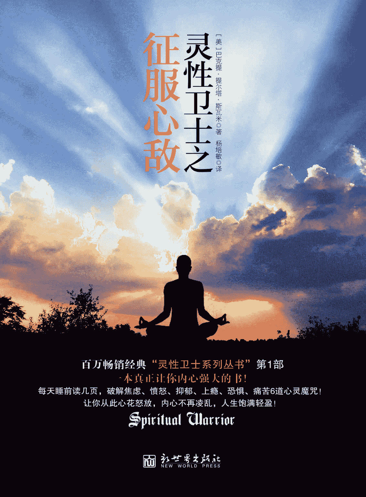

图书在版编目（CIP）数据 

灵性卫士. 征服心敌 / (美) 斯瓦米 (Swami,B.T.) 

著；杨培敏译. — 北京：新世界出版社，2013.1

ISBN 978–7–5104–3665–9

Ⅰ. ①灵… Ⅱ. ①斯… ②杨… Ⅲ. ①心理学－通俗 

读物 Ⅳ. ①B84-49 

中国版本图书馆 CIP 数据核字(2012)第 294910 号 

北京版权保护中心外国图书合同登记号：01–2012–2637 

Copyright © 2003 by John E. Favors  

Spiritual Warrior Ⅳ: Conquering the Enemies of the Mind

All rights reserved.

Through arrangement with HARI NAMA PRESS  

灵性卫士之征服心敌  

策  划：北京阳光博客文化艺术有限公司 

作  者：【美】巴克提·提尔塔·斯瓦米（Bhakti  Tirtha Swami） 著

译  者：杨培敏 译 

责任编辑：刘 媛 

责任印制：李一鸣 刘社涛 

出版发行：新世界出版社 

社  址：北京西城区百万庄大街 24 号（100037） 

发  行  部：（010）6899 5968      （010）6899 8733（传真） 

总  编  室：（010）6899 5424      （010）6832 6679（传真） 

http：//www.nwp.cn

http：//www.newworld-press.com

版  权  部：+8610 6899 6306    版权部电子信箱：frank@nwp.com.cn

经  销：新华书店      印  刷：北京市京东印刷厂 

开  本：710mm×1000mm  1/16    字  数：150 千字  印  张：14

版  次：2013 年 1 月第 1 版    印  次：2013 年 1 月第 1 次印刷 

书  号：ISBN 978–7–5104–3665–9 定  价：36.00 元 

版权所有，侵权必究  

凡购本社图书，如有缺页、倒页、脱页等印装错误，可随时退换。 

客服电话：（010）6899 8638

# 目录

前 言编者序作者自序第一章 恐惧——蚀骨的无力毛里求斯的飓风和从天而降的炸弹每个人都背负着自身堆积的恐惧与生俱来的三种恐惧恐惧的对面是希望恐惧的五张面孔恐惧的后果社会活动家与精神利己主义者爱与恐惧的太极图好狗与恶狗：一个古老的寓言问答录第二章 愤怒——心意的失控生物学上对“愤怒”的误解被愤怒刺中的世界愤怒是色欲的产物走进心灵的战场放纵感官无济于事愤怒的精神杀伤力愤怒会隐藏痛苦的根源愤怒会导致身体疾病愤怒会导致理智的丧失愤怒会导致社交障碍愤怒会导致灵性缺损五个应该四个“指责”解决“应该型”和“指责型”问题的 9 种积极方法克制愤怒的 8 种方法消除愤怒的 6 种方法学会利用愤怒扭曲的倒影培养真正的爱与无私问答录第三章 痛苦——心灵的碰壁关于痛苦痛苦的根源痛苦像一架过山车痛苦的八个阶段感同身受痛苦的症象走出痛苦的道路痛苦之后问答录第四章 抑郁——灵魂的黑夜卡利年代抑郁是一种精神感冒单极抑郁和双极抑郁抑郁是意念的产物遗传、生理及产后因素“突发的热情”与“灵魂的黑夜”为什么 CEO 是抑郁症高危群体?女性更容易患上抑郁症？具有灵性思想的治疗师心灵的六个敌人抑郁的本质宽容、信念与感恩的力量最好的朋友和最坏的敌人征服抑郁的 32 种方法消除恐慌症的 6 大步骤怎样帮助焦虑中的孩子 4 种能走进奉献服务的人问答录第五章 上瘾——灵魂的饥渴寻找狂喜——60 年代的美国精神危机与灵性的相遇“12 步方案”——一场全球性的心灵革命认真过好每一天灵性的沉醉和狂喜问答录第六章 焦虑——灼心的烈火焦虑是因为我们忘了更高的力量焦虑的真相破除焦虑的 12 味良药问答录第七章 笑是最完美的补药笑会让所有心敌打道回府让快乐飞扬弄臣与国王的秘密笑是最完美的补药每一份挑战都是一次机遇后院的蚂蚁、犹太学校和我在普林斯顿的经历灵修的历程笑是人类灵性的展示发现生活中的幽默后 记返回总目录

前 言

在书店和图书馆随处可见的自助读物中，巴克提·提尔塔·斯瓦米（Bhaki Tirtha Swami）的《灵性卫士之征服心敌》与《灵性卫士之与心为友》让我为之一振。为什么？原因很简单。它们让读者了解到了一种真正独到的方法，这种方法可以征服忧郁、焦虑、愤怒和痛苦等各种心结。让人倍感温暖的是，作者并没有站在生物医学的立场上对这些疾病加以贬斥，而是为那些正在接受或正在寻找生物疗法的人提供了全面的参照。显而易见，从作者的自序中可以看出，为了实现这个目的，《征服心敌》和《与心为友》从精神与灵性的角度提供了多种解决方案。

这部优秀的作品所提供的解决方法不仅属于物质的范畴，更是一个具有灵性意义的范例。在成功做到这一点的同时，巴克提·提尔塔·斯瓦米并没有试图劝说我们进入他本人选择的灵修道路。然而，当其他的自助读物作者谨慎地以世俗的面目出现时，他却没有避讳自己对奉爱瑜伽外士纳瓦传统的热忱与坚定。

现在让我们对本书的章节做一个总览。第一章号召我们选择爱心，远离恐惧。巴克提·提尔塔·斯瓦米“吹响了灵性战斗的号角”，指出：“除非人类在很大程度上托庇于‘灵性文化’，否则恐惧感将会不断蔓延。”巴克提·提尔塔·斯瓦米明确地提出“爱无法生存于恐惧的土壤”。他描述了恐惧的各种形式，并从灵性的视角一一加以分析。他告诫我们不要沦为“恐惧文化的牺牲品”，否则我们只会过度沉溺于“食、睡、性和恐惧”之中。作者号召“灵性卫士”们去发现那些情感自闭的人，帮助他们焕发超然的生机。

第二章讨论了如何管理愤怒情绪的问题。作者开宗明义，警示灵性成长的探索者们：若忽视深刻的内省，必会重返恶习。作者进而对“愤怒”的成因和特征进行了剖析，深入讨论愤怒的诱因，五个“应该”和四个“责备”，这真是一本为读者提供帮助的实用性手册。当然，他不会将我们遗弃在困境之中，而是提供了“对付五个‘应该’和四个‘责备’的九种积极的方式”。他提醒我们这些心理健康专家，“愤怒”同样可以分为健康性与非健康性两种。

除了健康性愤怒，作者还介绍了健康性痛苦。为了使我们对痛苦有正确的认识，作者将痛苦分为八个阶段，分别是震惊、拒绝、愤怒、恐惧、痛苦、悲哀、接受，最后回归到对爱的诉求。巴克提·提尔塔·斯瓦米告诉我们，要让痛苦具备健康性，就应当“认识、面对、感受、释放”，如此方可“真正释怀，走出这段经历”。他以非凡的洞察力揭示了痛苦的真正原因。

接着，作者开始尝试解决忧郁症的问题，有时人们将抑郁症看作“灵魂的黑夜”，本章即对此进行了深度的阐释。作者分析了忧郁症的成因，其中包含的生理因素，接着又提供了健康解决忧郁症问题的种种策略。为此，他恳请我们培养一种时刻感恩的心态。随后，针对如何克服忧郁症和恐慌症以及如何帮助忧郁症儿童的问题，作者又提出了一整套循序渐进的解决方案。

成瘾和戒瘾的过程使我们对这种被许多人称为“精神危机”的现象加深了认识。然而，仍然有许多人轻描淡写地把它当作“心理失常”来看待。巴克提·提尔塔·斯瓦米深入探讨了“十二步治疗方案”，帮助我们了解一个成瘾者从上瘾到康复所必经的各种历程。最后，他把灵性求索者比作一位康复过程中的瘾君子，而各种形式的诱惑和贪恋就是成瘾的原因。

在《避免过度焦虑》一章中，作者诚邀我们一同内省，这是生物精神病学中至关重要的一步。一个试图摆脱忧郁症的人若不内省，是断然不可能康复的。巴克提·提尔塔·斯瓦米进一步对“焦虑”下了定义，并指出了避免其破坏性的方法。他以古印度韦达（旧译吠陀）文化传统中的伟大人物为例，引经据典，旁征博引。

本章的最后一章是令人开怀的释放——笑，这是最有益身心的方法。巴克提·提尔塔·斯瓦米请我们加快欢乐的步伐。他认为笑是一种治疗手段，并从生理和心理两方面分析了笑的益处。作者回顾了自己的人生经历，并引述古老的经典加以阐释，使本章内容更为丰富详实。最后，他以优美的笔触对精神障碍的根源做了总结，帮我们意识到：是我们亲手创造了这些精神障碍。我们曾经将它们视为上宾，现在我们终于可以拒绝它们的存在，开始开怀大笑了。所有的精神障碍只是扭曲的倒影，映射出人类与上帝之间真情的纽带。

让我们恭迎这部独一无二的书作为心理治疗的工具走进心理健康的领域，让我们师从这样一位身体力行的灵性导师。最后，我相信，那些还没有成为灵性卫士的读者一定会毫不犹豫地加入巴克提·提尔塔·斯瓦米的行列。

美国精神病学与神经学学会医学博士、哲学硕士拉维·辛格（Ravi P.Singh）博士

编者序

《灵性卫士》系列中收录了巴克提·提尔塔·斯瓦米多年来在世界各地的电台和电视台面对现场观众所做的一系列演讲。由于这些主题原本都是以对话的方式呈现的，因此语言风格接近于聊天或漫谈。在编辑的过程中，我们做了整理和润饰，增强了可读性。同时，我们也保留了些许风格，以便在一定程度上保持原貌。我们想借此保留一种现场感，就如同你身临其境地坐在观众席上，去感受演讲者那滋润灵魂的、充满力量的演讲。

有关风格问题，我们还得略谈一二。巴克提·提尔塔·斯瓦米在谈话中涉及各类灵性哲学观点，然而，由于听众大多具有基督教和印度韦达文化的传统背景，因此在大多数情况下，他会参照这一类经典。他有时会引用《韦达经》（即吠陀经）中的梵文词汇，《韦达经》是卷帙浩繁的古代圣典，源自现今的印度。我们保留了很多这样的词汇，并且在上下文中尽可能地做出了解释。在这里，我们想预先解释一下以下几个词语：

• 当巴克提·提尔塔·斯瓦米提到众所周知的上帝时，他会采用不同的专用名词，例如至尊主、至尊人格神、奎师那等。

• 他经常使用“奉献者”一词，在此，泛指承袭韦达传统的灵修者以及其他所有踏上灵性之途的诚恳的实践者。

每章的最后部分均摘录了现场演讲过程中的部分问答。我们希望这些问答能解除您在阅读过程中可能产生的一些疑惑。或许，巴克提·提尔塔·斯瓦米与观众之间的交流能从不同的角度帮助您领悟所讨论的主题。

本书中所传递的信息极为罕见，希望读者能善加运用。如果能认真对待这些教导，那么，您的生命无疑将成为一次崇高的爱的旅程。

作者自序

《灵性卫士之征服心敌》与《灵性卫士之与心为友》的成书时间大致相同。这两本书既可独立成篇，又适合放在一起阅读，比起该系列的前几本书，更具有互补性。

在我的服务工作中，大约有 55%与我本人所属的国际外士纳瓦(vaisnava)社团和学院有关，另外 45％的工作和教学内容则与国际商业、医学健康和宗教对话交流有关。我个人尤为关注的是如何帮助领导者做到名实相符，如何引导持有各种信仰的朋友克服障碍，走出停滞状态，在自助的同时，为自己的团体奉献力量。

在近期刚刚结束的四十多个国家的讲学过程中，我谈到了《灵性卫士之征服心敌》和《灵性卫士之与心为友》中的许多话题，于是便有了编辑成书的想法，目的在于帮助更多的人克服他们的过度欲望和障碍，让停滞的心灵再现生机。我观察到，在这个社会中，有许多人深受困扰，精神上彷徨无助。很久以来，我一直祈祷自己能成为一名 “全球变革推进者”，在他人陷入痛苦的时候能献出绵薄之力，《灵性卫士之征服心敌》和《灵性卫士之与心为友》正是本着这样的精神问世的。

我们把心灵的主要敌人称为：恐惧、色欲、愤怒、贪婪、嫉妒、疯狂与幻念，自它们可以衍生出痛苦、忧郁、慢性焦虑、恐慌、强迫症、创伤后心理压力以及恐怖症等等。在《灵性卫士之征服心敌》与《灵性卫士之与心为友》中，我揭示了这些心灵的敌人，并指出克服其影响的方法。这些敌人之所以存在，是由于假我的驱动，也就是说，将假我转化为纯粹自我方是终极之道。《灵性卫士之征服心敌》和《灵性卫士之与心为友》将为读者提供实现纯粹自我的方略。亲爱的朋友们，在这场为了和平和爱的战争中，您将在这里找到更多的精神弹药。

第一章 恐惧——蚀骨的无力  

kamo manyur mado lobhah

soka-moha-bhayadayah

karma-bandhas ca yan-mulah

svikuryat ko nu tad budhah

心意是色欲、愤怒、骄傲、贪婪、悲哀、幻念和恐惧的根源，它们共同组成了功利性活动的枷锁。有识之士怎会相信心意呢？

——《圣典博伽瓦谭》5.6.5

毛里求斯的飓风和从天而降的炸弹

2002 年我拜访了位于印度洋的小国——毛里求斯。当时，海面上突然刮起了一场飓风。威力无比的飓风听起来就像人在尖叫和咆哮，所到之处，房屋、树木和汽车被掀得东倒西歪，还有人丧了命。那情景就好像一个怒气冲冲的人突然大发雷霆，四处攻击，转眼间又扬长而去。有一阵子飓风甚至消失得无影无踪，可不久后又卷土重来，造成更大的毁灭。

所有人都感到惊慌失措，因为在场的人都目睹过飓风巨大的破坏力，他们意识到这次飓风也会造成大规模的破坏。他们战战兢兢地想着，谁家的房屋、谁的身体会在这次劫难中遭殃。差不多整整四天，电力和水利系统全部中断，很多公路被杂物堵塞，被洪水淹没。

离开毛里求斯后，我在飞机上读到一则有关尼日利亚事故的报道。在一个军事基地，一连串的炸弹意外爆炸，炸死了本国的许多居民。炸弹炸飞了人员和房屋，一连好几个小时，人们感到世界末日骤然降临。在这次意外中，数千人失去了生命。

有一回，我到访波黑共和国和克罗地亚共和国。几个学生和我一起聊起了战争年代的气氛。他们说，有一次，一颗炸弹在市中心从天而降，他们眼睁睁地看着二三十人在近在咫尺的地方送了命。一个学生的家被其中一颗炸弹击中，一半房屋坍塌，而她当时就坐在屋里。接着他们又谈到遭强奸虐待的妇女人数，被杀害的父子兄弟的人数。

你能想象如此惨烈的战争将给人们带来什么样的创伤和痛苦吗？你能想象生活在这种环境中的人会有什么样的恐惧吗？你能想象这些人留传给子孙后辈的将是什么吗？如今，我们已经认识到父母酗酒会给孩子造成的巨大影响，身患艾滋病的父母或怀孕期间情感破裂的父母会由于生理、心理以及因果规律等原因连累到孩子。最终，这种恐惧感将影响到人生的方方面面。人们把这种意识传递给孩子，进而渗透到地球上的各个团体中。无论这种伤害来自何方，究竟是基于个人的情况、自然界的影响，抑或社会交往，都是极其危险的。

为了帮助读者和我本人，使我们的意识有所作为，让我们再深入地分析一下这个问题吧。在战争中，诱发恐惧的原因往往被特别地设定，其目的是为了控制人的意识并强迫他们从事某种行为。通过这次讨论，你会发现，爱是无法在恐惧的土壤中茁壮成长的。在恐惧中，你无法尽施所长，也不可能达到最佳的状态。尽管你试图在恐惧的伴随下依旧付出爱心，然而恐惧所制造出来的各种各样的障碍，仍将不可避免地横亘在你的面前。

每个人都背负着自身堆积的恐惧

反思一下自己的生活，我们多半会发现，几乎在一天中的每个时刻，我们的内心都或多或少地伴随有恐惧。过往的经历伴随着眼前的现状，引发了我们对未来时不时的恐惧感。在最近的一次研修活动中，我要求学生们把自己最恐惧的事情分成三类列在纸上，这三种恐惧分别是来自于内心的，来自于大自然的和来自于他人的。每个人都背负着自身堆积起来的恐惧，走到哪里都卸不下来。说到来自于内心的恐惧，有个学生总是担心上帝会强迫他进入一个不愉快的环境，或者逼迫他做自己不想做的事情，他还担心不希望看到的灾难会突然降临在他的生活里。他明白这种恐惧来自于自己的内心，而且有一天他或许还真的不得不面对一段痛苦的经历。从这个例子来看，这是对上帝的力量心存畏惧，担心上帝只顾施行自己的计划却置个体愿望而不顾，唯恐上帝的计划会给人带来烦恼。

另外一位学生透露说，她特别害怕出错，这会令她非常难堪。她担心别人不能欣赏和支持自己的言行。还有的人惧怕被所爱的人抛弃。我们最爱的人确实能给我们带来最大的快乐，但离我们最近的人也容易给我们带来最大的伤害，因此，这种担心被抛弃的恐惧感困扰着很多人。请你试着回忆一下那些最痛苦、最失望或最焦虑的日子。是什么激发了你如此强烈的感受？通常，它来自我们最爱的人。雇员或同伴或许可以伤及我们，但绝对不会像我们最在乎的人那样伤得如此之深。当我们关心另一个人的时候，会期许某种回应，当这种回报不能如期而至的时候，我们便感觉受到了极大的伤害。

来自内心的恐惧还包括一种对于失败的强烈畏惧感，通常会担心别人如何看待自己，担心自己在生活环境中的身份是否会发生变化。这类人害怕周围人会因为他们的一事无成而对他们另眼看待。还有人会担心自己因没有成功而改变地位，从而失去别人的欣赏和支持，最后甚至失去友情。人的思想是非常有力量的，重复得最多的念头最终会表现在我们的语言和行动中。心灵蕴含着无限的力量，因为它充满着创造力；心灵也同样会变得邪恶丑陋，它潜藏着巨大的破坏力。 

分析完来自内心的恐惧感后，我要求学生们相互谈谈来自环境的恐惧感。虽然每一种恐惧都和内心有关，但有一些恐惧有其特别的根源。最普遍的回答是惧怕死亡、高处、黑暗和闪电。接着我们又分析了对其他生物的恐惧感。有个学生说他特别畏惧自己的岳母。有的人害怕不良的交往，害怕冒冒失失的司机酿成交通事故。有人害怕孩子。还有一位说非常害怕交出自己的内心，惧怕心碎。这种恐惧很多人都有。不过，也有许多人从未敞开过心扉，因此也永远不会有这样的感受。他们错过了冒险的机会，同时也错失了人与人之间最深厚的真情。

与生俱来的三种恐惧

恐惧是一种极具威力的物质能量。事实上，在古老而智慧的韦达（Vedic）传统中，恐惧被认为是维系物质世界和假象的主要因素。一切生物都存在着相似的基本活动——进食、睡眠、交配，还有恐惧或者自卫，这些活动与觉悟自我关系不大。一切物种，毫无例外都必须通过吃和睡来蓄积体力，恢复精力。交配，也是生物种群生长和繁衍的自然功能。然而，尽管所有的生物都在追求这些活动，却时刻在为食、睡、性等活动担忧——或担心这些活动会突然中止，或担心其质量有所下降。因此，对于未来，我们总是怀着某种隐忧。

韦达经典还描述到，一切生灵，不论种族、性别或栖居地，都不得不承受以下几种痛苦或者恐惧。最基本的几种痛苦是精神之痛、自然之痛和社会之痛。精神之痛泛指由精神或思想而产生的恐惧或创伤。自然之痛指由自然神谕和自然环境引起的灾难，如飓风、龙卷风、地震、干旱、洪水等，这些痛苦往往突如其来，带有毁灭性的力量，甚至夺去我们的生命。由于曾经经历的困境，致使我们的心中至今还萦绕着一种恐惧，这种恐惧感甚至还会波及到未来。最后一种恐惧，即社会之痛，是我们和他人交往的某种产物，它来自社交过程中不断遭遇的失望和烦恼等体验。

除非人能在很大程度上托庇于某种灵性文化，反复充实自己的精神世界，否则，这些恐惧将成为生活中无法剔除的一部分。不仅我们自身将成为这种恐惧感的产物，就连我们的子孙后代也不得不生活在这个按照我们的意志而维系的环境中。当我们越来越无法向爱张开怀抱时，一种恐惧的文化也在相应地被创造和维系着。进食、睡眠、性爱和恐惧与三种痛苦夹杂在一起，构成了一种虚幻的文化现象。

9 · 11 的恐怖袭击大大加剧了人们心中的恐惧感和焦虑感，因为这次灾难暴露了某些假象。看似永恒的寄托在瞬间化为泡影，那种坚实的安全感从此不再。尽管有些人觉得这场袭击活动改变了整个世界，但从另一个意义上来说，我们的危险依然如故，这三重苦：精神之痛、自然之痛和社会之痛一直在侵袭着整个地球，人们依然沉醉于食、睡、性和恐惧之中，但是在世界上的很多地方，掩盖在光鲜外表下的却是难以面对的现实。

走进 21 世纪，人们必然会看到，人类对于环境的恐惧感正在不断增加。我们耳边回响着这些名词：干预性药物、疯牛病、杀人蜂、连环杀手、石棉、恐怖分子、核战争、化学战争等等。癌症、艾滋病、心脏病正在夺走不计其数的生命，而干旱、龙卷风和飓风则给许多地方留下了满目疮痍。就连心理疾病的影响也在日益加剧，各种各样的忧郁症、焦虑症和精神疾病困扰着越来越多的人，暴力和敌对情绪也在迅速攀升。自从世贸中心遭受袭击造成大量人员伤亡以来，恐怖分子一直在制造大范围的恐慌气氛。

在《少一点恐惧》这部书中，作者盖文·德·贝克尔（Gavin de Becker）清晰地为我们勾勒出暴力在美国四处蔓延的情形：

仅在过去的两年中，死于枪伤的美国人就超过了整个越战的死亡人数，这是世贸中心死亡人数的十倍……举个例子，全日本一年死于枪击事件的年轻人的总数相当于纽约市一个忙碌的周末被杀害的人数……当四架波音客机在 9 月 11 日机毁人亡时，举世震惊。然而，请你想象一下，一架满载乘客的波音客机每个月坠毁在地，月月不断，而死亡的人数依然及不上每天被她们的男友或丈夫杀害的美国妇女的总数。

人们生活在敌意和暴力之中，无奈地深陷于现实的恐惧之中。因此，我们要给这个星球来一个彻底的内部革命。放眼全世界，国与国之间，人与人之间都在不断地发动战争。我们需要灵性卫士挺身而出，抵御这些负面力量。正是出于这个目的，我撰写了《灵性卫士》系列。人们应当意识到，这种负面文化不仅给我们的家庭和环境带来了影响，而且会逐渐渗透到当前的人类意识中，最后制造出一个变异的种族。即便是现在，我们耳闻目睹的负面宣传都在不断地改变我们的生存状态，因为它改变了我们对事物优先顺序的选择，并激发了潜在的欲望。为了倡导和平，消灭战争，我们需要讲究策略。为了减轻这种泛滥的恐慌症，我们不应该一味退缩，而应制定战略，保护自我，提升意识。灵性战斗的号角已经吹响。

恐惧的对面是希望

有意思的是，在恐惧与希望之间，我们可以找到明显的相关性。同样是在这些研修活动中，有的学生坦率地说出了自己最大的恐惧，这些恐惧分属于三大类。在这些答案中，有对不安定的生活忧心忡忡的，有对孩子或母亲的死亡担惊受怕的，有对精神上的堕落顾虑重重的，有对灵性导师是否会离他而去而心存忧虑的，还有对死亡感到莫名恐惧的。接下来，我又让每个人和大家分享了自己最大的愿望，这些愿望大多和最大的恐惧相互对应。例如，害怕孩子死亡的人强烈地希望孩子能健康成长。倘若拥有一支魔棒，你最希望生活中发生什么？人最大的希望常常和最大的恐惧密切相关。

通过这些对恐惧的分析，恐惧和希望之间的联系就变得越来越清晰了。最害怕生活不安定的人如果思考一下自己的夙愿，多半是拥有一份安稳而明确的生活；担忧精神堕落的人多半渴望自己永远不偏离前进道路；而害怕精神导师抛下自己的人最渴望导师能永远与之相伴。没有人能够永生不死，因此，对死亡的恐惧感也很正常，但是千万不要过度。从这些例子中，我们可以看出，我们最大的希望通常是恐惧的对立面。

人的恐惧感往往围绕着最珍视的事物。比如，我们总是惧怕事与愿违，于是把大量的心思用在焦虑不安上。这种心理非常危险，它会把我们包裹得严严实实，并成为我们内心对话的一部分，甚至使最恶劣的恐惧成为现实。心念的力量强于语言和实际行为，但人的潜意识往往无法分辨正负之间的区别，只能一味听从思维的不断流动。举例来说，假如我们试图戒掉某种嗜好，于是反复告诫自己停止某个习惯，这种没完没了的思虑甚至更有可能导致负面状态的发生。人的潜意识通常只接受你投射给它的印象，却没有能力分辨正面或负面，积极或消极。 

恐惧的五张面孔

我们可以进一步把“恐惧”分成五类。罗列这些内容并不是为了给大家上一堂心理课，而是因为这些讯息是非常有价值的财富，它可以帮助很多人。了解恐惧对你个人的影响是有益的，但是，以下这些知识将更有助于你了解身边的人在遭受恐惧的折磨时所表现出来的症状。我们应当成为灵性卫士，去抵御无所不在的负面因素。

1.一般性恐惧会影响人的身心健康，甚至困扰人的精神生活。一般性恐惧容易导致失眠甚至噩梦，影响心脏功能，造成头晕目眩或肢体颤抖。这种焦虑感使人畏惧人际关系。

2.恐慌是“恐惧文化”在这个地球上的部分表现形式。有的人甚至患上一种被称为恐慌症的神经失调症，其症状包括头疼、呼吸急促、恶心、流汗、颤抖、心跳过速和呕吐，有的人甚至觉得死亡已经降临。这些症状对人的身心损害尤为严重，而且有可能持续很长时间。全世界有数百万人正在或即将在未来的几年内遭受这样的痛苦。

3.数百万人患有强迫性精神障碍，这也是恐惧的一种表现形式。患有强迫症的人会情不自禁地反复从事同一个行为，就像被外力胁迫一样，无从躲避。例如，有的人唯恐患上某种疾病，于是花费几个小时，里里外外反复洗手。还有人总是担心没有锁门，离家前总忍不住一次又一次地检查大门。尽管他们自己也觉得这种行为丧失理智，却依然无法自控。既然他们已经吸收了“恐惧文化”，就只能对它唯命是从了。

4.恐怖症对生活的影响很可能是毁灭性的。受恐怖症折磨的人日日夜夜都生活在巨大的恐慌中。例如，有的人患有恐高症，还有的人惧怕狭小而封闭的空间。幽闭症患者在一个拥挤的房间里哪怕待上一小会儿都会无法忍受。就算呆在一个屋里，也一定选择门口，以便紧急时刻随时脱身。如果他们被困在一个封闭的屋子里，没有方便的逃生路线，就会因为担惊受怕而出汗、颤抖、晕眩或呕吐。

5.创伤后压力来自于过往的伤害和重创。例如，报告显示，20%的妇女和 5%～10%的男人在童年时期经历过某种形式的性虐待，也就是说，有那么多的青年男女不得不面对诸如此类的问题。由于所谓的监护人对他们有过侵犯，因此其中许多人对权威失去信心，在人际关系中无法真心付出情感。很多人对自我和他人抱有强烈的恐惧和愤怒情绪。由于创伤带来的后遗症延续至今，他们甚至患上了性功能障碍。这种恐惧对一些人伤害至深，甚至变成了一个解不开的结，在他们的记忆中一遍又一遍重放。

在美国，遭受这些恐惧症折磨的人不下数百万。不幸的是，这些人在与别人交往时会把自己的恐惧施加于周边的环境和人。举例来说，焦虑的父母最终会把这些负面情绪直接发泄在孩子和配偶身上。恐慌症患者几乎没有能力表达爱，因为他们本人在感情上处于封闭状态。受过创伤的人无法给予别人完全的爱，尤其惧怕向外界敞开心扉或坦言自己的过去。如果我们的心灵被恐惧感和攻击性这双重痛苦所俘获，那么无论我们自身还是他人，都不可能获得意识上的提升。爱是我们的盾牌，为我们阻挡进犯，化解危难，而恐惧却击碎了它们，令假象与邪恶势如破竹，直入意识的深处。爱的防护一旦支离破碎，恐惧便瞬间壮大起来，向我们发出猛烈的进攻。如果我们不希望被恐惧袭击、伤害甚至毁灭，就必须让内心不断强大起来。

恐惧的后果

恐惧会让我们变得虚弱甚至患病。进食、睡眠、性爱和防范是动物性本能的一部分，而恐惧会影响全身肾上腺素的分泌。当动物处于恐惧状态时，肾上腺素会引发身体变化，帮助动物随时做好应战或逃跑的准备。心理学家把这种应激反应称为“攻击或逃跑综合症”。肾上腺素使血液迅速凝结，促使身体更好地保存血液，以备人或动物重伤时急用。恐惧激发神经索传递信息，让全身处于防卫机制，避免本体器官受到袭击。

另外，沉湎于过去非常有害，因为这意味着，我们任凭不幸一次又一次地对自己发出进攻，挫伤我们面对现实的能力。恐惧设置了重重障碍，阻止我们去深爱，尽管我们很希望付出真情。当你无法完全敞开自己的时候，也就阻碍了对方，使他们不能完全交出自己。当人们每天有意识或无意识地遭受恐惧文化的轰炸时，还怎么可能敞开自我呢？由于这些因素，越来越多的关系以破裂告终，也就不足为奇了。这些因素还导致了对妇女、儿童以及老人的虐待，因为人们可以读报纸、听新闻、看电影，从各种各样的渠道接触暴力。人们被恐惧文化轰炸得晕头转向，这是非常危险的。还有那些比比皆是的邪恶的领导者，明知这些负面轰炸的后果，却依然热烈拥护，只是为了分裂和瓦解我们的力量。

眼下，政府正不断加强恐怖主义的宣传，警告我们谨慎提防，小心行事。尽管这些恐怖袭击的确存在，也确实困扰着民众，但这种恐慌气氛在很大程度上只会构建出以恐惧为基础的消极的世界秩序。人越是惶恐不安，越容易做出恶性事件。出于恐惧，我们更容易曲解或揣测别人的内心，于是人与人之间的深入交往就出现了障碍。当我们试图揣摩别人的需要时，很可能导致的是一个令人不快的结果甚至是伤害。

社会活动家与精神利己主义者

为了缓解恐慌症，有人主张社会行动主义，然而，尽管他们付出了极大的努力，却只能触及到外部世界的表层而已。他们鼓吹的那种改变仅仅停留在表层，而不是一种真正意义上的改变。尽管他们希望改变人，改变社会格局，改变环境问题，但是由于这样的改变不能聚焦在人的内在成长和内在滋养上，因此还无法真正超越世俗的层面。有的人虽然追求内在成长，虔诚祈祷，冥想静心，通过内在的自我疏导来自我缓解，但是他们对别人的痛苦却漠不关心。

无论是活跃的社会活动家，还是精神利己主义者，他们的行为都缺乏纯粹的爱与和平的动机。我们的问题远远超越了外在的表现形式和精神上的利己主义。这些问题与每个社团乃至整个地球密切相关，而不仅仅是个体而已。那些只关心自我觉悟以及自我与上帝连接的人算不上是真正成熟的灵修者。这绝对不是至尊主的行为。至尊主不断地派遣他的使者前来，安排圣哲先知、经书经文和灵性导师的降临。虽然很多人不接受神的帮助，但他依然不遗余力地做出种种安排，以求拯救众生。

神的代表是那些奉行神的旨意的人，他们必须对他人怀有真挚的关爱。除非他人因他们的帮助而焕发灵性生机，否则他们的关怀行动只能算得上是感情用事而已。对他人的关爱必须真挚，而非感情用事。每个人都需要借助自身的修为培养内在的心性，滋润自己的灵魂，在尽力激发灵性活力的同时静思和内省，如此方能影响周围的环境。

我们不应该认为，仅凭社会行动主义和个人救赎就足以改变这个世界。如果人们希望有一种真正的精神力量来影响整个环境，就必须突破个人所谓的“主义”、政治活动、文化视域，甚至是以自我为中心的精神追求。为了实现这个目标，人必须首先认识那些具有破坏力和毁灭性的因素，这其中就包括“恐惧”。

爱与恐惧的太极图

西格蒙德·弗洛伊德（Sigumund Frend）也认为，人拥有两种基本情感或本能活动。举例而言，人尽管本能地具有破坏、毁灭甚至杀戮的倾向，但同时也有巩固和维系的倾向。他还理解到，负面消极倾向源于恐惧心理，而正面积极的活动则出于爱心或对爱的求索。

在我的另一本书《从情欲到爱的转化》中，我着重讨论了如何把情欲转化为爱的问题。古老的经典中谈到“普瑞玛”（prema）的存在，这是一种纯粹的终极之爱，即对神的爱，它可以表现为不同的形式。当纯粹的爱与物质能量和物质二元性接触时，就暂时转变为情欲，也就是说，在这个物质世界里，永无餍足的情欲从本质上而言就是找错了方向的真爱，换句话说，潜伏在我们心中的爱误入歧途了。在一种被称为“奇迹课程”（A course in miracles）的超自然系统中解释说，爱和恐惧是唯一的存在。一切对爱的干预都是负面的，原因都是因为恐惧所致。色欲、愤怒、嫉妒、贪婪等一系列的品格都与恐惧有关。

每一种负面行动都是对爱的呼唤，每一种正面行动都是爱的展示。如果我们把负面活动简单归于消极，那就好比把自己闭锁在双重性之中，甚至还有所加剧。假如你深爱的人表现出嫉妒情绪，而你把它看成是负面消极的，那就肯定找不到有益的解决办法。相反，如果我们把这个人的嫉妒看成是对爱和关心的求助，我们就能用积极有效的方法来对待了。你的语言和行为会让你所爱的人感觉不到爱，于是这种情绪就转化成了嫉妒。当有人表示愤怒的时候，我们或许会简单地给他贴上愤怒的标签，然而，我们也可以理解成一种对爱的渴盼，一种恐惧的表达。请尝试着把这些看似负面的情感表达看作对爱的渴望，然后想办法找到这种爱。

例如，我们可以简单地给那些恐怖分子贴上“魔鬼”的标签，但是，如果我们能深入了解一下其中一些人的经历，就能发现他们对爱的极度渴望。有个例子是这样的：一个恐怖分子的父亲常常把他的儿子唤作“胆小鬼”。父亲望子成龙，希望儿子当个医生，但他达不到这个目标。在成长的过程中，他总是觉得自己一无是处，毫无价值，于是强烈地渴求一种认同感和成就感。当这些人得知死于“圣战”就能立刻抵达天国时，便毫不犹豫地接受了这种哲学，因为他们的生命中充满了痛苦。如此负面的生长环境实际上变成了狂热思想的温床。

当我们审视这些人的罪行时，必要的谴责一定会有，但作为灵修者，我们不妨做深一步的探索，找到这些暴行背后的真实原因。即使面对那些最具毁灭性的连环杀手，也依然可以发现他们充满屈辱的身世，正因如此，他们会把这种屈辱转嫁到他人身上，以获得某种力量。这种无能感很可能驱使他们向更弱势的群体施加罪恶的暴力，对爱和情感的渴望以扭曲的方式表达出来，掩盖了他们对爱的饥渴。因此，当我们和别人相处时，应当经常寻找爱的因素，这才是改变之道。

好狗与恶狗：一个古老的寓言

在本章的最后，我想讲述一个流传在美国土著部落的寓言。美国当地的一些土著认为，每个人的身体里都有一条好狗和一条恶狗，他们总在相互撕打。哪条狗被我们喂得好，哪条狗就会打胜仗。我们的生命也一样，因为每个人的内在都有一个高尚本性和一个低劣本性。我们可以选择把别人都当成自己的对立面，然后生活在恐惧里，逞强好斗；同时，我们也可以选择负面思维，在痛苦的挣扎中满足自己的欲望，因为我们担心如果自己不为自己打算，就没有人能帮助我们了，甚至连神也不会向我们施予援手。与此相反，我们也可以选择正确的行动，而不是满心的焦虑和恐惧，或者为自己的无所作为寻找理由。对于这个地球上存在的问题，我们可以深入到本质中去，而非仅仅借助社会改革来改变现状，因为所谓的社会改革只能触及表层现象。同时，我们也不做只知个人救赎的自私的灵修者。我们需要一场彻底的变革，终极而言，它是一种内在的变革，并以有益健康的方式在社会环境中体现出来。

当我们觉悟到，我们需要做的就是投入主爱的怀抱时，各种各样的恐惧就会远离我们。至尊主永远公正，人若品行端正，则必得善果。无论外在的处境如何，只要我们正确行事，就一定能得到善报，因为当我们皈依主时，主就会给予我们相应的回报和支持。

ye yatha mam prapadyante

tams tathaive bhajamy aham

mama varmanuvartune

manysya partha sarvasah

因为所有人都皈依我，我将视其情况，沐以恩泽。普瑞塔之子呦！每一个人都在各个方面追随我的道路。

——《博伽梵歌》4.11

对于罪恶的活动，我们避而远之，对于正确的行为，我们乐而为之，因为我们深知，心中的主会接纳正确的行为。我们对至尊真理的信心越坚定，恐惧就越远离我们。

别让你的生活陷入到这样的状态里，否则，爱的本能可能就要被关闭，取而代之的是无边而莫名的恐惧。

问答录

问：我们总是不断受到潜意识中某些障碍的影响，如何才能克服这种障碍呢？

答：如果你看见我不断地把手伸到火里烧痛自己，你或许会想，为什么我要反复做这件事。这种固定模式一旦形成，就会不断导致相同的结果。重复的行为常常表示，我们的知觉状态依然停留在同一个水平上，因此，我们得到的反应也会是一成不变的。

面对这些模式，我们应该怎么办？假如是环境所迫，那就需要改变自己的生活圈，因为我们的同伴有时会对我们施加负面的影响。如果我们想获得灵性的活力，就应该和志趣相投的人交朋友，我们的目标会因为他们而变得更加明确。不仅如此，我们还可以向他们学习。这类行为模式就好比吸毒，一个瘾君子知道某些朋友、某个环境或某种情绪会重新勾起毒瘾，如果在戒毒后的一段时期内感到孤独苦闷，他就有可能寻找人为的刺激来填补这种空虚感。

有三种心理感知有助于解决个人问题，包括“亲自确认”、“换位思考”和“出离”。爱不是一种概念化的东西，它包括我们的语言、行为和思想。当两个人的关系出现问题时，你需要亲力而为，主动提供帮助，亲自确认。还有的时候，我们需要换位思考。你不应该只关心问题本身，而应该设身处地地替他人考虑。想一想你的语言和行为会激起对方什么样的反应。举个例子，你和配偶或孩子争吵起来了，此时你可以做出选择。你可以坚持你认为正确的立场，有时也的确有必要，但是，你也可以花点时间思考一下你的行为给对方带去的感受。仅仅考虑一下对方的观点，就有可能完全改变你对整件事情的看法。

我们把最后一种心理感知称为“出离”。有时，你所需要的仅仅是让自己跳离出来，从远处观察你和别人的行为。这种方法可以帮助我们减轻偏见和依附，从而更真切地看待自己和他人，打开心扉，迎接诸多不同的可能性。这样，你便更容易怀着爱心去行动，从而更有助于解决问题。在某些情况下，我们的爱可以表现为对他人的思想和行为采取主动理解的态度。通常，我们只顾及自己的需要，所以，自我反省的结果或许会让我们感到震惊，因为它会展现我们心底的自私和恐惧。

以上三种心理认识可以帮助我们改善自己的意识，领悟到至尊神已经为我们的终极福祉做出了一切安排。倘若生活中的遭遇对我们毫无益处，神岂不是过于残忍？若真如此，只能说明神眼看着世人经历各种逆境却依然无动于衷，那么我们凭什么还要服务这样一位无视我们的辛苦服务还任凭困境频频发生的神呢？然而，我们终将明白，是神在主宰一切。

aham sarvasya prabhavo

matthah sarvam pravartate

iti matva bhajante mam

budha bhava-samanvitah

我是所有灵性世界和物质世界的起源，一切智慧发源于我。完全认识到这一点的智者，为我做奉献服务，诚心诚意地崇拜我。

——《博伽梵歌》10.8

神掌控着物质和灵性的一切，也就是说，一切事物的发生直接或间接地遵照神的旨意。如果我们能觉悟到一切境遇都于我们有益，那么我们就能与主的爱建立连接，并学会在看似负面的境况中逐渐成熟。然后，我们就能成长、学习和正确地行事。归根结底，人类之所以有那么多恐惧，是因为他们对神的信心微乎其微。他们真的很难相信神爱着他们并照料着他们的需要，他们觉悟不到自己的本质是和至尊主紧密相连的，因此，他们的行为也不会听从自己的真实心意。

尽管一位成熟的奉献者能洞见到物质世界步步都充满痛苦和危机，但是他仍庄重泰然、毫无困惑、无所畏惧，因为他知道，神是全部的爱和万物之所依。

mattah parataram nayat

kincid asti dhananjaya

mayi sarvam idam protam

sutre mani-gana iva

财富的征服者呀！我是至高无上的真理。我是万物的依系，如线串珠。

——《博伽梵歌》7.7

问：有些人害怕交出自己的内心，因为他们不愿冒心碎的危险，你怎么看这个问题？

答：设想有人问你：“何必为你小女儿上小学的事和她现在的需要那么操心呢？十年以后她就是个少女了，很快就是成年人，有必要为她现在的某些要求烦恼吗？”再设想一下有人对你说：“现在你没必要给她那么多爱，将来，她还不是要离开你，上大学，结婚吗？”虽然这些意见有一定的道理，你依然觉得有必要做好你的那份责任，因为这天经地义。你女儿早年若得不到恰当的照顾，怎么可能成长为健康的少年，再后成为一位成熟的女人？虽然她以后会离开这个家，她对丈夫的爱可能会超过你，你也觉得是很自然的。你仍然会觉得由于过去付出的爱和关系，你和她之间依然有一条坚实的纽带，不仅如此，你依然觉得有能力给予爱。

我们知道，一些修行团体里总有人急于说，这个物质世界没有真爱，真正的爱只能在天堂、伊甸园或灵性世界里才能找到。这样的人只想生活在遥远的未来，但是他们意识不到，未来是从现在不断演变而来的。我们当下的所作所为决定了未来的真实面貌。现在其实就是未来的培训基地。

的确，对于爱的最成熟体验，那种恒久不变的性质，通常在这个物质世界不易达到。然而，这并不意味着，我们现在应当否定自己爱的能力，不去充分地爱。没错，小女孩会长成大姑娘，再变为成年人，然后离开家庭，但是如果母亲因此而尖刻、冷漠、缺少人情味，这就不对了。如果她现在如此对待自己的女儿，那么未来总有一天会变成一场灾难。

我们都需要深深地爱别人，也需要深深地被爱。这样的爱让我们成为完整的人。我和读者曾讨论过如何将情欲转化为爱的问题。我们谈论这个概念的时候，不是在说什么情色或者好莱坞的浪漫片，我们关注的是无私的、纯洁的、没有附加条件的爱，这种爱无疑是以神为中心的。为什么许多有精神追求的人最后变得情感干枯，为什么有一些出家人最后触犯了戒律，甚至为了一段感情又还俗了，这也是其中一部分原因。还有一些弃绝者，压抑情感，杜绝爱的交流和体验，但又无力将情欲转化为爱。于是，情欲便以假我、独裁、尖酸刻薄、虐待奴役等扭曲的形式爆发出来。还有些人之所以不轻易付出爱，是由于自卑感所致。人人都应该觉得自己值得被爱，应当充满生机地活着，并对别人的爱给予充分的回报。

那些惧怕交出自己的心、害怕心碎的人，他们的心已然破碎不堪。因此，我们要跳离这个怪圈。有的人已经心灵破碎，还有的人拒绝接受自己破碎的心，其实这种人不但拒绝了自己的情感，还在拒绝眼前的痛苦和悲哀。灵性卫士的另一个职责是，发现那些情感封闭的人，帮助他们获得超然的新生。他们有责任帮助那些明显患有慢性恐惧、抑郁和痛苦综合症的人，帮助他们大胆地接受真正的解药——爱。

第二章 愤怒——心意的失控

yenopasrstat purusal

loka udvijate bhrsam

na budhas tad-vasam gacched

icchann abhayam atmanah

人一旦被愤怒所蒙蔽，即成为他人恐惧的缘由，因此，一个试图摆脱物质束缚的人不应受制于愤怒。

——《圣典博伽瓦谭》4.11.32

生物学上对“愤怒”的误解

关于愤怒，人们存在着许多误解，并且由于无法理解而将愤怒错误地纳入某些范畴。比方说，有人认为愤怒是与生俱来的，具有遗传性，然而这种说法并没有十分充足的根据。虽然由于心理和生理的构造不同，或者激情与愚昧形态的外显，有些人似乎更容易发怒，但是，个人的社会性和人际交往的品质却从更大程度上影响了人的反应方式。尽管在某些情况下，我们也会涉及到其他因素，比如因果等影响我们行为反应的因素。但是，如果说愤怒仅仅是生理性的，是人体不可改变的一部分，那么就有失偏颇了。

被愤怒刺中的世界

走进 21 世纪，除了恐惧和焦虑，愤怒的现象也变得日趋严重。遍布于全球的愤怒情绪表现为各种各样的形式：管理者的狂躁症、体育暴力、飞机狂躁症，尤其是“交通暴躁症”。即便是所谓的现代化国家中的平民百姓，也会受制于恐惧和偏执的影响，常常处于惶恐不安的警觉状态中。

既然已经探讨到了这个问题，我们就应该花一些时间询问一下自己：愤怒的问题是否也同样存在于我的身上？我的愤怒情绪是否难以克服？或许我们会发现，自己身上的确存在着愤怒的问题，只是认识不深而已。当我对愤怒展开思考的时候，便开始反观自我，观察自己是如何把控这种情绪的。尽管我努力地把爱注入到我的思想和言语之中，但依然可以察觉到，有的时候愤怒的问题依旧存在。对于那些自以为已经摆脱了愤怒的人，或许你们可以深入地观察一下那些细微的现象。这类问题有时会表现为缺少谅解和宽容，甚至导致身体的疾病。这种强烈的挫折感一旦长久得不到释放，就会转化为一股力量，对身体造成负面的影响。

愤怒的表现形式多种多样。目前在世界上的很多地方，人们不仅相互残杀，甚至自我残害。一旦愤怒的情绪爆发出来，就免不了有受害者。不管是杀人还是自杀，都是愤怒的不同宣泄形式。自杀或抑郁有时也是内心怒火的一种外在表达。抑郁通常会从焦虑、失望或失落等自我压抑的情绪中发展而来，而愤怒则可能外化地表现为身体或语言上的暴力攻击。有些人采取生态灭绝的极端行为，大肆破坏神所赐予的自然资源。这种暴力行径通常是个人、团体或国家在失控状态下宣泄愤怒的极端方式，最终则会演变为战争甚至种族灭亡——即一个民族对其他民族的毁灭性攻击。

愤怒是色欲的产物

愤怒通常因心意的敌人而起，嫉妒、贪婪、狂躁、幻象、恐惧，尤其是色欲，都会引发愤怒，而且有时以非常不良的方式展示。在《博伽梵歌》的第三章，主在回答阿朱那的一个问题时，描述了愤怒的始因： 

arjuna uvaca

atha kena prayukto ’yam

papam carati purusah

anicchann api varsneya

balad iva niyojitah

阿朱那问道：维施尼（Vrsni）的后裔啊！人即使不愿为恶，却身不由己，是什么力量在驱使他呢？

sri-bhagavan uvaca

kama esa krodha esa

rajo-guna-samudbhavah

mahasano maha-papma

viddhy enam iha vairinam

至尊人格神说：只是色欲呀，阿朱那。色欲出生于与物质情欲形态的接触，随后又转为嗔怒，它是这个世界上吞没一切的罪恶的大敌。 

——《博伽梵歌》3.36～37

色欲潜伏在每一个心意的敌人之下，简而言之，就是一种被误导了的扭曲的爱。愤怒与“怒神法则”有关，怒神即主希瓦（Shiva，又译湿婆），他被认为是一位天神，以激情与毁灭的力量为世人所知。愤怒与魔性有关，所谓魔性，就是一种对神灵的激烈对抗。混乱导致破坏、毁灭与分裂。愤怒通常包含了激情，但有时，愚昧也会以较粗陋的方式取代激情。愤怒是色欲的产物，而色欲又从激情这种自然形态而来。《圣典博伽瓦谭》（3.12.11）要旨中有述：

怒神是梵天盛怒之下从两眉之间创造出来的，他来自激情形态，又被愚昧触碰，这一点很重要。《博伽梵歌》3.37 中描述了“怒神法则”。愤怒是色欲的产物，而色欲是激情演变的结果。当欲望和渴求无法得到满足时，愤怒因子就出现了，成为受局限的灵魂强大的敌人。在激情中，最糟糕的是一种以自我为中心的错误态度，即认为自己就是一切。对于这类完全被物质自然控制的受束缚的灵魂，《博伽梵歌》把这种强烈的自我中心的心态称为“愚昧”。自我中心的思想是“怒神法则”在人心中的一种表现，它是愤怒诞生的温床。怒生于心，并通过眼、手、足等各个感官展现。一个勃然大怒的人有时表现为：双目通红，双拳紧握，拳打脚踢。这些都是“怒神法则”的表现，证明怒神在这些部位出现。人生气时呼吸会变得很急促，因此怒神就表现在生命之气中，也就是吸进呼出的过程。当天空中乌云密布，狂风怒吼时，怒神就显现了。当狂风大作，波涛汹涌时，怒神则以阴郁的面目出现，让人心惊胆寒。无论是熊熊大火，还是滚滚洪流，我们都可以从中觉察到怒神的存在。

这段要旨解说了混乱的心境与强烈的激情如何组成“怒神法则”的一部分。激情主管创造、混乱和毁灭，这种活跃的能量被物质欲望覆盖，透过虚假的自我投射出来。它们就像与我们关系甚密的损友，给我们带来无穷无尽的烦恼。诸如色欲、愤怒和贪婪之类的朋友彼此勾结，有时组成同盟一起向我们发动猛攻，待我们的贪求和欲望得不到满足的时候，伺机下手。如果我们能真正学会放弃，就不会有如此强烈的欲望了。

走进心灵的战场

实际上，真正的战争是从我们内心开始发动的。如果我们不能在意识上获得平衡，这种失衡状态必然会投射到社会环境和自身的世界观中。认识到恐惧和愤怒是我们的敌人，就能帮助我们躲避它们或减少被攻击的可能性。纵然无从躲避，也至少可以减轻对我们自身的影响，让我们不至于沦为无谓的牺牲品，或阻碍我们前进的道路。我们得时刻保持警觉，因为敌方阵营随时可能大举压倒我们，全面地影响我们和外界的沟通互动。

人的知觉意识就像一个战场，而我们的武器是真知、正直、仁慈与爱。我们需要用这些武器来自卫，并同时培养健康而富有生机的情感关系。否则，随着巨大的负面精神文化力量在这个地球上的渗透，人必然会受制于群体思想的影响，如果没有更为强有力的灵性修为和奉献之心，就很容易被淹没。你们之中有些人已经体会到，我们的心意每天都是漂浮不定的，变化之大，令人吃惊。有时，即使外部环境中并没有明显的诱因，但由于内心中缺少坚实的壁垒，这种变化便无法遏制地发生了。希望我们能借助这些讨论找到一些方法，让我们敞开胸怀，热情地拥抱灵性生活。其实，当我们敞开自我并看透事物的深层本质的时候，这一切就变得非常自然而然了。 

大多数令我们产生愤怒的理由都是不良的。多数情况下我们会讨论愤怒不利的那一面，但是，我们还将在最后部分对健康的和超然的愤怒做多方面的了解。我们将从社会性、心理学和精神灵性等各方面与你分享对愤怒的理解，帮助你成为一位优秀的领导者或协作者。 

放纵感官无济于事

很多人以为，将愤怒发泄出来是缓解愤怒情绪的一种行之有效的方法，其实这也是一种误解。有些治疗师或灵修方式引导人发泄愤怒情绪，以期达到释放的目的。很多治疗师在禅房的隔壁设有一个房间，好让人们在里面击打沙袋、拳打脚踢、高声尖叫、嚎啕大哭。若有夫妻不和或婆媳相争的，就会拿一个枕头，权当是对方，一阵狂击猛打，借此宣泄胸中的怒气。实际上，有些心理医生把这种方法当成了一种释放愤怒的健康途径。

然而，假如一个人能依靠感官的满足来支配自己的行为并藉此获得更为健全的身心灵，那么猪狗之类的动物就该算是进化程度最高的生物了，因为它们大可不必克制感官。事实是，我们越放纵自己的情绪或嗜瘾，相同的负面反应就会接收得越多；丧失理智的愤怒情绪越充斥我们的行为，就越成为我们生存状态中无法剔除的一部分。人要是吃得过多、睡得过多或性生活过于频繁，就会成为一种习惯。就算是毒品，我们服用得越多，摆脱痛苦的渴望也就越强烈。

仅仅把愤怒表达出来并不会让人如释重负。实际上，由于愤怒与压力之间有着千丝万缕的联系，因此，躯体上的表达只能说也许能释放掉一些紧张感，但未必总是如此。压力依然存在，只是通过别的途径显露出来而已。无论我们把愤怒投射到某个人还是他的一个象征物上，这种行为只能强化这种情绪，使它变本加厉。

愤怒的精神杀伤力

愤怒情绪在不断升级的过程中需要经历特定的几个阶段。世俗的愤怒通常表现为一系列不良的连锁反应，例如强烈的语言、手势和行为等。如果我们看到这些现象逐步展开，就需要谨慎对待了，因为我们不希望被淹没到这些负面情绪中去。同时，我们也可以帮助另一个人，尽量避免这种强烈的态度。

假如愤怒情绪完全失控，就会给人际关系带来巨大的破坏。要重新修复这种情感关系，弥补过失，就不得不花费更多的时间、精力和资源。如果我们从一开始就尊重事实，正确对待，就可以避免所有这些麻烦。这样，我们的生活就会变得更快乐，并有能力为别人提供价值。我们的精神世界就会在这样的一片生机中茁壮地成长起来。

愤怒会隐藏痛苦的根源

如果把愤怒当作一种防卫机制，那么它可以掩盖我们的痛苦。愤怒有时会从孤独、恐惧、内疚甚至骄傲中爆发出来。虽然表面看起来都是愤怒，深入下去却另有个中缘由。尤其是骄傲，可以带来负面的效应。如果瑜伽师或满腹经纶的学者们经历了诸多苦行忏悔后却依然缺乏足够的奉爱之心，那么他们的品性中就会缺少爱和仁慈，单单只剩下知识、力量甚至愤怒。这就是愤怒中非常精微的部分，偶尔表现在瑜伽大师身上，甚至变成了相互的诅咒。达克夏的行为恰恰表现的就是这种负面的反应。首先，他诅咒了主希瓦及其首要的随从——南迪斯瓦（Nandisvara），继而又诅咒了自己的拥护者。最后，圣者比瑞古(Bhrgu)又以激烈的言辞当场指责了主希瓦的随众。于是现场陷入一片混乱。所有的婆罗门都有玄秘力量，但是有时由于缺少奉爱，他们的知识完全被假象所蒙蔽。

愤怒会导致身体疾病

愤怒引起的后果非常多，其中包括生理上的表现。例如，一群法律专业的学生曾经参与过一次历时 25 年的研究活动。25 年前，这 118 名律师作为法律专业的学生填写了明尼苏达州多项人格调查问卷，在表示敌对情绪的分值中，处于上四分位的学生与其他人相比，其早亡的概率要高出 4.2 倍。在另一项调查中，研究人员发现，敌对情绪较强的 A 型人的心脏病患病率要高出很多，原因是，在心理学上被称为“对抗或逃避”的应激反应中，他们频繁分泌对身体造成潜在危险的激素。这基本上可以说明，怒气较盛的和具有较强攻击性的人，更容易早亡。从这份研究中，我们可以看出愤怒对一个人身体的伤害程度。此外，我们还了解到，愤怒还容易引发高血压、溃疡病、动脉硬化等多种疾病。

愤怒会导致理智的丧失

有时，强烈的愤怒情绪会无端地扩大事态，造成非常严重的影响。比如，别人的言行骚扰了我们，这片愤怒的乌云就会遮蔽我们的视线，使我们看不到对待别人时应该采用的恰当方式。被压抑的愤怒会导致理性的丧失，从而做出不当的反应和错误的行为。有时，我们觉得自己的愤怒在情理之中，但是，我们不应该过多地关注这个原因，而应该事归事、人归人地来看待问题。我们曾听过这样的话：“可恨的是罪行而非罪人。”虽然是人做了罪恶的事情，但我们依然需要对他抱有一定的欣赏和关爱。倘若事情确实让我们感到烦恼不安，我们可以对那件事感到不舒服，但别给那个人贴上定性的标签。

把一件负面的事件所引发的愤怒情绪扩散到与某个人所有的沟通和交往之中，这并不是我们期望看到的。这种心态即便停留不长，也算不上是健康的。我们不必把一件事情无限扩大化。即使别人做了令人不愉快的事情，作为一个有爱心的人，我们依然有责任用正直、仁爱和体贴来对待他们。如果我们的反应是给别人贴上标签，而不是采取深思熟虑的行动，那么，就缺失了一种无条件的爱。我们失去的是以真挚的心关爱和帮助别人的能力。

愤怒会导致社交障碍

从社会学的角度来看，人们会逐渐疏远那些比较狂暴的人。即使这类人有一定的价值可以与他人分享，但由于他们暴躁的性格，别人也会比较难以接受，这显然会阻碍他们的人际交往以及表达个体需要的能力。不过，有的时候，一个怒气冲冲的人兴许也可以得到自己想要的东西，但这仅仅是因为别人想平息他的怒火，安慰他而已。从某个角度来说，愤怒是表达需要的一个信号，但是如果这种需要是通过暴力和恶语来表达的，其导致的结果则会恰恰相反。别人的反应很有可能是回避，而不是回应和帮助。如果我们深刻地反省一下自己的愤怒状态，就会发现，相对于我们的愿望和需要，愤怒导致的结果往往是事与愿违的。

愤怒会导致灵性缺损

不幸的是，对于灵修者而言，因愤怒而付出的灵性代价更大。从愤怒可以衍生出各种各样的冒犯。不仅如此，即使在服务中也可能失去理智。愤怒就好比灵性上的自杀。

《圣典博伽瓦谭》第四篇有载，有一位天神名叫达克夏，他在狂怒中丧失了理智，拒绝接受周围的一切良言忠告，他的智慧完全被愤怒所覆盖。如果我们被这种恶性的愤怒所吞噬，就会立刻丧失清晰的视域和正确的立场，在灵性上遭到毁灭。《圣典博伽瓦谭》4.2.19 中，达克夏在盛怒下诅咒了主希瓦：

nisidhyamanah sa sadasya-mukhyair

dakso giritraya visrjya sapam

tasmad viniskramy vivrddha-manyur

jagama kauravya nijam niketanam

麦垂亚继续道：“亲爱的维杜拉，尽管祭祀场上众人纷纷恳求劝说，达克夏仍怒火难消，对主希瓦诅咒一番后，随即拂袖而去，离席回府。” 

译注者圣帕布帕德在本节要旨中写道：

愤怒的杀伤力非常之大，即便是达克夏那样的伟大人物，也因暴怒而离开了聚集着梵天及所有圣贤之辈的会场。他仰仗着自己显赫的地位而不可一世，认为自己在论辩中将所向披靡。在座的众人，包括梵天在内，都恳求他息怒并留步，但他无视他们的请求，依然离席而去。这就是愤怒的结果。因此，《博伽梵歌》对那些求取灵性知觉提升的人提出了忠告，告诫他们要远离三件事——贪欲、愤怒和情欲。实际上，我们可以看到，贪欲、愤怒和情欲会让人变得疯狂，就算达克夏那样的伟人也不例外。达克夏这一名字的意思是一个精通一切世俗活动的人，但由于他对希瓦这样的圣人的憎恨，便受到这三重敌人——愤怒、贪欲和情欲的攻击。

《博伽梵歌》告诉我们说，依附导致幻念，由幻念乃生迷惑，最后人会堕落。在这个事例中，许多伟大的圣人都试图规劝达克夏，但他被愤怒冲昏了头脑，看不清自己的不当行为，听不进别人的忠言。如果我们想提升自己，就应避免负面的趋向。这不是一个自由选择的问题。当我们的意识中冒出过多的物质欲望和愤怒的时候，我们就应该警戒起来了，因为它会干扰我们，阻止我们的奉爱之心，阻止我们迈向纯净神圣的灵性世界。

贪欲、愤怒和情欲让人陷入疯狂，在任何环境中，愤怒都可能促使人做出可怕的事情，尽管人往往在事后为自己的错误后悔不迭。有时，人们非但不能把爱给予离自己最近的人，反而会伤害他们。

五个应该

本章中，我们将对容易激发愤怒的表达方式、思想情绪以及行为习惯等做一些分析。我们把能够导致愤怒情绪的原因用“必须”和“指责”来描述。最主要的问题是，愤怒激发愤怒，暴力引发暴力。别人看待事实的角度或许与我们不尽相同，他们甚至意识不到对我们造成的伤害。即便他们有心伤害我们，如果我们仍与他们一般见识，对于解决问题也是无济于事的。抛弃人性或降低人格只会让人的灵性生命陷入一种挫败感和虚弱感。对别人的弱点或污点耿耿于怀甚至任其严重影响到自己的生活，就是把自己的现在与未来交给过去来占领，这会侵蚀我们的精神力量。

1.“既然我有了这个愿望，就应该得到别人的响应。”

这种思想中存在的问题，很容易就可以认识到。首先，别人也有别人的愿望，别人的愿望与我们的愿望不一定相融。要纠正这种不良的倾向，首先应该摒弃自私的想法，更尊重他人，更深思熟虑。

2.“这就是我的想法和我的标准，别人应该和我保持一致。”

如果有人不符合我们的标准，我们就会按捺不住怒火。其实这完全取决于我们的心理。我们总觉得别人的价值观和道德观应该和我们高度一致，不论彼此的实际情况有多大差异。

3.“有了问题，应该改变的总是别人。”

当问题出现的时候，我们常常指望别人改变，而不是自己。如果别人一意孤行，而我们也固执己见，我们就会发脾气。我们应该认识到，我们和别人的感受、觉悟和因果可能是天差地别的。或许别人的确有做出改变的愿望，但我们也得承认，一个人身在某种情况下，也许根本体会不到改变的必要性。

4.“假如你爱我，关心我，就应该做这做那。”

这个“应该”的前提是一种假设。我们期待的那种结果建立在某种假设成为既成事实的前提之下，也就是说，我们以为别人的想法会自动支配某种行为。

5.“你伤害了我，我感到受了伤害，所以我应该报复。”

由于双方的关系出现了消极对抗，所以其中一个人想以伤害的方式报复对方，这显然是不良的思想。

四个“指责”

1.“用非此即彼的态度看待事物，一旦实际情况超出了我们狭隘的视域，就立刻指责别人。”

世界上有很多思想狭隘的人。他们不想了解事物的本质，也不想了解处理问题时可以采取的缓和方式。因此，一旦发现有什么事不符合自己有限的价值观和个人观点，就立刻感到非常不满。

2.“当我们自以为洞察到别人的心思时，就如同给别人贴上了分类标签，一旦别人的行为不符合这些标签，我们就会立刻指责他。”

当一个人试图猜透别人的心思，而别人的行为与自己的看法又不相吻合时，就自然容易心生怒意。我们可以从这种行为中看到一个固有的问题，因为除非一个人具有不同寻常的灵异能力，否则很容易得出不准确的甚至与别人的真实想法完全相反的结论。

3.“一旦被别人打扰了，就把问题无限夸大，甚至覆盖到双方的整个关系。”

举个例子，一个人会说：“总是发生这样的事情。你总是这样。”尽管事情才发生了一两次，但我们对整体的看法完全发生了改变。我们喜欢说“总是”或者“从不”等词语，夸大事实，小题大做，愤愤不平。“指责型人”常常会指责别人。

4.“因为我们不喜欢别人的某种行为，就给别人贴上了标签，并根据这个标签把人归了类。”

例如，你给某个人的标签是“垃圾”、“混蛋”、“白痴”，于是这个标签会彻底影响你对那个人的认识。就因为这个标签，即便他们做了令人钦佩的事情，你也会抑制不住自己的怒火。 

解决“应该型”和“指责型”问题的 9 种积极方法

1.避免自我中心或利己思想  

当我们抛弃自私自利的想法时，理解别人的观点和处境就会变得容易得多。我们可以更好地理解别人的行为、痛苦、伤害和需要。这不仅仅是个是非曲直的问题，而是如何创造爱的问题。一个真正有灵性的人不会把争取正确立场当作唯一的最终目标，实际上，抱有这种思维模式的人被称为哲学家，他们很难触及更深刻的层面，即奉爱。我们希望通过正确的途径做正确的事情，这样我们才能始终拥抱神、敬仰神、赞美神。

2.判断事物时避免使用假设  

人的思想如脱缰的野马，最喜欢各种各样的臆测。因此，我们必须慎之又慎，以免偏执一隅，妄下论断。

3.要积极地影响他人，应该首先改变自己  

我们可以这样想：“我应该如何在生活中首先改变自己，然后再鼓励别人做出改变。”这意味着，我们既不要轻视自己的力量，也不要对别人求全责备。尽管别人有别人的真实情况，但我们也可以从自身的能力出发，做出一份改变，因为神普爱众生，没有偏狭，他在众生心中。如果每个人都能认识到自己永恒而神圣的灵魂本性，就一定有力量影响周围的环境。

4.深入了解环境  

通过对活动的常态进行更深入细致的研究，可以对事物的来龙去脉有更全面的认识，从而减少过度反应的可能性。

5.报复行为只能让问题变得更复杂，更得不到解决  

报复只会把我们降低到另一个人的层面，阻碍我们从事更有意义的活动，使我们一味沉溺于过去。我们都曾经做过有害的事并希望得到别人的宽恕。如果我们对别人表示谅解，就一定能得到别人的原谅。同时，为了接近爱，我们也需要学会宽恕。

6.透过现象看本质  

我们不希望仅仅把愤怒当作一种冲动且失去理智的表达方式来接受，因为人的第一情绪反应往往只是表象而已，非常具有误导性。

7.通过提问的方式寻求更健康的反馈  

恰到好处的问题有助于明确更多的事实，洞悉到更多的内容，让我们与对方之间有更多的心灵沟通和设身处地的同情理解。

8.处理问题时本着实事求是和真诚相待的态度  

只有这样，各方才能真正解决矛盾。如果参与者不能坦言自己真实的恐惧、焦虑和需求，那么矛盾永远得不到解决，甚至还会步步升级。

9.珍视他人的价值  

如果我们能培养一种更深刻的感恩之情，那么生活中出现的任何问题都会更富有深意，都能促使我们更好地荣耀神。如果我们不知道珍视他人的价值，就很难建立一种健康、真挚而富有意义的情感关系。

克制愤怒的 8 种方法

1.检查一下自己是否习惯于“读心术”  

当一个人对另一个人的想法开始揣测，并信以为真地采取相应行动的时候，就叫“读心术”。要阻止这种做法，可以多花一些时间去了解这个人的真实用意以及他的关注点。

2.在负面情况下立刻“叫停”  

比方说，出现了难分难解的冲突局面，我们可以说：“也许我们可以在明天或者今天晚上再继续讨论。”这样，我们会有更大的可能性来理智地解决冲突，用爱来连接双方的情感，而不至于感情用事，造成不利的结果。

当你和孩子打交道的时候，这个方法是非常管用的。假如他们的行为把你气得咬牙切齿，你可以稍后再惩罚他们，因为那个时候你可以更理智地处理他们的行为问题。你要让他们明白，你反对他们的行为，但是你可以在更容易控制愤怒情绪的时候再对他们施以惩罚。这样，你的惩戒就会符合实际情况，达到改正错误的效果，而不是泄愤甚至是破坏。

“叫停”能给我们留下一个阅读、念诵、祈祷和沉思的机会，提醒我们自身的真实身份和情感关系的意义。最重要的是，它能给予我们一个付出关爱的机会。证明别人的错误，然后伺机报复，这绝不是我们的愿望。也许在对事件进行一番深思熟虑之后，我们依然断定是别人行为不当，但是，此时的我们在理解上已经很健康成熟了，因此也有能力采取正面积极的方式来进行引导。

3.自我对话  

所谓自我对话，就是我们对自己述说正面或负面的事情。研究显示，普通人的大多数想法以负面居多。许多人只关注缺憾以及导致缺憾的原因。他们对那些给他们气受的人和生气的原因总是耿耿于怀。这样的例子不胜枚举。所以，重要的是，我们应该对心意的力量有所了解，认识到它有可能成为我们最大的敌人。如果我们对这些负面的不良信息不加阻止，就会被它们控制。

4.将箴言警句抄在卡片上，以便在紧急情况下派上用场  

一旦发现自己控制不住情绪，就可以翻阅一下这些卡片，学习在特定的情况下正确行事。我们还可以把很多祷文和灵修格言记录下来，帮助自己应付各种各样的情形。

5.借助想象练习正确的行为  

举个例子，假如你和别人有过节，就可以想象下一次和对方打交道时，如何对他的举动给一个正面的回应。你可以借助这个方法改变过去那些伤害过感情和激发愤怒的行为模式。当你和别人真正面对面的时候，就会感觉充满力量，头脑清晰。出色的运动员和商人就是用这种方法训练自己的。他们身处当下，却能看到未来，于是当下的现实便转化为按部就班的可控事实，因为他们的内心早已采用了正确的行动。

6.在镜子前面，或和其他人一起练习自己的举止  

这样的做法有助于自我控制，更好地表达爱心。

7.色欲在本质上是错失方向的爱，要试图对负面能量进行疏导  

我们不必压抑或排斥这种能量，相反，可以进行疏导，将之转化为具有创造性、建设性和健康性的活动。有时，最伟大的创造是在忧愁中诞生的。一些伟大的祈祷、沉思录、诗篇和文学作品就在这样的能量中萌芽，并借助作者之手，进一步发展为一种富有创造性的表达。

8.用愉悦的方式彼此交流和解释问题，让各方真诚沟通，相互欣赏  

这样做有助于我们对调解事件和解决冲突加强意识，促使一个人了解自我和他人的愤怒问题，掌握控制愤怒的方法。

消除愤怒的 6 种方法

1.化解负面因素  

愤怒管理是灵性卫士们最基础的一项技能。由愤怒所导致的严重后果，例如暴力甚至战争，是我们绝不能忽视的。某些恐怖分子内心中压抑的怒火如此之巨，甚至为了伤害别人而不惜牺牲自己的生命。显而易见的是，在一个人人感到孤独无助，处处受到威胁和缺乏安全感的社会中，如此强烈的愤怒情绪只能不断加剧。而针对这些恐怖袭击和威胁的普遍反应是，人们的自卫手段也越来越多。

此外，当人感觉到自己的价值和需求得不到重视的时候，这种愤怒文化也会相应地滋生出来。面对日趋严重的负面文化，灵性生活的倡导者有责任站出来化解消极的影响，安抚受害者。如果有可能，灵修者应当首先根除自身意识中的杂草，然后像灵性卫士一样，向他人伸出援手。我们需要从多重角度来观察这个问题，使人们不仅自助而且助人。

2.写日记

写日记是帮助我们控制愤怒的好办法。书写可以帮助我们深刻地探寻生活中的问题，加强自身的责任感，因为如果我们自己缺乏计划性，就无疑把计划的主动权交到了假象和虚幻的手中。我们可以选择把奉献精神更多地付诸计划和行动，也可以坐等死神用那些短暂而相对性的思虑对我们狂轰滥炸。如果我们屈从于环境的影响，就会被自己的感官和心意掠走。

mamaivamso jiva-loke

jiva-bhttah sanatanah

manah-sasthanindriyani

prakrit-sthani karsati

在这个受诸种条件限制的世界里，众生都是我永恒所属的部分，由于生存受到种种条件的限制，他们以包括心意在内的六种感官苦苦挣扎。

——《博伽梵歌》15.7

当心智以不健康的方式回应感官的驱动时，种种强烈的痛苦便产生了。

在日记里，我们可以用 1～10 的分值来监测愤怒的级别。我们可以选择某一天，就自己的攻击性和冲动性的水平标定一个分值。这样，我们不仅可以对自己每天的情绪做一个监测，而且还可以精确地找出什么样的处境能激发我们的愤怒或导致我们失去自控能力。通过这项自我观察，我们可以找到激发爱心的方法，这种爱心有别于情欲，因为情欲往往源自过度的依附或过度的反应。

3.评价自己的经历  

为了对愤怒进行管理，我们首先应当尽力做到认识、面对、感受和释放。首先，在愤怒的敌人悄悄潜伏于环境之前，我们必须识别它，否则，它一旦得逞，就会制造出各种各样的破坏，就像癌症和定时炸弹一样。长期生活在危机感中的人，很难体会到更深层次的爱和觉悟。由于过往的负面经历所衍生出来的愤怒情绪，这些人喜欢把这些经历过分演绎，并且把那种心态带到人际关系中。于是，在与他人的交往沟通过程中，他们的能力常常受到压抑，无法尽情施展。回顾一天的经历，对自己的感受做一番评价，这样我们就可以找到激发我们愤怒情绪的原因，然后做出相应的解决。

4.缓解压力  

释放压力的基本方法，我们已经略知一二，比如说锻炼、冥想、想象、确信。锻炼可以释放积极的刺激性激素，改变大脑的化学环境，巩固免疫系统。冥想、想象和确信都可以引导出放松的反应，使人更专注于健康有益的反思与行动。这些减压方法可以帮助我们控制愤怒，尤其当我们沉浸在精神活动中的时候。然而，当我们的问题已经表现出慢性症状时，就需要更多的方法来创造更具有彻底性和持久性的结果。 

5.用真诚的灵修去除虚伪

当人通过冥想和念颂等灵修方式逐步内省时，具有觉知力量的心意会渐渐归于平静。但是，如果我们无法敞开胸怀，就达不到完全的益处。例如，如果一个人在施予时心中有怒，这种行为的积极效果就要大打折扣了。再如，奉爱瑜伽的实践方法是很有力量的，但是，如果我们不断地产生不当的心念和行为，就收获不到完美的价值和力量。 

类似的问题在所有的宗教或社会团体中都时有发生。虽然有真正的经典和灵性导师，虚伪却常常乘虚而入，遏制了纯正的灵修行为。宗教领袖与信众双方的虚伪替代了真实无欺的奉爱与觉悟。教堂、清真寺、庙宇在全世界拔地而起，但是，世界秩序中的国际化问题却日益尖锐。这些问题已经升级到如此严重的地步，甚至最惨痛的反人道行径居然出自宗教本身。宗教狂热就是从所谓的宗教中暴露出来的一种严重的攻击性行为。地球的现状真是不容乐观，我们需要敞开胸怀、相互沟通，需要真诚地审视自我和他人。我们需要完善自我，如此方能给予别人真挚的关怀，向他们伸出友谊之手。我们只有提升自己，才能用纯净的心灵更有效地呈现自我。

6.理解真义的精髓  

细致深入地研习古老的经典可以赋予我们更深刻的洞察力。求教于经典，并让这些古老的词句焕发生命力，这是非常重要的。有的修行者在知识上算得上渊博，但却无法改变不良的生活模式。于是，我们会看到他们去看心理医生，身患忧郁症，甚至自杀。如果一位好医生能同时了解病人的哲学理念和真正的需求，就可以更好地帮助他们清除心理障碍。如此，一个人就能更全面地吸收自己的哲学理念并在各个方面做到真实有效。

有时，我们得关注一下自己的心念和意识的流露，以便让神深入我们心中。我们要利用这个机会直面这些问题。这是因为，虽然这个年代充斥着各种各样的哲学流派或修行道法，大多数的人依然无法了解其中的本质。道理何在？难道是历代宗师和先知高人传授的方法失去了效力？不是的。其实是人失去了理解真义的能力。这个星球上的痛苦太多了，灵修者更需要真挚和正信，这样才能帮助人们提升意识。要想更有效地帮助他人，灵修者更需要积极主动，而不是消极反应，他们的内在应当是健全而完善的。

在《博伽梵歌》第十五章第十五部分中，主有言：

Sarvasya caham hrdi sannivisto

Mattah smrtir jnanam apohanam ca

我居于每个人的心中，一切记忆、知识和遗忘都自我而来。

主奎师那隐于每个人的心中，等待机会显现，并赐予我们完美的知识、爱和交流。然而，主又以超灵的美丽形象出现在我们心中。如果我们的心浸没在愤怒和情欲之中，那些觉悟和指导就很难突破障碍，进入我们的知觉深处。

显然，心中的内容会对思想产生影响，并借助语言和行动逐步呈现出来。例如，在修习奉爱瑜伽的过程中，我们将全部的感官都凝聚到奉爱服务之中。若感官遭到敌人的伏击，就不能行使它的服务了。感官得不到恰当的运用，就会停留在初级阶段而得不到继续提升。当我们的生命仍然被世俗的内容占据时，灵性的品味——真爱，就无法得到培养。愤怒是我们的大敌，它会不断地困扰我们，遏制奉爱之藤。我们要打破这些禁锢，让奉爱的藤蔓得到自由，并尽情地呼吸生长。

有的人尽管忍受了极度的苦行与忏悔，但如果缺少奉献与爱心，那么只会更加愤怒。有时，人们引经据典，争执不休，但是，因为缺少奉爱的精神，因此只是在拿经典狠狠地砸对方的脑袋罢了。

《圣典博伽瓦谭》（11.4.11）的要旨中如此解释：

拒绝奉爱服务的人可分为两类。一类人沉溺于感官的享乐，很容易被某些武器击败，这些武器就是饥渴和性欲，对过去的痛悔以及对未来的空想。这些被物质冲昏头脑的愚人，迷醉在物质世界里，被提供感官享乐的半神人所轻易控制……苦修者虽然凭借忏悔苦行度过了感官享乐的汪洋，却失足于愤怒的小水洼。只知道做物质苦行的人并不会真正地得到心灵的净化。人或许可以通过世俗意义上的决心和毅力控制感官的活动，但是，内心深处却依然充满着世俗的欲望，最实际的结果就是愤怒。这种因排斥感官而变得苦闷易怒的虚假的苦行者，是不难见到的。

学会利用愤怒

愤怒是催化剂

除了愤怒情绪中不健康的那一面之外，我们还会发现愤怒中健康甚至超然的那一面。从某种意义上来说，愤怒是生活的一部分，因此很容易被识别，它是对某种境况的自然反应或过度反应。然而，我们应当常常自问：“我们如何通过愤怒得到成长，如何让自己的知觉更快地回归本真呢？”

愤怒是一种独特的催化剂，它帮助我们更近地观察自己，更深入地面对事物。假如我们发现自己因陷入某种状况而心生愤怒，那么我们可以对这种愤怒追根溯源，也许这个根由与任何人都没有关系。这种深刻的内省可以帮助我们找到更积极的解决方式。有时，愤怒会提供一个机会，让我们看到自己的自私和欲望，这样，我们便可以追踪到这些欲望的来龙去脉。

愤怒就像一支晴雨表，帮助我们退后一步，用恰当的角度审视我们的境遇。马丁·路德·金因美籍非洲人所遭受的种族歧视而义愤填膺，他的愤怒不仅没有导致毁灭，相反，却卓有成效地激发出正义的行动。他的义愤转化为一场志在变革的声势浩大的运动。圣雄甘地用他的愤怒掀起了一场气势磅礴的非暴力运动，向英国人讨回了印度的独立。

从物质的角度来说，当你的身体遭到了别人的攻击时，愤怒可以激发出力量、韧性与决心。在双方的关系中，如果一方逾越了恰当的界限，愤怒可以帮助你维护正义和良知。比方说，有人不恰当地碰触了别人，对方可以通过强烈的反应明确说明，他无法忍受这种行为。人或许不必采取激烈的报复行为，但可以清晰地标定出自己的界限。当然，这也是一个深入认识自我的契机。愤怒也是痛苦产生的过程中一个自然而然的阶段，这一点我们会在下一章做进一步深入的讨论。一个人在彻底摆脱痛苦之前，通常会经历一个正常的愤怒阶段，这也是发现问题和解决问题的途径。

灵性的愤怒

从灵性的意义上来说，愤怒必有其健康有益的目的。举个例子，如果有人出言不逊，亵渎神明，我们不应该只知道愤怒，而应当对冒犯者慈悲为怀，关切为本。做出这种冒犯行为的人实际上伤害的是自己，一个人应该对他人宽厚仁爱，因为冒犯者的精神成长和奉爱之苗很可能曾经遭受过严重的摧残。或许我们会把灵修人士的强烈情绪当成了愤怒，但实际上，他对对方的仁慈和爱心是非常深沉的。

《圣典博伽瓦谭》中描述了一位国王，名为裴图大君，他所表现的愤怒是正义的典范。有一回，裴图大君看到国民们过着惨淡的日子，感到十分愤怒不安。国王的天职是保护臣民，看到他们因为食不果腹而瘦骨嶙峋的样子，国王受到很大的震动，于是关切地聆听他们的感受和需求。为了国民的安康，他心无旁骛，决心找出他们痛苦的根源，使这些生活在他管辖地带的居民安居乐业。他以自身的榜样昭示世人，领袖人物应当一视同仁，而非厚此薄彼，当出现问题或偏离正道时，应当果断解决。于是，他调查了实情，发觉是地球母亲的责任，于是准备采取行动。在《圣典博伽瓦谭》的第四篇中，伟大的圣哲麦垂亚对维杜拉描述了这段传奇：

Maitreya uvaca

Yadabhisiktah prthur anga viprair

Amantrito janatayas ca palah

Praja niranne ksiti-prstha etya

Ksut-ksama-dehah patim abhyavocan

伟大的圣哲麦垂亚继续道：亲爱的维杜拉君，彼时众多伟大的圣哲和婆罗门正立裴图大君为王，并昭告天下，称其为全体国民的庇佑者。正当时，国中出现粮荒，百姓们因饥饿难耐，个个瘦弱不堪。因此，他们来到国王跟前，告以实情。

Vayam rajan jatharenabhitapta

Yathagnina kotara-sthena vrksah

Tvam adya yatah saranam saranyam

Yah sadhito vrtii-karah patir nah

Tan no bhavan ihatu ratave ‘nnam

Ksudharditanam naradeva-deva

Yavan na nanksyamaha ujjhitorja

Varta-patis tvam kila loka-palah

敬爱的国王啊，正如树木被树洞中的火苗焚烧后逐渐干枯，因受胃中饥饿之火的煎熬，我们也在枯竭。您是皈依灵魂的庇护者，受指派来分配活计。因此，我们特来向您祈求庇护。 您不仅是一国之君，更是神的化身。实际上，您是王者之王。您是我们的主人，为我们安排生计，赋予我们各类职分。所以啊，王者之王，请恰当地分配谷物，好缓解我们的饥饿。请看顾我们，否则我们将因饥饿而性命不保。

Maitreya uvaca

Prthuh prajanam karunam

Nisamya paridevitam

Dirgham dadhyau kurusrestha

Nimittam so’nvapadyata

听完这一番哀诉，目睹百姓的惨况，裴图大君沉思良久，冥思苦想这背后的根源。

Iti vyavasito buddhya

Pragrhita-sarasanah

Sandadhe visikham bhumeh

Kruddhas Tripura-ha yatha

结论一经得出，国王立即手持弓箭，瞄准大地，正如主希瓦——毁灭之神在怒火中摧毁整个世界。

Pravepamana dharani

Nisamyodayudham ca tam

Gauh saty apadravad bhita

Mrgiva mrgayu-druta

地球眼见裴图大君手持弓箭欲置自己于死地，不由惊恐万状，瑟瑟发抖。她像一头被猎人追赶的麋鹿一般，仓皇而逃。摄于裴图的威力，她摇身一变，变作一头奶牛，撒蹄飞奔。

目睹此景，裴图大君怒火顿生，双目如清晨的红日般火红。他弯弓搭箭，开始追赶那头由地球幻化的奶牛，无论它逃向哪里，都穷追不舍。

——《圣典博伽瓦谭》4.17.9～15

希望我们都能逐步领会世俗的愤怒与灵性或超然的愤怒两者的区别。在这段典故中，虽然我们也看到了愤怒，但裴图大君表现出来的愤怒却在情理之中。他关注百姓的需要，探查实情后，找出了百姓困苦的原因并采取了有益的行动。裴图大君的愤怒，其展示的过程饶有趣味。在聆听了百姓的哀告后，出于仁慈，出于对他们幸福生活的期望，他果断采取了措施。对他们的怨言，他报之以深切的关注，《博伽瓦谭》将之描述为愤怒，但这样的愤怒也在情理之中。作为一位领袖，他想表明自己对这种行为是不可容忍的，因此采取了迅速而果断的行动。他的行为是对有益的愤怒绝好的诠释。

愚蠢的愤怒

paramo ’nugraho dando

bhrtyesu prabhunarpitah

balo na veda tat tanvi

bandhu-krtyam amarsanah

亲爱的仆人，亭亭玉立的女子，当主人叱责仆人时，仆人应把它接受为巨大的仁慈。如果因此而生怒，定是愚蠢之极，因为那是朋友的责任，而他却浑然不觉。

在评注中有这样的解释：

俗话说，忠言逆耳，良言在愚蠢的人耳中听来，总是难以接受的，甚至会让他勃然大怒。这样的愤怒就好比毒蛇的毒液。毒蛇吃了牛奶和香蕉，会增加它的毒液。给毒蛇喂以可口的食物，非但不能让它变得顺服仁爱，反而增加了它的毒性。同样，给愚人告诫，愚人非但不能改过，反而徒增愤怒。

有时，一个人会因为老师或父母的责备而发怒。然而，父母或师长其实都是非常关爱晚辈的，为了帮助他们端正自己的行为，甚至会用表面的愤怒来表达这种关切之情。有时，他们不得不依靠一种强烈的方式来传达这种信息。

灵性导师有权按照自己的方式对门徒进行责罚。门徒意味着接受灵性导师给自己立下的规矩。即便灵性导师有时出于父爱，斥责门徒为傻瓜或无赖，也并不意味着门徒真的就是傻瓜或者无赖。主采坦尼亚把自己表现为一个顺从灵性导师的傻瓜，但这并不意味着他就是一个真正的傻瓜。当灵性导师责备门徒，甚至骂他是笨蛋或无赖的时候，一位真诚的门徒也会感到愉快的。

扭曲的倒影

正如痛苦和悲伤没有真实的存在，同样，愤怒的存在也是无形的，它不是一个独立的个体，而是我们创造并培育出来的假象中的一部分。当我们面对一个境况，用世俗的愤怒来应对时，其实是在凭自己的直觉做出特定的选择。结果，我们编写了一套交流互动的方案，然后依而行之。说实话，愤怒并没有真实地存在。谁也不必被一种世俗的愤怒压得喘不上气来；它只不过是个人的一种创造，一种一经诞生就被纵容保护，然后恣意生长的产物。愤怒可以引发众多生理、心理、社会和精神上的困扰。人的思想随时随地都在接受和拒绝之间徘徊。我们有多少欲望？我们在灵性上的渴望究竟有多么强烈？这些因素都会决定我们在面对问题时究竟是欣然接受，还是以消极的方式做出回应。这个道理既简单明了，又错综复杂。

认识我们原本的纯真本性可以帮助我们从精神的困扰中解放出来。个体灵魂的本性是永恒、喜乐、充满知识的。人之初，性本善。人的本性都是纯净无瑕的，但是，自从接受了虚幻的假象，我们的思想就发生了偏离，并误导了我们的语言和行动。虽然心灵的敌人并非真实的个体，但我们却认为它们的力量是锐不可当的，于是甘愿臣服屈就。结果，我们不仅给这些敌人提供了养料，而且还构建出基于这种思想的某种思维定式。

遇到容易激发愤怒的情况时，有四种选择。首先，我们要勇于承担责任。例如，裴图大君找出了问题的根源后，虽然感到非常愤怒，却对自己的愤怒做了恰当的疏导，并提出了最佳的解决方案。这样，他的反应就是积极有效的。第二，我们可以敞开心扉，交流问题。有灵性的人应当是所有人的祝福者。我们可以把其他人都看作自己的主人和朋友。别人的痛苦和快乐，我们应当感同身受；别人的努力和挣扎，我们应当予以理解和认同，就如同对待自己一样。无论是相互沟通还是制定计划，我们都是敞开心怀的，目的是为了寻找一个良好的解决方法。再者，我们可以选择脱离当时的环境或局面，让自己从旁观者的角度来观察问题，此法将有助于我们更迅速地解决很多问题。最后，我们需要在某些时候记起因果的定律，保持公正而平衡的立场。

愤怒是假象的产物，在反应不当或反应过度的时候，就容易愈演愈烈。其实，我们有足够的能力平息或拒绝这种世俗而不健康的愤怒。面对这种负面的情绪，是拒绝还是接受，选择权都在我们手里。灵性生活并不错综复杂，也不是捉摸不定的。我们和创造之主、灵性世界及历代先师的连接由来已久，仍在延续，这种灵魂的关系是永恒长存的。然而，我们却一直把物质自然以及三种自然属性（善良、情欲和愚昧）当作自己的食粮。对于那些失去理智并制造假象，再以假象为中心编织虚幻罗网的人，整个的物质能量都是为他们准备的。这样的人将经历各种各样的磨难和痛苦。

如果我们想接受愤怒的存在，就应当接受最纯粹意义上的愤怒。有关健康的愤怒，我们已在前文做过描述，这种愤怒是以最纯正的面目呈现出来的。痛苦与悲伤在灵性世界中也有其完美的展示。那些不健康和不正常的模式和交流都来自物质自然的影响，而原本存在于主与我们之间的真实情感和心态则被扭曲了。这些情感是灵魂的重要组成部分，是没有任何敌意的。它们的存在是为了激发真正的爱。在灵性世界，一切都以纯粹的爱和期待为中心，并相互给予，另外，同样觉悟到神爱的人之间也有着甜蜜的交流。

大体上来说，物质世界的所有活动都是灵性世界扭曲了的倒影，这提醒我们灵性世界的真实存在。我们都有责任拒绝假象，接受真实。神展示其愤怒，驱除邪恶和假象，无论是超凡脱俗的爱还是激烈的厮杀，他超然的愤怒展现在那些神迹之中，吸引着爱他的奉献者们。 

在《教诲的甘露》的第一节中，谈到了如何把愤怒运用到奉爱生活之中：

真理是太阳，假象是黑暗。太阳照耀时，黑暗就无影无踪了。同样，心中若有神，就不可能受到假象的刺激。排斥一切俗念的瑜伽修习方法是无济于事的。试图在心里制造一个真空环境，只能说是虚妄。这种真空无法永久存留。然而，如果人能一直冥思主，思考以何种最好的方式服务于他，就自然控制住了意念。

要彻底清除这些扭曲的倒影或者阻止其产生，就我们而言是无能为力的，然而我们可以仰赖主。我们不想纠缠在这些由于对物质主义的不良依附而滋生出来的不良情绪之中。但是，如果能用这些情感加深我们的爱心，让我们原本的知觉恢复活力，那么回归本真的那一天就指日可待了。

培养真正的爱与无私

人的一生都不得不和愤怒打交道。你们中的一些人或许觉察不到自己的愤怒问题，读完本章后，你也许已经意识到，这样的问题在自己的生活中的确存在。或许，你需要进一步付出努力，化色欲为真爱，以摆脱虚假的自我，恢复真实的自我。色欲和愚昧这两种物质自然性是心意的敌人强大的助推剂，你在真实的爱之中走得越深，就越容易从色欲和愚昧中挣脱出来。

最重要的是，我们应该开阔视域，尝试从别人的角度看待事物。圣人的心愿是让我们走进一个纯粹而永恒的大家庭，而作为我们，则需要培养灵性的心态。只有怀着一颗无私的心，才能成为灵性家族的一员。无私是一种真实而深沉的情感，不是强迫和做作就可以拥有的。我们不希望永远成为欲望和情欲的奴仆，如果我们还抓住次要的事物和二元意识紧紧不放，就会越来越远离我们的真实身份——圣洁而充满爱的至尊神的代言人。

问答录

问：为什么有的灵修之士经常对别人发怒？

答：有许多人把仪式和外在的戒律遵守得很好，但却缺乏足够的知识。最重要的是，这些人缺乏深刻的觉悟。有的人很机械地做着服务，看起来诚心诚意，事实却并非如此。如果一个人能在真知中从事真正的灵修活动，那么他做得越多就越受益。实际上，如果能在正确知识的引导下去从事正确的活动，我们就可以有更多的机会从中受益。但是，一个人若想从正确的灵修中获得最多的益处，就必须超越知识的层面，到达证悟的境界。正确的灵修基于行动（手的参与），理解力（头脑的参与）和深刻的情感与爱的觉悟（心灵的参与）。很多人只用手，还有的人会用脑，但很少有人会用心。

苦修士通常可以获得一些功能和力量，但是如果他不敞开心灵，这样的力量与功能就会被误解甚至误用。这类人若不加深领悟，滥用自己的功能只是早晚的事。所以，初习者在修行方面可以做得尽善尽美，但是行为上却可以非常苛刻粗暴。机械性的活动和对知识的拥有肯定对一个人有所帮助，但却不足以改变一个人的性情。

苦行、祭祀和忏悔可以依据三种物质自然形态进行分类，《博伽梵歌》解为愚昧形态、情欲形态和善良形态。愚昧形态中的修行可以使一个人乃至一个环境堕落，情欲形态中的修行表现为对别人的需求与福祉麻木不仁，而善良形态中的修行却能使人人受益，但仍缺乏与灵魂之门——心灵的深刻连接。然而，超然的活动就好像打开心灵之门的钥匙，这样，人的灵魂才能不断地得到滋润。

对于一位由于过往的活动而屡获殊荣的灵修者而言，如果他过于暴躁易怒，就会丧失一些灵性的光耀。对他而言，此刻最大的危险莫过于“假我”，也就是说，这样的人必须时刻保持警惕，遏制假我，如此方可和谐统一地运用手、脑、心，用人类的真正福祉服务于至高无上的真理，并获得灵修的正果。这对一位对自我的行为和觉悟有着明确意识并敞开心灵的人来说，定能轻而易举地摆脱负面情绪的困扰。 

问：缺乏宽容也是一种愤怒，面对别人的一再伤害，我们该如何克制愤怒？

答：宽容并不意味着我们要把自己变成别人的出气筒，任人摔打，也不意味着把自己变成门口的一块脚垫，任人踩踏，随意擦拭。人应该避免成为别人攻击的靶子。

宽容不意味着：  

● 我们容忍那个人继续伤害我们；

● 我们觉得那个人做过的事不算恶劣；

● 我们认为错在自己，不在别人；

● 我们忘记了错误本身；

● 我们完全摆脱了痛苦；

● 我们装作什么事情都不曾发生过的样子；

● 我们愿意和那个人密切交往。

宽容意味着：  

● 我们对那个人和他的行为不再耿耿于怀，这样可以避免伤害我们的人因我们的执著而继续对我们施加伤害，因为我们越是对那件事愤恨难平，就越是在重复接受他的攻击；

● 我们不想生活在过去；

● 我们准备面对现在，做出有益的选择，让过去的负面影响烟消云散；

● 我们愿意始终以爱心面对生活，而不仅仅在别人有善意行为的时候。 

换言之，宽容是我们赠予自己的礼物，有了宽容，我们就可以从停滞中跳离出来，避免在身、心、灵上继续遭受创伤。即使别人继续作恶，我们也绝不无端地接受他的侵害。无论环境如何，无论对方的行为如何，我们都应该本着爱的精神无拘无束地行动。在爱的精神中，人需要了解什么能真正有益于自己，什么最利于别人的精神与灵性的健康。当一个人压抑着不良的怒气时，通常情况下，容易产生报复的想法，或希望看到对方遭受伤害。此时，我们应该询问一下自己：“这个人得受多大的苦，我才能从心里把他放下？”无论他们心生悔意，还是毫无歉疚之情，我们的生活都不应该因此而受到丝毫的影响或压力。

问：如何在不摒弃经典教理的前提下，以健康的方式认识愤怒，从而顺利地解决问题？

答：我们知道，在某些情况下，愤怒可以发挥有益的作用。例如，一个人遭到暴力攻击或者正当的权限受到了侵犯时，就可以借助愤怒达到自我保护。愤怒是一个信号，它可以促使一个人深入某一事件，同时也是痛苦过程中很自然的一个部分。在我们对别人非常关爱时，愤怒有助于我们的行动。诸如此类的愤怒都是必要的，但需要适度。在过度的或负面的愤怒中，总免不了受害者，不是自己就是别人。压抑愤怒会引发高血压、溃疡、心脏病以及一大堆并发症，从生理学的角度来说，压抑愤怒会导致忧郁甚至神经衰弱。当然，我们还知道，不健康的愤怒还与种种暴露的或潜藏的社会问题和精神问题有着千丝万缕的联系。我们的愤怒究竟是健康的还是不健康的，究竟有没有得到恰当而有益的释放，对这些问题进行细致而深入的研究看来是非常重要的。

“仁慈”二字是真正的关键。如果我们能以仁慈之心来指导我们的思想和行为，就不太容易产生愤怒，即使表达了愤怒，也会采取健康的方式。此外，内疚感未见得就是不好的。当我们的反应过于低调或者过于激烈时，会有一种愧疚感，这种内疚感就像催化剂，促使我们的行为变得更加谨慎，这样，我们才能以正确的方式做正确的事。内疚感的持续时间以我们能反省自己的行为并从中吸取教训为度。否则，这种内疚感一旦变得过度或消极，就可能蒙蔽我们整个的思想意识，以至于失去了学习、成长和健康分享的契机。

问：为什么看见自己或别人的缺点时，我们会感到愤怒？

答：有时，我们看到别人身上的缺点时会感到愤怒，那是因为我们缺乏容忍的品格，还因为他们的错误和我们自己的错误很相似。我们应当把别人的缺点看成一面镜子，更仔细地反观自我。首先，我们可以研究一下对方的问题，如果同样的缺点也存在于我们自身，那么我们就可以找到一种更好的根除方法。同时，还可以帮助我们更好地理解他人的痛苦和需要。当我们看到自己身上的缺点时，就应当制定一套行为计划，努力提升自身的品质。

我们可以尝试一下前面提及的一些技巧。试着写日记，提醒自己不良的愤怒给身体、心理、社会和精神可能带来的影响；采取一些解压技巧；看一看你的思想中是否潜伏着引发因素，比如几个“应该”和几个“指责”；对你的愤怒做一个分析；思考如何将你的“应该”和“指责”转化为细致而周到的行为；要特别小心避免那些容易使你的愤怒升级的因素；注意自己是否把愤怒当成了一种防卫机制。最重要的是，关注你的内在对话。在你经历这些程序的同时，还应该怀着爱心帮助别人正视自己的愤怒，与他们分享或传授有效管理愤怒的方法。你应当时常提醒自己：亲爱的，真正的仁慈体现在积极而富有成效的行为中。因此，你不仅要善待自己，还要对别人怀有真挚的仁慈之心。当你观察到自己和别人的缺点时，请把它视为叫醒的晨钟，呼唤仁慈的解药。这就是灵性卫士的盾牌。

第三章 痛苦——心灵的碰壁

na yavad etan mana atma-lingam

samsara-tapavapanam janasya

yac choka-mohamaya-raga-lobha-

vairanubandham mamatam vidhatte

灵魂的标志——心意，是物质世界所有苦难的缘由。只要受局限的生物体不了解这个事实，就不得不接受物质躯体的痛苦，徘徊流落于宇宙四方。心意受制于疾病、悲伤、假象、依附、贪婪和敌意的影响，在物质世界中制造了束缚和虚假的亲密感。

——《圣典博伽瓦谭》5.11.16

关于痛苦

现在让我们探讨一下有关痛苦或悲伤的话题，这不仅能让我们自身受益，也可以帮助别人度过危机。当我们对这些问题更加敏感时，也意味着我们能把更多的抚慰带给他人。对于痛苦的理解可以帮助我们营造健康的家庭与社会关系，增强我们的防御能力。

相对于物质主义者而言，灵性主义者常常会陷入更深的痛苦之中，这一点听起来似乎让人感到匪夷所思。一个对人生抱有更高觉悟的人怎能更痛苦呢？这是因为灵修者常常把悲伤纳入不当或不良的范畴，于是当他们陷入痛苦或悲哀时，这种感受就和事件本身叠加在一起，结果他们不仅会因为创伤或失去而感到悲伤，而且还会由于自己的意识低迷而忧愁烦恼。有时，他们也许无法遵守自己的誓言或承诺，因此当他们为悲剧的发生而感到悲哀的同时，又增加了因意识及行为准则的下降而带来的痛苦。空有满脑子的知识却无法实际地做到，这或许就是灵修者更为焦虑的原因。

举例来说，一名有学识的律师也许通晓所有的法规并掌握所有的陈述技巧，但仍免不了输掉官司。这名律师会比一名失败的新手更痛苦，因为尽管他有丰富的知识且尽了全力，但依然徒劳无功。新手失败的原因可能是因为犯了错误或者缺少知识，他会从错误中学习经验，并在将来避免同样的情况再次发生。相比那位知识全面、技能一流却无用武之地的资深律师，他的痛苦要轻微得多。同样，灵修者在面对物质世界错综复杂的境况时，会经历更深层次的忧虑。在物质的竞技场上实践一种修身养性的生活，必须解决各种矛盾，因此，人们必须对自己的生活以及家庭社会中的事务有一种更为透彻的理解力。

为了更透彻地分析这个问题，我们把这个主题分成五个部分来讨论。首先，我们要深度探寻痛苦的成因。第二，我们对痛苦的各个阶段进行分析。第三，我们来看一看伴随悲伤的各种症状。接下来，我们要了解为什么有些人会试图逃避或者隐藏痛苦。最后，我们要寻找应对这些问题的积极途径，包括各种解决方法、心态意识和治疗手段。

痛苦的根源

近年来，信息的来源越来越畅通无阻，这给人们带来了更多悲伤或痛苦的理由，尤其是世界各地发生的灾难和惨剧不绝于耳的时候。借助电视机、收音机和电脑等媒介，每个人或每个家庭都可以在几秒中之内把这些问题带入自己的家。持续加重的幻象也在加剧这种痛苦。人们生活在现代化和商业化社会狂轰乱炸的宣传之中，一旦假象破灭，便很难面对艰难的事实。当人们无法用事实来支撑假象时，他们就变得无所适从。就业市场的飘忽不定也给他们带来痛苦，哪怕是那些拥有学位和强烈敬业精神的人也对工作缺乏安全感。当看似可靠的工作突然不复存在时，他们立刻陷入重重的痛苦和焦虑之中。离婚，尤其是死亡，是导致痛苦的一个明显的原因。还有一类痛苦发生在一个人全身心投入到灵修道路中的时候，此时，他们可能会有意识或无意识地为人际交往或亲情关系而感到痛苦和烦恼。

从某种意义上说，由于悲伤是随着损失、困惑或失望而来的，因此任何形式的悲伤都象征着某种死亡。这种死亡可以是一位朋友的亡故，或者一份工作的失去或终止。离婚或其他形式的破裂也会导致一种关系的死亡。还有，如果某种想法已经无法为我们提供慰藉或安全感了，此时就得接受它的“死亡”。人甚至会为了青春和美丽的逝去而感到忧郁，或者为了智慧的逐渐退化而哀叹悲伤。这一切变化都会给人带来不可思议的痛苦和忧虑。当然，持续性的悲伤也可以转化为一种强烈的心理感受——一种极端的或慢性的忧郁症。

经典中也描述过引起痛苦和悲伤的无数原因。在《圣典博伽瓦谭》（3.28.32）的要旨中，谈到物质世界的痛苦如何导致人类强烈的悲伤：

整个宇宙充满了痛苦，因此这个物质宇宙的居民总是流淌着悲伤的泪水，这些泪水汇聚成汪洋。但是，对于一位皈依了至尊真理的人而言，只需看一眼至尊主迷人的微笑，这个泪海就会瞬间干枯。换言之，当一个人凝望主迷人的微笑时，因痛失物质的存在而来的苦痛，在瞬间便烟消云散了。

尽管痛苦与失望给我们带来了恐惧和悲伤，但是，如果我们能寻求至高的爱和美的庇护，物质世界的双重性就不会给我们带来相同的影响了。

在《博伽梵歌》的第二章中，阿朱那陷入困惑，几乎流下泪来。他因为被迫卷入这场家族战争而感到非常痛苦。当奎师那为他驾驶战车驶入库茹之野战场时，阿朱那望见自己的尊师和长者——老祖父彼士玛和杜容那师。他不得不面临这场巨大的挑战，并遵照刹帝利武士的天职与自己的尊长们决一死战。阿朱那觉得，无论怎么做，都不可能获得良好的结果，就算通过战争和毁灭击败了族亲，他也不会感到丝毫的快乐。从另一方面来说，如果他不战而退，乞讨为生，那就只剩下耻辱了。他宁愿放弃天国的荣华和物质的富贵，也不愿意在战争带来的焦虑和失落中郁郁而终。因此，阿朱那在《博伽梵歌》（2.8）中说道：

Na hi prapasyami mamapanudyad

Yac chokam ucchosanam indriyanam

Avapya bhumav asapatnam rddham

Rajyam suranam api cadhipatyam

我无法驱除这让我感官焦枯的悲伤。即使赢得盖世无双的王国，拥有天堂上半神人般的权柄，这悲伤也不会消除。

阿朱那在巨大的悲哀中寻找出路。他深感困惑，不明白一场家族内战怎么可能是正义的战争。整部《博伽梵歌》就是这样，在进退两难的困境中拉开了序幕。阿朱那认为这是一场没有赢家的战争，因此举棋不定。几个诗节之后，主告诉阿朱那：

socyan anvasocas tvam

Prajna-vadams ca bhasase

Gatasun agatasums ca

Nanusocanti panditah

你口里说着有学识的话，心里却为不值得悲伤的事情而悲伤。智者不为生者悲戚，也不为死者哀伤。

——《博伽梵歌》（2.11）

即使有了真正的智慧和灵性的理解力，一个人也必须面对各种各样的困境。困难是无从逃避的，但一位智者却可以不为所动。本节诗中，奎师那实际上在询问阿朱那：“你真的算得上智者吗？”阿朱那的话深刻而雄辩，看起来出自智者之口，但是这些话却体现不出真正的智慧。他的那种悲哀是无知的表现，于是奎师那帮助他深入了解什么是真正的知识。主解释道，一位具有更高理解力的人不会有悲伤，因为真正的知识可以帮助他理解这样的问题：人生为什么会发生这样的事情，一个人又应当如何行动？

《圣典博伽瓦谭》讨论了痛苦的另一个原因：

生物个体身处一隅，产生束缚的原因有两个：痛苦和假象。在物质存在中，生物个体只想追求永远得不到的东西。因此，他生活在假象中。生物个体因为身陷虚幻之中，所以总在痛苦中挣扎。

痛苦像一架过山车

现在，我们要分析一下人在悲伤情绪中所经历的不同阶段。悲伤的历程就好比过山车。人一坐上过山车，自然会期待刺激、晕眩、惊险甚至恐惧等各种各样的感受。不过，如果他们知道过山车会带来些什么，就可以接受这个挑战，而不至于在过山车突然加速的时候惊恐万状。

每天，我接到来自世界各地的灵修者和学生发来的信件和电子邮件，内容常常涉及到丧失亲人的痛苦或其他各种各样的失去。当然，我们都必须直接面对失去同胞、朋友和家庭所带来的痛苦。我知道其中一些人正在或即将艰难地度过悲伤的阶段。有的人遭受了重大的创伤后，永远无法从伤痛中走出来，还有的人一直无法接受 15 年甚至 30 年前发生的悲剧。这些人停滞在某个状态而无法自拔，因此在思想意识和社会交往方式中存在着极大的障碍。我们希望通过以下的分享，帮助很多人首先学会正视自我。我们都经历过许多令人痛苦的不幸，但有时却没有采取充分而恰当的方法来解决问题。在别人需要帮助的时候，我们希望能伸出援助之手，因为人在悲伤的过程中最需要的就是帮助和支持。这些痛苦期对于每个人而言都是不可避免的。

痛苦的八个阶段

1.“震惊”是悲伤过程中的第一个阶段。它更多涉及到躯体，其中包括生理和心理的方面。震惊常常能帮助一个人应对随之而来的焦虑、恐惧和悲痛等情绪。实际上，它就像一剂麻药，让人暂时麻木。例如，如果一个人遭遇了严重的车祸，剧烈的疼痛可能会让人失去知觉。对于这类交通事故造成的巨大冲击，身体是有自然的应激功能的。

2.震惊之后是“拒绝”。此时，一个人会竭力拒绝接受事实，甚至说服自己，惨剧并没有发生。如果深爱的人去世了，他可能会延续以前的行为，就好像那个人还活着。例如，一个刚失去丈夫的女人会沿袭从前的习惯，做两个人的饭或准备两个人的餐具。人通过这种举动逃避惨痛的事实带来的精神崩溃。

3.接着，我们会看到下一个阶段——“愤恨”。一个人开始想：“我的爱人怎么会把我置于这样的境况？他怎么忍心这样对我？他怎么能抛下我？”对许多人而言，这种愤恨会伴随终生。在某些情况下，这种愤怒会延续到下一世，因为人的知觉中最显著的事件有可能伴随他进入未来的生世。有时，前世的烙印会被带入今生，就好像童年时形成的模式会伴随我们终生一样。例如，早年遭受的虐待所带来的创伤会持续影响一个人，除非他能恰当地解决这个问题。当一个人觉得自己的损失和创伤是由另一个人造成的，就播下了愤怒的种子。 

4.到了这个阶段，人会开始“内疚”。他们把愤恨深藏到心底，于是，愤怒开始噬咬他们。他们悔恨自己没有阻止事件的发生。有时，他们觉得这件事应该发生在自己身上，而不是别人。

5.下一个阶段是“恐惧”：惧怕悲剧再次发生。例如，母亲在怀孕期间或在其他情况下失去了孩子，就会惧怕将来再次痛失爱子。由于害怕再次失去自己的孩子，她有可能采取过度补偿的行为，比如害怕责备孩子，从不纠正孩子的错误等。她会由于过去的绝望，过分溺爱孩子。

6.第六个阶段涉及到“痛苦”和“哀伤”。当然，恐惧与痛苦会以各种形式渗透到所有的阶段，只是在这个阶段显得尤为突出。震惊阶段也有痛苦，但由于麻木，痛苦只能退居其次。在拒绝阶段，人会压抑痛苦。这是非常危险的，因为如果一个人持续压抑这种情绪而不走过真正的悲伤阶段，就无法进入下一个阶段，从中得到成长。

7.第七个阶段涉及到“接受”事实，找出结论和解决的方法。灵修者不仅要寻找解决之道，还应该获得觉悟、仁爱和更多的理解。一个人若能以健康的方式度过这些阶段，就赢得了丰富的觉悟和极大的成长。

8.最后的一个阶段是“回归爱的诉求”。哀伤的人已经痊愈，并向前迈开了脚步。对于那个已经离他而去的人，他铭记着自己对他的爱，并任凭那份爱从内心涌流出来，以此替代震惊、拒绝、愤恨、内疚、痛苦和悲哀。此时，这个人感悟到的是同情、仁爱和充满力量的觉悟。

感同身受

一个人除非能经过创伤、痛苦或悲哀的历练，否则很难有深刻的心灵感悟和对他人内心的理解。人正是通过经历这些痛苦并成功地走出困境而变得情感丰富。在很多情况下，解决痛苦的唯一方法是经历痛苦。我们必须首先认识到，痛苦的确存在于我们的内心，对于它，我们需要认识、面对、感受、释放。当我们解决愤怒和冲突问题的时候，在做出补救之前，我们必须找到问题并认识问题。如果找不到问题的根源，这个问题就有可能会潜伏下来，在其他时候暴露出来。为了释放掉问题，我们首先必须面对它。走过痛苦的各个阶段，带着丰富的内心世界、深刻的觉悟与充溢的爱心走出痛苦，这是非常健康而有益的历程。成功做到这点的人将获得更大的力量去帮助那些在不同程度上深陷困境的人。

痛苦的症象

陷入悲哀情绪的人会表现出各种各样的情感与行为，他们有可能极度失望、愤怒或悲痛，同时会感到孤僻和精疲力竭。人对痛苦的反应方式是多种多样的，痛苦给每个人带来的影响也各不相同。悲伤会让人感觉神是遥不可及的。当我们感到痛苦的时候，我们经常会觉得神没有善待我们，我们会质疑神：“为什么允许这样的痛苦出现在我们的生活中？为什么我的孩子或爱侣会失去生命？为什么失业的是我而不是别人？”神是终极的主宰者，因此我们开始质疑神，不明白为什么慈悲仁爱的神会允许如此可怕或邪恶的事情发生。与此相反的是，一次灾难或创伤也有可能成为一种激励和鼓舞，不仅帮助一个人接近神，而且启发人的灵性思考。不过，一般来说，看似负面的状况更容易让人对神的公义产生怀疑。

悲伤的另外一个表征是绝望。每个人都有短暂的失望或绝望的经历，但是对某些人而言，这种绝望感很难根除，只会随着时间的推移而有增无减，甚至令人失去与外界交流的愿望。人陷入悲痛时，其行为往往成为跨越某些问题的障碍，导致自己停滞不前。例如，如果一个人开始怀疑神或者神的仁慈，为了寻找积极的解决方法，他可以求助于神。但是，如果他极为痛苦，就有可能做出完全相反的事情，使原来的局面持续下去。对一个孤僻的人来说，他真正需要的是借助良好的人际交往来克服痛苦，和支持自己的人互诉衷肠，一起流泪、一起分享，获得帮助并摆脱痛苦。然而，孤僻的人却往往怯于社会交往，相反，选择了退缩。

在悲伤中，人的热情与激情会变得枯竭，此时我们需要借助一些目标或计划来激励我们向前走。然而，人却常常舍弃最能帮助自己的行为而深陷于悲伤中无力自拔。过分悲痛的人无论在身体还是情感上都会感到枯竭和荒芜，自怜自伤，甚至被恐惧紧紧缠绕。痛苦的人容易沉浸于过去，畏惧将来。其实，此时反而更加需要他们对未来坦然接受，充满希望，这样才可以走出过去的阴影。痛苦的人常常会有愤怒和孤独感，甚至失眠、失去食欲、脏乱不堪。

有一回，我的秘书犯了一个非常愚蠢而令人失望的错误，我注意到自己对这件事情的反应全过程。秘书把机票传真给旅行社，不想传真机把机票撕烂了。开始，我一想到接下来复杂的事情，就很生气。损失了我的钱不算，解决问题还得花上一大堆时间。我弄不明白为什么我的秘书在做服务的时候不能再细致一些，把这么简单的事情给搞砸了。后来，当我回想起这件事情的时候，发觉我的怒气原来是痛苦导致的，愤怒成了我应对痛苦的方法。眼看着那张飞往英国的 500 美元机票转瞬消失，而且还需要采取很多额外的补救措施，我感到痛惜难过。如果是我亲手发的这份传真，我的第一反应肯定是难过，而不是愤怒。如果是我撕坏了机票，就必须亲自承担责任，之后还会想出各种各样的办法来避免错误的发生。每个具体情况所涉及的因素不同，我们的反应也会有所差异。如果事情发生在我们的配偶、孩子、社团甚至我们自己身上，我们的行为方式也会不尽相同。在我们深入地审视悲伤这个问题的同时，我们需要突破自己的舒适区，设身处地地考虑他人的需要，并找到解决问题的最佳方法，给他们带去慰藉。

走出痛苦的道路

人为什么要逃避痛苦

人如果不在一定程度上经历健康的悲伤阶段，就有可能导致生理和心理上的疾病，制造出许多不健康的人格问题。人如果不能健康地面对痛苦，那么，就会一次又一次地承受痛苦的打击。挥之不去的痛苦有时会在人最不经意的时候突然现身，让人措手不及，以至于更加难以应对。为了能真正地释怀并从自己的经历中得到成长，面对痛苦，人必须学会认识它、面对它、感受它、释放它。

有时，人们说他们不愿意陷入悲伤的情绪，因为这似乎是不恰当的。某些文化习俗甚至鄙视男人流泪或过多地流露情感。悲伤情绪常常与文化习惯有着千丝万缕的关系，因为人们会迫于传统和环境的压力而在精神上痛苦不堪。人在此刻有可能很想表现出坚强的一面，有时甚至害怕暴露情感；还有的时候，一个人以为对悲剧采取遗忘和拒绝的态度就可以远离痛苦，他们觉得在众人面前流露痛苦会让更多的注意力转移到自己身上，而不是事情本身。我们可以从中看到一定的危险，因为他们错过了一个在集体中分担痛苦，从而卸下痛苦、得到成长的契机。

另外，生活方式也会剥夺人们健康地面对痛苦的时间。如果有了家庭再加上一份全职的工作，一个人就会沉迷于工作或者照顾孩子。上了一天的班回到家里，又被晚间新闻中的一幕幕惨剧所笼罩，此时必要的时间已经所剩无几。痛苦从生活的各个方向袭来，为了生存，他们已经无法一一应对。为了维持某种稳定感，他们觉得只要不触及问题的深处就可以逃避痛苦。有的人已经意识到，由于骄傲，由于无法谦卑下来，他们会拒绝承认自己已经受到伤害。他们不愿意被别人看到伤口，因为害怕被别人看成弱者。

有的人对于别人的痛苦，很难发自内心地表示同情或关注。在某些情况下，因为过于肤浅，他们对别人漠不关心，麻木不仁，痛苦的景象对他们的心灵没有丝毫触动。他们缺少这种感知他人的悲哀和快乐的情感，他们觉得任何人都和自己没有关系，因此没有真正值得悲伤的理由。他们觉得事不关己，或者不愿意沾染痛苦，这样的人会遇到各种各样的问题，甚至疾病，因为人的感情必须找到一个出口。

灵修者很容易认为灵性生活意味着没有悲伤。在《博伽梵歌》中，奎师那对阿朱那说，智者不为生者悲戚，不为死者哀伤。有的时候，信仰者试图以崇高的神性知觉来生活，于是会逃避痛苦。他们认为，一个觉悟者不应该悲伤，因为经典说，我们不是短暂的物质躯体，而痛苦似乎意味着依附或执著。这样的人更愿意平静地承受痛苦，否认问题的存在，即使这些问题在未来以不健康的方式暴露了出来。有的时候，我们被否认、震惊和愤怒所淹没，用拒绝的态度来否认事实的存在。我们的思想试图用理性的解释弱化事态的严重性，接着又由于困惑而压抑着痛苦。结果，痛苦就会从我们的行为和性格中透露出来。

从经典中的某些文字来看，悲伤似乎是不健康的一种表现。

在《博伽梵歌》第二章，圣帕布帕德在要旨中曾写道：

物质层面的悲恻、哀伤和泪水都是对真正的自我无知的表现。对永恒灵魂的同情和关切就是觉悟自我。在这一诗节中，“摩杜魔的屠者”一词意味深长。主奎师那杀死恶魔摩杜，现在，阿朱那希望奎师那杀死“误解”这一恶魔，正是这一恶魔，在阿朱那履行职责时，降临在他身上，使他试图推卸责任。没有人知道悲悯之心该用在哪里。为溺水者的衣服而悲伤是没有意义的，对于一个落入无知之洋的人来说，只拯救穿在他外面的衣服——粗糙的物质身体，并不能拯救他。不懂得这点而去为外在的衣装悲伤的人只会为一些不必要的事物悲叹。 

走出痛苦的方法

现在，让我们提供一些用健康的手段解决痛苦问题的方法。我们希望能积极而正确地面对生活，从而让痛苦终止在深刻的觉悟、同情和仁爱之中。这样，我们就会像充满力量的灵性卫士，冲出危机，给他人，尤其是那些陷入困境的人提供帮助。人应当寻求解决之道，振奋精神，解决问题，而不是在悲伤中苦苦挣扎。

1.当一个人失去所爱的人时，写作或记日记可以让他面对痛苦。他们可以给所爱的人写封信，倾诉自己的情感，甚至和他说话，这是一种健康有益的方法。

2.还有一些减压方法也可以帮助一个人克服悲伤的心理，比如锻炼、冥想、节食等。确认和想象可以使我们驾驭心意，从而改善我们的行为和理解力。有时，按摩也可以缓解生理与心理上的压力和紧张情绪。如果一个人不悲伤，痛苦就会从别的渠道表现出来。一些专家说，正如焦虑会对人体的某些器官或部位施加影响，痛苦也会以特定的方式侵袭人的内心与肢体。

3.我们应该认识群体分享的重要性。在埃塞俄比亚，有一些团体会采取有趣的仪式来帮助人们解除痛苦。如果有妇女失去了孩子，大伙儿就把母亲的亲朋好友召集到一起，一同去母亲的家。然后，与母亲最亲近的一个人会充当主要代言人把消息转达给她。此时，大家共同经历了最痛苦的阶段。他们流泪、拥抱、分担，使当事人的痛苦能很快地释放出去。这样，母亲就能更轻松地面对未来。她知道，有一套支持系统能在她痛苦的时候随时提供帮助。如果消息由那些充满仁慈和爱心的人来传递，哀伤者就能体会到其中的爱与关怀，而不至于因为消息的传递而增加更多的焦虑、孤独、愤怒和沮丧。

由于不知从何下手，我们对待别人的方式常常缺少人情味，有时，我们甚至有意躲避那些身陷痛苦的人。我们没有选择主动陪伴他们，给予他们流泪倾诉和分担痛苦的机会，反而躲之不及。但是，若有一个集体能为个人提供支持、分担坏消息，这样的交流过程就能给予痛苦者许许多多的关爱，而不至于让他们因为畏惧而不敢表达自己的痛苦。这样的方式可以传递一个信息：我们理解你的痛苦，我们非常关爱你，因此愿意与你共同分担。每个人都希望能从创伤中成长起来，并获得更稳固的友情。

美洲印第安人有一句口号：“一夜痛苦过后，你应当如何拯救自己的孩子？”这句话的深意是，我们应当赞美痛苦与现实，并藉此创造更美好的家园。我们应当如何面对痛苦与现实并期待未来的成长？我们如何创建一个更好的环境、更好的条件，让别人在面对同样的问题时，更安然地度过？我们如何能像“悲剧英雄”一样，在痛苦的磨砺中获得成长和更深远的觉悟？我们如何能走出困顿，成为更坚强的灵性卫士？

4.恐惧、愤怒和痛苦其实并不存在。这句话的意思是什么？它们有重量、颜色和形态吗？我们可以看见它们，和它们说话，描绘它们吗？它们没有真实的存在，只是我们根据以往的经历勾画出来的一种感觉。人们常常依据表面的情况，陷入某种思维定式，比如悲伤，虽然悲伤本身和这些事情没有丝毫关系。悲伤不是具体存在的个体，它基于我们对实际情况的解析，也就是说，悲伤、愤怒和忧郁等情绪只是客体，需要主人的“邀请”和“款待”。我们可以把悲伤当作一个匆匆过客，邀请他小住数日，但他最终依然得离我们而去。我们有权选择长期在家款待他，也可以对他的停留表示荣幸，同时鼓励他继续踏上行程。痛苦是我们根据自己对某种情况的杜撰而创造出来的感受，并根据这种感受把痛苦转化为一个独立的个体。 

5.一切痛苦都蕴藏着深意，等待着我们去发掘。我们可以把这个世界看作苦难的地方，从而变得玩世不恭或郁闷颓废；反之，我们也可以把痛苦理解为神教化众生，纠正错误的途径。我们不应该由于痛苦便把神当作了暴君、独裁者，说他冷漠无情，我们可以把痛苦看作物质世界中的一部分来坦然接受。这些痛苦的经历都是自然而来的，如果我们能从中获得学习和成长，它就是健康的。

最终，当我们获得了真知，痛苦就烟消云散了。有知识的人快乐，有安全感，因为他们知道神最终会眷顾他们。但是，这并不意味着我们不用面对和经历具体问题，并从中获得成长和进步。圣帕布帕德在有关《圣典博伽瓦谭》（6.1.15）的讲课中启发我们，得享真知的人会充盈快乐、远离痛苦。

奎师那在《博伽梵歌》（18.54）中说：

人一旦获得真知，就会非常快乐。首先，这种快乐是因为你发现“噢，原来我已经错了那么久了，多愚蠢啊。”于是，你喜出望外：“现在，我不再是个笨蛋了。我曾经以为我是神，现在我才明白，原来我是神永恒的仆人。”这种解脱感使他变得愉快。如果一个人明白自己是一个微粒，一个灵性的火花，受至尊主的保护，还有什么值得忧虑的呢？就像一个小孩，知道“有爸爸在，我就是安全的，谁也不能动我一个手指头”。即使有了危险，他也信心十足，“这里有爸爸在”。这种皈依意味着完全的信心：“有神——奎师那的保护，我没有任何危险。我完全皈依他。”

痛苦之后

当最亲爱的人离我们而去时，缅怀他们的最佳方法是：以健康的心态走过这个痛苦的历程，因为只有这样，我们才能更深刻地思索逝者给我们的生命带来的意义。我们对痛苦的超越，就是对他们最大的告慰。我们感恩于逝者曾经给予的美好的知识、陪伴及情感，这种感恩之情将成为连接生者与死者之间的爱的纽带，它将贯穿我们一生。然而，如果我们在情感上以压抑或排斥的方式伤害自己，就会减弱这份礼物的意义，而逝者给我们的生命所带来的持续价值也将被忽视。只要我们还沉溺于痛苦的任何一个阶段，比如愤怒、愧疚、震惊或拒绝，就无法充分地告慰我们最亲爱的人。

我们在经历中成长，并让这份爱和陪伴伴随我们的生命。当我的灵性导师、伟大的外士那瓦学者圣帕布帕德离世时，如果我们陷入愤懑和拒绝的情绪中无法自拔，那么他生命的意义和对世界的贡献就会被弱化。相反，如果我们接受现实，变得更坚定、更忠诚、更富有责任感和仁慈之心，那么我们就会因为他所给予我们的一切而充满力量。通过这种强有力的缅怀方式，我们会因为这些经历而健康成长，而他也将永远活在我们心中。

痛苦不仅能帮助我们彰显他人的荣耀，而且对自己的精神和灵性成长也有着净化的力量。在我本人负责监管的位于世界各地的农庄里，我们把这种康复和净化的程序作为有机的一部分引入其中。我们计划建立临终关怀医院，并借此推动更多带有康复治疗性质的机构诞生，以提高我们对生理、心理和灵魂的整体关怀能力。我们希望建立更为完善的补充健康医疗设施，因为治疗疾病和幻念的真正良方是灵性的生活。残缺的能力需要修复，这里不仅仅需要祝福，还需要实际的方法。我们需要做的是理解他人的痛苦和心愿，并进行充分的交流沟通。有时，我们对帮助他人感到无能为力，因为我们的目光只局限于自己的痛苦。我们只愿意把目光投向我们想看到的东西，甚至简单地认为别人在“假象”中，于是用简单的三言两语劝说他们走出“假象”。但是，对一位深受痛苦和忧郁打击的人而言，要超越痛苦并不是一件容易的事情，他们需要有人用爱心和毅力给予他们持续的指导。他们最需要的是一座心灵的康复医院，里面有宽容、仁慈、善解人意和充满爱心的灵性卫士。

超然的痛苦

痛苦是最自然不过的事情，因为它源于我们与神的分离。从终极的角度而言，我们离开了至尊主，脱离了最原本的环境和关系，因此，一种潜在的痛苦就会一直伴随着我们，如影随形。我们远离了一个能够给予我们最高的满足感、充实感、觉悟和欢乐的环境。《圣典博伽瓦谭》（9.11.16）的要旨中，着重描述了在灵性世界与神的最高连接中所存在的超然痛苦：

主罗摩听闻妻子悉塔投入了大地的怀抱，不由黯然神伤，但是这种痛苦却不是物质的。灵性世界存在着一种分离之苦，但这种痛苦被认为是灵性的喜乐。分离之痛甚至存在于绝对者之中，而灵性世界里的这种痛苦实际上就是超然的喜乐。这种情感是在爱的控制下流露的。物质世界的分离之情只能说是一种扭曲的倒影。

换句话说，痛苦也存在于灵性世界，而物质的痛苦却是扭曲的倒影，与其源头判若云泥。在灵性世界，生物个体总想和主在一起，那种离愁别绪带来的是一种纯粹而超然的悲伤。

问答录

问：有的人会因为痛苦和迷茫萌发轻生的念头，应该如何看待这个问题？

答：首要的一点是，面对困境，人的内心应该有深刻的惋惜和强烈的反思，但是，他应该把这种强烈的情绪转化为走出停滞状态的力量。人或许会这样想：“我为什么要活着？我那么脆弱，还活着干什么？”实际上，他应该把这种情绪做一个积极的转化。这种自杀性情绪如果任其发展，就会把人封闭在愤怒和内疚感的陷阱里。对现状采取逃避的态度或者以为问题会自行消失，也不是健康的方式。这些问题如果没有得到恰当的解决，那么被隐藏起来的情绪总有一天会缠绕我们。此外，对自己的负面情绪虽有所认识，但采取的方式却反而加速了它的发展，这也是不好的。最有益的方式是认知问题并从中提升自身的品格。

有强烈自杀性倾向的人通常会把愤怒压制在心里。忧郁也是一种愤怒，是人对自己的愤怒不满。它和失望有关，同时也和某种形式的死亡有关，比如人的亡故或者生活中一些期望，诸如工作和名望的丧失等。但是，需要了解的是，一次失败并不代表你是一个失败者。一个人身上存在的一个问题也并不代表着他整个人。

第四章 抑郁——灵魂的黑夜

sidac cittam viliyeta

cetaso grahane ’ksamam

mano nastam tamo glanis

tamas tad upadharaya

当人类较高的认知能力逐渐缺乏甚至最终消失，人便无法潜心专注，心境一旦遭到破坏，愚昧和忧郁即相继展示。你当明白，这就是被愚昧形态所主宰的状况。

——《圣典博伽瓦谭》11.25.18

卡利年代

Yada manyanrtam tandra

Nidra himsa visadanam

Soka-mohau bhayam dainyam

Sa kalis tamasah smrtah

当欺骗、谎言、怠惰、昏睡、暴力、忧郁、痛苦、困惑、恐惧和贫穷占据了主导的地位，这就是卡利年代——愚昧的时代。

——《圣典博伽瓦谭》12.3.30

卡利（Kali）年代，即一个充满纷争、困惑和愚昧的年代，在许多宗教文献中都有所提及，它是一个充斥着罪恶与黑暗的时代。抑郁现象的不断上升正是文明不断衰落、人类极度沮丧与失望的一个标志。

抑郁是一种精神感冒

世界卫生组织（World Health Organization）在经过了大规模的调查研究后，在《2001 年世界健康报告》中登载了有关全球心理健康状况的报道。据估计，全球有 4.5 亿人患有精神障碍或行为失常。进一步而言，抑郁症已经成为残疾的第一诱因，在世界十大疾病中位居第四。世界卫生组织预测，在未来的 20 年中，抑郁症将跃居第二。同时，在该组织的另一份报告中显示，每年有 100 万人自杀致死，另有 1000 万至 2000 万人有自杀企图。

导致精神疾病的因素有很多，例如生理的、心理的和社会性的因素。抑郁来源于人们日渐加剧的不满情绪，这种情绪针对丈夫、妻子、孩子、政客、宗教领袖、教育机构以及自身等等，不一而足，甚至对物质的极度迷恋也会诱发出很多问题。所有这些悲观失望的情绪导致了压力、焦虑、沮丧和忧郁。

了解心理障碍对意识造成的影响，能使我们更有效地帮助那些深受痛苦煎熬的人。此外，学习如何帮助自己和家庭也是非常重要的。所谓灵性卫士，就应当保护健全的人，帮助受伤者。为了武装自己，我们将从生理因素、心理因素，当然还有灵性因素对各种精神疾病，尤其是抑郁症，做一次深入的探究。

单极抑郁和双极抑郁

抑郁症的表现形式有多种，通常可分为单极型与双极型两种，有时双极型容易被误解为单极型。单极型抑郁表现为：极其缺乏动力、悲伤、空虚、苦恼，这种状态可以持续数月甚至数年。这样的人感到绝望，看不到摆脱痛苦的出路，他们经常失去食欲，不愿意开口说话或与人交往，甚至不想洗澡。有些人的忧郁情况更严重，他们会连续几个月把自己关在一个黑屋子里，几周才洗一次澡。我们中的有些人一定遇到过有这种经历的人。即便在自己的生活中，当我们经历逆境的时候，也会感到悲伤，对什么事情都提不起兴致。我们都有过这样的低谷。亲人的故去、婚姻的破裂、一场严重的疾病，都有可能把我们抛向忧郁的深渊，这些阶段都给我们留下了深深的创伤。事实上，很多人在经历了痛苦的人生变故，如死亡、离婚或失业后得了癌症，原因就在于，意念向身体的各个器官持续发送着痛苦而带有侵略性的信号。

双极型或狂躁型忧郁症患者通常具有双重人格。在这种情况下，一个人会掉入忧郁的深渊，似乎什么都无法对他构成刺激或帮助他摆脱困境。这样的人在另一些时候会突然转入狂躁状态，整日不睡，过度活跃，情绪表现极端而夸张。有的人因为狂躁兴奋甚至连续几天不睡。我们遇到过这样的人，或者自己也经历过这种阶段。事实上，数百万人有过这类强烈的心理状态。在未来的 10 年到 15 年，这些来自精神方面的难题还将迅速飞升。面对物质能量和人生中的失意，人们会显得越来越力不从心。

抑郁是意念的产物

现在让我们来看一看心理性疾病。在某些情况下，一个人的心理状态会引发某种疾病，或人为地压制某种疾病的病症，甚至导致瘫痪的发生。心理神经免疫学是一种综合了医学与心理学的学科，研究人的心理对身体的影响。这个话题与抑郁症有什么样的关系呢？实际上，心理性疾病体现了人的意念的力量，对我们了解抑郁症的本质非常重要。有过灵修体验的人对意念的作用都有比较深刻的理解。在《博伽梵歌》中，阿朱那承认说，控制心意比控制风还困难。我们都知道，思考、感觉和意愿的过程会最终导致行动的发生，人的头脑中反复累积的某种意念最终会转化为语言甚至行动。

心意总是在接纳或拒绝。正如一个吸尘器能吸起地面的灰尘，有时，心意也会吸纳别人的思想或周边环境中的特质和反应。任何一个环境都有其独特的氛围。酒吧、办公室、教堂和庙宇的氛围之所以各不相同，是因为人的意念会把有意识或无意识的元素投射到周围的气氛中。人在某一种环境中久留后会感到精疲力竭，而在另一种环境中则感到精神振奋。

安慰剂效应也有助于我们了解意念的作用。医生或研究人员在试验某种药物的效力时，必须用安慰剂做对比试验。也就是说，在一组参加新药效果试验的人群中，一部分人服下了真实的药丸，而另一组人则服用了模拟药丸。医生要对这两组人的服药效果做测评。有意思的是，服用假药丸的人，其中有很多人的情况都得到了改善。当然，很多医生最初都感到困惑不解，但如今人们已经理解到，是脑内啡的释放改善了人的状态。脑内啡是人体中的一种化学物质，可以提高人的自然情绪，同时还是一种止痛剂。人的意念激发了这种化学物质的释放并进而影响到身体。安慰剂效应并不仅仅是一种想象。当人认为自己服用了药物以后，意念便开始作用于身体，使它释放脑内啡，并在实际意义上改善人的状况。

几年前，我在美国医学协会年度大会上做过一次演讲，讨论了神经传递索是如何将信息传遍人体各部位的。当人感到孤独或不被人爱时，思想会受到很大的影响。更确切地说，这种感受激活了神经传递索，并通过它把信息传遍了全身，最终对人体细胞和器官发动攻击。很多疾病就是来自于意念对细胞及器官的反复攻击。人的意念的确具备那种力量。

相反，当人感受到关爱时，身体和心理的免疫系统就会强大得多。爱能治愈一个人的伤痛，爱给予人保护，给予人长寿，缺乏爱实际上就是一种巨大的伤害。当人感到被孤立或没有人爱时，很容易感到抑郁并伴随着神经衰弱和精神失常，在很多时候还会感觉到与心理状态相对应的各种生理上的病痛。

自 1995 年以来，哈佛大学医学院每年召开以药物和精神治疗为主题的研讨会，2000 位健康领域的专家专程赶来参加，共同探讨与心理和身体有关的话题。这类会议标志着健康领域的专家们正越来越关注心理对人体造成的影响。研究不断表明，精神状态良好的人能更好地康复，他们不仅在持续性的心理挑战方面较他人少，而且在体能方面的优势也是显而易见的，比如说长寿。当然，有的人会声称，之所以显示出这样的功效，仅仅是因为这些修习者深信其有效。在这种情况下，人相信它有效，它就真的有效。因此，即便从物质的层面上来讲，一种健康的精神状态也会产生情感和心理两方面的益处，更不用说终极的灵性益处了。

遗传、生理及产后因素

遗传因素

如果家族中有酗酒的精神病患者，这样的人发生同类问题的几率要高出很多。由于遗传基因作用的影响，这类人的后代也很有可能出现成瘾现象或遭遇精神方面的困境。有这种背景的人即便努力灵修，但由于遗传因素，也比常人更容易受到影响。例如，父母患有抑郁症的孩子发生同类问题的几率要比正常孩子高出三倍。酗酒者的孩子也比一般人更容易沉溺于酒精，更容易陷入糟糕的人际关系中，或更容易逃避现实。

生理因素

对话疗法在某些时候可以帮助一个人解决各种各样的抑郁问题和心理障碍，但也不是万无一失的。在某些情况下，这种由一名受过训练的治疗师所施行的语言指导和咨询可以帮助病人重新锁定注意力并逐步化解存在的问题。其他类型的心理疾病和抑郁症也有生理上的根源，形形色色的疾病和问题都可能导致心理障碍。有时，体内的失衡，比如糖尿病和低血糖，都会导致一定程度上的心理失衡。缺乏维生素或其他营养元素也会引发一些问题，如甲状腺疾病。研究显示，很多精神病院中的患者都有不同程度的生理问题。

产妇抑郁症

不少妇女在产后有忧郁情绪，专家们称之为产后抑郁症。有 50%的妇女在产后十天内会受到抑郁情绪的影响，15%的妇女在孩子出生六周后依然饱受抑郁症的折磨。相对于其他的时间而言，产后的两周是妇女精神问题的高发期。不少妇女在产后会为婴儿担惊受怕，担心自己做不好母亲，易怒、愧疚、无精打采。在这一时期，有些人会越来越多地表现出恐慌的症状，甚至萌发轻生的念头。

“突发的热情”与“灵魂的黑夜”

基督教神学中有一个名词叫“灵魂的黑夜”，这个词语最初由 16 世纪的西班牙圣人——圣约翰提出。他把灵修道路的探索者常常经历的一段考验期称为“黑夜”。在灵性成长的某一个阶段，虽然我们很难察觉到自己当时的处境所包含的积极意义，但此时恰恰是我们突飞猛进的时候。有那么一个时刻，我们开始思考这样的问题：“该做的我都做了：念颂，冥想，祈祷，戒食，读经，去庙宇，上基督教堂、犹太教堂或清真寺，我遵守所有的灵修戒律，但还是那么痛苦！神啊，你究竟在哪里？”这时候，人甚至开始怀疑神的仁慈和关爱。这样的人甚至会觉得，自己已经被全世界抛弃了。

人的进步不一定是垂直向上的，因此，我们需要以图形的方式来看待这种情况。通常而言，我们会在一开始取得一些进步，到了某一水平线上时便会遭遇一定的挑战，直到我们得到突破并进入到下一个水平。有时我们必须面对一些障碍，而克服这些障碍需要时间。结果，我们就会感到停滞不前，甚至觉得失去了神的庇护。其实，这正是自我成长和提高的绝佳机会。正因如此，生活中的种种麻烦会成为你的障碍，而这些障碍是我们必须超越的。这些障碍存在的目的是为了让我们加速前进的步伐。

圣约翰曾经解释道，灵魂的黑夜表现为某种枯竭和匮乏。当一名灵性的追寻者初次踏上灵修之途时，会陶醉于祈祷、仪式以及与敬神相关的歌舞等等。但是，这种最初萌发的快乐常常来源于骄傲或自我中心，被圣维西瓦那塔·恰卡瓦提称为“突发的热情”。一段时间后，神为了帮助信奉者变得更加真诚，就拿走了最初的那种不太真实的快乐，只留下内心的枯竭和乏味。圣约翰说，能经受住这种考验的灵魂少之又少，一旦这种所谓的灵性快乐褪了色，大多数人就会重返世俗的享乐。但是，假如我们能了解灵魂的黑夜的深意，我们就会为超越那么多固有的模式和局限而感到欣喜万分。

如果一个人不能理解灵魂的黑夜背后的原因，就会陷入忧郁之中。不过，灵魂的黑夜并不是普通的抑郁症，虽然其病症反映出抑郁症的面貌，圣约翰却把普通的抑郁症和灵魂的黑夜做了区别。实际上，主亲自做了安排，目的是为了帮助一个人坚定和深化自己的信念。从另一个角度上来说，抑郁也可能来自过度的依附、缺乏信心或懒惰等等。灵魂的黑夜是虔诚的灵魂千载难逢的契机，而不是令人沮丧颓废的抑郁症。

回想一下在你的生命中曾经有过的那段感觉被神抛弃了的日子。尽管你在一开始就有了这样的感受，但在后来却发现，世界不仅没有把你抛弃，而且正是在这段时间里，给予了你特殊的历炼。当我们对生活中发生的事情茫然不解的时候，常常会陷入忧虑和焦虑之中。当我们回顾一下自己的生活，很可能会找到这样一段时间。如今，当你回首往事的时候，却参悟了这一切背后的意义，理解到这些经历对自己的灵性提升所提供的帮助。痛苦的结果往往意味着精神的升华。深重的痛苦之后是知觉的提升。这种痛苦赋予了我们巨大的力量，打破了最后的物质意识。

当越来越多的人从事罪恶的仪式，任欲望疯长的时候，负面的影响实际上就不请自来了。粗俗的音乐和声音使他们很容易成为负面因素的牺牲品。越来越远离灵性的个体逐渐丧失了自由的意志和富有创造性的意识表达力。各种各样的影响和铺天盖地的宣传攻势轻而易举地俘获了他们。

我们听说过杀人无数的罪犯，即所谓的“连环杀手”，这些人不是普通的罪犯，他们可以做出最惨不忍睹的暴行。他们以杀人为乐，以别人的痛苦为享受。在某些情况下，他们精神意识已经被完全占领；在另一种情况下，他们的身体、思想、欲望和活动都被精微的个体所控制，堕落低下的行为吸引了负面和邪恶生物侵入身体，促使他们从事极端负面的行为。这样的现象越多，心理疾病和抑郁症就越多。

为什么 CEO 是抑郁症高危群体?

CEO，或某些公司及机构的重要高层决策人士，作为这个地球上最成功的一群人，也会因为抑郁症而引发多重问题。在美国，位居《财富》排行榜 500 强的企业管理者中，很多人一边在努力地进行公司运营，一边饱受着抑郁症的煎熬。最后，有许多人不得不卸任并接受长期的治疗，还有的人甚至自杀。

财富 500 强企业的 CEO——菲利普·比尔基埃就接受了慢性忧郁症的治疗。在接受《节日心理学》杂志的专访时，他解释道：“在公司高管中，有 25%的人在职业生涯的某一个时刻会患上严重的抑郁症。要是你知道有多少大公司的 CEO 患忧郁症严重到想轻生的地步，一定会瞠目结舌。”他们发现，努力爬到顶峰并戴上皇冠本身就是问题之所在。事实上，最有意义的是攀登到顶峰之前的那段经历。一旦身居高位，那种神秘感和探险的乐趣便不复存在了，很多人发现这个终极地位并没有带给他们期望中的那种满足和快乐。当然，这个目标让他们大失所望了。很多人失去了良好的自我感觉，发现自己陷入了恶劣的人际关系中——和同事、雇员，甚至最不幸的是，与自己的家人失去了融洽的关系。

该篇文章指出，由于内外交困，成功的 CEO 比一般人更容易受到抑郁症的侵扰。有时候，帮助这些 CEO 爬到顶端的素质恰恰来自这个人意识深处的极端阴暗面。比尔基埃说：“管理者有两类：一类人的成功秘诀是积极进取和目标专一，还有一类人是因为他们对失败怀有恐惧。”

文章的作者哈拉·埃斯特洛夫·马拉诺列出了导致成功的 CEO 患上抑郁症的一些危险因素：

1．工作压力大——有的 CEO 手下的雇员和股权人动辄数千，甚至几十万。他们的任何一个重大的决定都可能波及一大群人的生活。

2．很多 CEO 过着离群索居的生活——所谓高处不胜寒。有的人必须为自己的独居生活负责，因为他们不仅是 CEO，还是董事长。

3．物质上的成功常常带来失望感——因为我们是灵性的个体，只不过拥有了物质躯体、职业、汽车、家庭等等，所以仅仅给物质的存在提供养料永远不可能带来全然的快乐。我们总是以为，人只要获得更多的物质成功就会完全满足，但这种错觉总是在愚弄我们。对很多人而言，成功之前的挑战和期待比达到目标更让人激动。一旦攀升到顶峰，就不得不面对他们的幻觉。

4．坚实的成功往往以牺牲至爱亲朋为代价——许多成功的 CEO 为了工作全力以赴，然而，当物质成功的梦想有一天终成现实时，他们的婚姻关系和家庭关系若非破碎或毁灭，也算得上是伤痕累累了。

5．站在顶峰的人总是试图掩盖自己的问题——这些忧郁的 CEO 们试图求助于婚外情、麻醉品等等。他们给自己乱开药方，过着混乱的生活，绝望地搜寻着早已离他们而去的快乐和幸福。

6．对待最成功的 CEO 不是一件容易事——这些 CEO 擅长乔装打扮、掩人耳目。他们都是出色的控制者，非常善于隐藏意识深处的东西，威吓别人，傲慢自负，有的时候甚至弄虚作假。因此，对一个医生而言，要鼓励这些所谓的“成功人士”走出这个“人工堡垒”更显得困难重重。

由于抑郁症的蔓延，一些专家把它称为精神病学中的常见“感冒症”。这真是一个严重的两难困境。很多经历过失败或依然无法实现目标的人会感到极度沮丧、忧郁，甚至萌发自杀的念头；另一方面，很多功成名就的人在到达目标后却陷入更强烈的失望和忧虑之中。如果我们表面上家财万贯，内在却已经破产倒闭，就会感到痛苦万分，这样的人会透过失望、挫折、悲哀和晦暗的眼睛来看待世界，感觉前途一片渺茫。

女性更容易患上抑郁症？

通常，女性比男性更容易遭受抑郁症所带来的痛苦。女性之所以更容易陷入忧郁的状态，其中一个原因是，很多女性对环境的把控能力比较弱，她们更倾向于从情感的角度来面对问题。当一个人遭遇了经济、政治、社会和宗教方面的问题时，如果他觉得自己还能把握局面，那么受到的影响就比较小。然而，如果一个人发现自己已经深陷其中，无力自拔，只得仰赖外界的帮助，那么思想上的压力就要大得多。

更年期也会对女性造成影响。尽管男性和女性都会经历更年期，但女性受到的影响要显著得多。对男性来说，孩子长大成熟、脱离家庭的时期是人生中的美好时光。把孩子养大成人，目睹儿女上了大学、找到工作和配偶，对父亲而言是非常值得欣慰的事情。但是，这个阶段却有可能成为女性人生中最忧郁的时期。她觉得自己付出了那么多，把一生都奉献给了家庭，她甚至会想，是否还有人能想到自己。在这个人生阶段，男人觉得可以长舒一口气了，而女人却觉得自己真的很需要得到感激和肯定。

世界卫生组织报道，全世界有 20%的女性在一生中遭受过男人的躯体暴力或性虐待。此外，调查还显示，14%到 20%的美国妇女一生中至少遭受过一次强暴。如果一个妇女压抑了自己的过去，这些记忆便有可能在三四十岁的时候浮出表面，给她的精神和意识带来侵扰。对于女人在这段时期的痛苦挣扎，男人或许无法理解，因为有一些问题来源于童年时代的虐待事件。

女孩二十出头的时候也可能经历一段抑郁期，这是因为突然过渡到了一个人生的新阶段。虽然少女时代已经过去，但对自己的生活依然感到茫然无措。若发现自己身处这样的困境，不必过于心烦意乱，大多数人还是可以安然度过的。我们对灵性生活拥抱得越紧，就越能轻松地克服这些障碍。当男人看到自己的妻子或女儿面临这样的挑战时，应该试图理解，同时对她们的挣扎表示同情和关爱。

对古老文化的误用也是制造问题、催生抑郁症的严重因素。1995 年在中国北京召开了国际妇女大会，会上指出，印度和非洲是世界上妇女遭受虐待最多的两个地区。当一种文化奉行男人至上和男人有权独断专行的理念，而这种理念又被极度滥用的时候，其结果是毁灭性的。男人不仅没有照顾女人，为女人创造便利的条件，反而制造出与之背道而驰的局面，从而导致了各种虐待事件的发生，将妇女抛向忧郁痛苦的深渊。很多时候，男人只把这一切当作传统文化来承袭，却从来没有深入地思考过，对其中的错误也浑然不觉。不幸的是，虐待者用所谓的传统给自己的行为披上了合理的外衣。宗教原本应当为女性提供强大的保护，而现在，人们却利用它对女性进行控制和奴役。

过度的躯体意识常常表现为种族主义、种姓制度、婆罗门教等，圣人都对此表示反对。种姓制度尊崇以出生和家庭为基础的社会阶级论。婆罗门教规定，只有出生于婆罗门家庭的婆罗门才有资格当祭师。这种对古老文化的歪曲会促使人虐待自己的配偶，或以不恰当的方式照顾妇女。它会强化男人不健康的主导意识，从而导致抑郁、苦恼和功能异常。压力积累过多，就会对身体造成影响，甚至成为疾病。全世界有很多妇女在遭受癌症、心脏病和糖尿病的折磨，根源所在，就是家庭内部问题，这些问题给人的精神带来沉重的压力，给躯体带来巨大的影响。很多时候，根本的原因在于对妇女的奴役和虐待，但这些行为却因人们对古文化和宗教传统的误读而变得合情合理。

对于灵修者而言，这些都是非常重要的道理，因为众生都是独一无二的，值得赞美荣耀。如果你已经有了婚姻，和你在一起的就不仅仅是丈夫、妻子或孩子，理想情况下，丈夫应把妻子视为神所恩赐的礼物，而不仅仅是自己的妻子或占有物。同样，妻子也应该把丈夫当作神的礼物。夫妻双方都应该把孩子当作神赐的礼物，而不仅仅是自己的孩子或财产。

如果我们仅仅把家人当作自己的私有财产，就很难给予他们足够的爱与关怀。人一旦认为自己是拥有者，就以为自己可以随心所欲地对待这些占有物，无论冷落、背叛，还是打骂，都觉得是合情合理的。如果我们想抛弃或背叛自己的财产，就会不假思索地去做。但是，假如我们能明白这份财产平等拥有，而我们不过是代为照料而已，那么我们就会建立起一种良好的关系，这样，我们就可以避免很多能导致身体病痛、精神障碍和沮丧感的抑郁情绪，减轻对古老文化和宗教的轻视和歪曲。

尽管备受创伤和痛苦，女性的寿命却比男性的寿命长 5～8 年。首先，这说明女性具有承受所有这些虐待却依然能活过男性的非凡能力。此外，这还意味着，很多妇女将在丈夫的最后几年守候在他的身边，照顾甚至埋葬或火化他们。古老的经典《圣典博伽瓦谭》（1.8.5）的要旨中说到，如果妇女、儿童、婆罗门、长者和奶牛没有得到恰当的照顾，人的寿命就会缩短，或许这就是男人寿命减短的原因吧。 

具有灵性思想的治疗师

现在，让我们花时间了解一下如何以健康的方式面对乃至解决抑郁症的问题。首先，我们需要具有灵性思想的治疗师或者对灵性文化持欣赏态度的治疗师。最重要的是，真正奉行这种文化理念的治疗师。尽管一部分精神障碍属生理性的或生物学性质的，但另外一部分精神干扰却源于心理。也就是说，对话疗法有助于对方克服这些干扰。但是，如果治疗师本人对灵性领域无法理解或欣赏，这就存在一定的危险性，因为他们有可能把情况弄得更糟。

举例来说，当一位圣人本着谦卑的精神开口讲话时，平庸的治疗师就会盲目归类，把这种问题当作自卑来看待。他们不明白谦卑恰恰是一位圣人的财富。圣人的感恩之心使他们呈现出谦卑的光芒。一位有所追求的灵修者可能会坚定地遵循一种简朴的生活，但是，在治疗师眼里却变成了违背社会常理的行为。有的圣人奉行贞守或独身生活，但在治疗师眼里，却变成了有碍健康的性压抑。这样的例子不胜枚举。因此，我们需要具备专业技能而且虔诚奉献的信仰者，这样，他们就可以不仅仅服务于社团，而且始终能以奉爱精神为核心。

我们有时以为，仅仅履行仪式就可以解决一切问题。的确，如果我们能以深刻而纯粹的精神加以实践，就一定能为他人提供最根本的帮助。但是，这种深度是非常难得的，因此，要帮助灵修者扫除各类障碍，我们依然需要额外的帮助——这就是我把这本书献给大众的重要原因。我尤其希望帮助那些志在高远的超然者，不仅帮助他们获得灵性上的成功，而且能击溃心灵的敌人，更好地把握自己的心态。在修院和社团遍布全世界的同时，我们需要维持身、心、灵的健康统一。伟大的巴克提维诺德·塔库尔曾经分析过，要培养一个健康发展的社团，我们必须保证以下四个方面的平衡：

● 照顾好身体；

● 以恰当的方法激发心灵的活力；

● 拥有社会幸福感；

● 研读灵性的经典文献。

当我们踏上了灵修之途后，在正常的人际交往过程中可能会经历随之而来的挑战，此时我们需要寻求帮助。如果有可能，我们要找到那些既能理解人在生理和心理方面的需求，同时又能理解人的精神与灵性需求的人。

心灵的六个敌人

想象一下，六个敌人将你团团围住，虎视眈眈，向你逼近。只要你稍有懈怠，他们立即群起而攻之。不过，我们可以充实自身的装备，加强软肋上的防护，因为我们知道假象会专找这些弱点来攻击。这六大敌人就是色欲、愤怒、贪婪、迷惑、麻木和嫉妒，它们是抑郁、焦虑、忧愁和沮丧侵袭心意时必然借助的通道。如果我们知道敌人的藏身之地，就可以和它们保持距离，而不是站在危险地带，任凭敌人伏击我们。当然，这些敌人都会隐匿在我们心意的深处。

很多精神崩溃的例子实际上和人的贪欲有关。当一个人的贪欲得不到满足时，就会转化为愤怒，继而转化为巨大的幻念和困惑。对这些人而言，幻念和困惑甚至会引发神经衰弱、精神失常、精神分裂等等。有的人怒火难平，于是发展为高血压、溃疡病、生理疾病，甚至暴力伤人或自虐。抑郁也可以视作对自我的愤怒。在我们讨论愤怒的时候，已经了解到，愤怒一旦产生，就一定有牺牲者，这个牺牲者不是别人就是自己。人总是难以在理智和心意之间找到平衡，于是乎，人一生都在面临一场持续不断的心理挑战。

嫉妒也会使我们的心灵失去平衡。我们应当对别人的痛苦和快乐感同身受，看到别人生活中积极的变化，我们应当感到欣喜。事实上，我们应该像感受自己的快乐一样为别人感到快乐。这样的心态可以帮助我们防止抑郁和心理干扰的发生。如果我们能学会剔除负面的倾向，就会欣喜地发现很多绝妙的解决方法。

抑郁的本质

如果我们发觉自己心情郁闷，就可以进行一下自我检查，看看自己身上的自私或自我中心的程度究竟有多么严重。以神自居有两种表现形式，一种是，觉得自己不可一世、无比重要；另一种是，总认为自己是最不幸和最糟糕的人，把自己置于众人关注的中心。还有的时候，人会觉得一切都应该围绕着自己的问题转。如果你问他们：“你好吗？”他们会回答说：“真高兴你能问我这样的问题！我头疼、胃疼，腿也疼。我需要加薪。儿子给我带来的麻烦可真不小！”如果我们过多关注自己的不幸，问题就会变本加厉，反而无法去除。无私的心态是减少问题的良方。如果我们能超越自己眼前的境遇，努力帮助别人，就一定能看到神在帮助我们，甚至在化解我们的困境。

举例而言，你在管理一家公司，如果看见某些雇员工作兢兢业业，你自然会给他们创造更多的便利条件，以便他们能进一步提高工作质量。如果哪些雇员干得不好，你会点名警告，甚至将他们除名。我们不应该把过多的注意力放在那些障碍上，而应该积极地寻找提高服务质量的途径。主奎师那已经向我们承诺，他会保留我们已经拥有的东西，并提供我们所缺乏的一切。

ananyas cintayanto mam

ye janah paryupasate

tesam nityabhiyuktanam

yoga-ksemam vahamy aham

永远以专一的虔敬之心崇拜我，观想我的超然形体。对于这样的人，无者我赐予，有者我保存。

——《博伽梵歌》 9.22

主既然已经做出了这样的承诺，必然会信守诺言。

抑郁意味着：我们过分关注自己的问题，却拒绝把爱献给他人。当我们把更多的爱给予他人时，肯定不会缺少来自他人的爱，这就是因果定律的本质。如果我们总是等待着别人的关心和爱护，就会永远贫穷困顿。相反，如果我们尝试服务别人，关爱别人，就会惊喜地发现，忧郁已越来越远离我们。

宽容、信念与感恩的力量

宽容与觉知

缺乏宽容之心也会导致抑郁。人有时会遇上真正的问题，但却一直无法谅解对方。前面我们曾经谈到，心意会对身体造成影响，而愤怒则会激发身体去攻击自身的细胞。觉知力是另一种有益的修炼方法，可以帮助我们摆脱抑郁情绪和精神障碍。它让我们时刻感念神为我们做出的一切安排，让我们回忆起困境中主是如何出现在我们面前的。这样，当我们遇到新的困难时，就会想起他曾经给予的帮助，从而树立信心，坚信在未来的岁月中神一定会更多地庇佑我们。

坚持信念

没有信念，人很难持之以恒，但这种信念必须是真实的。当一个人的生活不太顺利时，信心就会减弱。我们的信念来自于过去和现在的经历，乃至对未来的某种期许。假如过去的生活不堪回首，眼前又混乱无序，我们对未来的信心就会非常脆弱。但是，如果我们能以积极的心态愉快地看待周围发生的事情，就会信心倍增。很少有人能在经历了过去的艰难和眼下的动荡后依然信心百倍。我们也要为自己的团体营造一个人人都能获得力量和信心的环境。

把感恩作为一种生活方式

有时，我们很难穿越自己的精神障碍，一切似乎停滞，逝去的时光变得不堪回首，我们对这一切应当心怀感恩之情。人的感恩之情越多，未来就会变得越美好。至尊神时而赐予，时而收回。当神赐予我们财富，我们说谢谢；当神拿走财富留下贫穷，我们感激神的庇护，使我们不至妄自尊大。无论境遇如何，我们为能保留一份简朴的生活而感激神的恩赐。当神赐予我们健康，我们说：“感谢主的仁慈，因为您知道我有多么憎恶痛苦！您赐予我健康的身体，于是我便可以服务您。您知道如果我的痛苦太多，就会亵渎神明。”如果神给了我们疾病或痛苦，我们说：“感谢主把我置于这样的境况，好让我冥思默想，让我更珍惜健康，让我放慢脚步，更好地感受生活。”如果神让我们声名鹊起，我们说：“感谢主，因为您知道我多么需要自我的激发。感谢您给予我帮助，这样我便可以深孚众望，做一个好的奉献者。”当神让我们变得默默无闻时，我们仍然说：“感谢主让我变得如此谦卑。您为我安排了这个境况，让我不至于认为自己是拥有者和主宰者。”

如果我们能培养感恩的意识，就能在任何情况下获得学习和成长，美好的会变得更美好，不美好的会转化为美好的。当我们以感恩之心对待一切时，人生就会从此变得不同。

最好的朋友和最坏的敌人

心意尽管可以成为我们最好的朋友，但也可以变成我们最坏的敌人，这一切取决于我们的态度。我们要培养的是谦卑，而不是自卑。众多伟大的导师都曾论及谦卑的重要性，不过，这并不意味着我们要降低自尊心，而是说，我们应当对灵性导师、经典心怀崇敬之情，他们对更高的精神世界的热爱应当令我们心生敬意。离真理越近，我们越能看清世界，于是更觉自我的渺小，并因此得到升华。当我们获得了真正的升华时，便得到了更多的恩典，同时也变得更为谦卑。我们会感念，神的赐予已经远远超过了我们实际的品格，与伟大圣者的连接也令我们更加谦卑。

《圣典博伽瓦谭》（10.14.8）提到，人即使因为过往的经历痛苦万分，依然不能丧失信念。

施瑞达·斯瓦米告诉了我们一个真理：如果我们能潜心静修，无论遭遇多大的障碍和挑战依然坚持奉献精神，就一定能够回归灵性世界。一个团体、一个家庭或一个个体都不免遇到障碍，我们不必过度地忧郁、沮丧和失望。我们应该满怀感激，并且在现实中提升自己。也就是说，我们需要的是坚定的信念和毅力。让我们彼此鼓励，充盈信心，并让我们的信心去感染和帮助其他人。

在我们的工作环境和生活环境中，会发现一些痛苦的人，他们的痛苦来自精神分裂症、神经官能症、变态心理或抑郁症等等。我们该如何帮助他们？首先，如有必要，必须让他们得到人们的理解和专业性的帮助。此外，我们要付出爱心。我们可以和他们谈话，帮助他们摆脱执著，因为正是过度执迷于自己的问题才使他们陷入了心理危机。我们可以帮助他们培养感恩心理，给他们更多的爱，让他们感受到保护。有时，我们要帮助他们理解“付出”的含义。人有时处在抑郁状态，究其原因，是因为他们觉得自己似乎没有得到回报。例如，他们需要同情，他们借机博取他人的怜悯，但不愿意付出自己的时间和精力；他们需要别人的关注，却把同情当成放弃努力的理由。还有的人隐藏在抑郁情绪背后，只是为了掩盖更多其他的问题。

当人的意识通过奉献与爱心获得了升华和加强，就好比筑起了一道精神的屏障，把一切的污秽和不美好都挡在外面，因为不洁的心理会吸引不洁的事物和个体。随着心理疾病的增加，我们每个人都需要为自己和家庭提供足以抵御环境的保护。通过正确的修行和健康的人际交往，我们可以获得这样的保护。

征服抑郁的 32 种方法

下面，作为这次讨论的结束语，我们将罗列征服抑郁的 32 种方法。此外，我还将针对成人与儿童中存在的抑郁与恐慌相结合的病症做几点强调。大多数要点在本章中已有提及，不过，我们还是增加了一些新内容，以便我们能拓宽理解，不仅帮助自己，也帮助那些仍然苦苦挣扎，难以摆脱困境的人。

1.药物治疗——抑郁症不仅是生理性的，也是心理性的，慢性抑郁症会遏制大脑分泌健康的荷尔蒙。因此，药物治疗有助于增强自身机制，以便接受进一步的治疗与支持手段，最终使病人彻底摆脱药物和抑郁症的困扰。

2.了解人为什么要寻求庇护——大多数人会因为精神上的苦恼和物质上的枯竭而接近神。

3.对人的意念加深了解——认识心理因素对身体的巨大影响力，加强对神经官能症和精神病后果的了解。提醒自己，心意既可以成为最好的朋友，也可以成为最坏的敌人。

4.理解失败的经历和成为失败者之间的区别——短暂的错误与成为失败者之间存在着巨大的差异。

5.了解单极抑郁和双极抑郁——认识到抑郁既可以表现为一种萎靡低落的意识状态，也可以给人一种傲慢夸张的错觉。

6.增加光照——有一些抑郁症是由环境诱发的，增加光照和日晒会有所帮助，季节性抑郁症就和坏天气有关。

7.甲状腺问题——某些抑郁症与甲状腺问题有关。适当的药物治疗能起到一定的作用。

8.化学性失衡——优秀的治疗师能鉴别出抑郁症的根源所在，判断是化学性失衡还是心理性问题。

9.锻炼和节食——锻炼可以激发内啡呔的分泌。饮食中应该剔除巧克力、咖啡、酒精和肉食。所有这些因素都会使抑郁症变得更加错综复杂。

10.减压的技术——医药、冥想、确信和按摩，都有一定的帮助。

11.写日记——写作是一种驾驭思想力量的强有力的方法。

12.增强决断力——在内心中储存过多的情感有可能促发抑郁症。

13.清除“如果……怎么办”式的恐惧心理——不要胡思乱想，不要担心如果出了问题应该怎么办，应该多想想如何让事情往好的方向发展。

14.管理愤怒——内心越容易受骚扰，就越容易被抑郁症所困。

15.练习宽恕和谅解——当我们宽恕别人时，就等于放下了很多焦虑。

16.遗传——如果家庭中已经存在抑郁症，就应当对自己更加关注，以防同样的问题出现在自己身上。

17.提升意识——如果能避免低劣的意识，就可以保护自我，不受侵扰。 

18.良好的灵修生活——如果能坚持有规律的灵修生活，心智就不太容易受到攻击。

19.提升我们的精神境界——随着奉爱之心的增加，不仅我们自身，就连身边相关的人也都会受益无穷。

20.祈祷与唱颂——我们越真诚地呼唤神的名字，就越能迅速地摆脱忧郁。

21.接受圣化过的食物——享用圣化过的水和食物有助于提升意识。

22.理解“灵魂的黑暗”——以感恩的心态接受这一沉重的挑战，并把它当作成长的祝福。

23.理解产后抑郁——妇女可以为孩子出生后短时间内的混乱和忧郁情绪事先做好心理和其他各方面的准备，以免措手不及、完全失控。

24.了解 CEO 抑郁症——了解物质成功中固有的问题。物质成功有可能完全剥夺人对于生活的神秘感和冒险体验，特别是当人的内心中还没有培养出丰富的生命力时。

25.避免过度依附——极端的依附和执著是导致和延续抑郁情绪的最严重的问题。

26.感恩是一种生活方式——如果心中充满感恩之情，就没有剩余的空间来容纳抑郁情绪了。

27.做到更无私——抑郁是一个信号，表示我们过于以自我为中心。

28.正面积极的内心对话——我们将成为什么样的人？其实这更多地取决于我们的思想和对自我的表述，而不取决于我们究竟说了什么或做了什么。

29.抑郁症意味着没有充分地播撒爱的种子——当我们不再为自己忧心忡忡、不再坐等别人向我们施予爱和支持，不再阻止自己的爱向外流淌时，我们就阻止了抑郁的发生。那些广施爱心的人是永远不会缺少爱的。

30.短期目标——树立成功的短期目标会有助于我们实现终极的制胜。 

31.付出——我们必须理解，在潜意识中我们在大多程度上都期待着回报和获取，正是这种心理长期滋养着抑郁的种子。

32.欢笑——我们应该学会嘲笑自己的执著、愚蠢以及跳入虚幻游戏的那种义无反顾。

消除恐慌症的 6 大步骤

1.容许自己有焦虑情绪——明白一切总会过去，接受现状，相信末日不会来临，因为恐惧只能把问题弄得更糟。

2.询问自己，此刻真正的担忧是什么——你心里最怕的是什么？

3.把它当作激动，而不是焦虑——激动是正常而自然的感受，表示人很专注并有所反应。

4.进行正面积极的自我对话——内心中对自己表述得最多的，最有可能成为自己的未来。

5.转移自己的注意力——把自己的精力用在积极有效的地方。通过改变身体的活动，可以改变我们的心理活动。

6.学会笑——一笑治百病。这一点我们将在下一章进行讨论。

怎样帮助焦虑中的孩子

1.寻求专业帮助——确保治疗师对灵性文化有所了解。

2.使你本人更健康——如果我们自己都是支离破碎的，如何去修补别人，特别是依赖我们的那些人呢？

3.维持一个美好而纯正的精神环境——记住，要抚养好一个孩子需要整个环境的配合。

4.作为父母，别担心求助他人——有的父母觉得寻求外援会加重孩子的焦虑，让别人认为自己是不合格的父母，或给自己的孩子贴上“标签”。

5.如果可能，请特别关注给孩子带来伤害的事情——有些原因可能是显而易见的，如一次突如其来的意外事故或惊吓。

6.父母不要急于解决每个问题——这不仅会使孩子的情况恶化，而且孩子的问题还会困扰父母一辈子。父母可以采取舒缓的方式让孩子逐渐放松，不那么敏感，而且应当谨慎小心，避免加剧孩子的错觉。

7.鼓励孩子多讲话——鼓励他们讲话，帮助他们明白，他们是安全的，不会受到任何威胁。

8.背部和足部按摩——事实证明，按摩具有明显的功效。

9.药物治疗——如果孩子受精神障碍方面的折磨，药物治疗是很有帮助的。三岁到六岁的孩子就有可能被诊断出抑郁症，但是给如此年幼的儿童采取药物治疗，必须缓慢而谨慎。

10.尽量不吃白糖、咖啡和巧克力——这些食物容易把孩子带入恐慌症以及忧郁症的不同阶段。

11.教他们自言自语——“没什么大不了的。不就是烦吗，很快就会过去的。”

12.把一些任务交给他们负责——孩子和大人一样，也需要把自己的思想从负面的阴影中解放出来。

4 种能走进奉献服务的人

在对抑郁问题展开全面的探讨之后，我想借助一些背景信息，以便我们能从一个更宏观的角度来理解这个问题。在《博伽梵歌》中，描述了四种能走进奉献服务的人：

catur-vidha bhajante mam

janah sukrtino ’rjuna

arto jijnasur artharthi

jnani ca bharatarsabha

巴茹阿特的俊杰啊！有四种虔诚的人，对我做奉献服务：苦恼者、追求财富者、好问者和追求绝对知识者。

——《博伽梵歌》7.16

四种人中只有一种人是真正追求知识的，其他人则会出于好奇、苦恼或财富的欲望而走进奉献服务。大多数的人之所以求助于神，是因为他们在生活中遇到了烦恼，也就是说，他们走近神是为了让神清除自己的物质烦恼和障碍，以便自己能享受快乐，至少能平静地接受痛苦。但是，最崇高的奉献者不仅仅对教义和哲理有兴趣，更重要的是，他们对超然的最高境界心驰神往。

实际上，世俗世界的挫败感往往是推动一个人投身到奉爱生活中的不可思议的因素。有的时候，按照世俗社会中所谓的正常标准来看，某个人也许显得格格不入，或者孤僻反常。物质世界里的这些低能儿，从成功的世俗者的角度来看，或许是一种严重的缺陷。但是，这种情况也可以变成投身奉爱的催化剂。

在一个团体中，的确有一定的社会性和灵性上的礼仪和规范性要求。虽然我们的内心足够虔诚，但如果不能真诚地审视自我，就会永远停留在起步阶段。厌倦、失望和沉重的焦虑感促使很多人寻求庇护，然而，这样的寻觅者倘若缺少恰当的沟通或愿望的满足，就会萌生出更严重的忧郁和痛苦。

许多寻觅真理的人虽然开始了奉爱之途，但仍然被周围的环境深深困扰，甚至失去了活下去的勇气。他们深刻地体会到，生活中应该有更崇高的目标，但是因为找寻不到或感受不到，所以他们认为人生没有意义，不值得活下去。我曾经在欧洲、非洲以及澳大利亚、马来西亚、俄罗斯和美国举办的灵修营或演讲中向听众提问，询问有多少人曾经有过轻生的念头，每一次都有约 1/3 的人举起手来。他们或有过这种念头，或有过具体的实施，其中有一些人在打算结束生命的时候突然遇到了灵修者，或者在书架上注意到一本灵性方面的书籍，就好像突然跳入眼帘似的。

有时，一个人的意识会变得非常强烈，他的挫折感、强烈的情绪和一意孤行的决心会引起更高的干预。也许我们都还记得，在生命中曾经有过那么一刻，我们哭泣、祈祷、渴求帮助和指引，然后我们觉得似乎神离我们近了一些，接着我们的命运便发生了转折。神一直在那里，是强烈的情感让我们感受到了他的援助之手，这只手从没有离开过。

有时候，人们在俗世中遇到了烦恼，于是走进各种各样的灵修团体。但是，倘若在这里还寻觅不到支柱，他们就会觉得：“我在物质生活中已经吃够了苦，但是，当我求助于这些虔诚的人时，看到的却是争执、虚伪、政治、冷漠。”这是极其不幸的。一个人一旦接触了超然的知识，整个生命就会发生变化。如果这条精神上的纽带被斩断了，人就仿佛成了游魂，既不能在世俗者那里得到满足，也不能在灵修者那里得到抚慰，就好像失去了根一样，这是我们最不愿意看到的。因此，我们大家应该营造一个充满奉献与爱心的环境，让每个人都为自己的奉献生活感到欣喜，并获得升华。即使他们遇到了问题，也有望在这个环境中获得帮助，摆脱困境。

问答录

问：人是因为心理脆弱才求助于宗教或灵修吗？

答：这种概念常常来自西方“还原论者”的负面影响。记住，西方学术大体来源于物质化的思维范例。这种模式不接受死后有生这一说，而且把感官享乐当成生活的目的。因此，每当我们从某人那里听到一个信息时，重要的是先考察一下消息传递者的特点。虽然心理学家和精神病学家们可以提供非常有价值的帮助，但出于以下几个原因，我们仍应当慎之又慎。

首先，必须牢记一点，心理学和精神病学严格说来都不算科学。前阵子在美国密西根州和西伯利亚的鄂木斯克，我和一群精神病学家进行座谈，当时我巧妙地向他们发起了挑战。我说，虽然他们挽救了危急的生命，但是对于“正常”这两个字的含义却没有起码的了解。我们如何把一个人归于“正常人”之列？这些人不仅没有真正的标准，而且对于灵魂以及前世的影响可以说是一无所知。这种科学多少有几分猜测。

此外，一些医生自身也深陷心理方面的困境，这也常常促使他们选择精神病医学作为自己的专业。很多人就是抱着这个目的走进了精神病医师这种职业。此时，他们也许需要做分析，对自己的状况加深了解，以免把问题传递给自己的病人。据报道，自杀率在内科医生和精神病医生中居高不下。报告还显示，在医生中更有可能发生婚姻危机、毒品、酗酒问题以及接受心理治疗的现象。由于这种工作确切来讲算不上科学，而且是在高度紧张的环境中进行的，因此压力可想而知。医院是一个充满了病人的地方，很多时候，人在这个环境中感染了病毒，所以才身患疾病。

聆听他们的理论时，也应该把这些因素考虑在内。有人说，有宗教信仰的人都是心理脆弱的人，但是，说这番话的人大多心理脆弱。因此，在全盘接受他们的论点之前，我们也许有必要深思熟虑。我们意识到，很多问题的发生都与因果业报息息相关。此生的许多经历，都是过往岁月甚至是前世的问题所导致的。我们还知道，每个人都有心意和身体，但其实我们是灵魂。在每一个时刻，这些方面都以千变万化的方式相互作用着。通过学习《博伽梵歌》，我们了解了色欲、贪婪、嫉妒等对我们的冲击。因此，我们需要接近灵性的本质，如此方能从真正的意义上减少这些干扰对我们的束缚。

根本上来说，对于那些自杀和离婚率高、更容易沉溺毒品的人，他们的观点很有必要审慎而有选择性地做分析。我们要找的途径应当让完整的个体受益——也就是说，包括身体、情感，当然，还有灵魂。最终，我们希望灵魂能得到全面的滋养。

事实上，在治疗的过程中，最至关重要的可变因素是医生和患者之间的关系。换言之，选择何种治疗方案，不见得是最重要的，能导致巨大差异的最主要因素是一种互动关系。如果患者感受到关爱，就能对大夫的帮助和引导产生更大的信赖。这一点说明，外在的因素仅仅是其中的一部分，更多的是双方相互的关系在起作用。

问：灵修环境和物质环境二者能够兼顾吗？

答：不管做什么，专一是非常重要的。打比方说，你上了大学，每个月都改专业，结果永远都无法通过考试。你也许在很短的一段时间里学了医学、工程、法律或教育，但是如果做不到术业有专攻，就不会有什么大的收获，必须真下功夫才行。我们也可以把这比作灵修生活，为了打好基础，我们真的需要专心致志并完成所有分内的事。但是，如果我们不能专注于一点，各种想法和欲望便纷至沓来，那么这个过程就要艰难得多。

问：当灵修和现实物质生活发生冲突时，该怎么解决？

答：毫无疑问，经济状况有时会让人远离，或者把人置于忧虑之中。在物质世界里，我们听到人们说“金钱甜如蜜（Money is the honey）”，可见金钱的重要性。的确，经济方面的考虑很重要，即便在一个灵修的环境中也一样。一个人或许会问：“我喜欢这个社团，喜欢这个学院，也喜欢哲学，但是我的贷款拿什么来还？这种生活方式、奉献或哲学如何能照顾到我的收入？如何给我的孩子们付学费？”

我们可以再来看一看巴克提维诺德·塔库尔就成功的个人或成功的团体所罗列的四项必备条件。他没有说，只要专心研习经典和遵行仪规就足够了，生活中其他的方面一概可以忽略不计。不是的。他说，首先，我们必须照顾好身体。人虽然不等同于这个肉体，但是应当好好照顾它。第二，他指出，每个人的心灵都应当得到满足和激励，这样便可以对自己的计划充满热情。第三，我们需要社会幸福感，其中就包括经济上的考虑。一个人不一定非得成为百万富翁，但最好有充足的钱，这样就不必为钱发愁了；最好身体健康，这样就不必为身体发愁了；最好物品充足，这样就不必分神担心这担心那了。在大多数情况下，如果这些基本需要都能得到满足，灵修生活接受起来就相对容易一些。最后，他又强调了在追求前三个目标的同时，遵循经典指导的重要性。

巴克提维诺德·塔库尔说，假如我们能平衡好生活中的这几个方面，就会大大减少忧虑情绪、心理干扰和焦虑烦恼，一个协会或社团就会更加名副其实，因为每一个成员都能更好地体会其中的价值，并且把这份价值给予周围的环境。当我们照顾家庭生活时，平衡好生活中的方方面面就显得尤为重要，因为只有这样，我们才能把生活中最重要的事情安排得井井有条。不过，我们应当时刻联系经典，因为很多人是经历着物质体验的灵修者，而经典可以警醒我们：人还有最高的职责需要履行。

问：为什么有些人总认为自己是对的，别人的看法无关紧要呢？

答：有时，我们会看到，很多信仰者带有很强的宗派之见，甚至有可能成为危险的宗教狂热分子。有些信仰者把自己的宗教视为唯一的最佳途径。这里也许可以打个比方。妻子说：“谁也不知道我的丈夫有多好。”丈夫也许会说：“我的妻子真是好极了。她简直太完美了。”听到这样的话，我们会感到很高兴，因为这表明这个人对他们的夫妻关系感到很满意。如果我们听到有一个人说：“我的宗教太好了，别的宗教都没有我的宗教好。”我们也可以感到很高兴，因为这个人对自己的灵修程序感到满意。但是，如果丈夫开始说这样的话，问题就来了：“没有人能有我这样的好妻子。只有她才值得欣赏。”这样的情况一发生，就证明这个人为了树立自己的优越性，不惜嘲弄他人。如果有人说自己的东西是最好的，我们可以这样想：“那就让他证明自己吧。看结果就知道是否真的很了不起，到时我们尽可以赞叹不绝。” 

成熟的灵修者不仅应当为自己能接触超然的知识感到荣幸，还应该有深刻的领悟，以确保自己能以恰当的方式利用好这个千载难逢的良机。有的人可以上最好的大学，但是从这个名校里走出来的学生不一定比一个普通学校的学生更出色。的确，这个人得到了更好的机会，因为级别高的学校可以提供更优厚的条件、机遇以及同龄人难以获得的更高水平的挑战。因此，一个人在毕业的时候更有可能获得出色的成就。但是，如果这名学生没有好好利用这些优越的条件，就会遇到很多问题。我们中有许多人获得了绝好的机会去觉悟自我的本性和行为的方式。现在，我们需要寻找能妥善利用这些机会的途径。

我们尊崇历代圣贤，如摩西、耶稣、穆罕默德、佛陀等等，因为我们意识到，这些先知都选择了不同的时代来传递某些特定的信息。犹太教、基督教、佛教、印度教、伊斯兰教、道教以及许多其他宗教都属于超然知识之列。这些宗教提供了清晰的讯息，比如我们自身与至尊真理的终极关系是什么，正统宗教与导师是如何相互关联的。韦达（吠陀）经典甚至预言了不同体系中历代先师的降临。在《巴维萨·普冉那》中，不仅描述了降生之前的耶稣，而且还提到了显现于地球之前的佛陀。纵览世上的经典，没有哪一部能以如此细节描述本门教理之外的内容。也许有人会询问：“为什么韦达经典能有如此预言？”韦达经之所以能提供如此细节，是因为有的时候，某些特定的使者会重复相似的工作。例如，一个国家的公民可以为国务院或外事局工作，之后还可以去别的国家担任驻外使节，在每个地方从事相同类型的工作。

许多经典描述的内容不仅仅发生在我们的地球，还有别的星球、银河系和宇宙。整部《摩诃婆罗多》描绘了来自其他时空的外星球居民之间的交流和往来，韦达典籍更是堪称包罗万象的百科全书。不过，人人都应当好好把握自己，学会如何将知识运用到生活实践中，身体力行，以自身的良好典范呈现崇高的知识，否则，就会变成“原教旨主义”和“自我中心”，自以为自己的配偶天下第一而其他人的配偶都不值一提，这种心态是很不应该的。我们可以认为自己的哲学很好，但是我们也应该尊重其他先知和信仰者所推崇的修行之途。无论奉爱出现在哪里，我们都应该满心喜悦地表示荣耀和赞美，千万要避免宗派主义。如今的宗教狂热分子往往忍受着精神疾病的折磨，很容易置他人于痛苦之中。这些狂热分子甚至有可能变成恐怖分子，让地球上日趋严重的忧郁和压抑现象更加深重。

问：灵修者比常人更容易患上抑郁症和心理疾病吗？

答：新近统计显示，僧人、神父和修女比起普通人患忧郁症的概率更高。导致这类心理问题的因素有好几个。很显然，其中一个相关事实是，这些人和普通人的社会生活模式比较脱节，其结果导致一种隔离感。还有一个原因，来源于他们在灵修之途上遭遇的焦虑和失败感。这些负面情绪还和欲望压抑有关，有时来自失望、期待和失败，有时则和他们内心中强烈的无私、仁爱和与真理完全连接的愿望有一定的关系。

前面我们曾经强调过一个事实，即很多人加入灵修行列的原因是对所谓的“正常生活” 的极度不满，这种不满情绪往往与一定类型的忧郁症有关。这样的人如果得到了帮助，就能成长为非常健康且充满灵性的个体；反之，如果缺少了恰当的帮助，就有可能给团体带来巨大的负面影响，甚至有自杀的倾向。

今天，精神疾病正在日趋蔓延，而且非常有可能在未来的几年中大规模扩散。了解了这点，我们就会意识到，自己并不孤独。抑郁症和心理疾病是全球性的难题。在我们寻医问药的过程中，应当记住，有一些问题的根源与其说是心理性的，不如说是生理性的。例如，人们发现，就连光也对人的意识有所影响，缺少正常的光照，会引发或加剧抑郁症。数以百万的人压抑着自己的愤怒，他们的意念对身体不断发动着攻击，导致心理疾病甚至生理疾病。还有一些人的抑郁症来自于酗酒或吸毒的父母所造成的影响，也就是说，这些人不得不应付被抛弃的恐惧感以及其他精神方面的挑战。

对话疗法和药物疗法有一定的帮助，但与此同时，也存在着不小的危险性，一个人必须对摆在自己面前的治疗方案有所选择；加深对心意以及意念控制方面的了解能使我们摆正位置，藉此减除精神疾病的毁灭性后果；热情尤其重要，一个人必须尝试那些有助于激发热情的项目，这样，就不太容易陷入反反复复的抑郁情绪；有时，锻炼身体和记日记也很有帮助；和良好的规范修行一样，祈祷也是极其重要的；良好的人际交往是最基本的要素，因为我们无一例外地受到环境的影响；在生活中，我们还应该不断增加感恩之情，这是去除抑郁病毒的最强有力的手段；宽恕和谅解也很有力量。另一种有效的方法是避免过度依附，因为大多数的精神疾病和不健康的依附有关。 

当然，还有一个类型是很特殊的情况——“灵魂的黑夜”。当我们承受着灵性成熟所伴随的痛苦时，心意会由于智慧的迷失而痛苦地发出呼唤。让我们再次理解一点，心意既可以成为最大的敌人，也可以成为最好的朋友。当灵魂的黑夜带给我们带来忧郁的体验时，如果我们依然充满信心，心意就会逐渐成为我们最好的朋友。

第五章 上瘾——灵魂的饥渴

atah kayam imam vidvan

avidya-kama-karmabhih

arabdha iti naivasmin

pratibuddho ’nusajjate

洞悉生命躯体化概念的人，知道躯体是因幻象而来的无知、欲望和活动的组合，这样的人不会沉迷于躯体。

——《圣典博伽瓦谭》4.20.5

我们愿将本章献给全球数百万乃至数亿沉迷于酒精、毒品、食物、性欲、名望等各类诱惑并因此而痛苦不堪的成瘾者。从本质上而言，每个生命个体都有某种嗜瘾，他们不幸地被牢牢控制并深陷其中而无法自拔。我们的话不仅是讲述给他们的，也是说给我们自己听的，因为除非我们每个人都达到了实际意义上的自由，否则，都算得上是成瘾者。

寻找狂喜——60 年代的美国

60 年代的美国，不少人经历了各种各样的精神危机，他们借助致幻剂获得某种精神上的改变，有的人通过它激发精神上的追求。虽然其中一些体验确实可以让人探知到潜伏于自身的内在力量，但我们仍然认为这些人为的刺激品没有丝毫价值。我们绝不鼓励任何人以激发精神潜能为名，服用任何药物。不过，我们也承认，有些体验对某些人来说，的确触动了他们追求另类或者灵性生活方式的愿望。如果对那些求助于药品的人做一下分析，我们就会发现，有的人已经在追求一种精神生活了，从这个意义上来讲，促使这种改变发生的并不是药物，而是某种意识，也就是一种对别样事物的渴望和对愉悦的追求。

事实上，如果我们对那些自我麻醉的方式做一番了解，就会发现一种对于满足感的永无餍足的欲求。人们在苦苦寻觅任何一种有望摆脱习惯性世俗知觉和物质苦恼的途径，想方设法进行自我麻醉。有的人甚至喜欢闻胶水、吃毒蘑菇，只为了达到另一种不同的状态。当然，这类麻醉剂不仅仅作用于心理，而且还影响着身体健康，造成依赖性。酒实际上是一种经过发酵腐烂后的饮料，但是人们却喜欢吸收这种物质，只是为了某种刺激。用来防腐消毒的液体，却被人用来狂饮买醉。想一想这种行为背后的意识状态吧！

总体而言，每个人都想培养更高的意识，这是大自然赋予我们的权力。实际上，每个人都想获得愉悦或者某种非凡的体验。我们深知，生命中一定蕴含着超越尘世生活的更伟大的内容，而我们还不曾体会过，所以才会有一种根深蒂固的不满足感。有的人觉得生活太空虚，于是想方设法地用各种人为的方式来迅速填补，以求刺激。他们或沉迷于毒品，或依赖一些可以提供瞬间满足感的东西。比如，一个感觉不到爱的人会用食物来做填补。那种空虚感会让他们不断进食，于是吃东西变成了嗜瘾。因为他们需要满足感，所以不断借助于食物的美味所带来的口腹之乐获得刺激。如果我们分析一下各种类型的成瘾现象，就会发现，所有的人都会因为某一类型的依赖而苦恼。当然，最极端的上瘾可以说是毒品和酒精，不过，我们也应该认识到，总的来讲，我们每个人都在被感官享乐所驱策。

精神危机与灵性的相遇

唯物论者们正逐步认识到一种被称为精神危机的现象，当全世界的人都在经历着意识上的转型时，这种精神危机便乘虚而入。打个比方，灵量体验，即一种在瑜伽的习练过程中，能量沿脊柱自下而上运行中的体验过程，这个过程有可能促发精神危机。某些人可以提升自我意识或培养一种全然不同的感知力，但在很多情况下，对于这类感觉，他们无法恰当理解或正确识别。结果，他们常常被送入精神病院。精神病院里的很多人，包括众多的成瘾者，实际上在经历一种他们无能为力，同时也无法适当平衡的精神危机。

疯狂和灵性洞察力之间存在着微妙的界限。一个具备深度的灵性洞察力的人往往会改变自身和环境之间的关系。这样的人，其观察和思考方式与众不同，如果他们无法很好地平衡好那些觉悟，那么其行为举止就有可能被误认为是精神错乱。有些人在无意中接触到外星人，或者遭遇到一些非常刺激的经历，但他们无法把这些经历整合到自己的意识中。还有的人经历了灵异体验，甚至对躯体失去了感觉，就好像被某种非自然力充了电似的。在不久的将来，心理学家和精神病学家将会越来越多地涉猎这类现象。

事实上，对于认真的灵修者或超然主义者而言，很多人对最基本的世俗生活心生倦意，这就像是一个微妙的共性前提。如果一个人认为传统意义上的世俗生活精彩纷呈、令人沉迷，那么他或许很难在精神领域中有所收获。

bhogaisvarya-prasaktanam

tayapahrta-cetasam

vyavasayatmika buddhih

samadhau na vidhiyate

那些人对感官享乐和物质富裕过分执著，并被这些东西迷惑，他们不会下定决心，为至尊主做奉献服务。

——《博伽梵歌》2.44

这样的人很有限，因为他们的欲望总离不开感官的刺激——那些最基本的感官享乐对象和世俗的环境。在物质氛围中最烦恼和最挣扎的人，往往是灵性生活的最佳人选，因为他们在转变意识方面已经做出了极大的努力，或者说，他们打破了某种平衡，做到了意识上的转变。如果这些人能接受正确的引导，那么这种表面上的危机实际上可以转化为一个平台，从这个平台上可以培养出更高的意识和理解力。

“12 步方案”——一场全球性的心灵革命

实际上，每个人在潜意识中都知道有精神愉悦的存在，这是每个人都有可能体会到的，只是我们还没有达到而已。从某种意义上来说，最了解愉悦和神奇的，莫过于酒鬼了，因为一瓶酒能让他们立刻踏上奇妙之旅。虽然增加了一重枷锁，却可以迅速改变一个人的知觉状态并带来人为的短暂的轻松感，这的确也算得上是一种神奇体验了。然而，若想获得真正的神奇感受，人在恢复的过程中必须采用整套康复程序来替代酒瓶或药物所制造的“神奇”。成瘾者必须求助于更高的力量才能维持那种心态。

戒酒者互助会推崇一套“12 步治疗方案”，对康复过程提供了许多重要且高效力的方法，可谓独具慧眼。这套程序非同寻常。假如全世界的人都能善用这“12 步”，定能激发一场全球性的心灵革命。成瘾是很严重的问题，有效的治疗方案如果能够得到恰当的实施，其意义将是异常深远的。在不同的时代，那些看似平凡实则被赋予力量的人来到这个世界上，立志改变无数人的生活。正直善良的人会好好运用这种力量，制定计划，实施方案，帮助地球人改变他们的精神风貌。戒酒者互助会就是一个被赋予力量的团体。这套方案包含许多信条，可以帮助人们获得意识上的巨大改变，并加快对自我的认知。

在康复的过程中，嗜酒者必须首先经历不同的阶段。戒酒者互助会提供了 12 个步骤，我们将在这里一一罗列，并做深一步的分析。

第一个阶段，即“释放”阶段，嗜酒者必须首先有这样的认识——我上瘾了。前三个步骤帮助嗜酒者理解自身问题的严重程度，点燃他们获得更高力量的信心：

1.我们承认，面对酒精，我们缺乏力量，我们的生活已经失控。

2.我们相信，有一种远远大于自我的力量会帮助我们恢复清醒的心智。

3.我们决心将自我的意志和生命交付到神的手中，由他看护，因为我们了解上帝。

成瘾者应首先认识到，自己在上瘾的问题上是完全无能为力的，只有这样，他们才能把自己的意志交给神来看顾。在各种各样的转变和成长过程中，其中也包括灵修在内，一个人必须首先对自身问题的性质有所认识并诚恳接受，才能了解自己在哪些地方还有待提高。一个人如果对自己的生活常态——由感官享乐构成的基本的生活模式仍感到舒适满足，就很难获得彻底的成长。他们会沦为沉迷之物的奴隶，事实上已经被剥夺了全部的自由意志。除非一个人能把个人的意志交给更高的力量，否则很难摆脱成瘾的枷锁。

接下来，成瘾者必须谦卑诚恳，对自我做一次深度的剖析：

4.对自己的道德品质做一次勇敢的反省。

5.向神，向自己和其他人承认自己的错误。

6.随时等待神来清除我们品格中的一切缺陷。

7.谦卑地恳求神去除我们的缺点。

8.把所有曾经被我们伤害过的人列成名单，心甘情愿地对他们做出补偿。

9.尽一切可能对这些人做出弥补，除非这样做会给对方或他人造成伤害。

10.坚持自我反省，做错事情后，立即承认。

当嗜酒者和其他成瘾者坐在一起讨论自己的经历时，很多改变实际上已经开始发生了。他们相互坦言生命中的低谷，这种方式会逐渐导向自我修复和自我成长。一个人如果培养了谦卑的态度，就会立刻明白，自己不应该继续扮演神的角色了。在戒酒者互助会中，这种理念反复出现。成瘾者必须放弃一种概念——“我是无所不能的神”，相反，他应该认识到，仅凭自己的个人力量是绝对不足以克服那种诱惑的。当一个人承认自己缺乏力量时，就已经开始意识到，为了克服自己的瘾症，一种更高的力量是必不可少的。

谦卑不等于自卑。事实上，由于我们已经陷入了低谷，对生活已经完全失控，因此我们希望与更高的自然性相结合，并有意识地把自己置于更高自然性的掌控之下。在精神成长的过程中，谦卑的态度具有非凡的意义，因为一个坠入谷底的人会想尽一切办法挣脱出来，向上攀缘。

康复过程的最后几步中包含着忍耐和感恩：

11.借着我们对神的了解，通过祈祷和冥想加强自我与神的意识连接，祈祷我们能了解神的愿望并获得执行这些愿望的力量。

12.完成以上几步后，我们的灵知已经被唤醒，我们将努力把这个信息带给嗜酒者，并在所有事情中实践这些原则。

此时，成瘾者实际上已经从外在发生了改变，不仅如此，最重要的是，他们的内在对话也发生了改变。最后的结果是，每个人都会积极地与他人分享自己的感受，并帮助他人做出改变。这些瘾君子培养了这种品质后，就会逐渐学会包容集体中的其他成员以及其他的种族、宗教、社团等等。在整个过程中，成瘾者还需停止“我是受害者”这种想法。相反，他们应该认识到，所有的成瘾者都受制于不同类型的疾病和弱点，每个人都会因为自己的特殊病症发出求助的声音。因此，一位正在康复的成瘾者会想方设法地帮助其他的成瘾者走出自己的痛苦和束缚。

这时候，成瘾者心中会油然而生一种感恩之情，他们能真切地体会到降临在他们身上的仁慈。在这种感恩之情中，他们会明白：虽然自己没有资格获得主的爱、恩赐和干预，但这一切却展示在他们的生命之中了。这样的想法一旦出现，人的意识会立刻发生转变：起初自认为自己是神赐予世界的礼物，自己的欲望天下第一，可现在却开始把自己视为人类的仆人和终极意义上的神的仆人。于是，面对神所赐予的仁慈，他们的感恩之心变得更为强烈了。

要在这条道路上获得永久的成功，我们必须用更多的支持来替代故有的文化、环境和理解力。不仅如此，当我们觉悟到自己的卑微和渺小以及对更多支持的迫切需要时，我们的力量就会随之加强。当然，这就需要求助于更高的力量和更多支持我们的人。

对于生理上的成瘾症，尽管我们已经有了一些治疗上的常识，但不幸的是，世界上只有极少数的治疗师知道如何医治精神危机，因为这已经超越了生理性的成瘾范畴。有的人会因为独特的经历而发生意识上的改变，表现出偏执和错乱。但是，一些治疗师会逐渐明白，嗜酒者和吸毒者内心的强烈渴望实际上反映的是对更高的爱和觉悟的渴求。在获得彻底的自由之前，我们大家都会迷恋各种各样的感官刺激。在改变外在行为的同时，我们必须同时深入内心世界，让内在的意识和内心的对话发生改变。

认真过好每一天

现在，请允许我和大家一起分享一段沉思录，标题是“活在当下”。在这段沉思录中，我把一位正在康复的酗酒者比作满怀希望的灵性求索者。嗜酒者常常被人告知，他们的问题很重大，但作为他们本人，其实不必认为这是一个不可逾越的障碍。有时，一个目标看起来如此遥不可及，甚至于我们不想启动这个程序。但是，如果我们能每次迈出一小步，就可以逐渐接近目标。康复的过程就蕴含着“活在当下”的理念。它可以鼓励我们更专注于眼前的成就，而不必过多地考虑一周、一个月乃至余生将要发生的一切，因为那样反而会让我们感到不知所措。活在当下可以帮助我们发挥最大的潜能，并帮助我们为明天做好准备。

我和一个正在等待康复的酒鬼有什么两样？起初的几年，酒鬼总是否认自己嗜酒成瘾，他觉得可以控制自己，只要愿意，随时可以滴酒不沾。

对一位嗜酒者而言，开始时他们总是对自己说，为了社交或放松的需要，他们需要喝上几口。就这样，他们否认自己离不开酒瓶的事实，天天对酒顶礼膜拜。

我和他们究竟有什么两样？您看，我也一直在不断地否认。我始终托庇于脆弱的自我，自以为完全控制了一切。到了该清扫心中的垃圾的时候，我却依然不知所措。

这就是物质主义者的心态。物质主义者认为，一切都在自己的掌控之下，刚刚踏上灵修之途的人也大体如此。但是，这只是一种头脑中的拒绝，它会阻止我们深入实质。有时，我们觉得自己没有任何问题，直到有一天，突然意识到问题的存在并开始阻止自己不当的行为。那时，我们才如梦初醒，发现自己根本没有悬崖勒马的力量。很不幸，在意识到问题的严重性以前，我们是不会有所改变的。只有猛然醒悟的时候，我们才试图寻找解决的方案。

我想问，我和一个等待康复的酒鬼有什么两样吗？酒鬼时刻想着曾经的一醉方休。他渴望重温那种滋味，但后果却总让他望而却步。就算他避开了酒精，那也不是自律或自我控制，而是因为懦弱，因为他恐惧酒所带来的恶果。

换句话说，有时我们之所以暂时中止坏习惯，是因为我们害怕后果，而那种欲望其实并没有消失。不过，只要我们恰当地遵照程序走，那种恐惧感就会蜕变为很好的理解力和感激之情，从而避免了坏习惯。 

这就是我，所谓的奉献者。罪恶的种子深深地根植在我的意识里，虽然我表面上没有这些罪恶行为，但过往的欲望却始终缠绕着我。每天，我费尽周折，试图忽略它们的存在，但欲望的幽灵啊，却总是徘徊在我的心中，挥之不去。

虽然我们试图终止罪恶的活动，罪恶的欲望却会徘徊很长的时间。但是，当我们有了深刻的觉悟后，不仅躯体的活动能彻底停歇，欲望的种子也会随之息止。此时，真正的转变就发生了。

visaya vinivartante

niraharasya dehinah

rasa-varjam raso’py asya

param drstva nivartate

用身体困住灵魂也可能抑制感官的享乐，但对感官对象的嗜好会依然存在。若以更高境界的体验来放弃感官享乐活动，便能专注于知觉之中。 

——《博伽梵歌》2.59

一位正在康复的嗜酒者能完全意识到欲望的种子。嗜酒者有时会说：“我已经戒酒 20 年了。”这意味着，虽然已经有 20 多年不喝酒了，但他们依然能感觉到，在某些情况下可能会发生些什么。他们明白，再次沦为牺牲品的可能性依然存在。

我想知道——我和那些康复中的酒鬼相比，真的有什么区别吗？曾经的酒友再次密切地往来，有时会被那种物质再次俘获。或独自一人，或聚集一处，他们开始崇拜它，冥想它，对于各种各样的麻醉品，他们一刻也断不了念头。就算稍稍离开了酒瓶一会儿，他们也度日如年。

人的瘾症可以变得非常强烈，单单接触以前的朋友和环境就有可能重蹈覆辙，重返以前的思维模式。由于遗传基因所致，嗜酒父母的孩子成瘾的几率要高出很多。由于家族的影响，他们与外在的躯体中会携带着对麻醉品上瘾的倾向。举例而言，我们经常会看到，酗酒问题已经成为美国本土文化中的普遍问题。酒鬼父母会给自己的孩子带来巨大的影响，因为父母喝什么、吃什么、想什么，都会直接影响到孩子。

我曾经沉醉在电影中。我还记得，不久前，我每次走进音像店，都会捧回长达几个小时的影片。没有影片的夜晚对于当时的我，就像熬过漫长的刑期。因此，我想问，我和一个康复中的酒鬼有什么两样？

从前的酗酒者试图接受所有利于他清醒的东西，迫切地寻求一切支持。但是，他却始终忘记了，大多数的时候他是多么地不堪重负，因为一个总是生活在恐惧中的生命，一种总是在摆脱恶习和老友中苦苦挣扎的生活，本身就充满了险境。至于我，要远离那么多曾经给我带来过快乐的事物，不也同样深陷困境吗？到如今我才明白，那些活动曾经剥夺了我多少自由。

从某种意义上来说，康复的过程就像是在地狱，因为成瘾者需要随时提防周围的环境和人，以防那些嗜好卷土重来。

那么，我和一个表面正常的康复中的酒鬼之间，到底有什么区别？虽然外表上从容自如，那不为人知的内心却在哭泣挣扎，因为所有的愿望都被自己的瘾症所压抑。虽然他笑脸盈盈，却时刻胆战心惊，因为一旦有什么活动和从前的模式联系上，他的心情就会变得十分复杂。

在嗜酒者中，并非所有人的问题都显著到无法正常生活的地步。很多人天天上班，从早到晚做着大量的工作，但却非常依赖酒精。酒的力量如此巨大，甚至盖过了其他的欲望。吸毒者尤其如此，他们对毒品的迷恋会超过其他的欲望，例如食物、住所和性生活。

我想知道，我和那些康复中的酒鬼相比，真的有什么区别吗？沉迷于美酒的人总是度日如年，不知道自己第二天是否还能从睡梦中醒来。曾经的瘾君子每走一步都面临着挣扎和挑战，日复一日，年复一年。

尽管我们不一定都经历过戒瘾的过程，生活中却不免有艰难的时刻，促使我们不断深思，辗转难眠。我们在沮丧和失望中入睡，清晨却难以醒来，因为希望之光似乎已经完全消失，生命显得灰暗而压抑。由于沉重的抑郁和绝望，人们求助于各种各样的麻醉品，沉迷其中。无论是有工作、家庭和金钱，还是一无所有，他们总是被愁云笼罩。最后，有的人用轻生的方法迅速地结束了自己的生命，还有的人则依赖于刺激物，在意识的改变和身体的枯萎中慢慢走向死亡。

从前的酗酒者思考未来时，眼前看到的或许只是逆境中的一个个考验。这些康复中的酗酒者向现在的瘾君子解释说，那种更高的力量是如何帮助他们放弃酒精的，这难题在别人身上又是如何得到解决的。康复中的酗酒者自豪地说，他们已经有五年、十年、二十年，甚至二十五年都保持着清醒。然而，他们比谁都清楚，几十年前的事情就像发生在昨天，小酒杯里的一小啜就可以让他们功亏一篑。就是那么一小口，就足以使他们在意识的神龛中重新供奉上一个酒瓶，就像敬神一样对它顶礼膜拜。

这样的人即使已经开始灵修生活，在潜意识中依然还会存留着上瘾的倾向。这位灵修者如果不够谨慎，一旦落入特殊的心态或环境，就有可能重蹈覆辙。

亲爱的主，您忠实的信使以您伟大的教诲净化心灵，让泥潭中的我得以拯救。但我如何才能彻底摆脱这精神的泥潭，以免再次深陷其中？

这时，我听见主可爱的仆人温和宽厚的笑声，她对我的困境没有丝毫的界定。这声音悦耳动听，充满仁爱。

“亲爱的，”她说，“正如你的朋友们——那些康复中的酗酒者一样，你必须学会认真地过好每一天。诱惑总是有的，不过，正如你曾经一次又一次地战胜了它并一直走到今天，为了完全掌握灵性的诀窍，你应该继续抵御这些魔鬼般的诱惑。”

“现在，我的孩子啊，”优美的声音又继续道，“把握好自己，坚持下去。享受你的成功，不必为生活中的挑战忧愁悲伤。既然你选择了一个高等学位，当然就有艰难的考试在等待你通过。但是，我亲爱的人呀，别心慌，别着急，只要你真诚努力，庄重克己，很快就会接到我们神圣的主的邀请，畅饮灵性的美酒！”

“可是不幸的是，你对这样的境界依然没有强烈的渴望，因此，你的提升一次次地受阻。但是，我充满着信心，很快你就会对这样的成功引颈渴盼。”

“在那一刻到来之前，请坚定地奉行你崭新的生活方式，深化你的觉悟。别把时间浪费在外在的活动上，哪怕是一分钟也不应该。请凝神专注，避免接触任何削弱你意志的人和事。你要坚信，我们会引领你。我们所有人都醉心于神圣的爱，这种陶醉无法言说。如果你愿加入这永恒的行列，和所有得到了自由并被你深爱的人在一起，那么我们的喜乐将无以复加。”

“请永远牢记，我们非常爱你，别为自己的沉迷而惭愧，也千万别在物质的幻影中沉醉不醒。相反，你应该拥抱那真实的改变——它存在于对神的纯粹之爱中，去分享那真正甜美醇香的灵性美酒吧。你可以轻而易举地做到这点。”

灵性的沉醉和狂喜

沉醉是灵魂永恒持续的本性。灵魂是永恒、充满知识和喜乐的。纯粹的灵魂畅享着沉醉的感觉。其实，每个人的内心深处都知道这种崇高的沉醉。一些人托庇于人为的刺激物，为的就是找到这种体验。此外，一些人被日复一日的生活耗尽精力，心灵空虚倦怠，所以很需要一种迅速改变心理的方式。结果，他们只得求助于各种各样的人造刺激品。

当生活中充满了混乱和纷争，而我们身处其中、腹背受敌时，一些人开始求助于人为的手段，甚至走到了崩溃的边缘。每当恶魔当道，千方百计地麻醉人类文明时，其实是在把越来越多的人拖向深渊，这些人对嗜瘾给身心造成的后果及对精神成长的毒害茫然不知。对于任何类型的麻醉品，人人都应该谨慎提防，就算社交场合也不例外，因为麻醉品对身体的影响是巨大的，不仅如此，它还打开了一个让无数负面影响乘虚而入的通道。

对于积极热情的灵修者而言，时常帮助他人的灵性成长而不仅仅可以独善其身，还可以自我保护，这一点尤为重要。了解这些讯息可以帮助他人度过精神危机，这种危机的出现往往是因为不知道应当如何对更高的能量进行恰当地疏导而导致的。当我们开始获得一种更超然的视域并与更高的空间有了接触时，就有了识别精神危机的能力，这是非常有帮助的，因为我们可以借此理解这种看似疯狂的状态。如果一个初习者有机会和更高等的灵性个体或高等灵性能量的携带者接触，有些能量就可以传递到他们身上。有时，初习者会感受到一种稍纵即逝的崇高的喜乐，原因就在于那位携带着喜乐能量的人具有非凡的力量。正如人会受环境中的病毒感染一样，当我们和高尚的人接触后，我们的知觉也会受到深远的影响。

事实上，从更高的世界降临人世的灵魂常常会有意淡化自己的光芒。若不克制自己的行为，在常人眼里，他们恐怕就像疯子一样，因为他们沉醉在强烈的爱之中，已浑然忘我。当他们习以为常的喜乐由于某种原因被激发了，灵性情感奔涌而出时，他们的物质躯体甚至有可能无法容纳。

从某种意义来说，每个人都有些疯狂，不是狂热地追逐物质的享乐，就是狂热地寻觅灵性的喜乐。我们需要询问的是：“什么才是正常状态？”事实上，在这个世界上，没有一种物质文化可以提供关于正常状态的真正标准，这个标准根据时间和环境的差异而各有不同。每个人都有疯狂的一面，但在物质上异常执著的人会陷入更大的困惑中，因为这个短暂的物质世界永远不可能给予我们充分的满足感。最终，对愉悦的追求和对心理转换的需要会促使一个人依赖各种麻醉品和嗜好，尽管他的初衷也许是好的，然而，好的出发点却可能导致堕落。 

问答录

问：灵修者是否会惧怕那些不利于自己培养奉爱之心的世俗诱惑？

答：是的，初习者应该尽量避免接触那些曾经给他们带来负面影响的环境或个人，否则，很有可能被以往的生活模式再次吞噬。但是，如果一个热忱的灵修者已经深深地沉浸在灵性的知觉之中，那么即使重返以前的环境，也丝毫不会受影响。就灵异现象而言，人们有时会着迷于某种玄秘的力量，这种“思维体操”甚至会成为他们整个生活的中心，因此也有可能上瘾。他们把大量的时间用在占卜、通灵术、灵体出离等方法上。他们如痴如醉地追求玄秘能量，尝试各种学说、各种法门，只是为了寻找那种极乐。他们也尝试各种各样的咒语、功法、静修，只为找到一个一劳永逸的窍门，解决自己的全部问题。他们既不在自己的意识上下功夫，也不打算改变自己的生活方式，却以为有了特殊的护身符、驱邪物或秘咒，问题就能够一概得到解决了。

问：药物在治愈人的疾病中到底能发挥多大作用？

答：我们知道，美国政府允许制造商使用动物的某些部位和其他对健康有害的物质来制造食品，但却向公众隐瞒这一事实。我们还了解到，某些药物是很容易让人上瘾的。很多人因为服用了医生开的对抗疗法药物而上瘾。1990 年，烟草行业被曝光，原因是制造商在香烟里掺入了致瘾的化学添加剂。

我们可以从很多情况中得到非常重要的启示：我们应该过一种深思熟虑的生活，摆脱一切不良的影响，尤其是成瘾的习惯。沉醉是我们本性的需要，但是我们要的是灵性的沉醉，而不是物质的沉醉。只有放弃扭曲的倒影，才能找回原本的真实。

问：真的有外星人吗？

答：几年前，我和一位来自加纳的节目主持人一起配合，在灵性应用技术学院为国家电视台录制一个有关 UFO 和外星人的片子。我们谈到了金字塔、UFO、外星人现象等话题。我曾经给美国密歇根大学的精神病学家讲过课，此外也曾经与数百位西伯利亚精神病学家探讨过这些话题。不久前，我会晤了一位美国心理协会的女士，她写了一本有关外星人绑架地球人的书，让我感到很惊奇。首先，令我感到意外的是，这些话题居然在如此正统的圈子里展开了讨论。实际上，很多领域都开始探讨这些话题，因为这是掩盖不了的。我们有很多理由相信，在未来的几年内，不仅人们对这些话题的关注会越来越多，而且地球的变化也会促使人们对地球生物与外星生物之间的关系有进一步的了解。

在当前这个特殊的时期，居住于低等和高等空间的生物活动越来越频繁。在美国，不同寻常的现象每周都有。不过，任何一种力量都有两面性，也就是说，不幸的经历也有所发生。绑架这一概念听起来不那么悦耳，因为它暗指某人采用冷酷的暴力行为控制了另一个人。与此同时，如果我们环顾四周，观察一下普通人的生活，就可以看到罪恶无处不在。 

有些参与罪恶计划的人就想在这些问题上混淆视听。但是，地球一直是高等生物关心和光顾的地方，因此，有些被赋予直接使命的守护者就会回来援助这场“意识提升”的运动。近几年，奇迹频频发生，甚至连你们和你们所爱的人也都感觉到一种使命感，似乎物质生活的正常模式并不适合你们。这些感觉并不仅仅是概念而已。在未来的几年里，环境的加剧变化将使人们变得越来越敏感。在过去的五年内，通灵等话题被人们强调得越来越多，表明不同纬度空间之间的接触互动正在增加。十年前，有关 UFO 和其他相关话题的节目是不可能出现在电视上的。但是，如今你走进权威书店，有关这类话题的书籍随处可见。事实上，这些书已经成为美国最受欢迎的书籍。

大约 20 年前，我在某家电台制作一个节目，当我提到 UFO 的时候，听众的气氛立刻发生了戏剧性的变化。有人大声说：“斯瓦米，我很喜欢你的节目，但是 UFO 这种事真让人难以接受。”人们的电话纷纷进来，反应大致相同。不过，这个话题现在越来越自由开放了，我们的音像制品就可以说明问题。在过去的三年里，销量最好的就数两个主题了，一个是无条件的爱，还有一个，就是外星人。过去的六年里，在《灵性卫士》系列较近的一集中，由于很多领域对这个话题的兴趣日益浓厚，因此我们还专门增加了这个主题。事实上，对精神现象越来越多的关注不仅可以帮助人们加强对自我灵性个体存在的意识，而且还可以认识到地球和其他存在之间的联系。藉此人们还可以觉悟到，除了日常生活中的那些问题，生命的领域其实要广阔得多。

每当危难的时刻来临时，全世界都会发生真正的变化。通常，人人都被日常的琐事所困，此时，需要巨大的外力才能迫使他们真正地改变。否则，人们只是忙于还贷、支付房租、工作、为别人挣钱、回家、睡觉、找寻食物，然后等待着同样的循环在第二天发生。在这样的生活方式中，人几乎没有思考的时间，更难有超越这个循环之外的更多的追求。在这个周而复始的循环中，很多人不得不沉醉于各种各样的世俗麻醉品以求刺激，但却舍弃了另一种灵性的陶醉——神圣的爱。

第六章 焦虑——灼心的烈火

ahankara-krtam bandham

atmano ’rtha-vipryayam

vidvan nirvidya samsara-

cintam turye sthitas tyajet

生物体被假我置于束缚之中，得到的一切均违背自己的真实愿望。因此，有智慧的人不再为如何享受物质生活而焦虑不安，他们坚定地专注于那位超然于一切物质知觉的主。

——《圣典博伽瓦谭》11.13.29

在韦达文献《圣典博伽瓦谭》中，有这样的论述：在进食、睡眠、性爱和恐惧中，恐惧是最难以克服的，因为它无孔不入。实际上，焦虑会遏制爱和奉献的健康成长。焦虑和恐惧很难与爱和奉献相互交融。恐惧与爱无法相伴。人的活动可分为两大类：色欲和爱。因此，一个怀着奉献之心的人应该无惧无惑。一位灵修道路上的行者如何才能具备这些品质，又是什么阻挡了他们的前行？关于焦虑这一问题，我们期待能从心理、社会及灵性的角度来做一番审视。

焦虑是因为我们忘了更高的力量

如果观察一下历代先师、先知和精神导师们，我们会发现，他们很少陷入过度的烦恼。过度的烦恼意味着对心意失去了驾驭的力量，也意味着我们没有全然接受爱。

换句话说，焦虑意味着这样的人以对自己的个人命运的起伏过分关注。这些忧心忡忡的人以为自己可以操纵一切，对内心中是否有神明的存在则充满了怀疑。我们应当抛弃焦虑，并让心意浸润在积极向上的活动之中，而不要为了结果而忧惧不安。有一天，当焦虑完全占据你心头的时候，请思考这番话，提醒自己：忧虑的人看不到终极的幸福，忧虑会替代高尚的奉爱精神。

我们应当把内省当作一个机会，用它来审视我们的内心世界，如此方能驾驭它并让它快乐地为我们服务。首先，我们需要观察一下自我，看看过度的烦恼究竟在多大的程度上渗透了我们的生命，这样的审视能衡量出我们信心的大小。一位贤德之人也一定是坚定不移和专注而庄重的。而我们自己的心态又怎样呢？

许多人在深刻的内省后发现，烦恼和焦虑已经彻底渗透到他们每天的生活中。这种焦虑往往围绕着健康及经济问题，或者各种各样的琐碎小事，比如，今天穿什么，周末上哪儿，找什么地方做什么事，别人是怎么看待自己的，这些问题可以让人伤透脑筋。这些过度的焦虑停留在躯体的层面上，包裹着自视为宇宙中心的个人。过多的担忧让我们过分重视身体与物质，但一个关注灵性生命的人却不应该陷入在这样的心态中。主鼓励我们，不要犹豫，无需忧愁，抛弃恐惧。尽管物质的能量不断袭来，主却告诉我们，要摒弃一切恐惧和焦虑！

我们将从以下四个部分对这个问题进一步加以分析。首先，我们给焦虑做一个界定，再提供实际的解决方法，然后进一步参照经典了解与此相关的内容，最后，我们通过经典去了解那些战胜了焦虑的杰出人物所具备的卓越品质。

焦虑的真相

我们可以这样定义“焦虑”：

1.焦虑是一种选择，通常是对变化的逃避。有时，我们很依赖一种焦虑感，因为它让我们感觉忙碌，让我们给缺乏具体行动的状态找一个恰当的理由。通常，我们很容易接受因焦虑而来的胡思乱想，却不愿意采取切实可行的行动。

2.焦虑是一种取代爱心行动的拙劣的替代品。焦虑是人为制造的，人利用焦虑来减少恰当而有益的行动，结果却剩下了烦恼。如果我们的身心都被焦虑不安所占据，就没有空间安放心中的神明了；如果我们把太多的时间用来发愁，就没有时间来积极地显扬神的荣耀了。

3.过度焦虑本质上是在对付自身的无力感。圣者不应妄自尊大，而应谦卑有礼。他们深知自己力量有限，但却深信主是无所不能的。他们让主的能量透过自身展示，因此自然也触及到了伟大的力量。事实上，过度的焦虑会使我们变得非常软弱，由于我们阻挡了神的能量，因此他的力量无法透过我们发挥作用。

4.焦虑预演了可怕的结果。换句话说，焦虑所制造的效果和感受与现实中的负面结果所带来的东西是相同的。进一步分析一下，我们就会发现，焦虑所导致的后果往往正是我们竭力想避免的。实际上，你相当于在心里已经经历了那些痛苦或不幸，甚至还可能体验到一些负面效应。如果你所担忧的情况像符咒一样萦绕在心里，那么你的体验或许就不仅仅存在于头脑之中，甚至还会演变成亲身经历。

5.放弃焦虑并不意味着放弃计划。当我们看到不恰当的行为时，不应该置之不理；相反，应该制定计划，深入思考，积极行动。如果房子突然着火了，你应该怎么办？你应当立刻冲出去，这会儿不是坐在椅子上发愁的时候。很显然，问题既然已经发生了，就应当立即采取实际的行动。

破除焦虑的 12 味良药

如何克服焦虑不安的心理？一个已经得到了最高福祉的人为什么依然会顾虑重重？虽然内心的担忧无穷无尽，虽然谁也逃脱不了环境的影响，但我们却可以从中了解到因果的作用。所谓因果，是指任何一种可以带来反作用的物质行为，正是这样的行为把我们卷入到物质世界。自然界的万事万物由更高的权威，即自然之主掌管。

让我们思考一下，所有的焦虑从何而来？面对习惯性的焦虑情绪，我们需要找出解决的方法，而不是坐以待毙。如果不能打破这些习惯性的焦虑情绪，恐惧就会轻而易举地征服我们，甚至会转化为慢性忧郁症、忧惧症、恐慌症以及强迫性行为，甚至是自杀。我们都见过那些总是没完没了地担心细节的人，我们刚提出一个设想，他们就会马上指出其中的缺陷和错误。他们患有一种安全感缺乏症，并对生活抱着存在主义式的态度，还没迈步，已言失败。这类人喜欢缅怀过去，并把曾经的失败当成论据，却从来不知道计划人生，或者皈依神。他们从不冒险，一生过着庸庸碌碌的生活，单调乏味，沮丧颓废，很少能品尝到灵性的滋味。我们不想落到这种毁灭性的模式里，因此，我们提出以下几个方案，希望借此把我们的意识从消极心理中解救出来。

1.不惧怕未来  

由于惧怕未来而导致的焦虑，是我们应当尽量避免的。我们应当把眼前的每一天都过得最好，未来的问题自然会迎刃而解。当我们为将来过分担忧的时候，会常常忽略必要的行动，而那些行动恰恰是通向美好未来的必由之路。在很多情况下，未来是承载着过去的现在不断向前延伸的结果。很遗憾，我们有可能成为自身最大的敌人。我们的头脑会制造出最事与愿违的状况，而不良的思维习惯还会阻碍神圣的力量在我们身上的展现。当我们为未来烦恼忧愁的时候，最美好的今天已经从我们手里溜走了。

2.做好最坏的打算，期待最好的结果

遇到烦恼的时候，我们可以这样询问自己：“事情能坏到什么地步呢？”有时，人们说：“做好最坏的打算，期待最好的结果。”如果能有这样的心态，那么任何障碍都不会使我们突然失去平衡，因为我们还有备选的方案。在这个时候，我们要乐观而积极地行动。当我们在思想上做好了最坏打算的时候，便会在表面的逆境中平静地振作起来，因为我们早已在思想上接受了这个事实。

3.牢记焦虑的后果  

过度的焦虑会给身心都造成严重的后果，当我们在努力避免焦虑的时候，应当牢记这点。这些后果包括人际关系紧张、高血压、忧郁症、生理疾病、厌倦情绪、缺乏创造力、效率低下等。如果我们能看到焦虑可能带来的负面结果，知道由此可能带来的损失，我们就会痛下决心战胜它，坚决不做失败者。

4.累积事实，采取行动  

我们应当了解所有的事实。人们往往在对问题或事件缺乏充分了解的时候，就想匆匆地做出决定。缺乏知识的结果必然是焦虑。面对事物，我们应该全盘了解，然后再制定计划。我们不应该逃避问题，而应该认识到，必须正面地解决问题，并在这个过程中加深对神的感知。当我们陷入焦虑的时候，应当对整个事件涉及的方方面面做通盘的思考。这样，或许可以帮助我们获得更清晰的视域，找到更积极的解决问题的方法。至少，我们要找出焦虑的根源。

有时，人们在生活中奋力挣扎，却不知道问题究竟出在哪儿。如果你问他们：“问题是什么？”他们只会说：“我不快乐。我很烦恼不安。”接着你又问他们：“问题出在哪儿？你打算怎么办？”他们常常回答：“我也不知道。我就是不想做这件事了，但是我也不知道想做什么。”这样的人也许还没有正确地分析自己的思想，无法找到不安的原因。要对自己的生活有一个清晰的了解，就必须思考一下自己的长期目标和短期目标。这样的内省有助于我们更好地对自己的境况负起责任，并对我们生命中的人和事常怀感恩之情。在衡量了所有的实际情况后，就能做出更为理智的决定了。有时我们虽然做出了谨慎的计划，但依然免不了做出不恰当的决定，但由于我们有了非常清晰的视域，因此可以及时修正错误，改善不当的决定。相反，如果我们被焦虑的阴云蒙住了眼睛，这团阴云只会不断地加大加重，最后令我们窒息。

一旦经过深思熟虑后做出了决定，就应当立即采取行动，然后祈求仁慈和指引。我们应当以不过分执著于结果的超然态度来行动。我们的行为不能只是出于感情冲动或者不太健康的激情状态，而应看准终极目标，参照圣者的榜样、经典的教导或者精神导师的指引。参照如此权威的指导并针对实际的情况深思熟虑之后，就应当做出决定了。有时，焦虑来自优柔寡断，然而谨慎地权衡利弊之后，我们应当可以做出自己的决定，或者至少为自己的行为承担责任。

当我们发现自己因为某些问题而顾虑重重时，就应当仔细地回答下面这几个问题：

● 问题的实质究竟是什么？

● 问题是如何产生的？

● 有可能采取什么方法来解决问题？

● 我们可以做到的最佳解决方案是什么？

这些问题有助于我们对焦虑产生的原因做恰当的分析。与其让我们的意识完全被焦虑所占据，不如锁定问题，了解问题产生的根源。一旦我们明确了问题的本质并思考出可能性的解决方法后，只要我们能接受心中神明的指导，他往往会给予我们指引。当我们愿意为之付出必要的努力时，就一定可以得到最适合我们的指导。

5.让心忙碌起来  

让心忙碌起来是一种十分有价值的方法。对于一颗烦恼焦虑的心，最好的治疗方法是充分地行动。我们之所以常常陷入焦虑的情绪，是因为我们无法为自己的身心寻找到有意义的活动。人的这些散乱的精力必须有一个出口。因此，一个最简单的方法就是看看我们是如何利用时间的。如果我们生活得非常健康，就不会被过度的焦虑所困。

6.避免无谓的思虑  

我们应当避免无谓的思虑，因为它会破坏我们的健康，打击我们的信心。有时，我们需要实际一些，想一想最令自己恐惧的事情变成事实的可能性究竟有多大——我摔断腿的可能性肯定存在，但究竟有多大呢？

7.乐于助人  

还有一个防止焦虑的好办法，就是用这些精力来思索助人之道。我们可以用大量的精力来寻找办法，帮助和服务他人。世界上总会有人的问题远远超过我们。假如我们能抛弃一点自私，努力去帮助另一个烦恼的人，就不至于浪费精力，忙于制造那些恰恰想躲避的问题了。只要我们为他人着想，自然就不太关注自己的胃口或者其他烦恼的事，而事实上我们也会因此获得力量。

把心思过多地放在自己身上，反而会让自己失去力量，因为我们阻止了神性进入我们的生命。人越自私，就越容易失去灵性生活的力量，因为真正的灵性能量无法照进我们的生命。当我们清除了心理与生理上的困扰，张开双臂的时候，奇迹就会发生。但是，自私却会成为这一切的障碍。

8.了解因果定律的影响  

当我们试图改掉一个习惯时，有时也需认识到，不是所有的问题都在我们的控制范围之内，而我们需要的是实际面对。生活中发生的一些事也许只是我们个人命运中的一部分。有些人在这一生本没有发财致富的因果机缘；还有些人只做一点小小的投资就能挣上一大笔钱；有的人饮食非常有规律，每天积极锻炼，但身体也不见得有多么健康。如果一个人的命运决定他的生命会在某个时刻结束，那么不管他平时如何努力保养，也可能只是踩着一块香蕉皮，一跤滑倒，就离开人世了。如果我们能考虑到因果定律的因素，那么只要有可能，我们就会尽力而为地去改变某种境况，不然，就需要坦然接受自己的处境，放下焦虑。

9.给焦虑设定时间  

最后，为了避免过度的焦虑，我们必须划定一个界限。或许，我们需要一个“思虑时间”，这样，我们无法剔除的那份焦虑就可以在特定的时间里得到关注。我们可以给某个问题留出一个小时来思虑，时间一过，立即放下，进入下一个阶段。如此，一个问题不至于占据一整天，而是在特定的时间里得到解决。进一步而言，当我们展望未来的时候，也希望从过去不断得到经验。但是，有时我们会围绕着过去的问题或不幸的境况形成焦虑，而我们不想总是生活在过去。

10.焦虑是熊熊烈火

关于焦虑这个问题，以下这段经典中的诠释会加深我们的领悟。《自我发现之旅》一书对每个人内心中的焦虑之火做了以下描述：

每个人的内心都有一团火——一团焦虑之火在熊熊燃烧。这就是物质存在的本性。人人自危，无人能免。即使是一只小鸟也免不了担忧。如果你给小鸟喂几粒谷物，它会一边吃一边战战兢兢地环顾四周：“有没有别的动物等着吃我？”这就是物质存在。每个人，甚至是尼克松先生这样的大总统，都少不了焦虑，更不用说其他人了。就算圣雄甘地也充满了忧虑。所有的政治家都免不了焦虑，即便身居高位，依然逃脱不了这种物质的疾病——焦虑。

因此，如果你想摆脱焦虑，就必须托庇于一位灵性导师。如何验证一位真正的灵性导师？当你遵循他的指导时，内心中会充满平和，焦虑感随即烟消云散，这就是证明。别试图寻找一个廉价的导师、一个时髦的导师，也不要标榜“我有个灵性导师”——这都无济于事。你必须寻找一位能熄灭你心中焦虑之火的导师。

有的人只想寻找一位能帮助他们获得平和的知觉并在思想上能给予自己指导的师长。虽然他们或许能在短时间内消除焦虑感，但这种焦虑不久后又会复燃。但是，如果一个人能追随一位真正的导师，心中的焦虑就会渐渐熄灭。也许现实中的问题依然存在，甚至会加剧，但是我们至少有计划，有信心，并做了应该做的事情。

11.为他人福祉而忧

在《圣典博伽瓦谭》（7.9.43）中，帕拉达大君向主祷告，在祷文中，他表达了对全人类的焦虑：

最伟大的人啊，我不担心物质的存在，因为无论身在何处，我都念念不离您的荣耀和活动。人只知道为了物质快乐，为了家庭、社会和国家的维系而处心积虑，谋划未来，这样的愚钝让我感到焦虑。对他们我是出于爱而深感焦虑。

他对受束缚的灵魂充满着焦虑。如果我们对他人的痛苦漠不关心，对传扬爱的讯息无动于衷，那么我们就知道自己心中的焦虑是多余的和不健康的。

我们也许免不了要为自己的健康、财富、配偶和孩子而担心，但是，我们还需要为如何更好地以爱心服务他人而担心。否则，不健康的焦虑会催生出更多我们不愿意看见的结果。一个拥有奉爱之心的人不应该逃避问题，他的焦虑不是以自我为中心的，而是围绕如何让更多的生命感知神圣的存在。帕拉达大君为人类的最高福祉而忧，这是对忧虑的完美运用和展示。

现在，请尝试着回想一下自己的焦虑和问题：你是否还不明确这些焦虑的性质？你是否已经做出计划，准备采取行动？你的焦虑是否只集中在和外在躯体有关的问题上？你是否不相信有一个至高无上的保护者？如果是这样，那么我们已经忽略了降临于我们身上的恩典。由于我们的眼睛被蒙蔽了，所以我们没有看到，出于某种特殊的目的，我们的生活已经被做了安排。

12.无忧无虑的灵性世界  

500 年前的经典《永恒的采坦尼亚经》中篇 7.74 中说道：“有一个灵性世界，被称为 ‘无忧星宿’。物质世界中充满了忧虑，而灵性世界却没有忧虑的踪迹。”

《至高无上的瑜伽体系》一书中讨论了什么是真正的平和：“那些内心拥有至尊的人无欲无求，能真正达到平和，而那些追逐感官享乐、个人解脱或神秘瑜伽完美境界的人却总是焦虑不安。只要心中充满焦虑，就应该知道，自己正被物质自然的罗网紧紧捆绑。相反，如果我们已经摆脱焦虑，就说明已经获得了解脱和自由。恐惧和焦虑之所以存在，是因为我们不认识自然万物的主宰者，因为有其他的概念，因此我们无时不刻地深陷在忧虑之中。”

所有的生物——无论是人类还是飞禽走兽，都充满了焦虑，这是一种物质疾病。一个内心时刻焦虑的人怎么可能得到平静呢？住在豪宅里的主人还得在前院立个“小心有狗”或“禁止入内”的牌子，这说明虽然他们活得很舒适，却依然担心有人会闯进来惊扰他们；坐在办公室里的男人，一边挣着很高的薪水，一边惴惴不安地想着：“千万别丢了这个职位。”美国是个很富裕的国家，所以建造了一套强大的国防系统。又有谁能从焦虑中幸免？

焦虑是物质疾病的一种最主要的症状。

虔诚奉献的人绝不会把任何人置于困难、焦虑、恐惧、不满之中。这样的奉献者，对每个人都很仁慈，他们不会让任何人焦虑。另一方面，如果其他人试图让奉献者焦虑，由于主的仁慈，他们非常成熟，也不会受到困扰。

——《博伽梵歌》12.15,要旨

一个人不应该为自己的问题而焦虑不安，而应当为他人的幸福而心有牵挂。进一步而言，一个人的行为不应该使别人感到焦虑。如果我们发现自己的行为给另一个人带来了焦虑，伤害了别人的灵性生活，就应当反省自己的行为，调整自己的所作所为，以便减少对别人的负面影响。这种责任感能传递我们对他人的关心，会加深人与人之间健康的友谊。

反思一下自己的生活，看看有多少时间沉浸在焦虑中。你可以界定你生活中的焦虑值吗？你是否能制定克服忧虑的计划？你是否正在完成自己的短期目标，并藉此通向长期目标？如果我们还没有计划，虚幻能量就会为我们做打算。不过，如果我们的计划中缺乏对最高真理的信心，那么虚幻能量就会一次次地捉弄我们。

解脱，指的是从持续不断的焦虑中摆脱出来。只有当焦虑转化为奉爱的行动，解脱才彻底成为可能。《圣典博伽瓦谭》提供了一个机会，教我们如何将焦虑从物质性变为灵性，即完成性质上的转化。

——《圣典博伽瓦谭》1.12.28 要旨

一个不得不从其他来源寻找快乐的人总是充满了焦虑。功利主义者、哲学思辨者和玄秘瑜伽师充满焦虑，因为他们还有物欲，但是一位虔诚奉献的人却别无所求，他在奉献与爱的过程中已经得到了完全的满足。

——《圣典博伽瓦谭》6.16,18～19 要旨

建立在物质躯体化生命概念上的所谓的宗教活动总是伴随着恐惧感和对最终结果的焦虑感。然而，纯粹的奉献服务却能让人摆脱恐惧，远离焦虑，因为这些活动是在灵性的维度空间中进行的，那里没有恐惧和焦虑。圣吉瓦·哥斯瓦米说，奉爱瑜伽的程序是非常有力量的，即便只是践行了一些基本的规范原则，一个初习者也可以直接感受到由于最高的仁慈而来的无惧感。当奉献服务日趋成熟，一切恐惧也将永远消失。

——《圣典博伽瓦谭》11.2.33 要旨

问答录

问：帮助别人真的能有助于减轻焦虑吗？

答：当历代圣者降临世间的时候，都有特定的使命，采取不同的策略，为的是帮助被束缚的灵魂，铲除邪恶。我们应当这样想：“假如我有了足够的钱，就可以用各种途径来帮助他人了。”我们的思想应当以奉爱为核心。倘若一个人总是为个人的躯体或境遇忧心忡忡，就自然会失去诸如奉献服务这样积极的活动了。最终，是我们自己阻挡了祝福的来临，因为只有当一个人善用所得的一切时，才会得到上苍的回馈。

举个例子，你有个朋友，时不时给你食物和书籍，为你打扫屋子，千方百计地帮助你，但你却用抱怨来回报他。这些抱怨实际上在表示，你觉得那个朋友的努力和付出没有价值，不仅如此，你甚至觉得他给你带来了不少麻烦。如果我们总是沉浸在自己的烦恼中，又怎么可能获得丰硕的人生呢？如果我们总是为了得不到的东西或期待发生的事情而忧愁，那只能感觉人生惨淡。如果我们总是对自己说，是上天造成了我生命中的错误，那么我们还怎么可能热情洋溢、踌躇满志？如果我们不断地对自己说：我的人生毫无价值，我是一个彻底的失败者，那么我们还怎么可能创造价值？当我们规划着自己的短期目标并向长期目标奋进时，我们不仅可以运用这些方法，而且还可以参照这些经典来避开焦虑的陷阱。只要我们尝试着消除畏惧和疑虑，让内心变得更为庄重而坚定，就一定能体会到一种妙不可言的回报。不要被消极的心态攻击、缠绕，这种无助的境况绝不是我们想要的。我们需要培养正确的心态，为他人思虑，而不是只关注自我。

问：经常焦虑的人是“不愿采取行动的懦夫”吗？

答：如果你对身体的担心和主有关，那算不上错误。如果是为了奉爱服务而担心身体的情况，那么即使在身体方面遇到了困境，我们依然会获得鼓舞和灵感，知道应该如何去做。不过，若把躯体当成独立的个体来担忧，却无视它和主的关系，这样的思虑依然未能超越躯体的层面。当我们为躯体担忧的时候，应当用真正的奉爱态度来思考它和服务之间的关系。假如这种思考是真诚的，那么我们的灵感必然会被触发。尽管身体上还存在着某种局限，我们依然会明白问题的解决之道和行动之道。如果我们的车坏了，我们会想办法解决问题，以便用这辆车重新购物或从事别的服务。这样的担忧是健康有益的。不关注问题，何谈解决问题。然而，当我们着手面对一个问题时，应当围绕灵性的核心做出恰当的计划。

古往今来的圣人们为了帮助受困的灵魂而呕心沥血，如果我们想更好地服务众生，也应当善用这种忧虑。我们要做的只是检验一下思虑背后的动机，是因为物质感官得不到满足和享受，还是为了更好地服务？或许我们的局限和顾虑情有可原，但是服务的机会却永远存在，哪怕是在心中。

问：是别人的行为在让你焦虑，还是你自己本身在焦虑？

答：我们刚刚讨论过《博伽梵歌》，其中说到一位奉献者既不感到焦虑也不置人于焦虑。当然，没有人能做到绝对不给别人带来烦恼，因为即使我们心怀善意，行为上有时也免不了激起别人的不快。不过，我们应当以最巧妙的方式说恰当的话，做恰当的事。虽然奉献者顾及他人的感受，但始终会遵照经典的训谕说话行事。我们不能极端片面地理解这个问题：“我不想谈论真理，因为当我讨论经典或遵循经典的教导生活时，会给别人带来烦恼。”尽管我们有必要在言谈举止中采取比较巧妙的方式，尽量避免引起别人的不快，但我们不能改变原则。

我们可以尝试着寻找焦虑的根源：是假我的缘故使我们感到烦恼吗？是因为我们想更好地服务别人却遭到误解而烦恼吗？即便是这样的焦虑也是不健康的，因为我们应当不断地想办法提高自己。这样的焦虑甚至有可能让我们在思想上陷入一种懊悔情绪，或者在行为上不能真正地做到关怀他人的利益。如果我们的行为是为了别人的利益，但付出的努力却没有得到相应的欣赏，那就应该寻找一种更好的方法。就算我们的付出得不到别人的认可和接受，也不必感到懊悔或伤心，因为这种后悔的情绪只能说明我们的服务不是真正的服务，而只是为了得到别人对自己的赞赏而已。

问：祈祷真的会有助于缓解焦虑吗？

答：从某种意义上来说，这是把神当作仆人了。我明白你想把烦恼卸给神来承担，但是，与其如此，不如请神帮你做出合理的计划，做出正确的选择，然后对他表示感恩之情。有时，在焦虑的时候，我们应该感谢神把我们置于现在的状况，并允许我们慢慢走出困境，而没有让事情变得更糟。如果我们让神代替我们烦恼，那么我们的感恩之心就会变得越来越微弱 。

第七章 笑是最完美的补药

rahma-bhutah prasannatma

na socati na kanksati

samah sarvesu bhutesu

mad-bhaktim labhate param

处在这等超然境界的人，立即能觉悟到至尊梵，变得全然喜乐，他绝不会哀伤，也不会欲求得到什么。对每一生物，他都一视同仁。在这种状态下，他达到了纯粹奉献服务的境界。

——《博伽梵歌》18.54

笑会让所有心敌打道回府

担忧、恐惧、愤怒、悲哀和忧郁都是心灵的大敌，很擅长向我们发起攻势。它们静待时机，侵入我们的意识，但是如果没有得到我们的主动邀请，依然无门而入。它们需要主人的引见。如果因为我们的过错、意外或疏忽，让它们进得门来，那就应该立刻把它们请出去，因为不速之客是不受欢迎的。笑便是驱逐这类访客的最有力的方法。这群敌人不喜欢与快乐的人打交道，也就是说，即使登堂入室，它们也会立刻感觉到不受欢迎。一旦它们发现主人总是“笑”对它们，就会立即打道回府，或转移到别处去。

大多数着手研究该主题的专家都接受一个事实，即所有的人天生就具有潜在的幽默感。在有关婴儿与儿童成长的研究中，人们发现，笑是人与生俱来的一种需要，哪怕在幼年时期也可以自然展示。大多数健康的成年人一天大约会笑 20 次，儿童则多达 200 次。这是我们都可以意识到的。柏拉图、亚里士多德、休谟和康德等哲学家甚至撰写过有关笑的著作。分享同一个笑话的众人会个个感到轻松自在，在深层次上达到某种默契。笑能迅速创造气氛，是诚邀别人的开场白。笑是寻找友谊和集体的特殊方式。

笑和幽默可以培养出积极乐观和充满希望的心态。假如我们在逆境中依然能谈笑风生，那么焦虑、恐惧、忧郁与痛苦就很难征服我们。笑给了我们一个释放的机会，可以驱散无数负面情绪，这些情绪如果被长期压抑，就会给身体和心理造成毁灭性的变化。笑是我们制服心敌的最佳解药。许多曾经因为这些敌人而遭受过创伤的人已经忘记了如何露出笑脸。这些受过创伤的人已经很难记起最近一次的开怀大笑了。笑没有痛苦，且触手可及，分文不用。用健康的笑声来保护和重建你的心态与躯体是非常重要的。

让快乐飞扬

笑不仅是灵性喜乐的一种表达方式，对身心也大有裨益。有时候我们对于自己的错误、成败和眼前的挑战过于认真。这或许听起来令人费解，因为在奉爱活动之中，为了超越物质自然的束缚，我们应当全力以赴、心无旁骛。的确，我们知道，人如果对这个终有一死的物质世界中形形色色的活动过于依附，就不可能挣脱出这个世界，获得自由。我们还知道，人必须控制心意，驾驭感官。不过，在恪守一切规范的同时，我们应当让我们的快乐飞扬起来。这条路会越来越走向高潮，息止于那永恒的浪漫和节庆之中。我们的目标是一次永恒的历险，在这个过程中，人人会陶醉在巨大的喜悦之中，沉浸在神爱之中，不断地探索，用欢歌笑语和心心相通呼唤更多的爱。

有时，灵修的人显得过于严肃、枯燥、缺少人情味，甚至让人望而却步。精神传统也好，宗教信仰也罢，有些修行者在此过程中培养了弃绝和苦行，就连心都变得坚硬无比。历代过着苦行生活的宗师大有人在，但是他们从来没有刻意折磨过自己。他们热烈地追求着更高的快乐，因此在他们的放弃中，包含着对不必要的障碍的摒弃，因为只有这样，方能深入。如果观察一下精神范畴中的各种活动，我们就会发现，纯粹的信仰者总是充满着喜乐。即使遭受最大的艰难困苦，他们也知道万物的终极之所，因此他们总是品尝着永恒的快乐：

mattah parataram nanyat

kincid asti dhananjaya

mayi sarvam idam protam

sutre mani-gana iva

财富的征服者呀！我是至高无上的真理，我是万物的依系，如线串珠。

——《博伽梵歌》7.7

弄臣与国王的秘密

在古文化中，尤其是帝王统治时期，国王的身边通常有一位弄臣。所谓弄臣，就是千方百计地在朝廷上逗人发笑，通过笑话和幽默的方式传递智慧的人。他们的任务是激发笑声，创造一种其乐融融的气氛。有关笑能够给人带来的独特而强大的效果，现代的治疗师、社会学家和生物学家都已经有了逐步的认识。医生或精神治疗师在治疗忧郁症甚至是身体疾病的时候，也会在种类繁多的治疗手段中采用笑这种方式。这的确颇有成效，因为我们知道，所有的感情与情绪都和灵魂本身有着深刻的联系。这种感情与爱心服务所激发的愉悦之间有着千丝万缕的联系。从某种意义上来说，最终我们都将在灵性的活动中得到真正的笑声。喜剧演员之所以如此受欢迎，是因为他们能帮助人们冲破习惯性的心态和思维定式。不过，这种幽默其实只是真正的灵性交流——那些愉悦和欢笑的一个微弱折射。

物质世界里的喜剧演员，只能从很小程度上反映出我们灵性本真的极乐状态。喜剧演员知道如何用轻松的方式调侃严峻的时局，刺激社会的神经。他们或许会对某些人做一番攻击，目的是为了暴露他们荒谬的那一面。对于那些自以为是的人，他们会把这些人言谈举止中的庸俗琐碎揭示给公众。喜剧演员借助这些形式点醒我们，其实我们并没有自己想象的那么了不起。有时，我们误以为如果自己不履行某些责任，生活就会停滞不前，然而这种自我中心的想法却不见得是最有益的。

如果你还默默无闻，那就不必给自己施加压力，要知道名声原本和我们没有任何关系。如果失了业，丢失了财富，应当学会一笑置之，因为这份工作、这件贵重物品从来不曾真正被我们拥有。真正拥有的东西，谁也不可能拿走。这种痛失所爱的感受从某种意义上来说是可笑的，因为我们全部的拥有，相对于永恒的财富而言，都是肤浅的。如果我们改变一下视域，就不会从物质的角度上为了看似不幸的事情而感到沮丧不安。我们可以把它当作上天的安排，是为了提醒我们去认识自己的永恒身份，这永恒的身份重于任何令人分神的短暂事物。

笑是最完美的补药

正如压力会制造有碍健康的生理变化，笑可以创造出与之完全相反的效果。相对于压力而言，笑似乎是最完美的解药。有证据显示，笑可以放松身体的肌肉，释放血液中的氧。笑对心血管系统非常有益，它可以加强心脏运动，加速血液循环，提高氧气的传输，提高营养元素在身体系统中的分布，提高免疫反应。笑还可以减弱人对痛苦的感受，就像一种天然的止痛剂。

通过笑，医院的病人可以忘记痛苦、疾病和忧伤。笑给予我们希望和幸福的感觉，让我们更贴近灵魂的本质。当我们缺乏感恩之情，却接受问题给我们带来的焦虑感时，身体会把肾上腺素释放到系统中，导致动脉收缩，使血压一路上升，削弱免疫系统的功能，继而引发各种各样的疾病，甚至死亡。

我们需要提醒自己，身体就像一台机器，只能以某种特定的方式运行。某些活动和心态可以让这台机器运转有力，而有的则会对它造成损伤。有一个事实是我们想强调的，即这个身体或机器只是短暂地属于我们，绝对不是永恒的，既然我们每天都要用到它，就必须小心地看护它。我们既不要忽略它的重要性，也不要走另一个极端——把所有的注意力都放在上面；相反，我们应该把握机会，有智慧地运用它。有些人对所有发生在自己身上或社会环境中的事情都表示认同，但结果却不见得是最积极正确的。 

联合国估计，截止至 20 世纪末，全球大约有 1.8 亿 15 周岁以上的人在服用毒品。大多数人吸毒的原因始于压力和焦虑，他们试图依赖麻醉品缓解压力。不仅如此，大约有 550 万人有病理性的赌博问题，还有 1500 万人处在危险的边缘。这一切的根源都在于人们的忧郁和压抑感，他们需要兴奋和刺激，他们需要迅速化解经济问题。因为他们没有学会后退几步，笑对挑战，因此身受束缚。人们认同于短暂的事物，却看不到纯粹的爱才是万物的精髓。他们不知道用笑来帮助自己思考：“由于假象，这些错误的概念已经持续得太久了，我一直没有在生命中认识到更高的安排。”只要观察一下那些统计数据，就可以看到人们心中的不满有多么严重。

现在许多人因为有成堆的问题，几乎就没有笑容。当然，无论是健康、富有或是贫病交加，每个人都有一大堆问题，由于不知道如何摆脱依附，因此我们实际上是在不断地增加自己的问题。如果不能以笑容面对，那么问题不仅得不到根除，也许只会不断地加剧和放大。因此，过度的痛苦于健康无益。显然，有时我们也需要痛苦，这是释放问题的方法，而不是否认逃避。当我们意识到自己不是最终的主宰者时，就可以把问题放下。当我们牢记，宇宙之主是最爱我们的人，而这份爱将永恒长存时，那么无论外在的挑战有多大，这种信念都会一直存在。我们拥有一种终极的安全感，因为，无论我们的身体或物质条件发生了什么样的变化，宇宙之主对个体灵魂的爱和庇佑将永远存在。有时，我们对身体关注得太多，以至于陷入重重焦虑之中，但是如果我们能牢记躯体并不是真正的自我，就可以得到很多慰藉。

这样的思考可以帮助我们克服许多障碍。失去了工作，可以感觉轻松快乐，因为我们本身就没有工作。真正的我们没有房，没有车，也不贪图每天的物质享受。有时我们会忘记这个基本的道理，开始认为这些短暂的事物是事实的关键，这时候真应该嘲笑一下自己，笑自己投入假象和利用假象时过于执著。我们应当怀着感激之情不时地提醒自己，我们和这种短暂的状况是彼此分离的。 

我们在身体上花费了不计其数的时间，只是为了让它看起来更漂亮一些。尽管有诸如整容术之类的现代科技手段，我们的身体终究不免老去。我们在镜子里注视着自己，思索着这个曾经青春焕发、充满魅力的躯体中究竟发生了什么。头发染上了白霜，身体就像散了架，记忆力衰退，皱纹纷纷爬上脸颊。

在这个阶段，很多人变得惶恐不安，失去自信。但是，一位拥有灵性生活的人却能笑对这一切，因为他非常清楚，随着时间的流逝，这台机器会发生更多的变化。有一天，我们将不得不抛弃它。我们具有独立于这台机器的身份，这足以让人感到欣喜。我们有别于这个经历着焦虑、愤怒、恐惧、痛苦和忧郁的躯体和思绪纷乱的头脑。这样一想，我们就可以坦然面对生命中最困难的时期，并把它当作一段经历来看待。我们也可以回顾往昔的美妙时光，更深地理解我们的躯体闪烁不定的那一面。

假如我们经历了失败或犯下了一个错误，需要理解的是，暂时的失败与把自己视为失败者之间是有区别的。我们不必把一个错误或一次失败过于当真。实际上，如果让失败感充斥着我们整个的生活，只会让问题步步升级。当我们把自己等同于失败者的时候，失败便开始威胁到我们的幸福。对这种失败者的想法我们应该一笑置之。如果我们承认自己的永恒身份是健康、喜乐、充满知识、充满爱的，那么，对于生活中的那些微不足道的瞬间——那些遗忘了现实的时刻，我们就可以用笑容面对了。我们也许失败过，但绝不是失败者。

就连托马斯·爱迪生在发明灯泡的过程中也经历过一千多次错误，每一次失败，他都视为接近成功的机会和排除了上一次的可能性之后的又一次契机。尤其当我们在努力加深自己的信念并将知觉集中到灵性的领域时，我们可以不时地退后几步。

有时，我们不得不为生计苦苦挣扎，然而我们也可以笑着面对这种暂时的处境。或许我们曾经有过财源滚滚的前世，就算在今生，也有过更有安全感的时期。如果我们将眼前的焦虑从思想上刨除，就会发现，其实无论是否拥有财富，快乐永远是这个物质世界中最难以寻觅的事物。那些拥有名望、赞美和爱慕的人虽然拥有丰厚的财富，但依然不免感到痛苦，实际上，他们已经获得了祝福，一份隐性的祝福。正因为有了这些痛苦，他们便可以开始追求超越世俗安全感和财富之外的事物了。如果他们完全满足于自己的财富，就会迷失在日复一日的挣扎求生之中，再没有理由突破物质的牢笼，去寻找更高的心灵满足。

每一份挑战都是一次机遇

无论物质的境遇从表面上来看是美好的还是不幸的，人总是不可避免地感觉到某种缺憾，这就是上苍计划的非凡之处。在这个物质世界中，芸芸众生就像在演戏，在这出戏里，他们在逃避主。这就好像捉迷藏，孩子藏起来不想让父母看见，可父母对孩子藏身的地方却一清二楚，只是装作看不见，好让游戏变得更加有趣。

实际上，我们对主的逃避只是暂时的，他在观察，看我们还想伪装多久。我们已经完全沉浸在这个虚幻的游戏里，以为没有人会爱我们，于是我们不快乐、不满足、抱怨不休。其实，我们一直在躲避自己的真实身份。这场游戏我们想玩多久就玩多久，不过，就算身在戏中，也可以快乐起来，因为我们知道有一天可以彻底走出这场戏。主不会眼看着我们深陷此境，而不安排出路。然而，当我们在挑战中苦苦挣扎时，他的爱似乎离我们非常遥远，这是因为我们的错觉和暂时的思想与行为所致。现在，我们已经觉悟到，这个看似真实的虚拟世界究竟有多么虚幻，而我们又多么容易全盘地接受这虚幻的一切。我们终于可以开怀大笑了。

后院的蚂蚁、犹太学校和我在普林斯顿的经历

我们都经历过所谓的严峻时刻，表面上看起来似乎严重得无以复加，但是，当我们后退一步反观这段经历的时候，却发现自己会忍不住笑出声来。如果我们能不时地看到有趣的地方，就会感到释然，因为所有这些经历都和我们开启灵性相关。这种联系可以从某种意义上提醒我们回归灵性的本源，回归家园。需要记住的是，我们不必把物质的境况当作终极的一切，以至于过分苛求自己。当我们认同于短暂的现实时，就会错失我们真实的身份和真实的活动。

在从各个角度思考笑的意义的同时，我想先回顾一下自己生活中的一些片段。从前，我那已经离世的母亲有时会回忆起我童年时的一些经历——那时我总误认为自己是别人关注的中心，是不安全感的中心。我的母亲是一位很具有灵性的女士，她引导孩子的方法也总是与众不同。过去，她常常在电视上看见镜头里的我，翻看我会晤总统和外交家的照片，或者从我的门徒那里了解到我在各个国家的工作情况。那时，她会特意提及那段特殊的记忆。

她告诉我说，有一次，她发现我在后院里冥思苦想，虽然那时我仅仅四岁。小孩子有时会变得很严肃，让人吃惊。实际上，他们并非孩子，而是有着幼小身体的大人。这也意味着，他们心里可能藏着令人吃惊的恐惧感。举例来说，我特别害怕蚂蚁、蜘蛛和老鼠。这种恐惧感从我四岁就开始了。

我在后院里看到几只蚂蚁，抬头看见妈妈，于是说：“我知道它们在做什么。它们在商量，谁第一个咬我。”虽然年仅四岁，我却以为所有的事情都是围绕着我发生的。我那么害怕这些小蚂蚁，甚至坚信不疑，它们一定是在商量怎么咬我。有时，我母亲会用这番话提醒我的微不足道：“你没那么重要，没那么棒，也没那么不安全。一切都只是你自己的念头，以为别人总想来打扰你，咬你。”想象一下，一个瘦小的老女人用这些话来告诉她所谓著名的、超脱的、傲慢的儿子是多么好笑啊！

还有一段经历发生在一个很排外的预科学校，那时我从美国克利夫兰的犹太学校毕业，刚刚入学。这所预科学校非常迎合有钱人，对他们来说，我就像一个试验品。我是当时唯一的、也是最早的从该校毕业的非裔美国学生。当时，我加入了田径队还有摔跤队。学校的学监有个理论：非裔美国人有非常独特的双腿，擅长跑步。也许是看了什么报道，总之，他得出了这样一个结论。他的头脑里好像就是那么想的：“队里有了这个黑孩子，我们必胜无疑。”

不久，我们队准备参加一个极为重要的比赛，他们认为我是运动场上决定成败的关键人物。当我们站在两英里长跑的起跑线上时，我成了众人的焦点。但是，我一起跑就错了——我跑得太快了，很不明智地犯了长跑战术中的大忌。长跑队员应当平衡好自己的体力，以便能跑完全程。我却全然不顾，开始就冲得太快，一心只想给大家留下一个深刻的印象。大约有四五分钟，我把所有人都甩在了身后，但是，我的体力很快就透支了，就连正常的水平都无法发挥。最后，我成了倒数第一名——我们输了。多么可笑啊！ 

类似的事情还发生在摔跤比赛中。当时我是多么地自以为是。我把自己等同于这个身体，以为它可以上演奇迹，并千方百计地想弄出点惊人之举。当然，现在回忆起来，已经成为笑谈，但是在当时，在经历那个事件的过程中，那种羞辱感让人绝望。我不得不下场，心乱如麻，我知道自己让所有人失望了，让整个团队吃了败仗。当时我们不得不面对一个看起来很不利的局面，痛苦极了，后来当我们谈论这段往事的时候，都不由地开怀大笑。这样的痛苦经历其实只是生命过程中的瞬间而已。我们的生命不等于自己的经历。

我生命中的另外一个阶段在久负盛名的普林斯顿大学度过。一段时期我放纵自己，后来甚至喝了酒。每一次我喝得醉醺醺的，总是把室友们逗得前仰后合。那时，我的哲学变得“登峰造极”。一到聚会，朋友们就等着听我说话。他们微笑着等待那个时刻，一旦开场，全场便爆发出一片笑声。 

我们每一个人都可以回顾一下自己生命中的不同阶段——那些太过于重视自己的时期。出于这个原因，我把我生命中的这几个小故事与你分享，你可以看出这些经历所代表的相对性。

灵修的历程

我们得时常提醒自己，真正的灵性生活是一种很深的陶醉。我们能畅享在超然之中，做一个完整的自己—这就是皈依。皈依意味着陶醉在真实之中，没有任何障碍。当我们进行灵修时，可以告诉自己，无论我们遇到什么样的世俗挑战和障碍，都是突破假象和物质樊笼过程中的一部分。物质躯体和生命有时就像一个恶梦，从虚假的恶梦中醒来会让人如释重负。有时，我们会自嘲，因为我们曾经完全掉在噩梦中，甚至把梦境当成了现实。让我们开怀大笑吧，笑自己被蒙蔽得太深，笑自己的荒唐迷惑，笑自己错过了最显而易见的事实。

在心灵成长的过程中，热情二字至关重要，因为热情能让人充满活力，不断前行。失去了热情，人会认同于二元世界。英文中“热情”(Enthusiasm)一词来自希腊语，指的是“神”以及内心。从这一点，我们可以理解到，热情和我们的内在生命息息相关，是无法伪装的。你可以伪装给别人看，但却骗不了自己。如果不断地接受短暂事物让我们觉得疲惫，热情就会离我们而去。我们就像坐在一架自动驾驶的飞机上，但是内心深处却感到忧惧不安。由于精神文化的影响，我们会存在一些障碍。但是，当我们接受了更多的恩典，并对它在我们生命中的存在充满了坚定的信念时，我们的内在力量就会茁壮成长，生机盎然。每一天，我们都会经历各种各样的危险，不断地被困扰，我们不仅应当了解这些问题的真实面貌，而且应当在一个完整的现实背景下认知其短暂性。的确，这意味着，我们需要换一种方式来审视自己的存在，而不是把外在的处境当成全部的现实。这样，我们才能笑着发现，我们入戏太深了。于是开始认识到：其实我们只是这场戏中的某个角色而已。

笑是人类灵性的展示

《圣典博伽瓦谭》有述，我们可以把心灵之路上经历的困难视为我们与主之间的爱与喜乐的交流。《圣典博伽瓦谭》（1.9.19）的评注中说道：“主将磨难施于对他忠诚奉献的人，这组成了主和奉献者之间超然的爱心交流。主说：‘我将奉献者置于困境，如此，在超然之爱的交流中，他们得到了净化。’为了帮助奉献者摆脱虚幻的物质关系，有必要把他们置于物质的烦恼之中。”在这里，它揭示出一个真理：生活中的各种困境是为了帮助我们深入灵性之途，避免和外在世界完全混为一体，以至于失去了真正的自我。当我们越贴近内在的真实世界，就越能探索到灵性胜景的绝妙之处，而困难也将成为交流和喜乐的一部分，这种交流和喜乐将永恒地展示在灵性的世界里。

据说，在老人和儿童之间，或者年青人和年青人之间，最容易听到笑声。孩子天真无邪，玩耍的时候最爱笑闹。他们简单而纯洁，没有我们的那种焦虑，不必为账单、健康或性方面的问题而烦恼。孩子身上的天真烂漫实际上就是灵魂的本性。因此，很多经典强调：人若想重获新生，就应当像孩子那样天真无邪，重拾赤子之心。这里暗示了谦恭和顺从的重要性，这是孩童般纯洁的品质。人老了，会回归一种童真稚趣，就像孩子一样天真无邪，因此老人和孩子之间存在着一种非常甜美的交流。很多上了年纪的人，退休之后，便摆脱了羁绊，恢复了纯真。当然，《韦达经》提倡说：人生经历各种过渡，最终应放下一切，不再执著。

欢笑和舞蹈是灵性生活不可或缺的部分，真正的灵性生活充满着爱、嬉戏还有浪漫传奇。专注于奉献的灵修生活绝不意味着枯燥的环境和艰苦的修行，也不意味着在成败起伏中错失灵性生活的快乐。

发现生活中的幽默

从现在开始，提醒自己，笑口常开。假如遭遇了失败，要知道，我们不会因此而变成失败者，我们只是有了点麻烦而已。假如我们还有失败、损失、困难和焦虑感，就应当以一种不依附的心态来面对问题本身。或许我们会感受到心意的六个敌人，但我们并不是永远的敌人，即使遭遇这些敌人的攻击，也是暂时的，因为我们具有自己的独立人格。如果我们能认识到，这些烦恼只是戏中的部分情节，是这个短暂的世界中稍纵即逝的幻象，是回归灵性家园的道路上必经的挑战，那么，我们就能泰然处之。我们可以从中获得必要的力量和热情，以超越心意的大敌。否则，我们的思想会被过多地占据，我们的身体会变得虚弱，以至于无法正常地吸收精神的滋养。

我们所做的事情应当让我们更容易向灵性的生活敞开怀抱。有时，要做的只是放松一下肌肉，深吸一口气，通过欢笑把氧气注入血液。有时，我们甚至可以好好笑话一下自己：“我真的犯了一个大错误，不过，我可以向过去告别了。我曾经把这些事情那么当真，完全认同于这些事情，真的是非常愚蠢。实际上，我生生世世都在干着傻事。现在，我应当迅速走出这个困境，和整个宏大的现实相比，这一生中发生的事情真可谓微不足道。”等我们回归了，就没有任何事物可以阻挡灵性生命的欢畅和绚丽了。

虽然每个人都有过挣扎，各有各的不同经历，但是，我们永远不要忘记还有一个灵性的生命，充满着灵性的喜悦。从来没有一刻，我们与灵性的现实真正彻底地脱离过，对于我们身处的世界，只要换一种方式来解读，就可以培养出那种丰富和充实感。我们要互相帮助，不仅帮助彼此看清由于我们的错误和脆弱而来的幻觉，并且提醒彼此：我们的本质是纯净的。终极而言，我们都走在灵性之途上，在这过程中，我们会逐步认识自己永恒的身份。当我们超越短暂的事物时，就一定能感受到永恒真实的存在。世俗的焦虑、恐惧、愤怒、悲哀、忧郁，这些东西原本并不存在，它们是如此的抽象而无形，来源于不健康的意识和解读所导致的幻念。是我们创造的它们，是我们敞开了大门，把它们奉为上宾。现在，我们可以笑着拒绝它们的存在了。而它们，只不过是一些扭曲的倒影。

后 记

在我们所处的时代，研究身心学科的机构大多无视人类的大脑、身体和心灵之间的关系，甚至阻碍灵魂的灵性成长和蜕变的进程，这恐怕是当代最隐蔽和最险恶的心理性健康疾病了吧。把人定义为一种具有精神和心理特征的生命体，这已经成为众口一词的陈词滥调。然而，我们中却很少有人领会其中的深意。比方说，我们通常不会思考精神对思想以及思想对身体所产生的深刻影响。目睹自然界的进化现象，我们也很少会联想到，类似的进化过程也发生在人类的思想之中。一般而言，我们不会把人的思想和情感想象为一场持续性的错综复杂的精神战争，我们很难想象这个“现实”。面对外来的袭击，思想筑起了自我防护的堡垒，行使着防御的功能。假如我们对心理性演化的真实含义有所了解，我们就可以想象出一个世界，在这个世界里，我们的每一丝情感和每一个念头都随时对自身或他人的情感和思想做着回应。

人的感情和思想就如潮起潮落，在不断地演化和变动。这永恒的变化就像潮汐一般，生生不息、无法阻遏，在这个世界里，人类所有行动的后果都具有不确定性。被我们称为“心理”的整个系统错综复杂，使我们很难对自身行为的后果有一个预测。这就是为什么，即使是最明智的努力也可能结出事与愿违的果实，其原因就在于：我们也许理解得不透彻，抑或是变化多端的“情绪”常常以意想不到的方式做出了反应。

从这个角度来看，西方国家的心理健康治疗就像对心理健康的忽视一样，令人失望。举例而言，有的人争辩说，较之药物疗法，对病人采取诸如对话疗法这样的心理治疗手段，所产生的破坏性要小得多。然而，他们却忽略了一个事实，即无论采取哪一种治疗方法，都带有一种先入为主的确定性，而且两者都以不可逆转的方式改变着病人的心理状态，但同时却忽略了病人本身的心理演化或精神的力量。两者都充分地提供了丰富的证据来证明那种顽固的自负——人与人在心灵互动过程中最典型的标志。

人的心理对行为的回应是无法预知的，尽管这是一个事实，但并不是说，人因此便可以消极无为了。不过，这的确是个强有力的论据，证明我们应该谨慎为妙，应该对我们的信仰和所做的一切都采取一种试验性的态度。倘若我们知道，现代的生物药剂不过一百年历史之久，而心理学理论的历史则更短，那就不会因为它们的缺陷而感到震惊了。理解了这点，我们就可以大胆而执著地负起责任，去探询和研究一个问题：“我们真的做到了吗？”

很遗憾，我们的社会曾经如此鲁莽行事，严重缺乏谨慎的态度。我们的行为在未来是否能有所改变，这依然难以揣测。我们自以为知道自己在做什么。这种想法似乎已经“根深蒂固”。我们似乎从未承认过：我们曾经犯过错误，未来也有可能犯错。相反，对于从前的错误，每一代人都把它当作智慧欠缺的人低劣的想法而一笔勾销，接着又信心十足地踏上自己的谬误之途。

现代医学和西方传统通常认为，人类是一个具有自知之明的独特种族，然而，自欺欺人或许是我们这个种族更为突出的特征。在现实世界中，无论是集体或个人，我们自欺欺人的心理状态一直在和日新月异的科技力量发生着冲突。当缺乏灵性技术作为平衡机制时，我们人类的确会威胁到整个世界的生存。对付这个窘境的答案，绝非来自主流心理健康领域——对病理科学的盲目崇拜提供不了任何摆脱疾病、恢复健康的手段。古老的灵性技术正在逐步占据主流。当“象牙塔”中的生物力学和心理学所提供的营养已经无法满足越来越多饥渴的病人时，这种古老的过程则显得有些缓慢、困难和不完整。

对于心理健康、生物性精神病学以及伴生的心理学理论所存在的问题，我们有着充足的经验。这三者的共同点在于，缺乏一种融合生物学、心理学、社会纬度和个人纬度的统一的灵性技术。几年来，我们一直沿袭了现代精神病学中的“生物—心理—社会综合模式”，这是一种缺乏统一实践的抽象概念。这种概念非常不错，但是，在实践过程中，这种三合一理论更像三个平行独立的单元，很难有机地融为一体，作为一个整体来发挥作用。

自抗生素出现以来，由于不加控制地滥用和使用环境不当，导致原本想根除的有机体发生抗药性变异和进化的加速。同样，尽管有着最良好的初衷，我们的心理健康介入疗法却常常给患者造成伤害。迄今为止，我们仍无法证明，精神药物就是治疗心理疾病（如抑郁、焦虑、精神疾病）的万灵药，这些药物甚至有可能使原本想要治愈的疾病加剧。遭受社会压力和攻击的人仍然面临着社会管制机构所施加的打击，而这些机构对根本性的问题和原因却置之不理。从 19 世纪 60 年代给逃跑的奴隶贴上“狂躁症”的标识，到 20 世纪 60 年代给精神分裂症患者的母亲冠以“致精神分裂症”之名，到今天普遍使用的 ADD（注意力缺陷症）诊断法，即应用在那些生理、心理和社会境况迥然不同的孩子们身上的所谓的“废纸篓诊断法”， 这一系列的错误使我们很难辩称，精神健康分类法总的来说是利大于害。

近期以来，对身心疾病药物所做的研究以及替代药物的发展使越来越多的人开始重新审视故有的假设。身与心，灵与物，我与你，他们与我们，并不像我们曾经想象的那样，彼此分离。研究表明，具有灵性特质的病人，例如，具有精神信仰和灵修生活的人，总的来讲会得到更好的治疗效果。但是，研究人员也警告说，灵性不同于宗教狂热。灵性可以帮助我们提高药物的治疗效果，而宗教狂热则不然。对于大多数的修行者和病人而言，虽然灵性技术的概念听起来很陌生，但它对两者的潜在影响却是巨大的。

未来，我们绝不能像过去一样对这类问题采取如此草率的态度。渴望减轻痛苦，尤其是我们自身的痛苦或制造出来的痛苦，的确是当务之急。“救人先救己”，这句话应当首先从对付心灵的敌人或与我们有最直接接触的人开始。负面的思想和情感不仅让我们远离他人，而且远离我们的平和与快乐。古老智慧的源头，充满着警世忠言与实践方式，定然可以帮助我们现代人走出困境。

师尊巴克提·提尔塔·斯瓦米和我们分享的是源自古老智慧的灵性技术中所蕴藏的洞察力，这些古训中有我们可以触及到的最根本的和最具有科学性的高尚的生活方式和思想体系。他提倡一种基于灵性现实的心理健康治疗方法，这种灵性现实贯穿了人类的经历和机会，并将个体与社会的自我康复结合到了一起。

那些内心有所需求的人必须迈出自己的步子，为现在、也为未来营造灵性的生活。这就是本书的主题。在这条源自祖先的源源不断的智慧锁链上，师尊本人就是一颗璀璨的宝石。他为我们贡献了无与伦比的方法，给每个人提供了整体而全面的帮助。本书唤醒了一种能治愈个体、群体和全球性疾病的更为综合性的解决之道。

精神病学与针灸学会公共健康硕士、高级针灸师肯尼·卡特 Kennet “Khensu” Carter

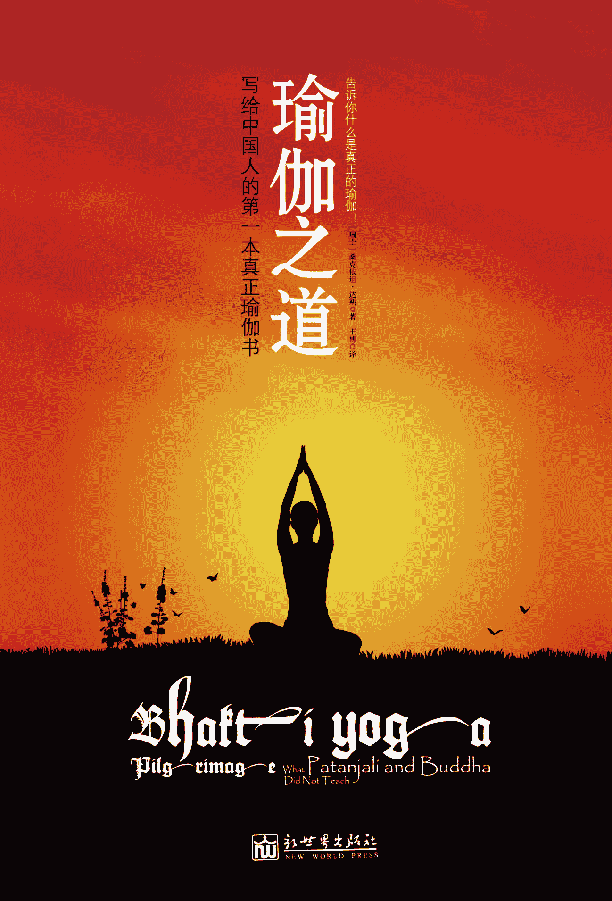

    图书在版编目（ＣＩＰ）数据

    瑜伽之道 / (瑞士) 达斯 (Das,S.) 著 ; 王博译

. -- 北京 : 新世界出版社, 2011.6

    ISBN 978-7-5104-1769-6

    Ⅰ. ①瑜… Ⅱ. ①达… ②王… Ⅲ. ①瑜伽－基本知

识 Ⅳ. ①R247.4-44

    中国版本图书馆 CIP 数据核字(2011)第 054083 号

    北京版权保护中心外国图书合同登记号：01-2011-1528

         Arranged through CA-LINK International LLC

瑜伽之道

————————————————————————————

作       者：〔瑞士〕桑克依坦·达斯（Sankirtan das ） 

译       者：王博

责任编辑：刘媛 

责任印制：李一鸣  刘社涛

出版发行：新世界出版社

社       址：北京西城区百万庄大街 24 号（100037）

发 行 部：（010）6899 5968   （010）6899 8733（传真）

总 编 室：（010）6899 5424   （010）6832 6679（传真）

http://www.nwp.cn

http://www.newworld-press.com

版 权 部：+8610 6899 6306

版权部电子信箱：frank@nwp.com.cn

印       刷：廊坊市印刷厂

经       销：新华书店

开       本：880×1230  1/32

字       数：150 千字   印张：6.8125

版       次：2011 年 6 月第 1 版   2011 年 6 月第 1 次印刷

书       号：ISBN 978-7-5104-1769-6

定       价：36.00 元

————————————————————————————

版权所有，侵权必究       

凡购本社图书，如有缺页、倒页、脱页等印装错误，可随时退换。

客服电话：（010）6899 8638   

# 目录

序前言印度圣地概览哈瑞德瓦和瑞希凯什温达文及其周边菩提迦耶玛雅普导言第一章 准备启程—瑜伽的起源第二章 规划行程—瑜伽的哲学第三章 大步前进—心意的马车第四章 攀登高峰—八部瑜伽系统 1.持戒法—控制感官（YS 2.30）2.守意法—控制心意（YS 2.32）3.体位法—体位修习（YS 2.46）4.呼吸法—控制生命力（YS 2.49－53）5.撤回法—收摄感官（YS 2.54-55）6.把持法—精神专注（YS 3.1）7.入定法—冥想（YS 3.2）8.三摩地—灵性神定（YS 3.3）第五章 拾阶而上—瑜伽的阶梯第六章 与佛同行—佛陀的教导第七章 智慧选择—直接的道路第八章 身受制约—业报的法则第九章 两难抉择—有限的自由第十章 抛弃负担—破除成见第十一章 走出误区—踏入正道第十二章 除去面纱—认识至尊第十三章 接受真理—韦达的教导第十四章 生命起点—创造的始源第十五章 人生终点—离开物质世界第十六章 不断提升—从未揭示的深意第十七章 回顾旅程—无虞之旅第十八章 奉爱瑜伽—超越宗教层面第十九章 结语：诚挚祝福—旅途愉快附录 1：物质自然三属性附录 2：与圣地“瑞希凯什”有关的附录 3：非人格主义的不足之处致谢美术与摄影参考书目返回总目录

谨以此书献给

所有对古老的瑜伽灵性科学

感兴趣的中国朋友

序

韦达经典将我们生活的世界比作一片广阔而可怕的汪洋大海—幻觉之洋，众生被二元性的波涛残酷地抛上抛下，尽管如此，生物依然充满激情地去寻求所谓的快乐，而同时也挣扎着忍耐痛苦。

在这片幻觉的海洋里，各种生物都在狂热地追寻幸福的幻梦，就像跌落大海中的人，只能拼命地寻找幻想中的陆地，努力向这不存在的庇护所游去。幸福如海市蜃楼一般，总是难以捉摸，令人焦急。只有我们认清现实，幸福才有可能降临。

瑜伽为我们提供了一条超然的道路，使我们能够跨越幻觉之洋，到达永恒的彼岸。这是瑜伽的真正目标。对于那些想要探索终极真理的人，想要寻求生命意义的人，想要认清世界的人，以及所有想要真正快乐的人，瑜伽是不二之选。

外行的猎奇者，如果想一尝众多流派深奥晦涩的哲学、繁复的冥想体位技巧以及艰难的呼吸修习方法，瑜伽则是一条畏途。这些修习方式对帮助我们跨越幻觉之洋的作用不是很大，它们还远没有触及瑜伽的最终目的。

本书为我们提供了一个呼吸新鲜空气的宝贵机会。桑大师带给我们一次充满刺激又极具启发性的瑜伽发现与探索之旅。他所呈现的瑜伽观点与众不同、充满权威，令人深感满意。它既包括又远远超越了普通的瑜伽观念，将人逐渐提升到一个崇高的灵性层面，甚至对绝大部分瑜伽师来说，都闻所未闻。

这个领域充满奉爱—对圣奎师那的纯粹奉献与爱心。奎师那就是最甜美、最亲切、最完整的最高存在。

桑大师寓繁为简，轻松而条理清晰地把严谨、复杂的哲学呈现出来。亲爱的读者，请充满期待开始您的旅程，您绝对不枉此行！

旅途愉快，一路顺风！

戴瓦密塔·达斯

奎师那—巴拉茹阿玛神庙

住持与首席顾问

印度温达文

前言

这些年，当我带着中国的瑜伽修习者去印度圣地旅游时，我们总有很多机会一起探讨瑜伽的教导。在圣地的经历会自然而然地激发这些观光者们的灵性向往。因为他们能够近距离地观察和感受一种截然不同的生活方式，所以，关于瑜伽的修习方式、哲学以及文化，无数的问题会浮现在脑海中。通过讨论这些不同方面的问题，我发现，许多中国朋友对瑜伽的教导都存在误解。

当然，对灵性生活的误解不仅限于中国的修习者，在世界其他文化中也很普遍。其部分责任要归咎于上个世纪初最先旅行到美国的那些印度斯瓦米和瑜伽师们，他们所介绍的思想和方法，已经偏离了灵性修习的标准。当时，为了更容易吸引听众，他们无不尝试着校正、妥协，以适合西方人欣赏。结果无论是理论还是方法都不严谨，远远偏离了传统。

当年削足适履，使我们今天仍深受其害。当我们看到市面上五花八门的瑜伽种类时，我们完全有理由认为，商业因素是另一个重要原因，驱使瑜伽的传授者将这门科学弄得非常混乱。一个常见的现象是，很多瑜伽中心几乎都不教授瑜伽的哲学，就算有也只是停留在肤浅的表面，大都带着偏见和误解。这些瑜伽代表们唯一感兴趣的就是瑜伽的商业利益，出于这个原因，他们将瑜伽作为一种服务或者产品来贩卖，承诺人们会获得健康、美丽，释放压力等。

从某种意义上说，瑜伽能来到中国确实是一件好事，瑜伽会使所有接触它的人从中受益。但是，只有正确理解瑜伽的概念，才能真正得到益处。当人们意识到自己接受的瑜伽教导，哪怕是最基础的瑜伽知识都是错误的时候，就会意识到，应该有人编写一本书，帮助中国的瑜伽修习者明白真相。这本书应该内容全面，让读者毫不费力地就对瑜伽有一个全面的了解，且提供瑜伽科学多姿多彩的每一方面的信息，指导修习瑜伽者如何取得进步。

为了满足以上需要，扭转人们对瑜伽的普遍误解，本书应运而生。本人投身瑜伽事业 20 多年，对瑜伽的全貌有较清晰的认识，能有所侧重而不致迷失。为了完成本书，我尽力权衡我认为最重要而且真正有用的内容，呈现给对瑜伽和灵性进步感兴趣的读者。

您将从本书中看到的，并不是帕谭佳里瑜伽格言的另一个版本。市面上这样的书籍已经为数不少，其中也有一些是中文的。本书的宗旨是为了让您能深入理解整个瑜伽科学的文化和价值。真诚的瑜伽学生既想从整体上对瑜伽科学有一个正确把握，又希望对特定的瑜伽终极目标有所感悟，本书正是为这样的学生而作，特别是那些对灵性进步感兴趣的学生。奎师那在《博伽梵歌》中说道，经过一段时间的瑜伽修习，灵性的知识就会在内心显现，照亮一切。“获得这样的喜悦后，人永远不会背离真理，不会认为还有比这更高的成就。在这种情况下，人即使陷于最大的困境，也永远不会动摇。这样才真正摆脱了因与物质接触而产生的痛苦。”如果您想理解奎师那这段话的含义，本书就将呈现答案。这本书尤其适合想要弄明白“真理”的确切含义的人，以及想要学习真正的知识的人。人既不应该盲目接受，也不应该盲目拒绝。读者对本书中所阐释的一切都应该认真思考，这样才能最终消除疑惑，摆脱错觉，获得真正的灵性进步。

本书的内容大部分来自圣帕布帕德及其弟子的教导，如苏候铎·斯瓦米（Suhotra Swami）、布瑞占·达斯、亚文铎·萨特斯瓦茹帕·达斯（Ravindra Svarupa Das）等人。圣帕布帕德将众多古代瑜伽大师的著作由梵文译成英文，同时均加以评注，其著作的清晰与权威性是前所未有的。通过学习这些著作，人们就会逐渐认识到，奉爱瑜伽才是瑜伽觉悟真正的最高层面，而其他种类的瑜伽都是这一目标的铺路石。

这一认识是其精髓，也是最基本的，但却是被无数瑜伽老师忽视的一环—是故意的或者他们本来就不知道。我决定将这一主题作为本书的核心。无论人们从其他帕谭佳里著作的译本及评注中学到什么，我们都应该确定无疑地认识到，如果没有包含奉爱瑜伽，这些评注便毫无价值。

在过去 40 年里，圣帕布帕德完成了他的杰作后，又涌现出更多的书籍和文章，它们从圣帕布帕德的著作和翻译中吸收养分，继续宣扬奉爱瑜伽的重要性。在编写本书的过程中，我的工作主要是谨慎地选择内容，将所需的信息汇编起来，以有条理的方式呈现，使中国读者能很容易地从帕布帕德以及后来其他作者那里获益。本书的完成要归功于我要致谢的这些朋友。比如，描述八部瑜伽的修习一章就完全摘自苏候铎·斯瓦米的著作，他是一位造诣高深的瑜伽大师，我个人就是从他那里获得指导。我在书中其他地方阐述的概念并非来自某位特定的作者，那都只是奉爱瑜伽传统的一部分。如果仍然有人觉得我的作品与他的相似，那完全是出于巧合和无心。对于任何可能造成的冒犯，我致以真挚的歉意。

本书将对圣地做一简要介绍，但对圣地的详细描述不是写作的初衷，本书更多的是对个人成长的一本指南手册，将深入地去理解瑜伽的教导，以及如何将之应用于我们自己的生活。

我们以对瑜伽哲学历史的简要回顾作为行程的起点即第一章。第二章将阐述瑜伽哲学的基本要点，让我们能对这次瑜伽之旅有一个清晰完整的地图作参考。我们都是旅客，坐在一辆不受控制的马车上，尽管如此，却还要为旅行的结果负责。瑜伽强调对永不安宁的心意的控制，这是第三章的主题。在第四章，我们将开始逐一攀登八部瑜伽的八个层次。而第五章，借用“瑜伽阶梯”的类比，我们将逐级而上，进一步认识我们的旅程。第六章指明方向，最终的正道是奉爱瑜伽。正如旅客必须知道并遵守正游历的国家的法律，我们将在第七章一起来认识全世界通用的业报法则。第八章讨论的是在我们做出决定时，到底有多少自由空间。人如果不破除先入为主的成见（思维范式），就无法在瑜伽中不断前进。我们如果总是沉迷于身后的风景不能自拔，就无法欣赏前方的美景，不能享受整个旅程的乐趣，这是第九章的主题。第十章提醒那些会将我们引入歧途的误解和偏见。瑜伽的目标是与至尊相联结，我们至少需要理论上对至尊有所了解，第 11、12 两章将面对面认识他。我们人生的旅程是如何在这个世界开始的，是第十三章的主要内容。而第十四章的内容是，我们人生的旅程将去往何方，最终目的地在何处。当然，旅程总是会面临各种各样的危险，第 15、16 两章则会给我们相应的保护。瑜伽不是宗教，而是一门严谨的科学，可以让我们以更有智慧的眼光认识和看待周遭的世界，第 17、18 章对佛陀所指明的道路加以分析，同时让我们能清楚了解其使命的意义。最后，我将在第十九章结语部分告诉大家修习奉爱瑜伽的实际益处。

当然，仅仅看风景，感叹“真漂亮啊”还远远不够，本书的宗旨是希望能唤起读者实际的行动。尽管这里所讨论的一些规范准则可能已经成为瑜伽修习者生活的一部分，然而，要想保持坚定的决心并继续前进，我们还需要认清修习的目标，学习正确的知识。错误的想法只会带来错误的行动，错误的行动变成错误的习惯。习惯成自然，久而久之，整个生活就会走向失控的方向。

从前，人们向瑜伽导师们学习瑜伽，研习他们写成的梵文经典。帕谭佳里并不是唯一教授瑜伽的人。人们必须精通众多典籍，才能对瑜伽有一个清晰的认识。这些典籍也许在细节上有所差异，但其核心要旨是一致的。为了能给帕谭佳里的《瑜伽经》做一全面的阐述，本书选取众多典籍为参考，并对引述部分的出处作了具体说明，格式如下：

·《博伽梵歌》：Bg 1.1，表示第一章第 1 诗节。

·《圣典博伽瓦谭》： SB 1.1.1，表示第 1 篇第一章第 1 诗节。

·《瑜伽经》(Yoga Sutra)：YS 1.1，表示第一部分第 1 句经文。

·《永恒的柴坦尼亚经》(Caitanya Charitamrita)：CC1.1，表示第一章第 1 诗节。

要想了解更多内容，请阅读参考书目。书后的附录里也有更多内容。现在，让我们开始这次旅程—一次带给我们智慧和快乐的瑜伽朝圣之旅。

希望本书能够激发读者重新审视现在的生活，并且和新老朋友一起，踏上瑜伽之圣道。

印度圣地概览

印度大地上圣地星罗棋布，本书将介绍其中四处，分别是瑞希凯什(Rishikesh)以及哈瑞德瓦(Haridwar)、温达文(Vrindavan)及其周边、菩提迦耶(Bodh Gaya)和玛雅普(Mayapur)。

要想遍游所有圣地并不现实，在这里之所以会选择这四处，是因为这几处与本书内容密切相关。从某种程度来说，本书的图片是其他众多圣地的代表，希望能够激发您对圣地的兴趣和期盼。

一位已经进入奉爱瑜伽修习阶段的人，会认为温达文和玛雅普是全宇宙中最为亲切的地方。尽管这两处圣地不为普通的观光客所了解，但一位心中满怀奉爱的人，会对其他地方毫无兴趣，最大的期盼就是能在这两处度过余生。

哈瑞德瓦和瑞希凯什

哈瑞德瓦的字面意思是“通往哈利的大门”。正是在这里，圣河恒河从冰川（或“维施努之足”）汇集成河，流入平原；圣洁的人们弃绝尘世，进入高山中的洞穴开始苦修。

瑞希凯什在德里东北方向 230 公里的地方，从哈瑞德瓦再向东北行 25 公里，便来到瑞希凯什，这座城市坐落在恒河边，非常宁静平和，这里作为瑜伽和冥想的学习圣地而闻名于世。世界各国对瑜伽感兴趣的人都会拜访此地，并在这里接受长时间的训练。这里的瑜伽课程既有适合初学者的，也有提供给晋阶的高级修习者的，不幸的是，其中绝大部分都是商业性质的，几乎没有任何灵性价值。这里最好的时间是 4～6 月以及 9～11 月。近年来，全球温室效应，这里的冬天不再寒冷难耐，人们在这里过冬不会感到不适。

温达文及其周边

温达文是一片神奇的土地，迷人之处遍布。她坐落在德里以南 135 公里，德阿公路经过的地方。这条公路每天都将成千上万的游客带往泰姬陵，但这些人却鲜有知道温达文的，因为它并不是一个观光景点。致力于灵性进步，对奉爱瑜伽充满兴趣的人来说，这里是最为重要的拜访之地。温达文有大约 5，000 座庙宇，这些庙宇大多建在雅沐娜河(Yamuna)沿岸。

虽然温达文只是一个仅有十万人口的小镇，但整个周边都非常圣洁，绝对不应错过。

菩提迦耶

菩提迦耶是佛陀(Gautama Buddha)开悟之地。对于所有佛陀的追随者而言，这里是庄严的圣地。菩提迦耶位于加尔各答(Colcutta)和瓦腊纳西(Varanasi)之间，在加尔各答以西 450 公里，旁边 13 公里就是格雅(Gaya)城。在菩提迦耶周围遍布数不尽的修院，来自日本、缅甸、布丹、斯里兰卡、越南和中国的僧人都汇集于此。

玛雅普

玛雅普在加尔各答以北 130 公里的恒河岸边。这里是柴坦尼亚·玛哈帕布的出生地，他显现于公元 1486 年，将奉爱瑜伽发扬光大。玛雅普地区非常繁荣，萦绕着适宜灵性活动的完美氛围。每天，玛雅普都会迎接成千上万的朝圣者，无论是当地人还是外国人。玛雅普以其旋律优美的克伊坦而闻名。不仅如此，来自瑞士以及印度的瑜伽导师在这里开设瑜伽宾馆，提供高级住房设施，还经营洲际餐厅。然而，玛雅普却完全不受商业气息的侵染，人们在这里能很容易体验到灵性世界的感觉。

导言

帕谭佳里·牟尼是举世闻名的瑜伽导师，但是关于他的生平，现在人们却所知甚少。有些学者认为他出生于公元前 4000 年，有些认为是公元 400 年—之所以存在这么大的分歧，是因为关于他的生平并没有任何可查的记录。令帕谭佳里·牟尼得以闻名的，是他系统地将古代瑜伽科学的各方面内容编撰为 196 节长的《瑜伽经》，这部著作以原本的梵文形式流传至今。一般来说，瑜伽老师都以《瑜伽经》来研习瑜伽。“经”这个词的意思是“串成一线”，正如将众多思想串起来的一条线，经文将最核心的内容以最精简的方式呈现出来。由许多这样的经文汇编而成的书也叫做“经”，正如这里的《瑜伽经》。瑜伽这个词来自梵文词根“yuj”，即“结合”或“联结”。帕谭佳里在这部著作中讨论了心意的本性、心意阻碍灵性进步的方式、心意的依附，以及从这种依附中解脱出来以达致人生最终目标的方法等问题。除非一个人愿意直面心意的活动，否则便不可能修习瑜伽。帕谭佳里在为瑜伽定义时，明确指出，瑜伽的首要目的就是控制心意的纷繁活动。

在帕谭佳里那个时代，流传着诸多瑜伽的方法和技术，而帕谭佳里则将这些加以分类汇总。他的著作分为四部分：

第一部分神定（含 51 个诗节）；

第二部分规范修习（含 55 个诗节）；

第三部分玄密力量（含 56 个诗节）；

第四部分自我与物质分离（含 34 个诗节）。

自从帕谭佳里编撰了《瑜伽经》，关于这部著作的翻译和评注卷帙浩繁。由于其精简的特性，经文总是需要被进一步阐释，人们才能理解其真正的含义。正如 H2O 这个化学式，只有经过化学老师的解释，学生才能明白是“水”的意思。同样，经文经专家解释，其真正含义才能为学生所理解。如果一个人在这方面没有受过很好的训练，很难理解其正确含义。一个人在撰写评注时，如果没有参考任何古代瑜伽科学的典籍，必然无法给出正确的结论。因此，我们始终不应忘记，帕谭佳里的教导是古代文化的一部分，而那种文化和我们现在的相距甚远。除非我们调整自己的思想，使之与古人的价值观和信念一致，否则我们便无法把握帕谭佳里教导的含义，得到的只能是一些扭曲和零散的认识。例如，根据他的著作，我们可以明确地发现，帕谭佳里以“轮回”这一概念描述我们在这世界的存在。然而，他并不认为有必要在自己的著作里证明并强调这一概念。“轮回”的概念贯穿他的整个教导，而且毫无疑问，要想理解瑜伽修习的目标，这一概念是最基本、最重要的。

在修习瑜伽的过程中，我们需要敞开心灵，调整视角，使其与古人看待世界的方式相一致。我们的思想必须和流传至今的瑜伽传统相协调。通过访问圣地，人们就能直观地体验到瑜伽文化以及主导人们生活的价值观。本书中的照片，是这一点进一步的佐证。现在，我亲爱的读者，我将带您踏上瑜伽的朝圣之道，这将引领我们到达一个早已被遗忘的国度，一个一直隐匿在《瑜伽经》中，未曾被揭示的王国。

第一章    准备启程—瑜伽的起源

佛陀的显现比耶稣早 500 年，而源自韦达经典的瑜伽教导远在佛陀显现之前便为人所知……

翻开古代的瑜伽经典，人们会发现，瑜伽教导所依据的哲学是高度发达的，足以和西方的哲学传统比肩。佛陀的显现比耶稣早 500 年，但甚至在佛陀显现之前，印度就已经拥有灵性的文化和发达的哲学概念。源自韦达经典的瑜伽教导远在佛陀显现之前便为人所知。韦达经典教导的是永恒的法则，这是瑜伽的基础。佛陀不承认韦达经典，但帕谭佳里正相反，韦达经典恰恰是他的教导的基石。

韦达的意思是“知识之书”。知识并不仅是在大学以及刊登科学实验的学术期刊上出现的东西。实际上，真正的知识所讨论的主题是永恒的存在。

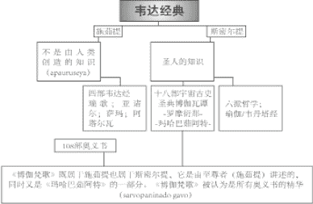

狭义来说，也是学者们最为熟悉的，韦达包含四个主要部分，即四韦达，由印度的伟大圣人维亚萨·戴瓦于五千年前编撰而成。这些著作在成书之前一直通过口口相传的方式而源远流长。韦达经典的追随者们普遍认为，韦达经典并非不完美的人类智力的产物，而是从一个更高等的源头通过口授流传下来。正如《博伽梵歌》中所述“韦达经典由永无谬误的人直接展示 ”（Bg 3.15）。韦达既然代表着知识，知识的起源就毫无意义了。正如既然二加二等于四，我们便不需要研究它是什么时候成为事实的。

在韦达经典中所提及的这些最基本永恒法则的基础上，衍生出了一系列教导。这些教导被人们称为“六派哲学”，它们也归于韦达教导的范畴—这些教导也以四部原初的韦达经为支柱，瑜伽的科学即是其中的一派，众所周知，这门教导已经在全世界范围内掀起热潮。

六派哲学中的第六派，即韦丹塔派，被广泛接受为六派之冠，唯有这一派专门讨论韦达经的哲学。韦丹塔派的内容并不涉及这个物质世界。同样，《博伽梵歌》教导的也是“提升自我，超越四韦达经所讨论的这个虚幻的世界”（Bg 2.45）。韦达经中大部分的教导都是指导人们如何通过虔诚活动在这个世界舒适地生活 。韦达教导中仅有一小部分，即奥义书，阐述瑜伽的知识。这部分哲学性教导为韦丹塔派所用，在《终极韦达经》 中进行了阐述和分析，同时，在《博伽梵歌》中做了进一步探讨。这两本文献对我们了解瑜伽之道尤为重要。

韦达经典分类概览 （来源 VTE，见参考书目）如下图所示。

第二章    规划行程—瑜伽的哲学

《终极韦达经》和《博伽梵歌》都认为，在物质世界之上有一个永恒的存在，而这永恒的存在是一切的原因。《终极韦达经》还认为，绝对真理是有感觉、有情感的。

原初的韦达六派哲学是：逻辑、原子论、三克亚、对物质与灵性的分析、瑜伽（自我觉悟的法则）、果报活动，以及韦丹塔（觉悟至尊的科学），瑜伽是其中一派，这一流派即人们所知的八部瑜伽，和三克亚派有着密切的关系。实际上，八部瑜伽是对三克亚派哲学的应用。正是由于这一点，在帕谭佳里的著作中找不到太多哲学性教导。

例如，在《瑜伽经》里，我们就没有发现对绝对真理的性质的阐释。在第一章的第二十四部分和 29 节中，帕谭佳里简要提到了修习者应该重复念诵绝对存在（至尊）的名字“欧姆（Om）”，并将心意专注在这一音振上。帕谭佳里指出，通过这样的念诵，修习者将能获得内省，瑜伽修习之路上的障碍会被清除，从而逐渐具备进入至尊的国度的资格。通篇《瑜伽经》中，提及至尊的信息只有这些。当然帕谭佳里也说，修习者在重复念诵名字的同时，应该清楚地认识到这一方法的重要意义。但问题是，如果修习者对绝对真理一点概念都没有，又怎能做到这一点？这表明，帕谭佳里理所当然地认为，学习《瑜伽经》的人应该已经对至尊的性质非常熟悉。

古时候的学生在开始修习瑜伽之前，已经通过自身所处的文化和所受的教育接受了三克亚派的教导，并且通过研习韦丹塔哲学，对至尊的概念非常熟悉。任何学习瑜伽的人都应该对至尊的概念非常熟悉。在第 12 和第 13 两章，我们会更详细地谈论至尊这一概念，其中既有来自三克亚哲学的认识，也有来自其他韦达典籍的认识，比如《博伽梵歌》。《终极韦达经》和《博伽梵歌》中都确认，在物质世界之上有一个永恒的存在，而这永恒的存在是一切的原因—“万事万物均流衍自永恒的存在” 。

《终极韦达经》进一步强调，绝对真理是宇宙万事万物（生物体、星球、空间、时间等）的源头，这一源头包含了万事万物的品质。其中的一个品质就是人格性。换句话说，绝对真理，或全部整体，必定包含所有内含物的品质。《终极韦达经》指出，我们都是可以感觉可以思考的独立个体，绝对真理也一定有这些能力。不然的话，我们这些能力从何而来？《终极韦达经》赞同绝对真理是人格性（有感觉，有情感）的。显然，要修习奉爱瑜伽，对绝对真理有所认识必不可少。

值得注意的是，现在许多印度瑜伽导师都有意无意地抱着非人格真理（Impersonalism）的“思维范式”。也就是说，他们瑜伽教导的前提是：终极的整体之中没有任何内容和关系。他们作出种种解释，强调终极的存在是“空”（Void）—尽管在原初的经典中根本没有这样的观点，或者只有一些蛛丝马迹。许多佛陀的追随者也持有这种非人格的一元论。在许多其他文化的不同发展时期，人们也会发现这样的思想，无论是在印度国内还是国外。在教导这种思想的韦达导师中，最著名的要属施瑞帕德·商卡尔阿查尔亚，他为《终极韦达经》写了评注。当下，在印度甚至全世界各个地方，施瑞帕德·商卡尔阿查尔亚的追随者们在瑜伽导师中有着广泛而深入的影响力。这些瑜伽导师，即使当他们谈起奉爱瑜伽时，也只把这作为达致最终与终极整体融合的一种方便的手段，对他们而言，爱的融合既不是必不可少的方式，也不是终极的存在。

其他《终极韦达经》的评注中也有一些强调生物体和绝对真理间存在永恒的差异，并以此为基础建立奉爱的理论，然而这样的教导一直都没有受到关注。直至最近，随着帕布帕德的著作越来越普及，情况正在发生变化。全世界各个地方都可以买到《博伽梵歌原意》，在这部著作中，帕布帕德谈到了全部人格主义各个方面的内容。《博伽梵歌》是韦达教导的精髓，包含所有《终极韦达经》的要义，它所呈现的是韦达教导自始如一的结论。

人格主义的原本文化在历经累世的流传过程中，非常不幸地受到各种思想的侵袭和污染，成为我们今天看到的印度教。西方的影响对这种嬗变也要负一定的责任。欧洲人为了使自己对印度的统治名正言顺，便给印度的子民们打上迷信的标签。自然，种族主义也渗透其中，侵入者认为基督教文化应该取代韦达文化。他们成功地使印度人对韦达的教导产生疑惑，以实现传播其欧洲思想的目的。

结果，随着时间的推移，许多印度人也开始相信韦达经典不过是神话传说，认为韦达经典混杂不明，没有确定的结论，韦达经典的教导不用认真对待。他们还认为，韦达经典的含义应该按非人格的方式加以阐释。这种“终极虚无”的思想以自己的方式渗入原本的韦达结论中流传至今，并成为瑜伽教导的一部分。因此，中国的瑜伽修习者有同样的错误观念也就不足为奇了。

如果我们不纠正这种令人扼腕的误解，我们就无法在瑜伽的圣道中走得更远。哲学就像交通地图—如果我们的地图是错误的，我们就只会浪费时间和精力，而不可能到达目的地。错误的想法导致错误的活动，我们必须谨慎权衡前进中的每一步，不要误入歧途。

本书部分内容的目的就是要揭示非人格主义的缺陷及危害性。

第三章    大步前进—心意的马车

帕谭佳里在《瑜伽经》中提到，心意有五个基本状态，即“烦乱”、“迷惑”、“分心”、“专注”和“控制”，当一个人的情绪平和而且纯净的时候，就能发现自己内心最深处的能力。

现在，让我们先来学习帕谭佳里有关心意功能的教导。在帕谭佳里的全部教导中，大量篇幅都是用来阐述我们中文所说的“心意”这个词的本性和特征的。

有一个广为流传的比喻，“心意就像一片广阔的湖水，在湖面上有层层叠叠的波浪”。根据湖面上波浪的大小、力量和速度，我们可以知道湖底的状态。同样道理，我们的心意原本也总是平和而纯净的，但是，因为人的种种欲望，心意被搅动起来。将心意之湖表面的波涛平静下来并不难，但是若要将内心深处的躁动平息下来就不那么简单。过往的种种记忆就像定时炸弹，埋藏在心意之湖的淤泥中。到了一定的时候，它们就会爆发出来，将整个湖水搅得天翻地覆。当波涛平静、湖水清澈的时候，我们就能够看穿湖水，直达湖底。当一个人的情绪平和而纯净的时候，就能发现自己内心最深处的能力。

实际上，我们在这世界所体验的心意元素，只不过是一个外来物，受摇摆的心意左右的状态也不是我们的常态。心意是不纯粹意识的产物，大多数人对心意的感受，就像我们站在一面镜子前，错误地把镜子中的影像当做了自己一样。我们没有意识到自己是永恒的灵魂，误以为自己就是短暂存在的身体。当心意的湖平静下来时，镜子的错觉就会消失。那时我们便意识到，至尊者以“超灵”的形象，一直在我们身旁。“超灵”是我们所有潜力的源头，也是我们最好的朋友。在后面的章节中，我们会更清楚地阐述，“超灵”其实是绝对真理的形象之一。

帕谭佳里用梵文“琪塔”这个词描述我们所说的“心意”，或者其他人所说的“意识”。在上面的类比中，我们可以将“琪塔”类比为受到搅动的湖水。“琪塔”来自词根“cit”，意为“去感知”。“琪塔”含有“意识”的概念，而“心意”则没有，“心意”主要指其功能—思考、感觉、意志。“琪塔”这个词包含两方面：平静状态下的湖水，以及泛起波澜的湖水。

“琪塔”并不是大脑（神经细胞）的产物。一个人处于昏厥状态，或者脑细胞停止活动的时候，他仍然是有意识的—尽管心意的功能已经停止了。“琪塔”是灵魂的特征，而且只有灵魂离开躯体的时候才会消失，那就是我们所说的死亡。

“琪塔”这个词很难完整地翻译为其他语言。在汉语里，有些人翻译为“意识”，有些人用“知觉”。但是，这两者都无法涵盖“琪塔”这个词所指的全部含义。帕谭佳里对“琪塔”这个概念着墨甚多，因为这既是理解“束缚”的基础（YS 1.5-11），也是认识“解脱”的基础，解脱的方法即凯瓦利杨—不执著（YS 3.55）。

使自己的意识处于正确状态的重要性在《博伽梵歌》中也有所阐述。在这本书中，作者有时候用“曼纳 ”这个词，而不是“琪塔”。然而，道理都是一样的：“征服了心意，心意就是最好的朋友；征服不了心意，心意就是最大的敌人”（Bg 6.6）。不过，同书其他地方使用了“琪塔”这个词，帕布帕德将其翻译为“心意”：“毫不偏离的心意”（Bg 8.14）。无论“曼纳”还是“琪塔”，在这些情况下指的都是一种有意识的状态。

《博伽梵歌》中进一步阐释道，“心意与智性、假我结合在一起，便组成精微躯体”（Bg 7.4）。住在精微躯体内的，是真正的自我，灵性的灵魂。认识到自己是灵魂的人，会将自己的心意从那些蒙蔽我们的事物上移开，专注于纯粹的自我，从而纯净如一（Bg 3.43）。瑜伽的哲学认为，任何生物体（包括动物和植物等）原本都是灵性的个体，并怀着纯粹的“琪塔”，但现在都被不同程度的精微和粗糙的能量所覆盖，处在轮回之中，不断地更换物质躯体。瑜伽所教导的目标，就是除去所有这些短暂的覆盖。

躯体、精微躯体（心意与智性）以及灵魂之间的关系，在《卡塔奥义书》中有详尽的解释。这四者被比作一架马车：各种感官就像马，心意是缰绳，这些都由智性的车夫控制，而给予指示的是灵魂的乘客。在我们的世界中，灵魂处于一种非常奇怪的处境：它已经忘记原本的身份，把自己当做战车。在这种情况下，他驱使着马车，却没有意识到自己是谁，以及他真正的目标是什么。事实上，他是如此沉迷于他所经历的一切，完全被自己的身体（各种感官）所控制。只要我们去观察动物的行为，就能理解这一描述的含义。动物的行为完全被它所看到的、闻到的和感知到的所左右。人类的行为不应该和动物一样，但是很多人没有运用自己的智性去指导心意，因为心意和感官总是紧密连接在一起，所以这些人的行为就像动物一样。实际上，根据瑜伽的观点，当一个人忘记自己原本灵魂的身份时，这个人就会被视为处于疯狂的状态。

通过上面的介绍，我们知道，“琪塔”的纯净状态会被心中各种思维模式扰乱。那么，是什么原因使每个人持有特定的想法，而又是什么原因使所有灵魂得到不同的躯体？要想知道答案，我们就要理解“古纳”的作用及影响方式。

“古纳”这个词的意思是“属性”，也有“绳索”的意思。每一个灵魂，当其为镜中影像迷住的时候，其活动（也称为“卡尔玛”）就被三种物质属性紧紧地束缚，这三种属性是善良属性、激情属性以及愚昧属性。在《博伽梵歌》中，关于这三种属性对我们知觉状态的影响有详细描述（见附录）。我们的思维方式、信念、欲望、性格，以及我们的所知等，都是我们与这些属性交织在一起的结果。我们无时无刻不和各种感官的对象打交道，我们吃的、听的、看的、闻的、触摸到的，我们周围所有的一切都处于三种属性中—善良属性的（清晨的时间，新鲜的蔬菜、食物），激情属性的（紧张繁忙的城市生活，摇滚乐）以及愚昧的（酒吧，肉食）。世上没人能完全避免某一属性的影响。纯净的心意之湖因为这三种属性的混合而着上色彩，而这三种属性的不同比例又决定了不同的意识状态。因此，我们的心会因为过往的经历而受到各种思维模式的干扰。

帕谭佳里在《瑜伽经》（YS 1.5）中提到，心意有五个基本状态，即“烦乱”（Ksipta）、“迷惑”（Mudha）、“分心”（Viksipta）、“专注”（Ekagra）以及“控制”（Niroddha）。

（1）“烦乱”：这被认为是疯狂的状态，心意躁动，从一个对象跳到另一个，总是思虑重重，这时心意被激情属性控制。这正是对现实生活中的一个“正常人”的真实写照—在他还没有呼呼大睡的时候。

（2）“迷惑”：在这种状态下，心意被愚昧属性控制。睡眠、迟钝以及懒惰都是愚昧属性的展示。经常，一个所谓的醒着的（即处于“烦乱”状态）人，会受愚昧属性的影响，犯下愚蠢的错误。“烦乱”和“迷惑”之间没有明确的分界线，这两者往往轮流替换。

上面这两种状态对瑜伽都有害无益，应尽力避免。然而，西方的心理医生，主要面对的都是受抑郁和乖僻之苦的病人，所以对这两种状态非常感兴趣。现代的生活方式为愚昧和激情属性提供滋长的温床，结果导致诸多心理疾病。而瑜伽的教导则着重于善良属性，人可以从这些状态中解脱出来。

（3）“分心”：“分心”状态和上面提到的“烦乱”状态在很多方面都很相似。这两者的不同之处在于，一个人在“分心”状态下，会有偶尔平静和安宁的时刻—即使整体上还完全不能专注。此时善良属性开始发挥影响。

（4）当心意开始专注于某个外在或内在的目标，因而变得像无风时的火焰一样稳定；当心意已经征服愚昧和激情属性，处于善良属性的时候，心意便能做到全神贯注，这就是“专注”。

（5）在“专注”的状态下，心意仍然依赖一些外在的东西，但在“控制”的状态下，心意就没有任何依赖性。在完全控制的状态下，意识处于纯粹的状态（YS 1.2，2.51）。

要想在瑜伽修习中取得成功，心意需要得到专一和完全的控制，完全不受世间各种干扰的影响。根据帕谭佳里的观点，人类对世间各种事物的依附，是想认识内在自我的人的最大敌人。若想达致更精微的意识层面，意志力、辨别力以及对终极目标恒常的铭记，这三种品质不可或缺。通过修习八部瑜伽来征服心意不是不可能，但却非常困难。同样的目标，即免于物质属性的影响（以及业报法则），同样可以通过奉爱瑜伽获得，而且容易得多—“通过奉爱瑜伽，人超越物质自然的属性，并且到达梵的境界 ”。

从第五章开始，我们会解释为何如此，以及人类该如何修习奉爱瑜伽。而现在，还是让我们先来仔细学习和了解八部瑜伽吧。

第四章    攀登高峰—八部瑜伽系统

八部瑜伽是实现与至尊联结的八个基本步骤，具体包括：持戒法、守意法、体位法、呼吸法、撤回法、把持法、入定法和三摩地。

苏候铎·玛哈茹阿佳（1950—2007）是帕布帕德的门徒，他是一位造诣高深的瑜伽大师，我本人便在他的指导下学习。作为一位多产的作家，他撰写了许多饱含智慧，并给予灵性成长以实际指导的书籍，其中包括：《实质与影子：韦达认知的方法》（1996）、《超然的人格主义：人类现状的韦达解答》（1997）、《善与恶的尺度》（1999）等。

苏候铎·玛哈茹阿佳对八部瑜伽的阐述和分析非常严谨并且精准，是达到瑜伽完美境界的精髓教导，在这一章中我几乎全文引述。了解这些对我们大有裨益，因为别人可能会误导我们，试图让我们相信存在捷径，或者通过简单的修习就可以获得八部瑜伽和灵性生活的完美。一旦我们了解了八部瑜伽的每一步骤，就不可能再受任何人误导，我们会有更清醒的认识。瑜伽的目标是与至尊联结，既可以通过八部瑜伽达到，也可以直接通过奉爱瑜伽达到。这两者殊途同归，在修习的规范标准上是一致的，但是实施的难易程度却有天壤之别。

人们可以选择去瑜伽班修习八部瑜伽，或者望而生畏，跳过这一传统的某部分，比如艰难而痛苦的苦行，而学习瑜伽体位、练习呼吸或尝试冥想。这样做，优势是更容易学习，但是我不得不遗憾地说，要想摆脱外在世界的影响（物质属性）、获得自由，通过这样的修习是不大可能的。

简言之，八部瑜伽的八个部分如下：持戒法（控制感官）、守意法（控制心意）、体位法（体位修习）、呼吸法（控制生命力）、撤回法（收摄感官）、把持法（精神专注）、入定法（冥想）和三摩地（灵性神定）。

修习八部瑜伽的人，要一个接一个地逐次修习全部八个部分。只有这样，修习者才能达到瑜伽的完美。帕谭佳里概述了这些规条，并且指出，所有这些都是必不可少的。现在让我们更详细地看看帕谭佳里对八部瑜伽每一部分做所的阐释吧。

1.持戒法—控制感官（YS 2.30）

帕谭佳里列出了一些道德法则，使修习者能够获得内心的平静与和谐。八部瑜伽的持戒法和守意法—包含十项规条。其中持戒法的五项是：非暴力、不妄语、不偷窃、贞守及不贪着。

⑴非暴力：字面意思是“不伤害”或“非暴力”。通常，人们认为非暴力仅仅指仅仅躯体活动的非暴力行为，但在瑜伽经典中，非暴力要在思想、言语以及行动三个层面上加以修习。

⑵不妄语：根据帕谭佳里的教导，人应该在思想、言语以及行动三个层面上对别人，也对自己真诚无欺。瑜伽学生被教导应该心口一致、言行一致。有时候，人们撒谎是出于无心，或者为了开玩笑，甚至只是想闲言碎语一番。但这些谎言就像种子一样，会生根发芽，总有一天，撒谎的行为会由于习惯变成自然。结果，由于不真诚的本性，一个人最终甚至连自己都不能相信。

⑶不偷窃：这一修习在很大程度上会帮助人修习不依附及不贪着。实际上，不偷窃可以被看成是“满足”的另一解释，当一个人知足时，就不会再欲求其他财产。这样的人认为，无论其拥有什么都已足够，而且不会让自己被物欲和贪婪驱使而通过非法手段去获取他物。

⑷贞守：字面意思是“在梵觉中活动”。人活动时如果能明白 “我不是这个躯体”，便被称做“贞守生”。“贞守”一般译为“禁欲”，但禁欲只是这个词的一个方面。禁欲本身并不是目标，目标是通过控制感官，获得更深层的内在觉悟。在帕谭佳里瑜伽中，“贞守”这个词有更广泛的含义，即只去做那些能有助于达致人生最高目标的活动。只有当一个人的心意完全免于所有感官欲望的时候，贞守才有可能实现，尤其是性欲，性欲是最强烈的感官欲望，如果没有得到很好的引导，会带来最具破坏性的结果。不正当的性活动会挥霍耗尽重要的生命能量，而这些能量本该用于获得更高的意识。 

帕谭佳里的瑜伽体系建议，若要达致这一目标，修习者应该将所有感官能力组织起来，以恰当和有益的方式来应用。应该控制感官欲望，从而获得内在的平和快乐，这种快乐远远超越所有短暂易逝的躯体享乐。放纵的感官令心意脆弱，而心意不强大就无法专注于一个方向或一件事情。一个因为物欲而心意虚弱的人无法正确地思考、恰当地说话或作出合理的行为。为了更高的成就，一个人必须将其能量从感官对象那微不足道的吸引和诱惑中收回，将生命之力的能量转向更高的意识。

⑸不贪着：通常被误认为“放弃所有物质拥有”，但这个词实际上指的是一种内在的态度，而不是外在的行为。“贪着”是不满足、不安全感、依附以及贪婪的表现。一个一生都在不断渴求获得更多世间事物的人是永远都不会满足的，因为欲望之火永不平息。一个总是贪婪不满、欲壑难填的人忘记了这一点：一餐之食无非斗米，一眠之地无非七尺。

超过基本所需，其他的拥有物就是负担，我们不得不战战兢兢地维护这些财产，而不是享受。一个欲求超过所需的人就像贼，总是觊觎别人的东西。不贪着并不是说人不应该为自己的将来做打算，也不是说要放弃所有钱财；不拥有只是意味着人不应该执著于他所拥有的一切。

2.守意法—控制心意（YS 2.32）

守意法的五项规条可以帮助修习者规范生活习惯，管理好自己的个性，使之成为统一协调的整体。守意法包括洁净、自足、苦行、研读经典以及向至尊存在皈依。这五项守意法的规条使人在躯体、精神和心灵上都变得强壮有力。

⑴洁净：在瑜伽科学的典籍中，洁净既指身体的洁净，也包括精神的纯净。身体的洁净使人远离病患，而精神的纯净使人避免心力耗散。身体的洁净容易做到，但要获得精神的纯净就要下很大力气，这有赖于灵性的思考、警觉以及辨别力。瑜伽体系特别强调培养精神的纯净，如果没有这作为基础，专注和内省都是不可能的，而也正是因为精神纯净的缺乏，才会滋生身心失调的疾病以及情绪的扰动。

⑵自足：在这种精神状态下，即使一个乞丐也可以像国王一样生活。实际上，正是人的诸多欲望使自己在精神上成为一个乞丐，无法获得内心的安宁。自足并不意味着人应该消极或不活动，自足精神的修习必须伴随无私的活动。

⑶苦行：这个词的字面意思是“产生热量”。一位实行严苛苦行的瑜伽师可以从身体内部产生热量，即使浸泡在喜马拉雅山的雪水中，其身体仍然温暖健康。苦行不应该理解为自虐。《博伽梵歌》清楚地指出，瑜伽既不是为那些沉溺于肉体享受的人，也不是为那些折磨肉体的人所修习的。一位真正的瑜伽师，一生都积极地过着健康的节制生活。渐渐地，身体里封锁的玄密力量就会释放出来。通过这些玄密力量，瑜伽师可以轻易抵挡极端严寒，或者长时间不吃不喝，甚至不呼吸。除非这些玄密力量自己显露出来，否则试图去模仿这些苦行的成就是徒劳无益的。实际上，超自然力量并不是苦行的目的。一个人苦行真正的目的是，培养让自己一生都过节制生活的诚挚热情。

⑷研读经典：包括学习经典，从圣人和贤者处聆听，以及根据经典的启示来认识身边的事物。正确地研经修习需要辨别力，这意味着既不应该盲目地接受，也不应该对知识的来源吹毛求疵。人应该将超然教导的精髓收集起来，妥善运用，使自己在修习上不断进步。一个人如果没有辨别力，就一定会为来自不同典籍、不同权威的互相矛盾的教导而迷惑。正确的学习是一种技巧，我们必须向那些已经精通典籍的人学习。

⑸向至尊存在皈依：这是使人免于依附、错误的认同以及“我是行为者”等观念的最好方法。修习皈依，就要对心中的至尊存在建立信心、培养奉爱。

本质上，通过遵守持戒法和守意法的规条，修习者就会以圣洁的美德取代本能冲动的驱使，从而斩断罪恶生活的四条支柱：

1）非暴力—停止肉食；

2）贞守—在婚姻中只以繁育后代为目的而进行性活动，停止不正当性活动；

3）不妄语—真诚无欺，停止赌博；

4）苦行—自我控制，停止沉迷于麻醉品。

3.体位法—体位修习（YS 2.46）

瑜伽体位可以使人身体健康、内心和谐。瑜伽体位要和持戒法、守意法以及其他帕谭佳里瑜伽部分一起修。如果没有这一体系的其他方面，瑜伽体位便仅仅是锻炼身体，无法提供应有的益处。在开始体位修习之前，应该先掌握持戒法和守意法，但是现今许多所谓的瑜伽学生都没有认识到这一点的重要性，瑜伽体位基本上已经沦为一种健身方式。瑜伽体位并不只是为了让身材更苗条，实际上是为这一瑜伽体系中更高的目标做好重要的准备工作。瑜伽的最高目标是三摩地。冥想姿势使人舒适稳定地长时间打坐，通过保持头、颈、躯干挺直一线，就能顺畅地调解呼吸，使心意从感官上撤回，从而专注内心，三摩地（灵性神定）最终得以实现。

瑜伽体位基本分为两类：一种是为了保持身体健康，一种是为了冥想。帕谭佳里瑜伽的评注者指出，只有少数几个姿势是为了帮助冥想，但是后来的瑜伽经典中，呈现出完整的体位修习法，以使修习者达到身体健康、精神平和。经典体位一共有 84 个，其中只有 4 个是用于修习冥想，包括简易坐、吉祥坐、莲花坐以及至善坐。在所有冥想体位中，重点都是保持头、颈、躯干挺直。这样脊椎就能保持直立一线，从而稳定、舒适地保持姿势，将氧气消耗减至最低，并有助于打通体内的七个能量之轮。

4.呼吸法—控制生命力（YS 2.49－53）

“普茹阿纳”这个词由梵文词根“ana”和前缀“pra”组成。“ana”的意思是“驱动或振动”，“pra”意为“首要”。“普茹阿纳”即“首要的能量”。任何活动或运动都是“普茹阿纳”—生命力—的展示。世界上所有的动力，包括生物体，都是这种生命力的展示或表现。所有躯体和精神上的活动都是由这一动力驱使的，普茹阿纳激活并维系着人的躯体和心意，它是所有生物功能背后的根基。后世的瑜伽著作发展出高度完善的普茹阿纳科学，瑜伽师们以此建立起躯体和心意的联系，并激活两者，使其充满活力。由于呼吸是这一生命力最粗糙的展示，所以普茹阿纳的科学又被称为“呼吸的科学”。持续的调节呼吸可以强化神经系统，协调所有精神活动。

呼吸的科学与精微的能量管道密切相关。瑜伽师们认为，身体本质上就是一个能量场，但只有非常微小的一部分在被使用，绝大部分都处于休眠状态。通过呼吸法，修习者（比如中国的气功师）就能彻底开发能量场，扩展自己的能量或随心使用。

这就是帕谭佳里瑜伽的前四个部分：持戒法、守意法、体位法、呼吸法，人们常把这四个步骤合称为“哈塔瑜伽”。

5.撤回法—收摄感官（YS 2.54-55）

帕谭佳里瑜伽的第五部分是撤回法，指的是收摄或控制感官。在外在活动中，心意通过五个感官接受外在对象，即看、听、触摸、尝、嗅。感官与其对象之间的互动就像风吹心意之湖的水面，泛起涟漪。通过收摄感官，修习者能够随自己的意志将注意力转向内心，使心意不受打扰。

无论何时，只要感官和感官对象接触，心意就会无可避免地参与其中，收摄感官实际上是收摄心意。维亚萨·戴瓦，在他的《瑜伽经》评注里写道，当失去与感官对象的联系时，感官就会专注于心意。一旦心意得以控制，就不需要再额外费力去控制感官。正如蜂后（心意）飞起来时，所有的蜜蜂（感官）都跟着飞舞，而蜂后栖息时，所有的蜜蜂都停落在其身旁。

6.把持法—精神专注（YS 3.1）

当感官和心意已经从外在事物上收摄回来，心意就必须指向一个既定的方向。精神专注是帕谭佳里瑜伽的第六部分，通过这一程序，修习者控制四处飘移不定的心意，将其全神贯注于更深入的内在世界。为了更便于修习这一程序，修习者往往选择一个合适的媒介，比如一个曼陀、一幅画像、身体中的某点等。在不受管制的放松状态下，过往累积在心中的感受会浮到表面，扰乱心意，使之无法稳处一种思绪中。在日常生活中，人总是无意识地或不由自主地专注于这个那个。举例来说，在人极度快乐或悲伤时，心意就会专注于一种思绪之中。但这种外在的专注受各种因素驱动，比如不纯粹的情绪、本能，或者一时的冲动，因此算不上瑜伽的专注。根据帕谭佳里的解释，专注是内在心意的活动，而且完全处于自由意志的引导之下。

有四个因素可以帮助心意达到专注：

（1）培养兴趣。除非对想专注的对象怀有极大的兴趣，否则人不可能专注在这一对象上。兴趣进一步会发展成爱，这样就能对专注的对象有全然的关注。

（2）反复练习。有规律地重复可以帮助心意自发地顺畅流动，从不间断，这样可以帮助养成专注的习惯。比如，设定一个特定的修习时间，选择一个喜欢的环境，保持一个合理的饮食习惯以及有规律的睡眠，这些都会使心意更容易专注。

（3）保持同一坐姿。每次修习时，保持同一个挺直、稳定、舒适的坐姿，使用平缓、深沉的腹式呼吸，有助于躯体和心意保持平和而警觉。

（4）保持心意平静。这一环节是必不可少的，一个思绪万千的心意必然无法专注。总而言之，不依附外在的对象，只观想内在的身体和精神的活动有助于心意平静、心智成熟。

7.入定法—冥想（YS 3.2）

帕谭佳里瑜伽的第七部分是入定法。冥想是专注的高级阶段，即专注于单一对象而不间断。在这个阶段，心意变得完全专一，而通过专一，瑜伽师便能够接近超灵。

8.三摩地—灵性神定（YS 3.3）

三摩地这一阶段超越世俗的想法和感受，个体与至尊灵魂相联结。在三摩地中，人会抛弃所有的束缚，享受永恒的快乐。这并不意味着融合而失去个体性。瑜伽师们将三摩地视为修行者的玄密圆满。

三摩地有两个阶段：“有物欲三摩地”和“无物欲三摩地”。萨彼伽阶段的三摩地意味着“带着种子”的三摩地。在这一阶段，修行者还抱有与至尊不同的利益观，自私的欲望和贪执仍然像休眠的种子一样潜伏着。

只有当“琪塔”变得纯粹—镜中影像彻底消失时，人才能与超灵建立联结。在这一意识状态下，个体灵魂与“全能的存在”联结起来。如果人不能保持正确的心态，明白自己是至尊控制者的从属物，便会落入陷阱，误认为自己就是那个“全能的存在”。由于这种不纯净的倾向，其意识状态就像是镜中的影像一样（这一点在前面的章节里讨论过），他会为自己获得的神秘力量而骄傲，而实际上，那本来是属于至尊控制者的。瑜伽师如果还有这样的骄傲，就只能继续留在生死轮回中的物质世界。

在“无物欲三摩地”阶段，或“无种子三摩地”中，修行者的意识与至尊控制者完全相联。这样的瑜伽师抛弃了所有物质的欲望，只为至尊控制者服务，成为至尊者的纯粹奉献者。依靠至尊者的仁慈，便有资格进入永恒的灵性国度—外琨塔。

在后面的章节中，我们会进一步探索瑜伽师永远地离开物质世界之后的旅程。

第五章    拾阶而上—瑜伽的阶梯

《博伽梵歌》始终都是所有教导灵性生活的典籍中最重要的一部。这部经典之作描述了一个逐次上升的进步过程，引导人逐渐弃绝外部世界，通过不断进步的修习，最终臻至纯粹层面。

您可能听说过许多瑜伽体系。然而，修习者应当确信，如果真的想达到瑜伽的目标，那么上一章概述的守则和规条是普遍适用于所有这些不同瑜伽体系的。帕谭佳里对瑜伽的定义是，从根本上转变意识状态，由物质转向灵性，或者从自我为中心（Kama）转向至尊者为中心（Prema）。正如在本书导言中提到的，瑜伽这个词的意思是“与绝对真理相联结”。这意味着，任何真正的瑜伽进步都必然包含灵性的追求。这同时也意味着，终极存在不可能是“空”。如果终极存在是“空”，我们现在的存在感便是彻头彻尾的幻觉，我们的关系，或者“联结（Yoga）”也都是虚幻的。如果终极的存在状态是“空”，瑜伽就成了骗局：根本没有联结。

如果我们接受自己是灵性的存在，而且和灵性的终极存在之间有关系，那么至少有两个永恒存在的灵性个体。根据正统的瑜伽教导，确实存在着两类灵性个体：（1）住在每个物质躯体中的灵魂；（2）绝对真理及其无数的灵性扩展。这就是《博伽梵歌》中所教导的瑜伽。我们非常有理由确信，从古老的不可追忆的年代，直至今日，《博伽梵歌》是所有教导灵性生活的典籍中最重要的一部。那么，《博伽梵歌》中对不同的瑜伽体系有什么看法？各种瑜伽是否都有同样的效果？

《博伽梵歌》中描述了一个逐次上升的进步过程，引导人逐渐弃绝外部世界。通过不断进步的修习，最终，人会臻至纯粹层面，不再欲求自己工作的结果，而是将工作本身献给绝对真理。这一水平的弃绝活动是建立在纯粹心意的层面上，被称为“无依附瑜伽”。在这种状态下，人就不会受自己行为的业报捆绑，将自己视为“代理人”来活动，而不是“享乐者”。满怀爱心地为绝对真理工作，做绝对真理的代表。这便是《博伽梵歌》的教导之精髓所在，而且通过修习，达到这样一种心意纯粹的境界是完全可行的。《博伽梵歌》一步一步地带领我们穿越不同的瑜伽层面，就像攀登一个个阶梯。《博伽梵歌》中的终极信息是奉爱瑜伽，一位一直稳处奉爱瑜伽修习的人是所有灵性导师中最高级的，接近这样一位灵性导师，并向其学习，任何人都可以直接开始修习奉爱瑜伽。

在中国，我们都知道雷锋，一位无私奉献的楷模。然而，雷锋并不是一位瑜伽师，因为他的服务态度并没有联结上一个灵性的目标。尽管如此，我们从他的事迹中，仍然可以发现无私的弃绝，但是我们所说的却不止于此。《博伽梵歌》中确认了这种形式的弃绝，但仍然强调瑜伽的心态更实际也更有效。

激进的灵性主义者经常误以为，只有放弃生活的一切活动才能开始灵性的生活。他们错误地断定，人要成为一个没有欲望、没有活动的存在（不活动和非人格的）。《博伽梵歌》中驳斥、纠正了这些错误观念。有益的灵性活动是受到推荐的，而不是不活动。人可以通过为至尊行动而弃绝整个世界，而不是怀着自私的目的去活动。在《博伽梵歌》中，奎师那教导阿尔诸那不要弃绝活动，而是弃绝活动的结果。

帕谭佳里也指出，要达到三摩地，人要在瑜伽中活动 （YS 2.1－2），献身于至尊，或业报瑜伽。关于如何开始业报瑜伽，《博伽梵歌》建议，要认识自己在和至尊的关系中所处的地位。通过聆听这样的教导，就会带来深层的觉悟：“我们所体验的这个世界并不属于我们，而是绝对真理的一部分。”以这样冥想的心态，学习《博伽梵歌》的人就会比修习其他瑜伽的人获得更大的益处。处于无知、沉溺于物质世界的普通人并没有意识到，我们所体验的这个世界只是灵性世界的扭曲倒影。这种觉悟和修习法，古时候只有君王们才能修习，又被称为王道瑜伽。那些国王依据自己的职责来统治国家，完全没有个人获利的欲望，他们怀着服务至尊的心态，一生都在依职责活动。为晚年做好准备之后，到了适当时候，他们就会退隐森林，将余生投入奉爱冥想之中。

逐级而上的“瑜伽阶梯”这一概念对我们理解各种瑜伽修习和不同成就大有帮助。为了更好地理解“瑜伽阶梯”这一概念，现在我们来看一篇《博伽梵歌》的学习指导，这会让我们对这一主题有更清楚的认识。

物质世界中的每一个灵魂，总是企图以精微的或粗糙的方式来享乐，而不是服务于至尊，而后者才是真正的享乐者和控制者。可以说，这种倾向完全没有顾及灵魂所居的这个躯体。无知的动物，各自尽本能的力量，为享乐而争斗搏杀，那些没有灵性概念的人类和弱肉强食的动物毫无区别，这样的人类为了感官享乐，也在无知中活动。瑜伽文化却提供了一个传统，使那些有物质依附的人能满足愿望，而同时又不断得到净化。韦达文化将大量篇幅集中在《业报之部》，其中介绍了各种祭祀和仪式，崇拜比我们更高级的生命存在—半神人，最终帮助人达到更高等的星球。

尽管在开始，追随这一传统的人还会有许多短暂的物质欲望，但仍然会得到净化，因为这一传统当初设计的本意就是为了净化我们。逐步地，通过追随韦达传统，人开始接受一个永恒超然的对象，取代自己那些短暂的物质目标。到了那个层面后，人就不再是一个追求善报的人，而成为一位业报瑜伽师。通过恰当地履行自己的职责，人会得到知识，业报瑜伽师会逐渐从“有依附的工作”提升到“无依附的工作”，攀登通往至尊者的瑜伽阶梯，并最终为至尊做奉爱服务。《博伽梵歌》第 3~6 章描述了这一逐级上升的过程。除此之外，奎师那还描述了人刚开始修习以及已经或修行到途中的状况，还有与奉献者交往，把自己当做至尊者的仆人时所发生的情况。

只要人认识到自己是至尊者的仆人，虽然也许还在修习有依附瑜伽或无依附瑜伽，就已经不像其他修习者一样继续在这条路上循序上升。他自己可能还没有完全意识到，而且仍然有物质依附，无论如何，他都更幸运，因为他已经认识到终极目标，通过稳定和正确的修习他会稳步前进，虽然外在看起来和其他修习者的类似，但实际上内在的已经完全不同。例如，一位修习有依附瑜伽的奉献者，通过正确的修习，会逐渐放弃自己的物质依附。一位虽然不献身于至尊，但仍以解脱为目标履行无私活动的人也是如此。然而，怀着做至尊者仆人心态的奉献者更胜一筹，因为他已经开始追求最高的目标，即奉爱瑜伽。非奉献者永远都不会理解最高目标，也永远都无法到达瑜伽阶梯的顶点。

任何瑜伽修习者如果没有认识到瑜伽的终极目标是取悦至尊，其进步就会为自身能力所限，但一位以服务至尊为目标的人就能获得至尊，以及至尊那无数仆人的仁慈。他们会自始至终地支持他走完整个灵性旅程。非奉献者面临两个难题：一个是他永远也不理解瑜伽阶梯的顶点是获得服务的地位，另一个是他的进步为自身能力所限，他无法获得至尊赐予的仁慈。无论是哪一种体系，整个瑜伽的目的都是达到无私纯粹的爱的境界。我们应该虚心向奉献者求学。

在《博伽梵歌》第六章第 47 诗节的要旨中，帕布帕德确认了瑜伽阶梯的概念：“在各种瑜伽修习中，最高的顶峰就是奉爱瑜伽。所有其他瑜伽都只是达到奉爱瑜伽中的‘奉爱’的不同方式。瑜伽的实际含义就是‘奉爱瑜伽’，其他各种瑜伽都是为了指向奉爱瑜伽这一目的地的，从业报瑜伽开始，到奉爱瑜伽为止，中间是漫长的自我觉悟之路。修习不追求工作成果的业报瑜伽，是这条道路的起点。修行业报瑜伽得到的知识和弃绝增加后，就进入了思辨瑜伽阶段。配以各种体位姿势促进思辨瑜伽对至尊者（伊斯瓦尔）的观想，内心专注于至尊，这时就被称为“八部瑜伽”。超越八部瑜伽之后，到达至尊人格首神奎师那跟前，即最高顶点。事实上，奉爱瑜伽是终极目标，如果要细微地分析奉爱瑜伽，必须了解其他瑜伽的内容和目的。不断进步的瑜伽师走在永恒福乐的光明大道上。停留在某一层面、不能继续前进的人，就以那一层面而得名为业报瑜伽师、思辨瑜伽师、入定瑜伽师、八部瑜伽师等。如果一个人足够幸运，到达了奉爱瑜伽的境界，就已经超越了其他所有的瑜伽形式。”

简·凡尔纳博士是法国马赛普罗旺斯大学的梵文教授，在他的《博伽梵歌原意》评论中写道：根据印度传统，所有最重要的灵性导师都会向他的门徒解释印度文化的基础典籍—《博伽梵歌》。巴克缇韦丹塔·斯瓦米·帕布帕德便遵循这一传统，因此我们现在有了法文版的《博伽梵歌原意》。毫无疑问，圣帕布帕德的教导完全忠实于主柴坦尼亚，正是这位著名的导师于 16 世纪倡导了奉爱瑜伽的复兴运动。从这一点来说，现在我们所看到的这部宏伟著作有着无法估量的深远价值，西方对印度文化的这一重要分支所知甚少。由于众多原因，人们直到最近才得知商卡尔（Sankara）的《韦丹塔》（Vedanta）及帕谭佳里的《瑜伽经》。然而，对包罗万象、复杂艰深的整个韦达文化，这两者远远不能呈现其全貌。印度教徒宣称，所有的途径都会汇集到一起，最终合而为一。而帕布帕德不懈地强调，这一最终的途径就是奉爱瑜伽，奉爱瑜伽是最确信无疑的救赎之路（《博伽梵歌》一书处处都支持这一观点）。我忍不住要向所有人热切推荐这部著作，从各个方面来说，这部著作都值得备受推崇。

第六章    与佛同行—佛陀的教导

奉爱瑜伽是佛教传统的始源，凭着奉爱瑜伽，我们可以对佛陀的教导有一个清晰的认识。本章将探讨佛陀的身份、活动、使命的背景及给人类带来的影响。

正如人们对瑜伽的教导存在很多误解，人们对佛陀（当我们谈论佛陀的时候，我希望能澄清我们说的是谁：通过学习佛教典籍，比如《般若经（Prajna-paramita Sutra）》和其他文献，我们会发现关于佛陀有三个范畴：Manusyabuddha（人类佛陀），Bodhisttava-buddha（觉悟了的佛陀），以及 Adi-buddha（原初佛陀）。在 Manusyabuddha 或人类佛陀范畴，是指创立了以他的名字命名的佛教的那一位。这位佛陀于公元前 563 年出生在在尼泊尔的卡皮腊瓦苏 Kapilavastu，蓝毗尼圣园附近。他的父亲是净饭王 Suddhodana，释迦 Sakya 王朝的国王。他的母亲是玛雅黛薇 Mayadevi 王后。他们给王子取名悉达多 Siddharta，后来他成为来自卡皮腊王朝的乔达摩·牟尼（Gautama Muni）的门徒，因此他还有一个名字乔达摩 Gautama。今天，在北印度的菩提迦耶 Bodh Gaya，他的成佛之地，他仍被人们崇拜。）的教导也有很多误解。不幸的是，拜访印度的佛教圣地只会加深这种误解。在我看来，我们可以从奉爱瑜伽的视角来看待佛陀的教导和使命，奉爱瑜伽的教导浅显易懂，无论从哲学上还是史学上都真实可信，而且还是佛教传统的始源。为了能让所有读者在其朝圣之旅上有所收获，我撰写了这一章。在本章中，我们将探讨佛陀的身份、活动、使命的背景，以及其使命给人类带来的影响。我可以向您保证，我对任何派别或个人都毫无偏颇。我撰写这一章的目的就是为了清除障碍，使我们每个人都能回归自己的纯粹身份。

所有误解的核心都是错误的自我认同。真正的自我认同应该是，“我是一个永恒的个体灵魂，是至尊灵魂不可分割的部分”。任何认同如果与此相悖，必然导致误解。本质上来说，没有人是印度教徒、佛教徒、基督教徒或其他什么，尽管我们可能会遵守某一派别的修习方法。然而，真正重要的不是方法，不是我们现在处于什么阶段，而是我们如何前进。

现在，让我们看看历史和常识给我们的知识。在前面的章节中，我们已经确定，瑜伽不是宗教，而是永恒的科学，奉爱瑜伽就是其完美境界。瑜伽，是灵魂永恒的、本性的活动，是灵性层面以及灵性世界中的活动。然而，当我们访问印度的圣地时，当地导游会介绍印度教和佛教的故事，还会告诉我们一个这些宗教创立的时间。我们应该清楚地认识到，根本没有“一个”所谓的印度教。在印度和尼泊尔，我们能看到五花八门的体系和传统，有些人崇拜整个世界背后的能量（比如说性力派崇拜杜尔嘎 Durga 女神）。在尼泊尔，大部分人崇拜杜尔嘎（或称为卡莉 Kali）。他们相信，必须向杜尔嘎献祭山羊或者其他动物。尼泊尔直到最近才成为一个“印度教”国家，但是对杜尔嘎的崇拜跨越尼泊尔的国门，遍及整个印度和孟加拉。还有人崇拜太阳，他们认识到太阳以光和热维系着他们。

除此之外，还有人崇拜象神甘内什和希瓦（Siva），他们觉悟到，在自然力量之上，还有更高级的生命存在。还有基于六派哲学的修习，这在前面已经讨论过。其中之一是韦达仪式，在公元前五百年，这是最重要的修习方式，大众都接受这种仪式性的生活方式，并且假借做韦达祭祀的名，大肆屠杀动物。最终，作为对这一残酷现状的回应，另一个“印度的”宗教出现了，那就是强调非暴力的佛教。

上面所提到的修习，包括佛教，都应被视为瑜伽阶梯上的台阶。随着人们逐渐上升，这样的修习应该逐渐落在身后，或者说抛弃为好。

对奉爱瑜伽，又被称为外士那瓦宗（Vaisnavism）（崇拜维施努或奎师那），却不应等同视之。奉爱瑜伽并不是在某个时期出现，它是超然的，超越外在的物质认同，是永恒不变的，被称为“永恒的职分”。梵文中称其为“萨那坦·达尔玛（Sanatana Dharma）”。“萨那坦”的意思是“无始无终”。实际上，在今天看来，这是又一个跨出印度国门的修习方式。在之前，萨那坦·达尔玛是全亚洲及全世界人们生活的一部分（ 从公元 802 年到 1431 年，柬埔寨—梵文中所指的 Kambuja-desa，是东南亚最强大的国家，其统治者兴建了吴哥窟，是世界上最大的维施努庙宇）。

修习者将不再以自己的出生而自我认同。他们将自己认同为灵魂。对所有生物的非暴力，同样是伴随萨那坦·达尔玛修习而来的副产物。

人们对自己的真正身份失去正确认识的时候，就会以宗教的名义从事仪式性活动、不必要的崇拜和思辨。通常，这种情形发生时，在更高的超然安排下，一场逆转这不正常情形的恢复工作会悄然发生。

灵性的恢复会持续若干个世纪。我们可以想象，如果某个国家的国民全都是文盲，那么为这样的人开设大学又有什么用？他们要从最基本的字母表学起，要先上小学。同样，佛陀的教导就是使人恢复正常的知觉，通向觉悟奉爱瑜伽的基石。从奎师那讲述《博伽梵歌》（五千年前），到屠杀动物的盛行，再到佛陀的显现，终止杀戮，韦达文化从盛行到衰落，失去本意，一共经历了两千五百年。相应的，要想重新建立最高的标准，仍需要更多的时间。实际上，要想使人们恢复纯粹的奉爱瑜伽，还需要更多机巧的铺垫和教育。

人们沉溺于肉食时，其知觉就会受到污染，很难领会自己不是这个躯体，而是永恒的灵性灵魂，也无法认识到是谁住在自己的心中，即“阿迪·布达”，原初的佛。不幸的是，许多遵守佛陀的非暴力教导的追随者，虽然素食，但现在并不清楚自身和心中的至尊（阿迪·布达）的关系。如果知道，他们也会享受到和至尊进行爱心交流（瑜伽）的喜乐，这一点，帕谭佳里·牟尼及其他韦达导师都暗示过。我们真诚地希望他们能从传统中受益，能对至尊有更进一步的了解，并认识到自己的真实身份。即使是在这个短暂的世界，虽然它并不是我们真正的家园，我们也能与那些清楚认识到自己地位的人建立友谊，进一步感受到与至尊的联结。

佛陀传播其训示时，遭到已经堕落的祭司阶层的反对。因此，佛陀不承认他们的知识来源（韦达经典），所以对哲学所述不多。然而，哲学至关重要，否则我们就会成为感情用事的、盲目的追随者，不知道修习的目标何在，也无法解释任何事情。当然，我们都知道佛陀已经被广泛接受和尊敬，但这并不是因为他的哲学使人们折服，而是他的个人影响，他堪称典范的生平事迹。另外，我们也应该清楚认识到，除非被至尊赋予了力量，否则没有人能够将大众提升至灵性完美，引向终极的奉爱瑜伽（krishna-sakti vina nahe tara pravartana）。高塔玛·佛陀（Gautama Buddha）就是被赋予能量的灵魂。韦达经典，虽然在五千年前编纂而成，但已经预言了这些被赋予力量的人物的出现，以及他们的使命（《圣典博伽瓦谭》中有大量对佛陀使命的预言，包括 1.3.24、2.7.37、6.8.19、 10.40.22 以及 11.4.22。另外《阿格尼往事书》中也对此有所描述：16.1-14。圣佳亚黛瓦·哥斯瓦米在《Dasavatara-stotra》中写到：Nindasi yajna-vidher ahaha sruti-jatam；sadaya-hrdaya-darsita-pasu-ghatam；kesava dhrta-buddha-sarira jaaya jagad-isa hare。圣帕布帕德在《圣典博伽瓦谭》6.8.19 中评注到：佛陀的使命是将人类从屠戮动物的沉迷中拯救出来，同时也是保护动物免于不必要的杀害。当冒犯者打着追随韦达祭祀的名号而大肆屠杀动物的时候，佛陀说：“既然韦达仪式允许动物杀戮，那么我不接受韦达原则。”因此，实际上他是在拯救这些依照韦达原则行事的人们）。

无论一个人接受还是拒绝高塔玛·佛陀就是预言的佛陀，我们都不得不承认他在这一意义深长的恢复过程中所起的作用①。以当时的环境而言，高塔玛·佛陀所展示的个人影响，吸引了当时那些堕落之人的心意，使他们追随他的教导。奉爱瑜伽，作为灵性完美的终极标准，还不适合当时的人们，人们还没有做好准备，奉爱瑜伽并不在他的使命之中。

随着时间的流逝，其他被赋予力量的人，如商卡尔阿查尔亚（著名的非人格主义导师，在第二章有所介绍），显现于世，并再一次重新确立韦达的权威（虽然是一种折衷的方式）。在他短短的 32 年的人生中，商卡尔以韦达的教导取代了佛教。从那时起，直至今日，佛教仍以不同的形式存在于印度，不过只有一小部分人追随，只占全国人口的 0.7%。在这一方面，有一点值得我们注意，那就是商卡尔只用了很短的时间就将人们从佛教转为追随韦达文化。通过追随商卡尔和韦达经典，大众并没有再一次大肆屠杀动物。幸运的是，素食成为印度的主流直到今天。根据 2001 年出版的一项研究显示，83%的印度人口遵循素食的原则。人们并没有推行素食，他们在赋予了力量的导师的影响下，已经晋升至更高的层次。佛陀第一个为这一提升创造了有利条件。佛陀之后是商卡尔，接下来是茹阿玛努佳阿查尔亚，玛达瓦阿查尔亚，从此以后，瑜伽的教导又被注入新的动力。而这一重建的顶点是在公元 1486 年，柴坦尼亚与他永恒的同游一起显现，并且发起一场将奉爱瑜伽席卷全世界的运动，直至今天。1966 年，当帕布帕德开始将奉爱瑜伽的宝贵典籍翻译为英文时，这场运动便已经冲破印度的国界。所有人，包括你我，亲爱的读者，都已经与这灵性的盛举相连。通过这一运动，任何足够真诚的人都可以成为被赋予能量的人，从而进入与至尊的联谊之中。在这腐朽的年代，对于所有堕落的灵魂来说，这是无以伦比的灵性获益，是特殊的仁慈，使我们能达到圆满的觉悟。

我们将在下一部分研究佛陀隐迹之后佛教的传播与发展。藉此，我们就能认识到他的教导具有的时代性作用，以及其承上启下的目的。这会让我们从内心深处彻底转向奉爱瑜伽的程序，从而清除我们内心的所有疑惑。内在的、强烈的成见（欲望）是导致误解的主要原因。通过奉爱瑜伽的修习，坚如铁石的心会渐渐软化，使人敞开心灵、接收仁慈。实际上，在佛教最后的发展过程中，人们也能找到一些具有明显的“仁慈特征”的灵性修习方式—尽管其对整个佛教的教导还没有一个深层次的认识。接受仁慈是“净土宗”（这个宗派在台湾非常有名。其教导存在一个灵性天堂，称为苏卡瓦提 Sukhavati，通过念颂“阿弥陀佛”，尤其是在死亡的时候，人就能到达这一国度。这宗佛教的成功不仅在于个人的努力，还需要从外部获得帮助，如果一个人真的谦卑地向外寻求。关于这一宗更详细的信息以及其与奉爱瑜伽的关系，请参见塔穆尔·奎师那·哥斯瓦米的著作《涅槃之路上的趣事：当外士那瓦奉爱瑜伽遭遇阿弥陀佛净土宗》，摘自《一个哈瑞奎师那在南卫理公会大学，1995-1997 论文集》达拉斯，德州梵文出版社，1998）。佛教的重要组成部分。仁慈意味着让心灵（欲望）产生转变的震撼。

佛陀隐迹之后，公元前 483 年左右，佛陀的追随者之间产生了不同的意见。当时形成了两个阵营，小乘佛教及大乘佛教（Mahayana）。小乘佛教这一分支主要流传于斯里兰卡、柬埔寨、缅甸和泰国，仍然保留传统的僧侣生活方式，正如佛陀本人所树立的榜样。在中国、日本、韩国、越南，我们基本上见到的都是大乘佛教的流派，相对而言，更不拘泥于佛陀的生活方式，以此给予每个生物解脱的机会。佛教中产生了众多流派，比如，生活于公元二世纪的一位哲学家佛教宗师纳嘎尔诸那（Nagarjuna），提出“一切皆是虚无”，只要能正确去认识，就会发现一切都是空①。他的教导成为大乘佛教中第一个拥有系统理论的分支，这与后来商卡尔的理论很接近（ 我们将在后面详细阐述商卡尔的哲学，其缺陷及危险性。商卡尔以一种无损于佛陀追随者的方式阐释众多的奥义书和韦达思想，这样这些佛陀的追随者也能欣赏他的阐释，从而使他们能接受韦达典籍，进而带领人们回归原本的韦达文化）。我们会在后面的章节中讨论，为什么否定的描述方式并不能使我们达到灵性的层面。因为无法接受真正的知识，所以人们寄托于心智思辨。纳噶尔诸那的结论更多的反映了他个人的情况，而与佛陀的教导没有什么关系。当然，他的哲学也是站不稳脚跟的。（参见附录 4）

另外还有一些分支，比如尤嘎查茹阿（Yogachara），将八部瑜伽的修习引入他们的修习中，其创始者是公元四世纪的阿桑噶（Asanga）。与纳噶尔诸那不同，他认为知觉（灵魂）是永恒的个体存在。金刚乘（Vajrayana，the diamond vehicle）是佛教的另一种形式。这一佛教形式包含玄秘和魔力，接受有灵性国度主人的存在。这一佛教形式在孟加拉和中国西藏尤为流行，在蒙古、锡金和尼泊尔，也有人修习。

这些都是佛教最早期的一些流派。随着岁月更迭，又有林林总总的流派出现，比如中国和日本的“禅”（“Zen”这个词来自中国字“禅”，由梵文“Dhyana”发展而来，意为“冥想”或“全神贯注”。第一位导师是中国的宗师 Yang-chi Fang Hoi。现在禅在西方人中颇为流行，其修习方式简单，其哲学精简，只能意会，不能言传，完全在推理和逻辑之外。），每一流派都认为自己最忠实地表达了佛陀的教导。矛盾的是，很多导师都不禁止食用肉类。他们能声称自己是追随佛陀的道路么？有时候各个流派之间的观点不仅仅是不同，简直就是天差地别，甚至不是关于一些琐碎细节，而是关于轮回和佛陀的身份这种最基本、最重要的问题，我真的很想知道这样的人是否真的拥有知识，而他们的修习是否真的能将他们带向觉悟。我将这一问题留给读者定夺。

觉悟绝对不是一个模糊的概念。从《博伽梵歌》中我们知道，开悟就是达到纯粹的知觉状态，是使我们能在奉爱瑜伽中活动的最根本的意识状态。帕谭佳里·牟尼、佛陀、商卡尔都是特殊的人物，都处于纯粹的层面（梵），带有特殊的使命，并都圆满完成。我们这些个体生物可以从他们的榜样中受到鼓舞，跨越障碍和偏见，完成人生的使命。我们不应该在瑜伽阶梯的某一阶段停滞不前，而应该锐意进取，一直到我们臻至彻底的纯粹—对奎师那无私的爱。让我们好好利用这朝圣之旅，在圣地神圣的氛围和圣洁的联谊的感化下，接受来自内心的知识和力量，快乐地走在奉爱瑜伽的大道上，复苏我们原本的身份。

第七章    智慧选择—直接的道路

寻找某物意味着你知道要找的是什么，就像你丢掉的东西，比如钥匙什么的。人至少应该对自己所要寻找的东西有一些基本的概念，否则，寻找的意义何在？

瑜伽，从前都是由众多伟大的君王所修习，并传授给他们的子民，这一文化有着深厚的根基，但是看起来却和现今世界没什么联系。全球大部分政府都持宗教教育分离论。国家设立各种教育机构，无所不教，唯独不教授灵性生活的知识。在某些地区，作为对唯物主义的回应，活跃着狂热的原教旨主义。绝大部分人都对培养灵性进步一无所知。在这些年的旅行途中，我经常和出租车司机聊天以了解当地人民的情况。他们通常都是早出晚归、紧张工作，然后以饮酒、看电视和做爱来放松。以瑜伽的视角来审视这种生活方式，我们会发现其中充斥着激情和愚昧属性。

众多原因使愚昧属性的影响在现代社会尤其显著，原因之一就是有无数冒牌的、自诩的灵性导师大行其道。坦白来说，当今世界上那些打着“灵性”牌子的东西，基本上，或者说绝大部分，都是基于一些错误的概念，对绝对真理或瑜伽完全没有清晰认识和理解。在这个世界，我们完全可以和平安宁地生活，由于愚昧属性的显著影响，现在日子已经变得异常艰难，很多人为了活下去而苦苦挣扎。

值得庆幸的是，近年来一股全球性的思潮逐渐崛起，始于生态和环境问题，人们开始更感兴趣于换个角度思考，并渴望内心的平和，这往往会将他们引向唯心主义。这股浪潮被普遍称为“新世纪”，在这股浪潮中，人们开始着眼于更广泛的修习。瑜伽的教导正顺应了这一背景。帕布帕德说，有些人认为“条条大路通罗马”，而且这种观点在他们之间非常时髦。但是，如果一个人无论怎么做都是一条“大路”，那老师的意义又何在？

在我们近代社会有一个非常独特的现象，许多人误以为灵性生活就是永不停息地探寻真理。寻找某物意味着你知道要找的是什么，就像你丢掉的东西，比如一把钥匙什么的。所以，人至少应该对他所要寻找的东西有一些基本的概念，否则寻找的意义何在？应该有一些最基本的要探寻的问题，比如“我是谁”以及“存在的意义是什么”等。当人得到明确的答案，同时也学习了如何将其应用在自己真正的生活当中时，就应该接受这些答案。然而，总有些人标榜自由和开放，可同时对权威教导他们的灵性知识的结论却抱着强烈的反对态度。他们如同作秀一样接受所有观点，甚至是错误的，并将其升华为一种“不加甄别”的态度，尽管如此，却异常反感《博伽梵歌》和其他相似典籍中所指明的绝对真理。有时候，他们教导别人要取得灵性进步并不需要老师，但这显然和他们自己所写的书自相矛盾。如果不需要老师，那他们为什么还要著书立说？实际情况其实正相反，为了全世界的好处，我们急需老师，急需有资格的老师来为众人指点迷津。

瑜伽该如何实际应用？怎样修习瑜伽，或者确切地说，我能修习瑜伽么？我们都已经知道，通过八部瑜伽的途径达到三摩地是何其困难。八个步骤的每一个都要严格执行，每一个都要达到完美。瑜伽是一门科学，必须准确地遵守程序才能得到欲求的结果。比如控制呼吸，最终瑜伽师达到的境界是几乎停止呼吸！只有达到这一点，才能开始下一个步骤，将感官从所有外在对象中撤回。从这个例子我们可以看出，为什么权威的瑜伽导师会说在这个年代我们最好还是不要浪费时间，试都不要试，想都别想。确实，如果一个人完美地追随这些修习，结果就会如期而至。但问题是，要想掌握这些修习难于登天。

奉爱瑜伽，这条途径是众多圣人贤者专门为这个年代而推荐的，修习方法简单又直接。人不需要经历所有预备阶段，比如长时间艰苦地练习打坐、呼吸、训练感官等，以此来机械性地控制心意和感官。取而代之的是，通过比如吟诵绝对真理超然名字这一方式，人就可以直接达到最高的阶段三摩地，即恒常不间断地冥想绝对真理。

帕谭佳里在他的《瑜伽经》中也指出了这一修习方式，他写道，仅仅通过冥想以及皈依至尊，人就能达到完美的三摩地境界。在《瑜伽经》前面的章节中（YS 1.24－25），帕谭佳里写道：“至尊是一个永不被痛苦、因果、命运或不幸所触碰的人。他无所不知。因为他不受时间的限制，所以是一切的主人。”在奉爱瑜伽直接达致完美境界的途中，人不需要一个一个地经历所有八部瑜伽的步骤。也许，帕谭佳里并没有在他的教导中明确强调奉爱瑜伽，但是他清楚地指明方向，让我们将注意力最终转向至尊。既然如此，为何不直接投身奉爱瑜伽的修习，专注来自爱和吸引？我们被绝对真理所展示出来的美丽、伟大和智慧等深深吸引。尤其是绝对真理的美丽特别具有吸引力，而这意味着绝对真理必然有一个灵性的形体，这一形体就是奎师那。

对于许多所谓的灵性导师来说，最无法接受的，就是承认绝对真理有永恒完整的灵性形体。他们并不知道，《至尊奥义书》中是这样说的：“尽管万事万物流衍自绝对真理，祂永不减损。”我们来自绝对真理，并属于绝对真理，我们并不是其全部，只是其微小部分。我们在这个世界上的活动都应该怀着自己是整体的谦卑仆人的心态，正如机器上的每个小零件都是为了整体正常运转而发挥作用。我们如果带着自利的动机，不以整体为目的出发，就会身陷“业报法则”（ 每个活动都有一个同等且截然相反的作用，无论是显而易见的，还是精微不可察觉的，具体见第三章物质属性对我们的“citta”的影响，以及 prarabdha-karma。）的桎梏。

换句话说，通过修习奉爱瑜伽，我们在这世界中的业报（活动）就会转变为净化活动，正如在第五章中阐述的，人会沿着瑜伽阶梯逐级而上。处在善良属性中怀着纯粹的心意，人就会变得快乐，别无他求。随着进一步提升，贪婪和嫉妒，这两种自私的形式就会从意识中消失，代之以无私的奉爱。

我们在这个世界中，过着受各种条件制约的生活，而这一切都会因修习奉爱瑜伽而得到截然转变。在下一章，我们将解释“业报法则”的作用方式，以及当这一法则被忽略时，会带来什么结果。

第八章    身受制约—业报的法则

业报是大自然不可打破的法则，每个生物体都因为之前的虔诚或罪恶活动而得到快乐或痛苦的回报。一个人出生在富裕的家庭、有机会接受良好的教育或者天生美丽，这些都不是偶然发生的。

在 20 世纪 60 年代，“业报”这个词在美国成为非常时髦的流行词。“业报”感觉和命运有些相像：对于它，你无能无力。但实际上这是个误解。准确的理解是：业报是大自然不可打破的法则，每个生物体都因为之前的虔诚或罪恶活动而得到快乐或痛苦的回报。终极说来，这个世界上并没有好业报，即使是所谓的好业报也使我们不得不接受另一个物质躯体，继续停留在生老病死的轮回之中。帕谭佳里对业报有很明确的认识，他说道：一个觉悟了的人能知道他过往行为带来的结果，因此能够精确地计算出自己的寿命。业报法则不是凭空虚幻，但需要学习才能了解其作用方式。这是思维方式的转换。作用必然带来反作用，不知道该如何行动的人必然无法摆脱相应的结果。下面这则时事便揭示了这一概念：

根据英国报道，在最近几周的战火中，至少 340，000 索马里人从他们的首都摩加迪沙逃亡出来。还有成千上万的人被困在城内的战斗前线，遭受战火，四处都是腐烂的尸体。绝大部分转移了的市民扎营在摩加迪沙的郊区，那里条件非常简陋，难民们缺少水、食物和住处，霍乱肆虐。有时候，即使是病人也要付钱才能在树阴下觅得一席之地。连续的暴雨使情况更加恶化。援助机构称，很快将会发生大规模死亡。（2007 年 4 月 26 日，周三）

这里到底发生了什么？我不是指政治层面，那已经有人分析过。记者和新闻机构，他们对作用与反作用的自然法则毫无兴趣，因此并不从我们的角度来看待问题。在索马里，以及所有其他地方，一个全宇宙通用的真理正在发挥作用，那就是业报的法则。

有相当一部分人认为，人们生命中的一切都是由看不见的命运所操纵。他们认为，一个人出生在富裕的家庭、有机会接受良好的教育或者天生美丽这些都不是偶然发生的，所有这些情况都是安排好了的，是他们过去善行的结果。我们存在于这个世界，这本身就意味着我们在接受过往活动的结果，同时也意味着我们将要从事新的活动。每当我们为了自己的利益而奋斗时，不好的业报就开始产生，累积起来。每个人都在活动，但绝大部分都不是为了他人。很多人不知道，所有为了个人利益的活动都会带来相应的结果，种瓜得瓜，种豆得豆。实际上每个人都在不断地累积新业报，同时又在承受着过去的业报。

通常，人类活动的反应都像索马里那么糟糕。这样糟糕的反应是同样糟糕的活动一直累积的结果，而且这些反应非常严厉。不是不报，时候未到，时候一到，该报全报。在自然法则的安排下，当社会中的成员接受他们恶行的反应时，他们自己就会完成这些反应。在这种情况下，他们丧失了正常思考的能力，只能像被追捕的动物一样，根据环境作出本能反应，只受肉体冲动的驱使，而不是灵性的或理智。正如逃跑中的动物引诱、刺激着凶残的野兽，受着性、恐惧、仇恨这些低等本能驱使的人类也互相侵犯斗争。人类虽然本质上都有道德心，但现在将之抛诸脑后，取而代之的是虐待、强奸、屠戮，比凶残的野兽更恶劣。这样的人，自己成为施行业报法则的工具，将过往恶性的反应加诸彼此身上，如阿富汗与伊拉克，索马里与达尔福尔，以及过去的卢旺达、柬埔寨、两次世界大战等。所有这些，过去的以及未来会继续上演的，全都是业报法则的安排，有时候以战争的形式，或者是疾病、意外事故以及官司等。

包括《韦达经》在内的许多古代经典一致认为：杀害动物、服用麻醉品以及婚姻外性行为是不正当的。这样说是有令人非常信服的理由的。这些经典描述了普遍通用的正义，而打破这些正义是恶劣反应的另一个原因。我们都知道，不缴税便违反了法律，会带来国家的惩罚这一反应，那还用说那些暴力和不道德的行为么？我们又凭什么认为违反宇宙法则就不会带来反应？业报的赋税一直在累积，之后便要通过经历灾难来偿还，也许甚至会出现战火纷飞的环境。

为了争夺自然资源，整个人类社会剑拔弩张，政治局势动荡不安，气候反复无常—这年头，再也不需要担心自己会被贴上“杞人忧天”的标签。有些人也许会得出结论，人们应该为好日子祈祷，这样就能免于不幸。但是，自然的法则不是可以讨价还价的东西。人类一直不负责任地为所欲为，而当反应以战争、饥荒以及其他自然灾害的形式来临时，便祈祷这些不该发生。事情可不会这么简单就完了。比如说，一个罪犯，他偷窃，被警察抓住时，请求豁免自己的惩罚。这是不可能的。同样地，人们从事各种各样被禁止的活动，依据自然的法则必然会有反应。自然不是供应商，自然是执行者。当千百万可怜的动物、千百万人类胚胎被屠戮的时候，凶手和他的同伙必定要承受严厉的业报反应。大自然会作出安排，无一能幸免。

尽管如此，并不是说业报就无法改变。我们可以改变自己的行为，以此来抵消反应。这便是奉爱的力量。除非人同意改变自己的行为，否则空谈和平与仁慈是毫无意义的。人应该学习这个物质世界是如何运转的，以及自己应该何去何从。在《博伽梵歌》这部最原初的瑜伽和业报讨论里，将这些方面都解释地清清楚楚。我们应该从追求个人的物质利益转向为了满足至尊。我们必须在奉爱瑜伽中活动，并且唤醒对灵性活动的品味。仅仅通过世俗的慈善活动并不能停止业报反应。通过韦达经典中推荐的那些能带来好业报的活动也不能停止业报反应：好业报不能让坏业报消失，在适当的时候，这两者的结果都会发生。因此，人们会发现罪大恶极的人在享受极大的富足和幸运，而所谓的好人却可能陷于极端的不幸。

世界的领导人们都希望能够通过一个完美的意识形态而令全世界联合在一起，终止所有的战争和痛苦。这样的意识形态必须包含业报法则的思想。在过去和现在各种战斗所造成的流血屠杀，大部分原因都要归咎于缺乏对业报法则的认识。绝大部分人都在违反这一法则，因此没有人是清白的。一个很可怕的现象是，拥有核武器的国家越来越多，核武器的全球库存日益增长，越来越具毁灭性。通过严格的业报法则，这些武器会在某处派上用场，除非他们真正为自己的自私行为而后悔。这个世界需要圣洁的领袖，精通瑜伽知识、业报法则，知道怎样活动不会带来物质反应。只有我们都认识到这一点，我们再零星听到前面描述的灾难时就会奇怪为什么会发生这种事，为什么没人阻止。

人由于物质自然属性而被其业报控制，然而为什么在一种幻觉的迷惑状态下，他仍然相信自己是全然自由且独立自主呢？这便是下一章我们将要讨论的主题。

第九章    两难抉择—有限的自由

我们每个人都有各自的性格和天性，我们的活动都依此而为，我们只是想象自己可以为所欲为。事实上，我们被感官和心意牵着鼻子走，我们真正的自由极其有限。

我们已经指出，如果没有业报、灵魂以及轮回的概念，帕谭佳里的教导就毫无意义。尤其是轮回观，这是整个瑜伽科学中不可缺少的绝对概念。我们在《瑜伽经》很多地方可以明显地看出这一点，比如在第三章第十八部分中写道，苦行修道的人能知道他的前世是什么，而且巨细无遗。在第四章第八部分说，前世思想累积的结果，使我们得到一个特定类型的躯体和思想状态，以及一个相应的生活环境。如果没有之前在地球的生活—或者甚至在其他星球，那这些思维的沉淀从何而来？纵观整个帕谭佳里的教导，业报法则和轮回观是理所当然，而且毫无异议的。

实际上，轮回观是一个非常严肃的科学。当下，一股研究轮回观的热潮正在兴起，这会给人带来正确的认识。然而很多时候，有关这一主题的错误典籍反而带来反效果，严肃认真的思考者会抵制他们读到的东西。轮回观的知识应该通过《博伽梵歌》以及其他瑜伽教导来正确学习，追随潮流，或者追随那些不依据权威文献而给以指导的人，都无法正确地理解轮回观。

当然，我们总能自由选择是获得知识、认识真相，还是继续保持无知。我们是否真的能自由选择该相信谁，以及在多大程度上投入这一修习，这至关重要，答案会告诉我们是否要对自己的命运负责。

正如上边图片所展示的，我们都沉迷于镜中的影像。实际上，他，这个人（灵魂）并没有真正意识到自己在干什么，在幻觉中，他误认为自己是影像。事实上，看起来真正的人什么也没做，只是沉溺在外在世界所带来的兴奋之中。那么，为什么他还要为业报定律所束缚，为自己的行为负责呢？

瑜伽的观点认为，真正的自我（灵魂），并不是心意或者躯体，而是永恒的灵性个体，和时刻变换的物质能量没有实际联系。我们对这一概念都有亲身体验，贯穿我们一生的经历，我们都有同样的身份感。从童年到老年，无论身体如何变化，思想随之发生什么样的变化，我永远是我。但不知为什么，我们变得依附物质，而忘记了我们的家园，忘记了自己的原本和真正的身份。因此便有了这个问题：是否灵魂仅仅是一个观察者，而不是行为者？在众多的宇宙里更换不同身体的过程中，灵魂是否在真正地自由选择其想要的，又或者只是像大海中漂泊的无人小舟，无从选择方向？个体灵魂到底有多少自由和自主性，又在多大程度上被控制着？

“微小的自由意志”，帕布帕德用这个词来解释这一谜题。我们都有微小的自由意志，而且可以使用它。物质能量会影响我们做选择的能力，但我们仍然会做出意志清醒的决定（这一点与动物和其他低等生物截然不同，这些生物并没有发展出什么意识），我们要对这些决定负责。正因如此，人类会有业报反应，而动物没有。确实，动物可以接受训练，学习把戏，不再依本性行动（比如不再嚎叫或能双脚走路等）。但是，高度发达的意识，伴随着选择的能力，是人类形体中的灵魂的独有特征。人类可以不受自然属性的指示行事。比如，选择修习奉爱瑜伽，这一行为就不是受物质自然所驱使。有时候人们会对自己的真实地位有所意识，于是决定追随一种能使自己更清醒的认识世界的生活方式，让自己获得终极的自由，摆脱物质自然的束缚。

自由意志和受物质能量限制之间的平衡有些类似动物拴在链子上的情形。动物被拴在链子上在花园里走来走去时，也会感到某种程度的自由，但实际上它不得不追随主人选择的道路。同样我们每个人都有各自的性格和天性，我们的活动都依此而为，想象自己可以为所欲为。事实上，我们被感官和心意牵着鼻子走，我们真正的自由极其有限。通过规范的生活方式，我们就能更好地控制自己的心意和感官，逐渐晋升至善良属性。善良属性使人有更多的自由，那是其应得的，并且会理智地使用；愚昧属性的自由度少，限制性强，或者说“链子更短”。虽然我们都在某种程度上受到限制，但与此同时，我们都有适当的自主性，或多或少，这取决于我们所受三种属性的影响。

生物体（灵魂）一方面紧紧地受物质自然的控制，另一方面又有某种主动性和选择，这一情形就像一个小男孩看到他父亲举起重物，于是他也想举起这一重物。小男孩首先有举起这一重物的愿望，然后便尝试。他当然不可能成功，但是他的父亲看到自己儿子的愿望，出于爱心，于是便站在儿子身后举起了重物。虽然是父亲实际举起了重物，但他不能被认为是唯一的举起者。除非这孩子有这一愿望，并且想付诸实践，否则父亲不会出手帮助，重物也就不会被举起。当然，灵魂不仅是一个中立的观察者（不活动），也主动地参与其中，但并不是唯一原因，其愿望、努力以及物质自然，三者共同起作用。

那么，物质自然如何运动？将永恒的非物质（灵魂）与不停变换的物质联结起来的又是谁？是超灵。物质是不活动的、沉寂的，需要灵性的触碰。物质世界中的一切都在运动着，都是因为灵魂和超灵的存在。有些人教导别人这样冥想，“因为我，太阳才会升起，风才会吹动”，这样的人只会让别人迷惑。确实，我们是灵性的而不是物质的，但我们是整体的一部分，而不是全部。换句话说，我们不是超灵，超灵监督并批准每一个生物体获得各自的业报反应。我们服从于他，并受制于业报法则。

我们在第四章中阐述过，通过八部瑜伽的修习，修习者处于服务和皈依的心态中，就会达到完美，与至尊联系在一起。因此，恒常忆念着至尊是瑜伽的完美境界。通过修习奉爱瑜伽，如何做到这一点，《博伽梵歌》的答案是：“人应该这样观想至尊者：他全知，他最老，他是主宰，他比最小的还小；他是万物的维系者，他超出所有物质概念，他不可思议，他永远是个人。他像太阳一样光芒万丈，他是超然的，在此物质自然之外。”

生物体无视自己和至尊的永恒关系，对此也毫无兴趣，视自己为独立的享乐者时，就牢牢地被物质自然捆绑，受其控制。在愚昧无知中，人们认为自己是全然独立的，尽管实际上自己一点都不自由，但仍然要对自己的命运负责。那意味着，处于人类形体的个体，要为自己的行为负责，因为是自己有这样的愿望，是自己这样去努力，是自己要享受活动的果实。

我们希望通过这本书，读者能够更好地认识和理解生活到底是怎样的，以及我们大部分人都是处于何种愚昧之中。下一章我们将进一步讨论各种误区。正如前面已经指出的，除非我们对所有的概念都有正确的理解（思维范式的转换），否则我们无法全心地投入奉爱瑜伽之洋。

正确的认识（思维范式）对于取得灵性进步来说是最为重要的主题，我们接下来将进一步讨论思维范式这个话题。换句话说，即我们怎样“知道”。

第十章    抛弃负担—破除成见

每个人都会受自身思维定势的影响，只有当一个崭新的、更令人满意的思维定势被提出，旧的才会被丢弃，人们才能从一个不受物质影响的来源接收知识。

我们都倾向于和同时代的人有一样的想法，一样的话语。我们大部分人都接受同样的教育，接受某些人定义为知识的东西，最终我们都用同样的方式思考。我们很少会暂停一下，认真地想一想为什么自己会这样去思考的，以及自己是如何开始以这样的方式思考的。因为在当今这个年代，人们思维的方式和以前年代的人已经大不相同，我们应该意识到这种差异性，这样才能更好地理解瑜伽知识。我们每日都深陷在例行的活动和想法之中，无法以更广阔的视野来看待我们的生命，以及我们身边发生的事情—只见树木不见森林。而瑜伽知识则代表了最广阔的视野。

让我们承认自己现在的思维标准还不足以理解帕谭佳里的教导。比如，一个学生要学习中国古典文学，或者莎士比亚的著作，要先熟悉那个年代的价值观和规范，才能真正理解这些文学作品。同样，我们需要调整自己的思考方式、思维标准，才能进入瑜伽的教导中。思维标准有一个专用名词即“思维定势”，这一概念在托马斯·库恩的历史学名著《科学革命的模式》 中有非常详尽的评述。他发现的法则不仅适用于自然科学，也适用于其他所有领域。

库恩解释了思维定势是如何决定我们看待世界的基础。思维定势决定了什么是能为我们所知的，什么是不能为我们所知的，所以即使我们看到了，也视而不见。通常情况下，人都倾向于将一切都和自己的预设标准相比较，正如井底之蛙把海洋比作井一样。井底之蛙甚至无法想象海洋这一概念，而当这样的青蛙被告知海洋的广阔时，它只是认为那比自己的井大一点而已。正像这样，我们都倾向于有特定的成见，很难接受现实与我们的预想实际上有很大的差别。

在第二章中我们讨论了心意的作用方式：心意受我们所处的自然属性影响。而我们之所以会处于各种自然属性，是因为我们想要享受物质，尽管作为灵性的存在我们并不想这样。猴子试图拿出罐子里的香蕉这个例子就很好地展示了我们是如何被物质捆绑。罐子的开口只能够容纳猴子空手进出，然而当猴子握住香蕉的时候，它的爪子就被撑大，结果不能从罐子里出来。出于贪婪和享受香蕉的渴望，这个猴子坚持握着香蕉，不想放手获得自由，因此就被套住。类似的，我们灵魂也被物质自然属性套住无法脱身，因为我们想要掌控物质能量以获得享受。在这个世界上，人因为物质能量而忘记了自己本质的天性，为物质世界的形形色色所吸引，于是产生了诸多想法。瑜伽的目标就是使人除去这些累世积淀在思想中的烙印。然而，思考、感觉和意愿也是我们灵性天性的一部分，人应该将其都投入于灵性层面，即奉爱瑜伽的修习之中。只要我们还没到达这一纯粹层面，我们就被物质的想法（思维定势）控制着。如果自己能意识到这一点，就会发现思维定势是如何地深入骨髓又无处不在。人们倾向于和持同样思维定势的人在一起。这样，他们彼此认同、互相支持。比如，一个我们这个时代的中国人和大部分其他中国人有一样的思考方式。然而，如果这个人是在日本长大，因为所处的文化不同，其思考方式就是日本式的。如果回到瑜伽文化的那个年代，虽然仍然是同一个人，但会有不同的信念和想法。

有人会说，现在人类通过科学来认识世界，并且对这个世界上很多事物都已经有了进步的认识。因此，我们可以断言，我们现在的思维定势比以前的更正确。确实如此么？是否科学家，这些渺小的人类真的能够客观、正确地认识世界？

一个好奇的人会问：一个人怎么知道自己看待事情的方式是正确的？怎么能确信自己的思维定势或“标尺”就是对的？每个人的判断都基于自己的思维定势和主观成见，科学家也不例外。为了公平起见，我们也要问帕谭佳里和《韦达经》的观点是否正确，尤其是这种思考方式和我们现在常规的看法有本质的不同。

无论是哪一种情况，为了理解帕谭佳里阐述的教导，我们都有必要先承认我们现在处在思维定势的控制下。我们应该退一步，至少理论上先接受帕谭佳里所说的存在灵魂，以及灵魂所居的躯体相对而言并不重要这一点。对帕谭佳里而言，物质因为灵魂的缘故才存在，他理所当然地认为学生也接受灵魂的存在。因此他没有继续去证明在他那个年代众所周知的事实。根据帕谭佳里，真正的“体验者”和“知晓者”是灵魂，甚至不是物质的心意。这意味着，心意，思考的本源，虽然比躯体更高级、更精微，但仍然只是灵魂用来体验世界的工具。在前面我们已经指出为什么帕谭佳里对心意着大量笔墨，也指出根据《博伽梵歌》，知道心意既是我们受捆绑的原因，也是解脱的原因。正如前几章所讨论的，我们最终得到的基本上都是灵魂自由意志选择的结果，灵魂是真正的自我，超越于心意之上。

显然，从现代科学的思维定势来看，我们无法接受帕谭佳里的观点。但是为了能在瑜伽科学中有所进步，我们应该现在假设接受这些概念。只有当人将自己完全投入于帕谭佳里教导的修习中，才能获得新的觉悟，更换到新的思维定势，远比今天所谓的科学更令人信服。

诚实的科学家承认他们还没有认识到终极的真理是什么。我们如何解释一个简单的微生物竟然有高度复杂的功能体系，近日的科学家给出的答案不是最终答案。托马斯·库恩在《科学革命的模式》中指出，科学经历间歇性的革命。当一个思维定势很好地建立起来，每件事物情在自己的范畴内顺利进行时，称为“正常的科学”。这一思维定势得以持续，它已经解释了许多事情，而且也为未来的研究指出了方向；它为世界带来了可理解的秩序，而且保证可以一直有效；一些这里或那里出现的违反常规的现象也不会为人重视，人们将其束之高阁，最后彻底忘记。

然而，如果渐渐违反常规的现象越积越多，以致人们再也不能视而不见，现有的思维定势便陷入危机。在这种时刻，就会有人提出一个全新的、截然不同的科学思维的方法，从理论上让一切从头开始、重新来过。这种新的思维方法能解决原来违反常规的现象，并将研究引向一个全新的方向。通常是局外人，一个并不具备正常科学思维准则的人，提出新的思维定势。比如，提出了原子论的约翰·道尔顿，就是一位气象学家而不是化学家。

现代的科学概念都是最基础的思维定势，如果被证明是错误的，那么很多人都将大受打击。现在看起来是正确的也许以后就变成错误的。比如，最近两位科学家完成了一本书，书名是《封禁的考古学》，列举了很多科学中的反常现象。他们研究了出土文物的原始报告，并探询人类进化证据中的反常情况。结果收集到的反常情况数量惊人。这些岩石和化石的记录显示，人类已经存在了千百万年，同时还生活着猿和其他生物。通过对考古发现的处理，我们发现存在着双重标准：符合设想理论的数据就容易被接受，而看起来矛盾的地方则归于无法解释的现象。如果将同样分明的双重标准应用于所有数据，我们就会得出完全不同的结论。

现代科学的强大防卫机制一直将那些反常的情况摒除在进化的思维定势之外，从这一点我们可以看出其根基有多深。整个现代生活都赖此为生，这一不断进化的思维定势将人们的生活置于条条框框中，它告诉大家“我们是谁；世界如何开始；我们是如何来到这里的”。如果放弃这一理论，或者这一理论不足为信，人们会说，“我在这，你在那，这是我们周围的世界—但是我不知道为什么我，或你，或这种想法，或这个世界是如何产生的”。人应该询问这样的问题，这是学习瑜伽的一个重要方面。

毫无疑问，我们大部分人都认为，自己“知道”，而且无论我们有什么样的认识都或多或少地有一定的正确性。然而，事实并不是这么简单：我们所知道的都是我们真正希望知道的。

有一个谚语说：“人说服自己改变后得到的想法，正是其原本的想法。”我的愿望和期待左右着我的信念。你是否曾经想过，为什么两个人的想法会差距这么大，会有这么多的误解，以至最后要对簿公堂。每个人都认为自己是对的。除非我百分之百地没有自私的动机，否则我无法确定哪个是正确的。思维定势左右着我们的思维。一个人如果能尝试着不依附，并从不同的角度看待其周遭，就会突然发现以前无法看见的事物。我们必须深入挖掘，才能追本溯源，即便众所公认的事实，甚至评判事实的标准，都常常是由思维定势决定的。一个崭新的思维定势会点亮一个全新的世界。知识并不是简单的，它取决于我们的所想、所爱，以及我们的希望和恐惧。

要想得到真正的知识，必须学着去爱正确的东西，渴望正确的东西，恐惧正确的东西。“知识取决于善良属性”。那些以各种机械教条解释世界始源的人，以及宣扬“生命的艺术”的人显然也受了物质自然属性，以及相应的思维定势的影响。虽然善良属性也是限制性的，但却是接收完美知识的必要条件。

要想认识生物体的原本地位，以及生物体的正确活动，我们必须从一个不受物质影响的来源接收知识。只有重复这些教导且不添加自己的诠释，才可以保证教导的准确性，即使我们可能还受自然三属性的影响。《博伽梵歌》中说道，这样的知识确实是存在的，而且在不同的时期给予人类（Bg 4.7）。

托马斯·库恩指出：“在科学中，只有当一个崭新的、更令人满意的思维定势被提出，旧的才会被丢弃”。《博伽梵歌》中推荐的奉爱瑜伽正提供了这一令人满意的思维定势。我们应该确信，瑜伽能给我们对世界的认识带来一场革命。继续阅读，下面我们就将进入一个崭新的世界。

第十一章    走出误区—踏入正道

在中国，关于瑜伽和灵性的书籍层出不穷。但这里有一个小小的提醒，许多教导根本就是错误的，教导者本身不具备资格……

我仍记得多年前我经常为他人做好事，那时的我还不明白这世界上每个人都处在两难的困境。我总是尽自己所能去帮助别人而不求回报，或者散发财物。我也会给别人有益的建议（至少那时候的我认为是好的建议），比如吃素，或过一种自然、简单的生活。我为这些行为而快乐，这使我觉得自己有些超脱这个世界。然而，人们时常会让我感觉到，他们觉得我很古怪，而我对他们也有同样的看法。本质上，我能清楚地意识到愚昧无知是如何操纵着人们的生活（包括我自己的），我觉得非常遗憾，希望能让他们以及我自己有所改善。作为这一愿望的结果，非常偶然地我接触到了奉爱瑜伽。这使我结束了世俗的服务，而我真正的好运便由此开始。通过向博学的人聆听奉爱瑜伽的哲学，使我至少在理论上认识到，我不是这个躯体，而是永恒的阿特玛，一个灵性的灵魂。

每当回想起我生命中的这段日子，我意识到在我的探索中还存在些许真诚，无论我的探索将我引向何方，我都愿意诚心地接受。在超灵的帮助下，我从内心深处认识到帕布帕德说的都是确凿无疑的真理。我读过不同的书籍，但还是发现帕布帕德对《博伽梵歌》的解释是无可比拟的。现在，对我来说，奉爱瑜伽毫无疑问是知识的终极目标，我能轻易地发现那些打着“灵性”幌子的人的错误和误解。比如，在介绍已经商业化的冥想概念时，有些老师提出一种说法，即“曼陀是一个词，或声音，并没有任何特别意义”。实际上，正如帕谭佳里所解释的，通过专注于至尊的神圣名字的音振，曼陀冥想这一程序可以净化我们的心意。至尊的声音和他本人毫无二致，而通过吟诵他神圣的名字，我们就能进入他那充满极乐、纯粹的关系之中。这一点是无法通过重复任何无意义的声音而达到的。

在中国，关于瑜伽和灵性的书籍层出不穷。但这里有一个小小的提醒，许多教导根本就是错误的，教导者本身不具备资格。通常，这样的人来自印度，他们通过自己所处的文化和教育对瑜伽有一星半点的了解，而其他的则是他们自己大脑的产物，混杂着许多凭空虚想。为了说明这一点，这里有一个例子，一个人说道：“绝对存在不是一个人，而是一种体验。存在的感觉，即我们对这个宇宙的体验，当中心的自我消融之后，‘我’消失，仍然留下的就是爱。自我中心的屏障崩解之后，唯一剩下的就是爱。爱是绝对存在。人无法理解绝对存在，但可以成为绝对存在。”很明显，这一概念背后隐含着一个错误的认识：绝对存在将自己扩展为物质以及无数的生物体（灵魂）后，绝对存在就不存在了。正如一大张纸被撕成碎片后，大纸就不存在了。根据这样的观点，物质和生物体合在一起便组成了绝对存在。这就是上面所引述者的含义：人可以成为绝对存在。

有意思的是，上面所引述的这位因为喜欢与自己的学生发生性关系而臭名昭著，有人说他死于性病。他有追随者，中国也有，这些人都相信他的观点，那就是人可以通过性达到灵性完美。以帕谭佳里教导的观点来看，这些人根本不是在修习瑜伽，至少可以这么说，真正的爱是无私的天性，而性却正相反。我们都见过一群狗为了获得交配的机会而撕咬搏斗，支配它们的可并不是爱。性的驱动力非常强大，而且是激情属性的。它使生物体错误地认同自己为躯体。努力满足这一肉欲会使人越来越饥渴，而饥渴的状态普遍存在于所有的上瘾行径中。一个上瘾的人为了一剂毒品会无所不做、无所不说。

帕布帕德写道：“物质世界的生活就像靠吸自己的血过活。物质享受的核心就是性生活。享受性生活就是在吸自己的血，仅此而已。骆驼在咀嚼荆棘时，也喝着自己的血。荆棘将骆驼的舌头割破，骆驼满嘴都是自己的血。然而，荆棘和新鲜血液混合在一起，成了骆驼的美味，它就带着这种虚假的快乐，享受着荆棘。

虚构捏造理论的另一个例子是 U.G.奎师那穆尔提，他的教导在国外比在印度国内更吃香。关于灵魂，他说道：“我发现自我，而通过自我，我发现并没有自我可认识。这就是我要讨论的觉悟……自我认识或自我觉悟是对你自己的认识，但通过你自己，没有自己可认识。这是毁灭性的打击。觉悟到实际上并没有觉悟才是真的觉悟。”这样的阐述显然与传统的教导相悖，然而这些传统教导从不可追忆的时代起就一直指导着人类。我们应该接受这种假想吗？一个完全漠视、背离了自己祖先传统的人能给这个社会带来什么改善？

灵魂和至尊的信息超越迟钝感官得来的知识。要想对这些主题有正确理解，需要转向权威的来源。确凿的真理存在于韦达经典中，首要的就在《韦丹塔经》和它的自然评注（即《圣典博伽瓦谭》）以及《博伽梵歌》中。任何学习了这些经典的人都正确地代表终极真理，他们理解绝对真理及各种能量，并将一切献身于对绝对真理的服务。这是对现实的正确理解，以此为基础，人便能接受奉爱瑜伽。任何其他的观点都会带来错误的结论。帕布帕德写道：“当代非人格主义者视一切与梵合一，因此认为一切都值得崇拜。这种危险的理论将人们变为无神论者。以这种理论为支持，人认为他自己是至尊……他们拒绝接受生物体是与至尊分离的个体存在。他们在全世界范围内混淆黑白、制造混乱。他们的结论是世俗的，有悖奉爱瑜伽超然修习程序的本性—纯粹的奉爱服务。”

回到这些哲学思考家的错误上来，他们认为绝对存在因为扩展而失去自我的完整性。这是物质概念，并不为韦达经典所支持。《彼尔哈德·阿然亚卡奥义书》中写道：“虽然他以众多的方式扩展自己，他仍保持他原初的人格。他原初的灵性躯体始终如一。”相似的，在另一处写道：“至尊，原初的人，拥有各种各样的能量。”在众多奥义书和韦达经典中都能找出这样的诗节，证明至尊永没有消融或失去他的人格方面。实际上，人格的方面反而得到强调。《卡塔奥义书》中说道：“他是至高无上的永恒意识人格，他维系所有的生物体。”通过韦达经典，人能认识到绝对真理有人格特性，而且没有人和他相等或超越他。虽然许多所谓的哲学家认为他们甚至比至尊还伟大，但是，至尊是最伟大的，没人和他平等，或超越他。

尽管帕谭佳里在他的《瑜伽经》中讲到“解脱”，他只是想说人应该不依附物质。人们不应该误解他的意思，犯下宣称自己和绝对存在同一这样的错误。如果我们是绝对存在，那我们为什么落入将自己认同于物质躯体的错误中？这就意味着物质自然比至尊更有力量，甚至能消除至尊的至高性。那是不可能的。根据《博伽梵歌》，我们都是分离的个体，同时又与奎师那相连。在品质上我们是一样的，在量上则不是—他是全部，我们是部分。

传统的教导从不可追忆的年代起就流传下来，但许多所谓的瑜伽师，因为毫不考虑这些教导，所以造成混淆。他们自己就处于错误的思维定势中，通常，他们的动机，他们的中心，都是个人获益。一位真正的灵性领路人并不会将他的灵性权威地位用于个人获益。如果一个人没有认识到绝对存在的人格性，又是什么驱使他从事这一服务？别无其他，唯有他自己的个人利益，即从中获利或赢取名声。一位真正的导师完全没有这些世俗的动机，甚至在接受自己门徒的爱戴和奉爱时，都是怀着作为至尊的仆人和代表的心态。他从不试图从他门徒的服务中攫取个人的利益，而是将这一切都交给至尊。然而，如果对至尊的理解是非人格的，奉爱瑜伽的程序就无从谈起，而是自我欺骗、表面工夫。一个对至尊（奎师那）毫无服务心态的人，可能满口“关爱每一个人”、“怜悯众生”，甚至满口经典，引述《博伽梵歌》和其他瑜伽典籍，但同时，却正将追随者引向爱奎师那的相反方向。人格还是非人格思维定势—这两者南辕北辙。

第十二章    除去面纱—认识至尊

要想真正弄明白什么是至尊，答案只能从《博伽梵歌》和《圣典博伽瓦谭》里寻找。这两部著作是所有韦达经典的精华，两者都包含了“至尊”的详尽信息。

前面我们已经说过，八部瑜伽体系和三克亚哲学密切相联。然后我们也提起过，帕谭佳里提到过绝对真理，但是提到“至尊”、“普茹沙”时，并没有详细说明这些概念的确切含义。

我们前面提到过“六派哲学”，它们都是韦达教导的一部分，都以韦达经典为权威。所有这六派哲学都接受存在永恒的灵魂，灵魂在业报法则的控制下历经累世不断更换身体，而且灵魂的历程朝向“解脱”这一目标。六派哲学同样认为：虽然程度不同，存在一个永恒的原因，一个至尊是物质世界的原因。现在我们就来认识一下“至尊”。

要想理解“至尊”这个概念，我们推荐《博伽梵歌》和《圣典博伽瓦谭》，这两部著作是所有韦达经典的精华，两者都包含了“至尊”的详尽信息。这些经典里描述了“至尊”和其微小个体—解脱的灵魂之间的活动。特别是《圣典博伽瓦谭》，对这些逍遥时光有非常详细的描述，而这些超然的逍遥时光永远不受世俗气息的污染。通过聆听这些超然的娱乐活动，人就能学会分辨真实和幻觉，逐渐被至尊所吸引，从而向纯粹的爱迈进。

在原本的三克亚哲学典籍中，我们并没有发现对一个活动的至尊的描述。“三克亚”这个词的字面意思是“计算”。三克亚哲学主要是对物质世界的分析，使人能了解物质的不同特征，以此对永恒的灵性存在有所了解。目前可查的最早的三克亚教导《三克亚·卡瑞卡》，甚至根本没有提及至尊。有些人断言早期的三克亚哲学家并不接受至尊的存在，但是通过后来的文献，我们可以发现，他们其实是接受的。也许一些三克亚哲学家在辩论的时候战胜了对手，他们发现如果要解释宇宙的始源而不包含一个至尊的概念实在太困难。

帕谭佳里所接受的至尊的概念似乎仅仅局限在至尊的一个方面。他将至尊描述为：“完美的至高无上的存在，他永恒，遍存万有，无所不能，无所不知，无所不在。这一存在，不像我们，他永不受无知之苦、自我主义、欲望、憎恨以及对死亡的恐惧的影响。同时，他也免于所有的业报活动、业报活动的结果和所有潜伏的业报反应。”在帕谭佳里的《瑜伽经》里没有任何逍遥时光的描述，我们可以认为他并没有认识到至尊的全部完整特征，帕谭佳里的觉悟是有限的。他对至尊的认识只是局限性的理解，是梵和超灵的觉悟。下面我们来讨论这些特征。

《穆达卡奥义书》中有三首曼陀阐述了至尊的布茹阿曼特征：“在灵性的国度，超越物质覆盖，是无限的梵光，永远不受物质污染。超然主义者们知道这灿烂的白光是所有光芒的光芒。在这一国度里不需要太阳、月亮、火或电来照明。实际上，无论物质世界中的任何照明，都是这一至高光灿的反射。梵既在前也在后，在东、西、南、北，既在上也在下。换句话说，至高无上的梵光遍布整个物质和灵性天空。”

我们前面已经讨论过至尊的超灵特征：物质自然的控制者以及“业报法则”的执行者。梵的特征是附加的部分，通常人觉悟到超灵特征时自然也就觉悟了梵的特征。奉爱瑜伽的哲学导师解释道，三方面的特征合在一起才构成完整的觉悟：梵的特征、超灵的特征以及博伽梵的特征。具体说来就是：（1）我认识到我是一个永恒的灵魂，而不是这个躯体；（2）我从属于超灵；（3）我与至尊之间进行着爱的交流。完整的觉悟是永恒、全知、极乐。帕谭佳里在他的《瑜伽经》里并没有指出至尊之间极乐的联合，只提到了解脱物质的束缚。以奉爱瑜伽的观点来看，这一成就并不是最高的完美。凯瓦里亚阶段只是有限的物质世界和超然的灵性世界的分界线。通过奉爱瑜伽，人会超越这一水平，进入多姿多彩的灵性世界。只是除去来自物质世界的痛苦无法带来真正的生活和永恒的快乐。灵魂的真正目标是觉悟并回复到原本、永恒的存在地位，即与至尊进行爱心交流。这一境界只能通过奉爱瑜伽达到，其他任何方法都无能为力。

第十三章    接受真理—韦达的教导

每个人都倾向于从自己的思维定势来看问题。然而，我们所看到的，其实只是整个空间、时间范围内很有限的部分。

我们在第十章中讨论过，每个人都倾向于各自的思维定势或观点，更精确来说，是看问题的角度。我们都已经局限于用这一特定的角度来看待周遭的事物。然而，我们所看到的其实只是整个空间、时间范围内很有限的部分。我们所能看到的也只有身边发生的事情的即时原因，无法认识到其远期原因。为了更好地说明这一点，可以用多米诺骨牌来说明。一枚多米诺骨牌倒下的原因是紧挨着它的那一枚已经倒下。以一个更广阔的视角，我们就能看到所有多米诺骨牌一个推一个地倒下，并最终使骨牌阵都倒下。这时我们才能发现远期原因。通过更全面、更客观的研究我们可以理解，骨牌阵中最后一枚倒下是因为有人推倒了第一枚。

在认识世界及其创造者这一方面，如果要认识一切原因的原因，人务必超越时间和空间的限制。这个人一定是全知的，或者一定要通晓过去、现在和未来。实际上，这是至尊以及拥有纯粹心意的人才有的视阈。要想真正理解现实，必须认真对待至尊所说的话，以及那些亲近至尊的人所说的关于至尊的一切。

韦达经典中的一部分，尤其是《圣典博伽瓦谭》和《博伽梵歌》正赋予了我们这样的洞察力：通过聆听，我们得以认识至尊和其看法。《博伽瓦谭》中详细地描述了至尊（即人们所知的奎师那）的躯体由纯粹的知觉和无限的能量组成，他可以创造出无数个不同形体的自己，即“扩展”。不仅如此，在毫不减损自己的情况下，还能扩展出无数个生物体，每一个生物体都具备他所创能量的一部分。经典中进一步指出，他有成千上万的扩展，但是为了便于理解，大体上分为两类：全权扩展和阿特玛扩展。前者本质上和奎师那无异，后者是像你我一样的个体灵魂。另外，还有第三类能量，是其“影子”能量，展示为粗糙和精微的物质。正是物质导致生物体忘记现实，用虚幻的想法覆盖灵魂原本的知识，使其处在做梦一样的状态。

“至尊”的意思即主人、控制者，帕谭佳里视其为“特殊的人格”或享乐者，永远自由自在不受任何限制，不受污染。从其它韦达典籍中我们还能得到更多的信息，比如《布茹阿玛·萨密塔》中写道：“奎师那，又被称为哥文达，是至高无上的控制者，拥有永恒、极乐的灵性身体。”他没有源头，是一切原因的最初原因。

自然有人会问：这些描述是如其所说的，还是象征性的？奎师那真的是所有物质世界和灵性世界的原因？我们，灵魂，真的与他有联系么？我们是如何与他联系在一起的？是的，应该如其所说的接受，但也应该知道，在受条件限制的阶段—我们原本灵性的心意和感观都被物质自然属性覆盖着—我们无法理解这些诗节的含义。即使只能得到一些世俗的理解、一些相反或扭曲的含义，这些还是真实有效的。甚至无法领会这些描述至尊的语言，我们也应该使用它，净化心意和感官，最终彻底理解自己所说的是什么。与思辨家不同，奉爱瑜伽师如其所愿地接受韦达经典的论述，其智性得到净化，最终完全理解其中的含义。

熟悉瑜伽和印度文化的人可能都对希瓦神有所了解，并且好奇他在宇宙中的地位。希瓦神经常被误认为是一切的原因。然而，事实并非如此。他并不是我们上面讨论的至尊。我们每个个体都是至尊的扩展，包括希瓦。万事万物都是奎师那能量的扩展。希瓦被称为“伟大的控制者”，是愚昧属性的控制者，当必须毁灭世界的大限到来时，他负责毁灭宇宙。为了达到真正的平和，人应该平等地看待包括布茹阿玛神和希瓦在内的所有生物体，明白众生与至尊真理有不同之处。换句话说，万事万物都是奎师那能量的扩展。

前面将奎师那描述为终极至尊的信息是由布茹阿玛讲述的。若想认识到布茹阿玛所讲信息的真正价值，就要确实地认识他在宇宙中的地位。我们应该知道，和他相比，我们是多么渺小。他是宇宙中的第一个生物，他的寿命长达 311 万亿年。与许多人想的相反，这个世界以及其中的一切并不是从简单混沌的状态而来，在这个问题上，让我们看看韦达经典是如何解释创造的过程吧。

第十四章    生命起点—创造的始源

瑜伽的视阈和我们现有的截然不同。我们断言只有这个星球上有生命，是一个意外么？瑜伽的哲学告诉我们，宇宙和星系的创造不是一个单次直线性的，而是一个循环的过程。

布茹阿玛是宇宙中最初的有知觉的生物体，是第一位半神人。他的躯体由精微的物质元素构成，不像我们，躯体由粗糙的物质元素构成。他的任务是在宇宙的不同星系中创造其他有意识的生物体。从布茹阿玛的身体中生出许多伟大的圣人，有时候这些圣人被认为是布茹阿玛的儿子，同时还有最初的两性繁衍的种类。他的子孙后代中有些成为圣人的妻子，他们又繁育了世世代代的半神人和半神女神，他们的躯体也都是由精微的物质能量组成。这些半神人和半神女神孕育了各种各样的生物体，包括居住在地球上的人类。在繁衍过程中，他们使用“比佳”，或思维种子，这些种子包含了各种躯体所需蓝图的核心元素。

近些年，一些科学家提出了“智能设计”这一创造观，与达尔文的思想正相反。这些科学家想证明，在物质自组装成蛋白质和微生物之前，智慧已经存在。“智慧存在于物质之前”这一观点是韦达世界观的一部分。至尊者（以超灵的形象）在众多半神人的协助下，掌控着宇宙的创造、维系以及毁灭过程。

关于人类生命起源的问题，人们总是倾向于接受一个简单的解释，要么接受简单的进化论（化合物逐渐进化成猿，然后进化成人），要么接受简化的创造论（神于一瞬间创造了一切万物），或者是单纯而奇异的外星人创造论。但是当我们仔细逐级思考创造论时，会发现其真正的过程更加复杂，包含三个方面，一个至高的宇宙智慧的全面控制，进化的过程（繁衍的过程中伴随调整，自上而下的，而不是自下而上的，在物质之外还有心意和知觉参与其中），一个来自地球外或者另一个空间的因素，这三者交织在一起，组成了一个复杂而有趣的模式。

实际上，韦达经典中描述了许许多多不可思议的事情。在这个地球上发生过许多不平常的事件，有的在遥远的过去，有的是今日的普通人无法体验的。一个原因是，如《圣典博伽瓦谭》所给的，在以前的年代，人类有更高级的感官能力，能更多地和高等存在相联。我们现在所处的年代开始于 5,000 年前，被人们称为“铁器时代”，是一个充斥物质主义的年代，灵性文化难以立足。由于灵性意识的衰落，和高等存在的联系基本上彻底绝迹，即使有也非常罕见。曾经有一段时间，人们仍然记得口头流传的古代事迹，但是渐渐就被遗忘了。现在这个文明阶段，古老的传统基本上被视为无用的神话，人们要么只通过粗糙的感官接受事物，要么是凭空虚想。更糟糕的是，许多人断定以前的人绝对不会和现在的人一样进步，或事实上更进步，然而他们所不相信的才是真实的情况。现阶段的人类处于最低等的阶段，变得越来越暴力，既对动物施加暴力（养殖场），也对其他人类施加暴力（种族屠杀）。

瑜伽的视阈和我们现有的截然不同。为什么现代人认为这个世界变得如此独特却只是随机发生的？我们断言只有这个星球上有生命是一个意外么？人为什么相信这些？瑜伽的哲学告诉我们，宇宙和星系的创造并不是一个单次直线性的，而是一个循环的过程。和我们年复一年都有四季的循环交替相似，创造也是一个持续往复的过程，创造和再创造一次又一次地发生，甚至现在这次创造出现之前，所有这些躯体形式和众多物种就已经存在了。超越这物质世界之上，一切原因的原因就是至尊，是人们可以爱的永恒的神。他以灵性的感官，生活在灵性的环境，即永恒的灵性世界中，那里是我们原本的居所。瑜伽教导人们如何回到那里。

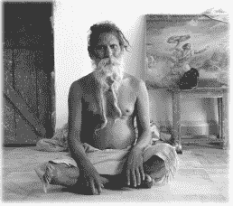

拜访印度的圣地是一个很好的开始，可以使我们有机会接近那一永恒的世界。许多圣地，虽然看起来位于这个物质世界，但实际上都是纯粹灵性的。对这些圣地的朝圣可以使我们更贴近灵性世界，无论对这些圣地神圣地位的认识是多么有限，我们仍然能从中得到净化。这样，我们便得到祝福，准备好最终的旅程—回到永恒极乐的灵性世界的旅程。

第十五章    人生终点—离开物质世界

通过瑜伽的宇宙观我们能认识到，除了我们这个微小的星球，还有无数更大的星球，而瑜伽师逐一经过这些星球最终达到宇宙的最高星球—布茹阿玛的居所。

在八部瑜伽体系中，人必须保持旺盛的精力去修习，并且在恰当的时间离开身体，穿越宇宙到达更高的星球，最终达到虔诚之星。瑜伽的宇宙观非常精确细致。通过瑜伽的宇宙观我们能认识到，除了我们这个微小的星球，还有无数更大的星球，而瑜伽师逐一经过这些星球最终达到宇宙的最高星球—布茹阿玛的居所。这一过程的细节在《圣典博伽瓦谭》中有所描述。其中写到，瑜伽师通过与火神的接触，他在物质世界中沾染的肮脏的东西就都被清除掉了。太阳神指出解脱的路径，它被称为“阿祺茹阿迪·瓦尔特玛”。

“阿祺茹阿迪”的意思是光之路，光之路的第一个神是光神。在光之路上一共有 13 位神。瑜伽师在这条路上通行，从一个神到下一个神，永不折返。这些神给予瑜伽师通过的许可，而瑜伽师也要向他们致以恰当的崇拜。天空中的银河就是这条光之路，通向宇宙中最高的星球。物质世界被描述为黑暗的，但是在物质世界之上，是一个光明的世界。换句话说，超越黑暗的物质世界的大气层，人便来到光辉灿烂的灵性世界。这一光灿即虔诚之星。瑜伽师们通过严格追随八部瑜伽体系，能够达到虔诚之星。当居住在虔诚之星的布茹阿玛走到他生命的终点时，就会和这些瑜伽师一起回到多姿多彩的灵性世界。

在这一点上，我们要说明，这一提升的过程应该从两个层面来理解：内在的，以及同时的宇宙维度的。我们现在处于宇宙的中间层面，而并不仅限于线性的维度。至尊既在内又在外。韦达经典断言，我们生活在一个等级分明的宇宙，其中有四十万人类形体的物种，还有另外八百万种非人类形体的物种。这些生物体生活在一个等级分明的世界里，每一个都有各不相同的生活环境。韦达经典的观点是这些世界都是真实存在的，虽然他们几乎无法被我们普通的人类感官所察觉，但微观世界（身体）和宏观世界（宇宙和宇宙形体）之间仍然有着相应的联系。帕布帕德在《圣典博伽瓦谭》中写道：“瑜伽师崇拜希舒玛茹阿星系，专业的称呼是‘昆达利尼·气轮’。”也就是说，瑜伽师们冥想宇宙的轴心为自己的脊椎，那里有一系列的气轮。通过提升生命之气逐一打开这些气轮，瑜伽师们带着自己的精微躯体，逐级通过宇宙的轴心，直到虔诚之星。

其他的韦达经典也证实了这种观点：“从心脏发出 101 条精微的生命之气脉。其中之一是苏桑那气脉，它一直延伸至头顶。将生命之气沿着这条通道运行出去，人便超越了死亡。其他的气脉通向四面八方，只会将人引向各种不同的再次出生。”正如上面所说的，瑜伽师通过这第 101 条心脏通道离开其粗糙躯体，然后沿着光之路从一个星球通行到下一个星球。帕谭佳里在《瑜伽经》的第三章中阐述了通过修习八部瑜伽如何到达高等星球，并获得玄秘力量。躯体是宇宙的微缩展示，宇宙中有什么，躯体中也有什么。微观世界与宏观世界同为一体，因此人能获得宇宙的力量。然而，奉爱瑜伽师与之不同的是，他并不欲求这些力量，而只想和最高的至尊进行爱心交流。至尊永远超越物质世界，奉爱瑜伽师不用再费额外努力，就可以超越短暂的物质存在。他对那些只要在瑜伽中进步就能获得的玄秘力量毫无兴趣，那不过是个人展示。

许多不道德的人，为了吸引并欺骗大众而毫无顾忌地表演玄秘能力。在印度出现的情况往往是这样：某人展示一些玄秘的能力，就受到天真追随者的赞颂，他便开始自我膨胀，把自己称为“神的化身”，最后失去所有的力量，只能靠廉价的戏法来蒙混其追随者，这样的事情在印度时有发生。当然，这给无神论者提供了绝好的机会，进一步以此抨击这种追随者的愚昧无知。

第十六章    不断提升—从未揭示的深意

当我们的心意处于较低的自然属性，如愚昧和激情属性时，我们没有意识到整个世界的背后实际上存在着一个至尊。

第九章我们讨论了人的自由意志及该如何使用—我们有自由的欲望，并为它做出努力。第十一章讲道，有些人认为没有真实的自我存在。实际上，如果一个人真的想达到这一境界，他也可以做到。这一状态就是“空”，只是物质开始具体化和多样化之前的一个阶段。它根本不是灵性的，只是一个未发展的物质阶段：“在物质自然的未展示阶段，没有言语的表达，也没有善良、激情以及愚昧属性。没有星系，也没有三种意识状态—睡眠、清醒、深度睡眠。没有空气、火、水、土，也没有阳光。这种情况就像彻底的休眠，或空。实际上，它无法描述。然而，精通灵性科学的权威们解释，因为“普旦”是原初的物质，实际上它是物质创造的基础。 ”

只是觉悟到原始的物质，并不是灵性。尽管通过这样的成就，一个人就基本上变得不存在，人所持有的品质就像死物一般，但是对一部分人来说，这一想法颇具吸引力。它看起来能解决这个世界的诸多分歧和争端。他们认为如果这个世界上的一切都不是真实的，那就再没有什么冲突可言。终极来说，如果所有形体和名称的多样性都是幻觉，那么人确实可以选择任何形式的修习，因为本质上它不会真正接受任何事物，除了“一切存在都是幻觉”这一想法。

这种提议，尽管很有诱惑力，但却需要人放弃所有能想象到的品质、感受，并且最终放弃自己。而这又如何能修习奉爱瑜伽？虽然荒谬，但这种终极虚无以及湮灭所有感官的想法却还是被普遍认为是非常灵性的。在印度，许多瑜伽老师认识到，如果怀着这种觉悟，那么无论修习什么都会非常困难，所以他们保留了一种独特形体的神和女神的概念，尽管只是象征性的。这些瑜伽师认为这样对进步会有所帮助。对他们来说，图片、神像以及祷文都是有帮助的象征性符号，而没有真正意义。那些记录下来和口头流传的历史事件，宇宙的构造以及通往高等星球的旅程，所有这一切都被视为神话和象征。

当代灵性老师想要吸引追随者，而同时也意识到任何严格的修习都是困难重重，因此将奉爱瑜伽的一些元素引入他们自己的教导，并加以提倡。比如，他们也投身于吟唱、吟诵和聆听至尊的逍遥活动。我们应该认识到他们是冒牌的，他们并不接受一个人格的绝对真理是终极存在。他们深陷在自己的思维范式中，以至想都无法想到在物质之上有一个充满多样性的存在。

我就遇到过一位怀着这种想法的老师。那时我们几个人在印度观光旅行，去拜访一个奎师那庙宇，让这位老师作导游。我们在四处游览时，看到一群虔诚的印度人正在向庙宇中的神像供奉祷文和歌曲。我们的导游，显然因为这群印度人的真诚和奉爱而感到难堪，忧心忡忡地向我们解释这些单纯的人对灵性事物没受过什么教育。他说如果这些人受过更多的教育就不会从事这种感情用事的活动。他以为我们会赞同他，但我们没有。我们对他说的很明白，他应该提升自己到恰当的层面，这样才能理解奉爱瑜伽。

那位导游的思维范式是：有人格特征的至尊并不存在。这是否定和抽象的结果。因为心意推敲和思辨，人们的正常和自然的灵性感悟已经失灵，并被紧紧地捆缚住。他无法认识到我们所看到的这群人的心中怀着自发的信心和真诚。奉爱驱使人能对至尊有所感悟和体验，而思辨只会将人引向沉默和枯燥。我们所使用的语言，其对象都是这个物质世界中的事物，被认为无法描述超越这个物质世界的事物，只有通过否定和抽象来描述至尊。认为使用语言来谈论灵性的事物，就会像一个过度扭曲的橡皮筋，“啪”的一声折断。

这种观点广为流传，但是从奉爱的角度来看，他们错了。奉爱认为，传达着超然至尊的名字、形体、品质以及活动等的语言并不源自我们这个世界。万事万物的源头都是至尊，语言的原初用途就是赞颂他，向他致以祈祷。为他服务是一切事物的正当目的，也是初始用途。忘记对至尊的服务，才将语言用于这个物质世界中的感官对象。请回想一下前面章节的讨论，我们是否该认为对至尊的描述是文学性和象征性的。

当人认识到至尊，受到鼓舞开始谈论至尊，并与至尊交流的时候，语言才回复它原本的用途。那些都是超然的话语，必须严肃认真地练习。真正的奉爱瑜伽师教导我们，我们物质污染的心意和感官无法理解至尊的名字、活动等的超然特质，但是当我们的各个感官—由舌头开始—通过奉爱瑜伽而得到净化，那么借着至尊的仁慈，人就能逐渐认识到它的名字和品质的超然特质。《圣典博伽瓦谭》中确认了这一点：“思辨家，格亚尼，他们不断思辨推敲至尊千百万年，但是除非取悦于至尊，他无法理解至尊的超然荣耀”。换句话说，只有恰当修习奉爱瑜伽，才能将人引至和绝对真理的人格特征真正接触的层面。

另一个不幸的误解—作为否定的抽象性描述的后果—认为人无法向绝对真理致以服务，因为其没有感官。该如何与一个没有任何感官的人或物建立联系？他们认为这是不可能的。持有这种观点的人提倡将对凡人（又被称为玛纳瓦）的无私行为作为真正的灵修之路。“对大众的服务就是对至尊的服务”是他们的座右铭。我们必须意识到这一概念并不是奉爱瑜伽师所持有的。毫无疑问，无私的活动有净化的效果，会将人提升至善良属性。同时，也会带来好的业报反应。然而，从灵性的角度来说，必须要有和至尊切实的联结（瑜伽）。只有处于这种情况下，我们的活动才会成为灵性的。帕谭佳里说，人应该谨慎、认真思考至尊的含义，并唱诵他的圣名。同样，《博伽梵歌》中说道，人必须在这个物质世界中活动的同时一直想着奎师那。奉爱瑜伽不仅是在这个世界里做好事，还要为至尊工作，而为了能做到这一点，必须先意识到他的存在。

为了帮助我们理解一位纯粹的奉爱瑜伽师如何看待这个世界，如何看待他和至尊的关系，可以借用一个我们都曾有过的经历来说明。假设我们都在电影院看电影，并且被屏幕上的影像和声音所深深吸引。我们之所以会投入电影之中，是因为我们已经忘了周遭的一切，除了大屏幕。在那种情况下，我们忘记了自己所看到的光是从我们背后投射过来，是有人在操作着投影仪。我们所看到的只有屏幕。正像这样，当我们的心意处于较低的自然属性，如愚昧和激情属性时，我们没有意识到整个世界的背后实际上存在着一个至尊。我们都投入于生活中每日发生的一切，结果几乎再也意识不到其他什么。我们没有意识到，现实存在的一切实际上只有至尊和他的各种能量。

所有我们现在所看到的一切似乎和至尊没什么关系。但是，奉爱瑜伽师很清楚这种看电影的状态。不像上面描述的那些怀着误解的思辨家，奉爱瑜伽师不会说这个世界的展示只是虚假的，或没有真实性可言。再一次回到电影院的例子，当电影院里黑暗被光亮取代的时候会如何？投影仪里的光仍然在那里，但是我们能意识到面前屏幕上发生的一切只是自己的错觉。黑暗已经消失，电影也失去了其引人之处。因此，真实意味着看到至尊和他的能量在工作。认为没有真实存在是错误的，认为我们是这个世界里一切的享乐者也是错误的。如果我们这样想，我们则是在呼唤这一错觉再回来。一个人应该总是想着如何将自己的身体和这个世界中的一切用于对至尊的服务，这种心态会引领我们觉悟到至尊。这就是奉爱瑜伽，而怀着这样的觉悟，一个人将立刻免于这个短暂的黑暗物质世界的桎梏。

圣帕布帕德写道：“奉献者的视阈是非同寻常的，它已经为奉爱服务的程序所净化。换句话说，正如宇宙元素既在内也在外，同样，主的圣名、形体、品质、娱乐活动、随从等，正如启示经典里所描写的那样，都在外昆塔楼卡里上演，远远超越这个物质宇宙展示，实际上，这些也都显现在奉献者的心中。没有知识的人无法理解这一切，尽管借助物质科学电视等可以等观看遥远的地方发生的事情。毫无疑问，一位高度灵性发达的人可以一直在自己的内心看到灵性世界。这便是至尊的知识的神秘之处。”

第十七章    回顾旅程—无虞之旅

本章将回顾和总结前面几章中讨论的内容。

让我们回顾和总结前面几章中讨论的内容。我们已经了解，瑜伽师如何以特定的方式离开世界，进入高等星球。灵性生活、宇宙以及绝对真理都是确实存在的。提醒大家要小心一些当代瑜伽师的误导性理论，他们教导别人：除了物质之外，再也没有其他的真实存在，要达到完美就要脱去所有物质存在，进入所谓的“大一”或“空”。真正的奉爱瑜伽师会尽力纠正这些误解，排除不正确的思辨想法，一心一意地修习纯粹的奉爱瑜伽。

八部瑜伽师通过修习整个八部瑜伽程序获得玄秘能量，并藉此展开旅行。根据帕谭佳里介绍，通过修习桑亚玛②，人能得到任何自己想要的，这种修习能挖掘人的潜力，并使人达到越来越高的意识层面。韦达文献中有很多在外太空星际之间旅行的事例。一些瑜伽师完全可以直接使用玄秘力量从宇宙的一处旅行到另一处而不需要任何机器，一位拥有玄秘力量的人能完全超越时间和空间的限制。

《圣典博伽瓦谭》中写道，在上升的过程中，这些不断进步的瑜伽师进入不同的星球，不得不在每个星球上投生。他必须向这些星球的神明致以崇拜之情。最终，进入布茹阿玛星之后，他会享受几百万年的寿命，然后其物质存在便走到终点，转变为一种“精微”的存在，然后从“精微”的存在转变为一种“起源”的存在，这时便可以见证过往的经历。他的“起源”存在毁灭时，他转变进入“纯粹”的状态，其品质与超灵没有差别。通过这样的程序，生物体达致超然的境界。

和上面这些瑜伽师相反，修习奉爱瑜伽的人可以直接进入灵性世界而无需另外努力，也不需要崇拜任何神明。韦达经典，尤其是《圣典博伽瓦谭》，包含了许多事例证明这一观点。其中一个例子是杜尔瓦大君，他虽然只是一个小孩子，仍然达到了这种完美境界。另一个例子是阿佳米勒，他只是修习了些许的奉爱，就得到帮助，然后进一步修习奉爱，并在生命终点的时候达到完美。

在这一方面，帕布帕德认为奉爱瑜伽极其有力，通过将这些法则应用于自己的生活，一个人就能很轻松地回归灵性世界。而且，通过奉爱瑜伽，人可以很容易旅行到别的星球，并最终回归神首。他说：“奉献者没兴趣参观其他星球，但是在回归神首的路上，他们会看到所有过往的阶段，正如一个人如果要去很远的地方，他在途中会经过许多小国。”这一完美境界之所以如此简单，是因为他们得到了来自最高国度的帮助，他们得到了仁慈（参见第四章的“瑜伽阶梯”）。

有关仁慈，我们要避免走入偏见。有的瑜伽修行者以为，只要依靠古茹的纯粹力量就可以获得进步，并且他们的古茹是最高的。他们认为灵性导师会烧尽他们过去的业报反应，这就是“救星古茹”。实际上只有至尊能够消除过往罪恶活动的业报反应，无论是我们自己的还是那些依靠我们的人（门徒或孩子）。只有认真从事奉爱瑜伽修习的人，至尊才会消除他的业报反应。

我们要非常警惕那种过度依赖“救星古茹”的态度。但同时，我毫不质疑灵性导师拯救众生的仁慈。在经历了无数次生死轮回之后，我们荣幸地向这样一位导师学习，并认识到生命的真正目标，那是无比幸运的。帕布帕德说：“要想获得超然知识的完美境界，就要接受师徒传承、灵性的传系，在这一传系中培养知识、修习以及接受教育。”

一位导师不会让他的学生偏离奉爱瑜伽程序的轨道，这些都来源于悠久的传统。人应该追随特定的原则：“清晨早起，沐浴，换上干净的衣服，吟诵超然的音振，比如：哈瑞 奎师那，哈瑞 奎师那，奎师那 奎师那，哈瑞 哈瑞；哈瑞 茹阿玛，哈瑞 茹阿玛，茹阿玛 茹阿玛，哈瑞 哈瑞。

真诚的瑜伽修行者还要遵守许多守则和规则。这些戒持和守意的规条对所有瑜伽体系都一样重要（参见本书第三章）。另外，人还应该经常从精通奉爱瑜伽科学的人那里聆听《博伽梵歌》和《圣典博伽瓦谭》。这项修习可以使人提升至纯粹的奉爱，确信可以进入灵性的国度。

认为仅仅凭着导师接受自己就能够得到拯救而不需修习，这完全是误解。同样，一些信奉宗教的人认为，只要选择了“正确”的宗教，就能够被拯救。如果坚持这样的结论而忽视实修，就只是在原地踏步，即使有所前进也微乎其微。为获得正确的唱诵，修行者需要做很大的努力，要有毅力和洞察力，因为唱诵是一门非常严谨的科学。吟诵、吟唱有几个不同的阶段：冒犯的唱诵、清除冒犯的唱诵以及纯粹的唱诵。只有清除冒犯的唱诵才会将人提升至纯粹唱诵的阶段。

“灵性导师以知识的火炬启亮我们的双眼”，通过其指导我们能够认识世界的真实模样。藉着其仁慈和我们的自省，我们能意识到自己的缺点，并且学会如何改进。唱诵时尽量放弃不纯粹的欲望，这一程序是专门推荐给这个年代堕落的灵魂的，被称为规范奉爱，净化阶段的奉爱。通过这一程序，再加上导师和至尊对我们仁慈的拯救，以及我们真诚的努力，我们就能成功地弥补所有不足，最终能够恒常纯粹的唱诵，获得无条件服务奎师那的能力。当人达到这个层面，就拥有了全然的信心，一定能得到所有需要的帮助，最终回到灵性世界。

奉爱瑜伽教导我们：就像黄疸病人无法品尝出糖的甜美滋味，我们目前处于不纯粹的状态，还品尝不到奎师那圣名的甜美滋味。尽管唱诵是项让人愉快的活动，但它难以修习。为了抵消甜美体验的匮乏，我们要付出更多的努力和毅力，我们渐渐就能恢复原本的地位，并最终体验到唱诵的甜美感觉。虽然我们愚蠢又堕落，但不能总是自甘堕落。帕布帕德的一位学生在他的著作《我荣耀的主人》中回忆道，有一次帕布帕德谈论进步的奉爱瑜伽师的谦卑,学生说道：“我唯一的资格就是做个傻瓜。”帕布帕德锐利地看着他，说：“是的，但你不能总是甘于做一个傻瓜。”

事实上，“我是一个灵魂”，我们所要做的就是以这一心态去活动。我原本的身份是“至尊的永恒伙伴。我应做的活动就是取悦他。我属于灵性世界。”带着这种信念，人必将恢复原本正常的知觉，从所有的愚昧无知中解脱出来。

第十八章    奉爱瑜伽—超越宗教层面

瑜伽是一门科学，也是一种生活方式，使心意得到净化，从而重建我们与至尊者（奎师那）的联系。

瑜伽是一门科学，也是一种生活方式，使心意得到净化，从而重建我们与至尊者（奎师那）的联系。

然而，喀利年代是一个充满困惑与纷争的年代，身处这个年代的人都会受到影响。正因如此，瑜伽的教导被冠以宗教之名来传播，实际上，这并不是瑜伽的全貌。在这里，我要强调的是，瑜伽与一般人所说的“宗教”和“神”毫无关系。

接下来，我将详细阐明为什么瑜伽的教导，尤其是其中对“至尊”这个概念的认识与其他各种宗教完全不同，甚至截然相反。正如前面所说，我们的观念应该正确、深刻而彻底，因为观念先于感知。我们都听说过“情人眼里出西施”，也就是说，我们所感知的并不是真正的事实，我们只是在感知我们所设想的。通常，任何观念（思维定势）都是由于我们与物质属性的接触，并不是完美无瑕的，除非我们的知觉得到彻底净化。要想达到这样的知觉状态，方法之一就是从已经达到纯粹知觉状态的人那里聆听、学习。

你或许会怀疑：如果从纯粹知觉的人那里聆听如此有效，那么它应该早就被学术界人士和领导人采纳，植入教育体系中了。关于这一点，威廉·H·戴德威勒博士一针见血地指出了愚昧产生的本质原因：“问题在于，一个人的知识与其处境密切相关。当人总是惯于感官享乐和性生活，其感知途径就会出现故障，被阻塞，再也无法理解和体验到自己永恒的本质，无论其多么杰出。这样的人在愚昧的泥淖中陷得如此之深，深入骨髓，即使其具有的最先进的知识也毫无帮助，那只是加速其继续在愚昧中深陷下去。尽管不断遭遇失败和挫折，他们仍然永不放弃那些毫无希望而狂热的梦想，去追寻幸福和快乐。他们就像动物一样没有记性，无法完全认识到这个世界的本质。即使他们误导了别人，也不要嘲笑他们或为之气愤：因为他们和大家都一样。”

在练习瑜伽的同时阅读本书，能够帮助我们纠正之前的偏见，接触到一些全新的认识。但是，我们和亲戚朋友交流时，会感受到人们对自己所获得的新觉悟的保守态度。一般来说，一些明智的人不会相信那些打着宗教旗号的事情，他们可能会嘲讽对方，认为对方选择了什么信仰，这种情况下，该如何与他们分享自己的收获呢？

比如，如果有人对我说他不信“神”，我会让他描述一下他所不信的“神”是什么样子。绝大多数情况下，他们的意见与我们相符：无论在哪一方面，瑜伽与普通的宗教都不是一回事。作为一个瑜伽的修习者，我们可以非常坦诚地认同那些宗教教条的反对者。

关于瑜伽的修习，以及瑜伽对至尊这一概念的理解，本书已经系统地描述。在我们讨论“神”这一个瑜伽修习者会反对的概念之前，我们先重申一下瑜伽对至尊的理解。我们可以从不同距离观察一座山来做类比，在远处，我们只能看到山的轮廓，走进之后我们能更清楚地看到上面的树木、岩石，而更靠近，我们还会发现里面生活的各种生物。同样，梵、超灵和至尊都是同一个真理的不同方面，只因为观察者所处的进步层面不同。奉爱瑜伽处于一切瑜伽修习的顶峰，其修习者能够清楚地认识到一切都源自至尊，而我们，各种生物体都是其永恒不可分割的部分，因此奉爱瑜伽师怀着无私的心态，全心全意地服务至尊。尽管一切都源自至尊，他同时依然保持自己的完整性，独处于万事万物之外。生物体被至尊的迷幻能量覆盖后，无法意识到自己的真正地位和真正身份，一个又一个地不停更换那短暂的躯体，直到萌发了要将奉爱与至尊重新联系起来的念头。要想成功地做到这一点，人需要至尊仁慈的帮助，也只有通过至尊的仁慈，人才能克服深深扎根的自私与“假我”。

瑜伽的教导非常理性，从来都不是教条化的。但接受了不合格的指导，会常常停滞在某一层面上不思进取。那些不称职的灵性指导者，因个人利益，不理会大众的灵性进步，所关注的只是追随者的数量。这些追随者绝大部分也只是和指导者一样，被劝诫不能离开领导，如果胆敢这样做，就会失去 “救赎的机会”而“被狱火永远焚烧”。

这并不是说，没有任何灵性目标而像动物一样活着就更好。人活着是为了获得灵性的进步，永远地结束痛苦，要达到这一目标，分享瑜伽的财富至关重要。人们需要认识奉爱瑜伽的意义，开始奉爱瑜伽的修习，起点则是开始一种全新的生活方式。要想不断前进，我们需要智慧，只有理智的头脑才能让我们逐渐摆脱愚昧，达到纯粹的知觉状态：神爱。在瑜伽中，教条没有任何意义。

我们来对比一下在喀利年代中所谓的“宗教”的各种概念。其目的并不是为了嘲笑、贬低它们，而是从中收获新的感悟。可以肯定地说，绝大部分人并没有想过物质与灵性（躯体和灵魂）的区别，对终将到来的死亡总是充满恐惧。人们想象有一个比他们更强大的人，一个“神”，会与他们同在，帮助他们战胜敌人，保佑他们度过危险，赐予他们“救赎”。多数情况下，各种不幸都是因为没有忠心追随自己所选的“救赎之神”。当今，日子越来越艰难，人们的心中没有一刻平静与安宁，许多人认为末日就要来临，“神”很快就会降临来做最后的审判，尤其是那些罪恶的奸诈之人。然而，对业报定律，这一公正无私、对任何人都铁面无私的法则，他们却毫无所知。

有趣而又令人沮丧的是，上面所说的这类人已经在历史的长河中出现了很久，给无数人的生活带来破坏，甚至劫难。任何对闪族人思想和历史有所了解的人都很清楚，在宗教的名义下，曾经发生过数量惊人的暴力和迫害行为，其残酷程度让人难以置信，而且到今天仍在继续。人们不再去思考这个世界，询问自己的真正地位，而是转入某“宗教”，为了争夺地盘而厮杀。他们心中那个所谓的“神”无法容忍对其他“神”的崇拜，本来应该仁慈、博爱的神却充满了嫉妒和报复心。

上面描述到的那些“宗教人士”，别人还会对他怀着爱心吗？实在很难。对一位瑜伽学生来说，至尊，正如在《博伽梵歌》中所描述的那样，其心胸广阔无垠，宽宏大度。“我以超灵居于众生心中。一个人如果想去崇拜某个半神人，我就会坚定他的信念，让他全心全意把自己奉献给这一特定的神。”如果从韦达的视角来看待闪族的至尊概念，我们就会惊奇地发现，那更类似于一个恶魔的形象，总是渴望占有、统治世界（“我是万物之主，我是享乐者”）。不是想着如何从“假我”中解脱出来，而是想着权力和占有，认为只要追随着某个强有力的领导人就一定能实现。有人如果不支持他，或者不相信他，就会给自己引来杀身之祸，而这样的屠戮却以神圣的名义。也许这个时候我们应该想一想：爱跑到哪儿去了？

有人也许反对这些对闪族观念的描述，而列举那些并不遵循死板教条、坚持自我觉悟和内在反省的探索者。这是事实，但是这些人的行为并非由于闪族的“神”，而只是想获得更真实的体验，不得不为此承受宗教裁判所的残酷镇压。在瑜伽的教导中，从来没有这种因自私的动机而导致暴力，和世俗的宗教截然不同。

征服愚昧的方法只有对真理的探寻和热爱，《博伽梵歌》既不认同粗暴的武力，也不鼓吹和平主义，所宣扬的是要积极而公正无私地维护自己的灵性进步。任何有影响力的人，都应该视保护他人不堕入愚昧和激情属性为己任，将人生更重要的意义告诉世人。在这方面，帕谭佳里·牟尼为我们树立了榜样，在他的《瑜伽经》里，修习瑜伽最首要的，就是持戒法和守意法。《博伽梵歌》中也同样指导学生战胜“假我”，能清楚地选择，是在奉爱瑜伽中行动，还是继续停留在错觉中。这一宝贵遗产给世人带来的益处难以想象，任何理智清醒的人都会奇怪，为什么自己还要停留在愚昧无知中，成为那些狂热的宗教幻想的牺牲品，或者一个灰心的无神论者。

第十九章    结语：诚挚祝福—旅途愉快

英国经济学院做过的一次调查显示，金钱能买到一切，除了幸福。孟加拉是世界上最贫穷的国家之一，但其居民从自己微薄的收入中获得的幸福远远多于银行中有大量存款的英国人……

几年前，英国经济学院的教授们做过的一次调查是显示，金钱能买到一切，除了幸福。这项研究揭示，孟加拉是世界上最贫穷的国家之一，但其居民从自己微薄的收入中获得的快乐和幸福远远多于那些银行中有大量存款的英国人。实际上，根据这项调查，比较富裕的国家—比如奥地利、瑞士、加拿大等—的居民，比那些贫穷国家的更不快乐，比如亚美尼亚或加纳。对一个穷人来说，收入只要增加一点点就意味着生活能有很大改善，能给他带来很多的幸福，但是如果收入超过一定水平，幸福和金钱之间就不再有联系。根据这项研究，在比较富裕的国家，幸福有赖于健康、满意的工作以及亲密的个人关系。瑜伽的修习正好可以满足这三项需求。我希望本书对中国朋友有益，尤其是现在，许多中国人已经过上繁荣富足的生活，是开始修习奉爱瑜伽的时候了。

读完本书，您会认识到，瑜伽并不是闲暇时的运动，而是一种生活方式。人也许会在闲暇时练习瑜伽以保持健康。除此之外，通过奉爱瑜伽，人会学到如何以灵性的角度将自己的生活和工作与瑜伽联系起来，从而获得极大的满足感。有这样的意识，人会更接近每一个生物体，理解他们都是至高真理的一部分，觉得自己和所有的生物都非常亲近。修习奉爱瑜伽真正的获益是平和与幸福。帕布帕德在其一部名为《奉爱的甘露》的书中阐述道：“通过爱奎师那这种简单的方法，人就能学会如何爱每一个生物体。我们没能在人类社会中创造和平与和谐，那是因为不知道正确的方法。其实方法非常简单，只是需要冷静的头脑来学习和理解。”

受喀利年代的影响，奉爱瑜伽的文化在印度基本已经被大众遗忘。任何去印度朝圣的访客都会遭遇现在的“印度教”，而且可能会为所见到的多种多样的修习和崇拜所着迷。但是绝大部分人，无论是在印度还是其他地方，往往对为了自己的生活应该做什么没有深刻的洞察，而只是盲目地修习一些宗教，没有哲理性的理解。他们可能知道有一个布茹阿玛、一个希瓦、一个维施努（奎师那），但是对其地位却只有模糊的认识，同样也不会考虑自己原本都是纯粹的个体，与至尊的意识存在有着和谐的关系。他们忘记了与至尊意识存在的联系，流落到宇宙的各个角落，受粗糙和精微的能量、心意以及物质的掌控。因为忘记了自己原本的地位，所以他们试着努力去掌控和享受精微和粗糙的物质能量。因此他们接受了由这些物质能量组成的躯体—那是所有痛苦的源头。但是，出于迷惑，他们将痛苦误以为是快乐。

与之相反，通过瑜伽的程序，人能再一次变得纯净，再一次和绝对意识存在建立联系。然而，环顾整个世界，绝大部分人都无视这一真理，并盲目地追随一些宗教。有一点很有意思，“宗教”这个词和“瑜伽”有相似的意思。“宗教”的英文词来自“religio”，含义是“联合在一起”。宗教和瑜伽有着同样的宗旨：与至尊结合或联结。但是，有多少宗教追随者知道这一简单的事实？然而，帕谭佳里所呈现的瑜伽系统，以及通过奉爱瑜伽将其加以应用，却并不是另一个世俗的宗教，只为了得到每日的面包或其他物质利益才去修习。瑜伽是一个科学的程序，会最终使人获得纯粹的意识。

中国人非常特别，无论他们认真地开始哪项工作，最后都会非常擅长。我们想建议您逐步地将奉爱瑜伽的元素引入您的瑜伽修习中，尤其是“聆听”和“唱诵”（即聆听奉爱的内容和吟诵曼陀），丰富自己的课程，和周遭的一切得到持续不断的激励。通过这一方式，奉爱瑜伽的文化会逐渐生根发芽，将幸福快乐带给广大的中国人民。

我们真诚地希望能在瑜伽之圣道中与您相遇。

Om tat sat!

附录 1：物质自然三属性

|  | 愚昧 | 激情 | 善良 |
| 基本特征 | 愚蠢，疯狂幻觉，睡眠 | 无止境的欲望强烈的活动和努力 | 有责任感快乐纯净 |
| 食物 | 不干净，已腐烂肉、鱼、蛋、酒精、饮料 | 太苦太酸，过咸过热，会导致痛苦和疾病 | 有营养又健康谷物、水果、蔬菜 |
| 知识 | 不关心绝对真理，只想着吃睡 | 将躯体认同为自我，推测性的教条和学说 | 永恒灵魂的觉悟视一切都为整体的一部分 |
| 智慧 | 是非颠倒，黑白混淆 | 不知道什么是该做的什么是不该做的 | 理智地区分什么是该恐惧的，什么是不用恐惧的，什么是将束缚的，什么是解脱的 |
| 活动 | 不负责，粗暴，令他人痛苦 | 付出巨大努力来满足自己享受的欲望，结果却总是失望 | 依责任行事，毫无依附 |
| 决心 | 永远都在做白日梦 | 专注于获得活动的结果 | 牢不可破、永不偏离；控制心意和感官 |
| 快乐 | 来自于睡眠、懒惰和幻觉 | 源自与感官对象的接触 | 苦苦地追求，甜蜜的结局 |
| 颜色 | 蓝色，黑色 | 红色 | 白色，黄色 |
| 场所 | 酒馆，妓院，屠宰场 | 城市，乡镇 | 森林，自然环境 |
| 动物&植物 | 猴子 / 蘑菇 | 狮子 / 洋葱，大蒜 | 牛 / 芒果树 |
| 宇宙活动 | 毁灭 / 希瓦 | 创造 / 布茹阿玛 | 维系 / 维施努 |

附录 2：与圣地“瑞希凯什”有关的

一个骑着自行车的人可以轻易赶上路上行驶的拖拉机，很容易提高自己的速度。同样道理，我们向纯粹的灵魂学习，培养正确的祈祷心态，便是奉爱瑜伽的精髓。以下摘录了一则巴克提维诺德·塔库尔的祷文，他是一位已经臻达完美境界的瑜伽导师，其生命的最后四年完全沉浸在三摩地中。

祷文原是由孟加拉文写成，将至尊称为“哥琵纳塔”和“瑞希凯什”。哥琵纳塔的意思是“牧牛姑娘们的主人”，那些全心全意深深爱着至尊的温达文的少女（牧牛姑娘），都视至尊为亲爱的爱人。至尊还以另外一个名字“瑞希凯什”而闻名，在《博伽梵歌》中，这一名字出现了七次。本书中也介绍了一处与此同名的圣地。让我们静心阅读这篇祷文，并悉心感受其中的心态。这样，我们便能与指引着我们感官的至尊者瑞希凯什联结在一起。

哦，哥琵纳塔，您是瑞希凯什，感官之主。我是如此无助，请让我的感官得以降服，让我脱离这黑暗而危险的物质存在。

哦，哥琵纳塔，物质世界里的一切都来自您的幻觉能量。我毫无力量，也没有知识，就是这躯体也被自然的力量牵引，不受我控制。

哦，哥琵纳塔，当我的心被强大的感官驱动奴役，无法放弃对俗世的执著，我怎可能有任何进步。

哦，哥琵纳塔，请端坐我心中，降伏我的杂念，让我与您相联。只有这样，世间的恐惧才会烟消云散。

在本书中，我已经多次提到获得仁慈对进步的重要性。我曾经提过念颂玛哈曼陀罗：

哈瑞 奎师那，哈瑞 奎师那，

奎师那 奎师那，哈瑞 哈瑞；

哈瑞 茹阿玛，哈瑞 茹阿玛，

茹阿玛 茹阿玛，哈瑞 哈瑞。

Hare Krishna, Hare Krishna;

Krishna Krishna, Hare Hare;

Hare Rama, Hare Rama;

Rama Rama, Hare Hare.

悉心体会上面这段祷文的心态，念颂这一简单的曼陀罗，同时有规律地复习这些瑜伽教导。

另外，要想正确地念颂这一曼陀罗，一定谨记柴坦亚·玛哈帕布提出的规则：“应怀着谦卑的心态来念颂至尊的圣名，视自己比路上的茅草还卑微，比大树还容忍，避免一切骄傲，随时准备着向别人致敬。只有这样才能恒常地念颂至尊的圣名。”

附录 3：非人格主义的不足之处

多个世纪以来，各个文化中那些享誉盛名的圣哲、玄秘主义者以及哲学家都对终极存在有所体验，并将之记录下来。他们不约而同地发现，这个现象世界并不是唯一的现实，还有另一个非物理性的现实存在。这些瑜伽师和玄秘主义者的认识都是确实无疑的，这样的认识从古至今始终如一。无论他们的文化差异如何，帕谭佳里、佛陀、老子、柏罗丁、埃克哈特·约翰尼斯，以及近代的阿尔道斯·赫胥黎，每一位都宣示着“永恒真理”的存在。

近些年，现代物理学家也不得不面对同样的谜题，逐步走向同一个结论，那就是“存在一个单一实体，它是所有展示出来的形体和规律之源头”。F·卡普拉（Fritjof Capra）在他的《物理之道》中以量子力学为基础，提出了这一观点。物理学博士玛尼·鲍米克（Mani Bhaumik）在他的畅销书《神之密码—一位科学研究者的灵性探索》中也表达了同样的观点。

有趣的是，鲍米克反对“万物皆空（Nothing is real）”及“虚无（Nothingness）”的观点，他非常肯定地表明，我们所见的、所体验的都确实存在，而且都是不同的能量：“你的狗，或者你的车，你的配偶……杜尔嘎、卡利、奎师那、希瓦以及所有印度文化中的诸多神话人物，都是梵的具体化身。”当梵被玛亚覆盖，个体存在的幻觉才展示出来，最终，我们都会融入其中。对鲍米克来说，我们都只是短暂的存在，最终会“天人合一”（玛尼·鲍米克的观点并不新奇。瑜伽的一个分支，虽然也讨论至尊，但是对他却没有任何人性化概念，他们认为非人格的梵是一切背后的原因：“在不二一元论哲学中，“至尊”这个词，也即通常人们所理解的“神”，有特殊的含义。韦丹塔学者不认为至尊是绝对存在。因为至尊和这个可知觉的宇宙一样，都是不真实的。布茹阿曼与愚昧形态结合，才展示为至尊。至尊和普通的人差别在于，前者虽然被玛亚覆盖，但并不受玛亚的禁锢，而后者则是玛亚的奴隶。至尊是布茹阿曼在这可知觉的宇宙中的最高展示。” 引自萨达那南达 Sadananda 的《韦丹塔萨茹阿》The vedantasara）。然而这是一个悖论，如果个体性是幻觉，“他们存在”的意义又何在？

他论证，任何化身，包括一个绝对真理（归咎于个体性）都是一个灵性上缺乏经验之人的体验，随着灵性的进步就会逐渐抛弃这种想法。随之达到一个永恒的、天人合一的存在状态。在他最后总结全书的时候，他提出了这样的问题：“永恒的天人合一的状态，这种超越所有信仰和文化的体验，是否就是我们人类能体验到的最接近宇宙本源的状态？”

巴克缇瑜伽学派会坚定地回答“不”—这远不是我们能体验到的最接近宇宙本源的状态，实际上才刚走到一半。巴克缇瑜伽是使人脱离重复生死轮回的正途，而对终极存在的错误认识却使人们离开巴克缇瑜伽的修习，误入歧途，这不得不说是全人类的最大遗憾。

多个世纪以来，有无数瑜伽导师以他们的灵性觉悟，描述了现象世界的始源，那是一个充满了多样性、具有各种形体以及活动的永恒国度。也就是说，他们认为我们的世界只是永恒国度的一个影像，这里的一切之所以存在就是因为在永恒国度里就存在，而且没有物质的局限。大家应该认识这一点。只有人们知道这一超越重复生死的机会，才不会追随一个不完整的觉悟，将自己带往任何归宿。

通过分析推理，我们可以知道至尊具有超然的多样性，但却无法告诉我们其多样性具体的细节。最终的结果都可以在源头处找到，我们可以得出结论：“我”这个幻想世界的概念必然出自至尊。在这一点上，我们不能凭借自己的智慧去揣测至尊，而必须聆听，顺从地聆听巴克缇瑜伽师。他们向我们揭示了在灿烂的布茹阿曼光灿之上的至尊，拥有无穷的名字、形体、富裕和活动。他，就是奎师那，最具吸引力的人，他超然的肤色如同蓝黑色的乌云，蕴含着雷鸣闪电，那饰满珠宝的双手总是将银笛放在唇边，双眼美如莲花瓣，他总是沉浸在爱的海洋中，与他的奉献者漫步在永恒的灵性王国。

当非人格主义者听说在光灿之上，还有一个形体—奎师那的超然形体，所有美丽的化身—他们便认为那是物质的，是玛亚。这正是因为他们自己的思想是根深蒂固物质化的。他们完全无法接受“超然形体”这种概念，认为所有的形体都是物质的，至尊绝对是无穷的、没有任何限制的，而所有形体都是限制—正如个体性就是一个限制。但我们为什么要将形体和人格的物质性概念强加到超然的国度？谁说所有的形体都是物质形体？谁说不存在灵性形体和人格？

我们可以认同至尊必然是无穷无尽、无所限制的，但是这与非人格观点的至尊岂不是自相矛盾？非人格观点对至尊的一切都加以无情否定，彻彻底底地剥夺了至尊的一切—形体、品质和关系—从本质上说这岂不是与什么都没有无异？而另一方面，以人格的观点，至尊作为超然或灵性的形体、品质、活动和个体性的拥有者，没有任何束缚和限制，这才与其至高无上的地位相符。

奉爱瑜伽教导我们：尽管至尊者对一切生物都平等、不偏不倚，但还是偏爱那些怀着奉爱（巴克缇）接近他的人。因此，最不幸的人会变成一个最幸运的人，凭着对至尊的爱心，人会逐渐免于业报反应。环顾我们周遭，不断累积的可怕业报如一片黑云笼罩着全球，这种灾难接连不断。我们应该意识到，我们此时正急需至尊的仁慈，刻不容缓。

致谢

第四章《八部瑜伽概要》全文出自苏候铎·玛哈茹阿佳（1950—2007）。作为一位多产的作家，他撰写了许多饱含智慧，并实际指导灵性成长的书籍。

第五章中的“瑜伽阶梯”概念，以及第九章中“自由意志”的概念来自布瑞占·达斯。他撰写了众多书籍，包括：《教授的艺术》、《向我臣服》（《博伽梵歌》的深入研究）、《现在开始讲解圣典博伽瓦谭》、《我荣耀的主人》、《觐见奎师那的莲花足》（《圣典博伽瓦谭》第一篇第四篇的深入学习）。

第十章中思维定势的概念来自威廉·H·戴维勒（亚文铎·萨特斯瓦茹帕·达斯）的讲座，他在坦普尔大学获得宗教学硕士及博士学位，同时拥有宾夕法尼亚大学的哲学学士学位。

第十四章中关于创造的两个段落引自杜尔塔卡尔玛·达斯（麦克·A·克里莫）。麦克·A·克里莫是多个国际协会的成员，包括科学历史学会、世界人类学学会、科学哲学协会、欧洲人类学协会、巴克缇韦丹塔历史与科学哲学研究院。

第十六章中关于瑜伽和佛教的研究大部分由斯蒂文·罗森完成，斯蒂文·罗森是 20 多部韦达相关内容书籍的作者。同时还是《外士那瓦研究》杂志主编，该学术杂志主要探讨外士那瓦及印度教的文化和哲学。

我谦卑而诚挚地感谢所有对本书做出贡献的朋友。同时我也感谢巴克缇韦丹塔图书信托公司允许我引用圣帕布帕德著作中的诗节和要旨。所有这些诗节和要旨均为巴克缇韦丹塔图书信托公司的知识产权。

美术与摄影

摄影：布瑞占·达斯；楼依塔克沙·达斯；桑克依坦·达斯

描画：斯外特拉娜·玛卡若娃

其他插图：高迪亚

参考书目

BBT 书籍：《博伽梵歌》；《圣典博伽瓦谭》；《永恒的柴坦尼亚经》；《超越生死》；《伊首乌帕尼沙德》；《布茹阿玛·萨密塔》；《奉爱的甘露》；《神首的训示》

布瑞占作品：《向我臣服》；《我荣耀的主人》；《VTE 学习指南》

其他引用：《瑜伽经》；《韦丹塔经》；《卡塔乌帕尼沙德》；《毕哈得·阿然亚卡乌帕尼沙德》；《穆达卡乌帕尼沙德》；《禅多几亚乌帕尼沙德》

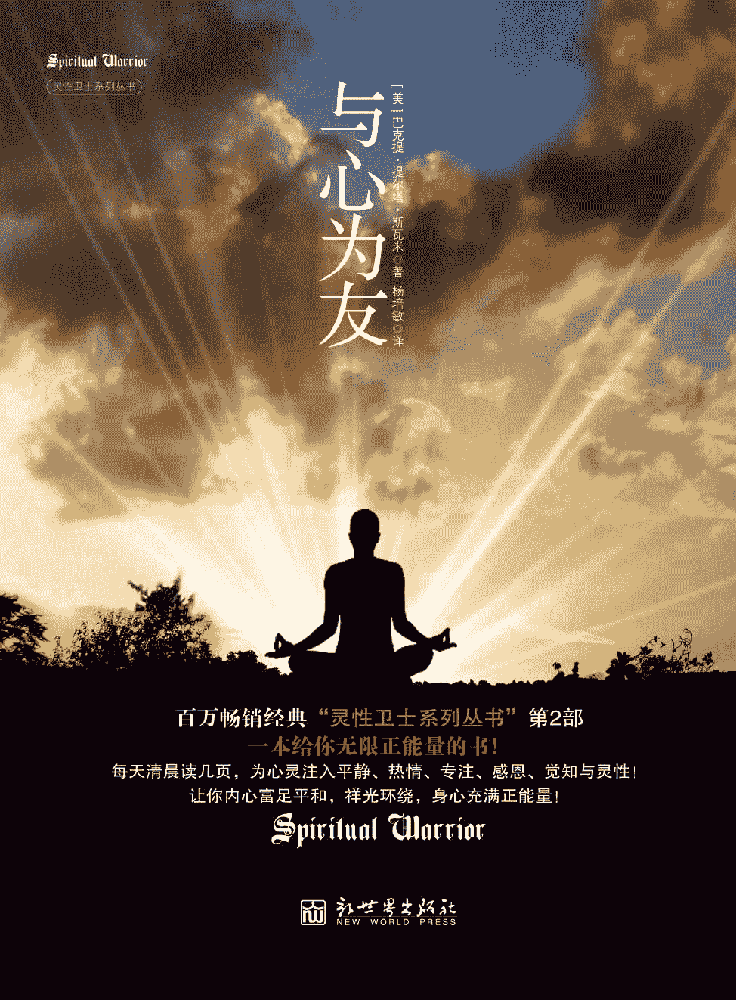

图书在版编目（CIP）数据 

与心为友 / (美) 斯瓦米 (Swami,B.T.)著；杨培

敏译. — 北京：新世界出版社，2013.4

ISBN 978–7–5104–4133–2

Ⅰ. ①灵… Ⅱ. ①斯… ②杨… Ⅲ. ①心理学－通俗 

读物 Ⅳ. ①B84–49 

中国版本图书馆 CIP 数据核字(2013)第 045990 号 

北京版权保护中心外国图书合同登记号：01–2012–2638 

Copyright © 2003 by John E. Favors  

Spiritual Warrior V: Making the Mind your Best Friend

All rights reserved.

Through arrangement with HARI NAMA PRESS  

与心为友  

策  划：北京阳光博客文化艺术有限公司 

作  者：【美】巴克提·提尔塔·斯瓦米（Bhakti  Tirtha Swami）

译  者：杨培敏 

责任编辑：刘 媛 

责任印制：李一鸣 刘社涛 

出版发行：新世界出版社 

社  址：北京西城区百万庄大街 24 号（100037） 

发  行  部：（010）6899 5968               （010）6899 8733（传真） 

总  编  室：（010）6899 5424               （010）6832 6679（传真） 

http：//www.nwp.cn

http：//www.newworld-press.com

版  权  部：+8610 6899 6306    版权部电子信箱：frank@nwp.com.cn

经  销：新华书店      印  刷：北京市京东印刷厂 

开  本：710mm×1000mm  1/16    字  数：150 千字  印  张：13

版  次：2013 年 5 月第 1 版    印  次：2013 年 5 月第 1 次印刷 

书  号：ISBN 978–7–5104–4133–2 定  价：36.00 元 

版权所有，侵权必究  

凡购本社图书，如有缺页、倒页、脱页等印装错误，可随时退换。 

客服电话：（010）6899 8638

# 目录

前 言编者序作者自序导 言第一章 对话——连接自我之道超越表象心灵之途上的障碍求救信改变内在的连接寻根溯源问答录第二章 目标——大海航行之舵业精于勤无舵之舟心想事成的方法问答录第三章 感恩——万物依存之源万物依存之源是什么阻碍了你的感恩之心感恩之心从何而来问答录第四章 热情——捍卫灵性之盾热情造就成功停滞的原由问答录第五章 觉知——通达本质之路认识本质神的富裕做得好，亲爱的，做得好在觉知中发现奇迹问答录第六章 逃离——永脱痛苦之法逃离苦地寻找解决痛苦的永恒之道逃离的边缘问答录第七章 假装——催生奉爱之心灵性成长催生奉爱之心“假装”真实的行为问答录后 记返回总目录

前 言

圣恩巴克提·提尔塔·斯瓦米（Bhakti Tirtha Swami）始终在激励我们做一名生活中的灵性卫士，就象古印度圣典《博伽梵歌》中伟大的武士——阿诸那。在本书中，他采用了更适合于现代人的比喻和语言来阐释这一观点，使之更具有普世性。这是爱、信念与奉献的讯息，它将源源不断地鼓舞着世人。

首先，人的心灵就好比一片田野，在灵性成长的种子撒播之前，需要不断地耕耘。我们必须努力地把负面的思维、消极的信仰以及破坏性的自我意象从思想中清空。对于戒瘾，在这艰难的过程中，一方面应当谦卑地托庇于更高的力量，另一方面也得理解，康复是一个循序渐进的过程，对于一个苦苦挣扎的瘾君子而言，这两者就像支撑他的两条拐棍。成瘾者想寻找的其实是精神上的陶醉，一种来自灵魂深处的极乐。然而，在生活的战场上，自控能力的培养是不可缺少的。确立自己所珍视的短期目标，通过这些目标加强对心态的把握和对欲望的驾驭，精神上的自信力就会逐渐表现出来。在努力奋斗的过程中，爱常常会成为我们的源动力。

斯瓦米(Swami)还指出了我们这个时代所存在的大问题——物质主义的威力，地球上绝大多数人的欲望已经被这种力量所俘获。他指出，物质至上的理念深深地影响着我们的心态和欲望。物质上的成功有可能导致贪婪，而物质上的失败则容易造成自尊心的丧失。两者都会导致错误的心态，蒙蔽我们的眼睛，使我们忽略生活中的机遇和人内在世界的丰富和充实。生活中的问题的确会给我们造成困扰，但是我们不仅可以不那么消极，并且无论境遇如何，都可以从中汲取宝贵的教训。即使我们在不知不觉中停滞不前了，依然可以从中学到一些东西。通过对自身的超越，我们可以征服生活中的痛苦和二元性所带来的问题。

我个人认为，本书最有价值的贡献在于提供了一种美妙的冥想方法，也就是说，在呼吸、行走、说话、倾听、进食、观察、阅读和睡眠中都保持一种专注的觉知力。这样的冥想修习不仅能给我们带来妙不可言的感受、令人振奋的鼓舞和切实可行的效果，而且还可以帮助一个人去除负面心态，转变消极情绪。借助灵修，我们在日常生活中更多地感知神的存在，多一些“有益的假装”，像灵性卫士一样言谈举止——这样的灵修过程蕴含着很大的力量，即所谓“正确的行动培养正确的意识”。

在本书最后一章，斯瓦米详述了因果（Karma）的道理，非常具有启发性，并且适合我们所处的时代。我们的心意是如何与宇宙的能量相互感应的，我们如何才能创造良好的因果，如何把不良的因果转化为积极正面的因素，这些都是斯瓦米谈论的话题。他还忠告我们，在心灵修炼的道路上不免起起伏伏，但是我们不应满足于已有的成果，不然就可能滑落下去。

我感到，随着阅读的深入，本书越来越引人入胜，我深深地觉悟到信心、奉献以及皈依在心路历程上的重要性。假如我们想把这条道路纳入日常生活并逐步走向成功，那么培养出灵性卫士的品格是不可或缺的。

——英国伦敦精神治疗及咨询教育中心主席心理咨询师，临床心理及社会心理注册医师奈杰尔·汉密尔顿（Nigel Hamilton）

编者序

《灵性卫士》系列中收录了巴克提·提尔塔·斯瓦米多年来在世界各地的电台和电视台面对现场观众所做的一系列演讲。由于这些主题原本都是以对话的方式呈现的，因此语言风格接近于聊天或漫谈。在编辑的过程中，我们做了整理和润饰，增强了可读性。同时，我们也保留了些许风格，以便在一定程度上保持原貌。我们想借此保留一种现场感，就如同你身临其境地坐在观众席上，去感受演讲者那滋润灵魂的、充满力量的演讲。

有关风格问题，我们还得略谈一二。巴克提·提尔塔·斯瓦米在谈话中涉及各类灵性哲学观点，然而，由于听众大多具有基督教和印度韦达文化的传统背景，因此在大多数情况下，他会参照这一类经典。他有时会引用《韦达经》（即吠陀经）中的梵文词汇，《韦达经》是卷帙浩繁的古代圣典，源自现今的印度。我们保留了很多这样的词汇，并且在上下文中尽可能地做出了解释。在这里，我们想预先解释一下以下几个词语：

● 当巴克提·提尔塔·斯瓦米提到众所周知的上帝时，他会采用不同的专用名词，例如至尊主、至尊人格神、奎师那等。

● 他经常使用“奉献者”一词，在此，泛指承袭韦达传统的灵修者以及其他所有踏上灵性之途的诚恳的实践者。

每章的最后部分均摘录了现场演讲过程中的部分问答。我们希望这些问答能解除您在阅读过程中可能产生的一些疑惑。或许，巴克提·提尔塔·斯瓦米与观众之间的交流能从不同的角度帮助您领悟所讨论的主题。

本书中所传递的信息极为罕见，希望读者能善加运用。如果能认真对待这些教导，那么，您的生命无疑将成为一次崇高的爱的旅程。

作者自序

《灵性卫士之征服心敌》与《灵性卫士之与心为友》的成书时间大致相同。这两本书既可独立成篇，又适合放在一起阅读，比起该系列的前几本书，更具有互补性。

在我的服务工作中，大约有 55%与我本人所属的国际外士纳瓦(vaisnava)社团和学院有关，另外 45％的工作和教学内容则与国际商业、医学健康和宗教对话交流有关。我个人尤为关注的是如何帮助领导者做到名实相符，如何引导持有各种信仰的朋友克服障碍，走出停滞状态，在自助的同时，为自己的团体奉献力量。

在近期刚刚结束的四十多个国家的讲学过程中，我谈到了《灵性卫士之征服心敌》和《灵性卫士之与心为友》中的许多话题，于是便有了编辑成书的想法，目的在于帮助更多的人克服他们的过度欲望和障碍，让停滞的心灵再现生机。我观察到，在这个社会中，有许多人深受困扰，精神上彷徨无助。很久以来，我一直祈祷自己能成为一名 “全球变革推进者”，在他人陷入痛苦的时候能献出绵薄之力，《灵性卫士之征服心敌》和《灵性卫士之与心为友》正是本着这样的精神问世的。

在梵文中，我们把心灵的主要敌人称为：bhaya（恐惧）、Kama(色欲)、Krodha(愤怒)、Lobha(贪婪)、matsarya(嫉妒)、mada(疯狂)与 moha(幻念)，自它们可以衍生出痛苦、忧郁、慢性焦虑、恐慌、强迫症、创伤后心理压力以及恐怖症等。在《灵性卫士之征服心敌》与《灵性卫士之与心为友》中，我揭示了这些心灵的敌人，并指出克服其影响的方法。这些敌人之所以存在，是由于假我的驱动，也就是说，将假我转化为纯粹自我才是终极之道。《灵性卫士之征服心敌》和《灵性卫士之与心为友》将为读者提供实现纯粹自我的方法。亲爱的朋友们，在这场为了和平和爱的战争中，您将在这里找到更多的精神弹药。

导 言

在绝大多数国家和地区，人们对心理健康的忽视由来已久，其原因是多方面的，比如对心理健康和疾病知之甚少，对于心理疾病所带来的羞耻感以及对心理问题给个人和社会造成的巨大影响缺乏认识等。世界卫生组织认为：“到 2020 年，抑郁症有可能成为导致残疾的最重要的病因，并将成为全球第二大疾病。”这些数据还不包括眼前或未来将出现的大量情绪低落者，尽管他们的症状较轻，还算不上“抑郁症”，但其严重程度足以对他们的个人生活造成冲击。对于痛苦的心灵，社会所能教给我们的最常见的方法便是：用绷带快速地包扎一下，尽管疗效短暂，但我们还要尽一切可能做出改善。思想中的冲突，其实就像其他各种冲突或危机一样，恰恰是个体成长的大好时机。

在人的感知范围内，睡眠期是意识最薄弱的环节。随着人的逐步清醒，意识会变得越来越强大，并发展到对精微领域的觉知，甚至进一步迈入最高的意识层面，即有关灵性世界以及个体与神、个体与宇宙间关系的知识和经验。无论前进还是退步，人的心意在整个持续的过程中会一直伴随着我们。心意既可以成为通往下一个境界大门的钥匙，也可以成为一把锁。很多人一直在采用人为的方式获得不同的意识状态，比如说药物，但是这些方式不仅只能带来短暂的改变，还会伴随很多不良的副作用。

人在睡眠的时候，有无数机会可以改变或深入到自我神圣而纯粹的本性中。对大多数人而言，心意和感官总在转移我们的注意力，阻止我们这么做。但是，当我们的智慧通过灵性知识的充实变得更为强大，或者感官在从事或经历灵修的活动时，心意就发生了转变。此时，心意会成为我们的朋友，我们将发现，每一次际遇和每一次经历都是突破身体、心理和其他精微界限，恢复真我的契机。不幸的是，心意以及心意激发的问题会吞没我们，就连我们的理性思维都会变得极其脆弱，比方说，严重的抑郁、焦虑、精神病、药物依赖和嗜酒成瘾等等。在和心理健康问题做斗争所取得的成功中，只有一小部分来自治疗，而大部分在于预防。

人们已经认识到，家庭教育、人际关系、社会环境、身体健康和遗传基因都有可能造成心理健康问题，但是，这些疾病的发展和表现在人的精神生活中究竟会扮演什么样的角色，我们又将如何运用灵性的知识来阻止或解决这些问题？巴克提·提尔塔·斯瓦米在《灵性卫士之征服心敌》以及《灵性卫士之与心为友》中，对这些问题做出了有力的回答。巴克提·提尔塔·斯瓦米提供了一套很绝妙的工具，有了它，我们可以把心中的痛苦转化为一把钥匙，而不是一把锁。这样，我们便会一天比一天快乐充实。他将如何运用灵性手段解决物质问题的成功经验仁慈地与我们共同分享。

如果我们能把本书中概括出来的原则吸收并实践一二，再结合我们所学的生理学和心理学的知识，那么，我们不仅能改变自己的生活，而且还能帮助他人，给予他们力量，改善他们的生活。换句话说，我们自己也充满了力量，因为我们不可能把自己所没有的东西给予他人。在您翻到下一页之前，我真诚地期望您打开自己的心灵。要知道，您即将读到的内容将会改变您的生活。

——英国高级精神病学专家，全科医学博士切特纳·康

第一章 对话——连接自我之道

tenasya tadrsam rajal

lingino deha-sambhavam

sraddhatsvananubhuto ‘rtho

na manah sprastum arhati

因此，亲爱的王啊，被精微心念覆盖的生物体，由于前世之躯的影响，会产生出各种各样的思维和意象。我的话确然无疑。若在前世之躯中未曾感知，绝无可能凭空臆想。

——《圣典博伽瓦谭》4.29.65  

超越表象

每个人的内心都在与自己进行着永不停息的对话，它源于生活经验的累积，并不断地自我重复。生活中有许多人经常给我们贴上各种各样的标签，而我们也欣然接受，甚至把这些标签直接加诸在自己身上。于是，我们会在内心中持续这样的对话，并任其左右自己所有的行为和反应方式。这种内在对话之所以非常重要，是因为我们外在的行为只是真实自我浮于表面的一小部分而已。例如，当我们和别人交谈时，在大多数情况下，我们所接受的信息中只有 7%来源于谈话内容本身，而 38%的信息则来自于对方的声音、语调、语气和音量，还有 55%来自于与语言无关的交流方式，例如面部表情和体态姿势等。

说者和听者各自的内心对话均对交流的方方面面构成影响。然而，大多数人仅能觉察到外在的表象，这显然会给双方的交流和彼此的关系造成许多困难。最重要的是，过分认同于外部物质也使我们忽略了真实个体深层次的那一面。

因果的影响

现代社会学和心理学一致公认，人本质上是遗传和社会化的产物，父母的基因对子女的影响非常显著。然而，大多数的人却不清楚，尽管这些因素会影响到个人，但究其根本，却是前生因果业报的结果。每个人在此生都有一定的经历，这些经历不仅直接影响到当前的思维过程，而且还构成了生活的各个方面。决定我们思维习惯的性别、种族、语言和家庭等因素，其实是从前生的经历和关系发展而来的，这根链条绵延不绝，仅分析此生的因果就可以理解业报的影响。举个例子，现在有些学生在修法律学。然而，正是他们在中学和小学期间接受的一系列教育使他们得以踏入大学的校门，并在智慧和理解力的发展上起到了关键的作用，而学生从前吸收的知识也对现在知识的运用和培养起到了作用。此外，还有其他很多因素也会在未来发挥作用，比如与同龄人、老师和父母的朝夕相处会塑造一个人的心态并影响到其未来的发展。回到刚才的例子，这些因素将共同决定一个人究竟能成为什么样的律师。

同样，我们当前的身体、心理和精神特质也源于过去的经历和交往。例如，与圣贤的交往会对我们的精神力量和奉献之心产生巨大的影响。许多美好的因素会提高我们爱心服务的品质，相反，许多不好的因素也会影响我们此刻的奉爱生活。

接近真实的自我

一旦了解了这些因素，当我们审视自己的生活时，就会回忆起许多意义非凡的事件以及曾经震撼过我们生命的人。如果把这些影响叠加到一起，就会发现一个当下的我，这一点对每个人来说有着重要的意义，因为关注心灵的人始终会试图接近真实的自我。我们期望能觉悟到自我的永恒本性，明白我们所真实拥有的永恒人格。但我们此时所认同的自我其实并不是真实的自我，那只是我们正在延续中的外在所表现过程中的一部分。我们过往的人生导致了现在的躯体，而前世今生则促使我们以某种特定的方式做出思考和反应。

我们的境遇就如同一台独角戏，你假装自己就是这台戏中唯一的演员，你不断地更换戏服，叙述着不同的台词。不久，观众或许已经搞不清楚你的真实身份了，而作为演员，你甚至也会看不清自己的真实身份。也许，你会很快忘记应该穿什么样的服装，原本的台词又是什么。身处尘世间，我们很容易陷入同样的困惑。我们的躯体与环境曾经有过那么多的变化，为了在这个怀有敌意的环境中生存下来，我们曾经不断地改变自己的装束。那些形形色色的戏服和动作现在已经质变为我们的一部分。

开始改变

之所以要触及这个问题，是因为除非我们能诚实而深入地探究问题的根源所在，否则那些障碍几乎永远无法逾越。在任何群体中，都有许多充满各种各样问题的人，这些问题的根源在于他们如今所谓的身份、过去的社会交往所带来的负面影响以及每个人内心中的对话。这个话题之所以能引发我的兴趣，是因为我希望能帮助更多的人改变自身，从而更好地享受灵性生活，获得更多的觉悟并拥有更为健康的人际交流。然而，谈及此话题的另一个原因在于，我个人的服务涉及各种各样的方面，几乎每天，我所收到的信件中都有一部分来自那些由于心理因素而陷于危机中的人。

如果观察一下他人，我们会发现，由于过去接受了不良标签，因此随之而来的负面影响也会出现在个人的灵修生活中。举个例子，有的人很反对权威，这可能来自童年的某些经历，例如酗酒的父母、躯体暴力和性虐待等。这些阴影会一直跟随他们，直到有一天，他们能充分面对过去并宽恕这一切。他们需要以某种方式接受过去，好让自己不再背负着过去沉重的阴影，不再被内心的声音逼迫自己从事不良的行为。由于难以接受权威，因此很多人无法敞开心扉，这一点也表现在各种人际关系中。这样的人会日复一日、年复一年地被这些障碍所困，并由此产生一系列的问题。

讨论这些问题是非常有必要的，因为我们必须保护我们的下一代，并给予他们充分的鼓舞。比方说，学校里的成绩和自我认识之间就存在着明显的相关性。研究人员曾对一群小学生做过调查，旨在了解环境在个人成长中所扮演的角色。具有相似背景和智商的孩子们被分为两组。一组孩子被老师评定为优秀生，另一组则被告知，他们是正常的孩子，但在学业上存在一定的问题。当然，得到格外鼓励的孩子们更易学有所成，他们不仅获得了更高的评价，而且这种心态在多年之后依然保持不变，无论从事什么领域的工作，他们都表现出色。而那些觉得自己无法应对挑战并获取成功的人则会持续遭受人生中的挫败。这项研究表明，我们通常会接受环境反馈给我们的信息并由此产生相应的行为。

深入思考

长期以来，我们一直将自我身份认同于某种固定的模式，而把这些僵化的模式抛弃，是生活中很重要的一个方面。要做到这点，我们首先应该认清这些模式的来源。也许你可以尝试一个练习，以便更准确地审视自己的过去：

·回忆曾经在生命中给你留下印象最深的三个重要人物

·回忆你曾经做过的三个最重要的选择

·回忆意义最深远的三个重要事件

当你思考这些问题的时候，请牢记，其中有些事情或许并不十分美好。你生命中的一些突出事件以及过去的人际交往也许很消极，并且在你的意识中留下了很深的印象。和某些人的交往或许培养了你现在的一些坏习惯，打上了不少负面的烙印；还有的交往则激发了你的内心对话，使你听从心意的声音，远离灵性生活。当你觉察到这些消极影响的时候，当务之急就是尽快摆脱出来。换一个角度来说，假如这种影响是正面而积极的，那么一切受益都会令你满怀感恩之情。 

现在，请把本书放置一边，抽出一定的时间，针对这三个问题写下自己的思考。深入地思考这些问题之后，请继续本章的阅读。

心灵之途上的障碍

当感官和心意都致力于心灵的修炼时，净化的程序便开始了。但是，任何医药的作用都有赖于免疫系统和新陈代谢的配合，换句话说，我们必须找准时间、选对方法。另一点是，自卑的人往往觉得自己无法接受爱，因为他们认为自己不值得被爱。他们通常觉得自己很糟糕、很麻木，于是总认为没有人会真正地关爱他们。不幸的是，这种意念会一直持续下去，并把负面的思维方式带入生活状态和家庭之中，甚至传递给下一代。

每个人都会受到很多因素的影响。举例而言，如果我们的躯体在外在或内在的方面出现了问题，那么我们的思想意识和精神状态就会受到影响。健康的体魄赋予我们更高的热情去从事某些活动。同样，当我们很少受到恐惧和欲念的干扰时，我们的障碍就会大大减少，灵性的讯息即可轻易穿透我们的内心。

让我们想象一下，当我们走过一生，经历无数之后，有多少令人分心的事物曾阻碍我们与最高的神之间建立内在的连接，阻碍我们全神贯注于他。我们不仅有机会聆听经典的训谕，并且还有机会接受并走进它。然而，当我们不能专注时，我们不仅无力做出正确的处理，相反却容易对这些障碍视而不见，以为它们会自然消失。很多时候，在经历了十年、十五年甚至三十年的冥想、祷告或修身养性之后，这些障碍依然会存在，只有当它们进入到我们的意识深处时，这些障碍方能不攻自破。相反，如果障碍重重，灵修就无法在我们的生活中起到更好的效果。

让我们再一次停下脚步，做一番思考，认识你自己的内心对话。研究表明，对大多数人而言，有 80%以上的内在对话是负面消极的。你可以抽一天的时间来关注一下自己内心的对话。大多数的人不断以各种各样的方式压抑自己，也压制别人，并对自己不断地重复许许多多贬斥自我的负面信息。此外，我们还会注意到，在和特定的人交谈时，我们内在的声音和脱口而出的话总是相去甚远。很遗憾，在大多数时候，内心的对话是负面的，而这内心的声音最后竟变成了咒语，不断地重复播放。最后，尽管我们表面上拒绝接受这些内心的对话，但这些声音却已经渗透到我们的实际生活之中。

求救信

最近，我收到了一位学生的来信，信中恰恰谈到了这些问题。对于遍布世界的灵修者而言，内心对话的确会给他们的成长造成障碍，甚至使他们陷于停滞状态。这位灵修者试图非常认真地对待自己的生活，但是出于某些原因，这种连接却总是存在着某些问题。从这封信中，我们可以看到各种各样的障碍。她在信中写道：

感谢您的仁慈。我想就我存在的一些问题向您请教。我缺乏自信心，感到很痛苦。在您的著作中，您写道：一个健康的家庭环境会影响到我们生活的方方面面。在我的家庭中，大家从来不流露感情。我的父母，尤其是父亲，总是对我说些负面的话，批评我的弱点。因为我有很严重的忧郁症，所以读过一些心理学方面的书，它们对我帮助很大。现在我终于明白，我的父母已经竭尽全力，却不可能做得更好，因为他们的确不知道如何才能做得更好。

她能认识到自己的问题，不仅如此，还参考了心理学方面的书，做了一些初步的调查。在研究过程中，她能认识到父母亲所做的努力，尽管他们并没有主动伤害她，但由于没能给予她适当的疼爱、关怀和交流，因此她实际上也是一位受害者。至少，她能明白父母自身存在的问题。

我写这封信是因为这些问题还在困扰着我，我不知道如何才能帮助自己。虽然我已经取得了一些进步，但我更需要的是帮助。我总是担心自己得不到一个健康的家庭。

令她恐惧的是，童年时代那些不健康的生活模式会被带到自己的婚姻中，而这种可能性非常之大，除非能做到正确的预防。

对于责任，我也抱有某种恐惧感，因为我总是觉得自己做不到。我见过很多糟糕的例子。我来印度的一个原因是希望给自己找一个灵性的环境。我期望自己能接受这种生活方式，接受这种文化。我看到这里的人都非常认真地履行着自己的服务和职责。这个集体拯救了我，增强了我的信心，但是我依然缺少更深厚的感知。

尽管她所做的心理研究可以帮助她释放某种焦虑以及对父母的怨恨，但她仍然认为自己无法完全克服障碍。为了自救，她改变了自己的环境，来到了印度——一个更为简朴天然的环境中，置身于一个集体之中，期望从中得到帮助，在这种凝聚力中得到成长。这个环境或许可以帮助她更直接地联想到神，并抛弃自卑感。接着，她又和我分享了这几点：

我得不到更深刻的感知。我发现自己虽然走进庙堂，和大家一起参加所有的活动，但是，仅仅像是出于某种责任而已，所有的活动都是外在的。对于朋友、父母和仁慈的主，我似乎无法建立更深厚的情感，我无法充分地感受，使得内心很痛苦。

由于父母给她的影响，她变得冷漠而缺乏感情。她觉得自己是个一无是处的失败者。她说，这种障碍使她无法与同龄人和朋友建立深刻的情感，无法真正地向神敞开心扉。还有一点是她没有谈到的，即她对灵性导师的情感也因此而受阻。

我不知道如何用心来给予和接受爱。我确信，父母是爱我的，但是他们从来没有向我表示过这种爱。现在，我自己在情感表达方面也有了问题。我试图原谅自己的父母，现在从表面上看也保持着良好的关系。但是，我常常自责，有时心想，兴许是因为我自己真的不够好。我觉得这种状态也影响到我和其他人的关系。我如何才能找回信心，找回自尊？我如何才能找到更深刻的爱与仁慈之心？

尽管知道自己的内心对话是不健康的，但她仍然无法从中完全挣脱。当她很机械地从事服务的时候，这个问题就会表现出来。虽然走进了庙宇，进行了灵修活动，但她的心灵和思想却没有真正地走进这个程序，就连和其他人交往时，也存在着障碍。但实际上，她还是非常幸运的，因为她不仅可以找到这些问题的根源所在，而且还能反思过去。

在给她的回信中，我写道：“是的，你的思想和情感都很真实，并不肤浅，应当得到关注。你的确需要帮助。”我认为，她能做如此诚恳的分析，其实已经处理了 75%的问题。但是，最后的 25%也是最难以解决的，这也是我答应给她帮助的那一部分。此外，我还和她讨论了有关内心对话的一些要点。

在我最初给她的回复中，我建议她深入地思考有关原谅父母的问题，因为有一些迹象表明，她并没有完全地原谅他们。在信的末尾，她依然在强调自己对他们的感觉不太好，这就说明，她还在接受那些强加给她的标签，内心的对话仍在不断地重放。为了彻底解决问题，她必须深入而细致地观察，找到放弃那些标签的方法。宽恕对一个人而言，尤其必要。这并不是说，我们认可了他们过往的行为，认为她的父母教子有方。宽恕并不意味着她接受那些标签，把自己看作不可救药的人。宽恕意味着，她已经释怀，从过去学到了很多，并满怀希望地期待着未来。

改变内在的连接

内心的对话积聚着巨大的力量，这是因为我们和自己一刻都不会分离。想象自己和某个人在一起，那个人一刻不停地对你说：你是一个失败者、白痴、笨蛋、大麻烦。这个人还不断地向你传递一个信息，即你的存在就是他的痛苦。假如这种话偶尔从别人嘴里听到，我们会对他敬而远之，然而最不幸的是，即使我们掌控不了心意中产生的思想和念头，却依然不得不时刻和自己的心意打交道。

内心的对话非常重要。由于我们不断在对自己说话，因此就会变成自己所说的那个样子。例如，在奉爱瑜伽的修习过程中，最为美妙的就是通过阅读经典、聆听课程、沉浸于圣名，此时内在的声音会越来越多地与超然性连接在一起。一段时间之后，如果还保持着这种连接，这种沟通就会变得像健康饮食一样，滋养和转变着我们的躯体。如果内心深处缺少那种灵性的对话，就算你修习了几十年，心意中依然还是那个陈旧的录音带，重复播放着同样的声音。内在的沉思和冥想若与外在的活动相距千里，我们便得不到完全的益处。

正因如此，物质世界里的很多成功人士会有很脆弱的自尊心。虽然他们实现了众多的目标，但却牢牢抓住这些旧的录音带不放，一遍又一遍地重复播放。就拿上面这个例子打个比方。这位姑娘来到了瑜伽团体中，阅读了经典，聆听了讲课，分析和反思了自己的问题，但是，所有这些积极的活动只能给她某种程度的帮助。除非她内心的对话发生了变化，否则很难做出重大的转变。

一位灵修者会携带着昔日的很多烙印，每个人的因果会展示为艰难的过去。但是，由于神的恩典，以往那条崎岖不平的道路最终会把我们带入灵修生活，因为我们不愿意接受那种所谓的传统生活。走上灵修之路的人有的是出于忧愁烦恼，有的则出于对财富的追求或源于对知识的渴望。在每一类人之中，都有为了适应社会而产生的牺牲品，他们被贴上了各式各样的外在和内在的标签。

现在，我们可以对要点做一个基本的概述：每个人都在对自己不断地说话，只有当这些语言发生改变的时候，我们才开始实质性的转变。人和自我相处的时间是最多的，也就是说，我们必须改变这种自我相处的性质。尤其在我们缺少好的交流或者感到恐惧、悲哀、焦虑的时候，此时心意会变得更为强大。来自我们心意的影响力会渗透到四面八方。

举个例子，遭受过虐待的人容易把责任归咎于自身，在承受生活带来的责难和痛苦的同时，他们求助于酒精和毒品，最后上瘾。然而，借酒浇愁的结果是问题变得更为复杂。现在，这个试图改变自我的人不得不同时面对两件事——毒瘾和创伤。虽然他们都听说过，毒品会毁灭身体、奴役精神，但由于他们的意识或内在的对话无法实现彻底的改变，因此他们依然无法自拔。超然主义者对人的心意所蕴含的力量和危险理解得很深透，不仅如此，他们还知道因果的规律。只有当我们清除那些存在于过去和现在的问题，冲破一切禁锢我们的枷锁，才有可能根本地解决问题。

寻根溯源

我要举的最后一个例子依然和创伤有关。大多数的实例发生在女性身上，因为女性较男性更善于沟通。我们男人的情况其实更为不妙，因为我们囤积着这些痛苦，却害怕与人述说。在最后的这个事例中，主人公是一个女人，超重一百磅，不断在尝试节食。有时，她的节食颇具成效，但是不久又故态复萌，恢复了以前的饮食习惯。有时，这种情形来自于她内心的对话；还有的时候，她也许觉得生活实在太艰难了，于是只能用食物来替代一种健康关系的缺失，以此满足自己的需要。

如果深度地探究个中原因，也许会发现，这个女人或许在童年时代遭受过创伤，比如说性虐待。成年后，她认定一旦减肥，就会吸引男人，这让她感到自己很脆弱。这种情况会刺激她的潜意识，激发从前的记忆，而那些问题都是她从来没有充分面对过的。于是，她便疯狂进食，试图用身体的形态来保护自我，避免再度受到相似的摧残。有的人可以一次又一次地节食，但真正的问题却依然隐藏在深处，不被认知。他们的内心对话依然如故。出于恐惧，他们陷于某种困境，由于无法认清障碍，因此也失去了超越障碍的能力。

这些例子可以帮助我们反思人的意识中存在的各种障碍，这些障碍总是挥之不去，反反复复地困扰着我们。最终，我们会成为日趋恶化的全球性问题中的一部分，离婚率居高不下，孩子得不到很好的保护，即便是灵修团体也难以幸免于难。当我们无法充分解决自身的问题时，就有可能把问题传递给孩子们，甚至把自己的弱点也强加给他们。不幸的是，大多数情况下，这些孩子难以应对这些问题，因为他们的内心对话也在日益变强。我们或许不必成为心理学家、精神病专家或社会学家，但是，我们的确需要对心意的力量有更好的理解。心意可以成为我们最好的朋友，也可以变成我们最大的敌人。这些讨论可以帮助我们逐渐明白，除非我们了解心意的行为方式，否则心意多半会成为我们的敌人。一旦我们对它的功能了然于心，就一定能把它转变为我们最好的朋友。

问答录

问：如何改变“成见”？

答：说到改变认识，一个人的宽容之心起着至关重要的作用，因为怨恨心会使一切陷入停滞。最近在对克罗地亚、马来西亚、英国等国家的访问过程中，我时常举办以宽容为主题的讨论会。我例举了很多圣哲和灵性导师的例子，这些人虽然遭受过攻击或虐待，却永远在鼓舞别人。我们需要明白的是，他们如何藉此洞悉事理，理解他人。

除了宽容之外，我们还需培养仁慈之心，对己对人。举个例子，由于过往生活的负面影响，一个父亲的内心对话很可能是不健康的。但是，假如他想给孩子们更多的爱，就应当深入地面对自己的问题，这样才能更好地对待自己的儿女。也就是说，假如我们能更好地处理眼前的情况，就能把更多的爱和关怀给予周边的人。我们可以藉此培养出更多的宽容和仁爱，去面对生活中的其他人以及我们自己。对于患有忧郁症和恐惧症的人而言，他们常常缺乏能力帮助和关爱出现在他们生活中的人，他们很难用自己最好的那一面去应对实际的情况。如果不留意，甚至还会把自己的负面意识传递给孩子，以后他们的孩子也会滋生出类似的负面的内心对话。

改变认识的另一方面是对某件事情的反应。遇到问题，我们必须找到一个健康的方式来面对，有时需要特别的措施。比方说，孩子的父亲施加暴力，母亲心知肚明却没有试图阻止，这个时候可以和母亲认真地谈一谈。人有时需要发现问题，这样才能彻底根除，完全走出过去的阴影。我们现在暂且不做深入的探讨，因为有必要根据具体或普遍的情况做通盘考虑。不过，大体说来，我们都需要宽容、仁爱和正确的行动。

最重要的是转变。即使在对实际的情况进行了充分的衡量并运用了宽容等原则之后，除非我们能把负面的能量代之以正面而美好的活动，并让我们的身心和感官都融入其中，否则这种改变很难持久。

Visaya vinivartante

Niraharasya dehinah

Rasa-varjam raso ’py asya

Param drstva nivartate

被躯体所困的灵魂也可能抑制感官的享乐，但对感官对象的嗜好会依然存在。若以更高品味的体验来放弃感官享乐的活动，便能专注于知觉之中。

——《博伽梵歌》2.59

这样一种积极的投入可以防止我们重新堕入以前的生活方式，因为虽然我们已经走出了从前，但罪恶的种子依然还在。尽管杂草已经拔除，但是我们还需要把根除尽，以免杂草重新长出来。因此，酗酒的人可以很多年滴酒不沾，但是，一旦感到脆弱和迷茫，就有可能重返那曾经给自己带来过安慰、满足和刺激感的“舒适区”。酒瘾复发后，同样的内心对话就开始重播了，一遍又一遍。

在这个世界上，大多数的人都要面对各种各样的问题，在未来的这几年内，我们将会看到这些问题在地球上愈演愈烈。由于对地球母亲的侵犯，人类在心理方面所面临的挑战正变得越来越显著，对自然资源的掠夺和滥用正在创造越来越普遍的精神污染。随着人们心理问题的增多，这些问题逐渐失控，侵入到环境之中，反过来又影响到更多的人。即便我们的生活暂时还没有出现这些问题，但由于环境的性质使然，我们依然应当非常谨慎。假如我们进入一个挤满了流感人群的环境，我们可能会为自己还没有感染病毒而庆幸，但是我们还是要非常小心，因为空气中弥漫的都是病毒。我们不仅仅要解决以前那个不正常的模式，而且还要寻求加强自我的方法，以免在未来的生活中重蹈覆辙。

问：朋友患心理疾病会影响我们吗？

答：如果你的室友总是怒气冲冲、脏乱不堪，或者彻夜不眠，让你无法入睡，你肯定会受到影响。同样，当男人和女人生活在一起的时候，他们的焦虑、恐惧、苦恼和快乐也会在各种程度上对对方造成影响。无论是单身生活，还是拥有婚姻家庭，你所关心的那个人的情况都会直接给你施加影响。他们的心态，无论是愤怒的还是快乐的，都会影响到你，因为你们分享着身体的、心理的和精神的共同的空间。如果你对灵修生活非常认真，但你的伴侣却嗜酒如命，不看书也不念诵，那么你的静心修行就会困难得多。从另一方面来说，如果你们俩都喜欢学习经典，下完班后你们还能共享晚餐，相伴阅读，那么你们的精神与灵性生活便会得到巨大的动力。

问：为什么内心常常充满恐惧？

答：首先，我们再也不必回到前世。我们只需知道，每个人的前世都会对今生产生影响。上了大学的人不必回小学，不过他们深知，以前的教育会在很大程度上作用于现在。在大多数情况下，我们很难记起童年生活的全部细节。然而我们的确要面对生活中的那些障碍，因为这些障碍现在已经影响到了我们。此外，我们还可以根据自己的能力，分析一下人生中某些曾经给我们留下深刻印象的经历。当我们找出了这些经历之后，就可以尝试解决问题了。

我们都拥有一些普遍性的原则，当我们敞开心胸的时候，就可以体会到这些普遍原则给我们带来的益处，此时神也将随之降临，给予我们知识、记忆和遗忘。然而，尽管我们被赐予了知识，但仍需身体力行。在《博伽梵歌》中，主奎师那给予了阿朱那至关重要的训谕，至于交战与否，阿朱那依然要自己决定。有关心意的危险性和色欲在躯体中的展示，主给予了我们很多指导。他告诉我们，要时刻想着他，但是，究竟应当如何行动，我们必须自己做出决定。

我们不能认为，人仅凭信心就可以获得成功，我们不应忽略自身的工作和努力。但是，说时容易做时难，所以我们应当谦卑地祈祷：“亲爱的主啊，这个任务让我感到力不从心。请帮助我，让我更好地服务您。”物质主义者总是想方设法地运用自身的分析能力，试图依靠自己的力量行动，最终，他们常常以失败告终，因为到了某一个时刻，他们自身的那一点努力就再也发挥不了作用了。尽管我们不想仅仅依靠自己的微薄之力，但我们也不想坐享其成，等着仁慈从天而降。正因如此，古往今来的圣贤给我们提供了许多细节。他们教我们如何识别圣贤的品性，这样我们便可以托庇于他们，也同样成为圣贤。而圣典古训则可以提供有关自省的原则与指导。

关键的问题是如何进一步培养谦卑的品性。一旦对谦卑有了深刻的认识，这些障碍就不那么难以逾越了，因为我们会真心实意地端正自己的品性，并想办法更好地服务主。这样，心中的神明就会给我们指引，为我们提供便利的条件去解决自身面临的问题。有时，我们会被指引到一个能帮助我们的人身边，我们应当把这一帮助视为神的指导。

问：人为什么要宽容？

答：人活在这个物质世界，就意味着会犯错误，堕入幻象，欺骗他人以及拥有不完美的情感。有时我们发现，这些错误、虚幻或背叛接踵而来，难以逃遁。每个人都会在某一时刻、以某种方式经历一些毁灭性的打击。但是，我们必须自问，对于背叛和欺诈，我们还想恐惧多久。

如果我们总是耿耿于怀，无法宽恕别人，这首先就好比我们容忍那个人一次又一次地攻击我们。其次，这也意味着我们没有充分走入现在，迈向未来。第三，如果我们总是这样紧紧抓住二元性不放，就无法超越问题本身。最后一点，我们没有培养出充分的爱，以便在我们被愤怒和怨恨的阴云笼罩的时候，依然有主活跃在我们内心。或许，我们有时甚至希望另一个人也感受一下背叛的滋味，体会一下某种痛苦。如果是这样，我们就必须问一问自己，在我们将痛苦放下之前，我们想让别人经受多大的痛苦。看一看古往今来的圣人，有那么多人经历过背叛、失望、攻击和误解，但是他们没有心怀怨恨，没有允许自己堕落到这个层面。

既然我们希望得到别人的宽恕，那么我们也应当宽恕他人。正如我们不得不面对那些背叛过我们或令我们失望的人，我们也在生活中背叛过他人或令他人失望。因此，既然我们祈求宽恕，就应当学会原谅别人，而最终，我们也必须宽恕自己。有的人曾经做过错误的选择，或者经历过一些不堪回首的往事，于是他们一直保留着不健康的内心对话，始终无法原谅自己，很难迈进新生活。

从灵性的意义而言，这就好比我们在充当神的角色。我们趾高气扬地认为，我们可以和神一样伟大。我们自怜自伤，把自己的过去和伤痛置于生活的中心，有的人甚至把创伤或错误当成了神，在思想和内心深处顶礼膜拜。如果是这样，我们又如何迎接神的到来呢？这些没用的“神”替代了我们和神之间真正的连接。我们只有把它们清空之后，才有空间迎接那位真正值得崇拜的神。要铭记的是，最伟大的崇拜不仅仅是外在的形式而已，而是一种内在的、穿透到灵魂深处的东西。因此，有益健康的内心对话不是可有可无的选择，而是丰富的灵性生活中不可或缺的要素。

第二章 目标——大海航行之舵

Udarah sarva evaite

Jnani tv atmaiva me matam

Asthitah sa hi yuktatma

Mam bevanuttamam gatim

毫无疑问，这些全都是高尚的灵魂，但更有处于认识我的知识之中的，我把他看作就像我自己。他投入对我的超然服务中，必能到达我——最高最完美的目标。

——《博伽梵歌》7.18

当我们到达了人生的终极目标，那些与神心心相印的永恒而自由的生命就会到达崇高的境界。尽管世间的大多数个体都不在这个层面，但是他们永远不会被拒绝，因为主从不认为他们是不可救药的失败者。相反，在《博伽梵歌》的第十二章中，主为那些内心远离他的人提供了其他的选择。首先，他推荐了履行奉爱服务原则的程序。主知道有很多灵魂并不奉行奉爱的宗旨，因此，他们可以为神工作或者间接地帮助那些履行奉爱原则的人。即便我们无法为神工作或帮助那些灵修者，神也不会认为我们无可救药而对我们不闻不问。相反，他告诉我们，对待工作要尽力而为，但不要对结果过于执著。然而，很多人甚至连最后这项建议也无法做到，或者由于物欲的驱使，根本不愿意这么做。于是，神告诉我们，要努力获取知识。神了解我们，知道我们还没有准备好专注于他，因此便为我们提供了种种选择。

时刻冥想着神便意味着敬仰主，并让至高无上的能量通过我们来彰显。在这一阶段，虚假的自我消弭，恐惧、嗔怒、嫉妒、色欲、贪婪、迷醉和疯狂等假我的表现形式也一同消失，此刻我们和主紧密相连。当我们的心神专注于至高的真理，心意的敌人便无法对我们造成攻击。这些敌人会使我们的心从正确的道路上偏离，使我们越来越远离最崇高的方向。因此，即使我们不能把自己的心灵完全托付给主，完全接纳主，他依然会提供不同的方式，让我们渐行渐近，并始终看顾我们。

Ye yatha mam prapadyante

Tams tathaiva bhajamy aham

Mama vartmanuvartante

Manusyah partha sarvasah

因为所有人都皈依我，我将视其情况，沐以恩泽。菩瑞塔之子啊！每一个人都在各个方面追随我的道路。

——《博伽梵歌》4.11

无论是全身心地忆念主，还是遵循各种灵修途径，抑或是无神论或非人格主义者，我们都行走在通往最高真理的道路上，我们的思想和行动都将获得相应的回报。

业精于勤

看一看参加奥运会的运动员，就知道很多人在很长一段时间里一直抱有强烈的目标。很多人从童年起就开始接受训练，只为了将来能在某一项目中卓有成就。在大多数情况下，一个人必须目标专一、坚韧不拔、勤学苦练，通过日积月累的训练才能达到炉火纯青的境界。有些运动员每天都必须训练很多小时，天天如此。他们的全部生活都围绕着这项特别的运动。虽然他们也有其他的追求，但是运动已经成为了首要任务，就连饮食、交友、工作也无不围绕着这项运动。为了能有一天站在金牌的领奖台上，这些运动员必须给自己设立短期目标，并通过这些短期目标的实现到达终极目标。

我们必须明白一点：如果只有长期目标却缺乏某种策略和短期目标，那么我们的终极目标便多半只能停留在理论的层面。我们需要强烈的愿望和策略，方能获得持续性的成功，并最终取得杰出的成就。在长篇史诗《摩诃婆罗多》中，阿朱那为什么能一箭穿透鱼眼？在场的刹帝利武士们个个威猛无比，跃跃欲试，纷纷想赢得这次比武，娶杜洛琶缇公主为妻，但只有阿朱那赢得了此次挑战。凭借刻苦的训练和专注的定力，他轻而易举地实现了最终的目标。多年的艰苦训练再加上经由短期目标而不断获得的层层提高，终于令他练就了一身精湛的武艺。

无舵之舟

我们想赞美神、敬仰神，可人的心意却总是如此冥顽不化。倘若我们不做充分的计划，假象和种种诱惑就会取而代之。如果缺乏短期目标，长期目标便难以实现。非洲有这样一句谚语：“假如你不知去往何方，就会盲目地选择道路。”一般来说，父母都会为孩子们设定一个确切的目标，为他们的人生指引方向。但不幸的是，由于抚养孩子的难度日益加重，一些父母便简单地将孩子放任自流，如今的教育体制也倾向于让孩子们自学。然而，不讲究策略和计划，却轻率地把孩子推给外面的世界，这就好比让一艘无舵之舟起帆远航。在这种情况下，我们只能一边为他们送行，一边怀着缥缈的希望祝愿他们获得航行的动力。如果不给他们配给任何装备，他们很容易抛锚搁浅。

很显然，父母应当了解孩子的个性，并适当地因势利导。假如父母随时都在强迫孩子们以某种方式思考、行走或说话，那么孩子也许会很叛逆。但是，如果我们把孩子送入这个世界，却让他们随心所欲地为人处事，那么到了最后，他们不仅会变成无舵之舟，而且有可能变成不受欢迎的人，甚至会憎恨父母给予他们的所谓的自由。将来某一天，他们会把这种“慷慨”归因于爱和关怀的缺失，因为父母没有为他们指引人生，规划未来。

心想事成的方法

举一个灵修社团的例子。在这样的社团里，孩子们往往被日复一日地告知，我们的终极目标是纯粹地服务于主。但与此同时，身边却有那么多感官享乐和偏离正轨的事情在发生，于是那个终极目标会变得越来越模糊和遥远，甚至令人感到索然无味。然而，如果孩子们能全力以赴地投入各项短期目标，就会幸福地在奉爱文化的熏陶下一年一年地成长起来，越来越接近终极目标。他们的生活中需要激情、探险和成就感。

我之所以在热情地探讨这个话题，皆因我个人的所见所闻和亲身经历。回顾多年来的生活，我不仅理解了我保持服务热情的动力之源——我的灵性导师的仁慈，而且也看到了我的短期目标所起到的重要作用。有时，别人会告诉我们：“履行你的职责吧。”但是，宗教职责也是建立在个人能力的基础之上的。我们不能把职责强加在人们身上，而应当鼓励人们遵循个人职责来生活。通过奉行个人职责，我们自然能全心接受永恒的职责。假如你的付出只是出于责任感，却始终缺少激情，那么你会逐渐对生活感到失望，你甚至会觉得那些最爱你的人也会对你感到失望。然后，由于缺少生活的激情而萌生的焦虑感会以各种方式相继呈现出来。

从某种意义上而言，每个人都很疯狂。有人因陶醉于爱之中而疯狂，有人则因某种感官享乐而疯狂，但问题是如何疏导这种“疯狂”。当我们受天性的驱使热烈地追求着某个目标时，我们的热情和兴趣会感染周边的人，传递给他们一种力量。相反，如果我们常常无精打采，甚至天天垂头丧气，周围的人也会变得虚弱无力，因为热情的匮乏会悄悄渗透到每个人的意识之中，使我们追求目标的愿望变得越来越暗淡。  

因此，在奥运会的项目中，同一个国家的运动员常常会同台竞技，争夺同一块奖牌。夺金者训练的激情也影响了其他运动员。因此，由于一个人的榜样作用，其他人也倍受鼓舞，他们共同构成了一个充满力量的夺胜军团，争先恐后地赢取更优秀的成绩。

如果我们对更高目标仅仅是听闻而已，却缺乏实现目标的相应策略，那么就可能产生对最终目标的恐惧感，或者自欺欺人地认为目标已经达到，其结果就会出现不少想各行其是却老是逃避短期目标的人，因为他们唯恐显得过于我行我素。有时人们会说：“别异想天开了。别太独立了。只管去做就好了。”然而，人人都有某种独特的能力和天性，他们依然可以用来服务社会、服务师长、服务神。

只要有可能，我们就应当从事一些更符合天性的活动，尤其在我们的灵修过程中。即便我们不能总是想到主，主也会为我们提供取得进步的其他方法，他会为我们提供真实可行的短期目标。主是活跃的，当我们找到了驾驭心意并服务于主的方法时，我们的感恩之情也将与日俱增。

衡量目标

为了避免追求虚幻的或事与愿违的目标，我们应当首先认清，哪些是我们在生命中真正要寻求的目标，然后再设定出至达这个目标的途径。假如我们想对某些教义或哲学迅速地做一个评价，就可以率先提出一个简单而关键的问题：“如果正确履行了这套程序，最终可以达到什么样的目标？”哲学也好，宗教也好，神学也好，都会提供一个人们可以到达的特定目标，只要人们遵循程序达到完美，这个目标就一定可以实现。无论是建设一个地球上的天堂，感知宇宙的能量，还是练就一身玄秘本领，每一种程序都有特定的要求。最为重要的是，为了到达终点，一个有抱负的人必须培养一种与期望中的目标相关连的意识。

人们有时会问：“世界上那么多哲学思想，其目标不都是一致的吗？”然而，如果深入细致地探究一下各种途径的终极目标，你会发现，它们的目标和终点其实不尽相同。如果一个人在某个大学攻读了某个学位，怎么可能指望他最终获得一个完全不同的学位证书呢？一个人想在某个领域获得一个证书，而且修完了所有的课程，自然会获得一个相应的学位。既然如此，在选择专业之前，一个人必须提出合理的问题：“如果能通过该专业的全部科目，可以拿到什么样的学位？”正如我们做学术评估，或者评价生活中的其他问题，对于灵性生活我们也应当做出重要的评估。

有的人设立目标之后，可能会感到吃惊，甚至有些不适应。但是，如果这个目标适合他们，就应该询问第二个问题：“为了实现这个目标，应该怎么做？”即便其中的一些规范原则难以立刻接受，对这些要求的理解依然有助于一个人把握正确的前进方向。至少，就算无法身体力行，最终的目标仍可以铭记在心。这样，一个人就可以尽可能地接近目标。不过，如果这个目标并不是他们想要的，那么，就可以采用另一套系统，以便实现自己的目标。

如果一个人并不期望达到某个目标，但可以在一定程度上履行某个程序，那么就可以询问第三个问题：“认真执行这个程序的人是否实现了这个目标，如果是，他们获得了什么样的成就？”我们应当研究一下已经实现目标的人，因为我们盼望在实现目标之后，也获得与他们相似的经验和品质。

假如我们找到了一个适合自己的目标，但却缺乏实施的能力，就必须明白一点，除非我们能正确地践行这套程序，否则是不可能达到这个目标的。如果我们真的对这个目标情有独钟，这就意味着，我们必须要符合所有的要求才行。从另一个角度而言，假如我们不想做那些必不可少的事情，就真的需要诚实地问一问自己，那个目标真的是我们想要的吗？有时，我们也许并不热衷于终极目标，那就应当实实在在地另辟蹊径，并遵循必要的修习程序。不过，要达到某个特定的目标，我们也许不想尝试所有的步骤，也就是说，我们应当找到一个程序，然后按部就班地去做，直到真正地达成这一目标。

找准计划

一旦明白了自己要追求的目标，接下来就是制定策略，想办法保持自己的热情。反观自己的生活，我们会发现，最让人愉快的就是投入到一个计划或项目中，全神贯注，心无旁骛。生活的方式多种多样，但是当我们凝神专注时，便获得了一种驾驭心意和思想的能力。当心念无法锁定在特定的目标上时，就会心神涣散，飘忽不定。心意一旦波动，就会导致忧虑、愤怒、孤独、自卑，因为这类精神倾向始终存在于每个人身上。有时，当你有了一个让你为之激动的计划和目标时，你的全部精力似乎都凝聚到了一点，你很快会取得突飞猛进的成绩。 

每个人的计划都不尽相同。比如，寺院或庙宇里的修行者会问：“住在庙里的人没有家庭和孩子，只是忙于寺庙中的服务，他们的目标是什么？”在这种情况下，这些人的目标并不直接关乎世俗事务，而是围绕着日常修行服务中的点点滴滴。再举个例子，有的人会计划在六个月里通读经典，或在年底之前改善整个社团或个人的状况等等。每个人都应该为自己选择一个能为之倾注心力的目标，这样，在个人的生活之旅上，就会时刻感到生机盎然，因为你每一天都在接近既定的目标。思想上的松懈无疑是很危险的。我们的心意和周围的环境不断地在向我们发出挑战和威胁，为了抵达最终极的目标，我们必须谨慎防备，积聚更大的内在力量。

我们应当更深入地审视自身的生活。当你在实施着一个具体的计划或活动的时候，生活会变得异常丰富多彩。但是，当你在重复每天的常规事务时，有必要留意一下这些活动给你的心态和思想所带来的影响。这就好比有的人常常参拜寺庙、修道院、教堂、清真寺、犹太教堂，但除非他们在生活中有特定的追求，有明确的目标要实现，否则依然会感到不快乐。心意的力量不可小觑，我们应该巧妙地将它引入奉献与爱心的文化。如果我们不支配它，就会被它支配。

我曾经参加过一次意义非凡的活动——将我们灵性导师的著作送到博物馆、图书馆、大学和教授手里。我们一行人来到灵性导师面前，握着纸笔，大家都盼望着能得到他给我们的一些具体而独特的指导，好帮助我们实现目标。但是我的灵性导师却只说了短短一句话：“你们尽力而为就可以了。主会帮助你们的。”有时，我们在生活中所得到的指导十分寻常，但也应该好好吸收，并把它运用到具体的目标中。虽然这个训示看似简单，但却蕴含着力量，一旦接受，就会获得巨大的成功。我们接受了这个简短的训示，最后竟取得了超乎想象的成功。在我们的团队里，有几个极富创造力和智慧的人，于是我们每个人都设定了短期的目标和策略，这些短期目标为我们的长期目标奠定了坚实的基础。

请你花一些时间分析一下自己的性格倾向，找到那些能激发你热情的活动。在你的生活或灵修中，有哪些事情会令你充满活力、兴奋莫名？找准方法，努力实现这些个人目标，你一定会变得更加快乐。再重申一下，请你用一天的时间，把所有的书放到一边，写下你个人的短期目标，以及实现这些目标的计划。

规范戒律新解

在古老的韦达社会制度中，人们奉行一种“四社会阶层与四灵性晋阶”的制度（梵文：varnasrama），这样的制度可以帮助人们提高个体和整体的思想意识。每个人的才能和特质都各有千秋，这种理想的制度鼓励每个人视其天性做相应的服务，奉献于神和社会。虽然我们会根据我们的工作性质和灵性生命阶段奉献自我，但我们最终都知道，所有的社会阶层和灵性生命阶段都是次要的，只不过是至达更高境界的一种手段。

然而，这种社会性兼灵性的制度至今依然存在于现实生活中，构成了服务神的活动中的一部分。伟大的圣哲告知我们一个终极的真理，即我们永恒的身份远远超越于躯体的意义。爱不受任何一种身份的束缚，因为爱超乎所有这些范畴。但是，这些外在的类别却可以作为短期目标发挥作用，帮助我们进步。举个例子，根据《韦达经》的描述，人是三种物质自然态的混合体：善良、激情和愚昧，不同的人处于不同的形态。如果一个陷于愚昧态的人诚心服务主，便能晋升到激情态，然后到达善良态。有时我们会在不同的时刻，在不同的自然态中从事活动，但只要信心坚定、全力以赴，就能获得自然的提升。

至尊主告诉我们，每个人都行走在他的道路上，无论我们的愿望如何，都可以服务于他。

akamah sarva-kamo va

moksa-kama udara-dhih

tivrena bhakti-yogena

yajeta purusam param

或无欲无求，或追求解脱,或贪恋功利性的结果,凡此种种，皆应尽其所能地敬仰至尊主，以求完美，并最终到达知觉主的境界。

——《圣典博伽瓦谭》2.3.10

《圣典博伽瓦谭》告知世人，哪怕还有无数世俗的欲望或者解脱的想法，人也应当寻求主。主首先告诉我们以某种方式走近他，然后为我们的成长做出了种种安排。比方说，如果学生不明白老师讲的课，老师就要想办法换一种方式来教导学生。老师希望学生能学业有成，因此始终把最终目标放在首要的位置。同样，我们也必须铭记终极目标，否则，在工作和获取知识的过程中，很可能会把工作和知识误作终极目标来对待。

至尊主需要的东西定然远远超越外在的活动表现，尽管如此，他仍然给予每个人选择的机会。假如我们以为主只关心这些规范戒律，那么我们的服务就会变得机械，内心变得麻木，我们会忘记主真正期望的是我们能常常地想念他。所有的活动，目的都是为了爱他和忆念他。著作《教诲的甘露》中说，对规范戒律的过分执著也会使人堕落。

atyaharah prayasas ca

prajalpo niyamagrahah

jana-sangas ca laulyam ca

sadbhir bhaktir vinasyati

当一个人过分拘泥于以下六种活动时，会不利于奉献服务：（1）吃得过多或聚敛过多的财富；（2）为了达到难以企及的世俗事物而过于努力；（3）不必要地谈论世俗话题；（4）仅仅为了遵守规范而不是为了提升灵性，或者排斥经典中的规范戒律，随心所欲，独立行事；（5）和物欲薰心的人过深地接触；（6）贪恋世俗的成就。

在此，应重点关注第四点。我们既不要认为规范戒律是灵修的全部，也不要轻视它。规范原则是奉献与爱的前提，但与此同时，我们更应该提升灵性文化的内涵。

小成就激发大热情

对于自我在这个物质躯体和物质世界中严峻的境况，我们应当有一定的认识。虚幻的物质能量无处不在，随时有可能将我们俘获，除非我们能充分地把握好自己的心意。伟大的外士纳瓦圣哲巴克提维诺德·塔库尔解释说，除非你是一位彻底而纯粹的圣人，否则你的心总是在寻求满足和刺激。心灵的活动应当给我们带来愉悦，使我们对自己的责任、环境、服务以及情感都感觉良好。没有精神上的支持，人是不可能漫无目的地从事一项工作的。我们可以加入一个社团、一个机构或一个教会，遵照权威人士的指导暂时性地从事某项工作，但是如果缺少某种精神层面的意愿，或者在努力追求终极目标的过程中没有机会致力于个人目标的实现，那么我们注定会遇到各种各样的障碍和困扰。

我并非在暗示大家想做什么就做什么，相反，这种混乱无序算不上灵修生活，因为这种心态会将灵性文化低俗化，让虔诚的情怀变得肤浅而空洞。时常会看到一些人，看似在修行，却缺少至达终点的具体手段，结果他们陷入了僵局，甚至对灵修之途产生疑惑，认为这条途径是不现实的。有了短期的目标，我们就会对下一个目标产生迫切的期待，然后是终极目标。很多奥运会的选手就是通过短期目标的不断实现，最终摘到了梦寐以求的金牌。最后，他们会想：“我要做世界第一。我知道，只要经过训练，这个目标完全有可能达到。”即便他们没有马上赢得金牌，屈居亚军，他们也会更加努力，争取下一次比赛的成功。当目标越来越清晰可见的时候，他们也会越来越全力以赴，心无旁骛。

同样，当我们致力于短期目标时，思想和精神都会沉浸其中。随着目标的接近，信心也越来越强大，当目标符合我们的特点和个性倾向时，我们会感到由衷的喜悦。心中的这份热情会让我们感念造物主并愿意把我们的一切敬献给他。爱是我们的终极目标，是不容忽视的。与此同时，忽视短期目标也存在危险性，因为这会让我们停滞不前。如果对终极目标失去了信心，那么你在一开始就已经被打败了。我们会给偏离目标或庸碌无为寻找各种合理化的借口，并对整个过程产生疑虑。从另一方面而言，如果我们无法达到既定的短期目标，不能正确地驾驭自己的心意和感官，就很容易失控。如果对灵修与奉献服务失去了热情，感官享乐的热情就会越来越强。

学者圣茹帕·哥斯瓦米强调说：热情至关重要。为什么？若缺乏热情，人很容易拘泥于生生世世积累的思维定势之中，被感官和环境所奴役。最为重要的是，要破除物质型态对我们的影响，信心是极为重要的，而这种定力的培养并非一夜之间就能达到完美。如果有的人能很快做到，那也是因为他在灵性上的积累已经达到了一定的高度。

当内心中有了最终极的目标时，我们还要细细地审视一下自己每天的生活，检查一下各个目标是否符合自己的个性倾向以及所处的境况。我们希望找到那些特定的目标，并借助这些目标愉快地为社会、家庭、自身以及我们的使命做出贡献。当灵性上的追求充盈着我们的心灵并让我们为之振奋时，物质的假象就不会如此强烈地纠缠或袭击我们了。每个人都必须审视一下自己的特点，认识自己的能力，并找到相应的那些能给予我们鼓舞和热情的事物。这样，便可以一直行走在这条心灵之途上，一直通向终极的目标。

坚定信念

《韦达经》涉及终极目标，因为终极目标是必须铭记于心的。我们需要时常提醒自己终极目标的存在性和必要性。通过一系列的努力，我们可以真实不虚地到达那个目标，并且接近最终的成就。

在《博伽梵歌》（2.41）中，奎师那说：

vyavasayatmika buddhir

ekeha kuru-nandana

bahu-sakha hy anantas ca

buddhayo ’vyavasayinam

在这条道路上的人意志坚定，目标专一。库茹族的宠儿啊！犹豫不决的人，其智慧如枝蔓丛生，千头万绪。

那些走在这条路上的人都有一个终极的目标：培养纯粹的爱，回归灵性的国度。然而，我们所生活的环境常常充斥着各种假象，一个人很容易被这些假象征服，变得智性薄弱，犹疑不定，偏离正确的方向。但是，假如我们的方向是确定的，就不易沦落为各种诱惑的牺牲品。

通过一步步的成功，我们的信心、决心和热情都在增长，最终可以实现宏伟的目标。我们有一个清晰的终极目标。每天，我们开启创造的大门，让意识启动，为我们的世界多贡献一份自我的力量。短期目标的实现所带来的进步会给我们注入热情，使我们沿着这条道路不断前行，直到实现我们的长远目标。

一对师徒的故事

有一个故事，讲的是一个迫切想得到证悟的门徒，也许有人已经听过。这个门徒一心想做一个好弟子，所有该做的事都做了，但不知怎的，似乎还是没有开悟。于是他常常缠着师父，抱怨自己的处境。他想知道，什么时候才能获得自我觉悟，如何才能达到这个目标。但是，师父似乎没有把他的疑惑放在心上，连句答复都没有。

一天，师徒二人在河边散步。师父让门徒走到水里，突然间，他把门徒的头使劲按到水下，几乎把这孩子淹死。门徒大惊失色，不明白一直爱惜徒弟的师父怎么会做出如此古怪的事情。当气息越来越弱的时候，门徒只剩下一个念头，那就是如何把头拼命挣脱出水面，好喘上一口气。

就在门徒差不多快淹死的时候，师父一把将他的头拽出水面。师父用严肃的口吻语重心长地解释道：“我把你的头按在水里的时候，你只想着一件事情，如何透上一口气。你整个知觉都集中在这个目标上，拼尽了全力想活下来，得到解脱。什么时候你能竭尽全力，不受任何干扰，一心只想着培养对神的爱，你就真正觉悟到自我了。当你对神的爱和仁慈有了不顾一切的渴望时，你的终极目标也就实现了。”

问答录

问：“我们为什么活着？”

答：我是一个微不足道的人，但是我把照顾他人，尤其是帮助那些致力于超然追求的人，当作是最有意义的事情。你说得很对。如果我们只知道不停地工作，却从来不真实地反观一下自己的思想和意识，那么最后肯定会出问题。如果我们不能培养一种灵性上的追求，就会对灵性之外的事物产生兴趣。举个例子，你们中有些人可能觉得沉浸到书里是件难事，但是，你如果能把你学过的经典，比如《博伽梵歌》和《圣典博伽瓦谭》讲述给别人听，那么你就会深入到这些书里去。与别人共同分享的愿望会促使你从经典中获得更多的领悟。当你设定了这样一个目标时，你就会专心致志。相反，如果没有与人分享的愿望，书里的内容就无法达到内化。

回忆起童年，很多人都曾经痴迷于某件事情。有的人喜欢绘画课，上课的铃声一响就欢呼雀跃，热情高涨。他完全投入到绘画课中，因为他喜欢。但是，如果他不得不上一堂数学课或历史课，那就像上了刑场一样。坐在教室里，听着老师一成不变的语调，简直度日如年。就算他得了一个好成绩，也没有学到什么真东西，因为他只是逼着自己记住了一些死知识而已。我们都知道，那些令我们感到兴奋的活动才是真正能吸引我们的，只有在这时，我们才能给予社会，给予我们自己。

问：人们如何对原本厌烦但却不得不做的事情逐渐产生兴趣？

答：要回答这个问题，还可以引用同一个例子。有些学生因为厌烦某些科目退了学，可是，还有的孩子虽然也厌倦这些科目，但是因为有其他感兴趣的东西，所以他们还坚持留在了学校里。有些课程或者课外活动让他们着迷，所以他们一直坚持上学直到毕业。人不可能对所有遇到的事情或必须学习的事情都兴趣盎然，但是假如他们一直找不到可以激发热情的领域，那就容易出现问题。一个博学的祭师或许会对清扫庭院或清洗盘子感到头疼，但是因为有其他的目标在吸引着他，所以他会把锅洗得干干净净，然后把时间花在自己真正感兴趣的事情上。如果这个祭师把盘子洗得既快又好，就可以上楼用上四个小时习文诵经了。最危险的是，一个人对任何有意义的事情都感到索然无味，如果这样，他就会把大量的时间用在酗酒、吸毒或其他各种各样的感官刺激中。

问：通过设定小目标来步步实现大目标的方法果真奏效吗？

答：我们的终极目标常常会高悬在头顶上方，甚至给我们造成一种挫败感。终极目标有时显得如此遥远，使我们感到自卑、忧虑，甚至会削弱我们的实际能力，使我们对目标本身产生很深的困惑，甚至放弃努力。最后，我们甚至会失去达到目标的信心。这里让我们再次认识了短期目标的重要性。从某种意义上来说，任何人都有能力创造奇迹，做出令人惊叹的丰功伟绩，但是，我们常常因为恐惧、缺乏信念、交友不慎或缺少计划性而停下了通往更高阶梯的脚步。尽管如此，即便我们的成功微不足道，这些小小的步子也会开启我们的大门，使我们通向更伟大的可能性。

如今的运动员简直在参加一场破记录的竞赛，他们不断地取得在十年或二十年前是根本不可能获得的超人战绩。虽然人的体能是有限的，但每年都有运动员刷新这些纪录。现在的教练每年给心理学家和运动培训师数百万美元，用于培训运动员的心理素质，教给他们视觉想象的技巧，鼓励他们培养成功者的心态。运动员一旦有了这种心态，成功便会接踵而来。这些培训师要求运动员认识自己的成就，以便取得更大的收获。很多赢家的心理素质远远强于他们的对手。他们的运动技能可以说是不相上下，但成功常常垂青于心理素质较强的那一方。

同样，在我们的精神活动中，心神专注无疑会给我们的命运带来重大的影响。因此，当灵修活动进展到某一程度，奉爱之心变得更成熟的时候，尽管我们还受物质之躯的困扰，但我们依然可以在心中描绘灵性世界中永恒的活动。充满奉爱的灵修生活进展到一定的阶段时，祝福和觉悟便会随之降临，这就是当心意成为我们的朋友时所蕴藏的巨大力量。相反，当心意转变成我们的敌人时，便会危机四伏。

问：为什么人们会害怕成功？

答：你的观点很深刻。人不仅害怕失败，也害怕成功。人的潜意识比显意识更有力量。虽然我们也许会有意识地以某种方式表达自己的言行，但是，如果我们的潜意识一直在说“不”，最后潜意识一定会占上风。在“内心对话”那个部分我们已经讨论过这个问题。有的人会逃离目标，因为他们害怕成功，或害怕目标背后的意义。但是，如果我们能更多地从短期目标和长期目标的角度来思考问题，我们的恐惧心理就会减少，因为我们可以专注于给我们带来快乐的那些成就本身，这样，就不必为成功衍生出来的东西过分烦恼了。相反，我们可以一步步地工作下去，直到有能力实现更宏伟的目标。

尽管在整个过程中，我们肯定会面临各种各样错综复杂的因素和困难，但我们必须牢记，这个过程实际上非常简单，它取决于你的心理活动。我们都希望把心意逐步转变为最爱的人，同时不必恐惧各种诱惑，也不必畏惧深爱的付出。这就是灵性卫士的使命。无论我们贫穷还是富有，健康还是不健康，从事着宏大的计划还是简单的服务，我们都渴望来自神的爱的怀抱。无论生活中发生了什么，我们都要铭记，经过了生生世世之后，主接受了我们，目的就是把我们带到生命的这一个点上。只要培养了正确的心理，最后的层层覆盖定会消融，圣主会微笑地看着我们走近他。他会希望我们不要在此刻失去坚定的意志。

虽然要做的事情很多，我们依然应当学会不要把事情无端地复杂化。我们要明白，神觉的意义远胜于建设庞大的工程，背诵无数的经文，组织大型的运动，或者庆祝隆重的节日。这些活动若独立来看，并不能带给我们对神的爱。其实，我们和主早已有了连接，但是，为了让这种连接成为现实，我们必须去除这些外在的假象。当我们通过短期目标获得了一些净化时，我们就会逐渐明白，终极的目标早已存在，只待我们努力去发现。

我们身处的环境正在变得越来越艰难，讨论这些问题可以帮助我们寻觅到一条自救之路。当前，恐惧和迷惘的文化正在整个地球全面蔓延。随着政权的交错更迭，经济的风云变幻，人们的恐惧和迷茫在不断地加速，而假象的力量更是渗透到了地球的各个角落。为了取代和抵消这种恐惧和迷惑，我们需要一种更强烈的爱的力量。在某种意义上而言，世界上其实只有两种东西——爱与恐惧。当我们小心翼翼地把握了心意时，我们会表现出更多的爱，因为我们对自己的现状和未来的变化感到喜悦。然而，假如我们的心意像脱缰的野马般难以驾驭，那么过往的生命所留下的“旧磁带”就会一遍一遍地重复播放。尽管有那么多外在的活动，假如我们的潜意识和这些“旧磁带”的连接牢不可破，那么我们就会被击溃，会被那种噪音完完全全地征服。

有一天，当我们回归灵性家园的时候，我们会回首从前，明白这样的挣扎是值得的。虽然我们的奋斗看起来如此艰难，我们曾经接受过那么多的痛苦，但是终有一天，我们会发现其实一切如此简单。我们只需要找到恰当的位置，接受无处不在的帮助。物质的时间或许显得如此漫长，但是和灵性的时空相比，其实只是稍纵即逝的瞬间，就好像我们离开永恒的家园仅仅短短数日而已。在我们的眼中，回归灵性家园似乎时间漫长，任重道远，几乎不可能实现。但是，到了最后，过去的一切仅仅像一场恶梦。只要我们确定了长远的目标，我们实现的每一个短期目标都会帮助我们一步步地接近这个终极目标。小胜仗最后会累积成一场大战争的胜利。灵性卫士们，继续你们的征途吧，胜利在即！

第三章 感恩——万物依存之源

tam sukharadhyam rjubhir

ananya-saranair nrbhih

krtajnah ko na seveta

duraradhyam asadhubhih

有哪个感恩的灵魂会拒绝向伟大的主人敬献爱心服务？纯洁无瑕、无私奉献的人可以完全托庇于至尊的保护，并能轻易地取悦于他，而不义之徒即便费尽心机地邀宠，也将一无所获。

——《圣典博伽瓦谭》3.19.36

万物依存之源

当我们内心感到贫弱和恐惧，对于神直接或间接的安排缺少感激时，我们不仅会分散前进的力量，而且还会失去身心的健康。这种不健康的心理甚至会招致生活中的失败，并带来负面消极的境况。感恩的心态可以抵消掉这些具有破坏性的心理，因此，我们有必要提出这一概念。通过了解万物依存的根源，我们可以培养一颗感恩之心。

mattha paratarm nanyat

kincid asti dhananjana

mayi sarvam idam protam

sutre mani-gana iva

财富的征服者啊，我是高于一切的真理。我是万物的依系，如线串珠。

——《博伽梵歌》7.7

倘若我们真的明白了这个道理，知道万物仰赖于至尊者，我们就会把生命中发生的每一件事情都当作成长的契机。通过细心地观察每一种情况并从中发现每一个值得学习的信息和教训，便能找到更好的方式去服务和理解自我、环境与他人。与此同时，它还可以激发我们对主的仁慈和力量的感恩之情，帮助我们理解假象对每个人的影响，学会规避各种障碍。感恩之心是关爱躯体、思想和灵魂的无价之宝。

是什么阻碍了你的感恩之心

心意的敌人

心意的敌人有恐惧、焦虑、愤怒、痛苦、幻念、嫉妒等，它们会成为培养感恩之心的巨大障碍。当我们被这些敌人围困的时候，我们再也无瑕顾及其他。人如果有了恐惧感，就说明他对现在和过去感到不满，因而对未来也会过分焦虑。如果我们被假象的罗网牢牢束缚，就会看不到也体会不到身边的神圣力量。举例而言，假我会使一个人只想自己，虚荣心膨胀，欣赏不了任何人，更无法认识神的伟大。此外，人的不安全感和自卑感也会抑制真诚的感恩之心。也许这个人已经从他人那里获得了很多帮助，但由于自尊心的严重缺乏，他看不到也认识不到生命中这些积极的因素。换言之，这样的人看不清周围的世界，内心从来不知感恩为何物。

还有的时候，有些人，无论你如何服务或帮助他们，他们从来没有任何感激之词。现今很多人甚至从来不说“谢谢”。有时，他们之所以不说“谢谢”，是因为他们觉得一切都是自己应得的，甚至得到的还不够多。还有的人从不表达感激之情，因为他们根本意识不到帮助，不知道别人为他付出了什么。这样的人有较强的自卑感，这种心理使他们不习惯别人的善意，因此他们无法感激和尊重生活中遇到的事情。

缺乏感恩之心

作为致力于灵性追求的人，我们应当永远本着感恩精神。和别人交往的时候，我们应当总是想着说：“感谢你。感谢你帮助我认识自己的妒嫉心；感谢你帮助我认识到我的自我意识；感谢你帮助我认识自己的自私；感谢你教我如何做个好父母；感谢你告诉我做一个好学生的重要性；感谢你帮助我觉悟到，一切都是服务和赞美主的良机；感谢你为我树立了好榜样。”

在生活中，如果我们不知如何真挚地说出“感谢你”这三个字，那么，这种缺乏感恩的心态一定会阻碍我们灵性的成长。我们的感恩之心甚至可以发展到这样的程度，让我们吐露这样的肺腑之言：“主啊，感谢您允许我生病，给了我更多阅读的时间。感谢您教我珍惜健康，让我知道如何在健康的时候更有效地服务您。感谢您给了我内省的机会。”受到了指责，我们感谢别人，因为他们帮助我们更深刻地内省 ；得到了赞美，我们感谢主，因为他暴露了我们自身的问题，使我们意识到，必须消除膨胀的自我；面对羞辱，我们感谢主，因为他教会了我们谦卑，使我们不完全依赖自己的能力。我们希望能对主，对他的代言者，对生活中所有的人都充满感恩之情。我们甚至应当对那些执迷不悟的人表示感激，因为他们让我们清楚地知道，应该躲避些什么。  

过多的假我

当自身的假我过于膨胀时，即使别人树立了很好的榜样，我们也绝对欣赏不了他们的行为。因此，当我们本应在他人的帮助下省察自我的时候，却躲到了坚固的堡垒里，开始自我防卫。但是，如果我们真的在灵性上得到了成长，那么生命中必然会发生一定的事情，能使我们看到自己的进步并心怀感激。真正的灵性成长会自然而然地赋予我们谦卑的美德，因为我们会感悟到，这样的进步绝非个人力量所为。当灵性的喜乐充盈内心的时候，我们会更觉自我的渺小。虽然这样的经历令我们感到微不足道，但我们的渴望却变得更为迫切。当我们把生命交到主的手中，任他发挥力量的时候，更多积极的变化便会接踵而来。我们将激动地期待着下一次奇妙经历的到来。

那些时常感到悲伤、忧郁、焦虑和不安的人很少体会过真正的感恩之情。由于自卑、假我、玩世不恭或者尖酸刻薄，有的人无论遇到什么事都只看消极的那一面，不想却错失了近在咫尺的现实中的精彩。有时，人们总在挑剔错误，就像一只总喜欢在肮脏污秽的地方出没的老鼠。有的人因为习惯了负面的思维模式，只知道寻找负面的东西，找到了便紧紧抓着不放。然后，他们开始询问，为什么和别人在一起的时候，他们总是不快乐、不满足。这样的人尽管内心空虚无聊，和人相处的时候却一心只想着自己的计划、观点还有世俗的乐趣。哪怕刚刚开始灵修生活的人，有时也会掉到这个思维怪圈里，只关心如何满足自己的需求。但是，这样的人绝对不是一个成熟的灵性卫士，真正的灵性卫士，心里永远不会只装着自己。

感恩之心从何而来

无私

在更崇高的灵性国度，自我中心是爱心交流的大敌。爱并不是围绕着个人的欲望、需求或感受而运转的。相反，每个个体都一直在寻觅某种服务以便奉献给自己的至爱，而且无不渴望以最好的方式表达这种服务。这样的人不仅一心一意地献出自己的服务，而且还细腻地体察被爱者的需要，观察自己的服务是否真的能让对方满足。如果不是，他会很快调整方式，以便满足和取悦对方。但有的人不懂得爱，他们不爱自己也不爱他人，想法中充满了功利主义和机会主义的色彩。很多时候，他们觉得别人打乱了自己的计划，于是会感到心烦意乱甚至于恼羞成怒。在这个物质世界里，人们建立党派、团队、同盟、俱乐部甚至婚姻关系，全都为了一个想法，希望其他人或组织里的成员能帮助自己达成愿望。然而，最后的结果却常常令人痛苦，因为爱不可能诞生在自私的土壤中，恰恰相反，自私是爱的障碍物。

当我们真挚地赞美神所做出的一切安排时，感恩便自然而然地交织于这种情怀之中。感恩还意味着欣赏，欣赏和感激别人为你做的一切。有了这样的思想，你的生活中就充满了生命的活力和不断灌溉你心灵的喜悦。如果现在和将来都背负着从前的沉重焦虑，这样的态度一定培养不出感恩之心。事实上，无论过去如何困难重重，我们都应当勇于吸取教训，同时展望未来，找寻成长的道路。当我们的心思太多地集中在自己身上时，就很容易给别人带来烦恼，种种情感、心理和精神的问题将使我们的灵性进步变得缓慢而复杂。生活给予我们的展示形式是丰富多彩的，如果一个人能更加地尊重生命，并在任何情况下都感知到神的存在，那么他就会加速进步，并越来越真实地体悟到成熟的灵性。而成熟的一个标志就是，不再陷入相对性之中。

觉悟人生的意义

心理疗法中有一个分支叫存在疗法，这和人们通常看待心理或躯体问题所采用的方式大不相同。在这种治疗手法中，并不是简单地把人格解释为相对于本体的自我，而是强调了一种认识，即人类具有一种更高的诉求。这种治疗方法着重分析一个人是否拥有对人生意义的最终认识——人生意味着激发人性，使人更多地致力于对所爱的人的服务。存在疗法并不是简单地把生命当成一种机械的表达形式，人生也不只是一种尽可能多地累积经验的过程。相反，生命的存在是为了寻找一种更深刻的精神意义。人类的某种文化观曾经引发过种族灭绝并导致无数人失去生命。种族绝杀曾经出现在历史上的不同时刻，例如非奴贩卖、美国土著的灭绝以及对犹太人大屠杀等等。在对这种文化观念所进行的研究中，有关精神意义的思想理念首次被提出。

提出存在疗法理论的维克多·E.弗兰克尔博士（Dr.Viktor E.Frankl）是一位顶级的精神病学专家，他曾经在二战期间被关押在德国的犹太人集中营。他发现自己差不多能准确地判断出一个人失去求生欲望的时刻，他们会就地大小便，不换衣服也不吃任何东西。还有的囚犯提前几天就预知到这样的人很快会死。维克多意识到，虽然人们在同一个环境中经历着相同的折磨和虐待，但是，有些人会死亡得快一些，有些人则较为缓慢，还有些人可以坚持活下来。

在这样的环境中，维克多尤其关注那些和狱友有着同样悲惨经历，却依然能在悲痛中存活下来的人。他注意到，因为意识会对身体产生影响，所以那些还怀有生命存在意义的人，即那些在思想中还有目标支撑他们活下去的人往往活得更长久。有的人原本还有活下去的理由，然而，一旦他们发现自己的丈夫或孩子已经亡故的时候，便随即失去了生的愿望，不出几天就告别了人世。有的人之所以能坚持活下来，是因为他们坚定地信仰上帝。还有的人完全抛弃了有关上帝的想法，因为他们无法理解为什么上帝能制造出这样惨绝人寰的状况，但这样的人往往很快就会死亡。

人生的意义是一个至关重要的概念。没有了感恩之心，生命中更重要的意义就难以培植出来。我们会觉得，生活中一些看起来很消极的情况不应当发生在自己的身上，于是我们愤懑、烦恼。我们开始询问，为什么神会允许这样的事情发生，为什么他单单选择了我们来承受，而不是别人。如果我们的生活中缺少一种健康向上的意义，这种心态就会逐渐导致躯体的死亡，甚至是精神的死亡，因为这样的人不是一个成熟的灵修者，或者说算不上是灵性卫士，因为他的信心极其微弱。但这并不意味着，我们应当盲目信仰，而是说，我们应当学会观察和感念主的干预和安排。信仰便意味着一个人用经典的教诲来观察行事，透过圣贤的生活来处事做人。世界上有很多经典都描述了这些伟大圣人的生平，我们可以借助这些描述来做出正确的评判，而不是仅仅依靠自己有限的智慧和思想。

克服自我中心意识

在我们判断事物的时候，不应该以自我为中心。如果我们仅仅从自我出发去判断孰是孰非，自然会产生很多的问题。最终，我们会沦为精神上的失败者，因为我们越是以自我为中心，就越看不到宇宙真正的中心。相反，我们越是抱着心甘情愿做仆人的服务心态，就越能远离虚假的中心意识，深入真正的灵性。

有意思的是，当一个人在灵性生活中不断获得提升的时候，他们便会获得美名和荣耀。但是，他们必须在意识中远离这个中心。由于他们拥有感恩之心，因此美好的事物便会纷纷呈现在他们身上，发生在他们的周围。他们赞美主的存在，甚至把自己当作主手中的木偶。到了最高的层面，一个有限的灵魂个体会被赋予巨大的力量，化身为主的代表去服务众生。他们离中心很远很远，而真正的中心，也就是神，已然融入他们的生命，引导着他们。此时，无论他们说什么、做什么、想什么，都遵循着神为他们指引的道路。当然，这取决于一个人究竟在多大程度上拥有感恩之心以及他的心智觉知。没有充分的心智觉知和强大而正面的内在对话，人很难获得感恩之心。

宽容

人常常觉得感恩很难，因为他们没有学会宽容。由于他们常常唯我独尊，因此会反反复复地在脑海中再现其他人对自己说过的话、做过的事，结果就会一次又一次地重复体验那种痛苦。但是，那些从心底里尊重别人存在价值的人不仅会原谅别人，而且勇于承担责任。他们认为，是自己的行为导致了对方的负面反应，因此，他们会为自己的不足向对方真心地表示歉意。他们不仅可以放下一切怨怒，而且还能找到自己的错误并专注于自我提高。

高尚的人就有这样的思想。由于他们让自己远离中心的地位，因此，即使某种情况从表面上来看对他们不利，他们也会善加利用，藉此帮助自己的成长。他们甚至会想，是自己从前的所作所为导致了眼下的困境。例如，有个来自印度的先生有时会和我的灵性导师帕布帕德一起散步，探讨一些话题，但是这个人冒犯心很强，于是圣帕布帕德说，自己一定是在前世对这个人做过些什么。圣帕布帕德正是通过这样的谦卑态度向我们强调一个道理，一个人不要拘泥于事物的相对性，要超然一些。

在《博伽梵歌》中说道，圣人或者贤德之士不会树敌。也就是说，对于一位圣人而言，即便有人以敌人的身份站在他的面前，他也不会对对方充满敌意。《博伽梵歌》（14.22-25）中的要旨中解释道：

处于超然境界中的人将所有帮助他在觉悟的过程中履行责任的人都视为挚友。但他并不憎恨他所谓的敌人。他平等看待万物，因为他认识得很清楚，他的真实自我跟物质存在没有本质的关系。

一旦我们把别人视为自己的敌人，就意味着我们在伤害对方，最后，我们也会被对方同化。然而，如果我们赞美真理之神的存在，不将自我置于中心，就不会遭受攻击和伤害所带来的影响，因此也不必以消极的方式反击对方。让我们一面赞美主，一面沉浸在爱与奉献的海洋里，不受任何事物的干扰。如果一个人没有充分的觉知力，没有一种积极向上的内心对话，没有感恩之心和宽容之心，没有对心意的关注和察知，没有及时地驱除心意的敌人，那他肯定会备受困扰。随之，心意就会变成他自己最大的敌人。

于平凡中见不平凡

有时，我们会发现，要保持感恩之心似乎很不容易，因为当某种新鲜感被磨蚀时，人很容易陷入模式化，进而被世俗化。在灵性的世界，每一次相遇、每一段交往都是全新的交流。如果我们能理解那种心态和生活，我们就可以吸纳那样的性情，培养那样的品质。如果我们把每一次交往都当作第一次——第一次会面，第一次服务，第一次欣赏，第一次相知，那么，一种更强烈的感恩之情就会渗透到人与人的关系之中。有了这样的心态，我们就不会对彼此采取想当然的态度。如果每一次交流都令人耳目一新，那么每一次经历必然会给人带来喜乐，一种灵性的关系便随之建立和成长起来。读书、用餐、唱颂、交流……如果我们在心里把每一次都当作新鲜的第一次，我们就会越来越珍惜和欣赏这样的相聚——这不是普通的“第一次”，而是充满喜悦、仁慈、清新等各种滋味的相聚。

人们往往在习惯了一种模式后，就变得习以为常，对身边的人也逐渐熟视无睹，觉得那个人只不过是我的妻子、儿子、丈夫、女儿、老师、精神指导者、兄弟等等。而此时，我们作为与神相连的永恒灵性个体的意义也被冲淡了。这种心态清晰地表明，我们正在丧失感恩之心。一旦有了诸如此类的想法，我们就变得轻慢不恭、吹毛求疵，对那些可以帮助我们摆脱疾病的事情采取轻描淡写的态度。这样的心态无疑会抑制灵修以及灵性关系中所蕴藏的巨大力量。

超越世俗的活动定然能使人获益，但这种益处的多少也取决于我们的知识、理解力以及恭顺的态度。同样的经历和活动对不同的人来说，其影响力必定是迥然相异的。一个人或许很有经验，但若缺乏知识或者谦恭的态度，则依然得不到百分之百的益处。我们若能在积累丰富经验的同时牢记目标之所在，我们的身心健康和知觉意识就会受益匪浅。如果我们缺乏正确的理解和接受，也许我们依然会受益，但在程度上将有所不同。

只要保持感激和谦恭的态度，所有的努力都会开花结果。所有的一切都仰赖于人的意识以及人对灵性事物敬慕和欣赏的程度。物质自然的二元性是捆绑我们的绳索，为了挣脱这条绳索而付出的努力将灵性的勇士们紧紧地凝聚在一起。

正确的态度

我们希望有关这个话题的讨论能引起人们对态度问题的进一步重视。尽管培养一种充满爱的服务和关系是灵性生活的核心，但是态度本身其实比外在的行动更为重要，因为从事外在可见的活动，其目的仍在于培养内在的服务心态。如果一个人缺少正确的态度，那么只会事倍功半。我们也许做了很多努力，但只有充满奉爱的态度或者意识才能穿透物质自然属性的束缚和世俗的双重性。

就算付出了生生世世的努力，如果缺少正确的心态，依然会活得很机械，到头来一无所获。人或许可以举行大量的祭祀仪式，但是，假如总是抱着获取些什么的心态，就不可能在精神上达到纯粹，因为个人的欲望将成为他们唯一关注的中心。这样的人最关心自己能得到些什么好处，能从主的能量中获得什么样的体验，却从不关心自己应该拿什么回馈给这些能量的源头。这样的人和别人打交道的时候也总是一门心思地想着如何完善自己的个人计划。

当我们的心态不纯粹的时候，神会帮助我们，而这种爱会伴随着苦涩。换句话说，他会暴露我们的缺点，并寄希望于我们的改变。但是，对于那些拒绝反省自己弱点的人而言，这个过程可能会变得相当漫长。当一个人内心非常自卑或假我极度膨胀的时候，即便主给予了他们巨大的帮助以增加他们的领悟力，他们依然无法恰当地接受。对于他们而言，接受这种帮助可能是极其漫长的一个过程。有时，只有当一个人的生活中遇到了巨大的灾难时，他才会幡然醒悟，才会从意识上发生彻底性的巨变，或许只有这样，他们才能从虚幻和假象中摆脱出来，对自己的生活开始深刻的内省，此时，感恩之心便会油然而生。如果是这样，他们也算不上幸运，因为他们浪费了那么多时间，经历了那么多痛苦，最终才得以接受现实。

最有福的人

多年前，我的母亲和姨母因癌症相继离开人世，在此之前，她们俩参观了我在华盛顿建立的灵性应用学院。我的姨母总能用一种不可思议的方式答复人们的问题。当时，她的情况非常艰难，身边大大小小的问题不断。但是，每当你和她打招呼询问“您好吗”的时候，她总是重复同一句“曼陀罗”：“我是最有福的人。”无论在生活中遇到多大的困难，她总是感谢主，总是那么乐观而活泼。

实际上，态度上的残疾才是真正的残疾。当心理治疗师面对残疾人的时候，有时会赠予他们这条箴言，因为残疾并不能阻碍一个人去爱、服务和感恩。不幸的是，残疾人通常会感到抑郁而脆弱，从而失去了在现实的情况下获得成长和成功的机会，也许他们只是等着别人来帮助那些本该由他们自己完成的事情，因此会年复一年地感到沮丧和颓废。这样的人不会在灵性生活的道路上走得太远。一个有灵性的人会理解生命中的因果定律给他本人施加的影响，不仅如此，他还会千方百计地赞美感激和欣赏他人。

压力和自卑感其实也是对自我的过分关注，自我中心其实从某种意义上来说，也是在扮演神的角色。我们只想着自己缺失的金钱、关系、爱或健康，满脑子都是我们的身体、烦恼、需求、遗憾等等，然后我们会为欲望得不到满足而愤愤不平。其实，这一切都是因为缺少感恩之心。但是，我们必须意识到，态度将决定我们的物质和精神的境遇，态度上的残疾才是真正的残疾。

根据我们皈依的心态，主会相应地给予回应，如果我们往前多走一步，就会发现，皈依常常和人的意识有关。我们给予了什么、逃避了什么，这些思虑都是次要的，在更大的程度上，它取决于这些行为背后的意识。奉爱文化中的某些部分，比如仪式、颂歌、经典以及各种圣物其实都是为了激发我们内在的意识。如果这些激励因素只停留在表面上，那么这个人就是在自欺，他弱化了主以及主伟大的仆从所不断给予的慈悲与仁爱。真诚的皈依永远和自我中心无关，永远和外在的因素无关。

每一个境遇都是学习的契机

每当想起那些遍布世界各地的由我主导的计划和教学活动时，我就深深地感激主的仁慈，因为这些非同寻常的活动正在取得丰硕的成果。令我尤为感激的是，那么多遍布世界的灵性卫士、学生们和真诚奉献的人都在成长。不过，我同时也看到，有一些人因为内心的困扰，在成长的道路上遇到了困难。然而，这种停滞也是有益的，因为人在任何情况下都可以有所收获。有时，我们可以轻松地学到一些东西，但有的时候，我们却不得不通过严厉的爱或各种困难才能吸取教训。无论如何，我们都在不断地学习。只要我们在行动，身处古今圣哲的祝福之中，摒弃错误，那么所有的境况都可以成为成长过程中的一部分。

随着从罪恶的文化中衍生出的迷惘不断加剧，人的心灵必须寻找一条出路，如果我们不培养灵性的感恩之心，就会过多地关注生活中物质方面的匮乏。毫无疑问，如果太专注于消极因素，人的成长就会被压抑，变得停滞不前。从某种意义上而言，我们的感恩之心越多，就越容易从积极的方面来欣赏生活。恰当的感恩之心意味着我们总是对主充满信心，相信他是我们的祝福者，相信他永驻每个人的心灵，景仰他在我们内心神圣的存在。

sarvasya caham hrdi sannivisto

mattah smrtir jnanam apohanam ca

我居于每个人的心中，一切记忆、知识和遗忘都由我而来。

——《博伽梵歌》15.15

倘若我们能真实地觉悟到神的无所不在，怎么会缺少强烈的感恩之心？假如我们能真实地感受到神伟大的仁慈，我们怎能不心生感恩之情？假如我们能觉悟到每一个时刻都是一个机会，一个让我们去热爱主、热爱他人的契机，我们怎能不心生感恩之情？假如我们能设法改善我们的爱心服务，我们怎能不心生感恩之情？假如我们能觉悟到，此生是一个摆脱生老病死的良机，我们怎能不心生感恩之情？假如我们确信，主从来不曾远离过我们，他永驻我们的内心，看顾着我们，等待着我们彻底地发现他，以便沐浴在他播洒的爱的愉悦之中，我们怎能不心生感恩之情？

此生便是一次机会，一次永远摆脱双重性和痛苦的契机。如果我们能深刻地思考这些令人惊叹的真理，自然会萌生强烈的感恩之心。然而，如果我们总是抱着自私的想法，就一定会遇到麻烦，因为我们会沦为自我中心和欲望的囚徒，最后只知道如何攫取自己想要的东西，却无视经典和圣贤的劝谕和忠告。没有感恩之心，我们会陷于停滞和困顿之中，只想着尽快得到世俗的利益。如果我们用这样的话来相互问候，一定能深切地感受到神恩的存在。

聆听经典

很多经典著作中的很多故事都在强调正确态度的重要性，因为正确的态度会通向美好和灵性的进步。例如，在外士纳瓦传统著作《主采坦尼亚的生平》（Caitanya-bhagavata）一书的中篇第二十三章中讲到一个故事。在一位名为施瑞瓦斯·塔库尔的圣人家中，圣哲们每晚都和主采坦尼亚齐聚一堂，一起唱颂神的圣名，以这种最高的情感表达方式来颂扬主的恩慈，赞美主的荣耀。这些伟大的圣哲并非寻常人，而是获得了至高觉悟的圣人，他们全身心地爱着主，了解宇宙主宰者的地位。

一次，一个年青人也想参加这个圣人聚会，于是来找施瑞瓦斯·塔库尔。此人不仅潜心苦修，而且饱读诗书。他渴望获得主的仁慈，于是自行立下毒誓，决心无视身体的需要，只喝一点牛奶维生。这种极端的苦修法提倡“肉身可亡”和“灵魂永恒”，换言之，通过否定物质的存在而躲避物质世界的二元性。这种严酷的苦修有其背景因素。这类苦修士认为，他们完全依靠主而存在，这就好比说：“主啊，我是您的。我听凭您的旨意。我已完全没有了自我中心的念头，食物、生活设施、名誉、赞美、成就，我早已不在意。让卑微的我赞美您，崇拜您吧。”

这位年青人就抱着这样的思想，世人苦苦追求的事物在他这里被减少到了最低。施瑞瓦斯·塔库尔觉得此人非同寻常，于是热情地邀请他参加聚会。当众圣哲齐声诵唱之时，主采坦尼亚察觉到气氛有点不对劲，因为每个人携带的气息是会渗透到环境中的。他知道有别的访客在场，于是发问，施瑞瓦斯·塔库尔承认自己邀请了这位年青人。尽管施瑞瓦斯·塔库尔描述了一番此人的苦修和成就，主采坦尼亚却不为所动。圣采坦尼亚解释说，仅仅苦修并不能得到主的恩慈，就算是这些极度的苦行和承诺也不例外。知识、仪式、苦行的确是一定的先决条件，但是这些东西买不来主的心。神可以轻易赐给你解脱、物质享乐、玄秘力量，但是他不会随便赐予奉爱。只有当一个人彻底放下自我，完全奉献爱心的时候，才能迎接主的到来。

接着，主采坦尼亚告诉施瑞瓦斯·塔库尔，请这位年青人离开。然而，这位年青人虽然不能久留，却为自己能在如此非凡的环境中有片刻的停留而心存感恩之情。他虽然起身离去，内心却依旧沉浸在那个非同寻常的氛围中，深深地感激那个瞬间。当他离开的时候，主采坦尼亚感受到了他的感恩之情。虽然这个年青人的苦修并没有打动他，但是他的感恩之情却引起了主采坦尼亚的关注。结果，主采坦尼亚邀请他回来，继续参加这次超然的聚会。

处于同一时代的另一位圣人施瑞达（Sridhara Kholaveca）也是此番心态的最佳代表。《主采坦尼亚的生平甘露》一书中也描述了他的故事。施瑞达过着贫穷的生活，只靠出售香蕉叶做成的杯盘为生。但是，虽然他看似一无所有，但却热情、喜乐、感恩。他会拿收入的一半来敬奉神，尽管他连自己的生计都难以为继。主采坦尼亚常常来看望他，甚至还要买他的杯盘。有一次，他们在一起的时候，主采坦尼亚热情地拥抱了他，令他体验到随感恩之情而来的最高的爱。施瑞达既看不到自己的物质缺陷，也从不嫉妒别人的富裕，无论生活中遭遇到什么，他都欣然接受，并一心事奉于主。

有一部灵性经典叫《奉爱的甘露》，其中强调：人应当不畏艰难，持之以恒地奉献爱心服务。《圣典博伽瓦谭》（10.14.8）中说道：

主啊，真诚地等待您降福无缘恩慈的人，耐心地承受着过往的错误所带来的影响，以身心和言语向你致以虔敬的顶礼，这样的人必获解脱无疑，因为解脱已经成为他正当的权利。

虽然人人都有过罪恶，都要接受这些活动带来的影响，但是我们应当保持某种意识和感恩之心，因为我们终有一天会回归灵魂的家园。

我们的确需要借助感恩的心和恰当的方法来呵护我们的灵性生命。我们会不断受困于各种障碍，但这些障碍可以转变为珍贵的机会。如果我们生活得机械，任凭自我占据一切，那么，我们最终会失去灵性的生命。

拥有生命中的感恩之心

让感恩之心在你的生命中成长吧。从现在开始，想自己少一些，想别人多一点。对过去发生的事情心存感激，对未来充满期待。当你感到愤怒的时候，当心意的敌人叫嚣着冲上前来的时候，你可以立即勒住心意的缰绳，让它在生命中重新发挥积极的作用。只要你的心态摆正了，神的仁慈定会更多地降福于你。

只要我们更深入地思考这个问题，我们的灵性生命便可以迅速成长。灵性生活是一门简单的科学，但正因为简单，有时表面上却看似错综复杂。灵性生活并不在于我们读了多少经书，做了多少祭祀，打坐冥想了多少年，祈祷念颂了多长时间。它不取决于我们到哪里去，穿什么样的衣服，做什么事情。灵性生活的决定性因素是我们在想什么。躯体是短暂的，也就是说，连接我们真实存在的深层次的东西其实是意识。当临终的那一刻来临的时候，人的意识将决定灵魂的去向。灵魂将去往哪里？不取决于我们银行里的存款，我们拥有什么样的房子，做了多少祭祀仪式，我们的朋友是谁……一切取决于我们的意识和态度。我们必须把心意从最大的敌人转变为最好的朋友。灵性卫士们，起来吧，为了我们毕生的使命！

问答录

问：为什么自卑感是阻碍我们精神和灵性成长的大敌？

答：有的人患有一种自卑情结，这会阻碍他们看清某些事物。别人对他们说了动听的话，赠送了精美的礼物，可是由于他们觉得自己毫无价值，因此会不知所措。无论有什么事情发生，或者有谁赞美了他们，他们都觉得自己不配接受这样的荣耀和欣赏，因此无法真心实意地接受。而另一方面，一个过于自负的人在生活中也无法真正接受祝福，强烈的自我就像浓云一样，严密覆盖了他们的意识。人的本性原本是纯洁无瑕的，灵修中获得的觉悟究竟有多少，其实并不取决于我们获得了多少，而是取决于我们放弃了多少。但是，由于我们纯粹的本性已经受到了侵染，因此我们必须投入到灵修生活中，只有这样，才能扫除障碍。一旦障碍除尽，自然而活跃的灵性真我便会展露出来。

伟大的圣贤十分谦卑，因此没有自卑感，他们非常自尊，对神、自然和众生都抱着恭敬而谦和的心。现代心理学草率地把谦卑等同于自卑。但是，灵性的生活并不意味着自卑感，相反，这是对神、自然以及其他一切相关事物都怀有敬仰和感恩的情感。其实这很容易理解，通过深入的分析和欣赏，我们会发现，主已经为我们安排好了一切。举例来说，如果你真的爱某个人，你就会根据他的喜好特意为他安排一切，为他做各种各样的服务，而最终，对方也要接受才行。

问：为什么人们时常会批判道德品质崇高的人？

答：在世俗生活中，我们会通过一些外在的表象来判断一个人的社会地位，比如一个人薪水的高低，居住在什么社区，开什么车等。但是如果把这些因素带到灵修生活中，我们就会再次沦落为世俗等级分类的受害者。我们过度关注的这些外在因素事实上只不过是物质的。当我们细致地拜读这些伟人的生平传记时，会发现，在他们丰富多彩的个性中存在着许多伟大的共同点。不仅如此，我们还可以理解到，什么能改变，什么不能改变。精髓中存在的差异正是我们需要彻底理解的。我们还会看到，这些伟大的人物对主怀有深深的爱，是主手中直接的工具，因此，他们想尽一切办法将获得的精髓传递出去。这就是知觉意识，它与无私的爱和服务紧密相伴，不可分离。

高尚的灵魂之间所存在的差异来源于他们和主之间永恒的纽带。正是他们对主独特而永恒的服务使他们致力于某一特定的领域，世俗者或灵修初习者却往往对此感到茫然不解。再者，境界极高的圣者有时肩负着独特的使命，所谓言行如一的圣哲正蕴含着这个深意，他们的承诺使他们遵循着各不相同的模式。灵性生命充满了激动人心的挑战，它不是平淡乏味的经历，而是灵魂在爱之中的历险。一切忧虑都是次要的，或者说，它们只是通往真实而充满生机的灵性生活的某个阶段。

问：是什么让我们无法内心坚强、乐观、平和而又愉悦地活着？

答：我们或许见过一些身残志坚的人。尽管最简单的动作对他们而言都是一种挑战，但他们却乐意亲力亲为。每当你和他们交谈，他们的言辞中总是透着乐观和热情，他们对生活感到心满意足。但是，有的残疾人你是不敢接近的，因为这些人会让你耗尽心神。有的人没遇到什么大不了的事情，但是因为他们缺少感恩之心，所以你会发现他们很难相处。举例而言，他们虽然开着一辆崭新的跑车，但还想着添置一辆新车；他们虽然有了一个价值三百万美元的别墅，却一心还想着价值一千万的豪宅。一个运动员可能会因为在奥运会上错失金牌、屈居亚军而懊丧不已。还有的人试图在股市上转危为安，却不曾想被别人设了套。他们都在为自己没有得到的事物痛苦，愤怒中几乎想结束生命。

走访一些乡村，对我们或许能有很大的帮助。这里世世代代住着纯朴的村民，但是他们的快乐或许令你感到吃惊。他们利用手边的一切来建设自己的家园，互助友爱。村民和村民之间互相扶持，每个人对自己的感觉都很良好。虽然他们的东西少得可怜，但却无欲无求。不过，要是这些人成天关注着自己没有的东西，那他们的生活就可能失去平静。当某种外来文化入侵并打破了他们的生活方式时，人们会逐渐丧失天然的纯朴和感恩之情。

一个人可以做各式各样的礼拜仪式，但是，如果缺少真诚服务的心态，那么这样的仪式是缺乏力量的。这样的人和社会接触时，常常陷入各种事务中而无所适从，甚至感到恼羞成怒或精疲力竭。但是，如果我们能想到自己在侍奉主，那就更容易凝神专注。

当我们试图自行尝试各种各样的体验，或者开始放大我们的思想和情感时，问题就出现了。人的躯体很自然地会被某些目标和对象所吸引，这就是躯体和心意的功能。男孩被女孩吸引，女孩被男孩吸引，这都非常自然。同样，心思被各种各样的诱惑俘获，这也符合自然。根据我们对自我以及他人的躯体认同度的多少，我们被诱惑和吸引的程度也会相应不同。远离了自我中心，把自己做的事情当作对主服务的一部分，所到之处，我们自会获得一种无拘无束的自由感，没有执著、没有依附。即便诱惑直冲我们而来，欲将我们拖入感官享乐的深渊，由于我们不服务于自己的满足感，自然能不为所动。我们不是来体验和享受的，我们作为主手中的木偶，是主在安排着一切。

这个概念虽简单，却非常深刻，我们只需更认真地对待这门科学，让出一条宽敞的道路。我们越是挡在路上，就越容易出现因性格和欲望而产生的障碍。外士纳瓦奉爱宗历史上的一位非常纯粹的圣人——哈瑞达斯·塔库尔，就是一个很好的例子。正在他侍奉主的时候，一名妓女走过来试图引诱他，他既没有寻欢作乐的念头，也没有对那个女人表示厌恶，更没有驱赶她。他没有想：“我是个圣人，你不应该打搅我。”他不仅把自己看作神的仆人，而且也以同样的视角来看待这个女人。在他眼中，她也是主的仆人，他们俩都从属于至尊，而她只是一时糊涂忘了自己的地位。正是有了这样的视域，他获得了强大的力量，得以躲避虚幻能量的攻击，并使这个女人得到了心灵的净化和知觉的提升，令她重获新生。

追逐感官享乐并受制于它，其实会充分耗费我们的能量，而抵御享乐的攻击，也同样耗费心力。如果一个人的脑子里不断想着如何抵御诱惑，反而有可能制造出原本想逃避的困境。我们不想涉及太多的斗争和逃避。在我们的文化中被视为美好的事物会很自然地吸引我们的心思，它们会由于人群、文化、传统与环境的不同而有所不同，当一种刺激出现并被我们认同的时候，我们便有了享受的愿望。然而，我们虽然身在世间，却不属于这个世界。身体和心意想接触感官享乐尽管很自然，但当我们陶醉于某个事物的美丽时，也应当把它当作主的一部分能量来欣赏。

多年前，我在爱尔兰组织了一次灵修营的活动，在活动的最后，一位女医生跳起了一种独具特色的传统舞蹈——拥有古老文化的婆罗多舞。当然，观众欣赏舞蹈的眼光肯定各不相同，但这种舞蹈表演的确是文化和奉爱的表达，每一个舞姿和每一个手势都是对神的敬献。舞蹈者必须接受特殊的训练，才能呈现出如此具有丰厚灵性内涵的舞蹈。比方说，在印度，有的表演者一出生就接受训练，只为了给主佳格那特（Jaganatha）献舞。在这类舞蹈中，舞者的内心必须非常纯净，才能传神地表达出那些独特的与神有关的情节。这些舞蹈融合了虔诚和灵性的意义，因此观众不应该在世俗的意义上被表演者吸引。

但是，人的心意可以变成脱缰的野马，四处奔跑。心意可能会这样想：“她的舞跳得太好了。她应该是我的。她是跳给我看的。”心意也可以那么想：“这是多么美妙的对神的觉悟啊！”人们看的是同一个表演，但是由于知觉的不同，感受到的东西就会有天壤之别。倘若总是用世俗的眼光来看待事物，感官一定很难获得平静。

在灵性世界，所有的舞蹈都精彩绝伦，所有的舞者都技艺精湛，因为灵性世界的生活时时刻刻都是精彩纷呈的。生活在灵性世界的人，他们的歌声最为动听，烹调和服饰的完美都非世俗之力可及。灵性世界的富裕无穷无尽，一切都完美到了极致。物质世界和灵性世界的区别就在于：在物质世界里，人们总是有遗憾，即使达到了最高成就，痛苦依然存在。而灵性世界却拥有丰富多彩的快乐活动，一切的中心都是爱。在灵性生活中，你放弃得越多，给予得越多，神就给你越多，最后神将赐予你一切。这样的关系将变得甜蜜之极。

是延续一种短暂易逝的关系，还是在这一生付出努力，去寻找那完美而永恒的联系和经历？我们有选择的自由，我们可以做出自己的决定。我们可以用这个物质躯体来享受，但这种享乐永远不可能充分；我们也可以把神恩赐的一切以爱心重新奉献给他，重新恢复和他的关系。

问：身为父母，如何用自身具备的灵性力量来教育孩子？

答：首先，我们可以回顾一下自己的童年经历。我们曾经有过什么样的愿望，保留过什么样的秘密，什么样的事情令我们欢呼雀跃，什么样的事情给我们强迫压抑的感觉？通过这样的反思，我们就能理解，教育孩子的情况会多么复杂。我们可以把自己的记忆都收集到一起，然后放大，就知道现在的孩子们所面临的问题太多了。在我们成长的年代，人们还有一些真理和信仰。现在，领导者也好，教会也好，甚至是国家，谎言似乎已经构成了这个时代最错综复杂的一面。肯尼迪遇刺事件、马丁·路德·金事件、美国联邦调查局和中情局的背离、有毒废料的排放、核武器、生化武器，还有外星人等，这些事件的背后牵扯到太多的谎言和阴谋。除此以外，孩子们还不得不面对所谓的虚拟事实。摄影、媒体或印刷品都在不断地制造大量的理念和宣传，把一个个虚构的想法粉饰得像真的一样。

当孩子们的教育、娱乐和社会生活都被人为地修饰过并让人感到无所适从时，他们自然会觉得任何东西都难以全盘接受。享乐是相对性的，就连性别也成了相对性的。他们的哲学、伦理和科学课程所灌输的东西都和我们原本的思想有很大差异。他们可以在电视、书籍以及各种各样的渠道里看到所有的东西。然后，在这些不置可否的相对性思想中，灵性主义者又试图给他们某种唯一性的概念或普遍性的标准。如今，在所有这些因素的包围下，如何对待自己的孩子们已经成为一件非常困难的事情了。不仅如此，大多数情况下，除非还有其他长辈提供支持，否则孩子们所承受的来自同龄人的压力要远远超出父母的压力。你们能够做到的只能是尽力而为，真诚祈祷。

问：是物质能让人终极快乐？还是精神？

答：反观一下我们自己的生活，就能完全理解这种感受。如果我们仔细地回顾一下生活中那些快乐的时刻，就会明白，快乐并不总是取决于物质性的事物，相反，却取决于我们的意识。在某些西方国家，尤其是美国，我们对这个事实的体会尤为深刻。但是，世界上有些地方的人并没有那么多财富，这个观念或许对他们来说，会相对难以理解，因为当他们看到别人的财富时，或许会欣羡不已，也梦想有朝一日可以拥有。当一个人没有房也没有车，只能和十五个甚至更多的人挤在一个地方时，一所自己的房子就成了他们无穷的欲望。

我们生活在美国——地球上一个拥有丰富物质财富的国家，就算是那些被视为穷人的人也有基本的物质保障。但是，在世界上的其他地方，这些美国所谓的穷人都可以算是中等阶层了。在一些国家，只要有一辆车，就算很不错了。而在美国，就算一个挣着最低工资或者拿着社会救济金的人，也有一两部车，这在别的地方都可称得上是高水平的生活了。

一切均源于意识，终于意识。有的意识会制造出连环杀手或者有虐童癖的人，有的意识会培养出种族主义、部落主义、杀人狂或自杀者。某种意识可以使人身在地狱般的环境中却依然幸福快乐，而另一种意识却可能使人享受着天堂般的环境而内心却在痛苦的炼狱之中。事实上，最快乐的人就是那些生活在灵性生活中的人，他们抛弃了一切享乐的欲望，只想做无私而纯粹的服务者。这样一个完全摆脱了自我中心的人拥有最高的觉悟和快乐。在另一方面，总在试图控制一切的人在精神和灵性上的进步会非常缓慢，而且会经历更多的挫折和双重性。这样的人总在不断地被心意的敌人击败。

我们不能一面接受灵性的道路，一面在虚幻和假象中生活，同时又希望觉悟最高的真理。每一次对假象说“是”，我们就背离了真理；每一次对假象说“不”，我们就接近了主爱的怀抱。生命意味着提升。当我们越来越衰老的时候，当生活中的挑战不断地增加时，我们的智慧和对灵性生命的饥渴也应该不断增长。这样的态度和健康的感恩之心紧密相关。请记住，要时刻提醒自己和别人，“你是最有福的人”。

第四章 热情——捍卫灵性之盾

viraktas cendriya-ratau

bhakti-yogena bhuyasa

tam nirantara-bhavena

bhajetaddha vimuktaye

人若真心寻求自由，必坚守超然的爱心服务，一天 24 小时沉浸在喜乐的最高境界，他必远离各种感官享乐的活动。

——《圣典博伽瓦谭》 4.8.61

热情造就成功

在审视心意的敌人时，我们需了解这些敌人是如何发动攻击的，当我们被攻击后，又当如何自我恢复。在秉持奉爱精神的过程中，热情在保护自我和清除心理障碍方面显得尤为重要。我们将从各个角度深入地分析 “热情” 这个话题，了解什么会激发热情，什么会阻碍热情，有了热情会发生什么，缺少了热情又会怎样。

倘若观察一下灵性和世俗的成功，就会看到以下几点之间密不可分的关系：热情、耐心、信心、恒心。当然，这些品格都是精神性的。反之，如果分析一下灵性和世俗意义上的失败，我们会发现热情的缺失其实是一个常见的原因。圣茹帕·哥斯瓦米将热情列于十大原则中的首位。为什么说热情如此重要？其实原因显而易见，因为热情的缺失所带来的结果我们都有目共睹：色欲、愤怒、贪婪、虚妄、妒嫉、以及疯狂——这些敌人都会对我们发起进攻。不仅这六大敌人会毁灭我们，他们形影不离的死党，如骄傲、恐惧、悲哀和抑郁也会向我们发动进攻。这些敌人会在我们缺乏热情的时候穿透我们的心灵，吞噬我们的意识。热情是一道精神和灵性的屏障，为我们提供了独特的保护，就像一套精神的免疫系统。当我们的内心充盈热情的时候，我们更容易感恩，更有觉知力。我们的目标有短期和长期之分，但最重要的是，我们有一个强有力的内在对话。缺少了热情，也就缺少了抵御外来攻击的力量，因此也会经历更多的困境。

热情将随着我们对未来投入的期望的不同而有所起伏。打个比方，如果某人知道下周能得到 100 万美元，他自然会热情高涨，因为内心有所期盼。在钱到来之前，他也许已经开始计划如何花销了。相反，假如你知道自己因为拖欠租金或贷款，一周之内就会被房东或者银行勒令搬家，那么你还怎么热情得起来？这还不算，他们还会没收你的车，把你送进监狱，因为你违法了。你怎么还能保持热情？我们对未来的期待将在很大的程度上影响到我们的意识。大多数人的生活都很物质化，除了眼看着自己的财产甚至健康的躯体被一点一点地带走，他们没有太多的盼头。当死神降临的那一刻，他们再也无法宣称自己是一切的主人了。人的热情会在冷冰冰的现实中被逐渐消磨光。

被误导的热情

世界上有几十亿人的热情被误导，还有数百万人几乎完全丧失热情。究竟哪种人的处境最困难——是那些误用热情的人还是那些没有丝毫热情的人？谁的痛苦最强烈？那些缺乏热情的人无论在物质还是精神方面都缺少激情和追求。全球有大量且日益增多的抑郁症患者，其中一些人甚至不得不求助于医学手段。有些人的抑郁症严重到吃不下东西，不能洗澡，甚至下不了床的地步，基本上丧失了做任何事情的热情，就连生存的热情都在消亡。

实际上，每个人最终都需要一种追求，而大多数人却只知道追逐某种飘忽不定和短暂易逝的感官享乐。不幸的是，这类短暂快乐会导致长久的负面结果。虽然它们能即刻产生某种刺激，但最终却逃不开被误导的能量、意识和活动等。很多时候，我们会为感官享乐而欢呼雀跃，于是我们想方设法争取最大的感官享乐。但是，一旦谈到了无条件的奉献和服务时，那种激情便销声匿迹了。

要沿着灵性之途向前迈进，我们首先必须明白的是，应该把我们的热情引向何方。我们既不想把热情耗费在粗糙的感官享乐上，也不希望丧失热情。有的人不仅对灵性的事物缺少热情，而且对社会、政治或经济的追求也兴味索然，更没有兴趣去了解真理了。我们需要热情，但是我们更希望能以恰当的方式来疏导热情。不仅如此，我们还希望能有一种令我们的生活变得更有意义的持续的热情，并最终将我们引向爱与奉献，将那些不断袭击我们心意、冲击我们生活的敌人阻挡在外。

留出内省的时间

请用一些时间，回顾一下自己在精神追求的道路上那些最充满激情的时光，把那些最具有奉爱之心的时刻找出来。然后，再找出那些最暗淡枯竭的时光，做一下类似的分析。这些问题也许可以帮助你思考：你是否因为自己有能力服务于主而充满热情？你是否因为自己能坚守那些有助于精神提升的原则而充满热情？你是否因为能拜见贤德之人而充满热情？你是否因为自己在内心最纯净的时候体验到的一切而充满热情？每时每刻，我们都应当反观一下自己的灵性生活，这一做法可以帮助我们觉悟到各种各样的活动和思想所带来的影响。人在心灵之途上投入的多少会相应地产生不同性质的感受与体验。

在这个自我分析的过程中，有些人会发现，灵性生活越有规律，就越能够保持热情，灵性生活能让人的知觉保持在正面而积极的方向上。还有的人会发现，一种自我价值感和成就感会让他们感到充满活力，恰当地从事一定的工作和服务可以帮助他们专注，甚至感知到神的存在；相反，过多的闲暇则令人冷漠枯竭。很多人发觉，和那些热情高涨的人相处会让人燃起热情。比如说，当热爱灵性生活的人与志趣相投的人一起读书、思考或唱颂时，就自然而然地得到了正面而积极的感染。还有的人注意到饮食和情绪之间的明显关系，暴饮暴食会使人懒惰而迟钝。

从另一方面来讲，我们也同样可以找出令我们最易感到困扰、怀疑和恐惧的时刻。有的人在感官享乐和自律的两极之间摇摆不定，一会儿感到意志坚定，一会儿又受制于感官的驱动。不过，这种起伏不定可以帮助我们逐渐变得坚毅。我们应当去探询，什么是永葆热情的秘诀，而不仅仅是沉浸于稍纵即逝的情感体验，总是飘忽不定。

当然，这只是我引发思考的几点建议。希望人人都能审视一下自己的生活，看看哪些是有益的，哪些是无益的，然后把积极的活动更多地倾注到生活之中。我们应当更好地把握自己在精神上的成长，通过全面的内省，找寻到能保护和滋养我们灵性藤蔓的方法。我们应当深入地思考自己的过去和未来，去提升自己的生活。但愿每个人都能有幸结识一些洋溢着热情的人，哪怕不是每时每刻，也会在大多数时间充满热情。但不幸的是，还有的人从来都没有体会过什么是生命的热情和活力。

冷漠中的危机

我们的终极目标是充满喜乐的生活，这一点毋庸置疑，与此同时，缺乏热情所带来的危险也不可小视。当我们发现自己失去了热情时，意识中应当立即响起警钟，因为“假象”即将通过这扇门，乘虚而入，一场毁灭性的破坏已经迫在眉睫。假如我们发现自己失去了热情，应当立刻找出原因，知道心意的敌人在哪里发动了进攻，如何发动了进攻。若不是这些敌人的袭击，我们本应热情饱满。如果有人对我们拳打脚踢，我们还怎么能充满热情？恐惧、色欲、愤怒、嫉妒、骄傲、疯狂等等，都在虎视眈眈，伺机下手，有时甚至一拥而上攻击我们。

热情缺乏程度的大小可以反映出一场攻击的严重程度。打个比方，医生可以通过病症的发展阶段和症状大小判断疾病的严重程度。知道了什么是健康的人，也就很容易了解什么样的人是病人。同样，古老的圣典和伟大的圣哲与导师都会帮助我们理解什么是精神与灵性上的健康。当我们知道有人始终在爱着我们，保护着我们，我们怎么会失去热情？当我们知道爱我们的人是最美丽、最富有、最有知识、最有力量、最有声望和最超然的神，怎么还可能萎靡不振？当我们能深入地接受真理的存在时，心意的敌人是不可能潜入我们的意识，夺走我们的热情的。 

我们要想办法避开夺走我们热情的敌人。迟钝麻木、缺乏信心、忧郁压抑，这些情绪都无助于我们在奉献与爱的生活中得到提升。当我们被焦虑、恐惧、抑郁和悲哀淹没，甚至还动了轻生的念头时，就不可能感受到一种更高的觉悟。过度地沉浸于悲哀和焦虑中，只会让人精神枯竭，让我们的知觉远离灵性的爱和极乐。

人的感官和心意必须有落脚的地方，不能总是徘徊不定，这一点是毫无疑问的。如果它们不能栖息在灵性事物上，那必然会流落到不健康的地方。我们不能同时拥抱神与罪恶。《圣经》中也同样给予了我们告诫：“一个人不能同时侍奉两个主，不是恨这个爱那个，就是重此轻彼。你们不能又侍奉神，又侍奉财利。”

停滞的原由

一个人陷入困顿或停滞的状态，往往是因某些活动和思想而起。意识和知觉无法融入，就谈不上热情的服务。如果一个人缺乏热情或以冷漠的心态在服务，那就谈不上奉献。要突破物质自然性的束缚，就必须在前进的道路上心无旁骛。强烈的信心和灵性上的“贪婪”都是提升我们境界的重要因素。一旦我们品尝到了最初的美妙，就会渴望更多，于是我们在灵性的世界里就会得到越来越高的提升。如果一开始就淡而无味，我们就没有了进一步的兴趣，甚至会怀疑灵性的愉悦是否真实存在。

无益于灵性生活的六种活动

心灵成长的路途上会有许多障碍令我们停滞不前，比方说内心的杂乱以及心意的敌人。在《教诲的甘露》一书的第二节中，阐释道：

当人沉溺于以下六种活动时，将无益于他的灵性生活：（1）暴饮暴食，过度聚敛财富；（2）为追求难以得到的物质事物而过度劳顿；（3）过度沉溺于世俗的话题；（4）随意排斥经典中的戒律和规范；（5）与物欲薰心的人密切接触；（6）对世俗的成就过于贪求。

我们可以看到，其中某些活动是人堕落的开始，而这些活动与心意的敌人有着密不可分的关系。让我们以暴饮暴食和过度聚敛财富为例。有的人因嫉妒别人的财富而钻到了钱眼里，一味地累积财富。他们总是愤愤不平地认为，自己应该得到更多的财富，于是乎产生了虚妄的念头，认为只有获得大量的物质，才能完全满足自己的需要。这就是贪欲。正是这种欲望驱使人过度地累积财富，甚至丧失理智。财富越多，就越容易使自己和他人感到沮丧，因为追求短暂的目标永远不可能给人带来真正的满足。其余的五项活动也是由于心意的六个敌人导致的。每个人都可以试着分析一下，看看这六项无益于灵性生活的活动是如何由心意的敌人衍生出来的，又是如何被滋养的。

阻碍热情的六个原因

在《甘露的云海》（Madhurya-Kadambini）一书中，著作者圣斯威瓦纳·查卡尔瓦提·塔库尔（Srila Visvanatha Cakravarti Thakura）例举了阻碍热情的六个原因。我们可以联系自己的实际生活，找到在生活中增加或维持热情的方法。

1.突发的热情  

刚刚接触到全新的环境的时候，人往往会突然迸发出一种前所未有的热情。当一个人开始一个全新的灵修程序时，会感到很好奇并且热情高涨，但这种热情持续不了多长时间。在大多数情况下，当我们刚刚开始瑜伽之途或踏上其他灵性之旅的时候，会遭遇一些独特的经历并获得特别的感受，于是我们的身上会燃起一股热情，但这热情不太稳定。作者解释了突发性热情的原因，以便帮助我们超越这个初级阶段，并一直将热情延续下去。我们希望能将这种热情转化为生命的一部分，而不是一种建立在骄傲和自我之上的瞬间即逝的感受。

2.时而热情高涨，时而颓唐倦怠

随着情绪的时起时伏，灵修的质量也随之变化。在热情期，我们信心倍增，于是来自心意敌人的致命性攻击就少得多。相反，当我们处在倦怠期时，心意的敌人便开始无情地伤害我们。

3.我们的意志开始经受怀疑的考验

虽然一个人已经在某种程度上接受了灵性的哲理，但是疑虑依然超过了信心。灵修者也许已经下定了决心，对自己也做出了承诺，但是到了最后一分钟，却突然被徘徊着的疑虑动摇了信念。他会质疑自己所有的决定，但却无法得出最终的结论。

4.克己付出和感官享乐之间开始了拉锯战

信念终于替代了怀疑，但这个人依然在享乐和放弃之间摇摆不定，对感官享乐的依附仍然很强烈。在起初的阶段，我们仍然有所依附，但是问题的累积还没有多到让我们产生怀疑的程度，还不足以造成巨大的障碍。尽管我们对经典的阅读和理解逐渐加深，但感官和罪恶的欲望仍有可能控制我们。虽然身处这个阶段的信仰者已经明辨了是非，但是激情仍然有可能将他们导入歧途。

5.灵修者仍缺少一种比较成熟的奉爱之心

怀疑与依附会逐渐消褪，但是，他们依然缺乏一种坚定的信念。他们立志进步，但是最后依然无法持之以恒，因为他们缺少一种更高尚的奉献精神。

6.灵修者对财富、赞誉和名望依然心存迷恋

此时，灵修者在这条道路上已经接近成功，不再是初习者，他们的疑虑已经微乎其微，并超越了普通意义上的奉爱，甚至自然而然地吸引了财富、赞誉和地位的降临。

保持热情的六大原则

在《教诲的甘露》一书中列举了确保纯正的奉爱所需的六个原则：

1.保持热情

从缺乏生活的热情可以推断，我们已经陷入了“敌人”的重重围困。在敌人发动进攻之后，我们是坐以待毙还是采取必要的行动，消灭他们？

2.满怀信心地付出努力

如果缺少信心，就无法持之以恒地遵循灵性导师、圣贤和经典的教诲，这样就会心生疑虑，最后偏离正途。

3.有耐心

热情和活力的存在标志着我们对某种可能性充满期待，但是，与此同时，我们也必须非常有耐心。这两种心态应当如何相互融合？从某一方面来讲，如果我们热情高涨，全力以赴，但却急于求成，其实我们已经忘记了最高的主宰力量。我们不仅觉察不到主为我们提供的便利，还会因为某些事与愿违而恼怒不已。从另一方面来说，如果我们只是静静地等待，却缺少充满热情的行动，那么我们的精神就会不够强大，无法抵御心意的敌人发起的进攻。我们甚至还会开始怀疑那个目标是否值得我们为之付出努力。实际上，我们必须在保持高涨的热情和灵性渴求的同时耐心等待。一方面，我们迫切地付出；另一方面，我们要明白，神一定会根据时间、地点和实际的情况为我们做出合适的安排。举个例子，一个人在公司热情高涨地工作，因为他相信，老板会用合理的薪酬来回报他。他知道，只要他坚持不懈，承诺中的支票一定会如约而至。这一点可以解释热情和耐心在表面上存在的矛盾之处。

4.遵循道德行为规范

规范原则是我们的苦口良药。如果一个病人被诊断出疾病，那么，医生开出的药物以及治疗方案就是至关重要的，因为它有助于病人恢复健康。而规范原则是先人开出的处方，关乎我们的幸福。

5.慎重交友

在我们的身边有不少人陷于忧郁、停滞、愧疚、愤怒、焦虑等心理状态，这些都是心意的敌人所带来的自然结果。当我们在心灵的道路上全速前进的时候，我们应当谨慎地对待他们。如果你在战场上奋力拼搏，但是你的战友是个胆小鬼，成了敌方的间谍，你还能自在地和他在一起、向他吐露心声吗？同样，如果你和一个人得了传染病的人在一起，自然就会格外小心。所以出于实际的考虑，要想获得成功，选择什么样的人交往应当谨慎对待。

6\. 遵循历代先师和圣贤的足迹

对于在精神之途上取得杰出成就的先人，我们应当向他们学习，但又不是盲目模仿。

人的热情若被误导，很容易陷入困境，但是被正确引导的热情却可以帮助我们控制心意和感官。没有热情，我们不可能始终如一地遵循这些原则。热情的高低是衡量我们进步大小的标尺。

问答录

问：在灵性成长的“停滞期”，一个人应当如何保护自己的热情和信念？

答：对一位认真的灵修者而言，迷惑只是暂时的，并不会真正地击垮他们的热情。相反，他们会把这些挑战当作战场上一次与敌人兵戎相见并克敌制胜的机会。敌人已经暴露，所以他们的战斗激情也随之高涨。这就是说，在心意的敌人发动攻击时，一位境界高深的修行者是不为所动的。尽管敌人的攻势会对他们产生一些干扰，但这远远不足以影响他们。事实上，他们会将之视为直面自己的恐惧、假我和欲望的良机，一种推动他们加速进步的动力。相反，一个缺少成就感或者自卑的人则会很容易因为信心缺乏而被心意的敌人完全征服。

虽然灵性进步不总是垂直上升的，但却无法阻止一个真正想了解自我觉悟的人，因为这样的人会把每一个安排都视为主的仁慈的展示。既然主已经以一种特殊的方式给予了我们仁慈，我们就希望能好好珍惜并用于我们的成长。如果我们的热情总是如此饱满，就会成为一个充满觉悟和力量的人。事实上，我们没有理由缺乏热情，即便面临着最令人生畏的挑战，我们也有能力保持学习的热情。

问：怎么做才能避免让热情误入歧途？

答：圣茹帕·哥斯瓦米曾经劝诫人们，不要对难以实现的世俗事物过分追求。走在灵修道路上的人有时也会追求错误的目标。对利益、名望和爱的欲望会误导一个人，使他们所有的努力都围绕着自我的满足感。一个人可以热情饱满地服务，但只为了博取荣耀和美名，这就是被误导的热情的例子。当一位灵修者不幸落入这些陷阱的时候，主或许会通过一种完全令他事与愿违的方式来帮助他。这个人也许得到的不是荣誉，而恰恰是巨大的耻辱，而这种安排最终会帮助他明白，以什么样的方式服务是正确的。但是，如果一个人没有足够的信心和灵性的交流，那么当神把给他的回报拿走的时候，他们就很可能选择放弃。为了敲响纯粹的奉爱之门，我们应当首先做到：毫无条件和毫无动机的奉献服务。神也许会把荣誉赐予我们，但是如果他认为我们足够成熟，就会把荣誉拿走，看我们是否没有了报酬仍然保持迫切的服务愿望。

举个例子，相爱的两个人以各种各样的方式互相服务、照顾，给予彼此关爱。但是，如果其中一个人停止了一部分关怀和注意力，那么另一个人是同样停止呢，还是为了达到一种更甜美的关系而继续源源不断地给予爱？同样，主在开始的时候给我们很多回报，然后他会突然停止，看我们对他的爱究竟有多么深。我们的服务究竟是为了得到神的回报还是真心渴望培养一种真实不虚的爱。也就是说，当灵性生活中掺杂了功利性活动、知识或瑜伽术，其纯粹的程度都会受到影响。

问：我们如何对不感兴趣甚至有些厌恶的事情产生热情？

答：起初，我们的行动往往都是出于责任的需要，而不是热情，随后，当我们的工作符合自己的性格倾向时，我们就更受鼓舞了。然而，如果我们真心想取得精神上的提升，即便我们不喜欢某种工作，也必须找到一个保持热情的方法。

我们的工作甚至可以激发出潜在的个性倾向。比方说，某个人虽然在从事知识性的工作时最感自在，但又不得不从事商业活动。如果这个人拥有充足的热情，就可以想办法把自己的倾向结合进去，从事商务培训活动。这样的人会把每种机遇都当作主的赐予。他们不拒绝自己的天性，相反，他们还会深入到主所安排的一切境遇中去。于是，这个人就有能力把知识型的个性倾向融入商业领域。他们可以借助课程培训讲师的身份挣钱维生，尽管看似脱离了自己的天性，却依然保持着饱满的热情。

当然，我们绝不鼓励一个人只选择自己喜欢的事情做，因为很多感觉良好的事物和心灵的成长之间没有关系。主给我们的特定安排也许和我们的个性倾向相去甚远，但是，只要我们坚持不懈，就一定能穿越那道门，至达纯粹的爱。

无论我们的职责是什么，我们都真心实意地去完成，同时祈祷主赋予我们力量，让我们更有爱心并更有效率地履行我们的职责，这样，我们的动力就不仅仅是责任感了。举例来说，我本人奉灵性导师之命，来到宾夕法尼亚州的一个区域来主持修复重建工作。我深知这是他的夙愿，而从我的爱好来说，我更喜欢呆在城市，或者去一个全新的地方开发一个农庄。但是，出于责任的考虑，我接受了这项服务，并努力寻找更多令我全身心投入其中的方式。藉着灵性导师的仁慈，我现在对这个项目热情倍增。以前，我从未想过自己会居住在农村，更不用说这样一个荒凉的小镇了。现在，我每次旅行都迫不及待地想回到这里。每次环球旅行的行程即将结束时，一想到自己能很快回到这片占地 400 英亩的农庄，我就激动不已。现在我的文字作品大部分是在这里完成的。起初，我出于责任接受了这个安排，但后来，我开始感激这个机会，并把它作为对主的奉献而沉浸于其中。

偶尔，我们会不喜欢某个工作，但是我们不应该只局限于那些仅在某一时刻给我们带来鼓舞的工作。如果缺乏了热情，我们不应该得过且过，而应当让热情基于一个实际的境况，并使之激发出更丰富、更健康的热情。物质自然的属性覆盖了我们，并以各种各样的方式制造出敌人和障碍。如果无论身处何境都能保持强烈的愿望，那么我们就可以征服它们。但是，若没有坚定的信念和恒心，就不可能有激情和力量。

有意思的是，精神上过于关注健康的灵修者常常会遇上比较严重的疾病。我们在健康上投入的时间和精力太多了，以至于错失了生活中很多其他的东西。对健康的过度关注反而会引发更多的疾病。我们都知道，身体终究有一天会垮掉，如果我们每天一面为身体极度担忧，一面还承受着身体带来的复杂状况，这不是更沉重吗？

问：当我们缺乏热情时，该怎么办？是否永远把它当作心智的磨练，从而更加坚持不懈？

答：我们不是受虐狂，也不是虐待狂。我们既不享受痛苦，也不刻意寻找磨难。《博伽梵歌》一书将这种苦行归于愚昧的范畴。不过，苦行的确可以增加力量。我们也观察到，一些人曾想方设法地把自己的生活调整到更舒适的状况，但最后仍不免灰心丧气。那些仅仅因为遇到了一点儿困难就轻易退缩的人最后会憎恨自己、憎恨别人，怀疑上帝的存在。那些享受着些许快乐，却从来不愿意突破自己的舒适地带的人，永远得不到真正的舒适。一个人只有在善用时间、不甘平庸、取得非同寻常的成绩的时候，才会感受到强烈的喜乐。

很多人在有了家庭生活后，就把心思大部分用在了维持生计上，尽管这样的努力也很有必要，但是过分的沉溺则会得不偿失，使你感到非常枯竭。冒险就意味着吃苦。冒险就好比一个小孩从高处跳到母亲的怀里。父母深爱自己的孩子，当孩子纵身跳下的时候，父母肯定会接住他。同样，当我们为了服务而甘冒危险时，主总会帮助我们。当我们心存疑虑，担心若一步跳下去，主不会接住我们的时候，就产生了恐惧。

人都不想做傻瓜，但是也不甘平庸。我们强调善用时机、保护热情、避开打击我们热情的事物等问题的重要性时，就意味着，我们要本着正直善良的心态行事做人。不过，从根本上而言，这取决于我们的信念。缺乏信念是导致冷漠的一个原因。当我们满怀信心时，自然会热情高涨；如果我们常常缺乏热情，这实际上是信心不足的表现。缺乏信心使人心智迟钝、缺乏行动力，进而缺少仁爱之心。当我们信心坚定，也就是热情饱满的时候，便会得到主更多的仁慈，因此，我们会更迫切、更充分地投入到健康的活动之中。当我们缺乏热情时，虽然我们需要更多的仁慈，但仁慈却似乎隐藏起来了。

虽然热情是我们所渴望的，但我们也不应当排斥或者试图改变现实的情况，而应当深入地思考：自己究竟需要弥补些什么。我们承认自己的痛苦，并寻求帮助。在人与人的关系方面，我们或许有困惑和烦恼，需要一吐为快，此时我们可以和别人交流，接受别人的鼓舞，向他人坦露心声。

问：如何找到人生的平衡点？

答：我们的责任是从事奉爱服务、奉行灵性原则、祈祷、帮助别人、服务别人，所以我们的精力应该投入这些方面。当我们付出了自己的努力后，便要依靠主的仁慈——这就是灵性生活的精髓。

不过，依靠仁慈并不是说我们应该停止活动，变得呆滞愚钝。虚幻能量是非常强大的，如果我们只相信自己，却对更高的仁慈疑虑重重，那么仅凭个人的心智和力量很难征服虚幻的能量，最终一定会失败。假象喜欢人们自投罗网。换言之，我们一方面应当信心坚定，拥有全力以赴的强烈愿望，另一方面，我们应当把一切活动的结果交在主的手中。我们做好分内的事情，只需来到门边，静待主仁慈的降临。当我们有了走进大门的能力，主便会打开大门，迎接我们。

困难虽在，却不复杂。我们有圣哲、经典和导师的指导，每当我们有了疑问，就可以参照这三者，否则仅凭我们的智慧，肯定会遇到各种各样的问题。当初考虑是否来宾州农庄的时候，我有许多不接受这份职责的理由。当时我心中酝酿着一个完全不同的计划，而且在对照了圣人和经典的训谕后，也得到了很多印证来支持我的决定，但是我还是要把我的计划呈现在灵性导师的面前。由于我无法充分地证明计划的合理性，最后我还是接受了农庄的服务。因为我的行动方向是正确的，因此即使结果没有我期望的那样成功，也无大碍。

如果我们对圣人、经典和导师信心不足，自然就会轻率地对待他们的指导，自行其是。当最后的结果在我们的活动和失败中反应出来，就导致了热情的丧失和成长的停滞。如今，尤其是有了电脑以后，引经据典来论证某个话题变得容易多了。与此同时，还有那么多同宗不同派的人物，有着境界各异的领悟和指导方向。所以你的言谈和行动总能得到一部分人的支持，于是要得出最终结论便显得尤为艰难了。

例如，《圣典博伽瓦谭》中有一个学识渊博的圣者，他拜各种各样的生物为师，比如巨蟒、大象、蜜蜂等等。看蚂蚁搬家，我们可以学到合作，在其他动物身上也可以学到许多东西。真正的问题是我们缺乏信心。我们会遇到各种各样的麻烦，而主对我们的状况可谓是无所不知。因此，在这个铁器年代，他赐予了我们一个灵修的程序——对神的圣名内在的专注和外在知觉的净化提升。这样，尽管人们时常感到困惑而脆弱，却依然可以得到灵性的成长，让奉爱的藤蔓不断地得到滋养，枝繁叶茂。

圣茹帕·哥斯瓦米（Rupa Goswami）和圣维施瓦纳特·恰夸瓦提(Visvanatha Cakravarti)这两位先师给了我们很多告诫，帮助我们避免种种可能给我们的灵魂带来毁灭的障碍，罗列了灵性生活中所有的负面因素。我本人常常讲述的重点话题也是如何清除负面因素和坏习惯等等。也许有人会问，为什么不更多地讨论更高的灵性体验呢？事实上，如果我们清除了多余的不好的东西，剩下的岂不就是更高的东西了吗？那些不好的方面，正是扼杀我们的灵性生机，阻止我们体验更高境界的最大障碍。

了解终极目标的确非常重要，但是与此同时，我们也要了解应该规避些什么。既然物质自然将我们牢牢捆绑，我们就需知道如何从中挣脱出来。因此，我们的灵性导师圣帕布帕德很强调基础的哲学：我们不是这个躯体，而是使用这个物质躯体的灵性个体。如果不知道如何从低等的认知中跳离出来，又如何仅仅凭借对更高知识的聆听就获得自由呢？这是一个循序渐进的过程，一条从信心一直通往纯粹的爱的道路。古往今来，身体力行的圣哲们已经向我们阐释了必须遵循的基础步骤，保持热情便是最重要的训诫之一。  

第五章 觉知——通达本质之路

yato yato niscalati

manas cancalam asthiram

tatas tato niyamyaitad

atmany eva vasam nayet

心意飘忽不定，变动不居，无论漫游到哪里，人都必须将它收回，置于自我的控制之下。

——《博伽梵歌》6.26

认识本质

对觉知力的培养有助于我们对所有事物的本质有所感知。每一个生物和每一种元素都有基本的性质。主的创造，其精妙之处令人叹为观止，若想在每时每刻，在万事万物中觉察到他的存在并赞美荣耀他，的确需要很强的觉知力。

主亲自关照我们生命的同时，也会选择一定的方式，或通过沉重的打击，或借助温和的手段，给我们教诲，使我们获益。我们在任何时刻都应感受神掌控一切的双手，而不仅仅是在仪式中或和灵修人士在一起的时候。最大的难题是如何专注并透过我们的生活更多地看到神的存在，这样，无论外在的环境如何变幻，我们总能保持一种气定神闲的状态，就像入定一样。

我们听说有人能潜入意识的深处，或者对事物有一种细致入微的洞察力。随着时间的流逝，这种能力将越来越能显示其价值。国际形势风云变幻，经济崩溃，危机上升，如果一个人没有能力深入到更超然的状态，或者从更深刻的层面来挖掘生命的意义，则极有可能陷入恐惧不安之中。还有人可能会患上忧郁症，甚至自杀。不仅如此，由于铺天盖地的广告大力宣扬感官享乐和浮华虚幻的东西，越来越多的人无法承受生活给他们带来的失望。

那些无法超越宗教狂热、无法沉浸于灵性生活的人很难建立深刻而坚实的精神连接。最终，由世俗的文化、邪恶的宣传和庞大的虚幻所汇集的洪流将夹带着抑郁、焦虑和挫败，把他们完全吞没。为了避免这些灾难性的结果，我们应当关注如何察知万事万物的本源。

事实上，很多人都知道人的内心中应当充满什么样的思想和观点。然而，接受了确切的指导后，一个人又当如何付诸实施呢？保持神圣的知觉，常思常想，这是否切实可行？当我们开始冥想的时候，尤其是让行动紧随思想时，一切美好的征兆便会纷纷展示。

神的富裕

在《博伽梵歌》中，主奎师那在很多诗文中都描述了他的无所不在，在第七章中他解释说，万物仰赖于他：

财富的征服者呀！我是至高无上的真理。我是万物的依系，如线串珠。

——《博伽梵歌》7.7

这里说到，万事万物最终都仰赖于至尊真理。这其中包括所有的个体、生灵以及一切的情感、知识、活动、心态等等，一切都流衍自神。当我们持续地培养一种觉知力时，我们就能在任何时刻都感受到神的存在，并与他交流。当恰当的专注力被培养起来之后，外在的环境变化就不那么重要了，因为无论是在工作中、在家中还是在大街上，我们的知觉都契合着神的知觉，我们已经感知到神的存在。

《博伽梵歌》（7.6）中，继续解说道：

一切受造之物都源于这两种本性。你要确切知道，对于这个世界上灵与物的一切，我既是起源又是尽头。

所谓觉知力，意思是说，我们可以随时随地体察到神的存在，看到神展示在万物之中，并在神之中看到万物。这也意味着去接受和感知神的祝福和美好的能量。在日常生活中的每一刻，我们看到的一切都与神有关，我们要铭记他的话：

琨缇之子呀！我是水之甘味，我是日月之光，我是韦达曼陀中最神圣的音节噢姆;我是以太中的声音和人的能力。

——《博伽梵歌》7.8

当我们观察到太阳在宇宙空间中的运行时，我们可以马上想到，这个炽热的星球正是造物主的眼睛。他的存在伴随着我们度过每天的生活。他能看到我们为了接近他和遵从他而付出的一切努力，只要我们行为得当，他甚至愿意给我们提供更多舒适的便利。

最重要的是，所有这一切都表达了神对我们的爱。神将他的爱通过阳光发散出来，净化、抚慰、治愈和照亮了一切。当我们牢记这个事实并让这种思想穿越意识直达灵魂深处时，我们对他的施予和庇护必将深怀感恩之情。于是，我们对主的爱便会毫无羁绊、自然蓬勃地生长。一旦我们拥有了这样的思想，遵循经典的指导生活便会容易得多，我们会诚挚地聆听他的话语，并从中得到启迪和抚慰。

当主奎师那说：“我是日月之光，是韦达曼陀中的音节噢姆；我是以太中的声音和人的能力”时，我们在一点一点地，越来越充分地知悉他的存在。当人们身上展露出令人欣赏的能力时，我们可以认识到这些才能的真正源头。事实上，当我们看到杰出的成就、能力、品质和美丽的时候，我们知道，那些人仅仅是这些天赋的短暂拥有者，而主才是这些出色的品格永恒的拥有者，他慷慨地将这些品质与众生分享。

你要知道，一切富裕、美丽、灿烂的创造，全来自我辉煌的一闪。阿朱那，知道这一切细节又有什么用呢？我只用了我的一小部分，就足以遍布整个宇宙，维系了整个宇宙。

——《博伽梵歌》10.41～42

当我们日复一日地履行着家庭和工作的责任时，似乎会感到枯燥乏味、没有成就感，然而，如果我们非常专注而有意识地去做，把这些职责与造物主的一部分联系起来看待时，我们对于职责的态度就会发生巨大的变化。

如果你很喜欢各种芳香，你一定会欣赏主的这个形象。在《博伽梵歌》（7.9）中，他说道：

我是土地原存的芬芳，我是火中的热量；我是所有活着的生命，我是一切苦修中的赎罪苦行。

就连味觉也可以让我们联想到神的能量。万物都有气味，就连土地中也蕴藏着一种很原始的芬芳。这段诗文描述某些物质的本质，如火中的热量，土地的芬芳等。一切事物最根本的性质，或是终极意义，常常可以引导我们的回归。

菩瑞塔之子啊！要知道我是所有存在的原初种子，是智者的智性，强者的英武。

——《博伽梵歌》7.10

放眼世界，力量和智力的施展随处可见，经典告诉我们神是一切富裕的始源，是一切化身、扩展和生物的源头。在一切创造物中，人们都在不断地寻求财富、知识、美丽、声名与力量，但是一旦达成目标后，他们就会立刻发现另一处物质更加富裕的地方。然而，无论如何竞争较量，所有这些特质都会集中在一个人身上，他拥有最充分的富裕和最完美的品质，无人能及，他就是万物的创造者。他的力量、声名、美丽、财富和知识超越了一切存在的个体。

当我们畅想所有创造的辉煌之处时，不由联想到那位终极的创造者。看到宇宙中各种各样的能量时，我们应当觉悟到，一切都来自于能量之源。

阿朱那呀！我是强者的力量，我无情无欲。我是不违背宗教原则的性生活。

——《博伽梵歌》7.11

要知道，一切存在状况，无论是处于善良、激情还是愚昧形态，都是我的能量的展示。我既是万物，又独立自在。我不在物质自然形态中，相反，物质自然形态在我之中。

——《博伽梵歌》7.12

主的话清晰明了：一切来自于他，但是，他依然独立自在，超然于自己的创造之外。这就是神的超然性。

做得好，亲爱的，做得好

现在，我将和大家分享一段冥思，题目是“做得好，亲爱的，做得好”，希望我们能藉此从内心深处更深刻地理解这种觉知力。当我们和超然的源头之间的联结变得更为紧密时，物质社会中日益严重的腐化堕落和双重性对我们的困扰就会减轻很多。觉知力是一种强大的武器，有了它，你的灵性生命可以得到健康成长，甚至还可以保持物质上的稳定平衡。

在这段祈祷中，主人公全神贯注于其中，他所爱的人给了他很大的鼓舞。当我们非常关爱的人做了有益的事情时，我们自然希望他们获得一种成就感。看到他们因为自己的行动而提升了生命的意义，我们都感到很快乐，同时也分享了他的成功。如果我们不在乎某个人，也许根本就注意不到他出色的行为，甚至吝惜赞美的语言。然而，当我们有了关爱时，如果他们的行为使他们获得了更多的幸福，我们也会感到很快乐，因为我们知道他们的行为终将带来丰硕的回报。

今天我尝试着专注于呼吸。吸气时，我想象自己吸入了爱、宁静、知识和喜乐。呼气时，我想象自己释放了色欲、愤怒、恐惧和悲哀。我走进庙宇，望着您的照片，看见您在微笑地看着我，说：“做得好，亲爱的，做得好。”

一天中，我们不断地在吸气，如果我们能借助简单的呼吸加强意识，激励我们吸纳更多的宁静、爱心、知识和喜乐，那样的觉知力该有多么大的力量。不仅如此，我们还可以把我们所有的负面信息，如悲伤、惧怕、恐慌和焦虑等通通释放出去。虽然它们有时还会光顾我们，但我们依然可以让它们远离我们。在走近爱、宁静、知识和喜乐的同时，我们也释放掉了不健康的情绪。

今天，我尝试着专注于行走。我连续走了几个小时，经过了很多人，看见了很多事。我不时地躲开路上的狗、车辆和路障。我感觉到，阳光洒满了我的身体，给我注入了无尽的活力，鸟儿在叽叽喳喳地鸣叫，为我喝彩，激励着我走向目的地。最后，当我回到庙宇的时候，我望着您的照片，您微笑地看着我，说：“做得好，亲爱的，做得好。”

每天，我们都在呼吸，也在行走。如今相对于走路，我们在车里或在桌子前花的时间要多得多，就连开车库的门，都只需按一下按钮。但愿我们都能偶尔地好好利用一下走路的时间，尤其在这个机械化的时代，我们可以把走路转换为一种增加爱心的冥想。我们可以想象：阳光让我们的身体和知觉焕发出活跃的生命力，鸟儿们的欢唱鼓励我们走向终点。我们对环境的体验可以变成一种支持的力量，支撑起我们的奉爱和对神的知觉。

今天我尝试着专注于说话。我很谨慎，不说任何可能冒犯别人的话。我想象每一个字都是抛向另一个灵魂的花瓣或砖头。爱的语言就像花瓣，给人带去健康快乐和对生命的祝福，而尖刻或鲁莽的语言则像砸向别人的砖头。我与每一个和我相遇的人都探讨奉献和爱的话题。于是，在我为生活中这些美好而愉悦的事物沉思默想时，我的心中充满了勃勃的生机。此后，当我回到了庙里，您微笑地看着我，再次对我说：“做得好，亲爱的，做得好。”

我们每个人都会说很多话，有时话说得太多了，甚至会影响我们对生活本身的感知。闲话废话导致多余而无益的行动。有时，我们会遇到一些非常慎言的人，有时却碰上一些拿无聊的话对我们狂轰滥炸的人。为了让我们的意识不至于被耗尽，我们可以想办法让话题更具有高尚的意义。

想象一下，我们愿意和一个向我们扔石头的人进行一次负面而消极的谈话，还是更愿意和一个用花瓣来赞美我们存在的人进行积极而有益的谈话？一个人的语言如果尖刻或鲁莽，就会像砖头一样让人受伤，心情沉重。所以当我们开口的时候，一定要有所意识。说话甜美、正直、坦率而仁爱，就是对另一个生命的尊重和荣耀。相反，如果我们言辞尖刻，或者允许其他人对我们恶言相向，我们就会参与一场战争，甚至也可能会拿起沉重的砖头当武器。

我们应当关爱所有人，尊重他们的存在就意味着不用尖刻的语言攻击他们的生活，我们应当细心体察到这个问题，如此我们就会不致于因语言的缘故而冒犯了他人。语言的力量是巨大的，对环境也会产生强烈的影响，语言既可以鼓舞别人，也可以变成毁灭他人的武器。想象一下，健康而慈爱的语言，浸透着奉爱的甘露，其力量该有多大？当你赞美别人，让他们成为你人生的一部分时，你也会从这些优秀的人身上得到巨大的鼓舞。这些美妙的交流将反射到你的意识中，帮助你更好地成为一名灵性卫士。

今天我尝试着专注于聆听。我一直在深入地思考一个问题，所有的对话其实都表达了对某种活动的参与，或是对某种思维方式的接受。我选择了对奉爱服务的全然投入，于是我只想思考与奉献和爱相关的话题。因此，每当一次讨论无法让我进入奉献服务或潜心思考的时候，我便起身告辞。我甚至会特意寻找时机，谈论有关圣人、灵性导师和神圣的话题，并有意识地远离那些诱使我远离这奉爱和保护的交往。当我回到庙宇时，我看见您在照片里微笑地望着我，对我说：“做得好，亲爱的，做得好。”

当我们专注于内心时，就能驾驭心智的力量，而且几乎能随时保持在“神定”的状态。随时把控自己的生命，这是一名士兵很突出的品质。在一些更细腻精巧的艺术形式中，对心意能量的驾驭能力可以决定作品的水平。具备某种力量和正直品质的人不会被环境轻易摆布，相反，他们擅长借助环境来强化自己的努力。

经常练习专注地聆听可以做到随时随地的全神贯注，尽可能减少分神的机会。那些难以控制意念的人在智性上肯定也比较薄弱，很容易受制于情欲和感官的操纵。确切地说，他们只能依靠社会的普遍规范来进行自我约束。复杂的规范仪式并非绝对必要，只要随时觉醒和专注，我们一定会在生命中拥有许多更为深刻的体验和际遇。

如果我们任凭自己融入一个缺少正义和原则性的罪恶环境中，就难免承受来自这些负面环境的影响，因为我们并非生活在一个与世隔绝的孤岛上。我们每个人都是内在活动、环境以及外在活动的产物，这一切构成了我们的经验。环境会随时不断地对我们产生微妙的影响。冒犯亵渎的话，尖酸刺耳的话，闲言碎语等等，都会被我们内化到意识中，而这样的干扰会成为我们接近神性巨大的障碍。

谈话实际上就是一种诱导，不可能保持中性。任何交往都包含着给予和接受，对于这个事实，很少有人会有所认识，也就是说，很多人一直听凭环境的摆布却浑然不觉其中的危害。无论某种交流互动是商业性的、社会性的、政治性的、教育性的，还是仅限于个人之间的，都不外乎一种邀约，邀请你参与某种交流。你的行为和语言都在以某种方式邀请别人参与互动，不仅如此，你也接受了他们的语言。

今晨早餐时，我尝试着专注于进食。首先，我想到了我所有优秀的学生们，他们为了主的满足和我的快乐，一心一意地准备了这些食物。每一次，他们都准时在一种纯净而奉献的心态和氛围中准备这些饭菜。当我细想了他们的服务之后，我又想象他们如何怀着爱心，在美妙的祈祷声中把这些食物敬献给了至尊主，然后把主留下的食物分发给了大家。

每咀嚼一口，我就想，每一道菜现在都充满了灵性的力量，我的身体在接受灵性的滋养，充满着活力。接着，我又想，每一粒米，每一口食物，都在给我力量，提升冥想和服务的质与量。用完灵性的大餐后，我走进庙宇，您就在那里。和往常一样，您的嘴角再次挂上了笑容，您对我说：“做得好，亲爱的，做得好。”

如果我们在从事所有的活动时都能增强心智的力量，就会获得很多不易具备的洞察力。觉知力可以提高活动的质与量。通常，我们很容易被各种无关紧要的事情所打扰，并且会吸收和储存起来，而有了觉知力我们就没那么多受困扰了。随着觉知力的自我训练，无论周边的境况如何，我们都会自然而然地怀有感恩之情。随感恩而来的便是祝福，它可以帮助我们更多地欣赏到这份祝福。

一个人若能做到专注地进食，从食物中获得的营养便会更多。要想从一餐饭中获得最大的益处，就需要选择恰当的食物，恰当的心态，恰当的方式和环境。与此相反，当人们在不当的环境中匆忙吞下不当的食物时，他们的知觉和健康必然会受到影响。在不合适的环境和时间摄入过多的快餐食品，对人体而言只能说是一种伤害。由于这些因素的影响，溃疡病和消化不良病例的不断增多便见怪不怪了。而当我们非常专注而有意识地用餐时，这个过程就被赋予了灵性的意义，充实了我们的奉爱之心。

当我们拥有另一个人的财产时，我们将自己视为守护者，既然是个守护者，就会好好照顾这份财产，取悦主人。事实上，当我们想象神是终极的至尊拥有者的时候，我们就会格外努力地取悦他。

然而，有时我们非但没有赞美神的财富，反而欲将其占为己有，于是我们剥削、掠夺、控制，试图以主宰者的身份尽情享受，或者以自己的哲学为借口而排斥世间万物的美丽。然而，无论是以拥有者自居，还是否认美丽的存在，都是不健康的。美的确存在，但我们可以用更高尚的方式来看待它，将它视为美的源泉的一部分，这样，我们便可以放弃为我享用的心态，而是单纯地去荣耀和欣赏它。

看到别人行为不端，人有时也会做出不正当的行为，随之会因此而坐立不安，心态失衡。然而，我们也可以用分析的眼光来观察周围的环境，把所有的一切都和神联系起来看待，于是我们口中的语言会变得神圣，我们的耳朵会听到神圣的话题，我们的视线中会充满神圣的事物。最终我们会以这种心态回应外界的刺激，并进一步以这样的心态与他人和谐共处。举个例子，如果一个人感到恐惧紧张，便会以这种心态解释周围的世界，这种特定的思维习惯必然会决定他们的行为举止。反之，如果一个人充满爱心，那么他们的心态必然会透过思想和行为传递出来并感染周围的人，把这种爱和他人共同分享。

今天，我尝试着专注于阅读。当我细细品读不同的经典时，它们在我眼前再也不像是一篇小说或一个历史典故，也不仅仅是哲学或神学理论了。我读过的每一章，每一段都像是一个小小的窗户，可以窥见整个灵性世界。接着，我更细致地阅读了这个主题，想象着灵性国度中发生的精彩的一切。

大多数人把这些经典简单地当作古史来翻阅，在他们眼里，经典至多是某种哲学的阐释。觉知力便意味着超越哲学臆断、宗教认知、思维体操，甚至单纯的仪式，它会深入到所有经典的灵性精髓之中，这种深刻而觉醒的思考会远远超越心智的体验。我们不再把经典当作旨在探索哲学问题、认知问题和宇宙问题的小说或历史来阅读。事实上，经典就像催化剂，它可以激发出我们多姿多彩的体验。

突然间，我不可抑制地流下了眼泪，泪水源源不断地流淌下来。我意识到，面对这些文字，无论我如何沉思默想，也丝毫没有资格与这些伟大的人物相互交流，更不可能真正地了解他们，融入他们那为至尊主增添快乐的逍遥时光。

灵性世界似乎近在咫尺，可那里的居民却远在天涯，这真富有讽刺意味，一切都令我感到悲哀。我不由黯然神伤：“为什么我被带到了餐桌前，却被禁止用餐？为什么我被带到了窗边，却无法观望窗外的景色？如果我继续留在这个粗糙的物质躯体中，这些关于觉知力的习练又价值何在？”

在灵性的成长过程中，每个人都会经历“灵魂的黑夜”，或者说是一段加速期。此时，生活中的一些事情会诱惑我们，使我们的欲望越来越强烈。于是，有一种感觉会突然浮现：“已经如此接近了，为什么不能再近一点儿？”灵性的真实展露本该如此。当你感觉到滋润的时候，你想要更多；当生活令你欢呼雀跃的时候，你会要得更多。于是你开始迫不及待地渴望着下一次体验。相反，当一切平静如故的时候，你会失去信心，感到乏味，于是开始涉足各个领域，好让能量有所去处。此时，你会一直停留在粗浅的表面，不能深入到任何一个领域，这样的体验怎么可能丰富而深刻呢？

有过深入体验的人是最饥渴的，因为那种感受强烈地吸引着他们。这就是灵魂的本性，它充满知识、喜乐和永恒。奎师那在《博伽梵歌》中说：

apareyam itas tv anyam

prakrtim viddhi me param

jiva-bhutam maha-baho

yayedam dharyate jagat

臂力强大的阿朱那呀，除了这些以外，我还有一种高等能量，它由开发利用物质资源这一低等能量的生物构成。

——《博伽梵歌》 7.5

主的能量是多姿多彩的，他让我们了解到了他的高等本性以及和个体灵魂之间的关系。灵魂的归宿在灵性的王国。在冥想中，人离这种体验非常近，对这种体验的渴望也会越来越强烈。

当生命无限地舒展时，人不必为了超然的体验而被迫远离物质世界。通过恰当的心灵修炼，我们开始了解过去、现在和未来，并体验到超乎粗陋的物质领域之外的东西。当我们开始经历与灵性纬度相关的感悟时，人的知觉也被激发起来，这就是灵魂的本性。灵魂如同在沉睡，当与某种刺激接触后，便开始欢悦起来，这种激情会激发出更多的渴望，并逐渐回归永恒的喜乐和体验，而物质躯体的局限就像囚禁灵魂的牢笼。

我回到庙宇，再次凝视您的照片。这一次，您的笑容消失了，您似乎在流泪，于是我的泪更汹涌了。此时，令我难以置信的是，我惊喜地看见您从画中走出来，来到我跟前，轻轻地拥抱了我。接着，您用仁慈的眼光凝视我的眼睛，说：

“当你专注于呼吸、行走、说话、聆听、进食和观察的时候，我从来没有离开过你。每当我们回到庙里，我微笑地望着你，因为我知道，将你捆绑在物质层面的障碍正在一点一点地瓦解。在那些心神专一的冥想之中，我享受着你的伴随，因此我禁不住微笑。你看，在这个时刻，我们之间的关系更深刻了，真是妙不可言。”

有的人能感受到天使与其他精灵的存在，一个灵性知觉很深的人则会对神像、圣像或精神性的人物产生无法言传的美妙感受。有的时候，力量强大的灵性个体会借助声音、物品甚至是图片来沟通。比如，有的人在家里或庙里摆放有先师或圣哲的肖像，其意义已远远超出了审美，因为这样的照片或图像的来源是一个灵性的生命个体，因此，任何一个与高尚的灵性生命相关联的事物都会散发灵性的光辉。

他在冥思中回到庙宇，注视着代表伟大主的肖像，实际上就是在沟通。此刻，已不仅仅是沟通，那个形象似乎已经走出了相框，一种更深刻的交流发生在他们之间并升转到一个更崇高的境界。这就是伟大而神圣的临在，证明他始终在这个人专注而觉醒的意识中与他相伴。当我们心神专一时，我们已经超越了理论并开始真真切切地体会到圣典中所描述的诸多事实。于是，当我们踏入神龛、庙宇、教堂、清真寺、犹太教堂时，就会更多地体验到那个特殊的环境所赋予我们的力量。如果我们心神专注，当我们对圣人或恩师的相片说话时，甚至会立刻得到回应和祝福。

“亲爱的，你没有理由感到悲伤，请不要轻易泄气。只要你保持专注，我也同样关注着你！更重要的是，当你尝试着专注于睡眠的时候，你就能和我紧密相连，因为，宇宙间至高的秘密已经向你揭示：白天，当你的身体非常活跃的时候，其实你正在酣眠；夜晚，当你的身体静止休息时，其实你恰恰是清醒的。”

“现在，虽然你天天忙于各种事务，其实和熟睡没有分别。因此，亲爱的，请进入专注而深度的睡眠吧——在那一刻，我们将会开始从未有过的相聚相知。”

很多人会在睡眠中获得灵感和顿悟。普通人一生中有 1/3 的时间花在睡眠上，但圣人却从来不把睡眠当作普通的事情来对待。睡眠不仅给我们的身体提供了恢复精力的机会，而且还使我们得以接触到许许多多的空间，从事各种各样的活动。不仅如此，清醒状态时的觉知力还会决定我们在睡梦中的经历。人的觉知力能让人在梦境中获得知识和鼓舞并进而促进清醒时的活动。比方说，灵性导师会在学生睡眠时与他们沟通并给予他们帮助，就好像撒下了种子，给予他们警示和鼓励为他们指引方向，这样会有意识或无意识地延续到他们清醒的状态。

“我有太多的东西要告诉你，展示给你，与你共同分享。请把悲伤的泪水擦去，在不久的将来，你还会有更多的时间和更多的理由流泪。不过，那将不是悲伤的泪水，而是纯粹而喜乐的泪水。”

说完，您回到相片中，这一次，您的笑容更为灿烂。您说：“别忘了专注于你的睡眠，专注能让你从困惑与迷幻的状态中清醒过来。现在，继续保持你的觉知力吧，我在迫切地等待你，做得好，亲爱的，做得好！”

足足几分钟，我就这样注视着您的相片。晚间，我听到您低沉的声音在轻轻地重复：“无论做什么，永远把专注当作你的目标。”

在觉知中发现奇迹

有很多人总是在不断地抱怨。的确，在这样的日子里，他们有足够的理由抱怨不休。然而，他们总是抱着一种受害者的心态，也就是说，他们最终会屈服于停顿和庸碌，却不曾设法改变自己的生活。不幸的是，对于生活，他们自始至终都充满着厌倦、不满、失望和焦虑。到了弥留之际，有的人会回首人生，去试图了解整个生命的目的。于是，一种绝望感会油然而生：“我追求过名誉、财富、声望，还有别人的崇拜，然而大多数时候，我却一无所获。就算少数的那么几次，在无穷无尽的欲望终于实现时，我依然感觉不到一种很深的满足感。现在，我的生命已经走到了终点，除了空虚，我还能带走些什么？”还有的人，一生中都在期待有奇迹能降临在他的意识中，然而，奇迹其实一直在伴随着我们，只是我们需要觉醒的眼睛，才能注意到它们的存在。

通过修习行走、呼吸、观察、聆听、进食和睡眠中的觉知力，灵性世界的特质会逐渐地显露在物质世界中。灵性生活不是一个建立在情绪论、感伤主义或空泛的信仰之上的感性概念。它是一门科学，可以通过正确的方法运用到实际的生活中，并让人真真切切地体验到。觉知力可以有效地帮助我们集中心智，迅速地获得触手可及的宝藏。哪怕一些看似不幸的事情会对我们造成冲击，但只要我们心神专一，就一定能不断地获得更丰富更深刻的觉悟。

问答录

问：为什么人常常在清晨时灵光闪现？又该如何把握？

答：这个问题有些复杂。打个比方，要了解某个特定的案子中适用哪条法律，一个律师必须对这条法律的主要内容有深刻的感受，他必须了解法律在各种情况下行使的作用。如果想了解某一种特定的疾病需要哪种药才可以治愈，那么最清楚的应该是医生，因为他了解病人的症状以及可行的治疗手段。要获得某种知识，我们必须首先有一个评估的平台。

同样，灵修者若想对健康的行为有一个清晰而透彻的了解，就需要不断地研习灵性经典，通过观察行为所造成的后果，可以得到更好的理解。在借助于各式各样的平台做出了一定的衡量之后，我们会付诸行动。然而，我们自身的感觉和奉爱的性质将决定我们对具体情况的分析能力。一般而言，如果一件事情能带来更多的爱和对神的感知，我们就认为是好事；如果一件事给个人和环境带来困扰，使人的意识降低，那么我们就把它归类为坏事。

要做出恰当的衡量，我们可以向自己问以下几个问题：如果一大群人都在从事某一项行为，这件事会给更多的人带来好处还是烦恼？如果很多人同时在从事一项虔诚的活动，那么毫无疑问，这件事一定会同时提升他们自身以及其他人的意识。为了更好地做出判定，我们可以思考这类箴言，例如“爱人如己”，“己所不欲，勿施于人”等。行事前，我们必须认真考虑：“如果别人对我做了这样的事，我会有什么样的感受？”如果我们能欣然接受，那就可以充满热情地去做了。在某些时候，或许也还需要一些尝试。

人在清晨时的感觉是非常微妙的。随着一天从早到晚的推进，环境与生活模式中积聚的欲望和激情逐步递增。人的躯体能量逐渐消耗，而思想上的焦虑则随着声音的污染、不当的行为以及突如其来的攻击而逐步升级。这些负面的影响无不渗透和影响着我们的意识。所以，当你参加任何场合的活动时都会注意到，随着夜越来越深，环境中的气氛也变得越来越沉重：争论一触即发，各种各样的问题也纷纷暴露出来。清晨的几个小时是灵修的绝佳时机，尤其适于读书、冥想、念颂和祷告，若在清晨从事这些活动，一定会使人充满力量。所以当你有必要衡量某件事的时候，你应当认真思考这些要点。

问：“走路”真的能排解负面情绪吗？

答：人焦虑烦恼的时候，身体中的细胞也会紧张起来。在一个心旷神怡的地方，如公园或水边锻炼身体，尤其是散步，可以帮助你缓解压力，提升知觉。不仅如此，行走的时候，你还可以有意识地带着感恩之情来思考问题。如果在路上遇上其他人，你们可以和他们分享你的爱、关切和同情，此时你会发现，你得到了同样的回报。

如果心情过于烦躁紧张，你可以去公园，把你的爱分给鲜花、树木、小鸟、松鼠、蟋蟀、小猫和小狗，你会得到同样的回报。有时，人烦躁得不想看任何人，当有人友好地向他们问好时，他们会不耐烦地回应。还有的人甚至因为别人的微笑和快乐而感到愤怒，使别人对他们敬而远之。

问：没有觉知力的人是否就会遗忘并进而堕落呢？

答：答案是肯定的。不仅如此，一个缺乏觉知力的人就像一个“傻瓜”。事实上，我们在谈论的是一场战争，这场战争不仅是体力上的较量，更是心理上和灵性上的较量，糊里糊涂上战场的人肯定会遇上麻烦。当他们面对一个充满了诱惑、侵略和攻击的社会，如果不训练自己对健康、生存和灵性成长等方面的觉知力，就会非常危险。一般而言，在生活中颇具优越感和成就感的人会学习如何有意识或无意识地体察自身的状况，他们有明确的目标和长远的视域。而那些缺乏人生目标和人生意义的人则过着非常痛苦的生活。

问：培养觉知力，能有助于人际交往吗？

答：觉知力并不意味着行事鲁莽或苛责，相反，我们不应该攻击他人，也不应该允许别人伤害我们。如果有人对你或者周围的人说话尖刻，他实际上就是在施暴，如果你接受，就相当于接受了暴力，当我们看到自己关爱的人行为粗暴或带有破坏性时，就有责任帮助他们。举个例子，如果他们用尖酸刻薄的话谈论另一个人，你就可以转移话题，询问道：“亲爱的，那你们认为我们能帮上什么忙呢？我们怎么做才能改变这个局面呢？”这样，你的行为就不会显得十分莽撞，也不必采取一副屈就的姿态；相反，你可以把这次交流引向一个崭新的境界。

谈论人的好品质也可以改变气氛。每个人都有好品质，只要我们学会观察，就一定能发现。如果我们能以这样的方式与人谈话，那么整个氛围都会发生变化，因为躯体语言的效用是很大的。当有人东拉西扯一些无聊的话题时，一旦发现你聚精会神，会立刻滔滔不绝地进一步发挥。但是，如果你兴味索然，实际上就意味着你在友好地向他们示意：这样的谈话我只能参与到这儿了。

我们应当谨慎地对待自己的时间以及和他人交往的方式，我们有责任照顾自己的兄弟姐妹和我们身边的人。爱人如己是我们的责任，我们的行为应当始终给他人带去福祉。事实上，大多数人的行为有悖于人性与精神的健康成长，我们有了一定的知识却不去帮助别人是十分悲哀的。举个例子，你在工作的场所发现很多人扎堆到一处，污言秽语，拿性别和种族大开玩笑，如果这些粗言恶语的人看到你也有兴趣想听个究竟，就会更加兴致勃勃，大谈特谈，甚至侵犯你。但是，如果他们看见你完全无法容忍这种行为，以后也不会与你交流这些话题，知道你在这方面不可能和他们打什么交道。

反之，一旦你开始了这样的交往，以后就很难终止了，因为他们无法理解你为什么突然间退出，这会使你的人际关系陷入困境。如果他们从一开始就知道你的想法和交流方式，他们就不会把那些无聊的谈话带到你的空间里。假如有人试图用庸俗低下的方式来诱惑你，那就说明他们并不高看你，并以为你也会参与他们不当的行为。所以你应该打消他们的这种想法，避开这些交往，你的生活便会更加健康、快乐，你会更加清醒并在周围竖起了一道自我保护的屏障。

很多人最后沦为了无聊和低俗的产物，却不知道自己曾经有机会改变自己的人生。在这个缺少生机的文化中陷得越深，人就思考得越少。物质存在的基础是金钱与利益，于是很不幸，我们变成了一个个精打细算的赚钱怪物。当我们“大行魔道”之后，留下的是无穷无尽的焦虑烦恼，这也就不足为奇了。所以我们指望一回到家，就能立刻从行为上对孩子、配偶、朋友和亲戚表示爱和温暖是很困难的。我们大多数时间是什么样，就是什么样儿。一般的人每天要在工作上花上八个小时，也就是说，在醒着的时间里，差不多有将近一半的时间都是在工作的地方度过的。所以，我们在工作的时候应当特别保持清醒的意识，不要让其他人用负面的东西攻击我们。说到底，我们还是必须对自己的生命负起全部的责任。

问：觉知力与环境或风水有何关联？

答：我曾经去过的某一家非常好——丈夫、妻子还有两个女儿，他们都很有灵性。有的人总是非常快乐，善良又富有爱心，他们通过语言不断地赞美着其他人，并随时准备提供服务和帮助。无论什么时候，他们总是保持着这样的心情，这种心态其实和他们的觉知力有关。走进他们的家，你会感到环境中充满着非常强大的灵性能量。此时你会立刻明白，这一家人是如何度过每一天的，因为环境已经说明了他们的行为。

同样，观察一个商人的桌子和办公室，就可以了解他的个性，这种洞察力甚至可以用在谍战中。举个高级商业间谍的例子，这种间谍战动辄牵涉到亿万美元的来去。有些顶级公司开拓了全新市场，拥有很多商业机密，于是其他公司便雇人秘密前来刺探情报。这些间谍常常寻找重要的资料，有时可以通过研究书桌上透露出来的信息而猜出电脑密码。例如，一个商人在桌子上摆放着女儿的相片，他有可能把女儿的小名设为密码，通过这样的方法，就有可能猜中密码从而获取资料。一个人的大体环境基本上可以告诉你，他的意识是什么样的，什么对他来说是最重要的。

就拿我提到的那家人来说，他们的家充满着灵性的力量，他们每天都从中吸收这种滋养，获得高尚的灵性知觉，哪怕出门在外时，他们也会和其他人分享内心中的一切。其实每个人都可以根据自己的生活方式做适当的调整。从这个例子中我们可以明白，家和办公室的环境会反映出我们想要的某种知觉状态。

不论在哪里，一个房间，一幢房子或是一座庙宇，都有一种特定的氛围。每次我搬到一个新地方，我都会亲自布置自己的房间，我会小心地注意房间里弥漫的某种能量以及给客人带来的影响，我甚至还会仔细地查看环境中经常接触的一些物品。所有的事情我都希望能亲自打理，因为我能感觉到，即使我离开了这个房间，它仍然会对我所做的事情产生一定的影响。我希望能尽我所能，帮助更多的人，让越来越多的人意识到风水来自于一个很深奥的灵性渊源。中国的风水术就是如此，即选择具有恰当结构的物品，摆放在恰当的位置，这样就能与寓居其中的灵性能量达到和谐的境界。

总而言之，呼吸、说话、行走、进食、观察和睡眠等活动都可以被赋予深刻的力量，我们可以通过它们修炼觉知力，从而真正地提升我们的灵性生命。然而，同样的活动也会令我们心智涣散，最后把我们转变成世俗的产物，使我们感到极度空虚。我们只有从内而外都感受到滋养，才能把爱返还给环境，并转化为爱心行动。我们的心愿是，人们会因为接触了我们而深受鼓舞，得到升华，从而更愿意和我们交往，并逐渐对自己感到满足，可以更美好地去感受生活。

爱是富有感染力的。一个满载着仁慈和奉献精神的人，自然会让你感受到生活的美好，他们会鼓励你获得更崇高的成就，于是，你便希望自己的爱能不断增长。圣洁和仁慈可以感染人，虚幻、愤怒、色欲、贪婪、恐惧、忧郁和罪恶也一样。无论是充分地感知和连接美好的事物，或者浑浑噩噩，任由周遭的气氛榨干我们，骚扰我们，都是我们自己的选择。然而，一旦被环境拖下水，形成了某种模式，要想再振作起来就要艰难得多。这时，许多能量和压力会像锁链一样牢牢地捆住我们。与其每天在各种活动中痛苦挣扎，不如潜入意识和知觉的深处，享受一种更轻松愉快的生活。

我们是灵性卫士，用神圣的武器斩断世俗的依附，如此，才能有更深厚的觉知力，与心意结为最佳的朋友。请至少花上一周的时间，尝试着在所有的活动中修炼觉知力并把你的觉悟写下来，这会给你带来惊喜，甚至使你欲罢不能！

第六章 逃离——永脱痛苦之法

esa te ’bhihita sankhye

buddhir yoge tv imam srnu

buddhya yukto yaya partha

karma-bandham prahasyasi

苏塔·哥斯瓦米啊，有人渴望永生不死，他们呼唤死亡的主宰者，而逃离了被屠戮的程序。 

——《圣典博伽瓦谭》1.16.7

逃离苦地

被判终生监禁的囚犯做梦都想实现一次完美的越狱。人被物质躯体所困，自然也想逃离这物质的囚牢——这个限制自由的地方。圣典《博伽梵歌》描述了物质世界的本质，从中我们可以清晰地了解我们痛苦的处境。

明白了被囚禁之苦，想在此地尽享舒适岂不成了愚蠢的奢望？我们生活在一个痛苦的地方，每一步都险象环生，我们每个人都不可避免地深受双重性、痛苦、疯狂和虚幻等不同程度的影响，在这个世界里，无人得以幸免逃离它们的挟制。无论身在物质宇宙中的哪一处，终不免伴随着矛盾和困惑。

主告诉我们，人身在这个世界上，无论其外在躯体是美丽高贵的还是卑微低下的，其结果都是痛苦的，毋庸置疑。局限和悲哀之间存在着显而易见的区别，一个受局限的人依然可以享受些许欢愉，但一个被淹没在痛苦之洋的人则找不到丝毫的快乐。只要是被囚禁，不论这囚室是三尺之地还是宽敞的套间，其根本上都是痛苦的。了解了这些基本的事实后，我们就必须迎击心意的敌人，直到最终能跳出这个囚牢。

色欲、愤怒、忧郁、幻觉、贪婪都是我们的敌人，它们总是在不断地攻击我们。主明确无误地告诫我们：物质世界会给我们带来各种各样不可避免的痛苦，但是如果我们试图求助于这些敌人，那一定是失去了理智。假如你被殴打利用，却反而托庇于攻击你的人，那么你的痛苦怎么可能得到缓解？

听起来荒谬可笑，不过事实上，我们每天都在重复这样的事情——求助于某种境况，却收获更多的痛苦。在痛苦中挣扎的人总是容易失去理智。倘若你在精神生活中遇到困扰，却试图通过麻醉品或其他罪恶的活动来解决问题，那么无疑就是求助于囚禁我们的罪魁祸首。对造物主的自然法则的违背，正是我们的痛苦之源，但是大多数人却在逃避这个基本的真理，同时不断地追问：“为什么我每天都在痛苦中度过？”

焦虑与兴奋

有的人虽然从事很多奉献和爱心服务，为什么依然不快乐？经典中讲述的感受，我们为什么依然体验不到？现在，让我们分析一下焦虑与兴奋之间的区别，这样问题就能很快迎刃而解。前面我们讨论过热情的问题，我们知道，热情可以明显地影响我们，并且决定了我们是否能逃离痛苦，因此，我们可以把热情和它的对立面——焦虑放在一起来理解。在两者中，心意和躯体都行使着强大的功能。人的感情会有两个极端，迫切地冲向某个目标和千方百计地避开某个负面的结果。虽然这两种情绪都很强烈，而且集中汇聚着能量，但却泾渭分明。

在焦虑之中，始终存在着恐惧情绪，而在兴奋之中则贯穿着希望。两者都与某种期待有关，只不过一个负面一个正面罢了。人要不逃避结果，也要不期待未来，就算那些患有严重忧郁症的人，也会设法逃离他们实际上最需要的东西。他们借助情感上的自我封闭，极力逃避他们在生活中找不到激情的事实。同时，他们还可能通过工作、麻醉品和过度的性生活麻醉自己，逃避焦虑感。

过分关注想逃避的境况，事实上却恰恰使我们更趋向于这种状况。对于自己想要逃避的结果，人的内心不会总能自知，心意只会锁定在人时常思虑的对象上。假如我们的思想不断徘徊在消极的结果上，就会制造出更多的负面结果。因此，当我们满怀激情，全神贯注于一个积极正面的结果时，其实就是在创造一个令人振奋的未来，如同把燃料投到火堆里，燃起熊熊烈火。同样，激情与焦虑所引发的巨大能量总要有个去处。我们既可以借助某个使命或愿景激发出巨大的力量，也可以念念不忘唯恐躲之不及的某种结局，招致更负面的情况出现。而无论是哪种情况都需要行动来引发。

内省

你是否记得曾经有过那么一刻，你感到心烦意乱、焦虑不安、身心俱疲。想象一个极端的例子：一条恶狗在街上对你紧追不放，你会惊恐不安，拼命躲避它的攻击。另一个时刻，你激动万分地期待着一件快乐的事情发生。请把两者做一下对比。在两种情况中，人在心理上都经历了不同的冲击，甚至连身体上也都有了反应。

当我们思考“逃离”的含义并为此做准备时，内省便成为了至关重要的一步。人或狂热地追逐感官享乐，或狂热地追寻灵性的极乐，因此，我们需要审视自己每天的生活。回顾自己经历过的跌宕起伏和陶醉在幸福感和渴望中时的狂热，再思考一下自己被色欲、挫折和忧郁俘获时的那种不顾一切的疯狂……我们的意识很容易变得懒惰而病态，有时甚至让我们产生死亡的念头。

使命与愿景

要实现“胜利大逃亡”，就必须精心谋划。我们听说过有人可以“天衣无缝地犯罪”，也就是说，他们的犯罪计划严密地无懈可击，完全逃脱了侦破。想要做到这一点，我们必须对我们的使命和愿景有一个清晰的认识。对目标专一不二，即能获得实现目标的力量，我们看到了成功，就看到了愿景，有了愿景，也就有了使命。有时我们之所以失败，是因为缺乏清晰的愿景，从而缺少了专长以及实践的激情。

当我们对物质的狂热和焦虑逐渐消退，对自己的精神体验更有热情时，虽然我们还受到各种各样的局限，但从情绪上来讲，却在向一个积极的方向发展。接着，我们就可以朝着目标，调配好自己的能量，把它当作一个使命和愿景来实现。我们会意识到：自己就像一个囚犯，被囚禁在财富、贫穷、美丽、疾病、知识、愚昧等等之中。我们身陷囹圄，只想得到自由。

摆在我们面前的选择有两个，一种逃离会让我们身陷更深的囚牢，一种逃离会将我们带到超然境界，我们究竟选择哪一种计划？愚昧的人想方设法，费尽心机，但只会将刑期延长。还有的人虽然有一定的智慧，但对超然科学缺乏了解，因此也只能被束缚。而陷得越深，就越容易疯狂地追逐那些永远不可能给人带来自由的东西，越不假思索地投靠那些置我们于焦虑之中的事物。这就是幻象的本性，它会用各种各样的诱惑来吸引我们，控制我们，更长久地囚禁我们。

《博伽梵歌》有言：“一切物质星球，一切肉体，自上而下，都是痛苦之地。”痛苦是一个沉重的词语，不同程度的痛苦都来自于肉体和宇宙。于是，我们必然会问，世间众生的所作所为，难道反会给他们带来更深的束缚，以至于离自由更遥远吗？人为什么会一而再、再而三地托庇于那些事物，不想却陷入一个更复杂更束缚的境地呢？啊，亲爱的，这就是物质生活和物质文化的疯狂之处，它们不断地在说服甚至强加于我们一个概念：我们应尽情享受所有加重我们痛苦的东西。我们一次又一次地尝试，却一次又一次地发现结果总是事与愿违的。不仅如此，每一次误入歧途，都会带来后果和惩罚。在物质世界里，终极的快乐是不存在的。短暂的刺激和感官满足的确存在，然而真正的快乐却难觅踪影，我们在短暂的满足后，留下的只是悲苦。由于每一次感官享受之后，随之而来的是沉重的责罚，我们怎么会有快乐可言呢？

寻找解决痛苦的永恒之道

我们如何摆脱痛苦？许多人一直在尝试着逃脱。但很不幸，大多数有精神追求的人都只依赖“假象”或“虚幻”的各种表现形式以求逃避。比如，有的人感到空虚烦躁，很可能选择“虚幻”，比如吸烟、喝酒、乱性，或者暴饮暴食。身在虚幻中的人千方百计地从痛苦中寻求一点点乐趣。然而，主奎师那已经解释得极为明确，痛苦是不请自来的，世间各个物种的灵魂既然有了躯体，就不免遭受痛苦。当我们的信念和意志还不坚定的时候，就容易托庇于各种各样的假象。

人面对世间频繁出现的痛苦时，常常会有各种不良的习惯，并采取一些特殊的逃避方法。然而，这些短暂的方法却延长了他们被囚禁的时间。犯人若是在监狱里违反了规定，只会遭到加刑的命运，自由的希望会变得更加渺茫，人身受到了更多的限制。当然，有人会问：“那该怎么办？如果犯人被心敌折磨得痛苦不堪，自然会想办法做一些改变。”此时，我们必须谨慎地选择缓解痛苦的方法，选择那些积极的且能使我们长远受益的办法。

如今，大多数人都处于快节奏的生活方式，他们也很自然地想获得一种速成的修复方法。显然，对付痛苦，我们要寻找一种迅速的方法缓解它。例如，头一痛，我们就需要止痛片。但是，要是头上长了肿瘤，那么止痛片只能止一时之痛，却无法永久性地解决问题。同样，如果我们需要一种针对痛苦的一劳永逸的解决办法，那么灌一大瓶酒或服用一些毒品绝对提供不了彻底的帮助，最多只能稍微缓释一下症状而已。有的人甚至以为毒品可以提高人的觉悟和洞察力，如此廉价的“快速灵修”根本无助于我们培养一种真正深刻的灵性觉悟。

也许我们想知道，这种渴望快速缓解痛苦或立刻获得灵性觉悟的心理，如何才能克服？彻底解决痛苦的方法是无法立竿见影的。从某种意义上而言，我们需要调整的是对痛苦的看法，因为解决痛苦的方法不一定总能被我们所接受。面对一种人为而快速的方式却能不为所动，这的确需要一定的成熟度。在找寻一种更彻底的治疗方案的过程中，耐心和毅力常常是至关重要的因素。

真正的逃离之计

虽然内心的敌人将我们重重包围，对我们虎视眈眈，但是，我们可以有一个绝妙的逃生计划。

追求超然之路等于是对虚幻能量宣战。因此，每当有人试图逃出虚幻能量的魔掌时，它必以种种诱惑，力图击败修习者。受局限的灵魂本已受了物质能量形态的诱惑，即便践行超然的修行，仍时时有可能再次受到迷惑。

——《博伽梵歌》6.37 要旨

虚幻能量虽然常常以假象来迷惑我们，把我们从崇高的奉爱之途上拉下来，但是我们从来不会因为这类攻击就停止了脚步，但我们依旧要找到逃生的方法。为了逃离，我们必须首先承认，失败的危险和可能性仍然存在。要远离痛苦，必须得到帮助，制定计划，目标专一，坚持不懈。

短期的目标和成功对于培养长期的成就感起到了很关键的作用。如果我们缺乏短期的成功，终极的成功就会显得很遥远，因为永久而有分量的成功是由小的成功累积而成的。要赢得最终的战争——灵性战争的成功，小胜利的积累是必不可少的，坚定的信念和激情也是累积而成的。当你获得了一个接一个的成功之后，心中自然会燃起激情，因为你会激动地期待下一个目标，下一次历险。而焦虑则会导致一个完全相反的结果，你不断地经历着限制和挫败感，对未来的期待自然会变得越来越消极。

成熟的灵修人士，外在的活动看似平淡无奇，内心中却专注于崇高的目标。曾经有圣哲拿一个世俗的例子做了比喻，一个恋爱中的女人，虽然每天做着同样的事情，心里想的却全是她的情人。她会把家务活安排地更加妥贴，以防被人注意，遭来怀疑和伤害。虚幻能量会抛出形形色色的诱惑，让我们恐惧、愤怒、嫉妒、贪婪，它的武器各式各样，攻击密集而猛烈，一旦发现一种武器不管用，会立即更换，甚至几种武器同时发动攻击，它的任务就是把我们囚禁在监狱里。当我们深陷在短暂的诱惑之中时，我们误以为自己离自由越来越近了，而事实上，是虚幻能量把我们捆绑得越来越紧了。我们生生世世都在重复着同样的境况，试图通过错误的方式逃脱痛苦，但是这种虚假的人为的方式是不可能帮助我们获得自由的。

当灵修者在努力地穿越那道大门时，心灵的敌人会想尽办法对他们发动攻击。即使履行了所有的修行程序，我们依然会因为懒惰、怀疑和罪恶活动误入歧途。尽管疑惑在逐步减少，但一位灵修者依然可能对修行本身缺少深刻的理解，缺乏坚定的信念。有时，灵修者对哲学的理解可谓是无可挑剔，但是本身的奉爱品质却不足以让他成功地逃脱自身的束缚。

犹太教中有一条很重要的戒律，即遵守安息日，目的是为了提醒每个人不要忘记终极的目标。在安息日那天，所有的人都会放下一切手中的活，这是对每个人深刻的提醒：一切皆属上帝所有。在这一天，每个人对肉体和外在的关注都最大限度地降低。在外士纳瓦传统里，也有爱卡达西日和其他圣日，此时要多念颂圣名，戒食，或者接受额外的苦行。其意义是减少对物质有形世界的依附和迷恋，藉此加深对精神或灵性目标的坚定信念。圣地也会提醒圣徒，那是他们永恒的家园，朝圣之旅即是一个精神再生的过程。暂时的胜利或逃离可以使我们更接近终极的成功，即我们永恒地居住在灵性的国度。历代的圣哲经常提醒世人，朝圣是人与灵性世界永恒而独特的文化之间的一条非常重要的纽带，圣地打开了通往灵性时空的大门，在这里你可以看到奉献与爱心最集中的展示。

宗教信仰中举行的各种仪式，其目的都是一样的，即把我们带离惯有的痛苦和束缚。我们都明白，人人都身在一个痛苦的世界里，但这个环境并不是永恒不变的。我们拥有自由和逃离的机会，然而大多数人是不准备逃脱的。许多人都被囚禁在监狱里，自由的日子似乎还遥遥无期。大多数罪犯均难逃法网，而执行一起“完美犯罪”也不是一件稀松平常的事。在努力逃脱束缚的过程中，坚定专注且全然奉献的人毕竟是极少的，但的确也存在。追随前人的脚步，尤其是那些已经获得自由的人，当你从他们那里得到了教导，自由就变得更为触手可及，因为这些自由之人会为我们做出妥善的安排。

意识创造自由

当囚犯策划越狱的时候，随着时间的迫近，对自由的渴望也会越来越强烈。为了避免被察觉，他们精心地做了各种各样的计划，然而，如果犯人过分焦虑，那怎么可能成功脱逃呢？过分的惊慌和焦虑只会暴露目的，引起怀疑，或在身陷困境时令他们不知所措，僵硬麻木。太多的痛苦、忧郁、焦虑和挫折感使我们茫然无措，无法全身心地关爱他人、与人交流、沉思默祷、用爱来烹调食物等。如果负面的顾虑太多，就没有力量做一名坚定的灵性卫士，如果把精力错投入负面的方向，注意力便很容易分散。但我们不可压抑精力，因为无所作为同样不可能让人获得成功。我们的精力应当积聚成一股热情，藉此赢得短期的和长期的胜利。相反，负面而消极的顾虑会使人恐惧而停滞，此时人们往往会不攻而破。缺乏自尊心和思想上的失败主义情绪会使人颓废，以至于一事无成，或造成他本人恰恰想要逃避的局面。因此，我们应当沉浸在超然的文献中，因为这会让我们信心倍增，热情高涨，完美地逃离束缚。

如果你知道自由的确是可以实现的，你的热情就会大大地增加。有的人已经成功逃离，我们要加入他们的行列，了解他们的故事，和他们一起度过永恒而幸福的时光。相反，如果一个人认为监狱才是永久的居留地，而且他们的行为从来都是受限制的，那么必然会失败。自由对他们来说，只是天方夜谭。他们的经验只是局限在一个已知的环境，无法想象另一种不同的现实。身处恶劣的物质环境和物质躯体中，我们应当为自由制定“出逃的计划”，谁也不想重复着那些使我们的生命越来越被束缚的活动。

我们需要指导

我们现在身陷囹圄，计划着出逃，这情形就像受虐待的妇女或被囚禁的奴隶。世界上不少志愿者建立了一些救援中心，帮助受虐的妇女逃离痛苦的命运。这些妇女必须在其他幸存者的帮助下制定计划，并获得救援，方可小心谨慎地离开。这些妇女需要一个暂时的栖身之地，有时甚至要远离生活的城市，为了保护自己而隐姓埋名。在美国的奴隶制时期，我们也曾经目睹地道和避难所的建立，目的在于帮助那些奴隶获得自由。参与救援行动的人们精心策划各种计划，甚至亲自带领黑奴逃离某个地域，将他们安置到一个能永久居留的住所。如果受难者不求助于向导或保护者，出逃的过程中肯定会困难重重。假如他们对指导者缺乏信心，就不会怀着高涨的热情，听从他们的安排。

历代灵性导师们具有正确的知识和力量，能给予我们帮助，但是，假如我们固执地依附于自己的现状，就得不到这份帮助。受虐待的妇女如果过于恐惧生活的变化，那么即使机会和选择摆在她面前，她也会躲在自己的监狱里。相反，如果她有改变生活和逃离痛苦的渴望，这种希望和热情定会帮助她实现一次完美的出逃。指导者和囚犯双方都对出逃的成功负有责任，指导者时刻准备提供帮助，而受害者也必须随时接受帮助。不幸的是，有些妇女对生活中的另一种选择过分恐惧，或许是因为目前的栖身之所和金钱至少还可以勉强地让她们对这种家庭关系抱有一些安全感，否则她们有可能面临着无家可归，没有钱、工作和食物，甚至被伤害她们的男人追踪的命运。

虚幻能量，也就是假象，也会在我们试图逃离它的魔掌的时候发起同样的攻击。我们以为那些坏习惯是根本不可能清除的，或许是因为我们对自己是否能永久性的根除这些习惯完全没有信心，又或许是担心我们试图清除这些习惯所带来的考验，我们不愿意尝试，就连努力的一小步都不愿跨出。很显然，有了这样的心理，人怎么还可能成功逃离？这样的人已经选择接受了无穷无尽的刑期。强烈的担忧让人无法逃离，而强烈的渴望却可以让人获得自由，事实上人在这两种情况下都倾注了巨大的心力和脑力。

在这条自由之路上，如果我们过于焦虑紧张，对自己也是不利的。在祈祷或静思时，假如我们的内心翻涌着各种各样的负面情绪，就会如同什么也没有做一样，因为我们的身心无法保持一致。同样，如果在聆听时心事重重，讲述者的讯息也不会真正地透入到我们的意识深处。如果我们服务的时候心中充满着忧虑、恐惧、嫉妒、愤怒、贪欲，这样的奉献服务又怎么能帮助我们接近神呢？被囚禁太久的人在这种不自然的环境中会出现各种各样的官能障碍，同样，假若你失去了精神的热情和灵性的激情，各种不健康的习惯也会纷纷出现。忧虑越多，就越容易盲目求助，反而会把问题弄糟。然而，我们亲眼目睹这一切在我们的眼前发生，许多人正行走在这样一条病态的灵性之路上。

逃离的边缘

《圣典博伽瓦谭》第五篇中描述了一位巴拉达大君，是古代巴拉达之地（Bharata-varsa，今印度）的一位伟大君主，天下的一切享乐都唾手可得。由于他声名远扬，因此整个国家便以巴拉达之地命名，以颂扬他的美名。然而，虽尽享荣华，他却并不快乐，因为他已经了悟，无论高低贵贱，俗世的一切皆为苦地。为了达到更至高无上的目标，他毅然放弃了整个王国。巴拉达大君心中明白，一切权力、财富都不可能提供永恒的满足，只会将他囚禁得更深，而自己就好比一个高贵的囚徒。从他的行为中，我们可以理解到，我们不应该孤注一掷地做一件事，到头来反而延长了自己的“刑期”。

于是，他来到普拉哈修院，一边苦修，一边崇拜主。他的奉爱进入了极为精深的妙境，感受到了爱之愉悦。正如一个逃脱的囚徒终于找到了自己的藏身之地，巴拉达大君也成功地来到了灵性庇护所的大门口。然而，囚犯虽然成功出逃并安顿下来，但仍须时刻提防，小心谨慎，以防守卫的搜捕使之功亏一篑。

很多人虽然在很认真地修行，却因信心缺乏等因素而困惑茫然，几乎已经很接近目标了，却再一次被俘获。囚犯越狱后，如果再次被捕，会怎样？他会经受更痛苦的监禁，就连看守也会加强防范，加固安全措施，防止囚犯再次巧妙出逃。同样，灵修者若再次被假象俘获，要继续灵修生活就会更为艰难。虚幻能量会想方设法削弱或者瓦解一个人的奉爱信念和所获得的支持，它危险而疯狂。

受虐的妇女离开家后再也不必担心丈夫的暴力了，她的生活发生了巨大的变化。同样，那些奴隶也再也不必担心被虐待甚至被杀害了。然而，要想达到这个目标的确需要全力以赴，且一旦开始实施，如果失败，处境将会变得更加凶险。成功出逃的妇女会更加同情那些还在痛苦中煎熬的人，获得自由的奴隶也会为自己的同胞更感到痛苦。同样，那些已经获得灵性自由的人，或者说那些已经永恒解脱的人，当他们想到被肉体所困的芸芸众生时，强烈的怜悯之心必定油然而生。当他们看到一个几乎已经逃脱的人再次落入虚幻力量的桎梏时会更加悲哀，因为重新堕落到陷阱里的人会变得意志消沉，甚至对未来完全失去希望。

一天，栖居在森林里的巴拉达大君看见一头怀孕的母鹿在河边喝水。突然间，一头狮子的狂吼惊动了母鹿，母鹿在慌乱中产下一头小鹿，惶恐地跳过河去，很快就死了。于是一直潜心修炼瑜伽的巴拉达大君把全部的精力都倾注到对小鹿的照看上，毫无疑问，他的行为是非常虔诚而高尚的。但是，虚幻的能量却无处不在，即使一个灵修的人，一个常常从事奉爱活动的人也会受到骄傲和贪婪等虚幻能量的困扰。因此，有一位名叫圣威斯瓦纳·查卡尔瓦提·塔库尔的圣哲在他的著作《甘露的云海》中说道：由于过往的罪恶甚至善举，都会导致不该有的欲念从心中滋生出来。巴拉达大君实际上已经逃离了世俗的囚牢，但是依然被虚幻能量迷惑，误入歧途。以他的奉爱修为，绝对不会被淫色或美酒这些粗陋的罪恶活动所诱惑，然而，他却因一个虔诚的善举而乱了心性。当然，这并不是说，我们不该正直、虔诚、道德，关键在于当我们心中有了寻找自由的使命之后，就应当目标专一、心无旁骛。

行走在灵修道路上的人有时会因为一些看起来非常有利的境况而分散了精力，如财富。打个比方说，有的人本来病得很重，因此一心只想摆脱困境，但有一天身体若突然恢复了健康，他就很有可能会转移注意力。同样，一个结婚前潜心修习的人有可能在有了伴侣之后就懒惰了，忘记了物质的束缚。诱惑和干扰无处不在，我们一不小心就会失去目标。在这个故事中，一头无助的小动物触动了圣哲的慈悲心，于是虚幻能量乔装打扮，诱惑了他。当他全身心地照看起小鹿来，灵修事宜则几乎完全被忽略了。他和小鹿朝夕相处，对它悉心照料，渐渐忘记了原本的修行目标，就好像一个囚犯因某件趣事而被转移了注意力，但却忘记了这些事情与获得自由毫无关系。

有一天，小鹿走丢了，国王焦急万分，四处寻找。在忧伤和恐惧之中，他摔倒在地，再没有醒来，甚至在临死的那一刻，他还苦苦思念着小鹿。于是巴拉达这位不慕江山社稷的伟大国君，因为依恋一头小动物而投生为鹿。然而，由于主的仁慈，他前世的记忆依然还有留存。这一次，他重新确立了原本的目标，离开了母鹿，踽踽独行，再次来到他前世的修行之地——普拉哈。

鹿的生命结束之后，他转生为著名的佳达·巴拉达，他依然记得前生发生的一切和自己的失败。他意识到自己曾经放弃了那么多的物质财富并经历过决绝的生活，但最终竟连灵性的财富也一并放弃了。这一世，他立志要逃离这个物质世界，于是装成聋哑人，以防更多的贪恋和依附。在众人眼里，他就像个愚钝的白痴，然而，他的内心却信念坚定，立誓要在此生完美地逃离。为了冲破囚笼，一个人必须付出很大的牺牲，巴拉达想甘愿做个默默无闻的哑巴。他生活在世间却又不属于这个俗世，因此，虚幻能量撼动不了他的逃离计划。

他的父母尝试着给他正规的教育，但是他总是装作不明白。父母死后，继母和兄弟虐待他，把他当作牲口一样对待。他默默地专注在自己的逃脱计划上，因此，别人对他的崇高地位一无所知。前世的诱惑和障碍给了佳达·巴拉达很大的教训，所以他决心不再犯同样的错误。同时，他也坚决杜绝焦虑和干扰，以免丧失机会。他的内心充溢着喜悦，装满了超越于世俗的使命和期望，因此尽管被别人叫成笨蛋、白痴、傻子，他也无动于衷。

一天深夜，他受继兄之命，看守麦地，此时，一伙强盗把他抓了起来，想把他当作贡品，给卡利女神祭祀。卡利女神深知佳达·巴拉达不是一个傻子，而是一位修为高深的奉献者，她无法容忍这些人对他的虐待。正当这伙强盗向佳达·巴拉达举起屠刀的时候，女神从神像中现身，夺过那把斧头，把强盗们斩尽杀绝。其实，神与他的使者们时刻都在保护我们，帮助我们，但是我们要做好接受庇护的准备。我们的愿望越强烈，就越能让他们看到我们的需要，这是一种灵性的激情，有别于强烈的焦虑。物质的焦虑越多，就越容易寻求虚幻能量提供的安慰，可虚幻能量不可能提供给我们任何东西。心意的敌人总是听从“假我”的差遣,随着假我的衰弱，这些敌人也就失去了进攻的机会。

佳达·巴拉达奉国王茹阿胡伽那的仆人之命，为国王抬轿。但是，他走得过于小心翼翼，生怕踩死一只蚂蚁，因此整条队伍都受到了影响，无法正常行进。对这个世界的大多数人来说，佳达·巴拉达实在太不正常了，他怀着强烈的慈悲心，就连路上的小蚂蚁也不忍伤害。因为他的善念，轿子走走停停，忽左忽右，最后惹怒了国王，并对他恶语相向。全神贯注的佳达·巴拉达于是向国王宣讲了令人震撼的哲学，国王这才欣赏到，这个看起来既哑又蠢的人原来并不是个普通的仆从。值得注意的是，佳达·巴拉达在暴露自己的时候是有所选择的，他选择了一个从时间和地点而言都不会令他偏离终极目标的时机，他用语言转变了国王的意识，令他豁然开朗。国王聆听了深刻的哲理之后，不由对他肃然起敬，深表歉意，甚至立即上前行礼。由于国王本人也是逃离物质囚牢的不二人选，因此不会给佳达·巴拉达带来困扰。

我们不要对这段故事感到困惑不解，误以为灵修生活过于艰难，随时都会功亏一篑。即使我们有这样的想法，也可以思考一下另外的可能性。如果我们不准备逃离，那么等待我们的将是无穷无尽的痛苦。巴拉达大君离获得自由的地方只一步之遥，却因为对一头小鹿产生了深厚的感情而重返物质世界周而复始的生命模式，就像一个被困的囚徒一样。的确，和小鹿之间的感情使他经历了短暂的欣喜和激情，但这样的感情正是虚幻能量捆绑我们时所采用的方式，它会间或让我们品尝一点快乐，这样我们就会一心想着下一个短暂的快乐，却遗忘了永恒的解脱和自由。佳达·巴拉达用极端的行动杜绝了虚幻能量的进一步攻击，因此，他完美地逃离了。

问答录

问：跌倒后重新爬起来或者戒瘾后重新上瘾再戒，为什么会难上加难？

答：这只能说明一个事实，我们的行为会构成习惯。假如我们在生活中遭遇过失败，我们就会逐渐习惯于更多的失败，就好像良好的品格会帮助我们继续塑造更良好的品格一样。有了几次失败，人便轻易地认为自己是一个失败者，甚至还很适应这种思维。于是，我们把精力都花在了对失败的焦虑上，却失去了对成功的热情，甚至对自己可以体验到的东西也感到索然无味。

对于那些戒除了烟酒后又再度成瘾的人，情况就要复杂一些。对很多人而言，这就像被宣判了死刑，因为他们知道自己会重复失败。也许一个失败会导致另一个失败，同时情况也会变得越来越艰难，但这并不代表他们完全没有了希望。如果他们能深究失败的原因，做出必要的调整，就可以避免再度发生同样的情况。假如他们托庇于那些可以提供援助的人，成功的可能性就要大得多。如果他们更为谦卑，更多地意识到失败的可能性，那么失败也可以转化为促进成功的助推剂。有时，最出色的成功人士也会遭遇失败，但由于他们坚决要摆脱那种困境，因此失败事实上就变成了助他们获得成功的催化剂。每当他们认识到有可能造成失败的原因时，他们就会远远避开，就如同一个康复中的嗜酒者根本不会走近存放有酒的地方。只有这样，才能获得成功。

问：灵修者能脱离俗世生活吗？

答：犯人逃出监狱后，领路人会给他找个暂时歇脚的地方，同时警告犯人，哪些地方是危险的。领路人熟知当时的情况，会把犯人保护得很好。在逃亡的途中，这个人没有必要狂奔不止，领路人会临时安排一个地方，让他恢复体力，但仍然将他限制在一个特定的区域里。虽然恢复体力需要一点时间，如果逃亡者始终目标明确，就会保持着巨大的激情，但如果他拖延时间，危险就会步步逼近。

我以学校的孩子举例，如果我们过于严厉地要求他们专注于自己的目标，那么很可能会适得其反。如果他们受太多规范戒律的压抑，无法自由表达思想，那么到达一定程度就有可能会反抗。如果你给了他们太多的自由，使他们随意接触感官享乐并上瘾，形成了坏习惯，处理起来就会非常困难。但在另一方面，如果你把规则强加在他们身上，他们会感到窒息，一样会选择一条不健康的道路。

亚米希人和摩尔人建立了一定的制度，适用于一切有志于入世但又不想归属于俗世的灵修团体。拿亚米西人来说，大约 90%的孩子会在社团中生活，但到了 16 岁，孩子们可以选择自己的去留。到了那个年龄，他们不仅充分地体验了这个环境以及该环境可以提供的社会性和经济上的安全，而且也了解了关于神的知识，拥有了选择的机会。

亚米希人给他们的孩子相当于八年的教育。他们会学到各种各样的技能，在一个以农耕为主的环境里轻而易举地维持生计。等孩子们长到了 16 岁，对这个世界有了更多的经验时，社团就不再管制他们的行为了。如果他们决定离开，他们的家庭会随时欢迎他们回来，这样的方式可以维持社团的纯洁。但是，如果他们选择留下并正式加入教会，那么就应当遵守教义和社团中的原则。举例来说，如果一个成年人严重违反了社团的原则，其家庭或社团就会避开他一段时间。在这段时间，社团不接受这个人的任何服务，但是如果他有所需要，社团也会帮助他。这样做等于清晰地给这个人传递了一个信息：他们要自己努力，重新成为一名健康的社团成员。社团会告诉其他成员：这个人在生病，于是，社团中的其他人就不会染上同一种病了。

有意思的是，大多数亚米希人的孩子之所以重返家园，并不仅仅由于他们有选择的自由，还因为他们感受到了社团的独到之处。如果父母不把选择的自由赋予孩子，那么他们很可能会失去他。当然，也有不少孩子沉溺于各种诱惑，一去不回，但大多数的孩子依然选择了回家。当孩子们接触所谓的正常世界时，父母和社团的成员都会有所关注，并且随时会提供神学和文化基础上的帮助。即使这些孩子在不同程度上误入了歧途，只要他们想回家，父母和社团都会为他们的归来做出一切安排，给他们最大的帮助。这样的社团具备一种力量，他们深知，强迫一个人去接受是不智慧的。

我曾经见过一些社团，父母用冷酷的方法逼迫自己的孩子按照一定的原则行为处事，但令父母震惊的是，孩子一到十几岁时就迅速地逃离了。有的孩子甚至憎恨自己受到的教育，他们觉得，那种严厉的控制和压抑就是一种虐待和伤害。相反，我也见过另一些社团，孩子们有太多的自由，小小年纪就沉迷在感官享乐中，接受了世俗的生活。对于那些试图在灵性环境中抚养孩子的父母，我充满敬意，因为这的确不容易，同时是在更大范围内对哲学展示的一种考验。孩子的状况是一个社团成功与否的写照。如何给孩子们提供引导，如何在不束缚他们的情况下让他们有限地接触外界的同时又为他们竖起爱的护栏，这都证明了一个社团究竟是否获得了真正的成功。然而，即使孩子们所得到的指导都是健康合理的，除了某些特殊的情况，也依然会有不少人在某一时刻对这种指导产生排斥。

仅仅依靠强力迫使孩子遵守规范是行不通的，孩子反而会对自由充满好奇。但是，如果只给自由，却缺少爱的监管，那就可能培养出习惯成自然的感官享乐者。这样的人或许有着非同一般的灵性基础，却把监狱里的生活当成了正常生活。那么，作为父母，应当选择哪一条路？是限制自己的孩子，还是放任他们？每个父母都必须亲自做出选择，但我本人更情愿关注宽容的那一边。然而，如果我们对孩子很宽容，同时就必须对自己更加严格。如果孩子们在一个社团里看到的是健康的父母和坚定的成员，那么这些人的榜样作用会极大地激励这些孩子，帮助他们处于安全线之内，不会偏离太远。最重要的是，我们应当专注于自己的精神和灵性。如此，我们的灵性力量和品格才能为孩子们的缺失提供补充和帮助。无论父母选择什么样方法抚养自己的孩子，总要冒一些险。因此，我们更应当关注自身的精神和灵性的成长，个体获得了成长，自然会提升身边的环境。

第七章 假装——催生奉爱之心

esa te ’bhihita sankhye

buddhir yoge tv imam srnu

buddhya yukto yaya partha

karma-bandham prahasyasi

至此，我通过分析性研究向你讲述了这门知识。现在，你听我解释不追求功利性结果的活动。普瑞塔之子呀，你若以这样的知识活动，便可脱离活动的束缚。

——《博伽梵歌》2.39

灵性成长催生奉爱之心

每个人都应当渴望一种更深刻的灵性觉悟，更强的灵性理解力和奉献精神。事实上，如果我们在灵性生活中没有深入下去或者获得进步，就会在人生道路上遭遇各种各样的危险。这样的危险可以表现为丧失热情，如放弃精神上的修炼或放弃爱心服务。就算没有放弃，热情的丧失也会造成精神上的停滞或信心的缺失。不仅我们自己会停滞不前，而且也失去了鼓舞周围人的力量。灵性卫士们需要一种强大的力量去提升整个世界的意识层面。然而，除非我们自身能有所收获、健康成长，否则我们还有什么可以给予别人的呢？我们只会把自己的弱点归咎于环境和他人。当一个人的成长存在着缺憾时，他们会觉得混乱，通常还会找理由为自己的弱点开脱，甚至有可能变得麻木冷漠，逐渐丧失兴趣和激情。

在我们经历停滞期的时候，虚幻能量或假象未必会停止攻击并耐心等待我们恢复力量。假象不会因为我们准备不充分而减弱它的诱惑力，相反，我们的虚弱正是它发动攻击的好时机，它会借机利用我们的弱点。如果我们不躲避攻击，不致力于灵性上的提升，就会逐渐被俘获，失去灵性的热情，体验不到其中的益处，甚至放弃灵性之旅。

事实上，我们别无选择，或提升自我，或堕入假象的怀抱。如果仔细斟酌眼前的选择，我们就会明白，自我的提升并不是奢望，也不是额外的负担。在奉献自我与爱心付出的过程中，灵性的茁壮成长是不可缺少的。现在，我们被囚禁在假象的阵营中，司空见惯的世俗文化不断地冲击着我们，除非我们能成功逃脱，否则定然会被俘获。如果在灵修上不深入下去，就有可能完全失去留在奉爱之途上的机会，每个人都需穿越物质自然的障碍，抗击心意的敌人，抵御粗糙的物质主义、虚无主义、非人格主义和罪恶的活动。

居住在农庄田园这类善良平和之地的人更容易理解精神升华的重要性，因为这样的环境会激发出一个人外在及潜在的品性，人处在这样的环境中，会有更多的时间和自己的心灵共处。乡野或山地的环境或许会非常艰苦，但同时也有益健康，在这里，我们不必像在城市中那样把自己埋藏在欲望和激情中，接受心意反反复复的攻击。实际上，心意是衡量我们灵性快慢进程的标尺，它的攻击就好比一个指示器，提示我们必须深入灵性生活，同时它也很好地暴露了我们内心中的问题，以便我们直接去面对。

有时，我们在从事与心灵修炼有关的事情，但却似乎非常机械，又或仅仅是在依赖从前的良好积累所带来的惯性。而灵性生命中还有无数美不胜收的风景和丰富多彩的历险，这是每个人的需要。1976 年 8 月，在德黑兰的一次小型晚间聚会中，奉爱瑜伽大师圣帕布帕德说：“仪式是给初学者的初级教育。但是，人如果拘泥在仪式中，却不思进取，那就会停滞不前。你必须迈开步子，向前走，再向前走。”仪式是必要的，但是仪式毕竟是外在的，遵守仪式并不意味着一个人被深刻地吸引了。相反，仪式只是一种帮助你进入到更深的灵性觉悟的辅助手段。

然而，进步也有可能会导致负面作用，也就是说，我们在生活中的某些方面过于想当然，所以也需要谨慎。不论是精神上还是物质上的成功，如果我们开始沾沾自喜，而不继续努力，一味沿袭过去的模式，那么就适得其反了。相反，我们此时需要的是更强大的力量和不懈的努力。同样，过往的失败会使我们陷入停滞状态，灰心丧气，甚至心存恐惧，丧失希望和信心。但我们需要不断提醒自己的一个事实是：灵性生活是更高的真实存在，它属于每个人，我们只需要以正确的方式遵循这一科学，就会有所体悟。我们必须关注本质，去寻觅甘露，而不必理会那些浮于表面且无关紧要的障碍。

“假装”

现在，我想把探讨的话题引向一个不同一般的角度，即一个人要取得深入的进步，最佳方法之一是“假装”。无论是对奉爱实践的基本理解，还是心灵励志类书籍或潜能开发训练所提供的指导，无不强调“真实”的重要性。但是，我们首先要明白的是，我们遇到的所有困难都是因为“假装”所致，确切地说，是“不良的假装”，而所谓的“健康的假装”，指的是为了克服内心的障碍、获得成功而努力做出的尝试，这就好比用一根刺把另一根扎在腿上的刺挑出来。

如果一个人对自己的真实身份一无所知，那么要培养真实几乎是不可能的。通常，当我们说到真实的时候，指的是揭开假象，但是这与真正的真实仍然存在着距离。所谓“真实”，应当与我们真正的灵性本质有关。真正意义上的真实意味着感知永恒、知识和极乐的个体本质，并在这个意义上有所行为。由于人接受了虚假的身份，远离了真实的本质，因此会在物质自然的影响下经历生生世世。

人人都会经历恐惧，而且总是习惯性地把心思锁定在不安全的因素上，这种情绪的根源在于我忘记了神的存在。神若想保护一个人，谁也不能动其毫发；神若想去除一个人，谁也保护不了他。如果我们觉得孤独，那是因为我们“假装”自己缺乏交往和交流。实际上，主在每个人的心中，我们从不孤单，他始终关注着我们。当我们感觉到心意的敌人，如情欲、愤怒、贪婪、迷惑、沉迷、妒嫉、焦虑、恐惧、愧疚、抑郁和假我时，其实我们在“假装”自己没有爱。当我们感到愤怒时，我们觉得自己有正当的理由可以失去平和，于是我们“假装”失控；当我们陷入迷惑和幻念中时，我们“假装”烦恼。因此，我们之所以会有这样那样的反应，都是因为我们的意念已经接受了某种状态。然而，永恒而最真实的自我是永远不会失控的。

每一种导致躯体反应的负面情绪都和我们不能接受自己的真实身份有关，换言之，这是一种“错误的假装”。因此，我们要打破所谓的“正常思维”，反其道而行之，这样才能真正地深入灵性世界。通常我们很容易接受负面倾向，也就是我们的真实身份。但是，由于我们怀疑这一真实身份，因此我们要“假装”接受，之后才能逐渐适应现实，并回归到真实的自我之中。这便意味着，我们不仅要“假装”自己能意识到至尊的看顾，还要努力“假装”自己得到了最由衷的爱和欣赏，因为事实也的确如此。当我们把这种“假装”向前发展一步，就可以以这样的精神去行动。

有人走进了你的房间，你“假装”那人完全爱你，你的这种心态会强烈地影响到你对他的态度。相反，如果走进来的人被你视为敌人，你会“假装”不善待他，就像仇敌相见。如果有人嫉妒你，你“假装”他真的非常妒嫉你，你便接受这样的意识并忽略了一个事实，即那个人本质上是纯真的，只是暂时陷入了迷惑之中。但是，假如你“假装”认为那人是一个透明的媒介，那么他们的思想行为以及你自身的消极念头就不会动摇你的的信念。你不会允许那些不良的“假装”来阻止你展现真实的自我，这才是真正的爱的使者。

正如一个饥肠辘辘的人渴望丰盛的食物，一位诚挚的仆人必定会利用一切，为主服务。我们必须寻找机会，用同样强烈的渴望来满足主的愿望。主拥有一切，因此，我们不必“假装”一切属于我们，而应当承认一切都属于万物之主的这个事实。我们的不良行为和心态已经适应了很多负面的事物，然而通过正面积极的“假装”和行动，我们完全可以克服这些负面的因素。

真实的行为

我们会一直这样“假装”下去，直到恢复真实面目和纯真自我的那一天。当我们由表及里，坚持不懈地这样去做的时候，永恒、充满知识和喜乐的本性便开始逐渐展露，也就是说，我们开始体验到真实不虚的永恒、终极的知识以及完美的爱和快乐。这听起来似乎有些令人费解，然而，让我们想象一下，当亿万人“假装”互相深爱着，这样的交流会带来什么样的力量！我们现在谈的不仅仅是想法而已，而是说，当人们如此“假装”去爱的时候，哪怕其内在的认识还不完全，这样的爱也已经渗透在了人的思想、语言和行动中。一切很快会变成现实，这样的结果将蕴藏着无穷的力量。

有一回，一个学生向他的灵性导师请教了一个关于顶礼的问题。当一个人顶礼时，他会以非常谦卑的方式，表示对另一个人内心中的神的敬仰。学生询问说，如果他在顶礼时没有这样的情感，那么这种方式是否会变得虚假做作。灵性导师鼓励学生说，正确的行为培养正确的意识，因此，他应当继续这样做。从某种意义上来说，灵性导师鼓励这位学生“假装”对另一个人怀有最高的敬意和欣赏之情，并且用这种思想来指导自己的行为。行动会带来影响，继而会产生效果。

一天中，无论走到哪里，我们都“假装”时时刻刻地与至尊在一起。这实际上就是内心的服务，通过它我们可以逐渐拥有完整而持续的体验。这样的活动需要一位真正的导师来指导完成，并且从内心远离一切不良的行为。假如我们一边过着罪恶的生活，一边以这样的方式去思考，那会非常危险，这是绝对应该禁止的。我们需要塑造一颗全新的心灵，并用这样的心灵去带动恰当的行动，去觉悟万物真实的本质。

以刺取刺，这个观点值得深思。我们生生世世都生活在不健康的“假装”里，这些“假装”制造出了各种各样的心理问题以及身体问题。我们一直都在做出色的好演员，甚至把舞台当成了现实，如今，一场真正的演出终于开始了。我们的“假装”曾经如此根深蒂固，虚假一直被等同于现实，因此，仅仅思想上的改变还不足以带来迅速而全面的改变。我们需要深入下去，让真实成为我们的本质。就如同演员在扮演角色时的情形，他们会忘记自己的角色，与角色完全融为一体，就好像被角色完全占据了一样。

做出改变

虽然我们常常忘记自己可以改变自身的思维模式，但是，我们的确有能力接受或排斥头脑中冒出来的各种想法。我们相信什么，就成为什么，因此我们身上所具备的这种改变的能力是不容忽视的。当我们的想法不太健康的时候，我们往往会“假装”自己没有能力做出改变，但当我们更多地关注思想与情绪的本质时，会意识到，思想和情绪的来去就像四季的变化更替一样。由于我们常常“假装”某种情绪会一直延续下去，因此，眼前的低谷被我们当成了全部的生活与自我。这种臆想牢牢地束缚了我们，持续不断的负面思想甚至会制造出某种情绪。人在情绪低落的时候最好避免从事重要的事务，因为这样的心态容易给结果带来负面的影响。情绪低落的时候，其实是我们处于不良的状态中，它表示我们陷入了不健康的“假装”里。

每个人所积累的因果各不相同，人人都有独立的认知力和直觉力，这实际上就是生活丰富多彩的那一面。人会根据因果从而得到相应的安排。每个人对事物的观察或对某种状况的体验都不尽相同，我们或许会期望别人的行为和思维方式能符合我们对外部世界的直觉和分析，但是，当我们试图控制或决定别人的感受和行动的时候，反而会自寻烦恼。

人的感觉就像晴雨表，负面的感觉表示不良的“假装”。当我们一旦发现自己的心态非常消极，就应当立刻转移思维的焦点，低潮的出现，说明我们有必要对正在接受的事物或“假装”在做的事情做出改变。当我们对现状进行更为认真的思考时，我们会意识到，过去的想法和行为都属于过去，此刻，我们可以决定自己应该接受什么，因为我们有“假装”的力量。精神上的无力感会蔓延到行动上，对自己的思想缺乏正确的认识，对自我改变的力量过于忽略，这些问题都会关系到我们的行为活动和处事方法。由于物质世界存在着双重性，因此我们会对自己的情绪产生误解。正如人会随着寒暑冷暖的变化更换服装，对于情绪的变化，人也会做出相应的反应。然而，我们有必要了解，真实的自我远远超越任何一种情绪，不然我们定会受情绪的左右。

对因果定律的解析会让我们明白，每个人都不同程度地受到过去和现在的影响。当然，某些影响还会在未来显露出来，这一切都与我们从过去到现在的“假装”有着千丝万缕的联系。如果我们能专注于当下，就会意识到，过去的已经过去，我们可以从现在起努力了解自身的力量，并为未来做出抉择。如果我们认为自己没有能力做出任何改变，那么我们就不会付诸行动，最后还会把问题归咎于环境，给自己的退缩找出各种各样的理由，自欺欺人罢了。

努力与仁慈

现在，让我们来探讨一个始终困扰着哲学家和宗教人士的问题，即命运与自由意志之间的区别。首先，我们或许会感到不解，既然神期望我们回归，这愿望甚至超过了我们自身，那么物质世界的虚幻能量和我们的“假装”为什么会如此强大？假如我们原本都是灵性个体，拥有永恒的形体，那么当我们试图做出积极的改变，希望用不同的方式去思考问题的时候，为什么又显得如此艰难呢？伟大的印度圣哲萨提亚拉塔·穆尼（Satyarata Muni）向主奎师那的化身玛茨亚（Matsya）求教了同样的问题，这段文字记载于韦达经典之《玛茨亚往事书》（Matsya Purana）中。

玛茨亚以农夫种地的例子解释了这个问题。他把人的努力比作耕种庄稼，把命运比作雨水。农夫辛勤耕种，付出的辛劳极为重要，但努力只是问题的一面，因为雨水是否从天而降，全看命运的安排。气候是会影响庄稼的成长，但假如农夫不种地，无论天是否下雨，地里都长不出庄稼来。除了耕种和雨水，时间的因素也很重要。就算农夫耕地，天降甘霖，还要看时间，因为雨水可能在播种三个月后才姗姗来迟，不能及时滋润种子。玛茨亚把时间因素比作因果或那些对我们的生活起到主导作用的个人经历。

人的负面思维和当下以及过往的自由意志有关，而且和命运有关，而命运又关系到时间及因果。外士纳瓦奉爱宗圣哲圣威斯瓦纳·查卡尔瓦提·塔库尔在《甘露的云海》一书中讨论了痛苦，他重点描述了负面因果的不同阶段。我们种下了因果的种子，种子在我们的环境中处于休眠状态，由于罪恶或因果因素的影响，种子开始活动。罪恶和痛苦分两种情况，未展示的和已展示的，未成熟的因果在等待发芽的机会，也就是说，我们收获因果，就像农夫收割庄稼一样，有的庄稼已经收获了，还有的庄稼已经成熟，正待收获。

还有一个例子，可以帮助我们理解努力和仁慈之间的关系。一个人掉到了井里，他凭着自己的努力，大声呼救，吸引别人的注意。这时有个人来到井边，放下一根绳子，这绳子便是仁慈。落井人看见绳子，赶紧牢牢抓住，但是时间可以决定他最后是松开绳子还是紧抓不放，因为他有可能会因为疲惫或灰心而放弃绳子。所谓深入灵性世界，便意味着尽管有因果的作用，我们依然紧紧地抓住奉爱的绳索，视它为救命之物。

有时，我们做出了很大的努力，呼唤仁慈的降临，但是，当有人把绳子扔下来的时候，我们却只抓了一小会儿。我们不喜欢被别人用绳子拉上去时的感觉，于是我们便丧失了信心，假装没人可以拯救我们。最后，我们放弃努力，松开了手，或又回到了老路上，或停滞在某个位置上，无所适从。由于环境中的紧张气氛和不稳定性，我们也许会暂时停滞一段时间，然而用不了多久，我们就开始滑落下去了。逆水行舟，不进则退。如果被困在井里的人松开了抓绳子的手，不再努力向上爬，就不能充分利用所得的仁慈，他们别无选择，哪怕在开始的时候已经奋力呼救了。

众所周知，做任何事情都需要努力、命运和时间这几项要素。接着，就是种子成熟或未成熟阶段的反应，也就是说，我们会时而坚强，时而软弱。换言之，我们会由于曾经有过的善因而拥有非常积极的想法，进而付诸努力，也会由于以往负面活动的因果效应所施加的影响，使我们的思维和情绪变得不太健康。尽管我们有时自认为很坚强，但是如果总是停留在表面而不深入，那么过往的负面思想和活动又会卷土重来，骚扰我们。终有一天，我们必须承受过往的活动所带来的影响。

有时，我们会在努力的同时依然保留着负面的思维，这只会给未来带来更多的困扰。假如我们代之以正面的思维，那么我们的生活定然会发生可喜的变化，因为积极的想法会帮助我们摆脱困境。假如我们能始终铭记自己的真实身份，保持健康的内在对话，心怀感恩，觉知专注，那么即使在努力的过程中遇到由不良的思想或不当的行为而造成的困境，我们也会安然度过。有时，我们可能一开始在进步，接着便觉得这种进步是理所当然的，很快，来自从前的不良思想和行为便和我们不期而遇。就算我们一直保持正面的思想，如果不继续深入，我们的心态也会受制于过去的影响而发生改变。

期望的与应得的

人生的际遇都是期望的与应得的两者的混合，每个人的遭遇都是这两个因素相互混合的结果。我们的期望不仅和我们的“假装”有关，也和心中的主给予我们的回报有关。每个人心中的主都会基于一个人的过去、现在以及对未来的想法而给予我们相应的回报，这就是应得的那一部分。人的心意总是在接受和拒绝之间徘徊，我们从过去和现在所接受的一切便造就了我们的未来。

正由于这个原因，人有时非常仁爱，有时却显得冷漠尖刻。我们对自由意志的运用方式将决定我们的个人遭遇。随着我们的觉悟和意识的不断深入，我们会逐步认识到，每个人的经历都取决于他本人愿望的积累以及出于某种原因而应该得到的一切。

这些都和我们如何“假装”有关。如果任凭心灵的敌人把我们折磨到虚弱无力，就会得到某些结果并强化某些模式。我们越擅长于“假装”，就越难以逃脱假象的攻击。事实上，我们可以利用一种不同的“假装”来摆脱原本的“假装”，换句话说，就是以刺取刺，这样，纯正的心性和感受才会显现出来。如果我们的“假装”不是正面而积极的，那么我们就不得不在一个又一个的痛苦中“假装”下去。进一步来说，我们必须负起自己的责任，而不应该把原因归咎于环境。我们有错误，是因为我们随时都有选择的权力。

现在，就有了一个信心的问题。当我们来到这个世界的时候，并非一张白纸，过往的“假装”、思想和行动都决定了我们今天的环境。但是，倘若我们总认为现有的一切完全都是由过去决定的，而且还“假装”自己无能为力，那么我们将继续面临相同的甚至更大的问题。当我们接受了活在当下的思想时，每一个萌生出来的想法都可以被接收或拒绝。永恒、知识和极乐，这些本性从未离开过我们，然而，丧失理智的我们却“假装”自己有所不同。我们“假装”得太好了，不仅编写出自己的剧目，而且还根据一个又一个搭建好的舞台，演出了一幕又一幕戏。

物质活动的局限性

命运就像一头绑在柱子上的奶牛，奶牛只能在特定的空间范围内自由移动。由于因果的影响，我们都被限制在特定的环境和状态中，而我们的“假装”如同栓住奶牛的绳子，长度有限。我们的确有自由意志，但是非常有限，因为我们还被捆绑着。当我们谈及“深入”的时候，我们指的是绳子之外的距离。

所有社会的和物质的活动至多只是在柱子和奶牛之间的绳子可及的范围之内，也就是说，无论一个人做什么，始终都会受到命运或因果的束缚。举例来说，有的人学习了房地产课程，成了亿万富豪，可是另一个人也学了同样的课，却落到了破产的境地。同样的技能可以帮助一个人很好地利用柱子和奶牛之间的资源从中受益，但与此同时，我们也想突破这条短短的绳子所划定的有限空间。只有奉爱活动才可以彻底改变这个距离，改变我们的命运，否则，每个人都会受制于因果的相互作用。

人靠努力而来的结果是有限的，因此这种受制于绳子长短的努力仍然会囚禁我们。虽然每个人都在“假装”自己是个囚犯，但是他在“刑期”内所做的每一点改变都会让他有所提高，改变那根绳子的长短也就改变了人整个的生命状态。

从玛茨亚的故事中我们可以知道，虽然受自由意志和时间因素的影响，但既定的命运一直也是存在的。这些影响随时会显露，而我们也的确有能力做出一定的改变。因果或罪恶是不会立即消失的，但是如果我们继续“假装”虚幻等于现实，那么它们就永远不会消失，也永远不会被超越。

有益的“假装”

要知道，由于长期的“假装”，我们的心态并不在健康状态，因此，要想摆脱出来，必须反其道而行之。健康有益的“假装”则不同，它是纯正的活动，超越任何的机械活动和心理反应。正如我们曾经沉醉于负面消极的活动，现在我们也同样可以陶醉在正面而积极的活动之中。当虚假的壁垒被拆除之后，看似难以征服的障碍就可以轻而易举地跨越了。

我们之所以被假象影响，是因为我们允许自己被假象笼罩，而事实上，我们完全有力量选择对与错。我们之所以感到焦虑不安、困惑迷茫，也是因为我们误把虚幻当作了现实，以为自己不可能摆脱出来。因此，是我们让假象永久存在的，也是我们把自己变成了我们最大的敌人。当我们能意识到人的最大敌人就是自我的时候，真正的改变才有可能发生。

如果一个人只盯着过去的经历或他人的缺点，那就必然会错过调动自身力量的好机会。因此，灵性卫士们有义务帮助人们发掘自身的潜能并善加运用。事实上，人必须为自己的处境负责并努力做出改变，尽管人们不喜欢这样做，灵性卫士也有责任巧妙地为他们提供帮助。我们的心意既是我们最大的敌人，也是我们最好的朋友。如果我们把心意当作最大的敌人并抱着这样的思想为人处事，那么心意真的就会成为我们的大敌。相反，如果我们用奉爱服务驾驭自己的心意，心意就会成为我们最大的一笔财富，帮助我们做回真实的自己。

举个例子，一个天生丽质的人认为自己很丑，为了改变这种错觉，她开始努力“假装”美丽的样子。虽然是有别于自我感觉的“假装”，但她的心态却是纯正的，因为她的确是美丽的。而当她“假装”丑陋的时候，她与外界的沟通与互动均建立在对自己的这种错误认识之上。然而，当别人都在鼓励她表现出自己的美丽时，她无疑就是美丽的。有了思想上的转变，她对这个世界的认知就会发生彻底的改变。这就是“以刺取刺”。由于我们笃信假象，因此，要想觉悟自我的真实身份，同样需要强烈的信心。

通过赎罪，人可以改变自己的因果。每个人都在受到昨日的影响，这些过去的经历与命运有关，虽然并非永恒不变，却也成为我们身上的重负。通过一定的苦行，人可以击碎一部分的重负，做出一定的改变。诚然，奉爱瑜伽中的奉献服务是更直接有力的手段。苦行可以焚烧因果，给人带来一定的改变，但由于苦行只作用于外在的因素，因此需要花费较长的时间才能获得成功。苦行无法彻底改变人的意识，但可以带来一定的变化。然而，奉献与爱心的深化却可以让我们看到意识的改变，而意识又带动了语言和行为上的变化。

当我们谈起“假装”的时候，并不仅仅指某种思想上的想象，而是指通过心态上的专注而真正体察到个体的真实身份。如果我们认为自己处在一个非常神圣的地方，被周围的人深深地爱着，那么我们的心也会开始真实地拥有这种情境，并和其他人共同分享这个现实。但是，如果我们继续用双重性的眼光看待别人，那么我们同样也会从别人那里收获更多的双重性。

在此需要说明的是，我们应当摒弃虚伪，因为虚伪和健康的“假装”是完全不同的。虚伪的人缺乏正直的品格，他们总是反复无常，而我们追求的是真实，为此我们可以超越有关真实的一切表面化或教条化的概念。为了感受纯粹的奉爱，我们需要一种如饥似渴的愿望，为此我们甘愿奉献一切。如果任凭不良的“假装”再延续下去，我们将不可避免地面对死亡，当这一幕落下的时候，我们又会登上另一个舞台，继续伪装下去。这就是对生物的生命的总结，也就是说，生物会根据一定的装束和经历扮演一定的角色。但是，我们都想远离那个舞台，真正地拥有一个永恒的身份，不要恶梦间歇的一个喘息，而是彻底告别一个接一个的戏和梦魇。

问答录

问：“假装”有爱心并期待别人的回应和认可，是危险的事吗？

答：如果是这样，你的行为就有些做作了，因为你在刻意引发某种回应。我们讨论的“假装”就像演戏，当你完全投入其中并与角色融为一体的时候，那就是真实的。戏中有你，你中有戏。虽然这不是你永久的状态，但是你已经投入了身心，是真实不虚的。所谓虚假的行为指的是，你的所作所为的目的在于激发世俗的响应，或者控制和操纵别人，这不是我们讨论的范畴。我们讨论的是某一时刻的真实存在，这非常重要，当这种状态一直延续下去的时候，你就真正地拥有它了。

我们可以借士兵的例子来说明这个情况。一个士兵穿上了制服，就必须努力“假装”一个士兵应该具备的各种优良素质：整洁、英勇、精干等等。虽然他受制于过去的影响，习惯于随心所欲，但此刻必须做一名恭恭敬敬的士兵，并且还要真正投入士兵的状态。他不会哗众取宠地摆出某个矫揉造作的姿势，而是想真心实意地用健康的“假装”来说服自己。如此一段时间之后，他就会充满信心，真正成为一名英勇无畏且品质高尚的士兵。

问：果真是“种瓜得瓜，种豆得豆”吗？

答：至尊者会给我们一些经历，这些经历和特定的因果之间没有直接的关系，但是和我们的大方向有关。比如，由于我们身处的位置和我们的命运使然，我们有成为一名教师或指导者的愿望和资格，也就是说，我们必须具备一些和我们的目的相关的经验，这些经验才可以帮助我们更好地理解和帮助别人。

还有的时候，某些事情的发生和一个人的行为没有直接的关系，却和一个人的品质有关，而品质则取决于他期望的和应得的。假如一个人具备指导者的素质，就会有一些特殊的经历，这些经历可以帮助他为未来的事业做好准备。虚假的灵性主义者有一种倾向，他们会直接或间接地责备神，尤其是在他们被迫经历一些事情，而这些事情又让他们觉得和自己的品质、思想或行为都没有必然联系的时候。这时，他们会觉得神犯了错，或者欺骗了他们。

值得牢记的是，上苍的安排常常会以一种隐蔽的方式到来。例如，一个品质高尚的人可能会有一个臭名昭著的母亲。《韦达》经典中记载着帕拉达大君的故事，他是一个纯洁的小男孩，但他的父亲却是一个恶魔，这样的安排并不是帕拉达的行为所导致的，而是因为正是在这样一个多灾多难的环境中，他那纯粹品质的力量方能集中展现在世人的面前。一个母亲有一个双目失明的孩子需要照看。母亲的品格和愿望使她有了这样的孩子，通过照顾这个孩子，她对别人也有了更多的关爱。每个人的经历未必都在意料之中，但是，我们的某些品质和愿望会创造某一种特定的情况，于是相应的经历便随之而来了。

因果定律是非常准确的，至尊者也是最准确的。因此，我们称至尊者为绝对真理。当人们感到自己的障碍无法逾越的时候，此时正是他们对神最缺乏信心的时刻。当一个人认为自己不应该遭遇某个特定的问题时，他们实际上在责备神，认为神有失公允。历史上有那么多伟大的圣贤，他们的社会和宗教背景各不相同，但是很多人都经历过贫困、财富、疾病和健康，无论发生什么，他们在生命中始终满怀对神的爱和信念。无论神将他们置于何种处境，从没有一刻，他们会停止对神的荣耀，他们永远对神充满感恩之情和深刻的觉知。

一个人只有到达了这样的深度，才能回归灵性世界。在真正地深入灵性之前，我们的痛苦是无法彻底终止的，当我们牢牢地抓住那条绳索不放手，我们的胳膊会非常疼痛紧张。当痛苦变得越来越剧烈的时候，我们会放弃这条绳索选择滑落下去，甚至会咒骂上面的人，把我们的坠落归咎于他们。或许我们会失去热情、丧失信心，这些负面心态的产生和我们自欺欺人的倾向有关，也和我们个人的选择和不健康的“假装”有关。我们把最简单、最基本的事情变得异常复杂，这就是假象的本性，它在神与我们源源不断的爱之间设置了大量的障碍。

问：健康的“假装”和不良的“假装”之间的区别和信心有关吗？

答：我们都会对某个事物或某个人产生信心，这取决于我们的信心建立在什么人和什么事之上，以及信心本身的性质。信心会受到愚昧、情欲和善良形态的影响，同时也和超然性有关。我们信仰的人和事物将决定我们的经验、觉悟和灵性进步的程度。脆弱的信仰带来不良的“假装”，坚定而成熟的信仰则会带来健康的“假装”，它们都来自富有成效的希望、个人成长以及对未来的展望。

问：灵修的程序是必不可少的吗？比如念颂、敬拜、内省等。

答：是的，实践奉爱文化中推荐的一些修行方式的确很有必要，但与此同时，还要有一种灵性的“贪婪”。这种贪婪非常重要，了解心敌的本质，就可以增加灵性的“贪婪”。而当这种贪婪日益加强的时候，我们就有能力抵御过往的因果所带来的影响，从而摆脱疯狂的思维模式。人的头脑中产生的大量问题归根结底都是因为我们接受了自己的平庸和失败。当我们能认识到自己的真实身份并了解自己的真实本性时，就更容易获得成功，而真正的障碍正是我们自己。

对自我真实身份的接受不仅是对自我内在力量的进一步认识，也是对我们身边的爱的认知，虽然这些爱时刻环绕着我们，我们却常常否认它们的存在。我们一直在接受各种不健康的心态，例如长期的焦虑、恐惧、痛苦、创伤后的压力、强迫症、愤怒、色欲、嫉妒以及各种各样的幻觉，这些因素构成了形形色色的理念。然而，既然我们可以选择接受，也可以选择拒绝。我们曾经凭着自由意志接受并且完全认同了这些不健康的理念，却丝毫没有认识到，我们同样有能力释放或拒绝它们。我们可以用灵性的热情和贪婪将负面的因素一扫而空，同时去拥抱那些可以真正激发我们生命和活力的一切。

如果内心中的不健康的声音不断地告诉我们“你不可改变”，那么我们将继续过着一种人为的生活，我们也许会探讨真实性的存在，但依旧只能滞留在原有的生活空间里。掉入井里的我们会抓住绳子，坚持一段时间，但是如果不知道努力向上就可以爬出这口井，就会被迫困在小小的井里，无法逃脱。渐渐地，我们会把这种不自然的境况当成了永久的现实。当我们放松绳子的时候，就有可能失去自由的机会，或被失败击垮，在痛苦中丧失热情、诅咒和伤害他人，或者做了替罪的羔羊。然而我们还会重新获得抓住绳索的机会，但愿这一次我们能紧紧地抓住，永不放手。

问：神会夺走人的自由意志吗？

答：如果我在开车，中途停下来把车钥匙交给了你，其实在某种程度上，我把这个权力交到了你的手里，就是让你来驾驭我的命运了。毫无疑问，主是最好的司机，我们自然可以把自己的自由意志交还给他，由他驾驶。虽然在祈祷的时候，我们说“亲爱的主，请收回我的自由意志”，但是，我们并没有放弃自由意志，而是将我们的自由意志善用到了极致。

但是，还有的人想凭借自己的力量彻底主宰自己的生活和命运，这样的人不会把车钥匙转交给任何人。他们虽然缺乏驾驶技术，却仍想自己开车。这样的人或许会认为自己在操纵着车辆，就意味着处在一个更有利的位置。但是，由于缺乏纯熟的技巧和经验，他们实际上受到了很大的限制，根本无法稳当地驾驶。

奉爱之树上的枝干——那些决定性的品格——完全地仰赖主，这是我们必须理解的。终极而言，当一个人的觉悟达到了最深的层面时，对这个基本原理的理解将起到决定性的作用，同时，它也会决定假象对一个人影响的多少。如果主不能在最大程度上关爱我们的福祉，我们就会遇到各种障碍，然而如果他具有完全的仁慈，我们就会依据自己对主依靠的程度，敞开自己的心扉。

在经历了无数波折之后，我们对灵性的结论深信不疑，因此也就做好了深入其中的准备，为此，我们应当接受神的力量、仁慈和爱，并对此充满信心。

问：“稳定”等同于“停滞”吗？

答：就像开车，如果一直挂在一个档上，我们就无法前进，因此，换挡是不可避免的。人既然身在物质世界，只要还没有达到彻底纯粹，总会受到双重性的影响。在《博伽梵歌》中，主奎师那说，他所挚爱的人苦乐如一。他并没有说，这样的人不会经历外界环境中的双重性，他也没有说，外界的双重性不会对他造成攻击。尽管我们经常使用稳定这个词语，但是，稳定中却带有一定的危险性。一个不求上进的人谈不上稳定。稳定意味着你在尽量远离假象，但是使用的力量并不太大，只刚够抵御危险。稳定是一种平庸的状态，我们要超越它，就需要大踏步地前进。

举例来说，如果我拉你，你要是能纹丝不动，就说明你用了同样的力量以保持在原来的位置上。如果你用的反向力足够大，我是不可能把你拉向我这一边的；如果你只用了保持稳定的那一点点儿力，我就有可能把你一点一点地拉过来。同样，如果我们只是前进了少许，虽说也是稳定的，但还是比较接近于失败的边缘，因此依旧很容易被俘获。我们需要的是很认真地进步，这样才能真正地远离罪恶和虚幻。

总之，本次讨论的要点就在于：逆水行舟，不进则退。如果我们的信心不坚定，就会有意识或无意识地被虚幻能量拉走。如果我们不接受一个终极的主宰者和祝福者，其实就是在否认我们有力量影响所发生的事情，“假装”无能为力。

问：为什么“成功”和“失败”都会让人停滞不前？

答：成功和失败都有可能让人停滞不前。成功后，我们会松懈下来，原地踏步，不再深入，也不再为下一个挑战做好充分的准备；失败时，我们会把自己当作失败者，而不是就事论事地去认识自己的错误。所以，我们需要活在当下，深入地审视自己内在的身份。因果因素以及自然性都会以各式各样的方式困扰每个人，然而，一旦我们认定双重性是唯一的现实，就会立刻产生各种各样的问题。举个例子，我们或许感觉冬季寒冷无比，似乎是一个漫长的季节。而事实上，我们都知道漫天飞雪、天寒地冻的冬季其实很短暂，所以当夏季来临时，我们会更加高兴，甚至会提前做好过冬的准备。

因此，当我们被心敌俘获时，会马上意识到自己的失控，然后退回到正常的轨道。我们会明白，我们只不过是忘记了自己的真实身份，重蹈覆辙罢了。旧的模式代表不了我们的真实身份，我们应该摆脱它。人有时会遇到极大的障碍，沉重的过去几乎会把我们吞没，而未展示的因果的种子也会在一定的时候降临在我们身上。这是命运的一部分，但它不是命运的全部，也不是永恒不变的，而是我们在某一个时刻所必须经历的。如果我们能接受一个更高的现实，那么我们的未来就会发生改变。

现在，让我和你们分享一段诗文，这段来自圣典的文字可以使我们看到，尽管一个人的困境不一定会立即发生变化，但是，我们应当坚持我们的信念和决心。

亲爱的主，人若真诚地等待您仁慈的降临，耐心地承受由于过往的错误而带来的痛苦，以语言、躯体和内心真挚地向您顶礼，那么，他必获自由，因为自由已成为他正当的权利。

——《圣典博伽瓦谭》10.14.8

一个人走对了路，不见得就会一帆风顺，尽管如此，他依然应当坚持不懈，因为他知道自己有资格继承神的意志。这段祈祷文强调了一个事实：有时，我们的行为是正确的，但结果未必会立刻展示。如果我们保持着信念和理解力，就能坚持不懈，耐心等待事物的发展和变化。

信念是不可思议的，如果没有充分的信念，人在低潮的时候便很容易屈从于外界的诱惑。也许你拥有丰富的知识，但如果你缺乏足够的信心，就不能采取相应的行动，因为你的心会想办法排斥显而易见的事实。信念是过去的因果和当下的愿望两者之间的结合，在很大程度上源自内心中的主。一位虔信者究竟处于何种阶段，很大程度上是信念上的差异。信念的性质具有决定性，它决定我们的“假装”是负面的还是正面的。信念还决定我们在多大程度上接纳神，并在我们的生命中迎接他的来临。当我们失足跌落到井中的时候，它已经为我们安排了解救的方案，只是我们无视它的仁慈，或者只是在表面上暂时性地接受它的仁慈。主是最好的司机，他会把我们安全地带回家，但如果我们总是假装自己是最好的司机，那就只能舍本逐末了。

后 记

如果我们紧紧依附于心敌，过一种虚假而消极的生活，那么我们就会日复一日，年复一年，甚至生生世世饱受痛苦。地球上的心理疾病每天都在不断加剧，这一点从每年的心理疾病，尤其是抑郁症的上升趋势中便可略见一斑。数千万人深受其害，悲剧正在不断上演。

意识的战场始终充满了最激烈的矛盾。心意常常成为我们最大的敌人，但是我们必须把它转化为最好的朋友，否则，我们最终会被他们消灭。你希望成为下一个伤员，甚至遇难者吗？如果你已经受了重伤，你会坐以待毙吗？你还是会在受伤后好好利用这些经验，变得更加勇猛顽强？如果心意的敌人把你打伤了，你是否会更加警惕，避免将来再遭受一次劫难？

无论受伤与否，如果你能培养更积极的内在对话，专注于短期或长期的具体目标，保持感恩的心态，保持热情，事事专注觉知，为完美的逃离做好计划，通过健康而全面的“假装”深入灵性的内核，那么你便可以成为一位出色的统帅，率领一支由灵性卫士组成的超然军队。的确，心意的敌人正日益壮大，但是灵性卫士的等级也在不断上升。当这些灵性卫士胜利会师的时候，他们的爱和关怀将拯救我们的星球。亲爱的，请你们团结起来吧，一起感受这遍及宇宙的、欢欣鼓舞的、喜乐盈人的、生机勃勃的爱和交流吧，请从“假装”自己是我们的一员开始——因为你的确就是。

现在，当你放下这本书的时候，请记得传递给另一个人，因为这也是为他们准备的，正如为你准备的一样。今晚，你可以安然入睡了，明天，还有不平凡的奇遇在帮助你改变。

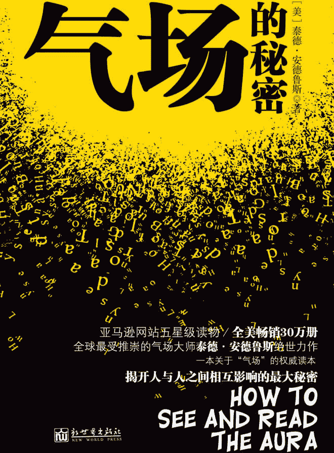

图书在版编目（ＣＩＰ）数据

    气场的秘密 / (美) 安德鲁斯 (Andrews,T.) 著 ;

贾毓婷译. -- 北京 : 新世界出版社, 2011.1

    ISBN 978-7-5104-1361-2

    Ⅰ. ①气… Ⅱ. ①安… ②贾… Ⅲ. ①个人－修养－

通俗读物 Ⅳ. ①B825-49

    中国版本图书馆 CIP 数据核字(2010)第 206280 号

    北京版权保护中心外国图书合同登记号：01-2010-1954

Translated from

HOW TO SEE AND READ THE AURA

Copyright c 1995 and 2005     Ted Andrews

Published by Llewellyn Publications

Woodbury, MN  55125 USA

www.llewellyn.com

Interior art by Llewellyn Art Department

Arranged through CA-LINK International LLC

气场的秘密  

作    者：〔美〕泰德•安德鲁斯(Ted Andrews) 

翻    译：贾毓婷

责任编辑：刘  媛

校    对：张海霞

责任印制：李一鸣  刘社涛

出版发行：新世界出版社

社    址：北京西城区百万庄大街 24 号（100037）

发 行 部：（010）6899 5968   （010）6899 8733（传真）

总 编 室：（010）6899 5424   （010）6832 6679（传真）

http://www.nwp.cn

http://www.newworld-press.com

版 权 部：+8610 6899 6306

版权部电子信箱：frank@nwp.com.cn

印    刷：廊坊市印刷厂

经    销：新华书店

开    本：889×1230  1/32

字    数：100 千字   印张：5.5

版    次：2011 年 01 月第 1 版   2011 年 06 月第 3 次印刷

书    号：ISBN 978-7-5104-1361-2

定    价：25.00 元

版权所有，侵权必究       

凡购本社图书，如有缺页、倒页、脱页等印装错误，可随时退换。

客服电话：（010）6899 8638  

# 目录

第Ⅰ章 认识你的气场第一部分 什么是气场第二部分 气场的构成第三部分 气场的特征第四部分 气场推拉实验第Ⅱ章 感觉你的气场第一部分 感受微妙能量第二部分 发散并感知外来能量第三部分 感受外来能量的侵扰总 结第Ⅲ章 看到你的气场第一部分 观察气场的方法第二部分 观察气场的最佳条件第三部分 视力表练习法第四部分 观察双手的气场第五部分 观察他人的气场第Ⅳ章 测量你的气场第一部分 灵杖第二部分 灵摆第Ⅴ章 气场的色彩第一部分 气场颜色的特性第二部分 气场色彩的含义第三部分 鉴定气场的主色第四部分 用颜色来解读气场第Ⅵ章 修炼你的气场第一部分 加强气场的日常方法第二部分 气场修炼练习结 语返回总目录

作者简介  

泰德•安德鲁斯是美国自然精神领域的著名作家、学者和教师。他先后发表过《气场色彩学》、《魔法仙域》、《色彩能量》、《你是你前世的知己》等一系列畅销作品，并在各种自然哲学杂志上拥有自己的专栏，在世界各地举办过许多研讨会、座谈会和讲座。他的研究课题包括气场诠释、命理学、塔罗牌等，致力于发现、发展和提升人类内在潜能的方法。

第Ⅰ章 认识你的气场  

我们每个人都有一个环绕在身体周围的气场。

每个人也肯定都见识过，或者感觉到过气场的存在。只不过，大多数人都忽视了，或者是错误地解读了这种体验。

让我来告诉你，世界上的神秘主义者或许对世界有不同的见解，但有一个问题他们肯定能够达成共识，即他们都能看到人类头部四周闪耀的光圈，这其实就是气场的一部分。

不过，并不是唯有变成神秘主义者，一个人才能看到气场。实际上，只要经过学习和坚持不懈的练习，每个人都可以感觉到它的存在，甚至有能力用肉眼来欣赏它。相信我，这并不是什么不可思议的事情，你需要做的准备，就是不要再去故意忽视它的存在，要大胆地去认识它。

要想具有这种能力，你需要：花上一点点时间，拓展你的理解力，勤加练习，并持之以恒。

下面是一张调查问卷，如果你的答案大多是“yes”，那就说明你曾经明显地感受到过气场的存在。如果你的答案有很多“no”，也没什么好沮丧的，这只是说明你的感应能力正处于沉睡中，那就让我来帮你唤醒它吧！

你可曾感受到气场的存在？

1.当你和某些人在一起时，是否觉得很累？

2.你是否会将某人与某种特定的颜色联系起来？（比如：“我总觉得你是黄色的。”）

3.如果有人目不转睛地盯着你，你能否觉察到？

4.你是否会在第一时间喜欢或讨厌一个人？

5.你是否有过这种经历：不管某个人外在如何表现出不在乎的神态，你都能体会到他内心的真实感受？

6.当你身处一个场合，在确切听到或看到某个人也在场之前，你的感觉是不是已经告诉你他也在这里？

7.有没有什么声音、色彩或气味总是会让你感到舒服或者不舒服？

8.闪电或雷暴是否会让你觉得紧张不安？

9.有些人是不是比起其他人来，更能让你感到兴奋或充满力量？

10.当你走进某间屋子时，会不会觉得紧张、不安或愤怒？有没有哪些屋子让你想待下去，而另一些只想让你尽早离开？

11.你是否有过这样的经历：你忽略或故意抛开自己对某个人的第一印象，但最后却发现那印象极其准确？

12.你是否感觉到过你兄弟姐妹的房间与你的房间有所不同？你的父母和你的孩子的房间对你来说，感觉起来又有不同之处？

我相信，以上这些现象，你都曾经经历过，或者大部分都经历过，但却难以用常识来解释。当我们实在说不通的时候，就会统统用“感觉”这个借口来把这些疑惑打发掉。但事实上，这个世界上一切不可思议的现象都自有一种合理的解释。关键在于，你能跳出自己的思维模式，接受一些新的看待世界的模式。

如果你已经准备好了，那就请你深呼吸三次，开始吧！

第一部分 什么是气场

比起大人来，孩子更容易观察和体验到气场这种东西，而且，他们经常把这种体验用涂鸦表现出来。看看孩子的画作，他们会给不同的人物涂上不同的、大人感觉怪异的色彩。这是因为在他们看来，不同人身上的能量具有微妙的区别，其气场也带有不同的颜色。

然而，不知情的大人看到孩子的图画时，却只觉得可笑：“为什么妈妈周围的天空是紫色的？”“为什么猫咪是绿色和粉红色相间的？”“为什么你要把哥哥涂成蓝色？”……世界上确实没有绿色和粉红色相间的猫咪，哥哥当然也不是蓝色的，这些，只是孩子看到了不同气场的颜色，然后用蜡笔表达出来了而已。不幸的是，大人的批评和纠正却无情地扼杀了孩子这种与众不同的感觉方式，就像我们的父母冷酷地扼杀了我们身上这种与生俱来的感应能力一样。

那么，气场到底是什么东西呢？

人们对“气场”下过许多种定义，简单来说它只是一种能量场，存在于一切物质的周围。不管是人，还是动物，甚至是一棵树，一块石头，都拥有属于自己的气场。

气场的产生，要溯源到构成物质的原子，原子都是由质子和电子组成的，它们遵循一定的规律，永恒不变地运动着。正如物理学中已经证明的一样，这是一种电磁能量运动，而且生命体比非生命体的这种运动更加活跃，因此，植物、动物以及人类的气场就更容易被观察到。

人类的气场就是一种环绕在身体周围的能量场。它以人的身体为中心，向四面八方发散。健康人的能量场在身体周围形成标准的椭圆或鸡蛋状。

普通人的气场存在于身体周围 2.44～3 米的范围。据说历史上某些伟大人物的气场尤其强大，可以绵延数英里，或许正因为如此，不论他们走到哪儿，总会有大批的追随者。我们不难发现，在许多关于这些伟大人物的历史记载中都会提到“光环”，这是他们强大的气场中最容易被旁人觉察到的部分。

虽然我们已经没有办法去检测那些伟人的气场究竟有多大多强，但有一点不用怀疑：你的肉体和精神越健康，你的能量就会越活跃，气场也会散播得越远；而你的气场越被充分激发，你就越有能量去做你要做和想做的事。同样，你的气场越强大，你受到外界不友善的能量的干扰就越小。

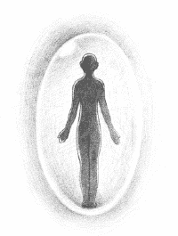

气场示意图

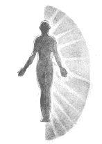

减弱气场的因素

如果一个人的气场虚弱，他会很容易受到外界力量的影响，表现为容易被操控，易于疲劳。气场虚弱还会让人产生挫折感，引起健康问题，降低生活效率。从这个角度来看，环境对人的影响，大抵如此。也正是从这个角度来说，如果你想要为自己营造一个更惬意的环境，首先要做的，是学会控制自己的能量，扩大、加强自己的气场，而不是盲目地去改变其他人或东西。

第二部分 气场的构成

人类的气场通常是由两部分组成的：

一部分是你的灵体所具有的能量，这是一种非常隐秘，也更高级的能量，就像是人类物质身体之外的另一个看不见、摸不着的身体。

它环绕、贯穿着我们的身体，虽然看不见、摸不着，却可以牵引和控制我们的灵魂。不过，这不是本书要讨论的内容，你只需要简单地知道气场中有这样一部分存在就可以了。

另一部分，也就是本书将要探讨的气场，指的是从身体中散发出的能量场。

现代科学技术能够探测到所有生命体，尤其是人类，都具有能量场，这也是气场存在的证据之一。在科学的语境中，这种能量场被描述为电、磁、声、热、光等很多能量形式。

人体的能量场一部分由人体自然产生，另一部分则是由身体吸收外界能量转化而成——这是两个能量场之间的自然交互作用，稍后我们将作详细解释。这种能量的交互可以看作是人与其他物质和环境的能量进行的一种自然渗透，人体不断吸收他人、农作物、树木、花草、动物，甚至是土地本身的能量。

在美洲印第安人以及世界各地的部族留下的古老文化中都有这样的现象，人类能够通过图腾的帮助，增强自己的能量。人类和图腾的联系越紧密，人类就越强大有力。

在第Ⅳ章中关于如何测量气场的部分，你会发现，当一个人与土地或任何一种自然元素直接接触时，他的气场会比平时更加强大。同样的，当你光着脚走在户外，你的气场会和穿着鞋子时的气场截然不同，当你从喧嚣的都市中走出来，走进大自然中待上一会，你会感到身体重新充满能量。这些，都是我们的身体吸收了外界能量的结果。

自然的能量很容易被人体转化、吸收，海洋的力量尤其如此。海洋中蕴含着生命所需的四大基本元素：来自太阳的火，来自海浪的风，来自海洋本身的水，还有存在于海底的土。人体能够将其吸收，并将它们转化为自我治疗的能量，加固包括肉体和其他方面在内的整个能量系统。正是这四种无素，保持了人体的平衡。不要忘记，人类事实上是从大海中走出来的，如果说大地是母亲，那大海，就是人类的祖母。

当然，人体除了从大自然中吸取和转化能量，还可以与存在于宇宙之中的能量进行奇妙的气场交互。在占星学中经常提到恒星作用，指的正是人体吸收、转化来自恒星的能量，除了恒星，还有一些行星也会对人体的能量变化产生影响。

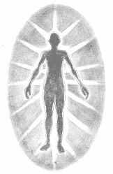

每个人都有独特的能量系统

这些情况，在星相学中，我们已经了解得再清楚不过了。当土星运行到你所属星座的某一位置时，对于你意味着什么？当木星运行到某一位置时，对于你又意味着什么？如果你是双鱼座，饱受寂寞之苦，会不会心急如焚地盼望象征幸运的土星赶快运行到你的婚姻宫呢？当然是！

我们要记住，每个人都有独特的能量系统，个体与周围环境进行能量交互影响的模式也因人而异。不过，只要稍加学习，多做自我观察，你就会对这种独特的模式有所了解，也更能懂得如何有效地利用这种模式。

正如我们每一个人在这个世界上都不是孤立地存在，我们的气场也是如此。因此，了解自身的气场如何影响其他气场，又如何被对方所影响，对我们来说是一个非常重要的问题。

你要学着去认识自身气场的范围和强度，还要留意那些让气场得以增强、平衡和净化的重要时刻。在气场减弱的时间段里，你就要格外当心一些。

总之，要关注你生存的环境对你看得见、摸得着的影响（诸如冷、热、传染病、车祸等），同时也要多留意气场隐秘的能量交换，让自己的身体以及精神达到最佳状态。

第三部分 气场的特征

了解和掌握气场，我们先从这些最基本的知识开始：

1.每一种气场都有自己的频率

每一种气场都是独一无二的，世界上没有完全相同的两个气场。也许气场存在某些共同之处，比如都含有声、光、电磁等元素，但力度和强度绝不会完全相同。每个人都拥有属于自己的气场频率。

当你的气场与某个人的气场频率相近时，你们会自然而然地相互吸引，你和他更容易“合得来”。这没什么好奇怪的，这种自然的亲切感，可能是说明你们在前世有过某种联系，也许代表着你们拥有相似的气场，你们在身体、情绪、心智和（或者）精神层面上有着相近的频率。不过，有些人的气场频率会与你的完全不同，所以你第一眼就会讨厌这个人，在他身边你会极其不舒服，甚至情绪激动。

很多时候，别人留给你的，或是你留给别人的第一印象，恰恰能精准地反映出你与他的气场频率是否协调。那些让你反感的人，他们本身并没有什么问题，只不过在某个时刻，你们的气场没办法产生共鸣而已。或许，当你们在一起相处久了，那些不和谐的音符就会慢慢变得和谐，这就是我们经常看到的“对立面吸引”的例子。

通过练习，我们能够学会控制和改变气场的频率，这样与别人的交流和配合就能更加轻松、顺畅。这是一种古老的技巧，叫做变形——你通过调整自己身上释放出来的能量，使之与周围环境和人物相得益彰。通常，变形是自然发生的，就像一种温和的自我保护法。不过，我们的目的，是要你学着有意识地去控制这种行为，根据实际需要进行或剧烈或轻微的改变，让自己完美地融入到环境中。

2.每一种气场都会与其他气场进行交换

我们的气场中具有强烈的电磁效应，因为我们在持续不断地散发和吸收能量。每当你与他人接触，你们的能量都会发生互换：你会给出一些能量，也会吸收一些新的能量。你接触的人越多，这种能量互换也会越多。

通过本书的学习，如果你能够觉察到自己与他人的能量交换，那么一天结束后，你就可以把大量的能量碎片聚积起来，进行整理，避免对你自己的气场造成不平衡。如果你对这种能量交换不进行任何疏导，那么一天下来你只会感到精疲力竭，甚至冒出许多奇奇怪怪的念头和想法，产生许多陌生感。

我们都曾有过这样的体验，有一天觉得自己简直是疯了。究其原因，并不是你真的疯了，而在于那一天你在与人接触的过程中聚积了怎样的能量。想想看，你身边肯定有那么几个人不太容易交流，不管是在电话里，还是面对面地与他们交谈，都会让你觉得费力。有时候谈到一半，这个人会莫名其妙地挂断你的电话，或是转身离开，你马上会有种被人一拳揍在胃部的感觉。这样的气场互动显然不太健康。你体验到的不愉快是由你的气场在交流中得不到回应所引起的。本书的最后一章将教你平衡你的气场，保持它的活力，避免此类单方面互动的发生。

3.人类气场能与非人类的气场交流

一切物质都是由原子结构组成的，因此都具有气场。生命体的气场更强一些，也更容易被感知到，但无论动植物还是无生命的石头，你都可以从它们的气场中吸收能量，来调节和改善自己的气场。

置身于大自然之中，可以使你的气场得到平衡和净化。

拥抱大树是公认的保持健康的好习惯，因为树木的气场具有非常好的流动性——要知道，每一株植物，都是一个完整的循环系统——可以与人类气场发生良好的动态交流。正如人类的气场一样，每棵树都有着独一无二的频率，因此，拥抱不同的树木会达到不同的效果。在柳树下静坐 5～10 分钟，可以减轻头痛；松树可以净化人类的能量，能从人类的气场中吸收掉负面情绪，尤其是负罪感（这些负面情绪并不会对松树本身造成伤害，反而能像肥料一样，被松树所用）。

我们都知道，水晶和宝石可以增强人体的能量，从各种水晶和宝石中释放出的能量可以轻而易举地被人体吸收。将一块水晶握在手里，几分钟之后测量你的气场，再与原始测量结果相比较，你会发现自己的气场增大了不少。

动物的气场也会影响到你。在美国的一些地区，已经有人着手研究宠物对老人和病人的影响。初步研究显示，养宠物可以降低血压，平衡气场，使肉体、情绪、心理和精神等的能量保持稳定。

还记得吗？作为气场的首要特征，我们早已就动物图腾对人类气场的影响进行过简单的讨论。宠物对人类的影响也与此有关。

4.相互接触的气场会为彼此留下印记

其他的气场能够对你产生影响，同样的，你的气场也会在你接触的对象上留下印记，不管那是一个人，一个物体还是是一种环境。你们接触得越密切，时间越久，这种印记就会越明显。

举个例子来说，如果你经常坐在同一张椅子上，你的气场就会留在它周围，它就变成了你的椅子。如果你从小到大一直有自己的房间，那你对这间房间的感觉一定与你父母的或是兄弟姐妹的感觉很不一样。

你的气场会以一种独特的能量形式，发散并占满你所处的空间，就像非洲草原上的狮子，会在一块土地上撒上一泡尿，证明自己是主人一样。有许多人换了床就没办法安睡，因为陌生的床上没有那种令他们感到熟悉的能量。你与一张床、一件衣服、一个新家的磨合，正是你的气场用独特的能量频率，对环境或物体进行磁化和协调的过程。

我们可以看看孩子的例子。在孩子哭闹的时候，要让他们很快安静下来，可不是件容易的事。不过，你可以试试，把他经常拿在手里玩耍的玩具，和他经常盖在身上的毯子拿过来，孩子会很快平静下来。这是因为，在孩子常用的毯子或心爱的玩具上，会留下孩子气场的印记——玩具或毯子上吸收了孩子的能量。当孩子手里拿着这些东西的时候，他会重新回收、补充这些能量，进而感到舒适。有时候，妈妈把孩子的东西扔进洗衣机时，他们会非常难过，因为这些东西经过洗涤之后，上面让他们熟悉的能量会消失掉。

冥想和祈祷用的披肩和地毯也是如此。这些物品上面都聚积着你每次冥想和祈祷时散发出来的能量，记录着你每一次冥想和祈祷带来的进步。因此，每当主人使用这些物件时，它就会发挥作用，带领主人更轻松地进入状态。

如果你面对的气场非常强大，你自己的气场就会被它带动起来，与之进行协调共鸣。趋同心理压力之所以会成为一种强大的影响力，就是这个原因。整个团队的能量当然比单独的个人强大许多，个人与团队接触得越多，个人的气场就越会与团队相协调，也越容易表现出该团队的特点。

性交可以说是人们接触最为密切的一种方式，这也是一种强大而隐秘的能量交换过程。在这样密切的接触中，气场之间的能量互动和能量“碎片”对个人造成的影响，会比日常接触中能量交换的影响长久得多，它们不会轻易消失，也不会很快得到平衡。不管你怎么给自己宽心，性爱绝对不可能对你或者他/她没有什么影响。所以，如果有人太过轻浮、随便，对对象不作严格甄选，或是在上一次气场互动的影响完全消除干净之前，就贸然开始下一段，那么，不同的能量就会在他体内纠结盘绕起来。就好比武侠小说中那些吸收了不同人的内力的人，迟迟不能驯服它们，结果自己的五脏六腑饱受翻江倒海之苦一样。

两个人的接触越长久密切，他们的气场交互就越微妙而深入。在父母（尤其是母亲）与孩子的终生相处中，他们气场中相当大的一部分会与孩子共享，两者的气场持续地发生着交换和融合。在亲密的人际关系中，气场的交互就是动态地盘绕和分享。

正因为如此，面对死亡是一个令人悲恸的过程，死者的能量要从那些与死者生前关系密切的人身上消失掉。这种关系越亲密、熟悉，能量消失需要的时间就越长，生者感受到的痛苦就越强烈。即便在一个成员关系看似不很亲密的家庭里，某个人的去世仍然会留下隐约的空虚感，因为故者的气场从生者身上离开是需要一段过程的。

5.气场是人体状况的一面镜子

气场的色彩、透明度、大小和形状等，都是健康状况的反映。

通常，自身气场弱的人更容易受到外界影响。他可能容易生病，也更容易产生情绪和精神的不平衡。

举个例子来说，当你刚刚来到办公室，精力充沛时，从办公室里传来的噪音——打字的啪嗒声和其他机器发出的声音——不会让你觉得心烦，你可以轻而易举地忽略掉。而当一天的时光过去，你的能量降低时，气场的活动开始减弱，这时你很容易受到办公室噪音的影响。它们不停地撞击你的大脑，带有攻击性的能量不断穿透你的气场，让你无端地愤怒和烦躁。清醒地认识到了这一点，我们应该能明白保持自己气场的平衡，让它不被外界干扰的重要性了吧。

每当你对什么事产生强烈的情绪反应时，你的气场就会发生相应的改变，它的颜色、形状以及其他方面都会受到影响。除了情绪之外，心理和精神产生反应时也是一样。你的一切改变都会体现在你的气场中。在本书第Ⅴ章里，你将会学到如何从各个方面，特别是从颜色来解读气场。

在一天当中，气场的颜色和强度会发生巨大的变化，这完全取决于你做了什么，以及正在做什么，或许还要包括你想要做什么。在这些颜色中，通常会有一种或两种始终不变，它显示你在一段时期内主要的气场的状态。这种固定的颜色可能持续 1 个月，也可能是 1 年。此外，颜色出现的数量也是个人状态的指标。

例如：在身体周围 1.2～1.8 米的范围内充满了丰盈的绿色，就说明接下来 4～6 个月的时间里，你的身体将会成长和改善。不过，一开始你可能很难有足够的精力来捕捉气场的变化。因为，有的时候，仅仅在一天之内，气场的颜色已经变幻莫测，或者在近期基本颜色的基础上形成许多色彩层。在一团丰盈的绿色之中，可能还会有许多其他的颜色，各自反映着成长和改变过程中各个不同的方面。正因为如此，解读气场才会更加困难，需要经过反复实验，并熟练地运用直觉。

第四部分 气场推拉实验

你可以请一位朋友协助你完成这个简单的实验。它可以充分证明身体是被气场缠绕包围着，并受其影响。下面开始练习：

1.请你的朋友站在你对面，背对你，保持一定距离。

2.你站在你朋友身后大约 0.91 米的位置，举起手来，就像你准备去推他/她那样。

3.慢慢地伸展你的手和胳膊，就像你正在向前推一面隐形墙。

4.当手和胳膊完全伸展后，再做向后拉的动作，就像你正在把那面隐形墙向后拉。

5.重复推拉动作，向前，再向后，动作要缓慢而清晰。

6.你在做动作的同时，也在将你朋友的气场向前推或向后拉，他的身体也会随之前倾或后仰。你做推的动作时，你朋友的身体会向前倾，而做拉的动作时，他的身体就会向后仰。

7.你的朋友背对着你站立，所以你的推拉动作他看不到，但却能无意识地受到你的影响。

8.有时你朋友身体摇摆的幅度很小，不容易看出来。这时你应该再找一位朋友，充当观察者。请他站在或坐在距你们 1.5～3 米远的地方，从侧面观察你们的动作。这样身体的摇摆很容易就能看出来。

9.轮流做实验。请你的朋友在背后推拉你的气场，或由你充当观察员的角色。请记住，这是你认识人类气场的开始。

10.当你推拉朋友的气场时，最好找个人站在他对面充当“保护者”，防止你的朋友身体摇摆幅度过大而跌倒。

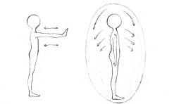

气场推拉实验

第Ⅱ章 感觉你的气场

关于气场，绝大部分人会持有这样两种错误观点：

一种是认为世界上根本没有气场这回事；

另一种是虽然相信气场的存在，但认为它是看不见的。

幸好我们有足够的证据证明气场的存在，还可以证明气场是可见的。

现代人都将大部分精力集中在身体之外的世界，努力追逐那些自认为有价值或者有意义的东西，比如金钱、房子，却几乎不再对自身进行反思，真正地了解一下自己的身体。人们会说：“既然有医生，我们还需要花时间去了解自己的身体吗？”

于是，在你不觉得开发自己的身体有什么意义时，那些与生俱来的对身体的控制能力便随之消失。你这样漫不经心地对待自己的身体，也难怪你或者意识不到气场的存在，或者得到的是完全错误的认识。

气场这个命题，不可避免会挑战人们既有的价值观。尽管气场的存在已经是一个科学结论，但如果你坚持认为它不存在，那么无论如何你是看不到它的。许多人对气场只有一知半解，甚至毫无概念，就算他们对气场的存在有过感觉，也会把它归为自己的想象。

本章内容就是要启发你重新对气场进行感知，当你读完这一章，并老老实实地完成一些练习，你就可以重新感受到气场的存在！我会教会你如何观察和感觉气场从身体中散发出来，并真实地体会到，它存在于你的身体之中。当然，你自己也要多做练习，并持之以恒。

需要提醒你的是，这些练习是需要循序渐进的，切不可急于求成。

在你急不可耐地开始下面的练习之前，首要的，我还是要提醒你注意几下几点，这会让你以正确的心态投入到正式的练习中。只有 “心无杂念”，才能让你最敏感的感应能力发挥出来。

1.本能

从开始练习到初见成效，需要的时间因人而异，但最关键的是——持之以恒。刚开始时，千万不要因为失败而灰心，你需要时间和练习来唤醒你的本能。

记住：看到气场是我们每个人的本能。这本能已经在你体内沉睡了那么多年，你要放慢速度，一点一点地让它苏醒过来。照着我说的去做，坚信自己，不要灰心，你一定会成功！

2.崇敬

练习的过程是愉悦的，特别是当你发现自己取得的每一点进步，都将你带入一个全新的世界，你一定会感到兴奋和不可置信，但我希望你能始终保持严肃、专注的态度。因为，这项修炼无论对你，还是对他人，都将产生无可预料的影响。你要以真诚的心进行练习，并谨记这是一项终生的自我提升过程，你对自己和他人的了解将会更加深入，你将踏入的是一片神圣的领域。所以，请以崇敬的心情面对即将开始的旅程。

3.放松

冥想是练习前必做的准备活动，它会让你的身体松弛下来。学会如何“放松地专注”，练习效果才会好。太过努力地想要达成目的，只会阻碍你的进步。

花一些时间，闭上眼睛，用胸腔进行几次深深的呼吸。把注意力依次集中于身体的各个部位，从双脚开始，想象一种温暖而放松的感觉渐渐蔓延。认真地观察它，感受它，想象它。接着把注意力向上提升，流过每个肌肉群，最后直至头顶……

开始不要着急，这样的练习可以多做几次，多找找感觉。你也可以借助一些轻音乐或背景声音来帮助自己放松。越是长久地把注意力专注于自己的身体，你就会越放松。越放松，你就越容易集中精神。越集中精神，你就越会具有敏锐的感知能力……

放松会让你变得非常灵敏。如果你曾经在发呆或做白日梦的时候，被电话或别的响亮的声音惊醒，就一定深有体会。那时，电话铃声变得格外响亮。同样处在放松状态下，你的视觉也会更加灵敏，看到的光和色彩会更明亮。

因此，放松可以帮助你更轻松地感觉到气场的存在。

做完上面的放松之后，接下来，就是令人兴奋的正式练习了！

第一部分 感受微妙能量  

这个练习会让你对身体周围的能量更敏感。你可以自己完成，也可以找朋友一起练习。

双手是能量活动的集中区域。在我们的全身上下，还有许多个这样的区域，但要感知更为微妙的能量，双手无疑是最敏感的。你既可以用双手来感受能量，也可以通过双手将能量发射出去。我们大概都还记得，历史上曾经传说，国王将手置于病人的头顶赐予祝福，病人便不治而愈。这看起来是无稽之谈，但也不无道理。

从双手开始练习，这是探寻气场最容易的方法。当双手的敏感度增加以后，你可以再去试着提升其他部位的敏感度。好了，下面开始练习：

1.找一种舒适的坐姿，先让自己放松下来。

2.来回摩擦手掌，持续 15～30 分钟，有助于提高双手的敏感度。

3.伸展双手，与身体保持 0.3～0.5 米的距离，掌心相对，保持大约 0.6 米距离。

4.双手慢慢向中间移动，尽可能靠近，但不要接触。

5.双手移开大约 0.15 米的距离。缓慢而平稳地重复双手靠近和移开动作。

6.做动作的同时，注意自己的感觉和判断。你可能会感觉到压力的增加，也可能会有其他感觉，比如觉得有弹力、痒，或有压迫感，甚至会有一种黏稠感充斥在双手之间。你也会感到空气变得温暖或冰凉，甚至还会觉得什么东西在有规律地跳动。

7.花几分钟时间，试着把你的感觉描述出来。不要考虑这些感觉是真实的，还是想象出来的，不要担心你的感觉和别人的不太一样。记住，你有自己的气场频率，所以你的感觉也一定是与众不同的。你感觉到了什么，这才是最重要的。

8.这个练习可以帮助你集中注意力，也让你对气场的认识不仅仅停留在皮肤阶段。你可以记下对这个实验的印象和感觉，当你的感知能力进一步提高以后，你就可以将那时候的感觉拿来与现在的作比较。

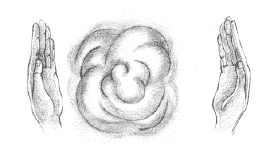

你感觉到气场的存在了吗？

9.完成上面的练习之后，你就可以做进一步的探索。露出你的左前臂，将右手举起，与你的左前臂保持大约 0.5 米的距离。

10.慢慢将右手放下，靠近左臂，留意在此过程中产生的所有感觉。当你感觉到异样时，你的右手与左前臂的距离有多远？记住，你感觉到的可能是一种压力、一股热力、一团冷气或是一种黏稠感等。这种感觉也许不很强烈，但你一定可以感知到。如果你一时还没有感觉，那就慢慢地重复以上动作。记住，你正在重新唤起自己感知微妙气场的能力。

第二部分 发散并感知外来能量

有一句古老而神秘的格言说：“思维带动一切能量。”

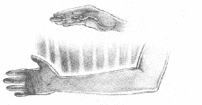

这种感觉也许不很强烈，但你一定可以感知到

你头脑中在想什么东西，你的气场就会呈现出什么样的状态。气场会随着思维的改变而调整自己的频率。如果你将全部精力集中于一次重要的会议，气场就会将频率自动调整为“严肃模式”来配合当前环境；如果你一心盼望着去度假，那么在假期到来之前，气场就会呈现更加放松和休闲的频率。因而，气场也是你加深对自己思维模式的理解，以及加强对它的控制的一种方式。

外界的能量每时每刻都在影响你。它们不断撞击你的气场，影响你的平衡。这些能量有可能是愤怒或贪婪的，有可能是温情而友好的，也有可能要霸道地操控你的能量。你只有对自己的气场变化敏感起来，才能有意识地控制住出入你气场的能量。

我们都有过这样的体验：如果某间屋子刚刚发生过争吵或打斗，那么我们一进去，就能感觉到不舒服。这屋子有一种截然不同的“感觉”，空气厚重而紧张，我们会莫名其妙地感到焦虑。这是因为屋子里有许多不易被察觉的、不友好的能量残余和投射，如果你不提高警觉，就会轻易受到它们的影响，变得情绪躁动起来。

以下的练习可以增加你对外界能量影响的感知度。随着你对气场越来越敏感，你完全可以去阻止那些会对你造成压力的能量，并引导那些对你有益的能量发挥正面作用。好了，练习开始：

1.选一个舒服的坐姿，花几分钟时间让自己放松下来。做这个练习时你或许想把眼睛闭起来，不过没必要这么做。

2.一只手的手掌向上，用另一只手的食指指向它。注意食指与手掌之间要保持 0.07～0.15 米的距离。

3.慢慢地深呼吸。随着气息的吸入和呼出，想象能量正在你的手掌和食指间聚积。

4.几分钟以后，慢慢地用食指画小圈。想象一股能量正以螺旋形方式从食指释放出来，形成一个能量环，作用到摊开的手掌之上。不必非得想象出所有的细节，我们所要证明的就是思想能够带动能量。

5.留意手掌上的感觉。与以前的练习相同，每个人的感觉都会大相径庭，你也许会觉得有一圈热量在形成，也许手掌小范围内会有黏稠感、压力感或麻刺感。此时，闭上眼睛会让你的感受更强烈。你越把精神集中投射在食指释放的能量上，你的感受就会越强烈。

6.在手掌上完成练习以后，你还可以卷起袖子，在裸露的前臂上重复刚才的练习。用食指螺旋形释放能量，作用于前臂，留意你的感受。随着练习的反复进行，你会发现你所感受到的能量形式大致相同，只是能量强度有所区别。通过这样的练习，你会逐渐认识到外力对你的气场轻微地施加影响是一种什么感觉。

7.找一位朋友，和你做下面的练习。请他/她背对着你站立，你举起手来，与他/她的背部保持 0.15～0.3 米的距离。仿照刚才你向自己的胳膊传导能量的方式，慢慢地将你双手的能量引向他/她的背部。你可以用手指划简单的几何形状，比如圆圈、方形或三角形等，当心手指不要接触到他/她的背。

8.让你的朋友描述出你在他/她背后所划的图案，多留意他/她的感觉和体验，并将前后练习中不同的体验加以对比。

9.逐渐拉大练习所要求的距离。你的手指在多远的距离以外划圆圈，胳膊仍能感受得到？你背后的人站得多远，你仍能辨认出他/她施加在你背部的能量？距离拉大后，你的感觉有什么不同？多留意你的反应，可以增强你对微妙能量影响气场的敏感程度。

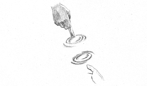

感觉到能量了吗？

10.慢慢地拉近你的手与前臂之间的距离。距离拉得多近时，你可以感觉到来自前臂的能量？你能感觉到的与你做双手练习时感觉到的很类似。也许此时的感觉不那么强烈，但你完全能够感觉得到。如果感觉不到，慢慢地重复以上动作。

第三部分 感受外来能量的侵扰

这个练习将加强你感受外来能量触碰、影响自身气场的敏感度。不过，需要你和朋友共同来完成。好了，练习开始： 

1.花几分钟时间让自己放松。背靠着墙站立，闭上眼睛。

2.请你的朋友站在屋子的另一侧。

3.请你的朋友悄悄地、慢慢地向前走，到你能在自己的气场范围内感觉到他/她为止。你的朋友每次只能迈出一步，每迈出一步之前要稍做停留。

4.闭上眼睛，去感受这间屋子。你可以戴上眼罩，用棉球堵上耳朵，完全切断从视觉和听觉传来的种种信息。在练习开始之前，你要多留意对这间屋子的感觉。开始之后，注意你的感觉发生了哪些变化。

5.你的朋友距你多远时，你可以感觉到他/她？你的感觉是怎样的？如果你的朋友从屋子的那侧悄悄来到这侧，你能感觉到吗？再找一两个朋友来，共同重复这个练习。如果他们一起走近你，你能比刚才更容易感觉到能量变化吗？

6.这是一个效果很好也很有趣的练习，做的时候你可以加些小变化进去。比如：事先在距你 1.83～2.44 米的地方做上记号，然后闭上眼睛。当你的朋友走过那里时，你有什么感觉？如果两个人一起走过，你的感觉又是怎样的？

总  结

做过这些练习之后，你是否对这个世界开始有了全新的认识？你是不是开始满心期待用苏醒过来的感知模式重新感受这个世界？

这些练习都会帮你突破原来的感觉模式，学习用新的感觉模式来感受气场，以及通过气场的变化去感受环境的变化。随着灵敏度的与日俱增，你已经为接下来的训练做好了充分的准备，别急，很快你就会用双眼看到五光十色的气场了！

第Ⅲ章 看到你的气场

现在，我希望你能深吸一口气，因为，在完成前面的初步练习之后，在本章结束后，你将会用肉眼第一次观察到气场的存在！

首先，我要告诉你的是，观察气场是一种身体行为，而非精神行为。

人人都能学着去观察气场，不过，要把观察到的结果解释出来并不容易，这要求你有灵敏的直觉和过人的抽象能力。当然，你现在还没有做好准备去解释看到的现象，不要着急，在第Ⅴ章中，我们将会学习这方面的知识，在这一章里，你只要能亲眼见证气场的存在就好了。

第一部分 观察气场的方法

观察气场有两种方法：直觉观察和视觉观察。

1.直觉观察  

你是用心灵之眼去“看”气场，而不是用真正的肉眼。

首先，你要放松，集中精神，排除杂念，在头脑中勾勒出被观察者的形象，然后向你的直觉提出问题：这个人的气场主要是什么颜色的？还有其他什么颜色？这些颜色是如何分布的？它们反映出这个人身体上、情绪上、心理上及精神上的哪些特征？

用直觉去观察别人的气场比观察自己的更容易一些。因为，你在观察自己的气场时很难保持客观，容易只描述出自己想看到的，而不是真正显现的东西。当然，你选择的被观察者最好对你的直觉有信心。当然，你最好有工具来验证你的观察，在下一章中我们会讲到，使用灵杖和灵摆可以很方便地校验直觉的观察结果。

2.视觉观察  

视觉观察是观察气场的另一种方法。而且，这也是每个人都可以学习的。因为，这种能力是与生俱来的，大部分孩子都能看见气场，只是没有人教会他们如何去解释他们看到的东西。在父母和社会的灌输下，孩子渐渐相信他们看到的都是假象，这种怀疑，足以让与生俱来的能力慢慢萎缩。然而，不管这种能力在身体里沉睡了多久，都可以被重新唤醒并发展。

通常，只要方法正确，依靠直觉和依靠肉眼观察得到的结论会是一致的。所以，这两种方法无所谓哪种更好，更有效。不过，肉眼观察可以让你对微妙的气场产生更加“切实”的认识。

显然，你也一定会对如何用肉眼观察气场的兴趣更加浓厚吧！那么，要想用肉眼观察到气场，你必须经过专业的练习才行。

你可以训练自己的眼睛，接收并解读更大范围的光谱。要弄明白这个过程，你首先要弄明白人的眼睛是怎样工作的，尤其是瞳孔、虹膜和视网膜的工作原理。

本章下面的练习将会加强你的眼部肌肉功能，你对视力的操控能力将大大出乎你的想象。有人认为：目前视锥细胞和视杆细胞发挥的作用只达到了它们全部功能的 15%～20%。所以，大部分人都看不到气场散发的微弱光芒也就不足为奇了。

美国生理学教授亚瑟•盖顿博士曾说：“在绝对的黑暗和绝对的光明之间，视网膜的光敏度可以调整 50 万到 100 万次，这种调整完全是根据光线变化自动完成的。”（《基本人体生理学》，W. B. 桑德斯公司，费城，1971，第 427 页）这就意味着：你的肉眼可以感知到的光谱范围将会大大超出你的想象。

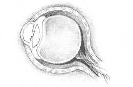

视网膜会自动调整光敏度

第二部分 观察气场的最佳条件

我通常会为怀疑气场存在的人推荐这样一个实验，来向他们证明气场的存在，以及人们看得到气场的能力。

选择一个温暖、多云的天气，躺在户外开阔的草地上，看着远处的树，从树底看到树顶，让视线停留在蓝天映衬下的树梢的线条上。不要聚焦，尽量放松，让你视野里的蓝天尽可能开阔。试着让视线“软聚焦”：并不刻意看什么，但一切又都在你的视野之中。

过一会儿，你会发觉在蓝色天空的背景下，树梢的轮廓周围笼罩着一层轻柔的薄雾。它的颜色柔和而透明，比天空的蓝色更浅。这层薄雾将树的线条从蓝天的背景上轻轻地勾勒出来。这种现象在春天最容易看到，因为那时候树木的生命力重新焕发，循环系统开始运转，新生组织和能量从树根奔涌向每一根枝杈和树梢。没错！你看到的正是树木的气场！

观察气场的最佳条件  

这属于气场研究的一部分，至今仍有许多不同的看法。

有人认为在黑暗的环境下更容易观察，因为气场的光芒更容易显现，但不利的一面是，气场散发出的光能量也会被黑暗所吸收。当然，黑暗会迫使视杆细胞努力调整，让你的眼睛具有“夜视”能力，这也是黑暗带来的好处之一。

还有人认为观察气场应当在光线充足的环境下进行，这样光线的能量更强。在明亮环境中，视锥细胞会兴奋起来，人眼能够轻松地观察到更明亮、更细微的颜色。

我发现有一种折中的环境更适合观察气场。对初学者而言，我推荐他们在光线微弱的，但不是漆黑一片的环境下观察气场。黄昏时分的房间是最佳的观察时间和地点。昏暗的光线会激发出你的“夜视”能力，迫使视杆细胞辨认出更多的光线，尤其是那些平时你察觉不到的光线。

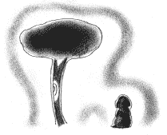

光线微弱的地方，最适合观察气场

第三部分 视力表练习法

注意事项：

1.视力表练习是针对眼部肌肉的练习，它能够增强眼睛的感知力，让你能够感知除了明亮的色彩外的微弱的光线。

2.和其他的练习一样，千万不要急于求成。每天做一次到两次，就能够达到最好的效果。如果每天做两次，注意间隔时间不要超过 10～15 分钟。一定要仔细注意你做练习时的感觉。

3.下面 4 张图都是用很简单的纸板，裁成 0.5×0.5 米大小。你也用不着严格按照这个尺寸来裁剪，这只是个参考尺寸。然后把图挂在墙上，你站在 1.8～2.4 米的距离以外，能够清清楚楚地看到它就可以了。

4.图的位置要与视线等高，如果你准备坐着练习，就把图挂在坐下时眼睛平视的高度。图周围的墙上要保持空阔，不让其他干扰物分散你的注意力。所以，最好把图挂在一面白墙上，你与墙的距离不要超过 2.4 米。

练习：

1.螺旋图练习法

这幅图可以加强虹膜的伸缩力度，增加视觉深度，保持双眼的协调性。

当你的目光由近处伸向远处，或由远处拉回近处时，晶状体的形状就会在虹膜肌肉的控制下发生改变，好让视野里的新目标在视网膜上成像。不过，随着年龄增长，改变晶状体形状就会越来越困难。

1. 练习开始时，先把焦点放在螺旋形（见下图）的中心，集中注意力。把它想象成隧道最深处的一点，是螺旋形发源的起点。

2.接着，把目光的焦点从螺旋隧道中拉出来，就像要把隧道最里面的那点抽出来一样。然后反过来，再把焦点投射到中心—进去—再出来。动作一定要慢。你可以假设自己正在用目光把螺旋拉近，再推远。这有点类似于看三维立体画。

3.如果这样做有难度，你可以将焦点集中在螺旋形的外沿，然后顺着螺旋一圈圈进去，直到中心点。接着反向，再回到螺旋形以外。通常这样反复 2～3 次以后，你就会有螺旋来回伸缩的感觉了。

做这个练习不要超过 3～4 分钟，因为你眼睛内部的肌肉始终处于工作状态，很容易就会疲劳。如果你觉得眼睛疼或是干，应该立即停止练习，继续下去完全不会有什么帮助。  

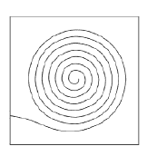

2.比色图练习法

这张图是由一个位于中心的小的彩色圆形（直径 0.15 米）与大的白色背景组成的（见下页图）。可以找来不同颜色的圆形，越多越好。彩色硬纸效果好且便宜，也可以用彩色织物。

至少准备 3 种不同的颜色，分别是三原色：红、黄、蓝。如果能找来 7 种彩虹色（红、橙、黄、绿、蓝、靛、紫），练习的效果就会更好。

这幅图可以让你的视觉细胞去辨认那些不常见到的色彩。把图放在你面前，分别将每一种颜色的圆形放在白色背景中央，注意每次只能放 1 种颜色，然后注视 5～10 秒钟。如果这种颜色有准确的名字，不妨在心里默念几遍。你可以定期复习这些颜色，比如看电视的时候，趁播放广告的时间，就可以拿出图来复习。

1.做这个练习时，你也可以用 1 张全白的图放在一旁作对比。这幅对比图最好与第一幅图挂在同一水平线上，保持 0.3 米的距离。

2.把视线焦点集中在彩色圆形上，尽量把它想象成 1 个三维彩色圆球或是白色背景上的一个彩色圆洞。用上一个练习中尝试过的目光牵拉动作，将目光从圆形当中拉出，再回去。将这个动作重复几次，直到你感觉自己正在从这个彩色洞口进出为止。

3.然后，将目光移至彩色圆形的外围，慢慢地沿顺时针方向绕圈。重复此动作 4～5 次，再反方向绕圈 4～5 次。注意：你要用目光绕圈，而不是用头。

4.绕圈动作完成以后，迅速地将你的目光焦点移至旁边的白色背景上。通常这种情况下，你会看到一个残留影像（见下图），不过，这并不是气场的一部分。残留影像看上去像是浮在白色背景上的。看到残留影像意味着你的视锥细胞和视杆细胞得到了刺激。暂停一会儿，留意有什么反应或影响产生。如果没有任何异样发生，继续用刚才的彩色圆形重复做练习。 

你看到的残余影像中有一部分是真实颜色的补色（又称互补色，余色，亦称强度比色，就是两种颜色等量混合后呈黑灰色，那么这两种颜色一定互为补色）。通常，你刚才看到的颜色在白色背景上会以相反的颜色显现出来。虽然在光谱中这是一对相反的颜色，但实际上它们只是频率有所不同而已。可以说，它们是同一种能量在不同维度的不同表达方式。

这就是所谓的互换法则，也叫做镜像效应。我们都知道，从镜子中，看到的影像是完全相反的。你被整个反了过来。当你观察体验那些更加微妙的现象时，类似镜像的效应也会发生。

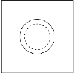

请记住，所有的气场层和所有的能量都与你的身体相互贯通，来源于身体并作用于身体。我们要观察和解读气场，就必须加强自己对这些微妙的现象的感知能力。

在实验的最后，你还会看到残余影像的周围有一些其他的色彩，这说明你的实验取得了效果。这些色彩来自于你在最开始的时候没有发觉的一些微弱光线。

5.稍后，你再看到的就是肉眼真实看到气场的颜色了。

闭上眼睛，休息一会儿，然后换一种颜色，继续重复上面的实验。留意自己在实验中的感受。如果在最初的几次实验中你没看到什么补色或残余影像，也千万不要灰心，多多练习，集中注意力，你一定能看得到。实验最好持续 10～15 分钟，在这段时间内，尽量多试几种颜色。（各种颜色及它们的补色见下表）

| 红色－绿色 | 黄绿色－红紫色 |
| 蓝色－橙色 | 橘红色－青绿色 |
| 黄色－紫色 | 橘黄色－蓝紫色 |

虽然你在比色图中看到的残余影像并不属于气场，但看到这些影像就说明你的视锥细胞和视杆细胞得到了刺激，而且，残余影像中也许会有许多你原本没有发现过的微妙色彩。 

3.对比光移图练习

这个练习中用到的星状图（见下页图）有两个作用：

第一，它可以刺激你的视杆细胞，从而帮助你辨别不同光线的强度。人眼对色彩的感应主要通过视锥细胞，而对光线的感应则主要依靠视杆细胞。因此，视杆细胞越活跃，我们能感知到的光谱范围也就越广。

第二，这幅图还有助于开发眼睛的“软聚焦”能力，让你更好地观察人体周围的气场。软聚焦是将视线轻柔地聚集在一片空间上，而不是紧紧盯住视野内某个具体的事物。它类似于这种体验：就像在做白日梦一样，眼神空洞，没有焦点。通过这幅图，你就可以学着发掘和控制这种聚焦能力，这会让你更加轻松地观察到人体周围的气场。

在这幅图中，黑色的背景中央是一个白色的星形图案，黑白对比的效果会提高视杆细胞的自我调节速度。练习的最终目的是让我们随心所欲地用肉眼去“看”气场，想看的时候就能看到它，不想看的时候就看不到它。

1.将你的焦点放在图中央的星形上，试着把它想象成黑暗背景中光的入口。运用第一个实验中的目光牵拉动作，让你的视线从这个星形的入口随意进出。

2.现在，把视线集中在星形的中央。保持注意力，慢慢地从 1 数到 15，然后把视线转移到黑色背景上。这是一个放松眼睛的简单动作，打乱集中在星形上的视觉焦点，让视线轻柔地停留在星形周围的区域。这样你就完成了一个从聚焦于一点到散焦到整片区域的转换过程。

3.再次将焦点收回到星形的中心。保持注意力，慢慢地从 1 数到 15，然后散焦，放松注意力。反复做这些练习的同时，要多留意眼部的感觉。你会感觉到眼部肌肉的收紧和放松。

4.如果这种练习做起来有些困难，你可以将视觉焦点先集中在某一个点上，保持注意力，从 1 慢数到 15，然后放松，再将视线转移到整个画面上。再将焦点重新集中在刚才那一点上，然后再放松。你也可以将焦点从一点转移到另一点上，做的时候要适当增加聚焦的时间。

观察这幅图时，你会注意到一个有趣的现象：当你软聚焦时，会发现在星形图案的边缘包围着一层柔和而模糊的阴影（见下图）。这与你在比色图中看到的残余影像不同。也许你只能在星形的一两个角上看到这种阴影，但它的确是在慢慢地显现。最初，这种阴影几乎是灰色的，而当你注意它，它会逐渐显现出其他颜色。通常最先出现的是蓝色。

如果你成功了，那么恭喜你，这说明你的眼睛开始看到气场了。

4.眼动图练习

眼动图（见下页图）可以全面锻炼眼部肌肉，让你的眼睛对光线和色彩更快地做出反应。做这个练习要越快越好，速度是最关键的。你的眼睛运动得越快，就越容易捕捉到平常不易发现的光线和色彩。快速的眼部运动更能刺激视网膜内的视杆细胞和视锥细胞，它们做出反应的速度越快，感知气场颜色也就越容易。

1.你可以从图上 5 个点中的任意一个开始实验。快速地将视线从一个点转移到另一个点上，停顿 1 秒钟后再快速将视线收回到起点。然后再将另一个点作为起点开始相同的动作。一定要把垂直、水平、对角和圆周几条线路的运动都做上一遍。

2.这个练习可以双眼同时做，也可以左右眼分开做。有许多人一只眼睛会比另一只眼睛功能稍弱些，而这个练习就可以帮助你训练那只“弱视眼”。在练习中，要迫使你的两只眼睛都得到最大程度的运动。用手掌遮住一只眼睛，用另一只眼睛去完成练习要求的各种动作，然后反过来再做 1 次。最后，再用两只眼睛同时做一遍动作。

做这个练习和做所有练习一样，一次不要超过 10 分钟。一旦觉得眼睛疲劳，就应该立刻停止。因为，你的眼部肌肉已经僵化了很久，要循序渐进地拉伸肌肉，增强眼球的灵活性，太贪多、太急近的练习没有半点好处，拥有足够的耐心和恒心才能成功。

当然，如果失败也不要气馁，记住，看到气场是你与生俱来的，你一定可以唤醒它。

第四部分 观察双手的气场

经过上面的练习之后，你的双眼已经找回了曾经失去的敏感，现在，让我们来观察真正的气场吧！首先，让我们来试一下看到自己双手的气场（见下图）。

1.你需要微弱的光线，一面空白的墙，一块纯白的纸板。纸板要够大，你可以把双手都放在上面。

2.开始观察之前，慢慢地让自己放松。你可以将以上几个眼部练习简单快速地复习一下，当作热身。

3.伸出一只手，与你保持 0.3～0.5 米的距离。另一只手握紧白纸板，放在伸出来的手的后面。这样你的手在白纸板的映衬下会显得非常突出。

把你的手在白纸板上放平，将视线软聚焦在上面，你会发现有微弱的光线徐徐散发。这些光线起初看上去就像朦胧的影子，随着练习的次数增多，影子就会逐渐显现出色彩。

将两只手都放在纸板上，保持大约 0.08 米的距离，让你的双眼聚焦在上面。首先将焦点集中在手的轮廓边缘上，接着软聚焦到整个白纸板。让你的视线轻柔地在两手之间或周围游移。然后重复聚焦—软聚焦的过程，慢慢地双手的气场就开始显现出来。

感觉双手之间的气场能量

4.将手平放在白纸板上，注意力集中在指尖，保持大约 30 秒。

5.把焦点从指尖上移开，视线扩散到整个手掌和周围的纸板。放松。你会看到一个柔和的影子将手的形状从白纸板上勾勒出来。

6.如果做起来有困难，可以先在纸板和手的协助下进行前面的眼部练习，比如焦点拉伸动作，沿着手的轮廓活动眼球，聚焦和软聚焦转换。多练习几次以后，你就能看到影子的出现。

7.观察影子的同时，注意所有的，即便是转瞬即逝的任何色彩。也许你会因为一些颜色太模糊或一闪而过而将它们忽略，千万不要！随着你观察和控制气场能力的提高，你会发现自己感知色彩的能力也相应得到了提升，色彩在你眼前出现的时间也会越来越长。

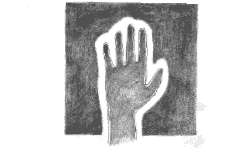

在白色纸板背景上观察手的气场

8.同时伸出左右手，掌心对着你自己，与眼睛保持在同一水平线上，双手之间保持 0.08～0.1 米距离。最好找一面空白的墙作为双手的背景。

9.按照之前的步骤，将视线焦点集中在手指边缘或两手之间，至少保持 30 秒。然后放松，软聚焦在双手和周围的区域。注意双手在空白的墙面背景上是如何勾勒出轮廓的。

10.你观察到的结果也许会不太相同，它可能是一片包围着双手的柔和的影子，也可能是一闪而过或持续清晰的一种颜色，还可能像你在炎炎夏日看到的从街道上蒸腾而起的热浪。开始时它的颜色大多是苍白或浅蓝的，浅到几乎辨认不出。随着你能力的提高，颜色的色调和明度，以及气场活动的强度都会清楚地显露出来，直到你用裸眼也能清晰地将它们辨认出来。

第五部分 观察他人的气场

接下来我们要观察他人的气场（见下图）。经过这个练习，你会在一两个月之内看到效果，具体时间要取决于你练习的频率和坚持的时间。

1.让你的同伴背靠着一面空白墙站好。尽量保持房间里光线微弱。你与同伴之间要有 2.4～3 米的距离，采用站姿或坐姿均可，只要保证你能从头到脚看到你的同伴，还有他/她身后的一大片白色区域即可。

2.将你的视线集中在同伴的前额上。从前额开始，让视线沿顺时针方向在同伴的身上转几圈，越快越好。目的是让你的视锥细胞和视杆细胞兴奋起来。

3.让视线重新汇聚在前额或头顶上，保持聚焦 15～30 秒。

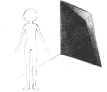

让同伴背靠空白墙站立

4.将焦点扩散至身体周围的整个白色区域。保持软聚焦，冷静地观察。通常头部和肩膀的气场最突出。如果气场没有出现，可以重复前面几步，一直到它显现为止。

不可思议吗？现在，你也可以观察到他人的气场了！

第Ⅳ章 测量你的气场

许多先进的电子设备都能测量出人体周围能量场的强度。当然，绝大多数人根本负担不起这些昂贵的仪器。不过，这并不意味着我们无法用普通一点的工具测量气场的范围和强度。通过一些人人都会制作和使用的普通工具，我们同样能够准确地测量出气场的强度和大小。这些工具通常是感应力学里会用到的。

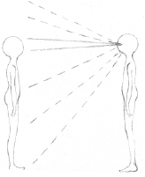

看到对方的气场了吗？

感应力学是一门探测能量辐射，确定地下水源或矿藏位置的学科。它有一套完整的体系，可以将神经系统对某种微妙能量的反应解读为我们所能理解的信息。感应力学中最常用的两种工具是灵杖和灵摆。

事实上，除了探索自然界，这两种工具都可以探测你的精神世界，识别出与你发生交互的那些微弱的气场——每时每刻，你都在与外界的各种能量进行着交互，这一点我们在前面的内容中已经讨论过。这一过程是你无法轻易察觉到的，所以你会拒绝承认它的存在，而灵杖和灵摆就会帮助你意识到这种能量交互作用的存在。

灵杖和灵摆是你与你的潜意识之间的桥梁。利用这两种工具，你的感知能力将成倍加强。通过神经系统，你的感觉和潜意识默默地与你进行着交流，向你传达各种信号，只不过这种信号有时候太过微弱。而灵杖和灵摆则将这种交流信号成倍放大，这样，你就为那些微妙的能量开启了更加灵敏的接收渠道。

这两种工具都有古老的使用记载。虽然人们认为灵杖和灵摆是标准的精神探索领域的工具，但它们却常常被用在许多传统而常见的生活领域里。战争时期人们用它们勘定地下矿产和隧道等设施的位置。许多公用事业公司都对它们的维修人员进行培训，教会他们正确使用这两样工具，当地下设施需要修缮时，他们才能找到正确的挖掘路线。虽然有人对灵杖和灵摆的用途不以为然，但它们测量的精确性却总是一次又一次地被传统的科学设备和方法所证实。

第一部分 灵杖

⒈自制灵杖

人人都可以自己制作灵杖，其功能完全可以与专业灵杖媲美。制作过程也非常简单，大约有一半人能立刻掌握，其余的人需要多一点的练习。

首先，我们来学习如何自制一套灵杖。你所需要的一切材料足不出户就能找到。稍后我会为你介绍如何制作另一种灵杖——第二种比第一种更灵敏，不过总的来说，两种都非常实用。

1.找 1 只普通的金属衣架，在指定的两个位置将衣架切开（见下图）。

2.接下来，将衣架的斜杆向外拉伸，使之与底边成直角。底边与斜杆必须完全垂直，形成标准的 90 度角（见下图）。

3.找 1 小块薄纸板，正方形，边长 0.08～0.16 米，将它卷成一个可以穿在衣架杆上的小纸筒。尽量找比较硬但仍然可以卷起来的纸板。卷成的纸筒不需要太紧，能够松松地套在衣架杆上即可。纸筒卷好后，用胶带固定成形（见下图）。

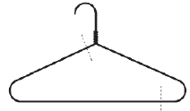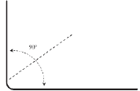

4. 将纸筒套在衣架的垂直杆上，见下图，这就是灵杖的手柄。垂直杆应当伸出纸筒至少 0.03 米。如果你的纸筒完全把垂直杆套在了里面，请调整纸筒尺寸。 

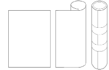

5.将衣架垂直杆伸出纸筒的部分弯折（见下图），当灵杖立起来时，保证纸筒不会滑去。

6.重复上述步骤，完成两个灵杖（见下图）。完成后，灵杖上的纸筒应当能在衣架杆上灵活旋转。

7.在衣架杆的末端增加些分量，有助于灵杖的平衡，钓鱼用的小铅坠完全可以用在这里。制作完成后，用双手抓住手柄，摇动水平杆，使其可以自由旋转。(许多干洗店的衣架底部本来就有纸卷。如果你手头有这样的衣架，那就更方便了。)就这样,一个手柄牢固并且可以灵活旋转的灵杖就做成了。

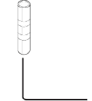

8.灵杖还有一种稍复杂些的做法。用这种方法制成的手柄更坚固，而且旋转起来也更加灵活。我们要用到的原材料是铜管，你可以在任何一家五金店里买到，而且价格并不贵。铜是非常理想的导电体，对微弱的能量场以及从神经系统发出的各种信号也有着相当好的感应力。我们要用到的是直径 0.02 米的铜管。请五金店将铜管截成两端，每段长大约 0.1～0.13 米。每段铜管的两端还需要配两个铜帽。

9.在每个铜帽上钻 1 个小洞，洞的大小要足够衣架杆灵活穿过。用少许强力胶将铜帽分别固定在铜管两端。将衣架杆穿过铜手柄，底部露出一段。将这一段轻轻弯折，这样，1 个新的灵杖就做好了。

2.用灵杖测量气场

你可以用灵杖来确定气场的位置和强度，甚至可以探测出气场中的颜色（这部分内容我们会在下一章中讲到）。在回答某些是非题时，灵杖也可以给你提示。

这个练习的目的是帮你认识到灵杖在意识与潜意识之间的纽带作用，帮助你感觉到发生在身体周围以及内部的一切能量变化。运用灵杖的关键是放松，此外，一定要坚定你到底希望灵杖带给你什么样的反馈信息，这一点极其重要，千万不要忘记。

练习之前，要将你的全部心力集中在这样一些问题上，比如：

你希望灵杖用怎样的方式回答你？

灵杖向外旋转代表什么意思？

相互交叉又代表着什么？  

事先设定好这些问题的答案，每次使用占卜棒时都牢记着你的设定。多数人使用灵杖探测气场时，都希望灵杖与气场接触时向外旋转。借助灵杖回答是非问题时，向外旋转代表“不是”，相互交叉或向内旋转则代表“是”。

接下来，找一个伙伴来协助你完成下面的练习（见下图）：

1.放松。不要用你期待的结果去验证气场，这会形成一种难以打破的桎梏，妨碍灵杖发挥作用。只要记住你想要探测气场的愿望，并记住灵杖向外旋转代表它接触到了气场（有些人喜欢灵杖接触到气场边缘时相互交叉，这只是个人选择不同而已）。放松，让灵杖自己去发挥作用。

2.用双手轻轻握住灵杖的手柄，举起双臂，与肩同高。让灵杖可以自如地旋转，而不会碰到你的身体。

3.与你的同伴保持 9.14 米的距离。练习开始，灵杖必须笔直地指向对方。

4.缓慢、平稳地走向你的同伴。当你进入他/她的气场时，灵杖会有所反应，这样你就会知道他/她的气场外缘在哪里。以他/她所在的位置为圆心，气场外缘到他/她的距离为半径，你就可以画出完整的圆形气场区域。

5.这个练习证明：当某个人或物体穿过那条看不见的气场界线时，气场的主人一定能感知到。他/她可以察觉到有人从那一点闯入了他/她的“空间”之中。

6.继续练习。你可以探测你的朋友或宠物的气场。

你还可以继续测量：

在你朋友的身上佩戴一块水晶，重新测量，结果是不是有所不同？

是不是很显著？

你还可以更换其他的石头，多做几次测量。

请你的朋友脱下鞋子，光脚站立，再重新测量，结果是不是又不一样？

测量他/她抱着大树时的气场，吃完巧克力时的气场，手拿苹果时的气场与手拿糖果时的气场有何不同？

当他/她听着重金属音乐时，气场会有什么变化？

换成古典音乐时又会怎样？

你还可以测量他/她嗅到不同香气时的气场变化。

多多实验，这会非常有趣，你也会学到不少知识。

当你学会用灵杖探测气场时，你就可以开始用这种方法去探测你的世界，去认识哪些东西对你的气场有益，哪些则有害。当你对周围的环境对你气场的影响有了足够多的认识的时候，你也会逐渐形成对自己的全新的认识。

第二部分 灵摆

接下来，我会介绍另一种探测气场的工具——灵摆。

1.灵摆的工作原理

像灵杖一样，灵摆本身不会给出任何答案，它只能为你提供寻找答案的线索。真正回答你的问题的，并不是灵杖或者灵摆，而是你自己，或者准确地说，是你的潜意识。

要想解释这点，我们还是应该好好来了解一下气场的产生，以及灵摆之所以能够探测到气场的原理。

我们的气场是以身体为中心，向四面八方辐射出去的，它对我们周边的所有事情都非常敏感。但是，我们并不能对气场与周围的环境相碰触时产生的反应做出全部的解读。

我们的意识仅仅能够感觉到它想要关注的对象，感觉的途径也非常有限，只有味觉、触觉、视觉、听觉和嗅觉 5 种。如果你只关注五官的反馈，那么你一定会错过许多微弱能量发出的信号。

但是，我们的潜意识却能够感知到与我们进行交互的所有能量，包括那些五官感觉不到的能量，比如：皮肤感知到的东西。可以说，潜意识才能感觉到我们气场的存在，以及气场发生的变化，甚至这些变化代表的含义。这种种交互作用能被潜意识所感觉到，我们可以通过冥想、催眠以及其他提升意识的手段和工具，使这种感觉由潜意识层面进入到意识层面，最终被我们所认知。运用感应力就是提升意识的手段之一。

有必要进一步说明的是，潜意识与意识的工作原理是完全相反的。意识是一系列有组织的大脑活动的大集合，它控制着感觉和表达。当你有意识地专注于某个行为时，你的大脑就会发射出一种电波。此时你的心智高度集中，自然就会忽略一些微妙的感觉，甚至是对它们全盘视而不见。简言之，意识是带有目的，选择性地探索对象。

与意识带有目的，选择性地探索对象不同，潜意识对一切影响我们的信息都能够接受。

潜意识是主导自主神经系统的活动。自主神经系统管理着生命器官和平滑肌，通常它的活动你是意识不到的，因为它控制的是维持生命、繁殖以及自我修复方面的活动，这些活动包括——举例来说：胃、肺、肠、心脏、肝脏、消化器官、生殖器官的活动以及更高等级的感觉和认知。据估计，潜意识控制着身体和大脑 90%的运作，它也是产生更高形式感觉和直觉（比如第六感等五官感觉以外的形式）、记忆、创造力以及抽象思维的源泉。

皮肤是一个高度敏感的器官，它能感觉到围绕着我们的那些极微妙的能量。这些能量与皮肤以及整个身体自动向外辐射的能量场交互在一起，所产生的信息再传递给我们的身体和大脑。虽然在如此微弱的感知中有许多难以辨认的信息，但是它们却可以保留下来，并进入到意识层面。这就好比留在答录机里的一条信息，只要你知道如何操作答录机，就可以倒回去重听信息。这也正是灵杖和灵摆可以帮我们做到的。

神经系统所发送的电子信号和脉冲会引起灵摆的运动，这是潜意识经由交感神经系统刺激平滑肌，引起了肌肉运动。来自于气场的微妙信息保存于神经系统中，通过探测工具，这些信息——以电子脉冲的形式存在——得到释放，引起平滑肌的反应，继而又通过灵摆的运动为你我察觉。

就是这样，灵摆成了沟通潜意识与意识的桥梁。

2.制作灵摆

自制灵摆非常简单，在家里就可以找到现成的材料，就算缺少一两样，也可以在杂货店买到。

制作灵摆最常用的材料是钮扣、指环或水晶。最好的灵摆应当是圆形、圆柱或球形，形状越对称均匀越有效。另外辅助的材料还有细线、绳子或小链条等。

制成后的灵摆就拴在链条或绳子的末端，从它的摆动方式中我们可以知道问题的答案以及微妙能量的蛛丝马迹，它就是一个放大器。在下图中我们会学到 4 种普通灵摆的制作方法（见下图）：

简单的细线拴指环的灵摆

水晶坠灵摆

软木塞、针和细绳的灵摆

普通十字架形项链与链条的灵摆

3.使用灵摆练习

学习使用灵摆也非常简单。只要在安静的环境中花一点时间勤加练习，就可以掌握。使用灵摆需要放松，你必须将心绪抽离，否则会影响到你发出的电波，使灵摆发生错误的感应。

1.使用灵摆的第一步是要感受它。在桌前坐好，调整姿势让自己觉得舒服。双脚平放在地面上，双肘放在桌子上。

2.用拇指和食指抓住灵摆的链条，先让灵摆悬挂 1～2 分钟，然后轻轻地顺时针转圈。

  等灵摆停下来以后，再轻轻地逆时针转圈。接下来，以水平、垂直和对角方向移动灵摆。通过这些准备活动，你会慢慢熟悉灵摆的感觉。

  你觉得如果保持手部静止，灵摆还能摆动起来吗？你会发现，即使不需要故意做动作，灵摆也可以发生运动。

  先让灵摆静止悬空，然后在心里默念“顺时针旋转”，想象你的念头顺着胳膊，传递到链条，最后到达灵摆的末端。注意不要用手去旋转它，全靠意念驱动。当灵摆真的开始运动时，在心里默念“停止”，看它的运动如何戛然而止。

3.现在，告诉灵摆你所希望的反应方式，这过程有点类似于电脑编程。你要告诉灵摆你需要哪种形式的反馈。当你提出问题时，你要能够看得懂灵摆运动所代表的意义，要让潜意识明白你希望看到的反馈动作。下文中的图例可以作为你编程的参考，你可以直接使用或稍作调整。

先从上面那幅坐标图开始。将图平放在桌面上，在图中心的上方晃动灵摆，大声告诉自己：“当我说‘是’时，灵摆要这样晃动（说出你设计的方向—在本图中，灵摆沿着坐标垂直线上下晃动）。”这时，沿着图示方向移动你的灵摆，让它轻轻摆动，同时再把上面的话重复 1 次。

通过这个练习，你可以逐渐建立起自己与灵摆的默契。多尝试几次，巩固一下，比如问一些你知道答案是“是”的问题，但此时千万不要有意识地去晃动灵摆，让它自己做出“是”的回应，让神经系统的运转来驱动身体的反应。你可以提一些这样的问题：“我的名字叫×××吗？”或者“我今年××岁了吗？”这样做不仅能建立起你与灵摆交流的词汇库，更能训练你不要无意识地去摇晃灵摆，帮它做动作。随着练习深入，你也可以问一些不知道答案的问题。

开始晃动灵摆

4.现在，设计“不是”答案的动作。按照上一步骤完成这个过程。

5.每天抽出 5 分钟时间做这个练习，坚持 1 周。这样你就能让潜意识按照你要求的方式来驱动灵摆。

6.如果你喜欢让灵摆用旋转动作代替垂直或水平摆动，也可以参照图示中的第 2 种方法来设计。你可以用顺时针方向旋转代表肯定答案，而逆时针方向旋转则代表否定。

7.当你通过足够多的练习，把灵摆运动的各种方式同你想要表达的意思对照起来，建立起一个交流词汇库时，就不光要注意灵摆运动的方向，更要注意运动的强度和速度了，这当中也暗含了信息。它说明你对这些信息应当重视的程度。

8.设计灵摆动作的时候，要多实验几次。

使用坐标图时，你的胳膊肘要以舒服的姿势放在平面上，让灵摆悬空静止，然后在心里默念“是”这个词。反复默念，眼睛沿“是”的方向来回看，直到灵摆自己也沿着这个方向运动起来。这个过程只需要 1～2 分钟。然后放松。

接下来，在心里默念“停下”。当灵摆停止运动时，重复前面的实验，心里默念“不是”，眼睛沿“不是”的方向来回看。用同样的方法，让灵摆以顺时针和逆时针方向旋转。这样，你就学会了用意念来使灵摆运动。

9.你还要学会怎样问是非题。问的内容越详细，取得的效果越好。例如：有些人问灵摆某种食物能不能吃，灵摆可能会给出肯定的回答，但如果问题是这样的：“这种食物对我有好处吗？”灵摆可能就会给出否定答案了。亲自试验一下，注意要提那种可以明确用“是”或“不是”回答的问题：

● 我有前世吗？

● 这个星期我会升职吗？

● 我以前有过类似的体验吗？

● 我的梦是不是透露了一些被我忽略掉的问题？

● ×××今天晚上会不会打电话给我？

● 我有灵魂吗？

● 我应该学习一门新课程吗？

10.在提问环节中，最重要的是将你的情绪抽离。有些人非常紧张，结果，灵摆只能按照他想要的答案来回答他。如果你放松精神，尽量不带任何情绪色彩，灵摆的答案就会非常准确。在这个过程中，你的意识越放松，灵摆的反应就会越强烈。

4.用灵摆测量气场

用灵摆测量气场的大小不像用灵杖那么简单，但还是非常有效的。灵摆测量气场有 2 种方法，使用起来可以相辅相成。

第 1 种方法是简单的提问推进法，用是非问题来判断。

你可以就气场的大小提问自己：“我的气场有 4.6～6 米吗？”“3～4.6 米？”“在 0～3 米之间？”你可以用这种概括性的问题作为开始，然后再将范围缩小，将内容具体化：“我的气场是 3.4 米？”“2.4 米？”

第 2 种方法与使用灵杖类似。

请你的同伴站在距你 6 米处。放松，告诉自己和灵摆当你穿过他的气场时，要得到相应的提示。

然后，缓慢而平稳地向前走。因为你的身体在动，所以灵摆一定会跟着晃动。因此，最好的解决办法，就是让灵摆旋转着给你提示，告诉你是否进入了他的气场，如果进入了就给出肯定的回答（比如顺时针方向旋转，也可以是逆时针）。

用灵摆测量气场

每迈出一步都要暂停一下，让灵摆静止下来，作出反应。虽然这样有点慢，不过还是很有效果。即使没有 100%的准确，但你确实提升了自己对微妙能量的感知力。

第Ⅴ章 气场的色彩

经过前面的各种练习，你大概已经看到，气场是带有颜色的，而且是很丰富的颜色。在上一章中，我们还学习了如何借助灵杖和灵摆来识别气场。确定气场是什么颜色的，这非常容易，难的是理解这些颜色代表的含义。

人们有时会用色彩来形容身体的健康、情绪、态度，甚至精神方面的各种状况。这大概是你从来没注意，也不曾思考过的事，只要你稍加留意，就会发现色彩在人们的语言中出现的频率有多高：

“今天我的心情是粉红色的。”

“他气得脸都红了。”

“她有些沮丧，脸色发青。”

“他们嫉妒得脸都绿了。”

“他吓得脸色蜡黄。”

“这真是一份金色的回忆。”

......

色彩是光的产物。当我们把不同波长的光线区分开来时，能得到的颜色数量是超乎想象的，当你拿着三棱镜观察太阳光时，会发现在光线的反方向出现了 1 条彩虹。但彩虹七色其实只是光谱中很小的一部分，此外还有许多深浅不一、色调各异的色彩。

我们对色彩都非常敏感，对它们所包含的意思也不陌生，只是没有给予它们太多关注而已。你有没有特别喜欢待在某个朋友身边，只是因为他/她的“颜色”让你觉得舒服？我们也经常说，某件衣服的颜色很衬某人或显得某人很难看。多数时候，这样的评价反映着气场在我们的潜意识当中留下的印象，只是没有表现得太明显而已。

和光线一样，我们每个人的气场都有独特的色彩。不同的色调、透明度和色彩的位置都反映着气场主人的身体、情绪、心理和精神状况。

不同的色彩反映着不同的态度、情绪和能量类型。

为了能将颜色同气场的属性对应起来，你不但要能记住某种颜色代表了什么，也要记住同一种颜色可以细分为不同的深浅层次，每一种变化都代表着一种截然不同的含义。要完全理解这些颜色的含义还需要你花很多时间和精力去练习。

第一部分 气场颜色的特性

确定某个气场的颜色（见下页图）时，要谨记几条指导方针：

1.接近身体的气场颜色通常反映的是身体的状况和能量，而外围的颜色反映的是情绪、心理和精神方面的能量，它们可以对代表身体的颜色造成影响。

2.颜色越清晰柔和越好。越浑浊厚重的颜色，就越说明它所代表的部分有发展不均衡、过度活跃或其他可能存在的问题。

3.如果颜色厚重且明亮，这说明它所代表的人的某个方面的能量水平较高，不必担心。

4.气场中往往有不止一种颜色，每种颜色都反映不同的方面。有时，这些不同的颜色是互相交互的，这种交互会显示你受到的影响。

5.值得注意的是，当你能够看到别人的气场时，记住你首先是通过自己的气场来观察的，你所看到的颜色，并不一定是对方气场的颜色。前文中我们提到过的眼部训练可以帮助你在镜子中观察自己的气场。如果你的气场主要是黄色，而别人的气场是蓝色的话，你所看到的可能就是绿色，因为黄色与蓝色混合在一起便成为绿色。通常，潜意识会注意到这个问题，自动作出调整，但你也要当心，不要过于草率地得出结论。

6.不要根据你观察到的气场来评价气场的主人，这一点很重要。因为你看到了什么，如何解释你所看到的，都与你当时的心境有着很大关系。你要考虑某种颜色所包含的利与弊，以及与之有关的方方面面。记住，气场并不是占卜或者算命，它只是一种对于当下情况的反映，所以，你没有权力告诫气场的主人该做什么不该做什么，或者未来会有什么样的遭遇，你只要告诉他/她观察的结果，解释这结果可能代表的意义，然后让他/她自己去决定和选择。

气场的颜色

7.学着用你的直觉去解释观察到的结果。你可以就观察对象以及你认为相关的内容向气场的主人提出问题，只有对照他的反馈，你才能提高自己对观察结果的解释能力。请记住，气场的颜色、分布位置以及透明度都可以代表不同的含义，你要做的就是去发现它。

气场的颜色

8.气场经常会改变。靠近身体的气场（距身体 0.3～0.6 米的范围）可以在一天之内变化多次。每当有强烈的情绪变化、激烈的心理或精神活动发生时，气场的颜色和光芒都会出现波动。随着我们年龄的增长，气场也会发生改变。当你观察气场的能力有所提高后，你会发现每个人都有一种或多种主色彩始终存在于气场中（也许会有明暗差异）。那么，占次要地位的颜色是什么？它与主色彩有着怎样的关系？

9.通常，首先出现的气场颜色或影子呈暗灰色或浅蓝色。如果颜色暂时没有变得更加清晰，也不要灰心。随着不断进行的练习，这种情形是会改变的。通常开始时，人们会不屈不挠地坚持下去，但他们心里总是设有一个时间表。如果在时限到来之前没有出现他们想要的结果，他们会非常失望。

所以，你不要给自己设定任何时限，坚持每天都练习。只有技艺的不断精进和知识的不断拓展，才能达到你想要的结果。如果你三天打鱼两天晒网，是永远达不到效果的。你必须有足够的耐心，坚持下去，会在 4～6 周看到一些成绩。就算气场的颜色还没有显现出来，但至少你会看到气场。和我一起做研究的同事大多都要经过 1～6 个月才能达到相当好的效果，但只需要 1 个月就会看到坚持练习的成绩！

10.当你的气场观察力增强以后，你就能看到所有人、所有事物周围的气场，这会让你很分心。本书专门有一些练习，可以让你随心所欲地打开或关闭你的气场观察力。

最后，让我再来强调一次：除非得到气场主人的允许，否则你没有权力去调节别人的能量。许多时候，这就像阅读别人的邮件，就算你感知到什么，也不要随意向别人展示，除非当事人同意你这样做。因为，在你的能力能够达到真正客观准确地把握气场之前，你的解释可能不但不会给对方带来好处，反而会给别人一些错误的指引。所以，请负责任地运用你的气场观察力。

第二部分 气场色彩的含义

色彩可以是建设性的，也可以是破坏性的；

色彩可以被激发，也可以被压制；

色彩甚至可以代表男性或女性；

气场色彩反应着能量的正负，看到它，你就像拿到了了解别人的钥匙一样，对方的性格、心情、成熟度以及健康状况都一目了然；

气场颜色还可以同时反映出身体和精神两方面的状况。

每种颜色都代表某个普遍的特性，但每种颜色的明暗变化又代表着不同的含义。正确地解读出气场的颜色明暗需要经过大量反复的练习。至于颜色的位置、亮度，甚至是形状，都是解读中要考虑到的因素。

靠近身体的颜色反映着气场主人的身体健康状况，也代表着在他/她的生活中最鲜明、最主要的能量状况。离身体远一些的颜色常常是指将要进入他/她生活中的能量。多加练习，你就能根据颜色的种类以及出现的位置判断出某种能量形式持续的时间。

下面我将教你每种颜色所代表的含义，但这并不能将颜色解读中所有细微的差别都包括进去，你还要考量基本的颜色所代表的身体以及其他方面的各种各样的情况。因此，下面的内容只能为你研究气场颜色和它们的含义提供一个起始点，真正要掌握这门学问，你还需要做大量的经验的积累。

1.气场的基本色

红色

红色代表着强烈的能量，火和原创的力量。这是一种提升生命的能量，代表热情。它可以象征强烈的激情、情绪和意志。红色是一种动态的色彩，可以反应愤怒、热爱、憎恨以及无法预期的变化。它还代表着新生与改变。

红色可以影响循环系统和生殖系统（性能量），也可以唤醒潜在的能力和天赋。

如果红色太多或太浑浊，说明气场的主人被过度刺激、过于愤怒或发展不均衡，也可能代表神经过敏、火气太重、有进攻性、冲动或过于兴奋。

橙色

橙色代表着温暖、创新和激情。它是勇气、快乐和乐于社交的象征。它反应新的意识的开始——尤其是在一些微妙的生命领域里。

根据明暗程度的不同，橙色也可以表示情绪不稳定和激动。某些比较浑浊的橙色代表傲慢与浮夸。它还可以反应忧愁与空虚的状态。

黄色

黄色是最早，也是最容易被看到的气场颜色之一。发际线周围的浅黄色表示乐观。黄色也是代表精神活跃和阳光清新的颜色，它象征着新的学习机会、轻盈、智慧和聪明。越是柔和的黄色越代表着对生活的热情、创意的力量和精神的发展（尤其是介于浅黄和白色之间的色彩）。黄色象征强大的思想、精神力量的觉醒和出众的感觉能力。

深沉浑浊的黄色反应的是多思多虑。它代表气场的主人被过分苛责，得不到承认以及固执、武断。

绿色

绿色是敏感而充满同情心的色彩。它代表着成长、同情和镇静。绿色气场的主人可信任、可靠，思想开明。明亮偏蓝的绿色象征着康复能力。总之，这是一种丰裕、强大而友好的色彩。

深沉浑浊的绿色代表不确定和贪婪。浑浊的绿色还常常表示嫉妒和占有欲，也可以表示缺乏自信和多疑。

蓝色

蓝色和黄色一样，也是最容易看到的一种色彩。蓝色是沉着宁静之色，代表热爱、真理，和严肃。它与超人的听力和心灵感应力有关。

浅蓝色代表活跃的想象力和良好的直觉，深蓝色则代表孤寂，也表示终其一生对神的探索，以及奉献的程度。品蓝代表忠诚和良好的判断力，也表示气场的主人已经或将要得到满意的工作。

浑浊的蓝色代表封闭的感知力。它象征着忧郁、汹涌、烦恼、跋扈、恐惧、健忘和过分敏感。

紫色

紫色是温暖和变化之色。它代表着理智与情感、身体与精神的混合，反应了独立与直觉，以及动态的、重大的梦境。它说明气场的主人在寻找着什么。深紫色常常代表靠实用主义和世俗的力量来掌控事情，较浅淡的紫色代表谦卑和崇高。紫红色代表巨大的热情和意志的力量，也表示对更大的个人成就的渴望。

深沉浑浊的紫色表示气场的主人想要克服某些问题，也象征着强烈的性幻想。浑浊的紫色往往代表着傲慢，需要同情以及感到被误解等。

2.气场中的其他色彩

粉色  

粉色是同情、爱意和纯洁之色，代表着快乐、舒适和强烈的友情。在气场中出现粉色，通常表示气场主人宁静、谦让的性格，以及对艺术和美的热爱。

根据明暗程度的不同，粉色还可能代表着青涩，尤其是比较浑浊的粉色。它可以表示真诚坦率，也可能是缺乏真诚坦率。粉色还可以代表充满着全新爱情和幻想的时期。  

金色

金色代表动态的精神能量以及注入个人能量中的新生力量。它象征着更高的奉献与协调修复能力，是强烈的热情和丰富的灵感的代表，也象征着生机勃发的时刻。

浑浊的金色代表气场的主人仍处在将更加丰富的灵感唤醒的过程中，他/她的生命还没有被灵感的火花完全照亮，他/她还在自我提升的阶段，还需要一番努力才能将生命的颜色调整为金色。

白色

比起其他颜色来，白色在气场中很常见，它看上去常常是一团透明的影子。白色当中包含了各种颜色，当它在气场中看上去非常强烈时，通常其他颜色也会非常强烈。这样你就可以判断出白色究竟是一种能量的颜色，还是仅仅是气场的表象。当白色作为气场的一种颜色时，它代表着真诚和纯洁。它表示能量正在自我清洁和净化。它也常常反映出巨大的创造力正在苏醒。

灰色

灰色是表示开始的颜色，它代表着揭开潜藏的天赋。偏银色的灰反应了女性能量的苏醒，包括启发、直觉以及天马行空的想象。偏深沉的灰色往往代表身体上的不均衡，尤其是靠近身体某个部位出现这种灰色。它也暗指气场的主人不想留下任何悬而未决的难题。气场中的灰色往往表示气场主人性格神秘，喜欢独来独往。

棕色

棕色在气场中经常出现。虽然很多人认为棕色代表能量缺乏或不均衡，但事实往往并非如此。棕色是大地的颜色，当它出现在气场中，尤其在头部上方或双脚周围时，代表的是新的成长。它象征着发展新的根基以及达成某个目的的愿望，是代表勤奋和组织性的颜色。

当棕色出现在脸部或与头部相接触时，则表示缺乏辨识力。若出现在轮穴处，则代表这些能量中心需要净化。在这种情况下，棕色表示能量的关闭。通常，棕色比较难以解读，虽然它可以明确指示出身体出问题的部位，但是你却不能太过草率地得出结论。你最好还是从气场的主人那里询问一些信息，再借此做出判断。

黑色

黑色是气场颜色中最难解读的。我曾听别人说起，当气场中出现黑色，就代表气场的主人临近死亡或患上了可怕的疾病。我还没有找到证据证明这种说法的正确性。

黑色是保护之色，它可以隔绝外界能量的侵扰。当气场中出现黑色时，说明气场的主人正在自我保护。它也象征着气场的主人有秘密埋藏在心里。这并没有什么，只要情况不太极端就好。黑色还代表某些负担或牺牲将要出现，或是某些方面的不均衡。身体的不均衡通常表现为身体周围出现黑色或深色气场区，出现的位置就代表着不均衡发生的位置。如果是气场外围的黑色，则代表气场中出现了黑洞。我曾在一些虐童事件的受害者、药物滥用者或曾经是药物滥用者（酗酒者、吸毒者、烟瘾严重者等）的气场中看到过这种情况。

闪光银色

还有一种情况是我曾经观察过的，我想在这里说一说。我常常在气场中看到柔和的闪光，它们通常是银色。它们可以表达多种意思。那些被我称为“闪光”的色彩往往代表着创新和生产。当它们出现在气场中时，则代表气场主人的生命正激发出巨大的创造力。

这种现象大多出现在女性的气场中，当然绝不仅限于女性。当我在一位女性的气场中看到闪光银色时，我会问她是否怀孕了。这种银光总会出现在孕妇或是在过去 6～9 个月当中生过孩子的女性的气场中。当然，你也要记得，就算大部分孕妇的气场中都有闪光银色，也不能认定所有有着银色闪光气场的女子都是孕妇。

在我看来，这些闪光代表在气场主人的生命中，创造力和生产力正在被激活，但它们的表现形式却是多样的，不仅仅表现为怀孕。我认为，当这种创造力异常活跃，活跃到在气场中发光的程度时，就会吸引新的灵魂来靠近。如果时机恰当，新的灵魂就会“介入”到气场主人的生活中。如果气场的主人不是孕妇，我会提醒她在接下来的 6～9 个月多加注意，因为在这段时间里她很可能会怀孕。俗话说的好：有备无患。

如果这种创造与生产之光不是怀孕，那么它一定会在其他方面表现出来。通常在 9 个月，最多 10 个月之内，气场主人的生活中将发生某件大事，这件事就像孩子出生一样足以改变他/她的生活。一扇美好的大门即将向他/她敞开。整件事情完全显现出来大概需要 6 个月的时间，不过一旦适合创造力爆发的时机到来，事情会朝着积极方面去发展。

当你的气场观察力逐渐提高之后，你会留意到各种气场颜色之间微妙的区别。对色彩和色光疗法的研究不仅能够让你对气场颜色更加敏感，更能帮助你了解它们的含义。

第三部分 鉴定气场的主色

当你能够看到气场的颜色以后，你就能运用感应力去鉴别气场的主色彩。灵杖和灵摆仍然是很好的辨识工具。要记住，你的潜意识已经可以感知到气场能量的存在，只是你还不能通过意识真真切切地感知到它，而灵杖和灵摆就能帮助你辨别出潜意识的感知结果，并把它们带到你的意识层面中来。下面，让我们来试着做几个练习：

1.如果你选用灵杖，可参照下图中的第一幅图画一个圆形。注意要画在空白纸上，且半径不小于 0.3 米。你可以按照图中的样子，把各个颜色的名称标出来，也可以在每一部分直接涂上相应的颜色。如果你选用灵摆，就要参照第二幅图。在长方形的每一小块涂上相应的颜色，或标上相应的名称。

2.给自己一些时间，放松，将两只脚平放在地面上。将画好的图和你的双肘轻轻放在平滑的桌面上。如果以灵杖作为工具，只需要一个即可。手持杖柄，与身体保持一定距离，保证灵杖能够自如旋转，末端不会碰到自己。将灵杖悬于图纸上圆心的上方，集中注意力在你的同伴或你自己的气场上。如果你观察自己的气场，那么闭上眼睛，想着自己。

运用灵杖和灵摆鉴别气场颜色

气场色轮图例

3.现在，问自己几个问题。你可以在心里默念，也可以大声地问出来：“×××的气场是什么颜色的？”给灵杖时间，等它做出反应，指向图中的某个色块。你也可以询问仅次于主色彩的是什么颜色：“在×××的气场中占据次要地位的是什么颜色？”如果灵杖指向两种颜色之间，就是指这两种颜色都在气场中占次要地位。要记住，气场中的颜色有许多明暗变化，并不能完全根据图例来区分。你可以提一些类似这样的问题：“图例中的颜色哪一种最接近×××的气场颜色？”

4.用灵摆鉴别颜色的过程也是一样。将你的双肘放松地撑在平滑的桌面上，让灵摆悬于图例上方 0.08～0.16 米的高度。从图例的一端开始，依次鉴别完所有颜色。

用灵摆鉴别颜色的过程中，你会用到是非问题。你可以提问：“×××的气场中有红色吗？”或者“红色是主色彩吗？”等。留意灵摆的反应方式，让它给出“是”或“不是”的答案。另外，别忘了留意灵摆给出反应的强度。反应越强烈，这种颜色在气场中便越重要。

气场中显现出的健康问题

灵摆鉴别法色彩图例

5.用灵摆依次鉴别图例中每一种颜色。注意你提出的问题一定要让灵摆能够用“是”或“不是”来回答。你也可以运用下面的提问方式来确定某种颜色在气场中的位置。

“红色主要分布在头部上方吗？”

“绿色反应了身体的某些信息吗？”

“是深蓝色还是浅蓝色？”

“黄色主要分布在头部上方吗？”

多做实验，别怕麻烦。你运用这些工具的次数越多，就越能准确感应到围绕在你周围的各种能量。经过不断的累积，你的感知力将会加强，最终，阻碍你去真实地感觉现实的屏障将会被逐渐打破。

第四部分 用颜色来解读气场

刚刚开始观察气场时，你看到的往往是最靠近身体的一层气场，它的颜色很大程度上反映着主人的身体健康状况。这部分气场可能会呈现出多种颜色，形状通常不是笼罩着身体的云朵状，而更像是从身体内部奔涌而出的水流。

气场放射的程度越强烈，形态越对称，表明主人的身体越强壮健康。如果能量放射的形状不够均匀对称，说明身体的某个部位比较虚弱，不均衡或出现了疾病。不对称出现在哪里，就说明哪部分身体出现了问题。

在真正的疾病或身体问题出现之前，气场就会提前表现出不均衡性。如果你能对自己的气场多加留意，观察它的每一种变化，就能采取正确的预防措施。你可以在那些小问题发展成真正的疾病之前就将它们解决掉。

对健康人来说，能量的放射是均衡而强烈的。放射线围绕着身体向外延伸 0.3～0.6 米，然后渐渐褪去，或是与气场的其他部分混合在一起。如果放射线均衡而对称，但延伸范围只有 0.1～0.2 米，则说明气场主人的能量正在下降。除非及时采取措施，否则身体问题迟早会出现。

如果放射区域局部颜色比较红，或者比其他部分颜色更深、更厚重，这种现象通常代表着身体的相应部位出现了炎症、疼痛、外伤、肌肉拉伤等。

在健康人的气场中，靠近身体的能量通常呈放射状，以身体为中心向外延伸，最后融入整个气场。从视觉效果上来看，整个气场作为背景，而这些能量流则显得非常突出。它们的形状是均匀而对称的。  

举个例子：在肩膀周围的放射区域有一块颜色比较暗，带有一点点红色，就说明这个区域出现了问题，从炎症复发到肌肉拉伤，任何情况都有可能。

能量放射线

这时，从气场主人那里得到反馈非常重要。你可以问他/她肩膀是不是不太舒服，告诉他/她你观察到的现象以及这现象可能代表的意思。如果气场的主人还没有发现那里有什么异样，你就可以简单告诉他/她你注意到肩膀有一点发炎的迹象，他/她自然就会多加注意了。

解读气场时要秉着认真负责的态度，尤其是与健康状况有关的解读更是如此。只有医生才有权力诊断、开处方或建议治疗——就连精神治疗师都无权这样做。你可以为气场主人提供建议，说一些他/她可能会感兴趣的方法，但你绝对无权诊断或开处方！

我曾经见到过这样的例子：有人在刚开始观察气场，尤其是观察气场所反应的健康情况时，很草率地作了结论，他们在气场中看到一块深色区域，就告诉气场的主人那里有癌变，或者马上要形成癌变。这种结论不仅极不负责—简直就是残忍。每一个允许你进行气场观察的人其实都处于弱势，他/她向你敞开自己，完全接受来自你的影响，所以，在有百分之百的把握之前，不要播下消极、负面的种子，不要干扰他/她的自由意志，进行解读时用词要慎之又慎，这些都非常重要。你必须充分发挥直觉，敏锐地捕捉气场主人的反应，及时调整你的表达内容和方式。要做到这一点，需要时间和正确的训练。如果你一时还做不到，就不要以专业的姿态为别人解读气场。

放射线可以指示出具体的问题区域（见下图）。肩部和臀部的发炎现象表示肌肉拉伤或紧张，发炎现象出现在头部，表示紧张不安和头痛。能量放射的不均衡说明能量水平低，体力活动过多，环境恶劣以及/或者一些其他问题。

对气场色彩及外观的概述到此为止，当然，这些理论并不是一成不变的，每个人都会有自己的认识和解读。如果有人带着问题来找你，不管是身体上的还是其他方面的，而你又在他/她的气场中观察到了负面的东西，那么你并没有权力将这些东西讲得太过具体。你只要告诉他/她，你在某个部位发现了一些问题，而他/她最好去正规的医院，请医生通过这样或那样的方法帮他/她确认。

放射线可以指示出具体的问题区域

研究气场时一定要记得，这个领域中有太多的变数需要我们细细斟酌：不同的色彩、明暗的变化、色彩的深浅、活跃程度、出现的位置、与其他色彩的融合情况等，都在影响着你的观察结果。

多方位的气场评估可以帮你查明问题区域，找到不平衡的根源——如果有不平衡情况出现。你可以让你的感觉与气场的主人进行交流，但对你无法核实的事情不要轻易得出结论。

我们唤醒观察气场这种潜在的能力，是希望通过这种方式，由你充当他人的参照工具，让他/她可以从另一个角度来审视自己。

第Ⅵ章 修炼你的气场

在你成长过程中的某一刻，你会意识到自己身上隐藏的秘密，远多于你已知的，世界上还有许许多多用肉眼看不到的东西，发生着很多人们感觉不到的变化。毫无疑问，这些看不到的东西同样在影响着我们，不论是好的，还是坏的。

每一天，你的气场都在经受着各种冲击和影响，除非你学着去认识这一点，并设法保护自己免受不必要的打扰，否则，你会发现生活变得杂乱不堪。如果你始终意识不到外在力量对你的影响力有多大，那么你的气场一定会非常虚弱，这种虚弱可能会外化为身体疾病，也可能表现为情绪和精神上的不平衡。

是不是有人让你觉得自己很差劲，很失败？

你有没有在别人的影响下买了自己不想买的东西或是参加了并不想参加的活动？

与某个人谈完话以后你是不是觉得精疲力尽？

所有这些都是别人的气场能量扰乱了你的表现。

保护你的能量，关键在于气场。在强大而活跃的气场前，负面的、虚弱的和不平衡的能量就会退避三舍。

第一部分 加强气场的日常方法

要拥有强健的气场并不难，最好的办法就是积极锻炼，保证健康。均衡的饮食、适当的运动和新鲜的空气都会增强你的气场；相反，缺乏运动、空气污浊、营养不均衡、酗酒、滥用药物、抽烟等，都会极大地损耗你的气场。

情绪和精神状况对气场的影响也非常大——其影响程度超出许多人的认知。持续的压力、情绪受挫、精神紊乱、情感巨变、忧愁、恐惧以及其他负面的情绪和态度都会削弱你的气场。一旦气场虚弱，你的能量就会流失，你就会变得容易疲倦。如果任由这种情况拖延下去，气场结构中就会出现破洞和裂缝，进而形成健康问题或其他的不平衡。下图显示的正是恶化的气场，我们可以看到破洞、深色区域以及虚弱失衡的形状。

有许多非常简单的办法可以激发你的气场，让它强大起来。

虚弱失衡的气场外观

1.晒太阳和做运动都可以增强气场。

新鲜的空气对激发气场尤其有好处，少食多餐更能起到均衡气场的作用，及时排除肠道毒素也可以保持气场的强大和韧性，冥想具有保护和加强的双重作用。你也不需要花过多力气在锻炼上，只要适度就可以保持气场的活跃性。

2.音乐对平衡和强健气场也十分有益。

《格里高利圣咏》（著名的宗教音乐）就对气场或环境中的负面能量有非常好的清洁作用。在房间中将《格里高利圣咏》播放 10 分钟，所有的负面能量就会一扫而光。出于多种个人原因或个人喜好不同，也许有人不太欣赏《格里高利圣咏》，那么，一张古典音乐专辑同样能帮你振奋或舒缓。亨德尔的《水上音乐》，或者贝多芬的《田园交响曲》也都是不错的选择。

3.香气也可以用来保护和加强气场。

在美洲印第安人的传统中，香薰的使用非常普遍。人们用烟和各种草本植物的香气来净化气场或环境。不管是香薰还是精油，香气对以情绪和精神为本质的气场和能量都有极强的影响力，人们常常用香薰和精油来缓解身体的、情绪的、精神的或心灵上的各种疾病。

人们常常将鼠尾草和香草一起使用，这两种草的香气可以净化和平衡气场。乳香也是一种常用的净化保护气场的香气，它的能量强大，效果显著。对从事治疗和咨询工作的人来说，桅子花的香气也有着极强的效力，它可以保护你不被其他人的麻烦所连累，还可以加强气场，让你始终保持理性和客观。除此以外，还有许多其他的香气可以增强和保护气场，我们只要稍加研究，就能全然了解它们各自的功效。

4. 加强和保护气场的另一种工具是水晶或宝石。这点我们已经在最开始就实验过了。

双尖水晶（两端尖尖的水晶）对增强气场极其有效，随身装一块，可以起到稳定的作用。如果你知道自己在某些场合一定会感到紧张或精疲力竭，携带一块双尖水晶，可以让你不至于太过紧张和疲倦。

当一天结束时，如果你觉得自己耗光了精力，想要恢复能量，就可以双手各握一块双尖水晶，或坐或站（见下图），尽量放松，想象水晶的能量正在为你的身体充电，为你的气场注满新的能量。有节奏地呼吸，保持 5～10 分钟，你的能量就能够获得平衡和加强。这种方法也可以帮助你从紧张的工作状态中解脱出来，回到放松的居家状态，把你从办公室或其他场所带回家的能量碎片清理出去，于是，办公室里的琐事就会被你完全抛诸脑后。

水晶可以加强你的气场

第二部分 气场修炼练习

接下来的这些练习对保护和增强气场非常有益，它们可以从不同的方面强健你的气场，帮你找到平衡，恢复精神，也可以保护你免受不必要的侵扰。记住，你的气场越强大和活跃，所受的外界侵扰就越少。

1.能量保护法

我们都有过被别人弄得精疲力竭的体会。也许你与他/她通了电话，也许是面对面交谈，总之谈完以后，你会觉得疲惫不堪，好像精力都被完全耗尽，你的能量不见了，也许还伴随着胃痛之类的感受。所有这些都是能量枯竭的表现。

有些人可以吸收别人的能量，当然大多数时候，他们并不是故意要这么做。他们所能意识到的就是，与你交谈过或呆过一阵以后，他们的感觉会好很多。这对他们来说当然不错，不过，他们并没有权力拿走你的能量，你也不能任由这种情况发生。

当然，你也不必把吸收你能量的人当做吸血鬼，也没必要因为他/她吸收你的能量，就再也不和他/她讲话。如果你真这么做了，他/她一定会认为你莫名其妙。毕竟，大多数人对如此微妙的能量问题还没有完全明了，所以你在处理这方面的矛盾时，做到心中有数就好。

其实，你根本不必费什么力气就能改变这种情况，你可以决定让不让别人分享你的能量。有一个最简单的方法，就是封闭你的能量流。气场中有许多能量流，它们或穿过你的身体，或围绕身体流动。你可以将它们封闭起来，这样你的能量就只围绕你的气场流动。你也就保护了自己的能量不被别人的气场吸收，同时让自己的气场不去吸收别人的能量。

封闭能量流只需要采取下图所示的身体姿势：双脚交叉，让拇指与其他手指碰触在一起（你也可以让拇指只和食指接触），这样就能封闭你的能量流，你的能量再也不会流失。

下一次，当你再碰到让你疲惫的那位朋友，不妨试试这个姿势。只要随意地把手放在膝盖上，手指接触，交叉脚踝，既轻松又简便，而且不会引起对方的任何怀疑。和对方在电话中交流时这个姿势也奏效。

保护能量不流失

这样做了以后，你会从朋友那里听到一些反馈，比如类似于这样的评论：“你不够友好。”“你不像以前那么坦率了。”“你在生我的气吗？”等等。这与生气无关，你还是像以前一样温柔地同他们说话，唯一不同的是，你不再让他们偷走你的能量，不让他们把你弄得精疲力竭！只是因为这一次他们和你的交流不像以前那么“尽兴”，所以他们会猜疑哪里出了问题。你只要记住：没有你的允许，谁也无权偷走你的能量。

2.能量呼吸法

新鲜的空气和正确的呼吸方法对增强气场十分必要。通过鼻腔呼吸，可以使气场能量达到最大。

许多人都有这样一种坏习惯，就是用嘴呼吸，他们没意识到用鼻腔呼吸更加自然健康。

因为，用嘴呼吸容易传染疾病，在嘴与肺之间根本没有能过滤空气的器官，灰尘、脏东西以及其他污染物会长驱直入，进入肺中。用嘴呼吸也使冷空气直接刺激肺部，可能引起呼吸器官炎症。这种方式会削弱气场的活力，甚至会严重影响到健康。

反过来，鼻腔呼吸可以保持能量系统的活力和健康。鼻子有专门的黏膜，可以从空气中吸收普拉纳。也有人把普拉纳称做“宇宙的能量”。在许多古老的东方呼吸术中都提到：在吸气时把意识集中在鼻尖和整个鼻腔可以加强普拉纳的吸收，提高整个气场的活力，激发能量系统。

鼻孔和鼻腔内细密的绒毛可以起到过滤空气的作用，而黏膜又能为吸入的冷空气加温，让空气不会刺激到你脆弱的呼吸器官——肺部，这样的呼吸方式才更能增强气场，补充能量。

并且，能量有不同的极性：积极或是消极，男性或是女性，阳性或是阴性。鼻腔呼吸法能很快地活跃气场，平衡体内两极，还可以增强记忆力，让你吸收更多信息。它可以平衡大脑两个半球的功能，在学习之前运用能取得事半功倍的效果。另外，鼻腔呼吸法也可以用在日常生活中，起到快速提神的作用。

鼻腔呼吸法的基本技巧是交替呼吸：从一个鼻孔吸气，再从另一个鼻孔呼气（记得把意识集中在鼻尖处，尤其是吸气时，这样可以让效果更显著）。你可以用手指按住一侧鼻孔，辅助自己完成整个动作并控制呼吸的节奏。

1.将右手手指放在鼻子上，呼气，将舌头顶在门牙后面的上腭处。

2.拇指按住右侧鼻孔，用左侧鼻孔吸气，慢慢地从 1 数到 4。

3.仍然按住右侧鼻孔，其余手指按在左侧鼻孔上，夹紧，从 1 数到 16。如果你从没做过类似的练习，数到 16 对你来说恐怕太长，你可以数得快一些。多练习几次以后，闭气的能力就会增加，你就可以延长闭气时间。接下来吸气，从 1 数到 3，闭气，从 1 数到 6，然后再呼气，数到 3。找到最适合你的呼吸节奏，然后保持这个节奏。

4.放开右侧鼻孔，按住左侧鼻孔。慢慢地通过右侧鼻孔呼气，数到 8。

5.按住左侧鼻孔，通过右侧鼻孔吸气，从 1 数到 4，然后将右侧鼻孔也按住，从 1 数到 16。

6.放开左侧鼻孔，按住右侧鼻孔，慢慢呼气，数到 8。

7.重复以上动作 4～5 次，两侧鼻孔轮换进行练习。用一侧鼻孔吸气，闭气，再用另一侧鼻孔呼气。每个鼻孔至少做 4～5 次这样的呼吸练习，可以快速提神，你的整个身体都会精神倍增，气场里能量充盈。

3.清洁能量法

这个练习可以清洁净化你的整个气场，而且效果显著，最适合在一天结束的时候练习，尤其适合在接触了许多人之后进行自我梳理。它可以将那些能量残骸清扫出去，不让它们堆积在你的气场里造成不平衡。只需 5 分钟，你就能看到它的效果。

1.选一个舒服的坐姿，放松。先按照上文的步骤进行呼吸练习，作为此次练习的热身运动。你也可以先作一个简单的祷告或念一段真言。记住：我们提到的预备练习只是建议，你要选择适合自己的方式来进行。

2.在你上方大约 6 米的高度，想象一团透明的白色火焰形成一个小旋风。想象它慢慢地形成漏斗状，越来越大，直到将你的整个气场包围进去。你要将漏斗状旋风比较小的那一端想象成足够你的头和身体中段穿过的大小（见下图）。

3.这团精神之火形成的旋风应当是顺时针旋转的。当它接触到你的气场时，仿佛要将聚积起来的能量残骸全部吸收并完全烧毁。

4.观察它，感受它，想象它正在向下移动，穿过你整个的气场和身体，将你一整天聚积起来的所有多余的能量残骸一扫而空。

5.当旋风穿过你的身体后，让它从你的脚下进入地面。想象这股旋风带着所有的能量残骸进入到地球内部更底层的生命王国里，为那里的生命造福。

用清洁能量洁净化你的气场

4.中柱练习法

这个练习是从一种被称做“卡巴拉智慧”的古老体系中总结出来的。它通过耳朵、眼睛和嘴巴来为气场补充能量，修补气场中的裂缝和漏洞，对气场进行稳定和平衡。

我们在练习中会用到一些颂歌，其中提到的神灵都是用古希伯来名字命名的，还有一些特定的形象和呼吸方式，它们聚在一起会形成一种协同效应，让你的能量增强——不仅仅是 3 倍，而是 8 倍之多。

1.采用一种较为舒服的坐姿或站姿，花几分钟时间放松。 

2.想象一团透明的白色光球从天堂轻轻地向你靠近，一直来到你的头顶上方，光球内部充满了强烈的能量。当你默念以下这些名字时，想象球的光芒越来越强，将你的头部区域完全照亮。

3.轻轻叫出这个名字“EHEIEH”（Eh-huh-yeh），每一个音节都要重读，感受你的头顶充满了能量。重复叫出这个名字 5～10 次。“EHEIEH”的意思是“我就是我”。

4.停下来，想象从光球射下一道光柱，朝着你咽喉的位置倾泻下来。大声叫出神的名字“YHVH ELOHIM”（Yah-hoh-vah-Eh-loh-heem），光球的光芒会更加耀眼夺目。重复叫出这个名字 5～10 次。“YHVH ELOHIM”的意思是“创世纪的上帝”（the Lord God of Creation）。

5.停下来，想象从光球射下一道光柱，朝着你的心脏飞来。慢慢地，逐个音节地叫出另一组有关神的句子“YHVH ELOAH VaDAATH”（Yah-hoh-vah-Eh-loh-ah-Vuh-Dahth）。重复叫出这个名字 5～10 次，感受光球的光变得更强烈，完全将你的心脏区域照亮。“YHVH ELOAH VaDAATH”意思是“上帝在心中”（God made manifest in the mind）。

用中柱练习法修补气场

6.停下来，想象从光球射下一道光柱，朝着你腹股沟的位置飞来。慢慢地将“SHADDAI-EL CHAI”（Shah-dye-El-Keye）这个名字重复 5～10 次，感受能量在腹股沟部变得越来越强烈。“SHADDAI EL CHAI”的意思是“全能的上帝”。

7.停下来，想象从第四个光球射出的光柱照亮你的双脚。接着，第五个光球形成，它的光芒直接射入大地中心。你轻轻叫出一位神的名字“ADONAI HaARETZ”（Ah-doh-nye- Hah-Ah-retz），光球发出更加耀眼的光辉。将这个名字重复 5～10 次，它的意思是“地球之王”（Lord of the Earth）。

8.现在，平衡能量的中柱已经形成，并贯穿你整个的身体和气场。将注意力收回，重新集中在你的头顶，开始有节奏地呼吸。慢慢地呼气，数到 4，能量开始从你身体的左侧倾泻而下且向外放射，将左边的气场加强。接着吸气，数到 4，将能量沿着脚下到头顶从身体右侧提上来，并且向外放射，将右边的气场加强。然后闭气，数到 4，再重复呼气和吸气过程。将全套动作重复 4～5 次。

将整个过程重复 4～5 次,你的整个气场都会得到加强

9.现在，在你一边呼气一边数到 4 的过程中，让能量流从你身体的正面向下倾泻。接着吸气，让能量从你的身体背后上升，同样数到 4。 将这一过程重复 4～5 次。至此，你的整个气场都得到了加强。现在，这股能量围绕着你，所有的漏洞都已修补好，所有流失的能量都得到了补充。

10.现在，感受能量在你的脚下聚积。吸气，将彩虹的七色光从脚下提起，穿过中柱，直至头顶。然后呼气，将头顶上的虹光喷射出去，让色彩和能量充盈你的整个气场。稍事片刻，让自己充分沐浴在这光辉崭新的气场中。

中柱练习对整个气场也具有清洁作用，它可以增强气场，推动更高级的能量，包括精神能力的发展。因为它将你的气场提升到了如此高度，自然也有助于增进你对气场的观察力。它提高了你所有的感知力和敏感度——身体的以及其他各个方面的。

我在自己的研讨会上传授过这个练习，并且强调过：对所有想要发掘自己更高潜能的人而言，这个练习绝对是最基本的。它有力而且有效，不管是刚刚开始涉猎超自然领域的人，还是在这方面浸淫多年的人，都应该将它作为最主要的练习。它最基础，同时具有保护和加强作用，我从没发现任何一个练习能做到这么多，还能与气场的主人配合得这么好。

另一种中柱练习  

在传统的中柱练习中会用到 5 个光球，有时也会用第六个光球来配合使用。第六个光球会在第三只眼或眉毛中间的位置被激活，这里的能量轮掌管的是肉眼和心眼，它对激发你的气场观察力尤其有效。

1.选一个舒服的坐姿。闭上眼睛，放松。

2.想象水晶球的光芒从天堂降落，停留在你的头顶。轻轻叫出“EHEIEH”(Eh-huh-yeh)，感觉头顶充满了能量。重复这一过程 5～10 次。

3.想象一道光柱从光球中射出，在你的眉毛周围形成第二个光球。轻轻地吟咏神的名字“JEHOVAH”(Yah-hoh-vah)，想象这声音一直传递到宇宙的尽头又反射回来。感受你内心的眼睛充满了能量。重复这一过程 5～10 次。

4.从第二个光球开始，光柱射出更远，在咽喉周围形成第三个光球。吟咏“JEHOVAH-ELOHIM”（Yah-hoh-vah-Eh-loh-heem）的名字，观察并感受光球的夺目光芒。重复这一过程 5～10 次。

5.从第三个光球开始，光柱继续向下，在心脏部位形成第四个光球。吟咏“JEHOVAH ELOAH VaDAATH”(Yah-hoh-vah-Eh-loh-ah-Vuh-Dahth)的名字，重复这一过程 5～10 次。

6.稍事片刻，想象光柱从心脏处的光球射向腹股沟，形成第五个光球。想象它成形并释放光芒的过程，同时吟咏“SHADDAI EL CHAI”（Shah-dye-EI-Keye）的名字。

再次稍作暂停，想象光柱从第五个光球下降到你的双脚，形成第六个光球，接着光柱继续向下，进入大地的中心。吟咏“ADONAI HaARETZ”（Ah-doh-nye-Hah-Ah-retz），观察第六个光球释放能量。

稍加变化的中柱练习

7.现在，一个从天空到大地的中柱已经形成，并将你完全包围。光的中心已经被激活，并将保护和增加你的气场，唤醒你的气场观察力。有节奏地呼吸并冥想，具体步骤与前文中传统中柱练习的第 7、9、10 步相同。

5.圣歌和真言练习法

圣歌和真言在东西方传统中都曾出现，是补充和增强能量的有力工具。真言（Mantra）是梵文，在英语中相当于“charm”或“spell”（符咒）。在圣歌和真言当中，声音的力量有着特殊的作用。圣歌和真言常常被用来改变和治疗人的气场，或提高意识水平。

圣歌和真言可以改变人的身体、心智、情绪或精神，特殊的声音可以激发你周围和体内的能量。

圣歌和真言的颤音可以净化人的气场。通常它们能够发挥作用是出于以下四种原因之一：

因为你相信它们所具有的效力；

因为你将声音与某些明确的信念联系在一起，增强了它们改变气场的功效；

因为它们本身的含义，它们所蕴含的意义作用到你的精神，再通过你的气场将这种作用显现出来；

许多圣歌和真言仅仅通过声音发挥作用，与它们本身的意义无关，吟诵它们的声音撞击着你的气场，就会引起一系列改变。

吟咏圣歌是用神秘的声音和词句为吟诵者赋予力量的过程。吟咏圣歌可以产生非凡的效果，但具体要吟咏多少遍才能产生效果，始终是人们争论的焦点。一般来说，吟咏的节奏是最关键的，你要自己揣摩对自己最合适的吟咏次数。通常每次吟咏 10～15 分钟，你就能感觉到它的效力。

吟咏圣歌和真言的过程非常简单。选择一则真言，尽量了解它的含义。找一个安静的、不会被打扰的地点和时间，充分放松，接着一个音节一个音节地开始吟咏。注意找到真言的节奏，既要适合它，又要适合你。

在吟咏的停顿处，你要认真倾听真言在你心中的回音。这回音像是近在耳边的嗡嗡声，但其实是能量场发生改变的一种信号。如果你没能体验到这些，也不要灰心。这并不意味着真言对你没有作用，我们所说的毕竟只是一般情况而已。当你听到了真言在心中的回音，就开始冥想能量的改变过程。想象真言激发了整个气场，想象你的气场空前活跃与其他能量场发生交互。

真言示例：

(1) 唵（om）  

“唵”（om）是真言当中效力最强大的一个。它相当于古埃及语当中的“阿门”（Amen），代表圣子。“唵”是梵文，意思是消除蒙蔽在我们的身体和心灵上的污秽物质。

“唵”的发音方式有数百种，每一种都对气场有独特的效力。当你把重音放在“O”上时，可以影响他人的以及你自己的气场；而重音在“M”上时（发 humming 音），效力就会更加指向你的内在世界。

当你发出“唵”的音时，想象自己正从现实生活的束缚中挣脱出来，那些被阻挠、局限的想法正在重组，气场中堆积起来的能量碎片被一扫而空。“唵”是你与神进行交流的声音，因此，它也是你释放能量的工具。它可以清洁气场，创造和释放新的能量，让你拥有更强大的能量。

“唵”也是一声召唤。它可以沉淀、稳定你的气场，将灵体中的各个部分组合在一起。你所有的能量都会听命于这一声召唤，当它们组合在一起时，你的身体就会更健康，从冥想中获得的收益也就越大。

“唵”的发音也可以变换为 Aum (ah-oh-mm)，它能增强你对气场的观察力，让你的精神变得更加清澈，还可以修补气场中的漏洞和薄弱环节。

使用梵文 om 来增强气场

吟咏“唵”时，最好想象着它的梵文字母覆盖在你的身体之上（如下图）。首先，想象字母在你的身体上形成，当你吸气时，嘴里和心里同时默念它，然后，感受这个词的振动以及由此聚积起来的力量。呼气时念出它，感受它释放出的水晶般纯净的能量奔涌而来，充满了你的气场。继续做 10～15 分钟，你会发现自己的气场更强大了，遭遇其他的强气场时也不会轻易受到影响。

(2)唵（OM）-嘛呢（MANI）-叭咪（PADME）-吽（HUM）（Ohm-mah-nee-podmay-hum）

这句来自佛教的真言的字面意思是“莲心中的珍宝”。这是使用最广的一句真言，有许多不同的意思。人们相信，凭这句真言能够连接佛教中观音大士的能量。

观音在佛教中的地位就如同圣母玛丽亚在基督教的地位。她是儿童的保护者和救助者。传说中，正当她得到了点化要从人间升入仙界时，突然听到了凡人的哭声，于是，她选择留下来，普渡众生。在中国，她是慈悲之神，送子之神。在传说中，她还能阻止一切暴力发生，能在群魔中自由穿行而不受伤害。

你最好把它用在情绪高度紧张的场合到来之前，它能让你的气场变得强大，能将来自他人的影响，不管是身体上的还是其他方面的，完全隔绝。还可以将你气场中的能量碎片转化为纯净的力量，平衡情绪，治愈疾病。

唵——这是万事万物和所有圣音的总和。通过吟咏产生的共振，你可以连通自己与观音大士的气场。

嘛呢——字面意思是“珍宝”，它是精神中至高无上的价值体现，象征着同情与爱的启蒙。正如珍宝可以赶走贫困一样，这句真言可以将不和谐的能量从你的气场中驱走。

叭咪——字面意思是“莲花”，象征着精神的舒展和更高能量的觉醒。它的声音可以让污染气场的能量碎片得到净化，还可以让你的气场与周围环境协调一致。

吽——就其本身而言无法释义。鉴于“唵”代表着人与宇宙之间无穷的圣音，那么“吽”就代表无穷之中的有限。它象征气场的潜能，唤醒人对能量的感知力，让人更深刻地意识到能量的影响。它让人对气场更加敏感，与气场的配合更加协调，对自身的认识更加深入。

吟咏这则真言可以参照吟咏第一则真言的方法，放松，闭上眼睛。吸气的同时在心中默默吟咏，然后呼气，一个音节一个音节地大声读出来。找到适合自己、对自己最有效果的节奏。吟咏时要坚信，你的气场正在逐渐增强，并时刻处于真言的保护之下。

6\. 十二脉轮练习法

东西方文化，都有关于脉轮的概念，意指人身上存在多个重要的穴位。在佛教中，人们认为脉轮像是一朵圣洁的莲花；而在秘传基督教中，脉轮被看做是光芒组成的玫瑰。当光之玫瑰在体内和身体周围生成纯净的能量时，气场就变成金色，人好像身着一件金色礼服一般。

从传统观念上看，人们往往只注意 7 个脉轮中心，而在下面练习中提到的 12 个脉轮的划分对充盈和平衡气场更加有效。

下面介绍的冥想方法对激活 12 个脉轮中心（见下图）非常有效。这 12 个脉轮潜藏在每个人体内，一旦被充分唤醒，完全发挥作用，就会变成 12 个辉煌灿烂的体灯，为气场注满金色的光芒。

数字 12 本身就包含许多象征意义，最为人熟知的是黄道 12 宫，无论是中国的生肖，还是西方的星座，都是以 12 来划分的。

要唤醒双脚的脉轮，你要仿照古代圣人的做法，将生命致力于服务他人。

要唤醒双膝的脉轮，你必须日复一日地祈祷反省，让谦逊成为你的生活态度和基调。

要唤醒双手的脉轮，你要随时为他人服务，让双手来帮助、抚慰他人。

现代理论中的 12 个脉轮

要唤醒尾骨的脉轮——传统理论中的根轮，你要不断净化自己的能量，让能量较低的区域有所提高。

要唤醒腹腔中的脉轮，你要让自己的精神和情绪取得平衡。

要唤醒心中的脉轮，你必须对所有的生命心存怜悯。当你学着用适度的同情和正确的方法去爱别人时，心轮的力量会让你和其他人保持健康。

要唤醒喉部的脉轮，你要学会利用语言的力量。如果你说话草率，带有敌意，或语句有杀伤力，喉轮就不会完全舒展。

要唤醒眉间的脉轮，你要学会平衡直觉与理性。当你充分信任内心的声音，并唤醒了自己先天的女性能量，诸如养育孩子、想象力和直觉等，你的气场就会空前强大起来。

头顶的脉轮是你男性能量的所在之处。当你学会激发自己的女性能量，并将它们运用到生活环境中，那么，男性能量所在的脉轮也会散发光芒。

下面要介绍的冥想方法可以唤醒你体内的脉轮，让它们像明灯一样照亮你的气场。只要定期练习，这种冥想很有效力，我建议每个月至少进行一次。

1.不要让别人打扰到你的练习，关掉手机，调整一个最舒服的姿势。像前面的练习一样让自己放松下来，想象有人把一条舒服的棉被披在你肩上。此刻，你是温暖、安全而宁静的。

2.想象自己正站在楼梯的最高处，在楼梯尽头有一团微弱而柔和的光，它吸引着你走下去。随着你一步步走下台阶，你也越来越深地进入到极度放松的状态中，感觉你的身体正越变越轻。当你走到楼梯一半的时候，你已经失去了重量，几乎踩不到脚下的台阶。接着向下走，让自己飘浮起来。

3.在楼梯的尽头，你飘进一间圆形的屋子里。在屋子中间有一面高高的、装饰华丽的镜子。开始时镜子里没有影像，当你盯着它看时，一个模糊的影像渐渐浮现出来，你在镜中看到了自己。

4.你完全裸露着，体形完美无暇—那是一个真正的、内在的你。这影像让你感到温暖和安慰。你终于意识到：你早已忘记了自己有多么美丽。

5.看着镜中的自己，你会发现在双脚之上各长出一朵小小的玫瑰花苞。它们那么柔软而美丽，花瓣一片片地缓缓舒展开来。看着花朵盛开的同时，你也记起了自己是如何一步步地成长为今天的样子。你记得曾做过的错误选择，也记得那些舒服和轻松的时刻，你记得别人如何帮助过你，你也看到面前有条明亮的小路，预示着光辉灿烂的未来。

6.接着，你看到两膝上也盛开了玫瑰。它们和你双脚上的玫瑰一样柔软而美丽。当它们的花瓣在你眼前舒展开来，你记起了别人跪下来帮助你的时刻，也记起了你重重摔倒又不得不自己爬起来的时刻，还记起当你看到别人摔倒，跪下来像别人帮助你那样帮助别人的时刻。

7.你看着镜中的自己，两朵玫瑰从双手的手掌中盛开。它们也是柔软而美丽的，花瓣一片片地打开。此时，你会看到自己的过往全都一幕幕地浮现在眼前。你记得有人愤怒地冲你举起巴掌，也记得有人满怀爱意，为你擦去脸上的泪水；你记得有人伸出双手，热情地帮助你，也记得你用同样的方式去帮助别人，还记得自己用充满爱意的双手轻轻捧着别人的脸颊，为他送上最美好的祝福。

8.接着，你看到自己的腹股沟上盛开一朵玫瑰。当它盛开的同时，你看到了生命中最纯净无暇的那些片断。你看到自己的改进，也看到那些需要付出更多努力的地方。

9.一朵玫瑰盛开在你的腹部。你看着它的花瓣一片片打开，想起那些不受情绪困扰的时刻，还有那些拼命压抑着情绪无法宣泄的时刻，还记起自己用关注和行动去回应他人的需要，也记得自己曾鼓舞和影响他人，让他们相信生命中的光明和美好。

10.接下来，你心脏的位置开出了玫瑰。它缓缓盛开，你记起了那些你满怀爱意和失去挚爱的时刻，也记得有人将你的挚爱归还给你的时刻，你能看到身边的人对你的爱，也知道将来你会更懂得爱，能为你遇到的每一个生命送去安慰。

11.现在，第 10 朵玫瑰一片片地盛开在你的喉部。你记起了别人对你说过的尖刻和奚落的话语，也记起你用尖刻的语言伤害他人，用负面的评价评论别的事物，你还记得别人说过的令你飘飘然的话语，让你激动不已的话语，让你受到鼓舞、充满力量的话语，你也记得那些一直在你身边，想要对你表达善意和鼓励的人。

12.第 11 朵玫瑰盛开在你的眉间。你记得自己一直以来的梦想，以及无法实现梦想的那些时刻，还有你不肯任由想象力自由飞翔的时刻。接着，你看到自己的梦想缓缓展开，它激起了你无穷的想象力，你记起自己从没有放弃过希望和梦想，就算没有什么机会去实现它们，唯一能毁掉它们的就只有妥协。

13.最后一朵玫瑰盛开在你的头顶。你看到自己需要为梦想做些什么，如果你将自己全部的能量投入进去，你会看到未来的丰厚回报。这朵玫瑰代表着你生命的满足感。

14.现在，12 朵玫瑰盛开在你的身体中，它们灼灼闪耀，放射出新生的光辉，奔涌出无穷的能量。一道道金光射出，将你完全包围，如同一件用金色光芒制成的晚礼服。当金色礼服包裹你的整个气场，为你送上光芒与健康时，你在心里深深地感谢，谢谢它让你找到了真正的自我。

15.当你把玫瑰盛开的景象记在心中，镜子里的影像就开始慢慢褪去。虽然它在你眼前消失了，但你仍然能感觉到金色的光辉仍然在包围着、充满着你的气场。

16.当你缓缓走上楼梯，回到意识层面时，这种感觉仍然存在，你仍旧能感觉到 12 朵玫瑰的光辉和金色礼服的力量。

结  语

有许多方法都能让你对微妙的能量更加敏感。学习如何观察气场，不仅要打破旧的桎梏，更要增强你的敏感度，为你的身体和精神搭起桥梁。当你能够观察和感受到生命中更多的微妙之处时，就会得到更多的幸福。你的直觉得到充分发挥，孩童般的快乐和好奇心会重新回到你的生活。

接下来，你的每一天都会成为新的冒险！

每一天收获的，都是全新的幸福！

图书在版编目（CIP）数据 

气场的秘密. 2 / (美) 罗斯特里著；刘祥亚译. — 

北京：新世界出版社，2013.1 

ISBN 978–7–5104–3670–3

Ⅰ. ①气… Ⅱ. ①罗… ②刘… Ⅲ. ①个人－修养－ 

通俗读物 Ⅳ. ①B825–49 

中国版本图书馆 CIP 数据核字(2012)第 294753 号

北京版权保护中心外国图书合同登记号：01–2012–7874  

Copyright © 2004 by Rose Rosetree

Published by arrangement with Women’s Intuition Worldwide.

Aura Reading Through All Your Senses ® is a term for Rose Rosetree’s unique

system of reading the human energy field.

Translation rights arranged through Deanna Leah, HBG P roductions, Chico CA.

www.hbgproductions.com

Arranged through CA-LINK International LLC.  

气场的秘密 2  

策  划：北京阳光博客文化艺术有限公司 

作  者：【美】罗斯·罗斯特里 著

译  者：刘祥亚 译 

责任编辑：刘 媛 

责任印制：李一鸣 刘社涛 

出版发行：新世界出版社 

社  址：北京西城区百万庄大街 24 号（100037） 

发  行  部：（010）6899 5968      （010）6899 8733（传真） 

总  编  室：（010）6899 5424      （010）6832 6679（传真） 

http：//www.nwp.cn

http：//www.newworld-press.com

版  权  部：+8610 6899 6306    版权部电子信箱：frank@nwp.com.cn

经  销：新华书店    印  刷：大厂回族自治县彩虹印刷有限公司 

开  本：880mm×1230mm  1/32  字  数：120 千字    印  张：6.5

版  次：2013 年 1 月第 1 版    印  次：2013 年 1 月第 1 次印刷 

书  号：ISBN 978–7–5104–3670–3 定  价：28.00 元 

版权所有，侵权必究  

凡购本社图书，如有缺页、倒页、脱页等印装错误，可随时退换。 

客服电话：（010）6899 8638

# 目录

第一章 要是能读懂气场，我们的生活将会有怎样的变化？关于你周围人的秘密你真的能读气场吗？挖掘你所不知道的天赋找到适合自己的方法信任的要素潜在的信念——你的和我的第二章 气场的真相气场之谜气场的真相你可能不知道的五种微感觉神秘的“第六感”第三章 调动你的能量感受能量团气场能量团问答气场摩擦气场摩擦问答气场互动气场互动问答电话觉察电话觉察问答气场封锁气场封锁问答气场按摩气场按摩问答感知气场镜子技巧问答神奇的通感更高意识状态气场解读终极方程最好的参考书灵性家庭作业如何解读你的“内心词典”“内心词典”问答不受欢迎的觉察不受欢迎的觉察问答气场视觉法气场视觉法问答内视气场法调音法调音法问答如何唱出某种味道将香水变成一场多媒体秀关于香水的问答第四章 探索脉轮什么是脉轮脉轮的特点学做哥伦布学会专注罗斯版脉轮解读脉轮的准备善用你的脉轮解读能力深度脉轮解读人无完人有人在看你？他/她在床上表现如何？触摸性视觉力量善意的忠告骗子的花招情绪真相心的深度沟通中心开悟的秘密最高的脉轮—顶轮圈子如何保护自己第五章 如何用气场改善健康亲吻小孩子如何照顾孩子的气场高质量性爱脉轮与性爱晨间检查顺势疗法香精芳香疗法音乐的治疗作用通过所有微感官发表宣言借助灵性的力量第六章 怎样通过解读气场帮你省钱免费食物实实在在的结果用气场解读法选购鲜花大树的智慧让植物向你“袒露心声”怎样通过解读气场来应对你不喜欢的人电影明星的气场“窃听”潜意识光盘用气场解读法聪明购物质疑权威气场解读与高科技产品气场解读与日常娱乐气场解读与大型活动怎样通过解读气场来选择适合自己的培训课程后 记返回总目录

第一章 要是能读懂气场，我们的生活将会有怎样的变化？

想想看，要是能读懂气场，我们的生活将会有怎样的变化？或许你会说，我已经知道得够多了。可你知道吗，读懂气场还能带给你很多实实在在的好处。以往看起来很普通的事—比如亲吻孩子、逗小狗玩等—会变得充满神奇。你觉得家里的电视已经够高清了吗？还是等能读懂气场再说吧！

没错，气场无处不在。除了电视之外，报纸照片、家庭聚会合影、你小时候满脸抹着巧克力奶油还一脸傻笑的照片……所有这些都有气场，而且你绝对可以学会读懂它们。

人都是有气场的，不仅现实中的人，就连照片里的人都有。你可能会问，植物有气场吗？答案是：只有活的植物有。

相信很多人都有过这种经历：你花大价钱买了一束玫瑰花。在花店里时，玫瑰花看起来娇艳欲滴，非常漂亮。可你买回家之后，不管怎么精心照料，它很快就发黄枯萎，蔫吧干瘪。

这到底是怎么回事儿？

从能量的角度来说，当你把这束玫瑰从花店里买走时，它就已经半死了—要是能读懂气场，你就会明白这个道理。有经验的园艺师就懂这个，所以他们不仅知道该怎么挑选健康的鲜花，还知道怎么照顾它们。

还有一种植物，读懂它们的气场非常重要—就是那些可以吃的植物。任何食物（包括蔬菜和肉食），都包含能量，这点我们会在后面详细谈到。

发苦的茄子、酸葡萄、半干的桔子……看到这些食物时，你难道不觉得难受吗？学会解读气场后，你就知道为什么了。所以读懂气场的一个作用就是：不用咬一口，你就能知道某种食物究竟是什么味道。

不可思议，对吧？事实上，我已经教很多学生做到了这一点。所以你也可以。除此之外，读懂气场还有另一个好处：让你可以动用除嗅觉之外的感官来挑选香水，而且甚至都不用打开瓶盖，这点我们后面也会详细谈到。

任何私人物品都会对你的气场产生影响，所以你可以用读气场的技巧来判断某个产品是否适合你，这样你就不会花冤枉钱了。

洗发水、化妆品、手霜等等，没有任何一样东西能保证会适合所有人，总是会有很多细小的地方是厂家无法考虑到的。这就好像所有汽车说明书上都会加上一句一样—实际里程可能有轻微偏差。 

想想看，每次买回东西发现并不适合自己时，你会怎么做？直接扔掉，还是像我这样，先把它们放到橱柜里堆上几年，然后再扔掉？读懂了气场，就可以让你避免这种浪费。

对绝大多数人来说，消费意味着获得两重意义：购物和享受。我可以保证，在学会读懂气场之后，你将学会更聪明地购物，这样你不仅更加享受采购过程，而且还可能体会到你所买来的这些东西开始逐渐改变你的气场……

打个比方，后面我们将会谈到音乐对你的气场产生什么影响。我还会用一整章篇幅告诉你，读懂气场将会如何提升你的健康。

关于你周围人的秘密

解读气场绝不仅仅是为了有趣。想想看，能读懂披头士、香奈儿 5 号、你最喜欢的巧克力……这是什么感觉！再想想看，当你能读懂自己的家人和周围朋友时，那种感觉又会多么奇妙！人跟人之间的沟通和感情都可以用气场来解读，一旦读懂了气场，你便能真正读懂自己身边的人。

实践证明，用气场来解读一个人，是迄今为止最准确、最深刻的方法。  

●在约会时想一眼就看透对方吗？只要用 15 分钟解读一下对方的气场，就能抵上跟对方相处一个月；

●对恋人、亲戚，或者最好的朋友感觉平淡了，怎么办？一旦学会解读他们的气场，你就会有很多新的发现；

●某位同事都快把你逼疯了，又该如何？读懂对方气场，问题便会迎刃而解。 

明白了吧？如果你是一个喜欢跟人打交道的人，相信我下面讲的，将会是你一直梦寐以求的东西。

在现代社会，当一个人想要更仔细地观察一个人时，大部分时候都是想判断对方是否值得信任—要想达到这一目的，解读气场就是最好的方式。事实上，一个人的气场永远不会撒谎，气场能透露很多真相。无论你们之间关系有多亲密，解读对方的气场总会让你产生一些新的发现，而我在本书当中，也将会告诉大家一些判断对方是否在撒谎的简单方法。

很多人认为，一个人从其他人的气场中得到的信息，将远远超过所有心理学家、哲学家和宗教导师们所能告诉你的，所以他们专门给解读气场这种行为取了个名字：灵性觉察。灵性意味着天使，意味着人性的更深层次。而解读气场将会带你进入更高层次的意识水平，将会让你体验到一种足以搅动灵魂的魅力。

想想看，你会有什么语言来描述那些让一个人从最根本上显得与众不同的东西？可能你会说：个性（individuality）、灵魂（soul）、本质（essence）等等。不管你怎么称呼它，解读气场都能让你体验到一个人最根本的东西。  

你真的能读气场吗？

“我真的能解读别人的气场吗？”很多学生都问过同样的问题。还有些人虽然不说，但我知道他们还是有些将信将疑。别担心，问问自己，你想读懂别人的气场吗？你愿意打开这本书，每天练习一下，就像吃维他命一样吗？如果答案是肯定的，那你就一定能读懂别人的气场。

在《灵性预言》（The Celestine Prophecy）一书中，作者詹姆斯·雷德菲尔德（James Redfield）指出，“一个人越是积极地唤醒自己的灵性能量，他就越会感到幸福。”但不幸的是，雷德菲尔德却并没有为他的读者们提供一套行之有效的方法。很多慕名前往参加他课程的学生们都想体验一下气场，但结果却失望而归。《气场的秘密 2》正好可以解决这个问题。

事实上，解读气场只需要两样东西：觉察和诠释。你会发现，在本书的帮助下，做到这两样都很简单！一般来说，很多气场导师都会告诉你该怎样强迫自己，但这种方法很少奏效，真正重要的是要学会放松—这正是我在书中将要告诉你的。

挖掘你所不知道的天赋

《气场的秘密 2》这本书的另外一个特点，还在于它可以帮你发现很多自己与生俱来的天分，大大加快你学会解读气场的进度。你会发现，本书是第一本为你揭示解读气场的 11 种超感觉（subtle senses）的书。  

其他解读气场的方法主要是教你如何使用超视觉（clairvoyance）。这个确实有用，但其他超感觉也都很有用。

你觉得自己很善于体会别人的感受吗？这是一个很了不起的天赋。善于利用它，它将会彻底改变你的人生。在后面的内容中，我也将具体谈到如何去体会别人的感受。

保持情绪敏感会让你成为解读气场的高手，同时，有时情绪上的迟钝也能帮助你解读气场。举个例子，那些经常显得心不在焉的教授反而是掌握真理的人。有些人看起来好像并不是特别敏感（毕竟，每个人的情绪都有高潮低谷）。有趣的是，很多看起来好像不闻俗世的人超感能力反而更强。

当你后面读到解读气场的 11 种感官时，你或许会发现自己身上隐藏的很多天赋。  

有时一些你认为是“个人怪癖”，或者你感觉理所当然，或者你从来不觉得重要的东西，反而恰恰是帮助你解读气场的关键。

没错，多年来，几乎从没有人提到我在本书中提到的 11 种感官。就连那些大名鼎鼎的心理学家、专业的谈判高手，甚至全球顶尖的电脑专家，可能都对人类的某些感官不很清楚，所以了解这些感官将会彻底改变你的自我认同。

还记得“丑小鸭”的故事吗？原来那只小鸭子一点儿都不丑……它跟大家不一样，只是因为它并不是一只鸭子。同样道理，只要换个角度，你便会发现，那些以前让你烦恼的感觉竟然是上天给你的惊喜！关键在于认清这些天分，并对其善加利用：

●迈克尔非常喜欢身体接触，这种习惯甚至经常让他感到尴尬。事实是，迈克尔经常会不由自主地去握别人的手，甚至跟对方拥抱。而当对方显得有些排斥这种行为（这种情况经常发生）时，迈克尔便会感到非常沮丧，甚至有些罪恶感。

事实是：迈克尔拥有极强的超触觉！  

●贝兹讨厌做决定。她总是感觉面前有“太多”选择，所以贝兹总是想要看到事情的很多方面。具有讽刺意味的是，哪怕结果证明她成功了，她也感觉自己的选择是错误的。

事实是：贝兹所拥有的超分析性觉察力是解读气场的关键能力。  

●亚历山德拉总是感觉烦躁。无论是在办公室、健身房，还是在任何地方，他总是忍不住告诉身边的人，“请把音乐声关小点儿！”“你非得把电视开那么大声吗？”

事实是：亚历山德拉拥有极强的超听觉，这对解读气场很关键。  

没错，的确有些人对背景噪音非常敏感，哪怕非常轻微的噪音都会让他们发狂。其实亚历山德拉也很担心，感觉自己可能的确有些神经质。

你看，每个人其实都有很多超感觉，只是我们没有意识到而已。事实上，如果不懂得对其善加利用，它们甚至会给我们带来很多可笑的烦恼。

找到适合自己的方法

每个人都有自己的天分，而且只有你能开启—就好像只有你能打开通往自己内心的密道一样。虽然开启天分听起来有些过于神奇，但细想之下，你会发现其实整个过程大概可以被分解为三个简单的步骤：首先你需要认清自己的微感天分，其次你要用适当的方式来引导它，最后你要做的就是放手，任其自由施展。

一旦开启自己的天分，便没人能够阻挡得住你。  

过去十多年间，我亲眼看到了我的学生们所发生的变化。有些学生此前从来没尝试过解读气场。大多数学生曾经尝试过，但结果以失败告终。有几位曾经看到过气场的色彩，但不确定这些色彩到底意味着什么。但不管此前情况如何，他们最终都用本书中的方法学会了解读气场。  

那么到底是什么在妨碍你解读气场呢？其中最根本的原因在于大家对于气场的误解，很多听说过关于气场的人都对它产生了误解，并最终形成了各种排斥心理。

读到下一章之后，你就会慢慢了解这些误解是如何进入你的大脑的。此外，下一章还将为你澄清谜团，告诉你解读气场到底是怎么一回事儿。

在下一章中，我将会为你提供一些入门技巧，帮助你开启自己的天分，开始踏上解读气场之旅，然后我将带领你由浅入深，慢慢探索更加复杂的技巧。

在这个过程中，你会逐渐意识到，解读气场并不只是凭直觉办事那么简单。发挥直觉并没有错，但千万不要因此忽略了微感的价值。有些人很容易就可以看到周围人一到两层的气场，但接下来呢？看到一两层气场没有任何实际意义，充其量只能算个不错的开头。

随着掌握的方法越来越多，你会发现，解读气场将会给你带来很多具体的优势，甚至让你感觉像个超人。

还记得超人是如何看透很多事情的吗？他能在天空飞来飞去，像折根口香糖那样折断钢板。没错，读懂气场并不能让你飞来飞去，也不能让你折断钢板。但一旦读懂周围事物的气场，你就可以几乎读透任何事物。

《气场的秘密 2》可以让你的生活变得更丰富，虽然不能让你成为超人，但至少可以让你的生活比大多数人都要精彩得多。  

一旦学会每天在日常生活中运用自己的灵性觉察力—学会像开关电灯一样—你对周围很多事物的看法都会发生变化。不信请继续看下去吧！

信任的要素

说到这里，相信你也明白了，气场一方面是一种会显露出来的东西，另一方面它也是一种内在体验。如果你不仔细关注，可能就会错过很多信息。

除此之外，解读气场还有一个难点：它纯粹是一个精神体验，不是实际的，外显的东西。这也就意味着，没有人能告诉你气场究竟什么样子，所以你必须保持开放的心态，要在心理上完全接受气场的存在。

那些已经能够解读气场的人会想尽办法让自己相信这一点。很多人通过超视觉绘画、克里安照相（Kirlian photographs）、探测棒等方式来证明气场的存在。有时甚至可以通过使用灵摆来让怀疑者们感觉到气场—比如说有时我会在对方面前挂一个灵摆，茶包就可以（当然，我指的是系在一根细绳上的干茶包）。我会把茶包挂在距离气场中心几英寸的地方（后面我会详细谈到这一点），让灵摆自由悬挂。很快你便会看到气场让灵摆发生了轻微的摆动，真是太奇妙了！

有时我还会通过其他方式来证明气场的存在。比如说我可以用手指出某人身体不同部位气场的大小。我可以通过解读气场来描述对方的很多细节信息，包括此人的感情生活、沟通能力、个人权利感等等。很多十几岁的小姑娘听到我的描述后都会尖叫：“天呢！太对了！”“真是不可思议！”

科学已经证实，每个人周围都围绕着一层电磁场—也就是我们所说的气场。  

每个人周围都有几层精微躯体，这些精微躯体就像洋葱一样一层一层地包裹在人体周围，每一层都可以被解读。不仅如此，有时解读气场的过程极其抓眼球，甚至让很多人大吃一惊，许多起初持怀疑态度的人会转而相信气场的存在，而本来相信气场的人则会立刻尖叫，“告诉我该怎么做。我现在就学”。

但这些充其量只不过是一些信号和符号。只有你自己才能掌握我在本书前言中提到的 100 多个技巧，只有你本人才能体会到解读气场所给你带来的变化。

潜在的信念——你的和我的

要想解读气场，我们首先必须确立怎样的信念呢？气场这个概念本身并不属于任何一个宗教。解读气场也并不会跟任何宗教的理念发生冲突。相信大家都看到，在耶稣、佛祖、奎师那的头像周围都笼罩着光环。为什么不去解读这些光环的意义呢？

无论是否信仰宗教，要想学习本书中提到的解读气场技巧，你首先必须在心理上认同“气场是一种精神体验”这种说法。并非所有人都会这么认为，但作为一名长期探索灵性的人，我不可能隐藏自己的真实想法：在我看来，气场就是一种精神上的存在。

这么说气场就一定没有科学性了？当然不是。我相信，解读气场本身就是在对意识进行深入研究。

但请记住：有些气场研究的先驱，比如说《光之手》（Hands of Light）一书的作者芭芭拉·布雷纳（Barbara Brennan）以及《光之轮》（Wheels of Light）的作者罗萨林·布里耶尔（Rosalyn Bruyere），都曾经不辞辛劳地为气场打上科学研究的色彩。他们甚至为解读气场制定了标准：那些能够达到老师的标准的人，才会被认为是成功地解读了气场，否则就是失败。

我的目的截然不同，我认为自己的作用只是在帮助学生们开发自己的灵性觉察，而不是复制我的。所以我通常会通过三件事情来衡量自己的学生是否成功：

是否自然

解读气场是一项非常自然的能力。你在解读气场时是否很轻松，不会感到任何强迫性？

是否认可

你是否认同自己解读气场的结果？

首先你必须信任和聆听自己的内在感受—这个我相信早在你打开本书之前就已经知道是什么了。你可以用各种称呼来表达自己的内在感受，比如说“感觉像是对的”“黄金智慧”“心中那个安静的小声音”“啊哈”等，但只有你自己才知道自己解读气场的结果是否符合这种感受。

是否有用

成功地气场解读将对你本人以及你身边的人，非常有用。一旦学会解读气场，你就会发现，它必然会给你的生活带来一些虽然细小，但却十分微妙的变化。

总而言之，本书中介绍的解读气场的办法是属于比较灵性的。我的目标并不是为你介绍某种一劳永逸的方案，而是帮助你探索更高层次的意识状态，也就是我们后面将要详细谈到的灵性意识。

追求灵性生活的人都会追求这种经历。为什么不去尝试呢？你完全可以做到。

第二章 气场的真相

本书将会教给你一种独一无二的培养微觉察的方法，我在书中会提供很多实验。你可以尝试那些最让你感到有趣的内容，并根据实验结果得出自己的结论。

但在本章当中，我将主要谈到一些想法，有些想法很简单纯粹，有些则会让你感到发晕。

要想解读气场，你首先需要更新自己的观念。打个比方，如果不了解自己的感官，你怎么可能最大限度地发挥它们的作用呢？说不定你身上还隐藏着很多你意想不到的天分呢？我们一起来展开探索吧！

气场之谜

想想看，如果你整天拿个纸袋套头上，还怎么指望自己能看清气场呢？

可笑的是，我们中的很多人一直都在这么做。多少年来，许多代代相传的错误观念一直在禁锢着我们的思想，让我们无法看清微觉察的真正本质。没错，大多数人都懂一些物理知识，这些知识放之四海而皆准，已经成为人类认识周围世界的标准尺度。每次看到一张脸，我们就会立刻认出对方的眼睛、鼻子和嘴巴，但我们该怎么判断围绕对方身体的能量呢？

这时你就需要动用微觉察了。启动微觉察就像是让自己陷入爱河，它会让你变得容易受伤，能帮你成长，更需要你投入百分之百的信任。

不幸的是，我们中有很多人都“知道”太多了。只要一接触到新东西，我们便会立刻贴上标签，将其抛之脑后—所以解读气场的第一步就是先揭开关于气场的诸多谜团。想想看，下面这些陈述中，有多少早已不知不觉地隐藏在你的潜意识之中了？你又会接受其中的哪些内容呢？

1.气场是围绕在人体周围的色彩，只有那些有天分的人能看到—看到是解读气场的唯一方式；

2.跟那些看到气场的人相比，没有亲眼看到气场的人所看到的是不完整的；

3.看到气场你会看到人体周围的色彩；

4.每种色彩都有着具体的含义……

5.一位好的气场老师能告诉你每种颜色意味着什么；

6.能够看到气场的人大都比较有灵性天分；

7.当一个人比其他人更善于读懂气场时，他就应该被视为权威，应该能够判定其他人解读的结果是否有效；

8.一个人是否有解读气场的天分，早在他的孩童时代便已显现出来；

9.当我在精神上得到开悟之后，自然就能读懂气场了；

10.在面对同一个气场时，所有人都能读到相同的内容，并会形成相同的理解；

11.能读懂气场的人就像是某个俱乐部的成员，只有他们掌握密码，能够观察到一些旁人看不到的信息。

气场的真相

首先谈谈气场的定义。气场远不止是“色彩”那么简单，就好像人远不止是一副皮囊一样。气场是一些能量场，一层层包裹在人体周围的精微躯体，它的每一层都能反映出一个人的情绪、健康和灵性发展等信息。不仅如此，气场还可以显示出此人之前经历的影响，反映出他/她的现状，甚至可以显示出他/她未来的发展趋势；

跟身体语言、面部表情等信息不一样的是，这些信息可以作假，而一个人的气场是无法作假的。  

“只能根据看到的解读气场”这种说法极其可笑！想想看，你会完全根据一个人的长相来判断他/她吗？这样显然不太公平。就连“美国小姐”比赛都不会这么干。事实上，气场要远比看上去复杂得多。

没有人敢说自己看到了完整的气场。这是因为对气场的观察本身就是一个精神层面的问题。在这一层面的问题上，一个人充其量只能说自己看到了自己所能看到的全部，而不能说自己看到的就是全部。

打个比方，当你在许愿时，你能“事先规定”什么是完美的许愿词吗？我们只能许下一些对自己最有意义的愿望，每个人都有自己的愿望。观察气场也是如此。

要想完全弄明白微觉察是怎么一回事，最基本的就是要明白每个人都有至少 11 种方式可以“看到”气场。所有这些微觉察的途径都是相互联系的，都在本质上遵照“通感”（synesthesia）的原则相互联系。

按照字典中的解释，所谓通感，就是指“一种类型刺激可以激活另一种感官，比如说某人一听到某个声音，脑子里就会浮现出某种色彩”。或者从一个更为实用的角度来说，我们也可以将通感定义为“所有感官一起协调工作”。

当然，所有感官一起工作并不意味着每个人都会以相同的顺序启动感官。一项针对学习风格的研究表明，人的智力会表现出很多形式。比如说《你的孩子有多聪明》（How Your Child Is Smart）作者唐纳·马尔科娃（Dawna Markova）博士和安娜·鲍威尔（Anne R. Powell）就认为，人类的最佳学习途径有很多种，可以是听觉、触觉，也可能是触觉。所有的感官都是平等的。

在解读气场时，最重要的是学会利用那些最方便的感官。这一感官将帮助你进入更深层次的意识状态，并依次启动其他微感觉。  

就算你是通过眼睛来观察气场，你所观察到的气场也不一定是带颜色的。你的微视觉可以表现为很多形式，比如说光线、能量模式等。

如果某位老师告诉学生气场究竟是什么颜色—比如说黄色，他其实是在误导这位学生。这种做法只会让学生们弄虚作假，甚至会根据其他人的标准来解释自己所看到的东西—这样最终他们便会错过自己独一无二的体验。

很多老师都会把自己的个人“气场字典”定为标准。但难道这就是老师的作用吗？在我看来，老师的作用是引导你发掘自己的潜能，只有你自己才是灵性觉察的终极权威。每个人内心都有一套自己的“气场字典”，只有你才能读懂它。

从灵性的角度来说，每个人都有天分，所以每个人都能觉察和解读气场。当然，每个人的天分也是不同的。在解读气场过程中，很大一部分乐趣来自于发现和培养自己的天分。

会读气场的人就一定比不会读的人更高级吗？不是！他们是否能够获取更多信息呢？是的！但如何使用这些信息则完全取决于他们自己。一定要小心那些以为自己能解读气场，便感觉自己高人一等的人。

启动自己的灵性觉察的时机是个人发展的重要部分。我们不能说什么时候是最完美的时机，无论你今天 8 岁还是 80 岁，只要你打开了这本书，都说明你已经做好准备了。

大多数人都必须通过努力才能启动自己的微觉察能力。不管一个人的意识水平有多高，你首先都必须学会主动留意你的气场。因为作出这个决定相对简单，你只要转一下念头就可以了。

不同人对于哪怕同一个气场的解读也是不同的。要想证明这一点，只要看看那些超视觉人士画的图形就可以了。他们之间往往会相互矛盾，但每个系统其实都有自己的道理。

你也是如此，你也可以开发自己的一套系统—只是千万别武断地要求所有人都必须遵循你的系统就好。

有些拥有超视觉能力的人会给人一种错觉，让人以为能解读气场的人会组成一个内部俱乐部。真正的灵性人士是不会这么做的；千万别总想着加入某个俱乐部，这并不重要。

你可能不知道的五种微感觉

人类的感官本质上都是物质性的。但艺术家、恋人以及神秘学家们却发现，感官其实也是精神性的。只要你的觉察足够深入，你的感官便可带你体验到巨大的幸福。  

下面是一些灵性生活的具体信息：

●你通过任何感官所产生的觉察都会越来越精细；

●通感现象告诉我们，你所有的感官在最微妙的层次都是相互联系的；

●造物主创造人类的初衷是让人享受祝福，一旦接近这一层次，你便会体验到一种强烈的精神快乐；

●你越是通过某个感官培养自己的微觉察，通感就会越容易启动你的其他微感官。  

我们之所以要了解微感官，最主要的原因就在于，你很可能马上就能动用到自己的某个微感官。它是一种天分，一种灵性之路，可以让你体验到所有感官中最微妙的层次。在了解微感官之前，我们先来认识一下人类都有哪些微感官：

超视觉

对于乔伊斯来说，想象就意味着视觉化，也即在大脑中形成图像。这对她来说，一直都是一件很普通的事。事实上，唯一让乔伊斯感到困惑的是，如果有一天自己真瞎了，生活将会变成怎样。 

并非所有的超视觉人士都有乔伊斯的这种天分，还有些人可以毫不费力地记住人的面孔和各种画面细节。（没错，没有超视觉能力的人也可以通过训练做到这一点，但何必费劲这么做呢？你完全可以通过其他超感觉来达到同样的目的。）

对于拥有超视觉的人来说，色彩是非常重要的；你的超视觉能力越强，每道光线对你的影响也就会越强。对于不具备超视觉能力的人来说，色彩可能只是个不起眼的因素，有时他们甚至根本不会注意到色彩。但如果你一直都对色彩非常敏感，情况就完全不同了，这点在时装和家装行业尤为明显。对于具备超视觉能力的人来说，色彩无处不在，每一种颜色都对你有着特殊的意义，都可以直达你的内心。

你是否每天都在忙着给人化妆？或是装修房间？可能你会问：为什么这些家伙那么不会打扮自己呢？答案是：他们的微视觉能力不够强。

但如果你的微视觉能力也不强，不用担心，你完全可以通过训练培养提升自己的这一能力。

通常来说，拥有超视觉能力的人是最容易看到气场的色彩的，有时色彩会自然而然地在他们面前浮现。如果你也有过类似经历，请放松。我在下面将要介绍的这些技巧将帮助你更好地发挥自己的微视觉，并能大大提升你解读气场的能力。

超触觉

拥有超触觉的人可以通过触觉获取很多信息。举个例子，罗萨是一位按摩师。每次开始按摩师，她都会先握住客人的脚踝，然后她就知道接下来该怎么办了—似乎她可以通过触摸对方脚踝来打开对方身体的密码。

有些拥有超触觉的人会显得非常强壮，非常性感。他们可能并没有意识到触觉可以为自己带来多么丰富的信息。与此同时，有些超触觉能力似乎并不关心自己的体格特征。事实上，微触觉可以给你带来许多你永远无法想象的乐趣。

说到这里，一个矛盾就出现了。拥有超触觉能力的人最擅长运用的身体部位就是手，比如说他们可能很擅长写作、烹饪，或者园艺。但如果你问他们是否喜欢用自己手工作，他们可能回答，“不”。这是怎么回事儿？

之所以如此，是因为对于这些人来说，用手进行创作的过程太有魅力了，他们已经被完全吸引，甚至感觉不到自己双手的动作了。 

作为一名超触觉人士，无论你是干体力活，还是在大学里当教授，相信你都曾体验过拥抱和触摸的重要性。只有当你摸到某个人时，你才会感觉自己真正跟他产生了接触。不仅如此，如果你同时还拥有身体治疗的天赋，你的双手就会散发出一种特殊的灵性之美。

超听觉

米尔顿总是说自己不懂曲调。但只要你在钢琴上按下任何一个琴键，他都能告诉你那是什么。他拥有完美的音调，拉得一手好琴。事实上，熟悉米尔顿的人都知道，他早在很多年前就已经是位著名的爵士乐手了。

超听觉人士的音调可能并不总是那么完美，但他们却总是能够分辨出细小的声音差异。如果你的超听觉非常发达，你便会发现，某些音乐可以对你起到很好的平抚作用，甚至可以将你带到不同的世界。无论你本人是否从事音乐行业，这不重要，掌握一种乐器需要生理和心理等各种因素的协调，当然，还要有位好老师。还有一点需要说明的是，不管超听觉人士是否是表演艺术家，他们的超听觉一定都是非常发达的。

通常来说，超听觉人士都比较喜欢安静。（作为超听觉人士，一个副产品就是，你会发现自己很讨厌噪音。）想想看，你最理想的工作环境是怎样的？你是否会对自己工作时的背景声音有特殊的要求？如果答案是肯定的，则说明你很可能拥有超听觉天赋。 

很多超听觉人士都可以通过单词的读音获取很多信息，甚至能从周围的人和地点中发现很多音调。超听觉人士对回音也很敏感。打个比方，埃里克是位成功的职业演说家和培训师，他曾经告诉过我的一个建议最终改变了我的一生：

“在对听众演讲时，最重要的是要聆听回音。”

“什么意思？”我问道。

“当你的听众不再听你讲话时，你的声音在空气中会开始发生变化。你会感觉自己的声音被原封不动地返回到自己身上，根本无法到达你的听众。当你听到这种回音时，立刻打住。你要立刻唤起听众的注意力，否则他们就会离你而去。”

仍然想知道你是否属于超听觉人士吗？一个最简单的判断标准是：你是否能够根据人的声音、口音和讲话方式来判断对方身份？如果答案是肯定的，你就是超听觉，否则很可能就不是。

情感触摸

布鲁斯的朋友经常开玩笑说他是一个可怕的家伙，什么东西都逃不过他的眼睛。如果你心里不高兴，或者对什么人有意见—无论你心里在打什么小算盘，他都一清二楚。

对于那些拥有跟布鲁斯一样天分的人来说，情感触摸就像呼吸一样自然。事实上，就算是一些非常普通的活动，比如说某人的呼吸声，都能传达很多情感信息。呼吸的声音、面部的表情、食物的味道……所有这些都能让你像福尔摩斯一样体察到对方的情绪和心理。

有些比较理性的人可能会说你这样有些太敏感了。那又怎样？既然它能大大改善你的人际关系，偶尔给你带来些尴尬又有何不妥呢？无论你关注什么—其他人或者你本人的行为—你都可以感受到其中的情绪，并从中学习到东西。

那些比较擅长情感触摸的人大多都是情感上的冒险家。你是否会过于介入别人的生活？你是否会问一些其他人不敢去问的问题？当你感觉身边人在情绪上陷入僵化时，你是否会忍不住想要做点什么？

作为一名擅长情感触摸的人，你可以很容易判断一个人是否在情绪上陷入了僵化—而不具备这一能力的人则可能根本看不到这一点。感谢你的这一天分吧！它可以让你很容易判断哪些人情绪变化较快，哪些人情绪变化较慢，哪些人内心比较安宁，哪些人比较内向……

你可能会问，那些擅长情感触摸的人在看肥皂剧时是否会更容易激动呢？不太可能。因为生活本身就已经很让人激动了，不是吗？

超味觉

奥黛丽有一个令她苦恼的问题。每次跟人挤在一辆公共汽车或电影院里时，身边的气味都会让她发疯。她最受不了的就是各种气味混合在一起：香水味、须后水、发胶、汗水等。

奥黛丽也有自己的天分，她完全可以在香水行业成为一个专业的鉴定师。但很多同样有天分的嗅觉师却不会有奥黛丽的烦恼。他们并不会感到许多气味混合在一起让自己感到难受。

你喜欢“解读”食物吗？你是否能一想到某种食物便在脑子里“尝到”它的味道吗？如果答案是肯定的，那就说明你很可能是一个有着超味觉的人。

还有一种情况：你是否会经常不自觉地扮演厨师的角色？那样整个就餐过程会变得更加刺激，是吧？在劳拉·艾斯奎维尔（Laura Esquivel）的《恰似水之于巧克力》（Like Water for Chocolate）一书中，作者就描绘了情感和味道交合在一起时的感觉—这部小说告诉我们，食物可以反映出厨师的情绪。

举个例子，按照劳拉的说法，如果肯德基的师傅今天心情不好，本来会让人很开心的快餐尝起来可能也就不那么开心了。如果你足够幸运，同时拥有超味觉和超视觉两项天分，那你可以做一项有趣的练习：先吃一口食物，然后抬起头来观察餐厅里其他食客的气场变化。

还有一种可以发挥你的超味觉的途径就是治疗。在治疗或冥想过程中，你可以感觉到一种实际并不存在的香味—当然，在这种情况下，你显然并不需要找到香味的来源，更不用怀疑自己得神经病了。

从根本上来说，这种天分意味着气味和味道都可以触发你对灵性气息的觉察。这些气息不一定真实存在，所有的经历都可能会在你大脑中引发这种气息。比如说当苹果砸到牛顿脑袋上时，当时他的脑海中就一定出现了这种气息。

神秘的“第六感”

下面我们继续讨论其他形式的超感。每一种超感都可以被称为“第六感”。它们可能只是你内心的某种感受，而不一定跟你的实际感官直接相连，所以说除非你非常熟悉灵性思维，否则你可能会觉得这些概念比较抽象，甚至有些荒谬可笑。但我建议你的心态一定要保持开放，毕竟，真正重要的是你的第六感能告诉你什么。

我相信，每个人都曾经觉察过自己的第六感。请仔细阅读下面的描述，问问自己，你或者你认识的某个人是否有过类似的经历？ 

同理心

莎莉一直不停地哭了一个上午，原因是她妈妈身体感觉不好，但又说不出来为什么。

这种情况并不罕见。大多数天生具有同理心的人知道是怎么一回事儿。同理心已经远远超出了前面说的“情感触摸”的范畴。一旦拥有了同理心，别人的情绪和感受就会变成你的情绪和感受。你可以毫不费力地体会到别人的感受—甚至你都感觉不到自己在这么做。

那些天生拥有同理心的人可以说既幸运又不幸。没错，同理心可以让你更好地服务别人，从这个角度来说，同理心是你的无价之宝。但另一方面，它也会让你的内心世界总是起伏不停，因为你总是要为别人的情绪波动买单。所以我的建议是：一旦发现自己拥有同理心，你便要学会调节自己的状态，学会根据情况的不同将其打开或关闭。在后面的章节中，我们将讨论该如何通过关闭同理心来回避那些不良情绪。

除此之外，本书还将讨论人是如何产生同理心的。最后，一旦学会了用其他感官解读气场，你便可以更好地利用自己的同理心，让自己变得更加平衡。

同感心

所谓同感心，就是指你可以很容易体会到别人的身体感受。打个比方，一看到杰夫头疼，你的脑袋也会感觉隐隐作痛。就好像打哈欠会传染一样，一个有同感心的人也很容易被“感染”上别人的疼痛。

另一种有同感心的人可以很容易“体察到别人的感觉”。比如说你可以很容易体察到杰夫此时身体有何感受。要做到这点并不难，你只要看着杰夫，听到他说话的声音，握握他的手，留意他身体的味道，或者想象他品尝食物的味道就行了。

毫无疑问，“体察到别人的感觉”的同感心可以帮助你展开灵魂的旅程。可问题是，很多天生有同感心的人大多数时候都不知道自己在做什么，而且他经常会受其他人的感受的骚扰。我曾经问过一个天生同感心人士，“你会感到厌烦吗，还是你觉得自己有‘疑病症’？”

“可能是‘疑病症’吧。”艾米丽大笑道。她已经 50 几岁了，曾经受过专业的心理学教育，生活非常优越，但直到我们谈话之前，她始终不知道什么是同感心，也不知道自己的问题到底在哪儿。 

同感心人士的气场非常与众不同，只要你善于观察，你会很容易发现它们。当你发现同感心人士时，建议你不妨告诉他们自己的天分，这样将对他们很有帮助。  

如果你是一名同感心人士，一定要学会善加利用，它将给你的生活带来巨大帮助。打个比方，马克还是小孩子时，就经常用自己的同感心在健身房“欺骗”别人。教练首先会描述该如何完成某个动作，然后会亲自做个示范。但马克根本不听教练的描述，他会选择在教练示范时“进入”教练的大脑。一旦明白了教练的感受，他便会复制这种感受，并最终完美地完成这一动作。相信很多人都可以用这种办法来走捷径！

分析性觉察

约翰·保罗的朋友们都觉得他太理性了，他们一直督促他“走出大脑，走进内心”。为什么会这样呢？因为大多数人都是这么做的。

如果你也像约翰一样，那说明你属于分析性觉察人士。上帝不允许你过多动用感情！分析可以让你看到更深层次的真相，这是他赐予你的天分。你总是会问：这背后究竟隐藏着什么？这究竟是什么道理？

分析性觉察人士的思维大都非常灵活。他们对这个世界的认知主要来自于自己的大脑—很多人对此习以为常，所以他们大都感觉不到这是一种第六感。

分析性觉察是一种非常有趣的第六感，大多数人都相信自己是从一个层面认识到另一个层面，但事实上，他们大多数时候都只是停留在一个层面上。只有那些拥有分析性觉察能力的人才会真正地从一个层面进入到另一个层面。

最好的例子就是音乐。我想问一下喜欢巴赫音乐的读者，你们想过没有，当那些音乐家们在演奏巴赫的音乐时，他们脑子里究竟在想些什么呢？我们知道，巴赫的音乐往往都是两三条音线同时交织在一起，每条音线本身都是一个完整而复杂的音乐形式。试想一下，如果没有高度的分析性觉察，他们能演奏这种音乐吗？不太可能！

拥有这种天分的人往往都非常善于处理比较复杂的问题，没有人能比他们善于同时处理多项事务。这是一个了不起的天分！

但在解读气场这个问题上，分析性觉察却不一定是好事。如果运用得当，分析性觉察将大大帮助你读懂别人的气场，但如果过于注重分析的过程，你便会感觉很多信息过于模糊，毫无章法，甚至会想要排斥这些信息。

所以如果你属于分析性觉察人士，一定要记住：当你在使用这些气场解读技巧时，千万不要进行太多分析。解读气场是一个体验的过程，你可以在体验结束之后再进行分析。别忘了，理念永远无法取代直接的体验。

功能知觉

玛丽是一个非常善于粘合的人，包括粘合各种人和技能。有些朋友认为她是典型的交际花，甚至是社交天才。这种看法真是太肤浅了！事实上，玛丽是一个非常善于从深层次观察事物的人。相信你也会非常喜欢在内心将各种想法连接在一起，或者将不同的人联系在一起。

拥有功能知觉的人内心足够宽广，能够将各种人和想法融合在一起，让他们产生交集和火花。

举个例子，玛丽是个小学教师，她平时最喜欢做的就是平衡不同学生之间的长处和短处，发挥每个人的长处，做到人尽其才。记得她曾经跟我抱怨，“为什么我孩子的老师就不能想办法让大家协同作业呢？这是当老师最开心的事啊！”可问题是，玛丽怎么知道并不是所有人都有她这样的天分呢！

创造功能性连接是一种精神上的再循环。每个连接点都会带来快乐，而快乐则会引发新的共鸣点，并因此带来更多的连接点。

在日常生活中，功能知觉往往是“心灵感应”的基础—所谓心灵感应，就是指不用交流便可感觉到其他人内心的想法和感受。心灵感应会给你带来很多实际的好处。（但跟很多灵性体验一样，一个人感应到别人感受的程度跟他的自我膨胀程度直接相关。一般来说，一个人越是自私，他感应到别人感受的程度也就越低）

从解读气场的角度来说，功能知觉的一个好处就是：它能让你立刻体会到什么叫通感。想想看，当你每天都能将不同感觉结合到一起时，还能不了解什么为何各种感官之间会相互连接吗？一旦明白了通感的原理，你就可以更容易一个接一个地开发自己的微感觉了。

除此之外，拥有功能知觉的人还有一个好处：他可以很容易理解人跟人之间是如何在能量上相互影响的。（详见本书第四章“圈子”）

真相觉察

当怀特在练习解读气场时（我们将在后面详细谈到），他发现自己什么都没看到，只是一片空洞。但就是在这片空洞中，他却发现了非常具体的信息：“乔最喜欢的颜色是蓝色”“最近他吃了太多汉堡，对自己身体没好处，他很清楚这一点，但就是管不住自己的嘴巴。”

这就是典型的真相觉察。从解读气场的角度来说，真相觉察可以像直达航班一样直接飞抵目的地。不知道为什么，你也不知道自己是怎么知道的，但你就是知道答案。此时如果你非要弄清楚事情的原委，那可能会让你大为失望。

还说怀特的例子吧。他在解读气场时，可以直接规避所有的感官信号，直接进入感官的最精妙层次。

真相觉察意味着你可以直接读懂感官的最微妙层次。对于那些总是喜欢一板一眼地寻求答案的人来说，这听起来可能有些“诡异”，他们更愿意怀特这样描述自己的观察过程：“从乔的气场来看，他的左肩有一团旋转的绿松石气场，这说明他最喜欢的颜色是蓝色。我从他太阳神经丛上方的一团灰云中看到了一个被咬了一半的‘巨无霸’汉堡，这说明他最近在狂吃肉食。”

诸如此类的解读并没有任何问题，但怀特却不是这种风格。他拥有真相觉察，所以可以直接而简单地通过这一能力找到答案。

精神知觉

乔安娜半夜突然被远处的地震惊醒。在接下来的几个小时里，她甚至能感受到震区成百上千人在肉体和心理上遭遇的创伤。第二天早晨，乔安娜听到了关于这次地震的报道，结果发现地震原来发生在加利福尼亚州—可乔安娜家实际上住在马里兰州。

这就是我们所说的精神知觉。精神知觉有些类似于真相觉察，它可以让你在肉体和精神上体验到别人的感受，哪怕相隔千里！当你能够体验到不同时空的人的气场时，你便能清晰地接收到他们的很多信息。

作为一名教师，我发现具有精神知觉的人通常可以分为两种情况：一种是类似于乔安娜的情况，虽然她所接收到的信息非常清晰，但这些信息却并不会让她太受影响，因为：

●她已经通过多年练习来开发自己的微觉察能力；

●良好的生活方式也让她可以保持精神和心理上的健康；

●她的个人生活非常平衡。精神层面只占她生活的一部分而已； 

●她可以有意识地选择启动或关闭她的精神知觉。 

第二种情况似乎更加灵性一些，但因此有时也会显得更加可怕。在这种情况下，精神知觉会像空投炸弹一样突然从天而降，由于此前并没有做好任何心理准备，所以你往往会感觉措手不及。

打个比方，弗兰克是一位从事广告行业的嬉皮士。他的生活总是充满各种快乐和压力。所以他很难长久关注任何一件事情。

因此弗兰克的灵魂就会问他：您能忙里偷闲关心一下我吗？就算是看在上帝的面子上？

解读气场不一定能唤起某个人的精神知觉，而且也并非所有解读气场的人都愿意这么做。但如果你想要培养自己的精神知觉，不妨参照我们在第三章中将要谈到的做法。

好了，谈到这里，相信你大概可以判断自己拥有上述哪些微觉察能力了吧！记住，你只需一种微觉察便可打开自己的觉察之门。

好了，解读气场之前的准备工作差不多就要结束了，下面是开始解读气场前的最后一步。

过去 25 年间，我教授过成千上万名学生如何解读气场，在这个过程中，我发现，大多数人总是有意无意地不敢去完全依赖自己的直觉，下面的宣言可以帮助你克服这一障碍。你可以根据自己的喜好调整这些话语，然后大声念出来。

或许你还可以把这些宣言抄在一张卡片上，随身携带，每天多重复几次，以便让其进入你的潜意识。

我是个灵性的存在，我不害怕去探究更深层次的真相。我想要知道真相的欲望极其强烈，足以战胜任何恐惧。我理所应当地接受我全部的灵性觉察，我会用它来做好事。所以我准备接受最高级的真相，我相信自己已经做好了充分准备。  

第三章 调动你的能量

好了，正如我在健身房的朋友们说的那样，“下面该热身了”！每次解读气场时，你都等于是在调动自己的灵性生活能量。只要探索真理的欲望足够强烈，你就能敞开自己的心胸、大脑和心灵，迎接生活中最神秘的美。

不管你是否相信解读气场这回事儿，下面的练习都会让你往前更进一步。我将在下面的内容中介绍大量可以帮助你培养灵性觉察的练习。要想取得最佳效果，我建议你首先通读一遍所有这些步骤，然后再浏览后面的“问答环节”。

“问答环节”可以帮助你了解其他正在学习解读气场的人的内心世界，分享他们在面对自己的微感觉时的纠结与欢乐。一定要记住，刚开始时千万不要对自己过于严苛。毕竟，你目前在灵性生活上才只是蹒跚学步。我相信这些练习会让你感到惊喜，就好像独立日的焰火刚刚开始时一样。你的生活会充满出人预料的光芒，只是这次，各种炫目的色彩会弥漫在你的内心。但正如所有美妙绝伦的焰火一样，这场表演也是从小到大的，所以一定要有耐心。值得庆幸的是，你内心的这场焰火表演或许并没有现实中的焰火那般绚丽，但一旦开始上演，它所持续的时间将不只是短短的半个小时，而是整整你的一生。

感受能量团

下面我们首先感受一下什么是气场，请仔细阅读下面的步骤，一步一步来，然后再进入“问答环节”。

1.坐在椅子上，尽量保持舒服的坐姿；

2.双手转向椅子，卷成杯状，好像在端水。双手分开，手指合向掌心。好极了，现在你已经创造了两个能抓住能量的手套了。从现在开始，我会将其成为“感应器状的双手”。在整个练习过程中，双手保持这种姿势；

3.双手分开，与肩同宽。双手合到一起。分开。再合两次，速度一次比一次慢；

4.下面是最有趣的部分：继续慢慢合上双手，在双手之间（双手实际接触之前），你会感受到一个能量团；

5.一旦感受到能量团，立刻停止。双手分开，慢慢感受这团能量。像揉雪球一样揉动该能量团；

6.你所感受到的这团能量其实来自你双手释放的气场。你可以通过以下几种方式试着感受一下其中的能量：

●双手快速合并到一起；

●双手慢慢慢慢地靠拢。（记住，双手一定要保持感应器姿势；千万不要让能量从你的手指间“漏掉”）

●闭上眼睛，感受双手之间的能量团；

●随意调换一下姿势，或者变化下双手对应的角度，感受能量团会发生怎样的变化。  

这时你可能会有一些疑惑和问题。暂时把它们放到一边。先感受一下能量团。如果此时你脑子里非得想些什么的话，不妨问问自己：“这气场我到底能感受得多具体呢？”

气场能量团问答

问：我双手之间的这东西究竟是什么？

答：你的气场。

问：你怎么知道它不是其他东西，比如说热量、汗等？

答：当然知道。生活中的大多数东西都可以从很多层次来解释，但目前我们是在从气场的角度来看待这团能量。

问：我的能量感觉有些“刺手”，这会有问题吗？我跟一些朋友做了能量团试验，他们有人说感觉双手之间有些“热”和“柔软”。是不是我的气场有些奇怪，或者是我描述错了？

答：你做的 99%都是对的，就是有一点，你不应该跟别人比较，每个人都是不同的。你本人的感受，你用的字眼，都是非常个人化的东西。比如说性吧，每个人的感觉都是不同的，想想看，当对方在热情地拥抱你时，你会和对方说：“先别急。在继续接吻之前，我们得先确保咱俩感觉完全相同，否则我无法确定咱们是在做爱吗？”

就算是在做爱，你们之间的感觉也未必相同，可能对方感觉“非常热烈”的亲吻却没有让你感到“自己已融化”，这时你会停止做爱吗？或许你会问，问题到底出在哪儿？要想感受最深层次的性爱，你首先必须接纳自己的感受。同样，要想体会最深层次的微觉察，你也得首先接纳自己的感受。

问：这个比喻很有意思，但好像有些不太一致。在描述性爱时，可能双方的用语并不重要，但在描述气场时，我感觉一定有一套共通的术语可以遵循。

答：没错。要想解读气场，你首先必须有微觉察能力，而且要学会用自己的“内心词典”来描述自己觉察到的东西。先记住“刺手”这个词吧，我们后面还会谈到它。在描述气场时，你的“内心词典”里一定会有很多字眼来描述不同的感受，但别人未必有。

问：我好像什么都没感觉到。哪儿出了问题呢？

答：可能是你内心的期待吧。先把期待放到一边，尤其是不要对气场的力度确立太高的期待。毕竟，你是在运用自己的微觉察，是吧？

如果你发现自己什么都没感觉到，我的建议是：调整一下自己的情绪，多练习几遍。今天结束时，你的抵制心理可能就会渐渐消除。如果还是感觉不到，我建议你跳过这几项练习，先试试后面的“镜子技巧”，随后一直读到本章结束，然后再回到本节。

问：我又试了下。我感觉当双手之间距离大概保持 2 英寸（5 厘米左右）时，好像会有些感觉。难道这才是最佳距离？

答：是的，至少这次是。事实上，即便是对同一个人来说，也没有一个固定的所谓最佳距离。

问：那你能给我一个大致的范围吗？

答：我给的范围是从半英寸（1 厘米左右）到 4 英尺（1 米左右）之间。但千万不要量着做。你只要感受就行了，让你感觉最强烈的距离就是你的最佳距离。分析是重要的，但就目前来说，你只要学会感受就行了。

此时我建议你先闭上眼睛，脑子里什么都别想。不断变化速度，感受双手之间的能量团。慢慢尝试。别着急。

问：可我喜欢先把事情想清楚了再做。我是一名职业人士，我是工程师！为什么你非得让我什么都不想呢？

答：气场肯定不是想出来的，它是感觉的结果。把自己的怀疑放到一边，先打开自己的微觉察吧。先让自己感受到自己的气场，然后再慢慢分析吧！

气场摩擦

初步感受到气场之后，下面我们试着来深层接触。跟前面一样，先通读下面的练习步骤，逐步练习，然后再进入问答环节。

1.双手呈感应器状，掌心相对，双掌与肩同宽，先感受一下双手之间的能量团；

2.双手微微靠近（但千万不要接触），然后不断温和地变换双手之间的距离，通过这种摩擦感受能量团。为什么要摩擦呢？这就好比你坐在舒适的浴缸里一样，如果只是坐着不动，你可能就根本无法感受水温的变化。同样地，你必须通过摩擦才能感受到气场的存在和变化；

3.闭上眼睛，进一步感受你的气场，然后睁开眼睛，重复刚才的动作，感受气场；

4.用语言描述双手之间的能量团。它是硬，是软？刺手吗？它的温度和质地如何？

气场摩擦问答

问：我的气场感觉很热，太热了。我怎么知道自己的感受是否真实呢？

答：是你希望它是热的吗？

问：没有啊……

答：那么为什么你会有这种感觉呢？答案只有一个：它本来就是热的。

问：我希望自己的能量能够简单一些，因为好像其他人的……

答：呵呵，别忘了，千万不要跟其他人相比较，千万别忘了！

问：这跟前面感受能量团时的感觉稍有不同，但我不知道该怎么描述它，好像感觉有些稀松，这算描述吗？

答：当然算。我的建议是：下面再做气场摩擦时，双手进入能量团，试着尝试用各种字眼来描述你所感受到的。为了缓解紧张心理，你甚至可以用一些非常可笑的字眼来描述自己的感受。

问：比如说闪光、一块一块的、紫色……没错，它的确感觉有些紫色。真奇怪，我怎么能触摸到颜色呢？

答：这就是通感。记住，从根本的层次上来说，我们的感觉都是彼此连通的。很多成年人都是被告知要如何如何描述自己的感受，但实际上，你会发现孩子们经常说“我的夹克太黄了，这颜色刺得我眼睛疼”，或者“那个饼干吃起来不怎么样”。

有些成年人也能继续保持自己的通感能力。打个比方，我听说柴可夫斯基在创作《胡桃夹子》时就用到了通感。每个人都可以重新发现自己的通感能力，解读气场可以帮你做到这一点。

问：我相信通感。要是继续练习下去，我最终能够通过触摸来看到气场吗？

答：是的。所以千万不要认为一种感觉要比另一种感觉更重要。在解读气场时，一定要先用自己最敏锐的感觉。这样可以帮助你最快启动自己的通感，由此你便可以更真切地感受到自己的气场了。

气场互动

下面我们开始用人际技巧来开发你的微触觉，这将是你第一次感受到别人的气场。

首先找个愿意跟你进行气场互动的伙伴，按照下面的建议进行练习，然后再进入问答环节。

1.面对面坐着或站着；

2.双方伸出右手，向着对方的右手移动，然后是左手；两只手均保持感应器姿势，首先彼此感应一下两只手之间的能量团；

3.感受一下这跟之前自己感受能量团的时候有什么不同。你们双手之间的距离是更近，还是更远了？

4.重复第 2 步和第 3 步，但这次用能量摩擦的方式。这时你便可以感受到对方的能量的质量，它跟你自己的能量在温度、质地和色彩上有什么区别吗？

5.换只手，重复上面所有 4 步练习；

6.再来一次，这次你和对方都应该使用自己的“主感应器”（就是你比较善于接受能量的那只手，要想判断你的哪只手是主感应器，最好的办法就是将双手手指交叉，仔细观察，最上面的大拇指来自哪只手—这只手就是你的能量传输器，而另外一只手就是你的主感应器）。

7.找更多人来当伙伴，反复练习上面的技巧。

气场互动问答

问：太棒了。每个人都有会类似的感受吗？

答：是的，反复练习会让你的微感觉越来越强烈，并进而带动你其他的微感觉。

问：坦白说，我还是没有太多感觉。是不是我真的无药可救了？

答：“太多感觉”意味着你确实有了一些感觉。想想看，你上次进行气场交互练习时的感觉是怎样的？

问：好像有些波动，但不是太多。难道气场不应该是一种比较强烈的感觉吗？

答：也就是说，你希望自己能感到一些比较强烈的东西，是吗？

问：是的。我想看到色彩，或者看到一些有意义的东西。

答：你之所以没有太强烈的感觉，是因为你为自己的觉察设置了条件。先抛开这些条件。就目前来说，你只要努力去感受、去觉察就可以了，随着练习增多，你的感觉自然会慢慢变得强烈。

问：但这些小小波动真的让我没什么成就感。

答：如果你看不上这些小波动，那它们的确不会让你有什么成就感。给它们个机会，哪怕事情跟你期待的不一样呢！

问：我的问题跟他相反。我的感觉太强烈了，甚至有些让我受不了。如果我感觉有些害怕怎么办？

答：首先，一定要记住，微觉察给你带来的绝对不止是好的感觉，它有时也会让你感觉到一些让自己不舒服的东西。其次，恭喜自己吧，你已经在解读气场的旅途上迈进了一大步；第三，一旦弄明白究竟发生了什么事，相信我，你很快就会进入一个更加精彩的世界。

问：嗯？什么意思？

答：如果你现在便已有了极其强烈的感觉，那说明你是一个超级敏感的人。我感打赌，除了解读气场之外，你在其他事情上也会非常敏感。通过有意识地训练自己的觉察力，你将可以大大改变自己的生活。

电话觉察

发现了吗？刚才的练习跟打电话非常类似，听和说是分开的。你甚至可以在一个地方听，在另一个地方说。沟通意味着两样东西之间在进行交换。

每次在交谈时，你都是在交换能量。当一个人在说话时，他其实是在传输能量，而聆听的一方则是在接收能量。

在进行下面的电话觉察练习时，关键在于要学会留意到这种能量的交互。第 2 步的目的是为了帮助你更好地注意到人与人在交流过程中那种微妙的心理能量差异，并进而意识到人们在交流（包括非言语交流）过程中的能量交换。

1.站到练习伙伴对面。调整彼此之间的距离，直到双方均感到舒适；

2.跟对方握手，然后手松开，仔细留意是谁先伸出手的（此时你观察到的是一种非言语层面的交流，它同样可以传达很多信息，但这不属于解读气场的范畴）。

3.慢慢地进行气场互动，先感受能量团，然后摩擦气场，然后暂停。注意是哪一方在传输气场，哪一方在接收气场。你的感觉怎样？

4.多找几名伙伴，重复之前的步骤，留意你的感受。

电话觉察问答

问：当人们在一起时，他们一定会交换能量吗？

答：是的，不仅是人与人之间会交换能量，人跟动物和植物之间也会交换能量。

问：我发现自己总是在向对方传送能量，这种感觉非常熟悉。回想一下，我似乎总是在向周围的朋友们传送能量。这有时会让我感觉筋疲力尽。难道有人总是在接收能量吗？

答：当然。

问：如果我想多接收一些能量怎么办？我该怎么调整？

答：专栏作家安·兰德斯（Ann Landers）曾经建议：“任何人要想占到你的便宜，必须首先得到你的允许。”气场能量也是如此。只要发现有人在气场上占你的便宜，你便可以随即作出调整。

所以一定要注意你们之间的能量交换模式。无论跟谁在一起，除非你愿意，否则你都没必要向对方传送能量。要想做到这点，你只好在内心告诉自己：“不要再给他传送能量了。”这样就可以了。如果你感觉这样还不够，后面我还会提供一些具体的技巧。

问：在《灵性预言》一书中，詹姆斯·雷德菲尔德曾经描述过一种控制游戏，指出人们可以相互偷走对方的能量。这听起来的确让人感觉有些沮丧。在进行电话觉察时是否会遇到这种情况呢？

答：不一定。没错，雷德菲尔德提醒我们能量交换的重要性，这点很有价值。有时候对方的确会偷走你的能量，但有时你们之间的交流也会传达一些非常积极的信息。你越是深入地观察人，就越能享受电话觉察的新层次。 

问：新层次？那旧的层次是什么？

答：第一层次主要是表面的实际层次。比如谁说了什么？谁做了什么？等。

问：好吧。第一层次显然都是一些比较实际的东西。

答：第二层次开始进入心理层面。你还记得自己第一次意识到人与人之间还有非言语交流时的情形吗？你第一次发现，原来人与人之间在进行交流时，彼此的面部表情、身体语言、语音语调居然能传达如此丰富的信息。非言语交流专家们指出，就连那些微妙到近乎潜意识层次的活动都会在非言语交流中体现出来。但不管怎么说，言语表达总是有限的，你的行为能展现你更深层次的心理活动。

问：那也是解读气场的一种形式吗？

答：不是，但它同样比较微妙。非言语沟通其实是在心理上研究对方的情绪能量。但有时人们在进行非言语沟通时，还会带入很多情感接触和同理心等因素。他们还经常会用解读气场的技巧来补充沟通。前面说过的电话觉察技巧可以帮助你划清第二层次和第三层次的区别。

问：第三层次是什么？

答：第三层次是意识到情绪行为之外的微妙精神能量。

问：能举例说明这三个层次吗？

答：比如说你看到一对结婚很久的夫妻在大厅里谈话：

1.第一层次

这对夫妻坐在一条长凳上。他们之间似乎彬彬有礼，但交谈时用语却又非常激烈。

2.非言语沟通层次

从身体语言上看，他们之间关系似乎不太融洽。那位女士身体侧对男士，似乎是在命令后者。男人扭动着身体，感觉很不安。可以看出，他们之间一直都是这种模式，女士似乎更有主动权一些。从这个层次上来看，女士是在从男士身上取走能量。

3.气场解读层次

你经过这对夫妻身旁，大概距离他们身体只有几英寸，希望能够解读他们的气场。你用自己的主感应器（或者用我们后面将会谈到的视觉技巧）解读他们的气场。太奇怪了！你发现其实这位女士在向男士传递大量非常温和非常关爱的能量。

问：那么就是说，丈夫之所以能忍受妻子的“欺压”，其实是妻子完全在为丈夫好？

答：现在你知道了吧。虽然表面上看，女人是在欺负男人，但实际上，他们之间是在进行一种非常积极的能量交换。只要读懂他们的气场，你就会明白这个道理了。

气场封锁

在开始具体解读气场之前，你还需要明确自己的道德责任。我之所以要提到这一点，是因为我的道德观让我必须这么做。

在直接接触某人气场超过一两分钟之后，你可能就已经改变了对方的气场。可能是你重新调整了对方某一层次的气场的位置，也可能你无意间取走了对方的一些能量，或者你给对方增加了一些灵性能量。不管怎么说，你都应该封锁对方的气场。我的建议是，不管你对对方的气场做了什么，“封锁气场”都可以保护和加强一个人的能量场。

为什么要封锁气场呢？想想看，是否每个人都需要自己的个人空间，都需要在人与人之间保持一定的距离。你曾经坐过一辆拥挤的公共汽车吗？如果坐过的话，你是否发现，就算没人碰到你，你也会感觉非常拥挤？这种感觉绝对不是凭空产生的。其他乘客一定会在无意间侵入，甚至破坏你的气场。一旦进入别人的气场，你就会让它发生一些变化，所以一定要学会封锁气场。 

具体做法如下：

1.跟一位伙伴一起面对面坐着。一方先进行气场封锁，另一方接收。比如说可以把接收气场封锁的一方称为“你的客户”。要想封锁客户的气场，你可以：

2.将双手放在对方气场之外几英寸的地方。双手呈感应器姿势，平行移动。掌心面向对方；

3.从头开始，缓慢移动到对方双脚。然后放下双手，再次从头开始，一直到脚，一共三次。大功告成；

4.一定要留意体会你在这个过程中的感受，并征求客户的反馈意见。

气场封锁问答

问：现在我经常在空中挥舞双手。这看起来是不是有些古怪？ 

答：一旦你学会在空气中感受或看到气场，你就不会觉得自己的行为古怪了。但首先，问问“你的客户”有何感受。

问：我必须承认，他很喜欢这种感觉。他说感觉自己像是被一团能量包裹起来。你能对自己进行气场封锁吗？

答：当然，双手保持感应器姿势，手心向内，然后从头向下移动—跟你在对别人进行气场封锁时的步骤一样。

问：那么，为什么要让我们一开始先在别人身上试验？

答：因为有了其他人的反馈作为对比，你会更加敏感一些。

问：在人群中待了一段时间之后，我还可以对自己进行气场封锁吗？

答：这个想法好极了。但要注意，一定要等到自己一个人时再封锁自己的气场。否则那些看不到气场的人便会怀疑你到底在做什么。记得有一次，我在封锁自己的气场，外人看来，我似乎是在拍打自己面前的空气，当我拍打到腰部以下位置时，刚好一群建筑工人从我身边走过，可想而知，他们觉得我非常古怪、搞笑。 

问：为什么要从上到下抚摸气场，而不是从下往上呢？

答：因为人体能量是从上往下流动的，所以这样会让你感觉更舒服，就好比你不会逆着小猫的毛发生长方向抚摸它一样。

问：要是我按相反的方向进行气场封锁，结果会怎样？

答：你越是敏感，就越不会这么做。如果只是想要尝试一下，不妨试试看，但我建议你在最后还是再按照从上到下的顺序封锁气场。

问：如果双手距离气场太近或太远，会出现什么情况？

答：如果双手距离身体超过三英尺，“客户”可能会感觉不到你在封锁他的气场；而另一方面，当双手距离身体不足 12 英寸（相当于 30 厘米）时，你就不是在进行气场封锁，而是在给对方做气场按摩了。

气场按摩

气场按摩无疑是世界上最简单，也是最具抚慰效果的按摩方式。除此之外，气场按摩还可以帮助按摩者提高自己的超感觉察力。

下面我将逐一介绍该如何对自己和客户进行气场按摩，你可以选择练习：

自我按摩

1.坐在椅子上，保持舒适姿势；

2.双手保持感应器姿势，平行从头移动到脚，双手之间保持数英寸距离，但又不要相互接触。这可能会让你有些分心。我的建议是，你可以先开始试验几次，直到你找到最舒适的距离。但无论双手之间距离多远，都千万不要像气场封锁时那样一次从头到脚抚摸自己身体的气场。你可以每次距离都短一些，在一个较短的距离内反复抚摸，好像是在用刷子从地板上扫除灰尘；

3.完成从头到膝盖的按摩之后，用你的右手“刷”左臂的气场，从肩膀一直刷到指尖，然后用左手刷右臂的气场；

4.如果愿意，你可以继续按摩从大腿到双脚的气场；

5.重要提示：气场按摩之后，用前面说过的技巧从头到脚封锁你的气场。

客户按摩

在选择客户时一定要小心。记住，哪怕是客户自愿接受按摩，你也必须对所有的后果负责。如果有任何疑问，建议你先咨询相关律师。

除此之外，精通治疗性接触的专家们也认为对孩子和老人进行按摩的时间要相应缩短。他们还建议，绝对不要为可能抽风的人进行气场按摩。为安全起见，在进行气场按摩时一定要严格遵守下面的告诫：

1.请客户面朝上躺下；

2.双手平行移动，对其从头到脚进行按摩。一定要在开始按摩前征求客户反馈，确保你的双手跟客人之间的距离是他感觉最舒适的。按摩过程中，要时不时地进行觉察，感受一下你是在接收还是在传送能量？

3.让客户翻过身。从头到脚再按摩一遍；

4.最后进行气场封锁；

5.按摩结束后，了解客户他注意到了什么—你会发现，气场按摩虽然简单，但却可以达到非常神奇的放松效果。

气场按摩问答

问：在为客户进行气场按摩时，我的感觉要比之前的任何一种气场练习都要强烈，这是为什么？

答：可能是因为你感觉很放松，心里没有任何期待。一旦有期待，你的微觉察就会关闭。比尔·鲍曼（Bill Bauman）是世界和平机构创始人，也是我见过的最聪明的气场解读大师。他曾经开玩笑说过，每次启动自己的最高意识之前，他都会有意识地“让大脑暂时死亡”。

问：我发现自己更喜欢用右手在左臂上按摩，请问用一只手做气场按摩会有什么不良影响吗？

答：绝对不会。还记得我们前面学过的气场互动吗？每只手都有自己的特殊性。通常人的一只手善于接收能量，而另一只手则更善于传送能量。主感应器是比较善于传送能量的手，而另一只手，作为能量传送器，则更善于接收能量。

问：我在何时该单独使用主感应器？

答：当你更需要从气场中接收信息时。

问：在进行微按摩时，我该如何使用双手？

答：在进行按摩时，你大多数时候都是在发送能量，所以两只手应该比一只手更有效。但在按摩时，有时候你可能会感觉自己在开始接收或发送能量。这时最好的办法就是先把主感应器拿开一下，然后再重新开始按摩。

问：在按摩杰克的左腿时，我突然感觉它似乎很疲惫，这是否说明我正在接收信息？

答：没错。结果证明，杰克的双腿是在最近一次踢球时受伤了。

问：在进行这种按摩时，客户穿不穿衣服是否会有很大影响？ 

答：可能对客户会有影响！如果客户是男性，穿不穿衣服都没关系。但不管穿不穿衣服，抹些气场“按摩油”总是有好处的。

问：气场“按摩油”？

答：双手反复摩擦，这样会增加双手的能量，这就是我们所说的气场“按摩油”。你可以用按摩过程中，或者在用双手解读气场过程中使用“按摩油”。

问：一次气场按摩究竟该持续多长时间？

答：这个问题问得好。通常来说，对客户进行气场按摩 15 分钟，其效果等于实际按摩 60 分钟，所以一定要把握好度。

问：虽然我现在很喜欢气场按摩的感觉，但以我对自己的了解，如果只是一种姿势，我很快就会感到厌烦的。有什么建议吗？

答：一旦变换按摩的方向，你就等于是在重新布置自己的气场。效果可能会好，也可能会坏。所以如果你真的打算这么做，我建议你先咨询一下专业人士。

问：气场按摩感觉好极了，要是能看到自己在做什么就更好了。

答：没问题，这个问题很快就能解决。

感知气场

还记得你第一次在录音机里听到自己声音时的感觉吗？第一次在录像上看到自己的感觉又如何呢？这会让你更清楚地看到自己，甚至会放大你的很多“缺点”。

可能你首先会看到一些比较诱人的生命能量（最靠近你身体的那一层气场），也可能你会看到更抽象的气场，这气场更能凸显你的灵魂（离你身体最远的气场）。当然，很有可能你也会看到二者之间的很多层气场。

但无论你看到了哪层气场，也无论你看得有多清晰，你都可以保持放松。气场是由光组成的，而且大多数时候，气场都是很甜蜜的。这种自我观察技巧是我设计用来帮助你培养超视觉的三个练习中的一个。在开始每项练习之前，先通读一遍下面的提示。为了达到最好的效果，在第一次开始练习之前，建议你先找个伙伴为你大声读出每一步（然后你们可以交换角色），或者你可以用 MP3 录下这些内容，先从第三步开始，第三步之后停顿 3 分钟，然后进入第 4 步，在第 4 步之后停顿 5 分钟。

1.找一个好的卫生间—或者任何一个有大镜子，同时又可以让你单处 10 分钟的空间。如果你平时戴眼镜或隐形眼镜，先取下它们。这项练习并不需要你动用视力，保持放松就可以了。在做准备过程中，记得随身带个录音设备—比如说一套纸笔、录音机或者是任何能录音的东西；

2.靠近镜子，选择适当的距离，以能舒适地看到镜子里的镜像为准，把房间内光线调到最为舒适的程度。如果房间里没有柔光，你可以把外面的灯打开，把房间门稍微开个缝。（如果还是不行，那也没关系。）

3.右手掌心向内，盖上眼睛，手指抚摸额头。左手重复相同的动作。深呼吸，动作要慢，持续几分钟。放松过程中，你会开始看到一种绒绒的黑色。用心聆听内心的安静；

4.准备好之后，睁开眼睛，扫视你的镜像。所谓“扫视”，就是指要漫不经心，不要刻意去注视。眼睛看着你脑袋周围，不要刻意去观察任何具体的东西。保持这种状态，不要太计较时间长短；

5.当你眼睛开始眨动时，基本上就可以结束了。戴上眼镜，恢复正常状态；

6.记录下你刚刚在镜子里看到的东西。就算不太确定，也不妨做一下记录。不管你究竟看到了什么，记录这个动作本身就很有价值；它有助于让你的语言描述能力和微觉察能力达到协调。  

镜子技巧问答

问：太神奇了！一睁开眼睛，我就看到自己脑袋周围有一团光，大概六英寸厚。然后它慢慢淡去，屋子里又变得暗下来。这一定就是我的气场，但为什么它看起来跟我想象得不太一样呢？而且也没有任何颜色，为什呢？我以为它应该是彩色的。

答：不是每个人的气场都有颜色。要对你的这段经历心怀感激，从中学习。它是你最真诚的老师。

问：我看到的东西—如果说那就是气场的话—非常小，贴近我的肩膀和头部，它是银灰色的。这种颜色有什么含义吗？ 

答：你看到的的确就是你的气场。至于银灰色究竟意味着什么，我们将在后面的“内心词典”中详细谈到。

问：我看到的那个紫色的光团呢？为什么我只在脑袋左侧看到黄色光，在其他地方却看不到？为什么我的气场在不停地闪烁？ 

答：详见“如何解读你的‘内心词典’”。

问：既然都叫气场，为什么不同的人看到的结果却大不相同呢？ 

答：这个问题很重要！人们可以看到的气场有很多层。每个人都有自己侧重的层次，而你所侧重的层次正是跟你的灵性部分关系最密切的层次。当然，也可能有人会看到跟你一样的东西，但为什么要浪费时间去等候外部的认可呢？记住，真正重要的是你内心的体验。

问：至少我很肯定自己看到的东西。那是一种后像（afterimage，人的视网膜在受到强光照射后在其上形成的图像。—译者注）。我看到自己在穿着桔黄色的汗衫，我肩部周围的光是蓝色的。 

答：这可能是后像。它通常是彩色的，恰好可以补充你刚刚看到的东西（其他可以相互补充的色彩包括紫色和黄色，绿色和红色）。

但除非你在观察镜像时灯光突然熄灭，否则你看到的应该是你的气场，而不是后像。

问：我怎么才能确定我所看到的就是自己的气场呢？

答：不妨坚持两个星期。做这种练习时要带着好奇心，不要有任何期待。两个星期过后，你可能会开始看到气场，但如果实在看不到，我建议你改用其他感官来感受气场。

问：我没看到气场，反而弄得脑袋疼。这种情况经常发生吗？

答：如果你使劲儿看，肯定会脑袋疼。努力这个词只适用于现实世界中的实际工作，气场则属于精微现实层面。在这一层面上，你需要的不是努力，而是放松。努力反而会影响你的结果，甚至会给你带来伤害。下次进行镜子练习时，千万不要过于执著，不要瞪大眼睛看，不要努力聚焦。如果真的要做什么，我建议你让自己的眼睛散焦。记住，只有当你保持放松，享受自己时，你的灵性视觉才会自然出现。

或者你可以重读第二章中谈到的“关于气场的秘密”。气场抚摸并不会让你头疼，因为人们通常感觉只有看到的才是“大事”。

气场通常是一种边缘视觉，是你从眼角看到的东西。  

问：我看到了一个奇怪的现象。我发现自己的脸逐渐变得模糊，另外一张脸开始出现，并慢慢盖住自己的脸。这到底是怎么回事儿？

答：你看到的可能是自己的前世图像。在进一步解释之前，我想先对那些不相信前世的人说几句。

气场本身并不牵涉到信仰的问题—当然，前提是你必须相信气场的存在（如果你不相信前世—我知道很多读者都不相信—我建议你直接跳过这一话题）。

问：好吧，就算是前世图像，为什么它会在这里出现？

答：你的灵性自我希望能跟前世中的你建立联系，于是你的“内心词典”便开始提供相应的信息了。

问：我可以随时用镜子看到前世的自己吗？

答：是的，而且你根本不用买水晶球。你只要闭上眼睛（镜子技巧第 3 步），问自己一个简单的问题：“请让我看到前世的自己吧，这样会对我现在更有帮助。”然后继续下面的练习步骤。

神奇的通感

学会了用视觉和触觉的方式观察你的气场之后，下面我们暂停一下，了解一些你或许已经感受到的重要而微妙的东西。

一种微感觉能触发你的其他微感觉—这就是通感的力量。  

举几个例子：

●当卡罗在练习气场互动时，他看到对方手上在发光。这光跟他自己手上发出的光混合到一起。“哇哦！”他说道，“我感觉像是自己摸到了光！”

●罗达的老师还没说完镜子技巧的练习步骤，他就打断道：“我已经看到它们了。你一边说我好像就一边能看到了！”

●在练习镜子技巧时，玛格丽特不仅看到了颜色，还听到了颜色。当然，超听觉并不是自然而然就出现的，但玛格丽特的确“看到”了颜色。事情的经过是这样的：

玛格丽特面向镜子，观察她肩膀和头部周围的空间，她好像什么都没看到。但她突然想到问自己一个问题，“我现在所看的气场究竟能提供给我哪些信息呢？”

突然之间，她开始听到信息了。这恰巧是关于健康的信息—而健康正是她在解读气场时的主要目标之一。

从那以后，每次玛格丽特观察气场时，她都会通过提问（并倾听答案）来收集更多信息。

●真相觉察让蒂姆大吃一惊。在进行气场按摩过程中，他感觉自己能了解关于客户的很多信息。让他感到惊讶的是，在跟客户确认之后，他发现很多信息都是真实的。就这样，在解读气场过程中，蒂姆认为，微触觉可以唤醒他的真相觉察等微感觉。

●贝蒂还不习惯把自己跟真相觉察和超嗅觉等联系在一起，但她还是体会到了通感。有一次，她在跟房间里的植物和鲜花练习电话觉察。很多花虽都干瘪了，插在花瓶里，气场很小但却很强烈。贝蒂明显地感觉到了那瓶菊花盛开时的味道。

类似于此的通感体验本身就是灵性的奖励。当然，你很希望能够经常有这种体验，但千万不要去“努力”这么做。只要你保持开放的心态，要想做到这点其实很简单，有时你甚至只需要问自己一个简单的问题就可以了。比如说下次触摸或看到气场时，你可以问自己：

●那部分体验是什么味道呢？

●我的情感触摸能给我提供更多信息吗？是什么信息？

●在解读他/她的气场时，哪些信息能让我为他/她提供最大帮助吗？

一旦体会到通感，相信很多人都会有如下类似反应：“疯了！”吉姆说道，“我怀疑自己是不是真的疯了。”而希瑟的反应则是“太可怕了”弗莱切认为这种感觉“让人不安”！

但事实上，这种负面的反应并不利于你培养自己解读气场的能力。毫无疑问，解读气场可以打破你的很多常识—通感会让你进一步打破这些常识。最终，这些微体验会让你进入一种截然不同的意识状态，很多对感觉的定义会显得毫无意义。

更高意识状态

清醒、睡眠和做梦—这些都是我们非常熟悉的意识状态。但除此之外，我们还有更高层次的意识状态。具体如下：

超验意识

超验意识属于初学者的灵性启蒙状态，一旦学会进入一种内心的平静，你便能体验到这种意识状态。这时你的外在会显得非常放松，但内心却完全清醒，你会更完全地感受到生命的存在。

一个人独处时最容易感受到超验意识。  

冥想和祈祷都能帮助你进入超验意识。比如说你可以在乡下田间漫步，静静地聆听音乐，或者是去博物馆一趟……你是否曾经在半夜醒来，感觉自己大脑变得非常清醒？不用害怕这种体验，这都是典型的超验意识状态。

宇宙意识

当你能不断体验到超验意识之后，很快便会进入一种新的意识层次，也就是宇宙意识，那些有宗教信仰的人会将其称为“上帝降临”，你会从一种灵性能量的角度来感受到自己的存在。虽然我们每个人都会用一个名字、种族、家庭、工作来定义自己，但我们都很清楚，事情并没有那么简单。

事实上，你本身就是一种能量的存在，只不过是暂时寄居在当下的身体里罢了。  

一旦明白这个道理，你便会有一种恍然大悟的感觉—这就是灵性感悟。从此以后，即便每天仍然身处喧嚣都市，你都能感受到内心的平静与安宁。

灵性意识

还有一种更高层次的意识状态是灵性意识，进入这种意识状态后，你便能在很多外部事物中感受到灵性的存在。在这个问题上，我经常会用蓝色牛仔裤做类比。多年来，为了让自己穿上牛仔裤更好看，你想了很多办法：做运动，节食，无休止地在商场里寻找最适合自己的款式。其实，或许你还有另外一个办法，“好吧，我接受自己的体型和现在的衣服。”突然之间，你发现自己不再挣扎，并开始学会欣赏自己了。

从宇宙意识状态转变到灵性意识状态的过程正是如此。努力寻找多年之后，你突然发现，除了在内心，你还可以在外部世界找到灵性的存在。

很多人一直在不停地寻找，但却始终没有找到，究其原因，是因为他们犯了一个共同的错误。真正的灵性体验并不等同于感觉灵性。打个比方，教堂里的布道可能会让你感到精神振奋，当一位教友在虔诚地祈祷时，你或许也会被感染……类似的例子还有很多，但这些都不一定是真正的灵性意识。

真正的灵性意识会让你有一种醍醐灌顶的感觉，无异于在你的内心掀起一场地震。还用刚才蓝色牛仔裤的例子吧。每个制造商都会在牛仔裤上缝上一个自己的品牌标志。你可能需要寻找才能找到这个标志，但你每次都会这么做。

想想看，上帝会在人、动物身上贴标志吗？没错，你同样可以通过解读气场来找到这些标志。

每次观察某个人、动物或植物的气场时，你可能都会有不同的体验—蓝色、毛茸茸、温和、完美、清新……下次再观察同一事物的气场时，你所感觉到的可能又不一样了，但无论如何，你的观察能力总是在不断进步的。在这个过程中，你便可以慢慢通过解读气场来在这些事物中发现它们独一无二的标签了。

打个比方，我第一次接触到天使时便感到极为震撼。当时我正在冥想，突然之间，我看到并感觉到一团美丽的金色蜂巢，里面有很多精美的小东西。这些小东西距离我越来越近，我心里不由赞叹道，“哇，真实太美了，简直不可思议。太美了，像是从天上来的。”

突然之间，我意识到这些小东西并不仅仅是“像天使一样”，它们就是天使。但很快，它们就消失，我因为太激动了，以至于忘记自己刚才看到什么了。灵性意识就是如此，它总是来去匆匆，在你最不经意的时候光临。

你会像我一样，像个受惊的小鹿一样跳开吗？可能你会感到自己的头发竖起来了，像是被闪电击到一样；也可能你会感觉时间静止，并会为自己感受到的一切泪流满面。不管你内心有何感受，都不要对它寄予太高的期望。随着练习次数越来越多，你便会更加从容地面对灵性意识状态，学会用一种更加平和而喜悦的心态接受它。

寻找灵性体验

很多美国人都有过这种体验。哪怕这种体验只持续几秒钟，也足以改变你的一生。我的一些学生曾经这样描述过他们的体验： 

●雷纳塔在解读气场的时候，感觉自己像是个被上帝放在摇篮里的孩子；  

●玛丽亚在进行气场按摩时，感觉双手涌出大量治疗性的能量；  

●艾德说自己亲眼看到了神奇的东西。  

气场解读终极方程

用一句灵性术语来说，解读气场的过程实际上是培养灵性意识感受外部事物相结合的过程。由此可见，一个完整的气场解读过程应该包括两个层面：一个是外在层面，另一个是内在层面。 

前面我们讨论的大都是外在层面，通过各种超感觉从外部获取信息。下面我们将讨论内在层面，如何在内部诠释你从外部获取的这些信息。

诠释是一个不可或缺的过程，否则你的觉察就毫无意义。  

因此，气场解读的方程应该是：

微觉察+诠释=气场解读  

可问题是，要想诠释自己通过微觉察获取的信息，你首先需要有一本参考书，这本书去哪儿找呢？

最好的参考书

红色表示愤怒。不，红色表示欲望；不，红色表示嫉妒。

三种说法都有道理，关键是你的根据是什么。说实话，如果有哪位专家能写一本真正权威的气场百科全书，它早就应该成为行业标准了。可问题是，气场本身是一种灵性层面的东西，所以我们不可能写出一份所有人都认同的气场手册。

虽然有些气场解读专家们也曾经尝试过写一些“权威之作”，但这些作品却是相互矛盾的。

除此之外，你觉得把时间花在什么上面才最值得，是去研究别人的标准，还是自己用心学会观察气场？

灵性活动本身就是一个非常自我的活动，根本没有任何一个所谓的标准可循，解读气场也是如此。  

在体验过自己的灵性觉察之后，新的问题出现了：该怎么解释自己觉察到的东西呢？答案很简单—只能靠你自己了。

灵性家庭作业

灵性活动通常没有捷径可循。或许做数学题时，你可以翻到练习簿最后直接看答案。但在解读气场时，你还是必须自己去找到答案，否则解读气场就毫无意义。

打个比方，迈克尔·克莱顿（Michael Crichton）在其自传《旅途》（Travels）中就谈到过自己学习解读气场的经历。他起初跟布鲁格·乔（Brugh Joy）博士学习了两周，专门研究如何通过气场进行治疗。迈克尔学得很好，他按照乔的方式看到了气场，并学会了各种颜色的含义。

但回家之后不久，迈克尔就感觉有些沮丧，“没错，能量的运作和整个冥想过程都很对，可问题是，学会这些有什么意义呢”？

很多年后，克莱顿又跟一位著名的心理医生卡洛琳·康尔（Carolyn Conger）学习了一段时间。卡洛琳解读气场的方式跟布鲁格截然不同，但克莱顿还是学会了。他可以清楚地看到周围人气场的颜色，但结果又是怎样呢？

“回到家之后，我发现自己的确能看到人体周围的气场，这也非常有趣。每次聚会感觉有些无聊时，我都会通过观察大家的气场来打发时间。”

很有意思吧？是的，可这也太浪费了吧。

当然，我并不是说克莱顿是个失败者，毕竟，他在小说和电影行业都取得了有目共睹的成绩。我也无意批评克莱顿的那两位老师。两个人都是声名赫赫，而且也都很值得尊重。  

可问题是：两位老师都是专业的气场解读者，他们的问题在于不应该把气场的解读方式也传授给自己的学生。没错，当自己的解读得到别人认可时，那种感觉的确很好。可想想看，如果克莱顿换种方式学习呢？如果他们学会自己解读气场，自己解释自己看到的东西，结果又会如何呢？

试想一下，如果克莱顿的气场老师告诉他学会自己解释自己看到的气场，我相信除了《侏罗纪公园》之外，他还可以成为同等级别的气场解读大师。

要想充分发挥解读气场的价值，你需要一本个人化的参考书。你要用自己的语言来书写这本参考书，只有这样，你才能最大限度地利用自己看到的气场。

除此之外，你自己书写的参考书还可以随身携带。想想看，谁愿意在一看到气场之后就掏出一本书，一页页地翻开寻找答案呢？ 

幸运的是，创建自己的气场解读参考书并不困难，下面我就教你该怎么做。

如何解读你的“内心词典”

开始之前，先通读下面的提示。要想达到最佳效果，在最初几次练习时，你可以请位伙伴帮你读出每一步，或者你可以用录音器录下所有这些步骤，在读完第 3 步和第 9 步之后，分别停顿 3 分钟。

1.在解读“内心词典”之前，首先要明白你想找到什么答案。由于你在这个过程中会进入深层意识，所以我建议你先写下一些问题。这些问题一定要非常具体，比如说：

●“当我在进行气场互动时，梅丽莎的气场感觉有些黏糊糊的，这究竟是什么意思？”  

●“当我观察自己的气场时，有一团光从我的脑袋周围发出，看上去就像是自由女神像头顶的光环。这到底是什么意思？”  

●“在进行气场摩擦时，我的喉部感觉像是卡住了，听起来好像是在无声的咳嗽。这又是什么意思？”  

2.整个冥想过程大概会持续 15 分钟左右，所以一定要做好准备。给自己准备一个舒适、安静的环境，要通风良好，而且不能被任何人、宠物、电话等干扰。要随身带好纸笔，或者带个录音器。

要准备一些抚慰性的音乐吗？既然你希望自己在任何时候都可以随意翻开自己的字典，我建议你还是不要依赖音乐。而且你完全可以在没有音乐的状态下放松自己，所以从长远角度来看，保持安静会更好一些。

3.闭上眼睛。进行至少两分钟的深呼吸。从鼻子呼入空气，从嘴巴呼出，尽量深呼吸；

4.在内心给自己定个目标：就算是世界上最好的计算机都需要接收指令后才能运行软件。所以在开始之前，一定要用两句话鼓励自己，比如说“请帮助我解读我的内心词典”。

然后说出你的动机。要说出最真心的想法，具体是什么并不重要，关键是它能让你感觉良好，减轻你自我怀疑的压力。比如说你的动机可以是：“我的目的是服务他人”或者“我希望能获得智慧”。

但千万不要把它们说出来。这样可以让你保持内省，将你的内心引向一个更加微妙、更加深入的方向。

5.回到你的更高层次的自我。要想做到这点，你首先需要再来三次深呼吸。要保持开放的心态，聆听自己内心的寂静。可能这时你会看到光或听到某个声音。不要强迫自己，学会享受自己所得到的一切就可以了。

可能你会感觉自己精神和情感上都放开了。按照自己的速度前进，不要担心自己的进展到底有多快或多慢。一般来说，一旦确立了目标，你最终就一定能跟更高层次的自我保持一致，你就可以感受到自己当前所能应对的最清晰的体验。

6.内心默默提一个问题，然后立刻做三次深呼吸。理想情况下，做到这一步应该毫不费力，就好像向一片池塘里丢粒石子一样。一旦丢掉石子，接下来的事情就属于池塘了，它会用自己的阵阵涟漪来回答你的问题。

7.写下这时你脑子里最初出现的几个词。或者手头有部录音器，你可以大声说出自己的想法。在整个过程中尽量闭上眼睛，如果不小心睁开了眼睛，回答完问题之后，立刻再次闭上眼睛。深呼吸，回到更高层次的自我。

先不要评价自己的答案。你完全可以等到第 11 步之后再做这些工作。在此之前，任何形式的内省都只会转移你的心神。而且此时你已经在内省了，任何其他的内省都是多余的。

8.再从自己的清单里找个问题，重复第 6 和第 7 步。依此类推，直到回答完所有问题，或者你感觉疲惫了（尽量不要在感觉疲惫或不安时解读自己的“内心词典”，那样会让你的解读变得不精确）。

9.大功告成。在内心向更高层次的自我表示感激。比如说你可以说“谢谢你”之类的话，然后做 7 次落地深呼吸。所谓落地深呼吸，就是指首先用最大力气呼出体内所有空气，然后用嘴巴和鼻子一起浅浅地吸入空气，尽力跟周围的环境建立联系。落地深呼吸可以帮助你重新回到现实世界。

10.睁开眼睛之前，用三分钟时间完成过度。这样你可以避免从深层次意识回到现实过程中有不适的感觉。做做拉伸运动，动动脚趾，慢慢睁开眼睛。

11.复习自己刚才录下的答案。现在可以评估或判断这些信息了。

“内心词典”问答

问：在解读“内心词典”时，为什么总是在强调要慢呢？

答：你提问时所进入的意识状态越深，你的答案隐藏得就越深。理想状态下，你会处于一种变更意识状态，而要想进入这种状态，你需要花时间。人的大脑和身体是联系在一起的，所以要给自己一些时间来完成从身体到大脑的过渡。

问：“更高层次的自我”究竟是指什么？

答：指你心中的更高力量。比如说可以是你所说的上帝，灵性导师，或者是护卫你能量的天使等。

问：为什么要进入变更意识状态呢？难道所有答案不是最终都来自于你本人吗？

答：这个问题问得好。如果你是在日常意识状态下回答，则你的答案就来自于你的日常意识状态。如果你只用一分钟时间进行冥想，那么，你的答案就会相对肤浅，因为它们只是来自于你的浅层潜意识，但深层次的冥想却可以让你的答案来自于那些不受日常活动干扰的部分。

问：既然正如你所说，肤浅是不好的，那为什么还要记下第一个浮现的答案呢？

答：一旦进入变更意识状态，你的答案便不再肤浅。你的答案便会直接来自于内心，因而充满智慧。但另一方面你越是思考，最终的答案就越可能受到日常意识状态的干扰。

问：这就是我们为什么要写下或录下这些答案的原因吗？

答：是的。如果有必要，你可以在睁开眼睛后仔细分析一下自己的答案。一般来说，你会为自己内心给出的答案感到惊喜的。

问：可我还是感觉内心充满疑惑，我该怎么消除这些疑惑呢？ 

答：只有一个办法：从现在开始，在你的字典里消除“我不知道”这样的字眼。这个字眼只会让你的潜意识陷入冲突矛盾状态—因为在内心深处，你其实是知道的。

问：我不知道这只是一种疑惑，或者还是因为……

答：嘘……你不知道？千万不要这么说。

问：好吧，我的目的是要跟我的守卫天使建立联系，可坦白说，我觉得它们并没有出现？

答：为什么呢？

问：因为我的大脑非常安静，没有任何动静。

答：听着，千万不要赶走你的天使！为什么一定要有动静呢？你只要相信它们就在你的潜意识中等着你就行了。 

问：那么，你是如何回答那三个问题的呢？

答：我可以告诉你，但一定要记住，这只是我的答案，你的答案可以完全不同。

问：“当我在进行气场互动时，梅丽莎的气场感觉有些黏糊糊的，这究竟是什么意思？”

答：说明她的觉察有很多孔洞。从好的方面来看，她是一个很善于学习的人；从坏的方面看，她做人没有清晰的界限，想法总是不太坚定。解读气场可以帮助她解决这些问题。

问：当我观察自己的气场时，有一团光从我的脑袋周围发出，看上去就像是自由女神像头顶的光环。这到底是什么意思？

答：你看到的是一种新能量，从灵性层面来说，你的更高的自我在向你展示一座丰碑，你不妨把它看成是你自己的自由女神。

问：在进行气场摩擦时，我的喉部感觉像是卡住了，听起来好像是在无声的咳嗽。这又是什么意思？

答：这代表着一种由来已久的沟通问题。你总是感觉别人没有在听你讲话，但你内心深处却总是渴望交流，而且希望这次能有人听到。

问：如果你不理解某个答案怎么办？记得有一次，我感觉自己看到的尽是一片“灰蓝色”。

答：这是个很好的开始！这时你应该接着提出下一个问题，比如说“灰蓝色意味着什么”？

打个比方，如果在你的字典当中，一个有着灰蓝色气场的人代表“他总是充满希望”，这就说明你看到的是一个满怀希望的人。

一旦确定一个你能理解的含义，不妨立刻将其收入到你的“内心词典”当中。如果你愿意，可以随身携带一个笔记本，随时写下新的发现。  

问：你刚才说我们可以用“内心词典”来看到自己的前世，那怎么看呢？

答：首先做一遍镜子练习，给自己定下目标—要看到自己的前世。比如说你在自己的眼睛里看到一种非常奇怪的表情，看到一条奇怪的项链，看到一身奇怪的衣服，然后又在你的脑袋周围看到了灰蓝色的光。

立刻闭上眼睛，查阅自己的“内心词典”。下面是几个你可能会提出的问题：

●我在自己眼睛中看到的那种奇怪表情是什么意思？  

●我穿的那套衣服来自于什么时代？

●穿着那套衣服的人究竟是什么情况？

●我脑袋周围的灰蓝色意味着什么？

●我能从这段前世经历中学到什么？  

问：你不是说我们可以用自己的“内心词典”来提高自己的真相觉察能力吗？具体怎么做？

答：你可以提一些跟真相觉察有关的问题，但记住你的问题一定是开放式的。比如说千万不要问“我能找到自己的真爱吗”？而是要问“我未来的丈夫是什么样子”？

问：我能像在网上冲浪那样通过“内心词典”任意穿越时空，联系自己想要联系的人吗？

答：当然可以，但在此之前，一定要先准备一些具体的问题，比如说： 

●更高的自我，请帮我联系我在蒙大拿州的姐姐吧！

●她的身体现在如何？

●她为什么会不舒服？是因为某种心理上的原因吗？

●我该怎样才能帮到她？

●更高的自我啊，请帮我终止这段联系。  

问：终止联系？这可真奇怪。难道每次联系之后都要这么做吗？

答：是的，这点非常重要。否则你就会始终跟对方保持联系，这可能会让你陷入一种混乱状态。 

不受欢迎的觉察

同理心带来的不一定都是甜蜜和轻松的东西，想想看，如果你感受到的是痛苦、悲伤等情绪怎么办？下面的办法或许可以帮助你解决这个问题：

应对具体情况

一旦有不好的情绪侵袭，你很快就能感受到。所以在一开始，你就需要跟自己达成共识，让自己在第一时间感受到这些情绪—这点非常重要。一种负面的情绪跟着你越久，你就越难摆脱它。所以一旦意识到有不良情绪袭来，立刻大声告诉自己：“所有那些不属于我的东西，请立刻离开。”

绝大多数情况下，这一招都会很管用。

选择服务他人

或者你还可以选择服务他人，为那些让你感到痛苦的人提供服务。在此之前，你首先可以从自己的“内心词典”获取更多指导，然后采取相应行动。比如说你感觉右膝盖有些疼，这时你便可以问自己，“这到底是谁的膝盖在疼？”答案是：“苏珊，我最好的朋友。”然后你可以进一步问：“她膝盖为什么疼呢？”直觉告诉你，她的膝盖之所以疼，是因为她正在对丈夫发脾气—她丈夫总像个上司一样在压迫她。

如果你还希望提供进一步帮助，你的内心会告诉你苏珊会接受你的建议，那你可以这么对苏珊说：“我的直觉告诉我，你现在正感觉很愤怒，是这样吗？”通过打开沟通之门，你就可以帮助对方调整自己的能量，改变心态。

注意，在跟他人分享来自你“内心词典”的信息时，一定要保持谦逊。  

结果你会发现，苏珊所谓的“丈夫在欺负自己”可能实际上是“上司在强迫自己加班”。

一定要记住，千万不要让负面的情绪在自己体内停留太久，一旦消除这种负面情绪，你便没必要再继续为对方提供服务，别让自己太辛苦。

保持自身清洁

切记，情感同理心，身体同理心和真相觉察都是非常重要的东西，而学会释放不受欢迎的情绪同样重要。除了知道该如何应对困难之外，你还可以学习在日常生活中保持自己的情绪健康。

要做到这点并不难，可能每天只用一两分钟就可以，对我来说，这就像是每天刷牙一样自然。

每天早晨，你都要对自己大声说：“我可以控制自己的大脑，我可以平衡自己的内心和外部世界。”

这些话可以提醒你时刻关注自己从外部接收到的信息。对于一个敏感的人，从外部接收过多信息本身就是一件危险的事—毕竟，我们的目标是更好地理解外部世界，而不是完全纠结于外部世界。

可即便你学会用这种宣言摆脱负面情绪，类似的事情仍然可能会发生。每次感觉需要重新获取心理平衡时，你都可以重复这一宣言，或者可以用我们将在第四章中谈到的内容来作为补充。

只有在极少数情况下，无论你怎么努力，负面情绪还是会侵入你的内心。这时你可以根据这些负面情绪的强度不同来决定是否咨询心理医生等。但大多数情况下，你只要有意识地忽略这些不良情绪就可以了，你的担心和焦虑反而只会助长它们。所以我建议你任其渐渐淡去，并最终彻底消失。

记住，启动微觉察的目的并不是让你成为受害者。  

很多时候，我们都会在内心形成一些期待，只是有时这些期待非常模糊，我们甚至连自己都意识不到而已。如果你总是担心自己会受到伤害，那么你完全可以首先从心理上改变这种期待—而且你会发现，要做到这点其实非常简单。

打个比方，你会说：“现在我要跟上天做个约定，我启动微觉察的目的是为了让自己更快乐，更有智慧。一旦情况发生变化，我就可以根据具体情况来调整我的微觉察。”

不受欢迎的觉察问答

问：我的朋友乔治总是会在人周围看到很多负面的东西，比如说不诚实、愤怒等。好像他的灵性天赋只让他看到这些，这是不是太让人难过了？

答：如果他总是看到负面的东西，那说明这并不是一项天赋，而是一种心理问题。建议他去看看心理医生，或者是给自己找位灵性导师。

问：同理心会导致身体问题吗？我一直被称作“疑病症患者”，但我感觉其实我只是同理心比较强而已。我觉得自己已经受够了，我不想再去感受别人的痛苦了。但我又不想关闭自己的灵性天赋，这想法是不是有些太可笑了？ 

答：你可以用我们刚刚谈过的“封锁不受欢迎的觉察”的方法来解决这个问题。

问：但如果我立刻封锁那些不受欢迎的觉察，时间一长，我是不是就会忘记它们的含义了？

答：你可以随身带个小本子，每次一感觉到有不好的东西，立刻把它记下来（记得同时记录事情发生时周围环境的细节），然后用刚才说过的宣言来排除这些觉察，效果一定会让你大吃一惊的。

问：每次观察气场时，我都会看到很多颜色，这并不会让我感到痛苦，但我确实不希望它们每次都出现。我该怎么做，才能随意关闭或打开这些色彩呢？

答：当你不想看到色彩时，告诉自己：“我完全可以控制我的大脑，现在我只想看到真实存在的东西。”而当你想要看到色彩时，你可以在内心告诉自己：“更高的自我啊，让我看到此人的气场吧！”

记住，解读气场的一个关键就在于—一切始终都在你的掌控之中。

问：上次休假时，我一走进酒店房间，就感觉到镜子里有人在对我说：“在你之前住在这里的那个人也照过镜子，他并不喜欢自己看到的东西。”

答：这就精神知觉。

问：好吧，精神知觉。我怎样才能不被它吓到呢？

答：就你刚谈的情况来说，我觉得你的这一觉察应该是有目的的。你知道人在离开后会留下一些精神痕迹。你可以在酒店房间、办公室甚至是你的车里感觉到这种痕迹。

如果你想要在一个地方停留一段时间，而又感觉到这个地方的能量不太好，我建议你可以在这个地方点上一些香薰，或者至少开窗通风半小时以上。  

问：我的有些觉察非常诡异。我记得有一次，我收到弟弟寄来的一封信，拿过信时，我突然感觉空中飘来一股橘子味。甚至还没打开信封，我就知道他肯定是遇到麻烦了。果然，他刚刚跟女朋友分手，心里非常难受。但这跟橘子味有什么关系呢？

答：这个问题你可以咨询一下你的“内心词典”。事实上，我感觉这件事并不应该让你感到困扰，它只是让你感觉有些吃惊罢了。如果你想要进一步发展自己的直觉，就不要随意判断自己的觉察。

问：但人们总是拿这种事情开玩笑，不是吗？每次我做一些别人做不到的事情时，周围人都会拿我开玩笑，我不太喜欢这种感觉。

答：但事实上，每个人都可以解读气场。我相信，只要你能尊重自己的气场解读技巧，就一定能帮助身边的人。

迄今为止，我遇到的所有气场解读专业人士都很有幽默感，但却从来没有人拿自己的这一天赋开玩笑。

问：昨天我在高速公路上开车时，突然看到交警们正在清理一起交通事故现场。因为我有很强的同理心，所以我立刻体会到了事故受害者所受到的伤害。这对任何人都没有任何实际意义，但却让我感觉很难受。如果换你在我的位置，你会怎么办？

答：我会问自己，“这种感觉真的属于我吗？如果不是，请立即离开”。然后我会找个地方向受害者的方向祈祷。

气场视觉法

这一技巧可以培养你随时随地解读气场的能力。

只要勤加练习，你会感觉解读气场就像是开关电视一样简单。  

1.找位伙伴跟你一起完成该练习。彼此相向而坐，最好每个人背后都是实色（也就是说你的背后不要有带条纹和花色的装饰物）； 

2.慢慢地将目光转向对方的第三只眼—也就是对方两道眉毛之间的位置。如果你感觉自己的视力从该点飘忽开来，也没关系。但一旦发现自己总是在注视其他地方，请立刻将视线转回到对方身上；

3.给自己确立目标，告诉自己，“该项练习的目的是帮助我实现成长”；

4.掌心面对眼部，揉搓几次；

5.睁开眼睛，看着对方。眼睛注视对方头部周围区域。不要努力去看任何具体的东西。但要想让整个过程更有趣，你可以尝试下面的游戏；

●不要眨眼—这只是一种帮助你眼睛散焦的方式，千万不要因此让自己感到不适；

●眯着眼睛，盯着客户头部和肩部上方几英寸的地方；

●将视线停留在客户头部上方大约四英尺（折合 1.2 米）的地方。慢慢地让自己的视线滑向空中，感觉似乎空气要比客户背后的墙壁还有意思。注意观察，你看到客户头部空气的波动了吗？这就是气场！

●调整房间里的光线，把光线调亮、调暗……反复试验；

●开始观察前，在客户头部背后放上一块深色纤维布（海军蓝或黑色），再观察一下。

6.用 2～3 分钟时间进行过渡，中间眨几次眼，伸展一下身体，打个哈欠。让自己恢复到正常、不聚焦的状态；

7.向对方描述你所看到的东西；

●千万不要使用一些会贬低自己的字眼，比如说“我不太确定，但是……”或者“这并不是太重要”。诸如此类的体验，不管它多微妙或模糊，其实都是很重要的；

●对于那些自己没看清的东西，不要描述太多细节，因为那只是在浪费时间。  

对于大多数人读者来说，解读气场都是一种全新的体验。这种感觉就像是刚刚学会骑自行车的人。你肯定会有些摇摇晃晃，但关键是不要跌倒。只要感觉自己能够平稳前行，哪怕只是一小段路程，也值得恭喜自己。

8.对照一下自己的“内心词典”，想想自己刚才看到的东西究竟是什么意思。告诉对方你的理解，然后倾听对方的反馈；

9.在内心深处对自己刚才看到的东西表示感谢。

气场视觉法问答

问：我看到了一点儿光，这有什么意义呢？

答：这就是你看到的气场，也能反映出你解读气场的方式。可能它并没有你想象的绚烂，但这就是你所看到的，它同样会对你非常有用。我认识的一位职业心理学家也是看到了一些微光，这位心理学家“翻阅”了自己的“内心词典”，并给出了让客户满意的解答。 

问：我看到对方身体周围有一团金色的光，但好像跟很多人看到的气场不太一样。

答：呵呵，千万不要轻视自己的观察！这是你灵性天赋的一部分。

问：你看，我可以假装自己跟周围的人一样，假装自己也看到了气场，可事实上，我感觉一切其实都只不过是自己的想象。我怎样才能确定这并不是想象而已呢？

答：这当然不是想象。可话说回来，就算是想象也没什么大不了的，对吧？ 

我认识的一位很高水平的超视觉人士—乔安娜，刚开始就是通过想象来解读气场的。慢慢地，她发现自己想象的东西其实多是真实的。想象可以大大激发乔安娜的潜意识，并最终克服她意识的阻碍，将自己想象的东西变成现实。一旦真切感受到自己的直觉能力，这位令人敬佩的治疗师便不再感觉自己是在想象—她很清楚自己看到了什么。

大多数人都只相信一种现实，即客观现实。但人类体验其实有很多种真相，包括物理现实、情绪现实、能量现实、神秘现实，还有灵性现实。  

问：我明显感觉到我可以从你的气场视觉法中学到很多东西，整个过程也并不困难。但它却会耗费大量心理能量，甚至比我用主感应器还要耗费能量。我感觉我的超视觉能力并不强，难道只有这种途径吗？

答：不是。视觉只是其中一种途径，你可以根据实际情况选择最适合自己的途径。

问：通过视觉途径解读气场非常有趣，而且也不难。我还想多做几次。有什么办法可以多观察一些人的气场吗？而不只是选定的伙伴。

答：当然可以。只要能有机会静静地观察某个人几分钟，同时又不会引起不必要的注意，你就可以解读对方的气场了。

比较适合悄悄解读气场的场合包括：音乐会、剧院、餐厅、教室等。运动员在比赛时也会显现出很强的气场。下次去游乐园时，你可以在排队时观察一下周围人的气场。

问：要是只能看到前面人的脑袋怎么办？

答：也没问题，效果基本一样。

问：我想在日常生活中多用视觉法观察一下周围人的气场，有什么建议吗？

答：无论在什么情况下观察气场，最重要的是要让自己的心沉静下来。图书馆、剧院、教堂……在这些地方，就算你闭上眼睛，周围人也不会感觉奇怪。如果是在其他地方，你可以低头假装在看书，这时你可以悄悄地调整呼吸，一旦感觉内心平静下来，你就可以抬头解读气场。记住，在解读气场之前，先在笔记本上写下几个问题，以便之后从你的“内心词典”中寻找答案。

内视气场法

微视觉也可以通过闭上眼睛沉思的方式来完成。对于有些人（比如说视觉有障碍的人）来说，他们更善于这种方式来观察气场。

我的一位学生史蒂夫 3 岁失明。他的人生一直生活在黑暗之中—直到他学会了冥想。按照他的说法，“每次进行冥想时，都能看到一片白光。”

还有我认识的一位女士—卡罗尔，也是个很好的例子。卡罗尔虽然视力极差，但却是解读气场的高手。每次通过微视觉观察气场时，她都非常着迷，甚至忘记了周围的环境。卡罗尔平时走路都会磕磕绊绊，经常碰得青一块紫一块，但一旦坐下来进行内视，她就可以清楚地“看到”很多障碍。下面是内视的具体做法：

1.找个房间，静坐下来，就像前面“镜子技巧”或“气场视觉法”中提到的那样。如果没有找到客户来聆听你的反馈，建议你随身携带一个录音设备；

2.做几次深呼吸，启动你的内心觉察。闭上眼睛。确立目标，掌心盖眼，直到你能看到眼皮底下的黑暗。用心聆听安静的声音，进入自己的内心世界；

3.唤醒自己的内部视觉。用右手手指轻触前额—包括眉毛以及两眉之间的区域，然后将手放下；

4.仍然闭上眼睛，把你的内部视觉，将其引导向面前镜子里的你。想象/感受/看到一种物质形体的存在，保持一段时间；

5.告诉自己要看到气场。为了达到最佳效果，一定要保持心态轻松，不要刻意追求完美。闭上眼睛能给你带来很多自由，学会享受这种自由吧；

6.翻开你的“内心词典”；

7.大功告成，给自己几分钟时间过渡，然后睁开眼睛。

调音法

你可以通过向气场唱歌来了解自己的微听觉，这也就是我们所说的“调音法”。但这种方法有个副作用：它可能会搅动你的气场能量，所以我建议你不妨首先用自己的气场来练习调音法。具体做法如下：

1.准备一个舒适的环境，一定要安静，至少能有 10 分钟不受外界打扰。你可以坐在一个舒适的椅子里，或者平躺；

2.选定一个具体的身体部位，比如说你的肋骨。你可以通过如下方式来将注意力集中到该部位：

●用主感应器摩擦该部位上方的气场。在整个调音过程中始终将主感应器保持在该位置；

●闭上眼睛，做三次深呼吸。用内视（我们前面说过）跟该部位建立连接，或者睁开眼睛，直接观察该部位的气场；

●用“身心呼吸法”：先深吸一口气，用意识将该空气转移到身体的指定部位。呼出空气，感觉好像空气带走了该部位的陈腐能量。重复该练习三四分钟。你会感觉该身体部位被唤醒，甚至能直接跟你对话了。在此后几分钟内，你的意识都会积极地跟该身体部位保持联系，这样就可以为后面启动调音法做好准备；

●用水晶。你有那种单边水晶吗？用你的主感应器抓住它，将尖端对准你所选定的身体部位。该水晶可以起到能量放大器的作用。  

3.给自己确立目标，告诉自己要进行一次诊断性调音练习，以此来帮助你更好地了解身体内的能量移动；

4.张开嘴巴，发出一声长元音，比如说“ah”或“oh”等。不用在意自己的嗓音是否好听，哪怕声音听起来有些颤抖，或者像是在咆哮，都没关系，你的嗓音会立刻对你该身体部位的能量作出响应。继续发音，直到你感觉自己体内能量在发生变化； 

5.如果愿意，你可以重复第 4 步，音调听起来可能相同，也可能不同。不要试图去控制音调，让你的更高自我来决定这一点。记住，此时的音调并没有对错之分。只要你愿意，可以一直重复下去，不断对身体各部位进行调音。整个过程可以持续一分钟，也可以是一小时；

6.大功告成。记得做一次气场封锁，具体做法如前所述。

调音法问答

问：发音练习很有意思，但这跟解读气场到底有什么关系呢？

答：调音法看起来很简单，但其实它却可以有效地培养你的超听力。除此之外，调音还有治疗效果：它可以移走很多被阻塞的能量，强化你的健康模式。

当你能清楚地意识到某个人的能量变化，但同时又不会刻意去改变它时，你实际上就已经在成长了。

对你身体的能量进行诊断性调音可以让你有很多直观的感受，这种感受虽然无声，但却更为强大。

问：除了诊断性调音之外，还有其他调音形式吗？

答：还有能量传输调音。它的目的是向气场中发送治疗性能量，以此来推动或稳定气场的变化。

问：具体该怎么做呢？

答：跟诊断性调音差不多。只是需要有两个小的调整：

●不要用你的主感应器，而是用另一只手来抚摸气场；

●在第三步时提示自己，你是在进行能量传输，而不是诊断性调音。  

问：在什么情况下进行能量传输调音呢？

答：在移动某人脉轮里的能量之后。本书中将会介绍的移动能量技巧主要包括诊断性调音、气场按摩、顺势疗法、芳香疗法、香精、音乐等。

问：能量是如何被传送的呢？

答：一旦确定要传送能量之后，你的更高自我就会自动选择相应的音调来推动气场里已经发生的变化，这可以被看成是一种灵性反馈。

通过唱歌发声来调节身心系统具有极强的巩固意义。这就好比你在一个人跳完华尔兹之后对其进行鼓励，就算是最笨拙的舞者也有其可贵之处，而且你的鼓励还可以让他以后的学习变得更加容易。

能量传送调音法可以强化你气场中的变化，其效果好比你告诉一位初练华尔兹的舞者，“嘿，你开始找到感觉了”！  

问：超听觉是我最强的微感觉形式。我怎样才能在进行能量传送时最大限度地发挥它的作用呢？

答：在开始治疗时先进行一次诊断性调音。你可以用一些超听觉技巧，比如说疗伤音乐等来提升治疗的效果。

问：怎样用疗伤音乐？

答：首先要静坐，深呼吸，好像你在阅读自己的“内心词典”，然后要求自己聆听或唱出疗伤音乐，在这个过程中，你体内的能量自然就会随着声音开始移动（详见本书第五章“音乐的疗伤力”）。

问：我怎么能判断自己调音法究竟会对我的气场有什么影响呢？

答：你可以拍一些前后对比的照片。开始调音前，你可以用下面几种方法中的一种来读你的气场：

●将主感应器放到你的身体前方。选择一个或几个身体部位进行观察，比如说你的咽喉或太阳神经丛等，做一次气场 bounce 和气场摩擦；

●看看镜子中你的气场；

●闭上眼睛。阅读你的“内心词典”。问自己，“现在我体内的能量究竟在发生什么变化”？  

完成调音之后，用跟之前完全相同的方法再次检查你的气场。

问：真奇怪，每次发出一个音节之前，我首先会在脑子里听到它。

答：这说明你有超听觉。恭喜你！

问：我太喜欢调音法了！掌握它之后，我能对其他人使用调音法吗？

答：当然可以，但记得一定要先告知对方。调音法非常适合在气场按摩之后使用。

如何唱出某种味道

味道和气味都会给我们留下极深而且极复杂的印象。之所以会如此，是因为嗅觉信息本身就是一种化学信息。气味可以直接告诉你的身体它们会如何改变你的身体系统，并进而影响你周围的电磁场—也就是你的气场。

下面的方法将帮助你感受气味和味道是如何直接改变你的气场的。

1.用主感应器或气场视觉法拍张气场照片，唱出此时体内能量的模式；

2.闻或尝任何一种对你健康有好处的东西，比如说檀香、薄荷香皂等；

3.用与第 1 步相同的方法拍张气场照片，唱出新的能量模式。

你会发现什么？气味可以改变一个气场。这种体验的乐趣在于，你会直接感受到很多有趣的细节。

将香水变成一场多媒体秀

因为气味和味道可以直接重新调整我们的能量，所以你可以用其他感官来体验这种变化，通感便可以帮助我们做到这一点。

下面的技巧非常有趣，因为它可以同时调动多种微感觉。此外它的另一优势在于，它主要是在利用来自通感的微层面，而不是实际的气味。如果你感觉自己的嗅觉并不是太好，这一练习将对你非常有帮助。

1.在触手可及的地方放一些香水，至少三种，这样可以帮助你进行强烈的对比。将所有香水瓶都放在附近，盖上盖子，一次解读一种香水的气场。此外，还可以放一些画笔之类的东西在旁边（详见第 4 步）；

2.用你的主感应器对香水瓶进行一次气场摩擦，或者如果你更愿意动用视觉，也可以用视觉接触的方式对香水瓶气场进行摩擦。用视觉触摸气场时，你可以用你的视觉和通感来感受香水的气场；  

3.你三次深呼吸；

4.留意你看到了什么；

●告诉自己，要唱出香水气场的能量模式—开始。正如我们之前在调音法部分所说，你的声音会自动找到跟自己的微觉察匹配的音调和音律；

●或者你还可以通过艺术的方式来表达自己觉察到的东西。画出一张香水能量图。你可以用画笔、画布等，用一种或多种颜色来画出自己觉察到的。一定要听从自己的第一反应。  

在做该练习时，不妨让自己像个孩子一样。这可以让你避开很多固有的思维模式，表达出自己真实的觉察和感受。

5.进一步探索。阅读你的“内心词典”，找出更多关于香味的信息。或者你可以用你的微触觉直接感受这些香水对你的气场造成的影响。比如说某瓶紫罗兰香水可能会打开你身体上半部分的气场，并激活你下半部分的气场；

6.收获时刻到了。读完香水的气场之后，打开瓶子，闻闻它的味道。哇！我相信你很难用词语来形容此时自己心中的惊喜—你会发现，香水的味道跟你刚才用微觉察闻到的一模一样！

关于香水的问答

问：味觉是我最强的微觉察形式，我该怎么用它来移动能量呢？

答：你可以用芳香疗法。在为你自己或你的客户选定最完美的香水之后，你可以让它的气味遍布整个房间，然后再拍张气场前后对比照。

问：嘿，我刚刚有个想法。我可以在练习前面的技巧，比如说微触觉、微视觉等之前先在屋子里撒上香水吗？

答：这想法好极了。

问：还有什么其他途径可以使用我的微嗅觉和微味觉来移动能量吗？

答：你可以用微嗅觉进行我们将在第五章中谈到的练习（在该练习中，你将学会用嗅觉来闻每个脉轮）。或者你可以在第四章中用微嗅觉进行练习，以此进行情绪触摸。

第四章 探索脉轮

要想掌握更高级的气场解读技巧，我们就必须首先了解人体气场的结构。别害怕！我们并不是要上一堂解剖课。事实上，为了方便你首先摆正心态，我建议你跟我一起回溯到自己的童年时代。

还记得你第一次接触动物时的情形吗？你发现绵羊可以咩咩叫，鸭子会呱呱叫。绵羊很柔和，毛茸茸地，而且很胆小；而鸭子却动作敏捷，颜色鲜艳，会游泳，有时还能飞起来。

于是你开始感到困惑，你发现自己不仅仅是在学会一些名字，你还能观察到很多东西，甚至会跟动物之间产生一定的心灵感应。

我们可以以此类比来了解脉轮。我的建议是：千万不要用某个脉轮的名字或概念来理解它，它的背后是一种丰富的体验，而不是简单的名字。每个脉轮，都有它自己的使命，命名只是我们认识它的开始。

当我们开始跟脉轮中的能量建立联系时，神秘的现象就发生了。

什么是脉轮

下面是在探索脉轮之前我们需要了解的一些基本定义：

●围绕在我们身体周围的能量场就是气场；

●气场由很多能量层组成，但为了让事情更简单，更容易理解，我将整个能量层称为“精微躯体”。不同的专家所定义的能量层是不同的，你也可以根据自己的情况来作出自己的定义。你可以用自己的“内心词典”来定义不同能量层之间的微妙差异。最重要的是：你只要看到一层能量层就足够解读气场了； 

●脉轮是气场的重要组成部分；

●脉轮是能量流动最为集中的地方。我们可以把脉轮比作身体的各个器官。就好比心脏是身体循环系统的运营中心一样，心轮则是身体更高情感的中心。  

人类对于脉轮的认识由来已久，从遥远的东方世界（印度人）到古老的西方世界（印第安人），都在很久以前便意识到脉轮的存在了。在欧洲，生物能量学家们也一直在把能量层和脉轮作为重点研究对象。

每个人都有七个主要脉轮，每个脉轮都跟此人肉体和精神的某方面直接相连。  

只有直接体验到这些脉轮，你才能真正领悟到它们的意义。毕竟，鸭子不止是一种水生动物，绵羊也不止是一种会咀嚼的哺乳动物。真实世界永远是鲜活、生动而多变的，每个事物都会有自己独特的一面。

脉轮也是如此。

脉轮的特点

下面我们讨论一下具体的脉轮。每个脉轮都将向你展示某人真实的一面，帮助你更加深入地了解此人更深层次的东西。打个比方：

●眼前罗伯特正在疯狂地吹牛，而他内心深处可能感觉非常无助，毫无希望；

●瓦雷里拼命地想要表现自己有多可爱，但她的努力注定失败—因为她系统中那个能传递爱意的部分已经关闭了；

●蒂凡尼有些腼腆地坐在一个小组的边缘位置，她不仅很少说话，就连她的肢体语言也似乎是在告诉大家“别管我”。但尽管如此，蒂凡尼的心轮还是非常强大，让整个房间充满了光亮。

每个脉轮都能展示人的某部分深层世界，而绝不只是初学者那种“很多光亮”或“粉色闪亮”等表面现象。一旦你学会读懂脉轮—我是说用自己的方式读懂脉轮—你就会看清人们很多深层次的秘密。

学做哥伦布

下面我们讨论一下该如何像哥伦布一样探索气场王国。

如果你之前对脉轮毫无了解，这反而可能是个优势。那些已经了解一些，或者很多关于脉轮知识的人，也可以从下面的探索中有所收获。记住，一定要有初学者的心态，明白我们是在探索微觉察的世界。  

1.理想情况下，我建议你在第一次探索脉轮世界时找个伙伴，也就是你的客户。让对方仰面平躺下来，闭上眼睛，用电话觉察观察你们之间的能量互动模式；

就算找不到客户，你也可以自行探索脉轮。你可以坐在椅子上（而不是平躺）。记住，一定要保持探索者的心态；

2.用你的主感应器或视觉触摸从头到脚、摩擦你的气场。感受你面部的气场，接着是躯干，然后将主感应器从大腿移动到双脚，包括双臂，尤其要注意感受能量的数量和质量。脉轮是人体能量最为集中的部位，你要尝试找到脉轮的位置。

3.如果请到了客户，你可以探索对方身体两侧，包括前侧和后侧的能量。试着感受一下，身体前后的能量中心位置是否一致？它们的质量和数量有何不同呢？建议你先将肘部前后两侧的能量进行对比；

4.完成探索之后，记住一定要进行气场封锁。

学会专注

在学会解读气场之后，接下来便可以考虑学习如何“专注”自己了。“专注”是在进行能量治疗之前的一项重要准备工作。它的主要好处包括：

●清理你的大脑，帮助你更好地感受当下的力量；

●进入你更深层次的内心，提醒你使用自己的微觉察；

●让你平静，帮助你在平衡状态（甚至是在紧急时刻）进行气场解读；

●连接你内心的智慧，让你可以获取更高层次的智慧；

●获取人际之间的治疗能量。在发挥自身能量之前，一定要学会避免自己被耗干。在客户面前先专注自己，这样便可保护你免受伤害。  

不管能量移动者遇到什么个人问题，只要能学会进入专注状态，她便可以发挥自己的最佳水平，而且要做到这一点并不难。  

有些人过于追求灵性生活，甚至于到了排斥讨论身体的地步，对于这些读者，我的建议是：专注可以让你更加脚踏实地。当然，你的觉察不需要仅仅局限于你的肉体。在专注期间，你甚至可以愉快地感受到你的觉察力正在逐渐超越自己的身体。除此之外，真正重要的是，专注可以让你的觉察和能量与身体的连接更加紧密，让你的工作更加高效。

专注状态甚至可以让你体验到最精微的觉察，而且你越是专注，你在使用微觉察来得到自己想要的结果时便会更加高效。

具体做法如下：

1.闭上眼睛，启动自己内心的觉察；

2.调整气息，让自己逐渐进入到灵性觉察状态；

3.感受自己身体的外部轮廓。感觉皮肤正像一个大信封一样包裹着自己；感受自己外面的衣服，感受自己身体的维度；

4.感受自己的双脚正在与地面接触，感受自己的双脚非常沉重，好像踏进了一片沼泽；

5.做几次让你更加平静的呼吸，平稳过渡，睁开双眼。  

罗斯版脉轮

下面介绍我的罗斯版脉轮。之所以在前面加上我的名字，意思是提醒大家，在灵性生活中，所谓的真相都是相对的，每个人都有自己的版本，所以我建议大家只是把我的这个版本作为自己研究的起点就可以了。我通常主要关注人体的七个主要脉轮。

绝大多数人都相信，人体主要有七个脉轮，但大家对于这七个脉轮的位置会有一些不同看法。除此之外，有些权威人士还列出了每个脉轮对应的颜色，并为每个颜色赋予了不同的含义。天啊！如果上帝真的想让每个脉轮都有一种永恒的颜色，为什么没把这些颜色直接刻在我们皮肤上呢？

还有一些人提出了“子脉轮”的概念。所谓子脉轮，就是指集中在类似于肘部、手部、膝盖等地方的能量中心。你想了解这些内容吗？在我看来，对于初学者，包括经验丰富的脉轮专家，了解这七大脉轮就已足够解决问题了。

人体七大脉轮  

| 1\. 海底轮（Root） | 位于脊椎骨底端 |
| 2\. 脐轮（Lower Abdominal） | 位于肚脐眼以下 2 英寸 |
| 3\. 本我轮（Solar Plexus） | 位于横膈膜位置 |
| 4\. 心轮（Heart） | 大概位于心脏的位置，身体中央 |
| 5\. 喉轮（Throat） | 位于咽喉位置 |
| 6\. 眉间轮（Third Eye） | 位于眼眉毛之间及上方位置 |
| 7\. 顶轮（Crown） | 位于头顶位置 |

这七大脉轮极其重要，只要能读懂它们，便能让自己从中受益匪浅。

所以在接下来的内容中，我们将会讨论一些简单而重要的解读脉轮的技巧。

解读脉轮的准备

相信第一印象

在解读脉轮时，一定要相信自己的第一印象，它们才是最真实的信息。从某种程度上说，每个人都会在无意中接触自己的第一印象—不管你是否接受过专业训练，而解读气场的一个重要目的便是打开自己潜意识中的第一印象。要怎样才能形成第一印象呢？好奇心、信任、再加一些幽默感就更好了。

抛开判断

类似于“我喜欢她”或“我不喜欢他”之类的陈述其实没有太大用处。别忘了，解读气场的关键不在于你喜欢不喜欢，它其实是一个学习的过程。

质疑你的质疑

如果你对本书中提到的这些技巧有质疑，我建议你不妨先反复练习，直到这些质疑全部消失。质疑是不可避免的，而学会消灭质疑则是你灵性成长过程中的一个重要组成部分。

在进行下面的练习时，你仍然可以保持一种质疑的心态，不要让自己过于相信你所看到的一切。一旦真正应用下面这些技巧，相信你的质疑就会自然消除。

对于有些读者来说，最终你可能会把解读脉轮作为每天的一项日常活动。而对于另外一些读者，你可能只要体验一次就够了，它的主要作用在于扩展你的精神体验，让你开始相信许多自己以前不敢相信的东西。这就好像第一次到某个地方旅行，比如去纽约旅行，在到达纽约之前，你永远无法真正感受到什么是纽约。 

准备提升你的波动

到目前为止，你是否已经为自己所经历的感到震撼了呢？别着急，后面还有更多。

我们在前面学过的所有解读气场的技巧都非常强大，而一旦学会按照下面的介绍使用这些技巧，你便能真正感觉到这些技巧的力量，而这一过程也将会进一步提升你的灵性意识。

永远保持初学者心态

解读脉轮将帮助你学会从一个新的角度来理解自己周围的人，你将发现很多新的不同的信息。脉轮是一种截然不同的生命能量，它所传达的信息比任何表情、身体语言等都要真实。

有时刚刚学会解读脉轮的人总是会用自己原有的很多想法来解释新东西，事实上，这种心态只会让你变得更加混乱。

在刚开始学习解读脉轮时，最好的办法是暂时忘掉之前学过的东西，从头开始，从眼前学起。  

责任与特权并行

知识就是力量。学会解读脉轮可以让你更多了解别人的秘密，但责任与特权必须并行。所以你越是深入地掌握解读气场的技巧，就越需要学会负责，不要去伤害别人。

千万不要试图用解读气场的技巧来为你自己个人获利。一旦给别人带来了一些负面后果，他们便会深受其害，而最终你也会因此付出相应的代价，甚至再也无法实现灵性的发展。

比如说艾伦就经常炫耀自己的超视觉。每次看到气场的颜色时，她都会向朋友们夸耀一番，她希望被人看成是一个有着“灵性天赋”的人。但让艾伦没想到的是，她的这种做法只会让周围的朋友感觉泄气，他们甚至根本不愿意再当着艾伦的面谈论灵性的话题，而让艾伦万万没有想到的是，她的这些做法还进一步影响到了自己的进步。

这种情况持续了多年之后，艾伦和我进行了一次坦诚的交流。她告诉我，虽然她仍然能够看到气场的颜色，但她解读这些色彩的能力却再也没有取得任何进展。而且更糟糕的是，在过去五年中，虽然她每天都在进行冥想练习，可在灵性修炼方面，却丝毫没有任何提高。

明确动机

如果不先明确自己的动机，你可能会忘记自己的根本出发点是服务他人。一旦确定自己的目标，并带着尊重和真诚的心服务他人，你的气场解读能力就会大大得到提升。

所谓服务他人，一个最根本的标准就是：你所做的工作是为了帮助他人，还是只是给予你所拥有的。  

想想看，成为解读脉轮高手之后，你该怎么帮助你的朋友约翰呢？首先，无论你的直觉有多清晰，都不要拿自己当上帝，最好的办法还是问问约翰到底需要什么。

记住，哪怕是善意的话语，如果在错误的时候说，结果也可能给对方造成伤害。这就好比有一句古老的谚语：只说甜蜜的真相。有些真相是会伤人的。想想看，说出这些真相到底有什么意义呢？除非你发现对方正在面对生死问题，否则建议你还是多说好话，少说恶语。

在帮助别人时，动机是非常重要的。一定要尽力多帮助别人，这样你的灵性就会进一步成长。而如果你动机不纯，比如说只是希望得到别人的仰慕和赞誉，那就反而会玷污智慧，而且对方所得到的结果也会不纯。

心地纯良

滥用气场解读能力可能导致的另一个问题跟解读者心地是否纯良有关。比如说迈克就是个很好的例子。他在业余时间是一名专业心理医生。为了吸引客户，他经常会通过一些暗示来小小满足一下对方的虚荣心，比如说他会说：“你知道吗，你的气场不是一般地大？”

当然，一听到这个，客户自然会心花怒放，但随后迈克的解读就不可能完全准确了。在内心深处，迈克很清楚自己的做法是错误的，但为了吸引客户，他还是做了。

你会发现，在解读气场这个问题上，一个人的内心纯良程度会直接影响他的解读能力。所以我建议解读者一定要保持纯良的心地。具体的建议如下：

●在跟人交谈时一定要告诉对方真相；

●同时愿意聆听真相。拒绝真相只会妨碍一个人在灵性上进步； 

●要注意寻找对方身上的美，而不是只会发现缺点；

●只要有可能，尽量只跟心地纯良的人接触；

●避免接触仇恨等负面情绪；

●在判断某个人时，一定要用跟自己一样的标准，不可用双重标准去判断别人；

●要重视自己的承诺，不要做出任何自己无法兑现的承诺；

●作为一名气场解读者，一定要给自己确立很高的道德标准，现在就定。

善用你的脉轮解读能力

千万别以为自己有能力解读脉轮，便可以为所欲为了。记住，一个人的脉轮纯粹是他私人的事情。

随着你的脉轮解读能力越来越高，你会逐渐很容易在日常生活中了解到关于周围人的很多信息。但选择权完全在你手上，这就好比有一本书在你面前打开，你完全可以选择读还是不读。

当然，即便确立了一定的道德标准，也还是要具体问题具体分析。下面我将列举一些你可以随意进行脉轮解读的具体情形： 

●在跟一群陌生人接触时，出于安全考虑，我会立刻通过解读脉轮来判断人群中是否有不正常人士。我的内部警钟会马上提醒我周围是否存在诸如愤怒、仇恨、疯狂等情绪。一旦警钟响起，我便会选择离开房间，走到马路对面；

●也可以通过解读脉轮来促进人际关系。德波拉发现自己的丈夫已经外遇 6 个月了，她非常伤心—如果她能定期检查丈夫的脉轮，她便能尽早发现这一点。人的行为、语言、身体语言等都可以造假，但脉轮不行（除非是真正的世界级表演大师）；

●用解读脉轮技巧来增进友谊。比如说你可以通过解读脉轮来更好地聆听对方。平时可以只是简单地问候一声“你好吗”？但其实你也可以通过解读脉轮在更深层次上聆听对方。

想想看，如果你喜欢的某个人正在经历一场困境，但却不愿意跟人说，你该怎么办？打个比方，通过解读脉轮，我发现凯莎的行为跟她的实际心理感受有些不同。她的脉轮告诉我，她内心感到非常沮丧。我告诉她我所观察到的现象，并问她是否需要帮助—只是这句问候便已胜过千言万语了。

●你也可以通过解读脉轮来提升自己的灵性意识，但一定要记得保密。别忘了，灵性和八卦是两个概念。

一定要解读那些比较有天分的人的脉轮，比如说音乐家、政治家、教师、平民智慧大师等……

●你也可以将解读娱乐人士的气场作为一种娱乐方式。演员、运动员、电视记者等从业者都不会介意别人谈论自己的气场。而相比之下，你有什么权利对超市中偶尔碰到的某位男士的气场说三道四呢？如果只是好奇，你还不如多注意一下他购物车里都装了什么！  

有些脉轮能给你带来灵感，有些脉轮则会告诉你该避免哪些错误，尤其是，有些脉轮可以帮助解读者们更好地理解一些似乎很难说清的行为。而且一旦学会解读脉轮，你的幽默感也会随之增加—我是说真的！

深度脉轮解读

现在该是深度解读脉轮的时候了。首先你可以找到我前面说过的七大脉轮，先从海底轮开始。此外，你还可以找到我清单中没有列出的其他能量中心。在本章后面，我将详细解释每个脉轮的情况，并在最后进行总结。但事实上，其实理论知识并不是必需的，关键是要时刻保持一种初学者心态。

记得使用我们前面谈过的微感觉技巧，可以单独使用某一种，也可以结合起来使用。查阅自己的“内心词典”，检查你自己，或你的同伴身上的脉轮。

但在开始解读脉轮之前，我们先来讨论一个有趣的问题：如何判断某个脉轮是强大还是虚弱呢？

强大的脉轮

强大的脉轮会有很多能量。如果你在进行气场 bounce，你可能在距离对方身体很远时便能感受到他/她的气场。

当你在进行能量摩擦时，你会感觉对方的气场非常活跃。你甚至会感觉有一种鲜活、跳跃的东西—你的“内心词典”会将其定义为“积极”。

要想看到脉轮，你只要观察一个人的身体，找到能量最为活跃的地方就可以了。一个强大的脉轮会有很多光亮。如果你能看到气场的色彩，便会发现脉轮周围的色彩也会比较鲜亮。

脉轮的本质是移动的能量，你可以用手或眼睛感受到这种移动。或者用茶包，你可以用拇指和食指捏住茶包的纸片，将其放在脉轮前方大约 4 英寸（10 厘米左右）的地方。

刚开始时，茶包会一动不动地悬挂在半空中。很快，它就会顺应脉轮能量的变化开始移动。可能是顺时针移动（如果你在南半球），它便会逆时针移动。

除此之外，很多其他方式，包括触摸、看、听等，都可以帮助你解读脉轮。

记住，由于各种感觉都是由通感连接在一起的，所以你可以将各种微感觉结合在一起，比如说你可以问自己“这个脉轮告诉我什么呢？”或“这个脉轮现在是什么情绪呢？”等。

根据每个人灵性天赋的不同，你可以感受到自己身体里的情绪、感受自己的身体，闻到某种气味，或尝到某种味道等。你还可以通过聆听自己内心的话语，或者通过真相觉察来直接获取各种信息。不管如何，一个健康的脉轮总是会传达积极的信息。

虚弱的脉轮

相比之下，虚弱的脉轮则会传达消极的信息。

比如说在对虚弱的脉轮进行 bounce 时，你会感觉该脉轮几乎没有什么能量，或者在进行摩擦时你会感觉有些滑稽，感觉对方的脉轮有些冰冷。

从视觉角度来说，虚弱的脉轮会让你感觉几乎没有光亮。你会感觉该脉轮中的色彩很单调、都是斑点，或者眼泪。你甚至感觉眼前出现了一块写着“麻烦”的牌子，好像是在告诫你立刻停止。你可以通过第六感了解这些麻烦究竟是什么，或者你的“内心词典”也可以告诉你很多信息，所以在面对一个处于沮丧状态的脉轮时，你一定要使用脉轮解读技巧。

你还可以问问自己的“内心词典”，看看怎样才能改进某个脉轮的状况。

另一个问题是，当你发现某个人脉轮虚弱时，你该如何告诉他，或者说究竟该告诉多少呢？这一定要讲技巧，千万不要吓到别人！我的建议是：要有选择性地告诉对方他/她脉轮中所反应的问题—对方很可能已经对这些问题有所感觉，你只要给他/她提供足够的信息，让他/她进一步确定这些感觉就可以了。但如果不是真的打算为别人提供帮助的话，我建议还是不要报告给对方坏消息。

本书第五章将会谈到一些脉轮治疗技巧，但在进一步讨论这些技巧之前，我建议你先读完本章下面的内容，以便加强你对各个脉轮的认识。

人无完人

从第一个脉轮上，我们可以看出一个人在某个时刻是否感到安全。事实上，海底轮可以反映一个人跟自己肉体之间的关系。

下面我告诉你怎么找海底轮：从腿部向上，直到裆部。跟所有其他脉轮一样，海底轮也会在身体前后两侧都有所体现，所以你也可以在尾椎骨处找到海底轮。

通常来说，如果你的海底轮比较健康，你会发现：

●你会感觉非常安全，心理上也很稳定；

●你会感觉很满足（一个不满足的人会感觉自己始终没有得到足够的关注、爱、金钱等）；

●相信你的爱人能满足你的需求；

●对生命中出现的新人抱有一种欢迎的态度；

●能够接受自己的身体；

●能接受自己的性取向；

●感觉很踏实。  

所以海底轮是一个人的基础，每一个成熟而心态良好的成年人，他/她的海底轮都是非常健康的。而相比之下，那些多疑、紧张，或者心态不太成熟的人，他/她的海底轮则会出现各种问题，这样的人经常会暴饮暴食、吸毒嗜酒，或者是在性行为上采取封闭态度。在我的顾客中，很多童年受过虐待，父母酗酒，或者是受过性侵扰的人海底轮都会有类似的问题。

但好消息是，海底轮是可以修复的，而且一旦一个人的海底轮得到修复，他/她就会感觉更加健康、安全。

你可以用下面的方法感受一下你的孩子的海底轮情况：

1.用你的主感应器或视觉法解读对方的海底轮；

2.翻开你的“内心词典”，寻求解释；

3.做一次简短的气场按摩，婴儿们尤其喜欢这个；

4.最后来一次气场封锁。

你会发现，那些看起来比较幸福的孩子，大都很容易相信别人。年轻的气场总是能让人感到振奋，但一个心态良好的孩子的海底轮会让人感到由衷的喜悦。

有人在看你？

有人正在注意你。你环顾四周，没发现有人在盯着你看，但不知为什么，你还是感觉有人看上你了。

你怎么知道的呢？

答案来自于你的脐轮。这部分能量系统的主要功能是接收、传送各种与性有关的信息。

脐轮位于人的肚脐眼下大约 2 英寸（5 厘米左右）的地方。想想看，要是能简单瞄一眼就可以看出对方关于性的秘密，一定会是一件很有趣的事！

事实上，脐轮所传达的信息绝不仅仅局限于性。它还可以让你了解到对方“内心的小孩”，了解他/她的创造力、直觉力等等。毕竟，所有这些本质上都是相连的。

我们还可以从脐轮中看到人类的很多原始情感。如果你想要重新体验一下什么是原始情感，只要跟一个两岁的小孩子在一起待几分钟就可以了。

你可能会问，一旦脐轮出现问题，结果又会怎样呢？性生活可能会变得非常单调，或者非常空洞。你几乎会失去所有创造性，整个人给人的感觉就像是行尸走肉，毫无生趣。

他/她在床上表现如何？

如果想要在跟对方进一步发展关系之前做个评估，最好的办法就是观察他/她的脐轮。当然，一定要记得悄悄进行。具体做法如下：

1.找好目标（一定要牢记自己的道德标准，切忌滥用）；

2.在心里问自己，“此人在床上表现会怎样”？

3.迅速瞄一眼对方的脐轮，动用你的微感觉，可以睁开眼睛，也可以闭上；

4.立刻转移目光，静心整理一下自己刚看到的东西。

当无法近距离触摸对方脉轮时，你便不需要进行气场封锁。

大多数情况下，你都不太可能使用自己的主感应器（除非你成心让自己引人瞩目）。但即便你跟我一样属于微触觉能力较发达的人，你也可以用眼睛来触摸对方的气场。尤其是在上述情况中，需要特别谨慎，或者你不可能近距离直接感触对方气场时。

触摸性视觉

这一技巧主要是在用通感的力量来让你看到更深层次的东西。

1.将目光转向你原本希望触摸的地方；

2.任意想象你在实际地触摸该地方。  

●比如说你可以想象自己身体内部还有一个躯体，它可以脱离你外层的躯体，走到对方面前，直接用你的主感应器感受对方的气场；

●或者你也可以在心理上触摸对方的气场。  

在练习阶段，你可以去参观一些艺术博物馆，走到你喜欢的油画面前，不要只是看，你还可以用眼睛触摸它，直到你感觉自己可以走进其中。

一旦掌握了触摸性视觉技巧，你便可以通过视觉方式接收到跟主感应器获得的同样的信息，比如说你可以了解对方能量的数量、质地、感受等等。

相信我，一旦对方的欲望足够强烈，他/她的脐轮力量便会立刻放大，甚至成倍地增加，结果会让你大吃一惊。

力量

本我轮是你的力量中心。当本我轮健康时，你会很清楚自己想要什么，并且感觉充满自信。一旦遇到外来挑战，你便会全力以赴，直至胜利。

除此之外，一个健康的本我轮还会让你更好地坚守自己的阵地，你会承担起生活的全部责任。

跟其他脉轮不同的是，当本我轮出现问题时，它经常会改变自己的位置。所以在观察一个人的本我轮时，如果你在腰和胸腔之间找不到它，不妨尝试一下附近的位置。

有些人还会把本我轮称为脾轮。

一说到脾，你可能立刻会联想到坏脾气对吧？没错，一个性格总是充满阳光的人很难长时间感觉无力。

当一个人的本我轮出现问题时，他/她最多使用的口头语通常是：“我不能……”“干嘛那么麻烦呢？”“我不知道自己想要什么”或者“我太可怜了……”

如果情况不太严重，他/她可能只是偶尔抱怨一下；情况严重时，他/她会把焦虑变成一种习惯，此时他/她的肠胃经常会出现各种各样的问题。

怎么办？单单靠言语鼓励显然不能彻底解决问题—除非是偶尔出现问题。情况严重时，我建议你寻求专业人士的帮助。

善意的忠告

今天的美国可谓欺诈横行，人人都在自保。在这种情况下，学会观察人的本我轮就显得尤为重要。如今娱乐电影中充斥着各种暴力和欺骗内容，我们也开始日益意识到学会保护自己免于被欺骗的重要性—事实上，对很多人来说，这几乎已经成了一份全职工作。

但一定要记住，“关注”能改变生活。根据海森伯格的不确定性原理，一个人关注什么，他便可能会得到什么。

你在生活中越是关注一个东西，它便会变得越强大。

由此可见，我们越是关注欺骗之类的信息，它便越会毒害我们的生活。

可尽管如此，我还是要指出，一旦学会解读气场，我们便可以一眼看出对方是否在撒谎。

其中一个办法就是经常检查你爱人和亲密家庭成员的气场，除了之前谈过的，我们在本章还会提到一些具体的新技巧。下面我将跟大家分享一个我最喜欢的自我保护技巧—警钟技巧。具体做法如下：

1.当你感觉需要确认某人是否诚实—比如说他的谎言可能会给你带来巨大损失的时候，一定要事先提醒自己，在适当的时候敲响自己的警钟。比如说：

●汤姆想要从潜在骗子的声音里听出线索；

●唐纳想要看到对方气场的变化。比如说她一旦看到对方气场出现波动，便可知道对方在耍花招，而气场中的黑点则预示着对方有些言不由衷；  

●史蒂夫希望一旦对方有欺骗意图，自己的意识中便会立刻响起警钟（有点像电视中插播紧急新闻“各位观众，现在插播重要新闻……”）。  

2.一旦觉察到任何可能的欺骗信号，我建议你立刻停止手头的其他工作，仔细观察对方的力量中心，这是发送欺骗信号的最重要的信息来源；

3.用你最喜欢的技巧来观察对方的力量中心。通常来说，最适合的方式包括视觉法、触摸型视觉、通感、真理知识等，你可以问自己“对方是在说真话吗？”结果很可能会让你大吃一惊。

骗子的花招

如果不懂得解读气场，我们会很难判断一个人是否在撒谎。举个例子，虽然市面上讲授如何观察身体语言之类的图书比比皆是—比如说有人告诉我们，当一个习惯使右手的人眼睛经常往左斜时，他很可能是在撒谎—但真正要想运用这些技巧还是很困难的。

除了观察身体语言之外，我建议你不妨尝试一下下面这一简单技巧：

1.找个观察对象；

2.用视觉法或触摸性视觉法来观察对方的本我轮；

3.在心里默问自己，对方的本我轮是否集中，或者有多集中，答案自然会浮现出来。

身体语言为什么不可靠？

相比之下，通过身体语言来判断对方是否撒谎不仅操作起来有难度，而且会显得不太可靠。

举个例子，有些专家可能会告诉你，可以通过聆听对方的音调来判断对方是否在撒谎。比如说如果对方音调总是变幻不定，这说明对方很可能是在撒谎。可为什么会这样呢？

●阿历克斯可能只是因为感觉当前的话题比较尴尬；

●卡莉可能只是因为她的父母一直告诉她“女孩子就应该这么讲话”；

●克里斯托弗的音调之所以变幻不定，可能是因为他感觉自己受到了不公平对待，而不是在撒谎。  

而一旦学会观察脉轮，你便会发现真相。比如说你会发现，虽然阿历克斯和卡莉的声音不太稳定，但他们并没有撒谎。克里斯托弗的气场里可能尽是黑点，但这些都没什么大不了的，他们其实根本没有欺骗谁。

除了观察本我轮之外，你还可以通过观察喉轮来进一步判断对方是否在撒谎，这点我们将在后面进一步谈到。其中有一点需要提醒的是，真正高明的骗子是很难通过身体语言观察到的，因为他们通常会首先让自己真的相信这些谎言。

情绪真相

心轮主要反映的是人的情绪真相，从中我们可以看出一个人接受和给予爱的主要模式。

一般情况下，心轮都会出现在人体最中心的位置：男性的心轮位于两个乳头之间，女性有时会转移到靠近本我轮的位置。

但跟脐轮不同的是，心轮反应的是人的高级情绪—而不是诸如性欲之类的原始感情，诸如爱、心灵渴求、激情之类的情感。要想判断二者之间的差别，最直接的办法就是看眼泪的温度。

不知你是否注意过，人的眼泪是有温度的。有的眼泪比较热，这种眼泪反应的是脐轮中所释放的原始情绪，比如愤怒等；相比之下，比较冷的眼泪所释放的则是心灵的情绪。冰冷的眼泪可能是为别人的痛苦而流，而热泪通常都是为自己而流。

健康的心轮所反应的是开放的心境，对爱的包容，善意的友谊等情绪，心轮比较健康的人不仅很容易接受别人给予的爱，也很懂得真正地爱自己。

你可能会问，为什么要说“真正地爱自己”呢？难道还有人会假装爱自己吗？事实上，这世上的确有这种人，你可以从他们的脉轮上看出这一点。

●脐轮上能量过多的人经常容易放纵性爱，而不是真正地爱自己； 

●本我轮能量过多的人可能总是过于咄咄逼人，这并不是真正的自信或自爱；

●喉轮上能量过于集中的人比较容易自我膨胀，这种膨胀表面上看来像是自爱，但其实并不是。

解读一个真正幸福的心轮本身就是一种幸福。但大多数情况下，你从心轮中看到的都只是悲伤、痛苦和其他负面情绪。一旦你能读懂人的心轮，不管他/她的防卫多强大，你都能直接进入对方内心。

就算这些防卫之墙极其厚重，如果你能在读懂心轮之后，给予对方一些真诚的鼓励，他/她也会非常感激你。记得有一次，我曾经应邀参加一个聚会。主人邀请我为前来参加聚会的小姑娘们解读气场。杰西卡是众多客人中的一位，她当时只有 14 岁。考虑到大多数这个年龄段的小姑娘都喜欢听我描述她们的叛逆心态，所以我一直将注意力集中在她们的本我轮和喉轮上。

杰西卡是最后一个到的。从外表上看，她跟其他人相处甚欢，大家谈得都很高兴。但只有在读到她的心轮之后，我才突然大吃一惊。她的其他脉轮聚集的大多是自由奔放的能量，但让我感到吃惊的是，她的心轮居然比所有其他脉轮所积聚的综合都要多。不仅如此，心轮上的能量还极其混乱，我从中看到的是失望，遭遇背叛而产生的噩梦心态等。毫无疑问，她遇到了大麻烦。

我把她带到一个安静的地方，告诉她我所看到的，听完之后，她的眼泪立刻喷涌而出。

心的深度

如果你是一个比较敏感的气场解读者，你会毫不费力地从心轮中解读到大量信息。当你用自己的微觉察包围对方的心轮时，你几乎会感觉自己像是进入了对方的身体，你完全可以体会他/她的情绪和感受。如果你现在还没有建立很强的同理心，只要坚持解读心轮，相信你很快就会成为同理心高手。 

不要只读你所爱的人的心轮，尝试去走进那些你不喜欢的人的内心世界，你们之间以往的那些小冲突很快便会烟消云散。  

我相信，就算是面对最让人讨厌的傻瓜，你们之间也一定有一些可以交流的地方。事实上，我发现，那些总是将人拒之于门外的人，其实内心往往是最脆弱的。心轮可以帮助你发现更深层次的真相。

这一真相有时非常简单，但有时也极其复杂，一定要做好准备。有时一个人的内心可以同时装有害羞、烦躁、嫉妒、自我仇恨和甜蜜的浪漫等多种情绪—但解读这种心轮往往也是最有趣的。 

除了解读心轮之外，我还发明了一种更有趣的技巧，我称其为“心轮之心”（作曲家、钢琴家、超视觉人士，我的好朋友杰弗里·查贝尔，为我提供了巨大帮助，在此表示感谢）。具体做法看起来可能很简单，但其实不然：

1.选择一名客户。由于整个过程需要对方配合，所以一定要事先征得对方许可；

2.集中精神；

3.做三次深呼吸；

4.将耳朵放在客户胸前，用心聆听其心跳；

5.在聆听心跳过程中，告诉自己要尽量深入地聆听；

6.放松，不要用任何形式来控制自己的意识，任其自由流动。即便感觉客户的心跳频率有任何异常，也不要感到吃惊；

7.结束聆听，一切恢复正常。

“心轮之心”可以帮助你更真切地感受对方体内能量的运动方式。反复练习，保持放松，很快你便可以体会到灵性合一的感觉。

所谓灵性合一，意思是你可以直接感受到对方体内能量波动的本质，直接感受到对方的感受。你会感觉自己好像进入了对方的体内，可以直接体会到他/她的紧张、痛苦、欢乐等情绪。

你聆听的心声越多，就越会从中感受到所有这些能量波动中的美妙。

沟通中心

有些人喜欢用语言，有些人喜欢用非言语方式，但不论如何，我们时刻都在进行沟通。按照专家们的说法，人类可以看到的颜色超过 1600 种。就连一个刚刚出生，只会哭喊的婴儿，都可以设法传达许多信息和情绪—想想看，随着年龄的增长，我们人类所能传达的信息该有多少！

在开始学会解读喉轮之前，我从来没想到，人类的喉轮竟然如此糟糕。

没错，有些人的确很善于口头表达，而且能想出很多方式来表达自己想要传达的信息。但在很多情况下，语言并不足以传达深层次的信息。事实上，很多看似充满激情的演讲其实非常空洞—相信很多人都有同感。

可另一方面，跟所有其他脉轮一样，喉轮也是可以通过练习得以改进的。事实上，我在本章中谈到的技巧虽然简单，但却非常有效，它可以在 24 小时内将喉轮中的能量垃圾减少 50%。

但首先你必须弄清楚健康的喉轮是怎样的？答案很简单。健康的喉轮通常会非常鲜艳、清晰、硕大、透亮……呵呵，感觉好像是在推销钻石，是吧？或许我们可以换个方式来表达：健康的喉轮听起来、摸起来、看起来、闻起来会是怎样的呢？

机智、稳重、诙谐、幽默、智慧、音乐、合拍、真实、力量……这些字眼都是很值得被记住的，因为在大多数情况下，你所看到的喉轮都会缺乏这些元素。

为什么？所有有教养的人都曾被告诫过不要去说某些话。每个人都是如此。还记得小孩子们是如何讲话的吗？“汉森先生，请问你为什么这么胖呢？”“天啊，琼斯太太，你看起来太老了，你为什么还没死呢？”

可要想在社交场合不丢脸，我们都必须学会控制自己的言行。换句话说，在很多时候我们都必须学会“闭嘴”。

除此之外，喉轮中还储藏着很多我们因为不被理解而无法表达的痛苦。当我们不敢表达自己的脆弱时，这些能量并不会离开，它会停留在我们的喉部，有时甚至会导致阻塞。

由于这些原因，喉轮就会变得非常糟糕。但解读喉轮的一个好处就在于它非常方便，绝对不会有人因为你看一下他/她的喉部就给你一耳光—尤其是对方感觉你是在欣赏或赞美他/她时。除此之外，偶尔你还可能会遇到一个非常健康的喉轮，你会发现它就像温室中的兰花一样迷人。

盛开的花朵、华美的油画、优美的音乐和健康的脉轮等，这些东西都有一个共同点：一旦你沉浸其中，它们就会在不知不觉中调整你的气场，很快你就会感到自己仿佛被它们的健康传染了。 

所以我的建议是：一旦发现健康的喉轮，不妨多观察一段时间，让自己有时间多受感染。

清理喉轮的第一种方法

下面是我清理阻塞的喉轮的秘诀。

要想清理自己的喉轮，你必须坚持不懈地每天说真话，而且最好马上开始，从现在开始！

为什么说真话如此重要呢？一般来说，除非是在宣誓就职，否则如今大多数人都不指望你会彻底说真话（或者只说真话）。但要想有一个健康的喉轮，你每次说的话里面至少要有一部分是真话。 

所谓说真话，意思就是要避免谎言。一般来说，人们撒谎有两种情况：一种是隐瞒真相，一种是删除部分真相。比如说水门事件就属于前者，这种情况相对容易避免，但第二种情况就比较复杂了。

打个比方，你不一定要告诉汉森先生你觉得他很胖。没人问你这个问题。但如果你们正在他家后花园里举行家庭烧烤，他问你：“多吃些烤肉吧，别听电视上说的，胆固醇是好东西！”

如果同意，你可以什么都不说，只管大嚼就行了。但如果你不同意，而又保持沉默的话，你的喉轮在接下来几个小时（甚至更长）就会比较憋闷。

这时你就要避免这种情况了。当然，我并不是要你爬到房顶上，发表一通攻击汉森先生的演讲。你只要轻描淡写地说一句“我可不这么认为”或者“这是你这么认为，汉森”就行了。关键是要说出你的真实感受，这样你就不会让喉轮产生能量郁结了。

但千万不要在背后悄悄议论。记住，要想让喉轮保持畅通，就一定要直接跟对方交流。你可以面对面地沟通，也可以打电话或写信。你甚至可以在写完信之后立刻将其撕毁，但在此之前，一定要大声念一遍，好像是在面对面地跟对方交流似的。这些做法都对喉轮有好处。

清理喉轮的第二种方法

下面是清理喉轮的第二种方法，如果你仍然对用气场解读来识别谎言很感兴趣，这种方法会更适合你。

停留在喉轮里的谎言会表现为一定的模式，千万不要以为对方的每个谎言都会那样明显。

1.首先观察对方的脖子。你可以用视觉法、触摸性视觉、真相知识等，或者也可以用主感应器直接感受对方的喉轮；

2.如果你感觉对方可能没说真话，那就请开始留意对方的谎言模式。仔细用最方便的微感觉感受对方的气场，然后打开你的“内心词典”，查明对方的喉轮究竟出了什么问题，是失望、害羞、痛苦还是失落。然后你会看到对方在经常撒谎，经常隐瞒真相； 

3.然后再观察对方的本我轮，将其与你在喉轮上观察到的一起加以解释。

再回到刚才的例子，汉森先生还在宣扬吃猪肉的好处，就连非素食主义者也开始受不了了。需要提醒的是，每当感觉有些人的话让你很难受时，便是开始观察对方喉轮的最好时机。

汉森的喉轮可能能量过剩了，这时你可以开始从发动机部分，也就是他的本我轮开始观察，你会发现他的本我轮一团乱麻。现在你知道他讲话总是那么大声，那么模糊不清了吧！这个可怜的家伙之所以吼破嗓子也没人听，从气场的角度来说，就是因为他的气场非常空洞。

相比之下，在我观察过的为数不多的“邪恶”人士当中，他们的喉轮和本我轮总是很混沌，甚至连他们的眉间轮也是如此。

如果你已经开始因为喉轮不清而产生罪恶感了，千万不要如此，这并不是说你的脉轮总是充满邪恶。事实上，脉轮中充满邪恶能量的人根本不会相信“脉轮”这种说法。

开悟的秘密

很多人都知道眉间轮（也被称为“第三只眼”）的位置：两眉之间略微偏上的地方，但却很少有人知道眉间轮可以传达哪些信息。

有人说，除非一个人能够真正地开悟，否则他/她的眉间轮会一直处于关闭状态。一旦开悟，他/她的眉间轮就会彻底打开，仿佛交通信号灯突然由红变绿一样。

实际上，人的开悟是一个渐进的过程，所以我们不可能单凭眉间轮的开关来判断一个人是否开悟。而我们从眉间轮所看到的，也只是此人是否追求灵性的开悟。西方有句谚语—慈善是从家里开始的。同样道理，一个人是否追求灵性开悟，在很大程度上取决于他/她是否愿意正视当下的自己，是否重视每日生活中意识的质量。

一个健康的眉间轮会包含大量活跃的能量，而且眉间轮的能量和光亮会在某种程度上搅动一个人的灵魂，所以我们可以从一个人的眉间轮看出他/她是否在追求灵性的进步—正因如此，当有人宣称自己追求真理，追求灵性生活时，你便经常会发现事实并非如此。

最典型的例子就是，很多人总是会感觉自己“比周围的人更高尚”。我的朋友内森就是一个很好的例子。当他的妻子拉他去咨询婚姻问题专家时，他感觉根本没必要谈论那些细节，比如说他的经济状况以及婚外情等。相反，他甚至会指责妻子的精神不够高尚。

这就是一种典型的糟糕的眉间轮。很多人会觉得内森的做法很荒谬，但说实话，我也有一些类似的毛病，如果你也讲求追求灵性生活，相信你也会有一些类似问题。追求灵性生活的人大都会有一个通病：他们会过于从灵性的角度来解释现实，什么事情都要跟灵性或宗教问题扯上边。其他人可以很清楚地看到他们这些问题，但正如古语所说，“不识庐山真面目，只缘身在此山中”。他们本人反而意识不到这一点。

学会解读气场之后，你便可以轻易地读懂一个人的眉间轮。具体做法如下：

1.你可能会感觉有些吃惊，但在观察眉间轮时，通常却是从之前五个七轮开始，你首先用微感觉（比如说主感应器、真理知识、视觉法、触摸性视觉等方式）从海底轮开始观察，一直向上，并在这个过程中将所有六个脉轮进行对照；

2.在使用微觉察进行观察时，问自己如下问题：  

●脉轮之间的能量正常吗？

●是否有哪个脉轮上的能量显得过于突出，或者过于微弱？

●你是否发现某个本应能量充沛的脉轮显得毫无生气？

3.翻开你的“内心词典”。当然，即便发现有些地方不平衡，也不一定意味着此人的灵性生活失败，只要将其理解为某种警示就可以了。此人的灵性生活方向可能并不像她想象得那么完美，但这只能说明她是在成长过程中。所以此时的问题就成了：她是会选择自由成长，还是要经历一些戏剧性的变化？

当一个人在灵性生活上陷入停滞状态时，就会发生变化。但发生变化的途径可能有所不同，有的人是在灵性上反省，有的人则是自动发生变化，还有的人需要在遇到危机时，比如说经济危机、健康危机，或者其他所谓的“意外事件”等才能开始思变。但不管怎么说，他/她都会在这个过程中实现成长。  

为什么不先对自己的脉轮来个检查呢？当然，解读他人的脉轮也能帮助你进步，让你学会谦逊，获得激情。你会发现，每个人的能量中心都是伤痕累累。这个世界上很少有人的脉轮是完美的。 

很多注重灵性生活的人脉轮都会非常强大，比如说他们会有能量强大的心轮、眉间轮，顶轮也是光芒四射，甚至连喉轮都是如此。但相比之下，他们的海底轮往往会像干瘪的植物，脐轮也毫无生气。有时候你会发现他们的能量非常强大，在身体其他部位四处乱窜，但就是不进入各大能量中心。

对于那些能通过解读气场观察到这一现象的人，无疑是一种福报。

记得有一次，有人请我去为一名八岁男孩解读气场。这男孩耳朵失聪。我发现，他母亲之所以请我来为孩子解读气场，实际上是希望我能通过某种方式为孩子提供一些鼓励的信息—对我来说，这太简单了。

因为我知道，很多身体有缺陷的人脉轮都非常强大。虽然他们缺陷部位的脉轮可能不太强，但其他部位的能量完全可以弥补这些地方的不足。从气场的角度，我们也可以看到，很多身体有缺陷的人的确会表现出极高的意识状态。

可不幸的是，这个孩子，他的名字叫泰勒，他的情况似乎有些例外，他看起来的确是一个不折不扣的失败者。从外表上来看，泰勒总是显得非常疲惫，骨瘦如柴，而且非常虚弱。他的脸色毫无血色，表情空洞，眼睛里也毫无光彩。这孩子的身体语言告诉我，他似乎不喜欢跟任何人往来，也不愿意去理解任何人的感受。

根据多年解读气场的经验，有些人之所以会在情感上封闭自己，原因有很多种：恐惧、冷酷、自私、抑郁等。但泰勒显然属于特殊情况。我感觉他似乎根本不知道该怎样与人建立联系，这真是太悲哀了。

毫无疑问，这是我最痛苦的一次经历。

泰勒的母亲告诉我，只要我放慢语速，这孩子可以从我的嘴唇动作读懂我在说什么。不知为什么，我感觉自己必须开始解读了，内心压力很大。

于是我匆匆观察了一下他的脉轮，希望能够找到一些好消息可以告诉他和他的母亲。我从最下面开始，逐渐往上，能量一般……直到我看到眉间轮。哇！真是太神奇了，我好像看到了中国的万里长城！

我突然发现，泰勒本身就代表着一种灵性真理之光。其他脉轮都只是能让他勉强生存而已，但他的眉间轮却异常强大，甚至比一些公认的圣人还要强大。可以毫不夸张地说，就算他什么都不做，他的存在本身就已经是个奇迹了。

“他的灵性能量极其强大，”我告诉泰勒的母亲，然后我转向泰勒，慢慢说道，“当你看到某个人时，你可以直接看透他的内心，是吗？”孩子的眼睛突然一亮，生平第一次露出了会心的微笑。

这个世界有很多看来绝不显山露水的灵性导师。有些人把自己埋藏得很深，但他们的脉轮却无法隐藏。

最高的脉轮—顶轮

我们前面说过，有生命的地方，就有气场。只要该生命存在，它的气场里就会有光进入。这是一种灵性之光，它进入人体气场的主要途径就是通过头顶。

通常来说，顶轮的位置位于人头部大约三英寸（7.5 厘米左右）的地方，你可以将主感应器放在那里，进行气场摩擦。

千万不要尝试在该部位进行气场 bounce，因为顶轮的能量可以向外延伸很远。事实上，你可以从几英尺以外就觉察到顶轮的存在，只是头顶上方的感觉更加明显罢了。

一般来说，每个人的顶轮能量都是大致相同的，不同人的顶轮其实并没有太大差异。跟呼吸一样，大多数时候，顶轮也是一个非常有趣，但并不神奇的东西。

事实上，解读顶轮是一个相当单调枯燥的过程，而且它也不能反应出太多解读对象的灵性—正如我们前面所说，解读对方灵性的最佳地点是眉间轮。但需要指出的是，当你的解读技巧达到一个比较高的层次时，你便会感觉顶轮能够传达出更加丰富的信息。

圈子

不知你是否听说过“圈子”这个概念？它所描述的是你跟周围人之间的相容程度。举个简单的例子，比如说你跟两个好朋友一起在厨房里吃饭，你们之间的关系非常融洽，彼此之间既没有争斗，也没有无视对方的存在。这时你们之间便会产生一个能量体，其能量超过三个人能量之和。你们的气场会相互交融在一起，这时我们就说你们形成了一个“圈子”。

相信我们每个人都有过类似的经历：你躺在妈妈怀里，感觉你们之间合二为一，这时你和妈妈之间就形成了一个能量的圈子。

圈子的现象经常发生。一旦学会解读气场，你便可以更加敏感地感受到圈子的形成和存在，但即便不懂得解读气场，你也可以通过开启自己的微觉察来感受自己是否跟周围的人形成了圈子。最简单的办法就是宣告：“我跟房间里的其他人会形成一个圈子，我希望自己能感觉到这一点。”

当你跟周围人的能量产生结合时，你实际上是跟他们的“灵魂之星”进行结合。灵魂之星位于人头部上方 6 英寸（15 厘米左右）之处，其目的是为了唤醒人深层次的灵性意识。

灵魂之星可以让我们从一个更高的层次来观察一个人的灵性存在。

人类是否真的相互分离，彼此之间毫无关联？目前来看，似乎是这样的。但从灵性意识的角度来看，你或许会发现新的答案。  

下面我将介绍如何通过灵魂之星来解读圈子，我相信该技巧可以帮助你打破人类最大的幻象之一，具体做法如下：

1.在加入某个小组之前，你先用主感应器或微视觉来跟自己的灵魂之星建立连接；

2.告诉自己要注意感受圈子的存在；

3.简单观察一下该小组每位成员的灵魂之星（可以用视觉法、触摸性视觉、同理心或真理知识等方法）。跟所有微觉察一样，千万不要太过坚持，放松自然最好；

4.此时你已经注意到了每个人的灵魂之星，千万不要过于关注任何人的能量之星或任何脉轮。让你的意识随意飘荡，这时你会毫不费力地吸收到大量信息；

5.离开该小组之后，用集中技巧来重新划定自己的能量边界。

只要多加练习，你便会感受到一种强烈的连接感。每次只要一进入一个圈子，你便能立刻判断出谁在主导谈话，谁是领导者。你可以通过调整自己的气场，不知不觉中跟整个圈子融为一体。你还可以将自己的意识从某位成员轻松转移到另一位成员身上，就好像将注意力从右耳朵转到左脚一样简单。

还记得我们之前谈过的电话觉察吗？圈子的层次可以让你看到每个人接收能量的模式。你之前的感受可能比较抽象：乔治在发送能量，玛莎在接收能量等。在学会了灵魂之星技巧之后，你甚至可以进入对方能量场，直接感受能量的流动。比如说可能乔治正感觉很疼，玛莎在内心深处对自己很不满等。

打个比方，玛莎可能对当前的谈话并不太重视，其实她此刻心里可能正在为上午刚刚输掉的那场高尔夫怄气。当然，你不可能通过解读气场来知道这场高尔夫的具体结果，但你能感知玛莎是因为输掉了某场比赛而不开心。

当然，这些例子只是告诉你解读顶轮可以传达丰富的信息，如果你是一个喜欢在网上跟人交往的人，相信你会喜欢解读顶轮的。 

如何保护自己

毫无疑问，微觉察并不只是会让你接触到美好，它还会让你暴露在很多邪恶的东西面前。事实上，这一想法曾经让我的很多学生感到害怕，所以他们经常要求我谈谈这一话题。

想想看，如果你从某人的气场中看到邪恶的东西，又该怎么办呢？打个比方，你在观察哈里的眉间轮，发现其中尽是恨意。如果不太清楚这一迹象的含义，我建议你立刻查阅自己的“内心词典”。做一下记录，以便未来参考，然后立刻转移注意力。

遇到其他负面心理情绪时—比如说心不在焉、压力过大、邪恶念头等—也用类似方法处理。如果你通过自己的微觉察感受到这些情绪，请立刻向对方说再见。

记住，你越是注意一样东西，它就会变得越明显。尤其如果你属于同理心比较强的那种人时，千万不要跟那些心怀恶意的人接触过多。当然，有些方法的确可以帮你应对这种情况，但那就不是我们本书将要讨论的话题了。

需要指出的是，远离邪恶并不是懦弱，而是明智。

事实上，灵性上的懦弱可以被定义为“相信邪恶可以伤害到你”，这时你便需要采取积极的行动来进行反击。

另一种懦弱是逃避，假装眼前的邪恶并不存在，我的建议还是要直面邪恶。视而不见只会让你的心理和灵性生活变得更加单调。解读气场可以带给你很多信息，它可以让你澄清很多内心的消极情绪。

还有什么其他办法可以保护你远离邪恶呢？对于初学者而言，最好的办法就是尽量让自己保持平衡，照顾好自己的身体。具体做法很简单：多休息，最好每天 10 点就上床睡觉；尽量远离酒精和毒品；合理用餐；选择对自己健康有益的食物。

虽然听起来似乎很难，但这些做法带给你的好处却是显而易见的。在接下来的章节中，我还会谈到很多具体的技巧，告诉你该如何用自己的微觉察来保持身体健康。

除此之外，你还可以选择那些对自己有利的事物。比如说在本书最后一章，我们就会谈到“如何聪明地购物”这一话题。微觉察可以让你更准确地看清现实，从而帮助你选择真正的朋友，作出正确的购物选择等。

最后，你还可以通过宗教手段来寻求灵性保护，每次当你感觉不太舒服，或者有些恐慌时，请记住，真心的祈祷永远是有益的。

第五章 如何用气场改善健康

相信所有认可整体健康的人都非常熟悉下面几个概念：

●所谓健康，并不只是不生病那么简单；

●健康的目标是实现身体、大脑和精神的和谐；

●很多健康问题都可以通过有效的预防措施得以避免；

●健康和治疗的责任在你自己，而不是医生；

●生活方式可以对一个人的健康状况产生长期影响。  

理论上来说，这些关于健康的理念都非常深奥。而且大多数情况下，这些理念所带来的效果也都不尽如人意。

之所以出现这种情况，问题就在于，要想实现心灵、身体和精神的和谐，需要付出很多努力。否则，医生们就没有必要费尽心机地去研究最新的治疗方法了。打个比方，芳香疗法有很好的治疗效果，但问题是，如果香味选择得不对，该疗法的效果很可能就会转瞬即逝。

很多时候，迷恋整体治疗的人会通过每天祈祷或冥想来抚慰自己的心灵。但事实上，灵性的觉醒必须跟各种治疗技巧结合在一起，否则，这些技巧本身就会变得非常空洞。

这时就需要解读气场了。一旦整体疗法跟灵性觉察结合在一起，其效果便会威力大增，而且整个过程也会变得更加有趣。在本章当中，我不仅会讨论诸如芳香疗法之类的整体疗法，还会告诉大家如何将许多日常活动—比如说性生活、照顾孩子、听音乐等变成治疗过程。想想看，怎么才能让亲吻小孩子这种活动都能起到治疗的效果呢？

亲吻小孩子

政客们喜欢亲孩子。绝大多数人一看到小孩子，就会有一种抑制不住的冲动，想要冲上去亲它一口—即便它不会为我们赢来任何选票。我还记得自己刚当妈妈时，有一次我带米奇外出，一些陌生人居然排队上来亲她。我们根本不认识，也没有任何寒暄，他们只是走上前来亲亲米奇，给她祝福，然后离开。

我能了解他们的心情。尤其是在懂得解读气场之后，我更能理解。小孩子之所以如此神奇，除了它们本身很美好，充满活力之外，更重要的是他们身上有一股源源不断的能量。

从气场角度来说，小孩子就是大巨人。

小孩子的气场具有神奇的能量，能够让你的每一天都变成圣诞节。所以下次看到小孩子时，建议你仔细观察他/她，不是只看小手指等可爱的地方，你还要用心观察他/她的能量。

具体做法如下：

1.最好趁小孩子醒着的时候（这个并不容易，因为小孩子的五种意识状态中有四种都属于半睡半醒之间）。对他/她做个气场 bounce，然后是气场摩擦，或者也可以用视觉法；

2.在内心要求自己通过其他辅助微觉察，比如说情感同理心，身体同理心，真理知识，情感触摸等，来增强解读气场的效果；

3.如果孩子睡着了怎么办？的确，睡眠中小孩子的气场就像是被收起来的雨伞。如果在这种情况下，你可以看着小孩子的方向。用心观察抱孩子的那个人，如果可以的话，对着此人重复第 1 和第 2 步骤。如果感觉微触摸太显眼，你可以用视觉法来完成第 2 步； 

4.如果在解读时用到了主感应器，结束后来一次气场封锁。

用心观察，你会发现母亲和孩子之间会形成一种能量的漩涡和融合。不用去艺术博物馆，你就可以看到比米开朗基罗、达芬奇、拉斐尔的作品还要美丽的图景。

跟一个醒着的小孩子进行直接的气场接触具有神奇的效果，可以让你感到灵性的提升，给你带来的内心喜悦能持续几个小时。事实上，很多成年人之所以喜欢接触小孩子，就是为了吸收后者身上的能量。

相信我，最好的办法是直接触摸小孩子的气场（而不是他们的身体），这样你会吸收到更多的能量，而且小孩子的母亲也会更喜欢你这么做。

如何照顾孩子的气场

毫无疑问，做妈妈的一个主要责任就是保证孩子健康。我们经常会发现，在跟一位妈妈谈话时，只要孩子在旁边，妈妈的眼睛总是会盯着孩子，生怕它出现什么意外。

我们知道，父母才是孩子最好的医生。

所以如果父母能学会解读小家伙的气场，那将是非常好的事情。解读气场的最佳时机是孩子情绪高涨的时候，此时你可以仔细观察他/她的每个脉轮。

从现在开始，我建议你每天都要观察一下孩子的脉轮，哪怕只是简单瞄一眼也好。把这变成一种每天都要做的事情，就像给孩子换尿布一样。

如果你发现孩子的某个地方，比如说耳朵特别脆弱怎么办？最好的办法就是每天观察这部分的气场，这比每天对他/她说多少句“我爱你”都有用。

根据孩子年龄的大小，有时你甚至可以简单嗅一下就能从他/她的气场中获取很多信息。记住，小孩子的顶轮和眉间轮隐藏着极其巨大的能量，会给你带来出奇的影响。

随着孩子年龄越来越大，你可以用微视觉和微触摸的方式来观察他/她的脉轮，而且在这个过程，你也能给孩子带来许多潜移默化的影响。

告诉你的孩子学会关注自己的气场，在日常生活中经常跟他们沟通关于气场的知识和技能。想想看，如果你的父母当初学会解读气场，那对你该会有多大的影响啊！  

在刚开始当母亲的那段时间，我曾经给孩子做过一次远距离能量治疗，结果这次经历成了我此生最大的惊喜之一。当时我刚刚学会高级灵气疗法。有一天，我远远看见走路还歪歪斜斜的小迈特在楼下跟爸爸做游戏。我坐在卧室，观察他的气场，看看他是否有哪儿不舒服。我能清楚地感觉到迈特在跟我对话，与此同时，我在发送给他他需要的能量。

很快，迈特冲进我的房间，张开双臂，紧紧地抱了我一下。然后转过身去，下楼继续跟爸爸玩游戏。

所以我的建议是，如果有可能，最好能学会一两种远程治疗的方法。或许你不会每天都用到，但它的确会成为一项有用的投资。 

高质量性爱

性有时会被描述为一种“结合的冲动”。从气场角度来说，俩人在做爱时，他们的气场会结合到一起。做爱的本质就是一个人的气场跟伴侣的气场产生交合。

但你知道吗，两个人在性爱之后，他们的气场会在随后几天一直处于结合状态吗？绝大多数人之所以希望自己的配偶保持忠诚，原因就在于此。就算是一些会通过性爱传播的疾病，比如艾滋病等，都不太可怕，但相信很少有人会愿意跟自己性伙伴的性伙伴发生能量交合。

性看起来是身体行为，但它同时也可以成为一种灵性和能量的交合，这完全取决于你自己。

一旦掌握了气场解读技巧，你便会意识到，异性之间的吸引绝对会超越身体层面。从能量的角度来说，你之所以喜欢某个人，是因为你发现跟对方的能量融合会让你受益。同样，别人之所以喜欢你，大概也是因为相同的原因。

毫无疑问，性的吸引力绝不只是来自于精神上的交合。我们在此讨论气场，绝不是说其他方面—比如说肤色、服装、身型等方面的吸引力毫不重要。我只是说，气场的吸引力跟这些因素同样不可忽视。

事实上，气场的吸引力可以在某种程度上弥补外形的不足。比如说凯伦从来不觉得自己看起来很性感。有人告诉她：“别担心你的胸是否足够大，你的大腿是否足够性感了，你真正吸引人的是你的灵魂。男人要么被你的灵魂吸引，要么他们就根本不会喜欢你。”明白这个道理之后，凯伦重新焕发了自己，这件事也成了她生活中的一个转折点。

情色电影和情色工具之所以无法完全取代性爱，根本原因在于它们只能满足人的部分性需求。严格来说，决定人性欲的就是海底轮和脐轮—事实上，在很多性行为当中，这两个脉轮中可能只有一个会打开。

在进行性爱时，你越是向自己的配偶敞开脉轮，就越容易得到高层次的性满足。不妨回想一下，最让你满意的性经历是哪一次，对方是什么情况？所以我说，一个人的性生活质量，在很大程度上完全取决与他/她自己。下表提示了脉轮对于性爱质量的影响。

脉轮与性爱

| 积极的性爱 | 脉轮不平衡的症状 | 相应的脉轮 |
| 完全信任你的伙伴 | 感觉像是一块儿肉，在心理和情感上并没有接受跟对方的性活动 | 海底轮 |
| 可以很放松地表现自己 | 拘谨 | 脐轮 |
| 感觉很强有力 | 感觉像是个牺牲品，并不能得到自己想要的 | 本我轮 |
| 接受爱、给予爱 | 没有得到爱，也没有付出爱 | 心轮 |
| 真诚沟通 | 不愿意分享，做假，撒谎 | 喉轮 |
| 从灵性层次上感受到眼前的性爱，会在内心告诉自己，“这就是我想要的” | 会产生罪恶感，在灵性层次上意识不到眼前的性爱 | 眉间轮 |
| 愿意敞开胸怀，跟对方分享能量 | 不愿意向对方敞开胸怀 | 顶轮 |

晨间检查

没错，生病时的确应该看医生。但最好的办法还是学会预防疾病。解读气场可以让你每天早晨进行一次气场检查，帮助你远离一些疾病。

这种检查可能只需要几分钟，你完全可以在刷牙、剃须、梳头发，或者对着镜子迷糊的时候完成。

有些气场解读者可以看到色彩，有些则只能看到微弱的光亮。

还有人最擅长用真理知识来解读气场，他们完全可以看着镜子来逐个解读自己的脉轮。先问问自己：“今早感觉如何？”然后倾听自己内心的答案。

记住，关键还是要学会用自己最擅长的微感官。

每天早晨进行一次晨间检查，可以让你的微感觉活跃一整天。  

你越是经常这么做，你的微感官就会越清晰，你就越容易将自己的高层次意识跟日常生活结合在一起。

除此之外，晨间检查还可以让你在第一时间发现健康问题—这时也是最容易治愈的时候。接下来我们就会讨论一些具体的技巧，告诉你该如何用微能量来进行治疗。想想看，如果能把一些小病痛消灭在萌芽阶段，能该省去多少麻烦啊！

早晨起床之后，千万不要只是躺在床上伸懒腰，你可以用手中的治疗性能量来唤醒自己的脉轮，这样做同时会让你启动自己的微触觉。

1.将左右手分别放在自己的海底轮和脐轮上；

2.你可以用两种方式来使用能量；

●接收。用你的主感应器接收信息。询问每个脉轮都在发生怎样的变化，倾听自己内心的答案；

●释放。感觉能量从另外一只手上释放出来。每个人都拥有某种程度的治愈性能量。将手停留在当前的位置，保持一分钟左右。你能感觉自己手上释放的能量正在源源不断地流向脉轮吗？  

3.抬起手，距离身体 4～6 英寸（10 厘米左右），好像是在做气场摩擦。但手千万不要乱动，保持静止。跟上一步一样，用双手接收和释放能量；

4.判断自己更喜欢哪种方式：接触身体，还是离开身体？在接下来的练习中使用自己更喜欢的方式。对海底轮和脐轮重复上述第 2、3 步骤，然后是本我轮、心轮、喉轮……最后进行一次气场封锁。

顺势疗法

在之前很长一段时间里，顺势疗法都是人们一生病就会想到的疗法。曾经一度，在美国，由于各种原因，顺势疗法正在逐渐失去自己的市场。但在欧洲，它却一直是人们最喜欢的治疗方式。据统计，英国有 42%的医生都会建议自己的病人尝试顺势疗法。

近些年来，美国人也开始重新接受顺势疗法，有些顺势疗法用品甚至在超市里出售。跟药物不同的是，几乎所有的顺势疗法用品都不会产生任何副作用，而且价格也比较低廉。除此之外，只要接受一些简单的训练，你就可以为自己的家人进行简单的治疗。 

对气场解读者来说，顺势疗法尤其有吸引力—因为它是一种以能量为基础的治疗方式，所以它在很大程度上是通过作用于人的意识来改变健康状况。

几乎所有的病痛，从心脏病到银屑病再到离婚忧郁症，都可以通过顺势疗法解决。打个比方，对于感冒，顺势疗法可能会提供超过 20 种治疗方案，你可以根据自己的实际情况选择最适合自己的一种（就算误诊也没关系，因为顺势疗法根本不会有任何副作用，最多只是不起作用而已）。

在选择顺势疗法药物时，气场解读可以帮助你做出最佳选择。具体做法如下：

1.首先体会一些病痛的症状，将自己的选择缩小到最适当的空间；

2.集中精神；

3.做一次气场 bounce 和摩擦，或者用视觉触摸法，感受你感觉最不舒服的那部分气场。你可以对自己做，也可以用来帮助家人。如果是后者，你会很吃惊地发现：自己可以清楚地感受到其病痛的部位和程度；

4.要对方拿住第一个治疗瓶（如果是你自己，你可以用另外一只手拿住治疗瓶）。用你的主感应器感受病人的气场，查阅自己的内部词典；

5.用每一种治疗方案重复第 4 步，你很快就会找到最适合的方案。

上述练习的效果非常明显。首先，你会发现这种办法可以对病人起到神奇的效果。其次，顺势疗法的确可以移动你的气场能量。 

需要提醒的是，在对自己或家人进行气场治疗前，一定要先观察对方气场的变化。你可以用视觉法或主感应器来感受这种变化，效果一定会让你大吃一惊！

香精

你知道吗，对某些人来说，香精疗法的效果要远比镇静剂、抗抑郁药等好得多。

跟其他顺势疗法产品一样，香精也是来自大自然的精华。它可以直接作用于能量，重新让人体的情绪和身体恢复平衡（当然，在使用香精进行治疗之前，一定要咨询专业人士，千万不要在未经医生许可情况下停止使用常规药物）。

如何选择适合自己的香精

该如何判断到底该使用哪种香精呢？当然，香精包装上提供的建议作用有限，不能完全依赖。举个例子，如果你只是感觉不舒服，但却不知道具体原因，该怎么办？比如说抑郁、能量混乱等疾病，可能在不知不觉间就光顾你了。你该怎么判断自己究竟需要什么？

或者你的意识可能是错误的。俗话说，当局者迷，人其实是很难客观地看清自己的。在学会解读气场之前，我选择的一些香精都是错误的，对我根本毫无用处。

下面我将提供几种选择香精的方法。

首先建议你阅读《香精》（Flower Essence）这本书，作者米歇尔·斯莫·莱特（Machaelle Small Wright）在书中详细介绍了关于香精的诸多知识。跟按摩师感受肌肉的方法一样，你完全可以感受某种香精对自己的具体影响。

第一次接触它时，你可能感觉这些东西非常新鲜，但事实上，只要尝试一下，你就会发现它能带来实实在在的效果。

在具体操作时，你可以通过如下方法来找到最适合自己的香精： 

1.站在各种香精瓶子面前，抬起你的主感应器—记得打开香精瓶盖。如果是在商店，你可以站在展示区前，将主感应器放在香精瓶上方大约 6 英寸（15 厘米左右）的地方，你可以一次扫描一排；

2.如果有必要，建议你有意识地告诉自己，尽量不要去注意香精瓶子上的商标。这样你不会在无意中选择那些跟上次同样的香精。记住，气场测试可以告诉你：你此时此刻最需要什么；

3.将主感应器横扫过一排香精，你会感觉到每种香精对你会产生哪些具体影响。大多数香精不会让你有任何感觉—这也正是气场测试的神奇之处；

4.选择那种对你气场作用最为强烈，最能引起你注意的香精。用另外一只手把它放在你的本我轮上面，然后你可以用主感应器对本我轮进行按摩，感受这种香精对你的具体影响；

5.选择最适合自己的香精，然后按照瓶子上的提示使用即可。

芳香疗法

芳香疗法时使用的香味可以极大地改变人的心情，甚至有很好的治疗作用。选购这种香味的方法特别简单—没错，我们都很清楚自己喜欢什么。

但如果你喜欢很多种香味，那又该如何作出选择呢？你不可能冲进商店，把所有的香水或香精都买走，况且你也并不只是追求满足自己的鼻子。这时你该如何选择呢？

当然，你可以打开书本，进行研究。但你还有另外一种选择：问问你的气场。下面我将告诉你如何通过微觉察和直觉来选择最适合自己的香味。

1.查看你的内部词典，弄清楚自己最需要什么。由于所有的芳香疗法都需要你全身心地投入其中，所以你必须了解什么对自己是最有益的；

●朱尼塔想要提升自己自尊心；

●泰德的消化系统有问题；

●格雷格感觉很愤怒，他希望能让自己平静下来；

●艾斯的后背很疼，她希望能够找到导致这一问题的精神和心理原因，并加以治疗。  

2.感受你的脉轮。想想看，哪个脉轮与你当前所遇到的问题关系最大—答案很可能会让你大吃一惊；

打个比方，朱尼塔的问题说明她的能量中心需要加强。她在思考任何问题时都喜欢从自己的感受出发。所以要想提升自尊，最好的方式就是从关照她的感受入手；

3.确定哪个脉轮最需要加强之后，就可以开始购物了。逐个选择芳香疗法产品，将备用感应器拿起，靠近你的脉轮；同时用主感应器感受它对你脉轮的影响。留意哪种产品能给你带来你最想要的结果—这就是最适合你的。

音乐的治疗作用

17 世纪著名的诗人威廉姆·康格雷夫（William Congreve）曾经说过：“音乐可以抚慰最凶猛的野兽。”今天仍是如此，关键是要找到最适合自己的音乐。学会解读气场之后，你可以从更深的层次去感受音乐，感受其中能够抚慰你的身体和灵魂的力量。

音乐可以移动能量。事实上，每一种乐器都会对你的某个或多个脉轮产生影响。  

气场音乐

1.选择几盘 CD，每盘里面都有一种不同的乐器，最好有独奏的。如果可能的话，逐个播放下面几种乐器：

●类似于小提琴和大提琴之类的弦乐器；

●类似于竖琴和吉他之类的弦乐器；

●铜管乐器，比如说喇叭等；

●鼓；

●笛子；

●双簧管；

●低音提琴或巴松管；

●任何其他你特别喜欢的乐器。

2.先观察一下七大脉轮的状态，可以用主感应器或气场视觉法等；

3.每种乐器播放三四分钟左右；

4.听完音乐之后，再用跟第 2 步同样的方法观察一下每个脉轮的状态。

通过上述练习，你不仅能感知到作曲家和音乐家的意识，而且还可以感受到这些音乐对你脉轮的影响—有些音乐会让你感到舒心，有些则会让你感到振奋，音乐风格不同，效果自然不同。

音乐本身就像是药物，你可以根据脉轮的病症来对症下药。  

打个比方，你在开长途汽车，感觉很困，眼看再开几十公里也找不到地方喝咖啡，怎么办？这时通常你会播放摇滚乐，让自己保持清醒。你知道这样做很有效，可为什么呢？

通过所有微感官发表宣言

几乎所有人都发现，类似于“我喜欢我自己”“我健康极极”“顺其自然吧”之类的积极话语能够对自己起到非常正面的作用—如果能大声喊出，效果会更好。但很多人不知道的是：一旦跟气场结合起来，这些能够改变生活，给人们带来健康的话语将会效力大增。

下面这些技巧已经经过了时间检验，效果绝对会让你大吃一惊： 

1.先观察一下自己的本我轮。用主感应器对其进行 bounce 和摩擦，对着镜子观察你的脉轮。记住，首先准备好你要说的话；

2.大声说出“我很强大，很有力”；

3.重复第 1 步。感受一下这些话对你的能量会产生怎样的影响； 

4.大声说出“我是牺牲品”；

5.重复第 1 步。感受这些话对你的能量会产生怎样的影响；

6.大声说出“我很强大，因为我是好人”；

7.重复第 1 步。

通过气场读懂你的潜意识

可能有人会问，为什么宣言会有如此巨大的力量？道理在于，它可以直接作用于你的潜意识，并进而影响你的行为、健康和幸福度。

你的潜意识会影响你的气场，所以你完全可以通过观察自己的能量场来判断某句话对自身潜意识的影响。  

这样你就可以对自己的宣言掌控自如。打个比方，你完全可以不再那些自己不需要的宣言上浪费时间，也不用再逐个尝试，看看哪句话的影响最大。有些宣言可能会对你有所帮助，而有些则只会影响你的发展。

通过观察气场，你会发现，有些宣言极其有力，有些选择则毫无意义。比如说有一句宣言非常流行，“每一天，每一天，我都会变得越来越好。”这句话可能根本不能进入你的潜意识。

很多年前，埃米尔·柯尔（Emile Coue，1857～1926，法国心理学家，自我暗示之父，第一位强调“自我暗示的力量”的心理学家。—译者注）的“通过信念进行自我治疗”（Formula for Self-Cure Through Faith）一度风靡全球。在那个时代，自我暗示的确非常有效，所以这个理念听起来也非常有吸引力。但必须坦白，这方法对我却毫无作用。

这就引出了关于宣言的另一个大问题—时间管理。就算有很多宣言听起来很棒，但有多少是值得你为之花时间的呢？每天念三次也太多了吧—除非你准备把它变成一份全职工作。

为什么要用那么多理论来证明你的潜意识最需要什么呢？你可以直接询问自己的潜意识，具体做法如下：

1.用主感应器或视觉法检查你的海底轮、脐轮、本我轮、心轮、喉轮、眉间轮；

2.感受哪个脉轮最需要得到关注，选择一个作为你的宣言焦点； 

3.用不同的积极陈述语句作用于该脉轮，你可以从书本里查到这些陈述，也可以自己编写。打个比方，下面这些语句可能会对海底轮非常有帮助：

●“这对我很安全”；

●“我对自己生活的每一方面都很自信”；

●“我不再担心自己没有足够的钱，上帝在帮助我，我不会缺钱的。”  

4.在说完每句陈述之后，再次检查自己的脉轮。用心观察一分钟，因为积极陈述的力量可能要过上几秒钟之后才会发挥作用。一旦发挥作用，你会感觉该脉轮的气场明显变得强大。

确定哪句陈述最为有效之后，你可能会很快感受到自己的“气场火焰”，会有大量的光从脉轮中喷涌而出，这是因为你的脉轮的能量已经得到了明显改善。

5.挑选最能影响你选定脉轮的三句陈述，把它们写下来。

爱或撒谎？

你可能会问，这些积极陈述真的有用吗？比如说你现在重 160 磅（约合 72 公斤），难道通过每天宣称，“我会选择健康的生活方式，让自己体重保持到 120 磅（约合 54 公斤）的健康水平”，然后你的体重就真的能减轻吗？

有些专家建议你最初还是要确立一些符合实际的目标，比如可以将阶段性目标定为“减轻 5 公斤”。

从本质上来说，你所担心的问题就是：你的潜意识真的会相信这种善意的谎言吗？就算你不相信自己的宣言，但说不定你的潜意识反而会相信，并把它变成真正的现实。别忘了，真理是一个相对的概念，你怎么知道自己的潜意识会相信什么呢？

还有人不太同意这一观点，认为自欺欺人根本不会让自己的生活变得更好—至少它的效果不会太长久。

气场解读可以帮助你绕过所有这些争论，你只要直接观察潜意识的反应就行了。

你的脉轮可以判断某句话是否真的会对你的潜意识产生实实在在的影响。  

一旦选定某句陈述之后，该如何测试其效果呢？

1.用主感应器或视觉法观察你的喉轮，解读它的能量；

2.大声说出你的宣言；

3.再次解读能量。

如果结果表明你的喉轮感觉不太舒服，则说明该宣言效果不太好。千万不要试图说服你的大脑去接受那些你的喉轮明显讨厌的东西。正如我们之前说过的，喉轮不是傻瓜。它们不喜欢类似于“我不知道”之类的话，也不喜欢重复那些自己明显感觉不对的东西。

很多经常使用宣言的人喉轮都很差，甚至一生都很难恢复。所以不管你的愿望有多强烈，也不要强迫自己的潜意识接受那些明显违反自己意愿的东西，一定要选择你的喉轮能够接受的话语。

借助灵性的力量

好了，你的宣言已经经过各种考验了。接下来该怎么办？下面的方法可以激活你更多的灵性觉察，你越是接近于自己发表宣言时的感官，它对你潜意识的作用就会越明显。

1.写下你的宣言，在烛光旁读出它们；

2.把手放到自来水龙头下面，唱出你的宣言；

3.顶风说出你的宣言；

4.赤脚站在外面，感觉自己的脚掌跟土壤接触，大声说出你的宣言，感觉似乎你的话语已经在大地中生根发芽。

寻找灵性宝藏

所谓发现灵性宝藏，意思是在某人或某物上发现特殊的闪光点。为什么不现在就开始呢？

1.仔细观察自己的周围，感觉就像是第一次来到这个地方。很快你就会发现一些非常美妙的东西，在说出自己的宣言时，一定要专注于周围那些感觉美妙的东西；

2.找到一种对你来说很美好的颜色、形状、质地、声音或气味，一边说出你的宣言，以便留意它。美丽会让你的话语变得具有疗伤力；

3.反复重复前面两个步骤，一直到你厌烦为止。

正如詹姆斯·雷德菲尔德所说，人们之所以感觉某个事物美好，是因为该事物帮助你的潜意识转向了更高层次的波动。在我看来，你能对接的波动越高，你的觉察就会越惊喜，此时你所发出的宣言的效果也就会越好。

第六章 怎样通过解读气场帮你省钱

谁能想到微觉察还能帮人省钱呢？没错，解读气场的确可以帮你买到真正符合自己需要的东西，从长远来看，它的确能帮你省钱。学会解读气场之后，你会看到商品标签之下更深层次的东西，并能精确地判断某个产品对你自身能量的影响。

很神奇吧！微觉察的确是一种很神奇的东西。想想看，你不用拿起苹果就能判断它里面脆不脆，不用打开洗发水的盖子就能知道它将对你的秀发会产生怎样的影响，难道不神奇吗？

还有，有些东西虽然不会跟你的身体接触，但也同样会对你的气场产生影响。如今我们的很多消费都是信息消费，通过解读气场，我们甚至在翻开一本书、播放一盘录像，或者报名参加一个培训班之前，就能知道它所带来的信息将会对我们产生什么影响。本章将会告诉你如何避免那些让你付出金钱代价的错误。而你需要做的，只是在打开钱包之前，花上几分钟时间静静地感受一下各种商品的气场。

购物的另一乐趣，来自于完全享受所购物品带给你的快乐。很多电视购物节目都是这么说的，不是吗？

下面介绍的这些技巧才只是开始，一旦学会这些技巧，你便能根据自己的实际情况衍生出很多新的、更加符合你的生活方式的购物技巧。比如说你想过吗，解读气场可以帮你得到免费食物？

免费食物

如今很多超市都会进行降价大促销，但依我来看，如果不小心买到那些过期或变质的食品，结果反而会让你花费更多。要想避免这个问题，最好的办法就是解读气场。

一旦学会解读食物气场，你就再也不会买到那些不符合你胃口的奶酪，不会买到食之无味的果汁，不会买到让你后悔的水果了。

学会给自己打折：每次购物前一定要咨询你的微觉察。这样不仅能帮你节省很多金钱，还能让你在付款之前就感受到它的味道、气味、质地等。  

当然，许多传统的购物技巧仍然有用。比如说在购买食物之前，一定要先看看包装上的商标—尤其是在购买那些合成食品之前，更是如此。

下次购买调料、速食汤料，或者任何带标签的东西之前，不妨解读一下它们的气场。

如何判断食物是否新鲜，可以按照下面的步骤来做：

1.选择你想要尝试的食物；

2.先用调音法、主感应器或视觉法观察一下你的本我轮；

3.用另一只手拿着测试产品靠近你身体一侧；

4.再观察你的本我轮，用刚才第 2 步提到的方法。

很快你就会发现，不同产品之间的差距绝不只是价格，或者制造商所写的说明书。

实实在在的结果

你是否更喜欢买那些不带包装的食物呢？从气场角度来说，不带包装的食物当然更容易直接接触，所以也更容易解读。很多大厨在选购食材方面都经验丰富，我建议你可以征求一下他们的建议。

当然，除此之外，学会解读食物的气场也很重要。要想获得更加可靠的信息，最好的办法就是通过解读气场跟食物直接对话。

蔬菜和水果的气场都很强大，任何有意识的东西都有气场。

我们之所以会吃某种食物，其中一个原因就是我们需要吸收它们的意识。  

你买到的食物越新鲜，它的意识就会越明显。

风干青豆，罐装牛肉……你觉得它们还会有意识吗？毫无疑问，新鲜的食物更有能量，因为它们体内残存的意识也最多。下面我来告诉你该怎么跟茄子、卷心菜、西瓜等进行对话：

1.用另外一只手拿着你选定的食物（或者可以将它拖着靠在你的身体，因为有些食物可能太大，你一只手可能拿不稳）；

2.用你的主感应器对食物进行 bounce 和摩擦，或者也可以用视觉法；

3.问问食物，“告诉我你的味道”或者“告诉我你的质地”；

4.答案有了……就在你手下，在你眼前……你可以清楚地感受到它的味道、气味、质地等。

请注意：千万不要指望第一次尝试这一技巧时就得到完美答案，随着时间的积累，你的技巧会慢慢越来越娴熟。学会解读气场之后，每次走进商店，你就会变得越来越聪明。再也不会去盲目购买那些自己根本不需要的东西，再也不会去购买过期或变质的商品。

偶尔还会出些差错吗？当然会。但大多数时候，之所以会出差错，是因为你在购物时忘记解读气场了，而不是这个方法出了问题。所以你只要记得在每次购物时启动微觉察，失误就会越来越少。

用气场解读法选购鲜花

设想一下，你刚从隔壁花店里买了一盆姿态万千的热带鲜花，回到家以后，你立刻把它插到花瓶里，一切看起来棒极了，可让你万万没想到的是，没过几天它就枯萎了。

谁没有过这样的经历呢？一旦学会解读气场，你便可以在鲜花枯萎之前预先得知信号。原因非常有趣：任何植物或动物的能量都会在实际变化之前释放信号，所以你可以在问题出现之前感知到变化。

在这个问题上，最传奇的例子莫过于心理学家埃德加·凯斯（Edgar Cayce）的故事了。据说凯斯曾经遇到过一个非常奇怪的人：从他身上根本看不到任何气场能量。结果，不到 24 小时之后，这个人就去世了。

鲜花也是如此，我们可以通过气场判断一盆鲜花是否有生命，而且根本不需要你掌握任何园艺知识。具体做法如下：

1.将主感应器放在距离鲜花之上 10 厘米左右的地方；

2.对鲜花进行气场 bounce，然后摩擦。

除了可以诊断鲜花的生命力之外，你还可以用手去感受鲜花的味道，这样你就可以在毫不引人注目的情况下享受鲜花的芳香和能量了。

你根本不需要经过花店老板的允许，只要用手放在花朵上，你就可以感受到鲜花的味道了。

相信我，健康的鲜花绝对会让你充满活力，而且丝毫不会因为你解读了它的气场而发生任何不好的变化。

鲜花之所以会散发香味，就在于它能将自己的能量转化为气味。同样，鲜花之所以美丽，实际上是它在将能量转化为视觉形象。

从外貌和气味的角度而言，鲜花要比人更懂得装扮自己—在这两个方面，它们的表达堪称完美。

正因为如此，每个刚刚学会解读气场的人都应该学会感受鲜花的味道，这是很好的练习和享受。当你每次有意识地感受鲜花的味道和形状时，你都是在给自己上一场精深的通感课。

如果你要花钱买盆花，解读气场便可以帮你选到最适合自己的品种，从而帮你省下很多本来可能会被浪费掉的钱。事实上，适当的鲜花其作用不亚于一个私人医生，它或许是这个世界上最能守护和修护你能量的事物了。

好了，下次进入花店的时候，一定要充满自信，让自己像只蜜蜂一样，直接扑向那些最具生命力的植物。

大树的智慧

你抱过大树吗？不妨试一下，找棵大树，双手合抱，用你的眉间轮去感受树干的能量，就算是不懂得解读气场的人都能感受到大树在传递给自己能量。仅仅根据直觉，你便可以感受到大树的气场在将你包围，然后开始向你传输能量。

除此之外，你还可以让大树教会你很多灵性的知识。在心里（不用口头上）向大树发出请求，然后查阅你的“内心词典”，从大树那里接收答案。

有些超视觉人士非常享受大树的能量传递过程：每当有人从树下经过时，大树便会向他们传递能量。当你抱住大树或者向它寻求答案时，你的微感官便会发生变化。事实上，超听觉、超嗅觉、同理心人士都可以从大树上获取很多信息。对我来说，拥抱大树是我人生中最美好的体验之一。

让植物向你“袒露心声”

最优秀的园丁都说过，他们可以跟植物进行对话，但气场解读者可以做得更好—他们可以听懂植物的对话。

刚才我们谈到如何倾听一朵鲜花的能量场，并告诉你如何用它来帮助自己避免买到半死的植物。但如果你买了一盆花之后，没过几天发现它变蔫了怎么办？

具体补救办法如下：

1.对它的气场进行摩擦；

2.把它端在手中，问它，“你需要什么”？

3.然后通过双手感受它发来的真相知识，如果接收不到，你可以查阅自己的“内心词典”。

或者如果你的超视觉能力更发达，可以考虑下面的做法：

1.集中心神；

2.询问更高的自己，该怎样拯救它的气场；

3.睁开眼睛，注意观察植物边缘和周围的气场。如果需要更多信息，你可以查阅自己的“内心词典”。

无论通过超触觉还是超视觉，关键是要保持开放的心态。一旦有任何念头闪过大脑，千万不要丢掉—这很可能就是植物发来的信息。此时你需要做的，就是根据尝试来判断这一信息，然后采取一些有实际效果的做法。

可能你暂时感受不到任何念头，而只是感受到了植物的质地和色彩，这时候该怎么办？查阅你的“内心词典”，寻找实用的答案。

你对土壤、植物营养学、害虫等了解得越多，你所得到的答案可能就越专业。而且事实上，大多数时候，你所面对的植物的需要可能并没有你想象得那么复杂。

“救命啊！”波拉说道，“我养的花之前一直都开得很漂亮，现在不开花了，我该怎么办？”

“现在已经半死不活了，”她抱怨道，“我把它在房间里挪了很多地方，变换浇水方式，可还是不行……”

我对这盆花做了一次气场 bounce，能量很低。这时我脑子里出现的第一个词就是“毫无生气”。我将手进一步深入它的气场，发现它的气场是如此之小，以至于我都快直接摸到花的躯干了。“什么情况？”我问道。

“我太孤单了，”它说道，“给我找些伙伴吧。”

“波拉，”我说道，“你能再找些植物来吗？跟它做个伴儿。”

几个星期之后，枯萎的花枝重新焕发了生气，鲜花盛开。

几年之后，再次回想起这次经历时，我有了更深的感悟：所有的生物都是相互连接的，都会在微感层面上相互呼应，尤其是植物、动物和小孩子，更是如此。波拉卧室里的这盆植物最大的问题就在于它太孤独了。

大多数时候，只要跟植物的气场进行交流，你很少会感到悲伤。健康的植物本身就会带给你巨大的灵感。它们会散发出巨大的欢乐、营养和繁盛—这些积极情绪甚至会感染到气场解读者本身。

怎样通过解读气场来应对你不喜欢的人

相信我们都遇到过这样的情况：你跟一个不熟悉的人第一次见面，感觉对方非常无聊，双方基本没什么可说的；此外，还有无聊的俱乐部聚会；让人备受折磨的感恩节派对等。这些活动不仅毫无乐趣，甚至让你感觉简直是在“花钱找罪受”。

就算你不用花钱，时间本身也是金钱啊！所以聪明人总是懂得该怎样避免让自己陷入类似的情况。你可能会问：解读气场能帮我避免这些问题吗？当然！

你知道吗，任何一种强烈的情绪都能提高你的能量水平？无聊、暴怒、厌恶—你的感觉越是糟糕，它们所激起的能量水平也就越高。可问题是—你该怎么办呢？

一般来说，最好的办法就是拒绝，或者很多人会选择拼命大吃。做些小动作打发时间也是不错的选择，但会让周围人感觉你明显心不在焉。或者也有人建议你不妨在心里对周围人逐个做个评判，比如说“这家伙又来了，还是老一套……又在抱怨自己有多么怀才不遇了”！

乍一看来，这些办法似乎有效，但最终它们都只会浪费你的时间，负面的能量仍然是负面能量。但换个角度来说，如果你能学会积极地利用这些负面能量，就可以变废为宝，把这次遭遇变成一次积极的经历了。只要学会将气场解读跟情绪能量结合起来，你就可以从中吸取大量的能量。具体做法如下：

1.首先要承认自己的负面感受，而不是回避它。除非你陷入困境，否则千万不要逃避—只要记得下次不要再重复同样的遭遇就可以了。但既来之，则安之。你留下来这个动作本身就能提升你的能量；

2.进一步强化能量：默默祈祷，希望当前情况能保持平稳；

3.观察那个让你抓狂的人的气场。从海底轮开始，一直往上；

4.在观察过程中保持乐观心态，记住，你的目标是学习，而不是评判。一旦发现一个跟自己不合拍，甚至有所冲突的脉轮，你便会明白自己为何感觉不舒服了。这时你通常会感觉松了一口气，有时甚至会有些同情对方；

5.检查你自己的脉轮。听到一些不和谐的声音了吗？一旦发现这些情绪是来自其他人之后，你便可以在心中默念：“这些情绪并不属于我，赶紧走开！”

6.在接下来的时间里，你可以用电话觉察法继续观察自己与周围其他人的能量交换模式。

一旦尝试这项练习，你便会吃惊地发现，很多情绪都可以轻松地转移。你的心理完全不会受到任何影响，而只会感受到能量。你可以读懂对方的气场，悄悄地进行调整，你根本不需要做任何深度的心理分析。只要意识到眼前的能量交换，而它本身就可以移动能量。

一定要掌控好整个过程能量的变化。所谓掌控，其目的就在于，在结束交流之后，你的气场仍然保持完整，甚至变得更强。从表面上看，你成功地完成了这次社交活动，而从内心来说，你感觉自己的能量也得到了很大增强。

电影明星的气场

下次看电影时，记得观察一下那些大明星们的气场。在大银幕上看大明星的气场实在是一件令人震撼的事情。相信我，你一定会大吃一惊！

一般来说，大明星们大都外表不俗，很有个性，而且很懂得表演技巧，甚至你还会对自己偶像的私生活烂熟于胸。但除此之外，他们身上还有一些更有趣的事情：

很多大明星之所以气势逼人，原因就在于他们的气场。这些明星 100%都是超一流的气场专家。  

比如说罗宾·威廉姆斯（Robin Williams，著名演员，曾在《死亡诗社》等电影中有出色表演。—译者注）就是个很好的例子。即便不懂得气场的人都会感觉威廉姆斯好像根本不是地球人（想想看，要是地球人都像他那么聪明，那该是一个怎样的世界）。下次看到他时，记得观察一下他头部周围的气场。

想要观察一个人的性能力？只要观察脐轮就行了。如果你之前喜欢看“猫王”跳舞，相信在学会解读气场之后，你会更加喜欢。你觉得时下最性感的明星是谁，只要观察下他/她的脐轮，答案自然就会呈现了。

喜欢看亲吻的场景吗？真正的好戏你还没看到呢！当两个人激情亲吻时，你会发现他们的气场变得非常亲密，甚至交合到一起。简直棒极了！

本我轮也可以传达很多信息。专业的表演者们都懂得如何克服自己的怯场心理，但无论他们怎么掩藏，你还是可以从他们的本我轮里发现蛛丝马迹。下次看现场表演时，注意观察演员们是如何入场的，尤其注意观察他们的本我轮。你会很吃惊地看到他们是如何将紧张情绪转化为精彩的表演的。

在大银幕上，你通常不会看到演员们的紧张情绪。但只要用心观察演员们的能量中心，你还是会发现一些东西。

打个比方，电视是一个观察本我轮的好媒介，当你在电视上发现一个很强大的本我轮时（不管它是真的强大或者只是假装自信），你都能感受到一种巨大的能量。

观察脉轮还可以起到很好的治疗作用。如果你感觉自己的喉轮有问题，观察那些歌唱明星们的喉轮将会给你带来惊人的治疗效果。因为歌手们的喉轮大都非常强大。

在表演过程中，你可以通过观察演员的心轮来感受他/她是否完全融入了角色。微觉察会给你带来全新的视角。

如果你想知道梅丽尔·斯特里普（Meryl Streep，曾先后 14 次获得奥斯卡提名，在《廊桥遗梦》《穿普拉达的恶魔》和《走出非洲》中均有出色表演。—译者注）为什么被认为是有史以来最伟大的女演员之一，只要看看她的气场就知道了。事实上，我已经观察她的气场近 30 年了。一般来说，人一旦上了年纪，就会有一种很强的不安全感。他们害怕摔倒，担心自己的骨头会折断，担心高血压等，此时她的气场（尤其是海底轮）都会有所体现。在《廊桥遗梦》中，斯特里普就成功地将这种心理在自己的气场中体现了出来，结果她凭借该片赢得了奥斯卡奖。 

还有些演员的气场模式能保持很多年。比如说约翰·韦恩（John Wayne，著名演员，曾在旧版《大地惊雷》中有出色表演。—译者注）的脉轮就非常坚硬，而且随着年龄的增加，反而变得越发硬朗。

最后一点提示：在遇到你感觉很糟糕的表演时，反而更要注意使用气场解读。比如说有些明星让你感觉有些名不副实，但事实上，他们可能非常善于移动能量。打个比方，如果你有机会亲临传奇音乐喜剧大师埃塞尔·莫尔曼（Ethel Merman）的演出现场，而且可以带耳机的话，相信你会感受到一场听觉震撼。

朱迪·加兰德（Judy Garland）也是如此。在她早年的多产年代，只要一开口，她的气场便会全部打开，听众会感觉能量喷涌而出。而在后些年，她在演出时气场几乎处于封闭状态，她在表演时不仅感觉是在受罪，听众在现场也不会感受到音乐的美妙，而只会敬佩她的勇气。

无论你所关注的是什么，观察气场都会让你对这些艺术家产生全新的认识。地球上最伟大的表演来自哪儿？答案是—能量。

“窃听”潜意识光盘

相信很多人都知道有一种可以作用于人的潜意识的光盘，制作者们会在光盘上录制很多提醒式的话语，目的在于暗示听者的思维，使其向积极方向发展。这些光盘的目的大都非常具体，比如说激发人的乐观心态，劝人戒烟，帮人减肥等。

你试过这样的光盘吗？我试过，有些的确很有帮助。

问题是：购买之前，你该如何确定其价值呢？制造商当然会夸大其词，宣称这是由“最好的专家担纲制作”，收录了“数量最多的暗示话语”，采用了“最精密的制作设备”等。所有这些噱头中，可能有的很重要，有的并不重要。你想过没有，一盘 35 美元的 CD 和一盘 10 美元的 CD 之间到底有何区别呢？

其次，你必须完全相信光盘上的话语。在播放这些光盘时，你的意识其实并不会觉察到一个词，所以它根本不可能对其加以甄别，更无法屏蔽那些对你并不适合的话语。想想看，如果 CD 上有 1000 句话，但其中有 200 句都不适合你，那该怎么办？

打个比方，一张减肥光盘上可能会告诉你，“面饼和面包会使人发胖，我讨厌所有的淀粉食物”。如果每天不断重复收听这些话语，结果你可能会忽略掉淀粉食物的好处—事实上，之前被人们鄙视的淀粉食物如今反而被说成了“糖类营养的主要来源”。 

还有，如果光盘里的话语不小心包含一些危险成分怎么办？比如说有些光盘会告诉你，“我每天都变得比前一天更瘦了”“只要想想饮食过量，我就会感到恶心”。对于撰稿人来说，这些话似乎会有助于听众避免暴饮暴食。但对你而言，这些话可能会导致饮食错乱。

众所周知，这类光盘很少会在封面上给出其中录制的所有语句，如此一来，你怎么知道光盘里到底都有哪些东西呢？

气场解读可以解决这个问题。在购买一张光盘之前，你可以先解读它的能量—虽然不可能知道它里面都有哪些具体信息，但却可以准确地判断它将会对你的能量产生怎样的影响。除此之外，光盘本身也有能量—这些能量来自于光盘的创作者和制作者。 

感受光盘能量的具体做法如下：

1.拿出你想要购买的光盘；

2.集中精神；

3.用主感应器之外的那只手将光盘放在你腰间，然后用主感应器感受光盘对你的本我轮的影响。先做个气场 bounce，再做一下气场按摩，仔细感受光盘对你气场的影响；

4.将光盘放在骨盆之上，用主感应器感受光盘对你海底轮的影响，先做个气场 bounce，再做气场按摩，感受一下，它会增加你的安全感吗？

一旦发现自己的某个脉轮不喜欢该光盘，立刻提高警惕。无论光盘上的宣传语说得多么天花乱坠，都不要相信。

用气场解读法聪明购物

说到这里，我想各位也都大概明白了：在购买任何一样东西之前，你都应该先解读一下它的气场。你只需要投入一点点时间，一点点精力即可。记住，常识仍然是我们最好的朋友，但气场解读可以为你带来一些常识之外的东西，帮你做出真正符合自己需要、对自己有益的选择。

毫无疑问，购物是一种非常个人化的东西。气场解读可以准确地判断出你准备购买的东西会对你的能量系统产生怎样的影响。在很多时候，你在使用之前可能并不清楚该产品会对你有什么影响。比如说洗发水，你是否曾经买过那些在杂志上看起来很棒，但实际用起来却很让人失望的洗发水呢？

发型师们建议我们应该定期更换洗发水品牌，而不要总是用同一种洗发水。但我们该怎么选择新品牌呢？所有洗发水的包装看起来都很诱人，但实际结果可能却让人大跌眼镜。你可能会问，从美容沙龙选购洗发水怎样？发型师推荐的怎样？或者是否应该在选购之前先买些试用装？

新产品总是层出不穷，就连时尚杂志都跟不上厂家推出新产品的节奏。更糟糕的是，你会发现，很多排名前几位的洗发水根本不适合你的发质，这时又该怎么办？

正因如此，每次选购新洗发水品牌之前，我都会先做一下气场解读。具体做法如下：

1.首先了解你头发的能量，对头发周围的气场做 bounce 和按摩。（注意选择头两侧的头发，以免受到眉间轮气场的干扰。）

2.用主感应器进行气场按摩，感受头发的能量；

3.拿起你感兴趣的产品，比如说洗发水、护发素、染发剂等，记住，一次只拿一样；

4.用另外一只手拿起产品，靠近你的头发，将其能量倾倒在你的头发上；

5.对你头发周围的气场做 bounce，按摩。了解你的头发在“使用”该产品之后的能量状况，将所得到的信息跟刚才得到的信息进行对比；

6.记得一定要多尝试几种产品。为了使整个过程更有趣，你可以测试一下自己最近使用过的产品（因为此时你已经很清楚它对你头发的影响了）。根据我自己的经验，通过观察气场，我发现有的洗发水会让头发变得很有光泽，有的会让头发发干，有的让头发打卷等；

7.进一步缩小自己的选择之后，你可以尝试将不同的产品混合起来，比如说将洗发水 A 和护发素 B 混合起来，这样会更有趣。

质疑权威

一定要记住，在选购商品的问题上，你才是最高权威。所以一定要选择那些对你自己最有价值的东西，而不要仅仅计较它的价格。贵的东西不一定好。通过解读气场，你可以更快判断什么东西才是最适合自己的。

下面介绍我挑选商品时经常运用的三种技巧。

对食物进行气场测试

不同的制造商推出的产品往往大相径庭。打个比方，营养师们可能会告诉你有机食品和合成食品之间的区别，但你知道吗，即便是同一种有机食品，不同厂商推出的产品也可能相差甚远？所以在选购食品之前，一定要进行能量测试。

具体做法如下：

1.下次购物时，选出至少三种比较相近的品牌；

2.将其靠近你的本我轮，测试你的气场；

3.每种产品都照样测试。感受哪个品牌会让你的气场更大、更清晰。你会发现，它们之间的区别要远比你想象得大。

对衣服进行气场测试

很多时候，我们会因为一时冲动而买下一件衣服，但事后却发现很多让自己不满意的地方，比如说衣服的颜色、质地等，我们知道，服装店里的灯光都是经过特殊设计的，所以在服装店里看起来很漂亮的一件衣服，平日里可能不会那么诱人；也有时候，一件衣服的料子可能会让你过敏，但只有穿上 5 分钟之后你才会发现。

下面告诉你挑选衣服的好办法：

1.先从美观、时尚、价格，是否适合自己等方面进行选择—大多时候，我们都会这么做；

2.然后是能量测试。你可以在试衣间里解读它的气场。先从整体开始，如果你能看到该衣服气场的颜色，记得一定要跟自己的肤色不要冲突；

3.首先观察这件衣服可能会覆盖的区域（比如说你的脖子、本我轮、心轮、喉轮等），记住这些气场；

4.然后穿上衣服，观察你的气场发生了怎样的变化，如果结果让你满意，则说明这件衣服是值得购买的。

用气场解读法选房子

不管在外面赢得了多少掌声和鲜花，每次活动结束后，我最愿意回到的地方，还是自己的家。这么多年过去了，我始终觉得，自己当初买下这栋房子，是一个非常正确的选择。

在选购或租赁房子时，一定要注意那些私人物品：房间里的装饰品，床具，毛巾，鞋子等。记住：所有能跟你接触的东西都会跟你发生能量互动，所以一旦进入一所房子，你就一定会受到此前在这房子里住过的人的能量影响。

该怎么用气场解读法选房子呢？具体做法如下：

1.走到房子的某个角落，这样你可以在进行气场鉴定时保持一定的隐私；

2.一次拿起一件物品。用非主感应器将其放在你的大腿上，感受其对你自身能量的影响；

3.用视觉法或主感应器对该物品的气场进行按摩；

4.尤其要注意你的海底轮。可能你会感觉在公众场合拿个东西放在肚子上有伤大雅，这时你可以对它进行气场按摩或用其他方式。再次提醒，尤其要注意你海底轮的反应，因为很多残留能量——恐惧、吸毒、身体虐待等都会影响你的海底轮。

总而言之，一定要学会质疑权威，每次购物时都要谨记这句话。为什么要让广告商和零售商来决定你该买些什么呢？记住，在购买每一件东西时，你都是在用自己手里的钱投票，为什么要投给那些不值得你信任的物品呢？

当然，我并不是建议你把气场测试作为你选购物品的唯一指标，但它却可以成为一个非常不错的补充。

气场解读与高科技产品

毫无疑问，我们生活在一个高科技时代，人人都离不开高科技。可问题来了，你该如何判断某件高科技产品会对你的能量产生怎样的影响呢？

一定要学会质疑高科技，尤其是在选购食物时，更是如此。如今很多人喜欢吃辐射食品（irradiated products，指在生产过程中经过微波炉等方式加工过的食品。—译者注）。食品制造商宣称，辐射残留会很快消失，根本不会对人体造成任何危害。可问题是，这些食物里究竟还会有多少生命力呢？我的朋友卡拉曾经告诉我：“我从来没有想过要对孩子们吃的东西进行‘辐射’，可如今我成了名家庭主妇，似乎我每天都在干这件事！”

除此之外，你有没有想过对厨房里的厨具做个气场鉴定。很简单，你可以将新鲜食物跟冷冻食物做对比，有机食物和合成食品做对比，罐装食物和裸装食物做对比，将烤制的、煎制的、煮的、蒸的、慢炖的、烤的、生的……做一下对比，然后你就知道怎样才能最大限度地保留食物中的营养成分了。

如何制作世界上最有营养的食物  

下面我将告诉你该怎样才能做出世界上最有营养的食物，秘诀有二：一是用干净的双手直接接触食物，二是在烹制食物时内心要充满爱。

拌沙拉时别用勺子，做曲奇饼时用手指搅拌……相信我，这些做法一定会让你的食物充满意识和感情。

气场解读与日常娱乐

你的孩子是否会问你“为什么不让我太靠近电视呢”？你可以让他们用手感受一下距离电视机 6 英寸（15 厘米左右）左右处的能量。毫无疑问，我们日常生活中的所有娱乐设备都会对我们的能量产生影响。

环绕声尤其如此。每次走进音响商店时，千万不要只听销售人员的介绍，一定要用自己的微感觉去体会。你的气场会对周围的各种音响产生怎样的反应？进入这种环境之后，你的气场需要多久才能恢复正常？简单了解之后，相信你会逐渐避开大屏幕，或者至少会有选择地观看。

有时就算不用气场测试，你也会对很多高科技产品产生怀疑。比如说有时候在大街上看见年轻人抱着大音箱到处跑，震耳欲聋，这时你简直想大声尖叫，你会想知道这些孩子的能量将会受到怎样的影响。

但考虑到他们现在的状态，我建议你还是不要直接问他们了—最好的办法就是用视觉法远远地观察一下即可。

如果父母能教会自己的孩子观察和重视自己的灵性能量，将会让他们终身受益。  

当然，我并不是在反对高科技产品。但不可否认，很多高科技娱乐产品的确会影响人的身体健康，甚至会破坏人的意识—别忘了，意识才是最终极、最自然的娱乐中心。

回想一下那些让你记忆深刻的读书、看电影的经历。它们当初越是深深地打动你，就越会在你的大脑中留下长久的印象。相比之下，如今的快速娱乐来得快，去得也快，大都不会留下什么印象—除了让你感到筋疲力尽。

当然，有些高科技产品的确能唤醒我们的意识，帮助我们更好地开发自己的大脑。比如说电话、广播、电视等都可以让我们对信息的传播产生新的认识。

我相信，一旦学会使用文字处理软件，你对书写和编辑的概念将会永远改变。而且我还相信，未来出现的电子设备将会对我们产生有益的灵性影响，帮助我们进入更高层次的意识状态。

如今互联网无处不在，它已经成功地将每个人都变成了一个巨大的整合信息中心，不仅让我们获得娱乐，而且还帮助我们跟全世界每个人都连接到了一起。

气场解读与大型活动

这里所说的大型活动可能是一场婚礼、大学毕业典礼，也可能是一场生日聚会。既然来了，为什么不让自己观赏一场让你眼界大开的能量秀呢？

所有庆祝活动都会有一定的仪式。比如说威廉应邀参加某个颁奖晚会，作为获奖人，他会在活动过程中接受奖品，接受主持人的夸赞，并发表获奖感言等，这些仪式都会对他的能量产生一定影响。

在参加各种仪式活动时，千万不要只注意核心人物的面部表情，用心观察他们的气场，结果一定会让你大吃一惊！  

打个比方，你会在婚礼上痛哭吗？当你看到新郎和新娘的气场时，你可能会瞬间被对方的情绪感染，以至无法克制自己。

一般来说，当一个人无法在公开场合表现情绪而拼命克制自己时，他的气场会变得非常有意思。通过观察气场，你会发现他/她在拼命地克制自己想要大哭或大笑的冲动，这时他/她的气场首先会传染给跟自己关系最近的人—比如说最亲密的朋友或配偶等，或者干脆传递给房间里最敏感的那个人。

在很多时候，此人与周围人之间的能量互动会形成一种心理连接，通过这种方式，此人最终会吸收或表达出另外一个人的情感—之所以很多非常善于克制的丈夫会有非常情绪化的妻子，原因就在于此。

正因如此，在学会解读气场之后，一旦发现自己有些超常的情绪，建议你立刻观察自己配偶或好友的情绪，或许这可以帮你解释自己的情绪为何会有变化，并进一步帮你进行自我控制。

怎样通过解读气场来选择适合自己的培训课程

“你一定要来啊”你的好朋友在力邀你参加一项培训课。宣传单看起来很诱人，时间和金钱也都不是问题……但如果你到最后才发现课程根本不值怎么办？

很多专业培训师都知道人们会有这种疑虑，所以他们大都同意学员正式报名之前先试听一次。记住，在决定报名之前一定要试听，这点尤其重要。

无论培训的主题是什么，你都能在试听过程中感受到整个群体中的能量，培训规模越大，参加的人越多，你的感受就会越强。

坦白说，参加培训班时，无论整个群体是比较关爱、善意，还是比较邪恶的小团体，你的能量是处于被动位置的。所以除非实际参与，否则你通常无法确定某个群体将会对你产生怎样的影响，可能是一次灵性的启迪，也可能纯粹是浪费时间，甚至会给你带来危险。

在接触很多曾经参加过邪教聚会的客户之后，我发现，这些邪教虽然内容不同，但从参加者的角度来说，它们都有一个共同点—会极大降低你的灵性自我。

很多邪教都会教导你要崇拜某个人，凡事都要以此人的标准为依据，在这个过程中，信徒们会很快迷失自己，逐渐忘记聆听自己内心的那个小声音。

想想看，当某位女士把自己交给某个邪教之后，她会在不知不觉中成为该邪教的工具，甚至愿意为它做任何事情。而具有讽刺意味的是，身处其中的人往往都意识不到自己所在的群体是个邪教。

跟酗酒、吸毒、性瘾等行为一样，只有当一个人意识到自己出现了什么问题，并愿意主动打破现状之后，他/她才能获得真正的自由。

在学会解读气场之后，无论加入怎样的群体，你都可以通过检测气场来快速辨明真相。具体做法如下：

群体能量检测

该技巧将帮助你判断一个培训班、组织或群体之中的气场情况。如果该群体充满关爱，则你会更加享受它；而如果该群体充满邪恶，气场检测则能帮助你提高警惕。

没错，我们之前在第四章中学过解读群体气场，但这跟群体能量检测并不矛盾。前者可以让你在灵性上跟自己所在的群体合二为一，而后者则可以帮助你客观地观察自己将要进入的群体，所以更加适合用在那些你不太熟悉的群体中。

1.在聚会开始前，先用 bounce、按摩或视觉法观察自己的本我轮；

2.聚会过程中，观察周围人的气场，尤其是领导者的各大脉轮；

3.启动自己的微觉察。比如说：

●演讲人有着怎样的灵性体验？（观察他的眉间轮）

●演讲人是否一直在试图吸引你？（观察他的本我轮）

●演讲人是否在说出全部真话？（观察他的喉轮）

●演讲人是否在有意地用自己的性魅力或个人容貌来吸引你？（观察他的脐轮）  

4.记下你的发现，以便后续查阅你的“内心词典”。有时事情不会那么简单，你要对自己的发现进行综合考虑。比如说演讲人很有个人魅力，而且又是在说真话，他就可能会给你带来巨大帮助。而如果他很有魅力，但却不够诚实，那可能就会很危险；

5.请求你的更高自我把你带离该群体—记住，只要愿意，你随时可以再回来；

6.离开该群体之后，立刻用刚才第 1 步中谈到的技巧检查一下自己的本我轮。

除了上述技巧之外，你还可以注意观察你对该群体和演讲者的直觉感受，包括智力上和情绪上的直接反应，然后自己做出综合判断。

后 记

气场就像是性一样。在我父母的那个年代，人们是不允许在公开场合讨论性的问题的。但尽管如此，大家还是很清楚性对于日常生活的重要性。在他们看来，性是一个很私密但很重要的事情，会对人的行为产生非常深远的影响。很多人会带着巨大的好奇讨论这个问题，但又总是觉得这一话题始终难登大雅之堂。

我的父亲曾经跟我讲过一个他“最好的朋友的随身秘籍”的故事：他有个特别要好的朋友叫厄尔温，在有一段时间里，厄尔温每天都会随身带本书，只要一有时间，比如说在地铁上的时候，他就会立刻拿出来看—由于书上裹着书皮，所以父亲一直不知道那是什么书。大概过了一个月，父亲实在压制不住自己的好奇心，趁厄尔温不在时偷偷翻开一看，你猜是什么书？《无罪的性爱》（Sex without Guilt）。

可能在你所在的圈子里，谈论气场就像当初人们谈论性爱一样，在某种程度上也是一种禁忌。但请你相信，你当前正处在一场意识革命的最前沿。我坚信，在不久的将来，气场会成为人们生活中的常识。你现在所做的一切，都只不过是带领人们早日进入气场的世界而已。

记得美国研究新生命科学的先驱莱尔·华特逊（Lair Watson）曾经观察过一个有趣的现象：在日本宫崎县，有座名叫“幸岛”的岛屿，这个小岛上住着将近 100 只日本猿猴。有一天，忽然有一只母猴子去河里洗了番薯才吃；之后，许多母猴子和小猴子都去洗了番薯才吃；最后，全岛 80%以上的猴子都跟着做这件事。后来那条河干了，它们就拿到海边去洗，因为海水是咸的，所以吃起来味道更好，大家也都相继模仿。结果，莱尔·华特逊发现，当洗番薯的猴子达到 100 只的时候，附近其他岛屿的猴子也开始洗后再吃番薯，最后，他发现世界上所有的猴子在无法联络的情况下，都学会了洗番薯。

莱尔·华特逊将这种情形称为“百只猿猴现象”。他认为，当幸岛会洗番薯的猿猴数目超过一个临界点之后，这种现象无须经过任何介质的传递，也能让其他生活在远处的猴群，同样具备这种文化。

这个试验告诉我们，当你感觉自己是在独自探索某个领域时，其实你所做的一切会对周围的人在不知不觉中产生深远影响。

在我父亲的年代，性是一个禁忌的话题，人们担心谈论性会让自己变成众人讨厌的恶棍，你可能会问，我在公开场合谈论气场是否也会被人们当成恶棍呢？

对于这个问题，我无法给出肯定的回答。但你的确有权利让自己的生活保持平衡。你或许还会担心：过多地解读气场会让你的灵性生活退步吗？到底应该保持怎样的频率呢？

忘掉那些“应该”吧！—这就是我的建议。

探索气场就像是陷入爱河。一旦彻底地爱上它，你会为之彻夜难眠，会观察几乎自己能接触到的所有气场。

有时气场解读也会悄悄进入你的生活（就好像我的丈夫米奇进入我的生活一样）。不知不觉间，气场解读会成为你最贴身的朋友，会让你的生活悄然之间发生很多变化，成为你的第二本能。

所以我的建议是：只要愿意，只要对你有帮助，或者能让你去帮助其他人，你可以随时解读气场。不用担心自己的做法是否太过频繁。记住，能让你感到高兴的活动，通常都会有助于提升你的意识。

学会解读气场之后，你会发现自己的意识在一直不停地成长。

你所做的每一个选择和决定，你的每一次经历，都会对你和你的气场产生影响。每次解读气场时，你的灵性意识都会有所增强，这就是对你迄今为止所做努力的最大奖励。

你的人生即将进入一个崭新的层次，你将要进入一个灵性觉察的世界。你可以看到、感觉到，甚至直接进入事物的本质。  

时不时地，你或许还会提醒自己不要相信气场这种东西。记住，证明气场存在的关键并不在于你是否能看到色彩斑斓的光环，而在于你能否感受到更深层次的东西，能否在这个过程中让自己和周围的人感到快乐。

在消除这种疑虑之后，你不妨把解读气场作为自己的一种日常活动：在你选购一件外套，或者给植物浇水的时候，都注意解读对方的气场。灵性的觉察就像是心中的爱，关键不是你表现出什么样子，而在于你在日常生活中实际是怎样做的。

通过解读气场，你可以证明自己拥有高级意识，千万不要等到别人来证明你可以解读气场，你完全可以给自己颁张气场许可证。每个人都可以！

还等什么，开始吧！

   图书在版编目（ＣＩＰ）数据

    前世的秘密 / (美) 安德鲁斯 (Andrews,T.) 著 ;

贾毓婷译. -- 北京 : 新世界出版社, 2012.5

    ISBN 978-7-5104-1837-2

    Ⅰ. ①前… Ⅱ. ①安… ②贾… Ⅲ. ①轮回－通俗读

物 Ⅳ. ①B94-49

    中国版本图书馆 CIP 数据核字(2011)第 088892 号

    北京版权保护中心外国图书合同登记号：01-2011-1649

"Translated from"

HOW TO UNCOVER YOUR PAST LIVES

Copyright  c  1992 and 2006         Ted Andrews

Published by Llewellyn Publications

Woodbury, MN  55125 USA

www.llewellyn.com

Arranged through CA-LINK International LLC

前世的秘密  

作    者：〔美国〕泰德•安德鲁斯（Ted Andrews） 

译    者：贾毓婷

责任编辑：刘  媛 

校    对：张海霞

责任印制：李一鸣  刘社涛

出版发行：新世界出版社

社    址：北京西城区百万庄大街 24 号（100037）

发 行 部：（010）6899 5968   （010）6899 8733（传真）

总 编 室：（010）6899 5424   （010）6832 6679（传真）

http://www.nwp.cn

http://www.newworld-press.com

版权部：+8610 6899 6306

版权部电子信箱：frank@nwp.com.cn

印    刷：河北省欣航测绘院印刷厂

经    销：新华书店

开    本：889×1230  1/32

字    数：120 千字   印张：6.625

版    次：2011 年 7 月第 1 版   2012 年 5 月第 2 次印刷

书    号：ISBN 978-7-5104-1837-2

定    价：28.00 元

版权所有，侵权必究       

凡购本社图书，如有缺页、倒页、脱页等印装错误，可随时退换。

客服电话：（010）6899 8638

# 目录

作者简介第一章 真的有前世吗？第二章 打开你的前世第三章 什么是业报?第四章 怎样找到灵魂的另一半第五章 神奇的“前世冥想”第六章 “生命之树”与“前世疗法”第七章 用自我催眠探索前世第八章 探测你的前世第九章 “出生”和“死亡”到底是怎么一回事？第十章 关于探索前世的几个常见问题尾声返回总目录

作者简介

泰德•安德鲁斯是美国自然精神领域的著名作家、学者和教师。他先后发表过《气场色彩学》、《魔法仙域》、《色彩能量》、《你是你前世的知己》等一系列畅销作品，并在各种自然哲学杂志上拥有自己的专栏，在世界各地举办过许多研讨会、座谈会和讲座。他的研究课题包括气场诠释、命理学、塔罗牌等，致力于发现、发展和提升人类内在潜能的方法。

第一章    真的有前世吗？

为什么要探索你的前世

我们可能永远无法证明自己有前世（past life）。就算能说出自己前世的名字、出生日期和地点，我们还是无法证明那个人就是前世的自己。你可能会问，既然如此，为什么还要写一本书来告诉我如何找到前世的自己呢？我的答案是：它能大大改变你的今世。

轮回（reincarnation）是一个神秘的概念，不同的人对它有着截然不同的理解。它是一种理论，一门哲学，一套信仰体系，也是一种生活方式。它可以解释生活中很多难以被解释的现象；它可以让我们明白为什么人生会有那么多不公和磨难；它可以让我们更加深刻地理解人与人为什么会如此不同。

不仅如此，更重要的是，轮回可以让我们更深刻地认清自己今世的责任，从而更好地规划自己的行为和人生。本书将告诉你这样一个亘古不变的真理：你才是自己命运的主人。你今世成为现在的你，在很大程度上是你前世就已经决定的，同样，你今世所做的一切也会在很大程度上决定你的来世。

对很多人来说，一方面这可能是一件很可怕的事——它意味着我们再也无法一遇到麻烦就怨天尤人，再也无法为自己的厄运寻找替罪羊，再也无法将自己的悲惨境遇归罪到各种我们无法控制的因素上。另一方面，这也是一件让人兴奋的事，它让我们明白这样一个道理：真正在书写我们命运的，是我们自己！

本书将带领你探索自己的前世，了解它如何影响你今世的际遇，决定你今世的命运。我将告诉你，每个人今世所经历的一切，都是自己前世经历的总和。所以你对自己的前世了解越多，就越能掌控你的今世。认清这点之后，你便会对自己的人生更加积极，不会再坐在那里，任凭命运左右你的人生。你将不再以头撞墙，向天悲嚎为何命运对你如此不公，为何总是让你霉运不断。本书还将帮助你拓宽自己的视野，看清自己的人生模式。

灵魂是如何转世的

单从字面角度来说，“轮回”意味着“灵魂回归肉体”，也就是说，人的灵魂会在一个人死之时离开他/她的肉体，并开始寻找另一个肉体，一旦找到，灵魂便会以新的肉体的形式显现，这就是所谓的“回归肉体”。至于灵魂会回归怎样的肉体，则要取决于它前世的作为和经历。因为每个人都是他/她之前经历的总和，所以灵魂在回归肉体时便会寻找与之前经历最为契合的肉体。一个人在前世/今世越珍惜自己的人生，他/她的今世/来世便越受益。

有些人认为，灵魂不仅会以人体的方式轮回，它还可能会以其他形式显现，比如大树、昆虫，或者牲畜。非洲的祖鲁文化就认为：每个肉体里面都有一个灵魂，每个灵魂里面都有一个“小宇宙”（Itongo）。肉体死亡后，灵魂会在肉体周围盘旋一段时间，然后便动身前往“百兽居所”（Esilweni），在那里，灵魂会暂时表现出某种半兽半人的形状，之后再逐渐升级。一段时间之后，灵魂会逐渐抛弃自己的兽形，慢慢上升到平和之地，开始进入休眠状态。直到有一天，灵魂梦到自己新的归宿在地球上等待自己，它便会醒来，回归地球，透过婴儿的肉体获取重生。就这样，灵魂通过这种方式周而复始，不断获取新生，直到最终与自身内部的小宇宙合而为一。

需要说明的是，祖鲁文化中灵魂显现的半兽形并不意味着灵魂进入了野兽的肉体，它实际上类似于东方文化中的“中阴”（bardo，藏传文化中的概念，一般指介于死亡及再度受生之间的状态）或者甚至是炼狱（purgatory），灵魂要想升入天堂，它必须先在中阴或炼狱中脱去兽形。有人宣称自己曾亲眼看到刚刚死去的人披着动物的皮囊，大概就是这种情况。

本书将只讨论“转世成人”的情况，也就是说，我们认为灵魂只会寻找新的人身肉体。我们在书中只提供一个大致的框架，帮助你开始自己的探索之路，至于“轮回转世”背后的哲学和理论思考，则不在本书讨论范围之内。

所谓化身，是指灵魂在一段时间内展现的某种肉体形式。它只是一个发展周期的一半。完整的发展周期，包括灵魂从一个肉体诞生（即肉体受孕）到进入下一个肉体之间的整个过程。从一个肉体开始受孕到肉体消亡（也就是我们所说的死亡）之间的这段时间，灵魂以化身的形式显露于世。化身有时也被称为“俗世凡胎”（mundane）或“肉体阶段”（physical phase）。发展周期的另一半则是从肉体消亡到灵魂重生之间的这段时间，它有时被称为“宇宙期”（cosmic）或“灵性过渡期”（spiritual interim）。

“俗世凡胎”阶段从受孕时便已开始。此时灵魂已经确认了自己的肉身，开始逐渐与受精卵同化。灵魂的能量极其强大，极其活跃，它很难在短时间内与受精卵完全融合，所以完成这一过程需要至少 9 个月，这也就是我们所说的“孕期”。在这 9 个月之中，灵魂的能量会逐渐平息下来，变得不再那么活跃，9 个月之后，灵魂便可以安全地与胚胎完全融合在一起。（后文，我们将详细讨论灵魂在离开肉身之后的经历，以及这段经历在灵魂发展过程中的作用。）

而“宇宙期”或“灵性过渡期”则开始于死亡之时，也就是肉体消亡的时候。关于这一阶段，人们最常问的问题就是：“这段时间灵魂究竟在做什么？”答案是：它在这段时间进行调整，重新评估人生，吸收消化前世的经历，并为开始下一世做准备。一定要牢记，灵魂最重要的学习活动都是通过肉体进行的。这些经历，无论是大是小，都会对我们的前世今世产生重要影响，必须慎重对待。

在过渡期，刚刚离开肉体的灵魂会借机休整，从之前的经历中有所领悟，以便在未来上升到更高的阶段。这段时间可以增强灵魂的力量，帮助灵魂回归地球，开启一段更好的历程，并在这段历程中学到更多新东西，弥补自己前世的不足。要想在理想的时间、地点和环境中转世，灵魂通常需要一段时间做准备。要想理解“过渡期”和“肉体阶段”之间的区分，最好的办法莫过于参照下面这张来自东方文化的“阴阳图”。其中黑色部分代表灵魂以肉体形式存在的时间，白色部分则代表灵魂离开肉体之后的时间。黑色部分中的白圈代表“栖居于肉体之中的灵魂”，而白色部分中的黑圈则表示“灵魂在肉体阶段的经历”，在这一阶段，灵魂会吸收这些经历所带来的信息，让自己更好地成长。二者之间的曲线部分则表示灵魂“从肉体过渡到灵性”以及“从灵性到肉体”的阶段。

虽然这并不是阴阳图的本意，但我们发现它可以非常清楚地解释生死和转世；可以让我们更清楚地感受到灵魂的无限轮回，以及生与死之间的转换；还可以让我们意识到这样一个道理：我们不可能将灵性与肉体、出生与死亡、死亡与转世等完全分离开来。

要想更好地理解什么是转世，以及灵魂是如何转世的，我们就必须重新定义什么是宿命（fatalism），什么是运(predestination)，以及什么是遗传（heredity）。

宿命、运、遗传

所谓宿命，就是指人生纯粹是运气使然。持宿命论的人相信，一个人在这个世界上的位置好坏其实只不过是运气罢了。我们来自空无——没有任何真正的正义、规则可循，也不是什么所谓“爱”或“宽恕”的力量等——当我们死去时，也必将归于空无。很显然，那些相信“冥冥中自有神力”的人并不会这么认为。如果人生真的只是一场运气而已，为什么还要努力学习，努力工作，努力向善呢？这无疑是一种极其悲观的观点，从这种观点来看，人生确实毫无意义。

运则是指，人一生的经历，包括成功或失败，磨难或幸福，都是冥冥之中有神力（或“上帝”）在主宰。毫无疑问，这种看法也相当悲观。想想看，为什么神力能如此武断地决定一个人一生的境遇呢？

在本书第三章，我们将会讨论“业报法则”和转世过程中的“补偿法则”，届时你将会发现，所谓“运”的说法，其实是站不住脚的。我们希望的是：一个人今世的所作所为会决定他/她来世的人生际遇。真正决定我们人生的，是我们自己。我们不能把自己的人生押注在某种遥不可及的神力上。真正在书写我们人生脚本的，是我们自己。我们可以在很大程度上决定自己的命运。

那么遗传在转世过程中又扮演着怎样的角色呢？遗传学认为，我们都是父母的产品，我们的很多特质都是从父母那里继承得来的。而从轮回转世的角度来看，遗传学只是部分回答了问题。基因的确会影响人的某些特质，但轮回转世主义者认为，一个人的特质并非偶然形成的。灵魂之所以会选择某位父母和环境投胎转世，是因为灵魂有自身的需求。所以真正决定灵魂在今世的特质的，还是灵魂本身。

记住，在转世轮回过程中，总有一些因素是我们无法控制的。我们不可能控制转世过程中的所有因素。没错，我们的确有一些自由选择权，地球上每个人都有，我们的灵魂可以选择今世经历的大致框架，但也有很多具体细节是由不得我们控制的。并且一旦进入肉身，灵魂便再也无法控制自己的命运。灵魂可以选择自己今世的环境，以便让自己能够实现更多的成长和发展，但这并不意味着它可以控制转世过程中的所有要素。

灵魂为什么要转世？

我们相信，灵魂很清楚这一点，所以它在投胎时会尽量选择对自己有利的环境，希望能为今世的成长带来一些积极的影响。由于总有些事情是无法预见的，所以有些变化总是不可避免的。但就算是在那些出乎预料的变化面前，灵魂仍然能够发现一些帮助自己成长的机遇。

很多人经常会拿儿童受虐待事件作为例子来反驳轮回转世说，他们会问：这些儿童受害者为什么会这么悲惨？难道他们前世也虐待过别的儿童吗？他们能从这样的经历中学到什么？为什么灵魂会在转世时选择成为一个被虐待的对象？我的答案是：很不幸，这正是转世过程中出现不可控变量的结果。

对轮回转世和前世的了解，可以帮助我们看清人生的模式。它可以让我们学会对自己的选择更加负责——不管是生孩子，还是自己的某些其他行为。要想改变某种行为模式，我们必须追溯到它的根源。我们必须明白一个道理：一个人的今生今世只不过是其灵魂所经历的一小段时光。我们自己今生今世的性格特质其实是前世往生性格特质的综合。我们今世所展现的性格特点，其实是前世往生所有性格特点综合作用的结果。（为了更好地理解多重人格现象，有人从前世的角度做了大量的实验和研究。结果发现，一个人之所以会展现出不同的人格，是因为他/她的灵魂在前世往生中曾经有过不同的经历，形成过不同的人格。在面对不同困境时，他/她便会展现出前世面对类似困境时所表现出来的相应人格，由此便形成了多重人格。）我们每时每刻都在展现自己的特质。我们每一世的性格特质都是彼此相连的，但每一世又都有自己的独特之处。

我们的灵魂不停地转世轮回，就是为了要在这个过程中更好地成长、升华，让自己的性格特质与灵魂达到完全一致的状态。就这样，通过这种方式，我们学会展现自己的灵魂，并逐渐主宰自己的发展，从而更好地掌握自己每一世的命运。

你感受到过自己的前世吗

下面的问题清单可以帮助你进一步确认前世的存在。这些问题都非常普通，如果你对这些问题的回答都是肯定的，那便可以用轮回转世来进行解释，或者你可以从自己的回答中找到一些关于自己前世的线索。记住，一定要保持开放的心态。

1.  你是否经常梦到自己想去某些地方？

2.  是否有些地方让你一辈子都不想去？

3.  你是否会感觉某个历史时期极其亲切，让你总是想要了解更多？

4.  你是否特别喜欢观看或参加某些活动？

5.  是否有些活动你一辈子都不想参加？

6.  你是否感觉很讨厌自己所在国家的某些地方？

7.  你是否感觉很向往自己所在国家的某个地方？

8.  你是否感觉某个/某些人特别亲切（从种族、宗教或社会等角度），让你总是想要了解更多？

9.  你是否感觉某些人非常讨厌（从种族、宗教或社会等角度），让你总是退避三舍？

10.你是否感觉自己一辈子都在害怕某些事情（从孩童时期开始）？

11.你是否感觉自己拥有某些天分，哪怕你从来没用过？

12.你最喜欢的食物是什么？最不喜欢的食物是什么？

13.你是否天生就有某些遗传病？

14.你是否感觉童年早期的某些经历对你的身体、情绪或心态产生了终生挥之不去的影响？

15.是否有些人让你在看到第一眼时就想亲近，哪怕你跟他/她素不相识？是否有些人让你永远都不想再接触，哪怕你们只见过一次？

16.你是否在第一次见到某个人、某个场景、某条街道、或者某栋房子时就非常熟悉，有似曾相识的感觉？ 

17.小孩子经常会提到自己还有过其他“家”，自己跟身边其他人还有过其他性质的关系，并且对此确信不疑。你小时候有过类似经历吗？你是否听到过其他孩子这么说过？（这种话从小孩子嘴里说出来要比从成人嘴里说出来更可信。成人可能会受自己之前经历的影响，可能只是突然回忆起之前的某段经历，但小孩子不太可能出现这种情况。）

18.你是否想过用前世今世的观点来解释“神童”现象？

19.你是否总是梦到某个地点或某段时间？你是否会在梦里说一种自己的语言？你是否会在梦里见到一些陌生的人或场景？你是否会在某天突然想换一种特别不合时宜的打扮？

20.你是否曾经体验过灵魂出壳的感觉？是否有过濒临死亡的感觉？你是否感觉或许真的有来世？

第二章    打开你的前世  

关于前世的一些误解

那些不相信轮回转世说的人经常会抱怨：好像每个相信轮回转世的人都会说自己前世如何如何辉煌。事实上，大多数真正相信轮回转世的人都不会这么做。的确有些人会这么做，而且不幸的是，人们注意到的，恰恰正是这样一些人。即便是在今天，也还是会有一些人相信自己前世是克娄巴特拉、亚瑟王，或者拿破仑。

当然，有些人前世是个了不起的角色，这也有可能。但就算他们的灵魂轮回到了今世，我们也很难知道他们现在在做什么。事实上，大多数人的前世都是非常无聊的。并非所有人都能牢记自己辉煌的前世，更难以重复自己前世的辉煌。如果我们前世真的有过辉煌，那我们从中得到的最大启发也应该是：每个人一生都有无限种可能，每个人都能在自己当前的人生经历中有所作为。

那些前世辉煌的人很容易过于迷恋自己前世的荣耀。所以，我们的前世可能真的很令人激动，我们必须学会用这些经历来让自己今世更有成就。一定要讲求实用。在打开自己的前世之前，一定要明白这样一个道理：我们之所以去了解自己的前世，目的在于过好自己的今世。

即使历史上的那些姓名和日期都真实存在，也不一定能证明那就是前世的你。如果关于前世的这些信息真正有什么作用，它的作用只有一个：让你更好地认清今世的自己。你要学会这样看待轮回转世：它应该是一个螺旋式上升的过程，而不只是一个简单的不断重复的循环。

了解自己的前世可以让你更清晰地认清自己的内心，可以让你对眼前的境遇产生更深刻的理解。并非所有人都需要了解自己的前世。对于有些人来说，这样做纯粹是在浪费时间。他们的问题大多源于自己的今生，跟前世其实没有太大关系。还有些人则根本不需要了解前世，他们已经足够强大，完全可以解决自己今生的所有问题。

记住，你不一定要弄清什么是进化、轮回和业报，不了解这些，你照样可以健康成长。事实上，我们只要遵守人生的法则，努力履行自己人生的职责就可以了。只要做到这一点，人生就会给我们带来很多机遇，抵消我们前世的影响，帮助我们迎接更加美好的未来。

你的前世信息究竟藏在哪里

关于前世的信息究竟来自何方，目前有很多流行的理论。

第一种理论认为，每个人都会有一系列人生经历，所有这些关于前世的信息都会被存储在人类大脑的深处。

第二种理论认为，我们的生活都是多维度的，我们同时在过着多个生活，只是我们的意识比较专注于当下的生活罢了。要想接收前世的信息，我们只要接通不同维度的生活就可以。

第三种理论认为，人们对前世的了解其实来自于自己的潜意识，当我们的潜意识发挥作用时，便可影响我们的心态，让我们换种角度来更加客观地看待自己的经历，从而对它有更加深刻的了解。按照这种理论，我们所看到的前世，其实是在用一种更加直觉的方式来重新诠释自己的今世。

第四种理论认为，我们的灵魂其实是一个更大的灵魂（也被称为“超灵”）的一部分，这个超灵由无数个灵魂组成，我们的灵魂只是其中一小部分。当我们接触到自己所相信的前世信息时，其实只是在碰巧连接到了超灵中的其他灵魂而已。这种超灵的概念有点像奇幻文学里的情节。超灵会创造出很多角色，并让这些角色进入它所创造的世界。每个角色身上都带有超灵的火花，当该角色消亡时，这些火花和它们所积累的知识经验就会被超灵重新消化吸收。这有点像印度传统瑜伽中的超灵概念，根据这一说法，我们每个人都是超灵的一部分，都是在通过今世的修行与超灵相连，而我们今生今世的终极目标也正是归于超灵，归于至尊。（关于这一点，读者可以详见新世界出版社出版的《瑜伽之道》。——编者注）

第五种理论认为，所谓前世，只不过是一个人欲望、愿望，甚至是潜意识的结果。比如，当一个人发现自己的前世是莎士比亚时，这可能只是因为他内心有一种想要成为大作家的欲望。还有人发现自己前世是一名角斗士，这可能只是因为他潜意识中有一种想要变得强大，或者有一种强大的斗争欲。

不管怎么说，这些理论本身都在向我们传达这样一个信息：不能简单地去解释前世。

在了解前世时，最好能够做到实事求是。先了解事实是什么，然后再尝试进行“阐释”。一定先要让你的大脑学会接受事实。即使我们相信前世只是源自潜意识的某种象征性交流，它也可以给我们带来巨大的启示——很快我们就会意识到，我们在探索前世时发现的那些场景，其实只不过是自己有意识忘记的一些微妙信息。

探索前世前的一些提醒

在接下来的章节中，我将一步步帮助你开启自己的发现之旅。只要抱着正确的心态完成这些步骤，你就会发现一些令人振奋的结果。这些练习的目的在于唤醒你更深层次的意识和创造性想象——千万不要错以为“创造性想象”就是一些不真实的东西，事实上，人类正是通过自己的“创造性想象”来跟整个宇宙连接在一起的。

书中的其他练习会提到一些具体的冥想技巧、自我催眠方法，还有一些放松技巧，你可以用它们来发现前世那些与当前生活最为相关的经历。你可以根据实际需要调整这些技巧和方法。有一点非常重要的是，开始练习之前，一定不要有任何先入之见。探索前世时，你可能会发现很多跟你平常想法完全不同的事情，前世的你很可能会让人大跌眼镜。但这都只是你了解自己的一个过程而已。一定要谨慎地判断你将要看到的，不要只看事情的表面。

在探索前世的过程中，要经常问自己，你所看到的这些对你当下的生活究竟会有哪些影响？如果感觉它对你当下的生活毫无意义，你便可以直接忽视它。

记住，探索前世的主要目的是改善当下的生活！如果你发现自己每天晚上忙着回家探索前世，结果却只是想要找到一些更刺激的信息，或者你甚至开始为了探索前世而忽略当下的生活，那我建议你立刻停止。

探索前世是一种非常微妙的大脑活动，一定要谨慎。我曾经听过有人坚决反对探索前世，它可能会把你带离当下的生活，甚至让你变得人格分裂，也可能会唤醒你内心邪恶、黑暗的一面。他们还警告说，当你需要探索前世经历时，它们会自然浮现，而在时机成熟之前探索前世，很可能会让你发现一些令人震惊，甚至你根本不想知道的东西。

没错，任何自我探索活动都有些可怕，但如果想要更清醒地控制自己的生活，改变自己的生活模式，我们就必须认清旧有生活模式的根源——只有这样，我们才能更好地把握当下的生活。做到这点并不难，而且的确有一些很安全的方法，关键在于你的判断和谨慎。不要马上得出结论——无论是正面的还是反面的。你可以把前世经历看成是一些象征活动，而不是自己实际的人生经历。这样会让你在一开始更容易理解它，更容易把握它的寓意和启示。

要保持开放的心态。记住古希腊神庙中的那句警世恒言：“认识你自己！”要对你个人的成长负起责任，这也就意味着，你必须对自己的人生保持开放心态，学会接受事实；你要接受自己从各种渠道发现的信息，并进行加工，利用它们帮助你更好地成长。所以，你应该按照对自己成长最有利的方式来探索自己的前世，只有这样，你的探索才是最有意义的。

做一份前世日记

刚开始练习时，你可能经常会灵光一闪，有些画面突然浮现在脑海中，这时你最需要做的，就是立刻将这些画面记录下来。这样做，一方面可以帮助你保留这些画面，另一方面可以帮助你进一步更好地探索前世。当你做一些具体的事情，比如记录你的个人经历时，这一行为本身就会向你的潜意识发送一些强有力的信息。这时你的潜意识会发现你的确在很认真地打开自己的前世之门，从而把信息送进潜意识的更深处。每次做完练习之后，记下它的效果。你经历了什么，这些经历让你有了怎样的感受，随着记录的内容越来越多，你甚至会发现，其实童年时期的很多经历都是前世经历的再现。

虽然有时候这些经历看似无关紧要，很容易被忽略，但你慢慢会发现，这样的事情积累很多之后，对你探索前世极其重要。

要想激活潜意识中的记忆，最好的方式是我在教学时经常用到的一个方法。每年开始时，我都会让学生们做一项书面作业，目的有这么几个：（1）它可以激发学生们的想象力；（2）它可以刺激学生们的大脑，让其变得更有条理；（3）它可以帮助我更好地了解学生们的性格。尤其是在帮助学生们回忆一些比较久远的事，或者探索前世时，这项练习最为有效。

首先找一个关于你过去的故事，完整地写下来。选择一个你最想去的地方，专门给自己安排一段时间。先虚构一个你想要成为的人，在描述这个人时，回答下列问题：

1.  你是男性还是女性？

2.  你靠什么为生？

3.  你穿的是什么衣服？

4.  你的房子是什么样子？里面配了什么家具？

5.  你的一天通常是如何度过的？

6.  你所在的地方有哪些风俗？有没有特别奇怪的事情？

7.  你结婚了吗？如果结了，有孩子吗？如果没结，为什么？

8.  你所在的地方有什么特殊的法律规定？

9.  当地最主要的宗教信仰是什么？

10.当地最特别的宗教仪式（或其他仪式）是什么？

不用担心自己会过于有创意，也不用太在意时间上是否精确。尽量描述得详细一些，尤其是穿衣、风俗、生活条件等方面。在描述过程中，注意体会一下你在想到这些东西时的内心感受。

写作时，不用赶时间，别着急。一定要放松，内心保持平静。不用担心文风、拼写或者语法问题。最重要的是要深入自己的内心，写出自己在心里看到的东西，以及自己的真实感受。

一定要仔细地想象自己当时生活的具体情形，不要查阅任何参考书。此时你要做的就是打开自己潜意识的大门，释放其中所有关于前世的记忆。

经常会有一些学员抱怨自己缺乏想象力，说根本无法想象自己还有另外一个身份。每当碰到这种情况时，我便会建议他们先选定一个自己想要去生活的地方。如果他们实在没有概念，我便会提出一些具体的问题，比如：“你在那里会如何养活自己？”“你觉得那儿的人会怎么样？”“他们待你如何？”等。记住，关键是要让自己的想象力自由发挥，让创意自由流淌。没人给你打分，你只需要考虑自己的个人感受。

一般来说，很多人在做这项练习时，都会遇到一个有趣的现象：他们会完全忘记时间的流逝。外部的声音似乎全被关闭，一切似乎都停止了，他们完全沉浸在练习之中，彻底脱离了周围的环境。这通常是右脑发挥作用的结果——人脑右半球的主要作用是帮助我们忽略时间，关于这一点，我将在后面详细谈及。

俗话说的好，“有时候一分钟像是一小时，有时候一小时像是一分钟”。通过探索前世，我们会发现自己并不完全是时间的奴隶，时间不能主宰一切，真正主宰一切的，是我们对时间的觉察。一句话，人的大脑可以超越时空的限制。

“生命之轮”练习

该练习可以帮助你更好地理解前世与今世、今世与来世之间的关系。如果运用得当，它甚至可以帮助你重新设定自己的人生方向。

“生命之轮”有时也被称为“命运之轮”，我们知道，塔罗牌中有一张就叫“命运之轮”。跟所有带轮的牌一样，“命运之轮”也代表着各种能量的混合。塔罗牌和它的形象可以用在冥想过程中，帮助你看清自己人生的起伏模式，以及它们与前世的关联。你可以用它来找到那些最能给你带来收获的时机，并学会用这些知识来改变你今世的际遇。

命运之轮的重点是时间，关键是同步。它能教会我们如何判断自己的节奏，以及如何让自己的节奏跟整个宇宙的宏大节奏保持一致。与该牌相关的能量告诉我们，除非种子被种到土里，否则它们是不会自行生长的，所有一切事物的出现都是有原因的，都是某种背后力量的展现。你可以利用这张塔罗牌来找到自己前世的模式，并避免以后再重复这些模式。它还可以给你带来很多选择——你可以通过这些选择来确定自己未来的人生模式。

在学习这一练习的过程中，你会逐渐学会驾驶自己的命运之轮，而不是听天由命，随着命运之轮逐渐向上形成循环，你人生中的失败就会越来越少。

该练习还可以让你找出自己陷入人生低谷的原因，并告诉你该如何走出低谷。

塔罗牌，尤其是大阿尔卡塔罗，是一件非常有用的教学工具。这些图案中隐藏着许多物理和心灵现象的法则。当我们仔细思考这些塔罗牌时，我们实际上就是在让自己跟这些牌面上的图案协调一致。我们会把它们的力量引入到我们的生活当中。通过学习在冥想过程中运用这些图案，我们可以慢慢释放自己大脑的力量。相信任何富有创造力的人，包括艺术家或发明家，都曾经有过这种感觉。

我们要学会用一种积极的方式来运用这种想象力。“命运之轮”图案代表着宇宙的节奏，当你在看着命运之轮图案冥想时，你会不知不觉地调整自己的节奏，使之跟宇宙的节奏趋向一致。这些图案昭示着我们人生的名利起伏。“命运之轮”本质上就是自然和人生的节奏韵律。对着这些图案冥想，你便可以唤醒自己前世累积的创造能量，用它来改变你今世的际遇。具体做法如下：

1.  选择一个不会被打扰的时段。关上电话。

2.  从塔罗牌中抽出“命运之轮”。仔细观察这张牌。

3. 确保你闭上眼睛也能想象出这张牌的内容。记住，这张牌的所有细节都是为了帮助你感受宇宙的节奏。当你集中精力、围绕这张塔罗牌进行冥想时，这些图案所代表的宇宙节奏就会慢慢渗透进你的生活。

4. 循序渐进，给自己充分的时间，慢慢放松。越放松，你就越容易进入自己的潜意识。仔细感受身体的每一个部位，用意念向这些部位传送温暖平和的能量。放缓呼吸，掌握好节奏，用鼻子吸入空气……1、2、3、4……摒住呼吸……1、2、3、4……再用嘴巴呼出……1、2、3、4……

5. 你还可以用一些轻柔的音乐和熏香来辅助练习。一般来说，用鼠尾草和麝香草混合的熏香效果比较好。

6\. 记住，该练习的目的是帮助你学会更好地利用自己的想象力。

天道酬勤，要想得到结果，就必须坚持。如果刚开始时没有感受到任何明显的结果，不要灰心。坚持下去，结果一定会来。你所感受到的宇宙节奏会悄悄在你身上发挥作用。它们会让你清楚地看到自己前世的人生模式，有时它们会以梦境的形式出现，有时以其他方式出现（关于这一点，我们会在后面详细谈到）。

7. 做完练习之后，写下你在整个过程中的感受。然后抽些时间，反思一下你当前的人生模式。你的家庭生活有什么固定的模式吗？工作呢？你人生中遇到的那些人呢？别忘了，探索前世其实是一个认清自我的过程。如果想要改变自己的人生模式，我们就必须认清这些模式以及形成这些模式的根源。

8. 该练习的目的是为了探索你的大脑和潜意识。只有放松自己的潜意识，你才能更加清醒地走进自己的前世。除此之外，该练习还可以让你看清自己人生的时间模式。你可以在其他探索前世练习之前的一天进行这项练习，这样可以起到不错的热身效果。

9. 如果你能按照四季轮回来进行这项练习，效果会更好。季节和月亮变化（月圆月缺）的关键时期都会形成强大的能量漩涡。该练习可以帮助你发现自己人生的时间模式，以及你的人生节奏。它还可以帮你更好地探索前世—前提是你需要在特定的时间周期（比如按季节或月）完成该练习，需要连续三天不间断地进行，一天是在月圆/春分/秋分/冬至/夏至之前，一天是在月圆/春分/秋分/冬至/夏至之日，一天是在月圆/春分/秋分/冬至/夏至之后。

10.如果能够在一年中经常进行此项练习—无论是作为其他探索前世练习的热身，还是为了适应自然节奏的变化—它都能增加你对前世的敏感度，帮助你更好地理解自己在今世的经历。它还可以帮助你更好地认清前世与今世的关系。即使看不清所有的细节，你也可以看到自己在前世与某个人或某件事之间的联系，从而更轻松地处理今世的很多问题。

保持放松，想象你背后有个时钟在轻柔地摆动。它响了 12 次，然后声音逐渐变弱。不知不觉中，你看到眼前出现了一道大大的古式木门。门上刻的正是塔罗牌中的命运之轮。你站在门前，它缓缓地向着你的方向打开，门里射出炫目的紫光和蓝光，这些光将你包围起来。光线不停地向上旋转，将你拉向大门。这时你再次听到远处传来时钟的滴答声。你跨过门槛，大门在你身后缓缓闭上，你发现自己置身于一片蓝紫交互的光芒中，你在这片光芒里看到了太阳照在一棵大树上，在树上你看到了四季变换。随着太阳从空中掠过，树干开始发芽，嫩芽变成深绿色，金黄色，并逐渐飘落地上。光秃秃的树干开始被白雪覆盖。随着白雪融化，春天的第一批嫩芽再次萌发。春、夏、秋、冬……四季更替，一个季节接着一个季节，一年接着一年。它们都遵循着相同的模式，有着同样的节奏和周期，周而复始，循环往复。

随着太阳和树的形象渐渐消失在蓝紫能量螺旋之中，月亮开始出现，慢慢地升起到之前太阳所在的位置。它也在不停地变换，先是新月，然后是满月，接着又是新月……如此循环，最后也消失在紫色能量螺旋之中。

远处的钟声变得更加遥远，周围的景色也随之渐渐远去，天地间一片蓝色紫色的光。这时你感觉自己周围一片混乱，在你的头上，太阳和月亮同时出现，地球上布满了各种各样的钟：祖父辈用过的，知更鸟形状的……它们都挂在树上，甚至被嵌进石头里。所有这一切看起来都是那么超现实……

你走上前去，发现有些钟的时针在顺时针飞速地转动，每一分钟都在飞快地流逝。你甚至感觉到自己在飞快地变老：头发在疯长，脸上很快出现了一道道皱纹。你吓了一跳，立刻后退一步，用手摸了摸脸，还好，你并没有真的变老。

还有些钟是逆时针转动。你走向它们，感觉体内的能量在不断增长，自己变得更年轻、更强壮、更有活力。你的皮肤变得更加平整，就像是婴儿的。你感觉自己越变越小，又成了小孩子。你吓了一跳，立刻后退一步，摸了摸脸，才发现这一切都不过是幻觉。

有些时钟一直在不停地旋转，而有些似乎根本没动。这些时钟让你看到了人生的兴衰变换，仿佛一幕幕的人生场景。有些让你明白了学习是一个怎样的过程，有些让你看到了人际关系的模式；有些让你懂得了什么是快乐，有些让你明白了什么是痛苦和焦虑；有些是奇怪、陌生的，有些是熟悉的场景——这些都是发生在你前世的场景。

这些时钟反映了你整个人生的模式和节奏——注意，不仅是一世一生，而且是整个人生。只有你跟所有这些模式和节奏都达到和谐，你才会有真正的顿悟。只有你学会跟人生的时针保持同步，你才会迎来真正的幸运和幸福。

你用手指拨动时针，把有些时针拨快，有些时针拨慢，想要把所有时针都拨到同一时间。慢慢地，你感到一股清新的空气扑面而来，温柔地抚摸着你。你向四下里一看，发现有那么多时钟，那么多节奏……要做的事太多了。突然之间，你发现，一旦学会跟宇宙的节奏保持一致，你便拥有了所有的时间。

意识到这点之后，你突然再次听到了远处时钟的响声，这响声仿佛是在提醒你时间的存在。你抬眼望天，发现太阳和月亮融合到了一起。这让你大为激动，你发现：原来什么事情都是有可能的。

时钟的形象渐渐远去，蓝色和紫色的能量螺旋开始剧烈转动。你转过身去，发现自己刚刚跨过的大门再次打开。你走出大门，门在你背后轻轻关上，所有的能量螺旋也被关在门后。你再次看到了门上的图案。

现在你知道了，这些图案不仅是财富之轮，更是命运之轮！

大门逐渐消失，在你眼前渐渐淡去。你做了下深呼吸，让自己放松，并在前世日志中记下刚刚经历的一切。

第三章    什么是业报?  

灵魂转世的三个法则

人的本质就是能量。你只不过是在借用当前的躯壳来学习、成长。在轮回转世过程中，你的灵魂会坚持三个原则。

第一个是进化原则。灵魂在转世时，会选择那些最有利于自己成长、最能帮助自己获得所需特质的环境（比如选择合适的种族、宗教、性别、家人、朋友等），并通过遗传、时间选择和出生条件等方式来进入这样的环境。

第二个是自由选择原则。我们都有选择的自由，可以根据自己的意志做出决定、采取行动等。一旦选定肉体，就会有一些因素是我们无法控制的。比如我们不可能改变种族、改变一些遗传特点等。有句老话说的好：“对于无法改变的事情，我们必须学会接受。”的确，有些方面是我们无论如何都无法选择的。我们虽然无法选择自己所处的环境，但却可以选择自己在这一环境中的行为。

第三是最重要，也是在轮回转世这个问题上最容易被误解的一个原则：业报原则。业报原则有时候也被称为补偿法则，或者平衡法则。根据业报原则，你在前世所做的选择将决定你今世的际遇——也就是说，你的灵魂将会根据你前世的所为选择最有利于它成长的环境。你前世的所作所为——包括你的思想、感受、语言和行为等——将会决定你今世的命运。业报原则有很多表现方式。比如基督教里的说法——“顺着情欲撒种的，必从情欲收败坏；顺着圣灵撒种的，必从圣灵收永生”；物理学家们的说法——“每个作用力都会形成相应的反作用力”。每个“因”都会引来相应的“果”，而每个“果”背后，都会有其产生的“因”。

在梵文当中，Karma（业报）意味着“一个人的行为所导致的结果”，业是一种在不停发挥作用的能量。我们所做的每一件事情都会为我们带来一个成长的机遇，所以千万不要把业报看成是一个简单的平衡或“一报还一报”的过程。很多时候，灵魂会选择某个肉身，完全是为了找到帮助自己获得提升的环境遇——有时只有在某个环境之中，我们才能学到某个教训。当我们作出正确的决定和行为时，就会为自己打开一扇机遇之门。这些机遇虽然可能看起来不那么诱人，但却可以帮助我们的灵魂获得实实在在的成长。反过来说，如果我们作出了错误的选择，那它们也会带来相应的结果。所以，一个负责任的人会在做选择时非常谨慎，他/她很清楚自己必须承担相应的后果。当我们做出某个选择时，就必须愿意承担相应的后果——无论这后果是好，是坏，还是无关紧要，都愿意从中学到相应的经验教训。

很多人在遇上倒霉事后总是会认为这是自己“前世作孽”。其实他们是把“业报”和“错误的判断”弄混了。并非所有一切都是前世行为的结果，我们所处的环境可能的确是前世所作所为的结果，但既便如此，我们还是会在新的成长过程中形成很多新的技能和创造力，会遇到很多新的成长机遇。通过发现机遇，做出正确的选择，我们可以学到很多新的经验教训。

业报的三种形式

一般来说，在人的一生中，业报会表现为三种形式（当然，具体的表现形式会根据实际情况有所不同）：

第一种是回旋飞镖式。如果我们伤害了别人，反过来自己也会受到伤害；反之，如果我们帮了别人，也会有人来帮助我们。

第二种是器官式。如果你曾经虐待过别人，比如把别人眼弄瞎，你下辈子生下来可能就是瞎子；如果你帮助过某个盲人，你下辈子生下来视力可能会比较好。

第三种是象征式。如果你这辈子总是对别人的话充耳不闻，你下辈子可能生下来就会有听力障碍；反之，如果总能在别人身上发现好的一面，下辈子你可能就会有更好的直觉和观察力。

业报告诉我们：一个人所做的任何事情——无论是前世还是今世——都会给你带来全新的学习机遇。业报原则中很重要的一条就是补偿法则，这里所说的补偿并不是简单的报复。

如果你在前世曾经犯过错误，这并不意味着你今世一定要承受同样的伤害。比如你在前世曾经杀过人，这并不意味着你今世一定会被谋杀。

业报并不是一个“以眼还眼，以牙还牙”的过程。前世杀人的人可能今世会饱受愤怒和暴力之害，比如被父母或领养人虐待等；也可能会成为一个充满暴力倾向或愤怒情绪的人，并因此深受其害；还可能会遇到一些改过自新的机会，用行为弥补自己之前的过错。

由于每个人的成长过程不同，所以我们每个人都会通过不同的方式来学习，不同的人学习的结果也不相同；不同的人也可能会通过不同的方式学到相同的经验教训。

一旦一个人做出了错误的判断或选择，周围环境就会给他/她发出信号，这样灵魂就可以从中学到经验教训。

灵魂不一定非要受苦才能取得进步——除非它能通过受苦学会以后不再受苦，否则受苦就没有任何意义。

你能跟宇宙的自然法则保持和谐时，灵魂就会进步。如果你一直偏离自然法则，一直在努力让自己重新达到和谐，那你就会经历一段压力和动荡期。只有这些压力和动荡结束，灵魂与自然法则重新恢复和谐，成功和回报才会随之到来。

业报是一个建设性的过程，它的目的是给灵魂带来指导。它告诉我们，一个人不可能跟周围的人彻底隔绝。事实上，我们甚至会超越时空跟很多人产生联系。在很多印第安人部落里，长老们在做出一个决定之前，甚至会考虑到对未来七世所产生的影响。他们非常清楚所有人和事之间那些紧密而微妙的联系。业报会选择最恰当的时间对灵魂进行启示，以便让它最大限度地学到必要的经验教训，并将这些经验教训最大限度地发挥作用。它还会根据灵魂的特点来选择最适当的启示方式，从而达到最好的效果。

当然，这并不是说我们只要坐在那里，什么都不做就可以了。事实上，我们需要做出自己的选择，采取行动，并根据结果再做出相应的选择和行动。

我们前面说过，业报不等于报复。它的目标是帮助灵魂学习和成长。它会启发你如何调整自己，保持平衡，甚至只是给你一个简单的信号。自制、努力、爱和接受、智慧和优雅等都可以帮助你超越那些你不喜欢的业报。慢慢你会发现，当你学会在现有的环境中看到更多可能性时，你就会感受到业报所带来的积极一面。

通常情况下，我们很容易看不清业报的意义。打个比方，我们都知道健康的重要性，但绝大多数人都会把健康当成理所当然的东西，毫不重视它，甚至会故意做一些破坏健康的事。事实上，我们应该努力维护和改进自己的健康。

业报也是如此。当我们开始对自己的成长和职责更加尽心尽力时，我们的业报就会向着积极的方向发展。我们会越来越快地从业报过程中学到更多，甚至会在一世之中学到其他灵魂经历很多次转世才能学到的东西。要想做到这一点，你就要有创造力，从业报中尽可能多地学到积极的东西。你必须意识到业报有很多种形式，有家庭业报、种族业报、宗教业报、民族业报、世界业报等，当然，我们的个人业报也非常重要。

家庭成员和事业伙伴之间的关系通常对我们的影响最直接。它们能给我们带来最大的成长机遇。与此同时，种族、宗教、民族等因素也会极大地影响我们的业报。

正因如此，我们的灵魂才会在每次转世时选择不同的性别、种族和民族，以便最大限度地丰富自己的经历，学到更多的东西。

打个比方，所有住在美国的人都会学到如何正确地使用自由。在美国，我们经常会看到两个极端：一个是极度自由，一个是极度不自由。要想正确地使用自由，一个人需要学会自制，每个人都知道如何做到这一点。这就是我们民族业报的一部分。

我们必须学会换种眼光来看待生命中所有的人和事，它们远比我们想象的重要——你会在探索前世的过程中领悟到这一点。

我们必须开始看到肉体背后的精神层面，必须意识到生命其实有很多种新的表达方式。

一个关于业报的故事

接下来的故事是一则来自犹太教哈西德教派的古老传说。我是在梅尔•列文（Meyer Levin）所编著的《哈西德经典故事》（Classic Hassidic Tales）一书中发现这个故事的，它完美地诠释了什么是业报，它可以更好地帮助你认识到我们今世为什么会遇到身边这些人，以及我们在前世究竟与他们之间发生了怎样的故事。

这个故事讲的是两颗灵魂如何被分开，以及以色列拉比是如何在它们转世之后重新将其带到一起的。

巴尔·谢姆·托夫（Baal Shem Tov，波兰裔犹太教领袖和神秘主义者，哈西德教派神秘主义的创立者。——译者注）说过：“每个人头顶都有一束光直射天际，当两颗注定要在一起的灵魂相聚时，它们头顶的光束会合二为一，发出一道更强的光柱。”

话说有一位老妇人，她每年都会长途跋涉来见拉比，祈祷自己能生个孩子。拉比非常清楚，这位妇人今生是不可能生孩子的，所以他总是告诉妇人回家等待。

一年又一年过去了，老妇人年纪也大了，腰也弯了，但她仍然坚持去见拉比。最后拉比告诉妇人：“回去吧，你今年会有孩子的。”

此后五年，拉比再没见到过这位妇人，他知道，妇人一定是生下孩子了。果然在第五个年头，妇人再次出现，身边带了个小孩子。

她告诉拉比，自己非常喜欢这个孩子，但却不能将他留在身边。她说这孩子跟她一点都不亲近。他温和顺从，但他的眼睛里闪烁的智慧之光却总是让她无法承受。

于是拉比收养了孩子，把他养大成人，培养成了这一带最优秀的学者。很多有钱人家都来跟拉比提亲，但拉比总是拒绝。到最后，他派人去了一个遥远的村庄，向一位贫穷的农夫提亲，希望他能把第三个女儿嫁给自己的儿子。

这个女儿是农夫所有孩子中最温柔最安静的，性情温和善良。农夫欣然同意了这门婚事，带着女儿来见拉比。拉比大摆筵席，隆重接待了他们，并请来巴尔·谢姆·托夫主持婚礼，祝福新郎新娘。

婚礼结束之后，大家都坐了下来，拉比站起身来，开始说道：“下面我要讲个故事。”大家都很清楚，这一定不是个普通的故事。

“很久很久以前，”拉比说道，“有一位国王，他最大的烦恼就是自己没有继承人。他请了很多魔法师和智者，但没人能给他答案。最后，一位巫师出了个主意：‘在您的国家有很多犹太人，他们有一位非常强大的上帝。您可以下令，自即日起，所有犹太人禁止祈祷，违令者斩，直到您的孩子出生。’

“国王接受了巫师的建议，黑暗笼罩了整个国家。很多人选择逃离，有人秘密祈祷，还有人因为担心国王会拿自己的孩子开刀，就把孩子藏了起来—不幸的是，这些孩子一旦被士兵发现，就会被一下子劈成两半。

“很多孩子遭受厄运，人们陷入巨大的悲痛。天使看到这一切，决定向上帝请命，希望能派给国王一个儿子。这时有一颗远比其他灵魂更加纯洁的灵魂，主动站出来，要求再次经历转世轮回，去解救那里的人民。

“上帝同意了。孩子很快出生，国王也忘记了犹太人的事—可不幸的是，他也忘记了收回之前制定的法律。时间一天天过去，王子长成了一个漂亮而博学的年轻人。国王给了他一切人间所能想象的奢华，但他似乎对这些毫无兴趣。还是个小孩子时，他就一直在如饥似渴地向智者们求教，吸收知识。但他似乎总是快乐不起来。于是国王下令为王子找到一位智者，要求他教会王子什么是幸福。

“很多天后，国王找到了一位老人，他宣称自己愿意教会王子幸福。但同时他也提出了一个条件：他必须拥有一间属于自己的茅屋，每天他要有一个小时单独静处，不受任何打扰。国王欣然同意。王子很喜欢跟新老师在一起，并从他身上学到了更深的智慧。

“但是有一天，王子偷偷地跟着老人靠近了他的茅屋，发现老人正站在一个祭坛前面。原来老人是一位拉比，他每天都在违反法律，来到茅屋祈祷。王子是一个非常有智慧的人，他对此并不在意。他请求智者教会他更多知识，传给他更多智慧。最后拉比同意了，但条件是他们必须一起远离这个国家。

“于是他们离开了。又过了几年，王子长成了一个博学的智者，他的智慧远近闻名。但他还是感到不快乐，因为虽然他已经叩响了天堂的大门，但那扇门还是没有向他敞开。

“最后有一天，这位王子遇见了一位拉比的女儿，她的灵魂颤动了一下。年轻的王子一看到这位女孩，就知道自己的孤独就要结束了。于是两个人很快举行了婚礼，他们的灵魂终于走到了一起。婚礼当天，一束光柱从他们头顶射向天际，照亮了整个世界。

“就这样，王子的灵魂即将离开身体，带着更大的智慧升入天堂。

“过了一会儿，王子看着身边的妻子，温柔地说道：‘今天晚上，我将升入最高层次的天堂。我知道我的灵魂是带着罪恶降生的，小时候，我的人民遭受苦难，而我却锦衣玉食，享受荣华。因此我无法获得完美。对此我只有一个办法，那就是立刻死亡，重新降生到一个纯洁而卑贱的家庭。我选择让生命的前几年生活在贫穷之中。只有这样，我才能让自己变得完美。’

“妻子表示同意，但前提是她必须跟他一起死去，来世还要再做他的妻子，跟他合二为一。王子表示同意。

“于是两人躺在了一起，他们的灵魂一起脱身而去。在很长时间里，他们的灵魂一直在黑暗中徘徊。直到最后，王子的灵魂投生成了一位老妇人的儿子，而女孩的灵魂则成了一位穷农夫的第三个女儿。

“此后整个童年和少年时代，他们一直在不停地四处寻找，却始终不知自己在寻找什么。他们的心灵在渴求着什么，他们的眼睛带着希望去寻找自己灵魂的伴侣，直到最后，他们都忘记了自己究竟在等待什么。”

以色列拉比暂停了一下，看了看周围前来参加婚礼的人，继续说道：“我的朋友们，如今这两颗灵魂再次走到了一起，成为了夫妻。”

大家安静了半晌，每个人都沉浸在幸福之中。年轻的小伙子和姑娘手拉着手，一束光柱从头顶直射而出，射向遥远的天际……

第四章    怎样找到灵魂的另一半

如何用轮回转世来解释你的人际关系

在探索前世的过程中，最令人着迷的部分莫过于发现自己与周围人在前世的关系。一般来说，那些今世与你关系密切的人，前世也都一定跟你有所关联。在一世之中跟你有关系的人，往往也会在其他世跟你相遇。他们在你生命中的角色可能会发生变化，但你们之间的联系仍然存在。灵魂总是根据前世的经历来选择今世的环境，目的在于帮助自己沿着前世的轨迹继续成长，它总是希望自己能跟前世最亲近的灵魂再次相遇。

如果两颗灵魂之间的关系是爱，那么它们之间的这种情感会依然存在，甚至可能会进一步深化；如果两颗灵魂之间的关系是仇恨，它们可能会调整自己的环境，希望能在今世和解；如果灵魂在前世有些任务没有完成，则会在今世选择适当的环境，让自己有机会完成那些任务。

一定要记住，灵魂虽然永远可以自由选择，但一旦转世，很多事情就都无法控制了。

人与人之间的关系都是有因果循环的，而且都可以用业报的方式来解释。业报能为灵魂提供很多学习的机会——至于具体是什么机会，就要看具体情况。

比如，在家庭生活中，每个人都要学会通过自己的方式表达个人意志。你可能会发现某个家庭成员有时候颐指气使、吆五喝六，非常强势，在另外一些时候却在让步；而另外一个家庭成员却总是拒绝接受别人的建议或命令；还有人总是不够果断，不够坚定，没有任何固定的行为模式。

任何人的性格都有很多方面。一旦了解了不同家庭成员之间的共通行为模式，你会发现，这些人之所以在今世聚在一起，是因为前世的业报，必须通过今世的相处来提高自己。

同样的道理也适用于商业和社交场合。千万不要只关心人与人之间情感上的联系，更重要的是人与人之间的关系模式。

很多人都知道，一个人童年时期的经历会在很大程度上影响他/她一生的行为模式。最明显的例子就是儿童暴力受害者。如果一个人在儿童时期受过虐待，他/她可能一辈子都很难跟人正常交往。

同样道理，一颗灵魂在某一世的经历也会影响到它在其他世的经历。

你可能永远无法确认某个人在前世究竟是个怎样的人，也无法获悉他/她今生为什么会进入你的生活，但只要留心观察此人跟你之间的互动模式，或许就可以发现一些线索。

你是否总愿意帮助他人？这说明前世你可能是位执法者。

你是否总愿意照顾某个人，哪怕他/她比你年长？这说明前世你可能是此人的父母亲。

你是否总喜欢跟某个人开玩笑？这说明前世你们可能是兄弟、姐妹，或者童年好友。

你是否总希望某个人来保护你，照顾你？这说明前世他/她可能是你的监护人或父母。

你是否总在缺钱时向某个人求助？这说明前世你可能是此人的债主。

我们可以通过他人学到很多有用的东西。在研究业报和前世之后，你会发现，人际关系主要有三个层次。

人际关系的第一个层次：业报关系

有些人可能在前世跟你共同经历过一些事情，这些经历可能是正面的，也可能是负面的。有些人你一看就感到熟悉，一看就喜欢或讨厌，这是因为彼此之间存在着业报关系。业报关系一般都是暂时性的，不会太深入，也不会太持久。你之所以会跟某些人在今世再次相遇一段时间，可能只是为了满足补偿法则。

在处理业报关系时，最难的就是判断你们之间的关系性质。有时候你会在第一眼就喜欢上某个人，感觉跟他/她非常亲近。但不幸的是，这种判断很多时候是错误的。

我经常听一些人说自己跟某某人一见如故，感觉对方就是自己的“灵魂伴侣”。但几个月或几年之后，往往是狂风暴雨般地离婚。所以千万不要过早地断定某个人就是自己所谓的“灵魂伴侣”。

不幸的是，很多灵魂会不断重复这一错误，甚至逐渐形成了一个固定的模式。它们的面孔可能会有所改变，但模式却始终不变。这种人总是在抱怨：“怎么总是遇到这种情况？”“为什么我总是遇到这种人？”如果看不清这种模式，你就无法打破它——它便会生生世世跟随你。

探索前世可以帮你发现自己的人生模式，也可以让你看清自己是如何与人交往的——一旦发现问题，你便可以改变自己的模式，不再重复相同的错误。

要想做到这一点，最基本的就是千万不要随便相信某个人就是你前世命定的那个人。你要学会让你们之间的关系自然发展，可能会越来越深，越来越强，也可能会慢慢淡去。总而言之，一切顺其自然。想想看，只要你愿意多花一些时间来了解对方，很多婚姻悲剧都是可以避免的。

人际关系的第二个层次：灵魂伴侣关系

在这种关系中，两颗灵魂在很多层面上都非常相容。它们在肉体上、情感上、心理上和精神上都非常融洽，并且有很多共同的兴趣爱好。它们是最好的朋友，几乎形影不离。灵魂伴侣会同时转世，以便共同维持这种积极的关系。

你可能会有不止一个灵魂伴侣。事实上，考虑到灵魂会经历很多次转世，一颗灵魂可能会有许多个伴侣。

有些灵魂伴侣之间相伴时间比较长，有很多积极的共同经历。灵魂伴侣可能是异性，也可能是同性。它们可能是朋友、家人，或者是夫妻。

灵魂伴侣之间的关系往往是最为持久的，虽然可能时断时续，但却历久弥新。每次对方出现时，总是会带给另一方很大的惊喜。纵使相聚甚短，它们也会非常享受这短暂的共处时光，并给对方的人生带来积极的影响。

跟业报关系一样，灵魂伴侣之间也会出现“一见如故”、“一见钟情”的情况。所以明确区分灵魂伴侣和业报关系并不是一件容易的事。其中最主要的区别是两颗灵魂之间的相容度和它们相处的时间。下次感觉某个人是你的灵魂伴侣时，不妨问问自己：“我在各个层次上对这个人都非常重要吗？他/她对我也一样重要吗？”

每一颗灵魂都是独一无二的，但灵魂伴侣之间会有共同的目标和抱负，它们之间的关系可以经受任何环境的考验。

如果某颗灵魂注定是你的伴侣，你们之间可能会先成为朋友，然后才是恋人。你们之间会感到彼此在给对方一种无条件的支持和爱，并且总是把对方的需要放在最重要的位置上。你们会让对方的生活变得更加轻松，更加丰满，彼此会体会到一种更高层次的爱和欢乐。

人际关系的第三个层次：双子灵魂关系

玄学和灵性研究专家们曾对双子灵魂关系进行过很多讨论。其中一个最主要的理论就是：双子灵魂其实是我们理想中的另一半。我们的灵魂有时会一分为二，然后独自发展。突然某一天，两半灵魂再次重聚，目的是为了完成某个伟大的使命。近些年来，这一理论传播得非常广泛，得到了很多人的支持和拥护。

事实上，这种说法是经不起推敲的。

设想一下，如果最初的灵魂被一分为二，它们本身不就成了两颗独立的灵魂了吗？这就像一颗受精卵在子宫里被分割了，结果会形成一对双胞胎，而每个婴儿都会有自己的灵魂。

这一理论还认为，我们的灵魂在转世时只会选择某个特定的性别，但事实上，灵魂转世的目的是为了丰富自己，如果总是选择某个特定性别，就只能学到一半的人生经历，很难最大限度地丰富自己。

以前的灵性大师们是不接受“双子灵魂”说的。没错，大多数大师都会讲授转世和业报关系，但他们还会告诫人们：追寻灵性的旅程并不会超越你自己。在这一方面，最经典的告诫莫过于“认识你自己”了。大师们说道，我们都是男性能量和女性能量结合的产物，每个人身上都拥有男性能量和女性能量。要想做到平衡，得到灵性，最重要的一点，就是要学会在自己的体内平衡男性能量和女性能量。

很多人一生都在试图从外部世界求得幸福，希望能找到自己理想的另一半，希望能有人完全跟自己一样，但最终却都以失败告终。

这个世界上根本不存在这样的人，如果你坚持要找到这样的人，那你可能是在为自己在感情上的不专一寻找借口。

事实上，你理想的另一半就在你的内心。只有你学会接受自己灵魂的这两部分时，灵性才会出现，你才能将自己体内的男性面和女性面合二为一，圣灵才会在你的心中降世，你才会打开一个新的人生。

我们都曾设想过自己理想的另一半将是怎样的。事实上，某些人之所以会吸引我们，就是因为他/她们身上展现了我们期待的另一半的某些特质，这些特质是我们期待已久的，他/她们会让我们感受到某种灵性，突然之间，我们感觉自己寻找已久的另一半在对方身上复生了。

接下来的任务是处理彼此的关系。既然来到这个世界上，就必须学会经营自己的人生。有时这需要学会从一个完全不同的角度来看待自己与周围人之间的关系。

跟其他人之间的关系是非常微妙的，不可能用某种固定的模式来处理。我们遇到的所有事和人都能带给我们很多启示。通过了解前世，你可以更好地理解自己的现在，进而影响自己的未来。

练习：打开你的前世“画廊”

接下来的冥想可以帮你看清自己与周围某些人在前世的关系。你可以根据自己的情况调整练习方式。如果有可能，建议你使用我们将在下一章谈及的一些冥想辅助物，比如熏香、蜡烛、香水等。记住，最重要的是要尽可能清楚地想象出所有细节。

很多人担心自己在冥想过程中所看到的只是幻象，而不是真正发生过的事情。千万不要把“想象”和“不真实”混为一谈，它们之间截然不同。

你不可能完全凭空想象某样东西。在下面的练习中，你可能会看到自己的前世，也可能只是产生一种大致的感觉或印象。两种情况都可以，并没有优劣之分。无论练习的结果如何，只要坚持下去，你就一定会得到回报。每次进行该练习时，你都会得到更加清晰有力的结果。

如果你感觉不太容易想象这些场景，我建议你问问自己：“如果这里有……，它看起来大概会是什么样子？”这样你一下子就能打开自己的想象力之门。

记住，你是在打开一扇扇已经被封闭许久的大门。它们可能会有些生锈，但最终还是能打开的。

如果感觉进展得不太顺利，千万不要泄气。我从来没见过一个人在反复练习之后依然一无所获，最多进行到第三次，你就一定会有所发现。

在练习过程中，需要注意的事项包括：

1.确保自己不会被打扰。关掉手机，告诉其他人暂时不要打扰你。你可以坐着，也可以躺着完成该练习。

2.使用熏香或蜡烛之类的东西（我们将在第五章详谈）帮助你制造气氛。或者来点轻柔的音乐，只要不会让你走神。

3.调整呼吸的节奏。用鼻子慢慢吸入，1……2……3……4……屏住呼吸，1……2……3……4……通过嘴巴将空气呼出，1……2……3……4……呼吸一定要慢、稳，让自己感觉很舒服。重复这种呼吸，坚持几分钟。它会帮你缓解紧张情绪，将自己的思绪从外部活动转移到内心感受上来，更加真切地体验到自己的内心感受。

4.重读一遍练习过程。记住主要内容。你不一定要严格遵守，可以根据自己的实际情况进行调整。在练习过程中，如果你感觉情况跟预期有所不同，不要担心，因为每个人都会有这种感觉。如果愿意，你可以用录音机录下上面的内容，然后用录音指导你完成该练习。

5.好了，开始慢慢放松。从脚开始，将意念集中到脚上，让双脚感觉到温暖、放松。慢慢来，不要着急。你给自己的时间越长，就越会觉得放松，练习结果也就越好。然后是双腿、腰部……等到放松至头部以后，你会感觉整个身体都非常放松。你的双臂和双腿会感觉沉重，有些脱离自己的身体。

6.此时你闭上双眼，避免因为看到任何东西而受到干扰，慢慢清空大脑，开始进入冥想状态。

7.留意你冥想（以及本书之中提到的任何练习）之后几个晚上所做的梦。每次接触自己的潜意识之后，它都会在你的梦境中有所反应。这并不是说你会梦到自己的前世—当然，有人的确出现过这种情况—但你一定要留意你在梦境之中的个人情感，以及你的这些情感的主要对象。这很可能会说明你跟这些人之间的某种关系。（入睡之前进行这些练习效果会更好。）

8.你可以用前面谈到过的“命运之轮”练习来热身。如果是这样，建议你在开始本练习的前一天进行热身。记住，在本书提到的所有关于探索前世的练习中，本练习占有非常重要的位置。它可以激发你的想象力，打开你的潜意识，帮助你提高其他一些相关练习的效果。

如果你真的想探索自己的前世，“前世画廊”将会给你带来惊喜。开始阶段，每天练习 1 次，坚持 7 天。大多数人都会在这 7 天之内得到自己想要的结果。然后继续练习大概 1 个月，每个星期练习一两次。从来没有人在经过这样的练习之后依然没有收获。然后继续定期练习，记得配合其他练习一起进行。

一旦打开你的“人生画廊”，本书中所有其他探索前世的练习都会变得容易起来——所以我才建议你刚开始连续进行 1 个星期，然后每个星期重复 1～2 次，直到坚持 1 个月。“人生画廊”在满月时进行尤为有效。如果你决定用 1 年的时间去探索自己的前世，我建议你每次满月时都重复 1 次“人生画廊”，保持你内心的画廊时刻敞开。

在进行其他探索前世练习时，你也可以用“人生画廊”来热身，这样进行其他练习——尤其是我们将在第六章提到的“生命之树”练习——效果会更好。

走进你的“人生画廊”

你发现自己正站在长长的金黄色的楼梯口。楼梯盘旋向下，进入一片迷雾。你并不害怕。实际上，你感觉自己对接下来将要看到的东西充满了期待。

你开始沿着楼梯往下。每走一步，你就变得更加放松。你不断往下，往下，再往下……慢慢地，你感觉非常舒服。你发现自己走得越来越深，往下，往下，往下……你越来越放松。慢慢地，你甚至忘记放松是一种什么感觉。你越是往下，就感觉身体越轻松。

不知不觉中，你感觉自己在往下走的时候脚都没有粘地，感觉自己像是一片从天空飘落的云彩。慢慢地，你发现自己已经走到了楼梯尽头。浓雾开始散去，你的双脚轻柔地触摸地面。你感觉非常放松，内心一片平和。

醒过神之后，你发现自己正站在一个圆形房间的中间，对面是一扇巨大的橡树门。你开始向这扇门走去，走近一看，你发现大门的正中央刻着你的名字。名字下面是一种你从来没见过的语言。你伸出手，轻轻地用手指抚摸这些字母。突然之间，你感觉自己以前好像见过这个名字。

你缩回手去，门向里打开。蓝色和金色的光从里面一泻而出，在你身边萦绕，把你包围起来。它带着你跨过门槛。你闭上眼睛，感觉这些光让你内心充满快乐。你睁开眼睛，小心翼翼地跨过敞开的橡树门。大门在你背后慢慢地关上，蓝色和金色的光渐渐淡去，你发现自己走进了一个类似于艺术品收藏室的地方。

周围到处都是来自世界各地的艺术品，有雕像、画、各种衣服、佩饰，还有很多图书、武器、木雕、五金饰品等。这些东西几乎来自历史上所有时期。其中有一些你能清楚地判断它们出自哪个历史时期，还有一些则完全陌生。上面布满蜘蛛网和灰尘，但你一眼就可以看出它们都保存得很好。

房间被分成很多小格。每个小格中的物品都来自不同的年代，而且好像是来自世界各地——不，不是世界各地。当看到离自己最近的那间小格子时，你突然意识到，这间小格子里摆放的居然是你小时候的衣服，还有你最喜欢的玩具。你突然发现，房间里的物品并非来自世界各地，而是来自你的人生旅程。这些物品都是你之前经历的踪迹，它们让你看到了自己的整个成长历程。

突然，你发现整个房间都暗了下来——只有左边的一小块区域例外。向左看去，你发现那里有一堵墙，你向前走去，心中充满期待：接下来还会有什么发现呢？

走近这堵墙之后，你看到墙上挂着一张真人大小的画像，相框镶着金边，里面的画像不太清晰，但你还是可以看出，那就是你自己的画像。就在这时，你的大脑中突然响起了一个轻柔而清晰的声音：

“这是你的人生画廊，里面都是你前世遇到的人和曾经拥有过的东西。如果你想要了解你的前世对你的今世会有怎样的影响，这些东西会很有帮助。你可以选择看或不看，你自己决定。”

声音停止，你看着面前的画像。画像开始闪烁，一股轻柔的微风吹过你的面颊。画像变得越来越清晰，你知道，这一切都是真的，你并不是在做梦。

别着急，仔细研究研究这幅画像。看看画像是男人还是女人，穿什么衣服，注意画像的色彩……慢慢地，你会感觉自己认识这个人。你知道他/她是穷是富，从事什么职业，是否开心。从他/她的脸上，你发现了很多自己已经遗忘的事情。

你看了看画像的右下角。相框上有一个小铜牌，上面刻着日期。你用手指摸了摸这个日期，依次感受每一个数字。你抬头看相框左下角，还有一个铜牌。上面写着地点——可能是座城市的名字，也可能是一个小镇或国家的名字。你用手摸了摸这个名字，仔细感受每一个字母。

你把目光转回到画像的脸上，突然之间，你感到这个画像的背后还有两个图案，一个是男人，一个是女人。一看到他们的面孔，你就知道他们在那一世跟你的关系，可能是朋友、恋人，也可能是一家人。当你仔细研究这些面孔时，你甚至能感受到自己在那一世对他们的情感。慢慢来，让这些图案鲜明起来。确定他们在那一世跟你的关系之后，你会感觉他们的面孔突然变得模糊起来，但没过多久，他们就又变得清晰——只是这次，情况有所不同。这次你看到的是在你今世出现的两个人。随着他们的面孔渐渐清晰，你开始明白自己与他们的关系了。你知道，这一切都是真的，你并不是在做梦。

然后面孔淡去。相框中留下的唯一画像就是你自己。你仔细一看，发现画像的眼睛好像变活了，开始拥抱你。然后你看到画像头顶出现了一个单词或短语。这是前世的你交给你在今世使用的单词或短语。你看到它越来越清晰，最后定格在画像上。

慢慢地，你对今世的自己也有了更深的了解。突然，画像变得模糊起来，渐渐淡去，直到最后，墙壁上只剩下一个空洞的相框。

你叹了一口气，感觉自己还有很多事情没弄明白，还有很多事情需要学习和思考。

你退后一步，发现整个画廊再次被照亮。画廊似乎没有尽头，你发现有很多需要学习，需要记住。

你转向大门，走到门口之后，你停了下来，这时你再次听到刚才的声音：“这是你的人生画廊。这扇门从来没有向你关上。你可以沿着自己今天看到的进一步探索，也可以选择去观察自己其他的前世。只有记住前世的教训，你才能更好地决定自己的未来。”

大门慢慢打开，金色和蓝色的光再次包围你，你感到一片祥和。跨出大门的那一刻，你就已经知道，自己随时可以回来。你用手再次轻轻触摸大门上你的名字，然后开始走向楼梯。你感到放松、平和，心中充满了兴奋和快乐。当你沿着楼梯穿过迷雾时，你感觉自己已经截然不同。你再也不会用同样的心态看待那副画像了。一想到这些，你心中顿时升起一股巨大的希望。

第五章    神奇的“前世冥想”  

冥想的三个基本前提

关于冥想以及各种冥想技巧，人们已经谈了很多。事实上，我相信，这个世界上有多少个人，就有多少种冥想方法。冥想最重要的是找到适合自己的方法。在探索前世时，有些冥想方法能帮助你更快进入大脑更深层次，获取更多关于前世的信息。当你闭上眼睛，屏气凝神时，你会进入另外一个世界。这个世界比现实世界更加瞬息万变，但却同样真实。它可以触动你的人生，给你带来全新的变化。你可以在这个世界里做梦，思考未来，揭开围绕自己的诸多谜团，甚至去探索你的前世。

冥想并不困难。真正难的是要让自己“看到”所冥想的东西，学会转换自己的意识——也就是你看待这个世界的方式，你必须改变自己的意识状态。相信我们都有过类似的经历。比如做梦就是一个最好的例子；或者你会发现人有时会“忘乎所以”；此外，慢跑、做针线活、远距离驾驶和听音乐都能帮人转换意识。通过冥想，我们可以用一种更加可控的方式来转换自己的意识。

大多数有效的冥想技巧，不管其目的是什么，操作起来都非常简单。任何拥有一定智商的人，只要抽出一些时间反复练习，相信都可以轻松掌握。我相信，在学会下面将要谈到的这些前世冥想技巧之后，任何人都可以收到立竿见影的效果。

要想掌握一个前世冥想技巧，你至少需要有三项基本能力：视觉想象、专注、创造性想象。

所谓视觉想象，就是指在自己的大脑中创造一幅图画，并将其保持在那里。这些图景应该尽可能真实。比如你在大脑中想象一个桔子：你可以清楚地看到它的形状、大小和颜色，甚至可以感受到桔子皮的冰凉。想想看，当你用手指剥开桔子皮时，你会有怎样的感觉？你是否感觉到桔子汁被挤得四处飞溅？尽力想到所有细节，让一切都鲜活起来，像真实发生的那样。

所谓专注，就是将思绪牢牢固定在某个图案上，不被任何外物分散心神。只要勤加练习，我们都能做到这一点。一个高度专注的人，其心神只集中在一件事情上，会完全忘记其他一切。尝试一下，将心神集中到一件事情上，看看你能坚持多长时间，1、2、3、4、5、6、7、8、9……慢慢数到 10，在你的大脑中想象每一个数字的样子，完全排除其他想法，一个接着一个地数下去……我经常告诉学员做到这点并不容易，要知道，我们并不是按照正常速度数。如果中间出现其他思绪，比如你会突然想：“哦，这并不难嘛！”这时你就需要设法压制这一思绪——关于这一点，我们将在下一章中细谈。

前世冥想所需要的第三种能力是创造性想象，它可以让你的大脑创造出一些跟冥想的“种子”相关的图案或场景。这些图案应该是三维形式——如果你已经开始进行我们上一章谈到的练习，相信你就明白我的意思。该练习的“种子”是那个挂着你画像的画廊。但我并没有详细告诉你画像上都有什么，你必须开动自己的想象力。

创造性想象是打开真正的灵性之门的钥匙。要想看到或利用来自灵性王国的能量，我们必须把它们转化成自己所能“看到”的形式。从某种层次来说，想象力就是某种形式的现实——超越我们正常认知的现实。通过想象，我们可以创造一种新的意识，形成一种跟现实世界相关的新体验。

在进行前世冥想时，想象力能极大限度地激发我们的直觉能力，这样我们就可以对自己的生活环境产生一种新的理解。一个有创造力的人可以凭直觉将一些普通的信息和体验转换成一种更宝贵的东西。它可以让我们看到一个全新的自己，给我们带来启示，帮我们脱离业报循环。

众所周知，人的大脑分为左脑和右脑两部分。每个半脑的功能各不相同，但它们都能有效地帮助我们进入变更意识状态（altered states of consciousness），探索我们的前世。

两个半脑搜集的信息完全相同，但它们处理信息的方式迥然不同。左脑倾向于掌控，它会有意无意地遏制右脑，尤其是在西方世界，人们更加信任左脑。左脑的主要作用是分析、计算、计划、逻辑、跟进、执行等，它可以让我们按照逻辑来进行话语表达、发表声明，或者得出结论等。总的来说，左脑是线性思维，讲求顺序。

除此之外，我们还有其他方式来认知和学习，那就是通过右脑。右脑负责想象，它可以让我们看到一些只有在大脑中才存在的东西，或者回忆一些东西。比如我们在理解各种符号和各种修辞手法，或者将各种想法进行整合，形成新的想法时，用的就是右脑。右脑负责直觉思维，注重的是想象和直觉。右脑会通过一种非逻辑的方式让我们在一瞬间对周围事物形成深刻的洞见。右脑主要负责进行主观判断，处理各种关系等。它最主要的一个功能就是构想图案。它可以在大脑中自行形成一个图案，对其进行审视，并从中探寻到关于过往、当下，甚至未来的信息。

冥想一共有两种基本形式，所有其他冥想都是从这两种形式发展而来的。

第一种是消极冥想。在进行消极冥想时，要让所有图案在你的脑海中自由浮现，围绕某个主题展开。

第二种是积极冥想。在进行积极冥想时，应先想象一个符号、图案、想法，或者一句话等，然后针对这个想法或符号展开相关联想，将其他无关的想法统统排除。前世冥想通常属于积极冥想。

在进行前世冥想时，可以用右脑的构想图案功能来进入更深层次的潜意识，去打开那些尘封已久的前世记忆——合适的图案和符号可以帮助我们更好地唤醒潜意识中的前世记忆，并将它们带入意识之中。

潜意识只能通过图案和符号来跟我们交流——这是它唯一能识别的语言。我们如果想要给潜意识发送信息，或者进入潜意识探索前世，就必须通过右脑来形成图案或符号，然后用这些符号或图案来跟潜意识交流。

能够唤醒前世记忆的方法有很多，你或许已经发现，我们每一章都会为你提供一些进入潜意识的具体技巧，当然，并不是只有通过这些技巧才能进入潜意识，但它们都是一些比较简单而有效的技巧，能在最短时间里产生明显效果。

有很多办法可以帮助我们更快进入变更意识状态，尤其是在探索前世时，更是如此。

通常来说，三种类型的工具最为有效：香薰、精油、水晶和石头。这三类工具可以改变我们周围环境的能量，帮助我们将心态调整到更适合冥想的模式。在想象前世画面时，它们可以帮助我们更好地集中精力，专注于这些画面。

第一类前世冥想辅助工具：香薰

不管是来自中药、精油还是燃香，香味都是帮助我们进入变更意识状态最有效的工具之一。香味可以改变周围环境和个人的波动能量，能在心理上给我们带来微妙而真实的影响。

在进行前世冥想时，各种香味，尤其是精油的香味，最能帮我们将注意力从外部转向内部。

使用精油的方式有很多，比如可以在冥想之前沐浴时滴几滴到浴缸里，这样香味会更容易被身体吸收，在整个冥想过程持续。精油的气味非常浓，几滴就够了。也可以在冥想之前往身上涂一两滴精油。（有些精油可能会刺激皮肤，最好先用水稀释一下。）还可以弄一小碗水，在里面滴上几滴，把它放在身旁，很快四周就会弥漫着香味。

如果使用燃香，你可以在冥想之前点燃，一直持续到冥想结束。

在进行前世冥想时，有 10 种香味值得推荐。我这里并没有按照效果进行排序，每个人都有自己独特的能量系统，每个系统对外界其他人的能量系统都有不同的反应。每个人适用情况不同，我建议你先进行试验，然后按照自己的情况给它们排序。各种香味也可以混合在一起，按照对自己最有效的方式进行调配。

桉树（eucalyptus）

这种精油比较浓烈，挥发性也很强。你可以在双目之间抹上一滴，这样可以更有效地激活你用来观察想象图案的“第三只眼”,也可以帮助你缓解前世冥想时产生的一些负面情绪。

乳香（frankincense）

乳香适用于几乎任何形式的冥想。它同样可以激活你的“第三只眼”，进行前世冥想时，可以帮助你更好地判断自己的行为模式，认清哪些行为是前世的结果。

风信子（hyacinth）

进行前世冥想时，风信子可以让你看清自己为什么会感到沮丧。它也可以帮助孕妇在冥想时更好地与即将到来的灵魂合二为一。（我们将在后文详细讨论。）

薰衣草（lavender）

薰衣草一直都被认为是拥有魔力香味的“魔草”，它可以帮助你在梦境中更好地看清前世，尤其在睡眠之前使用效果更好。它也可以帮助你理解配偶之间为何会有冲突，这些冲突在前世有着怎样的根源等。

薰衣草的香味还有助于帮你找到阻碍自己事业发展的业障症结，并帮你找到方法来消除这些症结。进行前世冥想时，它可以帮你找到内心冲突或情感障碍的根源。

紫丁香（lilac）

紫丁香的味道可以刺激深层次记忆，对前世冥想非常重要。在使用紫丁香时，最好将其涂抹在你的延髓部位（居于脑的最下部，与脊髓相连，上接脑干；其主要功能为控制基本生命活动，如控制呼吸、心跳、消化等。——译者注）它可以让你冥想经历更加充满灵性，最大限度地激活你的记忆，让你更好地了解自己的前世。

迈香（myrrh）

迈香以前被广泛用于治疗和清洁。它可以激活你对前世的一些记忆，帮助你更好地理解自己今世的一些情感障碍的根源。它还可以让你在梦中了解到自己前世的一些生活。

橙香（orange）

橙香可以帮助你用前世冥想的方式治疗自己的情感创伤，也可以激活你的前世梦想，为你的一些莫名的恐惧找到根源。

鼠尾草（sage）

鼠尾草可以让你更清楚地判断前世的际遇对今世的影响。进行前世冥想时，它可以让你更好地理解前世，帮助你把前世和今世结合起来,让你感受到灵魂不止存在一世，清楚地看到前世对今世的影响。

檀香（sandalwood）

檀香是一种用途极其广泛的香味，它可以让你进入一种非常舒服的变更意识状态。很多寺庙都用它来帮助人在冥想时集中精神。

紫藤（wisteria）

很多治疗师都会用紫藤香帮助人们进入更高级的波动。进行前世冥想时，它可以帮助你激活在前世形成的创造力,帮助你打开意识和潜意识之间的大门，从潜意识中探寻更多关于前世的记忆。

第二类前世冥想辅助工具：精油

精油是从各种不同植物的花朵中提取的精华。它们并不是用植物的某一部位制作而成，制作者们在制作精油时，其实是在用一种精细的方式来提取植物中蕴藏的能量。精油通常比较温和，不排斥任何其他形式的药物。

每一朵花都有自己独特的个性，有着自己独特的波动频率，每一朵花对人的影响都是不同的。我们可以用它们来实现一些非常具体的功能。下面列的这些都会对你进行前世探索有很大帮助。

黑莓（blackberry）

黑莓精油对任何创造性想象、视觉想象和冥想都非常有用。它可以帮助你清楚地看到那些前世遗留下来、今世依然困扰你的问题，帮助你更好地理解前世，运用从前世学到的东西来指导自己的今世。

黑眼苏珊（black-eyed Susan）

黑眼苏珊精油是一种非常有活力的精油。它也能帮助你看清前世遗留下来、今世依然困扰你的问题。还可以让你学会从一个新的角度看待死亡。你在运用探索前世方法解决一些关键问题，遇到潜意识的抵制时，黑眼苏珊将可以很好地帮你克服这些抵制。

加州罂粟（California poppy）

加州罂粟精油可以激活你的“第三只眼”。它对任何形式的冥想都非常有用，可以帮你释放依然扎根于你内心深处的前世业报。

查帕拉尔（Chaparral）

查帕拉尔精油可以激活你更深层次的意识，帮你从今世的经历中看到前世的影子，还可以帮助你通过做梦的方式更清楚地看到前世对今世的影响。

勿忘我（forget-me-not）

勿忘我精油可以激活你的深层次记忆，帮助你在意识和潜意识之间进行沟通。它还可以帮你探索今世对你比较重要的人在前世跟你有着怎样的关系。

鸢尾花（iris）

鸢尾花精油可以帮助你释放自己在前世形成的想象力。

莲花（lotus）

莲花精油可以提升其他精油的效力。它可以唤醒你更深层次的意识。进行来世冥想时，它可以帮助你综合自己前世和今世的经历。同时它对任何形式的冥想都有明显的提升作用。

艾蒿（mugwort）

艾蒿精油可以让你在冥想过程中保持清醒，激活你的直觉和创造性想象力，帮助你在梦中走进前世，进而对今世形成更深的洞见。

弟切草（saint john’s wort）

弟切草精油是对所有冥想都最有助益的精油。它可以让人放松，帮助你更容易进入变更意识状态；可以让你在梦中走进前世，帮助你放松内心对走进前世的恐惧；还可以提升你在冥想状态的觉察力，并让你学会从一个新的角度看待死亡。

夏枯草（self-heal）

夏枯草精油可以帮助你更好地面对业报。进行前世冥想时，它可以让你从前世经历学到适用于今世的教训，帮助你，在今世取得进步。它还可以通过冥想告诉你，今世有哪些东西是前世带来，仍然需要解决的。

蝴蝶百合（star tulip）

蝴蝶百合精油可以帮你更好地看清自己的前世，记住那些能反映前世的梦境，提高你的直觉敏锐度，让你的冥想更有成效，帮助你让今世与前世更好地达成和谐。

麝香草（thyme）

麝香草精油可以帮助你更容易进入变更意识状态，提升你的直觉觉察力和前世冥想的效果。

第三类前世冥想辅助工具：水晶和石头

水晶、石头、宝石等近年来大受欢迎，但它们的用途可以一直追溯到古代。它们是电子能量的一种自然表现形式。每块石头或水晶都在不停地释放自己的频率，都会激活某种具体的变更意识状态。

进行前世冥想时，可以手里拿块适当的水晶或石头，有些时候，还可以拿一小块水晶或石头贴在你的双目之间，帮助你更好地发挥石头上电子能量的作用，激活你的“第三只眼”。

虽然任何水晶都可以帮助你唤醒前世记忆，但有些水晶效果会更好一些，具体如下：

紫晶（amethyst）

紫晶对任何冥想都非常有帮助。它可以帮你在正常的意识和深层次的潜意识之间自由往来。它的紫色实际上是红色和蓝色的混合色，而这两种颜色分别代表着肉体和灵性，今世和前世。

玛瑙（carnelian）

“玛瑙”一词在拉丁语中的意思是“肉”。它所关联的是我们前世的“肉”和今世的“肉”。进行前世冥想时，它可以你更好利用前世的知识来重塑自己的今世。

双头激光水晶（double-terminated clear quartz）

双头激光水晶在两端各有一个尖头。它也是一种非常有效的冥想辅助工具。进行前世冥想时，它可以帮助你更清楚地看到前世是如何在今世中体现的。

赤铁矿（hematite）

这种银灰色的石头可以有效地唤醒你的潜意识和其中蕴藏的丰富记忆。通过催眠来进行前世探索时，赤铁矿尤其重要，它可以轻轻地打开你的前世，帮助你从今世的角度来分析前世。

青金石（lapis lazuli）

青金石在进行前世治疗时尤其有用，最好的使用方法就是在冥想过程中将其贴在前额上。它可以唤醒你的“第三只眼”，帮助你穿越各种障碍，进入潜意识领域。它还可以帮助你清楚那些不需要的前世记忆——特别是那些对你已经毫无意义的内容。

幽灵水晶（phantom crystals）

幽灵水晶在进行前世冥想时非常有效。它本身的结构就是现实的真实诠释——幽灵水晶中包含的泥土正是形成其内部“幽灵”（水晶里的铅成分）的重要部分。幽灵水晶寓意“前世是尾随到今世的幽灵”。

片状结晶（tabular crystals）

片状结晶在进行前世冥想时也非常有效。片状结晶连接着你的前世和今世，意识和无意识，以及肉体和精神。进行前世冥想时，它们可以帮助你将前世的经验教训更好地应用到今世，这样你才不至于重复过去的模式。它们还可以平衡你在探索前世过程中可能会产生的一些激动情绪。

第六章    “生命之树”与“前世疗法”

卡巴拉学说中的“生命之树”

很多图案都可以帮助你激活自己的前世记忆。无论选择哪种方式来探索前世，你都要清醒地做出选择。一定要确保你所选择的图案符合你的目的。学会用具体的图案来达到具体的效果，这是一个非常奇妙的过程。如果你在进行前世冥想，一定要保证在冥想过程中运用合适的图案，否则就很难走进自己的潜意识记忆。一定要记住，灵魂会为你设置很多防护措施。除非你在滥用前世探索（比如每天晚上都通过前世探索沉浸在自己前世的辉煌中，以至根本忘记去了解前世对今世的影响），否则你所接收到的应该只是那些依然影响你今世的信息。

有很多办法可以告诉你今世生活的哪些部分正在受到前世的影响。你可以非常有针对性地来探索前世。打个比方，如果你在感情方面总是不顺，前世探索就可以帮助你找到问题的根源，告诉你在前世是否遇到过类似的问题，或者这个问题是否只在今世出现——你可以用卡巴拉冥想来达到这一目的。

卡巴拉是古代的一种神秘主义学说，它的主要作用是告诉我们宇宙是如何形成的，如何进入不同层次的意识，进而接触到宇宙中各种形式的能量。它还会告诉我们如何进入潜意识的不同层次，获取来自宇宙的不同能量。

“生命之树”是卡巴拉学说中最主要的理论。它主要分为 10 个层次，每个层次代表着一层具体的潜意识。每一层都有一系列对应的能量，只要你能学会打开这层潜意识，就可以获取这些能量。

关于“生命之树”，我并不会详谈，我在这里只是简单地介绍一下如何使用卡巴拉“生命之树”来帮助你探索前世。

树是一种古代符号。它代表一种总是在不断成长不断进化的东西，是天堂和大地之间的桥梁。在探索前世时，树的形象是非常重要的。树植根于大地，枝叶伸向天空。而我们植根于前世，并试图在今世将人生推向新的高度。

树本身可以分解为很多层次，每一层次都对应着许多传统符号，每一个符号都能在我们的潜意识中找到相应的能量。其中最常见的就是天体符号。

生命之树的每一层都有一个行星与之对应，你也可以通过潜意识感受到该行星对你的影响。每一层还都有与之相对应的符号和色彩，你可以用它们来叩响某部分具体的潜意识，激活相应的前世记忆。

你还可以用这些符号来判断自己今世的某段遭遇是否有着前世的根源。比如，如果你总是在跟某人发生冲突，你可以用与“火星层次”相关的符号和图案来判断自己在前世是否跟对方有仇，或者只是今世遇到这种情况——这个很简单，你只要将上一章学到的技巧用来进行生命之树练习即可。

要想明白为什么可以这么做，必须清楚生命之树的每一层蕴藏着怎样的信息。你可以用这些信息来探索任何问题——只要它们有着前世的根源或在前世表现出了固定的模式。

一定要记住，即使你发现自己前世拥有某个能力，也并不意味着它在今世依然伴随着你。你必须学会唤醒它，重新培养它，甚至将其带到更高的高度。

如果你在前世曾经学会过某项技能，在今世掌握这项技能便会相对容易一些，但你仍然需要投入时间和精力去学习。比如阅读，有些人的阅读能力似乎天生就比别人强，但他们还是要经过一步一步的阅读训练。

无论前世如何，你在今世还是要重新来过——但探索前世的确可以为你今世的发展提供一些指导方向。 

“生命之树”的九个层次

地球层次

地球层次代表你的今世，也是你冥想的起点。进行冥想时，你总是会从今世开始。记住：如果你的经历并不能帮助你解决问题，不能让你学会从一个新的角度看问题，不能帮你更有效地处理问题，那它就毫无意义。

月球层次

这一层次的潜意识可以让你理解自己今世为什么会有这些经历。如果你感觉自己的人生不太顺畅，这一层次将告诉你出现这种情况的根源。在进入这一层次的潜意识之后，你将能够从前世的角度了解自己为什么会产生某些情绪——无论是好的，坏的，还是不好不坏的。

水星层次

这一层次的潜意识将会告诉你很多关于教育的问题，比如你跟老师或同学之间的关系等。任何跟教育、真理、沟通和科学相关的问题都可以在这一层次找到答案。如果你生命中有些人很难对你坦诚相待，你可以在这一层次找到问题的根源；如果你很难对自己保持真诚，这一层次也可以给你答案；如果你感觉不太善于表达自己，或很难倾听别人讲话，也可以通过这一层次的冥想来解决问题。

金星层次

如果你想了解自己前世的人际关系，尤其是感情关系，你将会在这一层次的潜意识中找到答案。你可以在这一层次了解到更多自己在前世的性关系和人际关系等信息。如果某个孩子特别叛逆，你也可以通过这一层次的前世冥想发现他/她为什么会出现这种情况。

太阳层次

这一层次主要包含关于健康和个人成长方面的信息。我们对宗教的很多理解都可以从前世找到答案——而且答案主要就隐藏在这一层次的潜意识之中。

这一层次，一方面，可以告诉你你的不安全感、嫉妒和骄傲心理是否有着前世的根源。另一方面，我们的理想主义、同情心和自我疗伤的能力，也都是前世经历的结果。

火星层次

在这一潜意识层次上进行前世探索可以帮助你了解今世生活中的那些破坏性关系。一个人的残暴和强硬，还有挑剔和歧视心理等，都可以在前世找到根源。通过探索这一层次的潜意识，你可以更好地了解自己生命中的敌人，以及你为自己设计的攻克目标（比如有人喜欢推翻长辈的权威，有人喜欢用破坏性方式挑战自己等，这些都可以通过进入火星层次的潜意识来找到根源）。

木星层次

探索这一层次的潜意识可以帮助你发现一些与金钱有关的问题的根源。它可以帮你更好地理解生活中与正义——或者缺乏正义——有关的问题。你可以通过它来看到自己的精神探索之路，还可以通过探索这一层次来了解你在前世所养成的仁慈与和平的一面，并了解它们是如何影响你的今世的。人的虚伪、独断、做作、自以为是等负面心理，还有责任感和理想主义等正面心理，都可以在前世找到根源——这一层次的前世冥想将会清楚地告诉你这一点。

土星层次

激活这一层次的潜意识能帮你看清自己从前世带来的悲伤、负担和付出。如果想要了解你跟母亲之间的关系，或者前世中父母与子女间的关系，你可以在这一层次的潜意识中找到很多有用的信息。如果你即将为人父或人母，这一层次可以告诉你你和新生儿在上一世的关系。一般来说，家庭成员在前世的关系在这里都可以找到答案，但如果出现特殊情况，比如你总是跟某个兄弟姐妹打架，那你或许可以通过探索火星层次的潜意识来探寻答案。

在卡巴拉学说中，关于你本人的所有信息都被存储在这一层次的潜意识中。那些有听力障碍的人可以通过这一层次的潜意识找到前世的根源。你可以通过探索这一层次的潜意识来了解自己为什么会有一些莫名的恐惧，也可以通过这一层次的探索来提高自己的直觉判断力。

海王星层次

这一层次的潜意识可以帮助你理解你跟父亲在前世的关系。父亲也可以用它来有效地理解自己与儿女在前世的关系。这一层次可以帮助你发现很多你在前世拥有的能力，甚至帮助你在今世重新唤醒这些能力。

任何有着前世根源的心理，比如对未来的恐惧、迷信等，都可以在进行这一层次的前世冥想时找到答案。任何在其他层次上出现的前世也都会在这一层次上出现。

天王星层次

这一层次的潜意识可以帮助你更好地唤醒自己与生俱来的潜意识。通过探索这一层次，你可以获取很多关于精神层次的信息。如果你感觉自己总是被误解，或者始终没有归属感，或许可以通过探索这一层次的潜意识来找到答案。如果你总是否认自己，总是无法面对现实，或许也可以在这一层次的潜意识中找到答案。

跟其他潜意识层次不同的是，这一层次还可以帮助你探索自己的来世。关于这一点，我们在此就不详谈了。

使用“生命之树”前世冥想

激活某个层次的潜意识并不困难。你只要准备好与该层次相应的色彩和图案符号就可以。这些符号和色彩是冥想过程中的重要组成部分，但有时你只要点支相应色彩的蜡烛，就可以将自己调整到相应的心态上。色彩会影响你的身体、智力、情感、精神等各个层次。它可以让大脑产生各种具体的反应。打个比方，如果想要激活太阳层次，你可以点支黄色的蜡烛。在冥想过程中，随着蜡烛燃烧，它的能量就会跟你的气场产生互动，将你包围起来，穿透你的身体，激活相应的潜意识。

此时如果再配合适当的图案，你就可以用自己想要的方式了解到很多关于前世的信息。你能在进行“生命之树”练习之前，如果用“人生画廊”来热身，那效果将会更好——在用“人生画廊”练习打开你的前世之后，探索一些具体的问题就会变得更加容易。

我建议你在 “生命之树”练习的前一天进行一次“人生画廊”练习，然后一连 3 天进行“生命之树”练习——“3”是一个很有趣的数字，它可以形成一个很有创造性的节奏，帮助你更加有效地激活很多前世信息。 

如果你感觉效果不太明显，不妨等上一个星期，然后再重复该练习。一般情况下，最多只要重复两次，就可达到你想要的效果。

具体做法如下：

1.确认你希望通过探索前世来解决什么问题。打个比方，你可能想要了解一些关于你母亲的事情。

2.确定哪个层次的潜意识最适合解决这个问题。通过前面的分析，我们不难判断，最适合的层次应该是土星层次，你可以激活该层次的潜意识，并用其来进行前世冥想。

3.像我们在上一章说过的那样，先做好一些相关准备工作。关掉手机，找个不会被其他人打扰的地方。

4.准备好各种冥想辅助工具：香熏、精油、水晶石。准备适当的蜡烛，复习一下你即将进入到潜意识相应的图案符号。

5.  点上蜡烛和香熏。闭上眼睛，开始像前面说过的那样进行有节奏的深呼吸……坚持几分钟。然后逐渐放松，集中关注身体的各个部分，依次向各个部位发送温暖平和的能量。

6.  想象你看到了下面的场景：你在一片美丽的草地上，绿草茵茵，野花四处流芳。草地中央有一棵巨大的老橡树。老橡树长满树瘤，巨大的枝叶冲天而上，直入云霄，你能清楚地看到它的树根深深地扎向地心。你走上前去，发现树根处有一扇小门。再往前走一步，你不禁大吃一惊，原来门上居然刻着一个地球—一个圆圈里带着一个十字架。让你更加吃惊的是，地球下面竟然还刻着你的名字。本能告诉你，这就是你的生命之树，它包含着你的过去和未来。

木门打开，好像在邀请你进去。走进之后，你发现里面是一个不大的房间，灯光柔和，温暖而平静。地上和墙上涂着各种泥土的颜色—棕色、绿色、紫色、金黄色。你再走进一步，看到房间里面有一个金黄色的楼梯，楼梯盘旋而下，消失在一片迷雾之中。

7.  你沿着楼梯往下走—就好像在第四章的练习中那样。走到楼梯下面，你发现自己来到了一个圆形房间。房间另一端同样有一扇大门，但这次木门的颜色是你选择激活的潜意识的颜色。（如果你选的是土星层次，这扇木门就应该是黑色；如果你选水星，它就是蓝色。）

同样，木门上面也刻着你的名字，旁边还有一个相应的星象符号。大门洞开，里面射出金色和蓝色的光，这束光将你吸引到里面，你跨过门槛，大门关上，蓝色和金色的光随之消散，你发现自己置身于之前来过的画廊—只不过此时画廊的颜色已经被涂成了你选择激活的潜意识的颜色。所有的艺术品、墙壁、地板、天花板都被涂成了这种颜色。（如果你选择的是土星，则一切都是黑色。如果你选择的是水星，一切都是蓝色。）

8.  你走到之前挂着你画像的墙壁前面。你发现相框变成了两个。每个画像的中央都是一个巨大的星象符号（色彩和符号都与你选择激活的潜意识层次对应）。

你仔细观察右首的画像，上面的星象符号开始渐渐淡去，开始浮现今天的你，以及你希望发现的与你有前世关系的那个人。如果你想要了解的不是跟某人的关系，而是想要了解某件事，你可以设想右首像框中出现的是这件事。

下面把注意力转向左首相框。你发现相框中央的星象符号渐渐淡去，新的情景开始浮现。此时你按照之前冥想中的程序重复一遍。

记住，这是你的画廊。看看旁边的铜牌，用手触摸上面刻着的字。让这幅图案在你的脑中定格。问问自己，你们之间是怎样的关系？这是怎样的人生？聆听自己的第一反应。让眼前的图案慢慢变化，问问自己，你看到了什么？此时你的内心有何感受？在这个过程中，时不时地留意一下右侧的画像，看看前世的经历是如何影响你的今世的。慢慢地，前世所给你的告诫就会出现在相框的上端。

9.  此时你让左侧的图案渐渐淡去，取而代之的是一个星象符号。然后你让右侧相框中的图案也渐渐淡去，取而代之的是另一个星象符号。退后一步，走向大门。感受自己被蓝色和金色的光包围，跨过大门，走出画廊。

10.沿着楼梯上行，走到楼梯顶端之后，你重新回到“生命之树”之中那间土色的房间。你穿过房间，走出大树。大门在你身后关上，你再次看到了地球符号和你的名字。然后让草地慢慢消失，你重新回到现实，内心充满平静。

记下你在画廊中的经历。通过在前世日志中记下这些练习，你会发现这些场景会逐渐变得清晰，你从中可以提取的信息也越来越多。

如果你发现左侧相框里并没有出现任何图案，不妨等上一天，然后再次进行该练习。如果有必要，你可以重复第三次。如果三次之后还是一无所获，那就说明你前世并没有类似的经历，你如今所面临的问题在前世也没有任何对应的参照。如果整个经历并没有你所期待的那样鲜活，或者你并没有看到自己所期待的东西，我建议你等上一两天，然后再重复这一练习。你会发现，每多一次练习，效果就会更好一些。

不要把自己严格锁定在某种格式里。一旦掌握了基本的冥想技巧，你就可以根据自己的实际情况进行调整。不断尝试，找到最适合自己的方式。但一定要记住，关键是要学会运用适当的符号和颜色。慢慢地，你就会发现你对自己了解得越来越多。

第七章    用自我催眠探索前世

催眠的真相

催眠是在进行前世探索时最常用的方法之一。但近些年来，很多人开始对催眠的效果产生怀疑。有人认为，催眠并不可行，因为催眠师在催眠过程中发出的心理暗示实际上会影响被催眠者的经历。虽然有时的确如此，但一位好的前世催眠师通常只会提供一个大致的框架，目的在于帮助被催眠者进入前世记忆。关键是要记住，无论通过哪种方式获取前世信息，我们都可以将其善加利用。

AMA（美国医疗协会）曾经将催眠定义为“一种强化的暗示”。催眠的目的是激活人的潜意识，以达到某个目的。众所周知，人是通过意识来开展一些大脑活动，发挥意志力的，通常人的意识只会在清醒状态下工作，大概只能控制 10%的人类活动。但潜意识中却蕴藏着大量的记忆信息，包括我们的自我形象，我们对其他人的感知，还有我们的直觉等，它可以控制大约 90%的人类活动，其中包括自动神经系统等。通过催眠，我们可以更有效地运用潜意识来实现这些功能。

1950 年之前，催眠主要用来进行治疗和娱乐，如今它已经被应用到很多非治疗领域，比如减肥、释放压力、提升自信，甚至是探索前世。

催眠并不是简单的让一个人睡着，或是让他/她对周围的一切浑然不觉。我们不一定要进入深度意识才能体会到催眠的神奇效果。事实上，我们只需要浅层次睡眠就可以激活自己的潜意识，95%的成年人都能做到这一点。大多数情况下，我们在催眠状态时甚至可以清醒地意识到周围发生的一切。

对于催眠，还有很多其他误解。事实上，我们不可能在催眠状态下让一个人做一件违反他/她道德原则的事情；也很难在催眠状态下诱使一个人泄露自己的秘密，或者违反自己的宗教信仰；而且即便被催眠了，也绝对不意味着我们的心智减弱。

| 可以判断深度催眠和轻度/中度催眠 | 症状狂喜放松紧闭双眼彻底的身体放松眼皮在颤抖眼睛发呆四肢处于呆滞状态身体和精神完全放松进入麻醉状态局部麻醉催眠后暗示反应 |
| 判断催眠效果 95%的成年人在第一次接受催眠时便可以进入轻度和中度催眠状态。对想要进入潜意识去了解自己前世的人来说，这就够了。我们可以通过一些很明显的症状来判断是否进入了轻度催眠状态，是否可以继续进行前世探索。 |

当然，这些说法都是指一般情况。没错，有些人的确可以通过催眠来激活一个人的潜意识，甚至打开对方潜意识的后门，让他/她说出一些秘密。那些接受过专业培训的高级催眠师的确有可能做到这一点，但我在下面将要告诉大家的这些探索前世的技巧都是相对简单的，不会达到这一层次。

催眠是一种自然而然形成的深度放松状态。要想进行催眠，先要愿意进入变更意识状态，学会集中精神，这样可以让你绕过自己的意识，直接进入潜意识。

在接受催眠之前，尤其是要进行前世探索时，你需要理解相关的原则，尤其是这些原则可能会影响你的个人成长和行为模式时，更是如此。当你处于变更意识状态时，那些一般因素，比如药物、奖惩、说理等，效果都会大大减弱，都远不如大脑中想象的图案来得有效。

进行前世探索时，我们所使用的催眠方法主要包括四个步骤。在本章最后，我将具体告诉你该如何进行自我催眠。这里先简单介绍一下：

1.  引导

如果你一直在进行我们前面谈过的那些练习，相信做到这一步就很容易了。集中精力，深呼吸，保持节奏。

2\. 深化

渐渐放松，循序渐进。集中精力注意身体的各个部位，有意识地让每个部位处于放松状态。慢慢来，你越放松，催眠效果就会越好。

3\. 保持和利用

这里我们将用一些具体的形象和暗示来激活你的潜意识，让你看到一些具体的前世信息。

4.  结束

此时我们将强化你在催眠状态下的经历，并逐渐回归到正常意识状态。这时你可以总结一下自己在催眠状态下接收到的信息，并为未来进一步探索做好准备。

催眠暗示和形象是如何发挥作用的

我们的潜意识会用一种非常清晰的方式对外部暗示作出反应。俗语说的好，“境由心生”。一个人在想什么，他/她的能量就会流向相应的地方。一定要记住，你的心里想什么（包括嘴里说什么），你的潜意识就会作出什么样的反应。

比如你跟朋友说自己刚刚“损失”了 10 磅，这时潜意识就会被激活。“损失 10 磅？”它会说，“嗯，我得看看是什么情况。”然后它就会开始向你的身体和大脑发出指令，并想尽一切办法帮你恢复 10 磅体重（甚至会再多补偿给你 10 磅，以免你再有类似的“损失”）。再如你告诉自己每年冬天都会患两次感冒，这时潜意识就会开始工作，确保你在每年冬天都很容易患上两次感冒——至少会大大提高出现这种情况的几率。

正因如此，催眠暗示一定要非常清晰，要令人愉快，而且一定要非常积极。

一般来说，我们在催眠过程中使用的暗示应当遵守四个原则：

1\. 集中力原则

每次集中精力反复思考一个想法时，这个想法就很可能会变成现实。你越集中精力进入变更意识状态，就越容易快速进入这一状态。

2.  反向效应原则

你越努力去实现某个目标，就越不容易成功。这是因为，当你过于努力时，你就无法放松，无法让潜意识为你工作。你的紧张和焦虑会给潜意识发出一个无言的信号：你很害怕失败。接到这样一个信号之后，潜意识就会把关注点放在失败上面。

3.  “强者取代弱者”原则

强烈的情感可以取代微弱的情感，让强烈的情感自然浮现。它会带来一个清洁和治疗的过程。比如有时“平静”会取代“暴怒”。通过自我催眠，你可以释放前世累积下来、今世依然在困扰你的强烈情感。这一原则还告诉你，前世那些依然困扰今世的情感，可能会在你进入催眠状态后第一个就浮现出来。

4.  意志力和想象力原则

在意志力和想象力的较量中，想象力总是会获胜。意志力是意识的一部分，而想象力则属于潜意识活动。潜意识总是更加强大。我们不可能通过意识控制来让自己进入前世，而只能通过想象力，通过暗示，激发潜意识来释放能量，获取必要的信息。

在催眠和冥想过程中，我们经常会遇到一种叫做“排斥”的现象，这种现象只出现在潜意识层次。当你的意识跟潜意识看到的暗示或符号发生冲突时，潜意识就会进行排斥。这实际上是一个积极的信号——说明你已经触及到自己的潜意识了。

一般来说，控制和指挥潜意识的最好方式，就是冥想和催眠。多年以来，潜意识一直在随心所欲，四处游荡，它总是拒绝被控制，一旦发现任何有意控制自己的暗示或形象，它就会设法捣乱，让大脑无法集中精力。

一旦你注意到出现这种情况，千万不要烦躁。烦躁只会让你重新回到意识层次。你只要将注意力重新转回刚才关注的符号和形象上就可以——你可能需要重复几次，但每次返回关注点时，你都是在告诉潜意识要听从你的指挥。慢慢地，整个过程就会变得越来越顺利。

通过自我催眠感应你的前世

只要经过简单训练，你就可以进行自我催眠。任何变更意识状态都能让你更容易接受催眠信号，在进行自我催眠时，你一定要确保你只接受自己所发出的指令或信号，千万不要随意接受别人的信号。我建议你录下我在后面给出的提示语，或者根据自己的情况修改一下，然后躺下或坐下，按照提示进行回归前世催眠。

一旦催眠成功，你会明显地感觉到一些变化。比如你会感到时间扭曲，感觉自己过了很长时间，但事实并非如此；你的身体还会有一些不自觉的活动，如在开始放松时身体会不知不觉地抽动。一个人可能会看到某些具体的形象和色彩，而另外一些人可能只会有一个简单的印象，还有人则可能只会听到一些声音。正如我们之前所说，这些感觉并无优劣之分，只是每个人的感觉各不相同。此外，还会有一些极端的放松感、沉重感或轻松感。有时你会感觉自己睡着了，感觉自己在长大，在变小，甚至感觉自己的身体在被拉长。

在进入前世过程中，哪怕是通过自我催眠，不同的人也会有不同的反应。你可能会强烈地感觉到前世的某些感受或情绪。（在本章最后的“自我催眠感应”部分，我会提供一些暗示来帮助你缓解这些感受或情绪。）你可能会感觉前世的经历就像是一场电影；或者虽然没有任何具体的经历，但你会感觉自己对某个时间和地点有着特殊的感情。

一次好的探索前世催眠可以让你重新体验前世的某些经历，而不只是简单地记住它。我下面提到的方法重点在于帮你记住这些经历。

记住，探索前世可能会给你带来一些情感甚至是肉体上的痛苦。但你必须学会面对这些痛苦，学会将其跟你今世的经历结合起来。前世催眠不是一场游戏，其中总是有很多不可控的变量。

在进行前世催眠时，不要带有任何先入之见。事先要做好最坏的打算。前世的经历可能会给你带来创伤——虽然不一定如此，但的确会有这种可能。通过催眠进入前世后，你会发现一些自己很难接受的现实。

最重要的是，在体验前世经历时，一定要有一种强大的判断能力，要能够驱除那些自己无法控制的胡思乱想。记住，你可以制定自己的前世方案——哪怕只是拼凑也无所谓。要经常问自己：这对我的今世有什么帮助？这些信息对现在的我有什么好处？

拿出前世日志，记下你的每次经历，从中找到对你比较有用的地方。

关于前世催眠的一些提示

成功的自我催眠，关键在于引导。最简单的办法是录下提示语，在实际催眠时播放。

在提示语中加入一些关键词和短语，可以帮助你进入深层次的变更意识状态。我在本章最后的提示语部分给出了一些样本，你可以根据自己的情况选择对自己最有用的提示。比如你可以用下面这些字眼来编写自己的提示语：

●  下沉

●  越来越深

●  放松

●  进入越深，感觉就越好

●  让身体飘浮

●  宁静

●  平和……安静……平静

●  安详

●  令人愉快……开心……高兴

●  静谧……平静

●  释放

●  放松……平和……柔和

●  静静地……一动不动

●  沉重……沉重感

●  很好……自然……平滑

●  安详……宁静……没有感觉

●  感觉好极了

一定要确保自己感觉很舒服，不会被打扰。如果平时戴眼镜，必须把眼镜摘掉，关上手机。在录制提示语时，语调一定要平和温柔，要不断强调一些关键词，比如“沉重”、“放松”、“舒缓”、“安静”、“更深”等。给自己发出的暗示一定要简短。   

外边可能会有噪音，你可以调整一下提示语，让自己更容易进入变更意识状态。比如，你可以在提示语里加上这么一句：“外边的噪音好像变得越来越遥远，这会让我更加放松……”

你可以调整之前用过的冥想技巧，用它来进行自我催眠。你也可以根据自己的实际情况调整提示语，在录制之前，先写下来，读上几遍，将其调整到最适合你的样子。

整个自我催眠过程分为四个不同的层次：引导、深化、维持和利用、结束。

自我催眠的过程可能会很长，我建议你要先找到适合自己的语速和节奏，多花一些时间录制提示语。大多数人一开始都会语速过快，段落之间也没有任何停顿。我建议你在录制时准备一个闹钟，这样可以随时提醒自己。最重要的是，一定要保持放松，学会享受整个过程。

你可以在每天晚上睡觉时播放这些提示语，这样会对你的前世探索大有助益。你也可以在白天一边工作一边播放，晚上睡觉前再继续播放。只要坚持一个星期，相信你就会感到有明显的效果。这样做可以帮助你放松大脑，提高本书中谈到的所有前世探索技巧的效果。

比如，你可以用它来提高“生命之树”练习的效果。具体做法如下：

1.在“生命之树”练习之前，先进行“人生画廊”练习，作为序曲和热身。

2.晚上入睡时，播放录制下来的提示语。不用担心你会入睡，记住，你只是用这些提示语来帮助提升自己在清醒时探索前世的效果。

3.此后三天，连续进行“生命之树”练习。

4.每天晚上，在入睡时播放提示语，以提高白天进行练习时的效果。

5.在此期间，密切关注你的梦境，尤其是这些梦带给你的感受。它们能让你明白很多你在“生命之树”练习中看到的细节。

跟所有其他练习一样，可以单独进行，也可以跟其他练习一起进行。只要坚持练习，你就会找到最适合自己的组合。

自我催眠的四个步骤

第一步：引导

“让自己保持一个舒服的姿势……双脚站稳，双手放在大腿两侧。好了，让自己放松……闭上眼睛，这样可以帮助你屏蔽外界障碍……放松。就像第一次真正体会放松的感觉，因为这是你第一次真正的放松……这种放松会漫延到你的全身，从脚趾到头顶……这种放松会抚慰你的身体，让你感到前所未有的奇妙体验。让自己放松……好了。彻底、完全地放松……稍后我会告诉你集中精力体会自己的呼吸。吸……呼……吸……呼……吸，放松……释放所有的紧张情绪……吸……呼……让所有肌肉松弛下来，彻底放松。吸……呼……感觉你的肩部肌肉在打开，放松……吸……呼……一种放松的感觉从你的脖子、肩膀一直向下……吸……呼……你感觉自己的手臂在放松，这种感觉自然极了，非常舒服，吸……呼……吸……呼……你的背部肌肉开始放松，你感觉好极了……好极了……舒服极了……放松极了……吸……呼……你的胸部肌肉开始放松……这种呼吸的感觉好极了……毫不费力……非常放松。……吸……呼……你感觉一种放松感穿透你的腹部和大腿……吸……呼……那种放松感继续向下漫延，穿过你的小腿，到达你的双脚……吸……呼……你身体的每一块肌肉和纤维都感觉好极了，放松极了……你的整个神经系统都在向你身体的每一个部位传达一种抚慰放松的能量。继续正常呼吸……深深地放松……好极了。”

【此时暂停 30 秒到 1 分钟，然后继续进行下一步。】

第二步：深化

“接下来我会从 10 数到 1，等我数到 1 的时候，你就会完全放松……各个方面都感到非常舒服。好了，现在开始。

“10……你坐在椅子上，非常舒服，身体什么都不做，只是坐在那里……你能一直听到我在跟你说话，但这并不会打扰到你。你坐在那里，你会感觉自己的大脑变得越来越昏昏欲睡……你会听到我所说的每一个字，但尽量不要去思考我说的内容……所有的噪音似乎都在渐渐远去，你对它们没有任何兴趣……集中精力关注你的双脚……让它们放松……有一种温暖的感觉穿透你的双脚，上升到你的脚踝……这种感觉非常温暖、非常放松……它开始从你的脚踝上升到小腿，慢慢地移动，上升到膝盖、大腿……你的每一块肌肉，每一寸神经都感到放松……

“9……在我跟你交谈时，会发现自己的双腿感觉越来越沉重，随着每一次呼吸，你感觉自己在渐渐下沉……你变得越来越昏昏欲睡……你大脑中的一部分已经开始入睡，但你仍然能听到我所说的每一个字……放松的感觉真是好极了……

“8……你的腹部肌肉开始感受到那种温暖抚慰的感觉……这种感觉直入你的内脏，你感觉好极了……这种感觉太奇妙了……

“7……这种放松感继续漫延，穿过你的胸部肌肉……你的每一寸神经和纤维都更加放松……你的呼吸渐趋平缓……毫不费力……感觉好极了……

“6……你的大脑处于一种安静的休息状态……此时你只想坐下来，让自己慢慢睡去……你安静地坐在那里，感觉非常平和……再没有任何烦恼和忧虑，没有任何事情能打扰你……你放松极了……

“5……从你后腰部位的肌肉开始，那种温暖抚慰的感觉渐渐进入你的椎骨……你能感到它有一种让你放松、让你感到抚慰的力量……逐渐上升……慢慢到达你的脖子……你感觉浑身酥软……放松……很舒服……你的整个身体都感觉很好……非常好……所有外部噪音只会让你更加放松……

“4……现在你的手指开始对你的放松指令作出回应……你感到那种抚慰的放松感传到你的手腕……前臂……上臂……感觉好极了……

“3……你脑子里什么都不想，只是在感受这种放松……你越来越昏昏欲睡……逐渐下沉……你的脖子感觉非常放松……每一块肌肉，每一寸神经和纤维都非常放松……感觉好极了……

“2……这种放松的感觉传到你的下颚……它感到非常放松，舒服极了……你的整个面部肌肉都感到放松……眼皮感觉舒服极了……太舒服了……

“1……现在你的头皮感觉也很舒服……你感觉所有的紧张感都消失了……所有的紧张和焦虑……所有的担忧都被放在一边，被你遗忘……你开始学会如何彻底放松……进入一种深层次的放松状态……你感觉舒服极了……你觉得自己太累了，除了这种放松感，你什么都不想要……你感觉自己在下沉……越来越深……越来越深……逐渐进入一种完全的放松状态。”

【此时暂停大约 20 到 30 秒，然后继续进入第三步。】

第三步：维持和利用

“下面我要跟你谈谈……在我跟你谈话过程中，你会感觉更加放松……我会要你想象一些场景……这种想象会让你更加放松……让你各方面都感觉良好……你会感觉自己越来越昏昏欲睡……越来越放松……你可以用一种不带任何情绪、更加超然的角度来观察这些场景……这会让你感到放松。

“想想你在一个高高的金色楼梯口站着，你用手扶着楼梯栏杆，准备往下走……在下楼梯过程中，你知道自己会更加放松……我会从 5 数到 1，与此同时，你开始沿着楼梯下行……更加放松。在放松过程中，你会从以往的自己中脱身出来，看到自己全新的一面……好了，开始吧。

“5……你开始慢慢地走下楼梯……每下一层，你就觉得更加放松一些……效果好极了，简直让你感到惊奇……

“4……每一下层，你感觉更加轻松一些……你感觉似乎自己正坐在云端，从空中缓缓降落……你非常放松，非常轻松，甚至感觉不到脚踩到楼梯上……你继续下降……下降……下降

“3……你向下看着自己的双脚，发现自己根本没踩到楼梯……你太放松了，以至开始飘着下降……下降……越来越放松……你感觉自由极了，这种感觉连你自己都吃惊……你开始明白为什么放松会让你感到如此自由了……

“2……你可以看到楼梯底端了……随着逐渐下降，你感觉更加放松……你感到一种巨大的抚慰力量……甚至脱离了地球引力……你感觉不到重量……以前从未有过如此放松的感觉……

“1……你双脚轻轻地踏上地面。你完全放松，各方面都感觉好极了。

【此处暂停大约 15 到 30 秒钟。】

“你发现自己置身于一间大的圆形房间……向周围一看，你发现房间中央有一面巨大的镜子……你走上前去，仍然感觉脚步非常轻盈……站在镜子前面，你可以清楚地看到自己……你吃惊地发现，原来放松后的自己如此好看。

“……慢慢地，你发现镜子里的你开始变得扭曲，你看到了五年前的自己……你还记得自己当时在做什么……图案太清晰了，你甚至想去摸摸它，但你伸出手去，它便突然消失了。【此处暂停】

“又一个镜像出现，你看到了 15 年前的自己……看看你的衣服……你还记得当时自己在做什么……镜像又变了，你看到高中时代的自己……注意你的头发……你的衣服……它让你想起了什么？【暂停】

“这些场景让你感到更加放松……看着这些镜像不停地变化，你知道正是镜子里的这些镜像塑造了今天的你。【暂停】

“镜像再次变得模糊，你看到了自己第一天上学时的样子……你那时穿什么衣服？……当时感觉怎样？……你的家人有何反应？……当你走进教室时，你内心有何感受？【暂停】

“镜像再次变化，消失……你深呼吸，放松……这些镜像让你感觉更加舒服……更加放松……镜子里充满各种各样的色彩……这些色彩不断变化，你感觉自己更加放松……越来越放松……越来越舒服……

“这些色彩继续变化，再次形成一个新的模糊镜像……这次形成的镜像非常遥远，你知道它并非来自今世……你看着这个镜像慢慢成形……你将手放在自己的脸颊上，不知道究竟什么发生……虽然这个镜像很模糊，但它却在模仿你的动作……你意识到镜子里面的这个人就是你自己，是来自前世的你自己。慢慢地，这个镜像变得越来越清晰……【暂停】

“好了，下面我会问你一些关于这个镜像的问题，每个问题都会让你更加放松，让镜子里的那个你变得更加清晰……相信你的印象……我会在每个问题之后暂停一下，让你的印象渐渐成形……想象面前镜子里的你自己……看着他/她，感受他/她，确信他/她是真实的……他/她是男还是女？……他/她穿着什么衣服？……你能从这些衣服上看出他/她是干什么的吗？经济状况如何？……他/她来自世界哪个地方？……你看到这个镜像之后的第一感觉如何？

“……这个人是开心，难过，还是很惬意？……从他/她的衣服上看，他/她是来自哪个年代的？……他/她那一世最大的成就是什么？……最大的失败是什么？……有哪些问题没有解决，到今世还在困扰你？

“当你看着这个镜像及其背景时，你会发现自己仍然非常放松？……抽出点时间，仔细研究一下这个镜像，想想看，它对你的今世还有哪些影响？……

【暂停 3 到 5 分钟，让这些回忆自然浮现，然后进入到最后一步。】

第四步：结束

“看着镜子里面这些镜像时，你会发现，自己所看到的这些东西能够带来很多启发……即便是在不断发现新东西时，你还是会保持放松……这些镜像会变得模糊，你会看到自己面前出现今天的自己的镜像……深呼吸，放松，保持舒适……稍后我会从 1 数到 3，当我数到 3 时，你可以张开双眼……并记得自己所经历的一切。

“……你会得到更多的启示……感觉浑身充满能量……你会感觉活力四射……感觉重新焕发生机……好像刚刚睡了一大觉。

“你会跟周围的一切达到完美的和谐……你会感觉更加舒适……感觉更好……更强大……更舒适……更好……各方面都感觉更强……因为你刚刚经历了彻底放松，你的大脑现在正处于一种非常清醒的状态。你可以更加清醒地思考，也更有创造力……好了，开始吧。

“1……你现在感觉非常放松……整个身体都很平和……你可以完全地放松，可以唤起自己的前世记忆……慢慢地，随着练习次数越来越多，你会发现整个过程变得越来越简单，放松效果也越来越好……

“2……你开始感觉身体每个部位都充满能量……血液开始流入你的上臂……双腿……整个躯干……你开始感觉强大……有活力……充满能量……你能记得自己刚刚经历的一切……你会感觉自己对人生有了更深的洞见……你感觉很清醒……一切都很完美……精神上完美……身体上完美……你感觉自己跟前世有了很深的联系……你感觉更健康……更清醒……随时准备面对未来的人生……你的眼睛感到更加清新，感觉自己刚刚大睡了一觉……

“3……你的整个身体、大脑和心灵都焕然一新……好了，睁开眼睛，感觉好极了！”

第八章    探测你的前世

“探测”的历史

《兰登书屋英语词典》中将“探测”定义为“通过使用探测棒寻找埋藏于地下的水、金属、矿藏等”，事实上，“探测”作为一门古老的技艺，还有着一些更加微妙的含义。

“探测”这门艺术，最初是在很多民族的草根阶层中流传开来的。相信很多人都见过一个人拿着根顶端尖锐的长棒穿过田野的图案，这就是“探测”一词最初留给很多人的印象。如今这个词开始被更多的人重新接受，而且接受它的人也越来越多，人们对“探测”的看法也在发生变化。

如今美国大多数州都有“美国水矿资源卜杖协会”（American Society for Dowsers）分会。在很多方面，这些分会都已经成为心理学界和科学界之间的桥梁。

近些年来，探测技术早已超出了寻找水源的用途：很多电力公司的员工开始学习探测，帮助自己寻找最合适的电线铺设路径；在越战期间，很多士兵用这种方法来探测地雷。

探测技术在历史上一直有记载，有些探测师认为摩西的门徒就是探测师——当摩西劈开巨石，让水流淌而过时，他实际上用的就是探测技术。

“印刷术发明之后，人类现存最早的探测图画是在 1550 年，图画上有七个人在拖拽矿石，旁边一位探测师用一个带着尖端的探测棒……阿格里科拉（德意志矿物学家兼医生，1494 年 3 月 24 日生于格劳豪，1555 年 11 月 21 日卒于今卡尔•马克思城。——译者注）也画过采矿的场景，其中至少有五名探测师在现场工作”。

关于探测技术和探测棒的使用一直有很多神秘之处，进入现代社会之后，这些秘正在逐渐得到破解。各行各业的人们开始广泛应用探测技术，包括寻找水源，寻找失踪的人，寻找疗养胜地，甚至用它来寻找自己的前世。

“探测”的原理

尽管如此，关于探测技术的工作原理，人们还有很多疑惑。比如，有人相信，探测技术实际上只不过是人体肌肉对外部刺激——这种刺激可能来自大地，或其他地方——的一种不由自主的反应。还有人认为探测技术本质上只是一种心理反应，探测棒的作用只是放大这种反应。

如今人们使用的探测棒大多数都是木制的。最常用的探测棒是用榛木制作的。事实上，任何 Y 形状，大概两英尺（大约 60 厘米）长的木棒都可以作探测棒。如今探测工具的形状和原料越来越多样化：木头、塑料，甚至金属都可以。此外还有很多 L 形状的探测棒和灵摆，甚至连简单的衣架都可以成为有效的探测工具。

事实上，探测棒可以被看成人类直觉的放大，是人类视觉器官的延伸，它可以让我们更容易看到人类的一些直觉反应。

虽然有些探测师不同意，但我认为，探测棒本身并没有任何特殊之处，它们只不过是提高我们敏感度的工具而已，只要有一颗开放的胸怀，几乎任何人都可以学会探测技巧。

感应（radiesthesia）可以被看成探测的另外一种比较有科学味道的说法，但它的本质也是探测。在今天的科技界，人们总是更愿意接受那些带有科学标签的东西。

所有的感应其实都是在探测某种能量辐射，它都是在用某种工具判断某个特殊辐射的力度或地点。探测棒之所以能帮助我们探索前世，就是因为它能跟我们大脑中的某种前世能量进行交流。众所周知，我们总是在不停地跟各种外部能量进行交流，其中既有来自他人的能量，也包括来自组成整个宇宙的各种能量。大多数时候，我们都意识不到这种交流，很多人甚至否认它的存在。

但我们的潜意识却会注意到这种交流——哪怕再微妙，潜意识还是会有反应。探测工具的作用，就在于它能帮我们更加有效地跟潜意识交流。通过这些工具，我们可以放大自己的觉察力——也就是说，探测工具成了我们潜意识的延伸。它直接连接了我们的神经系统（包括与之相关的潜意识）和我们周围的能量场。

在使用探测工具时，神经系统会发送电子信号，让探测工具开始移动。

在使用灵摆时，这点尤其明显。灵摆的摆动是一种意念反应——一旦遇到情况，人的潜意识就会通过神经系统给潜意识发出信号，让肌肉不由自主地产生颤抖。神经系统可以被看成是人体的内部通信网络。它会从各种不同的意识层面给我们发出信号和信息。各种感应设备，比如探测棒，会放大这些信号，让我们更容易发现它们。

要想利用探测技术来帮助你探索前世，必须先了解一些关于人体能量的简单知识。每个人都是一个完整的能量系统，由各种能量组成，并会发出各种能量，在自己周围形成各种能量场。这些能量形式包括——但不仅限于——光、声音、电、磁、热等。无论走到哪里，你都会在所到之处留下能量的痕迹。你跟某个区域接触的时间越长，你的能量对它的影响就会越强。

举个简单的例子，回想一下你的童年时代。你是否还记得自己每次走进父母房间时的那种感觉？你是否还记得他们的房间跟你的房间，或者你兄弟姐妹的房间感觉有什么不同？每个人的能量都是不同的，你的能量会影响你生活的地方，以及跟你一起生活的人和物——这种影响虽然微妙，但却真实存在。

从理论上来说，我们之所以能够进行前世探索，是因为我们会在自己前世生活过的地方留下很强的能量痕迹。探索前世时，我们就会用相应的工具来感应到这些能量痕迹。就好像候鸟总是能找到自己熟悉的路径一样，我们的生活也是有迹可寻的——总是有一些痕迹可以帮助我们找到自己人生的路径，然后我们便可以透过这些痕迹来看到自己的前世。

如何制作探测棒？

制作和使用探测棒非常简单，而且也是件很有趣的事。所有材料都可以在家里找到。下面我将告诉你两种 L 形探测棒的制作方法，具体如下。

1.找一只普通的金属衣架，在指定的两个位置将衣架切开。（见下图）

2.将衣架的斜杆向外拉伸，使之与底边成直角。底边与斜杆必须完全垂直，形成标准的 90 度角。（见下图）

3.找一小块纸板，方形，边长 3～6 英寸，卷成一个可以穿在衣架杆上的小纸筒（见下图）。尽量找比较硬但仍然可以卷起来的纸板。卷成的纸筒不需要太紧，松松地套在衣架杆上即可。纸筒卷好后，用胶带固定成形。

4.将纸筒套在衣架的垂直杆上，这就是探测棒的手柄。垂直杆应当伸出纸筒至少 1 英寸。将长出部分弯折，使纸筒不会滑出杆外（见下图）。如果纸筒完全把垂直杆套在了里面，请调整纸筒尺寸。

5.重复上述步骤，完成两个探测棒。完成后，探测棒上的纸筒应当能在衣架杆上灵活旋转。

在衣架杆的末端增加些份量，有助于探测棒的平衡，钓鱼用的小铅坠完全可以用在这里。

制作完成后，用双手抓住手柄，摇动水平杆，使其可以自由旋转。

许多干洗店的衣架底部本来就有纸卷。如果手头有这样的衣架，就更方便了。一个手柄牢固并且可以灵活旋转的探测棒就做成了。

探测棒还有一种稍复杂些的做法。用这种方法制成的手柄更坚固，旋转起来也更灵活。要用到的原材料是铜管，可以在任何一家五金店里买到，而且价格并不贵。铜是非常理想的导电体，对微弱的能量场以及从神经系统发出的各种信号有着相当好的感应力。我们要用到的是直径 0.75 英寸（约合 1.9 厘米）的铜管。请五金店将铜管截成两段，每段长 4～5 英寸（约合 10-12.5 厘米）。每段铜管的两端需要配两个铜帽（见下图）。在每个铜帽上钻一个小洞，洞的大小要足够衣架杆灵活穿过。

如何使用探测棒？

下一步就是学会使用刚刚做好的探测棒。L 形探测棒与 Y 形探测棒的使用方法是不同的。

使用 Y 形探测棒的传统方法为：双手分别抓住两个枝叉，手掌向上，双拳握紧以抵消重力对探测棒的影响。探测棒的末端要高于双手。接着，从容平稳地移动身体，靠近你的探测目标。这时探测棒的末端就会自然下沉。

在传统探测中，以上方法对 L 形探测棒同样适用。双手举起左右探测棒，与腰平齐，两肘分别放于腰部两侧。探测棒的重心可以稍稍向下，利用重力阻止探测棒左右乱摆。当接近能量源时，左右探测棒就会打开或交叉。具体表现因情况而异。

你要先熟悉探测棒的感觉，并设定好你所喜欢的反应方式：当左右探测棒向外打开时代表着什么，相互交叉时又是什么意思，将不同摆动方式所代表的意思提前设定好，以后就遵循这套模式，不再改变。有的人将探测棒打开设定为正面，或者“是的”，而探测棒交叉代表着负面，或者“不是”。

下面开始让探测棒为你服务。将它们举到面前，心里重复“是”，集中注意力，直到探测棒按照你设定好的“是”的方式摆动。重复这一过程，心里重复 “不是”。多向探测棒提一些简单的是非问题，反复训练，你就会掌握诀窍：提问得越细，效果越好。举个例子：你向探测棒或灵摆询问某种食物能不能吃，可能会得到一个肯定的答案，而如果你的问题是：“这种食物对我有好处吗？”答案可能会和刚才的完全不同。要想得到更加精确的前世信息，学会如何提问非常重要。

不过，通常不会用这种传统方法来探测前世信息。其实，只要一个 L 形探测棒，就能找到前世所在的方位。当然，你还需要一幅地图作为辅助工具。最简单的方法是：握住 L 形探测棒的末端，置于地图上方，让它指出你的前世所在区域。另外，也可以缓慢移动探测棒，同时向它提问：“我的前世在什么地方？”当经过那片区域时，它的末端就会自动停下来。

你提出的问题要适合探测棒回答。除了上面的问题以外，“我应该从哪里开始探索我的前世？”和“对我有重要影响的前世在哪里？”也都是很不错的问题。

你也可以自制探测图。先利用世界地图，或简单图表，确定前世在哪片大陆。再用更详细的地图，或罗列有该洲各国名字的图表，确定前世所在的国家。在开始认真探测之前，要把所有的地图和图表都准备好。

确定了前世所在的地域之后，接下来就要确定年代。自制一份时间表，简单或复杂均可。举起探测棒，询问前世生活的时间。也可以运用两个探测棒，按照传统方法提是非题来让它们回答。在探测过程中注意集中精神，不要让别的因素来打扰。

1.向 L 形探测棒询问你的前世在什么地方。随着每一个问题的答案，在地图上逐步缩小范围，确定精确位置。

借助地图和图表，你可以让 L 形探测棒指出你的前世具体在什么位置。练习几次，你就会感应到你的前世正在通过探测工具，与你进行着某种微妙的交流。任何一种探测工具，甚至是灵摆，都可以帮助你测定前世存在的位置。

2.探测前世生活的年代。你可以借助精确的时间表，也可以简单地提几个问题。  

一旦前世生活的年代确定下来，比如：你的前世生活在 14 世纪的法国，你就可以让两个探测棒回答是非题，“我出生在 1310 年吗……1320 年？”等。记住，探测棒只能回答是非题。

3.通过是非题来了解前世的生活细节。

●  我是男人还是女人？

●  我富有吗？

●  我结婚了吗？

●  我有家人吗？

●  我有一个孩子？两个？三个？

●  我是商人吗？

●  在我过去的家人当中，有人出现在我的今世吗？

●  今世他还是我的家人吗？

问题提的越多，你能得到的信息就越详细。把答案写下来，就成了你的前世记录。反复练习，你就能知道你的前世生活在什么地方，哪个时代，哪个人与你的前世今世都有关系，关于他你要注意些什么（如果需要注意）。

4.  探测棒虽然并不能提供你想知道的所有答案，但它所提供的信息经过你的冥想和思考后，已经足以让你重新认识你的今世。

如何用灵摆来探测你的前世？

灵摆是一种传统的探测工具，它的使用方法和其他探测工具大同小异。从灵摆旋转摆动的方式中，人们可以得知深藏在潜意识里的答案。

制作灵摆的材料非常简单，随处可见，比如钮扣、指环或水晶。最好的灵摆应当是圆形、圆柱形或球形，形状越对称均匀就越有效。4 种常见的灵摆见后图。

制作灵摆的辅助工具有细线、绳子、细链条或其他类似的东西。灵摆必须有足够的自重，可以让它旋转摆动起来，且周围不能有任何障碍物影响它的运动，否则它指示的结果就会有误差。

学习使用灵摆也像学习其他探测工具一样简单。只要你花一点时间，找个安静的地方练习几次就能学会。第一步是感受它。坐在桌前，双脚平放在地面上，双肘放在桌上，用拇指和食指捏住灵摆的链条末端（见图），让灵摆悬空一会儿，感受它的重量。轻轻地沿顺时针方向让灵摆旋转，停止，然后逆时针旋转。接下来，以水平、垂直和对角方向移动灵摆，慢慢熟悉它在你手中的感觉。

第二步，设定灵摆的反应方式。这与你设定探测棒的反应方式是一样的，你要规定好垂直运动表示“是的”，水平运动表示“不是”，或者相反。对自己说：“当我提出一个问题，答案为‘是’时，灵摆要沿着这个方向运动：————。”用同样的步骤规定好“不是”的表示方法。

每天抽出几分钟来做灵摆实验。记住，你的潜意识就是驱动灵摆运动的信号，所以每一次运动的方向、剧烈程度和速度都代表着不同的意义。

在探测前世时，你可以将地图与灵摆结合，就像上文中地图与探测棒结合一样。在第 XXX 页的例图当中我们看到，灵摆可以清晰地指出影响着你的前世曾经生活在哪个洲。把精神集中在你的问题上，在脑中反复发问。通过灵摆运动的方向，你就能得到答案。如果灵摆的运动强度不够，或是方向非常模糊，你可以依次让灵摆经过每个大洲，同时询问：“影响着我的前世曾经生活在这里吗？”然后依照同样的方法，将地点从洲精确到国家，再精确到更具体的地方。

用同样的方法，灵摆可以帮你确定前世生活的年代。地点和年代确定以后，你可以借用询问探测棒的问题，继续深入提问。要尽量弄清楚具体的问题、原因和可能的解决办法。多加练习之后，你一定可以弄明白前世与今世的种种关联与影响。别忘了把问题的答案添加到你的前世记录中去。

第九章    “出生”和“死亡”到底是怎么一回事？

出生和死亡对灵魂有着怎样的意义？

在讨论探索前世问题时，还有两个关于生命最神秘也是绝对不可忽略的问题——出生和死亡。

出生和死亡是一个人一生所能遇到的最大转变——但并非唯一的转变——我们每个人都会在很多时候、很多层次上遇到各种变化。变化是一种机缘，会给我们带来新的成长机遇，前提是我们必须对自己的生活负责，只有这样，才能真正利用好这些变化。

很多宗教或文化中都有自己的成长仪式（rites of passage）。这些宗教或文化相信，一个人要想进入人生的下一个阶段，必须先有一次象征意义的“死亡”。这就是所谓的成长仪式。没有死亡，就不可能有重生。

成长仪式的主要作用是庆祝一个人生命中的某个转折。古代有很多成长仪式，直到今天，这些成长仪式依然存在——犹太人的“成人礼”（mitzvah）就是一个最好的例子。新生儿降生时的洗礼和祷告也是一种成长仪式，其目的在于庆祝一颗灵魂进入了肉体。葬礼也是一种成长仪式，它表示灵魂从肉体回归到精神。

事实上，我们存在于肉体的整个阶段都可以被看成是某种形式的成长仪式。在一生中，我们都在不断放弃旧的东西，创造新的东西。我们每个人都要在自己所处的环境中不断成长、不断学习、了解关于生和死的方方面面。我们每个人都在学习放弃和创造，每个肉体存在的一世都可以被看成是一个通往更新高度的成长仪式。

如果想要更好地利用这样一段经历所带来的机遇，我们必须更新自己对生命及其过程的认识，学会把世界看成是能量的各种表现形式，并了解各种能量如何在我们体内运行，意识到我们每个人都有灵性的一面。既然我们能够完成寻找肉体这么一件伟大的工作，就一定能够善加利用我们在地球上这短暂的人生，释放出更多的爱，取得更大的成就。

身体并不是一个人的全部，它只是一个载体。必须指出的是，这个载体承载了我们所有的思想、行为和情感，它的健康和能量在很大程度上取决于我们能否善加利用它。事实上，我们正是通过肉体在这一世的活动来帮助灵魂得到提升。正因如此，早在我们出生，甚至在受孕之前，我们的身体、情感和心智等要素的基础便已确定。总的来说，一个人一生的际遇实际上是其父母遗传、生活环境以及前世因果等的综合产物。

出生和死亡都是非常复杂的过程。在达到自己的最高境界之前，我们要经过很多次的人世经历。每次出生前，灵魂都会选择那些最有助于自己成长的环境，在其中，会遇到各种新的挑战，并在这个过程中不断成长。

一般来说，受孕完成之后，我们的发展和成长便会遵循两条路径：身体开始逐渐上行，心灵开始逐渐下行。我们每个人都有两面性：一面是不灭的灵魂，一面是可灭的肉体。

虽然我们来到这个世界时都是弱不禁风的小孩子，但真正的我们却是富有智慧，而且发展成熟的。之所以如此，是因为前世的许多经历已经让我们的灵魂得到历练，并积累了很多智慧。这些智慧随着灵魂的转世代代相传，成为我们在每一世实现成长的种子。要想发挥这些种子的力量，我们必须先唤醒它们，重新培养，甚至提升它们——学习新的技能，播撒下新的种子。

记住，即使在前世已经具备了某项能力或天分，也并不意味着在今世就可以轻松地将其唤醒。它只是带到今世的一粒种子，我们可以在今世将其发扬光大，提升到更高的高度。当然，每个人都有自由的意志，我们完全可以选择是否发挥这粒种子的潜力。

这就好比一个童年学过后空翻的人，学会之后就停止了练习，再也没做过任何相应的拉伸或任何形式的训练。30 年后，有一天他/她突然想做个后空翻——考虑到自己小时候曾经学过，所以他/她感觉应该很容易。但事实并非如此，他/她很可能会受伤。道理非常简单，无论之前学过怎样的技能，要想重新应用，就必须对其重新培养和练习，只有这样，才能重新唤醒该技能。

没错，有时的确会有意外。我们经常会看到有些小孩子很有天分，某些技能似乎生来就会，事实上，既便是有天分，仍然需要付出一定的努力去培养和唤醒。

试想一下，一方面，把一个孩子放到房间中央，周围所有人都冲他大吼，声明他是多么丑陋、愚蠢，那么通常只会有两种结果：要么他退缩了，永远无法体现自己的全部潜力，要么他成了世间的一个噩梦。

另一方面，我们把一个孩子放到房间中央，告诉他我们有多爱他，他是多么漂亮，即便犯些错也没关系，我们都在成长——相信他在前世所累积的东西很快会发挥出来，甚至会让所有人大吃一惊。

没有人能改变自己的前世，但今世的经历却可以影响到自己的未来。出生和死亡本质上是我们每一世最重要的成长仪式。如果我们能够改变对出生和死亡的看法，就会对自己、对这个世界形成一种新的视角，自身的潜力也就会得到更大的发挥。一句话，要想改变自己的世界，必须改变自己的所思所想。

神秘的“出生”

一位妇女抱着一个孩子说：“请跟我们谈谈孩子吧。”（以下是关于出生的各种不同的观点，作者以对话形式展开。—译者注）

有人说道：“你的孩子并不属于你。他们只不过是借着你的身体来到这个世上。他们跟你生活在一起，但并不属于你。”

还有人说道：“你可以给予他们你的爱，但却不能给予他们你的思想，他们都有自己的思想。”

“你可以为他们的肉体提供住所，但却不能给他们灵魂的栖息地，他们的灵魂居住在未来，在那些你无法想象的地方。”

“你可以努力去尝试着喜欢他们，但却不能强迫他们喜欢你，生活总在向前，他们只会看到自己前面的东西。”

从受孕那一刻起，灵魂便开始去尝试着适应自己的肉体。灵魂的能量非常大，很难在短时间里跟肉体达成一致，必须经过 9 个月的磨合。在这段时间里，灵魂会在自己周围形成一道道能量带，以此来缓冲和过滤肉体对自己的影响，从而保证在肉体出生时能与其和谐共处。

人体只不过是一个容器，但我们大多数人却把它当成最高级的生命形式。每个人身上都有神性的火花，其他生命形式也都有——而且很多人或其他生命形式都非常善于展现这种火花。只要明白这个道理，你就会更加尊重那些看见或看不见的神性火花，更加敬畏那些生命的奇迹。

出生之时，所有这些带有神性火花的生命形式都会帮助我们塑造肉体，并将我们的灵魂融进肉体。死亡之时，它们会帮助我们的灵魂离开肉体，实现分离。

第一项任务开始于受孕之时。此时这些生命形式会帮助灵魂在其周围筑起一道保护层，并根据灵魂的需要调整母亲子宫的内部环境。这位母亲的能量系统，尤其是子宫部分，必须要跟即将转世的灵魂的波动频率保持一致。在实现这种一致之前，这位母亲会一直经历各种“早孕反应”。

一般来说，母亲子宫内的这种和谐度将会在很大程度上决定婴儿的质量。当然，因果法则和基因遗传等也会有一定的影响。如果灵魂选择在这一世去克服或学习什么，它可能就会选择相应的逆境，新生儿在出生之时，也会有相应的缺陷或弱点。这不是说新生儿天生一定会是残疾，而是说很有可能。

人体的气轮系统会根据腺体发育、神经系统以及各种层次的意识来进行自我调整，并以此来调整和协调所有进出身体的能量。

人体沿脊椎共分布有 7 个气轮，每一个气轮都有不同的功能。由于每个灵魂在往世的经历都不相同，它们在今世的目标也不相同，它们协调自身与肉体的方式也有差异。气轮的很多指标都是在前世就被确定，在今世是会保持不变、变得更好，还是有所进步，这都取决于灵魂在今世所遇到的各种变量。一般来说，灵魂会跟肉体保持一致，灵魂转世的目的，就在于寻求新的挑战，锻炼自己在各种情况下保持平衡的能力，它一定会选择能给自己带来挑战的环境。总的来说，无论前世发展得如何，我们的灵魂都能在今世攀登到新的高度——这也就意味着我们必须在更高的层次上唤醒、培养和展现这些天分。

灵魂在受孕后最初 3 个月的主要工作是为子宫里的受精卵营造一个好的生活环境。这也是制造能量带、保护受精卵免受外界能量破坏的主要时期。出现这种情况时，我们的灵魂就会通过对身体进行微妙的调整来过滤掉那些比较激烈的波动。通过这些调整，身体逐渐发生变化，从而更加符合灵魂的需要，更好地帮助灵魂提升自我。

从受孕那一刻开始，灵魂和肉体之间的联系便已经确定下来。在随后的 9 个月中，二者之间的联系会变得越来越紧密。在最初的 4 个月里，灵魂的守护者们会在周围保护它在新的肉体中免受伤害——胚胎会分享母亲的能量，这点变得尤其重要。

从胚胎第一次作出胎动时，灵魂的守护者们便开始不断给它注入更多的能量，同时也给这位母亲施加更多的保护。这就是母亲在怀孕的最初几个月会显得容光焕发的原因。

从第 5 个月到第 8 个月，灵魂跟肉体之间的融合会更加紧密。此时受精卵逐渐接受新的环境，它跟母亲和父亲之间的沟通也会越来越多。到了第 8 个月时，受精卵便会形成一定的意识，而且会越来越强。

出现早产情况时，婴儿便不得不在母体之外完成灵魂与肉体的磨合。灵魂守护者们会继续为婴儿创造一个保护性环境，以便帮助灵魂与肉体完成磨合。此时守护者的数量会增加，它们的努力也会加倍。很多早产儿看起来有些像神话里的人物，就是这个道理。

通常来说，在婴儿出生之前，灵魂守护者们会逐渐离开，它们此时的主要工作是保证婴儿顺利问世。虽然灵魂和肉体完成磨合并没有一个准确的时间——事实上，一旦完成受孕，这种磨合随时可能完成——但大多数情况下，都是在临近出生之前。一旦婴儿有了自己的第一次独立呼吸，完全脱离了母亲的身体，它就成为一个完整的个体，开始独力生存。

在整个孕期，灵魂会始终在母亲和自己即将选择的肉身周围徘徊。我们越注意到这一点，就越能体会到即将进入肉身的灵魂的存在。一般来说，大多数父母都会比较在意母亲孕期时所做的梦，他们认为这些梦可以在很大程度上帮助自己认清即将转世的灵魂，可以了解它的许多前世经历。

我认为，在整个孕期，父母应该祈祷、冥想，多跟即将转世的灵魂交流，向它发送一些积极的爱的信号。你可以用我们前面讲过的关于探索前世的冥想技巧来了解自己与该灵魂的关系。只要看看画像，让新生儿的画像在你自己的画像背后显露，想象你正在关爱这个孩子……就能帮助你更好地了解即将问世的孩子，了解你与他/她用前世的关系。这样，孩子的整个出生过程就会变得无比美好、神奇，充满灵性。

死亡之谜

几乎对所有人来说，死亡都是一个深不可测的未解之谜。

在很多神话中，死神都被描绘成一个冷酷的收割者的形象。但我相信，一旦理解整个过程，你就会发现，死亡其实是通往永生的钥匙。

人类在面对死亡时总是充满敬畏，所有的古代文明都有自己的死亡仪式。很多狂热的宗教甚至会通过一些具体的仪式来帮助人们揭开死亡的面纱。埃及人和中国的西藏人会在埋葬死者时附上一份说明手册，以便帮助灵魂在另一个世界继续成长。

死亡是一个未知的事件，它硬生生地将我们同所爱的人分开。几乎所有的人都怕死，因为它会泼灭我们所有的追求、野心和欲望。此外，也有一些宗教原因：很多宗教认为，人死后会进入炼狱，重新涤净自己的灵魂。

通过研究轮回转世，我们意识到，肉体只不过是灵魂的临时居所。死亡只是将肉体和灵魂分开的一个过程而已。当一个人死亡时，他/她的灵魂并没有死亡。死亡过程中，灵魂逐渐脱离肉体，目的是为了能够消化吸收自己在这一世的经历，为将来做好准备。

死亡有很多功能；它可以帮助灵魂抛开肉体的羁绊；它可以让灵魂远离肉体所经历的痛苦；它可以让那些仍然留在肉体中的灵魂有所感悟；它还可以帮助灵魂进入到更高的层次。

死亡有两种：一种是自然死亡，一种是非自然死亡。自然死亡是一个渐进的过程，灵魂会逐渐从肉体中抽走能量。一般来说，灵魂在这一世的目的达到之后，它便会选择自然死亡。大多数情况下，自然死亡都是一个非常平静安详的过程。非自然死亡包括生病、事故和意外等情况，可能是平静的，也可能很痛苦。大多数疾病导致的死亡都是非自然死亡。虽然有时也有例外，大多数情况下，疾病说明一个人的生活出现了某种不平衡和不和谐。

事实上，我们都可以在意识完全清醒的状态下脱离自己的肉体。技术娴熟的灵魂甚至可以在肉体活着的时候离开肉体——而且非常平静。不要觉得这种说法很荒谬，下面我来具体解释一下。

我们先分析一下灵魂离开肉体的过程。花点时间，仔细想象一下你在离开这一世之后将会有怎样的经历。经常花时间反向想想你在这一世的经历：从现在开始，一直回想到你出生的那一刻。想象你见到了那些已经逝去的亲人，想象你在跟他们进行交流的样子——不妨把这个过程想象成一种过渡，而不是结束。

随着死亡接近，灵魂便开始准备撤离这一世的肉体。意识开始从肉体转移到精微躯体（subtle body）之中，并逐渐分解。

整个过程持续的时间因人而异。灵魂先要离开肉体，为进入空灵世界做好准备。这一步持续的时间通常很短。相信任何参加过葬礼的人都会发现，死者的身体在死亡之后 24 小时内便会发生极其明显的变化。之所以会出现这种情况，是因为此时灵魂的能量被分解，并准备进入空灵世界。

虽然灵魂不能再次进入这一世的肉体，但它还是对这肉体非常熟悉。在很多时候，即便是回归到了空灵世界，灵魂还是会跟这一世的肉体非常亲近。

有时灵魂这么做的目的是为了让其他人得到安慰；有时它只是没有意识到自己已经脱离了肉体。如果是后者，它就会疯狂地想尽办法重新进入肉体——所谓的“墓地鬼影”大概就是这种情况。

所有灵魂在离开肉体时，都会得到外力的帮助。如果是自然死亡，之前已经死亡的亲朋好友们便会提供帮助。而那些非自然死亡，比如遭遇车祸等，灵魂通常会再做一次短暂的轮回，以便能够实现更加自然的过渡——婴儿死亡综合征就是一个很明显的例子。

大多数葬礼习俗都会表现出一些跟死后生命相关的色彩。我们之前说过，肉体死亡后，灵魂会继续跟随肉体一段时间。原因在于，离开肉体之前，灵魂主要是通过肉体来从太阳吸收能量，而离开肉体之后，灵魂便要通过其他渠道来吸收能量——大多数葬礼上之所以都会点燃蜡烛，就是这个道理。这些蜡烛可以提供足够的微妙能量波动，帮助灵魂彻底脱离肉体，还可以防止灵魂从生者身上掠走能量。

很多参加过葬礼的人都会有一种非常奇怪的感觉。大多数时候，这种感觉不是发自自身，而是有以下三个来源：

首先，灵魂从肉体中撤离时，一直在守护这灵魂的守护者们也会开始撤离。这时死者周围就会形成一种被抽空的感觉。

其次，自然王国（elemental kingdom,指组成自然界的基本元素群，比如火、光、水等。——译者注）也会被激活。它们的能量非常强大而且非常明显。每次当一些有机物质需要被激活或分解时，自然王国就会变得活跃。参加葬礼的人经常会莫名其妙地感到这些自然王国的存在。

最后，那些已经逝去的灵魂会回来，死者生前的朋友、亲戚和爱人会回来帮助刚刚离开的灵魂脱离肉体，同时为那些依然存在肉体的灵魂提供安慰。

黑色经常被认为是死亡的颜色，但它同时也是一种保护性极强的颜色。黑色可以防止参加葬礼的人过分流失能量，甚至让他们感受不到其他灵魂的存在。

当灵魂脱离肉体时，它会立刻开始总结和吸收自己在这一世的经历，为将来下一次轮回转世做准备。它会发现，其实我们从来不会跟自己爱的人分开，那些曾经跟我们有过接触，曾经帮助过我们的人将永远是我们的一部分。一旦明白这个道理，我们就会懂得如何带着喜悦拥抱生命，如何带着憧憬迎接死亡。

如何迎接新生儿？

怀孕是迎接即将临世的灵魂的最佳时机。你可以在这段时间里了解许多关于孩子前世的信息，包括其性格和品质。

你可以关注一下怀孕期间的梦境。在很多时候，梦境中反复出现的情绪其实就是你和孩子之前的情绪。受孕之后，父母和孩子之间的联系便已确定下来。可能刚开始时你并不会明显地感受到这种联系，但它们会随着时间的推移越来越明显。此时便是培养灵性觉察的绝佳时机——下面的练习可以帮助你更好地做到这一点：

1.找个安静的地方，确保不会被打扰。将灯光调暗，闭上眼睛。可以用些玫瑰香，这样效果会更好。渐渐放松，调整呼吸节奏。

2.该项练习可以由父母中的一方或双方一起完成。如果选择双方一起完成，母亲坐在地板上，双手放在子宫上。父亲坐在母亲身后，用手臂抱住母亲，双手放在母亲手臂或子宫的位置。

3.一边放松，一边感觉有道温和的光从你心中发出。如果是两人一起练习，你们可以感到有两道光在一起闪烁，变得越来越强，并逐渐结合到一起。从这道光开始，你感觉到一团轻柔的云彩逐渐形成，想象它就是你的灵魂。

4.保持坐姿不变，此时你会看到这团云慢慢睁开了眼睛，只见它向着远处的天际张望，似乎是在寻找什么特殊的东西。然后你注意到它刚开始非常模糊，但随着逐渐上升，它开始变得越来越清晰，最终变成了一道强光，从你的头顶直射而下。

5.从这道光里，一团柔云开始盘旋而下。在你的脑海中仔细想象这团柔云的样子。看，它多漂亮，多完美！它就像是一个炫目的能量团。让它自由下落，千万不要强迫它加快速度。

6.它开始在你的灵魂面前盘旋。两个东西短暂接触了一下，好像是在表示欢迎，然后它开始飘到你的灵魂旁边，好像是在观察你。它一边盘旋，一边释放出轻柔而美妙的能量。你知道，这就是你正在孕育的灵魂。

7.仔细观察，注意它的颜色，体会你在看到它时的感受。心中默问对方几个问题：

* 你（新生儿的灵魂）最想要怎样的生活环境？

* 你想要跟什么样的人在一起？

* 你的目的是什么？

* 你想要从我这儿学到什么，想要教会我什么？

* 我怎样才能给你最大帮助？

* 什么样的色彩对你最有利？

* 我该给你取什么名字，才能最大限度地帮助你？

千万不要努力去想答案，随着孕期继续，这些问题的答案会自动浮现出来。得到答案之后，体会一下这些答案让你有何感受。

8.用爱来欢迎这颗灵魂。在这个过程中，它会飘浮到你的灵魂附近。两颗灵魂会逐渐融合到一起，释放出炫目的彩虹色。此时你几乎可以听到天堂传来欢快的乐曲声。两颗灵魂一起跳动，分享彼此的能量，并最终合二为一。

9.合并之后的灵魂转向你，慢慢地融合进你的身体。你突然感到一种通身的快乐，心里的光也更加明亮起来。然后你感到一种温和的跳动。你不知道这是否是幻觉，但突然你放在子宫上的手也感到了这种跳动，你的心突然跳了起来。

10.深呼吸，迎接这样一个美好的体验吧……直到最后，慢慢地，慢慢地，你的意识开始恢复正常。

第十章    关于探索前世的几个常见问题

怎样让自己的每一天都有意义

在探索前世过程中，最重要的是不要欺骗自己。

要想做到这一点，最好的办法就是提高自己的意识水平，并对自己保持绝对诚实。我们所能记起的大多数依然影响今世的前世可能都不是那么辉煌，也不会那么令人激动或那么有戏剧性。记住，灵魂最大的成长都是在日常生活中得来的。

不要刻意去让自己的前世看起来光芒万丈。几乎所有人都曾经有过辉煌，但也有过很多渺小的人生。每个人生都会学到很多独特但却很重要的东西。

不要过于投入到前世当中。永远要把重心放在今世，如果你发现每天一下班就急着回家探索前世，这说明你很可能正在失去客观判断，此时我建议你不妨暂停一段时间——你很可能是在用探索前世的方式来逃避今世。

也不要曲解前世和它们对你今世的影响。我之所以在前面建议你做一份前世日志，原因就在于此。记录前世这一行为本身就可以强迫你的意识去认真地分析和判断很多事情。你还可以定期复习这些日志内容，判断一下自己的解释是否准确。

如果你曾经尝试用这些前世信息来改变当前的生活模式，结果发现根本行不通，那说明你可能需要重新思考这些信息跟今世的关系。这些信息真的是来自前世吗？它们只是一些发自潜意识的胡思乱想，还是你应用这些信息的方法不正确？关键要学会甄别。不要轻易相信或接受任何事情。在应用前世信息处理今世问题时，很多时候都是一个不断尝试的过程。

该如何判断是否应该相信这些信息呢？即使找到了“前世的自己”，并能证明这个人、这个地点的确存在过，也不一定能证明那个人就是前世的你自己。除了要证明你的前世的确存在之外，更重要的是你要学会运用它来改进自己的人生。问问自己，这些信息是否能说明你今世的情况，能帮助你减轻焦虑；这些信息是否能帮助你解决今世的某个问题，或者帮你打破某个消极的模式；它是否会让你对自己或其他人感觉更好。只有你才能判断这些信息是否真实、有用。

不要轻易相信任何人，一定要用实践来证明。进化是一个渐进的过程，你需要在这个过程中更加积极地过滤自己所接受的信息，更加积极地对自己负责。

很多人都会轻易地把错误的判断归结为业报，把很多小事归结为前世的业报，并用业报来为自己今世的过失开脱。

记住，我们的灵魂之所以轮回转世，目的就是要学到新东西，改掉旧习惯。

你不一定要熟悉进化、轮回和业报的法则才能实现成长，你只要在今世过一种积极而有创造性的生活就可以解决前世很多问题，并为未来确立积极的模式。尽到自己的责任，致力于服务他人，这些足以提升你自己的灵魂。

你该怎样才能让自己每天的生活都有意义？该如何才能确定自己是否在进步？怎么才能判断你是否在正确地推进自己的人生呢？答案非常简单。

每天问自己一个问题。如果你的答案都是肯定的，那说明你在进步，你的灵魂正在上升。这个问题就是：“是否有人因为我来到这个世界上而感到庆幸？”

下面我们探讨几个关于探索前世的常见问题。

动物会轮回转世吗？

关于这个问题，有几个不同的理论给出了不同的答案。

有些理论给出的答案是肯定的，持这种理论的人认为动物也会不断进化，不断成长，逐渐培养自己的性格，逐渐上升到更高级的物种，直到最终获取灵魂。刚开始时，这些动物只能得到一个比较原始、比较低级的人类灵魂。

有些理论认为，动物没有性格可言，它们只是在依照本能行事（任何长时间跟动物相处过的人都知道，事实并非如此）。

有些理论认为动物世界有一个超灵（oversoul），动物一旦去世，便会进入巨大的超灵，成为其中的一部分。

还有些理论认为，在跟人类相处日久之后，动物便逐渐形成了自己的性格、智力等，并最终冲破超灵，成为一个真正的个体。

不管真相如何，有一点必须记住，至少动物代表了一种低于人类，且相对很无助的生命，我们对待动物的方式会最终影响到我们的业报。每样事物都能给我们带来启示，而灵魂进化的过程，就是不断发现和学到这些启示的过程。

胎死腹中是怎么一回事？

当灵魂无法进入受精卵，出现流产或堕胎时，又该如何解释？胎死腹中又是怎么一回事？

这些问题非常复杂，但却经常被问到。

在久远的古代，很多生育技巧都是在女性之中通过口口相传完成的。女性可以完全控制怀孕的整个过程。不幸的是，如今我们已经失去了这些知识，现代人往往更关注人在怀孕时肉体层面的变化。

胎死腹中很多时候是业报所致，但有时候也是灵魂自己的选择——这可能正是它所需要的经历。比如流产，当灵魂发现轮回的时机不对时，它便会选择不进入受精卵体内。记住，灵魂虽然在受精那一刻便开始跟肉体磨合，但只有在胎儿有了自己的第一次呼吸之后才真正发挥功能。一旦胎儿有了自己的呼吸，身体开始与母亲分离，它就成了一个完整的个体。

身处子宫时，婴儿并不是一个完整的个体。它是母亲的一部分，在跟母亲分享同一个生命。

一旦发现肉体没有了生命——不管什么原因——灵魂便会选择离开，继续等待合适的时机。

当然，一方面，灵魂还要受到一定的自然和精神法则的约束，它总是要学会适应环境，而不能总是随意选择环境。另一方面，破坏胚胎并不意味着打破自然法则，对孩子的灵魂也不会产生任何影响。记住，自由选择也是宇宙间最神圣的法则之一。

早死该如何解释？

比如车祸。这个世界上每天都有很多年轻人因为车祸而早早地离开人世。

灵魂不会浪费任何一个生命，不管它有多短暂。从肉体开始第一次呼吸时，我们的灵魂便开始了学习。当肉体过早死亡时，灵魂便会很快寻找到新的肉体来完成自己的学习。

为什么不要去牢记自己的前世？

想想看，记住所有关于前世的细节对你到底有何意义呢？如果总是牢记前世的错误，你还能用心经营好自己的今世吗？

记住，关注今世要比留恋前世更加重要。除此之外，我们每个人都是前世的总和。我们的很多特长、兴趣、喜好、口味等都是前世累积的结果。

很多人都不愿意去关注前世，但前世记忆却可以成为一种强大的精神力量。事实上，即使你不去努力唤醒前世，关于前世的很多片段还是会经常在你的脑海中闪现。

是否应该咨询心理医生，向他们了解前世信息？

这完全取决于你找什么样的心理医生。很多心理医生很优秀，但也有很多非常蹩脚。一定要记住，没有人比你自己更了解你自己。

咨询心理医生有时的确有用，但千万不要盲目接受任何事情。记住，在向心理医生寻求建议时，你往往会完全敞开自己的胸怀，这时你会非常容易受对方影响。一定要学会甄别。仔细想想，这个对你适用吗？它能帮你更好地理解生活的某个方面吗？

虽然我对很多人进行过很多催眠，为他们提供过关于前世的咨询建议，但我更倾向于让他们自己学习探索前世的技巧。这样可以让他们更加积极地参与到整个过程中来，获取更多有用的信息。

我们能否自己决定何时转世？

迄今为止，这个问题尚无定论。只要能认清今世的生活模式，我们就可以大概判断出来世的大致情况。如果想要具体了解来世的生活环境和具体时间，这恐怕需要很高的灵性发展境界。

对孩子使用前世探索好吗？

一般来说，大多数幼儿——4～8 岁——尚且没有完全融入今世的生活。有人从外部对其施加太大的影响，会影响其融入今世的速度。

大多数幼儿都会本能地记住一些前世的经历，这种记忆大都只是间断性的，通常只会出现在 2～4 岁，之后随着孩子年龄的增加，这些记忆便渐渐衰退，青春期之后，这些记忆便会彻底消失。

父母可以通过探索前世了解孩子的很多特点，比如某些生理缺陷，一些不知名的恐惧等。父母还可以通过一些具体的做法（比如说上文提到的练习）来帮助孩子积极地解决问题。

很多父母想知道该怎样抚养孩子，怎样才能帮助孩子更好地成长。要做到这点并不容易，每个孩子的成长轨迹都不相同，不能用千篇一律的方式来对待。很多父母经常说，“要是早知道就好了”。这句话听起来好像很有道理，但它也可能因此会让孩子失去很多学习的机会。

很多父母在抚养孩子的过程中会不可避免地犯一些错误，这不一定都是坏事。别忘了，轮回转世的目的就是让我们的灵魂学习和成长，而错误正是学习的绝佳时机。最终我们会发现，自己所做的每一个决定和选择都会带来相应的结果——有些非常清楚，有些则有点模糊。无论如何，一定要牢记一点，只要不再重复错误，就表明我们已经从中有所收获，实现了学习和成长的目的。

如何解释离婚中的业报效应？

很多人经常把离婚归因于前世的业报。正如我们前面说过的，千万不要把错误的判断和糟糕的业报混淆。在当今社会，很多人还没明白婚姻到底是怎么一回事便匆匆步入婚姻的殿堂。

以前人们之所以要订婚，其目的就是为了确保双方在婚姻之前彻底了解对方。事实上，很多父母在安排子女的婚姻时，甚至会请占卜师和星象师来帮忙。

离婚这件事也可以带给人们很多启示。有时人们需要通过挫折来学习，尤其是想要走捷径的人，更是如此。在所有问题得到解决之前，成为夫妻的两颗灵魂会不断纠缠在一起，甚至延续到来世。当然，这并不是说它们在来世仍然会成为夫妻，但无论形成什么类型的关系，它们之间仍然会非常密切，直到解决彼此之间的所有问题。

在婚外情的问题上，一定要非常小心。无论你觉得出轨是否符合道德，它都不像看上去那么简单。虽然大多数人都没有意识到，性行为本身就是一种激烈的能量交换，这种交换甚至会影响到彼此双方的业报。在婚外情事件中，第三者会将自己的能量与夫妻二人纠结到一起，破坏三个人的能量。

解决这一问题的办法，就是在离婚或分手之前，不要同时跟配偶之外的异性有性行为，这样可以避免第三方的能量进入婚姻双方之间，有效地避免很多问题。

是否应该联系已经离开的灵魂？

有人曾经问我：我想跟死去的灵魂联系，以便确认生命是否依然存在，这样做好吗？

迄今为止，人们已经做了很多工作来证明一件事情：死后生命依然存在。很多通灵师相信，灵界沟通至少可以满足三个目的：（1）证明生命的延续性；（2）消除人们对死亡的恐惧；（3）接收更高层次的教导。

通灵师之所以不同于常人，原因就在于他们对来自灵界的波动非常敏感，而且来自灵界的波动也可以通过他们更好地传递过来。

如今很多人都相信通灵，他们似乎总是想要通过这种方法来挽留正要离去的灵魂（而不是让它们去自己想要去的地方），这种做法极其自私，也不太妥当。

一定要记住，逝去的人不一定比活着的人更聪明，一定要注意甄别。

在使用通灵术跟灵界进行沟通时，一定要把重点放在今世的生活。只是一味信奉灵界指导，而忘记自己当下的生活，只会给你带来更大的麻烦。

很多追随灵界的人经常会失去自己的判断，这种做法极其危险。别忘了，那些已经离去的灵魂总要继续自己的生活，它们不可能替我们经营我们的生活，这个任务最终还是要落到我们自己身上。

尾声

轮回转世可以让我们产生真正的信仰，给我们带来新的希望，也会让我们对生与死、光荣与悲剧形成更深的理解。它能重新赋予生命以意义，让我们感受到一种新的神圣之爱。

有人会认为轮回转世其实是在宣扬一种宿命论：“既然我反正都要受惩罚，为什么还要担心它呢？”我们可以选择自己的出生环境——包括自己的家人和出生时间等——学到自己最需要学习的东西。如果失败，我们就必须寻找新的环境来重新学习这些东西。尝试得越少，就越容易失败，这项任务就会变得越艰巨。

# 图书在版编目（CIP）数据

用安静改变世界/(美）西蒙斯著；杨蓓译.——北京：九州出版社，2016.4

书名原文：Success Through Stillness: Meditation Made Simple

ISBN 978-7-5108-4371-6

Ⅰ.①用…　Ⅱ.①西…②杨…　Ⅲ.①人生哲学一通 俗读物　Ⅳ.①B821-49

中国版本图书馆 CIP 数据核字（2016)第 096578 号

中国版权保护中心外国图书合同登记号：01-2016-1408

* * *

All rights reserved including the right of reproduction in whole or in part in any form.

This edition published by arrangement with Gotham Books, a member of Penguin Group(USA)LLC, A Penguin Random House Company

* * *

用安静改变世界

* * *

作者　（美）拉塞尔·西蒙斯著　杨蓓译

出版发行　九州出版社

地址　北京市西城区阜外大街甲 35 号（100037)

发行电话　（010)68992190/3/5/6

网址　www.jiuzhoupress.com

电子信箱　jiuzhou@jiuzhoupress.com

印刷　三河市华成印务有限公司

开本　710 毫米×1000 毫米　16 开

印张　14.5

字数　200 千字

版次　2016 年 7 月第 1 版

印次　2016 年 7 月第 1 次印刷

书号　ISBN 978-7-5108-4371-6

定价　38.00 元

* * *

版权所有　侵权必究

# 目录

安静的力量——序 丰富的宁静壹 用安静改变世界 1 在宁静的心境面前，整个世界都会俯首称臣 2 它能帮我在白天“醒着”3 成功与失败的沉重，都源自内心的焦虑 4 自我限定的怪圈 5 不持偏见去生活 6 不被任何情绪困住 7 宁静是创造力滋长的土壤 8 心灵深处的专注 9 安静，但更有力量 10 回到慈悲身边贰 安静的力量 11 你真正害怕的是自己的内心 12 更好地控制自己的情绪 13 让头脑足够冷静 14 进入深层的放松状态 15 不要被你现在的大脑所“束缚”16 重新定义你与身体的关系 17 重新审视你与食物的关系 18 体验生命的深度 19 不再与这个世界格格不入叁 如何科学地冥想 20 摆脱时间的束缚 21 每个人都是冥想家 22 处处皆是冥想之地 23 成为这世上最轻松自在的人 24 接纳天地间一切美好事物 25 听从自己的身体 26 实现与内在的沟通 27 与周遭的一切友善相待 28 任杂念来来去去 29 如实接受自己的本来面貌 30 完全的自由附录 拓展阅读返回总目录

分享给每一个愿意用心聆听的人

# 安静的力量——

乔布斯（苹果公司创始人）

只要坐下来观察，你就会发现你的心是多么地躁动不安。如果你试图强行让它静止下来，情况只会变得更糟，但随着时间流逝，它自然会平静下来，这个时候，你内心深处那些细微的声音就有了展现的空间——你的直觉会开始延伸，你看事情会更加清晰透彻，你对当下的把握更为准确。这是一种修行。你必须不断练习。

巴菲特（美国投资家、慈善家）

独立思考和内心的平静是投资的第一原则。

奥普拉（奥普拉脱口秀主持人）

冥想结束后，我感觉自己比开始冥想时充实了许多。充满希望，充满满足感和深深的喜悦。我坚信，即使疯狂的生活从四面八方朝着我们开火，我们也总有一个安静的地方可去。

艾伦·德詹尼斯（《艾伦秀》主持人）

因为那感觉很好，就像有时你的电脑发疯了，于是你强行关机，你关掉电源，等再开机的时候，它又好好的了。冥想对我来说就像那样。

雷伊·达里奥（全球最大的对冲基金公司布里奇沃特投资公司创始人）

冥想能够培养不为情绪左右判断事物的能力；能够让人同时看清事物的优点和缺点；能够让人客观地看待自己的缺点，并将其转变为前进的力量。

奥洛克·瓦萨（元素松露创始人）

冥想能帮助我即使在危机压迫之下，也能控制好恐惧和忧虑。在市场暴跌的那一瞬间，交易平台上恐慌情绪蔓延开来，多亏了我的冥想练习，我还能保持住冷静并找出减少损失的方案。

约翰逊·唐（时尚界新锐 VASTRM 的创始人兼 CEO）

911 发生之后，我们公司员工明显感到脆弱迷茫，我于是决定找一家冥想培训机构，带领大家做 20 分钟的静坐。当时，会议室一下就坐满了，大家都觉得需要一种平静祥和的释放方式。当静坐结束后，从未冥想过的人们都感到被平静而充实。这让大家在工作中更投入，在生活中更踏实。

Archana Patchirajan（企业家）

我不想了解我的团队做得怎么样，他们只要达不到我的预期，我就很生气。多亏冥想帮助我增进了耐性，这让我改进了与团队成员的关系，也带来了内心的平静。

Peter Cooper（库珀投资的创始人）

作为投资者，需要从海量的数据中提炼出极少相关成果。冥想带来的思考帮助我屏蔽掉了那些华而不实的信息，锁定真正能够带来长期投资价值的有效信息上。

阿里安娜·赫芬顿（《赫芬顿邮报》创始人）

以前我认为不停地工作就是成功，而现在我更讲求平衡。无论有多忙，我每天都会花 5 分钟时间冥想，尽量让自己多睡 30 分钟。不要满负荷地工作、不要在压力巨大的时候工作、走路时别打电话转而看看路旁的风景、睡前关掉所有电子设备、不要在床头给手机充电……这些“不插电”的做法就是让自己安静下来、了解自己、找到平衡的好方法。在我看来，“不插电”就是最好的充电。

# 序　丰富的宁静

我在皇后区的荷利斯镇长大。在人们还不曾将我称为“音乐大佬”或“嘻哈教父”的遥远年代，我的家人和朋友一度叫我“Rush”（急急忙忙）。这个外号相当贴切，因为在那个时候，没有什么能让我的注意力集中超过三分钟。

在学校自然不用说。礼拜天上教堂也是。干起活来也是这样。某个漂亮姑娘也许能将这个纪录延长一分钟，但很快我就会急急忙忙地去追求另一个姑娘。

任何事情我都急急忙忙——走路、说话、吃饭，甚至是睡觉。如果我出生在现在，家里人肯定觉得我有多动症，或者患有严重的注意力缺失，甚至每天会逼我吞下双倍剂量的利他林或苯丙胺。谢天谢地，当时我只被认为是有点“闹腾”。

所以到十几岁时，我差一点就沦为皇后区街头的小混混。我当时很崇拜梅里·梅尔 1 在早年间那首嘻哈经典 The Message 中唱到的“玩私彩的/恶棍、皮条客、毒贩和暴发户”，我希望自己也成为那样的人。

但是，尽管一度痴迷这种生活方式，我却不曾发自内心地认同它。即使一些时候我对那些暴徒和毒贩心存羡慕，但内心深处依然觉得：外面的世界会有更好的生活。后来亲眼目睹了身边许多朋友陷入犯罪、黑帮和毒瘾的泥潭不能自拔，我决定“要走一条不同的路。”

我选择了嘻哈（hip-hop）。而在绝大多数人看来，似乎没什么前途，但是对我而言，这是一个绝佳的表达方式，可以把我在纽约街头感受到的活力与精神淋漓尽致地表现出来，而且积极，充满了正能量，毫无破坏性和负能量。

我不想炫耀出道至今所取得的成就，但在与一些极具天赋的艺术家合作期间，我确实取得了世人瞩目的成绩。随后，我又在时尚界、电影界以及金融服务领域有所建树，现在主要从事慈善事业和公益活动。此外，我还致力于在妙不可言的嘻哈文化和美国主流文化之间架设桥梁，我热爱这项工作，它充满力量，让我不断感觉自己能够投身其中是何等有幸。

然而令人感到讽刺的是，在过去许多年里面，我并没有认清驱使我成功的动力是什么。当我还是个毛头小伙时，自然会以为“成功的要义”在于嗑数不清的药、参加数不清的聚会、睡数不清的女人，并且在任何时候任何地方捞钱。毕竟这是我们这个圈子的生活常态，而且人们不断告诉我这样做有多爽，所以这也怪不得我，对吧？

当时我没有意识到，但现在回想起来，其实我与生命的真相只有一步之遥。激励我成为一流嘻哈歌手的动力并不是能够坐在豪车里四处转悠，而是我在一个宁静的时刻听到了自己内心的声音。当时我正在工作室里为 Run-D.M.C.2 的单曲 Rock Box 做最后的混音工作，此时一个想法浮上我的心头：我想把这种不可思议的感觉同全世界分享。

同样，在我推出自己的服装品牌 Phat Farm 时，驱动我的并不是这样的愿景：在金碧辉煌的夜店里大口吸着可卡因，身边还环绕着妖娆动人的模特，而是当我注视一件新夹克的设计图时心中感受到的平和与安宁，是那令人目眩的设计美感。人生幸福与成功的基础正存在于这些难能可贵的宁静时刻，而并非那种灯红酒绿、纸醉金迷的生活。

时至今日，我的心中已不再有任何疑惑——如果我始终相信驱动我不断向前的是那种喧嚣浮躁的生活，我的人生早就失败了。一旦我的唱片不再热卖，或是我的服装品牌不再被视为潮牌（在这些行业这种事情是不可避免的），我就会觉得“哼，我得搞出点东西来再次大卖。我应该多参加些聚会好让自己嗨起来”。哪怕嗑再多的药、参加再多的聚会，也并不能将我朝着成功的方向推进一分一毫，自然也不能让我更加快乐或是灵感泉涌。显然，这种做法只会妨碍我的工作，分散我的注意力，把我变成一个瘾君子或是徒有其表的社交花瓶——总而言之，让我的生活变得更糟糕。

那时我所以为的动力其实只是个假象，要是我不断地往脑子里输送这种假象，我听到自己内心声音的宁静时刻就会越来越少，而那样的宁静时刻才是我迫切需要的。我会不断把自己往前推，以为前方就是风光无限好的顶峰，而实际上迎接我的只是可怕的深渊。

谢天谢地，我并没有真正地坠落深渊。尽管当时的我让人捏把汗，但我并没有在人生的赛道上翻车撞毁、烧成灰烬——当时跟我一起游荡的许多人就没有这般好运了。我运气够好，不用等到失去工作、失去居所或是进戒毒所后才幡然醒悟，发现自己一直在追逐错误的东西。相反，我及时地悬崖勒马，意识到自己的成功其实一直植根于我所经历的那些宁静时刻。这种宁静时刻在我的生活中出现得越多，我所获得的幸福感与成就感便越多。

说实在的，要是没有这些宁静时刻，根本不会有今天的我。它影响的不仅仅是我的事业，还有我的身体和精神。在娱乐圈打拼了三十多年后，我依然能在每天早晨对工作充满热情。我可以诚实地说，不管明天会发生什么，我依然会为它的到来而兴奋不已，那种心情同 Run-D.M.C.即将登上“拯救生命”演唱会 3 舞台时我所感受到的一样。能够在五十多岁的年纪拥有仿如二三十岁一般的活力和专注力，我感觉自己仿佛受到了老天爷的格外眷顾。

更重要的是，每天醒来的时候我都知道自己身在何处，知道我亲爱的家人就在我的身边，我美丽的女儿们、我的妻子以及我的兄弟丹尼和乔伊。也许在一天里我们会遇到各种各样的分歧、周折，但到一天结束的时候，我们仍然能够分享对彼此的爱，没有什么可以改变我们的爱，而认识到这一点，对我来说也是一种莫大的安慰。虽然我房子墙壁上的镀金饰板或是车库里的豪车也能让我感到满足，但都远远比不上家人之间的爱。每一天我的心中都充满感激，因为我清楚地了解那些宁静时刻是如何改变了自己的生活。

我不想骗你，我确实花了很长时间才领悟到了这些，实际上是花了好些年的时间。就像我毫无掩饰地告诉人们的那样，我走了许多弯路才最终认识到，我喜欢晨间冥想胜过深夜狂欢。

一旦达成了这一共识，我便再没有回头走过那些弯路了。

# 壹　用安静改变世界

所有成功的男人和女人都会花许多时间强化自己的专注力。他们能够深入自己的心灵，找到如珍珠般散落各处的答案，从而解决自己面对的问题。

## 1　在宁静的心境面前，整个世界都会俯首称臣

如果说连整个宇宙都会向一颗宁静的心低头，想一下你的对手会怎样，他们会佩服得五体投地！

欢乐拍打着心岸，生命寻得意义与完满。

冥想作为一种古老的修行方式，一直在生活中发挥着神奇作用，是一种非常有价值、非常实用的工具。在未接触之前，你可能觉得冥想是某种“外国的”或是“神秘的”东西，甚至觉得它是某种“邪恶的”东西。或许你仍在怀疑它能不能“真正”起到作用。我知道，许多人看这本书只是想一窥成功诀窍，取得德维恩·韦德或奥普拉那样的所谓的成功。但冥想带来的最直接好处却是快乐。

拥有快乐，一切皆来。

如果我们能去除身上的自负、欲望、恐惧和不安，剩下的便只有快乐。

许多清晨，当我们醒来时，似乎觉得阳光要比平常更耀眼些，鸟儿的鸣啼要比平常更清亮些，走出家门时步履更为轻盈，心也在唱歌。

但也有一些日子，我们睁开双眼时，会因将要面对的谎言而紧张不已，因将要遭遇的境况而犹疑不安。

也许外面的世界气候宜人、阳光明媚，但我们却感觉自己正走在一片冰冷和黑暗之中。

这本书向你展示：你可以选择生活在哪个世界。你可以选择告诉自己，发生在你身边的一切都无所谓，你的世界永远艳阳高照。

或者你也可以选择告诉自己，你永远身处一个冰冷黑暗的世界。

关键在于，这个选择不是由外部世界决定的。

而是由你决定的。

显然绝大多数人更愿意生活在阳光明媚的世界，只是他们不知道怎样才能走进那个世界。

科学而艺术地冥想能带你抵达阳光沐浴之处。二十分钟的静坐能拂去你心中的痛苦、沮丧和不安，点亮你的生活，引领你回到初生时澄净的欢乐状态。

在这本书里，我将带领你从现在的状态出发抵达欢乐，告诉你怎样运用冥想这个工具找回绝大部分生命中缺失的东西。

**与成就不期而遇**

其实，冥想一点也不“非主流”。事实上，很多成功人士都对它高度认可。奥普拉、杰瑞·宋飞 4、保罗·麦卡特尼 5、菲尔·杰克逊 6、艾伦·德詹尼丝 7、福里斯特·惠特克 8，这些人都热爱冥想，对这一修行方式赞不绝口，并且将其誉为自己成功的基石。在这本书中，我将与你分享他们对冥想的看法，以及许多来自艺术、商业、教育、科学领域的领军人物对冥想的看法。当你成为一个冥想者时，你不仅拥有了一种使身体更加健康的方式，也加入了一个成功者的群体。在这个群体中，人们按照自己的意愿在生活中前行，并将自己的潜能发挥到最大。

中国哲学家老子曾经说过“清静为天下正”，意思是说，在宁静的心境面前，整个宇宙都会俯首称臣。而冥想会让你的思绪平静下来，完完全全地静止。如果说连整个宇宙都会向一颗宁静的心低头，想象一下你们的对手会怎样，他们会佩服得五体投地！

就像一个 NBA 球星，当他踏入球场，让自己进入竞技状态的时候，他就已经进入冥想状态了。他会感觉篮筐大得就像车轮一样，每一次出手投篮，不知怎么的就知道这个球一定会进。在球场之外，冥想也能帮你们进入那种无声的专注所创造的奇迹的状态。

当你想要让混乱的心绪平静下来时，冥想是能够自由支配的最为简单又最为有效的工具。

**平和、安宁及关爱之心**

冥想不仅帮助你在职场中有所作为，还可以给你的日常生活带来许多好处：减压，改善健康状况（尤其是你的神经系统），更好的饮食习惯以及专注力的显著提升。

这些只是生活中实打实的好处。更重要的是，冥想会为你的生活带来平和、安宁以及关爱之心。你也许会想，“只用教我怎样变得更成功、更健康就好了”——但这些东西才是真正重要的，如果我对它们避而不谈，那我才是真的在浪费你的时间。

当然，冥想可以帮你赚更多的钱，或是在你的领域拔得头筹，或是变得更健康，但如果你的生活中没有平和、安宁及关爱之心，那你实际上并没有从这本书中受益。

事实上，我决定写这本书的原因之一，正是许多人在《我是超级富豪》一书出版后告诉我说，那本书里关于冥想的章节改变了他们的生活。他们有生以来第一次不再被自己的想法和情绪牵着鼻子走，而是反过来真正地掌控了它们。修习冥想后，他们不再觉得自己的生活漫无目的、毫无方向，而是感觉无比自信、充满力量。

我了解那种感觉。自从我在十五年前第一次接触了冥想后，我每天都会进行修习。无论我在何地，无论我的日程多满，除非我已经进行了二十分钟的冥想，否则我绝不会走出门去面对世界。我试过用咖啡、美食，甚至是嗑药来开始新的一天，但没有什么能像冥想那样让我拥有良好的心态和饱满的精神。

这就是为什么我要先大大地赞美歌颂一番冥想，然后再教你如何进行这种修习的原因。

**发自内心的认可**

静坐二十分钟，一天两次，你会发现这将从根本上改变你对自己乃至对整个世界的理解。

这是本小书，我并不想在你准备体验这一简单而美好的修习前节外生枝。但对你们来说，了解冥想将会给你带来的影响是很重要的事情。因为哪怕你此时此刻已经急不可耐地想要开始修习冥想，我还是得告诉你一句大实话——将冥想固定到日程中去可能是个不小的挑战。一天两次，每次二十分钟，听起来可能花不了什么时间，但当你需要在早上遛狗，或是为孩子们准备早餐，把他们收拾好送去学校，或是自己收拾妥当准备开始一天的工作，或是因为宿醉而难受不已，在这样的时候，你会突然感觉很难挤出二十分钟的时间。同样，在晚上的时候，当你必须接孩子放学、回复大量电子邮件、支付成堆的账单、做晚饭，或者完成函授课程的作业，你会发现挤出二十分钟时间简直是不可能完成的任务。

这就是为什么我希望你发自内心地认可冥想益处的原因。只有这样，你才能够做到不管自己身边正在发生什么，不管生活让你多么心烦意乱，依然积极主动地去修习那二十分钟的冥想。而不管自己的生活有多么忙碌，待办事宜清单上还有多少事情迫在眉睫、急需完成，你都会明白，在那一刻，你能够做的最好的事情就是简简单单地坐下来冥想。

## 2　它能帮我在白天“醒着”

白天里我们每个人在生理上都是“醒着”的，但并没有多少人是真正“活在当下”的。

不久前，在一个聚会上和一位著名的时装设计师聊天，聊着聊着我们谈到这样一个话题：我管着这么多的生意，经营着数个慈善机构，要过自己的生活，还要做一个好父亲——我是怎样应付这些压力的。他问我说：“拉塞尔，我听说你通过冥想来保持状态，那么请告诉我，你从中得到的最大好处是什么？”

“噢，这个问题很好回答，”我微笑着说，“它能帮我在白天‘醒着’。”

我能看出那人对我的回答感到很困惑——拉塞尔的意思是他有嗜睡症吗？如果不是因为冥想，他就会趴在办公桌上睡着或是在会议期间打盹？

我希望自己在白天“醒着”时，并不是说身体上的困倦。如果我犯困了，大可以喝咖啡（虽然我很少喝咖啡）或是功能饮料，甚至尝试一些我在年少轻狂的时代用过的、不那么合法的提神方式。

我真正所说的是“活在当下”（being present）。

你看，白天里我们每个人在生理上都是“醒着”的。但并没有多少人是真正“活在当下”的。

而生活中一切积极、新颖、快乐、美好、有爱的东西，都源自“当下”。

当我说“活在当下”时，我指的是真正与这一瞬间相连相融。外在世界的干扰和喧嚣褪去，你的思想落在这一真实的刹那，而不是过去或将来。

我意识到当我使用类似“瞬间”或是“刹那”这些词语时，一些人可能会觉得有些怪异。他们可能会这么想：“噢，拉塞尔马上要大谈特谈他那些‘禅’的玩意了。”

但“活在当下”这个概念，真的同异国哲学或神秘主义没有什么关系。实际上它是一种每个人都十分熟悉的状态，也是每天我们都在体验（但愿如此）的状态。

比方说，当你听到一个笑话大笑起来的瞬间，那就是“活在当下”。当你看着你心爱的球队触地得分赢得比赛而欢呼跳跃时，那也是“活在当下”。当你沉浸在一本书里几乎忘了呼吸，那也是“活在当下”。

我们都熟悉这种感觉，即使我们没有把它想成“活在当下”。我们都有过这样的体会：当你完全沉浸在某项活动中时，周遭世界中那些烦人的事物似乎一下子不复存在了。当你看到你心爱的球队触地得分时，你不会想着下个星期必须上交的工作报告。当你在阅读一本扣人心弦的恐怖小说时，你不会想着要付的账单。你只会享受这一刻。

让我们用舞蹈来举例吧。为什么有些人是伟大的舞蹈家，而有些人似乎总是跟不上节拍呢？我们喜欢开玩笑说，黑人兄弟个个生下来就会跳舞，白人却连手脚怎么摆都不知道，当然啦，这都是瞎说。我见到过许多跳舞跳得很好的白人，也见过许多黑人兄弟打死也不会跳舞。

决定一个伟大舞者的关键因素并不是出身背景或肤色，而是对“当下”的把握。有些人在随着旋律迈开舞步的那一刻，心灵就与音乐连接上了。他们不会担心俱乐部里的其他人怎么看自己，他们只是专心地回应着自己听到的音符。

当他们真正与音乐融为一体时，他们就会开始“踩着节拍”跳舞。如果你曾看过一位真正伟大的舞者跳舞，就会明白我的意思。他的舞步不仅同贝斯旋律线、鼓点以及吉他完美同步，而且似乎总是精确无比地落在音符与音符之间的空隙。当迈克尔·杰克逊跳他那标志性的踢腿舞步时，并不是节拍牵着他的舞步在动，而是他在用舞步把节拍带出来。这就是他与音乐相通相融的表现。当他跳舞的时候，他完完全全地“活在当下”。

现在想象一下，要是你穿行于生活中的步伐能够像迈克尔·杰克逊的太空步一样流畅自如，你的心情能够像观看一位出色的喜剧演员表演时一样轻松欢愉。

这不只是一个梦想。在我们心里，每一个人都是当下的主宰。我们都有能力把握当下，就像迈克尔·杰克逊在跳舞时、迈克尔·乔丹在打篮球时或是克里斯·洛克登台表演脱口秀时一样。

我们内心都有这样的能量，只是我们经常被世界发出的噪声所干扰，没能意识到这一点。而当来自外部世界的喧嚣消退时，你就能把握住你在那些“当下”——你因为一个笑话而开怀大笑的时候、因为听到喜爱的歌曲而欢愉的时候——所感受到的东西，然后将这种感觉延伸。这样你就不会只是偶尔感到自己“活在当下”，而是时时刻刻都能感受到生活的美好。

为了帮你接受这个事实，接下来我将详细地阐释冥想如何帮助你发掘出全部的潜能、成为最好的自己。

不过我也知道，你们中的一些人之所以看这本书，是希望复制我在生意上的一些成功，所以我也会谈到冥想怎样让我变得更为平衡、更有爱心、更少偏见，我还会着重说说这些品质为什么能让我成为一个更好的生意人。

## 3　成功与失败的沉重，都源自内心的焦虑

冥想帮助乔布斯在工作中保持专注，帮助他摆脱成功的沉重以及被视为“失败者”的压力。

让你在职业生涯中变得更为专注，并不是冥想能够提供给你的唯一帮助。从哲学层面上看，冥想能够让你克服这样一种错误想法——我们的生命由我们的“成功”及“失败”来定义——这种错误想法可是让许多人摔了无数跟头。

如果你一直关注我的脸书（Facebook）或推特（Twitter），肯定知道我特别喜欢引用的一句话——它来自印度教圣典《薄伽梵歌》——“你能控制的只是如何耕作这块土地，你不能控制的是土地上最后结出怎样的果实。”

这句话可以用许多不同的方式来解释，但在我看来，它总是意味着“别再去担心你的工作能为你赚到多少钱（果实），你应该将注意力集中在工作（耕作土地）本身”。只有当你全身心地投入到工作过程中去，而不是关注结果如何，你才能更快乐，而且也能把工作做得更好。

当然了，这说起来容易做起来难，因为我们有着这样一种文化氛围——极为关注成功（也就是“果实”）和失败（也就是“没有果实可以收获”），而对“种植果树”的实际过程不那么在乎。

当你花二十分钟时间让自己安静下来，把一切外在的干扰都摒除掉，就会发现自己更容易看清这个事实——真正的快乐在于过程，而非结果。

当我冥想时，我能看到让我感到快乐的不是得到众人赞誉或是买了新车新房子，而是通过富有创造性的方式帮助别人实现梦想。这听起来似乎有点老生常谈，但这是真的。我一直是这样的。我进入嘻哈音乐圈，是因为我想帮助其他人体验我第一次听到说唱乐时的那种欣喜。我想帮助说唱歌手接触到更多的观众，我希望人们不仅仅是听说有这么一种音乐，而是真正地欣赏到这种音乐。

在我的音乐生涯中，我总是帮助别人展示他们的天赋。我每天早上醒来时都会全神贯注地思考我怎样才能帮助音乐人为更多的人所接受，怎样才能将他们的天赋淋漓尽致地展现出来。

如果说我曾在职业生涯中走过弯路，那只存在于这样的时刻——我忘记了这一真理，变得太在乎结果。比方说，我太在乎一家公司是否能够赚钱，对于自己是否喜欢运营这家公司并没有多加考虑。

冥想能够提醒我，每天都不忘这一真理。如果我喜欢的是为一个时尚服装品牌设计新款，那么得到这样的机会对我而言就足够了。至于衣服投放市场后卖得好不好，我都不在乎。因为我知道，如果我一直专注于设计衣服这个过程，这种热情最终会传递给人们，他们自然也会怀着热情欣赏和接受这些衣服。

做生意的人常常会因为利害得失而大喜大悲，而冥想可以帮助他们克服这种剧烈的情绪波动。有句话人们可能不爱听，但我还是想说——事实上，“亏损”和“失败”都是你事业发展过程中非常重要的部分。

比如史蒂夫·乔布斯，他的事迹已被视为古往今来最伟大的励志故事，他将“苹果”做成了全世界最受欢迎的品牌，创造了一个又一个“传奇”，尽管如此，他的一生也不总是与成功相伴的。创立苹果公司时他取得了巨大的成功，但几年后却在众目睽睽下被赶出了公司。此后的很长时间内，在科技界人士的眼中，他就是一个“失败者”。

这种“失败”的感觉会让许多人从此一蹶不振，但史蒂夫从未停止过“耕耘土地”——就他而言，就是发明通讯交流的新方式——最终，这块土地上长出的灿烂果实，让每个人都忘记了他先前的“失败”。

2005 年，乔布斯在斯坦福大学进行了一次著名的演讲，在演讲中他提到，从许多方面来讲，众目睽睽下的“失败”实际上是一种祝福。“事实证明，被苹果公司扫地出门是我经历过的最好的事情，”他说，“成功带来的重负被涅槃重生的轻松所取代……我得以自由自在地迈向生命中创造力最为活跃的时期。”

当提到史蒂夫身后留下的遗产时，人们首先记起的绝大多数东西——iPod、苹果手机、iPad——都是他在被贴上“失败者”标签后发明的。

冥想帮助乔布斯在工作中保持专注，帮助他摆脱成功的沉重以及被视为“失败者”的压力。因为追根溯源，不管是成功还是失败的沉重，都源自内心的焦虑。

作为这个时代最伟大的发明家，史蒂夫·乔布斯理应被铭记。但我们不要忘记，他的人生哲学和处事方法有很大一部分源自古老的冥想修习。他这样告诉他的传记作者沃尔特·艾萨克森说：“只要坐下来观察，你就会发现你的心是多么地躁动不安。如果你试图强行让它静止下来，情况只会变得更糟，但随着时间流逝，它自然会平静下来，这个时候，你内心深处那些细微的声音就有了展现的空间——你的直觉会开始延伸，你看事情会更加清晰透彻，你对当下的把握更为准确。思想的脚步变慢了，你就能在刹那间看到更广更远的地方，看到比以前多出许多的东西。这是一种修行。你必须不断练习。”

我也曾感受过那种沉重。回首过去，对生意上的所有事情我一度不分巨细过度思虑。在公开场合，我扮演着一个玩世不恭的角色——参加各种狂欢聚会、饮酒作乐。但在内心里，呵呵，我简直一团糟。生意上每一个需要我做的决定都让我感到揪心揪肺。

我还记得第一次有人提议收购 Def Jam 唱片公司时，我差点把自己折磨死。对方提出的报价是四千万美元——一笔巨款，但在我眼里简直就像洪水猛兽般吓人。不管白天黑夜，我都烦愁不已。我该不该卖掉公司？这个价钱合不合适？要是我再等上几个星期，会不会有更合适的报价？我会不会被人讹上一笔？要是我真的决定卖掉公司，接下来我该干什么？这些问题一天二十四小时都在我脑子里打转。与此同时，我可能正坐在一个夜总会里，身边环绕着美艳女郎——在别人看来完全是一副成功人士的做派——但在内心里，我可能是房间里最凄惨的人了。

最后，我决定不卖了，尽管身边的每一个人都觉得我疯了——拒绝这么一大笔钱。但我听到这个提议时的第一个反应就是：时机不对。尽管我因为反复思量而痛苦不堪，但事实证明我最初的反应是对的。就在十八个月之后，我收到了一亿一千二百万美元的报价，这次我接受了。

并非只有像出售公司这种重大决定会让我坐立不安。因为太在意失败，过去的我时时处在焦虑之中，完全没能把关注的焦点放在工作的过程上。我还记得在 20 世纪 80 年代中期，我为一支嘻哈乐队 Blue Magic 制作了一张唱片。我很喜欢这支乐队，尽管他们不像 Run-DMC 或是 Public Enemy 那么年轻，音乐风格也没那么“嘻哈”，但他们的音乐很美，我相信肯定能一鸣惊人。唱片发行后，风评很是不错，但却“只有”那些怀旧风格的音乐电台播放。在我看来，这是一个极大的失败。我制作了一张崭新的专辑，却被看作“怀旧歌曲”。我非常沮丧，就像这张专辑被彻底否定了一样。

职业生涯中第一次遭遇这样的事情：满腔热情地把一件我确信全世界都会拍手叫好的东西拿出去分享，得到的回应却不如我的预期。沉重的挫败感使我中断了回到工作室继续将 Blue Magic 乐队的美好音乐分享给全世界的过程。

时至今日，感谢冥想的帮助，我不再因为外部世界会不会为我喝彩、什么时候会为我喝彩而患得患失。我也不再因为冥思苦想某个解决方案是否正确而把自己搞得痛苦不堪。我学会了接受这样一个事实——无论高峰还是低谷，都是人生的必经阶段。

如果我觉得不卖公司是正确的决定，那就不卖。如果我对制作唱片这件事情充满激情，那我就去做，至于外界是否会为那些专辑欢呼叫好，已经不是我关心的范畴了。

在我认识的人里，奥普拉是把“朝着目标稳步前进”这件事情做得最好的人。不管周围发生了什么，不管人们怎么说她，奥普拉都对自己的目标保持着激光般的专注，有条不紊地前进。

所以，当几年前奥普拉在第一次冥想后说出下面这番话时，我一点儿也不感到惊讶——她说：“冥想结束后，我感觉自己比开始冥想时充实了许多。充满希望，充满满足感和深深的喜悦。我坚信，即使疯狂的生活从四面八方朝着我们开火，我们也总有一个安静的地方可去。只有在这个地方，你才能创造出最好的工作和生活。”

以前的我就像坐在过山车上。如果股票上涨，我就欢天喜地；如果股票下跌，我就垂头丧气。现在的我能以一种更加冷静的眼光看待一切。无论股票是涨是跌，我都能淡定自若。

老实说，这种淡定常常会让我的生意伙伴感到困惑。他们习惯看到处在我这样位置上的人因为某个项目赚钱而大肆庆祝，或是因为某个项目赔钱而拍桌子摔凳子。而我是怎样做的呢？如果我相信某个点子有价值，我就会一直施行，不管它在开始的时候能不能回本。所以就算在我生意一直亏钱的那些年里，要是工作本身让我感到满意，我就会很高兴。

记得有一天，会计师把我拉到一边，用一种非常严肃的口气告诉我：“拉塞尔，要是你继续把钱投到这些风险很大的项目上，你过不了几年就会破产了。”

我知道这无疑是个不容小觑的消息，甚至有点吓人，但如果说它让我感到了任何不安，那也只是在我心头一闪而过。

因为当我将不安从心上拂去后，我便想到把钱都花在有益、有趣的事情上，像建立瑜伽工作室、推广嘻哈文化、通过我自己的影视公司传播艺术、促进不同种族间的互相理解。我怎么会因为这些事情而感到不安呢？要是这些事情真的让我破产了，再想办法赚钱就好了。说不定干脆不赚钱了，去印度当个瑜伽教练也不错啊。要是我真的破产了，我自会处理好的。我的内心已经被我训练成了这样——不再纠结于烦忧之中——虽然会计师可能更希望看到我忧心忡忡的样子。

为了培养这种冷静的心态，我鼓励手下的所有员工修习冥想。我的首席运营官奥斯曼·伊瑞勒普立即响应了我的号召，并且很快从中有所收获。当他刚开始与我共事时，是个很容易焦虑的人。不管摆在我们面前的是什么问题，他总是忧心不已——从某个产品是否值得再追加几百万美元的投资，到用什么颜色的油漆粉刷墙壁，都会让他坐立不安。

现在奥斯曼每天都进行冥想，变得冷静了许多。他不再左支右绌地追逐每一个掠过头脑的想法，而是在冥想中让自己的想法沉淀下来，再详加考虑。

对于奥斯曼这样具有创造天赋的人来说，这是一个特别重要的技能。当你天生拥有丰富的创造力和想象力时，你的头脑中会挤满各种各样的点子。老实说，其中一些点子可以成为天才的设想，但更多的点子只是没用的垃圾。问题在于，你要如何分辨出哪些点子没用、把它们过滤掉，然后瞄准那些真正有价值的点子呢？

答案当然是冥想。这就是我鼓励员工每天都要花一些时间修习冥想的原因。设想一下：有这样两个工作团队，一个团队的人情绪大起大伏，一有好事就忙不迭地开香槟庆祝，事情一不对劲就歇斯底里；另一个团队的人情绪平稳，做起事来深思熟虑满心想的只是把工作做好——我希望同哪个团队的人共事呢？答案非常明显吧。

除了我之外，还有一位企业家出于同样的理由鼓励自己的员工修习冥想，那就是雷伊·达里奥（Ray Dalio）——全球最大的对冲基金公司的创始人。雷伊鼓励员工在面对问题时畅所欲言，而不必担心自己说的是否“正确”。雷伊相信，对企业领导来说，能够真正表达想法、交流信息的员工，比那些害怕说出真实想法、只会唯唯诺诺的员工——甚至更糟糕，只会说你想听的话的员工——有价值得多。我同意他的看法。

在一次采访中，雷伊说他之所以看重那些修习冥想的员工，原因在于冥想“能够培养不为情绪左右判断事物的能力；能够让人同时看清事物的优点和缺点；能够让人客观地看待自己的缺点，并将其转变为前进的力量”。

雷伊还说，尽管在他的公司里有数以百计的人修习冥想，但也不是所有人都这么做。不过他说：“你能看到两者之间巨大的差别。”就像我在奥斯曼身上看到的一样，雷伊看到的正是人们通过冥想摆脱焦虑困扰后表现出的那种强大的能力。这样的员工不再战战兢兢、因为担心出错而惶惶不可终日，而是“能够进行开放的、思虑周详的谈话，从而找出解决问题的真正方法”。就像雷伊指出的那样，这种冷静并非只适用于职业生涯，“对整个人类都是大有裨益的”。

## 4　自我限定的怪圈

生活中你觉得固定不变或是让你感觉不适的那一部分，其实并不像看上去那样不可动摇。它们之所以显得无法改变，正是因为你把力量给了它们。

大多数不幸的人最容易产生的一个错觉就是：自己被困住了。困住他们的也许是工作，也许是一段感情，也许是一种“心情”，甚至是某个特定的地点。他们觉得自己没有办法改变这个现实。

但事实是，不管你来自何处，不管你曾做过什么，你永远都不会被任何东西困住，除非你自己非要这么说。

冥想能帮你看清这一点。冥想能帮你挣脱裹着你的脚、拉着你不断下陷的“流沙”，让你可以重新迈开自由的步伐。

当你每天静坐两次，一次二十分钟，你就会意识到，生活中你觉得固定不变或是让你感觉不适的那一部分，其实并不像看上去那样不可动摇。它们之所以显得无法改变，正是因为你把力量给了它们。

任由杂念分散注意力，你会很容易变得放任自流，同时还会自我安慰说“没办法，我就是这样一个人”。或者，“是的，我并不完美，但没有人是完美的，所以别再对我唠叨个没完了”。

但当你每天安静地坐在那里，你会发现，继续无视生活中那些你不喜欢或是让你感觉不舒服的部分变得越来越难。这个时候，你会意识到，任由自己陷在生活的怪圈里还不如放手打破它来得简单。

老实说，我们中的许多人都陷在这样那样的怪圈里。我们一遍遍重复做着同样的蠢事，即使让我们感到不开心。我自己也曾有过这样的经历。

其实我从未真正喜欢过嗑药嗑嗨了的感觉，但有许多次，我会在凌晨四点发现自己正在抽着大麻烟卷（大麻混着可卡因）。我会在早上十点踉踉跄跄地回到家，一觉睡到第二天下午，醒来的时候对自己的所作所为痛悔不已，发誓要痛改前非。但两天之后，我又会在凌晨四点点燃一根大麻烟卷，或是打开一包可卡因。

我还发现自己在同异性交往时也陷入了一个怪圈。我会拼命地追求她们，到手之后又很快抛弃她们。

这是一种非常自私的生活态度，我很讨厌自己因为不能控制欲望而让无辜的女人受到伤害，却依然一次次那样做。

时至今日，我单身的时候偶尔还会犯这种毛病，但我已经学会在别的事情上不那么自私了。如果要我说大实话的话，这些年我曾陷进去的怪圈里，我发现游戏花丛是最难打破的。据说佛陀本人得道时最后破除的障碍也是肉身的束缚，这让我感到了一丝安慰。我还没有完全摆脱肉体欲望对我的控制，但我对冥想指引我走的道路充满信心。我相信即使在这条路上时不时会绊个跟头，我依然能站起来回到正确的方向。自从修习冥想后，我感觉自己已经不会再被那些怪圈困住了。

对你来说，这个怪圈也许不是滥交、嗑药或是酗酒。也许只是吃甜食或是买衣服，也许只是沉溺于失去某样东西的悲伤或是对未来的担忧。无论是什么，你都必须停止重复同样的行为。

通过冥想，你可以重新掌控自己的思想，从而重新掌控自己的生活。再说一次，我写这本书就是想告诉你怎样重新掌控自己的生活，让生活朝着你期望的方向前进！

冥想还能帮你挣脱任何东西，任何在你看来阻碍你实现梦想的东西。

你有没有发现自己工作得非常辛苦，在职业发展的道路上却只是原地打转？你有没有说过这样的话，“不管我付出多少努力，最终都一事无成”？

如果你是这样的话，问题也许在于你没有把精力放在你真正向往的地方。你没有听从自己梦想的召唤，而是听从了外部世界灌输到你耳朵里的声音。

这个声音也许来自你的父母：“去上法学院”，而在你心里，其实是想成为一个画家；这个声音也许来自你的叔叔：“你得接受这份工作，作为你的监护人，我认为这是一份很棒的工作，也很安全可靠”，但在你心里，一直想要开家自己的音乐工作室；这个声音甚至可能来自街角的那些家伙：“来嘛，你得帮我们卖掉这些药品，要不你怎么赚钱？”尽管你内心一直想要去上法学院。

当你不能在生活中保持专注时，这些外来的声音就很容易淹没你梦想的声音。但当你冥想的时候，你会听到梦想的声音渐渐清晰起来，你会变得有信心去追逐它们，不管它们将把你带向何方。

在过去的一年里，我差不多把自己的生活和事业整个颠覆了。我这一辈子几乎一直住在纽约，“纽约客”精神已深深融入我的身体。这是我建功立业的地方，是我兄弟们居住的地方，是让我感觉最舒服自在的地方。

但每天早上我坐在纽约的公寓里冥想时，我意识到我需要改变。起初这个讯息是由一个轻柔的声音传达出来的，但经过几个月的冥想之后，这个声音变得越来越洪亮，直到最后我再也不能对它置若罔闻。

这个声音告诉我，我需要卖掉我在纽约的房子，关掉我大部分的工作室，搬去洛杉矶。

这个声音告诉我，这么做的主要原因是能离我的孩子们更近——她们住在洛杉矶。但我意识到自己也想尝试一些新的东西。我一直对好莱坞很感兴趣，我想深入了解它是如何影响我们的文化的。所以，我决定接受这个挑战，看看到底会发生什么。而在我写作此书时，我的这次冒险已经取得了不小的成果：我同克里斯·孔蒂（Chris Conte）、杰伊·斯坦（Jay Stein）这样的人才共事，在 All Def Digital 网站上启动了新的影视项目。在许多人坐等退休的年纪，我又开启了一项全新的事业。我感觉自己同三十年前一样精力充沛，就像我常说的那样：“勇于尝试新玩意儿才能永葆青春。”

不过我也知道，许多人在遇到类似的情况时没法做出这样的决定。不是因为他们不想尝试新事物，不想改变已有的生活，而是因为他们觉得自己已经老到不能这么做了。比方说一个五十岁的老律师，在波士顿的一家公司上了二十年班了，他怎么也没办法想象自己搬到西雅图去当个画家或是在新奥尔良开家餐馆的情形。在他的头脑里，他的身份已经被设定了——不管这个设定是否能让他感到快乐。

面对换工作这件事情，许多人也是这样。我认识许多成功人士，他们非常希望换个工作重新开始，但毫无意外，他们会陷入伴随着这一想法而来的焦虑情绪之中。

并不是说他们的财务状况没法支持他们的过渡期——他们中有许多人都是百万富翁，即使很多年不工作也能过得很好——他们害怕的是打破多年建立起来的固定的生活模式。

他们的名字已经同他们的公司或是唱片工作室绑在一起了，当内心的声音告诉他们“你已经不再热爱你现在的工作了”时，他们选择忽略这个声音。

要是他们能够每天坐下来冥想，我相信在一段较短的时间里，他们的恐惧就会消散，他们不会只看到困难和障碍，还会看到所有他们将会体验到的新奇刺激和拥有的全新可能。

当你每天坐下来冥想时，你能够体会到自己的真实感受，而且这种体会非常实在，就像伸手摸到一样。

所以，我欣然做出决定，搬到了洛杉矶。虽然我花了一些时间才意识到我需要做出一些事业上的改变，但冥想几乎立刻就帮我听到了我的心对个人生活的建议。那个声音清楚地说道：“你想你的女儿们了。”

这就是冥想带来的另一个绝妙好处——它迫使你去解决、修复那些对你来说最重要的关系。

倒不是说我同女儿们之间的关系需要修复。相反，尽管大多数时间我们之间隔了一整个美国，但我们非常亲密——一天会视频聊天几次，每隔几个星期我就飞去探望她们。但就算如此，我知道，视频聊天也好，搭乘飞机去看她们也好，都不是解决问题的最佳方式。

在女儿们的成长过程中，亲自接她们放学，坐下来同她们一起吃晚饭，询问她们这一天过得怎样——没有什么能同这些相比。当我在纽约忙着开会或是参加活动时，我可以不去想这些，但当我坐下来冥想时，就再也没法回避这个事实了。现在，我每天早上叫女儿们起床，同她们一起冥想（从 6:45 到 7:05），然后开车送她们上学，我知道我在做正确的事情。每天早上我们一起静坐时，我感到无比的宁静和快乐，我很感激冥想让我做出了这个决定。

我并不是说，作为一个父亲我比大多数人做得要好。我知道有许多父亲非常希望同他们的孩子更亲近——不管是空间上还是情感上，但为了做到这一点，他们需要采取行动，做出改变，这种做出改变的想法让他们焦虑不安。他们不再倾听内心的声音，而是坐在那里左右为难。

当我想到能够与孩子及她们的母亲更亲近时，我没有感到左右为难。如果不安涌上我的心头，我能够审视它，然后放下它。

我爱我的孩子和孩子妈妈，而且多亏了冥想，我能够专注于内心的真实而不是纠结于伴随改变的想法而来的恐惧心理。

当你的思绪沉淀下来，那些你一直假装看不见的情绪，你害怕自己还没有准备好去处理的情绪，就会浮上表面——不管这情绪事关你的感情、你的工作、你的身体状况，还是任何你一直在回避的东西。一直以来你用恐惧掩盖这些情绪，这是一种防御机制，但冥想能帮你打倒恐惧，一旦这些情绪显现出来，你就会意识到，追随它们前进原来是件这么简单的事情，你就不会再停留在原地无助徘徊了。

## 5　不持偏见去生活

说到底，所有这些无谓的评判都源于我们自身的不安全感，不是吗？

冥想还能通过另一种方式改善你与生活、与世界的关系——让你持有的偏见更少。

乍看上去，有没有偏见对于我们的生活似乎没那么重要。我们总是以为，我们之所以倾向于对某件事情采取批判的态度，是我们觉得还可以做得更好，要是我们感觉很满足或是很开心，自然也就不会说三道四了。

但在现实中，太过苛刻经常是我们个性中最大的缺点，这个缺点经常会成为挡在我们所追寻的幸福之间的最大障碍。

想想每天我们会浪费多少时间对别人评头论足，而我们所苛责的东西是他们没法控制的，想想我们的话——这个人太矮，那个人秃头，甚至是老人脸上的皱纹都挑剔一番。

更别提我们浪费了多少时间来给别人贴标签了——通过他们的衣着、听的音乐、发型、运动鞋的牌子、开的车，甚至是居住的街区——我还可以继续列下去。

说到底，所有这些无谓的评判都源于我们自身的不安全感，不是吗？我们嘲笑秃头的人，是因为我们担心自己也会掉头发；我们带着挑剔的目光审视别人的车，是因为我们对自己开的车并不满意；我们不喜欢跟老年人打交道，是因为我们害怕自己会变老、死去。

就拿我来说，我过去是个非常挑剔的人。我会飞快地给一个人贴上标签。有些评判标准现在看来真是愚不可及，像是某某的运动鞋同衬衣搭不搭，派对上和某某待在一起够不够“酷”，或者是某某够不够“机灵”可以同我共事。

但在冥想帮我擦亮眼睛后，我就能看到，这样评判他人的唯一原因是我对自己缺乏自信。我对自己的选择和能力没有把握，于是把这种不安全感投射到生活中遇到的那些人身上。

举个例子：在开始修习冥想之前，我会因为上电视直播而非常焦虑。我非常害怕当我张嘴说话的时候，不管说什么，人们都会对我评头论足，最后得出“这是个白痴”的结论。

还记得喜剧表演秀《肆谈秀》（Def Comedy Jam）吗？我会在演出结束的时候到台上去，说一句“上帝保佑你们，晚安”。但我常常太过紧张，以至于到我上台的时候，制片人不得不使劲推我一把，就为了说那简单的八个字。

仅仅在镜头前露个脸都让我如此紧张，更别提对着镜头谈论某个问题了。那段时间，我的助手会直接拒绝一切电视采访，完全不用征询我的意见，因为他们知道我肯定会拒绝。我尽量避免在盛大的聚会或颁奖礼上发言，哪怕获奖的人是我。那些晚会的组织者可能会觉得我在摆架子或是太自大，但老天作证，我只是太害怕在一屋子人面前说话而已。

开始修习冥想之后，这些焦虑很自然就消失了。是的，我依然会在某些时候担心电视直播时犯下要命的错误，但这些担忧很快就会从我脑中离开。我不再担心自己因为说错话招致众人的批判，我会不断提醒自己“谁在乎呀？”，然后我就会意识到自己没什么好担心的。别误会，我相信肯定会有人看着电视屏幕上的我想“拉塞尔在说什么呢？”或是“他根本不知所云嘛。”但如果人们真是这么想的，那就这么想好了，重要的是我不再过分追求完美，不再对自己的吹毛求疵了。因为我知道，当我开口的时候，说的都是发自肺腑的话，虽然会有人做出不好的评判，但有更多的人认同我对枪支暴力、教育改革、保护动物等问题的看法，而且对他们产生了积极的影响。

也许多年以来，你的眼睛一直被无聊的偏见所遮蔽，但毫无疑问，冥想能帮你擦亮双眼，让你看到最好的自己。同样重要的是，当你终于摘下戴了多年的有色眼镜后，你就不会只看到别人表面上的缺点，而是看到他们未曾展现出来的美好。

这一点非常重要。想象一下，如果你能够透过别人的外表看到他们身上的优点，你的生活将变得多么美好。当自己遇到一些在我们看来充满负能量或是消极观点的人时，通常会先入为主地否定他们。

但当你摈弃心中的偏见，你就能够透过表面看到他们的内心，明白他们这么消极只是因为他们很焦虑。即使他们表现出来的 90%是愤怒和痛苦，但如果你能专注于隐藏于他们痛苦咆哮声中那 10%的爱，你就能同他们建立起良好的关系，至少不会被他们身上的负能量感染。而且你也不知道，常常把关注的焦点放在那 10%的爱上，说不定你就有机会改变他们的想法，阻止他们做出进一步的消极举动。

比方说，许多人都很好奇我是怎样同比尔·奥莱利 9 或肖恩·哈尼蒂 10 这样有名的右派人士建立起良好关系的。我自然不同意他们的政治观点或是对社会的看法。尽管我们有分歧，我也尽量不去评判他们。相反，我试着从他们身上找到相通点（尽管有时似乎很难找到），然后把这些点发扬光大。你要知道，像比尔·奥莱利和肖恩·哈尼蒂这样的名人，他们掌握着话语权。他们，或者那些同他们类似的人，总是站在一个可以影响他人、影响社会观点的位置上。所以，相比先入为主地认为他们都是顽固不化哗众取宠的人而直接把他们拉黑、同他们老死不相往来，我宁愿试着在他们身上寻找一些小的点，一些我们至少可以求同存异的地方，然后在此基础上发展我们的关系。因为如果我能同他们建立起良好的关系，我就有机会通过他们把我想传达的东西传达给他们的听众，这样的话，我也许就能促进一些积极的变化。这对我、对整个社会都是有好处的。

我要说实话：我之所以能够同奥莱利或哈尼蒂这样的人结交，也是因为我不再为人们会如何看待我而焦虑了。过去，我会担心自己上奥莱利的节目会让左派人士如何看我。他们会不会管我叫叛徒、卫道士或是傻瓜？现在我不再为这些问题而紧张不已了。相反，不管这些问题的答案如何，我都泰然自若。因为我清楚自己的内心，知道自己要做什么。不管我将面对何种评判，我都不会在意。

我一直在说放下偏见是怎样帮助我个人的，但我也想强调，放下偏见对我们的社会也大有助益，甚至再往大了说，对我们整个人类都是有益的。

看看那些以集体名义伤害着我们的偏见，它们遍布全球，走到哪里都逃不开。正是人类的评判之心催生了它们。

种族主义

恐同症

性别歧视

宗教偏执

年龄歧视

阶层歧视

它们都源于企图对他人妄加评判的心理。

我们已经知道这些偏见的受害者付出了怎样可怕的代价，但我们不妨也看看这些偏见是怎样反噬那些偏见持有者的。

我不是为那些种族主义者或恐同者辩护，但事实是，一个人心里要是有这样的偏见，会活得非常累。如果时时刻刻操心别人的私生活，你的生活还有什么幸福可言？

我说的不仅是上面提到的那些人，我说的也是日常生活中的人们，比如你我，我们也许不会公开说出来，甚至连对自己也不会说，但心里依然会对那些与我们不同的人进行评判。

过去的我就是这样，我会揶揄那些与我不同的人，不管不同之处是外貌、信仰，还是爱人的性别。这倒是没成为我心头的重负，但的确阻碍了我成为最好的自己。

不过我向你保证，冥想有助于将所有妄议从心中清除。我学到的一件不可思议的事情：当你将偏见从心中摒除，留下的并非一片空白，取代它们的，正是同情心。

大约 2500 年前，佛祖以一种非常简洁的方式来描述妄论他人的危险性。“你不会因为你发泄的怒火而受到惩罚，”他教导我们说，“你的怒火本身就是对你的惩罚。”当下一次你觉得自己想要表现出种族歧视、性别歧视、恐同，或任何类型的偏执时，请想想这句话。

同情心实际上是你在生活中能够用到的最强大的工具。在我们的社会，人们常常把具有同情心和友善视为弱点。对同情心的轻视几乎达到了如此程度——说得嘻哈一点的话，就是“一堆狗屎”。这实在是大错特错。一个真正具有同情心的人就像磐石一样坚定。要是一个人在生活中关注的重点是友爱与同理心，那他肯定是你能够遇到的最坚强的人。就像《瑜伽经》中提到的那样：“Maitryadisu balani”，意思就是“对友善冥想，会从中得到强大的力量”。

这听来有些讽刺，因为我们的社会已经发展出一种以自我为中心的集体意识，自私自利的人能从生活中“获得更多”。这是真的，他们也许会获得更多的物质利益、金钱、性爱或者是权力，但他们不会得到幸福。事实证明，那些以自我为中心的人，是很难找到内心的安宁与快乐的。

而对那些富有同情心和同理心的人来说，获得幸福是肯定的。如果你能放下偏见，将生活的重点放在关爱、帮助你遇到的每一个人上，你就能将幸福带给他们，而他们的幸福又会反过来将一种你可能从未体验过的快乐和满足带给你。

## 6　不被任何情绪困住

冥想向我们提供的是一种处理焦虑情绪的变通之法。冥想让你了解自己生活中发生了什么（而不是一口否定），然后帮你将它放下（而不是纠结其中）。

在前面，我谈到了冥想怎样帮助你摆脱生活或职业生涯中的焦虑情绪，在这里我要说一件更重要的事情，就是这种宁静与平衡的感觉可以延伸到你生活的各种方面。

许多修习冥想的人，尤其是那些佛教徒，认为获得这种宁静意味着进入了一种“舍心”（equanimity）的状态。要是你对这个概念不熟悉的话，我来给你解释一下：“舍心”就是指“平衡心态，特别是在处于压力中的时候”。

现在我要坦白交代，我在同一些佛教徒结交之前也不知道这个词是什么意思。不过我从很久以前就对他们描述的这种状态有所了解。他们称之为“舍心”的这种状态，我一直管它叫作“酷”。从本质上讲，它们说的是一码事。

当我还是个孩子的时候，那些最酷的家伙就是电影明星，像是《铁杆神探》里的理查德·朗德特依，或是《超级苍蝇》里的罗恩·奥尼尔。对于今天的孩子们来说，最酷的大概是 Jay-Z11 了——总是拽拽的、不管身边发生什么事情都那么冷静。Jay-Z 大概是我遇到的最酷的人了，不仅是因为他的专辑卖出了几百万张，还娶了碧昂丝，而是如果你同他待上五分钟，就会发现即使没有这些世俗意义上的成功光环，他也总是那么镇定自若。

我相信 Jay 之所以如此镇定自若，是因为他能够把握“当下”。不管他是在录音室、在街上、在会议室还是在舞台上，都是如此。人们可能会疯狂地围着他、对着他拍照、拍他的背、尖叫着他的名字，但你能感觉到 Jay 从未将这些事情放在心上。他总是关注着、专注于自己脑海中的东西。

如果你曾读过《紫色》，那我就不必再多费口舌向你介绍艾丽斯·沃克是一位多么出色的作家了。在一篇为《纽约时报》所写的文章中，她将其成功的很大一部分归功于冥想给她生活带来的平衡：“冥想一直是我忠实的朋友。它帮我完成我的写作。没有它，我不可能写出《拥有快乐的秘密》，也不可能写出《殿堂》。《紫色》中展现出来的诙谐与趣味性应归功于每日进行冥想给我带来的平和心境。”

在内心里，Jay 是一个冥想者。他在那首经典的歌 Can I Live 里，唱到自己在混迹街头、在成为说唱歌手时意识到“这场游戏有高峰有低谷，总不出所料”，当他感到迷茫时，人生的转折点出现了——“我把说唱带上了另一个层次，我像佛陀一样冥想”。

冥想的美妙之处在于，它能引领你找到一直蛰伏在你内心深处、等待着破茧而出的那个酷酷的你。你知道自己其实也可以像 Jay-Z 那样酷，但就是不得其法。

你也许不会娶碧昂丝或是卖出一百万张唱片，但当你冥想时，你可以接近内心那个大家都会爱上的你。那个积极乐观、毫不犹豫、毫不沮丧、朝着内心目标坚定前进的你。那个酷酷的你稳定可靠，能够在其他人像个没头苍蝇一样四处乱转的时候想出切实可行的办法；那个酷酷的你是众人瞩目的焦点、每个人都希望像那个酷酷的你一样，总能带出别人身上最好的一面。

为了成为这个酷酷的你，你需要做的就是放下心中的焦虑和不安。我知道这听起来好像很难做到，但冥想能够帮你实现。

冥想不是除去任何导致你焦虑的因素。要是你担心自己的婚姻，冥想不会像变魔术那样修复你与爱人之间的关系。要是你担心你的工作，冥想也没有魔力让你平步青云。或者像我这种情况——冥想也不能将离世的亲人带回你的身边。

冥想能够做的，是教你怎样不被这种担忧困住，不论你担心的是婚姻、工作，或是失去某个与你很亲近的人。当你冥想的时候，你将学会怎样让那些烦愁一边凉快去，而不是陷入它们之中不可自拔。

当你陷入消极情绪时，这点尤为重要，因为我们绝大部分人每天都会遇到这样的时刻，有时甚至是一天里的大部分时间。菲利普·戈丁博士主持着斯坦福大学情绪神经科学临床应用实验室，据他所言，冥想能够改变你应对消极情绪的方式。菲利普博士在研究中发现，人们对于消极情绪最普遍的反应有两种：要么拼命推开，要么沉溺其中。

我们都时不时有这样的经历：感觉有什么不好的事情要发生了，我们要么一点儿也不去想这件事，要么花太多时间去想这件事。我们要么装作若无其事地走来走去，要么任由不好的想法像乌云一样在我们头顶盘旋。这些办法没有一个是真正管用的。无论我们企图无视这个想法还是干脆一头扎进去，结果永远只有一个：焦虑越放越大，直到把我们彻底淹没。

冥想向我们提供的是一种处理焦虑情绪的变通之法。冥想让你了解自己生活中发生了什么（而不是一口否定），然后帮你将它放下（而不是纠结其中）。这才是让生活继续前行的正确做法。正如戈丁博士所言：“冥想的目的不是抹去思想或情绪，而是让你更加了解你的想法和情绪，并且学着将它们放下，继续前行，而不是陷入其中。”

请记住，这不仅适用于处理焦虑或消极的情绪，也同样适用于处理积极过头乃至狂热的情绪。相信我，我见过许多陷入“狂欢情绪”中的人，他们的数量并不比陷入“焦虑情绪”中的人少。我亲眼见过这样的事情发生在许多与我共事的嘻哈歌手身上。他们也许是签下了一个新的合约，也许是被授予了金唱片奖，然后他们就会跑出去买辆新车，或是去夜总会朝着脱衣舞娘大把撒钱以示庆祝。但当他们开着新车转悠了几天后，在夜总会一抛千金醉醺醺地醒来后，内心会觉得非常空虚。

许多家伙在向我承认这种事情时总像在道歉，就好像他们搞砸了什么一样。“拉塞尔，我不知道自己出什么毛病了，”他们会这样说，“我签下合约之后跑出去给我和我的伙计们买了各种各样的东西，然后我们去夜总会包了个场。但做完这些事情后，我还是不开心。”

我一直试图向这些艺术家解释，他们之所以感觉不对劲儿，是因为太沉迷于庆祝本身了。如果你是一位艺术家，真正让你感到快乐的并不是买新车或者开香槟，而是创造美好的音乐让大家欣赏。就是这样。你最快乐的时候应该是在录音室里写作新歌的时候，而不是出去庆祝这张专辑大卖了多少的时候。

所以，不管涌上你心头的情绪是喜悦抑或悲伤，为了达到“舍心”的状态，你需要将注意力放在避免被情绪困住这件事情上。我并不是建议你像斯波克 12 先生那样，一点儿人味儿也没有。（这么说会不会暴露我的年纪呀）但你越是学习怎样利用冥想来管理你的情绪、把它们放下，你就会觉得自己心里的焦虑越来越少，会觉得自己的灵魂越来越自由。

在聊到焦虑这个话题时，我觉得从某些方面来说我挺幸运的。也许是因为我生来如此，也许是因为我父母的言传身教——我也说不出到底是为什么——但我从未因为往心里装了太多的消极情绪而终日抑郁。没错，我之前的确提及在生意上我常常思虑过多，但我大多数时候都是积极乐观的。

年纪渐长，遇到的烦心事就越多。我的父母去世了，而我同他们关系都非常亲近。我离婚了。我眼看着我的兄弟患上抑郁症。我损失过大量的资金。我的公司倒闭了。我被贴上“不谙时势”的标签，最近甚至开始被人叫作“汤姆叔叔”13。

我花了多年的时间、数百万的金钱致力于社会进步，比如学校改革、监狱改革、毒品法规改革、反同性恋主义。这些事情对非裔美国人社区有着直接而深刻的影响。

但当我的新网站 ADD 发布了一个大家觉得是在恶搞哈莉特·塔布曼 14 的视频时，我立即成了众矢之的。尽管我道歉——我为自己没能敏感地发现隐藏在视频背后的恶意而深深抱歉——人们还是不肯原谅我。

对我来说，知道自己冒犯、伤害了这么多人，让这么多人失望，是一件非常难过的事情。因为这个，我很容易陷入焦虑的情绪不能自拔，然后在我的网站还没真正运作起来之前将它关闭。但我没有这样做。

多亏了冥想的帮助。如果我没有找到冥想之道，烦恼最终将打破生活的平衡，让我从此一蹶不振。压垮骆驼的最后一根稻草也许是离婚，也许是那个哈莉特·塔布曼的视频，也许是我双亲的离世，也可能是在我庆祝所谓的“成功”时空虚突然攥住了我。但感谢冥想，让我能够保持生活的平衡。

再举最后一个例子：当贝拉克·奥巴马第一次竞选总统时，我付出了很大的努力，做了很多工作来支持他。我积极捐款、走访全国各地、打了无数电话，总之做了我能做的一切来确保非裔美国人社区支持他、给他投票。

我还清楚地记得，在大选之夜，有一个专门为支持者举办的派对。当投票结果越来越清晰地显示出奥巴马将获胜时，我周围的每一个人都开始疯狂起来！人们喝着双份龙舌兰酒，在桌子上跳舞，互相拥抱，泣不成声。

但在大选结果正式宣布的时候，我已经准备回家了。不是因为我不高兴奥巴马获胜——我很高兴——但我就是这样，不会为任何工作上的成绩太过兴奋。是的，我为奥巴马当选总统做了大量的工作，但这并不意味着如果最后获胜的是麦凯恩参议员，我就会哭天抢地。不会的，如果最后获胜的是麦凯恩，我向你保证，第二天一大早我就会卷起袖子开始努力想办法，让他在那些我们存在分歧的问题上改变看法。事实上，我已经开始准备给他写信了，以免他真的赢了。

有些人可能会觉得这样做太无情或者太投机了，但不是这样的。我的做法很简单，就是不被任何情绪困住。因为要是那样，你会为获胜欢呼雀跃，失败时肯定会痛不欲生。而在生活中，输赢都是不可避免的。关键在于要一视同仁地看待它们。而冥想能够帮你做到这一点。

是的，当人们看到我“早早”离开派对，或是在宣布投票结果时换台，他们会说：“拉塞尔，你怎么能错过这个值得庆祝的时刻呢？你不想享受生活吗？”

于是，我不得不告诉他们，我并不觉得自己错过了什么。因为我所追寻的是持久的满足。我更感兴趣的是时时刻刻都感到平衡和宁静，而不只是在某一件“好事”发生时兴高采烈。我在冥想中找到的那种宁静才是真正让我快乐的东西。

一些朋友甚至会这样问我：“要是你因为冥想变得没那么情绪化了，你会不会觉得自己没那么有活力了？”而我的回答总是一个响亮的“不会”！

今天的我，作为一个半大老头子，好好地坐在这里，我想说我真的觉得很快乐，能够这样说是一件很美好的事情。我一直这么快乐吗？不是的。当我静思的时候我是不是找到了快乐？是的！而我冥想的时间越多，我拥有的这样的时刻就越多。

“这样的时刻”正是冥想过后我感觉自己充满活力的时刻。我甚至有几次在冥想过后感到无比幸福，以至于流下了欣喜的泪水。忘掉咖啡吧——它不能让你以欣喜的泪水开始新的一天。只有冥想能够带给你这种令人难以置信的体验。

这样的时刻也可能发生在你进行冥想的过程中。记住，你要一直控制对自己的想法做出的反应。除此之外别无他法。永远不要忘记，你有这个能力改变你对世界的感知和回应方式。你一直拥有这个能力，你只需要学会如何驾驭它。

## 7　宁静是创造力滋长的土壤

这些了不起的音乐人都有一个特点：他们有一种能够从宁静中汲取灵感进行创作的能力。

年纪渐长，我们会越来越低估创造力的价值。仿佛满脑子天马行空是一件奢侈的事情，只有孩子们才可以这样做，而现在我们都忙着处理“大人的事情”，没时间玩那些可有可无的“游戏”。

当然了，事实刚好相反。当我们年纪渐长的时候，如果能够发掘内心固有的创造力，我们就能成为别人眼中不可或缺、值得依赖的人。因为所有的好点子，都源于创造力。

让我打一个比方：假如你是一个农夫，现在面前有两块土地供你选择：一块土地碎石满地、荆棘遍布，到处都是烂树枝、兔子洞——各种各样的垃圾；而另一块土地干干净净、平平整整。

你会选择哪块土地种庄稼呢？第二块地，对吧？

好了，你的头脑就同这些土地一样。如果它充斥着大量的垃圾，就很难种出庄稼。即使真的有什么好点子在那里扎根萌芽，你也很难发现它。

但如果你能放慢脚步，平静下来，你的头脑就会像那第二块地，光滑平整，只要稍加照料，就能成为一片沃土。就像我在《超级富豪》中写的那样：“宁静是创造力滋长的土壤，在这块土壤上，我们播下的种子能长到不可思议的高度；在这块土壤上，我们能培育出足够享用一生的果实。”

简单来说，宁静的头脑有利于创造力的滋长。富有创造力的头脑总能为你的生活带来无数成功。

让我给你举个例子。我在娱乐圈混了这么多年，遇到过许多真正了不起的艺术家，特别是一些有史以来最伟大的嘻哈歌手。你可能会觉得，那些冷静、平静的人不会选择说唱这种艺术表达形式。但我可以告诉你，从詹姆斯·托德·史密斯 15 到 Chuck D16，从克里斯托弗·华莱士 17 到 Jay-Z，这些了不起的音乐人都有一个特点：他们有一种能够从宁静中汲取灵感进行创作的能力。有许多说唱歌手同这些家伙一样努力，但远不能像他们一样深入宁静这个创造力的源泉。

当抓住话筒吐出一段饶舌时，这些家伙能够摒除所有的外界干扰，沉入自己的内心。如果你从未在一间录音室里待过，那我可以告诉你，录音室是个非常让人分心的地方。仿佛有条不成文的规矩，说唱歌手（以及摇滚歌手）喜欢在工作的时候身边围着许多人，所以这样的情形并不鲜见：一间工作室里挤满了制作人、录音师、管理人员、亲朋好友、粉丝、记者，甚至还有几个毒贩子。身处这样的环境中，一个说唱歌手想要全神贯注于音乐之中并非易事。

里克·罗宾（Rick Rubin）不仅是当今最伟大的音乐制作人，也是我最好的朋友。我们一起创立了 Def Jam 唱片公司，一起度过了将说唱乐传播到全世界的美好时光。里克有一个了不起的天赋，他的耳朵非常敏锐——他能在音乐中听出别人听不到的美和潜力。

我们第一次听 Public Enemy 的小样时，老实说，我真没觉得有多好。“啊，听起来像是黑金摇滚之类的玩意。”我说。但里克立马跟我说：“拉塞尔，这歌可不得了。我们要把他们签下来。”事实证明里克是对的。

他对音乐的敏感并不局限于说唱乐。从约翰尼·卡什 18 到 Slayer19 到红辣椒乐队 20，里克能够从风格迥异的演唱组合里发掘出同样美好的音乐。我真的相信，他之所以能够理解那么多艺术家的音乐，成为一个了不起的制作人，正是因为他修习冥想。

事实上，他还是个小孩子的时候就开始修习冥想，当时他的儿科医生将这一方法推介给了他。有时候他会暂时中断修习，但他最后总会重新回归冥想。

快写完这本书的时候，我给里克写了封电子邮件，问他对冥想的看法以及冥想对他有何助益。当天我收到了他的回信：“在冥想中，我们能够体验到宁静，这种宁静正是所有创造力的源泉。搞创作——无论是在一张白纸上写诗、在一块空地上盖房子、酝酿一首新歌或是一部电影——都是从一种‘空’的状态开始的。我们越是宁静，就越能贴近这种‘空’的状态，心中的艺术灵感就越多、越闪亮。冥想正是通往这种宁静的直通车。”

伟大的音乐人永远不会迷失在让人分心的事情中。Biggie（克里斯托弗·华莱士）就具有这种传奇般的专注力。他身边可能正发生着各种各样的事情——酒和大麻烟卷传来递去，人们冲他嚷嚷着不同的方案——但他只是坐在椅子上，闭着双眼，似乎忘记了周围一切嘈杂。他就是以这种方式抵达内心的宁静，所以当站到麦克风后面时，他完全不会担心自己的上一张专辑成绩如何，或是这张专辑发行后会有怎样的反响。是的，当需要他创作一首歌曲的时候，他总是能专注于耳机中传来的伴奏以及心中喷涌欲出的音乐灵感，将两者完美地结合在一起。今天的一些艺术家也是这样，像 Jay-Z 和李尔·韦恩 21，就能够不用纸笔一气呵成地写出一首完整的新歌。他们将自己完完全全地融入了音乐中，所以能够抵达心中的“灵感地带”——这个地方只有那些伟大的艺术家能够抵达。

这听起来似乎没什么了不起的，但我见过许多艺术家被那些分心之物摄走了心神。当需要站在录音间里展示自己的才华时，他们的心思却在别处。没错，他们是在跟着节拍说唱，但他们完全没有同音乐融合在一起。

创作新歌时，我从未能够做到像 Biggie 或是我刚刚提到的其他说唱歌手那样，但我的确了解那种经由宁静而抵达灵感迸发的状态：当我为 Run-DMC 制作那些经典的打榜歌曲，像是 Rock Box，Jam Master Jay 时，我的确感受到了那种完全的静止。在当时我可能想不起来用“宁静”这个词，但它确实恰如其分地体现了我当时的那种状态。

我经常向人们讲述这样一个故事：一天，我躺在曼哈顿闹市区一间录音室的地板上，正在听 Rock Box 混音的最终小样。我记得仿佛突然之间整个世界都停止了运转，音乐变得像电影里的慢动作。我能听到那首歌里每一个微妙的细节，而旋律本身仿佛有了生命。我完完全全体会到了说唱者想要通过歌曲表达的东西。就像是变魔法一样。

我完全没去想是什么导致了这一奇妙时刻的来临，也没去想这首歌推出以后会发生什么事情。我能听到的只有鼓点，只有吉他的即兴弹奏，只有 Run-DMC 穿透人心的声音。我清楚地意识到哪些地方需要修改，哪些地方一点也不能动。除开我孩子出生的时候，我不记得还有什么时候我曾这样高兴过，我完完全全地沉浸在了那一刻。

现在有这样一个问题：大多数人认为自己不能控制灵光来临。甚至在真的有了一个绝妙的点子时，他们也会这么说：“它就是一下子从我脑海里蹦了出来。”就好像这是一个意外，或是自己行了大运。

但这并不是意外，也不是走了狗屎运，你只是发掘出了早就潜伏在内心的点子。记住，那些点子已经存在于你的内心，你只是很难找到它们，因为你内心的垃圾太多了，把它们掩盖住了。而冥想可以帮你清除那些垃圾，这样你就能轻松地找到那些好点子。

嘻哈音乐与冥想表面上看来似乎完全不同，但实际上两者之间有着强烈的联系。正如我所提到过的，Jay Z 在歌曲的饶舌部分提到过冥想，李尔·韦恩、T.I.22 和 RZA23 也都这样做过。

几年前我曾接受过《瑜伽》杂志的采访，同我一起接受采访的还有 RZA 以及一位少林僧人释延明。在采访中，释延明说，他认为 Wu-Tang Clan 乐队在舞台上做的事情正是冥想所做的事情。“当人们跳舞、听嘻哈音乐时，他们非常快乐。冥想所做的也是如此。RZA 在写歌时，会加入许多哲理的东西，这些东西能够帮助人们。他实际上就是在带领人们冥想。”释延明大师如此解释说。

这个过程具体是怎样的呢？想想你还是个孩子的时候是怎样玩雪的。你的心就像一棵堆满积雪的大树，要是摇一下，积雪就会飘得满处都是，甚至会迷住你的眼，让你什么都看不清。但如果你让它保持静止，满天乱飞的雪屑就会慢慢落定，这时你就能清楚地看到树下的东西了。

运用冥想来保持内心的宁静也是一样。所有的杂念最终都会沉淀下来，你就能清楚地看到自己的内心。

最近，我参加了大卫·林奇基金会举办的一个活动（是的！他们老有活动！），在活动上，我听到喜剧演员拉塞尔·布兰德 24 说，冥想让他变得富有（就他的情况而言，应该说“更加富有”）。他说：“在我冥想的时候，真的感觉到有一个点子从脑海里浮了出来，我觉得这个点子能值好几百万美元。”

我明白他在说什么。我觉得自己几乎每次冥想的时候都能看到个把绝妙的点子——有关我的影视公司或是我的新唱片公司。在冥想中，我能够以清晰的视角和极度的专注去审视这些点子。事实上，成立一家影视公司这个点子就是我在冥想期间想到的。我相信每一位冥想者都有过类似的经历。也许他们想到的点子不至于价值百万，但不管是不是能用金钱衡量，那些点子无疑都是有价值的。

正如你的专注力可以不止存在于你进行冥想的那二十分钟里，你的创造力也是如此。布兰德的点子也许是静坐的时候浮现在脑海中的，但当他说自从开始冥想以来，一整天都觉得灵感不断时，我相信他说的是真的。

当然，我自己也是这样。而且不仅仅是我一个人这样。还有许多了不起的演员、音乐家、导演、表演艺术家都将自己灵感泉涌的功劳归于冥想。像是贾德·阿帕图 25、雪儿·克罗 26、克林特·伊斯特伍德 27、杰夫·格尔林 28、杰夫·高布伦 29、印蒂雅·艾瑞 30、休·杰克曼 31、兰尼·克拉维茨 32、乔治·卢卡斯、大卫·林奇、麦当娜、保罗·麦卡特尼 33、伊娃·门德斯 34、罗茜·欧唐内 35、格温妮丝·帕特洛 36、马丁·斯科塞斯 37、杰瑞·宋飞、霍华德·斯特恩 38、福里斯特·惠特克 39 等。

“我上过两个表演学校，但我从冥想及我的武术老师那里学到的有关表演的东西要比在学校里学到的多得多。”

——福里斯特·惠特克

这些人有着不同的出身背景，创造的艺术形式也各不相同，但冥想就像一条纽带，将他们连接在一起。冥想帮助他们在自己的脑海中看到了想要唱的新歌，想要拍摄的电影场景，想要表演的喜剧节目。

你也可以拥有这种创造力——杰瑞·宋飞在想到一个绝妙笑话时，兰尼·克拉维茨在创作一首新歌时，福里斯特·惠特克在塑造一个电影角色时所拥有的那种创造力。

而想要拥有它，你只需静静地坐下来。

## 8　心灵深处的专注

压力的减少和专注力的提升不仅能让我们更开心、更健康，也被证明是竞争中的极大优势，对任何企业来说都是如此。

正如你已经看到的那样，我们有许多理由来进行冥想。但每当我面对一个对冥想持观望态度的人，想要给他一个实际的理由时，我通常会这样告诉他们：“冥想能够让你事半功倍。”

仔细想想这句话。

想象一下，如果你每天的工作效率都比你的同事高出一倍会怎样？你每天看的报告要比坐在你隔壁的家伙多一倍，教授的课程比其他教师多一倍，甚至是洗的菜比厨房里其他小工多一倍。你觉得你需要等上多长时间才会在公司、学校或是餐馆得到提拔？不会很久的。我可以告诉你，要是我公司里突然有谁开始用同样的时间完成两倍的工作量，我肯定会注意到他的。并且会大大地褒奖他。

所以，要是你对如何变得更加专注、更有效率感兴趣的话，接下来我想让你们了解一些研究工作，这些研究已经证明，相比那些不进行冥想的人，进行冥想的人能更长久地保持注意力的集中。

例如，最近加州大学圣塔芭芭拉分校进行了一项关于冥想如何影响应试能力的研究，大家都知道，应付考试需要极大的专注力。在这项研究中，一些大学生被要求参加 GRE。然后，学生们被分成两组，一组开始接受密集的冥想课程培训，另一组则进行“填鸭式”的补习。

两个星期后，两组学生再次参加了 GRE 考试。进行了大量补习的那组学生没有任何成绩上的提升，而参加了冥想课程的那组学生，GRE 口语考试的平均成绩从 460 提高到了 520。此外，在有关记忆力与专注力的测试中冥想对成绩也有显著的提升。

如果你曾经准备过 GRE 或 SAT 考试，就会知道六十分的成绩提升相当了不得。为了这一程度的提升，人们经常花费数千美元请家教或是上补习班。

乔治梅森大学和伊利诺伊州立大学的研究人员最近也进行了一项类似的研究，希望找出冥想是否能够帮助大学生提升注意力、记住更多的课堂内容。研究人员发现，那些在上课前进行冥想的学生在随堂测验中的成绩要好于那些没有进行冥想的学生。研究人员之一、乔治梅森大学的罗伯特·尤曼斯教授这样说道：“这项研究的数据表明，冥想可以帮助那些在注意力方面有问题的学生。”

最近发表在《心理科学》杂志上的一篇名为“高强度冥想训练对知觉辨认及持久注意力的提升”的文章也得出了类似的结论。在这项研究中，实验对象被分成了两组——一组进行了高强度的冥想训练，一组没有。随后研究人员给两组人分派了一些任务，这些任务要求实验对象能够分辨他们看到的事物之间存在的细微差别，然后考察他们在完成这些任务时保持专注的能力。毫无意外，学习冥想的那组实验对象在考察中的成绩要好许多。据研究人员说，冥想对专注力的提升具有延展性，“在高强度训练结束五个月后，那些继续每天冥想的人（专注力）持续的时间更长”。

并非只有科学家认为冥想可以提升专注力。许多商界领袖也得出了同样的结论。《商业内幕》杂志最近发表了一篇题为“十四位信奉冥想之道的商界领军人物”的文章，我的名字也有幸忝列其中。在阅读这篇文章的时候，我注意到所有信奉冥想之道的商界领袖都在不断提及两个词语——“专注”与“清晰”。绿山咖啡公司（Green Mountain Coffee）创始人罗伯特·斯蒂勒（Robert Stiller）这样说道：“如果进行冥想修习，你在会谈时将更有效率。冥想有助于提升专注力与完成工作任务的能力。”

我真的相信，在不那么遥远的未来，我们将看到越来越多的公司将冥想纳入他们“官方”的企业文化中。我的好朋友阿里安娜·赫芬顿总是走在潮流前端，最近她开始向《赫芬顿邮报》及“美国在线”的雇员提供冥想课程。她为什么这么做？她解释说：“压力的减少、专注力的提升不仅能让我们更开心、更健康，也被证明是竞争中的极大优势，对任何企业来说都是如此。”

绝大多数企业（至少是那些成功的企业）总是在寻求自己的企业竞争力，所以我们可以期待会有更多的 CEO 追随阿里安娜引领的这个潮流（正如他们常做的那样）……

而曾经掌管联合国际燃料公司（United Fuels International）的史蒂夫·鲁宾（Steve Rubin）则表示，多亏了冥想，他才能拥有“清晰敏锐的头脑，不管是对细节还是对全局的把握都犹如激光般精准”。

一些管理人员还谈到冥想是如何帮助他们做出更好的决策的。合法海鲜餐厅（Legal Sea Foods）的 CEO 罗杰·伯科威茨（Roger Berkowitz）这样说道：“有时，我在冥想之前正纠结于某个问题，在冥想中我会豁然开朗，得到答案。”而哈特福德金融服务公司（Hartford）董事长兼 CEO 拉曼尼·阿耶尔（Ramani Ayer）指出：“重要的是，（冥想）能帮助我做出更清晰、更有效率的决策。”

我在自己的职业生涯中，也有过类似的经历。我发现自己注意力集中的时候，哪怕是面对一个看起来很复杂的局面，也总能清晰地看穿它，而不是深陷其中不得其解，从而果断地做出决定——通常情况下这个决定都是对的。比方说，我记得有一年，RushCard 创造了一千五百万美元的收益，但在接下去的一年，一分钱也没赚到。这个牌子的热度只是减退了，但周围的人都在跟我说它完蛋了，朋友、会计师乃至手下的资深管理人员，都在试图说服我不要在上面浪费时间和金钱了。事实上，它的确经历了一个大的更新换代。但我没有任由自己被这些担忧的话干扰。

相反，我非常冷静地研究了这一局面，得出一个清晰的结论——公司并没有完蛋，只是到了一个需要奋力一跃的阶段。所以，在每个人都嚷嚷着让我关掉公司的时候，我反而把更多的钱投了进去。我将资金注入公司的核心产品，让它改头换面重获新生。这一做法起作用了。一年后，我们回到了盈利的状态，之前所有那些嚷嚷着让我快放弃的反对者都假装什么都没发生过。

要是没有通过冥想得到的专注和冷静，我就不能透过所有那些反对的声音看到 RushCard 仍有潜力可挖掘。正如瑜伽大师尤迦南达曾写的那样：“所有成功的男人和女人都会花许多时间强化自己的专注力。他们能够深入自己的心灵，找到如同珍珠般散落各处的答案，从而解决自己面对的问题。”

我还发现一个非常说明问题的事实——史蒂夫·乔布斯唯一曾下载到自己 iPad 里的书，是《一个瑜伽行者的自传》——正是由我刚才提到的那位瑜伽大师尤迦南达所著。事实上，沃尔特·艾萨克森在其所著的《乔布斯传》中就写道，《一个瑜伽行者的自传》将乔布斯“引上了静思冥想与灵性的道路，他在十几岁时第一次阅读了这本书，之后又在印度之行中重读过，此后每年都会再读一次”。

古往今来，再没有第二个人像史蒂夫·乔布斯那样将商业与科技结合在一起、给人们的生活带来如此翻天覆地的变化，而这样一个人每年都要重读的是什么书呢？

一本关于平静与冥想的书。

冥想的美妙之处在于，那些“珍珠”并不是在你冥想的当时出现；相反，你会开始在一天里的其他时候发现它们的亮光，虽然那可能非常微妙。你不必坐下来“用力”地思考要不要接受一份新工作或是对某段关系做出承诺；相反，你可能会在开车或是做饭的时候听到一个轻轻的声音告诉你答案——不管困扰你的问题是什么。那个声音会说：“是的，那份工作给的钱的确要多些，但你对那家公司没什么好感。你不喜欢他们的产品，那个将要成为你顶头上司的家伙也让你感觉很不舒服。所以不要接受。”听到这个声音时，你就知道你已经找到自己的“珍珠”了。也许你脑海中会立马跳出另一个声音，焦躁不安地想要反驳前者：“要是我再也找不到给这么多钱的工作怎么办？要是我拒绝了这份工作，六个月后现在这份工作也丢掉了怎么办？”——但那个以冷静专注的语气告诉你拒绝这份工作的声音听起来就比那个焦躁不安的声音更可信。哪个才是正确的决定就不言自明了。

就像尤迦南达说过的那样，能够获得更深层次的专注力是成功者必备的才能之一，而在网络时代，它变得尤为必要。别误会我，网络和社交媒体上的许多东西都让我爱不释手。在许多方面，网络和新科技的长处与冥想的一些长处类似——它们将人们聚集在一起，让我们能够一同分享各种事情。我之所以运营一个名为 Global Grind.com 的网站，主要是我坚信互联网能够帮助年轻人跨越各种文化上的鸿沟——这些鸿沟一直在阻碍着他们的前辈。

我们完全可以在内心的宁静与将全人类联系在一起的新科技之间建立一种健康的关系，但只有当我们能够真正保持对内心宁静的关注才能做到。否则，无处不在的互联网科技将彻底淹没那份宁静与专注。

现代社会，你只需要上推特，就可以看到在埃及正举行一场大规模的游行示威活动——这很令人惊叹。但互联网同时也会极度分散你的注意力——你不断浏览朋友圈的照片，看你的朋友们刚吃了什么，或是某个真人秀节目中刚发生了什么。我们从社交网络中获取的许多信息只不过是毫无意义的噪音，就像持续不断的“嗡嗡”声，只会分散我们的注意力。

在这里我要坦白，在这个方面我做得也不够好。虽然我的确认为我在推特和脸书上发的消息有助于加强人们之间的联系，但也的确制造了不少“噪音”。

问题是这种噪音很容易让人上瘾。有多少次你正在琢磨某件事情，然后遇到了瓶颈，这时你是不是突然很想去查一下电子邮件或是登录脸书看看？有多少次你会掏出手机任由自己沉迷到那些消遣玩意儿中，而不是专注地解决你遇到的问题？

这种情形也会发生在社交场合。你有没有过这样的经历：在某个派对上环视四周，发现好像有一半人正在盯着手机？有的人甚至站在舞池里盯着手机。你知道他们其实并不是在回复某封紧急的电子邮件。相反，这些人只是跟我们大多数人一样，在社交场合感觉有些害羞或是不自在。但过去我们会克服不自在的情绪，朝某个陌生人走过去，自我介绍，然后发起一场谈话，或者哪怕只是自己自娱自乐地跳会儿舞。但现在呢？人们会选择用手机里那些消遣玩意儿来掩盖自己的不自在。

过去那种克服尴尬与害羞、跑去与陌生人搭讪的做法，经常能给你的生活带来新的机遇。同某个几乎不认识的人开启一段对话，也许你就遇上了真命天子或是生意上的重要投资人，哪怕只是简单地结交一个新朋友也是好的。

可要是在派对中只盯着手机看，你是不会发现这些机遇的。如果你能时刻轻松自如，自然就能抓住机会将自己介绍给某个素未谋面的人。这种轻松自如正是冥想可以提供给你的。

## 9　安静，但更有力量

在瑜伽修习（以及后来的冥想）中体验到的宁静不仅没有让我失去“金手指”，相反，这种心境还延长和挽救了我的职业生涯。

对我来说，在我踏进瑜伽会馆的时候，实际上便迈出了逃离那种彻夜狂欢的生活方式的第一步。就像我说过的那样，我去上瑜伽课并不是为了帮助自己集中精神，甚至不是为了让身体变得更加灵活柔软——只是因为瑜伽会馆是个结识漂亮女人的好去处，在那里就连男人都十分好看！

但是呢，尽管是漂亮女人吸引我初次踏足瑜伽会馆，但吸引我一次又一次回去的却完全是别的东西。坐在瑜伽垫上，只专注于自己的呼吸，纷乱繁杂的情绪开始沉淀下来，同时我那濒临失控边缘的生活节奏似乎也变慢了。在那一刻，伴随了我一整天的焦虑和压力突然变得没那么强烈了，更不会再让我感觉透不过来气。

我几乎可以感觉到脑子里那些嘈杂的声音一下子全部冲了出去，就像气球的扎口被松开、空气冲出去一样。我能够看到自己的思绪缓缓地漫上心头，再缓缓地退去，而不像平时那样，像一辆失控的火车一般呼啸而来呼啸而去，那种感觉真是好极了。

现在我可以用“好极了”这个词来形容那种感觉，但老实说，一开始的时候，那种安静的感觉挺吓人的。毕竟，我的性子急，生活节奏也快，说话像连珠炮似的，并且手机经常贴在耳朵上。总是忙忙叨叨，忙着赚更多的钱，睡更多的女人，吸更多的可卡因。过着醉生梦死的生活，拿着许多“成功”经验大肆炫耀。

我这样看待当初的自己。然而我不知道这个坐在垫子上、脸上挂着傻笑的家伙是谁，但他看起来安宁、平静。这个家伙看起来一点也不关心聚会、金钱或是物质上的成功。突然感觉自我身份认同出现了危机。更糟糕的是，我的钱看来也危险了。我记得自己上完第一次瑜伽课往外走的时候，忍不住对朋友说：“要是我继续练这玩意儿，我会失去所有的钱！”

直到今天，朋友和我依然会把这句话当作笑谈，因为就像我曾说过的那样，这实在是错得不能再错了。在瑜伽修习（以及后来的冥想）中体验到的宁静不仅没有让我失去“金手指”，相反，这种心境还延长和挽救了我的职业生涯。

克服了最初的怀疑心理之后，我开始全身心地投入到对宁静感觉的反复体验中去。这种宁静让我觉得，我能成为一个更好的人，一个更好的朋友，一个更好的公民，以及一个更好的商人。

没过多久，我发现自己只要能够从日程中抽出时间，每天都会去上瑜伽课。时至今日，在日程表上给瑜伽课留出时间对我来说已经不是问题了。不管我在世界的哪个地方，我的助理都会主动地在我的日程安排中留出瑜伽课的时间。而那些真正了解我的人总是要求把我同他们的会面安排在瑜伽课之后，因为他们知道，上完瑜伽课之后我会变得更加冷静、更加专注。

我在瑜伽修习中体验到的宁静，在当时是一种深得我心的解脱方式——从我混乱不堪的生活中暂时解脱出来。更妙的是我在瑜伽课结束时感受到的那种飘飘然的感觉，就像我的身体和头脑重新上好了发条、充好了电似的。如果说有什么问题的话，那就是我没法将那种飘飘然的感觉延续得像我希望中的那么久。

我可能在结束瑜伽课往外走的时候感到无比的安宁与平静，但接着我会发现正有一个“重要”的讯息等待着我回应。五分钟之后，我就已经在为唱片版税或是新时装系列的发布日期与人争论不休，那份宁静也随之在世界的嘈杂声中慢慢消散。

也可能根本没有发生任何像商业辩论那样充满戏剧性的事情。我记得有许多次我走出瑜伽会馆时还轻松自在，但旁边突然传来一声响动，像是汽车的喇叭声或是撞门的声音。于是“噗”的一下，那份安宁的心境就不见了，我的心里立马又充满了混乱的思绪。

所以，像许多好不容易才能挤出一个小时坐到瑜伽垫上的人一样，我开始寻求办法延长平和心境的方法。我怎样才能在这一天里剩下的时间一直保持我在瑜伽课上体验到的如水晶般澄澈的心境呢？

正是这种探求将我引上了冥想之路。我记得并非有人把我拉到一边告诉我，说我需要的正是冥想；也并非在某一时刻突然意识到，冥想将改变我的生活。相反，我只是发现有许多跟我一起上瑜伽课的人也在进行冥想修习，而且他们似乎对于这两种修习同样看重。最后我觉得自己也该试试。

当时的我并不知道，从瑜伽走向冥想其实是一个非常自然的过程，因为它们在本质上是一样的。有些人可能很难理解这一点——毕竟瑜伽要求你挑战自己的身体（头冲下把身体扭曲成椒盐卷饼状），而冥想“仅仅”要求你安静地坐着，这两者怎么可能是一码事呢？

实际上，不管是瑜伽还是冥想，都隶属于古典瑜伽的“八支”。尽管有不同的外在表现形式，但不管是“禅那”（即冥想）还是“体式”（即瑜伽），其目的都在于将你带到同一个去处：内心的安宁之所。

我知道这并不是一本关于瑜伽的书，但我真的想把瑜伽拿出来特别说一说。因为尽管在过去二十年里瑜伽已经成为我们社会文化中的一个重要的组成部分——这一点让我很激动——但我认为并不是每一个人都了解瑜伽修习的真正目的。

瑜伽会让你瘦下来或是更健康，也会让你身处赏心悦目的人中间，但是瑜伽的唯一目的却是帮助你抵达内心的安宁之所。

瑜伽大师尤迦南达说过，瑜伽的真正定义应该是“中止由苦恼带来的心绪波动”。换句话说，瑜伽所关乎的并不是我们的外在形体，而是我们的内在世界。

瑜伽“八支”

制戒（Yama）：也称外制，指外在控制，宇宙的道德戒律。

遵行（Niyama）：也称内制，指内在控制，通过自律进行自我净化。

体式（Asana）（也称坐法）：让人感觉安乐并能长久保持的身体姿势以及瑜伽体式。

息法（Pranayama）：调整呼吸，控制气息。

制感（Pratyahara）：精神从感觉和外部事物的奴役中解脱出来，指感觉消失，控制各种感官活动，控制内心，也称调心。

专注（Dharana）：将意识集中在一个事物上。

禅那（Dhyana）：静坐冥想，意识触及宇宙万物。

三摩地（Samadhi）：由冥想而来，指超脱精神领域，身心安定，和宇宙合二为一。

瑜伽与冥想有着同样的目的。不过相比倒立起来以求得心灵的宁静，你可能更愿意简简单单地坐在椅子上闭上双眼。后者听起来更容易做到，不是吗？

既然冥想是一种如此简单的方法，跟瑜伽一样都能够让你获得宁静与快乐，那为什么很多人没有进行冥想修习呢？我在各个地方都能看到越来越多的新人涌向瑜伽馆。我觉得这对全人类来说都是件好事，但我也希望自己可以看到同样多的人选择冥想修习。

我觉得部分原因在于人类更趋向于集体行动。虽然我们喜欢互相抱怨，但我们也喜欢身边有他人陪伴。当看到别人做我们想要尝试但不知如何去做的某件事情时，我们便能够获得勇气和信心。

所以，如果你每天都能看到人们面带微笑，兴高采烈地背着瑜伽垫走进某幢大楼时，你想要亲自去看看里面正在发生什么，就只是个时间问题了。要是你每次拿起一本杂志，打开一个网页，都能看到格温妮斯·帕特洛或是詹妮弗·安妮斯顿（Jennifer Aniston）去上瑜伽课的照片，最后你也会顺其自然地去报个瑜伽班。

冥想则正好相反，在人们心中它并没有那样平易近人。尽管也有许多集体修习冥想，但我在这本书里所推介的冥想类型一般都是单独进行的。

所以，当你看我照片里的瑜伽垫时，你就会想：“嗯，拉塞尔看起来很快乐，也许我也应该试试瑜伽。”可当你看到艾伦·德詹尼丝或奥普拉·温弗瑞微笑的照片时，你可能不会把她们脸上洋溢的平和与安宁同冥想联系起来。

冥想的孤独本质正是它不为大多数需要它的人所接受的原因之一——也许我应该说每一个人。还有另一个原因，那就是尽管进行冥想修习如此简便易行、价格低廉（它可是免费的哟），但仍有很多人坚持认为他们同那二十分钟的静思之间有着不可逾越的鸿沟。在本书的第三部分，我们将会探讨这个问题。

## 10　回到慈悲身边

当你意识到自己同世上的每一个人、每一种事物（包括每一只动物）相通相连的时候，你就朝着那个最好的自己迈出了一步。

不知你注意到了没有，我在提及宗教时喜欢将它们混在一起说。我认为佛教、基督教、印度教、犹太教以及许多其他宗教都很伟大。但老实说，尽管我很喜欢它们，我也从不认为自己是个信徒。

相反，每当有人问我信什么宗教时，我都会这样回答：“我信仰慈悲。”在我看来，慈悲心是那个最好的你最终表现出来的东西，当你意识到自己同世上的每一个人、每一种事物（包括每一只动物）相通相连的时候，你就朝着那个最好的自己迈出了一步。

讽刺的是，今天许多所谓的宗教领袖，并没有拥有多少慈悲之心。我看到了许多偏见，甚至是仇恨，却没有多少同情心。而这些人还宣称自己追随的是伟大的先知，要知道，那些先知可都是非常慈悲的人。

如果你想让别人快乐，就要有同情心。如果你想让自己快乐，就要有同情心。

——佛陀

几千年前，几乎所有这些伟大的宗教都是围绕着慈悲这个核心建立起来的。但从那之后，我们人类却离这个观念越来越远。

谢天谢地，冥想可以帮助我们回到慈悲身边。

几千年来，佛教一直特别强调冥想可以促进同情心的增长，现在这一说法已经得到了科学的证实。

20 世纪 90 年代，威斯康星大学的研究人员进行了一项研究，他们找来一些刚开始学习冥想的人作为高僧的对照组，分别测量两组人的脑电波。

僧人们和对照组被要求同时对“慈悲”的概念进行静思，研究人员在他们冥想时及冥想结束后对他们的脑电波进行监测。

研究发现，在冥想时，高僧们与冥想初学者的脑电波中，γ波都有显著的增长，科学家们认为这同慈悲的想法有关。但当冥想结束后，初学者们的γ波渐渐平缓下来，而高僧们的γ波还在持续增强。在研究人员看来，这证明了高僧们花费数千小时进行的冥想确实使他们变得更有同情心了。

最近，来自美国东北大学和哈佛大学的研究人员也进行了一项有趣的实验，试图证明冥想与同情心之间存在着关联。在这项研究中，实验对象被分成两组，一组什么也不做，一组上了几个星期的冥想课。当冥想课程结束后，两组人被要求前往一位医生的办公室，然后研究人员把一个拄着拐杖、看上去痛苦不堪的人（其实是演员假扮的）送进座无虚席的房间，想看看在房间里等候的实验对象会不会站起来让座。

结果，在没有上过冥想课的那组人里，只有 15%的人站起来让了座，而上过冥想课的那组人里有 50%让了座。

这个研究结果发布后引起了不小的反响，美国东北大学的研究人员在报告中说：“这些结果似乎可以证明佛学家们长久以来信奉的观点——冥想可以使人们对‘众生’怀有更多的同情心与爱心。”

这可不是一件小事。如果现在让你把自己想要提升的方面列一个清单，同情心可能不是排在第一位的，但事实上，它应该排在第一位。

因为当你富有同情心时，你就能与他人产生共鸣，能够设身处地地为他人着想。一个善解人意、令人愉快的人，自然会受到人们的热烈欢迎。

想想看，你认识的人里，谁最有同情心、最让人如沐春风？这个人是不是不管处于何种环境，都能想办法让身边的每一个人感到舒适和快乐？是不是不管你为他做了什么（甚至什么也没做），他都会想办法告诉你，他很感激你为他做的事情（或者是试图为他做的事情）？是不是总会在你需要的时候伸出援手，不管他认识你的时间是十分钟还是十年？

也许教会里就有这样一些人，或者是你所在的街区、你的办公室里。无论这些人在你生活中是个什么样的角色，我敢打赌他们都很成功。他们也许并不“有钱”，但我敢说，他们在自己的行当中肯定备受尊敬。我敢打赌，要是你想创业或是有个很好的工作机会，他们肯定是你想要与之共事的人。我敢打赌，当他们的老板面临艰难的抉择时，肯定会找他们寻求建议和意见。

反正我的公司是这样的。我总是找那些富有同情心的人来与我共事。与我共事超过二十五年的西蒙娜·雷耶斯，是我遇到过的最富有同情心的人之一。她帮我打理公司和慈善方面的事宜，工作之余还积极投身动物权益保护活动。她是动物权益组织的坚定支持者，像是 PETA（善待动物组织）、Mercy for Animals、Farm Sanctuary（“庇护农场”）以及 Animal Acres。她提醒人们关爱动物的那种热情每天都在激励我。

迈克尔·斯克里克是我的行政主管，同时负责着我的网站 Global Grind 的运行，他也是个非常有同情心的人。迈克尔每天醒来关注的第一件事就是怎样能够帮助他人减轻痛苦。我认识的许多人都是这样，不过就迈克尔而言，他的同情心更多体现在为反枪支暴力所做的工作上。特雷沃恩·马丁枪击案后，他积极参加到要求凶手受到制裁的请愿活动中去，他还深入皇后区街头展开反枪支暴力的工作，他投入许多个人时间制止更多的枪支暴力事件，同时为那些因为枪支暴力事件失去挚爱亲人的不幸家庭提供帮助。

现在的我被大家称为“嘻哈教父”，你可能会以为围在我身边的都是些律师、常春藤盟校毕业的精英什么的，不是的，我可以向你保证，我最信任的左右手是一个动物权益保护者和一个反枪支暴力人士。他们都非常具有同情心，我在他们身上看到了令人惊叹的优点。作为一个公司老板，我认为一个人价值并不仅仅只是通过挂在墙上的学历证书或是电子表格里的账目体现出来的。

关于冥想能够增进同情心这个话题，我能举出许多激励人心的例子，其中一个例子我特别想提一提，因为它来自一个看上去最不可能的群体：军人。最近，加利福尼亚州门洛帕克市退伍军人事务中心的工作人员协同斯坦福大学的教师，开启了一个叫作“爱心培养计划”的项目，旨在帮助从伊拉克和阿富汗这些地方回来、正遭受 PTSD（创伤后应激障碍）症状折磨的退伍军人。

这些退伍军人有许多曾驻扎在交战地带，在那里他们被灌输了这样一种观念：平民是潜在的威胁。当他们退伍回家后，没办法停止这种思维模式。他们用以前看待伊拉克人或阿富汗人的那种方式看待自己的邻居，甚至是自己的妻儿。而且并非只有最近退伍的军人会这样，退伍军人事务中心接待过许多几十年前从越南回来的老兵，有些人时至今日还在遭受同样的折磨。

在这个项目中，退伍军人会坐下来冥想，专注地诵念这样一句话：“那个人同我一样。”项目的发起人之一、来自斯坦福的利亚·韦斯在接受美国国家公共广播电台采访时说，这个项目能够让这些退伍军人放下一直以来背负着的恐惧和猜疑，让他们记住这样一句话：“那个人同我一样，生活中有起有伏；那个人同我一样，有自己的目标和梦想。”

约翰·佩里是一名越战老兵，他告诉美国国家公共广播电台的记者，冥想帮他从背负了几十年的痛苦和焦虑中走了出来。他说：“就像自己设了个监狱把自己关进去，我不同任何人讲话，没人会问我任何关于（战争）的问题，就算他们问了我也不会回答。这四十年来我最大的问题也许就是这种隔离感。”

我之所以全力参与大卫·林奇基金会的各种活动，一个主要原因就是他们致力于通过冥想来帮助退伍军人。他们甚至投入一百万美元开启了一个称为“战士健康行动”的项目，将“超觉冥想”40 教授给那些退伍军人。我的好朋友鲍勃·罗斯负责管理这个机构，多年来他一直在向退伍军人教授“超觉冥想”，最近他在接受美国有线新闻网的索莱达·奥布莱恩（她也在修习“超觉冥想”）采访时说：“直到最近几年，人们才明白 PTSD 已经成为一种普遍的病症，而且不能用常规的、传统的方法进行治愈。”鲍勃补充说，有研究表明，冥想能够将 PTSD 的症状减轻 50%。

显然，退伍军人重拾爱心的需求是最大的，但事实上，我们每个人都会在某种程度上经受这种隔离感的折磨。我们生来充满同情心，但我们年纪越大，同情心就越少，就像沙子一样从我们身体里漏走了。下一次遇到小孩子的时候，你不妨注意观察一下：他们在发现谁难过时，会毫不犹豫地走上前去给对方一个大大的拥抱。你还可以看到，要是某个小孩子觉得难过，其他小朋友很快也会开始跟他一样难过。这种同理心正是我们之所以为人的本质所在。但我们越是在生活中前行，就越是忘了这种同理心。我们开始陷入自己的痛苦不能自拔，忘了别人也正在经历痛苦，而冥想能将这种孩童般的同理心带回给我们。

# 贰　安静的力量

当周围的同龄人一个个像上了弦的钟表转得飞快时，冥想培养了我们放慢脚步、冷静处事的能力。

## 11　你真正害怕的是自己的内心

当你任由几年（甚至几十年）的恐惧、偏见、失望、冷漠、愤怒和悲伤堆积起来，也难怪你不愿意直面它。

随着我们年纪渐长，我们看待世事会越来越清晰。我们开始越来越多地意识到，在我们的人生道路上，曾经受到了多少干扰和诱惑，错过了多少身边的美景和奇迹。

你觉得有多少人会在他们生命的尽头回顾一生然后说道：“唉，我多么希望自己能够花更多的时间待在办公室里。”或者是：“要是能够从头再来，我一定要多花些时间待在沙发上看电视，而不是去探索外面的世界。”

这样的人肯定不会太多。

你觉得一个有钱人临终时会不会一边叹气一边说：“唉，要是能再开一次我那些豪华跑车就好了……”或者是：“要是还能下床，一定要把我的金表都戴上。”答案自然是否定的。他也许会希望自己能够回到过去，再陪小女儿荡一次秋千，或是把小儿子抱到膝上，再为他读一次故事书。而那些物质财富，不管终其一生积攒了多少，都不会是他此时心中的牵挂。

是的，当人生道路的尽头就在眼前时，绝大多数人终于会明白，花费一生时间积攒财富或是嬉戏度日，并不是幸福完满的人生。相反，真正的幸福在于怀着悲悯和感激的心情对待世界，不冷酷无情、不贪得无厌。我们会意识到，我们最珍爱的是那些与我们所爱的人共度的时光：选一个好天气漫步海滩，聆听海浪的声音，享受阳光的爱抚，甚至是简简单单地坐在一群朋友当中，因为某个段子而开怀大笑。

总之，我们每个人最终都会明白，幸福源于当下，源于亲眼看到每一秒钟都有无数奇迹在我们身边涌现，而不是匆匆从旁边走过，对它们视而不见。

而我真正要问你们的是：“为什么不早点领悟呢？为什么一定要到最后才发现呢？为什么不从现在就开始享受世界的美好、享受生活中的幸福，为什么偏要营营役役地度日呢？”

所以，要是你一直以来对冥想有着这样那样的误解——你没时间，它太难了所以你不知道怎么正确地去做，你找不到一个合适的地点去做——那么现在是时候放下这些误解了。

因为要是你害怕这些东西，那就意味着你真正害怕的是你自己的内心。

这没什么稀奇的。我们的内心很可能是个吓人的地方，尤其是我们不注意打理的时候。当你任由几年（甚至几十年）的恐惧、偏见、失望、冷漠、愤怒和悲伤堆积起来，也难怪你不愿意直面它。

但有一个基本事实你要记住：你的想法不会凭空消失。你每天，甚至是每一秒钟，都得带着它们生活。而与房子或电脑硬盘不同的是，你可以塞进内心的垃圾念头是没有数量上限的。你尽可以使劲往里塞，然后带着焦虑和烦乱走到生命的尽头。

可你为什么要这样活着呢？为什么要因为“害怕黑暗”而不敢直面自己的内心呢？为何不借助冥想的帮助拉开窗帘、打开窗户、让阳光照进来呢？

一旦光线开始涌入、新鲜的空气开始流通，你会感觉很棒。你会看到尽管你曾那么担忧，实际上没有什么好害怕的。因为不管你在这些年里经历了什么、有过怎样的想法，你的内心从本质上说都是好的。一旦把所有的垃圾念头都清理出去，你的内心便只剩下幸福和满足。

记住，没有任何障碍能够阻止你重新拥抱这样的内心世界。让你感到焦虑的是那些外来的干扰，而不是存在于内心世界的东西！

赶走那些恐惧，唤醒一直存在于你内心的快乐，你与生俱来的快乐。

## 12　更好地控制自己的情绪

在你内心深处的某个地方，一直藏着一位富有创意的思想家或是一个井井有条的人，你只是不知道怎样找到他们。而冥想能够帮你做到这一点。

让我们来了解一下冥想能够为你的生活带来怎样的益处。你将看到，它的好处远远超乎你的想象！

确切地说，我想聊聊冥想能够给你的大脑带来的积极影响。之前我说过，我在这本书里讲的是科学。现在我将要证明这一点。

我可能会聊到一些专业性很强的内容，别被吓到，重点在于，你将了解到冥想能够给你的身体带来显著的好处。科学家们正在发现这样一个事实：当你每天花上一些时间静坐冥想，你大脑的运作方式将发生惊人的变化——通过阅读下面的内容，你将深入地了解这一点。

除了向你介绍冥想修习将如何影响你大脑的生理构造之外，我还会向你介绍冥想能够给身体健康带来哪些不可思议的益处：降血压、减压力、降低患心脏病的概率，甚至让饮食习惯更加健康——冥想的作用如此巨大，能够让你感觉更好、活得更久！

**找到“失踪”许久的那一部分你**

在谈论冥想对人们身体的好处这个话题时，我想以冥想对大脑的益处作为开始，原因在于，尽管大脑是我们每天用得最多的身体部位，但绝大多数人对我们的大脑究竟是如何工作的知之甚少。

不瞒你说，在很多年里我自己就是这样。我们会错误地把大脑想成一个无形的空间，想法啊、念头啊什么的就像云彩一样飘浮在里头。哪怕我们真的意识到了大脑是个物质实体，也只会把它想成一团灰色的古怪玩意。

用一个有关政治的说法来类比的话，这就像许多人会把非洲想成一整个国家一样。我很讨厌这种说法，人们总是说“在非洲他们需要这样做”或者是“在非洲他们应该这样做”。但事实上，非洲是由许多不同的国家组成的，这些国家有着不同的文化、语言和社会观念。在看待非洲问题时，你要考虑的层面非常非常多，如果你把它看成一整个实体，那你永远没法真正了解它。

你的大脑也是一样。也许你仅仅把它想成一个面目模糊的灰色团块，但实际上它有着许多不同的部分和层面，每个部分都有着自己的功能，对你的思想和身体产生不同的影响。所以要是你仅仅把大脑想成一个无形的空间，那永远没法发挥出它的全部潜能。

当然啦，我不是一个医生，而你之所以拿起这本书来看也不是为了上一堂神经病学课，所以我尽量不会讲得太过专业晦涩。但我还是想把你的大脑分成两个非常重要的部分来介绍，这样你就能更好地理解情绪是如何产生的，从而了解你可以怎样通过冥想来更好地控制自己的情绪。

第一个重要部分是端脑，这是大脑中最大的一个部分，分成左右两个半球。左脑半球主要是线性思维、逻辑思维以及建立在语言基础上的思维产生的地方。说得更简单些的话，如果你大脑的左半球是个人，那他一定是个非常理性、非常有逻辑的家伙，就像《星际迷航》中的斯波克一样。这就是为什么我们会在那些相较于创新而言更看重固定的规程和模式的行业中看到许多这种所谓的“左脑型”人才，像科学或会计行业。

大脑的右半球则正好相反，是你的非线性思维以及情感发生的地方。如果把它也比作一个人的话，他会更像喜剧演员罗宾·威廉姆斯或是说唱歌手 DMX41——释放出大量“未经审核”的情绪和能量。

这就是为什么当我们说到“右脑型”的人时，通常指的是那些与艺术、音乐、写作密切相关的创作型人才。这种类型的人也可能被称为“自由思想者”。事实上，小孩子之所以会那么情绪化，也是因为他们主要在使用右脑。一直到八岁左右，我们才会开始表现出更倾向于使用左脑还是使用右脑。

现在我要提醒你注意一件事情：我们大脑的左右半球在生理上是由一座“桥梁”连接在一起的，这座“桥梁”被称为胼胝体，但随着我们的成长，我们对这座“桥梁”的利用却渐渐减少。创造性的想法往往盘桓在右半球，而系统有序的想法则停留在左半球。

自然啦，做一个有创意的右脑型人没什么不好，就像做一个井井有条、富有逻辑的左脑型人没什么不好一样。但不管你属于哪种类型，难道你就一点都不想尝试开发一下未曾被你好好利用的另一半大脑？

就算你是一个富有创意的思想家，你可能也会希望自己的生活更井井有条一些。同样，就算你是一个喜欢同数字打交道的会计，你依然会希望在规规矩矩的日常生活之外能有些许新奇有趣的闪光时刻。

冥想的好处之一正是帮助你再次利用连接你大脑左右半球的那座“桥梁”。这一认识来自加利福尼亚大学洛杉矶分校神经成像实验室最近进行的一项研究，研究人员运用“弥散张量成像技术”（即 DTI，是核磁共振成像技术的特殊形式）来观察大脑的微观组织结构。他们发现，冥想者大脑中的胼胝体与左右半脑的连接要比那些从不冥想的人紧密许多。换句话说，时间会在我们的胼胝体周围筑起一堵墙，阻断它与左右半脑的连接，而冥想能帮你拆掉这堵墙。

所以，只需要每天静坐一段时间，你大脑中那杆严重偏左或偏右的天平将会慢慢地恢复平衡。当这杆天平最终恢复水平时，你会感觉仿佛重新回到了童年。花一个小时练习书法都会让你感觉像小时候花上一个小时扮海盗一样有趣。右脑型的你会觉得生活不再那么混乱，不再丢三落四，而左脑型的你会觉得想象力插上了翅膀。

当你开始体验这种孩童般的自由时，你会感到不可思议的解脱。我还记得，在我刚开始冥想的头几个月里，经常会在冥想结束后惊讶地发现自己正像个小孩一样咯咯笑个不停。并不是因为发生了什么特别有趣的事情，只是因为我再次感觉到了孩童般的自由。我这人生来并不聪明，所以一开始我只是把这归结于自己冒傻气。不过现在我知道了，我的这种感受并不是偶然或者巧合。这正是我大脑中多年未曾被开发利用的部分开始重新激活的表现。

换句话说，当你开始再次连通你大脑的左右半球，那感觉就像遇见一位多年未曾谋面的老友。只不过这个老友就是你自己。你本能地知道，在你内心深处的某个地方，一直藏着一位富有创意的思想家或是一个井井有条的人，你只是不知道怎样找到他们。而冥想能够帮你做到这一点，能够让你重新认识已经“失踪”许久的那一部分你。

## 13　让头脑足够冷静

冥想可以让我们思想的脚步慢下来，让我们的杏仁体有机会对我们的处境做出更冷静、更准确的评估。

冥想还能对我们的脑缘系统产生强大的影响。人类大部分最基本的情感都是在这个区域产生的，特别是急性应激反应 42。在你的脑缘系统前部担任“警卫”的是一个小小的、杏仁状的组织，称为“杏仁体”，它的工作就是评估你遇到的每一种新情况，然后告诉你的脑缘系统是否有危险。

打个比方，脑缘系统就像一个车主，而杏仁体就像汽车报警器。每当汽车报警器察觉到威胁时，它就会尖声大叫、发出警报。接下来的事情就交由车主决定——是解除警报继续睡觉，还是翻身下床仔细查看一番。

此时问题出现了：每当你的杏仁体发出警报，你的脑缘系统就会释放应激激素，像是肾上腺素和皮质醇。这些物质能够让你产生恐惧和焦虑的感觉。当你确实处在具有生命危险的境况中时，这些感觉非常重要。像是在街上遇到抢劫或是在树林里遇到猛兽时，你需要应激激素给身体下达指令：“是时候离开这里了，跑！”

只是天下没有免费的午餐，你将为这些应激激素的释放付出相应的代价。它们的效力非常强劲，而且具有毒性，会在你的身体里停留好几天。所以你自然希望身体只在绝对必要的时候才释放这些激素。

所以问题就变成：怎样才能训练我们的杏仁体区分微小的烦扰和真正的生命威胁？沿用之前的比方，就是怎样让汽车报警器只在真正有人想偷你的车时才鸣响，而不是每次一刮风下雨或是有人放着很响的音乐从你的车旁经过时就开始尖声大叫呢？

对于这个问题的答案，你可能不会感到惊讶——冥想。

冥想可以让我们思想的脚步慢下来，让我们的杏仁体有机会对我们的处境做出更冷静、更准确的评估。

比方说，有人在排队买票时往你前面加塞，或在最后一秒钟抢占你等了半天的停车位，这根本不会威胁你的生命，但仍然能让你的大脑释放出肾上腺素和皮质醇，对吧？有些人会释放出特别多的肾上腺素，让他们气得想杀人（有的人真那么干了）。

但是，被人抢占停车位或是被人加塞，这样的烦心事真的值得让有毒的激素进入身体吗？答案当然是“不”。几分钟后你终将会找到另一个停车位，终归会买到电影票。但那些毒素在你的身体里待的时间可比几分钟要长得多。

而要是你的头脑足够冷静，你的杏仁体就不会告诉你的脑缘系统释放那些有毒的激素，而是说：“没错，我不喜欢刚才发生的事情，但它并不值得我发出警报。由它去吧。”

设想一下，要是你在一天里面，哪怕只有那么五次，能够做到对某件事情一笑而过，而不是对它做出激烈的消极反应，那你会怎样呢？你就不会在某个同事对你说了一句刻薄话时生闷气，就不会在看到你儿子没有按照你说的那样打扫房间时气得摔门，你只会耸耸肩由它去，你会平静地接受这些事情，而不是在它们上面浪费精力。

这意味着什么？意味着一天里面至少有五次你不会往你的身体里释放有毒的化学物质。想象一下当你这样做了一个星期之后，你的感觉将会有多好、你背负的压力将会少多少，而你的头脑又会清醒多少？

这样活着是不是要轻松许多？

## 14　进入深层的放松状态

当我们冥想时，我们大脑中的β波变弱，我们大脑中总是处于压力的部分终于得到了休息。

冥想对身体的另一个极大好处在于，有助于放松你的思想。特别是在你出现睡眠问题的时候，反正我是这样。在 20 世纪 70 年代，人们已经知道，冥想能够让人进入深层的放松状态。当时一位名为赫伯特·本森的心脏病专家在哈佛大学主持了一项研究，他测量正在进行冥想的人的血压、脑电波和体温，发现人们在冥想时与处于睡眠状态时相比，消耗的氧气量减少了 17%，每分钟的心跳减少三次，脑电波中的β波变弱，而α波和θ波变得更加显著。根据这些发现，本森博士得出结论：人们通过冥想得到的休息同睡眠中得到的一样多，甚至更多。

他之所以得出这一结论，主要是基于冥想对脑电波的影响。无论我们醒着还是睡着，我们的大脑中都存在着自发的、有节律的神经电活动，现在我们已经知道，分别是δ波、θ波、α波、β波以及γ波。β波通常出现在精神高度集中的工作过程中及解决问题的过程中，α波和θ波则出现在身心放松的时候。而δ波通常在睡眠时最为显著。

本森博士所发现的事实是，当我们冥想时，我们大脑中的β波变弱。这意味着当我们进行冥想时，我们大脑中总是在忙着制定计划、解决问题的部分——换句话说，也就是总是处于压力中的部分——终于得到了休息。悉尼大学最近进行的一项研究再次证实了这一点。

这一点很关键。因为许多人错误地认为，当他们睡觉时，他们“关闭”了思想的开关。但事实上，当你入睡后，那些β波依然在大脑中嘶嘶作响，来回乱窜。甚至在你进入 REM 睡眠 43 时，它们依然在你脑中横冲直撞，要知道，REM 睡眠可是公认的“最深”的睡眠阶段。

你有没有过这样的经历：因为某件事情觉得压力太大，于是决定早早上床，心想“好好睡上一觉”，一切就会迎刃而解了。但当你睡了八个小时之后，却依然感到紧张和焦虑。是的，这都怪那些β波。因为就算你的身体在夜晚得到了休息，但你的头脑并没有得到休息。它依然在紧张地踱步，依然在竭尽全力地找出万全之策好“搞定”你生活中的那些问题。

而冥想能够减弱β波的活动，因而能够从根本上让你转个不停的大脑得到片刻的喘息机会。要是你觉得这还不够的话，我想告诉你，冥想还能强化你大脑中的α波和θ波，这两种脑电波能够帮助你进入深层的放松状态。

这就是冥想能让你感到放松和精力集中的原因——哪怕是在你有睡眠问题的时候。就拿我自己来说吧，我曾经历过一段严重失眠的时期。在我找到冥想这种方法之前，我常常整晚整晚睡不着觉，在黑暗中睁大眼睛，脑子转个不停，我想着刚过去的一天里哪些事情会是个麻烦，想着接下来的一天里自己又可能会遇到哪些问题。

不过随着我年纪渐长，见识也更多了些，再加上冥想和瑜伽的帮助，我开始明白，纠结于过去和将来正是痛苦产生的根源。当我学会了活在当下，而不是为过去和将来无谓地操心时，我便越来越能平静地入睡。

时至今日，我偶尔还是会失眠，不过我已经学会了接受这个事实，而不是焦躁不安地熬到天亮。即便我前一晚只睡着了几个小时，次日清晨依然会进行冥想，冥想结束后，我会感觉整个人焕然一新。可能我的身体依然疲惫不堪，走起路来依然拖拖沓沓，但我的头脑却锐利如同出鞘的刀锋。

## 15　不要被你现在的大脑所“束缚”

科学家们已经发现，在冥想的帮助下，我们的大脑能够保持不断成长，哪怕我们进入了老年。

前面我们说到了设定大脑的“警报等级”，说到了通过重新连接大脑的左右半球让思想处于更为平衡的状态，说到了弱化大脑中的β波。当我们在谈这些时，其实是在提出一个非常重要的观点：我们能够改变自己的大脑。这种改变是生理学意义上的，却能带来情感与心灵上的愉悦。

这一说法应该不算新鲜了。佛教初创伊始，瑜伽修行者便告诉人们，你能够通过冥想调节情绪、改善精神状态。他们可能没有神经成像技术来证明这一点，但他们早在几千年前就确切地知道了冥想对大脑的这一影响，就像耶稣基督也知道这一点一样。但直到最近几十年里，西方医学才终于发掘出了这一古老真理背后的科学依据。

西方医学中，关于我们大脑的最大错误设想就是，随着我们年龄的增长，我们的大脑便渐渐失去了成长的能力。普遍的看法认为：我们的大脑在我们成年时到达巅峰状态，而随着我们越来越老，大脑也开始不断走下坡路。在这里我想说，虽然目前看来这一规律依然适用于我们身体的其他部分（真是遗憾），但好消息是，科学家们已经发现，在冥想的帮助下，我们的大脑能够保持不断成长，哪怕我们进入了老年。

艾琳·鲁德斯博士是加州大学洛杉矶分校的一名教授，她协助主持了我前面提到的有关神经成像的那项研究，最近她在医学杂志《神经成像学》上发表文章说，“经常进行（冥想）可以加强神经元之间的连接，还能促使神经元与神经元之间产生新的连接”，而“在数以千计的神经元连接点发生的这些极微小的变化，可以导致大脑结构的显著变化”。

鲁德斯博士还说，研究中不仅发现冥想有助于胼胝体的增长，还发现冥想对灰质的增长起到了积极的促进作用。

灰质的增长有什么要紧的呢？灰质是你大脑中最重要的部分之一——组成灰质的细胞负责掌管你的记忆、你的自我意识、你的注意力以及你的同理心。所以，被你呼入身体的氧气会有 20%被输送到你的大脑，而其中的 95%会直接供给你的灰质。

众所周知，灰质在人类个体的成长过程中起着至关重要的作用。研究发现，患有自闭症的儿童、那些不幸被虐待或是被严重冷落的儿童，较之正常儿童而言，大脑中的灰质明显较少。

而在此前数十年间，科学家们一直认为大脑在发育完全后，灰质就不会再增长了。所以，“冥想能够促进灰质的增长”这一事实一旦传出便引起了轩然大波。

加州大学洛杉矶分校的科学家们不是唯一得出这个结论的人。最近，马萨诸塞州综合医院的一个研究小组通过核磁共振成像技术扫描新近开始修习冥想的人的大脑，发现哪怕是只进行了几个星期冥想的人，他们的灰质也开始增厚。

“冥想修习者一直声称冥想还对他们的认知和心理产生了积极影响，而且这种影响会持续一整天。”这份研究报告的第一作者萨拉·拉扎尔博士告诉《每日科学》说，“这项研究表明，冥想修习者反馈的这些身心状态的提升，其中一些可能正是大脑结构发生变化的直接结果”。

威斯康星州立大学的另一位科学家理查德·戴维森，在对精通冥想术的僧人进行的一项研究中得出了类似的结论。他对《华盛顿邮报》说：“我们发现，长期进行冥想修习的人，其大脑的活跃程度前所未见。他们的冥想修习对大脑产生影响的方式就同高尔夫球或网球练习一样，能够极大地提高大脑的性能。”

耶鲁大学的精神病学教授赫蒂·寇柏最近在布宜诺斯艾利斯进行了一次绝妙的 TEDx44 演讲，在演讲中，她介绍了她和耶鲁大学其他研究人员进行的一项关于冥想与人类大脑之间联系的研究。寇柏说，在研究了冥想如何影响正在经历尼古丁戒断反应的人们之后，她和她的同事们得出了这样一个结论：“学习如何冥想可以显著改变你对正在经历的压力的感受，它不仅能够改变你的大脑在高压环境下的运作方式，而且能够随着时间的推移改变大脑的结构。”寇柏还提到，这一研究证实人类的大脑“与其说是一个定型的塑料成品，比方说塑料水桶什么的，更像是一团未定型的塑料，你可以将它浇筑成不同形状”。

用通俗的话来说，那就是：冥想有助于开发你大脑中主管记忆和情感的部分，压抑你大脑中导致紧张焦虑的部分。哪怕你已经到了某个特定年纪——大家都说到了这个年纪以后，你的大脑就不会再成长了，而且开始走下坡路了。

要是你有机会的话，不妨去 YouTube 上找找赫蒂·寇柏教授关于冥想的 TEDx 演讲视频。她以一段宣称自己有一个坏消息和一个好消息的话作为演讲的开端。“坏消息是，人生不如意十之八九，”她说，“好消息是，当这些倒霉的事情发生时，你们每一个人都有能力控制、扭转局面。你可以学会训练自己以更好的态度面对这些事情。”

用什么方法来做到这一点呢？冥想。

接下来我要举个具体的例子。在我十几岁、二十几岁，甚至三十几岁的时候，我吸过很多的天使尘 45。没有多少毒品对大脑造成的伤害能比天使尘更大。考虑到那些年里我往自己身体里吸入的可卡因、大麻和天使尘的数量，今天的我理应像摊烂泥，连生活都无法自理才对。

但现在的我，虽然已经五十多岁了，但仍然感觉自己的头脑像年轻时那样敏锐，注意力依然很集中。我知道这都归功于冥想。在我开始为写作这本书做研究之前，我可能并不知道冥想具体影响的是我的灰质和我的杏仁体，但我依然能感觉到它在对我的大脑产生影响。即使是在我刚修习了几个月的冥想之后，我就察觉到了这一点。

所以说，要是你从这本书里只能得到一条有用的信息，我希望是：你并没有被你现在的大脑所“束缚”。

正如戴维森博士所言，我们现在已经知道，你可以通过不断地冥想改变你大脑的形状，就像你可以通过不断地锻炼改变你的体型一样。

我不在乎你是不是多年以来一直觉得压力很大，也不在乎你是不是从十三岁开始就每天晚上抽大麻——就算是这样，只要你想，你依然可以通过冥想来改变你的大脑！

有些人喜欢把冥想称为“大脑俯卧撑”。虽然我希望你在读完这本书后能够认识到冥想的意义远不止如此，不过这个比喻也算很恰当了。正如你所知道的那样，如果你每天做俯卧撑，几个星期后你的肌肉就会变得更加厚实，冥想之于大脑其实也是如此。

如果你坚持做到一天冥想两次、一次二十分钟，你大脑中那些给你带来积极感受的区域就会开始增厚，那些给你带来消极感受的区域就会开始萎缩。我在这本书里这么告诉你了，科学家们这么告诉你了，那些瑜伽修行者们几千年来一直这么告诉人们。而你要做的就是接受这个事实，然后开始修习冥想。

## 16　重新定义你与身体的关系

与其寄希望于某个大医药公司炮制出来的小药丸，不如每天早晚各来上一次二十分钟的心灵之旅。

虽然单单说到冥想对头脑的好处就足以让任何人坐下来开始修习，我还是想着重说说冥想能够为你的身体带来的一些其他益处。

前面我已经提到过几次关于压力的话题，但在这里我想指出，压力不仅仅是一种精神状态。请记住，正是压力的存在触发了你的急性应激反应，最终导致所有那些有毒的激素进入了你的血液。

也许你只会把压力看作自己时不时就会经历一番的心情，但事实上，从生理学角度而言，它会对你的身体造成非常不好的影响。简而言之，压力会让你生病，甚至最终让你丧命。

压力摧毁我们身体健康的常见方式之一就是高血压。当你不断处于压力很大、焦虑不安的状态时，你的血压会上升。而这种情况一旦出现，你会觉得不想动弹、想要暴饮暴食。

很快你就会发现自己陷入了恶性循环，这一循环最终很可能会以致命的疾病收场，像是中风和心脏病。事实上，根据美国疾病控制与预防中心的统计，第一次心脏病发作的患者中有 69%患有高血压，第一次中风的患者中有 77%患有高血压，患有慢性心力衰竭的患者中有 74%同时患有高血压。所以，虽然我很想假装高血压只是现代生活中司空见惯的存在，但冰冷的事实却不断提醒着我们：在美国，心血管疾病俨然已经成为“头号杀手”，每年有超过五十万人被它夺去生命。

在非裔美国人社区，这一现象尤为严重，根据美国卫生与公众服务部的数据，这些社区的人患上高血压的概率要比其他种族的人高出 40%。高血压对于黑人妇女来说尤为致命，根据美国卫生与公众服务部的统计，黑人妇女死于心血管疾病的概率要比白人高出 30%。

令人欣慰的是，冥想能够非常有效地打破这一恶性循环。美国国立卫生研究院、美国医学会、美国心脏病协会、美国梅奥医学中心以及哈佛大学、斯坦福大学的科学家都表示，冥想能够减轻压力，降低血压。诺曼·罗森塔尔博士是一位享誉世界的精神病学家，最近他与大卫·林奇基金会合作进行了一项研究，他在研究中发现，进行冥想修习的人死于心血管疾病的概率要比普通人群低 30%。

而新近发表在《循环》杂志上的一篇研究报告也证实了这一点，这篇研究报告题为“心血管质量及临床研究结果”，在此项研究中，一组冠心病患者被要求参加“超觉冥想”（后面我们将谈到关于“超觉冥想”的更多内容）的课程。在接下来五年中，这组患者心脏病发作、中风与死亡的概率与参照组相比足足降低了 48%。

基于这些发现，一些保险公司已经开始为那些患有高血压的投保人报销参加“超觉冥想”课程的费用。我同罗森塔尔博士聊起过这个话题，他告诉说我，考虑到我们国家对待心血管疾病的态度，这种做法算得上是非常重大的进展了。

想想吧：要是现在你患上了高血压，你会得到怎样的治疗？医生告诉你少吃盐、多运动，你开始服用美托洛尔或是赖诺普利之类的药片。这些药片每年会花费你好几千美元，还可能给你带来诸如失眠、乏力、抑郁、眩晕等副作用。而一旦你开始服用这些药片，很可能这一辈子都摆脱不了它们了！

但有了冥想，你就不用每个月为那些药片花钱，也不必忍受任何药物带来的副作用。总之，冥想不仅能降低你的血压，而且能够让你精神焕发！

统计数据表明，每三个美国人中就有一个患有高血压，要是你不想成为这三分之一，不妨试试冥想。与其寄希望于某个大医药公司炮制出来的小药丸，不如每天早晚各来上一次二十分钟的心灵之旅。心血管疾病就像个冷血的杀手，四处游荡，待人而噬，而科学研究已经证明，有了冥想的帮助，这个杀手找上你的可能性会直接降低 30%。用心体会一下这句话——在这场与“美国头号杀手”的赛跑中，冥想能够使你的胜算率直接提高 30%！这样的好事谁不愿意？

**修复受损细胞**

冥想能够有效降低患上高血压症的可能性——这一统计数据非常令人鼓舞，但我还想说说其他一些领域中的研究发现，这些研究发现证实冥想能够极为有效地提高我们的健康水平。

2013 年，加州大学的一项研究发现，当患有前列腺癌的男性患者开始冥想、运动和摄入素食（这一项我要强烈推荐！）后，他们体内的受损细胞开始得到修复。

从细胞层面上看，我们的每条染色体末端都有一种称为“端粒”的物质，它像一顶高帽子一样扣在染色体末端，起到保护作用。（就像你鞋带末端的小结，防止鞋带滑脱散落。）而细胞每分裂一次，这顶“高帽子”便会变矮一些，当端粒不能再缩短时，也就意味着这些细胞已经不再具有生命活力，开始死亡了。这就是许多科学家相信缩短的端粒与致命的细胞疾病——例如癌症——之间存在联系的原因。

但当加州大学的科学家们对那些开始修习冥想的患者进行检查时，却惊讶地发现，在进行了仅仅五个月的冥想修习后，这些患者体内细胞端粒的长度便有了显著的增加，平均增长了 10%。

迪恩·欧瑞希教授宣布了这一发现，他在研究报告中说，他相信冥想能够对抗癌症的说法并非夸大其词。“生活方式的全面改变也许可以显著降低患上各种疾病及过早死亡的风险，”他这样写道，“我们的基因、我们的端粒，只能告诉我们有容易患上某种疾病的倾向，但它们并不能替我们决定这一命运。”

研究还发现，冥想对于镇定神经系统非常有效。根据发表在医学杂志《柳叶刀·肿瘤学》上的一篇文章所说，冥想确实能够“活跃副交感神经系统、平抚交感神经系统”。

换句话说，冥想有助于加速你体内血液和消化液的流动（副交感神经系统），与此同时减缓你的呼吸频率和心率（交感神经系统），而这正是我们理想的身体状态。

此外，梅奥医学中心也在相关研究中发现，有好些健康上的小问题似乎可以通过冥想得到改善，像是过敏、哮喘、疼痛、药物滥用以及暴饮暴食（尤其是在最后两项上）。虽然他们的研究还未得出确定的结论，但依然很令人鼓舞。

## 17　重新审视你与食物的关系

正念进食不仅满足了身体上的饥饿感，同时也满足了情感上的饥饿感。

你可能有许多时候都为自己的体重烦心。在美国，进行节食减肥的人口比率每年都有所变化，但平均下来，有超过一半的人口会在特定的时间进行节食。但研究表明，那些在某次节食过程中成功减重的人几乎 80%最终体重又反弹回来了。

如果你曾经历过这种热血上头的减肥过程，肯定很清楚那股热情是怎样渐渐消退的。你投入极大的精力进行锻炼、控制饮食。当你减到预期体重后，你会兴高采烈地出门买上一些新衣服，然后花几个星期甚至几个月的时间享受这个“全新的”自己。

但或早或晚，你管住自己嘴巴的毅力会开始消退，你对锻炼的坚持开始动摇。很快，减去的肥肉开始重新堆积起来。你会发现，好像只是一眨眼的工夫，你就再也塞不进那些新衣服里了，你只能灰溜溜地从衣柜里翻出过去肥大的衣衫套上。

当这种情况发生时，你很容易彻底绝望，觉得自己永远不可能减掉身上的赘肉了。毕竟你已经做了你应该做的一切，只是没能坚持下去。许多人会这么告诉自己：“我就是这种喝水都会长肉的体质吧。”

但我想在这里告诉你的是，你可以通过冥想来改变你与食物之间关系的本质。

因为当你冥想的时候，你关注的不仅只有你把何种食物吃进身体，你还会关注这种食物在你口中究竟是何种滋味。在脑子里想着食物听起来似乎不像是减肥的好方法——毕竟我们已经习惯了这种说法：减肥的唯一办法就是通过节食饿到眼睛发绿，或是像个疯子那样锻炼身体。

但有越来越多的专家——包括我的好朋友狄巴克·乔布拉 46 和奥兹医生 47——开始推荐这样一种可以让你一劳永逸减肥的方法：通过冥想养成“正念进食”48 的习惯。

传统的节食减肥法其实会让你陷入一个怪圈：节食—体重减轻—节食结束—体重反弹。相较这种方法，你完全可以采用“正念进食”这种更为健康和平衡的饮食方法——一种你不用忌口的方法，你可以吃各种各样的东西，而且吃得更健康。最重要的是，这种方法让你在吃东西时，不仅满足了身体上的饥饿感，同时也满足了情感上的饥饿感。就像狄巴克所说：“人吃东西无非出于两个原因——一是因为肚子饿；一是因为情感上的饥渴。如果你吃东西只是为了满足情感上的饥渴，自然会变胖。”

在这里我要强调一下：我不是说，当你开始冥想之后，你的体重就会像变魔术一样哗哗往下降。我真正要表达的意思是，你花了越多的时间进行冥想静坐，那些让你烦心的事情就会离你越远，而正是这些烦心事会让你做出“化悲愤为食欲”的举动。你花了越多的时间进行冥想，就越能意识到这一点，就越有力量去改变这一点。

冥想所做的不是帮你减体重，而是帮你开启一种新的生活方式，帮你重新审视你与食物之间的关系，帮你学会如何挣脱你的身体或社会对你施加的魔咒：“我需要吃这个，我好想吃这个。”

**正念进食**

那么“正念进食”究竟是什么意思呢？它怎么能帮你减肥呢？

从本质上来说，“正念进食”就是学着慢慢地吃东西，品尝每一口食物的滋味，而不是心不在焉地把食物吞到肚子里去。在“正念进食”的过程中，你每咬一口食物，都应该停下来关注它的气味、它的滋味、它的口感以及它的颜色。

这个建议听起来似乎太简单了——谁还能不清楚自己的食物是什么味道啊？但老实说，我们绝大多数人都不清楚。

因为在美国，我们已经习惯了一边吃饭一边干别的事情。你懂我的意思。想想看，你有多少次一边吃饭一边看电视或杂志？你有多少次一边吃快餐一边讲电话，甚至是开车？

也许你大多数时间都在这么做。当你这么做的时候，你根本不会关注自己正在放进嘴里的东西。没错，你可能注意到了第一口蛋糕或三明治的滋味，但几分钟后你的注意力就转移到电视屏幕上或是与朋友的谈话中，等你再低头看时，“咦？盘子什么时候空了？”而你甚至记不清刚才吃的东西是什么滋味。

当你这样吃东西的时候，你不仅剥夺了自己品尝美食的乐趣，还将自己置于过量进食的境地。想想看，你觉得很饿，于是你要了一份馅饼，但如果你吃完这份馅饼却根本不记得自己是怎么把它吃下去的，那你面对空盘子会做什么呢？再来一份。

这就是你之所以会不知不觉吞下一整个馅饼、一整桶冰淇淋或是一整盒饼干的原因。

嘴里吃着东西、注意力却放在别处——这听起来是件挺愚蠢的事情，但我们的社会实际上却在鼓励这种做法。想想你在狂欢聚会的时候通常会准备什么吃的？多半不会是草莓、茄子、糙米这类健康食品。是的，你会不假思索倒进自己嘴里的东西，通常都是加工食品。

没错，我说的就是冰淇淋、饼干、薯片、糖果、椒盐卷饼、含糖麦片——这些零食无处不在、色彩艳丽、充满诱惑。你知道为什么你难以拒绝它们的诱惑吗？并不是因为这些富含糖分或脂肪的加工食品味道真有那么好，而是因为它们都是经过“基因改造”的，目的就是让你对它们欲罢不能。是的，大型食品公司真的雇了成群的科学家，这些科学家的工作就是想办法让你爱上这些加工食品。这种做法应该是不合法的，却的的确确地发生在我们眼皮底下。

迈克尔·莫斯是《纽约时报》的一位获奖记者，最近他写了一本书，名为《盐糖脂：食品巨头是如何操纵我们的》。这本书很精彩，也很令人不安，莫斯在这本书里描述了科学家们如何使这些加工食品具备餍足点 49。这些食品的餍足点就是完美比例的含糖量，能让你觉得好吃到爆炸，从此深深迷上这种饼干或含糖麦片。

莫斯还写道这些科学家如何完善食品行业所谓的“口感”。你可能不太熟悉这个词，但你肯定熟悉“感觉”这个词——当你咬一口融化的奶酪或酥脆的炸鸡时，你所体验到的那种温暖、满足的感觉。不幸的是，这些加工食品的“口感”来自超高含量的脂肪，这与往食物中加入同样含量的糖效果一样，却不能像糖那样给你的身体提供同样多的能量。

记住，这些好吃得让人上瘾的食品并不是意外的产物。它们是由大食品公司特意研制出来，投放到市场上好引你上钩的。正如莫斯告诉《时代》杂志的那样：“从某些角度来说，戒掉加工食品比戒毒还难，因为你没法一下子戒掉某个习惯——你不可能不吃东西。华盛顿国立药物滥用研究所的负责人说，对人们来说，控制饮食习惯比控制不去吸毒更难。她非常同情与理解那些暴食者。”

我不想太耸人听闻，但每次你走进一个超市，尤其是走在摆满甜味、咸味零食的中央过道时，你就已经陷入了“敌军包围”。大食品公司花费了数亿美元，目的就是为了让你忍不住伸手买下一包这种对你的健康毫无益处的东西，并且不只是这一次，而是无数次地反复购买。

所以问题就变成了这样：既然食品巨头们不遗余力地把这些东西变得越来越好吃，我们怎么能改变我们同食物之间的关系？我们怎么能做到吃一点点东西却依然得到与大口吞下那些饱含糖、盐、脂肪的加工食品同样的享受呢？正如许多研究者已经发现的那样，答案就是通过冥想。

最近，印第安纳州立大学的琼·克里斯泰勒教授开启了一个项目，叫作“正念进食的意识训练”，简称为“正念进食训练”，旨在通过冥想训练人们控制进食的数量。这一方法的理论依据是：当人们开始专注于品尝食物的滋味，而不是心不在焉地直接把食物吞下去时，他们将更加了解自己的实际需求。人们经常在情绪的影响下大吃特吃，根本不管自己是真饿还是假饿，而“正念进食训练”能够让人们学着只在真正饥饿的时候才吃东西。就像克里斯泰勒教授告诉 Boston.com 的那样：“我们的味蕾其实很容易感到疲倦。‘正念进食训练’能帮助人们改掉数十年来的不良饮食习惯。”

克里斯泰勒教授的“正念进食训练”很简单：当你想吃零食的时候，抓一把葡萄干放到小碗里，然后闭上你的双眼。拿起一粒葡萄干放进嘴里，尽可能小口地咬。然后再拿一粒葡萄干，以同样的方式吃掉。在这个过程中，要尽可能地将注意力集中在体验每一小口葡萄干带给你的不可思议的滋味与口感上面。

当你用心地、慢慢地品尝它们，而不是心不在焉地狼吞虎咽时（绝大多数人吃零食时都是这样），你会惊讶地发现，原来每一口葡萄干都有着无穷的滋味。你很快就会意识到，不管你觉得自己有多饿，只需吃完这一把葡萄干你就能感到心满意足，而不必像过去那样吞掉一整盒。

然后你可以尝试用同样的方法吃饼干或是冰淇淋。（作为一个素食主义者，我强烈推荐你试试杏仁、大豆或是米浆。尤其是米浆，口感同牛奶冰激凌一样好，但对你身体的益处却比冰激凌多得多！）当你吃这些东西的时候，务必专注于体验每一小口食物的丰富滋味，体验从中感受到的满足。然后就此打住。如果你觉得还想吃，千万别屈服，否则你只会从盒子里拿出越来越多的食物，直到最后撑得不行，同时觉得自己是个废物。时刻铭记这个想法：一小口就足够。

对那些花费了无数个夜晚狼吞虎咽冰激凌、饼干和奶油糊的人来说，这种做法听上去完全是不可能完成的任务；但对那些冥想者来说，这完全可行。因为又一次，冥想训练了你的大脑，使你能够看清问题的根源，而不是纠结于问题本身。

另一种能够帮助你在进食时放慢速度、专心致志的方法是关注食物的来源。美国人已经养成了一种非常不好的习惯：觉得食物就是从它们的包装里掏出来的——葡萄干装在盒子里，桃子装在罐头里，肉块裹在塑料薄膜里，他们根本不会想到那些肉来自一头活生生的动物。这倒是可以理解——我们中的绝大多数人都不是在农场长大的，我们从小就在超市买东西。我们与食物的关系仅仅是消费者，而不是生产者。

但在这里，我想建议你试着在吃东西的时候停下来，花点时间真正地去想一想，你正在放进嘴里的这块水果是怎样来的——种子是怎样被播撒到土地里，初生的果实是怎样在阳光和清水的滋养下长大成熟的（老天保佑不要有农药），果园工人是怎样小心地将它从枝头摘下，怎样将它与其他果实一起运上卡车然后送到你的餐桌上。当你把一粒葡萄干或蓝莓放入口中时，想想它背后包含的所有那些汗水与努力，你将从中得到更大的享受。你将对你正在吃的东西怀有更多的欣赏与感激，当你不再心不在焉地咀嚼时——就像你一边看电视或是上网一边吃东西时那样——你自然就不会吃下太多东西。

同样的，要是你在吃冰激凌时认真想想它是怎么做成的，你可能就不会像以前那样狼吞虎咽，一次吃掉一整桶。想想每一勺冰激凌里含有多少化学添加剂——磷酸氢二钠、乙酸苄酯、单硬脂酸、丙二醇、苯甲酸钠、聚山梨酯 80、山梨酸钾、改性玉米淀粉——你自然会觉得，不管它味道有好多，吃一小碗就够了。

这就是正念的力量——当你真正专注于放进嘴里的东西，而不仅仅是屈服于自己想吃东西的欲望时，你就能更有选择性、更健康地进食。

**一错再错也没事**

冥想能让你更容易关注自己在吃什么，除此之外，还有一点也许同样重要——冥想能够帮助你接受这一想法：就算你最后没能管住自己的嘴、吃了不该吃的东西，那也不是世界末日。在控制饮食的时候，很多人倾向于依靠“意志的力量”。换句话说，他们试图强迫自己不去吃那些他们觉得自己想吃的东西。他们完全不去质疑自己对某种食物的渴望是否真实，而是尝试直接忌口。

这种做法有一个很大的问题：当这些人最后终于抵挡不住诱惑，吃下一块饼干或是蛋糕（我们都有过这样的时刻）时，他们会觉得自己失去了赖以支撑下去的“力量”。他们会觉得再想对抗食物的诱惑已是“力不从心”，于是他们开始破罐子破摔，重新回到胡吃海塞的饮食模式中去。

相信我，我也有过这样的经历。尽管我成为一个素食者已有十五年时间，但仍有好几十次，甚至是上百次，我管不住自己的嘴，屈从于美食的诱惑。我会以迅雷不及掩耳之势从某个朋友的盘子里叉一块鱼，然后在他们还没来得及喊出“喂！别这样！”的时候就放进嘴里吞下去，或者是放任自己吃一点鸡蛋宽面。

关键在于，当我没能管住自己的嘴，“作弊”吃了一块鱼时，并不会削减我对控制饮食的重视程度或是坚持下去的决心。我不会因为吃了一块鱼就开始自怨自艾地说：“我太软弱了，我没法坚持下去。”也不会就此认为我不再是一个素食主义者了。我的目标是过一种素食主义者的生活，但我并不是一个完人，我接受自己的不完美。所以在我没能管住自己的嘴时，我不会担心其他素食者要是知道我吃了肉会怎样看我。要是我任由自己被“别人会怎么想我啊”这种烦忧困扰，我就会觉得自己在“做一个素食主义者”这件事情上失败了，接着我就会彻底放开吃肉，在我看来，这才是真正的失败。

那么我在“破戒”的时候会怎样做呢？我会把刚才发生的事情看成不小心分心的结果，而不是就此彻底否认自己的坚持，等下次吃饭的时候，我依然会安心吃我的素食。

我还想提出来说的是，正如我们之前已经谈过的，冥想能够大大地减轻你的压力。这一点非常重要，因为它同饮食习惯是有关系的。当你因为某件事情而感觉压力很大的时候，往往会觉得非常饿，但其实你并没有那么饿。因为当你紧张的时候，你的大脑会释放出一种化学物质，而在你饥饿的时候，你大脑释放出的也正是同一种化学物质。

“身体在处于压力环境时与饥饿时会向大脑发出同一种信号。大脑会做出反应——‘快补充大量卡路里’——于是我们会渴望高脂、高糖或高盐的食物。”加州大学旧金山分校肥胖症研究与治疗中心的创始人及主任艾丽莎·伊帕尔，在加州大学伯克利分校发行的杂志《向善》上这样说道：“当我们的大脑能够更好地应对压力时，我们的饮食习惯就会更加健康。”

压力与暴饮暴食之间的联系在女性中表现得尤为明显。伊帕尔说，调查显示有 50%～60%的女性吃东西是出于发泄情绪，而不是出于饥饿。这就意味着，当你处于一种高度焦虑与情绪化的生活状态时，你很可能会试着用食物——特别是甜食——来缓解焦虑。但事实上，甜食带来的愉悦感受不可能永远掩盖焦虑或不安的情绪。它们最终带给你的只会是飙升的体重以及对自己更深的厌弃。

克里斯泰勒教授发现，冥想对那些不断与体重做斗争的女性特别有帮助。克里斯泰勒教授与世界著名的杜克大学饮食与营养中心合作进行了一项实验，他们让一组肥胖女性参加了为期四个月的“正念进食训练”课程，在课程结束时，她发现这些女性已经开始养成更为健康的饮食习惯，体重也开始减轻。克里斯泰勒教授说：“她们能够成功减肥与她们使用的正念训练法有着直接关系。”

就像一行禅师最近在接受奥普拉的杂志采访时所说的那样，“正念进食法”是人们能够用来缓解压力的最有效的办法。“我会深深地凝视食物，花些时间进行冥想——认真的程度与我在坐禅或行禅时一样——我总能体悟到许多大道。如果我心不在焉地进食，就不会得到这些来自宇宙的珍贵礼物。如果一边进食一边把心思放在烦心事上，就会把大量的恐惧与压力吃进自己身体里，而这对我的思想和身体都是非常有害的。”

**告别“安慰餐”**

理解压力与心因性暴食症之间的关系对于非裔美国人而言尤其重要，因为我们总是在被不断地提醒着——不管是出于有意还是无意——自己是个非裔美国人，这很容易让人觉得不堪重负。随着年岁增长，我已经开始明白这样一个道理：你永远不应该让外界因素影响你与世界的关系。因为，在你的生活是不是幸福这个问题上，拥有最终发言权的人只有你自己。但我也知道，即使是在今天，非裔美国人也总是不得不面对许多异样眼光带来的压力，这些眼光也许来自警察，也许来自媒体，也可能来自你未来的雇主。

很遗憾，我们非裔美国人不约而同用来应对这种压力的方法就是吃一顿所谓的“安慰餐”。你知道的，像是炸鸡、排骨、玉米面包、奶酪马克罗尼意面、煎鱼，我们非裔美国人告诉自己，这些食物能给我们的生活带来平和安宁。

当然了，我就是这么长大的。在生活中遇到压力、失望和不公的时候怎么办？最好的办法就是吃一顿丰盛的“安慰餐”——这似乎是非裔美国人的共识，并且代代相传。要是你胆敢质疑餐盘里堆得满满的酱汁蹄膀、豇豆和玉米面包，那简直就像是在质疑你的血统。

但可悲的事实是，这些食物带来的“安慰”并不会持续多久。回想一下，当你干掉一盘多汁的肋排或是油腻的牛排几分钟后会发生什么？没错，你开始觉得“撑着了”。我们非裔美国人亲切地用这个词来形容饱餐了一顿“灵魂食物”50 后那种懒散迟钝的感觉，但事实上“撑着了”这件事一点也不美好。这种没精打采、昏昏欲睡的感觉其实是你的身体在大声地向你发出信号——你刚才吃的那些东西对你并没有什么益处。

但年复一年，人们都在忽略这个警告，他们选择不去听。你知不知道，当你吃下的牛排足够让你在吃完之后马上就感觉昏昏欲睡时，你的健康已经处于危险边缘。但人们的注意力不在这里，所以他们会继续忽视这些警告，往嘴里塞进更多不健康的食物，直到悲剧发生，一切为时已晚。

“灵魂食物”也许可以“安慰”我们的心灵，但它并不会让我们的身体感觉舒适。相反，这些食物更可能会给你带来严重的健康问题，像高血压、肥胖或中风。

相信我，过去的我面对“灵魂食物”时总是吃得盘底朝天。我经常说那时候的我什么都吃——排骨、牛腩、猪肚、布法罗辣鸡翅、猪蹄……——说不定你往我盘子里摆上一个大象屁股我也会吃掉。那时的我根本不曾花时间考虑过这么吃会对我的身体造成什么危害，因为在我的成长过程中，已经习惯按照外部世界告诉我的那样去做，而不是听从自己身体发出的信号。而全世界都在告诉我那些油腻的食物会使我快乐和满足，于是我就这么相信了，尽管所有的证据都表明这种说法是不对的。这样的情形一直延续到我觉醒的那一天。

我之所以用“觉醒”这个词，是因为我相信吃肉其实同梦游一样，是一种无意识的行为。在内心深处，我们都知道吃肉是不对的——不仅对我们的健康无益，而且有那么多可怜的动物为了满足人类的口腹之欲被宰杀。当《圣经》里说到让人类来“管理”动物 51 的时候，可不是在给工业化农场下发宰杀动物的许可证。要知道，单单是在美国，每年就有超过一百亿头的家畜被宰杀。更别说工业化农场还是导致全球变暖的罪魁祸首之一了。我怀疑正是食肉引发的一系列危害导致阿尔伯特·爱因斯坦说出了下面这段话：“没有什么比进化为一个食素的物种更有益于人类健康，而且这样做还能增加生命在地球长久延续下去的机会。”

但在我们学会如何利用诸如冥想这样的工具获得宁静之前，我们是没法听到自己内心的声音的，因为那些认为吃肉挺好的人会一直用他们的言论干扰我们。我可以毫无保留地说，如果我不曾开始冥想，可能永远也不会成为一个素食主义者。没有冥想，我将继续做一个盲从的人，继续参与到不好的行为中去，只因其他人都在这么做。是冥想让我意识到我不喜欢伤害动物，是冥想给我信心去听从自己内心的声音。而一旦我觉醒过来，我就能清楚地看到晚饭后歪在沙发上昏昏欲睡并不是一件好事——那肯定是因为我吃了肉以后身体很难保持正常运转。当我觉醒过来后，我再看到排骨时，就能想到它其实来自于某头可怜的动物。

谢天谢地，我在做出进一步危害自己身体健康的举动前觉醒过来。要知道，情况甚至可能更糟，那就是我把这些不好的习惯传给我的下一代。如果你是一个肉食者，我希望在读完这部分之后，你也能有所“觉醒”。

**通往圆满之境的进食方式**

我知道你们中的大多数人都没想到会在一本关于冥想的书上看到有关吃东西的内容，但冥想能够做到的奇妙事情之一就是，它能让你在自己甚至都没意识到的情况下解决你在生活中遇到的问题。

话说回来，虽然我很希望你们每个人都能一下子变成素食者，但我还是得说，让我们按部就班地来，你要做的第一步很简单，那就是成为一个“正念进食者”。等你做了越来越多的冥想修习后，自然就能越来越熟练地运用“正念进食法”。不过我还是想在这里同你分享一些小贴士，你可以在生活中灵活地运用它们，那会加快你掌握“正念进食法”的速度：

·吃东西的时候把电视关掉。吃饭的时候看电视是最常见的不良饮食习惯。边吃东西边看电视的结果就是你几乎不会注意自己的食物，所以你很容易在不知不觉的情况下吃得太多。

·把你的电脑也关掉。哪怕是在十年前，这对于大多数人来说都不是一个问题；但在今天，边吃饭边上网大概可以同边吃东西边看电视并列“不良饮食习惯榜”的榜首。

·开车的时候别吃东西。不管你有多饿，等开到目的地再吃东西，饿上几分钟你不会死的。等到了地方，哪怕你关上引擎坐在车里开吃都行，这样你的注意力会比一边开车一边吃东西集中许多。更别提这样更安全了。

·“食不言”。我知道这个提议在许多人看来似乎并不能带来令人满意的进餐体验——美食配妙语才好嘛——但静静地进食的确可以提升你的专注程度。当然了，你肯定不愿意每一顿饭都在沉默中度过，但至少你可以试试每周有那么一次是静静地吃东西而不是一边吃饭一边同别人交谈。把你全部的注意力与精神集中在你送进嘴里的食物上。已经有许多人开始意识到这种做法的价值。在位于加州山景城的谷歌总部，每个月都会主办一次长达一小时的“静默午餐”。“有趣的是，许多参与者都是工程师，这让我们非常高兴，”谷歌总部的一位行政主厨奥利维亚·吴告诉《纽约时报》说，“我觉得这会让头脑平静下来，就像重新充电一样，让他们能够精力充沛地回到他们来时的疯狂节奏中去。”

·细嚼慢咽。随着我们的日程表越来越满，我们的时间似乎也变得越来越少，我知道这很容易让你选择匆匆忙忙吃完一顿饭，特别是现在有那么多的速食食品。但我想说，别再三口两口吞掉一个三明治或汉堡包就算完事，吃东西的时候尽可能地放慢速度。要点一，每次往嘴里送入食物后一定要把叉子放下。这一点很容易被忽视，如果你一直把叉子拿在手里，那你很可能会在嘴里的东西还没咽下去的时候就又叉起一块食物准备往嘴里送了。记住，每吃一口就把叉子放回盘子里，你就能显著地放慢你的进食速度。要点二，在你把食物送进嘴里后，请在你觉得嚼得差不多可以往下咽的时候额外再嚼上十五下。这么做一开始可能会让你觉得很不适应，但一旦适应了以后，你就朝着“正念进食”之道又迈出了一步。

最后，请记住这一点：虽然“正念进食法”一开始会让你觉得很别扭，但它实际上是最健康、最有意义的进食方法。之前我们已经提到了“正念进食训练”项目和谷歌总部采取的措施，这些都非常令人鼓舞，但我想告诉你的是，这种方法其实已经流传了好几千年。就连佛陀本人都曾将正念进食作为通往圆满之境的修习方式而加以提倡，“食无节度，饮酒贪味，是汝重担，”他教诲、提醒人们说，“守口摄意，无贪无痴，始见光明。”

**冥想去吧**

到目前为止，美国各地已经有许多名声籍甚的机构对“冥想能够改善我们的头脑、促进我们的身体健康”这一说法表示了公开支持，比如哈佛大学、加州大学洛杉矶分校、马萨诸塞州立综合医院、梅奥医学中心等。所以每当我听到政客们抱怨我们的医疗体制时，总是忍不住想：要是他们能够意识到推广冥想能够为病患缓解多少痛苦、为国家财政节省多少资金，那该多好。

我们前面提到过，本森博士三十年前曾在哈佛大学主持了一项关于睡眠与冥想的研究，他在谈到冥想能在我们国家的医疗体制中发挥何种作用这个话题时，打了这样一个比方。他说，医学治疗就像一张三角凳：一条腿是药物治疗，一条腿是手术治疗，还有一条腿是兼顾身心的治疗，比如冥想和瑜伽。但我们的社会仅仅将注意力放在前两项上。所以我们必须开始更多地关注“兼顾身心”的那条凳子腿，否则这张凳子就将翻倒，我们就会摔个屁股开花！

我们国家没有足够的钱去建设更好的学校或是住房，却在那些没有医疗保险，只能去急诊室治疗诸如高血压、哮喘、过敏、肺炎、血液循环不良、偏头痛之类小病的穷人（现在也有越来越多的中产阶级这么做了）身上花费着数以百万计的金钱。而这些小病完全可以通过冥想疗法进行治疗，冥想甚至能帮助人们避免患上这些疾病。这将极大地减少国家在这一项上的花费，而且从长远看来，能够提高国民的整体健康与幸福水平。

就拿我来说，我都记不起上次感冒是什么时候的事儿了。虽然这并不意味着我永远不会感冒，但我的确感觉到，自从我开始修习冥想之后，我的神经系统变得越来越强韧了。我经常出差，经常大半夜地辗转于机场与宾馆之间，而这种生活方式一直被公认为是对健康极为不利的，但我一直都很健康。我将此归功于冥想对我神经系统产生了良好影响。

全国各地的医生和科学家也已经开始注意这一事实。就在去年，《美国健康促进杂志》发表了一份研究报告，这项研究发现，修习“超觉冥想”五年的人，在这期间花在寻医问药上的费用累计下降了 28%。考虑到一个四口之家平均每年支付的医疗费用为一万九千美元，细算下来这可不是笔小数目，应该足够激励你开始冥想修习了。

如果你担心自己的体重，担心自己的心血管健康，担心自己日益增多的医疗费用，那我想问你：

只需每天静坐两次、一次二十分钟，每年就能为你节省几千美元，还有可能挽救你的生命，那么你有什么说得过去的理由不这样做呢？

## 18　体验生命的深度

当周围的同龄人一个个像上了弦的钟表转得飞快时，冥想培养了孩子们放慢脚步、冷静处事的能力。

之前我谈到过在学校推广冥想产生的惊人效果，特别是在那些有过出格行为以及“非正常”的学生身上。现在我想用科学术语解释一下，究竟是出于什么原因，冥想能够对这些面临成长压力的青少年产生如此大的影响。

如果你认为智能手机、互联网、社交媒体导致了成年人精力分散，不妨想象一下今天的青少年正在经历些什么。少年时代的我，一个收音机、大概四五张唱片、几本漫画书、一只手数得过来的电视频道就已经足够了。但现在的孩子是怎样长大的呢——单单是他们的手机上就有数以百计的视频网站、数以千计的歌曲和照片、不计其数的社交媒体网站。更别提他们的电视机、电脑和游戏机了。当然啦，当我还是个孩子的时候，我也很容易分心，但我能够找到宁静的时刻来平衡我的内心。在搬到荷利斯之前，我们住在皇后区的牙买加街区，我家附近有一片树林，里面有很多蛇。我常常花上几个小时寻找蛇的踪迹，甚至还因此在邻里间小小地出了一把名——我是唯一敢于伸手抓蛇并同它们玩耍的孩子。后来我们搬到了荷利斯，那里没有蛇（至少是作为野生动物的蛇），但我会花上几个小时同我的兄弟乔伊一起坐在房间里，聆听我所喜爱的 R&B 组合的唱片，像是 Blue Magic、the Spinners 以及 the Delfonics。

而在今天，这样的静谧时光真的很难找到了。相比漫步林间寻找蛇的踪迹，孩子们可能更愿意坐在电视机前玩游戏；相比躺在床上闭着双眼欣赏音乐，孩子们会更愿意坐在电脑前一边戴着耳机听歌一边给朋友们发消息、发推特、更新脸书。孩子们不再全身心地沉浸于音乐当中，因为此时此地音乐对他们而言只是一个背景声，他们甚至都不会留心那是什么音乐。

对于今天的青少年而言，那种静谧、专注的时光仿佛只存在于传说之中。他们的成长环境就像时代广场的正中央，由影像和声音组成的洪流无休无止地向着他们兜头浇下。

如果我们做家长的打算准许孩子们看电视、上网、玩手机，那我们必须为他们准备好可以抵消外部世界疯狂能量的东西——可以隔断外部世界的嘈杂干扰，帮助孩子们关注内心的平衡物。

对人生的思考就像在大海中游泳。青少年对人生的初体验主要通过屏幕（电视、电脑、手机），他们不会游到离开海面太远的地方。我们需要做的就是教他们如何扎入水中，开始体验生命的深度。

就像潜水一样，水越是深，周围越是安静，你能感受到的平和喜乐也越多。我们需要教给孩子们知道，不要总是浮在表面，而是应该像一个潜水员那样，戴着老式的、有着玻璃面罩的潜水头盔，系上通气软管，慢慢地向着海底下潜。潜水员下潜得越深，他遇到的惊喜就越多。等他再次浮出海面的时候，就能够带回真正的财宝：纯粹的幸福与喜悦。

而这份财宝也是我们必须同年轻一代分享的。如果我们不这样做，他们就会一直被困在生活的表面——目光无时无刻不在扫视屏幕，却没有什么真正落入他们眼底；耳朵无时无刻不在听他们的朋友、同辈人说话或是屏幕里传出的声音，却没有什么真正抵达自己的内心。

每个年轻人都需要学着冥想。我不管你的孩子上的是当地名声不佳的公立中学还是昂贵的寄宿学校——只要他们不停地在网上聊天、发短信、看视频或是捯饬眼下流行的随便什么玩意儿，那就需要通过冥想来体验片刻的宁静。

我们已经了解到冥想有助于大脑中灰质的增长，而这对于青少年来说尤其重要。我是在听过一个由大卫·林奇基金会主办的讲座后认识到这一点的。讲座的主讲人是威尔康乃尔医学院的理查德·弗里德曼博士，他在讲座中阐释了这样一个观点：冥想是如何切实有效地阻止青少年迈出走上歧路的第一步。

弗里德曼博士说，人类进化中的一个怪现象就是人类大脑的不同区域是按照不同的速度发育的。首先值得一提的是神经核，也就是大脑中的“奖励中心”，正是它驱使人们做出各种各样的冒险行为——性、赌博、偷窃、飙车、打赌等等——基本上所有那些青少年会做的放浪行为。这些行为不仅会让我们这些做家长的气得发狂，也会让孩子们陷入无尽的麻烦。

不幸的是，神经核的发育速度远比大脑的其他部分要快，这一现象有个很是说得过去的理由——年轻人必须离开安全的家，离开父母的庇佑，到外面的世界闯出一条自己的路，他们必须冒这个风险。如果神经核的发育不是这么快的话，年轻人就不会觉得有这个冲动去开创属于自己的生活。

问题是，大脑的前额叶皮层，也就是大脑中负责理性的部位，发育的速度并不像神经核那么快。所以当孩子们十五岁的时候，他们的神经核也许已经发育完备，而要到他们二十五岁左右，他们的前额叶皮层才会真正发育完全。

这意味着什么？通俗地说就是在十五岁至二十五岁这个年龄段，我们的大脑已经很善于疯狂冒险，却不那么善于理性思考。

弗里德曼博士用了一个更为浅显的比喻来陈述这一事实：青少年就像一辆汽车，有着优质的油门以及不那么灵敏的刹车。

正如所有的老师和家长会告诉你的那样，这世上基本没有比一个只知道踩油门而不知道踩刹车的青少年更无法阻挡、更危险的存在了。

不过弗里德曼博士还是给我们带来了一些好消息，他在研究中发现，冥想能够帮助青少年大脑中的“刹车器”更快地发育。通常情况下，在青少年身上，主管冒险行为的大脑区域与主管理智的大脑区域之间有着很深的间隔，而冥想能够促进前额叶皮层中灰质的增长，就像在这条鸿沟上搭建了一座桥梁。

这就意味着，一个以前胆敢将汽车开到每小时一百英里，或是在商店行窃甚至是带着枪去学校的孩子，在学习冥想后，将不会再那么轻易地做出愚蠢的决定。当他们意识到自己产生了想要做出疯狂行为的冲动时，他们也许会踩几次大脑中的“刹车”，而不像以前那样不管不顾地将“油门”一踩到底。

我的女儿们正在步入青春期，我向你保证，我确保她们每天都进行冥想，大多数时候是同我一起。事实上，她们进行冥想修习已经好些年了，毫无疑问，这很好地改变了她们的生活。部分原因在于冥想让她们变得更有同理心、更为专注；更重要的是，当周围的同龄人一个个像上了弦的钟表转得飞快时，冥想培养了她们放慢脚步、冷静处事的能力。作为家长，目送孩子走向外面的世界总是一件不容易的事情，你总会担心他们会不会遇到危险，会不会受到伤害。而知道我的孩子们是冥想者让我放心不少，我知道不管她们发现自己身处何种境地，特别是当她们长大了以后，她们都能通过冥想找回自我，冷静地掌控局面，而不会变成冒失莽撞的人，最终迷失在浮华世界中。

## 19　不再与这个世界格格不入

无论一个人多么富有、多么有名、多么成功，如果他们将自己与世界格格不入的感觉归咎于头脑中的噪音，他们永远不会快乐。

在这里，我想谈谈人们可能会陷入的最糟糕的怪圈——药物成瘾。

在应对成瘾问题时，冥想是强大而有效的康复、戒除方法。显然，像可卡因、酒精甚至是香烟，能从生理上让你上瘾，但研究显示，冥想能够从心理上削弱人们对药物的强烈依赖性。

最近，德克萨斯理工大学及俄勒冈州立大学的教授们进行了一项研究，研究发现，学习冥想的实验对象反馈说他们对吸烟的渴望有了显著的下降。这个发现是如此令人鼓舞，以至于研究人员相信冥想不仅能用来应对尼古丁成瘾，也能用来应对所有成瘾问题。“因为专注的冥想状态能够促进自我约束，能够对专注力产生显著的积极影响，能够给人带来更为广阔的外在及内在体验，所以我们相信，冥想有助于减轻成瘾症状。”德克萨斯理工大学的唐易元教授这样告诉《科学时事》杂志。

耶鲁大学的研究人员也有了类似的发现，他们选取了一组尼古丁成瘾者参加实验，研究冥想能对他们产生何种影响。这组成瘾者被分成两半，一半开始修习冥想，另一半开始接受美国肺脏协会制定的“标准”康复、戒除疗程，包括了解抽烟的危害以及“尼古丁替代疗法”——口香糖、吸入器以及诸如盐酸安非他酮缓释片和酒石酸伐尼克兰片之类的处方药物。最后研究人员发现，进行冥想修习的那一半人，比使用尼古丁口香糖或处方戒烟药的那一半人成功戒烟的概率要大许多。在实验报告中，研究人员这样写道：“就戒烟而言，专注力的训练也许比现行的标准疗法更为有效。”

不过，任何一个曾经同药物成瘾或酒瘾做过斗争的人都可以告诉你，上瘾不仅仅是一个生理问题。药物也许会让你的身体上瘾，但你一开始之所以向药物或酒精寻求安慰，通常是因为情感上的原因。这就是为什么我觉得冥想对于人们戒瘾特别有帮助的原因，冥想甚至能做得更好——在一开始就帮助人们避免陷入这个恶性循环。

我知道，许多人之所以选择喝酒或嗑药，完全是出于一种想要平息脑子里声音的冲动。那声音也许来自焦虑，也许源于沮丧，或是不安全感、怀疑、悲伤、敏感、痛苦。无论它是什么，无论它从何而来，人们都希望它消失，而嗑药似乎是最简单的办法。

就拿我来说，现在我能明白，我过去嗑药，只是因为我想压抑脑子里的那些声音。我这人挺幸运的，从未真正感到过沮丧或是悲伤，但我的确听到过脑子里源自焦虑的声音。

所以我试图用毒品来掩盖它——大麻、可卡因、海洛因、“天使尘”——就像我之前提到过的那样。是的，今天你看到的我，会因为肉食可能给我身体造成的危害而一口牛排都不吃；但在过去，我吸起毒来连眼都不会眨一下。那时的我吸了那么多的“天使尘”，动静闹得挺大的，以至于说唱歌手们常常在歌里调侃这事，野兽男孩甚至在歌里唱“我们的经纪人疯啦，他一直在吸天使尘”，还有“同我们的伙计 Rush 一起，抽一支掺着可卡因的大麻烟”，所以我估计那时我吸的可卡因也不少。

关键是，当时似乎并不只有我一人是这样的，许多与我共事的人都试图用毒品来掩盖自己脑中的声音。这倒没什么意外的，因为与我共事的那些人都是创作型的艺术家——说唱歌手、制作人、音乐家、作家——这些人似乎对于脑子里的声音特别敏感。

富有创造力的音乐家在创作新歌时的感受同冥想有着共通之处。斯汀甚至说过：“瑜伽让我接触到了一种新的冥想方式，而在之前我曾唯一做过的冥想就是在写作新歌的时候。”

所以要是你是一位歌手、音乐家、作曲家，或者任何类型的艺术家，只要你正想方设法地找寻自己的“缪斯”，那我建议你开始冥想。在音乐界，许多人相信进入“灵感地带”的唯一办法是通过毒品或酒精，但冥想也可以将你带去那里。

有意思的是，在我们这群人里，有一个人从来不嗑药，那就是里克·鲁宾。正如我之前提到过的那样，他从还是个孩子的时候就开始学习冥想。不久前，一位记者问里克，他是如何做到与这么多嗑药的艺术家共事，同时与毒品保持距离的，里克做了一个非常具有说服力的回答。“每个人都有自己应对世界的方式，”他告诉《Purple》杂志说，“我明白许多艺术家之所以嗑药是因为他们很敏感。我理解那种‘自我舔伤’的需要。但我应对这个问题的方式是冥想和心理治疗。冥想是一种寻找方式，我通过它来分析事情为什么是现在的样子……如果有什么事情让你感到痛苦，如果你太敏感或是感觉不自在，如果你感到自己同世界格格不入，你可以选择面对这个问题，然后解决它，你也可以选择麻痹自己，然后忽视它。绝大多数人倾向于麻痹自己、忽略问题，以回避自己的真实感受。他们不去寻求治疗和帮助，而是想办法回避痛苦。我们生活在一个回避痛苦的社会。电视节目帮你转移注意力，医生帮你开止疼药。而我选择面对自己的感受，并试着去接受它。”

里克有着美好的灵魂，他相信人们可以自己搞定自己的问题，所以他从未因为我们嗑药而过分苛责我们。但现在回想起来我清楚地看到，即使是在年轻的时候他也明白，就处理情绪问题而言，冥想要比嗑药好上许多。

是的，他们乐此不疲地在说唱音乐里描绘聚会狂欢和嗑药的情形，但过了短短几年时间，野兽男孩就领悟了冥想的力量。如果你不相信，可以去看看《菩萨戒》（Bodhisattva Vow）这首歌的歌词，它改编了佛教徒受持菩萨戒时诵念的戒律。在我看来，这是他们写得有诚意的一首歌。

谢天谢地，我及时地领悟了这一点，野兽男孩也是如此。1992 年他们写出了《合十礼》（Namaste）和《菩萨戒》这样的歌，其中有着这样的歌词：“识自心众生，见自心佛性。”这支组合为促进人们对冥想力量的认识做了许多事情，可惜他们太早离开我们了，特别是我可爱的朋友亚当·约赫 52。

对于充满创造力的艺术家来说，冥想能够帮助你避免药物成瘾以及随之而来的大量痛苦。喜剧演员拉塞尔·布兰德就有过这样的经历。布兰德是个聪明的家伙，完全不避讳此事，还同大卫·林奇基金会合作，借助冥想的力量去帮助其他那些努力想让自己生活重回正轨的人。

在一篇为英国《卫报》写作的文章中，布兰德谈到了自己为什么会借助嗑药来应对焦虑和痛苦。“我没法准确地向你描述海洛因在缓解疼痛上的有效性，”他这样写道，“它把一个向你狠狠打来、煞白刺眼的拳头变成了一阵温柔的、棕褐色的波浪。”

不幸的是，事实证明这阵“温柔”的波浪并不是那么好驾驭的，布兰德以一种艰难的方式发现了这一点。他的毒瘾问题非常严重，每天都吸食海洛因和快克可卡因，最后终于导致他被逐出 MTV 的录制现场——2011 年 9 月 12 日，他穿得就像奥萨马·本·拉登那样出现在工作现场——他一度在这个怪圈里陷到这样深的程度。

像我一样，布兰德是通过瑜伽接触冥想的。他也像我一样，很快在冥想中找到办法摆脱占据脑海多年的噪音。最近他在大卫·林奇基金会举办的活动上做了一次演讲，承认自己有毒瘾问题已经很长时间了，而且陷得很深，但是通过冥想，他发现了那种美好的宁静，发现了那种“无我”的澄澈心境。他说自己过去常常表现得很自私，现在他知道这是一种肤浅和毫无意义的做法。通过冥想，他找到了爱，不仅是对自己的爱惜，也有对他人的关爱。

布兰德的故事再一次提醒我们，无论一个人多么富有、多么有名、多么成功，如果他们将自己与世界格格不入的感觉归咎于脑子里的噪音，他们就永远不会快乐。这就是为什么你看到某个演员或运动员染上毒瘾时忍不住会想：“他们都那么有钱有名了，为什么还要去吸毒？”就像我们已经提到过的那样，答案通常都是因为金钱和名声并不能掩盖他们脑子里的噪音。这些人看起来似乎拥有一切，但他们脑中的噪音却一直让他们感觉自己同世界是隔绝的。也许有数百万粉丝疯狂地爱着他们，也许他们的同辈会尊崇他们、排着队想同他们合作，但因为他们脑子里的噪音，他们没法感受到任何的爱。他们的身边总是有其他人围着，但在情感上他们却像在孤岛上一样。所以他们会试图用毒品和酒精来掩盖那些声音。

我希望他们明白——这个道理里克·鲁宾明白，拉塞尔·布兰德明白，艾丽斯·沃克明白，亚当·约赫也明白——当你冥想的时候，你永远不会感觉孤单。相反，在你内心的那片寂静之地，你同世界、同他人紧密相连。

# 叁　如何科学地冥想

持续的快乐只能通过持续的努力获得，你不可能只静坐一次就将世界加诸你的重负全部卸下。

## 20　摆脱时间的束缚

一旦每天进行冥想，你再次面对满满当当的日程安排时就不会那么手忙脚乱了。

“拉塞尔，可是我没时间冥想啊。”我简直没办法告诉你这句话我听了有多少遍。人们总是来找我寻求建议：怎样才能“获得成功”，可当我简短地回答他们：“开始冥想吧。”他们却认为我在回避问题！“拜托，拉塞尔，我可没时间干那档子事。”他们还会带着抗议的表情嚷嚷，“给我一些真正的建议吧！”但对于那些期望改变自己生活的人，我真的找不出比修习冥想更有用的建议了。所以当人们声称没时间的时候，我总是用那句关于冥想的老话回答他们：如果你连二十分钟冥想的时间都腾不出来，那就意味着你需要花上两个小时来进行自我反省了。所以，如果你也是那种声称自己没有时间冥想的人，我给你的建议就是：现在就腾出时间来。

为什么？因为你的头脑是你的身体使用最多的部分，但你关照它的时间却是最少的。

想想你生活中的其他部分，那些你数年如一日倾注了全部的心血来维系的部分。

你是否同成百上千的人一样，在保持身材上投入了大量的努力？是的，效果确实一眼就能看得出来。

同时，我们也花费了大量的精力打理我们的外在生活。衬衣脏了，送去干洗店；鞋子落灰了，给它清洗；经常擦拭我们的珠宝；像是着了魔一样反复清洗我们的汽车；还定期修剪我们的草坪，好让它看上去整齐漂亮。

但我们花了多少时间关注自己的内心世界？在绝大多数情况下，我们所花费的时间简直微不足道，许多人压根连一点时间都不曾付出过！

现在，我想让你拿出一张纸，列一份清单。想想生活中有哪些“必不可少”的部分，并且思考一下，你决定在一个星期里为这些事情花费多少时间，然后写下来：

·你的样貌（健身、刷牙、梳头、剃须、化妆，等等）；

·你的财产（支付账单、投资理财、规划未来，等等）；

·你的穿着（逛街、洗衣服、叠衣服、熨衣服，等等）；

·你的居所（打扫卫生、整理房间、修理东西，等等）；

·你的消遣（捣鼓你的车、玩游戏、倒腾厨房用具，等等）。

休·杰克曼是我们这一代最有才华的艺人，他是一个父亲，也是一个丈夫，同时也是一位冥想者。那么他会对那些宣称自己没时间进行冥想的人说什么呢？“大家每天都要洗澡，我们并不会抱怨洗澡花费了我们太多时间。因为我们是出于自律才会这样做。如果不愿意进行冥想，你总能找到借口……你心里有个小人会说：‘你没必要进行冥想。伙计，你太忙了，想想孩子们。’但你会这样说吗？——‘我今天没办法洗澡了，因为我必须花时间照顾孩子们。’”

把它们加起来。大概是一个星期二三十个小时，对吗？

现在算算你花在自己脑袋上的时间。

记住，我说的不是你使用自己脑袋的时间，我说的是你专门用来放松头脑、训练思维的时间。

没多少吧？

现在让我来问你，你是否曾经有过这样的感觉——尽管你花费了那么多时间清扫房子、平衡收支、整理文件，你依然觉得自己的生活一直处于四分五裂的边缘？尽管你付出了那么多的努力想让一切都井井有条，你是否仍然感觉自己距离彻底失控仅仅咫尺之遥？

如果答案是肯定的，你真的需要每天腾出时间来进行冥想了。

你已经在为过上有益的、有秩序的、有价值的生活而努力了。我给你的建议就是：把你付出的精力分出一部分，用来关注你的内心世界，这项投资绝对划算，你将收到一个让你吃惊不已的回报。

现在让我们算算你每周进行冥想所花费的时间。一天两次，一次二十分钟，一周下来大概是四个半小时。同你花在生活其他方面的时间相比，真的算不上什么。

我不是让你砍掉刷牙的时间或是付账单的时间。但我知道，当你有些日子没去健身房，开始觉得行动迟缓、腹肌松弛时，你可能会把去健身房列为第二天早晨的首要事宜。或者是当你好几天没刷碗，盘子在水槽里堆了老高时，你会告诉自己：明天早上得把这些碗都刷了，看起来实在太邋遢了。

是的，在日常生活中，你必须把冥想放在一个类似这样的优先选择上。这并不意味着你需要放弃去健身房、外出跑步或是看电视的时间来冥想。这仅仅意味着如果自己每天不完成这四十分钟的冥想，你就会感到不开心，就像你没去成健身房或是没把盘子都刷干净一样让你的心情大打折扣。

重点来了：一旦每天进行冥想，你再次面对满满当当的日程安排时就不会那么手忙脚乱了。你的心态开始变得平稳，压力也没那么大了。生活中那些总是让你大为恼火的小事也变得没那么让人烦躁了，面对这一切，你完全可以一笑置之。你不再觉得生活就像眼前飞快掠过的残影，你会发现自己的脚步放慢了下来，你能够欣赏并且享受身边一切美好的事物，比方说驻足轻嗅一朵花的芳香。

我向你保证，当你不再纠结于“伙计，我今天要怎么做才能找到时间进行冥想”这个问题，放手练上几个月之后，冥想将会变成你的一个日常习惯。你或许会为安排其他活动的时间而纠结，但冥想将永远是你日程表中待办事宜的第一项。

关于如何寻找时间进行冥想，我希望你们好好思考一下雷伊·达里奥的一番话。雷伊掌管着全球最大的对冲基金公司：布里奇沃特投资公司（Bridgewater Associates）。他是一个了不起的创新者，被誉为“投资领域的史蒂夫·乔布斯”——他手下掌管着数以十亿计的对冲基金以及数百名员工。这世上大概没人比他更忙了。

然而每一天雷伊都会坐下来冥想，一天两次，一次二十分钟。所以，当一位来自乔治城大学静修中心的来访者问他，“对那些宣称自己太忙抽不出时间进行冥想的人，你有什么想说的？”时，他的回答是这样的：

早上二十分钟，晚上二十分钟，腾出这些时间是很有挑战性的。这也是人们放弃冥想的最大原因。但人们真的应该腾出这个时间来，体验它，并且坚持超过六个月，无论如何都不要放弃。我之所以这么说，是因为你们能在冥想的过程中体验到绝妙的感受，而且那种感受能够伴随你们一整天。这四十分钟的投入真是划算得不得了。所以当你纠结于要不要花费这四十分钟时间时，不妨看看这么做对我的影响，我一天里的工作效率提高了多少，还有能够伴随我一整天的愉快心情，就是这么一个稳赚不赔的买卖，现在你愿意花这些时间了吧。

雷伊的这段话很有说服力。是的，每天早晚挤出二十分钟时间进行冥想的确是个挑战。然而一旦你接受这个挑战，开始实践，冥想将从一件不得不去做的事情变成一件想要去做的事情。

你需要做的仅仅是迈出开始的那一步。在这本书里，我将告诉你如何迈出这一步。

## 21　每个人都是冥想家

艾伦使用“关闭”这个词时，并不是关闭自己的思想，而是关闭外在世界的噪音。

还有一些人被另一种错误的想法束缚了手脚，这些人相信自己不“擅长”冥想。他们努力坐下来冥想，随后便放弃了，因为他们觉得自己“做得不对”，或是没能拥有同“真正的”冥想者一样的体验。也许你就是其中一个。

也许你之前曾经尝试过冥想，但静坐了几分钟后，你觉得好像没什么“效果”，于是便放弃了。如果你符合这一描述，我希望你能明白这样一件事情：你的经历非常正常。实际上，当许多人第一次开始冥想时，都曾有过这样的经历。

但我希望你读完这本书后再试一次。因为不管你是谁，不管你最初尝试时感觉如何，你都有潜质成为一名“出色的”冥想者。如果把冥想比作打篮球的话，那我们每个人生来都具备了迈克尔·乔丹的天赋，并不存在有些人个子矮小又跳不高而另一些人身高两米还能腾空扣篮的情况！在冥想修习中，我们都能成为乔丹，问题是如何开发这种潜能。

实际上，我们每个人都很擅长冥想，因为它是一种自然的状态。说你不擅长冥想就像说你不擅长呼吸，或者是说鱼儿不擅长游泳。那根本是不可能的。

例如，几年前，我参加艾伦·德詹尼丝的节目，在节目中我们谈论了冥想。艾伦告诉我，她一直想进行冥想修习，尝试过很多次，但——请注意，这句话出现了——“对这件事情不是很擅长”。于是我告诉艾伦不妨试试“超觉冥想”。她回家后开始进行尝试，过了一段时间，她修习起来便感觉轻松了许多。现在艾伦每天都会进行冥想，并且对它赞不绝口，她说冥想修习给予了她急需的专注力，让她能够从容应对繁忙的生活——艾伦除了主持脱口秀节目之外，还经营着一家唱片公司、从事单人喜剧表演、写博客、出书。她有太多的事要忙了。她在《今日秀》上说，自己每天都冥想，“因为那感觉很好，就像有时你的电脑发疯了，于是你强行关机，你关掉电源，等再开机的时候，它又好好的了。冥想对我来说就像那样。”

我很高兴艾伦给了自己第二次机会来修习冥想，现在她积极地向人们传播冥想修习的好处。听到艾伦谈到她最开始接触冥想的经历时，我不禁想到，她之所以没能坚持下去，正是因为她在静静坐下、闭上双眼之后，心里想的依然还是“自己不擅长这个”、“是不是有什么地方做错了”。这种错误的想法也是许多人半途而废的原因。

针对种种疑虑，我在本书后面将谈到一些更具体的解决办法，不过有些话我想先在这里提一提：

冥想并不意味着思想放空。

冥想并不意味着进入出神状态。

冥想并不意味着忘记你是谁或你身在何处。

如果你之所以担心自己“没有做对”只是因为你在冥想时没有上述体验，那你大可放心了。

因为你在冥想时脑子里会有想法。

冥想只是让你同你的思想建立起一种异于平时的关系。你不再被你的想法淹没或是操控，你得以从你的想法中抽离出来。这样在涉及你是谁、你想让自己的生活变成怎样之类的问题时，你就能避免做出极端的、情绪化的决定，开始以一种节制、平和、顺应内心的态度选择自己的生活方式。

相信我，每一天，当我坐下来冥想的时候，脑子里依然会有想法，许多许多想法。我依然会想到在办公室遇到的问题或是个人生活中遭遇的冲突性事件，甚至是前一天晚上看的电影中的情节。只是在冥想时，我不再纠结于这些想法，我静静地坐着，专心诵念真言，随着时间流逝，这些想法在我脑中发出的“噪音”似乎也渐渐低了下去。当我静坐了几分钟后，那些想法可能会在我的脑海中猛地往上蹿一蹿，但随即它们便迅速地消散了。接下来便开始感到平和、感到与宇宙相近相通。这正是艾伦所说的“关掉你的电脑”。不过，当艾伦使用“关闭”这个词时，并不是关闭自己的思想，而是关闭外在世界的噪音。这个区别很关键。

当你第一次坐下来冥想时，想法并不会“哧”的一下全部冲出头脑，就像解开气球扎口、空气冲出来那样。但没有关系。

你只需要耐心等待，心怀信念，专注于念诵真言，将冥想修习坚持下去，终有一日，宁静会降临到生活之中。就像日本禅宗片桐禅师曾说过的那样：“别干等着福至心灵——先坐下来！”

此外，请不要觉得自己“太年轻”或是“太老”所以不适合进行冥想。女儿们十岁左右的时候，我便教她们冥想，她们学习起来简直如鱼得水。直到现在，我有时还会因为她们达到的境界之深而惊讶不已。

另一方面，我曾向我们家的一位世交传授了冥想修习法，他名叫维克托，对我的女儿们来说他就是个慈祥的老祖父，我向他教授冥想修习法时他已经七十多岁了，而他很轻松地就学会了。现在维克托每天冥想两次，冥想让他充满活力，甚至胜过一些年纪只有他一半的人。

但我想强调的是，尽管你会像我女儿和维克托那样很快便能看到冥想给你带来的一些益处——特别是在健康和情感方面——但你也许要花上几年甚至几十年时间才能体会到冥想带给你的真正影响。

不必深信自己具有成为一位冥想者的能力才能成为一位冥想者。你只需要花时间去进行冥想就可以了。

就是这样。

## 22　处处皆是冥想之地

知道自己总能找到一处地方修习冥想，正是他最终能够坚持下去的关键。

当我鼓励人们进行冥想时，这是许多人抛给我的又一个借口。公平地说，对许多人来说这的确是个问题。在完美世界里，每个人家里都能拥有一个安静的房间，关上门就能够远离喧嚣烦乱，然后把灯光调暗一点点，就可以坐下来进行二十分钟的静思。我不想撒谎，我家的确就有这么一个房间，非常适合进行冥想。

你肯定想说：“哼，拉塞尔，但这并不是一个完美的世界，我家可没有那样一个房间。”但在你说这话之前，我想告诉你，重点是，这个世界就是完美的。但除非你让心灵的脚步慢下来，进入内心的宁静之中，否则你是很难发现这份完美。

所以，不管你是住在比弗利山庄的豪宅还是哈莱姆区的公租房，都请记住这一点：你身边到处都有适合进行冥想的地方。虽然有些地方一眼看去似乎并不尽如人意，但你总能找到一处理想的地点可以静静地坐下。

尽管我去年去了好莱坞，但别忘了，我一生中大部分时光都是在纽约度过的，这可是一个嘈杂繁忙的地方，不管你多么富有或是在街头偶遇过多少浪漫故事，都不能改变这个事实。比方说，我在纽约的最近一处公寓，街对面正好是“归零地”53 的施工现场，所以即便我有一个漂亮的房间，光线宜人，但我每次坐下来时，那些推土机和起重机的轰鸣声依然直往我耳朵里钻。

在本书后面我将详细地谈到冥想时该怎样应对外界的干扰，但现在，就如何找寻一个适合进行冥想的地方这个问题，我想同你分享一些小贴士，如果你感觉自己没有这样一个去处，不妨仔细阅读下面的内容。因为在近十五年的时间里我都是在纽约进行冥想，并且不断同其他冥想者分享经验，所以我听说了各种极具创意的冥想地点。

我了解到的解决方案之一就是在楼梯间进行冥想，对于那些想要在工作间隙进行冥想的人来说，这是个极好的选择。这初听起来似乎有些疯狂，但在一天里面，楼梯间基本没什么被用到的时候，所以通常十分安静。除非你工作的大楼里没有电梯，否则当你在楼梯间进行冥想时，可能受到的最大干扰不过是某个偷偷溜出来抽支烟的同事。

如果地方够大，我建议你带把折叠椅放在楼梯间的过道里。如果没有足够的空间，你只需要在你的办公桌里放一个旧枕头，在去楼梯间时把它放到某级台阶上，然后坐在上面。某个吸烟的家伙也许会撞见你、笑话你冥想的样子很滑稽，但一旦你看到每天在工作间隙进行冥想能够让你变得多么专注、多么从容时，你就会觉得这样做很值得了。

另一个不错的选择是车里。虽然汽车没法遮挡所有的声音，但的确能把不少噪音隔在外头。我有一个朋友，每个工作日的午休时间都会走出办公楼到他的车上，在那里进行每天的第一次二十分钟冥想。他甚至会戴上一副墨镜，这样，就算他的上司碰巧经过，也不会觉得他是因为宿醉在补觉了。他说，冥想几分钟后，不管街头充斥着何种噪音，在他耳中都会开始渐渐淡去，他每天都能从这段时间的冥想中获益不少。

对于那些想要在家中进行冥想却发现自己的孩子、爱宠乃至配偶似乎总是黏在身边，自己根本没法独自待上二十分钟的人而言，这似乎也是个非常不错的选择。如果你就属于这种情况，那么不妨走出房子到车道上去，坐到你的车里，在那儿进行二十分钟的冥想修习。要是你都躲到那儿去了，你的孩子或是配偶仍然跑过来烦你的话，你就干脆开车出去绕着街区和公园兜风吧。他们会意识到离开你二十分钟他们也能活的。

要是你觉得出门太麻烦，不妨试试在浴室里进行冥想。当我在我的书《做自己！》中写到这个点子时，还不是很确定人们会接受它。毕竟，坐在马桶上把一段经文反复念上二十分钟——这个主意也许不是每个人都能接受的。但当那本书出版之后，我很惊讶地发现，有那么多人告诉我说他们尝试了这个办法，并且发现它非常管用。甚至有个人告诉我说，他已经尝试进行冥想很多年了，但一直没能找到一处舒心的修习地点。但在读了《做自己！》之后，他走进浴室，在马桶盖上放了一个枕头，坐上去，又在背后垫了一个枕头，然后进行了一次非常放松的冥想修习。从那以后他每天都冥想——并不都是在浴室里！但他告诉我说，知道自己总是能找到一处地方修习冥想，正是他最终能够将坚持下去的关键。

## 23　成为这世上最轻松自在的人

下面我们就准备踏上一段引领你触摸内心深处的力量与宁静的旅程。

到目前为止，我已经花了许多时间不遗余力地宣扬冥想的益处，你可能会觉得实际的修习过程肯定非常复杂。一种能够带给你快乐、健康、专注、创意、平衡与同理心的事物肯定不简单，对吧？更别说它还能促进世界和平。

但我想告诉你，不是这样的。

事实上，冥想的修习过程很简单，并不费劲。你要做的就是坐下来闭上双眼，每天两次，一次二十分钟。

就是这样。

它不像举重、健身、跑步那样需要特殊的器械或是专门的场地，进行冥想修习时，你真的真的什么都不需要。

没错。就像我之前曾告诉过你的那样，你并不需要有个专门的“冥想室”，里面放着垫子、焚着香、窗帘低低地拉着。有些人觉得专门的冥想椅或坐垫很有帮助，实际上你也并不需要这些东西。

你所“需要”的只是一个让你感到舒适的地方。没有电话铃声，没有汽笛声，没有机械的轰鸣声，无须专门的服饰或昂贵的器械。只有你、你的头脑和一个座位。（我把“需要”加上了引号，因为事实上你甚至不需要任何特别的地点来坐下。记住，佛祖是坐在一棵树下悟道的，所以你甚至都不需要椅子，更不用说“冥想室”这种奢侈品了。）

话虽如此，对初学者来说，坐下来、闭上双眼、很快进入宁静的状态，并不是一件容易的事。没错，你的头脑已经习惯了不停地发声，不会那么轻易安静下来。当你第一次坐下来闭上双眼时，你头脑里肯定会萦绕着纷繁杂乱的想法，而不是一片空明。所以，现在我会手把手地教你冥想的实际步骤，让你自然而然、毫不费力地摆脱那些繁杂的想法，远离周遭充满压力的世界，进入宁静的深层意识状态。

我将要介绍的方法结合了数种不同的冥想术，是这些年来我直接从各位冥想大师那里学到的，像“超觉冥想”大师鲍勃·罗斯（Bob Roth）、瑜伽大师大卫·赖夫（David Life）以及莎伦·甘诺（Sharon Gannon）。还有我在世界各地旅行时从很多资深的冥想者那里学到的技巧与风格。

我承认，一些“正统”的冥想者也许并不赞同我把这么多的风格杂糅在一起，不过说实在的，要是你了解我的话，你就会知道我本来就不是个循规蹈矩的人！

我已经和无数的朋友分享了这一方法，他们从中获益匪浅。有些人甚至受到进一步的启发，进阶到了“超觉冥想”——我极力把这种冥想术推荐给每一位有兴趣的人。很多人则告诉我，他们真的感受到了冥想的力量，有信心继续修习下去，这样也挺好的。

下面我们就准备踏上一段引领你触摸内心深处的力量与宁静的旅程。在这之前，我再次提醒你，那就是你要相信我接下来分享的方法。我说这话不是出于自负，这是我自己的切身体会——要想成为一个好学生，你必须完全相信你的老师。如果你一丝不苟地遵从我接下来的指导，我可以向你保证，之前我们提到过的所有冥想的益处都将出现在你的生活之中。我即将为你打开一扇大门，走进去，你便成为这世上最轻松自在的人。

## 24　接纳天地间一切美好事物

当你的脊背挺直、胸廓打开时，实际上就呈现出了一种拥抱、接纳天地间一切美好事物的姿势。

冥想修习的第一步是找到一处安静的地方，在那里你可以安静地坐上二十分钟。如果它本身很安静，没有太多的干扰，那自然是好。但就算周围有一些噪音，也没什么大不了的。

如前所述，许多初学者误以为他们找不到安静的地方进行冥想，于是在真正开始修习之前便放弃了。如果你听到隔壁的狗在叫或是有辆汽车长按着喇叭从街上呼啸而过，别去管它。这些噪音将会从你的头脑中消失，所以不要把它们拿来当作借口。

记住这一点，只有在你允许的情况下，噪音才能让你分心。除非你住在修道院里（在这种情况下，你大概就不需要阅读这本书了），否则你在冥想过程中总会听到一些噪音。所以花一秒钟去听这些声音，但不要因为它们而泄气，接受这个事实：噪音是世界的一部分。如果它们让你产生了任何负面的情绪，不要抓住这些情绪不放，你会意识到这些情绪并不能扰乱你内心的平静。永远不要把噪音看作阻挠你进行冥想的障碍。

有些人，尤其是那些生活在大城市的人，常常问我是否需要在冥想时戴上耳机或是耳塞以免分心。如果你发现噪音对你的干扰已经到了让你想放弃修习的地步，那我想你完全可以用耳机或耳塞来让自己的修习过程更轻松。但要记住，说到底它们只是拐杖——你可以借助它们，直到你能够“自主行走”。但不要想着永远依赖它们。

修行的目的是为了在冥想中体验平静与安宁的感觉，并且将这种感觉保存在心里，用以面对纷繁嘈杂的世界。所以，除非你打算一整天都戴着耳塞，否则我不认为戴着冥想是你最好的选择。更好的选择是学会适应、接受那些干扰。

好了，现在我们知道该如何排除干扰了，接下来我们要面对一个更为细节的问题：你究竟应该采取什么坐姿。

有人说，进行冥想的最佳坐姿是“莲花式”。“莲花式”是这样的：你坐在地板上，双腿交叉，把你的右脚和右脚踝放在左边大腿上，你的左脚和左脚踝放在右边大腿上。

如果这对你来说太难的话，可以用“半莲花式”作为开始，将左腿放在右大腿上，右脚放在左大腿下（你也可以根据自己的喜好来决定哪条腿放在上面），这种坐姿对身体伸展程度的要求没有“莲花式”那么高。

“莲花式”之所以被许多人认为是冥想的最佳姿势，是因为采取这种坐姿时，你的背会挺得很直，这会让你的胸廓打开。当你的脊背挺直、胸廓打开时，实际上就呈现出了一种拥抱、接纳天地间一切美好事物的姿势。

如果你见过日本、中国、印度、尼泊尔等地的雕像和绘画，你会发现里面的每个人都呈现一种非常相似的坐姿：挺胸直背，双手搁在腿上。这就是你应该采取的坐姿，你完全可以通过不断地练习做到。不瞒你说，我在家里收藏了几尊小佛像，就是为了时刻提醒自己应该“坐”，虽然我并不总是能摆出标准的“莲花式”。

这是我们的目标。但实际情况如何呢？几乎没有人真正摆出过完全正确的坐姿。在一些瑜伽练习中，老师甚至会教导学生说，如果你的坐姿达到了理想的挺直状态，你将得到“开悟”，化身为一团光球。但你走在街上的时候并没看到多少光球晃来晃去，对吧？

相反，你倒是能看到许多人垮着腰，驼着背，走来走去。因为大多数美国人的柔韧性都不是很好，所以一开始的时候，对于普通人来说，哪怕只是简单地坐直二十分钟都不是一件容易的事情。如果你也属于这一类，就别死拧着一定要从“莲花式”开始了。如果你觉得坐在椅子上冥想感觉更好，那就坐在椅子上好了！（下面我会为你补充一些坐在椅子上冥想时需要注意的具体事项。）我不希望任何读者因为自己不能立马摆出“莲花式”而倍感压力，只要你能够坐上二十分钟而不觉得有任何痛苦或不适，那你已经上道了。

## 25　听从自己的身体

这些年来他坐在椅子上冥想并不是“浪费时间”或“大错特错”。事实上，他做了自己应该做的事情：听从自己的身体。

如果选择以这种方式开始冥想修习，请确保使用的是直背木椅，而不是那种可以把靠背往后放的办公椅或是沙发椅、双人椅之类的。因为在冥想中应该保持背部挺直，相比一个柔软的、会让你一屁股陷进去的沙发座而言，一把木头椅子会更容易让你做到这一点。如果你觉得要一直保持背部挺直有点困难，试着在屁股下面垫个小枕头，这样你的屁股就会比你的膝盖高一点。当你坐下以后，轻柔地按抚几下大腿和坐骨（你屁股上的骨头），同时轻轻地将你的双脚贴在地面上，这有助于舒展胸廓，拉长脊柱。这就是你在冥想时要保持的基本姿势。

即使你坐在椅子上，也不要让自己在冥想过程中向后靠到椅背上。背部挺直，尽可能少地借助外部支撑，迟早你可以不借助任何支撑轻松地做到这一点，然后你就可以过渡到“莲花式”了。把头摆正，想象有一根绳子从你的尾椎处一路向上、通过脊椎、穿过你的头顶、一直通向天空。如果你感觉这根绳子有些松散，那就再调整一下坐姿，让它绷直一些。如果你感觉这根想象中的绳子绷得笔直，就像你正挂在从天空垂下的一个钩子上，那就对了。记住，在冥想过程中让你的“气”保持一种不断向上的状态，你的脊柱也是一样。即使你开始的时候坐姿有些懒散，在冥想过程中自然而然也会变得挺直起来。

同时，把手轻轻放好，不要握成拳头或是绷紧。如果你坐在椅子上，你可以把双手掌心向下放在大腿上。如果你采取“莲花式”坐姿，你可以把双手掌心向上放在大腿上。

最后要注意的是肩膀，让肩膀自然地放松。很多时候，我们以为肩膀是放松的、自然下垂的，但实际上仍然有许多肌肉在咬着劲。（这就是为什么当我们认为人们压力很大时，会本能地帮他们按摩肩膀。）所以一定要保证在冥想的时候没有任何一块肩膀处的肌肉在暗暗使劲，你可以轻轻转动几次肩膀，然后让它们自然地垂下。

不管你在开始冥想时感觉自己的身体有多不灵活，我相信随着时间的推移，你会发现自己的坐姿正在朝着我所建议的“莲花式”接近。比方说，许多年前，我曾教过一个好朋友如何冥想。我们第一次练习的时候，我让他坐在起居室地板上摆出“半莲花式”。五分钟后，他坚持不下去了，于是站起来，坐到椅子上继续冥想。二十分钟的冥想结束后，他有点尴尬，好像自己“搞砸了”，但我告诉他说：“没事，你做得非常好。你冥想的时候一定要让自己舒舒服服的，要是你需要坐在椅子上，那么坐在椅子上就好了！”

所以，在接下来的几年里，我的朋友继续坐在椅子上冥想。作为一个作家，他有很多年时间弯腰弓背地坐在电脑前或是懒懒散散地靠在沙发上，笔直挺立的坐姿对他来说其实挺不适应的。但那些弯腰弓背或是懒懒散散的坐姿已经让脊柱扭曲变形了，他的体态也变得很糟糕。

仅仅进行了数天的冥想后，我的朋友便觉得自己更放松、更平衡、更安宁了。作为一名作家，他也非常高兴地看到自己的创造力和专注力有了显著的提升。

不过就在几个月前，他告诉我说，当他冥想的时候，他开始非常清晰地意识到自己的坐姿有多么不好。他觉得自己的脊柱受着压迫，肚子也很难受，就像皮带勒得太紧一样。他开始意识到他不能再继续这种坐姿了——不管是在冥想的时候，还是在别的时候——于是他决定再次试试“莲花式”。这次的尝试依然让他觉得太难。但这一次，他决定要改善身体的柔韧性、改正坐姿，而不像以前那样忽视这些问题。他开始参加瑜伽课程，学习怎样伸展自己的身体，怎样在坐着的时候感觉更轻松。当他去健身房的时候，也会做更多的伸展运动。

经过几个月的柔韧性训练及体态训练，他发现自己能够摆出“莲花式”了。他还发现自己从冥想中获益更多。这个故事告诉我们，这些年他坐在椅子上冥想并不是“浪费时间”或“大错特错”。事实上，他做了自己应该做的事情：听从自己的身体。

一开始的时候，他的身体告诉他：挺胸直背地坐着太难了，于是他没有勉强自己的身体。后来他的身体告诉他：现在我有兴趣改正了，于是他再次听从了自己的身体，开始进行改变。

所以，不管是何种坐姿，“莲花式”也好，坐在椅子上也好，只要你做了选择，那就相信这个选择是对的。

## 26　实现与内在的沟通

为了抵达内心深处的宁静，你同真言之间的关系必须是流动的、自在的。

等你坐好了以后，就该诵念真言了。“真言”（mantra）是一个梵文术语，有许多不同的定义。我喜欢其中一种定义，是狄巴克·乔布拉告诉我的。他说在梵语里，“man”等于“思考”，而“tra”等于“工具”或“手段”，所以“mantra”就是一种能够帮助我们战胜内心杂念的工具。

接下来我要教给你一句“真言”，它看起来像是一个词语，但它并不是一个词语。因为这句真言虽然有发音，却并没有实际含义。而我们之所以不使用一句有实际意义的真言，原因在于，如果在念诵真言时想着其中的含义，那么在你能够真正做到摄神定心之前，它只会是对你头脑的又一个干扰。

你可以这样理解：假如母语是英语，每次当你说“elephant”（大象）这个词时，你都会想到一个巨大的、有着长鼻子的四足动物。即使你告诉自己的大脑不要这么做，这个动物的形象依然会浮现在脑海里。如果有人用中文说这个词，你就不会由发音想到任何东西。你就可以一遍又一遍地听这个词，同时做到不在脑海中勾勒出一头大象的形象。

对于真言，你也需要这样。当我们将某种意义赋予一个词语或一个声音时，它们就变成固定的了。而为了抵达内心深处的宁静，你同真言之间的关系必须是流动的、自在的。

我将同你分享的这句真言被称为“总持咒”。我是从一位冥想大师那里学到的，他解释说这句真言适用人群最广，特别能放松成年人的神经系统。这句真言已经流传了数千年，已经有数以万计，甚至是数以百万计的人体验过其神奇效用，现在你也将加入他们的行列。

这句真言就是“嗡阿吽”。

当你在这页纸上看到“嗡阿吽”这几个字时，也许会联想到什么。

不管“嗡阿吽”这几个字让你联想到了什么，请赶走这些想法。我想说的是，试着根本不要把它想成一个词语。相反，请把它看成一次气流的振动。记住，词语是静止的，而气流的振动是自由流动的。

而在冥想中，你总是希望得到自由。

所以，当你舒舒服服地坐好以后，就大声地把它念出来：

嗡阿吽。

很好。现在，再念一次，要非常非常大声：

嗡阿吽。

轻声地重复几次：嗡阿吽，嗡阿吽，嗡阿吽。

接下来深深吸气，拖长声音念上一次，直到觉得肺里的空气用尽了：

嗡——阿——吽——

然后试着把重音放在不同的点上来念。

嗡——阿吽

嗡阿——吽

嗡阿吽——

你一直念一直念，直到你开始觉得自己有点傻，然后轻轻闭上双眼，挑选一种让你感觉最舒服的发音方式，开始轻轻地念诵，只是这一次不要发出声音来，只在心里念诵。

现在的你已经开始冥想了。

## 27　与周遭的一切友善相待

冥想就是让你摆脱杂念，让“思想的水流”重新按照自然的方式流淌。

当你不断念诵真言时，一直将注意力停留在“嗡阿吽”上可能比你想象得要难。比方说，你可能会发现自己的身体正在让你分心。你的手臂可能会开始痒。起初那可能只是一种模糊的感觉，但你越是忍着不去挠，这种痒的感觉就会变得越来越清晰。你试图专注于念诵真言，但你的注意力会不断被那只发痒的手臂吸引过去。

在一些冥想课程中，老师会教你尝试着去忽略发痒的感觉，试着通过更加专注于念诵真言或是专注于自己的呼吸来把那种感觉赶出脑海。

但我相信，要是你觉得痒，伸手挠挠也没关系。

我一直是被这样教导的，这也是我的亲身体会——你为了忽略这种发痒的感觉而做出的努力对你的干扰，实际上比伸出手去飞快地挠几下要大得多。

因为当你在真言的帮助下越来越深地沉入内心的宁静时，你的注意力就越来越不会被外来的干扰所吸引。哪怕蚊子在你胳膊上咬了个大包，你的电话响个不停，甚至是冰激凌车开过来停在你的窗外——这些干扰似乎变得不再重要，你根本不会注意到。当你开始专注于超越纷繁的思绪时，花时间和精力去想“胳膊好痒好想去挠”或是“那个声响是怎么回事”似乎都变成了一种浪费。

你的注意力之所以会越来越被内心的宁静所吸引，原因正在于你的思想天生趋向于平和安宁的所在。就像水总是往低处流一样，你的思绪也总是很自然地想要去往一个平静之处。虽然可能看起来不是这样——你更可能遇到的情况是，你的思绪好像正冲着噪音和干扰狂奔而去——但这的确是事实，而冥想能够帮助你清晰地看清这个事实。

如果说你能通过冥想学到什么，我希望是：平和宁静实际上是你天生应有的状态。一直以来你花费了那么多的时间专注于生活中那些让你分心的东西，你实际上是在要求水往高处流。所以有时你会觉得活着真难。冥想就是要让你摆脱杂念，让“思想的水流”重新按照自然的方式流淌，远离噪音和干扰，回归自己的本心。

## 28　任杂念来来去去

在你静坐冥想时，唯一会做出的“错事”就是试图同你的想法“做斗争”或是纠正它。

冥想过程中你可能遇到的最大干扰并不是来自于物质世界，像是发痒的胳膊或是一声突如其来的响动，而是来自于你自己的思想。

当你开始念诵真言时，你的思想会变得不安。特别是当你是一个新手时。这是为什么呢？因为你的思想嫉妒了。

没错，你的思想会嫉妒你的真言。你不能怪它们。毕竟它们已经在你的大脑中横行无忌了好多年。它们想来就来，想走就走，想高声嚷嚷就高声嚷嚷，有时甚至在你打算上床睡觉时都不肯安静下来。它们已经把你的大脑彻底当作了自己的地盘。

现在你的真言不请自来地进入了它们的领地，而且更要命的是，你的真言不会撤退、不会让步。它不具有攻击性，并不咄咄逼人，只是以一种恒定的、温和的步伐不断前进。所以你的思想自然会感到威胁，甚至试图嚷嚷得比以往更大声。

如果你曾经历过失眠的困扰，应该很好理解。当你半夜醒来躺在那儿再难入睡时，让你的思想安静下来似乎是不可能的事情。重新入睡显然是你最渴望的事情，但你的思想就是不站在你这边。相反，它们似乎很享受让你保持清醒这件事情。此时可能是凌晨四点，你知道如果你不能再次入睡的话，那第二天上午的状态将是一团糟，但你的思想就是起伏不定，不断跳出来提醒你各种各样的事情——从琐碎小事到有关你感情和生活的大事。

就像一个失眠症患者试图入睡时他的思想会奋起抗拒一样，当你的真言第一次出现在你的大脑中时，你的思想也会拼命地想要保住自己的地盘。当你不断念诵时，一个想法可能会突然冲到你脑子里：“嘿，你有封电子邮件还没回呢！”这个想法可能会非常强烈、非常紧迫，拼命地想要盖过你的真言。

不管怎样，千万不要试着与这个想法“做斗争”。不要仰起脸试着通过更加专注于你的真言来赶走这个想法——当然，更糟糕的做法是，将注意力完全集中在那封电子邮件上然后突然意识到：“老天，我完全忘了我的真言了。今天没弄好啊。我还是停下冥想，明天再试一次吧。”——千万别这么做。我不在乎你是不是走神去想那封电子邮件想了五分钟。当你意识到你正在这么做的时候，只需要放开那个想法，然后继续念诵真言，轻轻地把你的真言重新带回思想的中心。

在接下来的时间里，不管有什么样的想法进入你的脑海，只需思考片刻，然后回到你的真言中去。在你坐在那里冥想的二十分钟里，我描绘的这个循环可能会发生五次、十次，你甚至可能感觉整个期间都在发生。但不管你的思想怎样嚷嚷、怎样挑衅，你要做的一直都是让你的注意力回到冥想中来。

为了让人们更好地理解这个过程，我喜欢用这样一个简单的类比：你的头脑就像一个笼子，你的思想就像一只猴子。当你第一次坐下来闭上双眼时，那只猴子就开始捣乱了。它会跳来跳去，疯狂地尖叫，甚至还会开始朝你丢大便。哈，猴子们就是这么干的。

要是你不理那只猴子，你不冲它嚷嚷，不向它表现你的恼火，最后这只猴子就会失去兴趣。它不再制造噪音或是丢大便，而是晃悠几圈，安静下来。这可能会花费两分钟甚至五分钟时间。但你只需要记住，不管花多长时间，你的真言最终总是会驯服这只猴子。

你必须接受这个事实：不管一开始的时候那些让你分心的声音听起来有多大，只要你坚持专注于你的真言，最终你将不再受到它们的干扰。

要是你还是不太能理解，我再打个比方。你有没有在放着那种老式闹钟的房间里睡过觉？那种能让你清晰地听到每一声“嘀嗒”声的闹钟？如果有的话，那你就会知道，当一开始你试图入睡的时候，传入你耳中的嘀嗒声听起来会格外响。你甚至会想：“这个闹钟这么吵，我今晚是别想睡着了。”

但几分钟之后，你的思绪开始沉淀下来，渐渐地，闹钟的嘀嗒声似乎变轻了。过不了多久你就根本听不见了，然后你就睡着了。

事实上，闹钟的嘀嗒声从未消失。你睡着时闹钟的嘀嗒声同你一开始躺下来时一样响。只是你的内心变得更加宁静，所以那嘀嗒声就显得没那么响了。

在冥想过程中，你的思绪就像闹钟的嘀嗒声一样。它们永远不会消失，除非你进入了一个“证悟”的阶段。你的内心越是平和宁静，你就越不会注意到它们。当你的思绪落定，它们就不会打扰到你了。

无论怎样，当你在冥想过程中发现脑海里仍有一些思想在发出声音时，请不要放弃或是泄气。如果你思想的声音变得再大，只需再次用你的真言替代它们。当你能够毫不费劲地做到这一点，那你就是“做对了”。即使你没法做到把注意力放回真言中去，那至少也要让你的思想沉淀下来，这样你的神经系统也能得到一个放松的机会，而这将促进你的身体健康。所以说，在你静坐冥想时，唯一会做出的“错事”就是试图同你的想法“做斗争”或是纠正它。

## 29　如实接受自己的本来面貌

“我讨厌自己的样子”“我真难看”，当你说这样的话时，就意味着有太多的焦虑或忧愁正占据着你的心灵。

当你的思想开始沉淀下来，你会体验到冥想的第一阶段，也就是“静思”。我更喜欢称它为“盘存阶段”。在这个阶段，任何进入你脑海的想法都显得如此缓慢、平静，所以你可以用一种平常情况下永远做不到的方式思考它们。那种感觉就像你擦去了眼镜上的污迹重新审视这个世界，你能够无比清晰地看透自己的想法。在这个阶段你会得到一些非常有创意的想法和念头。

当拉塞尔·布兰德说自己在冥想中得到了一个价值百万的想法时，我相信那肯定是“盘存阶段”，就像我自己一些最有创意的点子也是在这个阶段得到的一样——我为我的影视公司想到的那些点子，就是在这个阶段得到的。因为当我“盘点思想”时，我依然能看到我的想法，但在此时我似乎是从远处看它们。这个距离的产生正是因为我将“自我”的意识从脑海中清除出去了。

当我说“自我”这个词时，我说的并不是它经常表达的那种意思——一种“自信”或“自满”。我指的是你对自己的错误感受，你心灵中存放着所有那些不必要的恐惧、贪婪、偏见、顽固、愤怒以及怨恨的地方，你头脑中可能会告诉你——错误地告诉你——你必须以某种方式行动，以某种方式生活，甚至是以某种方式思考的部分。这就是为什么我的兄弟 Run 神父喜欢说“自我”意味着“把上帝挤到一边”。当你任由焦虑、渴求、贪婪占据了你的全部心灵，你实际上正是在把你的“真我”挤到一边去。

但是，当你重复念诵真言时，那个“自我”就会开始消散。实际上，所有那些你往心里堆积的垃圾都会开始消失，留下来的只有那些好的想法、纯净的想法、反映你对生命真实感受的想法，而不是那些你觉得你应该对生命做出的感受。剩下的这些想法能够让你相信世界是美好的。它们将让你看到，关于你的事业、你的婚姻、你同孩子们的关系、你同整个世界的关系，正确的答案是什么。

这就是我们一直在说的“珍珠”。它们散落在你的心灵各处，而“盘存阶段”正是捡起它们的好时候。

所以呢，不要试图匆匆经过“盘存阶段”，也不要因为在念诵真言时发现心中依然有想法盘桓而感到沮丧。相反，去考虑这些想法。尽管不是每一个想法都能让你赚百万美元，也并非每一个想法都能帮助你做出重大的人生决定，但随着一天天过去，你花在“盘存”上的时间越来越多，你对“真实”的自我就越是了解。你的“真我”就能从嫉妒、愤怒、贪婪、憎恨中挣脱出来，你将以这个“真我”的面貌去生活，从而发挥出自己的全部潜能。

你会发现自己在这一阶段同时也会对自己的身体状况进行“盘存”。要是你有懒散的习惯，你会在这一阶段意识到；要是你的肚腩开始变大，你会在这一阶段意识到；要是你的背部或是关节长期紧张，你也会在这一阶段意识到。

这并不是说你之前不知道自己有懒散的毛病或是自己的肚腩正在变大，只是你对这些事实采取了一种敷衍、拖延的态度。哪怕你的确做了些什么，那也是心有旁骛——带着焦虑或是忧愁的心情。这就是为什么人们照镜子发现自己有点胖时会想：“我讨厌自己的样子”或是“我真难看”。当你说这样的话时，就意味着有太多的焦虑或忧愁正占据着你的心灵。

但是，当你安静地坐下来，真正倾听你的身体，你就不能逃避这些事实了。更重要的是，你不会再带着焦虑或是忧虑的心情来面对这些事实，你会正确地看待自己。你不会说“我讨厌自己的样子”，你只会说：“嗯，我腰那儿是有点肉了。该注意下饮食了。”最重要的是，接下来你真的会那样做。因为当你冥想时，你真的能豁然开朗。当你放下焦虑、看清自己，你会毫不犹豫地想要让自己变得更好，而且你会希望马上就那么做。是的，你越是了解你的真实自我，你就越是想要让自己变得更好。

## 30　完全的自由

在这种状态里，从冥想中得到的宁静将延伸到你的日常生活里。

在对思维和身体进行了几分钟的盘点之后，你将开始进入我称之为“纯粹觉知”的阶段。在这个阶段，你的思想落定，借助真言渐渐沉入内心深处无垠的宁静。

我的老师鲍勃·罗斯这样描绘“纯粹觉知”的阶段：将你的心灵想象成大海。海面上波浪起伏、连绵不断，那是你的杂念。但在海底，一切都是静止不动的。当你处于“纯粹觉知”阶段时就像这样。

为什么花时间沉入“海底”如此重要呢？因为就像我的朋友大卫·林奇所说：“想法就像鱼。如果你想捕捉小鱼，尽可以待在浅水区。要是你想捉大鱼，就得到深水区。水越深，鱼越大、越干净。它们庞大而抽象，美丽无比。”

在这个阶段，你不仅能在你心灵的“大海”里捉到“大鱼”，也能通过冥想对你的身体进行治愈。

在进入深层意识后，你的思想给你的神经系统带来的紧张和压力会逐渐消失。当你越来越宁静，你大脑中的不同区域最终会开始重新连通，你杏仁体上的压力也会大大减少。

**睡着了怎么办？**

有些人会发现自己偶尔会在冥想时睡着。如果你发现这样的事情发生在自己身上，不要因此沮丧或是担忧。如果你很累，特别是在没有得到充足睡眠的情况下，那么你的身体在冥想时休息一会儿不是很自然的事情么？

所以，就像你在冥想中经历的其他感受一样，不要去同渴睡的欲望“做斗争”。相反，要是你发现自己越来越想睡觉，那就睡上一小会儿好了。等你醒来的时候，再轻轻地回到你的“真言”中去。

只要你坚持冥想修习，你会发现，过了一段时间后，你就不会在冥想时感觉那么累了。

随着压力的减少，你的血压也会开始下降。降低血压以及让神经系统平静下来，可以说是冥想在生理方面带给你的最大益处了。

**“时间到了”**

好了，你坐下来冥想，先是排除杂念，然后慢慢地沉入一种“纯粹觉知”的状态。你的眼睛闭着，你的“真言”引领你潜入心灵中那片平静海洋的深处。说不定你还捉到了一条“大鱼”！

那么，你怎么知道二十分钟的时间到了呢？

最简单的办法就是在开始冥想前，拿起你的智能手机，设个二十分钟的闹钟，但请设置一个轻柔的铃声！这是因为当你冥想时，声音听起来会比平时响亮许多。不瞒你说，有时我在冥想时清清嗓子，甚至是咽口口水，那声音听起来就像炸弹爆炸！许多细微的响动，在平常你甚至根本都不会注意到，但在冥想时会直往你脑袋里面钻，就像有人在安静的电影院突然开口说话那样。

所以这里就有个问题，当你设定的闹铃响起时，它不仅可能让你感觉非常刺耳，还可能让你从冥想中得到的收益打个折扣。

怎么说呢？当你的冥想结束时，你希望的是从容自在地回到现实世界。要是你的手机铃声大作，吓得你一跃而起，立刻睁开双眼，你将会丢掉许多你从刚刚经历的宁静中收获的益处。

这就像在寒冷的天气开车一样。你不能跳到车上立马就把车开走，相反，你得花点时间等发动机暖和起来，等汽车适应寒冷的天气。冥想后你的头脑也是一样的。当闹钟响起，你不应该立刻睁开双眼，拿起手机，然后开始回复你在冥想期间错过的电子邮件。相反，给自己一分钟左右的时间来调整头脑，从那片宁静的大海中浮出来，回到现实世界。

我记得《宋飞正传》里有这样一幕，杰瑞对伊莱恩说，她在开他的车之前要让车预热一分钟，这时乔治插话说：“那一分钟可难熬了，就像站在淋浴喷头下等调温器热起来一样。”是的，在冥想结束后让你自己“预热”起来的那一分钟在刚开始的时候可能非常难熬，但就算现实世界中有无数诱惑召唤你马上回去，你也别屈服。你可以不用继续念诵真言，但至少别急着睁开双眼。倾听你的呼吸声，尽可能多地吸收你刚刚经历的那些宁静，这样你就能把它们一同带回现实世界。

这个建议看起来似乎没什么必要，但如果你决定使用手机上的闹钟，请确保手机上其他的提示音都关掉了——电子邮件、来电、短信。正如你不希望你的手机在看电影或是演讲中途响起一样，你也不会希望在冥想时提示音响起提醒你收到了一条新短信或是一封新电子邮件。

如果你觉得这样做行不通，但你又的确需要一个定时器，那不妨把手机完全关掉，用一个老式的煮蛋计时器（不过最好别是那种会嘀嗒作响的）或是赛跑时用的秒表来计时。

我之所以建议使用计时器——特别是对初学者而言——的主要原因之一是，人们刚开始练习冥想时，很容易因为担心自己的冥想时间是否“足够长”而分心。

如果冥想期间，你努力对付身体上的不适或是头脑中的杂念——甚至两者皆有——时间会过得很慢。有些人甚至会开始自问：“还没到二十分钟吗？我觉得我已经冥想好久了。”这样你就不再专注于你的真言，你会不断睁开眼睛看时间，而这样做将阻碍你进入“纯粹觉知”阶段。

**继续！**

人们经常问我：“如果我冥想的时间超过了二十分钟，有问题吗？”答案是：“当然没有！”如果计时器响了，但你沉浸在冥想带给你的喜悦中，很不想停下来，那就继续。二十分钟只不过是一个建议的时长。如果你想再冥想十分钟或是十五分钟，只需关掉计时器继续就好了！

但要是你把计时器设定在二十分钟，然后按下“开始计时”，你就不能再拿查看时间来做借口了。即使你觉得自己已经冥想了二十多分钟，你也会知道，如果计时器没有响起，那就是还没到时间，你就可以把这个念头放下了。

冥想的主要好处之一是减轻压力，所以在自己是否已经冥想了“足够长时间”这个问题上给自己施压岂不是反其道而行之？

当计时器真的鸣响时，请记住，无论你在宁静中得到了几分钟的放松，你在离开这处宁静之地后依然能将这种轻松的状态延续下去，不仅是在那一天，而是你的余生都可以。花一些时间体会你刚刚的感受，并且感谢它。

你会感觉非常放松和满足，让自己在这种感觉中再沉浸一些时间。你不需要默数六十下，或是在计时器上设置额外的一分钟。只是沉浸在这种平和宁静的感觉中，直到你觉得已经准备好重返现实世界。

然后睁开你的眼睛。

**“行禅”状态**

当你终于睁开双眼，“重返”现实世界，你会立即感到一种不同。这种感觉并不是每次都一样，因为每次冥想都是不同的。但你总是会感觉自己的状态比开始冥想前要好。

如果你起床时鼻子不通气，你会发现你的呼吸通畅了。要是你醒来的时候头疼欲裂，也可能会在冥想后消失。自然了，要是你在起床时想到将要面对很有压力的一天，在二十分钟的冥想后那些烦忧也不会再重重压在你的心头。再说一次，这是因为冥想能够给你的神经系统一个平静放松的机会。即使是在你睡着的时候，你的神经系统也经常在超负荷运转。所以当它终于在冥想中得到休息的机会时，你将会惊讶地看到你的身体能够以多快的速度自我治疗、自我恢复。

在我看来，消除鼻塞和头疼的症状只是冥想带来的“平常”效果。在有些日子里，当你睁开双眼时，你会感觉房间显得比之前更为明亮、更为好看了。映在你眼里的颜色似乎更加生动活泼。你会注意到鸟儿正在你窗外欢声歌唱，你会欣赏那优美的调子。你甚至可能会觉得像是回到了孩童时代。有许多个早晨，我不知不觉地就开始咯咯笑，因为我领会到了生活是如此充满生气。还有许多次我甚至流下了喜悦的泪水——作为一个搞嘻哈音乐的家伙，说出这话还挺搞笑的。

当时间一天天过去，你会感觉自己越来越有生气、越来越有活力，你就进入了一种我称之为“行禅”的状态。在这种状态中，从冥想中得到的宁静将延伸到你的日常生活里。它可能只延续一两个小时就会开始消退，即便如此，这也依然是一种令人惊叹的经历。这短暂的感受能够提醒你，你可以一生都持有这种感觉，这会激励你以更大的热忱投入到冥想修习中去。

再提醒你一次，你不会在仅仅进行了一两次冥想修习后就有这种感受。想要以“行禅”的状态生活，你必须使冥想成为你生活方式中固定的一部分。但现在，你只需要抱有这样一种信念：你修习得越多，这种状态就可能出现得越多，直到最后成为你的日常生活状态。著名的玛哈瑞诗·玛哈士大师——教过披头士乐队冥想，并引领了风靡一时的“超觉冥想”风潮——曾经在《心灵科学》杂志中这样描绘这个过程：

这就好像我们拿起一块白布，浸入金色的染料中，然后把它拿出来，放在阳光下，金色会渐渐消退。然后我们把它浸回染料中，再拿到阳光下晒，如此反复。它一次又一次地在染料中变成金色，再一次又一次地在阳光下褪色。但随着时间推移，那颜色终将永久留在布料上。通过不断练习，这样的事情也会发生你的头脑中。那无限的觉知、纯粹的意识、所有的天地大道，将深深扎根在你心灵的每一次活动中。

永远不要忘记，假以时日，我们都能将我们的“白布”染成金色。一开始的时候这可能很难，但如果你抱以耐心，最终，发生在你内心的变化将固定下来，变成永久的存在。或迟或早，世界的嘈杂终将褪去，你可以时时刻刻听到真我的声音。那无限的觉知将长久地存在于你的心中，而不再是一个短暂的、瞬间的体验。这就是每天练习冥想如此重要的原因。持续的快乐只能通过持续的努力获得。你不可能只做一次俯卧撑就练出肌肉来，正如你不可能只少吃一顿饭就减去二十磅一样。你不可能只静坐一次——二十分钟——就将世界加诸你的重负全部卸下。为了获得长达一生的快乐，你必须真正地将冥想修习坚持下去。

**只要坚持下去就可以了**

我想给你的最后一条建议非常简单：

要有耐心！

再说一次，我们每个人都能体验宁静带来的快乐。你只需要保持耐心、坚持修习。就像狄巴克一直告诉我的那样：“拉塞尔，每个冥想者需要掌握的头号工具就是耐心。”

不瞒你说，当我刚开始写这本书的时候，发生了一件有趣的事情。我正坐在飞机上琢磨书中的某一章，这时有人在我对面坐下。我是如此专注于写作，所以没有抬头看，但过了一会儿，我感觉有人拍了我的胳膊一下。我抬起头来，坐在那里的人正是狄巴克本人！

我告诉他我正在写这本书，他微笑着对我说：“拉塞尔，请告诉你的读者，每个果实都需要时间才能成熟，当时候到了，它们自然会从树上落下来。”

他说完后，我也忍不住微笑起来。因为他用一种如此美好的方式表达了坚持修习的重要性。就像水果一样，人们也需要时间来成长、成熟。

有时我不得不提醒自己这个事实。相信我，有许多个早上，当我翻身起床去冥想时，迈出每一步都得同自己的心做斗争。

当我遇到这种情况时，我会温和地提醒我的心谁是老大。我会对它说：“兄弟，你想怎么嚷嚷就怎么嚷嚷。但你终归得跟我在这里坐上二十分钟。”当我的心听到这话后，便意识到它没法骗我站起身来放弃冥想，通常情况下它很快就会安定下来。

别着急，让你的心安定下来。你也许会期望这样的好事立马发生在自己身上。但期望事情按照你的预期发生也许正是你给自己施加的第一个压力。别着急，记住，我在这本书里建议你去做的并不是一场目标既定的比赛。相反，我只是帮助你开始一段旅程，这段旅途通往你应该去往的地方。你要有信心，只要你沿着我为你指出的这条路走下去，花不了多久你就能找到惊人的财宝——就在你的内心里，一直静静地等着你。

# 附录　拓展阅读

正如我之前提到的，在你接触冥想的过程中，请不要犯教条或僵化的错误。如果这本书能够——我知道它可以——帮你改变你的生活，那关于冥想这件事情，它可能就是你需要的全部。但要是你读了这本书以后有动力去了解更多关于冥想的事情，我自然是大力鼓励你那样做。

如果你想阅读相关书籍的话，请一定要阅读这两本古代典籍：帕坦伽利的《瑜伽经》以及《薄伽梵歌》。一开始你可能会觉得它们有些难懂，但我向你保证，它们包含了关于冥想的真知灼见，将带你走向狂喜的赐福之地。尤迦南达的《一个瑜伽行者的自传》也是如此。它是有史以来关于冥想及灵修最重要的书籍之一。对于那些试图调和瑜伽思想与基督教传统教义的人来说，它特别值得一读。

我还强烈推荐埃克哈特·托利写的两本书：《当下的力量》与《新世界：灵性的觉醒》。它们以一种比我更简单又更有力的方式描绘了“当下”的概念。这些书大大地启发了我，帮我了解到活在当下是我们生活的唯一目标。

还有一本杰出的著作可以帮助你理解身体与心灵之间的联系，那就是我的朋友狄巴克·乔布拉的《成功的七大精神法则》。

最后，我也欢迎你们看看我自己写的两本书：《做自己！》和《超级富豪》，它们都介绍了一个人如何运用自己内在的力量获得真正的幸福与成功。

【1 标§】注释

[[1]](#part0038.xhtml_z1)梅里·梅尔（Melle Mel）：美国嘻哈歌手，原名 Melvin Glover，老派嘻哈音乐的先锋之一，演唱了第一首关注社会问题的嘻哈歌曲 The Message。

[[2]](#part0038.xhtml_z2)Run-D.M.C.：美国著名黑人说唱乐队，由拉塞尔·西蒙斯在 1982 年受其弟约瑟夫的委托组建，东海岸嘻哈的代表，在为 hip-hop 正名的运动中起到了功不可没的作用，被誉为 hip-hop 中的“披头士”。

[[3]](#part0038.xhtml_z3)“拯救生命”演唱会：1985 年 7 月 13 日，名为 Live Aid（拯救生命）的大型摇滚乐演唱会在英国伦敦和美国费城同时举行，这是一场伟大的摇滚音乐演唱会，由 Bob Geldof 和 Midge Ure 发起，旨在为发生在埃塞俄比亚的饥荒筹集资金。演出一直持续了 16 个小时，通过全球通信卫星网络向 140 多个国家进行实况转播，总共吸引了近 15 亿的电视观众。全世界 100 多位著名摇滚乐歌星参加了这次义演。

[[4]](#part0039.xhtml_z4)杰瑞·宋飞（Jerry Seinfeld）：美国喜剧演员。

[[5]](#part0039.xhtml_z5)保罗·麦卡特尼（Paul McCartney）：英国歌手，披头士乐队成员。

[[6]](#part0039.xhtml_z6)菲尔·杰克逊（Philip Jackson）：美国篮球运动员、NBA 主教练，绰号“禅师”。

[[7]](#part0039.xhtml_z7)艾伦·德詹尼丝（Ellen DeGeneres）：美国著名女主持人、演员。美国热门脱秀《艾伦秀》的主持人。

[[8]](#part0039.xhtml_z8)福里斯特·惠特克（Forest Whitaker）：美国演员，第 79 届奥斯卡影帝。

[[9]](#part0039.xhtml_z9)比尔·奥莱利（BillO'Reilly）：美国福克斯电视台著名的保守派谈话节目主持人。

[[10]](#part0039.xhtml_z10)肖恩·哈尼蒂（SeanHannity）：美国福克斯新闻著名脱口秀主持人。

[[11]](#part0039.xhtml_z11)Jay-z：本名 Shawn Corey Carter，美国嘻哈歌手、唱片制作人、企业家。歌手生涯共发行了 18 张大碟，全球销量达到 7500 万。在 Billboard 专辑榜上的冠军专辑数达 13 张，仅次于披头士，为历史第二。他的音乐作品共获得 17 项格莱美奖。

[[12]](#part0039.xhtml_z12)斯波克（Spock）：美国电影《星际迷航》中的人物，是瓦肯人与地球人的混血儿，从小就被训练压抑感情，完全以逻辑方式思考。

[[13]](#part0039.xhtml_z13)汤姆叔叔（Uncle Tom）：美国口语，指逆来顺受的黑人。

[[14]](#part0039.xhtml_z14)哈莉特·塔布曼（Harriet Tubman）：美国杰出的黑人废奴主义运动家。她本人就是一个逃跑的奴隶，之后加入帮助黑奴逃亡的“地下铁路”担任向导，解救了许多黑奴，被尊称为“黑摩西”、“摩西祖母”、“塔布曼将军”。

[[15]](#part0039.xhtml_z15)詹姆斯·托德·史密斯（James Todd Smith）：美国著名饶舌歌手、演员。

[[16]](#part0039.xhtml_z16)Chuck D：嘻哈乐团 Public Enemy（人民公敌）主唱。Public Enemy 以其充满政治色彩的歌词而闻名，重述了 hip-hop 的规则，成为 20 世纪 80 年代末最有影响力和最富争议的说唱组合。

[[17]](#part0039.xhtml_z17)克里斯托弗·华莱士（Christopher Wallace）：别名 Biggie Small，美国嘻哈音乐人，他的歌曲以“轻松、流畅”，半自传性的歌词与优异的叙事能力闻名。

[[18]](#part0039.xhtml_z18)约翰尼·卡什（Johnny Cash，1932～2003 年）：美国乡村音乐创作歌手，多次获得格莱美奖，被公认为美国音乐史上最具影响力的音乐家之一。

[[19]](#part0039.xhtml_z19)Slayer：美国著名金属乐队。

[[20]](#part0039.xhtml_z20)红辣椒乐队（Red Hot Chili Peppers）：美国摇滚乐队。

[[21]](#part0039.xhtml_z21)李尔·韦恩（Lil Wayne）：美国重量级饶舌歌手，现为 The Hot Boys 饶舌团体的团员。

[[22]](#part0039.xhtml_z22)T.I.：原名 Clifford Joseph Harris Jr.，美国嘻哈乐手、演员，有“美国南岸饶舌乐之王”的美誉。

[[23]](#part0039.xhtml_z23)RZA：美国嘻哈乐手、音乐制作人，著名嘻哈音乐组合 Wu-Tang Clan 的初始成员，曾获格莱美最佳音乐制作人奖。

[[24]](#part0039.xhtml_z24)拉塞尔·布兰德（Russell Brand）：英国喜剧演员、歌手。

[[25]](#part0039.xhtml_z25)贾德·阿帕图（Judd Apatow）：美国著名导演、作家、制片人。

[[26]](#part0039.xhtml_z26)雪儿·克罗（Sheryl Crow）：美国最受欢迎的摇滚女艺人之一，多次获得格莱美奖。

[[27]](#part0039.xhtml_z27)克林特·伊斯特伍德（Clint Eastwood）：美国电影演员、导演、制片人。凭借影片《百万美元宝贝》获第 77 届奥斯卡最佳导演奖。

[[28]](#part0039.xhtml_z28)杰夫·格尔林（Jeff Garlin）：美国演员、导演。

[[29]](#part0039.xhtml_z29)杰夫·高布伦（Jeff Goldblum）：美国演员。

[[30]](#part0039.xhtml_z30)印蒂雅·艾瑞（India.Arie）：美国著名节奏蓝调歌手、创作人。

[[31]](#part0039.xhtml_z31)休·杰克曼（Hugh Jackman）：澳大利亚电影演员。

[[32]](#part0039.xhtml_z32)兰尼·克拉维茨（Lenny Kravitz）：美国摇滚巨星，曾四次获得格莱美最佳摇滚男歌手奖。

[[33]](#part0039.xhtml_z33)保罗·麦卡特尼（Paul McCartney）：英国音乐家、创作歌手及作曲家，披头士乐队成员。

[[34]](#part0039.xhtml_z34)伊娃·门德斯（Eva Mendes）：美国电影女演员。

[[35]](#part0039.xhtml_z35)罗茜·欧唐内（Rosie O'Donnell）：美国女演员、编剧、制片人。

[[36]](#part0039.xhtml_z36)格温妮丝·帕特洛（Gwyneth Paltrow）：美国女演员，凭借影片《莎翁情史》获第 71 届奥斯卡最佳女主角奖。

[[37]](#part0039.xhtml_z37)马丁·斯科塞斯（Martin Scorsese）：美国导演、编剧，凭借影片《无间行者》获得第 79 届奥斯卡最佳导演奖。

[[38]](#part0039.xhtml_z38)霍华德·斯特恩（Howard Stern）：美国演员、导演，在数届《美国达人秀》中担任评委。

[[39]](#part0039.xhtml_z39)福里斯特·惠特克（Forest Whitaker）：美国黑人演员。凭借影片《末代独裁》获得第 79 届奥斯卡最佳男主角奖。

[[40]](#part0039.xhtml_z40)超觉冥想（Transcendental Meditation）：一种默念字句以排除杂念的冥想术。

[[41]](#part0040.xhtml_z41)DMX：原名 Earl Simmons，DMX 是他为自己取的艺名，意思是 Dark Man X。DMX 童年在充满暴力犯罪的街头长大，导致他成年后脾气暴躁、攻击性强。DMX 习惯使用粗口歌词。

[[42]](#part0040.xhtml_z42)急性应激反应（fight-or-flight response）：医学名词，直译为或战或逃反应，又称急性心因性反应，指由于遭受到急剧、严重的精神创伤性事件后，在数分钟或数小时之内所产生的短暂的心理异常。

[[43]](#part0040.xhtml_z43)REM 睡眠：快速眼动相睡眠，即异相睡眠，是在睡眠过程中周期性出现的一种激动状态。

[[44]](#part0040.xhtml_z44)TEDx：基于传播有价值想法的初衷，TED 创办了其旗下的组织 TEDx。TEDx 是非官方、自发性的活动项目，全球任何地方的团队只要向 TED 提出申请并得到批准，便可以以 TEDx 的名义来组织活动。活动形式与 TED 大会基本一致——邀请一些有趣、想法奇特的人来做十八分钟以内的演讲。

[[45]](#part0040.xhtml_z45)天使尘（Angel dust）：PCP（Phencyclidine）的俗称。20 世纪 50 年代被合成，是一种致力幻毒品，为欧美常见的滥用药物。

[[46]](#part0040.xhtml_z46)狄巴克·乔布拉（Deepak Chopra）：印度人，1984 年将印度草医学引介到美国，开启身心医学和全方位愈疗的风潮。1992 年被选为美国健康研究院特别委员，曾被《时代》杂志选为二十世纪顶尖的一百位偶像之一，并冠以“心灵帝王”的美名。

[[47]](#part0040.xhtml_z47)奥兹医生：迈哈迈特·奥兹（Mehmet Oz）美国著名心脏病专家、哥伦比亚大学外科系教授，其主持的《奥兹医生秀》（The DR OZ SHOW）为美国最受欢迎的一档健康节目。

[[48]](#part0040.xhtml_z48)正念进食：“正念”（梵文：samyak-sm-ti；英文：mindfulness），原始佛教中最核心的禅法，最早的文献出处为佛教的《四念住经》。正念的含义为“有意识的、对此时此刻不加评判的觉察”。这一概念在二十世纪八九十年代被介绍到西方，被渐渐改良、整合为当代心理治疗中最重要的概念和技术之一，发展出了正念减压疗法（MBSR）、辩证行为疗法（DBT）、接纳与承诺疗法（ACT）、正念认知疗法（MBCT）等当代著名的心理疗法。

[[49]](#part0040.xhtml_z49)餍足点：bliss point，经济学名词，又称最佳点，指在一组消费品组合当中，消费者最为偏好的一点。

[[50]](#part0040.xhtml_z50)灵魂食物：非裔美国人喜欢用“灵魂”一词来形容他们种族特有的、具有特定人文与历史意义的事物，因此他们将一些代代相传、可以追溯到黑奴时代的食谱和菜式称为“灵魂食物”。

[[51]](#part0040.xhtml_z51)“管理”动物：语出《圣经·创世纪》9：2，原文为：“所有地上的牲畜、空中的飞鸟、地面的爬虫和海里的鱼类都要畏惧你们，归你们管理。”

[[52]](#part0040.xhtml_z52)亚当·约赫（Adam Yauch）：野兽男孩成员，艺名 MCA，于美国时间 2012 年去世，年仅 47 岁。

[[53]](#part0041.xhtml_z53)归零地（Ground Zero）：在“9·11 恐怖袭击”中倒塌的世界贸易中心遗址，如今已成为旅游景点。

# 图书在版编目（CIP）数据

回归生命的本源/（美）尼波著；胡馨译.——北京：九州出版社，2015.12

ISBN 978-7-5108-4112-5

Ⅰ.①回…Ⅱ.①尼……②胡…Ⅲ.①散文集-美国-现代Ⅳ.①I712.65

中国版本图书馆 CIP 数据核字（2015）第 313087 号

书　　名：回归生命的本源

* * *

作　　者　（美）马克·尼波

翻　　译　胡　馨

出 版 人　黄宪华

地　　址　北京市西城区阜外大街甲 35 号（100037）

发行电话　（010）68992190/3/5/6

网　　址　www.jiuzhoupress.com

电子信箱　jiuzhou@jiuzhoupress.com

印　　刷　三河市华成印务有限公司

开　　本　710 毫米×1000 毫米　16 开

印　　张　19.25

字　　数　270 千字

版　　次　2016 年 3 月第 1 版

印　　次　2016 年 3 月第 1 次印刷

书　　号　ISBN 978-7-5108-4112-5

定　　价　48.00 元

* * *

（凡印装错误可向发行部调换，联系电话：010-58572104）

# 目录

译者序对生活说“好”——觉醒的第三条道路作者寄语第一篇 熠熠发光 1 经历不虚度 2 沉浮皆必须 3 六项修炼 4 风雨也必要 5 路在路障中 6 内在灵光 7 安然于褒贬 8 迷失自己 9 不再奋斗 10 对生活说“好”11 应对困难 12 做自己的功课第二篇 即将应验的梦想 13 怎样对待人间苦难 14 柔顺与坚定 15 罪过与赐福 16 无法磨灭 17 通往神秘的门槛 18 拿情感怎么办 19 当恐惧降临 20 一切瓦解坍塌之时 21 活着的甜蜜痛苦 22 内在的笛声 23 心的无限第三篇 手的烙印 24 追随活起来 25 破裂亦赐福 26 亲密关系的修行 27 在共处中修行 28 身处大江流 29 最艰难的两寸 30 生命的洞见 31 一切都是真的 32 不再求索 33 诞生于当下 34 一点一点地 35 当下与永恒第四篇 让我们活起来互动 36 悲痛所点亮的 37 拥抱天赋的勇气 38 可靠的真理 39 挺过生命挑战的强光 40 平静的魔力 41 在世界尽头转弯 42 那个真实世界返回总目录

# 译者序

## 对生活说“好”——觉醒的第三条道路

我们总是走得太累了，才想起可以让自己歇息；总是走到没有出路，才想起打开心灵地图。

我遇到马克·尼波的这本《回归生命的本源》的时候，正处在我人生的重要转折点。就在那半年前，我在哈佛大学充满热情地投身了五年的职位消失了，被迫失业的我刚刚开始懵懂地接纳这个打击，也许这是我的命运给我的一个新机会。就在那时，我遇到了马克·尼波。

这位被誉为美国当代最有影响力的精神导师、纽约时报排行榜畅销书作家、杰出的哲学家与诗人，在早年无名期间，曾经罹患癌症，又因此被当时供职的大学解雇。在生与死的边缘、在丧失的恐惧和痛苦中，他修炼出来一套面对未知、全然投入生命的生活哲学，实现了禅般的喜乐平静与澄明。站在他的身边，我感受到这个曾经饱经风霜、敏感而深刻的老人，竟像孩童一般明朗，像春风一样柔软，像夏天的湖水一般喜悦。

**心灵地图**

拿到尼波的《回归生命的本源》让我如获至宝，这就是一份我们可以随身携带的心灵地图。难怪此书被“灵性与修行”平台网站评为“2014 年最佳修行著作”。

在这本书中，尼波告诉我们：

就在我们最意想不到的时刻，路障成为我们前进的道路。破裂的门能透露屋外的阳光，破碎的心能让世界进来。就像摔裂的果子引来歌唱的鸟儿一样，我们破碎了的规划，引来了天使，因为我们一度隐藏的内核终于被摔开了，露出甜蜜的内在。于是，我们就这样获得了成长。

他尖锐地指出：

我们会常想，等我挨过这段困难的日子、当我不再软弱、当我病好了、头不疼了或不再忧伤的时候，我就会强大起来，就会找到自己的根本。但是生活教给我的恰恰是正好相反的过程。正是因为我们摔倒了，才有机会去触及万物的根本。没错，摔痛会让我们惧怕，我们也会想马上爬起来。但是不管我们想从哪里进入生活，不管我们在哪里跌倒，我们其实是被指引着抵达此处的。从物理的、超自然的、灵性的或情感的角度讲，我们都有机会去感知自己脚下的大地。当我们站稳脚根，就会感受到身体中那股生命的脉动，这个时刻，我们就开始感知到万事万物的根本所在。

“我们其实是被指引着抵达此处的”——这就是这份心灵地图的核心。到底我们“抵达此处”有着怎样的深意，到底这次旅途的终点是什么呢？是“身体中那股生命的脉动”，因为那是我们连接“万事万物的根本所在”。这就是回归生命本源的实质。因此，生活的实质其实不在于我们外在的经历是什么，而在于我们是否体验到了生命的脉动。

而这是一个重要的修行法门。

**觉醒的第三条道路**

我们的生活中总会有一些不如意的境况，也许有些情况足够让你停下一切，突破旧有的观念，开始探索灵魂使命、实现人生转折。但是更多的时候，我们没有条件去停下或放下，我们必须闷着头，继续向前：穿过拥堵的交通去学校接孩子；喝完药后闭上眼睛，等待着卧床的自己慢慢恢复或等着新一波的疼痛再次袭来；交稿后忐忑不安地等待着回复，等等。在这些让人不得不耐心等待的生活长河中，我们没有时间去冥想，也没有机会放下一切去选择生命的新篇章。

在这种情况下，觉醒意味着什么？觉醒又怎样实现呢？

尼波指出：

我们大部分人受到的教育是，如果我们努力工作，如果谨小慎微、不犯错误，我们就能破解生活的密码，不会再遇到麻烦。尽管这些教诲在某种程度上有用，但人生在世的道理却并非如此。从一开始，我们就必须紧紧地追随发生在我们身边那些富有活力的事物，从此，丰富的体验就会滚滚向我们涌来，我们会不断地遭遇苏醒与沉睡、躁动和平静、喜悦与痛苦。我们的目标其实并不是要消灭这些状况，而是从那个鲜活的根本出发，驾驭我们的生命之舟……觉醒的第一个功课就是敞开我们的心灵，这样我们才能直面生活的贻赠，而只有直面应对，珍藏在心灵深处的真理才能得以显现，这也是灵性的真理。实现开启的第一步，就是不断地放下身上的包袱，对生活的赠予说：“好”。

对生活说“好”，无论苦乐与动静。在接纳和投入中，我们成为生命活力的信徒，而“灵性的真理”，也就在我们活起来的时候得以显现。尼波这种超脱二元对立，回归生命本源的哲学就指向了我们获得喜乐澄明的关键。

生活自有一种神秘性掩藏在琐事的面纱之后，生命自有一种动力，将在全然中获得释放。当生命活力与神秘性相碰撞，产生的就必然是人灵性的浮现与升扬，也许不亚于灵性大师在冥想中实现的洞见，或那些遭受濒死体验而实现的灵魂觉醒。我们可以将这样一种升扬称为觉醒的第三条道路。

**精进就是回归**

当我们雄心勃勃、激情勃发的时候，可能都不会看得上这样一个答案：我们其实我们哪儿也没去。而当我们看尽世间百态、尝试尽所有指南窍门之后而筋疲力尽、走投无路的时候，也许才会愿意停下来，倾听关于答案就在我们内心的智慧。而这，才是统领我们生命本质的大智慧。《回归生命的本源》所指向的就是这样一种回归之旅，有一种来自我们与生俱来的生命本源的辉煌，尼波将这种辉煌称为那个“真实的世界”，他说：

不管我们多么努力，也无法脱离存在或乘坐梦想飞升天外。当我们被善良或受苦开启，我们就会通过自己的亲身体验深刻认识到，我们已经抵达那个“真实的世界”，儿我们唯一要做的事情，就是深深地爱着这个生活。

“深深地爱着这个生活”就是我们精进的重要功课。

怎样做呢？尤其是当生活中往往充满着不如意的时候？在这本书中，尼波探讨了勇气、臣服、接纳、当下心、本真、感受、觉察与爱的修炼。比如，他说：

当时我无处可逃，只能退到当下里。当下不管多么令人痛苦，由于其确定性，反而让人无比平静。没有人能够戳破它或将其拿走。当下就那样简简单单地带着光存在于此。于是，那个出于绝望而非智慧的我，开始努力在每一个闪光的当下时刻中获取平静：从一个当下时刻，再到下一个当下。我卑微而惊奇地发现，原来，每一个当下时刻都是进入头脑澄明的入口，而这种澄明其实就蕴藏于世间万物之中。我还发现，每一个时刻都蕴藏着一克永恒的真理，一旦我们不去拒抗当下的体验，生命之河的闸门就会缓缓开启，我们就可以投身于一直准备好将我们托起的生命之河之中。

**尼波风格的魅力**

也许，这些似乎是很多智者、导师告诉过我们的大道理，我们都知道，但是到了尼波的书里，为什么却能让我们有恍然大悟、耳目一新的感受呢？

尼波从病痛中崛起，从丧失中走出，带着对生命力的感悟、对生命神秘性的好奇与惊喜，能从日常的小事和生活中的感悟入手，用神话、禅机、个人故事等，来传达这样一个在世修行的智慧。书中没有说教，充满诗意；没有傲慢，充满温情和开诚布公。比如，你常会看到类似精妙的比喻：

大部分乐器都是中空的，因为不空，就无法产生音乐。吉他和弦乐器都是中空的，鼓是空的，笛子也是空的。这是一个很好的例子，必须空，才能产生音乐。我们的生活也是如此。我们每个人都是一种乐器，经历将我们的内在掏空，这样我们的灵魂之音才能得以释放。

所以，打开他的书，请不要像读一个人生成长的自助书那样期待清晰的框架和条理，也不要以为你找到的是标着尺码的修行指南。尼波说，“故事是一个永世留传的秘方。它们是一瓶瓶神秘的仙丹蜜露，蕴藏了我们每个人都必须面对的选择，让我们从中体味智慧。”因此，在这本书中，你看到的不是枯燥的分析和框架，而是在个人经历、禅机故事、神话传说或历史的诉说中提炼出的洞见和联想。每个章节看似是一篇篇独立的散文，但全书贯穿起来前后呼应，反复强化，将什么是我们生命的本源、如何回归以及如何在每日生活中修炼传授得如火纯青。这也许就是这部修行书的独特性所在，也是诗人和哲人尼波的独特撼人魅力所在。

如果你在寻找一个能让你开窍的生命成长指南，不妨试试这本书。

我读马克·尼波会上瘾。

读他的书是那种浸泡的过程，是一个仪式。感受他诗意的语言和灵性洞见的冲刷，不在乎学到了哪些新的理论框架或新的思维方式（尽管字字珠玑），或学到什么可以用来向人炫耀的引语（尽管不胜枚举），这些都不重要。正如当你把脚趾插进海滩的细沙，感受海浪的冲刷的时候，你不需要去想海水中是否有足够的矿物质滋养你的身体，也不会在乎你是在哪个著名的海滨圣地，值得让亲朋好友羡慕。你只知道，海浪的冲刷让你舒适无比，让你感到与无限神秘的世界相连，让你感到一种内在灵性的滋养和提升。读马克·尼波的感觉就是如此。

《回归生命的本源》，读这本书是一种仪式、一次滋养、一个润物细无声的转化。合上书页后，我感到更优雅、更敏感、更感恩生活、更热爱生命。

这就足够了。

在床头放一本马克·尼波，让它在夜深人静的时候为你的灵魂提供疗愈与升华。

胡馨

波士顿，2015 年秋

# 作者寄语

人类从睁开眼睛那一刻起，就在寻求一种意义。但是在向外寻求的过程中，我们却忽视了最重要的意义其实一直都深埋于我们的内在。我们痴迷于探索整体生命（Whole Life）的神秘性，而新的洞见无法通过孜孜不倦的学习开启，也不会诞生于我们从个人经历中归纳出来的醒世名言，只有投身于对这种生命的神秘性体验中，我们才能前所未有地活起来，获得澄明洞见。本书就是探讨作为灵性的人类是如何在世间栖息的，强调如果我们能够从灵魂的高度不断修行，就能够回归与生俱来的辉煌。

从《觉醒之旅》（The Book of Awakening）开始，我就试图描述一幅人生旅途的完整画面。不管生命旅途多么艰辛，生活都是让人振奋的，我坚信这一事实而且致力于将此坚定地传播下去。我承认，我也没看到过终点的风景，但我建议所有人在这永无止境的旅途中要彼此陪伴，因为每个人都需要从同行的旅伴那里汲取温暖和力量。生活是杂乱无章、苦乐相伴又不可预测的，我相信对此每个人都深有体会。我们很难通过逃避邪恶来创立正义的事业，也不能通过遏制消极的负面观点来树立积极正面精神。生活是一个充满了奇迹与重重阻碍的矛盾体，但我信奉生活的整体性。我写下这些文字之际，我和妻子苏珊刚刚失去了我们的爱犬米拉，正深陷悲痛之中，而我自己也一直受到父亲去年离世的影响。尽管如此，我发觉自己仍能够努力践行、敞开胸怀修行，去领悟生命整体性带给我的启示。那个回归与生俱来的辉煌的旅途是没有尽头的，我们也许永远不会抵达，但我们可以一直成长。

我想通过最近的几本书向读者展现一种认识进化，不断扩展我们能亲身体验到的对生命整体性的认识，并确认这种认识是我们天生就具有的。

《觉醒之旅》的副标题是“通过觉察你现在的生活来实现你想要的生活”，因为我发现了一个残酷而美丽的秘密：我们其实无处可去，我们穷尽毕生追求的梦想实际一直就在此处，就在我们内心。在《精妙的冒险》（The Exquisite Risk）一书中我指出，冒险并非坏事，而是一种必要的、绝美的升华。通过《忘掉所学，回归到神》（Unlearning Back to God）一书，我探讨了通过重新认识以及重新找回我们与生俱有的天赋，我们就能获得平静和韧性。在所有的著作中，我都努力见证着这样一个神秘的真理——敞开心灵、投入生活且知行合一的修行是永无止境的，我们需要不断地醒来、冒险、鼓起勇气、找到回归我们自在之神的道路、简简单单地深度倾听。现在，你正阅读的这本书将向你展示另一个真知：即，实现我们与生俱来的辉煌需要我们从当下入手，不断精进。

**一些永恒的深刻问题**

那么，作为一个栖息世间的灵魂，实现本真自我到底意味着什么呢？这是一个深刻而永恒的问题，需要我们用各自的生命体验来作答。当然，有很多箴言和故事能给我们启示，但是只有当我们找到自己的道路并帮助彼此坚守生活阵地之时，我们才开始了真正的修行。

将本真自我活出来，拥世界入怀是个十分勇敢的举动，能不断帮我们认清并坚信自己与生俱来的天赋。这个修行，没有能抵达的终点，却能让我们在不断靠近神秘性的过程中变得活起来。

我们能做的就是不断学习怎样做一名更称职的灵魂园丁，这样我们的灵魂和我们自己都能不断成长。在此书中，我们会探讨生而为人将遇到的困难和回报，这二者通常是彼此交错、互为融汇的。因此我们既需学会当我们迷失于困难之际，该如何恢复对生活的信念、对生活说“好”，以便生活可以不断地给我们注入生机，也需认识到如何将我们的内在变成一股源泉而非一处避难所。

在尘世间的修行变幻莫测，我们需要学习如何通过入世体验来强化我们的心灵，通过关爱、构建、呵护和修补来树立我们的人格。在修行中，我们必须学会如何放下固有的保护措施，从而让自己的生命力之花灿烂绽放在这个十分个人化的旅途中，我们都有机会通过认知自己是谁以及能做何事发现自我的信仰。

为此，我们会探讨该怎样鼓足勇气不去泯灭自己的天赋，如何找到可以回归的内在真理，怎样认识到平静的魔力以及如何才能重归平静。我们将学习如何精确地把握自己的感受，而不至于被内心的洪水淹没；学会如何正视生活中的困难，并以此感受全人类生命的共同渴望，并去呵护人与人之间的惺惺相惜。

作为一个栖息于凡尘的灵魂，我们必须不懈修行，敞开心灵的智慧，让抒发情感、表达感受成为我们的翅膀，让这对神奇的翅膀带我们找到内在的智慧，而我们的天赋最终会帮助我们成为自己命定中的人！

**活起来**

每时每刻，我们的心脏都在扑通扑通地跳动，我们的肺叶在不停地一呼一吸，同样，将灵魂带回世间的不断修行也会令我们不断舒展绽放。活起来的旅途是没有尽头的，这就意味着我们的尘凡之旅必定是一出神秘莫测、悲喜交加的戏剧。

不管我们喜欢与否，生活的浪潮总是在不断地拍打我们，督促我们寻觅本真自我，直到我们的灵魂之光从海平面一跃升腾，督促我们只携带那最真实的东西，直到真相之海送我们来到那扎实的大地。真实这个词，表示我们每时每刻都要面对面、心贴心地直面生活，不必装假，也无需执着海市蜃楼的幻象。只有当我们能够追随内心的悸动，才能开启无限的可能，灵性之光将从我们身上喷薄而出。当我们追随真心去关爱他人之时，我们的本真就延伸进了世界，我们的根脉也就开始在大地之下得以蔓延。

往往正是对生活的热爱让我们有了勇气去追随本真，而我们对他人的爱，则给我们以勇气去承载真实。我们既需要让内心的灵性之光溢出，又要允许世界延伸进自己的心灵，这二者都需要我们去践行，无可逃脱，而最大的挑战是如何将这二者都做好。

倘若你发现自己苦苦挣扎于成败之间，被内心莫名的恐惧驱使去追名逐利，你只需全然放松身心，彻彻底底地做回本真的自己，那时，你的内在美丽就会被唤起。本书探讨了我们是如何体验自己灵性的光辉和世界的深意的，通过探问和讲故事的方式，讲述了我们应该如何安身于繁杂而琐碎的俗世生活。说到底，我们每个人都是经验土壤中一颗不可替代的珍贵种子，每个人都是有待成长并盛开为宏大奇迹的小小奇迹之种。

**灵魂在地球上的角色**

灵性成长就是不断倾听和融入灵魂在地球上的角色，这一点我深信不疑。不管我们选择哪种修行方式，都要从接受自我开始。我们到底是谁，我们存在的意义又是什么，是否有一个活生生的宇宙与我们紧密相连，这些都是最根本的生命问题。一旦你被“爱”或“苦”开启了心灵之门，你就必定会投入对这些问题的探问之中。而灵性发展和个人成长所说的，就是指我们如何被牵引或被推入这些对本真的自我探问。

每个灵性传统的核心问题都在于：如何积极地入世生活却又不遗失本真自我，以及如果我们不将真理带入俗世生活，实现觉醒又有什么意义。每条通往灵性的修行之路都会有几处提供避世休憩的驿站，每个人面临的旅程都是通过他们的个人生活经历，去发现各自所看到的灵性与凡世、存在与体验、热爱与服务之间的关系。

与前人一样，我们每个人都不得不孤独地摸索那看不见、摸不着的神秘力量与真实而繁重的人世生活之间的纽带。正是在这二者之间的无休互动和摩擦中，我们才不断磨炼了自己的心智、耐力与才能。

作为一个在活着、成长着和不断变化着的宇宙中的一个小小存在，我们会在生活的求索中感受到自己与他人，与世界的纽带在不断扩大。我们所能做的就是在这个回归自我的路上给彼此以支持，同时分享自己对神秘的整体生命的体验。

**来到井边**

自从二十多年前从癌症中康复以来，我为了回归自己与生俱来的辉煌，一直遵从两个信条：第一是找到和创造精神食粮；第二是保持觉醒并投身于各条修行道路所共同拥有的终极核心。这些年来我认识到，作为作家与师者的我其实就是一位内在探寻者，我的书都致力于为世人提供一个依托点和歇息地，让他们实现与自己的内在交流。我有幸加入的导师圈子，可以与诸位就“到底活着意味什么”这个话题交流观点，分享精神食粮和人生经验，并讲述一下自己探索的那些故事。

这又让我回到修行无止境这个话题，这个话题让我认识了很多朋友、学习了很多课题以及见证了许多奇迹。在过去的 5 年中，我不断被奇迹与痛失推向一个又一个更深层次的觉醒中。我现在已经不再苦苦追寻答案，而是全然信赖地敞开胸怀，让生活来塑造我。这个旅程花的时间比我想象得要长，而我也同其他作家一样，最终回到这个被我们称之为“书”的东西上。我不想把这本书当作我自己精雕细琢的历史遗产，而是想邀请你借由读此书之际，潜入我雕琢它时所处的深度，而这也是所有诗人作者共有的愿望。英文中“欢迎”（Welcome）的词根来源于“来到井边”（Come to the well），所以请来到这个我们都会遇到的井边，这口井将在我们最不经意之间为我们带来清凉。如果我们有幸，一定会相逢于世界的尽头，那时我们会携手并肩，共同欣赏世界的美妙。

马克·尼波

# 第一篇　熠熠发光

要学会索取我们需要的，

只需练习接受我们被给予的。

这就是我们在地球上的旅途。

在身患癌症的那些日子里，我每天感到恐惧从四面八方袭来。当时我无处可逃，只能退到当下里。当下不管多么令人痛苦，但由于其确定性，反而让人无比平静。没有人能够戳破它或将其拿走，当下就那样简简单单地带着光存在于此。于是，那个出于绝望而非智慧的我，开始努力在每一个闪光的当下时刻中获取平静：从一个当下时刻，再到下一个当下。我卑微而惊奇地发现，原来，每一个当下时刻都是进入头脑澄明的入口，而这种澄明其实就蕴藏于世间万物之中。我还发现，每一个时刻都蕴藏着一个永恒的真理，一旦我们不去拒抗当下的体验，生命之河的闸门就会缓缓开启，我们就可以投身于一直准备好将我们托起的生命之河之中。

因此，那个体弱多病、生命垂危的我认识到，我们那个退隐之地最初似乎只是一处避难所，但是我们转过头来看生活的时候，却能发现那个让我们沉浮其中的生活其实一直都是我们的资源所在。我认识到，当我们能够接受生活赐给我们的一切，我们就开始了本真的生活。然后，我们的灵性之光会与世界之光相遇，在那些难得的时刻，我们就能熠熠发光了。

自此之后，我便开始努力探讨生而为人的真理与光芒所在。

## 1　经历不虚度

“体验”的意义在于我们不逃避生活，而是全身心地投入在生活经历之中。每个人经历的核心深处都蕴藏着某种智慧，我们携带着这些智慧，等待被发掘。我们遇到的每一件事物如果能够被珍视，都会闪烁着智慧之光；我们内心也都有一个真理的声音，真正能够将它解读的，也只有生活。真理是一颗藏在生活中的种子，需要我们用体验来浇灌才能发芽。

希腊语中有一个词“ginosko”，意思是全身心的投入生活里，通过自己的体验，来真正通晓和认知真理，再没有耐心的人，也只能等待着时间的流逝让这种认识慢慢浮出水面。不管我们喜不喜欢，时间之河永远不紧不慢，悠悠地流淌着，帮助我们冲刷掉蒙在眼睛上的尘埃，打磨掉覆盖在心灵之上的老茧，直到我们能领悟每件事物的表层下面，都深深地隐藏着一些不被我们所知的奇迹。我们能够加快这个过程么？我不知道，但是我知道，我们可以让自己时刻准备好，来迎接它的到来。

日语中有一个词“wa”，意思是和谐，还有一个词“doryoku”，意思是付出努力。这两个词放在一起就具有了一个新的含义，即经历的最终意义，也就是我们可以通过努力让自己进入和谐的状态。不妨将经历看成一首妙曲，我们只有投入生活，才能够聆听到它天籁般的美妙旋律。但是我们怎样才能听到自己的人生旅途之歌呢？在整个旅途中，我们又从谁那里聆听呢？我们应该怎样诠释我们的经历，才能够隔绝尘世的喧嚣，倾听到生活那美妙的旋律呢？尤其是“苦难”和“痛失”有可能会埋伏在生活的每一个转弯处，出其不意地伏击我们。

这个话题，亘古以来无人能答，自然，我也无言以对。但是我们可以站出来，置身于更大的视角下，将充满矛盾和悖论的生活之火点燃，熊熊的火焰就会为我们带来温暖，而我们可以通过不断向生活之火中添加故事和探寻的柴火，使其火焰燃烧得更高、更猛。下面这个关于佛陀的故事，或许会给正处于人生起伏中的你带来一丝慰藉和启发。

**醒来**

帕塔卡拉在洪水中失去了自己的亲人和家园，在巨大的打击之下，她精神崩溃疯掉了。她撕破自己的衣衫，痛苦地哀号着，在荒原里漫无目的地四处游走，衣不蔽体。直到有一天，她闯入佛陀正在讲经的一个道场。一开始，把门的和尚看她是个疯子，不允许她进门，但是佛陀一眼就看出来她无以言表的痛苦，示意让她进来。据说，当时佛陀充满慈悲地扶住她瘦弱的双肩，语气坚定地说：“大姐，醒醒吧！”他的这句话如棒喝一般直指帕塔卡拉那充满创伤、破碎的心灵，一会儿，她就慢慢平静了下来了。

后来帕塔卡拉追随着佛陀修行了数年，尽管她心底的悲痛逐渐平息了，灵魂也有所觉醒，但依旧没有找到最终的安宁。直到有一天，当她将洗澡水泼到地上的时候，她看到水流有些湍急、时断时续，有些则缓缓流淌绵延不断。突然，她认识到，其实生命就像这些水流，有的短，有的长。她泪流满面，一下子扔掉手中水桶。此刻，她终于认识到生命的转瞬即逝和弥足珍贵，而苦难能够帮助我们抹掉对这个事实的视而不见。她跪在地上，轻声抽泣着，看着自己的眼泪滴到地上汇聚成小溪，最终融入之前被泼到地上的水中，缓缓渗入泥土中。

在这个故事中，当佛陀告诉帕塔卡拉醒醒时，他是指哪个感官醒来呢？他暗示在这种情况下，帕塔卡拉还有什么能量可以开启呢？而又是什么力量将帕塔卡拉从悲痛的深渊拉回心境澄明的境界呢？这些问题不是让你回答的，而是让你去参透的……

当佛陀呼唤帕塔卡拉醒来的时候，他诉诸的似乎不仅仅是斯多葛派 1 的顺从天命和恬淡寡欲，也不是让帕塔卡拉控制自己的情感。佛陀所做的似乎就是将她拉进其个人体验的圣地，这片圣地能够吸纳、包容她所有的情感。帕塔卡拉的觉悟证明了，我们所有的经历都会帮助我们打磨出生命深处那颗智慧的珍珠，这颗珍珠蕴藏在我们的生活之中，只有当我们认识到这个关键所在时，才能够挖掘出这颗珍珠连城的价值。当我们手捧着这颗珍珠，凝视它、珍爱它的时候，我们同时也会抵达一个从未感受过的地方。可以说，只有那个时刻，我们才终于到家了。

充满矛盾和悖论的生活之火为我们带来温暖，而我们可以通过不断向生活之火中添加故事与探寻的柴火，使其火焰燃烧得更高、更猛。

**选择永远存在**

只有当我们能像大地随时吸纳流淌于地面的水流那样，去敞开心扉去迎接我们的情感，而不是竭力制止的时候，我们的心灵深处才能得到情感的滋养。如果我们对抗自己的苦难体验，便会丧失体验之泉对我们心灵的浇灌。不管我们是否经常摔倒，觉醒的努力都能将我们带向那让人心境澄明的安逸之地。但是我们要知道，这并不会一劳永逸，那些能让我们心灰意冷、无精打采的事会随时出现在我们的生命里，就如同那些让我们心境澄明、心花怒放的机会一样。

故事是一个永世留传的秘方，它们是一瓶瓶神秘的仙丹蜜露，蕴藏了我们每个人都必须面对的选择，让我们从中体味智慧。品味一下这里的两个故事传递给我们的暗示吧。

**爱斯兰和白女巫**

我们时常会面临这样的选择——是成为那些鼓舞别人、让他人生命盎然的人，还是要做那些打击别人，让人心灰意冷的人。C.S.刘易斯（Clive Staples Lewis）的经典故事《纳尼亚传奇》向我们精彩地展示了这类选择。故事中有一头叫亚斯兰的热爱生活的神秘狮子，它在故事中时不时地出现，帮助他人增长能力、恢复平衡。而它的对手——那个纳尼亚的白女巫则是一个会让人生命消亡的角色，她能够把人冻成没有灵魂的塑像。狮子和白女巫之间的斗争是十分经典的，代表着我们自己与自己的斗争。最终，亚斯兰用其神秘呼吸将人们从僵硬麻木的塑像状态中唤醒，将生命力还给他们。这难道不是“鼓励”的赠予所在吗——通过将生命力注入他人和我们自己，来消融彼此的麻木？这难道不是博大和勇敢的“狮子般的祝福”的含义吗？

可以说，这种神秘呼吸就是那个可以让人心花怒放、心境澄明的影响力，这是我们每个人都拥有的。而那将人冻成雕塑的则是让人心灰意冷的影响力，是当我们收回自己的关注和关怀时所造成的冷漠。我们停止倾听的时候，慢慢地，这种心不在焉就会成为一种让人麻木的力量。

我们必须牢记，我们内在也都有一种力量，或让人心花怒放，或让人心灰意冷。我们可以随时成为狮子或女巫。每当我们摒弃、否认、逃避生活的时候，就意味着我们正在冻结某一部分世界；但是每当我们一头扎入生活，接纳生命中的一切的时候，我们就融化成了这个世界的某一部分。尽管有些时候，我们身不由己地逃避、否定生活，不可避免他走进麻木的状态，但如果那时我们能够停下来，安然地面对眼前的一切，就是诠释自己生活的第一步。我们的坚韧不拔就是那个能够让我们解冻、回归生命盎然的神秘呼吸。

**朱庇特和蜜蜂**

另一个能够消磨我们生命力的东西，是潜藏在我们内心深处、日积月累的抱怨与愤恨，这些积压已久的怨恨总会有一天会变成愤怒。当然，复仇感和恶意不是什么新东西，早在希腊神话中就有了。一个来自伊米托斯山的蜂后，飞到奥林匹斯山上向朱庇特献上新酿的蜂蜜。朱庇特十分高兴，许诺满足她一个愿望。这只蜂后说：“我祈祷您给我一个蜂刺，如果任何凡人胆敢来取我的蜂蜜，我就可以刺死他们。”听了这话，朱庇特不很愉快，但是也无法收回他的承诺。于是，他字字斟酌地对蜂后说：“好吧，你的愿望将会满足，但是你会以自己的生命为代价。如果你使用你的蜂刺，蜂刺将留在对方的伤口中，而你也将因此丧生。”

这个简短而强大的寓言中蕴藏着很多信息。我们到底什么时候有权认为我们酿的蜜就只属于我们自己？而什么时候又把这种酿蜜看作自己向世界呈现的礼赠？如果我们觉得蜂蜜是只属于我们自己的，那么我们可能就会像故事中的蜂后一样，为了守护蜂蜜而丢掉性命；但是如果我们把酿蜜看成是对世界的礼赠，那么我们就成为了甜蜜的使者，使命就是赠予。

这个寓言关于许诺的启示又是什么呢？朱庇特的许诺过早了么？他对蜂后的信赖放错了地方么？尽管朱庇特的精明让蜂后意识到了恶意的代价，但什么才更重要呢：是保守诺言，还是尊重自己内心的声音，如实回应对蜂后的要求？不同的选择会将我们引向不同的生活，不仅仅是在神间，在人间也是如此。

纵观历史，故事中蜂后的身影一直都在，她幻化成男人、女人，不同的身份，无数次地轮回在众多的生命里。事实上，每当我们用自己的伤痛来阐释世界的时候，我们就被伊米托斯山的这只蜂后附体了。而紧接着，我们的生活就会在恶意的规律中罹难，因为每当我们让自己的蜂刺留在伤口中的时候，我们生命的一部分就会消亡。

**恐惧的诱惑**

没有什么比恐惧更能消磨我们的生命力了，它会使我们大面积地瘫痪和麻木。恐惧令我们拒绝倾听，而我们通过恐惧的耳朵听到的时常是扭曲失真的信息。现在，让我们来审视一下恐惧吧。作为人类，我们都有一种本能的应激反应，即“抵抗或逃跑”，让我们能在生命受到威胁时可以进行快速反应：抵抗或逃跑。

但是，这种应激反应时常会被我们过度使用，在生命还未遭到威胁、只是面临困难或不适时就被启动了，我们的惯性往往让我们还未到生死攸关的时刻就选择逃避或对抗。这种过激反应在我们的生活中留下了难以弥合的伤害。例如，我们看到蜜蜂飞到房间里来，由于担心被蜇，就会努力去拍死蜜蜂；由于怕避免麻烦或不想陷入别人的痛苦中，就对某些人或事避之不及；在教堂门口将像帕塔卡拉这样的人拒之门外，因为担心她会发疯。

如果这种“抵抗或逃跑”的本能会像其他的本能一样进化，会是什么样子呢？如果我们用正处在这样的进化之中，对“抵抗或逃跑”重新定义，又会是什么样子呢？也许，这种被重新定义后的进化会挽救我们，那么到时，我们是否能够慢慢发展出一种技能，知道什么才是真正威胁生命的情况，什么情况下仅仅是身份受到了威胁？我们要如何更有效地应对那些看起来似乎在威胁生命，但其实并不是的情况呢？

我们越是能够拒绝恐惧的诱惑，从而清楚地看穿自己到底是焦虑、不适，还是受到了生命威胁，我们就越不会有暴力的应激反应。这就要求我们具有一种独特的倾听意识，这种倾听必然在强大的自我和悲天悯人之中孕育而生。这种鉴别会使我们更有深度，它也是一种通往内省之路的修行。带着坦然和诚挚的心态去面对生活中经历的一切是一种艺术，我相信，这种艺术将使我们的“抵抗或逃跑”的本能慢慢脱离其原始性，实现进化。敢于面对冲突和恐惧，会使我们与自己的体验更加贴近，从而发觉，我们和世界原本一体。

**那些让人心花怒放或心灰意冷的事物**

那些让人心花怒放或心灰意冷的事物有很多。不管我们多么处心积虑、用尽千方百计，苦难和丧失永远不可能从我们的生命里消失。但是如果我们互相帮助，再多的苦难与痛失也不会阻挡体验生活的努力。

我们会有很多恐惧，这些恐惧让我们的生命力消磨殆尽，变得心灰意冷。这些恐惧包括：

●对未知的恐惧——我看不见未来——影响我们对生活的信念。

●对前功尽弃的恐惧——努力半天反而产生最糟糕的结果——让我们玩世不恭。

●对意外的恐惧——顷刻间似大厦无情倾倒——对生命充满消极的预期。

●对被排斥的恐惧——我要说真话大家就都走了——导致我们遮掩隐藏。

●对死亡的恐惧——丧钟随时会敲响——我们变成惶恐和紧迫的奴隶。

以上这些恐惧，如果偶尔出现，都是正常的，但是如果你容忍它占据你的生活，它就会成为榨干你的生命力、让你心灰意冷的念头。

幸亏，我们同时还有很多让我们心花怒放、热爱生活的念头，这些念头足以和恐惧匹敌。让我举几个例子：

●要增强对生活的信念：我们可以扩展我们的生活，迎接生活的奇妙，深化感受力，允许自己去好奇和赞叹。

●要强化生活的可能性：我们不妨也花点儿时间想象下，一切顺利会是什么情形，不要总想坏的情况。

●要增强我们对痛苦的接纳力：我们不妨试想自己是水，当石头掉进来后不是被砸成碎片，而是宛而流动，无所不容。

●要改进我们掩藏的习惯：我们要像专注听课一样倾听生活，静静等候生活呈现其真理，像树苗追求阳光一样。

●要改进我们匆匆忙忙的紧迫性，我们可以多在当下停留，试着接纳时间的终结，即死亡。

我们往往都在心花怒放与心灰意冷之间左右摇摆，有一点很清楚，当我们执着于自己彼时的境况、目光短浅地看着所有发生的事情时，我们就可能掉进陷阱里，总觉得有什么不对劲儿，最终被恐惧钳制。当我们能不再于痛苦中挣扎、纠缠，就有机会站在高处，以整体的视角纵观繁杂的世事。生活会为我们打开通往神秘的大门，让我们在神秘中找到生命的浮力。生命之中，很少有像从心灰意冷之地转入柳暗花明之境的过程一样，能如此让人绞尽脑汁却又令人如此尽兴。

**去发现珍宝**

不管我们此刻多么恐惧、怀疑、不知所措，也不管伤痛与愤怒让我们多么丧失理智，只要我们让自己沉入当下，以欣赏的目光看待世界，无论朝向哪个方向，我们都能找到那通向柳暗花明之境的回归之路。

应对苦难最简单和勇敢的途径，就是“去发现珍宝”，这也是“欣赏”的原本含义。如果我们带着喜悦的目光去生活，就会欣然、清晰地发现，生活就是一连串的奇迹，这个发现会让我们感到无比自由，而最终，发现珍宝之旅也会把我们带回那最重要的地方。辨识什么让人心灰意冷、什么让人心花怒放需要深层省察，而带着欣赏的目光生活，会使我们重新获得生机。

公元前 5 世纪的希腊哲学家赫拉克利特（Heraclitus）曾说：“人不能两次踏进同一条河流”。和我们生存于同一时代的哲人小瓦因·德洛里亚（Vine Deloria Jr.）说：“我们可能会错误地理解，但是我们从来不会错误地体验。”这两位都在说，我们和我们省察到的生活都是绵延不断、及时更新的，我们和生活随时处在变化之中。以上两位与爱默生和佛陀都不谋而合地指出，投入灵动的生活，是发现隐藏在我们道路上智慧的最快捷的方法。面对生活，我们也许会试图重新阐释、否认、猜想或者就干脆直接一走了之，走投无路之后才发现我们除了一头扎进自己的体验之外，别无选择。当体验穿透我们的生命之后，我们才会恍然大悟，自己心中到底蕴藏着怎样的歌声。

当体验穿透我们的生命之后，我们才会恍然大悟，自己心中到底蕴藏着怎样的歌声。

对经历省察的核心矛盾在于，尽管我们一方面能向彼此学习，也能像我在上文那样引经据典，以此证明我们不是唯一受苦之人，但是最终我们的生活都要由我们自己去过。意大利小说家安伯托·艾柯（Umberto Eco）说：“如果真理马上展现在你面前，你可能认不出来，因为你的心灵还有待漫长探索的洗礼。”

所以在这个每 30 分钟就能获知灾难和悲剧发生的世界中，电视台每晚重复播放着生命戏剧，混乱和背叛比比皆是，历史的黑暗不断重演。在这样的世界中，请你放下蜂刺，我也会帮助你回归洞见，让我们不紧不慢地奔向我们心中的珍宝。试着让你那饱经风霜的嘴唇再次感受到微风的清凉，鼓起勇气在抵抗或逃跑之前，站稳脚跟，敞怀倾听。让我们挑战自己，敢于大胆抒怀，向和谐奔进，让每一时刻点燃我们新的生命，以便让时间在一路流逝中，能够留给我们更多的礼赠。

内省时刻

在你的日记里，请描述两三件现在让你心灰意冷的事情，找出这些事的共同点；然后再描述两三件让你心花怒放的事情，看看这些事又有什么共同点。思考一下，你怎样才能平息那些让你心灰意冷的情绪，让自己向心花怒放靠近？

## 2　沉浮皆必须

多年以来，正是由于我们没能搞明白这些小生命，才使得我们因此停滞不前。

——拉斯·安德斯·汉森（Lars-Anders Hansson，微生物学家）

有一种水生微生物，为了生存，要时刻不停地从水底游到水面，将自己置身在这种往返沉浮的状态中捕食。这些肉眼看不见的浮游生物像小水母一样，遍布海洋和湖泊河流之中。在每日的上下沉浮中，它们沿途进食浮游植物，并通过这个每日的生存仪式，为其所在的水系进行过滤，它们因此也成为水系食物链中不可或缺的一环。实质上，它们通过自身生存同时也促进了整个水系的生存。

环境学家艾伦·伯迪克（Alan Burdick）告诉我们，这种迁徙对于这些微小的生物来讲，就如同人类每天要划着小船去 800 公里以外的地方吃早餐，然后再返回来，每天都在进行奥德修斯（Odysseus）般专注的远行。

这更像是微观世界在告诉人们，我们需要怎样地努力精进才能够成为今天这个样子——跋涉是不可避免的，我们自身的生存和我们赖以生存的宏大宇宙也是不可或缺的。其实，生活中何时没有过类似这样漫长的沉浮与跋涉呢？这也正是人们能够保证生命鲜活的关键。

我们要保持在这个世界上鲜活的感受，也必须像这些微小的生物一样，从上到下地消化、融合我们的体验，也只有这样，才能滋养我们活跃的灵性，涤荡我们的栖身之处——这个宇宙的小小角落。很多年以来，我一直认为自己是一个内向而拘谨的人，每每发现自己陷入灵魂深处无法自拔之时，会奋力挣扎着要浮出水面，但往往刚一冒头就会遭到猛烈的打击，然后又渴望回归静寂的灵魂深处。现在这些小小的水中微生物却引发了我深深的思考，这一切的沉浮，是否仅仅是整个世界的一种运行规律。

这本书就是从灵性修行的角度，对这种每时每刻的沉浮进行探究：探究内省的涤荡作用，探讨创造力、爱、友谊和应对痛苦等等这些内在活动；探讨入世的必要以及随时消化自身体验的必要；探讨我们成为今天的自己所无法避免的、必须付出的艰辛努力；探索灵魂每日从底层到表面的往返沉浮。

生活的海洋毫不懈怠地时刻冲击着我们，让我们时刻保持着活力和韧性，与此同时，我们自己也以微不足道的方式成为生活海洋的过滤员。正如水波荡漾、树叶作响和经幡抖动时，必有风经过一样，搅动世界的深层力量必定是灵性的力量。

所以，请静下心来，想象数不尽的浮游生物像浪潮一样，在地球的各个水系中上下搅动，一路涤荡。现在，想象此刻你身体中那些几乎看不见的小细胞，在涤荡着你的思绪和情感，再想象一下，我们每天都是怎样在处理关系、体察意义和感受关爱中缓缓前行的。我们所有的人都在消化着彼此，上下沉浮，寻找最有利于健康的食物进行交换，就像植物和人类进行氧气和二氧化碳的交换一样。

我们的思维再缜密，也都是作为一种生物存在，带着本能上下沉浮，寻找生存的给养；我们再努力奋斗，最终存在的实质也只不过是去涤荡。地球上的万事万物，无论是鲜花还是毛毛虫，都是灵性的存在。这种灵性在涤荡中进行创造，一直到世界成为我们此时看见的这个样子，所有生命力量的自我涤荡都源于灵性的脉动。想到这点，你怎么能不为这种美妙的存在赞叹折服，并感到自我的渺小与卑微！这种无止境的上下沉浮从来都不是为了潜入底层或探出表面，而是凭借着一种本能的内在呼唤，让自己在这样无尽的迁徙旅途里也能够安然自在。而这，就是我们在这个地球上生活的实质。

内省时刻

●请拿出你的日记本，描述一下你是怎样在日常生活中上下沉浮的？入世和走向内省相比，你在哪里更自在呢？更自在的方式是你天生的强项，而另一个则是你需要深入了解的方面。请列出那个让你不很自在的方式。

●在与家人或朋友的对话中，讲述一下自己每日上下沉浮的方式，然后在创造力、爱或友谊这些内在的生活话题中任选一个，分享这种内在生活是如何协助你勇敢地入世、应对痛苦的。

## 3　六项修炼

在每个人的生命中，都会出现这样的时刻：上天会赋予一个可以让你实现自己潜能的机会。面对一扇敞开的大门，你需要的只是一颗勇敢的心，带领自己踏入门槛、抓住这个机会并坚持下去。抉择的时刻从来都不简单，原本也不应该如此简单。当那些过来人回首往事的时候，都有一个共识：这个时刻真正考验的实质是内心的勇敢，其余的就只是践行而已。

——杰米·巴克利（Jaime Buckley）

不管你是饱经沧桑还是意气风发，是精疲力竭还是跃跃欲试，是心灰意冷还是奋然崛起，当我们能够打起精神再次投入生活的时候，最终看的还是你日常的修炼是什么。所以，在探讨具体的修炼之前，我想先从灵性的角度做一个铺垫，让我们认识到我们到底为什么要修行？

尽管我们的生命是有限的，但每一个生命与生俱来的天赋是用之不竭的。我们的任务是没有尽头的，对一切未知好奇的探索也永远不会休止。虽然生活中的苦难一眼望不到边，但我们随之付之以爱的机会也是无尽的。其实，生活就是一个永无止境的修行，我们通过修行成长，最终将会实现我们与生俱来的辉煌，你只需一步一步地走、一个人一个人地去面对、一颗心一颗心地去体验……

在生活中，我们为每一个时刻悄然敞开心灵的时候，也会为自己开辟出一条走进我们的内心幽径，就像雨水在泥土中汇成细流，哪怕再微小的花朵也能够得到它的滋养。我们需要开辟一条让自己得以灌溉的沟渠。有时候，这样的沟渠在我们体验生活的时候会自然形成；有时候，我们的亲人或陌生人会帮助我们来完成；但大部分时候，需要我们自己去主动挖掘，但通常此刻才真正是我们为自己生命开辟唯一能够抵达自己内心深处幽径的时刻，而这个幽径，也是唯一能够让生命在我们的内心深处开花结果的途径。

不管我们有多么努力，修行绝不是为了达到最终目标而开始，而是为了将我们自己全然沉浸在生活之中，让我们成为生活本身。如果我们因此取得了优秀的成就，也只不过是全然沉浸在生活里的副产品，而进行修行的回报则是实现透彻的存在。

**西西弗斯的修炼**

在希腊神话中，西西弗斯是一个残忍无度的人，他性情狡诈，心狠手辣。作为科林斯国王，为了不断聚敛钱财并让所有的人都惧怕自己，他杀害过往的行人，攫取他们的钱财。他甚至背叛了宙斯，宙斯把他遣送到死神塔纳托斯之处，将他用铁链牢牢锁在地狱的阴牢里。但西西弗斯却依旧与死神萨纳托斯斗智斗勇，最终反将塔纳托斯困在地牢之中。死神被困住了，这个世界也就没有人会死亡了，那些年老体弱的人们便不得不忍受无尽头的苦痛，而祭神用的牺牲品也无法被杀戮。看到这种情况，宙斯及其他诸位竭尽全力制服西西弗斯，让他生不如死，结果，西西弗斯为了结束自己的活受罪，不得不去恢复自然秩序。

作为惩罚，西西弗斯每天都要把一块巨石推上山顶，而每次当巨石即将到达山顶的时候，就会自动滚下山去，这样西西弗斯不得不再次重新开始，就这样周而复始，日复一日。这个神话自此成为一种象征，揭示了不带情感、没有尊严的生活是一种多么没有意义的过程。西西弗斯的故事告诫我们，贪婪和残忍长久下去终将会导致自然规则的破坏，而无所顾忌的狡诈终将使生活本身变得苍白无聊、生不如死。

如果我们因此取得了优秀的成就，也只不过是全然沉浸在生活里的副产品，而进行修炼的回报则是实现透彻的存在。

存在主义哲学家阿尔贝加缪（Albert Camus）于 1942 年写就其最重要的代表作——《西西弗斯的神话》，当时欧洲正笼罩于纳粹的阴影当中。加缪借用西西弗斯的命运影射当时荒谬、毫无意义的生活，但他却仍然能在生命的挣扎中找到意义。其书的最后一句话指出：“挣扎本身……足以充斥我们的心灵。我们不得不想象西西弗斯是充实、快乐的。”

如果我们也同加缪一样，对这个神话故事进行重新创作，我们不妨为西西弗斯构想一个截然不同的命运。我们可以把他想象成任何一种人，比如他是一个全身心追求自我实现的人，想象西西弗斯国王热情地迎来送往，为来往的过路行人提供住所，并鼓励他们追求自己的梦想。我们也可以想象他是一个备受尊敬的人，以至于死神塔纳托斯也前来咨询：“我怎样才能突破束缚自己生命的铁索、实现永生呢？”我们还可以想象，他是一个慈爱满怀的老人，像跳水员从半空扎入水里一样潜入地狱，在令人窒息的黑暗中，像菩萨一样伴陪着塔纳托斯，直到死神自身能再次恢复生命。我们还可以想象，宙斯和其他神被他的爱心义举深深打动，从而为他赋予永生。但是西西弗斯谦卑地鞠躬，说道：“如果不能去给予他人，我真难以想象活这么长时间有什么意义！”这句话直祇那些诸神们不老的心灵，让一度嫉妒的他们融化了。

作为回报，天神让西西弗斯执行一个很简单的任务，将光之球推向魔山的山顶，每当光之球往山顶上推进一步，就会向全世界播撒慈悲和慷慨的种子。为了保证这个行动持续下去，这个光之球会自动回到山底，以便让长生不老的西西弗斯通过他每一步的努力，不断向全世界播撒光明。

不管你相信哪一版关于西西弗斯的故事，都只是打开了一本人类的故事书而已。我们没有必要为了故事的完整而去应对或否定凶残而狡猾的西西弗斯苦难的命运，因为我们自己每天都生活在一个是选择成为“残暴的国王”还是“慈心的仆人”的十字路口，每天都不得不做出艰难的选择。

我们在地球上的生活，都是扛着沉重的负担、追随着光明前行。当追求光明的目标也成为沉重的负担时，我们就会感觉自己被包裹在生活的重压之中。而当我们把沉重转化为指引我们光明的一刹那，生活即会为我们展现出一幅无限惊喜的画面。怎样实现这个转化呢？又是什么能让我们从一个推石头的苦役变成一个光的追随者呢？当我们身处一种状态之时——或心灰意冷或意气风发——又怎样才能够忆起另外另外一种状态的存在呢？

生活的重压强迫我们得带着对未来光明的“爱”去忍受眼下的任务。但深度的生命修行则是让我们学会如何“爱”当下的任务，同时朝着光明前行。这种心态的转变将会改变一切。当我们爱着眼下的任务时，就不再只是单独地爬山，而是开始播种。当我们还是一个推着巨石的奴隶，一切都在看不到尽头的枯燥往复中变得毫无意义：上去下来，从终点又重回起点。此时，时间的流逝成为枯燥无聊的消磨：拿起重担，扛起包袱划去任务表上的几个任务，再写上新任务。然而，当我们以爱对待当下时，就会一路与光明同在，像辛勤的农夫那样，向自己经过的每一片田地播撒下光明与爱的希望。

如此看来，唯有你爱当下的任务才能将沉重转向光明，但能够坚持下去却非常难。那么，我们如何才能不仅仅是简单地“挨过”艰辛，而是实现“从沉重向光明”的扭转，从而彻底转变自己呢？这种扭转也意味着从俗世转向灵性，从痛苦转向平静。这是一个无人能掌握的技能，但是我们却必须不断努力。修行无止境，说的就是我们要不断将沉重转变成光明，尽管没有人能告诉我们怎样才能如此。

深度的生命修行，

就是让我们学会如何“爱”当下的任务同时朝着光明前行。

这种心态将会改变一切。

既然我们都面临着选择——残酷或善良、机巧或真诚、敛财或乐施，我们不妨尝试以下的六项修炼。如果你能将这些修炼内化成自己的经验，必将帮助你把创造奇迹。如果你同时能够进行深度倾听，这些修炼则能帮助你不断从推石头的苦役转化成光明的使者。

**对未知的修炼**

穿越混沌的迷雾、听清其要表达的真正含义，唯一方法就是耐心。未来未知的信息缓慢地来到我们身边却又有自己的节奏。当我们行动太过迅猛，这些信息就会变得模糊而容易错过，甚至变得难以理解。当然，耐心也不是那么容易的。等待是我在癌症康复之路中遇到的最伟大的一位导师，它是最为难我的对手，同时也是我最有力的盟友。在我求医最艰难的三年里，每走一步都会面临艰难的抉择，而只有耐心等待才能揭示最后的谜底。在漫长的等待里，我也在未知世界的自由下落中变得越来越接地气儿了。

我们生来就拥有耐心，但又会不耐烦。一方面我们的成长在缓慢地进行着，另一方面，生活像蜂鸟那样闪电般地飞来飞去，就算在悬浮不动时也会不停地扇动着翅膀。而当我们的身心灵合一，就会仿佛有一把神秘的密码锁，里面精密的机心一一相扣，某种东西就会被永恒地开启了。实现身心合一——身体、头脑和心灵以同一种速度行动——则需要我们放慢节奏，但是我们知道这种步伐必然是真实不虚的。真实的脚步有助于让我们穿越混沌的迷雾，它会向我们展现灵性的光辉与生命活力的能量。

当我们的身体、头脑和心灵慢下脚步，协调一致时，耐心带来的礼赠就会展现在我们面前。

那么我们怎样变得更耐心呢？当我们开始加速时，就要让自己慢下来，让自己按照这个缓慢的节奏速度行动。当你发觉心跳加速时，就用冷静的头脑让自己整个人慢下来；当你思维开始活跃时，就让疲惫的身体帮整个人慢下来。耐心修炼的目的就是让我们的身体、心灵和头脑都暂停一下，直到三者能够合而为一，以真实不虚的脚步前行。一丝若有若无的音乐以及片刻的静寂或许都会有助于我们实现合一。

**修炼对机会的信赖**

对机会的修炼在于信赖，也就是说要追随自己的真心。机会的出现往往只是一个小小的裂口，甚至细小到我们会怀疑自己是否能够将整个人钻进去。但这个小裂口可能让你恢复健康，可能让你离开孤寞的归隐生活从而游向爱的海洋，还可能让我们放下所有武器（包括那些不可见的武器），使我们能够谦卑地穿越眼前的隧道，拥抱本真自我的生活。信赖意味着回归大地，只有这样，我们才能够从机会的小裂口中钻进去，只要拥有机会，我们就要去实践信赖。我们也必须变得更谦卑、更忠实真我本心，还要更乐于接纳下一个机会的裂口。

也许听起来挺吓人，但在现实中，我们往往是到了身无一物、赤裸裸直面机会的时候，才知道自己原本拥有什么，又可以沿途播种什么。直到我们能抛掉借口和怀疑去深深地信赖，我们才会晓得自己的哪个部分已经悄然成熟，我们的痛苦之下其实还隐藏着我们看不到的宝藏。机会从不向我们许诺终点，也不会让我们从未达自我实现的焦虑中获得一丝喘息。机会给我们的只是一汪清澈的泉水，让我们的灵魂之鱼自由游弋，而正是在这样的游弋里，我们才能洗掉身上去那些原本就不重要的东西。

**修炼勇气**

对勇气的修炼在于哪怕做再小的事情也要带着爱，这是特蕾莎修女（Blessed Teresa of Calcutta）的座右铭。我们去拆解那些令人不知所措的宏大事物时，往往先从一个点开始着手，一点一点地善行积累，一句一句地表达真理。从表面上看，那些需要我们付出勇气的事物似乎坚不可摧，但是只要我们开始行动，就不再只是在外部游离了。“开始”让我们可以看到更多的真相，也让我们能够更真切地把握即将要跨越形势的脉搏。一点点爱心驱使的行动都能自然告诉我们下一步应该会如何。所以，你不必为了实现最终目标而反复排练，只要“开始”就行了。

当我们心无恐惧的时候，我们要带着爱去做那些细微的琐事，这样，就算到时候我们有所怯懦，爱的力量也会触手可及。比如，你可以带着爱为你的狗喂食，为你的爱人泡杯咖啡，或为一个在雨天磨蹭半天才从停车场走过来的老人扶门。世界就是我们的实践场。

带着爱做小事就是我们对彼此的照顾，一路走来，这样带着爱做着小事的同时，也会释放我们的勇气。我们每一个小小善行都将把我们的行为引向更宏大的壮举，原来带着爱做小事就是勇敢的原貌。每当自己有所怯懦的时候，我就告诉自己“变得有勇气”，不是说我要将自己调整到“最佳的状态”，而是去敞开本真自我，只要我们敞开，勇气自然会充溢而入。

我们要带着爱去做那些细微的琐事，这样，就算到时候我们有所怯懦，爱的力量也会触手可及。

**对连接的修炼**

对连接的修炼在于临在和倾听。当我们感觉到缺乏连接的时候，别人的临在和倾听就会帮助我们回归到更广阔的空间中来。

就倾听而言，内向者和外向者的差别基本在于我们注意力的导向，在于我们倾听的时候，会自然转向外在还是转向内在世界。就如有人是左撇子而有人惯用右手一样，拥有这样一种倾向会成为你的优势，而拥有另一种倾向则会成为你有待开发的能力，没有好坏之分。但连接的修炼在于，它会邀请我们去完善那一种本不属于自己天生的倾向。

文化也有外向文化和内向文化之分。东方文化中的佛像往往会双目合闭，象征着与内在世界的调谐；而在西方文化中，古希腊或古罗马的雕像往往都是睁着眼睛的，象征着与外在世界的调谐。但是要充满激情、觉悟地生活，两种倾向我们则都需要。

日常生活就是我们整合外向和内向注意力的修炼场。日常琐事需要我们处理，但是履行这些任务并不一定有助于我们保持内在连接。我们的生活越来越多地变成了一种问题导向，比如找医生看病、修车、除草，或试图去修复我们和生活已经破裂的连接。我们一边洗着碗一边告诉自己需要安定，但实际上我只需专注于洗碗这个动作，便能马上安定下来。如果我们不能在生活的琐事中保持连接，我们的挫折感和迷失感就会伤及他人。如果要找临在的感觉，不妨去呵护他人，当我们能够心怀关怀的时候，我们的灵魂就会得到补缺。

我和每个人一样，也还在努力地进行着这个修炼。当我感觉到连接断开时，我的唯一念头就是要努力敞开心怀，领会随时出现在冥冥之中的教诲。我相信，每个人的出现都会带给我一条成熟的信息，而当我们能够践行临在和倾听时，不管是否做得尽善尽美，都会发现自己已经感受到连接的智慧正在流过我们的身体。

就在几天前，我突然想把我父亲去世前使用的一些工具拿出来。他留下了一根凿子、一个丁字尺和一把锥子。当我实在难以接受父亲已经去世的时候，我就会拿起他留下的工具，握在手中。我们能够倾听我手中的东西，当我们摸到别人摸过的东西，这个东西就会向我们传递一种信息。这种信息不是语言，而是一种源自语言发生的时刻从而散发出来的感知。

**把桨种下**

以上四项修炼将引领我们走向可称为“探索——掌握——离弃”的第五种修炼，这是一项我们会随着时间的迁移而不断为之着迷的修炼。漫漫人生，我们都在不断地开始、发现、成长、成熟，熟能生巧之后往往又会舍弃自己已经熟练的技能，重新来过。

无论我们学什么，开始时的神奇感受都是无可比拟的。在探索中，我们对未知充满好奇和向往，前所未有地充满能量，接下来就会一头扎进去，虔诚地投入，在这个过程中，会对一个技能、一种理解、一项修炼或是一种关系的应对逐渐熟稔于心。身心投入会为我们的生活带来转变，使我们逐渐变成某种权威。

但是如果我们停留在所谓权威的地位，迟早就会变得麻木。不可否认，有一技之长自然有用，但是我们的心灵需要不断地学习和活起来。心灵不会为自己已经成为任何领域的权威而满足，它需要的是不断地验证其原本俱足的天赋。

结果，我们必然会面临一个棘手的时刻，我们为了保持新鲜的体验和活力四射的感受必须放弃些什么，不是放弃我们的技能，而是放下我们作为权威的身份。我们必须弃离这种对于某件事无所不知的身份，因为正是身处在这种身份中，我们才禁锢了自己的生命力。设想一下，有一天那些我们已经掌握的技能和知识终将会变得索然无味，而我们却抱着好不容易靠拼搏得来的所谓的权威地位不肯离开，不让愿自己再次有机会体验初学者的心态。于是，我们自命不凡、所谓的权威身份就会变成一个巨大的空洞，令我们的灵魂窒息。

这里的弃离指的不是情感背叛或关系的终止，而是要剥去那层茧一般那样裹缚着我们的外皮，因为这种外皮正在阻止我们进一步生长。

我自己是在人生 40 多岁的时候遇到了一次关键的脱皮阶段。当时的我已经为成为一个真正的诗人奋斗了 20 余载，而这个诗人的身份却将我带入那命中注定要栖居的灵性之地。在那里，诗人的身份不足以成就我要进行的灵性探索之旅。我发现我是泥土，而不是花盆，我像一株终将要冲破花盆的植物，需要将灵魂移植到一个更大的空间去成长。我于是放弃了诗人的身份，允许自己不断成长。那是一段让我十分迷惘的日子，但最终具有解放意义。我当时一直没有放弃写作，在世人眼里我还是诗人，但我绝对不做自命不凡的诗人，因为我仅仅把写诗作为一种自己对“灵魂”进行表达和感知世界的途径。看似矛盾的是，只有我真诚对待自己的“探索——熟练——放弃”周期的时候，我反而成了一名更优秀的诗人。

海伦·鲁克（Helen Luke）在其著作《老年：向简单的旅程》（Old Age：Journey into Simplicity）中列举了一个从神话中总结出来的有力例子。那是一个几乎被很多人忽略的关于奥德修斯的另一个故事。在经历了 20 多年的战争之后，奥德修斯终于重返家园，这位饱经风霜的水手终于像一位老人一样，和妻子在伊萨卡安顿下来，开始平静地过日子。

一段时间之后，这位伟大而聪明的勇士发现自己变得无精打采、烦躁不安，他决定重返大海，因为在那里他曾以全身的本事赢得尊敬。于是他打点行囊，为妻子留书一封，出门而去，向着海港进发。在路上，盲人占卜者忒瑞西阿斯（Tiresias）拦住了他的道路，对他说：“你作为一个权威航海者的日子已经一去不返了，你现在必须返回，向内陆走去，走得越远越好，直到遇到一个连桨是什么都不知道的人，你就把你的桨种下，开始营建一个花园。”

需要强调一下，回到我们旧有的热爱和擅长的生活方式没有错。忒瑞西阿斯鼓动奥德修斯向内陆进发的原因是，他知道奥德修斯是出于追求得心应手、受人尊敬的舒适而重返故地，这些都是错误的动机。我们要做的是，放弃作为权威的自命不凡，这样才能保持一个初学者的勃勃生机。

我和我亲爱的朋友罗伯特当时一起读了海伦这本关于老年的书。几年后，我和妻子苏珊从沿海的纽约州搬到内陆的密歇根州，开始了新的生活。新的开始令人兴奋也让人操心。到新家几个星期后，我们接到一个窄长的包裹，没有寄出者的地址，也没有任何说明的书信。我打开盒子，发现了一支桨！我顿时知道是谁寄来的、意味着什么！我大笑着把桨扛到后院的山上，种了下去。

现在这支桨已经经历了很多春夏秋冬，以被薄雪覆盖时的景象最为动人。很多陌生人都问询过这个桨的来历：在这片远离海岸的内陆，桨为何来？但是每日当我自斟咖啡的时候，我都会向“探索——掌握——离弃”这条真理而默默致敬。

你作为一个权威航海者的日子已经一去不返了，你现在必须返回，向内陆走去，走得越远越好，直到遇到一个连桨是什么都不知道的人，你就把你的桨种下，开始营建一个花园。

**活着就要表达**

第六项修炼是度过一个有表达的人生。表达十分关键，因为人生中的表达就像一个音叉，使我们不断向着神圣进发。只有当我们允许自己去感受、思考和体验时，我们才会变得足够敏锐，随时感知重要的事，并与其同行。

遥想当年，英国皇家鼓手约翰·朔尔（John Shore）在 1711 年发明音叉的时候，音叉就用来向我们展现和谐之声。在敲音叉的时候，人们往往需要把叉柄抵在桌子或一个木质平面上，让振动的回音扩得更响。

与此类似，我们的所感、所思和体验在表达出来之前都是无声的，而随时抒发生活的感受将调谐我们的生活，让我们倾听到和谐之声。当我们将自己的抒发与他人相互呼应的时候，就会产生共鸣，我们就会越接近真理。

但当我们有所感悟却疏于表达的时候，我们就会陷入生活杂乱的网中，从而丧失了与生活之网的连接。如果我们身陷痛苦，或在爱意浓厚的时候沉默不语，我们的所思所感就无法得到抒发，痛苦就会在身体里来回跳动、反弹，愈演愈烈。如同避雷针耸入高空去捕捉和传导雷电一般，表达的人生会传导出我们每日的强烈感触，让我们变得更加踏实自如。

修炼表达的人生会促进以上所有各项的修炼，因为表达就像血液一样，能滋养我们的各个器官。

我们的所感、所思和体验在表达出来之前都是无声的。

**为人之师**

修炼的终极目标就是让我们自己全然投入生活，与生活合而为一。其实我们每日都会经过十字路口，抉择会将我们的沉重变成光明。我们每时每刻都需记得去爱当下的任务，并向着光明努力工作。我们践行这些修炼的好坏，会决定我们变得慈悲还是残忍。

面对不确定性时，我们要践行耐心；面对机会迷惘而束手无策时，我们要践行信赖；需要勇气的时候，我们就带着爱去做当下的一件件小事；当感到孤独无助时，我们要谨记去呵护与倾听；当我们感觉自己的学识像牢笼一样把自我紧紧禁锢的时候，我们就需要放弃，重新来过。但是，如果我们不允许生命的表达时刻渗透我们的生活，以上这些修炼就对我们毫无用处，因为只有不断表达，才会让我们沿着正确的道路徐徐前行。

每天我上床之前，都会把狗放出去，一天我打开门，被皎洁的明月所震撼，在薄云环绕下，高悬的明月更加动人。我因此写下这些诗句：

为人之师

明月当空，洒下光芒万丈。

指引旅人，黑夜不再迷惘。

为人之师，莫过如此一般。

路人仰望，追随皓月光芒。

为他人之师意味着我们勇敢地站出来，活出一个畅透盛开的人生，这样才能够反射大智慧的光源，照亮在我们周围寻路的旅人。如果修行能让我们如此，我们就不必在乎是否被人斥为痴狂或随波逐流了。

内省时刻

●在你的日记中，选择任意一个修炼话题：耐心、信赖、呵护或倾听，描述你自己在过去的生活如何应用对这些技能，或在应用时出现哪些困惑。现在，你认为可以怎样深化这些修炼？

●在与朋友或家人聊天的时候，讲述一个你生命中对某项修炼特别感兴趣的时刻，这些时刻可能是在种花、听爵士乐、观鸟或刻木勺等。谈谈深度修炼是如果影响你的。

●在与朋友或家人聊天的时候，讲述一个你曾经带着爱做身边小事的经历，说说这个过程对你的影响。

## 4　风雨也必要

每个人的内在都深藏着灵性的一面，自我们出生以来，灵性不管遇到什么事，都会毫不迟疑地说“好”。在某种程度上，灵性就如同一只翱翔在高空中的雄鹰，无论地势怎样曲折险峻，都可以从高空俯冲而下，直击目标。作为人类，我们无法摆脱腿脚的束缚，既然不能像鹰一样飞翔，就不得不自己寻找出路。我们会时不时地停下来，砍去挡住前进道路的枝杈，还有可能走错路，一旦发觉自己走进死胡同，则需要退回来，重新来过。

生而为人，一边寻寻觅觅地找路，一边匆匆忙忙地赶路，哪怕我们的灵性早于我们抵达了终点，我们也得这样一步一个脚印地缓慢前行。每个人都需要以自己的方式，在自己的人性和灵性之间寻找一种整合，没有这种整合就没有两者和谐共处的平静。灵性会说：“快点啊，磨蹭什么呢？我都看见目的地了，开始行动吧！”而我们的人性却会很沮丧地说：“我没法那么快到达，别催我了！”

我们内在难免有这种纠纷，一个声音强调要日日辛勤劳作才能实现目标，而另一个声音要我们感悟当下的一切。当我们身处高度兴奋与喜悦之中时，说明我们受到了灵性的鼓舞，正在加快前进的步伐。面对这种矛盾光抱怨是没有用的，我们需要掌握在这种内在矛盾中平衡栖居的技巧。

身为人的我们需要接受一个现实，身体永远无法跨越现实生活，直接飞升至灵性所属的永恒之地。我们能够感知到那种无限极致的美妙之处，但却无法身处那种境界，因为身为人类，就意味着我们必须要根植于大地，感受身体的局限。而那个像雄鹰一样划过天际的灵性，也是一种我们的内在天性。灵性必须接受这样的现实——承载着灵性的躯体只能行走。尽管灵性已然在高空中自由地翱翔，它却需要调转回头去帮助那个在大地上徐徐前行的身体。灵性往往比我们的人性看到更多、行动更快，人性则必须跋山涉水、穿越泥泞。

如果我们无法接受这个并不完美的结合，就永远无法全面领会我们的天赋所在。如果灵性一再急不可耐地催促，会令身体疲于奔命而轰然倒下，心灵之手会拽着我们前往那难以企及的境界，并坚称即便再渺小的梦想里，也能够装下整个太阳。但是，如果我们真的一口气儿吞下自己生命所无法承载的东西，我们就有可能会沿途烧毁自己一生的至珍至爱。实现人性和灵性之间的整合，就需要修炼“不设防”与“接纳心”，这样我们才能从真实自我中获得真知。

很显然，我们既是一个被现实束缚、需要披荆斩棘前行的人，同时也是一个对准目标俯冲直击、如雄鹰一般遨游于天际的灵魂。于是我们难免像一个不知所措的学徒，一边被那说着“好”且有着深刻洞见的灵性催促着，一边又对向什么说“好”摸不着头脑。这些角色你是否认识？你是否能辨认出那些让你说“好”的内在洞见？那个不知所措的学徒是否让你觉得很熟悉？你是否记得上个月或去年，自己曾像那个学徒一样懵懂，尽管在艰难挺进，但却没有十分的把握，尽管说着“好”，却对到底自己接受的是什么一无所知？

说“好”的声音是我们与生俱来的灵性，需要自己不断地察觉、接纳和认同。这就是实现人性与灵性整合的朝圣之旅。

**穿越公平的荆棘**

如果无法达成自身灵性与人性之间的协调整合，生活的挫折将会把我们变成自艾自怜的受害者。无可否认，人生的旅途充满艰辛，我们感到受挫、绝望，甚至可以完全理直气壮地抱怨说：“命运为什么这么不公平！”不管你所指的不公是什么，很显然，此刻的你还受制其中。我不知道我们为什么生下来就拥有各不相同的条件，但是我们都有权力享受所有赐福。同时我们也必须明白地认识一点——生活本身就是神秘、奇特而不公平的。人们对生活不公的指责由来已久，我们追求着各自的生活目标，反反复复地讲述着自己被爱或被忽视的故事，在可望不可即中挣扎，和生活的各种争吵从来没有停止过。

公正也好，不公也罢，我们都必须放下争执，与这种矛盾妥协。没错，你的确经历了苦难，但这就是你的生活。我不是要劝说你放弃追求充实的人生，而是当你与生活达成和解时，你的心灵会拥有一个不同的全新视角，使得你能够全然投入自己骨子里最在乎的事情上去。

**打磨心灵**

苏菲教有一种说法：将心灵打磨成镜子，以便我们可以透过它来反射无所不在的大爱。打磨心灵的修炼会帮助我们渐渐实现灵性与人性之间的整合。入世生活，不可避免地会使我们的心灵蒙生尘埃，而我们坚强的内在却可以通过大爱将这些尘埃一扫而去，这个过程周而复始。拂尘不会一蹴而就，心灵也不会让尘埃永驻，我们要做的是全然投入这个无止境的人生转变环节当中来。当我们无力或没有勇气打磨的时候，往往会经历必要的风雨，这是同时也是生命刷洗自身、获得新生的契机。

所有人都会心灵尘蒙，也都会自己打磨心灵，我们总在觉醒和疲惫之间摇摆。在这个过程中，生命的海洋一直等待着我们，以便像海浪一样随时为我们进行冲刷。这就是我们为什么要将心灵打磨成一面镜子——开启和触及内心深处蕴藏的生命宝藏，让芸芸众生都能感觉到，万事万物都能够在我们灵魂深处的港湾中激荡回响。

在这个意义上，修行无止境就是指要践行这样的承诺：在人生旅途中，当我们不断地因蒙尘得灰暗，就要不懈地将其打磨成明镜，一遍一遍，直至生命自现。

公正也好，不公也罢，我们都必须放下争执，与这种矛盾达成妥协。没错，你的确经历了苦难，但这就是你的生活。

**另一对关键的矛盾：爱与苦**

我们的灵性和人性其实同属于一个更大实体的一部分，即生命的整体性。要深入探究生命整体性的所在，不妨从这里开始。在生命的海洋中，爱与受苦是密不可分的，我们只能祈祷爱能够在苦水窒息我们之前拯救我们。生命整体这种势不可挡的安排，就是上帝或神秘的宇宙（不管你用什么字眼）来保证我们能携手共度的方法，毕竟生活充满挑战，我们需要彼此的陪伴。

只有当我们全面拥抱生活的时候，生活才会指引我们找到那个源源不断的生命之泉。正是生活这种不规律的动态整合，才孕育了生命的韧性。将生命与生活割裂来看，生活就丧失了神秘性，生命力也会渐渐枯萎。全面拥抱生活难就难在，我们之前并不知道每咬一口会吃进更多的爱还是更多的苦难。如果我们这一口苦难多于爱，就需要彼此的支持一起挺过；而如果我们这一口吃的全是甜蜜的爱，我们还需要别人的提醒，让我们保持脚踏实的清醒认识。

生活好像是刻意的，就这样充满着挑战，没有任何一个人能够只身挺过。如此，人类就必须彼此依赖。这似乎也是体验的要求：如若要畅然淋漓地体验生活，我们就需要呵护彼此，敞开胸怀。

**身为树木，感受森林**

既然我们每个人都是生命整体的一部分，为人的一个挑战就在于，过着自己小日子的同时还能领略生命整体的含义。修行无止境就意味着当我们沉入自己感受中的时候，仍不会丧失与那些脱离体验而存在的芸芸众生的连接。我们时常不是滑向了这边，就是滑向了那边：为了维持与众生的扎实连接而否定自己的感受，又或者被自身的强烈感受连根拔起，丧失了更广阔的视野。真正的觉醒就是紧密关照两头，无时无刻不尽力而为。

我和大家分享两个故事。一次我在一个美丽而偏远的地方开课，学员们千里跋涉地来到这里。第一天午餐时间，一个外表出色的男子走过来，自我介绍说他是一个海洋生物学家。早上讲课的时候，我用了一个有关鱼的比喻，他为此十分激动，直截了当地告诉我，在我的比喻中，关于鱼的知识大错特错了。我马上就感觉到，他冲动的表述并不仅仅对我有关鱼的比喻就科学性提出质疑，而是对我本人有一种谴责的情绪。

我弯下腰，直视他的眼睛，我能感觉到，他一定是被什么吸引，才前来参加我的课程，他一定也知道，其实我只是在比喻，通过比喻，我想要传递的是对神秘性与难以解答的矛盾的敬畏。我能从他的眼睛中看出，他在努力从自己的科学世界中跳出来，但还是有些难以适应，此时，他不是去寻求帮助，而是奋起出击。

我虽然觉得他很粗鲁，但不想回击他犀利的言语，我也能更深刻地感受到，这个争论本身是他固有的思维方式，与他被吸引前来探索新的思维方式之间的角力。因此，我转换了角度，说：“哦，你原来是一个海洋生物学家啊，请多告诉我一些关于鱼的知识。”这样一说，他放松了一点儿，开始和我分享他的知识，也在这个陌生的场合里，也逐渐有了一丝安全感。

他说完之后，我谢了他，然后说：“有一点你需要认识到，不管我采用的比喻多么不恰当，比喻要说明的真理不会因此打折。我邀请你反思一下，是否我要说的道理让你不自在？”

很明显，他受到了挑战，一个他需要和自己进行的争论，差一点儿就被拿出来变成和我的争论了。我认为导师的职责就是要把一个原本内在的争论还给那个正在自我成长中挣扎的学生，这种交流并不容易。尽管我能够从他对我比喻的不屑，和他出于需要改变思维方式的愤怒超脱出来，但是我的内心还是感到不适。

午餐时间，我给千里之外的妻子苏珊打了个电话，一下子爆发了：“我刚才遇到一个家伙，你想象不到有多蠢。”很显然，他不是一个蠢货，他千里迢迢参加了一节对于他的个人成长有帮助的课程。我在这里想说明的是，我在承认和接纳学生的挣扎的时候，也需要认可我自己的感受，两者都是真实的。我在那一刻领悟到的是，感受完整的生命之河将我向前冲的时候，我也需要尊重我自己的感受。

第二个例子来自我的私人生活。我父亲临终前的八个月，辗转于各个医院或护理中心接受诊疗，我经常乘飞机去探望他。一次我抵达的时候，他正在睡觉，我的兄弟告诉我，他被折腾得不行，于是我在他的床边坐下。等他苏醒过来的时候，竟然认不出我是谁，而以前从来没有这样过。

我一下子受到了刺激。自己的父亲瞪着双眼看着我，仿佛我是一个陌生人，我感觉到一种被抽空了的奇怪感觉。我的心沉下来了，心想，在他去世后，我恐怕就是这种感觉。我于是握住他的手，试图帮他忆起：“爸爸，我是马克，是你的儿子。”他看看我，就仿佛一个被困在矿井中的老矿工在说：“哦，我还在这儿啊？你是来帮我的么？”我的心一下子坠入万丈深渊之中，但是我也认识到，我此时至少可以做一个好心的陌生人。

我于是不再努力帮他记起我，而是靠近他，有生以来第一次向父亲介绍自己说：“你好，我是马克。我是来帮你的，我来陪你。你今天感觉怎样？”他的目光柔和了，他攥紧了我的手并感激我的伴陪。然后他将目光从我脸上移开，仿佛在说，没有人能把我从这里拯救出去，没有人。

那是一个让人敬畏的时刻，当我们亲生父亲从意识中删除对我的记忆时，我仿佛进入了一种超越个人情感、个人历史、甚至是个人生活的境界中。这是我的父亲，那个生我、养我的人，当我身患癌症时他掩面而泣却没有来探望我，他在我的生命中消失了 15 年，他 90 岁那年曾在我的臂弯中哭泣，而到 93 岁的时候，他竟然认不出我是他的儿子。这一切都是事实。现在的关键不是对谁好、谁坏做出评判，而是让我父亲这些多样的人生面向，融入他儿子那多面的受伤的心灵中来。

通过这些经历，我认识到我们的心不仅有足够的空间兼容并包，而且生活就是要求我们既要拥抱自身的独特感受，又要接纳那超越我们神秘而复杂生活海洋的方方面面。我也体悟到，大树必须既能感受到自己的顶天立地，也必须能感受到其身处树林的生态环境，这就是树木的天性。而身为人类，我们必须既能感受到个体心中的苦楚，也能感受到那支撑我们上下翻腾的生活潮流。拥有一颗敞开的心，这就人的天性。

**还有一些神秘性**

至此，我们身处在生命如此众多的神秘性之中：我们要时时协调那需要脚踏实地处理日常事务的人性，与那和万事万物协调合一的灵性；要努力平息与生活的争辩；要打磨我们的心灵，以便我们能用自己的爱反射无所不在的大爱；要接纳充满对立面的全部生活；要接纳自身的感受，同时与世界保持连接。

有谁知道到底应该怎么做？到底怎样在这样的世界中栖息呢？每个人都在努力，但身处其中，却很难知道如何进退，唯一能够感受到的只是活在世间的体验。

我们需要牢记一点，尽管生活一时乌云密布，遮天蔽日，但太阳永远都会照常升起。这一切都取决于我们温柔的信念是否坚定，是否能够支撑我们熬过乌云遮蔽的日子，就算一时抬头不见天日、一时被冰云包裹感到寒冷彻骨，我们依然要坚信太阳是不会停止播撒光明和温暖的，坚信太阳永远不会停止成为我们的希望以及温暖的光明之源的。

同样的，我们内在的灵性源泉永远不会枯竭，哪怕我们一时被各种心灵的乌云笼罩。一切都取决于我们的温柔的信念是否坚定，是否能够支撑我们熬过心灵乌云的遮蔽。我们那时面临的挑战就是哪怕我们一时看不到灵性的太阳，一时忧虑的冰云包裹令我们毫无希望，也要坚信灵性源泉的太阳永远不会停止播撒光明和温暖，也不会停止成为我们的光明希望之源。

我们置身于所有这些神秘经历之中，卑微而美丽。也许看一个人是否有信念，关键的一点就是看他是否坚持信赖不管天气如何，太阳永远不会停止闪烁；不管我们的感受多么凄苦，灵性之源从来不会丧失光芒。而看一个人是否有胆识；也许关键就看他能否在每日心情的变幻中真诚依旧，直到内在的和外在的光重新照亮我们的生活。

当我们努力不够的时候，就需要风雨的洗刷，因为风雨过后，乌云就自然消失了。

内省时刻

●在本节中我提到了苏菲教的引言，将心灵打磨成镜子，以便通过我们的爱来反射无所不在的大爱。请在你的日记中，描述你在平日中是怎样使自己的心灵蒙尘的，然后描述一下你又是怎样将尘埃拂去的。问问自己，你对这种无止境的存在与成长感受如何？

## 5　路在路障中

一次，我在为“真谛之声”公司（Sounds True）于美国科罗拉多州举办的国际聚会“觉醒节”（Wake Up Festival）上讲课的时候，引用了一篇威廉·斯塔福德（William Stafford）的诗：

这就是路

一条准绳延绵不绝，你紧追不舍，

此准绳从未动摇，大千世界变幻莫测。

世人探问，你到底在追随着什么。

缆绳在此，你语焉不尽，

他人却视而不见。

紧紧依偎准绳，你就不会迷失。

人间惨剧不断，

满身伤痕的人儿，随处可见。

你历尽苦难，青春不再。

无可奈何地看着时光飞逝

手中的准绳你却从不离弃。

每每读到这首诗，我都会被深深地触动，我请学员们写下，他们手中紧握的这根准绳是什么。有几位学员对此进行了分享，很多人都曾经对这根准绳几度离弃。一位女士说，因为无法坚持用“心”生活，一再陷入“头脑”过度的漩涡中，她已经找不到自己的准绳了；一位年轻人说，他担心对这个准绳的依赖会导致丧失自我；还有一位说，自从丈夫七个月前去世以来，她就找不到自己的那条准绳了；还有一位，担心她已经把这个准绳送了人，再也找不回来了。

随着讨论的深入，大家达到一个认识：只有通过与路障对话，我们的心才能认识到继续生命旅途的下一步在哪里。大家恍然大悟，原来“路障即是路”。直面那个我们遭遇的路障，反而是我们的自由之路，因为只有在挺过阻碍的过程中，我们的本真自我才受到洗礼，从而更能坚贞不渝地追寻准绳的指引。

生活在红尘当中的人们总是身陷“头脑”中不能自拔，回归内心，才能让我们全然投入生活。也许你会担忧，沉迷于内在世界会让我们丧失对自己身份的把握，但是只有放下对自己外在身份的执着，我们的灵魂才能体验物我合一。丧失亲人的悲痛会让我们一下子看不到前方，但悲痛本身却具有涤荡作用，让我们认识到生活中哪些其实是次要的。哪怕你觉得把这个准绳失去了从而彻底迷失，你也可以利用身无一物这个机会来获得自我重生的开始。

不管我们的计划多么周密，生活中出现的插曲总会让我们不得不重复这些练习：回归内在，放弃对自我身份的抱持，让悲痛将我们变得更为谦卑和温柔，让空无令我们重新崛起——所有的这些步骤都是为了让我们找到、再找到那个核心准绳。

时常，我们愤怒地坚持自己的索求，执拗地奔向自己的目标，在这个过程里，我们常常去忽视、否定，甚至拒绝生活向我们展开的下一步启示。我们是如此执着于自己所谓的目标、梦想，但是我们却常常错失了沿途给我们点拨的老师。真理的种子往往都深藏于庸常日子的土壤里，只有经过生活的浇灌才能得以生根发芽。

迟早，日子会将我们打磨到只剩下一个内核，那些我们曾经以为人生中无法取代的重要东西，早晚会像枯枝一样在生活的风暴中飘散而去，疗愈伤痕的过程会让我们变得更加挺拔，没有人能够将我们阻挡。也是那时，我们开始学会感恩，尽管对苦难敬礼从来不易。这时，当我们洗尽铅华，坦诚入世之时，那根将我们与万物连接的准绳也就近在咫尺了。

五年前，我就曾身陷生活的泥潭无法自拔：身患重病，也失掉了工作，面对生计的重压，想为自己和妻子重新构建稳定的生活的念头让我几近崩溃。一个又一个现实问题将我抛进头脑的旋涡之中——我担心迷失自己、丢掉了工作、离开了朋友圈，没有了医疗保险，又开始担忧我们的房子也无法保住。我在悲痛中颤栗，感觉到空虚而黑暗的旋涡将我渐渐吞噬，我的生活将何去何从呢？

一天，为了得到神的指引，我决定先清空头脑的纠缠，敞开自己，出去走走，于是我只身来到海边。我并没有看到任何指引，却突然意识到，在我的苦难下面、在世界所有的苦难下面，蕴藏着一种令人窒息的美丽和生机。生活的重压使我不得不穿过自己的痛苦和迷惘，冷静地审视着发生在自己身上的一切。而当我放下所有筹划的时候，才得以记起，尽管我遭受了这样的厄运，身心紧张、痛苦不已，但在所有这些变故中我却依然活着。就在那时，一只海鸥落在几尺之外，仿佛陪着我一同向着那苍茫的时间海洋望去。

突然间，我才发觉这只默默陪伴我的海鸥竟然向我展示了那个我一直以来想要追寻的核心准绳。这难以用语言来形容，我只能说，在我们那些具体的、想要或不要想的欲望之下，有一种任何变故都无法将其破坏的神圣的存在，尽管我当时心力交瘁，却能体会到一种意想不到的平静。

就在我们最意想不到的时刻，路障成为我们前进的道路。破裂的门能透露屋外的阳光，破碎的心能让世界进来。就像摔裂的果子引来歌唱的鸟儿一样，我们破碎了的规划，引来了天使，因为我们一度隐藏的内核终于被摔开了，露出甜蜜的内在。于是，我们就这样获得了成长。

内省时刻

●这是一次冥想。请坐正，深呼吸。冥想在变幻的万事万物之下，你感受到自己的生命中有什么保持稳定。没必要捕捉或指出那是什么，只需让自己沉入感受其在自己万千变化的思绪下面是如何持久不变的，这就是那连接万物的准绳。去感受这个准绳将你与生命之网紧密相连。

●在你的日记中描述你第一次感受到这条准绳的经历。

●在与朋友或家人聊天的时候，说出你感觉现在自己的路障是什么。如果你知道这个路障就是你的下一步所在，而不是你的干扰或障碍，你应该怎样对待这个路障？

## 6　内在灵光

柏拉图说，我们生下来就是完整的，但是需要彼此才变得完全。这是个自然规律。花朵拥有自身每一寸花瓣和颜色，但是需要被传粉才变得完全；种子拥有自己所有的内在潜能，但是需要阳光雨露才能成长为玉米、小麦或土豆。每一首诗、一幅画、一篇乐章——每一个爱的行为原本就在我们的心底，就像一颗种子，只有经历过阳光雨露的滋养，才得以全然地向世界绽放。

我们的内在之光尤为如此。有的人称这个内在之光为灵性或灵魂，有些人称其为神的恩典。但是我们也可以简简单单地称之为“永恒的生命力”，它在不断地找寻释放的机会。其实每一个生灵就像一根火柴头，无论走到哪里，都携带着内在的火焰。这个生灵来到地球上，像火柴一样，只有在这个世间找到与之摩擦的事物，才能将自己点燃。我们怎么划自己的火柴，就决定了我们过怎样的生活。

我们需要与世间万物互动才能展现自己与生俱来的完整性，这是不可否认的事实。有些时候我们是自己去划火柴，有时我们的火柴头则是被点燃。有时，来自生活的摩擦令人痛苦甚至难堪，而有时又可能为我们带来自由。很多时候，我们由于自己的内在恐惧而尽量避免在生活中摩擦，仿佛这样，就能免于生活为我们制造的磨损和撕裂。但是，虽然这样做会令我们的火柴头完整无缺，但也因此丧失了被点燃的机会。

我们的内在之光与火柴不同的是，它不仅仅只被点燃一次就消失了。事实上，我们越拥抱生活、越能与真实的世界互动，我们的火焰就会越明亮。没有人知道到底为什么会这样，但是这是事实。不同的灵性派别对这一理论都有所提及。我们每一次与自己的生命体验真诚地拥抱，都是我们找到内在之光的关键。

成瘾症的本质是人们沉溺在划火柴的这个过程里——往自己身上划或往世界上划——着迷的却不是唤醒自己的内在之光。如果我们不能正视自己内在的拥有，如果我们不去挖掘自己内在的天赋与才华，我们就会痴迷于外在摩擦的刺激，以为刺激或化学反应本身就是我们的生命力所在。这种刺激可能来源于酒精、药物、性、危机、赌博或各类高风险的活动。

还有一种更危险的误解是，以为我们的灵魂与世界相遇的方式只在于与世界的碰撞的过程。其实，当我们痴迷于碰撞本身的时候，我们就彻底丧失了对自己内在之光的体察，为了刺激而找刺激，仿佛暴力的体味才是让我们感受活力的关键。

划火柴是为了点亮黑暗，栖息于世是为了绽放灵魂，这个简单的道理似乎很容易记住，但是生而为人很简单，做人却从非易事。有趣的是，其实有两种火柴：安全火柴，只能和特定的表面摩擦才能点燃；随意火柴，只要划在坚硬的表面就能点燃。这种比喻暗含了我们做人的一个关键的真理。

当然，安全火柴的设计初衷是为了防止意外火灾。但是，当你的灵魂被点燃的时候，你是哪种灵魂呢——“安全灵魂”还是“随意灵魂”？很多时候，我们都需要特定的条件才能释放自己的灵魂，如特定的人、某一类电影或某个具体的音乐。我们都只喜欢某类事物，只愿意和特定的人群交往等等。但是，如果我们投入生活之前处处审查，就会面临脱离生活、让灵魂沉睡的危险。另一方面，一个随意的灵魂，有着孩童和圣人般的不设防，但是同时也要担负不要随意放火的责任，也就是不要去随意开启那些你无力呵护的心灵。

历史上最早的火柴出现在公元 577 年的中国，只是一根浸透了硫磺的小松木棒。当时北齐正陷入北周和陈国的大军包围之中，补给紧缺，宫廷内炭火用尽，主妇们需要生火做饭和取暖。于是硫磺小木棒便诞生了。400 多年之后，陶谷在《清异录》一书中提到：

夜有急，苦于作灯之爱。有智者，批杉条染硫磺，置之待用，一与火遇，得焰熄然。既神之，呼引光奴。今遂有货者，易名火寸。

我们也是如此。我们有时候会身陷“夜有急”的情况——可能是一次改变生活的危机或一段看不到前方的灵魂暗夜——我们就需要投入生活，而不是逃离生活，让自己与形势对撞来释放我们的灵魂之光，照亮黑暗。我们怎样使用这根灵魂火柴很重要，是让其成为一个一次性的“引光奴”，还是让我们的那寸灵光等候转变的机会再进行释放，从而永久地点亮我们的人生？

每一个爱的行为都原本就在我们的心中，像一粒种子，但是都需要经历的阳光雨露的滋养，才能全然表达于世。

内省时刻

●在你的日记中，叙述你的一段经历——这个经历的摩擦或冲击让你的某些真我浮现出来。说说当时是什么让你的真我挺身应对的？

●在和朋友或家人聊天的时候，举一个自己的例子来说明成瘾与全然投入的区别。对于你来说，彻底地放开自己，在什么时候让你活力四射，什么时候又让你感到能量流失？

## 7　安然于褒贬

褒贬、得失、苦乐与被爱，就像风一样来去无影。要快乐就要像大树那样，安然伫立在所有的来去之间。

——佛祖

栖居于世间，我们都感到过生活的动荡与钳制。世事纷繁，我们或不堪重负或挺身应对，曾经经历过的那些风雨雕塑着我们的面具。我们太向往被他人关注、倾听与呵护，以至于别人的一言一行都在我们身上留下了深深的烙印。与此同时，当我们的四肢向四面八方伸展的时候，我们的自我价值感也在不断地扎根，寸寸深入。

当伤痛袭来，我们会恨不得让所有人都和自己一样流血；当我们在绝望中酩酊大醉，也恨不得所有人都像自己一样不堪一击。嫉妒和绝望能将我们变得如此狭隘，但我们也可以完全变成另外一个样子。当身处恐惧旋涡中的我们必须去独自承担风险时，我们也许会去吹捧他人，以便让自己躲开聚光灯的焦点。吹捧他人是我们逃离自己的不安全感的一种懒惰行为，这是不可避免的人性。我们总是那样飘忽不定，一时可能全然在此，一时又可能要彻底逃离。只有与坦诚为伴，我们才有可能回归到自己的真实内在。

我也曾经被自己遭遇的一次嫉妒着实震撼过。一个老相识大费周折地找到我，像佐罗一样出现在我面前，非要和我“谈谈”我的作品。谈后，我陷入深深的疲惫之中，感受到自己被诋毁。那时，我才认识到嫉妒原来可以像回头浪，表面上给予，而另一只手却又暗中抽走。心的诋毁比用手剥夺更加具有摧毁性。回到家后，我不觉发现自己处在一种深深的戒备之中，就好像随时会被来自背后的某种东西攻击一样。

一周之后，我又遇到一个对我倍加崇拜的人，崇拜得有点过分。两次不同的会面经历很有启示：嫉妒让我们谴责他人竟然成为了我们想要成为的人，吹捧则将我们自身的潜能拱手让给他人。嫉妒的感受苦涩，但是赞扬则令人感觉良好。两者对我们的灵魂探索和我们来到地球上的功课均无助益。

这里，我们不妨回到佛祖提到的安然伫立的大树，抗拒褒贬、得失与苦乐的风雨。由不得你喜欢与否，我们其实都像这棵大树一样在生长，向着两个方向：灵魂将自己的根深深植入脚下的大地，无论外在风云如何变幻；而树干则向四面八方伸展枝叶，交错在尘世繁杂的各种关系网之中。为人的修炼就在于同时省察两者的发展：存在的大地吸引我们向内延伸，生活的风雨搅动着我们向外舒展的枝叶。

我们的生活不可避免地会受到他人的干扰，来自外在的吹捧与诋毁实际与我们自身的本质并无关联。可是，身而为人，我们还是难免会被这些“声音”影响，或垂头丧气，或得意扬扬。我们不能选择从此销声匿迹，尽管听起来还是一个不错的选择，我们也不可能全身退到那个深扎在黑暗之中的根系之中，我们一定会在世间的风雨中随风摇摆枝叶，而脚下则是那个坚不可摧的、永恒默默支持着我们的庞大根系。我们的任务就是，不要拒绝接下来的任何一段旅途。

被他人的批判所掣肘或在别人的赞誉之中陶醉是很自然的，但是如果我们过度地在乎别人的指责，就会陷入“你错了！”这种一定要纠正他人的牢笼里；而吹捧则使我们深陷一定要努力维持“我很美好！”这种突然而至的赞誉旋涡之中。从根本上说，两者都不会增加我们的能量，都是一种消耗。但是就像一棵大树，当我们能汲取暴风雨带来的水分时，我们才会获得真正的美丽，哪怕风雨让我们飘摇。

把我们从各种纷沓而至的“声音”中拽出来的方法，就是坚定自己对本真的认识。这让我想起最近遇到的两个启示。这是一次在导引学生的时候涌现出来的，我时常会从学生之中获得启示。

琳达曾经总感到孤独，所以她想努力在自己的生活中谋求和培育真正有价值的友谊。于是，她下决心突破一下自己，重新构建一个真心的朋友圈子。琳达有一个表弟，是非常虔诚的福音派基督徒，他心地善良，但是对宗教问题有较极端的观点，而琳达是一个比较激进的灵性探索者，他俩从没有就信仰问题进行过深层的交流。有一次，在她表弟突然问起她的信仰，琳达不知从何谈起，就避开了话题，而下次他们再见面的时候，她终于鼓起勇气说：“让我们放下信仰，只谈自己的体验吧。”

这里有一个深刻的启示：如果只我们分享自己旅途中的所见所闻，而不是自己根据这些经历而得到的观点及结论，就会拉近彼此的距离，从而避免误会及扭曲，也能够摆脱从信仰和原则中诞生的评判之心，人们会更容易在生命的层面上进行交流。摘下结论的面具，我们就更容易被彼此的人性打动和触及，而这就是真诚。

后来在这个班上，我问大家对当天的探讨感受如何。丹看起来有话要讲，我感受到了，所以将头默默地转向他。他感受到我的关注，脱口而出：“我真想掌控这一切。”

我故意停留一刻，给他一个深层感受的空间，也让整个组里的成员有机会体会他的话。然后我说，“掌控”这个词似乎不是很能确切表达他的深度感受，看是否能想到什么其他的词代替。于是我邀请丹先不讨论这句话，默默地想着自己意思，再酝酿一会儿，不妨像打开一个盒子一样，把“掌控”这个词的感觉打开，看看里面有什么。

对话在组里继续进行着，大概 20 分钟后，丹脱口而出：“我找到了！我其实是想说：我真想‘信赖’这一切！”

敬畏在我心中油然而生，那在我们喉咙里沉睡的智慧，当被鼓励而获得酝酿空间的时候，果真能够突然觉醒。丹诚实地探索帮助整个小组实现了提升，也令我深感卑微。

掌控让我们试图进行战略规划，而信赖则让我们能够体验更广泛的资源。从掌控到信赖的过程就仿佛我们张开双臂要拥有整条河流，结果发现只有当我们挽起裤脚踏入河中、顺着水流走的时候，才能真正拥有那条河。所以，与其抵制生活的激流，不如选择一个入口，投入生活的河流中，看它能将我们带向何方。

信仰让我们一再坚持自己的观点，容易使我们硬化，而分享会让我们发现彼此个人体验中共同的核心。所以，当我们感到嫉妒的时候，我们不妨放下心中的担心，那份自己可能永远也成为不了自己预期样子的担忧。当我们把别人放在自己神坛上的时候，我们也能通过深入探究我们到底崇拜的是什么，来消减自己的不安全感。

如果只我们分享自己旅途中的所见所闻，而不是自己根据这些经历而得到的观点及结论，就会拉近彼此的距离，从而避免误会及扭曲。

如果我们能问问那棵大树，它一定也会承认，自己对大风的向往和恐惧，就如同我们向往赞扬和害怕批判一样；如果我们能问问那在激流中上下沉浮的鱼儿，它一定也会承认自己对大浪拍打的向往和恐惧，就如同我们向往获得和害怕失去一样；如果我们能问问那每一个即将诞生于世或即将不久于世的灵魂，它一定也会承认自己对轮回成为人身在地球上生活的向往和恐惧，就如同我们向往生活的欢乐和害怕生命的悲伤一样。

如同所有人一样，我经受着身而为人必然遭受的各种扭曲，努力不要让这些扭曲塑造我的信仰。我真的很想信赖这一切，就如同大树信赖蓝天和大地那样。

内省时刻

●在你的日记里，描述一下你是如何处理一方面想掌控生活、一方面又需要信赖生活之间的矛盾的。

●在与家人或朋友聊天的时候，讲述一个你自己被不恰当地责备或表扬的经历，以及那个经历是如何影响你对自己的认识的。

## 8　迷失自己

越不去确定自我，那种与万物相连的感觉就越强烈。

——卡尔·荣格（Carl Jung）

越不去确定自我，那种与万物相连的感觉就越强烈。——卡尔·荣格

我的好友鲍勃十分热爱爵士乐，早年的时候曾经为一个电台节目做音响师。我们每年都会聚几次，一起欣赏爵士乐，那时他都会为我指出哪里有艺术家高超的演绎，哪个部分是传奇之处，就仿佛一个奥林匹克体操裁判赞叹一个普通人看不懂的漂亮反转。

一天我和鲍勃共进午餐的时候，他谈到了在音乐中迷失自己的体验。那种迷失不是说他会忘记时间、遗忘了与我的约会，而是那时他感到自我正在一点点地消融，慢慢地扩展成海洋的感觉。他说，那种感觉很可怕，担心自己回不来了，但是那种被淹没的感觉又让他十分舒适。

这种自在与迷失之间的跨界时刻，是灵魂苏醒的核心。在我们最深度体验的时候，往往会紧紧把持自己的核心，以免会被这个世界的重压风暴将我们席卷而去。但是如果我们永远不敞开自己、不让生活触及和改变我们，我们又何必来人世一遭？

在艰辛的生活中，我们已经学会了习惯性地抵挡席卷而来的重担和艰辛，但是与此同时我们也屏蔽了随即而至的一切。每一个灵性修行传统都有关于如何挺过苦难、进入成长和转变的教诲，在那些时刻，我们会放下所有的自我保护，放开对自我身份的紧紧把持，体验到潜伏在万物之下的合一所带来的那股震撼。

尽管人们已经习惯了一直努力向前，但是生命的高峰时刻——那些改变了一切、延续一切的时刻——往往发生在向深而不是向前的过程中。开启生命的深度，要求我们正视这些神圣的时刻，这种时刻无所不在：在我们沉浸其中的音乐里，在蓦然觉悟的真理中，在认识到我们身上携带的某种神秘力量即将降临的时刻。就在这种时刻，我们会全然感受和品味到那赋予万事万物生命的无所不在的大道。而这时也要求我们能正视那个把持自己与迷失自己之间的矛盾。

正如一个不断被海水侵蚀的海岸，我们身处生活的海洋之中，海浪也必然会打磨掉我们的棱角，吸收生命海水的滋养。在此引用一个我多年以来欣赏的诗人迦利布（Ghalib）的话语：“对于雨滴而言，喜悦一刻在于融入河流之际。”投入比自己更广博的存在的那一刻，雨滴并没有丧失自己的本质，只是放弃了原有的形状和个体身份，它没有彻底消失，而是通过放开自己的边界，加入了比原来的自我更广博的世界。在此刻，雨滴同时迷失了自己但也扩展并延续了自己的存在。

这种迷失而不丧失自己本质的感觉，会在我们体验到哪怕一丝丝爱意或苦难的时候发生，每天都会发生。我们会聚焦当时以为重要的事情，然后依此规划自己的生活。我们会设定目标、制定计划、四处奔忙。慢慢地，我们将被这一系列规划良好的任务单和约会表所钳制，开始了一种别样的体验。我们会开始变得紧张兮兮，于是尝试着让自己能够安静下来，但是这种时刻本身也是转变的机缘。我们是应该放弃了自己的目标与计划、回归内心呢？还是抵制发掘这种深藏于内在生命活力的呼唤呢？没有人知道哪个是正确的决定。我们会不断去面对这种问题本身就是一种神秘的时刻，也是灵魂在地球上的功课。

那些淹没我们同时也赋予我们新生的时刻往往像一扇门，一扇我们必须亲自开启的无形的门，只有带着真诚的心才能推开这扇门，这种诚心会消解横在我们与生命之间的障碍。对这个世界来者不拒，会开启这扇门；拥抱扑面而来的体验也会开启这扇门；放下手中的牵挂，以便自然地应对生活，会开启这扇门；耐心地等待生活的泥水慢慢沉淀重现清明，也会开启这扇门。放下自己的评断，每次让自己带着全新的视角去审视生活，这种向往神奇的谦卑会开启一切。

所以，下次你发现自己还有三项任务有待完成，而同时又有种声音在默默地呼唤你的时候——也许是从树丛后面喷薄而出的阳光或一段动人的音乐让你不得不驻足倾听——不妨让自己暂时回归内在，来体验自己心灵扩展的神秘片刻。面带微笑地品味生命力河流的佳酿，面带微笑地捡起之前放下的工作，面带微笑地将自己置身于那些很个人但又合一的旅途中，来体验这一迷失自己但深化自己的片刻，面带微笑地让自我的雨滴投入向更广阔的海洋里。

在我们最深度体验的时候，

我们往往会紧紧把持自己的核心，

以免会被这个世界的重压风暴将我们席卷而去。

但是如果我们永远不敞开自己、不让生活触及和改变我们，

我们又何必来人世一遭？

内省时刻

●在你的日记中描述这样一个时刻，有一种新的事物挑战了你对自己是谁的界定和你身份的演进。

●在你的日记中讨论一下，你大部分精力被用于向前冲还是向深探索。分析一下两者的成本以及分别为你带来的好处，你需要在哪种活动中多下功夫？

●这是一个冥想。请闭上眼睛，放慢呼吸。这时，请放下你头脑中的规划和担忧。深深地吸一口气，让所有不属于你的事物走近你。彻底地呼气，放下你的结论，哪怕只有这一时刻。让自己安静下来，让千万思绪和情感像泥水一样沉淀下来。专注你简简单单的呼吸，让自己的心滑入水中。放松你对自己身份的界定，让你的存在通过呼吸融入你周围的世界之中。

●睁开眼睛，注意到你还是你，但是世界却更加接近了。

## 9　不再奋斗

六十岁生日那天我做了一个梦，这个梦令人烦恼但也同时让我深感解脱。醒来后我直奔书房。当时旭日初升，阳光像手指一样慢慢划过屋外的树冠，将一缕阳光轻柔地送到我的书桌上，就在这缕光中，我写下了下面这首诗来记录昨夜的梦境。

时间久矣

我有一个梦想，畅想着并奋力奔向它，让我活力无限。

理想即将实现，我无比激情盎然。

蓝图熟稔于心，我努力添砖加瓦。

理想实现，我徜徉其间。

那是我瞭望世界的窗口，

也是一个供我静静成长的一个栖息所在。

我深深以为，这就是我的巢穴。

但是我越长越大，终难以忍受这个理想的禁锢。

温暖的小巢变成了牢笼。

我惊慌失措，握着铁笼的栅杆大声嚎啕，

不，我不要放弃自己的力量。

终于精疲力竭，无处可逃，

我在笼中央坐下，静静地倾听世界永不停息的节奏。

慢慢地，我开始变小，直到变成一缕气息。

只有那时我才能从最初理想的铁笼中飘出。

就像一缕清风，我回到了这个世界。

这个梦描述了一个人生原型。我们往往从构建一个渴望开始，并坚信自己是在创造永恒。但是其实，构建本身只不过是我们融入世界的起点。也许我们会创造一些有价值的东西来，甚至改变了世界，但是我们最初执着的理想，不管多伟大，都只不过是我们的灵魂赖以驶入世界的车辆。而能够向世界不断展示我们的灵魂，才是我们能做出的最大贡献。

就我个人而言，这个梦境的降临是对我内心自由的启示。我的理想是成为一个诗人和师者，那个充满创意的我在不断地构思一本本书，这也是多年来让我不断努力工作和成长的动力。今天，我想到创作本身还是让我很兴奋，但是期待自己完成所有书籍的构想和不断地要求我完成写作任务，这让我感到快要窒息。成就的需要令人汗颜。我就是我，我的地位就是如此。生活在于当下，在于发现每个时刻、每次对话和每个经历的精华，而不是长途跋涉去某个空想出来的目的地。在这个阶段的生活中，我已经奋斗到了终点，只需要细细体味生命的神秘之处。

尽管我现在身强体壮，有望活百岁，但是我已经开始感觉到来地球上，一次生命已经太短了。二十多岁时，我终日以读书为乐，不知所终。探索需要时日，而生命是有限的。现在，我年近暮年，感觉生命像灯丝一般，而生命却有太多有待挖掘。我感觉自己像一头年老的鲸鱼，大部分时间潜在水下，只有偶然到水面呼吸。我承认我曾感觉时间紧迫，想尽量将自己内在更多的东西呈现于世。但是我做够了浑身湿漉漉地浮出水面，做够了故作深沉，然后又一头扎回水中。因此我的文风已经有所改变，更简单、不再赘言、更发自于心，那是与入世更接近的心思。所以我现在的文字仅仅带着从生命深海里泛到水面的潮气。

曾几何时，时日将尽的恐惧令我辗转反侧，我无时无刻不感受到时间将我挤得透不过气来。我越来越感觉生活像一个鸟笼，我无处可逃，无法真正做到淋漓尽致地生活，做自己真正想做的。结果我越感到紧迫，我的死心眼儿就越让我的生活感觉到小不可堪。尽管我也会在岁月的穿梭中偶尔小憩，如同河流中漂浮的木屑被淤泥阻挡，暂时搁浅岸边一会儿，然后再继续投入这条河流之中。在那些喘息的时刻，我会难得瞥见这奔忙的世界是如何将我们席卷而入的。接下来我会记起，我们其实就像太阳一样，需要终生光芒四射。

因此，我开始慢慢放下要到达什么地方、构筑什么壮举的执着信念，开始慢慢放下所有不再相关的东西。直到我像梦中的那缕清风一样，从我自己用理想构筑出的牢笼飘然而出，加入那真实不虚的生活脉动之中。

我开始慢慢放下要到达什么地方、构筑什么壮举的执着信念，开始慢慢放下所有不再相关的东西。直到我像梦中的那缕清风一样，从我自己用理想构筑出的牢笼飘然而出，加入那真实不虚的生活脉动之中。

我们年轻时，竭尽所能令自己像大自然那样无坚不摧。而随着年事渐高，我只想成为一缕来无影去无踪的清风，能够在灯前月下，轻轻地拂去他人脸上的愁容，就如同清风一样，将地上那朵花轻轻地吹开，以便孩子们能看到灿烂绝美的遍野鲜花。我只想感知走进我生命中的人们的温柔，想成为那连接我们彼此的无所不在的真理管道。连我自己都吃惊的是，我不再想重筑世界，只想为那永恒缤纷的世界增添一抹色彩。

我们最初执着的理想，不管多伟大，都不过是我们的灵魂赖以驶入世界的车辆。而能够向世界展示我们的灵魂，才是我们能做出的最大贡献。

内省时刻

●在你的日记中，记述最近的一次挣扎，比如你一边要坚持自己已经投入的事情，一边又要拓展偶然而至的寂静时刻。

●在和家人或朋友聊天时，描述下两件使你感到活起来的事物。这些事物在你的生活中占有什么地位？你如何才能让这个事物在你的生活中占有核心地位？讲述一个你不得不面对的神圣时刻。你当时是怎样进入这个时刻的？你觉得这个入口会将你领向何方？而当时你是怎样才打开那扇门的？

## 10　对生活说“好”

你应该选择拥有什么样的生活以及选择如何生活。

——希伯来谚语

生活——既艰辛又美丽，既温柔又强硬，碎片万千，又完整如初。每天，我们都会有无数的细胞死去，同时也会有无数细胞新生。我们的身体组织，无时无刻不被分解，又不断生长，即便睡眠时也不曾停息。我们的意识和心灵也是如此，既碎片万千，又完整如初。每一个生命体验都会撕裂我们对生活原有的理解，新的视角和洞见从中诞生，如同我们的细胞一样，神秘的生活变化莫测，我们只有坚韧不拔地去面对才能体验前所未有的活力。我们一次又一次地被迫选择，应该拥有什么样的生活和应该如何去生活，这才是真正的英雄主义。我们对生活推到我们面前的事说好，不是为了当一个老好人，而实际上，我们就是那个渺小的肉虫，只有接纳，才能让我们在泥土里一寸一寸艰难前行，也才能像鱼儿那样得以在逆流之中，奋勇而上，才能像幼小的花朵一样在石缝中间全然绽放。说“好”是灵魂之花得以穿透如磐石般坚硬世界的唯一途径。

但我们又该怎样做呢？实际上，不需要指导，我们个人心中都知道答案，而每个人心中都有着对意义的渴望，需要重新定义和发现如何说“好”。在接下来的两节中，我会探讨对生活说“好”的几种含义。

**说“好”与说“不”**

说“好”，说到底就是完全敞开真我，并为出现在我们面前的任何事物赋予全然的关注。一旦敞开和专注，我们就需要不断地辨清自身与眼前形势的关系，尤其是当我们面对痛苦的时候。

很多人把生活信条像穿救生衣一样紧紧套在自己身上，仿佛这样就能防止我们受到生活的冲击，但是这是妨碍我们活起来、让自己更有人性的关键。当生活的风暴袭来，在应接不暇中，人们很容易溺水，那时我们该怎么办呢？我们要选择去学会更准确地检测天气呢，还是要加强我们游泳的技能呢？还是，我们会得出个结论，不值得冒着生命危险去游泳，从此再也不敢涉足水中？我们会在爱情中受伤，心痛会让我们痛不欲生，这时我们该怎么办？我们会因此觉得应该更好地去读懂别人的心？该爱谁做出更明智的选择？还是因此得出结论——人都是不值得爱的，又或者认为爱是危险的呢？

如果我们自己一受伤害就得出一个明哲保身的生活信条，而不是去分析我们到底为什么会受伤，我们就会将自己从生命中隔离开，不再说“好”，缩到自己的小世界中。如果要避免这种倾向，可以用这两个问题调整心灵的指南针：即我们对什么说“好”，以及我们说“好”时内在依恃是什么？

那个将我们与生活连接的说“好”的态度是接纳的心态，愿意随时随地融入生命浪潮之中。这样，生命的活力也会无时无处出现在我们的生活中。只要我们先把手中忙碌的工作停一停，让热切奔腾的期待松一松，把心底里小小的遗憾放一放，生活的活力才会在这个时候来触及我们、开示我们、改造我们，哪怕，仅仅那么一小会儿。

这个活力四射、变幻莫测的生命活力蕴藏在曾被我们忽视的每一个静寂的片刻中。在我们刚刚诞生的时候，还不会说话、未睁开双眼之前，就已然熟知这种静寂。我们通过生命内在的合一来认识生活。我们的内在的那个声音轻声地说：世上万事万物本已完美，只需要我们去拥抱我们自己的生命力、让生活拥抱我们。

这样做并不会将困难排除在外，也不会让我们免于无尽头的分解、再生。但是如果我们能够对生活的每一个脉动说“好”，我们就能保持斗志昂扬、生机蓬勃、富有韧性。

面对与他人的纠葛说“好”则是另一回事。当我们为了避免冲突去说“好”、去取悦赞许他人，以便逃避恐惧或换取归属感时，这时的“好”其实就是“不”。每当我们抹杀真我的本色，或放弃对自己生命的掌控时，我们也就拒绝了让自己全然活起来的机会。我们其实都难免如此，因为我们是如此渴望被爱，尤其是当恐惧占据我们的心灵的时候。在过去的岁月中，我也有几次这样的时候。但是任何人，不管和我们多么亲密，如果他们想让我们成为别人而不是做我们自己，都不是在真正地爱我们，也不知道如何爱我们。

矛盾的时候，亏心地对他人说“好”其实是对生活的否定，这时就需要我们对他人真诚地说“不”，从而激活我们本真的不设防。这样，我们才能对各种生命的转折说“好”。说“好”是我们与万事万物连接的纽带。

**我们在地球上的旅途**

首先引用我自己写的一首诗：

索要我们所需的，

就需要修炼接纳我们已有的。

这就是我们在地球上的旅途。

这两个永恒的修行会使我们与生命合一。表面看，这两者似乎彼此矛盾，但实际上它们是一体两面的。两者携手才将我们带往说“好”的生活道路上，这样，我们才能去拥抱生活而不是逃避；去接纳真理而不是发明真理；去融入生活，而不是排斥生活中一切与我们不同的事物。

我们不能心想事成的时候，也要坚持自己追求，其回报就是做本真的自我。而接纳我们此刻的拥有，其回报则是让我们得以融入鲜活的宇宙。坚持自己的追求是一个修行，让我们以本真自我展现于世，并与本心更加接近。而接纳我们现有的则让我们以当下之心面对外在的一切，从而与生命本质更加接近。但是说“好”的这种生活方式是真我与生活之间的双人舞，通过追求自己的所需和接纳所拥有的同时，我们也助长了灵魂的火焰，当我们真正活起来的时候，我们的灵魂也就会散发出耀眼的光芒。

**一寸一寸地**

为了彻底而深刻地体验生命，我们会不断受到各种挑战，独自一人在风暴与泥泞中徐徐前行。当然，我们每个人也都必须去面临各自不同的绝望。如果我们能够在这种绝望中坚持下去，生命就会慢慢向你展现其强大的韧性。正在读这段话的你此刻或许正身处绝境，你一定会想，这怎么可能？但是绝望往往是一颗坚果，其中蕴藏着生命韧性的果肉。当我们把坚硬的果壳撬开，去学会品尝“绝望”这颗坚果时，我们的心会慢慢柔软下来，当然，这让正身处风暴逆境的你也许感到是那么不可思议。

我自己的经验是，我们可以通过应对绝望之境，来一寸一寸地增长我们的韧性，就像通过打疫苗增强我们的免疫系统，当我们的身体慢慢消化注入病毒的同时，身体的抵抗力也会增强。同样地，我们在经历挑战之后，也需要一定的时间里来恢复。这并不是说风暴和泥泞不会把我们折腾得筋疲力尽，而是我们来之不易的韧性会为我们在逆境的挣扎中提供足够的润滑液。对生活说“好”，意味着我们要在一定程度上接纳绝望，让我们的灵魂得以呈现，从而为我们提供庇护。

坚持追求自己的所需是一个修行，让我们以本真自我展现于世，并与本心更加接近。而接纳我们现有的则让我们以当下之心面对外在的一切，从而与生命本质更加接近。

**再次崭露头角**

如果曾经死里逃生，我们往往会更加强势地重返江湖。身为既有限又无限的人，我们身体中有着生命难以承载的灵性。从这一点而言，我们每个人都需要从自我成长开始，最终走向那个灵性的自我。我和十年前的自己并不是同一个人，尽管我还拥有同一个灵魂。我们都在开花、演化，如同毛虫一样终将化茧成蝶。只不过，身而为人的我们有更多化茧成蝶的机会。有意思的是，对生活说“好”是我们开始重返于世的一种通道。只有说“好”，我们与生俱来的无限灵性才能将我们引领入世，每次灵魂凸显的时候，我们都会对自己有更进一步的认识。

因此可以说，灵性成长能够教会我们对生命的意义保持不断地更新，进而进一步认识，从而重新为其定义。而美好的灵性给我们带来的，就是要恢复我们对生命旅程的信赖，似乎此生我们的灵魂转世的目的，就是让自己内在的灵性升起，从而全然地栖居于世，尽情体验生活的一切。

没有任何人能够真正了解别人的体验或内心的渴望。当我们放下自身的恐惧，走出自我的故事去应对生活的时候，会突然意识到，其实穿越困难后就会接触到生命的实质，这自古以来就已广为人知。我们每个人都曾苦于应对他人的期待，但慢慢地会发现，亲自参与、让自己的心直接体验才是认识永恒的唯一途径。直面艰辛，从而带来生命转变就是对生活说“好”最深层的含义，这也会让任何一朵灵魂之花在地球上绽放。

攀岩者通过不断地向岩壁上投攀索，以便为下一步找一个支点，人生旅途中，我们也难免像他们一样一次又一次地抛出自己的梦想和计划。但是当你攀爬过、坠落过、重整旗鼓又重新来过之后，当我们没有依附、双手紧握岩壁的时候，我们才会认识到自己能够屹立于生活洪流之中，需要的仅仅是简单的勇气。不管道路伸向何方，唯有内在的刚毅才能够让我们坚定地立足脚下。而我们能在痛苦和恐惧中依然挺立，这本身就意义非凡。所以请不要因为压力或痛苦，而去消减自己的价值，忽视与世界本质的联通。

箭手在射出手中那枚箭之前，必须把弓拉得满满的，而你的灵魂在散发出智慧之前，也必然需要拉起满弓。

内省时刻

●在你的日记里描述一次被迫对生活说“好”的时刻，当时是怎样的情势让你找到自己内在的声音的？

●在与家人或朋友聊天的时候，讲述一个当时你不得不直言坦白自己需求的故事，阐述一下这种直抒胸臆对你有什么影响？倾听彼此的故事，然后再讲述一个当时你不得不接受现有形势的故事，说说这种接受对你有什么影响。

## 11　应对困难

生活中无法避免困难，因为困难是我们活着必然要面对的。所以，关键不是如何去避免困难，而是我们该学会如何应对困难，学会在困难中前进。尽管好像我们一遇到困难，就需要马上去克服，但往往在我们去努力分析、解决困难之余，也会意外收获隐藏其中的生活启示。因此，我们需要的是让体验一步一步地涌入我们的胸怀，在里面生根发芽、重新塑造我们。为什么呢？当我们将自己沉浸在最真切的体验中，此刻往往也是最清明的启示展现之际，波澜壮阔的生活总会有无限机会向我们展现其实相。所以，我们必须不断地走进困难所开启的探讨之中，直到困难带来的礼赠或开启的工具展现在我们面前。

**不设防**

从最深层意义而言，设不设防不应取决于我们是身处人海还是独自一人，也不取决于我们从属何处，身旁是否有人关注我们。花朵的绽放从来不是为了取悦任何人，而是花朵实现自身本质的必然；雄鹰展翅也从来不是为了和其他飞鸟一拼高低，而是雄鹰生下来就应如此直上云霄。我们人也一样，我们成长的关键在于不设防，因为不设防让我们能有足够的可塑性，让转变成为可能，这样，我们才能够在浩瀚宇宙中找到自己的位置，体验与世间万物的合一。不设防让我们自己的花瓣开始舒展、让我们的双翅开始搏击。当我们开始这样做时，如果无人关注、无人喝彩，在我们盛开或腾飞的过程里足以去磨炼我们自己面对孤独的能力。但是，如果众人皆知、万众瞩目，尽管我们需要表现得合群而去压制自己的冲动，但彼时我们却能通过这个过程，看清谁是最真诚的伙伴与真正亲密关系的美妙所在。当然，生而为人，我们在修行的过程里需要对这两者都有所体悟。世人眼里的我们，有时候会是我们真实的样子，有时却不是，当然这都难以避免，这两者都需要有。说到底，不设防的目的就是为了让自我的生命彻底盛开。

**一切身外的世界**

是否能全然投入生活是我们每个人都无时不在面对着的挑战。我们必须通过应对困难来实现自我成长，而成长的过程要求我们不设防。只有在我们不设防之际，才能被生活真正地触动并彻底地改造转化。这一点很重要，我们只有通过自身真切的体验才能认清生命的意义，需要我们实实在在地用脑、用心、用肌肤去感触，而不设防则是取得亲身体验的关键。

同时，世界之博大已远远超越我们的经验地范围，我也许知道自己的感受是什么，但却无法准确地感知你的，当我在写这段话的时候，我身处美国密歇根州的西南部，正值夕阳西下，而此刻读到这段文字的你也许正身处南美、澳大利亚或加拿大……你一定也在体验我无从所知的自然美景。无论我们身处何地，我们感知之外的生活都博大无边，为了能够更好地生活，我们都需要敞开心灵，让身外所有的世界来完整我们有限的生命。

那我们该怎么做呢？矛盾的是，首先我们必须先向自己敞开心灵。受身体所限，我们的头脑和心灵是接收外部世界的窗口。彻底地认识自己，需要我们全然地感知自己的感受，全然接纳自己所有的疑问和困惑。认识自己就好像擦窗户，当我们自己的窗户擦干净了，我们也就做好了观察外部世界的准备。

神秘万物归一的真理，通常都蕴藏在无尽变幻的生命体验里，我们所有的一切，全都是为了找到那个我们共有的源头，将自己栖居于此，实现与万事万物的合一。

当我能够与万事融而为一，完全能够感知你的感受以及体验自己未曾到过的地方，理解从未接触过的文化，向全然不同的思维和感知方式打开大门，那时，我身体中一直在沉睡的与生俱来的合一能力就开始觉醒了。

当我们诚实面对彼此的时候，我们其实都是各自从自己独特的个性出发，慢慢向我们共同拥有的源头靠拢。在那个源头里，我们能感知所有生命的合一。我们所有人的心灵都是一体的，我们从所有经验当中得到的启示则是我们共同拥有那个灵性的馈赠。但我们必须能够穿越自身的不同，才能最终抵达我们彼此的共性，就如同那些拓荒者从四面八方赶来，同时发现了一块宝地，尽管没有人曾经来过，但大伙都知道——他们到家了。

彻底地认识自己，需要我们全然地感知自己的感受，全然接纳自己的疑问和困惑。认识自己就像擦窗户，我们自己的窗户擦干净了，我们就做好了观察外部世界的准备。

**带着爱看世界**

找到合一生命的最有效的方法就是带着爱看世界，从我们遇到的每一个人、每一件事开始。带着爱看世界是对生活说“好”的一种方式。我们的爱能为世间万物带来生命，包括我们自己的灵魂。这种可以点亮世界的天赋是我们与生俱来的，时刻在我们手边，但是有时，我们会对此丧失信心或将其遗忘。我曾经多次目睹我心爱的人们像小树一样挣脱藤蔓的牵绊，向着阳光伸展，而他们也曾目睹我像一个倔强的根一样穿越困难。但那是带着爱看，而不是旁观。带着爱，就像阳光一样，是一个温暖的守护，能帮我们注目的所有事物找到自身的力量所在。爱的守护会让我们在一个月色如水的当下，突然悟到真理，将身处痛苦的我们突然引向平静，也能够让身处囹圄的自己突然感到惺惺相惜。

**认清我们的根本**

我们常想，等我挨过这段困难的日子、当我不再软弱、当我病好了、头不疼了或不再忧伤的时候，我就会强大起来，就会找到自己的根本。但是生活教给我的恰恰却是正好相反的过程。正是因为我们摔倒了，才有机会去触及万物的根本。没错，摔痛会让我们惧怕，我们也会想马上爬起来。但是不管我们想从哪里进入生活，不管我们在哪里跌倒，我们其实是被指引着抵达此处的。从物理的、超自然的、灵性的或情感的角度讲，我们都有机会去感知自己脚下的大地。当我们站稳脚根，就会感受到身体中那股生命的脉动，这个时刻，我们就开始感知到万事万物的根本所在。

这个根本就像我们脚下坚实的大地，尽管我们依旧会对生活充满疑问，但总会在某一个时刻开始毫无怀疑地信赖某种深刻的感受。当我们跌倒，触及到生活本质之时，我们就更加信赖那个发自内在深深的认知。为什么呢？因为我们感知过它、知道它的存在，这种知就会成为今后支撑我们生活的根基。没有人能告诉你，怎样才算是感受到这个根基或这是一种什么样的感受，这是无法用语言准确描述的，有趣的是，所有的关键问题都是从这种感受中生发，也必然会引向这种感受。

往往当我们沉浸在深爱里，或是身处剧痛之中，又或怀着深深的好奇心之时，我们才会有机会触及这个不可言喻的根本。对生活说“好”的回馈之一就是我们通过自己的全然投入，体验到前人曾体验过的那个生活的根本；当我们全然去爱的时候，我们就获得机会去感受到所有曾经爱过的人内心的感受；当我们深度地倾听的时候，我们就有机会感受到所有曾经倾听的人的临在；当我们允许自己全然体验当下的时刻，不管我们是怎样遭遇这一时刻的，我们都会感受到所有的人被激发时“活”起来的那个感受。往往在这种时刻，我们也会释放出身体内巨大的潜能，此时就是在释放自己的光。我们也应该认识到，生活在地球上的我们本身就是来自神秘世界的一粒小小原子，本能就是去释放自己的光亮。

带着爱看，就如同阳光的存在，是一个温暖的守护，能帮我们注目的所有事物找到自身的力量所在。

**回到根本**

我们经常会这样：一时通透，一时疑惑，一时觉醒，一时又无明，此刻意气风发，彼时又垂头丧气。如同我们的呼与吸一样，我们的觉悟状态也会有起有伏。

身而为人的修炼就是令在世间昏昏欲睡的我们觉醒过来，并保持持续开启的修行过程。因为身为人，我们就是要睡觉，而不是因为我们有什么毛病。这种开开合合本身就是人生旅途的必然。因此，身为灵性的修炼——一个入世的轮回为人身的灵性——就是不断地回到那个让我们能彻底认识世界的根本中去。回到根本的过程是对生活说“好”的基本形式。

关于回到根本，生活教会了我两点。首先，回到我们的内在中心，我们的内在有一处十分滋养的觉知，我们通过回归自我，来体验与所有生命相连。口渴的感受令你去寻找水井，将水桶抛入井中，打上来一桶清爽怡人的地下泉水，口渴难耐的你迫不及待地喝一口，顿时会倦意全消。而我们每个人的灵魂就如同这口水井一样，从滋润所有灵魂的灵性的泉水中汲取营养。我们需要知道自己的那口水井到底在哪里。

其次，我们需要回到根本的这个事实让我们知道，我们可能已经离这个根本很远了，这种远离是入世为人的必然，因此，我们需要不断找到回归根本的道路。

我们大部分人受到的教育是，如果我们努力工作、谨小慎微、不犯错误，就能破解生活的密码，不会再遇到麻烦。尽管这些教诲在某种程度上有用，但人生在世的道理却并非如此。从一开始，我们就必须紧紧地追随发生在我们身边那些富有活力的事物，从此，丰富的体验就会滚滚向我们涌来，我们会不断地遭遇苏醒与沉睡、躁动和平静、喜悦和痛苦。我们的目标其实并不是要消灭这些状况，而是从那个鲜活的根本出发，驾驶我们的生命之舟，就如同你扬帆出海，必须拥有一艘甲板坚实的船，才可以将脚跟站稳。

我们每个人都必须拥有一套适合自己的方法，以便在迷失自我的时候找到回归根本的所在。在一个充满评判和对立面的世界中迷路让人反而更不知所措，因为这样的世界充满好与坏、上与下、多与少的对比，但是这些看似明确的标准却远远不及我们的亲身体验更能够令人豁然开朗。

我用“醒来”这个字眼来表述开启。我相信，开启并不是我们要抵达什么具体的地方，而是我们要维持的一种状态。我们在地球上的生活不断变幻，人本身就充满各种矛盾，不断地圆满又不断继续成长。我们有幸可以自由地体验两者带来的贻赠及由此产生的矛盾。

觉醒的第一个功课就是敞开我们的心灵，这样我们才能直面生活的贻赠，而只有直面应对，珍藏在心灵深处的真理才能得以显现，这也是灵性的真理。实现开启的第一步，就是不断地放下身上的包袱，对生活的赠予说“好”。

**尽管我们有时失败**

追求天堂，使得我们无法享受天堂。

其实，大多数时候我们做什么是无关紧要的，但我们只有在极尽所能百般尝试后才肯接受这个事实。我并不认为那些没有成功的尝试就意味着彻底的失败，我反而觉得这意味着我们已经将人性发挥得淋漓尽致，而只有通过我们的人性，我们才能直面困难、不设防，让身外的世界因我们而变得更加完整。只有通过全然安坐在我们的人性之中，我们才能认识到自己的根本，也因此认识到万事万物的根本所在。只有通过全然面对生活，不管有多少曲折，我们才能找到回归内在活力之路，而这内在的活力也是让我们继续前行的宝藏。

在前面的两节，我们得到了一些关于说“好”和将困难取而用之的洞见。我在此邀请你们将这种洞见应用到个人的体验中来，想想你在生活中是否感受到两者的存在。我想请你停一下，和朋友讨论一下这个洞见为你开启的空间：

●说“好”是我们与生俱来的无限灵性让我们不断在世间挺进的方式。你是如何感知自己的灵性存在的？

●说“好”是灵魂之苗顶开人世磐石压迫的方式。你的灵魂是如何在如磐石般的人世中一寸一寸地生长的？

●有两个不断出现的问题可以成为心灵的指南针：我们对什么说好？我们说好时的内在的依恃是什么？在你感到活起来的时刻，你对什么说“好”？说“好”的感觉如何？

●认识到索求我们所需要的，只需修炼接纳我们被给予的——这就是我们在地球上的旅途。描述一下，让你张不开口去索求的是什么？阻止你接纳被给予的又是什么？

●直面我们的艰辛带来的转变是说好的最深刻的形式，是我们的灵魂在地球上的盛开。描述一个你生活中遇到的艰辛，以及这个艰辛是如何将你转变的。

●绝望时常是一个蕴藏着坚韧之核的坚果。描述一个你经历过的绝望时刻，以及这个时刻是如何结束的。描述一个坚韧的时刻，以及这样的时刻是怎样开始的。

●我们被不断地要求走进困难开启的讨论。描述你遇到的一个困难，以及这个困难为你开启的内在对话是什么。

●不设防让我们柔软可塑，找到在更宏大的宇宙中的位置，并感受到物我合一。描述一个生活要求你不设防的经历，以及你是如何面对的。

●为了拥有丰富的生活，我们需要敞开心灵，这样才能让外在的世界使我们变得更完整。说出一位来自外在世界的老师的名字，以及他对你的启示是什么。

●当我们带着爱去看世界的时候，就给万事万物带来了生命，包括我们自己的灵魂。讲述一个你将爱给予一个事物的故事。

●往往身处深爱、剧痛或深度好奇的时候，我们才能触及这个不可言喻的根本。当我们深刻地体验那个根本的时候，就能感受到万事万物的根本。你怎么描述这个难以言喻的生命的根本呢？

●作为一个以人身入世生活的灵魂，修行就是回到我们的根本所在，在那里我们能更充分地认识世界。回到根本是对生活说好的一种方式。你如何回到你的根本？

●我们不断被要求对生活和生活方式进行选择，这是十分具有英雄主义的。讲述一个你敬仰的人，那个人是如何选择自己的生活和生活方式的？

**浇水**

对生活说“好”的回馈之一，就是我们会因此沉浸在当下之中，而当下将开启连通万物的波动。当下是灵魂的呼吸。我曾经行万里路，阅人无数，读书万卷，也颇有著述，但是最让我感到渺小的是，只有安然身处当下，我的满腹经纶才能成为鲜活的知识，而当下只有通过本真自我的临在而进入。这种临在处于无形之中，居于你与他人、你与世界、你与神秘合一的宇宙中间地带。我们习惯用语言去翻译和解释自己是谁、我们去过哪里，而临在是另一类对话，这种对话开启了我们的胸怀，让我们融入一个可以体验连接他人纽带的公共空间。

本真临在会让我们很自然地说实话。实话实说往往是我们旅途中遇到的第一个惊奇。实话实说释放了我们所有的活力，允许我们对真理的体验不断进化和完善自己。通过对我们的临在说好，就如同给那个刚刚发芽的种子浇水，种子终将成长为大树，为我们前进的方向提供树荫庇护。

于我而言，我再不想为诚心诚意划出专门的时间，因为我想成为一个自始至终都真诚的人。我不再向他人索取他们的赤诚之心，而是只想看到他们活起来；我不再想划出专门的时间去静心，我只想呼吸寂静、成为寂静；我不再想诠释自己，我只想通过那浸染万物的临在来展现自己。我想在我对生活说着行、行、行的时候遇见你。

内省时刻

●在和家人和朋友聊天的时候，详细描述一个你感受到世间万物根本的时刻。然后接下来几天，找个小东西——一个贝壳、一颗石子、一根羽毛或一个书签——所有那些你时不时能拿着的东西，让它们成为那种世间万物根本的象征，这样你能在这种连接仿佛离你很远的时候，通过这些小东西而实现马上连通的状态。

## 12　做自己的功课

大翻译家史蒂芬·米切尔（Stephen Mitchell）讲述了一个来自九世纪的中国故事。曹洞宗禅师传承人洞山良价师从云岩昙晟并成为好朋友，一天洞山问云岩：“你百年后，如果别人问起你是怎样的人，我应该怎样回答呢？”云岩沉思良久说：“即遮（这）个是”。洞山不解，云岩搂着他的肩膀说：“承当遮个事大，须仔细。”谈话到此而止。

云岩刚刚去世后，一天，洞山在悲痛中沿着溪流漫步，他驻足沉思的时候，从溪水中看到自己的倒影以及周围景物的倒影。就在那时，他突然领悟到挚友当时的深意。洞山后来在著述中反思说：“切忌从他觅，迢迢与我疏（如果你从自己身外去寻找真理，真理就会离你越来越远）。”

这个谜语能开启人的灵魂。

让我们想象当年，两位挚友一起默默漫步。也许当时清风环绕，撩人的微风让学生不再追问，也许是洞山带着爱意的面庞让云岩彻底放松，深入灵魂深处，给出了一个充满玄机的答案。

这个故事的核心在云岩的回答上——“即遮（这）个是”，到底是什么意思呢？在我看来，这个故事讲的是，“做自己”的功课十分重要，这位谦卑的大师告诉我们，每个灵魂最崇高的工作不是要变得伟大或杰出，或模仿别人的榜样，而是彻底实现我们自身的活力。

想想树木是怎样迎向光明并舒展满树枝条的，没有哪棵树会嫉妒别的树；每一个海洋里的贝壳都深深臣服于大海，让自身一次一次地被其冲刷，没有哪个贝壳会模仿其他贝壳的螺纹；每个雨滴都有其自身独特的坠落，但是所有的雨滴终将汇集一起，渗入泥土；身而为人的我们却如此轻易地就会被随机遇到的他人或挫折或影响。但在我们不断拼凑又撕毁的面具下面，隐藏着每个人与生俱来的独特的使命，我们只有通过盛开来实现，而不是去成就什么或抵达什么目标，这需要我们鼓起勇气，充分地拥抱我们被赐予的生命。

但在我们不断拼凑又撕毁的面具下面，隐藏着每个人与生俱来的独特的使命，我们只有通过盛开来实现。

“承当遮个事大，须仔细。”这是云岩的另一个教诲。我们怎么理解呢？似乎“遮个事大”深藏于每个个体所面临的永恒矛盾之中，生命整体的神秘性只有通过每个生命的具体日子来展开，就像每一粒种子在春天生根发芽。“遮个事大”依赖于我们每个人通过自身独特的体验来展现。只有做我们自己，我们才能够体验与生俱来的与宇宙合一的状态。

但还远远不够，我们还需要让自己得到爱的呵护与孕育，直到我们成熟，彻底成为自己，这是一个必然的过程，无人能避免或也无法加快行进。我们必须精心地呵护彼此，不让每一个灵魂受到扭曲。呵护和爱一直是最有力的一种教育方式，有着这种关爱，我们可以实现自我成长。

洞山在悲痛中看到了世界的倒影，因为爱与悲痛能够让我们感知与众人的共通之处。尽管爱与悲痛是十分个人的体验，当我们身处其中的时候，那隔离我们彼此的差异反而消融殆尽。渐渐地，我们通过自己独特的经历以及特有的身体来体验与万事万物的合一。因此说：“切忌从他觅，迢迢与我疏。”

我觉得洞山的意思不是强调我们的个体是所有真理的源泉，而是体验生命实质的唯一方法，就是直接亲自和万事万物打交道，只有这样，才能体验到真理的实质。尽管我们可以向彼此学习，拜师、上课或以他人为榜样，但是我们都是宇宙整体的一个细胞，我们每个人——“这个人”——都是我们在地球上短暂栖居时承载着一克灵性的独特容器。

我们每个人——“这个人”——都是我们在地球上短暂栖居时承载着一克灵性的独特容器。

我很喜欢这段千年以前两个大师朋友在散步时的对话，它揭示了我们各自和共同旅途的核心。当时他们是在中国浙江省的某地于一个风和日丽的日子里进行的这场对话，也许当时的他们说完后，会无语地看着山谷中静静漂浮的白云，也许那些白云会在目睹两位对彼此的敬爱后低头致敬。

接下的几节，我要详细讨论我们回归与生俱来的辉煌的旅程，那是一个我们努力实现自己灵魂的过程。我们都在自己的日子里过着自己的生活，如果我们坚持带着本真自我进入生活，我们也就从此进入了生命的整体。

也许我们每个人通过自身生命的闪烁，正在成就我们与生俱来的辉煌。也许我们都感受并散发的生命光辉将其扩散到万事万物之中，增益我们与本源的合一，如同雨水落入湖中。这就是我们今生的“遮个事大”，而唯一的途径就是“仔细”地对待我们生活中现有的一切。

体验生命实质的唯一方法就是直接亲自和万事万物打交道，这样，真理才能呈现。

自省练习

●在你的日记里，不带评判地描述一下你曾经怎样抬高了自己，以及你曾经怎样贬低了自己。这是发现你本真自我的一种方式。

●把以上的答案先放一两天，然后再回头在日记中描述，这些抬高自己或贬低自己的行为是怎样成为你个性的一部分的？这些行为从哪里来的？当时的目的是什么？

●在与家人和朋友聊天的时候，互相分享和倾听彼此对以上问题的回答，分享你在这个过程中获得的洞见或遇到的新的问题。

●然后，都停下来，倾听对话之间的静寂，让这种静寂将你们引入冥想。

稍后，直视着彼此的眼睛，慢慢呼气，让他们走进你柔软的内心；慢慢地吸气，带着你对朋友和亲人的感恩。当你能全然感受到对方的临在的时候，向他（她）伸出手去。深呼吸，直到你能感受到你们在一起的所有岁月被激活。再深吸一口气，然后问彼此洞山的那个充满爱意的问题：“你百年后，如果别人问起你是怎样的人，我应该怎样回答呢？”在分享完后，一起喝杯茶，一起在阳光中伫立或一起去散步。

在第一篇中，我们谈到，人生下来就闪烁着光芒，但绝不会一帆风顺地成长，也会遭遇阻碍。而我们正是通过这些不可避免的挣扎与提升，来面对生活中的选择。爱的力量鼓舞着我们，痛苦也欲将我们吞噬。有时我们会忘记其实自己也拥有光芒。世间的修行，关键就在于如何一面迎击生活的挑战，一面不去遮挡住自己内在的那份光。只有我们执着回归自己内在的那寸光辉，灵魂才能够向我们展开宏大的画卷。实际上，我们每个人所面临的挑战就是带着一颗赤子之心以及真实的灵魂与这个世界同在，全然真实地做自己，反复之间，直至最终觉醒，彻底绽放生命最本真的灿烂。我们经历的所有事情都会将我们引向那个我们与生俱来的本真使命。通过与每个挑战交锋，我们会发现自己独特的才能。但是这从来都不是轻而易举的。通过接纳自己的生活而发现自己的才能，就是我们对生活说好的修炼。

在这里，我想问你：于你而言，实现与生俱来的本真使命意味着什么？你身体中的那寸埋在别人的赞誉或责备之下的光辉到底是什么？你如何更多地倾听光的声音？什么在阻止你直面自己生命的障碍？你如何才能直视面前的情势，从而认识到接纳自己的路实际上就在你面临的路障之中？你所遭遇的挑战是如何帮助你发展自己的才能的？你的哪个部分不可替换，哪个部分又已经被其他人所改变了、需要放下？你今天能做什么与自己的那寸光辉合二为一，怎样与久久缠住你的过往经历以及沿途所遇的人事和谐共处？如何能接纳你与生俱来的对生命说好的能力？

生命中遇到的每个问题都是一个机会，让我们不断探索，发展出一套自身独有的修行方法。实现圆满的修行是永无止境的，我们每走一步，下一步就会呈现。从脚下每一步开始，我们都会探索生活的困扰、活着的甜蜜与苦涩，不断认识到我们需要不断重新开始。我们会开始试着理解我们与这个世界永不停止的呼唤之间的那条纽带，以及我们到底该如何撬动自身的感受。

# 第二篇　即将应验的梦想

如果我们扼住曾经的苦难，就能享受生命的自由。——MN

泪水朦胧的双眼很难看清未来。——北美印第安人切罗基族谚语

年轻的时候，我在一个雨天获得了一个关于什么是命运的启示。那天的绵延阴雨滋润了我内心所有的饥渴。我意识到，命运如同树木和花草，从种子到鲜花的成长过程是一种内在的展开，而不是一个预设的时间表，充斥着我们期待的欲望满足钟点，而完全没有生活的艰辛。

这些年来，我一再地经历世间风雨——在高楼大厦的人间，人们像撑起雨伞一样撑起梦想，他们渴望能够触摸到彼此的心灵。而这些实际上都阻碍了我们内在的生发，阻止我们成长为命定的自己。因为不管我们多么的富有才华、多么迫不及待地想建功立业，我们除了像兰花一样努力舒展和盛开之外，其实哪儿也去不了。

我发现，不管自己多么小有成就，如果忽视了自己天然的使命，也就失掉了自己作为一个灵魂的成长，每日劳作也只是为了产出而不是实现成长，为了赢得他人认可的一切努力最终会让自己心力交瘁，尤其是把他人的认可成为生命源泉的时候。内心的平静来源于各就各位，感知自我与更大的宇宙的联系，而一切为了让别人记住自己的努力会耗尽我们的气力。当我们出于对失败的恐惧而逃避冒险、出于对未来的幻想而持续一意孤行之时，我们往往容易陷入精疲力竭。其实我们的使命非常简单，只需我们不断地扎根脚下的大地，向着阳光伸展自己的枝条。

深深扎根于自己脚下，并努力从脚下生长起来确实实属不易，如果我们能够了解到，最核心的真理实际上是通过走近才能得以显现，那么，我们的人生旅途则会容易得多。这种由内而外的宿命是心灵与核心真理的对话，是鲜花在与细雨对话中的绽放。

这就是我们即将应验的梦想。

## 13　怎样对待人间苦难

也许我们“悲恸”的最重要的原因就是，悲恸能帮助我们认识与万物的合一，了然世间万物生灵其实都是我们的亲戚。

——布莱克·厄尔克（Black Elk）

圣人就是那些不知道怎么不去爱、不去帮助和感知他人焦虑的人。

——亚伯拉罕·赫歇尔（Abraham Heschel）

我要讲一个故事，故事如此古老，没有人知道是谁最开始讲述的这个故事，但是我们能够感受到这个故事和我们有关。我们已经不知道故事的主人公是男是女，是老是少，事实上，这个故事每讲一遍，我们都会获得一遍新的启迪。现在让我们就假设故事的主人公是一个叫坤的女孩吧。

一天，坤穿越山谷，途中经过一处小山村的时候，目睹了一场大屠杀，整个村子被洗劫，尸横遍野，血流成河。坤穿梭在遍地尸体之间，被深深地震撼，苦难的猛烈撞击也拓展了她的感受。她不由好奇地探究着那些破碎的肢体，蹂躏生命的无情暴力让她战栗。大地上弥漫着瘆人的寂静，似乎这是一场部落之间的战争。突然，坤听到一声吓人的痛嚎。她移开一个男子的尸体，看到一个奄奄一息的女子，怀中抱着一个婴儿，婴儿头部血流不止。坤跪下来，不假思索地将这对母子拥入怀中。

女子悲痛的哭声既来自难忍的疼痛，也来自她无法保护自己的孩子，当她看到坤的时候，感到更加痛苦，她苦苦哀求坤救救她的孩子，坤一开始束手无策，不由自主地摇摇头，这位母亲紧紧拉住她的手，昏死过去，怀中血流不止的婴儿也失去了知觉。此刻，坤在此之前的生活——她的目的地、她的计划和梦想——都消失得无影无踪了。现在的她已经无法狠下心扭头而去。

坤轻轻抱起婴儿，尽管他已经失去了知觉，但坤还是在穿越遍野的尸体离开村子的时候，遮住了婴儿的双眼。坤抱着那婴儿，不由得失声痛哭起来，为那个眼看着自己男人倒在刀下、自己的孩子血流不止却无能为力的母亲，也为那个就算醒来，也将一无所有的婴儿。坤一路都在心里默默地哀悼着那个刚刚逝去的母亲，那痛苦的声音一直在她的耳边盘旋回响。

最终，坤千辛万苦爬出了山谷，筋疲力尽的她在一个洞口睡着了。当她醒过来，怀里的那个婴儿已经不知何时停止了呼吸。坤突然变得不知所措，尽管知道无力回天，但她依旧紧紧抱着手中的孩子，试图去拨开他幼嫩的双眼，看看还有没有生还的可能。望着那双空洞的眼睛，坤仿佛听到了整个世界的哭喊，仿佛盘旋在高空中的哭喊从古至今一直都在，绵延不绝。巨大的痛苦几乎令坤窒息，但是她还是紧紧地抱着那个婴儿，好像只要她一将他放下，整个世界就会停止转动。她不知道，她拥抱的是整个即将破碎的世界，她脑海里一幅幅地闪过画面——在破碎发生之前：死婴、背叛、疾病、谋杀，以及成千上万留下来哀悼自己亲人的人们，她的心灵也如荷花一样绽放开来。尽管她无法辨别这个世界的哭喊来自于哪儿，都让她变得更加强壮。最终，累极了的她又一次沉沉睡去，在睡梦中，坤成为了一股疗愈的源泉，她醒来后，就开始了救死扶伤的生涯，让那个世界的哭喊在她的耳边不断旋盘回荡。

这些哭喊成为一首歌，她尽管不懂，但是她知道，就如清风会拂去枝条上的积雪，哭喊也会在不知不觉中拂去受伤心灵上的悲哀。

**无论我们身去何方**

坤也许就是佛教中观世音菩萨的前身，因为观音的意思就是倾听世界的哭喊。其实是不是都不重要了，很多故事都像溪流终将会汇聚到大海一样，都会汇成一个我们从中获得启示的故事。

无论我们身处何方，无论我们在何处觉醒，我们都会像坤一样以自己独特的方式倾听到世界的哭喊。哭喊永不停息，让人窒息，而我们以高尚的动机去倾听世界的哭喊并让其在耳边久久回荡，使得生命力在人间持续燃烧。正如厄尔克在开篇的话：“悲恸”的最重要的原因就是，悲恸能帮助我们认识与万物的合一，了然世间万物生灵其实都是我们的亲戚。

但是说起来容易，悲痛的挑战是巨大的，当我们深陷在悲痛的旋涡中很难体会到内在的深意。诗人迦利布说：“如果掩而不发、静而不语，悲痛就会挫伤心灵。”不管我们如何做，都不会消弭世界的哭喊，因为哭喊才是生存之歌。当我们试图压制或消灭那些悲痛的声音时，我们因此也与生命力隔绝开，而正是生命力将我们与世界紧紧相连。如果我们迷失在哭喊中，我们又会被其吞没，那我们到底应该以什么样的方式对待世界的哭喊呢？

我发觉，自己的过往经历能够帮助我来理解那些和我有相似过往的他人，这就是慈悲的真谛。我们曾经经历过的那一丝丝苦难，就像给到我们手里的一根线，提起这根线，我们就能够把整块布料都提起来。我曾经扭伤过腰，所以能感受到老太太要花 20 分钟从面包柜台挪到牛奶柜台的艰辛；我曾经经历过生离死别，所以能够了解为何那个刚刚丧妻的男子久久不肯从妻子的坟碑移开双眸，那是他不愿相信自己的爱人已经永远地离他而去；我曾经身患癌症，所以能够体会那些充满恐惧不安的灵魂为何在候诊室外难以耐心等候。当我已经能够坦然面对世界哭喊的时候，自己也像一面迎风飘扬的旗子一样展开了。

我还在上大学的时候，有一天和奶奶一起在她位于纽约布鲁克林区的公寓里，当时的她望着桌上的一张全家福老照片，仿佛跌入了另一个时空，陷入了深深的沉思中。照片上的日期是 1933 年，照片里年轻的父母踌躇满志，露出仿佛自己拥有整个世界的微笑。等到奶奶回过神来之后，我好奇地问那照片里的人是谁。她说那是她的姐姐、姐夫和他们年幼的儿子，他们当时住在布达佩斯。奶奶又停了好久，之后长叹了一口气说：“当时，我们省吃俭用，给他们买了三张来美国的船票。”说到这，奶奶把两只沉重的双手放下来，搁在腿上，继续说，“但是他们又把票寄了回来，写信给我们说，罗马尼亚才是他们的家。”最后，他们无一幸免都死在了布痕瓦尔的德纳粹集中营里。

拽住了这根奶奶回忆的线头，我的心门为了那些在纳粹大屠杀中传来的哭喊而缓缓敞开，也为那些在历史上所有大屠杀中哭喊的灵魂而敞开。这些哭喊声将我推向巨大的悲痛之中，难以入眠。后来，我认识到，我之所以敞开自己，探究那些令人发指的苦难历史，唯一的目的就是为了感受何为生而为人的真理。我们需要像几百年前的坤让整个世界的哭喊涤荡她的心灵一样，让苦难倾泻而下，彻底冲刷自己被敞开的心灵。

人必须学会从汹涌的苦难回归平静，尤其是不必要的苦难，但这不意味着我们要对这个充满暴力的世界置之不理。因为，一颗真正投入的心灵，会在注射一点暴力时产生抗体。随着我们的心灵带着慈悲敞开，心灵自身自会强化抵抗力，同时也会增加整个人性的力量。这一点我能证明吗？不能。但我能肯定吗？答案是肯定的。我们这不是还在这里么？有人可能会马上说：“难说啦。”但是你我依然还在这个地球上，活力四射而不是死气沉沉，不设防而不是老茧丛生，心地善良而不是残忍无度——尽管我们每人其实还都带着一丝残忍。

我们自己的那一丝苦难，就像给我们一根线头，让我们能拽起整块布料。这就是慈悲的真谛。

其实我们会逐渐变得麻木也是意料之中的。就算是我们之中最勇敢、最能为了他人利益赴汤蹈火的那个人，也会在疲惫之中变得越来越麻木，因为他们的心灵也无法承载更多重荷，需要时间来消化生命中的过往遭遇。当我们负担过重、不知所措的时候，我们就会开始从世界中抽离，以便内在的世界源源地输送给我们一些信息。也许最崇高的个人行为反而是被人们长久忽略的回归内在的努力：在心灵之门渐渐关闭的时候去敞开胸怀，在灵魂害怕而退缩的时候去开启灵魂，在生活的风雨磨砺了我们的头脑时去软化我们的思维。

往往我们看似坚硬、麻木和害羞的内在反而是慈悲的面庞，通过这个内在的慈悲，我们能重塑人性的辉煌。我们的慈悲一直在等待着来唤醒我们沉睡的生命。当我们的心灵敞开时，就能触及那个我们所归属的合一。那时迷惘，我们就能高擎灵性的风车，让那世界的哭喊之风一遍一遍地将其转动，直到我们风车的旋转累积了足够的动能，以此投入整个世界的运行之中。

**逃离哭喊**

能够保持鲜活的机警非常困难，人们通常会尽量不去正视苦难的存在，但事实是，我们无法视而不见，就像高高的山峰无法抵御地下水对它深层的侵蚀。而且逃离世界的哭喊也蕴藏着危险。在极端的例子里，我们的冷漠会令我们变成那种从别人的苦难中寻找乐子的人。德语里有一个词叫“Schadenfreude”，就是这个意思。这种变态的乐趣来自于对人性的最极端的否定，逃离痛苦，只能让我们变成一只四处逃窜的小老鼠。当一个人逃避世事时，身上的感知需求不会就此消失，反而会扭曲。英文词组“罗马节日”（Roman Holiday）就是指在罗马帝国时代，那些看台上从角斗士鲜血四溅的残忍杀戮中寻找乐子的人们。

在新闻 24 小时滚动播放的今天，我们同样也面临着这种潜在的危险。我们可以一秒之内就与全世界的人们进行紧密的连接，如纽约的 9·11 事件和康涅狄格州爆发的对 20 个小学生的屠杀事件。如同那个古老传说中的坤一样，我们被迫直视惨案中血淋林的事实，带着颤抖的心灵在这些令人发指的暴力中瞥到一个启示——生存于这个地球之上的我们是多么的渺小与脆弱啊！尽管如此，如果我们不小心，从各个角度重播的悲剧反而会把我们推到另一个极端——我们自己也成为那些在看台上高喊刺激的变态罗马斗士场的观众。

而麻木地，毫无知觉地观看悲剧本身则是更大的悲剧，因为我们因此会堕落成阴暗的偷窥狂。但是，正如坤将死去的婴儿紧紧搂在怀中时才听到亘古就有的苦难一样，让我们的心灵在撕裂的生命面前保持敞开，就会让我们得以倾听和感受所有受苦人的哭喊。

我们选择怎样对待人间苦难，就决定了我们是让世界的哭喊在自己耳边回响的坤或观音转世，还是那些大肆屠杀部落的后裔，像他们一样所向披靡、为血腥叫好。其实这两类也许比你想象的更为类似，每个人身上都有两者的种子。只有投入对人性的关注，才能保持自己关爱和充满人性的心灵。

真正的连接都要我们先将自己的一角融化，溶进我们遇到的一切。这个时刻既痛苦，也能够获得开启，在这个重新整合自我的过程里，我们允许身体之外的生命活力进入我们，从而使我们变得更加完整。每一次经历苦难，都会令我们经历一些破裂，每一次投入爱与被爱，我们也都会被寸寸美丽地融化。破裂是为了能够让生命力点点渗入，融化是为了让自己融入更宏大的世界。这种为了获得连接而进行的破裂与融化就是慈悲的生物学。就像健身的时候，我们的肌肉都会先经历撕裂然后自行愈合，从此人变得比以前更加强大一样，心灵也会相应地去爱与受苦。不可避免地，心碎的泪水会滋润干涸的心灵，而我们也会随之逐渐成长。

有时，我们对这种破裂和融化的恐惧也会使得我们退却，不敢伸出双手去帮助那些偶遇的受苦之人，告诉自己那不关我的事儿。但是从来没有一个人能够绕得过生活的触动，宇宙的手指早晚会走过来捅捅我们、摆弄我们、将我们重新排列组合。懦弱地从世界的哭喊中逃跑反而会让日后宇宙的猛击来得更为残酷，而勇敢地迎向所遇人世间的悲恸，宇宙的触动就会成为我们的老师。倾听世间哭喊会滋润我们脚下的泥土。

也许最崇高的个人行为反而是被人们久久忽略的回归内在的努力：

在心灵之门渐渐关闭的时候去敞开胸怀，

在灵魂害怕而退缩的时候去开启灵魂，

在生活的风雨磨砺了我们头脑的时候去软化我们的思维。

**我们能做什么**

坤和观音的例子呼唤着我们，他们至简的大爱就溶在我们的 DNA 里，但是真正能够进入慈悲的生活却并不容易。开始时，我们对悲痛的过敏会令我们身陷恐惧担忧之中，我们会抱怨说，我有权享受快乐，难道我不能当作什么都没发生吗？我必须为那些我无能为力的苦难而深感自责么？善良遇到的第一个敌人就是罪恶感，因为罪恶感不让我们转头就走，却也不让我们敞开心灵，但如果真正敞开自己，那么你的生活会因此大大改变。

不管我们如何抗拒，生活总是不紧不慢地执行它的计划，往往在我们最不经意间，我们无法避免地去直面这又美丽又残酷，令人左右为难的境地。深藏在所有目标和规划之下的，是被掩藏的彼此相扶相依的需求，以便大家不被悲喜交加的命运之浪击沉。

真理是：我的苦难不一定在你的视线之外才不会干扰你的快乐，而你也不必掩饰你的苦难以免搅乱我的平静。允许彼此的快乐和苦难触及对方，慈悲之花会在我们心底的深层绽放，同时也帮助我们彼此完善对方。

当苦难之神降临时，我们往往会很自然地知道该如何应对，我们可以分享自己手中的面包和水，或在风暴来临之际分享自己的居所。领悟到苦难对我们最终影响的实质后，我们能做的就只剩下慈悲——与所有受苦的人们真诚而温柔地共处。

曾几何时，我强烈地感受到，如果我们不能尊重彼此的痛苦，人类文明终将会完结，这种恐惧曾一度让我不可自持。但是，尽管我有抱怨有抵制，我骨子里知道，开放的心灵深处藏着一把能解开所有神秘的钥匙，对生活中的苦难敞开心灵，我们就能看到众生共有的心灵。人类文明只有用我们共有的心灵去倾听世界的哭喊，我们人类才能觅得那处生命之源。我们必须放下逃避痛苦的执着，开始去寻找使得我们能彼此跟随的生命的呼喊。

深藏在所有目标和规划之下的，是被掩藏的彼此相扶相依的需求，以便大家不被悲喜交加的命运之浪击沉。

自省练习

●在你的日记中，开始记录你是怎样开始参与对生命中所固有的苦难和永久痛苦话题的讨论的。你是怎样开始对这类讨论有所回应的？你内心对这些讨论的反应是什么？你是怎样体验无处不在的爱与受苦之间的对话的？

●在与朋友或家人聊天的时候，谈论在你日记里出现的问题。然后问问彼此：当你听到世界的哭喊后，你会怎样做？这些哭喊触及了你哪些感官？让你感受如何？你的生活方式是否因为这种认知而有所改变？

## 14　柔顺与坚定

没有什么比切身体验生活的神秘性更为艰难、更为壮观的了。也许，我们曾一度尝试躲开这种神秘性或假装视而不见，但是，让我们的生命被那闪耀在世间万物之中的鲜活生命力所照亮，唯一途径就是去一头扎进生活里，充分释放我们的人性。其实，我们永远在开始，因为不带评判或不计较后果地一头扎入，我们才能畅饮神秘之源。“开始”新的举措，是我们激发自身活力的途径。

还记得吗，前文曾提到，“本真”（authentic）这个词的词根来源于雕塑家手的动作，就意味着实现本真的过程需要我们不断被塑造和动手去塑造，被呵护和给予呵护。这一系列手的活动，成为存在与成长的汇聚点，内在与外在的交融处，它们就像一对灵活的双手，轻轻拂去生活的面纱，让合一的真相显露。通过本真的生活，我们才能对世间万物的核心得之深深一瞥，一遍一遍地体验我们与万物的紧密相连。

我们的柔软与固执决定了我们是否偏离生命活力之路。我们越固执，就会变得越孤立；越固执，就越容易被折断；越固执，我们就越要求事物必须先符合我们的标准我们才能够接受。但是，我们越柔顺——越灵活和有流动性——我们就越能让世界走进我们的心灵，穿行而过。这样，我们才能获得更多被生活冲刷和涤荡的机会。

要想实现成长，就必须分清立场坚定和顽固不化之间的区别，也要厘清顺势而为（有流动性）与随遇而安（默然听从）之间的差异。这些区分尽管微妙却十分关键，只有你自己知道其中的差别。立场坚定是我们对自身真理的执着，无需向任何人解释或辩护，只需简简单单地依此生活而已。

立场坚定是我们对自身真理的执着，无需向任何人解释或辩护，只需简简单单地依此生活而已。

诗人沃尔特·惠特曼（Walt Whitman）就是立场坚定的一个榜样。1844 年爱默生（Ralph Waldo Emerson）发表了一篇文章名为《诗人》（The Poet），倡导美国人确立自身理性，摆脱殖民时期英帝国遗留的对青年一代想象力的束缚。尽管当时美国已经摆脱英国的殖民统治近 100 年了，但爱默生仍然坚定地认为美国民族的语言和想象力还是在遵从英式传统。当时爱默生的这篇文章轰动了整个美国。

11 年之后，爱默生读到了惠特曼的《草叶集》（Leaves of Grass），惊讶地发现惠特曼正是他一直期待的真正的美国精神诗人。他写信给惠特曼，热情地赞誉了这个年轻的诗人（这封写于 1855 年 7 月 21 日的信已经十分著名）。

爱默生和惠特曼很快成为了好朋友。但 5 年后的 1860 年，惠特曼想出版《草叶集》第三版时，却遭到了来自他最坚定的伯乐的阻止。

后来，惠特曼在他的日记《标本的日子》（Specimen Day）里记录了当时的情景。那天，惠特曼去拜访爱默生，两人到波士顿公园里散步并交谈了整整一下午。爱默生坚持要惠特曼把那个透露了他是一个同性恋的诗《亚当的孩子》（Children of Adam）撤下来。惠特曼在日记中记述，他静静地倾听了两个小时，一言不发。爱默生讲完后，惠特曼前所未有地确信自己当时的决定——他无法逃避自己是谁。

这个故事让我们看到一种不言的刚正不阿、忠诚于自己的天性和维护自身的完整性。从最深层的意义而言，立场坚定就是一种坚决不被说服或消磨从而放弃自己天性的决心。而顽固不化正相反，则是抗拒我们遇到的老师和教训，拒绝改变和成长。两者之间的界限，往往会很微妙，立场坚定一不小心就会变得顽固不化，而我们自己往往是最后才能察觉到的那一位。

立场坚定是我们对自身真理的执着，无需向任何人解释或辩护，只需简简单单地依此生活而已。

传说中的乌鲁克国王吉尔伽美什（King Gilgamesh）就是一个顽固不化的例子。在我们所能找到的最早的记载中，有一些关于吉尔伽美什的故事：他大权在握，暴虐无度地杀害了成千上万的人，无情冷酷的他从未有过一丝一毫的内疚，他的顽固不化将自己与生活的感受重重隔开，他通过一次又一次嗜血的残暴与制造突发事件来寻找刺激，最终却导致了他唯一的好友恩奇都（Enkidu）的丧生。

傲慢的吉尔伽美什于是叫嚣着要去面见天神乌纳皮施汀（Utnapishtim），让恩奇都起死回生，为此他开始了长途跋涉。一个占卜者告诉他，他会遇到一个摆渡人，能把他带到死亡之海的对岸，这样他就能见到天神本人了，而他在路上会遇到一堆神秘的石子，他必须把这些石子交给摆渡人。吉尔伽美什还是没改他的暴戾习气，沿路施暴依旧，虽然渴望被触及，但又不知应该怎样才对。一次，当他不小心被神秘石子堆绊倒后，恼羞成怒，把那些石子击得粉碎。当他来到河边，摆渡人向他索要神秘石子的时候，吉尔伽美什才恍然大悟，却无计可施，只能气急败坏地无功而返。所以吉尔伽美什因为他的顽固不化，无法接纳任何新事物，好运也离他越来越远。

只有柔顺才能接纳，柔软令我们放松自己的边界，与所有走入我们生活的事物实现互动，也能够令自己承载“出现”的机缘。其实承载本身就是允许外界事物融入我们内在，我们也能够在与这些新事物的互动中感受到自己的活力。如若我们顽固僵硬，就关闭了自己的心门，从而隔绝彼此，当我们柔顺敞开的时候，我们就能与彼此交流能量与生命力。

我在此举一个关于柔顺的很好的例子。一个小男孩双目失明，一次他梦见有人告诉他，鞠躬会帮助他复明。他于是在接下来的几天，无论走到哪儿都会不断地鞠躬：在草地上、在风中、对着母亲那温柔的双手，但是哪次鞠躬也没有让他能够复明。一次，他将头深深地鞠入他父亲正在阅读的圣贤之书，还是依如过往丝毫无用，但是他梦境中的启示却是那么真实。小男孩几乎绝望了，觉得自己一定是误读了这个暗示，因为自己的失误而丧失了复明的机会。

他垂头丧气地游走到湖边，依旧没有停止脚步，沮丧地蹚着水向前走去，当湖水快要齐胸的时候，绝望的他一屁股坐了下去。他就像一个沉入澡盆的婴儿，屏住呼吸，让自己向湖底深处沉去，仿佛企图潜入万物的表层之下，直至听不到失明的噪音。这时他感受到自己好像被温柔怀抱着，不禁失声痛哭起来，泪水与湖水交融一片，在泪水与湖水轻柔交织的瞬间，他开始感知到脚下的湖底，感知到有一条古老的鱼缓缓游过，也感知到湖面有一支船桨划破蓝天白云的倒影，他甚至能够感知到高空中那只苍鹰悠然地盘旋，而它的身影也投射到了湖底。

突然，男孩倏地蹿出水面，新鲜的空气亲吻着他的双眼，温柔的阳光抚摸着他的脸庞。从那一刻开始，他明白，只要潜入事物的表象之下，他就能够感知一切。从此，尽管失明依旧，但他却拥有了最宏伟的视野。再后来，男孩成为一名人生导师，远近的人们慕名前来寻求他的指引。他用柔顺的指引，让人们认识到不管我们身体哪部分出了问题，我们的心灵都能沉入记忆和伤痛的湖面之下，感知最终真理。这个温柔的失明男孩告诉每一个人，心灵的觉醒是缓慢的，只有我们的柔顺——让自己情愿沉入事物的底层，耐心地等待——才能让我们看见真相，得以前行。

但是，极端的柔顺也是我们应该注意避免的倾向。没有坚定立场作为我们的锚，人们会很容易彻底放弃自我，往往就是因为过度柔顺，我们融化掉了自己的实质内核。柔顺的阴暗面是随遇而安，这种例子无处不见：面对权威不敢说实话，为了追求表面的和乐而不顾自己的需求，这样做实际上是放弃本身自我、掩藏真实自我，而不是真心的表达。

不容忽视的一个事实是，人是动态的，因此，我们无时无刻都能够重新开始，就像我们绘制一幅地图，墨迹未干时，这张地图已经成为过去式。在茫茫人生的大海里，我们也需要不断地修正航向，就像驾驶帆船时要不断地调整舵柄——先从左往右，然后再从右往左，我们需要不断在立场坚定与顽固不化之间、在柔顺灵活与随遇而安之间左右调整。直到我们终于潜入“失明”的噪音之下，心灵便可以为我们导航。

内省练习

●一个人灵活或固执的程度会决定我们与生命活力之路偏离多远。在你的日记里，请讲述一个你知道的最为顽固的人，以及你知道的最为柔顺的人。这几天，你更容易倾听内在哪个声音的指引？是那个顽固的你还是那个柔顺的你？

## 15　罪过与赐福

我们在生活中常会犯两种罪过。我用“罪过”这个词，是因为当时的混沌限制了自己与世界的连接。一个罪过叫作表面主义，忽视了万事万物表面之下都蕴藏着一种深度存在。当我们犯表面主义的时候，就会陷入局限性思维，只观结果，不看原因。假如对方沉默不语，迟迟未给回复，我们就会认为他们非常无礼或迁怒于我们，其实那时的他们也许正沉浸在不为人知的忧伤或好奇之中。生活就像大海一样，有时海面波涛汹涌、狂风暴雨大作，但海底却是能够将我们深拥入怀的宁静。世间的万事万物都在不断变化，但却有千丝万缕的联系，当我们迷失于狂怒的表面时，生活就真正成为一片混乱的天地，我们因而也会心生恐惧，一心只想逃离，而不能一头扎入生活深沉宁静的海底，找到内在的平静。

另一个罪过是自以为是。当我们失去谦卑、停止好奇，追求本不属于我们的生活时，我们就看不到那将万事万物连接在一起的神秘，接下来就会变得狭隘固执，去要求别人和自己保持一致。最终，我们会演化成一个自我复制的动物，仅仅去追求那些单纯肯定自己的世界。

我们是怎么变成这样的呢？在我们努力向别人阐述自己的经历时，容易陷入一个极端——以为自己的亲身经历才是真理。我们往往会从自己的角度出发来判断、追寻规律，也凭此认定，自己的结论就是生活哲学。如果我们在炉边烤火不小心烫着了手，或是在爱情之中受到了伤害，就会依此教导别人说火和爱情是危险的，不值得信赖。这样一来，很快我们就形成我们所体验到的都是对的这样的观念，凭借因此得到的结论来将自己与世界隔离开的情况比比皆是。诚然，我们需要从生活中进行总结，得出自己关于生活的认识和结论，但是我们只能将当时的那个认识或生活哲学，当成生活这块布料的一根丝。要看清一整块布料，我们必须找到其他所有纵横的丝线。

当我们仅从自己的经历出发，就容易走到哪儿都去寻找和自己相似体验的人，以此来逃避生活中的各种不确定，这是原教旨主义的根源。当我们认识到自己的过往经验绝非唯一体验，自己的认识也不是唯一观点的时候，我们才愿意开始去学习如何将你、我、他的体验交织一起，共同编织起我们共有的人世生活的全貌。

身处生活中，难免时常遭遇天翻地覆的经历，此刻我们也会经常迫于表象的压力，看不清生活深层的意义。但是如若我们从当下这个盲目的时刻开始，重新审视自己，也许就能够知道我们或许又犯了过度依赖表象的表面主义错误，能够意识到，我们再继续自以为是下去就会拒绝差异性存在，我们也会从这个错误当中获得成长的机会。

差异性为何如此重要呢？因为，没有深度和差异性，我们就会成为一个不断复制自我的机器。癌就是一个自我复制的极端例子——在生物世界里，自我复制代表癌细胞的扩展，癌细胞就是无论付出任何代价都要实现自我复制的生物体，哪怕最终会吞噬掉它自己赖以寄生的人体也在所不惜。表面主义和自以为是的危险在于，这两者会将我们变成自我复制的生物，让我们只去追求盲目的一致，而不会成为一个差异互补的整体。它们令我们整日去追寻可以照出自己的镜片，而不是去追求那扇通往绚烂大千世界的大门。

就像一座冰山，最扎实的部分其实隐藏在我们看不到的所在。而当我们坚持表露在外的部分就是整个世界的时候，我们也就放弃了对最深层实质世界的追寻。而那个深藏于海平面以下的世界，也从此永远消失在了我们的视野之外。表面主义最恶劣的影响在于，让我们完全看不到、感受不到彼此的生命是紧紧相连的，它让我们眼中的生活成为一片乱糟糟的、毫无情感、压抑沉闷、充满天灾人祸的世界。

当我们深感自己孤立于世界之外的时候，过度依赖表象，就会让我们变得极为市侩。我们现在的世界就是一个表面主义盛行、赤裸裸地将实用主义奉为处世名哲甚至个人宗教的时代。这种毫无内在价值的实用主义，终将把我们引向自我复制或对任何与己有差异的事物的恐惧之中，而我们应该深知，实用主义永远无法替代真诚的连接。

没有深度和差异，我们就成了不断自我复制的机器。

**不断降临的赐福**

幸运的是，当我们陷入表面主义和惧怕差异的陷阱的时候，会有两种赐福不断降临来提升我们。我用赐福这个词，是因为我们能藉此回归本源。

一个赐福是光的闪烁，临在当下的光会为万物带来生机。深层的临在随时能够连接所有的生命。当你深层临在当下，会发觉你的光会自然而然地充斥每一寸空间。如果我们受到表面主义和自以为是的限制，我们就会屏蔽这个临在之光。当我们能够觉察身边的任何事物——也就是说，完全敞开自己过往的经历以及头脑中的评判——那无所不在的临在之光就会直抵我们的心灵深处。只需一个小小的缝隙，那福光将会以其蛛丝般的轻盈直照亮我们内心的最深层，好似阳光可以照耀任何小小的根芽，令其成长。

现在让我们进一步探索，那个我们无法看见、连接万事万物的深层临在，它的另一名字就是灵性。光的闪烁实际就是那个我们看不见的世界在闪烁着灵性之光。每一个事物——你鞋中的石子、你浇灌的花儿、你喂给猫的食物，哪怕你此刻正用着的笔记本电脑——都在闪烁着灵性之光。如果我们能慢下来、心无旁骛，哪怕此刻我们专注于外在世界，但只要我们稍微放下自己的筹划与记忆，突然之间，你会发觉身边所有的事物都在发着光。它们闪烁着，而那时，你也会感受到，这个世界不仅仅只是一种三维的存在。

这就是为什么我们久久凝视彼此双眸之际，我们的心都会软软地融化；为何我们静静地伫立于壮美景观之前，这幅景象便开始蔓延出另外一种感觉，那就是光的闪烁。因此我们临在当下的一个收获就是，那个我们目光看不见的深层世界将会以其内在活力彻底地打动我们。当我们能够敞开心灵、走过去接纳的时候，那从生活中透出光的闪烁终将穿越我们的忧虑，为我们带来新的生机。

那我们怎么能够接收万物之光呢？这就引出来第二个赐福——接入之福。这种赐福，让我们在窥见光之际能够即刻融化在当下之中，仿佛我们与生俱来就有一个接口，以此来接引光，让我们的内在能量得以开启，抚平我们所有一切的担忧和评判，让鲜活的生活流入进来，冲刷着我们的存在。当我们有勇气撬动静默，那撑起生命的神秘会让我们重归自己在浩渺宇宙中的位置，彼时，我们也就成为那个追求完整性的生命，去追求任何能激活我们与生俱来的与生命连接的事物。临在之光会让生活拥抱我们，让我们变得更完整，而接入之福则让我们去主动拥抱生活，让生活变得更加完整。

在通往内在接口的旅程中，我们只需全然敞开胸怀，就能让自己体验到万事万物与我们深层内在的交换，好似呼吸一样：我们每天无数次地呼吸。在呼与吸之间，我们的身体通过肺的接口实现与无所不在的空气交流，我们无法知道哪里的空气是你我胸口吐出的那口气息，或是哪部分是原本的空气。同样地，当我们敞开自己，让我们的灵魂通过心灵的接口与无所不在的灵性实现交流的时候，就很难说哪里是我自己的心灵，哪里是世界的心灵。当我们臣服于接入之福的时候，当我们让世界万物与我们安静的灵魂实现交流的时候，我们就如同出生时一样，全然投入于当下，再次将自己与万物交融。

身为人，我们会时而澄明，时而迷惘，时而找不到来自深层世界光的闪烁，被沉重的物质世界绊倒，时而又能在经历刻骨铭心的爱与痛之后，放松我们的生命，让内在的活力释放。作为一个入世的灵魂，我们要学会掌握自己在世界表象和来自万物深层的闪烁之间穿行的节奏。我们必须能够养成这样一个生活的习惯，放下在熟识世界中的自以为是，给那个与我们不同的世界留一处接口，这样我们才能发现那让生活的每个部分都变得完整的生命脉动。

我们每天都面临着回归当下的挑战，当我们陷入表面主义的危险和开始惧怕差异的时候尤为如此。在我自己面临着这个挑战的时候，一天早上醒来，我脑子里出现了两个图像，一个是危险，一个是礼物。于是我写下了以下这首诗：

大脑不应是一个布满镜子的阁楼，

让我们藏匿于此，终日照着镜子自赏，

以确认自己的存在。

大脑应是一处窗明几亮的客厅，

四方亲朋好友纷至沓来，

倚在窗边分享各自所闻所感。

大脑也不该是我们与世隔绝的城堡，

严格盘查别人的信仰之后，

才将自己的秘密与之分享。

而是一处赏鸟品茶的前庭，

在客套之前，先来分享一个我的故事。

拉开你的窗帘！推开你的窗户！

备好你的热茶！

挂出一个小小的告示牌：

寻找观点不同的朋友们！

其实所有那些冥想的传统和修行要求我们的不就是这些么——拉开帘子，推开窗子，停止制造自己的翻版，让生活再一次触动我们。

其实所有那些冥想的传统和修行要求我们的不就是这些么一拉开帘子，推开窗子，停止制造自己的翻版，让生活再一次触动我们。

内省时刻

●在你的日记里，记叙你曾经发现别人的方式方法很有价值的时刻，以及当时你是怎样把这种新的视角带入你的生活中来的。

## 16　无法磨灭

一次，我去纽约看庞贝古城的展览，人们从千里之外的意大利小心翼翼地将古城废墟里挖出来的被火山灰与熔浆包裹成塑像的尸体运到了纽约。这些来自被埋没了 2000 多年的古老文明的遗骸，被静静地安置于纽约 44 号大街这个繁华的现代文明中心，就仿佛我们身处的这个现代文明不会遭到类似的厄运似的。

庞贝当时是罗马帝国一个富饶的海滨之城，类似今天的洛杉矶，在公元 79 年 8 月 24 日维苏威火山爆发之前，意大利语中还没有“火山”这个词。我之前说要去参观时，我的朋友都觉得这个展览太阴郁了，但吸引我的并不是死亡和丧失，而是我们需要正视蕴含于生活中的一切，既不逃避，也不沉迷其中。人们往往会陷入这种或那种情绪之中：因恐惧而关闭感官，或者不惜任何代价一味追随自己的感受，担心如果不那样，生活就会丧失了激情。

我只想看那些人们在临终之际最后的姿势。地球万物生生不息，在毁灭和重生之间轮回，但是那一抹情却是永存于天地间的。这些被岁月尘封千年的尸体雕像成为生命无常讽刺性的永恒纪念。千年的文明会在一天之内化为乌有，然后再在 2000 年后被发掘出来，也许永远不再被发掘。真实既让人赞叹又让人揪心。这种再现会丝毫消减事物的意义吗？这会使这些我们素不相识的庞贝人所体验的爱和拒绝更动人或更残酷吗？我思考着，久久伫立于展览前不肯离去。

整座城市在仅仅 24 小时之内就被 12 英尺的火山灰彻底掩埋。罗马时代结束后，再没有人知道曾经有个庞贝城。直到 1740 年，一个农民在凿井的时候意外发现了这个废墟，那时庞贝城才开始被挖掘。马克·吐温（Mark Twain）曾经在 1867 年的时候去过庞贝旁边的赫库兰尼姆（Herculaneum），他写道：“在一个公寓里，人们发现有 18 具遗骸靠着墙端坐着，黑黑的墙面上留下了他们的身影，展现了灾难发生时每个人的情态。”

我伫立在这些被安置在博物馆阴暗角落里形态各异的遗骸前，久久静默。这个角落难道不像我们心中那个秘密的角落，那里珍藏着的我们曾经爱过的每个人的遗骸吗？他们的坐姿蕴藏着他们心中的爱之歌，被中断或即将展开，他们的身影烙印在我们最私密的墙上。

几天前，我在纽约和一个朋友凯瑞吃饭，她叫上了她的母亲萨拉和他的叔叔格兰。萨拉和格兰有 25 年没有见面了，上次见面还是凯瑞的舅舅保罗去世的时候。保罗是萨拉的弟弟，也是格兰的同性伴侣。凯瑞怀念还是孩子的时候就常被保罗的善良所感动。这样，三人坐在一起怀念着保罗，如此深刻，我感觉到我都快认识保罗了。看到格兰和萨拉如何敞开胸怀接纳对方，共吐心声，让人深深感动。夜入阑珊，我们聊了很多保罗的事情，很显然格兰还深深地爱着这个男人。

第二天，凯瑞就出差了，格兰也回到纽约 SOHO 区去经营他的一家小店。而我自己独自漫步在中央公园，感慨着自己能够见证这样一场深厚持久的人间情爱，目睹老朋友在 25 年之后，因这个长大的孩子牵线而再度重逢，而这个孩子曾经在他们都以为自己最孤独无助的时候，站在楼梯上远远地深情望着他们，并且把这一切都记在了心里。我在公园里漫步，也开始为那些从我生命中消失的朋友和爱情感到伤感，也很遗憾自己在格兰和萨拉这个故事中只是一个旁观者。我在一棵从石头里长出来的老树旁坐下，我感受自己正与内心里那个秘密房间中的老情人彼此互相依偎着。

这让我想起我的父母，他们面对我的创造力惊慌失措。我的母亲，至今还对这个世界深藏愠怒，而我的父亲，在他 90 岁那年终于与我实现了和解。我想起了我的哥哥，他也已经开始耳聋眼花了。我还想起了我的初恋情人——克蕾丝，她在我 30 多岁时候时写信给我，试着重归旧好。我记得当时我坐着火车进城去看她，依旧是当年我们相恋的那座城市，依旧是同一条街道，我要感受一下还有什么依然如故，什么已经不再了。我们在她的公寓里见面，一起喝茶，我买了一支黄色的玫瑰送给她。我们一起坐着、聊着，她依然是那么动人，我心底深处开始隐隐作痛。没错，我依然爱她，我不想逃避我对她的感情。但是我也可以清楚地看到我们都分别变成了怎样的人：没有谁好谁坏，只是不同而已。就在那时，我突然发觉，手边的那只玫瑰的花头被一根铁丝从中间插入才撑起盛开的姿态，于是我的眼泪一下子就蒙住了双眼，立即起身告别。那时我第一次强烈地感觉到真爱与生命的真实同时猛烈地冲击着自己，这两种情绪如此清晰却毫不消减，我承认我从未停止爱我曾经爱过的人们，哪怕我不能再与他们同行。

当我在博物馆阴暗的一角面对着陈列的被炭化的尸体雕塑的时候，已经是我与格兰和萨拉共度晚餐，在忧伤和感恩中百感交集地漫步中央公园之后了。我盯着那两具尸体，他们似乎刚刚拥抱过，虽然他们的拥抱被烧尽了，但那拥抱时刻却被永久保存了下来。我越看他们，就越觉得他们的那个时刻同时也是我们的时刻。我们都身处其中，也都对彼此有所需求：格兰与保罗、格兰与萨拉、保罗与凯瑞、我的父亲与我、我和母亲之间从未发生过的拥抱、我和克蕾丝的告别、我的朋友爱伦结束和我 30 多年的友谊，以及我亲爱的妻子苏珊在我身心疲惫回到家后轻轻捧住我的头。

在博物馆里，我徘徊在这十几个来自万里之遥的庞贝古城的尸体之间。我端详着他们，尽量去努力感受着他们，同时也在心中默默地发掘着我所有的朋友和爱过的人。我试图想象眼前这些身影就是我深埋心中的亲朋好友。在那个孤零的展台上，有两个亲密的身影笼罩在聚光灯下，他们是在奔向彼此的时候被炭化了，但是他们迎向彼此的拥抱却被永久封存。他们对面是一个无处可逃、蜷缩在地上的男子，一只蜷着的小狗，和一个将手放在脸部试图遮挡热浪的人。另一个可怜人在下楼梯时，被顿时炭化。我们身体中都蕴藏着最深层的姿势，等待着被爱或危机释放。我身体中有怎样的姿势在酝酿着蓄势待发呢？在你的身体中呢？

我离开博物馆，走进第六大道咖啡馆，在靠门边的一张桌旁坐下，能看到街上来来往往的熙攘人群。我想，我们的生活到底构筑在什么之上呢？在这个人行道上到底有哪些岁月积累的蜷缩伸展的姿势呢？坐了一会儿后，我又漫步回到中央公园，去找那棵至少有 200 多岁的老树，它的根系冲破石板，树干像希腊神话中的大力神一样稳稳拱起，枝叶伸向阳光。它兀自伫立在蓝天永恒的拥抱里，从未低头，永不回头，这就是存在的巨大力量。它顶端的枝干几乎自成一树，它的挺拔为最初阻挡它的岩石带来青翠。我不由伸出手，轻轻抚摸它那皱褶的树皮，去感受那块石板下面盘根错节的巨根。为何这样一位导师却是如此静默无语、悄无声息。

远处乌云翻卷而来，我站起身从容地走到位于第五和第七大道之间的一个私人博物馆“弗利克美术馆”（Frick Collection），去观赏伦勃朗（Rem brandt）的蚀刻版画。在那里，我看到他在 1651 年创作的《金伟尔田野》（Goldweigher's Field）蚀刻版画。这幅版画的题目深深印在我的脑海里 2。尽管人世间的金子分量沉重，但是灵魂的金子却轻盈如羽。这难道不是我们的挑战吗：要辨别什么是金子、要发掘金子、要评估金子价值几何，还要辨别这金子到底使我们更轻盈地上升还是让我们沉沉下坠。

夜近阑珊，那些来自庞贝的炭化尸体令我的心情如此沉重，而那棵从石板中喷薄而出的巨树却让我充满希望。我并不是说我们要超越死亡，也不是说我们都应该追求名垂青史，而是希望我们都有一段《金伟尔田野》那幅名画般的记忆，能让过往闪亮的日子常留心间。心力交瘁的我，坐着地铁前往蓝色音符俱乐部（Blue Note）去参观艾尔·贾诺（Al Jarreau）和乔治·杜克（George Duke）曾经演出过的地方。当地铁经过第 34 号大街站的时候，我瞥见一位年轻的亚裔爸爸腿上坐着一个小男孩，那个小孩就像当初那颗突破岩石阻挡的小树，他那稚嫩、未经风霜的面庞在地铁的墙上留下惊艳的一闪，如同那些赫库兰尼姆被炭化的身体在墙上留下的影子，就如过往的爱情之音在我们的心灵上留下的印记一样不可磨灭。知道吗？我们随身携带着那个关键的核心，但往往却一无所知。

在排队等候的时候，我重新回到了人间的互动中，大家彼此介绍着自己是做什么的、希望干什么等等。在车厢里，坐在我旁边的人是一个从纽约州新罗谢尔来的装修窗户的，他是一个窗户专家，知道怎样让窗户进光或避光，知道如何调整玻璃的安装角度，从而使房间能够邀请进来更多阳光进来。对面靠墙站着的那个老头告诉我们，他在 20 世纪 60 年代的时候在一个酒吧曾经赶上过美国吉他手、歌手兼作曲人吉米·亨德里克斯（Jimi Hendrix）的一次演出。他忆起亨德里克斯在演出之前，会先让自己燃烧起来，就像那些从庞贝发掘出来的尸体在死亡降临的之前也在奔跑和狂舞。

当我们坐下来进餐聊天的时候，所有的谈话最后汇成一缕青烟向上空远远飘去，每个人的灵魂仿佛都闪烁了一下。最后，灯光暗淡下来，他们出来了，两个亲密恋人伴着他们最爱的音乐向彼此伸出双臂。这时，艾尔·贾诺从座席中移步而出。看到一个人在永恒面前如此全然地做自己，让我泪水盈目，这一切说到底，就是让自己尽情享受当下，从黑暗中走出来尽情引吭高歌，就像那颗冲破石板挺身而出的小树，或那颗无人会记住的划过夜幕的流星。

内省时刻

●在你的日记里，描述一下现在有什么让你心情沉重的事情，这些事是怎样来到你的生命中的。也描述一个让你振奋的事情，以及这件事是怎样发生在你的生活中的。

●在与家人或朋友聊天的时候，分享一下你人生中经历过的让你心情沉重或振奋的时刻。

## 17　通往神秘的门槛

我已经到了不惑之年，所以我一无所知。

——辛波丝卡（Wislawa Szymborska，波兰女诗人）

生活中，我们时有发现脚下的大地突然塌陷震动，那时我们可能会在摇摆中重新站稳脚跟，也可能在地动山摇中跌倒在地，然后再拍拍身上的灰站起身来。震动声有时巨大，有时轻微，不管这震动因何引发，都会开启自我立场转变的大门。这时，就需要我们去接纳这种转变，并尊重新的立场，否则我们就会陷入与生活的博弈之中，终将会撕裂什么。

我自己就经历过几次这样的震动，每次震动都意外开启了深刻时刻：我 15 岁的时候被母亲扇耳光；在观众沸腾的体育馆里参加篮球赛时发觉自己静静在空中飘浮；94 岁的祖母以为我是她早已去世的老伴；做完肋骨切除手术后第一次下地；20 年的婚姻自由落体摔得粉碎；在开普敦站在星光闪烁下的桌山上；59 岁的时候被突然解雇；最近眼瞅着自己 93 岁的父亲慢慢地走向生命的终结。

生活中的每一个意外都似乎打开一条缝隙，让我瞥见生命的深层。当然，我并没有能优雅地应对所有的意外，但是最终我都重新站稳了脚跟。当时我可以有这样或那样的感受，能以不同的视角看世界，而这种新立场的获得是一种内在自我的进化，我也逐渐向着那个鲜活的内在靠近。慢慢地，就像山崩地裂会再次塑造一座高耸的山峰一般，我们也需等待地动山摇过后，在这新的大地上重筑根基。

走着走着，我们会突然惊觉，自己已经身处于生命最后一段行程了，不管还剩下 10 年或 40 年，往昔经历的那些岁月都会超过剩下的日子。我们应该怎样去看这种情形呢？这会对我们有何影响呢？会影响我们在余下的时光里，依旧热情地拥抱生命吗？

很久以来，我就知道我们会融入自己所追求的事物里。比如，当我们刚刚发觉能够为自己所处的世界提供一点点贡献时，我们以往那聒噪的舌头就会如同海边悬崖的岩石经海浪拍打而坠落一样，在那个时刻谦卑地低垂。在苦苦求索了一生之后，我们自己成为了后人所找寻的通道的一部分；当我们向未知迈进，就会成为神秘的一部分。尽管在通常情况下，我们第一口品尝到的往往是苦涩，但这难道不是对神秘最完美的保护吗？不管我们多么想让周围人的旅途来得更顺一些，再顺一些，但生命的馈赠就藏在这个旅途之中，每一个灵魂都无法避免。我们的任务不是去揭露神秘的面纱，而是热情投身进去参与其中。

在过去的几年里，我开始慢慢感受到这种从崖岸逐渐坠落的过程。尽管我依然身强体壮、头脑清明，但我已不会再去巨细靡遗地高谈阔论了，只想一头扎进生活。我也开始感受到一股无名的力量慢慢地侵蚀进来，让我从一位无名的旁观者，一寸一寸地变成那个不可名状的力量的一部分。起初，这个变化很困扰我，但现在却成了小小的赐福了。

我现在已经明白，原来回归与丧失是通往神秘的大门。有时候这扇门飞快地打开，我们都不知道到底发生了什么；也有的时候，却是在悄无声息地缓缓开启，慢慢使我们以为没有发生任何事。

**回归的故事**

现在讲一个回归的故事。我的挚友乔治和我聊起他父亲的故事，他的父亲曾是匈牙利的外交官，在 1948 年匈牙利发生政变时被派驻纽约，于是他选择辞去外交官的职位，留在了美国，从此再也没有说过一句匈牙利语。而他的祖父依然留在布达佩斯，经常在家乡的小石子路上散步时，会和朋友感伤地提起：“我再也不能见到我的小乔治了。”时至今日，距离他的祖父去世已经 52 年，他的父亲也已经去世 6 年了，我那已经 65 岁的朋友乔治却感到了自己无法抑止回家的渴望。

乔治的一个侄女在布达佩斯交响乐团担任乐手，他和她取得了联系，通信了数月后，决定安排自己的返乡之旅。临行前一周，他去了父亲的墓前，静静地坐在满是树木的墓地里，他也很奇怪父亲当时为什么从不谈论欧洲。他希望能够把父亲的某些东西带回去，能够让天上的父亲感觉到自己也能回家。于是，他猛地举起锤子，将父亲墓碑的一角刨了下来，把这些碎石子包起来带在身上，飞行了 5000 英里之后，终于来到了老家的街区，找到了当时父亲和祖父生活过的老房子。虽然院门紧锁，但是乔治隔着栅栏，将那些石子抛向了关闭的房门内。

历经漫长的翘首，这是一种怎样的回归啊：一种历经沧桑年近半百后对思乡之情的突然觉醒，携着一些小石子远渡重洋，一个孙子将父亲交还给祖父的故事，在这个故事里，需要不止一代人的努力，才能让被时政砍断的手臂重新长出，也不止需要一代人的努力，来浇灌长成一个重新爱上这片热土的灵魂。

我相信这个世界不断会有类似的故事发生。我们每个人都在不被外人所知的卑微人生旅途里跌跌撞撞地一路过来，我们也都曾经被命运之神送上或顺利或艰辛的人生旅途，企图去寻找那属于自己的礼物。其实到最后才发现，这个礼物一直都带在我们自己身上，只是经历过途中的风雨的清刷，我们才能够看清楚这个礼物的存在。

我们的任务不是去揭露神秘，而是参与其中。

**将两条地平线尽收眼底**

现在讲一个丧失的故事。我自己也曾在卑微的命运旅程上跌绊过：丧失了家园，渴望回归，然后再重返家园。我在医院里护理父亲一周之后，已经很难再回到自己的生活中来，我的眼前无时无刻不是父亲在病床上痛苦挣扎、无法起身的身影。陪护着他的日子，让我离死亡更加接近。

我当时是参加了一个好友的新书发布会后，才开始回归到自己的生活之中。在发布会上，我与众人擦肩接踵，倾听着每个人彼此类似的故事，很显然没有人知道我父亲此刻正在千里之外，每喘一口气都要拼尽全身力气，我也不指望他们知道。其实生命的故事随时都在发生，无所不在，只是我对自己父亲的爱让我忽视了这一点。所以我提醒自己，心灵的任务不是要在生与死、乐与忧、平和与恐惧之间进行拉锯战，而是能够向所有那些领域同时敞开。

将两条地平线尽收眼底是灵魂天然的需求——一边看到生活不断展开的地平线，一边是死亡不断吞噬的地平线。敏感的我们容易陷入当下的情绪中无法自拔，或平和或恐惧、或喜乐或忧愁、或生或死。但是，无论我们当时是笑傲在浪尖之上，还是沉浮于大浪拍打之中，如果我们能够同时体察到这两条地平线的时候，一种智慧就会因此诞生。

我现在对罗马两面神杰纳斯（Janus）有了深刻的认识，这个两面神永远同时看向两个方向：过去与未来。杰纳斯这个开始与转折之神，是大门、入口、结束和时间的守护者。不管我们身处怎样的时代或怎样的背景文化下，都应该保有这样的认识：我们必须同时看到开始和结束。回到现实生活，就意味着我一方面不能忘记病榻上的垂暮的父亲在为了喘每一口气而挣扎，另一方面，也不能因此忽视面前的那个小姑娘在听到小提琴的旋律时惊喜的眼神。因为那初次听到的琴声，正是通过我那颗敞开的心灵，神奇有力地传到我那在睡梦中挣扎的父亲耳中。

我们每时每刻都需要成为这样的管道：敞开胸怀，接纳正在诞生的新事物，同时见证一切走向消亡的事物，包括我们自己，尤其是我们自己。要在生活的旅途中实现成长，我们就必须一方面让消亡的智慧给刚刚开始的激情接接地气，另一方面让开头的新鲜气息融化消亡的悲哀。我们也需要去面对世界的两面性，但不是要成为那种明哲保身的两面派。看到生命中所有的地平线其实是“多面人”最原始的意思，我们与生俱来的全面性会向所有的方向去感受和观察，就像那个帮助我们呼吸的身体内的球状心脏。

我们每时每刻都需要成为这样的管道：敞开胸怀，接纳正在诞生的新事物，同时见证一切走向消亡的事物，包括我们自己，尤其是我们自己。

心灵的任务不是要在生与死、乐与忧、平和与恐惧之间进行拉锯战，而是能够向所有那些领域同时敞开。

**为这一切做个总结**

这是一个神秘性的故事。在和我哥哥一起拼死与死神抢夺父亲的生命一个月之后，我做了一个梦：在梦里，我在海里游泳，我的妻子苏珊牵着我们的狗米拉在海滩上漫步。我深深陶醉在大海的怀抱里，自由自在地徜徉其间。突然，乌云密布，海浪涌起，一浪接着一浪卷起来，越来越大，当我醒过神来，才发现自己已经被海浪卷得很远很远了，我不知道自己能否游回去。接着我感觉到有一只鲸鱼在向我游来，马上就要把我吞没了。我奋力挣扎着往岸边方向游去，但是巨浪却把我卷到相反的方向，我马上认识到那个远离海岸的巨浪已经将我自己往外卷走了 62 年。我担心我会死去，那深海中涌出的大鱼会随时吞没我。到底我是先死在它那锋利的牙齿下，还是先被巨浪拍入深海处淹死呢？又或它会像对待我的父亲那样视我为玩物？我被远远地卷入大海中，已经看不到岸上的苏珊了。我的心痛极了，想立即到回到她的怀抱。阳光从浓云背后喷薄而出，那反射在浪花中的一道闪光，照在我的脸上，我一下子放松了，仿佛一切都不重要了，我又一次开始尽情地享受深海的畅游。一团乌云再次翻涌过来，我被重新抛入恐惧之中，感到无力逃脱那正从深海前来的大鱼的巨口，也无力游回岸边。乌云被阳光再次劈开，我再次回到暖阳的怀抱中，好像感受到了家的温暖。生活成为了那两种状态之间的巨大摇摆。就在那时，我惊醒了过来。

很明显，那个向我潜来的大鱼象征着死亡，但是，是什么的死亡呢？真正的死亡吗？人都会死。是我们心中所描绘的世界坍塌消亡吗？是的，每经历一次刻骨铭心的生命体验之后，我们都会被动地重新描绘我们对这个世界的认知。是小我的死亡吗？是的，一路以来陪我们走过来的那个自己曾精心打造的自我身份，是时候该消亡了。这个梦隐喻了生命的成熟过程，我们最终需要从这样的紧张的日子中醒来：一方面惧怕着深层潜伏的恐怖，一方面在上下沉浮中，感受光的拥抱，暂时找到回家的感觉。

就这样，终其悠悠大半生，我们来到了这种阳光与深海之间互为摇摆的境地。这两种境界之间的门槛，约瑟夫·坎贝尔（Joseph Campbell）谈到过，我们要像传说故事中的主角一样，需要跨越琐碎的庸常日子去实现升华，需要跨越日常的生活境遇去实现提升。荣格也曾谈到过这一点，他用的词是“自性的旅途”，通过这个过程去敲破小我的坚壳，让我们毫无羁绊地回归合一的海洋。西伯来先知约拿（Jonah）被鲸鱼吞掉的故事告诉我们，自古至今，人们早已悟到灵魂成熟是怎样的一个过程。

约拿被鲸鱼吞掉三天后被吐了出来，他毫发无损反而变得更加温和，虽然世界没有变化，但他眼中的世界却平添了一层光晕。他在鲸鱼肚子里的那三天到底发生了什么呢？那段铿锵而黑暗的岁月则象征着我们每人都必须经历的转变期，像一个神秘的孵化器，让生活的考验敲破我们的蛋壳，让我们可以破壳成为人。但是这段旅程我们既不能预测何时发生，也无法提前为其做好准备，我们唯一能做的，就是坚守我们最深刻的本性。

我在 62 岁的时候，看见乌云翻滚涌来，还是会感到害怕，当雨过天晴露出阳光，我才会有种回家的感受。我们迟早都要去面对弥留与死亡的对话，就像很多前人一样，像我父亲现在的情形，像我 30 多岁罹患癌症时那样。尽管当年的我就有过这样的体验，但如今这种对话却又以另一种形式出现在我面前。我捧着那双父亲几乎和我的一模一样的父亲年迈的双手，凝视着他睡梦中和我极像的面庞，他说话前对话语的极力搜索，像极了我在做每一首诗前无声的心跳。由于中风，他的语言像铺路石子一样被压在他的舌头之下。

虽然我的父亲并不通晓这些道理，但他同样还是得去经历这一切。我只知道，当这一切被爱画上句号的时候，那个将我们彼此隔开的面纱也终将被撕破。我握着他的手，等他醒来。我感受到有一种“共同的生活”冲刷过我们所有的人。万事万物都将我们引向这个真知：我们过的都那是“共同的生活”，我们每人都竭尽所能将这个生活延续下去，然后通过“爱”再一一地传递下去，亲自将“共同的生活”通过自己传给下一位。但是，当我们还身处生活之中的时候，我们只是被经历聚在一起，直到这个“共同的生活”和自己面对面、手拉手，吻到自己的嘴唇。这种对同一的感知为我们带来了壮观的平静与真知，让我们感到我们远比我们的困难更广博，比我们的梦想更深远，让我们自己因身为宏大且无以掌控的事物的一部分而感到卑微。

每个转变生命的体验之后，我们都被迫要重绘我们对世界的把握。

**时间的河流**

所以，进入生命的下半场，还有什么惊奇在等待着我们吗？悲哀与神奇将会躲在怎样的面具后将我们带进神秘的未来呢？那些我曾遗失的一切还会以其他方式偿还于我吗？在那一切都被冲走之后，我还能凭借什么作为自己的根基？生而富足的我又会去发觉自己拥有怎样的命运？在生与死、乐与悲、平静与恐惧之间的拉锯战之后，我那无以言表的体验到底又在告诉我什么？

我只知道当我越能超越眼前的境况，就越能领悟生命的可贵。但奇怪的是，当我离死亡越近，反而发觉离生命也越近。自从 26 年前的那次大手术以来，我还从未像现在一样感受到生与死是如此紧密地交织在一起。但是，我还是觉得，我才刚刚开始生活。我想看到更多、感受更多。我相信我们能看见的和能感受的是没有尽头的。

每当我感到灵魂无力、喘不上气来，每当我觉得我无法给出爱，也没办法接受爱的时候，就会有一股惊心动魄的爱或苦难来到我面前，为我劈开一条崭新的道路，将我引向前方。在经历了那么多的山崩地裂之后，我依旧站在你们的面前。我相信，每当我们那被侵蚀的部分坠落的同时，我们也都会有新的部分诞生，但唯有关键的核心部位永远不会改变，而这就是自己内在成熟的过程。

这就是我们人类大脑的种种构筑被解体的过程。当我们面对着滚滚洪流的频频暗示，让我们或顺流而下，或逆流而上的，其实都只是我们自己而已。滚滚洪流其实同时也在向四面八方奔流而去，无所谓方向。法国哲学家柏格森（Henri Bergson）指出，时间就是这样的一个河流，在所有的地方同时存在，既有当下也有永恒，是我们将眼前的指称为现在，将已经过去的指称为过去，将那即将来临的指称为将来。这些都是人类自己定义的分类，让我们凭此生活。但是，尽管如此，我们还是难免进入日子之中，我们越有幸长寿，就越容易发现这些分类的无效。直到有一天，当那个永恒的时刻越来越多地被开启，只要我们能够拆去自己头脑里的樊篱，时光的河流也能够帮助我们抚平那些来自过去的鬼怪以及来自未来的妖魔的困扰。

但是，这些都是当我对世界的感受变得更精微的时候，心中所升腾起来的某些猜测吧。如今的我才开始慢慢进入这种状态。以往我所熟知的那种与人初逢时如电石火光般的热烈，到现在的如湖水般的清澄宁静，似乎变老就是进入光的世界，而不是火的世界，在那里，核心离我们不远。那个核心在静候着我有一天停止用脑，然后它会像一个安静的老朋友那样，羽毛般轻盈地告诉我，这儿刚才落着一只鸟儿。

请容我娓娓道来：整体人类的命运，实际就是我们自己的灵性像彗星的弧光一样出现。随着我们在时间的长河中穿行，生活的外壳终将被褪去，我们的内核会在岁月的滑翔中越来越亮。我们将有生的日子过好，就会越过越剩下精华，直至生命所剩下的只有光。

每当我感到灵魂无力、喘不上气来，每当我觉得没有什么我能给予或再能找到了的时候，就会有一场动人心魄的爱或苦难为我劈开一条新的道路，将我引向深处。

内省时刻

●描述一件你拥有了很久的东西，描述它的历史，并讲述是什么打动了你。描述一个你想送给他人的物件，说说为什么你想把这个东西送给他人。

## 18　拿情感怎么办

了解我们的情感并利用好它们是十分重要的。无论在个人心理、与他人关系还是国际关系的层面上，情感的成熟都是实现和平的第一步。

做了这么多的功课来开启心灵、实现觉醒、直面现实、拥抱生活，之后，我们拿我们的情感怎么办呢？我们怎样才能理解我们到底感受到的是什么？这些情感说明什么？我们忽视掉什么了吗？我们是否有所压抑，又或者即便我们无法理解当时的情感，是否应该让自己继续沉浸其中，进一步去感受？

人类一直都苦苦挣扎在情感的旋涡中，开启心灵可能是一项需要耗费数年的大工程，但这个工程却有可能在不知不觉中骤然实现。诗人聂鲁达（Pablo Neruda）在《诗人的责任》（Poet's Obligation）中写道：

所以，通过我、自由和大海将为紧闭的心灵唤来答案

他很优美地建议，开放心灵就是要变成一个管道，去帮助那些闭塞在困苦枷锁里的人们实现与“一体生命”的连接。敞开心灵，拥抱生命可以令我们实现与世间万物相连。聂鲁达的建议是，面对我们的情感，我们唯一要做的就是继续全然接纳。好似大海一样，面对紧紧关闭的心门就要轻轻拍打海浪去叩开它，激活这个承载沉重心灵的鲜活生命。

我们可以想象到，紧闭的心灵有两种：一种是心门上装有折页，打开时阳光会照进来，关合时将阳光挡在门外；另一种是心房像躲在照相机的快门后，快门的速度决定了进光量的多少。我们疲惫的心灵需要阳光的滋养，当阳光过于刺眼之际，我们则需要减少进光量。

身为人的我们，心灵会根据情况适时地敞开或闭合。但是有时也会因为折页、快门的损坏或其他某些因素，心门无法闭合，让心灵长久地被暴晒于烈阳下，这种情况，就需要我们重新调整自己生活的立足点。看一个人有没有生活的艺术，不在于他的大脑在缜密思维后对情感的管理能力，而完全取决于他心灵的包容量，这颗心灵能否承载、融汇、吸收那些汹涌而至的丰富而厚重的情感。

**大河与河床**

两岸的河堤无法遏制波涛滚滚的洪流，但它们却与河水齿唇相依。河岸是那样全然地浸泡于洪流中，心甘情愿地被它这样冲刷塑造着。我们岂不是如此呢？我们就是两侧的河床，而岁月则是那滔滔洪流。岁月通过我们的情感生活冲刷而过并塑造着我们，如同河床无处躲避河水的冲刷一样，我们也无法避免情感的塑造。簇拥洪流，让其奔腾不息就是河床的使命，而让我们自己完全沉浸于情感洪流之中去感受那鲜活的生命活力，则是我们生活的目的所在。

我们需要体察到底是什么涌上我们的心头，这是认识宇宙、诠释我们人性体验的一种方式，而这就要求我们能够忠于内心、理解其能量。那么我们怎样与那无时无刻不在冲刷我们心灵的情感和平共处呢？

我建议，先像海绵一样将其全部吸收，然后像风向标一样体察其动向。我们要听任情感的汹涛冲刷而过，静静见证这份情感的发生。即便涌进来的是悲哀、丧失或痛苦，我们也必须让它们全部涌入，听任这份汹涌的情感进来，将我们原来的心房冲刷得面目全非。我诚挚地请求你要像沙滩吸收海水那样，感受涌入的情感，不要去试图清理或掩藏自己的感受。我们需要给自己时间，让自己去接纳和反思自己的感受，并倾听这些感受想把我们引向何方。

当我们能够直面自己的感受并接纳的时候，我们就有可能瞥见一个真理：那就是尽管我倍感受挫，但是并不是整个世界都让人沮丧；尽管我很难过，并不是整个世界都令人伤心。而当我们极力去否决涌入心头的情感之际，这个情感反而成为我们的界定者。当我们能诚实地面对自己的感受，我们的真实自我就获得了成长。直面与接纳自己的情感就是本真自我的表现。当我们显露本真自我之时，也是我们发现自己原有智慧之际。

**不可逃避**

一直以来我们的文化都很重视对快乐的追求，以至于我们会忽视了对真实人生的体验。每每稍有一点点与快乐的滋味不同的感受，我们就会惊慌失措；每每事态的发展不如我们的计划预期，我们就以为是哪个环节出了岔子，于是像乌龟那样缩回壳去。

但是，无论我们怎样置身事外，我们的遭遇以及所爱都会牵扯我们，从而改变我们的生活。人们其实很久以来就知道，将自己从体验中脱离出来，反而会让情感成为负担，而当我们沉入自己的体验之中的时候，情感就成为我们的资源。

如果想投入生活，除了进入情感生活之外，我们无处可去。人生有两种成长方式：主动蜕变与被动改造。当我们获得勇气和支持迈出艰难的一步，去融入那开启的心态中，或再一次鼓起勇气蜕去紧紧裹在身上的那层连着肉的皮，我们就实现了主动的转变。而被动改造时候，我们开始会习惯性地蜷缩回来，但最初的冲击过后，我们又会很自然地向前一步，期待着下个步骤的来临，如同我们的呼吸一样，吸紧连着呼，此消彼长、紧紧相连。这个过程并不容易，需要彼此的支持，这样，人生成长就需要我们能够通过爱、创造和与他人的连接来实现，也能够通过经历困难、跨越阻碍或突破生活变故来实现。

逃避情感可能会是致命的。有一种伤口处理方法叫清创术，就是切除清理那些坏死或受感染的皮肤组织，留下健康、鲜活的肌肉，如果受伤的伤口未经清创就被匆匆缝合，就需要拆开伤口处，重新清除里面坏死的肌体。这个清除的过程也是血淋淋的切割过程，直到那流着血的完好新鲜肌肉展露出来才会完成，因为只有新鲜的肌体才具有自我疗愈的能力。如果缺少了这一步骤，被缝在伤口里面的腐肌就会感染好的细胞，直至整个肌体全部被感染，最终会导致病人的死亡。

这个例子警告了我们逃避情感的害处，因为那些感受并不会由此消失，它们会被缝进待愈合的伤口中，慢慢地就会感染其他健康的肌体，进而消耗掉整个人的生命力。从情感上说，这时就是你变得麻木或衰弱的时候，我们需要切除那些覆盖在我们未能体验的情感上的死肌，这样我们才能开始疗愈。这种死肌的表现就是玩世不恭、麻木不仁或自感卑微。我认为现在风行的自我解剖的修行方法，就是一种迫切回归到鲜活内心的方式，这个过程需要流血、刺痛，穿越那原本疼痛却从未被感知的伤口。

我们的情感是怎样被感染的呢？尽管我从未伤害过自己的身体，但年轻的岁月里，我自卑胆小，不敢直面生活中所遭遇到的困难。每次我面对艰难的境地，被痛苦和怀疑焦灼之际，我时常感到自己是如此的卑微，不配拥有阳光的照耀。面对自己的缺点，我也时常担心如果我去展现真我，肯定会遭受拒绝、排斥甚至羞辱和放逐。因此，我常常当一个敏感自卑的隐形人，但这种畏首畏尾的遮掩只会使得我更加身陷苦海，从而加剧我的疑虑与挫伤。

一个我意想不到的真理是，不管和自己的缺陷共处是多么痛苦，但我们一旦开始不去躲闪，大胆谈论，将自己的疑问和感受公布于众，我们就会惊奇地发现，原来别人和我们都面临同样的困难、一样的痛苦、相似的疑惑。原来，我们都必须随身携带着各自的缺点生活，如果想看到它们成长，我们就必须将它们坦露在阳光下，播撒在谦卑的泥土中。

尽管我们所遭遇的困难和痛苦会各有不同，但是我们面临的形势是一样的。不管我们走在怎样的道路，也不管怎样的经历让我们选择了这条道路，承受痛苦和慈悲的天性是我们共通的共性，让我们一起感受到生活就是同饮那口永恒之井。当大家能如此感受之时，我们就创造了人间天堂，当我们抵达此处，我们没必要再去哪里了。

**旧爱所去之处**

那么，我们应该怎样面对那些随着关系结束而衍生的失落感与悲哀感呢？我有幸被很多人爱过，也有很多关系怎么都无法弥合。结束一段感情难免痛苦，哪怕分手是那时不得不选择的明智之举。我们该怎样面对和如何接纳那些支离破碎的爱情及友谊赐给我们的那些微妙的启迪呢？

我相信我们爱过的每个人，在我们的心灵花园中都占有一席之地，我相信所有那些过往情爱都与我们盘根错节地交织在一起。那么，这个问题就不是如何超越当时的情感，而是我们怎样对待这些将终身相随的情感。每段感情都会长出属于自己的花果，都曾经点缀我们过往的经历，让那些岁月变得闪亮而美好，尽管也许最后的结尾并不是完美收场，或几度让我们身陷痛苦之中无法自拔。

对我而言，这些情感有着不同的内容和主题，在此举几个例子：我与母亲拥有与生俱来的生疏，而由于最近父亲的离世，这段情感正在逐渐得以修复；我 30 多年的友谊骤然终结；随着我第二段婚姻的结束，有一圈朋友因不能接受这种改变而离我而去。尽管现在看来，有些感情从我生活中消失已经有 20 多年了，但是我依然在我的心灵花园深处为它们留有一角。我无法在不伤害自己的情况下将它们连根拔除，因此我必须依然为它们施肥除草，防止它们蔓延整个花园。

今天我开车去约见一个朋友吃早餐的时候，收音机里正播放出一首十分感人的歌曲，它和当下的气氛并不相符，但是其温柔的钢琴伴奏和甜美的嗓音触及了我们心中都有的那点为逝去感情而保有的心痛。随即，我便想起了我的前妻，我并非怀恋她，也不是对我们共处的时光或未能完成的心愿心存芥蒂，我只是感怀我们共度的那段岁月，也很好奇她最近过得怎样。接下来，我又想到了另外那些曾经在我的生命里出现又消失的感情。这种温柔的情怀伴随着轻柔的音乐慢慢在我胸中升腾起，而我则好似一个行色匆匆的旅人，在这个人类深不可测的情感隧道中穿行。

这也让我认识到，那些从我的心底涌出的那种所有生命的共同情感，并不需要我采取什么行动。如果我因为身患痴呆而让母亲感到悲哀，并不意味着我需要来修复我们的关系，有时，感受到那个感情本身，就是最大的行动了。在那些时候，我会追随自己最直觉的冲动，潜入自己最深层的人性之中，在那里去感受所有人类共有的苦乐喜悲。遨游于这些情感之海，我的心仿佛得到了更宽广的开启。就这样，我站在远处，静静地看着、爱着，不去逾越那个横在彼此之间的边界，也无意瓦解自己的完整。

我听着那首温柔的歌曲，将手轻轻放在胸口，以此慰藉那些缠绕心间千丝万缕的牵绊，心中祈求我爱过的那些人都幸福平安，不管自己对他们曾经有怎样的看法。那股生命之泉像一个地下水源，连接和滋养着我们每一个人，而泪水就是通过敞开的心房而涌上来的生命之水。哦！我热烈地欢迎这股生命之泉的涌来。

我们都必须带着自己的缺点生活，如果我们想看到它们成长，就必须将它们播撒在谦卑的泥土中。

**一个不好接受的赐福**

强烈而冲动的情感往往是我们想抵制或逃避的导师，这股力量的确让人难以承受。但如果我们能够穿透自己的抵制，我们往往会像穿越过黑暗的森林来到平坦的草原一样，得以在这种强烈的情感中徜徉。一旦来到这片开阔的草原，强烈情感往往会为我们呈现绽放的鲜花，实际上，当你能诚实地面对所有的情感的时候，就能来到这片空旷的草原了。

曾经的我的情绪是那样易于波动，经常会感到自己的多变和不踏实。因此，我宁愿离群索居，而一旦独处，又深感孤独难挨，迫不及待想回到人群之中。我常常一面想自己清静地待会儿，一个人散会儿步，但某时又突然想有去看场音乐会的冲动。好多年之后我才明白，原来身处于一种情绪之中，往往会被另外一种情绪牵引，就像山顶的多股溪流，终会在山脚处汇流成一条河流，我们所有的情感也终究会汇成一股河流，而我们那干涸的生命力极需它们的滋润抚慰。

对觉醒的追求拉近了我们心与世界的距离，这时我们无与伦比的敏感和脆弱。如果有幸，我们的心灵就会成为我们表露在外的皮肤，这是一个神秘的礼物，也是一种神奇的挑战，因为这说明我们再也不能不被生活感染，再也不能控制自己到底能感受多深，再也不能拒绝由情感为我们打开心门，迎来敞开的时刻。一旦我们敞开心灵进入生活，我们就无法面对苦难而麻木不仁，这的确是一个并不好接受的赐福。

**金粉无处不在**

中世纪的炼金师们都致力于找到那个点金石——能够点石成金的传奇宝物。这种找寻象征着人类要控制生活而不是接纳生活，因为他们要把自己看到的世界变成另一种东西。其实，生活的金子就藏在铁矿和困难中。万物都有固有的珍贵价值，我们不必非要把一种东西变成另一种东西。相反，我们需要发现早就在其中的金子。具体来说，我们需要从自己的苦难之中发掘金子，拿着我们本真感受的筛子来一遍一遍地筛查，从每一个体验中找到形式各异的金沙粒。

当我们拒绝接受事情真相并拒绝承认自己的感受的时候，我们就是在妄图把别的东西炼成金子，这种误导会将我们引向歧路，从而耽误和浪费自己宝贵的时间及精力。当我们能够接纳生活的现实，并全然感受自己的情感时，我们就能在万物之中和自己身上找到金子，那时我们就离发现生命的真理又近了一步。

这种要把一种物质变成另一种物质的企图，说得好听点儿就是“行动韧性”所在。这种韧性撬动了我们创造和适应的本能，这本身就是我们用以创造世界的天赋。这种适应能力是创新的实质，但如果我们不接纳事情的本质，这股创造力反而会变成为扭曲事实。当我们心怀畏忌，就会产生歪曲自己眼中世界的冲动，而我们付出的努力就成为一种逃避。

任何形式的上瘾症，都是企图将一种物质变成另一种物质的极端破坏性的表现，是我们借以逃避生活的实质与对死亡的恐惧的一种方法。饮酒、做爱、追求成功、健身或冒险，所有这些一旦走向极端，就不啻我们在努力将自己的恐惧炼成别的什么金闪闪的东西，以便自己不必直面恐惧。其实我们的“存在韧性”一直在默默等候着我们停下来，柔软地直面“我们都会死”的事实。神秘的是，正是在这种直面中，生命最宝贵的能量才会缓缓盛开，彰显于我们面前。

往往当我们努力将自己不喜欢的或惧怕的事物变成另一个样子的时候，我们就错过了天赐的教训及启迪，也丧失了突破自我中心的时机。当我们出于恐惧规避内在的真实感受，而试图将现实改成别的什么的时候，我们就从那真实的生命活力中隔离出来了。

一个挣扎于激流中突然觉醒的鱼无处遁逃，只能一个猛子地扎入神秘的激流之中。而一个在生活中觉醒的灵魂，同样除了全身心地一头扎进日子的神秘激流中外，无处可去。

内省时刻

●在你的日记中，描述你曾经历过的受挫感或伤心时刻。请你不要否定自己的受挫或伤心，也不要不以为然，然后让你的大脑和心灵敞开，试图超越自己的受挫感，描述一下当时生命中不那么让你受挫或伤心的其他部分。随后，让两种意识同时占据你的心灵和大脑，你的感觉如何？

## 19　当恐惧降临

很多年前，我住在纽约州首府奥尔巴尼，那时我有在市中心慢跑的习惯。差不多跑两三英里后，我会来到一幢被重新翻修过的老房子前面，我的好友罗伯特就在这里上班，通常我会坐在这幢漂亮房子前的长椅上歇息一会儿，等他出来一起和我吃午餐，吃完之后再慢跑回家。在一个阳光明媚的夏日，我如往常一样坐在长椅上休息，这时有一只蜜蜂飞了过来，在我的前后左右盘旋不停。

这里我先暂停一下，介绍一下背景。我在纽约长岛的郊区长大，而我的父母在纽约布鲁克林区繁杂的城区长大，很少接触自然。我母亲是那种如果见到虫子就必须千方百计把它抓住弄死的人，否则就没办法在家里待下去。不知怎么回事，每次家里出现与大自然相关的事情都很可人。

那天坐在长椅上，蜜蜂在我的胳膊周围盘旋，我才意识到我继承了母亲对大自然的恐惧。当时的我跑步跑得气喘吁吁、大汗淋漓，但感到活力四射，蜜蜂就在这时出现了。我的第一个冲动是像小时候看到的那样把它拍死或赶走，但是不知为什么，也许是因为我当时疲惫不堪吧，也许是因为阳光刺眼吧，我生平竟然第一次想，为什么呢？为什么我要对这只从没想伤害我的蜜蜂动武呢？

突然，我超越了自己的遗传定势。决定让自己做一个实验。我把胳膊搭在长椅上，任凭蜜蜂在我周围飞舞。我紧盯着蜜蜂心里想：好，让我看看你到底会怎样。蜜蜂慢慢地靠近，我感到自己的肾上腺素往上涌来，但努力让自己平静下来。蜜蜂落到我的手臂上，我又一次受到恐惧的钳制，好了，这个实验就到此为止吧！

但是，我并没有挪动身体，毕竟我比蜜蜂大那么多。现在我让蜜蜂靠得更近了，可以更仔细地端详它。我看到它的蜂刺并没有伸出来，我让它飞得更近些，它依然没有让我感到威胁。我知道，自己随时都可以挪动，选择权掌握在我的手里，我可以站起来，走动一下，或者把蜜蜂轰走。我继续着我的实验，蜜蜂最后从我的手臂上腾起，飞走了。

这个实验在我脑海里留下了很深的印象，这个小蜜蜂给我带来了一个启示。我意识到，我们每个人都随身携带着个“安全圈儿”，也就是说，我们都知道，如果有什么意想不到的威胁或暴力入侵了我们的那个圈儿，我们就应该被危险激发，采取应对，这也是出于自我保护的需要。

但我们同时也都有个“恐怖圈儿”，这个圈儿往往比我们合理的“安全圈儿”更大、更远，直铺到世界中去，远远超出了必要的范围。也就是说，我们常常将“恐怖圈儿”误以为“安全圈儿”，从而将外在世界没有必要地拒之千里。每当外面有些什么刚刚接近那个“恐怖圈儿”，我们的第一反应往往是“大难临头”了，但实际情况常常并非如此。蜜蜂出现的时候，我继承下来的那个“恐怖圈儿”告诉我：警报拉响！我必须采取措施保护自己，哪怕不惜动武！而真相是，这形势离我的“安全圈儿”还远着呢。

这也可以成为我们每日修行的挑战：我们如何让自己的“恐怖圈儿”与“安全圈儿”更加重合？当我将自己的“恐怖圈儿”一圈圈扩展开去，我就将自己与世界隔开了，生活也会从此离我渐行渐远。

这只小蜜蜂给我带来的启示是十分深刻的。当我们对人或事充满戒备和恐惧的时候，我们也就将生活远远地拒之千里，最终导致自己深陷孤独之中。而当我们与生活丧失连接之际，我们就容易很快变得心灰意冷、垂头丧气，越发感到不安全。结果我们的恐惧感就会增加，这样又扩展了我们的“恐怖圈儿”，反而让我们更难接触生活与他人，随后就越发感到孤立，更加感到自己的渺小和孤独。我们就这样不断扩展着自己的“恐怖圈儿”，直到我们随处都感到受威胁和不安全，最终将自己置身于在这个心理怪圈中兀自瑟瑟发抖。

所有这一切说明，我们每人都需要下工夫让自己的“恐怖圈儿”和“安全圈儿”重合。当发觉它们在某一天错开，我们需要重新将它们合在一起，这也是我们随着感觉来调整行动的过程。对我来说，我把这两个圈儿的重合程度看成衡量自身状态好坏的标准，当我的恐惧没有必要地扩大时，我就开始远离生活了，这种察觉告诉我，自己的不安全感开始躁动，我开始丧失了主心骨。我一旦被恐惧牵制，就开始停止向生命中最宝贵的体验靠近。那时的我无法耐心地等待内心的乌云和外在的乌云消褪去，我也无法向前一步，投入生命那或甜蜜或痛苦的体验中来。当我的“恐怖圈儿”像水纹一样一圈圈扩散得太远的时候，我也知道，自己已然不在觉醒状态之中。而当我终于认识到自己完全可以不必如此封闭自我的同时，我就面临着一个任务，就是把自己的“恐怖圈儿”放下——推开紧锁的门窗，敞开沉重的心灵，放开理智的头脑，让生活靠近自己。当我能够把“恐怖圈儿”调回恰当的尺寸，我才能再次把握恐惧的尺度。

当恐惧之风充满了我们的心灵之幡，恐惧也就成了我们生活的罗盘。可以想象的是，我们在生活之海航行之际，恐惧无所不在，仿佛整个生活就是令人恐惧的，如同乌云席卷而来，将太阳严严实实地遮住，将一切覆盖在灰色之中。但我们要知道，那块暂时遮住太阳的乌云终究会散去，同理，不管哪种恐惧充斥了我们，令我们难以释怀，它也不过是一块碰巧出现的乌云，尽管可以暂时改变世界的颜色，但是终将会时过境迁。

身为人，我们必须耐心地等到恐怖的乌云散去，有一种办法，就是不断去觉察着自己的“安全圈儿”在哪儿，“恐怖圈儿”又画到了哪儿。生活在紧张而高压的恐惧之下，我们的日子肯定会非常难挨，而当我们的“恐怖圈儿”过度扩张之际，我们也常常会对威胁过分解读或出于自卫先出手伤人。另外，身处这样高度威胁的笼罩之中，我们往往会在本来安全的时候限制了自己体验生活的自由。

身为人的修炼，要求我们不断地熟知掌握自己出于应激反应而画出的“恐怖圈儿”与真实的“安全圈儿”之间的差距，练习不断让两者重合。这样，我们就修炼了实事求是的能力，而这种修炼要求对自己有很深入具体的了解。

**合而化一的办法**

有一种传统技艺能够帮助我们理解为什么要正确把握自己的恐惧，那就是合气道。这是一种起源于日本的近代武术，是由植芝盛平（1883-1969）通过综合研究武术、哲学和灵性信仰而发展出来的。合气道的突破在于面对攻击不正面反击，而是应势而为，核心目标是将进攻者的势能重新导引变成反攻的力量，而不是去直接抵制对方的进攻。合气道的含义就是“将生命之气合而化一之道”或“和谐灵性之道”。

合气道的精髓也教会我们在生活中如何应对痛苦、恐惧或担忧。我们不妨这样来理解这两者：如果一个男子手持尖刀猛冲向你，乍看起来形势危急万分，但是练合气道的学生就要镇静，排除恐惧，首先看清楚尖刀的来势。很明显，你的周边只有刀锋刺来之处危险最大，你知道自己有周旋的空间，明白了自己的选择空间，也就知道下一步的行动该怎样了。

在生活中遭受痛苦、恐惧和担忧时同样如此。起先，它们仿佛无处不在，但是身为人的修炼就取决于我们能否让这片悲云惨雾散去，以便能够认清来龙去脉，看到自己的选择在哪里。

需要承认的是，我们面对突如其来的进攻时的确难免会手足无措，备感恐惧，这是痛苦、恐惧和担忧的特点——呼啸而至，狠狠地扼住我们的喉咙。在那个不知所措的时刻，我们眼前的整个世界都仿佛危机四伏。但是，面对挑战的时候，我们的头脑、心灵和意识就需要觉醒，以便让我们能够挺住，直到恐怖的浓云散去，让自己的“恐怖圈儿”回到与“安全圈儿”的重合状态。我们让这个警报控制我们多久，我们就会被困难束缚多久，以至于永远找不回出路。

这个认识很有用，但实行起来并不容易。没有多少人能在被人手持利刃攻击的时候，还能立马神奇地将自己的恐怖浓云缩到真正的“安全圈儿”大小，也许只有那些武林高手或合气道大师能做到。

我们想从中学到的是其在灵性、情感和生活中的应用。当我们身处一个恐怖乌云笼罩、仿佛危机四伏的情景时——不管是人际关系、职场、家庭、学业，还是其他让我们痛苦、恐惧和担忧的情景——我们的个人修炼和心灵成长的进步，取决于我们是否能够耐心静候恐怖的浓云散去，显现真实的危险所在。这就是缩小我们的“恐怖圈儿”，让其与“安全圈儿”重合的最有力的办法。

不管那种恐惧多么让人难以释怀，也不过是一块碰巧出现的乌云，尽管可以暂时改变世界的颜色，但终会时过境迁。

**不适**

当面对疼痛与不适的时候，也需要我们能够实事求是地看待整个世界。面对新的体验，有所不适都是合情合理的。这种不适包括我们进入新环境后的不知所措，伴随着混沌而生的不确定性，也包括当我们在生活中跌跌撞撞之时，周边的一切都会变成自己的绊脚石。

在癌症康复期间，我经历了很多痛苦、恐惧、担忧与不适。听着主治大夫轻描淡写地将我的病情称为“不适”就令我发狂，我在此想探讨“不适”与“痛苦”是什么，以及两者之间的差异。在刚入院的时候，我害怕极了，也将自己的“恐怖圈儿”设置得十分远，只要一有人接近我，我就会不由地全身收紧，痛苦地呻吟。当有人把我架起来的时候，我马上就会喊“哎呦！”在接下来治疗的日子里，我被针扎、锤打、架起、放下、翻过来、调过去，被用枕头撑起双腿。每次被触摸，我都以恐惧应对，仿佛每一次接触都让我疼痛不已，我当时的“恐怖圈儿”就是那么广。

你可以想象，这样只会令我的处境更糟糕。每每如此勤勉地期待疼痛，就会让人更加手足无措，我对疼痛的恐惧将自己置身于一个死角，无处遁逃。最后，主要由于太累，我不得不开始筛选哪些情况值得我大惊小怪，开始理解身处的形势。我告诉自己：“好，没错，我的一根肋骨被切除了，醒来后翻身肯定会疼。但是两个星期之后，有人来帮我翻身，我只是会稍有不适。如果有人进来量我的血压，会把一个袖筒套在我的胳膊上慢慢收紧，那是不会疼的。”

与此类似，不管我们经历了什么，我们都必须学会如何区分到底什么是真痛，什么只是不适而已，什么是成长和变化的阵痛，什么只是一些感觉而已。我们每人都需要在身体上、情感上、灵性上和头脑上学会分别什么是受苦，什么是成长。

这就需要我们修炼去直面现实。这种认知能帮助我们挺过生活中不可避免的痛苦，而不是逃避那些能帮助我们成长的体验。尽管这些经历打断了我们正常的生活，但是这些颠簸在时间之手看来，只不过是我们扩展和深化在地球上的时间的过程。我们很缺乏如何在真正的不适（而不是真正的痛苦）中挺过来，实现这种阵痛引发的成长。

**慢性疼痛**

有一种例外，是慢性疼痛，除非我们自己经历过持久的痛，否则很难理解什么是慢性疼痛。我就体验过持续数月的疼痛，而身处那种体验之中，你会感受到慢性的实质。哪怕我们的疼痛只持续一天或一周，身处其中之时，就是慢性的感觉。任何类似的体验，都只会让我们对那些不得不承受某种程度痛苦的人充满慈悲与敬仰。

我自己所经历的慢性疼痛应该就是被锯掉一根肋骨和持续七天无法排便的时候。在那些难挨的日子里，我不得不学会在痛苦之中寻找空间。那些艰难的时刻告诉我，在持续的生理疼痛与精神痛苦交叉之际，或处于焦虑或抑郁的状态之时，我们能做的只能是挺过乌云的笼罩，然后才能看到片刻放松的机会。正如股市在每一小时都会上下震荡几次，又如我们的脉搏和血压每分钟都在变化，我们也需要学会明辨痛苦发作的高峰与它间歇的停顿，以便捕捉到及时休养生息的机会，为应对下一个痛苦高峰的袭击做好准备。

希波克拉底（Hippocrates）说：“快乐是没有痛苦的时刻。”当痛苦停息的时候，我们所需捕捉到的就是那静寂的一刻，哪怕仅仅一秒，我们能帮助彼此找到勇气与谦卑，去深度体验那一秒的快乐与和平，并在此基础上生发开去。

如果我们想减少这个世界上的暴力，就需要从直面自己的感受开始，这样我们才不会将自己没有处理的情绪发泄在他人的身上。我们还可以尽量缩小我们的“恐惧圈儿”和“安全圈儿”之间的差距，这样就能减少不必要的防卫或进攻心理。如果这些看起来都太艰难了，让我们就不妨耐心地等候吧，等着嗡嗡的蜜蜂飞离，等着我们的恐惧和防卫心理逐渐消退。

伟大的印度圣人 RamanaMaharshi 说：

不先认识真实的自我就要去改造世界，就好像在满是石子的路上铺满轻轻的羽毛。如果不想被荆棘扎伤脚，穿上鞋子不简单得多吗？

对本没有威胁的事情过激反应，好像生命受到了严重威胁一样，很显然是我们社会中很多暴力的根源。美国诗人亨利·朗佛罗（Henry Wadsworth Longfellow）说：“如果我们能够真正倾听我们敌人的苦难，他们就不会再是我们的敌人了。”

有时，等着恐惧的噪音消停下来反而是最勇敢的举措。

## 20　一切瓦解坍塌之时

从神秘中开始，以神秘结束，但是这之间栖居着怎样的一个野性美丽的国度啊。

——戴安·阿克曼（Diane Ackerman）

2001 年 9·11 事件的发生是一个转变性的时刻了，这个转变不光对于纽约人来说，对所有美国人都是如此。类似的转变性时刻在 2012 年 12 月，美国康涅狄格州新城学校导致 20 个小学生丧生的枪击案后也出现了。这些令人发指的惨剧，使得我们一度努力构筑和维持的边界轰然坍塌。在短短的时间里，那本来没有终点的平静生活戛然而止，人们的生活突然发生了巨大的转变。人们的世界观也随之变了，他们慈悲的能力达到了新的高度。被撬开的心灵再也不会关合得毫无缝隙，尽管恐惧的气氛四处充斥，但却是爱使人们走出了那被击碎的熟知生活的藩篱。

生活之中，尽管我们都会咬紧牙关坚强地挺住，亦步亦趋地前行，但往往是我们被迫停下来时，才能认识到什么是我们生命中最重要的。对于平凡人来讲，每天都要经受各种打击：生离死别、前功尽弃、丧失存在的意义，当我们的梦想被现实击得粉碎，当我们对梦想所有的追求都将随之付之一炬，我们就能看到伤痛里隐藏着的那一丝神秘性，以及伤痛与生命活力之间无限的关联：生活要求我们带着爱去面对恐惧与痛苦。这的确并不容易，但是我们能如此而为的时候，就如同为烈火带来雨水，在文火中，我们对彼此变得柔软了，潮湿而新鲜空气也能够让我们获得喘息。这也就是蕴藏在生活之殇中那份来之不易的馈赠。

一次，我带领美国圣母大学的学生以诗歌形式重塑和平的静修营。傍晚时分，我们围坐在篝火边，探讨我们曾从谁的身上学到了有关不设防的这个礼物。两个小时的故事分享将我们带进一片脆弱而静寂的时光里，这时，凯里觉得有必要再分享一个故事。她说，她的室友诞下一个天生有残缺的孩子，几个月后，两人坐在一起喝茶，看着那个有缺陷的孩子天真无邪地在他们之间爬来爬去，室友温柔地感叹道（那种温柔只有那些挺过来的人才能体会）：“往往是在美与受苦之间，我们会发现意义的所在。”

往往是在我们不设防的时候，我们内在的高我才会冉冉升起，而当我们柔软下来之际，我们通常会在美与痛苦的挤压之间发现智慧。当我们谦卑到可以把自己的结论放在一边的时候，我们就能发现真理，因为不设防让我们与生命核心紧紧相连。不管我们是否能够接受孩子生下来就有缺陷，还是我们在世上留下了误笔，还是我们不小心在庙前的台阶上绊了一跤，摔碎了手中那不可替代的圣物，又或是我们在某一个拐弯之处不够灵活或小心，我们都被这个美与受苦的交叉点召唤着，在那里，我们能够感受到宇宙核心的震动。

尽管如此，我们却很少主动去找寻这个揭示意义的时刻。我往往都是偶然撞上的。很多时候，狠狠地摔倒会令我们忘记自己的目的地，就如同美的震撼让我忘记自己为何要不断竖起那道高墙一样。在那些摔跤或敞开的时刻，我开始了倾听——不再对自己是谁或还没有成为谁而心怀焦虑，不再费力劳神地阻挡灾难的降临。在那些时刻，哪怕静寂无声，我开始倾听，尤其是没人说话的时候。

当我们开始倾听的时候，就能够听到灵性缓缓流经在我们这个地球上的众多生灵之间，就好似清风轻轻唤醒沉睡的树叶。我知道，不关闭心门去倾听并非易事，这就是我们为什么要等着风。我们迈着双腿在风中徐徐前行的时候会突然意识到，我们其实有两个神圣的信念在指引着自己——一个让我们不管失去了什么都能毅然前行，一个让我们把一切的降临都当作赐福去接纳。

**进入生活的修行**

生活的旅途要求我们不只去站在外面参悟，而且要义无反顾地投身其中。当我们不再做旁观者的时候，转变才会发生。进入要求我们触及和开启那些表面的对立面，就仿佛在开启一扇竖在我们面前古老的大门，我们会小心翼翼地解读前人在门上留下的密码，这就是体验生活的深层意义。生活本身就是矛盾重重、充满对立面的，到处是痛苦的对峙和悖论。我们也许会去努力拆解对立，试图去理解和解释这一切，或尽量避而远之——但最终我们会发现这一切都是徒劳。似乎唯一一个解开悖论之门的途径就是一颗柔软的心。当我们全然接纳，那个看不见的世界也会接纳我们，如同大海可以接纳任何东西坠入其间一样，它能够让所有的东西在海底安然栖息。

我们往往在美与受苦的交叉点上找到意义。

一个无法争辩的事实是，那些终极真理是无法用语言解释清楚的。它们会让我们在苦思冥想中耗尽一生，只要我们仍旧尝试着以一个旁观者的身份在拆解生活，它就不会向我们展现其礼赠。终极真理必须在我们走进其内在的时候才能够显现，当我们向它证明自己是真正地全然投入，并且进入和接纳的时候，这个真理才能得以呈现，终极真理也只有被我们真正吸收后才会发挥其魔力。

关于不断挺入生活之魂的最好的例子是松仓岚兰（1647-1693），他是日本俳句家松尾芭蕉最早的学徒之一。松仓岚兰在日本江户结识了松尾芭蕉，便毅然辞去武士的职位，投身做了一个诗人。我们不知道为什么松仓岚兰会骤然改变自己的生活，但是他的故事为我们提供了一个禅宗公案，象征着人们在活着与活好之间面临的抉择。

在佛教禅宗中，禅宗公案是一类谜语般的寓言，用以指出逻辑思维的局限性。我们往往需要借助禅喻故事来棒喝我们那被事物表面所蒙蔽的双眼，以此触及事物最本真的深层实质。

在生活中，我们都喜欢用理性思维来分析看待事物。今早，当我看到覆盖着积雪的大树的时候，逻辑思维告诉我，大树枝条向四方伸展是为了获得阳光。理智的常识让我知道为什么现在这棵树光秃秃、死气沉沉的，而那缕晨光照耀着枝头的点点积雪闪闪发光，一下子为整棵树带来了无限活力。同样，理性能让我们了解世界的地图和发展趋势变化，但真理和光明的出现能将整个宇宙的神秘力量展现在人们面前。有的时候，生存的重负让我们死守着逻辑的地图，以便安全度日，因而对只有在空寂中才展现的真理和光明就视而不见了。

禅宗公案使我们转变视角，让我们看到原本看不见的整体生命。在日语中，“禅宗公案”的原意是“令人深思的原材料”，找回对整体生命的认知就是提供发人深思的原材料，尽管我们往往好似间谍般对深层意义的探究偷偷进行。生活的苦恼也可以提供给我们深思的原材料，我们常羞愧地对困难闭口不谈，但当我们学会把这些摊在阳光下公然讨论时，生活中的苦恼就能像禅宗公案那样帮我们找回对整体生命的认知。

我们不太清楚松仓岚兰当时的心理转化，但是他从一位视死如归的武士变身为一名探究世界的诗人，这件事实本身就足以说明灵性之光是如何在世界的深层生根发芽的。到底是什么让他改变人生的道路？他又怎样处理这两段截然不同的生活方式之间的矛盾呢？

很明显，有某种东西唤醒了松仓岚兰，让他追求做一个更加完整的人，而完整性则是诗人的核心。松仓岚兰那时到底进入了怎样的境界，受到了什么洗礼使得他能够放下武士的屠刀？也许是当他击穿别人的那一刻，他自己的心房也被不经意地打开了；又或许他喷薄的鲜血远比想象的更加鲜红与柔软；也有可能他突然听到了那些命毙自己刀下的灵魂的呼喊；还有可能他突然幡然悔悟，想把那些鲜活的生命与滚烫的鲜血收回刚刚被他屠杀的身体中去。

或早或晚，我们都会触碰到这样一个柔软的开关，彼时，我们那赖以生存且坚硬得有板有眼的生活会突然消失，我们会一下子被恐惧所钳制，感觉日子过不下去了，不知道自己还能相信什么。其实只有那个时候，我们的心灵和头脑正前所未有地接近宇宙的真理内核。也许松仓岚兰只是撞上了这样一个瓦解一切的时刻，那个时刻乍一看好像是一个危机，但是当他挨过其中的每分每秒，就会发现一种他从未接触过的新的生活方式。我们如何应对这种意义消解的时刻是我们挺入生活修行的核心。在那个一切瓦解坍塌之时，我们是战战兢兢努力缝合自己被撕裂的伤口，还是为那条展现在眼前蜿蜒到时光深处的幽境而赞叹不已。

当我们不再旁观时，转变就开始了。

**路标和休息站**

松仓岚兰在 47 岁的时候突然去世，他的老师松尾芭蕉写下了这首悼词：

秋日瑟瑟寒风

悲哀地折断了

一枝桑树标杆

芭蕉对老朋友的哀悼蕴含着怎样的深意呢？他把松仓岚兰指称为一枝桑树标杆，也许是在描述这位弃武从文的朋友随着岁月日渐成熟坚韧，生活将他打造成一个可以为我们指引方向也可以让我们小憩的驿站。据说日本本土的黑桑子味道最为浓厚，早在 17 世纪的时候，其叶子就被运往英国，用以喂养桑蚕。芭蕉也许还在说，合一人生的缎料只有那些彻底扎实地咀嚼过生活的人才能织就，而这样一个追求终极真理、可以为人们提供标杆的人的离世是多么令人悲叹啊！这位武士转型诗人的例子，证明了生活的苦恼是可以触动和塑造一个人的生命的。

西班牙语中有一个词“descanso”，意思是歇一下，停下来喘口气，在继续旅途之前攒一把力气。在内心深处，我们所有的人都是从同一个种子中生发出来的，我们本都是一个武士，等着进入那消解一切作为的时刻，来恢复对整体生命的认知。我们所有的人都想有歇一下、喘口气的时刻，以便我们的生命像蚕一样吐丝织绸。我们都会对照彼此，然后获得继续前行的力量。

**完美的欠缺**

我们的精神分裂症病人，其实在不经意间体验到了那些瑜伽行者和圣人努力追求的一种极乐的福海，只是瑜伽行者和圣人会在其中尽情游荡，而病人却开始溺水。

——约瑟夫·坎贝尔

我们太容易在生活的苦海中溺水了。我们在这个生活之海中是自在畅游还是挣扎溺水，往往只是一口气的差异。我们会是被生活之海呛死还是被他调教得更加智慧，是被其教化为虚怀若谷还是冷酷无情？好消息是，我们可以实现瞬间转变，如果能够善于利用这个时机，对我们的人性来说是十分有利的工具。

需要记住的，当我们和自己的灵魂分离，我们就从生活中隔离开来了。如同彗星，带着一团冰与尘土的混合物不知道什么原因没有成为行星一样，一个将自己与灵魂割裂的人，就是夹杂着一团知识与忙碌的混合物而出于什么原因没有觉醒。彗星和没有觉醒的人都会燃烧，但是毫无规则，直到燃尽为止。

伟大的爱尔兰诗人叶芝（William Butler Yeats）在其传奇的诗句中就指出了这个现象——这是第一次世界大战结束后不久，写于 1919 年的诗《第二次降临》（The Second Coming）：

世界轰然倒塌，中心也不再掌控。

美好的事物无人问津，而恶劣的，却让人们忙着激情投入。

无论是世界大战，还是个人内在挣扎，都会使我们面临与内在核心真理的分裂——丧失了对生命的信仰、意义缺失、冷漠，或将自己卷入盲目狂热的旋涡之中。我们必须听从爱与真理的指引，不管它们将我们引向何方——无论是要我们从战士转型诗人，亦或从园丁变成战士——这样我们才能通过回归觉醒和意义，重新身心整合为一名真正的人。

我在此不是想以这个突兀的比较，将恐惧引入你们的头脑中，而是在试图更精确地描绘我们每天必然穿行的壮观而尖锐的图景。我们需要知道，路径在哪里变宽、在哪里缩窄，这就是我们每天伴随着真理奔跑时面临的抉择。

佛学中有一个说法：“像头发着了火那样修行。”这句话本身就是一个悖论。我从中得到的启示是，生命是匆匆流逝而没有机会重新来过的，要求我们带着一种觉醒的迫切来全然投入生活，但又不能携带那种燥动不安的迫切，让自己身处于恐惧之中。我将这些当成座右铭，显而易见的事情必须马上采取行动，毫不迟疑。

对现实的接纳会让我们获得自由，畅快地生活下去。这种对现实的接纳是学武之人成为一名真正武士，诗人成为生活真谛洞见者的关键。我们每个人的心中都蕴藏着真理，等着我们去发觉和应用。多年以后，我终于认识到，如果我们秉持着这个真理，就能在生活的苦恼中培育出种子，而那个令万事万物充满生命力的资源也蕴藏于这颗种子之中。

要知道，英文词“完美”的原意是彻底，而不是没有残缺。当我们开始认识到自己犯下的错误之时，也就是我们开始消解以前所有错误的认识之际了。当我们努力变得彻底的时候，就会充盈着那万事万物所固有的生命力，而如果我们刻意努力去追求生活中毫无残缺，结果反而将自己从生命之流中隔离开来。中国西藏人相信，每个人诞生的时候都会有一个独特的残缺，那是在老天最初亲吻我们、留下印记的地方，然后将我们完美地、彻底地置于世界之中。我们每个人身上的独特残缺就是神性留下的吻痕，是本真的高我在我们身上留下的伤疤，以便让神性可以从中浸透到我们的人性深层之中。这个疤痕我们不需要去清除，因为正是通过我们的残缺，可见的世界和看不见的神秘才能相遇；正是通过我们的残缺，神秘的永恒才能流进我们的生命、世界每一个人的喜怒哀乐才能流入我们的心田。

想到这一点让我释然。树林中因为树洞的存在才让吹过的风声有了轻柔的笛吟，我们心中留有柔软的一角，才能将困苦的世事充满人性的关怀。这就是我们怎样从支吾变得静，最终融化成一片静寂的海洋。我们的大脑也许是我们最大的残缺所在，我们不妨聚焦其漏洞，侧耳倾听它的吟唱。

所以，当我们即将被生活的苦海淹没之际，当我们感觉自我与灵魂逐渐分离之时，请轻抚你的胸膛，在那里你最能感受到自己的人性所在。彻底敞开而不设防，那时你能够完美地回归到一种彻底中，下一步会自然呈现。

想到这一点也让我释然。因为我承载着这一切，不比你更能承载，也不比那夏日微风中摇摆的树冠更有自持力。就像那个在秋风中辞世的转变为诗人的武士一样，当我终于有所表达的时候，我会沉寂下来，变成一块可供你小憩一会儿的岩石，让你在奔向钟爱的目标和表达胸中真理的路上能喘口气，集聚前行的力量。

那合一人生的缎料只有那些彻底扎实地咀嚼过生活的人才能织就。

我们要做的就是做一个彻头彻尾纯粹的人，而不是完美度过造作一生的人。我承认，我自己也在本应深化自我的时候，曾因企图让自己“更完美”而耗费了生命。我也承认，当我面对生命苦海的沉浮与风浪的猛击，不管我曾遗失了什么，我都会努力将这一切发生视为一种赐福。我会努力摘下面具，放下宝剑，不断努力地投入生活之中。但是我也必须承认，当我身陷重疾之时，我也拒绝过降临在我面前的老师，结果导致疾病更加严重，直至我开始学会倾听。这就是我如何在生命之海沉浮之中学习到的体验，这继地水火风四元素之后的第五元素的特性，似烈火那样熊熊不息能转变一切：像河水那样清澈见底又能渗透一切；像大地那样百折不挠又具凝聚力量；像空气那样无所不在又不可缺少。

比我爱的人长寿，比我的作品持久，我谦卑地认识到，悲痛是我们通过倾听超越丧失的方法。当我们像俄罗斯套娃那样一层层打开自己后，才发现，我们内在栖居着很多我们不知道的小娃娃。我被撬开了，看到这样的真理——阻碍是老师，紧急事件是过来帮我们重新洗牌的。现在我有福享受里尔克（Rilke）以下诗句中的智慧：

那些一直养在笼的鸽子啊，

从未体验过痛失

怎么了解何为温柔呢？

内省时刻

●世界现在在和你说什么？那些你不熟悉的事物给你怎样的挑战？你觉得你被引领向何处？

●这是一个冥想。请放下你感受到的一个紧急情况，出去散步，看看当你进入一个没有任何期待的时刻，有什么在期待着你。然后，把你的体验向一个朋友讲述。

## 21　活着的甜蜜痛苦

活着的甜蜜痛苦啊，

荡漾在我们的现在与未来之间，

当这个时刻被唤醒，

也请你能够珍爱。

她将给你指引。

其甜蜜给你依偎，

其痛苦促你前行。

人生下来就具有自己独特的天赋与一种特定的虚无感，岁月会在天赋与虚无之间延伸开来，这两者总是彼此相互充斥，相互影响。无论虚无感何时出现，也不管独特的天赋是什么，我们都需要穷尽一生去探索这两者是如何互相作用、彼此圆满的。我们曾经是那么以自己的虚无感为耻，也曾浪费了那么多的时间试图去尝试隐藏和填补虚无，甚至认为自己有权不必受虚无的困扰，认为虚无就说明自己的灵魂偏离轨道。在这种自责摇摆中，我们无法安然栖息于那个只有我们的天赋才可以点燃、只有虚无感才能启动的灵魂深处。2010 年 12 月，我在纽约的一家小餐馆与两个朋友一起吃饭，大家都有一种感触，我们会隐约触到某种坚实的大地，感受到大地的支撑，而同时又会被一种巨大的虚无感所包围。当我开始叙述时，我发现自己实际正在谈论天赋与虚无感之间的关系。经常有这种情况，在和别人互动聊天的过程中，别人的一些话语和观点激发我自己并没有意识到的某些东西时，洞见就开始呈现。正是由于那天晚上的聊天，启发了我写下了以上的文字。我们往往会专注于挖掘，执着于到底能挖出什么来，于是我们满头大汗挥着镐头奋力将土刨开，着急着一探究竟。但那个空空如也的深坑静静地躺在那，等着我们举着灯将其照亮。这就是我们的天赋与虚无感之间的关系。

几个月后，我将以上的思考分享给一个已经与我共同自我探索一年多的学习小组。当我将这些洞见抛出来的时候，这些人就像围观一个潜水员从深海里带上来的一个什么东西一样，啧啧称叹，于是大家开始七嘴八舌各自发表不同的见解：有几位觉得这个概念本身就挺混乱的，而其他人会觉得“虚无本身就是我们人生旅途重要的一部分”的这个观点让他们很不舒服。这时，我像一个带领大家下坡来到湖边的向导一样，发现了旁边的一个缓坡，于是引导大家绕道通往湖边。我的方法是让大家都认识到，其实每个人都曾经体验过活着的甜蜜痛苦。这个概念，我在上一本书《七千种倾听方式》（Seven Thousand Ways to Listen）中曾探讨过，我把这种甜蜜的痛苦称之为“我的灵魂的调音棒”。它让我们知道，自己什么时候更加接近核心。在现实生活中，面对那些美好或痛苦的人生体验时，我们感受到的那种深刻到令人难以言表的痛，一直是我们忠诚而坚定的师友，这一点每个人都深有体会，也更容易认同。

尽管我们通过另一条途径接触了这个概念，但我一直好奇，到底是什么让人们如此恐惧和抵制虚无感？人们一旦置身于空旷或静寂无声，会油然而生一种恐惧，正是因为这种体验让我们无法坦然面对虚无。但是，虚无只不过属于更大更宏观的空间而已，就像无处不在的空气在被我们吸进肺里之前的那个样子。

接下来的那个春天，我在加拿大的终身学习中心主持一个退醒营，我又有幸探讨了天赋与虚无这个话题。这次，我单刀直入，问大家对活着的甜蜜痛苦的体验是什么。当大家纷纷陷入自己的亲身体验之中时，我引入了虚无这个概念。但是，还是有人一被引导到那个我称之为虚无的空旷空间之时，就开始不寒而栗了。

**三条路径**

我在此想引用三个引语，来为接下来针对虚无的探讨进行铺垫。一次，我在温哥华岛上的一个神奇地方——皇家道路大学授课，那是一个美丽安静的校园，竟然有孔雀在校园里漫步。学员凯西分享了一个她从祖母的抽屉柜上看到的手写引语：“我的牛棚啊，被烧掉了，我现在就能好好地欣赏月色了。”后来我才知道，这首诗出自于日本的武士诗人松仓岚兰。

“我的牛棚啊，被烧掉了，我现在就能好好地欣赏月色了。”

松仓岚兰在这首诗中的洞见对于修行很有启发。他没有逃避牛棚被烧毁的事实，但也指出棚子消失后空出了一大块儿地。我想用这个比喻来引入我们今天讲的“虚我”这个话题。因为无论我们什么时候体验到虚无感，看上去虚无都是由于摧毁或丧失而出现的一块空地儿，摧毁席卷走了我们一度珍爱的某件东西，这种摧毁也让我们感受到了一种彻头彻尾痛苦的丧失。但往往在房子被烧毁后，就会展现出更多的空间。体验到了虚无，我们也能同时更多地体验到那无所不在的存在与真实。尽管这个过程令人难以承受，但无论生活摧毁了什么，我们都能由此更清楚地看到夜空中那轮明月。在被烧毁的空地上，我们也需要彼此的支持才能挺过来，并解读那个静候我们已久的虚无的意义所在。

第二个引语来自著名的 20 世纪犹太哲学家马丁·布伯（Martin Buber），他的主要贡献在于他的著作《我与你》（I and Thou）。布贝指出，当我们能够将生活中遇到的每一件事都当成生活的中心，那么神就会降临在我们面前，和我们进行不加排练的最真实的对话。但如果我们把自己当作世界的中心，认为自己是主宰一切的太阳，那么神就会从我们的生活中消失。很显然，很多人都会以自我为中心。事实上，我也经常会这样，毕竟我们是人，痛苦、担忧、疑惑和自卑会让我们变得更以自我为中心，就像疲劳会让我们变得笨拙一样。

自我为中心作为一种心理状态，是生而为人体验的一个部分。当我们陷入痛苦或向外索取心态的时候，就容易将自私自利作为自己的世界观和生活信条，那时这种心态就成了问题。因为很多自私自利的思考就像在我们心田筑起一座牛棚，遮挡我们赏月的视野，那时我们就丧失了与那种灵性所栖息的空旷的连接。和其他人相比，我们都是自己世界的中心，通过尊重这种相互关系，我们就能够穿越个人的虚无感带来的孤独时刻，直抵那个支撑我们所有人、无处不在的真实。

这也是爱因斯坦得出相对论时发现的真理：不止一个中心。爱因斯坦第一次洞察到相对论是在他的童年时代，他曾在自传中这样描述：12 岁的时候，他在一个灵感突现的时刻一下子理解了欧几里得几何学。他当时完全理解了，并知道多活一天，那一天必定是枯燥无聊的。爱因斯坦十分深刻地指出了生命的节奏——高峰体验不可能一直持续下去，光明之后紧接着必然是灰暗，平坦过后就必然是深沟，充实到头就必然是虚无。而这就是生命本身，也是生而为人的体验。

当爱因斯坦开始理解相对论的时候他马上认识到这是人类生存最基本的原则。惊叹之余，他实际是在说（我的阐释理解）：“欧几里得几何学是个不错的体系，但是因为其基本的前提基于一个中心点，这个原理就是有缺陷的，因为从来就不会只有一个中心点。”爱因斯坦也曾断言：“欧几里得几何学只能在一定范围内有效。”

我们也可以此断言来评定自我中心的生活态度——当我们把自己置于世界中心的位置，就仿佛建造了一座牛棚，阻碍了我们望向天空的视线。牛棚暂时有用，但它也如同欧几里得几何学一样，只能在固定的范围内有用，因为从来就不是只有一个中心点。布伯肯定了这一点，并总结道：永恒只有在几个彼此间能够连接的中心点之间才能体验到。当我们走出自己的牛棚，来到空地上来，我们也就有机会将彼此看成一个比我们所有都更宏大的事物的一部分。

我接下来要介绍布伯的引语：“世界不是用来理解的，是用来拥抱的。”这个观点就像出水芙蓉一般，但却不容易看不到来源所在。那么他说这句话是基于什么目的呢？这个观点之下隐藏着什么我们看不到的东西呢？首先，布伯在隐喻，头脑的思维只能在一定范围内有效，而拥抱的实质——即被触碰和支撑，远比大脑的语言更为深刻和现实。他的这句话也告诉我们，我们心底对广阔无限的依赖，远甚于对可以看得到的实物的依赖，哪怕当我们以为自己一无所知的时候，我们依然能够伸手去触及摆在我们面前的事物，去全然拥抱能够让我们领悟所有关于我们身在其中的生活，以及在我们身外那无所不在的虚无。

第三的引语来自于我的一首诗：

当尽量推迟与逃避的一切都呈现在你面前，

当苦苦追寻的梦想就握在你的手中，

当你苦心经营的一切都化为一朵玫瑰，

睁开你的双眼吧，尽管它们已经习惯于四处张望；

放开你的大脑吧，尽管它时时处于苦思冥想；

敞开你的心灵吧，尽管它浸泡在往事里无法自拔。

轻轻地，轻轻地，

打开你自己，

温柔地注视着你的第一眼看见的东西。

诗句总是一位突然而至的老师，我的这首诗来自于内在声音的指引。这首诗的出现就是为了告诉我，我们需要放下判断和结论，才能再次直接体验世界。大脑智慧总是那样“聪明”地教导我们，将过往的经验编织在一起，最终织就一件我们称之为“结论”的外套。这样日复一日，年复一年，我们最终会织就一套套我们称之为“原则”的衣物，装满“历史”的大衣柜。然而，最终这些所有的洞见、结论、原则和历史都将变成我们在生命路途上沉重的包袱。早晚有一天，我们的假设和结论会化成一座结结实实的屏风，阻挡在我们与直接生活体验之间。

诚然，我们需要收集智慧——这是智力给我们的礼物之一。但并不是所有的结论都值得永久收藏。往往不管我们花多大力气，我们的眼睛还是忙于四处搜索其实我们早已看到的东西，直到有一天我们会对眼前的事物视而不见。我们的大脑忙着筹划、估测、分析和评判，忙着把事物分类成好与坏，忙着下结论说这是福、那是祸，这是危险、那是优势。所有这些都阻止我们对当下的世界敞开头脑。

我们的心忙着忆起我们曾经的感动和被呵护，企图再来一次；我们的心不懈地回味自己曾经受到了怎样的伤害，如何被背叛或被震撼，努力避免再次遭遇那些不幸。但是，陷在所谓的美好回忆中或逃避曾经的伤害，都会阻碍我们投入对当下的生活的体验。

我们都这样，我也不例外。所以，开始养成一次敞开自己的修行，放空我们身上的包袱，让我们能够全然对待我们第一眼看到的每一件事物是十分必要的。因为，如果我们能清空眼前的遮障，抹去头脑中忧虑的疑云，移开胸口的重石，生活的美丽与圣洁就会呈现在生命的每个时刻之中。

接下来的两节，我将探讨虚无的性质以及我们如何开启虚无的深度。如果鸟儿不能对我们称之为天空的“虚无”展开翅膀，就永远不会飞翔；如果我们不能臣服于自己的勇气，让自己感受活着的甜蜜痛苦，我们的翅膀就不会打开。

内省时刻

●在你的日记里，请描述一个你体验过的个人的虚无感（一种缺失的感觉），以及那种虚无是怎样引导你体验到无所不在的宇宙的虚无（真实的存在）的。

## 22　内在的笛声

我们今天的社会，什么都是越多越好。本来水已经装得满满的了，非要再加一瓢，好像我们钱越多、能买的东西越多、能去的地方越多、能进行的探险越多，我们就能避免所有的烦恼。在这个消费文化盛行的社会中，我们都在竭尽所能逃避置身于“空”与虚无中，但没有一个人能够逃离这种虚无感。我们总是习惯将我们的生活塞得满满的，一旦有一丝空荡的感觉，马上就会感觉不舒服，甚至心生恐惧。这种对于“满”的执迷就是各种贪婪的根源。贪婪不仅仅表现在钱上，还有对体验的贪恋。人们都觉得自己有权去探索地球的每个角落，去品尝、畅饮和获得能想象到的各种食物、饮料和体验。能如此开放当然是好事，但是你必须要能接受生活海洋带给我们的所有赠予。

我们有所期待的时候，难免也会深陷失望。本应得到却得不到，会让我们失望苦涩。正是因为我们总想拥有一切，而得到了却又总难免失落，我们才无法彻底享受为人的快乐，因为毕竟人都是有局限的，我们不可能总去世界各地旅行，也不可能有那么多的时间、精力或资源去实现想做的一切。不管我们如何努力或尽力畅想，我们都无法拥有想要的一切。

这种对于“满”的执迷也导致了爱的贪婪。人们都觉得有权去享受无限的激情与爱，“我想最大限度地体验爱，我想爱更多的人。”的确，心的能力是无限的——可以通过体验去疗愈、滋养、爱和感动，而且可以百折不挠。但是我们只拥有一次生命，只有一个身体，仅仅能投入地爱眼前的人就足以让我们感到自己的渺小。这就是身为人的悖论。我们能够去爱整个世界，但是却不能同时爱 500 个情人。

让我们还是从爱自己身边的人做起吧，那样你的爱会如同波浪一样，一层层传递到我们所爱之人的身上，随着波浪的涌动，这股爱流也会被一层层传递到世界各地。人的心灵能够承载下整个人类，但是我们却不能同时去呵护每一个人。让我们就这样简简单单、满怀谦卑，内心珍藏着对人类的爱，爱会通过我们每个人的身体，一个人一个人地传导下去。爱只能在个人身上应验，我们能做的只有全然地以本真为自我，从小事做起、从呵护身边的每个人做起。

我认为对独享爱与追求体验的贪婪，导致了我们当今社会婚外情的泛滥。因为人们都被诱导着认为自己有权享有一切，自由常被误解成我们有权攫取我们所有想要的任何东西，不必为自己的情感负责。我们对于“满”的执迷，对爱、体验关注和财物的贪婪，助长了我们对“空”与虚无的恐惧，而“空”与虚无才是我们永恒的归宿。

**体验深度**

我们将自己塞得满满的其实就是在逃避与死亡的对话，尽管死亡也是一种“空”。进入“空”，我们就进入一个深度，对生命的理解更加透彻。我们需要空无的感受，“空”也在召唤着我们，但是人们却总将自己的时间用梦想和记忆填满，将自己的头脑用事实和术数塞满，将我们的日程用活动和任务单排满，将我们的心灵用担忧和恐惧装满。难怪当生活的变故打断了我们负荷满满的惯性时，我们一下子就不知所措了，仿佛脚下的大地突然塌陷，我们还依旧站在原地，不知该一跃而起，还是该就势下落。实际上，这才是我们对深度体验的开始，当我们越接近深度，我们就越容易扭头就跑，然后找到各种“材料”将自己塞满。

其中的灵性启示是，人们填得过满，就不可能再接受或吸纳新思想了。有一个故事很确切地说明了这一点。有两位科学家，长途跋涉来到印度，想向一位受人仰慕的印度教圣人展示他们的科学理论。两位科学家急于听到圣人的看法，于是刚刚满身疲惫地抵达，就迫不及待地跑到圣人的小屋前等候他的出现。最后，圣人终于答应见他们了，在给他们二位倒茶之时一言不发，当茶杯已经倒满时，圣人依旧平静地拿着茶壶继续倒，茶水溅出来，流得到处都是。两位科学家都很惊讶，但都竭力控制着自己。终于，一位忍不住了，试探性地说：“圣者，茶杯已经满了。”圣人头都不抬，一边接着倒茶一边回答道：“和你们的大脑一样，已经满了。去清空你们的大脑，回来我们再谈。”

我们每天都面临着这样的挑战：要学习、成长并牢记关键的道理，但是最终还必须清空我们的大脑这个茶杯，这样我们才能不带任何评判与结论，直接体验清新的生活。这种清空能让我们重新体验生命空无之美，同时也能让我们保持初心的修行。

我们每天都面临着这样的挑战：要学习、成长并牢记关键的道理，但是最终还必须清空我们的大脑这个“茶杯”，这样我们才能不带任何评判与结论，直接体验清新的生活。这种清空能让我们重新体验生命空无之美，同时也能让我们保持初心的修行。

但是，人们还是会不由自主地逃避某一天突然而至的痛苦感或虚无感，仿佛生命就此失掉了意义。这是每个人在前行中都必然会遭遇到的感受。如果我们内心足够坚强，如果我们拥有彼此坚定的支持，我们就有可能潜入这种感受的深层根源。在那里，我们能够体验到牛棚被烧毁后留下的空荡感，我们能更加清晰地看到月亮、星星和整个浩瀚的宇宙。个人虚无感的体验就这样开始融入那充满整个宇宙且无所不在的“空”之中的。

这就是身为人的悖论。我们能够去爱整个世界，但是却不能同时爱 500 个情人。

让我们还是从爱自己身边的人做起吧，

那样你的爱会如同波浪一样，一层层传递到我们所爱之人的身上，

随着波浪的涌动，这股爱流也会被一层层传递到世界各地。

**未知世界**

在我们进一步探索空无之前，你最好有一个自己对这种生命特质的称谓。就像人们对上帝有很多称呼一样，对这个我们赖以栖息的无垠空际，你用哪个词都行：神秘、浩淼、虚无感、大自然或者静寂。不管你用的是哪个词，当我们放开心中的欲望和恐惧时，我们就开启了与这种无处不在的生命特质的对话。

于我而言，空无其实是对空间感的直观描述。当我们仰望夜空，我们可以把无垠的星河看成不尽的空无，夜空是对“空”的未知世界的展示。同样，我们以为虚无的东西其实都具有这种存在的“空”，那种不可名状的“空”就是人们说的永恒、上帝或存在。当我们与那种“空”实现了连接，我们就既能感知自身独特的生命，又能与所有生命的共性实现连接。

人们总会难免有这样的探问：我们与容纳万物的“空间”之间、与那无所不包的广袤无边的生活画布之间是怎样的联系呢？每人都浸浮在现实而琐碎的生活之中，有着各自的情感、痛苦烦恼。我们生活在地球上，但却又难免在万花筒般的日常生活中觉醒。我们喝水、割草、支付账单，也会偶尔感到好奇、敬畏、无助与疑惑。

与生命大道实现连接并不是一件抽象的事，就好像一棵大树将根深深扎于泥土之中。在日子中，我们每个人都在以自己独特的方式实现与生命大道的连接。“空”、虚无、坦荡的深度世界会兀然渗透进我们锅碗瓢盆的日子里，这种渗透让我们有了资源去应对日子中出现的任何挑战，就像泥土滋养根茎、花朵和果实一样。

**身处中空**

多年前，我在孤独的海底挣扎，最后终于得以穿越孤独来到空无的心底，写下了这首诗：

内在笛声

如果你从未饥饿过，

怎么了解肠道的走向。

如果你从未口渴过，

怎会感知喉咙的角落。

如果你从未失望过，

怎能觉察欲望的极限。

如果你从未疑惑过，

怎知道大脑也有天花板。

如果你从未“空”过，

怎能晓得灵性会将你充满。

如果你从未独处过，

又怎会认识神的存在。

容器空了反而能让我们洞见其容积和作用。大部分乐器都是中空的，因为不空，就无法产生音乐。吉他和弦乐器都是中空的，鼓是空的，笛子也是空的。这是一个很好的例子，必须空，才能产生音乐。我们的生活也是如此。我们每个人都是一种乐器，经历将我们的内在掏空，这样我们的灵魂之音才得以释放。

地球也是如此。空旷的大地自有一种壮观。想象一下美国大峡谷，经过几个世纪的地质变动才被塑造成今天的样子，可以说是地球上最宏大的“空”的景观之一。只为了能够站在谷边临风感受浩淼空无，人们会不远万里地从世界各地奔赴而来。为什么呢？因为开阔的壮观能展现生命的神秘与壮丽，这就是为什么人们喜欢攀到顶峰、临渊而立或眺望大海，久久不肯离去。这也就是为什么我们会攀登到彼此心的悬崖处，窥探生活那痛苦的尖锋在我们身上刻画出来的奇峰峡谷。而这种注视彼此生成峡谷的过程，就塑造了真正的友谊。

当你站在大峡谷边久久凝视着那千米之深的神秘谷底时，你就能体验到宇宙的充实。也正是人们心中敞开的峡谷，让我们瞥见每人都具备无条件的大爱。所以，当你邀请我一窥你内心峡谷之时，我们就变得更加亲密，在那里，我看到了你曾走过的永恒。还有什么比分享这个过程更美妙的事呢？

我觉得这就是黎巴嫩诗人纪伯伦（Tahil Gibran）在这首诗中要表达的意思：

悲伤在你心中刻画得越深，

你可承载的喜悦就会越多。

你手中那盏盛满酒的美杯，

不就是

烧陶人窑里烧得红红的那枚吗？

这就是为什么经历过痛彻心扉的丧失后，我们都喜欢来到丧失遗留下的崖边伫立。随着我们将记忆的石子抛向那深不见底的永恒之谷，我们开始惊叹，我们从永恒中来，又回到永恒中去，那么自己到底为什么活着呢？这就是为什么每次演讲或讲课之前，我总喜欢独自先抵达礼堂或教室，这样我就可以倾听和体验那即将把每个人汇聚在一起的空无。站在永恒之谷的崖边，人们会坦诚相见。

无论是大峡谷、心痛的丧失或空荡荡的礼堂，有多大空间就有多少资源。井里有多少水取决于井挖得有多深，我们也是如此。挖的过程都是痛苦的，生活体验把身为“乐器”的我们掏空，但是当我们能潜入这个中空之中，就自然会融入那支无所不在的存在之歌。

的确，就算我们愿意把自己挖空，融入被人称之为神的宏大的存在，挖的过程并不是一件轻松愉快的事。但是只要我们能够挨过这个被挖空的痛苦过程，无论彼此携手还是孤军奋战，那挖出来的空间都将成为我们进入喜乐的资源。

我们每个人都是一种乐器，经历将我们的内在掏空，

这样我们的灵魂之音才得以释放。

内省时刻

●在你的日记里，讲述一个你有幸窥探他人内在峡谷的时刻。你在那里看到了什么？

## 23　心的无限

面对这种空无，我们要怎样才能看到这是一种资源、一种馈赠呢？我们需要记住，越是个人的就越是普遍的。如同个人对空无的体验能够让我们感受到宇宙存在的“空”与坦荡一样，个人化的爱——对某个人或某件东西的珍爱——能够将我们引向无条件的大爱，那种像空气一样包围着我们、指引着我们的爱的体验。

各国的先知和圣人，无论信仰如何，都是能够将他们的爱无私分享的人，不为任何个人或特别的东西有所保留。他们的爱不再拘泥于具体的事物。尽管他们有可能依旧深爱着某些人或某些事物，但是他们的爱不会再停留于个人层面，而是一种满满的对生活的爱，像雨水一样浇灌万物。我们都有这种爱的能力。在我们深深地陶醉于爱情那一刻的同时，也触及到了所有爱的本质。

从爱的体验来说，我觉得每个人其实都能与那条无所不在的大道相连接，而个人与普遍存在之间只有一层纸那么薄。当我自顾自专注于看自己被挖走了什么而不是去觉察哪个部分被打开了的时候，我就被局限于一个寂寥虚无之所在。这就让我难以进一步认识深层中存在的爱，而人生旅途也变得艰辛。但是，当我能够全然投入去体验那份被打开的空旷感，也就得以进入可以携我领略万物存在的坦荡之中，这份坦荡令我如此贴近大爱。就这样，对已故祖母的思念即便在她去世后 20 年，依然能让我体验到那一份与所有曾经历亲人去世之痛的人们的惺惺相惜之情。我也能够深刻地感受到这些人在我的身旁的永久伴陪。

同样，当我全身心深爱着某人某物之时，我就能有幸体验所有爱过的人的幸福。在一个冬日的下午，我带着我的拉布拉多犬散步归来，它在我的膝上沉沉地睡着了。我温柔地抚摸着它，当它的金色睫毛在睡梦中抽搐的时候，我感觉当时对这只狗的爱已经把我带入亘古以来所有爱狗人的世界中，包括几万年前那个看着狗儿在自己的脚边熟睡的原始人猎手。

**生命的“空”**

但是就算我们了然了这一切，又和我们当下的生活有什么关联呢？我们怎样才能亲近那活着的甜蜜的痛苦以及痛苦所开启的全新的空间呢？生命的旅程充满艰辛，而每一个挑战核心都蕴藏着深度连接能带来的奇迹，我们所能做的就是毫不保留、全然地投入对生活的热爱之中。就这样静静地让自己沉浸在生活的海洋之中，直到我们感到宇宙在轻轻拽我们的衣角。没有比知道自己活着更核心和基本的了。

就算如此，又有谁能毫无保留地投入生活呢？都是相对的。于我而言，毫无保留就意味着把本真自我的方方面面带入每一个生活体验之中。与其说是需要力气或意志力什么的，倒不如说更需要臣服，投入我们随时都身处其中的生命之流中。毫无保留反而让我们能够自由自在、毫无掩拦地做自己。从本质上说，毫无保留就意味着全然生活，是体验合一所必需的临在状态。在这样的时刻，我们就能穿透烦恼，直抵生命的那个“空”的境地。

在我们深深地陶醉于爱情的时刻，我们就触及到了所有爱的体验。

**心的无限**

我信仰心的无限。对此我深信不疑。我能证明么？不能，但是从我自身的经历及体验，我能够坚定不移地信赖心的无限。我曾经多次遭受生活的打击，生活也由此破裂，后来又重新整合，即便那时的我以为一切都完了，但总有一种最坚定、最基本的东西从来都没有一丝动摇，也不会被击溃或灭绝。

似乎，毫无保留的敞开会唤醒我们活着所应具备的一切动能。我们在生活中各种各样的打击下，尽管会一度想退隐或寻找庇护，但是往往最深层的教训是我们应该反其道而行之——我们应该全身心敞开心灵的大门，勇敢的向前迈一步，跨进生活向我们敞开的邀请之门。

我的亲身经历告诉我，生命之中每个时刻的深处都蕴藏着一股生命的潜流，我们必须找到这个潜流，并紧紧追随于它。当鱼儿顺应激流的时候，便可毫不费力地顺流而下。雄鹰穿越云层盘旋而上，当它找到气流时，便可乘风轻松翱翔。鱼儿与大海、鸟儿与天空、人类与宇宙灵性——这就是部分与整体的组合。只有当我们全然投入的时候，我们才能穿越云层或漩涡，在浩淼的空间中获得解脱，因为那时我们已经开始学会顺流而下或乘风而飞了。

全然投入有很多表现形式。内向恬静之人可以毫无保留地投入，活泼开朗者也可以毫无挂碍地投入。不在于内向还是外向，关键是我们的内心是否全然敞开、是不是猛地一头扎进生活体验之中。全然投入说明我们毫不设防，全力以赴。在我们的文化中，人们往往会认为表现得冷漠严谨和深不可测是成熟的表现，其实我们的气节反而表现在开诚布公、坦白直率上。

在癌症康复过程中，我挣扎于生与死的夹缝中，除了全然投入之外别无选择。结果我吃惊地发现，这反而成为我能够触及真知、开启生命活力的必要条件。义无反顾的挺进自己所面临的挑战，让我意外地摸到了生命的脉动。

当我们有所顾忌时；当我们隐藏真我时；当我们以自我为中心时……我们就会心不在焉地生活。当然，人们难免在全然投入和三心二意之间左右摇摆。我自己也很难时时刻刻都能够全然投入生活，有时也会从全心全意变得三心二意，从觉醒清明变得疲惫不堪。关键是我把全然投入作为修行目标，这就不同了。那时我就能觉察并容忍自己暂时滑入三心二意的状态中。

当你能全然投入——在那个你以本真自我出现的时刻，那个你能触及内在浩淼的本质的时候——你就不可避免地闯入活着的甜蜜痛苦之中。

毫无保留就意味着全然生活。是体验合一所必须的临在状态。

在这样的时刻，我们就能穿透烦恼，直抵生命的浩淼。

**快乐与痛感**

我们现在的文化从情感上说是失衡的。《独立宣言》中说，我们有不可剥夺的权利，包括生存权、自由权和追求幸福的权利。这是人类历史上最重要的社会宣言。将幸福列为一个不可剥夺的权利，这从世俗的角度来说是十分神圣的。但是在过去的 240 年间，人们都觉得自己有权享有幸福，结果追求拥有幸福的权利被人们极端化，以为我们都有权只享福。结果导致幸福之梦成为人们逃避生命旅途的一个避难所。也就是说，幸福被人们过度夸大了。我也喜欢幸福感，但是幸福不能被当做道德标准，它只能是一种情绪状态。幸福感只是我们拥有的千百种感受之一，幸福感之上，与其他感之下，则是我们活着的深层体验。

在癌症康复时期，我开始逐渐意识到，自己对幸福的渴望以及对不幸的抱怨恰恰阻碍了自己全然融入身为人的体验之中。后来慢慢地，我开始触及所有情绪的深层，无论苦乐，才在那里发现了所有感受所共有的体验，那种体验让我品尝到了活着的甜蜜痛苦。甜蜜是我们会兴奋地发现自己依然还在敏感地活着，感受着生命，尤其是当我们逐渐变得麻木或者将心灵紧锁之际。我也认识到这种甜蜜痛苦的感受是宇宙在与我的交流互动，而那时我也会感受到自己与地球上的所有生灵的紧紧相连，包括那些曾经来过的生命，以及未曾到来、即将来到的生命。当这种甜蜜的痛苦降临的时候，我能够感受到一种深深的提醒：今生为人，真好！

然而身为人的我们却往往想逃离这种痛感，因此也无法品尝到伴随阵痛而来的甜蜜的滋味。请你思考下自己对这种活着的甜蜜痛苦的体验。你上次感受到是什么时候？你第一次感受到是什么时候？思考一下自己对哀愁和虚无的感受，身为人的深层体验为你开启了怎样的洞见？当然，也有人会身陷哀愁和痛苦中难以自拔。所以，这一切都是有风险的，但是如果我们能够向前挺进、全然投入，我们会得以一瞥那永恒的存在。

气节表现在开诚布公、坦白直率。

**看到道路**

伟大的德国诗人莱纳·玛利亚·里尔克（Rainer Maria Rilke）说过：

尽管我形单影只，

但还远远不够孤独，

不足以让每一个独处的片刻，

变得具有神圣的光辉。

活着，就难免会时不时地陷入形单影只的境地，就如同冬天的寒雾将窗户蒙霜，秋季的落叶铺满小径，但是往往是我们还不够孤独，不足以让我们以新鲜的视角直面生命本源。在这种临界状态下，我们反而需要有一种安静的勇气，不断拭去心灵之窗的迷雾，清扫覆盖心灵大地的落叶，看清道路。

这种临界状态也是我们个人虚无之感（身陷孤单却孤独不够）和宇宙的虚无之感（孤独已久，直至所有的时刻变得神圣）的交界状态。当我们以自我为中心的时候，就会备感外在的压力，虚无感会令我们若有所失；而当我们充分感知孤单，感知我们肉身之外的所有生命时，压力就突然消失了，我们也能够感受到坦荡荡的存在，以及那永恒的无限虚无。

所以，我们能被任何深度的感受开启，只要我们能安于孤独，与这种深度情感共处，我们就能触及神圣的所在。哀愁可以开启我们，痛感也可以，美能给我们以震撼。我们会被一首天籁之音深深打动，而当我们从音乐之境转身回归现实生活之时，则会全然转变。我们也能被突如其来的奇迹改心革面，喜乐之心能够将我们点亮。身体力行就是要能够对各种感受欣然接受。锻炼身体就必然经历一些疼痛，跑步之后沁出的汗水能够让我们畅快无比，所以你想爱得刻骨铭心，就需要舒展你的内在肌肉。

尽管我形单影只，但还远远不够孤独，不足以让每一个独处的片刻，变得具有神圣的光辉。

所以，我们必须锻炼我们心灵的肌肉，这样她才能承担起未来她将要承担的体验之痛。当今社会，人们都认为自己只有权利享受美好的体验，而正是因为他们不允许自己投身彻底的体验之中，结果反而令自己疲惫不堪。事实上，我们的不安全感并不会彻底将我们包围，尽管障碍重重，但为了突破生命的成长，灵魂会带领我们从那种感受之中穿行而过。想要敞怀体验身为人的感受，我们就必须信赖我们那颗强大的心灵，相信她能够应对生活带给我们的所有。

以上是我的观点，你觉得呢？你是否曾经体验过被虚无与静寂包围的感觉，是否感受过生命力被点燃时的兴奋与感恩？这种体验离你现在远吗？你是否能体验到成千上万种情感？你是否能觉察到被馈赠的时刻和虚无的时刻以及两种时刻的交互？

身为人，能够为了灿烂绽放而破土而出，已经实属不易，毕竟生存本身就充满了无穷的挑战。我们每个人生下来，伤口中其实都蕴藏着一个礼物，需要花费数年，才能得以呈现；当我们躁动不安时，只有汹涌的生活之浪才能让我们平息；我们生下来就携带着内在价值的种子，但我们往往需要经历几番人间情爱及各种体验之后才能够拥抱自己与生俱来的价值；面对悲哀，我们都必须像那一股脑儿灌进山洞汹涌的洪水那样，在我们一朝得以浮出水面进行喘息的时候，会发现自己已然进入了一个柔光笼罩的崭新世界。如果我们都走了这么远，有一天，我们就能够为天际边那一抹动人的云朵而赞叹。我们能利用我们伤口中固有的礼物来找寻一片净土，开始新的生活。如果我们在那里栖息，毫不保留但又毫不放弃自己的价值，我们的心灵之花将会怒放，为整个世界带来甜蜜的芳香。

内省时刻

●在你的日记里，描述一下你这一辈子体验到活着的甜蜜的痛苦。描述一次你体验到对一个人、一个活动或一件事物的爱是怎样将你引向对普遍的爱的体验的（即那种存在宇宙万物之间的无条件的爱）。

在第二部中，探讨了我们生活在无止境的情感生活之中，我们都在自己的内心体验中挣扎，也目睹了周围的人在情感中的起起浮浮。无人能实现与世界的苦难甚至奇迹的轻而易举的连接，但是有一件事从一开始就很明确：压抑自己的感受反而会加剧自身痛苦，抒发是让我们强烈的感受获得疏解的渠道。心中有所躁动之时，不妨就听任自己去体验和表达吧，这样我们才能有一个新的开始。人们难免恐惧，恐惧使得我们远离生命的喜悦。因此，每当我们心生恐惧的时候，就必须深究我们到底在恐惧什么，才能防止隔绝了对爱、美和真理的认识。不管我们面临怎样的生活挑战，继续投入生活的意念会引领我们开启两个神圣的洞见——一个是不管我们被剥夺了什么，我们都需要继续前行，另一个则是将所发生的一切都看作是一种赐福。那所有让我们疲惫不堪的挑战也必然是我们活着的甜蜜的痛苦，她已经是我们的老朋友了，她会告诉我们，我们依然活在世上、我们自身的小火苗也依然在闪烁、我们离我们与生俱来的辉煌仅就一寸之遥了。

所以，这时我们不妨问自己，当你听到来自世界的哭喊，你怎么做呢？是选择逃离还是勇于感受？如果你让这些哭喊进来触动你，你会有怎样的感受？对于这样的感受，你的反应是什么呢？你会恐惧吗？你的恐惧是否影响你到底愿意让什么进来触动你？你怎么调整自己的恐怖范围，让其不大不小呢？你怎样让生活更加接近你？生活在你的身上留下了怎样的洞眼儿，而你的生命之笛又奏出了怎样的笛声？要让自己的灵魂在地球上盛开，就需要先面临那么多的生存挑战。你现在是怎样应对这些生存的挑战的、你又是怎样在生存的夹缝中盛开的？你知道自己的伤口里蕴藏着怎样的礼物吗？你是如何让自己心灵进入世间修炼并被不断强化的？

我们越深入地思考自身的修行，就离那不可名状的与生俱来的梦想越近。我们释放那与生俱来的宝藏的唯一方法就是通过我们的双手入世生活：通过呵护他人，通过构建、维护与修缮。从这里开始，我们就要探讨我们面前的本真之路：一个全然让自己投入的机会和转变信念的接点。我们会探讨为什么一切都是真实的，而我们又是怎样在所有的探索之外进行探索：一步一步，毫不停歇，直到我们从那个时刻中获得重生。

# 第三篇　手的烙印

你不可能两次踏入同一条河流。

——赫拉克利特（Heraclitus）

自由是一种临在，而不是离开。入定是一种揽入的行为，而不是遗弃。入定的实现不是靠强力而是通过协调。

——M.C.理查德（M.C.Richards）

最开始的时候，神和我们一样，也在地球上生活，他们不断地干预人类自身的探索，直到后来我们让他们闭嘴，自己成为神。然后，我们又用了几千年的时间，才找到内在的神。现在，反而是我们自己不断干预我们自身在地球上的探索，我们亲手毁掉自己所需要的一切，又不断对不属于自己的东西蠢蠢欲动，直到我们最后哑口无言，才重新回到我们早已深知、但却一直在逃避的命运：明明知道赞誉并不是我们做好事的目的，而恐惧也不是我们干坏事的借口。清楚我们每吸一口气其实都在呼吸着天空，我们内心的每个驿动都能连接大海。当大脑不再坚持自己是思想家的时候，才得以超越自己、获得真知。如果我们能撬动这些状态，让天空、大海和所有我们之外的世界帮助我们、指导我们，我们将获得深厚的回报。

说到底，只有一个故事在展开。我们每个人的生活都不过是这个故事中的一句话而已。去爱是这样的一种艺术，放下自己成为故事主角的欲望；倾听是这样的一种艺术，能将所有听到的故事串起来。故事串起来后，我们内在的光就被开启了。那也是关键核心之光。享受着那个光的沐浴，我们从此也就获得了重生。

清楚我们每吸一口气其实都在呼吸着天空，我们内心的每个驿动都能连接大海。当大脑不再坚持自己是思想家的时候，才得以超越自己、获得真知。

## 24　追随活起来

除了追随活起来之外，没有什么值得的事情了。

——唐·马瑞克（Don Marek）

当我们面对面地站在生或死的面前时，历史就失去了意义——不管是个人历史还是世界历史——因为我们的心灵急于与“活起来”交朋友。这是我 62 岁那年父亲在急诊室抢救，我在抢救室外陪伴母亲的时候感悟到这一点的。我和母亲当时已经有 17 年没见过面了，我们之间有着深深的裂痕。但是当她的嘴唇开始颤抖的时候，我立即抛开了我们过往的所有恩怨，用手轻轻地抚摸着她的后背。我的心一度像穿珠子那样，一颗颗积攒起对母亲的嫌怨，没有解决但我也没有沉溺其中。似乎就在等着这样一个时刻——一个我无法预见的时刻，然而当自己身处于这一时刻，却突然发觉自己那颗沉甸甸的心竟然能将一切都轻轻放下，变得云淡风轻了。

当时我的父亲正处在弥留之际，随时都可能撒手人寰，也有可能会拖上几个月的时间。当时的他来回穿梭于生与死的两个世界之中，93 岁高龄的父亲当时得了中风。尽管没有瘫痪，但是十分孱弱。后来他又染上了感冒，导致肺水肿。当时他的肺部刚刚治好，还不能回家，躺在病床上处于观察中。现在的问题是，他会回哪个家。

我就这样看着他一次又一次地被从死亡线上拉回来，已经疲惫不堪了。睡眠中的父亲，带着氧气罩，每喘一口气都要用尽全身的力气。我握住他的手，看着他萎缩的胸部每次吸入的越来越少，呼出的越来越多。那时，我意识到，在我们的前半生，我们吸入的多、呼出的少，而到了生命的后半场，我们就会吸入的少，但呼出的多了。

这时，唐马瑞克会恰如其分地加上一句：“直到那最后的呼气成为放弃。”我沉下紧绷的肩膀，回到我和这名亲爱的男子的故事里。在过去的六年里，我们每个月会见一面，只是为了在有生之年为彼此多提供一些陪伴。唐是我们几个兄弟中最大的，已经 75 岁了，我们十分亲密，也互相深深的信赖着对方。这时，唐也开始谈起自己的死亡了，他正尝试着放开这一切，减慢自己吸气的速度。他凝重地盯着远方，说道：“除了追随活起来之外，没有什么值得的了。”

在我们之间，经常会有这样的洞见降临的时刻。我们会潜入生活的底层，在那里接受启示，一起静默，一起坦诚面对，时不时地，从生命深层涌出的智慧会一下子咬钩，然后我们之间会摆着如同在甲板上的鲜鱼般跳跃的洞见。现在就是这样。我们盯着这个突然降临的洞见，仿佛在说，不管我们到底有什么梦想、有怎样的规划或认为自己在成就着什么，我们都最渴望活起来的感受——毫无保留地全然浸入此刻。享受了唐抛出的智慧大餐之后，我要继续讲我的故事，因为都是相连的。

当时我的父亲正穿梭于生死两个世界的边缘，在陪伴父亲的过程中，我发现了另一个真理，即：爱允许我们不用自己穿越，就可以在两个世界中穿行。是我对父亲的爱，我哥哥对父亲的爱，让我们游弋在他的身旁，勇敢地蹬着水，直到最后时刻。然而，这种穿行的经历，却改变了我们。

不管我们和父母的关系如何，父母的去世，都是一次人生际遇的重大改变，就如同第一次恋爱、第一次失恋、或我们第一次意识到所有的想法都是外来的、或忆起我们和生活本身之间没有间隔。我已经开始感觉到自己正在进入一个崭新的生命领域之中。

我们是那么的有耐心，无论我们有多么伟大的目标或什么宏伟的规划，它都是在繁杂的劳作中静静地守候着，等待着那个能够将所有过往轻轻放下的、稀有的开启时刻，同时我也认识到，那时也就是我们真正活起来的时刻。

我终于沉默不语了，我们五个兄妹都感受到了凝重的空气，乔治说：“情况不妙。”唐微笑着说道：“我希望在我死后，你们能够开个欢乐的聚会，讲讲我的故事。”我们彼此对视而笑。

开车回家的路上，我不由得记起父亲睡着的样子，像极了他的母亲。我还记得 25 年前，祖母在轮椅上打盹，我握着她的手的感觉。那个温柔的片刻简直是一个我独占的特权。我望向路边的雪地，小声说：“祖母，你儿子要来了。请帮帮他，让这个过度变得容易一点吧。”

在我最后陪伴父亲的那个清晨，他不断地一下一下地紧握着我的手。我常常会习惯在看电视或电影的时候，这样握苏珊的手。怎么回事呢？我竟然从来不知道父亲也有这个习惯。我们从来没有谈到过。这样的一个小动作将我们紧紧相连，多么美妙啊。

父亲不是今年就是明年就要离开我们了，我们会哀悼他、深深地怀念他。也许在一两年之后的某一天，一位刚刚结识的朋友可能会问我，“为什么神情忧虑”？我可能会望着空无，为他们讲述去世的父亲的故事。他们可能会强忍着听一小会儿，然后就会下意识地抬起手来看看表，然后急着继续赶路。

这是另一个真理——生活中总不断有新的事情发生，当我们失去了某个不可替代的亲人，我们会携带着那个逝去的世界走入下一个世界。总有一天，当我和我的兄弟们都不在了的时候，没有人会忆起我的父亲，以及他那份对大海的热爱。想到这一点，难免让人黯然神伤，但是如果我把自己的哀愁放在一边，我的心会告诉我，一切其实都刚刚好。随着岁月的变迁，总有一天我们都终将会化为泥土，后人则会毫无知觉地踏在上面，继续去寻找属于他们自己的意义。因此，我们称之为今天的这一寸光阴就是我们的所有。除了全然浸入当下之外，我们一无所有。

活起来是一个我们必须投入的艺术，哪怕我们也许永远无法成为大师。接纳生活，放下过去，倾听，呵护彼此、看着彼此进入梦乡，讲讲自己的故事，庆祝我们所有的缺点与所有辉煌，我们可以让生活平庸，也可以令生活变得像神话般充满传奇。

总有一天我们都终将会化为泥土，后人则会毫无知觉地踏在上面，继续去寻找属于他们自己的意义。因此，我们称之为今天的这一寸光阴就是我们的所有。除了全然浸入当下之外，我们一无所有。

内省时刻

●在你的日记里，探讨一下追随“活起来”意味着什么。你现在是怎样做的呢？你有什么感触吗？你今天可以实施哪些小行动让你能更加感受到活起来的自己？列举一下。

●在与家人或朋友的对话中，讲述一个亲身故事，当时你将一个关系或一个情况的过去放下，让自己的心来到更加广阔的空间进行体验。

## 25　破裂亦赐福

也许突然有一天，无人知晓的时候，闹钟怎么也关不上，汽车怎么也发动不了，我们会意识到，能活着是一件多么难得的幸事儿！那时，如果我们不是很快关闭自我，我们就会得以遇见一股不可逾越的神秘的力量。那时的我们就如同身处各种激流汇合之处的鱼儿，有时被神秘搞得不知所措，退缩回来，转而投入凡尘琐事来转移注意力，认为与别人赛跑比直面这种蓦然降临的神秘要容易得多。但是，如果我们有幸潜入生活规划之下遮盖着的世界，我们就有可能回归我们与生俱来的存在感。

在生活中，当生活夹带着咸涩的海水向我们涌来，我们很容易像海蚌那样，立即关上自己的贝壳。但是，迟早有一天我们会丧失关合的能力，就像年老的海蚌已经无力再关合贝壳，而那时，我们就会被迫受到海水的深度冲刷。

所以，当有一天我们逃离生活之时——可能是出于恐惧逃避自己无法掌控的局面，也可能是为了躲避痛苦而不想接纳现实，但总有那么一个片刻，紧张兮兮的我们会突然被那带着露珠的片片娇菊震撼，尽管那时我们可能在匆忙地赶时间，但我们还是会禁不住停下脚步，注视着那颗闪耀着晨光的饱满露珠儿。哪怕当时可能会有一个声音提醒我们赶快赶路、回到生活的竞技场中，但是那颗花瓣上晶莹剔透的露珠就像镜子一样提醒我们：其实我们本来就哪里也不需要去。

让我来讲个故事吧。我还住在纽约的时候，在一个阳光明媚的春日里，我到中央公园散步，我喜欢沿着公园的边缘走，在小路的拐弯处，我看到一个小丑在吹泡泡，漫天的泡泡飞舞起来，闪闪发光。于是，我开始追着一个泡泡走，不知从哪跑来一个大概五六岁的小女孩，跟着我一起追着这个泡泡。突然泡泡灭了，我和小女孩面对面直视着彼此，她的脸上充满惊奇。她用手指指着我，好像我是一个从泡泡里跳出来的老朋友，她一下子笑了起来。我也用手指指着她，笑了起来。她妈妈在旁边也笑了，然后拉起她的手，走开了。我挥挥手，目送她走回自己原来的生活里，我想，要不是我遇到了一个新朋友，泡泡的幻灭可能就是一件令人遗憾的事情了。

日语中有一个词“Kintsugi”，指一种向缝隙里灌金的艺术，因为人们认为物品由于日常使用磨损而造成的裂缝是一种美，而不是对物品的损伤。在这个意义上，我相信“进入”裂缝而不是“填充”裂缝，更能让我们发现金子。我们的内心都深深藏着一些最重要的东西，当生活的经验像雨水一样浇灌我们时，我们的灵魂深处的种子就会得以滋养，生根发芽，通过这个裂缝伸入世界之中。

也许突然有一天，无人知道是什么时候，我们会遗落我们身上某些珍贵的东西，也许在发现的那一刻我们会感到沮丧、心疼、难过，担心再也找不回来了。有时，这个珍贵的东西——可能是我们宝贵的梦想、一个我们执着于讨回的公道、一个我们宝贵的自我价值——它们就像一颗鸡蛋“啪”的掉到地上，蛋壳裂成几片，蛋液四溢，我们眼睁睁地看着自己的珍宝就这样生生地击得粉碎，这时我不知道应该怎么说，但是这就是我们的生命旅途：旅途的意义不在于我们最后跑到了终点、能获得什么奖杯，也不在于见到裂缝就镶上金子，而在于你那摔出来的艳丽的蛋黄，渲染了生活中的一切。

内省时刻

●在你的日记里，描述一下，你的某个部分正在孵化之中，你的某个翅膀还在雕琢之中，然后指出一个真理或一个阻碍，一下子让你诞生，展开新鲜的翅膀。

## 26　亲密关系的修行

你不听——

也不问——

只是不断骚扰我找到的平静

——这是我引起你注意的唯一方式

一对男女相遇并坠入爱河，终于有一天，浪漫开始被现实的生活所取代，某中一方开始因为害怕、不够坚强或找不到任何继续下去的理由，无法再继续做一个平等的伴侣，从那一刻起，这个恋爱关系就开始失衡了。直到有一天，一方变得非常强势，开始去控制对方，或一方实在忍受不了对方的控制，为了不受束缚，不得不排斥对方。这个时候，如果能够恢复关系的平衡，这段关系也许还能继续下去。但是如果恢复不了，继续失衡下去，不管双方多么相爱，也会分道扬镳。就算他们还住在一起，感情也会渐行渐远。

那些分手后的人，有的人可能不会再恋爱了。还有些幸运一点的，能够遇见新的恋人，然而在新的恋爱关系中，又难免重启一轮新的纠缠，因为老问题没有解决又会重现，这是灵性的规律使然，除非我们克服了原来的问题，否则这些问题会不断出现，来激发我们成长。因此，幸运也好，可怕也罢，我们总有机会来重新尝试以新的方式来处理原来的问题。

从现在开始，我们就需要不再重复老路子，也不能在应激反应下，反其道而行之。也就是说，如果我们当时太唯唯诺诺，现在就要避免一下子变得颐指气使，就如同当初别人对待我们那样。如果我们当时专横跋扈，现在就要避免自我惩罚似的忍气吞声，就像当初别人是怎样忍受那个专横的我们一样。彼此间的真诚尊重，需要我们像盖房屋那样一点点的构建，而不像房子里那些可以任由我们搬来搬去的家具。

不管我们在亲密关系中体现了哪种行为模式，这种模式同样会表现在同性关系、家庭关系或朋友之间的互动中。我们都会有在不经意间品尝到一种平等关系的体验，我们会发现在那样一种关系里保持本真自我，能够让彼此关系更加亲密。

我也经历过几段不成功的亲密关系，所以我知道，人们会自然而然地更换伴侣，然后又像穿上一件旧衣服那样给自己套上旧有的自我保护方式。但是，往往是你惯用的自我保护方式导致了上一个关系的失败。什么是旧有的保护方式呢？比如你是属于比较专横跋扈的人，就会用评判、抑制情感的表达方式来保护自己；如果你是比较唯唯诺诺的人，就会用俯首帖耳和讨好邀功来保护自己。这些惯用的保护方式会固化成一个顽固的硬壳。具有讽刺意味的是，人们往往会由于惧怕陷入不知所措的境地，而再次拿起旧有的自我保护工具，结果就会像以往那样重蹈覆辙。

旧有的保护方式往往十分顽固，所以，要突破这些束缚实现自身的成长，我们最好还是待在旧有的关系中。我对当今社会所信仰的“只有单身生活才能保持自我本色”的信条很不以为然。亲密关系带给我们的真正修炼是，让我们不管身处何种情景——单身、两性、职场还是其他场合，都能维持本真自我。不认识到这一点，人们就容易滑入所谓自强自立的传说中。他们往往误以为爱情的代价就是牺牲自我，所以就会坚信，如果为了爱情而改变自我的话，还不如一走了之。

恋爱中的人们容易产生一个坚定的信念：爱能给我们提供保护。其实我们完全既恋爱又能保持双方的本真。可是，人们往往由于害怕再次受伤，宁愿不信赖对方，也不愿意再次将本真自我呈现，这可以理解。但是，我们只有通过坚持本真并允许对方也以本真的面貌出现，我们才能打破这个基于恐惧的旧有模式。那时我们就会发现自己突然来到一块崭新的空地上，可以开始重新构建一个新的故事了。

**不隐藏自我本色**

我们犯什么错误都是可以原谅的，唯有那为了掩饰错误而采用的伎俩不可原谅。

——拉罗什福科（LA Rochefoucauld）

你可以逃避现实，但是你逃避不了，逃避现实的后果。

——安·兰德（Ayn Rand）

讲“做自己”和“迷失自己”这两个概念的目的是让我们认识到，在日常修行中，我们必须不断自我涤荡才能更加接近真理和关键的核心；我们必须放下固执己见，才能被生活所触及，实现成长。现在，我想在更世俗的语境中谈一下“做自己”：即做本真自我，不因为他人而隐藏本色。

我们往往会以为，逢人只说三分话能使自己不受伤害。我们也会以为，如果本真自我是我们最大的优势所在，那么含蓄和隐晦则是一种明哲保身的处世原则。尽管生活的风浪似乎让人们觉得低调隐退是明智之举，然而压抑自我最终只能对我们自己造成伤害。面对生活的压力，我们有时的确需要小心躲避锋芒，但是有时也需要全力以赴，如若不这样，我们内在那份鲜活的核心生命力就会像花朵一样枯萎。人生在世，所有的人都会不止一次的面临这样的选择：何时该挺身而出、何时该悄然隐退。

不管我们此刻是危机重重还是春风得意，我们的道路如何展开取决于我们倾听哪种声音。我们是将他人的忠告和期待奉为至宝，还是听任生命之歌通过我们的生活自由表达？我们是遵从那个把我们的未来都规划好的家人的期待，如去攻读什么比较宗教学的博士，还是倾听自己内心的召唤，比如我们在上课的途中经过美发店，发现我们更喜欢去当个理发师，除了美发我们对什么也提不起兴趣？我们能不能像诺贝尔和平奖的获得者阿尔贝特·施韦泽（Albert Schweitzer）博士那样，放弃在大学哲学系的终身教职，哪怕自己从来没有上过医学院，也要投身去非洲开医院？我们要坚持自己旧有的道路还是利用现有的道路去寻找新的道路？

问题是，为什么有时我们能倾听灵魂的耳语，而有时就算灵魂对我们大声疾呼，我们还是置若罔闻？诗人聂鲁达指出，我们身体里面其实有很多人，各自都是独立的社会人，他们有着各自的喜好、互不认同。关键是当你内心喧嚣的时候，就很难倾听到灵魂的私语。

迷惘是人所必然经历的挑战。在迷惘之中，我们往往会由于担忧未来而隐藏自己，认为如果呈现了本真自我而后再遭受拒绝或贬毁，那时我们将会受到真正的伤害。而在我们心智清明的时候，我们会知道，往往是因为我们勇于直面自身的感受、不让自己逃离当下，才能够以本真自我站出来。而如果我当时压抑了某种情感、如果我不敢直抒心声，那就是在诋毁自己，我们内在的心灵之花也就会枯萎。

那么，我们怎样知道何时该退、何时该进呢？我们又怎么知道什么时候该从藏身之地走出来呢？没有人知道答案。但是，一颗真诚的心自然而然地会引领你走向下一个本真自我，而坚持直抒胸臆的回报就是，如此真实的话语能够帮助自己清理出我们的内心之路，追随那条路，我们就能发现通往属于我们自己的“非洲的医院”。慢慢地，做本真自己，就能将我们引向那个我们能全心热爱并投身的志业，无论多少年，也永不厌倦。

保持本真自我是一种修行，这种修行藏于我们日常生活中所做的每一个选择中。我们所能做的就是在生活中努力，从做每一个选择开始、从表达每一句心声做起；我们所能做的就是能够勇敢地站出来，倾听风声。

内省时刻

●在你的日记里，描述一下你和别人在一起的时候有怎样的警戒心。你怎么知道自己有警戒心呢？这种警戒对你有什么帮助？有什么害处？什么时候才感觉到安全并放下警戒？怎样才能更多地获得这种内心的安全感？

## 27　在共处中修行

与其共处，是我们的时代所面临的挑战，也是我们的修行功课。

我们在一起经历得越多，彼此就会越亲近。我们越能不带评判地支持对方，我们之间的纽带就越紧密。我们越能接纳彼此的爱与痛，就越能看清宇宙的规律。要体验关系的亲密，我们就需要能够相依相扶走尽繁华。也许我们很少能够想到这一点：如果我们要更加亲近生活，首先必须不逃离生活。

万物是如何连接的，我们对此的认识决定了我们对关系的理解。为了把生活搞明白，我们通常会把生活切割成一段一段，再将每一段分解开来，但是我们需要记住，生活从来都是一个整体，不会以零散的被切开的方式呈现在我们面前。在学习化学元素表时，我们可以看到碳和锰这两个元素是被放在各自的小框框里，但是在现实世界中，这两个元素和其他所有元素都是紧密结合在一起的，它们分布在世界广阔的山川河流甚至在地壳深处；我们也会在物理课上依次学到物理法则和空气动力学，但是回到现实中，我们能看到小鸟穿梭于摇曳在风中的树叶中，奔向光明。我们也会依次学习大脑神经学和心理学，但是回到生活中，我们全心投入时能强烈地感受到爱与勇气的升腾。

要感知合一，就必须与世界共处。我们往往为了认知合一，反而陷入过度分析的漩涡。在人类过往的历史中，尽管我们的理性分析思维帮助我们获得了很多知识，但是分析的模式让我们沉溺于对事物局部的研究，而忘了欣赏由局部建构成的整体之美。

我们的理性分析思维帮助我们获得了很多知识，但是分析的模式让我们沉溺于对事物局部的研究，而忘了欣赏由局部建构成的整体之美。

比如，我们对美国的 50 个州的划分了如指掌，甚至可以轻松地在餐巾纸上画出德克萨斯州或佛罗里达州的形状，但是，如果我们忘记这些边界都是人为划分的、忘记了在这些人为制造出来的界线之下是那一整片广阔无限的土地，那么我们也就遗失了最宝贵的东西。

去认识一件事物与另一件事物之间的关联，和亲自投身于这些事物之中是截然不同的。我们可以在书本上学习灵性生活与入世生活，就好像这二者毫无关联一样，但是我们只有将所学到的理论带到我们的人生旅途中去实践，去应用，我们才能一直与那世界的关键核心共处。

说到底，入世生活要求我们将真我与行动结合起来，这样我们才能够以本真的自我带给整个世界以呵护。在这个过程中，我们可能会过着一种分裂的生活：白天埋头做事，晚上进行灵性探索。这是生存的需要使然。但是，如果生为人的我们，用两个肺片来呼吸，用两只眼睛来看世界，我们也必须将自己的内在世界与我们的外在劳作一并带出来，就如同那只自由自在的小鸟儿，只有同时张开双翅才能够一飞冲天。

当我们把尘凡间的劳作与自身的灵性相分离，我们就会开始犹疑，到底哪个世界才是真实的？就好像我们对世界的宏观理解无法为我们提供真正的启迪一样。这实际是大错特错。当我深深地信赖自己那活起来的感受时，我就感到被灵性牵引着投入我们在世间的工作之中；当我认识到能够让自己活起来是多么的来之不易时，一种“当下的时刻就是我们所拥有的一切”的感受就会引领我去进一步地了解你；而当我可以直面自己的苦难时，我的敞开、不设防会为自己打开那扇通往无尽慈悲的大门。

**生活的整体**

人类的历史也是人们从迷失回归生活整体性（Wholeness of Life）的过程。很多早期文明都将生活的整体性奉为神圣进行膜拜。而在我们当今的时代，我们洞察整体的能力被削弱了。当我们看不到月亮的时候，不是因为月亮不见了，而是因为我们一直扭着头不去看它。当我们把眼睛眯起来，视野开始变得模糊，不是因为光明从世界上消失了，而是因为我们缩小了自己的视野。

在过去的两百年间，我们将头脑分析与理性认知推向了一个新的高度，但是却没有推进心灵的感受能力，我们都要对此负有一定的责任，最终的结果就是我们越来越不能认识生命的整体性。我们现在甚至对每天都用到的语言也失去了整体的认知。英文单词“智力（intellect）”这个词本来的含义是对大脑和心的能力的整合。英文单词“鬼神（daemon）”本来指的是一种神秘的存在，既能引领人们，又能挑战人们（对两者都有召唤的力量），而现在人们更多地使用另外两个词，即“天使”和“魔鬼”。而英文单词“天才（genius）”本来指的是每个人都拥有自己的守护神，而现在特指拥有某种杰出的智力或不可多得的技艺，变成只有少数人所专有。

不管我们多么想将事物细化分解，生活的整体性依然是所有关系的根基所在。西非约鲁巴语中，有一个词“伊娃（iwa）”专指“存在和劳作”，指称所有能为你的生存提供信息的源头。美是你的伊娃的一部分，关系和社区是你的伊娃的一部分。如果我说我了解你的伊娃，就等于说我了解你的历史、你的梦想、你的强项和弱点；说明我知道你的话里的含义、知道你迟疑背后的思考；说明……伊娃是一种无所不包的关联。这个概念能唤醒我们内心的呵护，而正是这种呵护将我们彼此紧紧相连。

人与人之间的关系难道不同样如此吗：全面地了解彼此，了解彼此的经历和梦想，了解彼此的强项和弱点？在生存风暴的洗礼中，我们的挑战就在于能够站稳脚跟，省察到自身生活的整体，省察到我们所爱之人生活的整体，省察到生命自身的整体。这是一个神秘之旅，不管风暴有多强烈，我们的任务就是要待在生活河流之中，就像那只被瀑布冲下的精疲力竭的小鱼儿一样，相信河流能够轻轻托起它，并载着它流向远方。

理性分析的思维模式让我们沉溺于对事物局部的研究，而忘了去欣赏那个由失而复得的局部建构成的整体之美。

**诚实生活的地方**

在生活的层层重压之下，我们的内心都有一个安全的港湾，只有在那里，我们才会感觉自己像是到了家一样，这个安全港湾是我们能安心生活的地方。只有坚持本真自我，才能抵达这个港湾。在这里，只要我们能够勇敢地迎接生命力的触碰，就能获得生命力的爆发。

有时候，我们会发现自己身陷于一种情境中，在那里，本真自我不被接纳或得不到支持，反而能够被激发，去追随那种活起来的感受而不是墨守成规留在现状里。也有时，我们会发现与他人的连接开始变得陈腐或僵化，这时候就需要我们换一种关系去生活——追随那个滋养我们灵魂的源头。

在我的生命中，很多人曾经从我身边离去，我也离开过很多人。很多关系本应就此结束，尽管很多关系的结局并不美好，也留下了些许痛苦的记忆。有时，人们难以开口：不知为何，本来我们同行，现在我却走上了另一条道路；又或者，我也不知道为什么我会变成一个让你害怕的人，让你现在要摆脱我；还或者，我也不知道为什么，尽管还深爱着你，但我真的需要去追逐我想要的生活去了，我们能够这样袒露本心，就是在追随真理。

生而为人，我们往往在生活的起起浮浮里忘却了真实是什么，有时我们出于痛苦和恐惧而逃离真理。但是，在我们的沉浮往来之中，我们之所以能与他人保持既清醒又和谐的共处是因为我们能够回归到那赋予我们彼此共同存在的生命的源头，不管我们选择是走是留，我们都需要去追随那本质上最真实的东西。

与他人共处时保持本真不是件易事，不管这个人是我们自己、对方、整个世界、大自然还是上帝。一般来说，坠入情网比坠入锅碗瓢盆的实际生活要容易得多，醉心于寻找真理比在真理上面构建我们的家园要容易得多。关系中真正的功课开始于修炼自己的心灵，让我们不再逃避生活，修炼我们的头脑，让我们不再为了归属而一再放弃自我。这些都不是容易的功课。

但是，我们所能做的最亲密的一件事，就是要诚实地面对这样一个问题：我们能提供的最亲密的回答，就是承认自己一无所知。接下来，一个温柔而坚韧的旅途就被开启了——那就是我们与未知世界的友谊。

我是多么的渴望那些全身心的投入关系之中的一刻啊——和任何事物的关系，也就是我们为什么会去爱。

内省时刻

●在你的日记中，描述你曾经被离弃而孤身一人的时刻，那段体验怎样改变了你。描述你曾经离他人而去的经历，以及那个经历如何改变了你。这些启示存活在哪里呢？

●这是一个冥想。请安静地坐下。体察当下，然后让自己的心慢慢感知，就在这同一时刻，地球上各地还有什么事正在发生着。让你对其他生命存在的感知进入你的意识。体察这种敞开对你有什么影响？

## 28　身处大江流

每一代人都有自己的梦想，哪怕只有一丝成功的机会，我们都要终其一生去追逐自己的梦想。为什么会这样呢？也许是因为我们都相信自己是独一无二的生命，一定会在史册上书写自己光辉的一笔。如果幸运的话，我们会在某天清晨醒来的时候扪心自问：“我这一切拼搏到底是为了什么？”我们当时可能正在经历着挫折打击，但仍坚持不打算放弃。一定是那颗在天边坠落的流星在黑暗的天空中划过那道闪亮的轨迹在激励着我们。在它下坠的过程中，流星仍旧毫无保留地将自己奉献出来，即便只能短暂的点亮天际那黑暗的一角。有意思的是，在这颗流星坠落后，它的光亮仍照亮着遥远地球这端的我们。全然奉献自己是星星的天性，而全然临在当下是我们人类的天性。当我们能够全然临在于我们身处的生活，生命能量就会通过我们在地球上绽放，不论结局怎样，投入做事的过程本身就足以让人满足。这就是永恒不朽的含义：不是长生不老也不是被人永远怀念，而是哪怕只此一刻也要全然活在当下。

**被看到和听见**

刚刚降临人世之时，我们完全没有吸引别人关注的意识，但是在成长的过程中，对万众瞩目的渴望、对名利的渴求让我们开始产生外界对自己认识的概念。就这样，渐渐的，最终，我们对被人认可的渴望变得贪得无厌，以至于开始追求永垂不朽，那时的我们也就遗忘了生命的偶然性和永恒的起落。刚生下来的时候，没有人知道我们是谁，但我们却对整个世界充满好奇，这是一个完美的起点。但渐渐的，当我们开始接收他人的爱，或抑制我们对他人爱的表达之际，我们也就开始为使别人接受自己而努力。如果幸运的话，我们能够带着这股能量投身于工作之中，但是工作本身往往还不够，于是就开始投身于被他人接纳和需要一个带来满足感的工作之中。我们很快就会发觉自己开始朝着某种永恒的荣耀而努力，比如希望自己名垂史册等等。于是我们开始觉得自己应该做出点什么能经得起历史考验的大事，或开创一个前所未有的创举，那样，我们也就能名留青史。而与此同时，岁月的智慧也在不断地打磨着我们，将我们与生活之间的那道屏障越打越薄，面对生活毫不留情的侵蚀，我们慢慢变得更谦卑，最后我们终于接受了这个现实，即我们和我们所谓的丰功伟绩都不会永恒。认识到这一点，我们的价值观将会彻底转变，从追求自己名留史册转变为带着爱过好当下的每一个日子，这样我们反而在每时每刻的生活中释放着永恒的光辉。

我们每个人的生命旅途都要经历这样一个过程，而艺术家们的经历更是如此。向世人去展示那些不为人知但却散发着永恒的力量能引发艺术家进行创作的灵感。由于艺术家往往并不擅长在凡尘俗世之中穿梭运筹，所以我们每个人都面临的孤独感，在艺术家创造的旅途中表现得尤为突出，大多数艺术家都因为寂寂无名而备受孤独的煎熬。

有无数的作家、音乐家、画家和雕塑家，他们苦心经营数年甚至一生，仍然默默无名。有些人是死后才被人们发掘，变得名声大噪。比如，塞尚生前无人所知，但是在他死后的第一年就有 56 幅作品在巴黎展出。再如那个伟大而谦卑的中国唐朝诗人杜甫，其实在他活着的时候也是没有名气的，而他的作品中却有这样深刻潇洒的诗句：

星垂平野阔，月涌大江流。

名岂文章著，官应老病休。

飘飘何所似？天地一沙鸥。

其实还有很多人和你能说得出名字的大师一样优秀，但已经被历史的尘埃掩埋得不见踪迹。

**身处大江流**

我们其实都是这个无限循环的一部分：我们那有限的生命的种子被抛进无限的“大江流”之中。不管我们是艺术家还是别的什么人，我们每个人不都像那天地之间的一只沙鸥吗？也许我们中有些人在有生之年能获得世人的认可和尊敬，而有些人可能死后才被发现，还有更多的人永远也不会得到认可和接纳。但是，这都与我们在有生之年所投身工作的价值无关。300 年之后，我们大部分人都会被遗忘了。1000 年后，也许整个人类文明的文献会消失殆尽，就如同“月涌大江流”，开启一个个美丽而又神秘的循环往复。

站在个体生命的角度看，时间的侵蚀的确让人沮丧，甚至是可怕的。但是，从那将我们凝聚在一起的整体生命的角度来看，侵蚀的力量是神秘而壮观的。当我们从功名利禄的沉浮中抽身而出，我们就会目睹一套更深刻和坚韧的真理冉冉升起，那真理就如同我们对失望的恐惧一样真切。那么，如果我们已经刻下了自己的名字又终将难免被岁月磨灭，我们到底该怎样超越自己切实的成就来理解这套真理呢？面对这个真理，我们又怎样对待自己在有生之年付出的努力呢？

**世事的压迫**

我自己的奋斗历程和觉醒之路就很能说明这个问题，我受到过世人的瞩目，但也曾默默无闻很久。年轻的时候，我和很多初入道的青年作家一样，急切渴望获得出版的垂青，一并受到世人的认可。我 18 岁的时候就热切地开始写作了，而我的第一本书出版是在 19 年后。在那些岁月里，我像大部分青年艺术家一样挣扎着努力维持着自我价值的火种。我时常感到自己徘徊于感知生命与屈服无名之间的真空地带，但是因为我似乎生来就能感受到我们的本质是独立存在的，远远超越我们对社会关系的需求，这也使得我坚信我们自己才是自己生命的最高权威。

20 多岁的时候，我十分勤奋，获得了博士学位，完成了自己的第一份手稿。在那个年代里，我回归对世事的洞察时，感觉自己的脚步十分坚定；而当我陷入要成名成家的焦虑中时，就变得十分没有安全感。后来在 30 多岁的时候，我得了癌症。生与死一下子变得如此真切，我发现自己身处“大江流”之中就在那个时候，我清楚地记得，那是 1988 年的 2 月，苦难与恩典前所未有的同时突然降临——当时的我刚刚做完了肋骨移除手术，正躺在医院的病床上，却收到了一个好消息，我的两部手稿都被出版社接受了。经过了漫长的期盼之后，这个消息确实让我高兴，但却不是喜不自胜。突然之间，出书不像我想象中那么重要了，能够苏醒过来、喝一口橘汁反而成为生命中最有诗意的重要之事。生存的苦苦挣扎改变了一切。当然，能被人理解和关注仍是一个生命中美好的礼物，但是在死亡线上的挣扎让这一切都变得不那么重要了。

今天我有幸仍然活在世上，成为世间永久的学生，迎接着万物的挑战。就这样，一晃我投身于灵性探索之路已然有 25 年了，追逐、感受并倾听那个我们人类所共有的核心。这个赋予我们生命的核心，时时刻刻通过人间大爱与阵痛向我们展现。在那些年中，我很严谨地维持着独处与入世的平衡，而我的作品也开始越来越为世人所认可。

直到 2010 年，由于奥普拉（Oprah Winfrey，美国脱口秀主持人）的欣赏，我的作品才广被世人所知。在奥普拉真诚的支持下，我的著作《觉醒之旅》名冠全球，现在已经被翻译成二十多种文字。至此我算是小有名气，而这个经历本身也是我的老师。

其实，不管被世人接纳感觉多么良好，或不被认可感觉多么糟糕，都与我们与生俱来的躲在眼睛后面的洞察毫无关系，被接纳或被摒弃也和我们去投入生活收获第一手真理以及我们活起来的感受无关。当然，坚持本真并不会让我们免于受到被摒弃带来的痛苦或被人忽视带来的煎熬。

我对自己的整个人生充满感恩，好也罢，坏也罢，情绪的脆弱却神奇地揭示了我们骨子里的坚韧。生活中各种体验都是必要的。于我而言，早期在无名中的挣扎为我开启了无名与空白空间所蕴藏的自由，虽然与此同时，我也必须挺过被人忽视的痛苦。现在，当我了解了名气带来的诸多需求，发现诸多世事挤占了自己更多的空间，我又不得不更加努力才能维持真理诞生的空间。

在此，我得到了一个意象。如果你发现自己正在顶风前行，你就必须学会弯下腰来减少风的阻力，而弯下来能降低你的重心，从而让你更能站稳脚跟。这样可以帮助我们挺过“无名小卒”岁月中那无形狂风的正面吹袭。但是如果你有幸经历了风向的转变，你会发现自己正乘风而行。此刻就需要你将身体向后靠，才能削减风力对你的助推。这样也可以帮助我们挺过名声大噪带来的强风和随之而来的社会期待。

风向会不断地改变，完全不需要理由，且速度疾速凶猛。不管我们现在是在寂寂无名的真空中挣扎，还是在世事的压迫中努力获得片刻喘息，不管身处朋友圈中、一个行业内还是在世界舞台的某一个角落，关键是要把握好我们的核心所在，这样我们总能找到稳定的立足点。

风向会不断地改变，完全不需要理由，且速度疾速凶猛。不管我们现在是在寂寂无名的真空中挣扎，还是在世事的压迫中努力获得片刻喘息，不管身处朋友圈中、一个行业内还是在世界舞台的某一个角落，关键是要把握好我们的核心所在，这样我们总能找到稳定的立足点。

其实你多有名或多无名都不重要。重要的是，规律都是一样的，我们每个人都必须学会把握风向，以便紧紧贴近我们最重要的核心，在我们每个人具体的欲望之下，不断升起的是我们那抹永无休止的向往，即，去找到让我们活起来的核心所在。

诚实地生活将转变我们对价值的追求，从追求自己名留史册，到带着爱过好当下的每一个日子来释放永恒的光辉。

**有关我们共有的生活的真理**

有很多善良的人们会找到我，告诉我说我的书对他们的人生旅途很有帮助，他们的提醒总会让我不断感到卑微，我认识到，在所有这些真诚善良的评语之下，蕴藏着一个不朽的真理，即，我们全然做本真自己的时候，就能帮助他人看到自己的可能性。当我们全部以本真自我临在当下，就能够开启我们共有的生活的真理。而当我成为那个觉醒了的角色时，我的工作就是把这个真知交还给所有人。你们在我身上看到的光只不过是当你们靠近真理时，对你们身上闪耀之光的反射，这就是我理解的名气的恰当的角色，通过对世间所有人自我价值的欣赏与歌颂来消解自身的名气，而颂扬他人也能够帮助他们通过外在榜样来看到自身蕴藏的光芒然后再回归到自身潜力的挖掘之中。

我承认，我在有生之年的大部分时间里都在无名小卒中做自己。现在，在一系列从天而降的赐福中，我面临着新的挑战，就是在被人瞩目、误解，或一知半解的情况下坚持做我自己。这就是在大庭广众之下生活不可避免的修行，与在关系之中努力保持本真自我的挑战一样。不管我们被知与否，我们不断努力的目的都是为了能打破我们那旧有习惯所制造出来的面具和藩篱。当我们置身于自我怀疑和伤痛的黑暗中时，我们需要打破的是自觉卑微而生出来的面具，这样才能感受到阳光再次照到自己的脸上，当我们因为自身的品质或言论驰名海外或享誉乡里的时候，我们需要打破的是由大众推崇套在我们身上的夸张面具，这样我们才能体验到我们身边真实的生活是什么。

从孩童时代起，我就一直是“神秘”的忠实追随者，这是灵性的自我栖居在凡世间签订的一份神圣的契约。有意思的是，这反而是我的作品名声大噪的原因。多年以来，生活不断的驱赶反而让我更加认定诗就是灵魂吟唱的歌声，而诗句的文字则是灵魂的探问。和很多人一样，我刚开始就是想成为一个伟大的诗人。接下来，生活让我深刻地认识到，我需要去寻找那个让我赖以生存的真正的诗，而现在，我想做的就是成为一首诗，与生活越接近越好，哪怕只此一刻。

为了更好地在世间生活，奋斗与拼搏是没有尽头的。但是，不管生活多么艰难，我们都可以随时回到我们与生俱来的、清新的、直接的生命体验之中，就是那种无须命名、无须界定的全然的体验。当我们感到，哪怕有一丝不够全然，我们都可以再次真诚地投入，直到我们又一次能感到手头的工作仿佛在自动完成。

内省时刻

●在你的日记中，描述一下早期的你是怎样进化成今天的你的。然后，和朋友或家人分享你的故事。

## 29　最艰难的两寸

初学游泳的时候，我们刚一扎进水中，很自然地就会拼命挣扎不想下沉，但是我们似乎还是难免不断下沉，而似乎越挣扎着要露出水面，下沉的力量就越大。但是，如果我们在水里放松身体，就会发现自己会被神奇的浮力轻轻托起。仿佛有一股看不见的力量温柔地将我们拥入怀中。

这个例子也反映出了信念的真理，让我们把头脑里面所有的规则、判断统统抛到脑后，去相信有一种看不见的力量能够将我们稳稳托起，就像在大海里游泳那样，既简单又困难，我们无须弄明白这股力量到底是什么，也不必在黑暗之中向他祈祷，传递自己的需要。我们所需要做的，就只是臣服，然后会感受到浮力的存在。然而在水中臣服过程中的下沉则是地球上最难挺过的两寸距离。

我自己就在游泳时真切地体验到了这一点。当时我在海里游泳，没有留意当时正是退潮的时候。我为自己竟能轻易游出那么远而洋洋得意。结果当我游累了打算返回岸边的时候，才发现自己离海滩的距离竟然那么远。我一下子惊慌起来。由于担心溺水，海浪一没过我的头，我就拼了命的挣扎要把头露出水面。结果我越挣扎越困难，最后实在筋疲力尽了，只好乖乖地臣服于海浪的拍打，这时我才感受到大海的浮力像古老的吊床一样把我托起。这样我反而获得了片刻的喘息，慢慢地穿过潜流，回到了岸边。

那次体验让我认识到，我们所面临的挑战往往是去臣服于老天赐予我们的生活本身。臣服让我们向那妙不可言的浮力敞开自己，恰恰是这股浮力托起了地球上的万事万物。这时我们需要像鸭子游在水上那样去信赖自己内在的直觉。从这个视角看，所有的失败、孤独和痛苦就是现代社会里人们所担忧的溺水。我们花费了那么多时间去抗拒失败、孤独和痛苦，结果反而贻误了对神秘真理的省察——我们哪怕一点点地臣服于重力的驱使，也能穿越内在的恐惧，发现一个广阔的存在，而那个存在有足够的浮力将我们托送到任何我们想去的地方。

下面不妨让我们来品味一下里尔克的诗“天鹅”3：

在尚未完成的苦活中跋涉，

我们仿佛绑着腿，一路蹒跚，

就像行走的天鹅那样笨拙。

而死去——放下一切，不再感觉。

我们每日站立的坚实的地面——

就像天鹅降落湖水时的忐忑。

等待它的是水温柔的迎接，

仿佛充满了敬畏和愉悦，

分开的细流守候在两旁；

而它，无限沉默，无限清醒，

尊贵，优雅，冷漠如冰，

开始在新的国度里滑翔。

我对里尔克的诗了如指掌，尽管我很久前就赏读过这首诗，但是直到最近，我才遇到“天鹅”。这个意向在这里尤为恰当。这首诗说的不就是只要我们能够轻轻地置身于我们称之为生活的湖水里，就能收获一种坚定的信念吗？我们内心时常会有自己不够强大、不足够好的隐忧，这往往让我们陷入恐慌之中，如果我们这时能对这种内在置疑置若罔闻，会发现什么呢？如果我们能对自己的野心、自己的任性、自己要和别人比的冲动、给自己打分的习惯、控制自己的恐惧和机械地行事的惯性置若罔闻，我们又会发现什么呢？如果我们能够在这个层面上放下一切，我们就能被那种看不见的浪潮温柔地托起，这种浪潮无时不在我们脚下、我们身边。而在这时放下一切的过程，就是在地球上行进的最艰难的那两寸距离。

如何防止被生活大浪击垮，又如何能在放下忧虑后被生活托起，几乎是所有人类文明传统都涉及的话题。所有的文明也都提到过，人类必须向生活低头臣服，直到生活的浪潮将我们托起；也都指出过，其实觉醒就是信仰的同义词。不是盲目信仰，而是对那如滔滔江水一样绵延不绝的生活浪潮的信赖，这样敞开的信赖让我们在敬畏和惊奇之中获得新的生命活力。正如神学家保罗·田立克（Paul Tillich）所说：“信仰是一种因相联接而全然关注的状态，是人脑所能实现的最专注的状态。”正是这种毫无保留的关注让我们保持活力、与生活本身紧密连接。但是，在这个过程里面，我们时不时地会迷路。

中世纪的苏菲大师巴尔希（Muhammad b.Fadl Balkhi，854-931）是一个话语不多的老师，他的智慧都蕴藏在简短的回答中，很少长篇大论地去阐释。关于我们为什么会进入沉睡状态，他犀利地指出：“一个人丧失信仰的方法有四种：知而不行，迷而强行，不知却不求知和阻止他人求知。”我们紧紧抱着自己已知的世界时，也就丧失了去拥抱未知觉醒的机会。所以，无论你在哪里，不管你现在的生活状态如何，当你读到这句话的时候，不妨思考一下自己与已知和未知世界的关系是什么，思考一下你自己眼下全然关注的是什么。

为了防止自己与关注断开，东欧的犹太传统倡导每日对神圣进行体察。他们相信热切、本真、敞开地生活将会激活灵魂，滋养我们尘世间的生活。

其实每一个活着的人都在为保持觉醒而努力着，但是除了坚持关注之外，没有别的方法，隐约间留下些线索指导我们。其中一条线索来自歌德，他说：“琢磨体察，熟稔于心，任何事物都会成为我们身体里的一部分。”他指出的是很多圣者和恋人们早已熟知的方法，带着全然的关注去注视一件东西，就能让这件东西活在我们心中。简单地说，拥抱世界，就能激活我们的生命。

带着全然的关注去注视一件东西，就能让这件东西活在我们心中。简单地说，拥抱世界，就能激活我们的生命。

放下我们本能的抵制，让深层的世界将我们吸引，我们就能获得勇气。但是，如果我们要充分地活起来——让我们的爱比我们的恐惧更强大——我们就必须对任何阻止我们全然投入的东西都能置若罔闻。而同时我们又必须对自己不能太过严厉。这真是地球上前行的最艰难的两寸距离！

对于我来说，信仰的目的就是能让我在滚滚红尘的大浪中保持轻轻浮起的状态，我感兴趣的不再是对什么具体事物的信仰，而是去信仰任何比我更宏大的东西。那些东西到底是什么，我说不出来，只能通过体验找到。生而为人，我们总会发现自己与真实用清明思维的头脑来拨开迷雾，而有时我们就需要通过去爱他人去撇开迷雾。拨开迷雾的过程就需要信仰的力量，需要全然地关注，需要在自己想关闭心门的时候带着本真自我的力量将自己敞开。因为当我们封闭自我后，就会向下沉去。当我们敞开，我们就容易被浮力托出水面。

那么，我们怎样才能连接滋养我们在凡尘生活的那颗灵魂呢？当我在游泳的时候不再抵抗来自深层的下沉趋向，我发现，其实在水面下前行更省劲。但是，我们不可能永远孤独地在水面下生活，也无法一直都浮在水面上。当我们靠近水面，我们就会持续受到波浪的干扰。因此，我们必须找到适合自己的深度，在水面下一点点，这样我们就能够向着万物的真相划近、划近。

在日常生活中，适合自己的深度意味着我们要按自己对生命的热爱来做决策，而不被对死亡的恐惧所左右。在日常生活中，适合自己的深度意味着信赖生命会让我们无坚不摧，在日常生活中，我们能多大程度上保持活起来的自己取决于被击垮后我们还能够做什么。

带着全然的关注去注视一件东西，就能让这件东西活在我们心中。

拥抱世界，就能激活我们的生命。

**被击垮后怎么办**

不管喜不喜欢，我们每个人在自己旅途的某处都难免会被击垮。当我们发现自己处在这种情形之中时，怎么办呢？我自己就被击垮了多次——疾病、失业、梦想破碎，以及最近父亲的离世。所有这些经历让我得到一个生命传达过来的神秘真理——我们都远比想象中的自己更强大，更温柔，更加坚韧和美丽，我们称之为生活的源泉就在我们手边。

我对这一点深信不疑，因为每次我感到心碎，感到一切都要完了的时候，每一次都出乎我意料之外的我那颗已经破碎的心不仅得到了缝合，而且因为曾经的破碎而变得更加博大、坚强和充满爱心。这种神奇就是觉醒的艺术。这个过程要求我们全然、持续地以当下之心迎接来自各个方向的生活。这就是毫无保留的修炼。

感到被击垮会让我们丧失动力，难以前行。我们可以通过以下几步来重新回归完整的感觉：

1.接纳天气的变化。认识到我们早晚有被击垮的时候，不是悲观，而是对生命自然规律的接纳。在世事打击中沉浮挣扎是生命天气变幻的结果。你可能会被绊一跤，会不小心伤到所爱之人，会发现自己孤身一人，无法和所爱之人共度一生，你还可能会罹患疾病。

我们要怎么来面对这些挑战呢？那时的我会牢牢记住，被打击的时候就会有裂缝开启。不管生活体验多么艰难，我们心中总有什么是敞开的，对于我们来说“有什么在敞开”永远比“什么都被击碎”这个来得更为重要。我们可能经历残忍、不公、冷漠或厄运——这些都可能会改变我们的生活。但是，尽管残忍、不公或许不被谅解，需要去讨回公道，但是我们不能让自己沉溺于理直气壮的怨天尤人之中，否则我们就永远无法抵达那只有敞开才能触及的深度。

2.向前一步，跨入敏感的裂口。当我们被狠狠击开，我们会很快放弃对自己独特性的坚持，也会放弃那些不必要的界限，被迫认识到我们和他人其实都是一样的。我们以前认为重要的东西，不再那么重要了，这时我们就能够更直接地与世界接触，被世界触动。我知道，我的心一旦敞开，我就能找到勇气，向前一步跨进我被击碎的地方，跨进我的裂口，让生活从此涌入，直接触及我的内心，尽管那是我自己布满伤痕、撕痛的裂口。经过这么长时间我发现，让生活从敏感的伤口涌入开启了我们生命的韧性。

3.问自己：我到底是什么样整体的怎样的一部分？不管我们有多美好的初衷、多么努力的工作，得不到自己想要的，安于现状都能够将我们带入一个更宽广的生存状态之中。也许我们不愿承认，但我们其实都是一个更宏大的生命的一部分。如果认识到这一点，我们就能够在开始旅途的时候问自己：我与这个更宏大的生命是什么关系？

如果身陷痛苦、恐惧、迷惘和担忧之中，我们很难维持对生活的这样宽广的认识。但是，这就是破碎给我们带来的机会。的确，有一阵子可能我们看不清前方的路，但爱能够帮助我们突破自己狭窄圈子的束缚，就像那些冲浪者一样，巨浪袭来，会让我们一下闭上眼睛，但是当我们能帮助彼此冲破风浪中视野的束缚，我们就能重新回到与整体的生活海洋那合一的律动之中。

4.超越碎片。不能把被击碎当成借口，也没必要把什么都看成是碎片。这个观点是我身陷困难之中最好的老师。我们的确一下子会身不由己、不知所措，但是要牢记，生活远远要比当下的困难丰富很多。其实正是此时，我们需要那所有身外的世界万物的生命活力来激发我们。当我们发现自己关闭，就要让自己敞开心扉；当我们深陷恐惧，就需要再次信赖；当我们迷惘不前，就需要记起我们身处生活洪流之中，而这个洪流永远有着自己的方向。

我开始相信，我们都来源于同一颗心的碎片，而每一个有生命的事物都是携带着那颗心的一片碎片、带着痛苦的抽搐来到这个世界上的。在通往世界尽头的旅途中，我们只有裂开，才能像种子一样抽根发芽，结出果实，才能这样遇到彼此，被彼此触动；目的是为了让我们能牢记我们的生命来之不易，因而坚定在此栖息。而当我们的生活被击碎的时候，我们才能一下子感到彼此不再是陌生人。这就是为什么在坠落中，我们能彼此扶持；在痛苦中，我们彼此安抚；在喜乐中，我们能共同起舞。生活就是那颗伟大的心的很多碎片在惺惺相惜之中前进。

内省时刻

●在与朋友或家人聊天的时候，描述一个你曾经体验过的隔在你和生活之间的屏障。你觉得如果你能拨开那个屏障，会发生什么呢？是什么能够帮你拨开屏障：是你的头脑，你的心，还是爱人的临在？为了拨开这个屏障，你能从哪些小事做起呢？

## 30　生命的洞见

刚从深海潜水归来的海水员，举着从海底觅得的闪亮亮的珍宝。而从深度体验中出来的我，也获得了几个洞见，每个都耐人寻味，每个都是无名的老师。

**我们都是从对当下的信赖开始的**

当生活支离破碎，当打击从天而降，当我们突然变得一无所有，这时，我们在地球上的生活才真正开始。这时，我们需要全然放下那些我们已知的、未知的、孜孜不倦所探求的一切；我们需要全情去爱，去承受那爱的丧失；我们需要开始做梦并承受梦幻破灭随之而来的打击——这些都是为了能够重新获得我们与生俱来的信赖能力。现在看来，我们总是颤颤巍巍地败下阵来，而且往往是临阵脱逃。但是，这是生活发现我们的方法。这是一个必然的美丽探险，书本没有教给我们的，即便我们准备得再充分也难以避免。这个探险在无可取代的信赖中启程，如万花筒般的缤纷世界接踵而至，我们目不暇接，以为总有哪些景点是不可错过的，才发现我们拼命地跑啊跑，最后还是回到了起点上。一切的细致筹谋全部落空，精疲力竭地跌倒在地，最终还是无法逃离如来佛的手掌心，直到我们完全放松下来，轻轻沐浴在宇宙之光里，就让他温柔地抚慰着，消融着我们那紧张的戒备。

**交流给我们带来生命活力**

我的整个生命一直都在等待着，等待宇宙的源头向我绽放它无限的光芒，让这种光芒沐浴着我，等着见证这永恒的光辉，同时我也无时无刻不在寻找闪耀着这种光芒的人。那些能欣赏我身上的这种光芒的人，才是我真正的家人。跨越各自心底的抵制心，投入地去爱对方身上的那份合一的鲜活生命力，这才是我们面临的最深的功课。

曾经的我，在寻爱这条路上付出了很多艰辛的努力，尽管我知道世间万物都拥有神秘的光芒，但内在总有种莫名的抵抗常常让我望而却步。再后来，我领悟到，爱就像空气一样，飘然而至，也会悠然消散，从来都不是给予或施领的关系。爱就是我们生活在世间的一种交互，只要我们活着就要敞开自己，投入这种交互之中。

我们不妨假想，我们每个人都是一个独立而完整的浩瀚世界，世界上每个人都是如此，不管他们是否意识到这一点。想想看那些在海边织网的渔民，以及千里之外种田的农夫，什么人前来探访和他们的生活一点儿关系也没有。尽管我无法一一去想象地球上每一个人的生活世界，但是我在自己的深层体验中，能触及人类整体的合一性，在那里每个人的生活气息迎面而来，而正是这种气息让我能生生不息。它给我以额外的力量，赐我以不设防的勇气，令我的心能毫无遮拦地与你的紧紧相连。

**我们漂过很多层世界**

我们怎样才能带着当之下心临在世间万物，但又不会被所触碰到的事物所改变呢？这个问题像变戏法一样耐人寻味。我并不想被你修理或评判，也不想钻透你的防御探寻，我只想感知是什么在你内心深处涌动着，牵引着你，我想感受你的光、感知你生命的确定性所在，这样我才有勇气向你展示我的内心。我们内在的世界如此神奇，我们竟然能分享彼此的内在。但这的确是需要努力的。放弃分享与连接的努力，我们内在的世界就会坠入深不见底的死寂之中，远离人世的感知。因此，人与人的联接、交往是十分重要的。

**我们被承载着**

鲜活的日子就像一片清澈的海水，我们穿游其中。生活潮起潮落，汇聚又疏散而去，而我们往往看不到这一点，总以为是自己决定了生活的一切，这和鱼儿认为自己能够抵挡巨浪，鸟儿以为不用借助风力就可自由翱翔有什么区别呢？每个人都带着各自的心事奔波于生计之路上，但我们何去何从又何曾不是被那鲜活的日子所承载的呢？于我而言，个人成长就是一个不断接近这种鲜活生命力的探险，我们每个人的内在小孩都需要不断尝试摸索才能扎扎实实立于我们这些成人的身体里，如同给五个手指戴上橡皮手套那样，慢慢地才能找准每个手指的位置。在太多的岁月里，我们都因害怕被抛弃、被背叛而刻意地做出很多的努力，以至有的时候不惜背叛自己的初衷。如果我们能够超越自身生活的局限，站在整个人类生命的高度上看这个世界，我们就能发现生命的进程是由一系列绵延不断的起承转合组合而成的，并没有所谓走错路的问题。我们经历的所有体验都能帮助我们进一步敞开，融入更广博的存在之中，我们只需停止在废墟面前哭泣。

我也是在停止刻意去满足别人需求的时候，才发现了自己的天赋，在自己给自己让路之后，才发现了自己的特长所在。在这个身体中生活了这么多年之后我终于觉醒了，我终于可以说，我一无所求。我只要过好眼前的这一天，明天如果来临，也很好。闭上双眸，我看到内心的太阳，睁开双眼，我看到空中的艳阳。将内心里一幕幕往事如画卷般展开，我觅得一处空白，放下头脑感受生命活力如瀑布般直冲下来，刷洗着自己，在这当中，我已无暇再去求索什么了。

但是，这并不会削减我们在世间旅途的艰辛。我一会儿敞开，一会儿又闭合。我的视野越狭窄，就越容易看到令人心烦的事。我追求目标越急切，就越发现一切都赶不上。而我的视野越宽广，就越发现一切都顺理成章。我觉察越多，说话就越少。我越倾听，就越发现更多寂静。我越站在他人的立场去感受，他们就越活在我的心中。这样我会不断吸引他们美好的一面出现在我的生活中。而这样也让我能不断发展出自己美好的一面。其实，世间万物都是相连的。一些意料之外的发生往往出现的恰到好处，就仿佛一切都早已安排好了那样。

**激流的烙印**

鱼儿诞生于激流处，自然就能学会如何在激流中搏击，但不是所有的河都波涛汹涌。这对我们是一个重要启示，因为每个人都诞生在特定的生活环境中，面临特定的激流，也许湍急，也许缓慢，也许大浪翻腾，还可能冰冷彻骨。不管当时的环境怎样独特，我们要知道生活并非都是如此。我们要全然融到在此地的生活，第一步就是认识到我们生在怎样的水域里，并明白这个世界有各式各样的河流存在，我们往往容易从自身的痛苦经历出发，认为我们初入人世体验到的风浪就是整个世界，结果往往会与生活的赠予失之交臂。

当我们能够超脱自我的局限、领略自己与世界的关系的时候，我们就开启了灵性成长和人生成长。从我自身经历而言，我的母亲是一个生性严厉但不乏爱心的人，而我则天生就有自己独特的风格，和她处于完全不同的层次。而我是到了 62 岁的今天才认识到这一点。也许学得太慢了，的确是慢，但是也只有经过这个过程我们才能内化自己的认知。我个人的经历是一个卑微的证明，让我们再次认识到，如果我们能不懈地穿越生活所蕴藏的甜蜜又痛苦的机遇，我们就能真正领略生命的赠予。

生活要求我们从心理上认识到前辈是什么样的人、他们是怎样影响我们对生活的认识的以及我们又是怎样应对自己对世界的看法的；还要求我们从灵性层面理解自身的本源。只有这样，我们才能从旧有的行为方式中挣脱出来，从生活中直接获得新鲜的体验。这一点，我还在学习之中。

**对勇气的考验**

当然，旧有的行为方式不是那么容易改变的。寒冷的夜晚我们生火取暖，有时会被串起的火焰灼伤手指，心里留下恐惧的烙印，而比这更可怕的是，从此我们对火和黑暗心生恐惧，因为人类需要火才能得以生存，也需要通过在黑暗中摸索来实现成长。我们需要认识到，也许这是一个考验我们的勇气的时刻，是我们拥抱生命整体性的启动仪式：我们必须能够鼓起自身蕴藏的力量，去穿越那曾经灼伤我们的火场，这样我们才能重新拥有一颗全然的心。但是在日常生活中，我们怎么去分辨哪些东西是太烫人，此刻真的不能触摸，哪些已经逐渐冷却可以触摸了呢？很简单：我们只需打开心门，走进生活，在繁冗的日常琐事中通过每一个选择来证明我们活起来的决心到底有多大。

我们经历的所有体验都能将我们进一步敞开，进入更广博的存在之中，我们只需停止在废墟面前哭泣。

**透过恐惧的锁眼儿**

当我们能真正倾听彼此的时候，我们会成为什么样的人呢？当我们能够修剪掉期待和评判时，我们会闪烁着怎样的光辉呢？当我开始真正倾听我自己的时候、当我剪掉自己那遮住蓝天的干枯无序的树杈之时，我会成为怎样的人呢？这种修剪不能用钳子，只能用心的温暖去慢慢将其融化。我想放下所有旧有的行为方式，这样我的心就不需如此纠结。我相信要对合一宇宙充满信任，我就必须让强大的自我穿越我那恐惧的锁眼儿。

这到底意味着什么呢？也就是说让承载真我的灵魂如太阳般发出万丈光芒，慢慢地灼热，融化那狭小而紧闭的恐惧锁眼儿，我到底恐惧什么或对谁心怀记恨都不重要。只有我们与生俱来的存在之光，这个源于对宇宙永恒信赖的光才能灼开恐惧在你我身上留下的枷锁。因为恐惧为了实现对我们的控制，把其他万物都屏蔽在我们的视线之外，让我们相信我们的世界仅仅是恐惧斗篷遮罩之下那么一点点大小。只有永恒的存在之光才能将这一切屏障及谬论冲刷干净。

以上就是我从深海中探寻出来的宝物：我们都是从对当下的信赖开始的。交换让我们活起来。我们漂过多重世界。这种生命活力承载着我们。不管我们生在怎样的激流之下，不代表整个水域的状态。如果我能够让自己的内核穿过恐惧的锁眼，我就能对合一宇宙充满信赖。

我无时无刻不在与以上这些洞见对话，我毕恭毕敬，耐心静待。在这种静然等候的过程里，我认识到耐心是心的放松，能治愈一切。但问题是，怎样才能安于耐心，看着时间静静流逝，我们怎样才能安处于耐心之中？怎样带着放松的心泰然自处？那是怎样的感觉呢？专注于无为、让存在淹没我所有的躁动到底是什么意思呢？带着这种耐心，你就能让存在之海侵蚀你恐惧的崖岸。

哦，我十分感恩自己还不是一个成品，而这难道不是我们在繁忙的生活中容易忘却的真知么？整个宇宙也远不是一个完美无缺的成品，就像大自然依然还处在成千上万的演变之中。惟有与这些永恒变化的宇宙紧紧相伴让我深怀感恩。

内省时刻

●在你的日记中，讲述一个故事，当时你跌入一种玄妙而神奇的境界，那个时刻是以怎样一种无法用语言表达的方式向你诉说的呢？如果要向一个孩子描述言语之外蕴藏的意义的重要性，你怎么说呢？

## 31　一切都是真的

终于有一天，我不再追逐那些我曾经认为非常重要的东西了，这时，我耳边出现了一个声音，这个声音像微风一样，不断地吹拂起树叶，让我看到叶子背面的纹路。那个声音在我耳边回响——一切都是真的。这并不是说一切发生都是公正、公平，或是应该接受的，但一切发生自然有其真理：我们是谁、不是谁，我们想要什么、我们被给予什么——一切都是真的。只有一颗开放的心灵才能弄懂这一切的发生拼凑在一起到底有何真意。

当我们总是在对与错之间抉择时，我们就花费了大量的精力去整理生活，而不是体验生活。当我们摒除掉所有异类的时候，我们对真理的定义就变狭隘了。不知什么时候，我们被调教地认为那些只有我们认为是对的才是理想的完美状态，好像那些我们的同类能保护我们免遭生活的艰辛似的。但是这种对完美的追求会让世界越来越窄，以致最后将无立足之处。而真正的生活则是可容纳万物、越来越宽广的。到底哪一个才是我们更健康的家园呢：是凄美的孤身自处还是与缤纷复杂的整体生活为伴？经历不断将我引向一个无所不包的真理的境界，在这里充满了来自生活四面八方的资源，只有站在整体生活的高度，我们才能看清如何在这个布满荆棘与无限祝福的神秘宇宙之中穿行。

**我们与生活的争论**

无人能毫不费力地一跃完成心灵的朝拜之旅，只有通过这个旅途我们才能磨去身上所有不重要的东西。无人能逃避生活通过痛苦与丧失对我们进行的审问。也无人能够回避与上帝的对弈，因为只有这样我们才能明白那时自己那难以承受的生命之重的意义所在。每个人都会在生命的某一刻，想与生活争论，而这些争论都是生活为了让我们在合一宇宙中找到自己的位置而专门设置在我们的生命旅程中的。我们与生命的不公搏斗、与环境的凶险争斗、抗拒我们自身的脆弱。我们苦苦地琢磨那些活着就不能不问但又没有答案的“为什么”。我们时常会把这些争论带入与他人的关系中，一次次播放自己那与不堪回首的往事的争论，也将我们的困惑投射到毫无相关的陌生人身上。

在这样无休止的争论中生活，我们可能会扮演诸多角色：英雄、受害者、拯救者、烈士、替罪羊、被抛弃者、抛弃者、不遵守诺言者、遵守诺言者，等等。有些时候，这些角色让我们太痛苦，需要花费数年的时间去维护或去打破自己对这些角色的诠释。但是坚持某个观点、某条道路、站在其中一边，试图把生活中所有的经历都变成对自己论点的论证，是一个让人心力交瘁的过程，也是一种暴力。

不妨把放弃与生活的争论看成是对接纳艺术的一种练习亲密关系中常见的一个挑战，就是不要在对方陷于生活的争论里时离他而去，也不要成为对方发泄这种争论的演练对象。亲密关系和友谊都要求我们以本真的面目陪在对方身旁，让我们爱的人直接和生活角斗，避免成为争论的代言人。从深层意义而言，和对方在一起就是支持对方灵性自然地舒展，而不是帮助对方回避必须通过角斗才能获得其赐福的天使。

如果我们有幸，最终心灵的朝圣之旅将彻底冲刷干净我们与生活的所有争论，让我们进入一个真实的世界。我们的生命只有在褪去顽固不化的外壳之后才能盛开，而这只有从一次一次的接纳开始入手。

只有站在整体生活的角度，我们才能看出如何在这个布满荆棘和无限祝福的神秘宇宙之中穿行。

**包容万物的真理**

不管我们经历了什么，相反的经历一定在地球的某一个角落同时发生。这就是生命整体性规则。如果说所有的发生都是真的，我们就需要尊敬所有的发生。所有的发生都是真的不是说我们要因为别人的体验而抹杀自我体验，而是说，我们要敞开心灵、扩展我们的人性、投身生生不息的生活洪流之中。所有的事都是真的，不是说我们要收敛自己的痛苦，勉为其难的为他人的好运喝彩，而是说我们对自己困境的接纳能够让周围的人感受到我们敞开的心灵，从而更容易与我们开始友谊。所有的事都是真的，不是说因为别人在受苦，我们就必须收敛自己的喜乐与爱，而是说当我们能够充分感知苦与乐，我们能让我们的爱与喜乐有如潺潺溪水流向那些受苦的心灵。

从实质上说，认识到真理其实存在于我们个人体验之外，并不会削减我们的体验，而是让整体生命的清泉为我们人生的每一个时刻注入合一的宏大。有时，让这股宏大的力量冲进我的私人生活会显得有些残忍，就像我们小心翼翼拉上的窗帘突然被撕出个口子，尽管这个口子的目的是放光进来。

所以，真理不在于我们相信什么。真理是环绕着我们、但我们不一定理解的东西，就像空气充满了整个地球，但不是所有的空气我们都能吸进身体一样；就像有的东西破碎了，在某个地方必然有某个东西破镜重圆；有个东西关闭了，必定有某个东西敞开了；有的地方只有黑暗，就必定有的地方只有光明；有的东西变得清晰明亮，就必定有些东西开始变得混沌不清；有的人躁动不安，就必定有人平静如水……

我也不知道为什么会这样，但你被拿走了一样东西，就必定会送给你另外一样东西。有某个人残暴不仁，就必定在某个地方有人温善如水；有人迷路，也会有人终于找到家门；有人能知道我在说什么，就必然有人还不明白。所以万物既是破碎的也是圆满的；人们既是残忍的，也是善良的；生活既是敞开的，也是封闭的；灵魂既是光明的，也是黑暗的；我们既是清明的，也是糊涂的；我们既是迷惘的也是归家的——这就是我们诞生的生命之河，水面破涛汹涌，河底水流湍急。这就是我们要不断搞明白的世界，一个需要我们栖息其中的世界。

没有什么是脱离世界而存在的。我必须让自己的心久久敞开，世界才能涌入我的心房，让整体合一的炼金术软化我在地球上的日子。此刻，倘若你牵起我的手，我们就会以一种独特的方式认识彼此，在各自心田留下烙印。走过去将自己的脸庞浸润在彼此的心海中，就如同浸润在路边的溪流，让我们这个人间部落更加团结。团结的部落能够从无到有地改造世界，用人间大爱来还原世界源于大爱的本质。所以，请抬起你的头，坚定你的心，当你更加走近世间生活之时，也必然深知体验本身就是神的面庞。

亲密关系中常见的一个挑战就是，不要在对方陷在于生活的争论里时离他们而去，也不要成为对方发泄这种争论的演练对象。

**合一的余味**

所有核心的东西都潜游在事物表象之下。我每年都会有两次牙检，那天我刚在牙医办公室的椅子上坐下，我的牙医和我寒暄着，“最近怎么样啊？”上次见他还是半年前，当时我父亲还在世。我几乎要告诉他父亲去世的消息，就像那阵子无论生人还是朋友，我逢人就会说父亲最近离世了。但是一个月前，我内心深处有一个声音告诉我，也许这次你不会再谈父亲的离世了。

因为生活已经继续向前，我已经感觉不到父亲不在了。父亲的生命已经像一只巨大的鲸鱼一样终于沉入深海了。父亲生前的最后一年，我终日心系父亲的安危，一直处于一种恍惚之中。当时自己仿佛在水中挣扎，就为了能看到前方、为了能呼吸到一口新鲜空气，但是无论我面向何方，父亲的生死就像大雾一样笼罩着前方的路。

看牙医后的几个星期，我在自己所属的男子俱乐部中为父亲举行了一个悼念仪式。父亲刚去世的时候，我们没有举行葬礼，因为当时母亲难以接受他去世的事实。父亲离世那天，母亲颤抖着说：“我受不了葬礼。我知道你父亲也不想要葬礼。不举行葬礼可以吗？”尽管我想举行个仪式，也需要给自己一个结束的仪式，但我还是握住了她的手说：“没有什么非要不可的固定程序。你想怎么办都是合情合理的。”一切都是真实的。

在我举行的悼念仪式上，我放大了几张父亲的照片，收集了他生前用过的几个工具，拿出了父亲亲手制作的手工木碗，和他自 1937 年以来一直使用的笔记本，上面还有着父亲 16 岁时手绘的一个个插图。我搭建了一个简易的神坛，我们首先都很自然地聚在一个用做神坛的小桌子周围。我邀请大家每人都抚摸一下父亲曾经摸过的东西，或者翻翻他的笔记本，或者握一握他曾经使用过的工具，或者摸一下他的手工木碗。我讲了几个故事，读了几首诗，分享了失去他的痛苦。

大家都离开以后，我坐在这些美丽的遗物前面，深深地感恩在他生命弥留之际能够如此甜蜜地与他共处。乔治返回来，看看我是否挺得住，我们一起静坐了一会儿。然后，他起身说晚安，我开始慢慢地收拾着东西，然后盯着那空空的桌面，这张小桌子又只是一张普通的小桌子了。

自那天晚上之后，我觉得自己轻松和深刻了很多。这就是为什么我们要有仪式、为什么要纪念死者，并见证丧失亲人后的日子是多么痛苦。正是对丧失亲人事实的确认和将内心痛苦的感受抒发出来，才能让我们得以继续前行。

我认识到我伴随父亲经历的牵挂以及他动人的旅途已经完结。现在他生命的巨鲸已经潜入未知的深底之中。我们整个生活不就是如此吗？不管当时多么美妙或者尖刻，最终都会得以沉入未知之中，仿佛从来没有发生过一样，只留下一个火种在我们曾经触及过的心灵之中。

日子还得继续过着。我们认识一个手艺精湛的木匠，苏珊请他来给我们打一个书桌，在他开工前，我很想告诉他我的父亲生前是如何喜欢做木工活儿的。但是我能说什么呢？说什么能将父亲的人生从未知的深海中打捞上来，让一个陌生人来认识他呢？

这让我想起古代苏美尔地区的一个传说，苏美尔年老的国王吉尔伽美什失去了最挚爱的朋友恩奇都，在悼念数年之后还是忍不住四处叫着他的名字。很多人觉得他是人老犯糊涂了，有的人会停下来，说：“什么？我没听清。”有的人回应说：“谁？”那时，这位被后人称为悲哀的象征的吉尔伽美什，找不到一个适当的字眼或形象向别人描述他痛失的挚友。

于是，我像那个年老的苏美尔国王一样，不知道该说什么才能让我们那个年轻的木匠认识到我的父亲，我只能简简单单地说，“我父亲生前也喜欢做木匠活儿”。我当时感到父亲生命的那只巨鲸正在我们生活表层之下潜游，将合一的余味长久地留在我的口中。我的父亲一定正从宇宙的另一头说：“去过你自己的日子吧，亲爱的。”

我一直四处寻找着生命的核心所在，却在不经意之间通过对当下的惊艳，向深埋宝藏的时光海洋中投入一枚金戒指，戒指沉入海底，默默地等着后来寻宝人的挖掘，也许挖到之时，他们就会认识到原来万物之中隐藏着的真理之宝竟如此唾手可得。

有时，让这股宏大的力量冲进我们的私人生活会显得有些残忍，就像我们小心翼翼拉上的窗帘突然被撕出个口子，尽管这个口子的目的是放光进来。

内省时刻

●这是一个冥想练习。不管你当下感受如何，请全部敞开你的内心，认识到和你感受相反的感受也在世界上的某个角落同时发生。现在开始同时感受这两种感受，让两者交融。然后，接下来的几天里，向一个朋友描述你的体验。

## 32　不再求索

生命是孕育于山坡上，而不是山顶。

——波西格（Robert M.Pirsig）

纯粹的自我牺牲与为他人牺牲有所不同，纯粹的自我牺牲不为任何人，包括上帝，也不是什么高尚地为他人放弃自我需求或执行他人的指令。纯粹的自我牺牲只是将自己变得神圣（或完整），是绝对的简单。

——海伦·卢克（Helen Luke）给朱迪慈修女（Judith）的信，1961 年 4 月

在人世间修行，我们会不止一次地会面对这样的问题，我们到底是在追求完美还是追求完整生活？追求完美时，我们就需要从现实生活中分离出来；而追求完整之际，我们就必须对当下敞开胸怀。的确，世人普遍认为，成为杰出人士非常有用，被人认可也是对我们努力的认可与回报。而将自己全身心地沉浸在当下，不管你现在在做什么，都能使我们超越杰出、超越求索，进入对完整性和合一的体验之中。

如果幸运的话，我们的追求将会最终自我解套，就像越勒越紧的皮筋，迟早有一天会自行断开。这时，因失去了目标的牵引，你会猛然感觉不适应，再没有什么人会驱赶着我们完成计划目标。但是慢慢地，你就会逐渐开始感受到事物本真由内及外那散发着的芬芳，在这种氛围中，你会获得意想不到的平静。带着油然而生的本真与好奇，此刻你会感觉自己无所不能。

不再追求，不是说我们停止劳作或不再参与社会，而是说，让自己被事物吸引，而不再被动地去追逐它们。我也是在癌症治疗过程中认识到这一点的。患病前，我是一个很有上进心的艺术家，跟随内心召唤，目标坚定，全心全意地去学习掌握所需技能，当时的我就仿佛一股冲向汪洋的激流，在河岸的束缚中咆哮而过，那时的我也是通过这种方式来感受自己还活着。

出院后的一个早上，家人们都上班走了，我发觉家里空荡荡的，只剩下穿着浴袍惊慌的自己。不由惊恐地想，我这到底是在干什么？当时，我已经完全失掉了那股向前冲的劲儿。我很担心自己已经失去了创造力，就这样在迷惘中度过了几个月，要知道自己随着滚滚洪流奔腾之时，从来不会去想当我们的河流融入大海后会怎样。那时，小溪流已经汇入深沉的海洋，所有激流夹杂着的呼啸之音从此也会销声匿迹。其实，我的创造力还在，只不过已经融入深海，不是那么轻易就能看到了。

我当时的感觉是，自己更自由了，充满着好奇心，深深地被世界吸引，我不再像以前那样在乎是否抵达——不管目的地是何处——而是更多地被召唤着去体验生命的多样性，我依然努力工作，但已经不像以前那么确定这些努力会有什么结果。从被动的被驱赶着转到主动的被吸引，这就说明我已经超越了求索。

这个转变不容易，但也难以避免，就如同山顶上那棵小树，必然被无尽的狂风暴雨吹得枝叶扭曲错结。这也是我们命运的缩影，时间与经历携手塑造我们，不管我们自己最初的愿望是什么，它们都必将会把我们打造成一个供疲惫的旅人小憩的所在。而这些行者在看到我们的时候，会蓦然发现山顶的风景和他们启程的山谷景致并没有多少不同。

追求完美时，我们就需要从现实生活中分离出来；而追求完整之际，我们就必须对当下敞开胸怀。

**水的启示**

若将世界比喻成冰，而真理则是那结为冰的水。

——苏菲圣人吉利（Abdul Karim Jili）

吉利的这个比喻有助于我们理解世界的本质，以及存在背后的、我们看不见的东西。这个比喻也让我们认识到爱的重要性。吉利是一个苏菲教的神秘主义者，他曾著有 20 多部著作，其中最著名的包括《普遍的人性》（universal Man）。而这两句话仿佛提炼了他所有著作的精华。

我们都知道冰是水的固体形态。厚的冰可以承载人的体重，而薄薄的冰人们一脚就能踩裂。吉利的这两句话告诉我们，世间万物表面上是各成一体、互不相干的。但是，当我们带着热情的关爱去呵护一切时，万物都会消融为水，融为一体的水，没有分别，这就是从所有的表象中提炼出来的真理。

当然，冰是寒冷。当我们铁心坚持自己的观点时，我们的心也是冰冷的。也许你我都曾经艰难度日，被伤害得极深，难免对世界充满戒心。我们各自在世上生活，仿佛也是各成一体、互不相干的。有时心生厌恶彼此冲突，有时也会热情似火可消融世界之冰，令万物还原到最本质的状态。而这个本质是我们的共同点。吉利的诗句为我们指引了一条愈合彼此割裂的必然之路，一条消融我们的铁石心肠的方法——带着热情的关爱呵护彼此，直到那热度融化了我们之间的差异，重新回归真理的海洋之水。

吉利告诉我们，表象世界之下存在另一个更丰富的世界，而热情的关爱与好奇是穿透冰封表象的最好途径。当我感到别人的冰冷令我心生退意的时候，这个认识让我能够向前一步。我尝试着放开自己的坚持，这样能让自己身上的热情之火温暖整个世界，从而让真理之水不被冻结。实事求是固然重要，但是我们也需要不吝胸中的热情，去塑造真理。

吉利这个惊世比喻诞生后 600 年，1956 年诺贝尔文学奖的获奖人，西班牙诗人希梅内斯（Juan Ramon Jimenez，1881-1958），写下了他的惊世诗句《海洋》（Oceans）：

我感觉，我的小船撞到了

幽幽深海中隐藏着的

什么神奇的东西然而，什么都没有发生！

一切……依旧，寂静无声，波涛依旧

什么都没发生吗？还是，一切已然发生？

而我们此刻，

是否正静静地伫立于一个崭新的存在之中？

两者的诗句有着不言而喻的和谐共鸣。希梅内斯告诉我们，人们活在岁月表面，四处奔波忙于生计之时，会不经意间撞上隐藏在深层的某个真理，人们在那时，不会知道这对自己有什么重要意义，然而转变往往是在不经意、渐进、微妙中完成的，以至于人们无法确定到底发生了什么变化，或是否一切已然发生了改变。而我们对世界的感觉已经不同了，我们需要放开自己的思维定势，放下自己的任务表，不再来电必接，直到我们能深刻领悟到一个真理正在重新整合我们的生活。能让我们这样敞开的机缘，往往是在我们疲惫不堪之时，那时的我们一直拒抗这个沉重的礼物，最终，在我们不得不放松紧绷的面容、放开紧缩的心房的时候，它悄然溜进我们心灵，带领我们领略生命的真意。

只有那时，我们才意识到，我们其实很可能“正静静地伫立在一个崭新的存在之中”。

**容器中的生命**

关于生命的本真和意义人们谈论的已经很多了。西方世界普遍认为，个人是神圣的，自力更生和独立自主被视为终极道德。而在亚洲和非洲，社群纽带则被认为是神圣的，个人卓尔不群反而是对和谐与和平的威胁。从更深层意义上讲，我们需要个人和个人所归属的社群的互相交融。我们对这些方面的态度与观点会决定我们在人世修行的方式。

印度教的观点认为，有一种三位一体的原生力量带我们在各个生命形式中穿行。梵天（Brahma）是宇宙的创造力的源泉。毗湿奴（Vishnu）是形式之父，能够给创造力在地球上的应验提供无限的生命形式。而湿婆（Shiva）则是转变之神，打破现有的形式，让生命力重归于梵天，这样，永恒的循环才得以继续。从本质上而言，我们个体生命就是生命力与创造力的表达形式之一，肉体是我们每个人与生俱来的灵性的一种承载容器。

西方普遍认为，佛教宣扬的是无我。在此需要澄清，在梵文中，“anatman”（无我）的意思是“自我是一种幻影”。西方曾一度将“无我”翻译成“无灵魂”，这是一种误译，尽管有的佛教门派明确排斥自我的概念，还有很多分支认为没有一个永恒的自我，即没有一个核心的不变的自我意识能够跨越多个生命的轮回，承载着永恒不变的独特性、特有的传统与偏好。佛教中，自我被认为是一个临时的容器，当身体不在的时候，其灵性本质必然要消散回归宇宙。

我们身在人世期间，自我是我们的容器、是我们灵魂的承载者、是我们与世间万物打交道的身份。这是否让你改变了对自我的认识呢？你怎样让万物之魂将你穿越，怎样让其赋予你活力和韧性呢？

**一个无止境的修行**

我们都是汪洋中的一叶小舟，还有一个和水有关的启示——即，如何使用方向舵，那个在船头悬在水中的掌控方向的部件。人们可以在驾驶舱中通过把握舵柄来导航。

我还记得孩童时期，我就喜欢在自家的游艇里掌控舵柄，但是我往往会迷失航向，尤其是起雾的日子。我父亲教我用罗盘找准方向使舵，他相信我会一直握准舵柄，保持游艇朝正确的方向航行。我很快就认识到，导航不是一成不变的，因为罗盘上的指针总是左右摇摆，所以，掌舵的目的实际就是尽量向想象中的目的地靠近。

而“自我”既是承载我们灵魂的容器，同时也是我们在世间行进的方向舵。这与对自我无止境的关爱有什么关系呢？第一，没有自我，在世界上就没有承载我们灵性的容器。而当我们忘记或否认自我是灵性的容器的时候，就会以为我们的自我是整个世界的全部，就会变得以自我为中心。丧失了与世界的连接。

罗盘导航的轨迹从来就不是一条直线，而是忽左忽右，做人也是一样，人生有如在大雾里航行，在波涛汹涌的大海中，我们朝着本真自我前进，但行进过程中总是难免时而自我膨胀、时而自我贬损。我们既然知道有偏离轨迹的倾向，就需要不断调整方向，返回正确航线，追求最完整的本真自我，不左不右、不大不小——这是一个永无止境的修行。

这就是自我在人世间的旅途。不管我们正去往何方，旅途本身就是一个收获。当我们死去，身体会重归泥土，而灵魂将会重归宇宙，灵性的循环往复就是我们那看不见的本质不断选择新的容器、重返地球的过程。

**意志与臣服**

意志与臣服似乎是截然对立的两种心态。我们怎样整合二者呢？首先，两者就如同山巅与峡谷一般，貌似遥远，但是如果站在一里之外的河对岸望去，山巅与山谷则是紧密相连的，意志与臣服也是如此。当你置身两者之间，仿佛彼此遥不可及，但是站在永恒的视角来看，这二者则是无法分开的亲密伙伴。

我们的头脑之所以把意志与臣服看得格格不入，是因为我们坚信，有自己的意志很重要。哦，当然，你的意志的确非常重要，但是它远不是我们自己一生志向的终极追求，值得我们为其俯首帖耳。意志实际上是用来点燃我们胸中生命之火的火炬，也是照亮我们生命本质的火把。意志之所以重要，就在于我们能够通过燃烧欲望让我们的生命火焰持续下去。所以，意志是为存在服务的，是需要臣服于我们的生命活力的。

我们的梦想和雄心也是一样，只不过是意志更深层次的一种体现，也是一簇更复杂的火苗，我们生来就需要拓展自己的需求，这样才能萌生梦想，为我们确定一个前行的奋斗目标。但是当我们过分执着于自己的梦想，抛开一切，不惜任何代价去实现梦想的野心，我们就将自己的身心快乐绑架于梦想和雄心之上。其实，我们真正的快乐来源于用梦想的钥匙开启我们内在的活动之门，而并不是梦想本身。能够用梦想来承载整个生命旅途，这才是我们幸福的源泉，而旅行的终点我们是无法预见的。当我们能够意识到梦想只是通往生命活力的一条道路，而不是维系生命活力的关键时，我们就能让自己的意志与臣服相整合了。

假想一条小鱼刚从卵里孵化出来连学习游泳的机会都没有就被投置于湍急的河流里，在被水浪席卷而下的时候，它瞄见前面有一堆鹅卵石，苦苦挣扎于激流的它由于恐惧，唯一的梦想就是能够躲藏在鹅卵石后面获得片刻喘息，这枚鹅卵石就成了它的梦想，而朝着鹅卵石堆游就是它的意志。但是，当它刚靠近鹅卵石堆的时候，又一个激流袭来，把小鱼一卷而起，无情地抛入那奔腾而下的瀑布之中。这时，小鱼除了臣服于倾泻而下的瀑布水流之外，别无选择，这也是它最惊心动魄但也最为销魂的一段旅途。

除了在鹅卵石堆后偷生的梦想和朝着这个梦想努力之外，还有一种是它当时无法想象、也想象不到的生活。在没看到瀑布之前，朝着鹅卵石奋斗的意志是有必要的。但是当置身于奔腾的瀑布之中时，臣服也是必要的。在瀑布底层，鱼儿找到了天堂般的家园：一泓平静幽远、清澈见底的湖水，并在此安度余生。

我们的灵魂在这个地球上短暂的栖息也是如此。我们的意志与梦想的重要性在于，它们能促使我们不断向着那个未知而神秘的生命之源靠近，而这个终点往往是在我们暂栖停顿之地以外，当那个生命之源进入我们的视野时，我们就需要臣服了，只有那样，我们才能驾驭着生命的承载，抵达那平静幽远的生命彼岸，并得以在那里安度我们的余生。

不管我们以为自己正去往何方，旅途本身就是一个收获。

不管我们以为自己正去往何方，旅途本身就是一个收获。

如果我们能彻底地领悟某一件事物，我们也就拥有了认清任何事物的能力，这是我们每个人通过艰苦的磨砺才能获得的真知。而我们整日奔忙，希望能不断取得新成就、希望能让所有的人都快乐、希望自己能够遍览全世界的名胜古迹、希望能与所有的名人智者对话、希望能在自己的账户里存更多的钱、希望能买得起所有喜欢的东西……但是，迟早我们会在这些无度的欲求追逐游戏中戛然而止。不是因为屡屡碰壁而萌生退意，而是因为瞥见那一缕灵光而目瞪口呆。我们双膝跪地，终于停止了向前索求。我们面伏大地，抚摸着身下的泥土，感受着自己的临在，知道自己其实已经抵达，而抵达的深意回味无穷。

内省时间

●请在你的日记里，描述一次你感到心力交瘁让你敞开心灵的体验，当时通过心的开口，你看到了什么、感受到了什么？

## 33　诞生于当下

约书问内森：“道路是什么？”

内森说：“所有的生活都是道路。”

约书问：“能先去学会这些路吗？”

内森说：“如果你去学，你反而会离路越来越远。”

——《没有门的大门》（The Gateless Gate）

每个人都有权为了保存生命而拿生命冒险。可有人如此认为：那些在火灾中从高楼窗户里跳下逃生的人是在自杀。

——卢梭（Jean-Jacques Rousseau）

尽管生命中都有一些时刻能让我们目睹生命的辉煌，但是这些时刻本身是不足够的。那只不过是一条通往觉悟的隧道。在经历过真理闪现或大美释放的时刻之后，我们就需要进入这些时刻，开始让自己透彻地生活。

如果我们有幸一度觉醒，就需要在偏离后再回到觉醒之中。身而为人，我们难免都会有偏离的时刻，但是，如果我们心里能够觉察微妙的动摇，再小的事都能将我们拉回觉醒之境。身为人的天赋就是在那些微不足道的小时刻重生，如同再小的种子也能长成参天大树，也能开花结果。迷失之际，我们往往在走遍大江南北、纵横东西后才发现，其实能够帮助我们的结果就在我们的手边。

佛教中有一个词“Hecceitas”，即“这个性”，指每一个新的片刻会有新的进展。我们每日生活的道路就是要追随那蕴藏在每个片刻的中心幽然闪烁的“这个性”或“生命力”。任何一项具体的事务，当我们全然投入的时候，都能把我们带入那个核心。在这种基本的临在状态中栖息，看似简单却难以把握，因为人们都具有太过强大的自我倾向，往往抽离自己所处之地，或将事情看得非常复杂。

唤醒心灵就意味着让自己进入当下时刻，不被塑造了自己的那些过往经历所禁锢。当下的馈赠会在每个新的片刻开始的时候得以呈现。就像呼吸那样简单，也有反复出现的机会，我们只需要不站在自己的观点或伤痛中看世界。当下给我们的挑战就是，去感受那些曾经塑造了我们的一切过往，但心底得深知这一切对自己已然不会再有影响。

陶杯是在上千度高温的窑火中被定型的，出窑后的陶杯盛水的质感，手掌轻捧杯身的感受，嘴唇触碰杯沿的感觉，这些都是在烈窑中被确定下来的，我们也是如此，我们人生之杯的形状、手感和质感也是在经历的烈焰中得以定型。

我们只能接受自己现在的用途，而没有必要突然想成为什么别的或华丽、或有用的器皿。正是通过本真生活的这股文火，我们才能被打造成有用之器。慢慢地，当我们能够进入每个时刻的“这个性”的时候，那个内在生活与外在生活、当下和未来之间的间隙就会开始消失，我们就成了一个能用的杯子了。这就是觉醒的过程。

我们对自己承诺要活在当下，但是我们已经不再像其他生灵那样拥有与生俱来的天真了。这种天真虽然很神圣，但是，身为人却不可能一直处在这样的天真之中。我们的命运就是充分觉察我们整个存在的意义——包括我们曾经的生活和我们对未来的期待——并把这些觉察带进当下的每个时刻。

在经历过真理闪现或大美释放的时刻之后，我们就需要进入这些时刻，开始让自己透彻地生活。

**临在给我们的惊喜**

那些让我们刻骨铭心或洗心革面的时刻，总是突然之间降临在我们的生活中，不管我们怎样提前筹谋布置也无济于事。而对于我们来说，最好的准备，说到底就是让自己回归内在和当下之中，而不是带着惴惴不安的心情翘首以待。鸟儿翱翔前要做怎样的准备呢？它需要做的仅仅是将紧紧抓牢鸟巢的脚爪放开。鱼儿跃进瀑布之前做什么准备呢？只是一头栽进倾泻而下的激流而已。心脏怎样输出与接收时刻流淌的血液呢？只是不停地跳动罢了。而我们，迎接每一个时刻，就意味着带着一颗跳动不停的心，“放开”和“一头栽进去”。当我们能够停止对生活的期待，仅仅热烈地迎接生活的到来，我们就能体验到临在带来的惊喜。

我们时常迷失在过度准备中。如若不小心，我们无止境的企盼会遮住当下辉煌的光芒。计划和备案可能会让我们应接不暇，结果反而导致我们没有精力去应对当下的生活。

下面这个关于棒球的俳句精妙地展现了过度准备的尴尬：

击球手正紧张地低头

再次检查脚的位置

突然

“进球！”

在棒球比赛中很典型的一个情形就是，击球手要不断地挥棒击球、不断地调整站姿来迎接下一个球。击球手的准备很形象地象征着我们在生活中警戒不安的状态。这个俳句的启示值得我们深思。这个击球手终于准备就位，但当他低头再次确认自己脚的位置的时候，球呼啸而过，被对方进球。也就是说，当击球手低头准备的时候，他就离开了当下，结果错过了接球的时机。

不管做什么事、不管面临怎样的抉择和转折点，当我们要最后检查一下我们的位置的时候，我们就会脱离我们为之准备许久的那个时刻，可能会因此与命运失之交臂。在这些交叉的时刻，我们就需要相信自己的实力与准备，而不需要最后再检查一遍。

其实，信赖自己和之前的努力就证明我们的准备工作已经圆满完成。没有人告诉我，最佳的准备就是放下规划，带着自信进入你为之准备的时刻；也没有人告诉我如何这么做。但是很明显——不管是准备接受手术、准备进入爱情，还是准备接纳灵感的突然降临或亲人突然去世的噩耗——那个能帮我们挺过的真理就像面前的一汪清澈的湖水，等着我们一头扎进，接受当下时刻的洗礼。

最好的准备，说到底就是让自己回到内在和当下，而不是带着期待的心情翘首以待。

**仅此一次**

纽约的一个夏日傍晚，我们与罗伯特、爱伦夫妇吃过晚饭之后，散步穿过中央公园，回到自己的宾馆。温柔的夕阳给每一个景象都披上了闪着金光的外衣。而在当天夜里，我又一次梦见我的外婆米妮。在梦中，我正要离家去上班，外婆正在厨房找茶具，梦里的她大约 70 多岁的样子，脸上有一处明显的老年班。我叫了她一声，她转过脸来，看见了我。而梦里的我就是我现在的样子，62 岁。她撩起围裙的一角，擦了擦手说：“看看你哟。”我们温柔地拥抱在了一起，抱了很久很久。我低着头对她说：“能跟你在一起太好了！”她静静地微笑着说：“时光同时在关闭，也同时在开启你的生活。”我把头轻轻地放在她那苍老的肩膀上。她轻轻地抚摸着我的头，就像小时候那样，慢慢地说道：“时光在关闭和开启着我们，直到我们的心里一部分盛开，一部分枯萎。”

第二天，我起得很早，来到公园散步，看着鸟儿们在百年古树与摩天大楼之间穿梭飞翔。到底该怎么理解这个梦的深意呢？她最后说的禅语般深奥的话到底是什么意思呢？

这个梦让我琢磨了几个月，后来我在日语中学到了一个词，经常被翻译为“只此一次，永远不再”或“一生中唯一的机会。”日本茶道大师千利休（1522-1591）在教茶道的时候用过这个词，告诉人们茶道的每一道仪式的程序都是通过当下的时刻进入永恒的大门。千利休的教导让我想起梦中外婆关于时间的禅喻。这时我才恍然大悟：每一个时刻同时关闭和开启着我们的生活，就是为了让我们剥去冗余的外壳，直面赤裸的生命内核。那雕刻每个日子的时光就是在不断展现着一个生命真理，即我们的生命并不是从这儿到那儿连续动作的一环（就像现实生活中无穷的任务给我们的感受那样），而是一个深刻的体验，在每一刻的体验中，我们会有一部分盛开，一部分枯萎。正是关闭和开启、盛开与枯萎，才锻造出人生精华。

只此一次，永远不再

我们与这个世界的互动与被触动中，一次次获得“仅此一次”的重生机会。时间同时在关闭和开启着我们，这样，我们才变得越来越真实，越来越清醒地认识到，每一次呼吸都是人生中独一无二的体验，仅此一次，不会再次发生。

谁能想到我的外婆和千利休的观点竟如此不谋而合呢？我现在一边烧着沏茶的水，一边想象着千利休跨越永恒的时间之河，让风吹起外婆在纽约布鲁克林区公寓外边的落叶，而外婆那时正独自在屋内静静地坐着，且听风吟。

**即兴发挥**

我们面临着一个无人能掌握的艺术

那就是不加彩排地投入生活的艺术

传奇的爵士乐手汉考克（Herbie Hancock）说：“即兴发挥是一种更高层次的智慧。”即兴发挥需要怎样的准备呢？要我们以即兴发挥的形式投入生活意味着什么呢？从内在而言，即兴发挥要求我们一股脑儿地全心全意投入那崭新的、让我们焕发生命力的情景之中去。以即兴发挥的状态投入生活，要求我们对很多修炼和技巧都熟练掌握，哪怕我们在练习技巧的时候并不知道该怎样何时何地运用，而在即兴演奏的当下自然而然的收放自如，这才是我们生活的爵士乐。

让我来分享两个即兴发挥进行生活的例子。第一个例子帮我们认识到我们真正的使命源自哪里。爵士萨克斯手摩根（Ken Morgan）讲述过他是如何被自己的启蒙音乐老师对音乐的投入而影响的。这位音乐导师年轻的时候想成为一名牧师。一天在研读宗教经卷的时候，他听到了格什温（George Gershwin）乐曲《夏天》（Summertime）。这个曲子是格什温 1935 年为歌剧《波吉与贝丝》（Porgy and Bess）所写的。这首乐曲一下子将他彻底打开了，他径直走到教堂的管风琴上把这个曲子弹了出来。那个曲子对他感召至深，让他意识到，要保持开启的状态，他必须把音乐作为他的生活。于是他离开了神学院，成为了一名音乐老师。

尽管我们可以为了梦想成真而接受很多训练，但是生活总是会出其不意地冲击我们，从我们寻找成功，再到被成功敲门。这个例子印证了开篇约书问内森的对话，让我们认识到，日子就是道路，如果你把道路当做一个课题去研究，就反而离核心真理越来越远。

第二个例子来自我亲爱的朋友鲍勃。尽管鲍勃是一个很有天赋的摄影师，但当时已经不再照相了。我问他为什么的时候，他兀自笑笑，向我讲述了 30 年前那次出行中偶然发生的故事。30 年前的一个秋天，他来到佛蒙特州采风。阳光洒在秋日红叶上，形成一幅幅神奇而有力量的景观，令带着相机的他在山野中流连忘返，融入一片祥和的合一之中。当他驻足在难以言状的大自然那五彩缤纷的绚丽景象之中时，时间之门慢慢打开了，他举起相机通过取景框，耐心地寻找那能点亮他视野的景象，只有发现心仪的画面时，他才慢慢地按下快门。这样，他捕捉了一张又一张散发着神秘气息的美图。

后来，他才发现胶卷没有扣在相机的齿链上所以那些美图并没有被捕捉到胶卷上。失望过后，他认识到当时在大自然中全神贯注地捕捉美图的沉浸状态才是他摄影生涯的高峰。

给我们的问题是，这到底算不算他捕捉到了那些美图呢？他在那个秋天山林里的体验对于我们捕捉生活、进入生活有什么启示呢？作为摄影师的核心是要捕捉画面还是要进入画面呢？我们对生活的关注是通过什么具体的东西来辅证呢，还是只由进入生活的体验来证明呢？艺术家的使命是制作出艺术作品呢，还是生活在对艺术的体验之中呢？

或早或晚，我们都会来到一个不经过彩排就直接进入生活的门槛，我们也会在失去我们一度认为不可或缺的东西后，被岁月慢慢将我们的头脑开启，让我们目睹从来都不会相信的发生。那时，我们需要的只有空气。干渴过后才能体会畅饮的痛快，在从不堪重负到焕然一新的穿行之中，我们需要不断地即兴发挥，那时我们就有勇气将一切无益于自己活起来的思虑放下。谦卑让我们敞开，我们伫立于“这个性”的空间中，那些要来评判我们的人无法找到我们。

当我们以本真自我走进生活，才会感到真正地活起来，那时的我们永远带着新鲜的好奇进入每个当下的“这个性”之中，让本真的烈焰不断地烧去我们的面具，将我们的存在锻造成坚实的本真临在，这个本真在每一个时刻的降临中随时即兴发挥，不断唤起我们与生俱来的觉悟之心。

当我们全心全意地活着的时候，就如伟大的道家大师庄子所说，就会成为一个管道，而不是一个容器。庄子是这样描述我们是怎样让生活在我们心中穿行而过的：

注焉而不满，酌焉而不竭，而不知其所由来……

要成为生命活力的管道，需要我们做不同的准备。爵士钢琴家需要勤奋地熟记乐谱，才能在演奏的时候即兴发挥，我们也需要学习与生活谈判的技巧，这样才能随时毫不犹豫地迎头而上，安然栖居在当下每一个时刻的深度体验之中。毕沙罗、莫奈和毕加索这些超现实主义画家必须先掌握现实主义的画法才能自由地潜入深层世界的底部，将物体内在的光展现出来。所以，我们必须首先实事求是地接纳世界，然后才能在事实和伤痛之间挖掘出意义。量子物理学家穷尽物质的最小微粒，居然发现没有任何物质的内部是实心的，物质的组成不可言表。我们需要的是能够穿越体事物那坚硬的表层，认识到世界万物中都幽然蕴藏着宇宙的神秘与光芒。

生活出其不意的冲击会让我们从找寻成功，变成被成功前来敲门

每一个人的生命历程就在于我们如何被每一个当下的时刻改变，当我们进入当下的时刻时，我们就是活起来的。但是，这个时刻不会永恒，也不可能永恒，我们都必须能够把活起来的自己带向前去，一起进入下一个来临的时刻。就像那些逆流而上的三文鱼，从激流中跃出时乍起两侧的胸鳍，就像要腾飞而去，尽管它依然跌落回水中，但依旧会不断地跃出。就像是呼吸，当我们深吸一口气，将胸部充满，在那个时刻我们变得完整和静寂，但是我们接下来会马上排空自己，将那些体内原有的气体一并呼出。

我们一头扎进水中又再次浮起，然后再扎回去。我们吸气，感受完整，再清空，甚至割舍自己的一部分，然后再次接纳。我们在一呼一吸、一起一伏中与整个宇宙的基本节奏共振，宇宙的支撑永不停息。蚯蚓在泥土里钻行，鸟儿在空中腾飞，鱼儿舞动身体在水中游来游去，而灵魂在生命中舒展绽放，每分每秒。

内省时刻

●在与家人或朋友对话时，讲述一个故事：在一个不经意的时刻，一件小事能让你一下子领悟到真知，那个真知对你有怎样的影响？让你的朋友也分享一下他们对这种时刻的体验。你们之间有什么类似么？

●讲述一个你对这样的时刻的体验：生活一下子显得完整，不需去哪里，也不需为什么而奋斗。是什么促成这样的体验的发生呢？

## 34　一点一点地

犹如原始人的钻木取火，

我们的人性在与凡尘俗事的摩擦中，

才能擦出灵性的火花。

一点一滴，就像第一百滴水珠终于让沉睡的种子发芽了一样，人性在凡尘俗世中不断摩擦，终将会释放某种神圣的力量。在这段旅途中，有些时候的我就像只蚂蚁一样竭尽全力去够那颗飘坠在头顶上方的谷粒，仿佛那里蕴藏着自己生命的全部，我当时真的感觉自己就是那群推着巨石建造金字塔的奴隶中的一员。然后，生活会毫无理由地，出人意料地推了我一把，当这股外力犹如清风拂过之后，我感觉自己又焕发了新的生机。于是，我放弃了所有的渴求，不再渴求轻而易举，也不再渴求远离痛苦，地球上一切本就都是在轻松与沉重之间摇摆不定。我们就这样实现了成长。这两者都讴歌，都接纳，都臣服，这就是我们爱的功课。

一点一点地，人类的灵性就像显微镜下的微生物一伸一缩那般，也在自己的位置上闪烁着微弱的光芒。似乎我们的心收紧之际，灵性的光辉反而会绽放出光芒。正是这个对比才让我们开始闪烁。任何企图跳过这段旅途的尝试都是徒劳的。因为只有在旅途之中，我们才得以认识永恒，认识到永恒并非圣人在久远的过去留下来的贵宾席，而是生命精髓不断诞生和重组的神圣空间。全然栖身于这种永不停息的驿动之中，新的自我不断诞生和成长，这就是生命转化的轨迹。我们需要的不是在地球上寻找天堂，而是栖身于地球之上释放天堂美景。

**修行的园地**

但是，我们怎么在地球上释放天堂呢？一点一点地、一步一步地，通过一次次诚实的自我反思，当我们面对横亘在我们之间那巨大的谎言时，我们需要一撮一撮地剔除虚伪。我们怎样才能不断加强对真理的信赖，找到内在之路呢？点滴之间，从每日不断锻炼我们的肌肉开始，从带着爱做小的事情开始，从一个个动作开始，我们的心就会逐渐强大，就会发现每一个挑战中蕴藏着的宝贵启示。

怎么开始呢？

藏传佛教修行人福克斯（Jennifer Fox）说：“我们的认识会在修行中不断出现并得以提升，我们需要做的就是在自己内心开辟一块修行的园地，让启示的种子能够得以生根发芽。离开修行，一切都停留在抽象的层面上。”

心理治疗师汤普森（Barbara Thompson）说：“修行就是放下一切阻挡我们以爱为生的顾虑。”

这么说来，是不是我们每日的修行就是要一边放下阻挡爱的一切顾虑，一边要放下对自己的所思所感的执着呢？这样才能让我们的头脑和内心都充分浸透在我们所学到的事物中。

最近，我花了一整天和我爱的人探讨爱。慢慢地一个认识开始浮现出来。即，诚实地关爱会帮我们突破自己的认知圈。我们内心都有一种矛盾，一边在心里自顾自地建造城堡，一边又要拼尽全力去突破自己狭小的世界。痛失、困苦和惊喜促使我们在城墙内外跑来跑去。而当我们能够在受伤时勇敢地看穿那给我们带来伤害的事物的本质，我们就会发现爱就是第五元素。

现在我每天都在努力，就这样一点一点地推进，在我忍着剧痛，诚实的深入内在恐惧与担忧之后，我能给大家带来怎样的启示呢？请你不要像听命于师者教导那样来倾听我。而是要停下脚步，像倾听一棵古树那样，侧耳倾听它的树叶沙沙声，仿佛讲述那段有关于伫立风中岁月的故事。如果你真的能够这样来倾听我，那么就让我轻轻地告诉你——活起来的体验——不管是在梦中、在苦难里还是在觉醒时——都会将我们带出自我构建的樊笼，将我们甩入我们的起源之处。在那里，活着与伤痛就是我们修炼的沃土，直到生命之歌曲终人散。

而是要停下脚步，像倾听一棵古树那样，侧耳倾听它的树叶沙沙声，仿佛讲述那段有关于伫立风中岁月的故事。如果你真的能够这样来倾听我，那么就让我轻轻地告诉你——活起来的体验——不管是在梦中、在苦难里还是在觉醒时——都会将我们带出自我构建的樊笼，将我们甩入我们的起源之处。在那里，活着与伤痛就是我们修炼的沃土，直到生命之歌曲终人散。

**敞开大门**

我们必须像双眸适应黑暗那样，栖息于时间之流中。

——厄尔科斯（Joel Elkes）

日本至道无难禅师（1603-1676）曾是一个看门人，四十多岁的时候的一个偶然的机缘开启了他，使之成为一名诗人。我们不清楚是什么改变了他认识世界的方式。也许无数次的开门关门和拒人于门外让他厌烦了，也许在某一天，他独自一人之际，当他从门里向外看，突然意识到，原来自己和那些被他拒之门外的人一样没有归属。

觉醒之路在等待着我们每一个人。也许我们看守的只是不同的大门而已，很有可能我们把守的是那个不肯见人害羞怯懦的自我，或者是我们那颗受伤的心灵，或是我们自卑的小我，又或是我们内在的恐惧。不管我们守着的是哪个入口，我们其实都是一个在等待着什么事情发生的守门人，那时我们将被迫敞开我们的大门或最终将大门拆除掉。我们怎样将自己从一个看门人转换成为一个能够跨越门槛的人呢？我们怎样才能软化自己的顽固，不再害怕走进生活呢？我们怎样才能敞开自己头脑的大门，让心的奴仆当家做主呢？

不管我们的初衷有多美好，把着大门的头脑会自动遮拦掉所有前来叩门者的意义。我们的头脑充满评判，不允许任何人或事以本来的面目出现。这个充满评判、把大门的头脑就像我们从大海舀回一桶水，然后将双脚踩进桶里，然后告诉别人，这就是在大海里游泳的感觉。

随着人生旅途的展开，我们多少都会受伤，也会伤及他人。不管我们多么努力，也都难免变得顽固，难免将自己的观点强加在所爱之人身上，也都难免冥顽不灵或刻意曲解。我们这些缺陷似乎是大自然精心设计的，因为只有这样我们才有机会认识自己的局限，只有诚实地面对这些缺陷，才能弥补自己的不足。曲折的重要性不亚于一开始就能把事情做好。其实应该更重要一些，因为只有通过瞄准目标、错过目标、停下来进行修补，我们才能构建持久的关系。不管我们当时试图把什么挡在门外，敞开大门后，我们就能让生活的浪潮冲刷我们、让我们变得完整，从而更加诚实地度过每一天。

说到底，敞开大门就意味着侧耳倾听来自各方的声音。倾听让我们全面敞开和扩展，而我们倾听的内容也会因为我们的谦卑而不断展开更多。毫无疑问的是，被倾听，被注视，被爱能够打开我们内在的那双眼睛，而躲在门后不让人看到、听到则会让我们内在的那双眼睛视觉退化。当我们侧耳倾听来自四面八方的声音的时候，确认、尊重和爱就能够提升我们的觉察能力，让我们能看到更多——为了我们、也为了那些被看到、听到和被爱的对象。

**心的功夫**

不再做看门人意味着什么呢？我们怎样才能放下守门人的戒备呢？只能一点一点地通过恢复心的本来的开放状态，一点一点地训练，将心像一个握起的拳头一样重新慢慢张开。我们怎样才能改掉那些让我们心灵锁闭的习惯呢？这让我想到了另一个生活启示，这个故事是关于我的狗米拉。我当时带米拉去接受嗅觉训练，人们给狗进行嗅觉训练往往是为了把狗训练成一个搜救犬，但是我们带它做训练只是因为米拉喜欢用鼻子嗅来嗅去，灵敏的嗅觉有助于米拉更机警。

刚开始训练的两个星期，人们让狗闻闻某种好吃的东西的气味，然后把吃的藏起来，狗会寻着气味找那个好吃的，找到了就作为奖励喂它吃掉。到训练中期，人们让狗看看好吃的，然后让它闻另一种香料味，往往是大料或桦树皮什么的，当狗按着气味找到了搜索物，就会获得好吃的作为奖赏。到最后一个阶段，你不必再用好吃的当诱饵了，只要让狗闻一种味道，它就能自动寻着这个味道去找目标。找到目标后，再给狗奖赏。慢慢地狗就被训练成功，让它闻什么，它就会去找这个气味，这样狗就能够帮助人类搜救走失的人了。

这个训练过程对于我们如何磨炼本心放下旧有的习惯、以本真处世是一个很好的启示。当我们被刺激后，往往会调动起自我旧有的行为方式，尽管这种模式对于事情本身毫无益处，但我们还是会按旧有的习惯行事。我们应该怎样处理自身的这些负面应激反应呢？我们该怎样改掉这些旧有的行为方式呢？

我们不妨像训练狗的嗅觉那样，先将旧习惯与新思维挂钩。如果我们总是跟自己说，我再也不能像以前那样了，往往无济于事。我们不妨把引发我们应激反应的不安全感与自我本真相挂钩，这样每到我们坐立难安、开启应激反应时，我们就马上想到与其紧紧相随的本真自我。慢慢地，就像狗在训练中不再为了好吃的而去嗅，而只是为了寻找气味的时候，我们渐渐也不用先感到不安全，而是直奔让我们内心踏实的本真处世态度而去。这种心性的修炼，让我们会逐渐放弃有害无益的应激反应，开始本真处世之旅。

比如，当我的旧伤疤被揭开的时候，我会突然感到渺小卑微。这时如果我不断告诉自己不要这样想、不要这样想，结果往往却越来越糟。与其如此，我会马上将这种自爱自怜的情结与宽广的本真自我相连。当我开始感觉到自己卑微的那一刻，马上深吸一口气，挺起胸膛，让自己的心胸宽阔起来，这种练习，让自己的自尊自信慢慢觉醒，保持不卑不亢的处世态度，最终回归本真自我的踏实境界。

**生命的絮语**

心之广博深厚，可以无所不容。情之厚重深刻，让人难以承受，这种玄妙的境界只能在生活中体悟，在不可承受之轻与无所不能的希望之下是绵绵不绝的生命絮语。

这种絮语无所不在：当我要拭去散落桌上的咖啡屑时，当我拾起一只不知谁丢弃在停车场的饮料瓶时；当我目睹那个被人们推来搡去的孩子爆发时……我都会感到生命之光将万物托起，就如同风儿在无人的旷野中播撒着花粉。我都能感受到一缕光芒一闪而过，温柔地捧起那一个个备受打击的疲惫的面庞。我能感到生命中有一种神秘，让我们不管在多么凶险的环境中都能不断成长。

就像孔雀需要在旷野中建一个小小的巢穴以便产卵孵化幼鸟一样，我们的心就是灵魂在旷野中栖息的巢穴，这样我们才能不断孵化我们内心的歌声。

仿佛天生设计的缺陷，我们心的容量总是那样小，难以容纳下所有的体验。结果我们往往总是惶惶不安，有着太多难以消化、难以理解和难以掌控的体验。或许我们应该把心拿出来热一热，这样，我们的心的承受力就会像蹦爆米花那样，带着渴望奔向广阔的天空。但是心是一个有力的孵化器。当我们的心被鼓鼓囊囊的体验撑开，充溢着难以承载的情感的时候，我们就获得了珍贵的活起来的时刻。我们的任务就是做一个称职的鸟巢，不断地孵化这些神秘的体验。生活就是这样唤醒我们的灵魂的。

我们需要的不是在地球上寻找天堂，而是栖身于地球之上释放天堂美景。

人

生下来就是为了奉献

懂得的越多

头就垂得越低。

——古老的韩国谚语

爱的曼妙之波轻柔的推送着生命之舟。

——玛赫西马赫什（Maharishi Mahesh，印度圣人）

在这个残酷而充满焦躁的世界里，灵性的我们不断向前，因为来自深层的波动会不断推动我们，每向前一步，就越谦卑地低头，就越能向他人伸出援手。生活就是我们的修行园地，在那里，我们需要努力敞开自己的大门，让生命涌入。是生命的絮语不断给我们带来新的机会，一点一点地，当我们再次鼓起勇气做回本真自我之际，我们也就会在活起来的自我修炼中取得新的进展。从躲闪转向奉献，我们才能在地球上释放天堂。

我一个好友 18 个月大的小侄女，吃东西前都要先递给别人尝尝。小婴儿怎样学会如此慷慨的呢？我们是否能学会像她一样全心给予？我们能否盖起温室、铺设管道水渠来塑造一个心灵园地，让人们学会放下心中隔膜，彼此信任，惺惺相惜？正是因为每只鸟儿的胸中升起腾飞的冲动才成就了群鸟们的迁徙之旅。不管怎样，当我们心怀善意之时，我们帮助的不仅仅是眼前的人，更帮助了整个人性向前进化。一点一点地从小事做起，外在的教化就会内化成天性。每一寸善行都意义深远，当我们被以善意对待时，善就会成为我们的天性。这是最深刻的教育所在，深入骨髓。

内省时刻

●在你的日记中，讲述一个体验，当时你的心充溢的情感，难以言表。请描述一下，在那样的时刻，你的心中孕育着什么？

●描述一下最近你体验到的轻松和痛苦的感觉。两种体验分别在你心中开启了怎样的感受？如果你的轻松和痛苦都是你的生命的延伸，是你存在之手，那么用这些手臂你想构建什么或抬起什么呢？

●问问你自己，你看待生活中的某种事物的眼光是否过于短浅？你如何扩展你对这个事物的理解和认识？

## 35　当下与永恒

传说棒球手泰德·威廉姆斯（Ted Williams）能看清掷球手刚刚抛出的棒球上的缝线。经过几百个小时的训练之后，他能够在不到半秒的时间中判断出掷过来的球是快球还是弧线球。这个例子讲述的就是关于修炼和实战之间的关系，所有的修炼都是为了应对没有排练机会的实战。下面就分享两个关于在生活中修炼至关重要的启示。分别来自于爱尔兰作家王尔德（Oscar Wilde）和伟大作曲家贝多芬。

**灵性的炼金术**

1894 年，王尔德写了一首诗“艺术家”，讲述了一位雕塑家灵感突发，想要塑造一个叫“当下的快乐”的铜像。但是当时哪里也找不到铜，能找到的只有他曾为已逝的亲人所雕塑的铜像，题为《永久的悲哀》（The Sorrow that endureth for Ever）。

最后，这位艺术家，

把这座铜像抛进熔炉，

让熊熊烈火将其熔化

从永久的悲哀中

他塑造出当下的快乐

这座永久的塑像。

三年以后，王尔德坦然地公布自己是一名同性恋者。结果他因为“与其他男子有伤风化”而锒铛入狱。这种恶性的歧视对于生活在今天的我们来说，就像奴隶制度一样令人发指。我在这里讲述王尔德自身的经历，是因为我们不能只谈论“永久的悲哀”或“当下的快乐”而有意避开他的个人经历。

把这座铜像抛进熔炉，让熊熊烈火将其熔化从永久的悲哀中他塑造出当下的快乐这座永久的塑像。

在审判中，王尔德这样陈述了自己坚持的真理：

检察官：你说什么是“不敢说出名字的爱”？

王尔德：在这个时代，“不敢说出名字的爱”就是年长男性对年轻男性伟大的爱，如同大卫与乔纳森（Jonathan）之间那样，如同柏拉图作为自己哲学基础的那种爱，如同你在莎士比亚十四行诗中找到的那种爱。那种爱有着灵性的光辉，纯洁完美……那种爱毫不矫揉造作，天然纯净，然而世人却无法理解它，却竭力讥讽嘲笑它。

第一次审判中，陪审团没有达成意见一致的定论。但是在第二次审判中，陪审团得出“有罪”的定论。当时主持审判的高级大法官威尔斯爵士（Sir Alfred Wills）如此宣称：

威尔斯法官：王尔德、赫尔泰勒（Alfred Taylor），你们犯下的罪行，让人难以启齿，让所有品行端正的人在得知这两次审判的细节之后都义愤填膺……所以无需我的宣判。那些做下如此龌龊之事的人必定羞愧难当，死不足惜。这是我审判过的最恶劣的罪行。我因此不得不判定法律所允许范围内的最严重的责罚。本庭宣判，你们两个将入狱两年，并以苦工赎罪。

王尔德：我呢？法官？我难道不能有所辩解吗？

法官并没有给他任何陈词的机会，就此休庭。王尔德被投入监狱，饱受摧残。在服刑期间，他给自己的爱人泰勒写了五万多封信。在一篇题为“深度”的信中，王尔德这样写道：

刚入狱之时，人们劝我放弃我的取向，这可不是个好的建议，人，只有认识到自己是谁，才能得到内在的安宁……而抛弃自己的经历无异于阻止自己的发展。否定自己的经历就是自己对自己撒了一个弥天大谎，这无异于是对灵魂的诋毁。

王尔德的信没能寄出，但他出狱时允许被带走了。王尔德狱后的生活贫困交加，最终于 1900 年病逝于巴黎。

以上的那首散文诗“艺术家”写于王尔德被审入狱之前，尽管不如他的唯一一本小说《道林·格雷的画像》（The Picture of Dorian Gray）或他的代表剧作《认真的重要性》（The Importance of Being Earnest）那么闻名于世，但是绝对是这位不幸的天才作家留给我们的宝贵的遗产。在自己惊涛骇浪的人生历程还未拉开帷幕之前，王尔德通过这首诗向我们展现了一个如何将悲哀转化成喜悦的真理。不是通过减少悲哀，或否定人生旅途中遭遇到的痛苦或巨大的不公，而是通过同时将我们旅途中的痛苦与悲哀投进心的熔炉之中，将“永恒的悲哀”淬炼成最核心的物质——“当下的快乐”。通过仰首迎向生活，而不是掉头逃离，我们都能将我们经历过的一切锻造成“当下的快乐”。

王尔德必然知晓“永恒的悲哀”和“当下的快乐”的个中滋味。不管我们能否成功地施展这种灵性的炼金术，但我们每个人都是一个不断在世上寻觅铜料的雕塑家，而到最后你会发现，我们自身的经历及体验才是我们一直寻找的铜料。

**瞥见永恒**

贝多芬在耳朵失聪之前能够听到别人无法感知的天籁之音。他的名曲升 C 小调第 14 号弦乐四重奏 Op.131 被一气呵成地演奏下来的时候，我们仿佛能够看见一轮冉冉升起的旭日与我们这个坚稳自转的地球相融合，拥簇在太阳那滚滚燃烧着的核心周围。他能够将大地上盘旋错节的根脉与在飘逸于山间和海面的清风和谐地交织在一起。而一切的交融都能够感受的是所有生命置身于此的那份怦然心动。舒伯特（Franz Schubert）是当代的另一个贝多芬，在倾听这段乐曲的演奏时说，“有了这首乐曲之后，我们还能再作什么曲呢？”

1826 年，Op.131 刚一面世就被世人叹为首创之作，传统的弦乐四重奏有四个乐章，而这部作品有七个乐章。贝多芬的这首曲子需要演奏者沉浸于与乐曲的水乳交融中，而只有那些学会了演奏生活乐章的、从真实的人际互动中获取智慧的人，才能把握好这首曲子。

这是贝多芬 Op.131 带给我们的启示：我们所面临的生活不正是这样不断地出现新的挑战吗？尽管我们不知未来会怎样，也必须随时以最佳的状态演奏当前的乐曲。如果一口气连续演奏七个乐章，乐器就很容易走调了。因此演奏家们需要在乐曲的基调上即兴演奏。在这首乐曲中，贝多芬坚持融合混乱与和谐，他挑战着演奏家们将演奏一气呵成，哪怕走调也在所不惜。

我们每天不也是必须抖擞精神面对生命的每一个挑战吗？哪怕无暇喘息也要坚持到底，我们就这样在生活的乐章中不问终归何处，携手彼此，一路走来，不断调整方向，这个旅程辉煌交融着琐碎，甚至有时还会走调，但正是通过这种尽致的人性，我们才能有幸聆听到来自宇宙的天籁之音。其实，像这样忙于应对生活中即兴演奏的挑战时，有幸聆听到宇宙妙音，难道不就是古今中外圣人们所说的“瞥见永恒”么？

尽管沿途我们可以小憩或不断彩排，但生命赐予我们的一切只有通过那被撕裂的伤口才能源源不断涌入我们的生活，而这就需要我们不停歇的表演，摸索出属于我们自己的那隐藏而和谐的乐章。贝多芬这个音乐奇才在这首乐曲中表现了他那强大的心灵，也让我们认识到如果能够彻底地投入生活，那一刻绝对胜过世上任何珍宝。哪怕我们已经筋疲力尽、都走调了也要说“好”，这样才能唤醒我们灵魂中那个沉睡的天才，她会看着狼狈不堪的我们说：“瞧，我早就在等着这个时刻了。听着，你拥有你自己所需要的一切。”

我们到底该怎么做呢？我们怎样才能坦诚而柔软地行进在心灵的朝圣之旅中呢？如何找到属于自己的修行之路能够让我们有如艺术创作般激情地生活呢？当我们面对无望悲痛时——我们每个人都难免遭遇困境——我们怎样才能找到勇气、支持、爱与技巧，我们怎样将悲哀熔化在我们心的熔炉中，并铸造成当下的快乐呢？我们怎样才能永不停息地即兴演奏，是什么就抒发什么，走了音再随时调整呢？

我其实也不知道该怎么做，但是，向上帝保证，我绝对不会放弃任何尝试。我决心与你，与你们，与他们，与所有人类共同去一探究竟。这也是我们为什么来地球的原因——将无序混乱的生活抛入转变的熔炉中，直至煅造出晶莹静美的生活。谁曾想，正是通过我们的人性，我们才得以一瞥永恒，实现灵性的锻造。

内省时刻

●请用以下的开头，分别写一段话，然后和大家分享。我的苦难来源于……

我的乐趣来源于……

我接下来的修行在于……

●在与家人或朋友聊天的时候，讲述一个故事（前提是你必须毫无介怀，轻松自然的状况），当时，在什么程度上说，你忙得跑调儿了呢？你又怎样调整回来的？调整的过程是否让你认识到某些自己都不知道的特质？

在第三篇中，我们从旧有的自我保护中冲破出来，踏入永恒诞生的崭新时刻，在那里，曾有一瞬间我们不需要任何东西就能自在快乐。在人生之旅中，即便我们偶遇这样的时刻，也总难免会怀疑这种时刻无法永恒，我们也真的无法让这个时刻一直滋养自己直到生命深处闪现下一刻真理之时。作为一个以肉身形式生活在地球上的灵性存在，既简单又不易，我们需要学会如何坚持真理，怎样恢复自己对生活的信赖，尤其是当恐惧、焦虑或其他形式的痛苦令我们迷失时。奇妙的是，所有的一切都是真实的，这时如果我们敞开心灵，就能够领悟人生真谛。倘若我们能够认识到这一点，我们就能进一步敞开心灵，从更深层次上接纳对方。当我们能够认识到生活才是我们的上师的时候，我们就开始慢慢发现，我们的使命不是在地球上寻找天堂，而是通过在地球上生活，将天堂的美景释放。谦卑而智慧地让我们的灵魂之光融入整个世界之光中，这样就能够实现与万物相连。

在这里我不得不问一句：你有没有类似融入的经历？此刻的你已经融入怎样的整体之中？你每天在表面和深度之间的沉浮节奏如何？沉与浮，哪个对你来说更困难些？在迷惘和痛苦之中，是什么让你坚持下去？你可曾品尝过人间天堂的滋味？你是怎样慢慢地学会既倾听自己的天才冲动，又聆听你的空虚之感的？你是怎样学会毫不停歇地沿途调整自己的心态的？

说到底，是生命的互动让我们保持着活力。从这里开始，我们会就互动一题展开讨论，并探讨不让自己的天赋浪费的勇气、我们回归真理的源头以及平静的魔力所在。我们会进入这个温柔而坚韧的修行之中，我们总会在生命的绝境处往返于放弃和坚持之间。我们还会探讨那个承载了我们的使命的不可或缺的“整体的真实世界”。

# 第四篇　让我们活起来互动

在这个永不停息的生命轮回里，每个生命都轮回反复一次次转生转世后，

他们坚信自己是一个独立生命直到他与爱神相遇，

从此就在这个不可分的整体中获得永恒。

——《奥义书》

每一个修行开始前总需要先开始另一个修行作为准备，有什么疑惑，不妨把它摆在眼前去打坐冥想，久而久之，就能够参悟到那个疑惑承载着什么神圣意义了。

在日本，陶艺学徒在亲手投掷轮塑陶之前，必须已经跟随陶艺大师学习观摩多年才行。在夏威夷，年轻人自己掌舵驾船之前必须静坐在祖先们曾经驰骋风浪的大海崖边观海数载。在非洲，孩子们在被允许击鼓之前，必须用双手摩挲鼓面，直到被制成鼓面的动物出现在他们的梦里，指引他们击鼓的双手。在越南，少年天才在开始学弹钢琴之前，需要去拜访制琴师，了解每个琴键被雕刻和安装的过程。在瑞士，传说制表大师在开始摆弄那些微小的零部件之前，需要静坐冥想，感受时光的流逝。

以这种形式开始，在人们心中开启一个对过程的爱，而正是这种爱才能为万物赋予生命。传奇的大提琴家帕布罗·卡萨尔斯（Pablo Casals）92 岁的时候每天还坚持练琴 4 小时。别人问他为什么，他说：“因为我相信自己还能不断进步。”

而正是这种深层次上的进步挽救了我们。

## 36　悲痛所点亮的

三个月前我的父亲过世了，这对于我来说就像刚刚经历了一场大地震，一开始的悲痛犹如天翻地覆，随后是余震频频，藏在心底深处的痛苦隐隐作痛。我曾几度尝试忆起他的音容笑貌，但那个熟悉的脸庞逐渐变得越来越模糊，就像坠入水里的面具，慢慢地竟不见了踪影。我也曾几度尝试忆起我们最后的对话，那还是年初时在他住院期间，当时他握起我的手，中风的缘故，他含糊不清地对我说：“谢-谢-你，能不计前嫌来看我。”我还能要求什么呢？

他去世后的很多的日子里，我都消沉在厚重的悲痛之中，经常有种错觉，似乎用余光能看到他就在我的身旁，但当我真的转头看过去——什么都没有。他整个人就这样消失不见了，就像那在海平面炫美的落日慢慢地被黑漆漆的夜幕所吞噬。我感到死神的呢喃无处不在。还有什么事情是值得的呢？在黑暗中颓废萎靡真的不像以往的我，但是陪伴他走过生命最后时光的这段日子，让我透彻地领悟到，我们所有的努力都将烟消云散。但是，我们仍然有很多东西需要学习。

等一切都平复了（真的能平复吗），让我们静静坐下，喝杯咖啡，一起回味生命这片神秘的海洋。那时，请你告诉我，你是否也曾浸透在黑暗之中，也曾掉进过黑漆漆的洞里。

我的好友桑德拉告诉我：“我记得父亲刚刚去世那会儿，我恨不得把鞋跟狠狠插进时间缝隙里，不让无情的时光带走我对父亲真切的记忆，他的音容笑貌，他的温暖感觉。然而我与时钟的秒针之争就像一场争抢战，眼看着它就这样把父亲越带越远……”

这番话让我想起希伯来语中有一个词“dayenu”，意思是“本已足够”。能够在他弥留之际握住他的手，本已足够。能在他睡去的时候，亲吻他的额头，本已足够。能在此刻把他留下的工具握在手中，本已足够。但是，远远不够！

父亲的意识在去世之际就已经飘离他的肉体，融入了光的海洋，不可名状了。但是，当我拖着疲倦的身子回到家里，在书房中坐下的时候，我竟然第一次感受到了那个已经脱离了肉体的父亲伴着窗前橡树叶间隙泻下来的阳光一下子涌到了我的身旁。父亲慈爱的意识像光一样穿过层层叠叠的树叶，暖暖的照耀着我的书房，我感受着父亲那无以名状的光就像股股温泉一般流进我心底那失落的角落，最后直到他的光无限放大，充满我眼前的窗户，我屏住呼吸，温顺地沐浴在他宽厚温暖的光的怀抱里。

大地依然生生不息，而父亲已经融化在无所不在无法言语的光之中，但是心灵神秘的引力，就像花儿会吸引蜜蜂为其传粉一样，当我们敞开悲痛的胸怀时，也能像花儿呼唤蜂蝶一样，吸引我们深爱之人的灵魂降临。当大爱在我们心中穿流而过，用思念作为表达时，好似河流冲刷流经岸边的鹅卵石，每块石头都给流水带来不同的韵律。

我的好友乔治智慧而善良，一天晚上静静地听我倾诉，直到无法用言语表述我的悲痛之时，他轻轻地拉起我的手，说道：“不管我们身上发生了什么，我们依然能够去爱，尤其是我们看到了生活的悖论所在，领略了其黑暗与光明；尤其是我们已经了悟生命之中没有什么是永恒不变的；尤其是当我们不再驻足彷徨，而是敞开心胸毫不设防。因为生命本身已经远远超越了我们头脑所能理解的范围。”

有着这样的朋友，我还能要求什么呢？我也知道他说的全对，我面前还有一个坎儿没有过去，而这个坎儿本身也是旅途的一部分。就是这个坎儿，可能让我停下来一天，也可能停下来十年。坎儿的意义在于唤起我的悲悯，而不是为了挑起头脑的评判。我往往由于自己的一意孤行而遭遇阻碍，也会因为途经困难而裹足伫立。而悲悯——对他人悲悯更对自己悲悯——会令我们彼此相依扶助，度过成长旅途必然遭遇、但却可令我们更加强壮的坎儿。

在从分离到自行圆满合一的旅途之中，除了祈祷，从经验中汲取智慧之外，我还能要什么呢？

但是我还是日复一日地淹没在深不见底、黑暗的悲痛之海中，无法视而不见，也不能一走了之。每当我疲惫不堪、无可耐何时，我知道自己只需敞开胸接纳这一切，投入新的学习之中，这并不是为了躲避当下的困境，也不是为了转移注意力，而是为了扩展自己的体验，将自己敞开全身心地融入与我本源的神秘旋涡中去，只有这样，才不至于让自己在当前这种无所适从的生命阶段无法招架，而我们的生命也才能得以进化。

那天我在接受一个来自爱达荷州女士的采访时就进入了这样的状态。这个思想深邃的年轻女士问了我一些生命本质问题，这些问题，无人能够给出准确的答案，但却是值得深入探讨。我当时坐在书房里，当她问及我们每个人都珍藏于心底的那份成为伟大艺术家的梦想时，我感觉到父亲那慈爱之光再次从窗口倾泻而入。

我相信我们自己就是我们正在寻找的。那个梦想就像一颗沉睡的种子，静静地等待着我们用爱去浇灌，使其生根、发芽、开花、结果。就在那时，我开始和这位女士谈论起古老的阿拉丁和他的神灯的故事。后来我意识到，尽管从小就对这个故事耳熟能详，我却不知道故事从何而来。于是我查阅了一些资料。

“阿拉丁神灯”的故事是中东的一个民间传说，是《一千零一夜》（One Thousand and One Night）中最广为传颂的故事之一。后来法国考古学家和翻译家加兰德（Antoine Galland）将《一千零一夜》翻译过来，第一次将其传入欧洲。并于 1704～1717 年间分为 12 卷发表。加兰德第一次知道阿拉丁的故事是在阿拉伯，从一个讲故事的人那里听到的。据加兰德的日记记载，1709 年 3 月 25 日，加兰德会见了阿拉伯学者迪亚布（Youhenna Diab），也称汉纳（Hanna），他后来被著名的法国航海家保罗·鲁卡斯（Paul Lucas）邀请来到巴黎。

我甚至可以想象得出，在那个巴黎初春的夜晚，加兰德独自坐在黑漆漆的书房中，在闪烁着幽暗灯光的油灯底下，一边翻译着这个古老的故事，一边为那个素昧平生的讲述故事的人所惊叹折服。加兰德到底是怎样的人呢？汉纳又是什么样的人呢？他们深爱着谁，他们又为谁悲伤过？很显然，加兰德被这个故事深深地吸引，当年冬天就把它翻译过来了。

故事发生在遥远的中国。一个叫阿拉丁的小伙子贫困交加，一个来自北非的足球运动员收留了他。这名运动员表面上与他善意相待，实际上是想利用他去夺得藏在山洞里的一盏神灯。神灯里住着一个神怪，谁得到了神灯，这个神怪就会听命于谁。为了得到神灯，故事中的人物开展了一系列曲折的历险。但是正如那些许许多多反复在世间流传多年的传说故事一样，这个故事也有一个隐喻，那就是，我们每个人都是一盏神灯，我们内在都有一个力大无穷的神怪。不管是历尽艰辛还是不择手段，很多世人都没能得到神灯，让神怪听命于自己。而只有当我们真挚地呵护我们的深层内在时，我们才能调动那个珍藏于我们深层内在的永恒伟大的力量。

查阅完故事的起源后，我认识到，其实自己正躲在自己悲痛的山洞里，手里擎着生命之灯，我的生命之灯，我的灵魂之灯，紧紧地抱在胸前不肯移步。但是我却忘记了如何让那神怪出现。神怪的英文“Genie”源自英文词 Genius（天才）。我前文提到了，天才这个词的原意不是只有少数人具有的超能力，最初本意是指，“侍引之神”。每个人都有个 Genie，一个侍引之神，这个神是来侍从和指引我们灵魂的，是我们的佛性或基督之光，是我们的核心内在，是那带给我们无比活力的宇宙旋涡，或那推动我们前行的大道。不管你给它起什么名字，我们都有一个 Genie，一个我们紧紧抱在胸前的侍引之神，尤其是那段在黑暗洞穴上下摸索的日子里，和那段被痛苦和忧伤缠绕的时间中。

如同现在的我。

这一切是不是只要我们挨过、就能开启更深层体验的那种经历呢？是不是爱尔兰世人叶芝所说的：“天才就是那个能把遍体鳞伤的身体与繁杂琐碎的头脑连接在一起的人。”难道不正是悲惨境遇的磨炼才使得我们深层的内在浮出，支撑我们挺过艰难的转变时期、实现圆满合一的吗？

当我一再的追寻，到底是什么值得我们活下去，到底是自己的哪部分在企盼在探求，到底是什么让我深陷暗夜之际，支撑我仰起头来找寻通向光明的出路？到底是怎样的权威、怎样的心中神灯在大声地说：看吧，这是人间故事的又一次重演，去看看源头到底是什么？我一再地认识到，正是我们的勤勉、我们对生活的呵护与临在，才使得我们点亮自己的灵魂神灯，指引我们走出暗夜。

三个月前，我父亲去世了。在无尽悲痛中，我被指引着重新发现了阿拉丁神灯故事的含义：当我们全然临在与呵护我们内在的那盏油灯之时，我们才会洞悉自己与生俱来的天赋，连接我们的守护神。在这个守护神的呵护下，我们专注于自己的天赋，就能实现与生俱来的辉煌。而这个旅途往往从人生暗夜启始，在那里，当我们终于信赖心中的那盏油灯的时候，它就成为了一盏神灯，彻底转变我们，为我们指明前方道路。

我还能再要求什么呢？

我们自己就已经是我们正在找寻的了。这颗沉睡的种子，就等着在爱的滋润下盛开。

内省时刻

●在你的日记里，探讨你的心灵需要怎样的空间来实现其使命。你能采取什么措施来保证给其提供这个空间？

●在与家人或朋友聊天的时候，描述一个你在善意的光环下臣服的经历，和一个被痛苦揉软的经历。那些经历是怎样塑造了今天的你？

## 37　拥抱天赋的勇气

无人能为你架起跨越自己生命之河的桥，唯有你自己能。

——尼采

无人能为你架起跨越自己生命之河的桥，唯有你自己能。——尼采

每一个人都拥有深不可测的奇妙天赋，这个天赋只有在我们面对生活敞开胸怀、迎难而上时，才能显现。我们往往无法独自领悟到这个天赋，需要在彼此互动中，才能发觉并信赖自己的天赋，然后再学会如何运用。难就难在，当别人对我们的天赋熟视无睹时，我们不能给自己的天赋打折扣，也不能因为种种生活的重担而放弃对自己天赋的追求。

到底什么算有天赋呢？对一盏灯来说，天赋是灯的光亮。没有光，灯就失去了存在的意义。对一个人来说，天赋在于我们如何释放自己的内在之光。与心灵隔绝的生活是毫无意义的，我们的使命就是在每日繁杂的生活中发现并点亮自己的生命之灯。而这个灯被点亮后，我们的任务就是让这盏天赋之灯长明不熄。

展现我们的天赋之光的办法有很多：小到帮邻居清扫车上的积雪，为狗狗剪指甲，给盲童读故事，大到帮年老的夫妇筹谋房贷事项，哪怕仅仅全身心沉浸在贝多芬的小提琴协奏曲中。正如一盏灯能照亮一个屋角，带着爱心的双手能为所触之物带来生命。我们的天赋就是那充盈我们双手的东西。世间的许多绝活都是天赋之手的展现。

通过天赋，我们将自己的一部分生命力带入世间。我们每个人生来与世间万事、和未来一切都只有一心之隔。世间万物被创造出来就是要成为宇宙源头与当下时刻连接的管道。成为这个管道是我们与生俱来的权利。当我们的天赋之光穿透我们，显现于世的时候，我们才成为了那个活起来的自行圆满的自己。成为圆满的自我有多种形式，都会让我们身心充实，最终成为灵性在这个世界上的工具。我们的本真自我就像那避雷针一样，将宇宙那滋养万物的生命力传导向茫茫大地。我们只有摆脱凡尘俗事的干扰，向圆融本性敞开胸怀，我们的天赋之光才能闪烁不息，照亮世界。

麦基（Tim Mckee）对心理学家詹姆斯·希尔曼（James Hillman）有持续十年的追踪的采访，最后他认识到：

每个人生下来就肩负着一个使命或目标，童年时期就能显现出来，之后在成长过程中不断以我们称之为“情结”的形式重现，直到我们认识到自己肩负的这个使命。而对这个潜能的束缚则会导致希尔曼所说的自我向传统的挑战。希尔曼曾说，我们的任务不是去超越生活本身，而是向生活的土壤中扎根。

有讽刺意义的是，我们生下来都具有圆满本性，但是必须经过生活风雨的洗礼才能认识并实现这个圆满本性。人在一生中会忙碌于很多目标和追求，但往往有这样一个时刻，我们曾深藏的梦想突然展现在我们面前，这时我们才恍然大悟，原来我们一直都珍藏着这样的梦想。不浪费自己的天赋就要全然信赖，我们人生的一切际遇都是在暗示我们拥有哪些潜能，如果我们静心聆听生命的启示，就能够在其指引下回归自己的天然本性。

要找到自己的内在声音，就必须沉下心来，与万物的核心相连，那时我们就能够听见真理之歌透过生活的喧嚣在我们内心低吟。我们该怎样知晓自己是否在追随自己内心的声音呢？答案只有你自己知道！就我个人而言，当我觉得自己像一只找到暗流涌动方向的小鱼，或一只展翅滑翔的鸟儿的时候，我就知道我已经找到了自己的声音。我倾听自己灵魂的时候，我的整颗心对生活是全然的敞开和信赖的。当我们能追随自己的内心来到生命无限的海洋的时候，就会发现自己像一只不再感到壳的重负的海龟，可以在深海里自在遨游了。

那个能让我们的灵魂彻底畅快呼吸的生活方式就是我们的事业。我们应该以容纳我们事业运作的地方当作自己的职业。

**全力地活出来**

将世俗的看法抛之脑后：全然不顾外人对你的指手划脚；听从高我的指引，书写自己最美的文字，弹奏自己最棒的乐章，只追随自己心的方向。

——苏珊·安东尼（Susan B.Anthony，一段印在报纸贩卖机上的话）

法国的小说家巴尔扎克曾说过，“我来，就是要全力地活出来！”巴尔扎克的确活得酣畅淋漓，精彩至极。但是他这句话不仅仅是为了标新立异，而且也引人深思。全力地活出来实际更多的是表现出一个人的气场，而不是声音。是我们烁烁发亮的内在而非华丽的辞藻。全力地活出来是我们挣脱自己生命枷锁最好的方法，而也只有这样才能直接认清整个世界。事实上，在一个人声嘈杂的房间里，我们可以不动声色地从站出来到躲起来，再从躲起来到站出来，这种关键性的变化没有人会注意到，只有我们自己知道。所以，全力地活出来取决于能否找到不再躲藏的那份勇气，这也是不让自己的天赋浪费的关键一步。

日语中有一个词“kensho”，指看透一个人的天性。只要我们肯投入时间、热情、好奇心、创造力与慈悲，我们就能实现与自己的天性的连通。不论我们是鞋匠、外科医生、水管工还是牧师，带着天性生活才能让我们获得连接彼此和世界的能力。

当我们忽视了天性，内在世界也就丧失了表达的机会。如果我们不带着好奇心与慈悲心去深度体验爱，整个世界就会变成冷冰冰的一块铁板。当然，一个让人不自在的嘲讽是：不管我们怎样压抑自己，那种需要全力活出来、感受生活的本能需求是永远不会消失的。导致的结果就是我们会不断在错误的地方去弥补自己的缺失感，就像去沙漠中寻找水源那样。没有鲜活的感受力，容易让人走向暴力去寻找刺激。当今社会血腥暴力的蔓延就是一个佐证，说明我们这个时代的文化已经让人们与自己的天性割裂。

全力地活出来就是要允许我们自己在直接体验生活的过程中变得柔软。唯有柔软，才能被塑造和转变。而只有柔软之时，我们的天赋才能闪现出来。

正如一盏灯能照亮一个屋角，带着爱心的双手能为所触之物带来生命。

**功课不断**

他被关入牢笼，但栏杆与栏杆之间有一米的距离。

只要他愿意，随时都能迈出牢笼。

——法兰茨·卡夫卡（Franz Kafka，《囚徒》）

遭遇艰难的抉择之时，人们通常会很自然地停下脚步、思考再三，直到想通了，感到重新获得力量，才能再次走进生活。这种抉择可能是要离开谁，追寻什么人或什么梦想，又或是重新再来。但是我们往往会陷入过度思虑之中，以为人生就是这样在不确定中挣扎。所以，担心浪费精力而停滞不前是浪费我们的天赋的另一种危险倾向。

印度诗人阿米尔·库斯鲁·德拉威（Amir Khusro Dehlavi，1253～1325）的叙事诗《五部曲》（Khamsa）中有一段故事对浪费精力是很好的隐喻。故事中，所罗门王给两个野心勃勃的魔鬼定下了永远无法完成的任务。他让其中一个魔鬼去用沙子填海，而另一个则是往沙漠里注水。两个充满雄心的魔鬼在丰盛奖赏的诱惑下，兴致勃勃地投入到这个任务中，耗尽一生也无法完成，再也没有精力去害人了。这个小故事蕴藏了关于人性的深层洞见，它告诉我们，人们是多么容易在无尽的琐事上荒废了自己的才能，而不是为了寻找实现自己天赋的途径而努力。

乍一看，所罗门用这个计谋把魔鬼拴在这个任务中十分聪明，但是所罗门自己也难免要花费一部分精力去监管这两个魔鬼。我们最难做到的就是平息自我的贪婪，这种贪婪最容易显现在我们的野心和魔鬼般的凶戾上。

这里不妨举一个我个人的例子。在我现在臣服于宇宙规划、接纳自己在整个规划中的小小角色之前，我曾饱受不安全感的折磨，找不到自己的价值所在。这也可以说是人们的通病。于是我那野心勃勃的魔鬼雄赳赳地出征了，立志让我成名成家，我也因此给这个魔鬼分配了一个永无止境的任务——从那些和我毫无关联的人们那里获取关注和认可，这无异于用沙子填海或取水浇灌沙漠。且不说我的魔鬼能否成功，但是我知道的就是，我将自己的才能荒废在毫无意义的努力之中，因为我在不断通过他人的认可来确认自我价值，而真正的自我价值感只能来自内心，是任何人都无法给予的。当我内心缺乏自我确认时，不论我的魔鬼带回来什么战利品我都会觉得不够。

魔鬼会以多种面目显现，最常见的是野心和被接纳的渴望。诚然，为了某种目标去努力工作并没错，渴望得到爱也没有什么不好。但人们总是驾驭野心去逃避做人必要的功课，比如，为了解决内心自我价值感的焦虑而去追名逐利；为了被人接纳而不惜放弃自我，而不是去勇敢地面对自己与自己的关系、通过自我提升来确立自我立场。那时，对被人接纳与对爱的渴望就会转变成魔鬼般的贪婪。我们身上的这种魔性永远不会消失，因此，我们时不时会面临的挑战就是，我们如何能改善世界，同时又不被所谓“我们能改变世界”的光环搞昏头脑。

**故事和歌**

有太多的人把自己心中的音乐带入坟墓。

——霍姆斯（Oliver Wendell Holmes，美国医师、作家）

如果我们习惯了长久躲藏，就会忘记了自己在躲藏什么、甚至忘记自己是在躲藏之中。印度埃纳德人有一个寓言，讲的是一个愚蠢的妇人知道一个故事和一首歌，但是她只想把故事和歌藏在自己的心里，从来不对任何人讲。结果这个故事和歌不堪禁锢在她的嘴里，就趁她熟睡之际从她嘴里爬了出来。故事装扮成了一双鞋子，而歌变成了一个外套，待在她的家里。她丈夫回来后，看到陌生的鞋子和衣服，问道：“谁来了？”妇人说：“不知道啊。”丈夫怀疑老婆在偷情，就搬到寺庙里去过夜，在那里他偷听到油灯们闲聊，说他妻子知道一个故事和一首歌，但是她却从来不讲这个故事，也不唱那首歌。于是丈夫跑回去问妇人，这个妇人早已经把故事和歌都忘了，反问道：“什么故事？什么歌？”

这个寓言启发我们思考很多问题：我们还记得自己的故事、自己的歌吗？我们对周边的人是否有足够的信任，愿意与他们分享这个故事、这首歌曲？如果不那样的话，故事和歌愿意被我们永远掖藏吗？如果它们觉得闷了，就会想办法离我们远去，寻找自由。因为故事就是为了说给人听的，歌就是为了唱给人听的。所以我们无须隐藏神赋予我们的珍宝。也不必对自己的喜好心生愧意。正是因为你的爱，才让你的歌声和故事变得神圣。其实是你的爱，让神圣露出面庞，这就如同阳光令鲜花盛开。我们也许会犯错，会粗俗的伤害彼此。但是站在大爱的视角，没有任何人、任何事是丑陋的。从内在而言，没有低劣的音乐，没有难听的嗓音，也不存在粗陋的表达。在宇宙真理的核心，唯一的标准就是活力。

凡是活力四射的都不会受制于评判的指摘。在这个意义上，灵性就如同电流。只要有连接就能通电。连接断开，电就断掉，一切就没有了生命。所以，没有了灵性，就没有了活力与爱，所有东西也就会变得丑陋不堪。人们往往遇到有核心意义的事物时，容易仅仅停留在评判的层面上，而不是彻底敞开自己，全然接纳，就仿佛得到了天赐吗哪 4 食物，却因为没有咸味，就不去接受。但是，就算我们容易遏制内在真知的表达，就算我们容易被庞杂的事物分散注意力，就算我们容易不停地评判，大爱还是能够将我们引向自己的天赋所在。在不尽的岁月中，在那些所有已经逝去的和即将到来的日子中，风儿带给我们太多的歌唱的冲动，让我们欲罢不能。

**以慈悲之心入世**

我不追求必胜的结果，但我坚持必须的真实。我不追求必定成功，但我必定追随我的内在之光。

——林肯（Abraham Lincoln）

要让我们的天赋得以施展，我们就必须学会给予。如果生命缺乏悲悯之心，那么我们无异于行尸走肉。在任何时候，以慈悲之心入世，都会让我们的灵魂获得青春活力。只要我们回到那个善良的本性——即对生命中发生的一切发生带着谦卑崇敬之心敞开接纳——我们就会获得重生的机会。而给予，是每日重生的关键元素。

在对心灵的锻炼过程中——让心灵伴随我们走天下、扩展心灵、关爱世界的时候，善良能够让我们永葆开放的本真之心。只有那时我们才能成为生命流淌的管道。不管我们给予什么、给予多少，给予本身就会为我们带来同样的、也许更多的收获，关爱让我们的灵性得以提升，以慈悲之心入世就像呼吸一样必不可少。如果我们抑制心动而不抒发，就可能被憋得脸红脖子粗。

在人际互动中，如果我们感应彼此的关照行事，慈心就能净化和增强我们之间的纽带。一个简简单单的真挚抚摸，一次对痛苦抱怨的倾听，对梦想的静静守护，对坦诚忏悔的宽恕，和对问题的容忍——所有这些努力都会让参与者变得更强，让人与人之间的纽带更加清晰可见。

从深层意义上而言，善良展现了人与人之间的血肉相连。每一个善良的举动都会让人们感受到宇宙的深切呵护。以慈悲之心入世能够拉开深层宇宙的大幕，而主动与人分享各自经历的深意，则会令人体验到宇宙的宏大规划所在。给予，从本质上而言，是自己内在的一次有氧体操，帮助我们认识到自己在宏大宇宙中的定位。如果说，对人友善是我们外在的表现，以慈悲之心入世则是我们栖居在此生的一种存在方式。两者都是无价的。我们个人及宇宙的健全取决于我们是否以善心对待每个人和这个世界。

以慈悲之心入世要求我们致力于时刻敞开。因为不管我们成就了什么、还是有什么没有成功，敞开本身都能为生命注入活力。原因是，临在——毫无保留地以本真示人——就是我们所有善的源头。我们是否临在就决定了我们是怎样给予的、怎样接纳的。

当我们接纳世界多样性的时候，我们的灵性也能让我们敞开接受多种观点、多个故事、洞见、梦想和历史。因为只有把多种观点交织在一起时，我们才得以瞥见世界整体的面貌，而这个整体是无法从任何单一的视角窥见的。因此，以慈悲之心入世，就意味着我们在平常生活中不带任何评判地面对每一个人，在他们所处的层次上与他们对话。

当我们心有评判和进行攀比之时，我们就跳脱了临在。当我们给爱列出一系列前提之际，生命的活力就像水流绕开岩石一般，绕开我们，流向别人。太阳这名伟大的导师一直都在默默地告诉我们如何以慈悲之心入世，因为它从来不规定谁才配得到它的阳光。

不妨把我们自己想象成为灵性的使者，致力于以多种经历的管道来表达灵性的信息。对那个超越我们而存在的，那个先于我们存在、在我们辞世后而永久存在的智慧，人们可以给出很多名字，但是我们自己的临在与敞开——我们对以慈悲之心入世的承诺——能够透过所有称谓而体验合一的实质。不管我们怎样称呼它，那是一个将整个世界连接在一起的无名无始无终的源。我们只有处于慈悲临在之中，才能找到我们的天赋及与这个无名源头的连接。

我们来到这里的目的就是为了去爱彼此的光芒的，我们不能提前演习，也无法刻意塑造，只能让自己随时准备好。持续的准备会令这一切变为现实，当我们向他人伸出援手时，我们也就为自己的心打开了一条通往世界源头的通道。

内省时刻

●描述一个你所仰慕的、从与生活的连接中获得生活激情的人。如果他们还健在，去和他们谈谈，了解他们的激情和他们认为生命中什么最重要。

●描述一个爱着你身上光的人，那个人当初是怎样发现你的光的？你感受怎样？如果你还没有，不妨去告诉他们，他们对你的爱是一个多么强大的礼物。

●如果你的心需要这个世界给你一件东西才能彻底打开，这个东西是什么呢？如果你敞开了心灵后，有一件东西可以给予这个世界，这个东西是什么呢？

## 38　可靠的真理

我知道解脱的药方是什么：放弃——放下——臣服，这样我们这颗微小的心才能与世界宏大的心同频跳动。

——亨利·米勒（Henry Miller，美国作家）

正如在这个世界上，人们同处一个地球却说着不同的语言，他们也在以不同的方式表达着共同的真理。每个人都有各自的人生旅途，却都会引向同一个真理。没有人能告诉你终极真理是什么，我们需要亲自去挖掘，去选择该相信什么，无论这个过程有多么艰辛。所谓自己发现，就是找到那种可以拥抱、触及心灵的感受，确认这个真理是值得不断回归的。那么，一个可以回归的可靠真理的基本条件是什么呢？在这里，可靠的意思是指当你回到其观点的时候，感觉到踏实、被托起。那么，基本又指什么呢？什么不会让你失望呢？这是指当我们迷失于大千世界之时，能够为我们指点迷津，发现真相，指明道路的真理。

以下就是我自己不断回归的可靠真理：

●活起来是份难得的体验。每当我觉得生命中的一切都是理所当然的时候，我会让自己感受自己与一切都在此地此刻，这样就能再次全然投入当下临在之中。生活中所有的琐碎小事——清晨醒来、散步遛狗、欣赏夕阳或被一首从未听过的音乐所打动——都不是不能错过的，而我们留心的每一件事，就像燕子垒窝时衔在嘴中的小树枝那样成为我们在这个世间所建造自己栖息之所的材料，我们需要敞开心灵，一遍遍寻找还有什么是可以为我所用的。

●世间万物的源头是一个无所不在的赐福。这个核心源头为我们所共享，不可名状、神秘莫测、刻骨铭心的爱与痛彻心扉的苦都能够让我们谦卑地忆起原来我们可以从这个生命之源汲取力量，也是这个生命之源让我们一而再地从地上爬起来，继续前行。

●我们是通过一条条无形的纽带彼此相连的，而这些纽带是通过爱来维系的。当我忘记了自己是与整个世界相连的时候，世界就变成一部混乱运转的黑色机器。然后跌跌撞撞的我们就会撞上什么看不见的东西，忆起与我们紧密相连的善良是人类的本性。给予和融入的本能也深藏在我们灵性的 DNA 里面。善良让我们为他人伸出援手，让人与人之间的关系更加健康，善良是人类的亲情纽带，也是我们与万事万物之间的纽带。只要我们能够听从内心善良的召唤，就能够体验与世界的合一。活起来的感觉甜蜜得令人疼痛，也是这种感受让我们获得一种确认——我们还活着。尽管人生在世难免痛苦神伤，难免精疲力竭，我依然能够感受到那运行于我们每个人之中的生命力的呼唤。这种生命力不是什么概念、理论或原则，而是我的心能真真切切感受到的那种甜蜜的痛苦，让我感受到我与整个世界深深的根系有着紧紧的血脉相连。

●对生活的变故说“好”是让灵性流经我们流向世界的方式。这也是我不断回归的老师：道路就在路障之中。尽管我自己有时也在抵抗，但对发生的一切说“好”，并欣然接纳会帮助我实现成长。说“好”，往往会让我看到一个道路蜿蜒展现在我面前。说“好”时，与生带来的礼物也就获得了在我面前展现的机会。

回归到以上这些真理，让我一再认识到生命无限的可能性、我与生活的纽带，以及世界上的每一个人不管他们相信与否，都是大爱之光展现的一种形式。

**迷失之时**

如果我们一时遗忘了这些真理，混沌迷失无法找回自我，那么我就需要依托大爱的基本真理。我们都能够帮助对方实现完整，只需见证彼此的旅途。人们常常忽略了一个事实：我们自己以本真面貌示人，其实能帮助他人坚持自我，在被细心呵护与静心聆听之际，我们也就自然获得了成长。

多年以来，我已经能非常自如地做我自己了。但去年在夏威夷接受的奥普拉的采访，对我的成长却有极大的助益。在开始录影前，奥普拉紧握着我的手说道，“这是你的机会。我希望你能把心中藏着的话都说出来。”我马上就感觉到自己被深深地接纳了。录像一开始，我们两个就同时进入了一种深层的共处之中，两个人极其温柔，诚恳，但又同时都自信坚定地站在自己作为灵性来到这个世界上的独特立场中。

录影进行了两个小时。最后当我们的交谈来到一个精彩的停顿片刻时我们都注视着对方，好像刚刚一起完成了一场孤岛高峰的攀登。我们都瞥见了永恒。让我吃惊的是，那一刻我发现自己的身体竟然挺得更直了，呼吸更深了。那天的采访令我更深层的与自己的灵魂实现了整合，而这种合一至今都在。这就是被认真呵护与细心聆听所能够为我们带来的转变。

**内在可靠**

杰出的印象派大师莫奈（Claude Monet）十分忠于自己的真实感受，他的故事很有启发。晚年的莫奈视力越来越差，白内障令他几乎失明，但他仍然坚持创作，直到生命结束。在莫奈所有的作品中，最为人们称道的是他晚年创作的《睡莲》（Water Lilies）系列油画，就是用那透过白内障模糊视野创作出来的，为了恢复视力，他志愿接受当时最早的白内障手术，可惜手术未取得成功。

莫奈很少对外谈及他的创作，也很少接受采访。在晚年，他已经举世闻名，报章杂志到处充斥着评论家们对其作品的深度阐释。结果这位年迈的艺术家不得不打破沉默，接受一次采访，当记者从千里之外的巴黎风尘仆仆地来到他的住处采访他时，莫奈只是简单地说道，“没有任何深意。我只是把自己看到的画出来了。如此而已。我画的都是我看到的。”就那样结束了采访。

可不可以说莫奈一生致力创作，技艺精湛，才发展出独特的洞见令他突破了白内障的阻碍，把洞察到的场景还原到了画布之上呢？莫奈坚定的让手中的画笔忠诚于自己所见，表现出来的勇气就是我所说的内在可靠性。我们往往被训练成实事求是，直到我们眼前的世界展现出内在的风采，完全不依赖于我们想得是否清楚或我们认为什么是真实的。生命的深刻内涵是否能让我们领悟，完全取决于我们，我们需要永不停息的去感受、抒发，和与生活本身对话，才能领悟。

**当下的深意**

在上文中，我谈到接纳当下的一切是与这个有生命力的宇宙亲密相处的一种方法；我谈到面对生活挑战说“好”是一种能够让我们越来越强大的存在方式；我提到贝多芬作品要求演奏家不加停顿地即兴而发，是号召我们紧紧扎入生活，准备好随时调整，即便跑了调也不会跳出生活。接纳现实、对生活说好、就算无法停歇也要尽力调整节奏继续前行——这些都是我们时常可以依赖与回归的真理。

我几乎每日都在这些修行之中，这次，因为父亲的离世与母亲的痴呆，我的心再次被打开，我发现自己跑调了，挣扎着要浮出水面喘息，我感觉自己的生命重重地跌落在了地面上，大地收回了我那曾一度拥有的生命力量。

我的父亲走了，我的母亲也走了，尽管我们之间曾深有芥蒂，但我还是深爱着他们。这些年来，他们的个性已经深深地刻入我的生命，尽管刻入的过程令人痛苦至极，但揭去伤疤，留下的伤痕已经成为我容颜特征的一部分。在这个情景中，对生活说“好”就是进入由于他们的离去而开启的深不可测的时空中，无需解释、无需理清。

当我能够进入那个深度空间，碰触到悲痛的底线，想到此生尚未完成的种种遗憾——结果更深一层悲痛被开启了。我不得不去正视这个现实：生命也正在离我远去。我迟早也会以自己的方式撒手人寰。父母的离开让我感到自己离死亡更近一步。难怪我心头时时隐隐作痛。因为我是如此热爱生命。我还没有准备好迎接死神的到来。也无人能够准备好这一切，也没有谁想从此结束这宏大而艰辛的生命旅途。当我能听任自己去迎接生命完结的欢送曲，直视死神的眼睛，我却神奇地能回归我已经信奉数年的真理：毫无保留地全然投入当下的时刻。奇怪的是，直视自己的死亡反而重新激发了我对生活说“好”的坚持。

不管生活的海浪如何拍打着我们，为了活下去并活得更好，说到底我们还是需要投入当下的生活，将我们的整体生命彻底地投入当下的这盏圣杯。我再次深深地弯下腰去，对生活说“好”，就像我们无数的前辈那样，带着一颗敞开的心灵不卑不亢地请求道：“让生活的风暴来得更猛烈些吧！”

**赐福的门槛**

亘古以来，人们就一直在找寻着可以让自己坚持下去的真理。在中国，公元 6 世纪开始，佛教禅宗里面有衣钵的说法，是指师傅把自己用过的东西传给弟子，这些用品成为传承的象征。师傅的这些个人用品成为一个神圣的提醒，世间万物都有一种不容置疑的基本属性——真实、美、苦难和平静，也都代表着我们能够依靠的价值所在——诚实、奇妙、慈悲与和谐自在。

师傅会把自己穿了数年的僧袍传给弟子，又或是那个不知道陪自己走过多少个春秋冬夏的化缘钵，还可能给弟子留一幅自己的画像或是书法笔迹，一支佛手或一个拂尘。当弟子触摸着师傅曾经摸过的东西的时候，就能找到那个可靠的真理，就能回到与万物相连的体悟之中。

其实，生活中我们经常会随身携带着某样东西，但我们并不太明白为什么要这样，这件东西就成为了某件纪念品或某种念想，我的人生旅途中需要这些基石，我的生活中也有很多像这样传递信息符号的物品。比如有我的祖父从俄罗斯带过来的犹太法典，是我年轻的时候从纽约布鲁克林老居所的地下室里发现的。这本封面已经开始脱落的法典让我忆起我身处其中的不尽的迁徙。还有我祖母的犹太门柱圣卷，我把它钉在自己此刻正身处其间的书房的门框上。当我的手轻轻拂过，将唇印吻在这个圣卷上的时候，我仿佛能感觉到祖母也在亲吻着这个圣卷，以及她的母亲当年在基辅南部的一个小镇亲吻着这个圣卷。这一切提醒我，生活远远不止我们看到的这些。还有我父亲的木钻，当年父亲用这个钻头在木头上钻眼儿，而我父亲的父亲也曾用这个木钻在皮子上钻孔儿。当我手握这个钻头，我就能感受到父亲对做手工的挚爱之情，还有我的第一本《聂鲁达诗集》，是我的挚友罗伯特在我们还都是研究生的时候送给我的，聂鲁达的声音是那样的熟悉和令人振奋。还有我在加勒比海附近捡到的一只像极了鸟的尖嘴的贝壳碎片，它让我联想到诗人不正是通过大自然在我们胸膛凿开的裂口来流淌出诗句的吗？

师傅会把自己穿了数年的僧袍传给弟子，又或是那个不知道陪自己走过多少个春秋冬夏的化缘钵。还可能给弟子留一幅自己的画像或是书法笔迹，一支佛手或一个拂尘。当弟子触摸着师傅曾经摸过的东西的时候，就能找到那个可靠的真理，就能回到与万物相连的体悟之中。

带着师者们传承下来的遗产，我们能够找到自己坚定的信念：回归那些一直与我们同在的神圣之中，无论我们经历怎样的暗夜这种神圣都会与我们紧紧相伴，它是一道天赐之门，将我们引领到幸福的海洋里，哪怕我们笨手笨脚，但只要全身心投入，就会创造人间奇迹；哪怕我们孤独无援，但只要全然敞开不设防，就能找到情深同伴；哪怕我们那破碎的心灵痛苦不堪，但只要直面那被撕开的裂口，就能唱出胸中深藏的歌曲。

回到可靠真理的第一步就是接纳，并坚持将真理传承下去。当你合上这本书，走进生活，当你离开亲友，走进陌生人的世界时，请自问：我现在敞开能接到什么呢？我现在携带着什么值得传承下去呢？我能把这个东西传给谁呢，在什么时候呢？

我们时常会走到这样的十字路口：我们是应该给自己找个冠冕堂皇的理由，让自己继续生活在幻象之中，还是应该鼓足勇气，拨开云雾，彻底面对自己的体验？因为只有那样我们才能发现可靠的真理。真理与幻象之间仅仅相隔一层薄纸，需要我们坚持对自己诚实，对诚实的朋友以爱相待。能够回归真理的能力让我们更有韧性，更有力量投入生活给予的种种挑战之中，并能敞开自己吸收生命给我们的养分。这种力量不是我们个人召唤而来的，而是我们犹如风中飘扬的旗帜那般舒展自己而获得的。全然参与生活，彻底投入生活让我们更加富有人性。我们越是如此这样，就越有源源不断的韧性。

这样看来，坚持以真理生活就是韧性的源泉。坚持以真理生活就是我们回归源头的通道。于我而言，真理就栖居在静寂之中，每一处伤痛的内核都静静地发着光，每一个混乱的深层都有真理静默不语，好似那正等待着穿透层层乌云的阳光，和在恐惧笼罩之下那祥和的襁褓。我不知道怎样才能找到这个不见踪影的真理，更不知道如何释放它，但是我知道那真理就在等待着我们。如果我们轻轻地将手伸进我们深深信赖的生活之中时，我们就会感知到那深层真理的存在属于每一个人。当我们共同接纳了这个真理，我们就能再次在生命中体验惊奇。

内省时刻

●在你的日记中描述两三个你在生活中发现的最基础的可靠真理，没有人教给你的。你怎么发现的呢？如果你发现的是别人也认同的真理，多么的有幸啊。你的真理没有必要追求与众不同，而是你通过自己的体验认识到。

●在与家人或朋友的聊天过程中，像描述一个老朋友那样，讲述你获得的那些可靠真理。然后问每一个真理一个问题。

## 39　挺过生命挑战的强光

我的人生经历告诉我，拥抱现实反而是通往本真自我的道路，也是通往“那个真实世界”的必经之路。要拥抱现实。就必须能不断挺过生命挑战那刺目强光的直射，也要能穿越黑暗厚厚的面纱，才能抵达生命的本质。

不妨想想孩提时代的我们是怎样面对黑暗的。总感觉衣柜里藏着鬼，当我们终于能鼓足勇气走过去打开柜门，侧身躲进里面时，往往都是把眼睛闭得紧紧的。这里，接纳现实就是让我们的眼睛习惯黑暗。当然，柜子里面不仅只有黑暗，只不过对于我们来说它整个是黑漆漆的。当我们平静下来、渐渐习惯了黑暗后我们才会发现，原来黑洞洞的柜子里只是一个空间，我们才开始探索这个空间里到底还有什么。荣格说：“人们无法通过想象光的样子而实现开悟，而是在黑暗中才能找到意识的存在。”所以，接纳现实让我们进入真实世界。怎么进入呢——躲过最初的刺眼的照射和勇敢地揭开黑暗的面纱！

还可以这样理解：我站在山巅，俯视大地，阳光照射下的大地壮美神圣，令人心潮澎湃。整个大地仿佛都笼罩在一种神奇美丽的亮光之中，让我们仿佛在黑暗中一样看不清周围，唯一的区别就是黑暗让我们想扭身就跑，而这种亮光让我们想奔向它的怀抱。现在我说：“哇，真是一幅动人的田园风光啊！我希望生活一直像这个阳光普照的山野。”于是我总想朝着山顶奔去，但往往一回到现实生活中，就会身不由己地受到繁杂琐事的烦扰。现在我身处大自然中，不远处有棵枯树桩子，里面爬满了虫子，山那边还有一只死鹿和一些破旧不堪的篱笆以及长疯了的野草，但是这里依然很美，只是带着一种原始粗糙的美。

踏进现实生活，光亮就会消失。我们的那些梦想、追求和渴望同样如此，那些让我们恐惧和受伤的事儿也是如此。随着我们逐渐深入生活，那浮在表面的奇丽幻象开始逐渐消退，随即我们便会慢慢看清事物的真相。所以，我们的挑战就是去更加热爱面前这个现实的世界，因为拥抱当下世界、体验宇宙从每一处小小的细节里透射出来的光芒才是喜乐诞生的源泉。

我能否从每个当下的时刻体验到每个细节闪烁的光芒呢？我不能。因为身而为人，就难免会时而迷失，不能完全看清事物的本质。终于我的心境安静而平和，突然有一天，我不小心把果酱瓶碰到了地上，俯身拾起碎片时，我的手指被划出血来，如此平静的我怎么还会有这种倒霉事？但是我还是把东西收拾好，重返平静的内在——平静，依旧。

所以，我们总是会在这些身为凡人的烦恼里挣扎，不知道你会让那只破碎的瓶子成为自己在这个地球上生活的主基调，还是让那所有的破碎成为承载我们更宏大整体的一部分？而我们的挑战就在于：如何在这个蕴藏深意的世界里过着每日细碎的生活？我们怎样在生命宏伟的背景音乐里，同时敲打出属于自己的生命乐章？

年轻时，对本真的世界的探索总是会带给我们精彩的感受和震撼的力量。一次次新的洞见令我陶醉，直至它们将我带入高层的觉醒之中。而随着年龄的增长，对这种洞见的感受力开始变得迟钝，随着我更加深入生活，洞见与生活之间的对比也越来越小。五六年前，我曾暗自思量，我是不再为那些珍贵的时刻而感动了吗？我是变得顽冥不化了吗？我是把一切都当成理所当然了吗？但是，当我再一次让自己沉进生活底层时，我重新获得了确认，原来，生活已经深入进了我的骨髓。最初的刺眼强光过后，核心生活的实质（what matters）变成一种深层次的生活体验，我们不需再外求，它已经成为我不可分割的一部分了。

因此，我鼓励你更仔细地去观察生活中的点点滴滴，从那里寻找能够将你托起的宏大的存在。我鼓励你接纳生活中的一切、拥抱这一切，到时你就能感受到生活的神秘无处不在。如果我们能坚持下来，撑过最初刺眼的强光和随后而来的活着所必经的黑暗隧道，我们就会看见前方生命所带来的不尽的宝藏。

**另一种耀眼强光**

生活常带有炫目的光环，刚刚走进生活时，我们总是感到兴奋不已，但是往往会被紧接而来的生活琐事包裹得喘不上气来，这可以说是生命体验的神秘呼吸，是灵魂在呼吸。因此，我们必须学会不让自己仅仅只看到生活的一个方面，不管那一面是绚丽光辉的，还是黑暗沉沦的。关键的问题是我们如何保持自在的节奏，让生活的方方面面从我们的生命中穿行而过。

当我们爱上一个人的时候，会被这个陌生而新的灵魂发出的耀眼光芒弄得神魂颠倒，但是当我们急切地投入这段新的关系互动之时，会遇到各种各样的小烦恼，仿佛独自穿行在一片杂草丛生的野地里，一不小心能踩到什么小动物的尸体。我们难免变得垂头丧气。我们开始小心翼翼、心乱如麻，甚至后悔自己当初做了这个错误的决定，或觉得自己当初被骗了……不管什么，也许都有可能吧。但是，如果我们能站住脚跟，就会认识到，这是灵魂在地球上成长互动的方式——我们对爱的坚持与努力能够让彼此共同挺过最初耀眼的强光。

但是，人们太容易回避对爱的努力了，也太容易喜欢去陶醉与追逐一个又一个新的灵魂之光，所以会很容易不断地从一个人跑向另一个人，不断寻找那让自己不敢直视的耀眼光芒。实际上这也会令人上瘾，结果可能会导致不再冷静地审视自己，而是一味沉迷于他人的耀眼光晕里。这种态度同样会发生在我们生活的其他方面：爱情、梦想、事业或新体验，结果会导致我们逃离自己正在攀登的高峰，这山看着那山高，一味向往别处的风景。

更具挑战性的是，有时恐惧也会让我们裹足不前。如果我们听任恐惧的肆虐，恐惧对我们的影响不啻于死亡。恐惧及其带来的黑暗，可以让我们的心律失常。如果我们以为恐惧只不过是让我们暂时屏住呼吸，那你就错了，因为在恐怖的钳制下，我们前方的道路会变得越来越窄，我们的心脏可能会因此彻底放弃跳动。

尽管我们无法防止自己被耀眼的光芒弄得神魂颠倒，也无法防止某天变得垂头丧气，或在恐惧之下变得心律不齐，但是我们能够，能够像跳水运动员挺过入水时的强烈冲击那样挺过投入生活之初遇到的这些诱惑和挑战。

**作生活先锋**

我每天都在做着这些生活的功课，今早醒来，一种悲悯之心油然而生，我感受着人类每时每刻不得不沉浸在光明与黑暗的淬炼之中。现在，下过几天雨后的四月天熠熠发光，一只硕大的乌鸦伫立枝头，茂密的枝叶遮挡了清晨的阳光，仿佛要阻挡整个世界走进光明。我注意到鸟儿向着光飞翔，鼹鼠向黑暗中钻去。蛇类既向往光明，也需要黑暗。蝙蝠尽管是瞎子，照样自然穿梭在世界里。我们也一样。

我的两个朋友就被自己的恐惧引向了黑暗之路，失去了与光明交汇的机会。其中一位，每每遇到生命的转角，就惊慌失措，恐惧不堪，于他而言，一切未知就等于世界末日，他从不信赖宇宙，也无人能够安抚他。另外一位也是被黑暗的恐惧完全掌控，但是她的方法是把黑暗的体验传递给他人，以此来保护自己：她用讥讽嘲笑作为挡箭牌，摆出一副精明世故的样子，几乎无坚不摧；她所做的所有的决定都出于去避免最糟糕的可能性。我认识他俩已经有几年时间了。但是今天，在这个雨过天晴的四月天里，当枝叶缝隙中透出的光束让人感觉到似乎那几根粗树枝要阻挡光明的到来时，我十分肯定，其实他们大错特错了。

我不知道今天为什么这么难过。我只知道我想做一个生活的先锋，冲进错综复杂的生活之中，践行找寻光明的使命，这光明既是外部的，也是内在的，黑暗中的探险能够使我变得更强大。我相信，放下一切去追随那呼唤我走进广阔世界的声音。我相信，听任生活的带领能无所不能，同时需要努力避免陷入沿途的沟壑之中。

但是，就算在黑暗里待久了，眼前也会浮现出神秘的景象。我的眼睛会慢慢适应，适应黑暗和在黑暗中沉沦并不相同：适应黑暗就意味着让自己在黑暗里找到一个可以舒展身体的空间，而在黑暗中沉沦并没有空间可以依托或是毫无选择。不知道为什么，但我对宇宙充满了深深的信赖。我也认识到，自己需要专注和勤勉，不要躲藏在光明或黑暗的角落里。

当我这样理清思路的时候，枝头上那只乌鸦已经飞走了，但是那根树干依然阻挡着阳光倾泻而下，但若没有乌鸦那黑漆漆的身子，我当时也不会注意到树干背后的那条光束。

**个人原教旨主义**

当我们身陷不安、处处受限时，我们会对不同于自己的一切如临大敌，我们急躁地保护自己的阵脚，完全不惜让自己退守到一种极端激进的原教旨主义的狭隘胡同里。宗教或政治原教旨主义的特点是对某条律例极端恪守、顽固之极。而个人原教旨主义也带有极端恪守的特点，但恪守的是我们个人的观点和体验。

这种死板僵硬的风格引人评判，导致与他人或整个环境格格不入，因为，当我们不能容忍生活神秘而丰富的存在，更不能容忍那些多样的选择不听从我们的指挥时，我们就把任何与自己不同的事物都看成低于自己或不够高尚，同时也会像个巫师一样诡秘地躲在幕布后面向民众宣扬我们的对错评判标准，试图小心翼翼，蹑手蹑脚地建立自己的权威，唯恐被人发觉。很自然，当我们如此僵硬和偷偷摸摸时，我们就成为自身道德牢笼的囚徒。

说到底，评判与批评就像一扇大铁门将我们与生活狠狠隔开。这扇门让他人无法进来，也无法翻越我们的围栏，而我们自己孤零零地靠在墙边，抱怨怎么找个伴侣如此之难。

这样度日的方法简直是孤独得无可救药。假如你身处其中，优雅可以像一个诚恳温柔的老朋友那样挽救你，她会在没人的时候，悄悄地拉起你的手说：“得啦，请放开吧。你不比我们这些人好到哪里去，没有关系的。”

**剧烈的与微妙的**

在当今的时代，我们面临的信息、欲望和选择空前丰富。这些巨大的财富会给我们造成一个假象，仿佛我们可以毫无局限地做任何事，这是另一种耀眼的光芒。面对无限的可能和没有局限的幻象，我们会陷入跃跃欲试的兴奋和不安之中，想什么都试试。结果，难免焦虑，就像希腊神话中伊卡罗斯（Icarus）一样，被太阳那绚丽的光芒陶醉得欲罢不能。当然，我们需要被照亮，但绝不能去触摸太阳，试一下都不行，因为我们立即会被蒸发。如果我们像伊卡罗斯那样不加任何限制，我们的翅膀就会被烧化，整个人坠入大海。

生活总是在剧烈与微妙、在太阳和太阳照亮的物体之间来回摆动。我们也许会尽量努力一直生活在高峰体验之中，但其实没有一个人能够如此。事实上，不屑于细小事物的体验反而让我们错过了万事万物中蕴藏的奇迹。我们陶醉在成为独一无二的太阳时，就会错过夹杂在平凡光束中潜藏着的奇迹。

在所有的耀眼光芒之下，在我们追求卓尔不群之时，生活其实已经带着其无限的潜能在悄悄地等待时机来打消我们的傲慢，以便让我们获得重生。一个阳光灿烂的天气之后总是紧随着一个阴雨连绵的日子。精彩的对话之后随之而来的往往也是令人难堪的沉默，仿佛大家都陷入无话可说的境地。获得热情的款待之后，我们需要做好准备，可能随之而来的误解令我们的困惑迷失。生活就是以这样的一种步调走着：从激昂到垂头，从惊奇的瞠目结舌到颓废的无精打采，然后再反复。当心灵敞开之后，所有的真理都能走进我们的胸怀。

但是，直面生活的真相像是我们正凝视着一汪平静的清池，突然腾起一股热浪扑面而来。先是“轰”得一声震耳欲聋的爆炸声，随后紧接着片刻的宁静，我们必须挺起身板，最后会发现自己浑身上下溅满了脏兮兮的泥浆，最初的勇气，让我们勇于直视，而我们必须再次鼓起勇气才能看清发生了什么。

尽管躲过我们自身所带的顽固执拗的强光不是很容易，而躲过别人对我们期待的强光也同样关键。我们就这样在剧烈与微妙之间，在向往梦想与践行理想之间前行。我们向前瞻望，有时能看清；我们侧耳倾听，有时能听见。我们倒头就睡，进入梦乡，然后再从梦里带回什么重新走进生活。我们的任务不是着急去分析、评判我们找到的那些东西，而是要去做一名体验整体生活的先锋勇士。

我们入眠并不是身无一物，而是我们还在路上；我们做梦时也不是天马行空，而是在寻找方向。我们把所遇所见的一切都称为奇迹也并不是我们头脑出了问题，而是我们能破土而出、灿烂地绽放自己。我们怎么才能这样呢？没有人说得清楚。但是生而为人，我们的任务就是坚持到路障消失，那时也就是我们的内在盛情绽放之时。

所以，在浮浮沉沉的日子里，我尽量不让短暂的刺眼强光左右自己的生活，也不要被眼前的黑暗所迷惑双眼，而是不懈地去探索在其掩盖下的真实生活的样子。这样，我才能觉醒，才能前所未有地活起来。

内省时刻

●在你的日记中，描述一个时刻，某个人或某个梦想远看和实际亲身体验感觉截然不同。你觉得为什么会不同呢？而你印象的转变给你什么启示？

●在和家人或朋友聊天的时候，讲述一个故事，你当时坚持自己的观点，对别的观点一概都不能接受。你当时为什么会那样呢？你的坚持对他人有什么影响呢？如果你能够回到那个时刻重新来过，你会有所改变吗？会有什么改变？

## 40　平静的魔力

当花心儿能

感受到花瓣的舒展，

当舒展的花瓣能

感觉到花芯儿中饱藏的蜜露，

这朵花就实现了平静。

让我们来进行一下关于平静的思考吧，平静非常重要。人们怎样认出平静、又怎样对待平静的呢？人们怎样实现平静？我们知道自己是谁之后、开始一段关系之后、平息了自私的喧嚣后、挺过成长的阵痛之后，我们怎样敞开心灵来体验平静带来的魔力呢？

这么多年过去后，我开始认识到平静才是能够承载我们所有思想的深度存在，平静不是我们的思想或情感被压制后的悄无声息。平静是能承载一切困苦的深度存在，而不是我们挺过困难后的暂时喘息。平静是能够承载苦难和质疑的深度存在，而不是我们逃避苦难或质疑而紧紧攀附的崖壁。然后还有喜悦，它比任何一种人类情感都更深更广。幸福、恐惧、焦虑、满足、遗憾、自卑、愤怒、绝望——所有这些情感以及其他很多别的情感都是生命之海上泛起的朵朵浪花。而喜悦则是承载所有这些情感的广阔海洋。

这个灵性法则揭示了一个真理，即，尽管我们能够平复自己的大脑及心情，但我们的思绪和感受是绵延不断的。尽管我们能解决或化解眼前的困难，但是困难是不会被彻底的铲除的，尽管我们能够忍受苦难、接纳疑虑，但是困难与疑虑也是永无止境的。如果不是想到有“整体性”这个事实，所有这些简直让人难以承受，因为平静、平和与宁静也是永无止境的。所以，懂得这个基础观念十分重要。否则我们一定会倾尽全力去完结所有不完美的状态，而不是将精力放在磨炼内在功夫上，以便更好地搏击生活的激流。

我承认，我自己也还在努力将自己的情感带进平静的海洋。这个学习永无止境。所以，我不断会回到这个永恒的箴言上来：成为本真自我是必要的探险。本真自我就能够解决所有的问题，不是因为我们的本真自我有多了不起，而是他所具有的本真特性是掌握万事万物的当下法门，也是延续生命的宝物。

尽管我们会身陷麻烦之中，但我们的本真自我不仅能助长我们的正气、深化我们与他人的关系，还是我们体验物我合一的关键。不管我们用什么字眼指称合一，回到合一就能涤荡我们的思想和情绪，让我们以不同的视角看世界。这就是平静的价值。

**情感的壮观与凌乱**

为了能够进一步理解安静的魔力，我们需要回顾一下我们对情感的认识，因为只有穿越情感的波澜壮阔与混沌凌乱之后，我们才能接近平静。情感的旅途通向平静，平静有助于一切情感的解决。正如再辉煌的乐章也是始于无声、归于静寂一样，所有的情感也是从平静开始、归于平静。于我而言，任何闪着光的小东西都有助于我平息情感，平静下来，它可以是一颗石子、一片碎玻璃或是一条闪着光亮的蓝色挂件。不知怎的，当我的这片拼图找到了自己的位置，一切就都成为了可能，就像一个断落在地上的树枝受到了阳光的沐浴。那些出其不意的光提醒着我，核心的智慧正在我那波涛汹涌的心底静静地守候着。

平静是能够承载苦难和疑虑的深度存在，而不是我们逃避苦难和疑虑而紧紧攀附的崖壁。

如很多人一样，我自己也曾经研究过情感的物理原理和属性，因为好像我们关于情感的周期和如何应对情感这方面受到的教育都是错误的。从小我们就被教育，要用大脑来处理情感，以此来消解情感的强度、避免过度神经质。但是，心灵的运作就是要通过直面情感、感受情感来让我们体验活起来的感觉。越往深走，就会发现越多的情感在同时发生。经年以来，我已经认识到当我们让自己的心站出来，来整合我们的情感的时候，生活的深度意义就会自然呈现。让我们的心站出来，做我们的整合员吧，帮我们体验生命的能量。

在一个全面压抑人性释放的文化中，我们就容易专注发展个性的某一个方面，而不是去注重培育一个稳定的内在去承载人性多样的方面，而这种多样性是让我们活起来的关键点。当我们收紧，不允许自己去感受任何情感时，我们往往会躲避或放逐某些人性中必然出现的一系列情感和迷惘。结果，当我们整个丰富的人性涌现出来的时候，我们就会被吓呆了，好像自己被什么外星人附体一样。所以，那些关于招魂或盗尸的电影就是我们将那些自己极力否认的人性妖魔化的影射。

当我们抑制自己的某些方面的情感时，我们也就拒绝融入我们所拥有的丰富的人性情感里，结果是完全不能浸沉进去，只能在其外部徘徊。很快，我们就会发现自己被自己所压抑的那种情绪牢牢钳制——无论是疑惑、恐惧、愤怒、痛苦还是迷惑。那时，我们就会被这种情绪所界定，也许会持续较长的一段时间。纵然，生而为人，谁都有突然被强烈的情感所击倒的时刻，但是我们绝对不能让那种情绪左右我们。有时我们会被疑惑或迟疑牢牢地钳制，以至于连自己都有可能认为自己就是这样的一个恐惧、担忧或没有自我价值感的人。

在这里不妨引入大海和浪花的意象。每一种情感或情绪不管多么强烈，也只不过是我们生命海洋中的一朵浪花，浪花从深层意义上讲，与所有灵性的海洋是一体的。因为每一个具体的情感，如果我们能细细体味，就会把我们引入所有情感的诞生之源。但是我们还是会时不时地将自己的整个存在分解成不同的情绪，从而脱离了情感诞生的生命的海洋。我们都会犯这样的错误，那时我们的日子就显得格外艰难与尖锐。

也有时候，我们会陷在某一个艰难的情感之中，那个情感就会成为主宰我们的暴君。但是爱自己的功课——这个我们能随时回来拿起的功课，可以帮助我们与那个宏伟广阔的生命海洋保持接触。每日每时进行的爱自己的功课，能帮我们跳出黑暗情绪的笼罩，穿越翻滚的海面而再次回到清澈见底的澄明之中，那时我们就能再侧耳倾听来自海底深层的喃喃私语。

**蛮荒之崖**

静寂时刻的安静与“存在的安静”之间有巨大的不同。诚然，我们需要两者都体验，但是平息躁动虽然能带来欣喜的平静时刻，但是“存在的安静”可以说是当我们越过所有情感纵横的蛮荒之后所抵达的崖岸。就如同喜悦其实承载了我们所有的情感一样，安静也承载着我们所有的心理活动。我们也像鱼儿一样在水池里、水潭中来回游弋，找寻一片更广博平静的水面。无人知道如何能够找到，但我们必须不断尝试。

于我而言，让自己放下情绪，走上俯视大地的崖岸，就需要放弃对秩序充满焦虑坚持，因为秩序不会真正平息深不可测的情感那跌宕起伏的波动。正如我早先提到过的，随着年纪的增长，我越发能在当下的时刻感受更多的东西。哪怕其中的某个情感特别强烈，我也能感受到其他情感就悬浮在周围。这是一种来自深层的合一之感。我们被呼唤着向前一步融入这种合一之中，而不是固守自我，抵制不前。我能同时感受到快乐与哀愁，我能同时感觉清晰与混乱。我能同时感受到美丽与痛苦。因为那体验的潮水一刻也不曾停息，冲刷着我们的心灵，让我们的心口敞开地更深更广，以便让更多的生命能量涌入。尽管这很具有挑战性，但却是好事。让我们更加接近生命力的洪流。

不管一段情感是多么强烈或多么微妙，都是我们进入所有情感发源地的入口。可以理解，人们会抵制像哀愁或绝望这样痛苦的情感，但是让感情宣泄出来会有助于我们敞开、进入更深一层的体验之中。万千种情感就仿佛一条条曲折幽远的长廊，但却通往同一个深宅后庭。如果不是选择其中的某一条走廊，就无法进入那个后庭。那个深宅后庭仿佛所有存在的深奥核心，每一种情感都是从那里升起，发展成具体的情愫。

我们会逐渐认识到，当我们能感受的所有情愫的诞生之源并察觉到自己的某一个具体情绪源于此处时，我们的情感就会变得更加成熟。如此深刻地面对自己的体验不仅将我们带到可以俯瞰一切的崖边，体验平静的降临，更能滋润我们的灵魂，生活中涌现的杂念也会因此变得柔软。这就意味着，尽管我们不能避免生活经历中痛苦、悲伤、哀愁或焦虑的烧灼，但如果我们能让体验涌入我们的内心，烧灼就会变成温暖的光之照耀。当火光变成光明的时候，你也就会沉浸在安静之中了。

每一个具体的情感，如果我们能细细体味，就会把我们引入所有情感的诞生之源。

**无名的大师**

我们知道从什么时候会遇到生命的偶像。那次我在芝加哥水族馆参观，正好赶上一个世界各地水母的展览。展厅灯光柔和，那些透明的生灵无声无息地飘浮在水箱里，仿佛闪着荧光。我看着这些水母轻盈地颤动，慢慢地漂浮，它们整个身体的节奏是那么的合一。

看着它们，我也慢慢地放松，融进周围柔和的灯光中，仿佛周围的人群也都柔和下来。我盯着那些精美的生灵，一开一合地颤动着伞状的身体，任触角在水中飘散。它们的闲适飘逸让我惊叹不已。

我也想象那些水母一样优雅、全然地行走于世间。我也想变得全然透明。我也想让自己的一开一合将我推入生活，就像呼吸一样，虔诚和投入。当我们放慢脚步，敞开接纳，观察与表达就能让我们如此全然行动。

这些水母给我们两点启示。第一，它们的卵可以休眠几十年，直到周围条件适宜再孵化。它们不慌不忙。这一点给我很大鼓舞，因为我们都可能休眠数年等待着适当的时机获得新生。这一点我时常忘记。诞生，是需要耐心的，尤其是重生。第二，有的水母，如透明水母，有幸能自身发光。发光其实是我们回归本真自我时的副产品。当我们也发光的时候，就成为灵性的光辉。

从水母身上，我学到：本真生活开始于我们直面并看清当下现实之时。那时我们就会散发灵魂的光芒与世界之光相呼应。在那些来之不易的时刻中，我们的光会向四方发散。

我伫立在水母前久久不肯离去，慢慢地发现自己的呼吸竟然和水母的张合同一节奏。然后发现自己的灵魂也开始一张一合。我感觉我自己也开始发光了。

我这几天一直在想着那些水母，他们是默默无名的大师，潜入它们那清澄的世界中，丝毫不会丧失它们的超世智慧。我一直在努力记住，平静就是深度存在的特征，那种深度存在承载着我们所有的苦难与疑惑，我会竭力目睹自己所有的情愫都回归到它们诞生之处的崖岸。我会不断地敞开自己，这样我就能坠入与生俱来的安静之中。

今天早晨，我看到阳光爬上那些装点着我们世界的挺拔的古树。鸟儿们此起彼伏地鸣唱着，迎接着我们称之为清晨的到来。我不由地想到，是不是我们醒来降临到的世界就是那个清澈的水箱、我们就是那微小透明的生灵，一开一合地在深不见底的世界中探索？不知意识到这一点，是否会让我们发光，而那光芒是否是安静之光？

内省时刻

●在你的日记中，描述一个你感知到的平静的体验，哪怕那段体验再短暂。当时是怎样的情景呢？什么时候这样的平静与你遥不可及？什么样的人、环境或条件会更容易让这种平静降临？

●在与家人或朋友聊天时，讲述一个时刻，你当时感受到不止一种情感。如果你想给这种新的复合情感起一个名字，会叫作什么呢？

在与家人或朋友聊天时，分享这些年你对平静的认识是否有所改变。

## 41　在世界尽头转弯

图片上是位于日本西海岸的东寻坊海崖，地貌罕见。这些嶙峋礁岩拔地而起，海浪的侵蚀将这些岩柱塑造成六面体和五面体。世界上仅有少数几个地方有这种如管柱接头的地貌，如韩国、挪威和日本的东寻坊。

东寻坊是个著名的自杀地点。也许因为岩柱陡峭，直插大海，可以令人快速地了结自己。也许还因为，如果你长久伫立在岩柱顶端，沉入无垠的大自然中，一切都变得容易多了。的确如此。灵魂知道，深藏在所有的人生苦痛之下的是我们对洪荒的渴求，在那里，合一能呵护着我们，直到我们重归完整。但是在痛苦中，我们可能会做出错误的抉择直接跳下去。这是一种想要挣脱一切的渴望：挣脱痛苦、挣脱哀伤、挣脱不肯放手的生活的钳制。当我们受伤的时候，往往都会感受到死亡的诱惑：让自我死亡、让痛苦终结、让遗憾不再；臣服于洪荒之中获得平静，那样会结束我们的痛苦，让我们不再陷入小我的苦苦挣扎之中。但是，在痛苦中，人们很难相信，能给我们真正带来解脱的、能真正挽救我们的，其实是纵身投入生活的海洋之中。

谁是第一个在东寻坊纵身跳海的，无人知晓。

传说中，东寻坊的名字来源于一个同名的痴情的和尚，他爱上了美丽的公主阿雅。据说和尚东寻坊的爱慕招来嫉妒，阿雅公主的另一位爱慕者诱骗他来到这个石崖处，将他推入海中。还有一个较温和的版本说，阿雅公主曾经给了东寻坊一个香吻，但是最后还是嫁给了别人。东寻坊为这个吻魂不守舍，不可自持，只有站在高高的岩柱上跳入深海里，那无垠的海水才能平息他那个狂躁的心。自此之后，东寻坊那失落的孤魂痛哭不已，导致此地狂风暴雨不止。几十年过后，一个游僧对这个失魂落魄的和尚充满慈悲，在海崖为逝去的他做了法事。慈悲的法事安抚了和尚的孤魂，暴风雨停息了几年。但是，每当又有人在此跳海自杀的时候，东寻坊的孤魂就会与新加入的逝者的孤魂，一起发出狼嚎一样的哭声，再次搅起狂风暴雨。而每当有行人在此驻足，倾听逝者的哀嚎、缅怀他们的痛苦之际，狂风暴雨就会停息，海面就会恢复平静。

今天，东寻坊被分为三部分：岩柱、一座红色的桥，和一个红桥通往的自杀者尸体常被冲进那的小岛，据说人们会在那里埋葬逝去的他们。当地人说那些逝去者的孤魂每当夜晚就会在崖底游荡。每到月圆或新月之时，他们的伤痛和他们亲人的伤痛就会在拍打崖岸的海浪中回响。

那么，我们怎么能听到那些逝者的声音呢？为什么我们感知到他们的痛苦就能让咆哮的海浪平息？我们如何不被海浪声吞没？我只知道，当我们停下来良久，能感受到自己的伤痛，能让自己的痛苦平息下来，我就能感知到那些我认识的人的痛，而且不止他们，那些我从不认识的人的痛我也能感受到。接着我就沉入无限宇宙之中，能听到一些灵魂的尖叫，以为日子没法过了。我就想对他们说：“坚持下去……这种痛苦的打击，仿佛无人能承受，但是这个痛苦终究会过去的……坚持下去……”

最近我在《时代周刊》上读到有一个人去东寻坊站岗，他叫由纪夫，是福井市的一名退休侦探，他每天会在悬崖边巡逻两到三次。他能感知谁是来到这里来跳海的。那种人很少遥望天空，他们会在崖边躲来躲去，逃避他的注意。那时，他往往会微笑着，慢慢走上前去，说：“你好啊。”他可能会问他们从哪里来的，他们住在哪个旅店。有时，只要轻轻地拍拍他们的肩膀，他们就会泪如雨下，由纪夫就会开始安慰他们。他说：“你目前日子不好过，是吗？”由纪夫劝他们离开海崖后，就会带他们到他的小办公室去，那里有两个烧水的煤气炉，随时可以给他们烧水沏茶。

现在看来，当初那位听说了和尚东寻坊的游僧和由纪夫似乎是一脉相传，他们都是在站岗，为慈悲站岗。我现在觉得，我们都是彼此相连的。我们每感到生活的压迫，都有选择往哪里跳：是跳向死亡，还是跳向生活？我们每感到日子没法过了，就不由得感到那些逝去的人们在怂恿着我们；我们每感到需要劝说要跳海的人回到生活的怀抱中来，就感到那些慈悲站岗的前人激发着我们的心灵。

其实生活的悬崖到处都是，正如你随处都可以触及的无垠。也许，悬崖的存在就是为了让我们认识到无垠，在无垠中，我们需要彼此的支持来忆起赤裸的存在一样。我们每天都会拐弯：摇摇晃晃地站在世界的崖岸，关照彼此的灵魂；累得不行了就跳下去或劝说别人打消跳崖的念头。这是友谊和社区最基本、最长久的纽带。这就是亘古以来就运行着的悬崖之爱。

当我接近崖岸的时候，我会感受到逝者的诱惑，也会感受到那些守望者的关注。但是今天，有某种东西让我想更加靠近崖岸，像由纪夫那样守候，直到我能听到东寻坊和尚和其他跳海者的呼喊。也许，慢慢地我也能学会像由纪夫那样轻拍他们的肩膀、引领他们轻轻地退离崖岸，并用一杯热茶温暖他们的灵魂。

我们每天都会拐弯：摇摇晃晃地站在世界的崖岸，关照彼此的灵魂；累得不行了就跳下去或劝说别人打消跳崖的念头。这是友谊和社区最基本、最长久的纽带。这就是亘古以来就运行着的悬崖之爱。

内省时刻

●在与家人或朋友聊天的时候，描述你有一次，付出了超出必要的努力或爱心，当时感受如何？那样做对你有什么改变吗？

## 42　那个真实世界

只有一个真理。当我们能看清世界，所有的教诲都在讲述同一个道理。什么会被遗落呢？什么能被获得呢？如果我们能获得什么的话，那个东西肯定一开始就在。如果我们遗落了什么的话，它一定就躲藏在我们周围。

——良宽大愚（1758-1831，日本和尚、诗人）

书写到接近尾声，我时常会感到脆弱而踏实。我常感到有太多值得我们一起探索的了，但同时还有什么可说的呢？我们来到这里：从世界的崖岸上转弯回来，努力想实现与生俱来的辉煌，被生活的需求打得落花流水，又被奇妙的世界鼓舞得激情勃发。就像一只站在桅杆顶端的海鸥，或像那簇不断拍打岸边的浪花，或像凝视云朵变幻的孩子的双眸，再或像反射阳光的破碎的玻璃窗发出像钻石般耀眼的光芒。但是秘密是：破碎的玻璃其实就是钻石，而钻石所携带的就是所有破碎玻璃的经历。每一颗破碎了的心透过裂缝熠熠发光的时候，都携带着所有破碎心灵的一切过往。我认为，这就是破碎的目的：让我们一直所携带的宝石的光芒闪烁于世。

我所能说的是，我们破碎了的心灵所绽放的光芒与那些碎玻璃发射的光芒是源于同一种光。当我们心中的光触及了世界之光时，我们就找到了本源。在那些时刻，我们所有的认知都给自己内在深知让路。在那些敏感的时刻，我们就在“那个真实世界”中苏醒过来。

我说“那个真实世界”到底指什么呢？在所有人的灵魂体验中，都有那样的一个开启的时刻，让我们一下子坠入或提升进一个我们百分百确认自己是彻底的活着的感受之中。在那些开启时刻，我们就置身于澎湃的生命力之河中。那个大河滚滚向前，在我们来到人世之前就已经存在，也将在我们的身后奔流不息。我们将这个触及生生世世的无名的不尽生命之河称之为“那个真实世界”。我们不是第一个误打误撞地进入这个超脱俗世的深层的真知的。

曾有一位先人提及过“那个真实世界”，他就是开篇引用的安静的和尚良宽大愚。良宽生于三百年前，大部分时间孤独自处，但是他有一颗敏感的心，看到逝去的先人留下的笔迹的时候，会潸然泪下。但是他也能全身心投入地与路边的孩子嬉戏，从中获得真心的快乐。他深沉、轻快，被人认为是一个慷慨的大大咧咧的傻瓜。

但是只有这个慷慨的大大咧咧的傻瓜才能领略到宇宙的智慧。让我们看看他的引语：

“只有一个真理。

当我们能看清世界，所有的教诲都在讲述同一个道理。”

当我们敲碎顽固的外壳，我们就能从骨子里认识到这个真理。所有的大树都扎根于这同一个地球，所有的鱼儿都游弋于同一处水源，所有的鸟儿都飞翔在同一片天空，所有的教诲说到底都是同一个道理。当我们需要感受自己的特殊性的时候，我们就抵触合一。但是如果我们能够去感受生命而不是要认识生命的时候，对“那个真实的世界”的感知就让我们回到自在惬意之中。

什么会被遗落呢？什么能被获得呢？

不管我们怎么挣扎，关键的核心从来没有远离我们。身处痛苦与恐惧当中，我们会对光的存在心存疑虑，因为当时我们看不到光。身处麻木不仁中，我们曾怀疑心的价值，因为当时我们感受不到心的存在。在我们筋疲力尽时，我们以为天籁之音已经从地球上消失，因为我们似乎什么也听不到了。

如果我们能获得什么的话，那个东西肯定一开始就在。

“那个真实世界”永远不会离去，所以信仰的第一堂课就是尊重我们心中升起的信仰的深度，并认识到信仰不仅仅来源于我们自身。不管我们取得怎样的成就，不过就是把那些原本存在于世的碎片重新连起来，织就一块能承载整个世界的合一之毯。这不是说我们的努力不重要，而是让我们敞开接纳产生所有成就的伟大的源。正如握着船桨的手能感受到湖底一样，专注投入的双手能感受到“那个真实世界”。

这就是那个从与孩子们的嬉戏中停下来的少语的和尚告诉我们的，他让我们认识到，真诚是最高形式的智力，是我们能用来在生命之海上划行的最可靠的船桨。

每一颗破碎了的心透过裂缝熠熠发光的时候，都携带着所有破碎心灵的一切过往。

**在所有的名字之下**

我必须承认，自己是在癌症康复期那段最艰难的时期偶遇“那个真实世界”的。当时的病情越来越恶化。当死神的脚步一步步逼近之时，我一度忘却了自己的名字，仿佛死亡将我从高空抛入水面一般。而当我入水的那一瞬间，强大的冲击力却让我变得前所未有的清醒，仿佛时间被无限放慢了。而当我潜入生命的水面之下，我惊奇地发现我的名字和身份证——我住哪里，我做什么的，我所有的外在的角色和我挣扎的境况——都只不过是我头顶水面上漂着的一块纱布而已。

感谢上苍，我终于活了下来，重新穿戴。但是由于曾经如此赤裸裸地与死神亲密接触，我被彻底地改变了。自此以后，尽管我不断接到别人给我的一个又一个头衔和角色，但是，濒死的体验让我认识到生与死是那么紧密地交织在一起，我们就像连接两端的皮筋，既需要表层相连也需要深层完整链接。人们将倏忽即逝的形势当做自己的外套来处理的人际关系、创造的历史，也许我们为了能够在这个世界上生存而起的名字都是我们的外套之一。而我们需要能钻出那些外在的衣裳，去找寻意义，去更全然地在生活中栖息。

自入世之初，所有的圣人和诗人都在试图帮我们认识和处理内在与外在之间的矛盾。正如古印度最早的典籍中那些吠陀诗人颂扬宇宙那看不见的和弦一样，我们每个人的灵魂中都有一个诗人，急切地要向我们展现如何穿越表层，直抵宇宙实质。穿越表层世界并不是逃避，而是为了让自己重新焕发活力，以便能重新在世界上崭露头角，就像那鲸鱼在深海中浸透后，带着粼粼波光自如地浮出海面一样。

这是我们唯一的生存节奏：解开日常琐事的谜团，再投入那能包容一切的永恒神秘之中。当生活的巨浪渐渐地将我淹没，我的眼中充满泪水，不是因为我心情悲哀。当深层思绪的挣扎让我拨响了你的电话，这是名字最好的用途——让我们找到彼此！但是当我们相聚，那在我们胸间流淌的爱会让我们像脱去布满灰尘的袍子那样放下我们的名字，这是友谊的礼赠。接着，不管我们之前有着怎样的纠葛，我们都能全然沉浸在那能触及万物的时刻之中。

**精炼之旅**

但是我们还是永远无法从人世生活的虚幻中彻底摆脱出来，也难免被生活日复一日地打磨。这个过程我们无法避免，只能努力彼此依偎着挺过这个时期的摸爬滚打。每经历一次艰险或丧失，友谊的价值就越发重要，不仅仅是人与人之间的友谊，也包括与自己的友谊和与时间和生命本身的友谊。过去十年的坎坷让我更敞开、更不设防，但也越发坚强。

我认为我被生活打磨得只剩下最重要的核心了，没有什么逃避或假装的保护外壳了。我依然会偶尔被恐惧和担忧所缠绕，忘记了自己是谁、曾经有过怎样极致的体验。但是这一切都是无尽的修炼的一部分。我依然像个小学生那样努力接纳现实，而这使我惊异地领悟到，一切都是真实的。我所做的就只是保持一颗敞开的心灵，不断去发现。

如果我能让自己的心一直敞开，就知道仿佛有一根无形的绳子将你、我和万物紧紧相连。所以你动的时候，我就能感受到绳子的牵动。这种牵动不仅确认我们是彼此相连的，而且你不管去到哪里，我都能感觉到那种牵动。那种你我之间几乎无形的绳子收紧的感觉、那种连接你我的共同的心痛，就是所有的生命过程中慈悲之心的跳动。对喜悦的感觉，内在就是一种生命扩展的体验，外在就是当我毫不隐藏自己对喜悦的流露之时，抒发的梦想的宣言。

所以，当生活中的一切已经破碎，当我们无力去承受另一个打击之时，如果我们相遇——我请你一定要记得提醒我——我们的心远比我们想象的要更深、更强壮，随时能为我们提供呵护，就像海浪拍打岩石那般慢慢地将我们软化。让我们深感谦卑的是，往往当我们感觉到已经没有什么可以再拿出来的时候，我们所拥有的天赋才开始逐渐显现。因为，我们尽管被生活的打击压得抬不起头来，而我们的心灵反而被塑造得更为强壮，会被生活的烈火锻造成为一枚坚硬的金刚钻石。

在古印度，人们相信金刚是闪电击中岩石的一刹那间被创造出来的。金刚是天神的力量结晶而成。因此人们把金刚钻石镶在神像的眼睛中用以敬神。在佛教和印度教的传统中，人们将那种金刚般的坚硬意志，那种像钻石一样的澄明心境称之为 Vajra（金刚），这个词在梵文中同时是闪电和钻石的意思。

为人的过程充满艰辛，但却能让我们不断去糟存精，生命之中任何雷鸣电闪都能调动起我们的深刻感受和澄明头脑，成为我们铸造心之钻石的强大力量。无人能够持久地生活在这种深度存在之中，但是一刹那间的澄明洞见，能足以转变我们的一生。所以，当你在生命中遭遇宿命安排，请相信那是你的灵魂为了令你更加强大而做的选择。从钻石之心渗出的任何一滴真理能抚平一千个创伤。

**每一次磨炼和赐福**

随着年龄的增长，我对奇迹的感受变得更广更敏感。随着我越来越谦卑，我发现我们都共处在同一个觉醒地带，我们不断地迷失自己的方向，又不断想起，不断遗忘真理，又想不断记起：除了此地之外，我们无处可去；除了我们自己去做之外，不能指望他人；除了去关爱彼此之外，别无他法。每一次的磨炼和馈赠，我都会不断发现如何信任心灵去履行它的职责，如何让心灵来保护我们——别无他路。

现在，如果有人让我站在奇迹的角度来讨论神，我会告诉你，神就是那个真实世界，是一个无所不容的大海，每一条小鱼儿都在里面自由游弋。如果有人让我从我全部受难的旅程来探讨神，我会说，神是那个无名的合一，不断将我们最大限度地带回最鲜活的生命活力，仿佛太阳一般令每一个生命获得成长。如果人们让我谈谈何为人生旅途，我不得不说，灵魂就是宇宙灵性源头撒到每一个心灵中的种子。这就是为什么当我们触及灵魂深处，我们就会有与所有生命的惺惺相惜之感。

不管我们多么想逃避生活海浪的拍打，我们都不能逃避人生旅途，那是一个茧，让我们在专注中释放我们的灵性。当我们能接纳这个生而为人不可逃避的馈赠时，我们就能清晰地认识到，倾听的真正的价值在于能让我们走出自我的樊笼，最终回到我们的本真实质，那个本真自我更活力四射、更完整、也更觉醒。

经历了这一切对话、一切功课和仿佛从天而降的挫折和意想不到的赐福之后，我希望你我都继续带着探险精神在我们的心灵中学习，不断觉醒，这样就能带着爱来做小事，也能不断让我们的心灵更加坚强，能在悲哀中找到平静，让每一刻生命都变得更加容易。我的誓言不变：做一个持续投入、专注和臣服的学生，不断问自己，我能有什么用、做怎样的桥梁。

**又一天**

现在，我们共同走过了这个漫长的旅途，在分手前，最好能送给彼此一个礼物，纪念我们的共同体验。下面我就分享一些我从深度体验中获得的启示吧。

有什么是我们还不知晓但值得我们去探索的呢？如果一粒种子可以孕育整棵大树，那我们的心灵不会孕育着所有的赐福吗？难道我们获得的每一丝小小的灵感不是来源于那承载了宇宙本质的洪流？我们闭上眼睛，在平静喧嚣的头脑后感觉到的不息的流淌不就是这个宇宙之河么？我们的修行难道不就是不断地浇灌心灵，这样心灵内的真理才能生根发芽吗？

善良与受苦是无言的老师，随时要让我们垂下自负的头颅，软化我们僵硬的心灵，直到我们接纳我们身处人世所遭遇的一切现实。不管我们多么努力，我们也无法逃离现实或乘坐梦想飞升天外。当我们被善良或受苦开启，我们就会通过自己的亲身体验深刻认识到，我们已经抵达那个“真实世界”，我们唯一要做的事情就是深深地爱上这个生活。

正如那普照万物、不分贵贱的太阳，每一个时代都有那么一些散发灵性光辉的觉悟者，他们丝毫没有区别心，专注地爱着每一个人。他们可以说是我们灵性的导师或偶像，告诉我们，所有的人都可以像他们一般。因为我们每个人本质上都有灵性的光辉，我们所能给予的也是无限的。当我们的给予是由内而外的毫无保留之时，我们就成就了那与生俱来的辉煌。在我们面临恐惧和暴力的危险之时，我们如前人一般，也需要那些发光和无私温暖的人出现在我们身旁。我们需要百万暖阳来化解阴云，而你是其中的一个。

当我摔倒，我会尝试着去记起有些障碍我们永远扫除不净。这些障碍同溪流中的鹅卵石一样，正是因为它们的存在，才会有泉水叮咚作响。因此，我问自己：何处我可以弯腰致敬，哪怕仅仅短暂的时刻？这样那些源自所有更宏大存在的歌声就能从我的心中慢慢流淌。当我感到自己像一个厌倦了自己外壳的蜗牛时，我就会关闭自己的大脑，回归生命之泉中畅饮。

再讲一个小故事，总有讲不完的小故事。最近一次去超市采购时，我闭上双眼，清空自己的大脑，让那个已曾熟悉的，先贤们也熟知的温柔缓缓流进我的心间，我仿佛听到了整个世界的呼喊。我看着每个从我身边走过的人，很清楚，这种温柔带领我们善良处世，直到有一天我们认识到，我们存在的唯一的理由就是为了融化世人心中正在纠结僵硬的痛苦。我环顾四周，认识到，那些不管怎样孤立自己或逃离人世也不会紧锁自己内心的人，其实他们随身携有整个世界的核心珍宝。当我正准备放弃、让自己的心变成一颗坚石之际，会有一种接纳的念头犹如被刺伤了眼睛的飞鸽一般扑面而来。就在那时一个老朋友突然降临在我的面前，没说一句话。她知道，又是一天，我们是这样亲密的与整个世界本质如此接近……

[[1]](#part0049.xhtml_z1)斯多葛哲学学派，是古希腊哲学家芝诺（Zeno，公元前 336～公元前 264）于公元前 300 年左右在雅典创立的学派。斯多葛派认为，世界理性决定事物的发展变化。所谓“世界理性”，就是神性，它是世界的主宰，个人只不过是神的整体中的一分子。在社会生活中，斯多葛派强调顺从天命，要安于自己在社会中所处的地位，要恬淡寡欲，只有这样才能得到幸福。

[[2]](#part0050.xhtml_z2)这幅版画的题目中，英文 Glodweigher 的字面含义是“称量金子的人”。

[[3]](#part0051.xhtml_z3)灵石译

[[4]](#part0052.xhtml_z4)吗哪，《圣经》故事中古以色列人经过荒野所得的天赐食物。