## 寶靈心塔羅

## 帶領你開啟直覺的 78 堂塔羅課

The 78 Tarot Classes about Intuition.

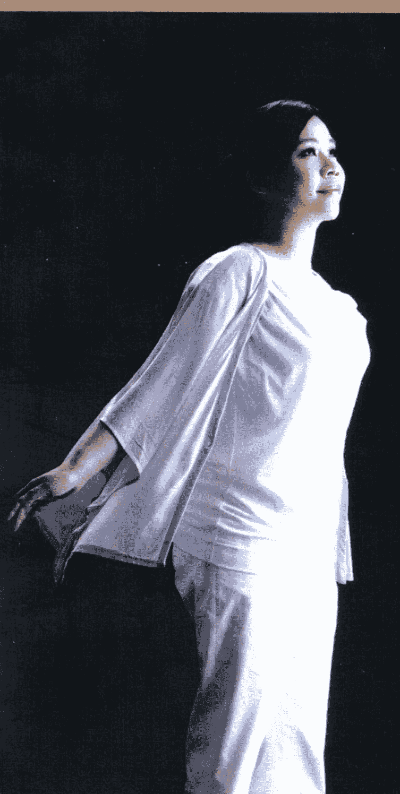

于美人、丹尼爾、唐立淇 心靈推薦

作者 寶靈

走進心靈的殿堂

癒癒塔羅名師寶靈的全新力作。丟掉以往的塔羅觀念從心出發。別以為塔羅只是抽牌、解牌這麼簡單。跟著思者走過這段旅程，你將得到完整的昇華！★一個用塔羅牌與學神秘塔羅，詳見封面招貝。

## St. Royal College
天使神秘学院

+   ※ 专业占卜预测机构
+   ※ 神秘学培训机构
+   ※ 水晶能量研究中心
+   ※ 官方淘宝 : http://strc.taobao.com
+   ※ 官方微博 : http://weibo.com/715104687
+   ※ 新书发布QQ群 : 316790219
+   ※ 购买更多好书请联系院长大天使

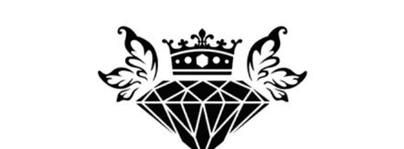

大天使
天使神秘学院 院长
QQ : 715104687
手机/微信 : 13641926204

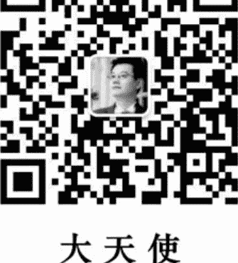

微信公众平台 : strc2011

# 制作说明：

本书由《天使神秘学院》出重金从台湾购入的原版书籍扫描制作完成。为达到最好阅读效果，特地把原版书全部切开后，再经由专业扫描设备高精度扫描完成，并经过一张張的PS后期处理最终成书，其间花费大量的人力、物力以及时间，只为能给大家提供经济并优质的神秘学学习资料而努力。

本学院强力谴责某些机构和个人，把本学院花心血制作完成的电子书籍，包装后直接放在自家淘宝网上低价倾销的行为，以谋取不劳而获的经济利益。如果长此以往最终将无人愿意再为大家花心思制作电子书，那以后可能大家再无新书可读。

为让大家以后能够读到更多的好书，也为了本学院的良性发展。本学院恳请大家尽量做到如下几点：

+   一、尽量在本学院的网站购买电子书籍。
+   二、请勿用技术手段把电子书内的水印及加密去掉。
+   三、在收到电子书后小范围传阅即可，千万不要公开传播，更别挂到淘宝网上低价销售。

同时为答谢广大支持者，学院电子书将做如下调整：

+   一、学院会把一些早已收回制作成本的电子书折价销售。
+   二、最新制作的电子书籍会开放打印功能，大家购买后有条件的可自行打印成书。

天使神秘学院
2017年6月

## 寶靈心塔羅

## 帶領你開啟直覺的 78 堂塔羅課

The 78 Tarot Classes about Intuition.

## 走進心靈的殿堂

想像一座聖潔的殿堂，中間灑下一縷白光，白光散播之處，環繞著和平、愛與喜悅，這是天使的淨化能量。而你，正是這名天使，帶來幸福與希望，在神聖的殿堂中，閃閃發光。

一直以來，很多人對於塔羅牌的精準感到嘖嘖稱奇。沒錯，塔羅牌就像一面鏡，讓人的潛意識顯露無遺。但是塔羅牌不只是占卜工具，更是開啟心靈殿堂的媒介，讓你進行自我探索，更貼近內在靈性的自己。人在生命當中，往往因為吵嚷的聲音與世俗干擾，偏離了最純真的心靈能量。有些人對感情執著、死心眼，工作總是怠惰、提不起勁，對家庭沒有希望、失去信心，但追根究柵，對於自己到底要什麼、追尋什麼，卻回答不出個所以然。當內心布滿濃霧，就容易迷失高層次的自我。

每張塔羅牌背後都蘊藏著人生課題，隨著生命發展，一步一步向前邁進，追尋身心靈的調和與平衡。因此，我在課堂上，除了進行牌義教學，心靈探索與覺察也是不可或缺的部分。搭配塔羅牌背後所隱含的生命課題，我設計了很多心靈成長的搭配課程，期望喚醒學生內在沉睡的天使，找回最純淨的愛與力量，讓這個世界充滿正面能量。

可或缺的部分。塔羅牌背後所隱含的生命課題，我設計了很多心靈成長的搭配課程，期望喚醒學生內在沉睡的天使，找回最純淨的愛與力量，讓這個世界充滿正面能量。

。

## 寶靈

在這本書裡，我們不僅要解碼神秘的塔羅牌，也希望帶領你回歸內心的淨土，擁抱一顆潔白無瑕的天使心。當你撥開層層蒼霧，洞察自己最真實的靈性世界時，便能掌握人生的使命與目的。面對未來種種挑戰，也能從更具智慧的觀點來解讀與克服。請跟隨塔羅牌的腳步，一張、一張，慢慢地揭示靈魂最深層、最宏偉的奧義，你將看到更遼闊的光景。當你看透塔羅深藏的奧義與課題之後，或許會發現，自己的生命中也曾出現過相關經驗。舉例來說，許多人的思維模式與處事態度，其實與童年經驗息息相關，而女祭司與女皇牌便引領我們，探索母親與自己的關係與連結，窺探埋藏在靈魂深處的恐懼與不安，進而體會自己生命當中的不平衡。在整合自己的過程中，經過衝擊與碰撞，靈性的自我會漸漸暴露聲音，最原始的靈魂會開始綻放光芒。具備開闊的視野之後，你會明白宇宙的完美，你將釋放自己、找回內在的平靜，以包容的心態看待萬物生靈。書中使用的塔羅牌是萊德偉特牌的系統，也是普羅大眾最熟知的塔羅牌。在二十二張大阿爾克納牌中，我就每張牌隱含的生命課題，撰寫了「開啟心靈之門」的單元，期望能引領讀者跟我一起進入深層的塔羅世界，傾聽內心最真誠的聲音，找回每個人心中的天使。每學習一張牌，就距離真實的自我更進一步。讓我們一起回到最初的旅程，一起探討不同階段的人生課題！

## 【進入塔羅的世界】

## 透視塔羅牌的架構

塔羅牌是古代用來傳遞訊息的圖像與符號，一說來自於埃及，一說來自於中國，起源眾說紛紛。而目前已知歷史最悠久的塔羅紙牌為威斯康提塔羅牌（The Visconti Sforza），來自於十五世紀的義大利。而本書採用偉特系統的塔羅牌，是目前最為普及的牌種。在偉特牌出現之前，小阿爾克納的牌面上只有數字，就像現在的撲克牌一樣，解讀不易。後來，萊德·偉特（Arthur Edward Waite）在牌面中繪上圖像，讓小阿爾克納的牌義變得更加具體，其中隱含的事件與人物也較容易參透，後世的塔羅牌接著陸續跟進，因此，偉特牌便成了初學者的最佳學習工具，也擁有廣大的使用者。然而，偉特系統與其他塔羅系統不同之處在於，偉特認為數字八為力量的表徵，將8轉個彎，便成了無限大的符號，意味著無限的能量與可能性，因此，便將原本編號八號的正義牌改成了力量牌，而將正義牌歸為十一號牌。現今通行的塔羅牌牌數總共為七十八張牌，可分為大阿爾克納與小阿爾克納兩大部分。大阿爾克納又稱大秘儀，簡稱為大牌，總共有二十二張牌，被視為塔羅牌的主牌。從0號愚人牌開始，一直到二十一號的世界牌，歸納出了人類的生命歷程，也是
宇宙的完美輪迴。每一張牌都是不同的人生階段，也是不同的冒險旅程。每一段旅程的結束，也是另一趟挑戰的開始，死亡的同時也帶來新生。因此，有流派主張在愚人結束旅程之後，應該再多加一張「愚人II」，以象徵完成生命旅程的愚人。也有流派認為，應該將0號愚人牌放在二十一號的世界牌之後。既然被稱為主牌，意味著大阿爾克納已經有很完整的結構，因此，只要懂得大阿爾克納的牌義，就可以進行基本的塔羅占卜了。小阿爾克納又稱為小祕儀，簡稱為小牌，總共有五十六張。小阿爾克納可區分為火、水、風、土四大元素，包括權杖、聖杯、寶劍以及錢幣牌組。每一個牌組包含了十張數字牌以及四張宮廷牌。權杖牌組代表火元素，象徵行動與熱情。聖杯牌組屬於水元素，象徵情感、愛與學習。寶劍牌組屬於風元素，象徵思考與溝通方式。錢幣牌組代表土元素，象徵物質與實踐的力量。整體而言，大阿爾克納隱含的意義深遠而流長，意味著抽象的心靈狀態與精神轉換，可能代表心境的轉化與當事人的價值觀；小阿爾克納則代表具體的事件與人物，我們通常能從數字牌中解讀事件與境況，而從宮廷牌中則區分代表人物，也意味著當事人的性格特徵與處理事情的態度。

## 【整合牌義概念】

## 愚人的旅程——大阿爾克納的循環

從前世到今生，經過生命的淬煉與洗禮，「愚人」就像剛誕生的嬰孩，對世界充滿期待，對未來充滿希望，他的腦中湧現許多想法與主意，於是，「愚人」背起行囊，望向晴朗的天際，準備踏上一段未知的冒險之旅。舉目所見，世界處處充滿新奇，「魔術師」看見未來的種種可能性，他備齊工具，開始運用自身的創造力，與上天建立連結，將腦中的想法與創意付諸實行。理解了外在世界之後，「女祭司」逐漸探索內在的心靈。她漸漸體會到，萬事萬物都具有二元性，正面的另一面就是反面。「女祭司」要用內最敏銳的感知，與自己的心靈對話，貼近靈性的能量。整合了外在世界與內在心靈之後，「女皇」開始經驗生命的可能性，並且享受物質層面的豐饒，她開始感受到愛的能量，她愛人，也希望能獲得回報，當自身擁有一切之後，「皇帝」便開始向外拓展能量，他希望掌握權力，統治世界，而另一方面，也懂得守成，鞏固自己的資源與財富。之後，漸漸傾向心靈成長，從支持家人到關懷眾生，「教皇」展現慈悲的靈性能量，以無私的精神服務他人。在這一連串自我整合的旅程中，愛的能量再次浮現，
找到了生命中的「戀人」，初次體會愛情的甜蜜，與世界產生新的連結與溝通。當愛的層次愈來愈高，使命與目標也會隨之成長，「戰車」帶來動力，在工作中奔波、勞力，以行動來實現夢想。剛。「力量」牌不僅學會了「戰車」的勇氣，也懂得運用智慧，克服內心的恐懼，以柔性的能量征服巨獸。人生至此，經歷過成功、也體會過失敗，「隱者」選擇與自己獨處，回歸自己的內心。他要尋找超越世俗價值的意義，探究生命更高層次的智慧。達到內心的平衡之後，「隱者」整裝出發，生命在一命運之輪中出了新的轉變，人生又再重新開始，出現更高層次的使命。我們在一「正義」牌中學會良好的判斷力，懂得人間的是非善惡與因果報應，能夠找到世界萬物的平衡。而為了尋求和諧與平衡，「倒吊人」面臨生命中的搖擺，他學會反省自己，知道必須捨棄與犧牲，才能自我成長，往下一段路邁進。於是，在一死亡一牌中，徹底地放下過去的束縛，從毀滅中求取新生。到了一節制一牌，學會了融合與調整，進退拿捏得宜，懂得維持團體間的和睦，與夥伴相互合作，共同開創新目標。然而，世界充斥著無限誘惑，物質的慾望正如頭上的枷鎖，於是一惡魔一牌發出提醒，必須擺脫原始感官的慾望，回歸生命中更高層次的價值，找回屬於自己的自由。人生瞬息萬變，過往累積的罪惡能量，如今突然爆發，「塔一牌帶來了毀滅能提醒，必須擺脫原始感官的慾望，回歸生命中更高層次的價值，找回屬於自己的自由。人生瞬息萬變，過往累積的罪惡能量，如今突然爆發，「塔一牌帶來了毀滅能提醒，必須擺脫原始感官的慾望，回歸生命中更高層次的價值，找回屬於自己的自由。

获取更多好书，请加微信 : 13641926204 或 QQ:715104687

## 聖杯牌組

是內在心靈的轉化與循環，聖杯牌組的人擁有滿滿的愛，願意為了愛而付出，甚至犧牲自己，能夠透過給予與服務，獲得心靈上的滿足。這類型的人天生具有療癒的能
量，能夠運用純淨的靈魂感化他人，內在的感知與直覺非常敏銳。
聖杯經常與流動的水相連結，意味著傾聽內在心靈的聲音，重視感覺與靈性，擁有豐富的想像力與創造力，然而，過度情感導向的後果，則容易被情緒牽著走，缺乏
理性判斷的能力。

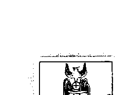

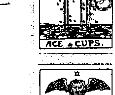

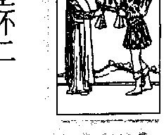

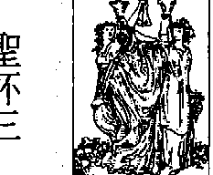

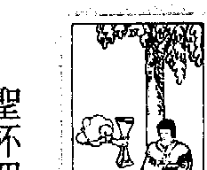

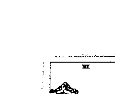

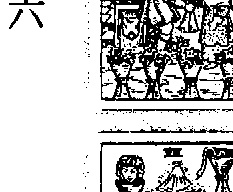

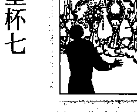

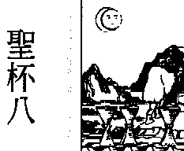

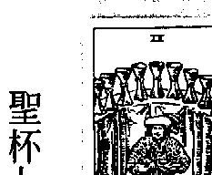

## 【感性的聖杯】

[聖杯一]帶來一段情感，令人感覺到滿滿的愛，而愛的能量讓[聖杯二]找到能夠共度一生的靈魂伴侶，兩人在情感上彼此交流互動，處於平等和諧的關係。到[聖杯三]，進入團體之中，從覺察自己進步到感受他人，開始與朋友一同慶祝生命，分享喜悅。現在，生命中得到了感情，也獲得知己好友，但[聖杯四]不因此而滿足，開始天馬行空地想像，渴望人生出現新的可能性。在充滿幻想，一切都不確定的前提之下，[聖杯五]開始往外尋求新事物，但卻頻頻遭遇挫折，也因此迷失了自己的定位。經過挫敗的洗禮之後，[聖杯六]開始回溯童年的記憶，從中找回生命中最原始的目標與最初的愛。在探索原始記憶的過程中，人生出現許多選項，[聖杯七]必須評估與衡量，做出決定，並找出自己真正的需求。在與內在自我相連結之後，[聖杯八]知道自己真正的渴望，並且提起勇氣，為自己找回缺漏的靈魂。成功找回缺漏的生命之後，[聖杯九]向眾人展示豐收的成果，顯得志得意滿，但卻忘了給予與付出，其實在學會分享之後，成功的喜悅將更加倍，最後，[聖杯十一]達到圓滿的結局，所有心中的渴求都已臻至完美。

## 👑寶劍牌組

## 寶劍一

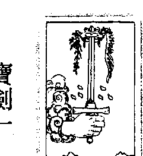

## 寶劍二

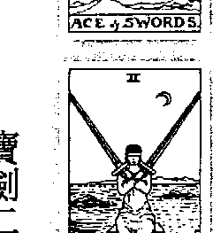

## 寶劍三

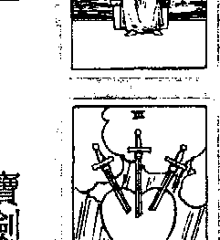

## 寶劍四

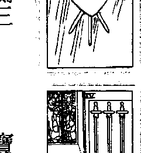

## 寶劍五

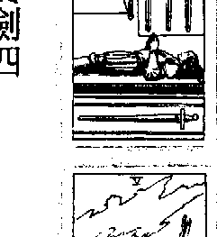

## 寶劍六

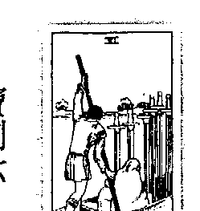

## 寶劍七

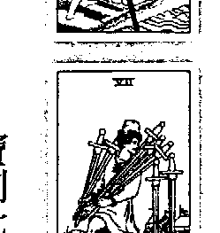

## 寶劍八

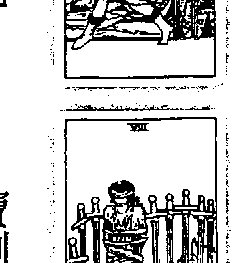

## 寶劍九

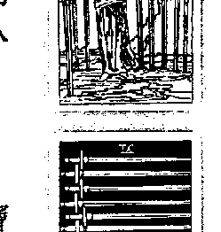

## 寶劍十

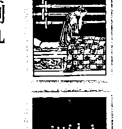

生命中的二元性，帶來衝突與爭執，也意味著生命中的挑戰，寶劍牌組的人擁有清晰的頭腦與理性的態度，懂得先分析情勢、規劃流程，之後才會採取行動，再加上伶俐的口條與溝通能力，是一名優秀的軍師。然而，寶劍的二元性也帶來胡思亂想的能量，會在腦中不斷與自己奮戰、鑽牛角尖，自己與自己作對。

## 【重生的自我】

寶劍具有攻擊與防禦的力量，象徵著傷害他人與自我保護，喜歡競爭的感覺，不輕易顯露自己的情感，也不願意正視生命中的痛苦與哀傷，需要聖杯的能量來中和時刻戒備的心防。寶劍牌組的順序與其他牌組相反，從寶劍十的能量開啟旅程。寶劍十一原先充滿自信，挺身迎向挑戰，卻接連遭受挫敗，被徹底擊倒在地。這段痛苦的回憶造成一寶劍九一的陰霾，人生失去信心，內在存在擔憂與不安，讓他屢屢在惡夢中驚醒。之後雖然狀況逐漸好轉，一寶劍八一已經從床上爬起來，但身旁插滿了利劍，仍舊處於行走肉的階段；一寶劍七則用逃避的方式，不去回首過去的傷痛，表面上看起來似乎已經看開了，但內心卻自我欺騙。在終於學會將痛苦的回憶留在過去之後，一寶劍六一走出自我責罰的關卡，放下在一寶劍十一所受到的傷害。此時，當初在一寶劍七一所逃避的負面能量，在一寶劍五又再度竄出，出現了攻擊與傷害他人的狀況。而一寶劍五一曾經傷害過的人，現在集結起來，決心回頭報復。到了一寶劍四一它才終於體會到，自己必須反省，必須正視曾經造成的傷口，而沉思能帶來療癒的能量。仔細思考過後，一寶劍三二看見了血淋淋的事實，迎來巨大的打擊，也必須鼓起勇氣，才能面對殘酷的現實。靜下心來，一寶劍二試圖找出自己過往的傷痛，下定決心面對與處理。而在徹底放下過往的回憶之後，一寶劍一一終於回歸原始的自我，精神飽滿、思慮清晰，能夠以正面的思維模式看待人生，得之重生。

## 意指物質世界，包括金錢、利益、資產，也意味著控制慾與安全感。不若權杖元素般進展快速，錢幣元素的運作速度緩慢而漸進。這類型的人行事穩重，遵循傳統教條與規範，相信自己的實際經驗，總是腳踏實地，做好自己的本分。錢幣帶有鞏固的能量，渴望安定的生活，對於不確定的事物容易感到不安與焦慮。而這也意味著不輕易變動與改變，容易出现墨守成規、堅持己見，不願意與他人分享的狀況。

## 錢幣牌組

## 錢幣一

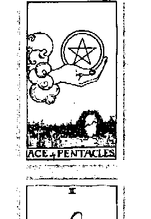

## 錢幣二

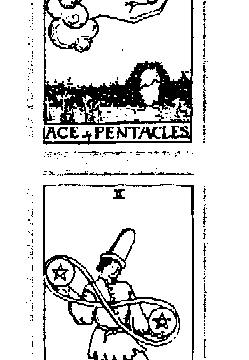

## 錢幣三

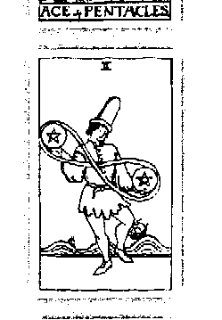

## 錢幣四

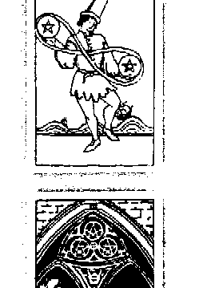

## 錢幣五

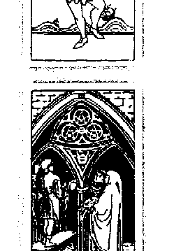

## 錢幣六

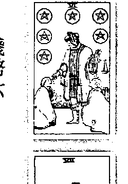

## 錢幣七

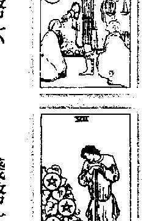

## 錢幣八

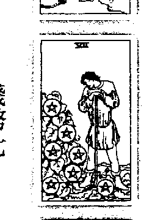

## 錢幣九

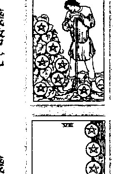

## 錢幣十

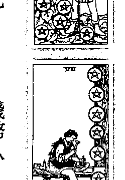

## 【實踐的力量】

一開始「錢幣一」帶來一筆巨大的金錢或資源，對未來目標進行規劃，「錢幣二於是開始操作與運用這些資源，期待將現有的資金發揮最大的價值，但自己的力量發揮地淋漓盡致。經過努力獲得初步的成功之後，「錢幣四」緊抓著手上的金錢不放，沉浸在自己的小世界中，不願意付出與給予。而由於「錢幣四」的自私、隱瞞與保守，讓原本支持的力量一舉消散，接下來的「錢幣五」感到孤苦無依，失去大量資源，之後藉由分享，「錢幣六」重新找回人脈與資源，重獲他人的信任與支持。體會過失去的痛苦，「錢幣七」漸漸懂得珍惜與守成，開始仔細規劃與思考未來的發展。了解生命的方向之後，「錢幣八」心懷踏實的態度，認真努力地為夢想打拼。收成的時刻終於來到，「錢幣九」品嘗到富足的滋味，達到自己階段性的成就，但也突顯出內在對情感的需求，到了「錢幣十一」，終能夠達到物質和諧的狀況，完成當初設下的所有目標。

〔實靈心塔羅〕18

获取更多好书，请加微信 : 13641926204 或 QQ:715104687

## 宮廷家族

在權杖、聖杯、寶劍與錢幣四組元素之下，宮廷牌又分為侍衛、騎士、皇后與國\ n在這四者之中，權杖家族個性樂觀開朗，擁有充沛的熱情與行動力。聖杯家族情
感豐富，具備慈善與寬容的能量，有著強烈的好奇心與求知慾。寶劍家族腦筋靈活、
行事伶俐，喜歡從競爭中獲得成就感，並具有攻擊的能量。錢幣家族個性務實、穩
重，相信實務經驗，重視物質生活的享受。
以耐力來做比較的話，錢幣家族最為穩定，性格也最為堅毅，再來則為聖杯與寶
劍家族，最後則是行事衝動、缺乏耐心的權杖家族。錢幣家族具備務實的態度，能夠
日復一日做著相同性質的事務，維持穩固、良好的工作品質，很適合從事會計、金融
銀行業、公務員等工作。聖杯家族有著藝術天分，具備敏銳的直覺與靈性的內在，個
性安靜而穩定，適合往教育、靈性事業、社會服務、藝術的領域發展。
寶劍家族思慮敏捷，善於溝通，滿腦子鬼點子，適合從事企劃、市場行銷、媒
體，以及與創意發想相關的行業。權杖家族比較缺乏耐心，但具備衝勁與苦幹的精
神，不畏懼挑戰與困難，具有專業技術，適合往生化科技、獸醫的方向發展，也適合
從事戶外的工作，例如業務、服務業。

## 【剖析宫廷牌】

## 侍衛牌組

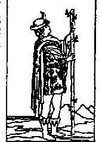

權杖侍衛

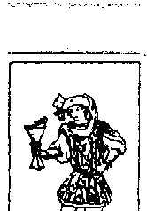

聖杯侍衛

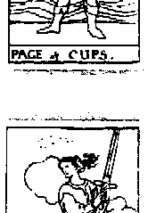

寶劍侍衛

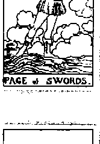

錢幣侍衛

是弟弟、妹妹，通常是指二十二歲以下的年輕人，這可能是指實際年齡，也可能意味著心智與身體年齡。 侍衛屬於風元素，象徵新訊息、新資訊，也代表一件事情的起點。通常新事件生成時，常會出現權杖一、寶劍一或是錢幣一，也可能會出現侍衛牌組。然而，侍衛牌組不像前面幾張ACE牌都有足夠的資源可以運用，侍衛必須白手起家，一步步印，靠自己慢慢摸索。 同時，因為是小孩子，侍衛準身充滿活力與朝氣，一刻也閒不下來。對未來充滿希望與期待，必須不斷吸取新知，透過學習與經驗，慢慢體驗人生。通常抽到侍衛牌的人，不太願意理會旁人的說教，一定要等自己親身經歷，用自己的方法嘗試，經過

## 👑 騎士牌組

騎士是家族中的青年，年紀大約是二十五歲到三十五歲，通常代表家中的哥哥或姐姐，或指有衝勁的年輕人。騎士屬於火元素，充滿了行動力與爆發力，敢衝、充滿力量。騎士的內心充滿對權力的慾望，擁有無比的勇氣與冒險的精神，為了達到目標，願意衝鋒陷陣。騎士對自己充滿自信，相信青春無敵，對未來保持著浪漫的情懷。而騎士牌組中都出現了馬的圖像，也意味著旅行、搬遷與移動的可能。然而，騎士的個性有時過於衝動，常常是劍及履及，沒有事前準備就往前衝遠方的山代表過去曾走過的崎嶇，是人生中曾經歷過的歷練，也是更高層次智慧的探索。而現在，愚人自由了，可以放開過去的束縛，大膽做自己想做的事情。浩瀚的大海代表探索靈性的未知，波瀾起伏的海浪則代表想法中藏著危險與自我創造的陷阱。這是愚人自己創造的危險，當然也必須靠自己的力量化解。上方的太陽代表背後的助力，後方有人支援愚人，在這方照耀他。高山、大海，加上懸崖，這些元素融合後，可見得這趟旅程將會是充滿戲劇化的冒險之旅！愚人後方的小狗面朝左，代表過去的記憶、社會的教條，也是內心的良知。陷入危機時，小狗發出警告，適時地拉愚人一把。另一方面，狗也代表扯後腿的人，不斷在愚人耳邊謊言，將他推入懸崖，這張牌考驗著愚人的判斷能力和內在良知，這是愚者牌裡可能暗藏的危機。
愚者必須體驗冒險，必須在冒險遊戲中成長。愚人心中充滿熱情，只要能挑戰自己，他全都躍躍欲試，並變得朝氣蓬勃。在情感方面，愚人會不顧一切、勇敢追求感情，甚至會不擇手段，直到達到目標為止。愚人是及時享樂者，他樂在當下，不在乎天長地久，因此通常對感情不會有長程的規劃。
愚人牌屬於數字0的能量，0是蛋形符號，象徵宇宙初始的意識，是純粹的靈魂，準備醒醐新生，也是生命的循環；愚人身著小丑衣裳，往往代表搞笑型人物，犯錯對他來說是家常便飯，是個無所謂先生／小姐，對外界的看法不會太在意。表面上，愚人看起來很傻，但其实大智若愚，外顯行為的愚笨是自己保護的機制。特別的是，愚人不管發生什麼事情，都能逢凶化吉。所以抽到這張牌，代表雖然有危險、必須經歷冒險，但都能安然度過危機。

## 解牌關鍵字

感情：有勇氣與毅力追求自己的感情、純真的戀情、希望獲得對方注意力與認同感。

工作：決策大膽、有衝勁。正面臨工作上的困境，但皆能化險為夷。

金錢：大膽投資、無須擔心金錢的問題、享受當下。

心靈：由內在心靈引導直覺，大膽勾勒未來的願景。

## 逆位牌義

愚人喜歡冒險，在生命遊戲中不停創造戲劇化的挑戰，正位牌代表成功的可能性，只是過程不太順利，而逆位牌則表示自己會被自己設下的陷阱斜倒，而無法獲致最後的勝利。

愚人擁有強烈的起始能量，對任何事都懷抱熱情，勇於嘗試新鮮事物。但在逆位牌，可能代表延遲達到目標，甚至表示光有三分鐘熱度，只會畫大餅，實際上卻一點作為也沒有的態度。

逆位牌的愚人做事習慣先斬後奏，當他往前衝時，不會理會旁人的勸阻，更由於愚人及時享樂的樂觀想法，做事往往是不考慮後果，只求當下開心，而導致不好的結果。

## 開啟心靈之門

感情：短暫戀情、不穩定的關係、雙方尚未了解彼此、為了愛情不擇手段。

工作：草率的決定、光說不練、先斬後奏、莽撞的行動。

金錢：錯誤的理財方式、投資歷經波折、遭致虧損。

心靈：透過失敗與挫折體悟生命、感性的大過於理性。

每個人都有自己的禁忌與害怕的事，總有些事物不敢嘗試，有些話總是卡在喉間、說不出口。有時候，人生就是缺乏著一份天真的傻勁，很多事總要試過了，才會知道事情沒有想像中困難。現在，讓我們透過愚人的能量，一起創造生命中的驚喜吧！

在不違背善良風俗、不危害身體健康的前提下，試著拋開往日的限制與束縛，體驗從來沒有嘗試過的事情，例如開始吃辣、坐雲霄飛車、向喜歡的人告白、開會中主動發言…

等，相信自己，勇敢冒險！

或許你仍然對這些事物感到不舒服，但至少試過了，證明自己的確不適合，也或許你的最愛，而勇於嘗試與體驗，正是開啟種種機會與可能性的契機。

# 1 魔術師

# THE MAGICIAN.

在進入下一頁之前，請先凝視牌面30秒，並將你所看到、所感受到的書寫下來。

# Memo

高山、大海，加上懸崖，這些元素融合後，可見得這趟旅程將會是充滿戲劇化的冒險之旅！愚人後方的小狗面朝左，代表過去的記憶、社會的教條，也是內心的良知。陷入危機時，小狗發出警告，適時地拉愚人一把。另一方面，狗也代表扯後腿的人，不斷在愚人耳邊謊言，將他推入懸崖，這張牌考驗著愚人的判斷能力和內在良知，這是愚者牌裡可能暗藏的危機。
愚者必須體驗冒險，必須在冒險遊戲中成長。愚人心中充滿熱情，只要能挑戰自己，他全都躍躍欲試，並變得朝氣蓬勃。在情感方面，愚人會不顧一切、勇敢追求感情，甚至會不擇手段，直到達到目標為止。愚人是及時享樂者，他樂在當下，不在乎天長地久，因此通常對感情不會有長程的規劃。
愚人牌屬於數字0的能量，0是蛋形符號，象徵宇宙初始的意識，是純粹的靈魂，準備醒醐新生，也是生命的循環；愚人身著小丑衣裳，往往代表搞笑型人物，犯錯對他來說是家常便飯，是個無所謂先生／小姐，對外界的看法不會太在意。表面上，愚人看起來很傻，但其实大智若愚，外顯行為的愚笨是自己保護的機制。特別的是，愚人不管發生什麼事情，都能逢凶化吉。所以抽到這張牌，代表雖然有危險、必須經歷冒險，但都能安然度過危機。

## 解牌關鍵字

感情：有勇氣與毅力追求自己的感情、純真的戀情、希望獲得對方注意力與認同感。

工作：決策大膽、有衝勁。正面臨工作上的困境，但皆能化險為夷。

金錢：大膽投資、無須擔心金錢的問題、享受當下。

心靈：由內在心靈引導直覺，大膽勾勒未來的願景。

## 逆位牌義

愚人喜歡冒險，在生命遊戲中不停創造戲劇化的挑戰，正位牌代表成功的可能性，只是過程不太順利，而逆位牌則表示自己會被自己設下的陷阱斜倒，而無法獲致最後的勝利。

愚人擁有強烈的起始能量，對任何事都懷抱熱情，勇於嘗試新鮮事物。但在逆位牌，可能代表延遲達到目標，甚至表示光有三分鐘熱度，只會畫大餅，實際上卻一點作為也沒有的態度。

逆位牌的愚人做事習慣先斬後奏，當他往前衝時，不會理會旁人的勸阻，更由於愚人及時享樂的樂觀想法，做事往往是不考慮後果，只求當下開心，而導致不好的結果。

## 開啟心靈之門

感情：短暫戀情、不穩定的關係、雙方尚未了解彼此、為了愛情不擇手段。

工作：草率的決定、光說不練、先斬後奏、莽撞的行動。

金錢：錯誤的理財方式、投資歷經波折、遭致虧損。

心靈：透過失敗與挫折體悟生命、感性的大過於理性。

每個人都有自己的禁忌與害怕的事，總有些事物不敢嘗試，有些話總是卡在喉間、說不出口。有時候，人生就是缺乏著一份天真的傻勁，很多事總要試過了，才會知道事情沒有想像中困難。現在，讓我們透過愚人的能量，一起創造生命中的驚喜吧！

在不違背善良風俗、不危害身體健康的前提下，試著拋開往日的限制與束縛，體驗從來沒有嘗試過的事情，例如開始吃辣、坐雲霄飛車、向喜歡的人告白、開會中主動發言…

等，相信自己，勇敢冒險！

或許你仍然對這些事物感到不舒服，但至少試過了，證明自己的確不適合，也或許你的最愛，而勇於嘗試與體驗，正是開啟種種機會與可能性的契機。

# 2 女祭司

# THE HIGH PRIESTESS

在進入下一頁之前，請先凝視牌面30秒，並將你所看到、所感受到的書寫下來。

Memo

高山、大海，加上懸崖，這些元素融合後，可見得這趟旅程將會是充滿戲劇化的冒險之旅！愚人後方的小狗面朝左，代表過去的記憶、社會的教條，也是內心的良知。陷入危機時，小狗發出警告，適時地拉愚人一把。另一方面，狗也代表扯後腿的人，不斷在愚人耳邊謊言，將他推入懸崖，這張牌考驗著愚人的判斷能力和內在良知，這是愚者牌裡可能暗藏的危機。
愚者必須體驗冒險，必須在冒險遊戲中成長。愚人心中充滿熱情，只要能挑戰自己，他全都躍躍欲試，並變得朝氣蓬勃。在情感方面，愚人會不顧一切、勇敢追求感情，甚至會不擇手段，直到達到目標為止。愚人是及時享樂者，他樂在當下，不在乎天長地久，因此通常對感情不會有長程的規劃。
愚人牌屬於數字0的能量，0是蛋形符號，象徵宇宙初始的意識，是純粹的靈魂，準備醒醐新生，也是生命的循環；愚人身著小丑衣裳，往往代表搞笑型人物，犯錯對他來說是家常便飯，是個無所謂先生／小姐，對外界的看法不會太在意。表面上，愚人看起來很傻，但其实大智若愚，外顯行為的愚笨是自己保護的機制。特別的是，愚人不管發生什麼事情，都能逢凶化吉。所以抽到這張牌，代表雖然有危險、必須經歷冒險，但都能安然度過危機。

## 解牌關鍵字

感情：有勇氣與毅力追求自己的感情、純真的戀情、希望獲得對方注意力與認同感。

工作：決策大膽、有衝勁。正面臨工作上的困境，但皆能化險為夷。

金錢：大膽投資、無須擔心金錢的問題、享受當下。

心靈：由內在心靈引導直覺，大膽勾勒未來的願景。

## 逆位牌義

愚人喜歡冒險，在生命遊戲中不停創造戲劇化的挑戰，正位牌代表成功的可能性，只是過程不太順利，而逆位牌則表示自己會被自己設下的陷阱斜倒，而無法獲致最後的勝利。

愚人擁有強烈的起始能量，對任何事都懷抱熱情，勇於嘗試新鮮事物。但在逆位牌，可能代表延遲達到目標，甚至表示光有三分鐘熱度，只會畫大餅，實際上卻一點作為也沒有的態度。

逆位牌的愚人做事習慣先斬後奏，當他往前衝時，不會理會旁人的勸阻，更由於愚人及時享樂的樂觀想法，做事往往是不考慮後果，只求當下開心，而導致不好的結果。

## 開啟心靈之門

感情：短暫戀情、不穩定的關係、雙方尚未了解彼此、為了愛情不擇手段。

工作：草率的決定、光說不練、先斬後奏、莽撞的行動。

金錢：錯誤的理財方式、投資歷經波折、遭致虧損。

心靈：透過失敗與挫折體悟生命、感性的大過於理性。

每個人都有自己的禁忌與害怕的事，總有些事物不敢嘗試，有些話總是卡在喉間、說不出口。有時候，人生就是缺乏著一份天真的傻勁，很多事總要試過了，才會知道事情沒有想像中困難。現在，讓我們透過愚人的能量，一起創造生命中的驚喜吧！

在不違背善良風俗、不危害身體健康的前提下，試著拋開往日的限制與束縛，體驗從來沒有嘗試過的事情，例如開始吃辣、坐雲霄飛車、向喜歡的人告白、開會中主動發言…

等，相信自己，勇敢冒險！

或許你仍然對這些事物感到不舒服，但至少試過了，證明自己的確不適合，也或許你的最愛，而勇於嘗試與體驗，正是開啟種種機會與可能性的契機。

# 3 女皇

# III

# THE EMPRESS.

在進入下一頁之前，請先凝視牌面30秒，並將你所看到、所感受到的書寫下來。

Memo

高山、大海，加上懸崖，這些元素融合後，可見得這趟旅程將會是充滿戲劇化的冒險之旅！愚人後方的小狗面朝左，代表過去的記憶、社會的教條，也是內心的良知。陷入危機時，小狗發出警告，適時地拉愚人一把。另一方面，狗也代表扯後腿的人，不斷在愚人耳邊謊言，將他推入懸崖，這張牌考驗著愚人的判斷能力和內在良知，這是愚者牌裡可能暗藏的危機。
愚者必須體驗冒險，必須在冒險遊戲中成長。愚人心中充滿熱情，只要能挑戰自己，他全都躍躍欲試，並變得朝氣蓬勃。在情感方面，愚人會不顧一切、勇敢追求感情，甚至會不擇手段，直到達到目標為止。愚人是及時享樂者，他樂在當下，不在乎天長地久，因此通常對感情不會有長程的規劃。
愚人牌屬於數字0的能量，0是蛋形符號，象徵宇宙初始的意識，是純粹的靈魂，準備醒醐新生，也是生命的循環；愚人身著小丑衣裳，往往代表搞笑型人物，犯錯對他來說是家常便飯，是個無所謂先生／小姐，對外界的看法不會太在意。表面上，愚人看起來很傻，但其实大智若愚，外顯行為的愚笨是自己保護的機制。特別的是，愚人不管發生

## 厭惡一成不變。三是一加二，一是魔術師的能量，有創造力，二是女祭司的能量，深具美感及更多的想像力，而三的能量則能將這些元素全部實現。爲什麼要實現這些目標呢？因爲抽到女皇牌的人傾向藉由了解別人的感受來證明自己，所以喜歡頻繁地跟別人互動。一旦不被別人在乎的時候，女皇很容易就變成反向的，能量便開始慢慢消逝、耗損，此時他們身邊的人就無法好好過生才能更深刻地證明自己的存在。這就是數字三的能量，是一種大起大落的能量，喜歡玩人際關係的把戲，所以有可能成就人際關係，也可能毀壞人際關係。女皇本身是個腳踏實地的人，一步一腳印讓自己的生命更充實完整，也代表媽媽或女性，常是一位成熟的女性，她有很好的謀生能力，有很豐富的能量，甚至行有餘力，可以幫助別人。抽到這張牌，在財富方面，表示錢財富足，衣食無缺；工作方面，表示事業蒸蒸日上，財源滾滾來。女皇牌也跟結婚、懷孕有關，出現這張牌通常表示感情穩定、結婚或者懷孕。受到天秤座金星的能量影響，女皇牌的象徵人物通常代表外型美麗，有藝術天分，喜歡接近大自然。女皇牌具備金星的能量，擁有創造力、表達能力和豐富的靈感，屬於社交型的人物，適合從事設計師、美容業、廣告、公關、服飾業等所有與美有關的職業。代表的身體位置為喉嚨、下巴、腎臟、內生殖系統和淋巴系統。

## 寶靈心塔羅} 48

## 解牌關鍵字

感情：成熟而有智慧的爱情、希望獲得回報、穩固滿足的關係，有結婚或懷孕的可能。

工作：腳踏實地、極富創造力、獲得成就與財富。有藝術天分，適合從事與美相關的行業。

金錢：衣食無缺、財源滾滾、獲利、賺錢。

心靈：內心充滿生命力、擁有愛與美的能量、希望吸引他人的目光、喜歡貼近大自然。

## 逆位牌義

女皇很願意釋放自己的母性、照顧別人，不過同時，她也希望別人看到她的努力，證明自己

的存在感，是一種被需要的感覺。正向的女皇會照顧別人，把別人呵護得很好；相對地，逆向的

女皇會給人一種被監視的感覺，或是做得半死，卻沒有得到一絲毫的回饋，甚至還不被珍惜。

女皇牌跟所有美的事物有關，這是因爲她希望自我實現，希望知道自己在哪裡，知道自己存

在的價值是什麼。女皇會透過創造力、透過美的事物，讓自己跟別人好好相處。逆向的女皇會積

極地吸引別人的注意力，有可能會說一些不好聽的話，去攻擊別人；也可能做一些很誇張的事

情，好讓別人注意到她，甚至選擇自我毀滅，好證明自己的存在。

逆向的女皇牌在工作上可能代表打腫脹充胖子、負債、貪慕虛榮、好高騖遠。感情上則要小

心無法付出真心去愛別人，或因為過於竊竇而導致戀情失敗，還要注意意外的懷孕，甚至是未婚

生子。

## 解牌關鍵字

感情：努力付出卻不被珍惜、驕縱任性、無法付出真心、外遇醜聞、強烈的性渴求、意外懷孕、

未婚生子。

工作：個性懶惰、不願意付出努力、過度招搖、招致口舌是非。

金錢：強烈的物質慾望、貪婪、負債、打腫脹充胖子、愛慕虛榮。

心靈：內心充斥慾望、對現狀不滿足。

## 開啟心靈之門

心，傷害你的種種回憶。可是，如果母親就要離開這個世界了，今天，是她在世界上的最

後一天，你想對母親說什麼話呢？

想像媽媽現在就在你面前，在她生命最後一天，她會是什麼模樣呢？她會有什麼話想

對你說呢？靜下來，給媽媽一點時間，感覺在這個時候，她會想跟你傾訴些什麼呢？

接著，換你告訴媽媽你的感覺了，告訴媽媽，你曾經在哪時候受過傷，對她不諒

解、懷抱著恨；告訴媽媽，你愛她嗎？你恨她嗎？你對她還有其他感覺嗎？你願意告訴她

噸？把你所有的感覺全部告訴媽媽，用你自己的方式，不要讓自己有遺憾，珍惜每一個交

換感覺的機會，把你的感覺都告訴媽媽吧！

## # 4 皇帝

THE EMPEROR.

在進入下一頁之前，請先凝視牌面30秒，並將你所看到、所感受到的書寫下來。

Memo

## # 牌義解析——統治世界的慾望

皇帝象徵著父親的能量，掌握生殺大權，为了想鞏固的目標，他會奮不顧身、向前奮戰。然而，儘管擁有至高無上的權力，安全感卻始終匱乏，於是皇帝為自己築起了一層保護色，正如外表華麗的衣裳，掩藏內心的自己。

皇帝位高權重，右手握的球是全世界，而左手所持的寶杖是肉體與靈性的界線，也是行動力和無上的力量。他不只緊緊抓住權威，還想擁有全世界的力量。頭上的皇冠如同皇后項上的皇冠，象徵身、心、靈的結合，皇冠上鐵嵌的珠寶也是權威的表徵，表示皇帝的尊崇地位，不容侵犯。皇帝身著華麗的外衣，卻遲遲不肯脫掉內在的盔甲，時時處於備戰狀態，無法放鬆，只要有

人侵入領土，他一定會向前殺個片甲不留，即使筋疲力竭也在所不惜。盔甲也是皇帝自己建構的堡壘，他不會輕易顯露自己的情緒；但是紅色的華麗外袍卻說出了他內心的秘密，其實皇帝內在熱情如火、有行動力，行事主觀，是個很有主見的人。然而，紅色外衣也透露了，皇帝具有攻擊

性，一旦自己辛苦建立的家園遭受襲擊，此時的皇帝的侵略性可不容小覬。背景紅中帶橘的能量也象徵著皇帝內心的情緒化，堅強的外表轟殽下，其實藏著一顆感性的、甚至有點脆弱的心。石椅上有兩頭公羊，代表牡羊座的能量，他行事快速，具備很强的行動力以及規範自己的能

量，這代代表了遵守社會律法、戒律，也透露出皇帝嚴肅、不苟言笑，以及重承諾的一面。背後嚴峻的高山代表了層層難關、種種挑戰，不是皇帝挑戰別人，就是別人挑戰他，女祭司面臨的二元衝突，到皇帝牌仍然存在。

因此很有自信，覺得自己與眾不同，相對地，也需要獲得他人的尊重和關注，所以抽到皇帝牌的男性是非常需要被認同和尊重。時，他會另覓良緣，完全不受控制。通常皇帝的伴侶都是因為皇帝身上散發的那股安全感，而深著迷；然而，如果在一起之後沒有自我揚升，或是想跟皇帝玩控制、掌控的把戏，兩人的關係就會開始變質，皇帝會變得花心，完全超出當初所預料，所有情感剎時變成一場遊戲一場夢。面對皇帝，你需要用讚賞的角度看他，深入他華麗外袍內在的心靈，你會發現，皇帝其實很可愛。抽到這張牌的人，人生走到皇帝這一階段，通常是很成功的，要讓他更上一層樓，必須給予他更多的安全感，用正面的話語鼓勵他，否則他很容無理取闖，不安全感和恐懼隨時會襲擊

識很强，有時候會聽不進去他人的建言，一旦有人忤逆他，他就會極力反駁。這種人擁有權力，皇帝是典型的父親形象，通常是權威者、政治人物，或者是事業有成的男人。皇帝的主觀意

因為皇帝永遠都需要被注意，當他的另一半沒有改變、安於現狀，沒有伴隨他一同成長

予他更多的安全感，用正面的話語鼓勵他，否則他很容易無理取闖，不安全感和恐懼隨時會襲擊

### # 解牌關鍵字

感情：負責任的承諾、穩固的關係、喜歡身體碰觸、需要安全感、照顧家庭，也代表早婚。

工作：行事謹慎、負責、學習能力良好、愛面子、嚴肅、理智，代表事業有成與達成目標。

金錢：鞏固既有的資源與財富、定性強、穩定的賺錢能力。

皇帝的內心。出現皇帝牌的人其實很浪漫，只是不會隨便表現在他人面前。他愛你，口頭上不會

明謀，但其實內心已翻騰不止。皇帝很有責任感，如果抽到這張牌的人賺錢能力不足，他會覺得

格外痛苦，因為心中那份責任感無法放過自己，此時要鼓勵他承擔責任，幸福便會隨後報到。

想要鞏固的東西，當他有一個目標的時候，會用自己習慣的方式去追求，通常會採取最安全的方

式。數字四的人觀念很保守，甚至有點固執和偏激，他不會出現想追求新事物的念頭，改變對他來說太危險了。

抽到這張牌的人擁有很好的學習能力，但是愛面子，極力維護自己的尊嚴，做事理智，他不願意低聲下氣、做拋頭露面的工作。許多具有皇帝特質的人要不然不做，要不然就是一鳴驚人。

他的自尊心很強，不願意改變，要軟弱可以軟弱很久，也可能突然發奮圖強。

皇帝牌的代表人有軍人、政治人物、企業家、法官、工人、運動員。因為牡羊座的能量，其中也不乏身材壯碩的壯丁和肌肉男。

## # 逆位牌義

# 心靈：充滿自信、希望獲得認同與尊重。

抽到逆位的皇帝牌，雖然也有顧家、愛家的認知，但卻沒有這樣的能力，只好向自己屈服，可能變得負債累累、打腫臉充胖子、說大話，具有攻擊性。正位的皇帝是個嚴肅的父親，為人正直，說一是，說二是。

一，說一是，說二是。而逆位的皇帝會變得不成熟、意氣用事，做事沒有效率，好高驕遠，不願意從頭學起。逆位的皇帝總是難忘過去的傷痛與回憶，行事小心翼翼，可能過於悲觀，眼中只看到事情的負面，甚至有些消沉。個性傳統守舊，忘記前瞻未來，皇帝的主觀如果放在逆位，有時候會過於堅持己見。這張牌也代表責任感，逆向的皇帝則代表不負責任，或者沒有負責任的能力，心有餘而力不見。這很痛苦，於是他會轉移注意力，可能會外遇或從其他人身上擷取注意力，而荒廢了自己原本應該做的事情。然而，這樣一來，原本不想擔負責任的舉動，無形中卻又會帶來更多責任。如果逆位的皇帝自尊心太強，認為自己無法承擔責任，我們要給他鼓勵和自信，幫助他勇敢面對生命中的考驗。代表的身體位置為肌肉組織、反射神經、外生殖器、血液和膀胱，抽到逆位的皇帝牌要小心高血壓和秃頭的問題。

### # 解牌關鍵字

感情：無法許下承諾、幼稚的感情觀、大男人主義、不負責任。

[PAGE 58]

## # 開啟心靈之門

皇帝在牌陣中也代表著父子關係，想一想，你對父親的感覺是什麼？父親是否正如皇

帝牌中的形象，固執、不苟言笑，甚至有些嚴厲？還是你的父親與眾不同，反而充滿女皇

的溫暖能量？想像一下，從出生到現在，你對父親所有的不愉快，父親曾經和你起過爭執

嗎？你認為父親曾經錯怪你，彼此之間無法溝通，甚至造成不可挽回的後果。

你後悔嗎？還是至今仍不能原諒父親？想像一下，如果父親即將離開人世，今天，是

他在世界上的最後一天，你想對父親說什麼話呢？靜下來想一想，深埋在彼此心中，你與

父親之間有哪些難以啟齷的祕密？今天，就勇敢地說出來吧！

說完了心中封藏已久的祕密後，敞開心胸的父親，對你回應些什麼呢？此時的父親看

起來是不是跟平常不一樣了呢？是穿著盔甲嗎？還是坦然地向你吐露心聲呢？

彼此交換心情之後，請真誠地告訴父親，你愛他嗎？你恨他嗎？還是有其他不同的感

覺？全部告訴父親吧！將內心潛藏已久的話語，通通向父親傾訴吧！

## # 5 教皇

在進入下一頁之前，請先凝視牌面30秒，並將你所看到、所感受到的書寫下來。

Memo

## # 牌義解析——傳送靈性的光芒

教皇是傳道者，是長者、是智者，是師長型的人物。右手的勢與神祕學相關，代表祝福眾生，傳遞靈性、智慧和好的能量。左手所持的三叉權杖代表身體、心靈和靈魂層次，權杖賦予教皇敏銳的直覺，讓他能夠接收上天良善的能量，智慧讓他解碼訊息，進而賦予追隨者力量。你有没有發現，教皇右手向天，左手持權杖，跟魔術師竟有幾分雷同，兩者同樣具備強烈的直覺，皆能接收宇宙間無上的能量。然而，之前的魔術師只能淬煉自我，走到教皇的階段，他不僅能獨善其身，還有更多的能量，可以啟天下。教皇胸前的銀色十字架代表心靈和陰陽調和，與煉金術環環相扣。煉金術在古代能點石成金，在現代的意義則是意識的轉化，從無到有、從不可以變成可以，改變生命中的不可能，創造

奇蹟。教皇以身體的實踐來提升內在的智慧，他無欲無私，願意犧牲奉獻，擁有寬大的愛；然而，身上穿著紅色的外袍卻讓教皇陷入搶扎。紅色代表權力、慾望和權威，表示內在潛藏著對權力的渴望，這跟教皇的形象相互衝突

## 解牌關鍵字

感情：樂觀的感情、完美的愛、和諧、互相信任、浪漫、鞏固的關係、受到祝福的感情，感情

面臨考驗，但無須擔心。

工作：面臨重大抉擇、尋求合作關係、注重道德觀、有貴人出現、良好的人際關係。

有神經系統、手、肺部、支氣管。

分析能力很强，溝通能力佳，適合從事記者、編輯、作家、翻譯、電子資訊業。代表的身體位置

有神經系統、手、肺部、支氣管。

分析能力很强，溝通能力佳，適合從事記者、編輯、作家、翻譯、電子資訊業。代表的身體位置

抽到這張牌可能代表戀愛中的人、天真的入、婚姻、約定。戀人牌有水星和雙子座的能量，

的，先去愛別人，自己才會得到愛。

愛。愛要有肉慾、物質，也需要靈魂之間的溝通，必須相互珍惜，學著接納、包容。愛是無條件

像母親一樣，燃燒自己的生命，讓對方成長。戀人牌的能量是付出一切地去愛，是一種高層次的

訊息，這種能量會讓女人的腦子不斷運作，有時會想太多。知識樹的女人通常會付出的比較多，

男人是生命之樹，他擁有活力、力量，不斷往前跑；而女人是知識之樹，傳達資訊、也接收

重重難關，重新享受和迎接彼此的愛。

果。當中間的高山出現，兩人關係中浮出挑戰，這就考驗著彼此是否願意坦承真正的自我，突破

與陽的調合，平衡彼此的能量。然而，兩人的關係總敵不過外界的誘惑，這也是兩人關係中的禁

戀人牌中的愛是融為一體的愛，在愛中不分你我，萃取出愛的最高品質。兩人世界融合，陰

在著彼此間信任程度的考驗。

## 逆位牌義

心靈：探尋真實的自我、找回純潔的心靈。金錢：利益的誘惑、從合夥關係中獲利。亞當與夏娃禁不起蛇的誘惑，而偷嘗禁果。兩人關係中，在愛的道路上可能布滿許多陷阱與誘惑，如果抽到逆位的戀人牌，代表其中一方被物質或其他誘因所迷惑，讓兩人關係出現破洞，這也可能衍生到其中一方的不坦承，對真實的自我不誠實，或者對對方不誠實。男人女人一右一左地站著，在逆位時象徵雙方各執一詞，各堅持不同的立場，導致彼此溝通未果，無法達成共識。對於戀人牌愛的能量，逆位時，在關係的处理上會過度忠誠，容易內疚、有罪惡感，甚至會盲目地犧牲自我，缺乏自信。在人際關係上，因為雙子座的能量，逆位的戀人牌通常代表三姑六婆，喜歡說長道短，有時候會惡意中傷他人，守不住秘密。

## 解牌關鍵字

感情：盲目犧牲自我、占有慾過強、彼此不信任、缺乏自信。工作：言語紛爭、溝通方面出問題、無法達成共識、容易自責內疚。金錢：因為利慾薰心而做出不當的舉動。心靈：自我內在的不誠實、心中感到矛盾與搶扎。

## 塔羅神話故事

亞當與夏娃是最經典的神話故事，也是傳說中男人與女人的雜形。上帝派遣亞當看守

國中的善惡之樹，並從亞當身上拔了一根肋骨，創造了夏娃，讓他們彼此相互作伴。不

料，邪惡的撒旦幻化成蛇的形體，誘惑夏娃偷嘗禁果，亞當隨後也大啖樹上的果實。善惡

之樹的果實遭到偷採，上帝發現之後勃然大怒，忿忿地質問亞當是誰偷吃了禁果，亞當連

忙撤清，直說是夏娃的錯。而夏娃也急得辯解，還將責任全推給了當初慫恿兩人的蛇。上

帝當然不是省油的燈，他不僅將蛇的四隻腳摘去，還懲罰亞當必須終生勞動以得食糧，而

夏娃則必須經歷分娩之苦。這個故事也點出了彼此間信任的問題，當兩人的關係出現了謊

言，中間的山便會愈顯茁壯，而彼此的距離就會愈來愈遠。唯有面對真實的自己、信任對

方，不要吝於付出，以正面思想看待兩人關係，懷人牌愛的能量才能發揮最大的效用。

## 7 戰車

在進入下一頁之前，請先凝視牌面30秒，並將你所看到、所感受到的書寫下來。

## 牌義解析——熱血征戰與勝利

也願意很積極、很認真地處理事情，運氣都團繞在他身上，所以不管做什麼事，都會很順利。有了戰車，表示具體行動，為夢想努力，讓夢想偉大。而車子也象徵著生命中的業力，代表事情會不斷輪轉，週而復始地一再發生。戰車頭頂的斗篷布滿了星星，代表戰士為了完成夢想，夙夜匪解、努力奮鬥。而星星的走向與戰士同一陣線，象徵運氣也站在他這邊。

戰士手握的權杖，是魔術師的權杖，象徵擁有強大的能量，只要願意開始行動，就能獲得功。戰士肩膀上的兩彎明月，代表女祭司腳下的月亮，帶來一股衝勁，讓戰士可以運用直覺，引導他朝向想要的方向大步邁進。戰士身著的盔甲，與皇帝身上的盔甲相同，代表癡於備戰狀態，

我，駕著戰車、向前奔馳，為了我的夢想、我期盼已久的目標，一舉向前衝。我何等幸運，獲得宇宙間能量的環繞，擁有令人稱羨的資源與支持，萬物齊備。等著吧，等著，待我凝聚恢弘的門志、磅磚的意志力，我的力量將無懈可擊。

準備大展身手。而同時，盔甲也是戰士的保護色，他有很強烈的防衛心，處事小心謹慎。當他應
戰時，他認為從前自己在哪裡傷害過別人，別人就有可能在同樣的地方攻擊自己。這點讓戰士無
論對人對事都很主觀，常常以刻板印象來看待他人。
戰車背後的城堡代表一種後盾，通常抽到這張牌的人身後擁有很多支持的力量，或是本身資
源很富足；同時，高聳的城堡也象徵一種壓力，戰士奮戰的同時，不只是為了自己，也帶著他人
的期望向前衝。戰士胸前的□，是埃及符號，代表生命是一種學習的過程，會帶給你成長的經
驗。
戰車下方有兩隻人面獅身，獅子代表力量，也象徵鞏固目標的理想。兩隻人面獅身都有很明
顯的乳房，這代表著外在資源的充足，抽到這張牌的人，不知不覺地，就能獲得周遭人的支持。
還記得女皇牌嗎？女皇擁有足夠的資源，但仍欠缺某些能量，女皇只獲得剛好的能量，可讓他去
創造新事物。而戰車牌擁有更多，已經有人幫忙把路鋪好了，只是他自己要選擇，要站在哪一
邊，這個階段必須經過一段內心的拉扯。兩座人面獅身白中帶黑、黑中帶白，陰陽相互循環與週
轉，象徵著二元衝突，也是理性與感性的碰撞。再看，兩隻人面獅身各自面朝不同方向，代表雙
方立場的對立，也代表面臨多方的好處，必須選擇其中一個。
這也會出現一個矛盾的狀況，當戰車決定往前走，眼前有兩個人都向他招手，兩個選項似乎
都不錯，到底該選哪一邊？抽到戰車牌的人雖然能量強大、資源豐富，運氣也很棒，但在行動前
總是猶豫不決。在衡量自己的抉擇時，如果以利益為考量，不斷防衛他人，用刪除法除去看似對

[PAGE 74]

## 解牌關鍵字

感情：擁有不放棄的精神、努力取得對方的歡心、以真心打動對方、能夠擊敗競爭者。

工作：堅定的意志力、行事謹慎、有靠山與支持的力量，只要正面迎戰便能實現夢想，有海外發展的機會。

跟田宅、生活起居方面有關，適合從事廚師、幼稚園老師、護士、旅館業和不動產。

戰士牌擁有巨蟹座的能量，跟月亮息息相關，他們擁有照顧他人的氣場，具備柔性的力量，

跟田宅、生活起居方面有關，適合從事廚師、幼稚園老師、護士、旅館業和不動產。

感情：擁有不放棄的精神、努力取得對方的歡心、以真心打動對方、能夠擊敗競爭者。

工作：堅定的意志力、行事謹慎、有靠山與支持的力量，只要正面迎戰便能實現夢想，有海外發展的機會。

## 逆位牌義

金錢：富足的金錢、豐富的資源。 心靈：充滿奮戰的精神、相信自己一定能獲勝。

如果抽到逆位的戰車牌，要小心行事過於急躁，容易倉促決定事情。由於月亮的能量影響，逆向的牌位也代表情緒突然崩潰、無法面對現實的層面。要注意過去的傷痛所帶來的影響，可能會蒙蔽了自己的情緒，而無法在生命中做出正確的決定。反映在情感方面就是一廂情願的情感或 是單戀，會受焦急、挫折感和壓抑感之困擾。不過不用擔心，這種人在生命中受到多大的挫折，他就會有多少能力可以發揮。工作方面，逆向的戰車牌可能會被名利沖昏了頭，通常是工作狂、 拼命三郎。這時的他必須體認，生命中必須做出改變，不要只是一味的盲從，漫無目的地衝。 通常抽到戰車牌，他現在會面臨一些挑戰，而且這個人面對挑戰時，是興致勃勃的，不帶有一絲絲恐懼，會勇於迎接考驗。而逆向的戰車牌則會有兩種可能，一是未戰先衰，對自己沒有自信，覺得自己無法獲得勝利，還沒開戰就先往後退了；二是沒有衡量清楚自己有幾分實力，就橫衝直撞地上前搏門，迎戰後才發現自己無法勝任。代表的身體位置有雙乳之間、子宮、腸胃，如果抽到逆位牌，要小心腸胃方面的疾病，可能是暴飲暴食或是厭食等狀況。

## 解牌關鍵字

## 開啟心靈之門

感情：一廂情願、單戀、情緒突然崩潰、面臨挫折、強烈的防衛心。

工作：出現對立聲浪、猶豫不決、沒有準備好就行動、匆促下決定、過於主觀。

金錢：內在出現拉扯、焦慮與不安、面臨二元衝突。

心靈：內在出現拉扯、焦慮與不安、面臨二元衝突。

戰車牌的人很幸運，他獲得外界的支持，擁有富足的資源，通常在物質層面是不用愁的。然而，自己呢？自己真的知道自己內心的想法嗎？戰車牌也代表著自我檢視的課題，讓我們透過感受食物的能量，進一步了解自己內在的需求。當你吃下食物時，可以靜下心來，去感受其中包含了哪些食材、食物的能量，食物的烹調方法、有哪些調味料等等。這時，透過嘴巴、舌根，經過食道到胃，你會感應到食物的能量，食物會傳遞某些訊息給你，而你的身體也會有所回饋。食物能量的高低並沒有絕對值，有的東西乍看之下是垃圾食物，可是卻能帶來快樂。好的能量會帶給你活力，有時候，如果食物要傳達的訊息，剛好是你抗拒的部分，反而你會覺得有一點昏昏欲睡。因此吃東西的時候放慢速度，深深刻地去體會食物蘊含的能量，反覆練習後，你會找出最適合自己的食物能量，讓你更了解內心真正的渴望與需求。

## 天使神秘学院官方淘宝 : http://strc.taobao.com

## VIII

## STRENGTH.

## 8 力量

在進入下一頁之前，請先凝視牌面30秒，並將你所看到、所感受到的書寫下來。

Memo

## 牌義解析——以柔克剛的能量

力量牌上的年輕女性，一臉安詳，毫不恐懼地撫摸著獅子，用柔性的力量，馴服了這頭猛獸。在 少女的輕柔安撫之下，凶猛的獅子刹那間化做溫馴的貓咪。這裡的少女看似柔弱，卻擁有無比的 勇氣和智慧。她很清楚，硬碰硬絕對會兩敗俱傷，讓自己傷痕累累。於是，她發揮自己柔性的力 量，運用反向思考，來解決目前的阻礙。通常抽到這張牌，當面臨生命中的難關時，試著反其道 而行，會得到意想不到的好成果。 獅子最讓人感到害怕的，就是那一口尖牙，而少女的手卻毫不遲疑地，向獅子的嘴巴伸去。 這代表著擁有不同凡響的勇氣，愈是高難度的挑戰，就愈想去征服。在這裡獅子代表著權力慾

生命中，一波一波的碰撞和阻礙向我襲來，每一次的衝突都更加 賴難。然而，看似無法征服的巨獸，我絲毫無所懼。我挺身而出，從 最困難的癒結點著手，用勇氣和無限的愛，轉圜所有不可能。

[PAGE 79]

了難關。少女要如何穿越這頭獅子的阻礙呢？她必須先觀察自己與獅子之間的關係，她要知道自
己內心的渴望，確認自己的自信和安全感，才能馴服這頭獅子，讓這個阻礙變成生命中不斷前進
的動力。
少女的頭上有著無限大的符號，這是力量與智慧的表徵，也是一種與生俱來的能力，在生命
中無止盡循環與變化的能力，也暗喻著未來無限發展的可能性。少女頭上與身上的花環代表榮
耀，與上天的能量做連結，以花環引導獅子做出正向的動

## 松果體主掌人的直覺力

松果體主掌人的直覺力，隱者手上星星擺放的位置，正對於脖子和後腦勺之間，也表示和身體內松果體的連結，間接啟發出隱者的直覺力，引導著生命的方向，也揭發靈性的訊息。六芒星點出了隱者的智慧，隱者很聰明，他很清楚自己內在的想法，知道自己要什麼，甚至還知道該如何得到，只是，隱者還在整合自己，目前的他看似封閉沉靜，等他準備就緒，他就會跳出來，完成身上的使命。隱者手上的權杖是攀登高山的輔助工具，代表隱者行事深思熟慮、小心謹慎，這也象徵隱者不全然封閉自己，而權杖就是他與外界唯一的連結，可以幫助隱者試探未來的方向。隱者站在高從獨居生活中得到智慧，未來才有蛻變的可能。山上，而且是結霜層層的冰山上，有幾分高處不勝寒的意味，代表遠離人群，讓自己內在孤獨，隱者屬於九號牌，代表慈悲、大愛，以及人道主義。要讓隱者解決自己容易封閉自己的狀態，他需要他人的慈悲與包容；同時，他也必須對自己慈悲，寬容自己之前曾經犯下的錯誤。這是能讓隱者放下束縛、返回人群的一個重要因素。隱者身上的外衣點綴著些許黑色，黑色代表療癒，象徵他必須經由療癒自己，讓自己走出來。隱者代表一個聰明的人、獨居者、模範生或是有智慧的長者，他對自己的要求很嚴苛，有時候會懷疑別人，也會懷疑自己。他追求完美主義，會讓自己處於過度完美的狀態中，不讓自己有任何一絲絲的污點。這種人無論做什麼事都會全力以赴，而且擁有別人所沒有的高標準。

如果在情感方面抽到這張牌，代表目前必須冷靜下來，仔細思考自己想要什麼？應該怎麼做？需要給自己留一些空間，不可以太過依賴對方。可以考慮彼此一陣子不要聯繫，靜下來之後，答案自然呼之欲出。也可能代表這個人想法很奇怪，令人抓不著也摸不清，因為彼此的頻率不同，對方想很多，想到連心都飄走了。你必須給對方很多時間和空間，對於隱者你無法急躁，隱者牌也代表著思維運轉非常快速，覺得沒有人了解自己，常常覺得別人很怪，別人也覺得自己很難懂。具有正面力量的隱者則可以很清楚的了解自己的想法，有個人的觀點、不盲從，自己知道自己在做什麼。生命是没有答案的，隱者需要不斷探索，讓自己變成一道光，就像手上的六芒星一樣。隱者透過分析處理、透過很多細節，讓自己不斷成長，適合從事的工作有寫作、電訊業、會計、財務管理相關工作。另外，因為隱者不想讓形象曝光，所以也跟整型相關的工作有關。代表的身體位置有腸胃、胰臟、腎臟，隱者牌也和傳染疾病有關，單張牌傳染的意味不重，不過一旦搭配到女祭司或是月亮牌，就必須小心傳染方面的疾病。

### # 解牌關鍵字

**感情**：保護自己、害怕受傷、需要獨處的時間、不可過於依賴、給對方多一點空間。

**工作**：小心謹慎、注重細節、從反省中進步、面對現實、得到自我滿足。

**金錢**：有很好的賺錢能力、不取不義之財。不為了賺錢而賺錢，探索獲利背後的意義。

## 隱者代表深層的智慧

隱者代表深層的智慧，透過不斷的內省和沉靜，獲取更高境界的意識。不過逆位的隱者則會思考太多，自己扮演內心戲，常常庸人自擱。隱者也可變得很焦躁，沒辦法安靜下來，也無法停止思考，導致他没有改變的勇氣，這時候，做出決定是很好的選擇。

隱者選擇跟自己獨處，選擇孤獨，但是如果抽到逆位，就表示他獨居，卻無法享受一個人的快樂。隱者講究細節，也是個完美主義者，不容許生命中出現任何小瑕疵。也正因為這種特質，逆位的隱者會變得很糾纏，讓身邊的人壓力很大，萬一犯了一點小錯誤，自己不會饒過自己，自責感會不斷糾纏。

界，只好不斷逃避和躲藏，拒絕挺身面對問題。隱者雖然擁有無比智慧的六芒星，卻將星星囚禁在籠子裡，代表隱者不願意面對真實的世

### # 解牌關鍵字

**感情**：無法得到滿足、自私、缺乏自信、覺得自己不夠好、胡思亂想。

**工作**：批判性高、難蛋裡挑骨頭、心不在焉、在乎別人的看法、逃避現實。

**金錢**：吝嗇、只願及自身利益。

**心靈**：封閉自我、自我主義、想太多、庸人自擱。

## 身在群體中

身在群體中，周遭的雜音擾嚷，普世的價值觀主宰著世界的脈動，然而，這是你內心的看法嗎？抑或你只是被人群推著走而已？人在獨處的時候，通常會有反省自己的能力，內在的聲音會喚醒真實的自我，讓你覺察是非善惡。學會反省，才能提升自己，拉高自己的頻率。用最真誠的方式跟自己對話，面對自己曾經犯下的錯誤，用白紙記錄下來。接著，給這個錯誤一個最誠實的回應。寫完之後，回顧自己曾經犯過的錯和反省的内容，再回頭看看現在的自己。現在的你，還是會犯當初的那些錯誤嗎？或者你已經擺脫之前頑固、幼稚等等負面的你，活出一個嶸新的自我了呢？

## # 10 命運之輪

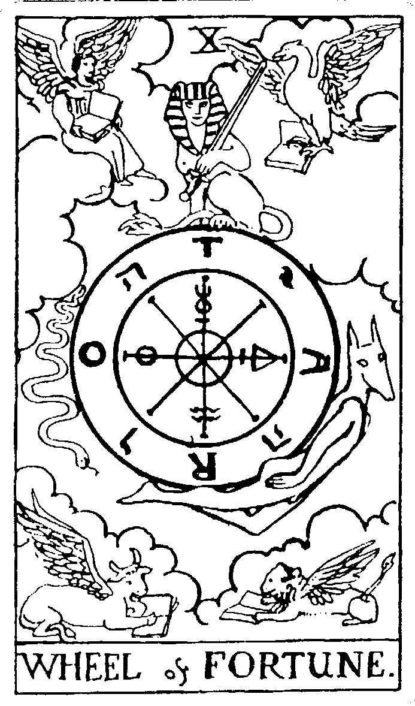

WHEEL & FORTUNE.

在進入下一頁之前，請先凝視牌面30秒，並將你所看到、所感受到的書寫下來。

Memo

## # 牌義解析——生命的輪轉與變化

命運不斷輪轉、輪迴，這就是命運之輪的能量。牌卡四個角落各自座落不同星座，聚集了地水火風的能量。左上角是水瓶座，帶來風的能量，象徵細膩的思考能力；右上角是天蠍座，代表水能量、情感層面，天蠍座是一種死而復生的能量，因此，這裡的課題是放下現有的東西，學習新的開始；左下角是金牛座，帶來土元素，代表物質世界的能量，諸如金錢、財務等部分；右下角是獅子座，帶來火的能量，代表行動力。四種動物各拿著一本文書，象徵心靈層面的發展與成長，也代表精神層面的富足。中間圓形的輪子象徵人類的命運，不斷輪轉、不斷改變。駝著輪子的是阿奴比斯，在希臘神話故事中，他有著胡狼的身體，為亡者打開新的道路，是王者的守護神。在這裡，阿奴比斯象徵

話故事中，他有著胡狼的身體，為亡者打開新的道路，是王者的守護神。在這裡，阿奴比斯象徵

## # 11 正義

# XI

JUSTICE .

在進入下一頁之前，請先凝視牌面30秒，並將你所看到、所感受到的書寫下來。

Memo

## # 牌義解析——理性的判斷與決定

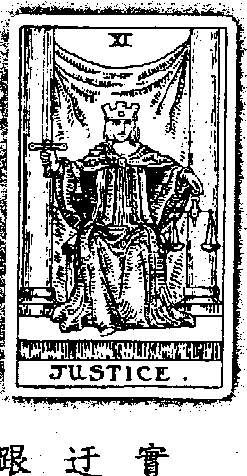

這是一個靜思的時代，審判自己內在的道德良知，對自己不誠實，也會換取他人的不誠實，迂迴吸引迴，釐清內在真正渴求的目標，轉化意識，你的下一秒也跟著轉化。不要忘記，仲裁靈魂方向的人，只有自己。

確的判斷，如同法官一樣，做出公平的評斷。而天秤代表公平與正義，判斷生命中的是非善惡，平衡生命中的因果報應；也代表生命中的假象，提醒著我們，必須面對人生中的決擇和選項。我們做出的選擇會影響到未來，必須遵守人生的規則和法規，以平衡生命過程中的善惡循環。背景的紫色布幔代表生命中的精神領袖和內在導師，紫色是智慧的象徵，也代表靈性，具有靈敏的感應，如果能夠以靈性的模式處事，成功即在不遠處。所謂靈性模式就是雙向溝通，才能找到最正義、最合理的方向。女性頭上戴著皇冠，掌握一定權威，就像國王的權威，是一個需要榮耀、有地位、負責任的

## # 12 倒吊人

在進入下一頁之前，請先凝視牌面30秒，並將你所看到、所感受到的書寫下來。

Memo

## # 牌義解析——自我搖扎與犧牲

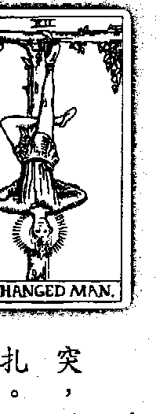

潛藏已久的秘密被掀開來了，過去的模式與現在的能量相互衝突，世界陷入一片混沌、萬物變得雜亂，我的內心落入前所末有的掙扎。這是生命的過渡期，儘管受盡折磨，我仍需停下腳步、平靜自己，用智慧顛覆傳統，勇於蛻變轉化，迎接內在的開悟之光。

當人生遇到衝擊與碰撞時，倒吊人選擇將自己倒掛在樹上，雖然經歷折磨和痛苦，卻能換來蛻變的能量。他將自己釘在樹上，吊在上面的是自我，是生命中的自我旅程。身上穿著藍色的衣服，代表理性思考的能力，對事情秉持保留的態度，必須了解事情的前因後果跟完整規劃之後，才會採取行動。而下半身的紅色裤子則透露出熱情、行動力和種種慾望。倒吊人雖然身體靜止不動，但內在是衝動的，內心充滿許多渴望，對於有趣、有熱忱的事，便會義無反顧。上半身與下半身的力量相互衝突，在內心不斷拉扯、碰撞。雖然他表面上看起來並無異樣，但內心已充滿搖扎。他不斷思忖，過程中會不會有危險，會不會有無法預料到的狀況？其中也會面臨種種抉擇，要不要放棄一些權利？要不要放棄真正的自

## # 開啟心靈之門

生命當中有許多波折起伏，有高峰、也有低潮，正如命運之輪的轉轉。現在，請你想像一下，生命中你曾經經歷過哪些悲慘的事情？或者是你最害怕發生的過，或是幻想的情節都可以。用紙筆記錄一件慘痛的經驗或對未來的擔憂，你可以一直描遲細節，寫到沒有感覺為止。接著，轉換心情，試想生命中美好的一面，回想過去曾體驗過的幸福時光，或者是一次，痛苦的事件之後馬上銜接幸福的回憶或幻想，將你內心的思考和想法通通丟出來。之後，檢視剛剛完成的筆記，從中你可以窺探自己內在模式的運作，好與壞相互撞擊，你會發現，你擔心害怕的事件都來自同一個源頭，你渴求追尋的目標也來自同一個源頭。從中，你可以很清楚地感受到，生命操之在自己手上，一念一世界，這就是命運之輪。

## 倒吊人牌

業上出現這張牌則表示礙於人情或其他因素，讓自己無法下決定，過程中又過於自我防衛，必須讓反省自己的狀況，勇於做下決定，才能為自己開脫。倒吊人牌屬於十二號牌，一代表自己，二是別人，他在考慮要怎麼做才能同時滿足兩個人。在這個世界中，他已經可以接受每個人都是獨立的個體，我是我、你是你，他不再以自己的眼睛去看每一個人。一和二的能量讓他找出自己和他人的差異性，一加二屬於三的能量，具備新思維、新的創造能量，能夠從中找出新的合作方法，或者是新的概念。將自己倒吊起來，代表過去曾經歷某些傷害，他才會想沉澱自己、靜化心靈，以不同的觀點、態度來面對自己。但是當他没有找到適合的方法，無法釋清中間的因果關係時，他會處在一個掙扎的過程，身體反應大概會呈現想睡覺的情緒、變得懶散、對任何事都没有興趣、注意力不集中等等，這表示他在內心已經看到自己的問題，了解自己的狀態了。當倒吊人發現人生新的可能時，他能夠在給予中獲得更多的愛。享受奉獻的喜悅和快樂。自己能夠在給予中得到更多的愛。享受奉獻的喜悅和快樂。

## 解牌關鍵字

感情：為愛情犧牲時間或金錢、經歷磨與傷害、從痛苦中體會愛情、縣在兩段感情之中。
工作：理性思考、身體與心靈相互矛盾、具防衛心態、暫時停滯、以傾覆傳統的觀點解決問題。
金錢：從失敗挫折中累積經驗、透過捨棄與放下而獲得更大的利益。

## 逆位牌義

從逆位的角度看，倒吊人已經站起來了，身體已經獲得重生，是一張很棒的牌。但要注意內在靈魂的倒掛，屬於意識層面的糾結，必須透過感性的自省才能蛻變。腳下淡薄的紫紅色光芒代表轉化，是自我療癒的能量，必須用智慧態度去轉變。通常是事
情已經做到一半了，所以是一腳踏出、一腳尚未挣脫，只要不再執著、經歷改變，事情很快就能順利發展。

逆位的能量也提醒我們，這件事不需要做沒有必要的犧牲，有可能是無法敞開內在、無法接
受的自己、或者是錯誤的預感。無論是正向或逆向的倒吊人牌，都必須從內心真正的自省，才能
打破僵局，活出另一個自我。

## 解牌關鍵字

感情：做出無用的犧牲、付出無法得到回報、無法敞開真正的自我。
工作：出現錯誤預感、不懂得反省自己，提醒當事人必須放下執著、不要鑽牛角尖。
金錢：計劃進行到一半、事情懸而未決，須放下過去的執著，做出決定，才能創造更大的財富。
心靈：內心得到蛻變、透過內省讓自己得到智慧。

## 開啟心靈之門

倒吊人屬於北歐的神祇，名為歐丁（Odin），是創造「北歐符文」（Runestone）的始
祖。歐丁為了體悟生命的意義，他將自己倒掛在生命之樹上，整整九天九夜，不吃不喝，
終於創造了北歐符文。現今，北歐符文在全世界廣為流傳，全賴於歐丁的犧牲奉獻。

要成事，不能全賴於橫衝直撞，沉思的過程可以幫助你看得更遠、更高，愈紛亂的環
境就愈要沉著，不要被過去曾受過的傷害打敗，省思，能讓你做得更好。現在，請大口深
呼吸，靜下心來，寫出未來的目標，可以是升官、結婚、買房子，或者是學游泳等等。接
著，寫出為達到目標，你必須付出的努力，寫得愈詳盡愈好。

每當你感到混亂、不知所措時，試著這樣靜下心來，用紙筆取代語言，慢慢地將心中
真正的渴望寫下來，如同倒吊人一樣，沉澱自己，才能更清楚自己的靈魂喔！

## 13 死亡

在進入下一頁之前，請先凝視牌面30秒，並將你所看到、所感受到的書寫下來。

Memo

## 牌義解析——放下過去的束縛與枷鎖

誰人無死，萬物終有滅絕的一天，沒有人可以倖免。如果對於已經消逝的事物仍然執著，依 與奮力找尋已經不再的青春、人、價值觀等等，人生非但無法前進，也失去了成長的動力。在悲 傷、哀悼死亡的同時，是否能接受事物的逝去，不再一味細懷陳舊的觀念與價值觀，生命才能向 前一步，尋找其他滿足。

沒有死亡就不能進入新局面。倒吊人禁錮自己，他被內在的恐懼和憂慮囚禁，不願面對現 實，當他勇敢放下後，就進入死亡牌的境界了。當你不再牢牢地抓住舊有模式不放，順從生命的 變化，才能跨進人生新的階段。而死亡牌有時會很執著，無法釋懷過去的種種，仍然抓住倒吊 人的能量不放。

進，舊有模式反而是束縛，這些過去曾建起的城牆，卻成為未來生命 發展的阻礙。勇於放下吧！將過去緊抓著不放的意念、希望和回憶， 全數宣告死亡。蛻變的時機已經到來，我不再留戀過去的模式，捨 得、捨得，加速新生。

## 骷髅頭騎士拿著象徵死亡的旗子，代表死神的降臨，昭告世人準備進入輪迴。白馬象徵死亡的 使者，也是傳訊者，在死亡來臨之前，先帶來結束的訊息。下方四個人代表四種接受死神的方 式。皇帝很明白，死神的到來宣告了體制的瓦解，他的權位、威信已經不再，已無法掌控一切 了。於是，皇帝就這樣，被自己的恐懼噤死了。頭上的皇冠也隨著皇帝的傾倒而跌落地面，象徵 著改朝換代，可能是一段關係的結束、觀念的轉換、生活模式的改變等等。 站立著的教皇憑藉長年的修行，了解因果關係的循環，他相信死亡可以帶來轉化，於是真心接納死亡，他換上最莊嚴的服裝，雙手合十，面向死神，準備好面對死亡、年輕的女孩害怕死 亡、恐懼毀滅的到來，她覺得人生中還有很多事情尚未經驗到，她還沒談過戀愛，她有很多慾 望、很多渴求，因此仍想改變現狀，內在抗拒死亡。所以女孩跪在死神面前，希望死神能放她一 條生路。然而，女孩不懂，唯有放下慾望，才能通過死神的考驗。 小孩充滿生命力，他完全沒有恐懼，他拿著花、直接望著死神，因為小孩剛剛結束死亡，他 隨時準備好到下一個階段。他雖然無知，但是願意接受所有新的改變，只有他不怕死神，也只有 他能夠繼續成長、茁壯。在面對死亡、結束的過程中，其實接受死亡是另一種重生與蛻變，是 更 多更多的收穫。 死神騎著馬，帶著死亡的訊息來到人世間，他要帶走一些人的生命，帶走原有生活中的一些 結構，可能是一份工作、一段戀情，或是一個搬家的過程。死亡牌象徵的意義也可能是換學校、 换工作、搬家，例如情侶分手後變化髮型、搬家後改變生活模式等等，只要做出改變，就是死亡 的意義，是成長與重生、開始與結束。

## 解牌關鍵字

歸四號皇帝牌的能量。四的能量是固守現狀，維持目前的狀態。當死亡牌遇上數字四，表示面對人生中種種轉化不願意改變，對於割捨與放下充滿了掙扎與拉扯。但是死亡牌提醒我們，生命中唯一不變的就是變，順應生命中的流轉，才能邁向新局面。

現在，要做出一個改變，或者放手離開。但是這不是結束，當我們願意接受死亡，願意接受結束時，所有的死亡會變成一種重生的能量。後方的太陽正緩緩升起，表示另一個新的開始正釋釋成形，也代表我們一定要捨棄某些事物，才可能迎接成功。

當死亡牌找到真理的時候，就能使用每一分力量去轉化、去蟲變。自己超越自己的負面想法、舊有模式，來迎接重生。這種能量跟殯葬業有關，死而復生的概念則和再生紙以及其他再生相關的行業相連結。由於死亡牌包含天蠍座的能量，代表的職業也包含靈性工作者、醫生、護士以及新興的醫療行業。

感情：一段關係的結束、一段戀情的開始、邁入更深層的關係。
工作：面臨重大的改變、一段任務的結束、升遷、觀念的轉換、工作模式改變、開創嶄新的未來。
金錢：改變理財模式，只要順應潮流、勇於改變，便能從中獲得利益。
心靈：順應生命中的改變、勇於放下過去。

## 逆位牌義

接受死亡的淬煉，才能迎接重生，但過程何其苦澀與艱辛。逆位的死亡牌會被自我的恐懼征
服，面對人生的汰換，遲遲不願意做出改變。你可能會推拖為所有人都在阻擾你，不讓你改變；其實是內在的自我在打架，自己障礙著自己。 逆位牌也表示明淸楚必須做出轉變，卻仍對舊有模式眷戀不已，還想把逝去的記憶找回來，把心思放在消失了的事物上。面對轉變，採取消極的態度，不願意付出努力，也可能是在變的中途擱置了，突然感到倦怠，不願意繼續轉化與蛻變。

抽到逆位的死亡牌，精神層面必將會面臨更多掙扎，這時的你必須正視自己的脆弱，鼓起勇氣，打擊所有挫折與不愉快，接受新的刺激、採取新的觀點，就能度過難關。

## 解牌關鍵字

感情：忘不了過去的戀情、陷入過往傷痛中、走不出來、失戀。
工作：堅守教條規則、不願意轉變觀念、行事消極、遭遇挫敗、降職或離職。
金錢：對目前財富狀況不滿足、錢財流失。
心靈：無法拋下過往的束縛、沉浸在那去的記憶當中。

## 開啟心靈之門

宇宙間的能量不斷循環，一分能量的消逝，就會有另一分能量的遞補。人生也是一樣，某项事物的逝去，也代表另一项事物的新生。往往在生命中面臨的危機，都是一次次的轉變機會。如果秉持著消極的態度或是負面的思維，安守現狀，不願意蛻變與轉化，乍看之下，你以為安然的度過危機，其實你也錯失了難得的轉機。想一想，你的生活有什麼瑕疵？如果能多一點什麼、少一些什麼，那就更美好了。可能是工作上多一點薪水、在婚姻關係上多一點關懷，在感情上少一些口角、父母相處上少一些反對的聲浪等等。用紙筆將你對生活的憧憬記錄下來。審視自己剛剛寫下的內容，定下心來想，如果要多一點薪水，那麼，你必須犧牲與捨棄什麼呢？你是否願意割捨陪伴家人、孩子的時間，割捨打網球的時間呢？做出這樣的犧牲是否會帶給你煩亂與苦惱呢？如果你的答案是不願意，那麼，再回頭檢視自己的慾望，你的慾望是否會配合生命的流轉呢？還是你會選擇放棄慾望？學習面對生命中的轉變，勇於放下，人生才能圓滿、成長。

## 天使神秘学院官方淘宝：http://strc.taobao.com

## 14 節制

在進入下一頁之前，請先凝視牌面30秒，並將你所看到、所感受到的書寫下來。

## 牌義解析——尋求中庸之道

神相互融合的能量。而杯中裝載的，是我的靈魂。生命沒有絕對是或非，該前進、該後退，相互調節，全在我的一念之間。天使支持著我，給我行動的力量，讓我協調二元衝突，使之相容於全世界。

在現實生活中，你必須面對種種規範、種種制約，逼得你將所有事情一一分類，對的、錯的、好的和壞的，你為所有事物下定義，那麼，誰來為你所下的定義下定義？你必須打破既有的框架，心中一旦破除了既定的思維，你的想像、創造力才能無限大。生命有陰也有陽，陰陽相互協調，既相互對立、也相互補償。地球上萬物也如陰陽，不管陰晴圓缺都有其各自的力量，必須調節各種虛長力量，相互循環運轉，宇宙才能達到和諧、和平。天使手上的兩個杯子象徵陰與陽、男性與女性，代表兩個事件、兩種立場、兩種意見，彼此相互對立。一個杯子屬火、另一個杯子屬水，水火相互交融，點出古代煉金術的傳說。煉金術能點石成金，代表把夢想變成真實，把不可能化成可能。這股力量能夠整合生命中的黑暗面與光明
{寶靈心塔羅} 112

## 表格樣式的文本

|  | | |
|---|---|---|
|  | | |
|  | | |
|  | | |

## 15 魔鬼

THE DEVIL .

在進入下一頁之前，請先凝視牌面30秒，並將你所看到、所感受到的書寫下來。

Memo

## 牌義解析——享樂世界與物質慾望

人生，經過不斷調和過後，我們更知道自己想要的是什麼。對於未來的目標，開始有了雛形，並且起身朝夢想努力。我們開始有了對物質的慾望、對性愛方面的慾望。而付出努力的同時，控制慾也悄悄現身。例如在感情世界中，自己開始知道要開好好對待另外一半，因此不斷付出、奉獻，同時，也開始希望對方能以相同的模式對待自己，於是，魔鬼的控制慾就會出現了。對物質世界的慾望慾強烈，控制慾也會相對滋長。

魔鬼的頭上有一顆五角星，五角星代表人體的眼、耳、鼻、口、觸五官，也代表頭與四肢，象徵人類。牌卡中的五角星呈倒立狀態，表示人類深受物質控制，被魔鬼奴役著，無法逃脱物
充

高層意識去愛，不是用自我想像的模式去愛。無須害怕，也無需擔憂，大膽接受生命中的改變，相互依賴、但不是控制。在魔鬼牌，我們要學習自由自在地承擔責任，把責任當作甜蜜的負擔，而不是壓力。如果你用這種態度去面對生命的話，就不會覺得是在承擔。舉例來說，很多父親形象的人，這輩子盡力把該做的事情做好，但是他可能不快樂，因為他必須割捨部分自己想做的事情。盡管他完成了應盡的責任，但是靈魂卻沒有得到滿足。在這裡必須學會為生命負責，放下依賴與束縛，互相充實、一起成長，就能穿越魔鬼的考驗。在數字學上，魔鬼牌屬於十五號牌，一加五等於六，代表付出不求回報的過程。但是一在這個位置的出现，會開始深深考慮，自己的付出究竟不值得，並渴望得到自由，想要得到更多，想要以輕鬆的方式來解決問題。而數字五存在著教皇的能量，代表無條件的愛，全心的付出。如果要昇華魔鬼牌的能量，只有靠自己的力量。如果没有辦法昇華魔鬼帶來的牽制，身體包括牙齒、骨骼和血液，通常會出現一些狀況，必須特別小心。適合的工作包括牙醫、跟骨骼相關的工作者，或者是穩定的工作，像是政府體系的公務人員。在这些行業裡面的人如果抽到這張牌，通常會覺得受到限制跟牽絆，這時他們必須要打破個人的制約，就會發現自己其實有無限的潛能與空間。就像羊群裡面的獅子，從小一直與羊生活在一起，等到發現自己原來是獅子時，才猛然驚覺，自己其實擁有很大的力量。

## 解牌關鍵字

感情：兩人關係更加緊密、沉迷於性愛當中、控制慾、需要安全感、壓抑的內心。

工作：獲得權力與地位、為取得權力而不惜代價、工作狂、受到名利誘惑。

金錢：為金錢認真努力、獲取金錢與名利、將金錢放在第一要位。

心靈：受到物質慾望的束縛、忽略心靈層面的需求。

## 逆位牌義

逆位的魔鬼牌與正位相似，同樣受到物質力量的箝制，可能是金錢壓力、購物慾望、性慾渴求，也可能是傳統教條的約束。

但是逆位的魔鬼表示從貪婪的物質慾望中學得教訓，勇敢改變，讓心靈獲得自由與成長。於是，逆位的五角星轉成正位，男人和女人頸上的枷鎖也能順勢脫落，不再深受物質控制之苦。

抽到逆位牌也要注意，在獲取自由的過程中，可能會過度耽溺，過於依賴，不願意擔負應盡的責任。

## 解牌關鍵字

## 開啟心靈之門

感情：願意為感情負責、放下依賴與束縛、擺脫控制您的束縛、關係回歸自由。

工作：找回自我價值、不受權力慾望的束縛、相互依賴的合作關係，或是利用不正當的方式追求權力與地位。

金錢：不做金錢的奴隸，或是以投機取巧的方式獲利、利慾薰心。

心靈：從掌控的枷鎖中獲得自由、找回內心的價值與理想。

拿出戀人牌與魔鬼牌，看看兩張牌的構圖是不是有點雷同？仔細觀察，看看兩張牌有什麼不一樣？在魔鬼牌中，戀人牌中的男性和女性又再次現身，只不過這次，他們身上多了枷鎖，且原本身後放送祝福的天使，換成了箝制兩人的魔鬼。在戀人牌中，兩人沒有束縛，自由自在地愛，他們全心付出，共同探索愛；雖然無法如願找到愛的真理，但是，他們明白，兩個人可以共同合作，彼此建立緊密的關係，再也不用感到孤單、孤立了。而在魔鬼牌，兩人的關係更緊密了，男人跟女人之間的愛更深刻了，不過，兩人的關係卻變成一種無形的連結和猜忌，這種無形的控制和枷鎖會相互套在彼此的身上。人跟人之間，愛與恨的界線很模糊，只有一線之隔，必須花些時間整理自己和對方的態度，才不會讓枷鎖變成恐怖的控制。

(實靈心塔羅) 122

# 16 塔

在進入下一頁之前，請先凝視牌面30秒，並將你所看到、所感受到的書寫下來。

Memo

[PAGE 125]

# 牌義解析——瞬間爆發的毀滅能量

在生活中，我們可能壓抑了很多心情，將紛雜的情緒概括承受，沒有把事情攤在慣面上說，有些決定沒有去承認，有些想法沒有去調整或是自我統整，當內心負面能量累積到一定的制高點時，這些能量便會爆發，之後可能會帶來災難或爭吵。塔牌代表突如其來、極速的轉變，你必須排除萬難，立刻解決問題，拿出快速、果斷的行動力來做決定。

這一座令人忧目驚心的塔，被熊熊烈火環繞，表示生命中有一些事情正在轉變，也代表一件不可預期的事件，這正是個除舊布新、從混亂中整合自己的時間。塔的上方冒出了好幾把火焰，所以以抽到這張牌要小心火災，注意易燃物的維護跟管制，塔，代表學習寬恕的開始，必須放下過去

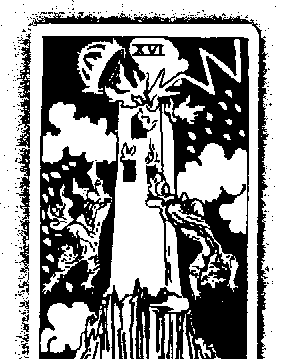

我內心充滿了情緒，有無可抹滅的哀傷、有難以忘懷的憤怒。為了理想的塔，我不能透露，只能將之存放心中。隨著時間流逝，這些痛苦與怒火沒有消逝，反而愈積愈高、愈積愈強烈，這些情緒大到我無法承受，我再也抓不住了，這些能量一次爆發，之猛烈、之迅速，我完全措手不及，只能從塔上一羅而下。

〔寶鑽心塔羅〕124

# 逆位的塔牌義

開始，每一件事都在破碎混亂當中，卻不停地相互整合！

## 解牌關鍵字

感情：突如其來的轉變、先前累積的情緒一次爆發、諜對諜的關係、不誠實或不成熟的感情。

必須從過去傷痛中學習愛情、開創新的感情模式。

工作：不可預期的事件、舊觀念被瓦解、拋棄過去一切束縛、學習寬恕、自我悔改。

金錢：意外損失大筆金錢、從過往教訓中學習。

心靈：沒有誠實面對自我、混亂的內心與思緒、透過混亂整合自己。

對於深層的自我意識，你其實很抗拒，不願意承認自己內在的認知。你必須釋放能量，讓頭

腦靜下來，誠實地面對自己的心靈。你會發現，生命其實有許許多多的可能性，而你可以轉化未來。

[PAGE 130]

## 解牌關鍵字

+   - 感情：沉溺於過往情傷當中、壓抑內心的情緒、沒有向對方坦承。

+   - 工作：過度緊張、壓抑情緒、執著於舊有模式、不願意改變。

+   - 金錢：鑽牛角尖、理財計劃遭到中斷、流失金錢。

+   - 心靈：不願拋下逝去的過往、流連於記憶的傷痛、逃避現實。

# 塔羅聖經故事

塔牌中高塔的崩壞與人們的墜落，讓人不禁聯想到舊約聖經故事——巴別塔（Tower of Babel）。經過大洪水之後，諾亞的後裔不斷繁衍，那時候，人類的語言只有一種，彼此可以無礙地相互溝通。於是，人類計劃建造一座一通天塔，以彰顯人類的顯赫、證明自己無所不能；另一方面，也有挑戰上帝權威的意圖。因為彼此語言相通，在分工合作下，建造高塔的工程進行地十分順利，不出多少時間，這座塔便深入雲端了。然而，上帝發現之後，為懲罰人類狂妄、自大的態度，施一舉摧毀高塔，並將人類驅散至不同的地區，分化彼此的語言。人類從此各自操著不同的語言，人與人的溝通上也開始出現誤解。這也象徵著災難的發生，往往是咎由自取，也代表只要平衡心態，每個人可以以阻止崩壞的發生，你可以扭轉局勢，就是現在，從自己開始轉化！

[PAGE 131]

天使神秘学院官方淘宝：http://strc.taobao.com

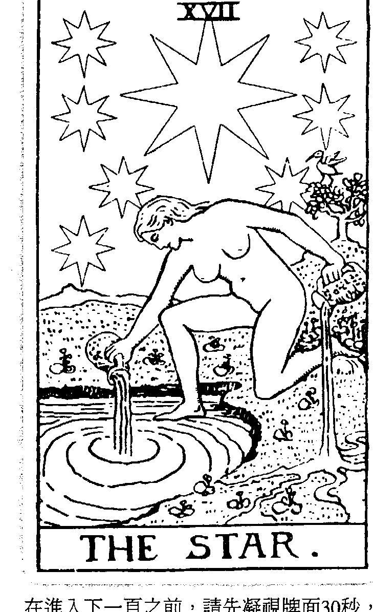

# 17 星星

在進入下一頁之前，請先凝視牌面30秒，並將你所看到、所感受到的書寫下來。

Memo

129

获取更多好书，请加微信：13641926204 或 QQ:715104687

[PAGE 132]

# 牌義解析——點燃信心與希望

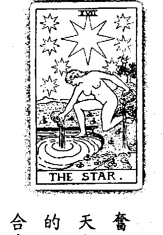

經過了轉化與蛻變，邁向了星星牌的階段，這是一個新的開始，充滿無比希望。星星牌擺脫了魔鬼牌中的繁重枷鎖，從物質慾望的箱制中脫困，不僅重獲自由，還找回了自信。在塔牌的毀滅與爆炸後，雖然一切毀於一旦，卻也讓星星牌回歸最初安寧、平靜的狀態。對人生充滿著信心，心靈不再空虛，也不再需要擔心煩惱。現在，沒有聲音，只需要安靜。

星星代表新的希望，是一個新的夢想、新的目標。星星牌具有療癒的能量，是時間的守護神。在宇宙中沒有時間，代表由內而外的治療，從治療自己而得到解放。星星的直覺力強，具通靈能力，在前世印記中，人活在世上背負著使命，必須完成任務。星星也象徵一條指引的道路，

我從毀滅中甦醒，這一口空氣如此新鮮，我自由了，如此令人振奮。一切是那麼的平靜、安詳，宇宙彷彿停止流轉，時間不再更迭。天上的星辰反射著地點的人們，偉大的天神給我力量，指引與啟發我 的心靈！真理與純潔的世界在呼喚我，望著夜空中滿天星斗，我雙手合十，向他許願，我的願望即將實現！

[PAGE 133]

天使神秘学院官方淘宝 : http://strc.taobao.com

代表有貴人出現，引導你邁向正確的方向。天空上有八顆星星，每顆星有八個角，象徵光明與希望，也是內在的美感。有一說，這八顆星，這七顆星代表人體七脈輪。而中間的金色星星則是第八個脈輪，位於人頭頂上方三到四吋的地方，提醒著我們，要打開和宇宙連結的天線，接受上天的能量。如此一來，面對任何事情，在天神的協助下，我們都能有靈光一閃的能量，順利完成目標。八顆星星代表人類可以超越人體肉身，向天神致敬，接受上天的引導，擁抱宇宙的真理。

星星是北斗七星，代表具有更高理想和創意，去做想做的事情。有七顆星星環繞著中間的金色星池，代表精神與物質層面、理性與感性兼顧，女子手握紅色水瓶，瓶中裝載著生命之泉，代表源不絕的生命活力。她一手將泉水倒在水中，一手倒在陸地上，象徵著強烈的意念、毅力，有強大的戀念，想跨越精神與物質層面的束縛，而奔流不息的泉水也象徵著自我解放與自由，女子將生命之泉灌溉至陸地，水流傾倒至陸地形成五道支流，象徵著人類五種感官，各自得到滿足與希望。

後方樹枝上有一雙鳥，那是朱鷺——埃及的智慧與知識之神，為人類和神祇發明了各式各樣的技術，象徵著智慧的革新與創造力。鳥兒在天空與陸地中自由自在地飛翔，象徵著無拘無束的思考與生命。塔的崩壞，讓我們學到，人類因為驕矜自大、違背真理，而導致災厄發生。到了星

131

星牌，我們逐漸明白，必須遵循真理，不要背離宇宙法則，聆聽真實心靈的聲音，為自己的生命負責任，才能達到平衡。 星星牌要學習的課題跟信任有關，如果我信任我現在的信念，所有的變化都會有好結果。唯 有信任自己，才會有美麗和信心。對自己有高度信任感，對事件敞開心胸，信任自己、才能對別 人信任，是一種轉化與蛻變。星星牌是一張安靜的牌，讓自己寧靜，學習平靜與獨處，回歸內心 的沉靜，就會有很好的洞悉能力與直覺。 星星牌的數字能量是一七號，一加七等於八。一是自我，代表是自己主動去做這件事，七代 表要從中釐清問題、要靜心，去了解生命的目標為何。兩者結合，凝聚成八的能量，代表力量、權力和地位。星星牌是內在具有權力和地位，並轉向正向的運用，他知道自己內心的需求，也有 能力幫助別人。走到星星牌，代表完成任務了，達到自己的目標，取得自己想要的生活。 這是自然而然、相信自己 的時候，只要願意接受、承擔，創造出來的能量就會無比強大。發揮大愛、幫助別人，就會自然而然的擁有權力和地位。星星牌的威望和力量牌不同。力量牌屬於個人力量，是索取、嫉妒、羨慕、控制的能量；而星星牌則推己及人，願意幫助別人，因此能夠換來別人的臣服。在星星牌，控制和掌控的背後動機是為了全人類，不僅僅是私利而已。

[PAGE 135]

## 解牌關鍵字

感情：充滿希望的愛情、自由自在的關係、靈性層次的愛、光明的未來。工作：樂觀、堅定的意志與毅力、充滿自信、新機會、超越自我的成就、可以實現夢想。金錢：出現投資契機、賺錢的機會、能夠賺取利益。心靈：心靈回歸平靜與自由、對人生充滿希望與自信。

## 逆位牌義

正位的星星牌代表新的希望、信念、想法，代表一個光明的未來；而逆位牌則帶來失望與悲觀，還沒開始進行就想放棄，也代表沒有機會、

## 對地，其實我們內心仍存在著獸性，這份無法澆滅的原始野性，不時地敲上我們的心頭。夜裡的漆黑以及月亮帶來很深的不安全感以及害怕，水中正爬出一隻龍蝦，牠才剛剛爬出來，聽到一些風吹草動，便馬上縮了回去，遲遲不敢有大動作。這代表了很深的恐懼，是對未來和不確定性的畏懼。生命中遇到改變的時候，人會很害怕被改變，這是過往傷痛所帶來的恐懼。水代表情感與情緒，抽到這張牌代表這個人充滿了懼怕，已經在情緒上出現一些狀況。在生活中，一定有人刻意去勾起他內心底層的驚恐，但他卻不願意承認自我的害怕，因此無法發現其實生活中很多問題的形成，都是來自於深層的恐懼。所以須傾聽內心真正的聲音，你碰到的困難，是內在的恐懼的投射，如果你無法克服內心的恐懼，會變得綁手綁腳，導致你沒有辦法往前走。月亮牌的背景鋪滿了紫色和藍色，代表敏感和強烈的感知能力。月亮牌有很敏銳的直覺，能夠嗅出所有不尋常的狀況。可是，如果我们不相信自我內在的覺察，恐懼和焦慮便會滋生，逐漸侵襲我們，可能出現的身體狀況包括情緒不穩定、常常做惡夢等等。在潛意識中，你知道某些事，但是不願意相信、不願意承認。抽到月亮牌的時候，一定要注意，如果這個人情緒會很焦慮，很多事情無法做決定，那他可能陷入自我欺騙，或者深受自我欺騙的困擾。這時候必須克服過去的恐懼，放下所有的懷疑，用信任的態度面對自己、接受挑戰。月亮牌屬於數字十八，一是自我、個人，八是力量，一種為達到目標而努力的驅動力。一加八是九，必須經歷一些煎熬，經過淬煉，最後才會知道真正的自己，才有辦法得到夢想中的東西。

##  # 逆位牌義

### # 解牌關鍵字

西·月亮牌的出現，代表必須經過一番苦難，必須承認自己內心的狀態，事情才會更加明朗，難內在，可是卻做一些秘密、不為人知的事情，與內心的自我相抵觸。因此，月亮牌的能量，即將引導著人們打破過去的制約，喚醒最真實的靈魂。

感情：感到焦慮、內心存在恐懼、對感情有莫名的擔憂、情緒上的不安、情緒化。

工作：害怕未知與不確定性、感到不安與迷惘、潛在的危機、受到欺騙與中傷。

金錢：陷阱、圈套、不理性的投資、被自己的幻覺蒙蔽。

心靈：對未來與未知感到恐懼、自我欺騙、害怕改變。

起伏不定，過度多愁善感，容易患得患失。不相信自己，也懷疑別人，對任何事物都存在著深深的不安全感。逆位的月亮牌中，龍蟻毫不遲疑地爬上陸地，代表內心的恐懼蔓延全身，就快被自己塑造的恐懼給壓垮了，其實真實情況沒有自己想得恐怖，只要選擇相信自己，不再猜忌和懷疑，一切都可以安然度過，正位的月亮牌代表內在的自我欺騙，而逆位牌則表示遭受他人的欺騙，可能受到蒙蔽，看不清真實的世界。必須用理智來釐清所有事件，挖掘出真實的面向。

### # 解牌關鍵字

感情：情緒起伏不定、多愁善感、疑心病重、關係存在著謊言、受到欺騙與傷害。

工作：患得患失、沒有自信、被內在的恐懼壓垮、危機浮出檯面、遭受謠言中傷。

金錢：遭到欺騙或詐欺、金錢損失。

心靈：被內心的恐懼襲捲、極度缺乏安全感、感到焦慮與不安。

## # 開啟心靈之門

你知道你的恐懼是什麼嗎？你敢正視內心的害怕嗎？現在，就讓我們來一一檢視自我 的不安因子。將你最害怕的事情寫下來，寫下事件可能發生的原因、存在的隱憂，事情 發生之後會有什麼效應，會對你造成哪些影響，會對那些人造成哪方面的傷害，中間的 時間 會覺放到最大，勇敢地掏出內心深層的恐懼。讓血淋淋的恐懼真實呈現在眼前，此刻，你 的場地，閉上你的眼睛，逆時鐘旋轉。你可以自行調整旋轉的速度，如果覺得頭暈，請面 朝地、原地趴下，直到你感覺可以了，繼續起身逆時鐘旋轉。整個旋轉過程請維持在三分 鐘到五分鐘左右，過程中可以搭配輕鬆的音樂，幫助打開你的心靈，將內在的恐懼通通一 摄而空。

##  # 19 太陽

##  # THE SUN .

在進入下一頁之前，請先凝視牌面30秒，並將你所看到、所感受到的書寫下來。

Memo

##  # 20 一審判

在進入下一頁之前，請先凝視牌面30秒，並將你所看到、所感受到的書寫下來。

Memo

##  # 牌義解析——內心的覺醒與呼喚

偉大的加百列將我喚醒，我臣服於天神的號角聲下，在此，我無所適形。這是最後的審判，不要哭泣，無須哀悼逝去的過往，這是一個新契機，脫胎換骨的時刻已來臨。捨棄不代表失去，鬆開手，獲得的將會更多。肉體逐漸腐敗，但我的靈魂不減，是非善惡了然於胸，放下過去，我從灰燼中獲得重生。

從愚人牌開始，來到這個世界，經歷了大大小小的人生起伏，最後回歸世界牌的結束。在此之前，你必須面對這最後的審判。坦承面對曾經做過的是非善惡，坦然接受批判。將過往種種整合之後，你必須放下過去的肉身，讓靈魂繼續昇華，接著不斷經過輪迴、再輪迴，於是靈性的發展生生不息。

審判牌的出現，象徵一個非常有覺知的自我，代表收到外界的審判，可能是結局突然到來，超出自己的預期之外；也可能是自己對自己的檢視，承認自己在某方面的不足、沒有達到標準，覺得自己仍然有成長的空間。審判牌也代表拋去一個舊觀念、架構、關係或是模式，而轉向另一個更適合自己的新生活。可能是突然改變想法、變換不同工作模式，或是結束一段關係等等。

【實靈心塔羅】148

### # 解牌關鍵字

感情：感情突如其來地結束、拋下過往的情感、不再自責、新戀情的可能性。

工作：事情提早結束、突然改變工作模式、體認自己的不足、懂得悔改，出現正面的結果、重新 開始、恢復活力。

金錢：突然改變理財方式、苦心沒有白費、之前的理財規劃能有好的成果。

心靈：放下自我批判與罪惡感、自我檢視、挖掘自己的潛能。

##  # 逆位牌義

逆位的審判牌表示拒絕接受生命中的任何變動，尚未認知到轉變能帶來的新契機。他可能不願意拋下既有的觀念與生活模式，固守原本的理念和想法，也可能無法接受事件的結束或關係的 逝去，仍然沉浸在哀傷的階段當中。

審判牌逆位也代表在轉化的過程中，處事態度不純成熟，仍然依戀過往的一切，卻又想抓著新模式，讓新舊之間維持暖味的關係，無法做出圓滿的切割與重生。這時候，需要將眼光放遠，考量未來的發展性與利弊取捨，才能找回屬於自己的新步調。

不管面臨什麼決定，抽到逆位牌時要小心做出錯誤的判斷，逆位牌也象徵著既定目標或行程 延遲到來。

### # 解牌關鍵字

感情 : 陷入情傷、不願意接受新戀情、暧昧關係、無法與舊戀情完全切割、被迫結束關係。

工作 : 固守舊有觀念、不願意改變、無法做出決定、延遲的行程與規劃。

金錢 : 狷亂不定、做出錯誤的決定、錯失投資良機、金錢損失、訴訟失利。

心靈 : 害怕生命中的轉變、不願意面對改變、無法做出決定。

## # 開啟心靈之門

面對過往的消逝，一段感情的結束、一位至親的離去、心愛事物的消失，你一定曾感 倒到傷痛。面對生命中的種種結束，我們總是難以釋懷，久久無法平復。

你遇到了生命裡真正契合的另一半。哀悼過去的同時，人生的新芽正在滋生，新的可能性 正在醒覺，過往的一切正是你向前走的力量。

想想看，你的生命歷程中是否曾經歷過審判牌的力量呢？你當時的處理態度是什麼？ 後來事情如何發展？結果呢？經過回想與連結，你會發現，結束不代表真正的失去，有時 候反而是新開始的契機。

##  # 21 世界

在進入下一頁之前，請先凝視牌面30秒，並將你所看到、所感受到的書寫下來。

Memo

##  # 牌義解析——生命的循環與流轉

世界牌是宇宙中永恒的生命。每一張牌都是一項生命課題，經歷物質與精神、內在與外在的挑戰與覺知之後，能量不斷揚升，靈魂愈來愈飽滿充實。到了世界牌中，生命中所有元素齊聚，這趟旅程到了一個尾聲。這是一個結束，也是一個開始，生命會不斷循環，準備邁向另一個層次的旅程。

牌卡中的少女，手上握著兩根權杖，在桂冠組成的外圍當中，輕快愉悅地舞動身體。魔術師和戰車牌中的權杖，這裡又再次出現，代表很好的執行力，夾帶著強烈的能量，能夠將計劃付諸實行。少女手持兩支權杖，一支指引著前進的力量，另一支則疏導後退，能攻也能守，達到生命 我已完整。征服了物質的控制，突破了精神的團限，我的能量不斷昇華，讓我逐漸成長。生命不停流轉，無止無盡，宇宙的能量持續循環。我超越了私我的束縛，榮耀感將我提升，我將奉獻所有的愛，不求回報。我達到身、心、靈的和諧與平衡，將幸福與快樂散播給大地上所有生靈。這裡不是畫頭，新的人生正要起步。

### # 解牌關鍵字

感情：感情突如其來地結束、拋下過往的情感、不再自責、新戀情的可能性。

工作：事情提早結束、突然改變工作模式、體認自己的不足、懂得悔改，出現正面的結果、重新 開始、恢復活力。

金錢：突然改變理財方式、苦心沒有白費、之前的理財規劃能有好的成果。

心靈：放下自我批判與罪惡感、自我檢視、挖掘自己的潛能。

重生，從無到有、再從有至無，不斷重複。你已經完成所有任務，一切都找回來了，月亮的恐懼、星星的洞悉能力、魔鬼的害怕與慫恿，經歷種種關卡，克服所有挑戰與誘惑，到了這裡，你已經擁有需要的一切了。生命是不断的提升和精進自我。抽到這張牌，代表所有事情將會水到渠成，會有一個很好的結果。桂冠圈代表一件事情的完成，達到很完美的結束；但是又有一個新的開始，有好的動力起頭，歲程與終點不斷循環。

在情感方面，正面的能量代表有情人終成眷屬，可以得到生命中伴隨一輩子的好情感，獲得最終的愛。世界牌與海外有關，抽到這張牌代表適合出國，可能會在海外邂逅情感。時間證明了一切，因為過往經歷的種種課題，世界牌得到了最後的報酬，代表一個完美的結果，所有的努力都能得到回報。

桂冠不僅象徵勝利，也代表榮耀感，當你覺得值得榮耀的時候，世界牌的能量便會昇華，你的圓滿不僅獨享其身，還可以貢獻給其他人，抽到這張牌，你必須在人生道路上，尋找你的榮耀感。當你達成願望，掌握身、心、靈的平衡，並擁有生命中無限擴展的能量時，你必須秉持宇宙意識，發揮你的才能，將愛回饋給萬物。有時候我們會變濛自己的自信，我們會變濛別人、打壓別人，這些舉動都會潰散榮譽感，我們要提醒自己，激發自己內在的榮譽感，成為別人最高層次中的榮耀，讓自己變成一個負責、可靠、誠實的人。

## 解牌關鍵字

感情：關係更進一步、和諧的感情、成熟的愛情、找到完美的伴侶、在海外邂逅情感。

工作：良好的執行力、成熟圓融的處事態度、統整與規劃的能力、完成計劃、水到渠成、完美的

金錢：金錢愈滾愈多、投資獲得好的報酬。

心靈：了解生命的真理、包容世界上所有的可能性、達到身心靈的平衡。

## 逆位牌義

世界牌的能量循環流轉，生命因而達到平衡與和諧。而逆位牌則阻礙了能量的運轉，因為個人內在的恐懼，不敢向前邁進，不願意接受新觀點，導致進度阻礙不前，遲遲未能達成目標。認清自我的靈魂吧！回到本質，充分地認識自己，繼續朝下一步邁進。

世界牌是一個完美的輪迴，逆位擺放，則少女的權杖便顛倒了，前進與退後的力道拿捏失準，可能衝得太快，也可能滯留不動，讓完美的流程出現了破綻，也就無法獲得最後的勝利了。出現逆位的世界牌要小心細節方面出問題，雖然不是大挑戰，卻足以影響最後的成果。

## 解牌關鍵字

感情：內心存在恐懼、看似完美的感情出現瑕疵、感情受到阻礙、關係陷入僵局。

## 塔羅神話故事

世界牌中的少女是赫梅弗度斯（Hermaphroditus），他本是男兒身，是傳遞訊息的天神赫密士（Hermes）和最美的女神阿芙羅黛蒂（Aphrodite）的孩子。赫梅弗度斯英俊濃瀰，讓掌管湖水的女神薩歐瑪西絲（Salmacis）傾心不已，為這位美男子深深著迷。薩歐瑪西絲向赫梅弗度斯求愛，卻遭到拒絕，還讓他嘆得逃之夭夭。有一天，赫梅弗度斯度斯來到湖邊，他脫光衣服，羅進湖中洗澡。不料，湖神卻突然現身，緊緊抱住赫梅弗度斯的身軀，不肯鬆開。湖神向天祈禱，希望此刻永存，能與赫梅弗度斯永不分離。結果湖神的願望成真了，赫梅弗度斯與薩歐瑪西絲果真合為一體，此後，便成為擁有男女二性的雙性人。赫梅弗度斯雙性的特質也突顯出每個人內在的陰陽二元。人其實存在著理性，也存在感性，兩種力量相互調和，形成世界牌協調平衡的能量。

## 工作列表

- 工作不願意改變
- 停留在舊有觀念當中
- 出現小錯誤
- 進度停滯不前
- 差一點成功

## 金錢列表

- 評估錯誤
- 忽略細節
- 投資失利
- 理財計畫被打斷

## 心靈列表

- 無法掌握內在的平衡
- 過於怯弱或者過於衝動
- 不願意接受生命中的轉變

## 小阿爾克納

[PAGE 162]

## 權杖ACE

## 牌義解析——發揮無限的潛能

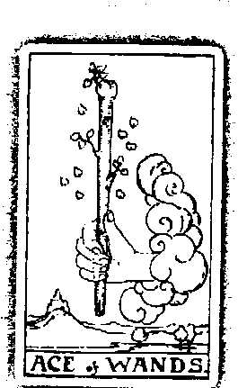

這就是我的態度，機會操之我手，我準備好了，下定决心—我要做！—，並且全力以赴。我要創造自己、成就自己，設下的目標，我一定會達到！

命裡清晰的想法與自由意志，有夢最美、希望相隨。雲中伸出的手是右手，右手代表意識，而左手代表潛意識，因此這裡的右手象徵自我，是自己下的決定、自己的想法與態度。長滿新芽的樹枝，代表新生活和新動力。旁邊粉飛的樹葉代表意志力跟充分的信心，樹枝上有十片葉子，在神秘學中代表生命之樹的十項課題，蘊藏綿延不絕的智慧。座落在後方的城堡則是自我在生活上、事業上的目標和理想，暗喻未來成功的可能。手中緊握的權杖，是活生生的，樹葉仍極具生命力，持續生長，象徵日常生活中強大的活力

## 權杖1

## 解牌關鍵字

感情的力量，代表一個有創造力、看準目標就勇往直前的人。無論如何，抽到正位的權杖一都是個足的力量，代表一個有創造力、看準目標就勇往直前的人。無論如何，抽到正位的權杖一都是個幸運兒，無止盡的幸運，沒有太大的阻礙。

## 感情列表

- 一段感情的出現
- 彼此信任的關係
- 注重當下的感覺
- 正面樂觀的態度
- 新生兒的誕生

## 工作列表

- 衝勁十足
- 有創造力
- 看準目標就勇往直前
- 新冒險
- 開始一項任務
- 開始一項有意義的計劃

## 金錢列表

- 新投資
- 有獲利或集成的機會
- 繼承財富

## 心靈列表

- 靈性成長的起步
- 充滿勇氣
- 大膽冒險

## 逆位牌義

代表一個虛假的開始、目標無法實現。在感情上沒有耐心，需要長時間調整自己的心態，遇到挫折沒有辦法面對處理。也代表尚未著手行動、對未來沒有目標、遇到小挫折。計劃甫進行就想喊停放棄，接著苦惱一陣後，仍選擇取消計劃。逆位的權杖一代表個性衝動，不懂得未雨綢繆，行事過於躁進，常常是想到什麼就做什麼。

## 解牌關鍵字

+   感情：虛偽的感情、在感情上沒有耐性、過於夢幻的愛情觀。

+   工作：缺乏毅力與恒心、容易被小挫折打倒、無法達成目標、計劃中斷。

+   金錢：破財消災、因為過於衝動而造成金錢損失。

+   心靈：過度急躁、心中出現懷疑的聲音。

## 權杖2

## 牌義解析——確認自己的目標

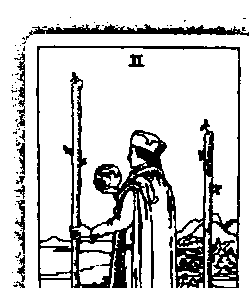

權杖代表多於一種的選擇與慾望，其中一根被固定在牆上、動彈不得；另一根則自由自在，沒有受到束縛。象徵著內在二元的自我，一部分的自己處於麻痺、靜止不動的狀態，安守現狀，不願意轉變；另一面的自我則充滿著改變的慾望，想移動、想旅行，想做自己想做的事。牌卡中的人望著遠方，城牆外的世界會是如何呢？前方的矮牆是先前一手建立起來的成就，將男子團團包圍。他向外望，由近至遠，平地矮房而後方是城堡，城堡遠方的高山上，佇立著更雄偉的碉堡。建築物規模逐漸擴大，象徵著男子不斷滋長的野心。對於目前的成就，他不滿足，

## 權杖2

我的力量無窮，矮牆擋不住我的慾望與夢想。我所站之處，不在手上的地球儀上。生命，出現了另一個選項，我將踏上新的旅程，多麼遠大。

## 權杖2

人生難道就只能這樣嗎？男子望著手上的地球儀，象徵偉大的理想與抱負，他想要更多更多。他的世界就在地球儀當中，是他的成就與生命動力，但目前似乎不再有意義，他做了一個決定，他要出去闖蕩，不要再繼續待在原地了。旁邊的土地象徵穩定的自己，前方的水很寧靜，代表平靜的情緒。男子的腳踏在土地上，是內心穩定的自我。然而，他的眼睛卻表達不同的意見，他望著遠方，渴求更進一步的發展。把焦點放在地球儀上的男子卻沒有發現，前方天空一片陰沉沉，遠方高山層層起伏，這些都暗指著未來可能遇到的困難與挑戰。抽到這張牌，代表厭倦了目前的生活，日復一日做著相同的事情，周遭環境、世界索然無味，再也没有新鲜感、沒有挑戰性了。既不想停留在現在，又擔心如果放下目前的棒子，接下來的選擇是否會比較有利。權杖二代表心中另一個慾望的浮現，以及另一個選擇的出現。舉例來說，雖然目前的工作穩定，薪水不錯，與同事相處融治，但是想過更好的生活，想買房子、買車子，這時候，出現了外派或合夥的機會，要不要接受呢？雖然覺得自己長大了，不適合繼續停留在現有的位置上，卻又對另一個選擇充滿擔憂。儘管權杖二處於面臨抉擇的狀態，但是兩個選項都想要，還沒有做好轉變的準備。灰暗的天空也映照出男子的心靈，似乎有事情就要發生了，但是他尚未釐清自己內心真正的需求，以至於邏輯難以下定決心。

## 權杖2

男子越過平靜的水，望著遠方，他想要到另一頭開創未來，想著到外面挑戰的可能性。這代表出國旅行、到外地工作，這中間的移動距離通常近至跨過河、遠則跨過海，過了水之後，就能找到新的發展空間。

## 權杖2

到了，想要轉變、想要離開。只是因為存在太多恐懼，讓自己無法脫離現況，會為自己找理由、找藉口。其實權杖二很有勇氣，如果下定決心離開、改變，權杖的力量能夠讓你統治一切，順利接收新任務。這時候，如果有適當選擇，你的選擇一定會比現在的狀況好，另外，權杖二也代表個性成熟的人，有計劃可以達成自己的目標，一個正確適當的選擇、良好的機會，以及遷移的機會。

## 權杖2

## 解牌關鍵字

感情：感情上出現好機會、面臨抉擇、勇於放下目前的束縛、可以選擇自己渴望的感情。

## 工作列表

- 有勇氣接下新任務
- 成熟理性
- 能夠做出正確的決定
- 有海外發展的機會

## 金錢列表

- 出現好的投資機會
- 海外投資的契機

## 心靈列表

- 面臨人生重大抉擇
- 內心充滿力量與勇氣，希望開拓不同的格局

## 逆位牌義

權杖二出現了兩種選擇，內心出現兩種聲音，出現逆位牌表示沒有將二元衝突做好協調。有錢卻沒有理想，有了理想卻沒有錢。可能會出現內心的自我矛盾，想要穩定的感情，又渴求新的刺激與變化，相互僵持不下，導致做決定時會拖拖拉拉，無法抉擇，但是權杖二的衝動很強，逆位牌也可能表示過於衝動，而做出錯誤的決定。逆位牌也可能出現自我懷疑的狀況，讓自己失去信心，總愛挑剔自己，也可能因為別人引起麻煩或外部的限制，而導致有傷心的可能。試著讓自己有自信、獨立一點，相信自己、相信自己做的決定！

## 逆位關鍵字

感情：容易自責、過於依賴、感情進展不順利、有傷心的可能。

## 工作列表

- 過於衝動
- 做出錯誤的決定
- 無法抉擇
- 行事拖拖拉拉

## 金錢列表

- 有理財計劃，但缺乏資金。

## 心靈列表

- 內心存在矛盾
- 自我懷疑
- 缺乏自信

## 權杖3

## 牌義解析——第三種可能性

男子看著海面上來來往往的船隻，船上裝載著海外的商品，裡面也有他的商船呢！這是男子之前的夢想，現在他已付諸實行，走進了人生中另一趟旅程。他望著大海，期待進出口的貿易可為他帶來利益。他沉穩地站在原地，他準備好了，正在等著一個好時機。

權杖二面臨拉扯與抉擇，必須化解二元衝突，做出決定。權杖三的能量便是完成之前規劃的行動，將之付諸實行，代表一件事情已經完成一半，開始走向下一個計劃。權杖三的階段需要時間的沉積，必須等待、學習，之後才能走入生命的下一個旅程。

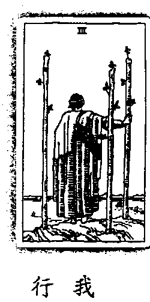

我從兩難抉擇中找到平衡，滿足之餘我尋求改變、拓展內在自我。暫且沉澱自己，等到機會上門的那一天，我蜷伏而出，向外航行，生命的旅程進入下一階段。

## 權杖3

外旅游的可能。海上的船隻代表目前為止努力的成就，已有小成。男子可以按部就班，依照目前 進度往前走，而在享受成就

## 逆位牌義

權杖四象徵安定、穩固與安全感，逆位牌則缺乏這些元素，覺得沒有安全感，不相信自己，也不信任別人。逆位的權杖四含有等待的意義，代表沒有責任感，還沒打算讓自己鞏固與安定下來，不願意允現承諾，或是甚至不敢給予承諾。在事業方面，逆位牌則表示等待、承受壓力與毫無進展的工作。

## 解牌關鍵字

感情方面逆位權杖四象徵假象，或是不完整的愛情，代表守候愛情，獨自在家中等待。可能會出現意料之外的人或突然的別離。

-   感情：守候、等待、沒有安全感、缺乏責任感、出現意外的第三者、突然的別離、不安全的愛、不打算安定下來。
-   工作：假象、出現壓力、不負責任、不平静的環境、毫無進展。
-   金錢：不穩定的投資環境、危險的理財規劃、等待、突然失去錢財。
-   心靈：內心充滿不安、混亂的思緒、無法平靜下來。

## 權杖5

## 牌義解析——陷入混亂的鬥爭

五個人高舉著棍棒，相互打門、爭戰，要爭出個高下。究竟誰能勝出，誰能羅升為領導者，每個人心中都暗自盤算著，希望自己就是那個幸運兒。每個人揮動著手上的棍棒，用盡自己的力氣，希望能將對方打倒，而凹凸不平的地面，更加强了這場鬥爭的不確定性與危險性，讓事件更加混亂。

權杖五是多角關係、一堆狀況、一團混亂，代表外在不和諧與內在的衝突。牌面中五個人各自穿著不同的衣服，衣服顏色也大不相同，意味著各自立場不同。注意到了嗎？不光是衣服，每個人的腳、鞋子的顏色也都不相同，代表除了外顯的立場之外，內在的想法也各懷鬼胎，五種觀點各自相異，衝突與混亂因此誕生。而五個人拿棍棒的方式與方向不一樣，意指行動的方式不一致，各自有各自的做事方法，摩擦因此愈演愈烈，可能會出現意見不合或衝突、無法妥協的狀況。五個事件、五種行動方式，這是內鬥的格局，也是衝突相位。每個人有不同的目的，有人想奪權，有人要利益、要錢，有的想證明自己的能力，有人甚至不知道自己在幹嘛。因此，抽到權杖五可能出現相互競爭的狀況，也可能捲入是非當中。權杖五帶有暴動的能量，屬於身體的力量，可能會出現流血、打架事件。在集體意識方面，例如問世界局勢或是台灣運勢，如果抽到這張牌，再搭配上塔牌，意味著有遊行、暴動的狀況發生。牌面中五個人各自盯著其他人的臉，擔心自己遭到襲擊，是一種防衛與恐懼的流露，也象徵著模仿的舉動，自己模仿他人，或別人模仿自己。在權杖五中，團隊中各自過著各自的生活，容易出現紛爭，每個人都想佔上風，總是將生命看成戰爭，喜歡在身體上與別人較量，透過相互競爭的方式來證明自己的能耐，因此，運動家都擁有權杖五的能量。這張牌象徵著痛苦的精神折磨，意味著對生命有些失望，因此想放棄某些關係，或是一個痛苦的抉擇不斷反覆出現。權杖五也象徵著權力門爭、衝突事件、爭吵、出現阻礙，也代表情緒暴躁躁不安，彼此價值觀相異，但雙方仍堅持已見，造成兩敗俱傷。事業方面有是非、小人，進而影響響升遷狀況，而問金錢要特別小心衝突與紛爭。如果没有準備懷孕的話，要小心突如其來的懷孕或是流產的現象。

## 解牌關鍵字

-   感情：第三者、多角關係、價值觀互異、因為意見不合而爭吵、慾望沒有得到滿足、兩人距離愈來愈遠、分手、舊情復燃、友誼重修舊好。
-   工作：事業上有是非、小人、出現阻礙、各持己見造成兩敗俱傷、權力門爭、衝突事件、口角、升遷狀況受影響。
-   金錢：金錢上的衝突與紛爭、投資無法獲得回報。
-   心靈：面臨生命中的挑戰、情緒暴躁不安、內心出現衝突與矛盾。

## 逆位牌義

與正位相似，逆位牌也代表紛爭，但程度沒有正位能量來得強烈，也代表爭吵過後的妥協。逆位牌也帶有欺瞞，甚至是詐欺的能量，蘊藏了複雜的情緒，充滿矛盾、猶豫不決的關係，也意味著需要包容別人。如果抽到逆位牌，代表會透過野蠻的方式解決問題，在家庭方面，可能會出現暴力事件，父母責打孩子，而孩子欺負動物等，如此惡性循環，情感方面容易出現靈魂綁票的狀況，雙方各持已見，在一起爭吵不斷，但之間卻被某種關係綁在一起，遲遲離不開對方。遇到這些狀況，建議不要使用蠻力解決問題，彼此良好的溝通才能化解衝突。

-   感情：欺瞞、矛盾的感情、猶豫不決的關係、爭吵過後的妥協、必須包容對方、無法離開的感情。
-   工作：衝突事件、受到欺騙、爭執、用蠻力解決問題。
-   金錢：金錢上的紛爭、遭到詐欺、詐騙集團、錢財受到束縛。
-   心靈：混亂的情緒、矛盾的內心、焦躁不安。

## 權杖6

## 牌義解析——凱旋而歸

中，擁戴者揮舞著權杖，歡呼勝利者的歸來，白马也披上象徵榮譽的外袍，為這場盛大的慶功宴增添幾分喝采，而頭上與權杖上的桂冠花圈，更襯托出勝利者的容光煥發。權杖五的爭鬥衝突中，每個人堅守不同的意見；到了權杖六，意見被統一了，對時與爭鬥已經弭平，勝利者終於出線，意味混亂的境況已經消除，成功在望。男子的頭上與權杖上，各自穿戴著桂冠花圈，象徵自信、勝利與榮耀，暗指著只要用自信面對人生，成功的機率必會大增。

我領受眾人的盼望，猶洋於擁戴之中，頭上的桂冠吐露出自信與勝利。然而，榮耀的背後卻隱藏著驕傲，我需要謙卑，以期達到內心的和諧。

〔寶靈心塔羅〕180

获取更多好书，请加微信：13641926204 或 QQ:715104687

## 解牌關鍵字

-   感情：成功的戀情、戀情終於開花結果、感情發展順利。
-   工作：好消息、機會上門、獲得勝利、成功達成目標、靠自己的努力實現願望、無往不利。
-   金錢：投資有成、財源豐碩。
-   心靈：感受到成功與榮耀、對自己充滿自信、擁有動力與熱情。

## 逆位牌義

要記得在最高峰時，更要懂得謙卑，注意自己的行為舉止。人怕出名豬怕肥，光芒太閃耀時，優越感可能會超出自我，讓人變得驕橫跋扈、肆無忌憚，不但可能傷害別人，還可能招致流言纏身。需要顯露光芒時，要盡量放出來，一旦覺察到自己即將陷入驕傲時，要記得適時收斂光芒。如果拿捏得宜，權杖六的人可以一直站在成功的位置上，屹立不搖。

-   感情：戀情失敗、禁不起失戀的打擊、缺乏熱誠的愛、遭到背叛。
-   工作：短暫的勝利、表面上的成功、成功遙遙無期、計劃延遲�、被挫折打倒。
-   金錢：帳面數字漂亮，但實際獲利卻不然。投資等待回收、功虧一篑。
-   心靈：內心充滿恐懼、失去熱情、不相信自己能成功。

## 權杖7

## 牌義解析——寶力抵抗來敵

男子是驍勇善戰的門士，手中的權杖是他最熟悉的武器，他站在制高點上，寶力向下反擊禦敵，捍衛自身安危。下方六根權杖不斷向上攻擊，顯得咄咄逼人，絲毫不留情。儘管男子以寡擊眾，但他佔有地形優勢，而臉上堅毅的表情也透露出必勝的決心。權杖五的混戰場面到了權杖六，雖然稍有平息；但走到權杖七，爭門又起、一發不可收拾，牌面中的男子以一擊六，代表衝突再次出現，且困難程度比以往更加劇烈，而這六根權杖各自代表著不同的挑戰與干擾。雖然孤軍奮戰，男子臉上卻絲毫未見怯色，近身肉搏的經驗他從沒少過，他決心正面迎戰，臉上的表情剛強，透露出堅毅不拔的決心。這也代表在目前的處境中，必須靠自己的力量往前走。抽到這張牌的人通常會很強悍，不僅對自己要求，包括周遭狀況、金錢、朋友與家人，都希望能介入關心，甚至掌控所有的狀況。

這類型的人非常豪放、熱情、有活力，行事大膽，面對挑戰完全不會有任何恐懼。權杖七的人很喜歡冒險，未知代表著無限可能性，讓他全身充滿活力，只要能勾起他的好奇心，什麼事他都躍躍欲試。權杖七帶有火元素，相信愛情就是要轟轟烈烈，為了擄獲情人的心，再怎麼猛烈的攻勢他都願意一試；在事業上則是拼命三郎，為了滿足自己的成就感，他絕對會竭盡所能，一路衝到底。而火能量帶有熱度，必須注意跟火有關的狀況，例如不當用火、電線走火、爆炸等等都要特別小心。

男子手中握著權杖，這是在權杖六凱旋歸來的戰利品，象徵著權力與地位。雖然前方困難重重，但男子站在高處往下禦敵，占據作戰的有利地勢，意味著在目前的狀況中占有優勢，也代表已經有了一定的成就與地位，也暗喻著未來成功的可能。然而，男子心中卻隱藏著恐懼。經過權杖五的殘酷征戰，男子體會過失敗的痛楚，至今仍歷歷在目。因此，他的內心出現了一些掙扎與質疑，擔心自己會失敗，但是又沒有勇氣，無法承認自己的脆弱。抽到這張牌的人通常表面看起來很勇敢、很堅強，但他只是將害怕全數往心裡吞，不願意說出來，更別說尋求協助、找尋外援了，因此會出現孤軍奮戰的狀況。

數字七象徵目標，而權杖七代表為了目標奮戰，決心捍衛屬於自己的東西，即使知道前方的道路滿地荊棘、困難重重，仍然以堅忍不拔的態度勇敢面對。抽到這張牌，必須更加投入、堅守

## 解牌關鍵字

-   感情：應情成功、佔優勢、勇於挑戰競爭對手、堅定的意志力、遇到困難仍繼續堅持。
-   工作：佔據有利位置、積極面對挑戰、只要不放棄就能獲得成功、成果漸漸展現。
-   金錢：能夠回收成本、遇到挫折也不放棄。
-   心靈：堅定的內心、努力奮戰的精神、永不放棄。

## 逆位牌義

逆位的權杖七中，男子所處的地形優勢瞬間消失，面對眼前的眾多敵人，男子顯得相形臟弱，意味著原本的堅定信念因此受到動搖，開始出現慌張、手足無措的狀況。面對眼前的挑戰，不相信自己能夠堅持下去，開始驚恐、害怕，處於進退兩難的狀況，而情感方面也是處於尷尬狀態。

-   感情：進退兩難、害怕、陷入僵局、想放棄卻猶豫不決。
-   工作：慌張、面臨二元抉擇、缺乏自信、延宕不決、無法解決問題。
-   金錢：遇到限制、投資條件不佳、退縮心態。
-   心靈：不相信自己能堅持下去、內心軟弱、缺乏勇氣與衝勁。

## 權杖8

## 牌義解析——迅速的步調

天空如此蔚藍晴朗，原野如此遼闊盎然，八根權杖劃過天際，動作整齊、方向一致，一同向下疾駛俯衝。八根權杖往上無牽制，向下又尚未落地，自由自在地在空中飛行，不受任何限制。所有權杖長度相仿，只有一根較短，是其中美中不足之處。後方綠油油的一片草地，點綴著流水、綠樹與小屋，洋溢著簡樸又平淡的幸福；然而，權杖一向匆匆，背後的風景一再錯過。

八根權杖方向一致，像標槍一般，直直地往右下角奔去，帶著極快的速度感與行動力。右方象徵清晰的理智與明確的目標，代表心中存在著非常明確的方向，並且能夠透過理性思考做出完善規劃，讓目標順利達成。權杖八象徵著一件事情的快速開始與快速落幕，夾帶著強大的力量與

地。時間如同流水，來去匆匆之間，平淡的天空就這麼一閃而過。我拿起韁繩，全身的能量迅速匯聚奔流，疾駛於天際、奔馳於大

## 解牌關鍵字

-   感情 : 無拘無束的關係、快速的進展、衝動的決定、異國婚姻、閃電結婚。
-   工作 : 整合資源的好時機、足夠的發展空間、往海外發展的可能性、行動迅速、行事衝動、快速的變化、倉促的決定。
-   金錢 : 多元的投資環境、投資海外市場、意外的變化、突如其來的決定。
-   心靈 : 充滿動力、樂觀積極、認為生命充滿無限可能。

頭上的傷痕是曾經失敗的證據，男子不僅以此為戒，更從挫敗中學習經驗，提升自己的戰術 與禦敵技巧。回顧權杖五到權杖七，男子在這些階段中所經歷的爭鬥全都一團混亂，靠著犧牲力克 敵；到了權杖八，權杖根根整齊排列，似乎透露出開始運用戰術的端倪，但仍然太過衝動。到了 權杖九，男子對於戰術了然於心，不僅善用防守策略，還懂得補上屏障的漏洞。在療傷期間，男 子一刻也不敢鬆懈，紮紮實實地顯現了戰將的智慧，而這些智慧都是從障的漏洞性。在療傷期間，男 抽到權杖九的人通常是一個埋頭苦幹、行事謹慎的人，但是之前辛苦貢力的奮戰，讓他覺得 身心俱疲，因此他必須改變模式，停下腳步，衡量目前的處境，評估自己的優勢與劣勢，才能決 定未來的路要怎麼走。然而，權杖帶有火元素，天生就是個戰鬥家，突來的平靜反而讓自己感到 恐慌，甚至會到處尋找衝突點，常常會發生自己創造敵人，自己卻渾然不知的狀況。牌面中男子 紅色上衣搭配綠色鞋子，也呼應了這種衝突與矛盾。 牌面中後方的八根權杖，空留武器，但人去樓空。有著革命情感的戰友都跑掉了，只剩男子 孤軍奮戰，意味著必須靠自己的力量克敵制勝。然而，權杖九也藏有隱憂，之中的防禦力量也可 能變得過於謹慎、過度保護自己，甚至變得畏縮。如果心中選擇無法消弭先前受傷害的陰影，可 能會因為害怕受傷而不敢採取行動，無法展現原有的創造力。必須放掉恐懼，勇敢接受眼前的挑 戰，過往的豐富經驗，正是最好的資源與武器。

## 天使神秘學院官方淘宝 : http://strc.taobao.com

## 解牌關鍵字

## 解牌關鍵字

-   感情：有潛在的競爭對手、進入磨合期、套用過去的感情模式、深受過去的情傷影響。
-   感情：對感情過度悲觀、現在使用傷痛之中、無法接受新戀情、無法全心全意地付出。
-   工作：開始發現事情有難度、有隱藏的敵人存在、自己創造敵人、害怕遭到中傷或攻擊。
-   工作：注意力不集中、失去衝勁與動力、認為自己一定會失敗、失去動力與力量。
-   金錢：過於小心翼翼、不敢下手投資、害怕錢財損失。
-   金錢：放棄投資、過度的擔憂、錯誤的決定。
-   心靈：自我欺騙、心中被過去的傷害與痛苦填滿。
-   心靈：極度悲觀、無法療癒過往的傷痛、陷入絕望之中。

## 逆位牌義

逆位的權杖九變得更加悲觀，對自己沒有自信，無法全心全意面對一件事，仍然陷在過去的 害怕之中，走不出來。

因為行事太過謹慎，認為自己不管做什麼都無法成功，根深蒂固地相信自己是輸家。建議這 時候必須緩一緩腳步，調整各方面的狀態，療癒傷痛、恢復動力與力量之後，再重新出發。

## 權杖10

## 牌義解析——令人喘不過氣的壓力

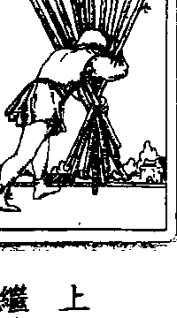

全力承擔。儘管不堪負荷，男子仍然奮力扛起所有權杖，踏著沉重的步伐，一步一步向前 邁進。從男子所在之地到遠方的房屋，還有一大段距離，男子將頭埋進權杖裡，使盡吃奶的力氣，期望到達彼方的日子快點來臨。觀察男子沉沉的腳步，便可猜出，這十根權杖已超出男子體能所能負荷的程度，加上權杖衝動、熱情的能量，意味著不懂得拒絕，將責任、壓力全數攬在身上，也常因為過於衝動，未審慎考量自身能力，便一味扛下重擔。明明已經疲憊不堪，卻給自己更多壓力，可能是因為過於負 担，而不願意放下手上的職責，或是因爲慾望太多、太貪心，而不願意割捨，寧願全數承擔。十根權杖雖然沉重，但男子仍然將全數舉起，十根皆處於騰空狀態，代表男子一根都不願意放棄，咬著牙還是堅持扛著這些責任。

男子腳下的地板，穩固又堅定，象徵著他的個性，踏實卻又有一些固執。權杖十經過了大大小小的人生歷練，這些知識全是難能可貴的實戰經驗，是書本上、課堂上買不到的寶貴資訊。正因爲閱歷豐富，他傾向相信自己眼前看到的事物，相信自己的認知與經驗；然而，也容易受到過往經歷束縛，陷入執著與故我，不輕易接受他人的建言，可能會因此而失去體驗新事物的機會。

男子將頭理進權杖，排除所有外界的聲音與變化，將自己囚禁在自己的小世界中，用土法煉鋼的方法來搬運權杖。男子雖然向前邁進，但因爲視線全埋進了權杖之中，根本看不清楚行進方向。這類型的人容易堅持己見，選擇自己認爲最安全的行事方法，對於別人的建議一概不予理會。一方面不願意放手，另一方面又不相信別人。其實他可以選擇更有效率的方法，或者做出捨，信任他人，將部份責任交託出去，讓行進速度能夠加快，也能減輕自己的負擔。

遠方散播著滿滿的綠意，一片生氣勃勃，旁邊的房屋是男子的家，也是男子的目的地。為了照顧家庭，男子竭盡所能、努力打拼，希望能早日將權杖運回家中，獲得休息的片刻。出現權杖十，通常背後隱含著極大的壓力與重擔，已經超過自己所能承擔的臨界點，讓人喘不過氣來。雖 著放下自己的戒心，適度將責任分擔出去，或釐清事情的優先順序，聽從他人的建議，讓事情更 輕鬆進行，才不會讓自己太過辛苦了。

身體上可能會出現肩頸疲痛、全身無力、怎麼睡都睡不飽的狀況，建議舒緩身心，提醒自己必須適當地休息。另外，試 漸漸地變得不快樂了。身體與精神上的壓力，可以透過按摩、泡澡，放鬆身心，提醒自己必須適當地休息。另外，試

且他什麼都想要，沒有一項能夠割捨，因此他只能忍耐，仍是硬著頭皮往前走。一部分的自我認 真的狀況。

## 逆位牌義

在逆位的權杖十中，忙碌變成了一種理由。這類型的人屬於駝鳥心態，對於不願意正視的問題，便會以忙碌來當作逃避的藉口，運運不肯面對、不處理。例如很多人會以工作繁忙為理由，讓家人找不到他，來逃避家庭中種種的問題與糾結。另外，逆位牌也代表著不斷擺下責任與重擔，如此惡性循環之下，最終被壓力擊垮、不支倒地的慘況。

## 解牌關鍵字

-   感情：逃避現實、忽視兩人關係、責任過於沉重、感情瀕於臨界點、崩潰。
-   工作：忽略家庭生活、被壓力擊垮、精疲力竭、過勞、被責任壓得喘不過氣。

## 聖杯ACE

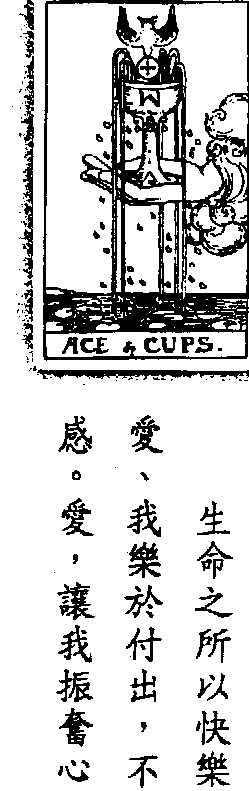

聖杯中的水持續滿溢，所有感覺、情緒、情感不斷傾瀉而出，流進下方的池塘裡，掀起了陣陣的涟漪，一圈又一圈，與蓮葉相呼照應。聖杯是愛，代表所有事情都以愛為出發點。源源不絕的泉水，象徵情感的富足以及心靈的滿足，可以享受到比預期中更豐富的情感。五道泉水是五官，也是五芒星，代表人類感性部分，在情感方面得到很大的滿足。權杖一的手緊緊抓住權杖，而這裡的手則是輕輕捧住聖杯，小心呵護、深怕聖杯受到傷害，代表呵護愛情、善意的回應、正面的回饋。雲象徵自由心智，權杖一的雲組織緊湊，督促權杖、展現行動力；聖杯一的雲則是蓬鬆飽滿，需要心靈的富足與滋養，不一定是有形的東西，心情、 感覺才是最主要的考量。鴿子像天使一般，從天上啣來禮物，祝福著這段感情。鴿子代表和平與平靜，是源自內心滿足的情感，也象徵著這件事情被看好，或是關係受到外界祝福。鴿子啣著一枚圓餅，象徵基督教中的 聖餅和聖餐。杯子將裝著耶穌的血，而餅代表聖靈，是心靈上的依賴和支柱，象徵著耶穌犧牲自己的鮮血與肉身，代表為了心中的愛，願意犧牲、奉獻，完全不求回報。圓餅中的十字架代表 心靈，是最原始的靈魂，象徵了解自己在情感中真正渴望的东西，明白了生命中真正的意義。 聖杯一象徵著快樂，代表和平與喜悅的愛。通常聖杯一的出现是代表剛開始萌芽的愛情，正在經驗感情的滿足期，也常常是還沒正式在一起的階段。這張牌的出現也可能代表開始用感覺來 決定事情，數字一代表自我，而聖杯是感覺、情緒，由自己的感覺為導向，往往能做出最適當的 決定。做什麼決定會讓自己快樂，那就去做吧！ 生命如果没有靈魂，再怎麼努力也快樂不起來。如果心靈富足了，喜悅也會跟著來。抽到聖 杯一的人，需要的是心靈上的契合，不管在事業、愛情或是金錢方面，皆是如此。要愛，就一定 會受傷害；如果能全身而退，就感受不到自己身在愛當中。如果感覺對了，心靈飽實了，愛可以 是無條件的，聖杯一的出现，表示願意犧牲、奉獻，完全不求回報。付出，才能感受到真正的快 樂，真正的愛。 對抽到聖杯一的人來說，生命没有任何條件，活生生地付出所有一切，這種血淋淋的犧牲， 就是生命。在外人的眼光看來，這種人或許很傻、很笨。但是聖杯一完全活在愛裡面，為愛奉獻、為愛付出，反而能滿足自己的心靈。有些人，即便遭受周圍親朋好友的反對，仍然為愛奮不顧身。每個人都覺得他吃了虧，但是他自己卻沉浸在喜悦之中，完全不覺得有任何虧損，這就是聖杯一的能量，一種好愛、好愛的感覺。

由聖杯中冒出的五道泉水，象徵著豐富的愛。然而，過多或滿溢的愛，會讓另一半、家人受 能是家人給你的愛，讓你喘不過氣。而鴿子口中啣著圓餅，代表上天降下的祝福，代表要得到祝福才能有愛的感覺。因此，不論出現哪一種家庭狀況，建議去享受、感激，感謝上天給你這樣的感覺。在工作方面，聖杯一代表犧牲奉獻，通常是在工作上很累、報酬可能也不高，但是因為自己已很愛，在精神上很充實，所以無法離開。相反地，如果不夠熱愛這份工作，建議你趕快離開，因為你無法奉獻，在工作上便會逐漸失去動力，會變得懶散，喪失效率。

聖杯一象徵著透過愛來振奮心靈，但是必須消除自我、去除不滿足的部分，傑傑地付出，就能得到快樂。只要放開心，用力去愛，就能獲得，這是生命中的成長。

## 逆位牌義

金錢：豐富的獲利、投資順利、財源滾滾。

心靈：心中充滿著愛、心靈上的富足、沉浸在喜悅當中。

逆位的聖杯一代表，由於放不下過去的傷痛，因此刻意關掉感覺，不想知道自己的心。在感 覺方面，逆位的聖杯一代表單戀，也代表虛假的愛，可能是單方面的付出，沒有得到回報，也可 能是在感情中遭到欺騙。這種愛不到的感覺可能會轉變為嫉妒，進而轉化為悲傷、痛苦，陷入內 心的黑暗面。

出現逆位牌表示沒有安全感，因此掌控慾逐漸浮現，開始出現恐懼和擔心。在工作方面代表 喜歡與同事競爭，卻又沒有權杖的能量，因此會在內心較勁，與他人做比較，結果反而什麼事都 做不好，讓自己很受傷。

## 解牌關鍵字

感情：虛假的愛、單方面的愛、沒有回報的愛、隱蔽自己的感覺、混亂的內心、得不到愛。

工作：改變、沒有回報、失去喜悅、感受到黑暗面、喜歡與人較勁。

金錢：不穩定的環境、投資石沉大海、不安與焦慮。

心靈：內心感到痛苦與哀傷、充滿嫉妒、沒有安全感、恐懼與擔心。

## **牌義解析——平等的合作關係**

## **聖杯2**

從一個人的感性，進階到兩個人的關係，雙方彼此互補，相互處於平等位置，這是良好關係的起步。晴空萬里的天氣，也投射出未來順利發展的狀況。聖杯二代表很和諧的兩性關係、合夥關係，或是朋友、家庭關係。牌面上一男一女各自握著聖杯，兩人站立的高度一樣，杯子舉的高度也在相同位置，意味著雙方處於平等的地位，能夠相互依賴、彼此尊重，在任何情況下，都願意為對方付出，可以互相平衡地信任對方。獅子是強大力量的表徵，也象徵著物質的慾望。長出翅膀代表中和靈性與物質的能量，有主動出擊的勇氣以及心靈的力量，進入兩人關係當中，能夠更了解自我，得到更深入的感動。這份 我與你，居於平等位置，相互依賴，也相互尊重。你的出現## 解牌關鍵字

感情 : �糾繞、過度放縱、短暫的戀情、感情遇到阻礙、感到失望。

工作 : 過度享樂、喪失名譽、事件的延遲、缺乏感歡、暫時的成功。

金錢 : 炫營金錢、奢侈的消費習慣、不懂得回饋。

心靈 : 過度重視美麗的外表、內心感到空虛、失落。

天使神秘学院官方淘宝：http://strc.taobao.com

## 牌義解析——無法滿足於現況

## 聖杯4

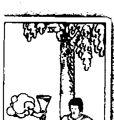

男子看起來百無聊賴，盤坐在樹下，跟前的三座杯子，是他目前擁有的東西。雙手交叉於胸前的男子，不管外界再怎麼喧嘩吵鬧，也不想理會。他的情緒、感覺愈來愈波盪，跟前的一切已經無法滿足他。男子正思付著未來，怎麼樣才能得到更多呢？一朵白雲飄來，心靈之手為男子帶來希望，這是他的想像，是他夢想中渴望的美好。

聖杯四有冷漠、不滿足現況的意味，聖杯象徵情感、情緒，也代表機會，男子雖然已經有了三座聖杯，但卻不因此而滿足，甚至還想要更多。白雲象徵心靈目標，雲中浮出一隻心靈之手，這隻手是右手，代表心中想要做的事；而手裡握著的聖杯，是男子以為自己擁有或渴望得到、卻

你的思想與感覺創造世界，決定了更多想像與願望。你是永遠不滿足的，世相百態，樣樣令人迷惑，心中的慾望也跟著愈演愈烈。回首真正的現實，回歸自我吧！知足，才能擺脫煩惱。

## 解牌關鍵字

+   - 感情：精神外遷、多情、不滿意目前的感情、過度依賴、幼稚的感情、熱情衰退、期待新的 感情。

+   - 工作：背叛事業、不安於現狀、注意力不集中、失去熱情、不成熟的處事態度。

+   - 金錢：不滿足目前的獲利、感到失望、依賴他人。

+   - 心靈：感覺疲累、對事情反感、永遠不滿足、做白日夢。

權杖二與聖杯四同樣存在對現況不滿意的問題，但是權杖二屬於物質層次的不滿足，且行動 力充足；而聖杯四則是心靈上的不滿足，容易出現精神外遷、背叛事業的衝動。牌面中的男子背 後有一棵樹，他以為身後有依靠，但是卻沒有真正靠著樹，因此抽到聖杯四，常常會出現分心、多情，甚至情感隨便或不謹慎的關係。必須隨時感受與感知自己的情緒，發現不對勁的時候，要 適時喊住自己。 如果無法滿足於眼前的事物與機會，可能要檢視自我的內心深處，當內在心靈與頭腦想法結 合起來，才能面對真實，清楚自己的不足，了解夢想的高度是否適合現在的自己，進而得到真正 的滿足。聖杯帶來了許多夢想，但要先學會感激與享受現有的一切，不然只會愈來愈不安，即使 機會來敲門，也可能不懂得把握。

(寶靈心塔羅) 214

## 逆位牌義

聖杯象徵著新的機會與許多可能性，正位的聖杯四代表正在期待新機會，但卻遲疑、恐懼，不敢接受，是處於新關係尚未成形的狀態。同樣地，逆位牌也代表新契機的出現，但是心態較開放，具有熱情與行動力，因此代表著新機會的實現，可能是新關係、新知識或是新工作型態。逆位牌也象徵著新舊之間擦出不同的火花，用新方法解決舊有的問題，或是在舊有情感中創造出新希望。

## 解牌關鍵字

+   感情：新戀情出現、舊的情感創造出新希望。

+   工作：用新方法解決舊有的問題、新階段、新機會、新工作模式。

+   金錢：出現新的可能性、新的投資目標。

+   心靈：開放包容的態度、迎接新的階段。

## 聖杯5

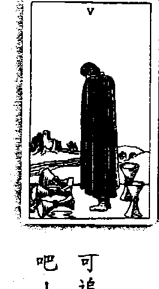

## 牌義解析——流失的過往

陰沉的天空，瀰漫著一股哀愁的氣息。裏著黑色長袍的男子低頭、掩面，看著前方倒下的三個杯子，滿溢著不捨與悲傷，他的悲慾太過高漲，盡管後方立著兩座聖杯，也視而不見。然而，要怎麼回家呢？滾流的長河隔絕了男子與城堡。這時候，圓弧拱橋帶來一絲希望，山窮水盡疑無路，柳暗花明又一村。

牌面上的男子蘊藏著深深的悲傷與失落，前方倒下的三個杯子是逝去的過往，代表錯失的機會、期待的事情落空。生命的河流不停流轉，錯失的機會就這麼流逝，但男子仍然站在原地，無法止住傷。他眼前只專注在倒下的那些杯子，因此，聖杯五代表失落，是生命中的低潮期，覺

再怎麼懷已流失的歲月，如今看來也是枉然。逝者已往，來者可追，跌倒並不可怕，可怕的是再也站不起來。擦乾眼淚，繼續向前吧！

## 解牌關鍵字

感情：走出過往的傷痛、嘗試新的戀情、有希望的感覺。

工作：重新合作、決心改變、恢復過往的活力與衝勁、充滿希望的未來。

金錢：重新投資、重新整合理財規劃。

心靈：走出內心的陰霾、望向光明的未來。

## 解牌關鍵字

感情：後悔、傷心、結束感情、不快樂的情感關係、無法擺脫過去的傷痛、沒有真愛的感情、覺得自己無法再愛下去。

工作：合作關係結束、無法忘懷過去的陰霾、感到失落、深陷悲傷、無法擺脫過去的工作模式。

金錢：遺失金錢、對先前的投資後悔、沒有獲利的理財計劃。

心靈：被過往的傷痛糾纏、走不出內心的枷鎖、看不見未來。

## 逆位牌義

逆位牌代表能轉過身來，看到身後立著的杯子，象徵有希望的未來、走出陰霾、走出過去的傷痛，已經恢護原本的狀態了。逆位牌也代表終於下定決心改變，能夠重新結合，重拾合夥、合作關係，意指有希望的未來。

## 聖杯6

手套，正忙著整理盆栽。隔壁的男孩見狀，不忍心柔弱的女孩如此勞累，趕緊挺身幫忙。盆栽中盛開的桔梗，一朵朵散發濃濃的愛。將牌面劃為兩半，左面代表年長與強者，而右面則是年幼與弱者。兩棟建築物一高一低，較高耸的碉堡有瞭望、守護的功能，捍衛著房屋的安全。左邊有一名男人，手持著利矛，正邁步走回碉堡，準備執行勤務，監看四周，預防敵人侵入，保護孩童與房舍的安全。花園中，年紀較長的男孩保護著年幼的女孩，幫助她搬運盆栽，讓女孩感到十足的安全感。聖杯六種種的符號象徵

後方兩間房屋看起來牢固又安全，給予小孩最好的庇護。花園中一片綠意盎然，小女孩戴著不大的彼得潘。無條件地犧牲與付出。怎知，依附環境卻抑制了小孩的成長，落為長深情守護，細心照顧，讓稚嫩的小孩逐漸茁壯，就像大地之母，

[PAGE 223]

都透露出一股股的守護、照顧與安全感。透過碉堡與大人的保護，兩名孩童處於很安全的環境，過著祥和、平穩的生活，彼此互相照

顧。因此，權杖六意味著想安安穩穩地過日子，認為平淡就是幸福，對目前的安定生活感到滿

意；另一方面，也代表不想改變現況。因為害怕未知的阻礙，寧願選擇保守的道路，不喜歡冒險。在情感關係方面，聖杯六常用來表示初戀或是第一次的愛，流露出溫柔與私密的感覺。牌面中的人物受到保障與守護，在這樣的兩性關係中，一方擔負保護的責任，不讓弱小的一方受到任 何傷害與驚嘆。就像年紀較大的男性會保護弱小的女性一樣，天性本來如此；然而，站在保護弱方的角度，強者會承擔起所有事情，極力保護脆弱的一方，可能導致關係變質，變成一種不允許對方成長的方式。過度保護的後果，讓小女孩無須面對挑戰、不必經驗人生，甚至失去照顧自己的能力。一旦屏障、庇護消失了，小女孩很可能會手足無措，沒有自力更生的能力，心中會存在著很大的恐懼。就像父母溺愛小孩，過度寵溺，導致小孩不知人間疾苦，挫折忍受力大大降低，變得愈來愈依賴，沒有自主能力。

數字六有一過去的意義存在，是兒時記憶、過去的情感經驗、熟悉的人事物和環境，也可能是對金錢管理方式的既定原則。抽到聖杯六，意味著必須回溯過去的記憶，或是受到保護，在過去一段影
響深邃的情感關係，讓你一直念念不忘，因為自己一直保護對方，或是受到保護，在過去的關係中有很多安全感，即使天塌下來也有人擋，什麼都不需要害怕。這樣的經驗與記憶刻劃在腦海中，

[PAGE 224]

影響著日後的一舉一動。牌面中的孩童面貌很成熟，看起來像是成年人，卻穿著小孩子的衣服，代表應該要開始負責任了，卻畏縮恐懼，披回孩童的衣服，無法真正的成熟與成長。聖杯中盛開的桔梗花象徵永恆不變的愛，抽到聖杯六代表在情感關係中扮演著照顧者的角色，就像父母親呵護孩子，無私奉獻、不求回報。年紀長或是能力強的人去照顧弱小的一方，代表守護與照顧，也暗藏著不平衡的關係，即使是真誠的愛，也是建立在不等關係當中。照顧呵護的同時，也參入了強烈的控制慾與掌控權，而受照護的一方，也會像溫室中的花朵一般，無法真正茁壯，不堪一擊。出現聖杯六，代表一段值得懷懷、曾讓人悲傷的過去，讓人不願意碰觸，也代表身處保護他人或受到保護的狀態之下。無論問工作或是情感方面，都必須回顧第一份工作、第一段情感，從當時照顧人抑或被照顧的狀態，進而探究與比照目前的狀況。聖杯中裝載著盛開的花朵，意指著豐盛的物質生活，代表著不必擔心物質層面的問題，但必須突破心防，思考過去的情感與經驗。如果將安全感建立在別人身上，只會陷入不断索取、依賴的狀況，成熟的靈魂才能建築踏實的內心、消弭自我的恐懼。即便有一天可能會有人傷心，但這也是人生中可貴的一刻。

## 解牌關鍵字

感情：渴望穩固的感情、守護的愛、對舊戀情念念不忘、無私奉獻、害怕未知的阻礙。

工作：對目前的安定感到滿意、不願意改變、保守的理財方式、照顧他人、掌控慾、渴望權力。

金錢：安於現狀、不願意改變、保守的理財方式、滿意的財富。

心靈：回到孩提時代的記憶、享受平淡安穩的幸福。

## 逆位牌義

逆位的聖杯六中，往日的屏障與庇護已經不再，自己必須學會獨立，意味著新發現、新機會、新生活，可能透過心靈上的成長，而改變天賦上的一切；也代表改變一成不變的生活，不再拘泥於前的想法與經驗。

## 解牌關鍵字

感情：出現新對象、迎接新關係、感情出現新發展、不再依賴對方。

工作：新機會、新工作型態、不拘泥於過往經驗與觀點。

金錢：改變理財方式、獨立投資。

心靈：改變想法、擺脫過往的想法、迎接新生活。

## 聖杯7

## 牌義解析——追尋真實的自我

淺藍色填滿牌面，一片如夢似幻。豐厚的雲朵上，擺放著七座聖杯，裝載著五花八門的想，人像、城堡、珠寶、桂冠、魔鬼、蛇、穿著壽衣的死者，反映著黑衣人內心的慾望。黑衣人只現身形、不見容貌，帶有幾分神秘，夢境中的渴望，究竟哪一個才是真實的自己呢？恐怕連黑衣人自己也難以斷定。七座聖杯全漂浮於雲端之上，雲代表想像，意味著這些聖杯的虛幻與不真實，如同夢境一般。黑衣人看著聖杯，左上角的人像是面具，是自己在外呈現的面容，也是最好的武裝，意味著在人前呈現的不是真實的一面。聖杯出現順序爲逆時鐘，代表最深層的潛意識、內心的想法。接

努力的一切爲了什麼？覺得滿足嗎？這是你要的嗎？抑或只是活在人的本體，深切體會真正的喜樂與感動。

## 解牌關鍵字

感情 : 不真實的感情、活在自己的幻想當中、尋求刺激的感情、沒有結局的關係。

工作 : 突然產生的念頭與想法、白日夢、迷失自己的目標。

金錢 : 被名利沖昏了頭、為了賺錢而不擇手段、追求金錢而忘了自身價值。

心靈 : 憑望過多、不了解自己內心的渴望、在混亂中成長。

己，才能繼續往人生的道路邁進。

追求真實的自我吧！聖杯七提醒著我們，要將過去的經驗轉變為有用的知識，讓自己的知識因為過去的經驗而醞釀成智慧，讓自己的心靈成長。

透過內在的探索，找出自己真正的渴望與需求，找出可以讓自己滿足的东西。想一想，什麼事情會讓你覺得很快樂？什麼事物會讓你眼睛為之一亮？能讓你

少了一塊。通常聖杯八的人在事業上很有成就，位階可以爬到很高，但非常需要情感上的支持與愛，爲了情感，可能會不惜代價去追尋。因此，如果抽到聖杯八，必須隨時檢視自己，在追求情感的过程中，所做的行爲是否合乎內心的標準。

數字八充滿著對權力與物質的慾望，牌面中的八座聖杯，正代表著無窮的慾望以及名利。底下的五座聖杯與上方的三座相互交疊，暗指著眼前的利益與權力已經陷入一團混亂，而男子試圖在其中尋找平衡；於是他必須做出割捨，深入山林尋找內心真正的自我，這是一個蛻變的時機。抽到這張牌，代表著對現狀的不滿足，或覺得過去已經夠了、值得了，也代表內心枯竭的狀態，因此勇於捨棄對過往的眷戀，跳出慾望的泥沼。

在工作方面，代表事業到達一個標準，自己覺得已經夠了，意圖向外突破。抽到聖杯八代表已經深思一段時間了，這時候必須決定離開或邁向下一個階段，不會停留在原地。而感情方面，則代表一段關係的分離或走向下一個階段。之前走著別人建立的道路，而覺醒之後，決定邁向自己的內心之旅，爲自己而活。天空上的月亮其實也藏著太陽，意味著日以繼夜地奔波、不斷思潺潺流水在翠綠高山之間奔竄，象徵著勇敢的態度與堅定的決心。行走至此，終於鼓起勇氣，放下過去的包袱，邁向嶄新的生活。男子背對八座聖杯，獨自低頭前行，意味著放下對過去的

的眷戀，勇於突破現狀，扭轉自己的人生。穿著紅色衣服與鞋子，突顯出積極、主動的意志力，手上握著登山杖，象徵具體的行動力，將內心的意向化爲真實。因此，抽到這張牌，代表著找到目標、一定會離開，以及下一個會更好。

聖杯八也提醒我們，在生命當中，必須思考自己內在的情緒反應，可以透過靜坐、冥想、

靜心等等方式，透過直覺來感應真實的狀況，以追求心靈層面的成長，與內在的真我對話。抽到

聖杯八的人，對於目前面臨的混亂景況，會爲了讓自己參透某些真理、找出自己內在真實的渴

求，而故意窮盡自己、煎熬自己，把自己關起來或是武裝自己。如此一來，可能會導致抑鬱的情

繫，反而讓狀況愈來愈糟。必須透過冥想或是心靈層面的練習，才能幫助自己走出來，與內在心

靈相連結。

## 解牌關鍵字

感情：對現狀不滿足、找到目標、下一段感情會更好、渴望愛情、勇於追求愛情。

工作：具備勇氣與力量、不滿意現狀、力求突破、實現計劃、不惜代價達到成功。

金錢：已經有一定的錢財、對現狀仍不滿意、放下過去的束縛與限制、繼續努力賺錢。

心靈：勇敢的態度與堅定的意志力、放下過去的包袱、追尋自己渴望的夢想。

## 逆位牌義

逆位的聖杯八意味著仍然遭受過去名利、權力與慾望的約束，雖然感到混亂與不安，心中仍 然鼓不起勇氣與自信，無法超脫自我，尋求轉變，只能帶著駭鳥心態，一再逃避。 再來，逆位牌對於轉變除了恐懼與擔憂之外，也存在著怠惰與懶散。雖然自己對現狀非常不 滿，也渴望新生活；但又覺得轉變的過程太麻煩，最終只能任由慣性與惰性擺布。另逆位牌也代 表著太快下決定，沒有考慮周延就決定放棄。

## 解牌關鍵字

+   - 感情：逃避問題、很快就放棄、自我封閉、缺乏自信。
- 工作：逃避現實、缺乏信心、缺乏行動力、怠惰、思慮不周詳、驟下決定。
- 金錢：沒有勇氣嘗試新事物、沒有想清楚就放棄。
- 心靈：內心充滿擔憂與恐懼、轉而逃避、不願意面對現實。

# 聖杯9

## 牌義解析——展示成功的果實

體態豐腴的男子安坐在木椅上，雙手交叉置於胸前，嘴角微微上揚，一副志得意滿的樣子。

與模素的衣服比起來，男子頭上的紅帽子顯得格外顯眼。讓男子感到得意的，便是身後藍色布幔上的九座聖杯，座座都是男子辛苦的結晶，金黄色的聖杯與黃色背景相互照應，閃耀著炫目的光芒。

這些聖杯對男子來說，就像紀念勝利的獎杯，意義非凡。正因爲之前曾經勞心勞力、付出一切，現在看男子只想守著這些得來不易的成就，不再輕易地付出。爲防止聖杯被奪走，男子將聖杯放置

天願賜福，降臨喜樂。這是個豐收的季節，也是個滿足的時刻。與眾人共享收成，果實將更加甜美，慈善天下，心靈將更加開闊。

在髙樽之上，高度之高，甚至比過坐在椅子上的自己。 男子雙手交疊於胸前，保護著心輪，心輪的位置代表愛人的力量與愛的來源，意味著男子試圖保護自己，不願意輕易付出愛，害怕再度失去些什麼。一路上走來，從聖杯四的不滿足、聖杯五的悲傷與失落、聖杯六的回憶與過去、聖杯七的迷惘，到聖杯八終於下定決心變，聖杯九的男子歷經層層難關，好不容易得到了滿足的情感與穩定的事業。現在的他覺得人生至此已然圓滿，所擁有的一切都是自己辛苦打扮而來，當然要好好守護自己的資產，相對地，也變得更害怕失去。

為已經小有所成，人生該有的都有了，男子臉上寫著一抹微笑，恬適滿足；而頭上顯眼的紅帽，代表力量與成就，透露出男子充滿精力、內心充滿榮譽感，以自己的成績為榮。整體比較起來，男子身上的衣服顯得簡樸，意味著不在乎外在的物質世界，較注重內心的狀態。金黃色的背景則突顯出男子充滿自信、沾沾自喜，也代表男子比較重視自己的看法與理念。

男子最內層的衣服是白色，與頭上的紅帽、腳上穿的紅襪，形成強烈對比，代表活力充沛，內心天真又單純，思考模式與對人的態度都很健康。然而，這也暗指在心靈層面上，雖然內心找到很大的滿足，但還是覺得空虛，聖杯四不滿足的能量仍遊走在這張牌裡頭。雖然不滿足的情緒已經緩和許多，但是仍然找不到真正能夠一起分享的對象。雖然事業如日中天，卻一向獨立作業，遲遲找不到適合的合作夥伴；金錢上亦然，賺錢能力優越，卻一直找不到能夠分享的另外一

## 解牌關鍵字

在聖杯九中，雖然已美夢成真，飛黃騰達，但因過去經歷的夢魘，而採取防禦態度，不願意再進到深刻的愛中。豐富自己的生命吧！勇敢去愛，一生至少要有一次刻骨銘心的愛戀，不要怕受傷害。聖杯九中的男子看起來豐腴，一團肚子圓滾滾，這是因爲愛來自於胃輪，男子過於保護自己，總是壓抑自己的情緒、期待別人先付出，滿腔愛意無法釋放，一股腦兒全累積在肚子上。九座聖杯空空如也，意味著等待別人的付出、只想得到別人的給予，自己不敢再付出，害怕一付出就會受傷害。其實，付出是快樂的，透過給予、分享和施捨，愛的能量才能流轉，生命能因此而豐富。抽到這張牌代表會得到物質上的滿足，像是成功的事業、美滿的愛情、優渥的生活。只是目前尚未找到可以相互分享的人，有時候會覺得再怎麼幸福還是不夠，還想要更多。因此，聖杯九也提醒我們，好好珍惜所擁有的事物，學習分享、施予，快樂便能加倍放大。

-   感情：愛情出現好的結果、只羨羨不羨仙的情感關係、無法互相分享、仍覺得不夠幸福。
-   工作：獨立奮鬥、事業上獲得成就、成功的事業、捍衛自己的權利與地位。
-   金錢：優越的賺錢能力、獲得物質上的滿足、守護手上的資產。
-   心靈：努力獲得代價、學習分享的課題、試著服務他人。

## 逆位牌義

## 解牌關鍵字

感情 : 幼稚的感情觀、過分保護感情、意氣用事。

工作 : 懶散、怠惰、消極的行事態度、被情緒牽著走。

金錢 : 守財奴、吝嗇小氣、斤斤計較、不願意施予。

心靈 : 安守在自己的世界中、過度保護自己、封閉自我。

在逆位牌中，聖杯九守成與保護的態度便轉成了吝嗇、散漫、自負與過度保護。在金錢方面，容易過於小氣、斤斤計較，容易出现傲慢自大的現象。情感方面則代表對愛情的態度不夠成熟，會過度保護自己的感情。而事業方面意味著懶惰成性，工作散漫、不夠積極，容易感情用事。

# 聖杯10

## 牌義解析——圓滿融洽的境界

晴空萬里，七彩繚紛的彩虹橫跨天際，綠色的草皮、蔥綠的樹木洋溢著無限生機與朝氣，溼的河水流瀰著濃濃愛意。放眼望去，一切如此美好喜樂，一男一女穿著樸素，相互擁抱、張開雙臂，迎接著幸福的降臨。身旁的孩童手拉著手，歡喜地繞圈跳舞，慶祝這個美妙的人生。每一座聖杯都與情感相連結，在聖杯牌組中，經歷了大大小小人際關係的課題，領悟與理解了人與人之間的相處之道。過往的歷練與經驗，讓我們學會了妥善經營關係的方法，而聖杯十便是成果的展現，一個完美的結局。牌面上的夫妻衣著樸素簡單，突顯出平實、簡樸的生活，代表著雙方不被物質世界所囷，在這趟旅程中不斷進行心靈上的溝通與互動，即便外在世界再怎麼變

化，無論富裕抑或貧窮，兩人的關係始終如一，彼此的靈魂相互連結，圓滿無暇。

天上的彩虹聖杯象徵克服了先前的狂風暴雨，眼前雨過天晴，意指著圓滿的感情關係。聖杯 十中的男女互動親密，張手迎接彩虹的到來，意味著彼此關係處於和諧融洽的狀態，共享歡樂的

時刻。一改聖杯九中的缺失，雙方不但願意為對方付出，也能站在彼此的立場，為對方著想。在

聖杯旅途裡，人們學著在愛中最美妙的時刻。

也懂得知足與感恩，達到愛當中最美妙的時刻。

牌面上四人閨家歡樂，孩子快樂地跳著舞，父母也充滿喜悅地望著天空，散發著喜樂與分享

的氣圍，表示在團體與家庭關係中，靈魂、身體與心靈的奉獻已經得到結果。在情感關係上意味

著經歷雙方的付出與耕耘，愛情長跑終於修成正果，代表苦盡甘來的關係、找到靈魂伴侶，有結婚、懷孕的機會。家庭方面代表著和樂融融的親子關係，相互體諫與關懷。在工作上則代表上司

或下屬與自己就像家人一樣，是自由、滿足、快樂的良好關係，且彼此心靈契合，只消一個眼神

或一個動作，對方就明白自己的意思了。而事業方面則帶有繁衍不息的能量，能夠獲得富足的收

獲。

然而，必須經歷風雨，才能生成美麗的虹彩。因此，聖杯十隱含著潛意識上的改革與轉變，

意味著初始關係充滿著不安全感，但現在已經打破之間的藩籬，重新思考彼此關係，不會再去計

較誰付出的多、誰付出的少。經歷許多波折，當事人已經變得成熟穩健，能夠整合自己心靈中最

脆弱的部分，不再不安憂慮，甚至有能力給予對方安全感，能夠讓自己幸福，也能帶給眾人幸

福。

## 解牌關鍵字

感情：苦盡甘來的感情、找到靈魂伴侶、和家人一樣的愛、圓滿的關係、有結婚與懷孕的機會。

工作：出現契合的同事、自與滿足的工作環境、不斷擴大的事業版圖。

金錢：終於獲得利益、富足的投資成果。

心靈：心中感到滿足與喜悅、努力終於獲得回報、成熟穩健的心靈。

## 逆位牌義

感情：苦盡甘來的感情、找到靈魂伴侶、和家人一樣的愛、圓滿的關係、有結婚與懷孕的機會。

工作：出現契合的同事、自與滿足的工作環境、不斷擴大的事業版圖。

金錢：終於獲得利益、富足的投資成果。

心靈：心中感到滿足與喜悅、努力終於獲得回報、成熟穩健的心靈。

逆位的聖杯十代表關係失衡，彼此的愛變得自私，可能出现朋友失和，與家人、同事或另一

半出現爭執，或者出現沒有安全感，計較雙方付出的多寡。

逆位牌也代表胡思亂想，腦中千頭萬緒、不停翻擾，也會出現不穩定的情緒，例如現在就煩

惱下個月要做什麼、下一季要做什麼，小孩在學校好不好等等許多恐慌與懼怕，出現這張牌其實是要提醒你，活在當下、把握現在。

對任何事情都充滿新鮮感，認為人生就是一場好玩的遊戲。在聖杯十中看不到痛苦，因為心態開朗正向，不管事情再紊亂、再麻煩，都可以一笑置之，快樂度過每一天。這也提醒著我們，不要把生命看得太過嚴肅，享受當下，每天都是幸福快樂的一天。

## 逆位牌關鍵字

感情：感情失和、

## 解牌關鍵字

感情：雙方冷戰、複雜的感情狀況、感情遭遇困難。

工作：陷入僵局、事情懸而未決、出現阻礙、自我意識過強、缺乏同理心。

金錢：金錢衝突與紛爭。

心靈：過度保護自己、封閉自我的內心、逃避現實。

黑暗中多久，則端看自己如何選擇與決定了。寶劍二的課題是要為自己做出決定，但是靜坐在原地的女子不斷躲藏，缺乏行動力，透過交
叉的寶劍自我防禦，也代表面臨抉擇，無法做出決定。有兩股力量相互抗衡，內心充滿恐慌，陷入自我迷思。唯一能做的就是行動吧！抽到這張牌的人即使表面並無異樣，但卻不去面
對內心真正的問題，用冷漠和孤寂將自己冰封起來，就像行屍走肉一般，學會與他人分享內在的情緒，讓周遭的力量幫助自己化解憤怒、悲傷、恐懼和淚水，讓自己面對真實的自我。
抽到寶劍二代表僵持不下，但最後會逐漸好轉。這也代表須要放開複雜的情緒、思緒和感情
狀況，冷靜下來才能審慎思考，做出最適合的決定。這張牌意味著困難阻礙和衝突爭執的出現，
有自我意識過強的狀況，必須將自己的心胸打開，才能設身處地為別人著想。

## 逆位牌義

這是生命的過渡期，可能出現情緒混亂、被背叛、遭小人和流言中傷、被迫分離或者其他衝
突的事件。逆位牌也代表覺得自己不名譽、丟臉、欺騙別人或遭到欺騙、內心充滿秘密、心口不
# 一、內心出現矛盾。

逆位牌的出現，在情感方面，代表會交到年齡差距很大的情人，年長、年幼都有可能。會遇
到要求自己不断付出的對象，讓你驚覺原來一切都是場夢，大夢初醒會很痛苦，就像是一槍將自
己斃命，但要讓自己學會調適與平衡。

## 解牌關鍵字

感情：感情受騙、虛假的愛情、心口不一、遭到背叛、被迫分離。

工作：見不得光的事件、謊言、衝突事件。

金錢：遭騙取金錢、被迫中斷投資計劃。

心靈：混亂的情緒、內在充滿祕密、引起內心的矛盾。

## 牌義解析——萬箭穿心的痛楚

# 寶劍3

三把寶劍毫不留情地刺穿過一顆心，生命中的悲傷與痛苦莫過如此，灰濛濛的背景中，更突顯出心的鮮紅，意味著哀慟、失落與絕望的情緒。周遭風吹雨打，不但不憐惜受傷的心，甚至無情地帶來狂風與暴雨，整顆心被徹底撕裂，心情就在此刻跌落谷底。

寶劍三屬於風元素，風是很聰明、很伶俐的能量，當風能量進入團體之後，會出現想掌權、想用理智壓過別人的慾望，這時候，斷殺便在所難免。抽到這張牌，可能是當事者攻擊別人，或
是遭受他人攻擊，因此有人必須經歷生命中的哀傷與沉痛。紅色的心代表情緒方面或是感情方面受到傷害。三把寶劍代表天、地、人，象徵心靈、物質與靈魂所受到的打擊與考驗。

這場逆境將我傷到谷底，狂風暴雨更加劇我的悲傷。勇敢接受吧！經歷傷心與沉痛，我將煉然一新，這是生命中成長的課題。

## 背景的狂風暴雨意味著生命中的逆境，突顯出當事者哀傷、絕望的心境。然而，天空儘管再怎麼風雨交加，烏雲總有散去的一天，寶劍三的出現，代表必須經歷生命中的悲傷與痛苦，才能讓自己成長、變得更加成熟，也提醒我們，要更加包容自己。不要害怕，勇敢面對與接受人生的低潮與悲傷，靈活思考與應變所遭受的一切，直接去碰撞傷害點，或許能置之死地而後生，就不覺得這段經歷是痛苦了。生命經過這般起伏與困境，才能真正地體會幸福，往後也能夠更從容地面對傷心，更能掌控自己的情緒。有些人覺得這張牌太寫實了，怎麼看都覺得是一張壞牌。然而，失敗為成功之母，許多事會在受傷過後恍然大悟。生命中有潮起、就有潮落，當悲傷與痛苦出現時，勇敢地面對吧！要懂得懷惡對方，也要包容自己，學習原諒自己，這段低潮可以讓我們體會人生，悲傷絕對會過去。捲除內在的陰霾與障礙之後，你會赫然發現，這段經驗何嘗不是一門最有幫助的課程，讓你徹底擺擺別過去，迎向未來。如果不願意接受生命中必經的難關與哀痛，內心的情緒很可能會反映在身體上面，而產生疾病。寶劍喜歡用頭腦解決一切問題，不想要面對痛苦，只想要享受。抽到這張牌也可能代表拒絕接受痛苦、壓抑自己的情緒，可能會出現咳嗽、腸胃不舒服的症狀。寶劍三的出現也表示身體出現狀況了，三把寶劍直穿紅心，也隱含著動手術的可能性。出現這張牌意味著必須經歷痛苦或正在經歷痛苦，如果拒絕接受內心的沉痛，可能會發生感情關係停滞的狀況。如果失戀的人或是執著於某段感情的人抽到寶劍三，通常是在測試自己在傷
痛中可以忍受到什麼地步，無論周遭朋友再怎麼規勸，仍然會執意往前衝。寶劍必須經歷傷心與沉思，必須由自己說服自己，等到哪天傷透了、跌落谷底，自然就會離開了。

## 與世界格格不入的感覺。寶劍三常代表生病，可能是身體上的疾病，也可能是心病。

## 感情：出現三角戀情、感情崩潰、遭到拒絕、關係變得冷漢、漸行漸遠、分離。

## 工作：事業不順遂、受到傷害、爭吵、工作失意、僵持不下的狀況。

## 金錢：投資失敗、股票跌落谷底、賠錢。

## 心靈：整顆心被掏空、內心失落、憂鬱、痛苦。

正位的寶劍三代表正在經歷痛苦，而逆位牌代表過去曾經歷悲傷，現在已經走出來了，但也可能尚未完全抽離。因此，可能會有情緒不穩定、大起大落的狀況。

在感情方面，逆位的寶劍三代表無法獲得回報的苦戀，可能是三角戀情或是不被接受的關係。逆位牌意味著外表假装堅強，其實內心已經全然崩潰的狀況，代表焦慮、逃避痛苦。愈逃避愈會累積痛苦，裝作堅強沒有辦法化解憂傷，正視自己內心的哀痛吧，痛苦會過去的。

## 感情：逃避痛苦、焦慮、沒有回報的愛、情緒起伏不定、不被接受的關係。

## 工作：混亂的場面、失去秩序、付出沒有獲得回報、逃避現實。

## 金錢：血本無歸、投資策略錯誤。

## 心靈：外表假裝堅強，但內心已全然崩潰。

## 牌義解析——從沉思中釐清自我

# 寶劍4

安詳寧靜的教堂中，男子躺在棺材上閉目養神，他雙手合十，虔誠地悔悟自己的過往。一把劍橫放在棺木下方，沾滿了男子曾經殺戮的鮮血，另外三把劍直直地掛在男子上方，足以刺穿他的心臟。左上角的彩繪玻璃微微透出亮光，既美麗又溫暖，外頭的世界是不是也一樣美好呢？在寶劍三裡頭，三劍穿心，其傷痛椎心刺骨、難以平復，因此現在必須療傷、必須休養。寶劍四中的棺材代表潛伏，內心受到莫大哀痛的撞擊，因此心死了。男子與棺材以黃色色調呈現，代表非常悲傷，他在思考，為什麼生活會那麼失敗，他離群索居，暗自躲起來反省。也可能是生病了、受到感情的傷害、事業的挫敗，因此需要好好的養病、療養。

戰爭的殘酷與險惡，讓我遍體鱗傷，威脅不斷、紛爭猶在。我曾經想放棄一切，但低潮不會是永遠，我將走出傷痛，蓄勢待發，重新投入戰場。

## 牌面上的男子正在休息，探索自己的内心。現在，他安躺在棺材上，静静沉思，試圖釐清別人傷害他的理由。如果對自己誠實，就能發現其中的道理；如果對自己不誠實，就會墜入受害代表這個人之前的強勢作風，他說話很有力量，總是能把話講得正氣濃然、冠冕堂皇。上方的三把劍則是曾經看不起的人，但現在劍卻集合起來，高高掛在牆上，象徵外在的威脅，代表當得罪的人愈來愈多，小力量集合起來，也有反回來襲擊的一天。因此，男子不得不警惕自己。但是，男子仍陷在別人攻擊的情節當中，必須釐清自己內在想法，才能從療傷時期走出來。而男子在狠狠地遭受重擊之後，才赫然驚覺，過去曾經給出去的東西，自己卻不知道對別人造成什麼影響，所以他其實很擔憂，不知道自己做了哪些事情。這些真相被包覆住了，自己完全不清楚到底做錯了什麼；因此，內在的罪惡讓自己不知所措，所以回頭鞭策自己、檢視自己，尋找內心的平衡。其實，男子曾經用下方的黃色寶劍攻擊他人，以其人之道還治其人之身，層層因果循環，造成今日的哀痛。寶劍四屬於非常消極、退卻的狀態，這時候，需要好好地安靜、沉思，釐清自己內心的想法。所以男子把自己關起來，觀照自己到底哪裡出了錯。當自己反省、發現問題時，就會自己走出了。唯有靠自己的意志力，才能讓自己趕快站起來。抽到寶劍四的人，即便外在生活一切如常，但思緒上面已經出現瓶頸，覺得自己不夠好、必須改變。而寶劍四下方的寶劍有蓄勢待發的意味，表示不久後可能會再上戰場奮戰。這張牌具有沉澱的力量，利用這段時間淨化、釐清自己。

## 彩繪玻璃鎖成的窗户，象徵心中仍存在一絲希望，外面的世界非常美好。玻璃上面的聖母，
意味著生命中暗中守護你的人，代表身邊有人默默地去支持著。從聖母與小孩也能連結到小時候的
成長經驗，尤其是與母、父親之間的關係。如果小時候曾經受到攻擊，長大後便會形成會欺負、
攻擊他人的傾向。之所以會把小時候的經驗應用在現在的生活中，代表著缺乏彈性，這是數字四
帶來的問題。抽到寶劍四，代表可能在事業或感情中受了傷害，可是相對地，這張牌是顆幸運
星，在家人關係、情感關係，甚至是友誼關係中，總會有人伸出援手，提供支持與協助。

## 感情 : 孤獨、放棄一切、感情受創、逃避心態。

## 工作 : 遭受挫折、自我放逐、採取消極的做法、不敢前進、面臨壓力、放棄。

## 金錢 : 投資失敗、退場收手、不敢投資。

## 心靈 : 精神壓力大、自我封閉、無法面對現實。

{ 寶盤心塔羅 } 254

## 貧夢種下斷殺之路

# 寶劍5

正前方的男子左手握著自己的寶劍，右手上還拿著兩把，可見戰果豐碩，男子望著戰敗者的落寞，一臉意氣風發，地上躺著的两把剑，正是手下敗將投降的證明。天空層層烏雲，凝重又深刻，藏著落敗者的憤怒與失落，醞釀著復仇的一天。

寶劍五是一場戰爭，五把寶劍的主人相互門爭，正前方的男子似乎贏得這場惡戰，但是落敗者是否會捲土重來？結局是否會大翻轉，誰輸誰贏仍是未知數。寶劍五代表著爭門，可能是情緒上的爭執、職場與關係間的門智，彼此關係緊繫、善用心計，難以獲得真正的勝利，意味著解決問題的機會非常渺茫。

在這混溷的世界，利益的爭奪與貪婪，權力的廠殺與壟斷。洋洋得意的同時，又有多少希望瞬息灰飛煙滅，業力的輪迴就此種下。擁心自問，你快樂嗎？

## 天上的鳥雲濃厚，意味著一場龐嚴烈烈的奮戰剛剛結束，雲團中藏著落敗者的憤恨與落寞，也交雜著戰勝者的惡念與不安，負面情緒層層堆疊，顯露出衝突、爭辯、吵架與失落的感覺。落在地上的寶劍顯得落寞，如同投降離去的兩人，代表失去動力與勇氣，象徵生命中遇到的困境。手上拿著劍的男子贏得這場戰爭，手上的兩把寶劍意指另外兩個手下敗將。男子得意洋洋，他運用心機與智慧，在過程以及結果中皆居於有利位置，是最大的既得利益者。他以為自己把敵手一一門垮，卻忽略了對手的反撲與復仇，而離去的對手正蓄勢待發，隨時會回來復仇，是一場謀對謀的門爭，故事持續上演中。當衝突產生時，一方透過威脅或伎倆來爭奪利益，另一方則是被迫妥協，但心中仍不甘願，雙方你爭我奪、惡性循環不斷輪迴。寶劍五中拿著劍的男子看起來是贏家，但是靠著心計取得勝利，戰勝的同時造成了不可挽回的傷害，內心既存邪念就無法得到真正的喜樂。雖然感覺贏了，卻輸掉更多，失去人際間尊重與互動的良好關係，也失去了相互學習成長的機會。這類型的人無法忍受別人

## 寶劍7

天使神秘学院官方淘宝 : http://strc.taobao.com

## 牌義解析——創新思維扭轉劣勢

扭轉人生的逆境，啟動生命的創意才智，窮則變、變則通，接通無限的活力與力量，大膽突破重圍。世間上永遠存在著扭轉劣勢的機會。

地偷走五把寶劍，剩下的兩的他寶在帶不走了，將其立於原地，也能成爲一種屏障。從軍營駐紮矢之的，男子竟然膽敢闖入敵軍陣營，偷走武器，然而，這項舉動看來冒險，卻救了自己一命。後方的軍棚色彩繽紛，每個帳篷上皆插著軍旗，陣仗之大，與男子孤身一人比起來，簡直是面倒的狀況，代表了生命中的逆境，看起來似乎不可能成功的劣勢。就在清晨，這些寶劍的主人打算一舉出征，殲滅牌面上的男子，但出乎意料之外地，男子卻趁黃昏時潛入最危險的敵方陣營，並偷走最重要的武器。寶劍象徵思考、想法與意志。這張牌代表著在逆境中，即便知道自己失敗的機率很高，仍然不輕易舉白旗，絲毫不放棄任何可能扭轉劣勢的希望。男子將對方的武器偷走，便可增加自己的勝算，更有可能倖免於難，這也意味著碰上挑戰與危機時，不輕舉妄動，並審慎衡量與評估各種可能發生的狀況，找出最有效的解決方法。面對生命如此重大關卡，男子很清楚，近身肉搏只會輸得更快，唯有依靠智取才能逃出生天，代表著以不同角度思考事情，用創新的方法扭轉逆境。如果抽到寶劍七，代表必須以一窮則變，變則通一的思考模式解決問題，也暗指會有顛覆傳統、扭轉劣勢、反敗為勝的狀況發生。即使仍有兩把劍留在地上，男子的臉上仍然自信滿滿，對自己的計劃感到十分滿意。這其實藏有玄機，如果將劍全數抱走，只會貶誤腳程，甚至不堪負荷，於是男子選擇將帶不走的寶劍立於地面上，當敵軍追來時，形成阻礙與屏障。寶劍七代表著清楚自己的能耐與力量，不衝動行事，有時候會選擇保留實力，等待時機一到便可以大展身手。然而，立在地面的寶劍也象徵著保留的態度，意味著不願意嘗試的狀況，不願意正面交鋒，可能會有退縮、退讓的狀況。盡管救了自己一命，但男子仍然沒有解決最基本的衝突，內心不願意改變，意味著投機取巧、短視近利的態度。男子趁著敵軍熟睡或用餐的時候潛入，代表趁虛而入，為了自己的利益，即使使用欺騙或竊盜的手段也在所不惜。這也代表內在對自己的不信任，因為覺得自己一定會輸，因此不敢與敵方正面交鋒。寶劍七的人非常聰明，通常不受教條約束，也不受道德倫理牽制，比較容易產生透過智慧偷竊、盜取的狀況，不見得是犯罪行為，可能是心智上、理念上的剽竊，或透過智取的方式獲利。通常這類型的人內心充斥著不安全感，如果没有誠實面對自己的內心，便會走向一個自我懲罰的道路。

內心渴望獲得支持與結盟，希望從朋友或團體當中得到注意力和利益。手上的五把寶劍代表不同類型的人比較缺乏耐心，時常將焦點放在自身利益，而忽略了他人的立場與感受。只要不顺心、遇到瓶頸，或是遇到不想處理的問題時，很可能會選擇離開與逃避。記住，山不轉路轉，路不轉心轉。如果對現況不滿意，想要什麼樣的生活，就從自身轉變，讓生命充滿彈性。不管環境如何作對，重要的是自己面對生活的態度。

感情：不動搖的感情、堅貞的感情、不輕易放棄、善變。

工作：堅定的態度、思緒敏捷、堅持到底就能成功、彈性的處事方式、不正面交鋒、扭轉劣勢。

金錢：彈性的理財規劃、堅定的意志力、顛覆傳統的理財方式、只注重自身利益。

心靈：永不放棄的精神、變通的思緒、內心存在不安全感。

## 解牌關鍵字

羙，或透過智取的方式獲利。通常這類型的人內心充斥著不安全感，如果没有誠實面對自己的內心，便會走向一個自我懲罰的道路。

## 逆位牌義

逆位的寶劍七星現了寶劍的負面能量，可能會出現遭毀謗、背叛、自己騙自己的狀況，也可
能代表一個絮聒吵鬧的狀況。將寶劍七轉成逆位，便會變得固執倔強，太在意原則問題而不知變通，不願意認輸。然而，一旦失敗了，便認為都是別人的錯。在事業方面代表消極的行事態度、徒勞無功，可能有間諜出現。而金錢方面則代表詐騙集團，可能發生金錢遭竊的狀況。

## 解牌關鍵字

感情：遭到背叛、自我欺騙、執著於感情當中、付出未得到回報。工作：毀謗、喧鬧的場面、一板一眼、不知變通、歸咎他人、徒勞無功、商業間諜。金錢：詐騙集團、金錢遭竊、偷錢。心靈：固執、消極、不願意認輸、自尊心過強。

## 寶劍8

## 牌義解析——自我封閉與拘禁

戒慎恐懼。身後高耸的城堡居高臨下，彷彿也在監視著女子的一舉一動。盡管心中很想逃離現場，仍然鼓不起勇氣，腳下的水支離破碎，映照著女子的情緒與情感，與後方平靜的池塘大相迳庭。但是別忘了，出口就在前方，只管向前走，就可以獲得解脫了。

穿著紅衣的女子雙手遭到糾綁，雙眼也被布條蒙上，周遭插著八把寶劍，讓身困其中的女子忘了自己有著自由的雙手與雙腳，隨時可以脫困。在這裡，女子再度受到限制與約束，身後嚴峻的城堡與連綿起伏的山丘，象徵著權威與力量，讓女子不免懷疑，身後有人意欲監督與掌控，她
靈魂受到禁錮，破碎一地的是我的情感。從前怖下的天羅地網，現在卻困住自己，失去感受真我的能力，生命受到蒙蔽。然而，不要忘記，自由，取決於自己！

覺得更加戰懷，只能站在原地，連動也不敢動。寶劍八暗示著限制的力量，帶著深深的無力感。八把寶劍圍繞著女子，每一把劍都是個人的信念、教條、罪惡感和道德觀，把把直刺當事人的內心。女子身上穿著紅色外衣，透露出原本充滿勇氣、熱情與積極的性情，卻被外團的布條層層纏繞，完全沒有施展的空間。面對眼前的困境，女子自覺沒有轉圜餘地，在極度絕望之下，她將自己的雙眼蒙住，選擇逃避、封閉自己，假装什麼都没有發生過，消極地面對一切。在女子所站之處，地面凹凸不平，河水流瀉進來，瞬間支離破碎，滿地泥濘。水象徵情愫與感覺，突顯出女子深受感情問題困擾，認為感情層面出現許多裂痕與破洞，身著紅衣代表著試圖修復彼此關係，然而，向左一望，池塘中的水平靜無波，意味著安穩、恬適的情感關係。原來，這一切都是女子的個人認知而已，其實她擁有很棒的情感關係，但卻作蘭自縛。抽到這張牌，當事人的情感其實完美無瑕，人生沒有殘缺，但是走到現在，已經受到太多自責了，所以將自己綁起來，讓自己無法動彈。來圖利。因為過去的謊言太多，如今反而讓自己綁手綁腳，心中被罪惡感填滿，心靈上受到束縛與奴役，所以無法做出選擇、無法面對真實的自我，連同生命一併蒙蔽，讓自己一直處於停滯的狀態之中。雖然被寶劍包圍住，但前方有一個很大的出口，而自己也有雙自由的腳，只要相信自己的直
覺，往前走，就可以擺脫層層限制作束縛了。這也代表總有一天必須走出去，最簡單的方式就是
放下過去的惡，要原諒自己，要知道未來是可以創造的，自由就掌握在自己手上。

牌面中女子受到層層束縛與綁綁，代表著雖然心中不願意，卻仍被某些事綁住，而失去自
由，例如被事業綁住、放不掉家族事業、成為金錢的奴隸、放不下某段感情與關係。寶劍八也代表出現緊急事件、有衝突的狀況、無法駕馭現況、生活不安定，也有畫地自限的可能性，對自己沒有自信，過於在乎他人眼光。

在感情當中，寶劍八的人很容易陷入迷惘，選擇醒不過來。抽到寶劍八代表著，必須讓自己
重新與自己連結在一起，發揮原本的創造力與動力。牌面中的女子之所以被劍困住，是因為自己
不敢離開現狀，如果當事人想通了，大可以快刀斷亂麻，解決所有的問題。一旦下定決心，選擇
離開，一切都可以如釋重負，回歸快樂的身心。如果當事人仍然想不開，身陷其中而無法自拔，
建議離開當下的環境，狀況就能夠夠好轉。
自由，操控在自己手上。你會知道自己內心真正的渴望，不需要別人給你自由，去突破限制
吧！勇敢做出對自己最有益的決定，不要在乎世俗的眼光，不要再用任何藉口，讓自己處於被控
制的牢籠之中。用果斷的態度來面對問題，勇於改變現狀，你就能走出自己的康莊大道。

## 解牌關鍵字

感情：決定要背叛、憂鬱的傾向、從不愉快的感情中掙脫、覺醒。

工作：失去自信、可能有意外發生、突破現狀、擺脫過往的限制。

金錢：發現之前的錯誤、試圖改變。

心靈：決心讓自己放下、找到自己的方向。

## 解牌關鍵字

感情：無法駕馭目前的感情、力圖撲扎逃脫、不穩定的關係。

工作：緊急事件、衝突狀況、不安定的環境。

金錢：不穩定的投資市場、金錢糾紛。

心靈：畫地自限、覺得自己沒有能力、太在乎外界的看法。

## 逆位牌義

逆位的寶劍八得以衝破困境，從寶劍的禁錮之中走出來，意味著以豁達的角度解決問題，突
破現狀與層層限制，找到自己的方向，擁有新的能量。

## 寶劍9

## 牌義解析——內心充滿恐懼與擔憂

夜深人靜、午夜夢迴時，女子卻不得好眠。牆邊懸掛著九把寶劍，把把夾帶著悲痛的回憶與恐懼，其中三把還直直地穿過女子的頭部、喉嚨與心臟。剛從惡夢中驚醒的女子從床上坐起，內心最底層的恐懼突然間湧上心頭，驚惶未定地掩面哭泣。

九把寶劍平行地掛在牆上，突顯出內心的疑惑與恐懼，可能是曾經歷過的傷痛回憶或對他人的猜忌。平常不敢面對的害怕與記憶，就在深夜最脆弱的時刻，透過夢境一一浮現在眼前。其中三把劍穿過女子的身體，一把直刺頭頂，象徵紊亂的思緒，代表會無法控制地胡思亂想；一把橫越喉間，意味著口舌是非，可能出現流言中傷的狀況，或者會出現壓抑情緒，將苦往心裡吞，不
半夢半醒間，我看得自己，那畫面愈來愈清晰，牽扯出最傷痛、最無奈的回憶。恐懼無情地噓住我的喉間，吞噬我的心靈，寧靜深沉的夜裡，我突然驚醒。

[content]

## 逆位牌義

解牌關鍵字

感情：穩固的關係、懷孕的機會、需要安全感、安定的感情。

工作：運用實際經驗達到目標、完美達成任務、有升遷或加薪的機會、擁有足夠的基礎與條件、成功的新事業。

金錢：能夠得到理想中的財富、享受豐盛的財富、能夠增加財富。

心靈：享受物質上的豐收、觀念務實、不會感情用事。

逆位的錢幣一代表在金錢方面缺乏安全感，因為渴望穩定的生活，將生活重心全放在賺錢，成了被金錢腐化的囚犯，缺乏情感上的滿足。即使有富足的物質生活，內在的自我卻不快樂。

逆位牌也表缺乏理財知識、錯用資金、投資失利，或是物質慾深重，沒有節制的消費習慣，導致入不敷出，甚至有負債的狀況。逆位也可能象徵吝嗇，不懂得付出與給予，甚至因為貪心而導致最後落得一場空；也代表獲得的比預期中的少、經濟狀況不好、財務上的延遲。在身體方 面，代表健康狀況不佳。錢幣能量的運行速度很慢，因此逆位牌代表過於急躁而導致失敗。

## 解牌關鍵字

+   感情：缺乏安全感、不穩定的感情、不滿於現況、渴望穩定的關係。

+   工作：貪心、過於躁進而導致失敗、物慾過重導致身敗名裂、希望破滅、凡事難以起頭。

+   金錢：缺乏理財知識、資金使用錯誤、投資虧損、負債、入不敷出。

+   心靈：內心欠缺情感交流，即使有豐裕的物質，生活也不快樂。

## 牌義解析——收成與付出的流動

## 錢幣2

小丑身穿著鮮豔衣裳，把玩手中的兩枚錢幣，試圖尋找其中的平衡點。圍住錢幣的綠色外圍圍成一個無限大的符號，象徵財富的無限發展可能。後方波濤洶湧的海浪，打得帆船時起時落，就像小丑手中的錢幣，時而在上、時而在下。

暗指著在賺取財富的過程中，需要耗費不少體力與精神，小丑頭頂上的紅色高帽，代表多元的創意與想像力，抽到這張牌的人通常腦中充滿鬼點子，常常會冒出令人出奇不意的想法。

小丑手上兩枚錢幣由無限大的綠色外圍連結起來，代表生命中的無限可能性，如同魔術師頭上出現的無限大符號，這個人可以創造很多金錢，也可以毀滅大筆財富，在賺錢方面充滿創造力，但是結果可能大好，也可能大壞。後方海面上的海浪與船隻，象徵生命中的潮起與潮落。而水能載舟、亦能覆舟，金錢與機會就像是海浪一般，一下接近、一下又遠去。左手所握的錢幣是花掉的金錢，而右手上的錢幣則是小丑目前所擁有的資產，兩枚錢幣一高一低、相互運轉流動，代表這名小丑在理財方面具有很好的思考能力與很優秀的才華，也意味著創造錢財的無限可能性，也可能代表個人事業與未來發展的可能性。抽到這張牌的人，基本上可能有很多事業，或是很多副業，很有理財規劃的頭腦，對於金錢投資或是事業發展有一套個人獨特的想法。而小丑手上兩枚錢幣相互流通，突顯出目前金錢物質方面，面臨抉擇或是二元衝突，必須在其中求取平衡或做出取捨。而後方起伏的海浪也意味著面臨眼前的選擇，心中游移不定，難以下定決心，也暗指著未來發展起伏不定的可能性。兩枚錢幣代表想做兩件事情，例如在正職工作中雖然有穩定的收入，但又想從事有興趣的行業，在兩者間擺擺不定。也可能象徵同時間必須應付很多事情，應接不暇的狀況。外圍的綠色圈將錢幣圍住，形成生命中的循環，付出、接受、給予、再次付出，可能是良性、也可能是惡性循環。例如在感情中，你不断付出，奉獻所有的自己，而對方卻對另外一個人犧牲奉獻。又例如你在這家公司中賺取大筆財富，而這間公司也同樣從其他來源獲取大量營收。錢幣二蘊藏了一個值得深思的課題，人生的劇情可以由自己決定，可以光明歡樂，也能邁向毀滅，端看自己的信念而定。如果對自己沒有自信，賤價銷售自己，只求取低額的薪資，做牛做馬還得被當出氣筒。黑心商品的出現也是同樣原理，因為不相信自己可以創造好的商品，所以先降價，降價也連帶必須降低成本，因此將商品的品質打折，甚至用不當的方法求取速成。如此惡性循環，錢財當然不會進入口袋。當發現自己的優點時，要相信自己的價值，你可以讓別人一同提升，而不是跟著負面螺旋一起往下掉。抽到這張牌也要注意，對金錢和物質過於重視，失去的將會是更多、更重要的東西。如果一輩子汲汲營營地賺錢，可能會賠上健康的身體。在情感方面，容會是更多、更重要的東西。如果一的價值在哪裡？不要凡事都以利益為出發點，用心去給予、付出真正的愛，對工作、感情、家庭皆然，創造生命的良性循環吧！買愛、用肉體吸引力讓對方愛上自己，讓感情變成一種利益關係。抽到錢幣二時，想一想，自己

## 解牌關鍵字

感情：保持彈性的關係、感情中的惡性循環、用金錢買愛、透過肉體吸引愛情、以利益衡量

+   工作：往上提升、可以進行新計劃、小心玩火自焚、具備好的能力而達成目標

+   金錢：錢財方面逐漸穩定、源源不絕的財富、做出適當的決定

+   心靈：生命中出現新的改變、在混亂中改變

## 逆位牌義

逆位的錢幣二與正位牌一樣，代表面臨生命中的兩難，難以抉擇，不知道要站在哪一方。而抽到逆位牌意味著一種改變的力量，會因為金錢而放棄某些事物。如果對金錢過於執著，則會失去原本的興趣。在情感關係上，代表感情上的改變，可能面臨一些波動。將錢幣二翻轉，洶氷的波浪向下傾洩，代表起伏不定的事件，在投機性的理財投資方面要多加注意。

## 解牌關鍵字

感情 : 放棄彼此的感情、感情面臨波動、起伏不定的情緒。

工作 : 面臨抉擇、放棄、具備良好的處理事情能力、不知道要站在哪一方、希望能將事情做到

完美。

金錢 : 過度執著於金錢、為了利益而放棄某些事物、無法兩全其美。

心靈 : 面臨生命中的兩難、改變的力量。

## 錢幣3

## 牌義解析——分工合作展現力量

三人針對手上的設計藍圖，認真地討論教堂的修建工程，三人各司其職，相互合作，偉大的教堂已經開始修築，竣工的一天就在前方，將帶給人們一個安詳、神聖的心靈殿堂。

人各司其職，相互合作與協商，期待建築出最神聖典雅的教堂。在錢幣三中，設計藍圖已經完成，是展現能力的時候了，表示先前的計劃不再是空想，目前已經進入付諸實行或者正準備動身的階段了。

設計師身上的衣服既華麗又鮮豔，代表天馬行空的創造力與獨到的想法與見解。雕刻家是三人當中最動態的一個，他手上拿著工具，修築牆面雕刻的同時，也不忘回頭徵詢設計者和牧師的意見，代表具備充足的動力，能夠將計劃實現，並且懂得參考他人建議，不會一意孤行。雕刻師依照設計師的藍圖，建構出美輪美奐的牆面，象徵著美感與才華，因此，錢幣三與藝術創作、與美相關的產業有關係，例如設計師。因為相互合作與團體共事的概 念，也與公司行號相連結。牌面中的三人，正在努力建造教堂，教堂屬於建築，象徵穩固與安全，代表正在打基礎、正 在營造個人的安全感。因為不安，所以大家聚集在一起分享不安，並一起想辦法解決，錢幣三代團體的合作關係、情感關係，有研究和學習的精神，透過共同分享與分工合作來完成計劃或解決問題。在生命中，我們與別人相互合作與協商，分享情感與物質，拚命賺錢來讓自己活得更太好，卻往往忽略了心靈的成長。牌面中可以看到有形的教堂建築工程，然而，沒有靈魂的支持，容易失去方向，在這裡牧師的出現提供了心靈上的資助，達到身心靈三方平衡的結果。上方有三個錢幣，組成一個正三角形，代表火能量，火是行動力，能夠執行生命中的價值。下方有一個倒三角形，代表水能量，象徵感性情感。火能量則鼓勵我們分享生命。倒三角形中的花形雕刻是聖潔的聖餅，意味著必須奉獻、犧牲，經過付出與努力才能達到目標，也暗指生命中遙不可及的夢想有實現的一天。水能量，而教堂本身的建築則屬於土能量，最後將藍圖付諸實行代表火能量。集合了土、水、火、風四大元素，代表共同協力合作，各自發揮長才，才能實現目標。

## 逆位牌義

錢幣三也代表榮根、鞏固、建立某種自我價值，透過與他人合作而得到自己想要的目標，能夠在兩性關係、團體關係與合作關係中打下鞏固的基礎。這張牌對生命的發展有非常正向的力量，代表聚集所有人的能量，創造新的格局，象徵穩定的根基帶來安全感。在事業方面，代表能夠經由合作、合夥來讓事業成長，有藝術鐘賞能力，能夠獲得權力與知名度、有利於貿易，也代

## 解牌關鍵字

表在工作上精打細算。情慾方面代表能夠增進情慾、得到權力，能用分享的態度經驗生命，關係

感情：增進情慾、在感情上得到權力、鞏固的關係。

工作：良好的合作關係、透過合夥讓事業成長、有利於貿易、獲得知名度與權力。

金錢：精打細算、透過團隊合作獲利。

心靈：身心靈達到和諧、透過分享來經驗生命。

錢幣三是一張代表工作的牌，抽到逆位牌代表工作的努力程度待加强、行事草率、缺乏技術

與技巧、沒有特殊才華，在工作方面容易與他人起爭執。錢幣三屬於土元素，代表物質世界，逆

位牌意味著金錢方面可能會出紀漏，要特別注意。

## 解牌關鍵字

+   感情：出現情感糾葛、雙方容易發生口角、沒有努力經營愛情。

+   工作：缺乏技術與技巧、沒有特殊才華、行事草率、工作不認真、糾紛、失去人和、固執。

+   金錢：金錢狀況出問題、金錢糾紛。

+   心靈：消極行事、不願意付出、過度執著。

過於固執。

架、團體中出現不合或是心結，可能會有糾葛的關係。抽到逆位牌也代表不願意聽從他人勸告，將錢幣三逆轉，三個人的合作關係變調，每個人都堅持已見，互不相讓，容易出現三個人吵

## 錢幣4

## 牌義解析——對安全感的渴求

錢幣高高在上，掛在男子的頭頂，象徵至高無上的地位。男子不僅雙手牢牢地抓住，雙腳也各自踩著錢幣，深怕金錢從身邊溜走。錢幣四與鞏固現狀、穩定有關，代表財務上的穩固與安定，只要財務穩定、物質富足，就能感到踏實。

牌面中只有一個人，為了守護金錢與利益，必須小心翼翼、辛勤努力，有錢才能有安全感。數字四象徵安全與穩定，錢幣四也渴望安定的生活。可能因為過去曾經歷過一段苦日子，內心缺乏安全感，對於不確定性特別容易感到焦躁，因此，必須以金錢、物質，甚至是控制慾來填補內在的不安。金錢與安全感環環相扣、彼此輪迴。

無論是手上還是腳下，都要緊緊抓住錢幣，才能感受人生的真實感。要掌控物質世界，才能覺得踏實。只是，再多的金錢，也無法解脫封鎖的靈魂。

男子坐在石椅上，腳踏在堅固的地板上，石椅與地板皆意味穩固、安定的模式，符合數字四的意涵。錢幣伫立在男子頭頂，端正地直立著，突顯出金錢、物質在男子心中的崇高地位。他要緊緊地抓住金錢，雙手、雙腳全部出動，盡自己所能地保護錢財，憂慮的神情也透露出男子對金錢的在乎程度，代表穩固的財務與物質生活以及控制金錢的慾望。如果這張牌再搭配教皇或是錢幣國王，則表示金錢對當事人來說是最重要的事。後方的房屋和城堡連綿起伏，愈接近地平線、蓋得愈高，象徵財務上的增加，非常適合投資房地產。男子緊抓住錢幣不放，代表在乎金錢、物質生活、在乎能不能掌握擁有的一切，這就是安全感來源。然而，男子將錢幣放置在胸前，形成保護作用，而他所坐的石椅，冰冰冷冷，象徵意隱藏內心的情緒，以最冷靜、穩定的外貌示人。因此，抽到錢幣四，代表著封閉自我、吝於付出，不願意讓別人猜透內心的想法。因為一旦靈魂被滲透，數字四的關懷和愛就會發揮作用，就會想對別人付出；可是另一方面，他又想將所有財物都留給自己，因此便設計了這種自我保護機制。除了金錢，錢幣四也非常渴望得到榮耀、地位和權力，為了登上這樣的位置，他願意花費大量力氣與努力。登上寶座之後，他又開始害怕被竄位或者地位

## 牌義解析——精打細算的善意

## 錢幣6

六枚錢幣高掛天際，天空清澈如礦泉，富人踏出宏偉的城堡，戴上紅色呢帽、披著紅色絨袍，決定起身救濟貧苦的人們。前來求助的乞丐，臉上滿懷感激，跪在富人跟前，必須先經過天秤的衡量與評估，只得取自己應得的部分，不能多也不能少。

富人衣著華麗，頭上的紅色呢帽突顯出其身分與地位，他慷慨解囊、幫助窮苦的人民，象徵著一位施與者，擔負照顧人的角色。富人左手拿著天秤，在施給乞丐金錢之前，會先計算收受者的需求，意味著公平地給予，讓金錢達到最好的利用方式，代表精打細算的理财觀念，也代表付出之前會先衡量對方的需求以及自身能力。而富人的右手給出錢幣，象徵願意付出的精神，有憐憫之心。

天秤的兩端是施與受，之間隱藏著魔鬼。愛到了深處就是控制，而獲得成了慣性便是依賴。心中永存最原始的善意，讓生命在流轉之中，不忘和諧與平衡。

傾心與慈悲心。乞丐跪在地上，乞求富人，兩人同時望向富人，臉上浮現感激之情，期待獲得施捨，意味著得到他人照顧，可能獲得金錢、禮物、關懷或幫助。數字六代表無私的奉獻、無條件的愛，然而，與錢幣一起出現，則付出的愛經過衡量，是渴望回報的愛。錢幣六隱含著多重意義，如果施與受之間失衡，便會浮現控制與依賴的課題，例如在職場上為了得到薪資，必須付出時間、智慧和努力。乞丐亦然，必須鞠躬哈腰、跪地乞求，方能得到自己想要的錢幣。乞丐是受到支配的角色，在工作、情感或家庭關係中，通常處於比較卑微或受牽制的處境。建議不要一昧跟著別人的意見走，要堅定自己的原則與主見。錢幣六是一張施與、付出的牌，也是一張受施、受照顧的牌，端看目前所處的狀態而定，其中存在著支配與控制的可能性，必須多加注意。在事業方面，意味著注重投資報酬率，精密規劃事業藍圖。情感關係方面則代表對愛情斤斤計較，喜歡照顧對方，但要注意控制慾可能過強，可能會出現過度關心、碎碎念、命令別人的狀況。如果對方的控制慾同樣強烈，可能會出現故意唱反調的狀況，導致讓之間的關係變質為一種權力遊戲，雙方相互較勁。牌面中的富人看起來好像給得很公平，但富人與乞丐的落差，卻突顯出雙方的不平等，一是財富上的差距，二為彼此尊卑的不同。因此，富人的慈善舉動也可以解讀為權力支配的行為，從乞丐下跪的順從動作中，滿足了富人對權力與地位的優越感，證明自己高高在上。以愛之名行控制之實，這類型的人在潛意識中存在著強烈的控制慾。

## 逆位牌義

生命中，我們常扮演這兩種角色，一種是給予的人，另一種是受施者的角色。無論是哪一種，都没有絕對的好或者不好，只有甘不甘願以及是否願意容忍的問題而已。付出與收穫必須相繫。

互輪轉、求取平衡。如果習慣了受施、被給予，卻沒有付出，漸漸地會變得依賴，內心也會感到自悲，否定自己的能力，甚至喪失自信。而施與者如果在付出的同時，夾帶著掌控權力、地位的惡望，最初良善的信念便出現了瑕疵，施與受的過程中參雜了目的性，會讓受施者感到壓力與束縛。

感情 : 喜歡照顧對方、對愛情斤斤計較、有控制慾、過度關心、喜歡碎碎念。

工作 : 織密規劃、注重工作的投資報酬率、想掌握權力、支配慾強。

金錢 : 慷慨、大方、計較投資報酬率、善於投資理財。

心靈 : 擁有支配慾、放送仁慈的愛或是以權力控制他人。

錢幣六有照顧他人、付出之意，而逆位牌則代表貪心、只願慾到自己，容易產生嫉妒。在金錢方面可能會發生付出的金錢拿不回來，或是積欠金錢的狀況，可能是呆帳、未付的貸款以及卡債。

## 解牌關鍵字

感情 : 嫉妒心強、受到支配的關係、關係中處於弱勢、受到對方控制。

工作 : 以自我為中心、過度自我膨脹、無法表明自己的想法。

金錢 : 貪小便宜、貪慕虛榮、注意呆帳問題、未付的貸款、卡債。

心靈 : 甘願接受支配、慾望不容易滿足。

逆位的錢幣六代表願意接受支配的關係，在愛情關係中代表自己處於弱勢，而對方比較強勢，也意味著自己無法表明看法，對方支配著所有事情。另外，逆位牌也代表貪小便宜、虛華、過度自我膨脹以及慾望不容易滿足。

## 錢幣7

## 牌義解析——思考未來的規劃

一手的山坡下，坐落著一處田地，林立著結實壘壘的果樹。在這裡，每一株果樹都是由農人一手拉拔長大，株株汗水、株株淚水。又一次，農人再度播下種子。他把頭倚著鋤頭、低頭沉思，一面等待收成，一面思量著，果實採收下來之後，要如何運用呢？身後的高山是曾經經歷過的挑戰，代表男子度過重重難關，才有今日的豐收與碩果。農人眼前這棵長滿金幣的發財樹，代表目前擁有不少錢財與資源，雖小有成就，但都是自己一點一滴苦掙來的成果。農人以傾斜的姿勢靠在鋤頭上，正在思考要如何運用這筆金錢，意味著內心猶豫不決，目前正處在抉擇點，思考著要從哪個方向投資，投資房地產、股票，還是基金呢？低頭思

昨日的辛勤灌溉與照料，如今幼苗茁壯成長，結果壘壘、甜美豐碩。未來的路途漫長，收獲不但是一趟旅程的結束，也是新生活的開始。始。

如果做了正確的決定，過程中大約需要一年的成長時間，也就是說，明年的這個時候將會是個豐收期。錢幣七代表著之前的努力已經有初步的成果，是時候必須思考下一步的規劃了。然而，處於

期。源，做出最完善的規劃。而錢幣七也暗藏著辛勤工作的能量，農人一步一腳印地努力耕耘，才有

眼前的成果，代表目前的成績都來自於先前的努力，這個人所有擁有的金錢或資源，絕對不是僥

倖。數字七包含四和三的能量，意味著對金錢沒有安全感，因此不敢浪費、亂花，傾向穩定儲存

金錢，而累積一定金額之後，卻又不確定該如何規劃，這也是農人低頭沉思的原因。

付出一定有收穫，農人再度播下種子，他決定放下手邊所有事情，等待下一個豐收的出現。

當然，如果是有計劃的耕耘，且過程同樣努力、同樣盡心，那豐收絕對是必然的結果。然而，卻

也存在著很大的危險性，如果遭遇天災，比如飄風、水災，辛苦照料的果樹可能會在一夕間毀於

一旦。牌面中的農人停止農作，他倚在鋤頭上，靜待小樹茁壯結果。如果如農人所願，豐收勢在必

得；萬一有災難發生，目前的停頓可能會導致難以挽回的後果。農人手上的權杖是生產工具，也

是對外表達的方式以及之前努力的過程，他開始停下來，除了思考眼前資源的利用方式，也必須

顧及目前停擺的狀況不會為自己帶來危機，這是錢幣七中隱含的課題與提醒。

### 天使神秘學院官方淘宝：http://strc.taobao.com

## 解牌關鍵字

錢幣七代表著穩定、沉穩的力量，意味著事情已經傾向成熟，已經有一個很穩定的關係，甚

進展到很穩固的程度，累積到一定程度，準備邁向下一個階段，可能是戀情開花結果、結婚，也

可能是離開。而在事業方面，則代表萬事俱全，有開創事業、開分店、入股的機會，也可能代

表升遷或順利的工作狀況。錢幣七也代表計劃了很久的事情，屬於長期性的運作模式，抽到這

張牌，代表著將傳統翻新、將舊的事物轉變成新的面貌，也代表家族企業的年輕化或新產品的開

發，可能是將商品改換包裝，或在舊有商品中出現新創意。

感情：穩固的感情、戀情開花結果、思考兩人未來的方向、結婚或者分手。

工作：努力獲得了初步成果、盤算接下來的規劃、思考職涯規劃、升遷、開創新事業的機會、

合夥機會。

金錢：審慎評估的理財計劃、不敢浪費、逐漸累積的財富。

心靈：有很棒的智慧、往前邁進的力量、思考過後的行動。

## 錢幣8

## 牌義解析——瓜果豐收的季節

在生命的苗圃中，辛苦耕耘终於有了收穫，如此富饒豐收、幸福美好。我享受物質財富的同時，也不忘讚美自然，尋求身、心、靈的整合與健全。

牆與城牆，形成最好的保護屏障，讓莊園無憂無慮地享受豐碩的成果。女子身穿華麗衣裳，右手撫摸著錢幣，一臉怡然自在，洋溢著幸福歡樂的氣息。畫面中的鳥沒有任何腳鍊與牢籠束縛，甘願停留在女子手上，甚至為自己蒙上頭罩。地上的蝸牛緩慢、持續地向前爬行，生命的旅程未完待續。一串串的葡萄與錢幣象徵豐碩的成果與收穫，尤其指物質世界、金錢方面的豐收，這是女子先前辛勤耕耘所獲得的報酬，意味著所有狂風暴雨都已經過去，緊接著的是一片光明的未來。女子

[PAGE 314]

女子身穿著華麗的衣服，也映照出目前不愁吃穿的優渥生活，衣袍下露出一隻腳，代表她正漫步在莊園中，享受著自己努力打拼出來的豐收世界。女子的右手放在錢幣上，代表對於目前的狀況非常滿意，同時也感到欣慰，過往的付出總算沒有白費。女子左手上停著一隻鳥，左手代表潛意識，因此手上的鳥不但是女子的寵物，也象徵著她的內心世界。鳥的腳上沒有束上鏈圈，外頭也沒有任何牢籠束縛，意味著鳥的自由意志，也代表著自由的生命。這般自由的鳥卻為自己蒙上了頭罩，甘願停留在女子手上，意味著心甘情願地臣服。錢幣牌組中多隱含權力控制的意義，所謂的服從多是權力壓迫之下的產物；而錢幾九的順從則來自於自由意願，自願接受如此的安排。然而，蒙住頭的鳥兒也透露出，為獲得富裕、豐收的物質生活，自己甘願犧牲某部分重要的東西，在這裡多半指的是自由。身後的高山起伏、連綿不絕，象徵著曾經征服服過的挑戰與難關，從險峻的山地一路跋山涉水來到這裡，辛勤栽培與灌溉的過程仍點滴在心頭，如此看來，眼前豐碩的莊園看起來更加得來不易。外頭的城堡是舒適的家，兩棵大樹與城牆捍衛著莊園的安全，同時也形成了隔絕，這是為了成功而必須放下的自由。腳下地蝸牛緩緩地向前爬行，突顯出一步一腳印，堅毅踏實的精神；螺旋狀的蝸殼也意味著生命的輪迴，代表付出一定會有成果。女子盛裝漫步在莊園中，一臉安詳自在，一面欣賞自己的成就，一面關照大地與自然，這類型的人生性良善，很喜歡接近大自然，能夠從花草樹木中得到心靈上的滋潤。女子衣服上的金星符號帶有女皇牌的能量，全身洋溢充沛的愛與美，在物質心靈豐盛的同時，不忘帶著一顆慈悲的

[PAGE 315]

心，幫助與照顧他人。 在錢幣的旅程中，從錢幣一到錢幣二，面臨種種抉擇，必須立下決心；到了錢幣三，開始學 習新事物，試圖與他人合作；錢幣四小有所成，但卻緊抓著金錢不放；到了錢幣五，因為金錢揮 霍得太快，陷入貧窮與恐懼之中；在錢幣六得到了施捨或施捨別人；錢幣七開始認真規劃未來， 而錢幣八身體力行；一路走到錢幣九，成功與豐收終於降臨，能夠品嘗美好的果實了。這也代表 著成功之後開始重新評估生命，正如女子衣服上金星的能量，開始給予、為他人服務，學習與她 分享。

## 逆位牌義

在錢幣九中，大地與背景一片黃澄澄，象徵著自信與滿足，而逆位的錢幣九則會過於安逸與 自滿，對於目前的富足覺得滿意，卻沒有發現使命尚未完成，容易出現半途而廢、失去信用、用 錯方法或看錯人的狀況。

## 解牌關鍵字

+   感情：戀情開花結果、甘願臣服、甘願為愛情失去自由、滿足的愛情。

+   工作：付出能夠獲得回報、危機已經解除、願意為了工作犧牲自由。

+   金錢：投資開始獲利、由負成長轉為正成長、優渥的財富。

+   心靈：享受之前努力的成果、安祥平靜、從容不迫、帶著愛與美的能量。

心，幫助與照顧他人。 在錢幣的旅程中，從錢幣一到錢幣二，面臨種種抉擇，必須立下決心；到了錢幣三，開始學 習新事物，試圖與他人合作；錢幣四小有所成，但

## 解牌關鍵字
付出，但卻時常從物質層面來給予關懷與愛。就像傳統的家庭，不知道如何對待下一代與伴侶，只能給予物質上的滿足。砸了很多錢，卻沒有正確表達情感，只會讓孩子不斷索求。但其實唯有用愛包圍物質層次的給予，才能讓孩子感受到真正的愛。看起來這個家庭似乎很幸福，但內心卻不懂得如何表達，害怕將心理的話說出來會傷害到家人，所以藏了很多事情，造成彼此的隔閡。有時候因為害怕失去，對於愛的人反而不敢說真話。錢幣十代表著當我們不說實話時，對方收不到真實的感覺，之間的情感便會陷入一種包裝的關係當中。必須真切關照內心的聲音，才能真正化解冰冷的關係。這張牌在占卜上代表著財富、安全感、祖先遺留下來的產業，也意味著達到目標，不過卻常多是理性大過於感性。在情感方面，代表著擁有穩定的伴侶對象，但內心仍然匱乏，需要更多情感方面的交流與互動。

+   感情：穩定的關係、渴望安全感、表面上的幸福、疏離的情感。
+   工作：完成夢想、善用理智思考、並井有條、按部就班、獲得成就。
+   金錢：富裕、繼承資產、優渥的物質生活、獲利。
+   心靈：空虛的心靈、將真話藏在內心、用物質評斷一切。

## 逆位牌義
逆位的錢幣十同樣代表物質上的變醜，卻被套牢在鞏固的關係當中，其實並不快樂。逆位牌也代表貪慕虛榮、沒有目標，得到了富裕的生活，卻受到層層束縛。 情感方面象徵著建築在利益上的感情模式，每天穿金戴銀、不愁吃穿，卻不知道自己到底要什麼？心靈層次十分匱乏；也代表建立在物質層次上的愛情，往往各懷鬼胎，希望從對方身上獲得利益。 得利益。

+   感情：發生口角、感情不合、缺乏真愛、算計的愛情、暗藏心計的關係。
+   工作：沒有目標、觀念受到衝擊、出現糾紛、與同事不合。
+   金錢：愛慕虛榮、合作關係失利、發生金錢紛爭、上一代留下來的債務。
+   心靈：受到物質世界的束縛、沒有靈魂、缺乏人生目標。

## 權杖侍衛
## 牌義解析——天真的頑童
來吧！來吧！模糊的未來，我不懼怕，我張開雙臂迎接。面對未知，我感到興奮，等不及去探索這個世界。衝吧，不管助力抑或阻礙，我的人生因此成長。開始。一身鮮艷的衣服讓侍衛看起來格外顯眼，火蜥蜴的圖騰突顯出侍衛的特立獨行，帽子上的紅羽毛也透露出暴躁性格。坐而言不如起而行，權杖侍衛正蓄勢待發。侍衛屬於風能量，權杖牌屬於火元素，兩者合一，形成火之風。火元素富含行動能力，而風能量蘊含思考能力，合而為一能夠謹慎規劃、勇於迎接挑戰，表示某些事情正在準備著手進行。權杖牌的能量很熱情、行事拚命，屬於奔波勞累的類型。侍衛代表年輕的孩子，通常是指二十一到三十歲上下的年輕人，可能是指實際年齡，也很可能是指心智和身體年齡。年輕的侍衛充滿活力、精力旺盛，一刻也安靜不下來，喜歡到處趴趴走，接觸外界的新事物，只要有機會，不管什麼事都想試試看，喜歡接近陽光，有一點過動的傾向。

權杖侍衛是一個單純小孩，說話和行為常常過於幼稚、粗魯，也因為頭腦單純、行事容率，他們喜歡表達自己，喜歡透過幽默的方式來吸引別人的注意力；但卻不懂得溝通技巧，說話直率，得罪他人。權杖侍衛說話很直接，常常說出一些不成熟的话语，但是他們並沒有惡意，只要經過他人適時提醒，權杖侍衛會及時更正，且之後不會再犯，他們勇於認錯，並且有改過向善的特質。

質。權杖侍衛身上的衣服華麗精緻，象徵出眾的才藝、有想法、特立獨行。權杖侍衛是所有侍衛中最不怕辛苦的，身懷龐大的勇氣，讓他事事向前衝。他好奇的眼神，觀察著這根權杖，他在思考、分析，事情該如何計劃、行動該如何進行，突顯出他對於權力的渴望，勇於表現，希望能獲致名利；同時，抽到這張牌也提醒了我們，做事情無須過度躊躇，與其停滯不前，倒不如此刻起而行，向前衝吧！然而，下定決心的同時，也要注意是否過度急躁。

後方有山，不只一座，代表著重重挑戰。在這個階段，生命充滿琳瑯滿目的挑戰，挑戰自己原本的個性、挑戰各種人際關係等等。此時，要格外注意處事態度，要避免過於直接、衝動，要適時緩和情緒。權杖侍衛不會透過思想布局、計劃，直接行動才是他的特徵。抽到這張牌，無論正位或逆位，都代表是忠實、誠懇、值得信賴的朋友。

## 逆位牌義
## 解牌關鍵字
+   感情 : 親密的關係、忠實的感情、害羞。
+   工作 : 誠懇、想法果斷、行事直接、好消息到來、人際關係融洽。
+   金錢 : 獲利的消息、多元投資機會。
+   心靈 : 對人生充滿熱情、凡事躍躍欲試、認為人生充滿希望。

侍衛屬於風元素，權杖是火元素，火加上風代表這個人很捉摸不定，他下一秒會做什麼事你完全猜不到，他的思綱是跑很快的，直覺想到什麼就立马起身做什麼。所有權杖牌的人動作都非常快速，很適合從事需要四處跑來跑去的工作，像是業務等等。權杖侍衛是很優秀的協商人才，也是很有動力的管理人才，在事業經營上，必須一點一滴、一步一步才能獲致成功。從小就懂得多方結交朋友，為自己帶來各種發展機會。他熱情洋溢、個性果斷、說話直接，但在感情方面卻很害羞。另外，這張牌也代表有新計劃、新方案的出现，會有新訊息的到來。

判。他可能失去之前的童真，在職場上受限制，在情緒上不快樂、心碎了。顛倒的權杖侍衛，熱情轉為拘束，過度自我壓抑讓他無法得到很好的發展，於是他開始痛苦，也許會招來背叛或受流

## 解牌關鍵字
感情 : 情緒起伏不定、胡思亂想、受到打擊、遭到背叛、心碎。
工作 : 流程流氣、遭致流言中傷、受到批判、工作進展不順利、受到侷限。
金錢 : 投資受限制、無法好好管控自己的財富。
心靈 : 過度自我壓抑、自我約束的力量不足。

## 聖杯侍衛
## 牌義解析——充滿好奇心的學子
聖杯中的魚兒挺身向外，與旁邊的侍衛相互對望。侍衛一手托著聖杯、一手叉腰，看起來十分好奇與期待；而魚兒張著嘴，為侍衛捎來消息。從侍衛喜悅的神情看來，應該是則喜訊。侍衛的衣服上鋪滿蓮花圖案，象徵精神層面的純淨，而波動如水的帽子，則透露出天真爛漫的氣息，與後方斂斂波光的流水相互照應。聖杯屬於水元素，而侍衛屬於風元素，水中帶風代表透過思考、冥想與靜心，在愛中學習、成長。頭頂的帽子連繫著絲綢般的淺藍色綬帶，意味著豐富的情感與浪漫的性格，也突顯出無限創造力，帶有豐富的藝術氣息。而華麗鮮豔的服飾也代表著才智豐富。淡粉色的襯衣隱約顯現出與凈化。

傾聽內心的聲音，心之所往，夢想跟著起飛。而溢出來的是我的情感，源源不絕、柔順流轉。用每一寸肌膚細細感受，心靈獲得滋潤與凈化。

侍衛的内向、害羞，由此可推断，聖杯侍衛個性文靜內向，甚至有一點怯生害羞，但富有奇想，想像力十分豐富。
聖杯中的魚兒向外羅出，張著口似乎要向侍衛說些什麼，意味著新訊息的到來，代表近期可能有信件、電話、電子郵件等消息降臨。侍衛一手拿起聖杯，另一手叉著腰，一臉期待地看著杯中的魚兒，透露出對新事物的強烈好奇心，隨時處於學習狀態，吸收新知的同時並輔以思考，擁有豐富的求知慾。侍衛望著聖杯，雙眼望穿秋水，也意味著期望愛情的出現，希望擁有他人的愛。但有时對另一半的期待太高，甚至會出現嫉妒心與控制慾，如此一來，反而容易造成雙方的壓力，必須保留情感上的彈性，在自由的爱情中才能品嘗幸福的滋味。後方流轉波動的海洋，象徵豐富的情感與愛，透露出聖杯侍衛的深情，他的世界就建構在愛上面，非常重視人與人之間的情感交流。侍衛身上的蓮花圖騰象徵和平、純淨與安詳，代表內藏滿腹的愛，樂意付出關懷，願意幫助他人，很喜歡溫馨的感覺；相對地，他也很渴望獲到他人的肯定與情感支持。正向的聖杯侍衛代表自由自在的愛，意味著與異性之間的關係、合作關係、親子關係都能出現好的結果。侍衛站在鮮黃色的土地上，渾身充滿自信，對未來充滿遠大的理想與抱負，但期望尋求穩定的感覺，因此有時會變得空口說白話，缺乏行動力。聖杯侍衛具備天真爛漫的性格，喜歡隨著感覺行事，但有时候過於多感、浪漫，常常將理智拋諸腦海之外，而且聖杯侍衛的好奇心強、變動性高，樂於嘗試新事物，不喜歡朝九晚五的工作，如果強逼自己為了五斗米折

## 逆位牌義
## 解牌關鍵字
感情：忠誠的感情、為雙方關係而努力、豐富的情感、天真爛漫的感情。
工作：努力學習、值得信賴、職場關係融洽、願意幫助他人、有海外發展的機會、不適合朝九晚五的工作。
金錢：適合海外投資、吸收理財資訊。
心靈：擁有敏銳的感受力、好奇心十足、懂得反省自己。

逆位的聖杯侍衛會變得過度浪漫，就像偶像劇裡面走出來的人物，認為有遺憾的愛才是最
美，認為愛有殘缺才是真愛，崇尚環瑤式的夢幻愛情。這類型的人每一場戀愛都像是一齡連續
劇，充滿戲劇性。

## 解牌關鍵字
逆位的聖杯侍衛也代表不良嗜好、特殊嗜好，這類型的人可能不務正業、阿諛諂媚，容易受他人影響、容易分心；也代表較重視情感、忽略工作，在感情方面，通常也意味著遇到伴侶的時機不對，以及不真誠的愛情。

+   感情：談戀愛的時機不對、認為愛情要有殘缺才是真愛、戲劇化的愛情、扮演苦情的角色、態度不堅定而錯過真愛。
+   工作：有不良嗜好、不務正業、阿諛諂媚、注意力無法集中、行為脫序。
+   金錢：喜歡投機、遭受金錢詐欺、收到金錢虧損的消息。
+   心靈：過度浪漫、容易分心、想法不切實際。

## 寶劍侍衛
## 牌義解析——反應靈敏的少年
無遺。天上浮雲朵朵，正如我的思緒與創意，隨風飄送，伺機而動。身上每一個毛孔，吞吐著敏銳的氣息，遠方所有動靜，在我眼中一覽

升起，遠方十隻飛鳥迎來，空氣中瀰漫著幾許未知，似乎蠢蠢欲動。侍衛深紅色的頭髮隨著風恣意擺動，他嗅到幾分不安的氣息，於是手拿寶劍，提高警覺，不斷環顧四周，他知道危險可能就藏匿在身邊。雖然沒有戴帽，也沒有著戰袍，侍衛仍不懼怕，他自信满满，相信自己一定能戰勝外敵。天上的朵朵雲霧象徵夢想與想像力，厚實的雲朵不斷上升，代表腦中湧進許多想法與目標。手上的寶劍象徵思緒與表達能力，侍衛將寶劍高舉向上，讓寶劍充滿攻擊力量，抽到這張牌代表

這個人創意獨到、辯才無礙、反應靈敏。天上十隻鳥兒飛來，意味著源源不絕的靈感，充滿鬼點子。藍天裡無拘無束的浮雲與飛鳥，透露出侍衛響往著自由生活，這類型的人充滿創意與活潑的想法，一旦感受到束縛的力量，非但不會願意乖乖臣服，還會想盡方法逃離。

寶劍侍衛是所有侍衛牌組中最動態的一張，代表著外向、活潑的性格，也是所有侍衛中口齒最伶俐、反應最靈敏的一個。這張牌代表著一個少不更事的年輕人，可能不喜歡念書，有時候喜歡耍酷、裝模作樣，喜歡挖掘別人隱私與談論八卦，是朋友群中的資訊放送機，具備狗仔隊的特質，然而，寶劍侍衛渾身創意，思緒跑得很快，很適合從事創意、設計方面的工作。

質。權杖侍衛身上的衣服華麗精緻，象徵出眾的才藝、有想法、特立獨行。權杖侍衛是所有侍衛中最不怕辛苦的，身懷龐大的勇氣，讓

## 權杖騎士

## 牌義解析——衝動十足的年輕人

度非凡、英姿煥發，他熟稔地一拉韌繩，馬兒騰空長嘶一聲，接著猛地往前急奔。騎士頭盔上的紅頭飾隨風擺動，顯得生氣勃勃。身上衣服鋪滿火蜥蜴的圖騰，頭尾幾乎相連，鮮黃色外袍讓他看起來朝氣十足。騎士專注看著手上的權杖，對於未來冒險的旅程，未存絲毫畏懼。

面中的戰馬騰空蹬足，彷彿下一秒就會向前猛衝，紅棕毛色的駿馬渾身散發精力，意味著充分的行動力與衝勁，也顯示著熱愛挑戰的特質，願意迎接生命中各種冒險。權杖騎士很敢衝，凡事全力以赴，不怕忙、更不怕累，他将權杖高舉過肩，代表有明確的意志跟用不完的體力。 樂觀自主、樸實並且天真率直。騎士的鮮黃外袍格外顯眼，意味著任務尚未完成，或透露出心規範所囿。黃袍上布滿了火蜥蜴圖騰，頭尾之間並未相連，意味著任務尚未完成，或透露出心仍未臻成熟。頭盔上的紅頭飾迎風搖曳，護牌面更顯生動，突顯出充沛的熱情與活力。 沙漠中有三座沙丘，顯示出將來可能遇到的難關與挑戰。然而，騎士望著手上的權杖，眼神堅定不移，他有著明確的目標，並下定決心征戰沙場，意味著勇於面對挑戰、不畏艱難的精神，能夠憑藉熱情與衝動克敵制勝。而沙漠一片黃沙，則暗藏著無限機會與可能性。 權杖騎士擁有權杖國王的理解能力，只是尚未釋清生命的真正目標與使命，內心渴望獲得榮耀，帶著無比的衝動與源源不絕的精力，追求榮譽與權力。這類型的人工作能力很好，擁有精闢的分析能力，適合從事教學工作，能夠積極追求未來的目標。樂觀與開朗是權杖騎士最大的本錢，但是抽到這張牌也意味著事業上即將面臨種種挑戰。 在感情方面，抽到這張牌代表愛情觀不夠成熟與穩重，容易出現不切實際的想法。這樣的男 性通常在事業上很成功，但在感情關係中卻定不下心，只想體會感情，卻不清楚自己內心真正的渴求，一旦心靈層面的迷惘與虛乏愈來愈明顯，感情關係很可能會出現爭吵與裂痕。 如果遇到聖杯牌組的女性，女生的心智成長速度較快，會讓權杖侍衛倍感焦慮與恐懼。然 而，權杖騎士有著根深蒂固的執著，只要性格定型之後，就很難再有任何變動，傾向用世俗的眼

光判斷世界。建議試著探詢自己的心靈，拋下潛藏的恐懼，讓自己逐步成長。這張牌夾帶著旅行、行動、自我改變的能量，同時也提醒著我們，不要逃避人生中的轉變，試著調適自己的心態，迎接嶄新的生活。

## 解牌關鍵字

感情：展開新懸情、熱戀、閃電結婚、突如其來的求婚。

工作：熱情有衝勁、坦率積極、好機會降臨、準備新的行動、開始一項計劃、容易有不切實際的想法。

金錢：新投資機會、出現獲利機會。

心靈：樂觀自主、天真率直、勇於接受挑戰。

## 逆位的權杖騎士個性衝動火爆，有時候過於急躁、沒有耐心，容易與他人起爭執，導致人際關係亮起紅燈。必須注意自己的脾氣，不要因為過度暴躁而得罪別人了。

## 逆位牌也代表著分離與沒有預料到的轉變，在感情方面意味著因為衝動而闖入婚姻的狀況，必須透過身體力行，讓自己願意為人生負責。

### # 解牌關鍵字

## 感情：不成熟的愛情、不想安定下來、突如其來的轉變、沒有思考周全便進入婚姻。

## 工作：衝動躁進、容易與人發生爭吵與口角、人際關係變差、出現阻礙。

## 金錢：投資受阻、歷經波折的投資、衝動的決定。

## 心靈：出現過於天真的想法、個性過於衝動直接。

## # 聖杯騎士

## # 牌義解析——風度翩翩的才子

一手拿著聖杯，一手駕馭坐騎，騎士的一舉一動顯得高雅尊貴、風度翩翩，溫柔的眼神更流露出瀟灑風流的氣質。騎士的戰袍上布滿魚兒與河流，頭盔與鞋子則點綴著一雙翅膀，雙雙展翅翱翔。順著水流，山谷的高度不斷攀升，點綴著叢叢樹林。白馬低頭望著眼前的小河，一腳往上抬，似乎準備跨越河流，前進下一座河谷。

聖杯屬於水元素，帶來豐富的情感與敏感的心靈，而聖杯侍衛屬於水之火的能量，能夠自己引導出內在想法，雖然不免會浮現幻想，但卻不像聖杯侍者的天馬行空、不著邊際。騎士手握聖杯，神情溫柔婉轉，蘊含著豐富的情感、心思細膩，些許情愫便能讓他感到悸動，是顆多情種
子。但是如果迷失了自己對情感真正的渴求，聖杯侍衛有可能會變得風流，在情感關係中遊戲人間。牌面中的騎士看起來溫文儒雅，座下的白馬也顯得優雅溫柔，透露出聖杯騎士是一個懂得展現自己魅力的的人，個性敏感、浪漫並且感性的。受到水元素的影響，聖杯騎士很注重外表與形象，在做任何事之前，都會先考慮是否會把自己搞得灰頭土臉、頭髮會不會亂掉，通常抽到這張牌的的人都很喜歡照鏡子、很愛漂亮。聖杯侍衛通常生活很規律，除了外表之外，也注重自己的健康。而在追求美感之餘，行事前也懂得衡量自身的能力與條件。不如權杖騎士的衝動，舉凡自己想要的是情緒上的合理，而不是事實上的合理。就工作來說，聖杯騎士是個認真工作的人，因為他也追求權力與慾望。白馬象徵崇高的理想，代表擁有無限遠大的想法。騎士的戰袍上鋪滿了鮮紅的魚群與流動的河水，意味著熱情與活力，其中也帶有移動與旅行的含意。身上的盔甲意味著靈活的反應、不屈不饒，懂得見機行事；然而，盔甲也隱含著保護與武裝的意思，常常是表面熱情，內心卻很敏感，容易受到傷害。頭盔與鞋子各自裝載著一雙展開的翅膀，代表豐富的想像力與強烈的直覺，常常憑著感覺行動。如果這張牌出現在建議的位置，便意味著必須依靠自己的想像力與直覺，來面對感情與生命中的種種挑戰，但別忘了行動力必須來自於完善的思考，要先摸情處情勢，確定自己占有優勢，不會受到傷害，再決定起身行動。

### # 解牌關鍵字

## 感情：文質翩翩的對象、真誠的愛、體貼對方、浪漫的愛情、豐富的情感。

## 工作：肯付出便能獲得回報、出現新機會、成功的事業。

## 金錢：出現新投資機會、隨機應變。

## 心靈：感性、善解人意、全心全意關懷他人。

## # 逆位的聖杯騎士在處事方面代表著巧妙地欺騙他人、透過心計讓人臣服，而感情方面則代表著欺騙、懶散、縱情或縱惱，在情感關係中會讓人失望，遇到問題會出現逃避的心態，大玩愛情遊戲。

## 逆位牌也象徵著內心純潔，但有些虛榮，可能會出現自戀的傾向。

## +   感情：多情種子、花心、玩弄他人感情、令人失望的感情、遭到欺騙、縱惱、充滿挑戰的感情。

## +   工作：透過心計讓人臣服、懶散的工作態度、逃避現實、欺騙。

## +   金錢：巧妙地欺騙他人、虛榮。

## +   心靈：喜歡說謊、不願意面對現實。

## # 寶劍騎士

## # 牌義解析——衝鋒陷陣的門士

萬馬奔騰，戰事即將一觸即發，我拿起寶劍、迎頭征伐。狂風大 作，樹葉被吹地飄飄作響，混亂的情勢映照著內心。我要證明自己的
能力，尋找自我存在的意義。 作，騎士揮起寶劍、迎頭吶喊，他全副武裝、駕著白馬，奮力向前奔馳，立志殲滅宿敵，建立戰功。紅色的戰袍披在盔甲上，更顯得騎士的鎧勇果敢，燃起一股征戰與肅殺的慾望。外袍與馬鞍上皆出現鳥兒的符號，而馬鞍上團也布滿一圈蝴蝶的圖騰。嘯野之中，陣陣狂風襲來，雲朵被吹得失去了形狀，而大樹與飛鳥也被打得七零八落，場面顯得一團混沌，為這場戰事增添幾分殺氣。

牌面中的騎士穿著盔甲，騎乘在一匹疾速奔馳的白馬上，馬代表迅速的行動，白馬跨越高山，疾速奔馳，意味著充滿動力，不顧一切往前衝。盔甲代表勇敢、積極的態度，而寶劍象徵思
考與自我的目標，騎士將寶劍高舉過頭，甚至超出整張牌面，透露出為達目標，不惜付出所有代價，卯足全力地往前衝。寶劍騎士想到什麼就馬上去做，在思想與行動上比較急躁，容易慌慌張張、沒有耐心，常沒有經過衡量與評估，便急著下決定與行動。

張張、沒有耐心，常沒有經過衡量與評估，便急著下決定與行動。牌面中的馬匹奔馳跳躍，看起來有些慌張，意味著在往前衝的同時，其實內心一團混亂，根本不知道自己飛到哪邊去了。這張牌屬於風之火，結合了思考與行動，與權杖侍衛的不同之處在於，權杖侍衛的本質是火，而外是風，火被風吹著走，代表雖然思緒捉摸不定，但仍然清楚自己的方向；然而，寶劍騎士的本質屬於火，處在風的環境當中，很可能被強風吹襲，迷失了自我。因此，寶劍騎士有時會無法控制自己的立場，只要他人稍加煽動，就可能被利益與慾望蒙蔽，而做出不好的事情。這也意味著寶劍騎士常常對不義之財動心，眼中只看到利益，便奪不顧身陷入其中了。牌面的背景吹起陣陣強風，紊亂的雲朵、失去秩序的飛鳥以及被吹斜的大樹，場面一陣混亂，在在顯示出迅速與衝動，意味著未經理智思考，便猛然行動。騎士戰袍與馬鞍上的鳥兒和蝴蝶圖騰，透露出粉亂的思緒，不曉得自己未來的方向。盔甲外的紅色披風，加上頭盔上的紅色頭帶，可見得個性的豪放與爽朗，但是有時候會透過暴力或強勢的手段來解決問題，容易與人起爭執。在事業上面衝勁十足，但做事情往往不想後果，常會用衝突的言語來傷害別人。騎士迎頭吶喊征戰，期待帶回戰利品、征討領土，意味喜歡透過競爭或衝突來證明自己的能力，尋找自我存在的價值。這類型的人通常傾向自我保護，有很强的攻擊能量，自以為是沒有什麼能耐，一旦被揭穿
在的價值。

## # 逆位牌義

### # 解牌關鍵字

## +   - 感情：衝動的愛情、傷害他人、破壞他人感情、喜歡挑剔對方。

## - 工作：過於衝動、先做了再說、欠缺思考、重蹈覆轉、自以為是、行事不謹慎、挑三撿四。

## - 金錢：對不義之財動心、利慾薰心、衝動之下做決定。

## - 心靈：過於魯莽、凡事不設想後果。

## # 錢幣騎士

## # 牌義解析——勤奮負責的年輕人

我的身上流動著一股穩定的力量，結實而穩當，深透心靈的土壞。一點一滴儲存能量，穿越沃土與良田，我將享受豐收的果實。

騎士身形筆直，安坐在一匹高壯的黑駒身上，他一手牽著韁繩，一手捧著錢幣。騎士與黑駒的頭上皆長出青綠的樹葉，帶來生機與穩定的希望。盃甲外頭披著鮮紅色外袍，連同馬鞍以及肚帶，呈現出奮鬥的熱情與力量。臂部盔甲櫛次鱗比，一節一節排列整齊。綠地與山巒中間夾帶著整片沃土，而暖黃色的天空將錢幣映照得更加耀眼，騎士望著手上的錢幣，內心的物質慾望更加茁壯。

錢幣騎士是所有騎士牌組中唯一靜止的牌，當其他騎士衝鋒陣之時，錢幣騎士卻是沉著冷靜地站在原地。從騎士騎乘在馬上的姿勢來看，可見這個人個性穩重、審慎，行事專注，不容易...
> {實靈心塔羅} 348

## [PAGE 351]

## 騎士一手拉著韁繩，謹慎控制行進的速度，代表審慎的規劃能力，懂得事前估算必須投注多少精力、時
間與金錢，以及能夠得到多少報酬與收穫，才會決

## 👑 逆位牌義

## 解牌關鍵字

感情：善解人意、喜歡照顧他人、積極追求情感，意味著有朝氣、陽光熱情的對象。

工作：充滿行動力、熱情有活力、果斷而積極、得到成就感、具備獨立作業的能力。

金錢：努力獲得自己理想中的獲利、有自制力。

心靈：慈祥、樂意助人、直率、積極、充滿自信。

逆位的權杖皇后具有危險與殘酷的能量，變得善變、不忠誠，容易出現愛情不專一的現象，或出現情緒不穩定、容易心生嫉妒、不懂得替他人著想、不願意幫助他人的狀況。

陰柔、感受細膩的男性，有豐富的知識、堅決的信念以及想要成功的慾望。這張牌也帶有同情心與慈悲的愛，當別人需要幫忙的時候，會很願意伸出援手，即使別人沒有發出請求，他也會主動幫忙。抽到這張牌的人往往具備熱情、浪漫、天真、善解人意的特質，喜歡憑著直覺行事，做事有時候會不經思考，先做了再說，容易感情用事。再加上本身活力十足、果斷積極、觀察力敏銳，可能會出現多管閒事、難婆的狀況，而樂觀的性格讓他能不畏懼困境，反而會愈挫愈勇，從教訓中學習、成長。

權杖皇后竟屬於領導型的階級，再加上權杖的能量，因此喜歡主導場面，如果沒有好好發揮正面的能量，可能會變得任性、自私、不講理、行事跋扈，標準的公主病就出現了。在感情方面，可能會過於驕縱、堅持己見，容易由愛生恨，反咬對方一口。

## 解牌關鍵字

+   感情：愛情不專一、不忠誠、任性、公主病、過於驕縱、容易由愛生恨、嫉妒心強、情緒化。

+   工作：自私、蟻橫不講理、個性火爆、容易與他人起衝突、堅持己見。

+   金錢：自私自利。

+   心靈：個性執著、殘酷，不懂得替他人著想。

## 聖杯皇后

## 牌義解析——柔情似水的女人

是一座教堂，兩端的柱子各自站立著展翅天使，頂端則佇立著十字架。寶座的底端鑲著一隻抓著鯡的美人魚，上團則有兩隻美人魚合擁一個蚌殼。皇后身上的長袍白中帶藍，披風上則布滿水流紋的波紋，由一隻蚌殼繫著。皇后的腳踩在水面上，而手上的聖杯則放在陸地上。聖杯皇后屬於水中之水，象徵感性與細膩的心思，行動中結合了直覺、想像力與創意。比起聖杯國王獨自坐在海面上，聖杯皇后的寶座多了三隻美人魚的陪伴，寶座代表自我成就與藝術天分，而美人魚是海之精靈，象徵創意與想像力，也突顯出皇后的母愛與照顧他人的特質，非常重

蔚藍深邃的大海，蘊藏著無限愛意與柔情。水波盪漾，思绪也隨著飛揚，畫出無限想像。然而，柔媚的外殼中藏著一顆堅毅的心，為愛付出一切，在所不惜。

視親情與朋友。皇后一隻腳踩進水中，顯露出柔情似水、浪漫多情的一面。雖然被水環繞，但皇後坐在岸上，身旁還有一座高山，意味著對安全感的需要，希望能受到保護與照顧，也代表著擁有支持的力量與資源，可幫助自己達成夢想。聖杯象徵對美與藝術的要求，牌面中的聖杯雕刻成教堂的形狀，兩旁站有天使，頂端則擺放著十字架。聖杯皇后的原始形是修女，為宗教犧牲奉獻，她虔誠地凝望著聖杯，呼喚出內心最真誠的聲音，神情專注忠誠，意味著擁有堅定的意志力。聖杯皇后擁有慈悲的心腸與療癒他人的能力，喜歡幫助別人、付出關懷，注重自己的身心靈成長，常常是在別人背後默默支持的人。當她陷入愛情時，常常將對方當成偶像、當成神，覺得為對方奉獻是很榮耀的事，變成標準的情癡。皇后的座椅背後是模糊不淸的景像，代表成就別人的傾向，在家是懂事乖巧的女兒與姊妹；談戀愛之後，將伴侶擺在第一要位；而結婚之後，則變成任勞任怨的好媽媽。聖杯皇后的披風藍白相間，布滿水波的紋路，象徵感性、深情、情感豐富，對愛情保持著天真浪漫的幻想，一旦愛上了，內心堅韌、忠誠的力量便會浮現，即使外界勸阻聲浪四起，也會不顧一切地擋衛自己愛情。皇后的寶座頂部鑲有蚌殼，代表包容、多產與美感，這張牌的代表人物通常很注重外貌，會將自己打扮得整齊漂亮。權杖皇后通常是不修邊幅、帶一點男孩子氣的女性，而聖杯皇后則是溫柔體貼、楚楚動人的女性。這張牌代表細膩的感情與包容萬物的特質，經常和同性戀相連結。如如果聖杯皇后碰上了愚人牌或是死亡牌，通常代表男同性戀的傾向；而權杖皇后如果與皇帝牌同時出現，或是聖杯國王與節制牌搭配在一起，則意味著女同性戀的傾向。皇后眼前的水波一圈一圈，掀起陣陣連漪，突顯出細膩的心思，善於處理細節問題，可是有時候會陷入執著，反而讓事情停滯不前。不斷波動的水面也透露出多愁善感、情緒起伏不定的一面，加上聖杯皇后側坐的姿勢，代表遇到問題習慣躲起來，會暗自擔憂、煩惱，也比較悲觀。腳旁的石頭多采多姿，聚集了所有水的顏色，意味著獨特的創造力與想法，對未來充滿憧憬與夢想；但時時想法太多，容易將所有念頭都攪和在一起，反而看不到真實的一面。聖杯皇后的的人格特質通常包括了誠實、有愛心、善良與溫柔，能設身處地為他人著想，撫慰他人的心靈，透過感覺與智慧處理事情，通常很會做家事，渾身散發出溫情，有濃厚的家庭感。

## 解牌關鍵字

感情 : 柔情似水、情感豐富、願意為了愛情犧牲奉獻、一旦受過傷害就難以釋懷。

工作 : 有自己的想法、設身處地為別人著想、誠實、運用智慧解決問題、有藝術天分。

金錢 : 懂得施捨與分享、充滿洞見、實際的理財態度。

心靈 : 有愛心、善良穩重、能撫慰人們的心靈。

## 逆位牌義

聖杯皇后的心腸很軟，有側隱之心，但轉成逆位牌之後，便會過度沉溺在自己的世界中，容 易出現精神恍惚、逃避現實的狀況，可能會有酗酒或其他成癮性行為出現。

逆位的聖杯皇后代表著虛榮、自私、不成熟、不誠實，存在著邪惡的念頭，對他人苛刻、沒 有同情心。出現逆位牌也表示無法原諒過去傷害自己的人或行為，建議要放下過去的傷痛，才能 重新面對生命，用愛擁抱自己與他人，從過去的經驗中成長。

## 解牌關鍵字

感情：不成熟的感情、有邪惡的想法、欺騙感情、活在過往的傷痛當中、陰晴不定。

工作：自私、精神不濟、出現成癮性行為、耳根子軟、聽信謊言。

金錢：虛榮、斤斤計較、出現不切實際的想法。

心靈：不願意體諧他人、缺乏同情心。

## 寶劍皇后

## 牌義解析——沉著冷靜的女強人

溫藍的天空中，一雙飛鳥自在翱翔。皇后手持寶劍，直指天際，她神情果決，安坐在寶座上。寶座上雕有天使與蝴蝶的圖騰，造型精緻，卻顯得有些冰冷。皇后身著純白長袍，外罩披風，披風上布滿藍天白雲，與背景的天空、雲朵相互照映。頭上的蝴蝶皇冠突顯出皇后的尊貴與權威，她伸出左手，似乎在召唤眼前的人平身，而一雙腳向前踏出，彷彿下一秒便會起身揮動寶劍，勇敢迎戰。寶劍皇后是風之水，結合了情緒與智慧，思緒清晰、理解能力强，並且耐性十足。皇后的座椅側邊以及皇冠上，皆有著蝴蝶的圖騰，這是風元素的表徵，代表良好的組織能力以及敏捷的思

成功來自於審慎的思考。運用清晰的心智，斬斷生命中層層束綁。然而，我幾度陷入迷惘，面紗遮住我的容貓。我必須牢記心靈的聲音，拿下面具，回歸真實的自我。

考速度。空中僅有一雙飛鳥，則點出目標明確、思慮清楚的性格，屬於頭腦型的人物。

牌面中的寶座象徵成就以及豐富的才智，石製的材質則突顯出堅毅、剛強的性格，這類型的

人行事理智，通常外表冷酷，甚至有點難以親近。手上拿著的寶劍充滿殺氣，更突現出防衛的態

度。皇后身處的位置與後方的大樹和土地相距甚遠，代表習慣與人保持距離，不喜歡主動討好。

一排綠樹整齊排列，也意味著做事情一板一眼，固執、不容易變通。

就像許多事業成功的女強人，總是穿著沉重的套裝，臉上帶著殺氣，說一是一、說二是二，

每個人看到她都覺得害怕，是公認的暴君型主管。然而，座椅上離著天使的圖像，天使展開雙翅，向

前方望去。由此可知，雖然寶劍皇后刻意自我封閉、關閉感覺，向外呈現一副冰冷、殺氣騰騰的樣子，但

其實非常渴求陪伴與情感，有著柔和的內在，內心常常思考愛情的问题。

皇后身上的披風布滿雲朵，雲代表浪漫思維以及內在的靈魂。抽到這張牌的人通常表裡不一，儘管外在穿著嚴謹、中性，但內心藏著一顆浪漫的靈魂。家中可能會出現粉紅色的夢幻布置與擺設，喜歡幻想、渴望情感，卻經常過度壓抑，一旦愛上了一定會淚陷。其實，種種的武裝來自於自我保護，因為害怕受傷，所以帶上面具，呈現無情、理性的一面。有時候必須釐清自己的思考與感受，不要過度包裝自己，誠實地表現出原本的樣貌。

四周圍著浮雲，而皇后的肩膀高過雲端，意味著超越情感的處事態度，以及起伏不定的情緒與思維。她手上果決地握著寶劍，代表以理性的態度分析問題，但是有時會過度壓抑與控制自己。這類型的人工作能力很好，但要注意有時候會想太多，陷入煩惱和執著當中，給自己過多的

[PAGE 364]

包袱，容易有憂鬱的傾向。 皇后的手腕上載著紅色錘子，意味著生命中的束縛、現實的牽絆，她必須拿起右手的寶劍， 蝴蝶也透露出飛翔的慾望，意味著轄往自由的人生觀。鳥兒在空中自由翱翔，皇冠上的 人生觀與強烈的求知慾，而跨出長袍的腳也意味著充滿勇氣、準備迎接挑戰。 然而，寶劍的兩刃象徵二元性，即使擁有開放的态度，卻可能在不覺中，用自己的主觀 意識對他人造成傷害，因此常有宿敵的狀況。寶劍皇后在善用直覺、邏輯能力與溝通能力時，常 常會語出驚人，雖然充滿創意，但卻像一把利劍，具有殺傷力。 寶劍皇后是個完美主義者，凡事都很挑剔，她內心理智、聰明謹慎、條理清晰，對未來充滿 規劃，適合從事管理、政治、醫藥、法律、科學研究或出版編輯等需要動腦的工作。這類型的人 在事業上很強勢，但感情的分數往往讓自己失望，要注意容易受到情緒的綁架，有時候考慮太 多，反而會做出不成熟的决定。另外也要注意，抽到這張牌容易有不孕的可能性。

## 解牌關鍵字

感情：理智的感情、冷酷的外表、外冷內熱、內心渴求情感、不喜歡主動討好。

工作：精闢的分析能力、良好的事業發展、機智聰明、做事一板一眼、條理清晰。

金錢：謹慎的理財規劃、理性思考。

心靈：內心理智、習慣與人保持距離、不輕易透露真心。

## 逆位牌義

寶劍皇后之所以握著利劍，是因為內心缺乏安全感與自信，必須武裝自己、保護自己。而逆位的寶劍皇后具有黑暗的殺傷力，報復心強，會惡意地攻擊他人，而且藏有心機，個性心胸狹窄、斤斤計較。在感情方面，則容易出現多疑、神經質的狀況。

## 解牌關鍵字

+   感情 : 過於強勢、胡思亂想、心胸狹窄、透過心機爭取愛情、報復心強。

+   工作 : 咄咄逼人、不知變通、陷入唇槍舌戰、批判性強、容易樹敵。

+   金錢 : 得失心重、透過不正當的方法獲利。

+   心靈 : 主觀意識過強、堅強的武裝、固執、過度壓抑自己、悲觀主義者。

## 錢幣皇后

## 牌義解析——溫良慈祥的母親

用踏實的土壤，醞釀出甜美的果實。母親的力量，慈善又溫良，散發暖暖的光芒。遇到困難與挫折時，不要害怕，我會站在你身旁，為你平復恐懼、分擔煩憂。

野兔充滿朝氣地向前羅過，整片大地洋溢著豐收的喜悅。皇后身處原野當中，望著手中的錢幣，散發著一股溫柔慈祥的氣息。皇后的寶座雕飾華麗，有甜美的天使、肥頑的瓜果，座椅的把手還離著一頭大

## 解牌關鍵字

感情：充滿偏見、傲慢、不夠溫柔體貼、大男人／大女人主義。

工作：嚴格、急躁、衝動、錯失良機、限制自己的發展、以自我爲中心。

金錢：與獲利機會擦身而過、莽撞投資。

心靈：喜歡獨來獨往、對自己和別人嚴苛、對事物充滿刻板印象。

逆位牌也代表對自己和別人都很嚴厲、苛刻，對所有人、事、物都充滿偏見，自我規範反而限制了自已的發展。這樣的人雖然充滿熱情，但卻獨來獨往，以自我爲中心。

## 聖杯國王

## 牌義解析——慈悲寬容的臂膀

門，此時，羅起了一條魚兒。國王坐在穩固的櫃面上，一手握著權杖，一手拿著聖杯。他身著水藍色的長袍，外罩黃底紅邊的披風，脖子上掛著一條金色魚頂鍊。國王的寶座背椅寬大舒適，座椅沒有多加裝飾，平實的設計為國王增添了幾分親和力。聖杯國王屬於水之士，意味著透過創造情感而得到成功，依靠想像力與創造力，來解決生命中的種種難題，對自我的要求非常高。國王手中的權杖象徵追尋目標，而聖杯則象徵照顧心靈與情感，顯示出聖杯國王面對目標時，會先想像或在潛意識中先規劃藍圖，接著再採取行動。受到

透過流動的水創造情感，我懷抱療癒的能量，撫平受傷的心靈。我用熱情中和冷靜，用智慧掌握權力，在險惡的海面上奮力航行。

{ 實靈心塔羅 | 372 }

获取更多好书，請加微信：13641926204 或 QQ:715104687

水元素的影響，聖杯國王擁有感性的特質，個性敏感、敏銳，有耐心與很好的創造力。而聖杯國王的衣著帶有一點點紅邊，卻不像權杖國王那般炙紅，是溫和的黃色與藍色的組合。黃色的披風象徵自信與活力，點綴著些許的熱情，而藍色長袍象徵敏銳的直覺。與其他國王的寶座相比，聖杯國王的寶座顯得模實簡單，沒有多餘的雕飾，透露出國王和善親切的一面，他會尊

重周遭所有的人，並站在平等的位置、運用同理心與他人溝通。國王手上拿著聖杯，意味著願意傾吐心聲，願意與他人分享內心的世界。藍綠交織的浪濤洶湧、海象險惡，突顯出周遭環境的阻礙與困難。然而，聖杯國王仍處變不驚，他安穩地坐在穩固的寶座上，透露出曾面臨許多大風大浪，而這些人生歷練醞釀出一股沉穩的力量，懂得蓄勢待發、自我規範。當侍衛急著分享、騎士急著執行時，國王在等待最佳時機，來做出改變，這類型的人適合朝研究、諮商、心理學、考古學的方向發展。

國王的脖子掛著一條魚項鍊，代表源源不絕的創意與想像力。而海面上的帆船與羅出水面的魚兒，則意味著潛意識的活動，象徵敏銳的直覺力，有著與生俱來的藝術天分，適合從事創意、寫作、設計、表演、藝術、宗教領域的工作。另外，也適合從事與水相關的行業。

這張牌的情感能量很强，但感性所帶來的影響一體兩面，水能載舟，亦能覆舟。如果聖杯國王的感性特質太過明顯，總是過分注重感情，容易被感覺牽著鼻子走，建議將心思轉移到其他興趣或大自然當中，靈魂要讓自己得到昇華才能真正自由。聖杯國王不如其他國王高高在上、自視

組織家庭。這樣的人見識過大風大浪，個性成熟穩重，對婚姻與家庭的觀念很傳統，有很多的堅持與不同的看法，是個能追尋自我目標的人。

個人的狀態，希望步入婚姻。在感情世界中，聖杯國王通常經驗過不少，現在的他想要定下來，組織家庭。這樣的人見識過大風大浪，個性成熟穩重，對婚姻與家庭的觀念很傳統，有很多的堅持與不同的看法，是個能追尋自我目標的人。

著以柔性的態度處理事情，透過創意與想像力解決問題。國王的雙腳伸出長袍外，代表想脫離一慈的父親、可靠的朋友，或者是貼心的情人。

聖杯國王手中握著權杖，具有領導的能量，但是聖杯的溫柔與感性平衡了權威的霸氣，意味開計程車。聖杯國王擁有慈善與療癒的能量，很體貼、可靠，成熟寬厚、值得信賴，可能是位仁甚高，他擁有開放、包容的態度，能屈能伸，即使曾經責為公司老闆，時勢不再時也可以委身去

## 逆位牌義

聖杯國王的情感能量一體兩面，有時候很沉著，有時候卻好嫉妒，在逆位牌中可能會出現雙重人格的狀況。逆位牌也代表醜聞、損失東西、不公正、道德淚喪的現象。

## 解牌關鍵字

感情：具有責任感、溫柔體貼、成熟的感情觀、能夠克服情感中的阻礙、希望安定下來。

工作：敏銳的觀察力、創意十足、見多視廣、可靠、值得信賴、以理性平衡感性。

金錢：蓄勢待發、懂得自我規範、等待進場時機。

心靈：善良仁慈、重視生命成長、成熟寬厚、和善親切、擁有同理心。

持與不同的看法，是個能追尋自我目標的人。

組織家庭。這樣的人見識過大風大浪，個性成熟穩重，對婚姻與家庭的觀念很傳統，有很多的堅持與不同的看法，是個能追尋自我目標的人。

個人的狀態，希望步入婚姻。在感情世界中，聖杯國王通常經驗過不少，現在的他想要定下來，組織家庭。這樣的人見識過大風大浪，個性成熟穩重，對婚姻與家庭的觀念很傳統，有很多的堅持與不同的看法，是個能追尋自我目標的人。

著以柔性的態度處理事情，透過創意與想像力解決問題。國王的雙腳伸出長袍外，代表想脫離一慈的父親、可靠的朋友，或者是貼心的情人。

聖杯國王手中握著權杖，具有領導的能量，但是聖杯的溫柔與感性平衡了權威的霸氣，意味開計程車。聖杯國王擁有慈善與療癒的能量，很體貼、可靠，成熟寬厚、值得信賴，可能是位仁甚高，他擁有開放、包容的態度，能屈能伸，即使曾經責為公司老闆，時勢不再時也可以委身去

## 解牌關鍵字

+   - 感情：走不出過往情傷、壓抑情感、爆發糾紛、令人窒息的愛、互相傷害、欺騙、外遇。
- 工作：不公正的待遇、受到欺騙、裡外不一、不誠實的行事態度。
- 金錢：金錢損失、遭受欺騙。
- 心靈：雙重人格、道德淚喪、壓抑仇恨、陰沉。

## 寶劍國王

## 牌義解析——思慮敏捷的統帥

小。國王手握利劍，神情嚴肅、不可侵犯，筆直地坐在王位上。他穿著藍綠色的長袍、橘紅色的外衣，搭上紫色披風，衣著簡單，沒有多餘的裝飾。國王的寶座沒有手把，椅背也顯得窄小，透露出層層的不安全感，國王拿起寶劍，對周圍動靜時時警戒，他的右腳踏出長袍，隨時可以起身攻擊。寶劍國王是風能量的土元素，象徵實際層面的思考與構想，能夠以行動力來具體實現清晰的思緒。牌面中的國王舉著寶劍，劍象徵理性的思辦能力、未來明確的目標，以及堅定的態度。通而內斂，集中心神，策劃出無懈可擊的謀略。我思故我在，清晰的思考帶來智慧的靈光。我的思慮周詳，深沉

常寶劍牌組的人言辭犀利、辯才無礙，講話一針見血，不過有時候講話太過直接，顯得刻薄無情。白雲從地面緩緩上升，意味著循序漸進的處事態度。而雲象徵創意的想法與對自己未來的期許，相信自己的創造能力，能夠化夢想為真實。天上有兩隻飛鳥，意指心智能力與思考能力，國王的頭高過飛鳥、也高過浮雲，代表成熟的心智與理性的態度，能夠掌握與控制自己的思緒。國王的右手戴著戒指，象徵權力與威嚴，也意味著自我控制的能力，生命中充滿教條與規範，但也會虛心請教專家或尋求建議。寶劍的能量也帶來爭門的意志，當感到困惑或悲傷的時候，候，便會出現反擊的現象。這張牌意味著明確的目標，但負面的寶劍國王會為達目的而不擇手段。牌面中，國王的紫色披風透露出清晰的判斷能力，能夠善用理智與邏輯解決問題，代表著心智成熟的謀略型男子。國王的寶座沒有把手，相較於國王的體型，背椅也顯得狹窄，不適合長時間安坐，帶有幾分不安全感，意味著讓自己處於高度緊張或高度緊焦的狀況，隨時緊繃神經，要注意細節和言語之間的埋伏。而國王的右腳踏出長袍之外，可見他不打算一直坐在寶座上，等到釐清思慮之後，他便會起身行動。抽到寶劍國王，代表個性容易胡思亂想，對自己的生命要求嚴格，屬於標準的腦型人物。在生命中遇到困窘、迷惘的狀況時，這張牌便提醒著當事人，不要驟下決定，尤其經歷重大打擊之後要更加謹慎，必須用清晰的思考力來解決問題。國王頭上的皇冠是雲朵的造型，中間雕著天使的圖騰，意味著思考與行動的結合。寶劍國王

## 解牌關鍵字

+   感情 : 控制慾強、成熟理性的感情觀、壓抑的情感。
+   工作 : 良好的管理能力、精闢的分析能力、善用謀略、想要掌控一切、重視實質成果、專業、靈敏的思考力。
+   金錢 : 有計劃性地理財、理性的投資、擁有結合思考的執行能力。
+   心靈 : 擁有自我控制的能力、善用理智與邏輯、對生命要求嚴格。

懂得規劃生命、策劃假期，很清楚思考必須結合執行能力，是個能實現夢想的行動家。國王的衣

## 逆位牌義

逆位的寶劍國王會不惜一切，只為了取得自己的利益，甚至設下埋伏，暗藏心機。這樣的人比較自私，不在乎別人，只管自己的好處，是標準的功利主義者。個性心胸狹窄、喜歡吹噓、說謊，說話針針見血、不留餘地，沒有責任感。

## 解牌關鍵字

+   - 感情：帶來悲傷、刻薄無情、容易胡思亂想、埋伏心機、說謊、會虐待別人、沒有責任感。
+   - 工作：言辭犀利、一針見血、善用心計、不惜一切只為達成目標、吹噓、會擾亂他人。
+   - 金錢：自私自利、功利主義者、為自己的利益不擇手段。
+   - 心靈：容易緊張與焦慮、欠缺安全感、心胸狹窄。

## 錢幣國王

## 牌義解析——堅毅務實的管理者

國王安穩地坐在寶座上，手中握著權杖，他望著膝上的錢幣，神色從容。寶座椅背以及椅腳皆雕有公牛的頭像，看起來雄壯威武，氣勢不凡。國王穿著黑色長袍，上頭布滿豐收的葡萄與藤蔓，而隱身於長袍內的是一身盔甲，他的右腳踏出長袍，踩在陷入土中的公牛頭上。四周花草茂盛，生意盎然，國王寶座的後方是一面厚牆，而牆的後方坐落數棟城堡，屋頂有紅有藍，一面旗幟在尖端飛揚。錢幣國王屬於土元素中的土能量，意味著務實的性格與堅毅的耐力。牌面的國王坐在王位上，滿臉洋溢著驕傲。他一手握著權杖，象徵權力與威勢，凡事親力親為；另一手拿著錢幣，代表

不急不徐，沉著的力量帶領我前進，每一個階段都背負著使命。汗水一滴、一滴，醞釀出甜美的瓜果，結實累累，飽滿而碩大。

表對物質世界的追求與渴望，願意爲了金錢或物質慾望而努力奮門。國王的長袍上布滿成熟的葡萄，四周也環繞著葡萄藤蔓與豐收的果實。葡萄代表多產，暗示著先前的努力有了美好的收獲。然而葡萄收成之後還不是終點，經過淬煉與釀造，能夠達到更高的一個階段，才能達到自己渴求的目標。他對於投資、理財很有一套，很清楚如何運用自己的資本與能力，賺取更多的金錢，讓所有物質、安全感源源不斷。與其他國王的寶座比起來，錢幣國王的王位最爲舒適實在，椅背厚實、椅腳堅固，能夠將國王的身體完全包覆住，突顯出紮實的基礎與穩健的行事風格。椅背頂端與兩面椅腳，各有兩頭公牛圖像，帶有十足的力量與權勢，也流露出穩定的能量。這也意味著遵循世俗教條與規範，然而，有時過於墨守成規，容易流於頑強

## 塔羅心靈筆記

## 淬煉塔羅靈魂

![img/5fb91f607bb5820e17385df26f2b3161_393_0.png]

## 回歸沉靜的內心

## 運用直覺解牌

在進行占卜之前，必須先沉澱自己的內心，回歸心靈的平靜，方能找回直覺與覺察力。

首先，選一個安靜、舒適的地點，用自己覺得最舒服的方式坐下，感受空間裡面的能量與氣場。靜下心來，深深地吸一口氣，將空氣吸入胸膛，覺察那股飽滿、榮實的感覺。接連做幾個深呼吸，讓自己更加放鬆，心跳逐漸緩和，心靈趨向平靜。

說，有時即便朋友沒有開口，你也可覺察到對方的負面與虛弱的能量場，雖然說不出哪些外在表徵出現異狀，但仍知道對方生病了、遇到困難了。或者我們常常發現，戀戀愛的人看起來總是容光煥發，散發著粉紅色的光芒。這就是內在感知與覺察，能夠穿透外在形體，窺視深層的靈魂。

沉澱自我之後，內在的心靈也變得純粹潔淨，可以避免主觀意識與慾望介入塔羅解讀，讓整體諮商過程不受任何業力干擾，以求取最奧秘的真義。

每張塔羅牌蘊含著深厚廣大的學問，色彩學、數字學、占星學與四元素等等，解讀的面向五花八門，讓人突然不知如何著手。此時，仍須回歸最原始的自我，找回直覺與內在感知，相信自己的能力。

通常以直覺解牌會比書面上的牌義來得準確。

門，讓人突然不知如何著手。此時，仍須回歸最原始的自我，找回直覺與內在感知，相信自己的能力。

首先必須先調整呼吸，先吸氣、再吐氣，以自己的步調來回幾次之後，再深深吸氣，將空氣填滿胸膛。緊接著，將牌拿起來，把氣吐在牌上。這時候，你會開始建立與這張牌的連結。再來，憑著直覺，

## 塔羅占卜的原則與禁忌

+   1. 提出明確、具體的問題，並為問題設下時間限制。簡單清楚的問題能夠引導出精確的答案，例如：「我應該採取什麼方法來……」「A與B，哪一個比較適合……」「這段關係會出現什麼結 果～。」
+   2. 儘量闡述正向的意念，散發支持他人的力量，如果看到負面的能量，請善意地發出提醒。
+   3. 如果發現自己解不出牌義，請誠實地告訴當事人，並且詢問對方的感受，共同找出答案。
+   4. 在同一天內，一事不可二問，也不要問已經發生的事情。在塔羅占卜中，請真誠地請求引導，懷抱尊 重與信任，切勿抱持著玩樂或實驗的心態。
+   5. 未經當事者允許，不可幫不在場的人進行占卜。必須尊重每個人的意願與隱私，不要將塔羅牌當作窺視他人的工具。
+   6. 遵守基本的隱私道德，不洩漏占卜結果。
+   7. 直接對當事人解說塔羅占卜結果，不做轉述的動作。

## 牌陣運用

## 過去、現在、未來牌陣

![img/5fb91f607bb5820e17385df26f2b3161_398_0.png]

## 1 過去

![img/5fb91f607bb5820e17385df26f2b3161_398_1.png]

## 2 現在

![img/5fb91f607bb5820e17385df26f2b3161_398_2.png]

## 3 未來

過去、現在、未來牌陣可以觀看一個事件在不同時間流的狀況，也可以從中推敲出事情的前因後果，適合進行事件類的占卜。通常每一個牌位所代表的時間流大約是三個月，但不同的牌卡也隱含時間意義，因此，必須搭配牌卡一起解讀時間流會比較精確。

第一張牌：「過去」，意味著過去存在的狀況或正在醞釀的狀況，隱藏著事件發生的起因、當事人先前的觀念與態度。

第二張牌：「現在」，意味著現在正在經歷的狀況，或是目前正面臨的決定。

第三張牌：「未來」，表示事情的結果，或未來可能會發生的事情。

清楚事情的前因後果之後，便可以根據牌面上的意含提供建議，如果想進一步了解事情的解決方法，可以再抽一張指示牌，來解讀問題的對策與因應方法。

## 牌陣介紹

## 【案例說明】

## 問題：我與他的感情將會如何發展？

![img/5fb91f607bb5820e17385df26f2b3161_399_0.png]

1 過去

![img/5fb91f607bb5820e17385df26f2b3161_399_1.png]

2 現在

![img/5fb91f607bb5820e17385df26f2b3161_399_2.png]

3 未來

## 牌陣解讀

過去∞權杖五：象徵衝突與摩擦，雙方的觀念與想法出現歧見，彼此勢力相當，而且態度都很強硬，各不相讓，於是兩人的關係陷…

現在∞聖杯八：聖杯象徵情感，牌面中的男子決定跋山涉水，尋找生命中缺失的部分，在這裡，意味著兩人關係之中，缺少了關懷與包容。在經過一陣吵鬧後，兩人相互摩擦、碰撞，當事人漸漸發現關係陷入膠著的癥結點，決定改變，試圖修復彼此的情感。未來∞節制：兩人開始透過包容與溝通，協調彼此的關係，並且出現很好的結果。雙方呈現互補的狀態，如果一方心情感到沮喪，另一方就能扮演開心果的角色，反之亦然。

## 整體解析

過去兩人的關係充滿紛爭與衝突，雙方往往各持己見，因此常吵架。但也因這個契機，讓彼此更加了解。漸漸知道彼此的感情到底出了什麼問題，也很清楚兩個人都各自缺乏對彼此的包容與關懷，當事人也願意從此處著手改善。因此，只要能站在對方的角度，替對方著想，求取關係的平衡，這段感情將會有很好的發展。

## 火、水、風、土牌陣

## 牌陣介紹

火、水、風、土四元素相互交融，形成宇宙万物生靈，各自意味著生命不同的面向與層次，火元素熱情活力，水元素情感豐富，風元素理性機智，而土元素穩健踏實。火水風土牌陣的運用很廣泛，舉凡事件、關係、發展狀況都適用，能夠從不同角度來分析情勢與狀況。

第一張牌：「火元素」，代表目標、體力、行動力與權力。

第二張牌：「水元素」，象徵情感層面，代表情緒反應與情感關係。

第三張牌：「風元素」，象徵思考模式與溝通方式，也表示將帶來的傷害。

第四張牌：「土元素」，代表日常生活中必須操煩的事情，也代表物質層面，包括健康、金錢與性生活。

## 【案例說明】

問題：如果換新的工作，工作狀況將會如何？

![img/5fb91f607bb5820e17385df26f2b3161_401_0.png]

![img/5fb91f607bb5820e17385df26f2b3161_401_1.png]

![img/5fb91f607bb5820e17385df26f2b3161_401_2.png]

![img/5fb91f607bb5820e17385df26f2b3161_401_3.png]

## 牌陣解讀

新的工作環境對當事人來說是一個新的機會與機會，只要堅定自己的目標與意志力，努力一定能獲得回報。新的工作能帶給當事人心靈上的滿足與充實，同事與上司都維持良好的交流，能夠帶給當事人情感上的支持與鼓勵。

## 七脈輪牌陣

## 牌陣介紹

七脈輪牌陣是由人體七脈輪系統演變而來，當能量在人體間流竄時，會經過幾個中繼站，而以不同 的能量中心，將身體分成七個脈輪，每一個脈輪不僅掌管人體的能量運轉，也意味著生命不同的層次 與面向。

7 頂輪

![img/5fb91f607bb5820e17385df26f2b3161_402_0.png]

6 眉心輪

![img/5fb91f607bb5820e17385df26f2b3161_402_1.png]

5 喉輪

![img/5fb91f607bb5820e17385df26f2b3161_402_2.png]

4 心輪

![img/5fb91f607bb5820e17385df26f2b3161_402_3.png]

3 胃輪

![img/5fb91f607bb5820e17385df26f2b3161_402_4.png]

2 膀輪

![img/5fb91f607bb5820e17385df26f2b3161_402_5.png]

1 海底輪

![img/5fb91f607bb5820e17385df26f2b3161_402_6.png]

如果脈輪受到阻塞，就會影響到生命課題的演化與揚升。因此，必須將脈輪打開，不停的進化每一個脈輪，提高自己的頻率，達到身心靈的平衡。七脈輪牌陣能夠解讀能量的運轉狀況，可用來占卜事件在各方面的发展狀況，或者人物的身心靈健康狀態。

第一張牌 : 「海底輪」，意味著生存能力與性能量，也跟四肢的運用、生存能力、工作能力、物質慾望有關。

第二張牌 : 「膽輪」，代表與母親的連結，也意味著情緒、想像力與個人批判。

第三張牌 : 「胃輪」，也就是太陽神經叢，表示力量、權力與自信，意味著對權力的慾望與控制慾。

第四張牌 : 「心輪」，象徵愛，愛與被愛、給與被給的關係，也代表情感關係間的變化。

第五張牌 : 「喉輪」，代表溝通能力、表達能力與創造力。

第六張牌 : 「眉心輪」，意味著直覺力與生存目標。

第七張牌 : 「頂輪」，代表未來的課題、今生的使命，有時候從這張牌可以看出前世的業力，可以從中看出過去、現在與未來的狀況。

## 【案例說明】

問題：我在這份工作中能得到什麼收穫？

## 牌陣解讀

1. 海底輪∞錢幣國王：象徵穩榮穩打的工作態度以及穩健的行事風格，透過豐富的實作經驗，加強自己的工作能力。因為工作認真負責、值得信賴，能夠從工作中獲得實質的回饋，可能是豐沃的薪資或是令

2. 騎輪∞聖杯二：在工作與其他同事在溝通協調上面維持著對等的關係，彼此相互分工合作，能夠帶來更大的效益，提升工作品質。

3. 胃輪∞聖杯九：代表在職場上有一定的成就，對自己充滿自信，但可能過於剛愎自責，不願意聽從他人的建言，反而容易吃虧。

4. 心輪∞皇帝：在職場上習慣武裝自己，表現出一副強者無敵的樣子，不輕易顯露內心的情緒，但內心

5. 喉輪∞錢幣八：意味著多做事、少說話的工作態度，不善於交際應酬，但會一步一腳印地完成自己分內的工作。

6. 眉心輪∞魔術師：代表內在擁有很棒的創造力，只要善用自身的直覺，便可以在工作上發揮更大的價值。

7. 頂輪∞聖杯六：自身富足之後，別忘了給予與分享，放送內心的愛與情緒，關懷他人也觀照自己，才能提升自己的能量。

當事人的工作能力非常好，總是能將老闆交辦的任務做得盡善盡美，性格穩定，再加上認真負責的工作態度，能夠獲得不錯的成就與實質的收穫，在物質生活上也能豐裕無缺。但在埋頭苦幹的過程中，卻容易忽略與他人的情感交流，做事情一板一眼，在人際關係上比較疏離。建議主動對他人付出關懷，多一些包容的胸懷，不但能促進同事間的交流與互動，也能獲得支持與資源，讓當事人在工作上更得心應手。

天使神秘學院官方淘宝 : http://strc.taobao.com

# 國家圖書館出版品預行編目資料

實靈心塔羅 : 帶領你開啟直覺的78堂塔羅課 / 實靈作 ; 張美華文字整理, -- 初版, -- 臺北市 : 尖端, 2011.08

面 : 公分

ISBN 978-957-10-4615-0(平裝)

1. 占卜

292.96
100012850

作者 實靈心塔羅 : 帶領你開啟直覺的78堂塔羅課

著作總監 沙雲儒

文字整理 張美華

協理 陳君平

發行人 賈鎮隆

出版 城邦文化事業股份有限公司 尖端出版

發行主編 周于殷

經銷 台北市民生東路二段141號10樓 電話 : (02)2500-7600 傳真 : (02)2500-1975

總經銷團體 城邦書店傳播股份有限公司

城邦分公司

台北市民生東路一段141號10樓 傳真 : (02)2500-1979

電話 : (02)2500-7600 電傳專線 : (03)312-4212

電傳廣告 : 50003021

法律顧問 / 通律機構 台北市重慶南路一段59號11樓 法傳以南山 傳真 : (02)2668-620

法傳金鐘米濱500元 - 瀏覽位於群傳媒(股)公司城邦分公司

台灣地圖總經銷 / 中彰投以北(含宜花東) 高見文化行銷股份有限公司

馬新地圖總經銷 / 城邦(馬新)出版集團 Cite(M) Sdn Bhd( 458372U)