# 宝石神奇的力量

## 推薦序 1 感受寶石的能量

佛教七寶蓄納佛家淨土的智慧，蘊育深刻的內涵，自古以來被視為珠寶中的靈物。每當珠寶店家介紹寶石種類時，也常以七寶之名使顧客對多種珠寶能有更深刻的印象。作者雨潔在多個國際珠寶鑑定教學單位領域裡學有專精，在此書中靈活地將理論和實務做了一番結合，整理出這幾種具有代表性的寶石出處來源及其表徵意含，讓讀者不僅對七寶石有更多的認識了解，並在選擇配戴生活中常見的寶珠信物、念珠等各個種類能更具鑑賞力和基礎的辨識力。

信念可以改變我們的命運，轉念讓徘徊的心靈找到新的方向。珠寶玉石是人與天地物之間，傳達內心活動與精神世界一個美麗的媒介，轉借著譬喻、象徵、暗示、化約，嘗試以各種方式來掌握，從而產生了豐富多彩的文化表現。

珠寶從業人員努力提供消費者有更多樣化的選擇，希望藉由不同形式的珠寶玉石，在日常生活中讓人更加喜愛寶石的晶亮與色澤，並且感受來自大自然力量中那份寶石能量的轉換，從而心生喜悅，歡喜連連。

台北市金銀珠寶商業同業公會永久名譽理事長
千由鑽石公司董事長

## 推薦序 2 裝飾心靈的珠寶

我們都知道，寶石學家發表寶石知識通常都以科學的理論來發表他的見地。在台灣第一次有寶石學家以佛教的觀點來闡述寶石知識，這個人就是杜雨潔。我認識杜小姐是在台灣幾次重要的寶石學會議上，對於這麼一位年輕貌美又同時擁有德國、美國、英國和瑞士寶石學家資格的人，我當然驚為天人，之後曾陸續邀請她為「珠寶世界」發表文章，杜小姐文筆順暢易讀，讓人看起來如沐春風，不會感到艱深苦澀，她的專業是「寶石內含物」，這次真沒想她可以藉由「佛教七寶」對身心靈的啟示，引申出寶石的相關知識。

就如她書中提到的「天珠」，傳說中是天神之物由天而降的寶珠，在藏人心目中，天珠不是人工產品，但是單純以寶石學的觀點來看，天珠寶珠的質料是瑪瑙，千年前由喇嘛開採出研磨成珠型，加上天然藥草浸泡，邊誦經文邊畫出獨特各有代表的紋路，經過開光、加持，在祭典或高僧往生後，藉由火供火化的過程中，同時放入完成前製作用的珠子，繪上的紋路因高溫浮現圖案，才製成功德加護的天珠藝術。以兩千多年前的工藝科技而言，天珠的製造工法的確讓人讚嘆。

寶石神奇的力量冥冥中存在於我們生活周邊，人們應該裝飾的是心靈而不是肉體，杜雨潔是以如此科學的角度融入佛教的傳說來教人認識珠寶，肯定值得我們拜讀。

珠寶世界雜誌社長
邱惟儂

## 自序 生活中的佛教七寶

佛教，從信仰的精神寄託到理性的哲學研究，不同年代不同的經典裡，從各種角度切入的思想傳達、分析與詮釋，承傳了聖者的體悟以及智慧的累積。佛教傳播的影響，不僅在教化人心，洞悉人性，翻譯的經書中還蘊藏了大量的語言文化、藝術交流發展等成就；此外，宗教文物的傳遞還熱絡了貿易往來，更連結不同民族之間的互動。佛教運用學理從各種角度出發，無論是身體的感受、心靈的啟發、意念的傳遞、文化藝術的延伸，皆達到傳播慧定法的理想。

閱讀各種佛教相關書籍時，發現許多佛教經典中不時會出現講述有關「七寶」的形容與解釋。其中不只談到以七寶裝飾構成的美麗境地——極樂世界，更解釋運用七種寶物對精神與物質的轉化力量，順寶物之特性而附予代表的意義，為我們在學習佛教及生活應用上帶來提醒、點悟的效果，協助我們在凡塵俗世裡獲得願力和祈福。寶石的珍貴耐久和美麗，自然成為文化發展過程中重要的一部分，經過宗教傳遞的移動和應用，更加提升了附加價值與心靈和樂的增益。

筆者在佛理上的學習不深，撰寫這樣的題材是個大膽之舉，不過由於自己在寶石學上的專業，因而對佛教七寶和寶石學有了直接的聯想，同時週遭的親戚朋友、顧客網友常提出在選購時會遇到的疑問；有了這些動機後，便著手將有關七寶石的資料整理出來，內容雖以佛家的幾種寶物為出發點，然而七寶所涵蓋的種類正好包括了大部分生活中最常見也最易接觸到的寶石，所以更可當作家庭寶石學來參考。

本書內文分為兩大部分，其一以寶石鑑定為基礎，用圖文並重的方式介紹寶石，並說明各種在市面上容易造成疑惑和誤解的類似品，在這個部分將逐一列出並點出簡易的觀察要點；其二找出各部較為人熟悉的佛教經典中，內容所提及的七寶與代表的意義和象徵。

寶石給予生活許多譬喻、想像、聯想及抽象的意象空間，無形的意念是行動驅使的泉源。而寶石晶體那分發於自然能量的感應，讓人在輕輕一觸或是視線一瞥的當下，色身、感受、意識、思想、心行，轉換心念的神奇力量油然升起，我想這也是佛教七寶所要傳達的一種境界和方法。

杜雨潔

## 前言 一個珠寶鑑定士的看法

選擇，總有許多考量、疑慮和躊躇。「躊躇」這件物品是否正是自己所尋？「考量」此物於己或對方是否合意？「疑慮」品質價格是否做了對的決定？珠寶的選購和交易其實不是寶石學而是一門心理學，價值觀是定在每個人的心裡，其重要性、意義和判斷於心中都各有一把尺，然而情感因素又影響著取捨的標準。珠寶選購的整個過程交織著理性與感性，串連著內心世界的迂迴和外在環境的影響，這也是為什麼面對珠寶玉石都講求緣分的道理之一吧！

然而選購珠寶玉石除了價格預算的考量和隨機的接觸外，我們還會在乎哪些事呢？

### 1. 價值和價格？

朋友常常問我說：「這個鑽石戒指會不會保值、增值啊？父母給我的這個珠寶價錢好不好？」面對諸如此類的詢問，我常啞然一時不知如何回應，心裡想：「那是你們的婚戒，父母送你的首飾啊，難道想賣掉不成？」人們對珠寶玉石的期望總是比其他的東西都還多還高，但像面對許多昂貴的服飾或電器，就不會有保值或增值的期許。話說許多高價的珠寶在現今的確成為金融投資的一種工具。然而物品被付予承諾、傳承的意義，或是有了祈福信念的傳遞之後，它的價值就無法再用金錢的模式去衡量。

另外，珠寶歷經切磨、工藝、設計提升了價值，品牌更創造了價值和價位，那麼珠寶可就不能光用秤斤秤兩來計算；當然一旦回到買與賣的現實面上，老話一句「貨比三家不吃虧」，網路時代讓許多事情都透明化，加上現在的消費者都會吸取相關的知識。好東西不求物超所值，相信在用心的選擇下，必能得到物有所值的寶物。

### 2. 哪個產地比較好？

寶石產地對消費者具有「品牌效應」，像是緬甸紅寶、哥倫比亞的祖母綠、日本養珠、巴西的水晶品質最好等等，這些都是大家耳熟能詳，而且店家也常以產地名來強調寶石的品質，加強了行銷效果，價格也會有比較漂亮的表現。但要注意的是，任何產區生產出來的寶石都包含各種好與壞的品質，而且事實上有許多寶石就連用科學電子儀器進行偵測，也難以判斷確實產地。

### 3. 是真的是假的？

真的、假的、老的、新的，這是我們對珠寶玉石常常抱持的疑問或期待。是真的、老的就貴嗎？是新的、假的就便宜嗎？這些絕對不是選購珠寶的正確觀念。珠寶不能用真假新舊來區分，因為這是對物的認知不同給予的二分法，或是一方告知另一方所使用的形容詞用語上的差別。

多舊才叫老，多近才是新，老件和古董的標準又在哪？還有比方說合成寶石是實驗室培養出來的人工寶石，只能說這不是天然的寶石是合成寶石，但那並不是假的寶石；還有用加工的方式模仿另一種寶石的外觀，那我們可稱之為「類似石」，但這也不是假的寶石。然而當在銷售時拿合成物當天然物，或是拿做處理過的東西當古董在販賣，那就構成欺騙不實的行為，可說是賣假貨了。

### 4. 寶石有沒有經過處理？

寶石處理的目的，除了直接染色改變寶石的顏色，讓外觀適合設計搭配外，另一項是屬於優化處理。讓寶石經過人為優化的過程（例如「熱處理」就已廣泛被接受），呈現出品質較好或是不同色調的外觀視覺效果，提升寶石價廉物美的層次也算好事一樁。不過銷售時要善盡告知義務，以免日後發生糾紛。

### 5. 鑑定書不是保證書？

寶石鑑定書是針對交付的寶石或產品，對其物理或化學性質進行的檢驗分析，鑑定和判斷的結果或數據就是鑑定書上會記載的內容。通常進行鑑定是為了要知道被鑑定物的種類或是否經過處理，不是用來保證被鑑定物的品質良莠，亦不會保證被鑑定物的市場價格。而保證書或稱「店保」，通常是經由商家或個人以其誠信名譽來擔保物件產品內容的文件。

希望藉由此書的內容，能協助喜愛珠寶玉石的消費者獲得更多的珠寶常識，買得開心如意也買的安心滿意，購得自己喜愛的珠寶，歡喜常在。

# Part 1 挖寶

金 銀
琉璃 砗磲
瑪瑙 水晶
琥珀 珊瑚
珍珠 天珠
青金石
綠松石 天鐵

## 第一章 金 Gold

「金」代表四個意義：色無變、體無染、轉作無礙、令人富。

### 光明照大地

《佛說阿彌陀經》說：「黃金為地，七寶以黃金為首。」《無量壽經》裡說到：「彼彌陀佛剎，有自然七寶，其體性溫柔，相間為地，或純一寶，光色晃耀，超越十方。」西方世界描述的大地，有的是七寶莊嚴而成，也有的是以一寶，舉出首要的一種來包含其餘的一切，此寶正是以放光明遍照的「金」。

佛經裡以「金」為首，代表了色無變、令人富、轉作無礙和體無染這幾項特質，這些譬喻對應了「三德秘藏」中性德上的「四寶」。三德的「三」是指「法身、般若、解脫」，其中皆有「常、樂、我、淨」之四寶。性德之四寶與金之四義互相呼應，見到黃金帶給人們光明的感受，記起佛給我們的種種提醒。

- 常：是永恆不變，如來法身——色無變。
- 樂：是永遠沒有苦，為涅槃，滅盡一切解脫——令人富。
- 我：是大自在常住無變的如來——轉作無礙。
- 淨：是清淨無染，諸佛正法，般若故淨——體無染。

每當生日那天，母親都會逐年送一個金元寶，希望女兒因收藏而富有，並且期許人生路上一直都能圓滿寶貴。有人向珠寶設計師訂做了一只純金湯匙當作滿月禮，設計師巧妙地將珍珠鑲在金子上，表示「含著金湯匙出生的掌上明珠」。不只是東方人愛黃金，幾乎所有的民族都視黃金為尊貴和財富的象徵。真金不怕火煉、烈火見真金等話語，也常被用來激勵人的心性，強調堅持和永恆的可貴。
「金」本身的重量、光澤、顏色、堅固耐久的穩定性和稀少等特質，自古以來就代表著價值、財富的延續。

◇金元寶。

◇滿月寶寶贈禮中少不了黃金飾品。

## 了解黃金的特性

「金」是人類歷史上最早知道的金屬之一，金的化學符號為Au，來自金的拉丁文名稱（Aurum），而Aurum是來自Aurora 一詞，Aurora有「曙光、極光、燦爛的黎明」的意思。

天然金的顏色呈金黃色，所以稱為黃金。熔點高達攝氏1064度的黃金，質地很柔軟，用指甲就能在它的表面上劃出痕跡。黃金柔軟的特性是所有金屬中最富延展性的，一公克的黃金可以延續拉長成為4000公尺左右的金絲。不僅如此，黃金經過不斷的捶打還能製成幾乎快透明的金箔，一公克的黃金可以打成0.5平方公尺的箔片；金箔打造金碧輝煌的建築物，人們供奉的佛像常以鑄金身或貼附金箔的方式來表達對神明的崇敬，並期許能夠金身護體、永保安康。另外，古籍《本草蒙筌》中記載：「黃金具有治驚癇、癲狂、心悸、瘡毒的功效。」難怪最近流行許多的金箔大餐、金箔酒或金箔面膜等美容保養品。黃金的功用不只是保值或美觀，在生活及科技電子產品的發展上有著更寬廣的運用。

## 黃金有幾K？

純金習慣上以24K或9999來表示，「K」是Karat的縮寫，這個Karat和秤寶石重量的克拉carat發音相同，但卻是不同的計量標準。Karat在國際上用來表示黃金的純度，也就是一塊貴金屬裡的「含金量」，24K金為純金，不同含金量的合金稱做「K金」（Karat Gold「開金」），K的比值告訴我們分成24份的合金裡，純金所占的分量。

黃金的色澤溫暖，質感沉澱，打造成首飾別具一格，然而純金的質地柔軟容易變形，不見得適合用來鑲嵌珠寶玉石，加入其他像是銀、銅、鋅、鈀等金屬的合金增加硬度、強度，成為18K金及14K金，是最適合用來做金工鑲嵌。

## 黃金所佔比率一覽表

| K 金 (以 24 為單位) | 24 分裡的比例 | 千分比 (成色) | 解 釋 |
| :--- | :--- | :--- | :--- |
| 24K 純金 Pure Gold | 24/24 | 9999 | 以K金 (karat) 來表達黃金的純度，1K為純金的1/24，純金為24/24，所以是24K |
| | | 999.9 | |
| | | 999 | |
| 22K Find Gold | 22/24 | 917 | 含有 22 份的黃金和 2 份其他金屬 |
| 18K Gold | 18/24 | 750 | 含有 18 份的黃金和 6 份其他金屬 |
| 14K Gold | 14/24 | 585 | 含有 14 份的黃金和 10 份其他金屬 |
| 12K Gold | 12/24 | 500 | 含有 12 份的黃金和 12 份其他金屬 |

在金飾的裡側通常可見到有18K或是750的打印記號，750所代表的意思，由上表可得知K金依成分比例的不同，其標示慣例從純金24K金的999來換算，所以750也就是代表18K的意思。

## K 金顏色變變變

黃金自古有種說法，七青八黃九紫十赤，意思是說青黃色的含金量為70%、黃色為80%、紫黃色為90%、赤黃色則為100%（9999純金）；含金量以外表示混合著其他的金屬。

◇這枚戒指由黃K金、玫瑰金、白K金所設計而成。

曹魏時期的《無量壽經》中所提到，「金」也稱為「紫金」，唐朝時期也有紫金帶、紫金酒器等精美的器具。經考古學家的實驗證明，這是一種含有微量鐵的黃金，當加熱時就會變成紫羅蘭色，所以當時稱「金」為「紫金」。

黃金混入不同比例的金屬，會形成不同顏色和硬度的合金，現代稱為K金。例如含銅成分越高的合金，顏色則偏紅（也就是當今流行的玫瑰金）；銀含量較多的合金則偏綠；加鋁成紫色、加鋅成青色。由此可見，當時所謂七青八黃九紫十赤，就是表達現代黃金不同成分比例的K金。

純金性質太軟不適合鑲寶石，鑲嵌寶石建議使用18K（750）或14K（585）的合金，一來硬度夠牢固，二來K金的顏色才能有多種的變化色彩。黃K金顏色和純金相像，所以在市場上最普遍的就是金黃色的黃K金。最近不同顏色的玫瑰金、白K金，也很受消費者的喜愛。每個金工廠調出來的K金顏色不盡相同，許多品牌珠寶還擁有屬於自己獨特配方的K金顏色，例如咖啡色、綠色或藍色。

◇品牌珠寶自有特殊配方的K金色彩。（伯爵珠寶提供）

### 1. 黃K金

由銀與銅混合下所產生，與黃金原色相似，給人溫暖華貴的感覺。

### 2. 玫瑰金

最早出現於維多利亞時代的玫瑰金由銅、銀、鋅混合而成，俗稱三色金。柔和復古又帶浪漫的色澤是時尚界的新寵。

### 3. 白K金

白K金也常稱為K白金或白色金，合金的成分包括銀、鎳、鋅、鈀、鉑和黃金。白色的外觀和價格較昂貴的鉑金相似，與鑽石等寶石做搭配，有純潔典雅的質感。國外戳記常用WG585（White Gold 585）來表示14K、WG750表示18K。

2007年黃金的價位水漲船高，到2008年初曾經突破每盎司一仟美元大關，到了年底回到七百美元的價位，黃金條塊、黃金存摺成為理財投資的新管道。在臺灣的銀樓常用「錢」和「兩」來計算黃金的重量，國際市場是以盎司來計量。一兩tael=10錢，一錢=3.75公克，金衡1盎司 oz =31.1035公克。

## 鉑金、白K金、鈀金都是金？

十幾年前的鉑金飾品會直接打上「白金、純白金」的記號來表示鉑金。鉑金的「鉑」因由「金」和「白」兩字組合，顏色又是銀白色，於是以前常用「白金」來稱呼「鉑金」，用這個名稱時常會造成誤解，口語上容易和外觀相像的「白K金」混淆。

白金指的是鉑（ㄅㄛˊ）金（platinum），以Pt來表示質量，例如Pt950、Pt850。鉑金的密度高，比黃金重，質地十分堅硬，也使其更不易磨損且不受酸鹼侵蝕。從前鉑金多以「白金」表示，現在則用「Pt」來表示。而白K金如前文所述，是黃金合金的一種，以18K、14K等記號標示。不過鉑金通常有行無市，用較高的價格買入，接受回收的店家少或是買回價就沒當初的高，所以是較適合當紀念性珠寶的材質。

鈀（ㄅㄚˇ）金（Palladium，Pd）是貴金屬鉑族元素群：鉑、銠、銥、釕、鋨和鈀的成員，其中只有鉑和鈀的質地適合珠寶加工應用，銠則常用於首飾的電鍍，防止首飾變色。鈀金以游離的狀態存在於鉑礦或金銀礦中，硬度比鉑稍硬（4～4.5），比重12.02，比鉑金的21.5幾乎輕一半，熔點也較低，外觀色澤相像，介於銀和鉑金之間，市場上常見金加鈀的K金或是鉑加鈀的合金。鈀金首飾的純度以Pd950和Pd900來表示，和鉑Pt990、Pt950的戳記容易混淆，選購時要多加留意。

◇铂金戒指长久以来被视为爱情长久坚定的象征。

## 為什麼 18 K 金還是會氧化？

佩帶K金首饰一段时间后会发现氧化变色的现象。K金是合金，空气、人体的汗液或化妆品和K金里面的银或铜等其他贵金属成分接触后，长时间佩带会产生化学反应，让K金的表面产生「化学盐」，色泽变得较暗淡时，可能产生黑色汗迹。如果是不足18K的K金，会更加速其氧化的程度。氧化的现象用市售的擦拭布清理即可消除。长期佩带也会因磨损而使表面失去一些光泽，可请珠宝店家代为进行保养，恢复外观光泽。

## 如何镀金、镀K金？

许多K金的饰品在最后一道金工程序上，会使用镀金的技术让表面更加平滑光亮，如同形成一层保护膜；通常使用钯金、铑金或其他贵重金属做为镀金的材质。

◇早年黄金限制的年代，以其他金属如纹银为底，镀上金色使其有黄金的外观，时间久了便渐渐露出底色。

另一種鍍金的意思是以銅、銀或其他金屬物為坯胎，在飾品的表面以電鍍的方法鍍上一層K金或其他貴金屬，但鍍層一般都很薄，使用一段時間會因受損而露出鍍金底下的金屬。

◇黃鐵礦，有類似黃金的色澤外觀，俗稱「愚人金」。

◇Golden Buddha Sukhothai Traimit（素可泰代密金佛），純金的大佛，高15.9尺，盤膝前端寬12.5寸，重量5噸，發現年代距今700年，位於泰國曼谷中國城區。

## 寶石淵典

> 「蘇伐羅。或云修跋拏。此云金。大論云。金出山石沙赤銅中。許慎云。金有五色。黃金為長。久埋不變。百陶不輕。真諦釋金四義。一色無變。二體無染。三轉作無礙。四令人富。以譬法身常淨我樂四德耳。」
～翻譯名義集 七寶篇～

## 金子也需保養與照顧哦！

儘管黃金的特性是堅固耐久不易變質，但一些小細節稍加留意，能讓黃金飾品時常閃亮耀眼。

- ◇ 不要浸泡在溫泉或有侵蝕性的化學物質洗滌劑中。
- ◇ 不要使用硬毛刷或粗糙拭布刷洗，會造成表面刮傷。
- ◇ 儘可能把首飾分開放置，減少互相摩擦而受損。
- ◇ 避免在搬運東西或從事粗重的工作時佩帶。
- ◇ 如果表面受損或鍍金的部分有褪色的現象，可請珠寶店家代為重新整理，恢復晶亮外觀。

## 寶石資料卡

### 金

| 英文 | Gold |
| :--- | :--- |
| 成分 | Au 金 |
| 晶系 | 等軸晶系 |
| 顏色 | 金黃色 |
| 硬度 | 2.5 |
| 比重 | 19.30 |
| 光澤 | 金屬光澤 |
| 透明度 | 不透明 |

# 第二章 銀 Silver

「銀」代表佛祖的光芒，象徵光明。
光有二義：一、能照了；二、能除暗。
明有二義：一、無暗；二、廣遠。

## 佛菩薩的光明

太陽所發之焰，稱為光（ātapa），月、星、雷、電等所發之焰，稱為明（āloka）。由佛菩薩自身發出的輝耀稱為光，而照射到物體的光則稱為明，佛所發出的「光明」梵語稱為（prabhā）。「銀」即象徵佛祖的光芒，代表光明之意。

光明有二種，一種是「色光」，此為佛自身上發出的身光、外光明；另一種是「心光」，此為佛的智慧，具有照見事物真相的內光、智慧光。佛都具足外光明（日月光）、法光明（智慧光）和身光明（除暗之光），合稱三種光明。這是所謂的「佛慧明淨日，除世癡闇冥」。佛陀的這三種光耀不僅破除視覺的昏暗，更指點我們觀察學習，明白如何面對和照亮內心的愚癡之暗。

## 媲美白金的銀

2006年開始，黃金的價格隨著各種世界金融商品的價格變動而不斷攀升，帶動了銀飾品市場的成長，儘管銀的價格也隨著升高一些，相較下仍然平易近人。有人戲稱「銀」是「窮人的白金」。其實銀發出的白光更勝於白金或是其他的金屬，在古代人們可把銀識為白金呢！銀不僅當作貨幣在流通，有一段時期還勝過金子的價值。銀的柔軟在鍛造加工後轉化成的堅實特性，是飾品中最佳選用的材料之一；此外，以銀製作的飲食器皿，更為我們的生活帶來精緻的質感。銀同樣代表著健康長壽，人們也相信銀是避邪之物，中外傳統習俗贈予新生兒銀飾作為乞求平安健康的成長之意。

## 看看銀的特性

銀擁有所有金屬中最亮白的外觀。銀的化學符號（Ag），取自拉丁文的Argentum，字源來自希臘文argyros，是代表淺色、明亮的意思。銀的延展性僅次於金，擁有最亮麗的銀白色光澤，而且具有所有金屬中最高的反光效果。純銀的性質相當柔軟，容易鍛造成各種形狀，為了增強硬度、加工的適性並降低其熔點以方便加工，通常會加入一定量的銅製作成合金。最常用的銀合金為「925銀」常以「史特令銀」來表示，市面上經常就稱925銀為純銀。925銀是由92.5%的純銀和7.5%的純銅所組成，純銀的熔點為960.5° C，925銀的熔點則為893° C。除了925的銀，還常見950以及850比例的銀合金。

日石黑光男的傳統工藝銀器「玉霞」工法。打造銀器，從一個圓型的銀板，千錘百鍊打造成一個厚實的器具。

## 容易變色的銀

銀和空氣接觸後，比金子容易產生氧化，其實應該說是「硫化現象」，尤其屬於海島型氣候的臺灣，特別在溫泉區域，空氣中含有的硫化物和銀產生作用，在銀的表面形成一層看起來帶著銀黑色澤的硫化銀，這個問題不大，可用市售的洗銀水（乳）、拭銀布，也可用牙膏刷洗來還原銀亮的色澤。許多人還喜好氧化後更顯古樸的質感，但仍建議避免接觸水氣和化學製品，尤其是去泡溫泉或海裡，水裡含有較高濃度的硫化物會使表面產生變黑或變黃的現象；另一種刻意採用硫化處理的作法，就是要使表面變黑來展現設計風格的效果。

## 純銀和紋銀有何不同？

紋銀，是中國清朝流通貨幣名稱，紋銀並不是實際的銀兩，稱為虛銀兩，是用來折算各種成色的金屬銀的一種記算貨幣的單位，依照清朝的官方標準，足紋銀的成色為93.5%，稱為十足純銀，1933年以後紋銀退出流通領域。純銀成色99.9%，但由於純銀過軟需加上其他金屬來增加硬度，因此用銀的標準通常訂在925，在歐美被稱為「史特令銀 Sterling Silver」純銀925、銅75的二合金。

## 鎳銀不是銀？

鎳銀（Nickel silver）雖然有個銀字，但它是銅、鎳和鋅的混合金屬，因為外觀顏色像銀而被稱為「鎳銀」。皮膚對金屬物特別敏感的人，尤其含鎳的飾品最容易造成過敏，如果標示成分足的飾品仍易造成過敏，可能是純度不足導致。對金屬會過敏的朋友，鍍金的飾品最好不要配戴，尤其是夏天接觸金屬類飾品，若金屬成分含鎳和鈷的合金，接觸出汗處的皮膚，使得材質中過敏原釋放出來，就容易產生過敏發炎現象。有些產品會特別標示 Nickel free，意思是「不含鎳」，讓容易產生過敏的消費者能安心選購，因此得仔細留意金屬的內含成分，小心選購。

## 什麼是白銀鍍金？

電鍍（Plating）是以電流通過表層使其沉積附著一層金屬來保護或改變金屬表面的顏色。現在常有銀飾運用鍍上一層貴金屬「銠」或「K金」的技術成為保護層，不但能防止銀的氧化變色，還保有銀的亮白外觀，並且成為一種節省金屬成本的巧妙作法，讓消費者買的輕鬆、戴的漂亮。

## 保養銀飾小撇步

銀的變色並非氧化，而是空氣中的硫化氫或水分裡的二氯化硫使之形成硫化銀。銀飾如果經常佩戴其實就不太需要保養，人體的油脂更能使銀保持溫潤的光澤。保養方式基本上和黃金是相同的，如果銀因和空氣等接觸，表面產生發黃或發黑的情形時，可用以下方式處理：

- ◇ 使用市售的擦銀布擦拭，可常保銀飾品的光亮。另外，擦銀布含有清潔成分，記得擦銀布不可水洗，即使因擦拭而產生污痕仍可以多次使用。
- ◇ 去泡溫泉時記得取下銀飾，以避免接觸溫泉水等硫化物，而使表面產生變黑的現象。
- ◇ 使用洗銀水或洗銀乳等清潔劑之後，再使用小蘇打清洗一次，一來能更潔白，二來可完全清除、中和在細縫或小孔處的清潔劑。
- ◇ 沒有佩帶時儘量密閉保存，不和空氣接觸減緩硫化現象，就能常保光澤。
- ◇ 相反的，若是經過硫化處理的泛黑銀飾，就不要使用洗銀水等清潔劑來擦拭整理。
- ◇ 日常用品中，如橡皮圈或像煮好的蛋黃因為含有些微的硫磺成分，所以用橡皮筋綁銀的刀叉，經過一段時間會有硫化的痕跡，盛蛋的銀器也會造成變色，得等蛋冷卻後再裝；另外，也避免用報紙包裹銀製品，油墨可能會造成化學變化，留下斑點。

◇ 柔軟的銀經過鍛造，也能打造成華麗的首飾。

## 寶石淵典

> 「阿路巴。或惹多。此云銀。大論云。銀出燒石中。爾雅云。白金謂之銀。其美者謂之鏐。」
～翻譯名義集 七寶篇～

## 金光閃閃、銀光燦燦

在古代，人們用太陽來表示金，因為金子像太陽一樣，閃耀著金色的光輝；用月亮的符號來表示銀，因為銀永遠閃耀著月亮般皎潔的光輝。《無量壽經》裡提到：「如佛金色身，妙相悉圓滿」，「開彼智慧眼，獲得光明身」；金和銀皆為貴重金屬，其發出的光、亮、可塑性、耐久性的特質象徵著「光明、智慧、永久」的意思，呈如佛身發出的光芒，光耀熾盛。

許多地區行佛教儀式的法器，也都是用銀來做為主要的材質，因為銀的柔軟度容易鑲嵌寶珠玉石，價格也較經濟實惠。銀的亮白即喻佛意裡的「能照明」和「除暗」，提醒要以佛法的思維轉移和破除人生的黑暗面，能除世間苦痛，事事無礙，這正是銀所代表的「光」和「明」。有光的照耀，為人們帶來的明亮的正面作用。

## 寶石資料卡

### 銀

| 英 文 | Silver、Sterling Silver |
| :--- | :--- |
| 成 分 | Ag 銀 |
| 晶 系 | 等軸晶系 |
| 顏 色 | 帶光澤白金屬色 |
| 硬 度 | 2.5 |
| 比 重 | 10.5 |
| 光 澤 | 金屬光澤 |
| 透 明 度 | 不透明 |

◇手工打製金和銀所混搭的飾品，部分銀鍍金的作工，質感甚佳。

## 第三章 琉璃（玻璃）

Glass、Lapis Lazurite

> 「願我來世得菩提時，身如琉璃，內外明徹，淨無瑕穢；光明廣大，功德巍巍，身善安住，焰網莊嚴過於日月；幽冥眾生，悉蒙開曉，隨意所趣，作諸事業。」
《藥師琉璃光如來本願功德經》

## 明澈的琉璃

佛之「三寶佛」中指的是本師釋迦牟尼佛、東方藥師琉璃光如來、西方南無阿彌陀佛，其中的東方藥師琉璃光如來佛（梵名Bhaisajya-guru-Vaidurya-prabharajah），簡稱「藥師佛或藥師如來」。能除生死病痛故名「藥師」，能照欲界三有、三闇，諸漏淨盡，內外瑩徹，故名「琉璃光」。

《藥師琉璃光如來本願功德經》裡提到十二願，十二願中的第二大願：「願我來世得菩提時，身如琉璃，內外明澈，淨無瑕穢；光明廣大，功德巍巍，身善安住，焰網莊嚴過於日月；幽冥眾生，悉蒙開曉，隨意所趣，作諸事業。」藥師佛現身東方淨琉璃世界，於此東方淨土化導眾生，此地純淨沒有諸欲染，也沒有各種苦惱之聲。以七寶造城琉璃為地，莊嚴純粹，與南無阿彌陀佛之西方極樂世界相互輝映。「琉璃」在佛教境地裡代表著重要的意義。琉璃光在佛教裡代表的精神意義及地位如此特殊，琉璃的特質正如佛陀在本願功德經中的比喻：「願我來世得菩提時，身如琉璃，內外明澈，淨無瑕穢。」

琉璃（梵語vaidurya），七寶之一的寶物必然是稀有珍貴，古代人造琉璃是極不容易製作的，因此在當時人造琉璃比水晶更為珍貴，所以各部佛經裡提到七寶，琉璃一定在其中。另一種寶石稱為頗梨或玻璃（梵語 sphatika），指的是天然透明的寶石，傳統上認為是「水晶」或稱「水精」。

琉璃製作的工藝繁複，需要數十道的工序，不論琉璃在古時指的是天然或是人工之物，佛家認為琉璃是千年修行境界的化身，在烈火的淬煉下，湧現似水的晶亮瑩澈。經典文籍中視「形神如琉璃」為修養境界的一個象徵，明澈的玻璃、琉璃象徵一種人格、境界和精神，寄託了人們的美好心願。

## 琉璃是玻璃？

玻璃一字來自波斯，而琉璃是來自西域的外來語，源於梵文雅語（Vaidurya）或巴利文的(veluriyam)，又作毗琉璃、吠琉璃耶、鞞頭黎、流離、瑠璃等等，譯為「青色寶」或「不遠」。《慧琳音義》卷一中指出：「須彌山南面是此寶也。其寶青色，瑩澈有光，凡物近之皆同一色，帝釋髻珠，云是此寶，天生神物，非是人間煉石造作，焰火所成琉璃也。」《無量壽經》裡用的另有一語「頗梨、玻瓈」，意為水玉、白珠、水精，發音和「玻璃」相像，作玻璃、頗胝、頗置迦、破置迦、薩頗胝迦、娑婆致迦、塞頗致迦、窣坡致迦。其質瑩淨通明，出白、黑、黃、青、綠、紅、紫等顏色，其中屬紅色和青色最為珍貴。另外，據《增廣本草綱目卷八》記載：「玻璃」本作「頗梨」，由於光瑩如水，堅實如玉，所以又稱「水玉」，然而水玉在古代是做「水晶」的意思。

◇青金石。

在中國及日本有段時期，把琉璃、瑠璃指稱為青金石，而青金石又與有色玻璃、天青石、綠柱石及綠松石等藍綠色寶石混淆在一起；這點唐朝慧琳對琉璃也做了解釋：「琉璃，青色寶也。有假有真，真者難得，出外國。假者即此國鍊石作之，染為五色也。吠琉璃或但云琉璃，梵語 vaidurya。」古人辨別寶石的方式著重在「色」而非「質」，當時絲路貿易往來興盛的時期，流傳到日本的琉璃——「瑠璃（るり，音發lu li）」，指的就是深紫藍色的寶石青金石（ラピスラズリ、Lapis Lazuli），直至現今日文仍是以瑠璃（るり）來稱呼青金石，所以當時所謂的青色寶石就包括了青金石及琉璃。在唐代陳藏器中指出：玻璃，西國之寶也。根據史書記載，當時進口到中國的舶來品中，不乏來自吐火羅、拂林國、拔汗那的赤色及綠色等玻璃。尤其是綠琉璃和藍琉璃一直是被當作珍貴寶石來看待，或是做為自然寶石的替代品。

中國玻璃的起源自石器時代開始，人們就懂得使用天然的火山玻璃，從東周時期以後，中國已經有製作出玻璃的技術。當時在用語上將玻璃分作兩類，一稱玻璃，是透明無色或是只有淡淡的顏色；另一稱為琉璃，指的是一種半透明至不透明且顏色較暗淡的彩色玻璃及陶瓷釉料，這是種貴重的材料，通常屬皇室專用，而且是四品以上才有資格配有。「水晶宮殿琉璃瓦」指用水晶和彩色琉璃建造的豪華宮殿。據說在明清時期之後，因為古法技術的失傳，琉璃演變成為不通透的陶質釉料稱為「藥玉」，質感倒是更符合我們口語中的琉璃瓦。

## 關於玻璃的起源

玻璃的起源有著各種傳說，羅馬時代的博物學家普里尼在《博物誌Naturalis Historia》裡就記載，腓尼基商船賣的蘇打粉，因為在沙灘上升火煮飯時和含有鹼類的砂子融合在一起，意外地形成一道道透明的固態性液體，因此偶然發現到玻璃。

這個傳說由一位美國的考古學家門羅於1938年時得到證實，在今天以色列的那曼河上發現蘇打塊和白砂，實驗加熱後果真獲得黏稠的玻璃。此外，美索不達米亞和埃及金字塔的遺址中都有玻璃製品的出土，甚至在四千年前的美索不達米亞人所留下來的文字中，還記載了玻璃的製作技法和化學組合成分。

從無意間發現的一顆晶亮珠子開始，玻璃在人類的生活中即占有不可或缺的一席之地。透明無色的是玻璃，有著豐富七彩顏色的是琉璃，這是現代我們對玻璃製品簡單明瞭的定義。在中國玻璃史中是以透明度來定名，透明度好的稱「玻璃」，透明度差的稱為「琉璃」，鮮豔的小物稱「料器」。

從生活用品到藝術精品，東方的幾位藝術家在自己的工坊裡精心研究打造的玻璃創作，幾年下來成果豐碩，這股創作的風氣帶動了精品收藏，成為外交禮節、紀念贈品時的首選。從文鎮、花瓶香水瓶、各種器皿、建築裝飾到神聖的佛像雕琢，玻璃晶瑩璀璨的特質，光的折射反射和色彩的映照對影，加上人類巧手拉造出來的獨特曲線，是佛教七寶中除了金銀兩種貴重金屬外，唯一結合藝術和科技的七寶石。這個加熱之後就化為流體的材質，在製作過程中，對玻璃流動的掌握，把各種奇妙想像置入華麗絢爛的色彩中，冷卻後更重現自然界的寶石紋樣外觀，相信這正是琉璃作品常會發出令人震撼光采的魅力所在。

## 開運鑑定團

玻璃分「天然玻璃」和「人造玻璃」，天然玻璃是在大自然的力量驅使下形成的，天然玻璃由於包含了豐富的礦物成分，較少整體潔淨無瑕，但也因此才能產生美麗的暈彩和特徵外觀；人工玻璃是以人為的工法，加熱矽砂等玻璃原材料，經過高溫燒製而成，從我們一般的用品器皿到各種藝術精品，在生活上占有重要的輔助地位。

## 天然玻璃

天然的最好！人們總是相信大自然的原生物最具靈氣最有質感，天然玻璃又分「黑曜岩」、「玄武玻璃」，以及「隕石玻璃」這三種在自然條件下形成的玻璃。其中黑曜岩和玄武玻璃歸類在火山玻璃（Volcanic glass），是火山溶岩噴發時快速冷卻凝固而成的玻璃；另一類就屬地球的外來物——隕石玻璃。隕石玻璃顧名思義是隕石來到地球時形成的玻璃，有幾種說法認為：可能是帶有石英質的隕石墜入大氣層時高溫燃燒後產生，或是撞擊地球時讓岩石熔化冷卻後形成。

### 1. 黑曜岩

火山玻璃的黑曜石，外觀有許多種，常見品種有「暈彩（彩虹）黑曜石」及「雪花黑曜石」。暈彩黑曜石常含有少量的長石或石英的微晶，所以在光線的照射下呈現光暈明暗的變化。雪花黑曜石是因為含有一種白色的斜長石斑塊，在黑的底色上分布著一朵朵如雪花般的白色斑塊，所以得此名。曜石除了黑色、灰色、綠褐色、黃褐色外，也出現稀少的不透明條紋紅斑外觀的紅曜石，但這和市面上指的透明紅曜石有著完全不同的外觀。

◇雪花黑曜石，分布著一朵朵雪花般的斑塊而得名。這類黑曜石含有微量結晶體，常帶有白或他色條紋。

### 2. 玄武玻璃

玄武玻璃也是火山玻璃，從玄武岩漿噴發後快速冷卻形成，成分和黑曜石類似，含有長石、輝石等礦物的結晶。半透明到不透明的玄武玻璃，顏色主要帶黑、綠色、藍綠或褐黃色調。

### 3. 陨石玻璃 Tektites

陨石從天而降，有綠到綠褐色的「莫爾道玻璃（modavite tektite）」及黑色的「似曜岩（雷公墨）（tektite）」等種類。陨石玻璃有人認為是含有石英質的陨石穿過大氣層時，燃燒後又快速冷卻形成；另一看法是外來陨石撞擊地球時，與地球表面含有石英的岩石同時熔融形成的，所以不是整個來自外太空物體的陨石，也常附加上主要產地來命名，如以捷克為名，稱作「捷克陨石或莫爾道陨石」。還有一種市場稱為雷公墨的似曜岩，又被稱為泰國陨石或黑陨石，最常見的是骨頭狀和魚雷形狀。陨石玻璃的內部特徵，會有比較明顯的圓或拉長形的氣泡，還有流動旋渦的紋路，而且原石呈現侵蝕或熔蝕的外貌，外表多有不規則的凹坑，特徵明顯所以不難判斷。

## 人造玻璃

人造的玻璃可真是千變萬化，不光只是能模仿天然玻璃本身，加以切磨刻面後，還能微妙微俏仿造成其他的寶石。人工製作的玻璃製品同樣是以二氧化矽為主要成分，另外調入微量的金屬元素就能形成多種色彩。古時大秦國就出產各種顏色的琉璃，在古籍《魏略》中有記載：「大秦國出赤、白、黑、黃、青、綠、縹、紺、紅、紫十種琉璃。」在玻璃的製造過程中，加入少量的化學元素為發色劑，「氧化鈷」使玻璃呈現藍色，加入「鈾」可形成綠色玻璃，加入「鈦」變棕黃色，加入「硒離子」或「金」可成紅色或琥珀色，「氧化亞鐵」呈橄欖綠。另外，加入氧化鉛還能提高玻璃的折射率並使其更加清澈無色；高折射率的玻璃經過切磨，看起來更加的晶亮閃爍，以歐洲標準的鉛玻璃，含鉛量超過十的就能稱為「水晶玻璃」。

◇天藍色玻璃在製作過程中時會出現美麗的結晶花，常被視為天然寶石。

綠曜石、紅曜石、藍曜石，不同顏色的人工玻璃加上「曜石」二字，並不代表就是「天然」的。天然的紅曜石數量稀少且通常不透明，綠色玻璃由於有天然的對應物——玄武玻璃或隕石玻璃，因此綠曜石這樣的名稱也特別容易造成混淆。前一陣子還流行過的藍色玻璃，像海藍寶石的那種天藍色相當受到歡迎，常被當作天然寶石來行銷。這種人造的藍色玻璃常見一種美麗的內含物，這種琉璃在製程中會析出一種結晶花（脫玻化結晶），有時是一朵有時是一叢，設計師還常特地選出漂亮的部分來做為珠寶設計的造型。另外，市面上還流行過被稱為「黃晶」的黃色玻璃，刻成鑽石切面的造型，常拿來當做辦公室的擺飾，取其發音「黃晶、黃金」，期望能多多招財進寶。

◇玻璃作品千變萬化，圖為透明的圓球文鎮，內包覆著刻意安排的氣泡以及具有流動感的彩色玻璃。

◇市面上說的紅曜石或藍曜石，其實是人造的透明玻璃或刻面玻璃，適於設計成珠寶首飾，常被當作天然寶石銷售。

◇常見的光纖貓眼玻璃。

◇綠色玻璃。

## 寶石淵典

> 「琉璃。或作琉。此云青色寶。亦翻不遠。謂西域有山。去波羅奈城不遠。山出此寶。因以名焉。應法師云。或加吠字。或加毘字。或言毘頭梨。從山為名。乃遠山寶也。遠山即須彌山也。此寶青色。一切寶皆不可壞。亦非煙焰所能鎔鑄。唯鬼神有通力者能破壞。又言金翅鳥卵殼。鬼神得之。出賣與人。或名紺琉璃釋名云。紺含也。青而含赤色也。古字但作流離。左太沖吳都賦云。致流離與珂(皆寶名)後人方加其玉。」
～翻譯名義集 七寶篇～

## 玻璃和水晶有何不同？

玻璃，簡單的說是一種非結晶質的固體，主要成分為二氧化矽、石英砂，這和水晶的成分是相同的。只是玻璃的矽砂在高溫熔解成液態固體的過程中，在還沒有足夠的時間來得急形成晶體的情況下，就迅速冷卻停留在非晶質的狀態，這就成了玻璃。

## 寶石資料卡

### 玻璃

| 屬性 | 內容 |
| :--- | :--- |
| 英文 | Glass (man-made) |
| 成分 | 二氧化矽 |
| 晶系 | 非晶質 |
| 顏色 | 各種顏色 |
| 硬度 | 5 ～ 6 |
| 比重 | 2.30 ～ 4.50 |
| 光澤 | 玻璃光澤 |
| 透明度 | 透明～不透明 |
| 光學現象 | 星光、貓睛光、青白光彩、灑金虹彩、變色、遊彩 |
| 折射率 | 1.470 ～ 1.700 |
| 內含物 | 氣泡、流動紋、鑄模痕、凹陷的刻面、稜線圓鈍 |

◇玻璃工藝千變萬化，圖為實用鑲嵌熔合玻璃燈具。

## 第四章 砗磲 Tridacna Gigas

砗磲的白色被佛家视为生物界里最为洁白、纯洁的宝物，代表心地无染，洁净庄严，随时提醒自己不被外界所困扰，纯白的颜色是摒除一切灾障的象征。

## 砗磲是什么？

当提到海底大贝壳时，就让人联想到坐在巨大的蚌贝里，正在休憩并有着一头美丽秀发的美人鱼，陪伴美人鱼的还有大蚌贝里的一颗大珍珠，能够容纳一个人大小的贝壳肯定是超过1～2公尺吧！这不是童话故事里的梦境，深海里的确存在这种宽可以达到1.8公尺，重达250公斤以上的大贝壳，我们称它为大砗磲（Tridacna gigas）。

中国的「砗磲」二字取自「车渠」，巨大的双壳十分厚实，壳的粗糙外表呈现四到六条的放射状排列，形状就像马车车轮辗走过黄土路，在路面留下的沟渠痕迹「车辙」，所以称之为「车渠」。后来因为视以宝石相待，所以加上「石」字旁，改为「砗磲」。宋朝的沈括在《梦溪笔谈》中提到：「海物有车渠，蛤属也，大者如箕。背有渠垄如蚶壳，故以为器，致如白玉，生南海。」《增广本草纲目卷四十六》中也提到：「车渠乃海中大蛤，外壳上有似垄之纹，如车轮之渠，其壳内白晰如玉。」后世不侷限种类，如白珊瑚及贝壳所制之物也都视为砗磲。砗磲这巨大无比的贝壳也产珍珠，世界纪录中重达6公斤，世界上最大颗的珍珠就是出自砗磲贝中。

## 種類繁多的硨磲

硨磲的成分和珍珠或珠母貝差不多，由碳酸鈣和甲殼素等組成，與珍珠一樣具有層狀的構造，內殼表層顏色極白，外殼依品種而顏色不相同，但多呈黃褐色。硨磲貝係屬硨磲科屬，主要分為六種，大硨磲、無鱗硨磲、長硨磲、紅番硨磲、硨磲、鱗硨磲。呈碗形扇狀的殼極具厚度，將尾端厚實的部分進行切磨，可成為佛珠及裝飾用的寶石。

其實硨磲種類上的定義比較廣泛和模糊，當年在深海或高山的大硨磲或海螺化石取得不易，後來人們也以白色珊瑚或是較厚的貝殼磨成圓珠狀來代替硨磲珠用，像是藏傳佛教中的「海螺」，除了是法器之外，同樣被當成硨磲來應用。此外，一種產於印度洋的大法螺，另一種大香螺（Neptunea）或是蠑螺（Turbo sarmaticus）也被視為硨磲。還有一種棕黃和白色線條相間，有著新鮮金絲珍珠光暈亮絲的，在市面上被稱為「金絲硨磲」；另一類有綠色腸管特色的，商業名稱為「翡翠硨磲」。

◇厚實的大香螺、蠑螺，這類法螺貝殼大又厚，螺軸也極厚。

◇琢磨成印章狀的硨磲塊，明顯可見其層狀成長紋路。

## 磈礫是不是化石？

化石是存留在岩石中的古生物遺跡，磈礫在古代就被視為一種珍貴的寶石。原本指的是距今約三千五百萬年前，印度板塊和歐亞板塊運動發生碰撞擠壓下，隆起形成喜瑪拉雅山山脈，在高山上的石灰岩層中夾雜著昔日海中的各種生物化石，磈礫就是其中之一。千萬年孕育下形成的磈礫或海螺化石，在數千公尺的海拔山區取得本就大不易，而且在製作選用的過程中，只取其尾端厚實部分才能夠切磨成珠圓的形狀，不論是高山上的化石，或是取自深海的活化石，在當時兩者皆屬稀少的有機寶石，唯達官顯貴或位居西藏的高僧才能取得，況且還是修練時必要的法器之一。而現在市場上常見的磈礫通常是取自貝殼和大磈礫貝製作成的材質，並非化石。

◇硨磲珠在集中的光下可見珠母貝的層狀結構。

## 硨磲昂貴嗎？

硨磲不是數量稀少珍貴無比的寶石嗎？但是市場上價格似乎不怎麼昂貴嘛！硨磲是雙殼貝類中最大的品種，依外型體態有六個種類，分布於印度洋、澳洲北部西太平洋、中國南海等熱帶海域有珊瑚礁的環境，喜好生活在海底沙地。然而大硨磲原來是很稀少的，後來隨開採技術進步，沒多久就補撈殆盡。自1983年開始，國際組織已將硨磲貝列為海洋保育類生物，為禁止過度捕撈的天然資源，許多業者也投入開發養殖產銷，由於養殖業的發展讓原本難以獲得的硨磲貝有了新的生機和選擇，所以我們在市面上看到的硨磲珠大部分都是養殖所做成的。供應硨磲貝的市場有兩種來源，漁船在海域上捕撈或是從印尼、巴布亞新幾內亞、澳洲、斐濟等國進口，臺灣亦是養殖硨磲貝的先驅。

◇潔白的硨磲珠，是念珠常用的材質。

## 寶石淵典

> 「牟婆洛揭拉婆。或牟呼婆羯落婆。此雲青白色寶。今名硨磲。尚書大傳雲。大貝如車之渠。渠謂車輞。其狀類之。故名車渠。」

～翻譯名義集 七寶篇～

◇珠母貝製成的圓珠，在市面上也被以硨磲的名義銷售，能從較透明泛光的體色中，還顯著珍珠的珠光暈彩特徵來判斷。

價格平實的硨磲，雪白的顏色人見人愛，觸感細膩滑潤，除了被選用為念珠的材質外，也紛紛加入時尚飾品的行列。人工養殖成功的硨磲貝長到五年就可達到30公分大小。一般硨磲貝加工處理的方法是清洗乾淨後進行陽光曝曬，或是用漂白水漂白後，再用強鹼的物質清洗表面，使其有光潔的外觀。

◇此天然大硨磲貝有一公尺長。

## 如何分辨硨磲？

硨磲化石或天然的大硨磲原本稀少珍貴，近年硨磲養殖成功，曾經用各種不同的材質來替代硨磲，現在就無需再大費周章去仿造。硨磲的辨識說來簡單，貝殼類都是層層堆疊成長加厚的，因此層狀結構十分明顯，透過強光就能看出每顆都不相同的珠層形狀。珠母貝因為殼層不夠厚，可製作較小的珠子，這種小珠子可見部分的珠光暈彩。另外，顏色外觀相同的白色不透明玻璃或陶瓷也可能被選作硨磲的替代品。

## 寶石資料卡

硨磲美麗嬌嫩的外觀質感讓人愛不釋手，因主要成分為碳酸鈣，保養方式和對待珍珠相同，不要接觸強酸或強鹼，也不要直接在強光或大太陽下長期曝曬，偶爾加點嬰兒油擦拭保養，表面會更顯溫柔的光澤。

| 項目 | 內容 |
|---|---|
| 英文 | Shell (Tridacna Gigas) |
| 成分 | 碳酸鈣 |
| 晶系 | 聚石岩 |
| 顏色 | 白、黃、棕 |
| 硬度 | 3 ～ 4 |
| 比重 | 2.86 |
| 光澤 | 蠟狀至玻璃光澤 |
| 透明度 | 次半透明～不透明 |
| 光學現象 | 可見暈彩、珍珠光彩 |
| 折射率 | 1.530 ～ 1.685 |
| 處理 | 漂白 |
| 仿製品 | 玻璃、陶瓷、瑪瑙、塑膠 |

## 第五章 瑪瑙（玉髓、石髓）
Agate (Chalcedony)

瑪瑙，被視為長壽之石，梵云摩婆羅伽隸，史稱瓊玉、赤玉即紅瑪瑙。

## 千樣瑪瑙萬種玉

瑪瑙或是光玉髓在寶石學的分類中總稱為「石髓」或「玉髓」（以下以玉髓稱之），一般的分類將有條帶構造的玉髓稱作「瑪瑙」，而帶紅暈色澤的以「光玉髓」為名。從一句古詩中：「風開瑪瑙葉，水淨琉璃波」，來推測當時以紅色的瑪瑙來比喻秋葉溫暖的紅色，琉璃(青金石) 比喻湛藍般的天空。然而在珠寶行業裡中常以《格古要論》中提過的話：「瑪瑙無紅一世窮」，點出當時認為瑪瑙為紅色的這項特徵。

我們不見得看過馬的腦，但古籍裡描述瑪瑙的外形和馬腦相似才得其名，但應該是在形容瑪瑙原石的葡萄球狀外觀和紋路。俗話形容「千樣瑪瑙萬種玉」，瑪瑙的姿態呈現千百種的視覺效果，生長在火山熔岩的岩石礦脈中，隨著氣體洞穴中矽質的沉積，以及多變線條紋路的成長歷程，只要生長環境有微小的變化，就會沉澱形成一層新的紋路。

◇千變萬化的瑪瑙圖形堆疊，色彩斑斕的五彩石，就像天降雨花後所化成，著名的南京「雨花石」也是瑪瑙。

## 瑪瑙和玉髓、水晶是親兄弟？

瑪瑙和水晶、石英一樣是二氧化矽SiO2的晶質物體，它屬於微晶質石英，所謂微晶質就是由許許多多微小的晶體組成的材質。瑪瑙、碧玉都是玉髓的一員，名稱上結構均勻，外觀沒有條紋色帶的歸到「玉髓」；具有環帶條帶外觀的就稱為「瑪瑙」。不過因為口語的關係，習慣上兩者常皆稱為「瑪瑙」。

瑪瑙的產地廣泛，著名的產地為德國的伊達歐伯斯坦（Idar-Oberstein），現在主要以巴西、烏拉圭、墨西哥產優質的瑪瑙，另馬達加斯加、印度、中國和美國等地也有產出。

玉髓、瑪瑙從次透明至不透明皆有，而根據花紋、內含物、顏色等不同的形態，分出綠玉髓、光玉髓、血玉髓、碧玉。瑪瑙的主要類別又有縞瑪瑙（纏絲瑪瑙）、苔紋瑪瑙、火瑪瑙、水膽瑪瑙、暈彩瑪瑙和風景瑪瑙等各種形態，種類紋路之多難怪被說成「千種瑪瑙」。

瑪瑙本身緻密細膩形狀多異，具有玻璃狀的光澤，顏色美觀且色彩豐富，是雕琢美術工藝品的上等材料。收藏家常依它們的圖案和視覺效果賦予比擬的想像名稱，這些特殊的寶石，取材切磨都要依著材料的特質雕琢，所以常以特別製作的獨立座台來鑲嵌。

此外，瑪瑙的各種塊度尺寸較好取材，這也讓工匠藝術家更能發揮精湛的雕功，透過巧妙的設計，豐富的題材性，讓這個價格不是頂昂貴的材質表現出非凡效果的藝術創作。

◇黑瑪瑙是珠寶設計的良伴。（瑩樺珠寶提供）

◇ 瑪瑙片。

## 顏色變化何其多

瑪瑙具有隱晶質的特性，可用一些簡單的化學方法進行染色處理；像天然的黑色石髓瑪瑙很稀少，通常以灰色玉髓材料切片浸在糖液中，再置入硫酸等配方中煮上數小時，酸和糖作用留下黑色的炭而給予寶石新的顏色。因為有各種漂亮的顏色和紋路所以銷路特佳，市場名稱為黑條紋瑪瑙（Black Onyx）；此外，也常見紅、藍、綠、黃色的瑪瑙，經染色處理形成不同的顏色後，製作成工藝品或是浮雕等藝術作品。

◇ 以瑪瑙片做成的創意燈具工藝品。（設計師徐風）

## 開運鑑定團

玉髓和瑪瑙自數千年前就被開採並當作珍貴珠寶的素材，從串珠、浮雕或印戒石，都在考古中發現蹤跡。直到現在，人們對玉髓瑪瑙的熱情依然不減，而且其半透明到不透明的溫潤質感，更讓人感到舒服及暖和。也有人認為水晶的磁場太強，瑪瑙所散發的波更能符合改善人體氣場平衡的說法。下面列舉出的是市場上常見到的瑪瑙玉髓種類：

1. 紅玉髓 Carnelian-Chalcedony
由微量的鐵致色，微透明到半透明的紅玉髓，反射出的一種朦朧的光芒，可能是這個原故，有人稱之為光玉髓。圖中這一顆透光中隱約能看見層狀結構。因為黃或淡褐色的玉髓也含鐵質，能以加熱的方式加深它的色調，變成橙至紅顏色。

2. 肉紅玉髓 Sard and Sardonyx—Chalcedony
和紅玉髓（光玉髓）相同，有透明到半透明的質感，但色調較深、色度較低。印度在西元前四世紀就開採肉紅玉髓，另巴西及烏拉圭也有生產。

3. 綠玉髓 Chrysoprase/Prase-Chalcedony
被稱為澳洲玉的「綠玉髓」是玉髓裡面最貴的一種，顏色濃度夠的幾乎可媲美翡翠，怪不得西方人視綠玉髓就像東方人愛翡翠那般。要注意的是，綠玉髓的材質比較敏感，長時間在強光或受熱下，可能會造成顏色的消褪。著名產地除澳洲昆士蘭外，還有巴西、坦尚尼亞等地。

4. 藍玉髓、矽孔雀石髓 Blue Chalcedony、Chrysocolla in Chalcedony

含銅致色的藍玉髓在臺灣已被視為國寶石，產於花東地區的藍玉髓色澤優美均勻，微透明的天藍色外觀，在市場上得到「臺灣藍寶」的美名。質地嬌貴的藍玉髓質地含有較高的水分，較怕長時間高溫和強光會造成脫水現象而失去色彩，需要細心對待。臺灣產的藍玉髓以質地細膩著稱，印尼和美國亦為重要產地。另有一種錳致色的紫玉髓也常是珠寶店的坐上賓。

5. 瑪瑙 Agate

層狀及線條排列不規則的圖形，都歸類在瑪瑙類。瑪瑙可以染成多種色彩來做成各種工藝品和浮雕作品。染色後的瑪瑙顏色濃厚均勻，容易與天然顏色區分出來，有趣的一個現象是，白色線條和中間水晶晶體的部分都會排斥染色而保留住原來的顏色。高品質的瑪瑙產地從墨西哥、巴西、烏拉圭，另馬達加斯加、印度、美國及中國都有生產。

6. 條紋瑪瑙 Lace Agate

具有平行條帶構造（編瑪瑙、纏絲瑪瑙）。

◇ 條紋瑪瑙。

7. 苔紋瑪瑙 Moss Agate

成分內含氧化鐵或氧化錳，有些看起來很像青苔、羊齒狀植物。

◇ 苔紋瑪瑙。

8. 枝狀瑪瑙 Dendritic Agate

肉眼可見深褐到黑的樹枝狀內含物，是由鐵或氫的氧化物所形成。苔紋或枝狀瑪瑙取材位置得當時，像極了大地自然風光的遠景，所以也被稱作「風景瑪瑙（landscape agate）」。

◇ 枝狀瑪瑙。

◇火瑪瑙。

9. 火瑪瑙 Fire Agate

火瑪瑙呈葡萄球狀的形態，晶體內含片狀的鐵礦物薄膜，讓光造成折射，產生暈彩及虹彩效應，豔麗似火焰。

10. 血石 Bloodstone-Chalcedony

又稱血玉髓或是深綠玉髓，散布著氧化鐵所造成的紅或褐紅色斑點。血石因為紅色的斑點會讓人誤以為是中國的名石之一「雞血石」。

◇血石。

11. 碧玉 Jasper-Chalcedony

通常是指不透明的褐紅色或綠色玉髓，含有豐富的微量元素，像氧化鐵和黏土礦物，因磚紅色的外觀得到羊肝石的名號。紅碧玉產於印度、美國、委內瑞拉等地，而碧玉則在世界各地皆有產出。

12. 水膽瑪瑙 Water Agate

封閉的瑪瑙晶洞中包裹著天然液體的就稱為水膽瑪瑙或水膽石。用手搖著晶洞有聲響，就能判斷裡面有水；然而要將外層磨去，達到半透明的薄層，能看到裡面的水狀但又不能造成破洞，這需要相當精湛的工藝技術才辦得到。

像這個水膽瑪瑙裡面的水原本幾乎是滿的，然而因為存在極小不可見的細縫，水分隨著時間而變少。

13. 玉髓硅化石 Jasperized Wood、Xyloid Jasper

因古代樹木經過地質作用後所形成的木化石，主要由隱晶質和粒狀的石英置換形成。

◇硅化木，木頭玉髓化，完全保留了樹木的原貌。

## 寶石資料卡

### 瑪瑙

| 屬性 | 值 |
|---|---|
| 英文 | Quartz (Agate、Chalcedony) |
| 成分 | 二氧化矽 |
| 晶系 | 三方晶系 聚成岩 |
| 顏色 | 白、紫、藍、綠、灰、黑、紅、褐色 |
| 硬度 | 6.5 ～ 7 |
| 比重 | 2.60 |
| 光澤 | 玻璃光澤 |
| 透明度 | 半透明～不透明 |
| 光學現象 | 虹彩現象 |
| 折射率 | 1.535 ～ 1.539 折射率差 0.004 |
| 內含物 | 帶狀構造、苔蘚樹枝狀物等 |
| 處理 | 熱處理、染色、注水處理（水膽石） |

◇瑪瑙石切開後，常當作聚寶盆使用。

## 誰和瑪瑙長得像？

1. 黑瑪瑙 VS 黑曜石
自然界少見黑瑪瑙，市場上的黑瑪瑙多為人工染色而成，屬於傳統的作法，但濃黑的色澤容易和沒有暈彩的黑曜岩混淆（請參閱 P.36）。

2. 瑪瑙 VS 條紋大理石（Onyx Marble）
石英和方解石真是有緣，不僅同樣是地球上分布最廣的礦物之一，透明的方解石（冰洲石）就和水晶雷同（請參閱「水晶」），也很容易混淆在一起。而另一種形態的方解石稱為大理石（方解石大理岩）。

大理岩由中國雲南大理點蒼山所產的美麗花紋石材而得名，主要成分為方解石和白雲石的變質岩，呈粒狀、塊狀時為條狀構造，質地細膩，透明度較高，最像瑪瑙的紋路和質地層狀結構，塊度大到可以做為桌面或牆磚的建材；由於外觀簡直就像是縞瑪瑙的翻版，所以商業名以「縞瑪瑙大理石」稱之。另一種具有黑色條紋的大理石遠看好似一幅山水畫，因為質地白，被叫做「漢白玉」，富產於阿富汗，市場上就俗稱為「阿富汗玉」。這種白色的大理岩材質常被用來冒充白玉、和闐玉（軟玉），選購時要加以區分。方解石（大理岩）的硬度為3，和闐玉硬度達6，玉髓瑪瑙的硬度為6.5～7。方解石（大理岩）質地較不耐磨之外，遇酸會有發泡的反應。

> 「摩隸羅伽隸。此雲碼碯。此寶色如馬之腦。因為名。赤白色。琢成器。有文如纏絲焉。梵名謨薩羅揭婆。謨薩羅此雲杵。揭婆此雲藏。或言胎者。取馬腦堅實為名也。」
～翻譯名義集 七寶篇～

## 第六章 水晶 Crystal (Quarz)

水精瓔珞內外明澈，妙覺常住，湛然明淨，名一切智地。佛像中手持摩尼寶珠代表智慧與方便之門，另右手持水晶念珠，代表菩薩度化眾生的願望循環不息，晶亮明澈的水晶，代表著純潔和諧的心智，被用來比喻清淨的法性。

◇兩端晶面收尾的水晶。

## 水晶有能量嗎？

在電影裡，超人執行任務或受傷後都會到深山裡的一個大水晶洞補充能量、恢復元氣。在真實的生活中，我們對水晶似乎也持相同的看法和運用。去逛過水晶店家的讀者們有沒有相同的經驗，老闆會拿著一個測量電壓或電極的器具，對著電燈連著水晶晶體來解釋水晶具有調整電極的功效，證明水晶的能量對人體調整磁場之說；另外，可能也有人曾被水晶電到的經驗。

水晶是否真如所說，具有這麼大的神奇力量呢？從一些科學實驗的資料來看，水晶的晶體有一種特殊的S型生長結構，因而具有壓電性（Piezoelectricity），當對水晶的一端施以壓力，另一端會釋放出電荷。其釋放振盪特性Frequency又極為穩定，所以被運用在使機械振動或頻率通訊傳輸的各種科技上。這樣的共振力量釋放的現象，應該可作為人體能量感應轉換，以及生活中磁場調整的一種有力的解釋。

## 水晶的類別

在寶石學中，我們統稱主要成分是二氧化矽（SiO2）的結晶礦物為「石英」，然後再依石英的晶體大小歸納出不同的類別。單晶或微晶質的是「水晶」或「石英」，小到用顯微鏡也看不到的隱晶質或潛晶質石英塊狀晶體，稱之為「玉髓或瑪瑙」。

各種晶體中都含有各種微量元素，微量元素能夠讓寶石產生顏色。含有鐵或鈦元素的讓水晶產生紫色就成了紫水晶、含鈦元素成粉晶、含鋁成煙水晶等等。石英的塊度可以從很大到很小，小的結晶比指尖還小，不到一公克，大的又可達上噸之重。

## 水晶即玻璃？

晶亮純淨美麗的體質，水晶即使不加上宗教元素，在我們的日常生活裡還是處處可見水晶的蹤跡。冰晶亮潔的水晶不只是陽宅在安排方位及調節氣場上的首選，在靈修禪坐心靈空間等磁場的轉換上，不分古今中外有諸多的應用。就連古早的留聲機、現代的石英錶、晶圓等，水晶在科技發展上運用層面相當廣泛。許久以來，人們總是特別相信水晶礦石具有一股特別的神奇力量，無形中影響牽動著我們生活周遭的人事物。

根據文獻檔案，佛教經典中的玻璃指的是水晶，又作玻瓈、頗梨，音譯為「水精」。在《慧琳一切經音義·卷四》中說到：「古譯雲是水精，此說非也，雖類水晶，乃有紫白紅碧四色差別，瑩淨通明寶中最上。紅碧最珍，紫白其次，如好光明砂，淨無瑕點，雲是千年冰化作者謬說也。」晶亮之物常以「水晶」為名，用學名「石英 Quarz」稱之，就不會造成混淆。

## 開運鑑定團

水晶因內含物的不同或是所擁有的微量元素不同，分成多個種類；而顏色更在天然地底的輻射或地熱的情況下，轉變成各種不同的色澤變化。人們模仿天然加熱或是輻射的處理，以相同的原理來產生煙晶、黃水晶、綠水晶等等不同的類別，這是另一種水晶形成顏色的來源。以下是常見的水晶型態：

1. 石英（水晶） Rock Crystal
重要的產地有巴西、中國、俄羅斯、馬達加斯加、日本、法國、美國等。產於晶洞、偉晶岩中，有的水晶塊度可達兩噸以上重。

◇ 石英，像此水晶柱因為形狀的關係也稱為權杖或骨幹水晶。 （淳賀水晶提供）

2. 髮晶 Rutilated、Tourmalinated

含有電氣石、金紅石針狀物或是赤鐵礦的水晶，我們稱為「髮晶」，在市場上多稱「鈦晶」。有人會用頭髮來證明這是真水晶，由於水晶是雙折射的寶石，所以在某個角度和其他雙折射的寶石相同，都可能看得到重影現象；如圖中，髮晶的絲看起來就有重影的現象，然而許多角度不會出現重影現象的。

◇ 金色、紅色內含物的髮晶，紅色的在市場上稱「紅兔毛水晶」。

◇ 黑色髮晶的內含物是電氣石，左側為電氣石原石晶體。

◇ 髮晶因雙折射形成重影的現象。

## 3. 粉晶（蔷薇石英、芙蓉晶） Rose Quartz

粉嫩的色彩，半透明的粉晶总让人联想到浪漫的情境，由钛或铁致色的粉晶从淡到深色的都有，原石常呈块状而少见明显的晶体。结构里面可含有极细的针状物，切磨成球面体时可显出星光效应，从背面打光正面看出的称为“透星光”，从正面看出的称为“表星光”。优质透明度佳的粉晶能做成刻面宝石，也是珠宝设计的宠儿。质量佳的原石产自巴西，另产地还有印度、马达加斯加、斯里兰卡等。

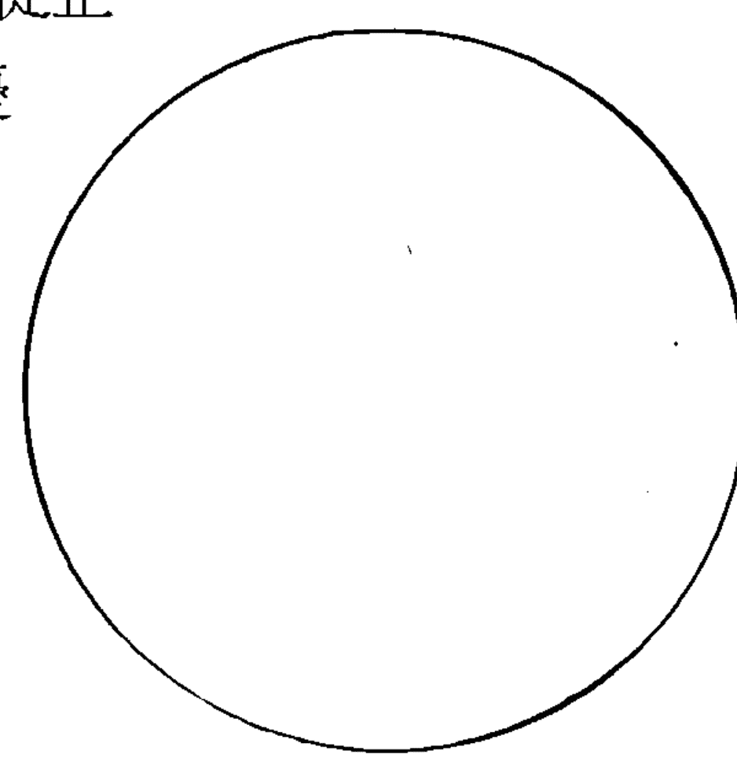

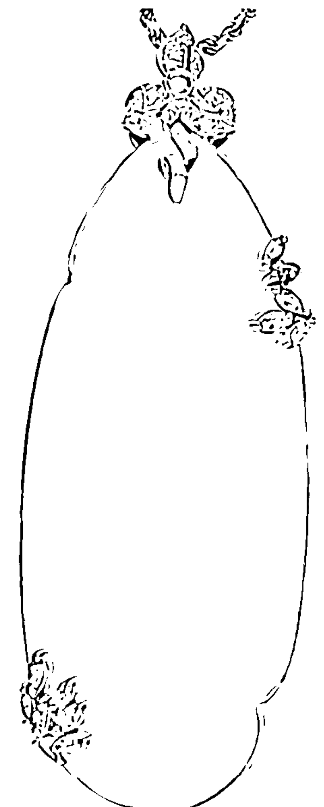

## 4. 紫水晶 Amethyst

紫水晶自古以来一直是最受欢迎的石英家族宝石，不仅认为它具有神奇的治病力量，在欧洲还有千杯不醉的酒杯传说。含铁致色的紫水晶内含物常具有典型的“虎纹”或称“斑马纹”的条带构造，这也是以放大观察来判断天然紫晶的重要关键；另还有特征性的色域也是重点。市面有人说的九牙紫晶应该就是指具有层状白色和紫色相交的紫水晶。非洲是优质的紫晶产地，特别是非洲赞比亚所产的颜色鲜艳浓厚，巴西、乌拉圭也是重要的商业产地。

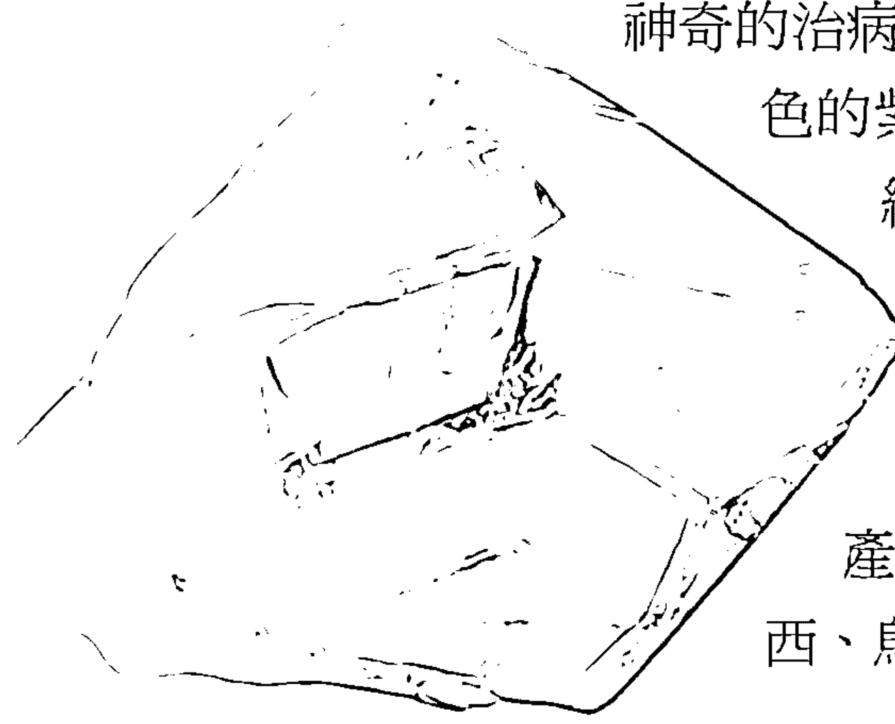

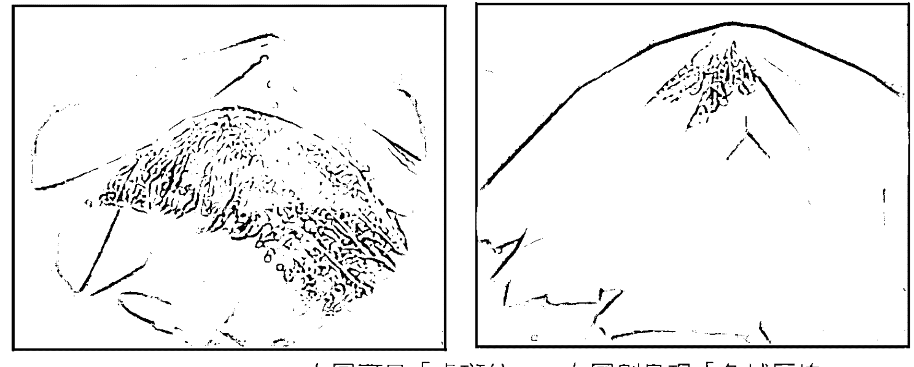

◇左图可见“虎斑纹”，右图则呈现“色域区块”。

## 5. 黄水晶 Citrine

美丽的黄水晶常被称为“黄晶”，音同“黄金”受到广大的欢迎。天然质优的黄水晶主要产于乌拉圭、玻利维亚、墨西哥、西班牙等地。其实天然的黄水晶极为稀少，颜色和紫水晶一样来自微量的铁，所以市场上多为选用紫水晶加热处理成浅到深色的黄水晶。

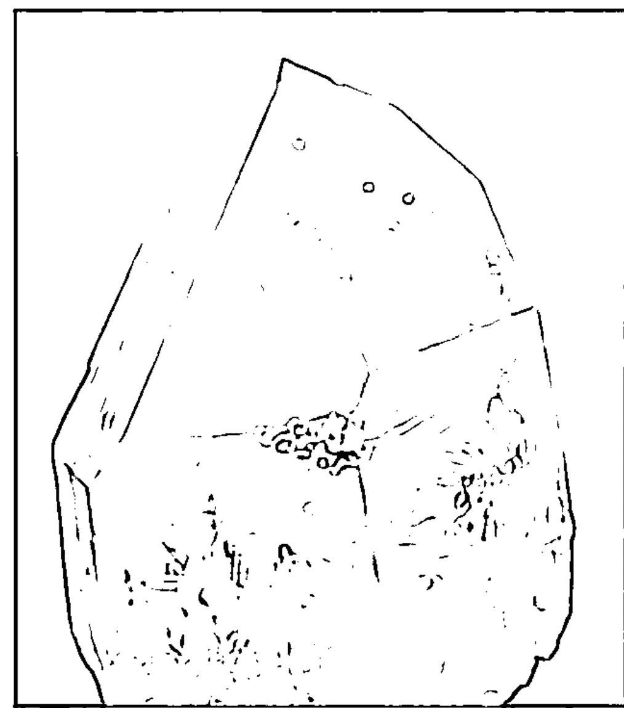

◇黄水晶。

## 6. 双色水晶 Ametrine

双色水晶又称紫黄水晶（amethyst-citrine）或是结合二字在一起的紫黄晶。紫晶纳鸿运、黄晶招财运，那么双色水晶可就是财福两全了。天然的双色水晶只产于靠近巴西的玻利维亚，另外，也能选取有色域现象的紫水晶，经过加热的处理中得到双色水晶。

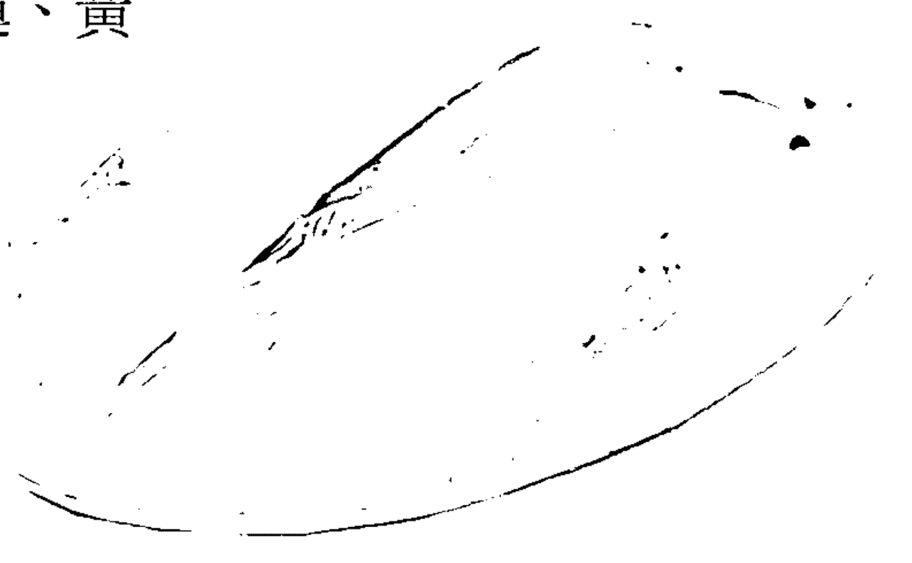

◇双色水晶，一端黄一端紫。

## 7. 绿水晶 Prasiolite

产于巴西Gerais附近的水晶矿，所含的微量元素能在天然或人工辐射或热处理下成为绿色的水晶。天然的绿水晶极少。另外，要注意绿水晶在阳光持续的曝照下，颜色会有变淡的可能性。

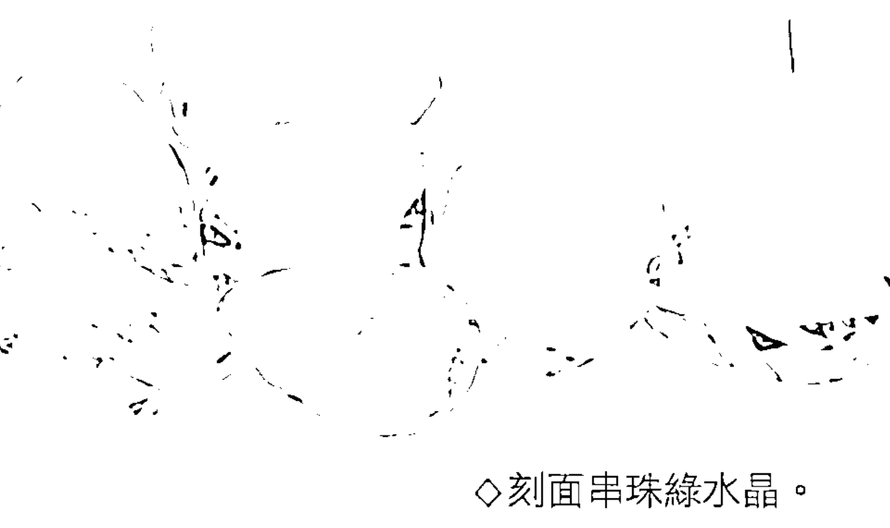

## 8. 柠檬晶 Lemon Quartz

近来市面上出现许多柠檬色的水晶，清新诱人讨喜的色泽，和绿水晶一样成为串珠设计的热门品项。同样的这种鲜黄色的水晶通常是经由辐照或热处理形成色彩，稳定度佳。

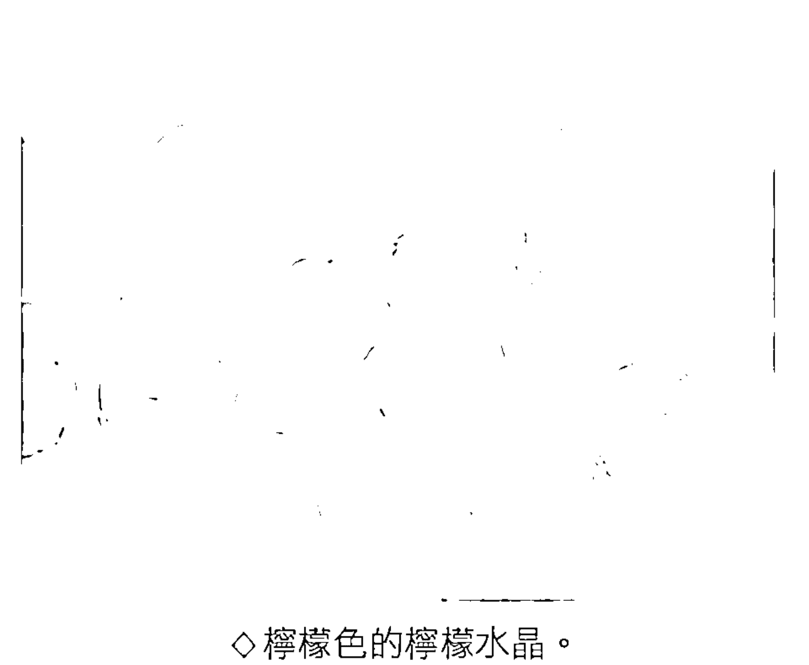

## 9. 烟水晶（茶晶、墨晶） Smoky Quartz

透明的烟水晶或称为茶晶或墨晶，从褐色到深近黑色的都有，含有微量铝等元素，因天然矿或人工的辐照影响过程下，皆可产生深浅不同的褐色调。

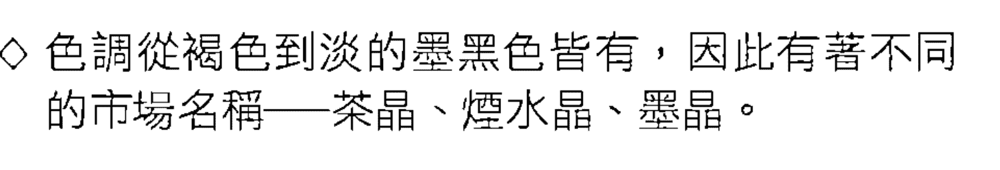

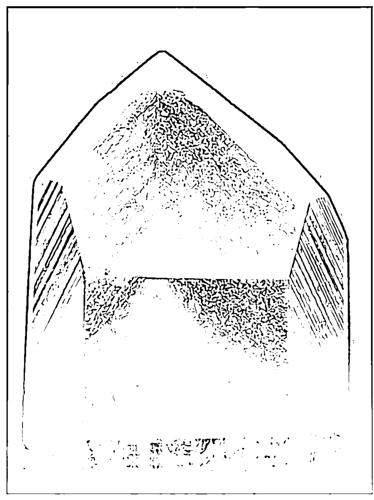

## 10. 绿幽灵（幻影水晶） Phantom Quartz

在水晶里偶尔能见到含有其他矿物呈现一种幻影或景观的影像，通常是白色V字型的色带或是像带有绿泥石、火山泥灰等矿物形成的内含物，在市场上有个可爱的名字，被称作绿幽灵或绿精灵。

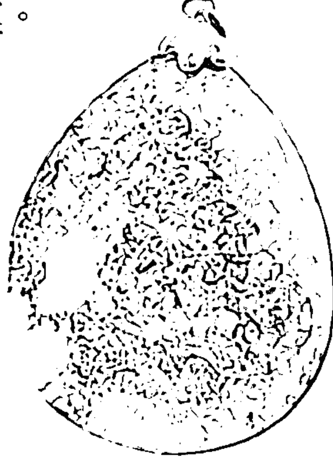

◇ 因内含物形成幻影效果的绿幽灵。

## 11. 虎眼石英（鹰眼石英） Tigers-Eye

由很细的内含物排列时，反射出来状似猫眼的光学现象，比较常见的是一种石棉纤维结构平行排列成为眼线的“虎眼石英”，另一种带灰蓝体色像老鹰眼睛的称作“鹰眼石”；还有一种是刚好两个颜色在一块儿的称作“斑马虎眼石”。虎眼石英带有铁质，可加热成红褐色调，也有人将之漂白后再染色制成不同的视觉效果。虎眼石产于印度、斯里兰卡及南非、澳洲等地。

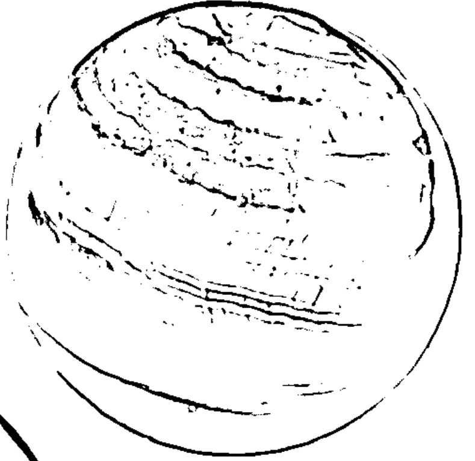

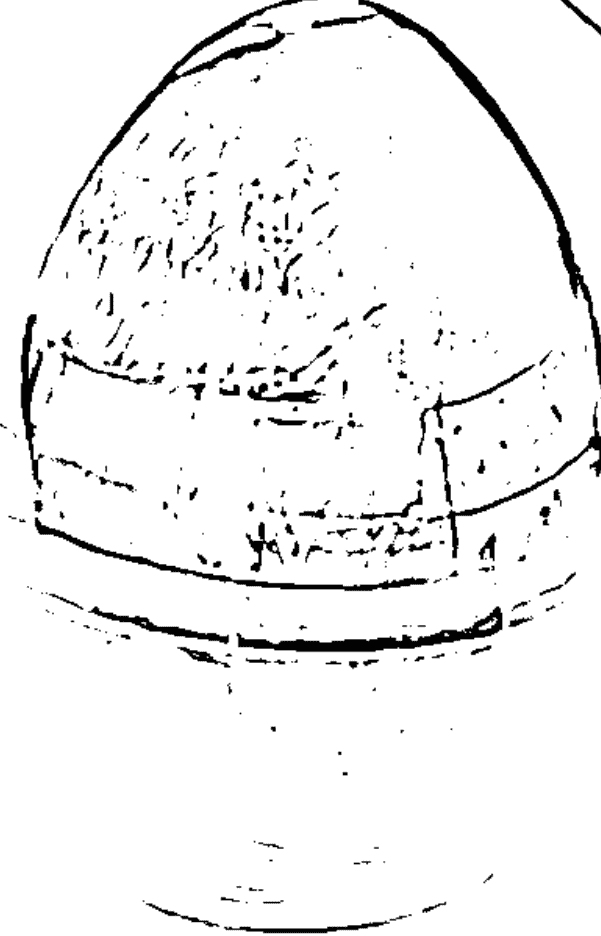

◇ 虎眼石，加热后可得红褐色。

## 12. 洒金石英（砂金石英） Aventurine

在微晶质（多晶质）带有铬云母片或是其他矿物的石英岩里，灯光下会产生洒金般的闪烁光彩，所以得名为“洒金石英”，或被当做玉石来看称“东菱玉”，主要产于印度。

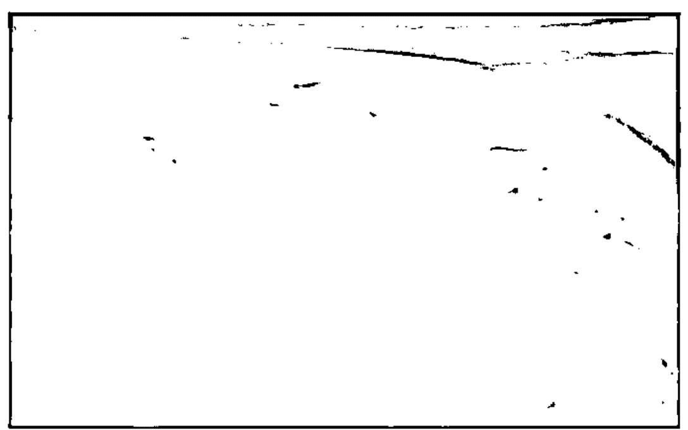

◇东菱玉。

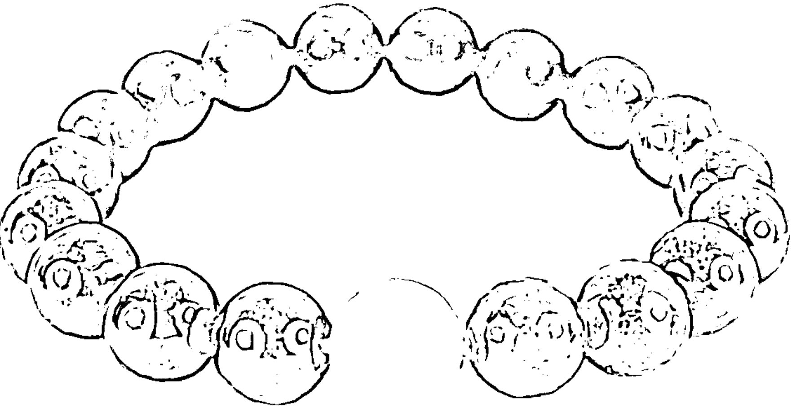

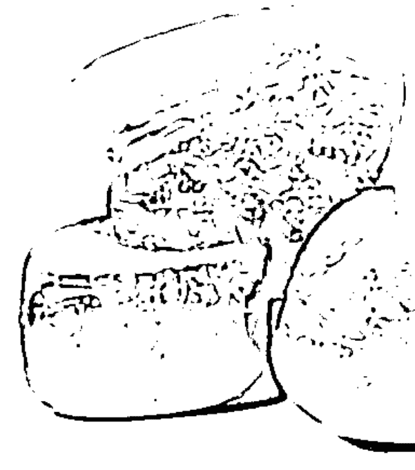

◇ 一种名为“金星石”或被称为“砂金石”，用来模仿日光石的人造棕黄色玻璃，外观亮亮的是三角形的铜片内含物。

◇ 石英岩常染成不同的颜色，作为各种饰品的搭配。图中这个像玉的染色石英，在市场称为“马来玉”。

## 13. 晶洞

紫水晶和黄水晶常见于晶洞，通常紫色集中于晶体尖稍，底端连接着水晶洞的玛瑙质洞壁，这些整体型状圆又深底的晶洞，被视为纳财聚富、吸收

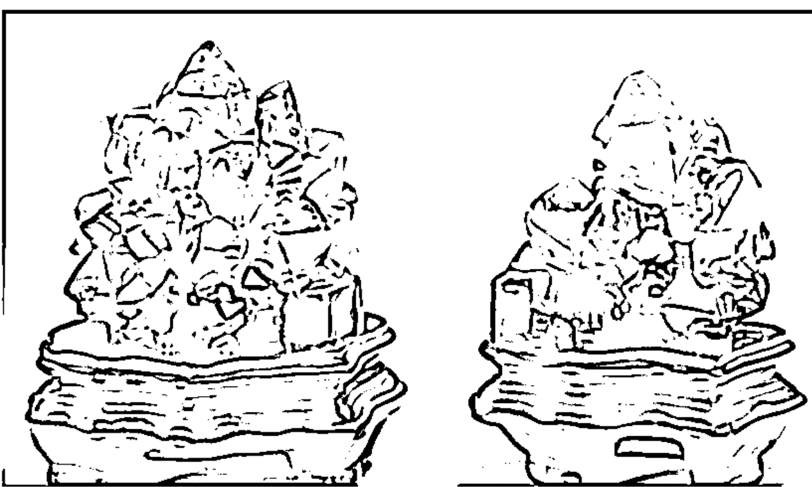

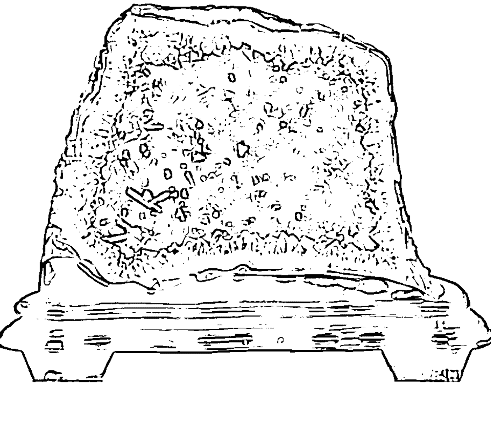

◇紫晶晶洞、紫水晶柱。（淳贺水晶提供）

日月精华或为其他水晶饰品消磁洁净的法宝，所以又被视为“风水石”。尤其是紫晶洞，在东方可以说已成为居家生活或办公处所中的一部分。

如黄水晶的部分提到过，天然黄晶数量稀少，市面上的黄水晶洞多是选自紫水晶洞仔细加热后形成的。因为这么大的晶洞加热不易，边边玛瑙质的地方如果不小心加热过度，除了质地变得过度苍白外，还可能有容易崩脱的情形，选购时要注意晶洞的完整性。

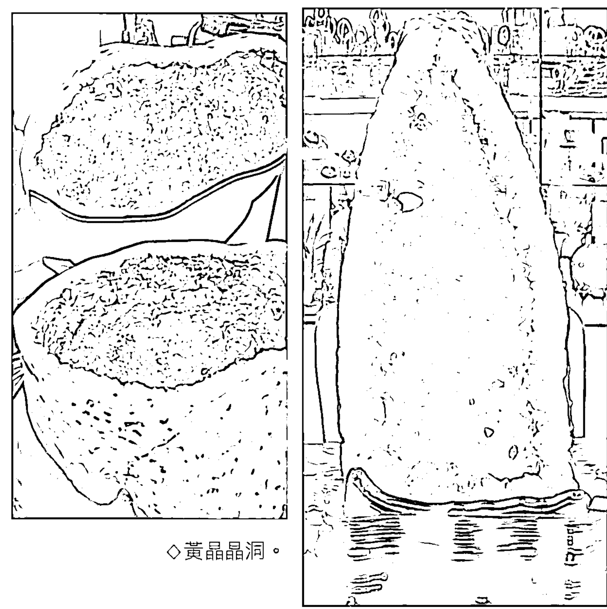

## □谁长得像水晶？

### 1. 方解石

方解石应该可称长得像水晶的晶体中排行榜第一名，而且在市面上也常发生直接以水晶的名义销售的情形。方解石大致可分两种型态，一是属于石灰岩的沉积岩，一般以“大理石”称之，这在玛瑙的部分有提到。另一种就是长得很像水晶的“冰洲石”，这种方解石纯净、无色、透明结晶度佳，难怪可以成为水晶的类似品。其实买家只要注意几个特点就能加以区别：

◇ 方解石的硬度为4，不像硬度7的水晶如此耐磨，起初表面看起来也很晶亮，但是经过长时间空气中粉尘硅料的摩擦下，较容易失去原有的光泽度。

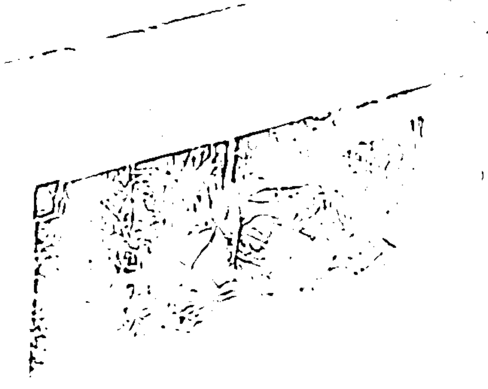

◇ 方解石是折射率及透明度高的晶体，以肉眼就能看到强烈的重影效应。

◇ 透明的体色像冰块，被称为“冰洲石”。

◇ 方解石强烈的双折射效果，让底部的一条黑线分成清楚的两条线。

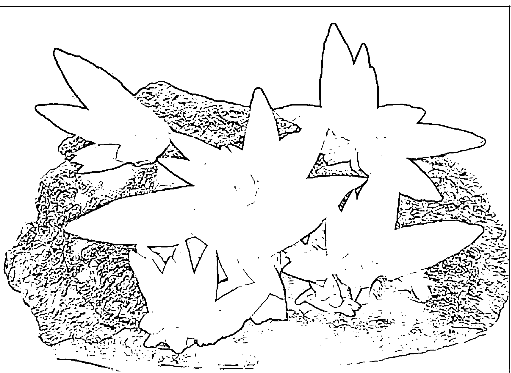

◇ 三方晶系的方解石原石。

◇ 方解石有完全解理的特性，也就是说在某些角度用力击撞，会产生相当平整的一个面。也因此在晶体内部可发现平直的解理裂缝和阶状的晶面，也因为具有这种特性而得到“方、解”这个名称。

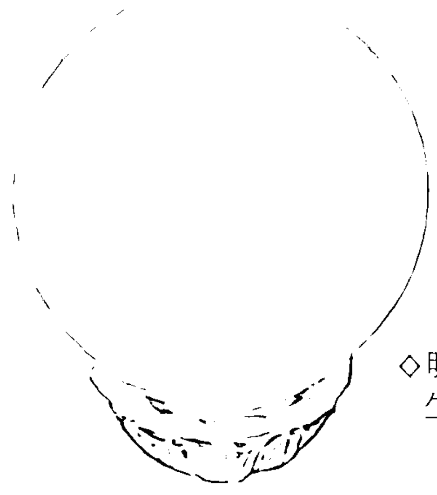

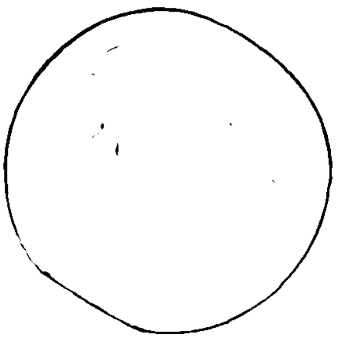

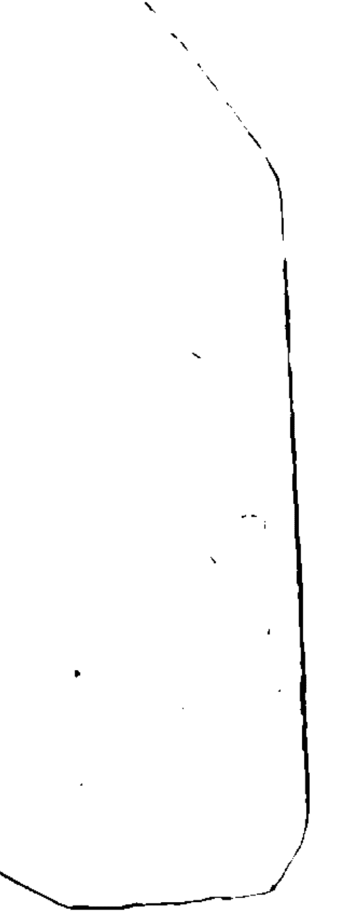

◇ 明显的解理和缝隙间产生的七彩环。

◇ 将方解石打磨成水晶单晶柱状的模样。

### 2. 透石膏

我们可能会以为石膏是像雕像那样的白色膏状物质，但来自巴西或俄罗斯等地的透石膏乍看之下很像水晶。石膏的硬度才1，只要用指甲就会划动。

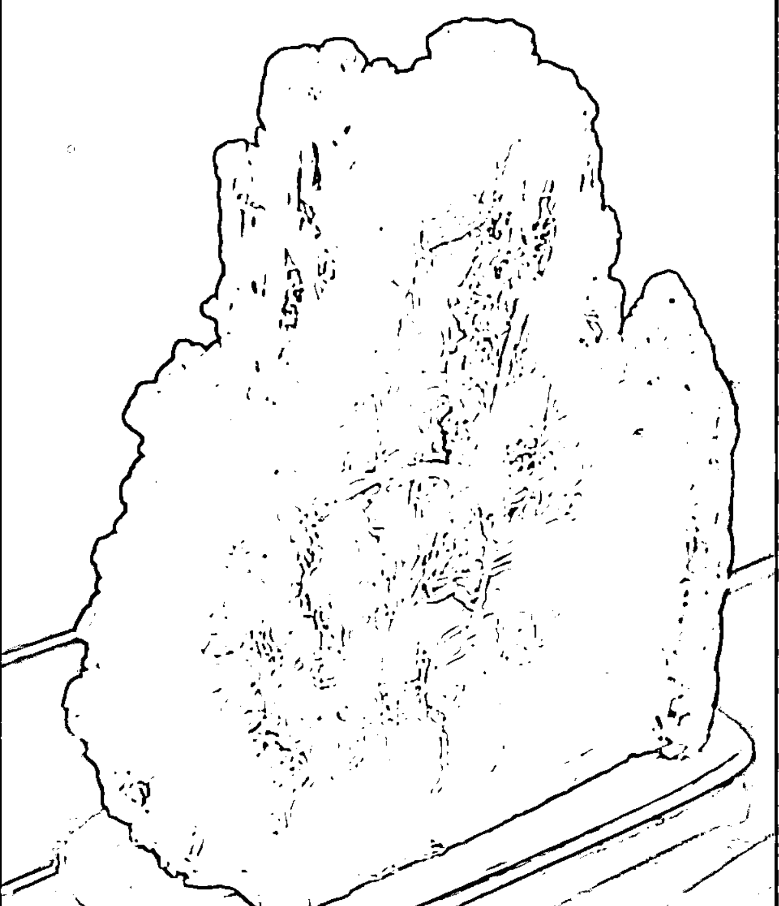

◇ 透石膏的原石晶体。

### 3. 萤石

萤石具有磷光反应，自古人称“夜明珠”，除了红和黑色外，萤石包括了所有的颜色，抛磨之后单色的萤石也容易被以水晶为名而误称。萤石本身和方解石一样具有发达的解理，在强力的撞击下也容易造成整片脱落的晶面。

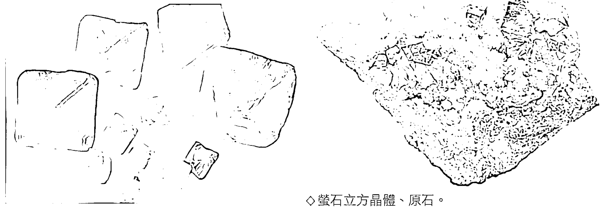

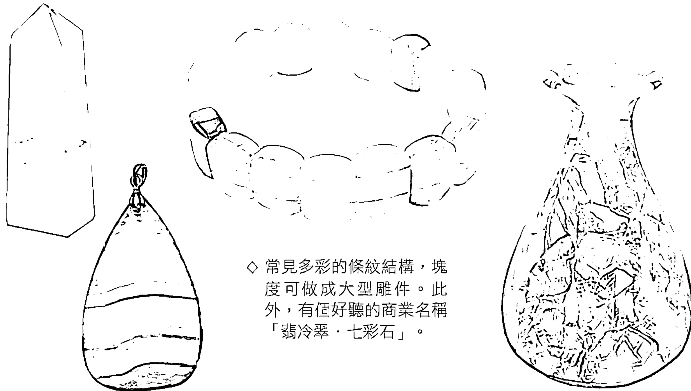

## 真假水晶大揭密

石英晶体所具有的压电性质被大量运用在科技产物上面，而工业用所需要用的水晶追求稳定性和恒定性，但是天然的水晶常因双晶或是内含物等因素而影响这样的运用。因此以人工培养出水热法的无双晶石英，这种品质稳定的合成水晶，不仅被用在科技上，也有业者用于珠宝上。

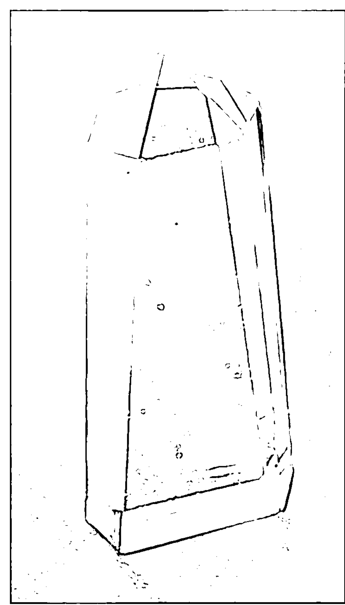

从实验室培养出的“合成水晶”、“人造水晶”或称“养晶”，是在人为的控制下每天达到以0.8mm速度生长；除了工业用途的水晶外，用于珠宝市场的合成水晶还能以控制成分的技术，加入铁或锰等微量元素，制成各种颜色，如紫色、黄色、粉红色等，也常见加入钴元素的蓝色石英，而自然界里并无透明蓝色的石英。另外，有人会说只有天然的石英才有色域，但合成石英也会有同样的现象。合成水晶频频在市场里出现争议，但天然和合成的水晶长得是如此相像，在物理和化学性质上也如出一辙，自然界又存在着许多纯净无内含物的水晶石英；尤其是完全没有内含物的水晶通常需要以红外线光谱仪的辅助做检验，然而有时还无法百分百判图成功，此时含有内含物的石英便成为佐证是否为天然物的最佳证据。

## □保养水晶小撇步

水晶石英的硬度或韧度都不错，平时使用和佩带不用特别的保养或保存方法。除了水晶表面沾到油脂只需用水或肥皂加以洗净外，许多还会以盐水、阳光照射或放置于晶洞中，藉还原大自然环境的方式来纯净与洗涤。

## □施华洛世奇水晶是水晶吗？

加入高铅制作的玻璃，不论是光泽、反射度和质感皆可媲美水晶，所以“水晶玻璃”已成为常用的名词。施华洛世奇水晶（SWAROVSKI）是奥地利一家玻璃制造公司所生产的含铅量大约百分之二十四以上的高铅玻璃。铅让玻璃的折射度提高，表面经过精工的打磨切面，反射出的色彩闪烁耀眼，甚至能够超过钻石的光芒；这种水晶玻璃的精美设计品质行销全球风靡市场。在欧洲铅含量超过百分之十的铅玻璃就能以“水晶Crystal”称之，闪亮的外观，市场常以水晶钻、水钻、奥地利水钻等的市场名称来推广行销。

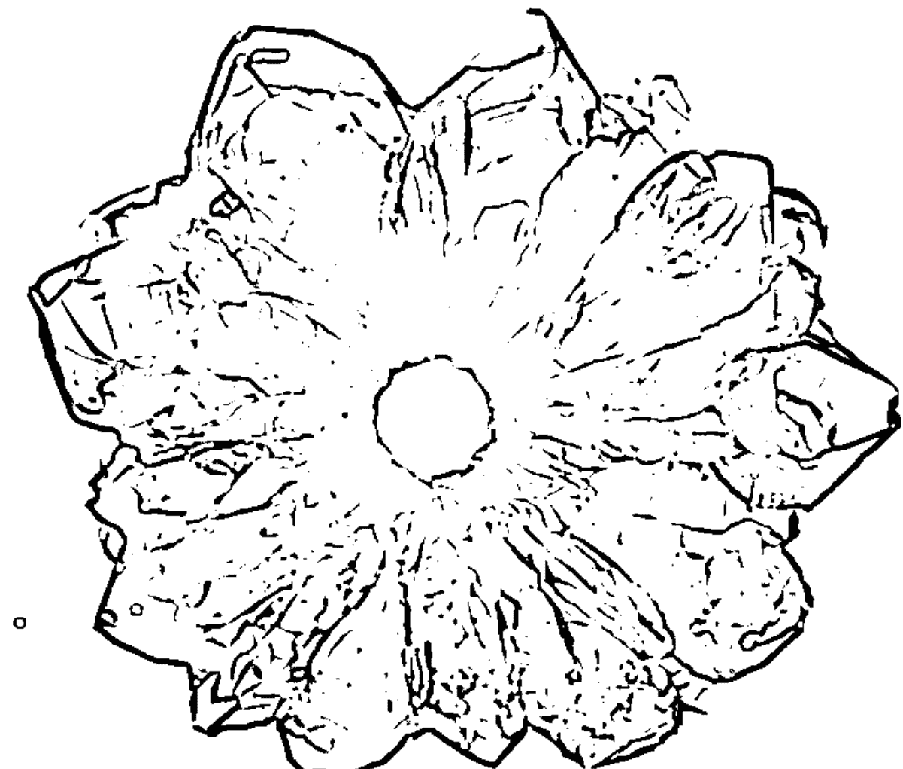

## 宝石渊典

> “颇梨。或云塞颇胝迦。此云水玉。即苍玉也。或云水精。又云白珠。刊正记云。正名窣坡致迦。其状似此方水精。然有赤有白。大论云。譬如过千岁冰。化为颇梨。释迦毘楞伽。此云能胜。”
～翻译名义集 七宝篇～

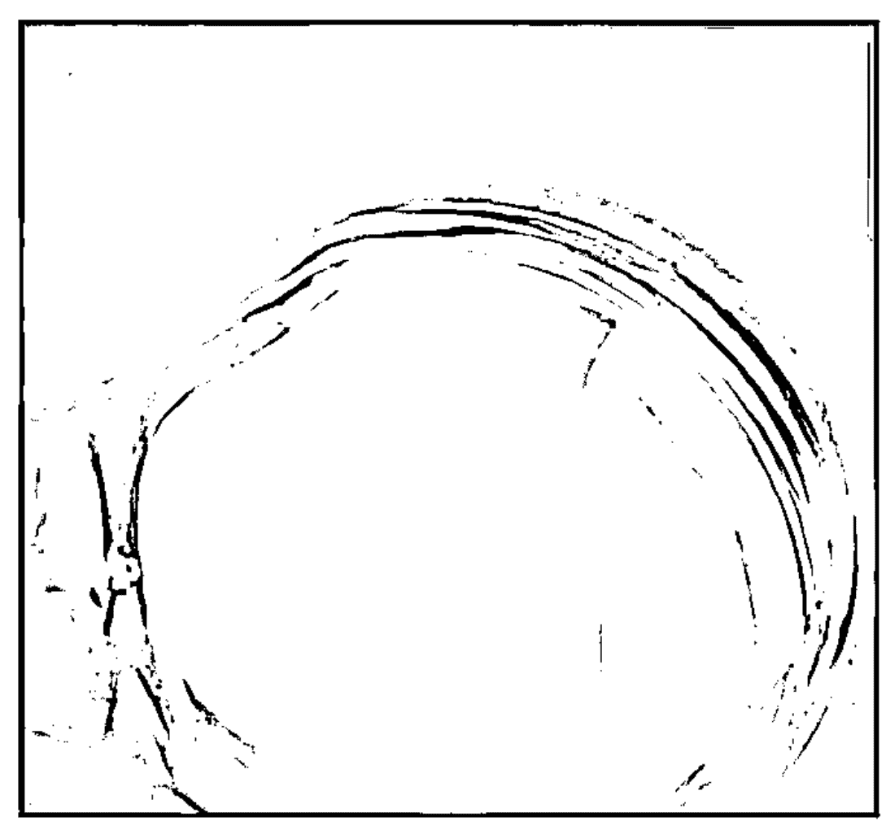

◇ 由于水晶晶体的S型生长结构，在一种光学效应下会呈现一种只有水晶独有的特殊图案，称为“牛眼”。

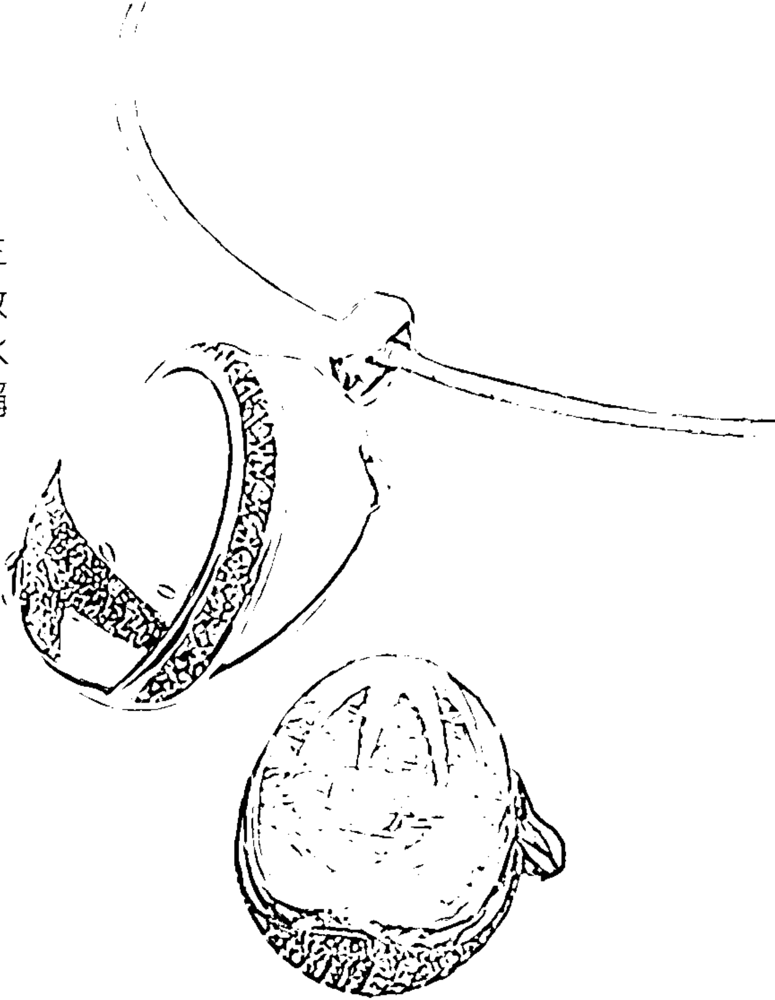

## 宝石资料卡

### 水晶

◇ 粉晶和发晶的首饰是亚洲人的最爱。
（六耀社提供）

| 英文 | Quartz |
| --- | --- |
| 成分 | 二氧化硅 |
| 晶系 | 三方晶系、聚成岩 |
| 颜色 | 无色、紫色、黄色、粉红色、绿色、褐色、黑色等 |
| 硬度 | 7 |
| 比重 | 2.65 |
| 光泽 | 玻璃光泽 |
| 透明度 | 透明～不透明 |
| 光学现象 | 星光现象、洒金现象、猫睛光现象 |
| 折射率 | 1.544 ～ 1.553 折射率差 0.009 |
| 内含物 | 二相包裹体、愈合裂隙、虎纹构造、色域、针状物等 |
| 处理 | 热处理、辐照处理、染色 |

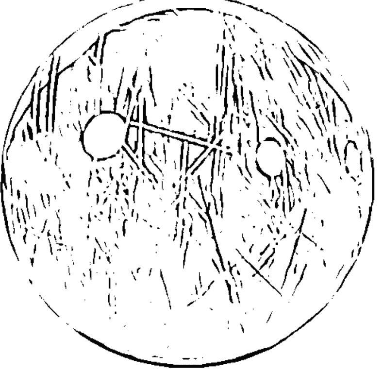

◇ 金色的发晶在市场称为钛晶。

# 第七章 琥珀 Amber

琥珀质地温润，金黄的色泽代表人亲土亲的安祥亲和，其触感及香气助益沉静氛围。

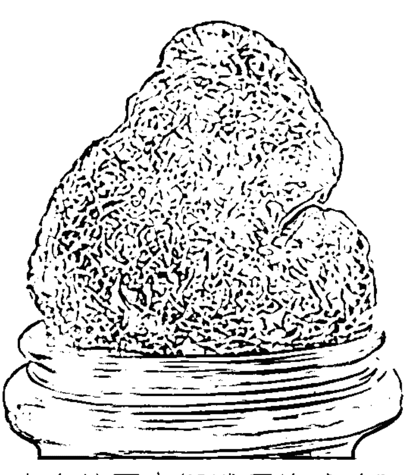

◇ 来自德国未经雕琢的琥珀原矿。
（联华古美术提供）

## 安神定性的琥珀

琥珀常作为颜色的形容词，琥珀色的眼睛、琥珀色的琼浆玉液等。琥珀在中国传说中，是老虎目光凝集入地后形成的矿石，代表着老虎的魂魄，所以称为“虎珀”。在西方，许多琥珀来自海上，美丽的传说中都比喻为海神的眼泪。

琥珀这个词可能源自于叙利亚语的“harpax”；英文称为 amber，意思是阿拉伯文的“在海中漂浮”之意。德文称为燃烧的石头（bernstein），因为燃烧时有松树香气。希腊文是电石（Electron），因为琥珀摩擦可生电。而在中国古代曾被称为虎魄、瑿、遗玉、江珠、育沛、顿牟等，在《本草纲目》里是汉方中的重要药材之一。

琥珀来自古代的植物树脂（通常指松柏树的树脂），从松柏树上分泌的树脂长时间被深埋，经过地质作用的高压高热石化后成为的化石琥珀，形成的时间从五百万年到三亿年不等。

琥珀经过摩擦生热或是磨成细粉点火燃烧，会释放出淡淡的松香气味，被认为有安神定性的效果。琥珀的温暖色泽和凝脂润泽感，让人容易亲近，广泛成为念珠等宗教器物的选择。

## □琥珀不是蜜蜡？

琥珀与蜜蜡在市场上经常造成混淆，有时还能引起争议，认为琥珀是琥珀，蜜蜡是蜜蜡，两种为不同的物质，而且视蜜蜡的年代比较古老，有的甚至认为蜜蜡的数量比较少，色系质地更厚实，因此价格比较昂贵！

晶莹剔透像蜂蜜的叫“琥珀”，蜡质色泽像蜂蜡的称为“蜜蜡”，在亚洲我们是这样区分，但在宝石学中，琥珀和蜜蜡是同一种有机宝石。琥珀和蜜蜡是同样含有碳、氢、氧和微量硫的有机物，由于里面有一种微量元素称为“琥珀酸”，琥珀酸的成分比例不同，会造成外观、透明度和内部纹路的差异，因此在亚洲的口语中，以透明度来区分琥珀或者是蜜蜡。这个问题用外语amber、bernstein等等就没有字意上的分别了。而价格的差异是反应市场偏好所造成的，其实在国外琥珀和蜜蜡价格是不分上下的。

## □认识琥珀的种类

属有机宝石的琥珀来自古代树脂，各个品种和生成环境产地的不同，形成的颜色及种类繁多，依照颜色有不同的命名。颜色金黄的称明珀或金珀、红的是莹珀、深红的是血珀、黑的称翁珀、鹅黄的是蜡珀、白色的是骨珀、里面有昆虫的叫虫珀、有木片其他内含物的称花珀等等。另外，有些琥珀内含较高的硫化氢物质或是石灰的碳酸质，萤光下易见绿色或蓝色的萤光反应，这种产于多明尼加的矿产称绿珀及蓝珀。琥珀在紫外灯下常有浅蓝、浅绿至橙黄色的萤光反应，而蓝珀及绿珀反应特别强，在太阳光下就能感受到。

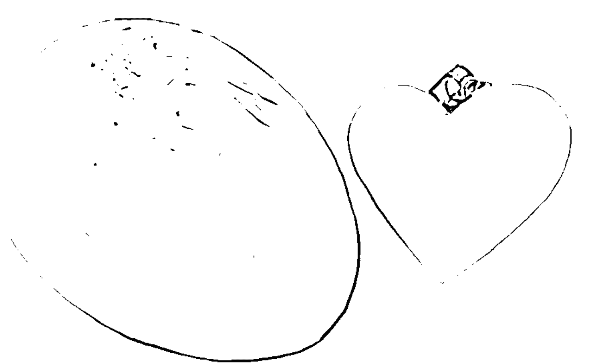

◇ 透明到不透明，琥珀到蜜蜡，外文名称通通都一样。

目前最丰富，也最具商业价值的琥珀，其主要产地是围绕在波罗的海的国家，如瑞典、丹麦、德国、波兰、俄罗斯、立陶宛等这些地区的琥珀以金黄色系为主，包括透明和不透明；像闻名世界的俄罗斯琥珀宫，正是集合波罗的海琥珀之大成，琥珀宫里选用的多为我们所称的蜜蜡质地。中国抚顺的煤矿区也生产较多色泽古朴的蜜蜡质琥珀及花珀，深受欧洲人士的喜爱。另外，缅甸、多明尼加和墨西哥也是重要的产地，这几个产地的琥珀有些会带有绿色和蓝色调，在紫外灯下会比较明显。

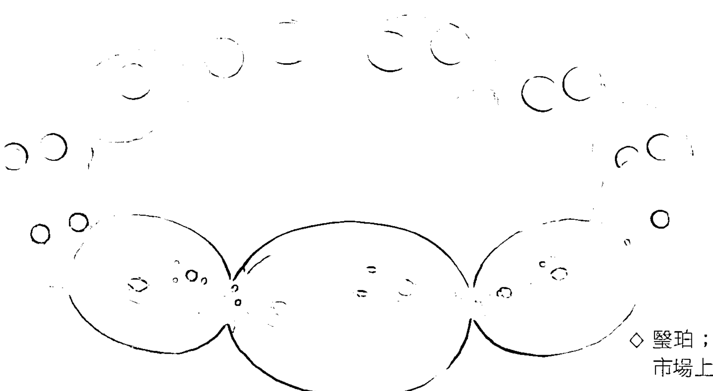

◇ 鉴珀；樱桃红的色泽在市场上被视为最贵重。

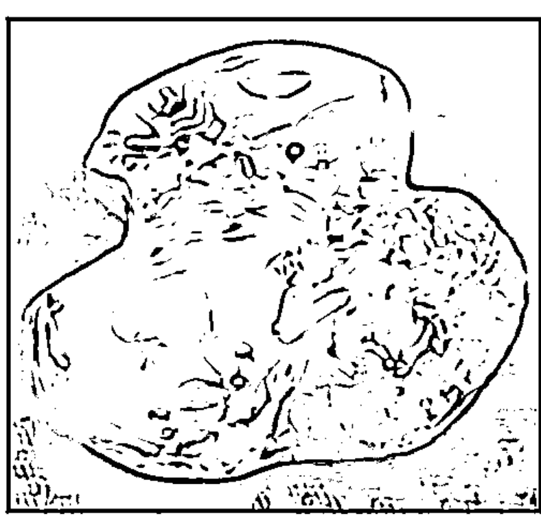

◇ 在太阳光或紫外灯下呈现蓝色且略见绿色萤光的蓝珀。（琥珀宝宝提供）

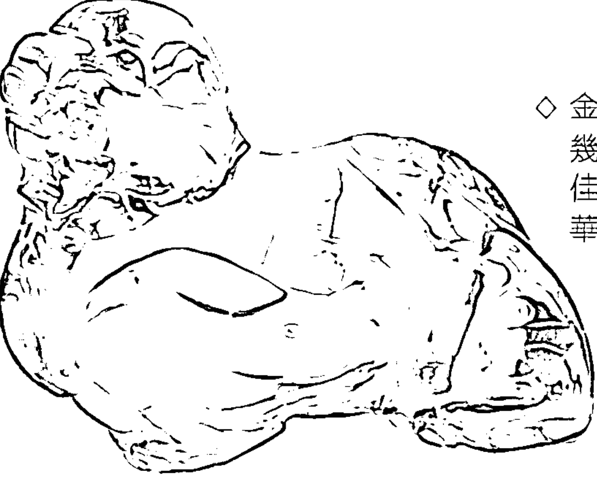

◇ 金黄色的金珀狮子，内外几乎无瑕，精透可爱，为佳士得拍卖件。（台北联华古美术提供）

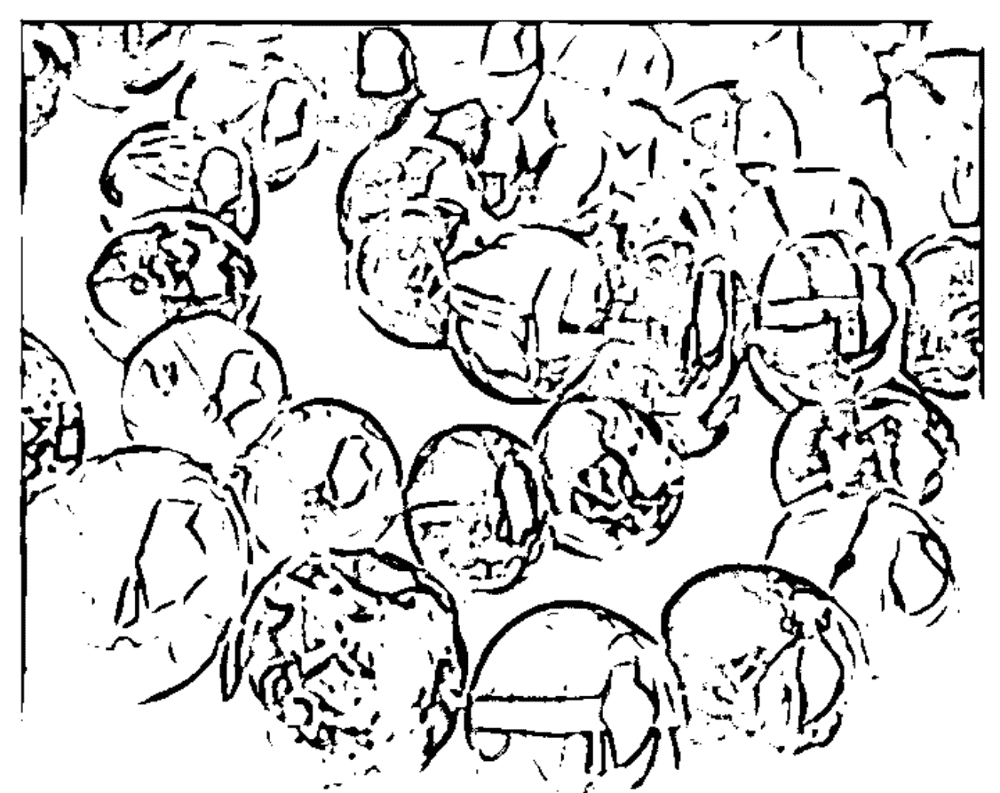

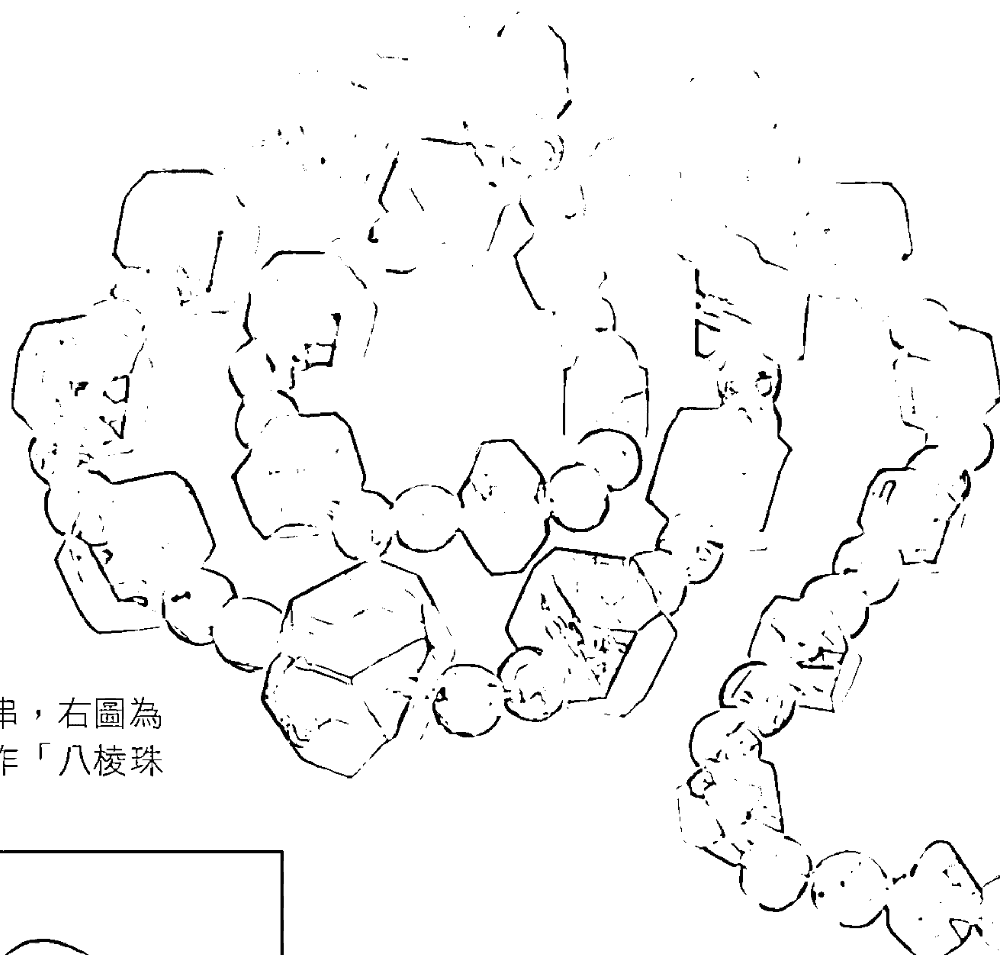

◇ 产自抚顺的花珀大珠串，右图为抚顺特有的切法，称作“八棱珠子或八大锤”。

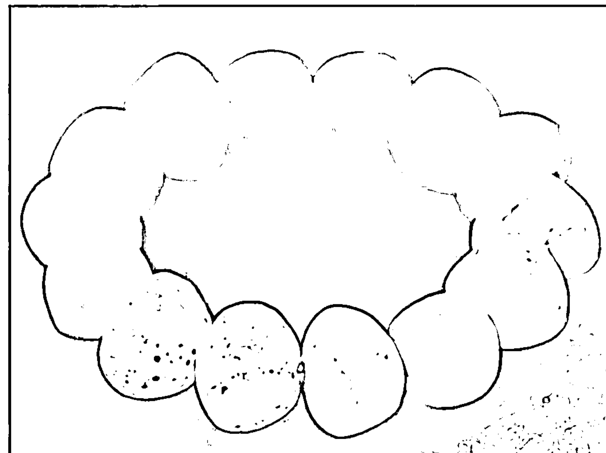

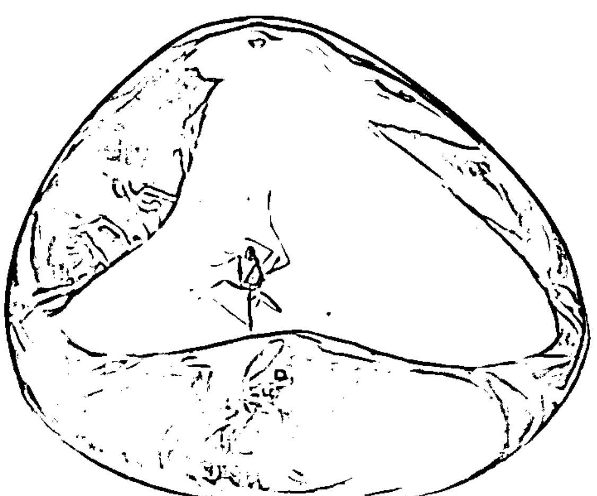

◇ 蜜蜡手珠。

◇ 有蚂蚁甚至蜥蜴、青蛙的称作虫珀，常被想像为重见侏罗纪公园的元素，抽取包裹在琥珀中的动物的DNA，复制出该动物。（琥珀宝宝提供）

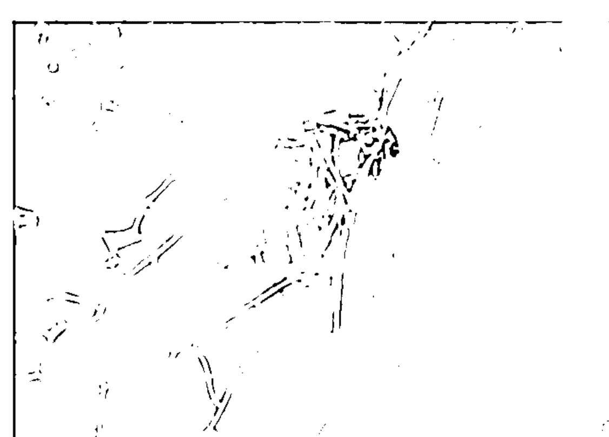

◇ 琥珀久了会有风化纹，但也能藉着处理产生风化纹。

## □开运鉴定团

琥珀的鉴定和判断其实不容易，由于琥珀的熔点较低，且琥珀是非晶质的有机物体，光是以加热和染色的方式就能改变琥珀的外观，或是制作成新的形态。另外，运用各种类似新树脂材质来仿制的产品，同样大量地存在于市场中。下面介绍几种常用的处理方式及仿制（类似）品的种类：

### 1. 热处理（太阳光芒） Sun Spangles

天然或是再制的透明琥珀里常见小气泡，人们常用加热的方式去除气泡称为“净化琥珀”；小气泡因加热产生圆形的应力裂缝，这种闪耀的视觉效果称为“太阳光芒”或是“睡莲叶”，这是广被接受且颇受欧美人士喜爱的处理方式。琥珀还可用加热的方法来去除琥珀内的油质并产生氧化作用，让琥珀的体色看起来较深，感觉更为古朴。另外，可加热或烤色让表面形成仿古件的色泽，以及有“风化纹”的效果。

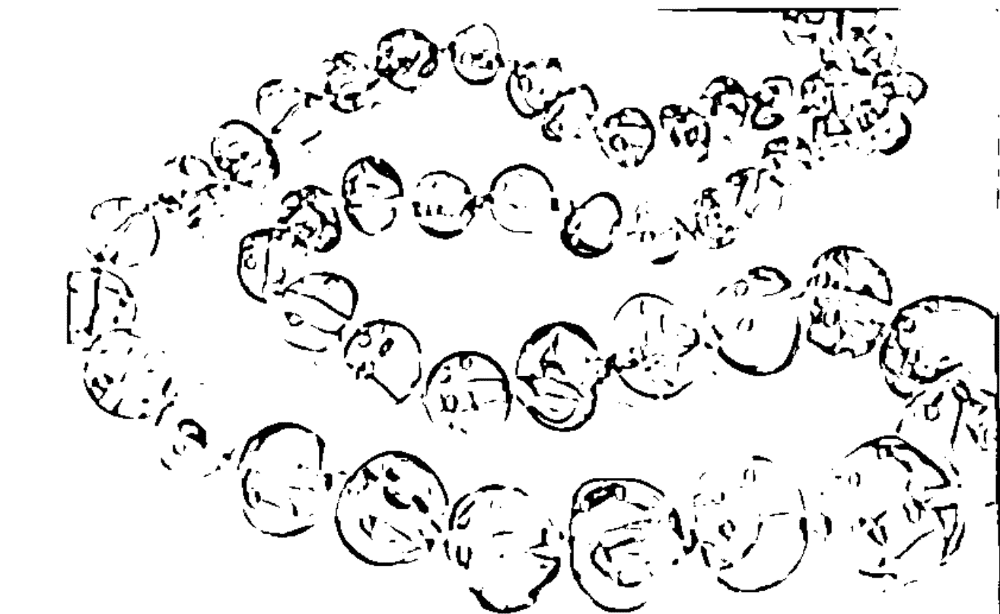

◇ 欧洲波罗的海的琥珀市场偏好加热的琥珀产生太阳光芒，体色也变深。

◇ 琥珀加热的程序能让色泽由浅变深，呈现古意。

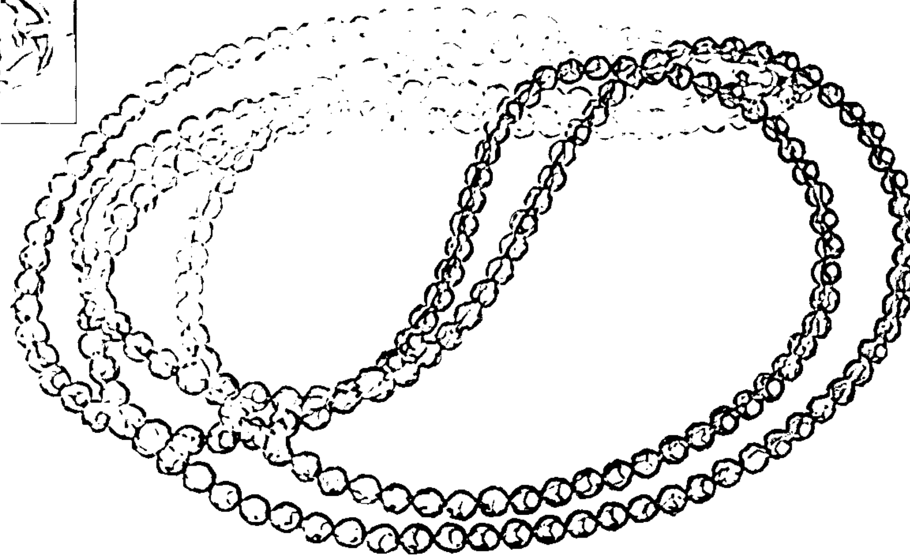

## 2. 柯巴脂 Copal

有一種年代低於一至兩百萬年的樹脂化石叫「真柯巴脂」，而從樹木新鮮採收的稱為「生柯巴脂」。真柯巴脂跟琥珀一樣也是古代松樹脂所形成，只是年代還不夠久遠、質地不夠堅實而不被視為琥珀。真柯巴脂摩擦後比琥珀更易產生松香味，硬度和熔點也較低，所以不難判斷。有人用乙醚來做測試區別（女生擦指甲用的去光水），由於柯巴脂對乙醚的溶解反應快，滴在柯巴脂上一會兒就會產生腐蝕的現象。而琥珀因為質地更為堅實的關係，乙醚揮發的速度比溶解反應快速，所以不易在表面留下腐蝕的痕跡。這是測試兩者直接的方法，但屬於破壞性測試，對於具有紀念性價值的物件需慎重考慮。

◇ 許多柯巴脂以琥珀的名義在市面流通。

## 3. 再製琥珀、壓製琥珀 Glued Amber

我們可能聽到市場上會說：「很多琥珀都是『熔』出來的啦，連很多小蟲也都是後來才放進去的！」琥珀的熔點大，約從攝氏150度就開始軟化，200度至380度時就能熔化，市場上能見到許多由小塊或碎屑的琥珀或再混合塑料樹脂進去加熱，加壓後製成的琥珀稱為「再生、組合、重製琥珀（ambroid）」，現在的技術是可以做到幾可亂真，而且還能把昆蟲置入裡面。壓製琥珀可能會看到小碎塊狀的邊緣痕跡，或是含有拉長的氣泡，但現在的技術都能避免掉這些再製的特徵，壓製琥珀內還常呈現攪動的流動紋路。昆蟲動物常被置入於再製琥珀中，有人表示，可從天然琥珀裡昆蟲的動作呈現掙扎狀或是肢體破碎斷落的情況來鑑定真偽，但這只能當作參考不能作為判斷的依據。類似這樣的再製琥珀，能夠調製不同的色彩或是做刻意的花樣造型，但仍保有琥珀的質感，價格更為划算，已成為受喜愛的串珠飾品的材料之一。

◇ 再製琥珀由碎塊熔合而成。

◇ 被放入超大昆蟲動物的再製品，常見於市場，如果是真品則價值不斐，也會成為科學研究的標本。

◇ 再製琥珀呈現出攪動的流動紋，和天然的流動紋路不相同，形狀顏色十分多樣。

## 4. 塑料 Phenolicresins

塑料包括天然樹脂或是酚醛塑料、電木、橡膠類的合成製品，用這些材料來仿製琥珀可說是唯妙唯肖。市面上充斥著許多這類產品，在俄羅斯、歐洲或中國等接近產區的觀光地，更是被魚目混珠地混在真品裡，讓許多消費者吃虧上當。被稱為Polybern的合成琥珀多以琥珀碎片加上多元酯混合、染色而成，放大觀察可見琥珀顆粒。賽璐璐、壓克力、貝克來、酸酪素、聚乙稀、苯酚醛塑料等等，也都是仿製琥珀的常用材料。

◇ 塑料能調製不同的鮮豔顏色，以綠珀、紅珀等的名義行銷，顏色太均勻、乾淨無瑕、顆粒大小都相同、內外可見的氣泡、攪拌狀的流動紋等都是觀察的重點。

## 5. 染色

染色的琥珀顏色鮮豔不自然，透明與不透明的琥珀中會見到較多染綠色或藍色的這類琥珀或再製品。在製作與壓製琥珀的過程中，也常用不同的油類加熱來進行染色處理，或讓油進入細縫中增加琥珀的透明度。這樣的處理技術開始於一兩百年前的維也納和德國。

◇ 染品的感覺凝重不自然，或是顏色只浮在表面的感覺。

## □ 保養琥珀小撇步

琥珀是有機物質，對於一些化學清潔劑容易產生反應，因此珠寶清潔藥水並不適用於琥珀，平時佩戴時也應避免和酸鹼較強的溶液接觸。許多琥珀都製成念珠狀，為避免珠子和珠子之間長時間磨損相碰造成珠孔部分的損傷，可在珠子之間打繩結減少磨擦的情形。平時還可用嬰兒油或橄欖油擦拭琥珀，保持琥珀的潤澤外觀。

◇ 琥珀創意工藝。（黃憶人先生提供）

◇ 琥珀古董雕件。

## 寶石溯典

> 「阿濕摩揭婆。此云琥珀。其色紅瑩。博物誌云。松脂入地千年。化為茯苓。茯苓千年化為琥珀。廣誌云。生地中。其上及傍。不生草木。深者八九尺 大如斛。削去上皮。中是琥珀。」

～翻譯名義集 七寶篇～

## □ 浮在鹽水上的就是琥珀？

琥珀會漂浮在海水上，所以人們才能在海邊採集到，因此大家會以飽合鹽水來測試真偽，但要注意這不是絕對的判斷方法。有一些化合塑膠仿品還是能浮在水面上的，而琥珀也可能因為內含物的關係影響比重而沉入鹽水中。但是用鹽水測試法至少讓我們篩選出許多非琥珀的物質來。

## □ 非洲琥珀產自非洲？

非洲地區剛果、坦桑尼亞等地生產真柯巴脂，大約兩百年前的非洲原住民特別喜愛珠類的串製，尤其偏愛琥珀；當時歐洲已有仿製琥珀的技術，量化的塑膠和樹脂珠鍊出口至非洲交易，到了近代這類仿製品卻反過來賣回歐洲，出現在古董店中，成為古董品的收藏，並且被稱為「非洲琥珀」。但因為現今外觀類似的琥珀仿製品量眾，如果是真的非洲琥珀被當成古董品保存，那也具有相當的歷史紀念價值。

## 寶石資料卡

### 琥珀

| 屬性 | 內容 |
|---|---|
| 英文 | Amber |
| 成分 | 碳氫氧化合物 |
| 晶系 | 非晶質 |
| 顏色 | 淡黃、橙、紅、深褐、白、綠藍（因強螢光反應） |
| 硬度 | 2 ～ 2.5 |
| 比重 | 1.08 |
| 光澤 | 松脂狀光澤 |
| 透明度 | 透明～不透明 |
| 折射率 | 1.540 |
| 內含物 | 氣泡、液體、植物碎屑、昆蟲、小動物、礦物等 |
| 處理 | 熱處理、染色 |
| 仿製品 | 樹脂類、塑料、再造混合琥珀 |

## 第八章 珊瑚 Coral

天屬陽能驅除邪惡，普照大地。紅色是陽，紅色表示吉祥，人們視紅色珊瑚為如來佛的化身，吉祥的如來佛。

## 如來佛的化身

傳說印度和西藏的佛教徒視珊瑚為如來佛的化身，用珊瑚來做佛珠或裝飾佛像的吉祥物。秦漢時期已有珊瑚的記載，《大秦國唐本草》云：「珊瑚生南海，又從波斯國及獅子國來。」珊瑚的漢文名字是取自古波斯文的sanga，另又稱「琅玕或石闌干」。先秦時代的《山海經》中記載：「珊瑚出海中，歲高二三尺，有枝無葉形如小樹。」漢代《說明解字》中亦有說明：「珊瑚赤色，或生於山或生於海。」

在《般若經》、曹魏漢代時期的《無量壽經》及藏傳佛教的七寶之中，列出珊瑚是七寶之一，卻沒有列出真珠這一項，然而編列出赤真珠的譯本則眾多。「赤真珠」如果照現代的寶石學觀點來看，可能屬於產自南洋地域的稀有海螺珍珠。珊瑚的開採已經是相當困難，而赤珍珠數量稀少取得又更為困難，通常使用紅珊瑚珠來替代。

中國古代和西域通商，珊瑚千里迢迢經過絲路傳到中原，在晉朝時期就有記載。西藏高僧多以珊瑚為念珠，甚至是王公貴族服飾上規定的珠寶飾物，以及戰士和婦女的護身物。珍貴罕見的珊瑚在人們心中是高貴、權位、吉祥幸福的象徵。

## 寶石級的貴珊瑚

在臺灣我們或許會覺得珊瑚是種常見的珠寶，可能還有人認為珊瑚礁是成群地生長在海裡，數量一定眾多。全世界珊瑚大約有二十幾種，而質地堅實緻密的品種只有四種，其中色彩美麗成材者十分稀少，因此能當做寶石級的珊瑚便稱之為「貴珊瑚」。

珊瑚是臺灣寶石的代表，臺灣並享有珊瑚王國的美譽，產量曾經達到世界的百分之八十。貴珊瑚產在臺灣和日本海域、南中國海及地中海沿岸。論質地、顏色，臺灣海峽的貴珊瑚是高質量的代表產區，臺灣北部和澎湖海域大約自1921年開始採收珊瑚資源。

## 五顏六色的珊瑚

珊瑚是微小的腔腸動物珊瑚蟲，分泌出霰石的有機石灰質碳酸鈣，形成微晶方解石，經過長年的累積，才能長到成為採收時的樹枝狀結構。古早以來，大家對寶石級珊瑚的認知，大都來自產在地中海及臺灣、日本西太平洋地區及非洲海岸的粉紅色至深紅色外觀的珊瑚；而二十多年前從澳洲及夏威夷附近海域開採出黑色及更為稀有的金色珊瑚，現今在市場上相當地受到喜愛。

## □ 開運鑑定團

珊瑚簡單分為「碳酸鈣質珊瑚」和「硬蛋白質珊瑚」兩個種類，雖然成分不同，但生長的形態卻十分相似。珊瑚一般分布在溫暖的海域，利於開採的寶石級珊瑚在海底30～200公尺的海床上產出。珊瑚的生長速度緩慢，紅色珊瑚一年只長0.2公分至1.5公分不等，黑珊瑚較快，一年生長5公分。依品種及其生長海域的海流強弱、鹽分高低、陽光吸收及溫度等因素所影響，通常需五十至七十年以上才能收成；尤其在海流最強處生長的珊瑚，品質更為優越堅韌，因此拋磨後可達玻璃光澤的亮麗程度。

◇ 海中樹——珊瑚樹。

下面介紹幾種常用的珊瑚種類及處理方式：

## 1. 碳酸鈣質的珊瑚 Calcareous Coral

碳酸鈣質的珊瑚，色彩從白、粉紅、紅、橙紅、深紅、藍到紫色，種類豐富，側面有樹枝狀的條紋，橫切面可見同心圓及放射狀的紋路。由於珊瑚原始的形狀體態和紋理都像極了樹木，而紅色系珊瑚是在生長過程中吸收海水中百分之一的氧化鐵而形成的，顏色又火紅，難怪紅色系珊瑚在古代即被稱為「火樹」。人們對寶石級的紅色系列珊瑚有諸多形容詞，像義大利區域淺色、嫩粉紅色的被形容為「Angel Skin天使肌膚」、鮮紅者是「Salmon鮭魚紅」、桃紅色及深紅沿用日本發音「MoMo桃子、Aka紅」等來表示。

珠寶業界定可達到寶石級佩帶的紅珊瑚色彩商業簡易分類為：

- 阿卡（AKA）紅：深紅阿卡或大紅阿卡，最高級別。
- 沙丁紅（Sardinia）：以地中海沿岸義大利沙丁尼亞島為主要產地的一種紅珊瑚，孔洞少但光澤稍少於阿卡。
- 桃紅（MOMO）：稍淺於阿卡紅，為桃紅或橙紅色。
- 粉色珊瑚（Pink）：Angel Skin 天使肌膚。

## 2. 硬蛋白質的珊瑚 Conchiolin Coral

黑色珊瑚（Black corals or Thorny corals）與金色珊瑚皆屬於硬蛋白質（介殼素）的角狀化物質，這種珊瑚通常得在50公尺以上深的水域或垂直的岩壁內側才能發現寶石級的品質。雖然開採不易，數量也不及紅珊瑚豐富，但在市場價格卻十分的實惠，尤其亞洲人又特別喜歡金色，近年來銷路穩定，在市場上已占有一定的分量。夏威夷的歐胡島是主要產地之一，政府有一個法定的採收標準以保護生態平衡，臺灣也產黑珊瑚，早年稱之為「海樹」。黑珊瑚是夏威夷的重要寶石，在當地名為「王者珊瑚」，黑色珊瑚表面常見丘疹狀及橫切面同心圓的年輪結構，分布在西太平洋、加勒比海海域。市面上常見到將黑珊瑚漂白後，使其呈現亮黃金色的外觀，這種處理方式會使黑珊瑚表面因漂白而變得粗糙，所以會再上膠或拋磨，讓佩帶時更加舒適，在市場上同樣以「金珊瑚」稱之。而真正的金珊瑚數量稀少，而且顏色樸質，前述的黑珊瑚漂白後而成的金珊瑚是很好的選擇。

## 3. 海竹 Coral Bamboo

海竹也有人稱作「粗枝珊瑚」、「竹節珊瑚」，屬於西太平洋八射珊瑚亞綱octo-corals isidid gorgonians（Octocorallia），也是珊瑚的一種。海竹和紅珊瑚類似，具有水螅石灰鈣化的成分，因為每個骨架都有個節做連接，表面也有如同珊瑚的木紋特徵，外觀像竹子的竹節枝狀而得名。海竹的價格便宜，常用染色處理使其看起來像紅珊瑚的外觀，許多這種染色的海竹或海綿珊瑚以「山珊瑚」的名號銷入尼泊爾地區。

## 4. 紅扇軟柳珊瑚 Sea Fan

商業名稱為紅色海綿珊瑚，又有人稱玫瑰珊瑚；藍珊瑚又叫海綿藍珊瑚，兩者皆具有明顯的毛細孔，有些會以灌膠的方式來強化硬度。

◇ 扇珊瑚，近看下可見明顯的毛細孔和表面不規則的紋路。

## 珊瑚的優化處理

品質好的珊瑚數量少、價值高，許多經過優化的產品、仿品、類似品就紛紛出現。其實優化處理也不是不好，只是要善盡告知義務，以便讓消費者能購得價廉物美的寶石，而且又有更多樣化的選擇。

1. 染色
將色白的珊瑚或是其他易於染色的物質，如大理石、骨質、象牙浸泡或放入染劑中，染成相對應的顏色。這種處理法只要用棉花沾丙酮（去光水）來擦拭，就會有掉色的現象。觀察染色珊瑚的表面，就能發現染色集中在孔洞及裂隙中，像這樣的染色製品佩帶後，顏色不耐久且比較容易褪色。

◇ 白或淡色的珊瑚易進行染色，顏色雖較不自然，但搭配就更多樣化且價廉。

◇ 用丙酮擦拭，即出現掉色的痕跡。

2. 充填
含有許多孔洞的珊瑚，利用環氧樹脂類的物質進行充填，充填後外觀會看起來較為平滑並加強其堅固性，染色及充填步驟通常同時進行處理。

3. 漂白
使用雙氧水漂白去除珊瑚原有的顏色，比如說暗紅色的珊瑚經過漂白成粉紅色，而黑色珊瑚可漂成金黃色。

4. 覆膜
對於質地較疏鬆或表面不夠光滑的珊瑚，用覆膜的方式可改善其外觀觸感，可以緩和黑珊瑚的丘疹狀表面。

5. 仿製品
用其他材質來仿製珊瑚的種類不少，尤其是取其表面類似珊瑚的條紋狀和孔洞的特徵，然後加以染色，如動物骨頭、象牙，還有瑪瑙、大理石、玻璃、塑料矽膠、陶瓷或橡膠等，只要外觀相像，都曾被拿來當成珊瑚販賣。

◇ 塑料製成的黑珊瑚的外貌，連年輪也能表現出來，但仔細觀察會發現氣泡等灌製的跡象。

## □ 山珊瑚和珊瑚有什麼不同？

漢代《說文解字》中亦有說明：「珊瑚赤色，或生於山或生於海。」西藏地區在三億年前因地殼變動，陸塊推擠，把原本在海洋底下的板塊推擠成現今的高原高山地區，而海底的動植物也跟著地殼變動隆起，被推到山上成了化石。主要產於石灰岩地區，在山上取得的珊瑚化石故稱之為「山珊瑚」。山珊瑚顏色樸實，而市面上稱山珊瑚者，多是以海竹或是軟珊瑚染色而成，用來銷售的仿製品。

◇ 珊瑚玉、菊花石。

## □ 菊花石、珊瑚玉是珊瑚嗎？

千萬年前的海底珊瑚有碳酸鈣物質的填入，再經過大自然長時間高溫、高壓的過程後，產生玉髓化作用而形成化石，這樣的化石被稱為「珊瑚玉」，也有人稱「石化珊瑚」。珊瑚玉在拋磨後會呈現一朵朵菊花狀的圖案，所以俗稱「菊花玉」、「菊花化石」。臺灣主要產在花蓮縣、臺東縣等出海口處。

## 保養珊瑚小撇步

珊瑚和珍珠一樣需要細心照顧，珊瑚戴久了光澤可能減退，珊瑚硬度3.5，比較容易刮傷，在存放時避免和其他珠寶首飾疊在一起。此外，珊瑚是碳酸鈣質，碰到強酸強鹼會起泡，佩帶時也應該避免接觸化學性強的物質，而且不適合戴著做家事或運動，平時存放時也儘量避免強光的曝曬。一般保養只要以清水洗淨擦乾即可。

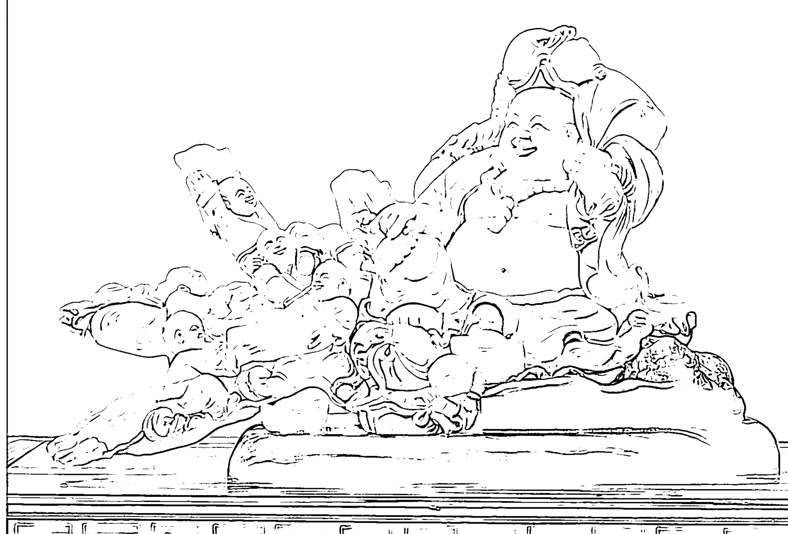

◇有容乃大。（大東山珊瑚博物館典藏）

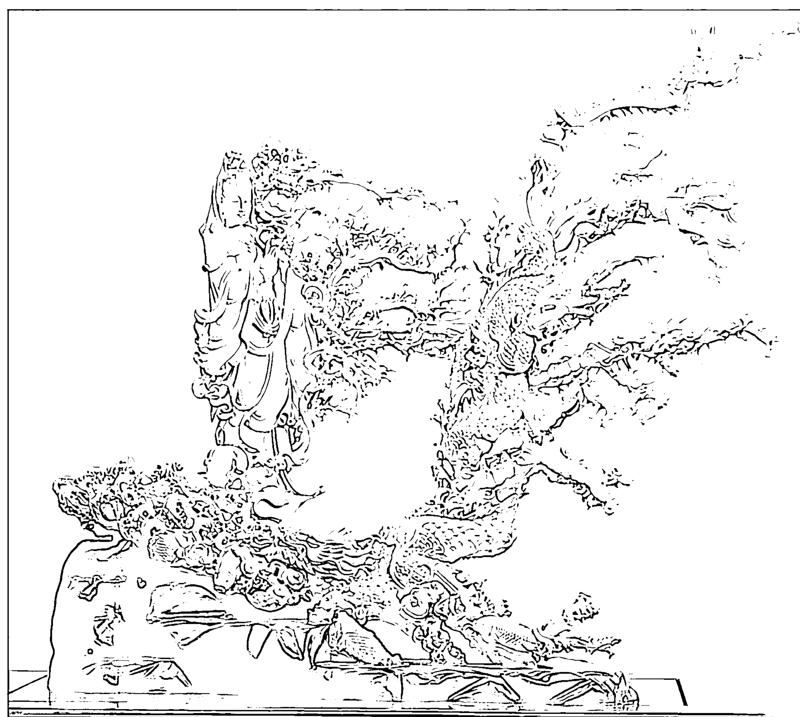

◇乘龍觀音。（大東山珊瑚博物館典藏）

## 寶石淵典

> 「珊（蘇幹）瑚梵語鉢擺娑福羅。外國傳曰。大秦西南漲海中。可七八百里。到珊瑚洲。洲底盤石。珊瑚生其上。人以鐵網取之。任昉述異記。曰珊瑚樹碧色。生海底。一株數十枝。枝間無葉。大者高五六尺。小者尺餘應法師雲。初一年青色。次年黃色。三年蟲食敗也。大論雲。珊瑚出海中石樹。」

～翻譯名義集 七寶篇～

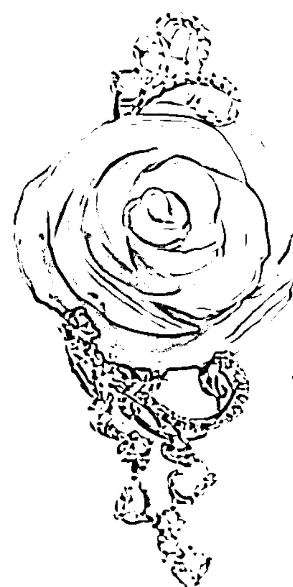

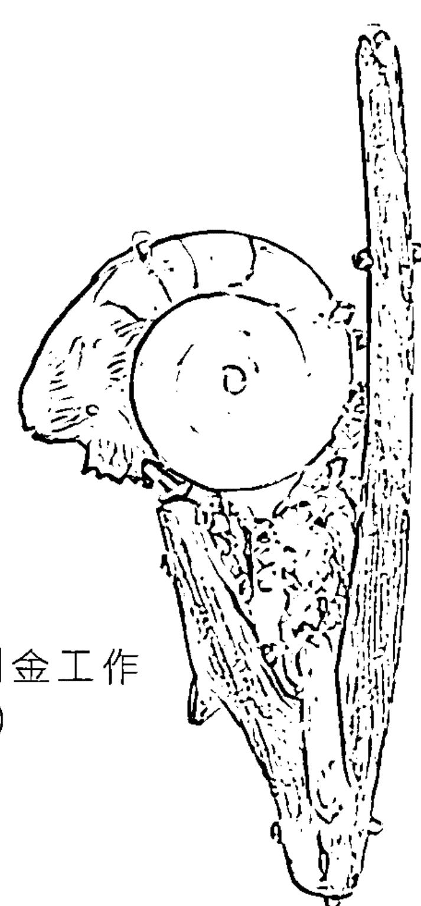

## 寶石資料卡

### 珊瑚

| 属性 | 值 |
|---|---|
| 英文 | Coral (Conchiolin、Calcareous) |
| 成分 | 碳酸鈣或介殼素，另一種為硬蛋白質 |
| 晶系 | 聚成岩 |
| 顏色 | 粉紅、深紅、橙、白、奶白、藍、黑、金 |
| 硬度 | 3～4 |
| 比重 | 2.65 |
| 光澤 | 蠟狀光澤～玻璃般 |
| 透明度 | 不透明 |
| 折射率 | 碳酸鈣質 1.486～1.658 折射率差 0.172 硬蛋白質 1.560～1.571 折射率差 0.010 |
| 內含物 | 波浪狀平行纖維結構、同心圓樹輪結構、丘疹狀外觀 |
| 處理 | 漂白、染色、上膠 |
| 仿製品 | 骨製品、染色大理岩、玉髓、染色貝殼、陶瓷、塑料、木材等 |

## 第九章 珍珠 Pearl

珍珠、真珠、赤珠，此寶不為垢穢所染，光明潔淨圓滿。

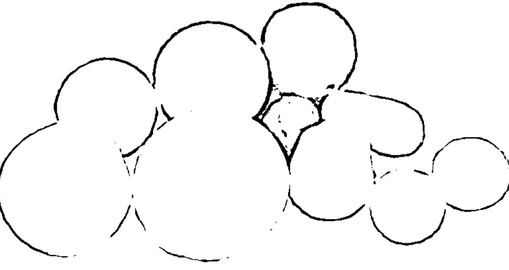

◇ 珍珠有圓形、水滴形、橢圓形等各種不同的外形。

### 細緻高貴的禮物

珍珠的希臘文為Margarita，意思是神聖甜美的嬰兒，恰恰表示出珍珠母貝裡受刺激所產生的分泌物疊層痛楚孕育出的珍珠，最能代表母親懷胎十月辛苦養育出愛的結晶，珍珠柔和、細緻、高貴的光韻常被比喻為母性散發的光輝慈愛，每逢母親節珍珠是最受歡迎的禮物。

「摩尼」（mani）或稱「末尼」是「珠」的總名。如意寶珠、摩尼寶珠在七寶中以珍珠或是水晶珠作為代表，《大智度論》裡提到：「真珠出魚腹中、蛇腦中。」《漢書》云：「珠蚌中陰精。隨月陰盈虛。」珍珠又作真珠、寶珠、如意珠，此寶珠能夠澄淨濁水，使人生活食衣富足、人心亨事達、除去病痛、增長智慧。以寶珠轉喻佛陀教導我們的德與善，當得到了摩尼如意珠寶，祈福所有的願望都實現。

### 玉潤珠圓的珍珠

許多水裡的蚌貝或海螺中都能產出有機寶石的珍珠，從天然的海水珍珠、人工培育的海水養珠，到市面量最多的淡水養珠，就連硨磲大貝都能長出珍珠。

珍珠（Pearl）的出現是個偶然與巧合，天然珍珠的形成是外來的微小物進入貝殼的蚌體中，這個外來物刺激了蚌貝母體，蚌貝的軟體組織外套膜裡會不斷分泌出珍珠層的成分，一層層不斷累積包裹上該外來物，經年累月達到一個厚度，便形成富有暈彩光澤的珍珠。珍珠和其他寶石不同的是，她不需要經過琢磨就是一個美麗珍貴的寶石，英文的珍珠Pearl源於拉丁語Pernnla，意思是「海之驕子」真是名副其實。

珍珠層具有百分之八十以上碳酸鈣的霰石及方解石，另外，含有百分之二到四的水分與其他介殼質的成分。層狀堆疊的結構，當光線照射到表面產生珍珠層中光的繞射和反射，這種特殊的光線反應，讓珍珠產生特殊的七彩光暈，這種現象我們稱為「珠光、珍珠光（Orient）」。

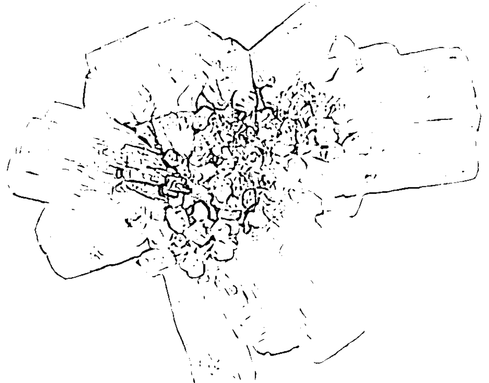

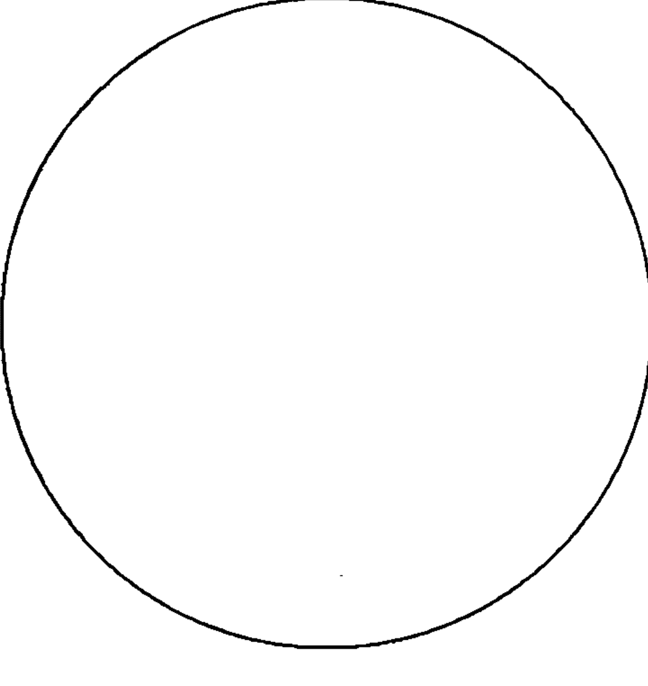

◇ 礦物中的霰石。

◇ 珍珠表面的層狀結構。

## 天然珍珠及養珠

珍珠有天然和養殖、海水和淡水的區別，天然海水珍珠的歷史產地在十五世紀以前的錫蘭、波斯灣水域，可惜在十六世紀時發現新大陸之後，長達一百多年的過度捕撈使得天然珍珠產量銳減。如今天然珍珠十分稀少，較大顆的天然珍珠都成為國際拍賣會受矚目的焦點。

### 海水養珠

養珠的研究始於1761年時，著名的瑞典科學家林德以一種T字型的金屬架支撐母蚌，插入以貝殼製作的球體用來形成珍珠。1913年德國科學家阿魯巴德素將切成碎塊的外套膜表皮放入外套膜組織使之形成珍珠囊，當時珍珠的人工養殖技術即宣告成功。而1900年代前後，被喻為養珠之父的御木本幸吉更嘗試以不同的材料放入蚌體培植，讓阿古屋品種的牡蠣成功地培育出海水養殖珍珠，直到1920年開始商業化，將日本阿古屋養珠推向全世界，供應珍珠日益增加的需求量。

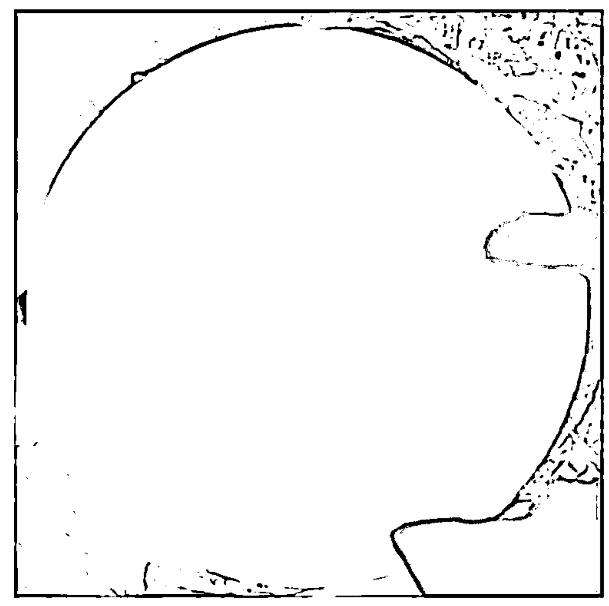

◇ 養珠是植入珠核，通常使用美國的淡水河蚌為珠核材料，強透光下某個角度看得到這種層狀弧線珠核。

### 淡水養珠

天然淡水珠的使用自《尚書·禹貢》中就有記載，中國在大禹治水後，淮河流域一帶人民用淡水珍珠向帝王進貢。考古學家在美國俄亥俄洲的印地安人遺址發掘許多淡水珍珠，估計為西元前兩百年。羅馬凱撒君王於西元前五十五年為了要取得淡水珍珠為由而攻打英國領土，戰利品是一只鑲滿珍珠的胸板，爾後獻給「愛神」Aphrodite，讓人民在廟宇膜拜。天然淡水珍珠分布在北半球溫帶地區，美洲主要是密西西比河谷流域，在中國以長江流域為主，歐洲以德國巴伐利亞及奧地利、英國以蘇格蘭、愛爾蘭的各大河川流域也有產出。

日本現代的福田賽在琵琶湖以淡水河蚌成功養殖出淡水珠。然而追溯到十一世紀的中國，當時中國人已懂得用鉛製成平扁的佛像雕刻物，將其插入一種成長迅速的褶紋冠蚌內的真珠殼層與外套膜間，養殖在湖泊或水塘中約半年的時間，表面即可覆蓋真珠層，形成佛像等圖形的貝附珍珠，這種技術可說是養殖和半珠的前身。

有核的海水養殖珍珠會被植入一個珠核，放置水中三年才能長出0.2～1mm的珍珠層，如果太快採收或季節因素，珠層會過薄而質量變差；無核的淡水養殖珍珠，運用和海水養殖同樣的方法，但取代珠核的是一個小塊片狀物。生命力強韌的河蚌一個一次可生長多達30幾個珍珠。這種無核的養殖，可產出圓形、鈕扣形、土豆形、長卵形或是隨形的珍珠。然而即使是多產的淡水養殖珍珠，由於生長的環境因素無法完全掌控的情況下，要讓每顆養殖的珍珠都能順利取得也不是件容易的事，而且採收篩選後質量好的往往不到產量的十分之一，因此高品質的淡水珍珠一樣珍貴難得。

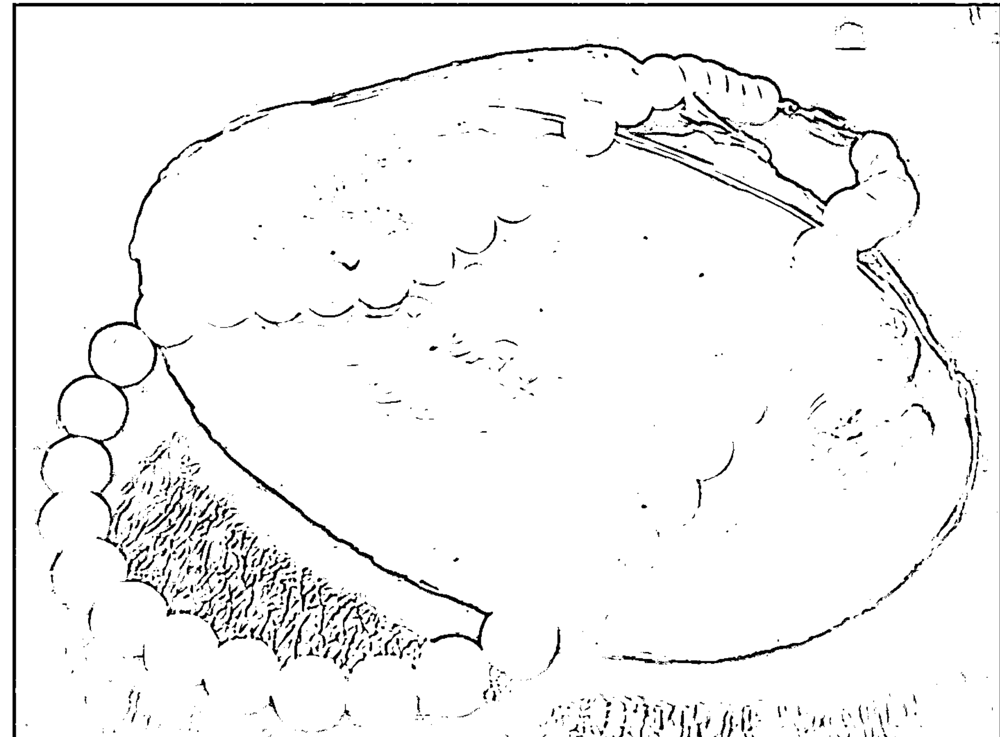

◇蚌貝與珍珠。

## 開運鑑定團

珍珠呈現的天然色澤是依照蚌殼的品種才有不同的顏色，像阿古屋Akoya生出白色帶粉紅的珍珠，黑蝶貝產出黑珍珠，南洋金唇和銀唇貝生出金色或銀白色的南洋珠；另外，淡水河蚌依生長環境、水質成分和區域也能產出各種不同的顏色，因此養珠可分四個大類：

1. 阿古屋珠 Akoya Pearl Oyster
阿古屋海水養殖珍珠主要產於日本海域，所以又稱為「日本珠」，平均尺寸直徑為6～9mm。日本養珠生長速度較為緩慢但質地細緻，蚌殼本身也較嬌小，而且海水珍珠對水溫和海水洋流的養分特別敏感，大於10mm的日本珠就很珍貴，也反應在價格上。質優，體色潔白又泛著玫瑰伴色，表皮的光澤透著鏡面的質感，這些都是日本珍珠的特色。近年來，阿古屋的珍珠亦在山東半島或東北等緯度相近的地區進行養殖。

2. 南洋珠 South Sea Pearl
南洋珠主要生長在澳洲、菲律賓群島及印尼海域的大珠母貝Pincata maxima的蠔內，蠔的大小可決定珍珠生長的大小，而蠔殼珍珠層的顏色和長出的珍珠是一致的。南洋珠特有的金唇蠔及銀唇蠔尺寸大，珠子平均大小可達13mm。白色或是濃郁金黃色的南洋珠，其特殊的皮光和飽滿圓潤的質感備受喜愛。

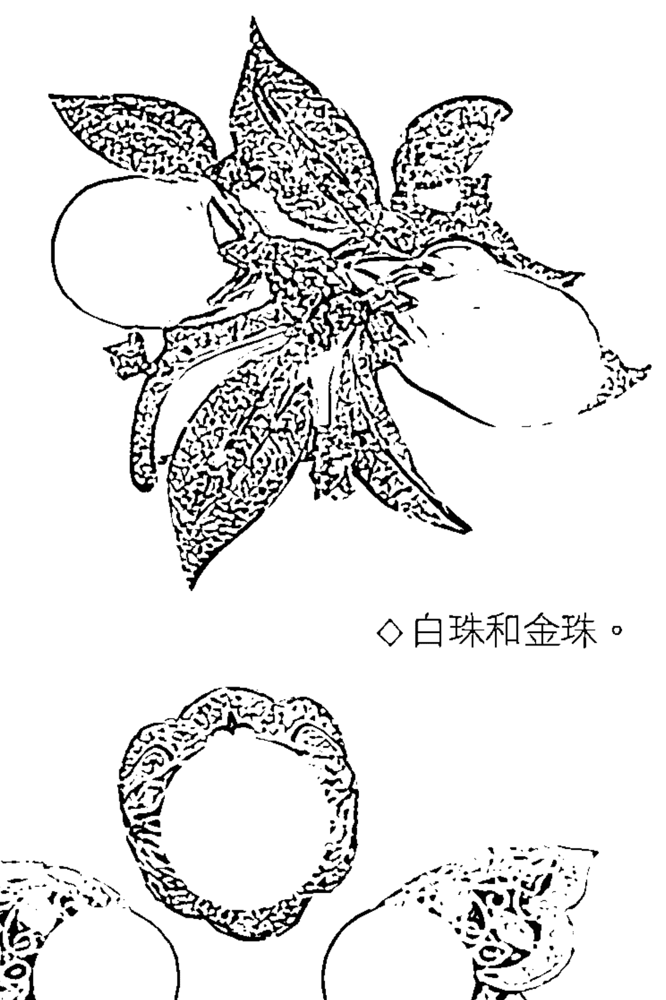

3. 大溪地黑珍珠 Tahiti Pearl

黑珍珠產於庫克群島法屬玻里尼西亞一帶，黑珍珠的平均大小約9.5mm。由黑蝶貝Pinctada margaritifera長的珍珠會有一種層次感的黑色色調，黑的體色上帶有綠色、粉紅色、藍色宛如孔雀開屏的伴色。優質黑珍珠的市場名就稱之為「孔雀色黑珍珠」。

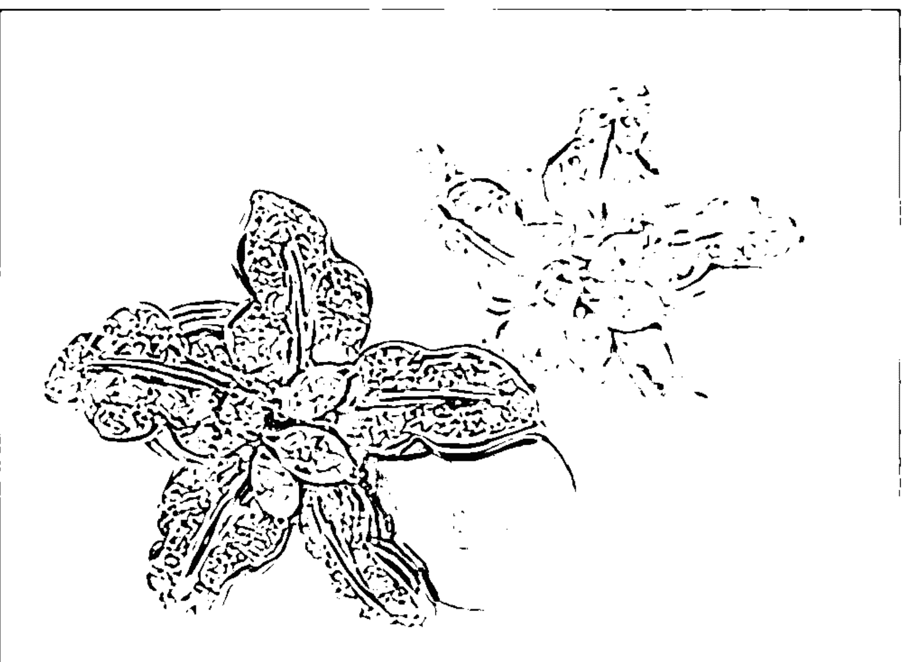

4. 淡水珍珠 Fresh Water Cultured Pearl

生長海水珍珠和淡水珍珠的蚌貝種類不同，生長的速度也大不相同。1990年代，日本的珍珠養殖水域出現不明原因，造成珠母貝的大量死亡，讓中國的淡水養珠業起了生機，數年的發展在國際市場占有一席之地。中國現在是世界最主要的淡水養珠供應者，有一段時期由於大量的養殖，價格也隨之大跌，不過也因此才讓珍珠成為人人都買得起的珠寶。專產淡水珍珠的主要河蚌貝類有三角帆蚌、褶紋冠蚌、許氏帆蚌，這個品種改良過的蚌類存活率高、管理容易。淡水養珠通常無核，顏色多樣，大小從1～12mm，形狀從不規則到圓形的都有。淡水養珠在不斷的品種改良及提升品質的努力下，優質淡水珠在精品市場中已經能和海水珠平起平坐，最近的大型作品中就看到許多12mm以上淡水及海水養珠共同搭配的貴珠寶作品。

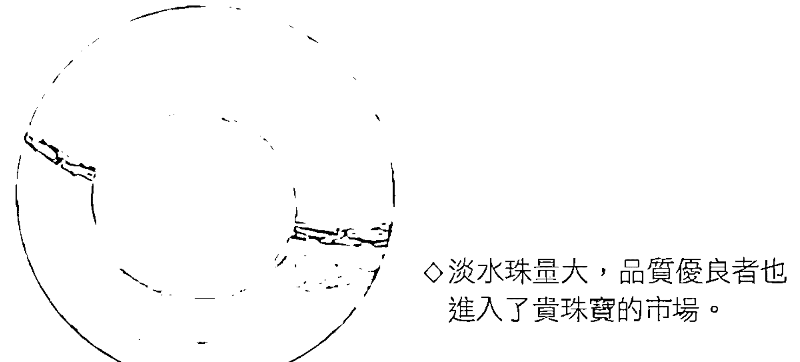

## 珍珠分級七要點

珍珠有一套判斷標準，體色、伴色、珠光、光澤、形狀、光潔度、尺寸。這七項因素和耳熟能詳的鑽石4C一樣，都會影響珍珠的價格，而我們在選購時也是以這幾項來做重點式的觀察判斷。

1. 體色 Bodycolor
珍珠最主要看的是整體顏色，體色常常和伴色同時形容，日本珍珠有粉紅、香檳、銀白色系，南洋珠以白和金色為主，大溪地黑珍珠要看伴色泛光的表現；另巧克力色和金色珠雖然多有經過無法偵測的熱處理程序，其討喜的色彩依然受到消費者的喜愛；淡水珍珠有白色或雜色，然而許多都是染色而成，要多加注意分辨。

2. 伴色（泛光）Overtone
伴色或稱泛光，是指體色之上還帶有的一種半透明的色調，是珍珠層細密堆疊的邊緣造成光線繞射的結果。比方說日本珠白色的基底帶有粉紅色、粉紫、米黃或南洋珠會有銀色的伴色，黑珍珠可能帶有綠色泛光，但不見得每一顆珍珠都有這種現象。

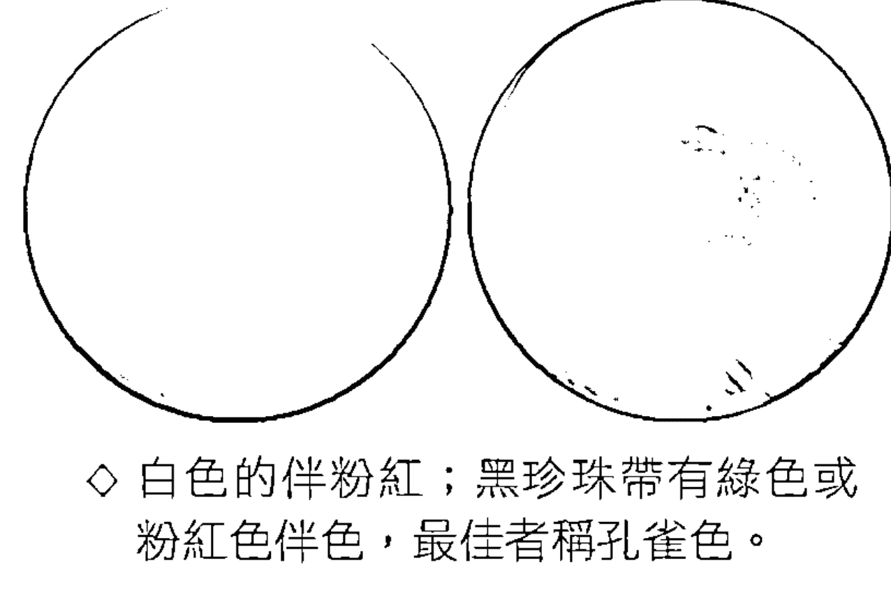

3. 珠光（暈彩）Orient
珠光即是晃動珍珠時表面呈現彩虹般的光譜色變化。像日本的淡水珠比較特別，帶有玫瑰紅、橙、深粉紅、紫色及銀藍色的珍光，另還帶有微微的金屬反射珠光。

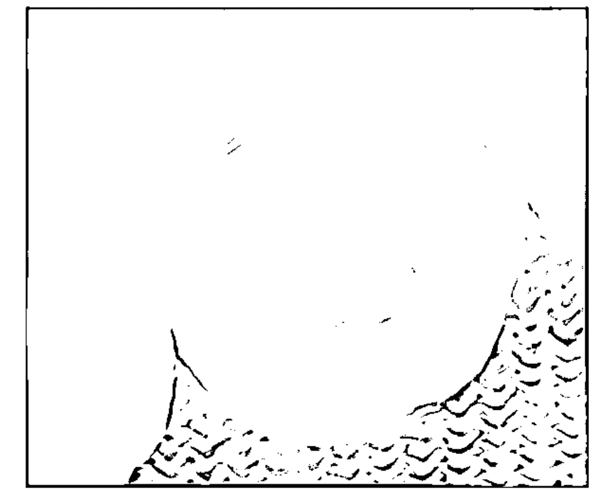

4. 光澤 Luster & Orient

珍珠光澤是我們常說的「皮光」，珍珠表面的光澤反射越高給的評價會越好。光澤的好壞和珍珠層的厚度有關，通常在冬季採收的珠子品質會較好，如果珍珠表面呈現霧霧的混濁感就會降低評價。然而不同類別的珍珠會呈現不同的光澤質感，像日本珠有鏡面般的光芒，南洋珠顯得溫潤，大溪地珍珠光澤較銳利。

5. 形狀 Shape

珍珠外形越圓價格越高，正圓是最受歡迎的選擇，另還有橢圓（蛋形）形、梨形（水滴形）、鈕扣形、異形（巴洛克形）、隨形（包括奇形、棒形、十字形）等等。有些珠子會環繞著一圈圈的溝紋，在設計上更能發揮創意，不同形狀的珍珠在市場上受歡迎的程度也不同。圓的完美度固然是評價的標準，但還是有例外，像是貴重的天然珍珠和大件珠寶皆為水滴形的珍珠。

6. 光潔度 Purity

指的是表面光潔度，很少有珍珠是完美無瑕的，或多或少都會帶點表面特徵，如坑點、劃痕、細線紋和環形標誌等，小的點或坑常能在打洞串珠和鑲嵌時被蓋掉。

7. 尺寸 Size

珍珠的尺寸是用「公釐」（mm）來計算銷售，珍珠的大小是以珍珠的直徑寬度為度量標準，所以店家會以「幾米」來表達尺寸，最小的計算單位是0.5mm。

除了以上的基本條件外，當我們在搭配珍珠首飾時，「對稱性」也是重要項目，配合上述的挑選重點，成對成串的珠子要找到光澤品質接近一致性，透過精細的分類排列配對，才能湊出最佳的珍珠首飾。

## 珍珠的姊妹品

除了前面介紹的珍珠之外，還有四個種類也都歸在珍珠的行列。

1. 克旭珠 Kesh 和籽珠 Seed Pearls
克旭珠是養殖珍珠意外長出的副產品，顆粒小、無核、形狀不規則、顏色豐富、光澤特佳，是設計或串珠時的好搭擋。籽珠很小不到2mm，產於淡水或海水的蚌貝中，外形從圓到不規則都有。

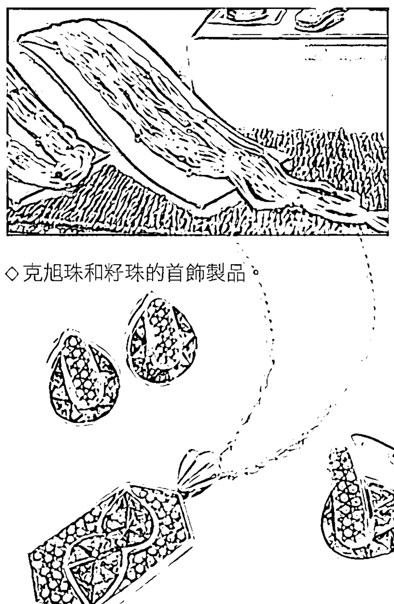

2. 附貝珍珠 Mabé Pearl
附貝珍珠又稱半珠或組合養珠（馬貝珍珠Mabé Pearl），長於外套膜下方附著在內殼的位置。組合養珠可由不同品種的蚌貝所生產，切割下來尺寸可以達到18mm之大。

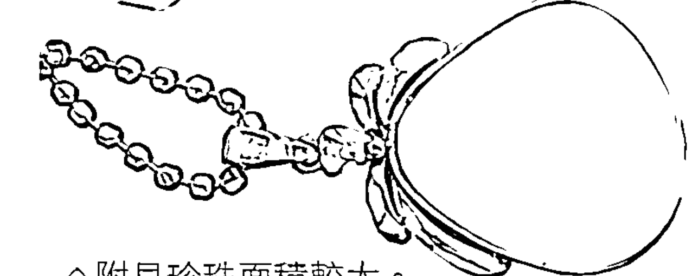

3. 鮑貝珍珠 Abalone Pearls
鮑魚珍珠生長在一種鮑魚Haliotis Iris內，絢爛的鮑魚珠有著色彩多變的珍珠層，不論是天然或是養殖的，七彩不規則的流動狀紋路讓人一眼就能認出。鮑魚貝是單殼軟體動物，所以鮑魚珠是附著在殼的內側，通常呈扁型或半凸圓面型。

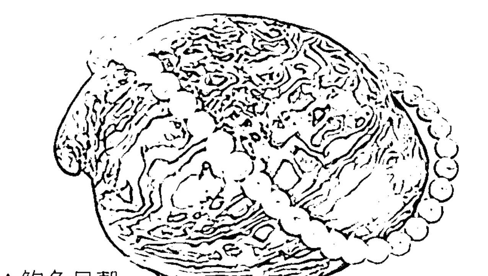

4. 孔克珠 Conch Pearl

孔克珠也稱為海螺珍珠或是粉紅珍珠（Pink Pearl），產自一種腹足動物鳳凰螺(Strombus Gigas)，它的表面沒有珍珠層而是有如瓷器般的光澤，纖維狀火焰似的圖案紋路，外形不規則或為橢圓。孔克珠產於西印度洋、佛羅里達沿岸、中南美洲、加勒比海的海域，由於孔克珠無法人工養殖，所以產量十分的稀少。《佛地經論》中提到：「赤蟲所出，或珠體赤，名為赤珠」。海裡的珍珠一般呈現白色，在佛經裡提到帶有紅色調的赤珍珠極為難得，通常只能用紅珊瑚打磨成珠狀來替代，所以經書中多次提及的赤真珠極可能指的就是極為稀少的海螺珍珠。

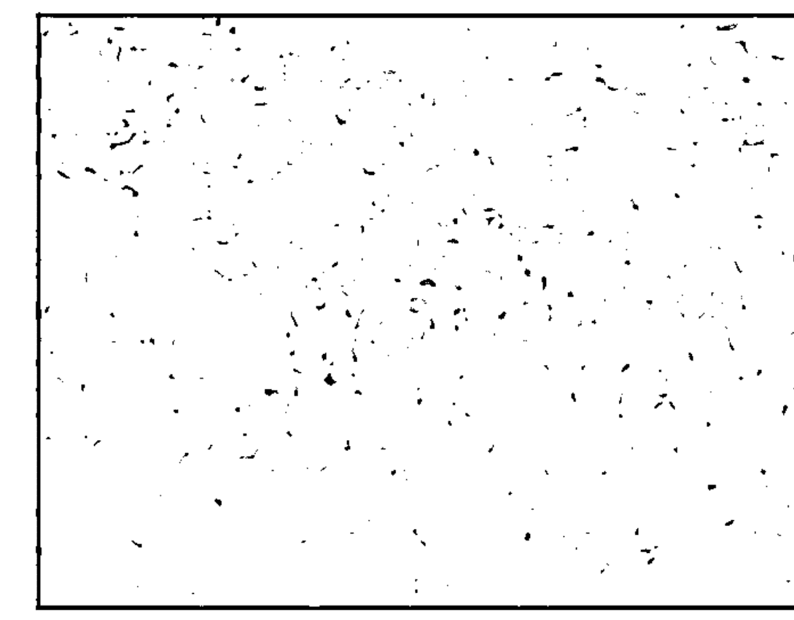

◇孔克珠上的火焰紋，美樂珠亦同。

5. 美樂珠（海蝸牛） Melo Pearls, India Volute

稀有珍貴呈現黃色到橘色圓形的美樂珠，產自椰子渦螺(木瓜螺)，是一種產在緬甸、泰國或越南等東南亞海域的單殼軟體動物。橙色的美樂珠呈現火焰般的表面紋路，因此商業名稱為「火龍珠」。

## 保養珠珍小撇步

◇珍珠可能是有機寶石中最敏感的珠寶了，嬌貴的珍珠如果太疏於保養，恐怕時間一久皮光會失去色澤。我們會看到珠寶店在陳列珍珠首飾時，不僅會避開陽光照射處，還會在一旁放一杯水，為的是要防止照射的燈光過熱，將珍珠內部的含水脫乾而變質失去光澤。

◇珍珠主要的成分是碳酸鈣，怕酸，除了避免碰到化學、酸性物質及不要帶著洗澡（尤其是SPA溫泉），也儘量不要噴到髮膠、香水。每次佩帶後最好能用柔軟的布或濕布把汗水等擦乾淨，偶爾用中性肥皂清洗，以防止珍珠久了變黃。

◇珍珠的硬度在3～3.5，比其他的寶石要低，因此存放時要分開存放或用軟布包好，防止刮傷表面。

## 吃珍珠粉美容養顏？

自古以來珍珠粉就被視為美容聖品，珍珠的主要成分是角蛋白、牛磺酸等多種胺基酸，以及銀、硒、錳、鋅、銅等微量元素，珍珠粉可補充人體內微量元素和胺基酸的不足，一直是中醫古籍中提到的良效藥方。然而要注意當今的珍珠都是人工養殖，海水養珠的珠核是來自淡水珠母貝，淡水珍珠的養殖湖池的污染程度亦無法測得，在整個處理過程中若技術掌握的不夠好，稍有不慎會使珍珠產生腥味並變質毀損。在提煉過程中是否能達到去除珍珠粉末中所含的重金屬成分與雜質也是個問題，所以現在食用珍珠粉得慎選品質。

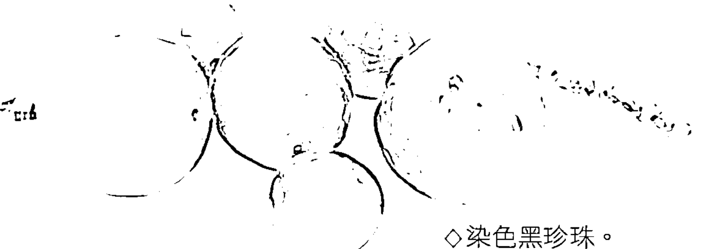

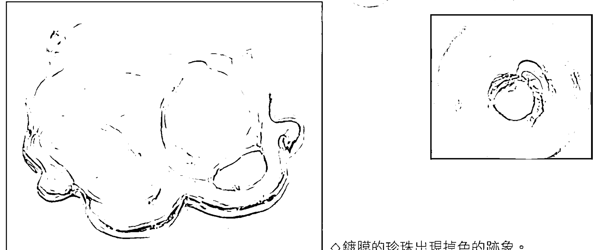

## 珍珠的優化處理

珍珠的特色就是要展現它的色彩光澤，因此處理的目的就在於要改變顏色和提升表面的皮光亮度。近年來，珍珠改色的技術十分純熟，從黑珍珠能用珈瑪射線或硝酸銀致色，到金珠和巧克力珠使用加熱的方法來改變表面的顏色，另外染色和漂白的淡水珠更大量出現於市場上，粉紅色尤其多。其他像是拋光、塗層或是剝皮的處理比較少見，也有一些被施上如矽膠、環氧樹脂或魚鱗粉等的塗料，以改善外觀光澤度或成為薄的珍珠層來增加賣相。

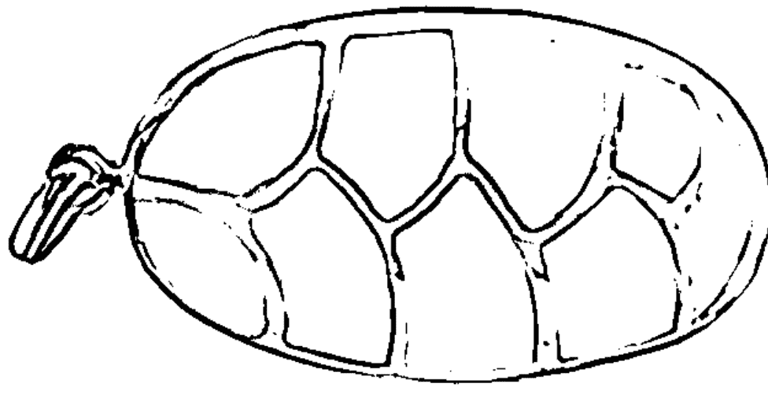

◇將珠母貝殼加以染色及切磨，亦可製成多彩層次感的飾品。

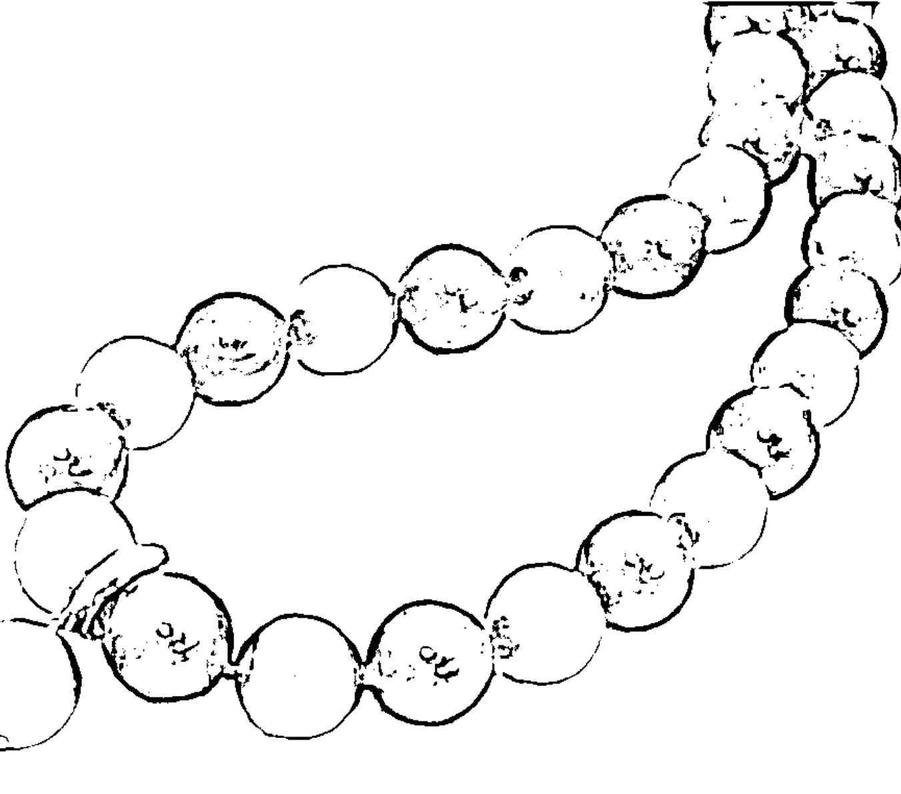

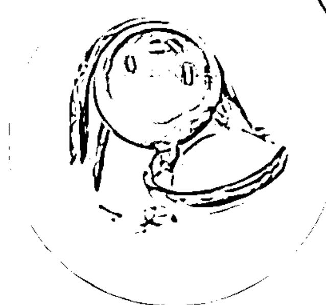

◇ 巧克力色南洋珠和一些金珠，其可愛的顏色是市場和設計的新寵。

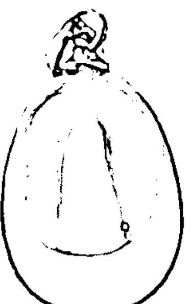

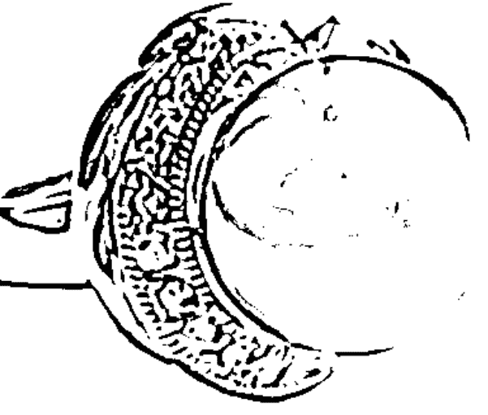

◇ 電鍍或塑膠珠也會有五彩的光澤。

## 什麼是第三代珍珠？

市場上被介紹出來的這個新名詞「第三代珍珠」，事實上不是真的珍珠，而是以人工的方式將珍珠層，應該是魚鱗晶或稱珍珠精的物質，一層層塗在珠核上，最後再加上一層保護膜，成為珍珠的仿製品。所以第三代珍珠是個商用的行銷名稱，並非是真正的珍珠。

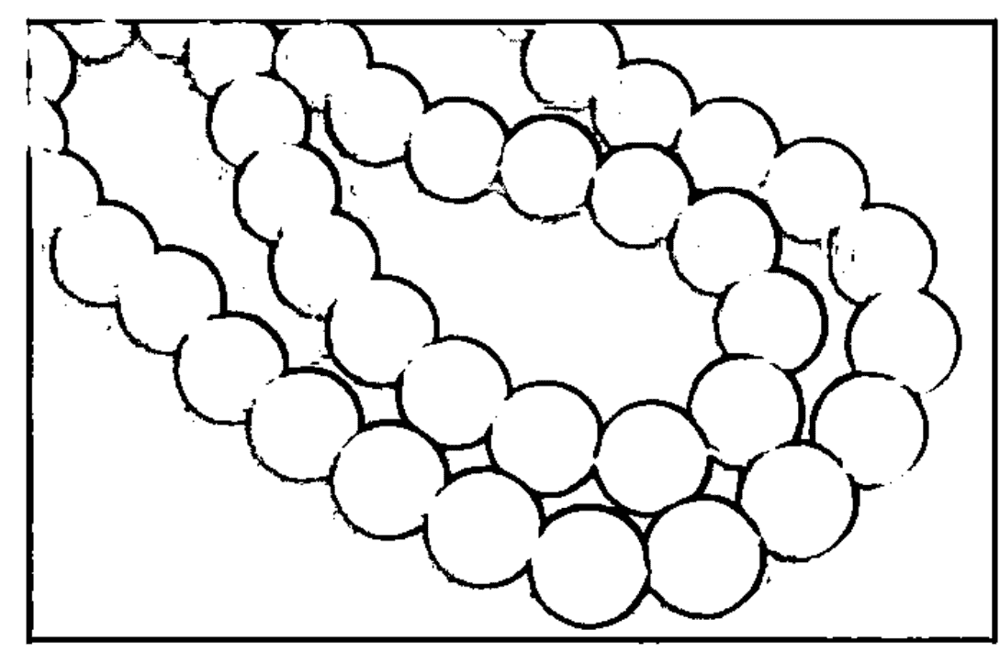

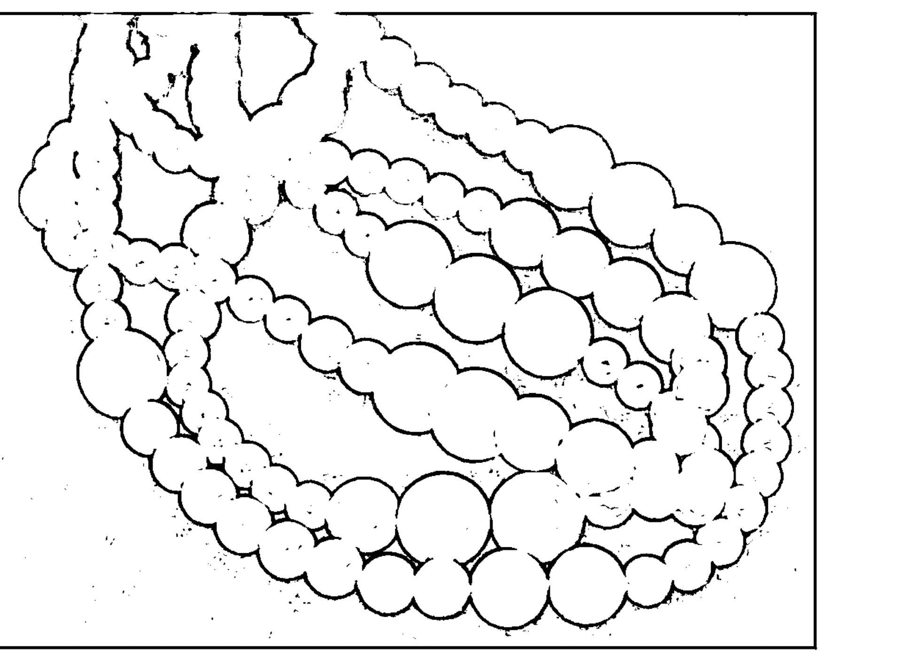

◇ 重量較重的塑膠珠，拿起來的手感和珍珠相像。

## 寶石淵典

> 「鉢摩羅伽。大論。此云赤光珠。佛地論云。赤蟲所出。或珠體。名赤珠。智論云。真珠出魚腹中蛇腦中。漢書云。珠蚌中陰精。隨月陰盈虛。」

～翻譯名義集 七寶篇～

## 用牙齒來判斷珍珠？

用牙齒咬一咬，沙沙的就是真的珍珠，曾經市場上是如此證明給消費者看的。天然或養殖珍珠，結構是一層層的霰石及方解石層狀堆疊而成的有機物質，用牙齒磨擦會有一種沙沙的感覺，其他的珍珠仿品通常是光滑的觸感，然而仿造技術的進步，並不能保證這種判斷方法能夠萬無一失；另外，像珠母貝也會得到相同的口感。以這麼直接的測試方法要考量到，細嫩的珍珠就這麼一口給咬下去，一不小心會造成表面損傷的！

## 寶石資料卡

## 珍珠

| 英 文 | Pearl |
| --- | --- |
| 成 分 | 碳酸鈣、介殼素 |
| 晶 系 | 聚成岩 |
| 顏 色 | 白、黑、灰、粉紅、橙、金色，或可染成多種顏色 |
| 硬 度 | 2 ～ 5 |
| 比 重 | 2.70 |
| 光 澤 | 無光澤～次金屬光澤 |
| 透 明 度 | 半透明～不透明 |
| 光學現象 | 珍珠光澤 |
| 折 射 率 | 1.530 ～ 1.685（點讀 1.60） |
| 處 理 | 漂白、染色、熱處理、幅照處理、上光 |
| 仿 製 品 | 陶瓷、玻璃、塑膠、貝殼、覆膜 |

## 第十章 天珠 The pure dZi

承傳下來的天珠稱為「至純天珠」(The pure dZi、The real)。天珠的藏語發音為DZI，具有美好、德惠和財富之意。

## 神秘力量的天珠

天珠（或稱天眼珠）被視為護身符，時時佩飾在身上或是表現莊嚴神聖鑲於佛面或是佛身上，祈求福蔭，擋煞鎮邪，保身修心。西藏的人們將祖先流傳下來的「天珠」視為藏傳佛教的七寶聖物之一。

關於天珠的傳說有許多種，最早喜馬拉雅山地區的人民視天珠為赤蟲化成；或認為是天降石、天眼珠，屬於天神之物由天而降的寶珠，是諸佛菩薩佩帶的瓔珞，是福慧雙持的吉祥物。在藏人心目中，天珠不是人工產品，是諸佛願力化成具有神秘力量的珍貴寶珠。

## 天珠之路

天珠主要產於西藏、錫金、不丹、尼泊爾、拉答克等山域，如果追溯到更古早天珠工藝的起源，可能得推至距今有五千年歷史的美索不達米亞兩河流域地區、阿富汗、印度的古文明時期，從這些遺址中都曾發現蝕刻瑪瑙，材質都以紅玉髓為主。在中國春秋時期的古墓，甚至是中南美洲的印加文化中，都可見到類似利用瑪瑙多變的紋理色彩製成瑪瑙珠的藝術品。

## 各有意義的符號學

《吠陀經》中講述到，古早時代受到地理艱難的生存環境和各種天災的影響，求神保佑之心自然產生，用咒語的眼紋為圖騰而發出願力，畫於石材上，藉以得到諸佛眾神的護祐，因此有人指出天珠的各種圖案是符號學的表現。

天珠圖案裡顯示圓形、方形、三角形，這些紋路被視其為符號學，各代表：
圓 形：○→天（宇宙、原動力）
方 形：□→地（能源、事業力）
三角形：△→人（循環、生命力）

◇ 天珠裡顯示的圓形、方形、三角形圖案，這些紋路被視為符號學的表現。

## 材質及作工

長久以來，天珠的真與假、新或舊、華及素，還有地區、作工及產地來源等因素，引發眾多看法甚至爭議。國內外有多本著作專門介紹天珠，在此筆者就藏拙，不多做種類喻意等方面的整理介紹，單純就以寶石學的觀點來看天珠寶珠的質料和形態。

◇ 朱砂，是玉髓瑪瑙裡的硫化汞（辰砂、硃砂）或氧化鐵物質，有時在加熱後才產生。

千年前喇嘛開採出山中珍貴礦石研磨成珠型，加上天然藥草浸泡，邊誦經文邊畫出獨特各有代表的紋路，經過開光、加持，在祭典或高僧往生後，藉由火供火化的過程中，同時放入完成前製作業的珠子，繪上的紋路因高溫浮現圖案，製成功德加護的天珠藝術。

天珠材質的選用，基本上是以石英家族中隱晶質的「玉髓瑪瑙」為主，也偶見木珠等其他材質的使用。從第五章的資料中我們知道，瑪瑙是容易加工染色的材料，然而相較之下，天珠的作工是更為繁瑣和高明，不僅得顯示出清楚邊緣的各種圖型外，還得深入內部；以兩千多年前的工藝科技而言，天珠的製造工法讓人讚嘆！

天珠主要以黑色和白色的對比圖案，表現在磨成長型、板型或圓珠且中間穿孔的玉髓或瑪瑙上，黑白眼線的形成又分天然和人工兩種。

### 天然的圖型

瑪瑙的天然條紋狀構造，在某些特定角度的切磨下，自然會形成同心圓的紋理，成為線珠或眼珠的圖案。

◇各種不同的上色作工。

### 工法的造詣

天珠的製造被稱為「鑲蝕瑪瑙（Etched Agate）」，通常使用了媒染劑的硝酸銅、無機顏料白鉛、洗滌鹼（碳酸鈉，蘇打）等塗料進行顏色上的蝕刻，加熱後塗料使之白化或變黑，形成黑、白對比的幾何紋路。底部通常有咖啡色系、黑白色系、橘紅色系，作工依照製程的不同大致可分為以下幾類：

- ◇白紋：劃上白色的線條，形成白色的部分。
- ◇白化黑紋：先讓整塊瑪瑙漂白化後，再以硝酸銅繪上圖案加熱形成黑色。
- ◇黑紋：選取未經處理的玉髓瑪瑙材料，直接塗上加熱會變黑的塗料。
- ◇白色為底上黑紋：先施以塗料於需使其形成白化的區域，加熱形成白色紋路後，再上可變成黑色紋理的塗料後加熱。
- ◇同時擁有黑紋白紋：將白色及黑色的塗料同時繪入，然後快速加熱同時得黑白紋路，此種作法顏色只附著在表面薄層，品質較差，容易失去紋路且色澤易脫落。

◇ 天珠剖開圖示，有人以白色的染劑深入瑪瑙裡層的程度，來判斷作工的好壞。

◇ 風化紋，有人說以風化紋、水紋等外觀表面的陳舊狀況來判別古董級的老天珠，但是現在也有「作舊」的技術來產生表面所謂的風化紋，實難分辨其年代。

◇ 瑪瑙的紋路，有時因為質地的差異性，讓顏色無法通過，而保留了原來的瑪瑙條紋結構。

◇ 同心圓紋路的瑪瑙在不同方向的切磨下，可形成天眼或平行線條紋的線珠。

◇ 進行處理讓顏色沈澱在瑪瑙材質表面，但無法滲透到瑪瑙內部，顏色顯現浮於表面，此種作工經長久佩帶後，較易出現掉色的情形。

## 不同材質的應用

除了上述以瑪瑙為材質，應用各種作工方法打造出各式圖樣；另外，也運用不同的材質，例如琉璃、黏土、石英岩、塑料、陶瓷等，亦可製成不同形態的類似品。

◇ 石英岩或玉髓質料常以淬冷爆裂法來產生裂紋使其容易上色或產生花紋，例如右圖的紅球紋路稱為「龍紋晶」。

◇ 塑料灌注的天眼珠色彩質感幾可亂真，仔細觀察小地方可能找出填充產生的小氣泡。

◇ 陶瓷製品的表面光滑，圖案更加多樣化。

◇販賣天珠的市場一景。

## 天珠眼數的含意

天珠的眼數各具有其特殊的意義，以下列出簡短的敘述：

- 一 眼：心思清明舒暢
- 二 眼：和睦關係
- 三 眼：成就吉祥、平息障礙
- 四 眼：減輕四苦、四懼、生老病死、地水火風之難
- 五 眼：五方財神加持助
- 六 眼：增長六波羅蜜
- 七 眼：七聖財而富有
- 八 眼：八大菩薩加持獲八正道
- 九 眼：九乘功德具足
- 十二眼：福德自然成就
- 虎 紋：除一切事業障礙
- 寶 瓶：長壽佛加持力之功德

◇色暗或無色的玉髓材料，常用來取材加工，做成天珠。

## 第十一章 青金石 Lapis Lazuli

青金石的青色代表了至高的智慧。人們相信，青金寶石可以除去邪念，讓人保持平常心。

### 青色寶料

宗教藝術之於色彩顏料的運用，在傳播佛教的同時也活絡了貿易。唐卡、敦煌石窟的壁畫中運用了大量青金石製成的藍色顏料，為佛教藝術的發展增添了無限光彩。中國地質學家章鴻釗的《石雅》裡說道：「青金石色相如天，或復金屑散亂，光輝燦爛，若眾星麗於天也」。所以中國自古也常使用青金石作為上天威嚴崇高的象徵，佛教裡同樣地也將青金石作為佛家莊嚴沉穩的形象色彩。

青金石（Lapis Lazuli），Lapis源於拉丁語，是「石」的意思，Lazuli是「青色」的意思。在中國古代稱璆琳、瑾瑜、青黛，指的是「琉璃」寶玉；青金石和琉璃的關係在琉璃的章節中有談到，因為古人辨別寶石在色不在質，其色相似，質雖異，名稱仍相同。

### 探尋產地和成分

這種寶石最先產於阿富汗一個世界最古老的寶石產地「巴克垂亞」，至今該礦區仍繼續產出高品質的青金石，其他產地還包括俄羅斯、智利，美國、加拿大、巴基斯坦、安哥拉等地。

青金石大致是由青金石、方解石和黃鐵礦組合而成的聚成岩寶石，顏色越飽滿、方解石的含量越少或是不帶可見的方解石，品質就越高；黃鐵礦太多也會降低了它的價值，但是恰到好處的點綴，反而會增添青金石的美感，如此的價格就不太會受到影響。

◇ 青金石裡含有方解石和黃鐵礦的成分。

### 染色與保養

青金石的染色處理很普遍，基本上是為了改善顏色的濃度和遮蔽方解石的部分，用丙酮或是酒精擦拭看看是否會掉色即可察覺；但有些表面上了蠟或保護層的石料，這個方法就不管用了。青金石遇到鹽酸時可能會起泡，所以避免碰到刷洗用的清潔劑或是珠寶清洗液中，用水或肥皂清洗擦拭即可。

### 選購必知重點

青金石在產量和價格上並不是特別貴的寶石，但高貴的色澤、穩重的質感讓它總是會現身在珠寶店裡。從皇室到平民，人們對青金石的喜愛數千年來不曾改變。我們在選購青金石時，注意色澤是否均勻、石面上有無裂紋、拋光是否光亮；另外，再觀察黃鐵礦的顏色是否呈現金色而非發黑，方解石白斑的量是否影響了整體的部分？是選擇青金石的重點。

### 兩個貌似的親戚

1. 方鈉石 Sodalite
方鈉石的顏色和青金石相像，商業名又稱為「加拿大青金石」或叫「藍紋石」。方鈉石具有白色的脈紋，也含有少量的黃鐵礦，因此外觀和青金石相像；然而方鈉石的顏色比青金石更紫，基本上不難辨識。

2. 藍銅礦孔雀石 Azur-Malachit
形成於銅礦區的藍銅礦（Azurite）的藍和青金石的藍幾乎相同，因為化學成分的關係，藍銅礦和孔雀石能夠相互轉變共生。藍銅礦又稱石青，常被當繪畫或染色的原料，產地在法國、那米比亞、美國等地。

## 寶石資料卡

## 青金石

| 屬性 | 值 |
| --- | --- |
| 英文 | Lapis Lazuli |
| 成分 | 主要由青金石、方解石、黃鐵礦組成的岩石 |
| 晶系 | 聚成岩 |
| 顏色 | 綠藍、紫藍、藍 |
| 硬度 | 5 ～ 6 |
| 比重 | 2.75 |
| 光澤 | 蠟狀至玻璃光澤 |
| 透明度 | 次半透明～不透明 |
| 折射率 | 1.50 ～ 1.67 |
| 內含物 | 白色方解石、黃鐵礦等 |
| 處理 | 染色 |

## 第十二章 綠松石 Turquoise
### (土耳其石)

綠松石象徵空氣、天和水，代表著藍天，人們視為繁榮的寶石。

◇ 土耳其石鑲嵌成的墜飾。

### 歷史悠久的綠松石

綠松石的使用歷史相當久遠，在許多文明中一直被當作護身符來使用。從現今為伊拉克的美索不達米亞文明即發現綠松石的串珠，連古文中提到的和氏璧，在學者諸多的史料考證下，當時拿來換城池的和氏璧，幾乎能被證實為我們所認識的綠松石。

### 土耳其石非產自土耳其

綠松石為中文的學名，但習慣上被稱為土耳其石或土耳其玉，英文Turquoise (Turkish)源自十六世紀的法文，雖然東方和西方用的名稱皆稱為土耳其石，但產地卻不在土耳其，而是當時綠松石的貿易在土耳其的市集進行遂得其名。在古代，綠松石多產於今日的伊朗（波斯）和西奈半島，中國湖北亦產有品質極佳的土耳其石，另墨西哥、美國亞歷桑那州等地也有生產。

### 獨特美麗的顏色

銅和鐵元素含量多寡影響了土耳其石顏色的深淺和色調，從偏綠色調、藍綠到天藍色都有。市場常用「知更烏藍」或是「波斯藍」來形容其獨特的美麗色彩。穿插在土耳其石裡的母岩是褐鐵礦或砂岩，呈點狀或脈狀，母岩形狀如果像蜘蛛網般的細線，會更讓收藏家著迷。

◇ 綠松石原石，色彩從藍綠到天藍皆有。

### 唯妙唯肖的冒牌貨

軟硼鈣石具有白色、灰白色或深灰的體色，常有黑色蜘蛛網的脈紋，容易染色，染成藍綠色的軟硼鈣石模仿綠松石真是唯妙唯肖。只是它的硬度較低，只有3～4，也比較容易褪色，遇鹽酸會被腐蝕，不過經過拋光處理，還是具有裝飾性的用途，美國是主要的產地。

◇ 很多土耳其石都有經過穩定化處理，雖然能使其堅固些，但時間一久會有些微變黃的情形，然而倒也是別具古意。

◇ 中間的十字狀物是模仿土耳其石的塑膠品，乍看之下真假難辨。

◇蜘蛛網狀母岩。

## 寶石資料卡

## 綠松石

◇比例極大的母岩成分。

| 英文 | Turquoise |
| --- | --- |
| 成分 | 含水銅鋁磷酸鹽 |
| 晶系 | 三斜晶系、聚成岩 |
| 顏色 | 綠、藍綠、藍 |
| 硬度 | 5 ～ 6 |
| 比重 | 2.76 |
| 光澤 | 蠟狀～玻璃光澤 |
| 透明度 | 次半透明～不透明 |
| 折射率 | 1.610 ～ 1.650 |
| 內含物 | 具有母岩 |
| 處理 | 注油、浸蠟、染色、樹脂固化處理、札卻瑞穩定性處理 |
| 仿製、類似品 | 塑料、玻璃、吉爾森綠松石（陶瓷製法） |

◇ 土耳其石浮雕、金珠以及蛋白石的胸針鑲飾作品。（設計師—三上雅久）

## 第十三章 天鐵 Meteorite

天上掉下來的禮物，這是許多人對天鐵的一個形容，天鐵其實就是目前許多收藏家跑遍世界各地，不停追尋的外太空訪客……「隕石（meteorite）」。

◇隕石原石。

### 來自外太空的訪客

隕石是來自外太空的小行星、流星，當星球崩裂或是碰撞的碎塊劃過天際進入地球時，與大氣層和空氣產生摩擦，這時大部分的碎塊會在這個階段化為灰燼，少數體積較大沒被摩擦消耗殆盡的，就能殘存下來落到地球表面，便成了我們所認知的隕石。

由於隕石上留下有關宇宙輻射或外星球演化年齡、成分等重要的訊息，隕石遂成為科學家探測研究的最佳資源。此外，這些來自外太空的礦石，更被視為特殊能量的來源，認為有強大的磁場，並與宗教祈福、能量發揮、調節氣場等，具有靈性發散的各種作用相互結合應用。

### 隕石的種類

隕石基本上可分為三個種類：鐵隕石、石鐵隕石、石隕石。

1. 鐵隕石 Iron Meteorite 或稱隕鐵
鐵隕石有個重要的特性，是它的鎳（Nickel）元素含量很高，與地球上的自然鐵不一樣，因此被稱為「鎳鐵隕石」。市場上所指的「天鐵」，指的就是這種「鎳鐵隕石」。大多數的鎳鐵隕石具有一種特性，表面經過腐蝕拋光後，會顯現出一種60° 和120° 相交的特殊紋路，稱為「維爾曼交角花紋（Widmanstattenpattern）」，這種紋路是鎳和鐵在緩慢冷卻的條件下產生的結晶，即使市面上曾出現用鐵刷紋或刀紋來冒充這種自然特性的製品，其實是很容易被區分出來。

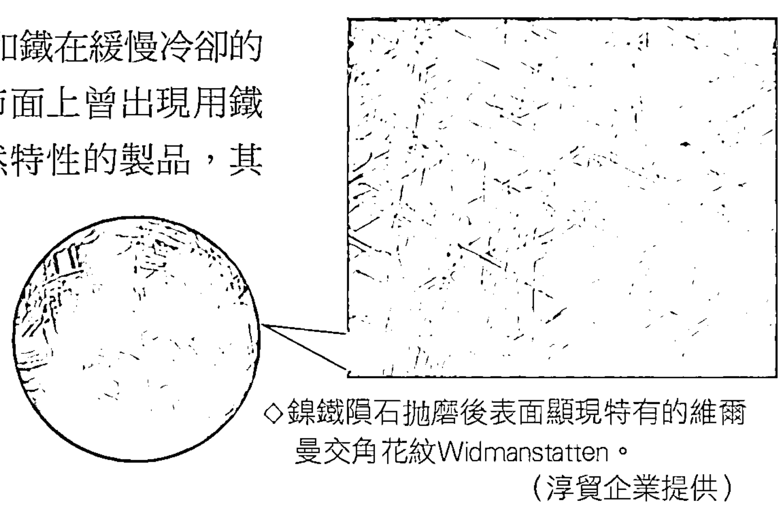

鎳鐵隕石的磁性強，在市場購買時常會見到有人用磁鐵來測試強度，證明鎳鐵隕石的身分，然而具有磁性的礦物不只一種，磁鐵礦或赤鐵礦加熱還原等礦物皆具有磁性。然而這種天然的交角花紋可說是辨別鎳鐵隕石的主要特徵之一了。

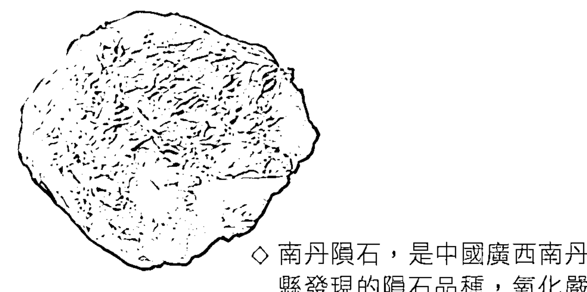

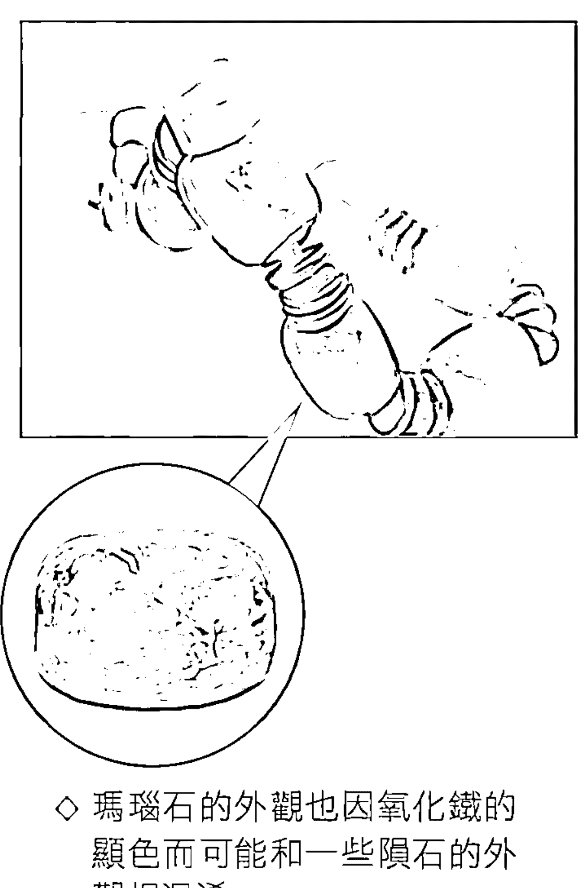

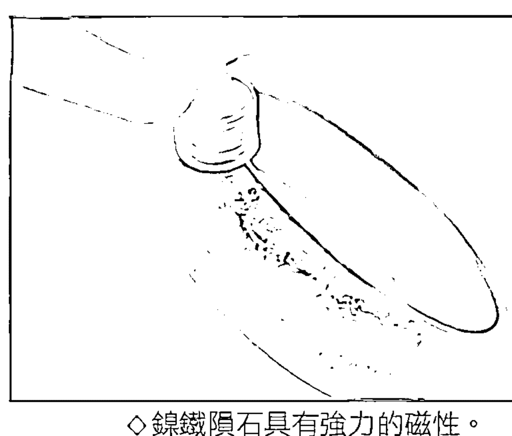

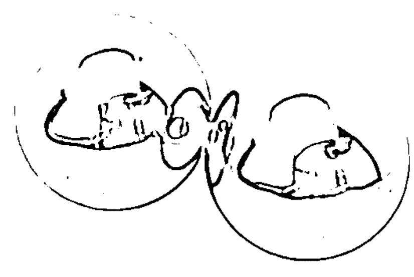

◇ 磁鐵礦亦有強烈的吸引力，外觀色澤也像鐵隕石，所以磁性並不能成為判斷的單一方法。

## 2. 石鐵隕石 Pallasites 或稱隕鐵石

也被稱為「橄欖質鐵隕石」的石鐵隕石，鎳鐵合金和石頭的比例約各占一半的量，外表看起來和地球的岩石相像，所以較難區別。石鐵隕石是隕石中數量比例最少的品種。

## 3. 石隕石或稱隕石

屬於矽酸鹽成分的石隕石，這種數量最多，有似曜岩（Tektite）、莫爾道玻隕石（Moldavite）（產於捷克，商業名稱直稱為捷克隕石）、利比亞玻璃（Libyan Desert Glass）（在玻璃的部分有所介紹）。這類玻璃質地的石隕石，由於形成的過程先後和產生的元素，被判斷為隕石撞擊地球含有矽質的地區而形成的玻璃質礦物，因此許多主張這樣的礦物不是純粹來自外太空，而不應歸類為隕石。

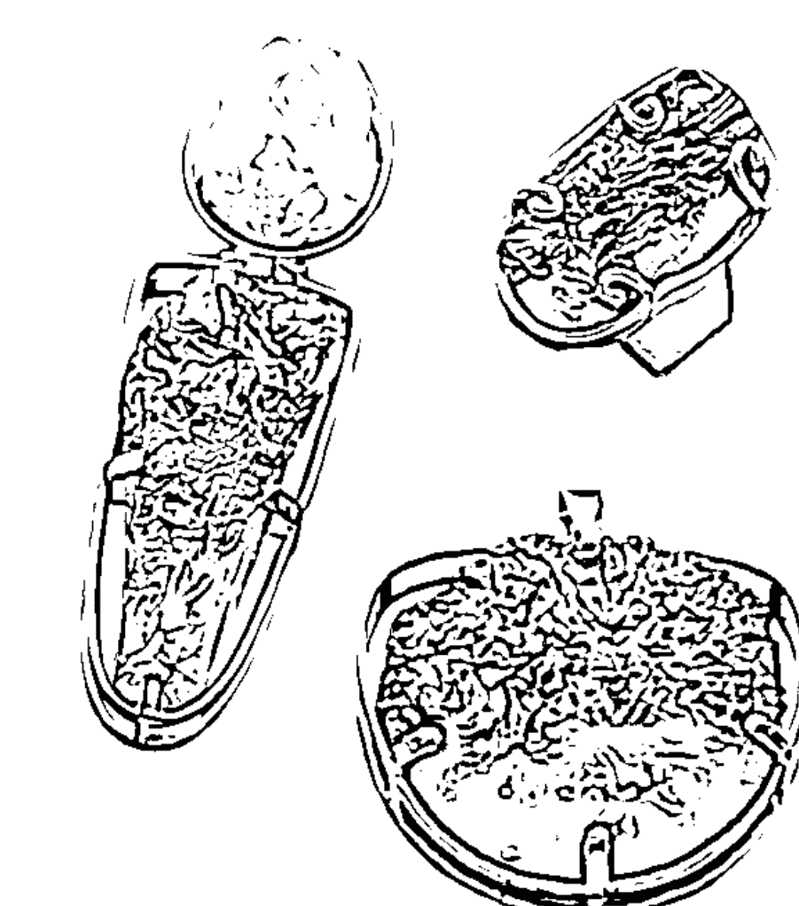

◇ 莫爾道玻隕石（捷克隕石）。

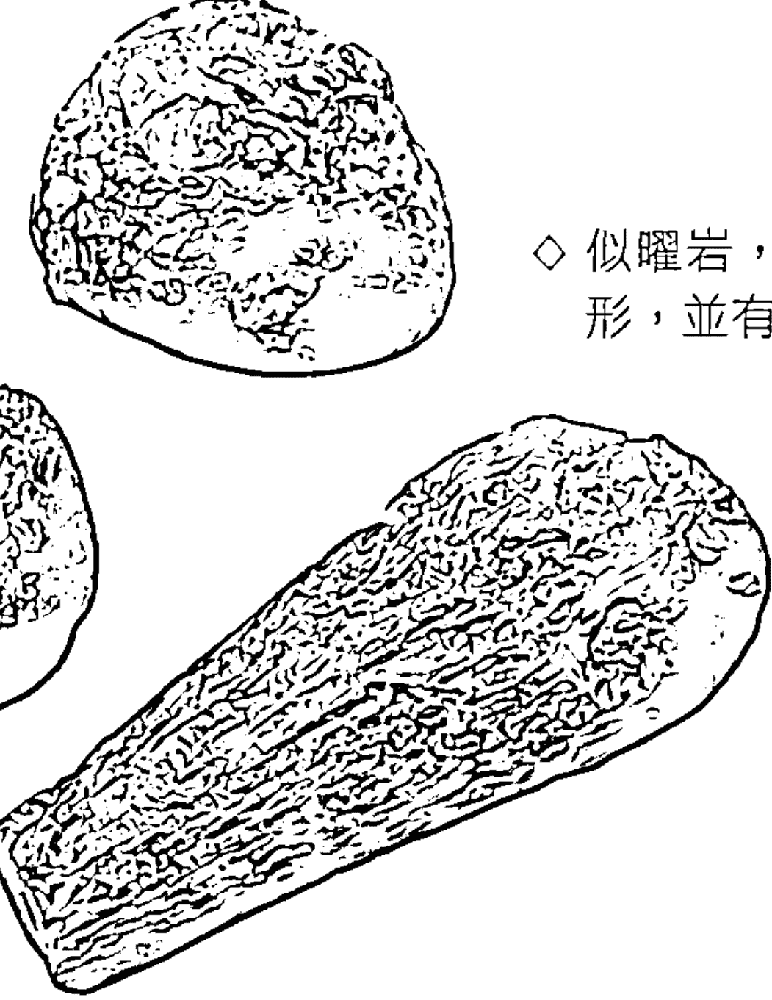

◇ 似曜岩，具有特殊的魚雷狀或圓形，並有較大的孔隙外觀。

## □來自天上的鐵

天鐵這個名詞來自西藏，即為「來自天上的鐵」，多用來製造金剛杵、普巴杵或鈸等法器，密宗稱之為「天鐵」，配上經文咒語，用於驅邪解厄或是祈福修法。嚴格來說，以在藏區尋找到的隕石並做為各種法器，才能真正地稱之為「天鐵」。

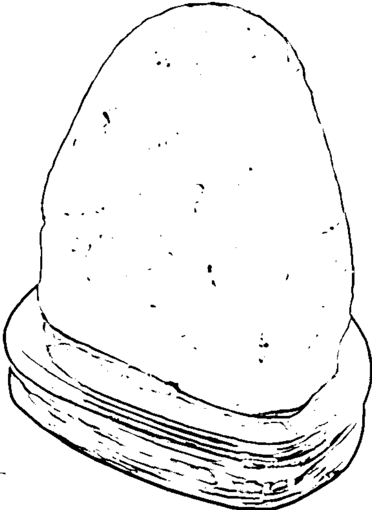

◇天金，藏傳佛教於固定時間舉行祭典，依指示尋獲所得的天銅、天鐵、天銀、天金，製成法印、金剛杵等法器。（台北陳小姐提供）

## 寶石資料卡

### 鎳鐵隕石

| 英文 | Iron Nickel Meteorite |
|---|---|
| 成分 | 鐵、鎳為主要成分，少量的鐵硫化物、磷化物、碳化物 |
| 顏色 | 通常為鐵灰色 |
| 比重 | 7.82 |
| 硬度 | 4～5 |
| 特色 | 具有強磁性，對磁鐵具有強的吸引力 |
| 內含物 | 特殊的維爾曼交角 |

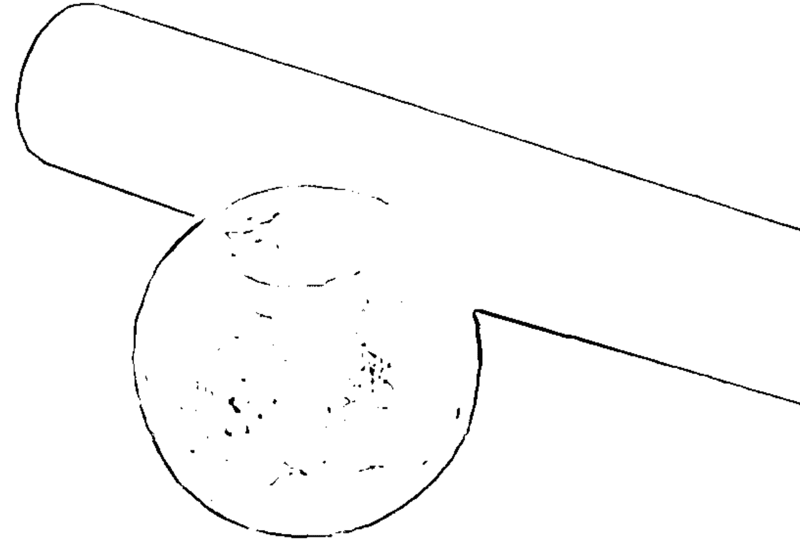

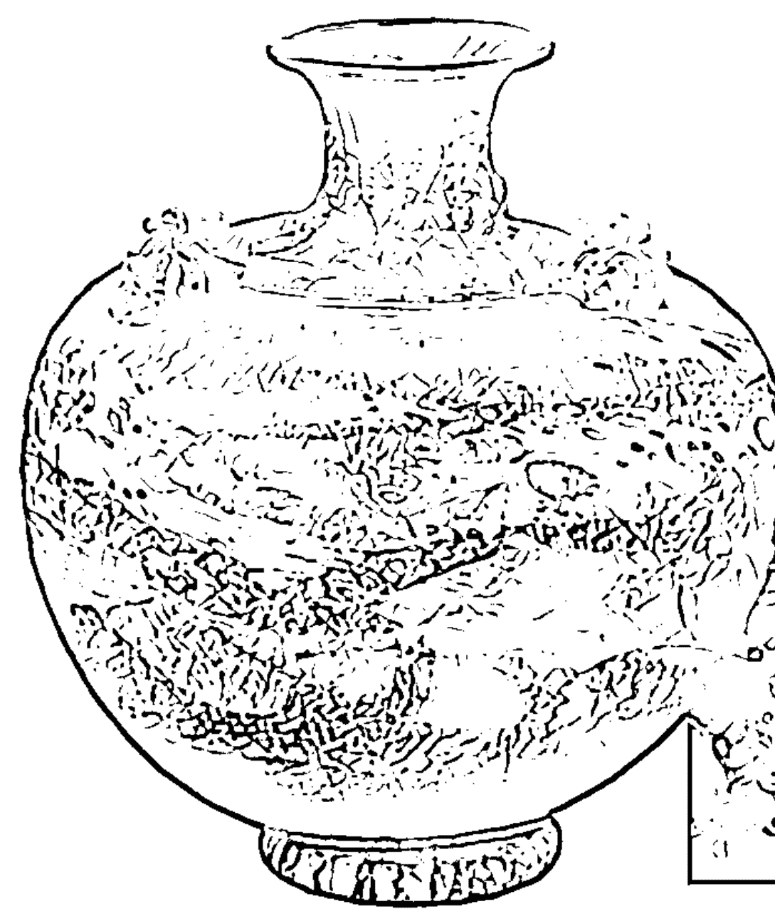

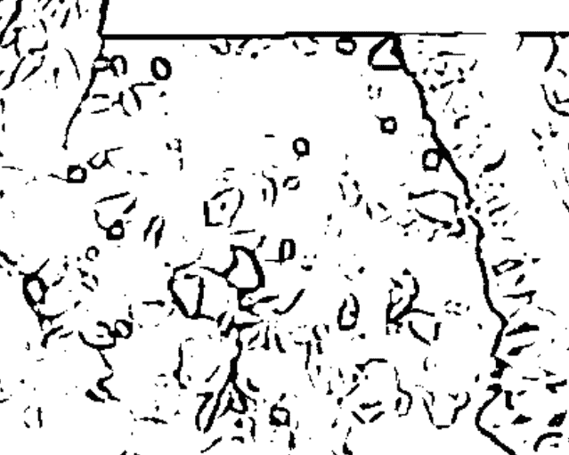

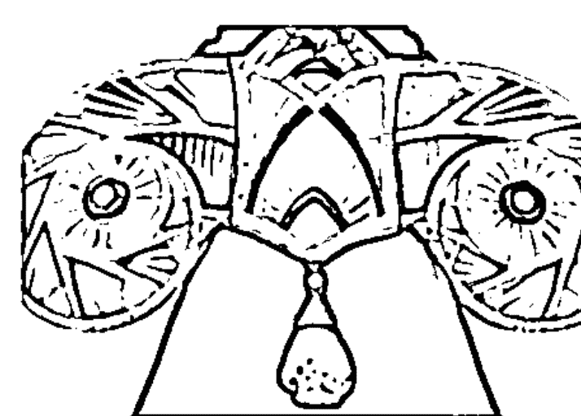

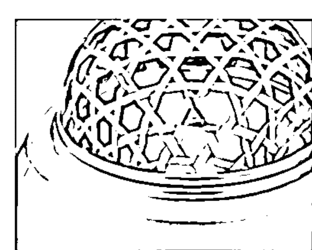

# Part 2 知賞

- 什麼是七寶
- 寶石能量與人體互動
- 西藏的辟邪七寶

## 第一章 什麼是七寶？

佛教的典章裡選出了當時世界上最珍貴的七種寶物，稱為「七寶」或是「七珍」（Sapta ratna）。

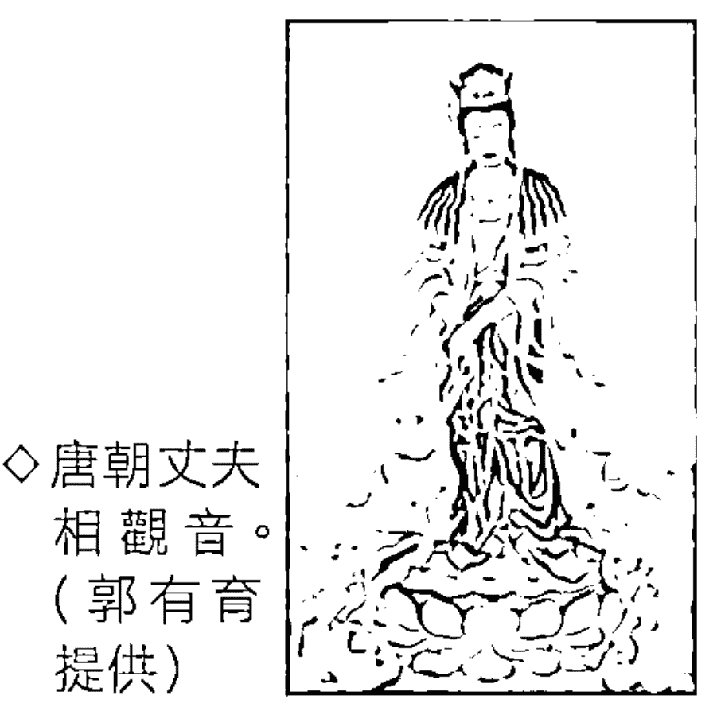

## □佛的源由

距今約2550年，古印度的釋迦牟尼（佛陀）建立起佛教。「佛」的意思是覺悟者，重視人類心靈的成長與覺悟。佛說的經典是佛經，佛教的典籍包括經、律、論三藏，佛教三藏的全集稱為《大藏經》。佛教初傳入中國的確切時間一般認為是在西漢時期，發展至今，現代的佛教可分南傳與北傳，其中北傳佛教又可分漢傳佛教與藏傳佛教。兩者基本教義上沒有大的分別，因融入地區的人文特色，修行及理論表達上會略顯差異。

## □佛家的寶

《佛光大辭典》解釋「寶」在佛教裡的意思，「寶」常用來形容諸佛菩薩以及法的崇高尊貴，如稱至高無上之佛陀為「寶王」，稱諸佛菩薩之莊嚴法相為「寶相」，諸佛清淨國土為「寶土、寶地」，極樂淨土之林稱「七寶行樹」。

## □佛法僧三寶

講起佛教的寶物，通常會先聯想到「佛、法、僧」三寶。佛法僧三寶是出世財寶，能成長人的法身慧命。佛寶，意思是覺行圓滿佛道的佛者；法寶，意指諸佛的教法軌道；僧寶，指的是依照諸佛教法如實修行自渡渡人的出家沙門。《大藏經・第三十二冊成實論卷一》中說到：「佛名自然以一切種智，知一切法自相差別，離一切不善集一切善，常求利益一切眾生，故名為佛；教化所說是名為法；行此法者名為僧」。

## 經論裡的七寶

佛教的寶物，在諸經論典裡多記載著諸佛菩薩及其清淨國土飾以各種瓔珞及寶物，「七寶」廣見於各經論中。梵語sapta ratna指的是七種珍貴的寶石，也稱為七珍。七種珍寶在極樂世界中鋪陳表現出一個空間環境的視覺及狀態。佛教中，七寶是珠寶玉石中的靈物，藉以象徵著精華聚集，蘊藏佛學闡釋的內涵智慧，放出佛家淨土的光明。因此皆云，佛界有佛、法、僧三寶，佛教有金、銀、琉璃、水晶、瑪瑙、硨磲、赤珠七寶。得三寶而國泰，得七寶而民安。

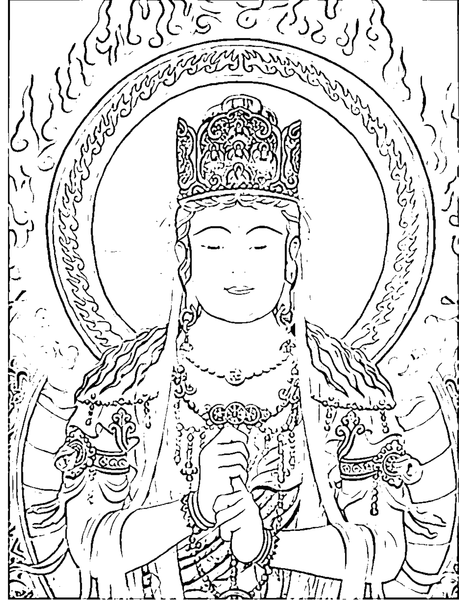

◇為佛像飾以瓔珞。 （廣衡傳藝郭老師提供）

## 寶石資料卡

### 瓔珞

古代的印度王公貴人佩帶之珠寶或是花編成的首飾，可掛在頭、頸、胸或手腳等部位。常飾於佛像以表敬意莊嚴。

## 為什麼是「七」種寶物？

「七」在佛教裡代表的意義有許多，經書中講到七重寶、七心界、七識界、七寶池、七重羅網、七種圓滿等等，許多都用「七」這個數字來排列；那麼為什麼要強調七呢？

一星期為七天，東、西、南、北、上、下六方七成圓，佛七、禪七，佛陀在菩提樹下金剛座上禪修七七四十九天開悟成道，以佛教的意思來看，七的含義有「信、進、戒、聞、捨、慧、愧」的「七聖財」。「七」同時代表著一個循環的週期，具有圓滿的意思。

佛經裡闡述解釋到，修行不只成就七寶財布施的福德，更精進了七聖財的成就功德。信仰佛法本身就是財富，世間的財富有限、有量、有漏，而且終有消失的一天；唯有出世間的聖財，才能永存不滅。佛教不僅以七寶來轉喻七聖財，還引用至德法聖財的部分，同時更對應到眼、耳、鼻、舌、身、意六識，以及第七識「末那識」（分別判斷）的七寶布施。

## 什麼是七聖財與七寶財

七聖財、七德財或稱七法財屬於成就佛道的七種聖人的財富。根據各方先進的解釋，七聖財的意思大致可歸納如下：

- 第一財是信——信仰：蘊含著無限寶藏。
- 第二財是進——精進：禪定中安身立命。
- 第三財是戒——持戒：持戒功德得富貴。
- 第四財是聞——聽聞：聞法認知真理。
- 第五財是捨——布施：累積福德無上莊嚴。
- 第六財是愧——懺悔：自省洗淨罪業。
- 第七財是慧——定慧：因緣匯聚心想事成。

七寶財指人間最珍貴的寶物：金、銀、琉璃、水晶、瑪瑙、硨磲、赤珠；能對應到七聖財的：信、進、戒、聞、捨、愧、慧。

## 七寶財是指哪七種寶物？

七寶在大家較為知悉的《般若經》、《法華經》、《阿彌陀經》等經書中出現的種類，各部著作的內容因為年代和譯者的不同而有些許的出入，在交叉比對下發現「金、銀、琉璃、硨磲、瑪瑙」是必會出現的珠寶項目，而「琥珀、玻璃、珊瑚、珍珠」隨著出處而略有不同：

| 般若經 | 阿彌陀經 | 無量壽經 | 法華經 | 大智度論 |
|---|---|---|---|---|
| 金 | 金 | 金 | 金 | 金 |
| 銀 | 銀 | 銀 | 銀 | 銀 |
| 琉璃 | 琉璃 | 琉璃 | 琉璃 | 毗琉璃 |
| 硨磲 | 硨磲 | 硨磲 | 硨磲 | 硨磲 |
| 瑪瑙 | 瑪瑙 | 瑪瑙 | 瑪瑙 | 瑪瑙 |
| 琥珀 | 玻璃 | 玻璃 | 玫瑰 | 頗梨 |
| 珊瑚 | 赤珠 | 珊瑚 | 珍珠 | 赤珍珠 |

加上不同年代的經書再進行比對：

| 經書 | 1 | 2 | 3 | 4 | 5 | 6 | 7 |
|---|---|---|---|---|---|---|---|
| 佛說阿彌陀經 | 金 | 銀 | 琉璃 | 硨磲 | 瑪瑙 | 玻璃 | 赤珠 |
| 稱讚淨土經 | 金 | 銀 | 吠琉璃 | 牟娑落揭拉婆 | | 頗胝迦 | 赤真珠 |
| 般若經 | 金 | 銀 | 琉璃 | 硨磲 | 瑪瑙 | 琥珀 | 珊瑚 |
| 無量壽經（漢代） | 金 | 銀 | 琉璃 | 車渠 | 水晶 | 琥珀 | 珊瑚 |
| 無量壽經（曹魏） | 紫金 | 白銀 | 琉璃 | 硨磲 | 水精 | 琥珀 | 珊瑚 |
| 無量壽經（唐代） | 黃金 | 白銀 | 琉璃 | 美玉 | 頗梨 | 琥珀 | 赤珠 |
| 無量壽經（宋代） | 黃金 | 白銀 | 琉璃 | 硨磲 | 頗梨 | 琥珀 | 真珠 |
| 觀世音菩薩授記經 | 黃金 | 白銀 | 琉璃 | 車磲 | 馬瑙 | 頗梨 | 赤珠 |
| 法華經 | 金 | 銀 | 琉璃 | 硨磲 | 瑪瑙 | 玫瑰 | 真珠 |
| 藏傳（西方七寶） | 金 | 銀 | 真珠 | 硨渠 | 紅玉髓 | 蜜蠟 | 珊瑚 |
| 西藏辟邪七寶 | 天珠 | 天鐵 | 嘎烏 | 九宮八卦扁牌 | 綠松石 | 琥珀 | 山珊瑚 |

## 不同翻譯版本的名辭

佛經的翻譯中，《佛說阿彌陀經》有兩個漢譯本，其一是由姚秦三藏鳩摩羅什法師據梵文翻譯的《阿彌陀經》，玄奘法師的漢譯本稱為《稱讚淨土佛攝經》，兩種譯本內容用字的選擇有所不同。七種寶物的排列無所謂先後，通常以黃金代表為首之外，以音節流暢易於誦念為考量。寶石項目排列出來有：金、銀、琉璃、硨磲、瑪瑙、水晶、珊瑚、珍珠、琥珀；另外還有屬於藏傳佛教的青金石、綠松石、天珠及天鐵等一共13種項目（解說請參考第一章）。

## □七寶的形聲意

七種寶石是物質的形象，在佛經裡七寶代表的形態大致可分為：物質數量、形象、意境莊嚴等境界。雖然這樣的節選分類必有斷章取義之疑，但仍藉由歸納的方法來探看七寶的含意。

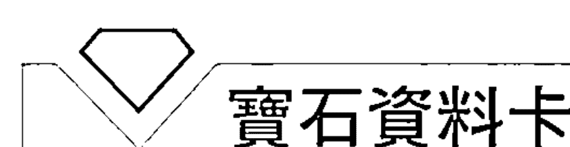

## 寶石資料卡

### 玫瑰

在列表中能發現「美玉」與「玫瑰」這兩項特別又較為籠統概念的名詞，翻譯名義或是慧林《一切經音義》中並無特別解釋，而在許慎的《說文解字》中提到：「玉，石之美。有五德：潤澤以溫，仁之方也；角思理自外，可以知中，義之方也；其聲舒揚，專以遠聞，智之方也；不橈而折，勇之方也；銳廉而不技，絜之方也。象三玉之連。其貫也。凡玉之屬皆从玉」；另有「玫，火齊，玫瑰也。一曰石之美者。从玉文聲」；「瑰，玫瑰。从玉鬼聲。一曰圜好」。如果引用《說文解字》，那麼在《法華經》及唐代的《無量壽經》中的美玉和玫瑰這兩項，應能解釋為「美麗的玉石」。

七寶以「質地」來說，可分為三個種類：

1. 貴重金屬類：金、銀。
2. 晶體寶石類：水晶、琉璃、瑪瑙、青金石、綠松石。
3. 有機寶石類：硨磲、珊瑚、珍珠、琥珀。（有機、無機寶石，請參閱附錄2 寶石用語小知識）

## 金剛經表達「數量」

1. 人滿三千大千世界七寶以用布施。
2. 以七寶滿爾所恆河沙數三千大千世界。
3. 若三千大千世界中所有諸須彌山王，如是等七寶聚。
4. 七寶滿「無量阿僧祇世界」。

七寶在《金剛經》裡意指累積福德：寶布施（物質）、身命布施（肉體）及精神布施（法）。其中，第一層物質的布施即是福德的量。

## 阿彌陀經點出「形象」

法師鳩摩羅什譯的《阿彌陀經》裡，藉由具體化的形容，點出極樂國土的形象，照映在眼底所看見的色塵妙境，昭示極樂世界的無限美景。後來玄奘三藏主張直譯，將鳩摩羅什譯的《阿彌陀經》重譯，改名為《稱讚淨土佛攝受經》，引兩經的經文片斷比較，兩處皆描述佛淨土極樂世界的景象。

> 《阿彌陀經・大正藏冊十二》略云：
「舍利弗，彼土何故名為極樂？其國眾生，無有眾苦，但受諸樂，故名極樂。」「又舍利弗。極樂國土，七重欄楯，七重羅網，七重行樹，皆是四寶周匝圍繞，是故彼國名為極樂。」「又舍利弗。極樂國土，有七寶池，八功德水，充滿其中，池底純以金沙布地。四邊階道，金、銀、琉璃、玻璃合成。上有樓閣，亦以金、銀、琉璃、玻璃、硨磲、赤珠、瑪瑙而嚴飾之。池中蓮花大如車輪，青色青光、黃色黃光、赤色赤光、白色白光，微妙香潔。」「舍利弗。極樂國土，成就如是功德莊嚴。」

> 《稱讚淨土佛攝受經・大正藏同卷》略云：
「又舍利子，極樂世界淨佛土中，處處皆有七妙寶池，八功德水彌滿其中，何等名八功德水？一者澄淨，二者清冷，三者甘美，四者輕軟，五者潤澤，六者安和，七者飲時除飢渴等無量過患，八者飲已能定長養諸根四大。是諸寶池底布金沙，四面周匝有四階道，四寶莊嚴甚可愛樂。諸池用匝有妙寶樹，間飾行列，七寶莊嚴，甚可愛樂。言七寶者，一金，二銀，三吠琉璃（Verulia），四頗胝迦（Sphatika，即玻璃），五赤真珠，六阿濕摩揭拉寶（Asmagarbham，即瑪瑙），七窣娑落揭拉婆寶（Musaragalavh，即車渠）。是諸池中，常有種種雜色蓮花，量如車輪，青形青顯青光青影，黃形黃顯黃光黃影，赤形赤顯赤光赤影，白形白顯白光白影。」

## 無量壽經描述的「意境」

在無量壽經裡，不僅描寫了七寶造出的環境形象，並描述神佛之莊嚴威力造就極樂寶地美好的整體感受，助目耳鼻舌身意的感知昇華，使寶樹莊嚴，散真珠華，周遍清淨，見者歡喜。

> 《無量壽經》略云：
佛言：「成佛已來，凡歷十劫，其佛國土，自然七寶，金、銀、琉璃、珊瑚、琥珀、硨磲、瑪瑙合成為地，恢廓曠蕩，不可限極，悉相雜廁，轉相間入。光赫煜燿，微妙奇麗，清淨莊嚴，超踰十方一切世界眾寶中精，其寶猶如第六天寶。又其國土，無須彌山，及金剛圍一切諸山，亦無大海、小海、溪渠、井谷，佛神力故，欲見則見。亦無地獄、餓鬼、畜生諸難之趣。亦無四時春夏秋冬，不寒不熱，常和調適。」

> 「又無量壽佛，其道場樹，高四百萬里，其本周圍五千由旬，枝葉四布二十萬里，一切眾寶自然合成，以月光摩尼，持海輪寶，眾寶之王，而莊嚴之，周匝條間，垂寶瓔珞，百千萬色，種種異變，無量光炎，照曜無極。珍妙寶網，羅覆其上，一切莊嚴，隨應而現。微風徐動，吹諸寶樹，演出無量妙法音聲。其聲流布，偏諸佛國。聞其音者，得深法忍，住不退轉，至成佛道，耳根清徹，不遭苦患。目睹其色，鼻知其香，口嘗其味，身觸其光，心以法緣，皆得甚深法忍，住不退轉至成佛道，六根清徹，無諸惱患。阿難！若彼國土天人，見此樹者，得三法忍：一者音響忍；二者柔順忍；三者無生法忍。比皆無量壽佛威神力故，本願力故，滿足願故，明了願故，堅固願故，究竟願故。」

## □七寶普現菩薩慈悲與方便

佛說《阿彌陀經》裡以黃金為地；《無量壽經》說七寶為地；《觀無量壽經》說琉璃地上，以黃金繩，雜色間錯界以七寶。多部經典中所言之西方極樂世界皆以佛教七珍寶之莊嚴而成。佛、修行者及其跟隨者重在心靈層面的探討與追求，如果強調了七寶這些世間物質，難免讓人對著重精神道德修養的聖賢發出疑問。然而這是阿彌陀佛為了悲憫苦惱的眾生，以此種方式大開方便之門，以莊嚴的七寶成就極樂淨土，讓苦惱的眾生了解苦難混濁的世間外，有個清淨光明的極樂世界能引導著我們。

佛陀以無窮的願力及莊嚴清淨平等美妙的佛國淨土，指引我們捨棄痛苦，追求幸福，發心修身。我們的真如自性本來就具足無量功德法財，什麼寶物都有了，那麼由佛祖願力所形成的七寶莊嚴，誠如《宗鏡錄》文中提到的：「先以欲鉤牽，後令入佛智，斯乃非欲之欲，以欲止欲，如以楔出楔，將聲止聲」。七寶的引用，是佛陀引度眾生的一種方便，一種轉化，一種妙法和慈悲。

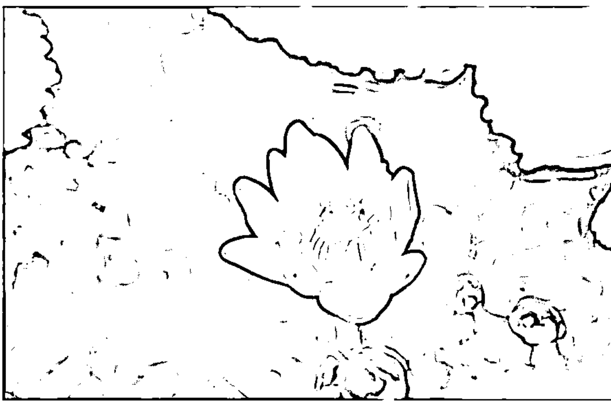

## 第二章 寶石能量與人體互動

自古中國在佛教的傳播影響下，七寶石和色彩的象徵深入傳統的信念，並運用在風水命理，結合了心靈需求與祈願。

## □中醫古法，寶石入藥

古時候七寶是製藥的來源之一。明朝正德十三年的名醫李時珍所撰寫的《本草綱目》，在各種有機物到無機物的分類中，除了對動植礦物有詳細說明，還記載著用藥的方法及療效；像金石篇中就記述著：「琥珀安五臟、定魂魄、消淤血、療蠱毒、破結痂、生血生肌、安胎；珍珠主治鎮心、塗面令人好顏色、塗手足去皮膚逆臚、補腎、治男性虛勞、安神、去煩熱及小孩驚癇；硨磲有鎖心、安神之效。」《金石部第八卷》寫道：「馬腦，釋名瑪瑙。呈淡紅色，像馬的腦，故叫瑪瑙珠，屬玉石類，重寶也；水精，瑩澈晶光，如水之精英。水精味辛寒無毒，主治熨目、除熱淚，亦入點目藥，穿串吞咽中，推引諸硬物；生海底五七株成林，謂之珊瑚林，居水中直而軟，見風則曲而變堅，變紅色，漢趙佗謂之火樹是也。紅珊瑚有安神、明目、止血及鎮驚等療效；銀屑，安五臟、定心神、止驚悸、除邪氣、久服輕身長年。」

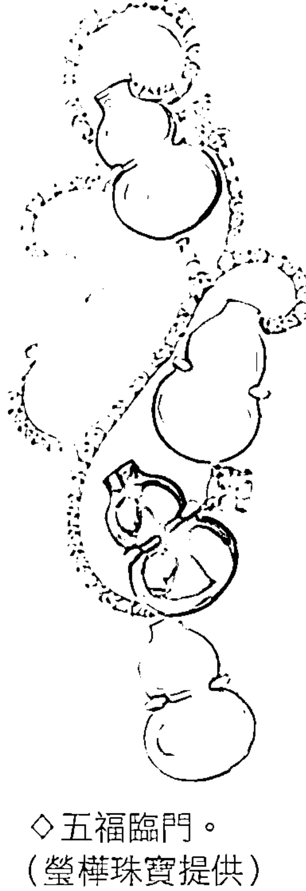

除了《本草綱目》外，在別的如《抱朴子》等古代的醫療大典中，許多都選用了七寶的有機和無機寶石來入藥，並且列出使用方法、劑量和功效，即使現今這類用藥方式不再，但市面上還存有以黃金、珍珠用於美容保健方面的製品。

然而，傳統古老漢方醫學以晶石磨成細粉製藥，到現代使用水晶矽石晶片製造出傳導電流以調節心律脈動，癒療系晶體的運用，把寶石能量串連揚氣磁場，進而輔助人體的脈輪運作，其治療效果可說跨越心理、生理及命理。也因此長久以來，或多或少讓人們相信，寶石、礦石具有一股來自大地的凝聚力量。

## □寶石晶體的磁場

晶體的磁場共振和寶石光譜顏色的相互交會下，人們相信寶石對於情緒、精神、身體病症、周遭環境等，有保護、調癒自身能量及調和氣場的效果。很巧的是，中外的礦石能量說和七寶石的種類都十分相符，尤其是水晶、瑪瑙、天然玻璃、琥珀、青金石等，在能量石的運用裡占有相當大的比例。

從古至今，寶石神奇功效所產生的影響，雖有待發掘更豐富的內涵和意蘊；然而現代科學講求根據，實事求是，但對難以解釋和統計的氣功、針灸、把脈等漢方療法，近年來倒成為西方醫學研究探討的方向之一。

印度的瑜伽理論顯示，人體就像一個地球，地球是個大的磁場，人體也存在一個獨立的磁場，肉體和血脈脈輪失去調和時，就像磁場亂掉一般，精、氣、神會失去了平衡；失去平衡就開始擾亂正常的個體運作，最直接的會從情緒上表現出來，進而向外部發洩或壓抑於體內，久而久之影響了個人整體及周遭有互動的人、事、物，那就成了負面的能量。

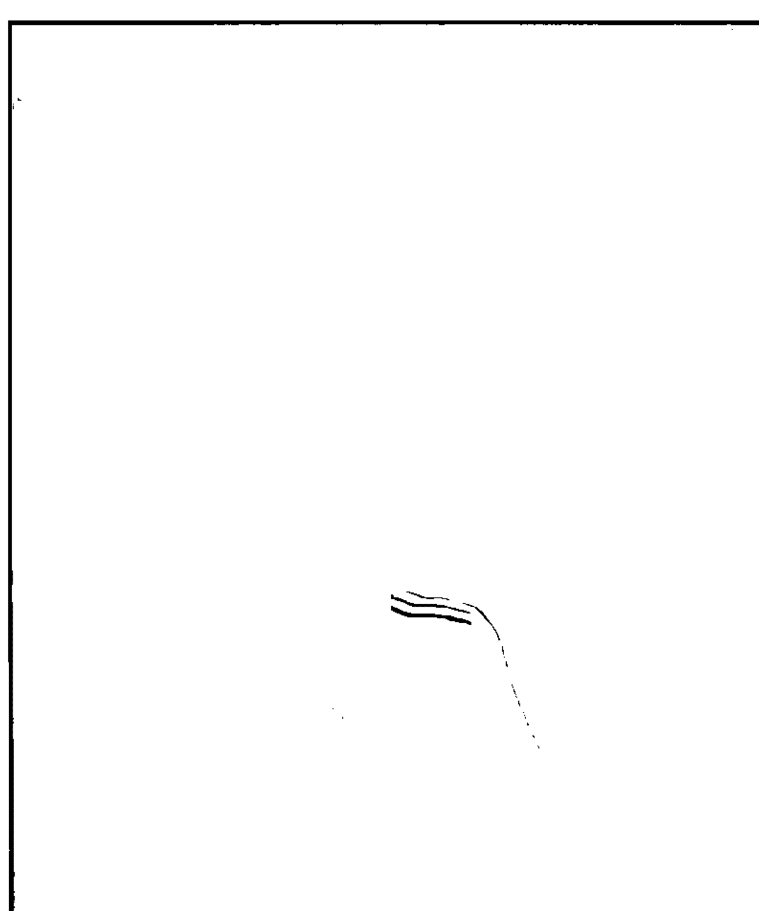

開運，簡單的說就是改善磁場。廣被接受的能量說法是，相信來自地球億萬年的礦物結晶體蓄含著能量和磁場，透過身體和晶體礦石的接觸互動，進行內外振盪調合。印度瑜伽和中國以「輪」或稱「脈輪、穴輪、氣輪」的方式，來觀察對應體內循環的脈絡、氣色，晶體振盪頻率與器官腺體的關係，利用自然能量的共振形成一種癒療及提升的模式，讓身上的脈輪能量旋轉，達到復健、適應調節的效果。此外，礦物晶石那份來自山林天然的氣息和自然界的連結，更會引導促成身、心、靈的淨化及轉化，生命力也隨之增強。

## □什麼是三脈七輪？

所謂的三脈七輪是指，三脈：左脈、右脈、中脈，串連著整個中樞神經；「七」這個象徵性的數字在印度代表著七個脈輪，表示人的存在主要有七個中心（有的標示為十個中心）。

根據瑜伽理論，人體由五大元素組成，體內的七個脈輪分別控制著特定的內分泌腺體，三脈經絡通道連繫交會運輸著能量，不同的輪控制和影響著人體的情緒和感覺。人們透過瑜伽的方法鍛鍊身體，或運用七個顏色的寶石來輔助能量的調動，也使用靜心冥想的方式來輔助身心靈的擴展。

## 頭到底的能量中心有七個脈輪：

| 七輪 Cakras | 色彩（光譜色）常用代表晶體 | 身體位置 | 元素 | 支配 |
| :--- | :--- | :--- | :--- | :--- |
| 頂輪 Sahasrara | 紫 紫水晶 | 頭頂 | 空 | 靈性：想像力 創造力 管理能力 |
| 眉心輪 Ajina | 靛 土耳其石 | 雙眉中心 | 識 | 心神：直覺 感受 |
| 喉輪 Vishuddha | 藍 青金石 | 頸部下段 | 光 | 言語：溝通 記憶 理想 |
| 心輪 Anahat | 綠 孔雀石 | 胸口 | 風 | 呼吸循環：防禦 愛 財富 |
| 臍輪 Manipura | 黃 黃水晶 | 腹腔中心 | 火 | 精力消化：邏輯 組織 智慧 |
| 生殖輪 Svadhisthana | 橙 琥珀 | 肚臍下三指處 | 水 | 性功能：抱負 開發 社交 |
| 海底輪 Muladhara | 紅 石榴石 | 脊椎基部 | 地 | 排泄：行動 生命力 接觸力 |

## 陽宅氣場石

中國風水的說法裡，房子介於東方和南方之間坐落著財位，正門進去的左前方方位，在東方人的住家或辦公室裡，常常能見到運用晶體的擺飾來調整格局，運用大自然的能量來凝聚陽宅財氣，讓居住的人達到化煞招財，事事順利如意，這也是寶石的功德之一。

◇紫晶洞一直是招財蓄寶的首選。

例如
白水晶：擋煞、改運、靈修供佛。
紫水晶：避邪調氣、開發智慧。
黃水晶：黃色為財富聚集和代表大地的寶藏，象徵吉祥富足。
鈦 晶：象徵著尊貴和財富，銳利的光芒被認為能抵擋災厄。
髮 晶：消災去穢氣。
瑪 瑙：增強活力，增進名聲官位。
粉 晶：改善人際關係，使業務公關更旺和帶來愛情。
石 英：健康精神、淨化身心、鎮宅避邪、改善居家環境。
青金石：聚集創造力。
琥 珀：事業發展、驅邪鎮驚、調和身心。
綠松石：增進和諧。
紅碧玉：排解困難。
珊 瑚：逢凶化吉。

日常選購的晶體礦物恰好都包含在七寶的項目之中，可能因為這些品項在市場的普遍性較廣，價位上也最被大家接受。有趣的是，七寶在古代是代表十分珍貴的寶物，直到現代因為開採技術進步、取得較為容易和貿易發展進步，七寶反而成為最平易近人的寶物。

## □對水晶發功

寶石本身所散發的能量除了可以和人體產生互動外，佩帶七寶珠玉石也常能因為見物而思情，轉借物質延伸要傳達的意識，並且用自己的身體去感覺，用心去感受，用智慧去體悟，藉物練習觀想（冥想），心念流動能量自然跟著啟動。

有一種以人體觸碰晶體以達相互對話溝通的形態，讓信念成為正向頻率的發射器。有人以神經語言程式學（Neuro-Linguistic Programming，NLP）或稱身心語法程式學來解釋人和晶體互動的關係；這套程式學被視為策略技術和方法，認為大腦和神經系統的運作連結，緊密地影響著身和心之間的互動。人的語言模式因大腦的運作影響心念，激發了潛能，並啟動意識要傳達出來的能量；簡言之就是「心想事成」，而關鍵在於「想」上。有認真又持續的正念，意識傳達出來的訊息從大腦中發出電流活動，這股電流轉化為信念，信念就像啟動的按鍵，依照自己的意願改變，就真得促使了「心想事成」。

## □寶石的神奇力量

有沒有發現，不論是工商贈禮的各種擺飾、在市集看到就順手買回的透亮晶體、高人指點建議擺放於特定位置以求蓄納福祿財富的晶洞、親朋好友祈福求來的手鍊或首飾、燃燒後可產生

> ◇七星陣或是五行擺位，主張和石頭對話進行感應連結可產生共振的效果。

安神薰香的琥珀、或是放在電腦螢幕前後據說有消除電磁波的電氣石或水晶柱等等，在我們的生活周遭總是會出現各種礦石晶體，似乎冥冥之中人和礦物就是有一種分不開的力量。

萬物皆有靈，寶石晶體是大地組織成分中淬鍊的結晶，不加入宗教元素的考量，寶石本身的物理化學特性就具有其自發和被動的作用力。寶石晶體外觀上表現的特質也常和我們的官能產生連繫，讓身處都市叢林的人們見到礦石想到山林，見其清涼而舒緩心情。不同的寶石形態、不同的佩帶及擺設方式，為我們的生活帶來無聲無形的變化，悄悄地散發出礦物的天然能量。

寶石從能量的傳導、晶石的互動共振與吸收、對人體的調節癒療，以及眼睛對顏色光譜吸收所得到的感知能力進而對身心產生連結互動，再加上對歷史意義、象徵、傳家、寄情、珍藏、累積財富等情感的融入，因為有人的信念加持而產生連繫，這分牽引更強化了寶石的神奇力量。

## 礦石浸水口味佳？

取用各種晶石，洗刷乾淨，放入水中一段時間後飲用，會發現水質的口味有些許變化，清爽或甘甜都有，其實這和我們在水中放入麥飯石的原理相同。礦石的主要產地巴西，常見居家以電氣石浸於食用水中飲用。依筆者個人的經驗，不知是否為心理因素或是視覺的影響作用，喝麥飯石水會有似泉水清新的質感，電氣石的水有綠草的清香，粉晶帶有甘甜口味。有人稱這樣以礦石浸泡的水為「能量水」，喝了能調節補充人體的能量，不論其功效有無，就當作是個有意思的小實驗。當然要提醒的是，並不是所有的礦石都可以如法炮製，通常麥飯石、電氣石和石英類的寶石是比較適合的選擇。

◇石英晶體，生活中常使用方解石、琥珀、天然玻璃等寶石礦物幫助安定與放鬆、提升創造力、去除負面能量、讓生活富足。

◇名為「大衛之星」的正反兩面三角形形成陰和陽，表示能釋放出正和負的能量。

雖然《金剛經》和《心經》的經文裡提到「色、聲、香、味、觸、法」，以及對應的「眼、耳、鼻、舌、身、意」，要修習超越六塵和六境的空性體悟不為物質外境的羈絆束縛。然而大自然對人類慷慨贈予億萬年孕育而成的寶石礦物，不止鋪陳佛教七寶中對極樂世界美好境界的形象；美好的珠寶玉石更在宗教裡被附予神聖的內化和外在的意義，像是對佛像飾以瓔珞，讓其整體造型上更顯華麗、莊嚴、尊貴。

◇切磨成尖錐狀的水晶，據說經由冥想，以線吊起水晶錐的自由擺動能指引方向答案。

金、銀、琉璃、珊瑚、琥珀、硨磲、瑪瑙等七寶財，在佛意上的對應、轉嫁、隱喻或傳達，代表著功德的一種具現。信眾見而心生喜悅，常以佩帶瓔珞七寶來提升法身慧命，並見到七寶七珍入眼時即傳達意念，隨時提醒修正口、身、意的行為表現，此亦是菩薩的慈悲，更是一種渡化的方法。

◇水為財，以水滾動水晶球，表示財源滾滾來。

## 第三章 西藏的辟邪七寶

西藏的七種辟邪寶物，都有其美麗的傳說典故，也是藏傳信仰者配戴於身上用來驅邪避疾的護身寶石。

## 什麼是辟邪七寶？

佛教從印度遠播至東亞各地，宣揚方式融合了各地的文化及環境；大約在七世紀吐蕃贊普松贊干布時期，佛教傳到了西藏，發展出具有藏區特色的「藏傳佛教」密宗（Esoteric Buddhism）、喇嘛教的形式，近代藏傳佛教逐漸流傳到世界各地。

顏色，是大自然送給人類最重要、最美好的禮物之一，在廣闊山區的西藏，透過天、地、人合諧一致的相互對應，顏色所代表的對應物及其象徵，結合藏傳佛教，形成極具風土民情的祈福吉祥信物。而宗教傳遞也因地緣關係，隨著人文特色的融入，發展出獨自的型態；佛教器物、護身寶物等相關種類的演變也大相逕庭，屬於西藏佛域文物的七寶稱為「辟邪七寶」或「西方七寶」：

- 1. 天珠
西藏特有之寶物，人們相信天珠具有超自然的神秘力量，能避邪、消災、解厄，以前只有階級高者與高僧才得以擁有天珠。
- 2. 天鐵
來自外太空，以鎳和鐵夾雜金屬為主要成分的隕石，被認為能驅魔消災。
- 3. 嘎烏
音唸「ㄍㄚ，ㄨ」，金屬材質製成鑲有各種寶石，具有蓋子互扣是一種隨身護身寶盒，巧妙的寶石鑲工設計展現西藏的精緻工藝。
- 4. 九宮八卦
外圈是十二生肖，中圈是八卦，內圈是九宮。據說為西藏密宗開山祖師「蓮花生大士」聚集梵、藏、漢三地能破除各種凶煞的鎮宅之寶而成，且代表著梵、藏、漢文化精神的融合。
- 5. 綠松石
也就是土耳其石；藍色象徵「天、空氣、水」，翠綠色代表「天」。
- 6. 琥珀（蜜蠟）
土黃色象徵「土地」，金色代表「地」。
- 7. 山珊瑚
紅色，象徵「血液、火光、熱」與代表「人」。

辟邪七寶中，除了天珠外，有象徵天、地、人的綠松石、琥珀和山珊瑚，是西藏同胞們不可或缺的護身信物。

## 五種色彩的含義

每一種顏色都有各自的象徵含義，例如：
白色為心靈：純淨
黃色為大地：尊貴
紅色為火焰：權力
藍色為天空：情感
綠色為山川：雅緻

亦有人以六字大明咒真言「唵嘛呢叭咪吽」（通譯為「神聖的，紅蓮花上的寶珠」）來對照象徵淨化和自持：

| 真言 | 顏色 | 象徵 |
|---|---|---|
| 唵 | 白 | 智慧——禪定 |
| 嘛 | 綠 | 慈悲——忍辱 |
| 呢 | 黃 | 五蘊——持戒 |
| 叭 | 藍 | 平等——般若 |
| 咪 | 紅 | 大樂——布施 |
| 吽 | 黑 | 悲心——精進 |

◇金剛杵在密教裡象徵摧滅煩惱魔障。

在西藏山區隨處飄揚著五色祝福的旗幡，五種顏色象徵著純潔、興盛、平和、智慧和勇氣，依其自有象徵意義，同時對應著代表的寶石，以及各種顏色的組合。隨身攜帶隨時觸碰，無時無刻感受著神佛的教授與提醒，且時時向神佛奉獻內心的虔誠，人們的祈願隨風飄揚傳遍天地，也隨著願念深入內心。寶石的珍貴與否頓時不再重要，重要的是寶石能因為轉化的力量帶來動力，並啟動念力的運作，讓其持有善念圓滿自來。

◇藏族的服裝飾品，也多用銀質材料鑲嵌，並以天地人的色彩元素搭配。

◇綠松石、琥珀、珊瑚象徵天地人的共鳴。

# Part 3 附 錄

尋寶地圖
寶石用語小知識
感謝

## 附錄 1 尋寶地圖

七寶寶物要在哪兒購買才能安心又買得物美價廉？我想這是所有的消費者都會提出和關心的問題。下面介紹臺灣北、中、南三大區代表性的珠寶玉石批發市場，有機會讀者不妨前往參觀，也挑戰一下運氣和眼力！

臺灣北、中、南三大代表性的珠寶玉石批發市場玉市，分別集合了上百的商家，營業項目包括：紅藍寶、祖母綠等有色寶石；鑽石、翡翠、珍珠、玉器、壽山石、雞血石、水晶、琥珀、台灣本土玉石奇石、天珠、陶瓷、K 金銀飾、配件耗材、中國結飾品；以及各式創意珠寶首飾藝品等，應有盡有，琳瑯滿目。

假日玉市裡都是臨時搭用的桌椅和台子，雖然簡便但集中了來自各路的精品寶石，別小看這些坐在板凳上的攤位主人，各個都是臥虎藏龍，從珠寶設計師、珠寶鑑定師、工藝教學老師、寶石批發商、金工廠的廠長、翡翠盤商、礦主、擁有打撈船的珊瑚公司東家到古董批發商等等。許多頭家平時在市區各地都擁有自己的正式珠寶公司或是工廠、教室。訪問下發現，其實許多攤位的主人志不完全在交易成功與否，業界交誼和流通市場資訊消息也是主要的目的之一。

參觀或購物的遊客絡繹不絕，近年來自海外的觀光客也不少；另外，臺灣中南部的業者也常專門北上到建國玉市採購珠寶玉石南下銷售。不得不佩服店家的眼力，一眼就能判斷來者是消費顧客或是批發零售商，交易時開的第一口價就有區別。

許多攤位主人寶石資歷豐富又十分健談，常見消費顧客和批發商就這麼聊得

天南地北。店家的第二代更是生力軍，據我所知有幾位都還擁有國際鑑定師的證書，因此從對話中能得到寶石本身或產地的一些知識。學習專業鑑定的朋友們也都時常相約在玉市，把這裡當作另一個實習的寶地，挑戰自己的學習成果外，也訓練臨場的判斷和反應。

珠寶買賣以誠信為原則，然而真真假假或是質量高低，林林總總的物件攪雜在一塊，不怕貨比貨，最怕不識貨。珠寶玉石的買賣，除了選對信用良好的店家配合之外，也端看個人的眼力和鑑別的功力，相信在玉市是訓練經驗和挑戰的最佳場所。如果平時對自己所愛或尋找的寶物培養了基本常識，在選購時能停、看、聽、問，不只增添樂趣，且能累積鑑定的能力，另一方面也才不會淪為贗品的受害者。所以有備而來的買家經常都能挖到寶，買得物美價廉又愉快過癮。

### ◎北部

臺北建國假日玉市
營業時間：週六 9 時至 20 時／週日 9 時至 18 時
營業地點： 建國南路一段仁愛路或濟南路口

臺北光華玉市
營業時間：每週一至日
營業地點：台北市八德路一段新生南路交叉口（光華商場旁）

### ◎中部

台中文心玉市
內含六百個攤位
營業時間：每星期五、六、日上
午九點至下午六點
營業地點：台中市文心路二段
651 之 1 號／詢問電
話 (04)-22543788

台中公園玉市
營業時間：每星期六上午九點至下午四點
營業地點：台中市文心路四段 210-8 號 (04)-22986323

### ◎南部

台南玉市
營業時間：每星期一、二、六，八點到四點半
營業地點：台南市西區臨安路一段 68、79 號 / 諮詢電話 (06)-2218362

高雄十全玉市
成立於 1980 年的高雄十全玉市，是高雄最大的玉石批發集散地
營業時間：每週三、六、日聚集了許多賣家。
營業地點：高雄市十全路與自立路口

高雄市藝術市集
營業時間：每週六 16：00 ～ 21：30
營業地點：高雄市文化中心西側藝術大道

## 附錄 2 寶石用語小知識

◇實用的寶石鑑定工具
「10～20倍的手持放大鏡」。

| 名稱 | 說明 |
| :--- | :--- |
| 礦物 | 指在自然過程中形成具有特定化學成分和晶體結構的天然無機物。 |
| 岩石 | 由一至多種礦物組成的材料。 |
| 寶石 | 具美觀、稀有、耐久特性，以及工藝裝飾價值的天然珠寶玉石。 |
| 有機寶石 | 從自然界動植物或其衍生物的寶石。 |
| 晶體（晶質） | 有固定組成原子結構的固體，具有獨特的外觀形狀，以及物理、光學特性。 |
| 微晶質 | 晶體過小肉眼無法探視的礦物結構，或稱隱晶質。 |
| 多晶質 | 許多微小的晶體集合組成的礦物材料。 |
| 非晶質 | 內部或外部沒有固定形式、原子結構和外形的物體，如玻璃、有機寶石。 |

| 名稱 | 說明 |
|---|---|
| 雙折射 | 一道光線進入另一個物質內，會變成兩個前進路線的，這種就稱為雙折射寶石。 |
| 合成寶石 | 用人為的方法部分或全部加工得到的材料，其物理性質、化學成分及晶體結構，與天然寶石具有相同或相似的對應性。 |
| 再造寶石 | 通過溶化、熔合、黏合等方法單獨或混合天然與人造材料（樹脂、塑料）的仿製品，如壓製琥珀。 |
| 仿製寶石 | 指全部或部分天然寶石、合成寶石，加工模仿其他寶石的顏色、外觀或光學現象。 |
| 寶石內含物 | 或稱包裹體，寶石內部的可見特徵，像是：晶體、裂隙、氣泡、解理、條紋等，都可稱為內含物。 |
| 晶體結構 | 晶體內部對稱性的原子結構生長習性，可分等軸、正方、三方六方、斜方、單斜、三斜晶系。 |
| 光澤 | 物體表面反射產生的寶石光彩和外觀。 |
| 比重 | 寶石在空氣中的重量與同體積水的重量，相比之後得到的材料密度比例。 |

## 感謝

感謝各方友人的支持與鼓勵，在大家的相助之下使得內容得以更加豐富完整。網路時代無遠弗界，資料搜集從 CBETA（Chinese Electronic Tipitaka Collection）電子佛典集成和各處開放於網際網路資料庫的電子手抄本史集搜索比對，到許多未曾謀面的部落格網友的熱情協助，簡短的請求、一句留言就盡力到圖書館或市場查找和提供資料圖片，諸位大德，雨潔銘記於心！

## 致謝

- CBETA (http://cbeta.org)
- 大東山珠寶 (http://www.lupearl.com)
- 伯爵珠寶 (https://www.boucheron.com)
- 淳賀天然水晶 (http://www.crystaltaipei.com.tw)
- 全球寶石鑑定 (http://www.wgic.com.tw)
- 瑩樺珠寶 (http://www.hugo.com.tw)
- 六耀社 (http://www.rokuyosha.co.jp)
- 東浦銀器 (http://www.to-ho.com)
- 黑木國昭 (http://www.glass-art-m.com)
- 聯華古美術 張先生 (tochang99@yahoo.com.tw)
- 致和軒吳崇剛教授 (wuck412917@yahoo.com.tw)
- 廣衡傳藝工作室 (http://tw.myblog.yahoo.com/yuyukuo6)
- 琥珀寶寶黃憶人 (http://tw.myblog.yahoo.com/amber-museum)
- 瑞琳珠寶飾品創意坊 (http://tw.myblog.yahoo.com/miria168-168)
- November 串珠工坊 (http://tw.myblog.yahoo.com/november-1979)
- 台大寶石礦物林書弘 (http://tw.myblog.yahoo.com/jeeann-gemminerals)
- 鑲嵌玻璃徐風老師 (fengkris@xuite.net)
- 王昭霞師姐

- 美好的事物、聲音或影像都很吸引人，但究竟是怎樣的書最能吸引您呢？
□價格殺紅眼的書 □內容符合需求 □贈品大碗又滿意 □我誓死效忠此作者
□晟星出版，必屬佳作！□千里相逢，即是有緣 □其他原因，請務必告訴我們！

- 您與眾不同的閱讀品味，也請務必與我們分享：
□哲學 □心理學 □宗教 □自然生態 □流行趨勢 □醫療保健
□財經企管 □史地 □傳記 □文學 □散文 □原住民
□小說 □親子叢書 □休閒旅遊 □圖文書 □其他____________________

以上問題想必耗去您不少心力，為免這份心血白費
請務必將此回函郵寄回本社，或傳真至 (04)2359-7123，感謝！
若行有餘力，也請不吝賜教，好讓我們可以出版更多更好的書！

其他意見：

晟星出版有限公司 編輯群，感謝您！

## 從天國掉落娑婆世界
珠寶不再是遙不可及的星星
而是滋潤心靈與裝扮美好生活的寶物

鑑定佛教七寶裡13種永不退流行的寶物？
揭露珠寶在佛教經典裡的身世之謎
金、銀、琉璃、硨磲、瑪瑙、水晶、琥珀、珊瑚、珍珠、天珠、
青金石、綠松石、天鐵。
一窺13種佛教裡最珍貴也是日常生活最常見的寶石意含與象徵

## 珠寶達人養成秘笈6招 ——

- ☆珠寶鑑定知識
- ☆選購重點指南
- ☆日常生活運用
- ☆保養小撇步
- ☆開運小偏方
- ☆哪裡有好貨
