# 實習神明手冊
### 啟動內在感官的自修經典法則
*How To Develop Your ESP Power*
Jane Roberts 著
于秀霞 譯 / 王季慶 譯
賽斯身心靈診所 許添盛醫師 專文推薦
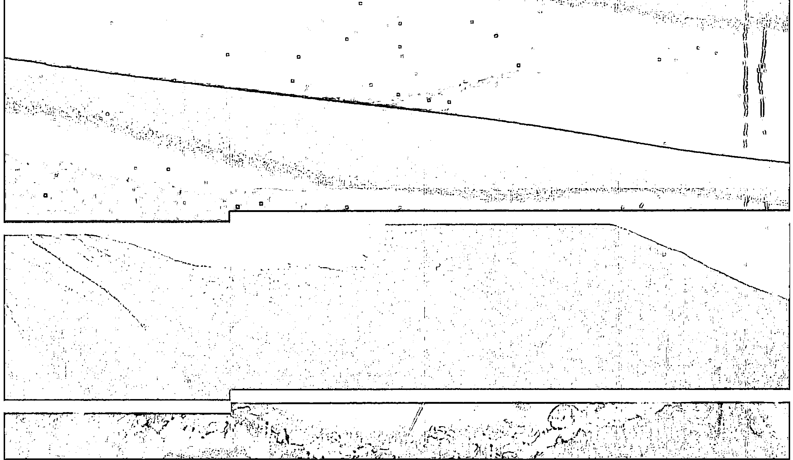

> You create your own reality
> 每天的生活，都是靈魂的精心創造

---

How To Develop Your ESP Power by Jane Roberts
Copyright© 1966 by Jane Roberts
This edition arranged with Rights & Distribution, Inc.
through Big Apple Tuttle-Mori Agency, Inc.
Complex Chinese edition copyright© 2008 Seth Publications
All rights reserved.

# 實習神明手冊
### ——How To Develop Your ESP Power
- 作者：Jane Roberts
- 譯者：王季慶
- 總編輯：李佳穎
- 特約編輯：陳秋萍、陳美玲
- 封面設計：唐壽南
- 發行人：許添盛
- 出版發行：賽斯文化事業有限公司
- 地址：新北市新店區中央七街26號3樓
- 電話：22196629（編輯部）、22190829（讀者服務）
- 傳真：22193778
- 郵撥：50044421
- 版權部：陳秋萍
- 行銷業務部：李家瑩
- 網路行銷部：管心
- 課程事業部：楊雅淳
- 法律顧問：北辰著作權事務所
- 印刷：邦堤印刷事業有限公司
- 總經銷：吳氏圖書股份有限公司
- 地址：新北市中和區中正路788-1號5樓
- 電話：32340036 傳真：32340037
- 2008年11月1日 初版一刷
- 2011年7月16日 初版三刷
- 售價新台幣390元（缺頁或破損的書，請寄回更換）
- 有著作權，侵害必究（Printed in Taiwan）
- ISBN 978-986-83690-8-5
- 賽斯文化網址 http://www.sethtaiwan.com
- 賽斯身心靈診所專線 22180875

## 關於賽斯文化
發行人 許添盛醫師
我是個腳踏實地的理想主義者。賽斯文化，是為了推廣身心靈健康理念而成立具公益性質的文化事業，希望透過理性與感性層面，召喚出人類心靈的「愛、智慧、內在感官及創造力」，讓每位接觸我們的讀者，具體感受「每天的生活，都是靈魂的精心創造」。
> —— You create your own reality.
我們計畫出版符合新時代賽斯系列書籍、有聲書、影音商品及生活用品，並將經營利潤致力於賽斯思想及身心靈健康觀念的推廣，期待與大家攜手共創身心靈健康新文明。

# 實習神明手冊
## 目錄
## How To Develop Your ESP Power
關於賽斯文化
《賽斯書》策劃緣起 許添盛
《推薦人的話》實習神明運動 許添盛
《前言》發現心靈能力的真相
- 1 靈應盤的使用方法 001
- 2 「靈應盤」作踏腳石 029
- 3 自助式降神會 051
- 4 預知夢 069
- 5 各種千里眼式的夢 085
- 6 心電感應 109
- 7 進入心理時間的步驟 137
- 8 心理時間 165
- 9 另一個探究未來的方法：預言 189
- 10 更多有關預言的事 215
- 11 你以前活過嗎？ 233
- 12 轉世、家庭關係與人格 259
- 13 暗示人類人格死後猶存的事件 279
- 14 「靈魂世界」和人類人格的存活 301
- 15 ESP調查之一斑 327
- 參考書目 352
- 愛的推廣辦法 355

## 《賽斯書》策劃緣起
中、高雄成立賽斯讀書會分支。
因著我的堅持，雖然不願意，王季慶依然支持我由讀書會走向成立「中華新時代協會」。剛開始就只有讀賽斯書，後來才有人陸續帶進奧修、克氏、光的課程、靈氣等，而我始終如一，獨鍾賽斯。當年的我尚年輕資淺，於是王季慶擔任理事長在先，二屆之後才由我接任，開始大力推廣賽斯思想，以及經我整理賽斯書精髓並融合醫學專業（家醫科與精神科）的身心靈健康觀念。
這樣說來王季慶應該不會反對——我是一切的「元兇」，所有華人地區賽斯書的出現及推廣，我即是那背後最強大的推動力。當然，王季慶是我早期最大的愛護者及支持者。在我生命中最孤單、最無助、最關鍵的十五年練功期，她的呵護陪伴我成長茁壯。
我告訴瑞克這段往事，他似乎有所領會，自二〇〇七年起，「花蓮賽斯村」、「賽斯文化」、「賽斯身心靈診所」、「新時代賽斯教育基金會」、「賽斯花園」，陸續在我的熱情推動下成立，這些年來隨我打天下的工作同仁們，也都功不可沒。
其時，我並不知道美國賽斯書版權主要是由瑞克夫婦處理的——於是這麼一來，想當然爾，瑞克夫婦當然信任由我們賽斯文化兼具專業與熱誠的編輯團隊來出版，加上新時代賽斯教育基金會同步大力推廣賽斯思想，真是再完美不過了。

## 策劃緣起
這就是賽斯文化出版全系列賽斯書的源由。事後看起來理所當然，當時卻也是創造實相的成功典範，正如我常說的：「結果先確定，方法自然來，輕鬆不費力，信任加感恩，但要有耐心！」

## 〈推薦人的話〉
### 實習神明運動
這是賽斯文化出版的第一本「廣義賽斯書」。它並非由賽斯親自口授，卻是由賽斯書的傳遞者──魯柏（根據賽斯的說法，魯柏此生乃是她在物質實相的最後一世）所寫。
這本《實習神明手冊》，詳細記錄了賽斯出現的過程，內容相當豐富。由靈應盤入手，包括自動書寫的練習、自助式的降神會、預知夢、千里眼的夢、心電感應、心理時間的練習、預知未來的能力、如何開啓自己轉世的記憶，以及在人類世界之外其他意識所居之所等等……
在此向各位特別說明，要介紹賽斯的出現，的確會有些令人不知如何啓齒。畢竟所謂的「靈應盤」，在某些圈子看來，帶著一些怪力亂神及迷信的味道，跟自己所研究二十餘年賽斯書的浩瀚智慧，似乎有些不相稱的地方。
一般而言，大家對靈應盤及降神會的印象並不佳（包括我個人在內），要嘛過於輕佻，當它是場鬧劇；要嘛過於扭曲誇大，扯上一些神神鬼鬼的事，比如請神（鬼）容易送神（鬼）難之類。
但是，如果我們的心態是「大膽假設，小心求證」，不要讓自己被太多先入為主、扭曲負面的心態所左右，那麼會比較客觀一些。
許添盛醫師

那麼，所謂的靈應盤、降神會、自動書寫，會不會只是方法或過程，向我們顯示潛意識所具有的諸多功能之一？是否透過潛意識更多功能的認識，我們可以對歷史宗教所提的，人類的「神性」或「佛性」，或我常說的具足「愛、智慧、內在感官及創造力」的無意識自己，有更多的了解？
大家要以全新的心態來看待這本書。人類二、三千年文明的歷程，近幾百年來不斷的強化自我意識，以一個自外於心靈、萬物、大自然的心態，過於發展物慾及強調物質面，使得人類文明的發展面臨最大的瓶頸及困境，人們對於「我是誰」、生命的意義及存在的目的，則變得更困惑了。
我所推廣的身心靈觀念及賽斯思想，個人親暱的稱之為「實習神明運動」。在成為正式醫師前，我曾在台北榮民總醫院擔任過一年的實習醫師，學習有關成為一名住院醫師所必備的知識與技能，那是令我此生難忘、充實美好且具挑戰性的一年。那麼，在接觸二十餘年的賽斯思想後，我將人類重新定義為那「來到人間出差、旅遊、學習、考察兼玩耍的實習神明」。
也許你我已在地球生死輪迴了數世、數十世乃至數百世了。根據賽斯資料，每兩千年人類靈魂的大圓滿已經開始了，人類的文明將由偏向自我意識、物質追求，轉為潛意識、內我意識及心靈的追求。人類也將因這樣的蛻變而開啓另一個新的文明（即亞特蘭提斯文明）——一個意識、潛意識、無意識開始融會的文明，一個物質與精神同步並重的文明，一個人類與天地、大自然、地球和平共存，共創萬物和諧昌盛的文明。
許多人害怕潛意識壓抑的黑暗、扭曲的自我及情緒，也害怕潛意識之門所可能通往的光怪陸離、鬼怪所居之所；是的！你的確應該小心，卻不是裹足不前。過度的自我誇大、自我膨脹，或自我封閉、自我否定都不是好現象。相反的，維持自己的精神安定性，輔以少量多餐、分段睡眠的生活作息，並以内正、透徹、究竟的智慧為指引，我想各位必不致迷失。
不管你知道、承不承認，本書所提及的內在感官能力，都是你天生固有的，也是未來所有人類必須逐步覺醒、開悟及開發出來的力量。那麼，拿起這本《實習神明手冊》吧！它將喚醒每個人身為那來到地球輪迴太久、遺忘自己神性的「實習神明」記憶。

### 「推薦人簡介」
許添盛醫師，賽斯身心靈診所院長、賽斯文化發行人、財團法人新時代賽斯教育基金會董事長。鑽研新時代思想逾二十年，尤偏爱賽斯；同時從事身心靈整體健康研究，對於癌症的治療及預防復發有獨到心得。成立「身心靈健康成長團體」、「美麗人生癌症病患成長團體」、「賽斯學院」及「賽斯心法修鍊班」，並定期受邀至全國各縣市、香港、馬來西亞、美加等地演講。著有《絕處逢生》等十餘種書籍及有聲書。

## <前言>
### 發現心靈能力的真相
行動，卻根本不知道自己曾收到訊息。你也許在災難發生之前便接到警告、改變了自己的計畫，卻從未有意識地覺察那警告本身。你也許會探訪，以我們的話來說，已經不在人世的親友。他們也許會來看你，而你也許根本沒有覺察到他們的在場。這些事你可能全都做過，或做過其中一件，卻從來不曉得。
不可能？不可置信？才不咧！你的意識心只知道你准許它知道的事，其他事情全部都藏在你的潛意識裡。往往，只是因爲懼怕重要的資料，你才失去它。但是，沒有任何「印象」會真的失去。我們從來不會真的忘記。我們往往按照來自潛意識的資訊行事，但有意識的自我卻拒絕承認這個資訊的存在。
你自己的內在能力和潛能種類之多和力量之大，超過你的認知。這本書的目的是，讓你能夠在日常生活中認出並且利用它們。你現在就在用它們了，只不過是用一種經過壓抑、效率不佳的方式。雖然如此，它們還是有用。
這本書是給所有對這些內在能力感到好奇的人，這樣的人曾經聽過或讀到有關「超感官知覺」（Extrassensory Perception 縮寫爲 ESP），或「特異功能」的事，很想知道自己的內在藏著什麼沒有被認出來的通訊方法。這本書不會給你任何新的玄祕力量，而是讓你能發展和利用每個人內在潛伏的那些靈異能力。
我知道一個平凡人也可能發現這些隱藏的通訊管道，並且利用它們，因爲我自己就是如此——是需要努力、時間和自律沒錯——但我之前並沒有任何這種現象的經驗或訓練。這個計畫現在已經是而且未來也會是我一生中最有價值的冒險。在橫越大多數尚未探勘過的人類潛能地平線的旅途上，我的經驗可以讓你用來當作嚮導。
在我開始自己的實驗之前，我對這些內在能力的實際應用知之甚少。從那時起，經過密集的實驗和應用，我變得非常熟悉它們。就是透過本書為你列出的那些實驗，我學會去認識並且利用自己的超感官能力。
我現在知道人類人格的力量之中有著預知未來的能力，因爲我就做到了，雖然預知有限但卻相當一致。我知道夢可能有着千里眼般的視野，因爲我教會自己記住夢境，然後與日常生活發生的事情做比對。本書也為你列出了這些實驗。我知道心電感應真的在運作，因爲我現在對它很警覺。基於經驗，所以我能夠認出它來。我不再一笑置之，認爲那是巧合。
由於我自己的實驗的結果，我有過許多形形色色的生動經驗，在我們公認的知識體系這樣有限的架構裡，怎麼解釋它們都無法令人滿意；後面的章節會討論到這些經驗。然而，在我決定親自去調查超感官知覺的領域之前，我個人從未體驗過任何一種心靈現象。我確信這些力量和能力潛伏在每一個人的內在，只不過以前我不予理會，就像你現在可能也不理會它們一樣。
或許因爲我是作家，所以我閱讀的範圍涵蓋很多不同的領域。讀到有關特異功能的東西，我的好奇隨之升高。我丈夫羅勃·F·柏茲（Robert F. Buss）也有興趣。
我們想自己來調查一下，但是談特異功能這個主題的書，大部分講的都是各類靈異學會多年前研究的老案例。別的書則是關心知名靈媒的種種成就。我們到哪裡都找不到一本差強人意，告訴一個普通人特異功能大致是什麼，或跟他解釋這種能力要怎麼開發的書。
有種種不同的祕密會社提供初學者這種資訊，但是只給會員，而且會費相當高昂。此外，我在形形色色的雜誌廣告當中發現，這些會社大半都帶著神祕兮兮的弦外之音，而讓我裹足不前。
我們有無窮盡的問題。特異功能是人類人格與生俱來的能力嗎？心電感應怎樣作用？有些夢真的像「千里眼」那樣嗎？什麼是降神會，是純迷信的鬼扯，還是可能有幾分道理？我們讀了談「靈應盤」（OUIJA board）實驗的資料。這種「盤」到底長什麼樣子？怎麼操作？「O U I J A」的由來又是什麼？這些問題促使我們兩人繼續探索下去。我先生建議我設計自己的實驗，把結果記錄下來——不論正面或負面——然後用那資料寫一本書。我們兩個人都沒想到，他這個天真無邪的建議竟然真的改變了我們的人生。

不熟悉「靈應盤」這名稱由來的讀者，可能和我們以前一樣也有興趣知道，「靈應盤」原文當中「O u j a」這個字是馬利蘭州巴爾的摩（Baltimore, Md）的威廉·富爾德（William Fuld）七十五年前發明，當作一套桌上對談用具的商標。就是基於這層意思，所以本書從頭到尾都用「O u j a board」這個詞（譯註：中譯則一律稱之為「靈應盤」，類似我國的碟仙）。
我並沒開始參加降神會或去找靈媒。因爲首先，和你們大多數人一樣，我一個靈媒都不認識。此外，也許不公道，但我對那些去看算命師或星象家之類的人也有偏見。一方面，我不想捲入可能的騙局，另一方面也不願過分熱中而被騙。我知道我可以信任自己，我想靠自己去發現自己的能力。這本書記錄了我的調查結果，也列舉了我試過的實驗，這樣一來你就可以自己去做調查。
其實，這是一本入門書，一種通靈現象（psychic phenomena）的自修書。不要急，慢慢讀。做完實驗，你也許沒辦法不用電話就能和數里之外的朋友講話、在災難發生前收到預警、預知未來，或去探訪用我們的話來說已經不在人世的親友。此事你也許一件都做不到，但是你會發現自己內在具有通靈的能力。不管用什麼方式，這種能力多少會顯現出來。
你的進展大致取決於你自己的態度，但是你再也不會是原來的你。任何新的經驗多少都會改變人類的人格，因此這個經驗將會擴大你意識的幅度，把那些能力和內在感知帶到你的覺察範圍內，雖然你以前可能忽略它們，但在你身爲人類一份子所繼承的能力當中，卻是不可或缺的部分。
即使讀這本書只爲了好玩而不費心試做任何實驗的人，也會學到很多。或許有生以來第一次，你會發覺自己的夢並非雜亂無章的產物，而是有憑有據的潛意識行爲，包含了有關過去、現在與未來的資訊。你會知道你的直覺往往包含有價值的資料，你可以學會去利用而受益，也會知道只有你自己才能限制你利用特異功能的能力。
***
在此我不打算重述著名靈媒的歷史或成就，也不會列出已有記載的通靈現象案例。首先，這種資訊在任何一個地方圖書館都找得到，此外，它雖然有趣，卻不會幫助個人開發自己的能力。反之，我會談我自己是怎麼開始、怎麼進展，也會描述實驗過程，好讓你自己去試一試。沒有人可以替你做這些實驗，現在就靠你自己囉。你自己決定要不要嘗試，然後憑著誠實和常識，如實地評估實驗的結果。

歷來人們一直都仰賴著某一種特異功能。平凡的男女總是懷疑除了物質的次元以外，生命還有另一個次元。然而，由於現代科學的誕生，組織化了的人類變得只關心看得見、摸得到的實相。有一陣子，似乎整個宇宙都可以用這種方式解釋。
如果有一個實相不能用肉體感官來觀察的話，那麼至少就文明人而言，它根本就不存在。然後，電來了。即使到今天，也沒有人知道電是什麼。我們知道它在某些狀況下怎麼運作，但是沒有一個東西是我們看得見、摸得著，還可以握在手裡，然後說：「啊，沒錯，那是電。」
後來科學家發現，所謂堅實的世界、客觀的物質世界，按照那些詞彙被賦予的意義而言，既不堅實也不真實。舉例來說，一張桌子並不是它對肉體感官顯現的那個樣子。雖然為了方便，或許也為了不要發瘋，我們假裝桌子是堅實的，其實它一點都不堅實。桌子是鬆散地兜在一塊兒的原子聚集物，而且還不是固定不動的原子，因為沒有原子真的不動。我們熟悉的桌子實際上是個原子與分子的混合物，經常在改變，而且永遠在動。如今科學家他們的實驗當中必須小心，不要被自己的肉體感官給騙了。一張桌子，換句話說就是，我們感覺和組織宇宙基本材料的方法所產生的結果。
我們經常使用電力。我們經常利用桌子放我們的杯盤，而杯盤本身也是原子和分子組成的網絡。電當然很實用，桌子當然很實用。桌子並不是它看來的那個樣子，一點都不會困擾我們，只要它能夠承接我們那些三樣兩樣表裡不一的杯盤就行了。同樣的，利用它們也不會讓我們覺得自己迷信。
然而，關於基本實相的本質，我們身體的感官仍然欺騙了我們，這依然是事實，可是我們的內在具有潛在的能力，可以它以實際的樣子來感知這實相。超感官知覺是這種能力的一部分，能讓我們穿透肉體感官設定的障礙而感知實相。
關於這些內在知覺並沒有任何玄祕之處。如 ESP 這個詞一般是用來指涉，我們經由肉體感官以外的途徑得到的知覺。很多人下結論說，它們必然有個超自然的來源，但超自然這個詞本身也令人質疑。在中世紀，電視就會被視爲超自然。更合邏輯的是，假設人類人格本來就具有人類自己大多還不知道的力量。更合邏輯的是，假設這件顯而易見的事：世間存在的知識，比人類已經納入認知的知識體系領域內的知識還要多很多。
既然肉體感官會扭曲基本實相，那我們又為什麼要單單用肉體感官的尺度去限制實相？就以任何一種情緒來說吧，顯然情緒是真的，但它們並沒有桌子所擁有的那種實相。你摸不到一種情緒。你也無法看見一種情緒。當我說憂傷很重、它讓我們心頭沉重的時候，任何讀者都會明白我的意思，可是，並沒有任何物質的磅秤能測量憂傷的斤兩。它沒有實質的重量，但卻具有我們全都熟知的一種無可否認的心靈重量。然而，就和其他心理經驗一樣，雖然憂傷無法用物質工具去測量或檢查，它卻是現實世界的一部分。此外，還有很多其他的實相是肉體感官無法完全感知的。
我自己的實驗結果讓我至少接受，我們經歷所謂死亡的改變之後，人類人格仍有存活的可能。除非我們承認，甚至在這一生裡，人格某個程度是獨立於具體物質之外的，否則我不知道如何解釋自己的一些經驗。假如事實果真如此，當那物質解此時，人格又為什麼必須依賴具體物質呢？

在我看來，我們似乎必須認真思索人類人格死後猶存的可能性。現在我們是意識和具體物質的混合物，但在這個存在之前及之後，我們又是什麼呢？合法的ESP調查在這方面可以做出重要的貢獻，因為，除非我們對人類人格的力量知道得更多，否則我們無法冀望能夠更了解它的未來或過去。我們曾向外看，探索物質宇宙，但卻閉上了眼睛，不去瞧隱藏在人們自身心智內的潛能。

我自己在這方面的經驗，劇烈地改變了我以前對於人格死後猶存的想法。我曾在出神狀態（trance）說出不屬於自己的話，在略超過一年的時間裡，那些話增長成我稱之為「賽斯資料」的兩千頁打字稿。尤其是在科學和超心理學領域，有些明確的進展是「賽斯資料」提供的。透過這份資料，賽斯堅稱他是個不再聚焦於物質體系之內的「人格能量元素」（personality energy essence）；並堅持經由我的潛意識說話，卻又獨立於我的潛意識之外。

## 靈應盤的使用方法

當你跟著做本書列出的實驗時，你將發現，超越個人潛意識還有一個實相，與你現在熟悉的實相一樣生動與有效。「靈應盤」將容許你放鬆你有意識的心智，使你或許第一次覺察到來這內在的自己的訊息。

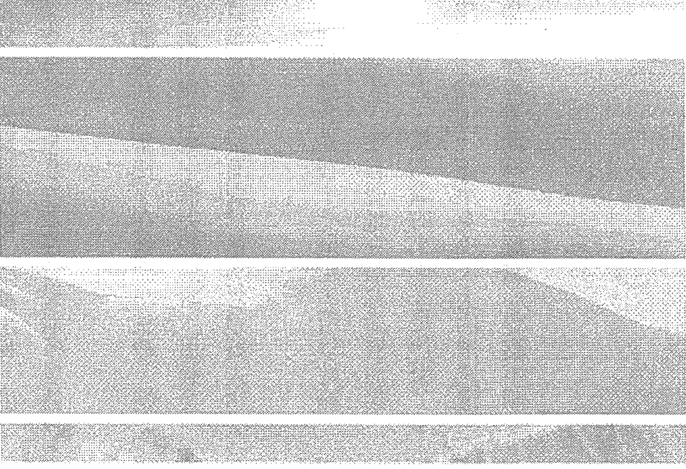

一九一三年的夏天，住在聖路易市的一位家庭主婦拿出一個「靈應盤」來玩，以娛賓客。指針開始拼出一位自稱是佩巽思·沃爾斯（Patience Worth）的女子傳來的訊息，據說她曾住在十七世紀的英國。二十五年期間，佩巽思口授了詩及小說，出版後得到好評。而那家庭主婦，珍珠·克倫太太（Pearl Curran）並沒有受過多少教育，個性也完全不像佩巽思。

佩巽思用過往年代的語法來寫作，並用真正的古代拼字法。在她的小說裡，她隨口說出一些日常的家用物，都是早已自我們的家中和記憶中消失的東西。那個案例被人仔細調查一番，卻沒有發現任何騙局的蛛絲馬跡。只有對於佩巽思這號人物的來龍去脈人言人殊，而引起爭議。

佩巽思是一名死去已久的女子鬼魂嗎？是否由於她曾活在十七世紀，所以她擁有對十七世紀而言具有重要意義的知識？或是，克倫太太不自覺地在潛意識層面累積了這一切與過去有關而且數量驚人的資訊？果真如此，那知識的來源又是什麼？

在「靈應盤」訊息當中，有很多細節只有學者才知道。如果克倫太太的潛意識心智不知為何居然撿到了這豐富的知識，那就證明潛意識能夠支配意識所覺察不到的能力。甚至對佩巽思一案的這個解釋，也留下了許多尚待解答的問題。傳達給克倫太太的那類資訊並非普通一般可以獲得的資訊。它是從哪兒來的？克倫太太的潛意識心智又如何將資料組織成小說和戲劇？

但在另一方面，如果佩巽思確實是曾在物質界運作的一個人格，那又會出現了一套全然不同的問題。

- 她是否透過克倫太太的潛意識心智來溝通？
- 操作「靈應盤」的是她還是克倫太太？

無論答案是哪一個，我們都得面對一個事實：人類人格比我們假設的更不受限於時間與空間。

我提到這個例子，是因為在佩巽思·沃爾斯人格的出現上，「靈應盤」扮演了如此重要的一個角色。人們對「靈應盤」有很多種看法，包括：解放潛意識的一種方法；生者與亡者的一種溝通方式；只有無聊和神經質的人才耽溺其中的一種可笑的社交遊戲。可是，在佩巽思這個案例當中，「靈應盤」扮演的角色卻有足夠的煽動性，讓我相信，在任何超感官知覺的調查中，它都該占有一席之地。

我先生和我先前都沒見過「靈應盤」，但我們弄到了一個。這一章要談的是我們用其所做的實驗以及結果，還有完整的操作說明，以便你能自己發現使用「靈應盤」的正確方法。

「靈應盤」本身大約二十二吋長，十五吋寬。在上面，印有兩行大而易讀的大寫英文字母。「是」這個字出現在左上角，而「否」這個字在右上角。字母下面則是數字，從1到9，加上「0」。在盤的最下方，用稍微小一點的字體印著「再見」的字樣。

「靈應盤」附有小指針，樣子像個三條腿的迷你三角桌。操作時，參與者將手放在指針上，指針本身則放在盤上。為了讓你熟識這個步驟，把你的雙手放在指針上，輕柔的讓指針滑過盤板。運作適當的話，指針會像是自己在動，而你這方根本完全不用力。

在很多「嗜好用品店」都買得到「靈應盤」，也可以向麻省西冷市（Salem）的派克兄弟公司（Parker Brothers, Inc.）郵購，這家公司目前是「靈應盤」的註冊商標擁有者。「靈應盤」價錢不高，而且在一般的照料下可以保用很多年。

了，可能永遠不會寫出「賽斯資料」。

如果向「靈應盤」發問，一開始最好是一次一個人提問。如果指針不動，就再問一次。用簡單的句子提問。你可以耳語、大聲說，或只在腦海裡形成字句。一次問一個問題。要確定你給「靈應盤」足夠的間隔時間來回答。

力道非常輕地壓著指針。如果你太用力，它便無法動彈。如果這樣做你會覺得彆扭，不妨一開始玩就發問。一個標準的開場問題是：「有人在嗎？」然後，靈應盤給的答覆自然會影響你接下來想問的問題。

如果訊息聲稱來自另一個人格，那就提出可能給你最多數量資料的問題。如果那個人格宣稱自己不是現在活著的人，就問它何時何地出生和死亡。稍後你可能會想核對一下你收到的細節。問那人格其他家庭成員的名字。他們是生是死？如果是生，住在哪裡？如果是死，死於何時何地？如果一個問題沒被答覆，或指針看似猶豫不決，就暫時放下該問題，待會兒再回頭問。

有些人覺得問答的程序抑制了他們或靈應盤。如果你是這樣，那就只要安靜坐著，把手放在指針上。在很短的時間內，不用你提問，指針就會拼出自己的訊息。

## 靈應盤的使用方法

後來你覺得比較自在時，可以混合各個步驟，結果極佳。操作「靈應盤」的每個人都必須完全誠實，一個夥伴的不信任會嚴重阻撓你可能達成的任何進展。

拿「靈應盤」來實驗是個令人著迷的經驗，或許也是開始進行任何超感官知覺實驗最容易的一種方式。我建議你們用本書列出的實驗順序來嘗試，因爲前一個會爲下一個做好準備。

通靈現象是業餘玩家也能做出貢獻的少數幾個領域之一。所以，你在所有這些實驗中要仔細做筆記，這點很重要。

操作「靈應盤」時，當指針在給訊息之間的空檔，或是就這樣停住不動時，你和你的夥伴可以寫下所有的問題和答案。不過，爲了要有效率，可能的話就由第三者寫下問題和答案。第一時段便開始記錄。包括日期、參與者的名字和時間。提出問題後，就把它們寫下來，並預留可以插入答覆的空間。當你運用得較熟練時，事前擬好問題是個好辦法。

當「靈應盤」運作順利時，由於訊息會來得很快，所以你可能要發明某種個人速記法。通常答覆不會指出標點，所以你必須小心看好一個句子在哪裡結束，另一個句子在哪裡開始。字可能擠到一塊兒，所以乍看之下，訊息彷彿毫無意義（譯註：以上是由於用英文字母拼出而易產生混亂，若用中文碟仙則無此困擾）。因此，要小心檢查所有的訊息。有些情形下，「靈應盤」會用它自己的速記法。4（）這個數字可能代替「」，而 u 這個字母可能取代「you」（你）這個字。剛開始，你可以問能夠用「是」或「否」回答的問題，你可以問名字的簡寫而非全名，直到你有了信心。別太容易受騙而接受歪曲的訊息，也別過度伸展你的想像力，使無意義的句子變得有意義。盤板會拼出整個字，然後整個句子，而你也會「熟能生巧」。

一個看似不連貫的訊息，也許在某種外國語文當中是有意義的溝通，這也有可能但並不多見。通常，如果你看不出意義，這訊息就是沒有意義。把它歸檔，然後別去管它，但不要丟掉。隨後，不論是經由「靈應盤」或其他方法得到的訊息，我們將在另一章討論你可以評估這種訊息的方法。

如果你的訊息有一些方面彷彿自相矛盾，尤其是在一開頭時，也別擔心。這些可能是被扭曲的有效資料，本書稍後會再多談談這一點。如果你還沒接收到完整的句子，玩到了第三或第四時段的時候應該會得到了。玩了一個月的「靈應盤」之後，羅勃和我每時段都會收到大約十頁打字紙的資料。感覺指針在移動，而且知道你或你的夥伴都沒有刻意動它，是相當震撼的經驗。剛開始做我們自己的「靈應盤」實驗當時，我們並不知道會發生什麼事。我要簡短描述一下我們剛玩幾段「靈應盤」的情形，讓你有個可以用來評估結果的依據。

### 我們開始收到訊息

頭兩次嘗試失敗之後，我們開始收到前後連貫的訊息，宣稱是來自我的外祖父約瑟·亞道夫・柏多。一八四九年去世的外祖父是法國和印地安的混血兒，英語說得相當好，但有某些明確的怪癖。舉例來說，他一直將Tess、Tenn、Dose念成「Tess」、「Tenn」、「Dose」。「靈應盤」用他的拼音方式，整體上用字遣詞符合他使用英文的特性。

我們也收到其他宣稱是死後猶存者傳來的訊息，我們兩人都不認識他們。當出生與死亡日期出現在訊息當中時，我們的確會核對它們。一般而言，資料是前後一致的。他們給的生命史顯然是可信的。直到此時，我們還是頗為訝異，卻並不覺得有多了不起。原因之一是，當我們下回嘗試「靈應盤」時，我們永遠沒辦法請回同一個人。不過，我們仍有足夠的興趣繼續下去。

這種情況發生兩三次之後，我們又被「胡言亂語」包圍了。在無意義的字眼中間冒出了一個清楚的詞：「東向的路」（eastern roads）。其實這些字具有重要意義，雖然當時我們並不知道。不過，我們仍盡責地把它納入我們的紀錄當中。這是「做紀錄」為何如此重要的原因之一。有時候一個看似無意義的詞語後來可能變得有意義，這一個就是如此。

我們接下來一次的「靈應盤」實驗，是如今仍然持續的一個獨特經驗的開始。這訊息一開始顯得沒什麼重要，是我將稱爲法蘭克·韋德的一個人格傳來的，但那不是「靈應盤」給我們的名字。法蘭克告訴我們，他曾在紐約州的艾爾默拉市教了三十年英文，並且還補充與他的背景和家庭有關的其他資料。

隔天我問艾爾默拉當地的一位老婦人，她認不認識「靈應盤」給的那個名字的人。當時我沒說明爲什麼這樣問。她強調說她認識過這樣一個人，還說他遷離了她自己熟悉的圈子，而在四〇年代早期去世了。法蘭克曾說他死於一九四二年，當然那婦人不可能知道這個事實。

接下來幾個時段，我們繼續用同樣方式和法蘭克對談。當時，爲了幾個理由，我們沒有再進一步核對這早期資料。在日期上有一些明顯的矛盾，這是其一。另外，就這個字的一般意義而言，我們很難想像那資料是合理的，尤其在一開頭的時侯。在這裡，很顯然時間的壓力與我們的疏忽也有此關係（我倆都有工作），再加上害怕核對公共紀錄可能引起的尷尬。那時我們根本沒想到，「靈應盤」時段會繼續下去，或它們最終會發展成另外的東西。我們只是很高興能夠親身經驗以前只讀過文字記載的現象罷了。

結果，我們和法蘭克只短短的來往了三個時段。下一時段一開始出現的是法蘭克，但他的人格被賽斯（Seth）的人格取而代之。賽斯課（Seth Session）於焉開始。

馬上可以看出來，訊息的範圍和品質都突然增進了。我們發現自己在與一個具有更高超智力的人打交道，他有明顯的幽默感，他永遠展現突出的心理洞見和知識，顯然遠超過我們自己有意識的能力。

在這一個時段，「靈應盤」開始拼出一段又一段的話。有點讓我自己不安的是，賽斯很早便堅稱，輪迴轉世並不只是一個可能性，而是人類存在的一個事實。

他開始列出羅勃和我從前的轉世，並給我們名字、日期、家庭關係和其他細節。有些資料經由催眠獲得證實，其他細節則尚待查對。當蒐集到足夠的資料時，我們會依據現存紀錄查對所有的細節，談轉世的章節將會談到這件事。

羅勃和我都熟悉轉世的理論，但由於我們認爲無法克服的瑕疵，所以不考慮它有任何實際的用處。對我而言，轉世帶有玄祕的味道。賽斯以無懈可擊的邏輯還擊我的每一項抗議，而後又列出一些實驗，用來證明理論的確成立。

是我在移動指針嗎？或是羅勃？我們開始互相測試。我會沒有預警地將手抬離指針，指針停住了。羅勃也這樣做，指針也停住了。只有我們其中一人時，通常指針不會移動。我們兩個似乎都是必要的，但我們都沒有單獨移動指針。

### 引言

我們第一次遇見法蘭克·韋德是在一九六三年十二月二日。在我們更早的課裡，我們從未能維持兩個時段之間的連貫性。當賽斯課開始時，一節課立刻開始加強了早期的那些課。賽斯規定我們一週上兩次課，並指出是那幾天晚上的什麼時間。每節課長達二到三小時不等，有時候還更長。從此以後，我們便遵循這時間表，至今仍在繼續中。

在賽斯人格出現後不久，有句話引起了我們的注意。它出現的時間是賽斯在討論羅勃先前的轉世時，照賽斯說，羅勃在十七世紀的丹麥是個地主，在一個叫做崔也夫（）但現已不存在的城市附近經營農場。「東向的路」被用來指明在丹麥的地點，而我們憶起在很早的一個時段中，同樣的詞曾經出現在一堆亂語中。

在本章最後，你會找到我們早期課的摘錄。我們問的問題會幫助你形成你自己的問題。注意「靈應盤」早期只用一個字回應，到了第四課就有了較長的回應。很可能你們自己的經驗也會出現這種進展。

但是，是什麼促使「靈應盤」運作？在我回答之前，我們來好好審視一下人類人格的組成。因為就是這人格的一部分，讓這類通訊得以發生。

自我（ego）就是日常生活當中你熟悉的那一部分自己，它是一「有意識的我」（conscious I），這有意識的我並非具體之物。它永遠在變。現在的它和你孩童時的它是不一樣的，而明日的它也和今日的它不同。

自我是你面對日常世界，處理實際問題的那個部分。它圍繞著屬於你人格一部分的某些能力和傾向而形成。自我利用並接受其中一些能力和傾向，進而變成有意識的我的一部分。你認爲屬於自己的這些喜好和憎惡、能力和特質有助於組成自我。

在日常生活中，自我是極其重要的。它讓我們能專注在手邊的實際事物上。可是，外在刺激不斷進入我們的腦子裡，有意識的自我無法單靠自己處理刺激的猛烈攻擊。它得有意識地忽略掉許多刺激。我們在一剎間能夠覺察的事就只這麼多。甚至在意識上不知道我們是如何做到的情況下，我們做了很多事。自我甚至沒有覺察到很多源自身體之內的刺激。

舉例來說，我們走過房間，換座位，拿起一本書。當然，在從事這些活動時，我們一直在吸氣和吐氣。我們身體的細胞也在補充自己。然而，在意識上，我們並沒有覺察到我們用意志促使自己呼吸。我們甚至沒有覺察到我們從一張椅子挪到另一張必要有的肌肉動作。除此之外，我們對這些活動也沒什麼控制力。就好像有一個自己在替我們照料某些機能——攸關肉體存活的機能——如呼吸和消化似的，如果它們沒有精確傑出地執行，我們就會死。

如果生命要務有這麼多面是受潛意識力量的控制，像在這例子當中是被自律神經系統控制，那麼，相信其他的機能和能力在一個潛意識層面上也受到控制，真有那么難嗎？不見得吧！舉例來說，我們往往暗中哼唱卻不自覺。在睡夢中，我们很多人繞室而行，有時候甚至走出房子、走上街，同時意識心卻很有福氣地對我們的活動毫無知覺。事實上，如果太快喚醒夢遊的人，可能會干擾他微妙的平衡。因此，對潛意識行動的有意識干預，可能擾亂其平順的結果。

假使我們必須用意志促成我們每一次的呼吸，有意識地監督日常運轉必需的百萬種小型的身體操縱，我們就沒有時間做別的事了。就此而言，我們也沒任何理由假定，我們能改進目前的潛意識表現。

除了其他功用外，「靈應盤」也是通達這種個人潛意識——也就是對你的肉體存活至關重要的內我（Inner self）——並與之溝通的一個方法。個人潛意識對你的了解比你自己還要多。當有意識的我放鬆下來，潛意識便能經由肌肉的動作來表達它自己，譬如你一邊講電話一邊在紙上塗鴉那樣。你的塗鴉是這個內我的線索。當意識心被其他事物占據時，潛意識正控制著肌肉的牽動，導致你的手指去塗鴉。在意識上，這些塗鴉對你可能看似無意義，但對你的潛意識心很可能有明確的意義。既然你的肌肉動作有很多是永遠受潛意識的控制，那麼，我們自己的這個內在部分能夠透過上述動作表達自己，便不足為奇了。

人們相信，移動那小指針的也是這些同樣的潛意識肌肉動作。如果這就是全部，那「靈應盤」依然是有意識的我發現全我（whole self）的隱藏部位最有效的方式。但我認為潛意識的這個人部分，只是一個更廣大的潛意識區域的最表層而已。

「賽斯資料」主張，佛洛依德發現潛意識所代表的意義只是，對整個內我的第一個探索性質的認知。照賽斯的說法，佛洛依德和榮格只不過觸及了可被稱為「未被發現的人」或「全我」當中最顯著的部分而已。

但潛意識包含的不止是必須受到個人和社會束縛的種種被壓抑的原始驅力。它也是人類最細微直覺的源頭，可能還是語言和文明本身的基礎。很可能對各層面潛意識的研究，能夠讓我們在人過去的精神和心靈存在方面有所了解，就像對地球物質層面的研究，讓考古學家找到過去文明曾經存在的證據。

當你跟著做本書列出的實驗時，你會發現在個人潛意識之外還有一個實相，與你現在熟悉的任何實相一樣生動而且確實存在。「靈應盤」讓你能夠放鬆意識心，這樣或許有生以來第一次，你可以覺察到內在自我的訊息。你會發現潛意識的心智，你個人的潛意識領域，但你也會發現這潛意識是到另一個內在實相的門檻。

要記住，在你的『靈應盤』實驗裡，關鍵字眼是『放鬆』。一定要保存每一時段清楚、仔細的筆記。寫下你問的問題以及收到的答覆。以下是我們自己早期課的摘錄。

雖然我們已經有三次更早的經驗，其中兩次沒有成功，有一次則帶來聲稱是出自我外祖父和其他人格的一些段落，我們認為那些只是預備動作，到了法蘭克·韋德，我們才開始做正式的紀錄。那麼，下面這節摘錄來自第一節，那時法蘭克·韋德出場了。

為了你閱讀的方便，問題用明體標示；『靈應盤』的回答則一律用楷體。回答如實照錄沒有任何刪改，但為了避免給生者帶來任何可能的困窘，姓名做了更改。

所有問題都由羅勃·柏茲提問。

### 摘自第一節

問：有人在嗎？
答：是的。

問：你能給我們你的名字縮寫嗎？
答：EMZ

問：請拼出你的名字。
答：法蘭克。

問：請拼出你的姓。
答：韋德。

問：你能告訴我們你哪年去世的嗎？
答：一九四二。

問：你認識我們嗎？
答：不認識。

問：你已婚嗎？
答：是的。

問：你的太太現在活著或死了？
答：死了。

問：她叫什麼名字？
答：鄂蘇拉。

問：她姓什麼？
答：阿特金。

問：她是哪國人？
答：義大利人。

問：你是哪國人？
答：英國人。

問：你從事什麼職業？
答：教師。

問：你教什麼？
答：英文。

問：在哪個市或鎮？
答：艾爾默拉。

問：你教了多少年？
答：三十四年。

問：你生於哪年？
答：一八八五。

### 摘自第二節

以下內容摘自第二節。這時我們變得非常好奇，因為這是我們第一次有機會與透過「靈應盤」接觸的人再敘。

問：法蘭克·韋德，你在那裡嗎？
答：是的。

問：你一生大半住在哪？
答：艾爾默拉。

問：你在哪裡出生？在哪棟房子？
答：狀態街（State Street，譯註：State是州、國家。常作為街名，有點像我們的中央路或大街。如此譯是因爲下面的雙關語。)

問：是在艾爾默拉嗎？
答：不是。

問：哦，那麼，是在哪一州（State）呢？
答：在悲傷的狀態（in the state of sorrow）。

這個答案讓我們深感興趣。這是第一次，「靈應盤」似乎重新詮釋了我們的問題，然後據以作答。或許這個回答促使羅勃問了下一個問題。無論如何，我們以前都認為『轉世』再怎麼樣也不過是個不太可信的想法而已，所以接下來的訊息讓我們相當吃驚：

## 靈應盤的使用方法

問：你在地球上還活過別的一生嗎？
答：是的。

問：多少次？
答：三次。

問：你第一次生活在地球上是什麼時候？
答：第六世紀。

這一節繼續進行下去，法蘭克說他有一生是土耳其的一名士兵，並且堅稱他在另一生當中，曾在丹麥的崔也夫城認識羅勃和我。在他提到的其他細節中，曾說到當時是個男人，而且是我現任丈夫的兒子。他給了日期和地點，但也言明崔也夫城已不復存在。

第三節很像這兩節。不過，第四節卻是個轉捩點，顯示了法蘭克人格的撤退及賽斯的現身。賽斯課的一般語氣和特質立即顯而易見。在此開始的討論會變成許多未來課的基礎。

答覆從早先的一字或一句變成了整段整段的，全都由指針拼了出來。回答的聰慧使課程愈發有意思了。賽斯人格取而代之，立刻顯出其個人性和明確性。這一節開始是法蘭克，結束是賽斯。

### 摘自第四節

問：法蘭克．韋德，你在那裡嗎？
答：是的。

問：你帶給我們一個訊息嗎？
答：意識像一朵有許多花瓣的花。

問：是珍的潛意識在說話嗎？
答：潛意識是一條走廊，你走進哪一道門又有什麼區別？不過，我可以透過珍說話，如果我這樣選擇的話。她一度曾透過我說話。當然你不明白這個笑話。哈！

問：你何時透過珍說話？
答：一個世紀之前，降神會，她是個靈媒。因爲你想要找我，我也傳過來了。

問：法蘭克·韋德，將來我們可不可以跟你詢問任何特定的問題？
答：可以。我寧願你不叫我法蘭克·韋德。那個人很沒情趣。

問：我們跟你說話需要用某種稱謂。
答：隨便你們愛怎麼稱呼我都可以。我稱自己賽斯，它適合我的本我。這個人格顯然最近似我的全我，或我試圖成為的全我。約瑟（Joseph）或多或少是你的全我，是你過去和未來形形色色人格的總和形象⋯⋯。你是約瑟，你在心裡看到的那個約瑟、那個藍圖。

問：如果你叫我約瑟，你會叫珍什麼呢？
答：魯柏（RUBEL）。

問：請你稍加說明好嗎？
答：說明什麼？

問：那名字對我們而言有些怪。我不相信珍會喜歡它。
答：怪的配怪的。

### 摘錄自第五節

問：我們真的或多或少受制於潛意識嗎？
答：是的。但那就像是指，全體是受制於其部分一樣。人類只不過還沒學會有效利用他的各個部分而已。一切的總和應該是卓越的意識。個別的意识是最最重要的。它從不會消滅，只會增進。它每一次擴展都會涵納更多。

問：出於好奇，賽斯，在兩節之間你都作什麼？
答：你做什麼呢？

問：對於魯柏這名字，你能給我們更多的資料嗎？
答：很久以前，那一度是珍的名字，就像你的名字是約瑟一樣。兩者都代表了你們存有（SELF）的高點、在精神性基因裡的形象、給心靈（SELF）遵循的藍圖。約瑟和魯柏代表了你們塵世人格的圓滿範圍，你們必須以它為目標來成長。但在另一方面來說，既然藍圖存在，那你們已經是約瑟和魯柏了。每個人都有這樣一張藍圖。個人試圖依循他的藍圖，度過每一生。這並非強制的模式，而是存有自己的大綱。

問：這不是干擾了自由意志嗎？
答：怎麼會呢？你自己設計了藍圖，而你各個轉世的自己並不知道藍圖的存在。他們有自由意志。你給了他們自由意志，那才是挑戰所在。

## 「靈應盤」一作踏腳石

當你第一次到達個人潛意識的領域，你可能會驚訝，它既非必須加以壓抑的充滿危險衝動的地牢；也非自然的所有印象和能力的倉庫。它是在所謂有意識的自己與我們所知甚少的自己之廣大內在領域之間的門檻。

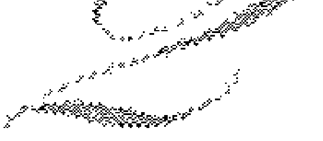

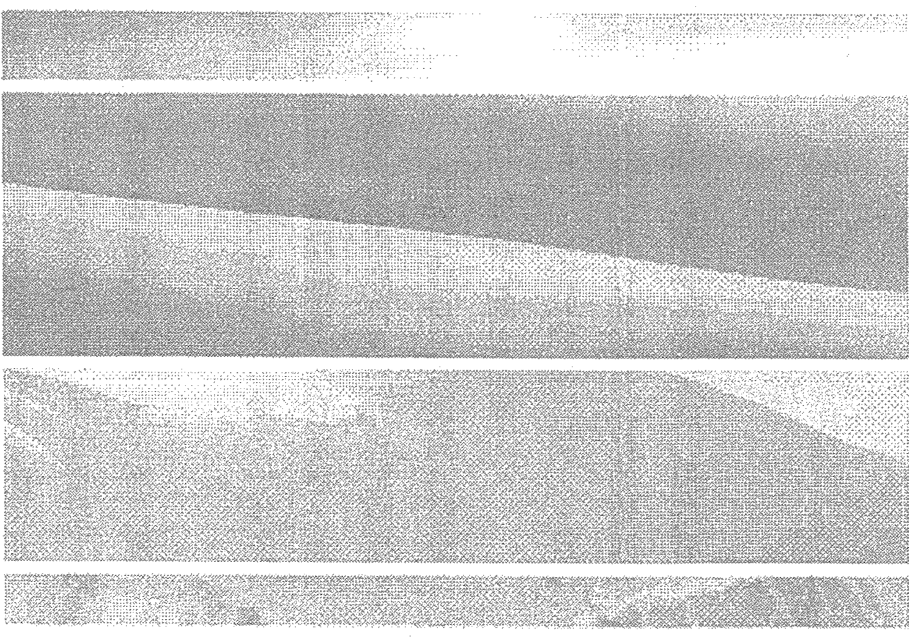

你能否想像自己對於諸如具體物質的本質、潛意識、神的觀念、反物質或時間這種事，睿智而且毫不遲疑地大放厥辭，一次達數小時之久？你能否想像自己面對當場向你提出的這種問題，給予合乎邏輯，甚至雄辯滔滔的答覆？你能否想像這類情況的發生，即便你所說的字句其實不是你自己的，而且在意識上你也不知道接下來會說什麼？你能否想像在一個正常的工作天之後，你從事這樣一個演出，而且還持續這樣做下去？

在我開始從事本書的實驗之前，我會認為這種情況極不可能。然而，一年多來，我卻在出神狀態替賽斯口授了兩千多頁的這種資料，清晰簡潔，沒有矛盾，並且沒有一般講話都有的猶豫。很可能你們有的人會發現自己用你自己的方式做同樣的事。如果你認真試過上一章所說的「靈應盤」實驗，也許已經自己發現到「靈應盤」可以是通達其他什麼的踏腳石。很可能你已經擴大了你自己的覺知範圍。

增大的覺知名符其實真的會擴展「自身」（Ego）。讓我們想一想：「自身」的真正局限是什麼？作為「自身」，你受到了限制嗎？將你和所有非你的東西分開的界限是什麼？皮膚會像是分隔我們肉身的我和其他具體物件的東西。但皮膚有很多東西透過我們的皮膚而來，沒有它們我們無法存在。在宇宙中，我們所知的每件東西，基本上都是由同樣的成分組成的。除了分子組織的不同外，我們和桌子或椅子、桃子或螃蟹，都是由同樣的物質組成的。我們的皮膚與它外面彷彿虛空的空間不同之處，僅在於程度和密度而已。

透過活的皮膚，我們從空氣與陽光當中接受賴以維生的養分。我們食用本為宇宙一部分的魚、肉和植物，讓它們成為我們自己的一部分。被我們的身體利用之後，它們重歸塵土，以便再次被利用。那麼，物質上，「自身」是由所有這些陌生的、不像自身的成分組成的。換言之，物質的自身基本上並不受皮膚限制。我們大可以說，自身藉著皮膚延伸到外在環境裡去，以便吸收養分。

現在你可能堅持，自身，你的自身，在心理上是有限制的。你可能堅持自身一定受到某種方式的限制，即使你可能無法說定义那些限制。但現在，再仔細想想你的自身。你是你的念頭、你的思維、計畫和情緒。當然。但這些並不存在於一種心理真空當中。它們是自身的遺傳和環境塑造而成，它們也是你接觸的人加以修改而成的，而你也一樣修改別人的思維和情緒。

為了方便起見，我們人類表現得好像物質的自身以皮膚為界。我們表演得好像我們的意識完全密閉在我們的腦袋裡，而頭殼就像把我們的身分（即本體）安全保護在內的骨頭圍籬。但事實並非如此。的確是有「身分」這樣一種東西。但沒有人真的發現過它到底是個什麼東西。關於「身分」的真正本質，在本書稍後將會給出一些線索。

## 心電感應和我們對自身的看法

我們現在逐漸覺知心電感應（telepathy）的存在。如果我們能收到別人的思緒，並且將我們的思緒傳給別人，那麼對於自我限制的這個老想法，我們該怎麼辦？當ESP調查證明我們的觀念陳舊過時，我們就得改變它們。心理上的自身（psychological self）能夠到達的地方比我們曾有的想像遠多了！

再次重申，我們現在所知的潛意識很可能只是全我（whole self）的一瞥而已。越過潛意識可能有自身可以通達的處女地，也就是包含我們盡可能加以忽略的實相在內的區域。

可是，自我（ego）並不關心內在的實相。它處理的是日常的實際問題。它比較刻板，縱使它經常在變，但卻不喜歡變。在人類早期的演化發展中，這是必要的。如果穴居人要存活，他所有的注意力必須密切集中在物質環境上。一個白日夢，進入潛意識自己的片刻神遊，可能要了他的命。自我隨著應用發展並硬化成一層胄甲似的殼，現在它威脅要埋葬它本該保護的自身。

「靈應盤」經驗有助於放鬆這緊密合身的自我，給內我（inner self）呼吸的空間。慢慢地，和某種冬眠甦醒的小動物一樣，內我也會開始甦醒。個人潛意識是第一個被容許有一些自由的部分。一個原因是，我們通常熟悉的內我就只有這一個部分。另一個原因是，它剛好就在自我之下，雖然這只是一種說法而已。對自身而言，字面上所說的方向，好比說「上」和「下」，並不存在。

「靈應盤」經驗將有助於放鬆個人潛意識，而這種放鬆的習慣也會在其他方面有助於你。在過去你沒有加以聆聽的直覺和衝動將會顯現出來。你會覺得你好像擴大了，或更新了。事實的確如此。一點一滴的，你將會覺察到你先前忽略的實相。基於實際目的，你將會擴展對自身的限制，因為你將會用以前做不到的方式增益你自己的經驗。

你會發現，潛意識不會和你自己個人埋藏的記憶一起結束。你不會碰到谷底、遇到死胡同、達到你自己或你的覺察力的最後極限。

只要你想前進，就不會有一個你一經過便無法再前進的點。你不會到達一個點而有「我的終點在這裡。過了這一點，我的自身就停下來了。」

就像我們祖先相信天空有「頂」，但事實並非如此。同樣的，人類人格或你自己的覺察力也沒有界限、頂或底。我們的火箭探索外太空，我們也能旅行到內太空去。沒有任何人能替我們做這件事。沒有人能替你做這件事。那冒險是非常值回票價的！

第一次到達個人潛意識的領域，你可能會覺得驚訝，它既非充滿危險衝動而必須加以壓制的地牢，也非天生美善的烏托邦，而是儲存自我在任何時候都不肯接受的所有印象和能力的倉庫。它是在所謂「有意識的自己」與我們所知甚少的「自己的廣大內在領域」之間的門檻。探索這內在實相，你需要用你的常識、誠實理智和自律，也需要用你本性當中的直覺部分。你需要你所有的能力，以便評估自己的經驗。

首先，我會解釋我自己最初進入這些實相的發展，讓你對「靈應盤」實驗的直接結果可能對你展現的各種經驗有一些概念。繼續玩「靈應盤」。我們稍後的實驗有很多完全不會用到「靈應盤」，但多加練習你就會放鬆，這樣的放鬆對你們有幫助。

我自己的情形是，「靈應盤」引導我進行所謂的語音通訊。我完全沒計畫也沒預料它會發生，甚至沒有把這種現象列入我最初的實驗裡。我能告訴你的只是，如果發生語音通訊，如何認出它、如何利用它，以及如何測試結果的有效性。對你們某些人而言，「靈應盤」實驗可能出現的結果是，對自動書寫而非語音通訊駕馭自如。這一章也包含自動書寫的指導。但是，由於種種不同的原因，我自己的能力似乎不在那方面。當你繼續用「靈應盤」時，你們有些人可能發現自己開始預期它對你的問題會給什麼答案。這在任一節都發生可能，不論是第一节或第二十節，發展完全取決於你自己的個性和能力。它也可能永遠不會發生。如果發生的話，它也許是顯示你在超感官知覺一個報酬最高的領域有天賦的第一個徵兆。

從我們玩「靈應盤」的第三節開始，我就開始預期字、詞，然後是整句話。我知道盤對羅勃的問題的全部或部分回答。我多少有點勉強地等著指針拼出它的答案，但我並不相信自己內在的答案。當時，我懷疑我的個人潛意識撂下了我的意識，自個兒玩得不亦樂乎呢！

課繼續進行下去，我變得愈來愈不安。我開始在指針完成一句話之前，就知道整段話要說什麼。同時，我變得不耐「靈應盤」的緩慢過程。羅勃必須停一下，寫下他要問的問題，然後把他的手和我的手一起放在指針上，等答案拼出來，之後再停下來寫答案。這花了不少時間。

雖然指針拼出了我在心理層面接收到的訊息，但我一方面還是不信任內在訊息，另一方面又有不得不大聲說出來的感覺。我沒有聽到聲音，整個句子就這樣彷彿從虛空中跳到我的腦海裡，但那些話語卻不是我自己的話語。我的勉強顯而易見。最後羅勃問「靈應盤」：「賽斯，為什麼珍對於我們和你的接觸態度相當保留？我看得出她有時候不太熱中。」

賽斯透過靈應盤答道：

「她在擔心，因爲在我的信息還未拼出前，她已收到。這也會讓你留神的。」

在另一個場合，賽斯經由「靈應盤」說道：

「珍，妳要把很多功勞歸功於妳的潛意識。何者有功，就應歸功於何者。」

我覺得賽斯好像在輕推著我，要我大聲說出答案。但我不肯躍下未知的深谷，寧願緊緊依附「靈應盤」，像個頑抗的泳者死抓著河岸一樣。

原因之一是我怕失敗。賽斯那時候就已經在討論一些我所知甚少的題目。我怕讓自己出醜，開始講一個很有分量的信息，卻只突然中斷，哼哼唧唧的難以爲繼。或者，萬一信息漂走不見了怎麼辦？當時，我唯一的憑藉只有賽斯的一句話，說他不是我的個人潛意識而已。我怕被我所知甚少的心理力量席捲而去。我的自我和我堅持不讓步。我一直收到內在的信息，但我拒絕放掉「靈應盤」不用。賽斯也沒逼我，但內在的收訊固執地繼續下去。情況維持在這個階段一直到第八節。那麼，我們僵持了五節。

其實，這種頑抗是健康的自我的徵兆。在這一切的努力當中，我們並未設法忽略自我。我們只不過在訓練它變得更有彈性一些，這樣一來它才能讓內我擁有更多的自由。自我是人格的一個重要部分，對我們與物質實相的關係而言是必要的。透過我們的實驗，我們會讓它看到，在容許我們擁有這個自由時，自我不但沒有損失，反而獲益良多。這種認知實際上會促成自我的擴展，以及一般而言，自身的擴展。

因此，本書的實驗都該佐以對其他人和關係的一個健康的外向態度。如果你已經是退縮又內向的人，就該努力藉由外在活動與人建立關係。這會確保你的平衡成長，並讓你意識心逐漸接受你的內在潛能。自我會厭惡你的內在探索到某個程度，但不要試圖叱責自我的任何需求。我們要的是，自己所有的部分都能平衡接納內在的能力。

到我們自己的第八節時，我或我的自我顯然相信自己可以有更大的自由。在這一節進行到一半時，我突然推開「靈應盤」，站起來開始口授。當時我的聲音完全正常，不過此後聲音就出現了明確的變化。但是，我說的話確實不是我自己要說的話。

從第九節到第十三節，我們只用「靈應盤」拼出最初的訊息，那是我暫時還無法在腦海裡收到的。這幾乎立刻讓我們得以用較快的速度通訊。但每一次一開始，我還是對「放下」的想法感到一陣緊張。現在這種感覺幾乎不會困擾我了。

我們幾乎立即明白，在這段口授時我是處於一種輕度出神的狀態。傳遞的方式可以稱為自動說話或語音通訊，而我自己有意識的思緒，連同對我周遭環境的意識，全都向後縮。不過，這件事並沒有任何強迫性，我在任何時候都可以回到正常意識。沒有一絲一毫的「入侵」牽涉其中。

到第十四節時，我們甚至也不用盤來接收頭一些信息了。由於賽斯的建議，我們每週兩次在指定的夜晚上課。第一年，我在口授時不斷地來回踱步，雙眼大張，但對我周遭的實際環境並沒有任何真正的意識。現在我則坐著說話，雙眼閉上，對我的環境渾然不覺。羅勃對每一節作逐字的手寫紀錄，隨後再打字謄清。我們在屋裡永遠有平常的燈光。每半小時我們休息一下。

我是個相當聰明的人，也頗爲健談，但怎麼樣也無法想像，我能對賽斯課涵蓋的任何題目有意識地侃侃而談幾小時，沒有停頓、回溯或混亂。資料不斷地展開，一節建立於另一節上。舉例來說，在我們的第一百零五節，賽斯提及他在第十二節說過的論點，並進一步評述它們。有好幾次，我曾以低沉男性嗓音說話，很不像我自己的聲音，而且音量驚人。有許多節有目擊者。除了一般的資料外，賽斯課給了我們有關自己個人生活的可貴資料，並且提供日常生活中非常實用的心理洞見。

可是，過去我並沒有理由去假設我有任何這類的能力。你可能也有這種還沒開發的能力。如果那種經驗真的發生的話，「靈應盤」會幫你做好準備。也可能你的才能是在自動書寫而非語音通訊方面。換句話說，你或許能夠自動寫下訊息，就像我會自動說出來一樣。這有一個確定的好處，那就是你的筆記多少已經寫好了。但羅勃每週要花好幾個小時打字謄清「賽斯資料」。

所以，在你的「靈應盤」時段裡，手邊準備一張特大號的紙或記事簿，和一支柔軟的黑鉛筆。

### 用「靈應盤」作踏腳石

如果你開始預期靈應盤的訊息要出現了，你就會知道。沒有什麼事比這種內在信息的接收更堅持不懈的了，我覺得好像我一定得說出那些字句才行。反之，你可能會感覺好像你的手想要把字寫下來。

如果是這樣，那就把紙放在「靈應盤」上，或坐在「靈應盤」旁邊，腿上或桌上放一本記事簿。手拿一支鉛筆，把它放在紙的上端。寫下你的名字，然後等著。很快地鉛筆會開始移動；你自己的潛意識肌肉運動將會引發這個行動本身。字的形狀可能很差。如果是這樣，不要讓此事困擾你。這裡也可以用速記，就像平常記錄「靈應盤」的信息那樣；例如，用「E」代表「you」。本書稍後會多談一些這類的潛意識速記。

當你的手在寫字時，你其實也可以做別的事，比如看電視或和你的夥伴說話。別一直緊盯著紙，看那裡寫了什麼，因為這可能會阻礙你的進展。自動書寫並不像語音通訊那麼少見，而且你們許多人很可能沒有遇到太多困難就學會自動書寫。

當然，你可以不用「靈應盤」而嘗試自動書寫。在這種情形下，就只在腦海裡暗示你的潛意識，用你的右手寫下它想要說的任何題目即可。你可能會覺得手指微微發麻；放輕鬆，用一些其他的活動轉移你的意識心，比方說聽聽音樂。經過每次二十分鐘的兩、三個時段，你應該就知道，自動書寫對你來說到底容不容易。

並非每個人都有這些特定方向的能力。獲得必要的內在彈性需要一定的時間，但你們有些人可能不會耗費這些時間；其他人則對自己的能力居然輕易顯現出來而感到驚訝。但每一個讀這本書的人做的很多實驗都會成功。

很多讀者會透過「靈應盤」收到訊息。你如何確定它們有憑有據？你如何分辦它們是從你自己個人潛意識，還是從屬於一個更深實相的其他感知層面冒出來的？

任何經由「靈應盤」自動書寫或語音通訊收到的這類資料，都應該加以仔細研究。一般而言，如果你的訊息宣稱是來自著名的死者，你可以不當它們是有根據的資訊。它們極可能是你個人的潛意識捏造出來的創意產物。

如果你的資料宣稱，你在某個前世是一位著名的歷史人物，比如說喬治·華盛頓或聖女貞德，這可能是個人潛意識在這方面一廂情願的想法。這並不表示你必須中止，也不一定要認為這些訊息沒有價值。它們可能是讓人高興的幻想，也可能是你成人後第一次運用自己的創意想像力。這種資料可以告訴你自己潛意識的存在。你也許可以把它當成創造性的事實，但不應該誤認它是實際的事實。當然，可別因為你的「靈應盤」訊息宣稱你一度是某個貴族家庭的成員，就期待親友會給你什麼特殊的待遇。

以上的警告聽來可能很離譜，但如果你不曾留意過你的潛意識，如果你只熟悉你有意識的自己，那麼，你第一次體驗到內我可能會有恍如魔術之感。有些人會想把最具異國情調的潛意識故事當作事實，所以小心檢查你的資料是好事。來自個人潛意識的通訊可以是最有益的。它關切你的生物功能，而且它深切了解你的身體健康，以及可能隱而不顯的能力和知識。不過，這本書主要關切的是，內我的更深層面。

## 評估你的訊息

在核對你的訊息時，問自己以下的問題，並且誠實回答：資料本身是否好像滿足了任何壓抑的需求？傳述資料是否發洩了你通常抑制不予表達的個人成見？傳述資料是否讓你自覺優越？資料是否過度情緒化，尤其是在宗教或性的表達上？它是否展示出任何憎恨的證據？

如果對於這些問題的答案全都是「是」，那麼很可能資料是來自你個人的潛意識。如果它展現成見，那麼你可以相當確定，在平常的意識底下，這成見是你自己的。如果在任何一方面資料過度情緒化，那麼這可能是你在日常生活中壓抑情緒的一個徵兆。

在顯示給你看「自己的能力和弱點何在」上面，資料可能非常有用。如果資料具有娛樂、創意、虛構的性質，那麼你也許有過去不曾加以利用的創意傾向。對你自己的這種認識，讓你能夠利用自己的才能。

不過，如果資料展現出超卓的心理洞見、超越你自己的才智、千里眼、心電感應或其他 ESP 現象的明確元素，那麼你無論如何都要特別小心地研究它。你可能擁有一種強大的心靈覺知。你也許觸及了我們所知甚少的實相。

不管你是經由「靈應盤」、自動書寫或語音通訊接收到你自己的訊息，都別過分高估或低估它們。如果資料有憑有據，時間一久，它自己的品質和累積就會證明它本身是否真實。

「賽斯資料」被羅勃和我自己嚴格而客觀地研究過。經由這種細察，它沒有損失反有增益。基於幾個原因，我們現在確信它並非來自我的潛意識──至少不是一般說的那種潛意識。它不是從我個人的潛意識冒出來的。我們在課中並未發現我在日常生活沒被滿足，卻在課中得到滿足的需要，這一點。看起來連潛意識都對每週在特定時段上兩次兩小時以上的課生厭，這是另一點。潛意識通常不用這種條理分明、遵守紀律的方式運作，就算我們把制約納入考慮也一樣。

要不是因為課間曾展現過的某些明確效應，從潛意識的角度解釋「賽斯資料」或許會更具有說服力。在某些課裡，曾有過心電感應和千里眼的證據。不尋常的實質效應也發生過，這在本書稍後的章節裡會加以討論。

心理學家往往稱賽斯這樣的人格為次人格（secondary personalities）；職業靈媒稱它們為「監使」（controls）。給予這種人格的名稱並不會改變它們的本質，也不會增進我們對它們的了解。賽斯說他並不是一般所說的監使，也堅稱自己並不是一個次人格。在我們的關係裡並沒有入侵的事。我並不覺得被別人控制住了，不管在什麼時候，都一定要經過我的同意。有時候我的確覺得我本身不知怎地擴展了。

我確信，研究並比較這種手稿，不只對心理學家和超心理學家，甚至對整個世界，可能都是無價的。智力是與概念打交道的，但我們卻完全不確定概念是否源於智力。很有可能概念是直覺過程露出表面的部分。我們很多有價值的發明和觀念都是「無中生有」，但是後來卻加以實際應用。這類手稿可能會有相似的有價值的資訊──思考的大腦所不知的資訊，因為大腦的作用是處理實質的問題。

的確沒錯，這種資料就算不是源自個人潛意識，也是穿過層層個人潛意識而來，必然包含了個人的扭曲。智力也會犯它自己的錯，但人不會因此輕視它，這是事實。心智並不是永遠處於巔峰狀態這件事，我們視之為理所當然，因此會自動留下餘地。對於內在直覺的運作，也該給予同樣的體諒。

再次重申，如果你發現自己在預期「靈應盤」的答案，那就慢慢來、不要急。當你覺得信心轉強的時候，就不要用「靈應盤」了。你可能發現自己有一陣子徘徊在「靈應盤」和自動書寫或語音通訊之間。最初你可能跟我們一樣，覺得光是一「開步走」就很困難。在這種情形下，先用「靈應盤」來開始進行一節，然後再換成自動書寫或語音通訊。

繼續小心記錄所有的經過。每週有一或三次明確的定時課，遠比一週來個三、四節熱情的課，然後下一週根本不上課好多了。如果你發現自己在使用「靈應盤」和自動書寫或語音通訊之間搖擺不定，那你一定要在筆記裡註明這件事。你應該要能夠從筆記裡清楚看出，資料的哪部分是從「靈應盤」收到，而哪部分不是。

放鬆，信任自己的能力，但不落於輕信。如果你收到矛盾或較差的資料，不要洩氣，繼續下去。保留這種訊息，可是別太當真，再試試看。

另一方面，如果你的通訊在內容或品質上顯示出明確的卓越徵兆，那就要小心地細審它們。如果給了預言，要盡可能核對它們。賽斯所有的預言都證實有憑據。但是我們要是沒有嚴密的保留紀錄，然後再和隨後的事件比對的話，便永遠不會知道它們是否正確。

如果你在進行自動書寫，但所寫的不同於你平常的寫作，或是字句以一種奇怪的方式安排在紙上，不要覺得驚訝。文章甚至可能倒著來，或從左往右排。字可能寫得很拙劣，你無法期待潛意識像意識那樣表達自己。即使是來自自身的更深領域，來自個人潛意識底下的那些資料，也必須經過個人的層面。

如果你發現自己在用語音通訊，而聲音有所改變，不必覺得驚訝，雖然它們可能不像你自己的聲音，但要確定你在筆記裡清楚描述了那個聲音，也要記下改變很顯著的那段時間的長短。有時候，我用一個響亮、低沉而且比較男性化的聲音。雖然第一次發生時，讓人嚇了一跳，但的確賦予賽斯人格一種不容置疑的生動。我自己的聲帶並沒有受損。

結束本章之前，我要給你們一些來自第十二節的摘錄。這是透過語音通訊接收到的，而且是早期用這種方式收到的資訊當中的一個例子。當我替賽斯說話時，我不斷在房裡踱來踱去。我的雙眼是張開的，但我對環境的意識很有限，房間的照明如常。完全沒有平常講話的支吾遲疑。就涉及時間而言，這節課相當平常，從晚上九點一直進行到十一點十五分。為了閱讀方便，這種資料都會用以下的方式呈現：

就第五次元（Fifth dimension）而言，我說過它是空間（Space）。我會試著建構一個結構體的形象來幫助你了解，但我必須隨即拆掉那個結構，因為它根本不存在。那麼，設想有個金屬線網，一個由連鎖的金屬線無窮無盡地建構成的迷宮，因此當我們看穿它時，它就會像是沒有開始也沒有結束。

你們的層面（plane）可以比擬為在四根非常細長的金屬線之間的一個小位置。我們的層面可以比擬為另一邊的一小塊鄰近金屬線。我們不僅是在同樣金屬線的不同邊，而且按照你們的觀點，我們同時分居上方或下方。如果你把金屬線當作成形的立方體──這是說給你聽的，羅勃，因為你對形象的喜愛──那麼這些立方體也可以一個放在另一個裡面，絲毫不會干擾任何一個立方體內的居民，而且這些立方體本身也是在別的立方體裡面。我現在說的只是你的層面和我的層面佔據的那一丁點小空間而已。

再一次只從你們的層面思索一下，細長的金屬線圍成你們的層面，而我的層面在另一面。這些也有無邊無際的一致性和深度，但在平常的情況下，對這一面而言，另一面是透明的。你看不透，但兩個層面經常彼此穿透。我希望你明白我在這裡做了什麼，我創造了動的概念，因為真正的透明並不是能看透，而是能穿透。這就是我所謂的第五次元。

現在，移開金屬線和立方體的結構，一切行為卻好像有金屬線和立方體存在似的，但這些只是必要的架構，甚至對我的層面也是如此，好讓我們的心智機能理解它們。我們建構形象以符合我們在任何特定時候恰巧有的感官；我們只是建構想像的線以便在上面行走。

你們的房間牆壁構造是這麼真實，冬天沒有它們你們會凍死，但是沒有房間，也沒有牆。同樣的，我們建構的金屬線對我們來說是真的，雖然並沒有線。全是一體，你們和房間裡明顯可見的牆是一體的。再一次，又是透明的概念。你們的牆對我來說真的是透明的，但是，親愛的約瑟和魯柏，我不一定會為你們表演穿牆術。

無論如何，牆是透明的。我們為了說明第五次元建構的金屬線也一樣是透明的。基於實際的目的，我們必須裝作好像兩者都存在。如果你們願意，請再想想金屬線迷宮，我要請你們想像它們占滿存在的一切的東西，你們的層面和我的層面像兩個小鳥巢，窩在某株龐然巨樹的網絡裡……將來有一天，我會更深入探討這一點。

想像一下，比方說這些線也會動，持續不停地顫抖著，因為它們不但攜帶著宇宙的材料，本身也是這材料的投射，而且你們會明白這有多難說明。我叫你們想像這個奇異的結構後，又堅持你們把它撕開，我也不怪你們覺得疲累。因為它們並不比百萬隻隱形蜜蜂的嗡嗡聲來得更能被確實看到或摸到。

## 3 自助式降神會

如果你有開放的心胸及健康的知性好奇心，並且相當不迷信的話，那麼你將發現，一次你自己實驗性的降神會可以是極有意思的。沒有必要怕「鬼」或「幽靈」，或將這種降神會視為非自然的事。我們正企圖以邏輯為基礎研究長久以來隱藏於迷信之下的許多事。

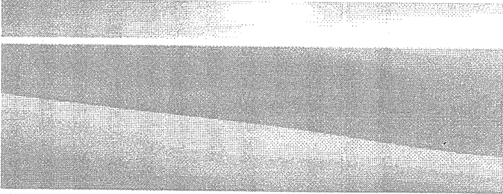

開始寫這本書的時候，我想要發現的是，有興趣的初學者應用自己通靈能力的機率到底有多高。我確信每個個體的內在都潛藏著這些力量，它們代表屬於人類整體的自然特性。我從未參加過降神會；羅勃也沒有。我們在ESP領域所讀的書促使我們下了一個結論：至少有一些降神會，可能是某些超感官知覺面向的正當展示。我們讀到的其他降神會，則似乎是建立在詐欺或過度作用的想像力上。

我們決定自己試試降神會。結果，我們一時衝動，就嘗試了第一次的自助式降神會，我會在本章報告經過，並附帶你可以自己去嘗試的一個實驗。稍後，在賽斯課期間，可看到一些明確的實質效應。但這些將在本書後面的章節談到。

旁坐下，互握著手。

房裡有足夠的光，所以我們看得很清楚。因為不大知道如何開始，羅勃便請賽斯給我們某種信號。在羅勃的指示下，我脫下婚戒，將它放在桌子中央。我們互握著手，與戒指保持相當遠的距離。我們一直都看得見自己的手。

開始之前，我們關上綠色半截式窗簾，這樣白色百葉窗和蠟燭就不會有反光。然後我們聚精會神在戒指上。在很短的時間內它便開始發光並閃爍。我們彎身近看，效應是明確的──原因也一樣。羅勃發現，只要前後移動他的手，他就可以讓那道閃光出現和消失。雖然我們努力預先排除這種效應，那光卻來自反光。我們放開手，把電燭放在窗簾和百葉窗的後面，讓光擴散。然後我們又回到桌邊。

這回，羅勃建議我把一隻手放在桌子的中央，掌心向上。我照做。羅勃再次要求某種信號。在暗色桌布的襯托下，我的手清晰可見。我的另一隻手緊握羅勃的手，放在桌上。

突然間我脫口而出：「看那隻手。」我一部分的頭腦奇怪我為何說了話：但另一部分卻很有自信。我替賽斯又再說了一遍。

我們全都等著，這時我感覺我放在桌子中央的左手變冷了。這隻手在我們眼前開始改變形狀。它採取了一種明確的爪子般的形狀，從拇指下面一直到手腕都粗了不少，而且看來彷彿變大了。透過我，賽斯問我們是否清楚看到這個轉變。對我們三個人來說全都明顯可見。

這隻手是掌心朝上放在桌面。但突然間，這隻手的指尖反面有了指甲，而手指最初看起來好像是以一種手指不可能彎成那樣的方式向後彎曲。但是我的手絲毫不覺得費力。我們彎身靠得更近以便看得更清楚，因而看見我自己的手上顯現出其實有二組手指。我這隻手的其餘部分則維持怪異的粗短形狀，指尖在發光的同時，手看似在放大或腫脹，因此我們可以清晰看到發生了什麼事。

然後額外的一組手指就消失了。有一刻它們更加清晰可見，所以我們全都看得很清楚。下一刻它們就不見了，現在整隻手又肥又厚。我是個頭嬌小的女人，手也一樣小，只不過手指相當長。但現在我的手指卻又短又粗。透過我，賽斯說：「那手現在是法蘭克·韋德的手。法蘭克有肥肥的手······他是個胖子。」他（或我）的聲音裡有著明顯的幽默。在其他的早期課裡，每當賽斯提到法蘭克·韋德，就會展現出幽默的容忍，雖然根據他自己的證詞，法蘭克是賽斯自己人格的一部分。

### 在降神會當中

我或多或少是用我平常的音調說話，只不過字句不是我自己的。在我的手繼續變形時，賽斯一直在評論那個現象，提到就第一次嘗試而言，他的表現比他以為自己所做的好多了。手仍維持厚厚的外型，有著變短的手指和肥胖的形狀。然後賽斯建議我將右手抵在奇怪的左手邊，以便加以比較。他似乎迫不及待要我們檢查那效應，使我們能確定它們。我將雙手靠攏，它們之間的差異並非幻象。

然後我將我的右手放回到羅勃的手裡，左手留在桌子中央。賽斯建議羅勃，現在摸一下我這隻怪異的粗短的手。羅勃摸了，有點小心翼翼地。那手的質感不同，而且潮濕。雖然羅勃感覺到手指，也知道它們在那兒，但手卻變回到他可以非常清楚看到的爪狀附肢，而那附肢上有殘指而非平常的手指。不過，真正讓我們印象深刻的卻是一個小細節。之前那手只不過看來肥肥的，現在它卻從桌面上長厚了起來。

然而賽斯還沒完呢！當所有的手──除了我變形的左手之外──都再互握時，雖然我的手臂和手腕仍然留在原處，但那隻左手卻開始由桌面上升。比爾・麥唐納迅速用他自己的手從升起的手和在桌面上的手之間掃過去，以確定這並非幻覺。我的手腕一直緊壓著桌面。當時我們核對了這一點。上升時，那手還微微發著光，好讓我們看得更清楚。然後它回到桌面。賽斯切斷了聯繫，我們休息了一會兒。

* * *

我們全都累了，但也很興奮。從七點開始，到現在已八點多了。我們決定回到桌旁。再一次，羅勃請賽斯給一個信號。我將左手放在桌子中央，右手放在羅勃手裡，這次我的左手拇指幾乎立刻變白，不只比我這隻手的其餘部分白，而且是會發光、比白堊更白的白。我們注視著它，白色由拇指散布到指下的小丘處，並爬上我前臂的一半，到我推上去的毛衣袖口處。手的下半部又再變厚，看起來像是手本身長出來的某種東西。到此為止，這是最驚人的效應。尤其是一分鐘之前，我的掌心曾充滿著陰影。現在陰影完全消失，而那手的掌心滿是白光，並且越來越亮。並沒有會導致這種效應的任何反光存在，但白色是如此之強，不可能弄錯。

比爾·麥唐納一生中曾見過幾次幽靈。先前他叫我們問問賽斯，關於有天晚上出現在他床邊、穿著斗篷的一個巨大身影。我們還沒問，賽斯當下就透過我自動說出，那是一個叫馬克的存有的一部分，曾兩度是男人，一度是女人。那幽靈是一個過去人格的片段體，之所以現身是要警告比爾小心高處。照賽斯所說，比爾的前生曾一度在夜裡爬到樹上以躲避動物。當時他正在狩獵。到此賽斯突然停止，開始笑出來。「他逃脫了那隻動物，卻在樹上睡著了，掉下來，頭著地而一命嗚呼。他該避免高處。他在四十六歲去世。」賽斯繼續說比爾的平衡有問題。他相當恐怖的幽默很令人吃驚，尤其是緊跟在手的白堊色改變之後到來更叫人害怕。附帶一提，在幽靈出現的那段時間，比爾正在油漆房子，還爬梯子。他的職業是美術老師。賽斯再度中斷了接觸。我們筋疲力竭，但決定要看看賽斯能否在通往浴室的門口具體化某種全身的形象。我們將桌子擺在打開的門前，坐了下來。我立即感覺到賽斯，他有點不高興，「這不是午餐會，」他透過我說「羅勃快吃完他在短短休息時間揀起的一塊糖」：「也不是看馬戲。」然後他說浴室窗子透進來太多光線了，建議我們關上門。在門背後，面對客廳，有一面和身長相等的鏡子。透過我，賽斯叫我們排好桌椅，以便在這鏡子裡清楚看到我們自己的影像。我們照做。然後他叫我們注意我在鏡中的影像。羅勃坐在我的一側，比爾坐在另一側。

那天我整晚都穿著一件黑色毛衣，頭髮短而黑。黑髮和黑毛衣框住了我的臉和頸子。我們一開始看鏡子，我的影像與羅勃和比爾的影像一樣清晰，不多也不少。電燈仍開著。我們是在半明半暗中。但再一次，光線足以看見物體。我們在鏡中的影像看來夠平凡，我們的手放在桌上清晰可見。

除了我的影像之外，鏡中每樣東西都維持原樣。我的影像並沒有立刻改變，但頭漸漸變窄了，頸子變肥短了，甚至髮型也變了，更加緊貼著頭顱。頭現在看起來更像個男人而非女人的頭。肩膀變得很明確地扭曲了，更尖也更駝。臉的輪廓繼續變長。那影像低下它的頭。這讓我非常震驚。因爲我自己是向上看、直視著鏡子## 降神會之後

我們對那晚的反應有些混雜。先前，實驗之前，我們相當尷尬。然後是既專注又興致盎然，但也很謹慎。在它結束後，我們懷疑某些暗示在鏡中影像扮演了一個角色，可是，我們無法確定。手的插曲很迷人，而且我們很肯定那與暗示沒什麼關係。效應太明確了，而且我們在好幾方面做了核對。手無疑改變了形狀、大小和顏色。額外的手指出現，連帶有與我自己的指甲反向的指甲。那手曾在桌面上升，但我的手卻緊壓在桌面上。比爾核對了這一點。充滿手掌心並升上前臂的白光也是錯不了的。

我們爲手的種種顯現所做的仔細審查，已經小心到不可能我們三個人好像都受暗示的影響卻還能夠繼續進行下去的地步。我們非常清醒，也很好奇。我們並不接受我們看見的每件事。舉例來說，我們很快就發現，戒指第一次閃爍是來自反光。

雖然我替賽斯說話，但我的雙眼是大睜的。

我們比較確定的實質效應顯現在賽斯課裡，但是不常有。我們對它們的感覺更確定，只因爲它們是發生在燈火通明、而且我們並未試圖促使它們發生的時候。但我們心裡頭沒有任何疑問，這次的降神會裡的確發生了明確的效應。

如果你有開放的心胸和健康的知性好奇心，而且相對而言不迷信的話，那麼你會發現，實驗性質地做一次你自己的降神會可能是很有意思的事。

如果你得到任何明確的具體效應，那麼你會爲自己發現，降神會並不見得僅僅是欺騙或輕信。保持客觀的心態，核對看到的一切。另一方面，你也必須給直覺的自己一些自由，否則不會有可以核對的事。如果你絕對肯定沒有事情會發生，很可能就沒有事情發生。如果你好奇又開明，就不會受制於什麼是可能、什麼又是可能的預設想法，而能夠客觀、清醒、理性地研究任何顯相。

這些結果是我們第一次嘗試得到的。我們之前並沒有這種經驗，對降神會的解也沒有比任何讀這本書的人多。沒有必要怕「鬼」或「幽靈」，或將這種降神會視為非自然的事。我們企圖以邏輯為基礎，研究長久以來隱藏在迷信之下的許多事。如果發生了顯相，那麼它只不過是指出，我們並不了解自然本身是什麼，我們不了解人類的潛能。

好幾世紀以來，我們已經知道心影響物，但不知道怎樣影響。在本章末尾，我會摘錄一些開始處理這種問題的賽斯資料。按照在資料當中提出的理論，每個人在潛意識的基礎上形成物質實物，包括個人形象這樣的物質實物。我們並非有意識地覺察自己的消化過程，同樣的，我們也不是有意識地覺察自己不斷將能量轉變成物質的方式。如果這是事實，那麼人類人格基本上就不受限於我們所知的物理定律。如此一來，人格的倖存便不是什麼非自然的事了。如果這樣一個人格再度形成一個具體形象，而以幽靈的樣子現身在我們面前，也就不是什麼非自然的事了。

隨後，我們將更徹底地討論這種事，因為你自己對夢和心電感应的實驗會讓你看見，人格—你的人格—比你以爲的還要獨立於時空之外。不過該如何舉行自助式降神會，本章有幾個建議。我們自己後來的經驗顯示，根本不需要黑暗或接近黑暗的場所。如果你喜歡的話，第一次嘗試的時候，不妨讓房間有微弱的燈光。

或許在一開始，半暗會讓你有更大的內在自由。開亮燈，你也許會覺得尷尬或可笑。不過，後來就用正常的燈光吧，這樣你對結果會更加確定。

爲你第一次的嘗試，如果你把房間燈光調暗，就一定要試試幾種不同的安排，確定所有的反光來源都消滅才行。不慌不忙，慢慢地安排桌椅。擺放的方式應該以你們可以清楚看見爲原則。用不透明的深色材料遮住桌子，抵銷反光的可能性。務必確定隨時可見在場的每個人的手；握手是個好辦法。如果有人的手看不見，你永遠都無法信任你們的結果。

參與的人數不拘，但這些人應該要誠實正直才行。核對你所見的一切效應。

如果你喜歡的話，你們可以只是安靜地坐著。或你可以問：「有人在嗎？」如果你自己問問題會不自在的話，也可以指派別人，最好有個坐在桌邊卻不參加的人來做筆記。如果在半小時的一段時間內沒事發生，就結束實驗，下次再試。尤其在

一開頭，你也許需要做好幾次這種嘗試，才能夠放鬆到獲得任何結果。

如果團體中的某個人碰巧開始用語音通訊，或是說出不像他自己的話來，那就溫和地問他，別嚇著他。一個碰觸可能引起他的迷惑。他可能受驚或不安，因而失去聯繫。

對於你們可能達成的任何結果，他們可能太過興奮而無法客觀報告。他們本身的過度敏感也可能讓你懷疑本來可能有憑有據的效應。

我建議你別去碰觸在做語音通訊的人，因為他可能處於輕度的出神狀態。這是一種十分自然的心理狀況，但如果產生了語音的結果，就提出上一章建議的問題。

結束實驗。這種實驗對一般人來說安全無虞。本著嘗試和好奇去做，它們可以是很有益的事。有些人幾乎在任何情況都會表現過度，不應該邀這種人參加你的實驗。

以下摘錄的賽斯資料很有意思。就我所知，這是對心與物互動方式的一種原創性解釋。賽斯本身看來並沒興趣製造實質效應，他最重視的似乎是在解釋一般的ESP現象──它是什麼，它如何作用，實驗室的什麼實驗能證明它的有效性。以下的摘錄來自一節課，要了解賽斯資料討論的主題，這是基本的一節課。

很顯然，本書只能涵蓋賽斯資料的一小部分。但賽斯談到，每個人在潛意識上形成他自己的具體形象、他的環境和物質宇宙的細節。他解釋了耐久性、寬度、高度、重量，以及在空間裡的位置這些表像是如何達成共識並維持住的。在「靈性世界，物質有關係嗎？」（Does matter matter? 譯註：這句話玩的是英語的雙關語）那一章裡，我會簡短討論這些概念。

## 出自賽斯資料

創造不斷在繼續，不一定都遵循著舊模式的路線。在你們自己的層面，有個潛意識的知識倉庫。在那兒，所有的分子和原子都精確地知道，在演化上曾有過的嘗試為何，結果又如何，而且永遠為一度嘗試失敗的形式留意可能合適的環境。

所有的原子和分子都有個濃縮的意識，甚至更小的粒子也一樣。基本上，構成所有物質的東西和細胞的原子、分子，不受你們的時間束縛。它們在你們的時間架構內活動，但它們內含的濃縮知識也夾帶著自己奇異又獨特的意識，不受制於物質定律。

化學本身不會產生意識或生命。你們的科學家將必須面對這個事實，也就是先有意識，然後才演化出它自己的形象。你想像肉體是由某種分離的意識構成的，控制著一個由全然無意識的部分組成的架構，是相當牽強的。

體內的所有細胞都是個體，而且有個別的意識。這裡有層級存在，但每個細胞都是有意識的細胞。在身體所有實質器官的細胞之間，以及所有器官本身之間，都存在著有意識的合作。

這裡有個切題的例子。分子和原子以及更小的粒子全都含有個別的意識。現在，它們形成細胞，但細胞仍維持它的個體性，不會喪失任何能力，其實是有個原子和分子個別意識的集合，形成了個別的細胞意識……結果你有了真的是由數不清的個別細胞組成的器官。這種情形無限地衍生下去，連更低層的粒子也保有自己的個體性。肉體的這種合作的本性，不可能只是你們的化學物質和化學反應形成的結果。

意識就這樣形成自己的具體化。肉體是比你們的假設還要神奇的一個現象，因為這種意識的組合仍持續進行中，而且在人腦裡可見其結果。

當你們宇宙的物質來源終於被發現時，你們的科學家不會比現在好過。他們將面對他們逃開了這麼久的問題：起源背後的起源。物質宇宙與其中的每樣東西都是意識的結果。它並沒有演化出意識。相反的，意識不只創造了物質宇宙，而且還在繼續這樣做。

利用我至少已部分解釋過的機制，每個個人在潛意識的層面持續進行這種物質宇宙的不斷創造，這種不斷的創造的維持，並不是透過存在於兩耳之間、前額之後某種局部的潛意識。個人潛意識是資源和能力的一個心靈匯集的結果。它是個完形（Gestalt），由構成肉體的每個原子和分子的那種合作、普遍化的意識加以維持和形塑而成。

每個個別原子都有某種程度的能力，把它那部分的能量建構成物質的構造。肉體的整個物質結構就是這種細胞（每個都含有自己的個別意識）合作的結果。肉體的模式使得每個細胞、原子和分子都能表現它們自己；以一種除此之外便無法分享的方式，它們分享了一個實質的龐大身體的結構能力所達到的視野。

形形色色的細胞維持了它們的個體性，同樣的，形形色色的人格在保有其個體性和獨特性的同時，也互相合作，形成存有的心靈結構，那在某個範圍裡也形成了它們；而我讓你們帶著這個小問題休息一下。要看蛋裡面有什麼，除了打破它之外，你們將會發現，還有更多方法……。

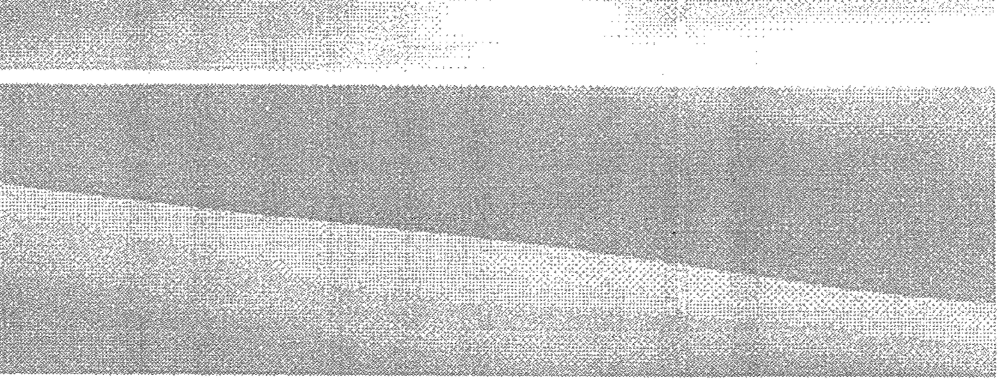

## 預知夢

預知夢是在夢中收到關於未來的有效資訊。預知夢可以是千里眼式的，就像你預先看到一件未來的事件那樣。夢也可以是千里眼式，但不是預知夢，就如同你在夢中看到一件事，其發生的空間與你的不同，卻是與你對它的感知同時發生的事。

你做过预告未来的梦吗？你最先的回答也许是惊讶的「没有，当然没有」。你也许会补充说「至少，如果我真的做过这种梦，我也从没记住过」，以修正刚才的声明。但我的论点是，我们全都做过预告未来事件的梦，只是这些梦往往都被遗忘了。

因此，我们得不到有价值的知识。非常可能你在梦里收到对未来的一瞥，但你清醒的自己对此毫无觉察。不过，你不会永远都得不到这种知识。是有办法将它带入意识的，本章列出的实验会让你在这方面得到可观的结果。

预知梦就是在梦中收到有关未来的有效资讯。预知梦可以是千里眼式的梦，就像你预先看到一件未来的事件那样。梦也可以是千里眼式但不是预知梦，就如同你在梦中看到一件事，其发生的空间与你的不同，却是与你对它的感知同时发生的事。

一般而言，认定一个在科学上无懈可击的预知梦之前，有三个必要的因素：必须在发生之后，尽快把这个梦告知另一个人或几个人；必须有可靠的证据，证明做梦者的梦中所见后来真的发生在实际的世界裡；必须弄清楚这个资讯不可能经由正常的感官知覺接收到。

如果這些條件聽來令人洩氣，讓我趕快提醒你，儘管如此，還是有公認可信的心靈學會記錄和蒐集了成千上萬個預知夢。不過，你自己信任的親朋好友對預知夢的第一手描述，或許更能說服你這種夢是有憑有據的。

我建議你開始詢問自己的熟人和親友。你會發現大家都急於談論預知夢，而且這個私人的調查會打開你的眼睛，讓你看到這種夢並不像你最初以為的那麼稀奇。

可是你必須了解，除非仔細地寫下那些夢，否則無法賦予它們任何科學上的有效性。爲了你自己好，把上述三個因素應用你聽來的所有預知夢的例子上。

* * *

我先生和我很榮幸能與國際知名的雕刻家安德森先生（Emilie Anderson）爲友。

安德森先生告訴我以下這個夢。一九一八年的一個週六晚上，他夢見他年輕的妹妹躺在一具棺材裡。這個妹妹住在瑞典，而安德森住在紐約市。就他所知，他妹妹健康良好，當年二十二歲，有一個幼兒。第二天的星期日晚上，他把這個夢講給在他家參加晚宴的十到十二個朋友聽。星期一他收到一封電報，通知他在週六晚上，也就是他做夢的那一晚，他妹妹去世了。

幾年後，安德森先生見到她過世妹妹的女兒。現在已經長大的她告訴他，他們家人常常談到她母親在臨終時說的話，是對人在紐約的安德森說的。在這例子當中，安德森先生收到了明確的資訊——知道他妹妹死亡的事。在他收到通知死訊的電報之前，他已經把這個夢講給宴會上的人聽了。

這類的夢幾乎永遠會被記住。其中的情感內涵是如此鮮活並震人心弦，以致留下了強烈的印象，連意識心也會覺察收到的資料。

但比較不具重要性的日常事件又如何呢？夢是否也瞥見實相當中比較世俗的面向？基於我自己的經驗，我的答案是「是的」。

不過，意識往往沒有保留這些夢，因為預見的事件與實際事件本身一樣單調乏味。但是，怎麼能夠認為任何對未來正當合理的一瞥單調乏味呢？

這種夢的發生頻率可能比更驚人的那些夢來得高，但它們可能非常順暢地融入我們習慣的活動模式之中，因此我們根本沒有注意到它們，除非夢裡預言的事確實

在非常短的時間內發生了。舉例來說，另外一位朋友桃樂西亞·皮瑞·馬斯特夢到她丈夫預期的紅利的精確數字。因爲數字實在太大、太不尋常了，所以她把夢講給丈夫聽。兩週之後，紅利真的發下來時，數目和夢境一樣。我們的一個鄰居，夢到她和她丈夫會去看一棟位於艾爾默拉的威斯特芒路的房子。他倆一直在找房子，所以她一點都不覺得奇怪，但是她確實對她丈夫提到那個夢。她把那個夢給忘了，直到週末一個房屋仲介打電話來，請她去看在威斯特芒路上的一棟房子時，她才又想起來。這位鄰居的先生接著告訴我一個一再重現的夢，這個夢的性質我毫無所悉。他夢到座位的安排，隨後這些安排就完全一模一樣地實現。舉例來說，他夢到某些朋友來訪，他們選擇了明確的沙發和椅子的位置。後來那些朋友真的來了，他呆呆地看著他們選了他們在夢中選的位子。度假期間他也夢到這種安排。當親友坐下進餐時，座位的安排跟他預見的一樣。他很窘地告訴我這些夢，但遺憾的是，他並沒有把這些經驗告訴他太太，也沒有留下紀錄。

有天晚上，羅勃做了下面這個夢。他夢見自己開車載三名乘客從一座飄雪的小山下來。暴風雪肆虐著，路況很差。在夢裡他對其他乘客評論情況的危險。前面一輛車轉彎不成而撞山了。羅勃寫下他的夢，也告訴了我。我們笑了，說這幾乎不可能是千里眼式的夢，因爲當時是四月，天氣一直很好。四天之後，在復活節那天，我們請羅勃的父母吃飯。下午時分，突然刮起了暴風雪。幾小時內，處處都積了雪。我們決定開車送他倆回家，他們家在距離很遠的一個城鎮。把他們送到家之後，我們得回自己家。路況和夢境完全一樣。在一處彎道轉彎時，我們看見前面的車滑出了路面。羅勃還曾評論說，在這樣一場暴風雪裡開車是不智的。

桃樂西亞跟我們說了另一個夢。她看見自己在夢裡讀一張紙條，一張銀行通知單，通知她透支了三元六角一分錢。到了早上，她想起了這個夢，便去看看自己的支票簿。上面顯示還剩餘四十四元。既然那天她有事去銀行，便請行員查一下她的戶頭。行員查了，然後遞給她一張紙條，上面說她的戶頭透支了三元六角一分。這個夢很可能源自個人潛意識，但不管它的來源是什麼，都含有十分實際的資訊。以下是我自己的夢，也很有趣。它與一位年老的鄰居有關。她身穿黑套裝，站在一家醫院大廳的樓梯間。

大廳左手邊有個樓梯，右手邊則是部分隔起來的禮品店，在那兒可以購買禮物，可能是送給病人的禮物。我的鄰居在哭，雙眼極爲紅腫。她只告訴我，她要離開了但不想走。早上我跟我先生講這個夢，並把它寫下來。那天稍晚，我碰到了我的這位朋友。她眼中含淚告訴我，她剛剛得知她必須去醫院動眼科手術。

羅勃和我才剛從緬因州度假回來。我們並沒有和我們的鄰居通信，而且從我們在我做夢的前一天回來之後也沒見過她。後來，她病得很重被送入醫院，我去探望她。我從來沒去過那家醫院，但在大廳右手邊，真的有一個和我夢中所見一模一樣的禮品店。

再一次，因爲其中的情感內涵，這個夢給了我一個強烈的印象，但感情成分較少的夢常常會忘掉。舉例來說，當安德森先生把跟他死去的妹妹有關的夢告訴我的時候，他也順便提到他前晚做的一個夢，在那個夢中，他和一位朋友討論畫家畢加索。當時我在一家畫廊工作，而安德森先生到我辦公室來，最初是要討論他朋友剛在那天早上給他的一幅哥雅（Goya）的版畫。我打斷安德森先生，問他擁有這幅哥雅版畫的人和他夢到的男人是不是同一人。

他困惑地說是。他完全沒想到這個關聯。就在他夢到畢卡索和他朋友的第二天早上，他朋友給了他這張哥雅的版畫。考慮到某種扭曲混淆了畫家畢卡索和哥雅的名字，這個夢還是很有趣。

但是讀者你又如何呢？常常在你醒來的那一剎那，仍隱約保有這種夢的印象，然後它便消失了。如果你預見的事在幾天內發生，你可能記得那個夢。不然的話，它便被遺忘了。在大多數的情況下，你就是會忘記你大多數的夢。我爲你設計的第一個實驗就是要幫助你記得你的夢，並認清它們包含的任何資訊。鄧尼（Denny）在一九二七年用過這個實驗，後來各種不同的調查者也用過。

有個熟人確信他從來不做夢。他從來不記得做過任何夢。這是意識心抑制潛意識力量的一個極端例子。

這位熟人答應我做我將告訴你的實驗。三週內，他排除了他抱持多年的一個錯誤觀念。現在他記得他的夢了。這個經驗對他很有益。

做這實驗之前，我很少想起做過的夢。下一章，我們要來看看我們可以怎樣訓練自己，才能更進一步保留這些睡眠活動。

## 準備做實驗了

現在來談實驗本身吧。每晚睡前，在枕頭下面或床頭几上放一本筆記簿和一枝鉛筆。入睡前，堅定地告訴自己，醒來你會記得自己的夢，並立刻把它們寫下來。

這些指示應該在你放鬆下來、準備入睡的時候跟自己說幾遍。一週內你就會發現自己想起了一大段一大段的夢。繼續這個練習，你記得的夢境比例就會增加。

把夢寫下來的時候，你可能會發現自己想起來的細節比剛醒的時候還多。不過，如果幾天沒有結果，也不要灰心。這裡牽涉到的是，一個新習慣的建立。這得花些時間和力氣，但結果是值得的。有必要的話，鬧鐘不妨提前五分鐘，以便你有足夠的時間不慌不忙地記錄夢。

這裡需要的自律比最初明顯可見的還多。你必須嚴格遵守指令。早上，眼睛未睜開前先躺一會兒，夢會留在你的記憶裡，立刻把它們寫下來。別起床，別先喝杯咖啡再說。在寫下你記得的第一個夢時，你可能會想起其他的夢。幫你的夢註明日，這一點非常重要。寫下在你腦海中的那些細節，但要確定你沒有有意地加油添

## 完成實驗

這只是一半的實驗而已。利用這個程序，你就會想起自己的夢，但實驗的後半部是讓你能夠根據現實比對夢的事件；也就是說，拿夢的事件與隨後在物質實相裡發生的事核對。實驗的後半部將會讓你有意識地了解自己在夢中感知未來事件的能力。

常常去看你記錄夢的筆記本。比較那天的活動和前幾天或前一週做的夢。雖然你寫下了自己的夢，但你要是不重讀以便刷新記憶，就會忘記。舉例來說，在看我自己的筆記簿前，我很吃驚地發現，很多夢幾乎是不熟悉的。縱使我曾記下它們，意識上卻已遺忘。

仔細核對筆記。如果你夢到涉及一個朋友或親人的事件，那就立刻寫信給他，或想辦法核對一下。如果你不想提你的夢也可以。這種持續不断的核對是必要的，唯有用這種方式貫徹到底，才能獲得最大的益處。以下是我自己的—個例子，本來我不想費事，但這種核對在這個例子當中卻很重要。

* * *

我夢到我小叔的小姨子和我—起走在街上。她剛流產，而且幾分鐘之前才出院。我問她，她的丈夫在這種時候丢下她—個人是什麼意思。夢到此結束。首先，這個年輕女人不住在這個城裡，我只在很多年前見過她兩三次。我跟她交情不夠，不能寫信問她最近有沒有流產。不過，我寫下了夢並且記下日期。幾個月後，我先生的弟弟來看我們；他的太太是那年輕女人的姊姊。我不經意地問他，他的小姨子好不好。他告訴我她很好，但是不久之前曾經流產。我喃喃地說很遺憾，並提到她先生—定很難受。然後我小叔告訴我，那女人的丈夫並沒有在醫院陪她。

如果我沒寫下那個夢和日期，也沒花功夫比對夢事件與實際事件，那我就不會知道這個夢包含了有憑有據的資訊。附帶一提，在這之前和之後，我從沒夢過這個女人。流產的時間和我做夢的時間大致吻合。我小叔並不確定她到底在哪一天流產，但在那個月的那個時間倒是沒錯。

再次重申，你一定要記下每個夢的日期。當一個夢事件真的發生在日常世界的時候，你一定要在夢的紀錄下面為這目的預留的空間裡寫下這個事實。日期和任何其他相關的資訊也要寫下來。因為你想確切知道事件發生在涉及的夢之後而非之前，所以日期格外重要。

我們如何能接受某些夢是預知性的這個事實？我自己筆記簿的證據是我的證明。你自己記錄的證據，將是你的證明。超心理學家知道預知夢是事實，然而在他的科學圈子裡，並不接受這件事。勤勉地研究自己的夢，並且有系統地比較夢事件和實際事件，科學家自己會找到證明。不過，他們在自己的實驗室裡找不到這種證明。能夠研究和評估夢的實驗室只有一個，那就是個別人類人格這間複雜至極的實驗室。

預知性的夢使得「人格並不是一般以爲的那樣受制於時間、空間或物質」這個概念更具分量。你自己的夢筆記比任何東西都更能證實這一點，這讓我們對時間的觀念面臨嚴重的質疑。如果未來是在過去之後，並且與過去分開存在著，那麼不論在夢裡或醒著的狀態，我們都不可能感知未來事件？

如果時間真的以這種方式存在，那麼再也沒有情感的衝力能突破過去與未來的障礙。我自己的經驗讓我相信，未來的一部分是可被感知的，而且大家對時間的普遍觀念並不適當，甚且還會誤導人。

自我對時間的感知可能只是一連串的片刻，但人類人格的一部分，卻能夠也真的是從一個不同的角度去感知事件。造成困難的並非時間本身，而是我們感知時間的能力有限。讀者也許有興趣讀一讀「賽斯資料」針對這個主題的說法。以下摘自賽斯第一次提到他所謂的「廣闊的現在」(spacious present)的資料。如果時間是以賽斯主張的那種方式運轉，那麼在任何一種的千里眼經驗中便再也沒有超自然這回事了。顯然，目前所有的理論都無法充分解釋千里眼的現象。很可能我們對實相本身的整個想法都必須要擴展。

事實上，只有一個廣闊的「現在」存在，它是太遼闊了，所以沒辦法用你們的措辭一次探索完它的全部。因此，你們武斷地將它分成過去、現在和未來的大房間。現在你們就在廣闊的現在裡，昨天你們也在廣闊的現在裡，而在你們的明天，或無窮盡的明天裡，你們還是不會穿越過它。

照你們的說法，你們發現「廣闊的現在」各個面向和實相的速度，變成了你們的物質或僞裝時間。在你們的層面上，一定要有物質的操縱。這也產生了現在、過去與未來的幻覺，而且對你們來說，現在本身是一閃即逝、幾乎是由灰燼構成的幻象，超越了任何真正的「記憶」，只能讓人懷舊地回憶。這也是你們的物質僞裝系統造成的，在這個系統當中，物質的具體化出現、長大、成熟、消失（譯註：如佛法說的「成、住、壞、空」）。

在「廣闊的現在」，正如它確實存在的樣子，所有曾經存在的東西仍然存在，所有在你們的明天將會存在的東西確實已然存在。除了用一種非常有限的方式，否則你們在自己的層面上無法體驗這種實相，也無法自發地體驗這種實相。但自發性卻是「廣闊的現在」具有的本質。

我曾說過，你們的房子牆壁並不真的以那樣子存在，因此你們放在「廣闊的現在」裡的分隔也不存在。但是，你們的外在感官體驗到你們房子的牆壁，而它們也具有為你抵禦其他物質僞裝具體化現象的作用，如遮風、避雨、防寒等等，所以，你們用一種不同的僞裝模式建造的過去、現在和未來之牆，也保護你免受尚未準備好去處理的內在力量和實相所傷。

一般而言，當我們談到僞裝時，我們講的是物質的僞裝結構（實體物件）。不過，也有不是以實質結構，而是以概念形式存在的僞裝模式。

在你們的層面上，過去、現在與未來的概念是必要的，但這並不表示時間是以你們認爲的那種方式存在。你們執迷於開始和結束的理論，因爲在你們的情況下，僞裝的構造物彷彿有開始也有結束。

基於同樣的理由，你們也執迷於因果概念。根據你們所抱持的連續性時間的幻覺，而有了因果理論：一個概念帶來了另一個概念。以下是你們最基本的僞裝結構概念：你們認爲時間是一連串片刻的觀念，以及，你們的因果概念。

就你們了解的字詞而言，並沒有所謂的因果。也沒有一個跟著一個的一連串片刻。若是沒有一連串一個跟著一個的片刻，你們就會看到因果概念變得沒有意義。在過去和未來都不存在的一個基本實相裡，過去的一個行爲不可能引起現在的一個行爲，而且上述兩個行爲都不可能是未來行爲的原因。

連續的片刻及其導致的因果概念，這兩種扭曲的幻覺都是你的外在感官觀察造成的結果，而且在你們的層面，它們既實際又實用。因此，它們具有某種真實性，即使只是對你而言是如此。

它們代表的是，一個針對你們的物質僞裝宇宙本質或多或少真實的描述。但是，如果它們被理解爲只限於你們自己的環境，那你們的科學家就不會企圖拿它們當作測量其他實相的尺度了。

沒有一連串的片刻也可以有秩序。信不信由你，沒有你們的因果，也能有秩序。在自發性裡，在「廣闊的現在」的同時性存在裡，可能有秩序也的確有秩序。

當然，你了解連續片刻的理論在你們的層面行得通，或目前爲止行得通。但當人類變得更有野心時，這個概念對他來說就不再行得通了。它實際上會在理論上被捨棄，同時它在實際上仍會以其侷限的方式被利用。舉例來說，在你們的科學家發現一個片刻接著一個片刻的理論陳舊又過時很久之後，你們還是會繼續使用鐘錶。

## 5 各種千里眼式的夢

在夢裡,我們有時不只收到有關未來事件的資料,也在夢裡想出這些事件可能的解決之道,在物質實相裡跟這些事件打交道之前,先在夢裡面對它們。

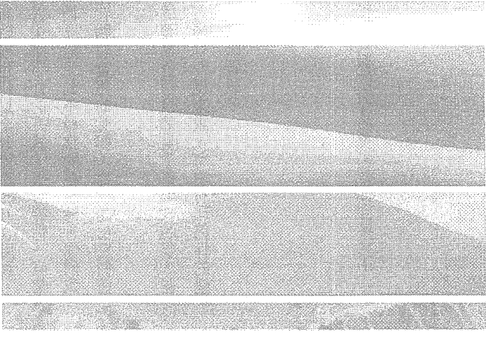

我自己的夢紀錄讓我確信,在夢裡我們真的收到有關未來事件的資訊——我們無法以任何其他方式收到的資訊。這資訊可能來自個人潛意識、來自人類人格的更深領域。不論其來源,這資訊可能是有用的,有時候也能以十分實際的方式用到。

你自己的夢紀錄,應該讓你感知到你的人格預言未來事件的方式。很可能你一直都有千里眼式的夢,但是你並未有意識地覺察它們。除了最不尋常的夢之外,你們並沒有記得夢的習慣。所以,當預知的事件發生在物質實相的時候,你沒認出它們並不奇怪。

不過,在我們面前有很多問題。是否所有的夢某種程度都是千里眼式的夢?在不同的時段,你在夢裡對未來的感知是否比較清晰?舉例來說,有沒有季節性的變化?你自己的潛意識會不會扭曲可能是有效的千里眼資訊?

### 你的夢筆記簿

你將能夠自己回答很多這些問題。我可以用一般的方式嘗試替你回答其中一些，但人類人格的獨特性意味著，你自己的夢會有專屬於你的一個獨特的整體扮相。仔細研究你自己的夢筆記，就會發現很多與你的這種夢架構有關的事情。

首先，在你做紀錄時，要持續比對你的夢和現實。在這些紀錄逐漸累積之際，你就會看到模式浮現出來。這些會讓你發現你在夢裡面用來處理象徵的特有方法。

舉例來說，你可能發現有一個月，你記錄了三十個夢，其中三個彷彿是預知夢，但是下個月你只記了十個夢，而且沒有一個看來是預知夢。也可能剛好相反。你慢慢可能發現，秋天你做千里眼式的夢的比率遠高於其他季節，或者你也可能沒有感知到季節性的差異。

不過，你可能會發現自從開始訓練自己記夢之後，一般而言，你記夢的能力已變得超過預期。你記起的夢越多，可以運用的資訊也越多。在你有一個似乎是預知夢的那些時候，當晚一些其他的夢是否也很可能是千里眼式的夢？你是否更容易收到與家人和朋友有關的預知資訊？或你是否看到你個人沒有涉入的事件？沒有人能替你回答這些問題，但重要的是你要去找出答案。只有仔細評估自己的夢紀錄，才能洩露答案。

我自己評估的結果也許可作為你遵循的指南。我在一九六三年開始自己的夢紀錄。一九六四年，我記起草夢的總數是一百零四個，其中十三個或大約百分之十包含了預知的成分。在這些夢裡所見的事情後來全部或部分發生。我沒有其他任何方法能得知到這些事件。

十三個夢——再一次，大約又是一百零四個夢的百分之十——涉及了某種心靈的教導。在其中我收到種種不同的課程。有五個跟靈療有關。這些也許是因爲我有意識地涉足一般的ESP領域而產生的結果，也也可能歸因於，當自我無法做出有效的反對時，我自己和他人之間的明確通訊。讀者可以自己決定。

請注意在一九六四年一整年，只記下一百零四個夢。當時，我很高興記得這麼多。和你們大多數人一樣，之前我只記得偶然發生的壯麗夢境。但是，接下來的五個月內，從一九六五年一月到五月，我記錄了一百七十四個夢——證明制約和練習的重要性。在一九六四年，每夜平均記一個夢。最多一晚記錄四個夢。很顯然，很多天晚上我一個夢也不記得。可是，從一九六五年一月到五月，在我記得夢的晚上，平均每晚有三個夢。在幾個例子裡，一晚記了八個夢，而在一個晚上的最高紀錄是十三個夢。

從一九六五年一月到五月記下的一百七十四個夢裡面，有三十個顯然好像包含了有效的千里眼資訊。再次重申，我指出一個夢是預知性或千里眼式的夢，這時我指的是那個夢包含了事後核對全部或部分無誤的事件：給了我無法用任何其他方式收到的資訊。往往我覺得一個夢是預知性的夢，卻沒有有效的方法去核對夢事件是否真的在物質實相裡發生了。在這種情況下，自然不會把這個夢列爲預知夢。我的紀錄清楚顯示，這種夢並非不尋常或驚人的那種夢。它們有很多是相當普通的夢，而且也許基於這個原因，它們往往完全被遺忘。以下的一些例子來自於我自己的筆記，這些例子會讓你對於如何給自己的夢分級有概念。

### 千里眼式的夢

以下這個例子，我認為是一個很好的千里眼式夢境。在一九六四年十月二十七日，我夢到擺在我們公寓地下室的老舊洗衣機有漏水的現象。這夢是這麼的不具重要性，以致我幾乎忽略掉它。雖然我在早餐時告訴了羅勃，也將它寫在一張小紙條上，插放在了我的筆記簿裡，但我忘了把它寫在筆記簿裡，直到第二天。首先，至少兩年沒人用過那台舊洗衣機，因爲它用起來有問題。

十月二十八日，我做夢之後的第二天早上，連接洗衣機的水管破了。水急流過洗衣機，裝滿了旁邊的盆子，湧到地板上。地下室積水四吋。是我自己發現積水的。核對之下，我發現有個房客決定用洗衣機。在她用完離開時，每樣東西還都井井有條。我幾年沒用那台機器了，也沒有理由想到任何人會去用。

* * *

以下的例子，我個人認爲是另一個很好的千里眼式的夢。一月二十九日，我記得三個夢。其中之一太複雜而無法在此解釋的夢，也好像是預知夢。第二個夢並非千里眼式的夢。這是第三個，筆記簿上寫著：「我清洗水槽並照顧一個病人。一個醫院似的夢。」

兩晚之後，我們公寓的一位客人突然嚴重流起鼻血來，大量地流了半小時以上。他告訴我們，過去曾有一次他需要輸血。我們打電話請教本地醫院的急診室。由於他的病情，我們邀這位客人留下過夜。雖然我已把那個夢寫在筆記本裡了，但是直到我洗了幾遍廚房的水槽之後，才想起了那個夢。我們洗了沾血的衣服，並且照顧那位病人。

下一個夢讓我印象深刻，但基於幾個理由，我將它列爲低於剛才那個夢一級。

有個星期三早晨，羅勃起床時我醒了。然後我又入睡，做了下面這個夢。再次引述我的紀錄：「我夢見一早在早餐前，比爾·麥唐納不期來訪。他在附近有事要辦。這件事不知爲何與錢有關。七分錢？我不確定。我想比爾欠 J. F. 這些錢。」

醒來後，我寫下這個夢，也跟羅勃說了。我剛剛這樣做，就聽見敲門聲。進來的是比爾·麥唐納。他在附近有件事要辦——他和一個醫生有約，但我們並不知道這件事。我們還沒吃早餐。雖然不是夢到的七分錢，但約會和錢有關。談話間，比爾提到了 J. F.。

比爾常來我們家，所以我給這個夢的等級不像先前描述的夢那麼高。提到的 J. F. 也是我們都認識的熟人，比爾在我們的對話裡講到他一點都不奇怪。比爾說他還在醫生診所的時候，曾想到要來看看我們——這應該是我做夢的時候——因此在這例子裡也可能是心電感應的作用。

不過，在剛才描述的夢裡，相當容易認出預知的成分。它們多多少少以純粹的形式出現，沒有任何扭曲。

但有沒有可能在一些夢裡面，有效的千里眼資訊與其他來自個人潛意識的成分混在一起？我自己的紀錄似乎顯示，事情往往是如此。密切研究你自己的筆記簿，可能也會揭露這一點吧。

這一章得出的結論是以對六百個以上的夢——四百個我的夢和兩百個羅勃的夢——所作的研究爲根據。目前爲止，這個研究涵蓋了兩年的時間。我們希望，隨著研究的持續，我們的資訊會擴大。夢本身形成基本的資料。

唯有對夢的本質作有系統的調查，才會發現它們的主要成分和特性。我的夢紀錄提供了一些發人深省的問題，而且我個人確信，合理的千里眼資訊往往和其他潛意識的資料交織在一起。我至今所做的努力讓我相信，在夢裡我們有時候不只收到有關未來事件的資料，也在夢裡想出這些事件可能的解決之道，在物質實相裡跟這些事件打交道之前，先在夢裡面對它們。

換句話說，很可能這種夢讓我們為後來發生的事件預先做好準備。由於夢資料的這種交織，如果沒有仔細的紀錄，在很多情況下，要將有效的千里眼資訊和整個夢的活動分開，幾乎不可能。不過，因為有足夠的相似性存在，所以檢查可以讓這種千里眼資訊變得清楚起來。我在此關心的並不是這些事件與夢中解決之道混在一起的那種夢。因此，我們可以在夢本身當中，努力發展出我們對未來事件的解決之道，在夢的狀況裡選擇可能最好的解決之道。

只有在研究之後，千里眼式的夢才會自行顯露出一些特徵。我自己的經驗讓我相信，千里眼式的夢有成群出現的傾向。如果某天晚上有一個夢具有預知的成分，那麼同一天晚上其他的夢也比較會是預知夢。我自己的筆記簿裡的一些例子可以更方便地說明這些要點，也會讓你對評估自己的夢紀錄時要找些什麼有個概念。

思考一下以下全都發生在四個晚上之內的幾個夢：

- 甲夢 2/15/1965 我看見羅勃因某種病症發作而跌倒在地；他倒在廚房的水槽前。
- 乙夢 2/15/1965 我夢到我們有滿屋子的客人。一位老友 S. C. 也是客人之一。
- 丙夢 2/15/1965 在餐館裡的一張桌子變成了一張床。一群較老的人看著羅勃和我把床拉直、把床單鋪平。
- 丁夢 2/16/1965 我夢見羅勃和我在找公寓。
- 戊夢 2/17/1965 我夢見我們的房東和他擁有的餐館，與整合有關。
- 己夢 2/17/1965 我夢見羅勃和我必須搬出我們的公寓。
- 庚夢 2/19/1965 我夢見一位女編輯來討論「賽斯資料」。

現在，從這一群夢之後立刻發生的事件來看看丙、丁、戊、己這幾個夢。我的房東也有一間餐館，二月十八日，他來我們公寓告訴我，他正考慮賣掉公寓房子，或許也會賣掉餐館。他約了一些可能的買主來看房子，將要去和他們碰面。他要求我讓他們看看我們這整個公寓。我同意了，當他去和他們碰面時，我清掉我在那裡寫書用的大桌子，鋪好床，也把我們的房間全部整理一番。他帶了一群較老的人回來，這些人隨即仔細看了一下公寓。

丙、丁、戊、己這一群夢，都包含了後來顯現在實際情況中的成分。他們關係到我的房東、搬家的可能性、較老的人以及整理床和書桌。我發覺事件並非全然相同，不過，那些夢的確讓我注意到我們的居住情況可能會改變。如果房東賣了公寓房子，我意識到我在擔心房租會漲到超過我們能夠負擔的範圍。在一個夢裡，我看到羅勃和我在找新公寓。雖然我們並沒有這麼做，而且那個買賣也沒做成，但我确信在那個夢裡面，我是為預見的問題尋找可能的解決之道。

現在來看看甲夢與乙夢，兩個都是在同一天晚上。在其中一個夢裡，我看見羅勃因某種病症發作而跌倒在地板上。在另一夢裡，則有滿屋子的客人，包括S.C.在內。夢發生在二月十五日。三月二十四日，超過一個月之後，羅勃醒來，走進浴室，卻突然暈倒在蓮蓬頭前面的地板上。在同一天，我們的客人比平常兩週時間內訪客還多。當我試圖照顧羅勃時——他感染了一種特別嚴重的病毒——客人仍陸續到達，S.C.也在客人之中，八年間我們只見過她兩次。如果那個夢沒寫在我的筆記簿裡——而且夢與實際事件的相似性沒有因為事件都發生在同一天而更加強化——就像夢也是在同一個晚上發生——我永遠也不會覺察到這個關聯。

### 阻擋夢

在這裡，我想補充說明一下阻擋令人煩擾的夢這件事。與羅勃生病有關的夢讓我驚嚇到，我發現自己居然在想：「我不會記得這一個夢，我不喜歡它的寓意。」後來，逮到自己這樣想，我便強迫自己立刻把它寫下來。不然的話，它會被忘掉——故意忘掉。

然而那個夢，和搬家的夢一樣，幫我爲後來發生的實質事件做好準備。搬家夢給我的是，我們的住居情況可能改變的一般資訊。如果我沒有藉由找尋另一間公寓的夢來面對搬家的可能性，如果沒有一個已經告訴我這件事的夢，那麼對於被告知房東的計畫，我的感覺會緊張很多。事先得知羅勃發病，也讓我在心理上有所準備。

我們只剩下另外一個夢，二月二十日的夢，夢裡一位女編輯來討論「賽斯資料」。在做夢的時候，我沒有和任何一名女編輯打交道。「賽斯資料」（譯註：即《靈界的訊息》）擱在菲德利克·費爾公司（Frederick Fell Inc.）五個多月了。羅勃寫信要求退回資料。三月七日，我們收到一位當時接受出版社一個職位的女編輯來信。她曾寄了一張卡片給我，但我一直沒有收到。在信裡，她談到「賽斯資料」和這份手稿。不過，她並沒有親自來訪。

在我記錄夢的整個期間裡，並沒有其他的夢和女編輯、S. C.、搬家或生病有關。本書之所以談到這些夢，是因爲在後來發生的事件當中有一些認得出來的成分包含在這些夢裡面，但是它們欠缺先前提到的夢具備的那種清楚明確的精確度。同時，它們彷彿在暗示，在夢中我們不只遇見一些未來事件，還嘗試在夢裡解決未來的問題。

剛才所說的夢事件和實質事件之間的相似性，很容易可以推給機率。不過，這些夢並不是這種「群夢」的唯一例子。我的筆記簿還有很多其他的夢，而且那些夢似乎都把後來實際情況的不同面相呈現出來。預知的事件可能和其他我們在其中解決問題的夢混在一起。基於這個原因，很多千里眼式的夢在一開始看起來並非如此，但是研究它們可能會讓我們能夠區分夢的各種不同成分，釐清其中的關聯。

要發現夢的特徵本質，除了檢查夢本身的内容之外，沒有其他合適的方法。

檢查你的夢紀錄，你會發現你個人是用什麼方法混合夢的各種不同成分。然後，當千里眼資料不是清澈透明的時候，經驗會讓你能夠把它區分出來。如果矯枉過正，努力接受所有的夢都是預知夢，則只會混淆視聽。你自己在評估時，誠實和常識都是必要的。

徹底檢查混雜的夢，比研究比較清晰的千里眼式的夢，更能增進我們對人類人格和潛能的知識，因爲這樣做會深深涉及內我的運作，在感知預知資料的時候如此，在實際利用它的時候也是如此。如果我們在夢中預見事件——也詮釋它們，並試圖想出各種解決方法——那夢境要比我們以爲的更加實際。

在夢中故意扭曲有效的預知性資訊，又是怎麼回事？我們是否可能常常收到有關未來事件的知識，然後在夢中扭曲它們？

我認爲這是非常可能的事，而且當它發生時，我們評估自己到底收到了多少資訊的難度會更高。在這些情況下，個人潛意識可能把預知的資訊全部用光，或轉譯成另一種夢戲劇。潛意識有很多理由去扭曲這種資料。事件的本質也許是令人不愉快的。如果是這樣，資訊之所以清楚傳來，有可能只是因爲它需要我們這邊採取一此明確而且無可避免的未來行動罷了。或者，也有可能一個預見的不愉快事件不需要我們這邊採取行動，因此我們覺得可以安全地扭曲它。這事件可能代表長久以來的問題，或傳來的資訊強度不足以逼你認可它。

以下的一些例子會讓你明白我的意思。再一次，我們又有一連串的夢：全部三個夢都發生在一九六四年二月十八日晚上。

- 甲夢：我進入兩位雜誌發行人的辦公室。開門時，心裡感到不安。我有一個很明確的感覺是，我沒有賣出我的稿件。房門外面（outside）樓梯口的平台有點問題。
- 乙夢：我接到一個奇怪的（strange）女人打來的一通電話，或是我打電話給她。她不要人家打擾。驚訝之餘，我告訴她，是我母親給我她的電話，叫我打給她的。
- 丙夢：夢到一位老友，G太太。

做這些夢的第二天，一家雜誌社拒絕了我寫的一篇故事《圈外人》（Outsider）。記得我那個夢的紀錄包括了「外面」（Outside）這個字。至少，那個夢讓我得知一篇故事被拒絕了。同一天我收到我母親的一封信，她花了大半篇幅討論一位我不認識的女人，一個陌生人（stranger）。她在信中爲了她花了這麼多篇幅談這個女人而道歉。關於老友G太太，我母親也給了我一些消息。再一次，這種相似性可以輕易被歸爲機率而不予理會，尤其當中沒有清楚提供預知性的成分。我的筆記簿顯示很多這樣的例子，因此我們似乎必須考慮到，很多預知性質不明顯的夢，卻可能包含有效的千里眼資訊，但人格爲了自己的理由而扭曲了它。我好些年沒見到老友G太太，而且我們是在不友善的狀況下分手的。當然，一篇故事被拒絕，絕非快樂的消息。也許無意識地，因爲我母親在她的信裡對一個我不認識的女人花了那麼多篇幅，我心存妒意。不過，整體來說，我這邊並不需要針對實際事件採取任何立即的行動。很可能我只是扭曲了那個資料。不過，我對我母親在信中提到G太太並不覺得驚訝，在那天的郵件中發現文章被拒的事我也不意外。預知性的成分至少可能在二種夢裡顯示出來：當千里眼資訊既清楚、簡明又不會錯時；當它與涉及問題解決之道的夢戲劇相混時；以及其中的資訊被潛意識扭曲到一個相當可觀的程度時。

研究你自己的夢紀錄，會讓你認出這種傾向。顯然，你也必須核對每天的事件，並與夢事件做比較。抓住每個小小的巧合，幫它們貼上預知性的標籤，是沒有用的。另一方面，忽略後面兩種夢似乎呈現出來的可能性，也沒有意義。

那麼，是否所有的夢都是千里眼式的夢？如果你夢到家族中有人死亡，是不是一定真的會有人死掉？

並非所有的夢都是千里眼式的夢，這似乎很明顯。舉例來說，一個有關死亡的夢，可能只是潛意識關心死亡是必然現象的一個表現。這樣的夢可能代表壓抑的願望，希望涉及的那個人真的死掉——睡夢中的自己無害地釋放出來的一個願望。當這種夢發生時，不要緊張，它們也許只反映出你暫時的情緒低潮。

離開夢的主題之前，我們來快快想一下，有些夢包含心電感應通訊的可能性。我自己的紀錄只略微暗示夢和心電感應之間的關聯。不過，有一次特別的情況引起我對這方面的興趣。在一個夢中，我讀到一篇有關《靈界的訊息》的評論。就在此時，羅勃叫醒了我。他憤怒地說：「你讀到講《靈界的訊息》的那篇文章嗎？」「什麼文章？」我說，立刻非常感興趣。但他要不是在說夢話，就是只醒來了一一下子。

當然，這並未證明任何事。不過從那之後，我聽說過其他類似的經驗，而我覺得整件事令人非常好奇。很有可能羅勃在說夢話，提到他夢到的一篇文章，然後激起我做了同類的夢。

也有可能我們在夢中收到暗示，隨後在醒時的生活裡對它做出反應。於是，醒時經驗看起來就像千里眼式的經驗，但實際上並不是。只有調查仔細這種夢資料，才能爲我們在此提出的所有問題找到明確的答案。

爲了你自己的實驗，你要繼續做夢的紀錄，務必記下所有的夢和事件的日期。經常比對每天發生的事和你做的夢。每個月都評估你的筆記簿內容，在評估中要留意以下幾點：

- 一、記錄了多少個夢。這會讓你能夠記下自己的進步。
- 二、有多少個好像是預知夢。這應該包括看來顯然是千里眼式的夢；千里眼的成分與找出預見事件相關問題解決之道的企圖混在一起的夢；以及包含了被潛意識扭曲的千里眼成分的夢。
- 三、你通常收到的預知資料的一般性質。舉例來說，它是否有屬於個人的傾向？或者，你是否預知你沒參與的事件──政治事件、報紙頭條新聞等等。
- 四、一連串的預知夢。也找找看季節性的差異。
- 五、任何可能在你的夢裡或任何夢系列裡，以種種不同方式出現的統一性的夢象徵。以下「賽斯資料」摘錄將會簡短解釋這些事。摘錄內容談的是夢和千里眼，從幾個觀點來看都很有意思。

## 摘自第四十五節

如果因果是一個絕對的定律，那麼持續性也一定是個絕對的定律，而千里眼的所有或任何證據則是絕不可能。只因基本上並沒有因果，也沒有過去、現在和未來，你們的宇宙裡才可能有千里眼事件。

雖然覺察到千里眼是相當稀有的事，但它卻真的存在；雖然在大多數例子裡它都被稀釋了，卻是個自然的方法，向個別的人警告他們自己的肉體感官不會熟悉的事情。它是透過對事件的一個內在覺知而保護個人的一個自然方法。若無每個男人和女人經常不斷的千里眼通訊，存在你們的層面就會涉及到很大的內在心理不安全感，而讓人完全無法忍受。

個人永遠會收到災禍的預警，以便有機體能在事前做好準備。死亡的時間是知道的，但在意識上，這種知識沒有給自我，原因顯而易見。但透過內在感官，每個有機體對個人的災難、死亡等等都具有潛意識的知識，人格事先自己決定什麼是它認為的災難。人類成員預先知道他們的戰爭。

在潛意識層面，心電感應不斷地運作，是所有語言和通訊的基礎，因此千里眼也持續運作，如此一來物質的有機體就能做好面對挑戰的準備。我的鴿子們，就一節課來說，這樣已經夠多了……

## 摘自第九十三節

如果以完全屬於另一個層面的資訊來詮釋，從潛意識的一個層面來的夢，結果可能會相當混亂。很多人對某些潛意識的面向感覺比較容易，結果他們可能會覺察到源自潛意識某個特定區域的夢，而比較不會覺察到源自其他區域的夢。

在很多例子當中，我們大半會發現夢源自於個人潛意識的層面，最簡單的是那些與日常有意識的生活密切相關的夢。雖然這樣一個夢不像其他的夢那麼複雜，卻是令人驚訝的構造：看起來可能所有的夢都是不相關的象徵或事件的隨意湊合，但是我們會看見任何的夢都具備的一個最重要的屬性之一，其實是，辨識力。

因為，從看似無窮盡的種種可能性裡，個別的做夢者其實是極為小心地進行分辨，只選擇最合乎其目的的那些夢的物件。縱使是一個與瑣碎的日事事件有關的簡單的夢，實際上的內涵並不僅止於此。

事實上，人們透過如此精確的辨識力來選擇夢的物件，因此深入檢查之下，就會看到它們不只包含與日常有意識經驗相關的資訊，還會看到每一個夢的物件同時適用於潛意識的很多層面。選擇這些夢的物件的方法是這麼的聰明、近乎狡猾，因此連最簡單的夢的物件都可能和此生的例子有關；與個人（潛意識）懼怕的物件或例子有關；與前世渴望或害怕的物件或例子有關。這種夢的物件也可能是內我用來警告人格有關未來可能的災難或失望的方法。於是，一個夢的物件可能同時代表意識生活當中日常又熟悉的一個簡單部分、表層潛意識當中一個強烈懼怕或渴望的部分、前世的一個事件或物件、或是一個懼怕或渴望的未來事件，視情況而定。這裡存在著一個等式。一個夢的物件同時在四或五層實相當中確實存在：物件比它本身多，而等同於已經存在或將會存在的實相；所以，藉由一個相當真實的心靈收縮和擴展，過去與未來同時存在夢的物件之內。擴展就是夢。收縮就是夢的成分回歸最初那一個物件，也就是說，等式源自於夢的物件。比如，所有的數字都源自於「一」這個數字。首先，每個夢都以心靈能量為起點，做夢者不把這種能量轉化成物質的東西，而是轉化成每一丁點的作用和真實性都一樣的實相。他用令人驚異的辨識力，把概念塑造成夢的物體或事件，這樣一來，那個物體或事件本身就有了存在，而且是存在各個不同的次元裡。

看起來它「似乎」不是存在於種種不同的次元裡，但實際上它的確是這樣子存在。如果一個夢的物體或事件不但橫跨你們所謂的時間，也橫跨空間，而且如果像我所說的那樣，夢的物件和夢的創造保有某種與夢分開的獨立性，那麼你就可以看出，雖然做夢者為了自己的目的創造了自己的夢，但他卻在心靈擴展中把這些夢往外投射出去。

再一次，當夢戲劇演出時，擴展就發生了。對做夢者而言，收縮發生在他為了自己的目的結束事件或戲劇的時候，但能量並不能收回。

投射到任何一種構築裡能量都無法收回，卻必須遵循它此刻被塑造成的那個特定形式的法則。所以，當做夢者收回他的多重實相物件，替自己結束他構築的夢時，他只是對自己結束了它。夢的實相仍在繼續。我不在乎現在這個概念在你和魯柏，或其他人眼中看起來是否不可能。事實就是這樣。

在意識層面除外的其他層面上，你和每個人都知道，夢的世界的確是內我用最謹慎的態度以及只有直覺才有的精確建構而成，這也是事實。而且每個人都知道，像這樣一個精彩的創造物，接著就會超越它本源的「自身」而存在。

## 6. 心電感應

假裝你的心智像個海洋。你穿著一套潛水裝備，緩慢地往下潛。首先你經過就在水面下的意識之流。然後你到達下一層，那裡的思緒和影像你比較不熟悉，像具有異國風情的魚迅速游過。別企圖抓住這些字眼或影像，不然它們會溜走。只要觀察它們就好。

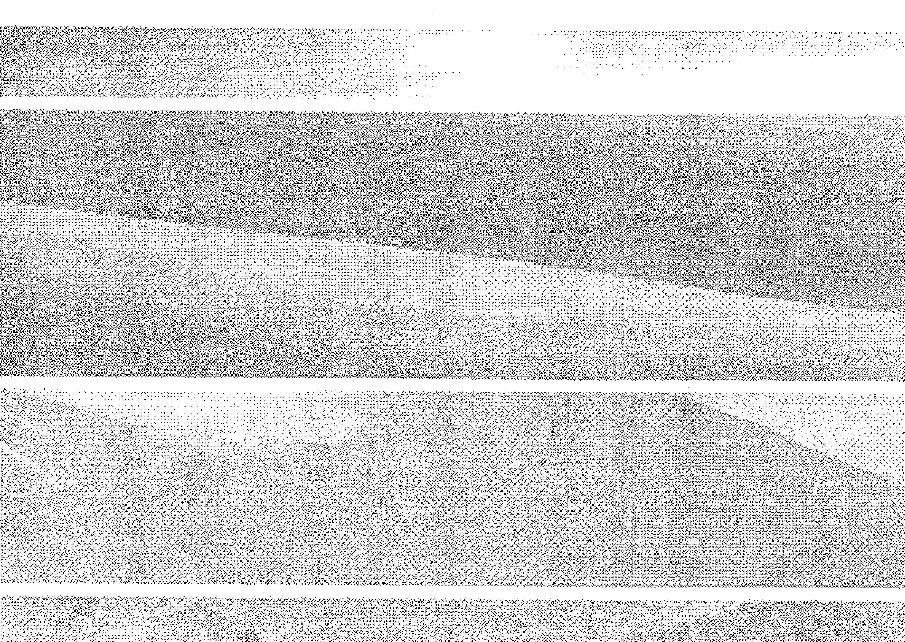

不用寫信或打電話就可以和遠方的親友聯絡？這聽起來可能匪夷所思。然而，很可能在很多時候，我們全都能潛在意識層面這樣做。事實上，這種心電感應的訊息可能可以這麼輕易、平順地接收到，以至於我們會自動根據這種訊息採取行動，但在意識上卻根本沒有注意。

俄國人曾在地球和太空船之間進行用心電感應通訊的實驗。美國政府正在實驗，把心電感應的命令傳送给北極圈潛水艇上的志願者。在未來的某一場戰爭裡，心電感應很可能成爲一種武器。

但在日常生活裡的心電感應（思想轉移）又怎麼樣呢？以下是一位鄰居，三十來歲的男老師，告訴我的一些經驗。就任何單一例子來說，都可能解釋爲巧合，然而，當我們考量成群發生的這種事情時，特定模式似乎就會出現，而比較不可能用巧合來解釋。

一個週末早晨，這位鄰居突然感覺到一股想去探望他姊姊的強烈衝動。他尤其覺得那天晚上非去她家吃晚餐不可，但是她住在四十哩之外，除非計畫要停留較長的時間，否則他不習慣跑這麼一趟。那天下午他終於決定開車去。一離開公寓，電話就響了，他回頭去接。打電話給他的正是他姊姊。她叫他開車南下來吃晚餐，說她整個早上都在考慮要打給他，卻又猶豫不決。她認爲弟弟不會爲了這麼短時間的探望而長途跋涉。最後她決定打電話。在這個例子裡，顯然那個實際的電話是不必打的。我的鄰居已經收到訊息，也採取了行動。

在另一個場合，這同一位紳士決定去看他哥哥，他哥哥也是住在一個差不多四十哩外的城鎮。雖然他曾滿懷期待要跑這一趟，卻突然感覺到一股延遲一下的衝動，便在自己住的城裡開車轉轉。返家時，電話正在響。那是他哥哥從本地機場打來的，他專程飛到艾爾墨拉來看我的這位鄰居。兩人不常見面。假如這老師開車去找他哥哥，他們就會完全錯過。只有他那想要延緩一下的不合邏輯的衝動，使得他倆得以見面。

### 我自己的一些經驗

這些事件以及剛才提的那件事，代表了相當不重要的事件。我們常常不經意地當它們是巧合，而不進一步思考和考慮這些事。在這章後面，我們會談到一些沒那麼容易淡忘的經驗。

去年除夕，羅勃和我在一次宴會上遇見一對年輕夫婦，姑且稱他們爲甲夫婦。第二天下午，我坐在客廳，那時有人敲門。我馬上知道是甲先生在門口，他太太沒跟他一起來。事實正是如此。同一年稍後的一天下午，羅勃回來午餐的時間晚了。我突然冒出他已經辭掉工作的念頭，但是他並沒有特別的理由這麼做，也沒有說過要這樣做。我有點擔心，心想他如果離開商業畫家的職位，我們可能得搬離此城，因爲他在一座小城很難找到兼職維生的工作。然而，那個念頭卻很清楚：他辭職了，我們要搬離此城。

才收到這些念頭，羅勃就回來了，我們的朋友甲先生跟他在一起。甲先生來看我們的目的是要告訴我們，他剛剛辭職了。他和他太太將搬離此城。來看我們的路上，他在公寓外面遇到羅勃。這裡，顯然我收到了甲先生的念頭，因爲我在意識上擔心羅勃的遲歸，所以就把這個訊息歸給了他。

以下是另一個例子。一位女友給我一件她不要的外套。後來她搬走了。過了一年，我從沒穿過那件外套。去年冬季有一天我決定穿它去市中心。穿上外套，心想：「如果我穿這件外套，可能就會碰到 A. R.，他會記得這件外套，也知道它是件舊衣服（那位女友給我外套那時候，A. R. 在場）。我有點想把它脫掉，可是我從沒在逛市中心時碰到過 A. R.，所以我認定，以爲會碰到他的念頭真是太自作聰明了。所以我穿了那件外套。事辦完之後，我順路去看另一個朋友，她在一家商店做事。就在我要推玻璃門進去時，便看見 A. R. 在和我的朋友講話。我常常去店裡看我朋友，但 A. R. 從未在場過。

以下是另一個簡單的事件。再一次，這個經驗也可能只涉及巧合而已。早上七點四十分，在洗盤子時，我突然決定要把我向鄰居借的一個盤子還給他。那念頭很強烈，因此我應該照做。我拿起那個盤子，朝著門口走去。然後，想起時間還很早，我便把盤子放下。就在這時候，響起了敲門聲。這位鄰居來訪，想跟我借東西。在我們比鄰而居的五年裡，他從不曾這麼早來敲門過。我給了他那個盤子。

有天晚上我到附近一家雜貨店去，去之前我告訴羅勃馬上就回來。回家途中，我想起有個朋友借走一本我的書，還沒歸還。我決定去看他讀完了沒。他是一位專業人士，辦公室就在家裡。書在他辦公室裡。因為他正在忙，我便和他太太喝了杯咖啡。我們談了一小時。那是冬天，夜晚很暗。我不安地想，羅勃現在應該在擔心我了，因爲我通常都是從店裡立刻返家。我的眼睛瞄了一下鐘，那時是七點。我終於決定不再等下去。回到家時，羅勃沒說話，遞給我一張紙條。上面寫著：「七點。強烈感覺到珍正在乙醫師家裡。」

雖說羅勃的確知道乙醫生有一本我的書，但是過去我常常經過他家，卻沒順道去找他拿書。在我們公寓和雜貨店之間，還住著其他的朋友，我也可能順道去看他們當中的任何一位。

***

大多數讀者都可能記得自己的很多這類經驗。在當時，這些事件給我們某種程度的印象，但我們覺得無法用這些根據證明任何事情。除了心電感應之外，還有許多其他的方法可以適當地解釋它們。不過，心電感應是一個可能的解釋，不應該只因爲它不是唯一的解釋，就忽視它。

不過，以下的事件多少更難被指爲機率或巧合的結果。一天晚上我半睡半醒躺在床上，那時在腦袋裡聽見這些話：「是呀，但它實在貴死了！叫誰去付這筆錢呢？不是有基金會或什麼的在承擔這種事嗎？」這聲音馬上讓我覺得耳熟，是當時不在市內的一位朋友的聲音，他聽起來又驚又怒。我告訴羅勃我聽見的內容，立即一字不易地寫下來並註明日期和時間，那是在半夜一點過幾分的時候。

第二天我試著弄清楚發生了什麼事。那個人的父親病了，也許M先生在擔心他父親可能必須接受的一個手術。三天後，我的朋友回來了。羅勃和我去看他，我探問他父親的情形，這時他告訴我情況沒有變。我問：「他不需要動手術或什麼的，不是嗎？」M先生困惑地回答說不需要。我本來準備要忘掉這整件事了，幸虧我改變主意，把我聽到的內容告訴M夫婦。

這回輪到我吃驚了。我發生這個經驗的那天晚上，M夫婦在一個度假區。半夜一點的打烊時間，他們離開一家酒館，走向距離不遠的汽車旅館。旅館經理和他們走在一起。在旅館外面，他們發現地面散落一堆垃圾。蓄意破壞的人把放在草坪的昂貴桌椅，連同垃圾一起丟進游泳池裡。那地方一片凌亂。在回應經理對破壞的譴責時，M先生說：

「是呀，但（損害）實在是太貴了，叫誰去付這筆錢呢？不是有基金會或什麼的在承擔這種事嗎？」

對於這一類的事件，巧合似乎是一種相當沒有說服力的解釋。透過某種方式，我顯然與很多英哩之外的情況接上線，收到了M先生氣憤的評論。附帶一提，假如是在夢裡收到這個資訊，我很可能會把自己的醫院解釋納入夢本身，而使它扭曲到完全認不出來。因此，不論你何時寫下這種經驗，務必忠實記下你聽見的那些話，不要加油添醋。

以下是另一個幾乎不能只歸諸機率或巧合的例子，發生的情形與M先生的例子一樣。時間是深夜，我也是半睡半醒。突然間，我發現腦海裡留著報紙上一篇文章的意象，我讀過那篇文章，還拿另一張紙上面的資訊跟它上面的資訊做比較。那篇文章說一位朋友，X先生，工作的地方打算給他一次升遷，還說那裡會發生一次改組，另一個在那裡工作的朋友，K先生，也會捲入其中。我一發覺正在發生的事，報紙和另一張紙就消失了。我立刻記下這個資訊，並且告訴羅勃我看見的事情。

第二天M太太來訪。我盡我所能，把我的經驗告訴她，也給她看我做的紀錄。她驚訝地告訴我，她先生的公司正在考慮升他的職，但整件事是高度機密，只有那些直接相關的人才知道。即使大多數員工都不知道這個情況，但改組的確正在發生。她並不知道公司是否替K先生計畫了任何的改變。

兩週半之後，因爲另一個人辭職，所以非常突然地，K先生被調到另一個職位。不過，報上並沒有出現什麼文章，M先生也沒有接受給他的升遷。兩個人都同一家報社做事。我想，這就解釋了我爲什麼會看到一篇報紙的文章。透過這個方法，我弄清楚了工作的地點。

### 體驗到一個聲音

上面這個例子牽涉到的是景象而非聲音：我看見而非聽見資訊。下面這個經驗則牽涉到我相信很多讀者在自己生活中都熟悉的東西：一個聲音。當你獨處時，有多少次你確定有人你在叫你名字？在大半的情況下，我們只是以爲我們聽見了什麼，搖搖頭就忘了這件事。實際上，我正在寫這一章的時候，突然很確定有個女人在叫我的名字。那聲音彷彿來自我的腦殼，而不是實質的外界。不過，我往窗外看，想知道有沒有人在院子裡。院子是空的。我獨自在公寓裡，大部分其他房客都外出工作。不管怎樣，我們的公寓房子老舊又牢固，聲音不會傳遠。

因為我訓練自己記錄這類的事情，不管它們看起來多麼不重要，所以我在筆記簿裡寫下這個經驗以及時間：早上九點十五分。然後，我就忘了它，心思回到我的寫作上。二十分鐘左右，我突然有打電話給我的朋友S太太的衝動。當然，我以爲這是我自己的念頭，雖然它可以說是無中生有。我們沒有電話，我借用了一位鄰居的電話。S太太接的電話，她告訴我，剛才她和她先生正談到我。她有些消息想跟我說，希望我有電話，這樣她就可以找到我。

一直到我回到打字機旁，我才想起我聽到的女人聲音。S太太告訴我，她和她先生的談話是九點剛過，他下樓喝咖啡那時候開始的。我已經完全忘了之前有關聲音的紀錄。

在另一個場合，我坐著工作，突然覺得有個衝動，想要打電話給在報社的另一個朋友，佩姬·加拉格，或是去看她。一旦在家安定下來工作時，我很少出門。可是，想去看佩姬的衝動很強烈。看看鐘，是早上九點三十分。因爲我從八點就開始工作，所以我決定十點走路去看她。她看到我就告訴我，從九點半開始，她的心思全部聚集在我身上，我第一次感覺到想看她的衝動就在那時候。我們有一些事一起合作，她急著聯絡我。因爲我沒有電話，她也知道我正在寫這本書，所以決定試試心電感應。再一次，我還以爲想去看她是我自己的念頭呢。

在賽斯課也發生過顯然好像涉及心電感應的例子。比方說有天晚上，賽斯在一位目擊者提問之前就回答了他的問題。我們錯過了前一天晚上的定期課，當時只是個熟人的Y先生不約而至。當我們坐著與他聊天時，我覺得賽斯想要幫錯過的那一節補課。

以前我們從來沒有目擊者。我心情緊張，不曉得會發生什麼事。賽斯毫不在乎。不管有沒有客人，他照樣開始上課。我們早幾分鐘知道，所以先讓我們的客人對賽斯課是什麼東西有個簡單的概念。羅勃拿紙筆給Y先生，讓他寫下想到的任何問題，但他根本沒有機會用到那支筆。在我並不知道的情況下，賽斯按照Y先生想到的所有問題出現的次序，回答了那些問題。我們並沒暗示客人，賽斯能夠或願意這麼做。這個念頭根本沒有進入我們的腦海。當時對我們而言，賽斯課還是非常新鮮的東西。

我們的客人很有興趣。後來他又來參加一節課，問賽斯有關他的專業生涯的問題。賽斯用他慣有的活潑方式答覆。在獨白的末尾，賽斯提到Y先生在電子方面還有尚未發揮的才能，建議他成為一個火腿族業餘無線電技術員。這一節課結束後，Y先生告訴我們，他家的地下室塞滿了形形色色的電子儀器。他常常想要變成一位業餘無線電技術員，但因爲費用問題而沒有那麼做。Y先生住在我們沒有去過的一個很遠的城市裡，所以我們不可能看過他的家，他也沒跟我們提到過他在電子方面的興趣，而且他看起來也不像是有這種興趣的人。

### 心電感應和千里眼

「心電感應」這個詞主要用來表達沒藉一般方法通訊的所謂的「思想轉移」。「千里眼」一般用來表達有關未來事件的超感官知識。但在我的經驗裡，兩者密切相關，所以很多時候難以區分，而特定的字詞本身也不重要，它們基本上只是用來在一個ESP機能上做人工程的區分而已。不過，既然一般都用這兩個字詞，那我們在這裡也延用它們。

在千里眼和心電感應兩者的例子裡似乎涉及了特定的特徵。在討論你們可以自行試做的實驗之前，我們先思考一些這種特徵。一般而言，超感官知覺似乎發生在意識心被支開的時候。有意識的專注則具有抑制這種現象的傾向。

在很多例子裡，心電感應似乎有一個情感的基礎。我們看來好像是收到我們精神上與之接近的那些人的思想。我們可能無法用意志力送出或收到心電感應的通訊，但我相信，我們能夠容許自己那樣做。重要的是，這些通訊必須透過心智的某些部分才能傳送過來，你要熟悉那些部分。

### 給你做的實驗

這裡有一個簡單的實驗。每天十分鐘安靜地坐著或躺著，傾聽你自己有意識的思想。別去干擾或判斷它們，只要客觀地傾聽就好。這是你的意識之流，幾乎持續不斷流過你心智的思想之流。有時候我們會覺察到它們，但通常只有在我們安靜的時候才會覺察到。

當你學會區分這股意識之流時，不要理會它。然後你會發現就在它的下面有不連貫的思緒和意象。你可能聽見似乎不具意義的話語，你可能看見畫面迅速明滅。

假裝你的心智像個海洋。你穿著一套潛水裝備，緩慢地往下潛。首先你經過就在水面下的意識之流，然後你到達下一層，那裡的思緒和影像你比較不熟悉，像具有異國風情的魚迅速游過。別企圖抓住這些字眼或影像，不然它們會溜走。只要觀察它們就好。

你會需要你所有的感知力量。你可能聽見聲音，那些聲音可能有片刻清楚到聽得見，然後就消逝了。要有耐心，別用力看或聽。安靜地觀察和傾聽。

習慣了這個經驗，你就會適應新的狀況。你可能發現，有些影像比其他持久些。你可能更清晰地看見它們。先前混亂不清的字詞現在可能明確起來。像我朋友的話一樣，它們可能涉及時間上是現在、空間上卻是距離遙遠的情況。它們可能涉及未來或過去，除非傾聽和觀察，否則你永遠也不會知道。

有些影像根本毫無意義。有時候，你什麼也看不見、聽不到。有些畫面可能涉及你並不認識的人。它們可能是想像的結果，也可能關係到對真人的確實感知，但相對而言卻不可能去核對。如果你聽見你認得的聲音或有意義的話，就把它們寫下來。如果你看見熟人或朋友的影像，就描寫一下你所看到的內容。之後，嘗試向有關的人詢問，了解你的體驗有何意義。

有很多次我無法得知收到的資訊是否合理，直到我向涉及的人核對過後才確定。在你多多少少能加以證明之前，你不能理所當然以爲那些影像或語句有憑有據。實驗本身會讓你到達一種介於睡與醒之間的懸浮狀態，這和你晚上躺在床上通常會有的體驗狀態一樣。這是最可能收到心電感應通訊的一種狀態，我自己有一些通訊就是在其間發生的。

無論如何，並非所有的語言和影像都是心電感應式的。有一些可能只是潛意識的虛構之物；內在心智自動在玩遊戲。練習無疑會幫助你發展出一些能力，區分來自種種不同來源的感知。我自己的經驗讓我在選擇哪個影像重要、哪個不重要的時候，多少有些辨識力。客觀而且有系統地核對這種資訊，仍然是唯一一個確定有效性的明確方法。事實上，你對任何既定經驗的直覺感受，可能比你有意識的評估更可靠。有好幾次我不理會我在這種懸浮狀態中，腦海裡突然出現的字句，因爲它們似乎不可能有意義，所以我就棄之不顧。後來，發生了支持它們的事件時，我一籌莫展，因爲我沒有把它們寫下來。

在其他時候，我確定同類的資訊有憑有據，可是當我和涉及的人核對時，卻並非如此。

我們接下來的實驗涉及到另一本筆記簿。這本筆記簿對你而言，應該很快會像你的夢筆記簿那樣，變得很有意思也很重要。不但如此，你還可能跟我之前一樣會發現，你的夢和你將記錄的事件之間存在的相似性。

先前在本章我們討論過那些看似不重要的事件，由於它們與我們在事件發生前剛產生的內在思緒很像，所以常常嚇我們一跳。幾乎每個人在自己的生活中都曾經體驗過這種情形。有多少次你想到某一個朋友，他或她就在同時或幾秒鐘之後打電話給你？有多少次你聽到過有人在叫你，即使你是單獨一人，而且附近也沒有人在叫你？從現在開始：

- 把這種例子全部寫下來。
- 寫下每個紀錄的日期。
- 記下你腦中突然出現的任何強烈直覺或念頭，如果它們好像和你當時正在做的事無關的話。
- 不斷核對，看看你的直覺和日常事件有沒有任何關係。
- 如果你聽到有人叫你的名字，就把這件事寫下來，然後接下來這一天要留意觀察發生的事；可能有人想跟你聯絡。你可能收到一封信或一通電話，而釐清聲音之所以出現的原因。

如果電話響起，而且你還沒拿起話筒就已經知道是誰了，那就把這件事記下來。包括打電話來的人的名字和日期。

- 這種事一週發生幾次？
- 你是不是一向都知道誰會打電話來？
- 既然你真的寫下這種例子了，那你有沒有發現，有一半的時間你不像自己想的那樣正確無誤？
- 這些問題你自己就可答覆。

你的預知夢和心電感應短訊有沒有關聯？兩者在某些時間的發生次數是不是都會比較多？心中記住這些問題，交叉核對兩本筆記簿。這種問題的答案，可以讓我們知道很多與人類人格和心智本質有關的事情。還有很多人類的工作尚未完成。

很難證明任何一個例子是有憑有據的心電感應通訊，而且這種事件每一個都必須單獨研究。但是，如果你的筆記簿裡累積這種性質的重要經驗，如果它們經過忠實的記錄和謹慎的核對，那麼這一大批資料本身可能暗示，其中涉及的是心電感應而非巧合。

### 超感官知覺實驗

我們有一個實驗使用正規的ESP紙牌來測試超感官知覺。這種紙牌可以向杜克大學的超心理學系 (Parapsychology Department, Duke University, Durham N.C.) 郵購，只要區區美金二元就附送說明。隨牌附送二十五張紀錄用紙。ESP具有自發的傾向，所以在記錄它的時候，我們必須這麼有紀律。對似乎發現在你的一些預知夢，以及你在做別的事時忽然想到的字句或念頭之間，你很可能會找到同樣的連結。不過，只有持續仔細的記錄，你才能發現這種相似性。這增加了夢和心電感應短訊兩者的有效性。

什麼差別？當兩個例子發生，兩者都與同一實質事件有關時，那麼對我而言，這就加強了我在夢裡收到的資訊。就時間而言，先發生夢或是心電感應短訊，似乎沒什麼差別。我有很多千里眼式的夢是透過心電感應短訊體現的。往往，我腦海裡聽見的聲（音），

### 心電感應

你可以製做自己的紙牌，但購買正規紙牌有很好的理由。一個是，紙牌的尺寸和厚度絕對統一；背面不透明而且一模一樣，減少了收到潛意識暗示而影響得分的可能性。一疊紙牌是由五種符號——星形、波形、十字或加號、圓圈和正方形——組成的二十五張牌。

拿到紙牌以後，你應該用硬紙板之類合適的材料做一個小屏風，遮住測試者，不讓受測者看到牌。測試者發牌，受測者試著確定它們發出來的方式。所有的得分都寫在紀錄紙上。

發一整疊牌，猜中的機率是五分之一。那麼，光靠機率，受測者可以在二十五張牌當中猜中五張。比五還高的得分就可以當作是超過機率。不過，最起碼要發十次牌，越多次越好。舉例來說，在最初的三次，你可能得分很高，但你下次的得分可能低於機率，而讓整體得分降低不少。

我建議你常常玩整疊牌。在你的紀錄裡寫下每次受測時，你的情緒如何，受測是在一天的什麼時間，甚至天氣狀況。我們根本不知道ESP如何作用，也不了解什麼樣的不同狀況影響它。你自己的結果可以回答你的很多問題。而且紙牌可以用來做好幾種不同的測試。

- 當心情好的時候，你是不是猜牌猜得比較準？
- 當心情不好時候，又如何呢？
- 天氣是不是好像會影響你的得分？

如果科學家能發現 ESP 在其中運作得最好的狀況，那就可以設定對於將 ESP 置於某種可預知基礎上的企圖最有用處的實驗。

在親友身上試測一下紙牌。記下所有的得分，每一回玩牌不要玩太多次，這樣你會累。永遠要一字不改地遵從指令。舉例來說，如果你在沒用屏風時得到很高的分數，那你的得分應該不算數，因爲你沒有正確遵守測驗的條件。

在我們自己用紙牌做的測試裡，有一次的千里眼測驗我得分很高，猜中了六十七張卡。在這一個測驗當中，紙牌正面朝下放在桌上，受測者試著猜每疊牌的次序。沒有人碰觸紙牌本身。機率應該是五分之一。不過，其他幾回的分數相當可觀地拉低了我的總分。羅勃有一回在二十五張牌當中猜對了十二張。在我們的調查中，我們並沒有強調紙牌。

有些ESP領域的工作者在紙牌使用上有極佳的結果，其他人則否。重要的是維持高亢的士氣，不因爲重複而覺得無聊。帶著好玩的心情嘗試那些測驗。超感官知覺有一種自發性，往往出現在我們最不抱期望的時候。用科學的態度來判斷本書所有的實驗結果，然而，首先你必須容許自己內在擁有自由，要「收到」不是來自肉體感官的知覺，一定要有內在自由。

### 做你自己的實驗

你可以自創很多實驗。舉例來說，試試看叫一個人待在另一個房間裡，在紙上畫一個簡單的物件或符號。然後，試著畫出一模一樣的物件或符號。可以很多人一起參加這個簡單的實驗。永遠要做紀錄。用意指原始（one's）的I或O，或是用一個任何會保持清晰紀錄的名稱，爲原始的圖畫編號。而且別忘了你的筆記簿。對於你不了解的每一件事，拒絕接受巧合爲唯一的解釋。在你的筆記簿裡寫下這種事件。舉例來說，你的信是不是好像常常和別人的信在郵寄中途交錯而過？如果你在週三寫信給一位朋友，你是不是常常在他收到你的信之前的週四就收到了他的信？或者這是不是只是你的想像？保持紀錄並爲你自己找出答案。別把任何事情視爲理所當然。

試著不用電話或比較平常的通訊方式聯絡一位遠方的親友。如果你跟著做這些實驗，如果你花時間和力氣檢視內我，你可能會發現自己真的能做到。

以下摘錄的賽斯資料，是賽斯概括地討論心電感應，以及思想從發送者（甲）傳遞給收受者（乙）的方法。

### 摘自第三六節

我曾經說過，沒有複製品（Facsimile）這回事。然而，你可能會說，有些思想不是複製品嗎？變化可能真的很細微，但變化永遠都在。甲有意無意地傳遞出去的一個思想，到了收受者乙那裡的時候，已經不是完全一模一樣的思想了。

原本由甲持有的思想仍然留在甲那裡，一個似乎雷同的思想卻傳到了乙那裡。甲並沒失去任何東西。也就是說，在試圖送出思想、試圖複製思想的時候，甲仍然保有這個思想。那傳給了收受者乙的又是什麼？這一點相當重要，因為對於經常發生在心電感應通訊上的歧異，一個解釋會很能說明原委。

不論發送者是不是有意傳遞這個明顯的複製品，在傳遞的瞬間，發送者創造了應該會複製原始思想的電子脈衝（巴日田）。但就我所知，在任何一種實相当中都不可能有這種一模一樣的複製品。

附帶的一點是：舉例來說，同卵雙胞胎也不是一模一樣的。

一旦企圖複製思想，我們就會發現那企圖本身會繃緊和拉緊；那脈衝會有微細或較大程度的改變。我想講的重點是，任何想要複製的企圖其實是在強迫各個脈衝用一種不同的模式排列。當乙收到一個思想時，它已經是一個新的思想，雖然和原來的思想非常相像，但它並不是原來的思想。

主要的身分（巴日田）無法複製。精確的複製永遠是知識不足造成的結果。在某些例子裡，兩個思想也許會顯得完全一樣，但不管能不能透過檢查證明，這樣精確的複製是不可能的事。現在，當收受者乙收到一個傳遞過來的思想時，他可能對類似原始思想的那一部分思想起反應並加以詮釋。如果那思想落入他熟悉的特定範圍內，這樣的話，就可以取得一些科學證明。不過，落入他熟悉的特定範圍內也可能是相異之處，在這種情形下就不會有足夠的證明。我告訴過你們，情感也擁有一個電性的實相。由於情感的電子脈衝本身的奇特本質，在情感的脈動範圍內形成與送出的思想往往會成功。它們有一個特別強大的電子質量。基於我們現在不會討論的理由，它們通常也落入強大的強度內，在強烈情感推動力之下形成的思想更爲生動，並具有更大的複製傾向，比較會被成功地詮釋。

還有，因為情感存在於電性強度之內，所以每個個體都熟悉情感，也習慣對它們起反應。整個過程發生在瞬間。不過，現在這個思想只是原始思想的一個近似物，事實上有它自己的身分──那個思想又再度被收受者本人改變。他並不是真的詮釋了思想本身，他詮釋其意義而形成一個新的思想身分。

在我們上一節裡，我告訴過你們這個。行動，傳遞這個行動本身，就改變了思想本身的性質與電性實相。

再重複一次：我們虛構的發送者甲並沒有傳遞一個特定的思想，甚至沒有一個精確的複製品。收受者也並沒收到同樣情況的思想，原來的思想保留在甲那裡。甲產生一個盡可能幾乎一模一樣的思想，將它傳給了乙。但乙無法接收現有狀況的這個思想，因為收到一個思想的行動也改變了它。他盡可能構成一個幾乎一模一樣的思想並加以詮釋。行動永遠無法與看似接受行動的東西分開考慮，因為行動變成結構的一部分。行動始於內在，是所有實相天生具有的內在活力造成的結果。行動並非單獨的一個東西，也不是一個身分。行動是一個存在的次元（a dimension of existence）。

## 7 進入心理時間的步驟

你有過很多次輕度的出神狀態，但你自己可能一點都不曉得。當你排除一切，全神貫注在一個問題上，很可能你就是在一種輕度出神的狀態。看電視時，你經常是在這種狀態，全部的注意力都放在你正在看的節目上。

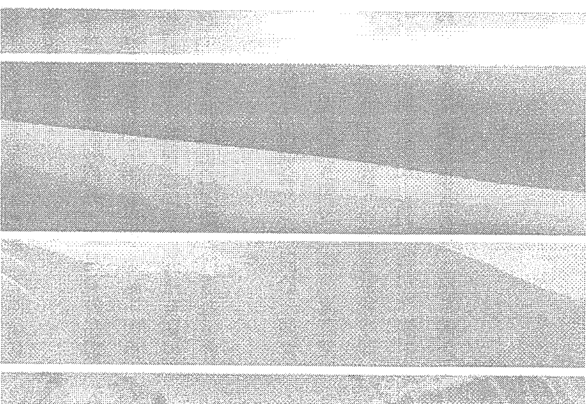

意識心關心的是，讓你度過日常生活。出於必要，它與時間及空間打交道。但是，許多影響我們很深的經驗並沒有占據空間，也似乎和我們所知的時間無關。舉例來說，一個感受甚深的心理經驗不占空間，也不透過時間呈現。然而，有時這樣一個經驗，卻比我們看得見和摸得到的其他實相還要生動。

我們的意識通常集中在一個方向。我們通常不看我們的內我，而是看外在環境。大部分時候，這是個有效的運作方法：我們必須與我們的物質世界連結，因為我們活在一個物質宇宙裡。但我們日漸得知，物質宇宙本身與我們的感官顯現的樣子，基本上相當不一樣。記得我們的桌子吧，它並非真正的固體，但這並不會改變組成它的原子和分子的基本性質。

舉例來說，一個概念和一張桌子一樣的真實和實際，但概念次元不同於一個實質物體的次元。我們可以說一個概念有深度和重量，但這跟我們說一條河流有深度，或一枚蘋果有重量是兩回事。概念也有很大程度與時間無關。它們當然和空間無關。我們的心智很擅長處理概念，但我們的感官卻無法感知它們。雖然你聞不到、嘗不到也摸不到一個概念，但我們卻知道概念存在，而且正當合理。沒有概念的話，實質的進步就不存在，因爲必須先有所謂實質的進步這些概念才行。

概念來自內我──我們常常會忽略的那個部分的自己。由於我們把精力集中在實質物件以及它們的操縱上，所以常常忘了內我。這一章會提供實驗給你嘗試，這些實驗會讓你的覺察焦點從外在實相轉向內在實相，因爲跟概念和其他非實質的現象一樣，超感官知覺的運作似乎也跟時間和空間無關。

如果我們的感官容許我們感知物質實相的話，那它們往往會強迫我們用一種非常扭曲的方式感知它。二度空間的人覺察不到三度空間的世界，同樣的，我們也大半覺察不到沒被我們自己的感知工具扭曲過的實相。

因爲影響宇宙的扭曲也影響了測量儀器本身，所以我們很可能永遠也無法透過物質儀器的使用，徹底理解物質宇宙。我們需要另一種參考架構，多多少少位於我們自己的物質系統之外的一個點。這樣的一個點看起來應當是內我，以一個概念存在的那種方式──存在於物質內但很大程度與之無關──存在的那部分的自己。

如果這一切聽起來匪夷所思，那就思索一下以下的話。即使我們現有的知識如此豐富，人類還是不知道心智（Mind）是什麼東西。實質的腦可以用儀器去刺探、可以被實際的刺激，是物質宇宙的一部分。有些科學家認爲，並沒有心智這麼一回事，「心智」只是一個與大腦功能有關的名詞。不過很有可能的是，心智只不過是我們沒有出現在實際物質之中的那個部分。喜悅也不是以一個實質物體的形式存在，但卻沒有人懷疑它的存在。夢也不是物體，但卻沒有人會否定它的有效性。

心智看來像是內我不完全以物質形式顯現的一部分。腦是心智的一部分，看來不是體內一個物件的那個部分。那麼，有別於物質的心智，就可以作爲我們感知「不受感官造成的扭曲影響的實相」所需的一個參考點。

在我們的實驗裡，我們的焦點將往內聚集在內我上，因爲在很多案例當中，超感官知覺很可能只是對這內在實相的浮光掠影。再說我們既然已經知道物質時間只是我們這邊圖個方便的人工產物，那超感官知覺會表現出好像我們所知的時間並不存在的樣子，就不足爲奇了。我們的时间觀念也是扭曲的，是我們有限的知覺造成的結果。我們的时间觀念可能更進一步地誤導了我們對實相的觀念。

有沒有辦法感知存在於物質變化不定的形式之下的實相？

我相信是有辦法的。

我們一開始可以先改變我們覺察的焦點，而要做到這一點，方法很多。舉例來說，在夢裡，我們可以輕易改變意識的焦點，而且你也看過超感官知覺好像在我們睡著時就會出現。

不過，即使這裡，也會有一些扭曲。肉體感官在感知實相時會有扭曲它們的傾向，個人潛意識也是如此。當你研究自己的夢筆記，而發現有效的千里眼資料與根本和預知資訊毫無關係的成分混在一起時，你就會明白這是怎麼發生的。往內聚焦，我們就能擺脫感官的嚴格侷限，透過經驗，我們就能學會穿透個人潛意識，看到更遠的其他實相。

我們不必睡著就能感知這些實相。採取一種與外在環境局部分離的簡單出神狀態，我們就可以做得一樣好或更好。出神狀態只不過是注意力更加集中的一種狀態。它是無害的，可能還極爲有益。它可以當作從平常的清醒狀態，進入賽斯所謂的「心理時間」(psychological time) 的一個過渡狀態。

心理時間是當你的注意力自由地向內集中的一種狀態，你在其間體驗實際存在的時間。

在輕度出神狀態中，內我擁有較大的自由。輕度出神者一直保有意識，但不理會外界的分心事物。這一章將告訴你如何引發這種輕度出神狀態，如何使用它以及如何控制它，以豐富你的整個生活，開發你的內在能力。

### 催眠

一九六五年七月，我們受邀參加紐約州奧司威格（Oswego）的州立大學與美國臨床催眠協會（American Society of Clinical Hypnosis）合辦的第三屆催眠研討會。研討會的舉辦地點就在州立大學。會中論及的一個重點是，催眠其實是一種注意力更集中的狀態，雖然人們誤以為催眠類似睡眠，但兩者其實並不相同。

藉催眠之助，個人就能夠使用自我沒有覺察到的天生能力和潛能。這種注意力更集中的狀態讓我們能照著想要的方向集中我們的覺察力，同時擋掉分心的事物。

此外，催眠也是研究和開發人類人格的絕佳工具。

我們自己針對催眠所做的實驗使我們確信，催眠狀態只是普通意識狀態的一個變奏而已。既然個人在日常生活中常常在毫無覺察的情況下進入出神狀態，那出神狀態無疑是意識的一個正常面向。它可能有一個我們尚未發現的倖存潛能。

在睡眠中的意識層次也需要更多研究，因爲我們自己的調查明白顯示，人格在做夢狀態會展現有目的的活動，而且個人會嘗試解決問題以及從事通常被認爲只屬於醒時人格的其他活動。

催眠只不過是提高專注力量的一個方法。利用自我催眠，我們就可以說能夠換檔，改變我們覺察焦點。不過，在這本書裡，我只建議自我催眠。在你對這主題大致上比較熟悉之前，我建議你不要催眠別人。

你有過很多次輕度的出神狀態，但你自己可能一點都不曉得。當你排除一切，全神貫注在一個問題上，很可能你就是在這種輕度出神的狀態。看電視時，你經常是在這種狀態，全部的注意力都放在你正在看的節目上。

***

當你想要的時候，你可以進入這種狀態並且善用它。要進入這種全神貫注的精神狀態，有各種不同的方法。我會描述我發現最容易、最方便和有效的方法。不論何時，當你想要的時候，這種出神狀態也能夠讓你放鬆你的肉體。

首先，坐在一張舒服的椅子上或躺在床上。閉上雙眼，從你的腳開始，放鬆全部的肌肉。大聲地或在心裡默默地告訴自己，你將完全放鬆。在你腦海裡傾聽那些話。在引發鬆弛上，暗示是非常有效的。你會發現你真的在放下。漸次放鬆所有的肌肉，從小腿上去，大腿、小腹、臀部、後背，直到腰部，向上放鬆脊椎直到頸部。

想像鬆弛擴展到肩膀，往下到手臂、手肘、手掌、手指。然後想像鬆弛延伸到頸、肩，一直到喉部、下顎、臉部肌肉，往上到眉和頭皮。繼續下去，你會感覺到緊張和神經質離開了你的身體。

一開始，這過程可能要花上差不多二十分鐘。你可能花更多或更少的時間，就看你集中注意力的能力而定。後來，你只要暗示自己做得到，就可以獲得同樣的結果。每當你用催眠術的時候，一定要告訴自己，在你選擇的時刻或是數到三的時候，你就會立刻脫離催眠狀態。

在任何情況下，出神一次持續太久的可能性很低，但你應該一直做好上述的預防準備。在此唯一真正的可能是，你可能就這麼睡著了。因此，告訴自己你不會睡著是個好策略。不過，你的肉體會非常放鬆，所以萬一頭幾回你真的睡著，也別洩氣，很快你便會學會維持適當狀態的訣竅。在這個情況下，你的心智非常警覺，注意力也很集中。你的身體會放鬆，但你的心智不會受到身體的干擾。

你甚至可能懷疑自己是在輕度出神狀態，因爲有時候在你的覺察感受上很少有顯而易見的差異。不過，在你和物質環境之間的有意識關係上，的確有一個微妙的改變。你的雙眼閉著，你知道房間在那裡，陣陣聲音可能從街上傳來。差別是，對於這種刺激，你不再感興趣或關心。

### 辨識出神狀態

如果你想對自己證明你是在出神狀態，你可以這樣做。一開始，這對你的自信可能有利。這之後，只要透過自己意識的感覺，你就能夠分辨。這裡有一個你可以利用的測試。閉上你的雙眼，並透過暗示帶自己進入放鬆狀態之後，告訴自己，你睜不開眼睛。堅定地告訴自己，你越努力想要睜開雙眼，它們就會閉得越緊。

重複這個指令幾次，然後試著睜開雙眼。你會驚訝地發現，你做不到。用這個方式讓你確信自己在出神狀態之後，就要立刻清除暗示。暗示你自己如果你現在想要的話，便可以睜開雙眼，但是不要睜開，因爲這可能讓你回到正常的意識。

不然，你也可以試試另一個測試。在你放鬆自己之後，告訴自己，力氣和力量正流過你的右手臂。如果你是左撇子，就用左手臂作測試。舉起手臂並堅定地重複這個暗示。告訴自己，你的手臂變僵硬了，硬得跟棍子一樣。暗示說你根本無法彎曲它，你越努力要彎曲它，手臂就越發僵硬。然後試著彎折手臂，你會發現自己無法彎曲它，它真的像棍子一般硬，只能整隻移動。然後立即取消暗示，告訴自己你的手現在放鬆，可以動，也可以彎曲。手臂隨即回到正常狀態。

我之所以納入這些測試，唯一的目的是，如果你選擇這樣做的話，你可以向自己證明，你是在一種輕度出神狀態。對我們的目的而言，它們並非必要。如果你真的用了其中一個測試時，一定要記得在完成測試後取消禁制性的暗示。

做完放鬆的技巧之後，你只要安靜地坐著或躺著。除了告訴自己你充滿了活力和健康之外，在此刻不要做任何進一步的暗示。從各個不同的觀點看來，你達到的鬆弛狀態都有益無害。輕度出神狀態有效地消除了影響我們大多數人的神經質。當我去看牙醫時，我非常有效地利用輕度出神來減輕不舒服的感覺。

不過，在本書裡，我們關心的是與自我有關的出神狀態。因爲在這種精神狀態中，我們能某種程度地撇開一向很關心物質環境的自我。我們能夠專注在內我上，暫時忘卻涉入日常事物的自己。

我會建議你一開始出神不要超過十五分鐘。你可以暗示自己的潛意識會讓你立刻脫離出神狀態，那它就會照辦。不然你也可以設定鬧鐘。十五分鐘給你充分的時間適應意識的新狀況。稍後，如果你想要，也可以給自己更多時間。

在出神狀態，你的時間觀念不同於平時。內我不受制於時鐘時間，情形和你在做夢時一樣。舉例來說，在白日夢裡，你可能根本不覺得時鐘時間的過去，卻在「醒來」時發現已過了一個小時。當你在出神狀態時，過去的時間可能比你以為的還要多。

不過，不用自我催眠，你也可以達到這種放鬆狀態。只要安靜地躺著或坐著，試一試談心電感應那一章列出的實驗。在實驗中，你認出自己的意識之流，然後不要理會它。在心裡探索你緊閉的眼瞼後面的黑暗。經過練習，你就能夠向內而非向外集中覺察力。

現在，在這種狀態中，你可以預期的是什麼？你要怎樣才能真正學會認識並利用自己的內在能力？首先，你讓自己與物質環境分離到某個程度。你會意識到它，知道它在那兒，但可以不理會它。你可能會體驗到一種非常愉悅的超脫感。有一小段時間，聲音可能顯得比較大聲，但接著你幾乎不再注意到它們。

然後，只把覺察力集中在你的內我當中。和之前的實驗一樣，你可能會聽見聲音、話語，或是看見影像。這些可能源自於個人潛意識，也可能來自更深層的本我，亦即本我當中可以透過肉體感官以外的其他方式來感知實相的那些部分。在每一次實驗之後，你必須立刻寫下你看見或聽見什麼。往往，你可能突然認出思想上的事件，卻發覺它們已經發生一段時間了，只不過你沒有覺察到而已。事實上，你常常要學會自行賦予它們持久性。

我會在下文重述我們自己在這種解離狀態方面的一些經驗，包括具有重要意義和不具重要意義的事件。以下是一些相當簡單卻有趣的經驗，發生在我們開始實驗大約五個月之後。

羅勃是個畫家。他獲頒本地一家畫廊的肖像畫獎項。那天晚上，我們預定要參加頒獎酒會。晚餐後，我讓自己進入輕度出神狀態。那時是六點鐘，我想在七點鐘開始打扮。這天很忙。我打了個盹，失去所有的時間概念，突然間醒來，雙眼卻仍閉著。我想：「不知現在是什麼時間了？」立刻，在我閉著的眼瞼後面，我清晰地看到羅勃畫室裡的鐘。就算我的雙眼睜開，從我的床上也看不到那個鐘。在我休息的那個房間裡，根本沒有鐘。我輕易地看到了時間：差十分七點。我幾乎不假思索地接受這件事，並指示我的潛意識讓我再眯個十分鐘。再次醒來時，我立刻叫喚羅勃，問他幾點鐘了。七點整。

以下的事更是讓人驚愕。時間是早上，當時我在輕度出神狀態。有個不尋常的感受引發了這個經驗本身，我在下一章會討論那個感覺。我感覺頭的部位有一陣快速的內部震盪，就立刻發現自己站在我長大的房子前面。根本沒有過渡的時間。前一刻我還意識到自己身體底下的床，下一刻卻感覺到自己的腳踩在有雪的人行道上。那個經驗是如此清晰鮮明，如此真實，因此我突然有一種迷失方向的感覺。我在做夢嗎？這是個幻覺嗎？我環顧四周，房子看起來都很平常，它們是我記得的房子。我知道那是四月。但雪是從哪兒來的？我又如何從艾爾墨拉到了薩拉托加溫泉市（Saratoga Springs）？而且還是在冬天。樹木光禿禿的，一片葉子都沒有。

雖然我幾年沒回家了，但還是很熟悉這個社區。我站在一棟房子前面，但我的家人已經不住那兒了。然後有件古怪的事吸引了我的目光：上回我來薩拉托加時，老家對面的房子圍有籬笆。現在籬笆不見了，而且也沒有任何曾有籬笆在那兒的跡象。籬笆到哪兒去了？我試圖想出到底是怎麼回事。我並不害怕，只是吃驚。

正當此時，三個男孩從路那邊過來，身後拖著一個雪橇。我馬上認出其中一個男孩是老朋友 D.H. 就要出聲喊他之際，我卻困惑地停住：D.H. 居然比我年輕了十歲。他應該成年了才對。沒錯。我再看一眼，那個男孩很明顯是小時候的 D.H. 心中明白了這一點，我感覺自己開始離開現場。並不像是消失，而是像我在撤離。我並不知道自己是怎么做到的，但我設法讓自己又回到了現場。這回我站在那兒，觀察了一下子。男孩們已經要消失了，走的是一條我熟知的捷徑。我心想：「當然囉，D.H. 的母親就住在转角，只要我想，隨時都可以去看她。」然後我想起，十年來我都沒見過 D.H. 的母親了。同時，我起了另一個念頭。這條街和過去一模一樣！對面的籬笆還沒豎立起來呢！突然間，我又回到床上了。我感覺頭下有枕頭。張開眼睛，環顧我熟悉的臥房，街道和房子都不見了。

### 年齡回溯

現在，年齡回溯或是一個人在心理上回到過去的事件，在催眠狀態下絕非不尋常的現象。任何人只要有过一次这种经验，就會相信個人潛意識包含了我們全部經驗既完整又詳細的記憶，而且在某些狀況下，還能讓我們重新活過那些經驗。這並不是回憶的過程，而是在心理架構內，實際重新經歷事件本身。

剛才描述的經驗可能是一個非常生動的回溯，回溯的是一件我在意識上已經遺忘的特殊事件。但是我一點都不懷疑，實際上我已經離開自己的臥房。我的感官不再感知到它。我無從證實自己的身體還在床上的同時，我卻在空間上超過兩百哩外、時間上大約十五年以前的某個地方。我也無法證明自己的身體不在床上。不管那些時間我的身體在哪裡，我知道自己的基本部分是在紐約州的薩拉托加溫泉市。因為雪，所以我的腳是冷的。我是我自己，我自己的年齡，對於我發現自己所處的情境，我用我所有的官能去探索它的本質。

這有可能是年齡回溯，也可能是所謂「靈體投射」（astral projections）的一個經驗。我自己並不認為這涉及到年齡回溯；也許是因爲引發這個經驗的特殊身體感覺通常與年齡回溯無關。而且這種身體感覺在我個人這邊會與其他這類經驗有關。這方面需要更多調查才行。有太多問題沒有人回答，也有太多問題連提都沒有人提。

如果你有類似的經驗，不管你看到誰，都要去跟他說話。試著建立聯繫。這是我涉及的第一個這類事件。直到後來，我才後悔沒有呼叫 D.H.。沒有什麼攔著我去設法掬起一把雪，或走到對街去。然而，當時我並沒有想到這些。

不必說也知道，那景象對我而言，就跟我窗外的熟悉景致一樣真實。那經驗就和當天任何其他比較平常的經驗一樣，都是我現實世界的一部分。它和那之後不久我用午餐這件事一樣，都是一個事件。但是從物質的角度看來，這個事件是否也是真的？它也許是存在於一個不同的時空連續體（space-time continuum）之中？這種問題十分合理。很有可能我們對實相的想法極度狹隘，甚至我們問的問題種類，也是取決於我們相信什麼是可能與不可能。我們的問題限制了我們的調查，並且決定了它們的性質。

但是，剛才提到的經驗，以及下面發生在羅勃身上的經驗，都發生在我們實驗的早期。我們兩人都還有其他的經驗。羅勃讓自己進入一種輕度出神狀態。他躺在床上，沒有任何形式的過渡，他就發現自己站在紐約市第五十七街的一棟辦公大樓裡。他認出那是他以前曾經去辦過事的大樓。此時他站在一個走廊裡。在他左邊有個垂直設計的窄窗，窗框是鋁或不鏽鋼。從這扇窗往外望，他看到一個發亮的鐵護欄，下面大約十呎處有個石頭的低垣。一個女孩站在他與窗子之間。她正試著打開窗子，那個窗子的設計是向內拉開，分成上下兩段。

女孩留著黑色長髮，身材纖瘦，穿著一件黃色無袖的絲襯衫。事後羅勃想不起她的裙子是什麼顏色，但在當時他清楚看到那條裙子。他正想幫她開窗，卻突然回到床上。辦公大樓和女孩都不見了。

可見的電性實相。如果你的朋友無法用眼睛看到你，或許在這樣的情況下，另一種用不同方式感知你的人會看得到你。隨著自己的實驗逐漸進步之際，你可能會發現自己突然覺察到一個經驗，但卻發覺它已經進行了一段時間，只不過你沒覺察到它而已。一開始，你的自我可能會緊閉，字句或影像因此消失。練習可讓你增加這種例子的持久性。這裡涉及了某種潛意識的機制。當你達到某種意識的層次時，那就像你的覺察力被釋放，你的意識暫時鬆開它對物質實相的聚焦。

別變得這麼沉緬於輕度出神狀態的機制，以致忘了只當它是提高專注力的一個工具。別一直好奇你到底出神得多「深」，或那個時段是否有收穫。這只會讓你無法達成目的。並非所有的嘗試都會涉及影像、字句或任何明確的經驗。不過，你將學會如何和你的內我打交道，就這方面而言，所有的時段都有收穫。我們關心的是意識脫離物質環境，而且用的是因爲這樣而增強的專注力。然後我們想要把專注力轉向內在。你是用自我催眠，或這裡建議的其他方法達到這個狀態，都沒有關係。任何一個習慣把自己的精力集中在一個工作上，排除其他一切的人，都常常達到這狀態。

做完每個實驗，就要立刻寫下發生的事。不論你看見或聽見什麼，都要忠實地記錄下來。在那些你有生動經驗的時刻，你會知道。其他的也許比較不那麼生動，如果你沒有把它們記在你的筆記裡，你就會忘記。描寫主觀的心智狀態並不容易，但你應該盡全力這麼做。

這種輕度出神狀態，或這種注意力更集中的情況，在做其他實驗時也是有用的。有時候你在輕度出神狀態下，告訴自己你可以在睜開眼睛的同時仍停留在輕度催眠狀態下。這暗示是必要的，因為在這層面要是睜開眼睛，就會有脫離出神狀態的傾向。接著，玩一遍你的 ESP 牌。你或許會發現，當你能用這種方式集中注意力的時候，你的得分比較高。你一定要在你的紀錄單上註明，你是在出神狀態下做的測驗。

如果過去你試過自動書寫卻很少成功，那你在輕度出神狀態時，就要暗示自己現在能夠自動書寫。準備一大張紙和一枝深色的軟鉛筆放在旁邊，告訴自己你的潛意識會用你的手把任何它所選擇的題目寫下來。把你的名字寫在紙的頂端。重讀前面談到自動書寫那一章的內容，當你在一種注意力更集中的狀態下，跟著那些指示做。

如果用自我催眠，我建議只用我在本書當中給過你的誘導法。注視水晶球、看擺鍾之類的方式，可以在你還不明白發生什麼事之前，就相當快速地誘發出神狀態。因此，我非常不鼓勵毫無規律地實驗這類方法。

以下的賽斯課摘錄，談到我們這一章論及的主題。第一段摘自第十四節。不用說也知道本書只能提供一小部分的賽斯資料給你，但是所有提到的主題在賽斯資料的正文裡都有透徹而且完整的討論。

在你們層面上的每樣東西，都是獨立存在於你們層面之外的某件東西的具體化。所以，在你們的感官之內，有其他向內感知的感官。你們平常的感官感知或創造一個外在世界，內在的感官感知並創造一個內在的世界。它們感知一個內在世界

### 摘自第二十五節

的局部。幾乎就像，你雖然能夠感覺、觸摸和感知外在的那麼多東西，也能夠感覺、觸摸和感知內在的這麼多東西，但還是有那麼多東西存在於你必然一無所知的所有方向之中。一旦你存在於一個特定領域之內，你就必須調整頻率與它一致，同時擋掉很多其他的感知。

那是一種心靈的焦點，沿著特定的方向集中覺察力。與你所在層面的環境有關的能力成長之時，你就有餘力看看四周、運用內在感官，並且擴大你的活動範圍。這是再自然不過了。能不能在一個特定層面或領域存活，取決於你集中注意力對哪個層面。當生存多多少少獲得滿足時，你才能夠把注意力轉向別處。

在西方世界裡，很多調查正朝著 ESP 的方向進行。西方人堅持一個人造的双重的本我是理所當然的現象，其實不但使自己接觸不到自己一半的能力和一半的知識，也使自己接觸不到非常原始的社會，在那樣的社會當中，他原本可以學到很多與他的能力有關的知識。他的教育、他日常的存在模式、他的文化價值都傾向禁錮他，因此他只能透過自己的錯誤觀念形成的模糊迷霧，看其他的社會。舉例來說，如果他認為一個非洲原住民是一個迷信、相當低能，來自過去、幾乎是史前的生物時，那麼他對那個人的能力將一無所知。原住民那邊不管有什麼這類所謂的 ESP 證據，他都會嘲笑一番，認定那進一步證明了非洲人的心智和小孩一樣不成熟。

事實仍舊是，心理學家或科學家無法因為西方人非常難以有效運用 ESP，便認定，就人類而言，ESP 不是低於正常就是超乎正常。其他民族有辦法用相當有效的方式利用 ESP。ESP 調查的問題在於，你們用錯工具。你們再一次認為雙重的本我是理所當然的現象。除非你了悟到本我只有一個，並沒有有一個本我負責做事和操縱，另一個本我負責呼吸和做夢這種事，不然你不會有任何進展。按照所謂科學的操作方法進行的調查，大半注定最好也只是慢動作的戰術，最糟則是徹底失敗。

這並不表示，找不到內在感官確實存在的證據、壓倒性的證據。但這的確意味著，必須要容許自發性的存在。要找到內在感官收到的資料與外在感官感受到的資料之間有何關聯，困難至極。再一次，你找到的只是像「鏡像」的東西，你必須加以解碼。內在感官收到的資料對收受者有其可辨識的衝擊，而這個衝擊與外在感官引起的任何衝擊一樣強烈。

當你堅持要透過一般人接納的感官收到的證據時，你幾乎就自動關閉了內在的感知工具。這是不必要的。這個反應多半是人自己設定的。你必須接受內在資料的表面價值，但你卻不願意這麼做。如果你一踏出這個自發的第一步，就真的會收到連意識心也不得不接受的證據。但你必須踏出這個「願意」的第一步。

你要是容許自己用一種自發、不嚴苛的方式接受內在的資料，就會明白這個資料和任何的外在刺激一樣正當、有效、多變，也一樣有力。可是，你如果堅持把這個資料轉化成外在感官可以先收到的管道，然後期待有強大而未被扭曲的資料進來，那是不可能的事。

內在感官收到的印象，再一次以一種你現在不了解的方式，確實具體呈現。這個資料對大腦也有實質的效應。以從外在的刺激接收到的印象影響大腦的同樣方式，它們對大腦產生效應。和任何經驗一樣，它們也會改變人格。堅持要有外在感官資料的證據，和期待一個照相機會演奏音樂一樣的無稽。音樂存在，也能在留聲機上播放；景象可被照相機拍攝下來。但你不會期待音樂來自一架照相機，你也不會期待一架留聲機會拍照。然而，你卻會預期外在感官去做一些它們沒有能力做的事。你在預期它們像個可以收到音樂的照相機……同時你卻拒絕使用有能力處理你希望捕獲的資料的內在感官。

問題的形成是因為你不肯接受全我（A whole self）。再說一次：內在感官收到的資訊和你將會收到的任何其他資訊一樣生動，甚至更加生動。整件事的諷刺之處在於，你其實不斷收到這種內在資訊。你不斷利用它，但在意識上你不會承認它的存在。

你不靠有意識的自我之助就能呼吸、做夢、執行其他數不清的活動，這個事實本身應該就能夠說服最頑固的腦袋，他所涉及的比科學願意承認的還要多。

你們目前對潛意識的概念，只不過是不甘願、閃避、部分承認人不是只有一「有意識的自我」而已，不只是他各個部分的總和而已，也不只是一個機制而已。

你們所謂的ESP的證據將會現身，但是正如你是經由耳朵收到聲音的證據，而且一般而言不會期待透過耳朵去看，所以證據也必須經由正確管道現身。你們主要的問題之一是：只要不是以某一種方式經由外在感官感知的任何東西，你們就不肯接受那是證據。也就是說，除非能夠證明一個經驗是以「物質的僞裝實相」方式存在，否則你們不會認為它有效。

可是，幾乎每個人都熟悉別的東西，那就是心理經驗，雖然它可能沒有可供觀察的物質效應，卻能夠大大地改變一個人格……

（接下來是實例。因為本章我已經用了這份資料的一些實例，所以不再摘錄這一段。）

內在感官收到的資料和任何心理經驗一樣強烈，有時甚至更強烈。而且，我先前說過，你無法用手把一個心理經驗抓住做檢查，也無法在實驗室檢查它。但最笨的笨蛋也不會因此否認心理經驗。

超感官知覺（ESP）這個詞本身就是你們人造二元論的結果，它主張任何沒透過肉體感官感知的東西就是多餘的、附加的……你不得不承認，外在感官是最有意思的那種捏造者。你發現肉體感官告訴你的每一件事，基本上都是假的，那時候你會怎麼辦？

另一方面，內在感官比較可靠，你的內在資料室比較可靠。不管椅子是否堅實，你的心理經驗都是有效的（這和先前的評論有關）。比起來，內在資料和你否認的內我兩者要恆久多了，而我在跟你們說話就是一個證據。

### 心理時間

我的耳朵好像是從外在環境接收到這些話。這一次它們似乎不是來自我的腦子，而彷彿是收音機突然被打開了一樣，就在我身邊，非常大聲。我立刻睜開了眼睛。我是單獨一人。想起了先前的靜電噪音，我趕忙跑去檢查收音機和電視。它們都是關著的。

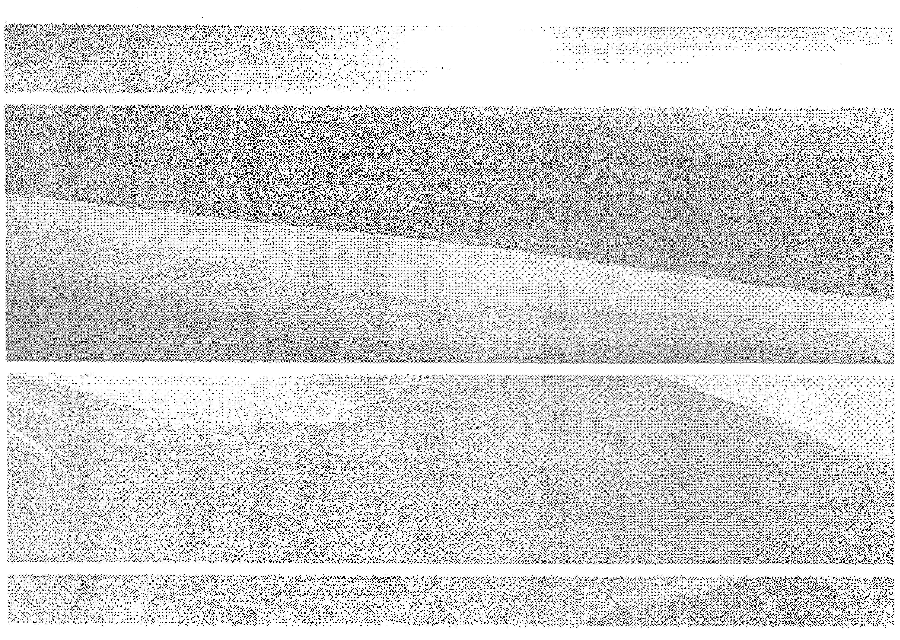

人們對於任何層次的意識特性知之甚少。意識顯然有程度的不同。有時候我們比其他時候更有意識，我們的覺察焦點似乎更為專注。在一種強烈的情緒刺激下，好比愛或恨，我們感覺比平常更有活力。偶爾，一種情緒是如此強烈，以致我們彷彿被席捲而去。有一刻，我們忘了自己。當這種情形發生而暫時忘卻了自我中心的「我」的時候，體驗到意識提升的又是我們的哪個部分？

在平常的意識狀態下，我們沒有覺察到自己或環境的所有面向。然而，我們常常對實質的刺激卻相當注意。我們傾聽別人說話，我們不用耳朵向內傾聽，聽自己的心跳。我們的感官使我們朝向物質世界；它們導向外面。我們的眼睛看的是物體或別人；就器官而言，它們不向內看。所以說，我們平常的意識狀態具有「外向」的特性。我們如此著迷於物體和物質環境的那個部分就是「自我」，它思考、推理、向外看、詮釋它所見。

那麼，這就是我們意識的極限嗎？不是。若是如此，我們在睡眠中會一直都是完全沒有意識、沒有夢，每個晚上都會是沒有「本體」閃現的虛無狀態。如果自我是我們唯一有意識的部分，那麼當自我睡著了，每一次睡眠都是一次小型的死亡，完全沒有夢的記憶。醒來時，我們完全無法證實，夜裡我們本人曾經存在過。

我們平常的意識狀態還有一個特點，那就是一種規律的時間感。但並非所有的意識狀態都有這種特性。你可能可以記得無數的場合，卻忘了時間——而且是在你完全清醒的時候。在某些例子裡，你如此投入正在發生的事而忘了自己。這回你忘記的，又是自我，自我中心的「我」，如此關心時間的我。但是，你當然是有意識的。

我們忘了站開。我們忘了自我。

自我試圖離開其他所有的實相，自個兒站著，但是在一種強烈情緒的影響下，我們幾乎變成我們感覺到的東西。我們直接體驗實相，如此的直接，以至於這樣的經驗可能會讓我們心神不寧。

我們覺得失去控制，就像我們讓步給憤怒的時候一樣。然而，當我們讓步給喜悅時，我們並不覺得失控，反而得到自由。在這兩種情形下，當我們體驗生動的情緒時，自我被暫時推到一邊。奇怪的是，結果都是意識的提升。

你們那些喜歡跳舞的人會懂我的意思。當你放鬆自己，把自己交給音樂的時候，你發現比起克制自己的時候，舞跳得好多了。當你用這種方式跳舞時，你是在一種意識升高的狀態。你的身體似乎是自己在跳舞。你全神貫注在跳舞上，不會去考慮時間，或覺察正在跳舞的自己。你可能也在一種出神狀態——一段專注力升高的時間——而且是社會和你自己大致上都接受的一種出神狀態。

當你跳舞時，你的意識狀態與先前你準備晚上出去玩那時候的狀態大不相同。首先，當你跳舞時，你體驗到一種自由的感受。但是，是擺脫了什麼的自由？是不與你自己的感受分離的自由。因為自我總是會讓你和你的感受分開到某種程度。不然的話，你會沒有保護而受到憤怒和憎恨以及你自己對它們的反應傷害。但在保護你的時候，自我也讓你沒有機會充分體驗喜悅或愛，因此設下了你並不需要的屏障。一個太過僵化的自我，會阻止你充分感受任何情緒，讓人生真的變得非常乏味。

我們必須讓自我學會能屈能伸，這樣它不但能給我們必要的支持，也讓我們自由。

因為自我在我們和我們的情緒之間設下屏障之際，也限制了我們在其他領域的意識。它拒絕接受不屬於它自己對實相的概念的那些感知。

這有一部分要歸因於我們的教育體系。我們教育孩子排除直覺，我們教他們，現實世界完全位於他們自身之外。我們不鼓勵任何來自內在的感知，從物質的角度看來有立即時效者除外。結果，我們自己對現實的觀念變得狹隘至極。我們把我們的自我訓練得太好了。

我們可以補救這個情況。我們可以慢慢教育自我在維持控管功能的同時，也能接受內在經驗。我們可以，滿簡單地，開始向內看。我們可以不時把注意力從物質實相轉開，自由探索內在環境、內我。我們可以學會把覺察力集中在自己的內在，探索置身本我之中的全部潛能。

我們可以感知獨立於我們自己的肉體感官賦予其表象之外的部分實相，而容許自己覺察到通常被自我擋住的超感官知覺。要做到這點，我們必須得到比我們先前容許自己擁有的更大自由。

這種極度的專注，可以稱作一種深度的出神狀態。不過，別讓這個名詞迷惑了你，我們只是在說意識可以轉向的各種方向。如果你不想要的話，甚至不需要用自我催眠。我們關切的是向內的專注，我們只是想要換個花樣，不去注意實質物體而已。用什麼詞，對基本的經驗或是結果都不會有影響。就這件事來說，把我們日常的意識狀態當作是出神也是可以的。我們對物質實相太感興趣，而排除了其他的一切。它抓住了我們所有的注意力，我們蓄意投注在日常生活世界的注意力，多過於我們放在想要把覺察力往內轉向心理和精神現象上頭的注意力。物質實相讓我們目瞪口呆，因此我們片刻都不敢轉開眼睛，深怕一回過神來，它就不在那兒了。

然而，那個物質宇宙本身就依賴著我們存在的內在狀態。在我們的想法和直覺被變得實際以及被賦予客觀的存在之前，它們必須先存在。你們當中那些既好冒險又講理、既富直覺又愛邏輯、既好奇又謹慎的人，可以經由把覺察力從外在轉向內在實相而學到很多。到這時候，透過你自己的實驗，你應該已經說服自己，超感官知覺大致上存在。如果你按照我的指示，應該已經在你自己的夢中認出它的一些例子。你的自我已經擴展到某程度了，它已經比較不僵化，比較有彈性。或許你現在已經準備好向前再進一步了。

在這裡需要一個非常短的複習。讓我再重申一次，我們的肉體感官的確會扭曲實相的本質，而真的把我們對它的知覺限制到某種可觀的程度。如果有和感知者無關的「客觀實相」，那我不相信它是物質的實相。

內我的知覺並不受感官的限制。它可以感知這個基本的實相，而超感官知覺可能只是它的浮光掠影而已。我們可以改變覺察的焦點，而使自己對感官無法觸及的實相變得有意識。心電感應、千里眼和預知夢，可能只是天生潛藏在人類人格當中一個更大感知能力之種種面向而已。

### 向內看

在這一章，我們將會思考可以把注意力轉向內在，以便擴大意識範圍的方法。這些實驗的必要條件是自律和常識，而不是專門化的訓練或教育。它們的確要求客觀、心理的平衡、直覺和驚奇之心（sense of wonder），但是每一份有意義的努力都必須具備這些特質。內在實相的探索有一個最基本的要求是，內觀自己的勇氣，觀察過去忽略的那些意識的面向。

首先，我們相信在特定條件下，超感官知覺會自行產生。這些條件我們並不是全都知道，但的確知道其中一些。這些知覺的產生往往是在我們受到某些強大的情緒影響，或是在我們全然放鬆和接受的狀態下，意識心被導向別處的時候。換句話說，當我們沒有在注意自我時，ESP 往往會出現。當我們情緒亢奮時，自我放鬆到某種程度；當我們放鬆時，自我也放鬆了它的掌控，沒在準備採取行動。

因為我們想要發展自己的能力，所以我們會設法故意引出這種自發的內在自由狀態，以備不時之需。我們不但會藉由激起自己的情緒——雖然這是一個比較沒有效的方法——也會藉由放鬆自我並把我們的注意力轉向內在，設法做到這一點。

你們當中那些在使用自我催眠的人，可以照先前建議的那樣引發一種輕度出神狀態。然後，跟你自己保證，你可以加深出神，把全部的注意力放在內在實相上。

重複這個暗示幾遍。要一直告訴自己，無論何時，只要你選擇脫離出神狀態時，在數到三或一定時間內，你就會脫離。再一次，這裡唯一的可能性是你也許會脫離，然後自然睡著了。暗示你自己，現在你能夠延伸你的意識並且擴大它，然後不再做進一步的暗示。

你們當中那些只運用簡單的放鬆方法而不用自我催眠的人，應該像之前的練習那樣，完全放鬆就好。放鬆又接納，但同時你的意識焦點轉向內在。精神上很警覺，但是平靜。讓你腦子一片空白。這當中的意思只是，自我沒有用自己的念頭把腦海填滿。你自己的內在覺察力沒有限度；基本上本我沒有真正的限度，但是為了實際的理由，我們表現得好像有限度似的。試著感受你和你所知的宇宙之間的關係。在你嘗試這個實驗時，不要思考，只要感受你的體驗就好了。

* * *

不論你用的是什麼方法，你的內在專注力，應該勝過你在前面幾章列出的實驗當中獲得的專注力。你可能幾乎完全沒有時間逝去的感覺，你覺察到的體驗可能好像存在於它們自己的一個次元裡。你可能感覺身體有一種輕飄飄的感覺，你可能非常清晰地看見一些影像，因而以為自己的眼睛是睜開的。頭幾次發生這種情形的時候，你和我一樣可能會想要睜開眼睛。稍後當它們真的發生時，你會認為這種影像的栩栩如生是理所當然的。

通常，當你閉上眼睛時，眼瞼後面是一片黑暗。可是，當你向內集中注意力時，平常的黑暗區域可能突然充滿和日光一樣亮或更亮的光。它可能持續一會兒，也可能只是閃爍不定。如果天色昏暗，你可能以為太陽剛剛又出來了，或是有人開了燈。有時候你可能體驗到一種振動的感覺。

這種往內專注力升高的狀況，賽斯稱之為「心理時間」狀態，在其中覺察力不受加諸於其上的身體限制束縛。當我們置自我於不顧到了相當大的程度時，實際上，自我就會變得不存在了。

我有一些身體覺受非常明確的狀況，在這些情況下似乎是超感官知覺的信號。

羅勃並沒體驗到這些覺受，所以看來它們好像不是一般超感官知覺的必要條件。

這種感覺總是發生在我最生動的體驗之前。頭上被迅速拍一下的一種動感，啟動了本書先前談到的「旅行」事件。那個感受是明確的。有一回拍的是那麼劇烈，我的頭因而前後擺動不已，但是從來不會痛。我其實不相信有人打了我的頭，我也沒有腫塊出現！也有與拍打連結在一起的聲音。我可以拿來跟它比較的就只有，可能伴隨有些嚴重的整脊動作而來的內在聲響。

對我而言，一般在與聲音有關的經驗，像是涉及到語音的經驗發生之前，似乎都有非常響亮的靜電。以下例子是我對這樣一個事件的紀錄。因為很難改述，所以我完全按照那個經驗發生之後立即寫下的紀錄引述如下：

> 「我躺下來嘗試『心理時間』，突然間客廳傳來了靜電的聲響，音量相當大，不會被弄錯。其中也有一個好像人在說話的聲音。我差點想起身去看看我是否讓收音機開著，但我確定已經關了。然後，我想起上週也發生過類似的事。我聽見靜電雜音，然後是管弦樂。但當我察看時，我發現收音機並沒有開。我們白天從來不開電視，但我仍然察看一下以便確定，而電視也是關著的。管弦樂繼續播放，不像來自我的腦袋外面，但確實有。所以，今天當我聽到靜電雜音時，我沒起來，反而繼續做我「心理時間」的實驗。
> 我讓自己進入輕度出神狀態。然後，出於衝動，我在心裡問：「L.G.的脖子出了什麼毛病？」「前一晚我們去看一個朋友，L.G.抱怨喉嚨不舒服。」我立刻聽到一個音量很大又不耐煩的聲音說：「你說『脖子』是什麼意思？造成問題的是他的舌頭！我的耳朵好像是從外在環境接收到這些話。這一次它們似乎不是來自我的腦子，而彷彿是收音機突然被打開了一樣，就在我身邊，非常大聲。有隆隆的靜電噪音和響亮的人聲，人聲是一個沉重而憤怒的男人聲音。我跳了起來，和任何人在身邊突然響起噪音時的反應一樣。我立刻睜開眼睛，我是單獨一人。想起了先前的靜電噪音，我趕忙跑去檢查收音機和電視。它們都是關著的。」

很可惜L.G.不住在這個城裡，我們再見到他已過了一個多月。他的喉嚨不再難過了，他沒去看醫生，所以無法知道問題是不是舌頭的狀況引起的。靜電雜音在事件發生之前先出現，並形成事件本身的背景，這種情形有過幾次，這個經驗是其中之一。有時候靜電雜音變成動態，因為它好像源於我自己的內在。然後，以某種古怪的方式，它隨之與實際的身體覺受混在一起。

主觀上羅勃和我都很確定，在一些「心理時間」的實驗當中，我們已經脫離肉體的形象。羅勃有一回感覺自己從胸部出體。除非做完更多實驗，否則這種主觀經驗引起的問題會多過於解答。總體而言，相較於這種不尋常的事，也許自由與健康的感覺，加上時間感的喪失，更能夠描繪「心理時間」的特性。

這些實驗有一些讓我們相信，靈體（astral body）的概念並不像它一開始看起來那麼牽強。羅勃曾經在他明知自己的肉體雙臂垂放在身旁時，主觀地確信他的雙臂交叉在胸前。他曾經從房間的角落，回頭看著自己的肉體形象。至少有一回，在我覺得好像要離開我的肉體時，我抗拒而沒那樣做。

頭被拍了一下感覺警告我，某件不尋常的事就要發生了，而一個有趣的問題也隨之出現。這些信號式的感受有沒有可能是我自己的自我設定的預警裝置，而不是這種經驗引發的感受？

另外還有一個似乎屬於「心理時間」意識的特性，我們稱之為狂喜，但我們不喜歡這個詞。那是一種明確的興奮感受，相當的生動，有時候伴以一種失重感及意識的擴展。狂喜的程度不一，小自比平常的幸福感更強烈的廣義的愉悅，大到明確的喜悦以及與實相合為一體的感覺。

很容易就會給這種經驗貼上幻覺的標籤，或說它們只不過是暗示或想像力太過活躍的結果。首先，我們對於幻覺或暗示知道的並不夠多。它們只是字詞而已，描寫的是我們拒絕深入探究的經驗。大家都知道，在某種條件下，暗示可以造成水泡出現在人類肌膚的效果。我自己曾在頭痛開始讓我心煩之後，透過暗示讓頭痛在幾分鐘內消失。雖然我無法在科學上證實下面的陳述，因為那個情況一點都不科學，但我確信，在一次嚴重的灼傷之後，我透過暗示阻止了水泡在我手上形成。如果暗示在人類的身體系統上產生這樣的效果，那它的性質必然比一般假設的還要強大而且實質。

說幻覺不真實，也非常可笑。它們也許沒有物質實相，但並不表示它們在同樣合理、同樣「真實」的次元內沒有實相。它們看起來可能像是物質實相的扭曲，但是感官已經嚴重扭曲了物質實相本身。在某些例子裡，幻覺甚至可能比我們知道的更接近基本的實相。

在此，我們也可回想到，基督教哲學和東方思想長久以來堅持，有基本上獨立於物質之外的本我或靈魂的存在。在這種情況下，宗教要是自己去做調查的話，對它來說似乎利多於弊。或許它能夠證明，很多它從來不曾在任何邏輯基礎上企圖證明的概念其實是真的。

偶爾，嘲笑靈體、千里眼、心電感應或一般的超感官知覺的可能性，被認為是一種成熟的標記；雖然神經質的人有時的確會被這種興趣吸引，但這種性質的廣泛洞察也確實得具備自律、客觀和堅持，神經質氣質通常缺乏這些能力。同時，通靈現象的領域也絕對不是唯一一個會把不平衡的人吸引過來的領域，神經質的人會群集的領域很多，宗教、藝術、政治和心理學只是其中幾個而已。

一般的通靈調查有時也會被貼上「迷信」的標籤。我們應該記住，醫藥科學一直在發現更新的神奇藥品，其中有很多都是建立在過去的「迷信」信念上。物理學也越來越接近有關物質實相靠不住的老概念。

沒有根據的迷信的確存在。有些神經質的人會有輕信的傾向，但並非所有的迷信都是沒根據的，也並非所有神經質的人都會輕信，或是被庸醫的理論吸引過去。

這類推論透過聯想的邏輯，讓我們捲入一種不幸的罪惡感裡，使得很多合格的人無法在通靈現象的領域工作。

就這一點而言，很多作家和畫家都神經質，但很少人會認真質疑文學或藝術的合理性。

很多神經質的人在他們的領域裡貢獻很多知識給人類，但是和其他領域一樣，我們在ESP的領域也必須保持開放的心胸，以它們可能真實有效，而不是其他比較情緒化的考量根據，來評估理論和假說。

不過，有很多涉及通靈現象的問題必須答覆，也有很多尚待提出的問題。有一些經驗可以核對，而且它們的有效性對每一個人來說也已得到證實，除了那些因為成見一直無法接受新觀念的人以外。其他的經驗則無法或似乎無法真正核對，但它們卻發人深省到足以暗示，其中涉及的不只是潛意識的編造的東東。

以下羅勃的經驗就是這樣一個事件，發生在一次「心理時間」實驗當中，以下直接摘錄他在筆記簿寫下的報告：

「突然間，我就在一輛停著的車子正上方，一輛老式、渾圓的灰色轎車。我低頭看著這輛老車的車頂，和一位穿著白襯衫、袖子卷到肘部、瘦而結實的年輕人。我看著他繞著車快走一圈。

「喂」，我說，「下面發生了什麼事？」

他抬頭看我，看起來好像有看到我，但似乎並不驚訝。他指著車，「裡面有個男人，」他說，「他非常的不對勁。

我跟他說話的男人有一頭濃密的棕髮，瘦長但有肌肉的體格，寬大的嘴和方形的下巴。現在他看起來非常擔心的樣子，當他跟我說話時，我彷彿看見他單獨在一張銀幕上，被銀幕本身攔腰截斷。銀幕的其餘部分空白，他的身影相形之下相當的小。每回他說話時，都好像是彎身從右下方進入銀幕裡去。

「你看得到我嗎？」我說。

「哦，當然，我看得到你，」他說。

「你叫什麼名字？」

「我的名字是喬治·馬修，」他說。

「這是什麼地方？你住在哪裡？」我問。

他給了一個清楚的答案，但我記不得那個城的名字，只記得那個州的名字是路易斯安那州。不知怎地，我認為我們是在那個州的東北角。東西開始變得模糊起來，好像我難以聚焦在那情況上一樣。我幾近絕望地說，「我的名字是羅勃·柏茲，我住在艾爾墨拉，請你寫信給我好嗎？」我不記得我給過他街名地址。那人說他會試著跟我聯絡。」

在這個經驗裡，羅勃非常清楚意識到，設法和涉及的那個人建立聯繫很重要。不過，喬治·馬修從來沒有跟我們連絡過。當時羅勃並沒有睡著，這是一個清醒時的事。後來羅勃查了地圖，希望路易斯安那州會有一個城市的名字勾起他的記憶。該州的東北角有好幾個名字聽來耳熟的城市，但沒有一個確定。不論多努力嘗試，他就是想不起那個城的名字。

這件事有可能是潛意識編造的，但我倆都不相信它是。也可能羅勃真的看到一個名叫喬治·馬修的人——一個因為當時的狀況，也不記得很多相關部分的喬治·馬修。

直到可以證實有這樣一個男人，一個同名的男人，一個可以提出證據證明那一天他就站在這樣一部車旁邊的男人存在，否則我們無法說這個經驗一定是超感官知覺。可是同樣的，也沒有人能夠證明在那特定的一天，在那特定的情況裡，沒有一個喬治·馬修站在裡面有個人病了的一輛老車旁邊。所以，也無法證實這個經驗不是一個涉及超感官知覺的合理經驗。在所有這類的例子裡，只要可能，羅勃和我就會不斷設法建立聯繫。問題是，你再怎麼樣準備都不可能準備好，因爲這類經驗並不是那麼常發生，而且你永遠不知道它們何時會發生。要毫無疑慮地證明這種經驗的有效性，這樣的資料很有用。

不久以前，一個人要是說他在客廳裡一個和一個盒子連接在一起的螢幕上看見另一個人，大家會以爲他相當瘋狂。大約一個世紀之前，他可能會被綁在柱子上燒死。然而，如今成千上萬人在電視螢幕上看到整齣戲。如果所有人都認爲這樣一件事根本不可能，那我們現在就不會有電視。在很多領域裡，早期的嘗試都被人嘲笑，但這些人的孫輩卻享受那些努力的成果。羅勃看見一個人在螢幕上，並和他說過話。在雙向電視已經成為事實的世界裡，真的能夠認為這種接觸的可能性那麼稀奇古怪嗎？只不過少了盒子而已。在超感官知覺領域的調查很可能不太成熟，卻很可能獲得知識，使人類未來能夠加以利用和了解自己大部分一無所知的能力。在某個遙遠的未來，我們或許能夠利用這些潛能來利益眾生。再想一想我們利用電波和光波這件事，對我們也會有幫助。我們發現電和光波非常實用，但是連科學家也不太清楚電波和光波到底是什麼。

就你自己的實驗而言，可能的話最好定期進行。時有時無、太過熱心嘗試都不會有好結果，而排定的實驗所涉及的紀律可能也有益處。如果你用自我催眠，永遠要暗示自己，只要你想要脫離，在數到三或在一個明確的時限內，你就會迅速跳脫出神狀態。在任何狀況下，我都不建議你用半小時以上的時間，去做這些涉及焦點改變的實驗。

---

把筆記本放在手邊。每次實驗之後，立刻記錄下來。比較你的筆記簿和夢筆記的內容，看看在你的夢和你的「心理時間」經驗之間有沒有關係。

不要預期了不起的結果。有時你可能得到這樣的結果，但你「心理時間」的實驗往往只會涉及一種幸福和健康的感覺。我自己有很多的實驗什麼事也沒發生。每一個實驗都會讓你自己認識內在經驗的能力增強，幫助你熟悉它這種「無時間」的特性。

以下是賽斯資料的摘錄，討論到一些和本章主題有關的題目。

### 摘錄自第一百六十二節

一個思想是個行動。一個夢就與一個行動裡的一次呼吸同樣是個行動。雖然我們以分離的說法來說，所有的實相卻都是行動的一部分。當我們將行動分割以便認識它，我們卻絲毫沒有改變行動的實相，也沒改變其本質。

行動有一種電性實相。你的外在感官並沒有感知這種性質的電性實相，然而，你卻是電性行動的一個完形（gestalt）。在你的染色體的物質實體內，有電性的密碼系統。這些系統並非染色體本身，染色體是內在電性資料的物質具體化。

行動（如果你比較喜歡用「生命力」這個詞也行）──行動不斷試圖用無窮盡的型態來表現自己，因此，它以各種不同的形式現身。我稱這些形式為「僞裝」。在你的系統內，僞裝就是物質。行動不可能用任何媒介來完全表達它自己。

不管在什麼情況下，沒有一個系統是封閉的。行動在所有的系統和所有的實相之內流動，所以，你的肉體感官只具備在物質僞裝領域內感知實相的能力。

不過，這並不表示這是唯一的實相。它只不過是唯一一個你用肉體感官來感知的實相。為了要感知其他的實相，你必須從你的外在感官轉換到內在感官，因爲內在感官更清晰，而且有能力感知不受肉體感官造成的扭曲影響的行動和實相。

因爲你以狹隘方式感知實相，所以這絕不可能影響到實相本身的基本性質。自我試圖離開行動，自個兒站著，試圖把行動看成是自我的產物。然而，再一次，自我雖然又試圖離開行動，自個兒站著，但卻根本改變不了行動的本質。自我只不過限制了自己的感知。

本我沒有任何限制，因爲身爲行動的一部分，所以本我沒有界限，除了自我加諸其上的那些想像的界限以外。因此，我們找不到本我的限制，沒有頂端也沒有底部。本我並不是關在頭殼裡。你說你的思想是你自己的，可是你怎麼保有它們？你無法保有它們。在你不知不覺中，它們的確被傳送了，而本我則擴大了。本我也不受實質的侷限。這個想法是你們自己的感知習慣造成的結果，因為你認為「不是自己」的化學物、空氣和養分不斷進入本我；而你認爲是你自己的東西則經由身體的毛孔離開。

本我也不受限於時間和空間，因爲在夢中你具備有一個與時間空間毫不相干的真實性，而且這些夢的經驗改變了你的人格，因為行動的本身就必然是永遠在變的。你只熟悉本我的一小部分。你不只是你所知的你，你的旅程延伸更遠⋯⋯

自我無法讓你的心跳動。那麼，你爲何覺得很難相信你不只是自我而已？因爲在夢裡你遇見你自己一些部分。你構築實相，而且你在夢世界的經驗，不管哪一面都和你的醒時經驗一樣生動、有效、真實。

照你們的說法，甚至在你們的醒時狀態，你也不是完全有意識。你隔絕刺激，以便專注在別的刺激上。這是一個簡化的例子，描述你在做夢狀態下，如何隔絕自我通常會接受的刺激，而開始意識到你在醒時狀態下通常會常忽略的其他實相。

## 9 另一個探究未來的方法：預言

當預見的事情發生了，這些元素就會像拼圖般地銜接在一起。它們無法指涉那段時間發生的任何其他事件；絲毫不差地，它們似乎指著一個方向。

看來好像很堅實的桌子，實際上是我們自己感知的結果。對我們的眼睛而言，桌子看起來是堅實的，但這並不影響它是由原子和分子構成的基本事實。過去、現在和未來，也有可能只是我們感知行動的方式造成的結果。時間是一連串片刻的這種感知，並不影響時間的基本性質，就像我們對桌子的感知，也不會影響實際形成它的原子一樣。

事實仍是，如果時間的存在並不分割為過去、現在、未來，那麼我們永遠也感知不到未來。但是，很多不同的通靈學會記載過很多預知的事件。我自己的紀錄顯示我查看過未來，如果你做了本書的實驗，就會了解就算人們還不可能理解預知，但它卻是個必須接受的事實。

基於這些考量，我們實際修正自己的時間概念是明智的。在本章中，我們關心的是，以某種方式控制預知的企圖。首先，我們來思考一下因果理論。這個理論主張，每一個結果在時間上都有存在於它之前的一個原因。再一次，如果預知是真的，那就必須認真質疑因果理論了。

我們來看看一個想像的情境。瑪麗在過街時，被約翰駕駛的車子撞到。再想像一下意外發生兩天之前，弗瑞德以千里眼的方式看到此事。在我們所知的時間裡，瑪麗和約翰兩人都必須來到特定的一點，這特定事件才能發生。瑪麗過街的速度與約翰開車的速度必須如此完美地配合，意外才會發生。

這個情境引發了許多問題。
- 如果瑪麗不在那個特定時候跨越那條特定的街，或是，約翰走了另一條路線，是不是就能避免發生意外呢？
- 或者，會不會是其他的原因，也許是心理上的原因引起一場悲劇呢？
- 約翰是不是有比方說從潛意識升起的根深柢固、瀕臨爆發的攻擊傾向，而在緊要關頭導致一個判斷的錯誤，造成一場意外？若是如此，瑪麗不一定會捲入其中。
- 或瑪麗是不是在潛意識上不知所措，厭倦了應付生活涉及的壓力？
- 她是不是在潛意識裡想死？
- 或如果她延期出遊，她的情緒會不會改變，而在千鈞一髮之際避開意外？
- 改天約翰會不會比較能夠控制自己的攻擊性，進而比較能夠控制自己開的車？

換句話說，那意外是否有某程度是命定的，是既定原因的結果？或者，那意外是不是在兩個人於時空中特定的一點相遇時發生的一個事件——確切原因的明顯結果，但原因卻只有在事件發生之後才看起來像是原因？

這些問題的答案，我們根本一無所知。不過，我覺得比較合乎邏輯的假設是，只有在事件之後，原因才看起來是原因，以及看起來是引發事故的特定事件隨時都可能改變。現在，如果弗瑞德是在兩天之前以千里眼的方式看到那個事故，那他只是剛好與時空中特定的一個點連上線而已。如果弗瑞德警告瑪麗或約翰他預見的慘劇，那他就是在改變他們可以取得的資料。如果他們針對這個資訊採取行動，那麼至少在理論上，他們是可能完全不讓那個明顯的原因發生，因而改變了明顯的後果。

因果理論本身可能是我們將時間視爲一連串片刻的結果。在賽斯資料裡，強而有力地表達了這個概念，相關的內容摘錄於本章的末尾。

### 預感

「我們認識的一個年輕人曾捲入一連串的怪異插曲裡，那些插曲似乎暗示，在某些情形下，對一件事的預感可能讓我們能夠爲預見的事件做準備，進而影響它的性質。

這位名叫莎拉的女孩，告訴我們以下的故事。她小時候跟著父母去參加一次拍賣會。當他們走近那群人時，莎拉注意到一個特別的人，一個陌生人，站在附近。她抓緊母親並且狂亂地在她耳邊悄悄說：「那個男人要來抓我。」莎拉的母親試著安慰孩子，但莎拉不斷重複那些話，所以母親威脅要打她屁股。在拍賣當中，母親成功阻止了一個看來像是擄人的事件，但是那個男人逃走了。

幾年後，莎拉已經是個年輕女子，她和她姊姊坐在一輛車裡，等她們在附近一家商店買東西的母親。不遠處，一個男人站在另一輛車旁邊。莎拉突然跟姊姊說：「那個男人會想辦法進來這裡。」她姊姊知道先前那個插曲以及其他我不在這兒講的事情，便說：「不要說了。不要講那件事，很可怕耶。」不過，姊妹倆還是鎖上車門並關上窗子。她們才這樣做，那個男人就走過來了，試圖強行進入車中。也許因為姊妹倆收到預警，所以那個男人沒有得逞。

後來又有一次，莎拉在超市排隊結帳，一個排在她前面的男人引起她的注意。突然間，她確定那個人將會騷擾她。在腦海裡，她看到男人想用車碾她：在內在視象中，他人在一輛汽車裡。這似乎太奇怪了，因此她跟自己說她的想像力太離譜了。不過她還是放慢動作，等那個男人付了帳離開超市。

透過大玻璃窗，她看著那個人上車，繞環行車道一圈，然後不見了。之後她才離開。當她走到停車場中央時，那輛車卻繞過超市對面，直衝著她而來。車子接近時，她嚇得無法動彈。那男人打開車門，對她伸出手並叫道：「進來。」她把他的手甩開，大聲呼救，回頭向超市奔去。這一次，那人又向她衝來。她閃開了。他大叫說，他一定會抓到她。她向警察報了案，但因太害怕而沒記下那人的車牌號碼。

可是幾週後，莎拉在同一家超市看到同一個人。她跟她姊姊在一起。兩個女孩走進停車場，找到那男人的車，記下車牌號碼，報了警。警局紀錄顯示，那人是前科犯，因騷擾女人而惹上麻煩。不過，莎拉並沒有堅持提出告訴，所以那個人沒被拘禁。

從種種不同的觀點看來，這些事件都具有重要的意義。首先，涉及的女孩是健康的。她父母帶她去一位心理分析師那兒做檢查，她在精神和情緒上都沒有毛病。她的預知歷史讓她很難堪，而且事件本身以及她對它們的預知，也讓她感到困惑。現在，她有了美滿的婚姻。她的預知能力仍在運作中。

在之前提到的第一個插曲裡，還是小孩子的莎拉預見一個男人會抓她。雖然她告訴她的父母，但那個事件還是像她看到的那樣發生了。可是，在第二個插曲裡，預知使她鎖上車門並關上窗子。她這邊的這些行動，使得隨即可能發生的事情有了某種程度限制或界限。在最後一個事件當中，她的預知可能也有警告的作用。預知無疑幫助她逃過了一個可能非常不幸的經驗。在這案例裡，她告訴警方車牌號碼，這個事實有助於確認那件事在物質層面的真實性。

毫無疑問的，莎拉知道將發生的事。她怎會知道的？她是否心電感應到那人心裡的念頭？她是否以千里眼的方式看到一個未來事件而沒有涉及任何心電感應？她陷入男人是攻擊者的羅網有二次之多，那只是巧合嗎？還是她的恐懼先存在？也許在潛意識的層面，她用心電感應的方式向外散發這個恐懼，可以說是傳播出去，直到被爲了自己的理由而想回應的男人接收到——那些男人隨即在實質事件發生之前，就用心電感應的方式傳播自己的答覆或意圖。這個可能性也許牽強。插曲本身幾乎是讓人無法置信，但它們卻真的發生了。如果目前的理論無法解釋人類的經驗，那目前的理論一定有不足之處，必須找到新的理論。

我們全都有過似乎預先警告我們未來有事發生的預感、靈感或直覺，尤其是它們牽涉到不愉快的事件時。科學大部分不太相信這種經驗，然而，各個不同的通靈學會倒是比較感興趣，而且這些學會的職員都是效率很高、訓練有素的調查人員。就科學證據而言，很難抓住這種預感。通常它們不會發生在科學的狀態下，而是發生在我們情緒波動的時候。我們無法說：「在星期五晚上八點，我們將有個預感。」而邀約博學紳士來調查。預感不用這種方式運作。

我的論點是，有很多靈感或預感是超感官知覺的有效案例。爲了我們自己的益處，我們可以仔細記錄任何預感或靈感，而且一定記下日期和時間。那麼，當一件未來事件顯示預感或靈感正確時，至少我們有證據證明，事先我們就知道了。我建議你們開始做這種筆記。不過，在任何科學家接受這種預感具有預知性質之前，還有進一步的必要條件；然後，證據擺在科學家面前之時，我們仍無法確定他是不是會認爲證據無懈可擊。

有沒有任何方法可以讓我們對未來事件的內在知識前後一致？我們能不能訓練自己，把預感放在任何一種確定的基礎上？或許，如果我們能這樣做，我們會比較能證明我們的論點，不然，我們至少會接近得多。顯然，在大多數例子當中，這種內在資訊是沒有意識的，雖然一個預感一定升入了意識，否則我們永遠覺察不到它。

通常，自我箝制得相當緊。現在，我仔細記錄夢境將近兩年了，我的夢讓我確信我們確實感知到未來事件。不過，本我某個部分能夠感知到實際存在的時間。我們查看未來，彷彿時間並非一連串片刻所組成。此處唯一可能的答案顯然是：我們可以用這種方式感知時間，因爲那是時間真正的本質。明顯可見的連串片刻其實並不存在。

本章的實驗會讓你自己證實這一點——如果你的夢筆記尚未說服你的話。你感知的事件可能並不是一個整體，而且對於你在意識上關心的事情，你甚至可能沒有預見到它們的那些部分；但是你會發現，對於明天將會發生的事，你自己今天有重要的線索。

不可能？一點也不。首先我會爲你摘要描述一下實驗，然後告訴你我們自己的實驗結果。你會需要另一本筆記簿。每天一回，不論何時只要你方便，就獨自坐下來，嘗試爲你自己預言未來的事件。

你的預言有一些根本不是預言，但有些是。如果可能的話，每天在同一時間試做這個實驗。時間用不了五分鐘。不過，涉及的潛意識制約很重要，而且你若是每天撥出同樣的幾分鐘這麼做，就會做得更好。

### 開始你的實驗

你只要寫：星期一預言，時間是早上八點（不管你留什麼時間都行）。接著寫數字一。現在，不管你的腦海浮現什麼都把它寫下來，不要有意識地設法想像你認為那天可能發生的事。你可以只寫一個字、一句短語，或是一句話。別質疑你寫的東西，也別詳細說明任何預言，或改變它。繼續寫，直到那天你至少列出五個預言為止。

把整個實驗當成一個遊戲。即使你寫的東西好像毫無意義，也隨它們去，不要刪掉它們。我們在和意識上不合邏輯的能力打交道，不過你會發現，你的很多預言自有它們的邏輯存在。

恐怕你已猜到，這只是我們實驗的第一部分。經常將你寫下的東西與每日事件核對。如果你一直認真地跟著這些實驗，你已經依據平常生活的事件來核對你的夢和預感了。現在，用同樣方式核對你的預言。把你所有的筆記簿拿來互相比對。舉例來說，你是否預言一個事件或它的一部分，然後在一個夢裡面看到同樣事件的另一個片段？你按時寫下並記下日期的一個心電感應閃現，是不是強化了一個預言？做紀錄或許和你對ESP調查的概念不太一樣，但當它們是你自己的紀錄時，在紀錄裡你會發現一種興奮與挑戰。透過這些筆記，你應該會發現自己的能力如何運作。你自己的紀錄會說服你，超感官知覺並非玄秘的力量，而是你自己人格內潛藏的能力。

顯然，我們一定要有適當的方法，才能判斷我們的結果有效與否。有些預言會比其他的預言「好」。舉例來說，如果你寫下：不速之客會在星期一来到的，然後星期一那些不速之客真的來了，如果星期一到星期五不請客是你的原則，那你的預言會更有憑有據。如果你預言說，訪客是兩個男人，結果來了兩個男人，那麼預言的真實性就更高了。但是，如果你寫下約翰·伯朗這個名字，一個多年未見的老友，結果約翰·伯朗來到你家，那你可以滿確定這個預言是有效的（當然，除非你收到約翰·伯朗的信，告訴你他計畫來訪）。

練習幾乎立刻會讓你明白，你最關心的是哪方面的實相。你們有些人可能寫下與世界或國家有關的項目，其他人可能關心個人的預言。無論如何，嚴格的記錄是必要的。你也可能發現，在星期一記錄的一則預言，可能在星期三就被證實了，所以在這方面，要留給自己二到三天的餘地。

### 實驗的結果

現在，這裡是我自己的一些實驗結果。從一九六四年十一月到一九六五年四月，我在六個月期間做了七百四十一个預言。通常我一天會寫下五個，雖然，不過有很多週末我疏忽了，根本一條也沒寫。在這七百四十一个預言當中，有三百二十個出現意味深長的结果。這三百二十個預言包括三個等級：我所謂的「直接命中」或「直接結果」，因爲非常接近未來的實際事件，因此對我來說，除了預知以外，別的解释都不合理；雖然驚人卻整體不像直接命中那樣不言可喻的结果；以及，還是具有重要意義，但沒那麼確定的结果。

一般而言，我的預言關係到的是相當普通的事件，而不是驚人狀況。以下是我稱為直接命中中的一個簡單例子。三月四日，我的一個預言是：陌生人來訪。那天晚上，幾個朋友出乎意料來訪，還帶了一個完全陌生的人來。記錄這個預言的時間是早上八點。基於幾個理由，我認爲這是個直接命中的預言。理由之一是，我們的生活寧靜，只有一小圈朋友。每年我們最多在家招待陌生人一或二次。在我其他的預言裡，總共只有兩次這樣的預言，而且在每個例子裡，的確都有個陌生人來我家。當我沒有預言他們會來時，就沒有陌生人來。

---

以下是我認為是好預言的另一個例子。這個事件也指出一個傾向：一天內有三個或更多個預言都適用於同一件事。一月二十七日那天，我的預言包括：洩露了一個祕密：一張刀子嘴：一次取笑。同一天傍晚，一位年老鄰居的女管家來看我。她告訴我，她極擔心我的朋友，並決定辭職。她說，我朋友講話有「一張刀子嘴」，而且思想乖戾，因此喜歡用令人不安的方式取笑管家，所以這位婦人事實上非常不安。然後，我雖然很不想探人隱私，但她接著卻又透露一個跟別人完全無關、只跟我最要好朋友有關的祕密。

### 另一個探究未來的方法：預言

預言的事件與實際的事件之間有任何一個這樣的相似之處，都可能是機率或巧合造成的結果。但是，當七百四十一個預言當中，有三十二個顯示出不同程度的重要相似之處時，顯然這好像不是一個充分的解釋。

當某個預言看到任何未來事件的局部，預知夢或心電感應的閃現又予以加強時，機率或巧合似乎更不足以成為理由。

想一想以下的例子。之前我提過幾個夢，在那些夢中，我接收到我們的房東考慮賣公寓的訊息。全部發生在幾個晚上的這些夢包含以下的要素：老人、搬家、我們另找一間公寓的可能性。為了刷新你的記憶，請閱讀第六章有關這些夢的紀錄。

如果你記得，這些夢是發生在二月十五日、十六日和十七日。

在二月十八日，我的預言是：相當不尋常的事件：洗澡(Shower)：斥責：：潑濺：白天有客人。在十八日，夢中的千里眼要素被證實了。我的房東也讓可能的買主看了我們的公寓，從我的觀點看來是一個相當不尋常的事件，因為打從我們住進來的這五年，從來沒發生過這種事。但是，房屋仲介對我點頭後，第一句話是跟買主說：「你們得看看浴室(Bathroom)和蓮蓬頭，非常不尋常。蓮蓬頭有九個噴嘴，水真的潑濺出來。」後來，當我跟同時也是好朋友的房東說話時，我斥責他。我說這房子是個很好的投資，考慮賣掉它太愚蠢了。在這個例子當中，對我別無他法得知的一個實際情況，我的夢和我的預言都呈現了各種不同的面向。

沒錯，預言的性質很瑣碎，但這種事件具有重要意義，因為它們強烈顯示以下的可能性：對於未來，我們知道的比我們平常以為的還多。有時候我們不但好像知道令人苦惱或驚駭的狀況，還能夠預見平凡無奇的事。如果那些預言不適用那些狀況，那我為什麼會在那一天而不是其他的日子寫下它們？——一年之中當物質世界裡的狀況使得它們具有重要意義的那一天？

再者，因為夢和預言似乎都描述了一個實際事件的種種不同面向，所以看起來巧合是一個差勁的解釋。如果這種事情出現了一兩次，我們很難有理由推斷出任何結論。但是以下還有一些其他的預言，以及它們顯然描述的一些事件。

十一月十九的預言：日期的更改。在這一天，我先收到我公婆寄來的一封信，然後是他們打來的一通電話，他們兩次更改先前訂的約會。

十一月二十日的預言：意料之外的邀請。這一天，有個朋友順道來訪，邀請我們去吃晚餐。我們好幾個月沒見到她了。就在她敲門時，我正強烈地想念著她。

### 十二月十七日的預言：穿著圓點洋裝的婦人

對反應的研究。這一天，我們認識的一對夫婦出乎意料來探訪我們。婦人穿著一件圓點洋裝。我們坐著聊天，那時街上一個孩子詭異的行為吸引了我們的注意力。我們在窗口站著看了二十分鐘，才確定那孩子要不是弱智，就是需要幫助。最後，因為那孩子似乎古怪又無法自理，所以我們打電話叫警察。這顯然會是一個針對反應的研究。

## 十一月十六日的預言：一個陌生人到家裡來。

這天晚上，我們出去跳舞。第二天我把這個預言標示為無意義。兩天後，我們才發現那天晚上有位朋友帶著一個我們不認識的人順道來訪。

## 十一月十日的預言：我們沒有捲入的意外。

那天晚上一個朋友告訴我們幾週前他捲入的一場意外。他先前並沒有對我們提及此事。

### 三月五日的預言：綠燈

太多人走了；幾個事件；有人留下來。這一天我得知，在先前任職的一個地方發生了幾個事件，因此除了一個人之外，全部的職員都要離職。有人告訴我，那裡會需要幫手，我會被請回坐老位置。這裡我們有一人走了」、「一個留下來」、「幾個事件」。我相信綠燈指的是我被請回去。在象徵上，他們給我綠燈。

以下我們有一個預言與心電感應的閃現如何互相強化的例子。

我在二月二十三日的預言如下：一份租約；一個新的地點；別處的某樣東西；一個驚喜。心電感應的閃現先前已經提過。那一天羅勃回來吃午餐的時間晚了。突然我腦海裡閃過一個念頭：他已經辭職，我們會搬家。念頭才閃過，羅勃便帶著一位他在外面碰到的朋友回來。那朋友正要來告訴我們，他們接到公寓租期已滿（租約）的通知，他已經辭職，將搬到一個新的地點，而且正在找新的工作。這裡，預言的要素我們都有，完全沒有扭曲。從他的談話中，我理所當然以為他和他太太馬上要離開，然後我驚喜地得知，他們一個月後才會搬。在心電感應的通訊裡，扭曲很明顯。我之所以認為它適用於羅勃，或許是因為我擔心他的遲歸。

以下是另一個例子，其中預言和夢都提供與後來發生的一件事有關的種種資訊。

一月二十九日的預言是：我們不認識的一個男人將到這裡來；一個訊息。一月三十日的預言是：一群人，四或五個；昂貴的價錢；一次長距離的搬運；某件很少做的事。一月二十九日晚間，我做了先前提過的那個夢，我夢見自己清洗水槽並照顧一個病人。那個夢也和醫院有些關聯。

一月三十日晚間，一個朋友的鼻子嚴重出血，這個夢得到證實。在一個夢中這個事件有關聯。我洗了很多次水槽以清掉血跡，並照顧病人。我們打電話向醫院求教，也打電話給那個年輕人的父母，請他們過來（一個訊息）。那個人的父親和兄弟（我們不認識他）很快趕過來，形成了一組四個人。那年輕人說：「我因為忘了醫生跟我說的話，而付出多麼昂貴的代價啊！」醫生曾警告他，別用力擤鼻子，因為他過去有過問題。顯然整個晚上相當的不尋常（某件很少做的事），而長距離的搬運在象徵上大可以說是那個長夜——他睡在我們的公寓裡，而我不斷查看他的狀況。

十一月二十日我的—個預言如下：奇怪的含糊信件。在十一月二十三日晚上我夢到B. K.。我隔天的預言包括——B. K.來信。十一月二十四日我收到並非親近朋友的B. K.寄來的一封奇怪的含糊信件。

以下的例子似乎暗示，對於後來發生的一件事，羅勃和我之間有相當完整的信息。

我在二月三日的預言包括：一聲哭喊；一個錯誤。我隔天的預言是：一通電話；人們；不尋常的事件；等著來到的某樣東西。羅勃在二月三日的預言包括這一項：跌倒之後。隔天的預言他又重複這一項。

二月四日晚上，一位年長的住客在積雪的車道上摔了一跤，跌斷了她的腿。她在黑暗中到垃圾桶去迷路了，她的女兒哭喊著打我們的門，我們幫婦人叫了救護車，焦急地等待它到來，因為她非常痛。從別的公寓和附近房子來的人群聚在現場附近，當然，我們是在婦人跌倒之後，而不是她實際跌倒的時候到達。這在事後變成一件相當重要的事，當我們因保險的目的而被訊問時。此處，我所有的預言和羅勃的一個預言給了我們一個清楚的畫面，但直到事後，種種的情況才有了意義。

二月六日和七日的預言如下：轉折；限時專送（special delivery）；重組；七個或好幾個；多過所需。這些似乎與兩個個別的事件有關聯。

三月七日的最後兩個預言：比必須的還多；七個或好幾個──似乎通過了測試。那晚，完全出乎意料，七位朋友一同不期而來。派對持續到午夜過後很久，而且相當吵鬧。我們認為飲酒和嘈雜多過所需。

三月九日的其他預言：轉折；限時專送；重組————似乎通過了測試。這一天發生了以下的事件。我曾要求出版社退回這份稿件，因為我已經有五個月沒聽到他們的消息。我在等這稿件退回來。反之，在三月九日，在一個完全的轉折裡，出版社在一封信裡要求我把稿子留給他們，因為他們還在考慮它。雖然這不是一封限時專送的信，對我來說卻是一封特別的信（special delivery），因為這封信有其重要性。耽誤的理由是重組。

現在你可能發現，你用一種潛意識上對你具有重要意義的速記，但是最初在意識層面你可能沒認出其中的關聯。唯有小心研究你自己的紀錄，才能揭露這種象徵。以下出自我個人紀錄的一些例子。

十一月十日的預言包括：重要信件；五。這一天我收到從A.K.寄來的一封信重要的信。我不明白數字五意味著什麼，打算當作無意義的預言而劃掉，直到我想起五年前A.K.和我曾經屬於一個叫做「五」的團體。

在其他六個場合，當五被寫在預言裡的時候，我都收到了A.K.的信。A.K.幫一家我投稿小說的雜誌做事，幾乎每次收到他的信，我都寫下了五這個數字，毫無例外。他離開那個雜誌之後，這個數字還是有用到，在這個情形下，涉及的是我在 A.K. 離職後打交道的那個人的來信。

要在本書裡從我的預言紀錄抽取一個以上的樣本給大家看，顯然不可能。羅勃也做自己的預言實驗，而且他的結果和我的結果一樣意味深長。有些特性一般而言似乎都適用。事件往往被颇为拐彎抹角地暗示；但是，當預見的事情發生了，這些元素就會像拼圖一樣完美地銜接在一起。它們無法指涉那段時間發生的任何其他事件；絲毫不差地，它們似乎指著一個方向。這個傾向也出現在羅勃的預言裡，而且在我倆之間的幾個場合當中，我們的預言就已涵蓋尚未發生的某個事件的主要面向。

一般而言，象徵和迂迴似乎適用於超感官知覺的經驗，但收到的資料絕對不是模糊的。聯繫永遠是切題的，但重要意義不一定明顯可見，直到事情發生之後。聯繫並不一定是你在意識層面會做的那類聯繫。對意識心和潛意識心而言，重要的資料類型似乎不同。不過，預言及其結果說服了我，相信我們對未來事件確實有所知，而且這知識可以建立在某種一致的基礎上。

我們也可以非常有效地利用這個知識。在很多例子裡，我的預言讓我事先做好準備，應付隨後發生的事件。這讓我具備在我看來好處很大的一個心理優勢。有一天，我的預言包括一次旅行。在我看來沒什麼意義，因為那是一個工作日，我們從來不曾在非週末假日的時候出去旅行過，況且我們才剛度假回來，完全不打算去別的地方。那天稍晚，一個住在城外的家族成員打了一通緊急電話給我們，我們必須出乎意料地旅行到他住的那個城市。因為我的預言，所以我花了一些時間思考旅行的可能性，也把我的工作安排了，這樣一來，如果有必要的話，我可以離開。由於這個緣故，在一週中間的這個非習慣的旅行，並沒有真的讓我措手不及。

個人的習性可能也會顯現在你的紀錄裡，我的情形就是如此。我經常高估好消息，而低估壞消息。在很多例子裡，我們根本不想知道將會發生什麼事。當羅勃因病毒而病倒時，我根本沒辦法叫自己寫下預言。這是我這邊一個可以理解但是既不幸又短視的反應。焦慮、有意識的擔憂週期，看來也降低了我的平均命中率。可能一兩週過去了，根本沒有任何預言應驗。然後也有非常活躍的時期，經常證實預言絲毫無誤。

在你自己的實驗裡，務必立刻寫下你腦海出現的東西。不要試圖詳細說明你寫下的東西。這可能讓有效的資料遭到有意識的扭曲。下一章，我會談更多關於預言的事。

以下是賽斯資料的一些摘錄，談的是與超感官知覺有關聯的時間本質。

由於所有的事都息息相關，所以沿著我們才剛開始觸及的很多方向，有很多解釋的必要。在我們的片刻點（Honest points）、廣闊的現在，以及你們稱為潛意識的全我的那部分之間，確實有我說過的一個關聯。

此處，我們正在處理的主要是行動的本質，而且基本上，所有明顯的分隔都是武斷的，為了解釋的緣故。片刻點本身是武斷的、一個武斷的分隔。對你們而言，片刻點實際上是由你們在你們目前架構內能夠吸收的行動量所組成，因為片刻點的確是廣闊的現在的一部分。

除了自我以外，潛意識以及事實上，本我的每一部分，都能吸收一個所謂較為寬廣的行動領域。因此，對本我這些其他的部分，時間有一個本質，這個本質不同於對自我的那個本質。在它和行動與片刻點的關係中，自我的確是本我站在片刻點的頂峰，而且受限於片刻點的那一部分。在這脈絡裡，自我是本我完全被片刻點聚焦與禁錮的那一部分。

自我是本我體驗時間持續的那一部分，對它來說，經驗是一連串一個接著一個的刺激與反應。然而，可以說，這本身也是一個分隔，或一種價值完成，因為一個特定行動的同時性本質，給人的體驗是一種慢動作，就像小孩必須先學會走路，才能夠跑。

潛意識沒有這樣的限制。如果你認為自我位於片刻點的頂峰，並且禁錮在其自身的前後、因果經驗界域裡，那麼你就能夠想像潛意識更進一步向外延伸，抓住很多其他的片刻點。

那麼應該很容易明白，自我的範圍為何如此清晰燦爛。在它有限的範圍內，有著強烈的刺激和反應。的確，自我是本我投入對一個特定的行動領域或次元的特定和強烈關注裡的那一部分。

向外伸展的潛意識，也向內伸展。因為，雖然沒有真正的過去或現在，那裡確實有著無窮盡的內在與外在，而且再一次，也有著無窮盡的行動內的行動。這些行動永無止盡，因為它們是自行產生的。那麼內我的其他部分在每個方向伸展的甚至更遠，因此也包住很多片刻點。對內我的很多部分來說，你們所謂的一個片刻會呼應數量幾近無限的片刻點，因為沒有經驗和行動，就算物質時間也沒有意義。

你們的整個時間觀念，是以你們自己感知行動的能力為中心建立起來的；這種感知行動的能力會增長，時間的次元也的確會增長。可以想見，你們時間的一個片刻，在全我的體驗中確實也可能是幾個世紀。

這應該會讓你看了解物質時間對潛意識來說為什麼基本上毫無意義，以及內我為什麼擁有可以隨意支配、關於前世與過去的努力知識。親愛的朋友，對內我而言，這些前世並不是在過去，自我的生命對全我來說也不一定是在現在。

因為對全我來說，構成它的所有人格都同時存在。只有自我是從這一刻走到下一刻，就像一個人從這個水塘走到下一個水塘。溺斃在時間裡的只有自我。所以，既然只有自我暫時禁錮在你們領域的焦點之中，那麼如此緩慢地探索同時的行動，一點一滴感知它的也只有自我。現在當我說到無限的本我，你會明白我的意思，因為全我是不受束縛的。全我能夠也的確同時感知無數的這種片刻點。

### 更多有關預言的事

每天作預言實驗，是訓練你自己運用個人能力的一個絕佳的方法———況且也很好玩。與預言有關的時間因素，本身就是一個有趣的研究。你也可能有時間跳躍(time leap)現象，出乎你的意料之外。

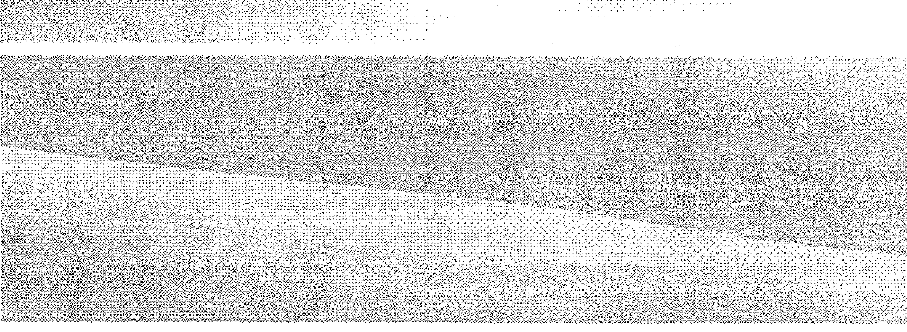

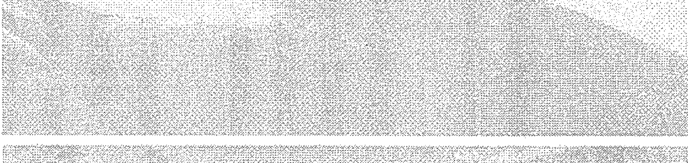

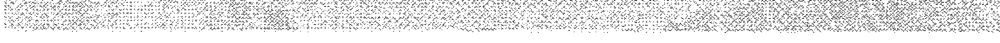

以下這個實驗適合沒有時間每天做實驗的人。拿一張紙，在邊緣寫下一到二十的數字。你會看見一個月之內，你能做多少正確的預言。再次重申，要立刻寫下現在腦海裡的東西。如果你很難起頭，那就寫些東西，任何東西都行，甚至看似毫無意義也沒關係。盡可能不去注意你寫了什麼。如果你寫了一個似乎是預告一件喜事的預言，不要興奮起來。如果你寫了一個似乎是預告壞消息的預言，也別喪氣。每個預言都可能受到潛意識某種程度的扭曲，所以當你寫預言時，不必過於擔心預言的意義。等著瞧。有效的預言將得到證實。

在嘗試這個實驗時，你可能發現，藉著也沉浸在一些別的活動中，來轉移有意識的注意力，是有利的。喝一杯咖啡，如果你喜歡就看電視。在你預言的那個月內，別試著說出確定日期，當然，除非幾個日期自發地出現在腦海。寫下你的預言時，要忘掉你的批判能力。不要根據目前的知識做有意識的猜測。當你準備評估你的結果有效與否時，你會大量利用理性的批評與邏輯。

一開始，比較難斷定一個特定預言的有效性。稍後，你自己的紀錄會提供暗示給你處理這種資料的最佳方法，比方說，你一般處理資料的方式，以及你用來表達它的象徵。

舉例來說，當我開始做預言時，我經常用「出現者」（the turns）指稱特定的一對夫婦，顯然這是因為他們會沒有預先通知，而在任何時候出現（signs）。過了好幾個月，我才發覺在這個註記，出現者與那對夫婦之間的關聯。不過，我也記錄普通的物質事件，有一天我檢查自己的筆記簿，才發現每當「出現者」這個詞出現時，那對夫婦就會來探望我們。

下一次當我發現自己寫下有這個詞的預言時，我加上了這個註記：「我相信這可能是指某先生與某太太，他們總是沒有事先通知就出現。」當他們不來時，我從未寫過「出現者」。可惜那對夫婦搬走了，所以這件事仍然是個疑問。他們要是多留一兩年，我就可以徹底調查這個關聯。不過，我有理由相信這個關聯是有效的。唯有熟悉自己的紀錄，你才能找到自己的「速記法」。

當某些預言既清晰又簡單明瞭，預言的事件也剛好發生在特定的那天時，要確定有效性相對來說就容易了。不過，在一些案例當中，一些預言可能或多或小有 效，但如果找不到涉及的人，你可能沒辦法核對。也可能在你把那個預言打了折扣，如果你每天做預言，一定要記下做預言那天的時間。有一晚，我在六點三十五分列了一串預言。其中一條是，當晚 C. S. 會在晚上八點三十分到十點之間來訪。他沒來。不過，第二天早上，九點三十分，他真的來看我們。我笑著跟他說，時間是夠正確，但他應該前一晚就來了。他隨之問我何時寫下那則預言，我跟他說了。就在那時候他極想來探望我們，但別的事情轉移了他的注意力。因為他有另一個約會，所以他看過時鐘，核對過時間。

當你寫下預言時，可能你對它們根本沒有任何情緒上的感覺。我鮮少有意識地感覺到任何一個預言是正確的，而當我在意識上確定那一則是正確的時候，卻往往不是那麼一回事。一般而言，你無法憑感覺斷定，但自發的預言或預感常常伴隨著一種強烈的情感內涵和確定感。不過，大多數預言似乎都毫無意義，但隨後卻證實，它居然這麼貼切地描述了一個物質事件，以至於我很訝異自己在寫下它的時候，在意識上竟然沒能看出它的有效性。

如果你認真嘗試發展並利用自己的能力，你就不會誇大任何預言的意義，好讓它符合任何事件。

不過，你會在你的預言當中搜尋一再出現的個人速記法或象徵符號，因為這相當合理。在一些案例當中，這些象徵一定要破解，而且除了你以外，沒人能替你做。在我自己的例子，這種速記法並不常發生，但對這種潛意識語言的研究，可能會讓我們看到，我們用什麼方式抑制、扭曲或表達有效的千里眼資料。

在你習慣做預言實驗之後，原先神經過敏的專注傾向便會消失。你將學會放下，而你的預言將會出現更一致的結果。就像千里眼式的夢與心電感應的閃現一樣，你的預言也可能出現週期性的活躍與靜止尖峰。雖然很遺憾，但我們似乎無法永遠處於最佳狀態，所以你要先得到很好的結果，然後是很差的結果，不要灰心。

不論個人天賦能力如何，他們讓預知資料現身的程度都會有所不同。舉例來說，潛意識裡，對於設法查看未來的這整個想法，你最初可能會覺得害怕。如果是這樣，可能要等一陣子你才看得到有效的結果，你也可能根本不讓自己在這類實驗裡得到任何成功。

我建議所有做得到的人，嘗試每天做預言。保持紀錄其實相當容易。寫下預言每天最多只需五分鐘。在很多例子當中，即使當一個預言是有效的時候，你可能也沒有精確寫下後來將會發生的事件。不過，如果到底還是成功的話，你會寫下那事件的種種面向，以及將適用於那事件而非任何其他事件的面向。毫無疑問，給你的預言打分數需要時間與精力，但是很值得冒這個險。

* * *

假設你的潛意識握有你將收到一位熟人Y小姐的消息的預知知識，那你當天的實際預言可能不是一個簡單明瞭的陳述，像是「Y小姐今天將來此」。反之，你可能用一個對你的潛意識心具有重要意義的速記稱號，而不是Y小姐。舉例來說，如果Y小姐臉頰上有顆難看的痣，你可想寫下「痣小姐」，或「頰上的痣」，在這情形下，由於你不知道如何詮釋自己的潛意識用語，所以你可能永遠不會發覺那是一個有效的預言。

有一天，羅勃的預言只包含「口臭」這個字。他覺得莫名其妙。那天，他收到一封 信，是他的醫生，我們認識的人當中唯一一個有嚴重口臭的人寫來的。我們之間常常談到那個人的狀況。羅勃以前的預言從未包含口臭這個字，我們以前也從未收到那醫生的信。

我們不能預期，更不能要求本我的直覺部分一定要用意識上合邏輯的心智所用的方式運作。另一方面，直覺本我以它自己的方式，以同樣適當又乾淨俐落的方式使用象徵。只不過它們可能不是我們意識上熟悉的那些象徵。

每天做預言實驗，是訓練你自己運用個人能力的一個絕佳的方法——況且也很好玩。與預言有關的時間因素，本身就是一個有趣的研究。舉例來說，星期一早上對星期二的未來事件所作的預言，可能得在星期一下午應驗。你也可能有時間跳躍（time jump）現象，出乎你的意料之外。這一切都是讓你了解你如何運作的方法，即使有時它的確增加你給你的結果打分數的難度。

### 時間上的跳躍

以下是一個引發時間跳躍這問題的例子。我對十一月二十四日所作的預言包括下面兩項——A. F. 將來訪；一個令人驚奇的巧合。A. F. 那天不但沒來，而且我們一直到十二月十日才看到他。我很早就把這幾條預言劃分為無意義。

不過，當 A. F. 在十二月十日来訪時，我剛好提到一位朋友認識一名聽到過賽斯課而且很感興趣的僧侶。那僧侶住在附近的一間修道院。「你是說 X 神父嗎？」A. F. 驚訝地說，我答道：「對，我是。你怎麼知道？」原來，A. F. 曾因公務收到這一位僧侶的信。A. F. 甚至不認識那個告訴我這名僧侶有興趣的朋友，而且 A. F. 與神父、我朋友或我自己都不住在同一個城市。

我認為這是個巧合。當你想到 A. F. 的來訪以及提到一個令人驚奇的巧合，這兩者都被列為同一天的預言，而且在一個月後才寫下註記時，這件事就更教人驚訝了。

不過，我並沒有改變我的紀錄，把這件事列為有效的預言，因為當中涉及了時間跳躍，但是我的確回頭為這個狀況加了一個註記。不過很有可能，千里眼如何運作的重要線索就隱藏在這種例子裡，我建議你留神觀察自己的紀錄，像這種引人深思的事情才不會逃過你的注意。把這類情況收集在書面紀錄裡，我們可能會找到開啓知識領域的模式。

如果你寫下關於特定一個人的預言，而預言似乎沒有應驗，如果可能的話，要和涉及的這個人核對一下。有幾次，我寫了特定的人會在確定的一天來訪，但他們沒有來。至少兩次結果是，在我作預言的當時，那些人一直在認真考慮這樣一個拜訪。情況剛好適合，所以他們記得正確的時間。其他的預言可能有效，但情況可能讓我們無法詢問那些人。無論如何，我們無法期待百分之百的正確。

當然，你不應該理所當然認為雖然沒應驗，但大多數預言是正確的。然而，你心裡應該記住，雖然無法驗證，但有一些預言可能有效。

賽斯資料包含一些預言，雖然我們沒有試圖迫使賽斯課定型，也沒有嘗試讓賽斯作出預言。至今，賽斯尚未作出沒有應驗的預言。有些預言涉及三年左右的時間因素，當然，我們要等時間過了才會知道這些。不過，賽斯的時間概念顯然和我們不同。當他說某件事即將發生時，我認為這意味著大約一星期內。但對賽斯而言，「即將」可能是六個月。

賽斯的某些預言涉及朋友或熟人生活中的事件，而除了其中幾個預言之外，我們在此都不會討論。不過，這幾個預言會讓讀者對一般預言的本質有個概念。

一九六四年三月九日，羅勃問賽斯關於一位住院友人的病況。賽斯說四月十五日，對她而言是個具有重要意義的日子，卻沒加上其他細節。我們的第四十四節課正好是在四月十五日。羅勃問了下述的問題：「今晚你能告訴我們任何關於Y太太的事嗎？」

以下是他給的答覆：

「就在今天，四月十五日，或今晚稍晚，其實就是你們的時間——半夜兩點，她將經歷一個嚴重的危機，腦組織將迅速惡化。到那時候，她正在或是將會歷經最糟的難關。」

幾天後，我打電話到醫院，得知Y太太已經出院。我以爲，雖然賽斯那樣說，但這表示她的病情有改善。不過，四月二十二日，Y太太的一些親戚順道來看我們。他們告訴我們，四月十五日那天，Y太太把醫院一整個樓層鬧得天翻地覆，醫院主管堅持要把她轉到一家精神病院。她的病況惡化到這種程度，因此表現出以下的精神失調症狀：喊叫、亂扔東西、尖叫、奔下醫院走廊、向警察呼救。

在第六十八節課，我們的朋友比爾·麥唐納來作客。比爾計畫去普文斯頓度假，羅勃問賽斯能否預先告訴我們任何關於比爾假期的事。這是他給的答覆：

「當然，他會到海邊去。結識一個大約五十歲的男人，有著刺刺的頭髮。我看見一艘划艇，上面有某種標誌。」

在一九六四年七月二十四日的第七十五節課，當比爾實際上人在普文斯頓時，雖然我們並沒有問賽斯，他卻提供我們以下的消息。

「你們的朋友交了兩個朋友，一位年長些，一位跟他差不多。當然，他離水很近。他去過一個有個大酒桶的酒吧。附近有兩棟房子，在海灘對面有一個前廳。有一艘小船和一個碼頭。我也相信他和四個男人在一個群體裡。也許和一串貝殼有些關係。」

比爾和我們並沒有互通訊息。八月二十九日，在回家途中，他順便來看我們。對於確切的日期，他不確定，但大約在七月二十九日左右，他和兩個假期中相識的朋友在一個派對裡。一個是五十來歲的男人，剪了一頭毛刷似的刺刺的頭髮，另一個則是比他小兩歲的男人（比爾大約二十五歲）。另外還有兩個男人也在派對上。所以，他是和四個男人在一個群體裡。派對本身在與另一棟渡假別墅相連的渡假別墅（兩棟房子）裡舉行，在一個俯瞰海灘的前廳裡。照比爾的說法，在普文斯頓要找到一個看得到水的前廳很不尋常，因爲大多數別墅都雜亂地排列著，面向海灘的是後廳而非前廳。許多小船綁在外面的碼頭上。

派對一結束，比爾和他的朋友就去了一間因爲裝飾而與眾不同的酒吧──一個巨大的酒桶，切開兩半，分別嵌在牆壁裡。別的酒吧都以小酒桶裝飾，但這個大酒桶非常醒目。酒吧與渡假別墅差不多距離三條街（賽斯說它們在附近）。

除了在派對裡用到貝殼煙灰缸，比爾不知道一串貝殼說的是什麼。他不記得上面有個標誌的小船。後來，賽斯說船是綠色的，而比爾的確記得一艘綁在別墅對面的綠船，因爲他畫了一張船的畫。他也畫了一幅整個地區的畫，包括那些別墅。

賽斯也在一九六四年九月二十八日預言本書稿件的出售，指明了書名。在十一月四日，他說售出已有進展，未來還會售出短篇小說。它們還沒實際發展，但它們一定會售出的架構已經奠定。有個女人可能憑藉影響力，和其中一本的售出有關聯。

一九六五年五月五日，簽了本書的合約，有一部分是憑藉一位女編輯的影響力，但過去我是和費爾先生磋商，並不知道先前的編輯已經離開公司，由一位女性取代。五月二十五日，簽約之後不久，我售出一篇短篇小說給一家全國發行的雜誌。所以，在五月裡，如賽斯預言，這本書售出了，一位女性涉及它的售出，也賣掉了一篇短篇。

這些都不是驚人的預言。賽斯的確精確地指出Y太太發生危機的日子，但關於書的預言則過了將近半年才應驗。近來，賽斯提到一支特定的股票，預言它會開始穩定地下跌。自從預言之後，它已下跌五點。他也告訴我們，與我們參加一九六五年七月在紐約州奧斯維格州立大學的催眠討論會有關的一些資訊。在那兒，事情的發展和他說的一樣。

就你自己的實驗而言，要注意下列幾點：全都適用於一件事的那些預言；你可能一直用來命名某個人的那些潛意識的稱號（比如「痣小姐」的例子）。這些是潛意識的速記符號。確定你每次都會把你作出預言那天的日期，以及你想要預測那天的日期記下來。在為你的結果打分數之前，給自己二或三天的餘地。偶爾有些預言可能不只適用一個，而是適用兩個明確事件。我們自己的紀錄似乎就指出了這個傾向。我將提出以下來自我們紀錄的例子。從兩個觀點看來，這些特定的預言很有趣。首先，它們呈現羅勃和我看似合作確定一個未來事件的狀況；其次，它們說明適用於兩個個別情況的單一預言。如果最後這一個可能性，證明是某個預知資料的一個有效特徵的話，那麼，有時候如此簡單明瞭的潛意識速記，也是如此精確，因此同時適用於兩個事件，卻不適用於任何其他事件。對於六月三十日，我的預言包括以下幾項：幾個問題，幾次；再告訴我；旅行，長途；再來一次。羅勃的預言包括：調查員。我們沒看彼此的預言。在預計的那一天，一個保險調查員來敲我們的門。他問我一位已經搬走的鄰居的事。起初他沒告訴我，他問這些問題的原因，所以我拒絕回答。最後，他告訴我他的工作，我讓他進來，要他再講一遍他的問題。涉及的鄰居已經搬去加州。此處所有的預言因素都出現在這個實際的事件裡。調查員,羅勃的預言之一,再明確不過了。

同樣的預言似乎也完全適用於同一天發生的另一個情況。我們跟房東說過,有幾個朋友要租樓下的一間空公寓。他們還沒付任何房租訂金,而同時,一名想要那個公寓的婦人也打電話來。對於這種情況我們感覺自己有責任,所以我到街角一個電話亭打電話給我們的朋友。他們不在家,留了另一個可以聯絡的電話號碼。有半小時的時間,我有幾次問了幾個問題,想要把事情講清楚。我的確覺得自己像個調查員。預言中的三項:幾個問題,幾次;再告訴我;而且此處調查員似乎也適用。

我知道這些事件並不驚人,不過,我們關心的是,研究潛意識如何處理意識心不知道的资料,所以任何自行顯現在預言裡的特徵,都該仔細檢查。保險調查員的來訪、忙亂的電話,這兩者都有助於區分那特定的一天和其他的日子,而且兩個情況似乎至少都有局部被預見到。

每天的預言將提供我們足夠運用的資料。光是透過紀錄比較不尋常的自發預知,真能收到的資料很少;隨著每天紀錄的累積,我們的資料會越來越多,屆時可以加以檢查，希望它會揭露預知資料的本質與特性。

千里眼的所有調查一定會涉及我們的時間觀念，所以在此摘錄這些賽斯資料。

其中，賽斯討論與電子脈衝有關的時間，並提出一個簡單的比喻。

### 摘錄自第五十四節

這個老比喻，恐怕相當陳腐，但仍是個好比喻。走過一座森林，你發現很多樹。可以把時間當作是一整座森林。然而，你看見面前有棵樹，就稱它為未來。你以為之前樹不在那兒，因為你還沒到它面前。在你後面的樹，你稱為過去。可以說，你在沿著一條狹窄步道前進，但那兒有很多條步道。森林以一個整體的樣貌存在。你可以向前也可以向後走，但是你現在才在學怎麼走。

我們將進一步延伸這個比喻。我們將稱呼這整座森林為廣闊的現在。把樹比作意識，全都同時存在；但是這座廣闊的現在的森林，並不會占據你們認為的空間。

在這森林內，沒有你們說的過去、現在或未來，而是只有一個「當下」。在這「當下」裡有無限的可能性，因此就價值完成——名副其實是無限價值的完成——的角度而言，耐久性得以維持。所以，森林不斷擴展。它的擴展並不是就空間或時間的角度，而是就能力與價值完成的觀點而言，那「完成」可能建構在各種不同的層面，有著各種不同的外觀，你們目前的存在領域就是其中之一。

### 摘錄自第一百五十五節

你從時間的角度設想行動，因爲在你們的物質世界裡，一個特定的行動看起來是花時間，幾乎像一張椅子似乎占用空間一樣。當然，椅子並不占用空間，而是你們所謂空間的一部分。行動也不花時間，它是你們所謂的時間的一部分⋯⋯

很難跟你們解釋這個，因爲必須用新方式利用老觀念。但⋯⋯我們談過思想和情緒、夢，以及上述這一切原本看似純粹心理性，而且在你們的物質宇宙裡不占用空間的經驗之電性實相。

我也提到過，電場（electrical field）有自己種種的次元，你們並不熟悉這些次元。這系統之內所含的深度不是就空間的角度而言，而是就種種不同強度而言的深度和次元。這裡也有一種與強度密切相關的持續，但是與時間的連續無關。

在這電性系統裡，穿越時間的旅行只涉及一個穿越強度的旅行。在這系統裡，就像在所有其他的系統裡一樣，有不斷的运动，而這不斷的运动使你們系統内的運動成為可能：時間的確是一種靠著強度，而不是靠著時刻增長的電性脈衝。

要說向後與向前是無意義的。有的只是各種不同強度的種種不同電性脈衝；既然強烈的強度是較弱強度造成的自然結果，稱一個為現在、一個為過去，沒有什麼意義。然而，在你們的物質領域裡，就物質時間而言，可以說，你騎在這些脈衝的波浪上。

當脈衝弱的時候，你稱之為「過去」。當它強的時候，你稱之為「現在」，至於對你而言，似乎還不如「現在」那麼強的一個脈衝，你稱之為「未來」。因為你自己做出這樣的分割。以這種方式，你創造了一個用分割時間場域建構而成的系統之中與生俱來的架構以及所有的可能性、潛能和限制。

## 你以前活過嗎？

沒人能告訴你，你以前是否活過。如果，今天活著的大多數人也曾活在過去，那麼證據就是在每一個人的內在，在自我之下的那些人的人格領域裡。唯一的答案就在自我調查中。

我們以前是否可能活過？數百萬人類相信我們一次又一次地出生，我們的人類潛能在短短一生中永遠不能充分發展，而是經由連續轉世而成長、成熟。暫且假定這是真的。我們下一個問題是：如果我們以前活過，那我們在意識上為什麼記不得我們的前生？

首先，讓我問你另一個問題。你知道這是事實：在你長大成人之前，你是個嬰兒和小孩，但是，你在意識上記得多少自己的童年？非常少。現在這種記憶大部分都是潛意識的一部分。如果屬於這一生的經驗我們都記不得，那前生的記憶會被壓抑，也就不足為奇了。

遺忘的童年事件可以經由催眠喚回。如果轉世是事實而非虛構，我們應該也能經由催眠而喚回前生。即使在這種情形下，除非我們收到足夠的牢靠資料，可與現存的歷史紀錄和公共文件比對，否則我們並不知道這樣的回憶是否有憑有據。

就絕對的證據而言，想想要證明一個不是顯而易見的簡單事實會牽涉到的困難。假如你希望證明，五年級時坐在你後面的男孩，在一九三八年五月六日穿著一套褐色衣服。想像這個事實多年來記憶猶新，但別的記憶都從你的意識消失了。你可能知道那男孩的衣服毫無疑問是褐色的，但要證實它卻極為困難。

首先，你的任何一個同學在任何一天穿什麼顏色的衣服，不會有紀錄。縱使你追蹤到涉及的個人並詢問他，你離證明也還遠得很。再說，一個男人對自己穿了哪種衣服是不會有概念的。如果拍過一張黑白照片，男孩的衣服是什麼顏色，這個問題依然無解。唯有一張彩色照片足以為憑，而且還得確實無疑地證明照片是在討論中的那一天拍的。

如果轉世是個事實，那麼，蒐集證據的問題將難如登天。即使如果我們理所當然認為，透過催眠和其他方法蒐集的资料是正確的，我們還必須涉入透過紀錄、私人信件、舊報紙，以及其他數不清的消息來源來核對它們的努力。舉例來說，就算我們能毫無疑問地證實，約翰X不知為何對一位特定的主教於十七世紀的生活有詳盡的了解，但這並不足以證明約翰X有一度是那位主教。他可能在潛意識用某種方式蒐集到這種资料。他可能不知為何在和那名主教的靈魂溝通。就算這些解釋與轉世理論一樣令人驚訝，但無論如何，如果對過去這種詳細的了解被毫無疑問地證實，那到時候就一定要把它們考慮在內。

已經有紀錄在案的例子，活著的人堅稱他們有過其他人生的例子，展現對涉及之死者的深切了解，雖然他們是以陌生人的身分被引見，卻在死者的在世親友質問時，正確認出眾親友。

在二十世紀的印度，有兩件這種事例。在一個接受轉世的國家發現這些事，也許是個巧合。或者，可能這種事在印度不會被人嘲笑，所以比較會暴露出來。在這些特定的例子裡，看似有憑有據的前世記憶並未埋葬在潛意識裡，而是留在意識層面。

不過，就算轉世是個事實，一般而言，自我也覺察不到它。理論上，透過一種讓有意識的自我能夠放鬆到內在資料能自行顯露的方法，任何前世的記憶都可以被帶到表面。催眠應該證明是揭露這種資料最有效的方法。自動書寫可能是另一種，簡單的文字聯想可能有用。紀錄上也有例子是，在精神分析的過程中，揭露似乎源自前世的記憶。

沒錯，針對超感官知覺最科學的調查與轉世無關。不過，在任何針對靈媒的研究裡，常常暗示這個主題，所以與通靈現象的關係非常重要，因此是本書的一個合理的討論領域。自動書寫、自動說話與通靈監使常常宣稱源自轉世人格，但這並不一定是說，轉世人格確實牽涉其中。但是，任何調查至少必須考慮這個可能性。

沒人能告訴你，你以前是否活過。如果，今天活著的大多數人也曾活在過去，那麼證據就是在每一個人的內在，在自我之下的那些人格的領域裡。唯一的答案就在自我調查中。複雜的技術器材不會幫助我們探索人類人格的實相。無論什麼可能的答案，都只能透過探索內心我才找得到。

這一章包括一個實驗操作指導，這個實驗可讓你達到你在自己身上尋找任何前生記憶的存在必備的自由。在此我納入一次催眠筆錄的節錄，其中羅勃是實驗對象而我自己是催眠師。這代表我們首次將一個人回溯到出生以前的嘗試。經由誘發的放鬆，實驗對象進入深沉的出神狀態，然後得到以下的暗示：「雖然聽來奇怪，但當我數到八，你就會看到你是羅勃・柏茲之前一個時期的景象。」重複這句話幾次，然後從一數到八。

### 問題
你看到什麼？
你叫什麼名字？
你幾歲？
你在做什麼？
誰的馬？
你住在哪裡？
哪個城市？
你住在一棟房子裡嗎？
你姓什麼？
你有兄弟姊妹嗎？
你的爸爸做什麼？
你知道馬里蘭州那個城市的名字，或馬里蘭是那城市的名字？

### 回答
水塘。
喬西。
我五歲。
在一匹馬旁邊玩。
某個男人的。
在一座城市。
馬里蘭。
是的……很陡。
威廉斯。
五個。
他打馬蹄鐵。
不。

你住的城市叫什麼名字？
馬里蘭。

「我一數到八，你將是十歲。」我將這個暗示說了幾遍之後，再數數。

你的名字是什麼？
喬。

喬或喬西？
喬。（不耐煩地回答。）

你是男孩還是女孩？
我是男孩子。（實驗對象聽起來覺得討厭。）

你住在哪裡？
我在馬棚裡。

在馬棚裡？
是的。馬蹄鐵……在馬蹄鐵上捶打。

你有兄弟姊妹嗎？
四個。（之前這問題的回答是五個。）

是誰的馬棚？
我爸爸的。（這裡實驗對象對我的缺乏了解再度顯得很厭煩。）

告訴我馬棚的事吧。
在熱馬蹄鐵上火星四濺……大錘敲響著。火星和蒼蠅。門開著。

這是什麼街？
馬的氣味，乾草……

是哪種街道？
哦，是條石子路。

城的名字是什麼？
馬里蘭。

街名是什麼？
史班瑟路。

你住在那兒嗎？
隔壁，樓上。

這次催眠原本是為減輕實驗對象煩人的背痛而舉行的。就這點而言很成功，不只減輕疼痛，還有助於實驗對象了解導致這個情況的很多內在原因。我們並未打算嘗試上面描寫的那種回溯經驗。不過，當我發現實驗對象是在極佳的出神狀態時，先與實驗對象商量之後，我決定將把那一段轉變成倒溯的管道。

這是我們的第一次經驗，所以其中有幾個瑕疵。第一，給實驗對象回答問題的時間不夠。比起我給他的描述機會，他的所見和所感更多。很多問題都該再進一步問下去，但這一節已經長達一個半小時，我不想再拖下去。

由於這個原因，很多明顯的問題都被忽略，好比喬的出生年分，以及有馬里蘭這個城市的國家是哪一個，這類非常重要的問題。當時我理所當然認為馬里蘭是一個州，覺得實驗對象混淆了。實際上，這樣一個假設在這裡是不恰當的。同時，可能向後數比向前數有利，因為向後數更有暗示回溯時間之意。

對實驗對象而言，這個經驗非常生動。感官資料既新鮮又直接。他說話的語氣讓人相信是一個孩子在講話。他有幾次對我相當不耐煩；我理所當然認為在他五歲給的名字，喬西，是個女孩的名字。後來，當實驗對象用喬這個名字時，因爲我問他是男孩或女孩，讓他很不高興。

這一節顯示，實驗對象的這些經驗，與那些比較平常的年齡回溯一樣生動。如果你記得，先前提過在平常的年齡回溯中，早年的實際事件又被經歷一次，而非只是憶起。而在這一節裡，羅勃感覺事情真的在發生。這一節錄了音，不過，我們才剛買錄音機，我對它的操作方式不太熟悉。實驗對象的聲音相當清晰，可惜戶外的聲音也相當清晰。

談到你們自己的實驗之前，先看看賽斯對羅勃的催眠有什麼話要說，可能很有趣。這裡我們發現，賽斯在羅勃曾經活過的喬·威廉斯的人生之中加入細節時，賽斯資料增益了經由催眠收到的資料。以下是賽斯課第五十九節的簡短摘錄。

當時，陡峭的階梯通往你的房子。我相信，當你長大時，你妻子的名字是萊兒，伯朗迺爾。你的名字是威廉斯。你離開魯柏一陣子之後，又在這個國家的波士頓遇見他。你家裡的確有五個小孩，也就是說，你有兩個兄弟和三個姊妹，一個姊姊在你長大前就死了。

馬里蘭並不在這個國家。你到了這裡，到波士頓。馬里蘭是一個城市，不是你們國家的一個州……在波士頓可能找得到紀錄。你母親當時的名字是約瑟芬。那時你身材瘦長，有相當程度的自律，後來你有四個孩子和一個妻子，她變成體弱多病。你的職業是英國國教的牧師。

有個磚造教堂，在一個最初很可愛但後來惡化的鄰里。對街的一座老宅變成了一個雜貨店。後來，附近有家服裝店，從三樓前面的窗口，你可以看見水流。你是
在奇特的情況下被委任神職的，沒有受過正統方式的教育。當你移民到波士頓時，
你用了德雷克這名字。我不知道你的姓。移民時你還年輕，船遲了三天。
延遲期間，爆發了麻疹，一個船長庇護了你。你應該簽約但你沒有而被發現，
可是你讓他想起一個叫菲力普的姪子，所以他保護了你……你也有個私生子。

請了解，我們並沒有說喬·威廉斯的存在確實有過。我們是說，羅勃可能經由催眠而真的觸及到一個前世的記憶，在那一世他是喬·威廉斯。我們的確知道，這個經驗和透過催眠產生、比較平常的年齡回溯經驗一樣生動，而心理學家相當願意接受年齡回溯這種事。舉例來說，他們自己的實驗顯示，當一個實驗對象說他五歲，然後在心理測驗上表現就像個五歲的孩子。我們在喬·威廉斯的存在上，累積更多的資訊之前，我們擁有的只是引人深思的資料而已。我們自己的時間也有限，轉世只是我們有興趣的主題之一。

## 搜尋前世記憶

以下的實驗將容許你探索自己平常不可觸及的人格領域，找出任何可能存在的
前世記憶，除非你透過閱讀與研究，對催眠有了充分的背景知識，否則我不建議你
催眠任何別人，或讓你自己被催眠，這實驗將會涉及自我催眠。

再次重申，如果催眠是個事實，那麼催眠很可能會帶領我們去發現一些這類的
失落記憶，就像它能讓我們發現遺忘的童年事件一樣。不過，除非我們願意靠信心接受這種資料，否則無法理所當然認爲資料是有效的。我們必須盡力用現有的紀錄和文件核對它。

爲了核對這種資料的有效性，顯然先要蒐集資料——而且是從潛意識人格，因爲在任何時刻，意識心都只覺察到過去經驗的一小部分。要觸及潛意識，催眠是我們所知最好的方法。

那麼，實驗一開始，跟隨本書先前的指示，先讓你自己進入一種輕度出神狀態。但在開始之前，先寫下自我引導之後要用的暗示。你將自己引入一種出神狀態之後，接下來可由別人把這些暗示讀給你聽。如果你們有錄音機，而你也願意話，可以不用另一個人幫忙，只要預先錄好暗示，再放給自己聽就行了。爲此，你可以跟隨先前的指示，預錄一段自我引導，然後把整個過程錄下來。之後你就可以聽見自己的聲音以及你可能用的變音。就像你對任何聲音一樣，不管來源爲何，你對錄下的聲音都會有反應。

在最初的幾節當中，只處理這一生的年齡回溯。這會讓你自己的信心建立起
來，而且也是個很好的體驗。你會對自己潛意識記憶的範圍感到吃驚。這些記憶有很多可以找你的親戚核對。

讓你自己進入出神狀態之後，可以請別人給你以下的暗示，也可以播放你預錄在錄音機裡的暗示。「我將從十倒數到零。數完了時，你（我）將是十五歲。」重複這暗示幾次。慢慢地倒數（或請別人倒數）。暗示你只會記得愉快的插曲。數完時，接著問以下的問題。再次重申，這些問題可以預錄，也可以請別人提問。

- 你幾歲？
- 你在哪裡？
- 誰跟你在一起？
- 這是哪一年？

如果請別人提問，不但容易得多也更有彈性。預錄的提問無法考慮到你的回答，問題應該自然而然隨著回答而起。所以，如果你發現自己在一間教室裡，年紀是十五歲，提問的人可以用這件事當跳板，問你老師叫什麼名字，並要求你指認幾個同學。

除非過程有錄音，否則你需要有人幫你記錄。最重要的是，別匆忙。在你進行下一個問題前，先確定你有充分的時間回答每個問題。當你似乎講完十五歲的插曲時，接著應該重複上述程序，暗示在倒數完後，你將是五歲。再次重申，暗示你只會記得愉快的插曲。然後完成整個過程，這次回溯到你一歲時。我建議，你用二到三次個別的催眠，進行到此為止的實驗。顯然，問題應該依照你回溯的年齡而有所變化。我會摘錄我們自己的一次年齡回溯實驗，你很快可以看出哪種問題才合適。不要明確暗示你將想起以前可能有的出生或死亡經驗，除非你是要進行長達數年的深入調查。

應該再提一次，在年齡回溯中，事件不是被憶起，而是實際上重新經歷，連同在原始經驗中出現的所有感官資料。

以下是一次年齡回溯的部分紀錄，再次以羅勃為實驗對象，我則是催眠師。你也可以用這個形式試做自己的實驗。當然，你可以回溯到任何年齡。指定十五、五或六歲，只是我這一邊建議而已。選擇任何年齡都可以。

這裡已經引發出神狀態，也做完第二次的倒數。

| 問題 | 回答 |
|---|---|
| 你以前活過嗎？ | （催眠師引導：）零。數完時，你將是兩歲（重複幾次暗示，並倒數）。現在你將讓這個場景漸漸消失。我將從十倒數到你幾歲？ |
| 你幾歲？ | 我兩歲。 |
| 你快樂嗎？ | 我不知道。我一個人在家。 |
| 你有兄弟嗎？ | 一個。（羅勃有兩個弟弟，但當羅勃三歲時，最小的弟弟還沒出生。） |
| 你媽媽在哪裡？ | 她一定是在樓下。 |
| 還有什麼？ | 樹、窗外的街道。 |
| 你看見什麼？ | 地板和窗子。 |
| 你在哪裡？ | 我的房間裡。 |
| 今天星期幾？ | 星期二。 |
| 你在哪裡？ | 在草地上。 |
| 是夏天嗎？ | 對，天氣很好。我爬到板凳下……有腳……黑褲子。他們坐在我上面。 |
| 誰？ | 我不知道。我想我聽見媽媽的聲音。 |
| 在後院？ | 對。 |
| 你叫你媽媽什麼？ | 媽——媽（拉長聲音）。 |
| 你叫你爸爸什麼？ | 爹——地（同樣拉長聲音）。我想我看見了一隻狗，棕色的。 |

我隨即將這個場景從他的腦海移除，暗示當下一次倒數完畢時，他將是一歲。然後倒數。

- 你幾歲？ 我一歲。
- 你在哪裡？ 浴室裡。
- 你在做什麼？ 在……水裡。
- 在浴缸裡嗎？ 不是。有點像。有支柱的。

有人給你洗澡嗎？
你看得見這房間嗎？
你媽媽看起來是什麼模樣？
媽媽（這很像哭聲，與兩歲時說的「媽——」很不同）。
牆上有圖畫……紙。
棕髮。小小的門牙（就實驗對象記憶所及，他媽媽的頭髮是白的。不過，當他是嬰兒時，她的頭髮還是棕色的）。

再一次，實驗對象感覺沒有被給予充分的時間，描述他當時的所見所感。舉例來說，他真的感覺到母親的手臂抱著他。這種經驗的直接感受顯得和那種與意識上回憶的事件相連的二手感受大爲不同。

不過，年齡回溯只是這個實驗的一部分。當你練習過年齡回溯，而熟悉了涉及的感覺時，接著就繼續試著揭開潛意識中一個可能前世的記憶。

在自我引導後，請另一個人給你一樣的年齡回溯暗示。不過，這次是從現在回溯到一個非常年幼的時期，比如說，一歲或六個月。先有一段簡短的問答時間，然後請另一個給你以下的暗示：
「我將從十倒數到零。現在，雖然這可能顯得很奇怪，但倒數完，你會看見你是（某某人）之前那個時代的景象。」重複暗示，倒數，然後繼續。

這裡是一些可以問的問題。

- 你看見什麼？
- 你在哪兒？
- 你幾歲？
- 你在哪個國家？
- 今年是何年？
- 你的名字是什麼？

我故意把身分的問題列在最後。這讓你在應付另一個身分之前先有個方向。如果你堅持自己是成年人，那就問以下的問題。

- 你結婚了嗎？
- 你的配偶叫什麼名字？
- 你屬於任何組織嗎？哪些組織？
- 你國家的總統、國王或統治者是誰？
- 你的職業是什麼？
- 你的父母叫什麼名字？
- 你父母來自哪個國家？
- 你每天看報嗎？哪個報？

做這個實驗你不能匆忙，要慢慢來，得到完整的答案。如果你堅持自己是個小孩，那麼上述問題顯然就不能問，應該改問適合年齡的問題。舉例來說，一個孩子可能知道也可能不知道自己在哪種政府統治下生活。如果想得到進一步的資訊，可以給予暗示，以便透過平常的倒數程序，使人格的年紀增長到成年。

幫你做這個實驗的人，必須是你能信任的人。如果關係良好，夫妻搭檔應該很不錯。在你的自我引導之外，永遠要把這個暗示包含在內：不管你選擇什麼時候，只要數到三或到一個特定時間，你會脫離出神狀態。這會讓你掌握主控權，一旦有任何不安的感覺，就可立即終止出神狀態。不過，要永遠確保你是回到現在的身分和年齡。照以下的方法來做。指示與你一起工作的人，只要你好像有點緊張，就要給你以下的暗示：

- 現在我要從一數到十。數完以後，你將回到目前時間。你將是：：：（插入人名），年紀：：：（插入目前年齡）。應該重複暗示，再從一數到十。

你不肯過渡到現在這個人格的可能性很低。這種情況太不可能了，所以我們不必擔心。無論如何，這類的實驗都必須包含上述暗示，才可以結束。數完之後，應該問你的名字與年齡，除非你能說出現在的正確年齡與身分，否則不應該結束實驗。在一個普通的年齡回溯實驗中，也應該遵守這個程序。在你的出神引導中，最好也把你在結束時將感覺神清氣爽而且放鬆的暗示放進去。

不管什麼時候都應該仔細做紀錄。當這方面的資訊收集工作累積了資料時，根據公共紀錄、舊的法院檔案等等加以比對一事就很重要。這顯然是一個困難又耗時的程序，但我們不能理所當然認爲我們的資訊是正確的。如果名字、日期、地點與歷史文件比對無誤，那我們就更接近某種科學證明了。

在此必須重申，雖然透過催眠，我們可以得到似乎源於前世的資料，但是我們接著一定要設法探究，這個資訊的確表裡如一呢？或者，它只是潛意識的戲劇演出而已？

心理學家本身對心智和催眠的了解不足以明確主張，這種明顯的記憶是潛意識編造的產物，但我認爲你可能找不到任何一個說這種記憶來自前世的人。

現在，催眠是個試圖發現這種資料的絕佳方法，但自動書寫或自動說話也是另外的方法。在本書，我們之前談過自動書寫。為了這目的而運用它的時候，只要在一開始暗示你的潛意識將用你的手在這主題上表達自己即可。如果從本書一開始到現在，你在自動書寫方面已經有些成績，這方法可能會證明對你有效。利用先前說過程序去做。

你們那些實驗過自動說話的人，可能發現自己給了有關轉世的資料，就像我一樣。若是如此，就用這資料本身來比對你的資料。問幾次同樣的問題，或請另一個人問，看你是否得到同樣的答案。列出一張問題清單，然後在你傳述一節時，請別人大聲讀給你聽。

任何經由「靈應盤」接收到的這種資料，也都應該加以研究。

本章主要關注的是，催眠以及它和發現任何可能的前世記憶之間的關係。但如果轉世是生命的一個事實，我們長久以來否認的一個事實，那在我們正常生活的其他面向也可能找到它存在的線索。前世甚至會影響我們現在的健康。下一章，我們將討論轉世與夢、人格傾向，以及健康與疾病的模式。

### 摘錄自第一百二十六節

以下的賽斯資料摘錄，呈現轉世可能在其中運作的一個邏輯架構。甚至一個夢的電性實相也被解碼，因此不只大腦體驗到它的效果，連人體最微小細胞可及之最遠處也一樣。久已遺忘的夢經驗，永遠以電性密碼資料的形式包含在內。如果在人類經驗的任何一個部分感覺到一個效果，那麼你可以確信它也以所有其他可能的方式被感覺到，無論這樣一個效果是否直接明顯。人類體驗到任何一種效果，都是以本身形成一個電性模式的一系列電性信號和密碼的形式存在。

它們存在細胞之中，或者我應該更適當地說，細胞圍著它們成形。然後這些電性密碼信號形成完整經驗的電性對等物，像一個人感覺到的那樣。這模式既獨立於物質系統之外，同時又住在其中。自出生開始，每個人都從累積的、個別的、持續的電性信號，形成他自己的對等物。在肉體死亡時，他的人格便多多少少還以完整的形式存在，而且當然也逃過了人格若是物質系統不可或缺的一部分、他就會遭遇的那種結局。

電性模式就是人格，帶著所有地球生活的經驗，然後它能加入或參與內我。雖然自我原本經過內我改造，也是物質遺傳與環境的產物，它不會死亡，但是，它的存在會從物質實相改成電性實相。它還是個體。它的個體性並未喪失，而是變成內我的一部分，它的經驗則加入組成內我的很多人格的整體經驗裡。

### 摘錄自第一百三十二節

我提到過，電性宇宙是由「電」所組成，這個電和你們對它的看法非常不同。

你們在物質系統感知的電，只是像這些變化無窮的脈動的一個迴響放射，或一種影子形象而已。很多你們熟悉但在你們物質系統裡並未以有形物體形式出現的現象，因為這些脈動而有了實相和現實性。

我們已經明白，所有的經驗以電性密碼的形式保留在細胞內，也明白細胞的元素以密碼經驗爲中心形成。自我開始了，被內我發動進入存在，被遺傳與環境大大地影響了；這個自我繼續存在，隨著它的經驗形成細胞內的密碼資料，建立一個它自己的電性實相。

在任何一點，自我在電性實相內都是完整的，就像在物質系統裡，它在心理上是完整的一樣。當然，這包括保留它的夢，以及保留純粹的物質資料。

電性系統擁有很多無法在物質系統內感知的實相次元。至今，你們的科學家只能藉由觀察在他們的參考架構內感知到的電的投射，來研究電。當他們的物質儀器變得更成熟時，他們就能夠多瞥見一點這個實相。但是，他們無法在他們已知的參考系統內解釋它，所以會用很多奇怪又扭曲的理由解釋已揭發的現象。

此時最困難的就是，暗示電的現實性有各種不同複雜度和次元，就像它存在的樣子，想想你們每個人自己的思想，是由一個獨特的脈衝強度構成，全然不與任何別的東西分享，並想想同樣的話也可以套用在你這一生的每個夢上面；還有，這個經驗全部收集在特定強度範圍裡，而且又是全然地獨特和密碼化；而所有的你的總和，存在於強度的一個微小範圍或波段裡。那麼，你就會明白這有多難解釋。同樣的，所有人類的構成也都是電性，而且其他一切，無論是否存在物質之內，除了少數例外，也都在物質領域內。你們的物質領域包含在它自己獨特的強度範圍內，一個微小電性脈衝波段，比起任何一個從整個已寫出或將寫出的樂曲裡隨意選出的音符小上百萬倍。然而，如你所知，這並不是要給你一種徒勞無功的感覺，因爲，獨特性有隨之而來的責任。所有的動作都是精神上的動作，所有精神上的動作都有電性實相。內我藉由改變或穿越你們物質領域的強度而移動。每個新的心理經驗都會打開一個新的脈動強度，在電性系統裡賦予更大的現實性。穿越電性系統內的強度，會在物質系統內產生穿越時間的結果。

## 19 轉世、家庭關係與人格

羅勃一直對研究老船有興趣。這興趣似乎並非建立在他的背景上。家族中沒有別人對船舶有任何了解。他兒時也不是住在可能勾起這種興趣的海濱或港口。可以解釋成，這是他在意識上已經遺忘的某事件造成的結果。也可解釋為，一個前世的興趣。

如果轉世的確存在，那麼，必然保留著某種連接一生又一生的知識和身分。不然，至少對我而言，整個理論便毫無意義。這種本我的延續不一定是有意識的，但在某一方面它又必須是我們個體性的一部分。

上一章末尾的摘錄，應該讓你對於可以達到這種持續身分的一個方式有些概念。在那裡描述的概念中，認為經驗、思想與行動擁有一個每一生累積的電性實相。這份資料是以密碼方式存在，而且從電的角度來看，它也導致了每個人格的創造。當肉體死亡發生時，電性實相仍然保留著。

但心理上來說，也必須留一些餘地。這可由賽斯所謂的「內我」來處理，內我是我們自我的一個有意識的內在對等物，在日常生活我們對它很熟悉。按照這個理論，潛意識是內在自我（Inner Self）和外在自我（Outer Self）之間的一個緩衝地帶。內在自我含有我們前生的記憶，扮演活動的總指揮。潛意識從內在自我過濾一些資訊給外在自我。從實際的角度看來，每個自我都是有意識的，但外在自我並沒有覺察到內在自我。

外在自我之所以不處理前世記憶，只是因為這個自我太關心物質實相裡的日常生活，沒有餘力處理額外的資訊。

外在自我甚至不關心此生先前的記憶。內在自我和外在自我的這個概念有點像心理學家抱持的次人格觀念。要從日常生活找到一個簡單易懂的比喻來解釋它，也相當容易。就像你自己現在擔任各種角色，父母、配偶、社區成員和社會個人，但仍然是同一個人一樣，內在自我也以類似的方式擔任各個轉世角色，但仍然維持身分與方向。有時候，在負擔生計者的角色當中，你可能會忘記自己的社會個人或配偶角色，然後，當你下班回家時才再重拾它。同樣的，當你全神貫注在進行中的那個角色時，你大半會忘記其他的轉世角色。實際上，這一切涉及的是焦點的改變。按照賽斯所說：意識就是本我觀看的方向。

根據這個理論，阻擋內在自我與外在自我之間的通訊，力道可能強到足以壓抑這種資訊，而要存活在一個現在似乎需要它所有資源和知識的宇宙裡，我們的確可能真的必須如此。我們是可能在一連串的自我引導催眠盲點裡，阻擋前世的記憶，就像在正常的生存中，我們只看見我們想看的，而封鎖其他的刺激一樣。

如果是這樣，那麼我們應該預期至少找到一些暗示前世存在的線索──我們或忽略或誤解的線索。我們有任何這種線索嗎？對於這些折磨人心千百年的問題，我們有幾個可能答案，卻似乎沒有一個答案真的合適，轉世理論能給什麼合乎邏輯的答案嗎？

有多少回你頭一次遇見某個人，就立刻感覺喜歡或不喜歡他？心理學家用幾種方式解釋這種反應。其一，我們現在的反應是基於過去的經驗，那經驗有一部分建立在潛意識與不合邏輯的偏愛或偏見上。

舉例來說，在你的童年，有一位你喜愛的叔父可能抽一個特定牌子的雪茄，於是你現在可能預設就傾向於喜歡抽那種牌子的雪茄的男人，卻一直都沒有發覺這個關聯。對於我們實際上形成好惡的方式，這是個簡化的版本。不過，可以進一步闡釋這件事，假設我們有時對各種不同的人有立即的好惡，是因爲我們在某個前世曾認識他們，實際上也一樣合乎邏輯。我們也可能因爲在前生可能對一個人格做錯什麼事，而想「補償」他，但是意識上我們並沒有覺察到涉及的那一世或那件事。

當我們把人格傾向以及那些成爲我們每一個人特質的興趣和怪癖，與轉世一同考慮時，那麼轉世也是一個有趣的理論。我們的一位朋友對俄國歷史、音樂、地理和文學非常著迷，他愛研究俄國生活的傾向並沒有明顯的理由。當然，可能是由於某些已經遺忘的童年事件。不過，也可能在某個前世我們的朋友住在俄國。

羅勃一直對研究老船有興趣。他的藏書有很多是在婚前蒐集的，有關十八世紀船舶的書籍充斥其間。再一次，這個興趣似乎並非建立在他的背景上。家族中沒有別人對船舶有任何了解，他兒時也不是住在可能勾起這種興趣的海濱或港口。可以解釋成，這是他在意識上已經遺忘的某事件造成的結果。也可解釋爲，一個前世的興趣。舉例來說，賽斯聲稱，在羅勃最近的前生裡，他常常在英國和麻省的波士頓之間乘船旅行。

你自己也可能有類似的興趣和偏愛，卻無法解釋或找出明顯的理由。這些也許是一些線索，讓你對於一個可能前世的興趣或職業有一些概念。至少，你應該思索它們一下。

- * * *

轉世理論為天才與神童的存在提供了一個絕佳的解釋。來自一世的才能與成就不會喪失。一個兒童在發展早期便展現非凡的天賦——正常兒童不會展現的天賦，這些天賦可能是前生得到的知識與能力造成的結果。這個概念裡有著一個迷人的經濟結構。

舉例來說，對繪畫微小卻持續的愛好，可能在下一世造成非常真實的藝術才能。沒有一個能力會喪失，也沒有一個行動是無意義的。

顯然，在大多數情況下，我們在意識上不會有連續感和身分感，但這感覺卻會以我們現在的人格繼續存在其中的心靈架構的方式運作。大同小異的是，你曾經是的那個孩子，仍然活在你的成人本我中，但幾乎是沒有意識的。你曾經是的那個孩子現在並沒有死，他已變成別的東西，變成成人人格。他並不是一個物件，而是個「變為」（Dasein）。你無法在任何物質的地方找到你曾經是的那個孩子，然而，某種程度來說，你仍是你曾經是的那個孩子，即使你只隱約一瞥連結他和你的有意識記憶。同樣的，你的前世人格可能沒有全然死去，它可能像那個孩子一樣存在於你的內在，沒有實體但是活生生的，是容納和形成你現在身分的心靈架構的一部分。

我們對太多事情知道得太少，因此不能說這種可能性很愚蠢或毫無意義。我們對存在於現在的人類人格所知不足，因此不能說它在過去是什麼或不是什麼。我們對時間本身的想法尚且在改變。有沒有可能我們在夢中一瞥我們前世認得的過往環境、街道和地方？我們的確知道在夢中我們探訪童年認識的地方。我們實際上走在曾是孩童的我們所知的街道，即使孩童和街道實質上可能都已不存在。當我們將這一點納入考量時，夢也能讓我們一瞥可能的前世經驗，畢竟就不再顯得是那麼不可能了。你是否常在夢中回到同一個你在醒時生活中並不熟悉的地點？這些場景可能一度是你日常生活的一部分，就像你現在居住的街道；至少可以想像，你現在稱為家的房子，可能在某個未來人生的夢裡，變成那些反覆出現、似乎非常奇怪又陌生的夢地點。至少在心理上，夢中的本我似乎在遊蕩，相對而言不受限於它通常所在的物質環境。它體驗到可能不再與任何物質實相有關的人物和地方。我們知道，象徵在潛意識的語言裡是一個強大的元素。這種象徵對潛意識很重要，但對意識心卻不一定重要。這樣看它的話，很容易看出，一旦找到基本的象徵，就能夠解釋很多看似無意義的夢了。不過，這些象徵會因人而異。至少這種關鍵象徵可能有一些和前世經驗有關。

### 夢象徵如何運作

賽斯資料包含與夢、關鍵的夢象徵，及一些和轉世有關、發人深省的論述。在此，夢被視爲含有關於過去、現在與未來的資訊，內在自我如此巧妙地選擇關鍵象徵，因此同樣的象徵對潛意識的所有層面都有意義。那麼，一個象徵可能指涉今生的事件和前生的事件，同時它對未來也具有意義。

這裡有個例子，講的是這類夢象徵如何運作，才會讓人在有需要時，能想起有關前生的資訊，而且在夢架構裡與當下關心的事結合在一起。有天晚上，我做了兩個短夢。首先，我自己是個很老的婦人。在這個夢裡，我知道我有癌症，但我一直工作到我死的那天，好像一點都不在乎。第二個夢相當簡單，我看見一艘有點漏水的老船。

按照賽斯的詮釋，統合這兩個夢的主要或關鍵象徵是「浴缸」（tub）。表面上，這象徵表達的是，我擔憂自己變老、「變成一個老浴缸」。在這個層面，第二個夢表達同樣的恐懼，我在潛意識裡將生命比爲一個老浴缸或漏水的船（像生命在漏失）。此處，這個象徵也讓我想起一位老友，他的姓其實就是「特布斯」（Tubbss）。

這是關鍵象徵最簡單的用法。按照賽斯所說，在更深的層面上，象徵符號的含意遠不止於此。老婦人其實是過去一次轉世的我自己，那次我死於癌症。這裡，浴缸又暗示一艘船，只不過這次講的是移動，或在時間上返回一個前世。這裡它的作用是提醒我，雖然自然會擔憂，但死亡只是另一個開始；如果我以前曾經死過，我又活過來了。

在第二個夢裡，浴缸的象徵在這個潛意識層面上，代表的是羅勃在一個前世曾經橫渡大西洋的一艘真實的船，而這讓我更加安心。雖然船會漏水，冒險之旅還是成功了。這個象徵也提供我朋友M·特布斯現在的資訊給我。賽斯說，她捲入了牽涉水的一些麻煩。賽斯提到，她可能懷孕，羊水破了。無論如何，多少牽涉到水似乎是肯定的。經由信件，我們與M·特布斯核對。她並沒有懷孕，但在我做夢當時，颶風克里歐直接通過她住的那個靠海的佛羅里達城鎮。由於到處都是水，一家人都十分憂心。

去、現在和未來的相關資訊。研究你自己的夢筆記，你就會發現夢裡的關鍵象徵。在自我催眠中告訴自己，你將會想起這些象徵的意義，作為解謎之鑰。當你在做你「心理時間」的實驗時，你也可以要求你的潛意識給你特定夢象徵的資訊。

也檢查一下你的夢筆記，找找看你在夢中是不是一直對同樣的人說話——你在正常生活中不認識的人。如果我們以前活過，如果一部分的自己有前世記憶，就像它有兒時記憶一樣，我們就很有可能夢到在其他經驗中認識的人。如此一來就可能

在我們的夢中找到轉世過去的線索，可能幫助我們想起舊身分的線索。指示你的潛意識給你這種夢經驗的意義。再一次，你可以用自我催眠、心理時間實驗這樣做，或只在晚間入睡前給自己暗示。如果你曾經自動書寫或自動說話成功，那就向你的消息來源詢問訊息。賽斯資料聲稱，透過催眠、出神和解離狀態有系統地研究人類人格，並堅決調查所有收到的資訊，就可取得轉世的證據。這包括根據公共紀錄和歷史文獻比對所有的資料。

只有經由自我探索才能取得上述資料。我們不能期望證明轉世可能或不可能，除非我們能從內在人格獲得資訊。而我們可以取得那個資訊。問題是：就實際面而言，資料有沒有效？還是只是潛意識編造的結果？唯有檢查明顯的事實，我們才能找到答案。

整件事有相當實際的重要意義。如果我們活過其他的生生世世，那麼我們可能擁有過去發展出來但爲了種種理由沒有用到的能力。如果轉世是個事實，那麼健康傾向也可能源自前世；神經質在前世經驗中也有其根據；前世其他的個人關係可以用來解釋現在的家庭關係。

每當有訪客參加一節賽斯課的時候，賽斯總會簡短陳述一段轉世存在的歷史。這通常包括過去的家庭關係，而且在很多例子當中看到，目前家庭的成員在前世彼此是相識的。我們收到與自己家族有關的資訊，在心理上都是可靠的，而且就實際的角度來看也非常有幫助。

我們自己的經驗導致我們認真思索轉世的可能性。沒錯，科學上來說，我們的實驗沒有給我們決定性的證明，但結果卻發人深省到足以讓我們繼續進行調查。我們也沒有任何暗示轉世不可能的有力證明。

反對這個概念的舊論點已經不適用。過去幾世紀以來，很容易引述我們缺乏任何可能前世的有意識記憶而質疑這理論。現在既然我們對人類人格了解更多，這個論點就變得毫無意義。因爲現在顯而易見的是，很多兒時記憶儲存在潛意識裡。我們知道我們對過去事件有反應，即使是在意識上想不起來的那些事件。前世記憶沒有理由不能以同樣方式受到抑制。

新的科學發現暗示，實相比我們以爲的奇怪得多。愛因斯坦本身對超感官知覺極有興趣，顯然反物質的發現，應該讓我們對無形世界裡可能有的其他發現有心理準備。

在一本專談隱密現象之許多其他面向的書裡，很難非常簡短地解釋轉世可能是什麼、它如何運作及可以進行什麼調查來測試它的有效性。我們不能忽略可能性，不能把我們的問題或調查侷限在已知、已被接受的努力範圍內。新知識往往來自後門。

以下是賽斯資料的幾則簡短摘錄，討論與轉世有關的實際問題、你在閱讀這一章時腦海裡可能浮現的問題。它們來自各個不同的賽斯課，包含性與轉世、前世與家庭關係、責任，以及其他世的負債等等的討論。

### 談轉世和性

太多世身為男性，會使一個人格有種女性式的乖戾，卻沒有通常與女性相連的內在理解和慈悲。同樣的，一直是女性的人格會變得粗暴，卻沒有通常與男性相連的內在力量。基於這個緣故，大多數存有都以男性和女性兩種身分交錯投生。

### 談個人債務和轉世

現在與你有關的人，在前世並不一定每一個也都和你有關。在你形形色色的存在中，你永遠會遇見新的人和你認識的人。事實上，你有很多次在其他世界幫助別的人格，而解決了與某個人格的問題。

這些事有類似法則的東西在控管。但記住我的話：有債必還。這些債其實是對特定人格的挑戰。「債」這個字隱含罪疚之意，但這樣的言外之意並非我的本意。

不過，「原罪」的感覺無疑有一部分是對這類負債的內在承認，但再一次，並沒有通常所謂罪疚的意思。

總是有得要解決的形形色色的個人問題，但時間、地點與關係是有選擇餘地的。

轉世是一個可能的理論或不可能理論，還是科學尚未證實的一個生命事實，讀者必須自行決定。有興趣的讀者當然應該閱讀市面上找得到的、談這個問題的好書。你們當中那些對自我調查有興趣的人，至少已得到一些如何做這種實驗的指點。

結束這一章之前，我收錄一則賽斯課的摘錄，其中討論了與一個特定個人有關的轉世。這一則摘錄是賽斯利用轉世資料解釋現世人格的傾向和健康問題的一個絕佳範例。這一節課包含的洞見在心理學上是合理的。涉及的人有嚴重的口吃，賽斯討論了這個問題。讀這則摘錄時，很容易看出任何疾病或殘障如何起源於遙遠的過去，它蟄伏在那裡，直到被此生一個事件激發出來。這一節課提到那個男人，也就是那個訪客，我們不太熟。上這一節課那時候，我們只見過他一次，大約七年前。這是第一次不在我們家舉行的課，除了親近的朋友之外，我們鮮少幫人舉行賽斯課。這是一個例外。

### 摘自第八十九節

這人在前世和你們任何一個人都沒有關係，我也沒在任何時代的英國見過他。

相反的，是在十六世紀的地中海一帶，他目前的語言障礙就是源於這個時期。

始於那一生——一五〇七年——的這個障礙，代表一個他應該開口的時刻，因為有個人的生命危在旦夕，可是他卻沒有開口。他過去因爲恐懼而沒有開口，現在當他最希望說話時，卻說不出話來。

這是可以補救的。背負一輩子的罪惡感，多少是可以理解的。從一五〇〇年代開始就一直在心理上承受罪惡感，的確是太過有良心了。他早就彌補了原來的罪過，況且在當時的情境下，那樣做是可以理解的。

有一支外國軍隊入侵。在這個人的連隊中，有個人被認為不忠誠。現在在這節課的這個人，被認為是不忠誠的隊員。他否認了。但當他們決定他明知無辜的另一個人是罪魁禍首時，爲了救他自己的命，他讓他們以爲這個無辜的人有罪。

爲此他一次又一次地補償。沒人叫他補償。甚至在當時，他就很有良心，對自己的出賣行爲感到苦惱，勝過於大多數人。在最近一次的前世中，他透過一隻無用的右手臂來折磨自己，所以，他就沒辦法再指認，你明白嗎？這一次，自我的缺陷比較輕，只是個麻煩而已。但這種麻煩變成了一種折磨。

課後，我們被告知，涉及者並不像大多數人那樣慣用右手，而是雙手並用。

這裡涉及的人格「能夠」非常順暢地表達自己。在十六世紀，他能言善道。正是因為這種無礙的口才，如此令人信服、如此甜言蜜語，他的長官才會相信他對那個無辜者的指控，所以他現在害怕用口才，因爲他一度約束不住自己的口才。目前的人格想要表達自己的願望，受到潛意識的前世記憶當中，害怕不慎使用口才的後果妨礙，造成現在這樣的困境。

他為了他一度出賣的人放棄了很多東西。「業」（Karma）並沒有說要以眼還眼，在「業」當中也沒有暗示任何懲罰。在物質領域裡，業只是個人發展的結果，代表的是漸趨成熟的了悟，了悟到我們在心靈上和物質上都是「一切萬有」的一部分。當我們傷了人，我們傷的不是別人，而是自己。我們不必永遠帶著這樣的傷疤。有一天，甚至在潛意識上，我們也必須忘懷我們冒犯過人。

而且他認識他曾經這樣出賣的人。在這一世，他對那個人很好。在這一世，這是不必要的。他已經用其他方式，透過建設性行動，做出了超額的補償。如果他認真看待這個資訊，了解他已經為原來的出賣行為做過超額補償，那他的症狀就會減輕，終至消失。

一度被現在的人格出賣的那個人，現在是這個人的父親。潛意識上，父親明白。不然的話，他怎麼會要求兒子做到沒有一位父親有權要求的事？我並沒有暗示父親有意識地蓄意苛刻或報復。現在的父親愛現在的兒子，父親並不想傷害兒子，而是想傷害他兒子曾經是的那個人。

所以，當父親報復他以前的出賣者時，他傷害兒子卻不知何故。他無法了解自己對兒子的殘酷，或是他忍不住做出的行爲。愛父親的兒子也不明白父親小小的殘酷，和自己從中得到的滿足感。他良心上歡迎那些小小的殘酷，因爲它們讓他覺得自己在做補償，但爲什麼補償呢？

爲一個已經完全補償的罪過。父親的每個小小的殘忍行爲更傷父親，因爲他把自己對待兒子的方式弄迷糊了，在意識上他的確對兒子很有父愛。

藉由忍受這些殘酷，現在的人格得到兩個結果。一，他做了不需要的補償，但同時，他也藉由引起父親數小時的懊悔而反擊了。

對於源於前世的症狀，爲了給現在的人格一個多少合理的解釋，人格往往在此生引發一個被人格的潛意識指爲代罪羔羊的實際事件。

此處描寫一個特殊情況。那個事件本來微不足道，只因爲個人的內在壓力有了重要性。賽斯聲稱，那個人在意識上不會想起這個特定的事件，但他的潛意識把它當作是口吃的代罪羔羊，他這一世的口吃就始於這件事。

溝通是這個人格會極爲成功的一個領域。這個在口語溝通上受到固定限制的人格，將在他的潛在溝通欲望能夠找到宣洩出口的一個或數個領域裡得到滿足。

建議電子領域，這個人曾受過訓練的一個領域。

這個人應該離開他父親的家。在他覺得自己一度出賣過的人面前，他怎麼能夠表達自己呢？現在他除了一般的孝道之外，並不欠父親什麼。表面上取悅父親，或試圖從事他沒興趣的領域來討父親歡心，他個人是不會因此有發展或成功的，對父親也不會有任何幫助。

只有兒子獨立自主，而且父親知道他能夠獨立自主時，確實存在於父子之間的愛才最能維持和滋長。父親爲自己無意識地要求的犧牲感到遺憾，兒子則爲自己所做的犧牲感到遺憾。

魯柏不相信一位暫住客人應該用我這種方式行事，但我並不是暫住的客人。我覺得探究個人背景是一個相當痛苦的、自己施加在自己身上的責任，我認為自己頗為高貴，而不宜採取一個心靈偷窺者的姿態。但是能夠坦率探究自己內心的人太少了，如果這份資料有任何作用的話，它必須是知識取向的，而且知識必須應用在人類身上。

## 13 暗示人類人格死後猶存的事件

我站在離羅勃與比爾三呎的地方。他倆對我的臉都看得極清楚。突然，據他們說，一副全然不同的五官懸垂在我的臉前面。它們就朝前掛著，幾乎透明，可以看見我自己的面貌在它們後面。那五官是男性的五官。

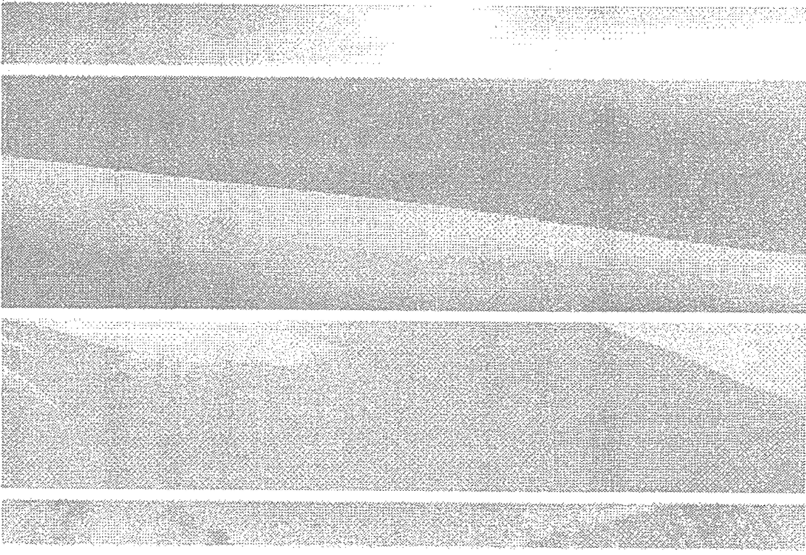

本章主要將處理一些個人事件，這些事件導致我們接受人類人格超越所謂的死亡而存活下來的可能性。這些事件並沒有為這種存活提供任何決定性的證據，但的確暗示發人深省且需要調查的問題。接下來這一章，將以一般的方式徹底討論這件事，並且建議一些讀者可以自己做的實驗。

我們要說的事件可分為兩大類：涉及自動說話的那些事件，以及顯現物質效應的那些事件。我把梅爾巴事件納進來，只因為它本身雖然不是個重要的例子，卻是個有趣的例子，講的是一度與物質相連、但現在獨立於物質之外的人格。

### 梅爾巴·布朗生

這個事件是羅勃和我自己嘗試一個實驗的結果，和賽斯課無關。有天晚上，我們只單純地坐在安靜的起居室裡等著，很快我便開始說話，雖然聲音是我自己的，但措辭、節奏、速度和語調和我的正常狀態不同。聲音相當微弱而莽撞，梅爾巴聽起來像一個淺薄、相當無知，卻懷著善意的女人。

實際上涉及了兩節，中間大約隔了兩週。第一節，除了這個人格自稱是梅爾巴·布朗生，說她在一九四六年死於南達科塔州、享年四十六歲之外，沒獲得多少資訊。第二節就有意思多了，我在描述的正是這一節。

她拼出娘家的姓，西爾考克。以下是她的歷史，從兩節濃縮而成。她在一位姑母家與哥哥一起長大，十八歲結婚，在南達科塔州一個說得模模糊糊、聽來像是Desatun的地方，一間成衣廠或紡織廠工作。

在Desatun這個字上頭，我們有點麻煩。發音是Des-a-tun，重音放在第一音節。她說，她在工廠遇見她丈夫，他是個工頭，一九六二年死於英國的馬爾波羅，他去那邊探親。在他們婚後，他繼續他的工作，但在Desatun郊外經營一座農場，他們就住在那裡。據梅爾巴說，土地貧瘠不適合耕作，她的丈夫也不是個好農夫。

他們結婚二十八年，有一個女兒和一個兒子。兒子現住在加州洛杉磯。她似乎不知女兒在哪裡，不過她提到兒子有兩個女兒。梅爾巴在紡織廠只做了幾個月。

她對自己的死亡描述得相當精彩，但敘述的語調相當平板、不表露感情。按照她說的故事，她死於一九四六年，在農舍的廚房裡。她站在洗滌槽邊洗碗，邊看著「枯槁」的景色。外面停著一輛小貨車。她感到胸部一陣劇痛，而死於心臟病。跌倒在地時，她打破了一個碟子。接下來，她只知道自己跑過田野求助。直到她回到房子，看見自己的身體躺在廚房裡，才發覺自己已經死了。羅勃問她，她的家人當時在哪兒，她說：「我的丈夫和兒子在農場的某個地方。」羅勃隨即問到女兒，她告知：「她不知跑到什麼地方去了。」

梅爾巴死後七個月，丈夫再婚，而且梅爾巴說到這樁婚事時，非常惱怒。在丈夫死後，他的第二任妻子搬去加州與梅爾巴的兒子和家人同住。梅爾巴爲此忿忿不平。

據梅爾巴說，她早年的背景並不愉快。梅爾巴的父母沒結過婚，她是由姑母帶大的，而姑母也撫養她哥哥。梅爾巴因爲自己是私生女而覺得丟臉，她告訴羅勃：「有個好名聲是很重要的。」在她看來，自己的父母一無是處，而不想談他們。

她無法解釋如何與我們搭上線，並補充說她「喜歡我們，因爲我們不取笑她」。當被問到時，她說她丈夫試著種苜蓿、小麥、菸草和玉蜀黍。

在我們的道路地圖上，不論在北達科塔還是南達科塔州，都沒有叫做Dostun的城鎮。不過，Dostun 聽來有點像Dakota，名字可能有扭曲。除了一次以外，我們沒有再嘗試更多這種實驗，因爲我們光上賽斯課就已經太忙了。而且，這種課雖然很有趣，但它們基本上對我們的知識並沒有增益的作用。

關於梅爾巴應該住過的城市，有很大的疑點，因此要核對她給我們的歷史幾乎不可能。當然，整件事也可能涉及我潛意識的編造。另一方面，這人格也可能真的是死後猶存的真實人格。

### 崔諾神父

下一件事就比較複雜一點，需要簡短解釋一下背景。在我孩提時的家裡面，崔諾神父有好幾年是常客。有幾段時期我們沒見到他，因爲他是傳道會的會員，常常旅行。爲了鼓勵我維持寫詩的愛好，崔諾神父習慣爲我母親和我朗誦一本舊詩集。切斯特頓 (G. K. Chesterton) 的《Lepanto》與格雷 (Thomas Gray) 的〈鄉村墓園輓歌〉(Elegy in a Country Churchyard) 是他的最愛。他老是讀這兩首詩給我們聽，很少加進其他的詩。朗誦時，他很戲劇化，用了很多手勢，說話混合了愛爾蘭土腔和相當做作的波士頓口音。

就在我描述的事情發生之前，我正在寫一篇關於崔諾神父的人物素描。他過世已經將近十五年，而且在他死前五年左右我就很少看到他。讓我氣餒的是，我的記憶力不如我想的那麼好。其實，我對他的記憶很少。他的特點和癖性已完全從我的意識消失了。

就在那時，我決定大聲朗讀這兩首他非常喜歡的詩，希望在朗讀時，我的記憶會刷新。我想，至少，他的一些手勢會在我的腦海浮現。那是一個陽光燦爛的早晨，九點鐘，窗戶大開著。我在書桌上放了一杯剛沖好的咖啡，打開一本名詩選集，開始讀詩。

讓我驚異的是，我的聲音真的是隆隆而出，非常深沉、宏亮而且男性化。這完全出乎我的意料之外。這聲音綿延整整八頁。以這個不尋常的聲音朗讀時，我快速來回行走。最後一首詩讀完，這聲音便消失了。

這聲音是不是像我以為的那樣深沉宏亮？我沒辦法知道。我獨自在公寓裡。因爲整件事不是計畫的，所以我沒有錄音。那是崔諾神父的聲音嗎？整件事只是我這方的幻覺嗎？那聲音只是聽來宏亮、深沉和男性化嗎？我決定看看同樣的事會不會再發生，這一次是在錄音機能給我一些證據的時候。

我拿起書，打開錄音機，開始再讀。說出頭幾個字的聲音正常，然後，隆隆的聲音突然又取而代之。第一次的演出又來了，但是程度稍爲減低。我內在感受到那聲音，好像它以一個穩定、令人振奮的能量環繞著我。

這只是崔諾神父事件的開始。下一次發生在幾個月後的一個星期天晚上。我們正在放錄音帶給我們的朋友威廉·加拉格夫婦聽。聽完時，比爾·加拉格（譯注：比爾爲威廉之暱稱）叫我讀其中一首詩裡的幾行，想要有意識地讓我的聲音變深沉到同樣程度。

我正好重感冒，喉嚨非常乾，因爲我的感冒，我們錯過了先前預定的一節賽斯課，而且我懷疑預訂明晚舉行的下一節課會不會上。不過，儘管感冒，我說我會試試。我們想知道，如果我真的努力的話，我的聲音能夠變得多深沉。我一拿起書，崔諾神父的聲音便取而代之。我有一個迅速清晰的念頭：不管發生什麼，我的喉嚨都吃不消。我根本看不出就算用平常的音量，我要怎樣才能讀完整首詩，我的感冒實在太重了。但聲音綿延下去，效果甚至比錄音帶上的更驚人。

為了招待客人，房內的燈光正常，一點都不暗。我坐在搖椅上，雙眼睜開，讀詩。據羅勃和加拉格夫婦說，我的雙眼比平常深暗且明亮。我常常用左手做手勢。主觀上，那隻手感覺比另一隻手肥很多，但看來並無差別。不過，就特徵而言，那不是我自己的手勢。那是個溫暖的夜晚，窗戶全開，而一個深沉的聲音隆隆而出，帶著顯然不是我自己的聲帶能夠發出的音量。

聲音有種奇特的節奏，像是吟詠。它也擁有絕佳演說者達成的那種相當震懾人心的特質，可讓整個大禮堂都聽得見他們的聲音。附帶一提，我並沒有受過發聲訓練或演戲經驗。詩一讀完，聲音也消失了。我們全都坐著討論發生了什麼事。對話轉向了賽斯課。比爾·加拉格有胃潰瘍，我們在想，賽斯對他的病情會說些什麼。在毫無準備的狀況下，一節沒有計畫、最不尋常的賽斯課開始了。

這一次，賽斯的聲音甚至比崔諾神父的聲音更響亮。深沉的男性音調是錯不了的。特大的音量維持兩小時以上，步調非常快。賽斯說話速度如此之快，連羅勃記錄都有困難。他好幾次要要求賽斯講慢一點。

賽斯叫羅勃注意我的五官。可惜羅勃正盡可能快速寫字，無法抬頭看，仍然繼續做筆記。我們沒有把新的錄音帶放進錄音機，也沒有設定「播放」。比爾·加拉格正對著我坐；佩姬偏坐一邊，只看得到我的側面。比爾確定他看到我的面容有所改變；從佩姬的視角，她無法肯定有或沒有；羅勃幾乎沒抬頭。賽斯幾分鐘前相當隨意地說出：「注意魯柏的五官」。

身爲賽斯，我指著比爾，告訴他，今晚剩下的時間，他的胃潰瘍不會再困擾他。胃潰瘍讓他很難過，所以他喝牛奶。從賽斯告訴比爾胃潰瘍不會再困擾他的時候，痛就止住了，而且很久都沒復發，一直到他和佩姬回家後。

暗示可能是疼痛緩和的原因，但無論如何，比爾都欣然接受。加拉格夫婦倆都是明智的人。佩姬是本地報紙的記者，比爾則在該報的廣告部門做事。尤其是佩姬，因爲職業的關係，受過觀察事實的訓練，而比爾也絕非容易受騙的人。

這部分的課長達一個半小時，緊接在崔諾神父事件之後，加拉格夫婦離開了，我們一單獨在家，課又馬上繼續。我兩眼圓睜，面對羅勃坐著。我倆都坐在起居室的桌邊。

以下是羅勃摘自賽斯課其餘部分的筆記。此處涉及我沒有覺察到的實質效果，因此羅勃的筆記比任何我能給的解釋還有效。他描述了他在現場的觀察：

### 摘自羅勃·柏茲的筆記

> 「珍在搖椅上開始說話，但只說了幾個字，就站起來到桌邊坐在我身旁。她雙眼圓睜，又黑又亮，直視著我。我有上課時前所未有的一種立刻涉入的感覺。她的眼睛直接凝視著我，讓人失措。現在這個效果升高，因為我開始覺得我注意到她五官有了一個變化。為了試圖客觀，我可以說或許我覺察到的改變，有一部分是實質的改變，有一部分是我這邊主觀的感覺。珍的五官相當生動。之前我沒有注意到任何變化，但比爾·加拉格注意到了，現在珍的五官失去了一些女性的特徵，變得更有稜角而且拉長，好像一個男性的存在正故意讓它自己被看見一樣。
> 
> 我相信，對我來說，她的面容顯得老了一些。我覺得好像經由她的眼睛，我正被一個男性人格觀察著。和一個不是珍的人格有關聯的感覺相當強烈，實際上我更關心的是，試著決定我觀察到的是什麼改變，而不是懷疑是不是真的有改變。
> 
> 有些令人驚愕的聲音效果將會出現。以下簡短摘錄那一節後來的幾個部分，包括羅勃的筆記以及賽斯的幾則評論。記住，賽斯叫我魯柏，叫羅勃爲約瑟。
> 
> 我從不想消耗他太多的能量，而在這方面，你的確是個監督者，那樣是對的。無論如何，我覺得花這額外的時間跟你說話很合理，因爲魯柏的心靈能力和能量充分調準到我們能更以這種方式一起工作的機會不多。
> 
> 你必須這麼投入筆記工作，我覺得抱歉。總的來說，今晚的課對魯柏非常有益，對你也一樣。我必須順著他的發展方向走。就他的能力而言，我無法逃避他，我也不會催促他，否則我們最終將會失敗。
> 
> 這裡，我們涉入過種種不同的出神狀態，但也同時也急於繼續我們自己的資料，以至於這兩種冒險已經合而爲一。」

我的手寫筆記寫累了嗎？
「沒有，還好。」其實，我很累。這是那種繼續下去比停一下再開始還容易的情況。我寫字的手感覺一種鈍鈍的疲勞。賽斯／珍坐得很近，凝視著我，微笑著，好像準備永遠繼續說下去似的。
你們人類的局限讓我膽怯，如果我笑了，那不是揶揄——「行。」而是感激你的堅忍。不過，我建議你休息一下。
「在整個傳話期間，我還是覺察到珍五官的一個變化，我想可能有一部分是實質的變化，有一部分是主觀的感覺。就好像我熟知的珍往旁邊站開一步，而另一個人格走向前，帶著幾分輕微的肉體變化，以及大量的心理變化……
……讓我真正吃驚的是，珍的聲音甚至變得更有利。這是建立在純粹的力氣和力量上的現象。當她發出這一陣巨大的聲浪時，完全沒有聲嘶力竭的跡象。當她說的話時，要是感覺天花板真的在我頭上震動，我也根本不會驚訝。那效應實在令人震驚。對於我在傾聽的聲音強度有多大，我沒辦法量度，只能說它包住了我。」

整個插曲，包括崔諾神父的事件在內，總共持續了四小時。結束時，我自己的喉嚨完全沒有緊繃。事實上，它比今晚稍早還要舒服些。雖然過去偶爾有一些比較不戲劇性的聲音展示曾經出現過，但是上課時發生如此驚人的聲音變化，這還是第一次。不過，從這一次開始，聲音效果比較常發生。

除了以上提到的明顯五官變化之外，很少出現實際的肉體效果。不過，這樣的事件當中有一次特別值得提及。在一節賽斯課裡，有位朋友，威廉·卡麥隆·麥當諾非常確定自己看見一個幽靈（apparition）。稍後，比爾（威廉的暱稱）與羅勃觀察到明確的物質效應，但當時屋子裡燈火通明。情況如下。

看見幽靈的地方是起居室和浴室之間的門口。比爾是那麼清楚地看見它，因此他畫了兩張素描，並在課進行時做了些修正。幽靈對比爾是時隱時現，達一小時之久。這時候，房內點著六十瓦的燈泡。我繼續爲賽斯說話，什麼也沒看見。羅勃坐在開著的門後，寫著筆記。比爾看見幽靈的地點完全在羅勃的視線之外。門本身擋住了他的視線，所以他看不見開著的門口，而且他想逐字記錄所說的話，所以也無法離開桌旁的位置。羅勃的筆記到此爲止。

當比爾開始畫幽靈的素描時，身爲賽斯，我在口頭上做了修正。

在門口的幽靈確實是我，但是一定有些扭曲。你是透過內在感官感覺到我，而且這份資料隨即必須被轉換成外在感官能夠感知的東西……我比這裡被畫出來的傢伙討喜多了（此處，作爲賽斯，我在比爾肩後端詳他的素描）。你可稱為顴骨的旁邊有某個陰影，你沒有畫出來。如果，你更仔細看著這個形象，我也許可以讓它更清楚一點。唇邊有一抹沾沾自喜的微笑（比爾在素描上做了一個修正）。啊，非常好；你會發現這結構是我自己創造的。為了要在你們的層面現身，我的結構必須由原子和分子組成。運動和速度與你們那些平常的構造不同。在這個例子裡，我透過魯柏說話，同時我也在一個構造物裡旁觀，看他說話。往後有一天，我也許能在我自己的構造物當中說話。但這需要訓練，而且我需要你們的合作。

沒錯，就某方面來說，我對你們而言並不漂亮，不過你們得承認我也不是那麼醜。這個形象是我現在的字樣子的重建，描繪的是，與物質層面有任何密切連結時，我的這些能力展現的外貌。這並不一定表示，在所有領域裡，我的形象都一樣。現在，在這一整段時間裡，比爾一直看著幽靈。羅勃的視線被門擋著。我自己也什麼都沒看見。休息期間，我們討論發生的事。我承認我很懷疑。我認為，比爾或許想像他看見了幽靈，或許那是個幻覺。當然，在這種情形下，我無法解釋賽斯的評論。但是，既然我根本什麼都沒看見，所以也很難只聽信別人的話說一個幽靈真的出現了。我沒理由不信任比爾，而且懷疑他確信無疑的一個效應是否有憑有据，也讓我覺得有罪惡感。但在休息時，我開始大笑和戲謔。這時發生了我覺得最難解釋的第二個效應。我們已打開另一盞燈，屋裡很亮。「你是在這兒看見你那個在門口的男人嗎？」我笑說。我站在離羅勃與比爾三呎的地方。他倆對我的臉都看得極清楚。突然，據他們說，一副全然不同的五官懸垂在我的臉前面。它們就朝前掛著，幾乎透明，可以看見我自己的面貌在它們後面。那五官是男性的五官。我不曉得有事發生，直到他倆都不可置信地瞪著我看。羅勃叫我站著別動，我感覺微微的刺痛，但也只有如此而已。當羅勃和比爾交換意見時，他們的觀察完全符合。然後羅勃叫我踏出門口。當我這樣做時，效果立即消失了。

對我而言，毫無疑問物質的效應確實發生過。由於羅勃與比爾兩個人都在明亮的光線裡觀察到五官，所以這似乎也指向幽靈是真的。比爾把他畫的兩張幽靈素描給我們，它們還留在我們的檔案裡。很難看出這些物質效應怎麼可能來自潛意識。如果它們發生在燈光微弱或是半明半暗之處，那麼它們的有效性顯然會備受質疑。幽靈出現的時間長久而且房間燈光明亮，這些事實讓整件插曲非常令人好奇。

幽靈和面貌的效應出現在賽斯討論物質的本質那一節課裡。據賽斯說，兩種具體化都是指出他的論述有憑有據的證明。之前簡短提過，他主要的論點是，物質是由每一個個體、人類或是其他生物，在物質系統或領域內，於潛意識層面上建構而成。就像我們不會覺察自己每一天的呼吸一樣，我們也不會有意識地覺察自己正持續地建構物質。所以，在一個潛意識的基礎上，我們會創造和維持我們自己的物質形象。為了說明物質的建構方式，賽斯用一個幽靈來示範說明。

附帶一提，作為示範說明，幽靈效應和面貌效應合起來相當有效地與課間的主題資料結合。

這些狀況，以及後來的章節將談到的其他狀況，導致我們假設人類人格擁有的能力，的確超過一般指派給它的那些能力。這些能力看來是人格與生俱來的，無論人格是否在物質的範圍內運作。或許有比較正統的解釋，可讓我們捲入較少的難題和較不複雜的問題之中，但是這種因襲的解釋，實際上可能會妨礙我們理解這種事件，因為它們阻擋我們向別處尋找答案。

* * *

羅勃和我都有過出體經驗（out-of-body experiences），這也讓我們相信人格基本上獨立於物質形象之外。這些事件，有些之前在本書提到過，強迫我們擴大對實相的概念。如果人格在此生能與自己的形體分離，旅行到別的物質地點，那麼，假設它在肉體死亡後，沒有形象也能存在，就不會不合邏輯了。

這種幽靈是怎麼產生的？人格怎麼能夠獨立於物質之外，而且獨立到什麼程度？你自己現在的人格是獨立於物質之外的東西嗎？下一章我們將討論這些問題，並尋找可能讓我們一瞥物質宇宙背後基本實相的線索。那一章也會提到給讀者的一些實驗。此處是第三十三節賽斯課的一些摘錄，作為本章的結尾，賽斯在其中描寫他自己的實相與結構。

說我是能量並非謊言。實際上，比起很多聽起來更可信與複雜的稱號，這一個稱號真實多了。我是一個有著「元素—能量」形式的人格。這絕沒暗示我是個「靈」，某種虛構的「長腿爺爺」之類的。我是什麼之所以很難解釋，是因爲你們自己的知識，還有我們現在的溝通方法，兩者造成的限制……

無論如何，我的確有個結構，而且我可以改變或交換那個結構的成分，使它在極為不同的條件下運作。在這些課裡，我使用我的基本能量成分的方式，有別於我在其他狀況下的使用方式。換句話說，我可以改變成分的排列，朝著一個特殊方向集中我的力量。

如果你想進入一個小空間，我想，你會四腳著地、拱起肩膀、頭先腳後，爬進這個想像的洞。這會牽涉到肌肉的操縱，造成暫時的形狀改變，在身體與空間的關係上，進行有點表面但是真實的一個調整，而且就身體低低向前推進洞而言，也會產生焦點或方向改變的一個後果。

在一個很不同的層面，就我而言，在我試圖進入你們小小的入口時，這是所涉及的事。不過，在我這方面，必要的操縱相當於一種變形，而在這方面我擁有的自由多很多。這就好像你確實能夠以更可見的方式，使你的身體小於你想進的洞。

你們的科學家知道，所有物質都是同樣的元素組成的。透過我描述的方法，我可以改變我的形式。你們看過水變成蒸汽，這是個非常簡單的比喻。我以能量的形式存在，我以電的形式存在，有時候也以化學的形式存在。我說過，我可以改變自己的成分排列。如果我被認爲是靈，那麼所有的能量一定都是靈。

我相信，你們對靈的概念是某種沒有形式的東西，但我可以有形式。我顯然有結構。在平常的情況下，你們看不見我的結構，就這一點來說沒錯（這是在幽靈顯現那一節之前）。你知道，內在感官提供直接的經驗，外在感官提供的是經過轉譯的二手經驗的僞裝扭曲。

你們或你們的科學家只不過尚未覺察到很多管理像我的結構這種事情的法則，但是這些法則有一些已經被思想比較具有獨創性的人瞥見。「在這國家裡嗎？

國外。你們國家裡有少數幾個人，在思考物質成分分解成基本能量形式所涉及的可能性時，在一個非常薄弱的理論基礎上覺察到了，我相信，這個理論會隨著一個未來的太空計畫一起被考慮。

這個概念將有助於你們理解我說，我有結構但可以改變它，我的意思是什麼。我透過直接的操縱，引起這種分子模式的重新排列（Re-arrangement）。這不可能會發生在你們的層面。甚至在遙遠的未來，這種重新排列也會涉及昂貴、複雜而且幾乎不可能的成就，因爲你們會由外向內來處理這個問題。解答之道就是，從內在操縱結構，或是非常直接地操縱全我。

### 摘錄自第二十一節

比。

我曾以人類的身分活過，這就是事實。根據通常會給的暗示，這個聚會和其他聚會並非降神會。所謂的降神會，當它們是真實的時候，只不過是運用內在感官的練習而已。以這種事情爲中心建立的狂熱崇拜是荒唐可笑的，而且在某些例子裡，是出發點很好但愚不可及的人格所做的不可原諒的愚蠢示範。

迷信滋長迷信。就珍或魯柏的潛意識而言，我透過你倆的潛意識與你們接觸，但是，是透過實際存在於層面或場域之間、與內在感官打交道的那個比較大的部分，那個部分屬於心智而非大腦。我與涉及你們個人記憶或現在人格組成的那部分潛意識，毫無干係。

你問我，爲什麼要給你這份資料。我的答覆是，除了我對你倆的強烈摯愛之外，還因爲你們沒有和任何狂熱派、宗教、特定學派結合。你們心胸開闊，也不是傻瓜，不準備把我假扮成大腹便便的丘比特、佛陀、神、聖人或魔鬼。這樣的人很難找。

### 「靈魂世界」和人類人格的存活

我們說，夢存在「我們的腦袋裡」，但夢顯然不是以和我們腦袋裡的物質組織、血管和骨頭一樣的方式存在。一位外科醫生能以一把手術刀深入我們的腦組織，但是肉體的檢查或手術都無法揭示夢、想法或心理經驗。

有天晚上，一些朋友，J夫婦來訪。話題轉到超感官知覺。J先生告訴我們，他有時能看到人類的靈光（aura）——隱約的放散物，有人認爲像一個光環似地圍繞著人體。甚至我們一起坐著聊天，他也堅稱他看得見他太太的靈光。我從未見過靈光，但願意接受它們存在的可能性。

出於好奇，我決定嘗試一個小實驗。我告訴J先生，我會集中注意力在他太太的靈光上（雖然我看不見它），試著讓它在她頭上升得更高。他同意告訴我，我是否成功。反之，我沒告訴任何人就努力想讓靈光更亮。過了大約一分鐘，J先生告訴我，靈光沒上升，卻變亮了。

我必須承認我有點吃驚。然後我們決定做另一個小實驗，房間燈光相當明亮，點著一盞平常起居室用的燈。我們坐在一起，在燈旁邊的同樣角落裡，握著手。我問：「有人在這兒嗎？」J太太幾乎立刻叫出來：「有人抓住我的手。」同時，她的手脫離我的手，彈向空中。她的手肘緊壓在咖啡桌上，手僵硬地往上舉，手指微彎，好像和別的手指接觸的樣子。從她的手臂肌肉和手的僵硬與緊張狀態來看，好像有個重量壓在它們上面一樣。J太太在顫抖而且汗出如漿。不過，除了J太太的行爲以外，我們全都沒看見任何不尋常的東西。

她一直堅持有個看不見的人抓住她的手，並且壓在她的手臂上。她顯然受驚了。再一次，雖然屋子燈光明亮，我們還是什麼都沒看見。J太太顯然不是在演戲，眼淚開始滾落她的面頰。我不知道是否有個我們看不見的人格在場，或這年輕女人是否太容易接受暗示。

我以堅定的口吻說：「你將放開J太太的手，不干擾我們。」

我重複說了好幾次，明白了太太要是太容易接受暗示，那麼這反暗示將會解除這個困難。另一方面，如果有個看不見的人格在場，那它已被要求離我們而去，而且我希望在這情況下，它會照做。

我才剛說完這些話，她的手就重重拍擊桌面，造成嚇到我們所有人的大響聲。我們都跳了起來，看看房間四周。我一直重複「你現在將離開我們，你將不再干擾這位年輕女士」，直到J太太安靜下來。

由於J太太的焦躁狀態，我認爲不應該繼續。結果，根本沒得到任何結論。

當晚其餘的時間J太太都覺得不舒服。如果有一位死後猶存的人格在場，那它顯然是個活躍的人格。

這讓我們得出幾個大致上與這一類實驗有關的要點。我建議，這種降神會不要在黑暗中進行。雖然我無法提供證據，但在我看來，似乎任何死後猶存的人格都不至於會被像亮光這類小事打擾。黑暗本身滋長懷疑，還會激發想像力。靈媒們長久以來都堅持黑暗，這個要求對通靈學會進行調查的妨礙，和任何其他東西一樣。在你們自己的實驗裡，要保持房間燈光相當明亮，氣氛還是能夠寧靜又親密。如果上面提到的實驗室在黑暗中進行，那位年輕女士的受驚程度恐怕要高得多。

在我們全部的實驗當中，這是唯一一次有不愉快的情況。重要的是，參與這種事件的人應該運用常識並且保持穩定情緒。那些主持這類實驗的人需要強烈的責任感，來維持適當的氣氛、條件與態度。對於暗示本身或一般的人格而言，我們還沒有足夠的知識，不宜貿然行事。任何參與者有任何不舒服的跡象時，就該立刻終止實驗。

### 「暗示」的重要性

在上述程序中，暗示的確可能扮演重要的角色；然而，必須控制暗示本身。可以用它，但並不鼓勵讓它失控。顯然，如果根本就不接受可能有看不見的人格這件事，就沒有理由做這種實驗。所以，接受這可能性本身，甚至在實驗開始前就設定一個暗示。所以，說暗示在這程序中沒扮演角色是假的。在我們生活的每個面向裡，無論是這些實驗或任何其他領域，暗示都很重要。但如果你在尋求真實合理的結果，也不該讓你的想像力跑得太遠。

也有可能一個看不見的人格，以某種情緒性的方式，以我們不瞭解的方式運作。在進行這類實驗時，你要負責維持平衡。就個人而言，我不建議你設法接觸與你或你的朋友曾有密切關係的人格，除非你極度冷靜。在這樣一個例子裡，情緒張力可能變得非常強大，可能很難保持實驗本身或其結果的客觀。

本章稍後會多談一些這類的實驗。不過，在開始討論人類人格的存活之前，讓我們思考一下自己在平常的存在裡認識的人格；在試圖討論所謂靈魂世界之前，也讓我們更仔細審視一下自己目前的主觀經驗。

我們平常的經驗究竟有多少是物質的？我們的實相現在有多少是存在物質裡，而有多少是存在於我們看不見又摸不著的實相裡？

作為一個物種，我們是由有機組織構成的，但在很多方面，我們的實相似乎存在於某些並非血肉的媒介裡。

我們一嘗試檢驗一個想法，就立刻改變了它。原始的想法消失，被新的取代之。我們只能經由我們自己內在的經驗明白想法是什麼。

我們也不會否認心理洞見或是情感或夢的有效性。這些都完全不是堅固的物體，但它們形成我們意識的一個重要部分。這種主觀經驗似乎和物質相連，但卻好像並不是真的包含在其中。

我們說，夢存在「我們的腦袋裡」，但夢顯然不是以和我們腦袋裡的物質組織、血管和骨頭一樣的方式存在我們的腦袋裡。一位外科醫生能以一把手術刀深入我們的腦組織，但是肉體的檢查或手術都無法揭示夢、想法或心理經驗。那麼，當我們假設夢和思想都在我們的腦袋裡，這到底是什麼意思呢？

這個概念的基礎是建立在以下的假設上：人類人格受限於物質，被肉體的本我綑住。所以，任何屬於人格的東西，都必須存在物質有機體內。如果我們純粹是物質的生物，那麼還是得承認，我們包含了某些非物質的東西。不然，我們內在的這些想法和夢也必須是物質才對，但它們並不是。

我不相信它是——那麼，我們還是得承認，我們有一部分實相並非物質，而是來自物質，而且無法被看見和觸及。無論如何，因爲這個態度，我們才會有實相只取決於肉體存在的想法。

物理學家已經發現，感官本身會扭曲實相，也發現我們只不過用原子和分子創造出模式，感覺這些是物體並予以命名，但這些發現似乎沒有改變什麼。大體上，我們仍然表現得好像物質實相是衡量經驗的唯一標準。

我們幾乎無法說某個深深影響我們的東西是不真實的。我們可以說一個經驗存在於某個觀點而非其他觀點之中。舉例來說，很多夢和任何醒時經驗一樣的生動和真實，而且對我們人格的影響一樣大。

夢可能沒有物質實相，但顯然有心理的實相。

我們來思考一下，形形色色的經驗是如何的真實或不真實。就拿在夢裡我們看到的地點來說，沒錯，夢地點並不是用物質的街道存在於城市空間那種方式存在我們的腦袋裡。不過，當我們在夢的背景裡時，地點看起來是直接的。在夢裡，我們可能沿著一條就物質的角度而言並不存在的大道走。我們接收到如果醒著就會稱之爲五官感覺的資料。我們聽、觸、嘗、嗅，並以我們要是醒著會稱之爲實質的方式運作。我們走路、說話、行動、工作、遊戲，但實質的身體卻在休息中。

我可以在我選擇的任何時候找到瓦特街：基於所有的實用目的，它是我住的艾爾默拉市的一個永久特徵。但是，我卻無法在任何我選擇的時候回去一個夢中地點。那麼，我們是否可以說是夢中地點不同於物質地方，在於我們無法回去那裡？不盡然，因爲我們很多人在重複的夢裡，的確探訪了我們在別的夢裡已經熟悉的同樣的街道與房子。如果我們在醒時狀態找不到夢中地點，那我們在做夢時也找不到物質地點。有充足的理由假設，只要人入睡之前暗示自己，我們就能回到各種不同的夢中地點。所以，夢世界也可能和物質世界一樣，擁有一個有組織的結構，一個我們在睡覺的時候非常熟悉的結構。乍看之下，這種事情似乎離所謂靈魂世界的討論很遠。不過，現在你或許能明白，我們不僅僅是物質構成的生物而已，我們個人的直接經驗超越過我們知道的物質實相。我們是肉體物質與另一個我們只能透過主觀經驗接近的東西構成的混和物，這個造就現在的我們的東西，沒有它，意識毫無意義。意識正是我們自己不存在為物質宇宙裡的一個物體的那個部分，而且它是由我們以最私人的方式據以實現自己的那些思想、情感和夢所組成的。

你以靈、靈魂或心智稱呼我們這部分的人格，都無關緊要。重點是，本我最不可或缺的面向並沒有化為有形的物質。

不過，在物質之中真的可以發現這部分人類人格存在的線索。透過化學物與荷爾蒙的增減，可以干預我們的情緒。我們的人格能夠被操縱到某種程度，甚至在肉體結構裡一個微妙的改變，都會造成內我的一個改變。但我們的意識和身分所仰賴的重要經驗本身，就一般的角度而言，並不是物質性的。

如果，我們自己的這個實相並不包含在物質內，而只是與之相連，那麼，可以相當合理地說，我們運作和存在於物質次元和非物質次元兩者當中。有些時候我們比其他時候與物質宇宙聯合得更爲緊密。舉例來說，比起在醒時狀態，我們在夢裡不那麼受到物質世界束縛。我們的感觉器官運轉變慢，到了空轉階段。我們被維持在物質宇宙裡，但我們限制自己在其內的運作。對我們來說，它變得不真實，就像在我們醒時，夢境變得不真實一樣。

至少可以想像，夢中的我只是我們自己身分的另一個面向；儘管自我操縱物質宇宙，但仍以其本貌繼續存在的一個我；在與物質的聯合結束後，仍繼續存在的一個我。

### 人類人格

心理學家對次人格和多重人格的研究顯示，一個本我很可能包含幾個其他的人格，每一個都沒有覺察到別的人格，每一個都在各種不同的狀況下運作，而且全都表現出不同的能力和態度。做夢的自己和醒時的自己都是同一人格的不同部分，每一個在不同的情況下運作。賽斯稱它們爲內在自我和外在自我，這個觀念爲我們的幾個問題提供看來頗爲合理的解釋。內在自我在夢中運作，其意識或身分都不依賴物質。在肉體死亡時，這內我只單純地繼續跟之前一樣行動——或許變成人格的一個主宰部分，但外在自我則以潛意識在此存在裡運作的同樣方式運作。

人類人格比我們想像的更複雜。從本書一開始，你自己的實驗應該已經讓你覺察到你以前可能不知道的能力和感知。透過你自己到目前爲止的經驗，現在你可能發現，有意識的自我只是在物質當中運作的那一部分全我。但包含潛意識、做夢的我的那一部分人格不會受此限制，而且似乎感知到外在自我不熟悉的實相，並在醒時的自己會猶豫的情況下運作。

問題不是：有沒有靈的世界？問題是：甚至現在也局部獨立於物質之外的這一部分人類人格的本質是什麼？它的潛能、限制和特性是什麼？或許最重要的是，當它與物質的聯合結束時，這一部分的自己是否繼續存在？

因為，如果我們現在甚至部分獨立於物質系統之外，那假設全部或部分人格可能繼續存在，就沒有什麼不合邏輯之處了。本我並不是堅實的物體，它永遠在變。死亡的經驗，和任何經驗一樣，會改變它。我們無法預知任何事件對任何人格的影響，所以我們也無法預知死亡會用什麼方式改變活生生的個別意識。

我們的確知道，意識不會再以物質爲取向。此處應該謹記，每二十四小時期間，至少有三分之一是花在睡眠上，那時我們不是以自我導向、以物質實相爲取向的方式運作，而是以潛意識的直覺方式，向內在的主觀實相聚焦。透過有系統地檢驗人格在睡時和出神狀態的行爲，很可能會發現解釋人格死後行爲的線索。因爲在睡時狀態的這個我一定是我們會倖存的那部分————多少已經獨立於物質之外的主觀的我。

對我們自己的夢紀錄超過兩年半的研究生動地暗示，人格在睡眠中絕非毫無組織。內在的邏輯、直覺和夢的結構，顯示出複雜性、變化多端和目的，並非我們以爲和做夢的本我有關聯的那種混亂狀態。

如果人類人格在肉體死後能夠倖存，那麼它很可能會顯示目前人格在做夢、出神和其他解離狀況中展現的一些特性。在這種時候，有明確的意識，也有本我意識。偶爾，甚至還有自我覺察，但人格層次之間的界限，並不像它們在醒時狀態那麼明確。

顯然，在夢的狀態中，人類人格的想像和創造面向會得到更大的發揮。解決問題似乎跟隨著直覺的表演方向，而非推理過程。舉例來說，在夢中，我們藉由建構我們在其中演出種種解決之道的夢戲劇來解決問題。實際的夢和丟棄的解答往往被有意地忘掉，然而，有很多次我們醒來時問題已經解決。這種夢工作暗示，睡著的人格可能並未缺乏自己的方向、目的和秩序。死後的人格可能會展現同樣的內在活動。

我們很久以來就知道，心影響物，但我們並不知道怎麼影響，以及影響到什麼程度。甚至連「心」和「物」這些字本身也已經改變。

賽斯資料提出「物質是所有生物在潛意識基礎上建構而成」的概念。（其他種的個體被視爲有一個廣義的意識，而不是一個有組織的自我。它們的覺察狀態可與我們的潛意識狀態相比。）按照這個理論，自我並沒有覺察到這種物質的持續創造，就像它也沒有覺察到，在它自己形象的物質裡，原子的不斷出生與重生一樣。這個觀念已充分發展，但在此只能簡短討論它。這個理論包括，詳細解釋已經達到與物體在空間的定位有關的協議方式。

要是沿著物理領域現有發現的路線來思考，這個概念就一點都不牽強。如果這是物質的建構方法，那麼在肉體死亡時，個體就只是停止它自己物質形象的這種潛意識建構而已。人格會繼續存在。內我仍然是一個心理單位，但是自我可能不再是本我的一個主宰部分。

那麼，在某種條件下，人格可能重新形成一個接近原來的物質本我的近似體，以鬼魂的形式出現在我們面前。可以想像人格對物質的支配不像以前那麼有效率，而分子結構也可能有缺陷。在肉體死亡時，自我不會消失，而是被本我的其餘部分吸收。在鬼魂的例子裡，它暫時回到自己的老位置，擔任心理活動的指揮者。再一次，物質控制力在這些條件下不會那樣有效，但在某些情況下，物質控制力卻足以讓某種具體化明顯到觀察者的感官可以覺察到。

那麼，理論上，這樣的人格也可能透過另一個仍在你們系統裡運作的人格的事物質形象來表達自己，藉此讓人知道它的存在。在這種情形下，兩個人格會維持某種合作，一種心靈或心理的工作關係。那麼，靈媒會是讓這種合作得以存在的人。在這些情況下，不會形成獨立的鬼魂，但是「自由的」人格會被允許使用靈媒的非自主肌肉器官當中的聲帶或其他部位。

就我所知，這個理論以及鬼魂的分類都是原創的概念，從我自己的想法和經驗發展出來。不過，我很肯定任何靈魂世界、心智世界，或你喜歡什麼就叫它什麼的那個東西，對我們來說將不陌生。首先，它將已經存在於構成我們的物質之中，也許它就是賦予物質本身生命的那個虛幻的特質。無意識或潛意識對這個實相將已經有內在覺察。只有自我會覺得它很陌生。

再一次，現在檢視我們的覺察，就會發現與這個實相本質有關的線索，因爲它是內在導向而非外在導向。本書前面列出的「心理時間」實驗，會讓你脫離自我對物質環境的強烈聚焦到某種程度，如此一來就能體驗到對內在實相的一些覺察。研究一下你列在筆記裡的夢，你就會明瞭，在看似混亂的夢行動本質背後存在的人格有何內在秩序。這本書所有的實驗都能夠讓你擁有更大的彈性。

隨著你的進步，自我將逐漸覺察到它和全我其他部分的關係。因為我們的實驗將自我納入考量，所以它會比較願意暫時讓開，如此一來，覺察之焦點就能夠轉向它還不能夠有效運作的其他實相領域。

### 鬼魂的通訊

我們已經提過獨立的鬼魂和不獨立的鬼魂。在你們自己的實驗裡，必須考慮到一些重要因素。任何與鬼魂人格的可能通訊都有明確的困難，應該要對其中一些進行更徹底的討論。

鬼魂通訊——宣稱與死後猶存的人格建立的通訊——的有效性很難證明。首先，即使數據是真的，我們也常常理所當然認為這種人格的運作方式和我們一樣，而我相信這是個錯誤。它們的心理結構在某方面可能已經改變；比方說對一個非物質的存在，「自我」可能沒那麼必要。自我是極爲特殊化、朝著物質取向配備而成的。

反之，這種人格最可能表現出我們在夢、出神和其他解離狀態中變得熟悉的意思特性。與醒時狀態相關的通訊相比，這種通訊更富聯想性、直覺性與象徵性。我們不太能夠假設，死後猶存的人格擁有和我們一樣的心理結構，所以我們不能期待通訊會跟著我們熟悉的方向走。這種期待是過分的要求，可能引導我們走到錯誤的方向。

鬼魂人格面對的通訊困難，遠比我們這方為了感知通訊必需的努力大得多。這樣的人格必須在它已經不再於其中運作的物質系統留下深刻的印象。對獨立的鬼魂來說，一定要累積原子和分子才能形成相當一致的形象，一定要建構某個最低限度的肌肉系統等等。不過，在此應該記住，我們從嬰兒到長大成人的過程中，雖然沒有意識，但我們做的就是這些事。我們增加構成形象的物質，我們建造、維持並發展我們的身體。獨立的鬼魂也會做同樣的事，不過是從零開始。

附屬的鬼魂不必面對這麼多問題，它只要與一個活人有某種心理上的合作，就可操縱已經建構好的物質。不過，在這情形下，可能會有仍在物質系統內的個體潛意識領域所造成的一些扭曲。

在這方面，你們的「靈應盤」實驗可能會提供絕佳的例子。如果你收到一個宣稱來自這種人格的信息，那就盡量取得你能得到的資訊。切記，你的消息來源對我們這類的事實可能不在乎。舉例來說，通訊者可能認爲心理事件是相當合理的事實，但你可能會完全不當它是事實。此外，時間是相對的，我們所知的時間在鬼魂的實相裡可能毫無意義。

換言之，通訊人格可能會以我們在解離狀態時體驗時間的方式體驗時間。這並不是我們熟悉的連續時間系統，所以我們在處理包含時間因素的資訊時，可能必須在這方面做一些調整。

無論透過「靈應盤」、自動書寫、自動說話，或是透過別的程序，有一些標準可以讓你知道來衡量自己的訊息。本書前面已經提過這些標準，當你在評斷這種通訊時，務必將它們納入考量。有效的資訊也可能隱藏在主要源自潛意識的資料裡，如果事實如此，那麼持續做實驗可能會讓個人資料逐漸去除，有效資訊隨之增長。

就附屬鬼魂而言，人格最可能會經由實驗者的潛意識進入，影響自動神經系統和非自主的肌肉系統。例如，在「靈應盤」的情況下，這會造成指針的移動。至少如果你擴大自己的閱讀範圍，納入論及ESP的書籍的話，會有幫助。很多種現象確實好像指向死後猶存的人格的存在，也指出位於活物質架構內的一個內在實相──一個繼續在它一度找到表現方式的肉體架構之外存在的實相。現有的涵蓋面。我現在說的是最高品質的資料，而非顯然是潛意識編造的通訊。這種通訊引起的問題，和它們提供的解答一樣多。在進一步對這方面進行調查之前，關於它們的來源，我們提不出決定性的證據。我們可以說是，這些通訊不是有意識的通訊，其中最好的通訊似乎也不是來自潛意識，除非擴大潛意識這個詞本身涵蓋面。如我有以口述來寫作的習慣，或許也會對自動說話樹立障礙。這種通訊引起的問題，和它們提供的解答一樣多。在進一步對這方面進行調查之前，關於它們的來源，我們提不出決定性的證據。我們可以說是，這些通訊不是有意識的通訊，其中最好的通訊似乎也不是來自潛意識，除非擴大潛意識這個詞本身。換句話說，自我要自己的作品功勞歸它。在這方面，為賽斯說話就不會困擾我，但是，沒有成功過。我懷疑，我的自我在這方面設下了障礙，因為我的職業是作家。像玩「靈應盤」的時候一樣。自動說話是我最熟悉的一種。至今，我在自動書寫上沒有成功過。

死後猶存的人格也可以用自動書寫進行通訊。在這情形下，鬼魂是附屬的，就像玩「靈應盤」的時候一樣。自動說話是我最熟悉的一種。至今，我在自動書寫上沒有成功過。這情感層面有甚至會影響獨立鬼魂的重要心理連結。這連結可以在觀察者和鬼魂之間運作。在理論上，一個獨立的鬼魂有更大的自由，但更可能的是，在情感層面有甚至會影響獨立鬼魂的重要心理連結。這連結可以在觀察者和鬼魂之間運作。在理論上，一個獨立的鬼魂有更大的自由，但更可能的是，在情感層面有甚至會影響獨立鬼魂的重要心理連結。發的鬼魂案例已有紀錄，但本書談到很多通靈現象的其他面向，因此無法討論它們。不過，我建議你去公共圖書館找這類資料，本書末尾列了一份建議書目清單。

問問你自己認識的人有沒有見過鬼，或是以爲自己見過鬼。我認識的幾個人告訴我這類的經驗。我們不能理所當然認爲所有的「見鬼」都是想像力過度作用或潛意識投射的結果。

以下摘錄自賽斯第二十三節，討論的是內我，以及內我與物質宇宙和非物質實體的關係。

個體的某個部分覺察到呼吸最微細的部分，個體的某個部分立即知道進入肺部最微細的氧粒子及其他成分。思考的大腦卻不知道，你們最重要的「我」也不知道。我親愛的朋友，實際上，最重要的我的確知道。你不知道這最重要的「我」，而你的困難就在於此。認爲人，或人的「我」是頭腦的產物，是一小塊孤立的潛意識，為了補足斤兩而加了少許零星物品，是個時髦的想法。所以，在這樣一個不自然的分割下，人似乎都不認識自己了。他說，「我呼吸，但誰在呼吸，既然意識上我無法告訴自己要呼吸或不要呼吸？」他說，「我做夢，但誰在做夢？我無法叫自己做夢或不做夢。」他把自己切成兩半，然後又奇怪他爲何不完整。人只承認他看得見、聞得到、摸得到或聽得見的那些東西；在這樣做的時候，他只能欣賞半個自己，而在這裡，我還誇大了。事實上，他只覺察到自己的三分之一，因爲他自己的三分之二存在他不願承認的領域裡⋯⋯

賽斯神聖手冊

如果人不知道誰在他裡面呼吸，如果他不知道誰在他裡面做夢，那並不是因為有一個自己在物質宇宙裡活動，另一個自己在做夢和呼吸，而是因為他把呼吸和做夢的那一部分自己埋起來了。如果這些機能似乎是這麼的自動，以至於是由完全與他自己分開的某人執行的話，那麼這是因為他自己做了分割⋯⋯

你做夢的那一部分，和用任何其他方式運作的你一樣，都是「我」。你做夢的那一部分，就是你呼吸的那一部分。你的這個部分對你來說，作爲一個完整單位，顯然與你打橋牌或玩拼字遊戲的那個部分一樣正當合理，而且更爲必要。如果像呼吸這麼重要的一件事，被交給一個附屬、幾乎完全分開、像個窮親戚似的次等人格的去執行的話，不是太可笑了嗎？

呼吸對意識心而言似乎是以自動的方式進行，同樣的，將宇宙的活力轉化成模式單位（超越式單位）的重要機能，也似乎是自動進行。但這種轉換對你而言並不是那麼明顯；因此看起來，這個轉換好像是某個比你那呼吸和做夢的自己更遙遠、性質更不同的人在做行爲似的⋯⋯

事實只不過是，你自己形成這些僞裝模式（物質世界）。你用你呼吸的那一個部分形成表像世界。意識上，你不承認呼吸者是你自己的一部分，你也不承認偽裝物質宇宙的創造者是你自己的一部分。

因為你知道自己是在沒有意識到涉及的機制的情況下呼吸，所以你雖然不願意，卻不得不承認在呼吸的是你自己。當你橫越一個房間時，即使意識上你對命令肌肉去動這件事並不知情，但卻不得不承認使自己這麼做的是你。然而，縱使你承認這些事，卻不是真的相信它們。在你安靜、未設防的時候，你仍然說，「誰在做夢？」

既然人要認出運動他自己肌肉和進行他自己呼吸的那部分自己是這麼的難，我想他無法了解這個全我也以幾乎和他用呼出的氣在窗玻璃上形成一個圖案一樣的方式，形成物質的偽裝世界，也就不叫人驚訝了。

當我說你們其實是以你們在一片窗玻璃上用呼出的氣形成一個圖案的方式，利用內在活力自己創造出你們物質宇宙的偽裝模式，我並不一定是說，你們是宇宙的創造者。我只是說，你們創造你們所知的物質世界，而親愛的朋友，此中存在著一個巨大的故事。

### 「靈魂世界」和人類人格的存活

我也不知道所有的答案。不過，有個事實就是，即使是人類，在行事粗心大意的狀態下，也會發現是他自己創造出自己的物質宇宙，而肉體的機制擁有的功能和變化比他知道的還多。

## 15 ESP調查之一斑

身為人類，讓我們在歷史上第一次從迷信和無知裡解脫出來，勉力了解我們自己不可捉摸的部分。未被發現之人將在充分了解自身潛能的狀況下出現，利用那些潛能可能，我們可能會擁有真正的智慧。

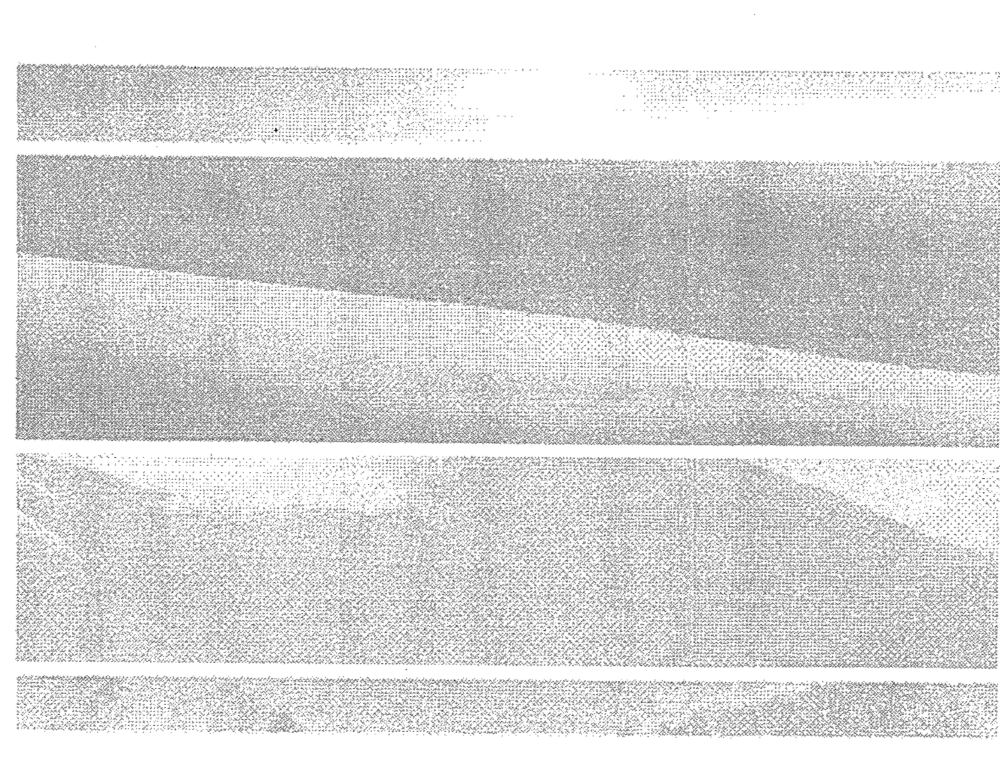

超心理學是一個支派，與調查心電感應、千里眼之類的證據，以及在超感官知覺領域裡的實驗有關。超心理學派堅稱，ESP是個已經證實的事實。像美國的萊因（J.B. Rhine），及荷蘭的坦海夫（Willem Teirlinck）等人，畢生努力在嚴格的實驗室條件下研究ESP。除了一些著名的例外，心理學家往往強調ESP在科學上未曾有過實例證明。你們那些讀過傑克·哈里克·波拉克（Jack Harrison Pollack）的著作《千里眼克魯澤》（Crossed the Rubicon）一書的人很難相信，超感官知覺的證據會被懷疑。

的確，克魯澤曾經無數次地在科學情況下以實例證明心電感應和千里眼，而萊因的齊納卡（Zener cards）實驗也呈現了自己的證據。許多人格不容置疑的調查者記錄了種種的出體經驗。儘管我們會驚慌失措，但鬼魂真的出現。各個通靈學會的紀錄裡都有無數這類事件。

ESP是一個已經證實的事實。我們知道它存在，屬於我們以人類身分運作的架構的一部分。我們不知道它如何、爲何、何時運作，但是我們對這些問題的確有部分答案。往往，測試一個人能力的企圖本身，會使這些能力至少暫時無法運作。

在家裡的熟悉條件下成功是一回事，在實驗室造成的緊張狀態下成功又是另一回事了。ESP通常是自然而然發生的。在我們更了解它的特性之前，可能會在測試條件下繼續遇到困難。幸虧一些通靈者擁有足夠的天賦，能夠實際運用自己的能力，也願意讓人檢驗他們的天賦。坦海夫教授與克魯澤合作，增進了我們的ESP知識，以及它和心智聯想過程的關係。

毫無疑問，ESP能力與直覺和主觀性本我的連結，強過於它們與自我性本我的邏輯部分的連結。有個學說提出說，這些能力在史前尚未文明化的人類身上明顯很多，而且有隨著進化的推進退化的傾向。不過，在我們全心投入物質主義和技術之際，也有可能完全忽略它們。

我們愈務實和「客觀」，就愈少使用我們的ESP能力。當然，這會讓我們陷入一個困境。以一個嚴格的務實態度調查ESP的人，往往對它抱有成見；那些不實際的人又被指控缺乏科學的客觀性。理想的調查者會是一個既有直覺、又受過科學方法訓練的人。

由於這些能力屬於潛意識而非意識層面，所以它們顯示了人格在主觀狀態展現的特性。其中常常涉及潛意識的象徵。此處，再一次，波拉克的「克魯澤」又提供了絕佳的例子，說明聯想（一個想法導致下一個）的重要性，以及它如何運作以建立千里眼的影像。不過，有時候會發生扭曲。一定要調查潛意識的語言，我們必須學會某程度精確地解讀它。

### 靈媒

一般而言，靈媒這整件事是超心理學家和心理學家兩者寧可忘掉的事——如果可能的話。不幸的是，他們做不到，因為靈媒們曾經接收到一些極佳的ESP證據。精神靈媒主要是處理精神效應而非物質效應的人，比方說，顯示千里眼的知識，而非製造鬼魂或移動物質物體。

調查精神靈媒容易多了，因爲一般而言，他們並不堅持黑暗或半暗爲運作的條件。我們根本不知道，黑暗是否有利於鬼魂的正常出現，但黑暗顯然有利於欺騙。我個人認爲，光線對參與的人類造成的干擾，遠多過於它對可能出現的鬼魂造成的干擾。

過去，心理學家和超心理學家兩者受到詭詐的靈媒蒙蔽，到如此的程度、以致他們現在的態度成了：在證明清白之前都有罪。雖然這對科學家來說可能行得通，也可能確實會提昇科學證據的品質，但是從其他觀點看來，這種態度令人遺憾。那些有接收能力或懷疑自己可能有接收能力的人不願意站出來，是可以理解的。在這種情況下，一次失敗暗示的並非神經質造成的自然結果，而是欺騙的徵兆。

大多數的靈媒確信，在通靈的出神狀態中，自己被一個死後猶存的人格控制。這人格被稱為「監使」（controller）。有時候，透過這種降神會，可以得到任何活人都不可能知道的訊息。我現在說的是從未發現過其中有詐欺的案例。由於調查者自然會熱切地尋找其中是否有詐，比偵探搜查謀殺嫌疑犯還熱中，所以這表示涉及的靈媒真的是和白雪一樣純潔。

不過，這樣的本事不用人格倖存的理論也解釋得通。在這類例子裡的靈媒可能運用自己的千里眼能力，監使人格也可能只是被靈媒利用的一種潛意識工具，以便她或他可以運用與自我無關的能力。這具有讓靈媒不會過度焦慮，不會因為擔心消息是否正確而分心的作用。失敗將不是她的失敗，而是監使人格的失敗。當調查者像獵犬似地等著失誤時，這可能是紓解心理壓力最有用的潛意識機制。它也能讓本我的直覺元素分開運作，不受自我與本我的邏輯支配。對有些人來說，這樣的心理機制可能有其必要。

這些監使人格也可能正是他們自己說的那種人格。雖然倖存人格從來不曾在超心理學實驗室裡蹦出來過，但是很多登記在案的鬼魂事例讓個人倖存的可能性高過於一般的假設。「出體」案例的進一步紀錄也會有幫助，因爲，如果可以毫無疑間地證明，活著的人格可以同時出現在兩個地方，那麼倖存論點將會更進一步。一些極佳的案例已有記載，而且不該被遺忘。

靈媒出神狀態，不管它是別的什麼，都與催眠出神狀態類似，至少看起來是如此。不過，在我們自己的實驗裡，我並沒有進入靈媒通常有的典型深度出神狀態。未來我會不會這樣做，尚待觀察。不管別的，出神狀態本身無疑是引發內向專注力和阻擋外在分心刺激的一個必要方法。

### ESP調查之一斑

現在我們自己在賽斯課裡，開始做一個非常簡單的測試程序，希望這樣做可以讓我們看見，賽斯對於千里眼資料會提出什麼前後一貫的說法。第一次的時候，我相當緊張，也看出更深的出神狀態在哪裡能夠容許更大的自由。在我的輕度出神狀態中，我可以同時覺察到兩條思路：一條是我的，一條是賽斯的，賽斯的優先。在我們的第一次測試中，不知不覺地我在兩個來源之間轉換。測試結果顯示，賽斯的資訊是對的，而我的是錯的。在上課時或上課之前，我並未刻意引發出神狀態，而是讓事件自然發生。由於較深的出神狀態一般在上課時不會發生，所以我們就維持現狀。不過，在單一節課當中，測試經驗教我學會辨識賽斯的通訊和任何可能進入的我自己的扭曲思想。這個經驗是無價的。

無論它是否確實能讓倖存人格說話，或者只是方便的心理手段，出神狀態在這種情況下都非常有幫助。顯然，心理學家、超心理學家以及真正的靈媒應該通力合作，用正當手段努力發掘其中涉及的真相。

未涉及靈媒的ESP調查，則容易評估多了。舉例來說，克魯澤不用任何一種的靈魂監使，並有清楚的科學證據證明他的能力。目前在美國以實例證明能力的彼得·赫科斯（Doug Hennig）的情形也是如此。如果倖存人格的確存在，並與生者通訊，那麼不管從心理學的角度來看，還是基於相當實際的理由，靈媒的監使都是正當合理的。不然的話，監使和靈媒出神狀態本身可能在基本上都是非必要的，但在心理上卻很重要。有些具備強大通靈能力的人可能不必求助於這種「人工的」人格，而其他人可能覺得它有助於維持整體的心理穩定性。

這些全都是我們沒有答案的問題，也是我們大致上要了解ESP不可或缺的問題。超心理學家和心理學家面對這類問題的態度不盡相同。其他的科學社群目前還不認爲超心理學領域值得尊重，不過這種態度正在改變中。心理學家在試圖客觀時矯枉過正，因此常常好像會拒絕接受非常合理的證據。雖然個別的心理學家可能思想比較開放，但不信任ESP的傾向似乎是心理學家普遍的特徵。心理學本身必須非常努力證明它自己在科學上的可靠性，所以這可能是它在這方面態度僵硬的原因。

那些覺察到自身能力的人感受到這種情況，因為超心理學家與心理學家對這種人的態度，一部分源於兩個團體之間的緊張。在這個領域裡，第一個反應是『現在就證明它』。再一次，超心理學家想要證明他們的案例並沒有錯，要得到認同，這是唯一的方法。

在我看來，除了那些拒絕接受證據的人以外，對所有的人來說，ESP都已經得到證實。現在需要的是，超心理學家、心理學家以及那些確實具有ESP能力的人互相合作和信任的氣氛。

『好吧，證明給我看』的態度對這樣的努力毫無助益。人的因素在這個領域裡比在其他領域裡更形重要。極佳的客觀實例證明，極可能來自這些團體之間的友好關係。但是在不信任和猜疑的情況下，ESP能力就算能夠運作，也不會有效運作。

超心理學領域顯然不能滿足所有的人。可喜的是，這個領域調查的是過去組織化的知識追求者一直迴避的問題。不過，希望這個領域未來在追求科學證據時，能夠保有賦予它原動力的冒險精神和好奇心。

這個領域也避開轉世的問題，這是可以理解的，因爲那是個棘手的問題。然而，這個主題一再地冒出头来，已故的艾德加·凱西 (Edgar Cayce) 的工作就常有這種情形。凱西是一位治癒者，不管病人是登門造訪或用信件與他聯繫，都能够在出神狀態下替病人开立正确的药方。雖然很難接受，但毫無疑問的是，他常常在醫生失敗之處獲得成功。不過，在這種出神狀態中，他也討論轉世，堅持它是人類的一個存在事實。他的健康判讀 (health readings) 已經證明有效，這是否暗示轉世的判讀也有效？

我們現在甚至願意把人類人格的倖存，當作值得科學調查的一個主題——主要是因爲其他論點無法完全解釋的證據愈堆愈高；但轉世仍在外緣，一個不斷回來騷擾我們、不受歡迎的繼子。不過，有些傑出人士，包括維吉尼亞大學的伊安·史蒂文森博士，透過自己的調查，開始對此有所貢獻。

科學上還是幾乎不可能證明，一個活著的人真的是一個曾活在——好比說，十七世紀的人，即使這個人能夠展現超過正常能力但又不容置疑的個人知識，而且那知識本身確實無誤也一樣。舉例來說，假設某甲提供了十八世紀住在一個特定城市裡的某主教的資訊——細節令學者吃驚的資訊。除了轉世之外的其他解釋，理論上也能說明這樣的情況。

那資訊可能是經由我們不知道的方法，在潛意識層面蒐集而來的。它可能是透過千里眼的方式（如克魯澤曾經協助學者們檢驗老文稿），或在一個像靈媒的關係裡，透過與實際涉及的人格通訊接收到——即使這些解釋似乎和轉世一樣複雜，也必須納入考慮。來自印度的特定案例，除了轉世是個事實外，似乎別無其他解釋，但它們在美國大半被忽略了，也許因為上面提及的解釋也可以解釋它們。

鬼魂肯定屬於超心理學的領域，而且這種例子每一個都被仔細研究過。有證據顯示它們的確存在，並記錄在通靈學會的檔案裡。不過，這並不一定證明我們所知的人格死後猶存。它證明的是，人格的某些東西仍然倖存，那也許是另一件事。這種鬼魂暗示人類人格死後猶存，而且這件事千真萬確。我們可能會發現，忽視這種事例比較容易，但是這一點都不影響涉及的事實。無論這種鬼魂對我們目前的理論、觀念或誤解是否造成尷尬，它們都是真有其事。

招魂術 (spiritualism) 對促進 ESP 調查很有貢獻，尤其在過去。信心與信念的氣氛，可能幫助很多在這種圈子裡的人發展自己的能力，不幸的是，在招魂術的圈子裡，就像在其他圈子一樣，也存在著詐欺。降神會本身傾向於吸引善意卻自我欺騙的人，也同樣會吸引那些更能分辨自己接受和不接受什麼的認真的人。

美國這個國家，每個城鎮都有靈媒。他們在招魂術的圈子裡工作，也獨立工作。很多是誠實又善意的人，但能力欠缺；有些可能真的有能力。非常需要的是，來自超心理學機構、受過完整的調查技術訓練的代表，他們會把這些人找出來，鼓勵他們研究、發展自己的才能，翦除騙子，並說服正當的靈媒接受能力調查。

顯然，這樣的任務需要經費，但卻沒著落。困難也很多，可能來自某些靈媒本身、來自招魂術的圈子，以及來自此時尚未準備好處理這種大規模調查的超心理學家。不過，只因爲他們沒被研究過，就理所當然認爲這些自稱靈媒的人全都是騙子或假仙，其實是大錯特錯。

我們希望像生物學家隔離病毒那樣隔離ESP，但這是不可能的事。我們想要的是可預測的實驗，但人類人格卻是不可預測的。當我們不依賴肉體感官來溝通時，當我們不利用邏輯思考過程時，當我們不以直接的物質實相爲主要方向時，似乎是ESP運作最順暢的時候。這些特性當然使得這種現象的調查很困難。不過，我的主張是，當人類人格是內在導向時，探索它在夢架構和解離狀態之中的運作，就可以研究ESP的特性到某程度。

本書作者的看法是，如果從我們所謂死亡的變化倖存下來的話，人類人格將會局部展現與活著的人格在脫離自我時一樣的意識和行爲。由於潛意識語言也是整個ESP架構的一部分，所以這樣的調查也有助於我們詮釋這種內在的象徵作用。

人格在這些情況下運作的方式，應該透露不少我們接收和利用超感官知覺的方式。預知夢的仔細研究將會是無價之寶。比起更令人吃驚的預知夢，那些不明確但與其他潛意識資料混在一起的夢，可能透露給我們更多人格利用這種資訊的方法。心理學家已經開始調查夢境，但就我所知，夢的分類並未考慮到預知。

+ * * *

本書的實驗應該能讓讀者至少認識並利用自己的一些能力。尤其是預言實驗，所有對ESP有興趣的人都應該做。至少有點可能的是，這些實驗有助於將預言放在某種一致的基礎上。據我所知，這個實驗是作者原創的。「心理時間」實驗始於「賽斯資料」裡的建議，但在過去其他人用過它的變化形態。

你們很多人可能發現自己擁有玩「靈應盤」、自動書寫或自動說話的必備能力，但是最後一項稍微不尋常一點。不過，這些能力本身並非任何ESP的證據，而是聯繫潛意識的方法。偶爾，它們也可能是讓你們能夠認識並利用真實ESP能力的手段。對於你是否與自己的潛意識接上線，或是否真的和超越已知的個人本我界限的其他力量接上線，誠實評估你們用這些方法得到的資料，就會有個清楚的概念。

毫無疑問，有些夢具有預知性。雖然並不廣泛，但過去也有別的調查者用過本書提供關於這種夢的實驗，尤其是鄧恩（J.B.Dunne）。目前都接受群眾做的這些夢實驗，不只對大眾透過直接經驗熟悉預知夢，也對強化這些夢的整體論據，非常有幫助。羅勃和我有理由猜測，如果在睡前暗示自己會做這種夢，你就會讓自己做這種夢。我們才剛開始做我們自己的這一部分工作，所以還沒有足夠的數據讓我們做出任何結論。

有充分的理由假定，催眠能使個人將注意力的焦點由物質環境轉換到內在環境，進而讓他能夠利用自己的超感官知覺。不過，應該一提的是，在催眠狀況下，透過暗示可以引發幻覺。可以說服一個被催眠的實驗對象，相信一張桌子從地板跳到八英呎高，而且他會發誓是真的。顯然，這並不表示桌子有移動過一吋。在這種案例裡，實驗對象的幻覺完全是催眠者引發的。在看見物體以一種離奇的方式在房內移動的靈媒降神會裡，暗示可能扮演了某個角色。不過，這並不表示所有這類效應都是暗示引起的。你們對催眠有興趣的人，應該閱讀一些談及現代科學催眠原則的好書。

自我催眠將容許讀者熟悉出神狀態，達致ESP能力常顯現其中的意識解離狀態，一般而言，出神狀態並無不自然之處。筆者可以大膽地說，本書的每一位讀者一生中都有許多次在毫不自覺的出神狀態中。

不過，你們那些對自我催眠感到不自在的人，不需要使用它。我已經提供你們增進注意力和向內聚焦的代替方法了。我們做這些特定實驗的目的，是想讓人格暫時脫離自我的控制。我們怎麼稱呼已經達到的意識狀態，或替使用的方法取什麼名稱，一點差別都沒有。

催眠摒除實質的干擾，進而提昇內在的專注。它不像睡眠狀態，但睡眠和催眠的出神之間倒是真的可以做某種一般性的比較。不過，如果一位催眠師在引導中暗示催眠對象覺得想睡或是睡著，那麼催眠對象就會兩件事都做。另一方面，如果催眠師沒做這種暗示，催眠對象不會比幾分鐘前更想睡，除非——而且這點很重要——催眠對象已經確信催眠出神狀態與睡眠狀態類似。

催眠可以用來引發類似睡眠的狀況；這並不表示，催眠本身一定會引發類似睡眠的狀況。舉例來說，它可以非常有效地用來增強意識和直接注意力，讓一個學生能夠爲一次困難的考試作準備。它也可以當作建立人格自信的方法，讓他相信他可以運用自己所有的能力。可以用我們在本書建議的方法來運用它——繞過自我的關注，好讓ESP更容易展現的一個方法。

我才剛開始運用自己的能力。不要忘了，在開始做本書列舉的實驗之前，我並沒有ESP的經驗。我的丈夫參與的所有實驗也都成功，他做的每日預言尤其有趣。我們才剛涉及一些其他的實驗，因爲我們在那上面花費的努力與時間還不夠，所以不能在此細述。

舉例來說，是否有星光體（astral body）？很多人認為，我們擁有一個無形的內在身體，由一些介於物質和非物質之間的東西組成。其他人則認為，這星光體是電磁性的。

對我來說，這整個想法一開始聽起來相當牽強。然而，我的一些實驗似乎暗示，神遊（astral travel）或用這個星光體旅行是真有其事。進一步的實驗或許能夠得出一些答案。

就賽斯課而言，它們仍在繼續。當這本書到你手上的時候，上過的課已經超過兩百次。聽見賽斯出聲的次數愈來愈多，光是音量就喚起了一個重要的問題。賽斯要不就是他說的那樣子，擁有隨他處置的能量，能把我自己的聲帶推到超過正常限度，要不就是潛意識具有遠遠超過一般證實的令人驚異的能力，能夠操縱物質有機體。

### 與賽斯在一起的經驗

我曾以類似男性的深沉聲音為賽斯說話，聲音隆隆而出，長達四小時，一直合乎邏輯又簡潔地討論林林總總的複雜事物。有一次這種課是針對一位著名的心理學家，並在他的要求下錄了音。由於這聲音可達到的音量很大，所以我們鮮少在我們的公寓裡上這種課，而是在鄉間一位友人的家裡。

賽斯說，他是一個已不在物質系統運作的能量人格精髓。簡單一句話，我們根本不知道他是誰或是什麼。一位心理學家曾經非正式地告知我們，賽斯並未展現次人格通常有的徵象。課裡顯現的各種物質效應和幾個千里眼的例子，在這方面並不能證實什麼。

儘管我自己不喜歡實質效果，但在未來可能會證實這些是重要的。好比說，如果賽斯在我們起居室的明亮燈光下，清楚完整地現身——而且我看見他——那麼，至少我非常願意承認他的確是他說的那樣子。在課裡，羅勃好幾次看見我的面容明確改變。在一個目擊者看見鬼魂的同一天晚上，在極佳的光線裡，他和那個目擊者觀察到我的臉孔前出現了怪異的顯像。不過，我沒看見鬼魂。由於別的顯像並不常出現，而且又牽涉到我自己的人身，所以我本人沒有看見過這些變化。種種跡象並未指向，「暗示」得爲這些效果負責，特別是因爲它們是在明亮的光線裡發生的。賽斯最近說可以拍攝五官的改變，我們心裡記著這件事，打算設計一些未來的課。那聲音不能說是幻覺，有錄音可以爲證。整件事不像是源自潛意識，除非我們願意徹底重新評估我們對潛意識的定義，把遠遠超過現在歸諸於它的力量和能力指派給它。在我參與過最奇特的一場對話裡，賽斯最近與先前提到的心理學家討論這些事情。在那個心理學家的辦公室裡，賽斯、羅勃、心理學家和我自己進行了一次長談，其間我是我自己，然後是賽斯，變化的速度之快讓我們全都吃驚不已。然而，不管賽斯是什麼或不是什麼，賽斯資料都以其具有高度智識的內容、邏輯、心理洞察力，心理理論和科學理論，不斷激起我們的興趣。賽斯資料處理的是，對醒時、夢中和出神狀態所見的人類人格的研究，除了別的之外，也討論物質的本質、宇宙膨脹理論、反物質和時間的本質。在很多例子裡，都建議做實驗。在此，我們並不關心相當容易駁回、以僞科學或神祕語言講的一串高度概括性的論述。當賽斯主張物質是在潛意識當中形成的時候，他隨之繼續解釋這到底是如何做到的，然後又給予非常令人信服的示範，來證明其論點。他也聲明，數學家從他們自己的基礎做起，也能獲得同樣的結論。

因爲我們有些最實際的理論是憑空得來的——來自潛意識或直覺——所以按照你的觀點，不管它的來源或因爲它的來源，應該要認真思考賽斯資料提出的概念。

賽斯資料提供我們接觸過最合乎邏輯也最能夠接受的理論，提出一個一致且原創，不論個人的宗教信仰爲何都可以接受的宇宙模型；它提供一座溝通科學、心理學和超心理學的橋樑。它建議可以用作證實所提的假設是否真實的實驗室實驗，並且廣泛探討了一般超感官知覺的性質。

不幸的是，超心理學家被無數的手稿包圍，有些本質上很可笑，有些在哲學上是「模糊」或含混的唯心論，有些簡直就是可憎，這些手稿大多經由自動書寫，有些經由自動說話產生。難怪超心理學家不願意認真考慮這種手稿。不過，以那種方式得到的所有資料良莠不齊，所以仔細調查各種較好的手稿，可能最有用也最有成效。

在這個領域，堅持科學方法的不幸結果是，缺乏理智的理論來解釋明確、可觀察的事實。然而，之所以需要一個理論，不只是用來解釋這些事實，也用來爲進一步的調查和實驗提供一個可能的架構。理論可說是科學方法的一部分——但這點太常被忽視。科學家不斷測試理論，當新的發現顯示它們不夠充分時，便捨棄它們，形成新的理論以解釋目前的事實。理論不一定是真理，而是符合手邊事實的可行解釋。

架構裡。從這個觀點看來，賽斯資料的貢獻卓著。經由實驗，本書的讀者會發現自己擁有過去大半忽略的能力，也會發現超感官知覺既非不自然、神祕，也非超自然。人類人格擁有的實相和覺察力就是比我們以爲的更大。如果在科學上證實鬼魂的存在——一些傑出的超心理學家堅持已經證實——那麼，大家必須接受它們是完全「自然的」，存在於我們才剛開始探索的一個「大自然」（Zoë的架構裡）。

自從開始做本書列出的實驗，我和我丈夫已經做過很多預知夢，全部都記錄在案；我們有一些除非承認人類人格有某種程度獨立於物質時空之外、無法解釋的經驗；而且我們羨慕現在開始這些探索的讀者。我們驚奇地回顧自己剛進入這些實相的情景，也期望有更多的進展。

自從一位心理學家對我們提到調查賽斯的可能性，我們便開始自己做一連串非正式的實驗，其中還故意測試賽斯的千里眼和心電感應能力。我先前提過這件事。

雖然我們才剛開始，但至今結果一直很好。在一節課裡，賽斯正確地認出丟在我懷裡密封信封裡的內容物。這次，我完全不知道有任何計畫中的測試。我閉著眼睛，屋內燈光明亮，我只摸了一下信封而已。研究隱藏的物體也在計畫中。

實驗結果大大提升了我在測試條件下的自信。我們這時無法知道，這些是賽斯或我自己的能力。無論如何，我們才剛開始，但是萬一真發生這種正式調查的話，希望這個經驗可以讓我放鬆，鎮靜地處理它。

### 未來的調查

羅勃和我自己已經開始進一步的實驗，包括沒有賽斯的心電感應和千里眼測試，我倆在不同時間擔任實驗對象。在一個平常的住家裡設定科學程序，得花相當的時間和努力，但我們盡可能採取所有必要的預防措施，以防潛意識的「欺騙」。必要時，我們會有合適的觀察者。

賽斯資料本身提出可供未來調查之用的進一步想法，我們也開始著手了。賽斯主張，有適當的初步暗示時，個體可以使自己做千里眼式的夢。他也給了其他與夢治療有關的有趣觀念，我們打算透過賽斯建議的實驗來調查它們。

在本書末尾，附了一份參考書目。這些書提供ESP領域的一個極佳的背景給你們，增加你們的知識和洞察力。你們應該自己去發現這個領域已經完成的工作到底是什麼、已經得到的證據是什麼、已經有的進展是什麼、需要的進步是什麼。這些能力屬於你，所以，這些調查與你密切相關。

同時，開始你自己的調查。你有預知未來的能力嗎？我的答案是肯定的。但別相信我的話，做你自己的實驗，自己去發現。你是否和親友用心電感應溝通？只有你自己的實驗與你自己的紀錄才能夠充分地給你答案。挑戰和回報都是你的。

內在空間將是我們下一個開拓領域。從來沒有這麼多的可能性，個別的人類人格從沒有過這種機會，能夠發展自己的能力並把知識貢獻給他的族類。風險會有——就像任何努力一樣，挫敗也會有，但這計畫非常值得你花費時間和精力。因為我們的本體只是局部包含在物質裡。身爲人類，讓我們在歷史上第一次從迷信和無知裡解脫出來，勉力了解我們自己不可捉摸的部分。未被發現之人將在充分了解自身潛能的狀況下出現，利用那些潛能，我們可能會擁有真正的智慧。在我們最近一次賽斯課中，我們請賽斯說幾句適當的話，作為本書的結語。我將它們放在這裡。

### 摘自一九六五年，八月二十二日，第一百八十節

## 351 ESP調查之一斑

於害怕感知自我無法理解之事而盲目的人，才是空的。不過，自我也能夠擁有更多的知識、潛能和見地。它住在物質宇宙裡，但它的確也能感知和欣賞別的實相。自我是人格的一部分，就其本身而言，它能夠分享更堅固、更健康、更生動的實相。人格能夠同時存在而且真的生活在很多世界裡。愛追根究柢的直覺以及好探索的本我，就像夏季的風，能穿梭在大大小小的空間，能知道比針頭更微小也比銀河更遼闊的事實。以一種最實際的方式，人類人格的力量和能力可以被視爲是無限的。

## 參考書目

- 《向內探索》(Venture Inward) - Cayce, Hugh Lynn. New York, Evanston and London: Harper and Row, 1964.
- 《未知——它離你有多遠？》(The Unknown-Is It Nearer?) Dingwall, Eno and Landon-Davies, John. New York: New American Library, 1956.
- 《唯美化歷史》(History of Spiritualism) - Doyle, Arthur Conan. New York: George H. Doran Co., 1926.
- 《招魂術》(Spiritism) Estabrooks, G.H. New York: E.P. Dutton & Co., Inc., 1947.
- 《帕拉丁諾研究與其他》(Studies with Eusapia Palladino and Other Studies) Feilding, Everard. New Hyde Park, N.Y.: University Books, Inc., 1963.
- 《超越感官》(Beyond the Reach of Sense) Heywood, Rosalind. New York: E.P. Dutton & Co., Inc., 1961.
- 《自我催眠術》(Self Hypnotism) LeCron, Leslie. Englewood Cliffs, N.J.: Prentice-Hall, Inc., 1964.
- 《不可能的事發生了》(Impossible Yet It Happened) Miller, R. DeWitt. New York: Avon Books, Inc., 1947.
- 《靈異研究之挑戰》(Challenge of Psychic Research) Murphy, Gardner. New York: Harper & Bros., 1961.
- 《人類人格及其死後倖存》(Human Personality and Its Survival of Bodily Death) Myers, F.W.H. New York: Green & Co., 1915.
- 《千里眼克魯澤》(Croiset the Clairvoyant) 波拉克，傑克哈里森. New York: Bantam, 1965.
- 《佩興斯·沃思事件》(The Case of Patience Worth) Prince, Walter Franklin. New Hyde Park, N.Y.: University Books, Inc., 1964.
- 《心智的新世界》(New World of the Mind) Rhine, J.B. New York: William Sloane Associates, Inc., 1953.
- 《心智的新邊疆》(New Frontiers of the Mind) Rhine, J.B. New York: Farrar & Rinehart, 1937.
- 《奇異世界》(World of the Strange) Smith, Susy. New York: Pyramid Publications, Inc., 1963.
- 《通向未來之門》(The Door to the Future) Stearn, Jess. Garden City, N.Y.: Double day & Co., Inc., 1963.
- 《有一條河》(There Is A River) Sugrue, Thomas. New York: Holt & Co., 1942.

### 愛的推廣辦法

看完這本書，是否激盪出您的內心世界的漣漪？

如果您喜歡我們的出版品，願意贊助給更多朋友們閱讀，下列方式建議給您：

- 1 訂購出版品：如果您願意訂購一千本（印刷的最低印量）以上，我們將很樂意以商品「愛的推廣價」（原售價之65折）回饋給您。

- 2 贊助行銷推廣費用：如果您認同賽斯文化的理念，願意贊助行銷推廣費用支持我們經營事業，金額達萬元以上者，我們將下一本新書另闢專頁，標上您的大名以示感謝（每逢一萬元以上一名稱為限）。

請連絡賽斯文化或財團法人新時代賽斯教育基金會各地分處，我們將盡快為您處理。

### 愛的連絡處

如果您認同本書的觀念及內容，想要接受我們的協助；如果您十分認同本書的理念，想依循本書的觀念成為一位助人者的角色；如果您樂見本書理念的推廣，而願意提供精神及實質的協助；請與財團法人新時代賽斯教育基金會各地分處連絡：

- 台中總會：陳嘉珍 電話：04-22364612 | E-mail：nalscth337@gmail.com | 地址：台中市北屯區三光巷三十三之七號四樓
- 董事長新店服務處：林婷如 電話：02-22197211，0921378642 | E-mail：sethxdian@gmail.com | 地址：新北市新店區中央五街五十一號
- 板橋辦事處：邱譯萱 電話：02-82524377，0915878207 | E-mail：seth.banchiao@gmail.com | 地址：新北市板橋區仁化街四十號五樓
- 三鶯辦事處：陳志成 電話：02-26791780，0988105054 | E-mail：sanyin80@gmail.com | 地址：新北市鶯歌區文化路二一四號
- 嘉義辦事處：邱牡丹 電話：05-2754886 | E-mail：ncw1118@gmail.com | 地址：嘉義市民權路九〇號二樓
- 台南辦事處：關倩芝 電話：06-2134563，0939295509 | E-mail：sethfamily1@gmail.com | 地址：台南市中西區開山路二四五號八樓之一
- 高雄辦事處：黃久芳 電話：07-5509312,0921228948 | 傳真：07-5509313 | E-mail：ksetnewage@gmail.com | 地址：高雄市左營區明華一路211號四樓
- 屏東辦事處：羅那 電話：08-7212028 | 傳真：08-7214703 | E-mail：sethpinlong@gmail.com | 地址：屏東市廣東路一三○巷二號
- 宜蘭辦事處：潘仁俊 電話：03-9325322,0912296686 | E-mail：sethyilun@gmail.com | 地址：宜蘭市宜中路一一○號
- 鳳凰山莊賽斯村：陳紫涵 電話：03-8764797,0928142899 | 傳真：03-8764317 | E-mail：sethvillage@gmail.com | 地址：花蓮縣鳳林鎮鳳凰路300號
- 香港聯絡處：董潔珊 電話：009-852-2398-9810 | E-mail：seth_sda@yahoo.com.hk | 地址：香港九龍旺角花園街一一一號利興大樓五樓D室
- 深圳聯絡處：田邁 電話：009-86-138-2881-8853 | E-mail：dill-job@163.com
- 洛杉磯聯絡處：Charles Chen 電話：002-1-714-928-5986 | E-mail：newageusa@gmail.com
- 紐約聯絡處：謝麗玉 電話：002-1-718-878-5185 | E-mail：healingseeds@yahoo.com
- 多倫多聯絡處：黃美雲 電話：002-1-416-444-4055 | E-mail：tsaisun2k@yahoo.ca

### 賽斯文化講座

提供溫暖舒適的藝文空間，推廣身心靈整體健康概念與應用方法於日常生活中。針對不同對象及需求，舉辦各式座談會與演講，成立各類身心靈成長團體，藉由團體成員間的互動與相互扶持，進而提升成員自我療癒的能力。透過辦理相關課程，培養及訓練種子輔導人員，擴大賽斯心法影響層面，以促進社會集體意識的甦醒。

#### 許添盛醫師 講座時間

- 每週二 PM 7:00-9:00
- 每月第一個星期二 PM 7:00-9:00 癌症團康

欲查詢其他課程訊息，請與我們聯繫

- 電話：(02)2219-0829
- 電子信箱：service@sethgarden.com.tw
- 地址：新北市新店區中央七街26號M層
- 網址：http://www.sethtaiwan.com

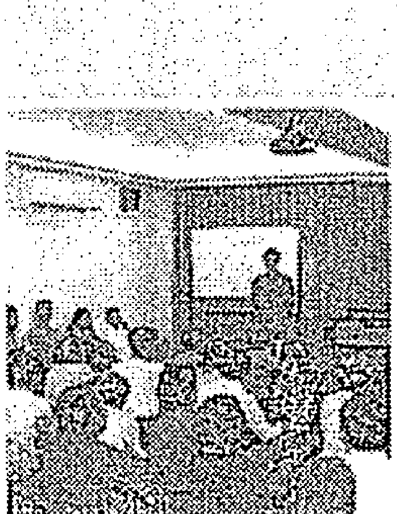

### 賽斯身心靈診所

#### ◎院長 許添盛醫師

#### 理念與使命

本院推廣身心靈健康的三大定律：

- 一、身體本來就是健康的。
- 二、身體有自我療癒的能力。
- 三、身體是靈魂的一面鏡子。

結合身心科、家庭醫學科醫師和心理師組成的醫療團隊，啓動人們內在心靈的自我康復系統，協助社會大衆活化人際關係，擁有更美好的生命品質。

#### 交通資訊

#### 許添盛醫師 看診時間

- 週一 AM 9:00-12:00 PM 1:30-5:00
- 週二 AM 9:00-12:00 PM 1:30-5:00 PM 6:00-9:00 (個別預約諮商)
- 週三 AM 9:00-12:00 (個別預約諮商)

◎門診預約電話：(02)2218-0875、2218-0975
◎院址：新北市新店區中央七街26號2樓 (非健保特約診所)
◎網址：http://www.sethclinic.com

### 心靈的殿堂 賽斯學院

需要您展開雙翼，一起播下愛的種子

#### 賽斯村——鳳凰山莊

位於花東縱谷風景區，佔地六公頃，2006年12月由賽斯基金會接管。這裡群山環抱，雲層裊繞，景色怡人，是個淨心、靜心的好地方......步行5分鐘即是賽斯家族的后花園——賽斯學院。

來到賽斯村的每一個人，透過與大自然的親近，與宇宙愛的能量及智慧連結，喚起赤子之心，重新回到內在，覺察每一個當下的自己，開啟內在自我療癒的能力及潛能，創造一個健康、喜樂、富足、平安的生命品質。

翠林農莊是由基金會董事蔡百祐先生所捐贈購買，園區內小木屋提供賽斯家族及癌友申請長期居住使用。賽斯學院即將於2010年落建於此，第一期工程為賽斯大講堂的興建及住宿區A，第二期工程為住宿B、行政大樓的興建預計2-3年完成興建計劃。

第一期工程款預估約三千萬，第二期工程款預估約二仟萬，目前正由賽斯基金會提出興建計劃說明及募款，在此呼籲認同賽斯資料，且願意和我們一起推廣賽斯心法的賽斯家族們，能共襄盛舉，讓更多需要幫助的人，能感受到這光與愛。

#### 服務項目

- ◎住宿 ◎露營 ◎簡餐 ◎下午茶 ◎身心靈整體健康講座 ◎心靈成長團體工作坊 ◎賽斯資料 ◎課程及讀書會 ◎個別心靈輔導 ◎全球視訊課程連線 ◎企業團體教育訓練及社會服務

#### 捐款方式

| 項目 | 說明 |
|---|---|
| 一、匯款至：賽斯學院-1088帳戶 | 戶名：財團法人新竹縣賽斯教育發展基金會 |
| 銀行：兆豐國際商業銀行竹北分行 | 帳號：067-19-06781-3 |
| 三、加入「賽斯家族會員」 | 每位捐贈（元或以上，則贈送「賽斯家族會員」會員卡一張。以及福利：將賽斯家族送至基金會享有課程及講座免費（限一期） |

◎地址：花蓮縣鳳林鎮鳳凰路300號 ◎電話：(03)8764797 ◎網址：http://www.sethvillage.org.tw ◎Mail：sethvillage@gmail.com

### 回到心靈的故鄉——賽斯村工作坊

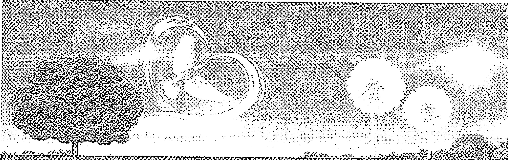

### 許醫師工作坊

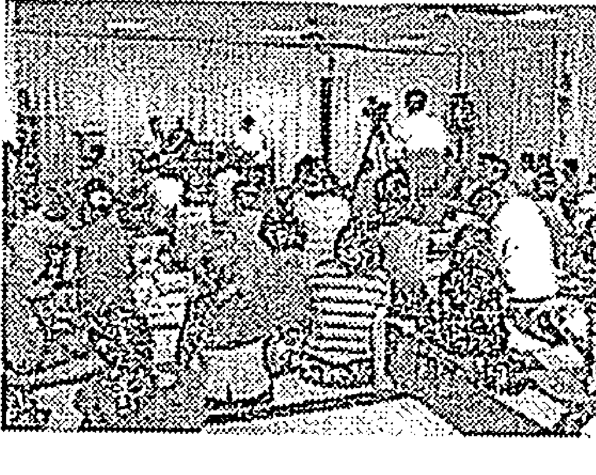

在賽斯村，每月第三個星期六、日，由許醫師帶領的工作坊及公益講座，所有學員不斷的向內探索自己，找到內在的力量，面對及穿越生命的恐懼、困難與疾病，重新邁向喜悅、幸福、健康的生命旅程。

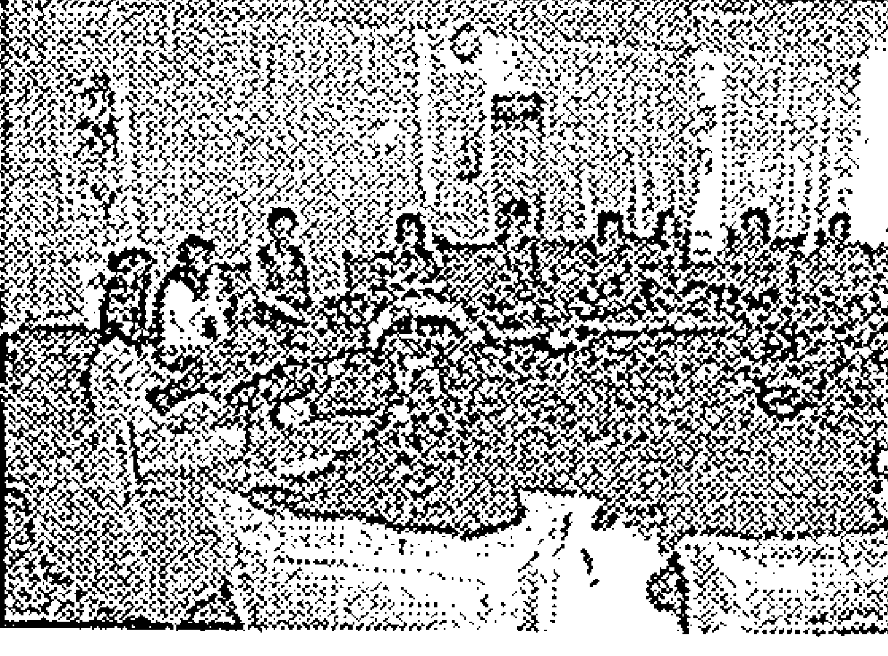

### 療癒靜心營

賽斯村精心安排的療癒靜心營，主要目的是將賽斯資料落實在生活裡，由痊癒的癌友分享他們療癒的經驗，並藉由心靈探索、團體分享等各種課程，以及不同的生活體驗，來協助每位學員或癌友成長、轉化及療癒。

賽斯村是一個靜心的好地方，尚有其他許多老師的課程可提供大家學習。歡迎大家前來出差、旅遊、學習、考察兼玩耍，一起回到心靈的故鄉。

地址：花蓮縣鳳林鎮鳳凰路300號
電話：03-8764797
所有課程詳見賽斯村網站：www.sethvillage.org.tw

### 百萬CD

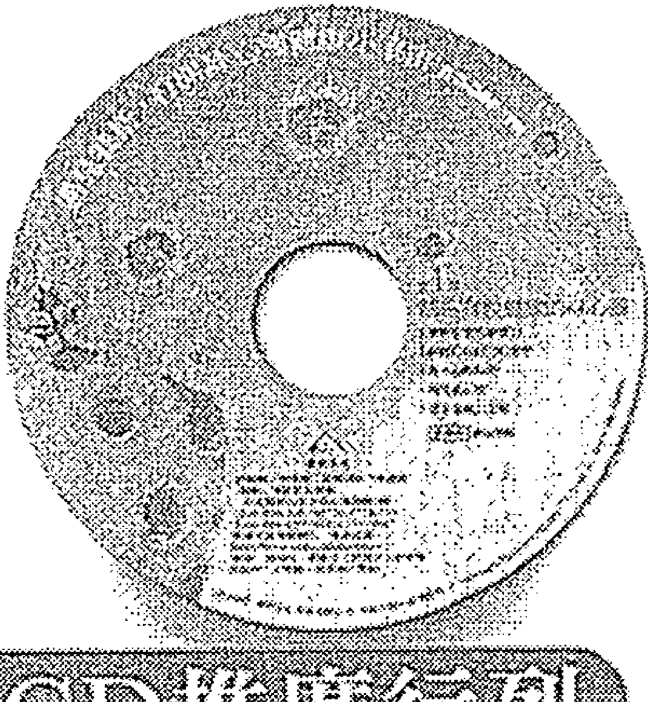

## 千萬愛心

### 請加入賽斯文化百萬CD推廣行列

自2006年10月啟動「百萬CD·千萬愛心」專案至今，CD發行數量已近百萬片。這一系列百萬CD，由許添盛醫師主講，旨在推廣「賽斯身心靈整體健康觀」，所造成的影響極其深遠。來自香港、馬來西亞、美國、加拿大、台灣等地的贊助者，協助印製「百萬CD」，熱情參與的程度，如同蝴蝶效應一般，將賽斯心法送到全世界各個不同角落。隨著百萬CD傳遞出去的愛心與支持力量，豈止千萬？賽斯文化於2008年1月起，加入印製「百萬CD」的行列。若您願意支持賽斯文化印製CD，請加入我們的贊助推廣計畫！

### 百萬CD目錄

（共八種，更多許醫師精采演講將陸續發行）

- 1 創造健康喜悅的身心靈
- 2 化解生命的無力感
- 3 身心失調的心靈妙方（台語版）
- 4 情緒的真面目
- 5 人生大戲，出入自在
- 6 啟動男人的心靈成長
- 7 許你一個心安
- 8 老年也是黃金歲月

### 贊助辦法

在廠商的支持下，百萬CD可以低於市場的價格來製作，每片製作成本100元，單次印製量為1000片。當您贊助1000片時，可選擇將大名稱印在CD圓標上。不足1000片者，也能與其他贊助者齊名。雖然不足1000片，大伙仍可共同印在CD圓標上。依次類推（每100片，贊助費用1000元，以此類推。）

您的贊助金額，請匯入以下帳戶，並註明「贊助百萬CD」，賽斯文化將為您開立發票。
戶名：賽斯文化事業有限公司
郵局劃撥帳號：50044421
銀行帳號：台北富邦銀行ATM代碼 012 380-1020-88295

### SethTV 賽斯網路電視台

WWW.sethTV.org.tw

當許多媒體傳遞帶著恐懼與限制的訊息，你是否問過究竟什麼才能讓您及孩子對未來、對生命充滿期待與喜悅，開心地想在地球上活出獨特與精彩？
「SethTV 賽斯網路電視台」在地球物質實相中，傳遞賽斯心法，幫助每一個人回到自己，找回自己，活出健康的身心靈，活得健康快樂、自由自在、成功富足、幸福美滿！
這是一個24小時無國界的學習與成長，為了帶來科技網路與心靈網路連結的祝福！

#### 節目說明

- 「免費頻道」--播映許添盛醫師、陳嘉珍執行長等老師的賽斯身心靈健康「公益講座」，進入網站即可完全免費收看！
- 「贊助頻道」--播映許添盛醫師、陳嘉珍執行長等老師的「公益講座」、精采的「賽斯書課程、講座」及「癌友樂活分享、疾病心療法系列、教育心方向系列、金錢心能量系列、親密心關係系列...等用心製作的優質節目」。
註：詳細內容請查閱節目表；若有異動以SethTV網站公告為準。

#### 申請方式

- 1. 台灣地區：就近至各地聯絡處，完成捐款贊助並填寫申請表。
- 2. 海外地區：就近向各地海外據點申辦。
- 3. 至 SethTV 網站：線上申辦（捐款至台中總會帳戶，由總會為您服務）。
註：詳細辦法請洽各地聯絡處，或上SethTV網站。

#### 申辦地點／捐款帳號

- 戶名：財團法人新時代賽斯教育基金會（銀行代號017）兆豐國際商銀 北台中分行
- 捐款帳號：037-09-06766-9
- 台中總會：（04）2236-4612 台中市北屯區三光巷33-7號四樓

各地聯絡處：
- 板橋 (02)8252-4377、新店 (02)2219-7211、三鶯 (02)2679-1780
- 嘉義 (05)275-4886、台南 (06)213-4563、高雄 (07)550-9312、屏東 (08)721-2028
- 宜蘭 (03)932-5322、賽斯村@花蓮 (03)876-4797、賽斯文化 (02)2219-0829

海外聯絡處：「香港、洛杉磯、紐約、馬來西亞、深圳」之聯繫與申請，請上網查閱。

### The Seth Garden 賽斯花園
### 雙魚座教育基金會 新店分處

- ● 書籍、CD
- ● 輕食、新鮮蔬果汁、咖啡、茶飲
- ● 心靈成長工作坊
- ● 場地租借
- ● 藝文展演
- ● 賽斯系列商品
- ● 素人作品
- ● 個別心靈陪談
- ● 讀書會
- ● 身心靈課程
- ● 癌友、精神疾患與家屬等支持團體

- 中正路
- 中正路
- Seth Garden 賽斯花園
- 中央路
- 中央路95巷
- 中央五街
- 10號出口
- 台北捷運 新店線 小碧潭站
- 雙河路
- 雙河路
- 電話：(02)8219-1160、2219-7211
- 花園信箱：thesethgarden@gmail.com
- 地址：新北市新店區中央五街51號
- 網址：http://www.sethgarden.com.tw
- 新店分處信箱：selhxindian@gmail.com

### Seth
### 遇見賽斯 改變一生
### 財團法人新時代賽斯教育基金會

www.seth.org.tw

基金會以公益社會服務為主，於民國九十七年三月正式成立。本著董事長許添盛醫師多年來推廣身心靈理念：肯定生命、珍惜環境、促進社會邁向心靈普遍開啟與提昇的新時代精神，協助大眾認知心靈力量對於健康的重要性，引導社會大眾提升自癒力，改善生命品質，增益家庭與人際關係，進而創造快樂、有活力的社會。

身心靈的平衡，是創造健康喜悅的關鍵；思想的力量，決定人生的方向。所以基金會推展理念，在健康上強調三大定律，啟發大眾信任身體自我療癒的力量；在教育方面，側重新時代生命教育觀念的建立，激發生命潛力，尊重每個人的獨特性，發現自我價值，創造喜悅健康的人生。更進一步建設賽斯身心靈療癒社區，一個落實人間的心靈故鄉。

身心靈整體健康公益講座、賽斯資料課程及讀書會、全球視訊課程連線及電子媒體公益廣播、個別心靈對話及心靈專線、心靈成長團體及工作坊、癌友／精神疾患與家屬等支持團體、企業團體教育訓練規劃及社會服務

若您願意提供我們實質的援助，歡迎捐款至基金會：捐款帳號：067-08-06766-6 兆豐國際商業銀行——北台中分行

加入「賽斯家族會員」
凡捐款達三千元或以上，即贈「賽斯家族卡」一張，持卡享有課程及出版品等優惠！歡迎洽南部分會。

- 台中總會：台中市北屯區三光巷33-7號4樓 (04)2236-4612
- 板橋辦事處：新北市板橋區仁化街40號5樓 (02)0252-4377
- 新店辦事處：新北市新店區中央五街51號 (02)2219-7211
- 三鶯辦事處：新北市鶯歌區文化路214號 (02)2679-1780
- 嘉義辦事處：嘉義市民權路90號2樓 (05)2754-886
- 台南辦事處：台南市中西區開山路245號8樓之1 (06)2134-563
- 高雄辦事處：高雄市左營區明華1路221號4樓 (07)5509-312
- 屏東辦事處：屏東市廣東路120巷2號 (08)7212-028
- 宜蘭辦事處：宜蘭市宜中路120號 (03)9325-322
- 賽斯村：花蓮縣鳳林鎮鳳凰路300號 (03)8764-797

| 台北 | 佛化人生 | 台北市羅斯福路3段325號6樓之4 | 02-23632489 |
|---|---|---|---|
| | 政大書城台大店 | 台北市羅斯福路三段301號B1 | 02-33653118 |
| | 水準書局 | 台北市浦城街1號 | 02-23645726 |
| 中壢 | 墊腳石中壢店 | 桃園縣中壢市中正路89號 | 03-4228851 |
| 台中 | 唯讀書局 | 台中市北區館前路5號 | 04-23282380 |
| 斗六 | 新世紀書局 | 雲林縣斗六市愛生路91號 | 05-5326207 |
| 嘉義 | 鴻圖書店 | 嘉義市中山路370號 | 05-2232080 |
| 台南 | 金典書局 | 台南市前鋒路143號 | 06-2742711 ext13 |
| 高雄 | 明儀圖書 | 高雄市三民區明福街2號 | 07-3435387 |
| | 鳳山大書城 | 高雄縣鳳山市中山路138號B1 | 07-7432143 |
| | 青年書局 | 高雄市青年一路141號 | 07-3324910 |
| 桃園 | 大涌鴻安藥局 | 桃園縣八德市介壽路二段368號 | 03-3669908 |
| 馬來西亞 | Reset/賽斯學苑 | resetgarden@gmail.com | 009-603-79608588(普悅) |
| | 愛 · 活力心靈驛站 | www.verve3833@gmail.com | 009-601-64220747 (陳忠海) |
| | My Home (南馬) | myhome_01@hotmail.com | 009-601-73641835 (林秋圓) |

想完整閱讀賽斯文化的書籍嗎？
以上地點有我們全書系出版物喔！

### 心情。筆記
Note

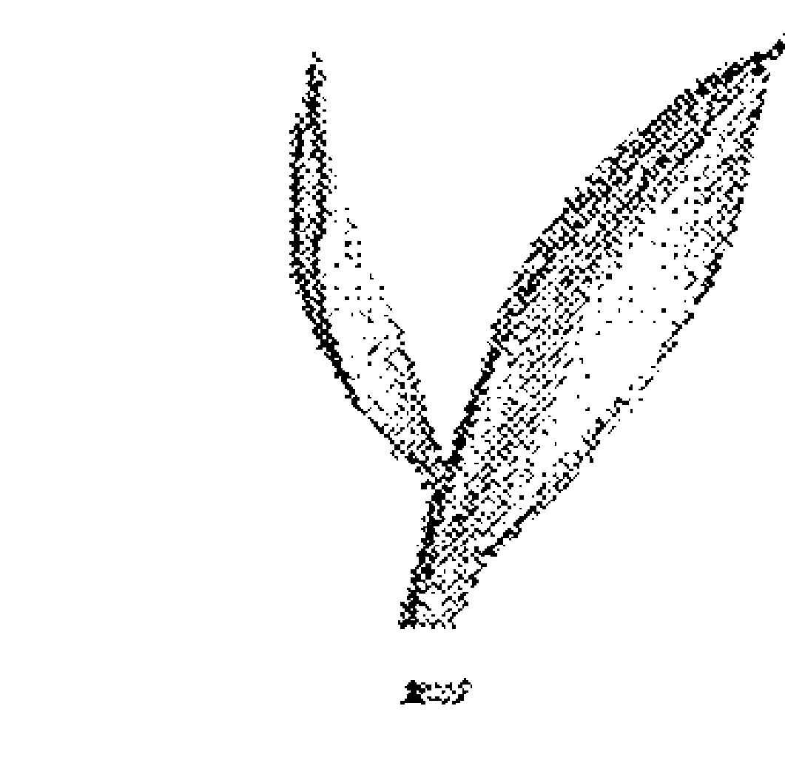

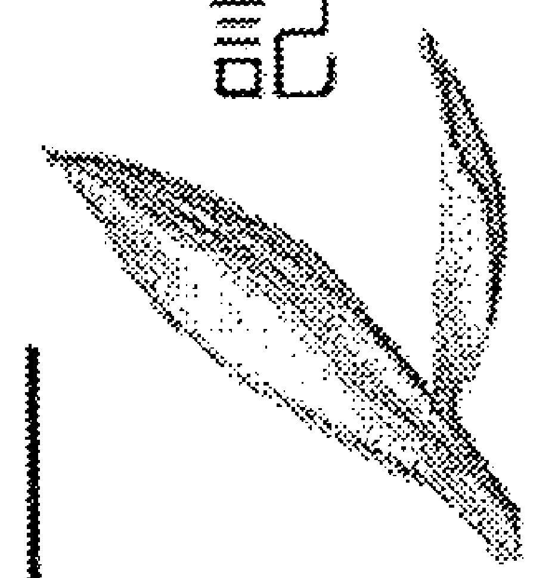

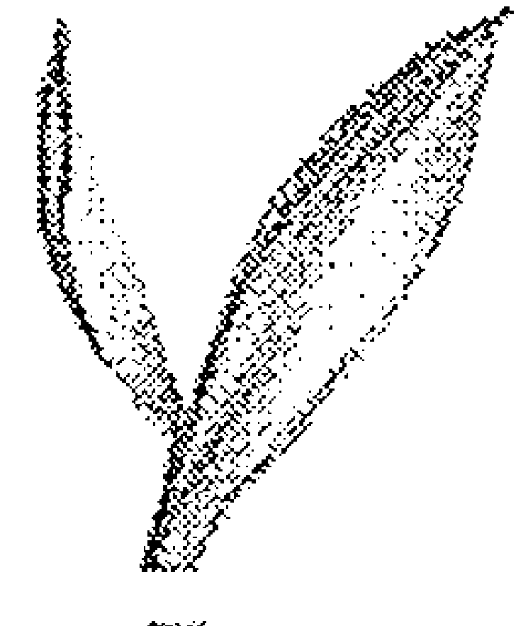

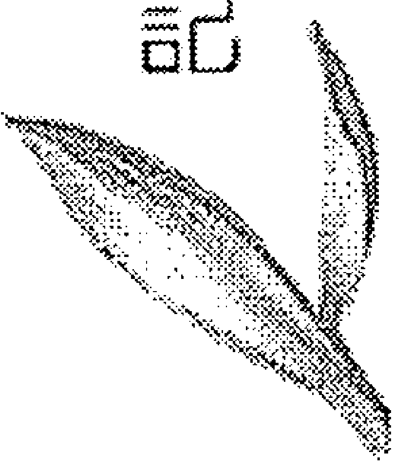

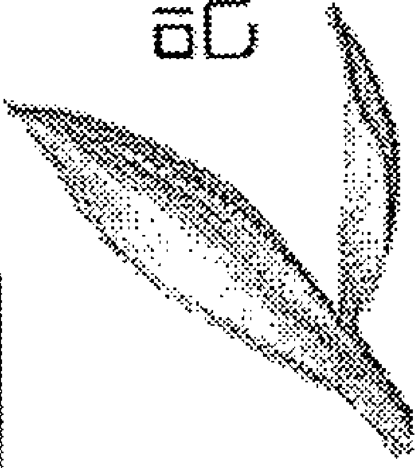

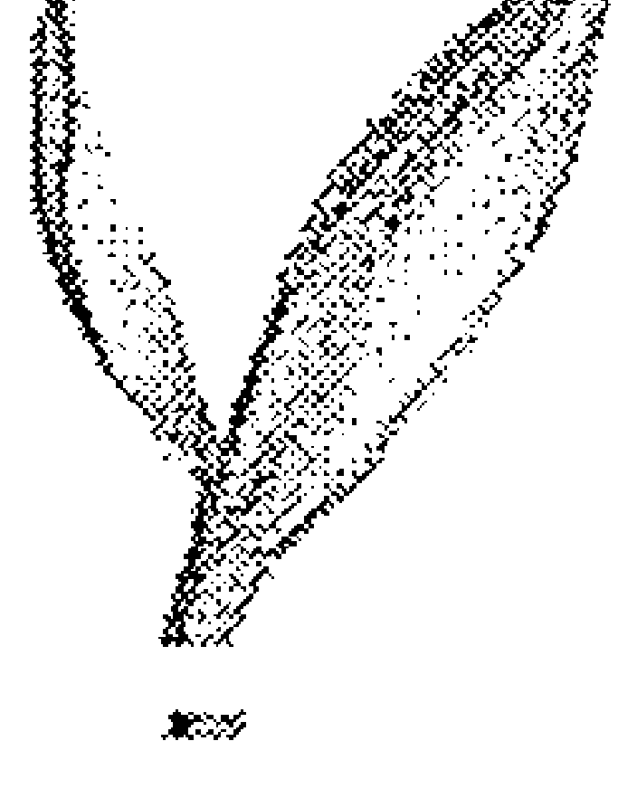

### 國家圖書館出版物預行編目資料

實習神明手冊：啟動內在感官的自修經典法則／
Jane Roberts；王季慶譯 --初版．--臺北縣新店市：
賽斯文化，2008.11

冊；     公分．--(賽斯書：1)

譯自：How to develop your ESP power

ISBN 978-986-83690-8-5 (平裝)

1. 心靈學  2. 通靈術  3. 靈魂

175.9

97024344