# 实用占星学

秦瑞生 著

占星赢家 http://www.astrowinner.com

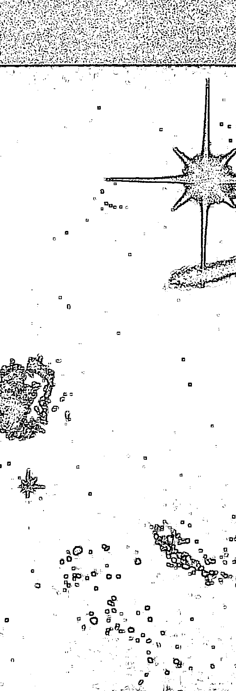

# 序言

本書是實力占星系列叢書的第二本書，等同是本系列的大序言，希望提供讀者對完整占星學的內容、派別及應用方向先有個全盤梗概性的了解，顯現占星學豐富的內涵。全世界各地區發展出來的占星學較著名的計有西洋占星學（包含希臘、阿拉伯），印度占星學，中國七政四餘占星學，馬雅占星學，除後者外，其他三者皆有完整的架構及判斷要訣，而且在發展的過程中互有關聯，它們都以一張佈滿符號或線條的天宮圖為主，所用的要素不外是星座或星宿，後天12宮、行星、恆星或敏感點...等，讀者若欲充分解讀本書的案例，建議應先細讀本系列的基礎書《占星學》（上）（下）—天宮圖的要素分析，方不致捉襟見肘，模模糊糊。

筆者向來不喜歡與人論戰，但在校對本書書稿期間，看到93年2月16日聯合晚報的全版廣告，赫然發現科技紫微網張盛舒先生宣佈「占星術已死了」頗為驚訝，在占星學發展的歷史長河中常見這種宣佈，本不足為奇，但頭一遭出現在國內就令人好奇，當時心想張先生必然才高八斗，對占星學應相當瞭然於胸，才敢這樣宣告，但細讀其內容之後，才知道他對占星學根本一無所知，卻敢大放厥詞，所以臨時以緒論：致科技紫微網張盛舒大師一封公開信：回應張大師宣佈「占星術已死了」一文，針對他對占星學的質疑一一回應，希望藉此機會再解說占星學的內容，配合本書第二章的概念，澄清一般外界人士對占星學的誤解與不明，避免張先生誤導大眾，以訛傳訛。

張先生以牛頓古典力學模型及唯物觀點片面解讀海森堡測不準原理，認為實星測不準，故占星學不能應用。殊不知量子力學的發展，說明電子軌道具機率性，因而測不準，儘管上帝玩骰子但仍相當精準，否則今日所有微粒子建構的物質必定都亂了套，包括科技紫微網的電腦亦同。另外量子力學的實相正是宇宙實相的縮影，波粒二元性隱含了觀測者影響觀測對象，說明宇宙萬物並非如牛頓力學所說的絕對、客觀、獨立；相反的，它是一個不可分割的整體，萬物互相涵攝，天空星體與人類都屬宇宙萬物之一，當然互相涵攝，互有影響，即實星會影響人類並不足為奇，然張先生卻導出占星學所用的實星測不準，而紫微斗數的虛星才能無所拘束地應用，真不知道這是那門子的歪理，但張先生打著科技名號又標榜玄虛，豈不自相矛盾？

有關天空星體對人類影響的作用機制，也非純以唯物即物理力能解釋的，美裔頂尖物理學家大衛·波姆（David Bohm）提出宇宙實相為一不可分割的整體性，頗能適當解說，我們已在前引書說明過，不再贅述。

在第一章就東西方主流命理學的結構比較，旨在讓研究中國傳統命理學的人士了解西洋占星學的命型結構確實較為合理，在全球化、地球村的時代來臨，應有新的思維，絕對不能固步自封，或只一味地以民族主義的觀點，自戀式地自我吹噓冠於全球，這樣並無濟於事，應取他人之長，配本身優點，補自己之短，才能站上世界之巔。

占星學奠立在天文學的基礎如天宮圖的創立，若能深入天文學的知識，將更踏實地體會占星學的精神及內涵，這也是筆者一再對面授學生耳提面命的。本書第三章討論的天文、數理、曆法臚列占星學所需具備的天文、數理的背景，如重要的天象日蝕、月蝕的形成，內外行星的逆行，日月五星如何計算，各種座標轉換...等，這內容是彌足珍貴的，即使在占星學相當發達的歐美地區，也難得見到，提供這方面的線索，相信對有心想更進一步研究占星學的讀者必有所助益，按此章內容當可更深入理解一些較艱深的技巧，如主限向運，太陽日出日入時刻...。我們在本章舉迴歸黃道與恆星黃道的對照來解說，從中可瞭解地軸進動、歲差、極移及衍生的大年或大月，西方和東方兩大占星學系統的差異源由，就能知所選擇。

本書係屬大序言性質，我們在第五章～第十六章所列的本命、流年預測、卜卦、弧角天星擇日（含西洋占星擇日技巧），合盤技巧、換置、時事、財務金融、醫療（含疾運盤）、氣象、出生時間的修正，其他流派的心理占星、Huber學派、Draconic占星、中點理論、教堂之光、泛音盤、恆星學派、度數象徵...等都僅概述其源由、意義或綱要而已，相關主題的完整內容及判斷技巧尚未詳細論述，我們將留待相關著作再一一說明。上述主題除財務金融及氣象外，附上1-3個案例以利研究，讀者若能細細琢磨，當可增進對完整占星學各領域的認識。

《Ancient Hindu Astrology for the Modern Western Astrologer》於1986年出版，由於內容簡潔、解析清楚，很容易掌握印度占星學的要旨，讓西方占星學界認識到它的神秘魅力，漸漸帶動美國地區擴及歐洲研究印度占星學的熱潮。印度幾位頂尖的占星家如B.V. Raman、K.N. Rao被邀請赴美演講，促進東西方兩大系統的交流，於1990年代起印度占星學逐漸獲得歐美占星學界的注目，步入20世紀後，印度占星學的網站如雨後春筍般競相冒出，如今印度占星學已在全球佔有一席之地，頗為耀眼。

在台灣西洋占星學仍屬嬰兒學步階段，印度占星學更屬陌生，除洪能平先生曾簡略介紹外，未見相關資料的出版。我們在第十七章特設印度占星學與西洋占星學的比較，針對本命占星學部分，相當鉅細靡遺地對照兩大系統的特色，哲學基礎、日／地關係模型、黃道、宮位制、天宮圖的要素（星座、後天宮、行星、行星狀態、相映或相位、敏感點、恆星、天宮圖型式），相信有助較有程度的讀者對神秘的印度占星學有所認識，增廣見聞。印度占星學純粹為事件預測，直接了當卻頗為準驗，尤其是Dasa大運更是西方占星學家爭相研習的標的。又國內研習七政四餘占星學及紫微斗數的朋友若想追尋它們的原始建構，那麼印度占星學東傳進入中國的演變，應是一條重要線索。

我們在最後一章第十八章中國七政四餘占星學，簡述中國特有的軍國占星學，主要以三垣二十八宿與皇朝、諸侯、群臣、市井的對應，觀察日月五星等七政運行在這些區域的狀況及本身種種變化，配合分野理論的使用解釋王朝、諸侯的更替或時事災變，相當程度地反應漢·司馬遷《史記·天官書》：「究天人之際，通古今之變」的精神。中國的軍國占星學類比於西洋或印度占星學的時事領域。

另外，我們就印度占星學東傳而後發展的七政四餘命理學解說它們的關聯，當然有關資料仍相當淺薄，不足作為定論。占星命理學後來發展成三大派，即果老派、耶律派、琴堂派，其相關論斷要旨和宮主／度主或身宮的用法不儘相同，僅列出它們的異同。在本章後段，我們列出中國七政四餘命理學的起例，並以香港吳師青《天運占星學》所提張雲博士案例說明吳前輩採用的是迴歸黃道，而三垣二十八宿則以歲差調整作成量天新尺，以利七政四餘諸星躔度的編制。吳前輩以赤經編列三垣二十八宿諸恆星，常令人誤解他採用的是恆星赤道。由於解釋該案例時，吳前輩仍遮遮掩掩，錯誤不少，我們一一比對指出，希望有助解開迷霧。

國內出版的占星書籍不多，有心研習的人常不知如何著手，許多讀者常來電詢問請筆者介紹，以免多走冤枉路，所以特在本書參考目錄詳列各領域的好書，筆者敢自豪地宣稱，這份書單絕對值得珍藏研讀。

最後相當感謝建州兄帶領的于天網路印刷有限公司團隊，盡心盡力使得本書能亮麗地呈現。學員芳瑞、釋瑩、永達為本書寫序增添不少光采，謝謝他們。拙荊美華幫忙校對，小兒誌佑、小女淳湄的鼓勵，讓我於無後顧之憂的環境下努力撰寫，是本書得以順利出版的主因。

秦瑞生寫於祥雲齋

# 序 言

王梓梵

拜電腦科技之賜，過去需曠費三、四天時光，才得以計算一個天宮圖的麻煩，於1990年專業占星軟體發展完備後，已截然不是問題；在輸入資料三、四秒那一瞬間一個個行星度數、宮位、相位精準的天宮圖即躍於畫面。

不僅便於有志者學習，更推動西洋占星專家將各式古典、現代的論斷技巧，配合世界名人之命例與重要事件，予以驗證，均頗有斬獲。因此，近十多年於歐美地區，占星相關書籍除了本命占星學之外，在各個相關學科，如流年、卜卦、時事占星學，附實例之著作如雨後春筍般出版。

秦瑞生老師十多年來孜孜不倦地蒐集成美各類占星書籍，予以彙整，2003年出版《占星學（上）、（下）》，將占星學基礎完整介紹，2004年更推出《實用占星學》，對於占星如何運用於時事、流年預測，甚或醫療占星的方法予以揭露；尤其是換置占星學及擇日占星學，更是國內相關出版品未曾介紹過之內容，相信對有心深入了解占星的讀者而言，將有豐富之收穫。

當然，如欲深入驗證書中論及之各個章節，即需借重占星軟體的配合。您可以透過秦老師相關出版品附錄之歐美相關網站，繪製所需之天宮圖，國內網站多僅提供本命天宮圖之服務。

本書之內容與坊間對占星理論及技巧欲言又止的出版品截然不同；第一章您可仔細比對東西方命理學之結構差異，中國八字於南半球即因季節時令與北半球相反而無法運用，而西洋占星則採實際天體位置，不受季節時令之影響，且其命例之組合達百億種以上，數百倍於八字、紫微之命理系統。

第二、三章則是占星愛好者常被天文學家批評之處。占星學之行星位置與實際天文學因歲差而有23度之差異，如何分辨兩者的差異，或各根據何種理論，亦是學習過程中需詳加認識。

第四章至第十章與十三章則是西洋占星學運用於生活中各事項的技巧，十之八九均是坊間未曾披露之技巧；尤其是第十章換置占星學，現代人身為地球村一份子，常有機會派駐國外、工作、或移民、或選擇出國留學的地點，換置占星學則將個人出生行星投影於世界地圖上，命主則可依需要選擇最強或最幸運之路線在各國間移動。

第十一至十四章則是介紹占星學於時事、國運、經濟層面的運用，古代欽天監的工作大抵不過如此吧！

第十六章各個學派的介紹，則是讀者在熟悉本命與生活占星後，如欲更深入了解世界各個著名學派如何運用，占星理論面向之廣莫怪乎學習占星後往往只能嗟嘆，業餘者也許終其一生之時光也只能鑽研並精道其中之一、二門！

本書是秦瑞生老師占星方面的第二部著作，書中內容精練地融合理論與實例解說，實是有志學習者的最佳參考書，不容錯過！

# 序言

邱芳瑞

一命、二运、三风水、四积阴德、五读书，命运排在首位，反应国人喜欢算命、相信命运可见一斑。坊间五术馆比邻而立，八字、紫微斗数、手面相、梅花神数、姓名学等……林林总总。近年来，拜传播媒体之赐，星座论命似有凌驾传统算命术之势，连小学生十二星座朗朗上口，更遑论电视算命节目星座专家，动辄以星座论命，容易外遇有那些星座，那些星座最速配等……仿佛整个宝岛淹没星座算命中。庆幸，秦瑞生老师有鉴星座论命之以偏概全，发下宏愿，决将自己浸淫占星学二十多载研究心得与实证，出版一系列占星学书籍，藉以拨云见日，导正有心学习研究占星学人士，于西方占星学与古典占星学之殿堂。九十二年底出版《占星学》一书即为此系列书籍首著，此书之诞生不久将会“洛阳纸贵”，有心学习占星学者人人一书在手。

延续著《占星学》一书之出版，在众多读者及学员盼望下，旋及第二本著作《实用占星学》不久见世，此书目的在发扬正统的占星学术水准与应用，秉著《天人感应》的哲学思想，深入研究星座、行星间的奥秘，传播正确、完整的知识，内容相当广博又精彩，并有实例，举如弧角天星择日、西洋择日占星、时事占星、卜卦占星、医疗占星等……。

弧角天星择日法，一直为择日界最高秘传法门，其方法繁杂，古时必须精通日、月与五大行星运行规律，现在必须懂得球面天文学、三角函数、以及相关座标－黄道座标、赤道座标、地平座标三大座标之间转换，瞭解恒星、行星之运行规律、周期、朔望，以及天宫图之制作、用事地点经纬度的不同、岁差之修正、真太阳时等……，若无专业老师指导入门或博览群书通彻，诚实不易。自古即为钦天监掌管实务，皇帝御用之术，民间晓得此术寥寥无几。明末清初堪舆大师，蒋大鸿《天元五歌》以天星择日葬事，立葬立发，更加深此术神奇之处及蒙上一层神秘色彩。

中国传统 的择日方法或派别甚多，有三合派、九星派、三元派、八字四柱择日法，特别法诀有奇门遁甲、太乙神数、六壬、三元紫白、演禽择日法等……各有所传，所有原理不出阴阳五行的生克制化观念以及神煞丛辰之应用，使用相当繁琐。西洋择日占星学是一种别于传统择日方法，事先依据天体运行规律来选择，俗称「抢先机」之意，针对某项行动或事件，择取相关特定行星力量强且相位吉，与命主产生互容或助益之时刻来从事该行动或事件，是一种趋吉避凶之道。举凡结婚喜庆、购屋、修造、新官上任、移居、造葬、动土、出行、开市、开幕、选举等……各项生活事项皆可借择日选个“良辰吉时”达到趋吉避凶之目的。

时事占星，发展甚早，早期先民，观察天象以期能掌握天体运行规律作为生活因应，即为时事占星雏形内容。中国历史悠久，古时天官仰观天象传世的占星文献卷帙浩繁、历代官修正史中的《天文志》都属此类，此外还有专著，

# 序言

如唐李淳风《乙巳占》，唐瞿昙悉达《开元占经》，北周庾秀才撰，北宋王安礼重修《灵台秘苑》，而西汉司马迁《史记·天官书》长久以来一直是年代正确可考的传世占星学文献中年代最早之一种，司马迁在《天官书》所言「究天人之际，通古今之变」哲理，认定一切时事都是由天象而来，唐高祖李渊晚年为继承帝位伤脑筋，星占家傅奕密奏「太白金星出现在秦地分野的星宿中，据此星象可以肯定，秦王李世民会做皇帝」是历史上时事占星实例。西方占星学有关时事占星学比较具体记载是托勒密的《四书》，后由阿拉伯人发扬光大，其中令人瞩目时事占星技巧，土木两星会合周期与王朝兴起衰落有关，又如《明译天文书》第二类凡十二门断说世事吉凶，可说是时事占星典型内容。时事占星内容相当多，如论事件之「卜卦占星学」，论日、月蚀引动大地山川变化之「地震占星学」，二分二至点始入盘之「国运占星」，行星周期对股市、期货影响之「财务金融占星学」等……。

坊间现代人著作，能提供正确占星学原理与提供实证者书籍，芸芸众书中，真如凤毛麟角少之又少，欣见秦瑞生老师再接再厉出版“实力占星系列”第二本著作《实用占星学》，著书问世，随秦瑞生老师多年，了解其无私胸襟，贯通五术各门领域之博学，诚有幸为其作序，推介此书给读者，盼在蓄势待发的占星界播下一颗颗种子，给有心学习占星学之人一盏正确明灯，共同开发此片新天地。

2004/1/18于忘尘轩

# 序 言

谢洪天师府素晓法师
张永莲（前立法法师）

纵观目前坊间各式各类的占星书籍、课程，俨然一股炫风，席卷着新时代人们的生活；情人的个性与喜好如何？什么样的工作适合自己？伙伴关系该选怎么样的人？于是乎，相关的杂志书籍、电视节目 纷纷出笼。这股持续发烧的风潮，连六、七岁的孩童，对星座也甚为明了。

颇为可惜的是，这些总流于粗浅大略的分析，仅以简单的星座来解释人们的个性，幸而在老师门下学习占星学，能一窥占星学的奥秘。精确的出生时间，描绘出当时当地天空情境，行星间互相形成的相位、座落的星座宫位，均有着细密的解析。

占星之所以迷人之处，在于对个性与环境有着一针见血的解析，可以看出父母、伴侣、孩子，会拥有什么样的特质、与自己的关系模式，比如月亮落在天蝎，属弱星座，又落于一宫，则很可能母亲的约束掌控较强烈，对于自我感情的需求亦是多且有压力的；除此之外，还有月亮与其他行星是否有形成相位，来整合此人的情感模式，也可以说是实际的感情需求。

不仅是个人的，国事、医学、宗教等等，在占星学中均是有迹可循，于近代备受重视的心理学，在占星学中亦有其领域，藉由占星学来探知潜意识。从早期占星学家容格

# 序言

（Carl Jung），为佛洛伊德的学生，将占星学的奥秘象征与演算极具说服力地运用于解释西方文明发展上。并暗示，自耶稣诞生以来，乃至现代，西方宗教史上的重大发展，皆可从星象符号上一窥究竟。容格认为时代是人们意识流所形成的，是众人的意念投射在天体中，天上的星象不过是地球上所发生的一切的反射，这即是容格所谓的同时性，以例子做一个清楚的检视和演练。例如，车诺比核电厂爆炸案的发生相当接近于太阳与冥王星（主管核能）对立那一天的月蚀时间点。

以现今科学蓬勃，天文学如此发达的状况，也有人把占星学归类为一种统计学，由于太多的专用术语（黄道十二宫、由各星座符号组成的命盘及时盘等），对一般未有专业训练的读者可能会感到阅读的吃力，秦老师所撰写的书籍当中，由浅入深，钜细靡遗地论述占星学，读来较坊间相关书籍容易了解运用。

蕴含奥秘的占星学，让学五术多年的我有着莫大的兴趣，毕竟占星是最早的科学，在西元前两千年，位于美索布达米亚平原上的人们即建立起这一套复杂的占星理论。目前英、美地区都有许多教授占星学的学院，占星学俨然成为一门学问，而学生可依其修业长短及程度获得证书或学位。正在看本书的有缘者，若你们对占星学有兴趣，给自己一个机会，勿入宝山而空手而回，请不妨细细阅读秦老师占星学的相关书籍，相信会获益良多，请对占星学有着崭新的看法与赞赏！

特别感谢美国 Astrolabe公司 允许本书使用其

占星专业软件
Solar Fire
所创作的天宫图

# 目 錄

- 序言 ........................................................... 001
- 本书使用案例出生资料一览表 ......................... 020
- 绪论
  - 给科技紫微网张盛舒大师一封公开信
  - 回应张大师宣佈 "占星术已死了" ................... 001
- 第一章 东西方主流命理学的结构比较 ............... 023
- 第二章 文章专区
  - 占星学是什么? ........................................... 033
  - 占星学是如何发展出来的? ........................... 034
  - 同样是观察天文，占星学与天文学有何异同? .. 036
- 第三章 天文、数理、历法 .............................. 039
  - 恒星黄道与回归黄道的分辨 ........................... 045
  - 恒星黄道和回归黄道差异的原因 ..................... 048
- 第四章 西洋占星学的基本课程 ....................... 057
- 第五章 本命占星学 ........................................ 075
  - 某男命实例解说 ........................................... 080
- 第六章 流年预测占星学 论大运、流年流日 .... 095
  - 1.1993年 尹清枫 本命/次限/过运分析 ......... 105
  - 2.1993年 尹清枫 本命/太阳弧向运 分析 ....... 111
  - 3.1993年 尹清枫 太阳回归运势分析 ........... 114
- 第七章 卜卦占星学 ....................................... 119
  - 1.一位生病的医生询问：我的疾病是什么？是否能康复？ 124
  - 2.李先生卜问工作升迁是否可成？ .................. 129
  - 3.关心今日中午亚洲杯成棒赛中韩之战结果？ ... 135

目錄

# 第八章 弧角天星擇日學

-   1. 弧角天星擇日實例- 清·陶胥來《命度盤說》之例
-   2. 西洋占星學擇日實例- 英國女王Elizabeth I 加冕典禮

# 第九章 合盤技巧

-   1. Diana王妃/Charles的配對盤(Synastry)
-   2. Diana王妃/Charles的組合盤(Composite)

# 第十章 換置占星學

-   1. 張學良將軍的A*C*G(全世界.亞洲區)
-   2. 張學良將軍的台灣換置盤
-   3. J.F.Kennedy的A*C*G圖(美國區)

# 第十一章 時事占星學

-   1. 民國91年 中華民國國運
-   2. 民國92年 國運逢非典型肺炎SARS
-   3. 日蝕時刻盤 引動921南投集集大地震
-   4. 特殊天象時刻盤- 火星最接近地球

# 第十二章 財務金融占星學

# 第十三章 醫療占星學

-   1. 體液、脾氣、習性評量表- 成龍
-   2. 疾運盤(Decumbiture)的實例研究

# 第十四章 氣象占星學

# 第十五章 出生時間的修正

-   出生時間的修正案例

# 第十六章 其他學派

-   ◎心理占星學
    -   1. 發現人類內在的哥倫布 - 分析心理大師：容格
    -   2. 無意識心理學的開拓者 - 精神分析心理學大師：佛洛伊德
-   ◎Huber學派(Huber School)
    -   Huber學派分析容格的早歲重要事件
-   ◎Draconic占星學(Draconic astrology)
    -   Diana王妃的Draconic盤分析
-   ◎中點理論(Midpoint Theory)
    -   1. 尹清楓1993年45° 盤行星星曆表
    -   2. 毛澤東
-   ◎教堂之光(The Church of Light)
    -   文化頑童 李敖的Astrodynes分析
-   ◎泛音盤(Harmonic Charts)
    -   1. 白曉燕凶案陳進興的H4泛音盤分析
    -   2. 金庸的H7泛音盤分析
-   ◎恆星學派(Sidereal School)
    -   J.F.K的歲差校正恆星黃道、太陽回歸(1963年)
    -   月亮回歸分析(1963年11月)
-   ◎度數象徵(Degree Symbolism)
    -   SARS事件盤的神秘內涵

# 第十七章 印度占星學與西洋占星學的比較

-   印度占星學命盤解析：連戰

# 第十八章 中國七政四餘占星學

-   吳師青《天運占星學》張雲博士的案例

# 參考書目

本書使用案例天宮圖資料一覽表

| 案例 | 姓名 | 出生時間 | 出生地 | 經度 | 緯度 | 頁數 |
| :--- | :--- | :--- | :--- | :--- | :--- | :--- |
| 一 | Male | 1954.5.26 AM 11:40 | 台北市 | 121E30 | 25N03 | 80 |
| 二 | 尹清楓 | 1946.3.31 PM 11:00 | 蘭州 | 103E27 | 36N01 | 105 |
|  | 1993年 本命1次限/過運 | 1946.3.31 PM 11:00 | 蘭州 | 103E27 | 36N01 | 106 |
|  | 1993年 太陽弧向運/本命 | 1946.3.31 PM 11:00 | 蘭州 | 103E27 | 36N01 | 111 |
|  | 1993年 太陽回歸盤 | 1946.3.31 PM 11:00 | 蘭州 | 103E27 | 36N01 | 114 |
|  | 1993年 太陽回歸/本命 | 1946.3.31 PM 11:00 | 蘭州 | 103E27 | 36N01 | 115 |
| 三 | 卜卦盤 | 1645.5.8(OS) PM 6:15 | London | 00W08 | 51N30 | 123 |
| 四 | 卜卦盤 | 2003.4.28 PM 5:58 | 高雄市 | 120E17 | 22N38 | 128 |
| 五 | 競賽盤 | 2003.11.5 AM 9:10 | 高雄市 | 120E17 | 22N38 | 134 |
| 六 | 原方型圖 | 1812.9.25 PM 3:00 |  | 117E50 | 32N0 | 145 |
|  | 方型圖 | 1812.9.25 PM 3:00 |  | 117E50 | 32N0 | 146 |
|  | 圓型圖 | 1812.9.25 PM 3:00 |  | 117E50 | 32N0 | 147 |
| 七 | Elizabeth I 加冕典禮盤 | 1559.1.15(OS) PM 12:14 | London | 00W08 | 51N30 | 152 |
|  | Elizabeth I | 1533.9.7(OS) PM 2:26 | London | 00W08 | 51N30 | 153 |
| 八 | 加冕典禮/Elizabeth I |  |  |  |  | 156 |
| 八 | Diana王妃 | 1961.7.1 PM 7:45(BST) | Sandringham | 00E30 | 52N50 | 165 |
| 八 | Charles王子 | 1948.11.14 PM 9:14 | London | 00W08 | 51N30 | 166 |
| 八 | Charles外/Diana內 |  |  |  |  | 167 |
| 八 | Diana外/Charles內 |  |  |  |  | 168 |
| 八 | Diana/Charles組合盤 |  |  |  |  | 173 |
| 九 | 張學良 | 1901.6.3 AM 0:10 | 遼寧省 | 122E27 | 41N12 | 183 |
| 九 | 張學良A*C*G(全世界) |  |  |  |  | 184 |
| 九 | 張學良A*C*G(亞洲) |  |  |  |  | 185 |
| 十 | J.F.Kennedy | 1917.5.29 PM 3:00 | 麻省Brooklin | 71W07 | 42N19 | 190 |
| 十 | J.F.Kennedy A*C*G(美國) |  |  |  |  | 191 |
| 十一 | 2002年春分盤 | 2002.3.21 AM 3:16 | 台北市 | 121E30 | 25N03 | 198 |
| 十二 | 2003年春分盤 | 2003.3.21 AM 9:00 | 台北市 | 121E30 | 25N03 | 204 |
| 十三 | 日蝕時刻盤 | 1999.8.11 PM 7:09 | 集集鎮 | 120E45 | 23N50 | 208 |
| 十四 | 火星最接近地球的時刻盤 | 2003.8.27 PM 5:51 | 台北市 | 121E30 | 25N03 | 211 |
| 十五 | 成龍 | 1954.5.9 AM 0:15 | 香港 | 114E10 | 22N18 | 235 |
| 十六 | 疾運盤 | 1981.2.19 PM 3:30 |  | 01W25 | 51N13 | 238 |
| 十七 | 鄧先生 | 1956.1.31 AM 1:25 | 虎尾鎮 | 120E26 | 23N43 | 253 |
|  | 鄧先生 | 1956.2.1 AM 1:25 | 虎尾鎮 | 120E26 | 23N43 | 254 |
| 十八 | Carl.G.Jung | 1875.7.26 PM 6:55 | Kesswill | 09E19 | 47N36 | 266 |
| 十九 | Sigmund Freud | 1856.5.6 PM 6:15 | Freiberg | 18E09 | 49N38 | 270 |
| 二十 | Carl.G.Jung Koch宮位盤 | 1875.7.26 PM 6:55 | Kesswill | 09E19 | 47N36 | 281 |
| 二十一 | Diana 的 Draconic 盤 | 1961.7.1 PM 7:45(BST) | Sandringham | 00E30 | 52N50 | 288 |
|  | Draconic /Diana |  |  |  |  | 289 |
| 二十二 | 尹清楓 |  |  |  |  | 297 |
| 二十三 | 毛澤東 | 1893.12.26 AM 7:30 | 湘潭縣 | 112E36 | 27N55 | 298 |
| 二十四 | 李敖 | 1935.4.25 AM 8:54 | 哈爾濱 | 126E41 | 45N45 | 307 |
| 二十五 | 陳進興 | 1958.1.1 AM 0:30 | 台北縣 | 121E30 | 25N03 | 318 |
|  | 陳進興 H4盤 |  |  |  |  | 319 |
| 二十六 | 金庸 | 1924.1.21 PM 3:40 |  | 120E42 | 30N30 | 324 |
|  | 金庸 H7盤 |  |  |  |  | 325 |
| 二十七 | Solar Return/本命盤 | J.F.K同案例+出生資料 |  |  |  | 333 |
|  | Lunar Return/本命盤 |  |  |  |  | 334 |
| 二十八 | SARS事件盤 | 2002.11.16 PM 12:00 | 佛山市 | 113E09 | 23N03 | 341 |
| 二十九 | 連戰 | 1936.8.27 PM 8:00 | 西安市 | 108E52 | 34N15 | 378 |
| 三十 | 張雲博士 | 1896.8.31 AM 4:00 | 開平 | 112E36 | 22N18 | 399 |

緒論

給科技紫微網張盛舒大師一封公開信：回應張大師宣佈”占星術已死了”

張大師您好！

當我看到2月16日聯合晚報整版廣告「紫微斗數與其他論命術的比較(二)」頗為好奇，匆匆一瞥看到令人觸目驚心的宣告"占星術已死了"，讓我這位研習占星學的後輩汗顏再三，心想大師定有通天本領過人之處，抱著景仰之心細細閱讀，不敢錯漏，期待有所收穫增廣見識，並立即上網找尋(一)，但不久小弟的心情跌下雲端，因為一位連占星學程度都還不到幼稚園階段的您，竟敢大登廣告，臉不紅、氣不喘比較紫微斗數與占星術，忝為嗜好占星學的我，基於「公開文章可受公評」的原則，以及合理懷疑您抬高自己，踩在別人身上的心態，針對您的廣告內容談一談，當然後學會就事論事，不致像李敖一樣，動不動就說要「教訓」別人。另外，我也會儘量一一比對內容，以免被說斷章取義，就從「关紫微與星座」開始吧！

## (Ⅰ)輸入參數

紫微斗數「同屬5月1日出生的人，會因為出生年與時辰這兩個參數而產生720種變化」，您似乎頗為沾沾自喜，因為就星座而言，確為祇有一種變化，不管任何年度和出生時間就是金牛座，但星座僅是占星學的一個元素而已，而且您所說的金牛座，也祇是當時太陽位於金牛座。完整的占星學(不管是西洋占星學或印度占星學)必須同時輸入出生年、月、日、時、分及出生地經度、緯度等參數，讓我逐步說明可能的命型組合變化。

-   1. 同一瞬間全球各地假設同時有小孩出生，光就上升命度就有360種，若計及分，則有360×60=21600變化。
-   2. 同一天24小時，因行星移行又會出現不同組合變化，假設行星移行僅計及至度數，那麼同一天內，冥王星、海王星、天王星、土星、木星、火星、金星、水星、太陽可能不超過1°，不計，但月亮一天移行視其快慢約12°~14°因而同一天命盤的組合變化就有21,600×12=259,200(※尚未考量阿拉伯點、中點…等敏感點)。
-   3. 純就命度及10大行星的各種排列組合變化，將是21,600×10¹⁰，若再考慮其他敏感點，如MC、IC、DSC、中點、敏感點、恆星…等，幾為恆河沙數。

從上述之1.2.3的數字，紫微斗數有啥可比。張大師應瞭解每60年紫微斗數的命盤完全重複，又作何解釋？而且同年同月不同日同時，除天使、天傷外，也可能出現同命盤，那又怎樣自圓其說？因這二顆小星幾不論，張大師您也不用它們吧？！

試想想現今全球人口粗估超過60億，同命型的人太多(即使您使用定盤)，身為台大數學系高材生的您，應不會漠視這些基本統計數字所隱含的意義。

## (2)基本假設

> > 「紫微斗數和星座的基本假設都一樣，認為天上星辰可以對應到每一個個人身上，也就是說人是由天上星辰轉世生出的，到現在科學昌明的今天，已經百分之百證明這句話是錯的！」

張大師所說的紫微斗數和星座的這項假設，不知出自何處記載，後學讀過紫微斗數的書及所謂秘笈不少於300本，而占星學也讀過500多本，從未見到這樣的說法，若勉強地說，應是透派的紫微斗數以商朝人物的比擬，及希臘星座神話故事，但從事術數研究的人豈會將這些神話當真？

> > 「星座是古巴比倫人發明的，以太陽為觀察基準。巴比倫人注意到，因為地球公轉的關係每個月份會有不同的星座在地平線上升起，他們根據這些星座的形象來命名，例如雙魚、天蠍、金牛等，這就是黃道12宮的由來，但星座完全是巴比倫人的浪漫想像，因為每個星座會像某種動物，是觀察角度及擬人化所產生，同一星座裡每顆星的距離不同，只是從地球觀察角度剛好在一起罷了，不可能對遙遠的地球上的個人造成影響。」

-   1. 星座的由來是兩河流域即巴比倫地區及埃及地區波斯等文化互相滲透交流的結果，並非是巴比倫人單獨發明的，而且並非僅用來觀察太陽而已，如出土的巴比倫徵兆預言(omens prophet)，記載許多五大行星運行在天空所預示的徵兆。
-   2. 巴比倫時期尚未建立完整的占星學，但巴比倫人認為天空的異象是神明的懲罰或獎賞，最能發覺到的異象是行星在天空運行所致，因此視行星如神明，這是上古先民直覺的感受，當一代傳一代，經驗的累積自然而然地歸納出行星的特性，賦予原理，就是占星學的濫觴。張大師也懂易占，當知易經繫詞傳：「天垂象，見吉凶」的道理，易卜藉由卦象的徵兆預示，得以顯現占卜事項的吉凶，那麼人類就天空中行星的移行顯示的徵象來預測，又有何不可？
-   3. 張大師執著於行星係透過宇宙的基本物理力，才能影響人類命運的觀點，事實上是典型的古典牛頓力學的因果律，但步入20世紀後，古典牛頓力學本身也受愛因斯坦的相對論，量子物理學及混沌、複雜論的衝擊，已不再是科學的典範，所以張大師強調遙遠的星座內諸星(恆星或行星)對人類不可能有影響的說法，當然不正確，待討論海森堡測不準原理時，即可明白。

> > 「事實上，中國在觀星上的成就要比西方早，中國人說三垣28宿，把天上星座分成三大塊28類，而不是只有西方的12星座，其中最重要的就是紫微垣。中國人觀星是以月亮，即陰曆的變化為基準，他們發現到天上的星星雖然眾多，卻只有紫微星不動；由於中國文化尊君，所以就認為紫微星是帝王，才會完全不動，其它星星則臣子，繞著它旋轉，因之歷代皇朝不斷記錄統計，一方面找真命天子，一方面也防別人變成天子，結果產生了紫微斗數。」

從此段應可推測張大師的用意在於使用太陰曆的紫微斗數，似乎較強於巴比倫人使用太陽曆。但後學要吐槽的是，中國曆法的發展其實是陰陽合曆亦即同時採用太陰(月亮)的朔望及太陽在黃道運行24節氣，由於太陰月合計一年的日數和太陽黃道視運動的一年周期日數不同，才有19年7閏的辦法予以調和，使季候能近於天時，便於農耕。中國曆法中特有的24節氣是全球其他曆法所沒有的，也顯示中國掌握天文、氣象、自然的規律確有一套，24節氣是太陽曆的節奏，並非月亮的。

三垣28宿是中國古代軍國占星術的內容，張大師似乎將紫微斗數托大了，找到紫微垣的北極星，作為依靠，但應知道它是實星您標榜不用實星祇用虛星，豈不是自相矛盾？另外紫微垣古來是中國軍國占星術的重要區域，像一座皇宮相應於人間王室朝廷，漢·司馬遷《天官書》的中官即是紫微垣。當然紫微斗數也可引用，但所出版的紫微斗數的書籍，甚少如中國軍國占星術的具體描繪。

另外，不知您是否曾詳細追蹤紫微斗數的發展歷史的相關文獻，如正史中的經籍志或地方志中從事術數方技人物是否以紫微斗數為業，明清著名的百科全書如《永樂大典》、《古今圖書集成》、《四庫全書》、民國《叢書子目》有否見到紫微斗數的正式名稱，坦白說小弟曾相當費心搜尋，幾乎見不到它的蹤影，僅有《續道藏》的術天機及太乙金井，但它們卻是七政四餘的餘支，跟目前您搞的紫微斗數截然不同，另清·俞樾撰《紫微·遁甲·子平遊藝錄》。

# 緒論

才有目前的型式，至於坊間稱由宋朝陳希夷創，明・羅洪先巧遇他的16代孫，得以重見天日這種說法，可以相信嗎？

有關紫微斗數的發展，國內命學者宿梁湘潤《紫微斗數探源》有較客觀的評述，他說紫微斗數應是脫胎自果老星宗，絕非個別獨立發展的祿命術，而且不早於明代中葉，較具體的發展應是在清代，但比起子平的流行，差距甚遠。

> 「今天我們看這個假設也是錯的，原因是紫微星只是剛好在地球的北極軸上，也就是所謂的北極星，星星之所以會轉，其實並不是星星轉，而是因為地球轉，這是很大的誤差，導致現在的紫微論命基礎及解釋通通是錯的，各位，這種種學說的基本假設都是錯的！很驚訝吧！但是吊詭的是，誤打誤撞，紫微斗數的命盤竟然出現了奧妙，原因是什麼？且聽下回分解。」

這段敘述頗模糊，但小弟想，可能是「地動說」否定「天動說」，亦即占星術和紫微斗數都站在地球的觀點，觀看行星或恆星的視運動，這種天動說已被哥白尼《天體運行論》所否定。不可否認地占星學在18世紀初確實因科學主義啟蒙，而走向第二次死亡，就是因以地球為中心的假設被否定，但隨著發覺就占星學的立場，所謂天動說和地動說祇不過是相對地視運動，並不影響天官圖各項要素原理，所以占星學得以再生且更蓬勃發展。

至於紫微斗數本來就是虛星，不涉實體觀測，根本不需要量上述的基本假說，張大師既然強調虛星比實星準，何來擔憂虛星轉或地球轉呢？真是啼笑皆非，發現新大陸似的。

# 實用占星學

> 「上回提到星座的理論基礎是錯的，有人就不服氣了，紛紛來信，說我不懂占星學，最主要的原因是因為我用簡化的占星學做比較，正統的占星學不止是要輸入年、月、日、時，而且以分鐘為單位，精密遠高於紫微斗數用兩小時為單位。但我還是要說，星座的理論基礎是錯的！」

有關精密度的比較已在前面談過不再贅述，當然精密度高也須實證有效才稱得上較佳，2000多年來的驗證已有太多精彩的例證。

張大師連完整的占星學是什麼型式都不懂，而且它跟星座完全劃不上等號。

> 「記得2001年9月號的科學月刊曾經出了一個星座專題，讓信與不信的人各自表述，結果還是一樣，信者恆信，不信者恆不信，為什麼？因為各說各話，誰也沒辦法說服誰，原因是說不信的人都不懂星座，所以兩者毫無交集。」

任何涉及宗教、術數、心靈的事務，都很容易形成「信者恆信，不信者恆不信」，並不是只有占星學或星座，紫微斗數亦同，就如您在網站說宋楚瑜命宮內有太陰，所以有道德潔癖，您的科技紫微段數就是這樣啊？！當然支持著恆信，不支持者恆不信，僅能說不便置評。

# 緒論

> 「我曾經感嘆，大部分的算命師都在自欺欺人，因為連他們自己都不相信的東西，卻天天信口雌黃，騙人為生，原因是這是他們的謀生工具，導致沒有人敢承認它是錯的，這就是所謂的共犯結構。」

張大師的道德勇氣令人起敬，可是您已宣告「占星術已死亡」，依您的標準，占星學就是騙人的，不幸的是小弟正是以此謀生，自欺欺人，這不算是對號入座吧！您的宣告那麼擲地有聲，讓小弟頗為羞愧，回憶起民國79年毅然辭掉外商銀行令人欽羨的A.V.P職務，投入這項倍受爭議的工作，心有戚戚焉，13年的努力，戰戰兢兢，謹守本份，看到您所提的「所謂的共犯結構」，實在是不可承受之重。

> 「我記得前年吧！星星王子曾上李敖的節目，說星座都是騙人的，都不準，他的坦白讓李敖非常開心，因為他是不信命理的人，但是因為李敖對命理也沒有深入研究，說說而已，所以也激不起任何漣漪。」

張大師舉此例時，是否曾記得李敖罵林雲大師是妖僧，妖和尚，能以此為例就說黑教密法都是妖術嗎？同樣地，星星王子能代表正統的占星學界嗎？他是位媒體寵兒，就如紫微斗數界也有女媒體寵兒林xx，在2000年總統大選時，到處上節目直斷阿扁選不上，結果近一年來又在媒體大言不慚地說，她當時準確預測阿扁會當選總統，我們能以這個個案來譏諷紫微斗數都是騙人的嗎？

> 「我們來看看，為什麼我說占星不準的原因。正統的占星學要用到出生的年月日時，以及出生地點的經緯度來定出占星盤，常用的12星座是太陽所落的位置，稱為太陽星座；除了太陽星座以外，還有月亮星座、上昇星座、八大行星（扣除地球）星座等，構成了複雜的占星命盤。這裏面的名詞，指的就是日、月及八大行星在黃道的位置，上昇星座則是太陽星座的對宮，一般也稱之為後天盤。這所有的星座，就是你出生那一剎那的天體位置，了不起吧！」

張大師說「上昇星座則是太陽星座的對宮，一般也稱之為後天盤」讓我笑掉大牙，對不懂的東西硬要唬弄，祇是自暴其短。所謂的上升星座是命主出生或用事時刻於出生地點或用事地點東方升起來的星座，它需經嚴謹的天文球面三角函數計算而得的，經適當的宮位系統（House System）構成後天12宮，才是完整的後天盤，論斷人生各種事項的吉凶或傾向。

完整的占星學的基本要素是星座、10大行星、後天宮、敏感點如ASC、MC、DSC、IC、中點、阿拉伯點、恆星…等構成天宮圖，所用的要素不見得比紫微斗數多或複雜，而且多數為實星容易辨認體悟，沒什麼了不起，提供的訊息相當全面，其準驗令人驚奇，才真正了不起。

小弟倒想請教張大師，紫微斗數的命宮為何是順月逆時取的？12地支宮如何與天空對應，否則如何安星？納音河圖數出自何處，為何是取大限的依據？紫府兩系行星安置的道理何在？

# 結論

號稱科技紫微應對上述問題有個科學答案吧！

另外，您別出心裁地發明定盤，並申請專利，宣稱準確率可達93%，且大招廣告不用出生時辰也可定出命盤，想要請教的是，您的準確率計算標準是什麼？是僅以個性符合即算，還是含蓋所有各後天宮領域如妻、財、子、祿…？如果僅就個性敘述，那麼西方現代心理占星學絕對更細膩、深層，必會讓您更訝異！您在《科技紫微論女命》所討論的方式，可以說將紫微斗數星座化，祇不過類型擴充至12×12=144種類型，但您知道光是太陽星座×上升星座×月亮星座的類型就有1728，但嚴謹正統的占星學祇將之作個性論述的一部分而已。

20世紀引領潛意識心理學重大發展的瑞士分析心理大師卡爾·容格（Carl.G.Jung）本身就相當投入占星學的研究，甚至說天宮圖就是一張心靈地圖，他的女兒葛雷特·包曼容格（Gret Baumann-Jung）本身就是執業的心理占星家。

> >「以我來說，紫微命盤的命宮是太陰，占星命盤的太陽在處女座，上升在雙魚座，月亮在金牛座，水星在獅子座，所以我常說我蠻可憐的，太陰+處女座+A型血型超級龜毛，就因為這種個性，我非把每件事的原理弄清楚不可。」

張大師您若真的將每件事弄清楚，就不會如此貽笑大方，被我評為占星學連幼稚園的階段都不具備；若真的想將每件事弄楚，小弟所提有關紫微斗數的每項疑問希望您都能有個清楚交代，再加上年干四化的差異，閏月的處理，月令按太陰月或節氣以子時或子正為一天開始等基本問題也有個答案。

> 「好了！這麼複雜的占星盤，總共有12×11種變化，總會有準的地方吧！結果呢？讓占星家出現很多派別，各有說法，這點東方與西方就有志一同，反正戲法不靈，變個蠱薩，把它搞複雜到別人看不懂就可以唬弄人。」

張大師將紫微斗數簡單化、星座化，如果每項人生領域都能論斷精準，絕對須向您致敬。術數的問題不在於複雜性，而是來源的合理性、哲學基礎的堅固、結構的嚴謹性以及推斷的準驗性。

您所提到的12×11種變化是怎麼樣來的，另外您不知道它的實質推論方式，遽下結論諷刺「總會有準的地方」不嫌刻薄嗎？同樣，一位不懂您發明定盤的人，評述定來定去總會有準的地方吧？！您的感想如何？

術數的派別即使再多，都須依上述所提的準則或其他更佳準則來檢驗，這也顯示宇宙浩瀚，非人類智慧能盡窺的，我們更應謙卑面對。

> 「所以像什麼48星區的分類啦，說上升星座才真正代表自我，太陽星座看的是老爸，月亮星座看的是老媽的命…等等說法，真是要人老命。」

有關48星區小弟也不懂，不便置喙，但上升星座在占星學上等同命宮，代表個人的外在形象、秉賦、才能、健康、個性、自我，沒什麼好奇怪的，至於占星學論斷六親有其特殊法則，並不會要人命的。

「結論先說：紫微與星座的最大差異是：紫微斗數的星星都是虛星，西洋占星的星星都是實星，這就是紫微斗數會準，而占星會不准的重要分歧點。為什麼實星不准，虛星反而會準？這就是我在上一章所講的，因為科學逐漸證實了，天上的星星與人的命運沒有關聯，所以虛星反而脫離了天文地理學，呈現不同的意義。」

張大師打著科技名號，竟衍出虛星會準的謬論，令我大開眼界，但願聞其詳「虛星反而脫離了天文地理學，呈現不同意義。」究竟呈現什麼不同的意義，不能隨便唬弄一下就跳過去。另外既然實星不准，您強調紫微星是北極星它是實星之一，為何又會相信紫微星的徵象呢？這豈不是前後矛盾？

- 「實星為什麼不可能準？隨便舉幾個例子來說明你就知道了：
（1）如果實星對人的命運有影響，那麼為什麼只有這10顆星進入這12星座才有影響？三垣28宿裡上千萬顆星星為什麼都不會影響人的命運，只有這不到100顆星交會才會影響？

張大師您說會將每件事弄清楚又再一次唬弄了，占星學的發展是古先民站在地球上直觀天空之樸素經驗逐漸累積的，原則上以太陽系諸行星繞行的視運動，作為觀察對象，但也不忽視位於黃道附件較亮的恆星，但從您的提問就知您弄不清楚行星和恆星的區別，這樣是不及格的。

民國92年春分始入時刻，以台北市（首都）起國運盤，ASC命度（代表國運、人民）正好1°內會合凶恆星大陵五，且第6宮（論國運為衛生、健康…）宮主星木星會合凶恆星積屍氣，92年發生的SARS事件，正是它們的影響。小弟與學員們討論就曾指出92年的時疫恐流行，上面所提的木星就是行星，而大陵五及積屍氣就是三垣28宿中眾多恆星之一。

> 「（2）為什麼跑出上升星座這顆虛星來代表自我？（向紫微靠攏了）」

張大師還是弄不清楚星座與行星的區別，星座以占星學的內容，它是黃道帶恆星群的組合，整個黃道帶360°予以12等分，每等分30°稱為一個星座，由於地球繞日公轉及地球本身自轉，任何時刻的任何地點（除極區外），東方地平線會將浮上一個星座，占星學稱之為上升星座，中國七政四餘稱為命宮，在2000多年之前希臘時期就發展出現今完整占星學的勢型，早就有上升星座這個名詞，其意義為自我，那須向發展才3、4百年的紫微靠攏，張大師您不覺得未免太夜郎自大？您搞的紫微斗數人格類型才向星座靠攏！

## 「（3）蛇夫座號稱第十三星座怎麼辦？（只好選擇遺忘！）」

拜託！是誰教您蛇夫座是第十三星座？上題談到希臘時期，占星學就將黃道均等分，這樣很容易記取行星移行的狀況，儘管均等分的黃道12星座與目前天文學現行的星座劃分不同，但2000多年來的使用，累積豐富的經驗，為何一定要將天文學的不等分星座強壓在占星學的使用，不僅混亂而且不便，古代占星先賢也都是天文學家，他們的智慧豈容小覷？

# 「（4）每個星座的組成是所謂的鬆散，星座裡的隨便兩顆星距離就超過100光年，只是剛好在地球的觀察角度，他們是在一起的；所以星座的影響到底是距離計算？體積計算？還是用亮度計算？如果我和同樣是處女座的人站在太陽下，太陽會給我們兩個人同樣的感應嗎？」

張大師這項質疑鏗鏘有力，但我還是要說您完全站在唯物的觀點，而且是以古典牛頓力學的模型來批判，您是理工出身，當知道該模型是一種機械論的宇宙觀，認為宇宙可以完全被預測，每一個因會產生一個果，而每一個果都有一個因，所以是絕對的、秩序的、確決的、一致的，可以用數學方法和實證推理來重複驗證的因果關係。這個模型是西方科學的樞紐，促進各項科學領域的重大發展。但占星學的作用機制並非建立在某一行星、恆星送來射線給人類的大腦，使得人類有類似該行星、恆星特性的行為，因而您批判的假设基础是不存在的，那么占星学真正的作用机制到底是什么呢？坦白说，以人类目前的智慧尚难发现，但我们可以美裔顶尖物理学家大卫·波姆（David Bohm）的宇宙实相（Uninvers Reality）来理解。

张大师应也知道20世纪后爱因斯坦的相对论、量子力学，以及混沌、复杂理论的出现，相当程度地打击古典牛顿力学，所以后面谈到您强调测不准定理，再一并说明。

> >「（5）九大行星在这三百年内才被陆续发现，以前只有五大行星（金木水火土）时代的人，和现代人命运有什么相同或不同的地方？」

这三百年内陆续被发现的是三大行星冥王星、海王星、天王星，而非九大行星，就人类肉眼的极限，顶多到土星而已，所以古典占星学以太阳、月亮、五大行星，以及一些黄道敏感点来推算是合理的，古代社会比起现代社会较为单纯，因而当时所发现的行星已足以诠释占星学的命题，但随着时代推移，科学主义的启蒙、宗教迷惘、世界大战的破坏...等相对应地发现天王星、海王星、冥王星，所以这三颗星被称为世代行星，也有学者如英国的Liz.Green就以历史事件的观点比对三王星周期，发现的确有巧妙地对应，她的高徒国内名占星家韩良露《宝瓶世纪全占星》即叙述有关这方面的课题，不知张大师是否阅读过？

未来即使有第十颗行星的发现，也祇是类似之三王星的发现，係時代的進展，並不會摧毀占星學理論架構的。

> 「（6）為什麼水星會影響思考模式？為什麼火星會主宰愛情運？如果影響真的存在木星公轉周期是12年（所以中國人把木星當作歲星，輪值地支12年），水星公轉周期是88天，海王星周期是84年，它們要如何公平每天輪班進入地球「人」的影響周期？」

1. 太陽系的行星在天空中運行，一直是早期先民觀察天體最主要目標，經與世俗事件結合，長期下來歸納出它的原理和作用。在巴比倫時代則以神的形象來體悟，如水星稱為尼布神（Nebo），常隨太陽出沒（因水星距離太陽不超過28°）愛跑常跳（運行周期，除月亮外，是行星中最快的），自古常認為太陽、月亮是天上的國王與皇后，水星貼近太陽就如信差傳達信息，代表交通、溝通，因而類比思維、智慧、雷同易經的象，從而推演垂象的意義。您指火星代表愛情運是錯誤的，事實上它代表戰爭、瘟疫、軍事、暴力、衝突、危險、性慾、火熱…等，當2003年年初天文學家宣告2003年8月火星最接近地球，如果張大師用心記錄全球重大時事，社會事件當可體認火星的象徵。又美國一位占星家在布希就職之職，非馬後砲以占星學的原理撰文勸阻布希不要在午時宣誓就職，否則會有外來軍事的攻擊，因火星180°沖就職盤的命度，結果當年度9月11日，賓拉登發起恐怖攻擊，震憾全球，這篇文章登在2000年12月31日《International Astrologer Journal》Matthew Carnicelli所寫。

2. 占星學的天宮圖顯示命主出生時那一剎那，天空中各行星的相對位置，由此提問更顯示您從未排過占星學命盤，否則不致有這麼幼稚的問題，當命主出生以後，天空中各行星繼續運轉，它們與本命盤的原本位置形成不同角度，而產生流年過運（Transit）的事件，懂得各行星的週期，有助推算運勢。

> >（7）由於歲差運動的影響，目前地球早已經進入雙魚座，要到水瓶期了，所有星座是否要跟著轉？要轉幾度？這句話有的人可能看不懂，白話一點來說，就是現在生在3月22日的人，出生時在黃道上看到的不是白羊座，而是雙魚座的尾巴，怎麼辦？是不是也要變成虛星來處理？

歲差是研習占星學必備的觀念，西洋占星學承襲希臘化時期占星學，採用迴歸黃道，即以太陽每年返回到春分點（白羊座0°）作為黃道12星座劃分的基準，它與地球的季節習習相關，地球上一年四季往來更替明確，就是採用迴歸黃道的效用，中國著名的24節氣也建立於此。

張大師所提的問題是天文學上的恆星黃道，係以太陽每年通過某一恆星作為黃道的劃分標準，若將迴歸黃道套在恆星黃道上，才會因地軸的進動，產生歲差移行的現象。迴歸黃道的春分點退後移行，較精準的測量每年約50.27"，從希臘化時期至今約2000多年，若以印度政府頒布的共同標準Lahiri，至公元2000已差23° 51'。東方的印度占星學採用恆星黃道，不致有歲差的干擾。

# 緒論

西洋占星學採用迴歸黃道，印度占星學採用恆星黃道各具特色，張大師若不預設立場深入了解占星學原理，就不致「怎麼辦？」

> 「上回提到，虛星會比實星準的原因，其實還是和測不準原理有關。自從發現大霹靂（Big Bang）以及宇宙擴張的理論後，我們知道宇宙的任何粒子，都處在恆動的現象，我們之所以毫無感覺，原因來自於慣性作用。海森堡測不準原理是一個重要的關鍵，它向我們揭示：某個粒子的位置和動量不能同時被測量出來，對其中一個參數測量的越準，由於測量的干擾，另一個參數便會變得更不準；時間、空間和物質都不是可以被明確確定的，我們不可能完全準確的測量出宇宙現在的狀態。既然連現在的狀態都不能被完全準確的測量，那麼對未來的事件就更不能被完全準確的推論了。同樣的道理，占星學認為每顆星都會對個人造成影響，或者說，每個人出生的時候，周圍的大環境的磁場會造就一個人的先天性格與體質並進而影響他們一生的命運。可是在宇宙持續擴張的狀態之下，根本不可能準確測量天體的運行及影響的程度，所以現在對占星的研究可以說是誤入歧途，你越想要準確地測量星盤角度，你就越會得到錯誤的結果；這和東方大部份的命理研究一樣，由於違反測不準原理，終究走向死胡同。」

張大師是學理工的，對海森堡測不準原理的認知，竟是如此地片面，小弟是學商的，但向來喜讀些科學歷史及科學哲學，20世紀量子物理學的發展，相當程度地衝擊到牛頓古典力學所強調的絕地客觀、獨自分離。海森堡的測不準原理揭蘗主體觀測者不可避免地介入觀測對象，您所提的干擾，海森堡曾簡單的說明，即我們用一台精確的顯微鏡，觀察電子的運動，用光照亮電子並試圖對它們進行觀測時，電子的運動就不可避免地受干擾，因此不可能既清楚地看到電子，又準確地測出它的動量來，因而古典力學的科學觀建立在可精確地測量的信念受到無情地打擊，就連量子力學大師也困惑不已，但經深入討論，終於意識到，測不準的關係迫使精確測量到某種困境，亦即電子的軌道是機率性的，這種狀況連20世紀最偉大的科學家愛因斯坦也說「上帝不玩骰子」來加以駁斥，但往後的發展證明他錯了。另外測量一個電子時，祇可能知道它的位置或動量兩者之一，絕對不可能瞭解它的全貌，祇能就所選擇的部分加以測量，這項意涵說明觀測者的意識（選擇）介入觀測對象，也意謂著宇宙事物之間本來就存在著密切的關聯，宇宙天空的行星、恆星以及人類、地球都是宇宙事物，當然彼此有影響，但絕非如張大師以絕對地、客觀地以類似4種基本物理力作因果性的推論。

海森堡測不準原理雖然說明基本粒子的古怪行為，卻也讓我們深一層了解宇宙的實相本質，乃是一個不可分割的整體（Unbroken Wholeness），天地萬物相連相通，彼此並未分離，李日章教授《佛學與當代自然觀》舉華嚴宗「萬物相依相待，相涵相攝」正是它的寫照。英國美裔的頂尖物理學家大衛·波姆（David Bohm）以隱秩序和緒論

顯秩序來描述，若張大師有興趣可閱讀。

1. 《心靈與科學的橋》周明辰·許士亮譯 方智
2. 《科學與神秘的交叉點》李亦非譯 人本自然
3. 《當科學遇到宗教》章明儀譯 商周
4. 《佛學與當代自然觀》李日章 東大

又電子軌道雖是機率性的，但仍非常準確，是現代物理學和化學的基礎，否則我們的日常生活樣樣測不準，豈非亂了套？所以說您若擔憂行星測不準，那麼更應擔心您的科技紫微網出現的數據是否測不準？

> > 「許多占星大師號稱只要有準驗的出生時間及經緯度，精密度以分甚至以秒為單位，就可以完全準確地算出你的一生。換句話說，你的命會測不準，是因為你的出生時間不準。這句話就是典型的"測不準原理"的無厘頭笑話。因為連接生的醫生也無法知道你的正確出生時間是什麼?你花了錢的結果是還要被人消遣，真是夠了！」

張大師能否舉出那位占星大師以分甚至到秒「完全準確的算出你一生」?小弟前面所舉的輸入年、月、日、時、分和出生地經緯度，在於證明占星學的確較為精密。在17世紀時占星學就已發展出生時間修正技巧，針對命主已知較重大的事件，作聯立方程式地共同求解可能的出生時間，範圍含蓋各項人生領域，您在科技紫微網所列的事項僅止於個性傾向而已。

> 「因此，就像尼采在19世紀宣佈"上帝已經死了！"一樣我可以下個結論，占星術已經死了！」

張大師您知道尼采要宣佈"上帝已經死了！"讀了多少哲學、宗教的書嗎?同樣地您讀過正統占星學書籍嗎?您僅依片面解讀海森堡測不準原理及根據古典力學模式推論就推論實星無法影響人類，不覺得狂妄嗎?在歐美許多科學基本教義派人士為反駁占星學，都還會深入了解掌握占星學的原理，有些人的程度甚至比職業占星家都還高，但占星學有被他們擊垮嗎?張大師可否知道占星學已在印度成為大學教育的正式課程?

小弟研究術數貨真價實地超過32年，涉入紫微斗數的領域甚早，甚至在民國63年即已背完整本《紫微斗數》全書(除命例外)，隨著驗證不符個人要求，民國77年就已完全放棄，但從不敢妄自宣佈"紫微斗數已死了"，畢竟江山代有才人出，個人的不知，並不代表它的不存在。美國著名的哲學家費爾本(P.F Feyerabend)主張「任何方法、任何模式、任何事物都可行」(anything going)，值得我們學習，最後

恭祝

鴻圖大展！！

秦瑞生 敬筆

# 第一章 東西方主流命理學的結構比較

東西方主流命理學中比較有系統探討人類命運或人生各事項禍福吉凶的共有五種較為具體，即流行於中國及台灣或許多華人居住區域的，計有紫微斗數、四柱八字學及中國的七政四餘，印度的吠陀占星學，以及西洋占星學，其中吠陀占星學在亞歷山大東征時曾與希臘（即後來之西洋占星學）有某種程度的結合，因而本文先將之歸於西洋占星學，而中國七政四餘占星學雖也有吠陀占星學的影子，但在中國本土發展上，已幾由陰陽五行學說作為主導，故仍列為比較。

本文目的旨在探討東西方主流命理學結構的問題作比較，僅在提醒著迷於我國主流命理學應有所醒思，以開放的心胸瞭解他人之長，進而能為我國命理學朝全球化路線走，不能侷限於世界一隅而已。

我們將根據使用資料、命型組合、起例及其評論等個別特色作為比較，分別如下：

## (1)使用資料

- 紫微斗數:出生的年、月、日、時
- 四柱八字:出生的年、月、日、時
- 七政四餘:出生的年、月、日、時
- 西洋占星學:出生的年、月、日、時、分及出生地點的經度、緯度

流行於中國的主流命理學都採用2小時為一時辰，作為時間的劃分，基本上已將時間因素作切割，但我們知道時間事實上是連續的，西洋占星學則採用至分，雖也是切割，但更細膩，如果採更精密的主限向運法(Primary Direction)甚至要求到秒。

又前三者不採用命主的出生地點的經度、緯度，儘管四柱八字方面，任教於文化大學已故鄉文耀教授曾大聲疾呼，欲突破八字命理學的瓶頸應採十三柱說。其中一柱就是將出生地點化為五行來討論，但畢竟僅是一家之言，並未引起迴響；而七政四餘方面，香港的吳師青已部分考量出生地點日出時間作為浮升命度的參考，但也過於粗疏，不過已是一種改良。

### (A)命型之排列組合

| 命理學 | 計算方式 | 命型組合數量 |
| :--- | :--- | :--- |
| 紫微斗數 | 60×12×30×12×2 | 518,400 (60甲子×1年12月×1月30日×1月12時×男女) |
| 四柱八字 | 60×12×60×12×2 | 1,036,800 (60甲子×1年12月×60日甲子×1日12時×男女) |
| 七政四餘 | 11¹¹×28×60 | (七政四餘之各種行星排列組合×28宿×60年神煞) |
| 西洋占星 | 21,600×10¹⁰ | (東西經共360°×南北緯180°取為命度、分(360×60)×太陽系10大行星之各種排列組合，尚未考慮其他敏感點、阿拉伯點、中點、恆星) |

由於紫微斗數和四柱八字之年皆採60甲子循環，故很容易造成每60年命型即循環相同，但八字因採節氣作為月令起始，故在計算起運方面，會因不同60甲子之節氣不同，而在大運起歲數有些不同，但頂多10種不同(起歲從1歲～10歲)

七政四餘共11顆，其排列組合共11¹¹即11的11次方，再加上採用28宿，又增添28倍的上述組合之變化，且因採用60年干支神煞，故將上述所得再增添60倍變化。

西洋占星學以太陽系10大行星的各種排列組合為主，但若擴充小行星，或其他敏感點，阿拉伯點，中點或恆星，其命型組合幾乎不可勝數。

七政四餘和西洋占星學不可能有重複的命型，前者雖有60年甲子干支神煞，但不會使命型重複，因行星運行是實際變化的，不似紫微斗數採用虛星之固定排列。

## (III)起例及其評論

### 紫微斗數:
1. 根據太陰曆，不重視節氣，按順月逆時定命宮
2. 命宮定後，逆佈12宮，命、兄、夫、子、財、疾、遷、奴、官、田、福、父
3. 佈排紫府兩系星辰，及年、月、日神煞
4. 大限以河圖數變局數，按陽男陰女順行大限，陰男陽女則逆行大限。

**評論：**
1. 命宮定法的意義從未見完整合理令人信服的解釋。
2. 閏月出生之人，排盤莫衷一是，應否須按節氣也爭論不休。
3. 同年同月不同日同時出生，命盤有可能幾乎一致，除了天使天傷之外，但這兩顆星影響力些微。
4. 大限以河圖變局起數，其理安在？而大限起算以命宮或下一宮起限也時有爭論，又年干四化的版本不一。
5. 紫府兩系星辰及神煞，宮干及年干四化道理未見解釋。

### 四柱八字：
1. 根據太陽曆24節氣，排列年月日時干支，以日干為主，將它與其他干或支(藏干)之陰陽五行生剋制化關係化為十神，再配合年、月、日神煞。
2. 大運起法，陽男陰女從月柱干支之下一支起順排，陰男陽女則從月柱干支上一支起逆排，起運歲數則以出生日時與相關節氣之差距日數，按三日一歲換算。

**評論：**
1. 年柱起法以立春或冬至為準爭議不斷。
2. 日柱起法是以前一日之11點起或當日凌晨零時開始，也各有擁護者。
3. 大運順逆排也曾出現短暫紛爭。
4. 神煞論斷扮演一定角色，但其來源未見深入探討。
5. 南半球自然氣候與北半球因太陽日照關係，而出現相反，故以干支代表的氣涵，南北半球無法一體適用。

### 七政四餘：
1. 根據太陽曆24節氣之中氣與出生時辰定命宮。
2. 逆佈12宮，命、財、兄、田、子、奴、夫、疾、遷、官、福、相。
3. 按星曆表排算七政四餘落在何宮、何星宿(28宿)
4. 排列年干化曜或年干支神煞。
5. 命宮定出後，再由太陽同緯度定命度，查在何星宿，由該星宿五行定命度主。
6. 大限宮男女命一律按星盤順行針方向，逆28星宿論運勢，起大限歲數從出生日時逆算至前一中氣，按三日一歲換算。
7. 排小限宮論流月

**評論：**
1. 未考慮出生地經度、緯度，精密度稍遜。
2. 論流年以小限宮為主，但以前一年度的冬至起至本年度冬至為流年始終點，頗有爭論。
3. 論流月以小限宮起生月或正月(即1月)為月限，各有擁護者。
4. 年、月神煞來源，尚未釐清。
5. 以太陽同緯度之星宿度數為命度主，其理何在?尚未見合理解說。
6. 命宮主或命度為主，向來爭論不休，影響論斷甚鉅。
7. 身宮排法按月亮所在或逢西安身，亦見爭論。

### 西洋占星：
1. 根據出生時間及地點，經由特定宮位系統，計算出東升命度(ASC)及天頂(MC)等12宮的宮始點。
2. 從ASC起，逆佈後天12宮，分別是命、財、兄、田、子、奴、夫、疾、遷、官、福、相(各以1.2.3.4.5.6.7.8.9.10.11.12代表)。
3. 按星曆表分別計算各行星、小行星、或敏感點、中點、阿拉伯點、恆星在何星座、何宮。
4. 以出生後行星運行與本命盤的關係，或直接就本命盤論流年運程。

**評論：**
1. 命宮的定義甚為合理，它是根據地球繞太陽公轉，及本身自轉產生之地方恆星時，經由天球座標之天文數理計算而得，其意義在於地球萬物的生機，是上述地球兩種運動而形成的，生機即生命，理論紮實，嚴謹明確。
2. 不同的宮位系統，產生不同的命盤，尤其極緯如南北極或赤道地區的後天12宮扭曲嚴重，至今仍無法解決。
3. 因歲差移行，目前天文學上實際的黃道12宮，與西洋占星學使用的迴歸黃道已差異甚大，故常受天文學家之攻擊。(※西洋占星學採用之迴歸黃道卻巧妙與地球四時季節完全契合，如用天文學之恆星黃道論季節，有可能出現6月下大雪之怪異現象)。

## (IV)個別特色：

### 紫微斗數：
1. 簡單易學
2. <<道藏>>的原始斗數，它的創始應與古七政四餘有關。
3. 在流行的命理學中，其起例的合理性最受質疑，紫府兩系的構成來源更不知所云，在賦文上太陽、太陰、火星之意義，跟七政四餘、西洋占星之同名行星完全一樣，但卻定型化飛佈。
4. 準驗性雖有，但穩定性不夠。

### 四柱八字：
1. 傳承自先秦天文、曆法、陰陽五行哲學演繹之自然象數學。
2. 重視氣機稟賦，若抓準用神、格局傾向，大運的論斷準確。
3. 具有一定的邏輯辨證基礎。
4. 偏限於北半球使用，欲全球化須再作結構上的研發。
5. 部份理論尚未堅實，如化氣格、特別格局，時準時不準。

### 七政四餘：
1. 印度東傳的占星學結合中國本土的陰陽五行學說，所構成之命理學。
2. 已考慮天體歲差，分點移行之實際天文現象，即28宿會移動配合迴歸黃道的使用。
3. 重視星辰組合，星度頂躔之互相関涉，十天化曜及年神煞之吉凶，以五行生剋制化作為吉凶論斷之主軸。
4. 體系過於龐雜，天文、神煞、陰陽五行交織而成。
5. 可發展為政治國運盤，弧角天星日課。

### 西洋占星：
1. 除非同一經、緯度，同瞬間出生，否則不可能同命。
2. 根據「天人感應」及地、水、火、風四大元素之哲學基礎演繹，結構嚴謹合理，推斷準驗性甚高。
3. 後天宮位之計算仍有爭議，尚未解決。
4. 古典占星學強調事件吉凶的預測，而現代占星學結合心理作用，強調事件形成之心理發展特質，各具特色。
5. 發展出多元用途，除命理學之本命、流年外，尚有時事、政治、經濟、金融、氣象、卜卦、醫療、婚姻、合夥、人際關係的合盤分析、特殊才華的汎音盤、適合發展區域的換置盤、擇日、占星與風水之結合...等。

筆者與同好談論這個主題，常聽到「用得準就好，何必自找麻煩」，但筆者匯參東西方命理學，發覺從事西洋占星學研究人士不乏博士級，他們組織學會、發表論文，以較嚴謹態度探索其來源、歷史背景，甚至從科學方式來驗證理論的是非；有不少人極具原創性，開發出令人驚豔的實用性技巧如A*C*G、合盤...等，因而豐富了占星學的內容，但反觀我國仍舊處於門派林立，死執祖傳秘訣，從不過問其合理性，能否禁得起驗證？或命型結構有否破綻？所以目前我國的命理學停滯不前，令人慨嘆。

# 第二章 文章專區

## 一、占星學是什麼？

我們可從占星學的英文原名Astrology來瞭解，它源自希臘的兩個字詞，Astra星星之意和logos邏輯或理由之意，就字面上的意義，占星學就是由星星或行星來顯示的學說、教義或法則。

1960年代英國著名的女占星學家Margaret.E.Hone在其所著《The Mordern Text-book of Astrology》一書對占星學的定義，已被學習過占星學的人士所廣泛地認知，「占星學是解釋行星作用與人類經驗之間關係的一套獨特系統」。

另外，法裔美籍頗受知識份子尊敬占星家Dane.Rudhyar在所著《The Astrological Houses》也對占星學作出定義「研究由環繞地球之天體位置和人類的意識心理，實體事件或社會變化等之間的關係」。

由兩位占星名家的定義很明確地瞭解占星學就是研究天空的星體位置對人世間事件的對應，《易經・繫辭傳》：「天垂象，見吉凶」畫龍點睛地將占星學的意義點出來，即天空星體的景象呼應人世間事物的吉凶。

## 二、占星學是如何發展出來的？

占星學發展的真正源頭其年代相當久遠，已無從考證，但我們可以揣度，當古先民面對浩瀚的天空，必然會對大自然深不可測的變化，揣測不安，突然的暴風雨、閃電、打雷，白晝時太陽的突然憑空消失，大地一片黑暗的景象，動物驚惶，人們目瞪口呆，不知所措...等天空雖充滿了壯麗的景觀，卻也帶著毀滅的力量，因而古先民認為大自然的這股神秘力量對住在地上的人類，有著生與死的控制，這股神秘力量來自天空，對之敬畏有加，天空的星體就是神。被普遍認為占星學發展的源頭區域 - 兩河流域，即中東的幼發拉底河與底格里斯河交會區，位於現代伊拉克的巴格達，曾發展出蘇美文化，後來又轉為巴比倫文化，這些文化中都對天體賦予神名，星與神的關係正是巴比倫占星學的特色。

其實世界四大文明古國希臘、埃及、印度、中國都曾發展自己的占星學，但都如巴比倫占星學的特色，相當程度著重在星與神的關係，在文字尚未被具體使用前，都以神話傳承，這些神話中的主角人物，男神和女神儘管凜然不可侵犯，卻也和人世間一樣，有著愛恨情仇，因而神話學的研究譜出一個道理，神話中的人物就是一個原型(Archtype)代表，是人類無意識或集體無意識的共同縮影，因而神或星的特殊位置喚起人類個別無意識和社會的集體無意識。基本上占星學的發展是觀察天象而來，但賦予神秘的神話型式，是心靈的、精神的。因著重在預知，遂根據長期觀察經驗逐漸累積出一些星象的吉凶法則，從而做為預知的推演。《易經·承傳·責》：「觀乎天文，以察時變」，《易經·繫辭傳》：「仰以觀察天文，俯以察地理，是故知幽明之故」都道出觀察天象的重要意義。

## 三、同樣是觀察天象，占星學與天文學有何異同？

嚴格來說，在公元17世紀之前，占星學和天文學兩者幾乎是密不可分的，占星學家即是天文學家，當時占星學家所出版的書，常冠以天文學的名稱，如13世紀最盛名的意大利占星家Guido . Bonatti的占星學名著《Liber Astronomiae》即是，而這並非唯一，17世紀英國聲譽隆盛的William . Lilly《Christian Astrology》一書所列的參考目錄，比比皆是，想像得到占星學在當時即是一般人所認知的天文學，很難加以區分。

但當哥白尼提出日地關係是以太陽為中心不動，係地球繞太陽而運行的「日心說」，且經伽利略發明望遠鏡，實驗觀察天體運行，證明哥白尼的學說後，天文學的革命逐漸在歐陸發酵，有識之士遂對占星學的磐石基礎，即亞里士多德－托勒密的地心說(地球為中心不動，係太陽繞行地球運轉)產生質疑，更強調實證精神，這是科學的本質，因而約在18世紀初，天文學正式脫離占星學的懷抱。

天文學從觀察天象到研究天體揭開天體的奧秘，一步一腳印地發展到今日的輝煌成就，這其中有令人驚嘆的宇宙模型，如牛頓的萬有引力，愛因斯坦的相對論，德希特和弗利德曼的膨脹宇宙論，加莫的大爆炸宇宙論，...等，另外精密的天文觀察儀器，如哈伯太空望遠鏡，遂使得天文學的發展日益千里，航太科技因而得以迅速進展，擴充人類的領域。當占星學和天文學分開之後，一些研究文化或文明的歷史學家，常戲謔占星學已經死亡，如Jim Tester《A History of Western Astrology》就是一例，但弔詭的是，占星學不但沒有死亡，反而更蓬勃發展，事實上科學人士攻擊占星學的磐石基礎－地心說，並不構成致命一擊，因為所謂地心說或日心說，都是日地關係的討論，看站在那一觀點而已。日地關係是一種相對視運動，天空星律的原型代表並未因日地關係改變而改變。

無論如何，現今的天文學與占星學完全不同，天文學研究著重客觀實證的科學本質，而占星學則是心靈的、主觀的、神秘的體驗，雖然有部份的占星家希望以實證的精神來作研究，希望走出一條路，但成就仍屬有限，就其原因占星學的本質畢竟還是屬於心靈層面，無法完全以片面的或單一的要素作統計分析。

基本上，我們認為占星學毋寧是類比為宗教現象，信者恒信，不信者不信，當然相信它並不一定就有，相對地不信它也並不一定代表它就沒有。儘管今日科學已相當昌明，但大自然的奧秘仍深不可測，愛因斯坦發明相對論，對宇宙科學作出相當鉅大的貢獻，但面對大自然的奧秘，他仍是那麼謙卑、虛心，在《Ideas and Opinions》一書裡提到：

> >「我們所能擁有最美好的經驗是神秘，真正藝術和真正科學的發源地之基本情感就是它，...。我自己只滿足於生命永恆的奧秘，滿足於覺察現有世界的神奇結構以及窺見它的一鱗半爪，並且以誠摯的努力，去領悟自然界所顯現出來的理性部份，即便是極其微小的部份，我也就心滿意足了。」

大師對大自然的敬畏令人動容。

# 第三章 天文、數理、曆法

對剛學占星學初入門者來說，天文、數理、曆法似乎太深奧了些，但欲進階深入殿堂的中級程度者，想要充分瞭解占星學各項知識的原理結構，它們就變成不可或缺了。由於占星學的許多基礎建立於天文觀測，必然與天文計算脫離不了關係，現代電腦科技進步神速，所有繁複的計算皆能輕易地解決，目前知名的占星軟體都具這項功能，但我們認為想在占星學領域中突破，相關的原理結構務必瞭然於胸，這需要紮實的天文、數理、曆法知識，當然也應知道懂得數理計算不見得就高人一等，占星學的推論就較佳。然而對原創性來說，它們是必備的，1970年美國知名占星家Charles. Jayne能得到占星學界的敬仰，就在於他堅實的天文、數理基礎，能不斷開創新的占星學技巧，如他所強調的Vertex點，平行相位，若懂得天球座標各大圓，即可瞭解其意，而不會有隔靴搔癢的感覺。

為幫助有心深入占星學的進階者，我們將有關占星學內容跟天文、數理、曆法相關的基本材料，逐一列出如下：## 第三章：天文、数理、历法

| 占星学内容 | 相关天文、数理、历法 |
| :--- | :--- |
| I. 天宫图的建立 | |
| 1. 出生时间→转化为地方恒星时。 | 1. 须了解天球第一赤道坐标、第二赤道坐标中的赤纬、时角、赤经的观念。 |
| 2. 出生地点的经度、纬度。 | 2. 地理坐标的标的，地球的方向。 |
| 3. 宫位系统的选择。 | 3. 各宫位系统所选用的天球圈不尽相同，须充分掌握天球的各种坐标的意义，才能分辨各种宫位系统的优劣，知所选择。 |
| 4. MC的求算 (MC黄道经度 λ MC)，<br>λ MC = tan⁻¹( tan RAMC / Cos ε )<br>RAMC : MC的赤经<br>ε : 黄赤交角约23° 27' | 4. 涉及天球坐标间的转换，为球面天文学的内容，常用到球面三角函数等正弦、余弦、正切、余切等定律。 |
| 5. ASC的求算 (ASC黄道经度 λ ASC)<br>λ ASC = tan⁻¹[ -(tan φ · sin ε + sin RAMC · Cos ε) ]<br>RAMC : MC的赤经<br>ε : 黄赤交角约23° 27'<br>φ : 用事地点的地理纬度 | 5. 同4之内容。 |
| 6. 其他各宫宫始点的计算 | 6. 视选用之天球坐标之大圈而定，同样透过天球坐标间的转换，计算过程常用到各宫假设之北极辅助计算。 |
| 7. 行星位置的计算与排列 | 7. A. 查星历表<br>B. 实际计算<br>a. 计算观测时刻的儒略日<br>b. 找所欲计算天体的轨道六元素之资料<br>c. 利用儒略日求算天体的近日离角，并转换成黄道坐标。<br>d. 同时计算地球在黄道上之瞬时位置，并求得该天体由地球看过去之方向(以黄道坐标表示)。<br>e. 将天体的黄道坐标换成赤道坐标<br>f. 将天体的赤道坐标换算为地平方位角<br>※目前已有多種電腦程式可使用，省下繁複計算，不必如《御覽天象淵源》之繁複算法。 |
| II. 天宫图要素间的关系 | |
| 1. 迴归黄道与恒星黄道之差异 | 1. 天文现象中的岁差移行，回归黄道着重季节与历法的配合，而恒星黄道着重天文实象，古时就有“天自为天，岁自为岁”的观点。 |
| 2. 地心系统与日心系统之差异 | 2. 宇宙模型的观点差异，地心系统是朴素的直觉，系亚里斯多德、托勒密所建立；日心系统是真实的太阳系运行系统，就相对而言，无甚差异，因无论从那一系统来看，行星运动都属相对视运动。 |
| 3. 行星的逆行现象 | 3. 系地心系统的必然天文现象。 |
| 4. 月亮交点的重要性 | 4. 地球绕行之黄道面与月球绕行地球之白道面交会之南、北交点。 |
| 5. 10大行星的意义 | 5. 由行星（含太阳）本身的天文物性质演绎。 |
| 6. 10大行星的力量 | 6. 就季节、星座起降及地平线观察行星之相态，综合推论。 |
| 7. 黄道12星座 | 7. 天球黄道坐标之黄道圈的假想划分。 |
| 8. 恒星 | 8. 近黄道圈或在内之不动星群，着重天文学所观测之星等、亮度，配合岁差移行计算其回归黄道度数。 |
| 9. 日蚀、月蚀 | 9. 形成之天文学条件及计算。 |
| 10. 新月、上弦月、满月、下弦月 | 10. 新月月相图或各种月相图。 |
| 11. 长上升星座与短上升星座 | 11. 天文现象。 |
| 12. 二分二至星座 | 12. 天文学的季节划分。 |
| III. 主限向运法 (Primary Directions) | |
| 1. 名词释义：RA赤经、MD中天距离、SA半弧(昼半弧、夜半弧)、HD地平距离、CD宫始点距离、AD上升差异、OA斜升。 | 1. 天文现象的解释，有时须视使用之宫位系统而定，以天球模型即能掌握这些各词的天文概念。 |
| 2. 计算。 | 2. 涉及坐标转换、球面天文学之运算，须使用球面三角函数的公式计算。 |
| IV. 弧角天星择日学 | |
| 1. 太阳到山的计算。 | 1. 天球各种坐标的转换。 |
| 2. 太阳高度的求法。 | 2. 天球各种坐标的转换。 |
| 3. 各地日出、日落时刻。 | 3. 天球各种坐标的转换。 |
| V. 时间 | |
| 1. 何谓太阳时<br>A. 视太阳时<br>B. 平太阳时<br>a. 格林威治平时<br>b. 区时或标准时<br>c. 地方平时 | ※天文学上的时间定义，计算天宫图必备的时间观念，与天球第一赤道坐标、天球第二赤道坐标有关。 |
| 2. 何谓恒星时<br>A. 格林威治恒星时<br>B. 地方恒星时 | |
| 3. 其他的时间分类<br>A. 理论时区<br>B. 法定时区<br>C. 日光节约时间<br>D. 战时时间 | |
| VI. 历法 | |
| 1. 阳历 | |
| 2. 阴历 | |
| 3. 阴阳合历 | |
| 4. 儒略历 | |
| 5. 格里历 | |

## 恒星黄道与回归黄道的分辨

有关天文、数理、历法的详细内容，绝对需要专书详解，我们此处仅举回归黄道(Tropical Zodiac)和恒星黄道(Sidereal Zodiac)之差异说明。希腊占星学经阿拉伯人保存、发扬再传回西欧，至今流传于全球的西洋占星学采用回归黄道，而东方的印度占星学仍保留最古老、最完整的形式。印度人相当重视宗教，早期的仪式庆典都根据历法，这些历法都以月亮运行为主，它在黄道运行的区段划分基础为恒星群的亮星，故称为恒星黄道，我们针对重要的议题解释如下：

- 黄道带
- 恒星黄道和回归黄道差异的原因
  a. 地轴进动
  b. 岁差

所谓黄道带是指地球绕太阳一周所行经路线为黄道(Ecliptic)，其上下约9°共约18°的宽广带即是。黄道与天球赤道倾斜交叉约23.37°，就地心系统太阳带着行星在黄道带进行视运动，如图1。

黄道的发展是巴比伦之星占预言家观察太阳、月亮及其他行星之运行路径将之称为恩里勒大道，一共发现了18个主要星座，包括除了白羊座之外所有现代占星术所用的星座，后来又将恩里勒大道分成12个相等距离，一个月长的部分，每部分则有相应的星座命名，但一直到公元前5世纪，黄道12星座才真正确立，12星座将天空分成12等分，每等分30°，成为占星术的基本依据。

印度占星学早期的发展是27星宿，称为Nakshatras，主要用来观察月亮在天空的每日运行，约每日一宿，故又称月站(Lunar Mansion)。印度人原先观察有可能类似中国和阿拉伯之28宿，后来为了每宿均等化而改成27宿，每宿占黄道均为13° 20' (360° ÷ 27)，后来亚历山大大帝东侵，希腊与印度文化逐渐交流，印度占星学才有12黄道星座。

由于印度占星学的27星宿建立于每星宿较亮的恒星，如Ashwini就以白羊的α或β恒星，长期的累世传承自然而然就注重恒星，亦即黄道的划分点就完全以恒星为准固定而不会变动，这种黄道划分就称为恒星黄道。

希腊占星学一脉相传的西方占星学采用的黄道划分是根据春分点，即每年约在国历3/21左右，太阳回归到这个点，一般称之为回归黄道，它纯粹根据太阳运行而来是一种日/地关系，与恒星毫无关联。

## 恒星黄道和回归黄道差异的原因

我们知道地球以其轴心或称地轴自转，因为地球是椭圆形，所以它的旋转运动就像个陀螺转动，会形成极移的现象，即天北极也在天球上绕圈移动，它反映地轴在宇宙天空的运动，天文物理学称之为地轴进动。我们以下图表示就能一目瞭然，如图2。

地轴进动的运动方向如上图之极移方向自东向西，每年的速率是50.29"，这个速率也是测量恒星年和回归年之差，所以一般称为岁差(Ayanamsha)，恒星年的测量即根据太阳通过天空中某一固定恒星再返回到该固定恒星，所需的时间长度系就恒星黄道测量的；而回归年则是根据太阳春分点起算再返回到春分点所需的时间长度，系就回归黄道测量的。

大约在2000多年前，希腊占星学已渐昇成熟的雏型，当时恒星黄道与回归黄道的白羊座约在同一位置，但随着岁差移行今日的回归黄道已脱离恒星黄道一段距离，由于恒星黄道是真实的宇宙天文现象，而回归黄道纯粹为日/地关系反映一岁的季节现象，所以天文学家未深入了解占星学前，就根据此差异恣意批评占星学不值得信赖，殊不知两者各有特色。

恒星黄道与回归黄道两者之差异可由图3来显示。

地轴进动之所以产生，是因为地球是一个椭圆形球体，在赤道环形隆起，亦有太阳与月亮的附加引力，又因地球绕太阳之黄道平面和地球本身之赤道平面形成黄赤交角，使得上述所说的附加引力产生不平衡，而地球本身自转的惯性作用，欲使该不平衡力平衡过来，因而在这三个原因（即地球形状，太阳月亮之附加不平衡引力，地球自转惯性作用）产生地轴进动。

地轴进动产生的岁差移行最早发现者为BC2世纪希腊天文学家喜帕恰斯(Hipparchus)，我国则是在AD330左右，由晋朝的虞喜发现。恒星年和回归年的差异曾造成中国历法编制的困扰，历史上曾「天自为天（恒星年），岁自为岁（回归年）」的区分。中国所发展的七政四余占星学着重恒星黄道的28宿，为求与常用回归黄道之行星躔度一致，一段时间就会编制28宿宿度与回归黄道配合的量天新尺。

岁差移行对占星学的理论产生很大的影响，除了恒星黄道与回归黄道的差异，尚有北极星的变迁所产生的大年(Great year)，我们顺便说明以广见闻。

北极星是天北极附近的亮星，会因极移现象使得北极星更替，如在公元前3000年是右枢（天龙座α），现在是勾陈一（小熊座α），若是到公元13,600年将是织女星（天琴座α），可以预估右枢在公元22,800年，又会再度成为北极星，这种现象可以下图4、图5来表示。

北极星的变迁就是以每年50.29"移行的，约71.58年移动1°，天北极移动一周天360°约25,920年，这个数字称为大年，而一周天12个星座，每个星座约管2160年(25,920÷12)此称为大月，市面上目前常争论如今是双鱼世纪或水瓶世纪就是大月所衍生的，可根据回归黄道的春分点目前正值恒星黄道的那一星座即知是那一世纪，但问题是回归黄道的春分点之起算基准为何需先搞清楚，才有办法推论，可是起算基准却争论纷歧不一，就连使用恒星黄道的印度占星学最后也靠政府出面邀请有识之士共商研讨所订下结论，由政府颁布才获得较多共识。底下我们列出印度占星学电脑程式常采用之有关岁差移行资料。

### 表一

| 名称 | 最近起算基准年 | 岁差速率 |
| :--- | :--- | :--- |
| Lahiri (印度政府颁布) | 285 | 50.29" |
| Raman | 397 | 50.33" |
| Krishnamurti | 291 | 50.2388475" |
| Yukteswara | 499 | 53.9906" |
| Fagan Bradley | 221 | 50.25" |

从以上这些资料验算，目前我们仍处于双鱼世纪尚未进入水瓶世纪，以Lahiri标准算，约当在公元2439年左右才进入真正的水瓶世纪。

我们也可以根据上述资料，推算恒星黄道和回归黄道在某一年度的差异度数，对于习惯西方占星学黄道经度的读者，只要就某一标准减去该度数，即可得恒星黄道经度。以下仅列出较常用者。

### 表二

| Year | Lahiri | Krishnamurti | Raman |
| :--- | :--- | :--- | :--- |
| 1900 | 22° 28' | 22° 22' | 21° 01' |
| 1910 | 22° 36' | 22° 30' | 21° 09' |
| 1920 | 22° 45' | 22° 38' | 21° 18' |
| 1930 | 22° 53' | 22° 47' | 21° 26' |
| 1940 | 23° 01' | 22° 55' | 21° 34' |
| 1950 | 23° 10' | 23° 04' | 21° 43' |
| 1960 | 23° 18' | 23° 12' | 21° 51' |
| 1970 | 23° 26' | 23° 20' | 22° 00' |
| 1980 | 23° 35' | 23° 29' | 22° 08' |
| 1990 | 23° 42' | 23° 37' | 22° 16' |
| 2000 | 23° 51' | 23° 45' | 22° 24' |

印度占星学采用恒星黄道故被归类为恒星占星学 (Sidereal Astrology)，也常被称为宇宙占星学 (Cosmic Astrology)，它的星座划分根据恒星群 (Stellar Constellations)，它的黄道测度我们的太阳系、恒星和银河之间的关系。美国研究古印度文化相当深入的占星家Dr. David Frawley在其《The Astrology of Seers》就提及恒星黄道含盖范围广，可作为精神占星学 (Spiritual Astrology)的基础。精神占星学就必须考虑神圣的银河中心和它相关的星座位置，他认为银河中心就在射手座的较前端，对照27星宿是Mula，其原意为"根或来源"，亦即Mula可标示为银河中心的第一个月站，相对地天蝎座末端的星宿Jyeshta之意为"最年长的"是银河中心的最后一个月站。从他们的字义，Dr. David Frawley认为古印度先贤就是这样安排银河中心一系列的月站，银河中心的能量从射手座的管辖主星4传递出来到我们的太阳系，所以4是神的教师、光的宇宙力量，4是Guru特别受印度人尊崇。

我们前面谈及印度占星学在尚未与希腊12黄道星座交流之前，以28星宿或27星宿划分周天，经过交流后，仍以27星宿之恒星作为划分重点，因而采用之黄道就非希腊占星学的回归黄道。以下列出27星宿与恒星黄道12星座的关系及星宿主管行星；又印度占星学曾随佛教东传我国，有本《文殊师利菩萨及诸仙所说吉凶时日善恶宿曜经》(后简称宿曜经)即是27星宿的内容，经翻译对照与我国28星宿名称，以及27星宿主星联络恒星...等上述资料，我们将之整理如下表，有助想了解印度占星学27星宿的读者。

### 27星宿与恒星黄道星座对应表

| 恒星黄道 | 序号 | 印度27星宿名称 | 宿曜经 | 宿星主星 | 黄道经度范围 | 联络星 |
| :--- | :--- | :--- | :--- | :--- | :--- | :--- |
| 白羊 | 1 | Ashwini | 妻 | ♈ | 戌0° 0'~13° 20' | 白羊α或β |
|  | 2 | Bharani | 胃 | ♀ | 13° 20'~26° 40' | 白羊r |
| 金牛 | 3 | Krittika | 昴 | ☉ | 26° 40'~酉10° 0' | 金牛η |
|  | 4 | Rohini | 畢 | ☽ | 酉10° 0'~23° 20' | 金牛α |
|  | 5 | Mrigasira | 觜 | ♂ | 23° 20'~申6° 40' | 獵戶λ |
| 双子 | 6 | Ardra | 參 | ♄ | 申6° 40'~20° 0' | 獵戶α |
|  | 7 | Punarvasu | 井 | ♃ | 20° 0'~未3° 20' | 双子β |
| 巨蟹 | 8 | Pushya | 鬼 | ♄ | 未3° 20'~16° 40' | 巨蟹δ |
|  | 9 | Ashlesha | 柳 | ☿ | 16° 40'~30° 0' | 長蛇ε |
| 狮子 | 10 | Magha | 星 | ♈ | 午0° 0'~13° 20' | 獅子α |
|  | 11 | Purva phalguni | 張 | ♀ | 13° 20'~26° 40' | 獅子β |
| 处女 | 12 | Uttara phalguni | 翼 | ☉ | 26° 40'~巳10° 0' | 烏鴉r |
|  | 13 | Hasta | 軫 | ☽ | 巳10° 0'~23° 20' | 处女α |
| 处女 | 14 | Chitra | 角 | ♂ | 23°20′~辰6°40′ | 牧夫α |
| 天秤 | 15 | Swati | 亢 | ∞ | 辰6°40′~20°0′ | 天秤α |
| 天秤 | 16 | Vishakha | 氐 | Ψ | 20°0′~卯3°20′ | 天蝎δ |
| 天蝎 | 17 | Anuradha | 房 | ♃ | 卯3°20′~16°40′ | 天蝎α |
| 天蝎 | 18 | Jyeshtha | 心 | ♀ | 16°40′~30°0′ | 天蝎λ |
| 射手 | 19 | Mula | 尾 | ∞ | 寅0°0′~13°0′ | 人马δ |
| 射手 | 20 | Purva Ashadha | 箕 | ♀ | 13°20′~26°40′ | 人马σ |
| 摩羯 | 21 | Uttara Ashadha | 斗 | ⊙ | 26°40′~丑10°0′ | 天琴α |
| 摩羯 | 22 | Shravana | 女 | ☽ | 丑10°0′~23°20′ | 天鹰α |
| 水瓶 | 23 | Dhanishtha | 虚 | ♂ | 23°20′~子6°40′ | 海豚α |
| 水瓶 | 24 | Shatabhisha | 危 | 88 | 子6°40′~20°0′ | 水瓶λ |
| 双鱼 | 25 | Purva Bhadra | 室 | Ψ | 20°0′~亥3°20′ | 飞马α |
| 双鱼 | 26 | Uttara Bhadra | 壁 | ♃ | 亥3°20′~16°40′ | 飞马r |
| 双鱼 | 27 | Revati | 奎 | ♀ | 16°40′~30°0′ | 双鱼♃ |## 第四章 西洋占星學的基本課程

## 一、天宮圖及有關要素的符號

### ·天宮圖符號的基本認識

天宮圖Horoscope在希臘時期即有完整概念，其希臘原文意義是「我注意著時辰」，引申為「我注意升起來的是什麼」，即根據出生時在東方地平方位升起來是什麼星座，早期的天宮圖受限於數理天文學的發展尚不夠精密，今日球面三角函數及電腦科技之賜，已臻相當完美。

- A.重要敏感點：ASC、MC、DSC及IC，位於天宮圖的4個尖軸，其中ASC與DSC相對，MC與IC相對，在占星學論斷上，ASC及MC佔著蠻重要的地位。
    - (I)ASC：上升宮始點，地球自轉時，用事時刻之用事地點之東出地平方位與黃道交叉之星座度數，以這個度數為起點，數至天宮圖的第2個宮始點稱為第1宮又稱為命宮，若論本命，則是個人秉賦、健康、才能表現、體格長相、個性特徵...等。
    其英文全名為Ascendant，以晝夜觀點看，此點意謂太陽在黎明上升點。
    - (II)MC：中天，或稱天頂，第10宮宮始點(非等宮系統時)，為用事時刻、地點所在之子午經圈，與黃道交會在其直接上頭之點，以這個點數至天宮圖第11宮宮始點稱為第10宮，又稱事業宮，若論本命，則是個人聲望、成就、社會地位、職業傾向...等，又因是父親相對宮，亦為母親宮。
    其英文全名為Midheaven，而MC簡稱源自拉丁語Medium Coeli，以晝夜觀點看，此點為午正南天最高點。
    - (III)DSC：下降宮始點，是ASC相對點，以這個度數為起點，數至天宮圖的第8個宮始點稱為第7宮，又稱為夫妻宮，若論本命則是夫妻或合夥人、他人、明顯的競爭對手...等。
    其英文全名為Descendant，以晝夜觀點看，此點意謂太陽在黃昏西沉點。
    - (IV)IC：天底，為第4宮宮始點，是MC的相對點，以這個點數至天宮圖的第5個宮始點稱為田宅宮，又稱父母宮，若論本命則是個人的血緣、根、與父母的關係、父親的狀況、祖產、土地...等。
    其拉丁文全名為Immum Coeli簡稱之來源，以晝夜觀點看，此點為子正北天黃道最低點。

一般上，ASC和DSC連線將天宮圖劃分成兩半，在上為南天，代表白天，在下為北天代表夜間，而MC和IC連線則將天宮圖也劃分成兩半，在左為東天代表自我，在右為西天代表他人。

### B.四種純質料：
- 熱：熱度、靈活、伸展
- 冷：寒冷、黏著、縮回
- 乾：拉緊、僵化、裂開
- 濕：冷、感染、易變
- 熱和乾 → 火(易怒)
- 冷和乾 → 土(憂鬱)
- 熱和濕 → 風(快活)
- 冷和濕 → 水(感染)

### C.四大元素：
- 火、風→陽性、上揚、外向
- 土、水→陰性、向下、內斂
- 火：視覺能見到的光，賦予熱及溫暖，能帶給我們無限活力、勇氣、膽識、神聖，祇給遠觀靠近危險，它表現果斷、自信、剛猛、熱愛生命。
- 土：支撐我們站在地上，任何東西都由它生長組成，能帶給我們堅持、執著、實際、穩定，它表現得可信賴、物質及一般常識。
- 風：天與地之間盈著氣，卻虛無無體，它穿透物體，支持呼吸、思維靈活、語言表達、領悟，它表現出理性、智慧。
- 水：水會流動自行平衡，它潔淨、溶解、或因溶合感染而豐富，表現成感性、情感、想像、或將自己投入某個對象中的移情作用。

### D.先天黃道十二宮，其命名及符號如下：
- ♈ 白羊 &nbsp;&nbsp;&nbsp;&nbsp; ♎ 天秤
- ♉ 金牛 &nbsp;&nbsp;&nbsp;&nbsp; ♏ 天蝎
- ♊ 雙子 &nbsp;&nbsp;&nbsp;&nbsp; ♐ 人馬
- ♋ 巨蟹 &nbsp;&nbsp;&nbsp;&nbsp; ♑ 摩羯
- ♌ 獅子 &nbsp;&nbsp;&nbsp;&nbsp; ♒ 水瓶
- ♍ 室女 &nbsp;&nbsp;&nbsp;&nbsp; ♓ 雙魚

天宮圖周天360° 12個星座，平均每個星座30° ，通常以白羊座為春分點星座，代表春天來臨，大地生氣盎然，黃道12星座在天際按下述順序，即白羊、金牛、雙子、巨蟹、獅子、室女、天秤、天蠍、人馬、摩羯、水瓶、雙魚逆時針運行。

## I. 星座意義的字訣
1. 白羊座：自我、專斷、快速、爆發、新鮮、燃燒、熱情。關鍵語：我是 (I am)
2. 金牛座：穩定、堅持、不動、實際、緩慢、持久、耐心、韌性。關鍵語：我有 (I have)
3. 雙子座：變動、多元、不定、流動、浮躁、表面、反應快。關鍵語：我思 (I think)
4. 巨蟹座：情緒、母性、保護、防衛、溫情、照顧、家務。關鍵語：我感覺 (I feel)
5. 獅子座：大膽、熱情、積極、慷慨、自負、活力、表現。關鍵語：我要 (I will)
6. 處女座：實際、耐勞、分析、細膩、秩序、擔憂、放不開、潔癖。關鍵語：我分析 (I analyse)
7. 天秤座：均衡、理性、優柔、體諒、鄉願、藝術、美感、和諧。關鍵語：我衡量 (I balance)
8. 天蠍座：深沉、內斂、執著、絕對、暴力、原慾、佔有、難解、黑暗。關鍵語：我渴望 (I desire)
9. 射手座：高遠、理想、精神、自由、變動、樂觀、哲理、國外。關鍵語：我看 (I see)
10. 摩羯座：刻苦、耐力、嚴謹、組織、雄心、企圖、成就、沉默。關鍵語：我用 (I use)
11. 寶瓶座：天才、異常、獨特、自主、革新、前衛、不受拘束。關鍵語：我知道 (I know)
12. 雙魚座：柔順、適應、感性、仁慈、犧牲、沈溺、自我欺騙、善良。關鍵語：我相信 (I believe)

## II. 星座的分類
- · 陰陽
    - 1. 陽性星座：白羊、雙子、獅子、天秤、射手、水瓶
    共同特質：雄性、外顯、坦白、主動、積極、開朗、外向、活潑、樂觀
    - 2. 陰性星座：金牛、巨蟹、處女、天蠍、摩羯、雙魚
    共同特質：雌性、內斂、隱藏、被動、消極、拘束、內向、文靜、悲觀
- · 三分
    - 1. 火象星座：白羊、獅子、射手
    共同特質：優點：熱情、熱心、活潑、好動、積極、充滿鬥志、自信
    缺點：衝動、脾氣壞、欠思慮、魯莽、爭強、不服輸、自我
    - 2. 土象星座：金牛、處女、摩羯
    共同特質：優點：謹慎、保守、持續、務實、忠誠、勤奮、努力、堅忍
    缺點：倔強、頑固、不知變通、遲鈍、壓抑、自責、過於現實
    - 3. 風象星座：雙子、天秤、水瓶
    共同特質：優點：理性思維、喜表達、健談、聰明、學習力強、反應快、好奇心重
    缺點：浮誇、不切實際、神經繃緊、易失眠、善變、缺乏人情味
    - 4. 水象星座：巨蟹、天蠍、雙魚
    共同特質：優點：情感纖細、感受深、直覺力強、慈悲、憐憫、溫情
    缺點：困惑、容易受騙、意志力薄弱、自怨自艾、逃避、沮喪
- 四正
    - 1. 啟動星座：白羊、巨蟹、天秤、摩羯
    共同特質：促進、行動、驅使、帶領、引導、出發、不斷有新目標、開創、轉捩點的工作
    - 2. 固定星座：金牛、獅子、天蠍、水瓶
    共同特質：堅持、耐久、定性、穩固、集中、焦點、方式、既定目標擴張影響、守成、忍受
    - 3. 變動星座：雙子、處女、射手、雙魚
    共同特質：適應、變通、融入環境快、不定、浮動、喜新厭舊、傳播、轉接

## III. 後天宮管轄意義的字訣
1. 命宮：性格、喜好、健康、身材、外表
2. 財帛宮：財運、賺錢能力、動產、資金、價值觀、有價證券
3. 兄弟宮：兄弟姊妹、親戚、短期或短程旅行、基礎教育、鄰居、思考
4. 田宅宮：家庭、父親或母親、住宅不動產、遺產、墓地、晚年
5. 男女宮：子女、戀愛、賭博、投機、冒險、娛樂、休閒、戲劇、運動、創作能力
6. 奴僕宮：勞動、工作崗位、服務、疾病、寵物、服務、部屬
7. 夫妻宮：婚姻、配偶、合夥、訴訟、社交、契約
8. 疾厄宮：遺產、死亡、性慾、票據、負債、保險、配偶錢財
9. 遷移宮：高等教育、旅行、宗教、法律、外國事務
10. 官祿宮：事業、權威、社會形象、名譽、長官、地位、信用
11. 福德宮：朋友、社團活動、公益活動、強調精神、人文、願望、福利
12. 相貌宮：醫院、養老院、監獄、事故、犧牲、隱密場所、潛意識

## IV. 后天宫位的分类
- 始宫、续宫、果宫（类似星座四正的划分）
    1. 始宫：1、4、7、10宫
    2. 续宫：2、5、8、11宫
    3. 果宫：3、6、9、12宫
- 半球
    1. 东半球(IC-ASC-MC)：独立、自主、开创、掌握自己命运的走向、主动、积极、从较多个人角色转向社会角色。
    2. 西半球(MC-DSC-IC)：行动前观察、依赖、从属、被动、期待他人牵引、较难自己掌握命运。
    3. 北半球(ASC-IC-DSC)：内在、主观、内省化、生活重心摆在私人事务、生活领域较狭窄、自私。
    4. 南半球(ASC-MC-DSC)：外在、客观、公众化、重视外界评价、外向、生活领域较宽广、利他。
- 象限
    1. 第I象限(1、2、3宫)：是我和我的象限，焦点摆在自我需求，是个人自我向整体发展的阶段，私心较重。
    2. 第II象限(4、5、6宫)：结合自我需求和他人需求（家庭、孩子），系一种整合智慧、情绪、身体需要以备外部的发展。
    3. 第III象限(7、8、9宫)：从自我到人际关系，社会接触的发展，由社会扩展(7)、能量再生(8)到精神提升(9)。
    4. 第IV象限：整个人生最后发展阶段，利他、服务到隐退休养。

## V. 行星意義的字訣
1. 太陽(⊙)：活力、能力、權力、父親、老闆、名望、領導、野心、傲慢、專制、任性、創造力、虛榮、心臟、眼睛。
2. 月亮(☽)：情緒、感覺、感情、母親、妻子、女性親屬、母性、生產力、易變、反覆無常、仁慈、親切、胃腸、乳房、胸部。
3. 水星(☿)：心智、溝通、表達、作家、演說家、反應靈敏、易變、狡猾、精明、好奇、幽默、批評、神經質、肺系統。
4. 金星(♀)：愛情、藝術、和諧、交際、金錢財務、美感、聲樂、華美、虛飾、奢華、懶惰、婚姻、喉嚨、腎臟、甲狀腺。
5. 火星(♂)：野心、競爭、企圖心、軍人、機械員、運動員、勇敢、開創、災難、橫禍、燃燒、易怒、衝動、焦躁、頭部疾病、發炎症狀。
6. 木星(♃)：幸運、受益、機會、報酬、揮霍、奢侈、盲目樂觀、發展、增進、慷慨、寬容、宗教學術、法律、道德、肝膽、坐骨神經、放縱。
7. 土星(♄)：嚴肅、保守、謹慎、自制、耐性、務實、責任、節儉、組織、磨練、悲觀、沮喪、吝嗇、苛刻、貪婪、拘束、挫敗、憂鬱、消沈、害怕、畏懼、遲鈍、卑賤。
8. 天王星(⛢)：偶發、創意、特立獨行、不受拘束、異常、變態、聰明、搞怪、研究發明、無政府主義、電子科技、占星、天文、腳踝、痙攣、災難、地震、爆炸。
9. 海王星(♆)：超感應力、神秘、敏銳、藝術、虛幻、不切實際、欺詐、混亂、靈媒、麻醉、酒空、吸毒、自殺、歇斯底里、病因不明。
10. 冥王星(♇)：嚴酷、脅迫、黑社會、深層慾望、死亡、再生、暴力、破壞、探查、潛伏、心靈研究、神秘、痔瘡、性病、肛門。
11. 羅喉(☊)：今生努力方向、應發展方向、傾向正面。
12. 計都(☋)：與生俱來容易逃避、退縮之所在、傾向負面。

## VI. 行星的必然尊貴表
| 星座 | 遺落 | 耀升 | 三分主星(日/夜) | 界(五個界主及度數) | 面(三個面主及度數) | 失勢 | 落陷 |
|------|------|------|------------------|---------------------|--------------------|------|------|
| ♈ | ♂ (日) | ☉ (19°) | ☉ ♃ | ♃6° ♀14° ♀21° ♂26° ♄30° | ♂10° ☉20° ♀30° | ♀ | ♄ |
| ♉ | ♀ (夜) | ☽ (3°) | ♀ ☽ | ♀8° ♀15° ♃22° ♄26° ♂30° | ♀10° ☽20° ♄30° | ♂ | |
| ♊ | ☿ (日) | ♄ (3°) | ☿ ☿ | ☿7° ♃13° ♀20° ♄26° ♂30° | ♃10° ♂20° ☉30° | ♃ | |
| ♋ | ☽ (日/夜) | ♃ (15°) | ♂ ♂ | ♂6° ♃13° ♀20° ♀27° ♄30° | ♀10° ☿20° ☽30° | ♄ | ♂ |
| ♌ | ☉ (日/夜) | | ☉ ♃ | ♄6° ☿13° ♀19° ♃25° ♂30° | ♄10° ♃20° ♂30° | ♄ | |
| ♍ | ♀ (夜) | ☿ (15°) | ♀ ☽ | ☿7° ☿13° ♃18° ♄24° ♂30° | ☉10° ♀20° ☿30° | ♃ | ♀ |
| ♎ | ♀ (日) | ♄ (21°) | ♀ ☿ | ♄6° ♀11° ♃19° ♀24° ♂30° | ☽10° ♄20° ♃30° | ♂ | ☉ |
| ♏ | ♂ (夜) | | ♂ ♂ | ♂6° ♃14° ♀21° ♀27° ♄30° | ♂10° ☉20° ♀30° | ♀ | ☽ |
| ♐ | ♃ (日) | ♄ (3°) | ☉ ♃ | ♃8° ♀14° ♀19° ♄25° ♂30° | ☉10° ☽20° ♄30° | ☿ | |
| ♑ | ♄ (夜) | ♂ (28°) | ♀ ☽ | ☉6° ☿12° ♃19° ♂25° ♄30° | ♃10° ♂20° ☉30° | ☽ | ♃ |
| ♒ | ♄ (日) | | ♀ ☿ | ♄6° ☉12° ♀20° ♃25° ♂30° | ♀10° ☉20° ☽30° | ☉ | |
| ♓ | ♃ (夜) | ♀ (27°) | ♂ ♂ | ♀8° ♃14° ♀20° ♂26° ♄30° | ♄10° ♃20° ♂30° | ☿ | ☿ |

表中Face每個區間0-10°，11°-20°，21°-30°按星座順序可發現為
| 行星 | ☉ | ☽ | ♂ | ☿ | ♃ | ♀ | ♄ |
|------|---|---|---|---|---|---|---|
| 星期 | 日 | 一 | 二 | 三 | 四 | 五 | 六 |

## VII. 行星的偶然尊貴表
| 偶然的尊贵 | 偶然的无力 |
| :--- | :--- |
| +5 在MC或ASC | -5 在12宫 |
| +4 在7宫、4宫、11宫 | -2 在8宫和6宫 |
| +3 在3宫、5宫 | |
| +2 在9宫 | |
| +1 在3宫 | |
| +4 順行(除了⊙、)之外) | -5 逆行 |
| +2 運行比平時快速 | -2 運行比平時慢速 |
| +2 ♄、♃、♂的東出 | -2 ♄、♃、♂的西入 |
| +2 ♀、☿的西入 | -2 ♀、☿的東出 |
| +2 )增光或西入 | -2 )減光 |
| +5 沒有焦傷及在太陽光束下 | -5 焦傷 |
| +5 在太陽核心 | -4 在太陽光束下 |
| +5 與♃或♀的等分相位○ | -5 與♄或♂的等分相位○ |
| +4 與北交點☊的等分相位○ | -4 與南交點☋的等分相位○ |
| +4 與♃或♀的等分相位△ | -5 受♄、♂之間圍攻 |
| +3 與♃或♀的等分相位× | -4 與♄或♂的等分相位∠ |
| +6 與軒轅十四○ | -3 與♄或♂的等分相位□ |
| +5 與角宿一○ | -5 與大陵五○或5° 內 |

## VIII. 行星之間的相位
1. ☌ 0° 會合：強調、集中。
2. ✱ 60° 半合：機會。
3. □ 90° 刑：挑戰、破壞。
4. △ 120° 三合：順利、幸運。
5. ☍ 180° 沖：對立、不協調。
1-5為主相位，又稱為托勒密相位。
6. ⚻ 150° 不合意：調整。(攸關疾病)
7. ∠ 45° 半刑：激怒。
8. ⚼ 135° 半刑：剝蝕。
6-8為次相位。

## IX. 行星在星座、宮位之綜合詮釋
善於利用關鍵字或稱字訣，可迅速掌握行星落於某宮、某星座與他星落某宮、某星座形成相位之分析，以組合式解析，即能掌握事件。

> 記住：
星座：如同戲劇中之角色，將行星的動機、原則，付諸實行的經過。
宮位：生活領域之層面(行星、星座欲表達之目標和對象)。
行星：如同戲劇中之演員(隱含動機、原則)。
相位：劇本中狀況之轉折。

（一）例如：水星在獅子座，第11宮（按上述關鍵字語）
水星：交際（演員，擅於交際）
獅子座：活力、表現（角色為活力、表現）
福德宮：社團、朋友（生活領域為社交團體、朋友圈）
詮釋：有交際能力將活力或表現與社交團體或朋友共享

（二）又例：火星在金牛座，第8宮
火星：積極、企圖
金牛座：穩固、實際
第8宮：性慾、遺產
詮釋：將以積極或企圖心、穩固和實際來處理遺產（性慾）

（三）又例：（一）和（二），若形成90°刑
刑：破壞挑戰
欲以積極或企圖心穩固和實際處理遺產（性慾），將受到所交際表現之社團或朋友批評。

## X. 重要的阿拉伯點
1. ☊幸運點：ASC + ☽ - ⊙（白天盤）
   ASC + ⊙ - ☽（夜間盤）
2. Φ 精神點：ASC + ⊙ - ☽（白天盤）
   ASC + ☽ - ⊙（夜間盤）
3. Β 基礎點：ASC + ☊ - Φ 或
   ASC + Φ - ☊
4. Exalt 旺點：ASC+白羊19° - ⊙（白天盤）
   ASC+金牛3° - ☽（夜間盤）

## XI. 重要的恆星以公元2000年為準之迴歸黃道經度
1. 大陵五(Caput Algol)金牛26° 10'
   斬首、暴力、謀殺、恐怖、損及喉嚨。
2. 畢宿六(Alcyone)雙子0° 0'
   悲傷、哭泣、不幸、災難、放逐、意外事故。
3. 畢宿五(Aldebaran)雙子9° 47'
   勇氣、兵權、商販、雄辯、煽動。
4. 積屍氣(Praesepe)獅子7° 32'
   盲目、謀殺、屍體堆積、火災、悲劇、意外。
5. 軒轅十四(Regulus)獅子29° 50'
   尊貴、君權、領導力、野心、隱含貶落。
6. 角宿一(Spica)天秤24° 14'
   順景、運氣、財富、勝利、易逢貴人。
7. 心宿二(Antares)射手9° 46'
   冒險精神、軍事戰爭、頑強、打鬥、眼睛傷害。
8. 織女一(Vega)摩羯15° 19'
   吉祥、藝術天份、政治利益、母親庇蔭、實際。
9. 北落師門(Fomalhaut)雙魚3° 52'
   玄學名聲、天生缺陷、魔術、特殊才華。

## 星座与身体区域对应表

| 星座 | 身体区域 |
| :--- | :--- |
| 白羊 | 大脑（脑部的上半叶） |
| 金牛 | 大脑（脑部的下半叶）、耳朵、喉头、颈喉、后枕骨区、上颚、咽头、扁桃腺 |
| 双子 | 手臂、支气管、手、肺部、肩 |
| 巨蟹 | 胸部、横膈膜、肺部下叶、胃 |
| 狮子 | 背部、心脏、脊椎 |
| 处女 | 腹腔（下腰部）和脐带区、十二指肠、肠 |
| 天秤 | 内在生殖器官、肾脏、腰椎区、卵巢、生殖液体 |
| 天蝎 | 膀胱、输尿管、外部生殖器官、鼻、摄护腺、直肠、乙状结肠、肾之静脉窦、骨盆、臀部和大腿、坐骨神经 |
| 射手 | (空) |
| 魔羯 | 膝部 |
| 水瓶 | 膝部以下的腿和踝 |
| 双鱼 | 脚和趾 |

# 第五章 本命占星学

本命占星学(Natal Astrology)也称为诞生占星学(Genethliacal Astrology)，顾名思义即是探讨命主出生时天空星辰结构对其人生各种事项的影响，透过天宫图的解析，可充分了解命主的秉赋，以利适性发挥，趋吉避凶。

有关人生事项的探讨内容举其大要如下：

- I. 个人秉赋外表、个性脾气
    - A. 秉赋外表
        - a. 身材高矮
        - b. 身体瘦肥
        - c. 头发
        - d. 眼睛
        - e. 耳朵
        - f. 牙齿
        - g. 讲话
    - B. 个性脾气
        - a. 三方四正、半球象限之心理主轴
        - b. William Lilly脾气计算表
- II. 命主格局高低
    - A. Vettius Valens的幸运点、精神点、旺点、基础点法则
    - B. 1、10、2、4宫的飞星互相关涉法则
    - C. 其他条件
- III. 个人财富
    - A. 财富来源的分类、正常所得(正财)、投机所得(投机财)、妻或夫财(他人之财)、继承遗产所得(偏财)
    - B. 富命与贫命的征象及等级区别
    - C. 获得财富的方法、相关人、事、物的特性
    - D. 何时获得财富？(涉及流年)、能否持续或耐久
- IV. 与父母的关系
    - A. 父亲与母亲的征象
    - B. 母亲生产命主时的状况
    - C. 父母与命主的关系如何？
    - D. 父亲和母亲彼此的关系如何?谁先往生？
    - E. 命主能否继承家业、是否会保留或耗尽其继承之家业
- V. 与兄弟姊妹的关系
    - A. 兄弟姊妹多或少?是否有刑伤？
    - B. 命主与兄弟姊妹的关系如何?是否有荫助？
    - C. 兄弟姊妹中那一个较有成就或失败
- VI. 爱情
    - A. 命主的爱情观、喜爱的类型、对爱情的期待
    - B. 恋爱过程是否顺利、困难或阻碍、原因如何？
    - C. 恋爱的最终结果如何？
    - D. 发生恋爱或困难或分手时间?(涉及流年)
    - E. 另类爱情，如同性恋...等
    - F. 恋爱中男女双方更细腻分析、配对盘、组合盘的应用
- VII. 夫妻、婚姻
    - A. 命主是否会成婚？成婚容易或困难？
    - B. 命主早婚或晚婚？
    - C. 命主结婚对象的样子
    - D. 婚姻关系中，夫妻是否相爱和谐？或吵闹离婚？
    - E. 夫妻之中谁先往生？
    - F. 婚姻中的其他问题？
        - a. 婆媳或翁婿不合
        - b. 第三者介入或外遇
- VIII. 子女
    - A. 命主的子女多或少？容易生或困难？
    - B. 命主的子女男生多或女生多？是否会有双胞胎，甚或三胞胎以上？
    - C. 命主与子女的关系如何？
    - D. 命主的子女中，谁较有成就或败家？
    - E. 孩子易夭折或生病之征象
    - F. 生儿育女的控制秘诀
- IX. 工作与职业
    - A. 命主的个性本质与工作、职业的关系
    - B. 命主的职业倾向与类别的关系
    - C. 命主与老板或工作伙伴的关系
    - D. 命主应创业或仅就业安定上班即可？
    - E. 命主的升迁展望或事业经营是否会成功或失败（配合II格局高低）
- X. 学历、教育与考试
    - A. 命主读书的资质如何？
    - B. 命主的才能显现在那方面，科别适性选择
    - C. 读书运如何？
    - D. 考试运如何?(含出社会之公家考试)
- XI. 疾病与健康
    - A. 疾病与健康之征象，易生病或不易生病
    - B. 论断疾病时，星座与行星的作用，易致病的部位或功能损坏
    - C. 疾病或健康的论断诀窍，各种疾病的征象
    - D. 疾运盘(Decumbiture)的应用
    - E. 生病、痊愈或严重致死，发生于何时?(涉及流年)
- XII. 犯小人、意外灾难、官讼、犯罪、入狱监禁、死亡...
    - A. 犯小人，命主易树敌？
        - a. 小人的样子及特性？
        - b. 是明小人或暗小人？
        - c. 命主能否战胜小人？
    - 附带朋友议题
        - a. 朋友的样子及特性
        - b. 朋友是否忠诚？良友或损友？
    - B. 意外灾难的征象及论断
    - C. 官讼灾难的征象及论断
    - D. 犯罪灾难的征象及论断
    - E. 死亡灾难的征象及论断
        - a. 命主寿终正寝?或死于非命?
        - b. 死于非命的方式?
- XIII. 宗教、道德、旅行、出国
    - A. 命主的宗教信仰?
    - B. 命主的道德观念如何?
    - C. 命主的旅行运如何?
    - D. 命主是否易移民?

### 案例一

Thue Node
Placidus
Tropical
Geocentric
25° N03'121° E30'
Taipei, TAIW
11:40 am CCT -8:00
May 26 1954
Natal Chart
Male

## 行星强弱评价表

| 必然的尊贵 | 日 | 月 | 水 | 金 | 火 | 木 | 土 | 必然的无力 |
| :--- | :--- | :--- | :--- | :--- | :--- | :--- | :--- | :--- |
| 在庙宫或以庙宫互容+5 |   | +5 | +5 |   |   | +5 |   | 在陷宫-5 |
| 在旺宫或以旺宫互容+4 |   | +4 |   | +4 | +4 | +4 | +4 | 在弱宫-4 |
| 三分性主星+3 | -5 | -5 |   |   |   |   | -5 | 外来的-5 |
| 界主星+2 |   | +2 |   |   | +2 |   | +2 |  |
| 外观主星+1 |   |   |   | +1 |   |   |   |  |
| 偶然的尊贵 |   |   |   |   |   |   |   | 偶然的无力 |
| 在MC或ASC+5 | +5 |   | +5 | +5 |   | +5 |   | 在12宫-5 |
| 在7宫，4宫或11+4 |   | +4 |   |   |   |   |   | 在8宫或6宫-2 |
| 在2宫，或5宫+3 |   |   |   |   | +3 |   |   |  |
| 在9宫+2 |   |   |   |   |   |   |   |  |
| 在3宫+1 |   |   |   |   |   |   | +1 |  |
| 顺行除日月之外+4 |   |   | +4 | +4 | -5 | +4 | -5 | 逆行-5 |
| 运行比平时快速+2 | -2 | +2 | +2 |   | +2 |   | 运行比平时慢速-2 |
| 土木火的东出+2 |   |   |   | +2 | -2 | -2 | 土木火的西入-2 |
| 金水的西入+2 |   | +2 | +2 |   |   |   | 金水的东出-2 |
| 月增光+2 | -2 |   |   |   |   |   | 月减光-2 |
| 没有焦伤及太阳光束下+5 | +5 | +5 | +5 | +5 | +5 | +5 | 焦伤-5在太阳光束下-4 |
| 在太阳核心+5 |   |   |   |   |   |   | 与土或火的等分相位合相-5 |
| 与木或金的等分相位合相+5 |   |   |   |   |   |   | 与土或火的等分相位180° -5 |
| 与北交点的等分相位120° +4 |   |   |   |   |   |   | 与南交点的等分相位合相-4 |
| 与木或金的等分相位120° +4 |   |   |   |   |   |   | 在土火之间受围攻-4 |
| 与木或金的等分相位60° +3 |   |   |   |   |   |   | 与土或火的等分相位90° -3 |
| 与轩辕十四合相+6 |   |   |   |   |   |   | 与大陵五合相或5内-5 |
| 与角宿一合相+5 |   |   |   |   |   |   |  |
| 总和 | -2 | +15 | +23 | +21 | +11 | +23 | +0 |

## 体液·脾气·习性评量表

| 评量项目 | 星座 | 湿 | 热 | 干 | 冷 |
| :--- | :--- | :--- | :--- | :--- | :--- |
| 1.上升星座 | 处女 |  |  | 1 | 1 |
| 2.上升星座主星 | ♀ | 1 | 1 |  |  |
| 3.位于ASC内的行星或☊/☋ (若是☽则加倍) |  |  |  |  |  |
| 4.与ASC形成主要相位之行星所在星座 | 未占卯 ☉中 ♀未♂丑 | 1 1 |  | 1 | 1 1 |
| 5.☽所在的星座 | 双鱼 | 1 |  |  | 1 |
| 6.☽定位星所在的星座 | ♃巨蟹 | 1 |  |  | 1 |
| 7.与☽形成主要相位之行星所在星座 |  |  |  |  |  |
| 8.月相 |  | 1 |  |  | 1 |
| 9.☉的季节(春·夏·秋·冬) |  | 1 | 1 |  |  |
| 10.命盘最强行星所在星座 (若与ASC主星同则3倍) | 双子 | 3 | 3 |  |  |
| 11.♄ 东出/西入 |  |  |  | 1 |  |
| 12.♃ 东出/西入 |  | 1 |  |  |  |
| 13.♂ 东出/西入 |  |  | 1 | 1 |  |
| 14.♀ 东出/西入 |  | 1 |  |  |  |
| 15.☿ 东出/西入 |  |  |  | 1 |  |
| 总共 |  | 14 | 7 | 4 | 8 |

# 第五章 本命占星学

※ 第10项 按行星强弱评价表 所得最强力的行星 称为LOG

LOG:♀

- 热 + 干 共 11 ，火象，胆汁质
- 热 + 湿 共 21 ，风象，血液质
- 冷 + 干 共 12 ，土象，忧郁质
- 冷 + 湿 共 22 ，水象，黏液质

我们举前述天宫图解说本命占星学的内涵，相关原理读者可阅读笔者撰写的《占星学—天宫图的要素分析》(上)(下)》及《本命占星学》(尚待出版)

## I. 秉赋外表、个性脾气

### A. 立命处女座2° 42'

命主当属中高稍单薄，看起来整洁、清爽，前额宽、发棕带曲，脸颊稍窄，鼻子直。但这些基本结构会因命主星飞布及◎所在星座而略有调整，又须注意与ASC命度形成托勒密相位的行星，愈紧密愈见影响力。

1. 命主星☀扬升于天顶，而且◎也在双子扬升近MC，故双子座亦强，即高直立、强壮、手臂长、行路快、肤色红润，眼睛亮而清澈。
2. ♀在未3° 03' × ASC，相当紧密，长相俊而优雅，颇有气质。
3. ♄在卯3° 58' R × ASC，结实略带忧郁、保守。
4. ♃在未0° 25' × ASC，宽容、乐观。
5. ◎在申4° 22' □ ASC，脸稍圆，显现威严。
6. 命主 ☿ ♂ 等分相位，占权、聪明、掌控欲强、坚定、不服输。

### B. 个性

# 第五章 本命占星学

|    | 6 | 2 | 5 |
| :--- | :--- | :--- | :--- |
|    | 启动 | 固定 | 变动 |
| 1 火 | 0 | 1 | 0 |
| 2 土 | 1 | 0 | 1 |
| 4 风 | 1 | 0 | 3 |
| 6 水 | 4 | 1 | 1 |

## (I) 三方四正

1. 四大元素中以水象最强占6/13，必然感受深、直觉力强、温情、慈悲、艺术创作灵感，而又以巨蟹座为重，念旧、重家庭、重感情、喜研究或追踪家族历史或根、防卫心重，但对热络的人却照顾如家人，不免情绪波动、善嫉妒。♃在未巨蟹会合命度，有口福。
2. 立命巳处女，分析力强、洁癖，会有点担忧、放心不下，而♃的60半合因♃ Retro 会内省。命主星♀扬升天顶，又入申双子，庙，读书能力强，学习力、领悟力皆佳。
3. 土象较弱，耐性应弱，且固定星座亦弱，持续力亦弱；风象及水象强且变动星座亦强，变化、灵活、思维多元；☽在水象双鱼，有助诗词歌赋的灵感，但不免多变、不稳定。

## (II) 半球与象限

星盘群星较集中在东半球之第四象限，独立自主，会重视社会评价。

## (III) 由体液、脾气、习性评价表可知

最强的是水象，更凸显感性、沉溺、柔情、灵感、直觉力强；而风象亦强尚能理性平衡，不致过份天马行空。

## II. 命主格局高低

### A. Vettius Valens法则

经计算⊗幸运点、Φ精神点、Exalt旺点及β基础点，分别如下：

- ⊗ 申10° 7' 定位星♂ 申22° 44'
- Φ 卯25° 16' 定位星♂ 丑 8° 29'
- Exalt 未17° 20' 定位星☽ 亥11° 47'
- β 亥17° 33' 定位星♃ 未 0° 25'

1. ⊗及β位于ASC在巳起算的轴心宫，而ASC主星☿更位于双子宫且入庙甚强，而旺点Exalt主星☽也位于ASC起算轴心宫的7宫。
2. β在亥，主星♃在东，位于旺点自己起算的轴心宫内(未)。
3. ⊗的主星☿在申位于⊗自己起算的轴心宫内(申)

### B. 1.10.2.4宫的飞星互相关涉法则

1. 立命巳命，ASC主星☿飞临10宫申双子，名“命入官禄”。
2. 2宫宫始点在巳，2宫主星☿也飞临10申双子入庙，名“财入官禄”。
3. 4宫宫始点在寅，4宫主星♃也飞临10宫未巨蟹入旺，名“田入官禄”。
4. 10宫宫始点在申，10宫之星☿也在10宫申双子入庙，名“官禄入垣”。

## III. 个人财富

### A. 财富来源的分类

1. 正财(2宫)：2宫在巳处女，理财态度属谨慎、保守、龟毛、不放心的心态。宫内☊ 在辰23° 42'R ☐ 11宫内☽ 未20° 29'，朋友生肖属羊、巨蟹座之人欺骗钱财。2宫主星在☿入10宫申双子，入庙、赚钱能力属佳，☿力量甚强。
2. 田产(4宫)：4宫在寅射手，易离开出生地往国外居住。4宫主星♃入10宫未巨蟹入旺，如同☿一样得偶然尊贵及必然尊贵，且♃☌♀，♃又为钱财的自然主星，添加吉祥。
3. 遗产(8宫)：8宫在亥双鱼，主星♃入10宫且在未巨蟹入旺，又♃☌♀，♃为钱财的自然主星，添加吉祥。
4. 投机(5宫)：5宫在丑摩羯，命主对有关投机之事较为谨慎。宫内♂在丑入旺，120° 三合命度，也有投机财之运，但天王在11宫内未20° 19♂5宫内♃丑15° 31'，会有突然的投机损失，应属前世之债未还。5宫主星♄入3宫 R，行星力量弱，不利投机活动。

### B. 命主星♀的行星力量甚强+23

而相关钱财除投机财较弱外，♃之行星力量也强，如同八字断诀“身旺财旺，人间富翁”，获得财富之来源显然来自父母(4宫)及遗产(8宫)以及个人投资事业(2宫主星入10宫)所得。

## IV. 与父母的关系

### A. 父亲与母亲的征象

1. 白天出生以⊙为父亲，♀ 为母亲参酌☿。今⊙扬升天顶，在申阳性星座，且为阳性行星，得区内(Hayz)；又4宫为父亲宫，宫主星♃的行星力量甚强，从这些征象可知父亲能力甚佳，金钱运甚强。
2. ♀在10宫未巨蟹，母善持家，但防卫心不免。

### B. 父母与命主的关系如何

1. ⊙在天顶90° 刑ASC命度，会给命主压力或期望较高(⊙的定位星♄为命主星)。
2. ♀在10宫60° 半合ASC命度，母亲颇关怀命主，而♀定位星）入7宫夫妻，更是关心命主的婚姻；♀未3° 3'♂5宫之♂丑8° 29'，恐命主谈恋爱之时就颇受母亲阻挠。

### C. 父亲和母亲彼此的关系如何？

父亲的征象星⊙和母亲的征象星♀同在10宫事业，父母亲一起拼事业，无刑克相处尚佳。

### D. 命主能否继承家业?是否曾保留或耗盘其继承之家业?

前面III之A的4.8宫分析，可知命主能继承家业且能保留。

## V. 与兄弟姊妹的关系

### A. 兄弟姊妹多或少?是否有刑伤?

3宫宫始点在辰天秤、风象，兄弟姊妹人数为一般水准不多也不少，宫内行星♃ ASC，且♃△♀，多呈吉象，应无刑伤，♃代表冷漠，感情平淡。

## VI. 爱情

命主的爱情观、喜爱的类型...等爱情问题。

1. ♀为男命喜爱女人的类型，♀在未巨蟹命主喜爱具母性爱、善于照顾家庭、感性类型的女人。
2. ♀与5宫(恋爱)的♂180° 冲，爱情易出现热恋，但也易分离；而♀△土会晚婚；而♃☌♄，机会多。♄为8宫(性爱)亥主星，谈恋爱易涉及性。

## VII. 夫妻、婚姻

1. 7宫(夫妻)始点在亥、水象、肥沃星座，必然会成婚，夫妻宫主星♃入事业，配偶应属公司内之人；而♃☌♀且△土，晚婚居多。
2. 7宫在亥水象，配偶属较慈悲、宽容，宫内见☽在双鱼(双元星座)，双重婚姻之象。♀为配偶征象星，入相位于土，妻子应属外观严肃、不苟言笑、较保守。
3. 阿拉伯点的婚姻点落于9宫酉2°21，妻子属外地或外国人居多，9宫酉逢截夺，且婚姻点180°冲在土卯3°58，而土为5宫(男女宫)主星，婚姻易因子女问题而起波涛。
4. 命主的♀多逢相位，命主本身易外遇。

## VIII. 子女

1. 5宫宫始点在丑摩羯、土象、半荒地星座，宫内见♂☌♀，而♀为配偶征象星，恐配偶生育易开刀。
2. 5宫主星土入3宫弱且逆行，其行星的力量弱，若有孩子恐易夭折或无子女之象。

## IX. 工作与职业

1. 命主的10宫甚吉，吉星群集且10宫主星入庙，行星力量甚强；反观6宫甚弱，6宫主星（子）♄R且力量弱，又ASC主星入10宫官禄，格局又高，标准的老闆命。
2. 命主的个性本质水象变动强，利属感性、艺术创作或水性行业，但这属于适性行业。
3. MC在申且主星☿入庙，最有利的行业想属双子座类化如 写作、传媒。
4. 田宅主♃入10宫未入旺，继承家业。

## X. 学历、教育与考试

1. 命主的☿甚强且入10宫，而♃亦强读书的资质亦佳。
2. 3宫为大学之前的教育，宫内见♄弱且逆行，易在严格管理、刻板、保守的学校就读，甚觉压力或无趣，幸3宫(辰)主星♀入10宫与♃☌，无碍成绩，但水象、变动强，大学之前必然十分压抑、感觉不爽。

水象強、變動強且）在亥喜詩詞歌賦自娛，巨蟹座甚強，也喜研究歷史。

## XI. 疾病與健康

- 1. ASC在已處女，先天上腸功能較弱，然ASC主星力量甚強，身體恐無災。
- 2. 整個星盤最弱屬分在3宮天蠍，宜防直腸病變，男性攝護腺功能不良。
- 3. 平在辰23°43" R□※未20°29"，年紀較大時宜注意腎臟功能弱化較快和胃腸不适。

## XII. 犯小人意外災難、官訟、犯罪...等

- 1. 本例格局甚佳，且多明顯小人或暗小人。
- 2. 8宮為生命與死亡，8宮主星♄入旺且強，壽終正寢之象。

## XIII. 宗教、道德、旅行、出國

- 1. 9宮在戌白羊，宮主星♂入5宮丑入旺，120° 三合ASC，一般道德觀念尚佳。
- 2. 田宅宮在寅，而9宮主星入旺，易移民、出國遷移。
- 3. 9主星♂♀♀，對愛情事務恐道德性較弱。

# 第五章 本命占星學

本案例驗證約達90%準確，命主的父親擅於經營土地房地產，拜台灣景氣大盛之期，累積相當可觀的財富，台北市許多精華地段都曾是他父親名下所有，後來全家移民美國，在景氣稍退之前即陸陸續續出脫。在房地產大跌之際，他家幾乎毫無損傷，並將事業重心移往美國，估計家產將近新台幣200億，兄弟共三人，每人約可分得60億元左右，令人稱羨。

命主自小即就讀台北市貴族小學，成績優異，大學考上台大歷史系，文學寫作能力甚佳，本欲朝自己的興趣往文學創作邁進，但父親要求他繼承家業，不得不放棄自己所喜愛的，往銅臭味鑽，但閒暇之餘仍喜作詩填賦。

與父母、兄弟相處尚佳，但婚姻一直不順遂，自言戀愛機會多，也易吸引女性，卻都無疾而終。後來在美國，父母抱孫心切下，為結婚而結婚，與公司表現不錯的一位女職員結婚。妻子是韓國人，文化背景差異不少，新婚不久夫妻即分隔兩地，妻子也一直無法受孕，經過7年不得不宣告仳離，至今仍獨身空對窗。

# 第六章 流年預測占星學

### 論大運、流年、流月、流日

當充分掌握本命天宮圖各種徵象後，如破財、進財、六親關係的親密與生離死別，人生各種不幸意外、疾病、災難、死亡...等項目，命主通常會繼續關心會應在何時。「應期」一直是命理學或卜卦盤...等預測學相當重要的項目，因應預防重於治療，所以應期若能準確，確實有助生命旅程的各種規劃，占星學中的流年系統提供這項功能，但由於傳承及先賢致力於想提高其預測功能，遂演變出相當多龐雜的流年系統，反而讓後世研習者無所適從，甚至否定占星學的準確性，幸好占星學發展於較開放的西方文化中，各種預測方法可透過公開討論及辯證而得以凸顯幾個較被遵循的流年預測方法，我們先盡量列出自古至今的流年預測方法、特色及應用的特性，有助學員選擇。在未列出之前，先說明一下流年預測系統的體系。

- 1. 大運-利用行星或星座所代表之時間期間(Time Period)，來預測人生旅程中那一階段的吉凶順逆，類似中國八字學、紫微斗數的大運法，更像中國七政四餘的洞微大限。
- 2. 流年-預測生命旅程中的每一年的運勢，具體而微，這項是西方占星學的精華，成就高於世界上任何一種命理學的流年預測方法，也因它的細膩反忽略大運預測，這點跟中國八字學重大運幾乎不同。
- 3. 流月-預測一年運勢中各月的狀況，由於預測本就不是一件輕鬆的事，能預測出應在何年，即已讓人十分興奮，若細緻及月，成就當然更高，但西方占星學的流月預測系統雖也有具體方法，但付之實際討論的，似乎不多，這可能跟西方社會較不願談事件吉凶之預測有關，其實喜歡預測神秘事件的東方命理學，論及流月的也甚稀少，明確的方法都附屬在流年系統之下，不若西方占星學的明顯如太陰迴歸法。
- 4. 流日-預測命主每日的生活狀況，這點也是西方占星學預測的重大特色，而且準驗率高得驚人，其中以現行天空中行星的位置來對比命主本命盤各敏感點和行星位置所產生之吉凶相位，依行星落宮或宮主星特性、吉凶相位來論事件吉凶的過運法(Transit)最受推崇，當然一般論命不可能鉅細靡遺，而以重大事件為主。

| 系统 | 名称 | 方法 | 特性 |
|------|------|------|------|
| 大运系统 | 1. Greek Time-Lords希腊的时间主星法 | 1. 取⊙、☽、♋或ASC所在星座，当作起始点。<br>2. 以该星座作为人生旅程的第一个阶段，接下来之星座为第2阶段，依此类推...<br>3. 取各星座之传统主星掌管之行星期间，作为各阶段之年数。⊙19年、☽25年、☿20年、♀8年、♂15年、♃12年、♄30年。<br>4. 各阶段又可按2.步骤及顺序，细分各星掌管之月数。（如上述各行星之数字） | 1. 直接从本命盘观察，不考虑现行天空运行行星的影响。<br>2. 利用Time-Lords系统的关键在于瞭解依照星座和宫位主星所主管之期间和副期间之演出事件，通常是在主期间或副期间之末。<br>3. 失传已久，尚待验证。<br>4. 起始点，各家说法不一。 |
| | 2. Decennia Time-Lord Decennia时间主星法 | 1. 白天盘以⊙为起始点，夜间盘以☽为起始点。<br>2. 根据黄道顺序，按1.步骤分别排列其他行星顺序（传统行星）。<br>3. Valens说，若上述1.之⊙或☽配置不佳，则改用ASC后之第一个行星为起点，然后按2.步骤及方法。<br>4. 各行星所主管之年数，不分大小一律10年9个月<br>5. 各行星主管期间，又可细分为副期间，以该行星为第一个主管副期间，然后按黄道顺序分别排定，副期间之掌管月数，则按方法一之3年数之相同数目。 | 1. 直接从本命盘观察，不考虑现行天空运行行星的影响。<br>2. 失传已久，甚少有人提到。 |
| | 3. Greek/Persian Firdaria<br>希臘/波斯Firdaria | 1. 先區分為白天出生或夜間出生。<br>2. 白天出生，則由⊙起算，按⊙10年、♀8年、☿13年、☽9年、♄11年、♃12年、♂7年、☊3年、☋2年，再重覆上述順序。<br>3. 夜間出生，則由☽起算，按☽9年、♄11年、♃12年、♂7年、⊙10年、♀8年、☿13年、☊3年、☋2年，再重覆上述順序。<br>4. 各行星主管期間，又可細分成副期間，第一副期間由該行星主管，其他分別按白天或夜間順事分別排定主管月數。 | 1. 直接從本命盤觀察，不考慮現行天空運行星的影響。<br>2. 主管行星在本命盤之強弱及吉凶相位是該期間吉凶順逆的主要根據。<br>3. 主管行星/副主管行星之組合，是流年吉凶徵象的重要參考。<br>4. 簡單方便逐漸受歡迎，但驗證的穩定性似乎不夠。 |
| | 4. Planetary Period行星期間法 | 1. 凡人命始生，由各行星主管。<br>0～4，☽；5～14，☿；<br>15～22，♀；23～41，<br>⊙；42～56，♂；57～68<br>，♃；69～壽終，♄。 | 1. 直接從本命盤觀察，不考慮現行天空運行行星的影響。<br>2. 觀察各主管行星在本命盤之強弱和相位吉凶，而予以論斷。<br>3. 相當簡單，但實用性存疑。 |
| | 5. 月相大運法 | 1. 根據出生後的每個月相、朔、上弦、望、下弦等時刻起盤，分別代表各人生階段的運勢。 | 1. 觀念沿自次限法，一日代表一年而取，每一月相，代表一個大運，平均約7年～7年。<br>2. 非直接從本命盤觀察，另外起盤。<br>3. 著重各大運盤始宮，顯著的行星和本命盤比較之吉凶。 |

| 系统 | 名称 | 方法 | 特性 |
| :--- | :--- | :--- | :--- |
| 流年系统 | 1. Primary Direction 主限向运法 | 1. 按出生後，地球自轉之赤道和極所產生之世俗相位(Mundane Aspect)和黃道相位(Zodiacal Aspect)、世俗平行(Mundane Parallels)、貫注的平行(Rapt Parallels)等相位，甚至擴及反向推運(Converes Directions)。 | 1. 最為精準，但出生時間須精確，誤差4分即誤差1年。<br>2. 須完全透澈了解球面三角計算，過程相當繁複，一般人視之為畏途。<br>3. 為占星名家，如Alan Leo、Sephariial用來較正時間之用。 |
| | 2. Secondary Progression 次限推運法 | 1. 根據出生後，一日代表一年，推算流年。<br>2. 以流年盤和本命盤作比較，著重流年行星對本命盤行星的影響，以及其所落宮位，論述徵象。<br>3. 次限法以⊙、☽、☿、♀、♂、♃、♄為主，現代三行星因速度慢較少論列。 | 1. 簡單方便，占星學界廣泛使用。<br>2. 準驗性尚強。<br>3. 須配合過運法使用，方能精確。 |
| | 3. Minor Progression 次要推運法 | 1. 美國占星家C.C. Zain所發明。<br>2. 根據出生後，一個太陰月等於一年。<br>3. 其他類似次限法。 | 1. 占星學界甚少使用。<br>2. 原理類似次限推運法。 |
| | 4. Solar Return太阳回归法 | 1. 以(⊙)每年回到本命盘(⊙)位置之时间及命主目前所在地起盘，称之为太阳回归盘，用来预测自此至明年(⊙)又回归时之流年。<br>2. 可分别单就太阳回归盘论流年，以及以太阳回归盘配本命盘，做配对分析。<br>3. 另有人主张太阳回归应考虑岁差。<br>4. 著重太阳所在后天宫及本命行星在(⊙)回归盘ASC处。 | 1. ⊙是太阳系的中心，其每年回归有特殊重大意义，因此予以特别重视。<br>2. 准验性，时准时不准。<br>3. 希腊时代就存有，至阿拉伯时广为运用，曾为主流方法。<br>4. 是否使用岁差，争议过大，至今仍无定论。 |
| | 5. Solar Arc Direction太阳弧推运法 | 1. 简化主限推运法，以太阳每日在黄道上运行之弧度，如设为一日=1°，即将原本命盘中所有敏感点及行星等要素，皆作同样度数的运行，代表一年的流年。<br>2. 再将之与本命盘做配对分析，论述一年的流年运势，特别著重⊙、ASC、MC之落宫及所形成之相位。 | 1. 过于简化，但相当容易方便。<br>2. 有时出奇的准验，却不稳定，难以完全信赖。<br>3. 占星学界常以它配合论断，有一定的地位及爱用者。<br>4. 此法衍生出许多类似用法，如①Salar Arc②Naibod Arc③Degree Year④Ascendant Arc⑤Vertical Arc⑥User Arc |
| | 6. Profection 小限流年法 | 1. 以ASC星座所在度数，做为实岁0岁起算，一年一宫，每12年循环一次。<br>2. 可细分成流月或流日。<br>3. 分别详查本命盘吉凶星力量及相位，流年达到即有征象，若再有过运行星之引动，吉凶事件最易呈现。 | 1. 直接从本命盘观察，再配合过运引动，简单方便，多了查星历法。<br>2. 里利甚为推崇，准验性高。<br>3. 已失传，但目前多被知名职业占星家视为重要利器，如Lee Lehman。<br>4. 强调本命盘潜在特质，流年达到再配合过运的引发，颇符合占星学原理。<br>5. 从希腊时代就有，但使用方式各家不一，如希腊时期，因每12年就重复，而配合◎回归以作区别。<br>· 大多类似固有传统，因而论证显得杂乱。 |

| 系统 | 名称 | 方法 | 特性 |
|------|------|------|------|
| 流月系统 | 1. Tertiary Progression 叁限推运法 | 1. 英国占星家E. H. Troinski所发明的。<br>2. 根据出生后一天等于一个太阴月。<br>3. 判断类似次限推运法。 | 1. 占星学界甚少采用。<br>2. 原理类似次限推运法。 |
| 流月系统 | 2. Lunar Return 太阴回归法 | 1. 以☽每月回到本命盘☽之位置的时间和命主目前所在地起盘，称之为太阴回归。<br>2. 单就太阴回归盘论流月或以太阴回归盘配对本命盘来论流月。<br>3. 着重☽所在后天宫，及本命行星在☽回归盘ASC处。 | 1. ☽是传递太阳至地球的重要行星，故其每月回归有其特殊意义。<br>2. 准验性时准时不准。 |
| 流月系统 | 3. 次限推运法的流月 | 1. 根据次限推运法中的☽推运☽p一年约走13°30′（视前、后(日)，年差额平均除以12），约每月1°。<br>2. 查☽p之黄道位置与本命盘之敏感点，行星之吉凶相位论流月。 | 1. 占星学界常使用。<br>2. 准验性不高。 |
| | 4. 月相流月法 | 1. 根据出生后之每个新月或满月位置与本命盘敏感点、行星形成吉凶相位及其落宫，论断上、下、半月的流月运势。<br>2. 若遇到日蚀、月蚀特别重要，影响效应持续较久，须注意蚀点落于本命何宫。<br>3. 亦有根据新月、满月时刻及命主出生地起一流月盘，推论流月，须配对本命盘。 | 1. 类似过运法，直接查星历表。<br>2. 准验性较高，常为知名职业占星家所采用，如StarIQ. Jew Jeff。<br>3. 逢日蚀、月蚀之盘，准验性最高。 |
| 流日系统 | 1. Transit过运法 | 1. 直接查星历表，以外行星为重，即♃♄♅♆、☿♀♁♂看其落在本命何宫，及与本命敏感点、行星形成吉凶相位，论述何年、何月、何日之事件。<br>2. 须详查本命盘之吉凶潜在性。<br>3. 内行星如☉、☽、☿、♀、♂，基本上系属生活小事件，一般较不受重视，但♂若参与外行星等托勒密相位，则不能忽视。 | 1. 简单明瞭，方便实用。<br>2. 失之简单，会患多人同事件之谬误。<br>3. 通常用来配合任何一种流年系统的使用，亦即过运外行星常是事件引发之触媒。 |

## 案例二 尹清枫

Mar 31, 1946
蘭州
11:00:00 PM SST
ZONE:-07:00
36N01'00"

Inner Wheel
尹清楓
Natal Chart
Mar 31 1946
11:00 pm SSUT -7:00
china, china
36° N01'
103° E27'
Geocentric
Tropical
Placidus
True Node

Middle Wheel
Sec.Prog. SA in Long
Mar 31 1993
11:00 pm SSUT -7:00
china, china
36° N01'
103° E27'
Geocentric
Tropical
Placidus
True Node

西洋占星學的流年預測應掌握一個觀念，即本命徵象為體，流年預測系統為用，再經由過運法引發，這種三合一運勢論斷模型可以下列表達。

我們以轟動全國的尹清楓上校被謀殺一案，分別就下列三種方法解說

- I. 本命/次限推運/過運的三合一運勢
- II. 本命/太陽弧向運法
- III. 太陽迴歸法

## 案例二

## (I) 本命/次限推運/過運三合一運勢

- 三合一天宮圖：
  1. 內圈為尹清楓上校的本命盤
  2. 中圈為1993年出事時的次限推運盤
  3. 外圈為1993年12月9日尹清楓上校被帶走失蹤當日的過運

### A. 本命徵象

1. 8宮管轄壽命、死亡，8宮在未巨蟹座、水象，宮內見(♂♄)兩種傳統的凶星會合。♂ 為12宮(凶宮)主星，不幸、灾祸、意外、阴邪、暗中小人，落于8宫，偶然无力且入巨蟹为弱必然的无力，甚凶；而♄入巨蟹陷，甚凶。

2. 8宮內的(♂♄)與♃及♄形成三刑會沖的大凶格局。

♃為ASC(寅)主星，入11宮(朋友、同僚)；♄為7宮(酉)反對者之主星和11宮(辰)朋友同僚，顯然其凶象涉及明暗小人、同僚有關。

3. 12宮始點在卯天蝎為暴戾星座，其主星♂入8宮，犯小人暴戾致死之象，三刑會沖頂點又在8宮巨蟹、水象，落水而死。

4. 8宮始點在未，宮主星☽亥19° 36' 亦屬水象，☽潮濕相當接近IC天底亥21° 9'，☽也90° 刑 □ ⚳申14° 4'，⚳(突然，未預期的)在7宮(反對著、談判)，而IC天底生命終結，西方中世紀的占星學視為埋葬之處。

5. ☽△(♂♄)，似有救助，但(♂♄)太凶，難見效。

從以上本命徵象可知尹清楓上校很明顯地犯明、暗小人，以致被誤殺，突然或未預期地葬身海裡。

### B. 次限推運盤為用（1993年次限推運流年）

- 1. 次限♃p在未20° 51′ □ 本命♂R未21° 19′ (♃p在本命8宮，♃p甚弱引動凶禍)
- 2. 次限ASCp在丑19° 29′ □ (♂R♃R之中點未19° 42′) (ASCp在本命2宮沖到他人之財8宮7宮(他人)之2(財帛))
- 3. 次限♃ p逆行在辰18° 37′ □ ♃R未18° 4′ (♃ p在本命10宮職務引動凶禍)
- 4. 次限MCp在卯10° 37′ □ ♀午9° 32′在8宮(MCp(職務)在本宮11宮(同僚)，事涉朋友、同僚的職務關係)

以上1~4之徵象都屬1° 內形成，凶徵，證明尹清楓上校因工作職務(♃在10宮，MCp在11宮)將自己(ASCp)擋人錢財(♂8宮，7宮之2)之狀況，陷入不測極危險(♃♄在8宮，陷，弱)，甚至有生命危險(8宮死亡)。

### C. 過運的引發

1993年12月9日尹清楓上校受邀赴約，當天即失蹤，隔日在宜蘭海邊他的屍體被發現，引起全國相當震撼，但案情至今已歷10年卻仍陷入膠著。

- 1. 當日(♃T丑19° 40′ □ ♂T丑20° 20′) □ ♂♃p及(♂R♃R)## 第六章：流年預測占星學

1.  當日 ☿ T 卯 26° 17′ ♂ ☉ p 酉 26° 8′
2.  當日 ♃ T 子 25° 9′ ♂ ☉ p 酉 26° 8′

☉ p 為流年推運的生命活力受 ☿ T 及 ♃ T 之刑沖，生機受阻。

從本命徵象/次限推運/過運之三合一運勢分析，就占星學的學理，尹清楓上校死於非命，落水而亡，似難逃罷運。本命的潛在危險在1993年的次限推運激起，最後由過運於適當日期引發，有脈絡可尋。

本案例儘管是馬後炮式的解說，但其中的占星學學理卻是2000多年來占星學界所公認的，讀者若充分體會行星及宮位徵象，當瞭然於胸。

| Inner Wheel | Outer Wheel |
| :--- | :--- |
| I | I |
| Natal Chart | Directed - Solar Arc |
| Mar 31 1946 | Mar 31 1993 |
| 11:00 pm SSUT -7:00 | 11:00 pm SSUT -7:00 |
| chian,chian | chian,chian |
| 36° N01' | 36° N01' |
| 103° E27' | 103° E27' |
| Geocentric | Geocentric |
| Tropical | Tropical |
| Placidus | Placidus |
| True Node | True Node |

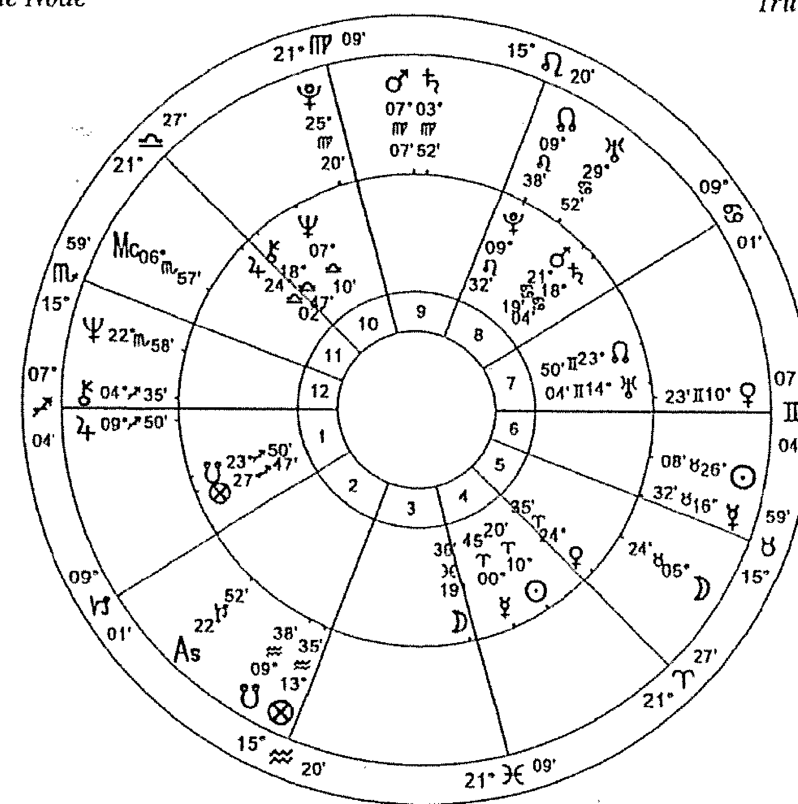

## 案例三

## II. 本命/太阳弧向運法，此處向運以D表示公元1993年太阳弧向運流年

1.  ♃D 寅9° 50' 位於ASC浮升，入廟，與☉R 戌10° 20' 在本命4宫及♇R 午9° 32' 在本命8宫形成大三角吉象，相關星座皆為火象，♃ 為運氣，☉ 權威、尊榮，♇ 掌握、佔權。尹清楓上校於當年度榮升武獲室執行長佔少將缺，這是軍人相當重要的生涯轉折，光耀門楣，其父頗引以為傲。

但此大三角吉象為何當年度遭逢如此身心煎熬，橫死海上？此處應注意向運的☋D 正好與大三角吉象形成菱型且為頂點在2宫，事涉神秘業力。

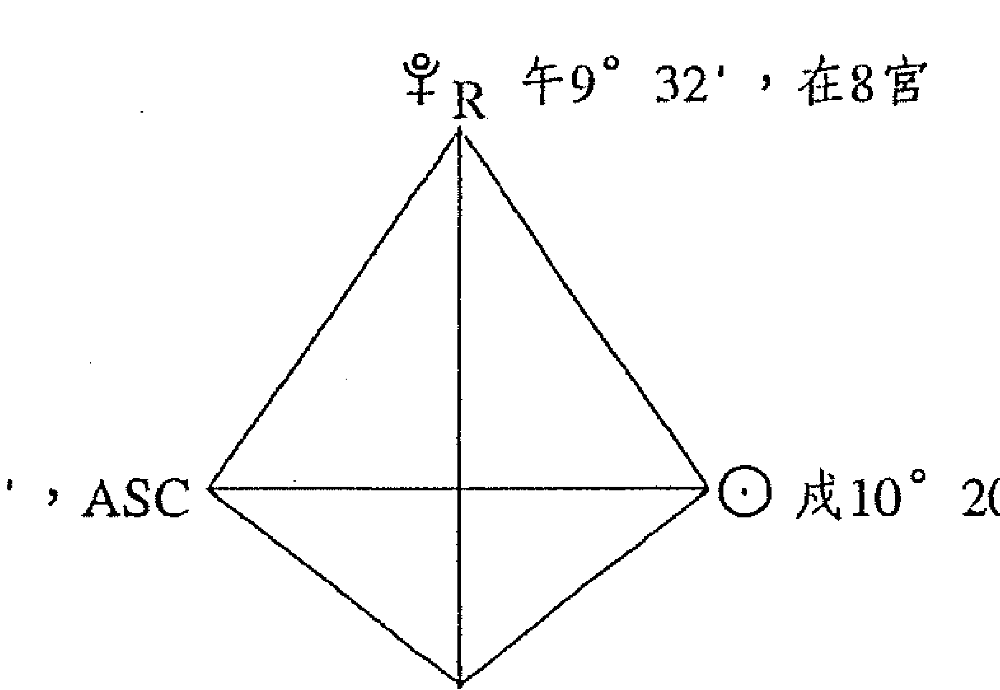

2.  ☿D 22° 58' 在12宫與ASCD 丑22° 52' 在本命2宫及本命☋D 申23° 5' 在7宫形成上帝的手指型。

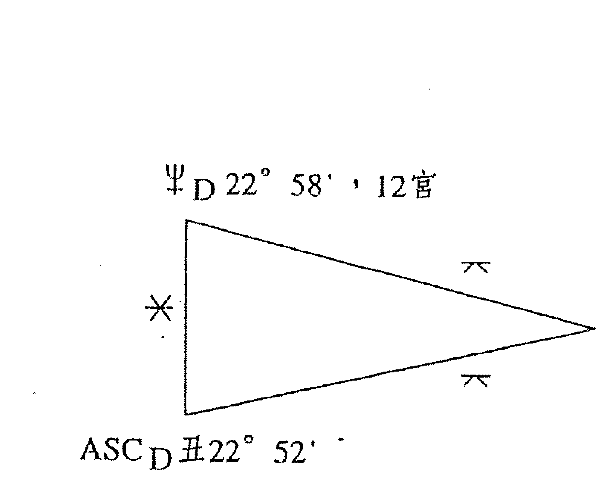

相關行星或ASC_D 皆在暴戾星座12宮(卯)、2宮(丑)與明小人(7宮)、暗小人(12宮)牽涉在內，12宮為災難宮，Ψ在水象(卯)更凸顯不幸災難之狀況。

3.  ♂D 巳7°7' □ ASC_R 寅7°4'，♂管轄傷害、兵器、不幸...等且♂為本命12宮卯之主星，ASC代表命主，顯然命主本人受到傷害。

4.  ASC_D 22°52' ○○（♂R ◯♄R）雖離1°31'，但ASC之計算涉及宮位系統採用，即精確時間之差異會有不同，由於僅差31'故離精確出生時間約僅2分鐘左右。

本案例當年度同時有幾個吉凶向運並陳，極佳的大三角卻隱藏神秘業力和極凶的向運♂D □ ASC_R 及ASC_D ○○（♂R ◯♄R），涉及生命之憂，凶死。

有關本例之太陽向運係採Naibod Arc每年推進弧度為0°59'08"，所得結果頗符合尹清楓上校當年狀況，但研習者應知道事後驗證較易著手，若事前面對此案例如何下結論呢？

# 第六章·流年預測占星學

尹清楓
Solar Return
Mar 31 1993 (± 1 secs)
8:57:54 am CCT-8:00
T'aipei, TAIW
25° N03'
121° E30'
Geocentric
Tropical
Placidus
True Node

Compliments of:-
Astrolabe Inc.
Box 1750
Brewster MA 02631
Web: http://alabe.com
Email: astrolabe@alabe.com

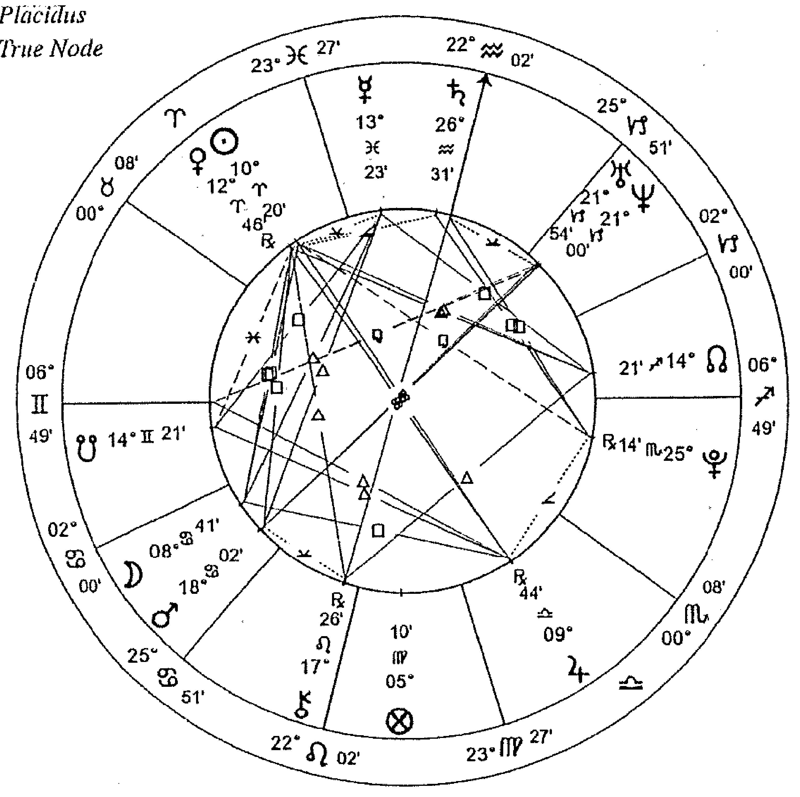

| Inner Wheel | Outer Wheel |
| :--- | :--- |
| I | I |
| 尹清枫 | Solar Return |
| Natal Chart | Mar 31 1993(±1 secs) |
| Mar 31 1946 | 8:57:54 am CCT -8:00 |
| 11:00 pm SSUT -7:00 | T'aipei, TAIW |
| china, china | 25° N03' 121° E30' |
| 36° N01' | Geocentric |
| 103° E27' | Tropical |
| Geocentric | Placidus |
| Tropical | True Node |
| Placidus |  |
| True Node |  |

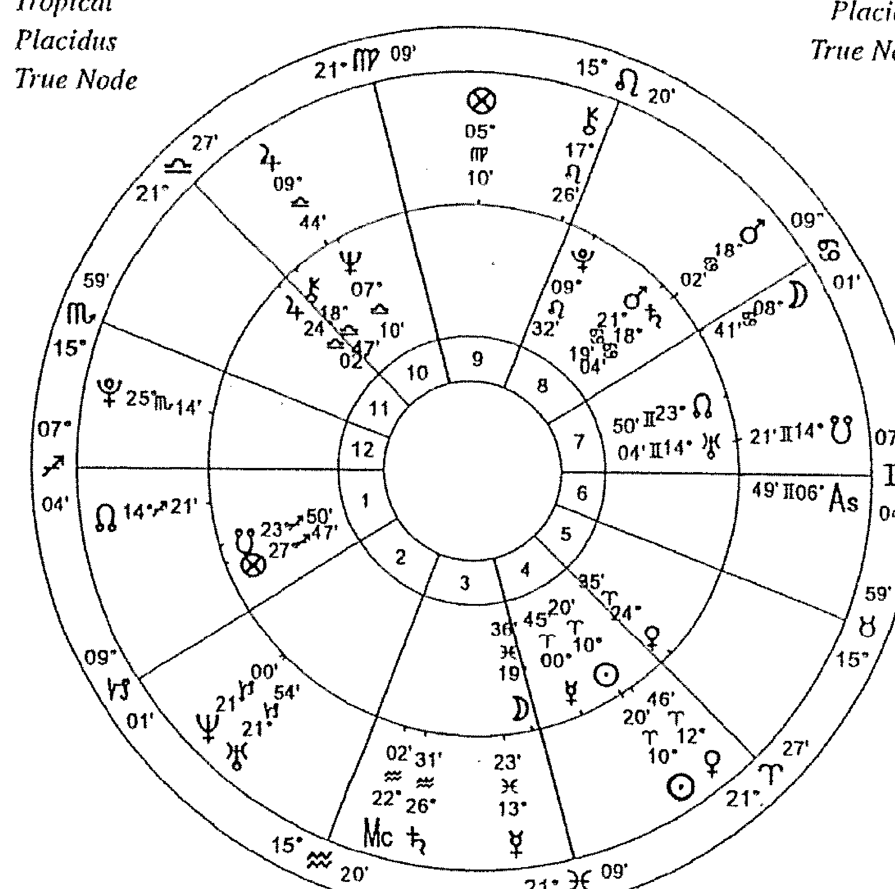

# 第六章·流年预测占星学

## (III) 太阳回归法

#### A. 单独的太阳回归盘(1993年)以SR代表

1.  回归盘的ASC SR 在申6° 47' 已近本命盘7宫始点中7° 4'，该年必然涉及人际关系之互动，敌人或明显小人，谈判协商，甚或合夥、夫妻之事務。
2.  回归盘始宫以ASC SR和MC SR为重，☊SR 在ASC 必然困顿、内心煎熬前世业力干扰，而♄SR 在MC SR 内水瓶为旺，代表责任、严谨、压力，然♄SR 适为回归盘8宫(死亡)之主星，又90°刑 ☐ ♀SR (♀也是死亡、阴谋)在暴戾星座、6宫，隐含因日常工作死亡之徵。
3.  回归盘ASC SR 主星 ☿ SR 飞临10宫事业，显示命主执著於个人职务，努力尽心，然 ☿ SR 在亥为弱 ☐ ☋SR 在命宫内，亦属因个人职务带给生命困顿、不安，加深业力的影响。
4.  回归 ☉SR 位於回归盘之11宫，显示当年能量花费 ☉SR ∠ ♄SR 在团体、朋友及同僚，而(半刑)於事业宫内，同僚与命主的职务之干格可见，☉SR 亦与2宫内 ☽SR 及5宫内♃SR 形成三刑会冲，而2宫内♂未18° 2' ♂ 8宫内(♃丑21° 0' ⚹水丑21° 54')，8宫为他人之财，挡他人之财甚明。

#### 5. 迴歸盤 SR 之最後相位如下圖

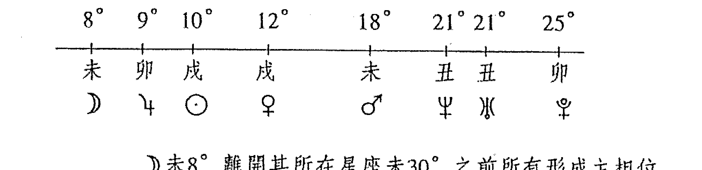

)未8° 離開其所在星座未30° 之前所有形成主相位 ○、*、□、△、☌ 計有 ) 未8° △ ♃ 卯9° ， )未8° □ (☉ 戌10° ☌ ♀ 戌12° )，8° ☌ ♂ 18° ， )未8° ☌ (♆ 丑21° ☌ ♆ 丑21° )，)未8° △ ♀ 卯25° 。即 )逐漸入相位，最後離開未30° 之前120 ° 三合♀，♀ 為死亡，引動迴歸盤中♀□♄之凶象。

#### 6. 迴歸盤ASC SR 在申雙子、變動星座，浮動不定。

#### B. 本命/迴歸盤合盤分析

1.  迴歸盤ASC SR 內之♅ SR 申14° 21′ ☌ ♆ SR 申14° 4′ 在本命7宮且ASC SR 主星☿ SR 亥13° 23′ □ ♆ SR ，指示與對手或明顯小人溝通不成，引動神秘業力，以致意外災難遭橫禍。
2.  (♄ SR 丑21° 0′☌♆ SR 丑21° 54′)☌(♂ R未21° 19′☌♄ R未18° 4′)在8宮且♂ SR 未18° 2′☌(♂ R未21° 19′☌♄ R未18° 4′)，顯然涉及擋到他人金錢而死亡。
3.  4 SR 辰90° 44' 在本命10宮♂◎戌10° 20' 在4宮，老父(◎)傷心。由A.B分別敘述也有當年度死亡之徵。

# 第七章 卜卦占星學

卜卦占星學(Horary Astrology)是西方占星學四大科，即本命、時事、擇日、卜卦中的卜卦類，Horary的文字意義為與時間有關，這說明卜卦占星學是在處理詢問者內心裡有疑惑之時起盤，由天宮圖的星辰結構來解答所詢問事項，亦即卜卦占星學與時間性質相關關聯，詢問者詢問當時天空的星辰結構隱含了問題所在，占星師得以根據一些法則來回答是或不是，屬於事件吉凶預測的範疇。

西方占星學在17世紀於英國發展成第二次黃金期，當時的占星學的主流即是卜卦占星學，上至王公貴族下至販夫走卒，無不趨之若鶩。大陸學者江曉原博士《歷史上的星占學》第8章第3節星占學家知道什麼？(上)提到占星家提供之私人事務的服務計有

1.  尋找失物
2.  尋人、尋奴僕逃犯
3.  尋船、航海預卜、航海保險
4.  物價、生意盈虧
5.  尋寶、尋金、尋找點金石
6.  訴訟利鈍
7.  個人的窮通禍福
8.  職業選擇
9.  婚姻家庭
10. 治病
11. 懷孕
12. 壽數
13. 種種私人決策

，這些項目除部分可由本命占星學推論外，大多數是卜卦占星學服務的項目，事實上除了這些私領域的問題外，亦可用於公領域的範圍，如占星學發展史最重要的人物17世紀英國的William Lilly的名著《Christian Astrology》中不乏有這方面的案例。

卜卦占星學的主要內容可以說是以後天宮位和月亮為中心的占星學，因著重在事件吉凶的預測，一直被攻擊、污衊，其實預測吉凶何罪之有，該譴責的是操術者的心態問題或心術不正，許多社會科學如心理學、社會學、經濟學不也都是做預測？

卜卦占星學進行詢問者所提問題之判斷，大抵按下列議題：

## I. 檢查所提問題是否為根本的，即所提問題有效性的參考

-   時間主星是否與卜卦盤上升星座ASC主星相同？與ASC星座三分性主星相同？與ASC星座同純質料？與ASC主星是否形成托勒密相位？
-   上升度數是否為星座之前3°，即0°、1°、2°。
-   上升度數是否為星座之後3°，即27°、28°、29°。
-   ☽ 是否在焦傷途徑Via-Combust(辰15°～卯15°)。
-   ☽ 是否空虛(Void of Course)。
-   ☽ 是否在星座的較後度數，即多於27°以上。
-   ☿ 是否在7宮內或為7宮主星。

## II. 確定問題，認定代表行星和所問事項的自然主星

-   代表詢問者為那一行星？
-   月亮為共同的詢問者，甚或共同之詢問事項。
-   代表詢問事項為那一行星。
-   衍生宮位的應用(涉及非詢問者之人、事、物)。
-   詢問事項的自然主星。

## III. 計算相關代表行星的力量-Williams Lilly行星力量評價表

-   必然的尊貴與無力(Essential Dignity & Debility)。
    1.  廟 2. 旺 3. 三分性 4. 界 5. 外觀 6. 互容與容納
    7.  陷 8. 弱 9. 外來的。
-   偶然的尊貴與無力(Accidental Dignity & Debility)
    1.  宮位位置-始宮、續宮、果宮。
    2.  運行速度與狀況-行星運行速度比平時快或慢、順行或逆行。
    3.  月亮的增光與減光。
    4.  行星接近太陽的狀況-在太陽光束下，逢焦傷或核心內。
    5.  與吉星♃或♄、凶星♄或♂的相位。
    6.  行星的相態東出與西入。
    7.  與☊/☋等分相位會合☌。
    8.  與吉恆星或凶恆星的會合☌。

## IV. 檢查月亮所有的入相位與離相位

## V. 判斷事件能否完成(Perfection)

-   不能完成
    1.  圍攻(Being besieged)。
    2.  挫敗(Frustration)，禁止(Prohibition)，妨礙(Interference)。
    3.  障礙(Hindrance)和妨害(Impedition)。
    4.  Refranateion。
    5.  逆行(Retrograde)。
-   能完成
    1.  代表行星或...)間形成主相位之入相位。
    2.  容納與互容。
    3.  光線傳遞(Translation of Light)。
    4.  光線集中(Collection of Light)。
    5.  代表行星或...)與所詢問事項之宮位的宮始點形成吉相位。

## VI. 事件的應期

## VII. 方位、色彩、地點等特殊問題的判斷

卜卦占星學的內涵又可演繹為事件占星學，即根據事件發生時刻及地點起盤，解說事件之前因後果，常用於時事判斷，如地震、大災難、殺人事件、政治團體成立日期...等，另在醫療占星學則衍生命運盤的用法，以作為診斷疾病的輔助工具，又占星師也常根據客人上門之剎那起顧問盤，配合判斷或瞭解客人最想要的諮詢是什麼主題，以此切入可收事半功倍之效。

另外也由卜卦占星學衍生競賽盤(Contest Chart)如運動、球賽、拳擊、政治選舉...等種種一對一的競爭或挑戰、主客場明顯的運動比賽都可以根據比賽時刻起盤或類似卜卦詢問起盤，根據1宮(主)和7宮(客)之對稱及10宮(1宮之聲望、評價)和4宮(7宮之10宮，即7宮之聲望、評價)，若涉及智商、運動才華尚須考慮5宮及11宮，將這些宮位及宮主星予以評估雙方力量，强者胜，弱者败。

## 案例三

Disease Chart
May 8 1645 OS
6:15pm GMT +0:00
Londan, Eangland
51° N30' 000° W08'
Geocentric
Tropical
Regiomontanus
True Node

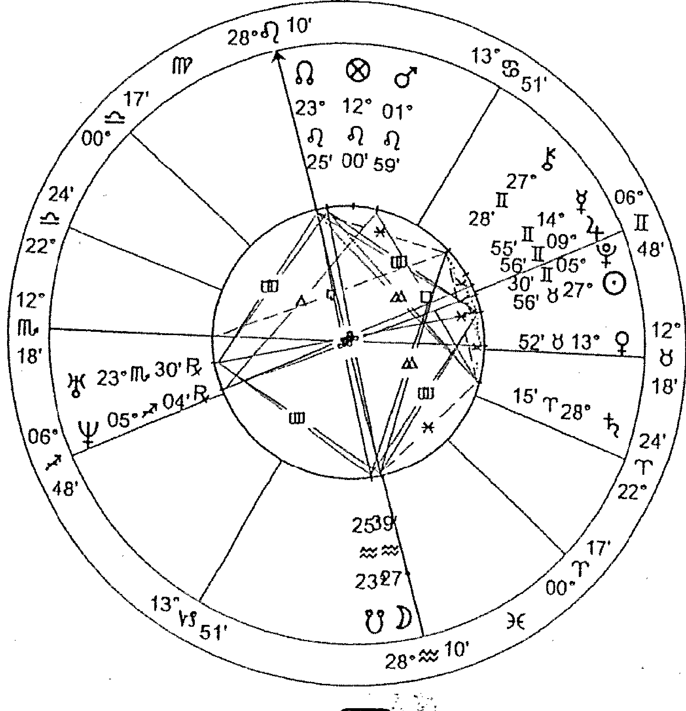


# 第七章·卜卦占星學

卜卦盤(Horary Chart)：錄自W. Lilly《Christian Astrology》一位生病的醫生詢問：我的疾病是什麼？是否能康復？

<一> 該醫生的疾病按W. Lilly自己描述，括弧則為註解。詢問時起出天宮圖如左，ASC在卯天蠍，恆星氏宿- (South Scal凶恆星，當時約在卯11° 20')名"天蠍的腳"近ASC，但未受任何凶星之邪惡刑剋，所以接下來我必須觀察6宮，看它是否受刑剋。我发现♄在該宮入弱(♄在戌白羊，弱)，因而刑剋了該宮(即第6宮)，♄為自然的疾病凶星。根據這種情況，我乃下結論身體受刑剋的部位應在♄和6宮，因屬最凶配置，必然是最苦惱之處。

戌白羊管轄頭部，如《Christian Astrology》p.245所述，♄在戌宮代表胸部，而ASC主星♂在午獅子，代表心臟，離相位□ ♄ (♂午1° 59' □ ♄戌28° 14'，若♂在未28° 14'則正相位♂比♄運行快)；當♂若仍在未巨蟹與♄兩者皆在啟動星座，管轄胸部和胃腸。由這些資訊，我可下結論受刑剋的部位為頭部、胸部、心臟、胃腸，且某種黑膽汁質的阻礙貯存在胸部和胃腸，因而導致他的疾病和災難(17世紀前，歐洲醫學仍以四種體液即血液質(風象)、黃膽汁質(火象)、黑膽汁質(土象)、黏液質(水象)之平衡論斷疾病，♄為黑膽汁質，故W.Lilly有此判斷)

<二> 疾病的原因

♄是疾病的主要代表因子，在它自己的界内(♄戌28°14'適在♄的界)，且☽位於它的廟宮(☽子27°29'，子為♄廟宮)入相位☌♄，這說明黑膽汁質和乾的疾病是因他頭部和胸部不平衡的黑膽汁質所引起，見《Christian Astrology》p244之記載。就疾病而言，♄管轄虛弱，你的醫生當知道先前所述因素是這些部位產生疾病的原因。

ASC主星♂也是在♄之界(♂午1°59'適在♄的界)，且☽也在♂的界(☽子27°29'適在♂的界)入相位□☉，而☉也在♂的界(☉酉27°56'適在♂的界)，所以黃膽汁質(♂所屬體液)也是這位醫生生病的第二個原因。事實上當我跟他談話時，他已遭受極大痛苦，頭痛欲裂，他顯得非常無氣力、遲鈍、憂鬱、睡得很少、乾咳嚴重，抱怨非常虛弱，胸部和心臟部位疼痛，他的膚色介於黑和黃之間，有黃膽的傾向，另外憔悴、疲倦、關節無力，因☽在風象(☽在子水瓶屬風象星座)且卯天蠍上升，代表私密部位膀胱結石，而☽在子也代表私密部位和疾病，他排尿困難，痛苦地血尿。就我有限的醫學常識，我勸他應服熱、濕興奮劑，多少可以延長他的生命，然而☽在4宮入相位於♄，他的疾病使他病亡(4宮在卜卦或疾運盤化表死亡、結束，且☽是卜卦之共同代表因子)，他在8月14日(格里曆8月24日)死亡。

# 第七章·卜卦占星學

## <三> 生病的時間長或短

♄是致病的原因，顯示它將成為慢性或持續某段時間 ，如《Christian Astrology》所述，♄是沈悶的、慢性的行星；另外ASC在卯固定星座，☉、☽皆在固定星座與始宮90°刑，況且都在凶星的界内♂為ASC主星及6宮(戌)主星也在固定星座，所有這些情況都指示疾病會拖長，最後♂的映點近☉更刑剋了他(♂在午1° 59′，其映點為酉28° 01′☉酉27° 56′，☉代表生命力)。

### ※本卜卦盤 論斷要點整理

1.  若ASC受凶星刑剋，該刑剋凶星描述疾病之性質部位，若ASC不受刑剋則由6宮內行星代表疾病。
2.  代表因子的最近相位是重要的，即使是剛離開其前一星座。 本案例的♂離相位□♄，但在未巨蟹形成完美相位。
3.  映點的重要：♂主管ASC和6宮，♂的映點☉，使詢問者生命力受損，且白天☉為重(若夜間出生)為重)
4.  疾病的主要代表因子，不管是♄或♂都是凶星，尤其它們是在ASC或6宫，☽為任何卜卦盤的共同代表因子，應注意它的各種狀況。
5.  W.Lilly的論斷是古代醫學診斷方法，卻如斯響應。

## 案例四

Career
Natal Chart
Apr 28 2003
5:58 pm CCT - 8:00
Kaohsiung, TAIW
22° N38' 120° E17'
Geocentric
Tropical
Regiomontanus
True Node

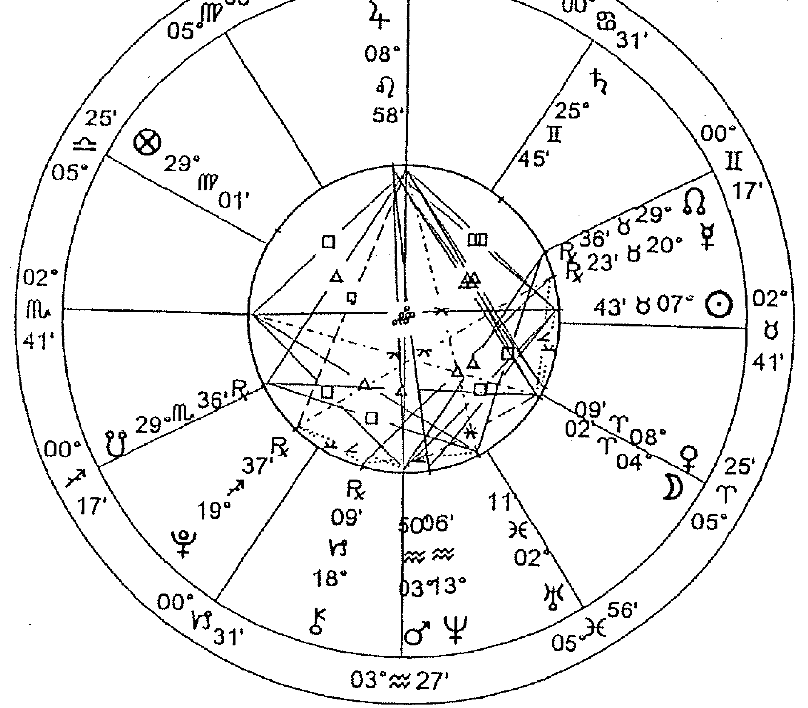

卜卦盤：李先生卜問工作升遷是否可成？

我們針對進行卜卦占星常備的一些程序逐一解說

基本資料：卜卦日期：星期一，主星：☽
卜卦時間：下午5點58，時主星：☉
ASC星座：天蠍座 三分性主星：晝♂，(☉尚在地平線上）時主星純質料：☉熱和乾
ASC星座純質料：天蠍 冷和熱


> ☽入相位♀，△♃；☽離相位△MC，♂

(I) 詢問問題是否為根本的(Radical)？即是否有效的？有一成立，問題即有效。
1.  時間主星☉與ASC主星 不一致。
2.  時間主星☉與ASC星座天蠍之三分性主星(卜卦時尚屬白天)♂不一致。
3.  時間主星☉純質料熱和乾，但ASC星座天蠍純質料冷和濕不一致。
4.  時間主星☉和ASC主星♂形成90°□離相位，90°□為托勒密相位之一。

(II) 判斷的拘束(Strict against judgement)，共有7種情況
1.  ASC度數在上升星座的前面3°內

# 第七章·卜卦占星學

- 2. ASC度數在上升星座的後面3°內
- 3. 月亮位於焦傷途徑(Via Combusta)，即辰15° ～ 卯15°，除辰23° 42'外
- 5. 月亮空虛(Void of Course Moon)
- 6. 土星在7宮內，或為7宮主星

本例未見2-6情況，但ASC度卯2° 41'在上升星座的前面3°，依古典卜卦原則，提示詢問者所詢問的問題尚未見純熟，醞釀而已，尚不足做完整解說。度數愈前面愈不成熟，本例離3° 內較近，因(I)是有效的，故尚可回答。

## (III)詢問者及問題事項的代表因子

- 1. 詢問者李先生以ASC卯天蠍及火星代表
- 2. 問題事項-工作升遷為榮耀以10宮午獅子及太陽代表
- 3. 月亮為卜卦盤任何問題的共同代表因子
- 4. 詢問事項的自然主星亦為太陽

a. 10宮官祿或事業在午獅子座，宮內見木吉星，似乎升遷有望，榮景有期，但木星在午8° 58'正好位於土星外觀(Face)含有些微阻礙，且ASC主星火星子3° 50'入相位木星，雖形成主相位，然沖相困難重重。

b. 10宮宮主星太陽飛臨7宮酉7° 43'，7宮為他人，榮耀歸之他人，故若同時舉薦恐不利詢問人，且太陽離相位火星隱含權威、主管之代表太陽離命主而去，甚或與詢問人不愉快、有爭端(火日爭輝)，而卻入相位♃，顯然競爭者較有利，但也不免刑剋困難，卻比詢問者較有利。

c. ☽為卜卦盤的共同代表因子，☽在戌4° 2'入相位☌♀戌8° 9'，且入相於10宮內之♃，而♀適為7宮主星，然☽卻離相位 ⚹♂，☽亦離♂而去，徒呼奈何。

d. 詢問事項的自然主星⊙已如b之分析。

e. 那麼是否有轉機呢? 古典卜卦法則提供光線傳遞(Translation of Light)或光線集中(Collection of Light)，本例符合前者之條件。

(i)

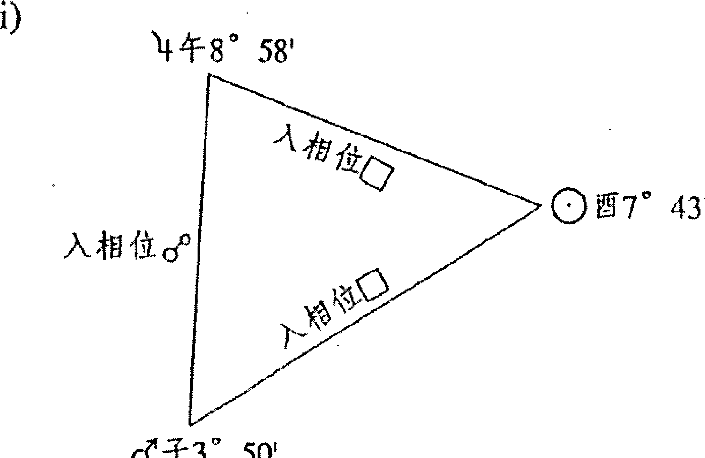

這三顆行星⊙、♂、♃中⊙速度最快故能扮演傳遞角色，即將♂帶給♃，其意義即隱含透過權威人士或主管(⊙且為10宮主星)說項以獲得升遷♃，但因傳遞過程皆是凶相位，恐困難重重、障礙難以克服，另應注意☉在酉，而♀在戌，成為旺一廟互容，該權威情向他人或競爭者，所以欲透過權威人士或主管這條線，恐徒勞無功，台語俗語：「請鬼拿藥單」。

(ii)

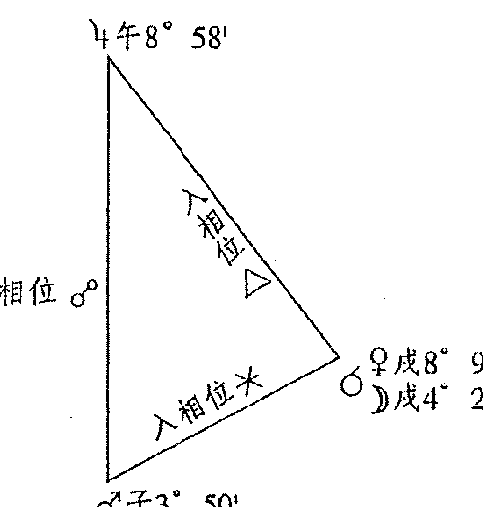

這三顆或四顆行星(♀☽)、♂、♃中，☽及♀速度最快故能故能扮演傳遞角色，能將♂帶給♃，(ii)之光線傳遞為吉相位似乎較可行，然☽又入相位六合♀，恐亦有利他人，而☽在戌和☉在酉7宮互旺，更可確認他人較得勢。

## (IV) 結論：

此次升遷似榮景可期但恐不得主管緣，似乎曾與主管發生爭吵，若無則在過程中應處處提防，恐已內定他人，此人實力不如詢問者。

該詢問者問筆者該如何處理?由於天宮圖徵象不利甚明顯，勸其忍性，後來他透過許多關係卻得罪他的主管，反而騎虎難下，引起相當大的風波，至今仍餘波盪漾，最後發佈仍由競爭者升遷，詢問者則擦身而過甚為懊惱，由於詢問者背景甚強，但因政黨輪替運作無法像往昔得心應手。後來從旁得知審議過程，他的主管幾乎全在為競爭者護航，此卜卦占星準驗可見一斑。

# 第七章·卜卦占星學

### 案例五

- Contest
- Natal Chart
- Nov 5 2003
- 9:10am CCT - 8:00
- Kaohsiung, TAIW
- 22° N38' 120° E17'
- Geocentric
- Tropical
- Regiomontanus
- True Node

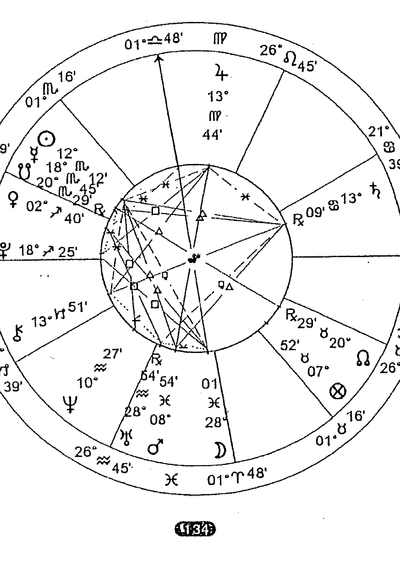

早上9:10看到報紙斗大標題「中韓之戰」，心血來潮關心球賽結果

### 競賽盤：關心今日中午亞洲盃成棒賽中韓之戰結果？

### 基本資料：星期三：日主星♀    時主星：♃

| Day of ♀ Horu of ♃ |
| :--- |
| 4th Hour of Day |
| Last Hr ♄ -14 mins |
| Next Hr ♂ +41 mins |

| MUT. RECEPTIONS |
| :--- |
| ♀ ♃ Ruler-Trip |
| ♄ ☽ Ruler-Term |
| ♀ ♃ Ruler-Face |
| ♀ ♋ Exalt-Trip |
| ♀ ♋ Exalt-Term |
| ♀ ♋ Exalt-Face |
| ☉ ♀ Trip-Trip |
| ♃ ♀ Trip-Term |

| ESSENTIAL DIGNITIES (PTOLEMY) |
| :--- |
| Pt | Ruler | Exalt | Trip | Term | Face | Detri | Fall | Score |
| ☽ | ♃ | ♀ | ♀ | ♄ | ♂ | ♀ | ♀ | - 5 p |
| ☉ | ♂ | -- | ♀ m | ♃ | ☉ + | ♀ | ☽ | +4 |
| ♀ | ♂ | -- | ♀ | ♀ | ☉ | ♀ | ☽ | - 5 p |
| ♂ | ♃ | ♋ | ☉ m | ♃ | ♀ | ♀ | ♋ | +3 |
| ♃ | ♀ | ♀ | ♀ | ♃ | ♄ | ♃ - | ♀ | - 5 p |
| ♄ | ☽ | ♃ | ♀ | ♀ | ♃ | ♄ - | ♂ | - 3 |
| ⚳ | ♄ | -- | ♄ | ♂ | ☽ | ☉ | -- | -10 p |
| ⚴ | ♄ | -- | ♄ | ♀ | ♀ | ☉ | -- | -- |
| ♂ | ♃ | ♋ | ☉ | ♀ | ☽ | ♀ | ♋ | -- |
| ⚸ | ♄ | ♂ | ♀ | ♃ | ♂ | ☽ | ♃ | -- |
| ♌ | ♀ | ☽ | ♀ | ♃ | ♀ | ♂ | ☽ | -- |
| ♍ | ♂ | -- | ♀ | ♀ | ♀ | ♀ | -- | -- |
| As | ♃ | ♋ | ☉ | ♄ | ♄ | ♀ | ♋ | -- |
| Mc | ♀ | ♄ | ♄ | ♄ | ☽ | ♂ | ☉ | -- |
| ⚹ | ♀ | ☽ | ♀ | ♀ | ♀ | ♂ | -- | -- |

# 第七章 卜卦占星學

## (I) 問題是否為根本的(Radical)?

時主星♃正好為ASC在寅射手的主星，而且日主星☿也為7宮申雙子的主星，問題為根本的，即是有效的，甚為明顯。

## (II) 競賽盤的代表因子

- 1. 台灣人關心中華隊，以ASC及ASC主星♃為代表。
- 2. 10宮為我方中華隊之榮耀，故與辰天秤及主星♀為代表。
- 3. 5宮為我方運動才華，故以酉金牛及主星♀為代表。
- 4. 韓國隊為對手，敵方以DSC在申及主星☿為代表。
- 5. 4宮(7宮之10宮)為韓國隊的榮耀，故以戌白羊及主星♂為代表。
- 6. 11宮為敵方運動才華，故以卯天蠍及主星♂為代表。

## (III) 狀況研判

- 1. 我方在寅，主星♃適為卜卦時之時主星，機兆頗佳，儘管對方申主星☿亦為日主星，但卜卦重時間隱含我方之利，但仍須全盤解析。
- 2. ASC在寅，宮內無星，以ASC主星♃為重，飛臨9宮巳13°44'入陷無力，僅有界主星之力，位於☿管轄之廟、旺星座，顯然受制於他人，幸好三方性主星♀為我方榮耀主星，尚能為爭榮耀而努力不懈。


- 3. DSC在申，宮內見大凶星♃未13° 9'且逆行 ℞ 入陷無力，另更糟糕，無任何必然尊貴，且♃位 4 管轄之旺星座，也會遭受我方抵抗，其三方性主星♀卻是我方榮耀之星。
- 4. DSC主星☿卯18° 45'飛臨11宮，敵方之運動才華似可展現，惜☿逢⊙焦傷，狀況恐不佳難以儘情揮灑。
- 5. 10宮在辰，我方榮耀主星♀位於12宮寅2° 40'為偶然無力似不妙，幸與我方主星♃形成旺一三方性互容能爭一口氣，但甚微。
- 6. 4宮在戌，他方榮耀主星♂位於3宮亥8° 54'我方主星♃管轄之星座，顯然他方榮耀受制於我方，而且位於果宮，也是偶然無力，然180° ⚹ 我方主星。
- 7. 我方運動才華為5宮，宮內見幸運點及☊吉星，而他方運動才能有⊙能量較強，卻焦傷其主星，且凶星☋在11宮內，所以我方較為幸運。

由以上1-6分析可體會我方實力難以發揮，對方也一樣，但更不幸。我們從基本資料中的 Essential Dignities (Ptolemy) 表整理。

# 第七章·卜卦占星學

| 我方(中華隊) | 他方(韓國隊) |
| :--- | :--- |
| 主星 ♃ -3 | ♀ -5 P，♄ -10 P |
| 榮耀 ♀ +3 | ♂ -5 P |

※P為外來的(Peregrine)，即行星完全無五種必然尊貴之一，在外遊蕩之意。

結論：中韓之戰，雙方實力皆難發揮，但幸運之神降臨我方，中華隊應可險勝。

結果：中華隊第一局就出現致命失誤被韓國隊連下兩分，韓國隊投手狀況也不佳，可是中華隊一直到第三局、第四局才勉強追平，至此之後一直沒有辦法超越，至第九局又被對方連下二城，讓中華隊陷入絕境，但第九局幸運之神真的降臨，對方投手突然失控連連保送，中華隊辛苦追平，進入延長賽，在第十局下半二人出局滿壘，靠著高志綱的彈跳的場地安打，攻下致勝的一分，舉國歡騰。平心而論，韓國隊實力高出一些，但大凶星入陷在其宮內，而幸運點⊗及☊在我方運動才華宮，相對地他方主星♀逢焦傷及⚷凶星在其運動才華宮，兩相對照中華隊幸運許多。

就卜卦占星，此競賽盤頗為準驗，宇宙星象的魅力令人嚮往！

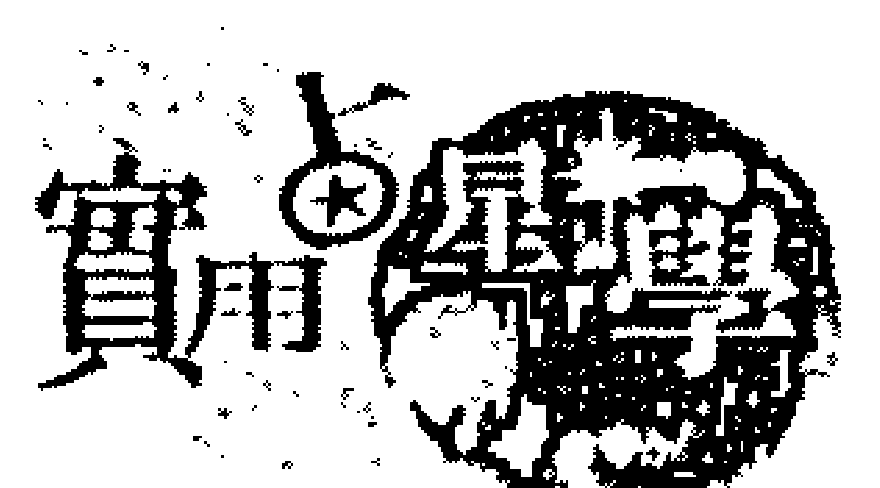

# 第八章 弧角天星择日学

中國擇日的法訣、派別甚多且分歧，因著重在造葬這個項目隨地理風水學派林立，而衍生出三合派、九星派、三元派等，而這些派別中又有不同的法訣，多到令人無所適從，復加上自古留存之說法更是繁瑣不堪。任何派別或法訣皆宣稱根據宇宙天體運行的規律而定，但鮮少提出具體的佐証，一直到明末清初，義大利耶穌會教士來華傳教為接近知識份子，以當時比較先進的天文曆法知識作為傳教切入點，才使擇日學真正地、完整地與星空天體運行直接地關聯，西洋傳入的弧角天星擇日學被溶入中國七政四餘占星學，而衍生成一支獨特的擇日法，在擇日界一般稱之為弧角天星擇日學。

# 第八章·弧角天星择日学

## I.弧角天星的釋意

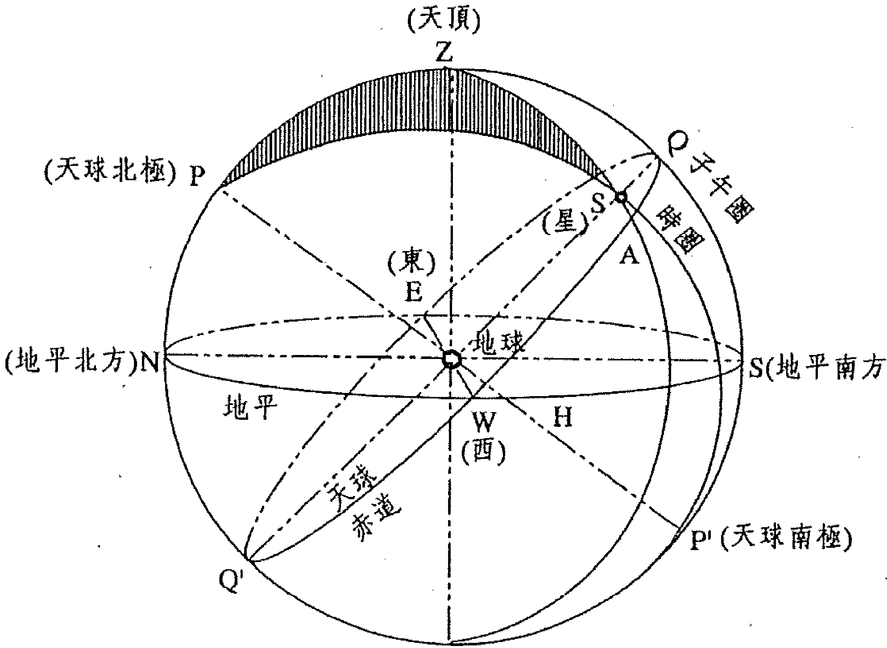

1. 此圖為假想的天球模型，圖中央黑點代表地球，天球即由其無限延伸而形成。
2. 觀測者的頭頂年限延伸於天球上，即是天頂Z，即相對點為天底Z'。
3. 地球的北極點無限延伸至天球即是天球北極P，而其相對點P'為天球南極。
4. 由地球看天球，在夜晚可看到天球上鑲滿星球，假設我們要觀測的是S(星)，其所在天球經圈或時圈為PSP'。
5. 觀測者所在地球的地平方位圈，向天球無限延伸即是NSEW。
6. 地球的赤道圈，向天球無限延伸為天球赤道圈為QEQ'W。
7. 透過這種天球模型，利用球面三角學的數學計算可輕易求出太陽到山時刻、太陽日出日落時刻、太陽高度、太陽方位角以及占星學宮位系統的各宮宮始點，以及其他行星的位置，圖中SPZ的陰影區域即是天球球面界定而成的弧角，故有關算法美其名為「弧角天星」。

## II.弧角天星流傳不廣的原因

弧角天星擇日學是中國擇日界視為位階最高的一種，但僅在宮廷使用，一般民間不易窺知。清·光緒年間陳麗中出版《御覽天象淵源》1-4為欽天監實務，但內容艱深即使是飽學之士也難以入門，而民間雖有薛鳳祚傳自來華教士穆尼閣的《天步真原》，其中卷二即在計算弧角天星的天宮圖及行星的位置，但處處需要查對數表及行星位置的星曆表，在當時中國尚未有球面天文學的觀念，想像得到有心之士欲學習也必然挫折再三。而民間擇日館學會的人又故意賦予神秘感，嚴禁私傳或需高價方學得到，但也大多處於不知真正原理，僅懂得計算步驟而已。這絕非誇大。

可請問從事弧角天星擇日的業界人士所計算的宮位系統到底是那一種宮位系統便知。

就是上述原因，弧角天星擇日僅受業界人士尊仰而望塵莫及，故難以廣泛流傳。但幸運的是，現代電腦科技已徹底簡化了其繁複的計算過程，若瞭解其原理，學會弧角天星擇日學，已非往昔之困難了。

## III. 中國七政四餘擇日學的步驟

A. 根據用事方位(羅經24山之1)的太陽到山時刻。(動盤)

B. 查用事當日及方位之靜盤有何吉象。
以靜盤看三方、四正行星是否調入祿元、馬元、貴元。

- 守照、拱、關、輔、夾、對照。
- 查年干支、祿元、馬元、貴元。

C. 演算用事之天宮圖

- 立命官
- 定命主星
- 分恩、用、仇、難
- 定格局(行星廟、旺、陷、弱及特殊的排列組合)
- 其他

## IV.西洋擇日占星學

- A.一般通則
- B.重要鐵則-月亮不能空虛及受凶星刑剋，僅取入相位
- C.四大元素(三方)及四正的意義
- D.黃道12星座、後天12宮、行星、恆星在擇日占星學的用法
- E.行星的力量計算(同本命、卜卦占星學的內容)
- F.擇日分類項目的特殊法則
    1. 石川源晃的分割調波的應用
    2. Mary Whitty Boyd的股市進出時機
    3. Lynne Palmer Gambling的占星運用法則
    4. Dr Eugen Jonas的生育及生男生女控制法
    5. a.訂婚、結婚
    b.公司創立及營運
    c.遷居、移徙(i)購屋、購地或租屋之簽約
    (ii)新居落成或購屋、租屋遷入
    (iii)年久失修或依某項功能調整之動土
    d.新建大樓.屋宇之動土、開工、上樑、落成
    e.工廠新建同d
    f.上升就職
    g.選舉登記
    h. 一般登記、簽約、申請
    i. 宴會舉辦
    j. 葬禮、登穴
    k. 其他

# 第八章·弧角天星擇日學

### 案例六

清嘉庆17年8月20日申时初初刻
阳历公元1812年9月25日3:00pm 北纬32° NO'

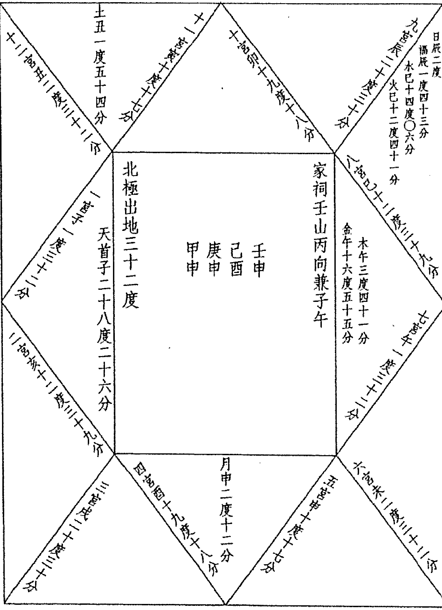

# 第八章 弧角天星择日學

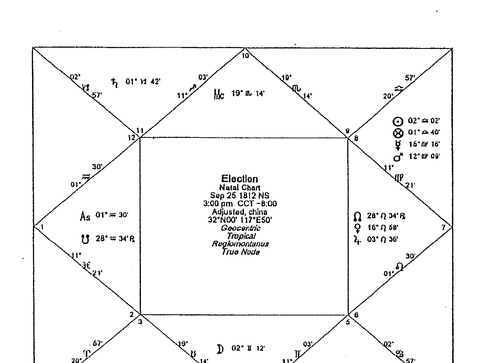

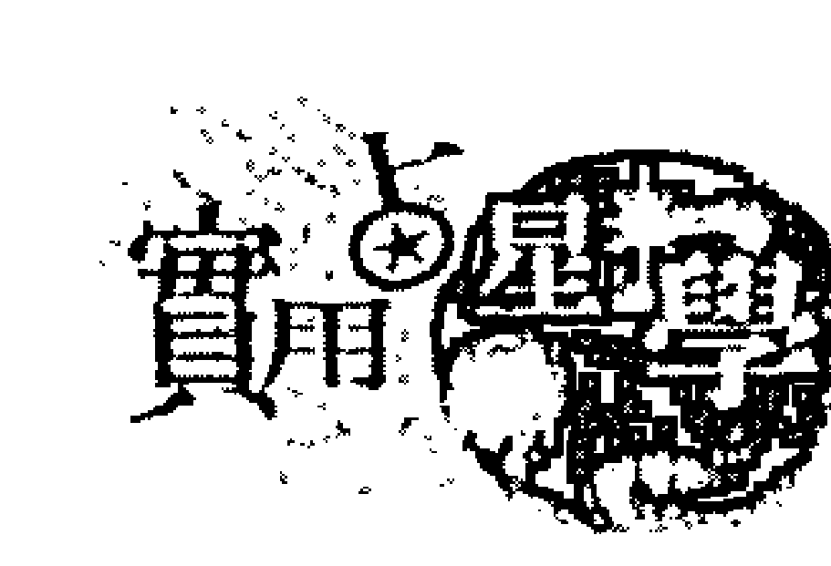

Election  
Chart  
Sep 25 1812 NS  
3:00 pm CCT-8:00  
Adjusted, china  
32° N00' 117° E50'  
Geocentric  
Tropical  
Regiomontanus  
True Node

Compliments of-  
Astrolabe Inc.  
Box 1750  
Brewster MA 02631  
Web:http://alabe.com  
Email:astrolabe@alabe.com

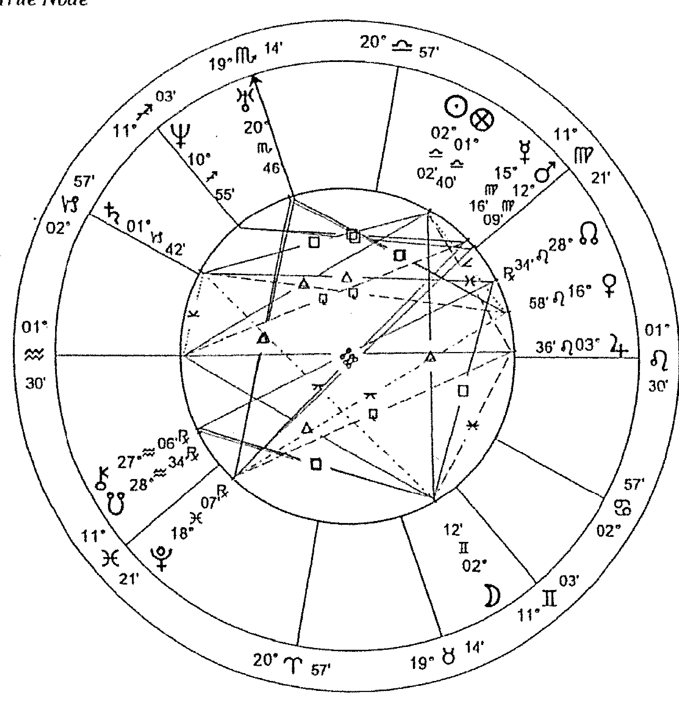


### 孤角天星擇日實例：

本案例取自清道光擇日名家陶胥來《命度盤說》之例：

基本資料
①家祠壬山丙向兼子午(未記載真正分金)
※按地平座標，以東地平0°按逆時針起算，該家祠座山的方位角(Azimuth)應介於97.5°~105°
②擇日當時年度為壬申年
祿元：亥，丄；馬元：寅，丄；貴元：巳·卯，♀、♂
③已知北極出地(即北緯)32°，但無經度這可從MC卯19°18'及ASC1°32'反推，一般計算相當繁複，幸好現在功能較強的占星軟體都附有修正功能，經推算該家祠所在地的經度應約在東經117°50'

依據修正結果所起出的天宮圖和陶胥來起出的天宮圖相當接近，我們分別附上古代方型及現代圓型天宮圖對比即可瞭解。

1. 課遵《天步真原》，謹擇於壬申年八月二十日申時初初刻為用事時分。
《天步真原》係薛鳳祚學自明末清初耶穌會教士穆尼閣所整理的天算書籍，國內之弧角天星算十二宮大抵傳自本書之人命卷中算十二宮，表算十二宮及三角算十二宮，陶胥來所選用之日期係陰曆。

2. ①東方出地子宮一度三十二分為命宮，有太陽、太陰、福星三照
②木星、金星對照
③日、月又與木星、福星左右三合、六合互相吉照，何吉如之！

- 1. ASC在子1° 32' △ (⊙辰2° ⚕福星1° 40') △ ☽申2° 12' 家祠座山為壬山兼子，其靜盤對應黃道子水瓶逢辰方的 ⊙ 及 ⚕，和申方的 ☽，形成大三角吉象，為太陽、太陰、福星之三照。
- 2. ♃在午宮、♀也在午宮位於命宮的對方，此為木星、金星對照，木星為年干支祿元及馬元。
- 3. 
三角形占星图：顶点⊙辰2°, ☽申2° 12', ♃午3° 36'，边上有*和△标记，表示日、月与木星、福星的三合关系。
此即日、月又與木星、福星左右三合、六合互相吉照，為西洋占星學的小三角吉象。

3. 火同水星到水星宮、金星界，在陰宮權小，土星行遲到降下角無力。

- ①♂已12° 41′ ♀已14° 6′，♂位於處女座為♀主管之宮位且其度數適在♀的界，♀的度數適在♀的界，而處女座為陰性星座。
- ②♄運行比平時慢稱為土星行遲，但電腦計算♄運行平均，土星接近12宮凶宮、降下宮，無力。

4. 凡修造要安命在定宮
ASC在子固定星座，即定宮，西洋占星學的擇日認為房屋修造係為長久住居打算，所以四正柱即ASC、MC、DSC、IC，應在固定星座較佳，最起碼ASC及DSC應如此。

5. 太陰在風局與一吉星吉照，正遇其星在廟旺宮分，又在黃道北，先太陽東出，太陰亦在東，光華滿照。

- ①☽在申風象星座 ✳♄，因♄為吉星，✳為吉相位，古稱相位為照，故稱☽與一吉星吉照。
- ②正遇其星在廟旺宮分，又在黃道比太陽東出，此句前半有誤，因♄在午獅子並非廟旺之星座，但位於7宮則為偶然尊貴，♄之赤緯Declination為+19° 41′稱為在黃道北。至於所謂先太陽東出，♄即正好位於以⊙在辰2°當作東地平線點來看，♄比⊙先出，西洋古典占星學稱為東出性，但並非所有行星東出都吉，祇有♄、♂、♄，而☿、♀、☽宜西入不宜東出。
- ③太陰亦在東，光華滿照則吉
前面②已談及☽宜西入，此日課☽東出，若按西洋占星## 第八章·弧角天星擇日學

學理則是小凶，但影響不大，陶胥來稱光華滿照有待參權。

6. 此盤件件皆合渾天寶照曰：「二曜迎祥，五星效順」此之謂也。

從上述解說可知陶胥來僅站在靜盤考量，不可否認此日課的靜盤小結構確實甚佳，他的論斷幾乎都是西洋古典占星學的擇日內容，雖有誤用但不致改觀，引用渾天寶照之說，則較為誇大。

※完整的中國七政四餘之弧角天星日課應充分考量。

-   ①真太陽到山（動盤）
-   ②靜盤吉象，看三方，四正
-   ③立命宮、定命之星、分恩、用、仇難，定格局

依本例充其量僅有②之吉象外，並無真太陽到山。本例的真太陽方位角為208° 45'非坐山壬兼子之97.5° ~105°，而太陰方位角為108° 22'係壬山兼亥之方位。另外，雖以西洋古典占星學的內容為論斷要旨，但仍未就整體天宮圖作分析，其實西方也考慮整個天宮圖，祇不過與中國的七政四餘分析方向不同。從陶胥來所著《命度盤說》的內容來看，受《天步真原》影響甚深，所用技巧兼及中國堪輿學所強調的坐山立向，但不純粹採用中國七政四餘的擇日法，以致常遭評判他的案例之後世人士誤解；而他所用的西方古典擇日技巧也不儘然全部正確。

## 案例七

Chart 1
B
英女王加冕典禮
Jan 15 1559 OS
12:14 pm GMT +0:00
London, England
51° N30' 000° W08'
Geocentric
Tropical
Regiomontanus
True Node

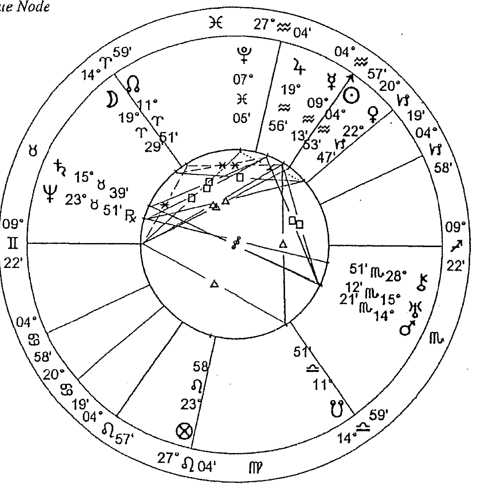

### Chart 1

Natal Chart
Sep 7 1533 OS
2:26 pm GMT +0:00
London, England
51° N30' 000" W08'
Geocentric
Tropical
Regiomontanus
True Node

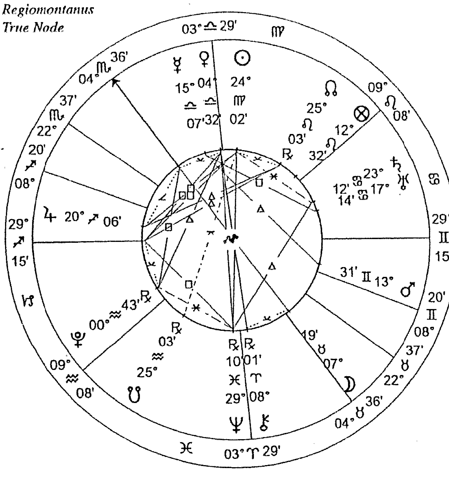

# 第八章·弧角天星择日學

Inner Wheel
C
Natal Chart
Sep 7 1533 OS
2:26 pm GMT +0:00
London, England
51° N30' 000" W08'
Geocentric
Tropical
Regiomontanus
True Node

Outerwheel
B
英女王加冕典禮
Jan 15 1559 OS
12:14 pm GMT +0:00
London, England
51° N30' 000" W08'
Geocentric
Tropical
Regiomontanus
True Node

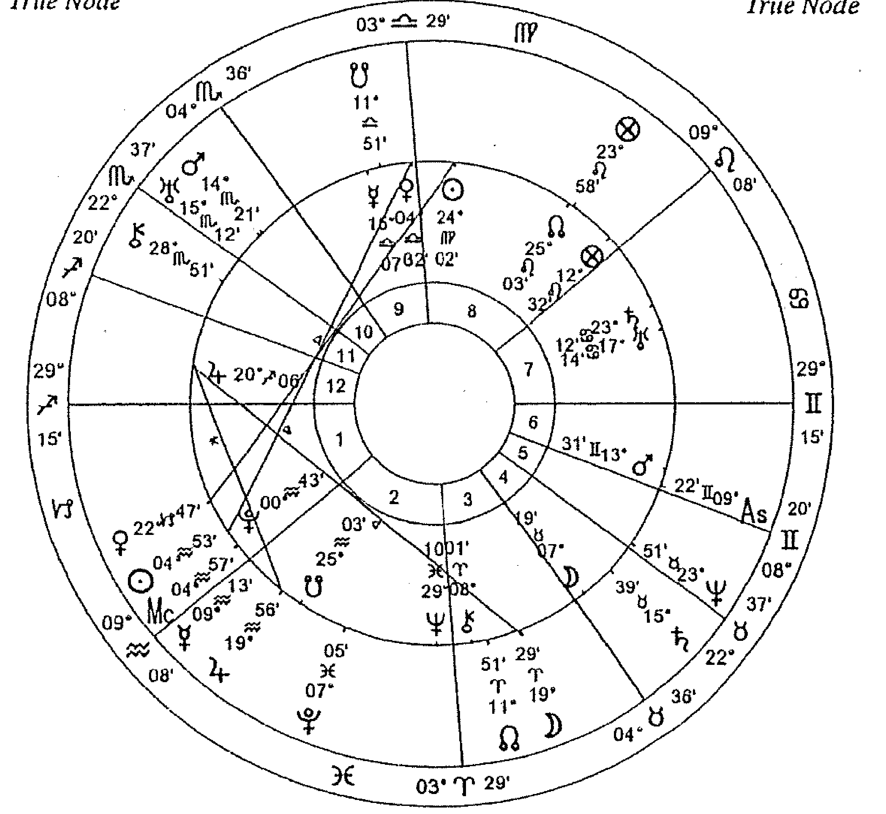

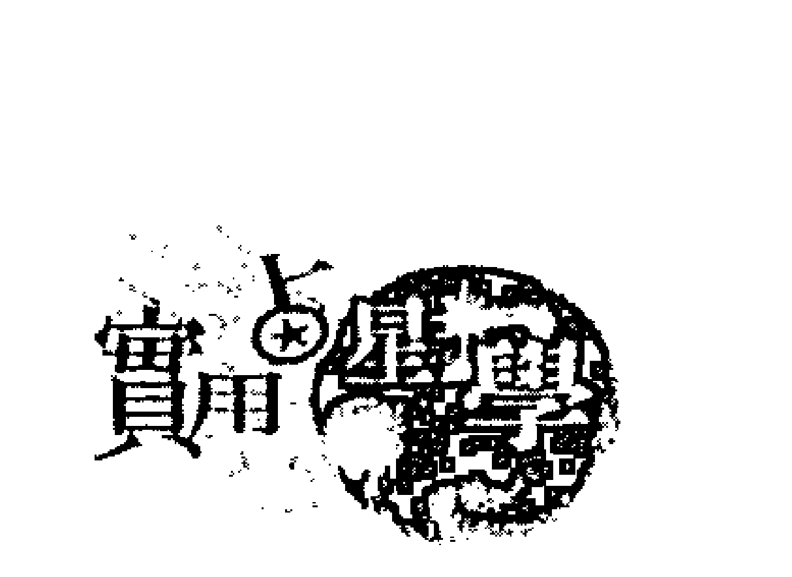

## 西洋占星擇日實例：英國女王Elizabeth I 加冕典禮

公元16世紀末葉著名的數學兼占星家John Dee，出身於英國劍橋大學，為英國女王Elizabeth I的私人心腹朋友，常為她調查秘密工作以007代號呈寫報告，英國著名的間諜電影007系列，即取自這個典故，007意謂著John Dee是她的眼線，事實上他確實扮好這項工作，為她掃除不少障礙贏得女王的極大信任。John Dee學問淵博，也是位極佳的決策諮詢顧問，據說Elizabeth I後來決定終身不嫁，是因相信John Dee對她命盤的解說，而她藉此作政治操作，順水推舟昭告全英國民眾宣示她已嫁給了英國，不會再嫁給其他人，凝聚全英國上下的士氣，打敗了鄰國西班牙號稱最強的無敵艦隊，從此英國掌握海上霸權。

Elizabeth I勤於政務，全心奉獻使得英國的國運振興，奠定了後來的「日不落國」之深厚基礎，至今她仍深得英國人的敬愛及懷念。

John Dee為她擇日的加冕典禮時刻，一直是西洋占星擇日學的典範，除考慮加冕典禮時辰的吉象，另考慮對當事人Elizabeth I天官圖的影響。

Elizabeth I的出生資料取自17世紀John Gadbury(Collection of Geniture)所記載的如下，當時是以舊曆即儒略曆，公元1533年9月7日2:26pm。

# 第八章：弧角天星择日学

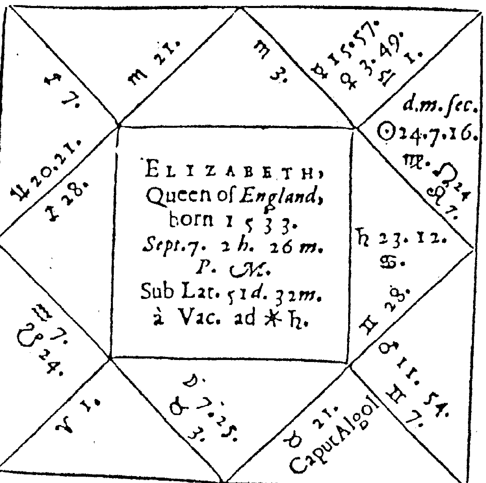

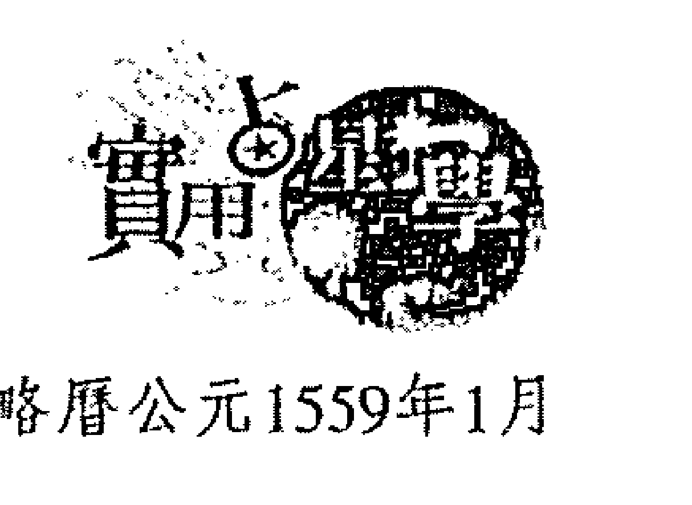

John Dee選擇的加冕典禮為舊曆即儒略曆公元1559年1月15日12:14pm於英國西敏寺舉行。

我們揣摩John Dee選擇此時刻的原因及用意，分析如下：

1.  ◯為王權的自然主星，應使它的力量強大，如得必然尊貴或偶然尊貴，最好兩者兼具，如果時間允許的話，應選在午宮獅子座或戌宮白羊座 ◯ 的廟旺之星座，但當時Elizabeth I係突然承繼皇位，其姊英國著名的「血腥瑪莉」的殘酷使得民眾對皇室極不信任，因而交替之際必然動亂，故儘快進行加冠冕才是正確選擇，名正言順地安定民心和政務推行。當時◯在子水瓶入陷，故祗有設法使它在天頂揚升，得偶然尊貴，因此唯有選在午時讓◯ ⚶ MC等分相位，而在子固定星座正也隱含持續堅固之意，有利王權穩固。

2.  當時尚未有三王星，就怕與 ♂、♄ 兩大凶星刑沖，John Dee必然估算 ◯ ⚶ MC時，若不希望受♂、♄ 刑沖須避開1/22，因該日◯即可能運行至與♄形成90°刑凶相，但如果早於1/15有可能♂會入相位 □ ◯，故也避開。

3.  以時辰來看，☽移行最快在擇日占星學它係甚為重要的行星，John Dee經過計算選在0:14pm，☽ 在戌19°29'入相位 ⚶♄在10宮內，而♄又是Elizabeth I的ASC主星(如附圖)，且☽入相位 △ ⊕ 午23°58'甚為吉祥，然而也有些瑕疵，☽入相位 □ ♀丑22°47'在9宮，不利國外事務，但整體而言吉大於凶許多。

4.  就加冕典禮時辰起出的天宮圖，立命申雙子座，ASC主星揚昇於天頂雖逢 ⊙焦傷但與 ◯聯袂入相位 △ASC申9° 22'，☿ 之120° 三合相位為等分相位增強表達、溝通、宣示、威權之象。

5.  ♄ 為Elizabeth I的命主星也在天頂揚升，但 ♄☌⊗，惟 ☽的120° 之合吉相位可化解，☽具有光線傳遞的功能，反添吉象。
    由於♄在擇日盤係7宮寅主星，論國運盤7宮代表公開敵人，即外國競爭對手，♂在6宮卯14° 21'入相位 □♄，♂為戰爭自然主星，戰爭不可避免。

6.  ♂在6宮也入相位☌♄酉15° 39'在12宮，暗中敵人多，可能防不勝防。

7.  吉恆星參宿七Rigel當時還與ASC命度1° 內會合☌帶來吉祥，另恆星中代表王朝權威的軒轅十四(Regulus)又正好與擇日盤的⊗1° 內會合☌，吉上加吉。

另外看看此擇日盤對Elizabeth I命盤的影響，前以E代表，後以R代表

1.  ♀E丑22° 47' △☉R 巳24° 2'
2.  (☉E 子4° 53'☌MCE子4° 57') △ (♀R辰4° 32'☌MCR 辰4° 29')
3.  ♄E 子19° 56' ※♄R 寅20° 6'
4.  ☽E 戌19° 29' △ ♄R 寅20° 6'
5.  ( ⊗ 午23° 58' ♀ 轩辕十四午23° 43') △ ♄R 寅20° 6' ♀、⊙、☽、♃ 及 ⊗ 轩辕十四Regulus都属吉星，本案例可说众吉星骈集。

结论：John Dee在有限日期的情况下，能挑选出这样的日期时辰，相当不容易，显示他的占星学理功力，虽有♂♃刑冲在择日盘的6宫、12宫，但瑕不掩瑜，这个日课一直是西洋占星学界津津乐道的择日典范。Elizabeth I在位期间与国威正处巅峰的西班牙相抗衡，甚至终于殲滅西班牙无敌舰队，使英国海上霸权得以建立，John Dee为她选择的加冕天星日课，应有此功劳吧！

# 第九章 合盤技巧

-   合盘的意义

所谓合盘是將欲討論其相關關係的命盤合在一起，來瞭解他們之間的互動關係，如婚姻、合夥、親友、朋友、工作夥伴、老闆與夥計。由於人際關係網路複雜，每個人隨時都需與人互動，即使出家也需同儕、師父之扶持、教導，但人心難測如何開啟互助的人際關係，往往是個重要課題。

中國的八字合婚開始於古時候父母主導，憑媒妁之言決定婚姻，男女互不相識頂多是鄉里傳誦而略知一二，這是有錢人家才有的事，一般芸芸眾生根本無從知曉，因此透過生辰八字合婚，而得以瞭解男女新人之狀況。但男尊女卑之社會風氣，合婚幾在維護男家之香火是否可以繁留。即使在現代，八字合婚也僅在男女之間所謂合不合，根本無法深入分析男女之間深層心理及互動關係，即八字用來作為合夥、合婚，大都以功利為主，而且分析僅注意雙方五行之互補不足及日柱刑沖，難以細膩地解析各種狀況；現代占星學的心理分析，則提供了這項功能。古典占星學早已具有合盤的觀念，但未明確指出方法如何，僅概念性地觀察比較兩個人的命盤，這可能是因古典占星學較不著重相位之故，而現代占星學則以相位為主軸，發展出行星互動，彼此影響的具體觀念擴充至兩個命盤，從彼此間的行星互動，得以瞭解相關兩個人之間的往來可能是怎麼樣，这就是合盘的技巧。

瑞士心理分析大師容格曾說：「任何人與人間的相遇，都像煉金術的兩個化學物質的相會，只要產生過交集，兩者都會受到一定程度的改變，並產生各種新的化學物質。」人際關係的互動就如容格大師所談的，如何提煉出非凡的「神秘合體」，而提昇個體的完成。

合盤的技巧，在現代占星學中的發展中，是由最早的配對盤(Synastry)開始，至1975年，Rob Hand提出組合盤(Composite)，而1983年英國前占星學會理會長Ronald.c Davison提出關係盤(Relationship)，而各具特色，另外也發展出藉由泛音盤導出的合併盤(Coalescent)是由Lawrence Grinnell(Dhruva)提出的，我們列表說明較常用的前三方法。

## 《合盤技巧的種類及使用方法》

| 種類 | 起盤方式 | 重點特色 | 用途 |
|------|----------|----------|------|
| I<br>配對盤<br>(Synastry) | 1.將相關的兩個人的個別命盤，看以誰為重作為內圈，另一人作為外圈。<br>2.將兩個人的命盤內各敏感點及行星作成相位表 (Syn Grid)。 | 1.看外圈盤對內圈盤之影響，以外圈行星和內圈行星相位(托勒密相位為主)，就外圈行星之原理來描述。<br>2.注意外圈行星所落在內圈之那一宮位，若有形成內圈行星的相位，更凸顯其作用。 | 1.任何人際關係網路，都可由兩個別命盤的比較，而瞭解兩個人的互動。<br>2.當三個人以上的互動，顯得捉襟見肘。<br>3.合盤技巧是最被常用及基本的一種方法。 |
| II<br>組合盤<br>(Composite) | 1.這兩個或三個以上命盤的MC及各行星等計算其中點。<br>2.取MC和關係發生地點之緯度，查計算組合盤之其他各宮始點。<br>3.再計算組合盤中各要素的相位。 | 1.發展自德國漢堡學派的中點理論。<br>2.論述組合盤，即在討論相關個別組成之整個關係。<br>3.可藉推運過運預測整個關係的演變。 | 1.任何兩個(含)以上的人，都可形成組合盤，較符合現代多人合作、合夥之需求。<br>2.以單一個組合盤，按一般本命盤分析方法、行星原理所落星座、後天宮來分析，較為簡單。<br>3.方便實用，評價頗高。 |
| III<br>關係盤<br>(Relationship) | 1.以兩個(含)以上之相關個人出生地經緯和出生時間，計算出平均出生時間和地點來起盤。<br>2.分別計算關係盤中各要素的相位。 | 1.考慮相關人之時間、空間，頗一致於占星學的特色。<br>2.論述關係盤，即在討論相關個別組成之整個關係。<br>3.可藉推運過運，預測整個關係的演變。 | 1.任何兩個(含)以上的人，都可形成關係盤，類似組合盤之用途。<br>2.以單一個關係盤，按一般本命盤分析方法，行星原理所落星座、後天宮來分析，較為簡單。<br>3.評價不如組合盤。 |

## 案例八

Diana
Natal Chart
Jul 1 1961
7:45 pm BST-1:00
Sandringham, ENG
52°N50' 000°E30'
Geocentric
Tropical
Placidus
True Node

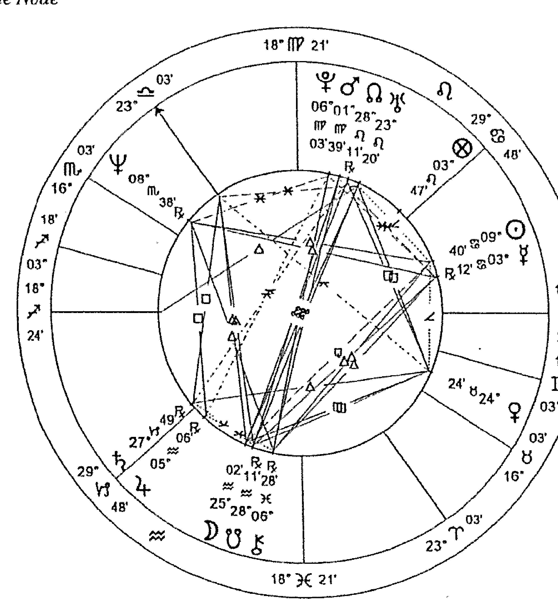

# 第九章 合盘技巧

Charles
Natal Chart
Nov 14 1948
9:14 pm GMT -0:00
London, England
51°N30' 000°W08'
Geocentric
Tropical
Placidus
True Node

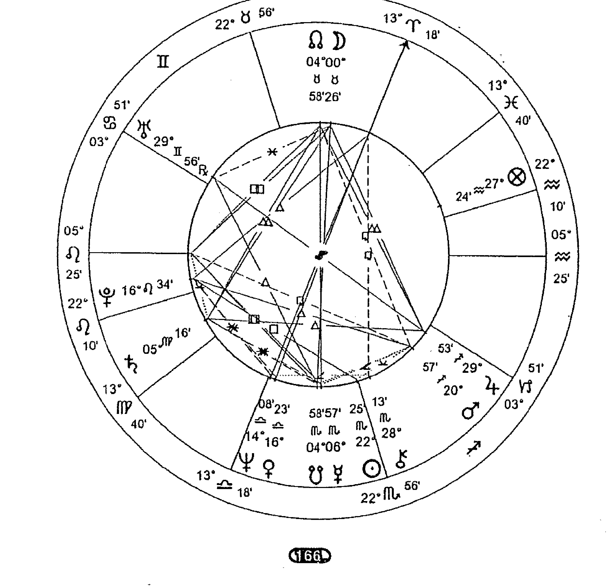

Inner Wheel
Diana
Natal Chart
Jul 1 1961
7:45 pm BST-1:00
Sandringham, ENG
52°N50' 000" E30'
Geocentric
Tropical
Placidus
True Node

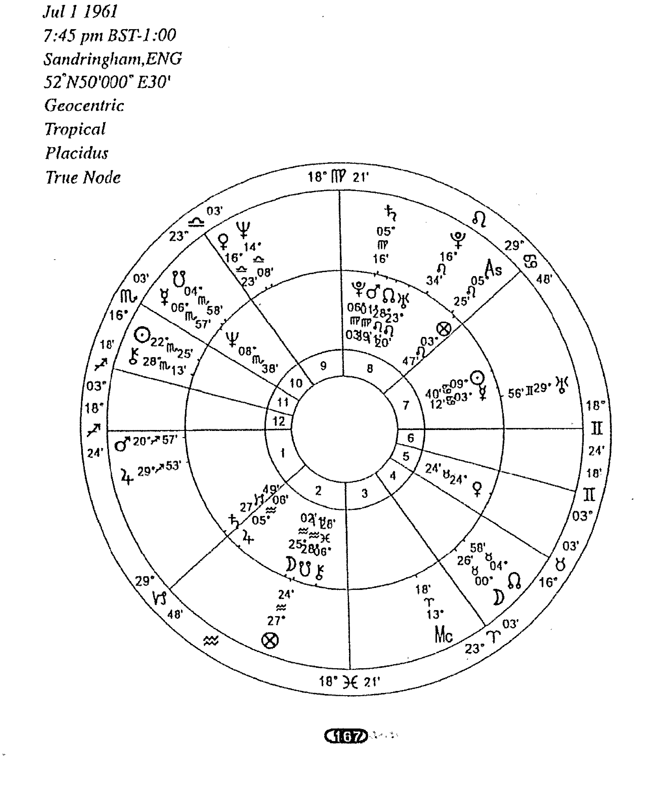

# 第九章 合盘技巧

Inner Wheel
Charles
Natal Chart
Nov 14 1948
9:14 pm GMT+0:00
London, England
51°N30' 000" W08'
Geocentric
Tropical
Placidus
True Node

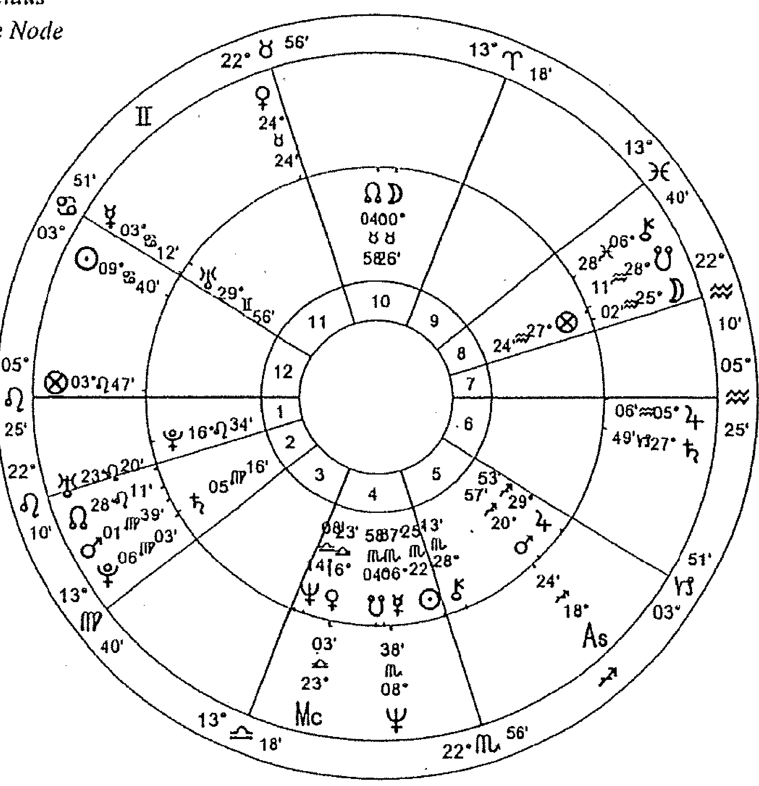

## 实用占星学

在未分析查里斯王子和黛安娜王妃的配对盘之前，先掌握一下他们俩个别命盘的个性特质和对爱情婚姻的看法，将有助进一步解析配对盘，此即「知己知彼，百战百胜」。

### A. 查里斯王子

1.  立命午宫狮子，显示高贵、喜爱人尊重、权威、具领导力之特质；命主星太阳入卯宫天蝎与冥王90°刑，必然深沈、坚持、刚毅、不露痕迹、固执、不妥协、有利于掌握权力。
2.  (♀♃)在天底且在天秤，☌MC，会因不伦恋情、外遇影响声望，♀的爱情，♃的浪漫、不切实际落在4宫家庭，显示查里斯王子家庭与感情间之混乱与暧昧关系。
3.  5宫为男女感情，在卯天蝎，水象、丰饶星座，情欲重且重视深沈、内在、介于生与死之间的性爱，5宫主星♂又在5宫且与♄120° 三合，必然占有欲高、享受极致的情欲。
4.  8宫内见⊗幸运点，主星♄与♃、☽形成大三角在土象，依容格分析心理学派的说法，土象归属感官，8宫与性欲，宫始点在水瓶，故其性爱观，必然与众不同，惊世骇俗，感官的刺激提昇其内在情欲为上。
5.  又♄与☽、♃大三角，而☽扬升天顶且区分内，母亲稳定、可靠、尊贵的角色，应会使查里斯王子有著「恋母情结」的倾向。


# 第九章·合盤技巧

6.  夫妻宫在子水瓶，半荒地星座，且宫内无主星，对婚姻的基本态度就比较与众不同，与命主星形成大三角，他的婚姻举世瞩目，但上述各点分析却使他成为婚姻的失败者。

### B. 黛安娜王妃

1.  立命寅宫人馬，本性應屬自由開朗、不喜拘束，命主星木星又入水瓶，會增添其象，然木星□Ψ，可能有著不切實際的理想。
2.  太陽在未巨蟹，也有著顧家、防衛的外在形象，⊙在7宮，因夫而貴。
3.  她最脆弱之處屬月亮在子火星在午，顯示她的內在情緒十分敏感、不穩定、容易受傷害，這可能源自小時候因母親拋棄家庭，與人私奔，造成她內心的傷痛，依弗洛依德說法，累積成不安的無意識。
4.  ♀為愛情，在酉入廟，本佳，應可令人稱羨，但♀卻是與在8宮，月亮2宮形成三刑會沖的頂點，埋下了感情多挫，進而發展出令世人震驚的不倫之戀，身為王妃竟與騎術教練大搞床笫之事，且接受媒體訪問坦承其事，（當然也有相當多人支持其勇氣，誰叫查里斯負了她）
5.  8宮多星且凶星居多又刑沖，對性愛必然有強烈的佔有慾，♂、♀8宮，更凸顯應也有強烈的性需求，查里斯王子的冷漠必然種下她的報復心，遂也有不倫戀愛之舉，給查里斯王子戴頂綠帽子。
6.  夫妻宮在申雙子，荒地星座，夫妻主☿逢焦傷，逆行又外來的，其婚姻不幸似可預見，☉、☿與♃在10宮120°三合，婚姻建構在虛無飄渺的外在形象(10宮)。

### C. 配對盤分析：(C代表查里斯王子，D代表黛安娜王妃)

1.  查的☾落入黛的4宮120°△黛8宮之♂且與黛7宮的♀，就查的立場，很容易感受到黛肉體性慾的歡愉(☾☌♂緊密1°內)就黛的立場夫妻、性及家庭，查似乎提供了穩定的家庭基礎。
2.  查的♂入黛的命宮，120°△黛8宮的♆。
    就查的立場，會突然對黛產生強烈的性慾，性關係新奇、狂野、刺激。
    因☌ASC，顯然是因黛的外表、身體，激起查的慾望。
    就黛的立場，查的♂熾烈燃燒起其內在情慾、興奮。
3.  查的♀入黛的10宮，△黛7宮的(☉☌♀)，但□☾D2宮。
    就黛而言，查提供婚姻理性思維，但兩者價值觀不同。
    就查立場，查的♀是在4宮應顧及皇室形象。
4.  查的☉□黛的☾D☌黛的♃D在5宮，□♆D在8宮。
    這種組合對女命而言是最糟糕的，良人不可靠。
    就黛而言，查的自我損害到黛的內在情緒，嚴重破壞對愛情的期待，原本熾烈的性愛也突然失落(☉☌激起黛三刑會沖，形成大四角凶相格局，這是他們不和諧的主因)，查的尊嚴受此影響甚深。
5.  查的 (♀☌♍) ⚯ 黛的 ASC 且☌MC，也□黛7宮的⊙，查應有腳踏兩條船之準備，但黛的三刑會沖不允許。
6.  查的♃入黛的8宮☌(♂☌♍)。
    查的♃限制黛8宮熾烈的情慾，他的冷漠澆息她的內在性慾必然引起她的報復(♂☌♍)，背叛及嫉妒就是寫照。
    這點帶有濃厚的宿命訊息。
    而查☽受黛♃的□，查也感受到黛的窒息，更提不起勁，不想與她單獨相處。

從以上分析可知這對舉世注目的金童玉女的婚姻，最後還是在眾目睽睽下離婚收場，就配對盤分析，實良有以也。

# 第九章·合盤技巧

我們以查里斯王子和黛安娜王妃的紅合盤說明整體婚姻的狀況。

1.  查、黛組合盤的ASC在辰天秤，ASC主星♀位於午獅子10宮，他們這對公主、王子的婚姻受到舉世注目(10宮，公開)，全球聚光的焦點(午獅子)，而♀原本就是人際關係或婚姻的代表因子，更凸顯其婚姻頗具功利目的性，效應頗強，男女雙方在婚姻中皆獲名望、地位。

2.  組合盤中的1宮代表婚姻本質，宮內見♂辰26° 18′ ☌ 辰26° 23′，相當緊密的會合僅5′差異。組合盤的創始人Rob Hand《Planets in Composite》提到♂♄這兩顆行星無法輕易地組合，因♄代表混淆、弱化、無能力，而♂為自我表現的力量，如果會合☌很難驅動兩者正面的強化，反而個別會覺得比以前弱，會表現出讓一半感覺罪惡，或使他(或她)評價低。又(♂☌♄) □ ♆未26° 38′在10宮，且甚為緊密的刑剋，僅差15′。Rob Hand的同引書也提到這種關係易失敗，不利婚姻或其他關係的維繫，易招致未预期的或突然的改變。♂又係組合盤7宮的戌白羊主星，♂入命宮代表婚姻中的兩人也想達成一致，然♂在辰為弱且與♄會合，大逢♆刑，顯然他們的關係必起變化。

3.  組合盤中的☽亥27° 44′位於6宮，Rob Hand同引書稱這種關係可能有特定目的，不會愉悅的，有一方會覺得委屈、忍辱負重，會覺得疲憊，甚或出現情緒化、憤怒、報復。）分別與1宮的（♂☾）及♀午26° 18'形成一個上帝手指型。11宮，♀午26° 18' ♂辰26° 18' 1宮，♀辰26° 23' 代表他們的婚姻是命運式的，感情不真誠，而☽又分別與♂/♉90° 刑，更凸顯應有前世業力，又☽為組合盤的10 宮主星，各望受損。

4.  組合盤中的☿位於11宮與♃形成120° ♃吉象，這個配置佳，代表男女雙方會因其婚姻拓展人際關係，擴大交友圈。再按過運看查、黛何時結婚、分居和正式仳離。

1.  1981年7月29日結婚，（♃♄♃）*♀ （♃♄辰5° 39'♃♄辰5° 18'）與♀午5° 24'，相當緊密的等分相位，♀為自然婚姻的代表因子，而且是查、黛組合盤的ASC主星，故婚姻成就。

2.  1992年12月分居，（♃♄☽）*♃，且*♄ （♃♄丑17° 8'☽丑18° 1')*♃17° 29'，且*♄卯16° 32'。若詳細計算上述組合相位與8宮之⊗形成菱型，土R正好為頂點，8宮代表性的冷漠、悲觀，顯然係分居之象。

3.  1996年8月離婚，ΨT遇運至ASC_R的（♂☌Ψ）土Ψ丑25° 26'逆行遇逢至4宮(家庭)90° 刑 □ ASC_R的（♂☌Ψ），ASC為婚姻逢ΨT刑，破滅，終至離婚。

依查、黛的案例，組合盤有一定的準確度，值得參考。

# 第十章 換置占星學

就命運而言，人類一直在天、地、人三才的規範之下，所謂天係指流年運勢；人則是與他人互動的影響；地則為類似中國風水原理擇地而居的選擇。我們已在前面分別論述人與人互動的關係，即如何透過占星學的配對盤、組合盤、關係盤...等來瞭解，也說明各種較準驗的流年運勢方法，但這二者都侷限在命主的出生環境的某些範圍內，若搬遷他鄉不遠可能尚屬各後天宮範圍之內，故本命天宮圖影響各生活領域仍甚深遠。占星學界就有人探討，假若命主遠離他鄉，空間大為變換，是否會改變命運，這就是換置占星學(Relocation Astrology)的由來。

換置占星學的具體發展不超過50年，但由於現代電腦技術大為精進，繪圖美妙，使得換置占星學的發展到令人嘆為觀止的結果，尤其是被譽現代換置占星學之父的Jim Lewis發明Astro*Carto*Graphy(簡稱A*C*G)，風靡一時。ACG圖證明人類確實會因空間選擇而有增強或改變命運的機會，在Jim Lewis發展ACG圖的大約同時，創辦美國知名占星套裝軟體Win Star*的Mihael Erlewine窮究天文座標系統，發覺人類早就跟地平空間(Local Space)關聯甚密。地平空間的概念可由地平座標來表示，Erlewine的這個概念其實早在1929年美國一位頗有名氣的占星家Edward Johndro就曾討論過，而1978年另一位名氣更大的Charles Jayne撰文討論，但在當時受限繪圖技巧，無法充份具體表達，難成為主流，僅在層次較高的占星學先進間互相研討，但1980年代中國的密教黑教宗師林雲赴美講解中國風水與氣的關係後，風水的觀念似乎在英美廣為流傳，研究占星學的人本來就比較不排斥神秘學說，由於風水奠基在地平空間，遂使占星學的地平空間概念更能活化，因此中國風水的觀念結合占星學的地平空間，具體地發展成位置占星學(Locational Astrology)，除有換置ACG之功能外，更附加討論居家環境的安排，美國的Steve Cozzi所著《Planets in Locality》和現住英國的美國籍占星家Martin Davis《Astrolocality Astrology》有非常詳細的討論。

關心中國風水及擇日學的人必然對「太陽到山到向」這個觀念相當景仰，因為它的身價被炒得相當高，要學會其技巧和演算花費駭人，如果懂得地平空間座標就知道所謂「太陽到山到向」即是指太陽到地平空間某個座山和對向的時刻，由於國內擇日界向來不求甚解，未真正深入了解天文學中天文座標的換算，祇會渲染其效應，故易以訛傳訛，甚至敢開班授課，令人慨嘆！

另外1920年代，英國占星家Sepharial(與Alan Leo約同時代，且齊名)發展另一套Geodetic Map，但當時未受重視，一直到1988年加拿大女占星家I・I・Chris McRae《The Geodetic World Map》問世後才漸受注意，但相對於ACG和地平空間而言，Geodetic Map聲勢較弱，因其設定基礎人為假設居多。

我們分別針對上述概念一一解說

### A. 換置占星學

所謂換置的意義是命主離開出生地A到遠鄉居住B，就占星學而言，若以該地B經度、緯度和同屬GMT出生時間計算，原本A本命天宮圖有可能因各宮宮始點位置會變換，但其各行星的黃道經度仍保持不變而形成B換置天宮圖(Relocational Horoscope)。

### 換置星盤與原本命星盤之差異在於

-   各後天12宮宮始點改變，因而
    ①各行星與敏感點如ASC、MC或⊗之相位有可能改變。
    ②⊗的位置變換與各行星之相位可能改變。
    ③重要的敏感點MC及ASC位置變換，故與各行星之相位會改變。
    ④各行星原本分佈之始宮、續宮、果宮可能改變，故其偶然尊貴中的宮位位置須重新運算。

因以上①～④的變化，命主的各生活領域可能就有變化，如本命3宮12宮刑沖兇，易犯交通意外或手足涉有風險，讀書不順...，將此3、12宮不良結構轉換成其他宮事項，也許可以改變上述不利現象。利用行星在始宮尖軸的重大影響力來趨吉避凶，若欲移民、留學、出國、旅行可參酌所欲前往之地方，予以換置瞭解該地方對命主是否有利。

### B. A*C*G

A*C*G是Jim Lewis首創，並申請專利，這項概念源自Jim Lewis在1970年代任職於《American Astrology》雜誌時，與恆星派大師D.Bradley認識，接觸到另位鼎鼎大名的恆星派大師Cyril Fagan的作品，而加以改良發展的。C.Fagan教導讀者，如何繪製行星的上升線和下降線，而D.Brady則不辭辛苦地以手繪製在太陽始入恆星黃道摩羯時，行星線跨越整個世界地圖之圖表，隨後Bradley根據所要強調的行星線，出版過類似A*C*G這種行星路線圖，但僅一、二條在內，當時大都用於討論時事之用，非使用在本命占星學。Jim Lewis不認同恆星派(即恆星黃道)占星學，但兩位大師強調行星在本命盤的尖軸攸關於居住地方的重要性，卻深深啟迪Jim Lewis而開創A*C*G的概念。在1970年代尚無電腦軟體，他純粹以手工繪製服務客人，這種結合行星路線和世界地圖相當創新，且因驗證性高，引起占星學這項領域的發展，帶動風潮。1982年Jim Lewis再接再厲地完成A*C*G的推運和過運，這種技巧他稱之為Cyclo*Carto*Graphy(簡稱C*C*G)，忽然間A*C*G及C*C*G儼然成為占星學的新貴，頗領一時的風騷。Jim Lewis被公認為權威，甚至也為他贏得占星學界最高榮譽—MarcEdmund.Jones獎，後來他每年出版《Astro*Carto*Graphy® Source Book of Mundane Map》預測國際大事。

A*C*G圖可作為政治時事的重要分析工具，如現代美國總統布希的A*C*G圖的♂IC與☽DSC交會於北緯15°~18°間，其延伸線正好經過中國南海，公元2001年4月發生轟動一時美軍機與中共軍機擦撞意外事件，幾掀起戰爭，♂戰爭、☽意外，似乎有脈絡可尋，又♂IC經過阿富汗、♀ IC經過伊拉克，這兩個地區都被布希下令攻打過。

A*C*G圖可供個人移民、留學、出國旅行、談生意的極佳工具，充分掌握全球各地那一地區是命主吉祥地，在全球化、地球村的時代來臨，A*C*G圖不失為相當重要輔助工具。

### C. 地平空間(Local Space)

地平空間占星學係以地平座標所衍生的，除可用於擇日學中的太陽到山外，亦可求算個人的地平空間圖，從其中顯現的行星線來安排個人陽宅住居的各種功能使用，即將陽宅風水的概念與占星學結合成一種新的技巧。除卜卦占星學外，一般占星學向來不談方向，但地平空間占星學卻可提供就職、戀愛、賺錢...的適當方向。

### D. 測定圖(Geodetic Map)

測定圖原本用在時事占星學，它的概念是以全世界地圖為主，假設英國格林威治天文台之經線為戌宮白羊0°，然後東經循黃道秩序，每30°之地理經度劃分對應天空黃道的一個星座，而西經則循黃道逆行，同樣每30°之地理經度劃分對應天空黃道的一個星座，所得結果如下圖：

經過這樣的人為設計，可得知全球各地區或國家歸屬那一星座，當行星過運或重大行星會合之重要占星學徵象，出現在那一星座，可判斷時事事件，這種圖形稱之為測定圖。

## 案例九 張學良

Natal Chart
Jun 3 1901
0:10 am CCT-8:00
Liaoning,china
41°N12'122' E27'
Geocentric
Tropical
Placidus
True Node

張 華 民 - Nata-Lines:Culm/Anti/Rise/Set (全世界)

張晉良-Nata-Lines:Culm/Anti/Rise/Set(亚洲区)

## Natal Relocated

Jun 3 1901
0:10 am CCT-8:00
Taipei, TAIW
25°N03'121°E30'
Geocentric
Tropical
Placidus
True Node

## 實用占星

我們以中國近代史最具分水嶺的西安事變主角-張學良將軍在台灣被監禁長達將近50年歲月的事件，說明換置占星學的特色。

## (1)本命盤的被監禁特徵

古典說法W.Lilly《Christian Astrology》III論監禁或入監，提到監禁的代表因子為①⊙、☽②♂、♄③12宮、7宮等宮內行星及宮主星，其中♄及12宮為牢獄、秘密敵人，♂為競爭、公開敵人。其中有一條法則即♂或♄在始宮刑剋⊙或☽之一，且⊙、☽無力，即可能入監，張將軍本命的⊙在申11°為外來的，無力，且在3宮果宮為偶然無力而♂在7宮始宮，符合其象，且♂與⊙、☽正好形成三刑會沖。

> 古典說法W.Lilly《Christian Astrology》III論監禁或入監，提到監禁的代表因子為①⊙、☽②♂、♄③12宮、7宮等宮內行星及宮主星，其中♄及12宮為牢獄、秘密敵人，♂為競爭、公開敵人。

1.  代表因子：⊙、☽、♂、♄、12宮、7宮等
2.  ♄及12宮：牢獄、秘密敵人
3.  ♂：競爭、公開敵人
4.  法則：♂或♄在始宮刑剋⊙或☽之一，且⊙、☽無力，即可能入監

除上述情況，張將軍的ASC在亥雙魚，ASC主星♃在11宮丑，入弱且逆行，會合♅12宮子水瓶宮主星♄丑15°19'逆行，子為暴戾星座，也類似前引著另條法則，即ASC主星◯12宮主星且ASC主星R，亦有入監可能。命主星♃在丑11° 26' R，其映點在寅18° 36'，反映點在申18° 36'正好◯(♀申17° 2'和☿申20° 6')之中點申19° 34'位於天底。☿寅15° 3' R♂♀申17° 2'於MC/IC軸線非常之禍甚明，又涉入兩大行星☉及☽，刑沖於天底更隱含暗無天日之意，♀在☿之側亦位於天底，♀為愛情，張將軍監禁歲月有位堅貞的紅粉知己陪伴在側引為美讚。

## (II) A*C*G的特徵

張將軍的A*C*G圖中的☽MC並排☿MC正好經過台灣，本命的(☽◯☿)♂(☉◯♀☿)的凶象顯現在台灣，亦數之巧妙。當然☽MC並排☿MC也經過菲律賓、印尼東部、澳洲西部，若他移往這些地區亦屬不利。☉IC及♃IC及♀IC同時並排經過之區域，台灣正位於它們包夾之間。讀者可在圖一全世界的A*C*G及圖二以亞洲為地區的A*C*G分別可以看出這個特徵。

## (III) 换置盤(Relocated chant)

根據張將軍的本命盤已知其MC/IC軸刑沖兇惡，而♂在始宮三刑會沖及ASC主星◯12宮主星之監禁徵象，應如何利用换置圖來趨吉避凶呢？由於其結構甚兇，欲完全避開似不可能，如换置至某地方此結構仍在，祇是所在宮位不同，假設讓結構頂點♂换置至後天6宮，而(☽◯☿)至9宮，☉至3宮，雖避開監禁，但有可能涉及交通、航空、海外......等意外，身體受傷。所以欲兩全其美恐而斟酌再三，中國俗語：「耗錢消災」，似有道理。本案例的換置盤事實上是張將軍被迫隨蔣介石遷徙來台，並非他自願的，但我們仍可事後諸葛亮解說其象。張將軍從遼寧換置至台灣，除各宮宮始點各有些微變動，但整體結構仍和原來的本命天宮圖大同小異，♂更接近宮始點更凶而已，故一關將近50年，徒呼奈何！

## ## 案例十

-   J.F Kennedy
-   Natal Chart
-   May 29 1917
-   3:00 pm EST+5:00
-   Brookine MA,USA
-   42°N19' 071°W07'
-   Geocentric
-   Tropical
-   Placidus
-   True Node

JR Kennedy - Nata - Lines: Culm/Anti/Rise/Set

# 第十章 複盤占星學

的東邊，依A*C*G圖原創人JimLewis的研究，在土MC這條線前後容許度1°內部受其影響，Dallas在此範圍內。MC主管公眾、政治、政府、名望、社會地位...等，而土為死亡、暗殺、掌控、權力、殘忍、殘酷、黑道、不擇手段，土MC正隱含著因政治、社會地位遭逢殘酷死亡之徵（※應注意土MC尚有其吉象），J.F.Kennedy的土MC線正好影響到Dallas，另外判斷A*C*G的一個重要法則Paran，即各行星交會之點，按地球自轉原理，每個交會點繞地球一圈行伸成一條緯度線，對命主有深遠的影響，我們從附圖可看出二條橫線，即MC/火星Paran線正好Dallas圈住，土為生命力、權力、土為震驚、突然意外，火星為攻擊、手槍、武器這些組合加上土MC線，活動生地點出J.F.Kennedy不能在Dallas活動，然而不幸地他卻喪命於此。

另外A*C*G尚能進行通運，所形成之圖稱為C*C*G圖，當時土/土正好交會在Dallas的緯度，同時土/土也交會在此，亦即J.F.Kennedy的A*C*G圖及C*C*G圖指出該年在Dallas的特別危險，及突然死亡的可能。

# 第十一章 時事占星學

時事占星學(Mundane Astrology)是占星學四大分支之一，其發展早於其他分支，筆者的《占星學-天宮圖的要素分析(上)》第二章占星學的歷史發展沿革中提到，早期先民觀察天象，以期掌握天體運行規律作為生活因應，譬如農作物耕種…等，從出土的巴比倫徵兆泥板，許多記載顯然都跟國家大事有關，其中不乏天象異常之徵兆預示，這是典型的時事占星學內容，儘管在巴比倫時代占星學的發展僅是雛型，但這已說明自古以來天象的變化攸關軍國大事，一直為人類所關心。

中國是世界四大文明古國之一，天象觀察的記載資料相當豐富，重要的各朝代史都記錄這方面的資訊，24史的《天文志》或《五行志》就是典型之例。其中尤以唐朝・李淳風所撰寫的晉書《天文志》的內容最為豐富，漢武帝司馬遷《史記》一直是史家最尊崇的，司馬遷在該書的《天官志》所展現的豪氣干雲，一直是研究天星的人所能感受的。他「究天人之際，通古今之變」即認定一切時事都是由天象而來的。中國占星學所發展之時事占星學雖跟希臘一脈相傳之西方占星學不一樣，但精神則一致，大陸・江曉原教授稱之為「軍國占星學」頗為傳神，從中國時事占星學的分野論，以及將紫微垣及附近恆星群類比為帝王、王子、王妃…等就可得知其精神意涵，由於本節討論係以西方占星學為主，故有關中國之軍國占星學，不擬在此處討論。

The request was rejected because it was considered high risk### 3.7 宮位對立國、協商、主要競爭對手

- ①7宮在午26°8'，宮內多見吉星，☽、♃、☉、♀、☿顯示氣勢對方贏過台灣，但亦逢(⛢♂)180°衝，尚見台灣的挺立對抗。
- ②7宮主星☉巳3°44'逢♃及♀⛢星包圍，更凸顯對方國勢。

### 4.4 宮位土地、房地產及反對黨

- ①4宮在申6°21'，宮內無星，但亦見(⛢♂)之90°□IC.人民對反對黨，也不見得認同。
- ②4宮主星☿巳26°16'旺宮，反對黨應有著力點。
- ③4宮主星☿旺，有利房地產之復甦。

# 第十二章 財務金融占星學

財務金融占星學 (Financial Astrology) 是討論個人理財進而擴及國家整體經濟金融情勢、全球股匯市、各種資源等為主題的占星學，在1980年代之前，它歸類為時事占星學的旁支而已，而1980年後全球經濟趨勢逐漸朝向連動的地球村，如全球各地區因時差關係各地股、匯市相繼開盤幾形成24小時的連線，除各國或各地區個別政經情勢不同外，大體會受歐美股匯市、商品期貨市場的影響，因而這種股匯市商品期貨的瞬息萬變已成為全球各商業集團、政府財經單位的重要決策資訊，財務金融管理更是1980年後全球各著名大學的著名科系，財務執行長常是公司集團總裁的進階位置，這些風潮持續至今仍未減退。

由於股匯市瞬息萬變，個人理財稍一不慎就萬劫不復，所以祇要浸於股匯市、商品期貨，無不思考如何攻城略地成為股海的優勝者，各種財務顧問公司如雨後春筍都號稱擁有獨家秘笈能為顧客操作以獲最大利益，這些獨家秘笈大部可歸類為基本分析、技術分析兩種。

- 1. 基本分析-就投資標的進行基本研究，如投資某支股票必須瞭解其行業別，該行業長短期在國內外的遠景、市場展望、定位、佔有率及影響力、經營者或團隊的企圖心如何、背景…等，財務方面最起碼須瞭解其EPS，獲利能力、損益比的變化，進一步瞭解該股股性在市場上的表現…資訊皆須相當充裕。一般的投資信託顧問公司常有這方面的報告，但須防流于投信操盘者的抬轿工具，基本分析通常是长线布局重要的工具。
- 2. 技术分析—就投资标的股票，进行交易量、价位作长期性趋势的研究，其中利用一些技术指标，如图形的曲线变化，瞭解趋势的可能变化，长短期平均指数交叉、KD、MACD…等，用来寻求买点或卖点，技术指标甚为重要，常是短线操作者的利器。

不管基本分析和技术分析的功能如何，对于市场上突发事件的影响或重大反转讯息，都无法提供一个明确的反应，这是股、汇市及商品期货等市场人士最感头痛之处，事实上，他们也聘请相当多的财经、数学、统计等人才作研究，无不希望找出能随时反应市场讯息的讯号，然而直到今日已公开的测量模式，都还未达到令人称许的满意程度，复加上人性的浮动，各种指标常失灵。

1987年10月19日美国纽约股市大崩跌，随即展开大屠杀，至今都令投资者记忆犹新，美国股市著名的技术分析师Arch Craword配合占星学，准确地预测何日大反转崩盘，而英国的Charles Harvey也同时预测出何日，后来美国的Henry Weingarten准确预测出东京股市1990年3月大崩盘。英国的Graham Bates也曾多次相当准确地英国股市的反转。这些著名个案使得占星学在股汇市、商品期货市场的应用水涨船高，而占星学界在财务金融的努力确也使财务金融占星学逐渐从时事占星学中分离出来成为单独一支。

### 实用

尽管财务金融占星学历史尚短，但若详细回头看，事实上占星学用在股汇市已有一段时光，被称为股市之神的W.D.Gann(A.D1878-1955)即技术分析中“甘氏角”的发明人，他以100美元投入股市，退休时已获利超过上亿。Gann本身是数学博士，当人们问起他的操作技巧，他惯以“我以数学计算事情”回应，但据现代研究他的技术，事实上是以行星周期作为后盾，配合数学而有甘氏角的名称，他最为脍炙人口的杰作是1929年美国股市大崩溃的前一个星期发出通知书，警告他的客户危机来临，有听从的人皆能幸免，迄今仍为股市界津津乐道。

1938年，美国女经济学家Louise Mcwhirter撰写著名财务金融占星学名作《Astrology and Stock Market Forecasting》至今仍是财务金融占星学必读的范本，其中她长年研究的北交点周期和美国GNP的关联甚为巧妙，这个模式依美国道琼指数的趋势仍相当准验，令人啧啧称奇，目前美国股市著名的Mcwhirter原理，就是以她的名字命名，我们稍后说明。

在战前另二位以占星学应用于股市的著名人物是L.J.Jensen和J.M.Langham，他们的著作现在也都因财务金融占星学而成为搜罗对象。

战后一直到1980年之前，财务金融占星学发展较零散，大都以经济循环的周期为主，因经济循环和股市起伏与衰有甚大关联，如William.L.David的《Astro-Economic》诠释经济循环和行星周期之关联，提升行星周期的重要性，另外恒星学派著名人物D.Bradley纯以行星相位各附以权数用来判断股市起伏，他的方法一直都是财务金融占星学软件的一项工具。

学习财务金融占星学要掌握几个重点：

- 1. 财务金融占星学的研究内容
  - a. 行星代表之行业。
  - b. 经济循环、股市与行星周期的关联。
    - 经济循环周期与行星周的一致。
      - 太阳黑子周期约11.1年。
      - Clement Juglan的9年Juglan周期。
      - Joseph Kitchin的40月Kitchin周期。
      - Edward Dewey的9.2年股市周期。
      - W.D.Gann的10年股市周期。
      - Krohn的长周期与短周期。
      - Brahy的研究。
      - Langham的研究。
      - L.J.Jensen的研究。
      - Louise.Mcwhirter的月亮交点模型。
      - D.Willian的多重相位效应。
      - T.Rieder的逆行行星效应。
      - C.C.Matlock的快速移动周期激发慢速移动周期。
    - 4 - 20年周期及周期的重要性。
    - 4 - 《周期对资本主义和自由市场经济的影响。
    - 4 - 周期。
  - 相位的重要性
  - 占星学预测股市的工具
    - 多重周期，◎的年周期，◎的4年周期，♀和♀的周期，♀ / ♀ 的会合周期。
    - ♀ / ♀的双重会合周期，◎中心的周期。 ◎/♂会合周期
    - 单一周期，☽ 的周期. (同Louise Mcwhirter的月亮交点模型
    - ☽ 的影响，☽ 在卯宫，☽ / ♀周期
    - 市场的激发，◎/♂，土-♀受 ◎/☽ 的激发，4 - 土 受◎特殊激发。
  - 其他特殊天文现象
  - 太阳为中心的观点
  - 月亮北交点周期模型

☊在黄道上逆行绕转，周期约18.6年，当☊运行到子水瓶，美国经济陷入谷底，到卯天蝎已脱离低潮迈向光明，到达午狮子则是最繁荣之时，而后高处不胜寒，开始慢慢衰退，但到达酉金牛则是经济萧条的警讯，就这样周而复始地与美国经济情势有甚大关系。

Mcwhirter的这个模式，系一般情形，可能会受第二种行星因素而有所修正，她分别列出增加和减少之影响因子。

- (i) 增加
  - 1. ♃☌☊
  - 2. ♄△、☍、⋒♆
  - 3. ♃在申或未
  - 4. ♃☌、☍△或♆，或♄但仅当♄和♆有相位之时
  - 5. 外行星，△或☍♀
- (ii) 减少
  - 1. ♃ ♀、□或♂ ♆
  - 2. ♃ ♀、□、△、☽或♂ ♆
  - 3. ♃ 在申
  - 4. ♆ 在申
  - 5. ♆ ♀、□或♂ ♆
  - 6. 外行星 □ 或♂ ♃

Mcwhirter的月亮北交点周期理论出奇地准验，仍适用于现代的美国经济活动，但在其他国家的应用就不不见得灵光，由于国际经济受美国影响甚远，因而美国经济的变化，也会影响与她贸易频繁的国家。

现今最畅销的财务金融占星软件的创作人Alphee就相当推崇Mcwhirter理论。

月亮北交点在黄道一周为6,793天，约18.6年，公元1928年11月28日，☊ 进入酉金牛，1929年即发生股市崩盘，而后历经经济大恐慌，到1933年7月，☊ 进入子，是当时经济萧条低荡时期，1942年11月，回复渐趋繁荣，而后1952年3月和1970年11月，☊ 又分别来到亥、子，美国经济在这两次又落入低谷，最近的低谷是在老布希总统主政期间，尽管他因严惩伊拉克赢成8成多施政满意度，却逃不过因经济因素而被柯林顿取而代之；柯林顿上台之时，☊ 已到寅21°即将摆脱阴霾露出曙光，而后 ♊ 步入卯，美国经济一片荣景，股市从DJ2000多点一路跃进近DJ12,000。在1998年9月达到最高峰，柯林顿并不因绯闻四起，而阻断连任路，实在是拜经济大好所致，而这显然是因♃进入佳境，小布希接手时♃已入末巨蟹，荣景已过，预估公元2003年4月♃又进入酉，美国经济活动，又将慢慢停顿，除非有其他行星因素的修正。2003年7月中旬后♂水瓶，一到年底☿水瓶，符合上页增加之4.5项，故不致停顿，反会上扬。

## II. 特殊的预测技术指标(源自占星学)

- Donald.Bradley的Siderograph技术指标。
- Alphee的改良式Siderograph
- W.D.Gann的独特技术，时间/价位比率与Fibonacci比率
- George.Bayer
  - 神秘的蛋形理论(椭圆形压力与支撑)
- L.C.D.William新月占量图的效应
- Larry.Pesavento市场加速度指标-黄金切割率的应用。

## III. 财务金融占星学在台湾的实证

- 经济循环
- 股市走势

## IV. 股市盘(股票交易所命盘)、国家命盘、中央银行命盘、公司命盘，股票上市第一次交易盘。

## V. 个人理财配合财务金融占星学的原则

- 是否应在股市进行投资(或投机)的活动？
- 如何选择股票经纪人？
- 应购买那一类股票？
- 如何选择对的股票？
- 注意股市盘与国家命盘。
- 选择买与卖的时间点。

# 第十三章 医疗占星学

医疗占星学 (Medical Astrology) 曾是占星学的重要分支，应在B.C2000年以前古代先民就懂得草药和星空的结合智慧来促进治疗和平衡的自然状态，有关人类、植物、要素、色彩、行星和星座之间能量形态的和谐研究和促进，即来自先民的经验。

埃及人应是首先使用医疗占星学的民族，约在B.C500埃及的象形文字即发现黄道12宫与身体部位的对应，这是医疗占星学的滥觞，后来希腊人承继这项医疗传统，B.C460-357，Hippocrates将古希腊哲学四元素论，即宇宙间天地万物系由四个基本元素地、水、火、风所组成的概念，结合当时四种体液论，谓人体四种体液黑胆汁质、血液质、黄胆汁质、黏液质与四种纯质料湿、干、热、冷及四季有密切的关联，如下图

Hippocrates认为大自然总在力求保持稳定状态，其力量也促使人体体液的平衡，若平衡人体就健康，任何影响皆导致失衡因而疾病发生，他称医生的任务在帮忙大自然回复平衡状态，人体内的四种主要体液是经由食物摄取及消化后而产生持续地更新心脏造血血液、肝脏产生黄胆汁、脾脏制造黑胆汁、脑则制造黏液。

又希腊人相信人体内另有固有热可以驱使四种体液的移动、混合，固有热是产生自心脏的一种能量，产生后再从食物制造出体液并保持平衡，所以固有热是人的基本组成。

由上图可知，四种体液与四大元素有直接的关系，也关联到四种纯质料及季节，所以人体与宇宙也息息相关，这正是小宇宙与大宇宙对应的写照，大宇宙是天文学家的工作，在当时天文学等同占星学，所以Hippocrates说「一位医生若没有占星学的知识，无法做位称职的医生」，希氏努力地建立病因及治疗的模式，且他认为做为一位医生应具有正义的使命感、责任感及共通的个人礼仪，如他的《箴言录》(Precepts)提及「人类的爱所及之处，也是艺术之爱所及之处」希氏的伦理道德使他赢得医学之父的尊称，现今每位医学院的毕业生都会效忠他的誓言。

Hippocrates强调治疗必须针对其所生之情境予以矫治，而不是只针对疾病征候呈现结果做处理，此即整体性医疗，其观念与中国医学所强调的无分轩轾。

罗马时期，出现一位影响医学发展甚深远但倍受争议的医学天才Galen (A.D130-199)他仍承继希腊时期的遗风，以四种体液论作为医术核心，并从中人体内某种体液的凸显会与当事人的性格有直接的关系，如血液质多的人较理性、风趣、思维清哲、表达能力佳但浮动；而黄胆汁质多的人胆气足、勇敢、冒险犯难、积极行动派，但鲁莽；黑胆汁质多的人则郁闷寡欢、严肃、保守，但悲观；黏液多的人较感性、直觉力强，但易退缩，这些观点在17世纪英国著名占星家William Lilly曾以表格予以评价计量，证之实验，确实准验，如香港动作巨星成龙，经Lilly评价表计量其黄胆汁质最为凸现，所以他显现出大胆冒险犯难之特质。

Galen本身是位实验性医学的创始者，认为精确的解剖才是了解疾病的基础，尽管他承继四种体液论，却非从整体性医疗观点，他可说对抗疗法的鼻祖，他的解剖知识建立在许多动物的解剖上而得以臆测想像人体内血液、心脏、肝脏或肺脏之功能，他认为人体内携带有三种血液，血液内又携带着不同器官所赋予的精气，如静脉带有从头脑而来的动物精气；心脏仅为血液加热之用，有关动脉血液和静脉血液颜色不同，象征着性质方面的差异。他又说食物经摄取在胃里被转换成可使用之体液称为乳糜，再换成血液流入肝脏，因此肝脏既是所有静脉的起点，也是源头，透过这些作用，全身获得血液滋养，就像水渠灌溉良田，心脏接收了血液，再传给肺脏。Galen假想心脏是个单一器官，定会有些血液由膈膜（两侧分隔）小孔渗入，血管在此受到心脏热度的精炼，并且和肺静脉输送而来的空气相混合，这种重新充满活力的血液流入头脑，会贯穿所有的神经及韧带。

Galen以其解剖及生理的研究，指出人体的运作法则及致病机转的观念直到16世纪1514-1564 Andreas Vesalius 的解剖，以及 1578-1657 William Harvey的血液循环论，才打破Galen观点的将近1500年左右之禁锢，但不可否认，当时大学的医学教育将占星学列为科目之一，连最著名的义大利之Padua大学也不例外。尽管医学生物学的崭新时代已来临，17世纪医疗诊断的主要工具仍是类似卜卦占星学的疾运盘（Decumbiture）为主，它根据病人第一次躺在床上之时刻起盘，可了解病人有否生命危险及其应期？应采何种药？何时会痊愈？或是否会变成慢性病？由于具有一定的准验性，难怪大学的医学教育将之列为必修科目之一，17世纪最著名的医疗占星学家是英国的Nicholas Culpeper(AD1616-1654)本身也是位草药专家。

18世纪后，占星学的根基－地心学说已被哥白尼的日心说所撼动，新的行星又被发现，传统的星座主星已无法满足此一新行星，又加上理性主义逐渐抬头，促使占星学步入第二次死亡期，医疗占星学也跟着衰落，另外18世纪末法国的Fiancois Magendie (AD1873-1855)致力化学及药理学，为现代医学埋下种子。

19世纪细胞学说的发现，以及显微解剖、胚胎学、病理学的进展，现代医学几已完全摆脱希腊时期的四种体液论及Galen的臆测生理学，再加上麻醉剂的使用外科手术盛行，医学界普遍朝向微观方向发展，20世纪后电子仪器及电脑科技的进展更提升现代医学的声誉，新药的发明也带给人类健康的福祉。

当主流的医学疗法朝向微观以对抗疗法作为主轴，也受到相当多的质疑，因为心灵、身体、精神是一体的，健康是整体的，但现代医学视心灵和肉体是分开的，为机器的一部分，焦点集中在机器，出错在那里?过于集中在病理学，因而导致医学系统是干预的，今日医学界抗生素滥用，是典型的对抗疗法，只为了压制及杀死细菌使疾病快恢复却忽略了是否会造成病人过度的承载，无法防止再度复发，因此有心人士重新检讨古典医疗方法所强调的整体性，增强免疫力和正常的心理反应，并以自然的植物，如草药花卉或精油来作为治疗之用，因此医疗占星学遂有重新被检讨的机会，不少生化学家或医学博士参与其中，如1990年代的Robert Carl Jansky就注入生化盐、维他命、矿物质等现代医学产物于医疗占星学中，赢得现代医疗占星学之父的雅称，Harry.F.Darling则从解剖学的观点，更细腻地将骨骼系统、呼吸、消化、内分泌腺、神经系统各自对应12星座及行星为动能来论述疾病，有别于传统的方法，令人耳目一新。

1990年代以后，澳大利亚裔的Dylan Warren-Davis及英国4代相传的草药专家Graeme Tobyn分别从疾运盘观点及Culpeper的事迹重新演练4种体液的生理学、疾运盘的如何应用及草药选择，相当精彩。

医疗占星学的研究内容：

- 1. 古典的医疗占星学
  - 四大元素的特殊作用
    - a. 四种体液与四大元素、季节的关联
      - 何谓血液质、黄胆汁质、黑胆汁质、黏液质？
    - b. William Lilly脾气评价计量表
    - c. 疾病源自四大体液的生理、病理分析
    - d. 四种体液之组合与身体各种状况之对应
    - e. 调配与分泌过程
    - f. 生命力、根本湿及固有热的作用
    - g. 灯的隐喻
    - h. 食疗、保健及预防
  - 疾运盘的使用与判断
  - 草药的特性及应用
- II. 现代医学占星学
  - 解剖学与12星座、行星之对应
  - 生化盐与12星座之对应与使用
  - 维他命、矿物质与12星座、行星之对应与使用
  - Bach花卉或其他精油的使用
  - 宇宙生物学派的实证## 第十三章 醫療占星學

體質、脾氣、習性評量表出現在里利《基督徒占星學·第3册》，根據往昔先賢之心得加以綜合而得，用來評估命主之脾氣、習性，但事實上也包含身材、體型、膚色...等。此評量著重在脾氣、習性，從所列項目應可得知，依古典傳統方法透過四種純質料之組合成元素，而特別著重在ASC及月亮，前者較為一般人所熟知，而月亮自古以來即被視為性情流露之行星，如《明譯天文書》第三類·第八門說人生性、智識就提及「說人生成之性，有緩急、憂樂、志氣高遠卑微之分。...生性，太陰(月亮)主之。」，《天步真原》卷上性情也有類似說明，但將水月混雜在一起，其實水星代表智識，《明譯天文書》區分較明。

該表的使用很簡單，祇要依表內容逐一填實，會分別得出四種純質料之個別數量，再將之匯合成四種體液（四大元素）

- 熱和濕 ⇒ 血液質 (風象)
- 熱和乾 ⇒ 膽汁質 (火象)
- 冷和乾 ⇒ 黑膽汁質 (土象)
- 冷和濕 ⇒ 黏液質 (水象)

## 關係表

| 4要素 | 火 | 風 | 水 | 土 |
| :--- | :--- | :--- | :--- | :--- |
| 主要特性 | 熱和乾 | 熱和濕 | 冷和濕 | 冷和乾 |
| 氣質 | 膽汁質 | 血液質 | 黏液質 | 憂鬱質 |
| 體液 | 黃膽汁 | 血液 | 黏液 | 黑膽汁 |

|      | 熱       | 冷       | 乾       | 濕       |
| :--- | :--- | :--- | :--- | :--- |
| 表層感覺 | 熱和粗糙 | 冷和平滑 | 乾和硬 | 柔軟和平滑 |
| 毛發特性 | 茂盛    | 稀疏或禿頭 |          |          |
| 毛發形式 | 捲曲    | 直       | 捲曲    | 直       |
| 毛發顏色 | 紅或黑 | 棕色    |          |          |
| 身體構造 | 瘦弱    | 肥       | 苗條    | 肥       |

|          | 血液質     | 膽汁質     | 憂鬱質     | 黏液質     |
| :--- | :--- | :--- | :--- | :--- |
| 皮膚氣質 | 熱和濕   | 熱和乾   | 冷和乾   | 冷和濕   |
| 表層感覺 | 平滑和柔軟 | 粗糙      | 粗糙和硬   | 平滑      |
| 身材    | 中等      | 短        | 中等      | 短        |
| 體格    | 肌肉      | 瘦弱      | 苗條      | 肥        |
| 毛發特性 | 多毛發的   | 非常毛發、捲曲 | 毛發稀   | 毛發稀   |
| 毛發顏色 | 暗棕色/淡黃色 | 紅、黃     | 棕色      | 微棕/淡黃  |
| 脈搏    | 大且滿   | 迅速而強   | 慢        | 小而低   |
| 食欲/消化 | 良好、快速 | 強的消化   | 食慾較大   | 兩者皆弱   |
| 尿液    | 薄且黃   | 稀且黃   | 白        | 白且薄   |
| 臉色    | 微紅且結實 | 結實      | 蒼白且不完全 | 薄弱      |
| 夢境    | 歡樂/紅  | 火、爭吵   | 黑暗、恐怖 | 水/沈溺  |
| 相關的情緒 | 快樂      | 憤怒      | 苦惱/憂慮/悲傷 | 無差異   |

# 第十三章·醫療占星學

充分瞭解上述關係及衍生四種體液的特性，有助於掌握命主的外表及內心個性，這些原本是醫療占星學的基本內容，但仍可使用作為本命占星學論述，外表、個性的內容。

17世紀最著名的醫療占星家丘勒匹柏，是里利的學生，進一步根據四種體液之最有可能8種組合，整理出一個表，在算出評量後，看看何種體液最多，再算次要的體液，即組合成氣質組合，其架構即是上述諸表。

我們以出生於香港之國際武打巨星成龍之命盤為例說明，即可體會體液、脾氣、習性評量表之意義。

成龍的LOG是♂，且在摩羯，必然的尊貴。

# 實用星學

## 案例十五 成龍

May 09,1954
香港
00:15:00 AM CCT
ZONE: -08:00
114E10'00"
22N18'00"

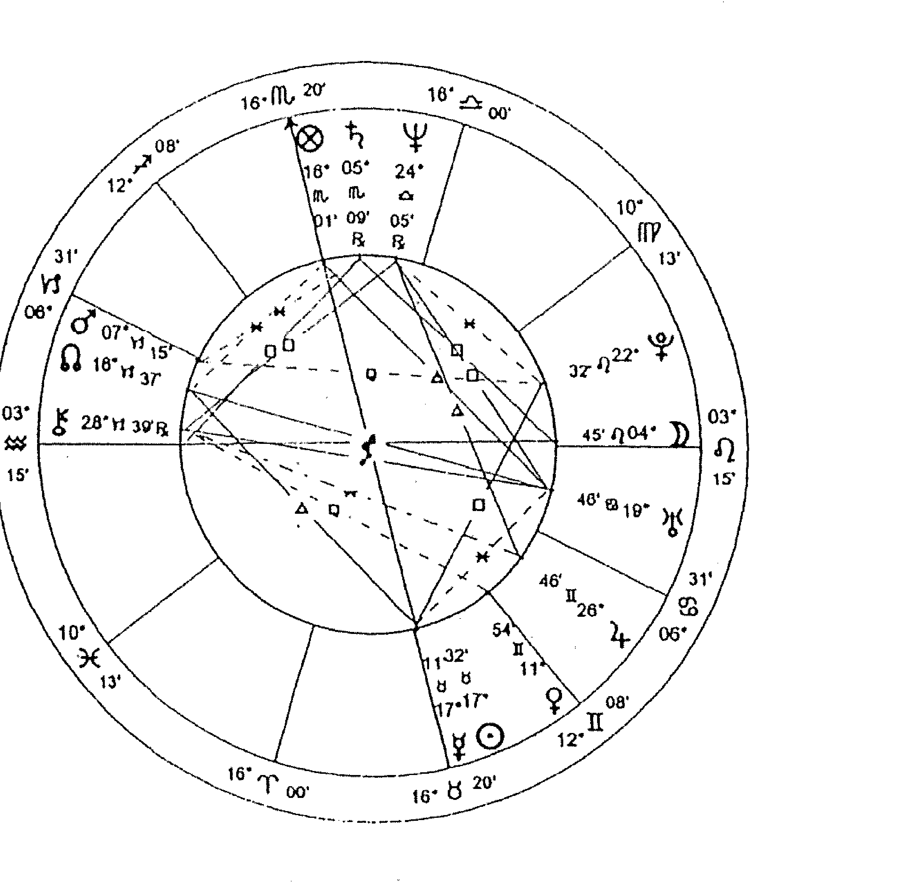

# 第十三章 醫療占星學

### 體液・脾氣・習性評量表

| 評量項目 | 星座 | 濕 | 熱 | 乾 | 冷 |
| :--- | :--- | :--- | :--- | :--- | :--- |
| 1. 上升星座 | 水瓶 | 1 | 1 |  |  |
| 2. 上升星座主星 | ♄ |  |  | 1 | 1 |
| 3. 位於ASC內的行星或☿/♄（若是☽則加倍） |  |  |  |  |  |
| 4. 與ASC形成主要相位之行星所在星座 | ♄ 卯 | 1 |  |  | 1 |
|  | ☽ 牛 |  | 1 | 1 |  |
| 5. ☽ 所在的星座 | 獅子 |  | 1 | 1 |  |
| 6. ☽ 定位星所在的星座 | 金牛 |  |  | 1 | 1 |
| 7. 與☽形成主要相位之行星所在星座 | ♄ 卯 | 1 |  |  | 1 |
| 8. 月相 |  | 1 | 1 |  |  |
| 9. ☉的季節（春・夏・秋・冬） | 春季 | 1 | 1 |  |  |
| 10. 命盤最強行星所在星座（若與ASC主星同則3倍） |  |  |  | 1 | 1 |
| 11. ♄ | 東出／西入 |  |  | 1 |  |
| 12. ♃ | 東出／西入 | 1 |  |  |  |
| 13. ♂ | 東出／西入 |  | 1 | 1 |  |
| 14. ♀ | 東出／西入 | 1 |  | 1 |  |
| 15. ☿ | 東出／西入 |  | 1 |  |  |
| 總共 |  | 7 | 7 | 8 | 5 |

※ 第10項 按行星強弱評價表所得最強力的行星 稱為LOG

LOG: ♂

# 實用星運學

- 熱＋乾 共 15 ，火象，黃膽汁質
- 熱＋濕 共 14 ，風象，血液質
- 冷＋乾 共 13 ，土象，黑膽汁質
- 冷＋濕 共 12 ，水象，黏液質

國際巨星成龍的四種體液並未差異太大，但以黃膽汁質／血液質重，尤其是黃膽汁質及LOG♂最凸顯故會顯現脾氣急、動作迅速、快而敏捷、頗具衝勁、積極進取凡事爭先、不服輸，相對地運動傷害增多。

# 第十三章 医疗占星学

### 案例十六

Disease
Natal Chart
Feb 19 1981
3:30 pm GMT +0:00
LONDON, England
51°N13'001°W25'
Geocentric
Tropical
Regiomontanus
True Node

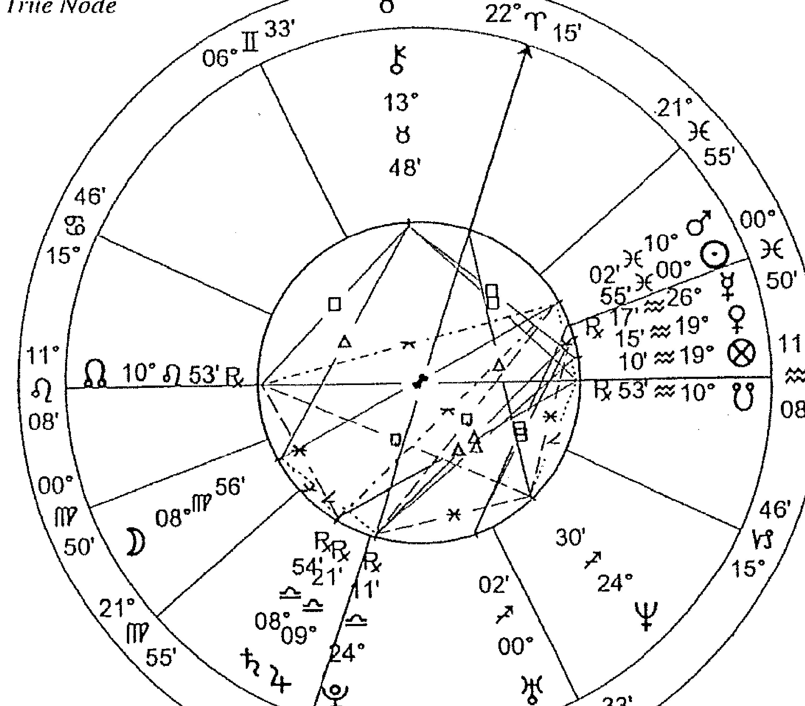

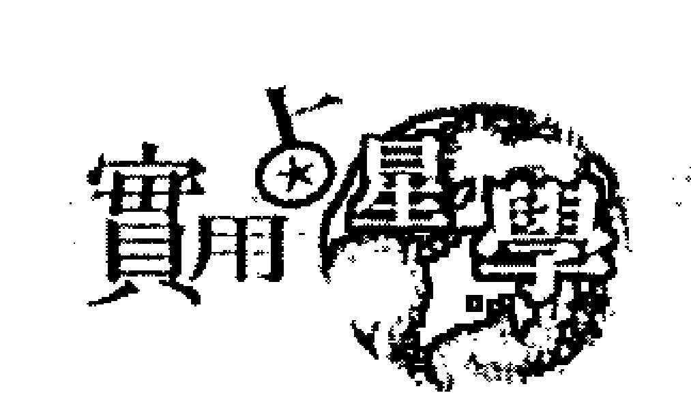

### 疾運盤的案例研究

英國剛過世知名的復古學派女占星大師Olivia Barclay的一位朋友要求Barclay去跟她坐坐，稱極為危險，頗有交待遺言之意，這位朋友知道她第一次躺在床上的時間，Olivia Barclay乃根據此此刻起疾運盤如附圖，這位朋友已被診斷出患有腎盂炎(Pyelonephritis)。

腎盂炎是種腎臟疾病，為腎臟中微小的過濾處發炎。正常而言，血液通過腎臟會過濾形成尿液，由於代謝作用，身體排泄殘渣進入尿液，若腎盂炎發生會阻礙尿液產生，導致尿素累積和氮殘渣在血液中產生，這種情形嚴重的話，對生命有潛在威脅，時常導致昏迷或死亡，所通過之小量尿液明顯地暗避免紅血球從腎盂進入尿液，因發炎腎臟膨脹致使背部緊痛，此症狀常引起傳染性高燒。

- 1. 1宮:患者，6宮:疾病狀況、種類，7宮:醫生，
- 2. 10宮:處方或藥草，8宮:壽命、死亡，12宮:住院
- 3. 4宮:結束。

在疾運盤中，疾病由6宮代表，宮始點在丑摩羯，宮主星♄入辰天秤(管轄腎臟)，傳統說法♄在辰“顯示血液腐敗，背部和腎臟致病，尿急而排泄困難，膝無力且疼痛，大腿風濕症，坐骨神經痛，痛風”。

# 第十三章 醫療占星學

♄在風象星座，風象跟血液質有關，說明血液腐敗的可能，這是尿素累積在血液中的可能結果，醫學名稱為尿毒症(Uraemia)；而背部和腎臟致病的描述直接根據辰天秤，它主管身體的這個部位，尿急排尿困難是因尿液要通過困難，♄與限制有關，所以指示尿液通過困難。

♃ ♄也描述患者的狀況。傳統上♃在辰"顯示病人的血液太多"引起閉塞、血液腐、敗發燒、痔、腫瘤、發炎、過食、食量不知節制。

♃的純質料為熱、濕跟發燒時的熱有關，同樣地，♃也關連到腫大、膨脹和發炎，當♃在辰(主管腎臟)，而辰風象又與血液有關，♃的大量以致會出現血液太多的聯想，由於腎臟的阻塞和發炎，較多量的血液卻流出少會腐敗發炎。♄ ♄顯示♄刑剋限制了♃，故病人的血液質體液無法保持正常的平衡，引起疾病。

病人的狀況是危急的，ASC在午獅子，☽為ASC主星象徵她的健康和生命力、活力，卻飛臨8宮(主管死亡)亥，☽在此為外來的，行星的力量甚微，必然的無力且為偶然的無力，命主星☽在8宮始點處，指示她的生命力正處於生、死交關的門檻。非常明確地描繪她可能陷入昏迷，相反地♄代表她的疾病卻入旺宮(♄在辰為旺)，表示疾病強過她的生命力，亦即她缺乏生命力去克服來勢洶洶的疾病，而♄♃，♃適為8宮亥的宮主星，是疾病最終性質的另一種指示。

# 實用占星術

☽為疾運盤的共同代表因子，入相位♂在8宮，指示疾病的高度發燒。W.Lilly曾說"☽入相位於8宮內的某行星，總是危險的"。

8宮為卯天蠍的同族性宮位身體的下水道，體內排出尿液的器官，♂主管紅血球位於8宮，鮮明地呈現紅血球在尿液中，導致暗紅像漆的顏色。

值得注意的是，不管她的病況多麼嚴重，病人在疾運盤起出後6個星期康復過來，W.Lilly的話最能形容她康復的理由即"4宮代表疾病的結束…"，4宮始點在辰，宮主星♀與♃形成互容，即♀位於子水瓶（♃主管），而♃位於辰天秤（♀主管），這個互容有效，♃在辰容納代表從腎臟移除障礙，而相對地，♀的容納（♀為腎臟的自然主星）象徵腎臟的功能適當回復尿液流暢，顯然地這個結果相當戲劇化。

注意♃亦為7宮（丑）宮主星代表醫生，記住斷訣"若7宮主星是凶星，醫生將無法治療…"且看看♃同時主管6宮和7宮，她原先的醫生應跟其疾病有關，事實上她沮喪多年，♃為6宮主星正是沮喪、憂鬱的寫照。因為她的悲觀，她的醫生開給大量的鎮定劑tranquillizers，同時她正服用避孕藥丸(Contraceptive pill)，這種藥劑組合對腎臟相當禁忌的，當問及她的疾病是否因醫生指示而形成的，她回答說"絕對是的，自從第一次服用藥片後，從未覺得舒適過"故可說她的腎臟疾病問題是在經特別診斷服用藥劑成癮後變乾所致。

# 第十三章 醫療占星學

### ※要點整理

- 1. 這個疾運盤案例頗為精彩，值得把玩欣賞。原文記載於Olivia Barclay《Horary Astrology Rediscovered》。
- 2. 1宮為生命健康之宮，代表病人，6宮為疾病症狀，1宮及6宮主星的行星力量相較可作為判斷康復的條件。♄在辰入旺宮似強，但因R逆行且在果宮弱；ASC主星☉在8宮亥，外來的且弱，☉比♄弱似無生機，但4宮結束♀入始宮與♄互容，終能康復。
- 3. ☽入相位♂☌，☽在巳處女，土象、乾，♄為6宮（丑摩羯）主星亦為乾，♂發燒、發炎。
- 4.♄為6宮（子），7宮（丑）宮主星，隱含醫生與疾病有關。

# 第十四章 氣象占星學

氣象占星學(Astro meteorology)的淵源甚為流長，幾乎與西方氣象科學的發展劃上等號，現在的氣象學(Meteorology)一詞係引自希臘亞里斯多德所著《氣象通史》(Meteorologica)，Meteor源自古代希臘人用來指大氣上面的事物，即一切大氣現象如雲層雨、雪、雹、霓虹、風…等，該書有系統地搜集先賢的氣象思想和經驗，其中B.C 490-B.C 435 Empedocles的四元素論影響最為深遠，他認為天地萬物是由四個基本元素－地（土）、水、火、風所構成，而這四個基本元素皆由四種純質料－濕、乾、熱、冷兩兩組成，如下圖


這種四元素論被亞里斯多德奉為圭臬，《氣象通典》第一冊內第2章；第3章就以四元素作進一步的闡釋，他相信宇宙是球形狀，認為所有星球都是以地球為核心而環繞著地球作向心的運動，他又將宇宙分成兩個區域如圖中月球軌道以外的區域，另一如圖中月球軌道內與地球之間的區域，前者屬天體部份，後者為大氣現象，此為氣象學研究的對象。

# 第十四章 氣象占星學

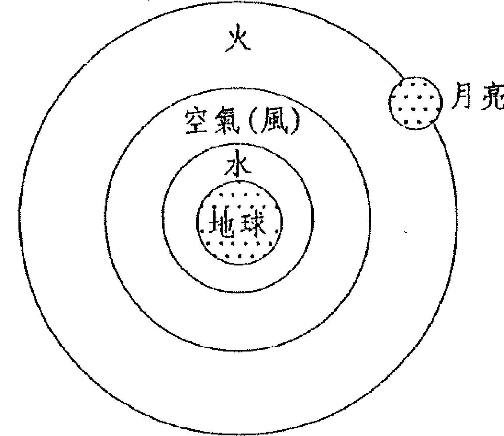

亞里斯多德根據Empedocles的四元素論，將土地（地球表面），水、風（空氣）、火四基本元素以地球為圓心，依序按同心圓狀的環繞分佈如上圖，由於四元素也是占星學的核心，上述模型自然就成為氣象占星學最根本的模型，影響氣象科學發展甚為深遠，一直到16世紀法·笛卡兒以科學方法討論氣象學才擺脫《氣象通典》臆測之束縛，而17世紀氣壓表的發明才使氣象科學邁入一個嶄新的里程碑，但不可否認地，占星學的生命力極其旺盛，即使已進入科學昌明的21世紀，以亞里斯多德模型推論之氣象預測，仍留傳於歐美等先進國家。

中國的氣象學發展也與天文、星象掛鉤，古代的農業生產與天氣狀況好壞有極密切的關聯，因而隨著農業的發展，

# 實用星象

中國古代先民的氣象知識也累積甚豐富，出土的殷商甲骨文就記載甚多有關氣象的卜辭；因經驗累積，至秦漢時代就已訂出24節氣與物候的關聯，為歷代曆法必備形成中國曆法的一大特色，但綜觀中國的氣象發展儘管資料龐大，都僅呈現經驗之談，沒有共通的模式如亞里斯多德的氣象模型。

明末時期，耶穌會教士利瑪竇來華，曾將此模型引進寫在其《乾坤體義》上卷，加以詳細介紹。後穆尼閣傳薛鳳祚《天步真原》論日月五星之能即是氣象占星學的主題，但因星曆表未流通、計算天宮圖繁瑣，並未在中國開花，更不用談結果。

西方的氣象占星學雖在16世紀後逐漸走向科學方法，但仍有知名天文學家以古典方法研究如A.D1546-1601的Tycho Brahe，及他的徒弟A.D1571-1630的Johannes Kepler所出版的農民曆，預測氣候傳誦一時，Kepler更發現行星若形成一定角度即相位會影響地球上的氣候，他曾出版長期的天氣預測，時間從公元1618年6月28日-1692年8月9日。

17世紀英國的Dr.J.Goad根據Kepler的觀察再加上自己的研究，於1686年出版《Astro metorologica》一書是相當重要的氣象占星學專著，一直到19世紀初葉仍是權威著作；古典力學的始祖A.D1642-1727 Isaac Newton也涉足氣象占星學的研究，他曾在公元1704預測在1750年2月當日蝕時，月亮最近地球時（近地點），而木星也在該近地點，Aurora Borealis(北極光) 隨著恐怖的風暴出現在北方天空，將重擊英國和地震

# 第十四章·氣象占星學

將損毀倫敦，結果Neston的預測就在他死後的第23年，即其所預測之1750年2月，極恐怖的暴風真的重創倫敦，然後再地震損毀了城市的部份。

19世紀初葉，較著名的農民曆是由R.J.Morrison出版的，他本出身於皇家海軍著迷傳統的占星學，曾出版幾本重要的占星學著作，以Zadkiel之名重新改寫Williams Lilly《Christian Astrology》，19世紀中、末葉，Dr Alfred. J.Pearce步其後塵，繼續出版農民曆來預測氣象，其著作《The Textbook of Astrology》就設有專篇討論氣象占星學。

邁入20世紀後，氣象科學的進展日新月異，但仍有不少氣象占星學的研究者如天文學理學家Dr. Charles Greely Abbott經過多年研究後，在1953年宣佈“太陽變化、行星間的某些角度與地球的氣候存在著無可爭論反駁餘地的關聯”，然而其發現並不被科學界人士所接受，無奈地Dr. Abbott將其氣象占星學的發現在歐洲出版。

另一位知名的氣象占星學家為Dr. Irving Krick，他認為太陽系的重力中心經常移動是太陽活動的原因，而氣候和地震歸之於所有行星，他曾試圖使科學界好友信服氣象占星學的奧秘，即使他的預測達到90%以上準確，氣象科學界仍拒絕承認其預測事實，Krick最後只好放棄，自行成立公司為跨國企業和國內企業服務，績效良好，賺了不少錢，成為國際知名的氣象專家。


Dr. Andrew Douglass則是以樹輪來判斷事件發生年代的專家，他結合樹環和行星的運行、太陽黑子周期來預測天氣。

與Dr. Irving Krick齊名的George. J. McCormack是另一位氣象預測天才，但不同的是Krick原本是科學的氣象學家而Mc. Cormack是位占星家，Krick開公司預測氣象而致富，而McCormack則窮極潦倒，死時幾無分文，美國Analog 的編輯John. W. Compell曾以McCormack的預測和美國氣象局的預測隨機取連續6個月做比較，結果發現他的預測高達94%準確。

McCormack也曾研究土星與流行性感冒的關聯，倍受氣象專家嘲笑揶揄，他公開預測美國在1964年2月18日將爆發重大的流行性感冒，因在水瓶正好落在前一日蝕(1962年2月4日)之度數上，該日蝕點就在美國國家盤的6宮（健康宮）內，結果就如McCormack在1964年致命的流行性感冒以瘟疫般傳染，其高峰就是在2月，他曾出版《Astrotech Weather Guide》。

# 第十四章·氣象占星學

氣象占星學的研究內容如下：

- 四大元素的古典氣象意義
- 行星、星座、後天宮位在氣象占星學的意義
- 行星間相位的特殊意義
- 一般四季氣盤 - 太陽四季始入圖
- 風動盤 - 水星始入星座盤
- 濕度、雨量盤 - 月亮月相圖
- 地區特殊的天氣型態 - 以台灣為例
- 雷鳴、暴風雨、冰雹
- 龍捲風、颶風
- 颶風
- 大水
- 乾旱
- 冷與熱
- 降雪# 第十五章 出生時間的修正

中國的命理學如紫微斗數、四柱八字或七政四餘，使用的時間單位為兩小時一個時辰，因而一般人家記載出生時間都以時辰記載，在民國60年代之前大部份都由產婆來家接生，時辰的記載不若60年代以後普遍在婦產科出生，由醫院開具之出生證明記載到分那麼明確。

更早之前，許多母親生孩子之時，都僅依稀記得大約在什麼時辰而已，甚或含糊地說雞啼或天光或黃昏...等，又民國34年光復後，政府施行日光節約時間，大多數人家都以鐘錶記載當時時刻，甚少會想到要調整回來，而民國26年10月1日起至民國34年9月30日，台灣受日本殖民統治期間因中日戰爭，而實施與日本本地同時間之戰時時間，這些因素都使得出生時刻無法精確。西洋占星學所使用之資料為出生年月日時分以及出生地經、緯度，要求更精細，碰到這種情形必然會打折扣。為扭轉此種狀況，西洋占星學在16世紀之前就曾專門討論出生時間的修正（Rectification of Birth Time），國內出版的《天步真原》是耶穌會來華教士穆尼閣傳授給薛鳳祚的占星學資料，在卷中的「變時真否」即是這項內容，17世紀最著名的英國占星家Williams Lilly《Christian Astrology》第3冊開宗明義討論生時修正的重要與方法，這是古代時間的修正，但這項傳統在19世紀末、20世紀後幾乎已被放棄，因自此之後占星學的走向朝命主的心理層面發揮，不重視傳統占星學的事件吉凶預測，不必以事件吉凶來反推精確的出生時間，幸好重視傳統占星學的人仍予以保留使用，更拜現今電腦科技之賜且人工智慧的運用，出生時間修正已達相當精準之境界。

中國的鐵板神數雖也具有時、刻、分之校正，但經不同的人或不同人生階段演算，出現結果可能不同。西洋占星學的流年預測系統多種，若採用不同系統來校正，也有可能出現上述現象，因此欲作出生時間修正，務必對各流年預測的精髓有所掌握，才能得心應手，校正出的出生時間，才對求算的人有益。

一般上最常用之出生時間修正方法係採主限向運法 (Primary Direction)，前述的《天步真原》即採此法，但使用此法必需有深厚的天文數理基礎，懂得球面天文學方有辦法著手，且這種方法若誤差達30分鐘以上，效果就大打折扣，因約4分鐘即差異一年，30分鐘的差異將約有7-8年的誤差。

日前軟體的設計大抵都採過運至本命，太陽弧至本命，次限推運至本命等較流行的流年預測系統來校正，效果尚佳，但這些方法也需在一定範圍的出生時間，如知道出生的年、月、日約在何時，取試誤法直到精確的出生時間出現，假若連日都不知道，事實上根本無法修正。

有關出生時間修正的觀念或方法，甚少有書籍談到，我們推薦英國頂尖占星家Nick Campion《The Practical Astrologer》P.125有概念性之經驗法則值得模仿，其大意如下：

1. 不知道出生時間（需知道日），可以半夜12點或中午12點起盤。
2. 出生時間校正，一般常用生命中一些重要的事件看看這些事件與ASC和MC有何關聯。
3. 試著2之步驟調整ASC的度數至有關的事件。
4. 以ASC星座來觀察命主的外在顯著的特質，找那些不受太陽和月亮影響的特質。
5. 有些占星家則用身體上的特徵來分辨ASC的位置（如R.T. Mann《The Round Art:The Astrology of Time and Space》如一個人有紅頭髮，則ASC星座可能是白羊、獅子、射手，黑而深邃的眼睛通常係ASC在天蠍）。
6. 當一個可能的ASC決定了以後，其他人生事項的後天宮位也接著決定了，因此可觀察這些宮位內的行星對命主個人的興趣或環境有何關聯。
7. 占星家會考慮孩童時期發生的第一件事，特別是嚴重的疾病或意外或其他外傷事件，這些應可由重要的過運至ASC或由推運的ASC p至其他行星的相位來顯示。

例如先設定命主的ASC星座為處女座，發現他（她）在3歲時火星、金星、水星聚集在巳10°，剛好發生一場足以喪命的意外事件，通常會斷定其ASC就是巳10°。

又命主往後人生所發生的事件，如結婚也可用來判斷跟ASC有關之出生時間。

出生時間的修正是一項高度藝術化的工作，基本上它是反推的，即由已知的命主事件來反推命主真正的出生時間，通常主要提供3-5項的命主第1次人生事項即可作為修正之用，如第1次結婚、第1次生小孩、第1次就職、父母親逝世、第1次嚴重疾病或車禍意外....等日期的資訊。

就經驗而言，下列事件有助出生時間的校正。
1. 嚴重的疾病、住院治療、外科手術、疾病種類。
2. 特殊的經驗、贏取獎金、犯罪罹災、小孩出生、車禍意外、與人嚴重爭吵打架掛綵。
3. 第一次約會、第一次性經驗、結婚/離婚。
4. 上班/失業、工作變動、職務升遷或降職。
5. 大獲財利、破產失敗、購買住宅、搬遷。
6. 父母親、兄弟姊妹、配偶、子女...等六親過世，而深烙在內心的哀傷。

## 案例十七

CHOU
Natal Chart
Jan 31 1956
1:25 am CCT-8:00
Fu uay, TAIWAN
23°N43' 120°E26'
Geocentric
Tropical
Placidus
True Node

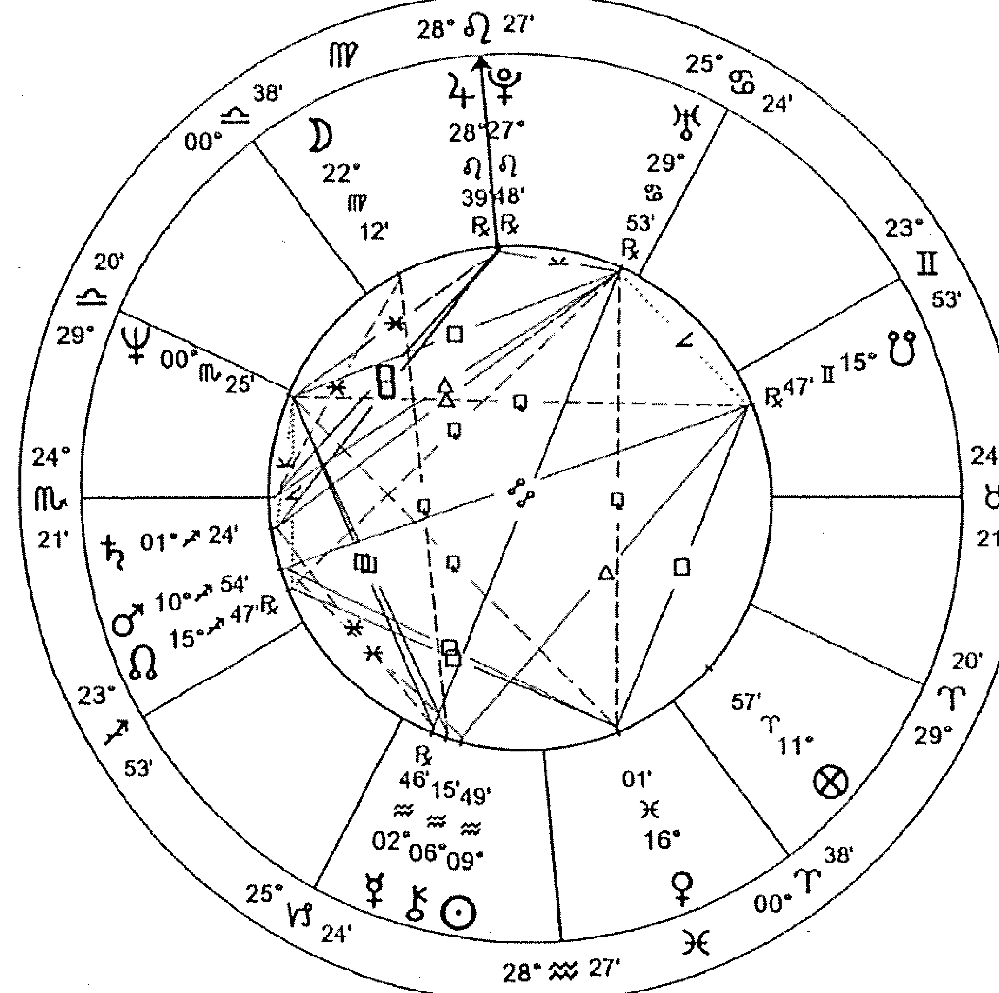

CHOU
Natal Chart
Feb 1 1956
1:25 am CCT-8:00
Fu uay, TAIWAN
23°N43' 120°E26'
Geocentric
Tropical
Placidus
True Node

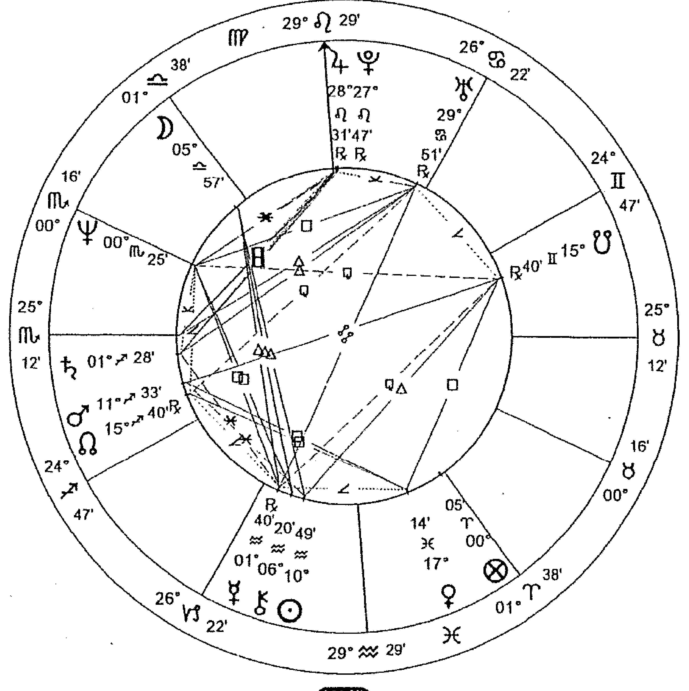

## 出生時間修正案例

鄭先生常為其出生日期傷腦筋，母親給他的資料為陰曆換算國曆為民國45年2月1日，凌晨1:25，因值子夜母親不敢確定是1月31日或2月1日，讓他相當困擾。由於在南投經商，有一次當地某神壇神明降駕就其出生日期之疑惑鐵定向他說，他是1月31日生，由於是神明說的話一般拜神的人會當真，自此就以該日期作為生日，後來經友人介紹來算占星，但整個推論過程不甚符合，鄭先生乃主動提起曾有過的上述困擾，我建議他記下一生重要事件來反推，裨便作出出生時間修正。

鄭先生當時記下下列事項：

1. 民國67年5月，結婚。
2. 民國72年7月，創業。
3. 民國75年3月，購屋，卻頗有壓力。
4. 民國80年，大虧錢。
5. 民國82年獲利頗豐。

筆者就兩個出生日期時間分別打出天宮圖，及根據上述事項按次限推運系統逐一比對，因次限/本命配對盤甚多，此處我們列出：

| | A. 1956年1月31日 AM 1:25 | B. 1956年2月1日 AM 1:25 |
| :--- | :--- | :--- |
| **1. 1978年5月 結婚** | ASCp □ ♀，餘無相關相位 | Dp 在8宮 △ 4宮內 ♀，且 ♀p △ D_R |
| **2. 1983年7月 創業** | ♂p △ MC, Dp ○ ♀, ♄p △ MC | MCp ✳ ☿ 且 ♂p △ MC_R |
| **3. 1986年3月 購屋** | ☉p 在4宮內 □ ♂R 在ASC內 | ☉p 在4宮內 □ ♂R 在ASC內，且 ♀在4宮始點 □ ♄R 於ASC內 |
| **4. 1991年大虧錢** | Dp 在2宮財帛 △ MC_R，流年其他有關錢財之相位皆吉 | ♄p 在2宮 □ D_R 且 (♃p ○ MC_R) □ ♄R |
| **5. 1993年獲利頗豐** | 無明顯相位 | ASCp 在2宮 △ (MC_R ○ ♀), ♂p □ D_R |

1. 結婚常與婚姻自然主星♀或7宮主星有關聯，本案例的兩個日期之7宮皆在酉金牛， A. 見ASCp刑♀，若係結婚恐心態不願意或勉強。 B. 則屬和順、願意，因多都吉相位。筆者問鄭先生結婚過程如何，他表示係戀愛結婚，頗為甜蜜不勉強。
2. 創業常與MC和10宮宮主星有關，本案例的兩個日期之10宮在午獅子、主星☉， A、B皆見MC的涉及。
3. 購屋但有壓力，常與4宮及4宮主星之刑、沖有關。 A、B皆見4宮的刑沖。
4. 虧錢常與2宮財帛、2宮宮主星、錢財自然主星有關，刑、沖居多。 A. 見吉象。 B. 則多見2宮或4之刑沖。
5. 獲利豐常與2宮財帛及宮主星、錢財自然主星4有關，吉相居多。 A. 未見吉象。 B. ASC_p在2宮△(MC_R◯♀)。

從上述推運/本命之垂象，顯然B之1956年2月1日1:25 AM，件件皆合，而A僅2、3項合而已，所以B之日期、時間應屬正確，筆者乃告訴鄭先生這項修正結果，他仍有點狐疑，說要回祖居處再向長輩詢問看看，經過一個星期後，他打電話給筆者說，祖父母處留有生辰八字的記載，確實是2月1日所換算的陰曆日期。

# 第十六章 其他學派

- 心理占星學(Psychological Astrology)
- Huber學派(Huber School)
- Draconic占星學(Draconic Astrology)
- 中點理論(Midpoint Theory)
- 教堂之光(The church of light)
- 泛音盤(Harmonic Charts)
- 恆星學派占星學(Sidereal Astrology)
- 度數象徵(Degree Symbolism)

## 心理占星學

19世紀末20世紀初，西方占星學發展史上形成相當重要的分水嶺，原本古典傳統占星學強調的事件吉凶預測逐漸被擯棄而轉向個性、心理發展，這個分水嶺的重要旗手為英國的Alan Leo，他因被控算命為逃避刑責，經由律師建議，他向法庭陳訴占星學是在分析個性及心理，符合學術研究，而得以避開牢獄之災，卻擦撞出占星學往心理學發展之契機，而當時西方學術潛意識心理分析正如火如荼地展開，為顯學之一。有識之士研究占星學似乎很容易成為話柄，加上事件吉凶的預測易陷入宿命論，倍受攻擊，因而占星學與心理學順理成章地結合，抬高認同度以免落人口實。

Alan Leo在英國的繼承者C.E.O Carter博士也深入檢討事件吉凶預測的弊病，而朝向心理之探討；在美國Marc Edmund Jones更發揮其影響力，將占星學導向哲學、人性的方向，他認為占星學應使用在幫助客戶看清自己的傾向，藉由其傾向適當地發揮其才能，這種觀點深深地影響到法裔美籍相當知名的占星家Dane Rudhyar，他認為占星學是一種生命哲學，天宮圖是命主的潛能模式，說明命主只要努力就可以成為什麼樣的人，基本上對人性抱持著樂觀的態度，在占星學界被稱為人本主義占星學派，從1960年代迄今，一直倍受尊崇，更進一步地將占星學賦予哲學化、人性化，在知識份子之間引起頗大的迴響；1980年代美國的Stephen Arroyo將人本主義占星學發揮得淋漓盡至，他的幾本著作一直被列為心理占星學必讀書籍。

## 實用星學

談到心理占星學，一定得提及心理學界的思想巨擘瑞士分析心理學大師Carl G. Jung，他的學問相當淵博，幾乎遍及考古、神話、宗教、東西方文化、社會、心理、鍊金術…等。曾涉獵占星術的研究，提出「同時性」觀念，合理地解釋預測事件的巧合性，而原型的觀念又為心理占星學奠定堅實的基礎，他對無意識心靈的研究，提供占星學命盤深層的探索，獨創的集體無意識也為時事占星學打下合理解說的基礎。他對20世紀的占星學發展可說是全面性的影響，他的一些觀念常被引用在心理占星學中，如英國的Liz Greene，荷蘭的Hamaker-Zondag，尤其是Liz Greene更是近20年來引領心理占星學的風騷，她的觀點不同於Dane Rudhyar的靈魂成長，較著重於個體化過程，而她強調Jung的心理動力學，以及了解無意識運作過程的應用方法，儘管心理占星學派也有差異，但已將傳統占星學所著重的外在領域導向內在領域，它的焦點放在命主的內在心理結構，並且認定無意識心靈會構成和決定一個人的行為模式，除此之外也談及「補償」、「投射」豐富了心理占星學的內涵。

若說20世紀下半葉是心理占星學的天下一點也不為過，提升了占星學的學術地位，但相對地對普羅大眾似乎太遙遠了，它拋棄了傳統占星學的預測功能，也失之偏頗難以融入，太過專業心理學術語不易被瞭解，這些都成為心理占星學為人詬病所在。

我們列出占星學與容格無意識心理學對照表，當可梗概瞭解心理占星學的特色。

| 占星學 | 容格無意識心理學 |
| :--- | :--- |
| 1. 天宮圖 | 1. 心靈地圖(Map of Soul)<br>原型的象徵性組合隱含人類的各種潛在心靈的可能性，若能充分解析，即能揭發潛意識的動機與感覺。係個體的人格結構。 |
| 2. 行星、星座、後天宮三要素 | 2. 原型(Archetype)<br>與生俱來內藏而先驗的知覺模式，與本能相連，可以調整知覺本身，活生生的心靈力量為所有人類所共有。 |
| 3. 宇宙星體的排列 | 3. 同時性(Synchronicity)<br>人類心理狀態與客觀事件的非因果關係。它與內在意識存在著難以想像的關係，有意義的巧合。 |
| 4. 太陽 | 4. 自我(Ego)<br>意識領域的中心，賦予個人目標感和認同，是珍貴的意識之光。 |
| 5. 黃道12星座，水星 | 5. 本我(Self)或譯自性<br>心靈自身更高組織的原型，不僅是中心點，也包含意識與無意識的圓圈，以水星作為本我和自我的橋樑。 |
| 6. 火星 | 6. 利比多(Libido)<br>心靈系統運轉的原動力，或性能量。 |
| 7. ASC、MC | 7. 人格面具(Persona)<br>呈現在意識表層，個人表現在外的行為狀態，關於個人以什麼樣的形象面對社會則是個體和社會集體之間的一種妥協，意思是「呈現的人」。 |
| 8. 四大元素<br>a. 火象星座<br>b. 土象星座<br>c. 風象星座<br>d. 水象星座 | 8. 心理類型(Psychological Types)<br>a. 直覺型(intuition)：無意識地傳達知覺的機能<br>b. 感官型(sensation)：能夠知覺地傳達物理刺激的心理機能<br>c. 思維型(thinking)：合理地、邏輯性地看待和判斷事物<br>d. 情感型(f feeling)：表達個人感受、情慾和情緒<br>由四大型的組合衍生8種心理類型。 |
| 9. 相位<br>調和、不調和 | 9. 情結(Complexes)<br>心靈力量的網狀組織，同時隱含正面和負面的因素。 |
| 10. 水星 金星 | 10. 陰影(Shadow)<br>陰暗面，經常隱沒於無意識之中，或被無情地壓抑，以維持表面的道貌岸然。 |
| 11. 火星 金星 | 11. 男性與女性的原理(Anima/Animus)阿尼瑪/阿尼瑪斯<br>Anima：男性之女性一面<br>Animus：女性之男性一面 |
| 12. 宮位/對宮<br>星座/對面星座 | 12. 投射(Projection)<br>將心靈內容無意識地錯置他人或物體之上。 |
| 13. 海王星 冥王星 水星 | 13. 集體無意識(Collective un Consciousness) |

以上所列的對照表僅是概念性而已，裨讓讀者盡快掌握其意義卻不宜刻舟求劍。有關容格無意識心理學與占星學的基本對照可由下圖表示：

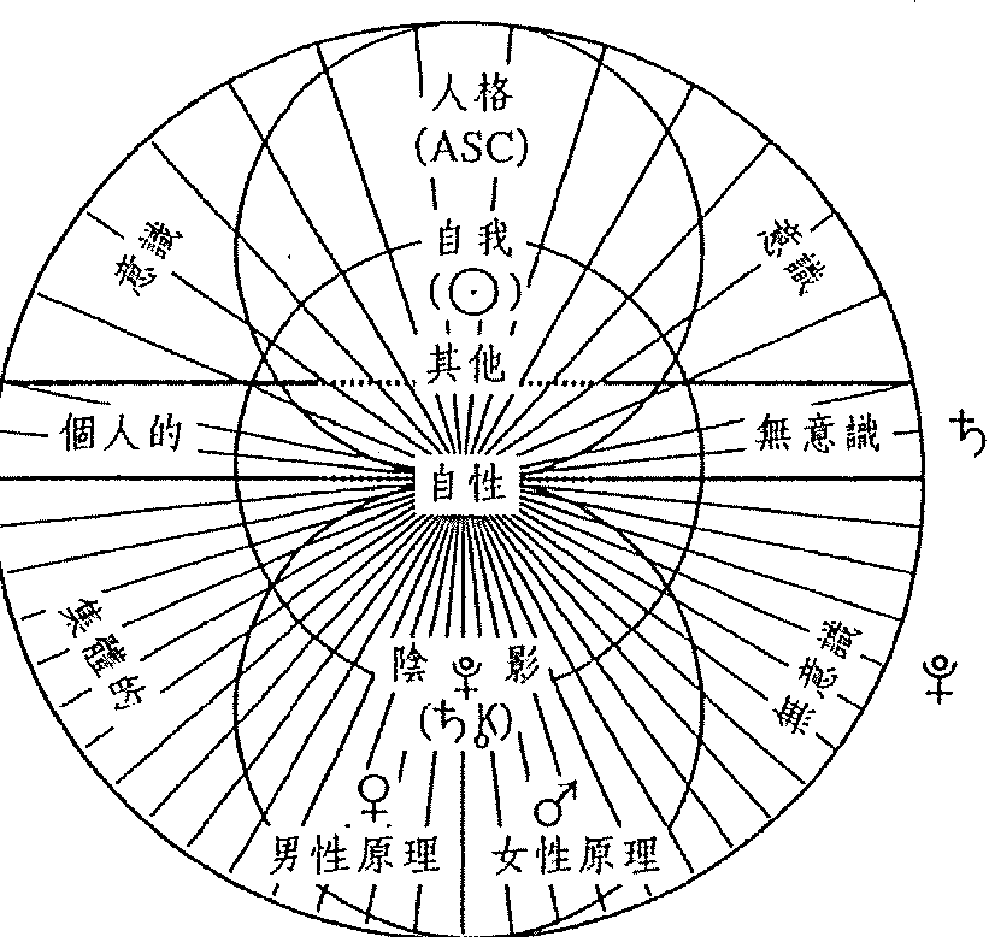

容格發現人生下來具有以某些特別的方式做出反應和動作的先天傾向，跟古老傳說老祖先同樣方式來認知世界和做出反應，亦即人的心理是透過進化而預先存在及確定的，這就是集體的無意識，有別於個人的無意識。集體無意識存有各式各樣的原型，阿尼瑪（女性原理）、阿尼瑪斯（男性原理）、陰影、自我、甚或人格面具，當人格中的幾種主要原型產生衝突與對抗，若過於激烈有可能導致精神官能症。

自性在容格學說中最不易瞭解，它也是一種原型，為心靈自身更高的組織原理，促發一種對個人實存意義的體認；至於個人的無意識類似佛洛伊德的無意識概念，是容格無意識的一部分，它常是那些一度被意識到但又被忘記的心理內容所組成。

自我屬意識層，個人能展現意志、慾求、反思和行動中心的經驗。

心理占星學將容格學說的類比為天宮圖就像一張心靈地圖，圖中的行星運轉有助於察覺內在能量變化和外顯事件的關聯，這張天宮圖顯現內在情結、無意識的各種原型、心理類型，命主如果透過教育與學習整合心靈平衡，即在意識與無意識之間建立起合理的關係，對心靈的健康是有幫助的，此即個體化，那麼這張天宮圖即能轉變成靈魂的曼陀羅。

## 案例十八

Carl G Jung
Natal Chart
Jul 26 1875 NS
6:55 pm +0:00
Kesswill, German
47°N36' 009°E19'
Geocentric
Tropical
Placidus
True Node


## 發現人類內在的哥倫布
分析心理學大師：容格

1. 立命子水瓶、風象，傳統主星 Saturn，現代主星 Uranus，而 Saturn 和 Uranus 分別在1宮和7宮，傳統與現代的對立，二元矛盾常在容格心中激盪。

容格早年的宗教啟發與瑞士新教派產生強烈的矛盾與衝突，這種雙重宗教影響使容格陷入矛盾，父親是名牧師滿口神的恩寵，而母親是位靈媒似乎知曉更多的惡魔和靈魂真相，變得可怕而怪異。這些因素使得他同時具有「1號人格」和「2號人格」；前者表現在日常生活中缺乏信心、情緒化，相較於他人較不聰明，後者具神性和上帝恩典的秘密。兩者展現作用和反作用，正是上述星象的寫照。

ASC在子水瓶，代表他有與眾不同的理解力，科學化地探索理論、固執己見，卻能激起學術革命，ASC屬人格面具之一，他給外界的形象正是如此。

2. 月亮15°31' 卯酉23°31' 月亮管轄心靈的能量、無意識、母親...等，卯酉管轄黑暗、恐懼、害怕、緊張不安的情緒、幽暗冥府、集體無意識。

容格小時候很害怕黑夜，母親的靈媒能力使他感受母親是黑暗、不可預測，而埋在無底的深淵，母親知道他的心中住著二號人格，對母親帶著恐懼而尊敬。

The request was rejected because it was considered high risk## 第十六章 其他流派

(1)本命☿在午28°11′，黃道經度為148°11′。
(2)將☋轉換成以白羊座0°為基準，其弧度為360°-148°11′=211°49′。
(3)將本命天宮圖所有行星及敏感點各加以(2)所得之轉換弧度211°49′，若超過360°則以360°減之。
如本命ASC寅18°24′，黃道經度為258°24′，加上211°49′為470°13′，減去360°得110°13′為巨蟹座20°13′，即Draconic盤的ASC為未20°13′。
Diana王妃的Draconic盤如後面附圖。

評估Draconic盤並不單就該盤討論，必須就Draconic盤和本命盤的配盤關係來解說，著重Draconic行星(簡稱Dr行星)☌或☍本命行星，尤其是本命尖軸附近的行星特別具有意義，以及Dr☉、Dr☽及DrASC所在本命星座和本命宮位的涵意。舉一例如Dr♄☌☽可以解析為命主的靈魂潛藏著困頓、悲傷、限制或責任承擔(Dr♄)之無意識情境，就如容格學說中的陰影會影響命主世俗家庭、母親、女性或情感、情緒之不安或紛亂。

Draconic占星學並不流行，但有心研究的人卻發現它的神秘聯繫，20世紀初美國相當著名的靈媒Edgar Cayce本身也是占星家，他常用Draconic盤驗證經過催眠的客戶所顯現的人格和個性，效果甚顯著。由於Draconic具有命主內在靈魂的特色能描述命主的內在特質，有前世業力或因果的涵意，若能傾聽內在聲音，瞭解它或許能喚醒命主無畏的自我，達成個體化。

在歐美地區Draconic盤除探索命主個人內心世界的掙扎與努力，也常用來探討命主與六親之間的神秘業力關係，若比較親屬之間的Draconic盤及本命盤的互動會發現彼此之間具有不可思議的聯結關係。

### 案例二十一

Diana
Draconi Chart
Jul 1 1961
7:45 pm BST-1:00
Sandringham, ENG
52°N50' 000°E30'
Geocentric
Draconic
Placidus
True Node

Compliments of:-
Astrolabe Inc.
Box 1750
Brewster MA 02631
Web:http://alabe.com
Email:astrolabe@alabe.com

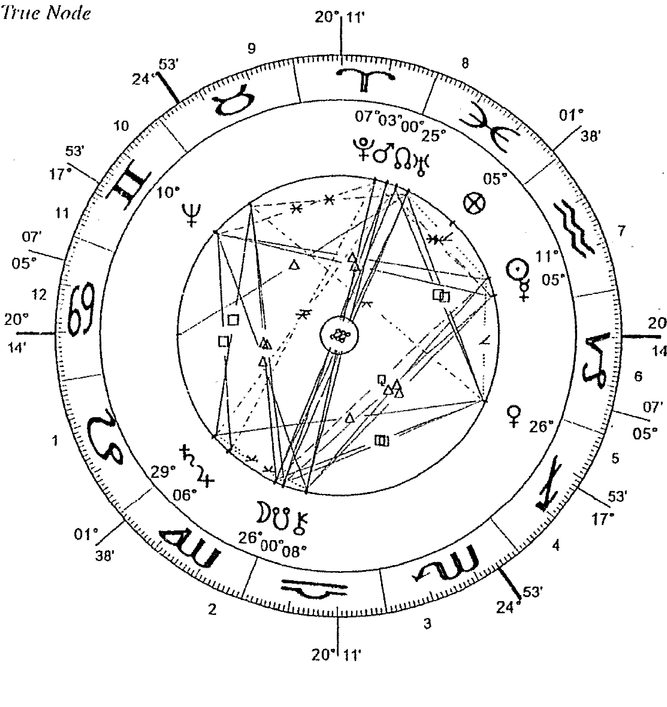

Inner/Across
Diana
Natal Chart
Jul 1 1961
7:45 pm BST -1:00
Sandringham, ENG
52°N50' 000°E30'

Outer/Down
Diana
Draconic Chart
Jul 1 1961
7:45 pm BST -1:00
Sandringham, ENG
52°N50' 000°E30'

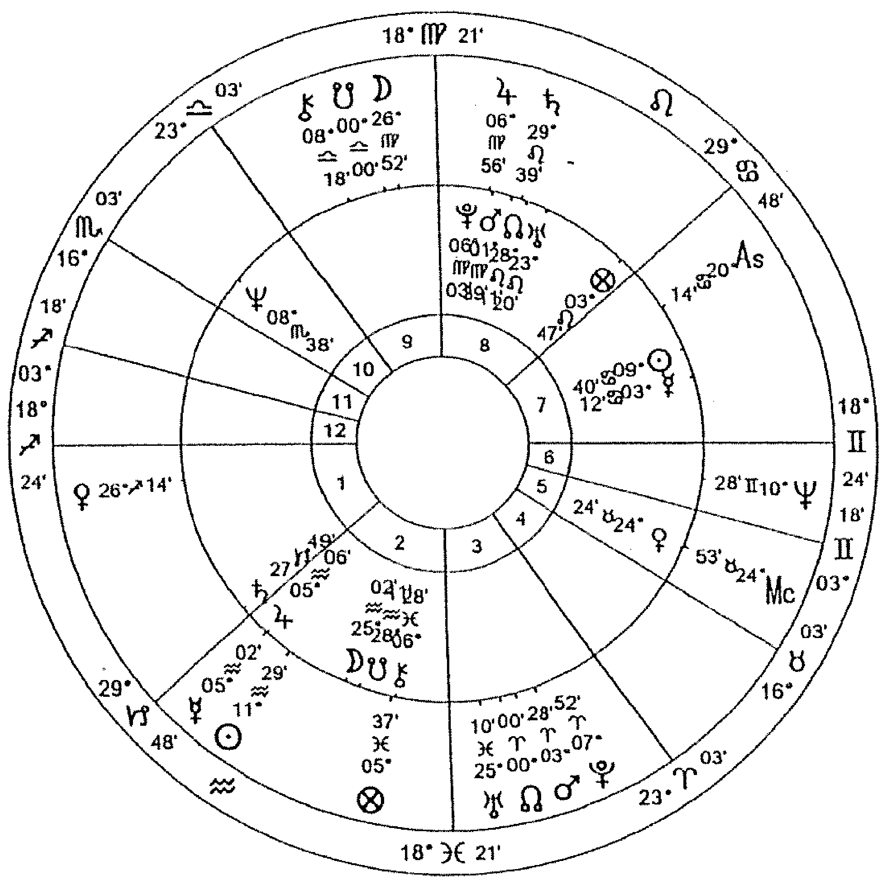

# 第十六章 其他流派

我們比較一下Diana王妃的Draconic盤和本命盤，重點如下：

- DrASC在未巨蟹20°13'(第3區間歸亥雙魚20°~30'於巨蟹座內)，本命7宮。
內在靈魂情感豐富(亥、雙魚)，家庭為重、佔有、情緒、嫉妒(未、巨蟹)，凸顯在夫妻、婚姻、合夥之事務上(7宮)。

- Dr⊙在子水瓶11°29'本命2宮。
無意識浮現對人道主義、社會關懷(子、水瓶)的價值觀(2宮)。

- Dr☽在巳處女26°52'，本命9宮。
深層情緒中遭逢心理失調、暴飲暴食、渴望生活步調穩定(巳、處女)，也潛藏著哲學宗教情懷(9宮)。

- Dr♄午29°39'☽ 子25°2'
內在靈魂潛藏著困頓、悲傷、限制或責任承擔(Dr♄)之無意識情境會影響世俗家庭、母親或一般女性或情感、情緒之不安或紛亂。

- Dr♄午29°39'♀/ASC/☿，甚為緊密。
前世因果業力甚強，難以掙脫，神秘、命定。

- Dr ♀子 5°2′ ♂♉子 5°6′
潛藏著思維、思想、理性或邏輯性(♀)能擴充、增強(♉)。

- Dr ♉巳 6°56′ ♂♊巳 6°3′
潛在意識想為自己或他人帶來改善，尤其是精神方面(♉)、卻不免有強迫性(♀)，反而隱含著操控不當的危機。

- Dr MC酉 24°53′ ♂♉酉 24°24′ 且 Dr ♀在本命 ASC 內潛在意識喜從事公眾、公開(MC)之人際關係(♀)，在現實生活也得以呈現。

潛在意識喜從事公眾、公開(MC)之人際關係(♀)，在現實生活也得以呈現。

## 中點理論(Midpoint Theory)

占星學的發展是全球性的，在20世紀初德國漢堡市一位占星家Alfred Witt(AD 1878-1941)創立了一套有別於西方占星學主流之外的中點理論，即著重黃道上的任何兩顆行星或敏感點如ASC、MC...等之中間點，它同時具有兩顆行星或敏感點的成份，若有其他行星會合或與中間點形成相位，常具有特殊意涵，如下圖

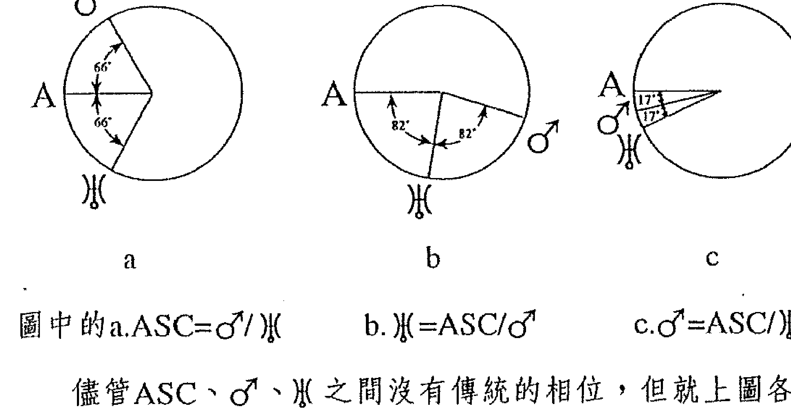

儘管ASC、♂、♆之間沒有傳統的相位，但就上圖各形成中點，以關鍵語表示ASC：人格、外觀，♂：意外，♆：突然，這3種中點皆可能突然發生意外。

Witt花費一生的精力研究中點理論，使用30°、90°、360°盤很快地掌握一系列的對稱的中點，以及過運、向運星體何時激發這些中點，讓事件產生。公元1913年他遇到Hamburg Kepler Circle的主席F.Sieggruen(AD 1877-1951)提供支援，才得以將他的創見充分發揮，並有一些學者加入，因在漢堡市一般尊稱他們為漢堡學派(Hamburg School)，在占星學歷史發展上綻放輝煌的成績，Witt除使用複雜的中點理論(在當時尚未有電腦，計算繁瑣)形成行星圖形(Planetary Picture)或稱中點樹，和8個假設性行星，儘管他想簡單化和合理化該學派的學理，但對照傳統主流的占星學似乎太急進、計算太繁瑣，故除在德國本土外，其他歐美地區未見回響。後來他一位弟子的兒子Udo Rudolph以Uranian System的名稱著書解釋該學派的理論內涵，所以漢堡學派又被稱為Uranian Astrology。

儘管Witt的理論在第二次世界大戰前不被重視，但他的另一位高徒為舉世聞名的Reinhold Ebertin(AD1901-1988)，出身德國著名的占星家族，在1940年出版中點理論最重要的書籍《The Combination of Stellar Influence》在戰後逐漸受到注目，更在1960年被譯成英文在占星學界大受歡迎，打響中點理論的名號。

在德國Ebertin於戰後採用宇宙生物學(Cosmobiology)名稱作占星學有系統的研究，以區別太陽星座專欄或其他娛樂性的占星節目，更在1956年成立Aalen Cosmobiological Academy獲得德國卓越的物理教授Rudolf.Tomaschek的加入，從事學術性的研究，外界冠以宇宙生物學派的雅號。

Ebertin發揚中點理論和行星線圖形，但對Witt的假設性行星不予採用，另外也未使用宮位系統，僅強調四個尖軸點ASC、MC、DSC及IC，這是與漢堡學派最大的區別，簡單實用，加上現代電腦科技之賜不會增加計算的繁瑣，反而更廣泛地流行，目前宇宙生物學派已是占星學研究的重鎮，而它的科學化精神更令人動容。

我們簡要地列出宇宙生物學派和一般現代占星學的基本差異。

| 宇宙生物學派占星學 | 一般現代占星學 |
| :--- | :--- |
| 宇宙圖(Cosmogam) | 天宮圖(Horoscope) |
| 星體(Stellar Bodies) | 行星(Planets) |
| 不使用後天宮 | 後天宮位是重點 |
| 困難相位(○ ∠ □ □ ♂ ♀) | 調和相位和不調和相位 |
| 行星圖形(Planetary Pictures) | 相位 |
| 強調星體的生命原理 | 強調相位的吉凶 |
| 圖形式星歷表 | 一般的星歷表 |

宇宙生物學派習慣以一個360°黃道圈按一般天宮圖排列行星、敏感點在黃道的位置作為內圈，再加上二個90°圈在外側，較大一個90°圈按啟動星座、固定星座、變動星座每30°順序排列，這樣有助於觀察該學派僅用之困難相位，而較小一個90°圈備而不用，或用來研究向運。

行星圖形即是中點樹(Midpoint Tree)，如下例(以45°圈表示)

### Midpoint Trees: Modulus 45°00′ Max Orb 1°00′
| Column 1 | Column 2 | Column 3 | Column 4 |
|----------|----------|----------|----------|
| \( \mars \) Orb \( \venus \) As \( 0^\circ 06' \) \(\square\) | \( \neptune \) Orb \( \mercury \) \( 0^\circ 04' \) \( \mars \) | \( \sun \) Orb \( \venus \) \( 0^\circ 34' \) \(\square\) | \( \saturn \) Orb \( \venus \) \( 0^\circ 36' \) \(\square\) |
| \( \mars \) Mc \( 0^\circ 08' \) \(\square\) | \( \moon \) \( 0^\circ 21' \) \(\square\) | \( \mercury \) \( 0^\circ 40' \) \(\square\) | \( \venus \) \( 0^\circ 41' \) \(\square\) |
| \( \mars \) As \( 0^\circ 10' \) \(\square\) | \( \mars \) \( 0^\circ 24' \) \(\square\) | \( \mars \) \( 0^\circ 42' \) \( \mars \) | \( \venus \) \( 0^\circ 43' \) \(\square\) |
| \( \venus \) \( 0^\circ 14' \) \(\square\) | \( \neptune \) Mc \( 0^\circ 33' \) \( \moon \) | \( \venus \) \( 0^\circ 42' \) \(\square\) | \( \venus \) \( 0^\circ 53' \) \( \mars \) |
| ... | ... | ... | ... |
| \( \venus \) Orb \( \venus \) \( 0^\circ 21' \) \(\square\) | \( \mercury \) Orb \( \venus \) \( 0^\circ 04' \) \(\square\) | \( \moon \) Orb \( \mars \) As \( 0^\circ 37' \) \(\square\) | \( \mars \) Orb \( \venus \) \( 0^\circ 19' \) \(\square\) |
| \( \mercury \) \( 0^\circ 33' \) \( \mars \) | \( \mars \) As \( 0^\circ 21' \) \(\square\) | \( \mars \) \( 0^\circ 39' \) \(\square\) | \( \venus \) \( 0^\circ 23' \) \( \mars \) |
| \( \saturn \) \( \venus \) \( 0^\circ 24' \) \(\square\) | \( \moon \) As \( 0^\circ 33' \) \(\square\) | \( \venus \) As \( 0^\circ 48' \) \(\square\) | |

### Midpoint Trees: Modulus 45°00′ Max Orb 1°00′
| Column 1 | Column 2 | Column 3 | Column 4 |
|----------|----------|----------|----------|
| \( \venus \) Orb \( \venus \) \( 0^\circ 02' \) \( \mars \) | \( \mars \) Orb \( \saturn \) \( 0^\circ 01' \) \(\square\) | \( \mars \) Orb \( \neptune \) \( 0^\circ 26' \) \(\square\) | \( \venus \) Orb \( \venus \) \( 0^\circ 33' \) \( \mars \) |
| \( \saturn \) \( \saturn \) \( 0^\circ 43' \) \(\square\) | \( \neptune \) \( \venus \) \( 0^\circ 06' \) \(\square\) | \( \venus \) \( \venus \) \( 0^\circ 33' \) \(\square\) | \( \venus \) \( 0^\circ 41' \) \(\square\) |
| \( \mars \) \( \saturn \) \( 0^\circ 55' \) \(\square\) | \( \neptune \) \( \saturn \) \( 0^\circ 15' \) \(\square\) | \( \venus \) \( \mars \) \( 0^\circ 43' \) \( \mars \) | \( \venus \) \( \venus \) \( 0^\circ 54' \) \(\square\) |
| \( \venus \) \( \venus \) \( 0^\circ 22' \) \( \mars \) | \( \neptune \) \( \venus \) \( 0^\circ 50' \) \(\square\) | | |
| \( \moon \) Orb \( \venus \) \( 0^\circ 03' \) \(\square\) | \( \mars \) Orb \( \mars \) \( 0^\circ 09' \) \(\square\) | \( \venus \) Orb \( \mars \) As \( 0^\circ 03' \) \(\square\) | \( \saturn \) As \( 0^\circ 19' \) \(\square\) |
| \( \venus \) As \( 0^\circ 03' \) \(\square\) | \( \moon \) \( 0^\circ 38' \) \(\square\) | \( \moon \) \( \venus \) \( 0^\circ 25' \) \( \mars \) | \( \venus \) \( 0^\circ 41' \) \(\square\) |
| \( \venus \) \( \venus \) \( 0^\circ 42' \) \(\square\) | \( \venus \) \( \venus \) \( 0^\circ 42' \) \(\square\) | \( \venus \) \( \venus \) \( 0^\circ 45' \) \( \mars \) | \( \venus \) \( \venus \) \( 0^\circ 41' \) \(\square\) |
| \( \mars \) \( \venus \) \( 0^\circ 51' \) \(\square\) | | | |

# 第十六章 其他流派

圖形式星曆表通常以45°圈表示，它可以一個圖形將流年預測的行星全部排列出來，方便研究各種狀況的匯集，如附圖為1992年4月1日～1994年3月31日，尹清楓的過運行星取♂後的行星，圖形的左邊0°～45°代表45°圈，它攸關所有困難相位 ⚜ 、 △ 、 □ 、 ☿ 、 ♂ ，圖形的右邊的♂為本命行星在45°圈位置，都以水平線表示，而圖中的斜線或曲線代表這兩年過運行星或過運行星的中點，因行星可能順行或逆行等變化故呈現曲線狀。

尹清楓的♂和♄是最凶的，♂/♄中點在1993年12月9日適逢 ♆ 、 ♆/♃ 及 ♃ 三條線經過，致使意外喪生於海上，♆意外、♃海上、昏迷、♂凶禍、♄死亡，這些組合相當明確指出就在該時間以♂碰撞在一起。

### 案例二十二

45'00'' Ephemeris for I - Natal Chart, Mar 31 1946, 11:00 pm, USZ6 -7:00 Geocentric Transits (Long: Mar 31 1992 to Mar 30 1994)

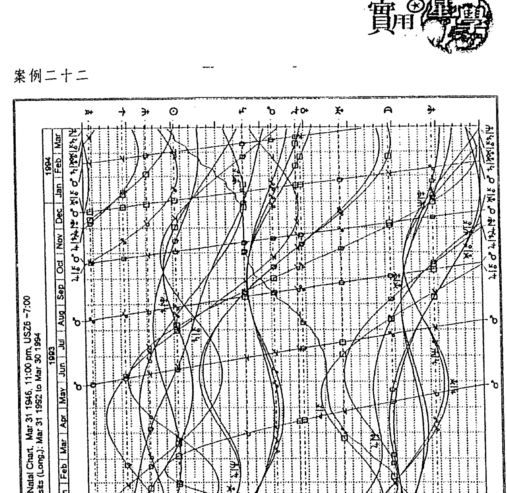

(297)


# 第十六章 其他流派

### 案例二十三 毛澤東

Natal Chart
Dec 26 1893 NS
7:30 am CCT -8:00
Siangton, China
27°N55' 112°E36'
Geocentric
Tropical
Placidus
True Node

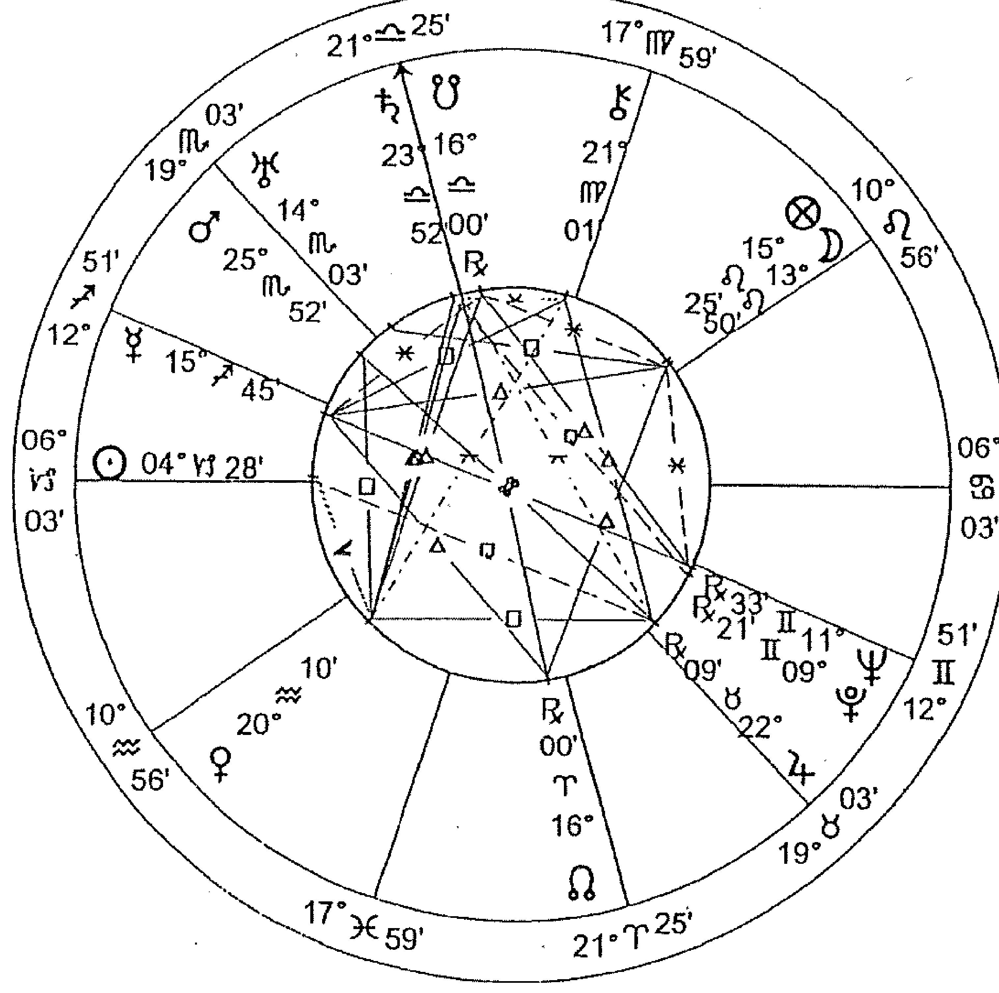

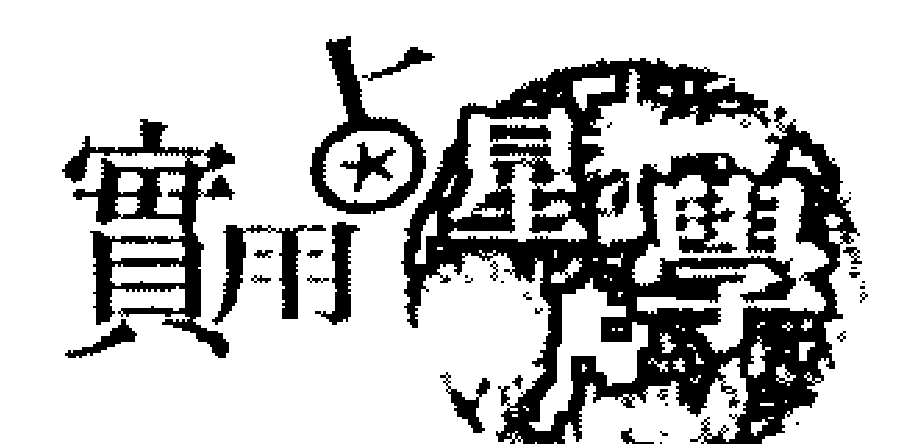

## 前中共國家主席毛澤東

### 我們舉其45°盤、容許度1°之重要中點樹說明

| 攷 | 容許度 | |
|---|---|---|
| ♀ | ○ | 0°17' | ○ |
| ☉ | ♃ | 0°23' | ∠ |
| ♂ | ♄ | 0°26' | ○ |
| ☿ | ♆ | 0°29' | □ |

攷係毛澤東的命主星(立命丑6°43')

-   1. ♀午13°50'，☉丑4°28'，♀/☉辰24°9'與攷辰23°52'，1°內會合○，僅差0°17'。
-   2. ☉丑4°28'，♃卯14°3'，☉/♃寅9°16'與攷辰23°52'，1°內∠ 45°半刑，僅差0°23'。
-   3. ♂卯25°52'，♄巳21°1'，♂/♄辰23°27'與攷辰23°52'，1°內會合○，僅差0°26'。
-   4. ☿申9°21'與攷辰23°52'，1°內□，135°半刑，僅差0°29'。

基本上這個中點樹係以攷/♄為重心，顯然倔強、固執、不屈不撓、忍耐、實行最困難的任務、能自我鍛鍊、自我否認、殘酷傾向、狂熱某種學說或信仰。

1.  攷=♀/☉

    根據Reinhold Ebertin《The Combination of Stellar Influences》：「內心壓抑或困難，感覺抑鬱，逐漸孤獨與人群孤離，很難與異性相處遭逢困頓、疾病、離婚」

    就宏觀而言，說明個人願意付出一生於某些類似煉金術的再The request was rejected because it was considered high risk到不合理的调波数，结果将相当荒谬，因而并未得到重视，但日本人石川源晃（H.M."Gen"Ishikawa）本身为电气工程师，对量子物理本身热络，也深入研究占星学，同时为美国占星学会AFA的资深研究员及英国占星学会AA的终身会员，1980年提出分割调波（Divisional Harmonics）的改进观念，并在1984年由AFA出版《Divisional Harmonics》。

## 石川源晃的分割调波重点如下

- 1. 对任一行星的分割数采用1+(a/360)，a为行星的本命黄道经度。
- 2. 振动星体为DHa = a × (1 + a/360)，若超过360°减之，直到少于360°。
    举例说明：◉在午14°黄道经度为134°
    DH◉ = 134° × (1 + 134/360) = 183°52'
- 3. 视论断情形可将DHa再乘以其他本命行星或敏感点，而成为一个DHa盘。
- 4. 任何行星皆可进行分割调波，类似上述过程。
- 5. 论断时需先分辨关键星（Key Planet），如政治事件为◉，财务金钱为♀，重大致命灾难事件为Vertex，爱情则是Pallas小行星。

# 第十六章·其他流派

## 案例二十五 陈进舆

Natal Chart
Jan 1 1958
12:30 pm CCT -8:00
T'aipei, TAIW
25°N03' 121°E30'
Geocentric
Tropical
Placidus
True Node

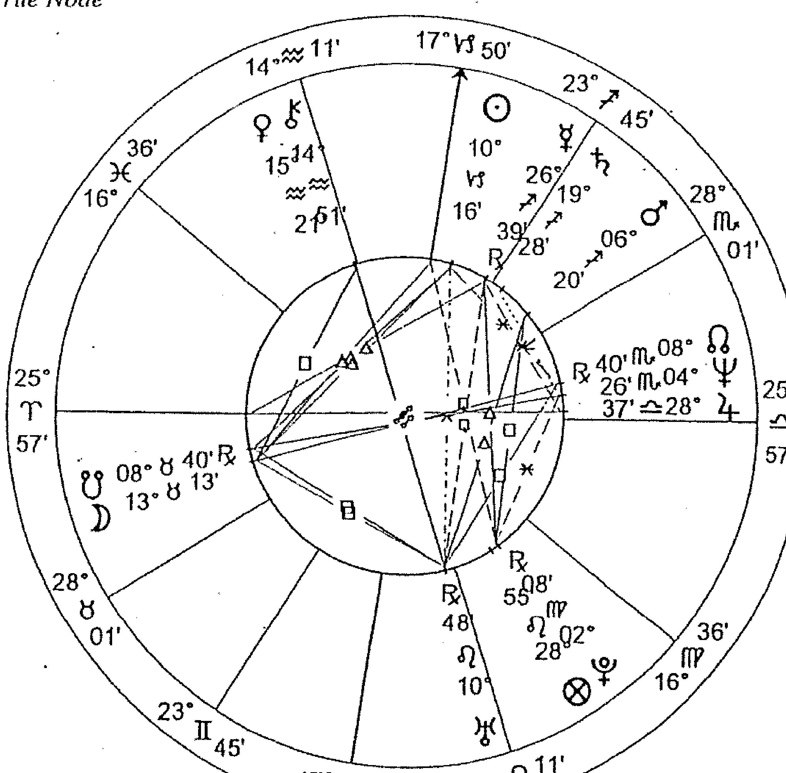

## 陈进兴

4th Harmonic Chart
Jan 1 1958
12:30 pm CCT -8:00
Taipei, TAIW
25°N03' 121°E30'
Geocentric
Tropical
Equal
True Node

Compliments of:-
Astrolabe Inc.
Box 1750
Brewster MA 02631
Web: http://alabe.com
Email: astrolabe@alabe.com

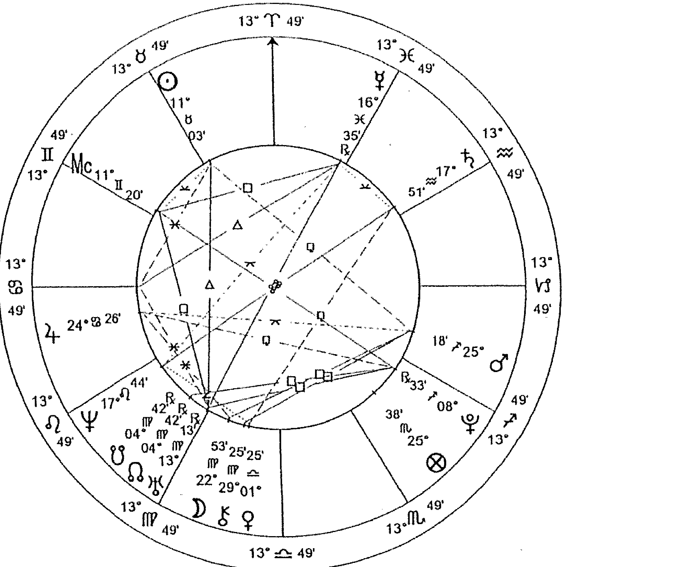

## 白晓燕案凶手陈进兴的H4泛音盘分析

### A.陈进兴本命盘特征

1. 火象最强，ASC在戌25°27'，命主♂寅6°20'，♄寅19°28'，♀寅26°39'R，♆午10°48'，故显现冲动、胆量足、阳刚、鲁莽、欠思虑、脾气火爆、过于激进、争强、易怒、不服输、独断、不考虑他人立场。
    - ① 尤其命主♂在8宫(性、死亡) □ ♀巳2°8'在5宫(男女)，对性及男女情感以粗暴、占有欲的方式呈现，美国占星家Sakoian & Acker合著《The Astrologer's Handbook》针对♂ □ ♀就说「这个90刑相会因为过度强烈的个性而引发危机，除非命盘中其他因素能够调和，否则这些人会以蛮力去征服他们欲望的对象」。陈进兴的♂在8宫，♀在5宫，更加凸显。
    - ② ♆在4宫与1宫内(☋酉8°40'R ☽酉13°13')及7宫☊卯8°40'R三刑会冲。

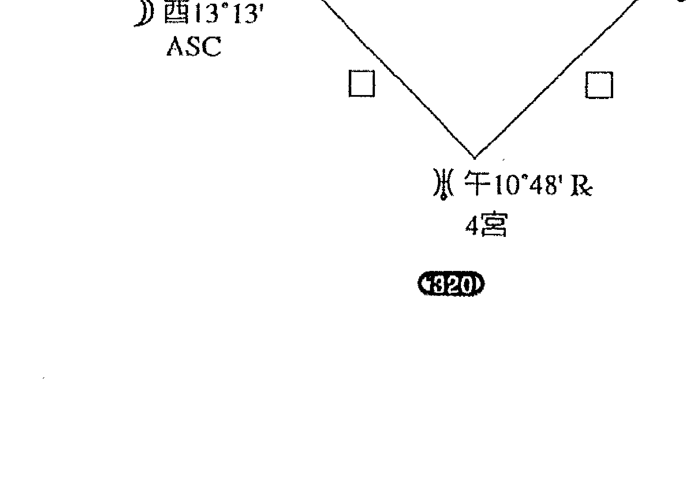

> （）□）的90°刑相Sakoian & Acker上引书也提到「他们一生中会出现来自外在环境的不幸、意外、疾病…等。这些不幸会与社会、天然灾难或家庭的不稳定有关。他们经常搬家，家庭可能因此会有各式各样的困扰而造成分裂。」根据新闻报道陈进兴的生父不详，自小就家庭破裂，由外祖母带大。
> ①，②的组合前引书也提到「命盘中带有痛苦经验的人会轻易发怒，变得暴力」

- 2. 命主星♂飞临8宫，本身性欲就强，又逢♃刑，顽固、占有、残酷、犯罪之倾向，♂又与♂呈三分吉相，但火爆脾气易起发。
- 3. ☽也与 (♃于14°51' ☌♀于15°21') 成90°刑□，♃心灵的创伤显然跟月亮有关，☽为母亲、家庭、情绪，☽ □ ♃也代表对女性的不满情绪或不尊重。
- 4. ☉在丑10°16'的映点为寅19°44'，正好与♄寅19°28'为1°内会合，就如同☉☌♄，前引书也提到「因为长期遭受的挫折，使得他们悲伤而且常自贬身价」
- 5. 4 辰28°37'的映点为亥1°23'，而反映点为巳1°23'正好与♀巳2°8'成1°内会合，就好像4☌♀，易因独裁、犯法而不受欢迎，如果情况严重使这些人永远受人排斥。
- 6. 命主星♂为区分外，即♂为夜间行星却落于阳性星座（寅、射手），白天出生位于地平线上，根据美国著名占星学者Robert Hand《Night & Day: Planetary Sect in Astrology》记载♂为区分外（Ex Cond），易呈现♂的凶性，虽白天能使♂活跃，但也加速♂的乾，因而较少情感，显现野蛮，若感情有所挫折时产生伤害、不幸和恶运。
- 7. ♀管辖爱情、性，也是区分外，因♀为夜间行星，落于阳性星座（子、水瓶），白天出生位于地平线上，前引书也指出，会产生性偏差，不知男女爱情的真谛。

### B.陈进兴的H4泛音盘特征

一般而言，H4泛音盘说明命主与外界相处，觉得需克服的问题，着重相关行星在H4的相位，其中90°最为重要，因在本命盘看不到相关行星的相位，却在H4看到它们的90°，表示潜在著危机，若又见三刑会冲，命主将会更为激进。

- 1. 盘中见♂寅25°18' □ )巳22°53'，容许度3°内。
    显然陈进兴内心深处潜藏着憎恨母亲、家庭的愤怒情绪。
- 2. ♂寅25°18' □ κ巳29°25'，容许度较宽。
    内心心灵创伤引动暴力、冲动、激进、独断、鲁莽。
- 3. )((巳13°13' □ MC申11°20'，容许度3°内。
    )((叛逆、革命、激进，MC为众注目，显然他潜藏激进、反社会之人格、不服管教、逞英雄、自以为是，无意识地引人注意他的存在甚或洋洋得意。
- 4. ☽/♇巳4°42'R □ ♀寅8°33'，容许度4°内。
    ☽/♇为前世业力，♃为冥府地狱，可联想他的因果业力甚为邪恶。

# 第十六章 其他流派

### 案例二十六 金镛

Natal Chart
Jan 21 1924
3:40 pm CCT -8:00
china, china
30°N30' 120°E42'
Geocentric
Tropical
Placidus
True Node

Compliments of:-
Astrolabe Inc.
Box 1750
Brewster MA 02631
Web:http://alabe.com
Email:astrolabe@alabe.com

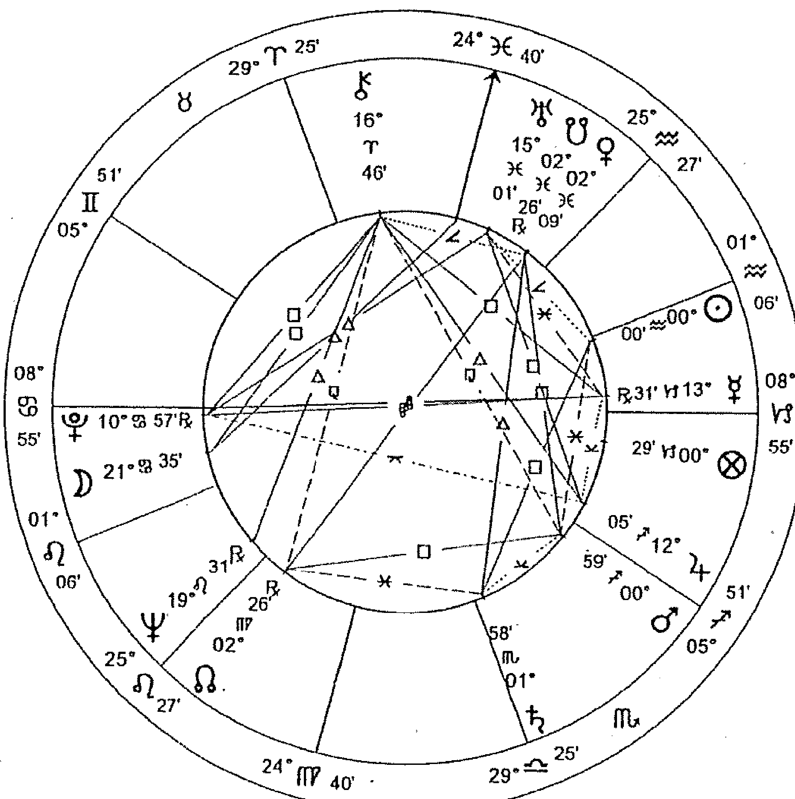

## 金铺

7th Harmonic Chart
Jan 21 1924
3:40 pm CCT -8:00
china, china
30°N30' 120°E42'
Geocentric
Topical
Equal
True Node

Compliments of:-
Astrolabe Inc.
Box 1750
Brewster MA 02631
Web:http://alabe.com
Email:astrolabe@alabe.com

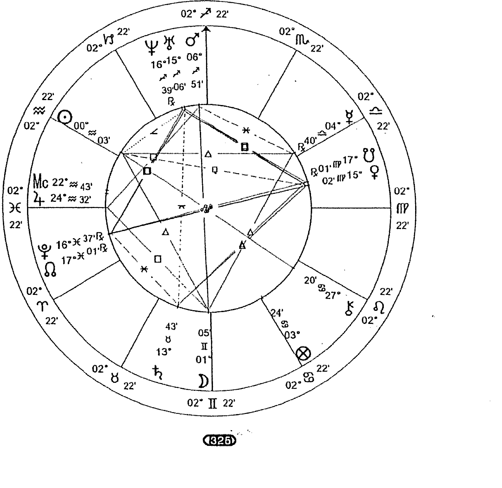

# ☆ 第十六章 其他流派

## 金镛的H7泛音盘分析

### A. 金镛的本命盘特征

1. 水象最强，ASC未8°55'，MC亥24°40'，☽未21°35'，♃未10°55'R，♆亥15°1'，☊亥2°26'，☿亥2°9'，♄卯1°58'，共有8个甚强，必然凸显水象特质，情感感受深、直觉力强、慈悲、怜悯、艺术气质、无意识洞察力，喜研究宗教、神秘、念旧、编写天份、天马行空。
    ASC在未，命主星☽在命宫120°△MC，且MC在亥，MC主星♃在寅入庙，较广地120°三合☿，及☋戌16°46'在MC形成大三角，⊗又位于ASC星座起算的始宫丑，格局佳，易凸显正面意义。
2. 命主星☽得偶然尊贵（在始宫）且必然尊贵（入庙），又120°△MC，☽管辖情感、母性、念旧、根源，故喜欢研究历史，别出新裁地将历史大事与武侠侠义结合，一系列小说成为武侠经典名著，本人功成利就也抚慰全球华人孤寂的心灵。
3. 水象的柔情并未泛滥，因♃正好浮升于ASC附近，刚毅、坚强、不服输、胸罗万斗、有谋略，与♃丑13°31'R 180°冲，且风象甚弱，大师给人的印象是口才不是便给，表达能力弱，与编写功夫似乎有些落差，☿主管沟通、语言、表达，它的逆行似可得到验证，而♃的霸气、不妥协也在大师的身上见得到。

## 实用占星学

4. 5宫为创作才笔在辰29°25'，5宫主星♀飞临亥2°9'入旺宫，也与命度未8°55'稍广地120°△，纤细、灵性、不世的才华令人惊艳。
5. MC在亥双鱼，其古典主星♃在寅12°5'入庙，与现代主星♆午19°31'形成较宽广的三合120°△，Sakoian & Acker的前引书提到「这是一个强烈神秘主义的三分相」，...「在所有三相当中，它算是拥有最宽广的世界了，一个无边界的想象空间，在其中，宗教、艺术、音乐、诗歌、戏剧的生命远比世俗的琐事来得活跃多了...。」
    ♃与10宫内♆形成120°△，精神世界的指导者或领导人。
    ♆与10宫内♃也形成120°△，具有高灵感与想象力。

### B. 金绣的H7泛音盘特征

- 1. 泛音数律中，4=2×2具努力与挑战的特性，9=3×3具备愉悦顺畅的特性，5是秩序和形式的特性，至于7则是神秘、不可思议。
- 2. ☉子0°3' △ ☽申1°5' △ ♀辰4°40'，大三角吉相，而☽与☉、♀之相位较紧密，内心深藏不可思议的各种面向的想象力，且能享受将它们结合一起所得的乐趣，☽ △ ♀自古即是智慧的表征，有能力将想像的虚幻世界透过心智将之文学化(♀)。

# 第十六章·其他流派

- 3. (水星寅15°6' 金星寅16°39'R) □ 木星亥16°37'R □ 火星巳15°2'，水星创新能力，金星想像、梦幻、神秘，木星洞察、掌握，金星美感、艺术，这些特质的组合，显示灵感启发的过程颇为艰辛(□)，历经内心深处的波涛，而得以获得甚大成就。

## 恒星学派占星学(Sidereal Astrology)

恒星学派强调恒星黄道的使用且颇为坚持，其代表人物是爱尔兰裔的Cyril Fagan（A.D 1896-1970），他写出多篇有关恒星黄道令人深刻的论文，并出版辩证的专书如《Primer of Sidereal Astrology》、《Astrological Origins》极力阐释西方占星学采用回归黄道是谬误的。他广泛搜集古代草纸记载和象形文字的内容，证明古代黄道的区间测度系参考恒星而得，如：

| 恒星 | 象徵 | 当时黄道经度 |
| :--- | :--- | :--- |
| 1. 毕宿五(Aldebaran) | 公牛的眼睛 | 金牛座15° |
| 2. 轩辕十四(Regulus) | 狮子的心脏 | 狮子座5° |
| 3. 角宿一(Spica) | 玉蜀黍的穗 | 处女座29° |
| 4. 心宿二(Anatares) | 天蝎的心 | 天蝎座15° |

其中1.2.4向来被称为4个皇冠恒星的其中三个，这是比希腊化时期更早的埃及及巴比伦人所使用的黄道。那么为何会有回归黄道的出现呢？Fagan指出托勒密《Tetrabiblos》的记载可得到答案。

> 「虽然没有黄道的原始开端，但因它是个圆圈，为了这个理由，「他们」假设春分点是所有的起始点」。

所谓的「他们」是指天文学史上第一位发现岁差的希腊天文学家Hipparchus的一位学生Posidonius（B.C 130-51）将春分点固定在白羊座0°，当时希腊占星学慢慢转趋成熟，有不少人采用这种方式，尤其是西方占星学最重要的人物托勒密也沿袭使用，在他的影响下，从此西方占星学就一脉相传使用回归黄道。在希腊化时期恒星黄道和回归黄道尚看不出有何差异，即使有差异，在仍属眼睛观测天象并未察觉或精算之，殊不知至今已历2000多年，根据Fagan推估岁差移行产生之差异，约71.5年移行1°，至其出书年代，两者已相差24°左右，这个数字足以颠覆传统强调星座背景的论述，如有一位命主出生时⊙在回归黄道白羊13°，若使用恒星黄道为双鱼19°，传统称⊙在戌入旺宫，得必然尊贵之一，若又系白天出生，又得三方性主星，也得外观（Face）区间之微力，所以⊙是有力的，但在双鱼却是外来的，必然的无力，两者的力量差异甚大。若Fagan的指证确实是如此，古典传统的占星学原理，恐令人质疑，但他的说法并未普遍得到西方占星学界的认同，一来无古资料无法充分举证，二来使用回归黄道的实证相当充裕，且它符合地球一年四季的变化。

Fagan的努力奋战甚少得到奥援，仅有他的学生1950年代在美国响叮当的Donald.A.Bradley（别名Garth Allan）（A.D 1925-1974）、英国的R.C Firebrace（A.D 1889-1974）和Rupert Gleadow（A.D 1909-1974）的呼应，虽人单势薄却也有不少涟漪，但遗憾的是恒星学派并未对星座标畿作深入研究，及比较恒星黄道的星座意涵和回归黄道的星座意涵，有何差异，而20世纪以来现代占星学强调星座的心理动机，星座为重要的论断项目。恒星学派可能是时间尚短，人力物力不够，无法作全面性比较研究，自然就得不到回响，东方的印度占星学虽一直使用恒星黄道，但着重事件吉凶预测，不与西方心理动机这玩意儿，星座在印度占星学的份量微小，故也难撷取引用。

Fagan和Bradley这对师徒鉴于上述之先天限制，乃努力于其他恒星系统的有效性，却有不错的成果，惟被西方占星学家将恒星学派视为如同印度占星学的强调事件预测。
他们相当用心于太阳回归和月亮回归的改良，强调须按岁差调整，经过实证统计得到蛮正面的效果，在这过程也发现星座和一般宫位制并非那么可靠，仅4个尖轴（始宫）附近的行星最具效应，后来他们讨论太阳回归或月亮回归就未列出后天宫。由于不用后天宫，且恒星黄道之意义未明，欲作完整解释必有欠缺，因而后来的恒星学派占星家结合其他系统，尤其是德国的宇宙生物学派，因他们也同样不强调星座和后天宫位。

恒星学派的太阳回归采岁差校正，故其太阳每年回归到本命太阳的位置之时刻和传统回归黄道之太阳回归到本命位置之时刻将不同，如美国前总统JFK的1963年恒星黄道的太阳回归时刻为1963年5月30日8:45:27Am，而回归黄道的太阳回归时刻为1963年5月29日4:54:36PM，依两者之个别时刻起盘，若考虑后天宫位，将完全不同。

恒星学派的主张在Fagan于1970年过世且以上所述的几位重要旗手都刚好在1974同年逝世后，似乎如风消逝，后继虽有人，但都未成气候，至今已甚少被提及。惟岁差校正之太阳回归和月亮回归却被误用，即坚持回归黄道的占星家有人以岁差校正之太阳回归和月亮回归来使用，根本是牛头不对马嘴。

20世纪末同属采用恒星黄道的印度占星学跃上欧美占星学论坛且愈来愈风行，应能宽慰这几位恒星学派占星家的灵魂，虽然印度占星学论述方法与他们的主张不同，但却见到完整的恒星黄道，他们的努力证明并不孤单。

## 案例二十七

Inner/Across
J.F Kennedy
Natal Chart
May 29 1917
3:00 pm Est +5:00
Brookline MA, USA
42°N17' 071°W07'

Outer/Down
J.F Kennedy
Solar Return
Precessed
May 30 1963 (±3 secs)
8:45:27am +6:00
Washsington DC, USA
38°N54' 077°W02'

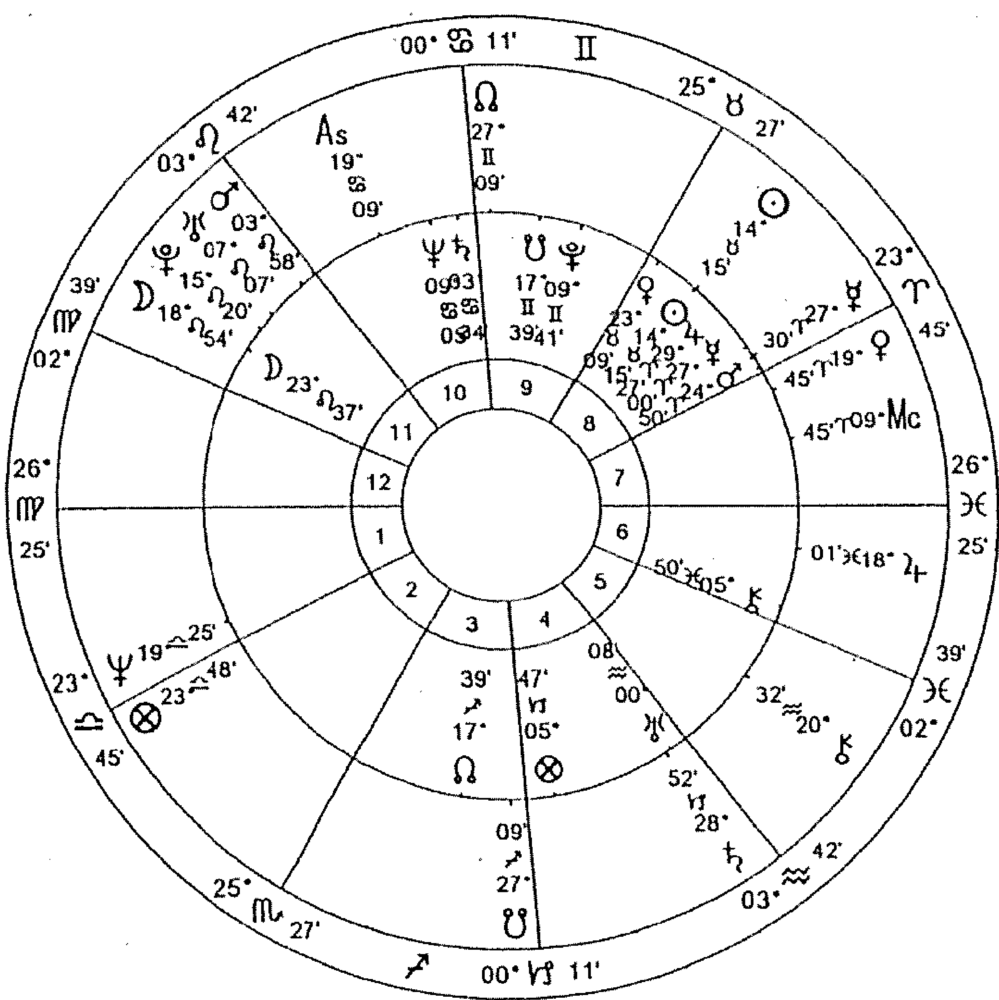

# 第十六章·其他流派

Inner/Across
J.F.Kennedy
Natal Chart
May 29 1917
3:00 pm Est +5:00
Brookline MA, USA
42°N17′ 071°W07′

Outer/Down
J.F.Kennedy
Solar Return
Precessed
Nov 10 1963 (±1 secs)
2:22:28 pm +6:00
Washsington DC, USA
38°N54′ 077°W02′

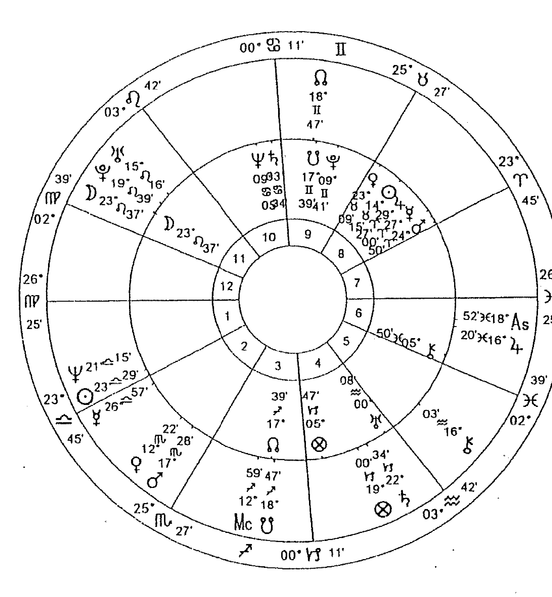

48349

## 实用占星学

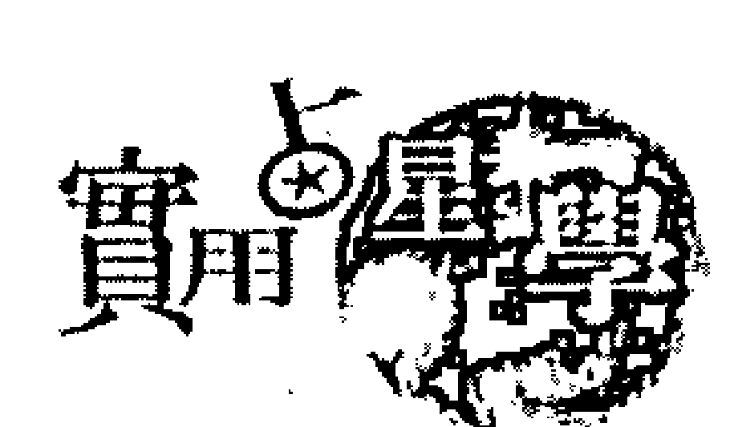

我们以美国前总统J.F Kennedy的恒星黄道和岁差校正之太阳回归流年，说明公元1963年11月22日他在美国德州达拉斯被暗杀枪击之星象特征，如前图，内圈为本命盘有关行星以R代表，外圈为太阳回归盘有关行星以SR代表。

- 1. ♀ SR 午15°20' □ ☉ R 酉14°15'，甚为紧密的刑剋，仅差1°5'。♀代表阴谋、组织犯罪、谋杀、残忍、报复、仇怨、黑社会、破坏再建设，而☉为生命力、权威、王权、政治、首脑人物；♀ □ ☉的凶象对JFK相当不利，如果考虑后天宫，☉ R在本命8宫，涉及生命死亡、威胁。
- 2. ♄ SR 丑28°52' □ ♀ 戌27°0'，甚为紧密的刑剋，仅差1°52'。♄代表悲伤、严肃、忧虑、悲观、限制、沮丧，♀为理念、思维、沟通、反应表达，因上升于巳处女，若考虑后天宫，♀为ASC主星位于8宫（死亡），而♄ SR位于本命始宫其刑剋力量较大，♄ □ ♀也带来生命威胁或死亡。
- 3. ♂ SR 午3°58' ⚹ ☿ R 子0°8'，亦属较紧密之冲，仅差3°50'。♂代表凶杀、意外、暴力、枪杀、打斗、冲突、犯罪、灾难；☿代表突然、分裂、革命、分离、震惊，☿在4宫依Bradley的说法，力量较强，♂ ⚹ ☿向来都是重大意外，带来震惊效果的行星组合。
- 4. ♄ SR 丑28°52' □ ♂ R 戌24°50'，仅差4°2'。♂、♄为传统两大凶星，其刑剋也隐含灾难，如果考虑后天宫，♂ R也位于本命8宫，管辖死亡。

The request was rejected because it was considered high risk## 第十七章·印度占星學與西洋占星學的比較

整個星座宮位制的各宮劃分十分簡單，各宮的宮主星相當明確，希臘早期發展的占星學採用的宮位制就是整個星座宮位制，所以印度占星學採用這種宮位制，更可證明東西方兩大占星學系統確曾交流過，即使至今已歷2000餘年，大多數的印度占星家仍採用這種宮位制。

Sripathi宮位制的方法跟西元AD3世紀Porphryy所提倡的宮位制相當雷同，祇不過Sripathi宮位制經同樣計算過程所得結果為各宮的中點，需要計算各宮的起始點及末端點，才是一個完整的後天宮。印度占星學所使用的分宮方法，就是整個星座宮位制，電腦軟體常以Rasi Chart稱之，而Sripathi常以Bhava Chart稱之。

印度20世紀中葉崛起的K.P (Krishnamurti Padhdhati簡稱K.P) 有別傳統主流的論斷方法，K.P創始者P.S Krishnamurti鑑於印度傳統占星學仍存有盲點，他結合27星宿將之細分為小區間，命主的ASC、MC及9大行星的度數，各有星座主星、星宿主星及區間主星，其意義自有不同。1960年代以後K.P系統頗獲印度高級知識份子喜愛，逐漸獲得重視。由於K.P採用西方古典的Placidus宮位制，該宮位制才比較在印度為人所知。

西方占星學自羅馬・阿拉伯中世紀一直到現代，都一直尋求較有效的宮位制，希臘占星學採用的整個星座宮位制是等宮位制的原始型式，但不能滿足占星家的需求，隨著時代推移天文知識豐富及數學的發明，仍得以使宮位制更多元化，有關宮位制的名稱、定義、特色請參酌拙著《占學:天宮圖的要素分析(上)》第三章之說明。

宮位制的創製說明西方占星家較富創意、挑戰，而印度占星家顯得傳統保守，西洋古典占星學比較喜歡採用Regiomontanus宮位制及Placidus宮位制。西洋現代占星學也創出不少宮位制，但仍以Placidus宮位制最受青睞，Huber學派堅持Koch宮位制。

## <VI>天宫图的要素: (i)星座(ii)後天宮(iii)行星(iv)行星狀態(v)相映或相位(vi)敏感點(vii)恆星

## (i)星座

### 1. 印度占星學

- ①黃道12星座配合特有的27星宿，頗富神話色彩。
- ②黃道12星座的名稱及用法係從希臘、埃及、波斯互相流傳而來，應注意部份地區不用摩羯座之名，另命名鰐魚，但意義幾乎雷同。
- ③星座分類成三方・四正如同西洋占星學使用的分類，即三方按四大元素，火、土、風、水劃分12星座；而四正則按季節劃分12星座。
- ④星座類化之人、事、物或特殊功能雷同西洋古典占星學。
- ⑤星座提供行星力量強弱的背景。
- ⑥星座各有一個主星與西洋古典占星學完全一致。
- ⑦星座非論命分析重點，因整個星座宮位制使然，每一星座即一後天宮，由於強調事件預測著重後天宮，往往忽略星座。
- ⑧27星宿增添行星、ASC及MC的特殊星象，這是西洋占星學所沒有的，27星宿如同黃道12星座，按特殊功能予以分類，這些功能結合印度地區之文化和社會風俗習慣。

### 2. 西洋古典占星學

- ①黃道12星座的名稱及用法大抵承襲巴比倫地區之迦勒底人的流傳。
- ②星座按四大元素劃分，而有三方，星座按季節關聯而有四正。
- ③星座類化人、事、物及特殊功能為卜卦重點。
- ④星座及星座內區間劃分行星力量的5種必然尊貴或無力，即廟、旺、三方性、界、外觀及陷、弱和外來的等狀態的區別，係西洋古典占星學的重點項目。
- ⑤星座各由一行星主管，係太陽系排列順序的自然結果；行星的吉凶也因托勒密相位關係而衍生。
- ⑥星座非論命分析的重點，扮演背景因素而已。

### 3. 西洋現代占星學

- ① 黃道12星座的名稱與古典的名稱完全相同。
- ② 黃道12星座各具容格無意識心理學的原型象徵。
- ③ 相當著重星座與四大元素的對應，細膩地分析四大元素的心理動機、背景與潛能。
- ④ 星座的三方、四正與古典的分類完全相同，但更著重三方四正交叉組合所呈現命主的人格特質。
- ⑤ 不強調行星在星座或星座內區間的力量，偶會說明旺、衰。
- ⑥ 星座主星除傳統安排外，再加上現代三王星的安排。
- ⑦ 星座提供紮實的心理動機，故星座分析是西洋現代占星學的重點項目。

## (ii)後天宮

### 1. 印度占星學

- ①後天宮12宮管轄事項與西洋古典占星學的管轄事項約75%相同，就一般所熟知的西洋占星學而言，印度占星學下列各宮管轄項目為差異較大的。
    - 2宫: 右眼、口才、雄辯、教育、說謊傾向、家庭成員、食物、飲料。
    - 3宫: 勇氣、膽量、冒險精神、精緻藝術如音樂、舞蹈、戲劇、右耳。
    - 4宫: 汽車、舒適、享受、正規教育、學歷。
    - 5宫: 前世業力、聰明、才智。
    - 6宮：敵人、負債、意外受傷、競爭者、嫉妒的人。
    - 7宮：居住國外、死亡。
    - 8宮：慢性疾病、入獄監禁、負債、破產。
    - 9宮：父親、幸運、前世業力。
    - 11宮：偏財、年長的兄姊。
    - 12宮：消耗、床上之性歡娛、外國人、左眼。
- ②後天宮的分類與印度哲學人生四大目標：法、利、欲、解脫有關。
- ③後天宮也分成始宮、續宮、果宮，但較少討論這種分類。
- ④後天宮細分成始宮(1、4、7、10宮)，三方宮(1、5、9宮)，成長宮(3、6、10、11宮)，困難宮(6、8、12宮)，死亡殺手宮(2、7宮)，中性宮(2、12宮)，各有特色。
- ⑤由④衍生出主管各宮主星形成特有的功能性吉星和功能性凶星，影響判斷之結果，這是西洋占星學所沒有的。
- ⑥後天宮各有一個徵象星如4宮主管母親，其宮位徵象星☽，故論母親不僅須考量4宮及4宮主星之狀況外，尚須觀察☽之狀況。
- ⑦後天宮為印度占星學論斷人生事項的重要核心。
- ⑧後天宮活盤轉化可推論其他親屬的各種人生事項。
- ⑨根據Bhava Bala及Ashtaka Varga技巧分別計算後天宮位的力量強弱輔助判斷。

### 2. 西洋古典占星學

- ①後天宮劃分成始宮、續宮、果宮。行星在始宮力量易凸顯，在果宮不利。在術語上，為偶然尊貴或偶然無力之一種，其中在1、10宮最強，在12宮最弱。
- ②如同印度占星學一樣後天宮的6宮，8宮，12宮為凶。
- ③某些後天宮若有特定行星位臨稱之為喜樂，如木星在11宮為喜樂。
- ④後天宮為論命、問事的核心。
- ⑤後天宮活盤轉化可推論其他親屬的各種人生事項。

### 3. 西洋現代占星學

- ①以命主自我看整個天宮圖，後天宮的各宮為命主心理意識在人生不同領域的呈現，如3宮管轄溝通或與手足之間的對待關係，而非如印度占星學和西洋古典占星學論手足的狀況。
- ②不強調事件吉凶，僅著重命主各宮的心理潛能，因而後天宮的功能被模糊了，甚至德國發展的中點理論更僅強調天宮圖4個頂點ASC、MC、DSC、IC而已，其他各宮並未論及。
- ③行星在後天宮無所謂強弱、吉凶。
- ④將後天宮分類類比四大元素、半球、象限，也同樣著重心理意識的呈現。
- ⑤無所謂的後天宮活盤轉化。

## (iii)行星

### 1. 印度占星學

- ①行星僅採用☉、☽、♂、☿、♃、♀、♄、☊、☋，不用近代發現的三王星♅、♆、♇。
    ※但討論時事占星學大多將♅、♆、♇納入，又也有部分占星家討論本命時主張將三王星納入，然它們的主管星座卻又莫衷一是，甚或不談所臨星座的力量。
- ②特別重視月亮所在星宿及月亮所在星座，並依此建立身宮盤作為輔助判斷。
- ③行星的分類，具有陰陽、自然吉凶、賦予五大元素、三德性及配合醫療占星所演伸的特性，其中太陽被視為一般凶星，這點跟西方系統相當不同。
- ④行星類化人、事、物雷同西洋古典占星學的內容，又配合印度特有的風俗民情的內容，可作為卜卦占星、擇日占星、時事占星及本命占星之用。
- ⑤命主出生時間的年、月、日、時各有一個主管行星。

### 2. 西洋古典占星學

- ①18世紀前僅採用人類肉眼可看得見的太陽、月亮、☿、♀、♂、♃、♄、☊、☋，當時尚未發現三王星♅、♆、♇。
- ②特別重視太陽所在星座。
- ③行星的分類具有陰陽、吉凶、晝夜區分，賦予純質料與體液的對應，成為醫療占星的重要內容。
- ④行星類化人、事、物成為論命、卜卦、時事、擇日的論斷用途。
- ⑤無所謂出生時間的年、月、日、時各有一個主星，但卜卦、醫療、擇日則強調用事時刻的時主星。

### 3. 西洋現代占星學

- ① 採用⊙、♂、♀、♃、♄、☽、⚳、⚴及三王星Neptune、Uranus、Pluto，部份占星家增添小行星如凱龍星Chiron，而德國漢堡學派又多出8顆假設行星。
- ② 特別重視⊙所在星座，係生命力、權力、能力的顯現。
- ③ 行星具有陰陽分類，其他涉及吉凶的甚少論述。
- ④ 行星的類化以字訣表示，演繹出心理層面的意義。
- ⑤ 無所謂出生時間的年、月、日、時各有一個主星。

## (iv)行星狀態

### 1. 印度占星學

- ① 相當重視行星的力量計有Shad Bala (6種力量)、Vimshopak (20點力量) (行星在各分宮的力量) 以及經由Ashtaka Varga (行星的8種力量來源)，細膩地觀察行星在天空的狀況，給予力量的權值作為重要判斷依據。
- ② 行星所在星座的主星稱為定位星，對該行星具有影響力，強調互容的重要。
- ③ 行星在星座的力量，強調旺宮、三方旺宮、自己的星座及弱宮顯示行星的強弱。
- ④ 行星之間形成友誼、敵意、中立關係，進而衍生行星與星座也有上述關係。
- ⑤ 行星除了具有自然吉凶性質外，也會因特定ASC星座衍生出功能性吉凶性質，這項特性並未出現在西方系統。
- ⑥ 行星的逆行有時會帶來正面能量，不似西方系統都以負面評估。
- ⑦ 行星在特定宮位可能有不同的能量呈現，稱之為方向力量，dig bala，如⊙、♂在10宮，☽、♀在4宮，♃、♄在ASC、☋在7宮。
- ⑧ 行星之間尚有行星戰爭或圍攻的狀況。
- ⑨ 行星在星座的前面、中間或末端各有不同的力量，如同嬰兒、青壯、老年的比擬。
- ⑩ 行星忌逢⊙焦傷，各行星各有一定度數範圍與⊙會合，才算逢焦傷。
- ⑪ 強調☽滿月時之吉祥及暗月時之凶惡。
- ⑫ 不強調個別行星與恆星之會合吉凶，已由27星宿概括。

### 2. 西洋古典占星學

- 1. 相當重視行星在黃道的位置所產生的力量，稱為必然的尊貴或無力，和行星在天宮圖的特定宮位所產生的力量為偶然尊貴或無力的一種。
- 2. 行星所在星座的主星稱為定位星對該行星具有影響力，強調行星的容納及互容的重要。
- 3. 行星在星座的力量強弱分成廟、旺、三分性、界、外觀等5種必然尊貴及弱、陷、外來的等必然無力。
- 4. 行星在特定宮位可能有不同的能量呈現，最忌在12宮，其次為8宮、6宮易呈現凶象，最喜在始宮，尤其是1宮、10宮。
- 5. 行星逆行必帶來負面能量，一律論凶。
- ⑥ 行星與◎接近的情況分成三種，即
    a. 在太陽光束下
    b. 逢焦傷
    c. 在◎的核心，前三者a、b為凶，第3者c則為吉。
- ⑦ 行星的運行速度快為吉，慢為凶。
- ⑧ 月亮增光期即從朔到望為吉，月亮減光期從望到朔為凶。
- ⑨ 行星的相態即♂、♄、♃ 東出為吉，☽、♀、☿ 西入為吉，反之為凶。
- ⑩ 行星與吉恆星會合增吉，與凶恆星會合則凶。

### 3. 西洋現代占星學

- ① 強調行星在天宮圖的4個敏感點即ASC、MC、DSC、IC的重要性。
- ② 已將行星所在星座之主星即定位星概念予以忽略，甚至不談。
- ③ 行星在星座的力量祗有廟、旺、陷、弱，也將三王星納入，但不特別強調這種星座力量。♀旺於水瓶，不同於印度及西洋古典的旺於處女。
- ④ 行星逆行會帶給命主內省或能量退縮。
- ⑤ 行星與◎接近之狀態不予考慮。
- ⑥ 行星在特定宮位不分吉凶，祗說明該宮心理意識。
- ⑦ 行星之間的關係祗論及特定角度的相位關係，並以此論及可能的心理潛能。
- ⑧ 不強調月亮增光或月亮減光。
- ⑨ 無所謂行星的相態。
- ⑩ 甚少論及吉凶恆星。

## (v)相映或相位

### 1. 印度占星學

- ①以整個星座(即宮位)論相映，除了行星之間論相映，行星對宮位也可論相映，即使是空宮。
- ②所有的行星皆相映至對宮，另♂、♃、♄、☊、☋各有相映的宮位。
    a. ☉、☿、☽、♀、♂、♃、♄、☊、☋皆相映至其本身起算的第7宮。
    b. ♂尚相映至其起算的第4宮、第8宮。
    c. ♄尚相映至其起算的第3宮、第10宮。
    d. ♃、☊、☋尚相映至其起算的第5宮、第9宮。
- ③相映尚分成 a.全部相映 b.部分相映，但實務上b較少使用，另外有c相互相映，d單方相映，c頗為重要。
- ④相映功能的詮釋以相關行星的吉凶性質來論。
- ⑤無容許度的觀念，但受西方系統的影響，強調距離愈小，關係愈緊密。
- ⑥相映的計算採黃道秩序方向，並未如西方系統順逆算皆可的方式。

### 2. 西洋古典占星學

- ①希臘化時期以整個星座論相位，但中世紀後已採取容許度較嚴謹地論述相位。
- ②主要以主相位☌、☍、□、△、⚹，開普勒的次要相位並不普及。
- ③中世紀以後已採容納、互容，入相位與離相位，光線傳遞和光線集中，圍攻、挫敗、禁止…等類似相位的特殊用法。
- ④相位功能的詮釋是以形成相位的行星為主角，相位為配角。
- ⑤以行星本身來論容許度。
- ⑥任何行星皆可順逆算相位，但與希臘化時期強調的左旋、右旋的意義不同。

### 3. 西洋現代占星學

- ①任何行星和特殊點、敏感點在特殊容許度內皆可互成相位，未顧及行星之星座。
- ②主相位和次相位並行。
- ③已不復見中世紀類似相位觀念的特殊用法，但發展出中點理論的用法，及平行相位的應用。
- ④發展出重要相位型態且成論斷的要點。
- ⑤以相位的調和及不調和論吉凶，即以相位為主，行星為輔。
- ⑥任何行星、特殊點、敏感點皆可順逆算相位。

## (vi)敏感點或特殊點

### 1. 印度占星學

- ①因採整個星座宮位制，對天宮圖的ASC、MC、DSC及IC 4個敏感點的論述，不似西方系統那麼重視。
- ②有經特殊計算的數學點並非如行星一樣實體存在，稱之為Apraksha Grahos或副行星Sub Planets，因增加占星家的負擔，故甚少在實務中使用。
- ③西方系統中著名的希臘點或稱阿拉伯點，在北印度常用的太陽迴歸流年盤(Varsha phala)出現，稱為Sahams，即經ASC或其他宮位始點經度所計算的敏感點，但因不用在本命天宮圖，所以並未被全面認同。
- ④討論財富與貧窮的兩個對應的敏感點Yogi和AvaYogi較被注目。

### 2. 西洋古典占星學

- ①希臘化時期使用希臘點頗為頻繁且成為重點之一，更後由阿拉伯人發揚光大，而被稱為阿拉伯點。
- ②幸運點⊗按命主出生於白天或夜晚分別計算。

### 3. 西洋現代占星學

- ①幾乎已不使用阿拉伯點，僅保留幸運點。
- ②幸運點的計算不分命主白天或夜間出生。

### (vii)恆星

1. 印度占星學：相當重視ASC、MC及各行星在27星宿的位置及意義，未刻意強調與個別恆星之1°內會合之吉凶。
2. 西洋古典占星學：特別強調ASC、MC、⊙、☽及其他行星與個別恆星1°內會合之吉凶，各恆星有其特性。
3. 西洋現代占星學：甚少採用恆星。

## (viii)天宮圖的型式

### 1. 印度占星學

共分為 a.北印度占星天宮圖 b.南印度占星天宮圖 c.東印度占星天宮圖

(a) 北印度占星天宮圖

- 1. 圖中的數字係黃道星座代號，按逆時針數黃道秩序。
- 2. ASC永遠定在天頂位置。
- 3. 其他後天宮則如黃道秩序時針順數各宮。

(b) 南印度占星天宮圖

- 1. 圖中星座固定，將處女座永遠定在右下角，相對地雙魚座定在左上角，黃道秩序的星座採順時針方向。
- 2. ASC則以"//"雙斜線註明。
- 3. 其他後天宮則如黃道秩序順時針順數各宮。

(c) 東印度占星天宮圖

- 1. 圖中的數字係黃道星座的代號，按逆時針數黃道秩序。
- 2. 啟動星座固定在四正位，其他四偶則由固定星座和變動星座分別佔據。
- 3. ASC星座通常會註明Lagna或ASC。
- 4. 其他後天宮則如黃道秩序逆時針順數各宮。

### 2. 西洋古典占星學

- 1. 西洋古典占星學的天宮圖採方型圖形。
- 2. 星座順序採逆時針方向。
- 3. ASC在東地平線。
- 4. 圖中所列數字I、II、......XII代表後天宮宮數，按逆時針順數。

### 3. 西洋現代占星學

- 1. 西洋現代占星學的天宮圖採圓型圖形。
- 2. 星座順序採逆時針方向。
- 3. ASC在東地平線。
- 4. 天宮圖的4個敏感點ASC、MC、DSC、IC易辨認。
- 5. 圖形旁的阿拉伯數字為各後天宮的代號，按逆時針順數。

## (ix)本命論斷

### 1. 印度占星學

- ①以印度占星先賢Maharishi Parasara《Brihat Parasara Hora Sastra》簡稱《BPHS》的內容作為論述判斷要點，成為主流觀點影響印度占星學甚為深遠。由於印度向來不重視歷史，M.Parasara屬那一年代之人莫衷一是。

#### ② Parasara主流论断方法

- a. 掌管轄宮位及宮內行星、宮主星飛佈，他們相互的關係。
- b. 管轄宮位或事項的徵象星應掌握它在那一宮位。
- c. 建立相關事項的分宮圖，確認相關事項的吉凶結果。
- d. 天宮圖內的許多行星組合稱為Yoga是印度占星先賢的智慧結晶。

#### ③ 除Parasara主流观点外，尚有Maharshi Jaimini《Jaimini Sutras》的观点，使用的天宫图要素与Parasara的一样但判断方式相当不同，一般印度占星家常用來作辅助判断。

#### ④ 20世紀後K.S Krishnamurti鑒於印度傳統的論斷仍不夠完美，他創立以27星宿為主，將原本的每個星宿再按Dasa每行星掌管年數之比例細分成9個小區間，每個小區間的主管行星如同Dasa比例及順序稱為Sub，相當細膩地分別出ASC及MC之不同，可供時間校正。

# 第十七章 印度占星學與西洋占星學的比較

在論斷人生事項有許多管轄行星 (Ruling Planets)，從這些相關涉的行星中，找出最貼切的，可分析出事件產生的原因及結果，再透過Dasa / Bhukti / Antara 大運/流年系統以及過運Transit指出應期時間。

這套系統簡稱K.P系統，其論斷事實上是結合本命與卜卦在一起，由於頗具科學邏輯推論，目前已逐漸獲得注目。

南印度Tamil地區有套獨特的預測方法稱為Nadi Astrology，據稱求算的人若命定式地屆時找到這些占星家，驗對拇指紋(男右女左)即能從相關的棕櫚葉上記載之梵文而得知求算的人一生命運、六親、事業、財運起伏變化，如斯嚮應，令求算之人訝異萬分，這種情景類似中國鐵板神算之驚奇，祇不過Nadi Astrology不用計算任何人的命運，在4或5仟年以前，就已被印度先賢記載在棕櫚葉上。

日本科學怪傑天外伺朗《開拓未來他界科學》記載日本人青山圭秀的求算親身經歷，「首先對照拇指之指紋以辨認本人，結果找出有記載青山先生之椰子葉(即棕櫚葉)，連其父母之姓名、自己的兄弟，乃至自己以往的經歷完全一致，令人心生恐慌。...其內容也記載青山先生34歲時會到此...

### 2.西洋古典占星學

①從托勒密的《Tetrabiblos》奠定占星學基調，後經阿拉伯人保存擴充再回到西歐。13世紀Guido Bonatti《Liberastronomicus》彙總阿拉伯占星的精華，成為中世紀重要的占星學內容，到17世紀英國William Lilly《Christian Astrology》將古典占星學發揮得淋漓盡至，它的內容即是西洋古典占星學的精髓。

### ②論斷方法

- a. 相關事項的管轄宮位及宮內行星，該行星與那一行星形成吉凶相位，那一行星為那一宮位主星論相關影響的人、事、物。
- b. 相關事項的管轄宮位及宮主星飛臨那一宮位，與那一行星會合或形成吉凶相位。
- c. 各相關涉的行星皆須一一判斷其所在先天位置(星座)及後天位置(後天宮位)的力量。

### 3.西洋現代占星學

①仍使用傳統的天宮圖要素加上現代三王星⛢、♆、♇或小行星，賦予心理、哲學的意義。

### ②論斷方法

- a. 經由天宮圖各行星及相關敏感點所在星座之三方四正屬性，形成特殊人格特質。
- b. 各宮始點星座都是各人生事項的原型，所以它顯示命主對該領域的心理對待。
- c. 宮內行星也是原型是命主無意識地直接顯現該領域的意識。
- d. 宮內行星與其他行星之任何相位是一種情結，類比兩個不同的心理要素的組合，會形成緊張或和諧，因而可追溯它們的原因。

③20世紀德國發展出漢堡學派和宇宙生物學派的中點理論。

④1930～40年代美國教堂之光發展Astrodyne以數值計算行星、宮位、星座的力量論述命主的各項人生議題。

⑤英國的John Addey創立數律圖更科學化分析命主的潛質。

⑥瑞士Huber夫婦發展獨特的Huber學派強調生命時鐘的概念。

## (VIII) 大運·流年

## (i) 大運

①印度占星學的大運系統Dasa舉世聞名，但因歷史攸久衍生出，不同種類的Dasa，我們列出較常被討論的。

- 1. Vimshottari Dasa
- 2. Yogini Dasa
- 3. Kalachakra Dasa
- 4. Ashtottari Dasa
- 5. Shodashottari Dasa
- 6. Panchottari Dasa
- 7. Sata-samaa Dasa
- 8. Chatura Sheethi Dasa
- 9. Dwispathi Dasa
- 10. Shashtyabda Dasa
- 11. Shata-thrimsath Dasa
- 12. Chara Dasa
- 13. Sthira Dasa
- 14. Kendra Dasa
- 15. Kaaraka-grahotha Dasa
- 16. Brahmagraha Dasa
- 17. Mundooka Dasa
- 18. Shoola Dasa
- 19. Yogardha Dasa
- 20. Phrag Dasa
- 21. Trikona Dasa
- 22. Rasi Dasa
- 23. Pancha-swara Dasa
- 24. Pinda Dasa
- 25. Amsaja Dasa
- 26. Naisargika Dasa
- 27. Ashtavarga Dasa
- 28. Sandhyaa Dasa
- 29. Paachaka Dasa
- 30. Thaara Dasa

其中又以Vimshottari Dasa最令全球占星家赞赏，所以它几乎是等同印度占星学的Dasa，而Yogini Dasa则是辅助判断。

② Vimshottari Dasa的特色是取古印度圣人认为人类清心寡欲，按法生活最起码可达120岁，Vimshottari即120之意，印度占星学使用的9颗行星之每一行星皆管辖一定时间，且按管辖27星宿顺序排列，☉: 6年，☽: 10年，♂: 7年，♃: 18年，♄: 16年，☊: 19年，♀: 17年，☿: 7年，⚹: 20年，共120年。这些行星管辖期间称之为主要期间(major period)。在每一主要期间又细分9个次要期间(Sub period)，第一个次要期间由该主要期间主管行星担纲，其余按上述主要期间管辖行星的顺序排列，每一次要期间的期限按主要期间管辖期限予以比例计算，如♂在任何次要期间都占7/12，♃ 18/12，其他依此类推，次要期间的梵文名称Bhukti，一般占星家主要以Dasa/Bhukti表示。又也将Bhukti再按上述过程细分次次要期间minor period但实务上甚少使用。

根据命主出生时☽所在星宿即能计算一生的Dasa/Bhukti的顺序表列。

③印度占星学认为Dasa/Bhukti是命主天宫图征象之力因果的成熟显现，所以欲分析Dasa/Bhukti务必充分掌握主要/次要管辖行星在天宫图所显现的吉凶如何，即能知道Dasa/Bhukti应期，直接且明快令人惊奇。

### 2. 西洋古典占星学
- 1. Greek Time-Lords希腊的时间主星法
- 2. Decennia Time-Lords Decennia时间主星法
- 3. Greek/persian Firdaria希腊/波斯Firdaria
- 4. planetary period行星期间法

### 3. 西洋现代占星学
- 1. 台湾何鼓先生发表月相大运法但并未引起回响。

## (ii) 流年

### 1. 印度占星學

①使用Dasa/Bhukti頗具成效，故無印度獨特的流年系統，僅有與阿拉伯占星學交流的太陽迴歸法稱為Varhaphala，但印度所發展的同樣取◎每年迴歸到命主出生時◎位置之時刻起盤但判斷流年之吉凶卻迥異於西方系統，它的方法複雜許多。

- a. 須掌握迴歸盤的5個重要因素
  - i. Muntha及其定位星
  - ii. 年主星(Lord of year)
  - iii. Asc主星
  - iv. 本命Asc在迴歸盤的位置
  - v. ◎在迴歸盤的後天宮位
- b. 針對一年期間按Dasa概念計算每一行星主管月、日期間
- c. Tri-Pataki Chakra (三方羅盤圖)
- d. 行星組合(Yoga)
- e. Sahams類似西洋古典占星學的阿拉伯點。

②也採用Transit(過運法)作為天宮圖徵象引發的觸媒，但與西方系統頗為不同，因印度占星學採整個星座宮位制及相映，行星過運易引動，乃設計出以本命月亮所在(即身宮盤)不同行星在它的不同宮位會有不同的吉凶效果，如◎在◑起算的3.6.11宮為吉，除此之外另設計吉凶效果會因其他行星正好過運到相對之宮位而取消，如◎過運至◑起算的3宮為吉，但若有♂過運到☽起算的5宮，其吉象被取消。

這套過運系統比西方系統複雜，且須配合Ashtaka Varga才能準驗。

### 2. 西洋古典占星學
- ①主限向運法(Primary Direction)
- ②次限推運法(Secondary Progression)
- ③太陽迴歸法(Solar Return)
- ④太陽弧向運法(Solar Arc Direction)
- ⑤小限向運法(Profection)

尚有論及流月的方法

- ①太陰迴歸法(Lunar Return)
- ②次限推運法的流月

也強調過運法Transit作為引發天宮圖徵的觸媒。

### 3. 西洋現代占星學

- ①主要以次限推運法論流年。
- ②太陽迴歸法及太陰迴歸法。
- ③英國占星家H.Troinski創立參限推運法(Tertiary Progression)但並未引起占星學界特別注目。
- ④美國占星家C.C.Zain創立次要推運法(Minor Progression)
- ⑤逐漸強調單獨以過運法論述。
- ⑥德國的宇宙生物學派以太陽弧向運法論流年。

有關西洋古典占星學及西洋現代占星學之各項大運或流年、流月系統之內容請參閱本書第6章流年預測占星學的相關內容。

## (IX) 其他分支

有關其他分支的內容比較我們不談，僅就兩大系統列出其名。

| 印度系統 | 西方系列 |
| --- | --- |
| 1. Prasna (卜卦) | Horary (卜卦) |
| 2. Muhurta (擇日) | Election (擇日) |
| 3. Ayurvedic (醫療) | Medical (醫療) |

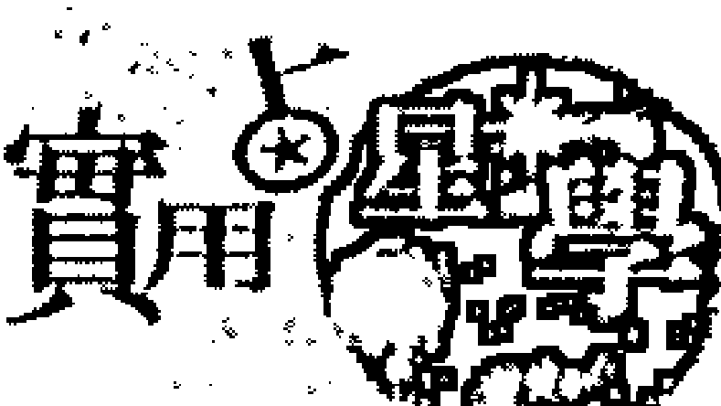

# 第十七章 印度占星學與西洋占星學的比較

## 案例二十九

Natal Chart

Aug 27 1936

8:00 pm CCT-8:00

Xian, CHINA

34°N15' 108°E52'

Geocentric

Lahiri

Whole Signs

True Node

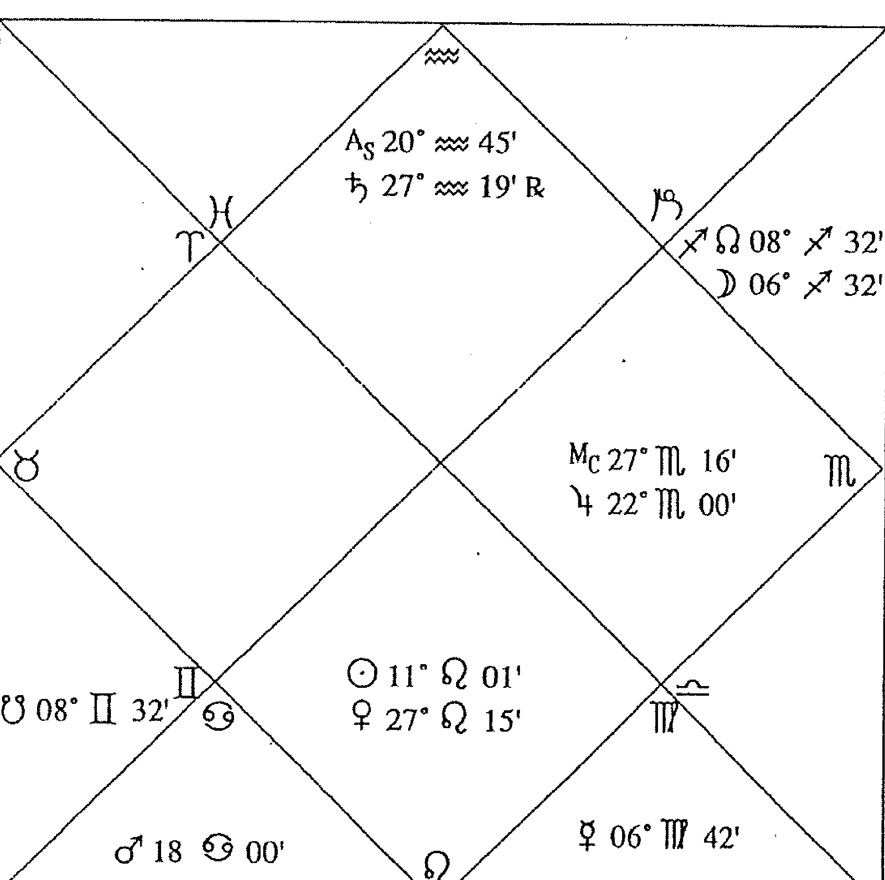

## DASAS & BHUKTIS-Lahiri Zodiac

| Symbol | Date | Number | Symbol | Date | Number |
|--------|------|--------|--------|------|--------|
| ☿/♉ | Aug 27 1936 | 0.0 | ♋/☉ | Sep 21 1975 | 39.1 |
| ☿/♃ | Mar 10 1937 | 0.5 | ♂ | Mar 22 1976 | 39.6 |
| ☿/♄ | Feb 14 1938 | 1.5 | ♂/☊ | Aug 18 1976 | 40.0 |
| ☿/☿ | Mar 26 1939 | 2.6 | ♂/♃ | Sep 6 1977 | 41.0 |
| ♀ | Mar 22 1940 | 3.6 | ♂/♄ | Aug 13 1978 | 42.0 |
| ♀/☉ | Jul 23 1943 | 6.9 | ♂/☿ | Sep 21 1979 | 43.1 |
| ♀/☽ | Jul 22 1944 | 7.9 | ♂/☿ | Sep 18 1980 | 44.1 |
| ♀/♂ | Mar 23 1946 | 9.6 | ♂/♀ | Feb 14 1981 | 44.5 |
| ♀/☊ | May 23 1947 | 10.7 | ♂/☉ | Apr 16 1982 | 45.6 |
| ♀/♃ | May 23 1950 | 13.7 | ♂/☽ | Aug 22 1982 | 46.0 |
| ♀/♄ | Jan 21 1953 | 16.4 | ☊ | Mar 23 1983 | 46.6 |
| ♀/☿ | Mar 22 1956 | 19.6 | ☊/♃ | Dec 3 1985 | 49.3 |
| ♃/☿ | Jan 21 1959 | 22.4 | ☊/♄ | Apr 28 1988 | 51.7 |
| ♃ | Mar 22 1960 | 23.6 | ☊/☿ | Mar 4 1991 | 54.5 |
| ♃/☽ | Jul 10 1960 | 23.9 | ☊/☿ | Sep 21 1993 | 57.1 |
| ♃/♂ | Jan 8 1961 | 24.4 | ☊/♀ | Oct 9 1994 | 58.1 |
| ♃/☊ | May 16 1961 | 24.7 | ☊/☉ | Oct 9 1997 | 61.1 |
| ♃/♃ | Apr 10 1962 | 25.6 | ☊/☽ | Sep 3 1998 | 62.0 |
| ♃/♄ | Jan 27 1963 | 26.4 | ☊/♂ | Mar 4 2000 | 63.5 |
| ♃/☿ | Jan 9 1964 | 27.4 | ♃ | Mar 22 2001 | 64.6 |
| ♃/☿ | Nov 15 1964 | 28.2 | ♃/♄ | May 10 2003 | 66.7 |
| ♃/☿ | Mar 22 1965 | 28.6 | ♃/☿ | Nov 21 2005 | 69.2 |
| ♄ | Mar 23 1966 | 29.6 | ♃/☿ | Feb 26 2008 | 71.5 |
| ♄/♂ | Jan 21 1967 | 30.4 | ♃/♀ | Feb 1 2009 | 72.4 |
| ♄/☊ | Aug 22 1967 | 31.0 | ♃/☉ | Oct 3 2011 | 75.1 |
| ♄/♃ | Feb 20 1969 | 32.5 | ♃/☽ | Jul 22 2012 | 75.9 |
| ♄/♄ | Jun 22 1970 | 33.8 | ♃/♂ | Nov 21 2013 | 77.2 |
| ♄/☿ | Jan 21 1972 | 35.4 | ♃/☊ | Oct 27 2014 | 78.2 |
| ♄/☿ | Jun 22 1973 | 36.8 | ♄ | Mar 22 2017 | 80.6 |
| ♄/☿ | Jan 21 1974 | 37.4 | ♄/☿ | Mar 25 2020 | 83.6 |

# 第十七章: 印度占星學與西洋占星學的比較

## 印度占星學命盤解析：連戰

## <一>格局：

吉祥的Yoga愈多愈高，尤其是Raja Yoga及Dhana Yoga

- 1. 3個(含)以上的行星位於自己的星座或旺宮
占在子水瓶位於ASC（占在自己的星座），⊙在午、獅子位於7宮相映，♀在巳、處女位於8宮。
- 2. 9宮在辰天秤，宮主星♀位於7宮相映ASC，即9宮主星（三方宮）位於始宮7宮內，此即Raja Yoga，且♀又為自然吉星。
- 3. ASC主星 占位於子自己的星座，受9宮（辰）主星♀相映，稱為Laksmis Blessings，富有之徵。

## <二>各宮分述

1. ASC在子，宮內有占位於自己的星座，Jame S.T. Braha《Ancient Hindu Astrology for the Modren Western Astrolager》（以後簡稱AHA）p88. 謂命主將是位領導者，且將有很高的社會地位，他將富有、壽命長（占為壽命自然主星）行為良好、謙虛，易生在富有家庭，起步比別人好，但映至7宮，夫妻關係稍受影響。占保守、嚴謹、LKK、較難取悅，受♀相映，甚佳，♀同時為4宮（酉）田宅及9宮（辰）之主星，受到父母庇蔭甚多（4宮為母親宮，9宮為父親宮），尤其⊙雖屬一般凶星，但利政治、權力，⊙位於獅子為自己的星座在7宮相映，有利政治生涯，得到權威、領導者或父親之照應，惟♂在6宮相映，亦見困頓之時。

2. 2宮管轄口才、財富、飲食、基本教育，以財富累積為要。
2宮內無星，但宮主星♃飛臨10宮，力量增強且相映至本宮2宮亥(♃相映至自己起算之5宮、7宮、9宮)甚吉，尤其♃又為11宮(大偏財)寅之主星。10宮為官祿利名，而2宮為财，故連戰一生名利兩得，令人稱羨。♃在卯天蠍為友谊星座，僅受♄相映之刑剋(♄位於ASC相映至自己起算的3宮、7宮、10宮，但♄位於自己的星座，不受刑剋太凶，且5宮(申)主星♀入8宮巳(遺產)相映，♀在巳入旺宮，遺產豐富。

3. 3宮管轄兄弟姊妹、勇氣、冒險精神，...等
3宮內無星且宮主星(戌)♂位於6宮未巨蟹入弱宮，甚凶，無兄弟姊妹之徵，(連戰為獨子，完全沒有兄弟姊妹)；6宮為敵人，命主的勇氣落入弱宮且是敵人、競爭之宮位，有人說連戰係太平宰相，無力抗衡競爭；一生平順但在第一次競選總統即慘敗收局，故♂在未入弱宮於6宮，是他一生的痛，大運進入Dasa/Bhukti值♂期間，慘敗。

4. 4宮管轄母親、土地、房地產、舒適、車輛、學歷等。
4宮在酉金牛，宮內無星，宮主星♀入7宮相映至ASC及♂，父母多庇蔭、擁有大筆土地、財富，但♀為自然吉星為始宮主星，有些凶象，故落人口實。

5. 5宮子女、投機、才華、智商...等。
5宮在申雙子，主星☿入於8宮巳旺宮，有利股市投機。
論子女數，5宮內有♃及♆在11宮相映，且宮主星☿在巳入旺，故子女數應有4個以上，連戰共有4位子女二男二女，其☽、♆為陰性行星，而♃為陽性行星，而☿為中性視會合而定，因♃及♆在印度占星學皆屬凶星，其子女身體健康不佳。

6. 6宮管轄疾病、小人、敵手、競爭...等
6宮在未，宮內見♂凶且入弱，不利與人競爭，形成他永遠的痛。6宮管轄腸吸收消化之功能，在未，故連戰的胃腸恐不佳，防胃炎、胃液倒流、腸發炎...等。

7. 7宮管轄配偶、合作對象、國外居住...等。
7宮在午獅子，⊙位於宮內，Jame T. B. 《AHA》稱此種配置易有雙妻命，男宮內見♀，配偶美麗有氣質，但♂相映至7宮及⊙、♀，命主必然是大男人傾向，♀係4宮及9宮主星，配偶有暗助之力。

8. 8宮為凶星，不幸、災難、意外、倒斃、負債，但亦屬他人錢財、遺產。
8宮在巳處女，宮主星☿位於旺宮，凸顯其吉祥之一面，且未見其他凶星刑剋，故命主之壽命應屬長壽，凶象不見，遺產豐碩。

9. 9宮為吉宮，父親、宗教、道德、學問、高等教育，是印度占星學最重要的宮位。
9宮在辰天秤，宮內無星，宮主星♀入7宮形成一個Raja Yoga,故命主學問好可獲高學歷，父親助益甚深；與⊙會合但未見焦傷相映至ASC及命主星♄,按印度占星學說法，前世業力甚佳方有此生之福報。

10. 10宮為官祿、名位、社會認同、企業經營、政治及政府事務。
10宮在卯天蠍，宮內見大吉星♃且相映至2宮，利財富累積及6宮部屬，待部下佳，然10宮受6宮內之♂相映刑剋（♂相映至自己起算的4、7、8宮）更應證對手虎視眈眈其名位，♂亦為10宮之主星惟在6宮未是凶象。

11. 11宮希望、願景、目標、大偏財，...等。
11宮在寅，宮內見☋及☊，☋處於漸滿月之時（即農曆11日），印度占星學認為它為吉利有助11宮事務，☊雖凶星屬財富之星，但恐來源受議論。

# 第十七章 印度占星學與西洋占星學的比較

11宮主星在10宮相映至2宮自己星座亥，故有大偏財之得，惟♂在5宮相映為凶，須防子女不當支出或管理而損失。

12宮宮為禁慾、退隱、精神鍛鍊、消耗...等。12宮在丑，宮內無星，但♂在6宮相映，恐難靜下心來，12宮主星♂入命在自己的星座，不致消耗太多。

# 第十八章 中国七政四余占星学

中国的占星学在隋唐之前独特地发展出自己本身的系统，但都着重在军国大事、政治、气候、灾变、农事、祭祀...等方面。从有史记载的尧、舜、禹时代到西周时代就已发展中国的占星学，《尚书·尧典》：「在璇玑玉衡，以齐七政」，即当时就懂得用天文仪器—璇玑玉衡来观察日、月、水、金、火、木、土等七星（七政），这不仅仅是为了农耕，应也有天象神秘因素对人世间事务的因果关系进行探索之意。历代部族或氏族领袖都相当重视天象的观测，任命世代承袭的史官专责，继往开来一代一代地传承，这是中国占星学得以发展的重要原因，《礼记·月令》：「乃命太史司天日月星辰之行」即可明证。影响中国占星学甚钜的《史记·天官书》作者司马迁更追溯自己的家族血统源自高辛氏帝喾时代的天官重、黎，他们也是历史上著名的天文观测家羲、和的祖先。

历代史官的「观乎天文，以察时变」几乎都在供帝王统治审时度势之用，即所谓「以纪吉凶之象，圣王所以参政」自然而然地以国政大计为要，《史记·天官书》所记载的占辞全部围绕在这方面的项目，后来历代官方编修正史中的《天文志》或《五行志》都属同性质，北周庾秀才《灵台秘苑》、唐李淳风《乙巳占》及印度来华的瞿昙悉达《开元占经》都雷同，若按西方占星学的分类应属于时事占星學的內容，只不過這些星象資料和時事對應都採條列法形成經驗式的歸納，並未如西洋占星學採特殊天象的時刻或迴歸時刻起盤系統性地推論。我們舉資料相當豐富的《晉書·天文志》記載天變史傳驗事之一為例，惠帝元康二年二月，天西北大裂，按劉向說：「天裂陽不足，地動陰有餘，是時人主（惠帝）昏瞽（瞽：目眩.昏庸之意），妃後專制。

中國占星學屬軍國大事的內容及判斷方法約可整理如下：

## I. 認識三垣：二十八宿諸星的名稱類別、性質

A. 三垣：紫微垣、太微垣、天市垣
1. 紫微垣：以北斗星為中心集合北斗七星及其周圍諸星組成的星區，紫微垣像一座皇宮由至高無上的天帝太一及太子、王后等構成一個皇室家族，並由各種臣僚組成藩衛機構如同一個王朝，對應於人世間的王室朝廷。
2. 太微垣：位於紫微垣下的18個恆星群組成以五帝座為中心，象徵諸侯。
3. 天市垣：位於天市垣下的17個恆星群組成，以帝座為中，象徵聚眾交易物資流通。

B. 二十八宿：東方青龍·北方玄武·西方白虎·南方朱雀每方7宿共28宿

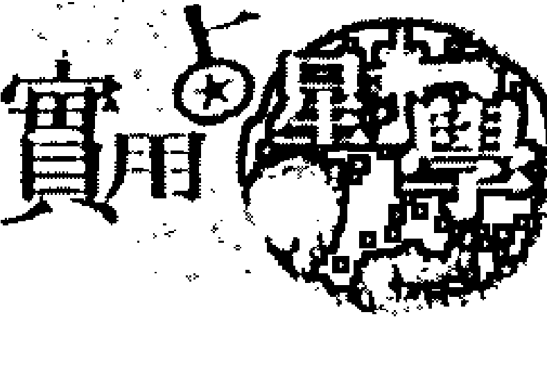

1. 東方青龍：角木蛟、亢金龍、氐土貉、房日兔、心月狐、尾火虎、箕水豹。
2. 北方玄武：斗木獬、牛金牛、女土蝠、虚日鼠、危月燕、室火豬、壁水貐。
3. 西方白虎：奎木狼、婁金狗、胃土雉、昴日雞、畢月烏、觜火猴、參水猿。
4. 南方朱雀：井木犴、鬼金羊、柳土獐、星日馬、張月鹿、翼火蛇、軫水蚓。

每一星宿都由數顆恆星組成，少則二、三個，多則20幾個，是否按赤道座標測量的，尚有爭論。

每宿選一亮星作為標準星稱為距星，任何宿內恆星測量都根據這顆距星，又28宿的每宿不等距，即它們以黃道或赤道來劃分並不像本書第3章所述印度占星宿之27宿為等距每宿13° 20′。

> 《史記·天官書》曾記載28宿與中國地區的對應，此即著名的分野理論，係春秋戰國時代各國興衰與天空訊息的重要聯繫，後來秦始皇統一後逐漸形成各地區的災異對應。

## II. 掌握諸行星日、月、水、火、金、木、土等七政的運行規律、各自特性及人事特定範圍。

1. 日，積陽之熱，氣生火，火氣之精為日。日者，陽之主也，應人君，不宜遮掩無光。
2. 月，群陰之家，天地之陰者水也，水精為月。月者，眾陰之長，應王后、大臣、諸侯。
3. 水，又名辰星，因離太陽不超過30°，古人把周天分為十二辰，一辰30°，故把水星稱為辰星，以資記其特性。
4. 金，又名太白，是眾星之中最亮之行星，故稱為太白。
5. 火，又名熒惑，熒熒象火紅，光度常見、變化運行、常順逆行，令人迷惑，稱為熒惑。
6. 木，又名歲星，它運行一周天約12年，古先賢將一周天分成12次，木星如同一年行一次，方便年歲時間計算，故稱歲星。
7. 土，又名鎮星或填星，土星約28年行一周天，假想每年運行一宿，如鎮在星宿或填一宿，故稱為鎮星或填星。

古人將五星各賦予五行名稱，且28宿各宿皆各有五行，顯然是想透過陰陽五行學說來探討星象的吉凶。

各行星的吉凶劃分不像希臘占星學透過太陽主管的獅子座，及月亮主管的巨蟹座所衍生整個星座之托勒密相位來論各主管星座主星的吉星。但其中認為火星熒惑較具破壞性、戰爭、瘟疫...等重大災禍之徵象。

各行星彼此之間的會合有其特殊意涵，如五星連珠，漢高祖入秦，五星聚井宿，但並非都是吉象，變化不一。


又各行星的視運動會產生逆行(退)、停滯(留)之現象，以及運行比平時快(疾)或比平時慢(遲)，或逢太陽焦傷(伏)，這些徵象都有星占的特殊涵意。

上述七政所產生的特殊狀況如日食，月食等現象，以太陽為例計有日冠、日戴、日珥、日抱、日背、日直、日交、日提、日格、日履紅纓、日中鳥見、日瑀、日食...甚多現象，尤以日食為重。

## III. 觀察各種變星如流星、客星、妖星、彗星的各種狀況都有其感應

1. 流星，夜空中一劃而過轉瞬即逝之星。
2. 客星，如天文學的新星或超新星，原先星區不見的新星像客人出現一樣，不祥居多。
3. 妖星，五大行星變化所產生的變星，形狀不一，必然帶來災禍。
4. 彗星，如哈雷彗星，基本上與上述1.2.3常重疊。

## IV. 當上述I.II.III等要素互相交感，來判斷應何地區、何種徵象。

至於中國占星學何時朝向命理學發展?從大陸·江曉原博士《天學外史》、《天文西學東漸集》及大陸·薄樹人教授編《中國天文學史》的敘述，可判斷應是在魏晉南北朝，印度占星學隨著大量佛經東傳後結合中國本土的陰陽五行學說慢慢地醞釀發酵，而在隋唐開花結子，我們可以舉幾個證據說明中國七政四餘與印度占星學的關聯。

1. 黃道12星座的名稱出現在中國是隋《日藏經》、唐《宿曜經》傳入後才見到的，雖然中國也有類似12次的稱呼，但兩者名稱及意義完全不同，應知道黃道12星座是重要因素之一。
2. 上述之《宿曜經》記載黃道12宮，各宮有一主管行星，如下圖

| 巳 (雙女宮) | 午 (獅子宮) | 未 (螃蟹宮) | 申 (夫婦宮) |
|---|---|---|---|
| 水 | 日 | 月 | 水 |
| 辰 (秤量宮) | | | 酉 (金牛宮) |
| 金 | | | 金 |
| 卯 (蝎蟲宮) | | | 戌 (白羊宮) |
| 火 | | | 火 |
| 寅 (人馬宮) | 丑 (磨竭宮) | 子 (寶瓶宮) | 亥 (雙魚宮) |
| 木 | 土 | 土 | 木 |

這項內容是中國七政四餘命理學相當重要的項目，因命宮主星及其他宮主星是論斷的要素。黃道12宮主星也同樣在佛經東傳之前，未在中國本土發現過。

3. 中國七政四餘命理學命宮的訂法為印度占星學命宮定法的最簡單型式，前者不考慮出生地點，僅以太陽所在黃道12宮起生時順數至卯所在之黃道12宮即是命宮。由於印度占星學採整個星座宮位制，在一般情形，若係日出卯時，所得命宮結果不致差異太大。
4. 命宮定出後，即按逆時針方式列出後天12宮，這個步驟中、印皆同，除了第12宮中國定名為相貌宮，而印度定名不幸宮，名稱和意義略有差異外，其他11宮完全相同，同樣地在印度占星學未東傳前，也未在中國本土發現。
5. 中國採用羅睺及計都完全是印度占星學的同名稱同性質之隱曜。
6. 中國七政四餘命理學的重要賦文《西天聿斯經》幾乎95%是印度占星學內容及論斷方法，其中5%摻雜中國的28宿和神煞。
7. 中國七政四餘命理學各派強調的身宮概念，完全移植自印度占星學以月亮所在位置稱為月亮身宮盤 Chandra Chart的概念，儘管琴堂派以逢西安身論身宮，然果老派或耶律派的身宮取法和Chandra Chart一模一樣。
8. 東海大學哲學系酆芷人教授在《陰陽五行及其體系》第10章陰陽五行與中國祿命法，提出果老可能是 Horo的音譯，Horo是天宮圖Horoscope的簡稱，亦即果老星宗或七政四餘命理學源於印度或西方系統甚明。

中國七政四餘命理學發展的過程曾有三個重要派別，其主張差異如下表

| 重要派別 | 論斷要旨 | 宮主 / 度主 / 身宮 |
| :--- | :--- | :--- |
| 果老派 (張果星宗) | 七政四餘正氣為主 | 重度主，以月為身 |
| 耶律派 (耶律學士星命秘訣) | 十干化曜變氣或稱化氣 (祿、暗、福、耗、蔭、貴、刑、印、囚、權)配子平六親於五星內) | 重度主，以月為身 |
| 琴堂派 (琴堂五星總斷) | 四柱干支考五星虛實於宮度 | 重宮主，深則論宮，淺則論度，卻無明確標準。逢西安身。 |

到了明清時期，上述的論斷要旨及宮主 / 度主 / 身宮都混合在一起，如收錄在《四庫全書、子部術數類》的明・萬民英《星學大成》就是一例。

又如康熙六十一年廖瀛海《增訂五星集腋》就將上述三派彙總一起儘管他比較傾向耶律派的說法但若無師承恐不易釐清。晚清時似乎朝向以宮主，以月為身，重視七政四餘的化氣為主軸。如舒繼英《乾元秘旨》、霍敏卿《重編增補星命說證正續合編》、吳師青《中國七政四餘析義》後者更參酌西洋命宮算法，考慮不同緯度的日出時間求得浔升命度，最近3.4年來香港李光浦一系列果老星宗的案例解說，則遵從果老派的精神。

學習中國七政四餘命理學應特別注意所使用的黃道到底是恆星黃道或迴歸黃道？印度占星學一貫採用恆星黃道，所以當初結合時應也是同樣標準，問題是中國天學家向來是以赤道座標的赤經、赤緯紀錄恆星位置。古時占星家與天學家身份是重疊的，因此使用中國七政四餘命理學的人應也懂得觀察天象，當時使用那一標準呢？如果不同如何套用呢？或是直接以恆星黃道12宮套用在中國的12次，配合十二地支名稱論述呢？又假設是恆星黃道是否編有七政四餘的恆星黃道星曆表得以直接使用，這些問題也許經過時代的磨合可找出公約數，但絕對都須深入釐清的，否則因歲差移行會產生28宿入宿度不同，七政四餘躡度也不同，詮釋徵象當然可能相差十萬八千里豈可不慎！

中國占星學尚在公元13世紀時，元朝征伐阿拉伯地區，從當地搜羅不少天文儀器及相關星占資料，因此回回曆法進入中國；後來朱元璋滅元，命吳伯宗主持《天文書》的翻譯工作，它是頗為完整的阿拉伯占星學書籍，內容含蓋本命、時事及擇日，是希臘占星學一脈相傳的採回歸黃道。

又於明末清初之際，耶穌會教士利瑪竇來華宣教，鑑於中國士大夫對天文、曆法知識的渴求，寫信回國敦請教會中懂得這方面學問的教士來華以利傳教的切入，遂有湯若望、南懷仁入仕欽天監，穆尼閣傳授薛鳳祚撰寫《天步真原》，它是公元15世紀～16世紀歐洲占星學的內容，也是採迴歸黃道。

西洋教士確實帶給當時天文曆法新的氣象，徐光啟、李之藻都曾參與明崇禎曆法的編修，明朝滅元後又改編成《時憲曆》，純就曆法觀點，湯若望等人將春分點訂在白羊座0°也就是迴歸黃道的明確使用，遂使得28宿每隔一段時間須作歲差調整，名為量天新尺，這樣才能使七政四餘的迴歸黃道經度正確無誤地躡在調整後的28宿上，因他們對日、月、五星的測度係根據迴歸黃道。往後康熙以降的中國七政四餘命理學也都如此處理，春分點的歲差退行，就恆星黃道而言，即相對地向黃道秩序往前進，所以每年各星宿向前50.29"。集文書局出版《星度指南·果老星宗》合編的黃道十二宮量天新尺表即是如此編製的。

中國七政四餘命理學的論斷跟《天文書》、《天步真原》的論斷完全不同，據以評論誰是誰非恐不智也，清·舒繼英《乾元秘旨》就一口否定《天步真原》；而加以統合也不見是明智之舉反而感覺不對味，如清同治倪月培《中西星要》。來華教士的教導天文曆法促進球面三角函數及對數計算，在擇日界有新的「太陽到山」及求算12宮之弧角天星日課新玩意，卻同命理學一樣結合陰陽五行論日課的吉凶，相關的基本概念可閱讀第八章。

現在我們介紹中國七政四餘命理學的起盤步驟
1. 確定求算命主的生辰八字，即誕生時的年月日時資料以干支列出四柱八字
2. 根據出生年干查60甲子生年神煞表
3. 按年干列出化曜，排七政四餘相對應的祿、暗、福、耗、蔭、貴、刑、印、囚、權
4. 按年干排十二長生
5. 根據年干支列出常用的特殊神煞與七政四餘相關諸星，如科名...之類
6. 定命宮：以日躔宮位起生時順數至卯
7. 從命宮逆時針排後天12宮
8. 定命度：以日躔度數查命宮同絡度數，即為命度，位於28星宿的何宿何度
9. 定身宮：月亮(太陰)所在的黃道12宮
10. 注意歲差調整後的量天新尺，各星宿入宿度在迴歸黃道的經度
11. 將迴歸黃道星曆表中的七政四餘一一計算填入所使用的量天新尺之適當位置
12. 定行限：從生日逆數至前一中氣幾月幾時，按每三日一歲算，折為幾歲幾加上10歲從相貌宮上限，其他各宮管轄不同大限年數一一列出

所得結果如下圖(取自《張果星宗》)，鄭氏星案第26例

格星忌所
木日金 入月羅
金交 宮垣戰

命常尋
甲甲癸癸
戊寅亥巳

格星喜所
嗣斗身命
星標星居垣
清長生

天權計地驛火局主土 天印水地天緯金金 天刑月天祿 天開金 天貴金 天廢金 天耗木季 天福火羅 天暗水計 天祿木火 天馬月計字 爵星木 喜神月 祿神計 印官星 官星土 魁星水令元水 文星人元土 科甲地元水 科名天元職元無羅

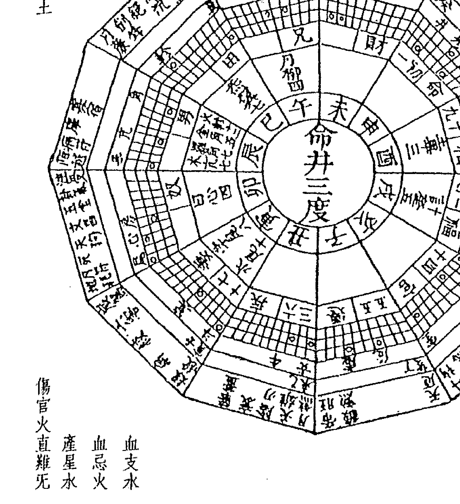

傷官火直離死 產星水 血忌火 血支水

生官木祿元土 馬元木 仁元水 壽元水

### 七政四餘命理學的判斷應掌握下列要點：

### <一>基本功夫：

1. 《張果星宗》的入門四十四字，務必完全通透
2. 《張果星宗》卷五・觀星要訣
3. 《張果星宗》卷五・玄妙經解
4. 十干化曜的恩、用、仇、難及諸神煞的要義
5. 《天官經》、《躔度賦》、《通玄賦》等政餘星格
6. 後天12宮管轄事項要義

### <二>論斷法則：

1. 舒繼英《乾元秘旨》釋經、絡、貫、串、填、沖、守、釣、拱、夾、攔截配合上述<一>之1.2
2. 曹仁麟《星度指南》的第二篇星盤總法
3. 《張果星宗》先天心法、後天口訣、至寶論、評人生秉賦分金論
4. 《八格賦》論格局貴賤
5. 各宮論斷要旨
6. 限度吉凶如劃度論、餘奴傷主、倒限

中國占星學的軍國、命理、擇日有很大成分圍繞在陰陽五行的生剋制化的概念，所判斷結果與西方或印度占星學之結論，可能產生天壤之別，如木星、金星在西洋及印度占星中為兩大吉星，不論命理、卜卦、擇日，無不希望它們相關涉或形成相位，但中國七政四餘占星學卻認為金星剋木星為凶象之徵；又火星、土星在西方或印度占星學為兩大凶星，不希望它們相關涉或形成凶相位，但中國七政四餘占星學則認為冬寒調候，及火土相生為吉象。

## 案例三十

* 天祿(木)科名(火)天馬(火)生官(炁)
* 天暗(金)科甲 星妻 地驛(木)
* 天福(土)文星(金)祿元(水)
* 天耗(月)魁星(羅)馬元(木)
* 天蔭(水)官星(羅)仁元(火)
* 天刑(計)催官(日)
* 天印(羅)祿神(計)血支(月)
* 天囚(火)喜神(炁)血忌(金)
* 天權(孛)爵星(火)產星(金)傷官(月)

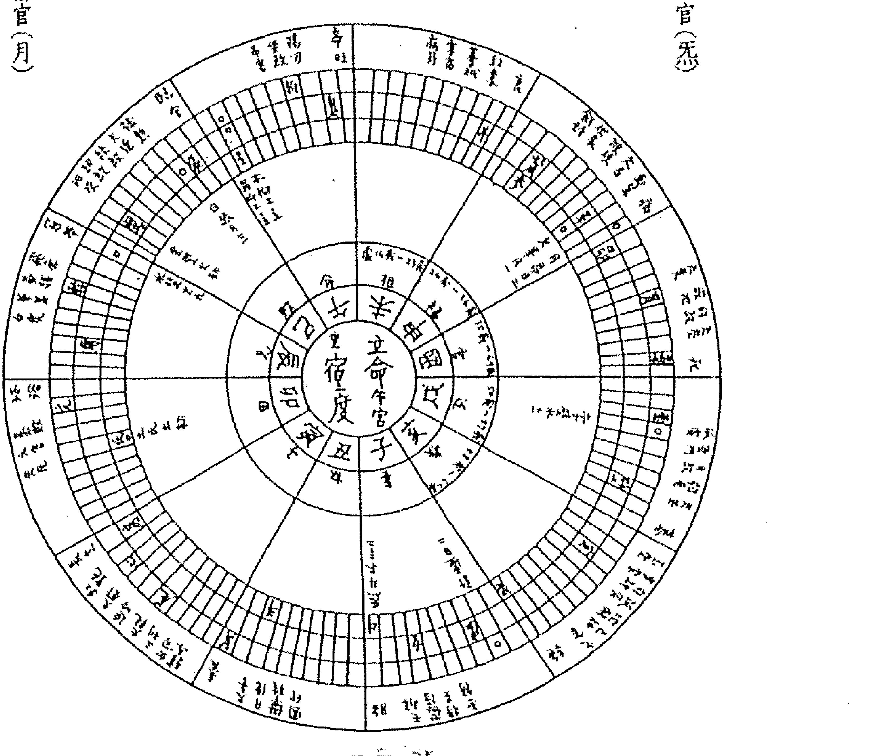

張雲博士
Natal Chart
Aug 31 1896
4:00 AM CCT -8:00
廣東開平，中國
22N18 112E36
Geocentric
Tropical
Placidus
True Node

Compliments of:-
Astrolabe Inc
PO Box 1750
Brewster MA 02631
Tel:(508)896-5081
Fax:(508)896-5289

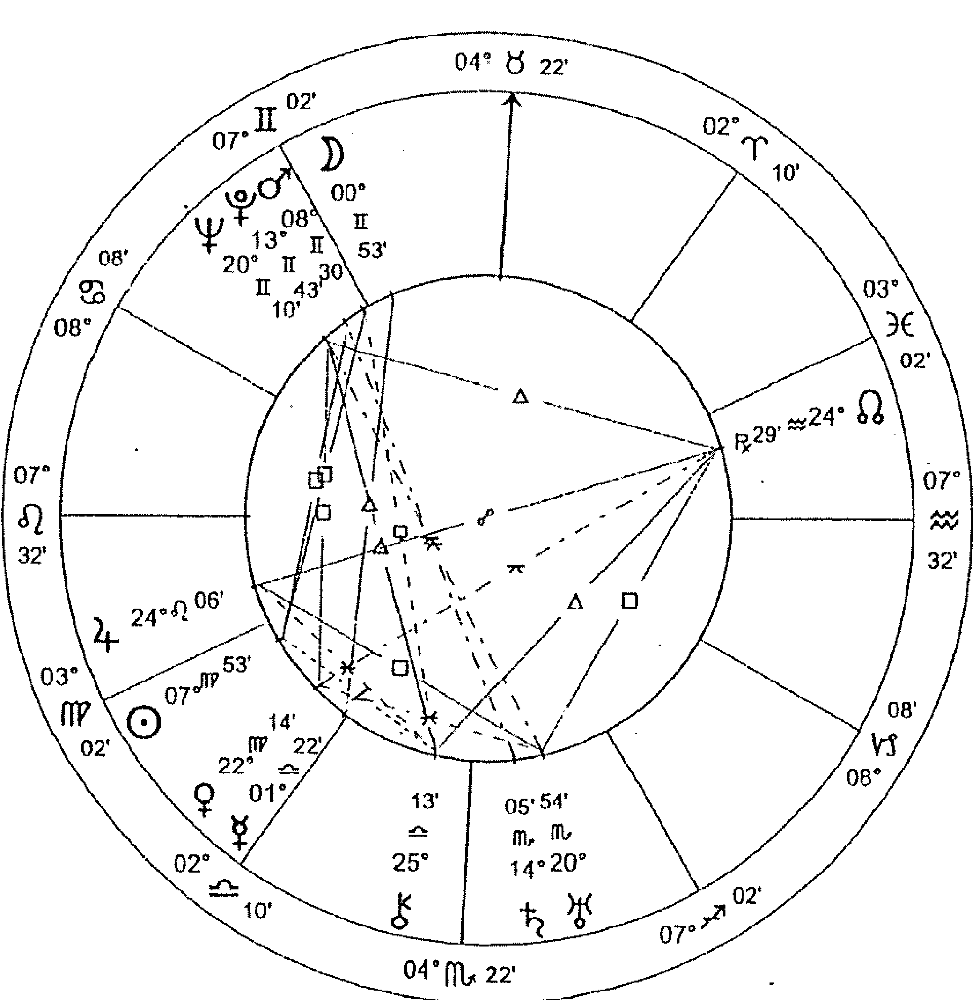

## 实用星学

我们以吴师青前辈所著《天运占星学》所谈及张云博士的实例来说明中国七政四余命理学的运用，吴先生谈论有关地理、占星向来是遮遮掩掩，不见起例和所用的方法，常令人摸不着头绪，幸好学占星术的好处是天体的资料不容作假，现今电脑科技进步神速，有关占星软体都可往前追溯5000年，往后推算5000年，因此祗要相关记载不造假，可以追溯验算的。

学习中国七政四余的爱好者常以吴师青所著之书《天体历》、《中国七政四余星图析义》、《天运占星学》作为学习对象，但常被说法或所列星图混淆，分不清他到底是使用回归黄道、恒星黄道或赤道？我们以张云博士的资料和他的论断来推敲，当可明瞭，底下“”系引自吴先生之语。

所载张云博士的出生资料，公元1896年8月31日上午4时，未记载出生地。
A.「以中国七政四余之星学而推论，其立命午宫，日为命主，罗之天官，入命宫，躔张月三度，魁文夹命主」
已知张云博士生于寅时，其立命午宫依日所在星座(或称宫位)起算生时(寅)顺数至卯时，正好在午宫狮子为命宫，这项结果的确立假设张云博士的出生地属日出卯时的纬度区域，而太阳在巳宫处女；午宫的主星日即为本例命主星。经查证张云博士出生于广东省开平县属日出卯时区域。

罗之天官系由1896年丙戌之丙年干火罗化气为印(即八字之正官)，入命宫亦即罗位于午宫方作此论，但接下来说躔张月三度，因其标点符号之段句常被误解，罗躔张月三度，由于在《天体历》强调岁差调整，显然他应是采28宿作岁差调整以配合回归黄道的星历使用，根据《张果星宗》记载之清光绪13年丁亥后量天新尺张月三度正好为回归黄道巳处女座7°已知罗入命宫系躔于午宫，所以所指的躔张月三度并非罗，我们根据Solar Fire V5打出当时的日子正好躔于巳7°也就是吴前辈所说的躔张月三度係指日，如附图。

魁、文来夹命主，查曹仁麟《星度指南》之天宫重要星例，得知丙年干，魁为罗，文为金星，附图中的♃(七政四餘稱為羅)午24°29′，☽巳7°53′，♀(金星巳22°14′)确是魁文夹命主日。

> 「命主之日，在赤经十时三十分，北赤纬八度。与「轩辕十四」之一等星，其位置仅距八度三十分以内，即会合也。」

中国天文学的观测向来以赤道坐标为准，上句中所提当时的赤经为十时三十分，这种记法系天球第一赤道坐标，基本上赤经每小时约15°，故十时三十分共15°×10.5＝157.5°即赤道坐标测量○的赤经为157.5°但经电脑精确计算为159°33′，两者约差2°左右；又○的赤纬其电脑精确为+8°37′，而吴先生的资料为+8也略有差异，这可能係手算结果。

我们可以○的赤经159°33′来验算○的回归黄道经度。根据球面三角函数，已知赤经求黄经的公式如下：```
Cot λ = Cos ε · Cot α
其中 λ : 黃經，ε : 黃赤交角(即23°27')，α : 赤經。
上述公式也可以用對數表求算較簡便
log cot λ = log cos ε + log cot α
log cot λ = log cos23°27' + log cot159°33'
= 9.962562 + 1.428419
= 20.390981
減去10 → = 10.390981 (一般數學辭典都有對數表的編列)再查對數表 λ = 157°53'，即已7°53'，與附圖中⊙躔度完全一樣。

故可以說明上述之躔張月三度確實是⊙命主無誤。

又「軒轅十四」之一等星是恆星中最重要的，自古即是四個皇冠恆星之首，代表尊榮、威權、皇位，但會突然失落。吳前輩在同書中的《三垣列宿發秘》談論諸多恆星的功能及特性，但所記載的都以赤經表示和西方系統慣用之黃經表示不同，他提到「軒轅十七星者，位於少微之北，一日權星，又名東陵。西圖獅子座。在赤經十時五分，赤緯十二度十三分，以軒轅十四為之主。色白，第一等星也。」

```
赤經10時5分 = 10.08 × 15° = 151.25° = 151°15'
```

⊙的赤緯159°33'與軒轅十四的赤經距離約8°18'就如他所言差距僅在8°30'內，但他所算的赤經也略有誤差與目前實算差將近1°左右。

> 「應主其人，少年騰達，文采與風采齊燦，天爵共人爵共隆。」七政四餘命理學喜魁文夾命，有利文章。

> 「其行限，於公元1941年，在白羊座七度，與誕生之太陽同絡。」

七政四餘命理學的大限起法係從出生日起逆數至最近中氣，以每三日算一歲，餘日或時換算為月數或日數，再加上10歲而從相貌宮起限，各宮管大限歲數各不同。查張雲博士出生日前之最近中氣為處暑1896年8月22日11:58PM，故由其出生日逆數為8日又8時，每三日折算一歲共約2年8個月，加上他的生日及10歲，約在1909年，虛4歲從相貌宮起大限，他的各宮管轄大限歲數如下：

- 相貌宮：虛14歲～23歲，共10年。
- 福德宮：虛24歲～34歲，共11年。
- 官祿宮：虛35歲～49歲，共15年。
- 遷移宮：虛50歲～57歲，共8年。
- 疾厄宮：虛58歲～64歲，共7年。

1941年(辛巳)虛歲46歲，行宮祿宮大限酉，走婁金狗四、三度，非吳前輩所稱之走白羊座七度，按實際計算係金牛座七度，由於命主日亦在巳處女7°，故稱為同絡。

根據網站：南方都市報www.nangangfsily.com.cn/ds/200306180772.asp張雲博士的女兒張劍美稱，1941年她父親曾代理中山大學的校長，由於國立大學校長一職，望重士林，應是吳前輩提出有關年度的主因。太陽為尊榮、威權、名譽、地位，行限與之同絡，利升遷、名望。然細就之，本命太陽躔月宿，而行限及宮位皆是金，本命金躔翌火初，歧度，水星同在翌火洩氣，甚為不穩、壓力煩憂，故於1942年隨即因派系鬥爭而黯然下台，據同上引處，張劍美稱她們舉家前往湖南，當時行婁金狗二、一及出歧度之故，這點吳前輩未談及。

E.「至公元1947年，行婁宿之一、二、三，光照天下，萬類資明，有星拱北斗，雨化南天之象」1947年(丁亥)虛歲52歲，改行遷移宮大限戌，走奎木一、初及壁水十二，也非如吳前輩所稱走婁宿之一、二、三。有關大限的算法有一定規則，我們寧願相信係誤值。事實上如走婁金，如何能光照天下，萬類資明？行戌限，限主火化曜為科名，三方逢午宮木星之合，而木星化曜為祿，又有羅星雖為餘奴但化曜為印，另外應知道木星亦為馬元，羅為仁元。

# 第十八章 中國七政四餘占星學

據前引敘述，1945年後半被國民黨任命為教育部的特派員到廣州接受日本投降的工作；1946年赴美哈佛大學講學及研究；1947年赴英，當時值歧度，年底發現變星，在天文學界轟動一時，成為名人；1948年被國民黨委任為立法委員，1949年後出任國立中山大學的校長。

F.「惟公元1958年之秋，政餘運元，行危日，月為母象，又為身主，遇戊戌太歲。戊土掩月。且在赤經二十二時三十分，有墳墓列宿。按「墳墓」天官書謂為不祥，主有山陵悲慘之事，占星學所忌者。余據以告：「今年逢戊，戊屬土，而土掩月，太夫人母當不利」。時方盛夏，張博士聞余言，憂曰：「吾母故年邁，但秉賦特厚，甚健，如有不利，吾願以身代母。」

1958年(戊戌)虛歲63歲，行疾厄宮大限亥，走危月燕六、五、四、三度，東西方占星學都將月亮作為母親的代表因子，且月亮為身宮。本命月亮躔昂日二度，陰陽顛倒，臨申宮初入度即臨界，轉角失位；月亮化曜為傷官，另同經度之畢月烏見火星躔，張月鹿太陽躔。太陽掌陽刃、吊客、災煞；而火星掌喪門、天哭、天厄皆披刑帶煞，戊戌年戊即土星，又亥宮三方拱合土，不利月甚明。

又危月燕六、五、四、三迴歸黃道經度亥9°～7°30′，而凶恆星「墳墓」依吳前輩之測算為赤經22時30分，即赤經337.5°，同B公式計算得換算為迴歸黃道經度為

> E.「別後，惘惘於懷，未嘗或釋。余居香港，張博士寓九龍，自署別墅，曰「月衣山莊」位於荃灣，非常幽靜。乃未幾，惡耗傳來。時為公元1958年10月27日，張博士遂止於斯。年六十有三。其果代母耶？一念動天，天之成其大孝，偉矣哉，余當時悼甚，輒以聯云「交親骨肉，學擅天文，經緯著覩微，豈料清談成讖語。孝感蒼穹，情依烏鳥，死生難索解，敢云哲理勝玄機。」

從以上驗算及解析，可知吳師青前輩論命，使用的是迴歸黃道配合歲差調整的28宿，至於外傳他使用赤道恆星也確實，只不過係用於有關恆星群的記載，因中國古時觀測恆星群即以赤經為主，英國李約瑟《中國之科學與文明》第五冊天文學談及中國天文學的極和赤道特性，即是此論。

香港李光浦說吳師青前輩用的Sidereal House並不正確，李先生所謂的Sidereal House應是恆星黃道之意，但從本例解說可知至少論人命，並非使用恆星黃道，否則不用歲差調整。

# 參考書目

## A. 天文、数理、历法

- 1. 金祖孟 – 地球科學概論
- 2. 馬文章 – 球面天文學
- 3. 李光蔭 – 球面三角術
- 4. J. A. Eshelman – Horoscope Calculation
- 5. George C. Noonan, Jr., Ph. D – Spherical Astronomy for Astrologers
- 6. Bob Makransky – Primary Directions: A Primer of Calculation
- 7. Jean Meeus – Astronomical Algorithms
- 8. Laurence G. Taff – Computaional Spherical Astronomy

## B. 西洋占星学的基本课程

- 1. 洪能平 – 現代占星學基礎
- 2. Robert Hand – Horoscope Symbol
- 3. Margaret. E. Hone – The Modern Textbook of Astrology
- 4. Lee Lehman – Classical Astrology for Modern Living
- 5. A. T. Mann – The Round Art: The Astrology of Time and Space

## C. 本命占星學

| 作者 | 書名 |
|---|---|
| 1. 韓良露 | 愛情全占星 |
| 2. 馬哈麻 | 譯天文書 |
| 3. 穆尼閣・薛鳳祚 | 天步真原 |
| 4. Bernadette Brady | Study Guide for Medieval and Ancient Astrology |
| 5. Robert Hand 譯 | On the Judgements of Nativities Book I |
| 6. J. Partridge | Vade Mecum:Briefly Teaching the Whole Art of Astrology |
| 7. Williams Lilly | Christian Astrology Book III |
| 8. Henry Coley | Key to the whole Art. of Astrology Third Part |
| 9. Robert Zoller | Tools Techniques of The medieval Astrologers |
| 10. Dorotheus of Sidon | Carmen Astrologicum |
| 11. W. J. Simmonite | The Arcana of Astrology |
| 12. James H. Holden | The Judgments of Nativities |
| 13. V. E. Robson | A Student's Textbook of Astrology |
| 14. Max Heindel | The Message of the Stars |
| 15. C. C. Zain | Delineating The Horoscope |

## D. 流年預測占星學

| 作者 | 書名 |
|---|---|
| 1. 韓良露 | 生命歷程全占星 |
| 2. 白漢忠 | 占星流年實務 |
| 3. Alan Leo | The Progressed Horoscope |
| 4. Rumen Kolev | Primary Directions I & II |
| 5. Bernadette Brady | Predictive Astrology: The Eagel and the Lark |
| 6. B. F. Hammerslough | Forecasting: Backward and Forward |
| 7. Nancy Anne Hastings | Secondary Progressions: Time To Remember |
| 8. Noel Tyl | Prediction in Astrology |
| 9. Dr. Heber Smith | The Transits of the Planets |
| 10. Robert Hand | Planets in Transit |
| 11. Robert DeLuce | Complete Method of Prediction |
| 12. Celeste Teal | Predicting Events With Astrology |
| 13. Marrion D. Mach | The Only Way To... Joan Mc Evers Learn About Tomorrow Vol IV |
| 14. Lloyd Cope | The Astrologer's Forecasting Workbook |
| 15. Raymond A. Merriman | The mew Solar Return Book of Prediction |

## E. 卜卦占星學

| 作者 | 书名 |
| :--- | :--- |
| 1. William Lilly | Christian Astrology Book I & II |
| 2. Henry Coley | Key to the whole Art of Astrology Book II |
| 3. John Gadbury | The Doctrine of Horary Questions |
| 4. Ivy M. Goldstein-Jacobson | Simplified Horary Astrology |
| 5. Louis Anthony | Horary Astrology: Plain & Simple |
| 6. Alphee Lavoie | Horary At Its Best! |
| 7. Derek Appleby | Horary Astrology |
| 8. Barbara H. Watters | Horary Astrology and the Judgment of Events |
| 9. Dr. Marc Edmund Jones | Horary Astrology: Practical Techniques for Problem Solving with a Primer of Symbolism |
| 10. Olivia Barclay | Horary Astrology Rediscovered |
| 11. Sylvia Delong | The Art of Horary Astrology in Practice |
| 12. W. J. Simmonite | Horary Astrology |

## F. 弧角天星择日学

- 1. 钟义明 天星择日实务
- 2. 周志学 太阳到山实例
- 3. 周志学 七政天星择日学
- 4. 吕士清 天星选择纂要
- 5. 温葆深 春树斋丛说
- 6. 左敬元 天星选择撮要
- 7. 倪月培 中西星要
- 8. 马道存 天星选择秘旨
- 9. 张祖同 择吉述正 (下)
- 10. 汪容骏 七政四余演算实例
- 11. 洪能平 择日占星学
- 12. V. E Robson Electional Astrology
- 13. Bruce Scofield The Timing of Events: Electional Astrology
- 14. Marion D. Manch & Joan Mc Evers The Only Way To... Learn about Horary and Electional Astrology Vol VI

## G. 合盤技巧

| 作者 | 書名 |
|---|---|
| 1. 韓良露 | 人際緣份全占星 |
| 2. Penny Thornton | Synastry |
| 3. E. W. Neville | Planets in Synastry |
| 4. Robert Hand | Planets in Composite |
| 5. Ronald Davison | Synastry:Understanding Human Relations Through Astrology |
| 6. Stephen Arroyo | Relationships & Life Cycles |
| 7. Mary Coleman | Picking Your Perfect Partner Through Astrology |

## H. 換置占星學

| 作者 | 書名 |
|---|---|
| 1. Jim Lewis & Kenneth Irving | The Psychology of Astro *Carto* Graphy |
| 2. Martin Davis | Astrolocality Astrology: A guide to what it is and how to use it |
| 3. Michael Harding & Charles Harvey | Working With Astrology: Part Three |
| 4. Edith Hathaway | Navigating by Stars |
| 5. Steve Cozzi | Planets in Locality |
| 6. Erlewine Michael & Erlewine Margaret | Astrophysical Direction |
| 7. I. I Chris Mc Rae | The Geodetic World Map |
| 8. Maritha Pottenger & Zipporah Dobyns | Planets on Move |

# 時事占星學

- 1. 何鼓 是和？是戰？
- 2. 韓良露 寶瓶世紀全占星
- 3. 黃家駿 星海詞林 (六) 浑天大五星寶卷附篇
- 4. 吳師青 天運占星學
- 5. Michael Baigent., Nicholas Campion & Charles Harvey Mundane Astrology: An Introduction to the astrology of nations
- 6. Nicholas Campion The Book of World Horoscope
- 7. Nicholas Campion The Great year
- 8. C. C. Zain Mundane Astrology: Interpreting Astrological Phenomena for cities, Nations and Groups
- 9. Charles E. O. Carter An introduction to Political Astrology
- 10. Joan McEvers 編 The Astrology of Macrocosm: New Directions in Mundane Astrology
- 11. Derek Appleby & Maurice Mecan Eclipses: The Power Points of Astrology
- 12. Frederic Van Norstarand Precepts in Mundane Astrology
- 13. H. S. Green Raphael Mundane Astrology Book I & II
- 14. William Ramesey Astrology Restored


# 參考書目

## J. 財務金融占星學

| 作者 | 書名 |
|-------|-------|
| 1. Graham Bates & J. C Bowels | Money and the Markets |
| 2. David William | Financial Astrology |
| 3. David William | Astro-Economic |
| 4. Joan McEvers | Financial Astrology |
| 5. Louis McWhirter | Astrology and Stock Market Forecasting |
| 6. The ISBA Book | Business & Financial Astrology |
| 7. Kaye Shinker | The Textbook for Financial Astrology |
| 8. William F. Eng | The Technical Analysis of Stocks Options & Futures |
| 9. George Bayer | Gold Nuggets for Stock and Commodity Traders |
| 10. Larry Pesavento | Astro-Cycles: The Trader's Viewpoint |
| 11. Larry Pesavento | Harmonic Vibrations |
| 12. Donald Bradley | Stock Market Prediction |
| 13. Mary Whitty Boyd | Financial Astrology Techniques and Horoscopes of Gold Stocks |
| 14. Henry Weingarten | Investing by the Stars: Using Astrology in the Financial Markets |

## K. 醫療占星學

- 1. **Graeme Tobyn** - *Culpeper's Medicine: A Practice of Western Holistic Medicine*
- 2. **Nicholas Culpeper** - *Astrological Judgement of Diseases from the Decumbiture of Sick*
- 3. **Richard Saunders** - *The Astrological Judgement and Practice of Phyick*
- 4. **C. C. Zain** - *Stellar Healing: Astrological Predisposition Diagnosis and Treatment of Disease*
- 5. **Jane Ridder-Patrick** - *A Handbook of Medical Astrology*
- 6. **Harry F. Darling** - *Essentials of Medical Astrology*
- 7. **Max Heindel & Augusta Foss Heindel** - *Astro-Diagnosis: A Guide To Healing*
- 8. **Eileen Nauman** - *Medical Astrology*
- 9. **Reinhold Ebertin** - *Astrological Healing: The History and Practice of Astromedicine*
- 10. **Robert Carl Jansky** - *Astrology Nutrition & Health*

## L. 氣象占星學

- 1. **不署名** - *天學洞機*
- 2. **C. C. Zain** - *Weather Predicting*
- 3. **Kris Brandt Riske** - *Astrometeorology: Planetary Power in Weather Forecasting*
- 4. **Dennis Klocek** - *Weather and Cosmos*

## M. 出生時間修正

| 作者 | 書名 |
|---|---|
| 1. Zipporah Pottenger Dobyns | Progessions Directions and Rectification |
| 2. Doris V. Thompson | Chart Rectification |
| 3. Henry Neimann | Rectification: Known and Unknown Birthtimes |
| 4. Laurie Efrein | How to Rectify a Birth Chart |

# 其他學派

## a. 心理占星學

- 1. 洪能平 - 占星家談星座
- 2. 趙婉君 譯 - 榮格與占星學
- 3. 鏡隆治 著 - 靈魂占星學
- 4. 朱侃如 譯 - 榮格心靈地圖
- 5. 劉國彬、楊德友 合譯 - 榮格自傳：回憶、夢、省思
- 6. 張弘瑜 譯 - 弗洛伊德
- 7. Stephen Arroyo - Astrology, Psychology and The Four Elements
- 8. Stephen Arroyo - Astrology Karma & Transformation
- 9. Liz Greene - Astrology for Lovers
- 10. Karen Hamaker-Zondag - Psychological Astrology

## b. Huber學派

- 1. Bruno & Louise Huber - Life Clock: Age Progression in the Horoscope Vol 1
- 2. Bruno & Louise Huber - Life Clock: Practical Technique for Counseling Age Progression in the Horoscope Vol 2
- 3. Bruno & Louise Huber - Astrology and the Spiritual Path

## c. Draconic占星學

- 1. Pamela Crane - Draconic Astrology: An Introduction to the use of Draconic Chart in Astrology

## d. 中點理論

- 1. Reinhold Ebertin - The Combination of Stellar Influences
- 2. Reinhold Ebertin - Transits: What Days Favor you?
- 3. Michael Harding & Charles Harvey - Working With Astrology Part I
- 4. Richard Svehla - Introduction To The Uranian System of Astrology [Hamburg School by Alfred Witte]

## e. 教堂之光

- 1. Doris Chase Doane - How To Read Cosmodynes
- 2. Ken Stone - Astrodynes
- 3. Doris Chase Doane - Astrology: 30 years research

## f. 泛音盘

- 1. John Adddey - Harmonics in Astrology
- 2. David Hamblin - Harmonic Charts
- 3. Delphine - Practical Harmonics
- 4. Michael Harding & Charles Harvey - Working With Astrology Part II

## g. 恒星学派

- 1. Cyril Fagan - Primer of Sidereal Astrology
- 2. Donald Bradley - Solar and Lunar Returns

## h. 度数象徵

- 1. Marc Edmund Jones - The Sabian Symbols in Astrology
- 2. Dane Rudhyar - The Astrology of Personality
- 3. 莎比恩精密占星术

## O. 印度占星學

| 作者 | 書名 |
| :--- | :--- |
| 1. Girish Chand Sharma | Maharishi Parasara's << Brihat Parasara Hora Sastra>> Vol 1 & 2 |
| 2. S. S. Sareen 英譯 | Phala Deepika |
| 3. Santhaman 英譯 | Hora-Sara |
| 4. Kalyana Varma | Saravali Vol 1 & 2 |
| 5. Hart Defouw & Robert Svoboda | Light on Life: An Introduction To The Astrology of India |
| 6. David Frawley | The Astrology of Seers |
| 7. James T. Braha | Ancient Hindu Astrology for the Modern Western Astrologers |
| 8. James T. Braha | The Art and Practice of Ancient Hindu Astrology |
| 9. Dr. K. S. Charak | Elements of Vedic Astrology Vol 1 & 2 |
| 10. Dr. K. S. Charak | Yogas in Astrology |
| 11. B. V. Raman | Hindu Predictive Astrology |
| 12. B. V. Raman | Three Hundred Important Combinations |
| 13. B. V. Raman | How to Judge a Horoscope Vol 1 & 2 |
| 14. S. K. Duggal & Neerja Taneja | Planetary Strengths (Calculation & Application) |
| 15. Krishna Kumar | Secrets of Vargas |
| 16. G. S. Agarwal | Practical Vedic Astrology |
| 17. K. T Shubhakarn | Nakshatra Book I & II |
| 18. M. S. Metha | Ashtakvarga: Concepts & Application |
| 19. Sanjay Rath | Crux of Vedic Astrology: Timing of events |
| 20. K. S. Krishnamurti | Predictive Stellar Astrology |

## P. 中國七政四餘占星學

### a. 軍國

- 1. 司馬遷 史記、天官書
- 2. 李淳風 晉書、天文志
- 3. 李淳風 乙巳占
- 4. 翟雲悉達 開元占經
- 5. 魯揚才 奇門星相絕學
- 6. 劉韶軍 神秘的星象

### b. 命理學

| 作者 | 書名 |
|---|---|
| 1. 陸位 輯 | 張果星宗 |
| 2. 曹仁麟 | 星度指南 |
| 3. 廖瀛海 | 增訂五星集腋 |
| 4. 舒繼英 | 乾元祕旨 |
| 5. 萬民英 | 星學大成 |
| 6. 沈淦山 | 星平大成 |
| 7. 耶律纯 | 星命总括 |
| 8. | 星命溯源 |
| 9. 霍敏卿 | 重编增补星命说证合编 (上)、(下) |
| 10. 吴师青 | 中国七政四余星图析义 |
| 11. 吴师青 | 天体历 |
| 12. 李光浦 | 郑氏新案新诠 |
| 13. 李光浦 | 果老星宗新诠 |
| 14. 李光浦 | 中美国运和天命 |
| 15. 星云山人 | 七政四余中西天文星命大全 (上)、(下) |
| 16. 郑富昇 | 七政四余推命全书 |
| 17. 陈奇谷 | 鬼谷子命运占星法 |

# 實例占星系列叢書

占星學的論斷工具是一張天宮圖 (Horoscope)，它佈滿了符號、線條，論斷者須充份了解各項符號的隱含意義，及代表因素的特性及演繹，才能窺探占星學的奧妙。

本書兼顧古典與現代占星學的融合，不論從事件預測或占星心理分析，皆打下相當紮實的基礎，為步入占星學殿堂的重要台階，絕對值得一讀。

(已出版)

- 上冊-$370
- 下冊-$330

本命占星學完整地論述命主的心理主軸，各項特徵、習性、諸如個性、長相、才能、財運 (正財、偏財、投機財)，教育與學歷、工作、事業、六親關係、戀愛、婚姻、疾病...等。本書以占星學最重要典籍《基督徒占星學》(Christian Astrology) 的要訣為論斷主軸，即透過宮主星的飛佈，宮內行星，與之形成主要相位的行星，及天宮圖的其他要素，縱橫地解析上述各項議題，精準實用，熟稔運用後必會讚嘆占星術的魅力，即使在歐美也難得見到類似本書的著作。(未出版)

流年占星學主要解析大運、流年、流月、流日等內容。它根據(一)命主出生後，天空星體的運行對出生時星體的交互影響，如次限推運法 (Secondary Progression)，參限推運法 (Tertiary Progression)、太陽迴歸法 (Solar Return)、過運 (Transit)；(二)直接就天宮圖推論，如行星週間法 (Planetary Period)、主限向運法 (Primary Direction)、太陽弧向運法 (Solar Arc Direction)。透過這些流年星體對本命星體的影響，激發本命盤有關議題的潛在因子，產生流年運勢的事徵，呈現人生事項的吉或凶。若能確切掌握流年的論斷法則，有助人生規劃。(未出版)

時事占星學主要討論團體運勢，如國家、城市、公司、社團、黨派、政治、經濟、軍事戰事、地震、氣象、農獲收成...等，內容相當廣，供茶餘飯後，佐談話題，本書不能錯過。(未出版)

弧角天星择日法向來是國內擇日界視為家傳的壓廂寶，禁止妄傳的，本書甘冒不諱，詳細介紹它的歷史源流，讓讀者一窺千金難買的弧角天星擇日訣竅。(未出版)

本書詳舉西洋占星擇日法與弧角天星擇日法的差異，提供多一層思維，並介紹古典技巧的應用，分項解析操作實務，如：新官上任、結婚、開市、開店、選舉...等，各項生活事項的趨吉擇日，是您生活上的好指標。(未出版)

# 實用占星學

想知道與誰在一起最Match，無論是工作合夥、婚配、交友……還是職場從屬關係，讓您們間互動關係明察秋毫。

透過本書詳盡的配對盤、組合盤、關係盤等各項合盤的特點比較，並加以實例解說———您將也是人際關係的個中高手。(未出版)

成功的要素：天時、地利、人和。天時與地利嚴然影響2/3強……

本書詳盡介紹A*C*G*圖、換置命盤、測定圖、地平空間等各項換置技術技巧與原理，讓您在能力範圍內選擇適當地方 (如移民、出國、搬家) 與有利星象組合讓您更得心應手，趨吉避凶。(未出版)

財經占星家的幾次著名預言：1987年10月19日，英美股市大崩盤。1990年3月，日本股市崩跌至今何時會有大逆轉……。

本書闡述各項分析圖解，搭配基本面、技術分析及時勢背景與空間相互間影響，讓您早早窺視趨勢脈動。(未出版)

宿命的安排、機運的偶合排列出不朽人生，誰說好事就不能成雙；不如意非要八九，心中的疑惑讓秦大師根據多年專研卜卦法則來解析探尋問題之狀況及答案。本書乃參酌古典重要著作《The Doctrine of Horary Questions》詳述卜卦時間的意義與有效性，針對12宮的有關問題即代表因子，並列出相關斷訣與實例。(未出版)

實用占星學的宗旨，在於發揚正統的占星學學術水準與應用，兼著《天人感應》的哲學思想，深入研究星空的奧秘，傳播占星學正確、完整的知識。(已出版)

# 徵稿啟事

本公司誠徵有關占星學、易學、術數、藝術、美術、醫學、幼兒教學、農漁牧畜、運動休閒、臺灣研究、經營管理、文學等各類創作，歡迎各界高手踴躍投稿。每份著作字需十萬字以上（附圖例外），有意者請用有格稿紙書寫，標點符號務必標示清楚，亦可e-mail初稿審查。

若經採用，本公司當以最堅強的編輯陣容及廣大的網路行銷，將您的心血結晶，完美的傳送到海內外各讀者的手中。

稿件請寄：于天網路印刷有限公司
e-mail：pcfile@iprint.com.tw
網址：http://www.iprint.com.tw
高雄市新興區信守街141號
TEL：(07)2382556-9