# 家居风水100忌

檀明山○著

图书在版编目（CIP）数据

家居风水 100 忌/檀明山著.—北京：团结出版社，2005.1
(2014.2重印)

ISBN 978-7-80130-873-3

Ⅰ. ①家… Ⅱ. 檀… Ⅲ. ①住宅-风水-研究 Ⅳ. ①B992.4

中国版本图书馆 CIP 数据核字（2004）第 131984 号

出版：团结出版社
（北京市东城区皇城根南街84号 邮编：100006）
电话：（010）65228880 65244790 （出版社）
（010）65238766 85113874 65133603 （发行部）
（010）65133603 （邮购）
网址：http://www.tjpress.com
E-mail: 65244790@163.com（出版社）
fx65133603@163.com（发行部邮购）
经销：全国新华书店
印刷：三河市恒升印装有限公司

开本：710×1000毫米 1/16
印张：15
字数：200千字
印数：3000
版次：2005年1月 第1版
印次：2014年2月 第2次印刷

书号：978-7-80130-873-3/B·52
定价：29.90元

（版权所有，盗版必究）

前言

伴随着时代的进步和科技的发展，人们对居住环境的要求和对生活质量的提高，也越来越重视。因此，选择什么样的居住环境，选择什么样的家居住宅以及如何构建、布局一套新的房子，就成了一道困扰着无数追求幸福美满生活的现代人的难题。

美国著名的城市规划权威凯文·林奇在其编写的《城市意象》一书中指出：“‘中国风水学’是一门专家们正在谋求发展的前途无量的学问。”

当我们用现代科学的眼光，看待中国古代的“风水”学说，也许你会惊奇地发现，这门古老的学说虽然蒙上了一层神秘的迷信色彩，但却凝聚着数千年来我国古代哲学、美学、地理学、地质学、生态学、气象学、景观学、建筑学、心理学等学科的精华，是我国传统建筑文化的奇葩瑰宝，而且在现代建筑领域中具有极其重要的参考价值。

“家居风水 100 忌——倡导现代居住科学新理念”一书正是为了弘扬中华民族优秀的传统文化，运用现代先进科学的相关知识、积极探索现代风水学的原理和规律，并努力与当今实际运用有机地结合在一起，以求更好地为人民服务，造福社会，造福人类。

本书就人类生态环境、家居住宅的择地、构建和布局方面的禁忌避讳这一主题，作出了有益的探索和科学的阐述。全书共分10章，分别为择地篇、地基篇、选楼篇、改建篇、庭院篇、结构篇、室内篇、卧室篇、摆设篇和设施篇等。书中深入浅出，循序渐进，通俗易懂，全面系统地归纳总结出家居住宅风水方面100忌，以奉献给广大读者。

阅读本书，也许它将成为您购房置业、趋吉避凶、安居乐业，财源广进的一位好帮手，好参谋。

2005年元月

目录

# 第1章 择地篇

- 1 忌风口不当招风惹祸........ 2
- 2 忌水口不当阴阳不顺........ 5
- 3 忌背水左岸气化稀疏........ 7
- 4 忌山谷盆地大气污染........ 9
- 5 忌紧挨路边担惊受怕 ...... 11
- 6 忌路口巷尾环境恶劣 ...... 12
- 7 忌雷电地区地电活跃 ...... 13
- 8 忌山尾崖下易罹疾病 ...... 15
- 9 道路尽头易遭风吹 ...... 17
- 10 忌门前大树有碍交通...... 19

# 第2章 地基篇

- 11 忌黏土松土孽生霉菌...... 22
- 12 忌水位过高阴冷潮湿...... 24
- 13 忌水土病源诱发疾病...... 25
- 14 忌地有污水湿气过重...... 27
- 15 忌火灾之地地气消失...... 29
- 16 忌坟场墓地污染严重...... 31
- 17 忌电离辐射可能致癌...... 33
- 18 忌土质松弛不利防震...... 35
- 19 忌前高后低采光不良...... 38
- 20 忌三角地带费用高昂...... 41

# 第3章 选楼篇

- 21 忌风急风大吹散旺气 …… 44
- 22 忌阳光不足阴气过重 …… 46
- 23 忌厕所居中堆积废物 …… 48
- 24 忌道路直冲难以安居 …… 50
- 25 忌斜坡之上颇多凶险 …… 52
- 26 忌街道反弓镰刀割腰 …… 53
- 27 忌对天斩煞气流冲击 …… 55
- 28 忌烟囱向床空气污染 …… 57
- 29 忌衙前庙后外强内弱 …… 59
- 30 忌贼风直入畅行无阻 …… 60

# 第4章 改建篇

- 31 忌部分改建新旧合一 …… 64
- 32 忌平屋加层负担过重 …… 67
- 33 忌两屋合一机能重复 …… 70
- 34 忌装潢复杂违反常理 …… 72
- 35 忌屋瓦动摇住宅老化 …… 75
- 36 忌门柱弯曲难禁压力 …… 77
- 37 忌门大家小极不相称 …… 79
- 38 忌灶井并列污染水质 …… 81
- 39 忌鹤立鸡群破坏平衡 …… 83
- 40 忌改造厨房产生意外 …… 85

# 第5章 庭院篇

- 41 忌地窄房大比例失调 …… 88
- 42 忌庭院种树遮盖阳光 …… 90
- 43 忌中庭凿池土地阴湿 …… 93
- 44 忌庭院铺石招来阴气 …… 95
- 45 忌流水穿越隐藏水患 …… 98
- 46 忌围墙过高有碍美观 …… 100
- 47 忌围墙近房缚手缚脚 …… 103
- 48 忌毗邻太近过于拥挤 …… 105
- 49 忌毗邻杂乱参差不齐 …… 107
- 50 忌毗邻污染诸多不利 …… 109

## 第6章 结构篇

- 51. 忌客厅狭长难以设计 ... 112
- 52. 忌睡房狭长孤清冷落 ... 114
- 53. 忌尖角对房冲克损害 ... 116
- 54. 忌尖角冲射不祥之兆 ... 118
- 55. 忌住宅细长动线过长 ... 121
- 56. 忌楼梯居中占据空间 ... 123
- 57. 忌栋梁接木连接不良 ... 126
- 58. 忌栋梁镶接难以坚固 ... 129
- 59. 忌房子凸形贫寒之相 ... 131
- 60. 忌房顶高起逆流漏雨 ... 134

# 第7章 室内篇

- 61. 忌布局不当互相干扰 ... 138
- 62. 忌高低不适压抑沉闷 ... 141
- 63. 忌面积不宜空荡寂寞 ... 143
- 64. 忌进深失衡影响景观 ... 145
- 65. 忌地板分段引发事故 ... 147
- 66. 忌门窗不畅气流冲荡 ... 150
- 67. 忌窗户背阳影响采光 ... 153
- 68. 忌窗户朝北大煞风景 ... 156
- 69. 忌走廊直通宽窄无度 ... 159
- 70. 忌宅心破缺有失匀称 ... 161

## 第8章 卧室篇

- 71. 忌卧室杂乱难以入眠 ... 164
- 72. 忌卧室北向磁力冲突 ... 166
- 73. 忌床底藏污孽生尘螨 ... 168
- 74. 忌镜子吊脚煞气冲克 ... 170
- 75. 忌玻璃脆弱碎裂伤人 ... 173
- 76. 忌玩具乱摆适得其反 ... 175

# 第9章 摆设篇

- 77 忌狮子向内身受其害 ··· 178
- 78 忌轻龟重狮老人不适 ··· 180
- 79 忌摆五匹马寓意不祥 ··· 182
- 80 忌龙犬相冲辰戌相冲 ··· 184
- 81 忌正神下水见财化水 ··· 186
- 82 忌吉凶混淆弄巧成拙 ··· 188
- 83 忌挂画不宜影响情绪 ··· 191
- 84 忌茶几过大喧宾夺主 ··· 193
- 85 忌沙发无靠精神不宁 ··· 195
- 86 忌地毯单调客厅失色 ··· 197
- 87 忌鞋柜无门有碍观瞻 ··· 199
- 88 忌门槛断裂宅气运滞 ··· 201
- 89 忌阳台堆物丧失功能 ··· 203
- 90 忌走道过多格局不吉 ··· 205

# 第10章 设施篇

- 91 忌书房阴暗不利养眼 ··· 208
- 92 忌客厅污染主客受损 ··· 210
- 93 忌厨房污染殃及全宅 ··· 214
- 94 忌开门见灶不甚吉利 ··· 217
- 95 忌厨厕同门吸纳秽气 ··· 219
- 96 忌饭桌对角饮食有损 ··· 221
- 97 忌浴厕阴湿散发阴气 ··· 224
- 98 忌婴儿受冲影响发育 ··· 227
- 99 忌粗心大意不利儿童 ··· 229
- 100 忌洞房阴暗夫妻失和 ··· 231

# 第1章 择地篇

> 卜其兆其宅，卜其当宅者，卜其地之美恶也，地之美者，
则神灵安，子孙昌盛，若培植其根而枝叶茂。择之不精，地
之不吉，则必有水泉、蝼蚁、地风之属，以贼其内，使其形
神不安，而子孙亦有死类绝灭之忧。
>
> ——《阳宅十书》

> 外山环抱者，风无所入，而内气聚。外山亏疏者，风有所入，而内气散。气聚者暖，气散者冷。
>
> ——《堪舆泄秘》

## 1 忌风口不当招风惹祸

择地首要的是选准“气口”。

所谓“气口”，就是入气之口，本来是指寺院或住宅前方群山的开口或低凹处，清新之气由此而来。因此，大门要正对着它，以采吉祥之气。后来，“气口”引申为住宅大门，即所谓“门通出入是为气口”。

现在随着住宅的密集化、公寓化、门窗多而大化，住宅的坐向和大门（气口）就没有古代住宅那么重要了，因此，可以把“气口”引申为门窗以及毗邻建筑物的开口处或低凹处，清新空气常由此来。

这个“气口”最好位于住宅的东、东南和南方位，以让和煦的微风轻拂进来，这正是古人所冀求的“紫气（按：指祥瑞之气）东来”。

现在南方许多人住的公寓是巽宅（坐东南向西北），公共大门在北（坎）位，本宅正门在东（震）位或西（兑）位。按照古代风水理论，大门和正门是气口，然而，现在实际上却只是出入通道而已。东南方的大面积的窗户却成了主要的气口。这种情况是很普遍的。

风水最忌“死气”、“煞气”、“散气”、“泄气”。

风口将造成“散气”和“泄气”。中国古代风水学认为“气乘风则散”、“招风惹祸”，因此要求“藏风聚气”。藏风就是避风。风口则正是“招风惹祸”之源。为什么呢？这是由于风速过大，气场变化太大，人难以适应，人体场与环境场之间难以建立平衡，人就会感到不舒服，甚至气损闹病。

无风则将造成“死气”和“煞气”。人体本身和家庭生活每天都要排出大量的废气，若通风不良，室内外空气难以交换，废气将滞留在室内，造成自我污染。

综而观之，风水学遵循《周易》的中和之美原则，反对两个极端——风太大或无风，讲究藏风聚气以求得生气，即要求空气通畅，以保证空气有一定的清新度。最理想的住宅环境是有柔和的风轻轻吹来，让人有清风送爽的感觉。

## 2 忌水口不当阴阳不顺

> 龙无水送，则无以明其来。穴非水界，则无以明其止。有山无水休寻地，寻龙点穴须仔细，先须观水势。
>
> ——《地学简明》

所谓水口，是指水流的入口和出口。古人一方面认识到水流会影响气：“气之阳者，从风而行，气之阴者，从水而行。”“顺阴阳之气以尊民居。”另一方面又认为水主财，所以特别重视水口，把它看作保护神和生命线。

水口得当的标志是：天门开，地户闭。“凡水来处谓之天门，若水来不见源流谓之天门开；水去处谓之地户，不见水去谓之地户闭。去水本主财，门开则财来，户闭财用不竭。”（《入山眼图说》卷七）天门地户界定了整个村落的地域，象征着村落的门户和灵魂。

门前有水，称堂前聚水，也叫明堂前有水，传统认为是有福泽，水成了福气的象征。

现代建筑为了弥补缺乏大自然赋予的天然水，就以人工的方法挖掘水池或喷泉。北京长安街的李嘉诚的东方广场，就建有巨大的喷水池，就是用来祈福，升腾的喷泉寓意希望财源广进。

水口后来专指水流出曰，水口多位于一村的最低处，要求水流缓和即相当于“地户闭”。曹溶指出：“水口关局内之精神，管一乡枢要。重重紧闭，精神百倍，富贵大小，皆由于此。”

水是我们人类的生命之源，也有人认为水是财源。传统风水学认为，如果门是开在吉位，屋前有水，自然生财，会给主人带来财源；但如果门是开在凶位，那这水源则会给主人带来灾难。

## 3 忌背水左岸气化稀疏

> 凡刻一乡之中，先看水域归哪一边，水抱边可寻地，水反边不可下。
>
> ——《堪舆泄秘》

清熊起潘说：“凡到一乡之中，先看水域（按：指水的形局）归哪一边，水抱边可寻地，水反边不可下。”（《堪舆泄秘》）

所谓抱边，即是抱水，指河流的内弯处（现在叫凸岸），宜造住宅；所谓水反边，即是背水，指河流外弯处（现在叫凹岸），一般不宜造住宅。

广东某地有一个村子，北面倚山，中间有一条河由东向西蜿蜒穿流，弯度比较大，河的北岸正是河的右岸和内弯处（即所谓“内位”），这里的住家人丁兴旺；河的南岸，处于河的左岸和外弯处，却人丁日渐减少，乃至住宅无人居住而一片荒凉。

上述的凸岸宜造宅而凹岸不宜造宅，是在古代生产力低下的条件下就自然环境而论的。因为凹岸受到水的冲击而侵蚀，河岸比较陡，还容易崩塌，河床也比较深，生活不大方便；凸岸则由于不断淤积，土地比较肥沃，地下水源丰富，利于人们生活。

如果把凹岸加固可以做成码头，建成城市，这是凸岸所望尘莫及的。例如，韶关市就是建在浈水和武水的两个凹岸上。可见，要辩证地看河流的凹岸和凸岸。

为什么古人认为河右岸宜造宅，河左岸宜造宅呢？这是因为河流受到地球由西向东自转惯性的影响，在北半球有一股向右偏的力量，气“界水则止”，被河水界住的气受到向右的力的挤压，使河右岸的气浓缩密集，大气营养成分比较丰富，所以吉；反之，左岸的气化稀疏，因此相对不吉。

河右岸为吉，左岸为不吉，也不是绝对的，而应该辩证来看，因为吉不吉还跟地形地势、土地是否肥沃、交通是否便利等因素有关。因此，要综合衡量。

## 4 忌山谷盆地大气污染

> 在山风和谷风转换的静风间歇时间，最不利于污染物的扩散，污染物大量滞留在山谷，造成大气污染。
>
> ——《大气环境学》

山谷，由于有山、谷风和逆温存在而容易受到大气污染。白天，山坡受日照而增温，气温反而比山谷高而形成逆温，谷风由山谷向上吹。夜晚，山坡散热快，气温下降到比山谷还要低，冷空气下坡，形成山风由山坡向山谷吹。

这好比潮汐进退，两次潮期之间有一个间歇期，在山风和谷风转换的静风间歇时间，最不利于污染物的扩散，污染物大量滞留在山谷，造成大气污染。（参看唐永銮等《大气环境学》）因此，不宜在山谷造宅，而应该选在山坡上，而且最好是向阳山坡。在山谷或盆地所建的住宅，由于四周都高，来水、来气都被阻挡在外，气也不能自然流动，因此难以成为有生气之地，而形成一块死地。

另外，人在这种环境中，难免有被囚禁的感觉，情绪压抑，就会影响人体健康。

云南思茅自治州地处低洼盆地（相当于山谷），瘴气弥漫，气温高，湿度大，蚊虫滋生，疟疾流行，因此过去有句民谚云：“要到思茅坝，先把老婆卖。”现在该地环境已得到治理而大大改观了。

> “要到思茅坝，先把老婆卖。”

## 5 忌紧挨路边担惊受怕

> 如果住宅太挨近铁路或公路边，灰尘污染、噪音污染、火车
和汽车的尾气等大气污染，日日夜夜都有。

如果住宅太挨近铁路或公路边，灰尘污染、噪音污染、火车和汽车的尾气等大气污染，日日夜夜都有。此外，由于车辆川流不息，还影响到环境场不稳定，使人体场难以适应而容易体力不佳、精神不振、甚至生病。

而且住宅太挨近铁路、公路边还容易发生交通事故，小孩、老人进出都得提心吊胆，担惊受怕。

更何况铁路、公路还不时要扩建，改线，房屋时而面临拆迁的威胁。

## 6 忌路口巷尾环境恶劣

> 弯弯曲曲抱门前，形似金边玉带护 ——《相宅经纂》

处于路口、路尾、巷口、巷尾的住宅主要有两个毛病：一是附近吹来的脏空气容易滞留在这里，造成大气污染；二是环境场很不稳定，使人体场难以适应，由于白白消耗内能而致体质羸弱，甚至患病。

如果是无可奈何要住在路口、路尾、巷口、巷尾，怎么办呢？目前有两个办法：一是加强宅内通风，使从巷或路吹来的脏空气不至于滞留室内；二是在对着巷或路的门前或窗前设置一屏风或挡板起缓冲作用，以减少巷风场或路风场的直接冲击。

住宅大门前的路很有讲究，不要直统统地对着大门，也不要筑成一个‘丁’字形，而要‘弯弯曲曲抱门前，形似金边玉带护’（清·高见南《相宅经纂》）。

## 7 忌雷电地区地电活跃

> 凡是地电活跃的地方，都容易与天电结合而发生雷电，因此不宜选作宅地。

凡是地电活跃的地方，都容易与天电结合而发生雷电，因此不宜选作宅地。屋顶最好安装避雷针，以防万一。

住宅也不能在高压电线路下建造，在各种线路下建造的房屋，必须有足够的安全距离。

电源和各种线路要注意维护，不懂得电工知识而随意剪接线路是一大禁忌。

自然避雷主要是通过地球表面凸起的物体，在雷电场中产生电晕电流而实现的。如果住宅背靠大山或三面环山，显然最有利于消雷。

如果住宅所在的穴地地带，地势不高不低，也较为平坦，正好就处于自然消雷和不易受到雷击的安全位置。

根据雷击的选择性，地下水出口处、河床、湖沼边、潮湿地带、潮湿的建筑物等，通常是雷电易击点。因此，宅地应与其保持一定的距离，从而保证住宅的安全性。

> > 人之居处宜以大地山河为主，其来脉气势最大，关系人祸福最为切要。若大形不善，纵内形得法，终不全吉。
> ——《阳宅十书》

## 8 忌山尾崖下易罹疾病

对着山尾前或谷口的住宅，既难居福份，且易罹种种疾病。
所谓山尾前，是指山尾结束、而以陡坡与平地接连的斜面下土地。山谷出口即两山间的狭谷，进入平地的缓和部分。毕竟山终且缓，必是广阔平原，其中一定有河川流过。居住在这种地形者，时时潜伏着受到洪水及山崩侵袭的危险。上述地形，地理学上称之为扇状地形。急速下降的狭谷溪流，一旦进入平地，便突然减缓其流速，于是溪流所夹而带来的沙土，便沉积于谷口处。特别是在洪水季节，山崩所造成的沙土，大量随洪水而下，堆积在溪谷的出口处，以扇形成了新的土地。

这类土地后背着山，前方是广阔平原，视野极佳，交通又方便，原本具有诸多作为住宅环境的优良条件。

但是如果反观其背面，创造这块扇状地的洪水及山崩等，则不知何时又将来临，因此，其危险永远无法消除。居住在此这类地区者，每逢大雨来临时，一定会提心吊胆，长久下去，也就难保身体不会生病。

> > 家建于道路尽头者，大凶。一般而言，死巷道尽头处，因居于安全考虑，因此大都会受到建筑上的限制。

## 9 忌道路尽头易遭风吹

所谓道路尽头，可分为二种类型。一是丁字路的尽头，二是死巷道的最内部。

以第一种情形（即丁字路的尽头）而言，有两大不吉的因素。其一是，在过去，敌人来袭之际，这类场所最易遭到攻袭。就防守上而言，此类场所也常作为阻止敌人的据点。古时候，城下之街，为了防御敌人来袭，其都市计划常以连接丁字型的尽头为主。

另一不吉的因素是，易遭风吹。暴风来袭之际，大风穿过并列屋舍间的道路，直接吹袭尽头之家。发生火灾时情况亦同，火焰常随风飘到尽头之家。

# 家居风水 100忌

正由于有上述不吉的因素，故认为尽头之家凶相。当今时代，虽无敌人来袭的情形，但是常常发生汽车撞人之事。所以说“家建于道路尽头者，大凶”。

第二种情形是，死巷道的最内部。此场所有三大不吉的因素。其一是外出时务必要经别人家的门前，极为不方便。以现代而言，倘若该道路为他人的私有地，则对方一定会对你有所要求或限制。

其二是危险。死巷道的尽头若无其他道路，则火灾来自前方之际，往往逃生无路，穷于奔命。

以上二大因素今古皆同，而其三则属现代独有。一般而言，死巷道尽头处，因基于安全考虑，因此大都会受到建筑上的限制。

总之，死巷道因具有多种危险性，因此建设单位大都对这些地段的建筑有所限制。

倘若非在这种地方建房不可时，请您千万记住：一定要预先留下通往后面房屋的通道，以免火灾发生逃生无门。

> 在阳宅勘舆学中有人认为，在门前有大树者，会阻挠阳气的进入，使阴气易于兴旺。

## 10 忌门前大树有碍交通

在阳宅勘舆学中有人认为，在门前有大树者，会阻挠阳气的进入，使阴气易于兴旺。确实，门前有大树者，对于进出实在是不大方便。而且，容易遭致雷击的危险，住处也会受到落叶的污染。观此种种不便，这一说法，实在有其存在的理由。

以现代观点来说，门前横着大树，会造成极大不方便的说法，仍是存在的。因为现代交通乃是以车辆为主，人们于行走间遇见大树，可以侧身从缝隙穿过，阻碍尚不算太大，但是车子呢？它不可能像人一样方便地穿梭往来于树缝之间。所以说，门前有大树者，较之以往是更为不便的。

另外，门前的大树会挡住人的视线，使人目不能望，眼不能眺，视线遭到破坏，引起人的情绪烦闷、抑郁，进而影响主人的健康。

大门系“生气”入口之处，其重要就像人之咽喉。倘若“气口”之上设置障碍，维系生命的“气”就要受到威胁，而难得滚滚的生气，人岂能健康长寿。

砍一棵树着实又费钱又费事，所以一般卖主嫌麻烦，多半保留那些树，给买者自己去处理。而买者若知道这层麻烦，又能想到以后盖房子或搬进来住，这保留的大树，将会是个难于处理的问题的话，就该在交易之初，要求卖主砍除那些树。若是卖主不肯，至少得去交涉，要求卖主降低一些价钱。

按阳宅勘舆学的说法，原则上是不喜欢住宅带有“木”的，不过，这项禁忌对于竹子却是例外。甚至在现代，有些人尚且认为，在住宅四周或是门前，种些山百竹之类，树型不是很高大的、姿势优美的竹类，很能美化住宅环境。

# 家居风水100忌

# 第2章 地基篇

阳宅来龙原无异，居住须用宽平势。明堂须当容万马，厅堂门庑先立位。东厢西塾及庖厨，庭院楼台园圃地，或从山居或平原，前后有水环抱贵。左右有路亦如然，但遇返跳必须忌。水木金土四星龙，此作住基终吉利。惟有火星甚不宜，只可剪裁作阴地。

> ——《阳宅十书》

> 地基土质以砂壤土为宜。其理由是砂壤土致密坚固，住宅不致有塌陷的危险。

## 11 忌黏土松土孳生霉菌

地基土质以砂壤土为宜。其理由有二：

- 1. 一是因为砂壤土致密坚固，住宅不致有塌陷的危险。
- 2. 二是砂壤土比较干燥，渗水性能强，有利于需氧菌生长繁殖而保证土壤的自我净化作用。

如果是黏土，因其结构过于致密，渗水性能差，不利于需氧菌生长繁殖，从而不利于土壤的自我净化作用。此外，住宅容易潮湿，地面容易积水，而孳生蚊蝇霉菌。

如果是松土（壤质地），也不适宜，一来难以承受房屋重力而致房屋下陷或倒塌；二来生活污水容易污染地下水源而发生介水传染病。

> 如果地下水位过高，不单是房屋阴冷潮湿，甚至有塌陷的危险，而且常常造成地下水源污染。

## 12 忌水位过高阴冷潮湿

地下水位越低越好，至少应低于屋基0.5米，以免造成房屋阴冷潮湿和塌陷，也可防止地下水源污染。

如果地下水位过高，不单是房屋阴冷潮湿，甚至有塌陷的危险，而且常常造成地下水源污染。

# 家居风水 100忌

久住这种房屋，容易诱发各种风湿疾痛，素来为居家大忌。

因地段所限，非在水位较高的地方建房者，应特别注意地基的回填和垫高，以防潮防湿。

> > 在土质有毛病的地方建房，应尽量采用水泥、钢筋和砖、瓷之类现代的建筑材料。

## 13 忌水土病源诱发疾病

土质通过土中的水或通过植物、动物等食物链作用于人体。如果是土中所含某种人体必需元素过少或过多，都会引起地方性疾病。

若缺碘，将引起地方性甲状腺病；若缺钙，将引起地方性佝偻病和大骨节病；若缺氧，将引起地方性龋齿病；若缺硒，将引起地方性克山病和诱发肝癌，等等。因此，选宅地，打地基，要选不发生地方病的土质。

在土质有毛病的地方建房，应尽量采用水泥、钢筋和砖、瓷之类现代的建筑材料。

> 地下污水危害不浅，它不但使住宅湿气重，而且污染空气，严重影响宅主健康。

## 14 忌地有污水湿气过重

地上污水容易发现也容易处理。讨厌的是地下污水，既不容易发现又不容易处理。恰恰是这讨厌的地下污水危害不浅，它不但使住宅湿气重，而且污染空气，严重影响宅主健康。

有一家人搬进一间新住宅不久，丈夫感到疲倦，妻子感到懒散，而且肠胃也不好。后来才发现厨房和浴室的地下排水管漏了，生活污水留在房子下面，尤以西南角和房子中间严重。

# 家居风水 100忌

住宅忌有地下或地上污水积存、潴淤和流过。地面的污水除有碍观瞻之外，往往是蚊蝇孳生之所。容易积水的低洼地带，湿气重，住久了，容易患泌尿器官系统的疾病。

> 凡发生过火灾的地段，要亡羊补牢，汲取火的教训，特别要重视消防措施的落实。

## 15 忌火灾之地地气消失

土有土气（或叫地气），它携带着土中所含的各种元素和营养物质，在人不知不觉之时却给人体以物质和能量。

如果这块土地曾发生过火灾，土壤的育成作用和净化作用消失了，地气也就随之消失了，甚至还有燃烧后遗留下来的污染物和致癌物质。因此不宜作地基用。

如果由于地皮紧张非要这块地不可，则可将表土挖掉50厘米至1米深，再填加新鲜土壤，以求化凶为吉。

凡发生过火灾的地段，要亡羊补牢，汲取火的教训，特别要重视消防措施的落实。

> 由于墓地的阴气重，住宅是不适宜在原是墓地建造。有的人以为把房屋盖在祖先的坟地附近，就能够得到祖先的保佑，就可以荫及子孙带来福气和运气。

## 16 忌坟场墓地污染严重

由于墓地的阴气重，住宅是不适宜在原是墓地建造。有的人以为把房屋盖在祖先的坟地附近，就能够得到祖先的保佑，就可以荫及子孙带来福气和运气。

殊不知，这样做适得其反。由于坟地大多阴气森森，使住宅的阴阳和谐受到破坏，而主人的阳气也必然受到侵害，以致阳气弱而致病。

即使居于墓地附近，而面对坟墓，人的心理上总觉得阴森森的，当然也会影响心理健康。

垃圾堆是严重污染源。如果清理得非常干净而又经消毒处理，则问题还不大，否则对人们的生理影响和心理压力是很大的。

广州某单位有一幢六层楼的宿舍，有几个户主搬进去以后得了癌症。有一个户主身体原本很好，突然因感冒引起神经根炎，四肢无力好像瘫痪似的，好在及时确诊和住院治疗才转危为安。

周围宿舍却没有这种现象发生。有人怀疑这幢楼的户主屡屡生病的原因，可能是地基原来是坟场而尚未清理干净的缘故。

# 家居风水 100忌

如果地下有铀矿与铀共生的其它矿，或有独居石，或有放射性同位素源跑漏，则会不断放射出α、β、γ等射线，其穿透力强，具有电离辐射能力，对人体有致癌作用。

## 17 忌电离辐射可能致癌

如果地下有铀矿与铀共生的其它矿，或有独居石，或有放射性同位素源跑漏，则会不断放射出 α、β、γ 等射线，其穿透力强，具有电离辐射能力，对人体有致癌作用。

目前已知电离辐射可诱发人类癌症如下：白血病、复发性骨髓瘤、恶性淋巴瘤、骨肉瘤、皮肤癌、甲状腺癌、乳腺癌、胰腺癌、结肠癌、肝癌、肺癌、脑癌等。

电离辐射致癌可能有个阈值，可用放射性测量仪进行测量，若低于阈值则安全，可放心基建。

> 正如宅相中所说的，如果仅仅是砂质土或粘质土所构成的土地，都不是理想的土地，最好是能两者并用。

## 18 忌土质松弛不利防震

质地柔软、砂石夹杂，或是太干燥、太湿润的土地，都不适合建造房子。土地的性质就叫做地质，它含有地盘和土质两个要素。这个宅相说法的来源，主要就是针对土质与房子的关系而形成的。

首先来谈地盘，所谓地盘是指表土下面（即质地柔软的新地层下面）质地坚固的老地层。地盘的性质如果是柔软的，则在发生地震时，会造成附近的土地都发生大摇晃，建在其上方的房子，在激烈震动下，不是墙壁断裂，就是整间房子倒塌。坚固土地的震动周期较短，所以只要在其上方兴建防震性较强的房子，就很安全了。

建筑房屋时，最好能先将柔软的表土铲除，然后直接将房子盖在坚固的地盘上。不过，表土的厚度各地不同，如果厚度超过全面铲除的限度，则地桩一定要打入地盘中，以确保建筑物的安全性，如果地桩仍旧无法深入地盘，则建筑物在搭建时，一定要考虑使用何种方法，以使建筑物达到最坚固的境界。譬如：使用耐震性较强的建材，或是尽量增加柱子与柱子的交叉处，至于二层楼的住宅，第一层楼一定要建造得较坚固些。

按照颗粒的大小，可将土质分为粘土、沈泥、砂三种。有人说粘土的颗粒都是很小，这种说法并不完全正确，因为粘土中一定会含有少量的砂与沈泥，只是它的颗粒大致上看来都是微小的。

这三种土质中，由于沈泥与粘土极为相近，所以常有人把它们归为一类，只分为粘质土与砂质土。这两种土质的最大不同，就在于通水与不通水。砂质土的排水性极佳，而粘质土则恰好相反，水流入粘质土常常就停滞不动。
现在就把砂地与粘土地的特征，做一个简单的比较。砂地有三个特征：①很容易干燥；②很容易被风所移动，所以砂地常可以看见尘土飞扬；③对于寒暖有很强烈的反应。
粘土地的特征则刚好与砂地相反：①一旦含有水分就不容易干燥，所以湿气很重；②不会起灰尘；③热容量很小，所以不易受寒暑温度的影响。
这两种土质的土地都各有优缺点，所以正如宅相中所说的，如果仅仅是砂质土或粘质土所构成的土地，都不是理想的土地，最好是能两者并用。譬如表土的土质不好时，可以掺入良质泥土，以弥补缺点。

> > 富贵雄豪。前高后下，绝无凡宅东下西高，后高前下，多足牛马。
> ——《纬略宅经》

## 19 忌前高后低采光不良

宅地的前面低下，后面高起，我们称之为“晋土”，住在这里非常吉利。由于门前的地面比住宅地低，要走进住宅就要登上几个台阶，给人一种上升向上的感觉，因此，在心理上令人感到吉祥。

和晋土相反的地形，称为“楚土”，不利于居家生活。因为人进入住宅要下几个台阶才到，所以有落水的感觉。如果下雨就会因此积水，难免存在被水淹的隐患。一般房子以坐北朝南最为理想，所以说，北高南低的土地是吉利的。

这种观点，乃是源于中国的历史和地理而来的。春秋时代，晋、楚两国争霸中原。晋国据有黄河流域，是中原民族文化的正统，华夏文明的主流。楚国的势力范围则在长江中游，属于未开化的民族，因此被称为南蛮，不免受到内地各国的轻视。

这种风水的言论，也就是北高南低利于居家的看法。以现代科学观点而言，是相当有道理的。南倾斜和北倾斜的土地，最大的不同是在于日照采光的好坏。

向北倾斜的土地，原本就不向阳，只有建在上面的房子才能受到阳光的照射。而且在倾斜地方，日光的影子从上面拉下来显得特别长。除了上下两家的高度差距外，还要加上上面房子的高度，这样造成的影子当然长。

在买新房子的时候如果碰上这种地形，有时因为后面上方没有盖房子，所以常常忽略了日照的问题，这一点一定要注意。

另外，在购房时，许多人喜欢在气候良好的春秋季节去选购，这时候往往会忽略冬天的气候问题。向北倾斜的土地，一到冬天，北方和西北方将受到凛烈的寒风吹袭。这种住宅虽然便宜，自有其利弊。日照采光不良，尽管可以用电灯照明、暖气装置来解决，但是，弥补这些缺点所花的设备费用，和买房子便宜下来的钱一比起来，却不见得合算。

不管向南或向北，在倾斜地以阶梯或盖起来的房子，有些地方必须要注意。例如，防崩栅栏是否安全稳固，有没有优良的排水系统，土质会不会有崩溃之虞……这些都要请专家来加以鉴定。

> 凡阳宅须地基方正，间架整齐，东盈西缩，定损丁财。
——《阳宅摄要》

## 20 忌三角地带费用高昂

有些建地，正好是在两条马路斜斜交接的地方，两边都面临马路，形成一个三角形地带。如前面所述，没有凹凸的四方形建地风水是最理想的，那么，如果缺一角而变成三角形的话，可真是无可挽救了。因为，住在这样的房子里，可能会遭到水灾，或者家庭内外发生争纷，实在是非常不吉利。

三角形的建地从建筑上看来，很难加以利用的，因为任何三角形建地都相当不经济，并且隔间设计也很困难。如果在三角形内画出一个内接四角形，一看就明了不能依宽广的建地，建造出等积的大房子来。又因为不能作错综复杂的隔间布置，所以在使用上无法称心如意。而且这样的房子和同等面积的四方形房子比起来，建筑费用较为高昂。这些缺点自古至今一直存在着。

# 家居风水 100忌

三角形地带不能使住宅凝聚生气。如果三角形的尖角对着住宅，而主人每天出门就会看到尖角扑面而来，感到仿佛被刺一样。这样，容易引起紧张情绪和受到伤害的感觉。这样的环境所含有的不良因素，自然会给人带来心理伤害。

三角形地带不能建房子还有一条原因，主要是为便利汽车行驶而着想的。因为汽车不容易转弯，而房子突出在路口，可能常常会有被冲撞的危险发生。

一般三角形的土地都比较便宜，但是贪得一点点小便宜，却带来无法补救的缺点，在买房子时值得三思。

# 家居风水100忌

# 第3章 选楼篇

> 人之福者，喻如美貌之人。宅之吉者，如丑陋之人得好衣裳，神采尤添一半。若命薄宅恶，即如丑人更又衣弊，如何堪也。故人之居宅，大须慎择。
——《三元经》

> 最理想的居住环境，是有柔和的轻风徐徐而来，清风吹爽，这才符合风水之道。

## 21 忌风急风大吹散旺气

在选购楼房时，应该先在房屋周围巡视一番，看看附近的环境是否有缺陷。

首先应该注意风势，倘若发觉房屋附近风大，十分疾劲，那便不宜选购了。因为即使那套房屋真的有旺气凝聚，也会被疾风吹散无遗。

风水学最重视“藏风聚气”，这表示风势强劲的地方肯定不会是旺地。

但要留意一点，风势过大固然不妙，但倘若风势过缓，空气不大流通，那亦绝非所宜。

最理想的居住环境，是有柔和的轻风徐徐吹来，清风吹爽，这才符合风水之道。

> 阳宅风水最讲究阳光空气，所以选择房屋居住，不仅要空气清爽，而且还要阳光充足。

## 22 忌阳光不足阴气过重

住宅风水最讲究阳光空气，所以选择房屋居住，不但要空气清爽，而且还要阳光充足。若是阳光不足的房屋，便往往阴气过重，会导致家宅不宁，实在不宜居住。

从科学的观点来看，阳光含有紫外线，紫外线有射杀细菌的功能。地球上的每一个角落，都有细菌存在。如果人的身体抵抗力较弱，病菌便有机会乘虚而入。但阳光所到之处，其紫外线便清除了一定数量的病菌，对人的健康十分有利。所以，选购住宅最好是挑选一些窗门较多的楼房，阳气便会较为充盛。相反，如果阴多阳少，阴气太盛，则会影响人的健康而不宜购买居住。

举例来说，一间阳光不足的房屋，进门便是一条长长窄窄的走廊，而客厅及饭厅几乎没有窗，户外的阳光因而难以透入。这样的房屋，不仅是空气与阳光均嫌不足，可以说是一泓阴沉的死水，全无生机。

住宅前面如果有高大的建筑物，就会将生气夺走，使住宅既无生气，又笼罩着高大建筑的阴影，甚至终年难以见到阳气。阴气过重，对住宅主人的身心健康，十分不利。现代建筑上一些小区的楼房，基本上是整齐划一，大小均等。这样，生气的强弱均衡，避免了互相之间存在的强弱的压迫感。

## 23 忌厕所居中堆积废物

> > 房屋的中心部位不宜用作厕所，否则这便有如人的心脏堆积废物，那自然是凶多吉少了。

这是指房屋的中心部位不宜用作厕所，否则这便有如人的心脏堆积废物，那自然是凶多吉少了。

若厕所刚巧是在房屋的正中部位，那便不宜选作居所。

倘若厕所并不是位于房屋中心，但却位于房屋后半部的中心，刚好与大门成一直线，那亦不宜选作厕所；因为这很可能导致破财损丁。

设置厕所不宜之处，可归纳下列几点：

- 1. 厕所的门不宜与住宅大门相冲。
- 2. 如果厕浴相通的房间，床不可正对厕所。
- 3. 厕所地点宜隐蔽，不宜正对大门与大门成一直线。
- 4. 厕所不宜改为睡房，卧室不宜邻近浴厕。
- 5. 不能有路直射厕所，浴厕只宜设在走廊的边上，而不可设在走廊的尽头。
- 6. 浴厕应保持清洁，光线充足，排风扇要常开。
- 7. 浴厕应保持空气流通，让浊气更容易排出，保持空气新鲜。

## 24 忌道路直冲难以安居

> > 凡宅不居当冲口处……。——《阳宅十书》

风水学一个原则是“喜回旋忌直冲”。因为道路直冲的来势凶猛，倘若居所首当其冲，则为患甚大，不可不慎。

因此，当你前往选购楼房时，不妨先在房屋周围察看一番，看看房屋的前后左右，是否有道路直冲的情况出现。

如果房屋的大门正对直冲而来的马路，那条马路愈长便凶险愈大，车愈多则祸患愈多。因而有人称之为“虎口屋”，表示难以在其中安居。

道路直冲房屋，形成笔直的气流。这种猛烈而强硬的气流，速度是相当快的。当气流的速度超过人体的血流速度，就像人处在风口中，引起情绪紧张，双目紧闭，毛孔紧缩，使身体处于非正常状态。长期住在道路直冲的住宅里，就像一个人整天处于狂风的侵袭之下，久而久之，终将影响人体的健康。

一个人只有处在温和、舒缓的环境里，才会感到舒服温馨、心情舒畅，有利健康。

## 25 忌斜坡之上颇多凶险

> > 从风水学角度来看，地势平坦的房屋较为平稳可靠，而斜坡则颇多凶险。

倘若房屋位于斜坡之上，那么在选购时便要特别小心察看周围环境。因为从风水学角度来看，地势平坦的房屋较为平稳可靠，而斜坡则颇多凶险。

如果房屋的大门正对一条甚为倾斜的山坡，那便不应选作居所。传统上认为，不单家财泻漏，而且还会家人离散，一去不回。

如果房屋位于急冲而下的山坡底，因煞气太急太劲，往往会导致人口伤亡。

## 26 忌街道反弓镰刀割腰

> 直来反击拖刀煞。——《都天宝照经》

所谓街道“反弓”，是指房屋前面的街道弯曲，而弯角位置直冲大门，风水学称之为“镰刀割腰”。这样的房屋不宜选购，避之大吉。

反方向的弓形道路，面对着房屋，就像一把弯刀，又像人向外伸出的双臂，既给人风刀相逼的压力，又决定了气会被发散掉，这样房屋不利于人们的健康，也不宜居住。

相反，环抱形的道路，就像母亲的怀抱，给人以安全、温馨的感觉。这是因为环抱形的路有着聚气的功能。

倘若门前街道反弓，《阳宅十书》认为家中往往发生人口伤亡及失火顽疾等事；而《八宅明镜》亦有云：“街反出如弓背者，凶！”

## 27 忌对天斩煞气流冲击

> 好的住宅应正对着平缓开阔的明堂，风是和煦的，利于避风。

所谓“天斩煞”是指两幢高楼大厦之间的一条狭窄空隙；因为仿如用刀从半空斩成两半，因此称之为“天斩煞”。

由于两幢高楼之间只距离一条窄缝，建在窄缝里的房屋，主人是难以躲避这样位置所形成的极强气流的冲击的。在气流上，夹道的风最硬，且风速也快，远远超过人体的血流速度，所以这种带有凶险的风使人的身体根本无法承受。

好的住宅应正对着平缓开阔的明堂，风是和煦的，又利于避风。

传统上认为，倘若房屋面对“天斩煞”，很可能会有血光之灾；空隙越窄长便愈凶，距离越贴近便愈险。因此不宜选择面对“天斩煞”的房屋居住。但若是在其背后有另一建筑物填补空隙则不妨。

## 28 忌烟囱向床空气污染

> 烟囱向床主难产。——《阳宅撮要》

风水学古籍《阳宅撮要》有云：“烟囱对床主难产”，由此可知烟囱对健康有损。所以倘若睡房窗外多烟囱，这些房屋便不宜选作栖身的安居之所了。

撇开风水不谈，单从环境卫生来说，烟囱密集的地区均不宜居住，因为从烟囱喷出的煤烟火屑，所造成的空气污染，便足以损害健康了。

选择住宅，空气的清洁度十分重要。如果我们周围的空气中含有微量的有害气体，代谢产物、浮尘和细菌，当这些有害物质超过一定的含量，特别是二氧化碳、二氧化硫、甲醛等物质对人的健康十分有害，会引起心血管、呼吸系统的疾病。尤其是对儿童来说，还可能影响其生长发育，对其健康成长会有严重的损害。

## 29 忌衙前庙后外强内弱

> > 庙宇人来人往，人多噪声不断，因此，不是理想的居住环境。

这是指官府衙门（特别是警署及军营）的前面，以及寺院道观的后面，这些地方均不宜居住。

原因是衙门杀气重，倘若住在它的对面，便会首当其冲，承受不起便会有人口伤亡；寺庙是阴气凝聚之处，住得太近则并不适宜。

庙宇一般都修建在环境良好之地，如在其后居住对于住宅主人的健康不利。一是由于庙宇处于风水宝地，尽占旺气，而余气所剩无几。如住宅建在其后，势必形成外强内弱、生气薄弱的格局。

二是庙宇人来人往，人多噪声不断，使周围环境很不宁静。因此，不是理想的居住环境。

## 30 忌贼风直入畅行无阻

> > 直来直去损人丁。——《水龙经》

所谓贼风是指穿过缝隙的风。贼风吹进家里，会使家人生病或做恶梦，这个宅相说法确实具有其特殊的意义。因为到今天，贼风能够进入的家，必是老朽化的住家。

贼风造成最大问题的时候，就是在冬季期间，因为贼风在房子内外温差愈大时，愈容易进入房子里，暖气房中温度较高，贼风更易进入。贼风的量和缝隙的面积、个数以及房子内外的温差大小，有很大的关连性。如果一个房子里有两个以上的缝隙，则贼风就更加畅行无阻了。贼风如果太多，房子的暖气就会被吹散，所以“贼风”这个名字，也是由此而来的。

出现缝隙的原因，大部分都是因为窗户或其他建材的结合处接触不良，尤其是木制建材，由于暖和干燥伸缩的关系，特别容易出现隙缝。另外，墙壁过于干燥时，也会与支柱分离而形成缝隙。

近来，门窗的建材大都采用金属性的制品，因为金属建材具有提高气密性与隔音的特征，所以很受欢迎。金属建材中以铝制品最为普遍，因为价格便宜，镶装容易，取拿也非常方便；其形式有很多种，其中以拉门最多，其次才是套窗、普通门、纱门、纱窗等。平常人们所说的铝门窗，是包括门和窗两部分的建材，而且都要镶上玻璃。

和铝制建材一样普及的，还有铁制建材，它的种类非常繁多，都具有耐久性、耐火性，以及隔音的效果，长处很多。不过反过来，它也有一些缺点，即太沉重、容易生锈等。为使其不生锈，在管理上就非常麻烦，所以铁制建材用在住宅上，还是颇有难处。

# 家居风水100忌

和近来才发明的金属建材比较起来，木制建材的历史要悠久多了。木制建材具有轻巧、加工容易、不会凝结水珠、触感很好等优点，长处非常多，不过，却也有干燥时容易产生缝隙，缺乏隔音效果的缺点。所以在使用木制建材时，一定要选择彻底干燥、加工良好的制品。如果想要使气密度提高，可以加装胶垫，或是在冬天时贴以薄纸，都很有效。

平房的天花板最容易出现缝隙，使贼风乘虚而入，所以屋顶下面的天花板，最好选择缝隙较少的材料。选择三夹板，价格低，而且也颇能克服贼风所带来的困扰，很适合做为天花板的建材。

# 第4章 改建篇

> > 商家门不宜南向，住家门不宜北向。南方火也，征火，北方水也，水胜火，火贼金，五行之气不相得。故百姓之宅，门宜向东得其宜，富贵吉昌，向北失其宜，贫贱衰耗。>
> ——《堪舆经》

## 31 忌部分改建新旧合一

> 新旧合一的房子，看起来很不自然，另外，异质的东西连接在一起，也会使人想起养子相继的血脉异质现象。

住宅的一部分很新颖，而某一部分却很陈旧，是相当不利的。因为这样的做法，传统上认为，会使为商者的业务日渐衰微，或是不会生小孩，迫使代代必须以养子相继，最后终至后代断绝。

宅相中会有上述的看法，是因新旧合一的房子，看起来很不自然。另外，异质的东西连接在一起，也会使人想起养子相继的血脉异质现象。

这个宅相看法，站在建筑的立场上，也有说得通的地方。成立的理由有三：

一是部分改建的房子，寿命较短。旧建材和新建材比较起来，耐久力和强度当然有所差别。强度强的建材与强度弱的建材组合在一起，全体的强度就必须由强度弱者来决定了。这和登山队的力量是由队中体力最弱者来决定，是同样的道理。所以新建的部分即使用多么坚固的建材，房子的整体寿命也不会延长。与其节省部分古老房子的兴建费用，不如让整体房子的寿命全面延长，因为从长计议，这样还是比较节省的。

第二个理由：改建的费用较高。不方便的工程，和同样面积的新建筑比较起来，不仅浪费时间，而且在材料上也比较浪费。

第三个理由是破坏美感。住宅随着岁月的流逝，在外观上一定会有所改变，这个规律和人类会因年纪变大而改变容貌和体质的道理是相同的。旧的房子里，硬是加入新的东西，两者之间一定会产生隔阂，使房子外观及内部的统一美破坏无遗。另外，家是主人或家人的象征，美观也是家的重要因素之一，所以新旧合一的房子，还是避免为宜。

当住宅受损，绝大部分需要改建，最好能慎重考虑，看看是否能够全面翻修，千万不要吝惜金钱。当然，全面翻修与部分改造的意义是绝对不相同的，全面翻修是有计划的使用费用，而部分改造很可能是使用意外费用。

如果迫不得已一定要部分改造时，必须注意下列两点：

- 1. 古老部分与新建部分的连接，一定要尽量减少差别。
- 2. 为使外观、内部的感觉，不会有多大的差别，在材料的选择上及修建的手法上，都必须加以注意。

其实这种说法，并非是只适用于改造而已，增建时的原则也是如此。

## 32 忌平屋加层负担过重

> > 在旧平房的柱子上，衔接新的柱子，然后兴建二楼，在宅相上是非常不吉利的。

在旧平房的柱子上，衔接新的柱子，然后兴建二楼，在宅相上是非常不吉利的。平房上面搭建二楼，到今天仍是木工、水泥匠们所忌讳的。这样兴建二楼会造成大凶的理由，和部分改造会造成凶的理由是一样的。亦即使房子的寿命减短、不经济、损害美感等三个理由。其中令房子的寿命减短这一个事实，在平房增建为二楼时，表现更为突出。因为房子中没有贯穿一楼和二楼的完整柱子。

在一楼的旧柱子上衔接新柱子，接口处的承受力量一定很弱，有很多被地震震坏，或被风吹倒的房子，都是因为接口处折断而导致崩溃的。

使房屋寿命减短的理由还有一个，即一楼的旧有柱子要承受二楼的压力，就嫌太细了。一般平房的支柱，主要目的只在支撑屋顶，所以即使细一点也没关系，可是若要在其上面再搭建二楼，则一楼的支柱，不仅要承受屋顶的重量，还要加上二楼的重量，负担过重。因此，建筑基准法中规定，两层楼房的一楼支柱一定要粗一点。由于把平房增建为二楼，一定会有危险伴随，所以势必要如此增建时，一定要找专家商讨，以求增强支柱的力量。

土地价格及建筑费用日渐高涨的今天，想使家里的面积扩大，最好的方法便是往上发展。面对这种现象，如何使将来的生活及家族的增加与增建工程相配合，就变成很重要的问题。

扩建的方法有下列三种，即①向平面方面扩展，②向高处发展，③向平面与高处同时发展。向平面方向扩展，在构造上是最合理的。第②项是指在一楼的上面搭建二楼，这种方法的危险性，在前面已经陈述过，所以如果住宅的土地实在很有限、以后一定要往上发展扩建的话，在兴建一楼时，一定要让一楼的支柱构造，尽量地粗大坚固。

和第②项比较起来，第③项的扩建方法则简单多了。这种扩建方法是将一楼的面积扩大，然后只在新增加的部分兴建二楼，这样的做法，不仅有贯穿一、二楼的完整柱子，而且一楼也具有支撑二楼的力量。刚开始即为两层楼的房子，想要扩建一楼或二楼时，所要考虑的事情，也与此大同小异。

建筑家们在接受客户委托设计房子时，都会询问客户将来的计划，希望，或是其他意见，因为使极微小的想法，或极抽象的希望，具体地表现到房子的姿态风格上，是建筑家的工作之一。

## 33 忌两屋合一 机能重复

> 相邻的两个房子合成一个房子使用的住家，其家运必定日渐衰微，最后招致灭亡的恶运，所以一定要避免。

相邻的两个房子合成一个房子使用的住家，其家运必定日渐衰微，最后招致灭亡的恶运，所以一定要避免。把房子中央的隔墙柱子，从中途敲断去除，更为不吉利，最好是整个柱子一起去除，然后立起新的柱子。

这种说法，站在建筑学的立场看来，乃是因为平面设计不够好，只一味想使房子更宽敞，而形成不良住宅。一般说来，有两倍面积的房子，其使用上的方便感也在两倍以上，因为它可以设计出宽敞的房间。可是把两间房子合成一间，虽然面积增加为两倍。但是方便感并没有增加两倍，这是因为：

- 1. 具有同样机能的部分重复，像厕所、厨房、浴室等，都有两间。
- 2. 房子中的联络不方便，在行动上常有无谓的往返。

关于第一点有许多不方便的地方，譬如厨房不需要两间，如果把其中之一改变为其他用途的房间，而只使用另外一个厨房，又嫌该厨房太小，因为该厨房原本就是配合小房子而设计的。

至于厕所有两个，直觉上好像很方便，可是事实上因为它的配合位置，并不是设计在关连位置上，所以就不见得是便利了，甚至还会认为是一大麻烦。

如果想使这样的房子，能够像其宽广度那样便利，家中房间的配置就必须全部改变。不仅如此而已，而且还很有改造的必要，耗费相当的大。

前面曾经说过，改造与全面翻修的费用，以整体看来差别并不大，所以部分改造并不划算。这样的部分改造，非常麻烦而费事，所以大部分的师傅都不愿意承接这样的工作。

## 34 忌装璜复杂违反常理

> > 充满阴气的家将衰，充满阳气的家将盛。所谓富必润屋，然润屋却会使阳丧失。主人喜爱花美，性骄者，非实质的阳气。而如同强弩之末，阳中含阴，将成为衰败的开端。——《各地准则》

过于华丽壮观的住宅呈凶相，洁净简素的家主吉相。这是建筑物，特别是建造住宅上的最基本原则，足以促使那些热衷于屋内华贵装璜者反省。

人类的住家，除了供栖息外，还具有如衣服般的意义。它可表现个人的兴趣、性格，又具有象征身份的作用。对宅相颇为重视的从前，住宅的建造，极遵守符合身份格式的原则。

士农工商的住宅，各有不同，倘若超越本身身份，居住于华丽、壮观的宅邸，则违反自然常理，将属凶相。宅相之本，在于家中充满阳气，一家即可繁荣兴盛；而过于华丽的住宅，缺乏阳气，宛如蜡烛燃尽之前，突然大放光芒，随即步入衰亡之途一般。

> “充满阴气的家将衰，充满阳气的家将盛。所谓富必润屋，然而润屋却会使阳气丧失。主人喜爱花美，性骄者，非实质的阳气。而如同强弩之末，阳中含阴，将成为衰败的开端。”

现代的住宅，究竟从何者为适当？住宅建筑家具有工学、社会学（与家庭、家族、环境等相关连），及广泛的人文科学多种层面。其中，以工学面而言，业已达到相当进步的阶段。即使在极寒的南极大陆、冰雪覆盖的阿尔卑斯山地，以及充满公害的大都市，都可建造舒适、温暖的住宅，工学的进步情形，由此可见一斑。甚至于在一个月内建造完成一栋房屋，也已不是痴人说梦了。

因此，我们现今的住宅环境，的确已经够好了。从前有位著名哲学家曾说过：“住屋不漏水、饮食不用愁，便已足够。”

但是，我们对住宅的满足程度，是否已超出了上述这句话？现在，人们之所以会对住宅产生许多不满足，那是由于在住宅中，无法完全容纳瞬息万变的生活变化。长年过着同样的生活，固然会引起不满足，而当今社会，无论是生活空间、生活手段或是对生活的想法，均在快速的转变之中，可是，我们所住的家，却无法频频变化，于是乃跟生活的实体间，发生某些冲突，终而引起居住者的不满足。

在此希望那些正想建造住宅的人们，在作建造计划时，务必要将未来的预测生活形式，一并纳入计算之中。

## 35 忌屋瓦动摇住宅老化

> 堪舆学上所称“屋瓦动摇，家人将有病难之忧”，以现代的观点而言，亦无不当之处。

屋顶漏水或瓦片不稳固的住宅，是家族中将有人患病之相，需稍加小心。屋顶不坚固，是住宅老旧化的象征。而住宅老旧的原因有以下几点：①住宅没有维修。②该土地的人口密度渐高。③居住者的勤劳意愿减退。

屋顶是住宅中最重要且显著的部分。之所以会产生漏水或瓦片不稳固，主要在于缺乏维修，缺乏维修堪称老旧化的第一要件。前面曾引述一位哲人名言“住屋不漏水、饮食不用愁，即已足够。”住屋不漏水堪称住宅的最低要求。

而下雨时，屋顶会漏者，一足以表示居住者生活不富裕，没有多余金钱维修；其次是居住者为求温饱，拼命工作，抽不出多余时间来修理。

表格内容如下：

| 位置 | 原因 |
|------|------|
| 住宅的中心部位 | 有如人的心脏堆积废物，凶多吉少 |
| 房屋的正中部位 | 不宜选作居所 |
| 房屋后半部的中心（与大门成一直线） | 可能导致破财损丁 |

（注：根据上下文语义，此表格总结了“忌厕所居中堆积废物”一节中厕所不宜设置的三个具体位置及其原因。）

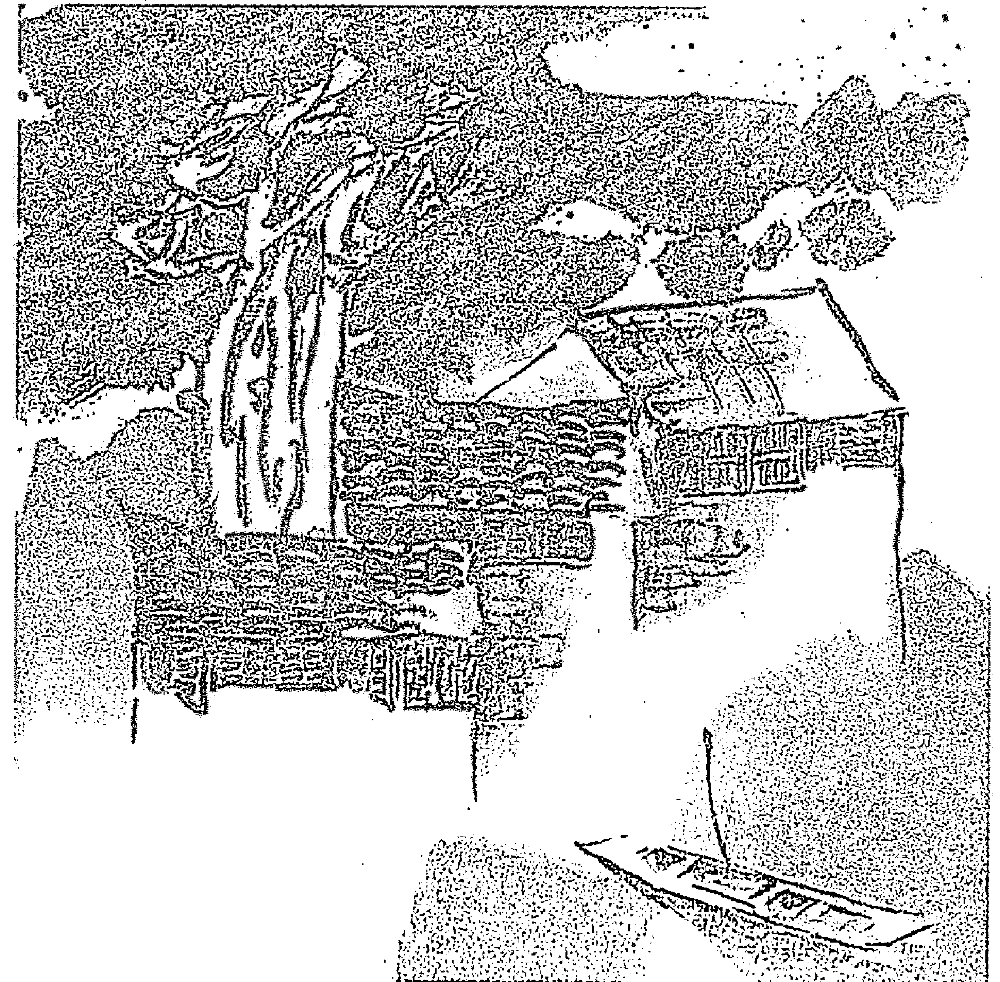

余时间维修住屋；其三是居住者生活懒散，得过且过，毫无生气。

无论居于上述何种因素，都足以构成居住者罹患病难的原因，故堪舆学上所称“屋瓦动摇，家人将有病难之忧”，以现代的观点而言，亦无不当之处。

## 36 忌门柱弯曲难禁压力

> 从建筑学家观点来看，则另有一个重要理由，即门柱笔直方能坚固。

大门设于围墙的出入口处，为住宅与外面连络的主要关点。从前，大门与围墙是该家主人身份和地位的象征，因此，门柱若发生倾斜或弯曲，将损及该家主人的威严。因此，从前的人极为重视门柱的正直与否。

若从建筑学观点上来看，则另有一个重要理由，即门柱笔直方能坚固。从前的门，或现在的寺庙大门，门柱上大抵还有屋顶，及两片极重的门板。因此，门柱必须坚固得禁得起屋顶的压力，并支持得住门板的时开时闭。

曾经有一位宅相家说：“住宅门口的左右门柱，绝对不可采取嫁接或接基方式建造。”该宅相家的意思是，门柱不能够以接的方式建造。

从前，由于门柱的根部深埋于地下，较易腐烂，因此经常发生接基（柱基）的情形。然而，采用接基方式完成的门柱，是否禁得起屋顶的压力及门片的重量呢？因此宅相家所说的话，即使以现代建筑观点来看，亦属正确。

门柱不直，必然有碍观瞻，有损居住者的尊严，间接会造成居住者心理的不快。心理不快，精神自然随之恍惚，待人处事难免发生问题，病难于是产生。

家居风水

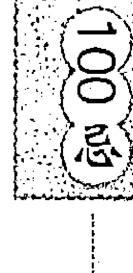

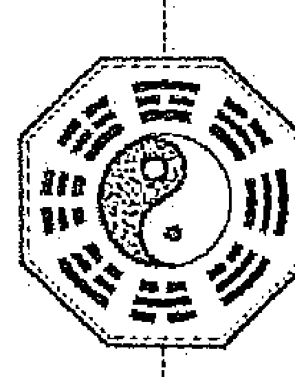

## 37 忌门大家小极不相称

> “门大家小之住宅凶”这句话，无论在古代或现代，皆可通用。

大门很大，而门里的家不大属于凶相，其理由有二：

其一是，不可建造与身份不相称的大门。大门与围墙是一体的，围墙的形状，常因身份不同而异；大门的形状，亦依居住者的身份、地位而有别。因此，如果建造超越身份的豪华型大门，以古人观点而言是“八字承受不起”，必然会招致大凶之事。

理由之二是调和问题。大门是家的附属物，门比家更为显眼，将损及家的整体美。无形之中，会影响到居住者的形象。

因此，“门大家小之住宅凶”这句话，无论在古代或现代，皆可通用。

家居风水

- 100问

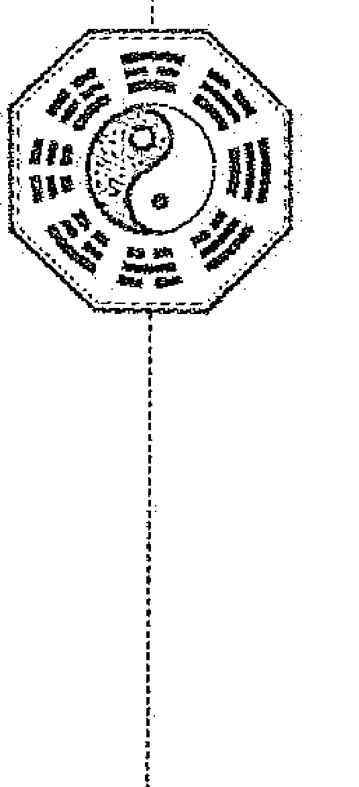

## 38 忌灶井并列污染水质

> 根据堪舆家的共同观点认为，水井绝对不宜与炉灶相邻。

根据堪舆家的共同观点认为，水井绝对不宜与炉灶相邻，其理由有三：

一是就占卜的观点来看，水井为水属阴，炉灶为火属阳，一阴一阳相并列，呈对立之相，属凶相。

第二个理由是，从前的炉灶，大抵以木柴、树枝、树叶等为燃料，会造成灰烬或煤烟，加上从前的水井，亦不像现在水井般有井盖，因此，炉灶若与水井太接近的话，灰烬或煤烟必然会掉落水中，污染井水。

第三个理由是卫生问题。炉灶是在厨房之中，而厨房一定会有污水排出。倘若水井与炉灶相邻，而厨房所排出的污水，多少总会渗入水井之中，这对井水的卫生，将构成很大的问题。

从前的宅相里，对水井的设立位置，有许多禁忌。譬如，水井位于家的前方属不吉之相，位于正东、正西、正南、正北等方位上也不可以。当然，这些说法，大抵都是根据易学的道理而来。不过，正如前面所述，水对人而言，是每天所不可或缺的，因此，水质的确不容污染。

其次，若从经济或现实理由来看，挖井属于相当费事费时费力的作业，一旦挖掘完成，便不能轻易变动位置。所以，挖井前，务必选择与厨房关系方便，且不会造成卫生上问题的适当位置。

现代住宅中自来水的水龙头也不宜与炉灶并列，较佳的位置应在炉灶的对面或右边，这样才方便日常生活。

## 39 忌鹤立鸡群破坏平衡

> 室大则多阴，台高则多阳，多阴则蹶，多阳则接，此阴阳不适之患与。
> 
> ——《吕氏春秋·重己》

住宅比附近的房屋高出很多，独立耸立者属不吉。因为孤峰独竖，高楼凌空，阳气太重。而阳盛阴衰，阴阳失调，使人亢奋激荡，这样的居住环境往往对人的心理健康产生不利。

如果在住宅附近，只有自己的宅子高高矗立着，是不吉祥的。据说这样的住宅的家道、财运不会旺盛。这种说法，是根据两点原因得来的。一个是阳宅勘舆学本身的理论，认为单独耸立的房屋破坏了平衡，会招致不幸；另一项考虑的原因是基于对安危的顾虑。

首先来看平衡的问题。在以前，一个居住区域的决定及宅子的宽窄等，都是按身份来决定的。因此，在一个地域，通常都是身份相近，房屋宽敞大小差不多的人才会住在一起。所以一幢比周围都要豪华、高耸的房子，势必将破坏此地域的和谐，引来各种麻烦，这种不宁的住处，当然属凶。建筑讲究和谐，住宅格局强调整体性、如后有高山，前有矮山，左右有小山，这样的格局才能藏风聚气。

第二点考虑的是安危的问题；单独耸立的房子，必须特别注意地震及遭强风吹袭倒塌的危险。而且，这样一幢高过其它的住宅，不是会有被窥视的不安感吗？同时也可能遮住邻家的光线，给他们带来不便，让邻居有受压迫的感觉。像这样独自高耸的住宅，不但挡住了邻人的日照及凉风，同时也给人心理有相当的压迫，这样在无形中将给人际关系带来不和谐的危机。

一般人如果想在一块狭窄的房屋用地上，搭盖出宽广的住宅来，多半往空中或地下做文章。或许很多人对地下室有阴郁的感觉，所以大都不喜欢地下室。但是平心而论，地下室不失为拓展住处空间的好办法。

## 40 忌改造厨房产生意外

> 家中有待产妇时，还是尽量避免搬家或任何加盖整修工程为宜，即使是在科技进步的现代。

有待产妇的人家，改造厨房，挪动炉灶等，属大忌。

如果家中有怀孕的妇女时，改建炉灶，重新粉刷油漆等，是需要绝对避免的。这种说法所持的理由有三：

在古代观念里，孕妇属不洁之物，所以对破土开工等神圣的工事要避免，以免亵渎神明。

第二点理由是，为了避免孕妇在工程中负担过于繁重的工作。因为一旦开工，人员进出频繁，孕妇又得负责应对，又得操作一些杂事，而孕妇最忌过度操劳，稍一不慎都有流产的危险。所以这种说法能考虑及此，实在是生活智慧的累积。

第三点所持的理由则是：新盖好的房子并不是很干爽的，过重的湿气对孕妇的健康有不良的影响。在古代的建筑里，墙壁等物都是放置着任其自然干燥。所以新盖好的房子，不管怎样都残存着湿气。因此这也可以说是忠告孕妇，要小心避免湿气。

就以第二点的理由来说吧，据一位妇产科医生表示，孕妇流产的事件颇多原因，大多是在搬家时劳动过多所产生的意外。

许多夫妇在怀孕之后，就想为胎儿找一处更宽敞、舒适的住宅。所以兴冲冲地在怀孕期间搬家，或动手加盖什么，结果却造成当初意料不到的坏结果。

所以，说起来，家中有待产妇时，还是尽量避免搬家或任何加盖整修工程为宜，即使是在科技进步的现代。

家居风水
一0八忌

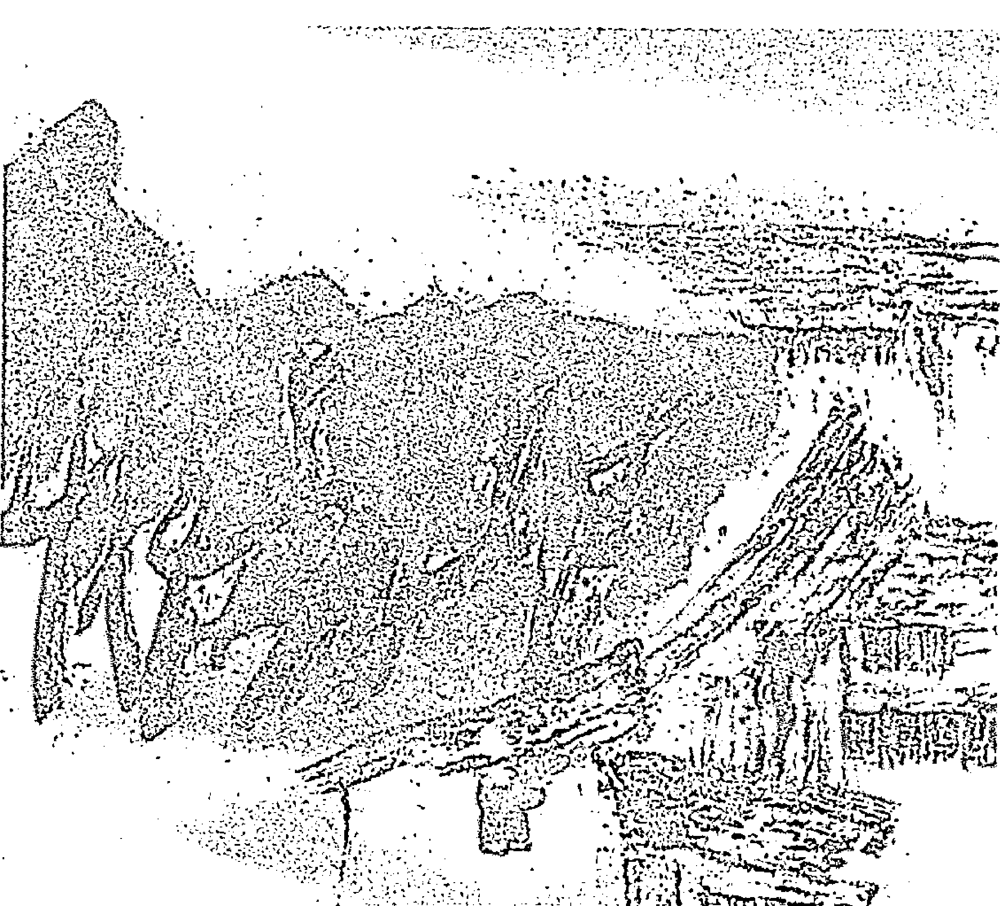

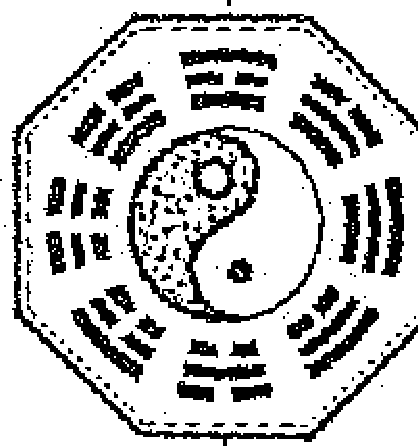

# 家居风水100忌

# 第5章 庭院篇

> > 人因宅而立，宅因人而存。人宅相扶，感通天地，故不可独信命也。 ——《黄帝宅经》

> > 若言阳宅，何异阴宫，最要地势宽平，不宜堂局逼窄。
> 
> —— 《雪心赋》

## 41 忌地窄房大比例失调

建筑要力求调和，不仅是基于美学的观点，同时也关联着安全的问题。在谈论风水时，住宅方位的吉凶和房子的比例大小调和与否，都要同时列入考虑，特别要强调调和的重要。就现代科学的观点而言，建地宽窄和房子大小的比例问题，即使不论风水，也是应当加以重视的。

关于这一点，首先在防火上就具有重大意义。尤其是在房屋密集的土地上，一旦发生火灾马上会蔓延成大火，一发不可收拾。

除了预防火灾之外，在物理条件上，还必须注重通风、采光等。住宅要尽量避免给邻居带来压迫感，尽量能够感受到独立、开放的居家环境。

经常有人问到，建地至少应该多大为宜？这个问题十分难以回答。房子的大小并没有一定的标准。房子价值一百万，土地的价值也应该是一百万，这是一个大致的准则。

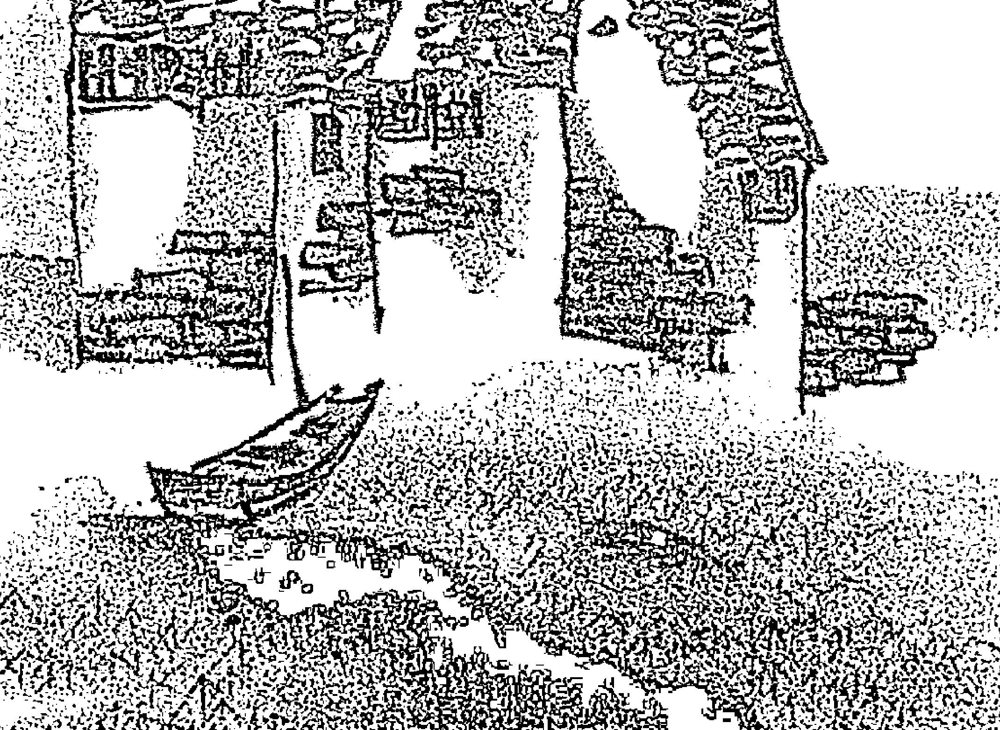

如果财力有限，只能买块小土地的话，那就应该远离高级住宅区，因为那里不容许将房子盖在狭小的土地上。

在住宅密集的土地上，噪音和采光不佳是个大问题，其他还有许多恶劣的条件。尤其是噪音，木造的房子很难加以隔绝。因此，建议在这种地方用混凝土盖房子，因为它是密度很高的材料，隔音效果不错。以一般住宅而言，水泥最适合不过了。

> > 以现代的目光来看，我们对住处环境的选择，已从过去听任自然天成的环境改为要求采光、通风。

家居风水
一八八忌

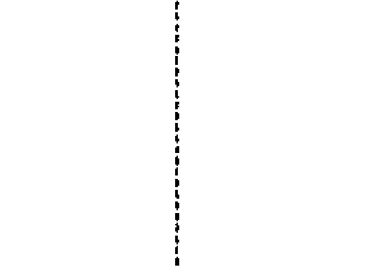

## 42 忌庭院种树遮盖阳光

在风水学中，是非常讨厌在庭院中植下遮盖阳光的大树的。特别是相当于鬼门、内鬼门的东北方、西南方，说什么也不能种植大树。

以现代的眼光来看，我们对住处环境的选择，已从过去听任自然天成的环境改为要求采光、通风，过多的落叶不仅不胜打扫之苦，且易伤及屋子，要警戒之。

这种观点所持的理由有三：一是树会长大。二是庭院除了作为观赏之用外，尚应侧重实用性。三是在管理方面有诸多麻烦。

第一，树会长大。树的长大，会有许多超过我们预期的问题。在建房之初，因考虑到使房屋及庭院的协调而种了树木。但过了三、五年后，这树长得又高又大，不但使当初为取平衡而种植它的原意被破坏，更使原本就不怎么开阔的庭院，看起来愈加的狭小。无论你植的是什么树，事先最好和园艺师商量过，找一种有成长限度的树木种植，最好是尽量少种。

第二，庭院设置的目的，要从观赏性改为注重实用性。当住宅的面积渐渐缩小，空间渐感不敷使用时，就自然而然地会想到将庭院当成住屋的延续，强烈地想拓展其活动空间。于是，降低房中地板高度，使之与庭院齐平。只在庭院及房屋中间设个凉台、草坪之类的。从此，这原本仅供眺望观赏用的庭院，在天气好时，一家人在此进食、嬉戏，成了家人欢聚之所，变为“可用的庭院”。也可以说，庭院就此成为没有设墙壁的房间了。所以，如果考虑到将来要使庭院具有这种功能，那么，与其盖房之初，建造一个庭院——种树，挖水池，倒不如考虑留下能供使用的广大面积式的庭院设计较好。

第三是管理的问题。与纯观赏庭院不同的是，可用庭院很容易受到损伤破坏。而在管理方面，虽然外行人也能做得到，但必须是在不花任何费用下照顾好庭院才可以。近来的园艺业者，其销售手法非常之高明，但是对售后所产生的问题却不肯负责。如果再去请来，所索的费用又贵得吓人。

鉴于这些理由，在庭院中是忌种大树的。

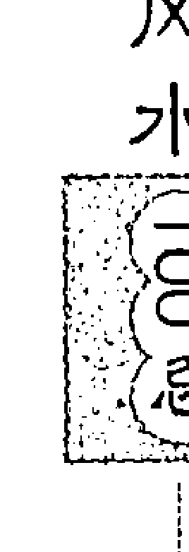

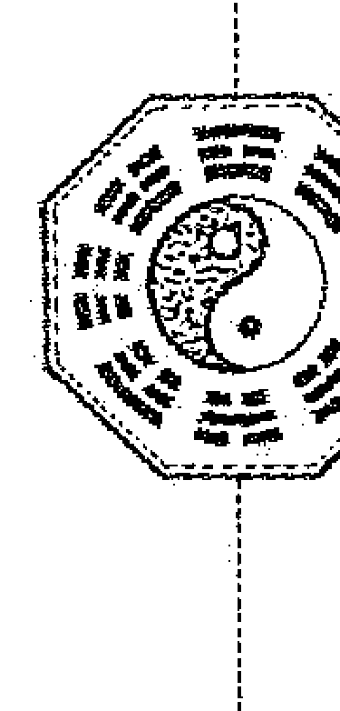

## 43 忌中庭凿池土地阴湿

> 风水学认为在中庭凿水池，种树木，或其他会使土地潮湿的工程，都是大不吉的。

风水学认为在中庭凿水池，种树木，或其他会使土地阴湿的工程，都是大不吉的。

房屋没有中庭在地中海沿岸一带，乃是很普遍的住宅形式。在中国古代，也常采用这种形式的住宅，即在庭院四周，围绕着盖上许多建筑物。

但是，像这样的中庭，在有着广大土地的家中倒没什么，如果是一般普通的人家，是绝不可能留有那么大一块中庭的。一个百平方米左右的住宅，通常只有三米四方的中庭，如果再在上头挖池种树，只怕这庭院要完全丧失机能了。

想要有绿意的话，千万不要种高大型的树木，最好种些藤蔓类、长不高的灌木较好。藤蔓类植物的照顾并不费事，只要避开窗户即可。而且，它也不会妨碍日光的照射。

如果挖了池子，那么，就请注意保持池水的清洁。宅中有池子的人家还必须注意下列几点：

- 1. 在池边设个专用的水龙头，促使换水方便。
- 2. 必须设置有当水池超过一定标高时，使水自动排出的装置。
- 3. 在池底一定要设有排水口。
- 4. 自动排水装置以及池底的排水口，一定要和向外排出的水沟有良好的流动情形，使排水效能十分良好。

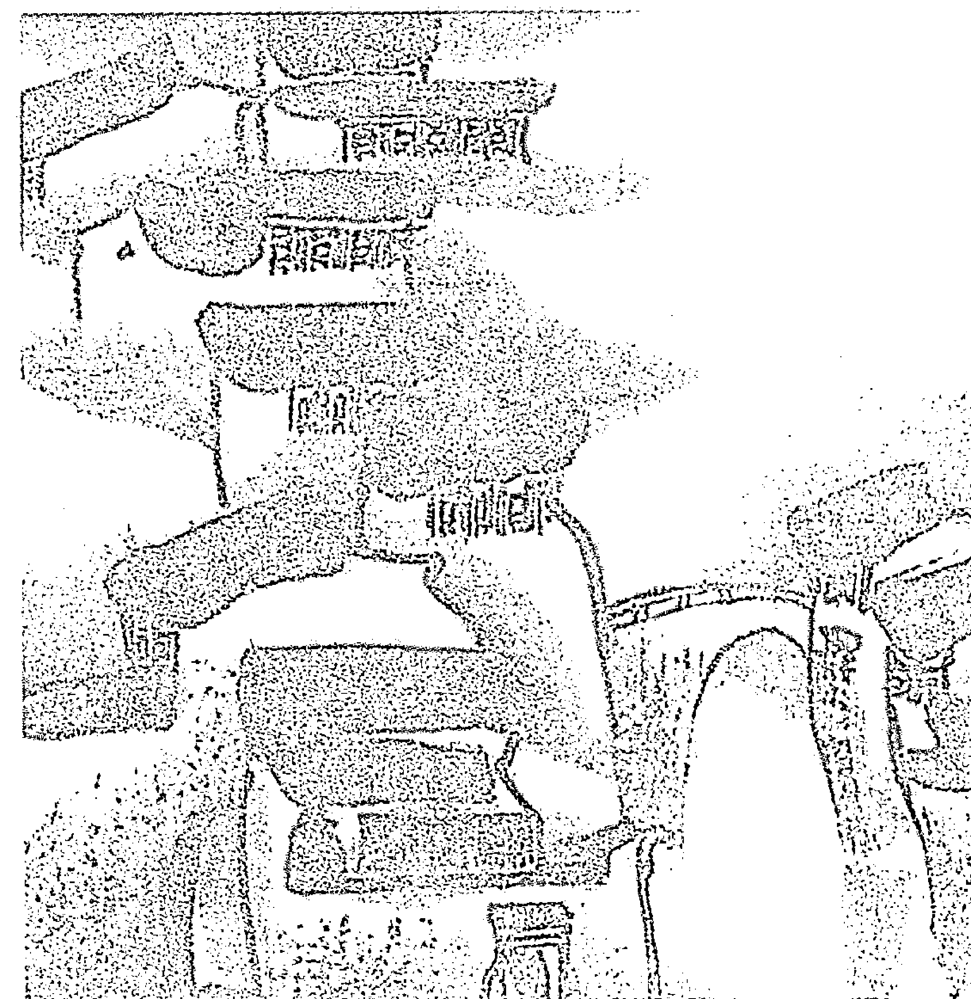

## 44 忌庭院铺石招来阴气

> 阳宅堪舆学上清楚的告诫道：不考虑庭院宽窄，随便地铺上许多石头，将招来阴气。

阳宅堪舆学上清楚的告诫道：不考虑庭院宽窄，随便地铺上许多石头，将招来阴气，终使得家道衰微，寂寞凄凉。

这种说法，大体说来含有二种意思。

第一是象征的意思；第二是有关实际居住的心情。第一点所说的象征意思，旨在训戒我们勿过分改造扭曲自然的状态。庭院最大的目的乃在于欲以其作为建筑物与自然界的中间桥梁，若率尔铺下大量的石头，挤得几乎没有蚂蚁钻行的缝隙，那么，存在于大地上的阳气、喜悦、土气便都被盖住，因而会招来大凶。

第二点指的是，会对居住心境有负面的影响。因为据说石头会招来燠热之气，且有碍于家中的明朗气息。为什么说石头会招来焕热之气呢？原本盛夏之时，受了阳光直射后的石头，其温度可达摄氏90度。这样一来，也连带地使庭院热烘烘了起来，地面一米处都将近有50度的热度。夏天住在这种地方，简直就等于装了高性能的辐射暖气设备一般。闷热不仅止于庭院，也会反射到屋中。而且，因为石头的热容量非常之大，白天它吸足了热气，等到晚上周围变得凉快时，它就开始散热，使周围凉空气变热许多。那么，白天闷热了一天，到了晚上仍没得以清凉。

那么这种庭院冬天是否会好呢？

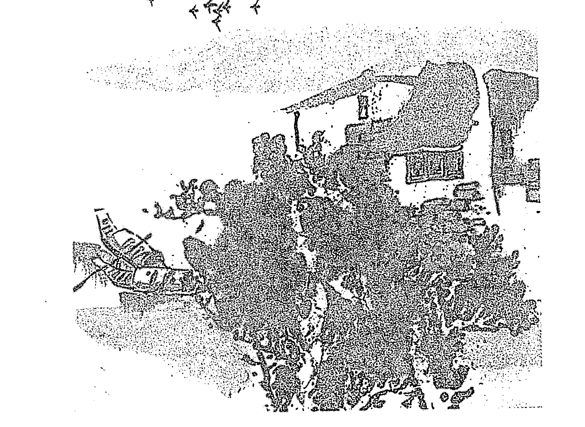

冬天时，石头在夜间被冻得温度很低，到了白天，便吸收四周热气，如此不就等于间接地带来寒气？除此之外，在梅雨绵绵的季节，铺在地上的石块也成了水气蒸发的障碍，使庭院变得潮湿粘稠。

另一点应提到的是：大量石头会损坏住的明朗气氛。一般庭院常为人指摘之处，便是在采光明朗度方面考虑不够周详。不是放了与庭院宽窄不成比例的大量石头，便是摆放过于巨大的石块。

前面我们提到过，庭院的功用应该由观赏性转变为实用性，所以建议将庭院做为住宅的延长。在此转变过程中，草坪的存在，就引起多方面的关切。

这草坪除了强调其实用性外，也应该具有观赏性的功效。培养方面，只要是湿气少，日照充足，那外行人也能种得好。一般栽培法乃是以根来繁殖，花个二、三年时间即可，费用不多。西洋式的乃是在种子上覆以薄土，等它抽芽长大便可。

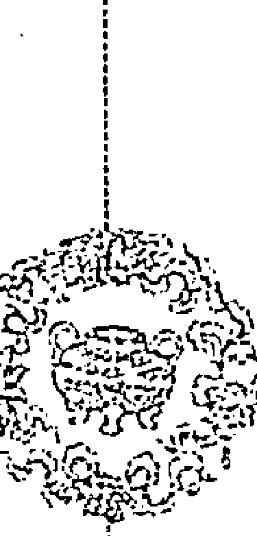

## 45 忌流水穿越隐藏水患

> 凡宅不居正当水流处……
> 
> 阳宅十书

在古代，很多沟渠河川多流经城镇。或许你想将水流引进家中，终日听那潺潺水声岂不风雅？但是，根据阳宅堪舆学，这乃属不吉之兆。而且，不仅是屋邸中，就连在水流之旁建造房子，在堪舆学中也都认为不好。

因为河水免不了泛滥，必须提防洪水之灾。而且一般水流流经之地多为地势低洼之所，这些地方大多隐藏有危机，此所以堪舆学告诫我们勿居水流之房的原因。

在古代，对于有洪水之患的地方，都准备有小舟以备不时之需。但在现代即使是住在相当危险的地方，也未曾有此预防万一的准备。约在数十年前的某次台风，某河川突然泛滥成灾。这条河川穿过住宅区之中，由于洪水突然暴涨，宅区居民个个措手不及，坐困一片汪洋的浊水之中。

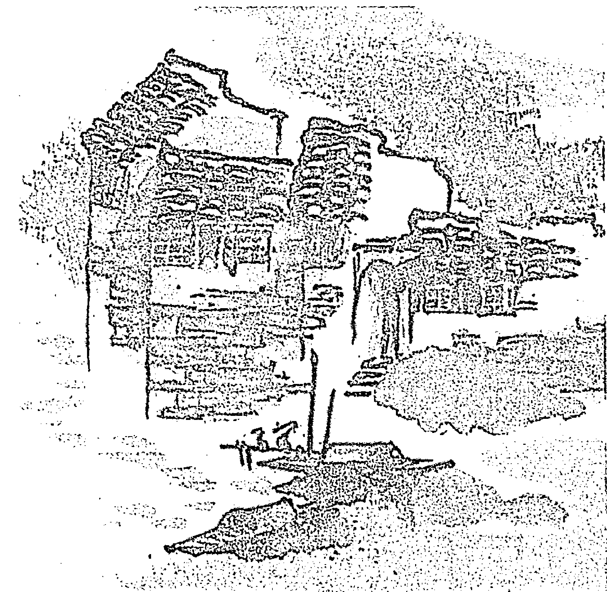

此外，还必须注意的是，河流附近的地盘较为松软脆弱。1964年，日本新泻县大地震，灾情最惨重的地区，大多集中在河川的流经地。建在河川地盘上的城镇几乎都成了受灾者。所以，如果是在脆弱的地盘上建盖房屋，在基础工事方面要多加费心，梁柱之间要多加些交叉盘绕的板子，以增加其稳固性。

## 46 忌围墙过高有碍美观

> 住屋与围墙一定要求其和谐相称。若是围墙过高，与住宅不能配合，在堪舆学中，乃是属会带来贫乏的不吉之兆。

以前的围墙，乃是按照身份、地位、格调来决定其形式的。住宅更是考虑了身份、地位、格调才建立的。所以住宅与围墙一定要求其和谐相称。若是围墙过高，与住宅不能配合，在堪舆学中，乃是属于会带来贫乏的不吉之兆。

与住宅相比，围墙过高的话，在现代建筑里也是属于凶相的。其理由有二：

一是小偷容易侵入。一般人都认为，高围墙不是使偷儿进入不易吗？实际上，并不是这样的。小偷，顾名思义是偷偷摸摸的，高耸的围墙正好挡住外面的视线，使其偷窃的行径不易为人发现。所以对他们来说，过高的围墙反而有利。围墙最重要的作用应该在于所属界限的标识划分，真正的防范小偷应在于玄关、门户是否紧闭。

二是有碍美观。从房屋外部看来时，围墙与住宅应是一体的。远眺可隐约瞧见房舍门窗，这样的景致才美。过高的围墙，不仅破坏了美观的画面，让人嫌恶，更显得屋主似乎是器量狭小、没有修养的人。

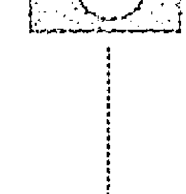

家居风水
100忌

建筑物尚要考虑与其所处地域的和谐调和，过高的围墙恰直似冷冷地拒绝与所处地域和谐相处。日本东京有名的高级住宅地区——田园调布，乃是大正时期电铁公司开发后出售的住宅地。

当时出售之时，他们是根据当地居民的共同意愿，不设木板或水泥的围墙，改种低矮小树为篱笆，这景观一直持续到了今天。没有高高的围墙，却能安居的现象，大概具有某种象征意义吧。一家家的房舍虽各具其个性，而整个住宅区却显出其统一性。

过高的围墙不吉，但在现代的情形下，过低的围墙也是不好的。因为现在噪音以及污染的情形很严重。而围墙具有防止噪音、尘埃进入的功效，所以为防止此类公害，围墙也不宜筑得太低。其高度在超过1米之后，防止污染的功效并未增加，所以不宜建得比1.5米高出太多，以免阻挡日照、通风，造成负面的影响。

围墙的种类，除了以花草树木为墙之外，尚有以木板、铁丝网、水泥、堆石块、堆砖块造围墙等种种类型。花草树木围成的墙，住屋者及经过的路人都可感受到四季变化的美丽景观，很是风雅。其缺点乃在于花费不低，且在维修方面颇费周折。较便宜的，大概是水泥砖块墙吧，只不过这种墙易为风吹倒，最好打下深20厘米、砖块二倍厚的地基较为坚固。

## **家居风水 100忌**

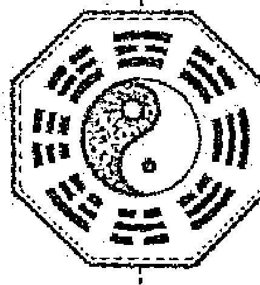## 家居风水 100忌

## 第⑥章 结构篇

> 凡人家，屋门乱杂错综向，必定兄弟不和睦；屋后人家有两向，便断人家忤逆足。”——《水法诸言》

> 凡是满足日照和通风两大要求的间距，则谓之合理。它是随着纬度、地形、住宅高度和长度以至住宅坐向等因素的变化而变通的。

> 在狭窄的地方盖房子，再在周围筑上围墙，自然地家与围墙之间的距离只有一点点，这种情形，会使人有强烈的压迫感。

> 住宅近工业区有诸多不利，灰尘、废气、废水和噪音对住房的影响是极其明显的，尤其是对婴幼儿和老人。

> 风水学最忌尖角，因为尖角锐利，具有颇大的杀伤力，因此，对周围环境容易造成冲克损害。

> 风水学有“尖角冲射”不吉之说，认为这样会导致家口不安，病痛频仍，甚至家破人亡云云。

> 住在狭小的住地而又要使住者心情愉快、和谐相处的条件是，最好设置一些“余地”。

> 宅相的基本观点认为，普尔正中央乃最重要的地方，应该设置为：主人的房间，或是其他重要用途的房间。

> 宅相中认为栋梁的安全性一定要很讲究。事实上对于今天的建筑而言，这种说法还是颇为适用。

> 栋梁是支撑屋顶的梁木，所以一定要很坚固，尤其是以瓦为顶的房子。

宅有五虚，令人贫耗；五实，令人富贵。宅大人少，一虚；宅门大内小，二虚；墙院不完，三虚；井灶不处，四虚；宅地多，屋小庭院广，五虚。宅小人多，一实；宅大门小，二实；墙院完全，三实；宅小大畜多，四实；宅水沟东南流，五实。

——《黄帝·宅经》

## 47 忌围墙近房缚手缚脚

在狭窄的地方盖房子，再在周围筑上围墙，自然地家与围墙之间的距离只有一点点。这种情形，会使人有强烈的压迫感，感觉上缚手缚脚，而且，这类房屋的通风采光一定不佳。所以，在阳宅堪舆学中将这类房子视为不吉。这种说法，即使到了现代，仍然普遍为大众所接受。

墙与住宅相距不远之处，大都是建地狭窄之所，邻家或公共道路常就在近旁。如此一来，这堵墙不建也不行的。既然是不能不建，所以我们只有从改善这堵墙可能带来的缺点，着手改进。

- 1. 必须要做的是，在墙下方基底处留下约 20 厘米。如此既可改善通风、采光，也可给狭小庭院内的花草有成长茂盛的生机。
- 2. 要改进的是，因为邻家就在近处，所以不能任意地高筑围墙——最好不要超过一层楼的高度，即在二楼可被瞧见的高度。然后和邻居人商量，各自在窗内设些阻碍视线之物。这种利用家中开口处设置阻碍外面视线之物的作法，乃是一种常识。

在北侧、西侧开了窗户的住家，设个阻碍物大概没什么问题。倒是南方、北方开了窗户的人家，因家中景象常有被外面窥见之虞，所以在遮掩物上要多下功夫。

百叶窗、窗帘，直立鱼鳍状物都好用。这鱼鳍的意思就是指鱼的鳍，许多鱼鳍整齐排列的格子状的竖鱼鳍状物，既可确保其通风及采光，又不必担心被外面看到家中景象。

在建筑基准法中，尚未有明文规定住屋与围墙之间该留下多少宽度。但是，如果你实在必须在这样狭小的建地盖房子、围墙，别忘了参照上述改进围墙缺点的方法，以使住处能有较佳的通风及采光。

## 48 忌毗邻太近过于拥挤

凡是满足日照和通风两大要求的间距则谓之合理。它是随着纬度、地形、住宅高度和长度以至住宅坐向等因素的变化而变通的。

通常可根据使室内在冬季中午前后有两小时以上日照时间，这一最低要求进行估算。一般比较理想的要求是，前后间距等于楼房高度，并肩间距等于楼房高度的一半。如6层楼住宅，高18米，则以前后间距18米，并肩间距9米为理想。

实际上，由于地皮紧张，间距有所缩小。如广州某单位建6层楼住宅，前后间距为15米，并肩间距为8米。

一些人口稠密的农村，住宅往往过于拥挤。间距只有 1~2 米，甚至不够 1 米。更为严重的是屋檐水滴到毗邻的墙壁上，这当然不会有什么好风水。

## 49 忌毗邻杂乱参差不齐

如果是毗邻整齐划一，高矮相当，则呈现出建筑景观美。这种景观美反射到人们的心理上便是平等互助，和睦相处。因此，有利于建立和睦的邻里关系。

如果是毗邻布局错乱，高矮参差不齐，则不仅不美而且会反射到人们的心理上相互歧视而造成隔阂。

这正如古代风水著作《水法诸言》所说：“凡人家，屋门乱杂错综向，必定兄弟不和睦；屋后人家有两向，便断人家忤逆足。”

如果住宅矮于毗邻，特别是气口方向被高建筑物所阻挡，则将影响本宅风水。广州市某路有间商店，东边被 15 层楼阻挡，紫气东来不了，可能是其生意一直不旺的诸多原因之一。

## 50 忌毗邻污染诸多不利

如果是毗邻没有废气、废水、废渣所谓“三废”排放，也没有噪音干扰和高压线路经过，也不是电厂或变电站，周围环境比较干净和安静，则较为理想。

住宅近工业区有诸多不利，灰尘、废气、废水和噪音对住户的影响是极其明显的，尤其是对婴幼儿和老人。

工业区要有治理污染的切实措施，居民们要有强烈的环境保护意识。工业区和住宅区要有适当的距离。

特别提到的是，工业区的噪声比较大，而噪声对人的睡眠影响较大，它不仅使人难以入睡，而且人睡着之后也容易被吵醒，吵醒之后又往往不容易再入睡。日久则会影响食欲及健康。

噪音对儿童的健康危害比成人更大，它能使听觉器官的敏感性降低，容易出现听觉疲劳，听力减退，对低分贝的声音难以区别。

噪音对大脑是一种恶性刺激，使孩子的学习能力降低，注意力不集中，很快出现学习疲劳，记忆力减退，学习成绩下降，严重影响孩子的智能的发展。所以，在噪音环境中长大的孩子，脾气暴躁，缺乏耐心，情绪极易波动。

## 51 忌客厅狭长难以设计

一向以来，中国人深受“天圆地方”观念的影响，所以日用物品多是以圆形或方形为主。举例来说，传统的建筑便是以方形为主，圆形为辅的。

中国传统的房屋，无论是外墙或是内部厅房，大多是方形的，四平八稳，透出堂堂正正、不偏不倚的气势，令人不禁肃然起敬。风水学重视的是这类方正无缺的房屋。

在风水学来说，屋形以方正为佳。方形在五行中属土形，长方形属木形。这两种形状地气平和，有着平稳渐进的灵动力。居住在方形的楼房里，有平和、宽容、敦厚、稳健的感觉；而住在长方形的楼房里，则略显单薄之感，仿佛主人的胸怀不宽，气量不大。因此，若是狭长形或不规则形则被视为不吉。

但现在都市里的大厦单位设计，大多没有考虑到这点，以致很多大厦住宅单位是狭长形或是不规则形。一般人因无可选择而购买下来，但心里却始终存有阴影，难以安心居住。

到底这些狭长形或是不规则形的厅房是否真的无可救药了呢？这是很多人均感关注的问题，现在便和各位谈谈补救之道。首先谈谈狭长形的厅房。所谓狭长，是指长度超过宽度一倍以上。

客厅长度是30尺，而宽度只有12尺，甚为狭长。这样的客厅不但在风水方面不符合理想，而且在室内设计方面亦难以处理。

在这种情况下，最佳的解决办法是，把客厅用矮柜，沙发等家俱把它一分为二。把长条切割成两个方形，这样不仅符合风水之道，而且亦可改变观感，看起来不再觉得狭长。

## 52 忌睡房狭长孤清冷落

刚才所提及的是狭长形的大厅，而狭长形的睡房亦可采用同样方法，把睡房一分为二。倘若躺在床上望着这样狭长的睡房，便会有孤清冷落的感觉，而那些神经敏感的人更会胡思乱想而产生许多幻觉的。

但若用矮柜把这狭长的睡房分隔为二，一边作为化妆间或书房之用，另一边则作为睡眠之用。若在矮柜上放置电视机，那么躺在床上亦可欣赏电视节目。

经过如此改动后，睡房中间的一大片不再空洞无物，心理上便感觉踏实得多。

有一点请你注意，有些人用镜子来作为睡房的间隔，其实这是不适宜的。倘若镜子向着化妆间或书房那边尚无大碍，但若是向着睡床那边便犯了风水学上的大忌，往往导致疾病发生。

## 53 忌尖角对房冲克损害

从风水学方面来着手布置菱形厅房时，一定要把握以下两个原则：一是尽量把尖角削平；二是布置成几个互相呼应的区域。风水学最忌尖角，因为尖角锐利，具有颇大的杀伤力，因此对周围环境容易造成冲克损害，而屋内的尖角因距离甚近则杀伤力特大。

在布置菱形的厅房时，首先是要处理这些尖角。倘若能够处理好，那就可不必再为风水问题担心了。

举例来说，如果尖锐的墙角冲射房门，那便会对睡房中的人造成颇大伤害，破财尚是其次，而最严重的是丁口受损，或甚至会有人命伤亡。化解的方法之一，可用木柜或是其他家俱把尖锐的墙角填平，这便可化解尖角冲射之险。

## 54 忌尖角冲射不祥之兆

中国传统的观念里，对于尖角特别敏感，风水学有“尖角冲射”不吉之说，认为这样会导致家口不安，病痛频仍，甚至家破人亡云云。

到底为何会有这种说法呢？

因为中国是崇尚“圆”与“方”的民族，所以大部分的建筑物以及用具，均是以圆形及方形为主。

圆形，因为它既象征团圆及圆满，而且由于浑圆无角，不会有尖角冲射之虞，所以备受欢迎。

方形受欢迎的原因，主要是因为它四平八稳的外形给人稳重可靠的感觉。方形虽然有角，但因为均是钝角而非锐角，因此不会构成严重的尖角冲射之害。

至于三角形，因为它的每边均有尖角（小于90度的尖角），而尖角的杀伤力远较钝角凌厉，可以说，角度愈尖锐则杀伤力就愈大。

我们不妨留意一看，中国传统的建筑物以及用具，极少是三角形的，这可证明以上所言并非荒诞无稽。

因此在选购楼房时，应该注意周围附近是否有尖角冲射，若有则要另作选择。尖角冲射有很多种类型，而以冲射大门为最凶。

依照风水学说，尖角冲射大门是会引起许多不吉利的后果，例如病痛频仍，甚至家破人亡。

其实，这是过甚其词的说法，但倘若真的有所顾忌，可予以化解：

那便是用鱼缸化煞，方法是在对正尖角冲射之处，放一鱼缸，这会有转祸为祥的效果。

**摆放鱼缸的作用有二：**

- 1. 鱼缸是用玻璃制造，而缸边的铝片或镜片，与挡煞的八卦镜一样，具有反射作用。
- 2. 尖角是利器，属金；用鱼缸来化解尖角冲射的原因，主要是金生水后，金的元气便大为亏损。换句话说，这是利用鱼缸的水来消除尖角的锐气。

用鱼缸来化解尖角冲射，既可心安理得，而且又美观悦目，不着痕迹，化煞于无形。

## 55 忌住宅细长动线过长

正屋横向而过于狭长的话，家中易有人生病，乃是凶相。尤其是现代正流行公寓住宅，因此特别提醒大家在选择住房时，要特别注意其隔间情形。

有许多公寓式建筑都拥挤地立在狭小的土地上，而且为了能容纳更多的户数，大都采取东西短、南北长的隔间方式。也就是说，每户人家只有一点小面积能受到日光直射。但是，公寓却很少配备全套冷暖气设备，也未曾为住户特别设立晒衣场。因此如果住进这样的公寓，不但要为取暖设备烦恼，而且要常为洗濯物的晾干而伤透脑筋。一个有这么多苦恼的房屋适合居住吗？

此外，这样的公寓常在北边偏向东方的地方和西侧设置入口。而一般人又习惯把靠南的房间当作客厅。如此一来从入口到起居室就隔了段相当远的距离，而且餐厅及厨房变成位于房子中央，不管要去哪里都非通过这两个地方不可。

以建筑用语来说是动线变长了，即为了移动到某个场所所需步行的距离加长了。这样结构的住宅在使用上真是不方便。

居住在狭小的住地而又要使居住者心情愉快、和谐相处的条件是，最好设置一些“余地”。但是观之目前林立的公寓式建筑，特别是每户60平方米以下的公寓，似乎并未为使狭小的空间发挥最大功效而特别努力。

公寓的另一个特点是，整个家的隐密性虽然获得保留，能和邻近住家完全隔绝，但是家中每一个成员彼此之间的独立性似乎就未能受到重视——可能是为了节省经费，业者在房中很少设有隔间用墙壁。关于这一点，只有在家俱安放上多下些功夫，同时利用窗帘来达到隔间的目的。

如果住宅有窄长形的房间，应该怎么办呢？

其实，这个问题并不难解决，只要在房间中央地方，加些间隔或摆放家具，把房间“无形”地分成两个部分，便可解决问题。

## 56 忌楼梯居中占据空间

两层楼的住宅，把楼梯设置在家的正中央，是很不吉利的。这种宅相说法有三个理由：第一个理由，宅相的基本观点认为，家的正中央乃最重要的地方，应该设置为主人的房间，或是其他重要用途的房间。

第二个理由，把楼梯设在房子的正中央，等于把家从正中央切开，不仅损害家的一体感，也折损全家人的幸福。

第三个理由，从玄关进来，直接有楼梯通往二楼，比较方便。由于玄关置之房子的正中央很不吉利，所以楼梯也跟着不能置之中央，而要移向偏旁的位置。

这个宅相观点，也适用于现代的建筑，如果楼梯占领一层的中央位置，一楼就等于被分成两半，这样不仅房间在配置上不方便，也会使房子的机能变得很不顺畅。

至于楼梯设在何处比较好，则要视二楼房间的性质而定。如果二楼以个人房间或卧室为主，很注意个人隐私时，楼梯最好设在餐厅、厨房的附近；如果浴室或厕所设置在卧室近处时，那个位置也很方便；如果二楼有客房等设备，不在乎隐私问题时，则可以在玄关前设置楼梯。如此不仅方便，而且站在利用空间的立场看来，其利用效率也很高。

兴建楼梯时，如何去确保其安全性，也是非常重要的问题。在按照建筑基准法，楼梯每阶的高度，都有一定的最低限度。一阶的高度，在建筑用语中叫‘踏级’，最高限度不能超出 23 厘米；每一阶的‘脚踏面’，一定不得少于 15 厘米。当然，这些都是最勉强的限度，太陡直的楼梯对老人或小孩都很危险。比较理想的楼梯是：踏级 17 厘米，脚踏面则为 27 厘米左右。

楼梯按照形状可以区分为：直线型、L字型、U字型、曲线型、螺旋型。直线型。因为单纯而不占空间，所以即使面积很小也能安置得很好，兴建费用也很节省。不过，倾斜度必须保持和缓的直线型楼梯，房子的深度要有一定的程度，这一点倒是不容忽视的。

L字型也叫折曲型，由于楼梯中央折曲处一定要有缓冲处，因此会占去一些空间。不过，它的优点即能充分利用住宅的角落地带。

U字型楼梯，在学校或百货公司最容易看见，适用于天花板较高的地方。

螺旋形像是最不占面积的楼梯兴建法，不过，由于靠近中心部没有脚踏面，而往上爬时身体还要跟着回转非常危险。

不管是哪一种楼梯，为提高安全性，最好都能装上扶手栏杆，扶手栏杆的架设以不破坏墙壁美观为原则。高度从脚踏面往上数，90厘米左右最为理想。

## 57 忌栋梁接木连接不良

栋梁是住宅的中心体，可以说是最重要的东西，所以接木，或把它埋在土中，都是极不吉利的做法。对于以前的平房而言，栋梁是架构上最重要的东西，所以宅相中认为栋梁的安全性一定要很讲究。事实上对于今天的建筑而言，这种说法还是颇为适用的。

栋梁必须很健全的理由有二：

- 第一，平房乃是由梁柱架构而成，横的叫梁，直的叫柱，梁、柱、地基三者乃是靠栋梁而结合起来的。栋梁既然负有这样的重担，当然必须很坚固。
- 第二，加强安全性。坚固的栋梁可以减少房子的损害率，例如比较不容易腐朽，遇到强风或地震时也不容易倒塌等。如果栋梁的中央是用接木而成，或是部分埋在土中，则力量过度集中于该处，很容易折断。

现在要找到上好的木材比较困难，即使找到了，价格也昂贵得令人却步。因为木材的价格和长度成平方比，所以长的木材价格当然很高。由于这样的原因，房子的梁柱必须中途实行接木，也变成迫不得已的事情了。

如何使接木梁柱的坚固性提高，在接木时必须很讲究方法，虽然方法很多，但是主要的还是不外乎下列三个原则：

第一个是连接时的技巧，木头连接的地方叫做接缝，连接时可以使用螺柱或铁钉，如果不想使用金属器具，以免破坏木头的美感时，可以使用合成树脂。不管使用何种方法连接，前提条件就是不使栋梁失去坚固力。

第二，柱子的高度不要一致，因为长度一致的话，对侧面而来的力量会承受不住。任意增加高度，也会使承受力分散，要避免之。

第三，用交叉组合方式，或是使用其他补助器材。

上述方法因为墙壁粉刷后就不易发现，所以购买成屋时，一定要特别注意，否则买到栋梁连接不良的房子，就等于站在虎口前面。

## 58 忌栋梁镶接难以坚固

栋梁是房子最上部的梁木，这支梁木如果不是贯通的材料，就非常不吉利。这个宅相说法乃是因栋梁是支撑屋顶的梁木，所以一定要很坚固，尤其是以瓦为顶的房子。由于瓦的重量不轻，栋梁要承受如此之大的压力，不坚固一些的话，一旦屋顶压垮下来，一定会造成很大的悲剧。

栋梁的材质，大都是选择杉和桧等角材，其精细度大部分都在 10~12 厘米之间。有些房子偶尔也会使用杉、桧等圆木，不过，这必须配合屋顶的倾斜度。

现在由于长且粗的木材很难购买到，所以这个宅相说法常常都无法实行。不过，这也有两个补救办法：

一是使用铁骨的梁木，即木铁混合使用。由于铁的弹性很强，纵使很薄也有很大的支撑力，所以就变成很好的梁木材料。铁骨梁木的价格比木材便宜，所以现在也有不少人使用。至于重量方面，则以钢材为轻。

另外一种方法就是连接木材，连接的方法和衔接柱子相同，可以使用铁钉或螺栓等金属，或是采用交叉组合法。木材的连接方法，木匠师傅们把它们分成三大类，即“送接”、“相接”、“分接”等。所谓“送接”，是指一支木材的元口（即靠根部的那一侧），与另一支木材的末口（即靠树梢的那一侧）互相衔接；“分接”则为元口与元口相衔接；而“相接”则为末口与末口相组合。

## 59 忌房子凸形贫寒之相

建筑物的正面看去类似山字或火字，乃是指房子的中央是二楼，而左右两边却是一楼的房屋构造，这样的房子好像寒风吹刮两肩一样，是贫寒之相。因为这样的房屋构造会引起火灾，或是使住者破财，所以应该避免。

这个宅相说法，站在建筑学的理论看来，乃是为了确保住宅的安全，而给人们的指示。建筑设计中有所谓的构造设计作业，它的内容包括：计算建筑物所有部分的相对力量、建筑物本身的重量，或是外面物体对该建筑物施予的力量。这些力量都计算过后，就计划使用哪一种材料，以便能承受一切外来的力，或相对的力。

总之，构造设计作业是建造安全的住宅绝不可忽略的过程。铁或水泥等均质材料，承受外力的强度可以很精确地计算出来，可是木材就很难了。因为每一支木材的条件都不同，所以在计算上常都会出现误差。如何使计算的误差降至最少，以前并没有绝对的方法，完全靠师傅的经验行事，由于经验并不见得万无一失，所以宅相中就有很多告诫世人如何确保安全的方法，这一个宅相说法只是代表之一而已。

前面说了很多关于房屋构造的事情，现在就来讨论何以凸字形的房屋构造，属于不吉利的造型。

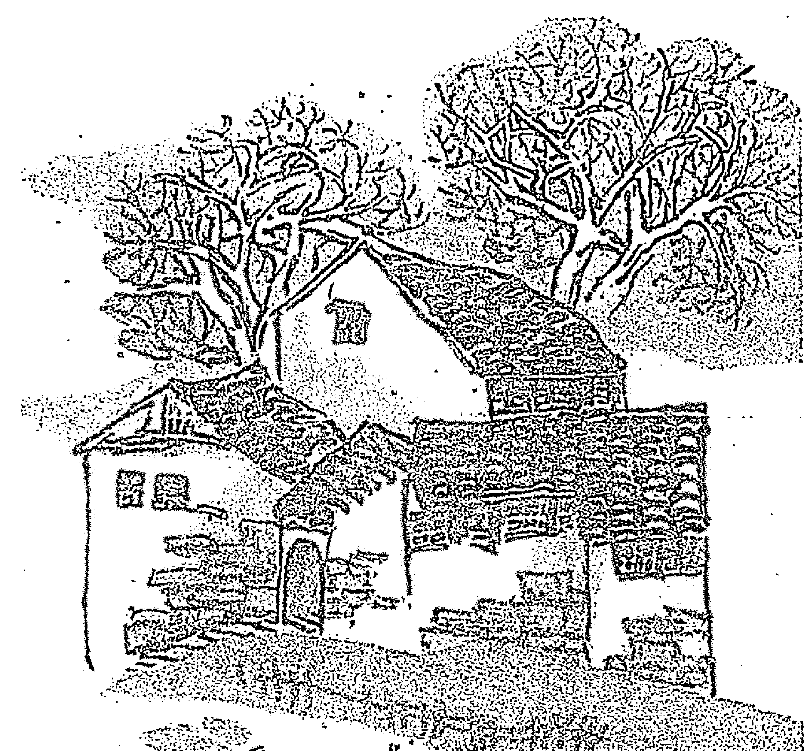

任何建筑物，在一定的周期里，其振动的幅度都是固定的，振动的周期规则是：愈高者愈长，愈低者则愈短。一幢建筑物如果固定振动的长波部分与短波部分相重叠，则碰到地震或强风等外力施加时，连接的部分就会有方向相反的力量互相牵引，最后造成断裂的危险现象。

具体地说，就是二楼与一楼连接的地方，会有断裂的危险。这种情况的发生，以木造或灰泥造的房子最为显著。灰泥造的房子经常都会有裂隙出现，这就是因为没有考虑到力学问题。通常房子如果出现裂隙，雨水就很容易从该处侵入，雨水一旦侵入墙壁必定会濡湿房子的其他架构，严重的会使房子倒塌。

另外，冬天时渗入裂隙的雨水，会因受冻而膨胀，使得裂隙更为扩大，这种龟裂现象常常都是房屋失去耐久力的重要因素。人类肝脏恶化后的现象，就和房子的这种现象很类似。肝脏功能失常，心脏或肾脏就跟着衰弱，最后终于全身衰弱步入死亡。

从侧面的立场看去，如果一定要兴建凹凸式的房子时，在梁柱的使用上，一定要考虑横向或斜面所施加的力量，使用能承受外力愈强的材料，愈能确保全家人的安全。

## 60 忌房顶高起逆流漏雨

屋顶前后较低，而中央高起的房子，则属于从侧面看去是凸型的房子。宅相上认为这种造型的房子属凶。

屋顶前后较低，而中央高起的房子，则属于从侧面看去是凸型的房子。这种造型的房子，在构造上的问题大抵和前项的例子一样，而且该注意的事项也大致类似。

宅相上认为这种造型的房子属凶，还有另外一个理由，亦即下雨时所碰到的问题。以前排水管并不发达，雨水都是从屋顶直接往下落。若屋顶成阶段性，则由上而下的水汇集后，流势就很惊人。当然这里所说的屋顶阶段是和大门口平行的，声势浩大的雨水滴滴答答往下落，玄关很容易被溅湿，所以宅相上认为是凶相。

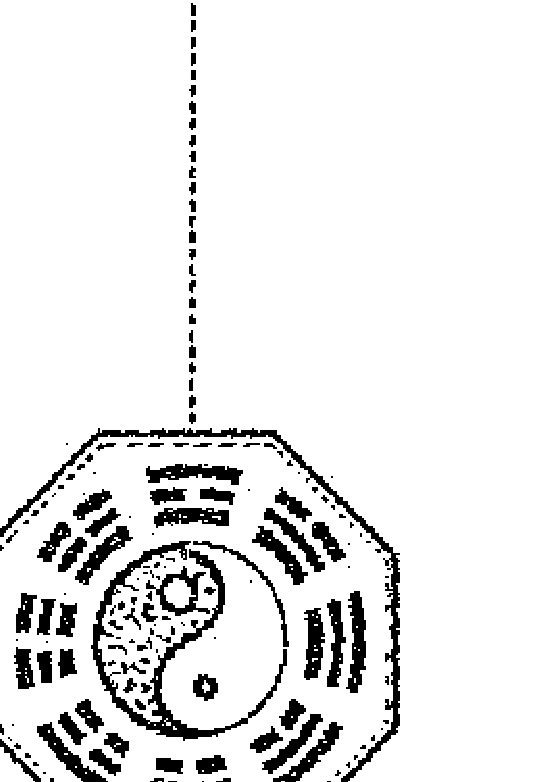

凶相。

屋顶的出现，可以说和住家的发生是同时的，它和房子的墙壁一样，是使住宅的内部与大自然隔离的重要部分。今天，屋顶的建材已非常进步，但是建筑上对于屋顶的重视，并没有因此而改变。搭建屋顶所必须考虑到的条件有五个——先从屋顶的机能来看——①耐水性；②耐久性——对温度的变化或风的物理力量的耐性很强；③耐火性——它在房子全体中占有很重要的地位；④使房子全体看起来很美观；⑤因为它位于房子的最上面，所以要尽可能的轻，并且便宜。

要使这些条件与房屋的外形相配合，屋顶的形式、倾斜度、以及材质问题，就必须慎重考虑。所以现在就先来谈屋顶的形式与倾斜度。

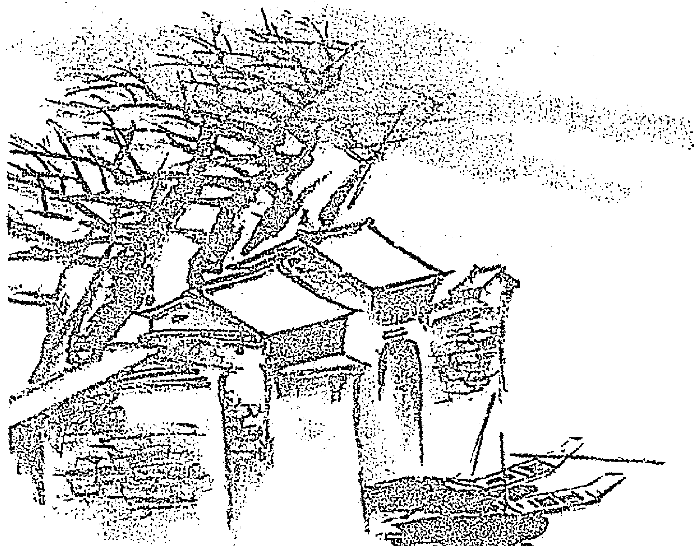

中国建筑的屋顶有三个基本形式，即切妻、寄栋、与入母屋。切妻是以栋梁为中心，然后前后两方铺上长方形的屋顶平面。所谓寄栋，是指栋梁四面都有屋顶平面扩展的屋顶形式。由于屋顶最上方的梁木两端，有两根栋木，所以就有这样的名称。入母屋是切妻与寄栋的组合形式，屋顶的上方是山形墙向两边延伸，而下方是四面都为平面屋顶。
另外还有一种屋顶，只有一侧有倾斜度，而中央则为平坦的屋顶，由于外形看起来很像飞舞的蝴蝶，所以特别称为蝴蝶型屋顶。
屋顶的倾斜度必须视材质而决定。如果是采用容易吸水的材料，像稻草、茅草或木板等，则倾斜度一定要尽量陡直，以使雨水很快地落到地面不被屋顶吸收。
至于屋顶若采用瓦片的话，如果倾斜度很和缓，则雨水被风吹刮后，会有逆流造成漏雨的现象；石板瓦也是如此，如果倾斜度不够也会有雨水逆流的现象。
如果屋顶的倾斜度一定要很和缓时，可以将屋瓦铺厚一点，或者使用铁板、铜板、铝板等金属材料，效果也不错。蝴蝶型屋顶最好是使用水泥来建造。长尺金属板或合成树脂做成的屋顶建材，可以搭建几乎是平坦的屋顶。

# 家居风水100忌

# 第7章 室内篇

> 屋有坐有向，命有东有西，若专论山向而不论命者，大凶。论命而不论山向者，小凶。合中又合坐向者，则永福。
>
> ——《八宅明镜》

住宅内部风水的基本要求是：敞亮、通风、整洁、美观、和谐、舒适，满足人的生理和心理需要，有利于人的身心健康。

## 61 忌布局不当互相干扰

住宅内部风水的基本要求是：敞亮、通风、整洁、美观、和谐、舒适，满足人的生理和心理需要，有利于人的身心健康。

住宅内部风水主要包括室内布局风水、室内方位风水、室内装饰风水，室内绿化风水、卧室风水、书房风水、客厅风水、厨房风水、浴厕风水等九个方面。

室内布局要协调、匀称、合理、适用，它主要包括区划、净高、面积、室深、门窗、走廊、楼梯等七个方面。

住宅内部环境如按私密性程度分，可分成私密性空间（卧室、书房、浴厕）和非私密性空间（厨房为服务空间、餐厅、起居室、客厅为公共空间）两种；如按人的功能态分，可分成休憩环境（卧室等）、学习工作环境（书房等）、人际交往环境（起居室、客厅等）。休憩环境为“静”的环境，交际环境为“动”的环境，学习工作环境为半静半动环境。要求合理区划，互不干扰。

合理区划至少有如下四条原则：

- 1. 住宅中心（“太极”）不得设浴厕、厨房，以防全宅都受到污染。
- 2. 把主房（卧室、书房等）安排在日照通风较好而且冬暖夏凉的南边或东南边；把客厅、餐厅、厨房、浴厕安排在北边和西北边。如果有楼上楼下的，则把主房安排在楼上，把起居室、客厅安排在楼下。

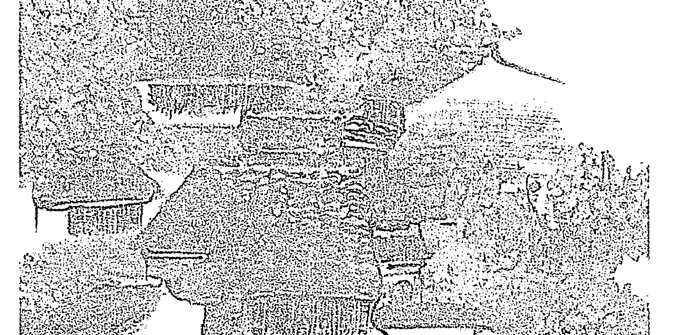

- 3. 考虑到厨房炉灶是宅内的主要空气污染源，厨房门窗不应与卧室门窗相向而开。若彼此互不相干，则卧室所受污染程度最轻。
- 4. 如果住宅比较大，有许多房间可供选择，当然很好，你可选上最佳方位；如果是一家人共居斗室，也可小中求大，发挥人的主观能动性，采取围、隔、挡及活动式家具的组合变化来灵活多样地区划空间，做到一室多用。

所谓“围”，就是利用帷幔、家具等，在一个居室的大空间中，围出另一个小空间来，或者用象征手法，在听、视觉方面按需要的空间位置予以遮挡，使人在感觉上别有洞天，实际还是和大空间融合的。

所谓“隔”，就是用柜、台、屏风、绿化等手段，在大空间中划分出不同功能的活动区域。

所谓“挡”，就是用家具、胶木、折页门帘等，分隔出功能特点差异较大的活动区，但空间依然是流通的。

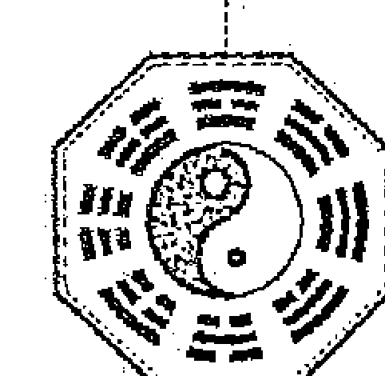

居室净高，是指室内地板到天花板之间的垂直距离。净高要同时满足人的生理和心理需要，做到经济实用。

## 62 忌高低不适压抑沉闷

居室净高，是指室内地板到天花板之间的垂直高度。净高要同时满足人的生理和心理需求，做到经济实用。

首先从人的生理要求来看，在门窗关闭的室内，由于人的休息和活动自身，可形成一个空气污染层（内含二氧化碳、氨、挥发性脂肪酸、水汽、微生物、粉尘以及家具油漆层放出的有机物质等，抽烟者还有烟气污染）。净高为3.5米时，空气污染层处于人的呼吸带以上；净高3.15米时，空气污染层将接近人的呼吸带；净高2.8米时，空气污染层则与人的呼吸带重叠。

当然如果在可以开窗的季节，经常打开门窗，由于通风的缘故，室内则不会形成空气污染层。

# 家居风水100忌

其次从人的心理要求来看，净高6米，使人感到过于空旷而显得过高；净高2.5米以下，使人感到压抑和沉闷而显得过低；净高3米左右，则使人感到亲切、平易、适宜而显得净高适中。

目前，我国大部分地区采用2.6米~2.8米的净高。这样的净高在人体生理卫生是容许的，在人的空间感觉上是良好的；在基建投资上也是划算的（室高降低10厘米将扩大建筑面积1~2平方米）。当然，炎热地区室高可适当提高，寒冷地区室高可适当降低。

有关实验表明，在不同净高的居室中，二氧化碳浓度不同，净高2.4米的居室，在任何高度上，空气中的二氧化碳浓度都大于0.1%，不符合室内空气中二氧化碳浓度的卫生标准；净高2.8米的居室在任何高度上，空气中的二氧化碳浓度都小于0.1%，符合卫生标准。

因此，我国“住宅建筑设计规范”规定，住宅建筑净高不应低于2.8米。

住宅面积大小要适宜，应该和居住人数的多寡成正比。过大，则显得空荡、冷落、寂寞，房屋剩余的空间太多，就会缺少“人气”；过小，则不利于空气交换，室内空气浑浊，也容易相互干扰，产生不良的拥挤效应。

## 63 忌面积不宜空荡寂寞

住宅面积大小要适宜。过大，则显得空荡、冷落、寂寞，也难打扫卫生；过小，则不利于空气交换，室内空气浑浊，也容易相互干扰，产生不良的拥挤效应。

为了保证居室内空气新鲜清洁，安放必要的家具，有足够的活动和休息空间，避免过于拥挤和减少疾病的传染机会，每人应占有一定的居室面积。

在一套住宅中，居室面积约为整个住宅建筑面积的60~70%，居室的规模是由人的标准气积等因素决定的。如果按成人静态呼吸需要 10 立方米空气计算，一个人每天要从体内排出 0.35~0.42 立方米的二氧化碳。在劳动或运动时，呼吸量要加大，呼出的二氧化碳也相应增加。一个成人在从事日常家务活动时，每小时呼出的二氧化碳约为 18~22 升（0.018—0.022 立方米），这些二氧化碳弥散在居室中。

根据卫生标准，其浓度不得超过每小时进入室内空气量的 0.1%（1 升，立方米），加上大气本身二氧化碳含量约为 0.04%（0.4 升/立方米），则一个人的标准气积约为 33 立方米。扣除家具外，一般规定成人的标准气积为每小时 30 立方米，儿童减半。

根据人的标准气积的要求，人均居室容积约为 20~25 立方米（若都是成人则以 25~30 立方米为宜），如居室净高 2.7 米时，则人均居住面积应为 7.4~9.3 平方米（若都是成人则以 9.3~11.1 平方米为宜）。即是说，从卫生学和建筑学等因素考虑，人均面积以 9 平方米为宜。其中卧室占 6 平方米，日间活动室占 3 平方米。

因此，“住宅建筑设计规定”规定，居室面积大室不宜小于 12 平方米（特套住宅大室为 17 平方米）、中室 9 平方米，小室 6 平方米。

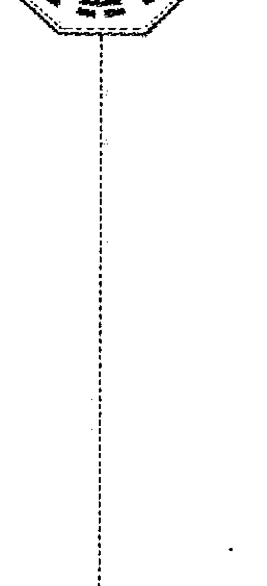

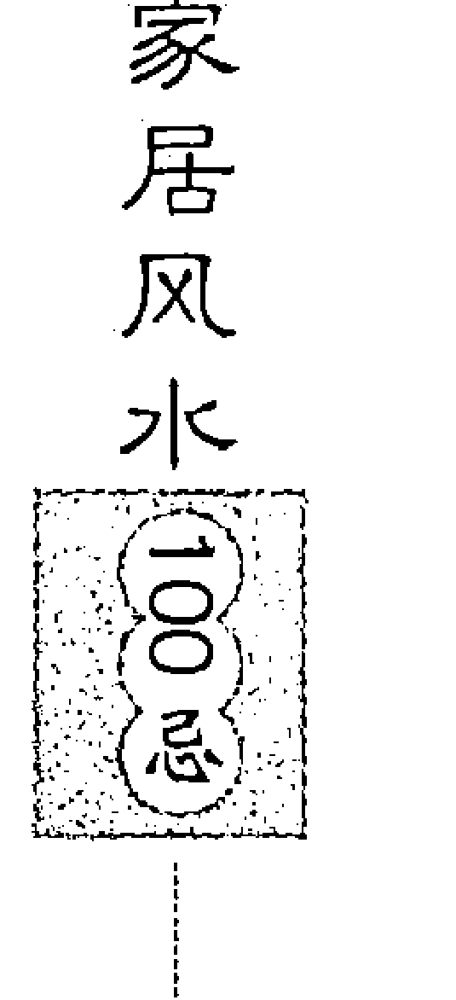

室深，系指开设窗户的外墙外表面至对面墙内表面的距离。室深对居室形状和美学景观均有影响，尤其对居室的采光和换气影响很大。

## 64 忌进深失衡影响景观

室深，系指开设窗户的外墙外表面至对面墙内表面间的距离。这跟通常所说的“进深”概念有点区别（“进深”系指开设窗户的外墙内表面至对面墙内表面间的距离）。室深对居室形状和美学景观均有影响，尤其对居室的采光和换气影响很大。

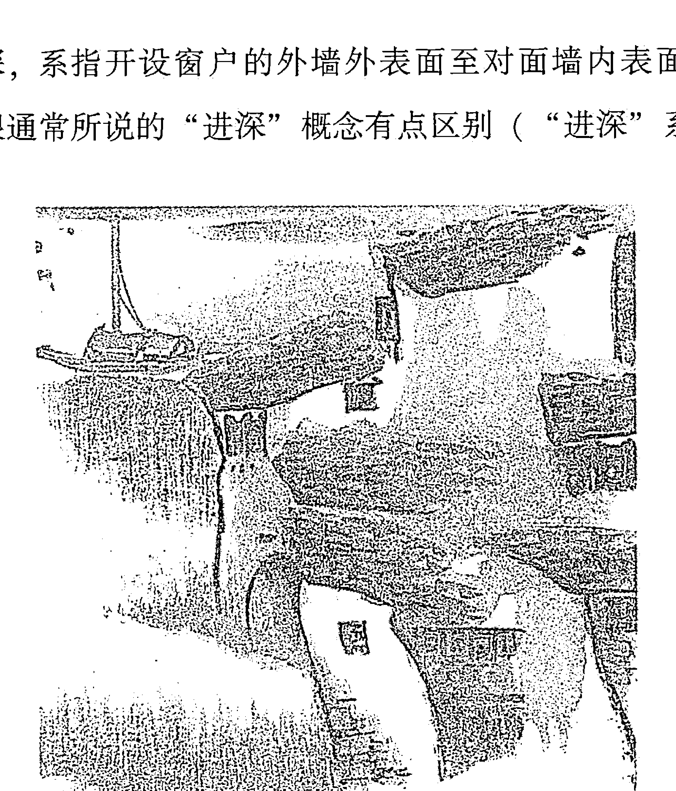

室深与室高、室宽之间都有一个合适的比例。

室深与室高的比例，在单侧开窗的情况下，以2：1为宜。即室深为室高的两倍，如室高为2.8米，室深则约为6米。

室深过小，房间显得狭窄；室深过大，则窗的对面墙上光线不足，换气也困难。在双侧开窗的情况下，以4：1为宜，即室深为室高的4倍。如室高为2.8米，室深则约为10~12米。

室深与室宽的比例，一般以2：3或3：4为宜。不宜大于2：1，免得家具难以摆设。

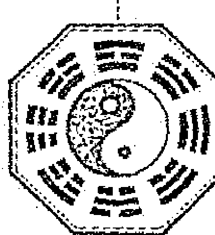

一个完整的平面，被分割成不等高的阶段，非常不吉利。宅相中认为这样的构造是凶相。

## 65 忌地板分段引发事故

一个完整的平面，被分割成不等高的阶段，非常不吉利。宅相中之所以认为这样的构造是凶相，有两个理由：

第一，危险。高度不等常是发生事故的祸首，根据研究调查，住宅中发生事故的地点，大都是在楼梯，所以宅相中说地板不等高为凶相，也就无可厚非了。人在平整的地板上行动最为安全，所以高度不等的构造最好尽可能避免。

另外一个理由是：这样构造乃是皇殿中的做法。以前皇上造访民家时，皇上所站的一定要比平民高，以区别身份。可是后来的庶民，发现这样的构造会使“宅主产生傲慢之心，而且骄奢无比，最后败家灭亡”，所以都说这种构造是凶相。

其实这种说法，对于现代建筑而言，也颇值得参考。其第一个理由“危险”，到现在也是如此。以现代人的观点看来，除了这个理由外，还可以再加上两个理由：

- 1. 房子的空间利用效率会降低，如果房子中的地板都等高的话，必要时可以把屏风移开，空间就会变得很大。可是如果地板高度不等，就没有办法了。
- 2. 如果地板成阶段状，会让人在心理上觉得这个房子很狭窄，要让房子感觉起来很宽敞，不仅天花板的高度要适中，地板的平整等高也是很重要的决定因素。

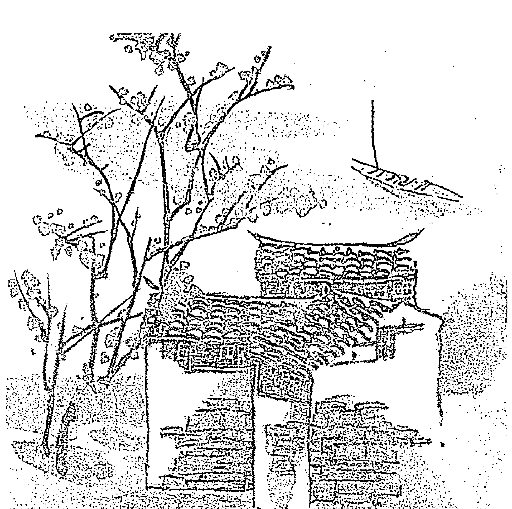

有些观光饭店故意把地板装潢成阶段状，这样的设计只是为了让人感觉饭店的内部装潢很富于变化。实际上以居住方便的眼光看来，这样的设计只会让人觉得房子更狭窄。一般住宅的第一个条件就是安全性，至于实用性也是不可忽略的。

如果把这个宅相说法扩大解释，就是指两层楼的房子比平房来得危险。事实上也是如此，如果土地广阔度允许的话，还是以居住平房较为理想。因为上下楼梯所消耗的体力是很惊人的，尤其是老年人，最好不要住在二楼或二楼以上的空间。

前面已经说过，楼梯是家庭意外事故的重要祸首，所以住在平房里当然比较安全。另外，如果不幸遇到火灾时，一楼也比较有逃生的机会。

> “地理作法…全借门风路气，以上接天气，下信地气，层层引进以定吉凶。” ——《相宅经纂》

## 66 忌门窗不畅气流冲荡

门窗，可以看成是《周易》离卦的象征物。离卦卦象表明两头实中间空，这不正是门窗吗？门窗关闭使住宅内外空间相隔，门窗开启又使其内外空间相通，并把室外的自然意趣引入室内，达到人工美与自然美在审美情趣上的和谐交感。

“窗含西岭千秋雪，门泊东吴万里船。” 杜甫著名诗句道出了门窗既隔又通的审美意蕴。

门窗是住宅的气口，它有三大功能：

- 1. 日照采光
- 2. 通风换气
- 3. 出入通道（门）或眺望远景（窗）

对居住者的生理和心理均发生重大作用。

门，特别是大门（又名玄关），是住宅内外空间分隔的标志，是迈入宅内的第一关口。古代单坐向住宅特别重视大门，把面向南方的大门看成气口，而四周筑围墙抵挡寒冷，以造成冬暖夏凉的格局。因此，古风水书说：“宅之吉凶全在大门。……宅之受气于门，犹人之受气于口也，故大门名曰气口”；“地理作法…全借门风路气，以上接天气，下信地气，层层引进以定吉凶。”（《相宅经纂》）

### 1. 开门方位

一般民居多坐北向南，即所谓坎宅，大门以开在东南（巽位）为最佳，俗称青龙门。开在南（离位）或东（震位）也很好，因为都是其吉方位。阳宅大门（气口）的最佳方位跟村庄水口的位置多在东南方、东方或南方不谋而合，说明它们之间有一种同构关系。

今天公寓式的住宅，往往是双坐向的，即由过去的八种单坐向住宅变成四对双坐向住宅：乾巽通、坤艮通宅、震兑通宅、离坎通宅；大门的功能有所转化，即不再是主要气口而主要是出入通道了，因此吉凶的方位选择性就大大削弱了。

### 2. 几个门不能开在同一条直线上。

若几个门开在同一条直线上，则由于气过于活跃而产生漏气和煞气，甚至气冲产生穿堂风。总之，气场不稳定而冲荡不已，使人体场难以适应而影响人的身心健康。

补救的办法之一，就是在两门之间，即前门之后或后门之前设置一个屏障，或直或曲，不全封闭，既可避免气的冲荡，又可保持气的通畅。

### 3. 门尽量不相对

这是住宅建筑上的互不干扰原则。《鲁班经》曰：“二家不可门相对，必主一家退；开门不得两相冲，必有一家凶”。古代住宅以门为主要气口，如两方相对，往往会受到对方的污染和干扰。因此，两门相对的关系应以“相生”为原则，否则要将其偏转或设屏墙。

现在公寓式住宅基本上是二家人的主门相对，因为其主要功能已转化为出入口而且随手关门，所以彼此干扰不大。

### 4. 门不直冲巷

门若直冲巷，一则巷道里的空气污染物、煞气、邪气和噪音干扰等容易冲入宅内来；二则气场不稳定而冲荡不已，人体为了适应它而建立平衡，需要不断地白白消耗能量而使身体亏损。

补救的办法就是在门前设置屏障。心理比较脆弱的人也可以试设符镇之物，如“泰山石敢当”、“镇山海”、小镜子等，以求得心理上的平衡。

### 5. 门的高度要低于窗的高度（高度在这里主要指下沿高度）。

直接射入室内的阳光不仅使人体发育健全，机能增加，而且使人舒适、振奋，提高劳动效率，还具有一定的杀菌作用和抗佝偻病作用。

## 67 忌窗户背阳影响采光

采光是指房子接受到阳光的情况，以太阳能直接照射到最好，或者是有亮度的折射光。因此，窗户显得越来越重要。在公寓式住宅里，窗户已成了主要气口，因此成了双坐向通宅。

### 1. 窗户的大小

根据窗户的日照采光、通风换气和眺望远景这三个功能，要求窗户尽量开大些。一般标准是：窗子的面积与居室地面的面积之比为1：8或1：7。开窗的大小还与居室的进深有关：一面开窗采光的居室，进深不应大于窗高的2倍；两面开窗采光的居室，进深不应大于窗高的4倍。一般规定是15平方米以下的房间开两扇窗，15平方米以上的房间开三扇窗。

扇窗，15平方米以上的房间开三扇窗。

“何知人家有福份？三阳开泰直射中”，“何知人家得长寿？迎天沐日无忧愁”；“何知人家贫又贫？背阴之地是寒门。”

直接射入室内的阳光不仅使人体发育健全，机能增加，而且使人舒适、振奋，提高劳动效率，还具有一定的杀菌作用和抗佝偻病作用，因此要经常开窗。一层清洁的窗玻璃可透过波长约为318～390毫微米的紫外线，但有60%—65%的紫外线被玻璃反射和吸收。有积尘的不清洁的玻璃又减少40%的光线射入。因此，要经常保持窗玻璃的清洁，以使在关窗的状态下，也有足够的阳光射入。

### 2. 窗户的高度。

1. （1）窗的高度（主要指下沿）一定要比门高。
2. （2）窗要尽量开高一些。因为开窗高，能使光线均匀，有利于产生柔和的匀质光线。若开窗太低，则光线会集中某一部位，不利于光线扩散。

### 3. 窗户的方位

+ (1) 东窗，吉。早晨的阳光能直接射入。
+ (2) 东南窗，吉。早晨的阳光能直接射入。
+ (3) 南窗，吉。夏天有凉风吹拂，冬天有阳光射入，造成冬暖夏凉的室内小气候。
+ (4) 西南窗，平。太阳西斜，紫外线减弱，杀菌力也减弱，又有点西照，乃是产生腐败的方位，古代称它为“里鬼门”。窗开在未的部位较好，也不要开得太大。
+ (5) 西窗。平。西照。窗不要开得太大。夏天最好挂上窗帘。
+ (6) 西北窗，平。因为西北是乾位，至尊之位，最好不要开窗。如出于采光和通风的需要非开窗不可时，则开高一点并开小一点。
+ (7) 北窗，平。夏天，南窗是和风的进气口，北窗是出气口，造成南北对流；冬天，北窗却成了寒气的入口，因此以造成容易开关的密闭窗为宜。
+ (8) 东北窗，凶。东北背阳，带有湿气，乃是产生腐败的方位，古代称它为“表鬼门”。如果这个方位不得不开窗时，要开在寅的部位上，尽量开小一些，并最好是密闭式的窗。

> 大门朝南，子孙不寒；大门朝北，子孙受罪。
> ——民间俗语

## 68 忌窗户朝北大煞风景

若窗户开设在北侧，女性会月经不顺，而且易患妇女病。如果北侧开窗，在冬季严寒时，即使居住者想要使房子里变得温暖些，热空气总会从窗户溜出去；而寒冷的北风则从窗户窜进来。在没有隔热器材和暖气设备以前，严寒刺骨的北风，从窗子直驱而入，对妇女的身体的确很不好，因为冷是造成妇女病的重要原因。这个宅相看法，其实是与健康相结合的，很具现实性。

窗户朝北的缺点，以现代建筑的手法也没有办法完全解决，按照宅相的提示，要把窗户设在北侧，一定要详加考虑，以下三点就是开设北侧窗户必须考虑的重要项目：一、大小；二、材料；三、构造。

北侧开设窗户的目的，一定不在于接受阳光，而是在于通风或采光方面。所以比起其他方位的窗子，其功能是属于消极性的。再者，如果面积过大，反而会使房子的热气流失更快；所以北侧的窗户一定不能开得过大。按照建筑基准法，窗户的面积最好占地板面积的七分之一以上。如果北侧只开一个窗户，则其面积可以斟酌放宽。

第二个考虑要点是材料，窗户的材料会影响空气的密度以及露水的凝结。要使空气的密度提高，使用铝门窗或钢窗，都很适宜。不过，金属窗户却会结露，即将室内的水蒸气冷凝成水滴。木造材料虽然没有这种缺点，可是却会使空气的密度降低。北欧建筑里的窗户，很多都是使用厚达十几厘米的木材，而且玻璃也是双层的。像这样的配合，不仅能够提高空气密度，防止结露，而且也能给人踏实的感觉。

最后一点是构造的问题，北侧开设的窗户，最好能设计为外推双层式窗户，外侧为玻璃窗，内侧则为玻璃拉窗或纸拉窗。如果能再加上窗帘，则防寒效果更佳。材料上难以解决的结露、空气密度问题，用这种方法也能克服。

外推式窗户在其他房间也更广泛使用，因为它具有使房间更具变化的优点。以推式窗户在建筑基准法上，并不需要什么建筑面积，所以对于房屋在积实在有限的住宅，确实具有节省空间的功能。

由于北侧开窗总给人煞风景的感觉，所以窗户外面最好能种植树木。如果土地许可的话，不妨在北侧庭园做个花坛，减少煞风景之感。

# 家居风水100忌

> 走廊，是住宅内部的通道，属于住宅的活动空间。在住宅的整个空间中，凡是人的活动流线必须经达的地方，都是活动空间。

## 69 忌走廊直通宽窄无度

走廊，是住宅内部的通道，属于住宅的活动空间。在住宅的整个空间中，凡是人的活动流线必须经达的地方，都是活动空间。有了走廊，方便得多。

设置走廊有如下四条原则：
1. 宽度。一般控制在90公分左右，最宽为1.3米。如宽度超过1.8米的走廊则视为“缺”，凶相。补救的办法是缩小宽度。
2. 长度。一般控制在整个住宅长度的三分之二以内。如果走廊一通到底，把一个家庭分隔成两半，就象征着家庭的分裂崩溃，是凶相。补救的办法是在走廊的尽头处改建橱柜，把走廊长度缩短到宅长的三分之二以内。
3. 方位和走向。东走廊、东南走廊、南走廊、西南走廊，采光和通风都比较理想，其他则较差。
4. 走廊尽头不要正对厕所，以防厕所的污染空气直冲走廊而污染全宅。

# 家居风水100忌

> 易有太极，是生两仪，两仪生四象，四象生八卦，八卦定吉凶。
> ——《周易·系辞上占》

## 70 忌宅心破缺有失匀称

宅心，就是住宅的中心，象征太极。《周易·系辞上传》曰：“易有太极，是生两仪，两仪生四象，四象生八卦，八卦定吉凶”。可见，古人认为太极是世界万物的本原，是吉凶祸福的根基。住宅风水的好坏是以宅心作为坐标原点来定方位以别吉凶的。

宅心古代又称为宅神。所以，非常重视和竭力保护宅心；不得破缺，不准污染。厕所、浴室、污水沟不准设在宅心；厨房、通道、走廊、楼梯等也应尽量避免设在宅心。最好能让宅心空洁，或摆上鲜花盆景，或为了求得某些心理上的平衡，摆上吉祥物也可以。

基于天圆地方的观念和方形、矩形以及其它匀称形的建筑物有利于气的流动，住宅基本上采取这些形状。古代住宅多是大屋顶结构，因此以顶梁柱为宅心是毫无疑义的。现代住宅则多是平顶结构而且有凸有凹，就不能再沿袭老办法了，而在摸索中形成一套确定宅心的新办法：

1. 一般以凸补凹和面积相当的原则，对住宅平面作均衡调整而形成一个假想的矩形来定一个宅心。
2. 以主屋的平面图来定宅心。至于阳台可分下列三种情况处理：
   ①小阳台可不必列入平面图；
   ②大阳台（常兼做通道用）应列入平面图；
   ③若被窗封起来的阳台，不论面积大小都应列入平面图。至于加盖部分，若与主屋毗连，不论是卧室还是厨房、浴厕都要列入平面图。
3. 楼房一般以一楼的中心点定为整幢楼各层的中心点。街道例外，因街道往往有骑楼，一楼做店铺，二楼以上住家。一楼不必算骑楼面积，架在骑楼上面的房子则要把骑楼面积加算进去。
4. 对于多边形的楼房，既可根据多边形求重心的规则定出总中心点，也可以根据这类新型楼房多方位采光和通风的特点，分别在厅、卧室、厨房等单元定出分中心点。当然，矩形楼房也允许这么办。

## 家居风水一〇八忌

# ## 第8章

# ## 卧室篇

> 床乃主人休息之地……依月九宫则枕生气，旺气之阻星，结胎成男，斯为秘诀。——《阳宅宗旨》

> 人生有三分之一的时间是在睡觉中度过的。卧室是人们由醒觉功能态进入睡眠功能态，再到醒觉功能态的“过渡”空间，要求温馨、柔美、休闲、舒适、秘密。

## 71 忌卧室杂乱难以入眠

人生有三分之一的时间是在睡眠中度过的。卧室是人们由醒觉功能态进入睡眠功能态（关于人体功能态，请参看钱学森《创建人体科学》），再到醒觉功能态的“过渡”空间，要求温馨、柔美、休闲、舒适、秘密。

1. 卧室形状
这里因为方主“静”，合乎卧室主静的要求，而圆主“动”，不合乎卧室主静的要求。因此，卧室不要做成圆形，门窗也不要做成圆形；家俱、盆景、装饰物，甚至镜子，也应该尽量是非圆形的。

### 2. 色彩基调

匈牙利布达佩斯综合技术研究所进行过如此有趣的试验：参加试验者一律蒙上眼睛，当被引进红色墙面的室内时，脉搏加快跳动；当被引进黄色墙面的室内时，脉搏又变慢了。
有一户人家搬进新居后，把卧室的地板和墙裙都油上朱红色，买回来的新家具色彩又很杂乱，影响到他翻来复去难以入睡。后来，改涂了颜色，才好入睡。
这些例子表明，红色能使人心律加快，血压升高，脑电波活跃，难以就寝。因此，卧室忌用红色为基调。墙面一般宜用淡绿、浅蓝、乳白等冷色。至于青少年的卧室，考虑到其朝气蓬勃的性格和容易入睡的特点，墙面可用中性色或中性偏暖色，如橙黄色之类。

### 3. 位置

南面或东南面房日照和通风都较理想，又是冬暖夏凉，作为卧室是比较舒适的。厨房是室内自身污染的中心，不但排放出烟尘毒气，还排放出致癌物质，因此厨房必须远离卧室。

> 凡人卧，春夏向东，秋冬向西。
> 千金要方·道林养性

## 72 忌卧室北向磁力冲突

卧室外面的家具宜摆成圆弧形，而忌摆成尖角指向卧室。卧室里面的家具摆设也不宜摆成尖角指向床铺。这一忌的象征意义是面对尖角不利于人的身心健康。

床向忌正北、正南、正东或正西，这是为了不与地的磁力相冲突。建屋时一般已考虑了这个因素，因此在矩形卧室里摆床就不必再顾虑了。床向也可以根据自己胎经期所需五行进行调整。如果缺木，可以朝东或朝东南；如果缺火，可以朝南；如果缺土，可以朝西南或东北；如果缺金，可以朝西或西北；如果缺水，可以朝北。

床向最好是根据气觉的判断进行调整，或者只要你觉得睡得舒适就不用管它是什么方位。这里顺便介绍一下我国古代养生家对寝卧方位的四种观点：

1. 寝卧东西向。《千金要方·道林养性》“凡人卧，春夏向东，秋冬向西。”即主张春夏两季，头向东，脚向西；秋冬两季，头向西，脚向东。这是根据《黄帝内经》“春夏养阳，秋冬养阴”的养生原则确立的。
2. 寝卧恒定东向。《老老恒言》引《记玉藻》说：“寝恒东首，谓顺生气而卧也。”四季头朝东卧，可得东方升发之气。
3. 寝卧按季节东南西北向。春季头向东，夏季头向南，秋季头向西，冬季头向北，乘其旺气，顺乎自然。
4. 寝卧忌北向。《千金要方，道林养性》说：“头勿北卧，及墙北亦勿安床。”，《老老恒言，安寝》亦说：“首勿北卧，谓避阴气。”北方主水主寒，为阴中之阴，最能伤阳，而头部为人体诸阳之会，因此忌北向而卧。

美国科学家有关地球磁场对人体的影响实验表明，卧向头北脚南比其它方向睡得更香甜。然而，武汉市第一医院做的脑血栓形成患者床铺摆设方向调查结果表明，头北脚南的床位的老人，其脑血栓形成病率却高于其它方向床位的老人。我国多数养生家反对北首而卧，而主张东西向设床和东西向寝卧为好。

总而言之，床向和卧向要根据地磁场（即南北极磁场）方向、人本身的磁向类型、人的性别、年龄和健康状况等因素综合进行抉择，最后以人自我感觉良好为宜，目的是顺乎自然，调和阴阳。

> 床铺底下如塞满杂物，难以打扫卫生，则将成为藏污纳垢的地方，容易孽生尘螨等病原生物，影响健康。

## 73 忌床底藏污孽生尘螨

### 一、床的位置

床宜摆在通风的地方，而忌摆在死角。头顶与脚心均忌对门或窗，以免百会或涌泉受风凉。如果由于地方所限，床一定要对门的话，最好能设个屏风以免床与门对冲。

### 二、镜子忌照床

梳妆台或橱柜的镜子宜照不到床，而忌正对着床。

过去有一种不科学的解释，即认为当人熟睡时，灵魂游走，如果镜子恰好就在床的对面，灵魂见到自己的形象就会震惊，从而妨碍人的健康，因此是不吉利的。

其实，比较科学的解释应该是，人在睡意朦胧中，若无意中看到自己披头散发，睡眼惺忪，精神上可能会受到某些不良刺激或打击，从而影响健康。

### 三、床高

床沿高度一般以45厘米为宜。过高则上下不便，太矮则容易受潮，睡觉时吸入的灰尘量较大，不符合卫生要求。

床垫如果用钢丝弹簧床（席梦思），要均匀、透气、防潮和保温。应该有三层：面层要柔软、以驼毛、羽绒、棉絮、泡沫塑料等材料为佳；中层要密实，用毡毯填充；下层要富有弹性，弹簧数量要多，最好互不连结，每个弹簧缝在单独的布装内。以便使人体重量均匀分布，而避免局部受压过大。棕棚床也不错，既柔软，又有一定的弹性和硬度，可使全身肌肉放松。

### 四、床下

床铺底下如塞满杂物，难以打扫卫生，则将成为藏污纳垢的地方，容易孳生尘螨（一种引起人体过敏性疾病的小昆虫）等病原生物，影响健康。

玻璃与镜子均是家庭常用的装饰材料，倘若这用得当，不但可以增加房屋的深度，在视觉上感到宽阔一些；而且亦可以增加房到的照明度，感到光洁通爽一些。

## 74 忌镜子吊脚煞气冲克

玻璃与镜子均是家庭常用的装饰材料，倘若这用得当，不但可以增加房屋的深度，在视觉上感到宽阔一些；而且亦可以增加房屋的照明度，感到光洁通爽一些。

但倘若运用不当，就会破坏屋内的格调和气氛，有碍观瞻，而且亦会对家宅风水有所影响。

有鉴于此，现在便谈谈这个问题，以供各位作为家庭装修布置的参考。

很多人常把玻璃与镜子混淆一起，分不清楚，其实两者有很大区别。

玻璃是透明的，不会反照，所以透过玻璃窗可以看到屋外的景物；而镜子则不透明，会有反照的作用，因此可以在镜子中看到自己。玻璃与镜子既然各有特性，所以在风水学以及室内装修方面，自有不同的宜忌，不可混淆。

首先谈谈镜子，它在风水学方面有很多避忌，故此不宜随便摆放。

镜子的摆放，首先要记着一个大前题，那便是镜子不宜对正自己，同时也不宜对正吉利方位。

为什么会有这种忌讳呢？要知道其中的因由，必须先明白镜子在风水学方面的作用。

用在风水学方面的镜子有很多种类，例如有凹镜、凸镜、八卦镜、百虎镜等等，这些镜子主要是用来“照煞”的。

所谓“照煞”，是指悬挂这类镜子，使它对正直冲而来的凶煞，把煞气反照回去，以免被煞气冲克而受损。

既然镜子在风水学方面主要是用来照煞，那自然是不适宜照正自己，或是照正吉利的方位了。

如果镜子照正床头，是不适宜的，因为那会导致睡眠不宁，甚至疾病缠身。

在风水学来说，镜子对正床头固是大忌，若是对正炉灶亦绝不适宜。所以在安装镜子之前，请先看看是否对着炉灶，以免导致人丁不安。此外，镜子对着大门或房门也并不适宜。如果，在房屋的大门入口处有两块镜，A镜对正大门，主凶，故此可免则免。但B镜则是在大门旁边，并非对正大门。所以对风水无碍。

现在不少人喜欢采用镜片来美化家居，这类镜片有很多种类，有厚身的，亦有薄身的；有净色的，亦有画上图案的，这在风水学并无多大分别。

但有一点需要注意，不论采用哪一种镜片来装饰，最好不要有“吊脚”的情况出现，这即是镜片下不到地则不宜。若以矮框来承托镜片，那便较为理想。

> 玻璃既然透明透光，所以用它来作间隔，一来可使视野无阻而令房屋显得宽阔；二来可使光线不受阻碍而令房屋显得明亮。

## 75 忌玻璃脆弱碎裂伤人

谈过镜子之后，现在谈谈玻璃。

因为玻璃透明透光，而且厚度有限，所以有不少人喜欢用它来作间隔之用。

玻璃既然透明透光，所以用它来作间隔，一来可使视野无阻而令房屋显得宽阔；二来可使光线不受阻碍而令房屋显得明亮。

此外，玻璃因为厚度有限，因此若与其它的间隔材料相比，可以节省更多的空间。

但玻璃虽然具有以上这几种优点，可惜因本质较为脆弱，容易碎裂，所以对于有小孩的家庭并不适宜。

为了家居安全着想，采用玻璃砖来作替代较为适宜。原因是玻璃砖既有透明透光以及节省空间的优点，但却甚为坚固，没有碎裂之虞。

无论是玻璃还是玻璃砖，因为不会反照，所以不必像摆设镜子那样多所顾忌，所以即使对正大门或是自己的床头亦无大碍。

> 现代的居家中都喜欢摆设各种玩具和装饰品，把名目众多的玩具细细一归类，不外乎是动物、植物和人物，而最多的是动物。

## 76 忌玩具乱摆适得其反

现代的居家中都喜欢摆设各种玩具和装饰品，把名目众多的玩具细细一归类，不外乎是动物、植物和人物，而最多的是动物。

龙，在中国人的心目中，一直占有很崇高的地位，举例来说，所谓“四灵”的龙、凤、龟、麟，它便占了首位。

从历史角度来看，中国历代帝王均采用金龙来作为他们至高无上的象征。

龙，除了代表权威之外，并且还是富贵吉祥的象征。所以中国人很喜欢在家中摆放一些龙形的装饰品，藉此增加祥端之气。

不过，龙虽然在风水学上有生旺及制煞之效，但不能随便乱摆，以免收到相反效果。

### 以下是四个值得注意的重点：

1. 龙宜与水配合
龙遇水则生，即特别生猛，倘若摆放在干旱的地方，即会有“龙游浅水遭虾戏”之虞。
所以若在家中摆放龙形的装饰品，则宜摆放在有水之处。若能把龙放在鱼缸的顶部，或是放在鱼缸的左右两旁，这样甚为适宜，可收生旺之效。

2. 龙宜向海或河
有些房屋前面临大海或河流，虽然风水甚佳，但可惜因为距离太远，难以吸取其中的财气，每有望洋兴叹之弊。
补救的方法，可以用一对灰色或黑色的石龙，放在窗口或露## 3. 龙宜摆在北方

台的栏杆上，颈部向着海洋或河流，有如双龙出海，这在风水学上可收生旺之效。但必须注意，倘若前面是污水或是阴沟则不宜，因为这会使双龙蒙污。

倘若屋内以及屋外均无水，补救之道，便是把龙形的装饰品放在北方。这样做的原因，主要是因为北方乃“水气”当旺的方位，故此对于喜水的龙，十分适合。

### 4. 龙不宜向睡房

龙虽然是吉祥的动物，但因甚为威猛，故此不宜对着睡房，特别是那些张牙舞爪的龙更是不宜。

请注意，那些有红色眼睛的龙，绝不适宜对着小孩的睡房或是睡床，因为这不但会令小孩在心理上受惊，而且在风水学上亦会有所克制。

总括来说，龙要与水配合为宜，故此若不是放在屋内有水之处，便是要向着屋外的河流或大海；若以方位而言，龙宜摆在北方，因为北方乃“水”气当旺之处。但请谨记，圆瞪红眼的龙不宜对着小孩的房门或睡床。

> 在中国传统的习俗里，每逢节日庆典常有舞狮助兴，可见中国人对狮子的重视。这主要是认为狮子不但避邪，而且可以带来祥瑞之故。

## 77 忌狮子向内身受其害

家居风水

100忌

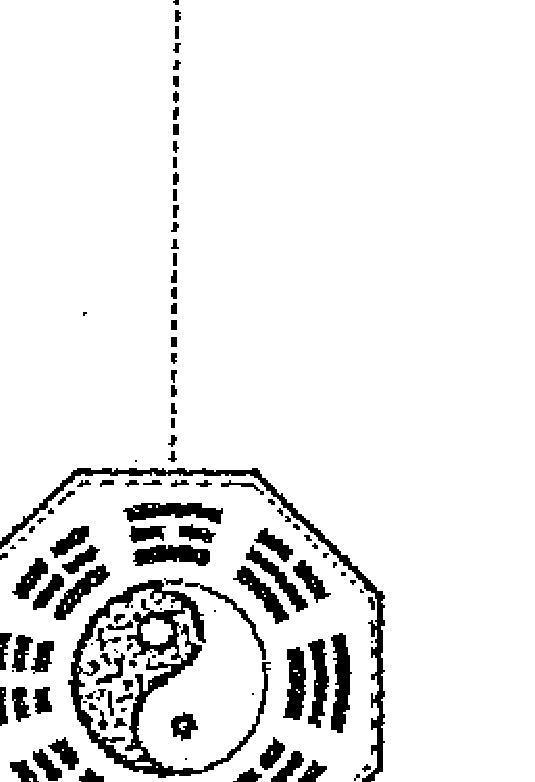

在中国传统的习俗里，每逢节日庆典常有舞狮助兴，可见中国人对狮子的重视。这主要是认为狮子不但避邪，而且可以带来祥瑞之故。

狮子被公认为百兽之王，勇不可当，威震四方。因此自从唐代以来，中国人习惯在大门的两旁摆放石狮，用来镇宅治邪，使门外的邪魔妖怪辟易，不敢入屋肆虐。

如此说来，在家中摆放狮子是颇为有利的，但可惜现在一般人是太滥用了，所以有时往往适得其反。

说起来，用作摆设的狮子，若以制作材料来分类，有石狮、铜狮、陶狮、玉狮及木狮等等。若以颜色来分，有红狮、黑狮、白狮、绿狮及金狮等。若以形态来分，有南狮、北狮以及直狮、侧狮等等。所以，一般人便觉眼花缭乱，不知如何选择了。

因为每种狮子各有不同的用场，很难在这说得清楚，但可以在此提出几个要点给各位作为参考之用。

- 1. 狮子宜搭配成双
摆放狮子一定要一对，一雌一雄搭配成双为宜。请注意一定要分清雌雄，左右不可倒置。若是分别不清，只要记得在摆放时，一对狮子是互相照顾，那便不会弄错。

倘若其中有一只破裂，便应该立即更换一对全新的狮子，切勿把剩余的一只留在原处。

- 2. 狮头必须向屋外
狮子的头部要向屋外，切勿向着屋内。原因是狮头向外才可以阻止屋外的邪魔鬼怪入屋。所以一向以来，住宅或是机关衙门外边的石狮均是头部向外。

若是狮头向着屋内，那便非但不能治邪，而且还很可能自己身受其害。所以狮头千万不可向着屋内，尤其是不可向着自己房间。

狮子倘若放在屋内，最宜对正大门，望向屋外；若是摆在窗口，狮头亦一定要向着窗外。

总括来说，狮子虽被视为瑞兽，有镇定治邪的作用，但必须配搭成双，放在西北方最为适宜，并要谨记狮头必须向外。

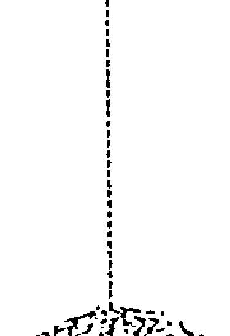

> 所谓“一物治一物”，在风水化煞方面来说，一般多用威风凛凛的狮子来镇宅治邪，但有时因为环境不同而会用龟来化煞。

## 78 忌轻龟重狮老人不适

所谓“一物治一物”，在风水化煞方面来说，一般多用威风凛凛的狮子来镇宅治邪，但有时因为环境不同而会用龟来化煞。

龟与龙一样，均是属于吉祥的“四灵”之一，而且又是长寿的象征。所以虽然世俗一直以来对龟多所嘲笑，但仍有很多人喜欢在家中摆放铜龟或石龟。

在传说之中，龟会饱吸天地山川的灵气，所以特别长寿。因此在老人家的睡房里，摆放龟形的装饰品甚为适宜，因为它象征健康长寿，但要注意龟头必须向着窗外。

往往看到有些人把张开血盆大口的狮子放在老人房内，其实这并不适宜。因为老人家可能受不了狮子的杀气，因而弄巧成拙，倒不如用龟较为安全妥善。

可能有人怀疑，龟行动缓慢，并且没有什么威力，似乎是自身难保，因此若是用它化煞，到底是否有效呢？

其实，龟虽然行动缓慢，似乎没有自卫能力，但它却懂得忍辱负重。在遇到危险时，便会把头尾及四肢缩入坚厚的龟壳内。

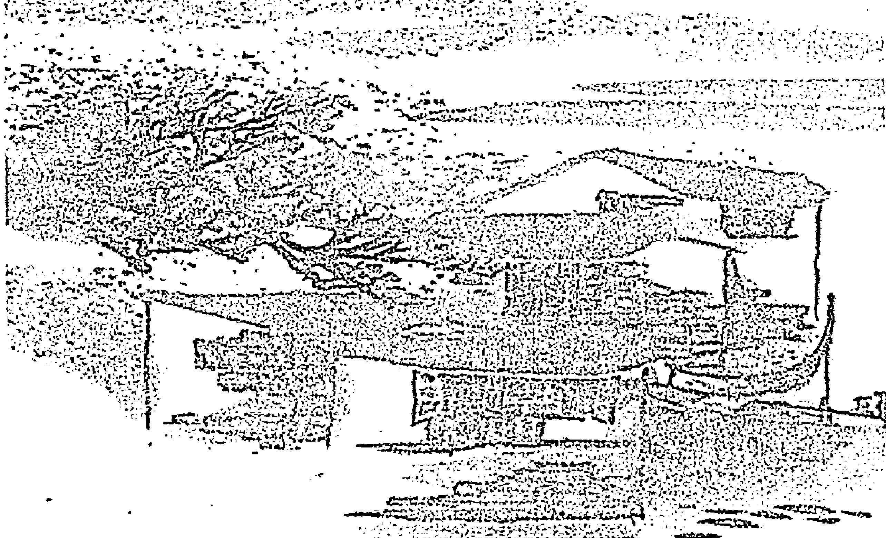

这样便令再凶猛的敌人也徒呼奈何，因此终能渡过难关。

所以在遇到一些很特殊很凶险的形煞时，若用狮子坐镇来硬拼，倒不如用龟来化解，以柔制刚为宜。这样才符合风水学“凶煞宜化不宜斗”的大原则，因此有些风水先生便会教人用龟来作化解凶煞之用。

龟类的装饰品有很多种，例如有木龟，石龟、瓦龟及铜龟等等，各有用场，应该根据摆放的方位来决定用哪一种类。

> 在阳宅风水的各项摆设中，一般均是用狮子、龙、龟来化煞，但偶然亦会有人用马和狗。

## 79 忌摆五匹马寓意不祥

在阳宅风水的各项摆设中，一般均是用狮子、龙、龟来化煞，但偶然亦会有人用马和狗。究竟马有些什么作用呢？以及有些什么宜忌呢？

马，很少是用来化煞的，这主要是因为它既不像狮子和龙这样威猛，而又不像龟那样懂得躲避危险，因此缺乏化煞的功效。

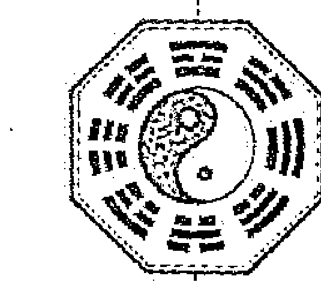

幸而马有生旺的作用，因而便有人把马的塑像摆放在旺位，希望收到捷足先登，马到成功之效。

马应该摆放在南方以及西北方。摆放在南方的原因，是因为马在十二地支中属午，而“午宫”是在南方，因此在那里摆放马匹，甚为适宜。

此外，西北方亦适宜摆放马的塑像，原因是中国的马匹大多产自西北的新疆和蒙古，而那里的草原正是骏马驰骋纵横之所。因此马匹的塑像摆放在西北方，可说是得其所哉。

马的塑像适宜摆放在南方及西北方，那是就一般情况而言，但若想在短期内对事业及财运有帮助，那便要摆放在当旺的财位了。

谈过摆放马匹的方位后，现在谈谈有关数目方面的问题。

一般来说，摆放马匹的数目，以二、三、六、八、九匹较为适宜，而其中尤以六匹最为吉利。因为“六”与“禄”同音，因此六匹马一起奔驰，便有“禄马交驰”的好意头。

最忌的是摆放五匹马，因为会有“五马分尸”之忌。

但要注意一点，在风水摆设上，马虽然有生旺的作用，可惜对生肖属“鼠”的人有所冲克。故此属鼠的人不宜在屋内摆放马的塑像，或是悬挂马的图画。

对于那些生肖属虎、狗、猪的人来说，摆放马匹是会对他们特别有利。

> 狗是用来看守门户的。常识中这样说，风水学中狗的摆设也是这种作用。

## 80 忌龙犬相冲辰戌相冲

狗是用来看守门户的。常识中这样说，风水学中狗的摆设也是这种作用。

一些较讲究的住宅内，近门之处往往会摆设狗的塑像，目的是为了消除盗劫之灾。

狗的塑像应摆在门边，而且头部必须向门口。据风水学称，狗的位置忌摆在东南方。

摆狗的数目不宜多，一般一两只就足够。

根据辰戌相冲理论，如家主生肖属龙，龙狗相冲，家中最好不要摆设狗的玩具。

而摆放在不同方位狗的玩具的颜色，要求也各不相同。黑狗宜摆在北方，白狗宜摆在西方，黄狗宜摆在南方。

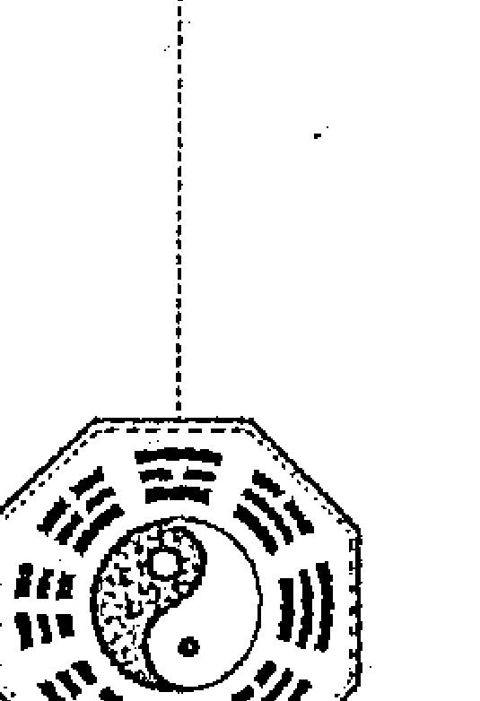

# 家居风水100忌

# 第9章 摆设篇

> 以形势为身体，以泉水为血脉，以土地为皮肤，以草木为毛发，以舍屋为衣服，以门户为冠带，若如斯，乃为上吉。——《黄帝宅经》

> 风水学自然是离不了“水”，因此传统的风水学，对于“来水”与“去水”位均很重视，认为这对宅运的吉凶盛衰会有很大的影响。

## 81 忌正神下水见财化水

很多家庭都有养鱼，有些是为了美化家居，但有些则是为了风水问题。

养鱼怎会与风水有关呢？很多人对此均有疑问，现在便谈谈其中的奥妙。

风水学自然是离不了“水”，因此传统的风水学，对于“来水”与“去水”位均很重视，认为这对宅运的吉凶盛衰会有很大的影响。

鱼缸因是盛水的器皿，故此它往往与宅运有相当密切的关系。

对于摆放鱼缸的位置，在风水学方面有两种不同的说法，有些人认为鱼缸应该放在旺位，理由则是鱼缸滤水器的马达不断运行操作，使鱼缸的水流循环不息，所以若把鱼缸放在旺位，便会带动那方面的旺气，旺上加旺。

但另外有些人认为鱼缸应该放在衰位，因为这样才符合“拨水入零堂”的说法，把水引入失运的方位，是可以转祸为祥，逢凶化吉的。

一般认为后一种说法较为可信，因为倘若把鱼缸摆放在旺位，这样便犯了“正神下水”之忌，这无异是把当旺的财神推下水中，那便会见财化水了。

因此，鱼缸是应该摆放在失运的衰位的。到底自己家中的哪一处是衰位而适合养鱼呢？现在提供一些意见给各位参考。

任何神像之下均不适宜摆放鱼缸，特别是在财神以及福禄寿三星之下。据说是“正神下水”，会有破财之虞。

因为摆放神像的地方多有香案，灰烬掉进鱼缸，也会导致死鱼。经常死鱼，是件很扫兴的事。

家中不摆神像而陈列工艺品，工艺品下也不宜置放鱼缸。因为工艺品也需经常清扫，稍不小心，也有打破鱼缸之虞。

## 82 忌吉凶混淆弄巧成拙

说起来，植物与风水颇有关连，这在很多风水古籍中均有提及，兹择录数段如下：

> “凡树木向宅吉，背宅凶。”

> “住宅四畔竹木青翠，进财。”

> “中庭种树主分张，门庭种枣喜加祥，庭心种木多闲困，长植庭心主祸殃。”

从以上所言，可知传统的风水学，对于住宅附近的树木种类，以及种植的位置均很讲究，主要是认为这会对家宅的风水甚有影响。

但以上所提及的树木，均是室外植物，而室内植物则需另作计算。

作为风水之用的室内植物可分两大类，一是用作“生旺”的常绿植物，一是用作“化煞”的仙人掌植物。

这两类植物必须分别清楚，因为它们的功用各有不同，所以摆放的方位亦会有差异。倘若混淆不清，那便很可能弄巧成拙了。

各位必须谨记以下的一个主要原则：

在“旺位”放置大叶的常绿植物；在“衰位”放置仙人掌的刺类植物。

至于那些不旺不衰的普通方位，一般来说，放置任何植物均没有多大影响。

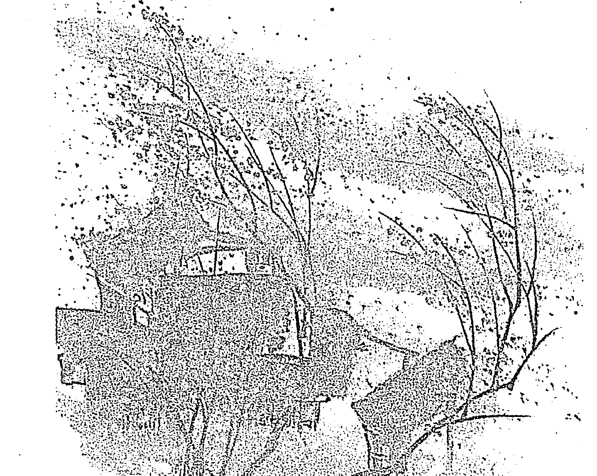

在当旺的方位摆放一些厚叶或是大叶的常绿植物，这便可收“生旺”之效，增加家宅的财气。

## 家居风水（100忌）

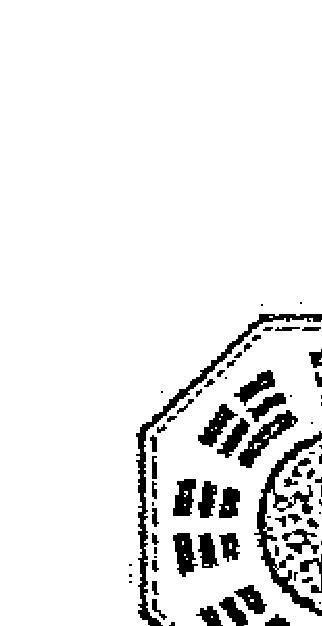

举例来说，铁树、橡树、喜树蕉、黄金葛（又名万年青），这类常绿植物是较为理想的。

除了以上提及的四种植物外，其他如赏叶榕，散尾葵、虎尾兰、富贵竹等，也有“生旺”之效。

人对竹树情有独钟，这不单是因为竹树青葱脱俗，而且还因为它是平安的象征，故世俗有“竹报平安”之语。

《阳宅大全》亦有云：“住宅四畔竹木青翠，进财。”总之，竹树的确是观赏及风水均甚适宜的植物，若是在旺位挂上“竹画”亦可。

在旺位除了可挂竹画外，同时亦可挂牡丹画。牡丹素有富贵花之称，不单色泽艳丽，而且形态雍容华贵，故此一直被视为富贵的象征。所以在当旺的方位挂上这富贵花，可说是锦上添花。

一般来说，“衰位”适合摆放有刺的植物，例如“龙骨”、“玉麒麟”，以及各式各样的仙人掌，玫瑰及刺杜鹃等。这些有刺植物，倘若摆放在衰位或凶位，在风水学方面有“化煞”的作用。

> 不少现代人喜欢挂画来布置住宅，以求吉祥和艺术上美的享受。

## 83 忌挂画不宜影响情绪

不少现代人喜欢挂画来布置住宅，以求吉祥和艺术上美的享受。那么在选择挂画时都有哪些禁忌呢？

- 1. 绘有凶猛野兽的画图不宜张挂，以免给人带来恐怖之感。
- 2. 颜色太深或者黑色过多的画图不适宜张挂。因为此类画图看上去令人有沉重之感，使人意志消沉，做事缺乏热情，心理产生悲观情绪。
- 3. 超过一幅的人物抽象画图不宜张挂。否则，会使家人的情绪波动反复，心理产生不平衡，甚至导致神经过敏。
- 4. 画有夕阳西下的画图也不宜张挂。
- 5. 已故亲人的大头画像不适宜长期张挂，因为它会使你增加心理压力。

根据求取吉祥的原则，哪些款式的画图适合张挂呢？

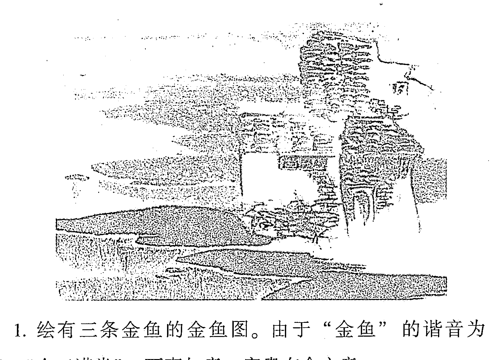

- 1. 绘有三条金鱼的金鱼图。由于“金鱼”的谐音为“金玉”、“金玉满堂”，万事如意，富贵有余之意。
- 2. 绘有九只羊的九羊图。“九”谐“长久”之久；“羊”谐“阳气”之阳，而“泰”有“九羊春泰”则寓意吉祥美满，富贵长久。
- 3. 美丽柔和的风景画，如日出、湖光山色、牡丹花等，可悬挂在大厅之中。可使人在欣赏时，产生松弛、舒适的感觉。
- 4. 民间画图如“吉祥如意”、“百鸟朝凤”、“鲤鱼戏水”“猴王献瑞”以及“百鸟图”等，均有吉祥之意。
- 5. 佛像、神仙等画图也因人而异可予选用。神像容颜以亲切、祥和之态作为上选。

> 一般认为，沙发是主而茶几是宾，沙发较高是山，而茶几较矮是砂水。两者互相配合，山水相依，才符合风水之道。

## 84 忌茶几过大喧宾夺主

在客厅中，茶几一般摆放沙发前面或两旁，与沙发的摆设互相呼应。茶几是用来摆放茶具，客人来时主人敬茶敬酒，极为方便。茶几还可摆设饰物或花卉，以美化环境，也可摆放电话、台灯等，既方便又实用，所以说茶几已成为客厅中不可或缺的器具。

一般认为，沙发是主而茶几是宾，沙发较高是山，而茶几较矮是砂水。两者互相配合，山水相依，才符合风水之道。

沙发为主宜高大，茶几为宾宜矮小。如果茶几面积太大，则有喧宾夺主之嫌，这样的格局，并非吉兆。化解之法，最简单的莫如更换茶几，宾主配合有致，也不致碍眼。

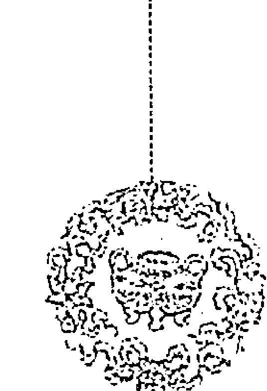

茶几的选取，宜以既低且平为原则。一般是人坐沙发中，茶几高不过膝较为理想。摆放在沙发前面的茶几应有足够的空间，若是距离太近，则感诸多不便。

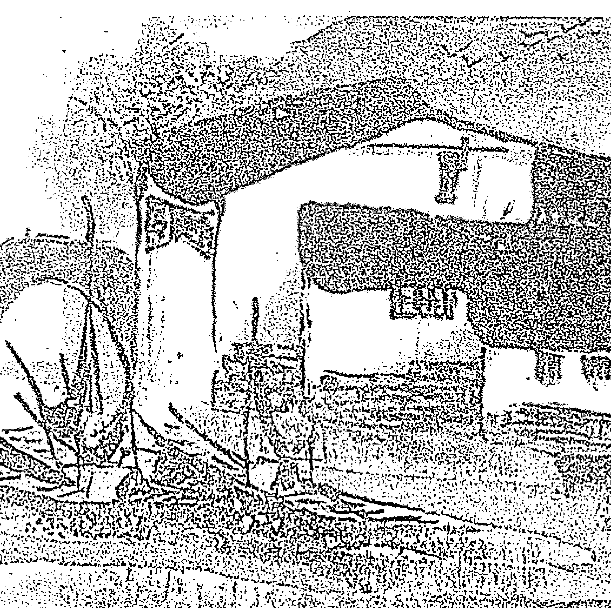

茶几的形状，以长方形或椭圆形最为理想，圆形的亦可，但绝对不宜选用带尖角的棱形的茶几。倘若沙发前面的空间不充裕，则可把茶几改放在沙发旁边，这两旁的茶几便有如青龙、白虎左右护持，令座上之人有左右手辅佐。这样，既充分利用空间，而且也符合风水之道。

> 沙发一般摆放在客厅中，用来日常生活休息、会客或聊天。因此，在住宅风水中，占有一个重要的地位。

## 85 忌沙发无靠精神不宁

沙发一般摆放在客厅中，用来日常生活休息、会客或聊天。因此，在住宅风水中，占有一个重要的地位。如何放置好沙发则有以下几个要求：

- 1. 套数的选择。沙发以形状区分，有单人沙发、双人沙发、长形沙发、曲尺形沙发和圆形沙发等；以材料区分，有皮制沙发、布制沙发、藤制沙发和传统的酸枝椅等；以颜色与造型方面区分，更是花样繁多。
客厅沙发的套数，最忌一套半或是方圆沙发并用。
- 2. 沙发的摆放。沙发宜摆放在住宅的吉方。传统上认为，摆放在吉利方位，一家老少皆可得其旺气；如果错摆在不吉方位，一家老少均受其害，不得安宁。
- 3. 沙发背后宜有靠。所谓有靠，即为靠山，指沙发后有实墙可靠，无后顾之忧，这样才符合风水之道。
如果沙发背后或窗或门或通道，即无实墙可靠，那意味着背后无靠山，空荡荡一片，呈散泄之局，难存旺气。
从现代心理方面来说，沙发背后无靠，使人缺少安全感，总有背后受袭之感，倒不如背靠实墙来得心安理得。变通之法是把矮柜或屏风摆放其后，以“人造靠山”来予以补救。
- 4. 沙发之顶忌横梁压顶，影响甚大，应尽量避免。变通之法在沙发两旁的茶几上，摆放两盆开运竹，以承担横梁压顶。
- 5. 沙发不宜与大门对冲，即沙发不能与大门成一直线，传统认为会导致家人流失，财散四方。化解之法是把沙发移开，以免与大门对冲。沙发与房门相向则无大碍，不必左闪右避化解。
- 6. 沙发的摆设，以两旁各有一臂伸出为宜，象征左右护持。如果无左右臂护持，退而求其次，可在去水位摆设另一沙发，以形成聚水之局，这也符合风水之道。
- 7. 沙发顶上不宜有灯直射，这样有违风水之道。沙发头顶有光直射，往往会导致主人情绪紧张，头昏目眩，坐卧不宁。化解之法是将灯改射墙壁，便可略为缓解。
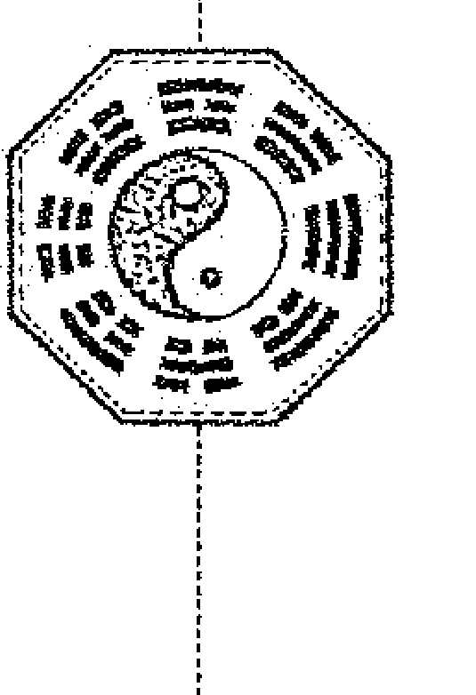
- 8. 沙发背后不宜有镜。在风水学来说，镜子有反射作用，因此不可随便乱挂。若是沙发背后挂一大镜，旁人则从镜中看到坐者的后脑，传统上认为这会导致失魂落魄，心神不宁。

> 从风水学的角度来看，沙发前的地毯，其重要性相当于住宅前用以纳气的明堂，也相当于屋前的一块青草地，因此，不可或缺。

## 86 忌地毯单调客厅失色

现代不少人喜欢在沙发前面摆放一块华丽的地毯，以增加美感，同时也可突出沙发在客厅中的主导地位。

从风水学的角度来看，沙发前的地毯，其重要性相当于住宅前用以纳气的明堂，也相当于屋前的一块青草地，因此，不可或缺。

由于不同的人具有不同的审美意识。有的人喜欢色彩缤纷的地毯，有的人却喜欢风格素雅的地毯。但从风水学的角度来看，宜选用色彩缤纷的地毯，而忌色彩单调的地毯。因为色彩过于单调的地毯，不仅会使客厅黯然失色，而且也难以发挥生旺的效应。因此，客厅的地毯，以红色或金黄色为主色较为吉利。地毯上的图案千变万化，题材包罗万象，有的是以动物为主，有的是以人物为主，有的则以风景为主，有的纯粹由图案构成。由于地毯种类繁多，风格各异，构图精巧，色彩缤纷，那么，应该如何选用住宅客厅中的地毯呢？

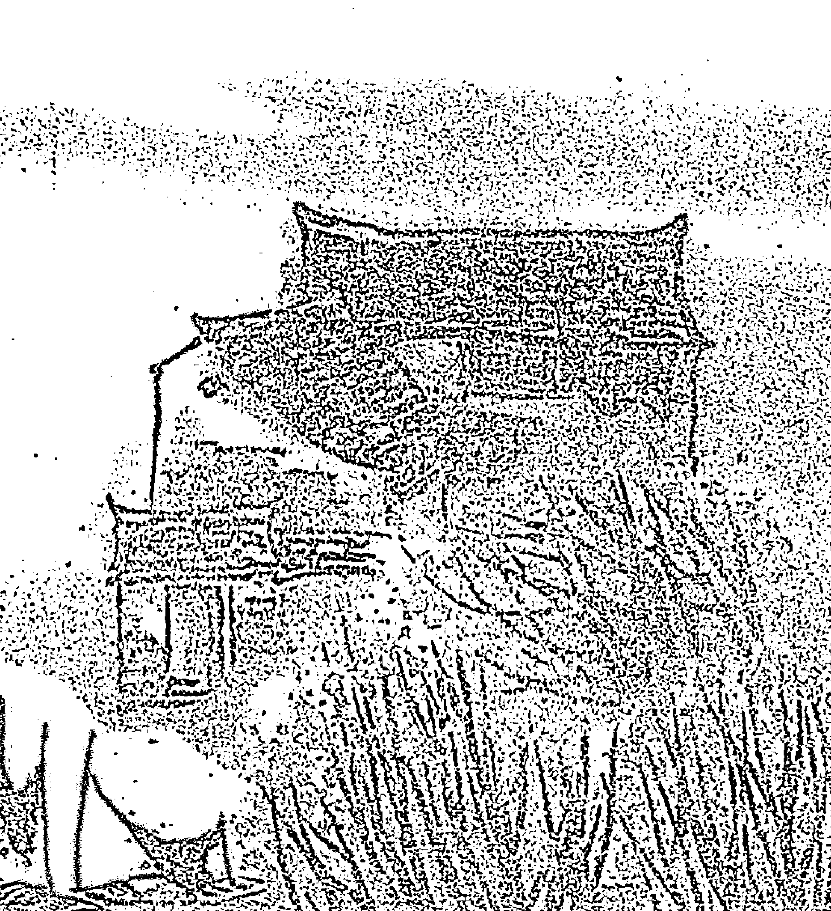

其实，万变不离其宗，只要记住选取那些寓意吉祥图案的地毯即可。那些构图和谐、色彩鲜艳明快的地毯，令人喜气洋洋，赏心悦目，这类地毯当然是你的最佳选择。

> 住宅风水十分重视气流。因此，鞋柜应尽可能减少异味，否则异味如果向四周不断扩散，则根本谈不上有好风水可言。

## 87 忌鞋柜无门有碍观瞻

鞋柜是主客更换鞋子之处，它为主客提供一定的方便。由于“鞋”与“谐”同音，且鞋必定是成双成对，因此，有着和谐、好合的象征意义。

家庭最需要的是和谐、好合的氛围，因此入门见鞋就显得吉利。那么，在玄关放置好鞋柜要顺理成章，而且需要注意以下几个方面：

- 1. 鞋柜应大小适中，不宜过高过大。一般来说，鞋柜的高度不宜超过户主的身高，如果超过则显得不妥。总之，鞋柜的面积宜小不宜大，宜矮不宜高。
- 2. 鞋柜最好有门。因为鞋子宜藏不宜露，如果鞋子堆放的乱七八糟而又无门遮掩，难免有碍观瞻。而布置巧妙的鞋柜则显得典雅自然，再加有门遮掩，乍一看甚至看不出它是个鞋柜，这才符合归藏于密之道。
- 3. 住宅风水十分重视气流。因此，鞋柜应尽可能减少异味，否则异味如果向四周不断扩散，则根本谈不上有好风水可言。
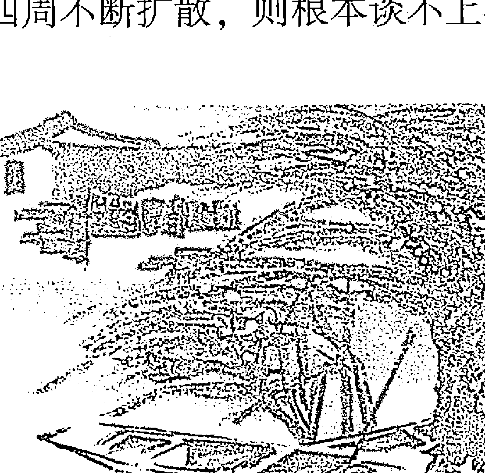
- 4. 鞋柜虽然有实用价值，但毕竟难登大雅之堂，因此鞋柜的位置不宜摆放在正中，而应该把它向两旁移开一点，使它离开中心的焦点位置，即注意宜侧不宜中的原则。
- 5. 鞋柜内层的架子大多倾斜，因此摆放鞋子时，通将鞋头向上，意味着步步高升；如果将鞋头向下，则意味着走下坡路。这就是鞋头宜向上而不宜向下之说。

门槛对住宅风水具有十分重要的意义，它对阻挡外部不利的因素，防止财气外泄均有一定的作用。

## 88 忌门槛断裂宅气运滞

在中国传统住宅大门的入口处都设有门槛，门槛是指门下的横木。人们进出大门的时候，都要跨过门槛，因此，门槛就起到了缓冲步伐、阻挡外力的作用。

以前大门的门槛的高度大约与人的膝盖齐，如今的门槛高度就矮了许多，有的大约只有一寸左右。材料也从用木材制作，改为用窄长形石条，一般固定在铁闸与大门之间。

门槛既将住宅与外界分隔开来，又可挡风防尘，或将各种各样小爬虫拒之门外，因此，从古到今，其实用价值均不可忽视。

门槛对住宅风水具有十分重要的意义，它对阻挡外部不利的因素，防止财气外泄均有一定的作用。

那么，安放好门槛则要注意以下2点：

- 1. 谨防门槛断裂。如果门槛断裂，就如同房屋中的大梁断裂一样，主凶。门槛如果完好无损则宅气畅顺，否则则运滞。万一遇到门槛断裂，宅主必须及早予以更换。
- 2. 门槛的颜色要与大门的颜色配合。

现代房子一般都有前阳台，你不妨在前阳台上摆上一排盆景或是盆景花台，既可接气，又能使满室生春，是一种很好的风水设计。

## 89 忌阳台堆物丧失功能

住宅的前阳台，也是大门的入口，同样成为纳气的重要通道，如果大门开在侧边的墙，前阳台就成为客厅落地门窗之外的空间，也成为重要的气口。因此，前阳台的风水就和大门一样重要。

既然是气口，就不宜堆积杂物，而要保持清爽洁净。

前阳台是不少人用来绿化的场所，因植物具有净化环境，吸收毒气，吸收噪音，调节温度，营造气氛等多种功能，也可以使人感到生机盎然。所以，运用阳台种植植物，美化室内，一举数得，何乐不为。

现代房子一般都有前阳台，你不妨在前阳台上摆上一排盆景或是盆景花台，既可以接气，又能使满室生春，是一种很好的风水设计。

如果想前阳台上四季花卉飘香，最好是按四季莳花轮流换栽。以下浅举较为常见的四季花卉，分别为春花、夏花、秋花和冬花，它们分别为：

- 1. 春花: 如春兰、郁金香、春杜鹃、梅花、紫罗兰、樱花等。
- 2. 夏花: 如蔷薇、玫瑰、牡丹、翠菊、牵牛花、芍药、含笑、石竹等。
- 3. 秋花: 如菊花、君子兰、夜来香、芙蓉等。
- 4. 冬花: 如水仙、山茶、腊梅、兔子花等。

盆景是我国特有艺术之一，它既可以赏心悦目，用来观赏之用，又可以用来陶冶性情。你不妨在前阳台做一些花木盆景架，栽种一些常绿植物，如五针松、文竹、凤凰竹、枸杞等。

现在有人甚至将阳台当做水耕蔬菜栽培区，一来自种蔬菜干净可食，二来从中体验田园之乐，体会大自然奇妙之趣，可谓一举两得的事。

室内的动线设计要流畅。走道不可过多，最好以客厅为中心，能四通八达前往各单独房间，而不要绕来绕去，或穿过一房再进入一房，穿梭而行。动线不流畅的格局属不吉。

## 90 忌走道过多格局不吉

坐北朝南双并式的楼房，楼梯间设在中央，分左右两侧两户，形成位于东侧的室内格局和西侧的正好相反。东侧符合龙虎边，而西侧则完全相反，但也是一样可以居住。因此，倒不必太在意龙虎边的因素。

值得注意的是，室内的动线设计要流畅。走道不可过多，最好是以客厅为中心，能四通八达前往各单独房间，而不要绕来绕去，或穿过一房再进入一房，穿梭而行。动线不流畅的格局属不吉。

另外，屋中不可有回字形走廊，不利宅运。一般住宅应避免这种设计，这也可作为是否购买楼房和居住的理由之一。

室外不可路冲，室内同样也不宜路冲。也就是说大门不可直对着后门。气流相对，气场会漏且会相冲，使人的情绪浮躁，易发生口角。在风水上有漏财之说。因此，室内走廊不可贯穿全宅，而将房屋分成两半，属大凶之局。

以上两种房屋格局的化解之法，是在适当的地方放置大型落地屏风，让气流能回旋转折。

# 家居风水100忌
# 第10章 设施篇

阳宅应须择地形，背山面水，称人心，山有来龙昂秀发，水须围抱作环形，明堂宽大斯为福，水口收藏积万金。关煞二方无障碍，光明正大旺门庭。

——《阳宅集成》

任何一个家庭，如果有足够的房间，应该腾出一个房间作为书房。书房等于精神食粮的餐厅。

## 91 忌书房阴暗不利养眼

### 一、书房的采光与通风

人在书房里学习工作，主要是用眼睛，用脑子想，因此要保证有充足的光线和氧气，以保护眼睛和脑袋。有条件的人可在案头安个负氧离子发生器，以使头脑更清晰更健康。

### 二、书房的墙面色彩

书房要求宁静，墙面以用浅蓝色或浅绿色等冷色为宜。绿色还可以养眼，对肝脏也有好处。因肝开窍于目，肝属木，绿色为其本色，若书房比较阴暗，墙面可涂白色，因为白色明度最高，又属冷色。

### 三、书桌高度

书桌的高度要适中，过高过低都会使长期伏案的人不舒服，尤其是青少年，容易使背脊畸形发展。不论是简易书桌，还是“一头沉”（一头有抽屉或小柜）或“两头沉”（两头都有抽屉或小柜），桌下应留有空位，净高不少于58厘米。

椅子高矮要匹配，使人立坐时，眼睛距离桌面30~40厘米（如太近容易使人近视，如太远容易使人驼背或远视）。椅子要柔软舒适，最好是转椅，以便侧身取书或与人交谈。

### 四、书桌位向

书桌以放在窗前为宜，因为光线较足，空气也较清新。较合理的摆法是一侧靠窗，使光线从左侧射来，符合书写要求。如果是地方所限而要正面向窗，则要预防眩光干扰。

当太阳光太强甚至直射时，要放下窗帘，以保护眼睛。如果人工照明比较理想，也可以根据自己的感觉选择书桌的最佳位向。

客厅风水主要包括客厅的位置、客厅的雅与俗、客厅的色彩基调，客厅的污染及其防治等四个方面。

## 92 忌客厅污染主客受损

客厅风水主要包括客厅的位置、客厅的雅与俗、客厅的色彩基调，客厅的污染及其防治等四个方面。

### 一、客厅的位置

客厅要设在房间的前面，即一进门就是客厅。这样才能保证卧室和书房的私密性和宁静性。如果客人要穿过卧室才来到客厅，就会破坏了卧室的私密性、宁静性和雅洁性。

### 二、客厅的雅与俗

客厅是家庭的门面，布置得是雅还是俗，就表征着主人是雅还是俗。在装饰方面，以少而精和画龙点睛为雅；以多而杂和琳琅满目为俗。在家具方面，以整齐清洁为雅，以凌乱肮脏为俗。

在色彩方面，以明快浅淡的色彩为雅，以五颜六色斑驳离奇的色彩为俗。在挂画方面，以山水写生画为雅，以尽是女人画像为俗……

### 三、客厅的色彩基调

客厅要宽敞（小客厅也要使人感到开朗明快）、舒适、高雅、热烈，使客人有“宾至如归”的感觉。为此，客厅的色彩基调一般可用暖色，如米黄、橙黄、浅玫瑰红等色，以使人感到温暖舒适。讲究一点的可按客厅方位所暗示的金白、木绿、水蓝、火红、土黄来作为其色彩基调。

设在居室北边的客厅，墙面可涂淡绿色或水蓝色，窗帘布不宜太鲜艳。

设在居室东北边的客厅，墙面可涂淡黄色，沙发可用咖啡色调，窗帘布可以黄色为底咖啡色或其它深色花纹。

设在西北边或西边的客厅，墙面可涂白色，或在白色背景中绘有一些浅色花纹，窗帘可用金黄色，并衬以白色透明的薄纱。

设在居室南边的客厅，墙面仍可用浅绿色，但可悬挂大红的百福图或百寿图。

设在居室西南边的客厅，墙面可用浅黄色。与东北边的客厅类似。

设在居室东南边的客厅，墙面可用草绿色，窗帘布可选用绘有花木或翠竹的图案。

设在居室东边的客厅，墙面可用淡紫色或淡蓝色。

客厅的色彩基调也可以根据主人的爱好来选用。这无形中反映出主人的个性。若是暖色调，反映出主人的个性开朗、热情、坦诚、外向；若是冷色调，反映出主人的个性沉静、安详、稳重、内向。这说明色彩能表现和塑造一个人的个性。我们可以有意识地利用色彩来矫正自己或家人在性格上的某些缺陷。

### 四、现代客厅污染及其防治

现代客厅有彩电、录象机、音响、冰箱、沙发、甚至还有缸养金鱼和笼鸟等，再加上古玩书画点缀，显得高雅、豪华和安逸。然而，就在这种高级享受之中，不少人由于缺乏科学知识而受到了“现代客厅污染”。

- 1. 看电视时的电离辐射污染。预防的办法有几条：一是要开窗通风以降低室内空气中的辐射离子浓度；二是坐位要距离电视机二、三米以上；三是要平视或电视机略低于人的平视线。做到了以上三条才可以预防“电视病”。
- 2. 听音响时的噪音污染。主要是音量太大所致。应该控制音量尽量小声些。
- 3. 开冰箱时的臭气污染。要经常清洁冰箱除臭，并更换冰箱吸味器。
- 4. 吸烟污染。烟雾中含有 300 多种有毒化合物，其中有多种致癌物质。客人来访，可以茶代烟。
- 5. 笼鸟污染。笼鸟的毛尘和排泄物，被人吸入肺部后，免疫机能受损，容易得老年肺癌。因此在客厅养笼鸟，一定要注意通风。最好是白天为了观赏而放在客厅，晚上转移到阳台去，以减少室内空气污染机会。

厨房灶位，乃养命之源，万物皆饮食而得。
——《阳宅三要》

## 93 忌厨房污染殃及全宅

厨房风水主要包括厨房的方位、炉灶的位向、厨房的污染及其防治三个方面。

### 一、厨房的方位

厨房是烹调饮食用的，既用火又用水。水火的关系处理得好则为吉，处理得不好则为凶。厨房是以火为其表征的。厨房方位的吉凶也是用这个标准来衡量，看方位象征五行与火的生克关系而定的。

东方位：吉。从八卦五行来看，东方震为木，木生火：吉。从小气候来看，东方是日出的方位，阳光和煦，空气新鲜，做厨房合乎卫生。

东南方位：吉。从八卦五行来看，东南巽为木，木生火：吉。从小气候来看，东南是日出的方位，特别是在冬天，阳光温暖，空气新鲜，符合厨房卫生要求。

南方位：凶。从八卦五行来看，南方离为火，火上加火，火过旺。对水产生反克，难以到达“既济”境界，凶。从小气候来看，火过旺，温度过高，容易发生火灾。此外，南风会把厨房的热气、湿气、异味、烟尘吹到其它房间去而污染全宅。

西南方位：凶。从八卦五行来看，西南坤为土，火生土为耗损，为凶。从小气候来看，午后有热气侵逼，斜阳紫外线杀菌力又弱，古风水书称里鬼门，对食品保存有不利影响，故不吉。

古代风水理论认为，厨房（火气）设在正中线（子、午、卯、酉）或四隅线（乾、巽、艮、坤）上，容易发生火灾，务必十分留意。

### 二、炉灶的位向

- 1. 炉灶或煤气灶不要挨着水槽，更不得安放在排水沟上。否则，水火相冲，湿气和臭气逸进锅里，吃到肚里，不吉。
- 2. 在自然光或人工光照射下，人影不能进入锅内，否则象征人被煎熬，容易得病，为之凶相。
- 3. 灶口或煤气灶的进气口最好对着东南方或南方或自己的吉方。

### 三、厨房的污染及防治

厨房是宅内自我空气污染的发源地。从这里不断排放出二氧化硫、二氧化碳、烟尘、致癌的物质（苯并芘）等，因此自然通风一定要良好，并装有抽油烟机。此外，还要尽量少油炸煎炒，而多蒸煮。有条件的可不再烧煤炉，而使用石油气炉或煤气炉，甚至使用微波炉。

用微波炉烹调食物，既节省时间，又能保持食物营养。但要预防食物中毒，其方法是，烹调时间到了以后，不要急于拿出来，而要继续放一段时间，以便微波有足够的时间杀菌。例如，大块的鸡肉在经过 38 分钟的烹调时间后，还要再过 20 分钟才能使里层的鸡肉达到 72~85°C 的温度，从而使鸡肉中含有的沙门氏菌杀死。

灶，安本命凶方则吉，压本命吉方则凶，屡试屡验。
——《八宅明镜》

## 94 忌开门见灶不甚吉利

很多人均不重视厨房，认为那只不过是煮饭煲水的地方，所以认为是无关痛痒。

其实，这是大错特错，因为炉灶对宅运的影响很大。根据《阳宅三要》这本风水古籍的说法，要判断一间房屋的风水吉凶，最主要看它的大门、主人房以及厨房的炉灶而定。

炉灶为何是如此重要呢？

原来因为它是一家煮食之处，全家老少的食物均是从那里烹煮出来。所以倘若那里风水不佳，那便会令家人的健康受损，家宅不宁。

炉灶既然与家人的健康有如此密切的关系，因此便要谈谈它的各项风水避忌，藉以确保安康。

风水学的原则是“喜回旋而忌直冲”。因为直冲便会有所损克。倘若炉灶正对大门，形成一条直线，那便是大门直冲炉灶。根据古书所示：“开门见灶，财畜多耗”。这便不单健康有损，而且还会破财。

即使炉灶不是正对大门，但若是对正厨房的门，形成一条直线，那亦算是开门见灶。虽然情况没有大门直冲那么严重，但亦会不甚吉利，最好尽量避免有这种情况出现。

化解的方法，最理想是把炉灶移开，不受大门或厨房门直冲为宜。若是不能移开，那应悬挂珠帘在厨房门口作为化解之用。

在风水学来说，炉灶应是‘坐凶向吉’为宜，这即是说，灶口是要向着吉利方位来吸纳旺气才对，因为这样才符合‘向吉’之道。

## 95 忌厨厕同门吸纳秽气

在风水学来说，炉灶应是‘坐凶向吉’为宜，这即是说，灶口是要向着吉利方位来吸纳旺气才对，因为这样才符合‘向吉’之道。

如果灶口正向厕所的坐厕，那么它所吸纳的均是秽气，这到底会有什么后果呢？相信各位均可想象得到。

有些家庭为了节省空间，于是设计令厨房与厕所共用一门出入，这样便要先经厨房，然后才进入厕所，这当然很不理想。

如果厕所与厨房的位置互相掉转，首先经过厕所，然后才能进入厨房，那便更为不利。因此请谨记，尽可能不要厨厕同门。

炉灶时常烧火煮食，故此“火”气甚重，而洗碗盆及洗衣机皆是储水的器具。可说是“水”气旺盛。故此炉灶不宜夹在洗碗盆及洗衣机之间，否则便有水火相冲的现象发生，对炉灶风水有影响。

因为雪柜也是“水”气旺盛的器具，因此也不宜太接近炉灶。

饭桌，是一家大小共同吃饭之处，所以它的吉凶衰旺对住宅风水影响很大，但却往往被人忽略，因而导致家人健康受损。

## 96 忌饭桌对角饮食有损

饭桌，是一家大小共同吃饭之处，所以它的吉凶衰旺对住宅风水影响很大，但却往往被人忽略，因而导致家人健康受损。

为了使各位对这方面有具体的认识，现在便按饭桌的形状，方位和摆放宜忌分别谈谈。

### 一、饭桌形状

传统的中国饭桌，大多以圆形为主，象征一家团圆。此外，亦有方形或长方形的。

但现代的饭桌设计形式真是多彩多姿，有椭圆形、心形、三角形以及菱形等等。

从风水学方面来说，三角形及有锐角的餐桌不宜选用，因为尖角有杀伤力，对饮食健康有损。

### 二、饭桌方位

饭桌不宜摆放在凶位，所谓“凶位”，是指与户主五行不配合的方位。举例来说，倘若户主是属于“东四命”，那便要避免在西、西南、西北以及东北这四个方位摆放饭桌。

倘若户主是属于“西四命”，那便要避免在东南、东、南及北方摆放饭桌。

### 三、避忌

- 1. 饭桌不宜受大门直冲——倘若饭桌与大门成一直线，站在门外便可以看见一家大小在吃饭，那并非所宜。
化解之法是把饭桌移开。但倘若真的没有其它位置选择，那便应该放一屏风或板墙作为间隔，这便可免饭桌受门路直冲。
- 2. 饭桌不宜对正神位——这是指供奉观音、黄大仙这类的神台而言，因为他们均是茹素吃斋的，而一般人家吃饭有鱼有肉，正面相对便显得格格不入。
但如果神台上供奉的是关帝、财神、济公、祖先这类神只，因为他们不禁荤，因此没有问题。
不过，若有可能，还是把饭桌尽量与神台保持一段距离，彼此不形成一条直线为宜。
- 3. 饭桌不宜有横梁压顶——饭桌之上有横梁压顶，恰似一把利刀架在头顶上，那便会导致家宅不宁，丁口受损的。
化解之道，必须把饭桌移离横梁之下，这是最彻底的解决办法。倘若真的无法可想，那便只有在横梁底下悬挂葫芦，让那葫芦来代为承受横梁压顶之害，这可聊作化解之用。

厕所又名“隐所”，浴厕则为阴湿之极。常常散发阴湿之气。因此，采光、通风、换气、除湿、是浴厕卫生的基本要求。

## 97 忌浴厕阴湿散发阴气

现在公寓式的住宅，常是浴室和冲水式的厕所合二为一，可称之为浴厕。浴厕则为阴湿之极，常常散发阴湿之气。因此，采光、通风、换气、除湿、是浴厕卫生的基本要求。

浴厕风水主要包括浴厕方位、坐厕位向、浴洗设备等三个方面。

### 一、浴厕方位

- 1. 浴厕不宜设在住宅的中心（“太极”），否则污染太极和整个住宅。
- 2. 浴厕不宜设在见到宅门的地方，否则阴阳相冲，也不雅观。
- 3. 浴厕不宜设在走廊的尽头，否则湿气和臭气会直冲走廊，再进而吹入其他房间。
- 4. 浴厕不宜设在正中线（子、午、卯、酉）和四隅线（乾、巽、坤、艮）以及鬼门线（西南和东北方位）上。其它方位则可以设浴厕。
- 5. 浴厕要设在不必经过其它房间就可到达的地方。
- 6. 浴厕要设在排水方便的地方。
- 7. 如果是楼房、每层都应有浴厕。

### 二、坐厕位向

坐厕位向，即人蹲下去大（小）便的朝向。以与浴厕的门窗垂直为宜。否则，不够雅观也不够私密。

### 三、浴洗设备

无论是洗热水还是洗冷水，以淋浴为好。一来洗得干净，二来淋浴可以产生一些空气负离子而有利于人体健康。

习惯洗热水的可安个热水器在通风的地方，石油气（或煤气）热水器最好安在浴厕外，比较安全。

习惯洗冷水的要坚持下去，这种“血管体操”有利于增强体质，预防感冒。

想长命百岁的人也可以学习马寅初教授的热水—冷水洗澡法（先洗热水后洗冷水）。通过这种剧烈的心脏血管体操，增强体质，延年益寿。马老通过这一法宝，跨进了百岁老人的行列。有兴趣者不妨一试。

## 98 忌婴儿受冲影响发育

婴儿出世之后，就与风水结下了不解之缘。特别是婴儿房间的位置和布局，都将对婴儿的健康成长产生很大的影响。因此，其卧室除普通相关忌讳外，还应该注意以下一些讲究：

- 1. 位置的选择。婴儿不宜住在刚刚装修的房子，因为婴儿出生后身体机能均很稚嫩，又几乎都在睡眠状态，所以新的住宅对其健康成长十分不利。
- 2. 避免空气污染和噪音。婴儿房间应尽量避免外人来往，尤其不能在屋里吸烟，以减少空气污染；房间不宜与厨房相对，以免受冲，以及噪音和油烟的侵袭。
- 3. 婴儿居室应避免接触噪音。因为婴儿的耳膜十分脆弱，持续的噪音会破坏婴儿的听力，甚至严重影响婴儿的智力发育。
- 4. 婴儿居室应保持良好的光线和通风。让光的能量能够充分进入室内，因为阳光中的紫外线可以促进维生素 D 的形成，使婴儿避免患小儿佝偻病，同时也必须注意不让阳光直接照射婴儿的面部，不要在室内直接隔着玻璃晒太阳，因为玻璃会阻挡紫外线，起不到钙质吸收的作用。
- 5. 婴儿与母亲的衣物以及被褥，要经常在阳光下翻晒，这样可以杀菌，以防止婴儿发生皮肤和呼吸道疾病。
- 6. 床位的安置。婴儿床位应是独立的，安放在房间的中央，以利于父母日夜细心的呵护和婴儿的健康成长。通常认为头北脚南的位置特别适合初生的婴儿。
- 7. 婴儿居室的颜色以浅淡、柔和为宜，特别是淡蓝色，对婴儿的中枢神经系统有较好的镇定作用。
- 8. 婴儿居室应保持恒定的温度和湿度。夏季室温以 24℃ ~ 28℃ 为宜；冬季以 18℃ ~ 22℃ 为宜，湿度在 40% ~ 50% 左右。同时应保持室内空气新鲜和经常通风。通风时不可直接吹向婴儿。窗外风大时应暂不开窗。打扫卫生不要干扫，以免尘土飞扬，空气污染。

## 99 忌粗心大意不利儿童

每一位父母都希望自己的孩子拥有一个舒适的空间，有利于孩子的健康成长。因此，儿童房间的功能就是满足孩子在自己的小天地里学习、玩乐、睡眠的要求。

儿童房间在风水布局上必须充分考虑到这些独特的功能，通过色彩、采光、家具、窗户窗帘和饰物饰品，使孩子学习上进、生活舒适，睡眠安宁，天真活泼，自由安全。要做到这些，需要注意以下的问题：

- 1. 位置的选择：孩子房间首选设在住宅的东向或东南部，以便早晨能最早接触阳光的能量，以利孩子的健康成长，并预示他们天天向上，稳步发展。
- 2. 内部的布局：孩子房间在内部布局方面除了要避免成人卧室所忌讳的问题，如床不可摆放横梁之下，床头不可靠窗，远离厨厕等，同时其装潢不可太复杂，家具也不宜太大，要保证孩子所需要的空间。
- 3. 地面的铺设，儿童房间地面铺设要既安全又清洁，避免用石材或地毯铺地，以铺天然的木地板为宜。
- 4. 色彩的搭配：首先应选择淡雅的色泽；避免大红大紫、黑色或纯白色，以免刺激孩子。以淡蓝色为底，点缀一些单绿、明黄、粉红色为佳。
- 5. 床位的方向。儿童床头朝向以东或东南位较好。选择西部或北部也有利孩子夜间入眠。
- 6. 照明的使用。以柔和壁灯代替柜灯或地灯，营造温馨氛围。

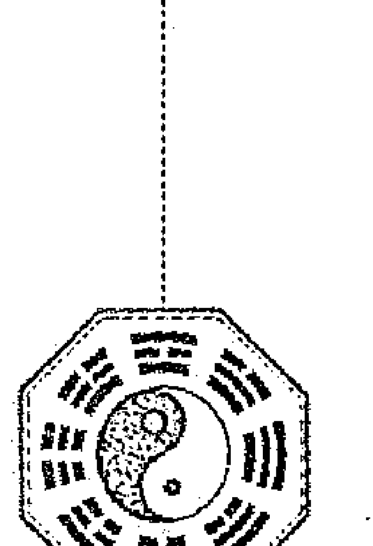

## 100 忌洞房阴暗夫妻失和

## 设施篇

结婚是人生中一件大喜事，以中国民间传统来说，洞房的布置十分讲究，要能充分体现出新婚喜庆的气氛。现代人的生活虽然与以往相比有了很大的改变，但在婚庆志喜上，仍然不离传统。

那么，洞房的布置要注意哪些事项呢？

- 1. 洞房的位置最好选择在阳光充足、空气畅通的地方。洞房色彩不宜用粉红色，以免使人心绪不宁，神经衰弱，发生口角；色彩如果阴暗，容易使夫妻心情不佳。
- 2. 由于新婚夫妇尽享鱼水之欢，因此，要讲究其婚床的位置。《洞玄子》上说，交接所向，时日吉利，益损顺时，效此大吉：春首向东，夏首向南、秋首向西，冬首向北。另外，床位右方不宜放置音响，以免多口舌之争；床前不可正冲电视机，以免神经衰弱；床头上方不要悬挂新婚大照片，避免压迫感过重；床位脚部侧面，不可对厕所之门等，都有一定道理。
- 3. 洞房家具以中性色或浅色为宜，避免选择深色调，这样可增加室内亮度，给人以明快、欢乐、温馨之感。
- 4. 床上用品及其他装饰物宜选用暖色调的，艳丽的。如放置大红玫瑰、大红“喜”字，表示喜庆，象征幸福美满。在新房挂起五颜六色的花环或五彩缤纷的彩灯，更能烘托出洞房热烈的气氛和新婚的美景，给人以喜庆之感。

总之，洞房的整体布置，要色调一致，风格协调，在和谐之中体现美，即使洞房生动活泼起来，又能产生浓郁的新婚喜庆的气氛。